# 大数据和深度学习的近期进展


## 国际神经网络学会会议记录

系列编辑：Plamen Angelov · Robert Kozma
编辑：Luca Oneto · Nicolò Navarin · Alessandro Sperduti · Davide Anguita

国际神经网络学会大数据和深度学习会议记录，INNSBDDL 2019，于2019年4月16日至18日在意大利塞斯特里莱万特（Sestri Levante）举行。

---

## 国际神经网络学会会议记录 第1卷

**系列编辑**
- Plamen Angelov，兰卡斯特大学计算与通信学院，英国兰卡斯特
- Robert Kozma，孟菲斯大学优化与网络部门，美国孟菲斯

“国际神经网络学会会议记录（INNS）”出版与神经网络和行为建模相关的基本原理和应用的研究成果。感兴趣的主题包括新发展、最新理论、方法和实际应用，涵盖神经网络和神经形态技术在人工智能系统中的所有方面。该系列涵盖高质量的图书，涉及神经网络研究的全部范围，从计算神经科学、认知科学、行为和脑建模、机器学习算法、数学理论到显著使用神经网络概念和技术的系统的技术应用。

该系列出版神经网络的专著、贡献性论文集、讲义、编辑论文集和会议记录，涵盖了理论、实验、计算和工程等方面。鼓励提交高度创新的前沿贡献，扩展我们对科学的理解，超越主流方法。对贡献者和读者来说，短时间内发表和全球分发的价值尤为重要，这使得研究成果能够广泛而迅速地传播。

有关该系列的更多信息，请访问：http://www.springer.com/series/16268

---

编辑：卢卡·奥内托、尼科尔ò·纳瓦林、亚历山德罗·斯佩尔杜蒂、达维德·安吉塔

## 大数据和深度学习的最新进展
INNS 大数据和深度学习会议记录，INNS BDDL 2019，于意大利塞斯特里莱万特举行，2019年4月16–18日。

---

### 编辑信息

- **卢卡·奥内托**：信息学、生物工程、机器人学和系统工程系，热那亚大学，意大利热那亚
- **尼科尔ò·纳瓦林**：数学系，帕多瓦大学，意大利帕多瓦
- **亚历山德罗·斯佩尔杜蒂**：数学系，帕多瓦大学，意大利帕多瓦
- **达维德·安吉塔**：信息学、生物工程、机器人学和系统工程系，热那亚大学，意大利热那亚

**出版信息**
- ISSN 2661-8141 | ISSN 2661-815X（电子版）
- ISBN 978-3-030-16840-7 | ISBN 978-3-030-16841-4（电子书）
- https://doi.org/10.1007/978-3-030-16841-4
- 国会图书馆控制号：2019935979

© Springer Nature Switzerland AG 2020
本作品受版权保护。出版商保留全部或部分材料的权利，包括翻译、再版、插图重用、朗读、广播、微缩胶片复制或以任何其他实体方式复制、传输或信息存储和检索、电子适应、计算机软件或类似或不同的已知或今后开发的方法。

本出版物中使用的一般描述性名称、注册名称、商标、服务标志等，并不意味着即使在没有明确声明的情况下，这些名称不受相关保护法律和法规的约束，因此可以自由使用。

出版商、作者和编辑可以安全地假设本书中的建议和信息在出版日期时被认为是真实和准确的。出版商、作者或编辑对本文中包含的材料或可能存在的任何错误或遗漏不提供明示或暗示的保证。出版商在已发表的地图和机构关系方面保持中立。

本 Springer 印记由注册公司 Springer Nature Switzerland AG 出版。
注册公司地址为：Gewerbestrasse 11, 6330 Cham, Switzerland.

---

### 前言

本书收录了 39 篇原创文章，这些文章已被 2019 年 INNS 大数据和深度学习（INNS BDDL）会议接受。这是一个对神经网络、大数据和相关主题的研究人员来说非常重要的活动，由国际神经网络学会（INNS）组织，并由热那亚大学主办。

2019 年，INNS BDDL 于 4 月 16 日至 4 月 18 日在意大利的 Sestri Levante 举行。Sestri Levante 是意大利利古里亚的一个城镇，位于地中海沿岸，距离热那亚约 56 公里（35 英里），坐落在一个海角上。虽然附近的 Portofino 和五渔村可能是意大利里维埃拉最知名的旅游目的地，但 Sestri Levante 有几个美丽的天然海湾供游客欣赏。

除了常规会议外，INNS BDDL 定期邀请各领域的知名科学家组织教程，并邀请国际知名演讲者。

本书的贡献表明 INNS BDDL 涵盖了大数据和深度学习的广泛主题，从理论方面到最新的应用。2019 年 4 月，来自 20 个国家的 80 多名研究人员参加了 INNS BDDL。今年共有 40 个口头报告和 6 个教程，还有 4 位特邀主题演讲者。

编辑们要感谢所有作者的有趣贡献，以及所有审稿人的出色工作。作者和审稿人被要求遵守非常紧密的时间表，这使得本书能够在会议结束时出版。我们还要感谢 Springer 给我出版本书的机会，以及他们高效无缝的出版管理流程。最后，我们要感谢赞助商、程序委员会和 INNS 对我们的宝贵和基础支持。

**编辑**

---

### 目录

| 论文题目 | 作者 | 页码 |
| :--- | :--- | :--- |
| 关于回归监督中示例数量和精度之间的权衡 | Giorgio Gnecco, Federico Nutarelli | 1 |
| 分布式 SmSVM 集成学习 | Jeff Hajewski, Suely Oliveira | 7 |
| 卷积神经网络中的大小/准确性权衡：一种进化方法 | Tomaso Cetto, Jonathan Byrne, Xiaofan Xu, David Moloney | 17 |
| 用于图像极性检测的快速迁移学习 | Edoardo Ragusa, Paolo Gastaldo, Rodolfo Zunino | 27 |
| 递归神经网络的丢弃 (Dropout) | Nathan Watt, Mathys C. du Plessis | 38 |
| 使用 3D 卷积神经网络进行精神障碍分类 | Stefano Campese, Ivano Lauriola, Cristina Scarpazza, Giuseppe Sartori, Fabio Aiolli | 48 |
| 扰动近端下降以逃离非凸鞍点和非光滑目标函数 | 黄志深, 斯蒂芬·贝克尔 | 58 |
| 用于信用卡欺诈检测的深度学习领域适应技术 | Bertrand Lebichot, Yann-Aël Le Borgne, Liyun He-Guelton, Frédéric Oblé, Gianluca Bontempi | 78 |
| 使用卷积神经网络的癌症病理报告选择性信息提取策略 | Hong-Jun Yoon, John X. Qiu, J. Blair Christian, Jacob Hinkle, Folami Alamudun, Georgia Tourassi | 89 |
| 自动编码器的信息论方法 | Vincenzo Crescimanna, Bruce Graham | 99 |
| 深度回归计数：定制数据集和架构间迁移学习 | Iam Palatnik de Sousa, Marley Maria Bernardes Rebuzzi Vellasco, Eduardo Costa da Silva | 109 |
| 利用大数据和分布式账本技术改进铁路维护行动 | Roberto Spigolon, Luca Oneto, Dimitar Anastasovski, Nadia Fabrizio, Marie Swiatek, Renzo Canepa, Davide Anguita | 120 |
| 深度学习在细胞自动机识别中的应用 | Anton Popov, Alexander Makarenko | 126 |
| 大规模铁路网络中的恢复时间预测：大数据和可解释性 | Luca Oneto, Irene Buselli, Paolo Sanetti, Renzo Canepa, Simone Petralli, Davide Anguita | 136 |
| 铁路网络中的列车超车预测：大数据视角 | Luca Oneto, Irene Buselli, Alessandro Lulli, Renzo Canepa, Simone Petralli, Davide Anguita | 142 |
| 混合模型预测空化噪声频谱 | Francesca Cipollini, Fabiana Miglianti, Luca Oneto, Giorgio Tani, Michele Viviani, Davide Anguita | 152 |
| 伪逆学习者：大数据的新趋势和应用 | Ping Guo, Dongbin Zhao, Min Han, Shoubo Feng | 158 |
| 企业的创新能力：基于大数据的专利方法 | Linda Ponta, Gloria Puliga, Luca Oneto, Raffaella Manzini | 169 |
| 预测未来市场趋势：哪个是最佳窗口？ | Simone Merello, Andrea Picasso Ratto, Luca Oneto, Erik Cambria | 180 |
| 使用 DNN 进行阿拉伯参数语音合成的 $F_0$ 建模 | Imene Zangar, Zied Mnasri, Vincent Colotte, Denis Jouvet | 186 |
| 使用梯度监控对神经网络进行正则化 | Gavneet Singh Chadha, Elnaz Meydani, Andreas Schwung | 196 |
| 支持大型铁路网络冲突解决的视觉分析 | Udo Schlegel, Wolfgang Jentner, Juri Buchmueller, Eren Cakmak, Giuliano Castiglia, Renzo Canepa, Simone Petralli, Luca Oneto, Daniel A. Keim, Davide Anguita | 206 |
| 基于图神经网络建模城市交通数据 | Viviana Pinto, Alan Perotti, Tania Cerquitelli | 216 |
| 使用 R-CNN 进行交通标志检测 | Philipp Rehlaender, Maik Schroeer, Gavneet Chadha, Andreas Schwung | 226 |
| 深度树转导：简要调查 | Davide Bacciu, Antonio Bruno | 236 |
| 使用深度神经网络近似解决表面波传播问题 | Wilhelm E. Sorteberg, Stef Garasto, Chris C. Cantwell, Anil A. Bharath | 246 |
| 一种半监督的基于规则的遥感场景分类方法 | Xiaowei Gu, Plamen P. Angelov | 257 |
| 使用人工神经网络与其他商业领域方法比较风险价值估计 | Siu Cheung, Ziqi Chen, Yanli Li | 267 |
| 使用卷积神经网络区分不同的手语字母数字符号 | Stephen Green, Ivan Tyukin, Alexander Gorban | 276 |
| 使用人工智能进行 mise en abyme：如何预测应用于超参数调整的神经网络准确性 | Giorgia Franchini, Mathilde Galinier, Micaela Verucchi | 286 |
| 异步随机变分推断 | Saad Mohamad, Abdelhamid Bouchachia, Moamar Sayed-Mouchaweh | 296 |
| 大数据集二进制分类的概率界限 | Věra Kůrková, Marcello Sanguineti | 309 |
| 多核激活函数：公式和案例研究 | Simone Scardapane, Elena Nieddu, Donatella Firmani, Paolo Merialdo | 320 |
| 理解古代硬币图像 | Jessica Cooper, Ognjen Arandjelović | 330 |

跳跃连接在**ResNet**和**Batch-Normalization**中的影响  
关于 **Fisher**信息矩阵的研究 . . . . 341  
Yasutaka Furusho和Kazushi Ikeda

在**ResNet**中跳过两层比跳过一层或不跳过层的泛化性更好  
跳过两层的间隙小于跳过一层或不跳过层的间隙 349  
Yasutaka Furusho、Tongliang Liu和Kazushi Ikeda

建模关系数据的偏好学习框架 . . . . 359  
Ivano Lauriola、Mirko Polato、Guglielmo Faggioli和Fabio Aiolli

用于**Twitter**文本毒性分析的卷积神经网络 370  
Spiros V. Georgakopoulos, Sotiris K. Tasoulis, Aristidis G. Vrahatis,  
和 Vassilis P. Plagianakos

用于循环神经网络的快速谱半径初始化 . . . 380  
Claudio Gallicchio, Alessio Micheli, 和 Luca Pedrelli

作者索引 . 391

## 关于回归中示例数量和监督精度之间的权衡的研究

Giorgio Gnecco(✉) 和 Federico Nutarelli

IMT高级研究学院, Piazza S. Francesco 19, 55100 Lucca, 意大利
{giorgio.gnecco,federico.nutarelli}@imtlucca.it

**摘要.** 我们研究了回归问题，其中可以通过改变分配给每个示例的计算时间来控制给定输入的条件方差。对于给定的总计算时间上限，我们通过制定和解决适当的优化问题，基于普通最小二乘法输出的大样本近似，优化示例数量和精度之间的权衡。考虑到特定的精度函数形式，我们证明了有些情况下，“多但差”的示例提供的泛化误差比“少但好”的示例小，但也证明了相反的情况可能发生，这取决于精度相对于分配给每个示例的计算时间的“规模回报”。因此，这项研究的结果表明，如果有可能收集更可靠的示例，增加数据集的大小并不总是有益的。

**关键词:** 普通最小二乘法 · 大样本近似 · 方差控制

### 1 引言

在几个工程应用中，人们需要从一组有噪声的示例中近似一个函数，研究人员可以通过改变每个示例的监督计算时间来在一定程度上控制噪声水平。例如，输出可以是由输入参数化的特征值问题的解（例如，在波传播模型中分析色散曲线/色散面的情况[1,2]）。这相当于求多项式的根，这是一个众所周知的病态问题[6]。在这种情况下，为了降低计算噪声的水平（例如，由于计算中的重复舍入误差），可以采用扩展精度计算。然而，这可能会显著增加每个函数评估所需的计算时间，可能还会减少可用的训练示例数量。因此，需要研究在受监督示例数量和精度之间的最佳权衡是必要的。

当输出是一个由输入参数化的优化问题的最优解，并且这样的解通过迭代优化算法的若干步骤（可能包括通过Monte-Carlo技术获得的一个或多个随机初始化）来近似时，就会出现类似的问题[2]。舍入误差和随机初始化都促使将计算噪声建模为一个随机变量[3]，其方差可能是可控的。

在这个框架中，我们考虑了经典线性回归模型的修改版，其中除了给出每个训练样本的监督所需的计算时间外，还可以控制给定输入的条件方差。

在这里，给出了可用总计算时间的上限。因此，增加每个示例的计算时间通常会减少这类示例的数量。利用这个模型，我们制定并解决了一个优化问题，将泛化误差最小化作为计算时间每个示例的函数。分析中考虑了两种主要情况：对于“规模递减”，监督的精度（在此定义为输出的条件方差的倒数）增加的比例小于每个示例的计算时间的比例；对于“规模递增”，则增加的比例大于比例。总结一下，分析结果从理论角度强调，增加数据量并不总是有益的，如果可以收集更少但更可靠的数据。不仅数量，质量也很重要。在这当前大数据时代尤为重要，在设计数据收集过程时不应忽视。本文的另一个特点是将机器学习和计量经济学方法结合起来，这符合这两个领域最近联合研究的趋势[5]。

本文结构如下。第2节介绍了研究对象的模型。第3节介绍了用于表示示例数量和精度之间权衡的优化问题及其最优解。最后，第4节讨论了可能的扩展。

### 2 模型

我们考虑以下线性模型来描述输入输出关系：

$$y = f_{\underline{\beta}}(\underline{x}) = \underline{\beta}' \underline{x}, \quad (1)$$ 

其中 $\underline{x} \in \mathbb{R}^{p \times 1}$ 是特征向量， $\underline{\beta} \in \mathbb{R}^{p \times 1}$ 是参数向量， $y \in \mathbb{R}$ 是模型的输出。假设对于每个 $\underline{x} \in \mathbb{R}^{p \times 1}$，精确评估 $f_{\underline{\beta}}(\underline{x})$ 是计算上具有挑战性的（例如，可能涉及解决复杂的物理或优化子问题），并且在有限的计算时间内，只能得到 $f_{\underline{\beta}}(\underline{x})$ 的近似值，受到加性噪声的影响。

因此，为了近似参数向量 $\underline{\beta}$，用估计值 $\hat{\underline{\beta}}$ 和预测新的测试示例 $\underline{x}^{\text{test}}$ 的输出 $y^{\text{test}}$，只能使用一个带噪声的训练集。在这里假设这是由有限数量 $N$ 的独立和恒等分布（i.i.d.）的监督示例 $(\underline{x}_n, \tilde{y}_n)\ (n=1, \dots, N)$ 组成的，其中 $\tilde{y}_n$ 是 $y_n = f_{\underline{\beta}}(\underline{x}_n)$ 的近似值，其模型如下：$\tilde{y}_n = y_n + \varepsilon_{n, \Delta T}$。在这里， $\varepsilon_{n, \Delta T}$ 表示计算噪声，被建模为一个随机变量，独立于 $\underline{x}_n$，均值为0，方差为 $\sigma_{\varepsilon_{n, \Delta T}}^2$。后者取决于计算时间 $\Delta T_n$ 用于近似评估 $f_{\underline{\beta}}(\underline{x}_n)$ 的数量。通过增加 $\Delta T_n$，方差 $\sigma_{\varepsilon_{n, \Delta T_n}}^2$ 减小。因此，对于这个方差，提出了一个合理的模型，如下所示：

$$\sigma_{\varepsilon_{n, \Delta T_n}}^2 = k_1 \left( \frac{k_2}{\Delta T_n} \right)^\alpha = C(\Delta T_n)^{-\alpha}, \quad (2)$$ 

其中 $\alpha, k_1 > 0, k_2$ 是一个正的维度常数，而 $C = k_1 k_2^\alpha$。对于 $0 < \alpha < 1$，每个监督的精度相对于其计算时间存在“递减的规模回报”，因为如果将 $\Delta T$ 加倍，那么精度 $1/\sigma_{\varepsilon_{n, \Delta T_n}}^2$ 将小于其初始值的两倍。相反，对于 $\alpha > 1$，存在“递增的规模回报”，因为如果将 $\Delta T$ 加倍，那么精度 $1/\sigma_{\varepsilon_{n, \Delta T_n}}^2$ 变成超过初始值的两倍以上。无论如何，通过增加 $\Delta T_n$ 可以提高每个监督的精度。

然而，在实践中，计算资源是有限的。因此，假设存在一个“预算约束”，即总可用计算时间小于或等于给定的 $T > 0$。为了简单起见，假设每个受监督示例的计算时间 $\Delta T_n = \Delta T$ 相同，那么受监督示例的数量 $N(\Delta T)$ 的上界为 $N^*(\Delta T) = \lfloor \frac{T}{\Delta T} \rfloor$，其中 $\lfloor \cdot \rfloor$ 表示不大于其参数的最大整数。换句话说，受监督示例的获取“采样频率”小于或等于 $\frac{1}{\Delta T}$。此外，假设 $\Delta T$ 可以在一个闭合有界区间内变化，即 $\Delta T \in [\Delta T_{\min}, \Delta T_{\max}]$，其中 $\Delta T_{\min} > 0$。

在下一节中，我们的兴趣在于选择 $\Delta T$ 和 $N(\Delta T)$ 的方式以最小化泛化误差 $\mathbb{E} \left\{ \left( \underline{\beta}' \underline{x}^{\text{test}} - y^{\text{test}} \right)^2 | X \right\}$ 在条件下训练输入数据矩阵 $X \in \mathbb{R}^{N \times p}$ (即，矩阵的第 $n$ 行是 $\underline{x}'_n$ )，其中假设 $\underline{x}^{\text{test}}$ 与训练示例独立，并且具有与 $\underline{x}$ 相同的概率分布，而 $\hat{\beta}$ 由特定算法生成。

如后面所讨论的，这个条件泛化误差通常取决于示例的数量和其监督的精度。由于在提出的框架中，它们由约束 $N(\Delta T) \leq N^*(\Delta T) = \lfloor \frac{T}{\Delta T} \rfloor$ 和公式(2)关联，人们期望在精度和训练示例数量之间存在一个最佳的折衷方案。

最后，为了简化符号，我们在接下来的部分中假设 $T$ 是 $\Delta T_{\min}$ 和 $\Delta T_{\max}$ 的倍数。在这种情况下，根据下一节中对泛化误差的分析，最优选择 $\Delta T^*$ 和 $N(\Delta T^*)$ 必须满足 $N(\Delta T^*) = N^*(\Delta T^*) = \frac{T}{\Delta T^*} \in \mathbb{N}$。事实上，如果 $N(\Delta T^*) < \frac{T}{\Delta T^*}$，则可以通过保持 $\Delta T$ 不变来增加 $N(\Delta T)$，或者通过保持 $N(\Delta T)$ 不变来增加 $\Delta T$。在两种情况下，示例的数量或精度增加。因此，在接下来的内容中，我们用 $N(\Delta T) = \frac{T}{\Delta T}$ 替换了约束 $N(\Delta T) \le N^*(\Delta T)$。

### 3 在普通最小二乘法下，示例数量和精度之间的最佳权衡

在本节中，假设使用经典的普通最小二乘法 (OLS) 回归算法来产生估计值 $\hat{\beta}_{OLS}$，这里用 $\hat{\beta}$ 表示。这是一个合理的选择，因为在第2节中所述的假设下，对于每个 $\Delta T$， $\hat{\beta}_{OLS}$ 是 $\beta$ 的最佳线性无偏估计，这是由于高斯-马尔可夫定理[4, 第9.4节]。当 $X$ 具有满列秩 $p$ 时，OLS对参数向量 $\beta$ 的估计是[^1]：

$$\hat{\beta}_{OLS} = (X'X)^{-1}X'\underline{y}. \qquad (3)$$ 

根据[4, 第8.2节]可知，若所有方差 $\sigma_\varepsilon^2$ 都相等于一个正常数 $\sigma_\varepsilon^2(\Delta T)$，估计值 $\hat{\beta}_{OLS}$ 的协方差矩阵在给定训练输入数据矩阵的条件下，其表达式如下：

$$\text{Var}\left( \hat{\beta}_{OLS} | X_{N(\Delta T)} \right) = \sigma_\varepsilon^2(\Delta T)(X'_{N(\Delta T)}X_{N(\Delta T)})^{-1}, \qquad (4)$$ 

这里的符号 $X_{N(\Delta T)}$ 用于提醒其依赖于 $\Delta T$，即训练输入数据矩阵的行数。

对于一个新的测试样例 $\underline{x}_{test}$，其关联的预测误差为 $\hat{e}_{测试}^{OLS} = \hat{y}_{测试}^{OLS} - y_{测试} = (\hat{\beta}_{OLS} - \beta)'\underline{x}_{测试}$，在给定 $X_{N(\Delta T)}$ 的条件下是无偏的，并且具有条件方差：

$$\text{Var}\left( \hat{e}_{测试}^{OLS} | X_{N(\Delta T)} \right) = \mathbb{E} \left\{ \underline{x}'_{测试}(\hat{\beta}_{OLS} - \beta)(\hat{\beta}_{OLS} - \beta)'\underline{x}_{测试} | X_{N(\Delta T)} \right\}, \qquad (5)$$ 

方程 (5) 表示在给定 $X_{N(\Delta T)}$ 条件下的泛化误差。由于对于每个标量 $a$，有 $a = \text{Tr}(a)$，方程 (5) 可以重写为：

$$\begin{aligned} \text{Var}\left( \hat{e}_{测试}^{OLS} | X_{N(\Delta T)} \right) &= \text{Tr} \left( \mathbb{E} \left\{ \underline{x}'_{测试}(\hat{\beta}_{OLS} - \beta)(\hat{\beta}_{OLS} - \beta)'\underline{x}_{测试} | X_{N(\Delta T)} \right\} \right) \\ &= \text{Tr} \left( \mathbb{E} \left\{ \underline{x} \underline{x}' \right\} \text{Var} \left( \hat{\beta}_{OLS} | X_{N(\Delta T)} \right) \right). \qquad (6) \end{aligned}$$ 

当期望值 $\mathbb{E} \{\underline{x}\underline{x}'\}$ 和 $\underline{x}$ 的四阶矩都是有限的时，样本均值 $\frac{X'_{N(\Delta T)} X_{N(\Delta T)}}{N(\Delta T)} = \frac{1}{N(\Delta T)} \sum_{n=1}^{N(\Delta T)} \underline{x}_n \underline{x}'_n$ 通过大数定律[4, 第13.4.2节]以概率[^2]收敛于 $\mathbb{E} \{\underline{x}\underline{x}'\}$。如果 $\mathbb{E} \{\underline{x}\underline{x}'\}$ 也是可逆矩阵，那么 $\left(\frac{X'_{N(\Delta T)} X_{N(\Delta T)}}{N(\Delta T)}\right)^{-1}$ 通过 Slutsky 引理的推广 [4, 引理 13.4], 可以得到概率收敛于 $(\mathbb{E} \{\underline{x}\underline{x}'\})^{-1}$。这也证明了方程 (3) 中的可逆性假设。

由于 $\Delta T_{\max} < +\infty$, 上述收敛论证可以应用于每个 $\Delta T \in [\Delta T_{\min}, \Delta T_{\max}]$。因此, 可以假设 $T$ 足够大, 以便对于每个 $\Delta T \in [\Delta T_{\min}, \Delta T_{\max}]$ 进行大样本近似 $\left(\frac{X'_{N(\Delta T)}X_{N(\Delta T)}}{N(\Delta T)}\right)^{-1} \simeq (\mathbb{E} \{\underline{x}\underline{x}'\})^{-1}$。最后, 将方程 (4) 和 (6) 与上述大样本近似相结合, 使用方程 (2) 和表达式 $N(\Delta T) = \frac{T}{\Delta T}$, 得到：

$$\begin{aligned} \text{Var}\left(\hat{e}^{OLS}_{\text{测试}} \mid X_{N(\Delta T)}\right)(\Delta T) & \simeq \operatorname{Tr}\left(\mathbb{E}\left\{\underline{x} \underline{x}^{\prime}\right\} \sigma_{\varepsilon}^{2}(\Delta T) \frac{1}{N(\Delta T)}\left(\mathbb{E}\left\{\underline{x} \underline{x}^{\prime}\right\}\right)^{-1}\right) \\ & =\frac{p \sigma_{\varepsilon}^{2}(\Delta T)}{N(\Delta T)}=\frac{p C(\Delta T)^{-\alpha}}{\frac{T}{\Delta T}}=\frac{p C}{T}(\Delta T)^{1-\alpha}, \end{aligned} \quad (7)$$

需要在 $\Delta T \in [\Delta T_{\text{min}}, \Delta T_{\text{max}}]$ 且 $\frac{T}{\Delta T} \in \mathbb{N}$ 范围内最小化上述公式。

显然, 上述优化问题的最优解 $\Delta T^{\circ}$ 是:

- 1. $\Delta T_{\text{min}}$, 对于 $0 < \alpha < 1$ (“递减的规模回报”) ;
- 2. 任意 $\Delta T \in [\Delta T_{\text{min}}, \Delta T_{\text{max}}]$, 其中 $\frac{T}{\Delta T} \in \mathbb{N}$, 对于 $\alpha = 1$ (“恒定回报”) ;
- 3. $\Delta T_{\text{max}}$, 对于 $\alpha > 1$ (“递增回报”) 。

总结一下, 分析结果表明, 在“规模递减回报”情况下, “多但差”的例子比“少但好”的例子具有更小的泛化误差。在“规模递增回报”情况下则相反。

### 4 扩展

分析很可能可以扩展到不同例子可能关联不同计算时间的情况, 从而产生乘法异方差计算噪声。在这种情况下, 高斯-马尔可夫定理不再适用于 OLS, OLS 可能会失去效率。因此, 值得研究它与其他方法 (如加权最小二乘法) 的性能比较。

### 参考文献

- 1. Bacigalupo, A., Gnecco, G., Lepidi, M., Gambarotta, L.: 反四面体晶格超材料中低频带隙的最优设计。复合材料B部分工程学115, 341-359 (2017)
- 2. Bacigalupo, A., Lepidi, M., Gnecco, G., Gambarotta, L.: 具有局部谐振器的辅助六面体超材料的最优设计。智能材料结构。25(5), 19(2016). 文章编号054009
- 3. Hamming, R.: 科学家和工程师的数值方法, 第二版。麦格劳-希尔, 纽约 (1973)

[^1]: 可以注意到，在方程 (3) 中，$X'X$ 的可逆性要求 $N \ge p$。
[^2]: 即，对于每个 $\varepsilon > 0$，Prob $\left( \left\| \frac{X'_{N(\Delta T)} X_{N(\Delta T)}}{N(\Delta T)} - \mathbb{E} \{\underline{x}\underline{x}'\} \right\| > \varepsilon \right)$ (其中 $\|\cdot\|$ 是任意矩阵范数) 当 $N(\Delta T)$ 趋于 $+\infty$ 时趋于0。

- 4. Ruud, P.A.: 古典计量经济学理论导论, 第一版。牛津大学出版社, 牛津 (2000)
- 5. Varian, H.R.: 大数据：计量经济学的新技巧。经济学展望 28, 3-28 (2014年)
- 6. Wilkinson, J.H.: 病态多项式的零点评估。第一部分。数值数学。 1, 150-166 (1959年)

## 分布式SmSVM集成学习

Jeff Hajewski (✉️) 和 Suely Oliveira

爱荷华大学计算机科学系，爱荷华城，IA，美国
{jeffrey-hajewski, suely-oliveira}@uiowa.edu

摘要。 传统的集成方法通常使用构建和评估速度快的模型，例如随机树和朴素贝叶斯。更复杂的模型在训练和推理中往往会增加计算负载。在这项工作中，我们提出了一种使用SmoothSVM的分布式集成方法，这是一种快速支持向量机（SVM）算法。我们并行构建和评估了一个大型SVM集成，与单个SVM相比，几乎没有额外开销。SVM集成的训练时间比单个SVM短，同时保持相同的测试准确性，并且在某些情况下甚至表现出更好的测试准确性。我们的方法还具有轻松扩展到更大系统的额外好处。

关键词：支持向量机 · 并行集成学习 · 分布式SVM · SmoothSVM

### 1 引言

支持向量机（SVM）因其对CPU的密集工作负载和大内存需求而广为人知。在大数据环境中，数据大小常常超过可用内存，这些问题很快成为主要瓶颈。由于内存需求，对于大型数据集，希望将SVM算法并行化，以利用更多的计算资源和更大的内存池。在这项工作中，我们实现了一个分布式SmoothSVM（SmSVM）集成模型。SmSVM [11] 是一种使用平滑逼近的铰链损失函数和主动集逼近的 $\ell_1$ norm 的SVM算法。它相对于标准的SVM公式有两个主要优势：(1) 损失函数的平滑性允许使用牛顿法进行优化，(2) $\ell_1$ norm 的主动集逼近处理了由于 $\ell_1$ penalty 导致的损失函数不平滑问题，从而得到了一个稀疏解。这减少了计算需求和内存占用。

在大规模分布式系统中，高效的通信模式是设计和实现中一个复杂且具有挑战性的问题。在分布式机器学习环境中，不必要的通信会消耗宝贵的网络带宽和内存资源，对训练时间和测试准确性影响很大。相反，过少的通信可能导致模型性能不佳，因为数据集向模型的信息传递减少。

我们通过将分发给每个节点的数据量与工作节点数量成反比，并使用数据集的自助样本（Bootstrap samples）而不是不相交的子集来解决这些问题。这种方法通过在优化期间改善收敛性，提高训练速度，同时在每个模型上训练更少的数据点。我们的方法能够通过集成模型的改进泛化能力（模型在原始数据集的不同子集上训练的结果）来保持测试准确性，同时减少训练时间。本研究通过分布式集成SmSVM模型来研究并行化问题，每个模型都在不同的、但可能重叠的原始数据集上进行训练（称为装袋 Bagging [5]）。在分布式机器学习环境中，这种技术的优势包括：

- 通过对数据进行子采样，改善了聚合模型的泛化能力
- 通过对数据进行子采样，减少了网络的利用率
- 通过同时构建子采样数据上的支持向量机，减少了训练时间

我们使用MPI消息传递并行化SmSVM，而不是基于Hadoop或Spark等MapReduce框架。这种方法使得我们的系统能够在多个核心上本地运行，并在大型集群上运行而无需重新配置。此外，它避免了与基于MapReduce框架相关的启动开销（例如，参见 [17]）。这种方法的缺点是需要在更低的级别处理节点之间的通信；然而，根据我们的经验，当性能是主要目标时，这通常是一个值得的折衷。

### 2 背景

在本节中，我们详细描述了SmSVM算法。标准的SVM损失函数，包括 $\ell_1$ 和 $\ell_2$ 正则化项，如公式（1）所示。

$$\frac{1}{n} \sum_{i=1}^n \max(0, 1 - y_i \boldsymbol{\omega} \cdot \boldsymbol{x}_i) + \mu \|\boldsymbol{\omega}\|_1 + \frac{\lambda}{2} \|\boldsymbol{\omega}\|_2^2 \quad (1)$$

我们使用了一种不同的公式，称为SmoothSVM (SmSVM) [11]，它使用了一个平滑的近似来逼近铰链损失，并维护一个活动集（active-set）来逼近 $\ell_1$ 正则化项。铰链损失函数 $\psi(\boldsymbol{x}_i, y_i, \boldsymbol{\omega}) = \max(0, 1 - y_i \boldsymbol{\omega} \cdot \boldsymbol{x}_i)$ 是非光滑的，因此不是全局可微的。定义 $u = 1 - y \boldsymbol{\omega} \cdot \boldsymbol{x}$，平滑的铰链损失由公式（2）给出。

$$\psi_\epsilon(u) = \frac{1}{2} (u + \sqrt{\epsilon^2 + u^2}) \quad (2)$$

通过松弛方法确定 $\epsilon$ 的选择，我们最初选择一个较大的值，找到一个最优解 $\omega$，然后通过松弛因子 $\beta$ 来缩放 $\epsilon$ 的值。在实践中，我们发现 $\beta = 100$ 的效果足够好。使用这个定义，并如 (3) 中定义 $\phi(\omega)$：

$$\phi(\omega) = \frac{1}{n} \sum_{i=1}^n \psi_\epsilon(1 - y_i(\omega \cdot \boldsymbol{x}_i)) + \mu ||\omega||_1 + \frac{\lambda}{2} ||\omega||_2^2 \qquad (3)$$

我们要解决的问题由 (4) 给出：

$$\min_{\omega} \phi(\omega) \qquad (4)$$

这种表述的优点是优化问题是光滑的，这使得我们可以使用牛顿法，而不是求解对偶问题。解决 (4) 等价于在 Hessian 矩阵为半正定的要求下解决 (5)。

$$\nabla_\omega \phi(\omega) = 0 \qquad (5)$$

然而，SmSVM 不需要整个 Hessian 矩阵，因为通过 active-set 维护了 $\omega$ 的活动索引。因此，我们通过将 $H(\omega)$ 限制为 $\omega$ 的非零分量来降低维度。通过这个公式，我们可以使用牛顿法 [16]，这是一种基于递归关系的迭代求解器：

$$\omega_{n+1} = \omega_n - f'(\omega_n)^{-1} f(\omega_n)$$

其中 $f(\omega) = \nabla \phi(\omega)$, $f'(\omega) = H(\omega)$, 并且权重更新通过下式给出：

$$\omega \leftarrow \omega + s\boldsymbol{d}$$

在一般的牛顿法实现中，我们通常有 $s=1$。计算 $H(\omega)$ 的成本很高——我们通过使用 Armijo 线搜索 [3] 算法来减少所需步骤的数量来限制计算 $H(\omega)$ 的成本。这是通过解决 (6) 来完成的：

$$\mathrm{argmin}_{s \ge 0} \psi(\omega + s\boldsymbol{d}) + \mu ||\omega + s\boldsymbol{d}||_1 \qquad (6)$$

通过二阶近似替换 $\psi(\omega + s\boldsymbol{d})$ 得到：

$$\psi(\omega + s\boldsymbol{d}) \approx as^2 + bs + c + \mu ||\omega + s\boldsymbol{d}||_1$$

其中 $s \ge 0$。对于 $a \ge 0, \mu \ge 0$，这是一个强制凸函数，这意味着它有一个全局最小值。我们通过二分搜索找到这个全局最小值。二分搜索在计算上是高效的，因为它是相对于 $s$ 的，因此不需要任何额外的函数或梯度评估。

自助聚合（通常称为 bagging）是一种改善模型对未见数据泛化能力的统计技术。Bagging 包括引导（bootstrapping）阶段和聚合（aggregating）阶段。在引导阶段，数据是从原始数据集中均匀有放回地进行子采样。

在这项工作中，我们对数量与节点数成反比的子集进行抽样（即，对于 $n$ 个节点和基数为 $|D|$ 的数据集，每个子集的基数等于 $\lfloor|D|/n\rfloor$），并且为每个子集训练一个不同的模型。在推理/聚合阶段，每个模型为相同的数据点生成一个预测，计算这些预测的众数，并将其用作给定数据点的袋装模型的最终预测。如果每个类别的投票数相等，则主节点可以随机选择一个类别或者训练自己的模型作为决胜者。

### 3 相关工作

Yu 等人 [22] 在顺序计算环境中提出了一种多代理 SVM 集成方法。他们的代理使用训练集的不相交子集来提高模型的泛化能力，但限制了其可扩展性。随着代理数量的增加，每个代理的训练集大小减小，最终导致基于代理的模型与实际数据分布几乎没有相似之处。Chen 等人 [7] 提出了一种顺序的袋装 SVM 集成方法。Claesen 等人 [8] 引入了一个名为 EnsembleSVM 的集成 SVM 库，重点是通过避免数据重复和重复支持向量评估来提高顺序效率。虽然这个库取得了非常令人印象深刻的结果，但它是为多核设置的计算效率而设计的，而不是分布式的大数据环境。

#### 3.1 Hadoop 和 Spark

分布式 SVM 架构被广泛研究。也许最流行的方法是基于 MapReduce 的架构，使用 Hadoop [18] 或 Spark [23]。许多实现使用 Hadoop 通过 MapReduce 框架 [1, 2, 9, 12]。虽然 MapReduce 适用于许多大数据应用程序，但它有两个瓶颈：(i) 在中间步骤中数据存储在磁盘上，(ii) 在分布式排序中数据在服务器之间进行洗牌（shuffling）。这两个问题导致运行迭代式算法时性能下降，这是许多机器学习算法常见的。具体而言，高度迭代的算法将在每次迭代中经历几个阶段：从磁盘读取数据，处理数据，将数据写入磁盘和洗牌。其他工作使用 Spark 通过 MapReduce 框架 [13, 15, 20, 21]。Spark 建立在 Hadoop 之上，并尝试将其数据保存在内存中，从而减轻了磁盘 IO 瓶颈。然而，在 MapReduce 的洗牌阶段，Spark 仍然可能产生通信开销，并且如果数据足够大或节点太少，Spark 可能会将过多的数据溢出到磁盘。尽管这些先前的工作显示出有希望的结果，但使用 MapReduce 框架可能不是最优的。Reyes-Ortiz 等人 [17] 表明，在分布式 SVM 设置中，MPI 通常优于 Spark，速度提高了 $50\times$。

#### 3.2 基于消息传递的方法

Chang 等人 [6] 表明，在解决 SVM 优化问题（通过内点方法）时，两个核心瓶颈是所需的计算和内存资源。Graf 等人 [10] 开发了一种并行的不完全 Cholesky 分解方法来减少内存使用量，然后通过并行内点方法 [14] 解决了对偶 SVM 问题。尽管他们取得了有希望的结果，但他们的通信开销随节点数量的增加而增加。在我们的方法中，通信开销与节点数量无关。

基于消息传递的方法相对于基于 MapReduce 的方法的优势在于避免了不必要的磁盘 IO、洗牌阶段和启动开销。消息传递框架通常比 Hadoop 等 MapReduce 类型框架更低级。这种低级方法的好处是能够明确控制通信发生的方式和时间，避免不必要的通信。然而，低级性质导致开发时间更长、软件更复杂。

### 4 分布式集成 SmSVM

分布式集成 SmSVM 是基于消息传递的分布式算法，详细说明在算法1、2、3和4中。图1显示了系统架构的概述。

算法1和2详细说明了主节点和工作节点的分布式集成模型的训练阶段。算法3和4详细说明了主节点和工作节点的推理阶段。该算法的核心思想是使用 SmSVM 算法并行训练多个不同的 SVM 模型，使用数据的自助采样子集，并在推理阶段使用生成的模型作为投票者。考虑到工作节点数 $n=5$，在训练阶段后，主节点将拥有五个不同的权重向量 $\omega$。在推理阶段，主节点会将一个权重向量发送给每个工作节点，同时发送预测数据，每个工作节点将其预测结果发送回主节点，最后主节点将计算每个数据点的众数预测，并将其作为最终输出。如果工作节点数是偶数，并且在投票过程中结果分歧，主节点可能会随机选择一个类别作为最终预测。

#### 算法1. 用于主节点的分布式集成训练算法

主节点
要求：$X \in \mathbb{R}^{m \times n}, y \in \mathbb{R}^m$ — 训练数据
要求：$n_{nodes}$ — 节点数量

1. 对于 $i=1$ 到 $n_{nodes}$ 执行：
2. $\mathcal{I}_i = \{j : j \sim \mathcal{U}(0, m)\}$, 其中 $|\mathcal{I}_i| = m/n_{nodes}$
3. 发送数据 $(X[\mathcal{I}_i, :], y[\mathcal{I}_i])$ 到节点 $i$
4. 结束循环
5. 对于 $i=1$ 到 $n_{nodes}$ 执行：
6. $\omega^{(i)} \leftarrow$ 从节点 $i$ 接收
7. 结束循环
8. 返回 $W \in \mathbb{R}^{n_{nodes} \times n}$

#### 算法2. 用于工作节点的分布式集成训练算法

工作节点

1. $X, y \leftarrow$ 从主节点接收
2. $\omega \leftarrow SmSVM(X, y)$
3. 发送 $\omega$ 到主节点

#### 算法3. 用于主节点的分布式集成推断算法

主节点
要求：$W \in \mathbb{R}^{n_{nodes} \times n}$
要求：$X \in \mathbb{R}^{m \times n}$ — 输入数据 (待分类)

1. 对于 $i=1$ 到 $n_{nodes}$ 执行：
2. $\omega \leftarrow W[i, :]$
3. 发送 $X$ 到进程 $i$
4. 发送 $\omega$ 到进程 $i$
5. 结束循环
6. 对于 $i=1$ 到 $n_{nodes}$ 执行：
7. $y_i \leftarrow$ 从节点 $i$ 接收预测结果
8. 结束循环
9. 结果 $\leftarrow \text{Mode}_i(y_i)$
10. 返回结果

#### 算法4. 用于工作节点的分布式集成推理算法

工作节点
要求：$X \in \mathbb{R}^{m \times n}$

1. $X \leftarrow$ 从主节点接收
2. $\omega \leftarrow$ 从主节点接收
3. 对于 $i=1$ 到 $m$ 执行：
4. $z \leftarrow \max\{0, 1 - X_i \omega\}$
5. $y_i \leftarrow 1$ 如果 $z > 0$ 否则 $-1$
6. 结束循环
7. 发送 $y$ 到主节点

或者在训练阶段训练自己的模型，并用作决胜者。在算法的推理阶段，主节点并不严格要求使用工作节点。具体来说，对于足够小的推理数据集，主节点自己评估模型并进行投票更加高效。然而，对于大型推理数据集，主节点将数据和权重向量分发给工作节点更加高效。

由于其对系统资源的高效使用，SmSVM 算法被选择作为其他 SVM 算法的首选。SmSVM 使用的主动集方法对正则化有核心优势，它允许我们创建一个优化的算法实现。由于在计算过程中跟踪了活动索引，我们能够通过将数据矩阵和权重向量减少到仅活动维度来避免不必要的乘法运算。这导致内存和 CPU 使用量减少。SmSVM 算法的低计算和内存需求使我们的分布式集成算法能够在单个多核机器上以及多节点设置中同样有效地运行，同时缩短训练时间。

#### 表1. 实验中使用的数据集

| 数据集 | 维度 | 大小 (GB) | 来源 |
| :--- | :--- | :--- | :--- |
| 合成 (Synthetic) | 2,500,000 × 1,000 | 20 | N/A |
| Epsilon | 400,000 × 2,000 | 12 | [19] |
| CoverType | 581,000 × 54 | 0.25 | [4] |

### 5 讨论

我们通过测量速度提升比例 ($t_0/t_n$) 和测试准确性来评估我们的模型，这是一个关于节点数量的函数，使用表1中描述的三个数据集。测试准确性是在一个保留集（hold-out set）上评估的，模型超参数是使用一个验证集进行调整的。对于所有实验，每个节点都会收到原始数据集 $D$ 的一个子集。这个子集的基数等于 $\lfloor|D|/n\rfloor$，其中 $n$ 是工作节点的数量。对于每个节点数量，我们进行一次实验，其中引导步骤是有放回的（称为“装袋/bagging”），另一次实验中引导步骤是无放回的（称为“不相交/disjoint”）。

#### 5.1 结果

图2(a), (c) 和 (e) 显示了与单个节点（核心）运行相比，测试准确性随训练分布式 SmSVM 模型所使用的节点数量的变化。图2(a) 显示了 Epsilon 数据集的测试准确性随节点数量的增加而下降。这是训练子集包含的信息太少（由于其小尺寸）无法准确捕捉先验概率分布的结果——在50个节点上，每个节点训练 Epsilon 数据集仅获得 8,000 个数据点，而每个节点在合成数据集下获得 50,000 个数据点。图2(c) 和 (e)，CoverType 和合成数据集，在给定的节点计数下没有展示这种行为，因为没有足够的计算资源（核心或节点）来创建足够小的训练集。

图2(b)，(d) 和 (f) 展示了 Epsilon，CoverType 和 Synthetic 数据集的训练加速结果。图2(b) 展示了使用装袋模型的 Epsilon 数据集的最佳节点数量为20个节点，与单个核心相比，实现了约 $24\times$ 的加速。由于训练集大小减小，不相交模型在较大节点数下表现出较慢的训练时间。由于子采样数据集是不相交的，到达一定点后，数据集无法准确捕捉到聚合数据集的先验分布，导致训练时间增加。图2(d) 显示 CoverType 结果与 Epsilon 数据集呈现类似的加速行为，装袋模型实现了最佳加速结果。图2(f) 展示了三个数据集中最令人印象深刻的训练加速结果。由于计算资源限制，我们只能在最多50个节点上运行合成数据集。尽管资源有限，合成数据集显示出非常强的可扩展性，这是由于信息丰富的子集。与 Epsilon 或 CoverType 数据集相比，合成数据集需要更少的数据点来准确重构其先验分布。图2(f) 清楚地显示了从一个节点到20个节点和从20个节点到50个节点的斜率下降，表明在更大的节点数下，训练加速将最终趋于平稳。

### 6 结论

在本文中，我们介绍了分布式集成 SmSVM——一种快速、稳健的分布式 SVM 模型。我们利用 SmSVM 的性能和资源效率，在保持测试准确性的同时，实现了训练时间的显著加速。这些特点使我们的框架适用于多核心单机以及大型集群。

### 参考文献

- 1. Alham, N.K., Li, M., Liu, Y., Hammoud, S.: 一种基于MapReduce的分布式SVM算法用于自动图像注释。计算数学应用 62(7), 2801–2811 (2011). 计算机与自然计算和知识发现
- 2. Alham, N.K., Li, M., Liu, Y., Qi, M.: 一种基于MapReduce的分布式SVM集成用于可扩展的图像分类和注释。计算数学应用 66(10), 1920–1934 (2013)
- 3. Armijo, L.: 具有Lipschitz连续的一阶偏导数的函数的最小化。 Pac. J. Math. 16(1), 1–3 (1966)
- 4. Blackard, J.A., Dean, D.J.: 在预测地图变量的森林覆盖类型方面，神经网络和判别分析的比较准确性。 在: 第二届南方林业GIS会议 (1998年) 。 UCI机器学习库: https://archive.ics.uci.edu/ml/datasets/covertype
- 5. Breiman, L.: Bagging预测器 。 Mach. Learn. 24(2), 123–140 (1996)
- 6. Chang, E.Y., Zhu, K., Wang, H., Bai, H., Li, J., Qiu, Z., Cui, H.: PSVM: 在分布式计算机上并行支持向量机。在: NIPS (2007年)
- 7. Chen, S., Wang, W., van Zuylen, H.: 构建支持向量机集成来检测交通事故。 Expert Syst. Appl. 36(8), 10976–10986 (2009)

8. Claesen, M., De Smet, F., Suykens, J.A.K., De Moor, B.: EnsembleSVM: 一个用于使用支持向量机进行集成学习的库. 机器学习研究杂志 15(1), 141-145 (2014)
9. Dean, J., Ghemawat, S.: MapReduce: 简化大规模集群上的数据处理. 通信. ACM 51(1), 107-113 (2008)
10. Graf, H.P., Cosatto, E., Bottou, L., Dourdanovic, I., Vapnik, V.: 并行支持向量机: 级联SVM. 在: Saul, L.K., Weiss, Y., Bottou, L. (eds.) 神经信息处理系统进展, vol. 17, pp. 521-528. MIT出版社, 阿姆斯特丹 (2005)
11. Hajewski, J., Oliveira, S., Stewart, D.E.: 平滑的铰链损失和 L1 支持向量机. 在: 2018年新兴数据挖掘问题优化技术国际研讨会 (OEDM) (2018)
12. Ke, X., Jin, H., Xie, X., Cao, J.: 基于迭代的分布式 MapReduce SVM 方法. 在: 2015年 IEEE 第9届国际语义计算会议 (IEEE ICSC 2015), pp. 116–119, 2015年2月
13. Liu, C., Wu, B., Yang, Y., Guo, Z.: Spark 上的多子模型并行支持向量机. 在: 2016年 IEEE 国际大数据会议 (Big Data), pp. 945–950, 2016年12月
14. Mehrotra, S.: 关于原始-对偶内点法的实现. SIAM J. Optim. 2(4), 575–601 (1991)
15. Nguyen, T.D., Nguyen, V., Le, T., Phung, D.: 基于 Spark 的分布式数据增强支持向量机. 在: 2016年第23届国际模式识别大会 (ICPR), pp. 498–503, 2016年12月
16. Nocedal, J., Wright, S.J.: 数值优化, 第2版. Springer, 纽约 (2006)
17. Reyes-Ortiz, J.L., Oneto, L., Anguita, D.: 云中的大数据分析: Hadoop 上的 Spark vs MPI/OpenMP 上的 Beowulf. Procedia Comput. Sci. 53, 121–130 (2015). INNS 2015年大数据会议计划, 美国加利福尼亚州旧金山, 8–10
18. Shvachko, K., Kuang, H., Radia, S., Chansler, R.: Hadoop 分布式文件系统. 在: 2010年 IEEE 第26届大规模存储系统和技术研讨会 (MSST), MSST 2010, pp. 1–10. IEEE 计算机学会 (2010年)
19. Sonnenburg, S., Franc, V., Yom-Tov, E., Sebag, M.: Pascal 大规模学习挑战, 第10卷, pp. 1937–1953, 2008年1月
20. 王, H., 肖, Y., 龙, Y.: 基于 Spark 的并行 SVM 入侵检测算法研究. 在: 2017年第七届 IEEE 国际电子信息与应急通信会议 (ICEIEC), 第153-156页, 2017年7月
21. 严, B., 杨, Z., 任, Y., 谭, X., 刘, E.: 基于 Apache Spark 的微博情感分类使用并行 SVM. 在: 2017年 IEEE 国际大数据大会 (BigData Congress), 第282-288页, 2017年6月
22. 于, L., 岳, W., 王, S., 赖, K.K.: 基于支持向量机的多智能体集成学习用于信用风险评估. 专家系统应用 37(2), 1351-1360 (2010年)
23. Zaharia, M., Chowdhury, M., Franklin, M.J., Shenker, S., Stoica, I.: Spark: 带有工作集的集群计算. 在: 第二届 USENIX 云计算热点会议论文集, HotCloud 2010, 第10-10页. USENIX 协会, 伯克利 (2010年)

## 卷积神经网络中的大小/准确性权衡：一种进化方法

Tomaso Cetto(✉), Jonathan Byrne, Xiaofan Xu 和 David Moloney

英特尔公司高级架构组，爱尔兰莱克斯利普
tomaso.cetto@icloud.com, {jonathan.byrne, xiaofan.xu, david.moloney}@intel.com

**摘要.** 近年来，从手工设计的卷积神经网络（CNN）转向自动化方法（AutoML）引起了广泛关注。然而，大部分工作都集中在生成崭新的架构（SOTA），从而树立新的准确性标准。在本文中，我们使用 NSGA-II 算法进行多目标优化，以优化 CNN 中的大小/准确性权衡。这种方法受到了需要简单、有效和适合移动的架构的启发，这些架构可以在任何数据集上轻松重新训练。这种优化是通过使用语法演化方法进行的，该方法与 NSGA-II 一起实现，可以自动生成最佳优化大小/准确性权衡的有效网络拓扑。此外，我们研究了算法如何响应搜索空间大小的增加，从严格的拓扑优化（层数、过滤器大小、卷积核数量等）开始，然后扩展搜索空间以包括其他超参数的可能变化，例如优化器类型、dropout 率、批量大小或学习率等。

**关键词：** 卷积神经网络 · 语法演化

### 1 引言

自从 1998 年引入以来 [16]，卷积神经网络在机器视觉应用中稳步增长，并在过去几年中在图像分类和检测任务中设定了基准 [14, 25, 28, 30]。多年来，卷积神经网络的深度/复杂性增加，伴随着对架构选择与模型准确性之间相互作用的难以确定的增长。近年来，对于寻找最佳网络架构（AutoML）的自动搜索方法越来越受关注。方法各不相同，包括强化学习 [31, 32]，神经进化（NE） [18, 20, 21, 24, 27]，顺序结构搜索 [17, 22] 和贝叶斯优化 [10, 26]。在本文中，我们处理的是 NE 方法，将进化算法（EA）应用于人工神经网络（ANNs）的优化。

过去，绝大多数实现 EA 优化的 AutoML 方法旨在（并成功地）寻找最先进的架构 [4, 18, 24]，因此使用测试集上的验证准确性作为算法的适应度函数。这可能非常耗费计算资源，例如在 [24] 中，经过 3150 个 GPU 天的演化后找到了最佳的网络结构。在本文中，我们使用 NSGA-II 算法 [7] 进行多目标优化，以优化我们的网络在准确性和大小方面的性能。这种方法的目标是搜索更小、适合移动设备的网络，如果需要的话，可以轻松重新训练，而无需非常大的 GPU 计算能力。

这个搜索是使用语法演化（GE） [23] 进行的，它是一种基于语法的遗传编程（GP） [12] 的形式，在这种形式中，使用一个正式的语法将表型映射到基因型。更准确地说，我们使用了 Python 中的 PonyGE2 [8]，它是一个使用巴科斯-诺尔范式（BNF）语法的 GE 实现。语法的吸引力在于它们的灵活性，可以轻松更改语法以适应网络结构的变化，以及语法演化有助于编码领域特定知识。

在第一个实验中，我们只寻求优化网络拓扑（层数、卷积核数量和过滤器大小）。在第二个实验中，我们扩展搜索空间以包括学习参数，如学习率、批量大小、dropout 率等。这两种情况下演化的网络在两个数据集上进行训练和测试：CIFAR10 [13] 和 STL10 [6]。由于我们所有的实验都在单个 GPU 上运行，因此在 ImageNet 数据集上进行训练是不可行的。还需要注意的是，这些数据集没有应用数据增强来生成更多的图像。

本文的其余部分按照以下方式组织：第 2 节介绍神经进化领域的相关工作以及人工神经网络的大小/准确性权衡的研究。接下来，第 3 节详细介绍了我们的实验设置，第 4 节和第 5 节编译和讨论了结果。最后，第 6 节得出结论并讨论了未来工作的想法。

### 2 文献综述

#### 2.1 神经进化/基于语法的方法

近年来，进化方法迅速成为自动优化人工神经网络性能的最流行方式之一，与最先进的手工设计网络 [4, 18, 24] 相媲美。所有神经进化方法都建立在相同的基础上：进化算法。然而，我们区分了进化方法和预先指定这些模块的方法（例如， [20] 中描述的 CMA-ES 方法），并且只进化优化网络内部创建的序列以及与之相关的超参数的结构。我们的方法属于后者；我们使用两个不同的手工设计模块，将在第 3 节详细介绍。

神经进化的一种变体，也是本文使用的一种方法，是利用预定义的语法来进行表型到基因型的映射过程，最初在 [1, 29] 中描述。然而，这两个工作只演化具有一个隐藏层的人工神经网络。本文所做的工作与 Assuncao 等人的一系列论文中提出的工作密切相关 [2-4]。虽然我们的工作与 DENSER（通过上下文无关文法（CFG）的派生来编码解决方案）有一些共同之处，但存在两个主要差异。首先，我们使用的是公开可用的经典 GE 实现，称为 PonyGE2，而不是 DSGE，后者是 DENSER 方法中使用的基因型表示。其次，使用 DENSER 方法演化的人工神经网络体系结构仅在测试集上的验证准确性方面进行优化。因为本文搜索的体系结构在大小和准确性之间进行了权衡，所以演化出的网络将具有不同的特性，与使用 DENSER 方法演化出的网络不同。

#### 2.2 ANNs 中的大小/准确性权衡

自从神经网络的创建以来，ANN 的大小和准确性之间的关系一直备受关注，因为计算能力有限 [15]。近年来，已经实施了不同的方法来优化这种权衡。在 [9] 中，开发了一种基于参数服务器的分布式计算框架‘Rudra’，专注于网络的学习方面。在 [19] 中，通过允许 ANN 进行选择性执行来优化权衡，这被证明极大地提高了效率。

第一篇尝试明确优化大小-准确性权衡的工作（使用多目标优化技术）是 [11]；然而，只有层序列发生了变化，导致搜索空间相对较小。此外，网络在训练过程中需要非常大的计算能力（60 个 Tesla M40 GPU）。最近，台湾清华大学的研究人员提出了一种面向 Pareto 最优神经结构的设备感知渐进搜索，即 DPP-Net [5]。虽然寻找最优结构的方法与此处使用的方法非常相似，但存在关键差异：首先，搜索空间限制在与细胞结构相关的参数上；整体架构和学习参数保持不变。接下来，使用的搜索算法是顺序模型优化（SMBO）算法；没有使用语法演化方法。最后，该研究的重点是针对不同计算设备上的性能进行硬件特定的优化；我们的论文侧重于更一般的方法。

### 3 实验设置

用于进行多目标优化的算法是 NSGA-II 算法 [7]。算法和参数的详细信息可以在附录 A 中找到。所有进化的网络都是使用两个构建模块或“模块”之一的序列构建的。我们将在本文的其余部分中将其称为卷积块（CB）或启动块（IB）；显示它们的层序列的图可以在附录 B 中找到。卷积块（使用 ReLU 激活函数）首次在 [14] 中提出，而启动块来自 GoogLeNet 网络架构 [28]。

最后一个模块的输出和 softmax 层之间有可能存在全连接（FC）层。为了确保维度降低，在第一个块之后插入了一个最大池化层，然后在每个第二个块之后插入一个 CB 网络，以及在每个第三个块之后插入一个 IB 网络。关于这些变量的具体规格在表 1 中有记录，并且定义了一个示例语法来选择它们，可以在附录 C 中找到。我们还对每个层应用的滤波器的大小有以下规格：
- (i) 所有 MaxPool 滤波器的大小为 $2 \times 2$，步长为 2；
- (ii) ConvolutionBlockNets 中的所有卷积滤波器都是 $3 \times 3$ 或 $5 \times 5$（每个滤波器的选择由语法随机决定，每个滤波器有 50% 的概率）步长为 1；
- (iii) InceptionBlockNets 中的所有卷积滤波器的大小/属性在 [28] 中描述。

语法还定义了每个卷积层的输入和输出通道数。我们只为第一个块固定这些值，然后允许它们在语法构建的表型中变化。有关 IB 网络中每个卷积的输出通道值的信息可以在附录 D 中找到。我们还注意到，3 通道的 RGB 图像不直接输入到第一个 Inception 块中；在这两者之间插入了一个初步的 $3 \times 3$ 卷积块，其输出通道数为 128、164 或 196。在实验 2 中，搜索空间扩展到包括学习参数的变化。进化得到的网络拓扑保持不变，进化参数也保持不变（15 代 15 个个体）。

### 表1。网络架构规格

| 网络类型 | 数据集 | CB 范围 | IB 范围 | FC 范围 | 内核 - FC1 | 内核 - FC2 | 最大池化层位置 |
| :--- | :--- | :--- | :--- | :--- | :--- | :--- | :--- |
| ConvolutionBlockNet | CIFAR10 | 1–3 | - | 0–2 | 100–400 | 40–70 | 每2个块 |
| ConvolutionBlockNet | STL10 | 3–6 | - | 0–2 | 100–400 | 40–70 | 每2个块 |
| InceptionBlockNet | CIFAR10 | - | 4–8 | 0–1 | 100–500 | - | 每3个块 |
| InceptionBlockNet | STL10 | - | 5–9 | 0–1 | 100–500 | - | 每3个块 |

目标是确定引入关于学习参数的变化是否导致 15 代后第一个前沿解的性质发生变化，如果是这样，这些参数中的哪些导致了变化。参数及其允许的值在附录 E 中显示。在两个实验中生成的所有 CB 网络都经过 15 个时期的训练，而 IB 网络则经过 20 个时期的训练。

### 4 结果

图表显示了每一代第一个非支配前沿（或“帕累托前沿”）的演变。x 轴是网络的大小，以百万参数为单位，y 轴是网络在测试集上的验证准确性。重要的是要注意，由于 NSGA-II 算法的运行方式，沿着 x 轴从左到右的值会减小。第一个实验中 IB 架构的第一个帕累托前沿的演变如图 1 所示。其他不同架构和实验的图表可以在附录 G 中找到。图表显示，第一个前沿所代表的解的质量随着时间的推移而提高，无论是在大小还是准确性方面。在图 1 中，第一个前沿上最小的网络在 CIFAR-10 上的验证准确性为 60%，而在大小相近的最后一个前沿上，验证准确性为 83%。同样，第一个前沿上在 CIFAR-10 上测试的准确性最高的网络（84.5%）具有 ~5.7M 参数，而在最后一个前沿上，参数减少到 ~2.7M，同时保持准确性。

对于每一次运行，我们已经编译了关于验证准确性方面的两个最佳网络（或解决方案）的详细信息。这些网络结构的描述显示在表 2 和表 3 中。在第二个实验中，给出了与每个网络相关的学习参数表，这些参数由语法编码，可以在附录 F 中找到。在这些表中，C_X 表示具有大小为 X 的卷积块，FC_X 表示具有 X 个内核的全连接层。对于 Inception 块，只指示了块的总数（等于 X 在 XIB 术语中）；每个块内部的通道数目。

### 表 2. 最佳网络结构 - 实验 1

| 网络类型 | 数据集 | 网络 | 结构 | 大小（参数数量） | 验证准确性 (%) |
| :--- | :--- | :--- | :--- | :--- | :--- |
| ConvolutionBlockNet | CIFAR10 | 1 | C_5-C_3-C_5-FC_206-FC_65 | 662,925 | 73.71 |
| - | - | 2 | C_3-C_5-C_5-FC_262-FC_62 | 577,082 | 72.76 |
| ConvolutionBlockNet | STL10 | 1 | C_3-C_3-C_5-C_3-C_5-FC_296 | 11,228,690 | 60.65 |
| - | - | 2 | C_3-C_5-C_3-C_5-C_5-FC_107 | 6,198,393 | 60.16 |
| InceptionBlockNet | CIFAR10 | 1 | PRE_128_8IB_FC_133 | 4,739,221 | 85.11 |
| - | - | 2 | PRE_128_5IB | 2,617,182 | 85.02 |
| InceptionBlockNet | STL10 | 1 | PRE_160_8IB | 3,271,638 | 69.51 |
| - | - | 2 | PRE_160_8IB | 2,792,826 | 68.63 |

### 表 3. 最佳架构 - 实验 2

| 网络类型 | 数据集 | 网络 | 结构 | 大小 (参数数量) | 验证准确性 (%) |
| :--- | :--- | :--- | :--- | :--- | :--- |
| ConvolutionBlockNet | CIFAR10 | 1 | C_3-C_3-C_3-FC_186 | 691,324 | 73.60 |
| - | - | 2 | C_3-C_3-C_3 | 125,706 | 73.42 |
| ConvolutionBlockNet | STL10 | 1 | C_5-C_3-C_5-C_5 | 1,701,642 | 58.43 |
| - | - | 2 | C_3-C_5-C_3 | 638,474 | 55.21 |
| InceptionBlockNet | CIFAR10 | 1 | PRE_192_4IB | 1,697,070 | 83.85 |
| - | - | 2 | PRE_160_4IB | 1,692,710 | 83.83 |
| InceptionBlockNet | STL10 | 1 | PRE_160_6IB | 2,707,510 | 64.21 |
| - | - | 2 | PRE_128_7IB | 2,698,382 | 60.66 |

**图1. 实验1 - IB架构 - CIFAR10 (左) 和 STL10 (右)**

附录 H 中可以找到块的详细信息。此外，初始层的输出通道数用 X 表示在初始架构的 PRE_X 部分中。

### 5 讨论

### 5.1 实验1

对表 2 中的信息进行分析，得出两个关键的见解，关于生成的解的性质。第一个见解是，在 4 个案例中，显示在测试集上具有最佳验证准确性的两个网络具有完全相同的层序列，这表明我们的算法正在收敛到最佳架构。例如，第一次运行 (CB - CIFAR10) 中的顶级网络都由最大允许数量的卷积块 (3) 和全连接层 (2) 构建。虽然使用尽可能多的层的网络会产生最高的准确性似乎是合理的，但第二次运行 (CB - STL10) 只使用单个全连接层的网络，而 IB 网络往往选择省略全连接层。完全省略全连接层。这加强了最佳网络架构不总是最直观的想法，并且试错是确定其特性的最有效，如果不是唯一的方法。虽然表2中的进化网络在准确性方面没有展示出最先进的结果，但它们提供了快速生成的初步见解，关于在给定数据集上哪些设计选择效果良好；这些见解随后可以被人类专家利用。

我们的第二个观察重点是网络的大小，而不是它们的准确性。在第二次（CB-STL10）和第三次（IB-CIFAR10）运行中，我们可以看到两个网络之间只丢失了很少的准确性（分别为0.49%和0.09%），而第二个网络的大小几乎是第一个网络的一半。特别是在第二次运行中，我们可以看到两个拓扑结构几乎相同的网络，但是参数数量却非常不同。我们可以看到多目标优化的实施，而不是产生最先进的架构，揭示了可以对网络进行的小改变，从而大大减小其大小，而准确性几乎没有损失。在严格根据验证准确性进行优化的情况下存在危险：算法对网络的大小不感兴趣，错过了很容易削减大量参数并提高网络效率的机会。

## 5.2 实验2

分析表3中呈现的结果时，立即显而易见的第一件事是，在实验1中对网络性质的观察也适用于实验2。换句话说，我们看到一种趋向于最优结构的收敛，特别是在第三次（IB-CIFAR10）和第四次（IB-STL10）运行中，前两个解决方案几乎具有相同的拓扑结构和大小。我们还观察到这种相似性延伸到学习参数：每个四次运行中的前两个网络共享相同的优化器、学习率和动量。我们还提供了实验1的第二个观察的一个典型例子：在第一次运行（CB-CIFAR10）中，第二个网络的准确度仅比第一个网络低0.18%，但它的大小却小了5倍以上。导致尺寸减小的原因是从网络结构中删除了全连接层；这与表2和表3中显示的8个Inception网络中有7个没有全连接层的事实相一致，进一步证实了可以通过去除ANN中的全连接层来减小其尺寸，而准确度几乎没有受到影响。

关于网络学习参数选择的另一个主要观察是与这些参数相关的公认惯例。例如，在大多数传统的卷积神经网络中，使用动量为0.9的随机梯度下降（SGD）。然而，在这个实验中，有一半的网络选择了动量值为0.85。关于权重衰减，我们也没有看到任何固定的趋势。事实上，最佳的神经网络参数选择在不同问题上有很大的差异。

当比较两个实验中演化的网络时，有两个明显的事实：(i) 实验2中的网络比实验1中的网络精度更低，(ii) 实验2中的网络比实验1中的网络更小。因此，第二个实验中的网络正在向与第一个实验不同的权衡搜索空间的一部分收敛。以第二次运行（CB-STL10）为例，实验1中排名前两位的网络的平均准确率/大小为60.41%/8.71M，而实验2中的平均准确率/大小为56.82%/1.17M。有趣的是，在两个实验之间的解决方案的性质上存在差异，尽管可以合理地假设，在没有偏见的初始条件和相同的演化参数下，算法会收敛到相似的解决方案。这种差异只会加剧进化方法的优势；在处理特定问题/数据集时，用户可以检查两个实验生成的解决方案，并利用最能满足网络大小和准确性要求的解决方案的架构/学习选择。

## 第6章 结论和未来工作

在本文中，我们提出了一种新颖的方法，将语法演化（GE）和多目标优化技术相结合，自动搜索最佳的ANN拓扑结构。我们使用两种不同类型的细胞或块（卷积块和Inception块），两种不同的搜索空间（一个涉及严格的拓扑参数，另一个涉及拓扑和学习参数），以及两种不同的数据集（CIFAR10和STL10）进行了实验。

我们展示了每次进化运行时，生成的解决方案质量在每一代都增加，并趋于每个给定问题/数据集的最优架构。我们的结果强化了一些关于ANN架构选择的传统观点，例如完全连接的层可以省略，准确度损失很小，并与其他观点相悖，例如常用的0.9 SGD动量值。

此外，就网络的大小和准确性进行优化，可以发现网络架构中的微小变化可以大幅减小网络的大小，同时保持其主要部分的准确性。

我们的进化仅限于生成了240个网络，并且只探索了整个搜索空间的一小部分。我们的工作是一个概念验证，因此更多的运行应该能提高解决方案的质量。通过扩大语法、允许这些细胞形成更灵活的序列、进一步变化倾斜参数（学习率调度器、激活函数等）以及进行更多的训练周期，可以改进这些解决方案。这些想法留待将来的工作。

### 附录

所有提到的附录可以在 www.tomasocetto.com 的完整论文中找到。

### 参考文献

- 1. Ahmadizar, F., Soltanian, K., Akhlaghian Tab, F., Tsoulos, I.: 通过语法演化和遗传算法的新组合开发人工神经网络。Eng. Appl. Artif. Intell. 39, 1–13 (2015)
- 2. Assunção, F., Lourenço, N., Machado, P., Ribeiro, B.: 用结构化语法演化自动生成神经网络。在：2017年IEEE进化计算大会（CEC），第1557-1564页。IEEE (2017)
- 3. Assunção, F., Lourenço, N., Machado, P., Ribeiro, B.: 迈向多层神经网络的进化：一种动态结构化语法演化方法。在：遗传和进化计算会议记录，第393-400页。ACM (2017)
- 4. Assunção, F., Lourenço, N., Machado, P., Ribeiro, B.: DENSER: 深度进化网络结构表示。arXiv预印本 arXiv:1801.01563 (2018)
- 5. Cheng, A.C., Dong, J.D., Hsu, C.H., Chang, S.H., Sun, M., Chang, S.C., Pan, J.Y., Chen, Y.T., Wei, W., Juan, D.C.: 寻找 Pareto-最优的设备感知神经网络架构。arXiv预印本 arXiv:1808.09830 (2018)
- 6. Coates, A., Ng, A., Lee, H.: 对无监督特征学习中单层网络的分析。在：第十四届国际人工智能与统计学会会议论文集，第215-223页 (2011年)
- 7. Deb, K., Pratap, A., Agarwal, S., Meyarivan, T.: 一种快速且精英的多目标遗传算法：NSGA-II。IEEE进化计算期刊，第6卷，第2期，182-197页 (2002年)
- 8. Fenton, M., McDermott, J., Fagan, D., Forstenlechner, S., Hemberg, E., O’Neill, M.: PonyGE2: Python中的语法演化。在：遗传与进化计算会议附属论文集，第1194-1201页。ACM (2017年)
- 9. Gupta, S., Zhang, W., Wang, F.: 分布式深度学习中模型准确性和运行时间的权衡：一项系统研究。在：2016年IEEE第16届国际数据挖掘会议（ICDM），第171-180页。IEEE (2016年)
- 10. Kandasamy, K., Neiswanger, W., Schneider, J., Poczos, B., Xing, E.: 具有贝叶斯优化和最优传输的神经架构搜索。arXiv预印本arXiv:1802.07191 (2018)
- 11. Kim, Y.H., Reddy, B., Yun, S., Seo, C.: NEMO: 用于速度和准确性的深度神经网络的多目标优化的神经进化。在：ICML 2017, AutoML研讨会 (2017)
- 12. Koza, J.R.: 遗传编程作为通过自然选择编程计算机的手段。Stat. Comput. 4(2), 87–112 (1994)
- 13. Krizhevsky, A., Hinton, G.: 从小图像中学习多层特征。技术报告, Citeseer (2009)
- 14. Krizhevsky, A., Sutskever, I., Hinton, G.E.: 使用深度卷积神经网络进行ImageNet分类。在：神经信息处理系统的进展，第1097-1105页 (2012)
- 15. Lawrence, S., Giles, C.L., Tsoi, A.C.: 什么样的神经网络大小能够获得最佳的泛化能力？反向传播的收敛性质。技术报告 (1998年)
- 16. LeCun, Y., Bottou, L., Bengio, Y., Haffner, P.: 基于梯度的学习应用于文档识别。IEEE会议记录 86 (11), 2278–2324 (1998年)
- 17. Liu, C., Zoph, B., Shlens, J., Hua, W., Li, L.J., Fei-Fei, L., Yuille, A., Huang, J., Murphy, K.: 渐进式神经网络架构搜索。arXiv预印本 arXiv:1712.00559 (2017年)
- 18. Liu, H., Simonyan, K., Vinyals, O., Fernando, C., Kavukcuoglu, K.: 用于高效架构搜索的分层表示。arXiv预印本arXiv:1711.00436 (2017年)
- 19. 刘, L., 邓, J.: 动态深度神经网络: 通过选择性执行优化准确性和效率的权衡。arXiv预印本arXiv:1701.00299 (2017)
- 20. Loshchilov, I., Hutter, F.: 用于深度神经网络超参数优化的CMA-ES。arXiv预印本arXiv:1604.07269 (2016)
- 21. Miikkulainen, R., Liang, J., Meyerson, E., Rawal, A., Fink, D., Francon, O., Raju, B., Shahrzad, H., Navruzyan, A., Duffy, N., 等: 进化深度神经网络。arXiv 2017. arXiv预印本arXiv:1703.00548
- 22. Negrinho, R., Gordon, G.: DeepArchitect: 自动设计和训练深度架构。arXiv预印本arXiv:1704.08792 (2017)
- 23. O’Neill, M., Ryan, C.: 语法演化: 遗传编程的进化自动编程, 遗传编程的第4卷 (2003)
- 24. Real, E., Aggarwal, A., Huang, Y., Le, Q.V.: 正则化进化应用于图像分类器架构搜索. arXiv预印本 arXiv:1802.01548 (2018)
- 25. Simonyan, K., Zisserman, A.: 非常深的卷积网络用于大规模图像识别. arXiv预印本 arXiv:1409.1556 (2014)
- 26. Snoek, J., Rippel, O., Swersky, K., Kiros, R., Satish, N., Sundaram, N., Patwary, M., Prabhat, M., Adams, R.: 使用深度神经网络的可扩展贝叶斯优化。在: 机器学习国际会议, 第2171-2180页 (2015)
- 27. Stanley, K.O., Miikkulainen, R.: 通过增加拓扑结构进化神经网络. 进化计算 10(2), 99-127 (2002)
- 28. Szegedy, C., Liu, W., Jia, Y., Sermanet, P., Reed, S., Anguelov, D., Erhan, D., Vanhoucke, V., Rabinovich, A.: 用卷积深入研究. 在: IEEE计算机视觉和模式识别会议记录, 第1-9页(2015)
- 29. Tsoulos, I., Gavrilis, D., Glavas, E.: 使用语法演化进行神经网络构建和训练. 神经计算 72(1–3), 269–277 (2008)
- 30. Zeiler, M.D., Fergus, R.: 可视化和理解卷积网络. 在: 欧洲计算机视觉会议, 第818-833页. Springer (2014)
- 31. Zoph, B., Le, Q.V.: 使用强化学习进行神经架构搜索. arXiv预印本 arXiv:1611.01578 (2016)
- 32. Zoph, B., Vasudevan, V., Shlens, J., Le, Q.V.: 学习可扩展图像识别的可转移架构的最新进展。arXiv预印本arXiv:1707.07012 2(6) (2017)

## 图像极性检测的快速迁移学习

Edoardo Ragusa(✉), Paolo Gastaldo和Rodolfo Zunino
电气、电子和电信工程系和海军建筑学系，热那亚大学，热那亚，意大利
edoardo.ragusa@edu.unige.it, {paolo.gastaldo,rodolfo.zunino}@unige.it

**摘要**。卷积神经网络 (CNNs) 提供了一种从图像中提取复杂信息的有效工具。在图像极性检测领域，CNNs与迁移学习结合使用，以解决一个主要问题：缺乏大量标记数据。因此，极性预测器通常利用一个预训练的CNN，该CNN再馈送到一个分类层。尽管后者层是从开头开始训练的，但预训练的CNN需要进行微调。在这种配置的实际实现中，特定的CNN架构确实决定了预测器的性能，无论是在泛化能力方面还是在计算复杂性方面。后者的属性在考虑到在社交网络和自定义配置文件时，极性预测器可能需要在短时间间隔内更新（即，几小时甚至几分钟）。因此，本文提出了一种实验设计，支持对依赖于不同架构的预测器进行公平比较。

**关键词**: 卷积神经网络 · 迁移学习 · 图像极性

### 1 引言

在社交网络时代，图像被期望传达情感信息。因此，近年来情感分析的应用开始涵盖多媒体资源[15,19]，除了仅有文本资源。文献显示，深度学习在情感分析应用于图像（即图像极性检测）的发展中起到了重要作用，这只能通过理解图像的不同组成部分之间的相互作用来实现。在这方面，卷积神经网络（CNNs）可以有效地支持物体识别任务，这是表征物体之间相互作用的先决条件。然而，极性也取决于检查图像的上下文；相似的物体甚至相似的图像在不同情境中可能引发不同的极性。总的来说，在社交媒体、内容营销和定制配置文件的时代，这意味着一个人可能需要在短时间间隔（几分钟而不是几天）内重新训练极性检测策略，来应对情况的变化（例如，文化背景）。

事实上，在极性检测的背景下重新训练深度网络存在重大问题。大量标记数据的可用性不能被视为理所当然，学习过程的复杂性可能会阻碍快速训练，除非有大量的计算资源可用。迁移学习技术[23]为这两个问题提供了有效的解决方案。事实上，文献表明，通过利用迁移学习[13,15,19]，图像极性检测可以取得出色的性能。在标准设计中，预训练的卷积神经网络提供了最终极性检测器的低级特征。然后，通过采用微调过程，通过涉及新领域的学习过程更新预训练网络的参数，从而避免从头开始训练。

据作者所知，然而，文献中还存在一些关键问题。第一个问题是缺乏对从这种设计中衍生的各种实现之间的公平比较。其次，对于与迁移学习过程相关的计算成本和最终预测器的准确性之间的权衡关系给予了很少的关注。本文旨在通过定义一个明确的实验设计来解决这些问题，以比较不同的图像极性检测实现。在这方面，评估过程侧重于预训练的卷积神经网络的作用。因此，实验方案比较了在特征提取中采用不同CNN架构的极性检测器；实验涉及到在物体识别领域表现出色的所有CNN。最终的预测器主要根据两个属性进行比较：分类准确率和训练过程的计算成本。三个知名数据集为实验评估提供了基准。

### 2 基于深度学习的图像极性检测

深度学习改变了图像处理的方法，因此也改变了图像极性检测的方法。一般来说，极性检测继承了物体识别框架的核心结构。因此，这种方法导致了两种主要不同的设计，利用了在物体识别训练中提取的低级特征。

在第一种设计中（图1(a)），去除预训练CNN的最后一个全连接层，得到低级特征。这些特征可以馈送到一个包含与极性检测问题中涉及的类别数量相同的神经元的新的全连接层，或者一个给定的分类器。通过精细调整，还可以重新训练CNN，使其参数（和最终的特征）适应特定的极性检测问题。

在第二种设计中（图1(b)），一个两步过程导致最终的预测器。首先，用一个新的架构替换预训练CNN的最后一个全连接层，该架构应该建模一个本体论。最终的布局通过使用视觉情感本体论（VSO），例如形容词名词对（ANPs）[22,24]，作为整体进行重新训练。在第二步中，这种新的布局成为极性检测器的基础。因此，可以类比第一种设计，替换最后一个全连接层。然后对最终布局应用新的训练过程。值得注意的是，通常在学习过程中，第一步依赖于弱标签，因为VSO是由自动算法生成的，这些算法会给标签添加噪声。

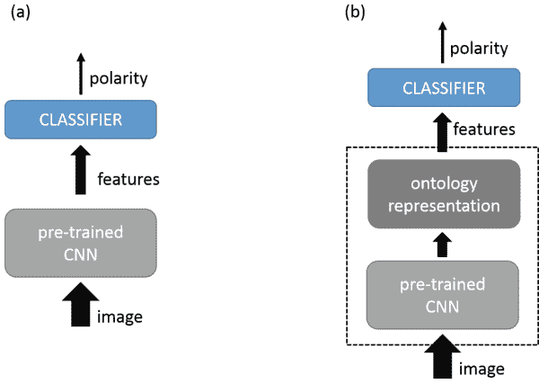
图1. 图像极性检测器。在设计(a)中，分类器直接从预训练的CNN接收低级特征；在设计(b)中，分类器从应该模拟本体的块接收低级特征。

#### 2.1 用于目标识别的CNN

CNN在目标识别任务中取得了出色的结果。表1总结了最重要的CNN架构，它们实际上可以成为上述两种设计的基础：AlexNet [12]、Vgg19 [18]、GoogLeNet [20]、Inception V3 [21]、ResNet101 [7]、ResNet152 [7]、DenseNet201 [8]和SqueezeNet [9]。

对于每个架构，表格提供了：权重层数量；在ImageNet [17]竞赛中达到的Top-1准确率（以百分比表示）；单个图像分类执行的浮点运算数量 [4]；总参数数量。浮点运算数量提供了对架构整体计算复杂性的合适近似。参数数量基本上影响两个方面：内存占用和训练集的预期大小。在使用预训练网络开始时，迁移学习可以减少成功完成微调所需的模式数量。另一方面，这种训练集的大小仍然与参数数量密切相关。将SqueezeNet包含在此列表中是因为在条标准实现中，与AlexNet相比，它可以实现模型大小的50倍压缩，同时在准确性方面得分相当。

表格显示，正如预期的那样，SqueezeNet在计算复杂度和参数数量方面是最方便的架构。然而，其他架构（除了AlexNet）证明能够超越它们就准确性而言。事实上，DenseNet可能是最佳选择，因为它可以在限制计算复杂度和参数数量的同时实现令人满意的准确性。

## 表1. 在目标识别领域中利用的CNN架构属性

| 项目 | AlexNet | Vgg19 | GoogLeNet | Inc V3 | Res101 | Res152 | Dense201 | SqueezeNet |
| :--- | :--- | :--- | :--- | :--- | :--- | :--- | :--- | :--- |
| 层 | 8 | 19 | 58 | 46 | 101 | 152 | 201 | 18 |
| Top-1准确率 (%) | 57 | 71 | 58 | 78 | 77 | 79 | 77 | 57 |
| GFlops | 0.7 | 19.6 | 1.6 | 6.0 | 7.6 | 11.3 | 4.0 | 0.8 |
| 参数 ($\cdot 10^6$) | 61 | 144 | 7 | 24 | 45 | 60 | 20 | 1 |

#### 2.2 使用CNN进行图像极性检测：现状

文献中提供了两种设计的不同实际实现。主要区别在于选择要采用的CNN，迁移学习技术和训练数据领域。

在同一年，有两个不同的作品利用 AlexNet 作为低级特征提取器应用于图1(a)的设计中[16,22]。Campos等人[3]确实利用 AlexNet 架构作为特征提取器，对极性检测框架的最终准确性进行了有趣的分析，包括层剥离和层添加的影响。在[5]中实现了一种涉及本体表示的设计（图1(b)）；作者提出了一种基于 AlexNet 架构的情感本体识别布局，其中最后一个全连接层为每个ANP提供了一个神经元。Jou等人[11]通过利用多语言视觉情感本体（MVSO）改进了[5]中提出的预测器。在[24]中，作者提出了一种用于图像极性预测的自定义架构：该模型堆叠了两个卷积层和四个全连接层。在[2]中，对这种架构、[3]中分析的架构以及[11]中提出的架构进行了实证比较。在这项工作中，作者确实评估了本体在迁移学习过程中所起的作用；最佳性能是由依赖于 AlexNet 架构和MVSO英文版本的模型实现的。分别在[6,10]中利用了Vgg19架构和 GoogLeNet架构。这两篇论文表明，这些架构能够支持基于 AlexNet 架构的最新预测器的改进。

### 3 比较分析

CNN广泛用作特征提取器（在迁移学习设置中）应用于所有针对图像情感分析的框架中。事实上，总的来说，这些框架在特征提取过程的具体设计和预测器的整体设计方面都有所不同。作为一个重要的结果，评估给定架构提供的实际贡献从来都不容易。

在提升图像极性检测性能方面取得了最新进展。本文旨在通过提出一个正式的实验协议，来解决这个问题，该协议应该支持对特征提取过程（即不同的预训练网络）的不同配置进行公平比较。为此，图1(a)的设计，即层替换，被用作参考。

#### 3.1 图像极性检测器：设计

在层替换设计中，用于物体识别的卷积神经网络（CNN）的最后一个全连接层被替换为一个新的全连接层，该层作为最终预测器的分类层，并包含与极性问题中所代表的类别数量相同的神经元。因此，最终的预测器是一个通用逼近器，它结合了从物体识别继承其参数化的特征提取模块和一个应从头开始训练的分类层。在学习过程中，通过利用少量的时期（epoch），将预测器在新领域上进行训练。实际上，通过适当设置学习率，将训练扩展到特征提取模块，从而采用了微调的方式；涉及的参数只受到小幅扰动[23]。实际上，通过利用不同的层消融策略，可以获得类似但另一种选择的配置。然而，Campos等人[2]表明，替换最后一个全连接层是解决图像情感分析问题时最方便的选择。

图1(a)的设计允许我们评估单个预训练架构在两个参数方面的作用：整体极性预测器的准确性和相应学习过程中的计算负载。实际上，图1(b)的设计在支持不同架构之间的公平比较方面并不那么有用。用于建模本体的中间层实际上可能引入由该层配置和采用的ANP带来的偏见，这也可能引入文化偏见[11]。在提出的设计中，通过仅依赖于使用ImageNet数据集[17]预先训练的CNN来建立一个无偏差背景，这是目标识别领域的一个成熟基准。

#### 3.2 计算复杂度

首先可以根据最终预测器的学习过程中涉及的计算负载来分析层替换配置。

训练过程的计算成本 $O_{lr}$ 可以通过以下参数近似计算：$n_{tg}$ 是训练样本的数量；$n_{ep}$ 是迭代次数；$n_{lay}$ 是层数；$n_{par,i}$ 是第 $i$ 层的参数数量；$O_f$ 是前向传播的计算成本；$O_b$ 是反向传播的计算成本，包括梯度计算和参数更新。

架构直接影响后四个量。设 $P$ 为以下定义的量：

$$P = \sum_{i=1}^{n_{lay}} n_{par,i}^3 \quad (1)$$

则 $O_{lr}$ 可以表示为：

$$\begin{aligned} O_{lr} &= n_{ep} \cdot n_{tg} \cdot [O_f(P) + O_b(P)] \\ &= n_{ep} \cdot n_{tg} \cdot [O_f(P) + \alpha \cdot O_f(P)] \approx 3 \cdot n_{ep} \cdot n_{tg} \cdot O_f(P). \end{aligned} \quad (2)$$

经验证据表明，系数 $\alpha$ 的值在方程(2)中可以粗略地近似为 2 [4]。方程(2)表明，参数的数量与 $O_f$ 和 $O_b$ 呈立方比例增长。实际上，(1)表明架构不仅仅由参数的总数来表征。在参数分布不均匀的情况下，计算成本主要由最大的层（按权重计算）决定。

对计算成本的讨论还应考虑到在公式(2)中没有出现的几个因素。首先，次优解的问题会影响到启发式优化技术，如随机梯度下降。由于迁移学习依赖于小数据集，这个问题可能会干扰极性预测器的训练。此外，采用早停策略会增加陷入局部最小值的风险，但另一方面可以防止过拟合。实际上，多次启动优化是一个合适的解决方案。这种解决方案还会增加学习过程的计算负荷，可能需要多次运行训练算法。

其次，CNN的执行时间可能不仅取决于 $P$。一方面，GPU被设计用于充分利用数据和模型的并行性。然而，CNN被实现为一系列应按顺序完成的层叠。因此，$Vgg19$ 的执行时间可能低于 $Res152$ 的执行时间。尽管后一种架构在参数方面较轻，$Vgg19$ 涉及的层数明显较少。因此，由大内存支持的GPU可以适当利用配置 {每层少量参数} 来提高计算时间。

### 4 实验结果

实验旨在评估上述设计的泛化能力。实际上，目标还是评估特征提取模块的具体架构如何影响整体预测器的性能。为了保持一致性，所有实验都是在 MATLAB® 中使用神经网络工具箱实现的，该工具箱提供了表1中列出的架构的预训练版本。实际上，$Res152$ 是唯一未包含在实验中的架构，因为神经网络工具箱没有提供其实现。

#### 4.1 实验设置

实验涉及四个数据集：Twitter1 (Tw1) [24]，Twitter2 (Tw2a和Tw2b) [14]，以及ANP40 [1]。Twitter1是图像极性识别中最常见的基准。该数据集收集了1269张来自图像推文的图像，即同时包含图像的Twitter消息。所有图像都通过亚马逊机械土耳其人 (AMT) 进行了标记。本文实际上使用了数据集的“5同意”版本。这个版本只包括所有五个人评估者对同一标签达成一致的图像。因此，最终的数据集包括总共882张图像（581张标记为“正面”，301张标记为“负面”）。

Twitter2还提供了一系列图像推文[14]。在这种情况下，推文根据一个预先确定的406个情感词汇进行了过滤。因此，数据集仅包含在文本消息中至少包含这些单词之一的推文。三名标注者使用三级评分标准对配对的{文本，图像}进行标注；文本和图像分别进行标注。本文使用了数据集的修剪版本：仅使用所有标注者对同一标签达成一致的图像，总共获得了4109张图像。由于4109张图像中只有351张被标记为负面，因此这个修剪版本的Twitter2数据集非常不平衡。

因此，生成了两个不同的平衡数据集 ($Tw\_2a$ 和 $Tw\_2b$)。每个数据集包括702张图像：351张“负面”图像和从“正面”图像的总数中随机提取的351张图像。

ANP数据集实现了一个本体，并由Flickr图像组成[1]。数据集包括3316个形容词名词对；对于每对，最多提供了1000张图像，总共约一百万张图像。从Flickr用户那里分配的ANP标签被用作图像的标签；因此，噪声严重影响了这个数据集。为了解决这个问题，本文使用了数据集的修剪版本。因此，选择了具有最高极性值的20个ANP和具有最低极性值的20个ANP（利用数据集的网站¹作为参考）。最终，实验中涉及的数据集包括11857张“正面”图像和5257张“负面”图像。

前三个基准用于评估在最常见的情况下，即有一个小的训练集可用时，所提出设计的性能。ANP40涵盖了有更大数据集可用的情况。在所有实验中，预测器的设置如下组织：采用带有动量的随机梯度下降作为优化策略，动量为0.9，学习率为$10^{-4}$，适用于预训练的CNN中的所有层。在分类层中，学习率设置为$10^{-3}$，正则化参数设置为0.5。采用了早停策略，验证耐心设置为2。训练最多进行10个时期。

¹ http://visual-sentiment-ontology.appspot.com/

#### 4.2 结果和评论

使用了七种不同的预训练架构来生成尽可能多的预测器实现。实验阶段旨在评估和比较这些实现的泛化性能。

通过利用5折策略，对七个预测器的性能进行了评估。对于每个数据集，通过五个不同的实验测量了预测器的分类准确率，对应于五个不同的训练/测试对。事实上，每个单独实验的五次独立运行已经完成；每次运行涉及不同的小批量组合。因此，对于一个预测器和一个基准，最终可获得25个测试集分类准确率的测量结果。

表2报告了在 Tw1、Tw2a、Tw2b 和 ANP40 上使用层替换设计所获得的性能。在每一列中，第一行指示了在预测器实现中采用的预训练架构；第二行给出了 Tw1 数据集上预测器在25个实验中的平均准确率，以及其标准不确定性（括号内）；第三、第四和第五行分别给出了涉及 Tw2a、Tw2b 和 ANP40 的实验的相同数量。

**表2. 实验结果：分类准确率**

| 数据集 | AlexNet | Vgg19 | GoogLeNet | Inc3 | Res101 | Dense201 | SqueezeNet |
| :--- | :---: | :---: | :---: | :---: | :---: | :---: | :---: |
| Tw1 | 82.5 (0.6) | 86.4 (0.5) | 84.2 (0.5) | 86.5 (0.7) | 88.2 (0.4) | 89.4 (0.5) | 82.5 (0.6) |
| Tw2a | 66.2 (0.5) | 69.2 (0.7) | 66.0 (0.6) | 68.1 (0.7) | 70.8 (0.6) | 71.3 (0.8) | 65.2 (0.8) |
| Tw2b | 65.4 (0.7) | 71.0 (0.8) | 68.2 (0.5) | 70.5 (0.9) | 69.2 (0.8) | 70.6 (0.6) | 66.8 (0.7) |
| ANP40 | 76.3 (0.3) | 78.7 (0.3) | 79.2 (0.3) | 79.9 (0.2) | 79.7 (0.2) | 79.3 (0.3) | 76.7 (0.3) |

实验还可以揭示出在不同数据集和不同训练/测试组合上哪种架构最为一致。因此，对于每个基准和每个训练/测试组合，根据相应预测器的分类准确率对七种架构进行排名。在这种情况下，预测器的分类准确率是在给定训练/测试组合上完成的五次运行中的最佳准确率。在每个排名中，最佳预测器得到一分，第二名预测器得到两分，依此类推，直到最差的预测器得到七分。

因此，图2显示了每种架构在20个排名（5个训练/测试组合 × 4个基准）上标记的总分；一个预测器不能少于20分，这意味着在每个排名上都是第一名（即最佳预测器）。图表显示基于 $Vgg19$ 的预测器最为一致，即在不同实验中经常占据最高的位置。这个结果与表2中的结果相符，表2显示 $Vgg19$ 在不同基准上始终能够获得有效的性能。

图2. 对九种架构的一致性评估；图中的架构在 $x$ 轴上，对应的收集到的总点数在 $y$ 轴上。

总体而言，$Vgg19$、$Res101$ 和 $Dense201$ 被证明是最强大的架构。就泛化能力而言，它们几乎是可比较的。

事实上，计算方面可能是一个有区别的因素。$Vgg19$ 需要存储的参数数量是 $Res101$ 的3倍，$Dense201$ 的7倍；此外，$Vgg19$ 的前向阶段涉及3或4倍的浮点运算。然而，大部分参数和操作都是在 $Vgg19$ 的最后全连接层引入的。因此，这些层可以利用并行计算，从而提高整体执行时间。因此，当有一定数量的内存的GPU可用时，$Vgg19$ 可能是最佳选择，而在处理内存限制时，应优先选择 $Res101$ 和 $Dense201$。

### 参考文献

- 1. Borth, D., Ji, R., Chen, T., Breuel, T., Chang, S.F.: 使用形容词名词对的大规模视觉情感本体和检测器。在: 第21届ACM国际多媒体会议论文集，第223-232页。ACM (2013)
- 2. Campos, V., Jou, B., Giro-i Nieto, X.: 从像素到情感: 微调CNN进行视觉情感预测。图像视觉计算。65, 15-22页 (2017)
- 3. Campos, V., Salvador, A., Giro-i Nieto, X., Jou, B.: 深入理解微调CNN进行视觉情感预测。在: 第1届国际多媒体情感与情绪研讨会论文集，第57-62页。
- 4. Canziani, A., Paszke, A., Culurciello, E.: 深度神经网络模型在实际应用中的分析。arXiv预印本 arXiv:1605.07678 (2016)
- 5. Chen, T., Borth, D., Darrell, T., Chang, S.F.: DeepSentiBank: 使用深度卷积神经网络进行视觉情感概念分类。arXiv预印本 arXiv:1410.8586 (2014)
- 6. 范，S.，江，M.，沈，Z.，科尼格，B.L.，坎坎哈利，M.S.，赵，Q.：视觉注意力在情感预测中的作用。在：2017年ACM多媒体会议记录，第217-225页。ACM（2017年）
- 7. 何，K.，张，X.，任，S.，孙，J.：深度残差学习用于图像识别。在：IEEE计算机视觉和模式识别会议记录，第770-778页（2016年）
- 8. 黄，G.，刘，Z.，范德马滕，L.，魏恩伯格，K.Q.：密集连接卷积网络。在：CVPR，卷1，第3页（2017年）
- 9. Iandola, F.N., Han, S., Moskewicz, M.W., Ashraf, K., Dally, W.J., Keutzer, K.: SqueezeNet: 具有50倍少参数和 <0.5 MB模型大小的AlexNet级准确性。arXiv预印本 arXiv:1602.07360 (2016年)
- 10. Islam, J., Zhang, Y.: 使用迁移学习方法进行社交图像的视觉情感分析。在：2016年IEEE国际大数据云计算-社交计算-可持续计算会议上，第124-130页。IEEE（2016年）
- 11. Jou, B., Chen, T., Pappas, N., Redi, M., Topkara, M., Chang, S.F.: 全球范围内的视觉情感：大规模多语言视觉情感本体论。在：第23届ACM国际多媒体会议上，第159-168页。ACM（2015年）
- 12. Krizhevsky, A., Sutskever, I., Hinton, G.E.: 使用深度卷积神经网络进行ImageNet分类。在：神经信息处理系统的进展，第1097-1105页（2012年）
- 13. Luo, J., Borth, D., You, Q.: 社交多媒体情感分析。在：2017年ACM多媒体会议上，第1953-1954页。ACM（2017年）
- 14. Niu, T., Zhu, S., Pang, L., El Saddik, A.: 多视角社交数据上的情感分析。在：多媒体建模国际会议上，第15-27页。Springer（2016年）
- 15. Poria, S., Cambria, E., Bajpai, R., Hussain, A.: 情感计算综述：从单模态分析到多模态融合。信息融合 37, 98–125 (2017)
- 16. Razavian, A.S., Azizpour, H., Sullivan, J., Carlsson, S.: CNN特征即插即用：一个惊人的基准线用于识别。在：2014年IEEE计算机视觉和模式识别研讨会(CVPRW)，第512-519页。IEEE (2014)
- 17. Russakovsky, O., Deng, J., Su, H., Krause, J., Satheesh, S., Ma, S., Huang, Z., Karpathy, A., Khosla, A., Bernstein, M., et al.: ImageNet大规模视觉识别挑战。国际计算机视觉 115(3), 211–252 (2015)
- 18. Simonyan, K., Zisserman, A.: 面向大规模图像识别的深度卷积网络. arXiv预印本 arXiv:1409.1556 (2014)
- 19. Soleymani, M., Garcia, D., Jou, B., Schuller, B., Chang, S.F., Pantic, M.: 多模态情感分析综述. 图像视觉计算 65, 3–14 (2017)
- 20. Szegedy, C., Liu, W., Jia, Y., Sermanet, P., Reed, S., Anguelov, D., Erhan, D., Vanhoucke, V., Rabinovich, A., 等: 卷积网络的深入研究. 在: CVPR (2015)
- 21. Szegedy, C., Vanhoucke, V., Ioffe, S., Shlens, J., Wojna, Z.: 重新思考计算机视觉中的Inception架构. 在: IEEE计算机视觉与模式识别会议论文集, pp. 2818–2826 (2016)
- 22. Xu, C., Cetintas, S., Lee, K.C., Li, L.J.: 利用深度卷积神经网络进行视觉情感预测. arXiv预印本 arXiv:1411.5731 (2014)
- 23. Yosinski, J., Clune, J., Bengio, Y., Lipson, H.: 深度神经网络中的特征可转移性如何？在：神经信息处理系统进展, 第3320-3328页（2014年）
- 24. You, Q., Luo, J., Jin, H., Yang, J.: 利用逐步训练和领域转移的深度网络进行鲁棒图像情感分析。在：AAAI, 第381-388页（2015年）

## 递归神经网络的辍学

Nathan Watt (✉) 和 Mathys C. du Plessis
南非波特伊丽莎白尼尔森曼德拉大学 6031, natewatt0@gmail.com, mc.duplessis@mandela.ac.za

**摘要。** 神经网络是一种可以根据训练样例或模式执行任务的计算结构。递归神经网络是一种设计用于处理时间序列数据的网络类型。辍学（Dropout）是一种神经网络正则化技术。文献建议不要直接将辍学应用于递归神经网络，因为其效果在递归应用时太过剧烈。这种直接方法被描述为“天真”（naive）。相反，有两种专门的递归神经网络 Dropout 算法由不同的作者提出。然而，这些专门的 Dropout 算法尚未在相同的实验条件下相互比较和与天真算法进行测试。本文比较了所有这些算法，并发现天真方法的表现与专门的 Dropout 算法相当或更好。

**关键词：** 深度学习 · 递归神经网络 · Dropout

### 1 引言

神经网络 (NN) 是一种由一层层节点堆叠而成的计算结构。这些节点层之间有连接，称为权重。通过调整这些权重，可以训练 NN 以复制模式或计算，直到输出节点层产生所需的值。

递归神经网络 (RNNs) 是一种节点层可以与同一层或前一层相连的网络。这形成了 RNN 中的连接循环。这些节点被称为递归节点。

Dropout 是一种流行且简单的正则化技术，为神经网络提供了两个独立的好处。首先，Dropout 减少了过拟合问题，这对于在小数据集上训练的神经网络产生影响。其次，Dropout 鼓励神经网络以多种方式内部解决任务，从而使训练后的网络类似于集成神经网络。这使得神经网络能够获得集成训练的好处，而无需重新训练网络[7]。

Dropout 在每个训练步骤中禁用不同的随机选择的连接子集。这在训练过程中给网络添加了扭曲。循环神经网络包含循环连接。这意味着将 Dropout 应用于循环神经网络时，扭曲效应会递归放大。

这使得RNN难以训练。直接将Dropout应用于RNN，这种方式将被称为Naive Dropout [10]。为了对抗这种剧烈的扭曲，Gal等人提出了两种专门针对RNN的Dropout算法[2]，Zaremba等人提出了另一种[10]。这些算法旨在防止Dropout的扭曲被反复放大，同时保留Dropout的好处。这三种Dropout算法尚未在相同的实验条件下进行测试。此外，先前的研究人员在实验中引入了与Dropout无关的算法，例如权重衰减，其中权重衰减参数在算法之间进行了不同的调整。

一项初步研究[9]简要调查了这些专门的Dropout算法的性能，并发现它们的表现并不如文献所述。本文的目标是在相同的实验条件下使用额外的基准测试来测试RNN的性能，特别是准确性。然后使用适当的统计测试对Dropout算法进行排名。

本文的结构如下。第2节对每个RNN Dropout方法进行了文献综述。第3节描述了用于评估每个算法的基准。第4节描述了选择的实验条件。第5节讨论了实验结果。最后，第6节得出了结论。

### 2 文献综述

将Dropout应用于RNN的最简单方法是在每个时间步随机丢弃连接。这种方法或算法被称为Naive Dropout [2]。Dropout对RNN的影响是显著的 [1]。人们认为，当Dropout直接应用于这样的RNN时，递归连接会严重放大Dropout的噪声和失真。这使得训练变得非常困难 [10]。除了初步研究外，这种算法尚未成功应用于RNN [2, 10]。

为了防止噪声过度放大，Pachitariu等人 [5] 和 Zaremba等人 [10] 建议仅将Dropout应用于非递归连接。这种算法将被称为Half Dropout，因为它只丢弃了网络连接的一半。

最后，Gal等人[2]批评Half Dropout在小数据集上仍然显示过拟合的迹象。相反，他们提出了一种基于理论的方法来应用Dropout到RNNs。这个算法被命名为变分Dropout。和Naive Dropout一样，变分Dropout对每个连接都应用Dropout。变分Dropout与之前的算法的不同之处在于它在所有时间步骤上应用相同的Dropout掩码。这意味着在每个时间步骤上都会丢弃相同的节点。

图1展示了每个Dropout算法的操作方式。

虽然Gal等人[2]经验证明变分Dropout优于半Dropout，但实验并非在相同条件下进行。变分Dropout与权重衰减一起使用，但半Dropout没有。变分Dropout的优越性是否依赖于特定的权重衰减超参数尚不清楚。此外，对于更大的RNN模型，半Dropout和变分Dropout使用了不同的Dropout概率。

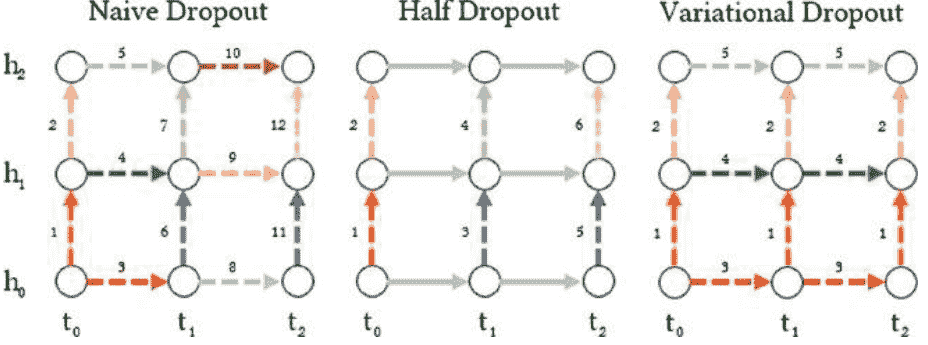

图1. 所有三种Dropout算法应用于相同的展开循环网络。每个连接都有一个颜色（或者一个数字），代表它的Dropout掩码。具有相同颜色（或者相同数字）的连接应用相同的Dropout掩码，意味着相同的节点被丢弃。实线没有应用Dropout。

### 3 基准测试

基准测试是用于比较目的的基准问题。RNN的性能通过其对基准问题的解决方案的准确性来衡量。对于每个基准测试，将使用不同的Dropout算法以及没有任何形式的Dropout来训练RNN。这个过程会重复多次，以便进行统计测试，以补偿由于随机权重初始化、Dropout掩码和训练模式顺序引起的噪声。这些分数允许统计测试对算法进行排序，从最好到最差。这些实验使用了两个基准测试。

#### 3.1 弹球基准测试

第一个基准测试要求RNN预测一个视频中的帧，该视频显示一个在2D盒子中弹跳的球。这是Martens等人提出的问题的修改版本[4]。该视频由一个1位、15×15像素分辨率的弹跳球镜头组成。图2显示了一个例子。对于RNN来说，一个视频被视为一个训练模式。球的运动是确定性的，可以基于第一个视频帧进行预测。RNN被给予第一个帧，并预测视频中的所有剩余帧。由于有225个像素，有225个独特的起始位置和225个独特的视频，导致一个非常小的训练集，不到200个模式。

#### 3.2 语言建模基准测试

第二个基准测试要求RNN在给定前面单词序列的情况下预测下一个单词。可以使用一个RNN构建这个模型，该RNN在 $n$ 个时间步骤上接收一个序列的 $n$ 个输入单词，并在最后一个时间步骤上将下一个单词作为输出进行预测。语言建模被Gal等人[2]和Zaremba等人[10]用于他们的Dropout算法的基准测试。

文本数据包括维基百科的前1亿个字符，由Pennington等人提供[6]，网址为 nlp.stanford.edu/projects/glove。所有标点符号已被删除。使用出现频率最高的2000个单词构建词汇表。词汇表中的每个单词都有一个关联的索引号。这些单词将以长度为2000的独热编码向量的形式呈现给网络，其中元素 $i=1$ 表示具有索引 $i$ 的单词。提取的单词被分成15-gram（长度为15的序列），每个15-gram只包含词汇表中的单词。这为网络提供了每个所需输出单词的14个上下文单词。词汇表中不包括“未知单词”或“UNK”符号。编制了一个包含91,393个15-gram的数据集。

### 4 实验过程

对每个基准测试都进行了以下RNN配置的测试。

- 1. 经典LSTM: 未应用Dropout算法。
- 2. 朴素Dropout: 在RNN的每个时间步上随机应用Dropout到每个连接，就像在应用Dropout到完全连接的NN时一样，其中Dropout概率为50%。
- 3. 半Dropout: 仅应用于非循环连接，同样在每个时间步上随机应用，其中Dropout概率为50%。
- 4. 优化的半Dropout: 半Dropout，其中Dropout概率为65%。
- 5. 变分Dropout: 在RNN的每个连接上应用Dropout，其中相同的连接在每个时间步上都被丢弃，其中Dropout概率为50%。

为了保持一致性，每个Dropout算法都以50%的Dropout概率进行测试。这是半Dropout和变分Dropout的作者推荐的Dropout概率[2, 10]。除了一个大型RNN模型，具体来说是1500个单元。Zaremba等人[10]推荐半Dropout的Dropout概率为65%。当在大型RNN模型上运行基准测试时，还会测试额外的优化半Dropout算法。允许每个Dropout算法使用相同的Dropout概率进行测试，以及它们推荐的Dropout概率。

RNN使用了流行的长短期记忆（LSTM）[3]结构。由两个隐藏层和一个softmax输出层组成的LSTM RNN层被构建。研究了两种LSTM尺寸。中等LSTM每个隐藏层包含650个单元。大型LSTM每层包含1500个单元。这与Gal等人[2]和Zaremba等人[10]使用的模型尺寸相匹配。

每个LSTM单元由多个门组成。每个门都有自己的连接。Gal等人[2]将具有相同连接的权重连接定义为单个单元中所有门的相关连接的丢弃。这可以被视为每个门使用相同的Dropout掩码。未连接的权重被定义为每个门都有其自己的连接被单独丢弃。

Gal等人[2]确定在使用变分Dropout时，未连接的权重比连接的权重表现更好。Zaremba等人[10]没有指定Half Dropout使用连接的权重还是未连接的权重。对于这些实验，所有Dropout算法都使用未连接的权重。

当使用Dropout训练NN时，在测试阶段，可能被丢弃的连接会按 $1-D$ 进行缩放，其中 $D$ 是Dropout概率。这是为了补偿测试期间更多节点的活跃性。在这些实验中，这种缩放是在测试期间进行的。此外，任何不允许被丢弃的连接在测试和训练期间都会进行缩放。缩放的连接包括Half Dropout中的递归连接以及经典LSTM中的所有连接。缩放连接确保节点中的净值分布在所有算法之间保持一致，以便进行公平比较。

Gal等人[2]和Zaremba等人[10]都使用了集成平均，但训练的模型数量不一致。这些实验不使用集成平均。相反，每个RNN都使用多次运行进行训练，并将每次运行结束时的分数提供给统计测试。

正如Gal等人所做[2]，输入层和第一隐藏层之间的连接可以被删除。这导致视频帧中的像素丢失和14-gram输入序列中的单词丢失。

所有LSTM都使用RMSProp优化算法[8]进行训练。数据集被分为测试集（10%）、验证集（10%）和训练集（80%）。中等规模的RNN使用初始学习率为0.01，大型LSTM使用初始学习率为0.001。每个训练步骤使用一个大小为128的小批量模式对网络进行训练。如果验证分数在三次验证测试中没有改善，则学习率乘以0.1。权重从正态分布中初始化。未包括权重衰减。

弹球基准训练了1000个时期，每个时期指的是使用整个训练数据集进行训练一次。这导致每次运行大约1400个训练步骤。语言建模基准训练了15个时期。在完成所有时期后，模型被恢复到其在获得最佳验证分数时的状态，并记录测试分数。

在第4节的开头描述的每个配置都运行了30次，对于每个算法-基准-模型配置。每个测试分数与其他每个测试分数集配对，并进行了两个单尾的Mann-Whitney U检验。分别进行了两个方向的检验。U检验的结果将指示测试分数集之间是否存在统计上显著的差异，如果有，则指示其方向，从而允许对每个基准进行排序。选择了0.05的 $p$ 值，因为每对进行了两个检验，在应用Bonferroni校正后，每个单尾检验使用了0.025的 $p$ 值。

### 5 结果与讨论

图2显示了弹球基准测试的网络预测的一个示例运行。在视频的开始时，预测与目标帧完全匹配，但随着时间的推移，误差不断累积，误差变得越来越大，在视频的末尾更加明显。

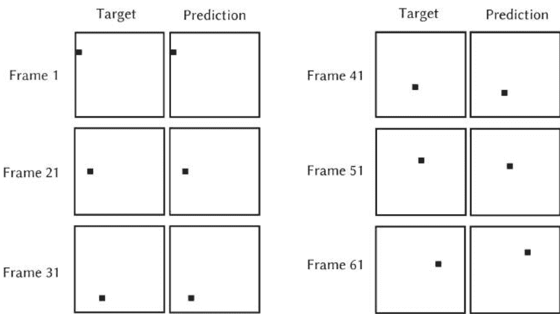

图2. 从一个单一的弹球视频中选择的帧，这是一个单一的训练模式。对于每一帧，目标显示球的期望位置，预测显示网络的球预测。球由黑色像素表示。预测图像越接近目标图像，网络的误差越低。

语言建模RNN可以将其输出作为输入返回，并因此连续预测单词。随着错误的累积，单词的意义会越来越不合理。这种方式生成了短语“在这个服务的大部分时间中，最受欢迎的飞机可以在19世纪早期找到，两个20世纪最重要的是”，其中斜体字是由RNN生成的。不包括标点符号，数字用单词表示。意思是“19世纪”将被表示为“19th century”。网络生成的其他短语包括“在1958年和1964年连任的第一位新城市的第一”和“是美国面积最大的州”。

优化的半丢弃是指作者专门为大型LSTM RNN推荐的具有丢弃概率的半丢弃，这意味着它仅在使用大型LSTM RNN的基准测试中出现，具体来说是表3。

### 表1. 使用中等LSTM RNN的弹球基准测试的Dropout算法排名

| 排名 | Dropout算法 | 平均损失 |
| :--- | :--- | :--- |
| 1 (联合) | 一半 (Half) | 112 |
| 1 (联合) | 朴素 (Naive) | 121 |
| 3 | 变分 (Variational) | 138 |
| 4 | 经典LSTM | 174 |

使用Dropout有两个优点。首先，它添加扭曲以减少过拟合。其次，它以这样的方式训练网络，使其获得集成训练的部分好处[7]。应用任何形式的Dropout都改善了LSTM的性能。图3（左）显示了弹球基准测试中每个算法的单次运行的损失曲线。虽然这个图表不包含任何重要信息，但它暗示了经典LSTM存在过拟合的问题。考虑到RNN包含两个包含650个单元的LSTM层，并且训练集中只有不到200个训练模式，过拟合很可能发生。因此，应用Dropout可以提高性能。

表2，语言建模基准，显示与弹球实验类似的结果。再次，Naive Dropout被期望表现最差，但实际上表现最好。在文献中，Naive Dropout的扭曲效果被夸大了。这次，变分Dropout排名第一，但仍然没有超过Naive Dropout。这个网络有将近75,000个训练模式，仍然只使用了中等LSTM，每个LSTM层有650个单元。因此，过拟合的问题显著减少。这通过图3（右侧）得到了证实，在那里没有过拟合的迹象。与以前一样，任何形式的Dropout都提高了LSTM的性能。这表明网络从Dropout的第二个优势中受益，即伪集成训练。

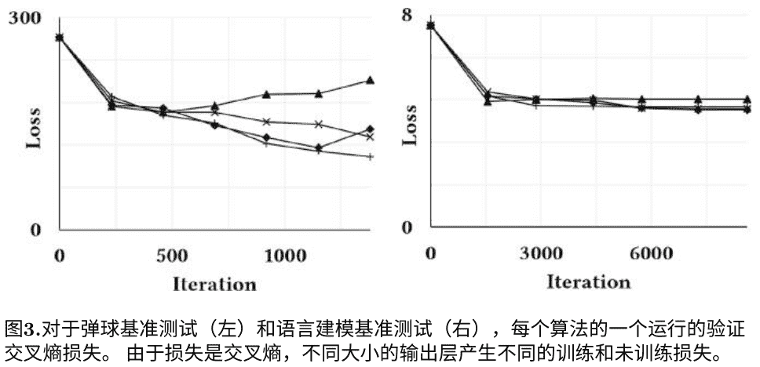

### 表2. 使用中等LSTM RNN进行语言建模基准测试的Dropout算法排名

| 排名 | Dropout算法 | 平均损失 |
| :--- | :--- | :--- |
| 1 (联合) | 变分 (Variational) | 4.78 |
| 1 (联合) | 朴素 (Naive) | 4.79 |
| 3 | 一半 (Half) | 4.97 |
| 4 | 经典LSTM | 5.16 |

使用大型LSTM网络进行语言建模基准测试的结果见表3。这个LSTM网络没有从任何形式的Dropout中受益。更大的网络需要在训练过程中同时优化更多的权重。Dropout的缺点是通过添加噪音和扭曲网络来减慢训练速度。可能是因为这个网络很大且难以训练，添加Dropout会严重阻碍训练。文献对Naive Dropout的这种效应提出了警告。然而，Half和Variational Dropout似乎也遇到了同样的问题，并且它们并没有比Naive Dropout更好地处理这个问题。

所有基准结果都是意外的。它们表明这些Dropout算法之间几乎没有差异。如果循环神经网络能够从Dropout中受益，那么它将从所有的Dropout算法中受益。Naive Dropout预计表现不佳，但实际上它始终表现良好。

与文献中报道的结果相比，本研究发现的结果矛盾可能是由于多种因素造成的。首先，Half Dropout和Variational Dropout的性能可能对网络的超参数非常敏感，例如权重初始化、学习率、权重衰减和Dropout概率。如果是这样的话，那么这仍然对他们所声称的优越性提出了质疑，因为选择最佳超参数是一个耗时且不完美的过程。其次，尽管统计测试对Dropout算法进行了排名，但并没有提供算法之间差异的规模指示。图3表明，与任何Dropout算法和经典LSTM之间的差异相比，Dropout算法之间的差异微小。在训练过程中，Dropout算法的曲线相交并重叠在许多点上。此外，Dropout算法的排名在不同基准测试之间略有不同，没有一个Dropout算法始终表现优于其他算法。虽然我们的实验表明使用Dropout可能是有益的，但它们并没有显示出使用特定的Dropout算法比其他算法更有益。这表明在Dropout有益的情况下，选择的Dropout算法并不重要。

### 表3. 使用大型LSTM RNN进行语言建模基准测试的Dropout算法排名

| 排名 | Dropout算法 | 平均损失 |
| :--- | :--- | :--- |
| 1 (联合) | 一半 (Half) | 4.69 |
| 1 (联合) | 朴素 (Naive) | 4.70 |
| 1 (联合) | 经典LSTM | 4.70 |
| 4 | 变分 (Variational) | 4.73 |
| 5 | 优化的Half | 4.88 |

### 6 结论

实验结果与文献报道的结果不符。Naive Dropout的失真效应似乎被夸大了。它的表现与RNN专用的Dropout算法相当或更好。没有迹象表明变分Dropout优于其他Dropout算法。

从这些实验中得出的结论是：对LSTM RNN应用任何形式的Dropout都是有益的。然而，使用RNN专用的Dropout算法，如Half和Variational Dropout，与Naive Dropout相比没有统计上显著的好处。

### 参考文献

- 1. Bayer, J., Osendorfer, C., Korhammer, D., Chen, N., Urban, S., van der Smagt, P.: 关于快速Dropout及其在循环网络中的适用性。arXiv预印本 arXiv:1311.0701 (2013)
- 2. Gal, Y., Ghahramani, Z.: 在循环神经网络中理论上有根据的Dropout应用。在：神经信息处理系统的进展，第1019-1027页 (2016)
- 3. Hochreiter, S., Schmidhuber, J.: 长短期记忆。神经计算 9(8), 1735–1780 (1997)
- 4. Martens, J., Sutskever, I.: 用无Hessian优化学习循环神经网络。在：第28届国际机器学习大会(ICML-11)会议记录, pp. 1033–1040. Citeseer (2011)
- 5. Pachitariu, M., Sahani, M.: 神经语言模型的正则化和非线性：何时需要？arXiv预印本 arXiv:1301.5650 (2013)
- 6. Pennington, J., Socher, R., Manning, C.: Glove: 用于词表示的全局向量。在: 2014年经验方法在自然语言处理中的会议记录(EMNLP), pp. 1532–1543 (2014)
- 7. Srivastava, N., Hinton, G., Krizhevsky, A., Sutskever, I., Salakhutdinov, R.: Dropout: 一种防止神经网络过拟合的简单方法。机器学习研究杂志 15(1), 1929–1958 (2014)
- 8. Tieleman, T., Hinton, G.: 第6.5讲——RmsProp：将梯度除以最近幅度的平均值。在: COURSERA: 机器学习的神经网络 (2012)
- 9. Watt, N., du Plessis, M.C.: 用于循环神经网络的Dropout算法。在: SAICSIT (2018)
- 10. Zaremba, W., Sutskever, I., Vinyals, O.: 循环神经网络正则化。arXiv预印本 arXiv:1409.2329 (2014)

## 使用3D卷积神经网络进行精神疾病分类

Stefano Campese$^1$, Ivano Lauriola$^{1,2(✉)}$, Cristina Scarpazza$^3$, Giuseppe Sartori$^3$, 和 Fabio Aiolli$^1$

$^1$ 帕多瓦大学数学系, Via Trieste, 63, 35121 Padova, 意大利
stefano.campese.90@gmail.com, ivano.lauriola@phd.unipd.it
$^2$ 布鲁诺·凯勒基金会, Via Sommarive, 18, 38123 Trento, 意大利
$^3$ 帕多瓦大学普通心理学系, Via Venezia, 8, 35121 Padova, 意大利

**摘要.** 最近的文献表明，精神疾病（如精神分裂症和躁郁症）会导致一些脑区异常。因此，基于经典机器学习的几种自动机制已被用于通过神经影像学研究来识别这些疾病。这些方法的一个严重缺点是它们只考虑了神经影像中点的强度值，而没有考虑到空间信息。卷积神经网络随后被应用于克服上述问题，并在这些任务中显示出了实证效果。然而，通常卷积神经网络只在脑部的2D切片上操作，而不是整个3D结构。

本研究旨在分析经典机器学习技术与2D和新颖的3D卷积神经网络模型在行为上的差异。对4个真实世界的神经影像任务（包括精神分裂症和双相情感障碍分类）进行了详尽的实证评估。

**关键词:** 深度学习 · 3D卷积神经网络 · 神经影像 · 精神障碍

### 1 引言

文献 [16, 18] 表明，精神障碍（如精神分裂症 (SZ) 和双相情感障碍 (BP)）可能会影响人类大脑的结构。通过结构性神经影像 (sMRI)，可以观察到这些疾病的影响。神经影像，也被称为脑部扫描，是用于诊断神经退行性病变或识别脑部畸形的3D图像。

如今，基于大脑病理诊断的标准仍然基于对患者的临床评估，这是基于主观经验的，是由患者报告以及对迹象和非语言行为的观察所报告的。然而，精神障碍并不总是容易诊断，因为特定症状可能存在于不同的障碍中，并且精神症状可能暂时出现在健康个体中。

通常，使用成像技术来确认诊断。其中一种技术是众所周知的基于体素的形态学 (VBM)，其目的是通过使用统计方法来研究脑解剖的局部差异 [14]。

最近，基于机器学习技术的自动机制已经被用来减轻神经影像手动分类的工作 [2, 10]。这些方法中的大多数是基于经典的机器学习算法，如著名的支持向量机 (SVM)。在这些方法中，神经影像的特征向量由大脑每个体素的强度值组成。体素（体积图像单元）是一种体积测量，它代表了大脑上的一个数据点。一般来说，一个单独的体素定义了一个几毫米的立方区域。

然而，这些方法的一个严重缺点是它们只考虑了每个体素的强度值，而没有考虑它们的位置，导致了有用信息的丢失。

另一方面，深度学习 (DL) 方法可以用来捕捉空间信息。DL 是一类大型机器学习算法，能够在非线性处理的层次结构中从原始数据中学习到最佳表示。最近，DL 和卷积神经网络 (CNNs) 在视觉识别任务上引起了相当大的关注。标准的 2D CNNs 也被广泛用于解决神经影像任务 [17]，包括阿尔茨海默病 (AD) [6, 13]、轻度认知障碍 (MCI) [11] 和注意力缺陷多动障碍 (ADHD) [11] 的病理分类。

然而，标准的卷积神经网络在这些任务中并不完全适用。事实上，它们无法处理整个大脑的三维结构。为了克服这个问题，最近提出了新的三维卷积神经网络架构，并应用于神经影像任务，显示出非常有希望的结果。

本研究的主要贡献是对三维卷积神经网络进行了广泛的分析，将其与传统的二维架构和浅层支持向量机进行了比较。这些方法在包括精神分裂症和躁郁症分类在内的4个真实世界神经影像任务上进行了评估。

本文的组织结构如下：第2节讨论了卷积神经网络及其在神经影像任务中的应用。然后，第3节详细描述了实验评估，包括对预处理流程和方法的详尽解释。结果在第3.4节中展示。最后，第4节总结了文章，并讨论了结果、方法和未来的工作。

### 2 背景和相关工作

卷积神经网络 (CNN) 使用多层感知器算法的变体，并且它们被设计为需要最少的预处理 [7]。CNN 受到大脑视觉皮层的生物过程的启发 [8]，其中神经元之间的相互连接模拟了视觉场的受限区域，称为感受野。每个神经元部分地重叠另一个神经元，直到整个视觉场被覆盖。这种神经元分组的方式使得创建一个比传统人工神经网络更有效且更易于训练的网络成为可能，特别是在视觉识别任务上。

尽管表现良好，但 CNN 主要在应用于平面 2D 图像时展示了它们的泛化能力和实证有效性。

在生物医学领域中，机器学习技术主要用于处理平面图像，如电子显微镜扫描图像。然而，当处理 3D 结构时，情况变得更加复杂。在这些情况下，通常会进行预处理阶段，将原始结构分成许多不同的 2D 切片。然后对每个切片进行单独分析。然而，对初始图像进行切片可能对最终结果产生负面影响。

从 2D 到 3D 的卷积网络的扩展打开了分析完整的 3D 结构而无需切片的可能性。关于生物医学图像，这一创新影响了多个研究主题和领域。确实，就 sMRI 而言，这意味着有可能同时处理整个脑体积，并由此改善病理检测的性能。

#### 2.1 相关工作

解决神经影像学任务的经典机器学习方法基于线性支持向量机 (SVM) 的使用。SVM 已经在多种病理研究中得到应用，例如阿尔茨海默病 (AD)、轻度认知障碍 (MCI) [5]、注意力缺陷多动障碍 (ADHD) [4]、精神分裂症 (SZ) 和躁郁症 (BP) [15]。在这些研究中，SVM 的使用基于像素的强度值。换句话说，这个算法通过使用像素的强度作为特征，找出将健康患者与病理患者分开的最佳超平面。由于这些技术的使用普遍存在偏见，因为它们受到“先验”预处理的影响，如今神经影像领域的研究正转向使用深度学习技术 [17]。

这个领域似乎适用于在不同的观点下使用这些技术。事实上，深度学习技术能够发现科学家无法看到的隐藏模式，并且在某些情况下，它们可以避免使用先验预处理技术，以免对图像结构产生变性并对结果产生偏差。此外，由于其特性，3D 神经影像似乎适用于使用 3D 卷积神经网络。在一些关于阿尔茨海默病 (AD) 及其前驱期和轻度认知障碍 (MCI) 诊断的研究中 [11]，证明了 2D 技术的表现不如 3D 解决方案。这可能是因为与 2D 图像相比， 3D 图像包含更多有用的模式。

### 3 实验评估

对两个神经影像数据集进行了大量实验，显示了 3D CNN 相对于 2D 架构和浅层方法的潜力。

#### 3.1 数据集描述

使用了两个神经影像的多类数据集来评估所提到的方法的有效性。这些数据集包含来自双相障碍 (BP)、精神分裂症 (SZ) 和对照 (HC) 患者的神经影像。对于每个数据集，分别分析了两个不同的任务。这些任务包括 SZ 患者与 HC 的二元分类以及 BP 与 HC 的分类。因此，共有4个不同的任务。表1包含了每个数据集的数量信息。为了防止隐私问题，数据集的名称和来源已经被隐藏。

不幸的是，由于示例的数量有限，这些数据集并不理想于应用复杂的深度学习技术。尽管存在这些前提条件，在这个领域中应用 3D CNNs 依然显示出非常有希望的结果。

**表1. 数据集中的患者分布**

| 数据集 | 对照组 (HC) | 精神分裂症患者 (SZ) | 躁郁症患者 (BP) | 总计 |
| :--- | :--- | :--- | :--- | :--- |
| 数据集A | 55 | 46 | 28 | 129 |
| 数据集B | 122 | 54 | 49 | 225 |

#### 3.2 基线和神经网络结构

在这项工作中使用了几种神经网络结构。最简单的一个是经典的 2D CNN。该网络由 6 个卷积层和 3 个最大池化层和 3 个上采样层交替组成。在网络的顶部，有 4 个密集层，分别具有 1024、512、256 和 2 个神经元用于分类。

这个网络的超参数和架构是在初步实验阶段选择的。网络的输入由大脑的中间轴切片组成。

考虑并比较了三种不同的 3D 架构。它们是 VNet [9]、UNet [12] 和 LeNet [7]。

VNet 和 UNet 架构已经在文献中被用于解决类似的 3D 和 2D 生物医学图像任务。相反，LeNet 最初是用于数字和字符识别的。

广义上说，UNet 和 VNet 由 9 个阶段的组合组成，分为两个连续的子网，分别称为左侧和右侧。左侧部分包含卷积层，其目的是学习残差函数。右侧部分通过反卷积层进行特征提取和输入的扩展。VNet 和 UNet 分别使用 PReLU 和 ReLU 激活函数。

这些网络的名称本质上代表了卷积和反卷积机制，定义了 U 形和 V 形。要了解这些架构的更多细节，请参阅相应的论文。

相比其他网络，LeNet 更简单。它包含两个卷积层，每个卷积层后面跟着一个最大池化层。在网络的顶部，有两个全连接层。整个网络都使用了 ReLU 激活函数。这些网络在整个 3D 大脑上运行。

作为进一步的基准，整个 3D 大脑上使用了经典的支持向量机 (SVM)。SVM 使用线性核函数，并且选择了一个固定的代价 $C=1000$，根据初步结果进行选择。

最后，还使用了每个神经网络最后一层计算得到的表示来供线性 SVM 使用。

#### 3.3 预处理流程

神经影像根据基于体素的形态学 ($VBM$) 技术的标准流程进行预处理。$VBM$ 是一种广泛用于分析神经影像的统计方法，基于对数据集中大脑解剖差异的研究。该技术定义了一种特定的流程来预处理和处理神经影像。预处理包括以下几个步骤：

- 图像从数字影像与医学通信 ($DICOM$) 原始格式转换为神经影像信息技术倡议 ($NIfTI$) [1] 格式。
- 图像已经对齐以同步大脑的视角。这个过程对于将所有大脑定位在同一方向上是必不可少的，使它们易于比较。这个操作是由专业的神经科学家手动执行的。
- 因此，图像已经通过使用 DARTEL 模板进行了规范化，以减少由于不同的磁共振设备引起的副作用。这一步通过几个非线性变换将图像扭曲到标准立体空间中，从而对齐图像。这些变换包括平移、旋转、缩放和剪切。
- 然后，应用了分割过程。这一步旨在从图像中去除无用的结构，例如残留的颅骨。灰质和白质已经分离。
- 调制是一个可选的步骤，它对大脑区域进行空间变换，使体积可比较。这个过程对于突出大脑浓度和密度的差异很有用，同时保持灰质总量不变。然而，调制可能会修改和破坏图像中大脑的原始体积。这种现象在数据中包含假阳性样本时尤为明显。
- 最后，后期处理是平滑处理，包括在图像上应用各向同性高斯滤波器。该过程的目的是减少与患者不自主运动相关的问题，并平均分配信息。通常，平滑窗口的宽度在 4 毫米至 12 毫米之间。本研究使用了三种不同的平滑窗口，分别为 4 毫米、8 毫米和 12 毫米。

讨论的流程已用于从原始数据集创建 8 个不同的图像格式，它们分别是：

- swc1-$x$：预处理包括平滑处理，其中 $x \in \{4, 8, 12\}$ 毫米；
- smwc1-$x$：预处理包括平滑处理，其中 $x \in \{4, 8, 12\}$ 毫米和调制处理；
- wc1：没有平滑和调制的图像；
- mwc1：有调制的图像。

学习算法已应用于每个输入表示。

#### 3.4 评估

通过测量浅层 SVM、2D 和 3D CNN 的能力来比较它们在将病理和健康患者二分化方面的能力。

应用了 5 折交叉验证程序来评估每个算法，并考虑了在每个折叠上计算的 AUC 分数的平均值。为了增加结果的稳定性，交叉验证程序已重复 10 次，使用 10 个不同的划分。计算了每次运行时达到的 AUC 分数的平均值和标准差。对于每个算法，使用的划分是相同的。完整的程序已应用于 8 种图像预处理格式中的每一种。

**表2. 在数据集A和数据集B的每个任务中，8种格式中取得的最佳AUC分数**

| 模型 | 数据集A (SZ) | 数据集A (BP) | 数据集B (SZ) | 数据集B (BP) | 平均排名 |
| :--- | :--- | :--- | :--- | :--- | :--- |
| SVM | 82.66±6.69 (wc1) | 58.35±8.35 (swc1-12) | 65.57±9.60 (wc1) | 71.79±13.40 (swc1-4) | 5.5 |
| LeNet | 79.28±10.26 (wc1) | 62.04±9.19 (wc1) | 56.33±15.81 (swc1-4) | 65.78±11.64 (wc1) | 7.0 |
| VNet | 83.13±9.05 (wc1) | 63.63±10.87 (swc1-4) | **71.63**±12.87 (wc1) | **75.52**±13.71 (wc1) | **3.5** |
| UNet | 73.26±8.70 (wc1) | **66.43**±12.15 (wc1) | 58.75±11.65 (mwc1) | 71.81±13.23 (swc1-4) | 5.0 |
| 2D CNN | 72.71±8.91 (swc1-4) | 61.91±13.72 (swc1-12) | 57.63±7.45 (swc1-8) | 72.00±4.29 (swc1-8) | 6.25 |
| LeNet + SVM | 84.52±6.72 (wc1) | 63.13±8.99 (wc1) | 68.17±11.64 (wc1) | 71.03±10.98 (wc1) | 3.75 |
| VNet + SVM | **86.30**±9.35 (swc1-4) | 56.56±9.75 (swc1-4) | 70.21±10.28 (swc1-4) | 70.39±10.93 (wc1) | 3.75 |
| UNet + SVM | 75.52±8.86 (swc1-12) | 62.77±9.02 (mwc1) | 67.93±12.41 (mwc1) | 71.84±12.35 (swc1-8) | 5.0 |
| 2D CNN + SVM | 72.13±6.51 (swc1-4) | 57.14±11.18 (swc1-12) | 60.63±9.27 (swc1-8) | 72.09±6.33 (swc1-8) | 6.25 |

在 VNet 计算的表示上应用 SVM 可以改善在 3 个任务上的结果。然而，由于高标准差，很难确定哪种格式最有效。

尽管与基准相比结果不错，但这种方法在每个任务的示例数量上受到严重限制。为了克服这个问题，已经应用了一种数据增强过程来经验性地观察在更大的数据集上的有效性。在增强实验中，使用了相同的学习流程。在 5 折交叉验证过程中，训练中包括了 200 个正例和 200 个负例的人工示例。这些示例被计算为训练示例的凸组合。平均而言，增强对 AUC 得分有积极影响。然而，高标准差使得结果不具有统计学意义。

### 4 结论

本文研究了经典支持向量机 (SVMs)、2D 和 3D 卷积神经网络 (CNNs) 在 4 个神经影像任务中的应用，包括精神分裂症和躁郁症分类。

将 3D CNNs 与 2D 架构和线性 SVM 进行比较，结果显示 3D 模型在平均水平上优于基准模型。SVM 达到的结果并不令人惊讶。它的表现比 2D 网络更好，2D 网络只能处理一个切片。

这些结果强调了两个观点。第一个观点是，处理整个 3D 脑结构可能会提高整体性能，解决这些任务所需的信息分布在整个大脑中。第二个观点是，关于每个体素位置的空间信息很重要，并且可能进一步提高性能。

支持向量机 (SVM)、基于体素的形态学 (Voxel-Based Morphometry) 和三维卷积神经网络 (3D CNN) 在整个三维结构上工作，并使用所有体素，但只有三维卷积神经网络能够正确捕捉空间信息。正如论文中所描述的，支持向量机将每个体素视为单独的特征，而不考虑其邻域。

一方面，增强过程平均提高了 VNet 在所有测试配置上的 AUC 得分（但在任务 BP-vs-HP、数据集 B、swc1-4 上除外）。另一方面，训练过程变得显著更加耗时。然而，标准差的高值表明这些方法的应用受到训练集维度的严重限制。

未来，我们将进一步研究这些方法应用于更多病理学、更大数据集以及使用预训练程序的可能性。

### 参考文献

- 1. 统计参数映射。 http://www.fil.ion.ucl.ac.uk/spm/
- 2. Abraham, A., Pedregosa, F., Eickenberg, M., Gervais, P., Mueller, A., Kossaifi, J., Gramfort, A., Thirion, B., Varoquaux, G.: 机器学习在神经影像学中的应用与 scikit-learn. Front. Neuroinform. **8**, 14 (2014)
- 3. Ashburner, J., Friston, K.J.: 基于体素的形态学方法. 神经影像 **11**(6), 805–821 (2000)
- 4. Bledsoe, J.C., Xiao, D., Chaovalitwongse, A., Mehta, S., Grabowski, T.J., Semrud-Clikeman, M., Pliszka, S., Breiger, D.: ADHD 与对照组的诊断分类：使用简要神经心理评估的支持向量机分类。 J. Atten. Disord. 1087054716649666 (2016)
- 5. 范, Y., 雷斯尼克, S.M., 吴, X., 达瓦齐科科斯, C.: 早期阿尔茨海默病的结构和功能生物标志物：高维模式分类研究。神经影像 **41**(2), 277-285 (2008年)
- 6. 高, X.W., 惠, R.: 基于深度学习的 CT 脑图像分类方法。在：SAI 计算会议 (SAI), 第 28-31 页。IEEE (2016年)
- 7. LeCun, Y., 等: LeNet-5, 卷积神经网络，第 20 页 (2015年)。 http://yann.lecun.com/exdb/lenet
- 8. 松谷, M., 森, K., 三谷, Y., 金田, Y.: 使用卷积神经网络进行主观无关的面部表情识别和稳健的面部检测。 神经网络 **16**(5–6), 555–559 (2003)
- 9. Milletari, F., Navab, N., Ahmadi, S.A.: V-Net: 全卷积神经网络用于体积医学图像分割。在: 2016年第四届国际三维视觉会议 (3DV), pp. 565–571. IEEE (2016)
- 10. Orru, G., Pettersson-Yeo, W., Marquand, A.F., Sartori, G., Mechelli, A.: 使用支持向量机识别神经和精神疾病的成像生物标志物: 一项关键综述。神经科学与生物行为评论 **36**(4), 1140–1152 (2012)
- 11. Payan, A., Montana, G.: 预测阿尔茨海默病: 一项带有 3D 卷积神经网络的神经影像学研究。arXiv 预印本 arXiv:1502.02506 (2015)
- 12. Ronneberger, O., Fischer, P., Brox, T.: U-Net: 用于生物医学图像分割的卷积网络。在: 国际医学图像计算与计算机辅助干预会议, pp. 234–241. Springer (2015)
- 13. Sarraf, S., Tofighi, G.: 使用 fMRI 数据和深度学习卷积神经网络对阿尔茨海默病进行分类。arXiv 预印本 arXiv:1603.08631 (2016)
- 14. Scarpazza, C., De Simone, M.S.: 基于体素的形态学：当前视角。神经科学和神经经济学 **5**, 19–35 (2016)
- 15. Schnack, H.G., Nieuwenhuis, M., van Haren, N.E., Abramovic, L., Scheewe, T.W., Brouwer, R.M., Pol, H.E.H., Kahn, R.S.: 结构性 MRI 能够帮助临床分类吗? 一项关于精神分裂症、躁郁症和健康受试者的两个独立样本的机器学习研究。神经影像 **84**, 299–306 (2014)
- 16. Shioya, A., Saito, Y., Arima, K., Kakuta, Y., Yuzuriha, T., Tanaka, N., Murayama, S., Tamaoka, A.: 临床史中患有躁郁症的患者的神经退行性变化。神经病理学 **35**(3), 245–253 (2015)
- 17. Vieira, S., Pinaya, W.H., Mechelli, A.: 使用深度学习研究精神病学和神经学疾病的神经影像学相关性: 方法和应用. 神经科学与生物行为评论 **74**, 58–75 (2017)
- 18. Zipursky, R.B., Reilly, T.J., Murray, R.M.: 精神分裂症作为一种进行性脑疾病的神话. 精神分裂症公报 **39**(6), 1363–1372 (2012)

## 扰动近端下降以逃离非凸和非光滑目标函数的鞍点

黄志深 (✉) 和 斯蒂芬·贝克尔 (ID)
应用数学系，科罗拉多大学，博尔德，美国
`{zhishen.huang,stephen.becker}@colorado.edu`

**摘要**：我们考虑在非凸和非光滑优化中寻找局部极小值的问题。在严格鞍点的假设下，已经为一阶方法得到了积极的结果。我们提出了非光滑情况下的第一个已知结果，这需要不同的分析和算法。这是包含证明的论文的扩展版本。

**关键词**：鞍点 · 近端梯度下降 · 非光滑优化

### 1 引言

我们考虑寻找问题的近似局部极小值的问题：
$$ \text{最小化}_{\mathbf{x} \in \mathbb{R}^d} (\Phi(\mathbf{x}) := f(\mathbf{x}) + g(\mathbf{x})) \qquad (1) $$
其中 $f(\mathbf{x})$ 是非凸但光滑的（并且具有完整的定义域），而 $g(\mathbf{x})$ 是凸的但非光滑的。工程、信号处理和机器学习中的许多优化问题都可以归结为这个框架，其中 $f$ 是一个光滑的损失函数，而 $g$ 是一个非光滑的正则化器，如范数。例如，我们的模型捕捉到了正则化神经网络 [11]，其中正则化可以引起稀疏性，作为丢弃（Dropout）的替代方案。在本文中，为了简单起见，我们将讨论 $g(\mathbf{x}) = \lambda \|\mathbf{x}\|_1$，其中 $\lambda \ge 0$ 是一个常数，但许多结果适用于更一般的 $g$ 的选择。

一阶条件是 $0 \in \nabla f(\mathbf{x}) + \partial g(\mathbf{x})$，满足这个条件的任何 $\mathbf{x}$ 被称为“稳定点”（参见 [2] 关于次微分 $\partial g$ 的背景知识）。所有局部极小值都是稳定点，但反之不成立。我们将“鞍点”定义为任何 Hessian 矩阵不定的稳定点（因此不是局部极小点）。本文扩展了最近的一系列工作 [13]，分析了何时可以期望找到局部极小点。有人认为在许多机器学习问题中，找到任何局部极小点通常足够实现良好的性能，但找到鞍点是没有用的 [9]。

$g$ 的非光滑性是至关重要的，它不仅使分析变得复杂，还需要一个新的算法。在平滑的情况下，在某些情况下使用梯度下降或加速变体 [16] 来最小化 $f$，使用固定步长。天真地将梯度下降扩展到 (1) 会导致具有固定步长的次梯度下降。不幸的是，这种方法在例子 $d=1, \lambda=1$ 和 $f=0$ 的情况下无法收敛 [18]，因为对于一般的初始点选择，序列不是柯西序列。

我们使用扰动版本的近端梯度下降法，而不是梯度下降法。对于一个实值凸下半连续函数 $g$，定义“近端”算子（或简称为“prox”）为映射 $\text{prox}_g(\mathbf{y}) = \arg\min_{\mathbf{x}} g(\mathbf{x}) + \frac{1}{2} \|\mathbf{x} - \mathbf{y}\|^2$（在本文中，对于向量我们使用 $\|\cdot\|$ 表示欧几里得范数）。等价地，$\text{prox}_g = (I + \partial g)^{-1}$，因此一阶条件等价于 $\mathbf{x} = \text{prox}_{\eta g}[\mathbf{x} - \eta \nabla f(\mathbf{x})]$，其中 $\eta > 0$。

近端梯度下降法的迭代公式为 $\mathbf{x}_{t+1} = \text{prox}_{\eta g} [\mathbf{x}_t - \eta \nabla f(\mathbf{x}_t)]$，因此如果该序列收敛，它将收敛到一个稳定点。该序列的收敛性已知可以从对 $f$ 和 $g$ 的温和假设、步长 $\eta$ 以及序列 $\{\mathbf{x}_t\}$ [1] 的有界性推导出来。

我们将二阶稳定点定义为一阶稳定点 $\mathbf{x}$ 还满足 $\nabla^2 f(\mathbf{x}) \succeq 0$，这是 $\mathbf{x}$ 成为局部极小值的充分条件。我们的主要贡献是证明在适当的假设下，扰动版本的近端梯度下降将生成一个收敛到近似二阶稳定点的序列。我们对 $f$ 的二阶行为做出了假设，类似于已知梯度下降法总是收敛到二阶稳定点（除了对抗性选择的起始点）的假设 [14]，与牛顿法相反，牛顿法会被吸引到所有稳定点。然而，即使在光滑情况下序列收敛，梯度下降在存在鞍点时收敛速度任意慢 [10]，因此需要扰动。在非光滑情况下，由于算法的近端性质，扰动更加重要。

**一个玩具例子：高斯突起。** 考虑函数 $\Phi: \mathbb{R}^2 \to \mathbb{R}, \quad \mathbf{x} \to \frac{1}{2}(x^2 - y^2)e^{-\frac{x^2+y^2}{5}} + 100 h_{100}(\mathbf{x})$ 其中 $h_{100}(\mathbf{x})$ 是带有参数 100 的 Huber 函数 [3]。选择这个 Huber 参数和 Huber 函数的大小组合确保原点是一个鞍点。Huber 函数近似于 $\ell_1$ 范数。

这个函数在 (0,0) 处有两个局部最小值和一个鞍点。因为 Huber 函数既平滑又具有已知近似算子，我们可以将其视为平滑 $f$ 分量或非平滑 $g$ 分量的一部分，因此可以运行梯度下降或近端梯度下降。我们尝试了两种算法，随机选择初始点在 $\mathbf{x}_0 = (0.3, 0.01) + \xi$ 其中 $\xi$ 从 $\mathbb{B}(0, \frac{1}{10}\|\mathbf{x}_0\|)$ 中均匀采样，并且变化步长 $\eta$, 最大迭代次数固定为 1000。

我们观察到近端下降算法的稳定步长范围比梯度下降更宽，近端下降的成功率与梯度下降一样高。这个例子激励我们在实际应用中采用近端下降而不是梯度下降，以获得更好的稳定性和等效甚至更好的准确性。

**一个巧合。** 在这个玩具例子中，鞍点在 (0,0) 处恰好是 $\eta\lambda\|\mathbf{x}\|_1$ 的近端算子的不动点。软阈值处理，作为 $\lambda\|\mathbf{x}\|_1$ 的近端算子已知 [7]，具有一个吸引区域，将附近的点设置为 0。吸引区域的半径（每个维度）为 $\eta\lambda$，因此如果 $\|\mathbf{x}_{t_0} - \eta \nabla f(\mathbf{x}_{t_0})\|_{\infty} \le \eta\lambda$ 对于某个迭代 $t_0$，那么 $\mathbf{x}_t = 0$ 对于所有 $t > t_0$。当鞍点不在吸引区域内时，近端梯度下降算法表现得更好。

**论文结构。** 第 2 节介绍算法，接着第 3 节给出了理论保证并附带证明。第 4 节展示了数值实验。

#### 1.1 相关文献

**平滑目标的二阶方法。** 一些最近的二阶方法，主要基于 [17] 中的立方正则化牛顿方法或基于信任区域方法（如 Curtis 等人 [8]），已被证明可以在 $\mathcal{O}(\varepsilon^{-1.5})$ 次迭代中收敛到平滑非凸目标函数的 $\varepsilon$-近似局部极小值。更详细的方法综述请参见 [6, 13, 21]。由于在高维情况下求解牛顿步骤的成本较高，我们不再考虑这些方法。

**平滑目标的一阶方法。** 我们关注一阶方法，因为每一步更便宜，并且这些方法更常被深度学习社区采用。Xu 等人在 [20] 中，Allen-Zhu 等人在 [21] 中开发了负曲率（NC）搜索算法，该算法找到与 Hessian 矩阵的负特征值对应的下降方向。NC 搜索程序避免直接使用 Hessian 或 Hessian-向量信息，并且可以应用于在线和确定性场景。在在线设置中，将 NC 搜索程序与一阶随机方法相结合，将得到迭代成本分别为 $\mathcal{O}(\frac{d}{\varepsilon^{3.5}})$ 和 $\mathcal{O}(\varepsilon^{-3.5})$（后者仍然取决于维度，其引起的复杂性至少为 $\ln^2(d)$），这些方法生成一个收敛到近似局部最小值的序列，概率很高。在离线设置中，Jin 等人在 [13] 中提供了一种随机一阶方法，以高概率找到一个近似局部最小值，计算成本为 $\mathcal{O}(\frac{\ln^4(d)}{\varepsilon^2})$。将 NEO N2 与梯度下降或 SVRG 相结合，找到近似局部最小值的成本为 $\mathcal{O}(\varepsilon^{-2})$，其对维度的依赖性未指定，但至少为 $\ln^2(d)$。这些方法对梯度和 Hessian 做出了 Lipschitz 连续性的假设，因此不适用于非平滑优化。

最近的一篇预印本 [15] 使用了在 [19] 中开发的前向-后向包络技术来解决寻找局部极小值的问题，其中对目标函数的光滑性的假设被弱化为局部光滑性而不是全局光滑性。

**非光滑目标。** 在离线设置中，$Bot$ 等人在 [5] 中提出了一种用于最小化非凸和非光滑目标函数的近端算法。他们展示了收敛到 KKT 点而不是近似二阶稳定点。其他工作 [1, 4] 依赖于 Kurdya-Lojasiewicz 不等式，并展示了在极限次微分意义下的收敛性，这与局部极小值或近似二阶稳定点不同。在在线设置中，Reddi 等人在 [12] 中证明了使用方差缩减技术的近端下降（proxSVRG）对于一阶稳定点具有线性收敛性，但不对局部极小值收敛。

### 2 算法

该算法的输入包括起始向量 $\mathbf{x}_0$，梯度 Lipschitz 常数 $L$，Hessian Lipschitz 常数 $\rho$，二阶稳定点容差 $\varepsilon$，正常数 $c$，失败概率 $\delta$，以及估计的函数值间隔 $\Delta_{\Phi}$。算法 1 的关键参数是常数 $c$。它应该足够大，以便扰动的效果足够显著，以逃离鞍点，同时又不能太大，以便迭代步长具有合理的数量级，迭代不会失控。算法的输出是一个 $\varepsilon$-二阶稳定点（参见定义 3）。

**算法 1：扰动近端下降 (PPD)**
**输入**：$(\mathbf{x}_0, L, \rho, \varepsilon, c, \delta, \Delta_{\Phi})$
1. $\chi \leftarrow 3 \max\{\ln(\frac{dL \Delta_{\Phi}}{c\varepsilon^2 \delta}), 4\}, \eta \leftarrow \frac{c}{L}, r \leftarrow \frac{\sqrt{c}}{\chi^2} \cdot \frac{\varepsilon}{L}, g_{\text{thres}} \leftarrow \frac{\sqrt{c}}{\chi^2} \cdot \varepsilon, \Phi_{\text{thres}} \leftarrow \frac{c}{\chi^3} \cdot \sqrt{\frac{\varepsilon^3}{\rho}}, t_{\text{thres}} \leftarrow \frac{\chi}{c^2} \cdot \frac{L}{\sqrt{\rho \varepsilon}}$
2. $t_{\text{noise}} \leftarrow -t_{\text{thres}} - 1$
3. **for** $t = 0, 1, \dots$ **do**
4.    **if** $\|\mathbf{x}_t - \text{prox}_{\eta g}[\mathbf{x}_t - \eta \nabla f(\mathbf{x}_t)]\| < g_{\text{thres}}$ 且 $t - t_{\text{noise}} > t_{\text{thres}}$ **then**
5.        $\tilde{\mathbf{x}}_t \leftarrow \mathbf{x}_t, t_{\text{noise}} \leftarrow t$
6.        $\mathbf{x}_t \leftarrow \tilde{\mathbf{x}}_t + \xi_t, \xi_t \sim \text{Uniform}(\mathbb{B}_0(r))$
7.    **if** $t - t_{\text{noise}} = t_{\text{thres}}$ 且 $\Phi(\mathbf{x}_t) - \Phi(\tilde{\mathbf{x}}_{t_{\text{noise}}}) > -\Phi_{\text{thres}}$ **then**
8.        返回 $\tilde{\mathbf{x}}_{t_{\text{noise}}}$
9.    $\mathbf{x}_{t+1} \leftarrow \text{prox}_{\eta g}[\mathbf{x}_t - \eta \nabla f(\mathbf{x}_t)]$

### 3 通过扰动近端下降逃离鞍点

算法中的主要步骤是应用于 $f + g$ 的近端梯度下降步骤，定义为：
$$ \begin{aligned} \mathbf{x}_{t+1} &= \underset{\mathbf{y}}{\arg\min} \left( f(\mathbf{x}_t) + \langle \nabla f(\mathbf{x}_t), \mathbf{y} - \mathbf{x}_t \rangle + \frac{\eta^{-1}}{2} \|\mathbf{y} - \mathbf{x}_t\|^2 + g(\mathbf{y}) \right) \\ &= \text{prox}_{\eta g} (I - \eta \nabla f)(\mathbf{x}_t) \qquad (2) \end{aligned} $$

相对于梯度下降，选择近端下降的一个动机是算法对步长变化的稳定性。近端步骤类似于隐式/向后的欧拉方案，因为方程 (2) 可以写成 $\mathbf{x}_{t+1} = \mathbf{x}_t - \eta (\nabla f(\mathbf{x}_t) + \partial g(\mathbf{x}_{t+1}))$。从这个角度来看，我们期望近端下降至少表现出与梯度下降相同的收敛速度，并且对于超参数设置具有更强的稳定性。

**定义 1 (梯度映射)**：考虑一个函数 $\Phi(\mathbf{x}) = f(\mathbf{x}) + g(\mathbf{x})$。梯度映射定义为 $G_{\eta}^{f,g}(\mathbf{x}) := \mathbf{x} - \text{prox}_{\eta g} [\mathbf{x} - \eta \nabla f(\mathbf{x})]$。在本文的其余部分，梯度映射的上标和下标没有具体说明，因为很明显 $f$ 表示 $\Phi$ 的平滑非凸部分，$g$ 表示 $\lambda \|\mathbf{x}\|_1$，$\eta$ 是算法中使用的步长。观察到如果 $g \equiv 0$，则梯度映射就是 $f$ 的梯度。

**定义 2 (一阶稳定点)**：对于一个函数 $\Phi(\mathbf{x})$，定义一阶稳定点为满足 $G(\mathbf{x}) = 0$ 的点。

**定义 3 ($\varepsilon$-二阶稳定点)**：考虑一个函数 $\Phi(\mathbf{x}) = f(\mathbf{x}) + g(\mathbf{x})$。如果一个点 $\mathbf{x}$ 是 $\varepsilon$-二阶稳定点，则：
$$ \|G(\mathbf{x})\| \le \varepsilon \quad \text{和} \quad \lambda_{\min}(\nabla^2 f(\mathbf{x})) \ge -\sqrt{\rho \varepsilon} \qquad (3) $$
其中 $\lambda_{\min}(\cdot)$ 是最小特征值。

下面的第一个 Lipschitz 假设是标准的 [3]，而对于 Hessian 矩阵的假设在 [13] 中使用（例如，如果 $f$ 是二次的，则为真）。

**假设 1 (Lipschitz 性质)**：$\nabla f$ 是 $L$-Lipschitz 连续的，而 $\nabla^2 f$ 是 $\rho$-Lipschitz 连续的。当 $\mathbf{x}$ 从上下文中清楚时，我们用 $\mathcal{H}$ 作为 $\nabla^2 f(\mathbf{x})$ 的简写。

**假设 2 (中等非光滑项)**：$\|\mathbf{x}\|_1$ 项的大小，用 $\lambda$ 表示，满足不等式 (7) 和 (9)。

**定理 1 (主要)**：存在绝对常数 $c_{\max}$，如果 $f(\cdot)$ 满足假设 1 和 2，则对于任意 $\delta > 0, \varepsilon \leq \frac{L^2}{\rho}, \Delta_{\Phi} \geq \Phi(\mathbf{x}_0) - \Phi^\star$，并且常数 $c \leq c_{\max}$，以概率 $1 - \delta$，PPD$(\mathbf{x}_0, L, \rho, \varepsilon, c, \delta, \Delta_{\Phi})$ 的输出将是一个 $\varepsilon$-二阶稳定点，并在以下迭代中终止：
$$ \mathcal{O} \left( \frac{L(\Phi(\mathbf{x}_0) - \Phi^\star)}{\varepsilon^2} \ln^4 \left( \frac{dL\Delta_{\Phi}}{\varepsilon^2 \delta} \right) \right) $$

**备注**：假设 $\varepsilon \leq \frac{L^2}{\rho}$ 不会导致一般性的损失。回顾第二阶条件被规定为 $\lambda_{\min}(\nabla^2 f(\mathbf{x}^\star)) \geq -\sqrt{\rho \varepsilon}$，因为当 $\varepsilon \geq \frac{L^2}{\rho}$ 时，我们总是有 $-\sqrt{\rho \varepsilon} \leq -L \leq \lambda_{\min}(\nabla^2 f(\mathbf{x}^\star))$，其中第二个不等式是由于 Lipschitz 常数是 $\nabla^2 f(\mathbf{x})$ 范数的上界。因此，当 $\varepsilon \geq \frac{L^2}{\rho}$ 时，每个 $\varepsilon$-二阶稳定点自动成为一阶稳定点。

为了证明主定理，我们引入一些符号和单位，以简化证明陈述。对于矩阵，我们使用 $\|\cdot\|$ 表示谱范数。算子 $\mathcal{P}_S(\cdot)$ 表示投影到集合 $S$ 上。通过以下方式定义目标函数的平滑部分的局部逼近：
$$ \tilde{f}_{\mathbf{x}}(\mathbf{y}) := f(\mathbf{x}) + \nabla^T f(\mathbf{x})(\mathbf{y} - \mathbf{x}) + \frac{1}{2}(\mathbf{y} - \mathbf{x})^T \mathcal{H}(\mathbf{y} - \mathbf{x}) \qquad (4) $$

**单位**：对于 Hessian 矩阵的条件数 $\kappa := \frac{L}{\gamma} \geq 1$，我们定义以下单位以方便证明陈述：
$$ \begin{aligned} \mathscr{F} &:= \eta L \frac{\gamma^3}{\rho^2} \cdot \ln^{-3} \left( \frac{d\kappa}{\delta} \right), & \mathscr{G} &:= \sqrt{\eta L \frac{\gamma^2}{\rho}} \cdot \ln^{-2} \left( \frac{d\kappa}{\delta} \right) \\ \mathscr{S} &:= \sqrt{\eta L \frac{\gamma}{\rho}} \cdot \ln^{-1} \left( \frac{d\kappa}{\delta} \right), & \mathscr{T} &:= \frac{\ln(\frac{d\kappa}{\delta})}{\eta\gamma} \end{aligned} $$

### 3.1 引理: 如果陷入鞍点附近, 迭代保持有界

**引理 1**。对于任意常数 $\hat{c} \geq 3$, 存在绝对常数 $c_{\max}$: 对于任意 $\delta \in (0, \frac{d\kappa}{\epsilon}]$, 令 $f(\cdot), \tilde{\mathbf{x}}$ 满足引理 6 中的条件, 对于任意初始点 $\mathbf{u}_0$ 满足 $\|\mathbf{u}_0 - \tilde{\mathbf{x}}\| \leq 2\mathscr{S}/(\kappa \cdot \ln(\frac{d\kappa}{\delta}))$, 定义:

$$T = \min \left\{ \inf_t \left\{ t \mid \tilde{f}_{\mathbf{u}_0}(\mathbf{u}_t) - f(\mathbf{u}_0) + g(\mathbf{u}_t) - g(\mathbf{u}_0) \leq -3\mathscr{F} \right\}, \hat{c}\mathcal{T} \right\}$$

那么, 对于任意的 $\eta \leq c_{\max}/L$, 我们有对于所有的 $t < T$, $\|\mathbf{u}_t - \tilde{\mathbf{x}}\| \leq 100(\mathscr{S} \cdot \hat{c})$。

**证明**。我们证明如果函数值没有减少, 那么所有的迭代更新必须限制在一个小球内。近端下降更新解为：

$$
\begin{aligned} 
\tilde{\mathbf{u}}_{t+1} &= \mathbf{u}_t - \eta \nabla f(\mathbf{u}_t) = (I - \eta \nabla f)(\mathbf{u}_t) \\
\mathbf{u}_{t+1} &= \text{prox}_{\eta g}(\tilde{\mathbf{u}}_{t+1}) = \text{prox}_{\eta g} \circ (I - \eta \nabla f)(\mathbf{u}_t) 
\end{aligned}
$$

不失一般性, 设 $\mathbf{u}_0 = 0$ 为原点。对于任意 $t \in \mathbb{N}$：

$$\left\|\mathbf{u}_t - \mathbf{u}_0\right\| = \left\|\mathbf{u}_t - 0\right\| = \left\|\text{prox}_{\eta g}(\tilde{\mathbf{u}}_t) - \text{prox}_{\eta g}(0)\right\| \leq \left\|\tilde{\mathbf{u}}_t - 0\right\| = \left\|\tilde{\mathbf{u}}_t\right\|$$

Jin 等人在 [13] 中通过归纳证明, 如果 $\|\mathbf{u}_t\| \leq 100(\mathscr{S} \cdot \hat{c})$, 那么 $\|\tilde{\mathbf{u}}_{t+1}\| \leq 100(\mathscr{S} \cdot \hat{c})$。因此, $\|\mathbf{u}_{t+1}\| \leq 100(\mathscr{S} \cdot \hat{c})$。

我们指出, 这是默认假设 $\frac{2\mathscr{S}}{\kappa \cdot \ln(\frac{d\kappa}{\delta})} \ll \hat{c}$，对于所有的 $t < T$, $\|\tilde{\mathbf{x}}\| \ll \|\mathbf{u}_t\|$, 并且关系 $\|\mathbf{u}_t - \tilde{\mathbf{x}}\| \leq \|\mathbf{u}_t\| + \|\tilde{\mathbf{x}}\| \leq 100(\mathscr{S} \cdot \hat{c})$ 成立。

#### 3.2 建立支柱的准备工作

**引理 2 (差异序列的下界存在 $\{\mathbf{v}_t\}_{t=1}^{T}$)**。对于引理 4 中定义的迭代序列 $\{\mathbf{w}_t\}$ 和 $\{\mathbf{u}_t\}$, 定义差异序列为：

$$\mathbf{v}_t = \mathbf{w}_t - \mathbf{u}_t$$

当 $t < \hat{c}\mathcal{T}$ 时, 存在一个正的下界 $\{\mathbf{v}_t\}$。

**证明**。为了证明迭代差异的下界 $\{\mathbf{v}_t\}_{t=1}^{T}$ 存在, 我们考虑首先限制迭代序列 $\tilde{\mathbf{v}}_{t+1}$。定义 $l_1$ 惩罚项的近端算子及其像之间的差异为 $\mathcal{D}_g[\mathbf{x}] = \text{prox}_g[\mathbf{x}] - \mathbf{x} = \min\{\lambda, |\mathbf{x}|\} \otimes \text{sgn}(-\mathbf{x})$, 其中 $\otimes$ 是 Hadamard 乘积, 最小值是逐元素取。

我们注意到 $\|\mathcal{D}_{\eta\lambda\|\cdot\|_1}[\mathbf{x}]\| \le \eta\lambda\sqrt{d}$。因此：
$\|\mathbf{w}_k - \mathbf{u}_k\| = \|\tilde{\mathbf{w}}_k - \tilde{\mathbf{u}}_k - (\mathcal{D}_{\eta g}[\tilde{\mathbf{w}}_k] - \mathcal{D}_{\eta g}[\tilde{\mathbf{u}}_k])\| \ge \|\tilde{\mathbf{w}}_k - \tilde{\mathbf{u}}_k\| - 2\eta\lambda\sqrt{d}$。

$$
\begin{aligned}
\|\tilde{\mathbf{v}}_{t+1}\| &= \|\tilde{\mathbf{w}}_{t+1} - \tilde{\mathbf{u}}_{t+1}\| \\
&= \|(I - \eta \nabla f) \circ \text{prox}_{\eta g}(\tilde{\mathbf{w}}_k) - (I - \eta \nabla f) \circ \text{prox}_{\eta g}(\tilde{\mathbf{u}}_k)\| \\
&= \|\mathbf{w}_k - \mathbf{u}_k - \eta(\nabla f(\mathbf{w}_k) - \nabla f(\mathbf{u}_k))\| \\
&\ge \|\mathbf{w}_k - \mathbf{u}_k\| - \eta L \|\mathbf{w}_k - \mathbf{u}_k\| = (1 - \eta L) \|\mathbf{w}_k - \mathbf{u}_k\| \\
&\ge (1 - \eta L)(\|\tilde{\mathbf{w}}_k - \tilde{\mathbf{u}}_k\| - 2\eta\lambda\sqrt{d}) = (1 - \eta L)(\|\tilde{\mathbf{v}}_k\| - 2\eta\lambda\sqrt{d}) \\
&\ge (1 - \eta L)^t \|\tilde{\mathbf{v}}_1\| - 2\eta\lambda\sqrt{d} \sum_{i=0}^{t-1} (1 - \eta L)^i \\
&= (1 - \eta L)^t \|\tilde{\mathbf{v}}_1\| - 2\lambda\sqrt{d} \frac{(1 - (1 - \eta L)^t)}{L} \cdot \eta L / (\eta L) \text{ (经简化)} \\
&= (1 - \eta L)^t \|\tilde{\mathbf{v}}_1\| - 2\eta\lambda\sqrt{d} \frac{1 - (1 - \eta L)^t}{\eta L}
\end{aligned}
$$

当 $\tilde{\mathbf{v}}_1 = (I - \eta \nabla f)\mathbf{v}_0 = (I - \eta \nabla f)\mu r\mathbf{e}_1 = \mu r(\mathbf{e}_1 - \eta\nabla^2 f(\boldsymbol{\xi})\theta\mathbf{e}_1) = \mu r(1 + \eta\gamma\theta)\mathbf{e}_1$，其中 $\theta \in (0, 1)$，我们有：

$$ \|\tilde{\mathbf{v}}_{t+1}\| \ge (1 - \eta L)^t \mu r(1 + \eta\gamma\theta) - 2\lambda\sqrt{d} \frac{1 - (1 - \eta L)^t}{L} \quad (5) $$

为了比较 $\|\mathbf{v}_t\|$ 和 $\|\tilde{\mathbf{v}}_t\|$：

$$ \|\mathbf{v}_{t+1}\| \ge \|\tilde{\mathbf{v}}_{t+1}\| - 2\eta\lambda\sqrt{d} \ge (1 - \eta L)^t \mu r(1 + \eta\gamma\theta) - 2\lambda\sqrt{d} \frac{(1 - \eta L)(1 - (1 - \eta L)^t) + \eta L}{L} \quad (6) $$

因此，只要：

$$ \lambda < \frac{(1 - \eta L)^{\hat{c}\mathcal{T}} \mu \frac{1}{\kappa(\ln \frac{d\kappa}{\delta})^2} \sqrt{\eta} L^{\frac{3}{2}} \frac{\gamma}{\rho} (1 + \eta\gamma\theta)}{2\sqrt{d}[(1 - \eta L)(1 - (1 - \eta L)^{\hat{c}\mathcal{T}}) + \eta L]} \quad (7) $$

差分序列 $\{\|\mathbf{v}_t\|\}$ 的范数有一个正的下界。

**引理 3（在旋转坐标中，$l_1$ 的子空间投影单调性在 $\lambda$ 较小时保持不变）**。

记 $\mathbb{R}^n$ 的子空间由 $\{\mathbf{e}_1\}$ 张成为 $\mathbb{E}$，而补空间由 $\{\mathbf{e}_2, \dots, \mathbf{e}_n\}$ 张成为 $\mathbb{E}^\perp$。对于给定的向量 $\mathbf{x}$ 从一个下界集合 $\mathcal{X}$ 中选择，即 $\forall \mathbf{x} \in \mathcal{X}, \|\mathbf{x}\| \ge C$，其中 $C > 0$ 是一个常数。假设 $\|\mathcal{P}_{\mathbb{E}^\perp} \mathbf{x}\| \le K \|\mathcal{P}_{\mathbb{E}} \mathbf{x}\|$，其中 $0 < K \le 1$ 是一个常数。如果参数 $\lambda$ 对于 $l_1$ 惩罚项足够小，则：

$$ \|\mathcal{P}_{\mathbb{E}^\perp} \text{prox}_{\eta g}(\mathbf{x})\| \le K \|\mathcal{P}_{\mathbb{E}} \text{prox}_{\eta g}(\mathbf{x})\| $$

**证明**。我们希望找到一个关于 $\lambda$ 的约束条件，使得当 $\lambda$ 足够小的时候，如果原始坐标中的投影展示了单调关系 $\|\mathcal{P}_{\mathbb{E}^\perp} \mathbf{x}\| \le K \|\mathcal{P}_{\mathbb{E}} \mathbf{x}\|$，那么在输入向量上应用 $l_1$ 的近端算子后，这种单调关系将被保持。

自然地，存在一个法向量，表示为 $\hat{\boldsymbol{n}}_{\text{boundary}} \equiv \hat{\boldsymbol{n}}$，用于满足 $\|\mathcal{P}_{\mathbb{E}^\perp} \mathbf{x}\| = K \|\mathcal{P}_{\mathbb{E}} \mathbf{x}\|$ 的边界超平面。沿着 $\hat{\boldsymbol{n}}$ 移动，一个点最有效地接近边界。超平面内的任意向量都与 $\hat{\boldsymbol{n}}$ 垂直，我们将将其表示为 $\hat{\boldsymbol{n}}^\perp$。

**定义**：
$$\hat{\mathbf{v}}_{\text{移动}}(\mathbf{x}) = \begin{cases} -\eta\lambda \cdot \text{sgn}(x_i) & \text{如果 } |x_i| \geq \eta\lambda \\ -x_i & \text{如果 } |x_i| < \eta\lambda \end{cases} = \min\{|\mathbf{x}|, \eta\lambda \mathbb{1}\} \otimes \text{sgn}(-\mathbf{x}) \quad (8)$$

其中 $\otimes$ 是 Hadamard 乘积，最小值是逐元素取的。因为 $\text{prox}_{\eta g}(\mathbf{x}) = \mathbf{x} + \hat{\mathbf{v}}_{\text{移动}}$，对于保证投影单调性 $\|\mathcal{P}_{\mathbb{E}^\perp} \text{prox}_{\eta g}(\mathbf{x})\| \leq K \|\mathcal{P}_{\mathbb{E}} \text{prox}_{\eta g}(\mathbf{x})\|$ 的充分条件是：

$$\lambda < \left\| \frac{\text{Proj}_{\hat{\boldsymbol{n}}} \mathbf{x}}{\hat{\mathbf{v}}_{\text{移动}} \cdot \hat{\boldsymbol{n}}} \right\| = \left\| \frac{\mathbf{x} \cdot \hat{\boldsymbol{n}}}{\hat{\mathbf{v}}_{\text{移动}} \cdot \hat{\boldsymbol{n}}} \right\| \leq \frac{\|\mathbf{x}\|}{\|\hat{\mathbf{v}}_{\text{移动}} \cdot \hat{\boldsymbol{n}}\|}$$

这意味着应用于 $\hat{\boldsymbol{n}}$ 方向上的 $l_1$ 近端算子（软收缩）引起的移动距离小于 $\mathbf{x}$ 到边界超平面的距离，因此向量在移动后仍然停留在边界的同一侧。因此，只要：

$$\lambda < \frac{C}{\|\hat{\mathbf{v}}_{\text{移动}} \cdot \hat{\boldsymbol{n}}\|} \quad (9)$$

即可保持在子空间上的投影的单调性。

- **引理 3 的备注 1**：作为一个 $\mathbb{R}^2$ 中的示例，设置 $K=1$，我们可视化近端算子引起的移动和保持投影单调性的边界。假设 $\mathbf{e}_1, \mathbf{e}_2$ 是笛卡尔坐标系标准位置上的正交基。区域划分边界的方向向量为 $\hat{\mathbf{e}}_{\text{边界}} = \hat{\boldsymbol{n}}^\perp = \frac{\pm \hat{\mathbf{e}}_1 \pm \hat{\mathbf{e}}_2}{\sqrt{2}}$，而 $\hat{\mathbf{e}}^{\perp}_{\text{边界}} = \hat{\boldsymbol{n}}$ 是相应的垂直向量。对于 $l_1$ 范数，$\hat{\mathbf{v}}_{\text{移动}}$ 的方向是 $(\pm 1, \pm 1)$。
- **引理 3 的备注 2**：我们指出参数 $\lambda$ 的上界与 $\mathcal{H}$ 的特征空间的对齐有关。如果 $\mathcal{H}$ 的特征空间与 $\mathbb{R}^d$ 的规范正交基对齐，则 $\lambda \in (0, \infty)$。对于 $\lambda$ 的上界，最严格的限制是当 $\hat{\mathbf{v}}_{\text{移动}}$ 与 $\hat{\boldsymbol{n}}$ 平行时。

#### 3.3 引理：扰动的迭代将逃离鞍点

**引理 4**。存在绝对常数 $c_{\max}, \hat{c}$: 对于任意 $\delta \in (0, \frac{d\kappa}{e}]$, 令 $f(\cdot), \hat{\mathbf{x}}$ 满足引理 6 中的条件，且序列 $\{\mathbf{u}_t\}, \{\mathbf{w}_t\}$ 满足引理 6 中的条件，定义如下：

$$T = \min \left\{ \inf_t \left\{ t \mid \hat{f}_{\mathbf{w}_0}(\mathbf{w}_t) + g(\mathbf{w}_t) - f(\mathbf{w}_0) - g(\mathbf{w}_0) \leq -3\mathscr{F} \right\}, \hat{c} \mathcal{T} \right\}$$

那么，对于任意 $\eta \leq c_{\max} / L$，如果 $\|\mathbf{u}_t - \tilde{\mathbf{x}}\| \leq 100(\mathscr{S} \cdot \hat{c})$ 对于所有 $t < T$，我们有 $T < \hat{c} \mathscr{T}$。

**证明**。我们证明，如果在时间 $T$ 之前从 $\mathbf{u}_0$ 开始的迭代序列不能提供足够的函数值减少，从 $\mathbf{w}_0$ 开始的另一个迭代序列将能够实现函数值减少的目的。

最终，我们将证明 $T < \hat{c} \mathscr{T}$。我们通过考虑 $\mathbf{w}_t$ 和 $\mathbf{u}_t$ 之间的差异来建立关于 $T$ 的不等式。定义 $\mathbf{v}_t = \mathbf{w}_t - \mathbf{u}_t$。引理 4 的假设是 $\mathbf{v}_0 = \mu [\mathscr{S} / (\kappa \cdot \ln (\frac{d\kappa}{\delta}))] \mathbf{e}_1, \mu \in [\delta / (2\sqrt{d}), 1]$。

我们对所有 $t < T$ 的 $\|\mathbf{v}_t\|$ 进行上下界限制，以得到关于 $T$ 的不等式。回顾一下，近端下降更新解为：

$$
\begin{aligned}
\tilde{\mathbf{u}}_{t+1} &= \mathbf{u}_t - \eta \nabla f(\mathbf{u}_t) = (I - \eta \nabla f)(\mathbf{u}_t) \\
\mathbf{u}_{t+1} &= \text{prox}_{\eta g}\left(\tilde{\mathbf{u}}_{t+1}\right) = \text{prox}_{\eta g} \circ (I - \eta \nabla f)(\mathbf{u}_t)
\end{aligned}
$$

简单的代数计算得到：

$$\tilde{\mathbf{v}}_{t+1} = (I - \eta \mathcal{H} - \eta \Delta'_t) \mathbf{v}_t \tag{10}$$

其中 $\Delta'_t = \int_0^1 \nabla^2 f(\mathbf{u}_t + \theta \mathbf{v}_t) \, d\theta - \mathcal{H}, \tilde{\mathbf{v}}_t = \tilde{\mathbf{w}}_t - \tilde{\mathbf{u}}_t$。

因为 $\mathbf{v}_0 = \tilde{\mathbf{v}_0}$，所以我们有 $\|\tilde{\mathbf{w}}_0 - \tilde{\mathbf{x}}\| \leq \|\tilde{\mathbf{u}}_0 - \tilde{\mathbf{x}}\| + \|\tilde{\mathbf{v}}_0\| \leq 2\mathscr{S} / (\kappa \cdot \ln(\frac{d\kappa}{\delta}))$。根据引理 1 的证明逻辑，我们可以看到相同的关系也适用于 $\|\mathbf{u}_t\|$ 和 $\|\mathbf{w}_t\|$。因此， $\|\tilde{\mathbf{v}}_t\| \leq \|\tilde{\mathbf{w}}_t\| + \|\tilde{\mathbf{u}}_t\| \leq 200(\mathscr{S} \cdot \hat{c})$ 对于所有 $t < T$。此外，

$$\|\mathbf{v}_t\| \leq 200(\mathscr{S} \cdot \hat{c}) \tag{11}$$

方程 (11) 和 Hessian Lipschitz 给出对于 $t < T, \|\Delta'_t\| \leq \rho(\|\mathbf{u}_t\| + \|\mathbf{v}_t\| + \|\tilde{\mathbf{x}}\|) \leq \rho\mathscr{S}(300\hat{c} + 1) = \frac{\zeta}{\eta}$，其中 $\zeta = \eta\rho\mathscr{S}(300\hat{c} + 1)$。

记 $\psi_t$ 为 $\mathbf{v}_t$ 在 $\mathbf{e}_1$ 方向 ($\mathcal{S}$) 上的投影的范数，$\varphi_t$ 为 $\mathbf{v}_t$ 在其余子空间 ($\mathcal{S}^c$) 上的投影的范数。相应地，$\tilde{\psi}_t$ 为 $\tilde{\mathbf{v}}_t$ 在 $\mathcal{S}$ 上的投影范数，$\tilde{\varphi}_t$ 为 $\tilde{\mathbf{v}}_t$ 在 $\mathcal{S}^c$ 上的投影范数。方程 (10) 给出：

$$
\begin{aligned}
\tilde{\psi}_{t+1} &\geq (1 + \gamma\eta)\psi_t - \zeta \sqrt{\psi_t^2 + \varphi_t^2} \tag{12} \\
\tilde{\varphi}_{t+1} &\leq (1 + \gamma\eta)\varphi_t + \zeta \sqrt{\psi_t^2 + \varphi_t^2} \tag{13}
\end{aligned}
$$

为了得到 $\|\mathbf{v}_t\|$ 的下界，我们首先证明以下关系：对于所有 $t < T, \varphi_t \leq 4\zeta t \cdot \psi_t \tag{14}$。根据引理 4 的假设，我们知道 $\varphi_0 = 0$，因此归纳的基本情况成立。假设对于 $\tau \leq t$，式 (14) 成立，则对于 $t+1 \leq T$，我们有：

$$
\begin{aligned}
\tilde{\varphi}_{t+1} &\leq 4\zeta t(1 + \gamma\eta)\psi_t + \zeta \sqrt{\psi_t^2 + \varphi_t^2} \\
4\zeta(t+1) &\left[ (1 + \gamma\eta)\psi_t - \zeta \sqrt{\psi_t^2 + \varphi_t^2} \right] \leq 4\zeta(t+1) \tilde{\psi}_{t+1} \tag{15}
\end{aligned}
$$通过选择 $\sqrt{c_{\max}} \leq \frac{1}{300\hat{c}+1} \min\{\frac{1}{2\sqrt{2}}, \frac{1}{4\hat{c}}\}$，和 $\eta \leq \frac{c_{\max}}{L}$，我们有 $4\zeta(t+1) \leq 4\zeta T \leq 4\eta\rho \mathscr{S} (300\hat{c}+1)\hat{c}\mathscr{T} = 4\sqrt{\eta}L(300\hat{c}+1)\hat{c} \leq 1$。这给出了 $4(1+\gamma\eta)\psi_t \geq 4\psi_t \geq (1+1)\sqrt{2\psi_t^2} \geq (1+4\zeta(t+1)) \sqrt{\psi_t^2 + \varphi_t^2}$。即：

$$(1+4\zeta(t+1)) \sqrt{\psi_t^2 + \varphi_t^2} \leq 4\psi_t \eqno(16)$$

连接方程 (15) 的两个部分，我们得到：

$$\tilde{\varphi}_{t+1} \leq 4\zeta(t+1) \tilde{\psi}_{t+1} \eqno(17)$$

现在我们将注意力转向 Hessian 矩阵的特征空间 $\mathcal{H}$。假设 $\mathcal{H}$ 的特征空间有正交归一基 $\{e_1, e_2, \cdots, e_d\}$。维度的顺序与相应特征值的增序对齐。这个坐标变换不会导致一般性的丧失，因为它是酉变换。

根据引理 2，我们知道迭代差分序列 $\mathbf{v}_t$ 具有 2-范数意义下的正下界。因此，根据引理 3，利用 Eq.(17) 的性质 $\sqrt{\sum_{i=2}^d (\mathbf{e}_i^T \tilde{\mathbf{v}}_{t+1})^2} \leq 4\zeta(t+1) \|\mathbf{e}_1^T \tilde{\mathbf{v}}_{t+1}\|$，我们仍然在 $\mathcal{H}$ 的特征空间的子空间上具有投影单调性，即：

$$\varphi_{t+1} = \sqrt{\sum_{i=2}^d (\mathbf{e}_i^T \operatorname{prox}_g(\tilde{\mathbf{v}}_{t+1}))^2} \leq 4\zeta(t+1) \|\mathbf{e}_1^T \operatorname{prox}_g(\tilde{\mathbf{v}}_{t+1})\| = 4\zeta(t+1)\psi_{t+1}$$

直到这里我们完成了归纳。

回想一下，$4\zeta(t+1) \leq 1$，因此我们有 $\varphi_t \leq 4\zeta t\psi_t \leq \psi_t$，这给出了：

$$\psi_{t+1} \geq (1+\gamma\eta)\psi_t - \sqrt{2}\zeta\psi_t \geq \left(1 + \frac{\gamma\eta}{2}\right)\psi_t \eqno(18)$$

最后一个不等式是由 $\zeta = \eta\rho\mathscr{S}(300\hat{c}+1) \leq \sqrt{c_{\max}}(300\hat{c}+1)\gamma\eta$ 以及 $\ln^{-1}(\frac{d\kappa}{\delta}) \leq \frac{\gamma\eta}{2\sqrt{2}}$ 得到的。

最后，结合 (11) 和 (18)，我们对于所有 $t < T$ 有：

$$200(\mathscr{S} \cdot \hat{c}) \geq \|\mathbf{v}_t\| \geq \psi_t \geq \left(1 + \frac{\gamma\eta}{2}\right)^t \psi_0 = \left(1 + \frac{\gamma\eta}{2}\right)^t c_0 \frac{\mathscr{S}}{\kappa} \ln^{-1}\left(\frac{d\kappa}{\delta}\right) \geq \left(1 + \frac{\gamma\eta}{2}\right)^t \frac{\delta}{2\sqrt{d}} \frac{\mathscr{S}}{\kappa} \ln^{-1}\left(\frac{d\kappa}{\delta}\right)$$

这意味着：

$$T < \frac{1}{2} \frac{\ln[400\frac{\kappa\sqrt{d}}{\delta} \cdot \hat{c} \ln(\frac{d\kappa}{\delta})]}{\ln(1+\frac{\gamma\eta}{2})} \leq \frac{\ln[400\frac{\kappa\sqrt{d}}{\delta} \cdot \hat{c} \ln(\frac{d\kappa}{\delta})]}{\gamma\eta} \leq (2 + \ln(400\hat{c}))\mathscr{T}$$

最后一个不等式是由于 $\delta \in (0, \frac{d\kappa}{e}]$，我们有 $\ln(\frac{d\kappa}{\delta}) \geq 1$。通过选择足够大的常数 $\hat{c}$ 满足 $2 + \ln(400\hat{c}) \leq \hat{c}$，我们将有 $T < \hat{c}\mathscr{T}$，这完成了证明。

#### 3.4 结合之前的结果

引理 5。存在一个通用常数 $c_{\max}$，对于任意的 $\delta \in (0, \frac{d\kappa}{e}]$，令 $f(\cdot), \tilde{\mathbf{x}}$ 满足引理 6 中的条件，并且不失一般性，令 $\mathbf{e}_1$ 为 $\nabla^2 f(\tilde{\mathbf{x}})$ 的最小特征向量。考虑两个梯度下降序列 $\{\mathbf{u}_t\}, \{\mathbf{w}_t\}$，初始点为 $\mathbf{u}_0, \mathbf{w}_0$ 满足（记半径为 $r = \mathscr{S}/(\kappa \cdot \ln(\frac{d\kappa}{\delta}))$）：

$$\|\mathbf{u}_0 - \tilde{\mathbf{x}}\| \leq r, \quad \mathbf{w}_0 = \mathbf{u}_0 + \mu \cdot r \cdot \mathbf{e}_1, \quad \mu \in [\delta/(2\sqrt{d}), 1]$$

则对于任意步长 $\eta \leq c_{\max}/L$，以及任意 $T \geq \frac{1}{c_{\max}}\mathscr{T}$，我们有：

$$\min\{f(\mathbf{u}_T) + g(\mathbf{u}_T) - f(\mathbf{u}_0) - g(\mathbf{u}_0), f(\mathbf{w}_T) + g(\mathbf{w}_T) - f(\mathbf{w}_0) - g(\mathbf{w}_0)\} \leq -2.7\mathscr{F}$$

**证明。** 不失一般性，假设 $\tilde{\mathbf{x}}=0$ 是原点。令 $(c_{\max}^{(2)}, \hat{c})$ 为使引理 4 成立的绝对常数，也令 $c_{\max}^{(1)}$ 为绝对常数使引理 1 基于我们当前的选择 $\hat{c}$ 成立。我们选择 $c_{\max} \leq \min\{c_{\max}^{(1)}, c_{\max}^{(2)}\}$，使得我们的学习率 $\eta \leq c_{\max}/L$ 足够小，使得引理 1 和引理 4 都成立。令 $T^* := \hat{c}\mathscr{T}$ 并定义：

$$T' = \inf \left\{ t \mid \tilde{f}_{\mathbf{u}_0}(\mathbf{u}_t) + g(\mathbf{u}_t) - f(\mathbf{u}_0) - g(\mathbf{u}_0) \leq -3\mathscr{F} \right\}$$

让我们考虑以下两种情况：

**情况 $T' \leq T^*$：** 在这种情况下，根据引理 1，我们知道 $\|\mathbf{u}_{T'-1}\| \leq O(\mathscr{S})$，因此：

$$\|\mathbf{u}_{T'}\| \leq \|\mathbf{u}_{T'-1}\| + \eta \|\nabla f(\mathbf{u}_{T'-1})\| \leq \|\mathbf{u}_{T'-1}\| + \eta \|\nabla f(\tilde{\mathbf{x}})\| + \eta L \|\mathbf{u}_{T'-1}\| \leq O(\mathscr{S})$$

通过选择足够小的 $c_{\max}$ 和 $\eta \leq c_{\max}/L$，得到：

$$\begin{aligned} &f(\mathbf{u}_{T'}) + g(\mathbf{u}_{T'}) - f(\mathbf{u}_0) - g(\mathbf{u}_0) \\ &\leq \nabla f(\mathbf{u}_0)^\top (\mathbf{u}_{T'} - \mathbf{u}_0) + \frac{1}{2}(\mathbf{u}_{T'} - \mathbf{u}_0)^\top \nabla^2 f(\mathbf{u}_0)(\mathbf{u}_{T'} - \mathbf{u}_0) + \frac{\rho}{6} \|\mathbf{u}_{T'} - \mathbf{u}_0\|^3 + g(\mathbf{u}_{T'}) - g(\mathbf{u}_0) \\ &\leq \tilde{f}_{\mathbf{u}_0}(\mathbf{u}_{T'}) - f(\mathbf{u}_0) + g(\mathbf{u}_{T'}) - g(\mathbf{u}_0) + \frac{\rho}{2} \|\mathbf{u}_0 - \tilde{\mathbf{x}}\| \|\mathbf{u}_{T'} - \mathbf{u}_0\|^2 + \frac{\rho}{6} \|\mathbf{u}_{T'} - \mathbf{u}_0\|^3 \\ &\leq -3\mathscr{F} + O(\rho \mathscr{S}^3) = -3\mathscr{F} + O(\sqrt{\eta L} \cdot \mathscr{F}) \leq -2.7\mathscr{F} \end{aligned}$$

第一个和第二个不等式利用了光滑函数 $f$ 的 Hessian Lipschitz 性质，且 $\|\mathbf{u}_0 - \tilde{\mathbf{x}}\| \leq O(\mathscr{S})$，$\|\mathbf{u}_{T'} - \mathbf{u}_0\| \leq O(\mathscr{S})$。通过选择 $c_{\max} \leq \min\{1, \frac{1}{\hat{c}}\}$，我们知道 $\eta < \frac{1}{L}$，通过近端下降的充分减少引理，我们知道每个近端下降迭代都会减小函数值。因此，对于任意 $T \geq \frac{1}{c_{\max}}\mathscr{T} \geq \hat{c}\mathscr{T} = T^* \geq T'$，我们有：

$$\Phi(\mathbf{u}_T) - \Phi(\mathbf{u}_0) \leq \Phi(\mathbf{u}_{T^*}) - \Phi(\mathbf{u}_0) \leq \Phi(\mathbf{u}_{T'}) - \Phi(\mathbf{u}_0) \leq -2.7\mathscr{F}$$

**情况 $T' > T^*$：** 根据引理 1，我们知道对于所有 $t \leq T^*$，$\|\mathbf{u}_t\| \leq O(\mathscr{S})$。定义：

$$T'' = \inf \left\{ t \mid \tilde{f}_{\mathbf{w}_0}(\mathbf{w}_t) + g(\mathbf{w}_t) - f(\mathbf{w}_0) - g(\mathbf{w}_0) \leq -3\mathscr{F} \right\}$$

根据引理 4，我们立即有 $T'' \leq T^*$。应用与情况 $T' \leq T^*$ 相同的论证，我们有对于所有 $T \geq \frac{1}{c_{\max}}\mathscr{T}$：$f(\mathbf{w}_T) + g(\mathbf{w}_T) - f(\mathbf{w}_0) - g(\mathbf{w}_0) \leq f(\mathbf{w}_{T^*}) + g(\mathbf{w}_{T^*}) - f(\mathbf{w}_0) - g(\mathbf{w}_0) \leq -2.7\mathscr{F}$。

#### 3.5 主要引理

引理 6 (主要引理)。存在一个通用常数 $c_{\max}$，对于满足假设 1 的 $f(\cdot)$，对于任意 $\delta \in (0, \frac{\kappa}{e}]$，假设我们从满足以下条件的点 $\tilde{\mathbf{x}}$ 开始：

$$\|G(\tilde{\mathbf{x}})\| = \left\| L(\tilde{\mathbf{x}} - \text{prox}_{\frac{1}{L}g}(\tilde{\mathbf{x}} - \frac{1}{L}\nabla f(\tilde{\mathbf{x}}))) \right\| \le \mathscr{G} \quad \text{和} \quad \lambda_{\min}(\nabla^2 f(\tilde{\mathbf{x}})) \le -\gamma$$

令 $\mathbf{x}_0 = \tilde{\mathbf{x}} + \xi$ 其中 $\xi$ 来自半径为 $\mathscr{S} / (\kappa \cdot \ln(\frac{d\kappa}{\delta}))$ 的球上均匀分布的样本，并且令 $\mathbf{x}_t$ 为从 $\mathbf{x}_0$ 开始的梯度下降迭代。那么，当步长 $\eta \le c_{\max}/L$ 时，至少以概率 $1 - \delta$，我们有以下结论对于任意的 $T \ge \frac{1}{c_{\max}} \mathscr{T}$：

$$f(\mathbf{x}_T) + g(\mathbf{x}_T) - f(\tilde{\mathbf{x}}) - g(\tilde{\mathbf{x}}) \le -\mathscr{F}$$

**证明。** 记 $T_{\frac{1}{L}}(\mathbf{x}) = \text{prox}_{\frac{1}{L}g}[\mathbf{x} - \frac{1}{L}\nabla f(\mathbf{x})]$。一阶稳定条件等价于 $\|\tilde{\mathbf{x}} - T_{\frac{1}{L}}(\tilde{\mathbf{x}})\| = \|\nabla f(\tilde{\mathbf{x}}) + \partial g(T_{\frac{1}{L}}(\tilde{\mathbf{x}}))\| \le \mathscr{G}$，其中 $\partial g$ 是函数 $g$ 的次梯度。

由于 $g(\mathbf{x}) = \lambda \|\mathbf{x}\|_1$ 具有 Lipschitz 常数 $\lambda$，我们有：

$$f(\mathbf{x}_0) + g(\mathbf{x}_0) \le f(\tilde{\mathbf{x}}) + \langle \nabla f(\tilde{\mathbf{x}}), \xi \rangle + \frac{L}{2} \|\xi\|^2 + g(\tilde{\mathbf{x}}) + \langle \partial g(\tilde{\mathbf{x}}), \xi \rangle + \frac{\lambda}{2} \|\xi\|^2$$

注意到：

$$\|\nabla f(\tilde{\mathbf{x}}) + \partial g(\tilde{\mathbf{x}})\| = \|\nabla f(\tilde{\mathbf{x}}) + \partial g(T_{\frac{1}{L}}(\mathbf{x})) - (\partial g(T_{\frac{1}{L}}(\mathbf{x})) - \partial g(\tilde{\mathbf{x}}))\| \le \mathscr{G} + \lambda \mathscr{G}$$

通过添加扰动，最坏情况下我们增加了函数值：

$$\begin{aligned} f(\mathbf{x}_0) - f(\tilde{\mathbf{x}}) + g(\mathbf{x}_0) - g(\tilde{\mathbf{x}}) & \le \|\nabla f(\tilde{\mathbf{x}}) + \partial g(\tilde{\mathbf{x}})\| \|\xi\| + \frac{L + \lambda}{2} \|\xi\|^2 \\ & \le (1 + \lambda) \mathscr{G} \left(\frac{\mathscr{S}}{\kappa \cdot \ln(\frac{d\kappa}{\delta})}\right) + \frac{1}{2}(L + \lambda)\left(\frac{\mathscr{S}}{\kappa \cdot \ln(\frac{d\kappa}{\delta})}\right)^2 \\ & \le \left(\frac{3}{2} + \frac{1}{5}\right) \mathscr{F} \end{aligned}$$

最后一个不等式是根据 $\lambda \ll \min\{1, L\}$ 以及方程 (7) 得出的。

另一方面，让半径 $r = \frac{\mathscr{S}}{\kappa \cdot \ln(\frac{d\kappa}{\delta})}$。我们知道 $\mathbf{x}_0$ 来自于均匀分布在 $\mathbb{B}_{\tilde{\mathbf{x}}}(r)$ 上。让 $\mathcal{X}_{stuck} \subset \mathbb{B}_{\tilde{\mathbf{x}}}(r)$ 表示起始点集合中的错误点，如果 $\mathbf{x}_0 \in \mathcal{X}_{stuck}$，那么 $\Phi(\mathbf{x}_T) - \Phi(\mathbf{x}_0) > -2.7 \mathscr{F}$（因此卡在一个鞍点）；否则，如果 $\mathbf{x}_0 \in \mathbb{B}_{\tilde{\mathbf{x}}}(r) - \mathcal{X}_{stuck}$，我们有 $\Phi(\mathbf{x}_T) - \Phi(\mathbf{x}_0) \le -2.7 \mathscr{F}$。通过应用引理 5，我们知道对于任何 $\mathbf{x}_0 \in \mathcal{X}_{stuck}$，都可以保证 $(\mathbf{x}_0 \pm \mu r \mathbf{e}_1) \in \mathcal{X}_{stuck}$ 其中 $\mu \in [\frac{\delta}{2\sqrt{d}}, 1]$。记 $I_{\mathcal{X}_{stuck}}(\cdot)$ 是在集合 $\mathcal{X}_{stuck}$ 的指示函数；向量 $\mathbf{x} = (x^{(1)}, \mathbf{x}^{(-1)})$，其中 $x^{(1)}$ 是沿着 $\mathbf{e}_1$ 方向的分量，$x^{(-1)}$ 是剩余的 $d-1$ 维向量。回忆一下，$\mathbb{B}^{(d)}(r)$ 是半径为 $r$ 的 $d$ 维球；通过微积分，这给出了 $\mathcal{X}_{\text{卡住}}$ 的体积的上界：

$$
\begin{aligned}
\operatorname{Vol}\left(\mathcal{X}_{\text{卡住}}\right) & =\int_{\mathbb{B}_{\tilde{\mathbf{x}}}^{(d)}(r)} \mathrm{d} \mathbf{x} \cdot I_{\mathcal{X}_{\text{卡住}}}(\mathbf{x}) \\
& =\int_{\mathbb{B}_{\tilde{\mathbf{x}}}^{(d-1)}(r)} \mathrm{d} \mathbf{x}^{(-1)} \int_{\tilde{x}^{(1)}-\sqrt{r^{2}-\left\|\tilde{\mathbf{x}}^{(-1)}-\mathbf{x}^{(-1)}\right\|^{2}}}^{\tilde{x}^{(1)}+\sqrt{r^{2}-\left\|\tilde{\mathbf{x}}^{(-1)}-\mathbf{x}^{(-1)}\right\|^{2}}} \mathrm{~d} x^{(1)} \cdot I_{\mathcal{X}_{\text{卡住}}}(\mathbf{x}) \\
& \leq \int_{\mathbb{B}_{\tilde{\mathbf{x}}}^{(d-1)}(r)} \mathrm{d} \mathbf{x}^{(-1)} \cdot\left(2 \cdot \frac{\delta}{2 \sqrt{d}} r\right)=\operatorname{Vol}\left(\mathbb{B}_{0}^{(d-1)}(r)\right) \times \frac{\delta r}{\sqrt{d}}
\end{aligned}
$$

然后，我们立即得到比例：

$$
\frac{\operatorname{Vol}\left(\mathcal{X}_{\text{卡住}}\right)}{\operatorname{Vol}\left(\mathbb{B}_{\tilde{\mathbf{x}}}^{(d)}(r)\right)} \leq \frac{\frac{\delta r}{\sqrt{d}} \times \operatorname{Vol}\left(\mathbb{B}_{0}^{(d-1)}(r)\right)}{\operatorname{Vol}\left(\mathbb{B}_{0}^{(d)}(r)\right)}=\frac{\delta}{\sqrt{\pi d}} \frac{\Gamma\left(\frac{d}{2}+1\right)}{\Gamma\left(\frac{d}{2}+\frac{1}{2}\right)} \leq \frac{\delta}{\sqrt{\pi d}} \cdot \sqrt{\frac{d}{2}+\frac{1}{2}} \leq \delta
$$

倒数第二个不等式是由 Gamma 函数的性质得到的，即 $\frac{\Gamma(x+1)}{\Gamma(x+1 / 2)}<\sqrt{x+\frac{1}{2}}$ 只要 $x \geq 0$。因此，至少以概率 $1-\delta$，$\mathbf{x}_0 \notin \mathcal{X}_{\text{卡住}}$。

在这种情况下，我们有：

$$
\begin{aligned}
\Phi\left(\mathbf{x}_{T}\right)-\Phi(\tilde{\mathbf{x}}) & =\Phi\left(\mathbf{x}_{T}\right)-\Phi\left(\mathbf{x}_{0}\right)+\Phi\left(\mathbf{x}_{0}\right)-\Phi(\tilde{\mathbf{x}}) \\
& \leq-2.7 \mathscr{F}+1.7 \mathscr{F} \leq -\mathscr{F}
\end{aligned}
$$

这完成了证明。

#### 3.6 主要定理及其证明

引理7（近端下降的充分减少引理，[3]）。假设函数 $f$ 是实值函数且下半连续。对于任意的 $\eta=\frac{1}{L}$，我们有 $\Phi\left(\mathbf{x}_{t}\right)-\Phi\left(\mathbf{x}_{t+1}\right) \geq \frac{L-\frac{L}{2}}{L^{2}}\left\|G_{\frac{1}{L}}\left(\mathbf{x}_{t}\right)\right\|^2$。

##### 主要定理的证明

证明。记 $\tilde{c}_{\max}$ 为引理6中给定参数 $\eta = 1/L, \gamma = \sqrt{\rho \varepsilon}$, 和 $\delta = \frac{dL}{\sqrt{\rho \varepsilon}} \mathrm{e}^{-\chi}$ 时允许的绝对常数。在这个定理中，我们取 $c_{\max}=\min\{\tilde{c}_{\max}, 1/2\}$，并选择任意常数 $c \leq c_{\max}$。

在这个证明中，我们实际上会得到满足以下条件的某个点：

$$
\|G(\mathbf{x})\| \leq g_{\text {thres }} \equiv \frac{\sqrt{c}}{\chi^{2}} \cdot \varepsilon, \quad \lambda_{\min }\left(\nabla^{2} f(\mathbf{x})\right) \geq-\sqrt{\rho \varepsilon} \quad (19)
$$

由于 $c \leq 1, \chi \geq 1$，我们有 $\frac{\sqrt{c}}{\chi^{2}} \leq 1$，这意味着任何满足方程 (19) 的 $\mathbf{x}$ 也是一个 $\varepsilon$-二阶稳定点。

从 $\mathbf{x}_0$ 开始，我们知道如果 $\mathbf{x}_0$ 不满足方程 (19)，只有两种可能性：

- 1. $\|G\left(\mathbf{x}_0\right)\|>g_{\text {thres }}$：在这种情况下，算法1不会添加扰动。根据引理7：
  $$\Phi\left(\mathbf{x}_1\right)-\Phi\left(\mathbf{x}_0\right) \leq-\frac{\eta}{2} \cdot g_{\text {thres }}^2=-\frac{c^2}{2 \chi^4} \frac{\varepsilon^2}{L} .$$
- 2. $\|G\left(\mathbf{x}_0\right)\| \leq g_{\text {thres }}$：在这种情况下，算法1将添加半径为 $r$ 的扰动，并对接下来的 $t_{\text {thres }}$ 步进行近端梯度下降（不带扰动）。然后，算法1将检查终止条件。如果条件不满足，我们必须有：
  $$\Phi\left(\mathbf{x}_{t_{\text {thres }}}\right)-\Phi\left(\mathbf{x}_0\right) \leq-\Phi_{\text {thres }}=-\frac{c}{\chi^3} \cdot \sqrt{\frac{\varepsilon^3}{\rho}}$$
  这意味着平均每一步都会减少函数值：
  $$\frac{\Phi\left(\mathbf{x}_{t_{\text {thres }}}\right)-\Phi\left(\mathbf{x}_0\right)}{t_{\text {thres }}} \leq-\frac{c^3}{\chi^4} \cdot \frac{\varepsilon^2}{L}$$

在情况1中，我们可以重复这个论证 $t=1$，在情况2中，我们可以重复这个论证 $t=t_{\text {thres }}$。因此，我们可以得出结论，只要算法1还没有终止，平均每一步都会至少减少函数值 $\frac{c^3}{\chi^4} \cdot \frac{\varepsilon^2}{L}$。

然而，我们显然不能将函数值减少超过 $\Phi\left(\mathbf{x}_0\right)-\Phi^*$，其中 $\Phi^*$ 是全局最小值的函数值。这意味着算法1必须在以下迭代次数内终止：

$$
\frac{\Phi\left(\mathbf{x}_0\right)-\Phi^*}{\frac{c^3}{\chi^4} \cdot \frac{\varepsilon^2}{L}}=\frac{\chi^4}{c^3} \cdot \frac{L\left(\Phi\left(\mathbf{x}_0\right)-\Phi^*\right)}{\varepsilon^2}=O\left(\frac{L\left(\Phi\left(\mathbf{x}_0\right)-\Phi^*\right)}{\varepsilon^2} \ln ^4\left(\frac{d L \Delta_{\Phi}}{\varepsilon^2 \delta}\right)\right)
$$

最后，我们希望确保当算法1终止时，找到的点实际上是一个 $\varepsilon$-二阶稳定点。只有当梯度映射很小且函数值在扰动和 $t_{\text {thres }}$ 迭代后不减少时，算法才能终止。我们将展示每次在迭代 $\tilde{\mathbf{x}}_t$ 中添加扰动时，如果 $\lambda_{\min }\left(\nabla^2 f\left(\tilde{\mathbf{x}}_t\right)\right)<-\sqrt{\rho \varepsilon}$，则我们将有 $\Phi(\tilde{\mathbf{x}}_{t+t_{\text {thres }}})-\Phi\left(\tilde{\mathbf{x}}_t\right) \leq-\Phi_{\text {thres }}$。因此，只要当前点不是一个 $\varepsilon$-二阶稳定点，算法就无法终止。

根据算法1，我们立即知道 $\|G(\tilde{\mathbf{x}}_t)\| \leq g_{\text {thres }}$（否则我们不会在时间 $t$ 添加扰动）。根据引理6，我们知道这个事件发生的概率至少为 $1-\frac{d L}{\sqrt{\rho \varepsilon}} e^{-\chi}$。另一方面，在算法1的整个运行过程中，我们添加扰动的次数最多为：

$$
\frac{\Phi\left(\mathbf{x}_0\right)-\Phi^*}{t_{\text {thres }} \cdot \frac{c^3}{\chi^4} \cdot \frac{\varepsilon^2}{L}}=\frac{\chi^3 \sqrt{\rho \varepsilon}\left(\Phi\left(\mathbf{x}_0\right)-\Phi^*\right)}{c \varepsilon^2}
$$

根据并集界，对于所有这些扰动，高概率下引理6成立。因此算法1正常工作。这个概率至少为：

$$
1-e^{-\chi} \cdot \frac{dL}{\sqrt{\rho\varepsilon}} \cdot \frac{\chi^3 \sqrt{\rho \varepsilon}\left(\Phi\left(\mathbf{x}_0\right)-\Phi^*\right)}{c \varepsilon^2}=1-\frac{\chi^3 e^{-\chi}}{c} \cdot \frac{d L\left(\Phi\left(\mathbf{x}_0\right)-\Phi^*\right)}{\varepsilon^2}
$$

回想一下我们选择的 $\chi = 3 \max\{\ln(\frac{dL\Delta_\Phi}{c\varepsilon^2\delta}), 4\}$。由于 $\chi \ge 12$，我们有 $\chi^3 e^{-\chi} \le e^{-\chi/3}$，这给出了：

$$
\frac{\chi^3 e^{-\chi}}{c} \cdot \frac{dL(\Phi(\mathbf{x}_0) - \Phi^*)}{\varepsilon^2} \le e^{-\chi/3} \frac{dL(\Phi(\mathbf{x}_0) - \Phi^*)}{c\varepsilon^2} \le \delta
$$

这完成了证明。

**关于大 $\lambda$ 的备注**：我们指出，当 $\lambda$ 足够大，以至于 $g$ 项改变了目标函数 $\Phi(\mathbf{x})$ 的局部景观时，新的局部极小值将不可避免地引入到目标函数的景观中，并且可能改变鞍点的稳定性。我们假设，无论 $\lambda$ 的大小如何，扰动的近端下降仍将收敛到一个 $\varepsilon$-二阶稳定点。

大 $\lambda$ 引入的新局部极小值的示例是图3(b)。当 $\lambda$ 从1增加到10时，我们看到章鱼函数的四条腿上出现了新的皱纹。如果一个迭代从褶皱的附近开始，它可能会收敛到褶皱的底部。图3(c)是一个极端情况，章鱼函数的原始景观完全改变以符合 $\ell_1$ 惩罚项的行为。

#### 3.7 从 $arepsilon$-二阶稳定点到局部极小值

假设3（非退化鞍点）。对于所有的稳定点 $\mathbf{x}_c$，存在 $m > 0$，使得 $\min_{i=1,2,\dots,d} |\lambda_i(\nabla^2 f(\mathbf{x}_c))| > m > 0$，其中 $\lambda_i$ 是特征值（不要与参数 $\lambda$ 混淆）。

在这个非退化鞍点假设下，主要定理可以被加强为以下推论，其证明是显然的，因为我们将主定理中的 $\varepsilon$ 值设为 $m^2/\rho$，并意识到不存在 $\nabla^2 f$ 的特征值存在于 $-\sqrt{\rho\varepsilon}$ 和第一个正特征值之间。

推论1。存在一个绝对常数 $c_{\max}$，如果 $f(\cdot)$ 满足假设1、2和3，则对于任意 $\delta > 0$，$\Delta_\Phi \ge \Phi(\mathbf{x}_0) - \Phi^*$，常数 $c \le c_{\max}$，和 $\varepsilon = \frac{m^2}{\rho}$，以概率 $1-\delta$，PPD $(\mathbf{x}_0, L, \rho, \varepsilon, c, \delta, \Delta_\Phi)$ 的输出将是 $f + \lambda\|\mathbf{x}\|_1$ 的局部极小值，并在以下迭代中终止：

$$
\mathcal{O}\left( \frac{L(\Phi(\mathbf{x}_0) - \Phi^*)}{\varepsilon^2} \ln^4 \left( \frac{dL\Delta_\Phi}{\varepsilon^2\delta} \right) \right)
$$

### 4 数值实验

我们将 $f$ 设置为 [10] 中描述的“章鱼”函数，并使用扰动的近端下降法来最小化目标函数 $\Phi(\mathbf{x}) = f(\mathbf{x}) + \lambda \|\mathbf{x}\|_1$。图3显示了在 $\mathbb{R}^2$ 中定义的章鱼函数的不同 $\lambda$ 的图像。

“章鱼”函数族由参数 $\tau$ 参数化，该参数控制“腿”的宽度，以及 $M$ 和 $\gamma$，它们描述了每个边界围绕鞍点的锐度，与 Lipschitz 常数有关。图 3 中的示例使用参数 $M = e$，$\gamma = 1$，$\tau = e$。

我们对章鱼函数族感兴趣，因为它可以推广到任意维度 $d$，并且具有 $(d - 1)$ 个鞍点（不包括原点），已知会减慢标准梯度下降算法的速度。通常的最小化迭代序列，如果从章鱼函数的最大值开始，将依次经过每个鞍点，然后到达全局最小值，从而使迭代进展易于跟踪和可视化。

**章鱼函数的特点**：我们在第一象限中定义了章鱼函数 $\mathbb{R}^d$。然后，通过偶函数反射，章鱼函数可以延伸到所有其他象限。

将辅助粘合函数定义为：

$$
\begin{aligned} 
\mathcal{G}_1(x_i) &= -\gamma x_i^2 + \frac{-14L + 10\gamma}{3\tau^3}(x_i - \tau)^3 + \frac{5L - 3\gamma}{2\tau^4}(x_i - \tau)^4 \\ 
\mathcal{G}_2(x_i) &= -\gamma - \frac{10(L + \gamma)}{\tau^3}(x_i - 2\tau)^3 - \frac{15(L + \gamma)}{\tau^4}(x_i - 2\tau)^4 - \frac{6(L + \gamma)}{\tau^5}(x_i - 2\tau)^5 
\end{aligned}
$$

分别定义粘合函数和粘合平衡常数为：

$$
\begin{aligned} 
\mathcal{G}(x_i, x_{i+1}) &= \mathcal{G}_1(x_i) + \mathcal{G}_2(x_i)x_{i+1}^2 \\ 
\nu &= -\mathcal{G}_1(2\tau) + 4L\tau^2 = \frac{26L + 2\gamma}{3}\tau^2 + \frac{-5L + 3\gamma}{2}\tau^3 
\end{aligned}
$$

对于给定的 $i = 1, \dots, d - 1$，当 $6\tau \ge x_1, \dots, x_{i-1} \ge 2\tau, \tau \ge x_i \ge 0, \tau \ge x_{i+1}, \dots, x_d \ge 0$ 时：

$$f(\mathbf{x}) = \sum_{j=1}^{i-1} L(x_j - 4\tau)^2 - \gamma x_i^2 + \sum_{j=i+1}^d Lx_j^2 - (i - 1)\nu \equiv f_{i,1}(\mathbf{x}) \eqno(20)$$如果 $6 \tau \geq x_1, \dots, x_{i-1} \geq 2\tau, 2\tau \geq x_i \geq \tau, \tau \geq x_{i+1}, \dots, x_d \geq 0$, 我们有

$$f(\mathbf{x})=\sum_{j=1}^{i-1} L\left(x_j-4 \tau\right)^2+\mathcal{G}\left(x_i, x_{i+1}\right)+\sum_{j=i+2}^d L x_j^2-(i-1) \mu \equiv f_{i, 2}(\mathbf{x}) \eqno(21)$$

并且对于 $i=d$, 如果 $6\tau \geq x_1, \dots, x_{d-1} \geq 2\tau, \tau \geq x_d \geq 0$

$$f(\mathbf{x})=\sum_{j=1}^{d-1} L\left(x_j-4 \tau\right)^2-\gamma x_d^2-(d-1) \mu \equiv f_{d, 1}(\mathbf{x}) \eqno(22)$$

并且如果 $6\tau \geq x_1, \dots, x_{d-1} \geq 2\tau, 2\tau \geq x_d \geq \tau$

$$f(\mathbf{x})=\sum_{j=1}^{d-1} L\left(x_j-4 \tau\right)^2+\mathcal{G}_1\left(x_d\right)-(d-1) \mu \equiv f_{d, 2}(\mathbf{x}) \eqno(23)$$

如果 $6 \tau \geq x_1, \dots, x_d \geq 2\tau,$

$$f(\mathbf{x})=\sum_{j=1}^d L\left(x_j-4 \tau\right)^2-d \mu \equiv f_{d+1,1}(\mathbf{x}) \eqno(24)$$

备注：所有鞍点发生在 $(\pm 4\tau, \pm 4\tau, \dots, \pm 4\tau, 0, 0, \dots, 0)$ 处，全局最小值在 $(\pm 4\tau, \dots, \pm 4\tau)$ 处。形如 $[2\tau, 6\tau] \times \dots \times [2\tau, 6\tau] \times [\tau, 2\tau] \times [0, \tau] \times \dots \times [0, \tau]$ 的区域是由粘合函数描述的过渡区域，这些函数将分离的部分连接起来，使得 $f$ 成为一个连续函数。章鱼函数可以首先在第一象限中构造，然后使用偶函数反射在所有其他象限中定义。应用于章鱼的典型下降算法会生成多次转弯的迭代，就像沿着螺旋楼梯下行一样，每个楼梯通向一个新的维度。

#### 4.1 结果

我们在章鱼函数上应用扰动近端下降法（PPD），当维度变化在 $d=2,5,10,20$ 时，加上 $0.01\|\mathbf{x}\|_1$。我们设定常数 $c=3$。为了比较，我们也应用扰动梯度下降法（PGD），$\|\mathbf{x}\|_1$ 几乎在任何地方都是可微的；对于这两个算法，扰动 $\boldsymbol{\xi}$ 的范围是 $0.1$。

我们可以看到，在前三个情况下，PPD 在 1000 次迭代内成功找到了局部最小值，在 $d=20$ 的情况下，PPD 在 1000 次迭代内几乎找到了局部最小值。相比之下，未扰动的近端下降法（PD）、梯度下降法（GD）和扰动梯度下降法（PGD）序列都被困在鞍点附近（图 4）。

$\lambda = 0.01$

### 5 结论

本文提供了一种算法，用于最小化一个非凸函数加上一个小幅度的惩罚项，以概率保证返回结果是一个近似的二阶稳定点，因此对于大部分函数而言，是一个局部最小值而不是鞍点。复杂度为 $\mathcal{O}(\epsilon^{-2})$，结果取决于维度为 $\mathcal{O}(\ln^4 d)$。

结果的不足之处在于惩罚项的大小需要很小才能使我们的理论结果成立。同时，我们还注意到一个较大的 $\lambda$ 会导致目标函数产生新的局部最小值，改变原始的局势。我们未来的工作将解决迭代过程中较大的 $\lambda$ 的情况。

### 参考文献

- 1. Attouch, H., Bolte, J., Svaiter, B.F.: 半代数和温顺问题的下降方法的收敛性：近端算法，前后向分裂，和正则化的高斯-塞德尔方法。数学规划。 137, 1-39 (2011)
- 2. Bauschke, H.H., Combettes, P.L.: 凸分析和单调算子理论在希尔伯特空间中，第二版。斯普林格，纽约 (2017)
- 3. Beck, A.: 优化中的一阶方法: MOS-SIAM优化系列。工业和应用数学学会，费城 (2017)
- 4. Bolte, J., Sabach, S., Teboulle, M.: 非凸和非光滑问题的近端交替最小化。数学规划。 146 (1-2) , 459-494 (2014)
- 5. Bot, R.I., Csetnek, E.R., Nguyen, D.-K.: 用于结构化非凸和非光滑问题的近端最小化算法。arXiv预印本arXiv:1805.11056v1 [math.OC] (2018)
- 6. Carmon, Y., Duchi, J., Hinder, O., Sidford, A.: 非凸优化的加速方法. SIAM J. Optim. 28(2), 1751–1772 (2018)
- 7. Combettes, P.L., Wajs, V.R.: 近端前向-后向分裂算法的信号恢复. SIAM Multiscale Model. Simul. 4(4), 1168–1200 (2005)
- 8. Curtis, F.E., Robinson, D.P., Samadi, M.: 一种具有最坏情况迭代复杂度为 $\mathcal{O}(\epsilon^{-3/2})$ 的信任域算法用于非凸优化. Math. Program. 162(1), 1–32 (2017)
- 9. Dauphin, Y.N., Pascanu, R., Gulcehre, C., Cho, K., Ganguli, S., Bengio, Y.: 在高维非凸优化中识别和攻击鞍点问题. In: 神经信息处理系统的进展, pp. 2933–2941 (2014)
- 10. Du, S.S., Jin, C., Lee, J.D., Jordan, M.I., Singh, A., Poczos, B.: 梯度下降可能需要指数时间才能逃离鞍点。在：神经信息处理系统进展，第1067-1077页（2017年）
- 11. Girosi, F., Jones, M., Poggio, T.: 正则化理论和神经网络架构。神经计算 7(2), 219-269页（1995年）
- 12. Reddi, S.J., Sra, S., Poczos, B., Smola, A.J.: 非光滑非凸有限和优化的近端随机方法。神经信息处理系统进展 29, 1145-1153页（2016年）
- 13. Jin, C., Ge, R., Netrapalli, P., Kakade, S.M., Jordan, M.I.: 如何高效地逃离鞍点。在：ICML (2017年)
- 14. 李, J.D., Simchowitz, M., Jordan, M.I., Recht, B.: 梯度下降只收敛到最小值。在：学习理论会议，第1246-1257页 (2016年)
- 15. 刘, Y., 尹, W.: Davis-Yin分裂和严格鞍点避免的包络。 arXiv预印本arXiv:1804.08739 (2018年)
- 16. Nesterov, Y.: 一种具有收敛速率$\mathcal{O}(1/k^2)$的无约束凸最小化问题的方法。在：Doklady AN SSSR (翻译为苏联数学Docl.)，第269卷，第543-547页（1983年）
- 17. Nesterov, Y., Polyak, B.T.: 牛顿方法的立方正则化及其全局性能。数学规划。 108, 177-205页（2006年）
- 18. Shor, N.Z.: 梯度下降法在网络运输问题的解决中的应用。 Materialy Naucnovo Seminara po Teoret iPriklad. Voprosam Kibernet. i Issted. Operacii, Nucnyi Sov. po Kibernet, Akad.Nauk Ukrain. SSSR, vyp 1, 9–17 (1962)
- 19. Stella, L., Themelis, A., Patrinos, P.: 前后向拟牛顿方法用于非光滑优化问题。 
- 20. Xu, Y., Jin, R., Yang, T.: 几乎线性时间逃离鞍点的一阶随机算法。 arXiv:1711.01944v3 [math.OC] 
- 21. Zhu, Z., Li, Y.: 通过一阶预言机找到局部极小值。arXiv预印本(2018). arXiv:1711.06673 [cs.LG]

## 深度学习领域适应大数据信用卡欺诈检测技术

Bertrand Lebichot$^{1(\text{✉})}$, Yann-Aël Le Borgne$^1$, Liyun He-Guelton$^2$, Frédéric Oblé$^2$, 和 Gianluca Bontempi$^1$

$^1$ 机器学习小组, 计算机科学系, 科学院, ULB, 布鲁塞尔自由大学, 布鲁塞尔市, 比利时  
bertrand.lebichot@ulb.ac.be  
$^2$ 高处理和容量, 研发, Worldline, 里昂, 法国  
http://mlg.ulb.ac.be

摘要。尽管信用卡欺诈的发生率仅限于交易的一小部分，但相关的财务损失可能是巨大的。这要求设计能够高精度检测欺诈交易并处理欺诈者行为异质性的自动欺诈检测系统（FDS）。事实上，欺诈行为的性质可能根据支付系统（例如电子商务或商店终端）、国家和人口分段而大不相同。鉴于设计基于数据驱动的FDS的高成本，对于交易公司来说，重复使用现有的流程并将其适应不同的领域和环境变得越来越重要：这归结为一个众所周知的迁移学习问题。

本文讨论了用于信用卡欺诈检测的深度迁移学习方法，并重点将在特定类别（电子商务）上学习的分类模型转移到另一个类别（面对面）上。具体而言，我们在深度神经网络环境中提出并讨论了两种领域自适应技术：第一种是一种原始的领域自适应策略，依赖于创建额外的特征来传递源领域到目标领域的属性，第二种是Ganin等人最近工作的扩展。

这两种方法与三个最先进的基准测试一起，在一家主要信用卡发行机构提供的五个月数据集（超过8000万个电子商务和面对面交易）上进行评估。

关键词：欺诈检测 · 领域自适应 · 迁移学习

本工作得到Innoviris（2017-R-49a）资助的DefeatFraud项目的支持。我们感谢这个机构给予我们进行基础和应用研究的机会。B. Lebichot还感谢比利时鲁汶大学的LouRIM和Université catholique de Louvain对他们的支持。

### 1 引言

2017年全球信用卡欺诈损失达到228亿美元，并预计将继续增长[20]。近年来，机器学习技术已成为处理大量交易的任何检测方法的重要组成部分[12]。现有的研究表明，检测策略需要考虑到欺诈现象的一些特殊性[10,11]：不平衡性（欺诈交易不到所有交易的1%），概念漂移（通常由季节性因素和欺诈者策略引起）以及大数据和流式数据的特性[4]。忽视这些方面可能导致高误报率、低检测准确率或缓慢的检测（更多细节请参见[1]）。因此，设计一个准确的欺诈检测系统（FDS）超出了集成一些常规的现成学习库，需要对欺诈现象有深入的理解。

这意味着在新的环境中重复使用现有的FDS，例如新的市场（例如具有不同欺诈比率）或新的支付系统，既不是立即的也不是简单的。

本文描述了转移学习策略[23]在将现有有效模型适应到新领域中的应用。特别是我们关注信用卡交易的异质性，与持卡人的实际存在相关，这区分了面对面（F2F）和电子商务（EC）环境。面对面交易发生在买方和卖方必须亲自会面以完成购买的情况下。在电子商务中（例如通过计算机网络，如互联网进行的货物或服务交换）交易可以在持卡人不与商家亲自交流的情况下进行。

电子商务欺诈检测设置在文献中得到了比面对面交易更多的研究[3，12，15，22，29]。尽管面对面交易的欺诈通常较少发生，因为通常需要个人识别号码（PIN），但它们的影响不可忽视，值得考虑。面对面欺诈的著名例子是由于刷卡，即犯罪分子从卡的磁条中获取持卡人信息的行为。

EC和F2F设置之间的差异，尤其是在真实与欺诈交易的比例和欺诈者的态度方面，反映在两个检测任务的不同统计特性中。同时，许多检测过程是相似的，例如交易的特征表示方面。因此，对于发卡公司来说，了解在建立准确的EC（源领域）检测系统时所做的建模和设计工作有多少可以重用和转移到F2F（目标领域）是很重要的。

我们首先回顾了迁移学习的主题，并介绍了一些最先进的领域自适应方法，可以用来将在EC欺诈检测期间学到的知识转移到增强F2F欺诈检测。然后，它提出了两个原创贡献：(i) 提出了一种依赖于自定义特征（与边际和条件分布相关）的原始转移策略，以改善从源领域到目标领域的转移，(ii) 定制了现有的对抗性深度学习策略（通常用于图像识别任务）应用于信用卡欺诈检测的具体任务 (例如考虑不平衡和概念漂移问题)。

据我们所知，这是第一篇评估用于信用卡欺诈检测的迁移学习技术质量的论文。本文的另一个特点是对比利时主要信用卡发行机构获得的五个月真实数据集进行的广泛评估过程。本文的其余部分结构如下：第2节介绍背景和符号。第3节回顾相关工作。第4节详细介绍了本文的方法论贡献。实验比较结果在第5节和第6节进行了展示和分析。第7节总结了本文。

### 2 背景和符号

迁移学习 (TL) 是现实世界学习的关键方面：例如，学习识别苹果可能有助于识别梨，或者知道如何弹钢琴可能有助于学习电子琴[23]。假设您还训练了一个学习机器来根据现有网站对网站进行标记。迁移学习可以帮助适应学习者处理全新的网站[25]。

迁移学习的理论基础是填补两个学习任务之间的差距，并尽可能地重用从第一个任务中学到的知识来更好地解决第二个任务。更具体地说，给定一个源域 $D_s$ 和学习任务 $T_s$，一个目标域 $D_t$ 和学习任务 $T_t$，迁移学习旨在利用 $D_s$ 和 $T_s$ 中的知识来改进目标预测函数 $f_t(\cdot)$ 在 $D_t$ 中的学习，其中 $D_s \neq D_t$ 或 $T_s = T_t$。迁移学习至少需要在领域或任务上进行改变[23,26]：

- 一个领域 $D$ 被定义为一个元组 $(\mathbf{X}, P_{\mathbf{X}}(\cdot))$，其中 $\mathbf{X}$ 表示多变量输入，$P_{\mathbf{X}}(\cdot)$ 表示其边缘概率分布。
- 在给定特定领域的情况下，一个任务 $T$ 被定义为一个元组 $(\mathbf{Y}, f(\cdot))$，其中 $\mathbf{Y}$ 是标签空间，$f(\cdot)$ 总结了条件依赖关系 (可以是回归函数或条件分布)。

域自适应 ($DA$) 是迁移学习的一个子领域：域 $D_s \neq D_t$ 发生了变化但任务仍然相同 $T_s = T_t$。在本文中，任务相同，即欺诈检测，但域发生了变化。在这个背景下，通过源(下标为 $s$) 我们指的是原始域 (电子商务)，而目标(下标为 $t$) 指的是新域 (面对面)。

交易数据集是一个大小为 $m$ 的 $n$ 向量集合，其中 $m$ 是特征 (或属性) 的数量。源域和目标域中的特征是相同的，但它们之间的边际分布发生了变化。

最后，我们将 $\mathbf{y}$ 定义为包含 $n$ 个交易的类别标签 (欺诈或真实) 的列向量。

### 3 相关工作

迁移学习和域自适应在过去的20年中得到了广泛研究，但据我们所知，还没有专门针对FDS的研究。文献中描述了四类主要的DA技术[23–25]，下面将对其进行描述。

实例加权用于协变量偏移：协变量偏移场景指的是非稳态环境，即输入分布发生变化而条件分布保持不变的情况[27]。当训练数据偏向于输入空间的某个区域或以非独立同分布的方式选择时，可能会出现这种情况。实例加权方法旨在对源域中的样本进行加权，以使其与目标域匹配。例如，文献[23]提出了估计源域权重的方法，试图使两个域的加权分布尽可能相似。

自标记方法：它们在训练过程中包括未标记的目标域样本，初始化它们的标签，然后迭代地进行改进。通常使用期望最大化（EM）算法来实现（例如*TrAdaBoost* [9]）。硬版本在拟合模型时添加具有特定标签的样本，而其他方法[28]在拟合模型时分配标签置信度。虽然高效，但EM过程可能非常计算密集，特别是在处理大型数据集时。

特征表示方法：它们旨在为数据找到新的特征表示，并分为两类。分布相似性方法旨在明确地使源域和目标域的样本分布相似，可以通过惩罚或删除在域之间统计变化的特征，或者通过学习特征空间投影来最小化分布差异统计量[16,17]。另一方面，潜在特征方法旨在使用（通常是无标签的）源域和目标域数据构建新的特征，或者更广泛地说，为特定领域的特征找到一个抽象表示[13, 17]。我们在第4节中讨论了一种简单的方法[13]。

基于聚类的学习方法：这些方法构建一个图，其中标记和未标记的样本是节点。样本之间的边权重基于它们的相似性。然后根据图传播标签（例如，通过基于图的分类）。主要的假设是通过高密度路径连接的样本如果它们之间有高密度路径，则很可能具有相同的标签[17]。这些方法可能非常计算密集，特别是在处理大型图时。

此外，深度神经网络方法（DNN）已广泛应用于迁移学习和领域自适应：它们的多层结构可以捕捉数据的复杂非线性表示，并为迁移学习提供有用的层级特征[23]。

多任务学习[2]可以通过DNN轻松实现，通过训练两个或更多相关任务，共享输入和隐藏层，但具有独立的输出层。就领域自适应而言，源任务训练的隐藏层可以在不同的目标任务上重复使用。对于目标任务模型，只需重新训练最后的分类层，尽管如果需要，新模型的任何层都可以进行微调[23]。在其他配置中，与源任务相关的隐藏参数可以用于初始化目标模型[8]。自编码器也可以用于逐渐改变。训练分布：在[7]中，通过逐层训练一系列深度自编码器，逐渐用目标样本替换源域样本。在[18]中，作者简单地为两个域训练了一个深度自编码器。最后，Ganin等人使用DNN对抗性地处理领域适应问题[16]（我们将在第4节中更详细地讨论这种方法）。

表1总结了本文考虑的五种方法。有关策略和参数的更多细节，请参见第4节。

**表1：本文考虑的五种方法总结**

| 首字母缩写 | 策略 | 训练集 | 测试集 | 选定参数 |
| :--- | :--- | :--- | :--- | :--- |
| BDNN | 基准 | F2F | F2F | - |
| NDNN | 朴素 | EC | F2F | - |
| FEDADNN | 填补 | EC + F2F | F2F | - |
| AugDNN | 添加与EC相关的特征 | 扩展F2F | 扩展F2F | $\lambda = 10$ |
| AdvDNN | 对抗性 | EC + F2F | F2F | $n_{PC} = 2$ |

## 4 欺诈检测的4种迁移学习策略

正如在前一节中讨论的，可以采用几种方法来传输与源任务相关的信息到目标任务中。尽管在现实情况下，目标领域中可能没有或者只有很少的标记训练样本，但为了评估的目的，我们在这里考虑了一个实验设置，其中源任务和目标任务都有可用的训练样本。目标数据集被分为训练部分和测试部分。

测试部分使得对所有考虑的策略进行有声配对评估成为可能，而训练部分使我们能够评估将源数据集与（部分）目标数据集集成后可能获得的改进程度。

表1列出了不同的训练集（源和目标的不同组合）和转移方法之间的替代策略。为了避免与学习机器相关的偏差，所有策略共享相同的DNN拓扑结构，由两个全连接隐藏层组成，并在Keras [6]上实现。根据初步结果（未在此处报告），我们将隐藏层中的神经元数量设置为特征数量（这里为37）的1.5倍。

考虑的五种方法是（代码在 https://github.com/B-Lebichot）：

- **BDNN**: 这是我们的基准 $DNN$ 分类器（$n_h=55$）。训练和测试数据由目标（F2F）样本组成：在这个基准中没有迁移学习。
- **NDNN**: 这是一种简单的策略，只是在源（EC）数据集上训练相同的 $DNN$（$n_h=55$），并在目标（F2F）测试集上进行测试。这种方法在文献中也经常被认为是一种基准[13]，用于评估迁移学习策略的附加价值。
- **FEDADNN**: 这是一种基本的特征表示方法（第3节），它使用原始特征集的三个版本：一个通用版本，一个源特定版本和一个目标特定版本[13]。每个源列特征 $x_s$ 都简单地被 $\phi^s(\mathbf{x}_s) = \langle \mathbf{x}_s, \mathbf{x}_s, \mathbf{0} \rangle$ 替换，而每个目标列特征 $\mathbf{x}_t$ 则被 $\phi^t(\mathbf{x}_t) = \langle \mathbf{x}_t, \mathbf{0}, \mathbf{x}_t \rangle$ 替换。其中 $\mathbf{0}$ 是一个全零向量。其中 $\phi^s(\mathbf{x}_s)$ 是源映射，而 $\phi^t(\mathbf{x}_t)$ 是目标映射（大致上是〈一般的，源特定的，目标特定的〉）。这种策略允许在扩展特征空间中表示两个域，以填补缺失值。因此，增强的源数据只包含一般和源特定版本，而增强的目标数据则包含一般和目标特定版本。最后，$\phi^t$ 用于从原始目标数据中获取测试集。由于特征数量相比于BDNN/NDNN增加了三倍，我们设置 $N=165$。
- **AugDNN**: 这是一种原始技术，其基本原理是使用源领域的信息（例如条件分布、边际输入分布）作为分类器的附加特征（用于训练集和测试集）。这种策略允许分类器从数据中学习源样本与目标样本之间的相关性[5]与分类输出的关联。主要困难在于这些信息并不是明确可得的，只能进行估计。这就是为什么我们要同时拟合一个分类器和一个降维方法，以从源领域中提取关于条件分布和输入分布的信息（见图1(a)的示意图）。还研究了其他变体（高斯混合模型等），但我们选择了更具信息量的特征子集。因此，我们将三个新特征（分别表示为 *Aug1* 到 *Aug3*）添加到原始特征集中（因此，$n_h = 60$），具体如下：
    - 我们训练了一个常规的DNN源分类器。第一个特征（*Aug1*）是每个F2F样本的输出神经元的预测激活值（即估计的条件概率）。[13]使用了类似的想法，但使用了二进制的预测值。
    - 我们在源训练集上进行主成分分析（例如PCA [19]）。F2F交易在前两个主成分（$n_{PC}=2$）上的投影返回Aug2和Aug3。
    添加这些特征的目的是在训练集中编码源分布和目标分布之间的相关性，无论是从边际还是条件依赖的角度来看。
- **AdvDNN**: 这是Ganin等[16]方法在欺诈检测环境中的一种改进。其理论基础是预测模型必须使用不能区分源域和目标域的特征。原始方法用于图像识别，结合了标记的源域和未标记的目标域，而这里的源域和目标域都是标记的。该方法通过联合优化标签预测器（这里是真实与欺诈）和域标签（这里是F2F与EC）预测器的特征层来学习域不变特征。域分类器使用梯度反转层 (GRL) 和几个全连接层[16]。GRL的作用是在反向传播过程中将所有与领域相关的梯度乘以一个负常数 $\lambda$。在训练过程中，特征层被优化以既最小化标签分类器损失，又最大化 (由于GRL) 领域分类器损失。这种方法促进了在源领域上对主要学习任务有辨别力的特征的出现，并且对于领域标签而言没有辨别力[16]。图1(b)上可以找到网络示意图。

### 5 实验比较

在本节中，将在我们的工业合作伙伴提供的真实信用卡交易数据集上比较表1中的不同方法。

源数据库由37,882,367个电子商务交易 (138天: 85天训练，3天验证和50天测试) 和37个特征组成。验证天数用于调整 $\Lambda$。欺诈比例为0.366%。目标数据库由47,619,852个面对面交易组成 (与源数据库相同的天数和特征)。欺诈比例为0.033%。

准确性指标为Precision@100 (Pr@100) (有关此类度量的详细信息请参见[12] )，它报告了在100个调查中真正受损的卡片数量。选择100这个数字是因为这符合人工调查人员每天手动检查交易的工作量。有关FDS准确性指标的更深入讨论，请参见[4, 10, 12, 22]。

有时会使用基于交易的准确性而不是基于卡片的准确性：我们使用基于交易的准确性得出了类似的结论。

### 6 讨论

图2和图3通过Friedman/Nemenyi测试[14]比较了表1中描述的方法，以卡片为基础的Pr@100。我们采用滑动窗口方法（见第5小节）。Friedman零假设在 $\alpha=0.05$ 的情况下被拒绝，Nemenyi的临界差异为0.837。如果一个方法的平均排名比另一个方法大于这个数值，则认为该方法显著优于另一个方法。

图2：箱线图表示每种方法的基于卡片的精确度@100（50天每天一个精确度分数）。请注意，先验欺诈概率仅为0.033%。最大的相对平均增加量（NDNN相对于AugDNN）为+59%。

图3：Friedman/Nemenyi测试的平均排名（越高越好）和临界差异（$CD$）。如果一个方法的平均排名比临界差异 $CD=0.838$ 大，则认为该方法显著优于另一个方法。

从图2可以看出，F2F检测准确度远低于EC。在之前的研究中[4, 12]，我们表明在没有领域适应的情况下，EC的Pr@100可以达到50%。这可以解释为F2F的先验欺诈概率比EC低十倍。我们还观察到BDNN和NDNN（两个基准）并没有太大的区别，表明这两个任务实际上是相关的（这在图3的Friedman/Nemenyi测试中得到了确认）。然而，考虑的三种领域适应方法相对于基准方法提高了准确性。

从图3可以看出，FEDADNN算法明显比AugDNN和AdvDNN方法不准确。根据Friedman/Nemenyi检验，我们的数据无法明显区分这两种方法。然而，AugDNN和AdvDNN之间的Wilcoxon检验表明，AugDNN在 $\alpha < 0.05$ 的情况下明显优于AdvDNN。总体而言，根据我们的实验评估，AugDNN可以被认为是最好的方法。

所有实验都在一台具有10个核心、256 GB RAM和三个Asus GTX 1080 TI的服务器上进行。这些是相关的执行时间（仅包括特征操作和分类）：BDNN、NDNN、FEDADNN、AugDNN和AdvDNN分别运行12、16、23、41和46分钟。请注意，准确性是以增加执行时间为代价的，而在准确性和运行时间方面，AugDNN略优于AdvDNN。

### 7 结论

本文研究了在基于交易的欺诈检测系统中使用领域适应策略。特别是，我们将电子商务交易作为源领域，面对面交易作为目标领域进行考虑。

我们引入了两种原创方法。第一种方法是将与电子商务相关的特征（包括预测和分布相关特征）添加到面对面交易中，以改善预测结果。第二种方法是对[16]中的工作进行改编。该方法通过联合优化欺诈标签预测器（真实与欺诈）和领域标签（面对面与电子商务）的底层特征层来学习领域不变特征。

这两种方法以及其他三种方法在比利时一家大型信用卡发行机构获取的五个目录（超过8000万笔交易）的真实电子商务和面对面信用卡交易数据集上进行了测试。第二种提出的方法在性能和运行时间方面优于所有考虑的方法，第一种提出的方法排名第二。通过统计测试，这些结果被证明是显著的。

未来的工作将集中在目标领域标记交易比例较低的场景上。我们第一种方法（AugDNN）的源分布的更好密度估计（例如使用高斯混合模型）也将被研究。

### 参考文献

1. Abdallah, A., Maarof, M.A., Zainal, A.: 欺诈检测系统。网络计算应用杂志 **68**, 90–113 (2016)
2. Ahmed, A., Yu, K., Xu, W., Gong, Y., Xing, E.: 使用从伪任务中迁移学习的分层前馈视觉识别模型训练。在: ECCV (3), pp. 69–82 (2008)
3. Bolton, R., Hand, D.: 统计欺诈检测：一项综述。统计科学 **17**, 235–249 (2002)
4. Carcillo, F., Dal Pozzolo, A., Le Borgne, Y.A., Caelen, O., Mazzer, Y., Bontempi, G.: SCARFF: 一个可扩展的基于Spark的流式信用卡欺诈检测框架。信息融合 **41**(C), 182-194 (2018)
5. Caruana, R.: 多任务学习. 机器学习 **28**(1), 41-75 (1997)
6. Chollet, F., et al.: Keras (2015). https://keras.io
7. Chopra, S., Balakrishnan, S., Gopalan, R.: DLID: 深度学习用于领域适应的插值方法. 在: ICML挑战学习代表性工作坊 (2013)
8. Ciresan, D.C., Meier, U., Schmidhuber, J.: 深度神经网络在拉丁字符和中文字符上的迁移学习. 在: IJCNN, pp. 1-6. IEEE (2012)
9. Dai, W., Yang, Q., Xue, G.R., Yu, Y.: 提升迁移学习. 在: 第24届国际机器学习大会, ICML 2007, pp. 193-200. ACM (2007)
10. Dal Pozzolo, A., Boracchi, G., Caelen, O., Alippi, C., Bontempi, G.: 信用卡欺诈检测和延迟监督信息的概念漂移适应。在: 国际联合神经网络会议记录, 第1-8页。IEEE (2015)
11. Dal Pozzolo, A., Boracchi, G., Caelen, O., Alippi, C., Bontempi, G.: 信用卡欺诈检测: 一个现实建模和新的学习策略。IEEE Trans. 神经网络学习系统 **29**(8), 3784-3797 (2018)
12. Dal Pozzolo, A., Caelen, O., Le Borgne, Y.A., Waterschoot, S., Bontempi, G.: 从实践者的角度学习信用卡欺诈检测的经验教训。专家. 系统. 应用. **10**(41), 4915-4928 (2014)
13. Daume III, H.: 令人沮丧地简单领域适应. 在: 计算语言学协会第45届年会论文集, 第256-263页. 计算语言学协会, 捷克共和国布拉格, 2007年6月
14. Demsar, J.: 多个数据集上分类器的统计比较. 机器学习研究杂志 **7**, 1-30 (2006)
15. Fawcett, T., Provost, F.: 自适应欺诈检测. 数据挖掘与知识发现 **1**, 291-316 (1997)
16. Ganin, Y., Ustinova, E., Ajakan, H., Germain, P., Larochelle, H., Laviolette, F., Marchand, M., Lempitsky, V.: 领域对抗训练神经网络. 机器学习研究杂志 **17**(1), 2096-2030 (2016)
17. 高, J., 范, W., 江, J., 韩, J.: 通过多模型本地结构映射进行知识转移。 在: 第14届ACM SIGKDD国际会议发现和数据挖掘, KDD 2008年, 第283-291页。ACM, 纽约 (2008年)
18. Glorot, X., Bordes, A., Bengio, Y.: 大规模情感适应 classification: 一种深度学习方法。 在: 第二十八届国际机器学习大会, ICML (2011年)
19. Hastie, T., Tibshirani, R., Friedman, J.: 统计学习的要素, 第二版。 斯普林格, 纽约 (2009年)
20. HSN顾问公司: 尼尔森报告 (于2018-10-23咨询) (2017年) 。 https://nilsonreport.com/upload/content_promo/The_Nilson_Report_Issue_1118.pdf
21. Jurgovsky, J., Granitzer, M., Ziegler, K., Calabretto, S., Portier, P.E., He, L., Caelen, O.: 序列分类用于信用卡欺诈检测。 专家系统。应用。 **100**, 234-245 (2018年)
22. Lebichot, B., Braun, F., Caelen, O., Saerens, M.: 基于图的半监督信用卡欺诈检测系统, 页721-733。斯普林格, Cham (2017年)
23. Lu, J., Behbood, V., Hao, P., Zuo, H., Xue, S., Zhang, G.: 使用计算 intelligence 的迁移学习：一项调查。基于知识的系统。 **80**, 14–23 (2015年)
24. Margolis, A.: 无标签数据的领域自适应文献综述。华盛顿大学技术报告 (2011年)
25. 潘, S.J., 杨, Q.: 迁移学习综述. IEEE Trans. Knowl. Data Eng. **22**(10), 1345–1359 (2010)
26. 潘, S.J., 杨, Q., 等: 迁移学习综述. IEEE Trans. Knowl. Data Eng. **22**(10), 1345–1359 (2010)
27. 杉山, M., 川边, M.: 非稳态环境中的机器学习：协变量转移适应介绍. The MIT Press, Cambridge (2012)
28. 谭, S., 程, X., 王, Y., 徐, H.: 将朴素贝叶斯适应于领域适应情感分析. 在: Proceedings of the 31th European Conference on IR Research on Advances in Information Retrieval, ICML 2009, pp. 337–349. Springer (2009)
29. Van Vlasselaer, V., Bravo, C., Caelen, O., Eliassi-Rad, T., Akoglu, L., Snoeck, M., Baesens, B.: APATE:一种使用基于网络扩展的自动信用卡交易欺诈检测的新方法。决策支持系统 **75**, 38–48 (2015)

---

## 基于卷积神经网络的癌症病理报告的选择性信息提取策略

洪俊尹(✉), 约翰X. 邱, J.布莱尔·克里斯蒂安, 雅各布·亨克尔, 福拉米·阿拉穆登和乔治亚·图拉西

生物医学科学、工程和计算组, 健康数据科学研究所, 橡树岭国家实验室, 橡树岭, TN 37831, 美国
yoonh@ornl.gov

### 摘要
为了相信模型的预测结果，确保模型评分的新数据来自用于模型训练的相同人群是很重要的。如果模型用于评分与模型的训练数据不同的新数据，那么预测和模型性能指标就无法信任。在实际应用模型时，识别和排除这些异常数据点是一项重要任务。传统的机器学习算法和分类器在这种情况下没有放弃的能力。在这里，我们提出了一种用于卷积神经网络分类器的数据新颖性检测算法，为每个评分的新数据点提供一个拒绝分数。这是一个模型后处理过程，它检查卷积滤波器的分布，以确定是否应该信任预测结果。我们将这个算法应用于自然语言文本语料库的信息提取模型。我们使用一个主要癌症部位分类模型应用于癌症病理报告来评估算法的性能。结果表明，当癌症病理报告不包含准确分类主要癌症类型所需的预期信息时，该算法是一种有效的排除模型评分的方法。

**关键词**: 新颖性检测 · 不确定性确定 · 癌症病理报告 · 信息提取 · 自然语言处理 · 卷积神经网络

*本文由UT-Battelle, LLC根据合同编号DE-AC05-00OR22725与美国能源部合作编写。美国政府保留并且出版商在接受文章发表时承认，美国政府保留对该手稿的非独占性、付费、不可撤销的全球发布或复制许可，或允许他人这样做，以供美国政府目的使用。根据DOE公共访问计划（http://energy.gov/downloads/doe-public-access-plan），能源部将提供对这些由联邦资助的研究结果的公共访问。*

### 1 引言

2018年，美国估计患有癌症的患病率为1,735,350例[19]。用于报告癌症患病率的大部分数据以个体化和高度详细的自然语言文本报告的形式存在。由于主观解释或人类疲劳，使用人类阅读和注释国家级数据的成本非常高，并且可能出现错误。因此，研究了从癌症病理报告中自动提取信息的算法方法，以提供一种一致、快速和可扩展的处理大规模数据以支持癌症报告和流行病学研究的方法。已经进行了许多算法信息提取的研究[8, 13, 14]，我们贡献了一种基于深度学习（DL）的方法[16]。

传统上，用于分类任务的神经网络以一个softmax层终止，该层首先为一组预定类别估计对数似然值，然后将所有预测归一化为概率空间[10]。一种隐含的假设是，将传统度量标准（如F-1得分）应用于验证集预测，应该推广到实际生产环境[2, 17]。

为了评估这个假设，统计机器学习已经开发出了各种技术，从提供每个案例的误差界限的符合预测[15, 17]，到评估预测为真实概率分布的不确定性量化[18]。

深度学习改进了之前的统计方法，通过自动学习将数据转化为潜在的知识表示[11, 16]。尽管强大而稳健，这种表示缺乏对原始数据的明确解释，从而导致难以评估新的预测数据的适用性。例如，将一张猫的图片提交给一个狗品种分类模型，会返回一个相应的品种，尽管模型的不适用性。尽管不确定性量化文献已经探讨了特征方差的下游影响，但这些努力仅限于完全参数化的统计模型，并且不能推广到潜在的神经特征[5, 6]。尽管之前的深度学习研究已经尝试解决潜在特征的变异性[4, 7, 20]，但还没有对超出范围案例的表示进行评估。

临床数据中有两种情况特别影响分类性能。第一种情况是频繁出现训练数据较少的少数类别。这种不平衡经常出现在真实世界的观察数据中；例如，美国癌症协会[19]估计2018年将有234,030例肺癌和支气管癌新病例，3,540例眼睛和眼眶癌症病例。尽管更大的数据集可以训练具有更多参数 and 增加学习能力的模型，但少数类别可能无法被网络完全学习，导致在真实世界应用中无法识别这些罕见情况。

第二种可能影响分类性能的情况是个别报告可能不完整或缺乏信息内容，例如只有附录而没有报告正文的文档。大规模人口数据意味着数据不完整或不适当不可避免的，因此开发一种系统方法来识别这些数据对于信任模型的预测是必要的。

在本文中，我们开发了一种算法，通过评估网络的中间层响应并将其与先前的不确定性量化技术进行比较，来确定DL模型何时暴露于新颖案例。这个算法可以用于标记这些新颖案例以供人工注释。具体来说，我们扩展了卷积神经网络，用于从病理报告中提取信息，以量化输入数据相对于训练集的新颖性。我们使用由CT、HI、KY、NM和Seattle癌症登记处提供的癌症病理报告语料库进行了研究。在第2节中，我们总结了语料库、DL模型和算法的特点。在第3节中，我们详细介绍了我们的实验结果，第4节中提供了我们的讨论和结论。

### 2 方法

#### 2.1 癌症病理数据语料库

本研究的语料库来自五个不同的监测、流行病学和结果（SEER）癌症登记处（CT、HI、KY、NM、Seattle）的2,505份去标识化的癌症病理报告提供，且符合适当的IRB批准的协议。从1,197份人工注释的病理报告中，我们使用了942份报告，这些报告详细说明了12个主要癌症亚位点，这些亚位点详细说明在《国际肿瘤疾病分类（ICD-O-3）》第三版中[12]。这些标签对应于七个乳腺和五个肺亚位点，并构成了模型的训练数据。

黄金标准亚位点标签是由癌症登记处的专家根据SEER编码指南手动注释标记构建的。为了保持一致性，我们的训练集仅使用报告的最终诊断部分中具有单个拓扑编码的病理报告，以最小化训练数据的变异。由于病理报告的部分在病理实验室和登记处之间存在差异，我们在预处理阶段聚合了每个部分的文本内容。

为了评估我们的算法在模型训练数据之外的新数据上的性能，我们使用了1,308份训练数据之外的病理报告；其中472份是结肠和直肠癌，409份是前列腺癌，427份是未知癌症类型。病理数字和类型的摘要列在表1中。

#### 2.2 卷积神经网络用于自然文本数据

卷积神经网络（CNN）用于自然语言处理[9]，使用学习到的单词的潜在表示来表示文档，称为单词向量。我们对每个文档进行了单词和非字母数字符号的标记，并形成了一个 $l \times k$ 文档矩阵 $A$，其中 $l$ 是文档数量，$k$ 是单词向量的长度。我们应用了一个卷积将大小为 $k \times h$ 的卷积滤波器应用于文档矩阵，并接下来使用修正线性单元（ReLU）激活函数。然后应用全局最大池化，得到一个标量值，对应于给定特定文档矩阵的最大滤波器响应：

$$a_n = \text{GlobalMaxPooling}(\text{ReLU}(A \cdot w_n)), \text{对于} n = 1, \dots, N \quad (1)$$

其中 $N$ 是卷积滤波器的数量。然后将滤波器响应连接起来，通过一个倒数第二个全连接隐藏层和一个softmax分类层进行馈送：

$$\sigma(y)_i = \frac{e^{y_i}}{\sum_{k=1}^K e^{y_k}}, \text{对于 } i = 1, \dots, K \quad (2)$$

其中 $K$ 是类别标签的数量。

### 表1. 数据集中用标签注释的案例的标签名称、标签描述和计数。

| 部位 | 描述 | 案例数量 |
| :--- | :--- | :--- |
| C34.0 | 主支气管 | 26 |
| C34.1 | 肺的上叶 | 139 |
| C34.2 | 肺的中叶 | 11 |
| C34.3 | 肺的下叶 | 78 |
| C34.9 | 肺，未明确部位 | 191 |
| C50.1 | 乳房的中央部分 | 13 |
| C50.2 | 乳房的上内象限 | 36 |
| C50.3 | 乳房的下内象限 | 10 |
| C50.4 | 乳房的上外象限 | 63 |
| C50.5 | 乳房的下外象限 | 21 |
| C50.8 | 乳房的重叠病变 | 62 |
| C50.9 | 乳房，未明确部位 | 292 |
| 新颖的 | 除乳房或肺外的癌症部位 | 1,308 |

应用于乳腺和肺部训练数据的CNN的分类性能得分为 Micro-$F_1 = 0.772$ 和 Macro-$F_1 = 0.551$，结果来自10折交叉验证。然而，使用包含乳腺和肺部训练数据以及新型癌症报告的整个数据集，得分下降到 Micro-$F_1 = 0.324$ 和 Macro-$F_1 = 0.407$，因为CNN分类器对于训练数据中新型癌症类型没有标签，因此错误地将所有非乳腺或肺部的癌症分类。

#### 2.3 选择性分类策略

为了研究当卷积神经网络(CNN)暴露于其训练数据之外的新数据时，网络的行为如何，我们设计了以下算法来识别病理报告使用两种选择性分类策略，我们将CNN模型未经训练的癌症类型的数据进行分类。首先，我们使用基于模型的softmax分类分数的不确定性量化方法。其次，我们使用了基于网络卷积滤波器响应的我们提出的度量标准。

- **基于Softmax的不确定性确定**：用于分类任务的网络训练最后一层首先预测类别特定的logits，然后应用softmax函数将预测归一化为概率。这导致对于类别 $i$ 的预测为 $\sigma_i \in (0,1)$，其中 $\sum_{i=1}^{K} \sigma_i = 1$。我们可以通过确保最大类别预测 $s = \max(\sigma_i)$ 大于给定的接受阈值 $\theta_s$ 来确定分类器预测的置信度。
- **新颖性检测**：在CNN中，卷积滤波器被训练用于编码与训练语料库相关的单词和短语的特征[9]。我们的方法探索了当输入对模型的训练数据是新颖的时，卷积滤波器是否产生了系统性不同的响应。我们定义了一个相关性的度量 $v$，即大于阈值 $\theta_a$ 的卷积响应的数量 $v = \sum_{n=1}^{N} [a_n > \theta_a]$。训练数据和训练+新颖数据的统计量 $v$ 的值如图1所示。我们的新颖性检测算法将输入数据分类为“新颖”，如果 $v$ 小于给定的接受阈值 $\theta_v$。


图1。绘制了超过阈值的卷积滤波器数量的分布，其中训练数据包括肺癌和乳腺癌（蓝色实线），其他癌症（橙色虚线）。左侧面板使用了一个阈值 (a) $\theta_a = 0.2$，右侧面板使用了一个阈值 (b) $\theta_a = 1.0$。

#### 2.4 十折交叉验证研究新颖性检测算法

在这项研究中，有两个感兴趣的指标：(1) 算法识别新颖数据的能力，以及 (2) 排除新颖数据后，模型正确预测类别标签的能力。为了获得对类别标签的无偏预测，我们使用了十折交叉验证 (CV)。为了在两个指标上使用相同的模型，我们将除了乳腺癌和肺癌以外的报告分成大约相等大小的十个折，并将它们添加到测试集中。

通过确定 softmax 值 $s_k$ 和新颖性指标 $u_{sk}$ 的第 10、20、30、40 和 50 百分位数来确定实验阈值 $\theta_s$ 和 $\theta_u$，其中 $k \in \{1, \dots, K\}$，$K$ 是肺癌和乳腺癌亚位点的数量，在本研究中为 12。为了确定我们新颖性检测算法中的 $\theta_a$ 阈值，我们将 $\theta_a$ 的值从 0.2 到 1.8 进行比较，步长为 0.2。

为了确定第一个感兴趣的指标的阈值，通过选择性分类算法使用正确和错误的拒绝比率：

$$R_s^{cor} = \sum_{k=1}^{N_u} [s_k^u < \theta_s] / N_u, \quad R_s^{inc} = \sum_{k=1}^{N_a} [s_k^a < \theta_s] / N_a,$$
$$R_v^{cor} = \sum_{k=1}^{N_u} [v_k^u < \theta_u] / N_u, \text{ and } R_v^{inc} = \sum_{k=1}^{N_a} [v_k^a < \theta_u] / N_a, \quad (3)$$

其中 $N_u$ 是除了乳腺癌或肺癌以外的病理报告数量，而 $N_a$ 是语料库中乳腺癌和肺癌注释的病理报告数量。为了评估第二个感兴趣的指标，模型预测准确性，我们使用 CNN 分类器的微平均（Micro-$F_1$）和宏平均（Macro-$F_1$）得分。

直观地，我们必须调整阈值来平衡统计类型 I 和类型 II 的错误率。通过增加阈值 $\theta_s$ 和 $\theta_v$，我们可以增加正确拒绝率 $R_s^{cor}$ 和 $R_v^{cor}$，这意味着算法正确拒绝了更多的新样本，但同时也会增加 $R_s^{inc}$ 和 $R_v^{inc}$，这意味着我们错误地拒绝了更多的乳腺癌和肺癌病例。

### 3 结果

我们在 Python 3 环境中使用 Keras [3] 和 TensorFlow [1] 后端实现了 CNN 模型和增加函数进行新颖性检测。我们对两种算法都应用了相同的 10 折分割。表 2 列出了算法的 $F_1$ scores 和拒绝率 $R$。

我们观察到我们的算法在阈值为 $\theta_a = 1.2$ 时表现最佳。我们观察到第 $10^{th}$ 百分位数的 $\theta_u$ 成功拒绝了 95.9% 的非乳腺癌或肺癌报告，同时只错误地拒绝了 9.4% 的乳腺癌或肺癌报告，这导致了我们基准结果的 $F_1$ scores 的提高。进一步增加 $\theta_u$ 会导致改进了除乳腺癌或肺癌报告之外的报告的拒绝率（高达 98.8%），但同时也会增加错误识别乳腺癌和肺癌报告的百分比（高达 48.3%）。

### 表2. 临床任务性能得分 ($F_1^{mic}$ 和 $F_1^{mac}$ ), 正确拒绝率 ($R_u^{cor}$), 以及错误拒绝率 ($R_u^{inc}$) 从新颖性检测算法到癌症病理学语料库, 关于卷积滤波器响应阈值 $\theta_a$ 和接受阈值 $\theta_u$.

| $\theta_a$ | $\theta_u (\%)$ | $F_1^{mic}$ | $F_1^{mac}$ | $R_u^{cor}$ | $R_u^{inc}$ |
| :--- | :--- | :--- | :--- | :--- | :--- |
| **0.2** | 10 | 0.447 | 0.443 | 0.530 | 0.116 |
| | 20 | 0.481 | 0.455 | 0.651 | 0.203 |
| | 30 | 0.503 | 0.454 | 0.741 | 0.300 |
| | 40 | 0.525 | 0.455 | 0.812 | 0.403 |
| | 50 | 0.550 | 0.448 | 0.865 | 0.487 |
| **0.6** | 10 | 0.653 | 0.498 | 0.873 | 0.125 |
| | 20 | 0.681 | 0.503 | 0.923 | 0.227 |
| | 30 | 0.687 | 0.500 | 0.947 | 0.322 |
| | 40 | 0.684 | 0.489 | 0.966 | 0.418 |
| | 50 | 0.701 | 0.493 | 0.979 | 0.517 |
| **1.0** | 10 | 0.734 | 0.507 | 0.955 | 0.101 |
| | 20 | 0.744 | 0.509 | 0.975 | 0.193 |
| | 30 | 0.744 | 0.513 | 0.981 | 0.287 |
| | 40 | 0.733 | 0.508 | 0.985 | 0.412 |
| | 50 | 0.735 | 0.516 | 0.989 | 0.519 |
| **1.2** | 10 | 0.735 | 0.501 | 0.959 | 0.094 |
| | 20 | 0.748 | 0.512 | 0.979 | 0.192 |
| | 30 | 0.753 | 0.522 | 0.985 | 0.288 |
| | 40 | 0.736 | 0.509 | 0.985 | 0.377 |
| | 50 | 0.741 | 0.523 | 0.988 | 0.483 |
| **1.6** | 10 | 0.361 | 0.421 | 0.192 | 0.019 |
| | 20 | 0.744 | 0.515 | 0.969 | 0.159 |
| | 30 | 0.750 | 0.508 | 0.980 | 0.247 |
| | 40 | 0.748 | 0.504 | 0.987 | 0.358 |
| | 50 | 0.731 | 0.454 | 0.991 | 0.485 |

我们重复了相同的10折交叉验证测试，但使用了我们确定的softmax阈值，结果见表3。请注意，算法中只涉及一个阈值 $\theta_s$。

与表2中的最佳错误拒绝率结果相比 $R_u^{inc}=0.192$，我们在表3中观察到类似的错误拒绝率 $R_s^{inc}=0.210$。我们的新颖性检测方法得到了97.9%的正确拒绝率，而softmax方法只有75.5%的正确拒绝率。我们始终观察到新颖性检测方法的表现优于softmax方法。

然而，当softmax算法在阈值为 $\theta_s = 40$ 时拒绝更多时（导致 $R_s^{inc}=0.548$ ），而我们的算法在阈值为 $\theta_u=50$ 时拒绝更少（导致 $R_{uinc}=0.483$ ）, softmax方法的微观和宏观 $F_1$ 得分明显高于新颖性检测方法（微观 $F_1$: 0.879对比0.741, 宏观 $F_1$: 0.578对比0.523）。这表明虽然softmax算法可能在分类上表现更好，但以更高的错误拒绝率为代价，错误拒绝乳腺和肺癌症报告的比例更高。

表格 3. 临床任务表现分数 ($F_1^{mic}$ 和 $F_1^{mac}$)，正确拒绝率 ($R_s^{cor}$)，以及来自基于 softmax 算法的错误拒绝率 ($R_s^{inc}$) 到癌症病理语料库，关于接受阈值 $\theta_s$。

| $\theta_s$ | $F_1^{mic}$ | $F_1^{mac}$ | $R_s^{cor}$ | $R_s^{inc}$ |
| :--- | :--- | :--- | :--- | :--- |
| 10 | 0.595 | 0.485 | 0.755 | 0.210 |
| 20 | 0.769 | 0.517 | 0.926 | 0.331 |
| 30 | 0.846 | 0.521 | 0.973 | 0.447 |
| 40 | 0.879 | 0.578 | 0.982 | 0.548 |
| 50 | 0.892 | 0.451 | 0.986 | 0.632 |

### 4 讨论

在这项研究中，我们比较了两种选择性分类策略，以识别与模型的训练数据不相似的数据，并使用拒绝率以及从癌症病理报告语料库中提取信息的临床任务表现来评估它们的性能。结果表明，这些算法成功地识别出训练集中没有找到的数据样本，并通过将它们从模型评分中排除，能够提高分类性能得分。然而，一些来自训练集的乳腺癌和肺癌报告被错误地排除了。

新颖性检测措施的正确拒绝率高于基于 softmax 的算法。然而，基于 softmax 的方法的 $F_1$ 分数明显高于新颖性检测方法。我们认为新颖性检测方法验证了数据样本具有相关的词汇和关键词，但这本身并不能保证从 CNN 模型中获得更高的准确性。相反，softmax 是模型预测的置信度度量，但较低的置信度并不总是意味着数据与任务无关。这表明这两种算法的组合可能会提高预测性能，同时有效地排除新颖的数据条目，这是一个未来的研究课题。

致谢。这项工作部分得到了美国能源部 (DOE) 和国家癌症研究所 (NCI) 联合设计的癌症高级计算解决方案 (JDACS4C) 计划的支持。这项工作是在美国能源部的指导下由阿贡国家实验室根据合同 DE-AC02-06-CH11357、劳伦斯利弗莫尔国家实验室根据合同 DE-AC52-07NA27344、洛斯阿拉莫斯国家实验室根据合同 DE-AC52-06NA25396 和奥克里奇国家实验室根据合同 DE-AC05-00OR22725 进行的。作者们要感谢国家癌症研究所的监测研究计划的瓦伦蒂娜·佩特科夫和康涅狄格州、夏威夷、肯塔基州、新墨西哥州和西雅图的 SEER 注册处提供的病理报告。

本研究使用了奥克里奇国家实验室奥克里奇领导计算设施的资源，该设施得到了美国能源部科学办公室根据合同号 DE-AC05-00OR22725 的支持。

### 参考文献

- 1. Abadi, M., Barham, P., Chen, J., Chen, Z., Davis, A., Dean, J., Devin, M., Ghemawat, S., Irving, G., Isard, M., et al.: Tensorflow: 一个大规模机器学习系统. OSDI **16**, 265–283 (2016)
- 2. Amodei, D., Olah, C., Steinhardt, J., Christiano, P., Schulman, J., Mané, D.: AI安全中的具体问题. arXiv预印本 arXiv:1606.06565 (2016)
- 3. Chollet, F., et al.: Keras (2015). https://github.com/fchollet/keras
- 4. Deng, Y., Bao, F., Deng, X., Wang, R., Kong, Y., Dai, Q.: 深度和结构化的鲁棒信息论学习用于图像分析. IEEE Trans. Image Process. **25**(9), 4209–4221 (2016)
- 5. Gelman, A., Stern, H.S., Carlin, J.B., Dunson, D.B., Vehtari, A., Rubin, D.B.: 贝叶斯数据分析. Chapman and Hall/CRC, 伯克利 (2013)
- 6. Goodman, L.A.: 关于乘积的精确方差。美国统计协会杂志 **55**(292), 708–713 (1960)
- 7. Goroshin, R., Mathieu, M.F., LeCun, Y.: 在不确定性下学习线性化。在：神经信息处理系统的进展, pp. 1234–1242 (2015)
- 8. Kavuluru, R., Hands, I., Durbin, E.B., Witt, L.: 从癌症病理报告中自动提取ICD-O-3 主要部位。在：2013年AMIA转化科学会议记录, p. 112 (2013)
- 9. Kim, Y.: 用于句子分类的卷积神经网络。arXiv预印本 arXiv:1408.5882 (2014)
- 10. Krizhevsky, A., Sutskever, I., Hinton, G.E.: 使用深度卷积神经网络进行ImageNet分类。在：神经信息处理系统的进展，第1097-1105页 (2012)
- 11. LeCun, Y., Bengio, Y., Hinton, G.: 深度学习。自然 **521** (7553), 436 (2015)
- 12. Louis, D.N., Ohgaki, H., Wiestler, O.D., Cavenee, W.K., Burger, P.C., Jouvet, A., Scheithauer, B.W., Kleihues, P.: 2007年WHO中枢神经系统肿瘤分类。
- 13. Meystre, S.M., Savova, G.K., Kipper-Schuler, K.C., Hurdle, J.F.: 从电子健康记录中提取本文档的信息：近期研究综述。年度医学信息学。**17** (01), 128-144 (2008)
- 14. Nguyen, A., Moore, J., Lawley, M., Hansen, D., Colquist, S.: 从自由文本病理报告中自动提取癌症特征以进行癌症通知。Stud. Health Technol. Inform. **168**, 117–124 (2011)
- 15. Papadopoulos, H.: 归纳式符合预测：理论和应用于神经网络。在：人工智能工具。InTech (2008)
- 16. Qiu, J.X., Yoon, H.J., Fearn, P.A., Tourassi, G.D.: 用于自动提取癌症病理报告中的原发部位的深度学习。IEEE J. Biomed. Health Inform. **22**(1), 244–251 (2018)
- 17. Shafer, G., Vovk, V.: 关于符合预测的教程。J. Mach. Learn. Res. **9**, 371–421 (2008)
- 18. Smith, R.C.: 不确定性量化: 理论、实施和应用, 第12卷. SIAM, 费城 (2013)
- 19. 美国癌症协会: 癌症事实和数据. 该协会 (2018)
- 20. Yoon, H.J., Robinson, S., Christian, J.B., Qiu, J.X., Tourassi, G.D.: 卷积神经网络的过滤修剪用于文本分类: 癌症病理报告理解的案例研究. 在: 2018年IEEE EMBS国际生物医学与健康信息学会议 (BHI), 第345-348页. IEEE (2018)

## 一种信息论方法用于自动编码器

Vincenzo Crescimanna 和 Bruce Graham
斯特灵大学, 斯特灵, 英国
vincenzo.crescimanna1@stir.ac.uk

**摘要**。我们提出了一种变体的自编码器（AE），明确地最大化输入数据和隐藏表示之间的互信息。所提出的模型，InfoMax自编码器（IMAE），通过构建能够学习稳健表示和良好原型的数据。IMAE在理论上和计算上与现有模型进行了比较：在单隐藏层设置中的去噪和收缩自编码器以及在多层情况下的变分自编码器。使用MNIST和Fashion-MNIST数据集进行计算实验，特别展示了IMAE的强大聚类性能。

**关键词**：InfoMax · 自编码器 · 表示学习

### 1 引言

如今，深度神经网络 (DNNs) 被认为是许多不同任务的最佳机器学习结构。这个家族的主要特点是在隐藏层中学习输入数据的表示。事实上，正如 [4] 中强调的那样，为了理解世界，智能系统需要学习高维输入数据的紧凑表示。

在生物神经网络 (NNs) 处理感官信息时，有假设认为第一层编码了一个与输入最大互信息的与任务无关的表示 [2]。考虑到学习一个能够识别和解开输入数据中潜在解释性隐藏因素的表示是可取的，并受到真实神经网络行为的启发，我们提出了一种无监督的 Infomax 自编码器 (IMAE) 神经网络，它最大化了编码表示与输入之间的互信息。计算实验的结果表明，IMAE 对噪声具有鲁棒性，并能够识别数据的主要特征。

本文结构如下。下一节中，我们将描述相关工作。第3节描述了该模型的推导，该模型基于经典的微分熵近似。由于与其他自编码器的比较，我们还给出了该模型的几何和生成描述。理论上的差异在第四节通过计算实验得到了确认，在那里评估了IMAE的聚类（表示）和鲁棒性。工作以对结果的简要评论和对未来工作的描述结束。

### 2 相关工作

第一个神经网络是由 Linsker [13] 提出的，它明确地最大化输入和隐藏层之间的信息，将目标函数命名为 *Infomax原则*。该模型是一个线性模型，实际上只最大化表示的熵，在高斯分布数据的情况下执行主成分分析（PCA）。Bell 和 Sejnowsky [3] 应用了相同的目标函数，表明具有 Sigmoid 激活的 1 层神经网络执行独立成分分析（ICA）。

这两个模型都相当受限制，它们只在假设可见数据是隐藏特征的线性组合的情况下工作。提取隐藏特征的一种更通用的方法是通过自编码器（AE）实现的，它是一个由编码器和解码器映射组成的神经网络，分别为 $W$ 和 $V$。这个模型可以看作是 PCA 模型的一种推广，因为在假设 $W$ 和 $V$ 是线性映射的情况下，由 $W$ 张成的空间与主成分张成的空间是相同的，参见，例如 [1]。

Vincent 等人给出了自编码器的信息论描述 [18]，在受限制的假设下，他们观察到减小自编码器的重构损失与最大化可见变量和隐藏变量之间的互信息有关。

IMAE，正如我们将在下一节中看到的，是一种能够学习到稳健表示的自编码器。在文献中，有许多属于这个家族的模型被定义为学习良好的表示，参见，例如 [9] 和其中的引用。

出于实际原因，在下一节中，我们将 IMAE 与被认为学习最佳特征的 AE 进行比较：去噪、收缩和变分自编码器。

### 3 Infomax 自编码器模型

Shannon [17] 发展了信息论，以便定义信号的效率和可靠性的度量。在这个理论中，互信息 $I$ 扮演了关键角色，即两个变量之间的信息共享的度量，在信号传输的情况下是原始消息和接收到的消息。形式上，给定两个随机变量 $X$ 和 $Y$，这两个变量之间的互信息定义为：

$$I(X, Y) = h(Y) - h(Y|X) \qquad (1)$$

其中 $h(Y)$ 是 $Y$ 的（微分）熵，是传达的平均信息量的度量，而 $h(Y|X)$ 是关于 $Y$ 的条件熵与 $X$ 相关对于 $X$ 的平均信息传递的度量 $Y$ 给定 $X$，即处理噪声的信息，而不是关于系统输入 $X$ 的信息。

假设隐藏表示 $Y$ 存在于可见空间的子空间中，根据上述定义，Infomax 目标函数找到从可见空间（高维空间）到隐藏流形的投影，以尽可能保留更多的信息。将 $W$ 定义为投影映射，Infomax 目标可以表示为：$\max_W I(X, W(X))$，其中表示 $Y=W(X)$，最大化与系统输入 $X$ 的互信息。

一般来说，计算两个变量之间的互信息并不容易，实际上需要知道输入和隐藏表示的分布，并计算一个积分。因此，我们提出了互信息 $I(X, Y)$ 的近似方法。

在下面，大写字母 $X, \hat{X}, Y$ 表示随机变量，和小写字母 $\hat{x}, x \in \mathbb{R}^d, y \in \mathbb{R}^l$ 表示相应的实现。输入空间 $\mathbb{R}^d$ 到隐藏表示 $\mathbb{R}^l$ 之间的映射是 $W, Y=W(X)$，而从 $\mathbb{R}^l$ 到输入空间的映射是 $V, \hat{X}=V(Y)$。在第一步中，我们假设映射 $W$ 是可逆的，那么 $x, y \in \mathbb{R}^d$。

我们的近似从考虑方程 (1) 中的条件熵开始。为了估计这个数量，必须假设存在一个无偏的高效估计器 $\hat{X}=V(Y)$ 来估计输入 $X$，这样条件熵 $h(Y|X)$ 可以通过 $h(\hat{X}|X)$ 来近似。事实上，条件熵是有关处理噪声的信息，而编码过程中添加的噪声与输入及其重构之间的噪声成比例。

正式地，参见例如 [15] 第 565 页，在双射函数的情况下，以下成立：

$$h(\hat{X}|X) \leq h(Y|X) + \int \log |J_V(y)| dp(y), \quad (2)$$

其中 $J_V$ 是函数 $V$ 的雅可比矩阵，$|\cdot| = |\det(\cdot)|$，等号在 $V$ 是正交变换的情况下成立。

让我们首先假设右侧第二项 (RHS) 有界（最后我们证明这一项是有界的）。为了使不等式尽可能紧密，我们的想法是假设条件变量 $\hat{X}|X$ 服从均值为 $X$ 和方差为 $E[(X-\hat{X})(X-\hat{X})^T]$ 的高斯分布。

事实上，高斯分布具有最大熵。由于 $\hat{X}|X$ 服从高斯分布，条件熵 $h(\hat{X}|X)$ 是协方差矩阵 $\Sigma_{\hat{x}|x}$ 的（递增）函数，即 $h(\hat{X}|X) \propto \text{const} + \log(|\Sigma_{\hat{x}|x}|)$。通过协方差矩阵的对称定义和众所周知的关系 $\log(|\Sigma|) = \text{trace}(\log(\Sigma))$，只需考虑最小化 $\Sigma_{\hat{x}|x}$ 的迹，即输入与其重构的 $L_2$-范数作为损失函数。通过这种方式，我们可以形式上得到 $V$ 应该在函数的 $L_2$ 空间中接近 $W$ 的逆，即 $V \circ W \approx Id$；然后雅可比矩阵 $J_{V \circ W} \approx Id$ 也成立。

现在让我们专注于 (1) 式右手边的第一项，即微分熵 $h(Y)$。将函数 $W$ 定义为两个函数的组合：$W = \sigma \circ W_0$，则熵函数可以写成如下形式：

$$h(Y) = \int \log |J_{\sigma}(Y_0)| p(y_0) + h(Y_0) \qquad (3)$$

在我们的应用中，我们将非线性函数 $\sigma$ 视为逻辑函数 $\sigma(x) = (1 + \exp(-x))^{-1}$；这样可以使得表示 $Y_0$ 按照逻辑分布进行分布，参见 [3]。为了计算第二项 $h(Y_0)$，根据 [7, 8]，这一项可以看作是对 $Y_0$ 输出的稀疏惩罚，正如 [12] 中所观察到的，这鼓励 $Y_0$ 的各个分量具有独立分布。由于 $Y_0$ 的各个分量几乎是独立的，sigmoid 函数的雅可比行列式的近似值可以看作是其对角元素的乘积。然后观察到 $Y_0$ 的方差受 sigmoid 函数的雅可比行列式控制，$Y$ 的熵可以近似表示为：

$$h(Y) = \sum_i \sigma_i(Y_0)(1 - \sigma_i(Y_0)) - (\log(\cosh(Y_0)_i))^2, \qquad (4)$$

其中 RHS 中的第一项与对数行列式 sigmoid 雅可比相关联，第二项是稀疏惩罚，与 $h(Y_0)$ 相关。上述方程中的稀疏惩罚确保 $W$ 成为有界算子，并且根据开映射定理，$J_W$ 和 $J_V$ 具有非零有界行列式，因此不等式 (2) 是良定义的。

**推广到欠完备和过完备表示**。将条件熵的近似表示为 $L_2$ 重构损失是在输入和表示在同一空间的条件下推导出来的。将推导推广到欠完备和过完备设置的一种方法是将这种结构视为一个有噪声的信道，其中隐藏层和输入层中的一些单元（组件）被屏蔽。实际上，由于 $V$ 根据定义的行为是（损坏的）映射 $W$ 的逆，它不会增加更多或不同的噪声，而是已经在映射 $W$ 中添加的噪声。因此，我们可以得出结论，在过完备和欠完备的设置中，近似表示 $h(Y|X) \approx h(\hat{X}|X)$ 成立。通过构造，熵项的近似表示没有特定的要求，因此可以描述为任意数量的隐藏单元。

**属性**。IMAE 与文献中的其他模型的不同之处在于潜在损失项，即潜在熵的最大化。选择在潜在层中使用 Sigmoid 激活函数，符合独立成分分析和信号处理理论 [6]，我们假设潜在分布是逻辑分布，并且集中在均值附近。特别地，熵的第一项 (4) 确保分布在均值附近峰值，保证了对输入数据良好原型的学习。相反，稀疏惩罚鼓励变量之间的独立性，保证模型对噪声具有鲁棒性。

**与其他方法的关系**。为了从不同角度描述 IMAE 的属性，我们将其与能够学习良好表示的最常见的 AE 变体进行比较。在我们考虑的所有情况中，编码器映射的形式为 $\sigma \circ W_0$。

- **收缩自编码器 (CAE)**。从一个低导数的隐藏表示更加稳健的思想出发，因为它对小噪声的敏感性较小，Rifai 等人 [16] 提出了一个明确减少（收缩）编码器函数的雅可比矩阵的模型。所提出的收缩自编码器 (CAE) 与 IMAE 具有相似的结构，在隐藏层中使用 sigmoid 激活函数，但潜在损失是编码器雅可比矩阵 $J_W$ 的 Frobenius 范数。在 $W_0$ 为线性矩阵的情况下，潜在损失可以写成：
  $$\Vert J_W(x) \Vert_F^2 = \sum_{i}^{l} (\sigma_i(1 - \sigma_i))^2 \sum_{j}^{d} (W_0)_{ij}^2. \quad\quad (5)$$
  从公式 (5) 可以看出，CAE 鼓励一个平坦的隐藏分布，与 IMAE 相反，IMAE 鼓励在均值周围具有大导数；这些差异的后果将在下面的计算实验部分中强调和澄清。从信息论的角度来看，观察到 Frobenius 范数是行列式绝对值的近似，CAE 表示可以被描述为低熵的表示。实际上，通过在公式中改变变量，在完整表示的情况下，$Y$ 的熵是雅可比矩阵 $W$ 的对数行列式的线性函数。

- **去噪自编码器 (DAE)**。假设对输入数据的稳健重构意味着稳健表示，Vincent 等人 [18] 提出了一种用损坏的输入训练的变种自编码器，称为去噪自编码器 (DAE)。从流形学习的角度来看，Vincent 等人观察到 DAE 能够学习潜在流形，因为它学习从损坏的 $\tilde{x}$ 到原始 $X$ 输入的投影。问题在于，正如第4节所强调的那样，对于隐藏流形周围的数据分布没有任何假设，即 DAE 只学习一种特定类型的投影，然后对一种类型的噪声具有稳健性。在 IMAE 中，通过选择隐藏激活来建议首选的投影方向。

- **变分自编码器 (VAE)**。变分自编码器 (VAE) [11] 不是一个真正的神经网络，而是一个概率模型；与迄今为止描述的其他模型不同，它不是发现隐藏层的表示，而是发现表征某个先验选择的分布 $q_{\lambda}(y_0|x)$ 的参数 $\lambda$。在 $q_{\lambda}$ 为高斯分布的情况下，参数只有均值和方差，VAE 可以被写成具有损失函数的经典自编码器：
  $$\mathcal{L}_{VAE} = -E_q(\log p(x|y_0)) + D_{KL}(q_{\lambda}(y_0|x) \Vert p(y_0)). \quad\quad (6)$$

$\mathcal{L}_{VAE}$ 的第一项近似为重构损失。Kullback-Leibler (K-L) 散度项 $D_{KL}$ 表示先验分布和真实分布之间的概率空间差异，代表了神经网络的潜在损失，在我们的情况下近似为：$\sum_i \mu(y_0)_i^2 + \sigma(y_0)_i^2 - \log(\sigma(y_0)_i^2) - 1$。

从 IMAE 的角度来看，我们观察到潜在损失的第一项 $-h(Y)$，鼓励 $Y_0$-分布具有小方差的逻辑分布，而第二项惩罚了 $Y_0$ 分量之间的依赖关系。因此，我们可以得出结论，从概率的角度来看，IMAE 潜在损失的工作方式类似于 K-L 散度，目标函数是独立逻辑分布的乘积。

### 4 计算实验

在本节中，我们描述了 IMAE 的鲁棒性和聚类性能，将其与上述模型和经典 AE 进行比较。我们使用两种不同的架构进行测试：单隐藏层和多隐藏层。第一次比较是与 AE、CAE 和 DAE 进行的；在第二次比较中，适用于小表示，我们将 IMAE 与 VAE 进行比较。

### 4.1 1个隐藏层

首先使用 MNIST 数据集进行测试，这是一个包含 $28 \times 28$ 灰度手写数字的集合，分为十个类别，包含 60,000 个训练图像 and 10,000 个测试图像。我们考虑两种不同的自动编码器架构，一个是欠完备的，具有 200 个隐藏单元，另一个是过完备的，具有 1000 个隐藏单元。所有神经网络都使用批量梯度下降进行训练，学习率为 0.05，批量大小由 500 个输入模式（图像）组成，训练 2000 个周期。对于所有模型，编码器和解码器函数的形式为：$W(x) = \sigma(W_0x)$ 和 $V(x) = Vx$。列出的结果是使用绑定权重 $W_0 = V^T$ 获得的，但是使用 $W$ 和 $V$ 不相关的等效结果也可以得到。DAE 使用高斯 (DAE-g) 和掩码 (DAE-b) 噪声进行训练。在 DAE-g 中，训练图像的每个像素都受到均值为零、标准差为 $\sigma = 0.3$ 的高斯噪声的破坏；在 DAE-b 中，每个像素以概率 $p = 0.3$ 被设置为零。在 CAE 和 IMAE 中，与潜在损失相关的超参数分别设置为 0.1 和 1。

**鲁棒重建。** 正如 [18] 所建议的，评估表示的鲁棒性的一种方法是评估重建的鲁棒性。在这个假设下，对于每个模型，我们计算重建图像与原始（干净）图像之间的 $L_2$ 损失。这个度量的结果列在表 1 中。从这些结果我们可以推断，IMAE 在所有考虑的设置中都同样具有鲁棒性，并且排除了与测试集训练的相应 DAE 噪声，具有最佳的重建性能。相比之下，DAE 只对其训练过的噪声具有鲁棒性，而 CAE 只对过完备设置下的高斯噪声具有鲁棒性。经典的 AE 在零噪声情况下表现最佳。

**表 1. 使用 MNIST 输入数据进行重建损失性能**
（左侧为屏蔽噪声 $p$，右侧为高斯噪声 $\sigma$）

**1000个隐藏单元（上方）**

| 模型 | $p=0$ | $p=0.3$ | $p=0.5$ | $p=0.75$ | 模型 | $\sigma=0.03$ | $\sigma=0.15$ | $\sigma=0.35$ | $\sigma=0.45$ |
| :--- | :--- | :--- | :--- | :--- | :--- | :--- | :--- | :--- | :--- |
| AE | **12.8** | 110.2 | 145.7 | 183.1 | AE | **44.3** | 130.5 | 178.1 | 190.9 |
| CAE | 129.4 | 140 | 157.7 | 254.3 | CAE | 133.2 | 149.1 | 156.9 | 159.5 |
| DAE-b | 70.5 | **68.9** | **97.6** | **151.7** | DAE-b | 86.6 | 165.4 | 210 | 226.1 |
| DAE-g | 263.3 | 247.4 | 283.6 | 419.6 | DAE-g | 202.4 | **78.6** | **77.5** | **92** |
| IMAE | 53.7 | 106.5 | 132.9 | 161.8 | IMAE | 73.4 | 126.9 | 156.6 | 166.4 |

**200个隐藏单元（下方）**

| 模型 | $p=0$ | $p=0.3$ | $p=0.5$ | $p=0.75$ | 模型 | $\sigma=0.03$ | $\sigma=0.15$ | $\sigma=0.35$ | $\sigma=0.45$ |
| :--- | :--- | :--- | :--- | :--- | :--- | :--- | :--- | :--- | :--- |
| AE | **37.4** | 97.4 | 133. | 176.3 | AE | **50.4** | 122.2 | 163.6 | 176.6 |
| CAE | 141.1 | 148.3 | 157.7 | 206.4 | CAE | 143.4 | 151.6 | 158.5 | 160.7 |
| DAE-b | 71.3 | **70.5** | **97.1** | **152** | DAE-b | 86.6 | 154.6 | 193 | 205.3 |
| DAE-g | 158.2 | 148.7 | 167.2 | 226.4 | DAE-g | 133.5 | **72.2** | **77.9** | **91.5** |
| IMAE | 103.8 | 125 | 138.9 | 155.8 | IMAE | 112.5 | 135.7 | 148.1 | 152.7 |

**原型识别。** 一个好的、与任务无关的表示应该包括每个类别的隐藏原型。假设每个元素的隐藏表示接近于相应的原型，为了评估表示质量，我们测量了聚类性能。具体来说，我们计算了 K-means 算法在隐藏空间上识别的十个聚类与 MNIST 数据集中由真实标签定义的聚类之间的 Rand 指数 $R$，计算公式如下：

$$R= \text{max}_m \frac{\sum_{i=1}^N \mathbf{1}(m(c_i) = l_i)}{N} \quad (7)$$

其中 $c_i \in \{1, \dots, k\}$ 是当前输入 $x_i$ 所属的隐藏表示聚类，$l_i \in \{1, \dots, k\}$ 是与 $x_i$ 关联的真实标签，$x_i \in \{x_j\}_1^N$，$m$ 是从聚类到标签的一对一映射，$\mathbf{1}$ 是指示函数，即如果 $m(c_i) = l_i$，则为 1，否则为 0。在我们的案例中，$k=10$，即不同类别的数量，$N=1000$；结果如表 2 所示。

IMAE 具有最佳的聚类性能（高兰德指数），同时也对噪声更加稳健。特别地，我们观察到这些性能与非线性隐藏激活的平均导数相关，高导数与良好性能相关。这个观察结果引导我们得出结论，导数值可以被视为聚类性能的经验度量。

**表 2. 干净及有噪声测试数据上的平均兰德指数**
（$\sigma'$ 表示隐藏表示的平均导数，导数阶数为 $10^{-2}$，CAE 导数约在 $10^{-5}$ 阶数）

| 200个隐藏单元 | AE | CAE | DAE-b | DAE-g | IMAE | 1000个隐藏单元 | AE | CAE | DAE-b | DAE-g | IMAE |
| :--- | :--- | :--- | :--- | :--- | :--- | :--- | :--- | :--- | :--- | :--- | :--- |
| $R$ | 53.5 | 17.9 | 53.8 | 51.3 | **54.4** | $R$ | 55.7 | 17.3 | 55.6 | 51.4 | **55.8** |
| $R_\nu$ | 53.5 | 17.8 | 54 | 50.2 | **55.2** | $R_\nu$ | 55.6 | 17.3 | 55.3 | 50.5 | **55.6** |
| $\sigma'$ | 1.9 | - | 1.5 | 1.11 | 5.9 | $\sigma'$ | 3.9 | - | 4.5 | 2.5 | 5.8 |

关于这两组结果，我们强调重构的稳健性与稳健的聚类无关。例如，根据 dropout 的思想，DAE-b 在高斯噪声破坏上具有比 DAE-g 更稳健的表示，尽管它没有经过训练。

#### 4.2 多隐藏层

在许多应用中，浅层网络结构是不够的，因为所考虑的数据比 MNIST 数据集更冗余，所需的表示非常小。因此，考虑更深的结构是重要的。在这种情况下，AE、CAE 和 DAE 不能自然地扩展，因此我们将 IMAE 与 VAE 进行比较，后者比其他方法更能学习到隐藏表示。现在我们考虑一个具有隐藏结构的网络类型：1100-700-$n_h$-700-1100，每个隐藏层都使用 softplus 激活函数，除了 $n_h$ 个单元应用 sigmoid 非线性。在接下来的内容中，我们使用隐藏单元来指代 $n_h$ 变量，其中 $n_h \in \{5, 10, 20\}$。测试使用 MNIST 和 Fashion-MNIST (F-MNIST) 数据集进行。这个数据集适用于这种网络结构，因为它比 MNIST 更冗余但仍然是低维的。网络的训练方式与 1 隐藏层结构相同，学习率为 $5 \cdot 10^{-3}$。

由于我们对学习数据的小表示感兴趣，我们比较了 VAE 和 IMAE 的聚类性能。我们不考虑重建的鲁棒性，因为从构造上来说，这些模型对非常小的噪声是鲁棒的。

**聚类性能。** 表 3 列出了在隐藏空间中获得的 Rand 指数。在有噪声的情况下，输入数据受到均值为零的高斯噪声的损坏，标准差分别为 $\sigma = 0.01, 0.1$ 对于 MNIST 和 F-MNIST。对于 MNIST，我们选择相对较小的噪声，因为它不是特别冗余的，深层结构不具有鲁棒性。

**表 3. 具有 5、10 或 20 个隐藏单元的 VAE 和 IMAE 的平均 Rand 指数**

| 模型 | MNIST ($n_h=5$) | MNIST ($n_h=10$) | MNIST ($n_h=20$) | MNIST 噪声 ($n_h=5$) | MNIST 噪声 ($n_h=10$) | MNIST 噪声 ($n_h=20$) | F-MNIST ($n_h=5$) | F-MNIST ($n_h=10$) | F-MNIST ($n_h=20$) | F-MNIST 噪声 ($n_h=5$) | F-MNIST 噪声 ($n_h=10$) | F-MNIST 噪声 ($n_h=20$) |
| :--- | :--- | :--- | :--- | :--- | :--- | :--- | :--- | :--- | :--- | :--- | :--- | :--- |
| VAE | 70.1 | 57.2 | 52.9 | 61 | 51.7 | 36 | 40.3 | 42.3 | 42.4 | 38.1 | 41.8 | 41.3 |
| IMAE | **76.8** | **75.7** | **54.8** | **68.7** | **60.5** | **42.2** | **55.5** | **59.3** | **56** | **55** | **55.3** | **55.3** |

结果突出了 IMAE 在小隐藏空间中如何能够对数据进行聚类，并且在有噪声输入数据的情况下，为每个类别识别出原型。为了阐明聚类的稳健性，图 1 展示了两个模型在有噪声输入数据的情况下的隐藏表示。在 IMAE 表示中，尽管存在噪声，仍然可以清楚地区分不同的聚类；而在 VAE 表示中，所有的点都混在一起，除了代表数字 1 的橙色点。

（图 1。使用有噪声的 MNIST 数据，通过 t-SNE 编码得到的 VAE（左）和 IMAE（右）表示的示例，$n_h = 10$。）

### 5 结论和未来工作

在本文中，我们正式推导出了一种自动编码器，该编码器明确地最大化了输入数据和隐藏表示之间的信息，并引入了隐藏空间中聚类性能的经验度量。实验证明，IMAE 是多功能的，在浅层和深层结构中都能工作，在有噪声输入数据的情况下具有良好的重构性能，并且能够在隐藏空间中学习到良好且稳健的原型。后一点，也是主要创新，对于需要识别清晰原型来代表每个案例的应用，例如基于案例的推理方法，尤其有用。

**致谢。** 这项研究由斯特灵大学 CONTEXT 研究计划和 Bambu（新加坡的 B2B Robo 顾问）资助。

### 参考文献

- 1. Baldi, P., Hornik, K.: 神经网络和主成分分析: 从例子中学习而无需局部极小值。神经网络。2(1), 53–58 (1989)
- 2. Barlow, H.: 感觉信息转换的可能原则。在: 感知通信。麻省理工学院出版社, 剑桥 (1961年)
- 3. Bell, A.J., Sejnowski, T.J.: 盲分离和盲卷积的最大信息化方法。神经计算。7 (6) , 1129-1159 (1995年)
- 4. Bengio, Y., Courville, A., Vincent, P.: 表示学习: 综述和新视角。IEEE Trans. Pattern Anal. Mach. Intell。35 (8) , 1798-1828 (2013年)
- 5. Brunel, N., Nadal, J.P.: 互信息, 费舍尔信息和人口编码。神经计算。10 (7) , 1731-1757 (1998年)
- 6. Hyvärinen, A., Hurri, J., Hoyer, P.O.: 自然图像统计: 概率早期计算视觉方法。斯普林格, 伦敦 (2009年)
- 7. Hyvärinen, A.: 独立分量分析和投影追踪的新近似方法。神经信息处理系统。10, 273-279 (1998年)
- 8. Hyvärinen, A., Oja, E.: 独立分量分析: 算法和应用。神经网络。13 (4-5) , 411-430 (2000年)
- 9. Karhunen, J., Raiko, T., Cho, K.: 无监督深度学习: 简要回顾。在: 独立成分分析和学习机器的进展, 第125-142页 (2015年)
- 10. Kim, B., Rudin, C., Shah, J.A.: 贝叶斯案例模型: 一种生成方法用于基于案例的推理和原型分类。在: 神经信息处理系统的进展, 第1952-1960页 (2014年)
- 11. Kingma, D.P., Welling, M.: 自编码变分贝叶斯。在: 第2届国际学习表示会议记录 (2014年)
- 12. Lee, T.-W., Girolami, M., Bell, A.J., Sejnowski, T.J.: 一个统一的信息-独立成分分析的理论框架。计算数学应用。39 (11) , 1-21 (2000年)
- 13. Linsker, R.: 感知网络中的自组织。计算机 21(3), 105–117 (1988)
- 14. Maaten, L.V.D., Hinton, G.: 使用 t-SNE 可视化数据。机器学习研究杂志 9, 2579–2605 (2008)
- 15. Papoulis, A., Pillai, S.U.: 概率、随机变量和随机过程。Tata McGraw-Hill Education, 新德里 (2002)
- 16. Rifai, S., Vincent, P., Muller, X., Glorot, X., Bengio, Y.: 压缩自编码器: 特征提取过程中的显式不变性。在: 第28届国际机器学习大会论文集, 第833–840页。Omnipress (2011)
- 17. Shannon, C.E.: 通信的数学理论。贝尔系统技术杂志 27(3), 379–423 (1948)
- 18. Vincent, P., Larochelle, H., Bengio, Y., Manzagol, P.A.: 用去噪自编码器提取和组合稳健特征。在: 第25届国际机器学习大会论文集, 7月, 第1096-1103页 (2008年)
- 19. Xiao, H., Rasul, K., Vollgraf, R.: Fashion-MNIST: 一个用于机器学习算法基准测试的新型图像数据集。arXiv预印本 arXiv:1708.07747 (2017年)

## 深度回归计数：定制数据集和跨架构迁移学习

Iam Palatnik de Sousa (✉)(iD), Marley Maria Bernardes Rebuzzi Vellasco, 和 Eduardo Costa da Silva

里约热内卢天主教大学, 里约热内卢, 巴西
iam.palat@gmail.com

**摘要。** 回归计数问题通过生成定制数据和简化的残差网络架构进行重新访问和分析。结果提供了三个关键见解：对于数据特征而言，对这个问题的固有挑战有了更深入的理解；架构深度对于回归计数性能的影响；以及在不同架构之间进行迁移学习策略的想法，允许从较浅的网络中获得的知识来训练更深的网络。一个引人注目的例子是，一个具有 30 个卷积层的网络成功地使用仅含有 7 个卷积的训练架构的权重进行初始化，而之前使用随机初始化无法收敛。这两个数据集分别包含 20,000 个图像，分别包含 3 个和 5 个类别的形状进行计数。网络架构是具有不同深度的简化残差网络。这些图像被设计成计算成本低廉，以便与本研究设定的基准进行轻松的未来比较。

**关键词:** 回归计数 · 残差网络 · 迁移学习

### 1 引言

在图像中计数物体的任务有许多应用，从计数组织病理学图像中的细胞 [12]，到估计人群中的个体数量 [6]，到计数农业中的水果、树木或其他相关物体 [7]，到计数卫星图像中的物体 [8]，等等。

已经采用了多种技术来完成这个任务，既依赖于无监督方法，也依赖于监督方法。Lempitsky 和 Zisserman [6] 提到，监督方法通常在总体上具有更好的性能，并且通常可以分为检测计数器和回归计数器。Aich 和 Stavness [1] 提到，物体计数是一个比分割或物体检测更简单的任务，后者需要更费力的工作用于训练数据集的注释。这经常限制了用于此目的的大型数据集的大小和可用性。

事实上，用于对象计数的数据集通常由少量大型高分辨率图像组成。这些通常被划分为较小的补丁进行训练，具体取决于它们的注释方式。这使得具有模拟数据的人工数据集尤其有趣，因为在这种情况下，注释（无论是分割、检测还是回归）都是自动完成的。然而，这确实要求数据集与应用中的对象非常相似。Lehmussola 等人创建的框架 [5] 就是一个例子。它模拟荧光显微镜下的细胞群体图像，并允许用户控制与细胞数量、形状和图像整体相关的一系列参数。

此外，关于这个计数任务仍然有一些方面似乎在文献中没有完全描述，比如被计数对象或图像的哪些特征可能使训练过程更困难。这可能对于询问对象大小的高变异性是否比颜色变异性更具障碍性；多种形状类型的存在是否是一个相关因素；将问题视为多标签任务是否影响训练性能等问题提出了疑问。

这些问题的答案可能极大地影响构建和获取用于训练这种计数系统的数据的过程。在这个概述的基础上，产生了一个计算成本低廉且高度定制的数据集，用于快速测试计数算法和相关思想。

主要概念是使用简单的脚本创建一系列由不同颜色的形状组成的图像，这些形状位于深色背景上。如果在某个时刻数据集变得过于容易学习，只需通过增加形状数量或给每个形状增加更复杂的特征来创建新的更复杂的版本。为了本文的目的，生成了两个这样的数据集。一个包含 3 类形状，另一个包含 5 类形状。这些分别被称为 Easy 和 Hard 数据集。图 1 展示了一个使用下一节中描述的方法生成的大图像的示例。为了简洁起见，本文将数据集统称为形状计数（ShaCo）数据集。

关于网络架构的选择，卷积网络是计算机视觉任务中最常用的。然而，尽管在分类和分割任务中有大量的预训练权重可供迁移学习使用，但在回归计数任务中并非如此。因此，意图是从头开始训练网络。这包括常用的模型，如 VGG 架构 [9]，Inception [10] 和残差网络 (ResNets) [3]。然而，正如下一节中更详细地描述的那样，使用这些模型进行初步测试的结果令人不满意。对于这个任务，直接训练具有多层的网络似乎很困难。

然后使用更加细致的架构测试方法，定义了一个浅层基础网络，然后逐步添加卷积层。

图1。Easy数据集的两个图像示例（面板A）和Hard数据集（面板B）。

架构是ResNet的简化版本，包含特征的快捷连接。这不仅有助于训练更深层次的模型而不会遇到退化问题，还使层具有类似集合的行为，如Veit等人所描述的。此外，还测试了从较浅模型到较深模型的迁移学习的学习权重。

### 2 材料和方法

#### 2.1 数据集

如前所述，生成了两个数据集。在下面的小节中，对每个数据集进行了更详细的描述。

**Easy**。ShaCo Easy由20,000个3通道RGB模式图像组成。数据集分为16,000个训练图像和4,000个测试图像。图像的尺寸为60×60像素。然后，从剩余的训练集中随机选择20%用于验证。在这种情况下，使用了蓝色圆圈、绿色正方形和红色正方形三个类别。

形状允许重叠，并且是透明的，因此即使在完全重叠的情况下，仍然可以辨别出有多少个。然而，它们的定义是不会越过图像边缘的，并且始终完全位于边界内部。

每个图像的数据标签是该图像上每个形状类别的数量。至于每种形状的属性（半径和边长尺寸以像素为单位测量）：

- 蓝色圆形：每个图像随机数量在1到5之间。半径是随机分配的，可以是5或6。
- 绿色正方形：每个图像随机数量在1到4之间。边长是随机分配的，可以是5、6或7。
- 红色正方形：每个特定图像上的绿色正方形数量在0到该数量之间。边长始终为5。

Easy训练集总共包含100,204个形状：48,261个蓝色圆形，39,966个绿色正方形和11,977个红色正方形。测试集总共包含24,983个形状：12,071个蓝色圆形，9,912个绿色正方形和3,000个红色正方形。

选择60×60像素的图像是为了实现计算效率。低成本的训练：本研究中使用的模型大致经过训练，每个训练周期在Tesla K80 GPU上花费5到8秒。

**Hard**。数据集的困难版本包括之前提到的3种形状，具有相同的特征和参数，但也包括两种更具挑战性的形状：

- 浅蓝色椭圆：每张图像随机数量在1到5之间。每个椭圆的最短半径大小在1到3之间，最大半径大小在4到7之间。椭圆可以围绕其中心旋转，旋转角度随机在0到360°之间。
- 蓝色方块：每个图像随机数量在1到3之间。每个边长都是随机分配的，可以是3到29之间的任何整数。

这些新形状具有更高的形状和大小变异性。Hard训练集总共包含180,443个形状：47,976个蓝色圆形，40,023个绿色方块，12,134个红色方块，32,043个蓝色方块和48,267个浅蓝色椭圆形。最后，Hard测试集中总共有45,050个形状：11,927个蓝色圆形，9,992个绿色方块，3,038个红色方块，8,041个蓝色方块和12,052个浅蓝色椭圆形。

#### 2.2 架构

如简介中简要讨论的那样，一些最常用的卷积神经网络（CNN）模型已经在数据集上进行了测试。几乎100%错误计数的糟糕性能促使创建自定义模型。

神经网络是在Keras [2] 中实现的。它们受到了ResNet模型的启发，但大大简化了。因此，为了简洁起见，在本文的剩余部分中将它们称为SimpleResNets或SiReNs。

这些架构从原始的ResNets [3] 中开始使用卷积和最大池化。实现了一个没有额外卷积的基本模型，称为model 1。除了已经描述的卷积和池化之外，该模型还具有Keras的扁平化操作，一个0.2的Dropout层，以及两个具有512个神经元和3/5个神经元的密集连接分类层，分别用于Easy数据集和Hard数据集（Easy数据集为3个神经元，Hard数据集为5个神经元）。

从model 1转移到model 2，在最大池化和扁平化操作之间添加了两个卷积。它们将作为下一个模型的快捷连接的输入。除了第一个卷积之外的所有卷积，在这个网络中共享相同的超参数，以便比较它们对整体结果的影响。

对于下一次迭代，model 3相比model 2多了一个卷积。这个新层接收前面两个卷积形成的快捷连接，与原始的ResNet实现方式相同。同样的过程在模型4到30中重复进行。图2以更详细的方式展示了这个过程。与原始的ResNet实现相比，关键的区别是快捷连接是在每个卷积之间添加的，而不是在大的卷积块之间添加。

图2。构建和训练SiReN架构的过程。层对应右侧的颜色图例。绿色箭头表示在训练过程中如何使用浅层模型的权重来初始化更深层的模型。值得注意的是，从模型3开始，只有一个层使用随机权重进行初始化（或者在这个图像中没有收到绿色箭头）。

在所有情况下都使用了ReLU激活函数，包括输出层，因为预测对应于回归任务。使用的损失函数是均方误差（MSE），优化器是Adam [4]，使用标准参数，每个模型训练了50个周期。

这个周期数是在初步测试后任意设定的，测试结果显示这些模型通常在这个时间范围内收敛到一个损失平台。使用模型检查点，以便在验证损失改善时将网络权重保存在单独的文件中。

除了MSE损失之外，还计算了每种形状类型的错误计数作为性能指标。然后，将该值分别除以每种形状类型的总数，生成一个错误计数比率，可以轻松地在具有任意数量形状的不同大小的数据集之间进行比较。作为一个说明性例子，测试数据集中有100个和1,000个蓝色圆圈，分别导致20个和200个蓝色圆圈的错误计数，两者都有20%的蓝色圆圈错误计数比率。尽管MSE在很大程度上是一个关于数量的平滑函数，这个错误计数比率可能更容易解释。因此，两者在结果部分中都有讨论。

此外，使用相同的填充方式，可以对相对较小的图像应用大量的卷积操作。这个过程也被用于原始的ResNet实现中。

**架构间的迁移学习**。值得注意的是，所有生成的SiReN模型在结构上都具有相似的层。这激发了测试的动机，即是否可以使用较浅的模型权重来初始化更深的模型。这种类型的架构间迁移学习（IATL）在文献中似乎很少被探讨或讨论，尽管在相同架构之间的迁移学习是一种经常采用和被广泛接受的策略。

作为基准，这30个模型是在Easy数据集上使用随机初始化进行训练的，没有使用IATL。此外，在训练之后，使用其他之前的模型的权重以相同的方式初始化了最深的模型model 30，以查看是否仍然可以使其收敛并呈现良好的性能。

### 3 结果

#### 3.1 简单数据集

测试集错误数量和特定关键验证集损失平台之间出现了一致的模式。以简单数据集为例，在所有情况下，验证均方误差约为6.5，与测试集中几乎所有形状的近100%错误率相关。在这种情况下，无论类别如何，网络都无法正确计数测试集中所有的或几乎所有形状。下一个平台是验证损失约为2.5，与蓝色圆圈的良好性能相关，但与绿色和红色正方形的近100%错误率相关。同样地，第三个平台是验证损失约为0.4，当红色正方形的错误计数比例接近100%时，其他两种形状的性能良好。

使用常见的CNN模型（VGG、ResNet、Inception）的初步结果显示出极高的错误计数数量。在所有初步测试中，6.5的损失平台很快达到并在50个训练周期内保持不变。事实上，观察到这种行为是激发生成几个SiReN模型关键因素，正如本文之前讨论的那样。这些平台似乎对应于SiReN网络在随机初始化情况下也难以逃脱的局部最小值。这在图3的顶部图中有所说明。

然而，每当网络成功突破了0.4的损失界限时，验证损失很快收敛到低于0.01的值，此时所有形状的误差都在0到10之间。这确实发生了。当应用IATL时，所有模型从1到30都能很好地学习任务。这在图3的底部图中显示。

图3。对于Easy数据集的结果，所有模型都采用随机初始化（顶部图），以及采用Inter-Architectural Transfer Learning方法（底部图）。图表标签的形状对应于图像数据集中使用的形状，以便更容易进行比较。对于给定形状类别的原始错误计数值，将其除以测试集中该形状的总出现次数，以得到错误计数比率。

值得注意的是，最初的几个随机初始化模型能够收敛并学会以良好的性能进行计数（近0%的错误计数），尽管它们的性能仍然不如IATL训练的模型。在model 3之后，红色正方形的错误计数上升到约100%。到了model 16，基本上所有后续模型对于所有类别形状都有100%的错误计数。

通过IATL，所有深度的网络似乎都能够迅速学会如何计数红色正方形和蓝色圆形。事实上，对于所有模型，红色正方形的错误计数比率为0%。深度的增加首先大大降低了绿色正方形的错误计数比率，但在一定点（大约在model 10附近）添加卷积似乎会缓慢增加绿色正方形的错误计数。

此外，使用从model 7初始化的权重初始化model 30，使得收敛低于0.4的验证损失阈值。测试集中的错误计数为0个蓝色圆形，8个绿色正方形和0个红色正方形。与使用model 29初始化相比，使用model 29初始化产生了更糟糕的测试集错误计数，其中包括2个蓝色圆形，13个绿色正方形和0个红色正方形。比model 7更浅的模型无法成功初始化model 30，错误计数仍然保持在较高的值。

#### 3.2 困难数据集

在获得这些结果之后，随机初始化被放弃，转而采用IATL。对于困难数据集，这种方法给出了与简单情况下观察到的类似结果，但存在一些关键差异。图4总结了这些结果。

图4。使用Inter-Architectural Transfer Learning方法的困难数据集结果。图表标签的形状对应于图像数据集中使用的形状，以便更容易进行比较。给定形状类别的原始错误计数数字被该形状在测试集中的总出现次数除以，以得到错误计数比率。

值得注意的是，对于简单数据集，绿色正方形的错误计数比率高于蓝色圆圈的错误计数比率。而对于困难数据集，这种行为正好相反。此外，简单数据集中存在的所有3种形状的错误计数比率在困难数据集上要高得多（从约0.1%增加到1或2%）。

在添加了几层后，初始错误计数下降，但更深的模型似乎也有越来越高的错误计数。然而，这在蓝色方块中最为明显，在模型10之后性能变差的情况在其他形状中并未观察到。

### 4 讨论

SiReN模型在结果中显示的行为引发了一些关键问题。图像中存在的类别数量在很大程度上影响各个类别的性能。这在Easy和Hard数据集中都存在的蓝色圆圈、绿色方块和红色方块中最为明显。错误计数比例从约0.1%增加到约2%。

即使发生频率相似，两个数据集之间的错误计数比例相差一个数量级。这可能证明在为回归计数任务准备数据集时需要额外的预处理，以确保图像不同时包含太多类别。非常不规则的形状在所有模型深度上也会出现类似的挑战，如在Hard数据集中椭圆的错误计数（错误计数比率为7%）。然而，非常大的尺寸变异性可能会随着深度的增加而带来同样的挑战。

尽管红色正方形在所有数据集中都是最不频繁的形状（分别约占Easy和Hard数据集中形状总数的12%和6%），但它们在所有情况下都是错误计数最少的形状，可能是因为它们具有恒定的尺寸。

对Hard数据集的实验进一步导致了蓝色和浅蓝色形状的更高错误计数比率，范围从2%到7%。这可能表明在同一通道上填充过多形状对性能有一定影响。换句话说，图像的蓝色通道可能与其他通道相比过于拥挤，导致更难的泛化。

此外，增加模型的深度似乎可以改善性能，但在某个点之后，性能要么停滞不前，要么变差，这取决于被计数的形状类别。似乎额外的层可以加剧某些类型形状固有的挑战，而不是其他类型的挑战（例如Hard数据集中的蓝色正方形）。在这种情况下，试图改善更深层次模型的结果可能是未来工作的目标，可以变化超参数、训练周期数、架构等方面。

此外，已经证明了跨架构迁移学习对于回归计数任务是可行的策略。它使得深度模型能够在无法通过随机初始化实现良好性能的情况下收敛。由于一个比30层更深的模型成功地由一个较浅的模型初始化，这引发了一个问题，即是否可以构建较浅的模型来成功初始化常用的深度模型（如ResNet或Inception）。这可能是一种策略，可以大幅减少训练工作量，同时保持良好的性能，特别是当没有先前训练过的权重可供特定架构使用时。

### 5 结论

通过使用基于深度卷积的模型对回归计数任务进行了分析。生成了自定义数据集和自定义网络模型。数据集包含要计数的3个或5个类别的形状，网络由简化版本的ResNet组成。

结果显示了由生成的各种形状的特征所带来的一系列挑战。即形状、大小和出现频率的变化会导致结果中不同水平的错误计数比率。观察到的一个有趣影响是，在困难的数据集中，蓝色形状的数量越多，错误计数的数量似乎越高。未来的实验可以专注于在处理完整图像之前对相似颜色的形状进行预分类的缓解策略。

使用浅层模型来初始化更深层次的相似模型的想法已经被证明具有非常稳健的性能指标和损失值。这种策略被称为跨架构迁移学习。

先前引用的相关工作通常关注不同类型的对象，并且目前似乎没有一个通用的回归计数基准。因此，确定这个任务的性能水平是具有挑战性的。为本文生成的数据集，或类似的定制数据集，有可能成为这方面的初始基准。

此外，关于跨架构迁移学习的结果提供了与相关方法相比的新见解，并开启了新的可能问题。未来的实验可以验证所提出的发现是否适用于除回归计数之外的任务，并且还可以使用更复杂的数据集和架构重复这里提出的测试。

所呈现的结果在没有可用于迁移学习的权重时，对训练深度网络模型的过程可能有很大帮助，此外还为在这种计数任务的训练模型方面提供了方向。

致谢。作者们感谢国家科学研究与发展委员会（CNPq）对该项目的部分资助。

### 参考文献

- 1. Aich, S., Stavness, I.: 使用大型图像的小数据集进行物体计数
- 2. Chollet, F., et al.: Keras (2015). https://keras.io
- 3. He, K., Zhang, X., Ren, S., Sun, J.: 深度残差学习用于图像识别。在: IEEE计算机视觉和模式识别会议记录, pp. 770–778 (2016)
- 4. Kingma, D.P., Ba, J.: Adam: 一种随机优化方法。arXiv预印本 [arXiv:1412.6980 (2014)](https://arxiv.org/abs/1412.6980)
- 5. Lehmussola, A., Ruusuvuori, P., Selinummi, J., Huttunen, H., Yli-Harja, O.: 用于模拟带有细胞群体的荧光显微镜图像的计算框架。IEEE Trans. Med. Imaging 26(7), 1010–1016 (2007)
- 6. Lempitsky, V., Zisserman, A.: 在图像中学习计数对象。在: 神经信息处理系统的进展 (2010年)
- 7. Rahnemoonfar, M., Sheppard, C.: 基于深度模拟学习的水果计数。传感器 17 (4), 905 (2017年)
- 8. Rodriguez, A.C., Wegner, J.D.: 从空间中进行深度语义密度估计的不可计数计数。arXiv预印本 arXiv:1809.07091 (2018年)
- 9. Simonyan, K., Zisserman, A.: 用于大规模图像识别的非常深的卷积网络。arXiv预印本 arXiv:1409.1556 (2014年)
- 10. Szegedy, C., Liu, W., Jia, Y., Sermanet, P., Reed, S., Anguelov, D., Erhan, D., Vanhoucke, V., Rabinovich, A.: 用卷积更深入。在: IEEE计算机视觉和模式识别会议记录, 第1-9页 (2015年)
- 11. Veit, A., Wilber, M.J., Belongie, S.: 残差网络的行为类似于相对较浅的网络集合。在: 神经信息处理系统进展, pp. 550-558 (2016年)
- 12. Venkatalakshmi, B., Thilagavathi, K.: 使用霍夫变换进行自动红细胞计数。在: 2013年IEEE信息与通信技术会议 (ICT), pp. 267-271. IEEE (2013年)

## 利用大数据和分布式账本技术改进铁路维护行动

Roberto Spigolon$^{1(\text{✉})}$, Luca Oneto$^2$, Dimitar Anastasovski$^1$, Nadia Fabrizio$^1$, Marie Swiatek$^3$, Renzo Canepa$^4$, and Davide Anguita$^2$

$^1$ Cefriel - Politecnico di Milano, Milan, Italy
{roberto.spigolon, dimitar.anastasovski, nadia.fabrizio}@cefriel.com
$^2$ DIBRIS - 热那亚大学, 热那亚, 意大利
{luca.oneto, davide.anguita}@unige.it
$^3$ Evolution Energie, 巴黎, 法国
marie.swiatek@evolutionenergie.com
$^4$ Rete Ferroviaria Italiana, 罗马, 意大利
r.canepa@rfi.it

**摘要。** 大数据技术 (BDTs) 和分布式账本技术 (DLTs) 可以在我们处理、存储和处理数据以获取知识的方式上带来颠覆性创新。在本文中，我们描述了一个利用这两种技术更好地管理铁路维护行动的系统架构。一方面，我们使用一个经过许可的DLT来确保过程的完全透明性和可审计性，插入数据的完整性和可用性，以及维护管理过程中每个参与者执行的行动的不可逆转性。另一方面，利用单一存储库 (账本) 中的数据的可用性和标准化格式，借助DLT的使用，我们采用BDTs来利用每个维护工作的特性以及外部因素，估计维护恢复时间。

**关键词:** 大数据分析 · 分布式账本技术 · 铁路维护行动

### 1 引言

铁路基础设施经理 (IMs) 负责运营现有的铁路基础设施。维护无疑是这项工作的主要任务之一 [3, 5]：未经适当维护的基础设施更容易发生故障，进而导致铁路运营的正常执行中断。

维护操作通常通过框架合同委托给外部承包商，以确保在需要时提供专业工作人员，无论是提前计划还是意外情况。

特别是计划维护操作，实际工作安排在特定时间段内，火车运行可以被修改或暂停，而不会造成重大中断。通过对完成工作所需时间的经验估计，计划安排所有操作在可用时间段内。

此外，为了确保每个维护工作都按照正确的方式进行，所有安全措施都得到落实，并且所有责任人都得到明确确定，IMs采用标准化程序来保证每个操作按照负责人的正确顺序执行，并留下执行的痕迹。为了满足这些要求，这些程序中的每一步都必须留下合法有效的记录，记录哪些操作由谁执行，并附带哪些授权；因此，各个参与者之间会通过挂号信发送大量签署的文件，并进行电话录音。

涉及纸质文件的流程可能效率低下，导致工作流程中每个步骤之间的等待时间增加。此外，直接访问维护数据以评估特定工作的当前状态或进行数据分析 [6, 9] 可能并不简单。

在这个背景下，BDTs和DLTs可能为当前维护工作的管理带来巨大的好处。从一方面来看，采用DLTs和智能合约可以实现当前流程的数字化，同时保持所有所需功能，如用于跟踪所有决策和执行操作的防篡改记录 [2]；还有可能自动执行合同条款。从另一方面来看，对先前维护操作的历史数据进行分析可以开发出能够准确估计每个维护工作的恢复时间的预测算法，从而实现更好的操作计划。

此外，DLT在单个存储库（分类账）上收集所有数据，并以标准化格式进行，允许定期对预测引擎进行重新训练：这样的操作在存储在孤立的数据孤岛中且格式不可互操作的数据中几乎无法实现。

因此，在本文中，我们提出了一种能够合并DLT，自动化铁路维护工作流程，并改进IM在执行铁路运营方面决策的架构。

## 基于DLT的维护管理

所描述的系统目前正在开发中，包括两个主要组件：一个DLT点对点网络和一个预测引擎。DLT网络将使用Hyperledger Fabric v1.3版本实现：一个有权限的DLT，只有授权的节点可以加入网络 [4]。通过使用基于IM需求的评分模型，对当前可用解决方案进行比较选择，我们参考了由意大利铁路网络管理机构Rete Ferroviaria Italiana（RFI）制定的需求清单。

图1展示了基于Hyperledger Fabric组件的网络逻辑架构 [1]。参与维护运营管理场景的每个组织都有自己的对等节点和认证机构（CA）。每个CA都充当其所属组织的成员服务提供者（MSP），并向其相关的对等节点提供数字证书。作为生态系统领导者，IM在全球范围内进行管理。所有组织共享专用逻辑通道的成员服务，在该通道上连接了所有对等节点，使每个组织都能添加自己的对等节点。分类账和链码（Hyperledger Fabric中的智能合约）在连接到通道的每个对等节点上都有副本，提供数据的冗余性。在第一阶段的测试中，订购服务将由单个订购者提供，后续将发展为一个容错的Kafka集群 [1]。

在我们的场景中，数据的保密性不是一个关键要求，因为IM对所有过程在所有授权的网络参与者之间透明有强烈的兴趣。然而，Hyperledger Fabric v1.3允许在同一通道内定义私有数据，以确保两个参与方之间的机密数据不与其他参与者共享：这是通过将私有交易的哈希广播到主账本之外的私有数据库来实现的。此外，通过在组织之间创建不同的通道，网络可以轻松支持其他场景和应用程序，确保各自账本的完全分离。

预测引擎作为一个独立的组件部署在DLT网络之外，因为无法将其实现为Fabric内部的链码：预测引擎需要能够自动重新训练（因此修改）预测算法，但链码只能手动更新。两个组件之间的互连将通过两个REST API进行开发，如图2所示。

一旦维护操作即将开始，操作员必须正式声明并提交事务到分布式账本(DLT)，在其中插入所有外部数据，如当前天气条件，以供预测引擎使用。因此，链码调用 $Predict(X)$，其中X代表预测所需的数据，返回估计的恢复时间和用于估计的树模型，这些也将记录在账本上。重要的是要注意，预测算法不需要通过外部来源检索额外的数据，因为它从链码中获取所有数据。这是为了避免非确定性。实际上，考虑到链码由所有背书节点独立执行，可能在不同的时间执行，从外部来源检索数据可能会改变每次执行的结果，因为无法对外部数据进行控制，从而阻止达成共识。$Train(Y)$负责使用迄今为止存储在账本上的所有数据重新训练预测算法。在这种情况下，不存在非确定性的风险，因为该API不返回任何内容；当没有维护操作开始时，应执行重新训练操作，以避免在预测作业恢复时间时更改预测算法，从而导致前面解释的非确定性条件。

### 3 预测引擎

预测引擎负责估计不同资产和故障的恢复时间。预测模型需要考虑维修报告中包含的知识、外部信息（如天气条件）以及操作员的经验，以预测完成维修所需的时间。对资产进行操作并恢复其功能状态。此外，该模型应具有足够的可解释性，以向操作员提供有关影响恢复时间的主要因素的见解，以更好地规划维修活动。这些信息将帮助IMs评估网络的可用性，通过估计包括故障资产的区段块再次可用的时间，并适当地重新安排列车运行。

为了这个目的，我们建立了一个基于规则的模型，能够利用RFI提供的真实维护历史数据，以及意大利天气服务公开提供的天气条件和预测数据，以及火车运营商目前使用的基于经验的模型来预测计划维护的恢复时间。然后我们使用决策树 [7] 进行了实现。

**表1. 模型质量**

| 类别 | MAE | MAPE | PCOR |
| :--- | :--- | :--- | :--- |
| **RFI** | | | |
| 维修 | 30.5 | 31.5 | 0.75 |
| **我们的提案** | | | |
| 全部 | 11.3 ± 1.1 | 10.7 ± 0.9 | 0.93 ± 0.03 |
| 维修 | 8.1 ± 1.0 | 7.8 ± 0.7 | 0.97 ± 0.03 |
| 故障 | 15.2 ± 1.3 | 14.3 ± 1.1 | 0.88 ± 0.04 |

由于可用的数据量巨大（每年约1 TB的数据），我们在Spark中使用了MLlib [8]，并在Google Compute Engine上部署了四台配备有32 GB RAM、500 GB SSD硬盘空间和4个CPU的基础设施。我们实施了10折交叉验证来优化每个叶子节点的点数 $n_l$，通过搜索 $n_l \in \{5, 10, 20, 50, 100, 200, 500\}$。

所有实验已经进行了30次，以确保结果的统计鲁棒性。表1报告：

- 使用平均绝对误差（MAE）、平均百分比误差（MAPE）和皮尔逊相关系数（PCOR）来测量RFI模型的误差，因为RFI模型无法获得故障模型；
- 使用MAE、MAPE and PCOR来测量数据驱动模型在所有干预、维护和故障上的误差。

从表1可以看出，我们模型的质量明显高于RFI模型。

### 4 结论

本文描述的系统基于授权的分布式账本技术（DLT）和智能合约以及预测引擎构建，可以自动管理高度规范的维护工作流程，并估计每个工作的恢复时间，从而更好地规划列车运行。这个系统的主要成就有两个。第一个是推进数字化当前工作流程，确保每个操作在工作流程内部的完整性和不可否认性，得益于DLT的本地功能；因此，可以立即检索每个维护作业的状态。第二个目标是通过提供每个作业的预计恢复时间来更好地规划主要维护操作。此外，该系统可以扩展以通过在审计证据中存储的自动执行争议程序来执行合同条款（即延迟的罚款）。

**致谢。** 本研究得到了欧盟的支持，通过IN2DREAMS项目（欧盟的Horizon 2020研究和创新计划，授予协议号777596）。

### 参考文献

1. Androulaki, E., Barger, A., Bortnikov, V., Cachin, C., et al.: Hyperledger fabric: a distributed operating system for permissioned blockchains. In: EuroSys (2018)
2. Benbunan-Fich, R., Castellanos, A.: Digitalization of land records: from paper to blockchain. In: International Conference on Information Systems (2018)
3. Budai, G., Huisman, D., Dekker, R.: Scheduling preventive railway maintenance activities. J. Oper. Res. Soc. **57**(9), 1035–1044 (2006)
4. De Kruijff, J., Weigand, H.: 使用企业本体论理解区块链. 在：国际高级信息系统工程会议（2017）
5. Farrington-Darby, T., Pickup, L., Wilson, J.R.: 铁路维护中的安全文化。Saf. Sci. **43**(1), 39–60 (2005)
6. Fumeo, E., Oneto, L., Anguita, D.: 基于大数据流分析的铁路交通系统的基于条件的维护。在：INNS国际大数据会议（2015）
7. James, G., Witten, D., Hastie, T., Tibshirani, R.: 统计学习导论。斯普林格，纽约（2013）
8. Meng, X., Bradley, J., Yavuz, B., Sparks, E., Venkataraman, S., Liu, D., Freeman, J., Tsai, D.B., Amde, M., Owen, S.: MLlib：Apache Spark中的机器学习。J. Mach. Learn. Res. **17**(1), 1235–1241 (2016)
9. Thaduri, A., Galar, D., Kumar, U.: 铁路资产：大数据潜在领域分析。在：INNS国际大数据会议（2015年）

# 深度学习在细胞自动机识别中的应用前景

Anton Popov (✉) 和 Alexander Makarenko

乌克兰国家技术大学应用系统分析研究所
“Igor Sikorsky Kyiv Polytechnic Institute”，基辅，乌克兰
popovanton567@gmail.com, makalex51@gmail.com

**摘要。** 深度学习在细胞自动机（CA）识别问题中的应用前景被认为：经典CA，具有记忆和强预测性质的CA进行了研究。讨论了一些邻居、规则、CA系数的识别问题。描述了经典CA的深度学习的一个最简单的例子。提出了深度学习在具有记忆和预测性的CA识别问题中的一些可能性。提出了多值行为系统的深度学习案例。

**关键词：** 深度学习 · 细胞自动机 · 识别 · 记忆 · 强预测 · 多值性

### 1 引言

在现代计算神经科学（以及其他科学和技术领域）中，使用与特定系统行为相适应的模型。请注意，似乎最常用的模型类别有以下几种：人工神经网络；偏微分方程；相关元素的模型，微分方程系统或映射；随机方程；网络系统等。请注意，深度学习的使用是当今常见的研究工具之一。

然而，在计算神经科学问题中，还有另一类重要的模型，即细胞自动机（CA）（经典CA的描述可以在 [9, 10, 15] 中找到）。CA中空间分割的规则简化了计算，但对一些真实世界现象的描述过于粗糙。

另一个问题是选择CA模型规则，以便很好地表示真实系统的行为。事实是，“经典”的固定规则（例如，在游戏“生命” [9, 15] 中）并不总是很好地对应真实系统的行为。识别CA规则的方法最近已经使用了基于CA时间行为的真实数据的方法：Adamatsky [12], Bandini [3], Bolt [4] 等。在大多数情况下，使用了CA从当前时间层过渡到下一个时间层的规则。

相对较近的CA具有更复杂的时间依赖结构。这类CA的第一组是具有记忆的CA，当从一个时间层过渡到下一个时间层的规则不仅考虑当前时间的细胞状态，还考虑了几个先前时间层的细胞状态，如 Adamatsky [1] 和其他作品。另一组新的CA是具有预测能力的元胞自动机（考虑未来未知状态，称之为ACA）。ACA的过渡规则还包括一些未来时间点的细胞状态值（Makarenko, Krushinskiy [5] 和相关文献）。请注意，将预测包含在CA中可能导致具有有趣解释可能性的多值ACA解决方案 [11]。

所有上述都导致在CA转换中需要使用更大量的信息（数据），特别是在具有多值解的ACA的情况下。幸运的是，出现了新的方法来提取信息和数据结构（以前主要在人工神经网络模型中）——所谓的“深度学习” [8]。深度学习中使用了多层对象。具有记忆和预测的CA具有依赖于学习时间的数据结构，我们可以期望在细胞邻域确定以及CA规则方面应用深度学习。

因此，本文致力于描述使用深度学习解决上述复杂细胞自动机的一般问题，描述可能的问题陈述，以及应用深度学习时的可能新方法和解释解决方案。

本文的结构如下。第2节讨论了细胞自动机识别的一般问题以及使用深度学习方法和手段的可能性。第3节简要描述了细胞自动机。第4节描述了新的细胞自动机类别，即具有强预测性的细胞自动机。在第5节提供了细胞自动机识别问题的深度学习方法草案。第6节包含对细胞自动机规则识别问题可能的问题陈述和解决方案的多值性的深度学习使用的考虑。

## 2 细胞自动机识别的一般问题

在引言中，我们提供了对细胞自动机识别问题的（非常简短的）描述。在本节中，根据现有的论文，特别是 [4]，我们提出了细胞自动机识别任务的一般形式，它们的类型以及深度学习在细胞自动机识别中的可能作用。与大多数经典和非经典的识别方法一样，假设存在一个原始过程、系统等，它生成某些数据集。假设为了对这些系统的行为进行近似描述（以某种意义上的精确数据生成近似），使用了一个模型来提供这样的近似。然后，识别的最常见任务是选择一个模型类来进行近似，然后从一个通用类中选择一个更窄的子类，并选择这些子模型的参数，以确保真实数据集与生成的近似模型之间的最小差异（数据集）。我们限制自己在离散时间的模型子类，即细胞自动机，尽管某些推理可能适用于其他模型，例如人工神经网络。然后，这类对象（CA）的一般识别问题如下：

**细胞自动机的识别任务。** 假设存在一些度量 $E(U, V)$ 来衡量近似解（或近似数据）$V$ 与精确解（源系统的数据集 $U$）之间的偏差。对于细胞自动机 (CA)，它取决于许多组成部分：细胞自动机空间的几何形状，元素的邻域，细胞状态变化的规则，细胞的状态空间等等。然后，细胞自动机的识别任务是确定细胞自动机的参数（或部分参数），使得在某个初始数据子集上达到最小偏差 $E(U, V)$。

(1)

将识别问题以 (1) 的形式表述，可以对具体任务和使用的细胞自动机进行详细说明。因此，偏差度量 $E(U, V)$ 的形式可以根据任务和目的而不同。在最简单的情况下，$E(U, V)$ 可以与 $L_2$ 或 $C$ 相一致。然而，即使在这种情况下，$E(U, V)$ 也可能仅依赖于最后时刻的值，或者依赖于所有时间点上轨迹上细胞的所有值。

因此，可调整（可识别）参数空间的维度可能相对较大，即使对于相对简单的细胞自动机。我们还注意到，对于具有强预测性的细胞自动机，我们发现了多值解的可能性 [5, 11]，这原则上可以显著增加参数空间的维度。正如在引言中已经提到的，在关于细胞自动机的使用和研究的文献中，尤其是经典细胞自动机中，已经遇到了识别的概念。其中一种方法是使用遗传算法。另一种明显的方法是使用梯度方法。对于识别目标，使用人工神经网络似乎是合理的。然而，参数空间的维度增加以及连接不同时间层的规则的细胞自动机中的细胞数量增加，导致参数空间的进一步增加。

然而，正是这种关系提供了一个隐含定义的结构，可以用来应用深度学习的方法。当然，可能有许多这样的方案。但是，据文章的作者所知，在细胞自动机识别问题的这种表述中，尚未被考虑过。

为了展示使用深度学习思想的可能性，我们在这里只提供了一些带有记忆的细胞自动机应用的陈述。由于这个主题的新颖性，到目前为止，本文只描述了与深度学习使用有类似之处的最明显的陈述，主要是模式识别方面的。

- **例子 1.** 对于一维 CA 空间的情况，所有细胞的轨迹（它们在离散时间间隔 $t=0, 1, 2, \dots, K, i=1, 2, \dots, N$ 其中 $K$ 是离散时间的有限间隔，$N$ 是一维细胞自动机的细胞数）可以被视为像素空间的图像，具有 $K \times N$ 维度，然后应用卷积网络的方法，就像在模式识别理论中所做的那样。然后，这种网络的输出是 CA 规则的系数。
- **例子 2.** 人们可以将元胞自动机的演化看作是一系列元胞配置的流动（一组在固定时间点上的元胞状态）。然后，你可以应用适用于动态场景及其识别的深度学习方法。
- **例子 3.** 还可以使用深度学习与强化学习相结合的方法，就像在视频游戏 [2] 或 Alpha Go [14] 中使用的那样。然后，可以根据视频游戏或棋盘配置设置固定时间点上的元胞自动机配置。

### 3 元胞自动机类别

#### 3.1 经典元胞自动机描述

元胞自动机是一个离散模型（参见 [9, 15]）。它由一个规则的单元格网格组成，每个单元格处于有限数量的状态之一。网格可以是任意有限维度的。对于每个单元格，定义了一组称为邻域的单元格，相对于指定的单元格。通过为每个单元格分配一个状态，选择初始状态（时间 $t=0$）。根据某个固定规则（通常是数学函数）根据单元格的当前状态和其邻域中的单元格的状态确定每个单元格的新状态，创建一个新的一代（将 $t$ 前进1）。

#### 3.2 具有记忆的细胞自动机

在这里，我们提供了关于具有记忆的细胞自动机的非常简要的描述。首先，我们遵循细胞自动机的论文和书籍（例如参见 [3, 6, 7, 9, 10, 12, 15]）。例如，我们在这里提供了一维细胞自动机的描述 [7]。

此外，为了进一步比较和讨论，我们展示了具有记忆的细胞自动机的描述 [7]：具有记忆的细胞自动机通过扩展细胞自动机的标准框架来实现。

允许每个细胞 $x_i$ 记住其之前演化的一段时间内的信息。因此，为了实现记忆，我们设计了一个记忆函数 $\phi$:

$$\phi(x_i^{t-\tau}, \dots, x_i^{t-1}, x_i^t) \to s_i \quad (2)$$

这里，$x$ 是来自有限字母表 $\Sigma$ 的细胞的值。这样，$\tau < t$ 决定了向后记忆的程度，每个细胞 $s_i \in \Sigma$ 是细胞 $i$ 具有记忆的状态序列的状态函数，直到当前时间步。为了执行演化，我们按照原始规则进行如下操作：

$$\phi(\dots, s_{i-1}^t, s_i^t, s_{i+1}^t, \dots) \to x_i^{t+1} \quad (3)$$

在具有记忆的CA中，尽管映射 $\phi$ 保持不变，但历史记忆保留了所有过去迭代的信息，通过将每个单元作为其过去状态的摘要来实现 $\phi$。

## 具有预测能力的细胞自动机

#### 4.1 强预测性质

在这里，我们简要介绍了我们之前在具有强预测性质的CA上的研究材料 [5, 11]，以理解深度学习应用的新前景。术语“预测”是由罗伯特·罗森 [13] 在生物学和应用数学中引入的。自从 90 年代初以来，在 Dubois 的作品 [6] 中引入了强预测性的概念。递归离散强预测系统的定义：递归离散系统是一个在时间 $t+1$ 计算其当前状态的系统，作为其过去时间 $t-3, t-2, t-1$、现在的时间 $t$、甚至其未来时间 $t+1, t+2, t+3, \dots$ 的状态函数。

$$x(t+1) = A(\dots, x(t-2), x(t-1), x(t), x(t+1), x(t+2), \dots, p) \quad (4)$$

其中变量 $x$ 在未来的时间 $t+1, t+2, t+3, \dots$ 是通过使用方程本身计算的。

### 4.2 具有强预测性的细胞自动机

关键思想是在CA构造中引入强预测性。我们假设CA的状态可以依赖于细胞的未来（虚拟）状态。

在这里，为了简单起见，我们描述了没有记忆的、只有一步预测的CA系统。这样的方程的一般形式 ($k=1$)：

$$\phi(\bar{x}_i^t, \bar{x}_i^{t+1}) \to \bar{s}_i^{t+1} \quad (5)$$
$$\phi(\dots, \bar{s}_{i-1}^{t+1}, \bar{s}_i^{t+1}, \bar{s}_{i+1}^{t+1}, \dots) \to \bar{x}_i^{t+1} \quad (6)$$

方程 (5)、(6) 的解的主要特点是可能的多值性和解的多个分支的存在。这也意味着在同一时刻CA中存在许多配置。

在图1中，我们展示了带有强预期的生命游戏修改的计算机模拟结果（详细描述请参见 [5]）。计算对应于具有周期边界条件的 16 个单元的空间维度的游戏。白色单元格对应于细胞的状态 0，黑色单元格对应于细胞的状态 1。在图1的右侧，我们可以看到细胞存在多个状态（在给定时刻的配置）。为了简单起见，只展示了初始状态和下一个时间步骤。请注意，这种多值性导致了深度学习应用中的新问题。

图1. 经典“生命游戏”的解决方案（左侧）和具有强烈预测性的“生命游戏A”（右侧）

## 简单一维CA识别的DL方法结构

这里提供一个简单的一维CA示例进行说明。CA规则识别问题可以归类为模式识别领域，在这个领域中，卷积神经网络已经成为一个可靠且稳定的工具。在固定时间 $t$ 的一维CA由一维数组表示。这些数组的序列形成了CA的演化。因此，可以用 $n+1$ 个数组来表示带有 $n$ 维邻域的CA的演化——我们增加了时间维度。

然后，我们可以将整个演化数组或切片的子集输入到CNN中，如图2所示。

可能邻域组合的空间由邻域的单元大小 $n$ 和每个单元状态的数量 $m$ 定义，并且等于 $n^m$。因此，对于固定的 $n$ 和 $m$，可能的CA总数为 $n^{n^m}$。因此，即使对于较小的 $n$ 和 $m$，我们也会得到巨大的CA候选空间。

图2. 最简单的一维CA的输入数据配置。图 (a) 将CA的演化视为时间点 $t-2$，$t-1$，$t$，$t+1$ 等的CA状态序列。图 (b) 将CA的状态表示为一个批次。

## 具有强预测能力的细胞自动机的深度学习

在前几个小节中，我们讨论了深度学习方法在经典CA或具有记忆效应的CA中的应用。这种方法的有用性在于，在这种系统中，转换规则中使用了大量的时间层，并且因此需要找到大量未知系数来确定这种CA的转换规则（动态定律）。

然而，在CA的第4小节中描述的具有强预测能力的CA是全新的对象，即使没有超递归，即解的唯一性也是如此。

### 6.1 具有预测性和唯一解的CA

假设给定了具有强预测性的CA，即考虑可能的未来值 (4)，但具有唯一解。为简单起见，我们在这里不考虑记忆。假设转换函数 $\phi$ 在 (2)、(3)、(5)、(6) 中取决于一组系数、局部邻域和可能的状态 $k$、$(k+1)$、$(k+2)$、...时间的瞬间。为简单起见，我们可以进一步描述只考虑一个未来层的最简单示例，即只考虑给定时刻 $k$ 和下一个时刻 $(k+1)$ 的状态的情况。为简单起见，假设每个细胞的局部邻域在所有时刻都是已知的，并且随时间不变。尽管在更复杂的模型中，如果需要，可以将邻域配置包括在定义值列表中。

因此，在这种情况下，找到正确的CA的问题的表述（具有明确轨迹）与具有记忆的CA的解释相一致。也就是说，对于这样的CA的一些已知轨迹集合以及沿着这些轨迹的轨迹集合，需要以某种方式确定CA的规则，以最小化该集合上的偏差 $\Delta$。在这种情况下，与经典CA或具有记忆的CA的情况存在一定的差异，但是它们并不是根本性质上的差异。因此，如果CA系统的行为在离散时间间隔 $[0, 1, 2, \dots, T]$ 内，其中 $T$ 是一个整数（测量间隔限制），那么由于CA的主导规则，只能在区间 $[0, 1, 2, \dots, T - m]$ 内计算CA的轨迹，因为对于 $t > T$，CA的状态值是未知的。这可能涉及到深度学习。

### 6.2 具有多值解的CA

在多值解的情况下，方程 (5)、(6) 是有效的，但是所有找到的规则的含义可能会有所不同。为了简单起见，我们只讨论具有明确和实数系数的CA规则的情况（尽管原则上可能存在更复杂的变体，例如具有系数的多重性）。因此，暂时我们考虑单值函数 $\phi$ 的情况。因此，在特定条件下，具有单值系数的CA规则和单值函数 $\phi$ 可能存在多值解的方程 (5)、(6)，正是因为其非线性性质。

首先，考虑在遗传算法应用的例子中，确定CA规则（系数）的一般方案将发生什么变化。我们注意到这里只给出了想法的概要，它们的完整形式化和使用需要一系列繁重的过程。由于在这种情况下，CA轨迹是一个多值分支结构，所以问题是如何估计与原始轨迹的偏差，以及关于这些偏差的充分测量的第二个问题。在这里，首先建议使用集合偏差的度量标准，例如 Hausdorff 度量标准。或许，在某个阶段，不仅需要标量的偏差度量，还需要矢量度量，而且在将来也可能是多值的。

下一个任务是确定遗传算法的转换规则：突变、交叉重组，考虑测量偏差的特点。此外，在CA中，如果CA算法被拒绝，可能需要概率。原则上，它们可以隐含地依赖于多值CA解的多值分支的分布结构。请注意，如果我们还允许CA规则的多义性和函数 $f$ 的系数，则存在构建、证明和使用多值遗传算法的问题，据作者所知，这些问题尚未在文献中讨论过。同时，值得注意的是，在解的模糊性情况下，在人工神经网络的理论和实践中，完全出现了新的问题，需要推广经典的反向传播方法。幸运的是，CAs通常不使用差分程序。因此，我们可以希望将CA的概念和多值情况进行转移。

#### 6.3 对于将深度学习应用于具有多值解的元胞自动机的展望

在本节的子节 6.2 中，已经描述了一些元胞自动机在可能的多值解情况下的新特征。现在让我们讨论在这种情况下使用深度学习的前景以及对深度学习应用的可能泛化的必要性，这似乎导致了对多值情况下深度学习的泛化需求。

在这里，我们只提出了一些建议，尽管一般的多值情况需要对完全新的可能是深度学习方案的新方面进行大量研究。第一个建议涉及将深度学习应用于一种新的（据作者所知）具有多值的对象类别（在同一时刻系统元素具有许多不同状态的情况下（例如，参见 [11]））。

我们在这里只给出一些更多或多或少明显的新特征，我们将试图在广泛接受的模式识别的深度学习——卷积神经网络的例子上进行说明。在这种情况下，基本单元不是单值图像（例如，由给定时刻屏幕像素的状态（或连续时间的场景）组成），而是多值图像。然后，在卷积神经网络方案中，必要的步骤是将多值图像与可能的多值输出进行卷积处理。在这种情况下，关于结果的解释、实际系统中的测量、多值数值的平均等问题都会引发很多问题。请注意，在多值情况下，以前解决的问题（例如，关于从 $C$ 或 $L_2$ 逼近函数的定理）的解释完全改变。回到在第 4 节部分描述的元胞自动机识别问题，我们可以指出将深度学习应用于多值元胞自动机的以下可能修改。因此，考虑到可能的多值元胞自动机解，第 4 节末尾的示例 1、2、3 获得了新的质量。在规则、多值系数、不同分支的元胞自动机细胞的不同局部邻域等方面，情况更加复杂，但更加有趣且完全未被探索。请注意，在这种情况下，工作的计算复杂性显著增加，考虑到分支、状态的存在以及模型演化（以及可能的初始系统）中的进一步分支的潜在可能性。所有这些都可能导致在解决元胞自动机规则识别问题时需要处理的信息量显著增加。另一方面，潜在的多义性允许在保持模型架构中的相同几何配置的同时保存大量关于系统的信息。

### 7 结论

因此，在给定的论文中，我们提出考虑深度学习应用的一些方面。主要讨论了深度学习应用于CA的可能应用。讨论了这些应用的一般结构，并给出了一些具体的例子。通过简单的一维元胞自动机的例子来说明了一般思想。还介绍了将深度学习应用于对象的多值行为的想法。值得注意的是，关于深度学习的相同思想对其他动态系统（人工神经网络、微分方程等）也可能有用。

### 参考文献

- 1. Adamatsky, A.: 元胞自动机规则的识别 (1994)
- 2. Aggarwal, C.C.: 神经网络和深度学习。教材 (2018)。 https://doi.org/10.1007/978-3-319-94463-0
- 3. Bandini, S., Mauri, G.: 多层元胞自动机。理论计算科学。**217**(1), 99–113 (1999)。 https://doi.org/10.1016/S0304-3975(98)00152-2
- 4. Bolt, W., Baetens, J., De Baets, B.: 用进化算法识别CAs。在: AUTOMATA-2013国际会议记录。吉森大学出版社, 第11-20页 (2013年)
- 5. Krushinsky, D., Makarenko, A: 具有预测性的细胞自动机。例子和可能的应用。在: Dubois, D.M. (编辑) AIP会议记录, 美国, 第1303卷, 第246–254页 (2010年)
- 6. Dubois, D.M.: 从递归自动机、数字扩散和波动方程系统生成分形。BioSystems **43**(2) , 97–114页 (1997年) 。 https://doi.org/10.1016/S0303-2647(97)01692-4
- 7. Dubois, D.M.: 使用递归和超递归计算预测系统。Int. J. Comput. Anticip. Syst. **2**, 3–14页 (1998年) 。 https://doi.org/10.1063/1.563318.
- 8. Goodfellow, I., Bengio, Y., Courville, A.: 深度学习。麻省理工学院出版社, 剑桥 (2016年)。 http://www.deeplearningbook.org
- 9. Ilachinski, A.: 细胞自动机: 离散宇宙。世界科学出版社, 新加坡 (2001)
- 10. Kari, J.: 细胞自动机理论: 一项调查。理论计算科学 **334**(1–3), 3–33 (2005). https://doi.org/10.1016/j.tcs.2004.11.021
- 11. Makarenko, A.: 自组织、复杂性和强预测性研究中的多值性方面。在: Stoop, R., Chedjou, J., Li, Z., Kyamakya, K., Mathis, W. (eds.) 非线性动力学和同步的最新进展, 第33–54页。Springer, Cham (2018). https://doi.org/10.1007/978-3-319-58996-13
- 12. Martinez, G.J., Adamatzky, A., Alonso-Sanz, A.: 从混沌规则中产生的基本细胞自动机的复杂动力学。国际分叉与混沌 **1274(2)** (2010). https://doi.org/10.1142/S021812741250023X
- 13. 罗森, R.: 预测性系统. 哲学、数学和方法论基础, 第39卷. 施普林格, 纽约 (2008)
- 14. Silver, D., Schrittwieser, J., Simonyan, K., Antonoglou, I., Huang, A., Guez, A., Hubert, T., Baker, L., Lai, M., Bolton, A., Chen, Y., Lillicrap, T., Hui, F., Sifre, L., Van Den Driessche, G., Graepel, T., Hassabis, D.: 掌握围棋游戏无需人类知识. 自然 **550**(7676), 354–359 (2017). https://doi.org/10.1038/nature2427
- 15. Wolfram, S.: 一种新的科学. Wolfram Media, 香槟 (2002). http://www.wolframscience.com

## 大规模铁路网络中的恢复时间预测：大数据和可解释性

Luca Oneto$^{1(\boxtimes)}$, Irene Buselli$^1$, Paolo Sanetti$^1$, Renzo Canepa$^2$, Simone Petralli$^2$, 和 Davide Anguita $^1$

$^1$ DIBRIS - 热那亚大学, Via Opera Pia 13, 16145 Genova, 意大利  
{luca.oneto,irene.buselli,paolo.sanetti,davide.anguita}@unige.it  
$^2$ Rete Ferroviaria Italiana S.p.A.,  
Via Don Vincenzo Minetti 6/5, 16126 Genova, 意大利  
{r.canepa,s.petralli}@rfi.it

**摘要**：每当大规模铁路网络的资产受到故障或维护影响时，不仅会影响单个资产的功能行为，还会影响铁路运营和列车运行的正常执行。在这个框架下，恢复时间，即恢复资产功能所需的时间，是处理和减少这种影响的关键信息。在这项工作中，我们处理构建一个可解释和可靠的恢复时间预测系统的问题，该系统利用网络生成的大量数据，其他免费可获得的外部数据，如天气信息，以及操作员的经验。来自意大利铁路网络的实际数据结果将展示我们提案的有效性和潜力。

**关键词**：铁路网络 · 恢复时间预测 · 大数据 · 数据驱动模型 · 可解释模型 · 基于经验的模型

### 1 引言

铁路基础设施资产的功能行为因为多种不同原因而退化 [8]：老化、极端天气条件、重负荷等等。例如，雪对开关的影响是关键的，特别是当开关加热功能未正常工作时。更糟糕的是，风与降雪结合时，属于特定区域的资产可能受到显著影响。此外，维护行动可能会无意中引入问题，例如简单的人为错误或对对象进行的更改的系统反应 [1]。例如，靠近开关处进行的某些维护活动（例如夯实或碴料倾倒）可能会改变轨道几何形状，然后必须调整该资产的其他部分以适应新情况。

最关键的信息之一，为了减少资产故障和维护对列车运行的影响，需要恢复时间，即恢复资产完全功能所需的时间 [2]。

出于这个原因，在这项工作中，我们将研究不同资产和不同故障的恢复时间预测问题。换句话说，这项分析的目标是通过查看过去的维护报告，与不同的资产和不同类型的故障相关联，估计计划维护（预测故障）和纠正性维护（纠正故障）的恢复时间。预测模型需要考虑维护报告中包含的知识，外部信息（例如天气条件）和操作员的经验，以便预测完成维护操作所需的时间并恢复其功能状态。此外，该模型应具有足够的可解释性，以向操作员提供有关影响恢复时间的主要因素的见解，以便更好地规划维护活动。这些信息将帮助交通管理系统评估网络的可用性，例如通过估计包括故障资产的区段封锁将再次可用的时间，并适当地重新安排列车运行。

为了这个目的，我们将构建一个基于规则的模型，能够利用由意大利铁路基础设施管理机构 Rete Ferroviaria Italiana (RFI) 提供的真实维护历史数据，该机构控制着意大利铁路网络的所有交通，以及意大利天气服务公开提供的天气条件和预报的历史数据，以及火车运营商目前利用的基于经验的模型，用于预测计划维护的恢复时间。这些真实世界数据的结果将展示我们提案的有效性和潜力。

### 2 提出的方法

恢复时间预测问题可以很容易地映射到一个经典的回归 [7] 问题，其中我们有一个输入空间 $\mathcal{X}$ 和一个输出空间 $\mathcal{Y} \subseteq \mathbb{R}$，目的是找到 $\mathcal{X}$ 和 $\mathcal{Y}$ 之间的未知关系 $\mu_{\circ}$。在我们的情况下， $\mathcal{X}$ 是维护行动或故障的描述，加上一些外部信息，如天气条件，再加上操作员的经验，借助这些信息，操作员有时能够提供例如计划维护的恢复时间估计。而 $\mathcal{Y}$ 则是我们想要预测的实际恢复时间。在这个框架中，我们希望找到一个模型 $h : \mathcal{X} \rightarrow \mathcal{Y}$，它仅基于 $\mu$ 的有限观测集合（称为数据集 $\mathcal{D}_n = \{(X_1, Y_1), \dots, (X_n, Y_n)\}$）来近似 $\mu_{\circ}$。其中 $X \in \mathcal{X}$ 且 $Y \in \mathcal{Y}$。模型 $h$ 应该是 $\mu$ 的一个良好近似，但它也应该易于理解或解释，以便人类操作员能够从模型 $h$ 中获得洞察，而不仅仅是恢复时间的预测。为了衡量 $h$ 在近似 $\mu$ 方面的质量，我们需要定义一个或多个准确度度量。

由于我们将利用 $\mathcal{D}_n$ 来构建 $h$，首先我们需要利用一个额外的新数据集，其基数为 $m$，称为测试集 $\mathcal{T}_m = \{(X'_1, Y'_1), \dots, (X'_m, Y'_m)\}$ 以确保 $h$ 在 $\mathcal{T}_m$ 上的准确性是真实准确性的无偏估计$^{[6]}$。然后我们将使用以下准确性度量：

- 平均绝对误差: $\text{MAE} = 1/m \sum_{i=1}^m |h(X'_i) - Y'_i|$;
- 平均绝对百分比误差: $\text{MAPE} = 100/m \sum_{i=1}^m |h(X'_i) - Y'_i|/|Y'_i|$;
- 皮尔逊积矩相关系数 (或双变量相关) $\text{PCC} = \frac{\sum_{i=1}^m (h(X'_i) - \bar{h})(Y'_i - \bar{Y}')}{\sqrt{\sum_{i=1}^m (h(X'_i) - \bar{h})^2} \sqrt{\sum_{i=1}^m (Y'_i - \bar{Y}')^2}}$ 其中 $\bar{h} = 1/m \sum_{i=1}^m h(X'_i)$ 和 $\bar{Y}' = 1/m \sum_{i=1}^m Y'_i$。

为了确保 $h$ 的可解释性，我们需要执行两个不同的步骤。首先，我们需要一个通过构建可解释的模型的功能形式，因此最合理的选择是使用基于规则的模型，即决策树。即使有数百万个样本可用，决策树也可以高效有效地从数据中学习$^{[4,5]}$。

第二步是找到如何映射 $\mathcal{X}$，使得在这种映射上学习的模型仍然具有可解释性。更正式地说，我们必须找到一个函数 $\phi: \mathcal{X} \to \Phi$，其中 $\Phi$ 必须从一方面来说是对 $\mathcal{X}$ 的丰富表示，并且从另一方面来说，它必须包含易于理解、基于问题本质的特征。通过这种方式，模型的最终函数形式 $h \circ \phi: \mathcal{X} \to \mathbb{R}$ 将是基于丰富且可解释的特征集的可解释模型。注意，$\phi$ 可以包含数值和分类特征，因为决策树可以有效地处理这两种类型的特征空间。为了创建这个丰富且可解释的特征空间，我们采用了两步方法。首先，我们通过与 RFI 专家共同设计的新特征来丰富原始空间 $\mathcal{X}$，以便将他们的知识纳入 $\phi$ 中。请注意，操作员的经验也作为一个特征包含在 $\mathcal{X}$ 中，该特征估计了基于 RFI 专家多年来开发的模型的计划维护的恢复时间$^1$。作为第二步，我们估计了专家设计的特征的最重要且易于解释的统计描述符（均值、方差、偏度、峰度等）。最后，我们在 $\Phi \times \mathcal{Y}$ 上学习了一棵决策树，并根据 10 折交叉验证原则对树进行了修剪$^{[6]}$。修剪过程是通过优化每个叶子节点上的数据点数量$^{[4]}$ 进行的。为了处理问题的规模，就像我们的情况一样，$n$ 可以计算出数百万个样本，我们使用 Scala 在 Spark 中实现了所有内容，并使用 MLlib 中包含的决策树库$^{[5]}$。

最后，我们想强调一点，鉴于问题的性质是随时间演变的，在 $\mathcal{D}_n$ 中，我们有直到 2016 年 12 月的数据，而在 $\mathcal{T}_m$ 中，我们有从 2017 年 1 月开始的数据；通过这种方式，我们实际上是在模拟将模型应用于基于过去数据的未来。

$^1$ 由于保密问题，无法披露有关该模型的详细信息。

### 3 实验评估

为了测试我们的提议，我们首先必须描述可用的数据。

- RFI 提供了 2015 年 1 月至 2018 年 12 月关于意大利铁路基础设施的数据。它们包含有关主要维护或故障位置、涉及的车站和轨道、基于 RFI 模型的估计恢复时间（RFI 没有故障模型）以及维护的实际持续时间的数据。数据中还有操作员的注释。
- 从意大利气象服务 [3] 中，我们检索了与 RFI 数据相同年份的实际和预测天气信息的数据。从这些服务中，可以检索有关风、温度、雨、雪、太阳辐射和雾的每小时信息。

从这些数据中，我们与 RFI 专家一起提取了表 1 中描述的特征集 $\Phi$。然后，我们使用 Spark 中的 MLlib [5] 实现了决策树，并在配备 32 GB RAM、500 GB SSD 磁盘空间和 4 个 CPU 的四台机器上部署了一个基础设施，该机器位于 Google Compute Engine$^3$ 上。我们使用 10 折交叉验证来优化每个叶子节点的点数 $n_l$，通过搜索 $n_l \in \{5, 10, 20, 50, 100, 200, 500\}$。为了确保结果的统计稳定性，所有实验都进行了 30 次。表 2 报告了结果。

**表1. 使用 RFI 专家提取的特征集 $\Phi$**

| 姓名 | 含义 | 输入/输出 |
| :--- | :--- | :--- |
| Prov | 干预的省份 | 输入 |
| BegStat, EndStat | 涉及开始和结束站点的地理位置 | 输入 |
| 轨道 | 涉及的轨道 | 输入 |
| 类型 | 维护或故障 | 输入 |
| 干预 | 干预类型 | 输入 |
| 日，月，小时 | 关于干预开始时间的信息 | 输入 |
| 雨，温度，阳光，风，雪，雾 | 关于干预开始时天气的信息 | 输入 |
| 预测时间 | RFI 估计的恢复时间（仅适用于维护，对于故障不可用） | 输入 |
| 实际时间 | 实际恢复时间（以分钟为单位） | 输出 |

$^2$ 为了给出维护和故障的数量概念，仅对意大利北部的一个小地区，我们有超过 100,000 条记录；由于保密问题，我们无法透露更多细节。
$^3$ [https://cloud.google.com](https://cloud.google.com)

- 使用 MAE、MAPE 和 PPMCC 测量 RFI 模型的误差。在维护方面，由于没有故障模型可供 RFI 使用，因此无法在 $\mathcal{T}_m$ 上测量其误差；
- 使用 MAE、MAPE 和 PPMCC 测量我们模型的误差。在所有干预、维护和故障方面对 $\mathcal{T}_m$ 进行评估。

图 1 显示了从数据中得出的模型的前三个层次$^4$。

**表2. 模型性能评估**

| 模型 | MAE | MAPE | PPMCC |
| :--- | :--- | :--- | :--- |
| **RFI** | | | |
| 维修 | 30.5 | 31.5 | 0.75 |
| **我们的提案** | | | |
| 全部 | 11.3 ± 1.1 | 10.7 ± 0.9 | 0.93 ± 0.03 |
| 维修 | 8.1 ± 1.0 | 7.8 ± 0.7 | 0.97 ± 0.03 |
| 故障 | 15.2 ± 1.3 | 14.3 ± 1.1 | 0.88 ± 0.04 |

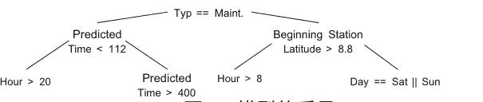
**图1. 模型的质量。**

从表 2 和图 1 可以看出，我们模型的质量明显高于 RFI 模型的质量。特别是在维护方面，我们的 MAPE 低于 10%，比 RFI 模型的准确性高出 3 倍。即使在故障方面，恢复时间模型的准确性也与 RFI 模型相比非常出色。还要注意，从图 1 可以看出，该模型非常易于解释和合理（例如，干预类型位于顶部，与干预位置和天气信息一起）。还要注意，在维护方面，RFI 模型的影响非常大，这是预期的，因为 RFI 模型已经具有相当高的预测能力。

### 4 讨论

在这项工作中，我们处理了从铁路信息系统、天气信息和操作员经验等外部变量中获取的数据，以预测铁路网络的一部分在资产干预后的恢复时间的问题。此外，鉴于这个特定的应用非常以人为导向，需要构建一个尽可能可解释的模型，以帮助操作员在决策时不仅仅基于预测，还基于模型的功能形式。

出于这些原因，我们提出了一种能够产生易于解释的模型、计算效率高且有效，并能处理大量历史干预的方法。来自意大利铁路网络的 RFI 提供的数据支持我们的提议，无论是在模型质量还是可解释性方面。

$^4$ 由于保密问题，没有报告具有更多层级的完整模型。

致谢。本研究得到了欧盟的支持，通过 IN2DREAMS 项目（欧盟的 Horizon 2020 研究和创新计划，授予协议号 777596）。

### 参考文献

1. Ahren, T., Parida, A.: 用于铁路基础设施基准测试的维护绩效指标（MPIs）：案例研究。Benchmarking Int. J. **16**(2), 247–258 (2009)
2. Cacchiani, V., Huisman, D., Kidd, M., Kroon, L., Toth, P., Veelenturf, L., Wagenaar, J.: 实时铁路重新调度的恢复模型和算法概述。Transp. Res. Part B Methodol. **63**, 15–37 (2014)
3. 意大利天气服务：天气数据（2018 年）。http://www.cartografiarl.regione.liguria.it/SiraQualMeteo/script/PubAccessoDatiMeteo.asp。2018 年 10 月 16 日访问
4. James, G., Witten, D., Hastie, T., Tibshirani, R.: 统计学习导论。Springer, 纽约（2013 年）
5. 孟, X., 布拉德利, J., 亚伍兹, B., 斯帕克斯, E., 文卡塔拉曼, S., 刘, D., 弗里曼, J., 蔡, D.B., 阿姆德, M., 欧文, S.: MLlib: Apache Spark 中的机器学习。J. Mach. Learn. Res. **17**(1), 1235–1241 (2016 年)
6. Oneto, L.: 模型选择和错误估计无需痛苦。WIREs Data Min. Knowl. Discov. **8**(4), e1252 (2018 年)
7. Shalev-Shwartz, S., Ben-David, S.: 理解机器学习：从理论到算法。剑桥大学出版社，剑桥（2014 年）
8. Zoeteman, A.: 资产维护管理：欧洲铁路的最新技术。Int. J. Crit. Infrastruct. **2**(2-3), 171–186 (2006 年)

---

## 铁路网络中的列车超车预测：大数据视角

Luca Oneto$^{1(\text{\Letter})}$, Irene Buselli$^1$, Alessandro Lulli$^1$, Renzo Canepa$^2$, Simone Petralli$^2$, 和 Davide Anguita $^1$

$^1$ DIBRIS, Genoa 大学, Via Opera Pia 13, 16145 Genoa, Italy  
{luca.oneto,irene.buselli,alessandro.lulli,davide.anguita}@unige.it

$^2$ Rete Ferroviaria Italiana S.p.A., Via Don Vincenzo Minetti 6/5, 16126 Genoa, Italy  
{r.canepa,s.petralli}@rfi.it

**摘要。** 每当由于维护、延误或其他原因，铁路网络上的两列或多列火车相对位置错误时，需要决定何时、何地以及如何超车。这是一个非常复杂的问题，火车运营商每天都在利用他们的知识和经验来解决，因为目前没有可用于大规模铁路网络的有效自动工具。在这项工作中，我们提出了一个列车超车混合预测系统。我们的模型是混合的，因为它能够既包含运营商的经验，又能够将这些知识与来自铁路网络历史数据的信息结合起来，使用最先进的数据驱动技术。来自意大利铁路网络的真实数据结果将显示出所提出的解决方案优于完全数据驱动方法，并且可以帮助运营商及时确定和安排最佳的列车超车方案。

**关键词：** 铁路网络 · 列车超车 · 大数据 · 数据驱动模型 · 混合模型

### 1 引言

铁路运输系统（RTSs）在公共流动性和货物交付中起着至关重要的作用。在欧洲，铁路上运输的人员和货物数量不断增加，导致网络拥堵 [5]。增加容量的唯一快速和经济可行的方法是提高日常运营的效率，以便能够控制更多的运行列车，而无需在新的实物资产上进行大规模的公共投资 [23]。因此，近年来，RTSs 的各方都开始了广泛的现代化计划，利用先进的信息和通信解决方案。目标是提高系统安全性和服务可靠性，提升乘客体验，提供更高的运输能力并降低运营成本。

在这项工作中，我们专注于分析大规模实时系统中的列车运动问题，以了解和预测它们的行为。具体而言，我们将研究列车超车预测问题，利用新实时系统信息系统产生和存储的大量数据，采用数据驱动的解决方案。列车超车预测是预测何时需要或更好地让列车超车，以最小化列车延误和相关的惩罚成本的问题。研究这个问题可以提高服务质量、优化列车运行以及降低基础设施管理者和列车运营商的管理成本。

已经有大量文献涵盖了与列车运行相关的预测问题 [10]。然而，一般来说，大多数研究都集中在不同的问题上：运行时间预测、停留时间预测和列车延误预测。这些研究分别预测了列车在两个检查点之间通过铁路段所需的时间 [1,6,11,13,15,17]，在检查点停留的时间以及实际到达（或离开）时间与列车行程中各站点的计划时间之间的差异 [2,3,9,12,14,19,20,24]。

相反，列车超车预测问题从未被研究过，也没有利用数据驱动的解决方案。目前的解决方案将这个问题建模为一个复杂的优化任务 [7,8,16]，通常很难解决（或在大规模铁路网络中不可能解决），并且在建模阶段需要大量人力投入。因此，实际上，目前的解决方案是依赖操作员的经验和对网络的了解。我们称这个解决方案为基于经验的模型（EBM）。我们在这里提出的一个解决方案是采用数据驱动的方法。在这个框架中，可以利用先进的分术方法 [10,13] 来分析历史数据并构建自动预测何时最好进行列车超车的数据驱动模型（DDMs）。

不幸的是，DDMs 也有其缺点，因为它们不容易处理除历史数据之外的问题的先验知识。因此，在这项工作中，我们提出了一种混合方法来解决列车超车预测问题，将 EBMs 和 DDMs 结合在一起，灵感来自我们以前的工作，在那些工作中，我们采用了类似的思路来处理运行时间、停留时间和列车延误预测问题 [18]。这两种方法的结合使我们能够创建一个模型，展示了 EBMs 和 DDMs 的优点，同时限制了它们的缺点。一方面，封装操作员的经验可以创建一个可解释和稳健的模型，在像列车操作员这样的人类导向环境中可以更好地利用。另一方面，利用数据驱动技术可以构建更准确的预测模型。由意大利铁路基础设施管理机构（RFI）提供的关于意大利铁路网络的真实数据的结果将展示我们提案的有效性。

### 2 列车超车预测问题

在本节中，我们介绍了正式描述列车超车问题所需的符号。铁路网络可以用图形轻松描述。图 1 描述了一个简化的铁路网络，其中有两列火车按照它们的行程行驶。让我们考虑位于站点 $C_B$ 的火车，其行程为（起点站为 $C_A$，终点站为 $C_F$，包含若干停靠和中转点）。在接下来的内容中，我们将不区分火车停靠或中转的站点和实际站点及测量点，统一将其称为检查点。铁路段是网络中两个连续检查点之间的部分，也具有方向性（例如，从 $C_D$ 到 $C_E$ 的中转与从 $C_E$ 到 $C_D$ 的中转是不同的）。

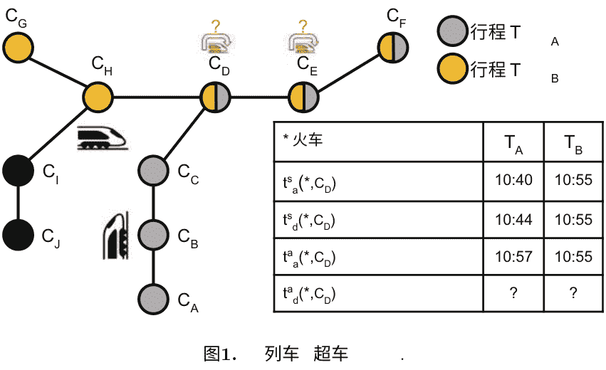

对于行程中的任何检查点 $C$，列车 $T$ 被安排在不同的指定时间到达和离开，分别在时间表中定义为 $t^s_a(T, C)$ 和 $t^s_d(T, C)$。实际时间（无论是到达时间 $t^a_a(T, C)$ 还是离开时间 $t^a_d(T, C)$）与计划时间之间的差异被定义为列车延误。每个列车和检查点都有额外的特征，如唯一标识符、列车类别和铁路网络类别。然而，由于许多不同原因引起的延误，两列火车在行程中处于错误的相对位置是很常见的。

让我们再次参考图 1，对问题进行图形描述。在我们的场景中，当 $t^s_a(T_A, C_D) < t^s_a(T_B, C_D)$ 并且 $t^a_a(T_A, C_D) > t^a_a(T_B, C_D)$ 时，我们说两列火车在检查点 $C_D$ 处于错误的相对位置，即 $T_A$ 预计在检查点 $C_D$ 之前到达，但由于某种原因，火车 $T_B$ 在检查点 $C_D$ 之前到达。

当这样的事件发生时，需要尽快预测和执行，以便在最小化延误和偏离时间表的目的下，确定火车的正确相对位置。为了执行超车，需要预测在行程中哪个是最佳的后续站点，以最小化与时间表的偏离。

请注意，并非所有的检查点都允许超车（例如，并非所有的检查点都有额外的轨道可供超车）。

在图 1 的示例中，系统检测到检查点 $C_D$ 中的错误位置，因为火车 $T_A$ 计划在火车 $T_B$ 之前到达检查点 $C_D$，但由于火车 $T_A$ 延误，因此火车 $T_B$ 在检查点 $C_D$ 之前到达。在检测到错误的相对位置后，系统开始评估在火车 $T_A$ 和 $T_B$ 的行程中当前或后续共同的检查点上，何时以及是否更好地让火车 $T_A$ 超车火车 $T_B$。

### 3 我们的提案：混合模型

在这项工作中，我们提出了一种混合模型来解决列车超车预测问题。具体而言，我们将超车问题映射为一系列二元分类问题，任务是预测在特定检查点是否会进行超车。这个想法是利用操作员的经验（EBM）和历史数据，结合先进的数据分析方法（DDM）。我们的目标是构建一个准确、动态、稳健且可解释的模型，能够支持操作员的决策。

为此，我们提出了一个两级架构。在顶层，我们根据操作员的建议构建一棵树，捕捉两列火车在超车过程中的特征，并添加额外信息以更好地描述所研究的场景。这样的顶层树封装了操作员多年来开发的 EBM。

在底层，对于构成树的每个叶子节点，我们建立了一个数据集，其中包含了过去发生的所有超车事件。这个数据集在特征方面比顶层树更丰富，利用这一点，我们建立了一个能够提高顶层树准确性的 DDM。

更详细地说，顶层决策树包含了操作员在两列火车相对位置错误时做出决策的经验（见第 2 节）。所提出的 HM 根据一系列相似性变量（见表 1）将所有可能的情况分成子组，这些变量是与 RFI 专家共同定义的，它们使我们能够在一方面拥有稳健的统计数据，因为可以从一组合理的相似超车情况中学习，另一方面拥有丰富的特征集，能够捕捉到现象的变化性。然后，在树的每个叶子中，我们利用一个 DDM 来从该特定叶子的历史数据中学习，该 DDM 基于相对于树中使用的特征的超级集（见表 2）。特别地，每个叶子都是一个随机森林（RF）分类器 [4]（根据 [21] 中开发的 DDM 的经验），它预测火车是否会在特定检查点进行超车。整个 HM 是逐步构建和更新的，一旦记录到新的火车运动。

在预测阶段，我们只是考虑特定的超车情况并利用相应的RF分类器进行实际预测。

## 表1. HM顶层决策树特征集（Cat.表示分类）

| 特征名称 | 分类 | 描述 |
| :--- | :--- | :--- |
| 铁路区段 | 是 | 考虑的铁路区段 |
| 铁路检查点 | 是 | 考虑的铁路检查点 |
| 列车类型 | 是 | 考虑的列车类型 |
| 白天 | 否 | 以小时为粒度的一天中的时间 |
| 工作日 | 是 | 一周中的日期 |
| 上次延误 | 否 | 上次已知延误的粒度（以分钟为单位）（[0,2], (2,5], (5,10], (10,20], (20,30], (30,60], (60,120], (120, ∞)） |
| 天气条件 | 是 | 天气条件（晴天，小雨，大雨，雪） |

## 表2. HM底层RF特征集（Cat.表示分类）

| 特征名称 | Cat. | 描述 |
| :--- | :--- | :--- |
| 天气信息 | 是 | 火车行程中所有检查点的天气条件（晴天、小雨等）（对于已经经过的检查点，我们使用实际天气，对于未来的检查点，我们使用预测的天气条件） |
| 过去火车延误 | 否 | 过去火车延误的平均值（以秒为单位）和最后已知的火车延误 |
| 过去停留时间 | 否 | 过去实际停留时间与计划停留时间之间的平均差值（以秒为单位）和最后已知的实际停留时间与计划停留时间的差值 |
| 过去运行时间 | 否 | 过去实际运行时间与计划运行时间之间的平均差值（以秒为单位）和最后已知的实际运行时间与计划运行时间的差值 |
| 网络拥塞 | 否 | 在过去和未来检查点的实际和计划时间周围的20分钟时间段内穿过检查点的火车数量 |
| 网络拥塞延误 | 否 | 列车行程中检查点周围20分钟内实际和计划时间分别的平均列车延误 |

### 4 实验评估

在本节中，我们将对来自意大利铁路网络并由RFI提供的真实世界数据进行广泛评估，以展示我们提出的HM的有效性。我们将通过使用完全基于DDM的基线来证明我们方法的有效性，该基线在[18,21]中用于预测延误、运行时间和停留时间。

#### 4.1 可用数据

实验利用RFI提供的关于意大利铁路网络的真实数据进行。具体而言，RFI提供了：

- 关于列车运行的数据，包括以下信息：日期、列车编号、检查点编号、实际到达时间、到达延误、实际出发时间、出发延误和事件类型。事件类型字段可以有不同的值：起点（O）、目的地（D）、停靠（F）、中转（T）；
- 时间表，包括特殊列车的规划和取消。

为了这项工作，RFI提供了对一个关键（每天需要计划很多超车的）意大利地区2016年整个太阳年的12个月（即数据）的访问权限。这些数据涉及超过3,000列车和200个检查点。数据集包含5,000,000列车运动。

为了提高预测器的质量，我们还利用了面向大数据的方法，利用了该地区的天气数据作为外部信息，这些数据可以从意大利气象服务[22]免费获取。对于每个检查点，我们考虑最近的气象站。然后，我们收集了相同时间段的太阳辐射和降水的历史数据。从这些数据中可以提取实际和预测的天气条件（晴天、雨天、大雨和雪天）。

#### 4.2 我们的基准模型：数据驱动模型

为了更好地了解我们的HM的潜力和有效性，我们决定使用纯粹的DDM作为基准。DDM是通过去除HM中描述在第3节中建模的操作员经验的顶层树结构，并基于整个可用数据集和表2中报告的特征构建的单个DDM。通过去除HM的顶层结构，我们基本上从HM中删除了操作员的经验，从而得到一个完全的DDM。我们不像在HM中创建具有相似特征的超车情况子组，而是将学习一切并进行预测的任务交给DDM来完成。

由于意大利RTS信息系统不存储操作员的预测结果，而是仅依靠他们的直觉和经验，因此无法与完全的EBM进行比较。

^1 由于保密问题，我们无法报告所有细节。

#### 4.3 结果

我们从2016年开始分析，展示了哪些检查点参与了最多和最少的超车，并且HM和DDM识别出的超车数量。表3显示了发生最多和最少超车的5个检查点。

##### 表3. 2016年超车最多和最少的检查点

| 检查点名称 (最多) | 实际 | HM | DDM | 检查点名称 (最少) | 实际 | HM | DDM |
| :--- | :--- | :--- | :--- | :--- | :--- | :--- | :--- |
| 检查点 A | 624 | 518 | 378 | 检查点 F | 17 | 0 | 1 |
| 检查点 B | 273 | 248 | 226 | 检查点 G | 14 | 12 | 11 |
| 检查点 C | 220 | 211 | 152 | 检查点 H | 13 | 2 | 2 |
| 检查点 D | 188 | 206 | 185 | 检查点 I | 11 | 1 | 3 |
| 检查点 E | 177 | 168 | 164 | 检查点 L | 10 | 2 | 0 |

从表3我们可以观察到：

- 具有最高超车次数的3个检查点占2016年考察区域总超车次数的约50%；
- HM预测接近实际值；
- 总体上，HM低估了超车次数，这是预期的，因为该模型在开始正确工作之前需要一定数量的历史数据；
- DDM在每个检查点中低估了超车次数，反映出学习如何正确预测超车所需的数据量更大。

可以利用表3的信息来确定哪些检查点可能发生超车。实际上，DDM需要直接从数据中学习这些信息，而在HM中，我们可以利用操作员的经验并直接将这些信息插入模型中。

在意大利RTS中，不是所有的检查点都可以超车，在研究区域中，只有48个检查点可以进行超车。

现在我们准备展示HM在识别超车方面的精确度。表4和表5分别描述了DDM和HM的混淆矩阵。

#### 表4. DDM预测的超车的混淆矩阵（ALL：所有列车。REG：区域列车。HS：高速列车。FRE：货运列车）

| ALL | 是 | 否 | | REG | 是 | 否 | | HS | 是 | 否 | | FRE | 是 | 否 |
|---|---|---|---|---|---|---|---|---|---|---|---|---|---|---|
| **是** | 2246 | 893 | | **是** | 1082 | 476 | | **是** | 1055 | 307 | | **是** | 109 | 110 |
| **否** | 639 | 12657 | | **否** | 347 | 7870 | | **否** | 175 | 2599 | | **否** | 117 | 2188 |

#### 表5. HM预测的超车的混淆矩阵（全部：所有火车。区域：区域列车。高速：高速列车。货运：货运列车）

| 全部 | 是 | 否 | | 区域 | 是 | 否 | | 高速 | 是 | 否 | | 货运 | 是 | 否 |
|---|---|---|---|---|---|---|---|---|---|---|---|---|---|---|
| **是** | 2355 | 783 | | **是** | 1121 | 436 | | **是** | 1112 | 250 | | **是** | 122 | 97 |
| **否** | 500 | 12827 | | **否** | 318 | 7899 | | **否** | 103 | 2671 | | **否** | 79 | 2226 |

我们还报告了与不同列车类型相关的混淆矩阵。从表4和表5可以观察到：

- HM明显优于DDM；
- HM在预测两列火车不交换位置时非常准确；
- 货运列车是进行最少超车次数的列车，也是受到最大误差影响的列车；
- 高速列车是进行最多超车次数的列车，也是HM误报和漏报次数最少的列车。

最后，图2报告了HM和DDM在整个2016年检测超车时的准确性。

图2。超车预测准确性随时间变化。总体准确性（左）。召回率（右）。

我们同时报告总体准确性和召回率（在检查点中正确预测的实际超车）。从图2中我们可以观察到：

- 需要1个月的数据才能使HM完全运作，而DDM需要更多的数据。
- 总体上，HM相对于DDM显示出更高的准确性，并且这种优势在整个年度都是恒定的。

### 5 结论

在这项工作中，我们处理了理解和预测列车超车的问题。为此，我们利用了一种混合方法，能够将网络知识、操作员经验、历史数据和其他外部变量封装在一个模型中，从这个研究领域的最新方法中获得灵感。

结果是一个动态的、可解释的和稳健的混合数据分析系统，能够处理非重复事件、网络行为的变化，并考虑复杂的外部信息，如天气信息。

基本上，所提出的方法保留了基于经验的方法和数据驱动方法的优点，并限制了它们的弱点。来自意大利铁路网络的真实世界数据的结果表明，所提出的解决方案在解决列车超车预测问题方面取得了显著的成果。

**致谢。** 本研究得到了欧盟的支持，通过IN2DREAMS项目（欧盟的Horizon 2020研究和创新计划，授予协议号777596）。

### 参考文献

- 1. Albrecht, T.: 通过同时控制列车运行时间来减少轨道交通系统的功率峰值和能耗。WIT Trans. State-of-Art Sci. Eng. 39(2010)
- 2. Barta, J., Rizzoli, A.E., Salani, M., Gambardella, L.M.: 对铁路货运运输网络中的延误进行统计建模。在: Winter Simulation Conference (2012)的论文集中
- 3. Berger, A., Gebhardt, A., Müller-Hannemann, M., Ostrowski, M.: 在大型列车网络中进行随机延误预测。在: OASics-OpenAccess Series in Informatics, vol. 20 (2011)
- 4. Breiman, L.: 随机森林. 机器学习. 45(1), 5–32 (2001)
- 5. Bryan, J., Weisbrod, G.E., Martland, C.D.: 铁路货运解决道路拥堵问题的最终报告和指南. 交通研究委员会 (2007)
- 6. Daamen, W., Goverde, R.M.P., Hansen, I.A.: 非歧视性自动注册列车延误. 网络空间经济学. 9(1), 47–61 (2009)
- 7. D'Ariano, A.: 改进实时列车调度: 模型, 算法和应用. TRAIL研究学校 (2008)
- 8. D’Ariano, A., Pranzo, M.: 一种用于在严重干扰下最小化调度区域延误传播的先进实时列车调度系统. Netw. Spat. Econ. 9(1), 63–84 (2009)
- 9. 方, W., 杨, S., 姚, X.: 铁路网络重新调度问题模型和解决方法综述。IEEE智能交通系统杂志 16(6), 2997–3016 (2015)
- 10. Ghofrani, F., 何, Q., Goverde, R.M., 刘, X.: 大数据分析在铁路运输系统中的最新应用综述。交通研究C部分新兴技术 90, 226–246 (2018)
- 11. Goverde, R.M.P., 孟, L.: 铁路运营的高级监控和管理信息。铁路运输规划与管理杂志 1(2), 69–79 (2011)
- 12. Hansen, I.A., Goverde, R.M.P., Van Der Mee, D.J.: 在线列车延误识别和运行时间预测。在: 2010年第13届国际IEEE智能交通系统会议 (ITSC)，第1783–1788页 (2010年)
- 13. Kecman, P., Goverde, R.M.P.: 列车描述器事件数据的过程挖掘和自动冲突识别。在: 铁路计算机第13卷: 铁路和其他交通系统的计算机系统设计和运行, 第127卷, 第227页 (2013年)
- 14. Kecman, P., Goverde, R.M.P.: 在线数据驱动的自适应火车事件预测。IEEE智能交通系统杂志 16(1), 465–474 (2015)
- 15. Ko, H., Koseki, T., Miyatake, M.: 动态规划在火车运行轮廓优化中的应用。WIT建筑环境交易 74 (2004)
- 16. Lamorgese, L., Mannino, C.: 实时火车调度问题的精确分解方法。运筹学杂志 63(1), 48–64 (2015)
- 17. Lukasewicz, P.: 火车能耗和运行时间。博士论文，铁路技术，车辆工程系，皇家理工学院，斯德哥尔摩 (2001)
- 18. Lulli, A., Oneto, L., Canepa, R., Petralli, S., Anguita, D.: 大规模铁路网络列车运动：一种动态、可解释和鲁棒的混合数据分析系统。在: IEEE数据科学与高级分析国际会议 (2018)
- 19. Marković, N., Milinković, S., Tikhonov, K.S., Schonfeld, P.: 用支持向量回归分析乘客火车到达延误。交通研究C部分新兴技术 56, 251–262 (2015)
- 20. Milinković, S., Marković, M., Vesković, S., Ivić, M., Pavlovići, N.: 用模糊Petri网模型估计火车延误。模拟建模实践理论 33, 144–157 (2013)
- 21. Oneto, L., Fumeo, E., Clerico, G., Canepa, R., Papa, F., Dambra, C., Mazzino, N., Anguita, D.: 包括外部天气数据的火车延误预测系统的高级分析。在: IEEE国际数据科学和高级分析会议上 (2016)
- 22. 利古里亚大区: 利古里亚大区的天气数据 (2018年)。 http://www.cartografiarl.regione.liguria.it/SiraQualMeteo/script/PubAccessoDatiMeteo.asp
- 23. Trabo, I., Landex, A., Nielsen, O.A., Schneider-Tilli, J.E.: 欧洲铁路项目的成本基准比较-能帮助降低成本吗？ 在: 铁路运营建模和分析国际研讨会-RailCopenhagen (2013年)
- 24. Wang, R., Work, D.B.: 基于数据驱动的客运列车延误估计方法。在: 2015年IEEE第18届智能交通系统国际会议 (ITSC)，第535-540页 (2015年)

---

## 具有混合模型的空化噪声谱预测

Francesca Cipollini$^{1(✉)}$, Fabiana Miglianti$^{2(✉)}$, Luca Oneto$^{1(✉)}$, Giorgio Tani$^{2(✉)}$, Michele Viviani$^{2(✉)}$, and Davide Anguita$^{1(✉)}$

$^1$ DIBRIS - 热那亚大学, Via Opera Pia 13, 16145 Genova, 意大利  
francesca.cipollini@edu.unige.it, {luca.oneto, davide.anguita}@unige.it

$^2$ DITEN - 热那亚大学, Via Opera Pia 11A, 16145 Genova, 意大利  
fabiana.miglianti@edu.unige.it, {giorgio.tani, michele.viviani}@unige.it

**摘要。** 在许多实际应用中，物理知识和数据科学可以结合在一起，以获得相互的好处。因此，可以从这两种方法的结合中提出所谓的混合模型。在这项工作中，我们提出了一种用于预测船舶螺旋桨空化涡噪声的混合方法，采用在空化隧道中进行的大量模型实验收集的真实数据。结果将展示该提案的有效性。

**关键词：** 空化噪声预测 · 物理模型 · 数据驱动模型 · 混合模型

### 1 引言

近年来，结合物理现象知识和统计推断的模型在许多实际应用中变得非常感兴趣[2]。在这种情况下，船舶螺旋桨水下辐射噪声是这些混合模型 (HMs) 的一个有趣的应用领域，特别是当螺旋桨空化时。如今，模型比例试验 (MSTs) 被认为是预测空化噪声谱的最先进技术。不幸的是，它们受到尺度效应的负面影响，这可能会改变一些有趣的空化现象相对于全尺度螺旋桨的发生[6]；因此，对于一些船舶操作条件，正确地在MSTs中重现空化模式并不是微不足道的。此外，MSTs非常昂贵且耗时，不可能在设计的早期阶段包括它们。然而，这些测试期间收集的数据可以用于调整数据驱动模型 (DDMs) [10]，而描述发生现象的物理模型 (PM) 方程可以用于改进DDMs的预测。

因此，在本文中，我们提出采用HMs来预测空化涡旋频率和声压级，以通过将PM和DDM结合在一起，充分利用两者的最佳特性[2]。为了开发和测试本文提出的模型，我们首先通过大量的空化隧道MST收集了一个数据集，然后在这些真实数据上对HMs进行了调整和验证，显示出令人满意的准确性。

### 2 模型尺度测试

在热那亚大学的空化隧道[9]进行了实验，总共进行了164个螺旋桨加载条件的测试，几乎均分为两个螺旋桨。为了提供对空化噪声的全面描述，选择了收集噪声样本的工作条件。因此，所定义的工作点收集的量被用作开发的HMs的输入特征，并在表1中总结。

所提出的HMs的输出数据由空化涡旋的共振频率和辐射噪声级（RNL）表示，即 $f_c$ 和 $RNL_c$ 如图1所示。必须指出的是，$f_c$ 和 $RNL_c$ 都可以通过采用PMs来确定，其方法类似于[1]中介绍的共振频率和[7]中介绍的其RNL。在图1中，$\sigma_{tip}$ 是叶片尖端的空化指数，$Z$ 是叶片数，$n$ 是螺旋桨转速，$K_t$ 是推力系数，$\sigma_n$ 是基于转速的空化指数，参数 $k$ 被选择为3。通过曲线拟合实验数据来估计 $\tau$ 和 $a_p$ 的值。

图1. 空化噪声谱和 $f_c$ 和 $RNL_c$ 物理方程。

### 3 混合建模

让我们考虑一个输入空间 $\mathcal{X}$，一个输出空间 $\mathcal{Y}$，以及一个关系 $\mu: \mathcal{X} \rightarrow \mathcal{Y}$ 要学习。在这个背景下，我们将一个 HM 定义为 $h: \mathcal{X} \rightarrow \mathcal{Y}$，它近似 $\mu$，其中 $\mathcal{X}$ 是表1中的特征空间，$\mathcal{Y}$ 是由...

#### 表 1. 数据集输入变量

| 螺旋桨工作参数 | 单位 | 空化类型 | 单位 |
| :--- | :--- | :--- | :--- |
| 螺距比 | [ ] | 吸力面尖涡 | [ ] |
| 螺距设置 | [°] | 脱离尖涡 | [ ] |
| 前进系数 | [ ] | 0°处的吸力面尖涡 | [ ] |
| 推力系数 | [ ] | 吸力面片 | [ ] |
| 扭矩系数 | [ ] | 吸力面片在0°处 | [ ] |
| 开放水效率 | [ ] | 吸力面根部气泡 | [ ] |
| 先进空化指数 | [ ] | 吸力面气泡 | [ ] |
| 旋转空化指数 | [ ] | 片面涡流 | [ ] |
| 先进速度 | [m/s] | 压力面尖涡 | [ ] |
| 螺旋桨旋转 | [rps] | 压力面片 | [ ] |
| 推力 | [kgf] | 压力面根部气泡 | [ ] |
| 扭矩 | [kgf·cm] | | |
| 相对压力 | [mBar] | | |
| **尾流参数** | | **攻角** | |
| 描述 | 单位 | 描述 | 单位 |
| 0.7R处的尾流宽度 | [°] | 0.7R处的最大和最小攻角 | [°] |
| 0.7R处的左尾流斜率 | [°] | 0.7R处的平均攻角 | [°] |
| 0.7R处的右尾流斜率 | [°] | 最大攻角位置在0.7R | [°] |
| 0.9R处的尾流宽度 | [°] | 0.9R处的最大和最小攻角 | [°] |
| 0.9R处的左侧尾流斜率 | [°] | 0.9R处的平均攻角 | [°] |
| 0.9R处的右侧尾流斜率 | [°] | 0.9R处最大攻角的位置 | [°] |

$f_c$ 和 $RNL_c$ 值。为了适应这个问题，需要利用两组数据 $\mathcal{D}_n$ 和 $\mathcal{T}_m$，分别调整 $h$ 和评估其性能。

需要使用 $\mathcal{T}_m$，因为在 $\mathcal{D}_n$ 上调整 $h$ 时产生的误差存在乐观偏差，因为 $\mathcal{D}_n$ 已经用于调整 $h$。对于这项工作，使用平均绝对百分比误差（MAPE）来衡量 $\mathcal{T}_m$ 上近似 $\mu$ 时 $h$ 的误差，通过以百分比形式计算 $h$ over $\mathcal{T}_m$ 的绝对损失值。

由于作为 HM，$h$ 应该能够同时考虑问题的物理知识和数据中隐藏的信息，因此应该能够从数据中学习，而不会与 PM 过于不同。这个要求可以映射到多任务学习（MTL）问题 [2,3]，通过学习算法 $\mathscr{A}_H$ 利用 $\mathcal{D}_n$ 中的数据和 PM 来学习 $h$。由于需要一个 PM 来定义 $h$，我们首先开发两个 PM 来估计 $f_c$ 和 $RNL_c$ 与输入变量之间的关系，使用图1中的模型。

为了将 MTL 方法应用于这个案例，我们将定义三个点的三元组 $\mathcal{D}_n = \{(\boldsymbol{x}_1, y_1, p_1), \cdots, (\boldsymbol{x}_n, y_n, p_n)\}$，其中 $p_i$ 是点 $\boldsymbol{x}_i$ 的 PM 输出，其中 $i \in \{1, \cdots, n\}$。因此，可以修改更一般的核正则化最小二乘（KRLS）公式，以便同时学习一个共享模型 $h(\boldsymbol{x}) = \boldsymbol{w}^T \boldsymbol{\varphi}(\boldsymbol{x})$ 和一些任务特定模型 $h_i(\boldsymbol{x}) = \boldsymbol{w}_i^T \boldsymbol{\varphi}(\boldsymbol{x})$，其中 $i \in \{y, p\}$，这些模型应该接近共享模型 [8]，并得到以下要最小化的成本函数：

$$\boldsymbol{w}^*, \boldsymbol{w}_y^*, \boldsymbol{w}_p^* : \arg \min_{\boldsymbol{w}, \boldsymbol{w}_y, \boldsymbol{w}_p} \sum_{i=1}^n \left[ \boldsymbol{w}^T \boldsymbol{\varphi}(\boldsymbol{x}) - y_i \right]^2 + \left[ \boldsymbol{w}^T \boldsymbol{\varphi}(\boldsymbol{x}) - p_i \right]^2 + \left[ \boldsymbol{w}_y^T \boldsymbol{\varphi}(\boldsymbol{x}) - y_i \right]^2 + \left[ \boldsymbol{w}_p^T \boldsymbol{\varphi}(\boldsymbol{x}) - p_i \right]^2 + \lambda \|\boldsymbol{w}\|^2 + \theta (\|\boldsymbol{w} - \boldsymbol{w}_y\|^2 + \|\boldsymbol{w} - \boldsymbol{w}_p\|^2), \qquad (1)$$

其中 $\lambda$ 是 KRLS 的正则化超参数，$\theta$ 是一个超参数，用于使共享模型接近任务特定模型。通过利用核技巧，可以重新表述问题 (1)，得到共享函数的公式 $h(\boldsymbol{x}) = \boldsymbol{w}^T \boldsymbol{\varphi}(\boldsymbol{x}) = \sum_{i=1}^n (\alpha_i + \alpha_{i+n}) K(\boldsymbol{x}_i, \boldsymbol{x})$。

为了设置 $\boldsymbol{\varphi}$ 和核 $K$，可以应用于 $\mathcal{D}$ 中的一个转换过程，称为特征映射（FM）[8]，其中定义了一个函数 $\varphi : \mathcal{X} \rightarrow \Psi$，将 $X$ 映射到一个新的特征空间，在该空间中可以学习一个简单的线性模型。在这项工作中，选择了 FM，考虑到对空化噪声现象的专业知识：

$$\boldsymbol{\varphi}(\boldsymbol{x}) = \left[ \prod_{i=1}^{5d} v_i^{k_i} : \sum_{i=1}^{5d} k_i = j, j \in \{0, 1, \dots, p\} \right]^T \in \mathbb{R}^{\sum_{j=0}^p \binom{5d}{j}} \qquad (2)$$
$$\boldsymbol{v} = \left[ x_1, \dots, x_d, \frac{1}{x_1}, \dots, \frac{1}{x_d}, \ln(x_1), \dots, \ln(x_d), e^{x_1}, \dots, e^{x_d}, e^{-x_1}, \dots, e^{-x_d} \right]^T \in \mathbb{R}^{5d}.$$

请注意，$p$ 是多项式的期望次数，$c$ 是在多项式中高阶项与低阶项之间权重影响的参数。这两个参数与 $\lambda$ 和 $\theta$ 一起是需要调整以优化最终模型性能的超参数。

在 FM 期间生成的许多不必要的特征通过特征选择（FS）被丢弃，以选择其中最具信息量的特征来提高模型的泛化性能 [4]。

为此，我们将采用 [4] 中描述的向后消除技术。由于每个 MTL 模型都由一组超参数 $\mathcal{H}$ 来描述，因此需要采用适当的模型选择（MS）过程 [5]。有几种方法可用于模型选择，但像本研究中使用的非参数 Bootstrap（BTS）[5] 这样的重采样方法代表了最先进的技术。在 BTS 中，原始数据集 $\mathcal{D}_n$ 被重复采样 $n_r$ 次，以构建两个独立的数据集，分别称为训练集和验证集 $\mathcal{L}_l^r$ 和 $\mathcal{V}_v^r$，其中 $r \in \{1, \cdots, n_r\}$ 且 $l = n$，其中 $r$ 设置为 500。请注意，$\mathcal{L}_l^r \cap \mathcal{V}_v^r = \varnothing$，$\mathcal{L}_l^r \cup \mathcal{V}_v^r = \mathcal{D}_n$。然后，在算法 $\mathscr{A}_H$ 的可能超参数集合 $\mathfrak{H} = \{\mathcal{H}_1, \mathcal{H}_2, \dots\}$ 中，最佳组合的超参数 $\mathcal{H}^*$ 应该是能够在验证集上实现较小误差的组合。

### 4 结果和讨论

在本节中，将采用第 2 节描述的数据对 PM 和 HM 的性能进行测试，该数据由 164 个样本和 38 个特征组成。通过随机分割全部 164 个样本，将 $\mathcal{D}$ 和 $\mathcal{T}_m$ 创建，将 90% 的数据保留在 $\mathcal{D}$ 中，剩余的 10% 保留在 $\mathcal{T}_m$ 中。在 MS 阶段调整的 HM 的超参数集合为 $\mathcal{H}=\{p, c, \lambda, \theta\}$，选择自 $\mathcal{H}=\{1, 2, \dots, 10\} \times \{10^{-4}, 10^{-3}, \dots, 10^{+4}\} \times \{10^{-4.0}, 10^{-3.8}, \dots, 10^{+4.0}\} \times \{10^{-4.0}, 10^{-3.8}, \dots, 10^{+4.0}\}$。所有实验都重复了 30 次，并且图 2 显示了 PM 和 HM 的测量值和预测值的散点图。

从图 2 可以清楚地看出，相对于 PMs，HMs 可以更准确地预测 $f_c$ 和 $RNL_c$ 值。我们的结果当然还是初步的，未来的工作中我们计划进行更深入的比较，以测试我们提出的方法的质量。然而，在这项工作中，HMs 已经显示出是一种有前途的工具，可以利用物理知识和数据科学来估计空化涡流，这是在大量空化隧道试验中收集的真实世界数据。

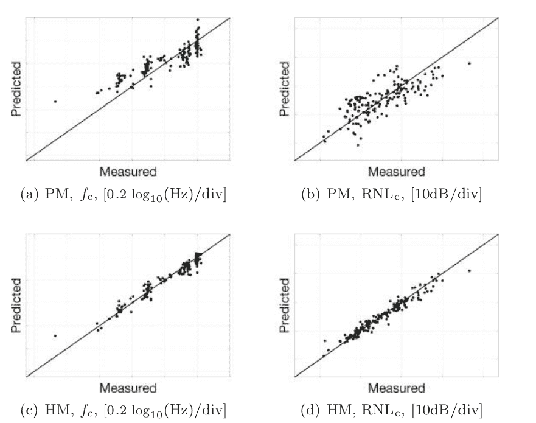

**图 2.** PMs 和 HMs 的实际和预测 $f_c$ 和 $RNL_c$ 的散点图。

### 参考文献

1. Bosschers, J.: 对由空化涡引起的船体压力波动的研究。在: 第一届海洋推进器研讨会论文集 (2009)
2. Caruana, R.: 多任务学习。机器学习。**28**(1), 41–75 (1997)
3. Evgeniou, T., Pontil, M.: 正则化多任务学习。在: ACM SIGKDD 国际知识发现与数据挖掘会议 (2004)
4. Guyon, I., Elisseeff, A.: 变量和特征选择简介。机器学习研究。**3**, 1157–1182 (2003)
5. Kohavi, R., et al.: 交叉验证和自助法在准确性估计和模型选择中的研究。在: 国际人工智能联合会议 (1995)
6. McCormick, B.W.: 关于由升力面后面的涡流产生的空化。基础工程学报。**84**(3), 369–378 (1962)
7. Raestad, A.: 尖涡指数-一种预测螺旋桨噪声的工程方法。《海军建筑师》, 第 11-15 页 (1996)
8. Shalev-Shwartz, S., Ben-David, S.: 机器学习的理论与算法解析。剑桥大学出版社, 剑桥 (2014)
9. Tani, G., Aktas, B., Viviani, M., Atlar, M.: 作为环形试验的一部分的两个中等规模空化隧道水声基准实验比较。海洋工程。**138**, 179-207 (2017)
10. Vapnik, V.N.: 统计学习理论。Wiley, 纽约 (1998)

## 伪逆学习器：新趋势和大数据应用

郭平 $^{1(\otimes)}$, 赵东斌 $^2$, 韩敏 $^3$, 和 冯守波 $^3$

$^1$ 北京师范大学系统科学学院, 中国北京 100875, pguo@ieee.org  
$^2$ 中国科学院自动化研究所, 中国北京, dongbin.zhao@ia.ac.cn  
$^3$ 大连理工大学电子信息与电气工程学院, 中国大连, minhan@dlut.edu.cn, fsb@mail.dlut.edu.cn

**摘要**：伪逆学习器（PIL）是一种使用伪逆学习算法训练的多层神经网络（MLP），是一种新颖的学习框架。它在大规模计算、高速信号处理、人工智能等领域引起了越来越多的关注。在本文中，我们简要地回顾了伪逆学习算法，并讨论了其特点及其变体。我们提出了一些对 PIL 算法的新观点，并在深度学习框架下介绍了 PIL 算法在自编码器方面的当前发展。还讨论了基于 PIL 的学习的一些新趋势。此外，我们提出了几个有趣的基于 PIL 的应用，以展示在大数据分析主题上的实际进展。

**关键词**：反向传播 · 伪逆学习 · 多层感知机 · 深度神经网络 · 大规模天文数据

### 1 引言

在上世纪八十年代中期进行研究，多层感知机（MLP）是一种前馈神经网络。当 MLP 具有三个以上隐藏层时，它被称为深度神经网络（DNN）。现在它已成功应用于许多监督学习应用。理论和实证研究都表明，MLP 在模式识别方面具有强大的能力 [1]。当隐藏层较少时，网络的权重参数可以通过误差反向传播（BP）算法学习得到 [2,3]。正如我们所知，BP 算法有几个缺点。它通常遇到收敛速度慢和局部最小值问题 [4]。在 BP 算法中，学习率和动量常数等超参数的选择通常很困难。

为了解决上述问题，郭等人 [5] 提出了一种非梯度下降算法，称为伪逆学习（PIL）算法 [6]。与 BP 不同，PIL 算法可以直接精确计算网络权重，而不是迭代优化。PIL 算法仅采用广义线性代数方法，例如伪逆操作和矩阵内积。此外，它基本上不需要设置任何超参数，为用户带来了极大的便利。

本文概述了 PIL 算法及其在大数据分析中的应用。本文的结构如下：第 2 节介绍了原始的伪逆学习算法；第 3 节介绍了几种 PIL 变体；在第 4 节中，我们讨论了 PIL 的新趋势；在第 5 节中，我们通过使用 PIL 提供了几个应用于大数据分析的例子；最后，在第 6 节中得出结论。

### 2 原始伪逆学习算法

BP 算法是神经网络学习中的一项重大发现，但它也有一些缺点，比如收敛速度慢或局部最小值问题。非梯度算法被认为是一种替代方法，其中 PIL 算法是常用的一种 [5,6]。在本文中，我们将以单隐藏层神经网络（SHLN）为例介绍 PIL 算法。

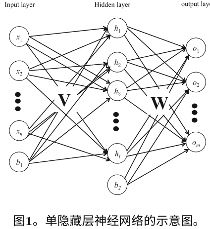

图 1 所示的 SHLN 有三层，包括一个输入层、一个输出层和一个隐藏层。输入层有 $n+1$ 个神经元，隐藏层有 $l+1$ 个神经元，输出层有 $m$ 个神经元。我们用 $\mathbf{x} = (x_1, x_2, \dots, x_n)$ 表示 $n$ 维输入向量，$\mathbf{o} = (o_1, o_2, \dots, o_m)$ 表示 $m$ 维输出向量。输入层的 $b_1$ 称为偏置神经元，和 $b_2$ 是隐藏层偏置神经元。$\mathbf{V}$ 是连接输入和隐藏神经元的权重矩阵，$\mathbf{W}$ 是连接隐藏和输出神经元的权重矩阵。网络映射函数表示为：

$$\begin{aligned} o_k &= \sigma\left(\sum_{j=1}^{l} W_{k,j}g_j + b_2\right), \\ g_j &= \sigma\left(\sum_{i=1}^{n} V_{j,i}x_i + b_1\right). \end{aligned} \qquad (1)$$

其中 $\mathbf{\Theta}$ 代表网络参数组，包括连接权重 $\mathbf{W}, \mathbf{V}$ 和偏置神经元 $b_1, b_2$。而 $\sigma(\cdot)$ 是一个激活函数，如 sigmoid、双曲线、阶跃、径向基函数等。

从上述方程可以看出，$g(\mathbf{Vx} + \mathbf{b}_1)$ 是隐藏层输出，而 $f(\mathbf{Wg} + \mathbf{b}_2)$ 是最后一层输出。如果我们令 $\sum_{i=1}^{n} V_{j,i}x_i + b_1 = \sum_{i=0}^{n} V_{j,i}x_i$（其中 $V_{j,0} = b_1, x_0 = 1$），以及 $\sum_{j=1}^{l} W_{k,j}g_j + b_2 = \sum_{j=0}^{l} W_{k,j}g_j$（其中 $W_{k,0} = b_2, g_0 = 1$），现在矩阵 $\mathbf{V}, \mathbf{W}$ 变成了增广矩阵。在文献中，偏置的值通常设置为 $+1$，而一些研究人员也将其视为变量。为了数学表达简洁起见，隐藏层偏置神经元 $b_2$ 通常被省略。

给定数据集 $D = \{\mathbf{x}^i, \mathbf{t}^i\}$，训练网络是为了找到最小化成本函数的权重参数 $\mathbf{V}, \mathbf{W}$：

$$E = \frac{1}{2N} \sum_{i=1}^N \sum_{j=1}^m \|f_j(\mathbf{x}^i, \mathbf{\Theta}) - t_j^i\|^2. \qquad (2)$$

为了简化，我们可以将这个系统误差函数写成矩阵形式：

$$E = \frac{1}{2N} \|\mathbf{O} - \mathbf{T}\|_F^2. \qquad (3)$$

其中下标 $F$ 代表 Frobenius 范数。传统上，它是通过 BP 算法学习的。但是 BP 算法经常遇到超参数问题和局部最小值问题，这对大多数初学者来说是困难的。为了克服 BP 算法的缺点，Guo 等人在 1995 年提出了 PIL 算法来训练 SHLN。在那项工作中，激活函数被取为双曲函数 $Tanh(\cdot)$。通过最小化以下误差函数来找到权重参数矩阵：

$$\text{最小化} \quad \|\mathbf{YW} - \mathbf{B}\|^2, \qquad (4)$$

其中 $\mathbf{Y} = Tanh(\mathbf{XV})$ 是隐藏层的输出矩阵，$\mathbf{X}$ 是由 $N$ 个输入向量组成的输入矩阵，其行数为 $d = n + 1$，$\mathbf{B} = ArcTanh(\mathbf{T})$，$\mathbf{T}$ 是由 $N$ 个标签向量组成的目标标签矩阵。

方程 (4) 是一个最小二乘问题，可以通过线性代数来解决。方程 (4) 中 $\mathbf{W}$ 的形式解为 $\mathbf{W} = \mathbf{Y}^+ \mathbf{B}$，其中 $\mathbf{Y}^+$ 是 $\mathbf{Y}$ 的伪逆。也可以写成：

$$\mathbf{YW} - \mathbf{B} = \mathbf{YY}^+ \mathbf{B} - \mathbf{B} = \mathbf{0}. \qquad (5)$$

如果方程 (5) 成立，则 $\mathbf{YY}^+ = \mathbf{I}$ 一定满足要求。隐藏层神经元的数量对于 SHLN 来说只是一个超参数，对于大多数初学者来说可能是最困难的问题。在 Guo 等人的工作中 [5]，$l$ 被设置为 $N$ 以实现精确学习的目的。因此，我们得到了一种具有非迭代优化的快速学习算法。在大多数情况下，只需要一步就可以得到最优解。该算法总结如下：

**算法 PIL**：给定一个训练数据集 $D = \{ \mathbf{x}^i, \mathbf{t}^i \}_{i=1}^N$，激活函数 $Tanh(\cdot)$，并设置隐藏神经元数量为 $N$：

- **步骤 1**：计算 $\mathbf{V} = \text{伪逆}[\mathbf{X}]$ 和隐藏层输出矩阵 $\mathbf{Y} = Tanh(\mathbf{XV})$。
- **步骤 2**：计算 $\mathbf{Y}^+ = \text{伪逆}[\mathbf{Y}]$ 和 $\mathbf{B} = ArcTanh[\mathbf{T}]$。
- **步骤 3**：计算输出权重矩阵 $\mathbf{W} = \mathbf{Y}^+ \mathbf{B}$。

网络输出为 $\mathbf{o} = Tanh(Tanh(\mathbf{xV})\mathbf{W})$。正如我们所知，常见的做法是随机初始化权重，然后使用增量学习规则进行更新。然而，在 PIL 算法中，权重是通过伪逆解决方案计算得出的，不需要进一步调整。在 Guo 等人的工作中 [5]，也研究了随机设置输入权重 $\mathbf{V}$ 的方法。

正如参考文献 [5] 中所述：

> “一个简单的方法是将 $V$ 设置为一个随机的 $n \times N$ 矩阵。在实践中，这不是一个合适的方法。正如我们上面提到的，我们使用 $Tanh[\cdot]$ 作为激活函数。如果矩阵 $\mathbf{Z} = \mathbf{XV}$ 包含大值元素，会导致复数，这是不可取的。因此，最好选择一个适当的矩阵 $V$，使得 $Z$ 没有大值元素。一种方法是尽可能将元素的值设置得很小。”

当以以下形式写上述描述时，我们可以将其视为 PIL 算法的一种变体：

#### 算法 PIL0
给定一个数据集，我们从中抽取 $N$ 样本 $D = \{\mathbf{x}^i, \mathbf{t}^i\}_{i=1}^{N}$ 作为训练集，激活函数 $Tanh(\cdot)$，并设置隐藏神经元数量为 $l = N$。

- **步骤 1**：随机分配输入权重矩阵 $\mathbf{V}$（元素值 $\mathbf{V}$ 应在一个小区间内，比如 $[-1, +1]$）。
- **步骤 2**：计算隐藏层输出矩阵 $\mathbf{Y} = Tanh(\mathbf{XV})$。
- **步骤 3**：计算输出权重矩阵 $\mathbf{W} = \mathbf{Y}^+ \mathbf{B}$，其中 $\mathbf{B} = ArcTanh(\mathbf{T})$。

##### 备注
- 1. 设置隐藏神经元数量 $l = N$ 用于精确学习，如果允许训练误差，可以设置隐藏神经元数量 $l < N$。
- 2. 激活函数可以采用任何非线性变换函数，例如 sigmoid 函数、高斯核函数等。
- 3. 当最后一层激活函数被视为线性函数时，我们有 $\mathbf{W} = \mathbf{Y}^+ \mathbf{T}$ [6]。

最近，我们发现黄等人为 SHLN 学习算法创造了一个名为极限学习机（ELM）的名称。通过分析权重参数设置方法，我们可以很容易地发现 ELM 与我们的 PIL0 算法在学习方案中完全相同。因此，我们相信 ELM 算法是通过简单的名称替换（VEST）PIL 算法的一个变体。

> 此外，请注意随机向量功能链接网络（RVFL）[11] 与 SHLN 不同，正如 Suganthan [12] 所指出的：“RVFL 和 ELM 之间的主要变化是输入和输出之间的直接连接的存在与不存在。”

## 3 个 PIL 变种

近年来有几种 PIL 的变种。2001 年，郭等人 [6] 提出了一种将架构扩展到多个隐藏层的新范式。后来在 2003 年，郭等人通过向 PIL 添加高斯噪声，扩展了他们的工作 [10]。

#### 3.1 MLP-PIL

多层神经网络的 PIL 算法总结如下：

##### 算法 MLP-PIL
给定一个数据集，我们绘制 $N$ 对样本 $D = \{\mathbf{x}^i, \mathbf{t}^i\}_{i=1}^{N}$ 作为训练集，激活函数 $\sigma(\cdot)$，并设置隐藏神经元数量为 $N$。

- **步骤 1**：计算 $(\mathbf{Y}^0)^+ = \text{伪逆}[\mathbf{X}]$。如果误差小于给定的误差 $E$，则转到步骤 5。否则，继续下一步。
- **步骤 3**：令 $\mathbf{W}^l = (\mathbf{Y}^l)^{+}$。将结果前馈到下一层，并计算 $\mathbf{Y}^{l+1} = \sigma(\mathbf{Y}^l \mathbf{W}^l)$。
- **步骤 4**：计算 $(\mathbf{Y}^{l+1})^{+} = \text{伪逆}(\mathbf{Y}^{l+1})$，设置 $l \leftarrow l+1$，并转到步骤 2。
- **步骤 5**：令最后一层输出权重矩阵 $\mathbf{W}^L = (\mathbf{Y}^L)^{+} \mathbf{T}$。

网络的输出是：
$$\mathbf{o} = \sigma(... \sigma(\sigma(\mathbf{x} \mathbf{W}^{0}) \mathbf{W}^{1}) ...) \mathbf{W}^{L}. \quad (6)$$

对于 PIL 算法有一些新的观点如下：

##### 备注
- 1. 方程 (6) 展示了深度神经网络的架构。
- 2. 这个 DNN 的深度是动态增长的，并且是数据相关的。
- 3. 如果在 $\|\mathbf{Y}^l(\mathbf{Y}^l)^{+} - \mathbf{I}\|^2 = 0$ 时停止，我们得到一个正交投影矩阵 $\mathbf{P} = \mathbf{Y}^L(\mathbf{Y}^L)^{+}$。
- 4. 当我们让 $\mathbf{T} = \mathbf{I}$ 时，PIL 算法是一种无监督学习算法，它在高维空间中实现了向量归一化。

#### 3.2 Gn-PIL

在 Guo 等人的工作中 [10]，讨论了 PIL 算法的另一种变体。在参考文献 [10] 的讨论部分中提到：

> “但是如果我们打算减少网络复杂性，我们可以在 PIL 算法的第 4 步中添加一个相同维度的高斯噪声矩阵来扰动转换后的矩阵。扰动矩阵的逆函数将以概率为 1 存在，因为噪声是相同且独立的分布。在这种策略下，我们可以将隐藏层限制在最多两层以达到完美的学习”。

用数学算法形式写出上述描述：

##### 算法 Gn-PIL
给定一个数据集，我们抽取 $N$ 对样本 $D = \{\mathbf{x}^i, \mathbf{t}^i\}_{i=1}^N$ 作为训练集，激活函数 $\sigma(\cdot)$，设置隐藏神经元数为 $N$，并设置高斯噪声扰动矩阵为 $\mathbf{G}^\sim$。

- **步骤 1**：计算 $(\mathbf{Y}^0)^{+} = \text{伪逆}[\mathbf{X}]$。如果误差小于给定的误差 $E$，则转到步骤 5。否则，继续下一步。
- **步骤 3**：令 $\mathbf{W}^l = (\mathbf{Y}^l)^{+} \mathbf{G}^\sim$。将结果前馈到下一层，并计算 $\mathbf{Y}^{l+1} = \sigma(\mathbf{Y}^l \mathbf{W}^l)$。
- **步骤 4**：计算 $(\mathbf{Y}^{l+1})^{+} = \text{伪逆}(\mathbf{Y}^{l+1})$，设置 $l \leftarrow l+1$，并转到步骤 2。
- **步骤 5**：令最后一层输出权重矩阵 $\mathbf{W}^L = (\mathbf{Y}^L)^{+} \mathbf{T}$。

##### 备注
- 1. 向输入权重矩阵添加噪声等同于向输入数据矩阵添加噪声，而在噪声训练中是一种 Tikhonov 正则化方法 [13]。
- 2. 摄动方法也可以用来替代深度卷积神经网络中的卷积层 [8]。

### 4 PIL 中的新趋势

#### 4.1 AE-PIL

自编码器已广泛应用于深度学习研究，并在各种应用中取得了令人满意的性能。如今，自编码器的训练通常采用梯度下降的变体。然而，基于梯度下降的方法通常会遇到局部最小值或梯度消失的问题。PIL 用于自编码器已被提出，并在训练效率和准确性方面取得了全面更好的性能。

**低秩约束自动编码器-伪逆学习**。在 Wang [14] 的工作中，提出了一种新的训练范式，用于利用输入数据中的固有信息，采用快速和完全自动化的方法。与传统的自动编码器训练不同，每层的输入权重矩阵是通过输入特征矩阵的伪逆的低秩近似得到的。截断奇异值分解用于低秩近似，以找到子空间的基向量。编码器权重和解码器权重是绑定在一起的。此外，输入数据矩阵的秩是自动编码器隐藏单元数量的指导，避免了几个复杂的超参数确定。这种低秩自动编码器伪逆学习可以自动舍弃学习过程中的冗余信息。在几个应用上的性能表现显示了快速建模过程的优越性。

**稀疏约束自动编码器-伪逆学习**。Xu 等人 [15] 提出了一种基于稀疏自动编码器的伪逆学习的非迭代学习算法。在输入数据中存在许多无关变量的大规模数据建模情况下，常常使用稀疏自动编码器。它约束了每个隐藏层单元的激活率。在稀疏约束自动编码器-伪逆学习中，编码器权重是通过截断伪逆矩阵计算得到的。同时，使用带偏置的 ReLU 激活函数对输入数据进行映射，以实现隐藏单元的稀疏性。在稀疏自动编码器中，只有正则化参数会影响重构误差。因此，它节省了超参数选择的时间。SC-PILAE 可以得到最佳的优化解决方案，避免了局部最小值。

**Broad AE-PIL**。近年来，广义学习一直是一个热门研究课题。感知函数可以成为将原始输入数据映射到高维特征空间的强大工具。在 Xu 等人的工作中 [16]，他们提出了广义学习的伪逆学习范式。他们采用伪逆学习来加快计算性能，而不是通过迭代梯度下降方法来优化目标函数。转换后的特征可以通过多个感知函数来得到，例如核感知函数、函数链接感知函数、非线性变换感知函数和随机投影感知函数。伪逆广义学习为在宽度和深度结构中对大数据建模提供了一种高效且有效的方法。

#### 4.2 堆叠泛化

堆叠泛化意味着找到几个主要训练过的网络，并将它们组合在一起，以减少对给定数据集的泛化器的偏差。它是一种在网络训练中最小化泛化误差的有用方法，但在实现上是一种非常计算密集的技术。

**堆叠 PILs**。在 2001 年，郭等人成功地实现了 PIL 的堆叠泛化 [17]，李等人最近提出了一种具有伪逆学习算法的分层模型来处理大数据问题 [18]。面对正负样本不平衡的问题，他们在堆叠泛化中利用交叉验证分割样本来获得基学习器分类器。为了通过减少过拟合来实现更好的泛化能力，门控网络将基学习器的输出组合作为元学习器。在训练前馈神经网络时，也是基学习器分类器的一部分，使用伪逆学习算法和直方图梯度的自动编码器结合伪逆学习来提取数据的特征。堆叠泛化提高了模型的准确性，伪逆学习算法加速了训练过程并避免了梯度消失、局部最小值等许多问题。

### 5 大数据应用

经过二十年的发展， PIL 算法取得了很多进展。它的应用领域也从天文学应用扩展到了大数据分析。

随着先进天文仪器的发展，光谱数据在现代光谱调查中得到了广泛应用。然而，庞大的数据量在分析和计算模型时带来了困难。在训练过程中，BP 算法的效率较低。考虑到耗时问题和网络复杂性，王等人提出了一种具有局部连接的框架，可以节省时间但具有更好的准确性。无需迭代优化算法，采用“分而治之”策略的网络可以使用基本结构单元提取局部特征并统一这些特征。PIL 算法被用于训练网络，并且在天文光谱识别应用中表现出了出色的效果。与其他基准算法相比，PIL 算法在学习速度上具有明显优势。对于非常高维的大数据集，输入数据矩阵的列数和行数都非常大。在这种情况下，直接计算输入数据矩阵的伪逆是不可能的。

Wang 等人 [19] 采用“分而治之”的策略将庞大的输入数据矩阵划分成数百个子矩阵，以实现伪逆运算。数据维度使用局部连接网络结构进行划分，而数据数量使用 Bagging 技术进行划分。最终，网络结构被视为一个集成神经网络，或者堆叠泛化 [10]（或深度堆叠网络 [21]）。

在天文光谱数据的大数据建模过程中，为了获得更快速、更准确的分类器，Wang 等人 [20] 提出了一种新的方法，即 PIL 算法，它可以自动提取光谱数据集中的固有特征，并帮助理解数据背后的含义。多层架构在 PIL 算法中起着至关重要的作用，用于提取特征。结果表明，在实际应用中，具有较低成本的出色性能。

输入数据矩阵的伪逆可以使用 QR 分解或奇异值分解（SVD）进行计算。然而，SVD 的计算成本比矩阵乘法高几倍。在 PIL 的实际实现中，建议使用用于解决 SVD 系统的数值线性代数标准软件库 LAPACK（线性代数包）。此外，如果数据维度 $n$ 远小于数据数量 $m$，则应考虑使用瘦 SVD，因为它比完全 SVD 更快速和经济 [22]。

### 6 结论

在深度学习研究领域中，神经网络的权重参数通常通过基于梯度的方法或其变种进行训练。然而，这些方法经常遇到一些问题，如局部最小值或梯度消失。幸运的是，PIL 算法可以用来解决这些问题。PIL 基于广义线性代数和伪逆矩阵，不具有上述问题。经过二十多年的发展，PIL 算法取得了巨大的进展并表现更好。将来，基于 PIL 的非梯度学习方法将成为各种机器学习任务和大数据分析的有用方法。

### 参考文献

- 1. Bishop, C.M.: 模式识别的神经网络. 牛津大学出版社, 牛津 (1995)
- 2. Rumelhart, D., McClelland, J.: 通过误差传播学习内部表示。在: 并行分布式处理: 认知微结构的探索: 基础, 第 318-362 页。麻省理工学院出版社 (1986)
- 3. Lecun, Y., Bottou, L., Bengio, Y., Haffner, P.: 基于梯度的学习应用于文档识别。IEEE 会议记录 86(11), 2278-2324 (1998)
- 4. Wessels, L., Barnard, E.: 通过正确初始化连接来避免错误的局部最小值。IEEE 神经网络交易 3(6), 899-905 (1992)
- 5. Guo, P., Chen, CLP., Sun, Y.: 三层监督神经网络的精确监督学习。在: 国际神经信息处理会议记录, pp. 1041-1044 (1995)
- 6. Guo, P., Lyu, M.: 前馈神经网络的伪逆学习算法。在: 神经网络和应用的进展, pp. 321-326 (2001)
- 7. Guo, P.: 伪逆学习算法的 VEST (2018). arXiv 预印本: https://arxiv.org/abs/1805.07828
- 8. Xu, J., Boddeti, V.N., Savvides, M.: 扰动神经网络。在: IEEE 计算机视觉和模式识别会议 (2018年)
- 9. 我应该使用多少个隐藏单元? ftp://ftp.sas.com/pub/neural/FAQ3.html#A_hu, 版权所有 (1997, 1998, 1999, 2000, 2001, 2002)
- 10. Guo, P., Lyu, M.: 一种用于前馈神经网络的伪逆学习算法, 具有堆叠泛化应用于软件可靠性增长数据。神经计算 56 (1) , 101-121 (2004)
- 11. Pao, Y.H., Takefuji, Y.: 功能链接网络计算: 理论, 系统架构和功能。计算机 25 (5), 76-79 (1992)
- 12. Suganthan, P.N.: 信件: 具有闭式解的非迭代学习算法。应用软计算. 70 (1), 1078-1082 (2018)
- 13. Bishop, C.M.: 噪声训练等同于 Tikhonov 正则化。神经计算。7(1), 108-116 (1995)
- 14. 王, K., 郭, P., 辛, X., 等: 自编码器, 低秩逼近和伪逆学习算法。在: 2017 年 IEEE 国际系统、人类和控制论会议, 第 948-953 页 (2017)
- 15. 徐, B., 郭, P.: 用于快速稀疏自编码器训练的伪逆学习算法。在: 2018 年 IEEE 进化计算大会, 第 1-6 页 (2018)
- 16. 徐, B., 郭, P.: 用于自编码器的广义和伪逆学习。在: IEEE 国际系统、人类和控制论会议 (2018)
- 17. 郭, P., 吕, M.: 软件可靠性增长建模数据的堆叠泛化案例研究。在: ICONIP 2001 会议记录, 第 1321-1326 页 (2001)
- 18. 李, S., 冯, S., 郭, P., 等: 用于脉冲星候选者选择的层次模型和伪逆学习算法优化。在: 2018 年 IEEE 进化计算大会, 第 1-6 页 (2018)
- 19. 王, K., 郭, P., 罗, A.L.等: 具有局部连接的深度神经网络及其在天文光谱数据中的应用。在: IEEE 国际系统、人类和控制论大会, 第 2687-2692 页 (2016)
- 20. 王, K., 郭, P., 罗, A.L.: 一种新的自动光谱特征提取方法及其在光谱分类和缺陷光谱恢复中的应用。
- 21. 邓, L., 何, X., 高, J.: 用于信息检索的深度堆叠网络。在：IEEE 国际声学、语音和信号处理大会（2013）
- 22. 郭, P.：用伪逆学习算法自动确定多层感知神经网络结构。在：ICONIP 2017 教程（2017）。http://sss.bnu.edu.cn/~pguo/pdf/2017/tutorial ICONIP17.pdf

---

## 企业的创新能力：基于大数据和专利的方法

Linda Ponta$^{1(\text{✉})}$, Gloria Puliga$^1$, Luca Oneto$^2$, 和 Raffaella Manzini $^1$

$^1$ LIUC Cattaneo 大学, Castellanza, 意大利  
{lponta, gpuliga, rmanzini}@liuc.it  
$^2$ DIBRIS - Genoa 大学, Genova, 意大利  
luca.oneto@unige.it

**摘要**：能力，特别是创新能力 (IC)，对于公司提供和维持竞争优势至关重要。IC 是企业调动和创造新知识并应用适当的过程技术的能力，通常被分为内部因素和外部因素进行研究。本文从专利数据出发，将专利的前向引用作为 IC 的代理，考虑了主要专利特征作为决定因素的代理。具体而言，本文的主要目的是了解与预测 IC 相关的专利特征。本研究采用了三种不同的机器学习算法，即最小二乘法 (RLS)、深度神经网络 (DNN) 和决策树 (DT)。结果显示，预测 IC 最重要的专利特征涉及特定的技术领域、后向引用、技术领域和专利家族规模。这些发现得到了所有三种算法的确认。

**关键词**：创新能力 · 专利数据 · 最小二乘 · 深度神经网络 · 决策树

### 1 引言

能力是公司提供和维持竞争优势的基本战略资产。根据 Barney 等人的开创性工作 [3]，如果资产具有价值、稀缺、难以模仿和难以替代，那么它就是竞争优势的源泉。在这些背景下，创新能力 (IC) 是一种特殊的资产，它已经以多种方式被定义，并且需要根据公司的战略和竞争环境考虑广泛和分散的范围和层次 [31]。它是一种内隐的、不可修改的和与公司吸收能力密切相关的资产，用于获取和评估内部经验。总结最重要的定义，IC 是公司动员和创造新知识的能力 [19]，并应用适当的过程技术，从而产生产品和/或过程创新，以满足当前和未来市场需求，并应对竞争对手的意外机会 [1]。

然而，值得注意的是，创新背后的主要思想是成功地将新产品或服务引入市场。根据研发绩效评估文献，知识产权的重要性是明确的，并且有多项研究正在深入分析其决定因素 [7,10]。然而，这仍然是一个未解决的问题。

研究将决定因素分为内部和外部因素 [28]。前者指的是员工带入公司的技能，而后者指的是公司与其他公司（供应商、客户）或科学机构（公共援助机构、大学）之间的互动，以补充内部知识。

通常，专利数量被用作知识产权的衡量标准 [23,30]。然而，如今，前向引用已被采用作为衡量创新的新颖性和质量的更复杂的指标 [4,21]。值得记住的是，前向引用是专利在给定时间范围内接收到的引用。特别是，专利的前向引用数量代表了技术的新颖性、质量和市场接受度。首先，前向引用被广泛认为是衡量技术重要性和演变的一种代理 [21]，可以评估公司专利组合的技术重要性。此外，实证研究表明，高引用专利具有更强的市场价值：每个专利额外的引用可以提高市场价值 3%，而“不可预测”的引用比可预测的部分具有更强的影响力 [4]。根据之前提供的知识产权定义，专利的前向引用是衡量知识产权的一个重要且有用的来源。本文的主要思想是利用专利数据来了解公司知识产权的决定因素及其创新过程的质量。具体而言，我们的目标是确定驱动专利的前向引用（作为知识产权的代理）的其他专利特征，这些特征可以由公司管理，并在专利颁发后立即收集，如经济和创新文献中所述 [21]。研究公司知识产权的最科学方法之一是使用定性或线性回归 [28]。

为了克服这些经典方法的局限性，由于专利数据的大量可用性，文献 [21] 提出了一种机器学习方法。值得注意的是，到目前为止，机器学习方法已经被用于预测技术的发展 [21]，但很少作为支持公司决策的工具。这项研究的原则是分析那些可以预测前向引用和 IC 的专利特征。为此，主要的专利特征已从 Questel 提供的 Orbit Intelligence 数据库中提取出来¹。其次，在感兴趣的时间段内，使用三种不同的算法：最小二乘法（RLS）、深度神经网络（DNN）和决策树（DT）的机器学习方法来捕捉输入和输出特征之间的关系 [29]。

¹ www.questel.com.

本文的结构如下：第2节介绍问题的形式化，第3节介绍数据驱动方法，第4节描述可用数据，第5节展示计算实验和结果的讨论。最后，第6节提供研究的结论。

### 2 问题的形式化

根据论文的目标，我们通过使用每个专利的前向引用数量作为代理，寻求确定决定公司创新能力的特征。我们将专利的特征，即创新能力决定因素的代理，分为三类：内部和外部，如Romijn等人[28]所建议的，以及时间性，如Jaffe[17]所建议的。内部决定因素代表公司内部拥有的技能和知识[28]。根据这一点，索赔数量、向后引用、技术概念和其他与专利结构密切相关的特征（例如文档或摘要中的单词数量）以及基于国际专利分类（IPC）的技术类别都是代表公司知识的代理[16,24,27]。值得记住的是，IPC按照分层树状结构排列，其中每个数字细分（在我们的研究中为4、7和9位数字）提供了关于技术的更详细信息。外部决定因素由公司创建的网络和其定位所代表[28]。因此，专利的受让人数量、公司所经营的技术领域、专利扩展到的国家都是代表公司外部环境的特征。

此外，关于Romijn等人的研究[28]，我们添加了时间因素，因为它们提供了关于引用演变[17]的相关信息。我们选择了一些特征来描述专利的时间演变，例如首次申请日期、发布日期以及专利家族中最年轻专利和最老专利的发布日期之间的月数。

本分析中使用的三类专利特征的完整集合如表1所述。

### 3 数据驱动方法

在第2节中描述的问题可以很容易地映射到传统的回归框架[29]中，其中目标是识别未知的关系 $\mathfrak{R}$ 在输入空间 $\mathcal{X}$ 中，我们的情况下是表1中描述的特征，以及输出空间 $\mathcal{Y} \subseteq \mathbb{R}$，在我们的情况下是前向专利引用的数量。

请注意，一般情况下，规则可以是非确定性的[29]，$\mathcal{X}$ 可以由分类特征（特征的值属于有限的无序集合）和数值特征（特征的值属于可能是无限的有序集合）组成。对于分类特征，我们通过独热编码[15]将其映射为一系列数值特征，因此生成的特征空间将是 $\mathcal{X} \subseteq \mathbb{R}^d$。

#### 表1. 专利分析中的特征描述

| 符号 | 描述 | 决定因素类别 | 使用 |
| :--- | :--- | :--- | :--- |
| F01 | 家族的首次申请日期 | 时间 | 预测 |
| F02 | 专利申请日期 | 时间 | 预测 |
| F03 | 出版日期 | 时间 | 预测 |
| F04 | 授权日期 | 时间 | 预测 |
| F05 | 到期日期 | 时间 | 预测 |
| F06 | 技术概念 | 内部 | 预测 |
| F07 | 技术领域 | 内部 | 预测 |
| F08 | 9位IPC分类 | 内部 | 预测 |
| F09 | 首次申请国家 | 内部 | 预测 |
| F10 | 反向引用 | 内部 | 预测 |
| F11 | 独立权利要求 | 内部 | 预测 |
| F12 | 依赖权利要求 | 内部 | 预测 |
| F13 | 受让人数量 | 外部 | 预测 |
| F14 | 最年轻和最老专利的发布日期之间的月数 | 时间 | 预测 |
| F15 | 文件中的词数 | 内部 | 预测 |
| F16 | 摘要中的技术术语数 | 内部 | 预测 |
| F17 | 描述中的词数 | 内部 | 预测 |
| F18 | 权威机构数量 | 内部 | 预测 |
| F19 | 图表数量 | 内部 | 预测 |
| F20 | 优先权数量 | 外部 | 预测 |
| F21 | 家族的规模 | 外部 | 预测 |
| F22 | IPC分类, 4位数 | 内部 | 预测 |
| F23 | IPC分类有7位数 | 内部 | 预测 |
| F24 | 至少出现50次的技术概念 | 内部 | 预测 |
| - | 引用专利数量 | - | 待预测 |

在回归框架中，一组数据 $\mathcal{D}_n = \{(\boldsymbol{x}_1, y_1), \ldots, (\boldsymbol{x}_n, y_n)\}$，其中 $\boldsymbol{x}_i \in \mathcal{X}$ 和 $y_i \in \mathcal{Y}$，是可用的。我们案例的一个特殊特点是，$n$ 可能非常大，甚至有百万个样本，而 $d \ll n$。

此外，$\boldsymbol{x}_i$ 的一些值可能丢失[9]。在这种情况下，如果缺失的值是一个分类特征，那么为该特征引入一个额外的缺失值类别。相反，如果缺失值与一个相关联数值特征，如Donders [9]所建议的，缺失值被替换为该特征的平均值，并引入了一个额外的逻辑特征来指示该特征的值是否缺失或不缺失于特定样本。

作者的目标是通过一种被其超参数集合 $\mathcal{H}$ 特征化的算法 $\mathscr{A}_{\mathcal{H}}$，来识别一个模型 $\mathfrak{M}: \mathcal{X} \rightarrow \mathcal{Y}$，该模型最好地近似表示关系 $\mathfrak{R}$。

通常使用不同的性能指标[6,11]来衡量模型 $\mathfrak{M}$ 在表示未知关系 $\mathfrak{R}$ 方面的准确性。具体来说，作者采用了平均绝对百分比误差（MAPE）进行评估。

由于超参数 $\mathcal{H}$ 影响 $\mathscr{A}_{\mathcal{H}}$ 对 $\mathfrak{R}$ 的估计能力，需要采用适当的模型选择 (MS) 过程[26]。在针对实际应用时，多种方法可用于模型选择，但重采样方法，如著名的 $k$ 折交叉验证 (KCV) [20]或非参数Bootstrap (BTS) [2]方法，代表了模型选择方法的最新技术。重采样方法依赖于一个简单的思想：原始数据集 $\mathcal{D}_n$ 被重采样一次或多次 ($n_r$) 以及有或无放回地构建两个独立的数据集，分别称为训练集和验证集，分别表示为 $\mathcal{L}^r_l$ 和 $\mathcal{V}^r_v$，其中 $l \in \{1, \cdots, n_r\}$。请注意，$\mathcal{L}^r_l \cap \mathcal{V}^r_v = \varnothing, \mathcal{L}^r_l \cup \mathcal{V}^r_v = \mathcal{D}_n$。然后，为了一组可能的超参数 $\mathcal{H} = \{ \mathcal{H}_1, \mathcal{H}_2, \cdots \}$ 中选择最佳组合，即为算法 $\mathscr{A}_{\mathcal{H}}$ 执行模型选择 (MS) 阶段，我们搜索了能够最小化在训练集上训练的模型在验证集上的MAPE的超参数：

$$\mathcal{H}^* : \quad \min_{\mathcal{H} \in \mathcal{H}} \frac{1}{n_r} \sum_{r=1}^{n_r} \frac{100}{v} \sum_{(\mathbf{x}_i, y_i) \in \mathcal{V}_v^r} \left| \frac{\mathscr{A}_{\mathcal{H}, \mathcal{L}_l^r} (\mathbf{x}_i) - y_i}{y_i} \right|, \quad (1)$$

其中 $\mathscr{A}_{\mathcal{H}, \mathcal{L}_l^r}$ 是一个由算法 $\mathscr{A}_{\mathcal{H}}$ 构建的模型，具有其一组超参数 $\mathcal{H}$ 和数据 $\mathcal{L}^r_l$。由于 $\mathcal{L}^r_l$ 中的数据与 $\mathcal{V}^r_v$ 中的数据是独立的，因此想法是 $\mathcal{H}^*$ 应该是一组超参数，可以在与训练集独立的数据集上实现小误差。在这项工作中，作者将利用BTS过程，因此如果 $l=n$，则 $r=500$，并且必须进行有放回的重采样[26]。

最后，我们需要用一个单独的数据集 $\mathcal{T}_m = \{ (\boldsymbol{x}^t_1, y^t_1), \cdots, (\boldsymbol{x}^t_m, y^t_m) \}$ 来估计最优模型的误差，因为我们的模型在 $\mathcal{D}_n$ 上的误差会存在乐观偏差，因为 $\mathcal{D}_n$ 已经被用来找到 $\mathfrak{M}$。因此，我们必须计算：

$$\text{MAPE} = \frac{100}{m} \sum_{i=1}^m \left| \frac{\mathscr{A}_{\mathcal{H}^*, \mathcal{D}_n}(\mathbf{x}^t_i) - y^t_i}{y^t_i} \right|.$$

另一个重要的特性是 $\mathfrak{M}$ 的可解释性，即了解其行为方式的可能性。在这种情况下，我们有两个选择。第一个选择是学习一个 $\mathfrak{M}$，使其功能形式在构建时是可解释的[25]（例如决策树和基于规则的模型）。然而，当 $\mathfrak{M}$ 的功能形式在构建时不可解释[25]（例如核方法或神经网络）时，其可解释性必须事后推导出来。达到这个目的一个经典方法是进行特征排序过程[13]，这为 $\mathfrak{M}$ 的用户提供了关于最重要特征的提示对其结果产生影响。解决这个问题的常见方法是使用[13]中描述的向后消除技术，其中逐个从输入空间中删除一个特征，将不同 $\mathfrak{M}$ 的性能与包含该特定特征的 $\mathfrak{M}$ 的性能进行测试，最后根据特征对 $\mathfrak{M}$ 的准确性的影响对特征进行排序。

鉴于上述情景和由此带来的限制，我们将利用三种不同的学习算法：正则化最小二乘法（RLS）[29]，深度神经网络（DNNs）[12]和决策树（DTs）[18]。它们都能轻松处理数百万个样本，RLS训练速度快且易于实践利用，DNNs非常强大，因为它们还能建模特征之间的非线性关系，最后DTs是文献中最可解释的模型。

#### 3.1 正则化最小二乘法

RLS [29]是一个非常简单的算法，它通过找到最佳权重来最小化可用样本加上正则化项（通常是权重的范数）的经验均方误差。准确性和复杂性之间的权衡由一个系数，即正则化系数来调节，它平衡了学习模型的过拟合和欠拟合倾向，并且必须在MS阶段进行调优。由于问题的线性性质，即使有数百万个样本可用，权重也可以有效地找到，可以使用Spark MLlib$^2$库中的分布式梯度下降轻松实现。

#### 3.2 深度神经网络

DNNs [12] 是一种学习算法，旨在用简单的数学抽象（感知器）模拟大脑组件（神经元）以及它们之间的相互作用，通过连接更多的感知器。神经元被组织成堆叠的层连接在一起，它们的参数是通过反向传播基于可用数据进行学习的。如果DNNs的架构只包含一个隐藏层，则称为浅层，而如果由多个层堆叠在一起，则定义为深层。层数和神经元的数量调节模型的复杂性，在MS阶段需要找到最佳的准确性和网络复杂性之间的平衡。最近，在这个研究领域取得了许多进展，通过开发新的神经元、新的激活函数、新的优化技术、新的正则化方法，以减少复杂和深度网络的过拟合倾向。这些进展使研究人员能够成功地将这些方法应用于越来越不同和困难的现实世界问题。特别是Keras库$^3$，在Tensorflow$^4$之上运行，可以轻松部署和训练复杂的架构，无论是在CPU还是GPU集群上，利用数百万个样本。

---
$^2$ www.spark.apache.org/mllib.
$^3$ www.keras.io.
$^4$ www.tensorflow.org.

#### 3.3 决策树

即使有数百万个样本可用，DTs [18] 也可以从数据中高效有效地学习。在这种情况下，准确性和复杂性之间的权衡由树的深度调节。树越深，模型越复杂。在 MS 阶段必须调整树的深度。与 RLS 的情况类似，鉴于问题的线性性质，使用 Spark MLlib 库可以高效处理甚至具有数百万个样本的 DT 学习。

### 4 可用数据

本分析使用的数据源是 Orbit Intelligence 数据库，由 Questel 提供，Questel 是全球领先的知识产权管理公司之一。在2005年至2018年期间，共收集了由在意大利注册办事处的公司或在意大利居住的发明家发布的324,819项专利。对于每个专利，所有考虑的特征列表如表1所示。特别地，我们从数据库中提取了总共24个输入特征 and 1个输出特征。

### 5 计算实验

在本节中，我们将利用第4节中描述的数据和第3节中描述的技术来解决第2节中描述的问题。为此，我们首先需要仔细描述实验设置：

- 首先将整个数据分为两部分 $\mathcal{D}_n$ 和 $\mathcal{T}_m$（70%和30%），如第3节中所述；
- 我们使用第3节中描述的MS过程来学习不同的模型，其中已经调整了以下超参数：
  - 对于RLS，我们搜索正则化超参数的最优值在 $\{10^{-6}, 10^{-5.8}, \dots, 10^4\}$；
  - 对于DNN，我们使用具有修正线性单元的神经元，搜索隐藏层的数量在 $\{1, 2, 4, 8\}$，每个隐藏层中的神经元数量在 $\{10, 100, 1000\}$，隐藏层的dropout在 $\{10^{-3}, 10^{-2}, 10^{-1}\}$。作为优化器，我们选择随机梯度下降；
  - 对于决策树，我们在深度为 $\{3, 6, 12, 24\}$ 的范围内进行搜索；
- 然后我们比较了最优模型在 $\mathcal{T}_m$ 上的性能，如第3节所述，使用MAPE进行评估；
- 最后，我们对RLS、DNN和DT进行了第3节中描述的特征排序过程，并报告了最优DT的前四个层次，以更好地了解模型实际学到了什么。

为了确保结果的统计稳健性，所有实验都重复了30次。

表2报告了使用RLS、DNN和DT训练的最优模型的MAPE，变化范围为 $n$。从表2可以看出，所有算法的误差都很低。更详细地说，对于较小的 $n$，最佳训练算法是RLS，而对于较大的 $n$，是DNN。

表3报告了对RLS、DNN和DT训练的最优模型的前10个特征，按重要性降序排列，这些特征影响了预测前向引用和估计IC。从表3可以看出，所有三个算法都将相同的专利特征视为重要特征，用于预测前向引用和估计IC，特别是基于IPC的技术类别，包括4位和7位代码（分别为F22和F23），技术领域（F07），反向引用数量（F10）和家族规模（F21）。这个结果表明，预测IC的最重要因素主要是内部因素。这是一个重要的结果，因为这是研究企业如何改善其IC的第一步。对于IPC类别，企业必须意识到类别可能会强烈决定技术在市场上的成功。事实上，值得注意的是，公司的位数较多并不会影响其能力，这意味着小的增量变化对于预测IC没有信息，例如参见Moaniba等人[24]的研究。

与此相关的是，公司选择的技术领域的种类而不是数量是重要的。此外，反向引用在预测创新能力方面起着主要作用，因此公司必须意识到他们吸收先前知识并加以利用的能力将强烈影响未来的创新和竞争能力[14,16]。

此外，外部因素也不能完全忽视。专利家族的规模是理解专利市场价值的一个有价值的特征，证实了Harhoff等人的工作[16]。即使在前10个特征中，时间因素（F14）的重要性稍微降低。该特征表示专利家族中最年轻专利和最老专利的发布日期之间的月数。根据这一点，公司必须注意可以选择填写专利的路线，仔细考虑国家专利制度和国际程序。Dechezleprêtre等人也强调了这一点[8]。此外，这个特征比国家首次申请（F09）的内部因素更相关。因此，创新能力更多地受到公司国际化战略的影响，而不是首次申请的国家，通常代表知识的起源[22]。此外，外部因素，如受让人数量（F13），在预测创新能力方面也有帮助，尽管相对于前面描述的特征来说，影响力较小。

相反地，一些特征并未被识别为预测变量，即使在文献中经常被描述为专利价值的重要因素[16]。我们的研究表明，权利要求在预测IC水平方面并不是一个重要特征。此外，与专利结构有关的特征，如摘要或描述中的字数，也不相关。最后，图1显示了前四个层次（完整的树对于报告来说过于复杂）。

从图1可以看出，最相关的特征已经得到了确认。具体来说，4位技术类别代表了预测引用数量中最相关的特征，其次是技术领域、反向引用以及家族中最年轻和最老专利的发布月份之间的间隔。

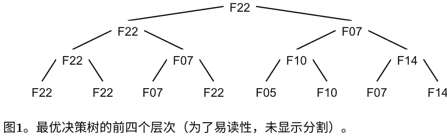

#### 表3. 按重要性降序排列的前10个特征

| 排名 | RLS | DNN | DT |
| :--- | :--- | :--- | :--- |
| 1° | F22 | F07 | F22 |
| 2° | F07 | F22 | F23 |
| 3° | F21 | F10 | F05 |
| 4° | F10 | F21 | F07 |
| 5° | F23 | F03 | F14 |
| 6° | F03 | F05 | F10 |
| 7° | F05 | F23 | F21 |
| 8° | F09 | F14 | F03 |
| 9° | F13 | F09 | F09 |
| 10° | F14 | F13 | F13 |

### 表2. 最佳模型的MAPE随 $n$ 变化

| n | RLS | DNN | DT |
| :--- | :--- | :--- | :--- |
| $10^3$ | **40.5 ± 5.2** | 45.3 ± 7.9 | 63.9 ± 5.3 |
| $10^4$ | 25.2 ± 2.3 | **18.8 ± 3.4** | 35.3 ± 2.1 |
| $10^5$ | 15.7 ± 0.9 | **10.1 ± 1.4** | 16.4 ± 1.1 |

### 6 结论

本研究提出了一种机器学习方法，用于理解IC的决定因素，该方法使用多个可以在相关专利发行后立即确定的专利特征。为此，采用了三种不同的算法，即RLS、DNN和DT，来捕捉这些专利特征与感兴趣时间段内专利的前向引用计数之间的复杂非线性关系。对于在意大利注册办事处的公司发行的专利或在意大利居住的发明家发行的专利的具体案例验证了所提出的方法可以识别公司的IC决定因素。

所提出方法的核心观点是，专利特征，主要是内部决定因素，可以提供关于公司IC的信息。本研究的贡献有两个方面。首先，从方法论的角度来看，本研究展示了机器学习方法在减少解释IC所需特征数量方面的有用性，从而通过仅关注具有高预测能力的特征来减少分析的复杂性。其次，从管理的角度来看，结果表明管理者在撰写和发行专利时应关注哪些少量但相关的变量。此外，研究提供了关于公司应该利用哪些变量来改善其IC的信息，这些信息来自专利数据。

然而，本研究也存在一些局限性。尽管专利被广泛用于衡量IC，但它们只代表了公司创新资产的有限集合。此外，在某些行业中，专利并不被广泛采用作为保护创新的机制。因此，将使用其他信息和数据来源（例如研发支出）来加强分析并扩大研究范围。下一步将调查专利特征对前向引用（IC的代理）的影响及其动态。

致谢。本工作得到了LIUC - Cattaneo大学“数据分析”项目的支持。

### 参考文献

1. Adler, P.S., Shenbar, A.: 调整技术基础：组织挑战。斯隆管理评论 **32**(1), 25-37 (1990)
2. Anguita, D., Boni, A., Ridella, S.: 通过自助法评估支持向量机的泛化能力。神经网络通讯 **11**(1), 51-58 (2000)
3. Barney, J., Wright, M., Ketchen Jr., D.J.: 公司的资源基础观：1991年后的十年。管理杂志 **27**(6), 625-641 (2001)
4. Bessen, J.: 美国专利的价值与所有者和专利特征. 研究政策 **37**(5), 932–945 (2008)
5. Christensen, J.F.: 技术创新的资产概况. 研究政策 **24**(5), 727–745 (1995)
6. Cincotti, S., Gallo, G., Ponta, L., Raberto, M.: 电力价格的建模和预测：计算智能与经典计量经济学. 人工智能通讯 **27**(3), 301–314 (2014)
7. Davila, T.: 新产品开发中管理控制系统设计的实证研究. 会计与组织社会学 **25**(4–5), 383–409 (2000)
8. Dechezleprêtre, A., Ménière, Y., Mohnen, M.: 国际专利家族: 从申请策略到统计指标. 科学计量学 **111**(2), 793–828 (2017)
9. Donders, A.R.T., van der Heijden, G.J.M.G., Stijnen, T., Moons, K.G.M.: 综述：对缺失值插补的简要介绍。J. Clin. Epidemiol. **59**(10), 1087–1091 (2006)
10. Kerssens-van Drongelen, I., Nixon, B., Pearson, A.: 工业研发中的绩效测量。Int. J. Manag. Rev. **2**(2), 111–143 (2000)
11. Ghelardoni, L., Ghio, A., Anguita, D.: 使用经验模态分解和支持向量回归进行能量负荷预测。IEEE Trans. Smart Grid **4**(1), 549–556 (2013)
12. Goodfellow, I., Bengio, Y., Courville, A.: 深度学习。MIT Press, 剑桥 (2016)
13. Guyon, I., Elisseeff, A.: 变量和特征选择简介. 机器学习研究杂志 **3**, 1157–1182 (2003)
14. Hall, B.H., Thoma, G., Torrisi, S.: 专利和研发的标记价值: 欧洲公司的证据. 管理学会会议记录 **2007**(1), 1–6 (2007)
15. Hardy, M.A.: 带虚拟变量的回归. Sage, Newbury Park (1993)
16. Harhoff, D., Scherer, F.M., Vopel, K.: 引用、家族规模、反对和专利权的价值. 研究政策 **32**(8), 1343–1363 (2003)
17. Jaffe, A.B., Trajtenberg, M.: 知识从大学和联邦实验室流向: 对专利引用在时间和机构以及地理边界上的流动建模. 国家科学院会议记录 **93**(23), 12671–12677 (1996)
18. James, G., Witten, D., Hastie, T., Tibshirani, R.: 统计学习导论. Springer, New York (2013)
19. Kogut, B., Zander, U.: 公司知识、组合能力和技术复制。组织科学 **3**(3), 383–397 (1992)
20. Kohavi, R., et al.: 交叉验证和自助法在准确性估计和模型选择中的研究。在: 国际人工智能联合会议 (1995)
21. Lee, C., Kwon, O., Kim, M., Kwon, D.: 利用多个专利指标的机器学习方法进行新兴技术的早期识别。技术预测与社会变革 **127**, 291–303 (2018)
22. Mahnken, T.A., Moehrle, M.G.: 美国多行业创新专利-使用patstat和orbis搜索的组合。世界专利信息 **55**, 52–60 (2018)
23. Manzini, R., Lazzarotti, V.: 协作新产品开发中的知识产权保护机制。研发管理 **46**(S2), 579–595 (2016)
24. Moaniba, I.M., Su, H.N., Lee, P.C.: 知识重组和技术创新: 跨学科知识的重要角色。在: 创新, pp.1–27 (2018)
25. Molnar, C.: 可解释的机器学习 (2018). [https://christophm.github.io/book/](https://christophm.github.io/book/)
26. Oneto, L.: 模型选择和误差估计无需痛苦. WIREs Data Min. Knowl. Disc. **8**(4), e1252 (2018)
27. Reitzig, M.: 改进专利估值以管理目的-通过分析申请理由验证新指标. Res. Policy **33**(6–7), 939–957 (2004)
28. Romijn, H., Albaladejo, M.: 英国东南部小型电子和软件公司创新能力的决定因素. Res. Policy **31**(7), 1053–1067 (2002)
29. Shalev-Shwartz, S., Ben-David, S.: 理解机器学习: 从理论到算法. 剑桥大学出版社, 剑桥 (2014)
30. 斯特恩, S., 波特, M.E., 弗曼, J.L.: 国家创新能力的决定因素。技术报告国家经济研究局 (2000)
31. Ussahawanitchakit, P.: 创新能力和出口业绩: 泰国纺织企业的实证研究。国际商务战略杂志 **7** (1) (2007)

## 预测未来市场趋势：哪个是最佳窗口？

Simone Merello$^1$, Andrea Picasso Ratto$^1$, Luca Oneto$^{1(\otimes)}$, 和 Erik Cambria $^2$

$^1$ DIBRIS - 热那亚大学, Via Opera Pia 13, 16145 Genova, 意大利
{simone.merello, andrea.picasso}@smartlab.ws, luca.oneto@unige.it
$^2$ 新加坡南洋理工大学, 新加坡
cambria@ntu.edu.sg

**摘要**。预测未来市场趋势的问题已经吸引了研究人员、数学家和金融分析师的兴趣超过五十年。已经提出了许多不同的方法来解决这个任务。然而，只有很少的研究关注到要预测的最佳趋势窗口的选择，大部分研究都集中在每日预测而没有适当的解释。在这项工作中，我们利用与金融相关的数值和文本数据通过几种学习算法来预测不同的趋势窗口。我们展示了每日趋势预测的非最优性，旨在为未来研究建立新的指导方针。

**关键词**：股市预测 · 从数据中学习 · 情感分析 · 最佳窗口

### 1 引言

股市预测是一个具有挑战性的问题，其复杂性严格相关关于可能影响价格变动的多个因素。从文本中提取的情感信息已被证明在预测市场走势方面是有效的 [13]，技术分析指标也可以被视为提取市场参与者情绪的一种尝试 [8]。同时，学习算法已被广泛应用于股市预测，从未来价格的回归到最近的市场趋势分类 [7,14]。

然而，大多数研究都集中在每日预测上，没有适当的解释 [7,14]。少数研究人员尝试预测每周趋势 [3] 或日内趋势 [11]，但文献中只有少数作品关注预测的时间窗口。Rao等人 [10] 研究了推文和不同大小趋势窗口之间的相关性，但结果受到特定算法和特定输入空间的限制。Merello等人 [6] 关注新闻文章发布和预测之间的最佳时间滞后，但趋势大小是事先确定的。

我们相信选择正确的预测窗口是整个过程中的关键点。在本文中，我们专注于理解哪个是最佳的预测窗口大小。股票市场预测的任务被映射为在不同趋势长度上执行的分类问题。模型的评估使用数据科学指标和在交易模拟中计算的金融指标进行。在实验阶段，最佳结果是在持续时间超过一天的趋势上实现的，这表明过去的研究成果并不是最优的。

### 2 提出的方法

趋势预测 $\hat{y}_t$ 是在固定和离散的时间步骤上进行的，依赖于发布日期上的文本。标签 $y_t$ 根据趋势长度 $w$ 的价格变动进行定义：$y_t = \mathbb{1}(p_{t+w} - p_t)$，其中 $p_t \in \mathbb{R}^+$ 是时间步骤 $t$ 处的收盘价，$\mathbb{1}: \mathbb{R} \to \{0, 1\}$ 表示单位阶跃函数。

可在时间 $t$ 相对于技术指标和新闻文章的信息被认为是引导趋势的。在 $t$ 发布单篇新闻文章被编码为特征向量，通过 Loughran & McDonald 字典 [5] (L&Mc) 或通过 Affective Space 嵌入 [1] (AS) 进行定义。L&Mc 是一个专门用于金融的工具。它包含与情感相关的积极、消极和其他词汇列表，因此，$n_{ti}$ 被定义为新闻文章中列表 $i$ 中出现的词汇计数。AS 被选择来表示金融写作中的概念导向情感。文章中包含的概念的嵌入被平均以表示新闻。

对于每个时间间隔 $t$，$I_t \in \mathbb{R}^f$ 表示在最近的过去价格 $p_t$ 和成交量 $v_t$ 上计算的技术指标的值。表1报告了实验中考虑的指标。参数 $s$ 被选择为 $s \in \{30, 50, 100, 150\}$。

价格波动 $y_t$ 被认为与最近发布的新闻文章有关。过去通过 $n_{t, \hat{w}} = \frac{1}{\hat{w}} \sum_{t \in [t-\hat{w}, t)} \overline{n_t}$。模型的输入被定义为：$x_t = [N_t, I_t]$ 其中 $N_t$ 用于考虑不同的输入窗口 $N_t = [n_{t,1}, n_{t,5}, n_{t,10}, n_{t,15}, n_{t,20}, n_{t,30}, n_{t,50}]$。

**表1. 实验中使用的技术分析指标。$p_t, s$ 表示前 $s$ 个价格的平均值，$v_t$ 是观察到的平均成交量直到 $t$，$u^{bbt}$ 和 $d^{bbt}$ 指的是布林带。**

| 姓名 | 公式 |
| :--- | :--- |
| 动量 | $\frac{p_t}{p_{t-s}} - 1$ |
| SMA | $\frac{p_t}{\bar{p}_{t,s}} - 1$ |
| 布林带 | $\begin{cases} 1 & \text{如果 } p_t > u^{bbt} \\ 0 & \text{如果 } p_t \in [u^{bbt}, d^{bbt}] \\ -1 & \text{如果 } p_t < d^{bbt} \end{cases}$ |
| 差分 | $v_t - \bar{v}_t$ |

四个模型的性能进行了平均，用于预测持续1小时、1天以及4、5和7天的趋势。分别使用前馈神经网络（FFNN）和核支持向量机（KSVM）算法，将两个不同的输入空间馈送给它们，在不同的实验中，使用L&Mc或AS表示法计算新闻文章的 $n_t$。KSVM模型选择了高斯核。FFNN架构由3个带有ReLU激活函数、批量归一化 [4]、最大范数和 Dropout [12] 的隐藏层组成。输出层由sigmoid激活函数定义，并且整个模型使用Adam优化器进行训练。

模型选择是根据 [6,9] 的工作，在时间相关数据上进行交叉验证完成的。对于每个折叠，分别使用两个连续的区间进行训练和评估。用于评估的点总是在训练集之前选择，以避免可能的前瞻性偏差。实验中使用的数据集最后部分被视为测试集。由于价格变动的趋势性，数据受到标签不平衡的影响。根据 [9] 的结果，采用了 SMOTE [2] 平衡技术，以避免开发出有偏差的分类器。为了选择最佳参数和超参数，训练集和验证集都进行了平衡处理。此外，模型选择和趋势评估使用马修斯相关系数（MCC）进行，因为它具有偏斜独立性的特性。交易绩效的结果考察了夏普比率和年化收益。夏普比率衡量了超过无风险利率的平均回报，作为持有风险较高资产所承受的额外波动性的回报。

### 3 实验

在实验阶段，选择了用于进行市场趋势预测的资产，这些资产是纳斯达克100指数中市值最大的，以避免交易模拟期间的流动性问题。训练数据使用了大约11个月的数据，从2017年4月3日到2018年2月23日，测试数据使用了4个月的数据，从2018年2月24日到2018年6月21日。它由20个股票代码组成，以使得这项研究的结果在统计上具有显著性。

新闻文章是通过Intrinio API¹收集的。价格和交易量是通过Google Finance API²检索的，频率为每小时一次。因此，每小时都会对未来长度为 $w$ 的趋势进行预测。

在第一次测试中，模型的MCC分数是对所有考虑的股票进行平均评估的。此外，不同模型的性能被平均以避免对单个分类器或单个输入空间得出特定结论。作为第二次测试，使用了特定工具³进行了真实的交易模拟。评估的财务指标包括年化收益和夏普比率被认为是衡量预测效果的必要指标。交易模拟期间取得的结果取决于选择交易的股票（交易策略），同时也取决于每次交易中投资的资本金额（规模策略）。交易策略根据最近三次预测的平均值计算得到的交易信号 $s_t$ 进行定义 $s_t = \frac{1}{3} \sum_{i=1}^{3}$。考虑多个预测结果是一种谨慎的行为，可以避免仅基于一个信号做出噪音决策。

规模策略的设计是这样的，即在每个时间步骤 $t$ 中，根据投资组合价值 $P_t$，投资一定金额 $\frac{P_t}{w \cdot n_{a,t}}$ 用于投资单一资产。$n_{a,t}$ 表示在 $t$ 时刻执行的操作数（购买或卖出），$w$ 表示趋势长度。考虑了 0.01% 的佣金率，并且夏普比率计算中所需的无风险利率设定为评估期间的十年期美国国债利率。

根据图 1，相对于七个交易日（49 小时）的趋势长度，MCC 值达到了最佳得分。这个结果被认为是显著的，因为大多数关于回报分类的最新论文都集中在每日趋势预测上，没有一个合适的解释。这个实验揭示了每日预测相对于其他趋势选择的次优性。根据测试模型的平均表现，预测持续七天或四天的趋势可以将 MCC 得分大约提高一倍（分别为 0.10 和 0.12），相比于每日预测（MCC 0.05）。在交易模拟中，每日趋势预测也被证明是次优选择。每日趋势的预测带来了 11% 的年化收益，但最好的结果是通过 4 天的趋势实现的，达到了 23% 的年化收益。夏普比率得出了类似的结论，每日预测得分为 1.5，5 天趋势得分为 2.3。总体而言，基于 MCC 的结论，即分类性能的度量，与金融指标的评估略有不同。

- 1 https://intrinio.com/
- 2 https://pypi.org/project/googlefinance.client/
- 3 https://www.backtrader.com/

图 1. 在测试模型上平均的 MCC 值。评估持续 1 小时、1 天、4 天、5 天和 7 天的趋势。

图 2. 在测试模型上平均的年化收益和夏普比率。评估持续 1 小时、1 天、4 天、5 天和 7 天的趋势。

### 4 结论和讨论

本文重点研究金融预测中最佳预测趋势的选择。结果表明，性能根据该参数显著变化，因此必须谨慎选择其值。预测持续7天的趋势导致了最佳分类性能。

### 参考文献

1. Cambria, E., Fu, J., Bisio, F., Poria, S.: Affectivespace 2: enabling affective intuition for concept-level sentiment analysis. In: AAAI, pp. 508–514 (2015)
2. Chawla, N.V., Bowyer, K.W., Hall, L.O., Kegelmeyer, W.P.: Smote: synthetic minority over-sampling technique. J. Artif. Intell. Res. 16, 321–357 (2002)
3. Huang, W., Nakamori, Y., Wang, S.Y.: Forecasting stock market movement direction with support vector machine. Comput. Oper. Res. 32(10), 2513–2522 (2005)
4. Ioffe, S., Szegedy, C.: Batch normalization: accelerating deep network training by reducing internal covariate shift. arXiv preprint arXiv:1502.03167 (2015)
5. Loughran, T., McDonald, B.: When is a liability not a liability? Textual analysis, dictionaries, and 10-ks. J. Finance 66(1), 35–65 (2011)
6. Merello, S., Picasso, A., Ma, Y., Oneto, L., Cambria, E.: 研究新闻对股市的时机和影响。在：IEEE国际数据挖掘会议，国际自然文本情感引发信息检索和提取研讨会(ICDM) (2018)
7. Oancea, B., Ciucu, S., C.: 使用神经网络进行时间序列预测。 arXiv预印本 arXiv:1401.1333 (2014)
8. Park, C.H., Irwin, S.H.: 技术分析的盈利能力：一项综述。 AgMAS项目研究报告2004–04 (2004)
9. Picasso, A., Merello, S., Ma, Y., Oneto, L., Cambria, E.: 技术分析和机器学习的市场趋势预测集成。 在：IEEE计算智能研讨会系列(SSCI) (2018)
10. Rao, T., Srivastava, S.: 使用Twitter情感分析分析股市走势。 在：2012年国际社交网络分析与挖掘会议记录 (ASONAM 2012) ，第119-123页。 IEEE计算机学会 (2012年)
11. Schumaker, R., Chen, H.: 使用金融新闻文章进行股市预测的文本分析。 在：AMCIS 2006会议记录，第185页 (2006年)

- 12. Srivastava, N., Hinton, G., Krizhevsky, A., Sutskever, I., Salakhutdinov, R.: Dropout: 防止神经网络过拟合的简单方法。机器学习研究, 15 (1), 1929-1958 (2014年)
- 13. Xing, F.Z., Cambria, E., Malandri, L., Vercellis, C.: 发现贝叶斯市场观点以进行智能资产配置。arXiv预印本arXiv:1802.09911 (2018年)
- 14. Xu, Y., Cohen, S.B.: 从推文和历史价格预测股票走势。在: ACL (2018年)

# $F_0$使用DNN进行阿拉伯语参数化语音合成的建模

Imene Zangar$^{1(✉)}$, Zied Mnasri$^{1,3}$, Vincent Colotte$^2$和Denis Jouvet $^2$

$^1$ 突尼斯El Manar大学电气工程系，突尼斯国家工程学院
{imene.zangar, zied.mnasri}@enit.utm.tn

$^2$ 洛林大学，法国国家科学研究中心，法国国家计算机与自动化研究所，洛林人工智能与自动化研究实验室，法国南锡，54000
{vincent.colotte, denis.jouvet}@loria.fr

$^3$ 热那亚大学，热那亚，意大利

摘要。深度神经网络 (DNN) 在语音处理应用中越来越受到关注，特别是在文本到语音合成中。实际上，像MERLIN和WAVENET这样的最先进的语音生成工具完全基于DNN。然而，每种语言都必须使用DNN进行建模。语音合成模块的关键组成部分之一是从上下文输入特征中生成韵律参数的模块，尤其是基频 ($F_0$) 生成模块。实际上，$F_0$负责语调，这就是为什么它应该被准确地建模以提供可理解和自然的语音。然而，$F_0$的建模高度依赖于语言。因此，必须考虑语言特定的特征。在本文中，我们旨在通过使用前馈和递归DNN对阿拉伯语语音合成中的 $F_0$进行建模，并使用阿拉伯语的特定特征，如元音数量和重音，以提高阿拉伯语参数化语音合成的质量。

关键词：阿拉伯语参数语音合成 · 基频 $F_0$ · 深度神经网络 · 循环神经网络

### 1 引言

自几年前以来，语音处理系统引起了越来越多的关注。实际上，新的技术进步使得通过语音识别和语音合成与机器进行交互成为可能。语音合成可以通过文本（文本到语音合成）来实现。在文本到语音合成中，文本被处理成一系列单元（音素、双音素、音节等）。

这些单元的参数由专用模块预测。这些参数可以分为韵律参数和声学参数，主要包括Mel-广义倒谱系数（MGC）、Mel-频率倒谱系数（MFCC）、线性谱对（LSP）等，以及它们的时间导数（$\Delta$和 $\Delta\Delta$）。韵律参数包括音段持续时间和基频（$F_0$）。这两个参数共同负责节奏和语调。

$F_0$建模一直是任何语音合成系统的基石。事实上，$F_0$的演变是复杂且相互依赖的音韵现象（如语调、重音和声音）的表现。因此，一个准确的 $F_0$模型对于产生可理解和自然的合成语音是必要的。

到目前为止，已经有各种各样的 $F_0$模型，它们非常准确，并成功应用于语音合成系统。然而，它们中的大多数都是语言相关的，因为每个 $F_0$模型都是为特定的语言建立的。此外，当一个模型应用于另一种语言时，它需要进行许多调整以适应新的目标语言。$F_0$模型可以分为音韵学模型和音韵模型。音韵学模型还可以分为音调序列模型和知觉模型。在音调序列模型（如ToBI（音调和断点指标）[1]）中，话语的语调被描述为一个音韵上相反的高音（H）和低音（L）的序列。这两种音调的不同组合给出了一个有限状态语法。然后，$F_0$被视为一个语调事件（高/低/上升/下降）；而在知觉模型（如IPO（知觉研究所）模型 [2]）中，$F_0$轮廓由一系列最相关的运动（如突出）描述。在这个模型中，语调轮廓由一系列离散的语调元素组成，即最相关的 $F_0$运动（而不是音调）。另一方面，即音韵模型，$F_0$被视为一个需要测量/预测的物理量。这些模型试图建立 $F_0$及其变化的解析公式或近似公式。Tilt模型[3,4]和PaIntE，参数化语调事件系统模型[5]是众所周知的解析 $F_0$模型之一。Tilt模型试图通过四种语调事件（即音高重音、边界音调、连接和静音）之一来标记话语。PaIntE模型与Tilt模型类似，它也试图使用一小组参数来建模重音。此外，该模型使用两个Sigmoid函数的和局部表示$F_0$轮廓。

随着机器学习的发展，语音合成已经开始从数据驱动模型中受益，直接从输入特征中使用机器学习来预测包括$F_0$在内的韵律参数。在数据驱动模型中，自1999年以来，隐马尔可夫模型（HMM）已经被用于参数化语音合成。最近，深度神经网络（DNN）借助GPU的发展成为机器学习中的主要技术。随着DNN的最新进展，参数化语音合成，尤其是韵律参数预测模块已经从基于HMM的模型迁移到基于DNN的模型，以提高准确性，特别是避免HMM预测参数中的过度平均问题。因此，前馈和递归DNN已经被整合到多种语言的参数化语音合成中，例如日语和英语。对于阿拉伯语，最近也开始使用DNN来预测阿拉伯语参数化语音合成的音素持续时间，通过专门的DNN模型处理阿拉伯语音的每个类别，即短元音和长元音，以及简单辅音和双辅音。

最初，DNN被插入基于HMM的参数化语音合成中，作为CART（分类和回归树）的替代品，CART用于HMM模型聚类。在第二种方法中，DNN被用于预测原始韵律参数，然后注入HTS模型中。例如，DNN被证明比HMM更有效地模拟片段持续时间[9,10]。此外，像MERLIN [6]和WAVENET [11]这样的最先进的TTS工具完全基于DNN。在这项工作中，研究的问题是使用DNN进行建模，并为阿拉伯语添加特定特征，即元音数量和辅音双写，以扩展标准参数化语音合成特征集[10]。

本文的组织结构如下：第2节回顾了参数化语音合成的建模，特别关注了DNN模型；第3节详细介绍了本研究中使用的DNN模型；第4节介绍了实验和结果。

## 2 $F_0$参数化语音合成的建模

参数化语音合成最初是在HTS（基于HMM的文本到语音合成）系统中使用HMM模型设计的[7]，包括对多空间概率分布（MSD）[12]和隐藏半马尔可夫模型[13]的许多更新。然而，自几年以前以来，DNN模型被用于参数化语音合成，并提高了生成语音的质量。

### 2.1 $F_0$基于HMM的参数化语音合成中的建模

基于HMM的参数化语音合成中的参数建模基于一个五状态从左到右的HMM模型。每个状态由一个带有对角协方差的单一高斯分布建模。决策树根据上下文输入特征对HMM模型进行聚类。最后，使用期望最大化（EM）算法来预测HMM模型的输出。

在HTS系统中，韵律参数，包括持续时间和 $F_0$，最初是使用HMM进行建模的。然而，对于 $F_0$来说，这是一个特殊的过程，因为 $F_0$仅在语音的有声区域中定义，并且由一维连续值表示。然而，在无声区域中，$F_0$被替换为离散标签，因此不可能对语音信号的有声部分和无声部分应用相同的HMM模型来建模$F_0$。因此，设计了多空间概率分布（MSD概率）来分别在有声和无声区域使用HMM模型来建模连续和离散的 $F_0$[14]。

然而，$F_0$建模仍然存在过度平均化的问题，因为预测的高斯分布倾向于提供 $F_0$的均值。这种现象在HTS与单元选择合成的主观测试中得到了证实，后者更受青睐[15]，尽管它更早。

### 2.2 $F_0$基于深度神经网络的参数化语音合成建模

在[8]中，通过DNN对 $log(F_0)$ 进行建模。在这项工作中，首先对无声区域的 $F_0$ 进行插值，以提供连续的 $F_0$ 值，如[16]所设定；然后使用DNN对 $log(F_0)$ 进行建模。此外，还预测了浊音决策标签。

在预处理阶段，将训练集中的80%的静音数据删除。输入特征被归一化为零均值和单位方差，而输出目标被归一化为区间[0.01, 0.99]。DNN使用随机梯度下降（SGD）进行训练，激活函数全部为sigmoid函数，包括输出层。在包含33000个英语句子的语音语料库上训练了不同的DNN架构，总计覆盖了近13小时。表现最好的模型是一个前馈DNN，包含5个隐藏层，每个隐藏层有2048个节点。结果表明，DNN比HMM更准确地预测了浊音决策，而HMM给出了最低的 $log(F_0)$ RMSE误差[8]。

在[17]中，使用指数衰减函数[18]对无声区域进行了$F_0$的插值。为了预测浊音决策标签和$log(F_0)$值，基于前馈和循环层的多种DNN架构进行了研究，例如LSTM（长短期记忆）和BLSTM（双向LSTM）。例如，使用每个隐藏层512个节点的6个前馈隐藏层DNN，每层1024个节点的3个前馈隐藏层DNN，一个混合的3个前馈层和1个LSTM层，以及一个混合的2个前馈层和2个BLSTM层，每层512个节点，对于这两种混合架构，都使用了sigmoid激活函数。使用5000个中文语音样本进行训练和开发，以及200个样本进行测试。

结果表明，与HTS [16]中使用的基准HMM模型相比，浊音决策标签预测的准确性几乎相同，而所有DNN架构的$F_0$预测$RMSE$较低，但不同架构之间没有显著差异，都在15到16 Hz之间。最近，在[19]中，使用每个隐藏层512个节点的混合的2个前馈层和2个LSTM层的DNN在一个13小时的中文语音语料库上进行了训练。在测试集上计算得到的$RMSE$为12 Hz。

值得注意的是，在所有这些架构中，使用了HTS系统[24]的标准特征集。没有添加特定的语言特征来模拟语言特性。

## 3 提出的DNN模型

使用DNN进行$F_0$建模是一个两阶段的过程，首先需要将语音片段分类为有声和无声区域，然后预测$F_0$。由于这两个任务的性质不同，即分类和回归，我们选择为每个任务训练不同的网络。

### 3.1 用于离散浊音/清音决策和$F_0$值预测的提出的架构

使用两个不同的神经网络来预测浊音决策和$F_0$值。对于每个DNN，尝试了许多架构，包括仅使用密集层、密集层与LSTM或BLSTM层以及仅使用LSTM或BLSTM层（参见表1）。实际上，选择这些架构的目的是看循环神经网络是否比前馈网络更适合模拟高度循环的语音参数。

表1. 基于开发集结果选择的DNN架构，用于浊音/清音决策分类和 $F_0$预测。

| DNN网络 | 隐藏层的数量和类型 | 隐藏层中的节点数量 |
| :--- | :--- | :--- |
| 全连接 | 6个全连接层 | [512, 512, 512, 512, 512, 512] |
| 全连接-LSTM (1) | 2个全连接层 + 4个LSTM层 | [256, 256, 512, 512, 1024, 1024] |
| 全连接-LSTM (2) | 2个全连接层 + 4个LSTM层 | [512, 512, 512, 512, 512, 512] |
| 全连接-BLSTM (1) | 2个全连接层 + 4个BLSTM层 | [256, 256, 512, 512, 1024, 1024] |
| 全连接-BLSTM (2) | 2个全连接层 + 4个BLSTM层 | [512, 512, 512, 512, 512, 512] |
| 全LSTM | 6个LSTM层 | [512, 512, 512, 512, 512, 512] |
| 全BLSTM | 6个BLSTM层 | [512, 512, 512, 512, 512, 512] |

此外，值得注意的是，在一些实验之后，所有保留的网络都使用 $tanh$ 激活函数来实现隐藏层，而线性输出激活函数用于 $F_0$，而Sigmoid输出激活函数用于浊音决策预测。使用 Adam 优化器来训练浊音决策分类DNN，而对于 $F_0$ 预测DNN，使用 Rmsprop 优化器。所有实验中批量大小设置为100。

#### 3.2 误差最小化准则

由于浊音决策预测是一个分类问题，所以使用了交叉熵损失函数：

$$L_{CE} = -\frac{1}{N} \sum_{i=1}^{N} v_i \log(p(v_i)) \qquad (1)$$

其中 $N$ 是帧的数量，$v_i$ 是帧 $i$ 的浊音决策值（0或1），$p(v_i)$ 是其概率。

就连续 $F_0$值预测而言，选择了均方误差作为损失函数，因为这是一个回归问题：

$$L_{MSE} = \frac{1}{N} \sum_{i=1}^{N} (\log(F_{0i}) - \log(\hat{F}_{0i}))^2 \qquad (2)$$

其中 $N$ 是帧的数量，$\log(F_{0i})$ 和 $\log(\hat{F}_{0i})$ 分别是帧 $i$ 的目标值和预测值。

为了避免过拟合，使用了提前停止选项。因此，如果在开发集上评估 $L_{CE}$ (对于浊音决策网络) 或 $L_{MSE}$ (对于 $F_0$ 预测网络)，在一定数量的迭代后没有改进（本实验中设置为 20），训练过程将停止。

### 4 实验和结果

#### 4.1 语音语料库

为了训练基于DNN的 $F_0$ 模型，使用了一个包含1597个话语的阿拉伯语语音语料库[20]。这些话语对应于现代标准阿拉伯语 (MSA) 朗读的新闻简报，由一位以阿拉伯语为母语的男性发音人朗读。信号以48 KHz的采样率和16位的精度进行录制。其中70%的话语用于训练，20%用于开发，10%用于测试。为了提取原始的浊音决策标签和 $F_0$，使用了SPTK工具包中包含的SWIPE算法[23]。由于发音人是男性，$F_0$ 跟踪算法被限制在80 Hz和320 Hz之间。每5毫秒帧提取一个 $F_0$ 值。通过利用空 $F_0$ 值对应于无声帧的事实，自动推断出浊音决策标签。

### 4.2 特征选择和预处理 $F_0$ 建模

除了标准的HTS模型输入特征集[24]，还添加了两个阿拉伯特定的特征，即元音数量和重音。最近的研究证明了这两个特征可以提高使用DNN进行阿拉伯语语音合成的质量[22]。输入特征根据其性质以不同的方式进行编码：是/否特征 (如重音/非重音音节) 被编码为二进制值；类别特征 (如音素标识) 用独热向量编码；对于数值型特征，使用粗编码（例如音素在音节中的相对位置被编码为(1, 0, 0), (0, 1, 0)或(0, 0, 1)）。因此，输入特征向量包含439个系数。此外，输入特征向量的系数被归一化为零均值和单位方差。

另一方面，在语音的无声部分，对输出 $\log(F_0)$ 目标应用了线性插值。然后，插值后的值被归一化到[0.01, 0.99]的区间内。输出的浊音决策标签没有被归一化，因为它们已经是二进制的。

#### 4.3 选定的深度神经网络模型

进行了各种网络参数的实验，包括隐藏层的数量和类型、隐藏层中节点的数量和激活函数的类型。使用开发集对模型进行评估，主要指标为预测 $F_0$ 值的均方根误差 ($RMSE(Hz)$) 和浊音决策错误 ($VDE$)。在开发集上选择了最佳模型 (参见表2)，并对测试集进行评估。

#### 4.4 客观评估

为了评估预测参数（即 $\log(F_0)$ 和浊音决策标签）的质量，在开发集和测试集上测量了四项指标。

- **均方根误差 ($RMSE$)**：在有声帧上计算目标值和预测 $F_0$ 值之间的误差：
$$RMSE(Hz) = \sqrt{\frac{1}{N_v} \sum_{i=1}^{N_v} (F_{0i} - \hat{F}_{0i})^2} \quad (3)$$
其中 $N_v$ 是原始有声帧的数量，$F_{0i}$ 和 $\hat{F}_{0i}$ 分别是原始和预测值。

- **浊音决策错误 ($VDE$)**：表示错误的有声/无声预测的比例，即假阳性和假阴性的总和：
$$VDE(\%) = \frac{N_{V \to U} + N_{U \to V}}{N} \times 100 \quad (4)$$

- **粗糙音高误差 ($GPE$)**：在原始和预测均为有声的帧中，相对误差高于20%的帧的百分比：
$$GPE(\%) = \frac{N_{GPE}}{N_{V \to V}} \times 100 \quad (5)$$

- **$F_0$帧误差 ($FFE$)**：综合考虑了 $GPE$ 和 $VDE$ 的度量，表示发生错误的帧的百分比：
$$FFE(\%) = \frac{N_{V \to U} + N_{U \to V} + N_{GPE}}{N} \times 100 \quad (6)$$

表2. 提出模型的客观评估结果

| 提出的DNN模型 | 开发集 RMSE | VDE (%) | GPE (%) | FFE (%) | 测试集 RMSE | VDE (%) | GPE (%) | FFE (%) |
| :--- | :--- | :--- | :--- | :--- | :--- | :--- | :--- | :--- |
| 全连接 | 33.41 | 3.51 | 22.14 | 14.14 | 37.86 | 3.35 | 26.98 | 17.48 |
| 全连接-LSTM (1) | 17.65 | 3.08 | 5.05 | 5.50 | 19.23 | 2.78 | 6.82 | 6.38 |
| 全连接-LSTM (2) | **15.70** | 2.92 | **2.41** | **4.09** | 18.14 | 2.71 | 4.43 | 5.06 |
| 全连接-BLSTM (1) | 19.72 | 2.88 | 5.85 | 5.71 | 20.14 | 2.38 | 6.33 | 5.74 |
| 全连接-BLSTM (2) | 19.93 | **2.59** | 4.98 | 5.04 | 21.39 | 2.51 | 6.39 | 5.93 |
| 全LSTM | 16.70 | 2.95 | 2.62 | 4.22 | **17.71** | 2.79 | **3.38** | **4.59** |
| 全BLSTM | 15.95 | 2.64 | 3.16 | 4.18 | 18.65 | **2.32** | 6.57 | 5.82 |

将DNN模型的性能与最先进的HMM模型[7]和MERLIN中的DNN模型[6]进行比较（参见表3）。

表3. 在开发集上选择的最佳模型与各种建模方法在测试集上的客观评估结果比较

| 模型 | RMSE (Hz) | VDE (%) | GPE (%) | FFE (%) |
| :--- | :--- | :--- | :--- | :--- |
| 来自HTS的HMM模型[7] | 30.52 | 7.19 | 8.90 | 11.93 |
| 来自MERLIN的全连接DNN模型[6] | 36.93 | 4.73 | 9.11 | 9.46 |
| 全连接-LSTM (2) | **18.14** | 2.71 | **4.43** | **5.06** |
| 全连接-BLSTM (2) | 21.39 | **2.51** | 6.39 | 5.93 |

#### 4.5 讨论

与最先进的结果相比，考虑到使用的语料库规模较小（仅3小时），$RMSE$ 结果与在13小时英文语料库上训练的前馈DNN（15 Hz）或在13小时中文语料库上训练的混合架构（12 Hz）相当接近。

从表2中可以明显看出，使用循环网络可以得到更好的浊音决策预测结果。Dense-BLSTM (2) 模型在开发集上表现最佳，浊音决策误差为2.59%（95%置信区间为±0.05%），显著优于其他模型。该模型在测试集上的浊音决策误差为2.51%（±0.07%）。

在表3中，结果显示使用Dense-LSTM和Dense-BLSTM分别对模型进行 $F_0$ 和声音决策标签建模，相比于HTS中使用的HMM模型和[6]中使用的DNN模型，性能更好。最后，综合考虑 $F_0$ 和声音决策测量，如 $GPE$ 和 $FFE$，表明使用循环网络更适合 $F_0$ 建模问题。这可以通过语音的循环性来解释，其中辅音主要是无声或部分有声的，后面跟着有声元音。

### 5 结论

在本文中，使用DNN实现了阿拉伯语参数化语音合成的 $F_0$ 建模。$F_0$ 建模是一个两步过程，需要预测语音片段的声音性质（有声或无声），然后预测有声部分的 $F_0$ 值。使用阿拉伯语语音语料库训练了两个DNN模型，一个用于声音分类，一个用于 $F_0$ 预测，使用了用于参数化语音合成的标准特征集，以及两个阿拉伯语特定特征，即元音数量和重音。对于这两个网络，尝试了几种架构，包括（i）仅使用前馈（密集）层，（ii）前馈和循环层（LSTM或BLSTM）的组合，以及（iii）仅使用循环层。使用 $F_0$ 预测质量的标准度量指标，如 $RMSE$、$VDE$、$GPE$和 $FFE$，结果表明循环网络获得了最佳的 $F_0$ 预测结果。

致谢。这项研究工作是在PHC-Utique计划的框架下进行的，该计划由CMCU（混合大学合作委员会）资助，资助号为15G1405。

### 参考文献

- 1. Pierrehumbert, J.: 英语语调的音系学和音韵学。麻省理工学院博士论文（1980年）
- 2. Hart, J., Collier, R., Cohen, A.: 语调的感知研究。剑桥大学出版社，剑桥（1990年）
- 3. Dusterhoff, K., Black, A.: 使用倾斜音调理论生成语音合成的 $F_0$ 轮廓。在：第三届语调理论模型和应用ESCA研讨会，第107-110页。希腊雅典（1997年）
- 4. Taylor, P.: 使用倾斜模型分析和合成语调。声学学会杂志107（3），1697-1714（2000年）
- 5. Moehler, G., Conkie, A.: 使用向量量化进行语调的参数建模。在：第3届ESCA语音合成研讨会上，第311-316页。澳大利亚，珍诺兰洞穴（1998年）
- 6. Wu, Z., Watts, O., King, S.: Merlin: 一个开源的神经网络语音合成系统。在：第9届ISCA语音合成研讨会上，第202-207页。美国，阳光谷（2016年）
- 7. Yoshimura, T., Tokuda, K., Masuko, T., Kobayashi, T., Kitamura, T.: 基于HMM的语音合成中光谱、音高和持续时间的同时建模。在：第六届欧洲语音通信与技术会议上，第2347-2350页。匈牙利布达佩斯（1999年）
- 8. Zen, H., Senior, A., Schuster, M.: 使用深度神经网络的统计参数语音合成。在: 第38届国际声学、语音和信号处理会议上, 第7962-7966页。IEEE, 加拿大温哥华 (2013年)
- 9. Chen, B., Bian, T., Yu, K.: 语音合成的离散持续时间模型。在: 第18届国际语音通信协会年会上, 第789-793页。瑞典斯德哥尔摩 (2017年)
- 10. Zangar, I., Mnasri, Z., Colotte, V., Jouvet, D., Houidhek, A.: 使用DNN进行阿拉伯语语音合成的持续时间建模。在: 第9届国际语音韵律会议, 第597-601页。波兹南, 波兰 (2018年)
- 11. Oord, A.V.D., Dieleman, S., Zen, H., Simonyan, K., Vinyals, O., Graves, A., Kalchbrenner, N., Senior, A., Kavukcuoglu, K.: Wavenet: 用于原始音频的生成模型。arXiv预印本arXiv: 1609.03499 (2016年)
- 12. Yoshimura, T.: HMM-based文本到语音系统的音素和韵律参数的同时建模和特征转换。博士学位论文, 名古屋工业大学电气与计算机工程系 (2002年)
- 13. Zen, H., Tokuda, K., Masuko, T., Kobayashi, T., Kitamura, T.: 基于隐马尔可夫模型的语音合成。在: 第8届国际口语处理会议, 第1393-1396页。韩国济州岛 (2004年)
- 14. Tokuda, K., Masuko, T., Miyazaki, N., Kobayashi, T.: 多空间概率分布HMM。IEICE Trans. Inf. Syst. **85**(3), 455-464 (2002)
- 15. Zen, H., Tokuda, K., Black, A.W.: 统计参数语音合成。在: 2009年语音通信, 第51卷, 第1093-1064页。ELSEVIER (2009). https://doi.org/10.1016/j.specom.2009.04.004
- 16. Yu, K., Young, S.: 基于HMM的统计参数连续 $F_0$ 建模语音合成。IEICE Trans. Inf. Syst. **19**(5), 1071-1079 (2011)
- 17. Fan, Y., Qian, Y., Xie, F. L., Soong, F. K.: 基于双向LSTM的递归神经网络的TTS合成。在: 第15届国际语音通信协会年会, 第1964-1968页。新加坡 (2014年)
- 18. Chen, C.J., Gopinath, R.A., Monkowski, M.D., Picheny, M.A., Shen, K.: 持续的普通话语音识别的新方法。在: 第5届欧洲语音通信和技术会议, 第1543-1546页。希腊罗得岛 (1997年)
- 19. Chen, B., Lai, J., Yu, K.: LSTM-RNN持续时间模型中目标建模的比较。在: 第18届国际语音通信协会年会, 第794-798页。瑞典斯德哥尔摩 (2017年)
- 20. Halabi, N., Wald, M.: 一个阿拉伯语语音语料库的音位库存。在: 第10届国际语言资源和评估会议上, 第734-738页。斯洛文尼亚 (2016年)
- 21. 语音信号处理工具包 (SPTK)。 http://sp-tk.sourceforge.net/
- 22. Houidhek, A., Colotte, V., Mnasri, Z., Jouvet, D.: 基于DNN的阿拉伯语语音 synthesis: 建模和评估。在: 第6届国际统计语言和语音处理会议上, 第9-20页。比利时蒙斯 (2018年)
- 23. Camacho, A., Harris, J.G.: 一种基于锯齿波形的语音和音乐音高估计器。J. Acoust. Soc. Am. **124**(3), 1638-1652 (2008年)
- 24. Zen, H.: 一个基于HMM的英语语音合成的上下文相关标签格式示例。HTS CMUARCTIC演示 (2006年)

## 使用梯度监控对神经网络进行正则化

Gavneet Singh Chadha(✉), Elnaz Meydani和Andreas Schwung

应用科学西南菲利亚大学自动化技术系，德国索斯特

`{chadha.gavneetsingh,meydani.elnaz,schwung.andreas}@fh-swf.de`

**摘要**：神经网络是最近时期最发展的人工智能方法，已被用于最复杂的认知任务。这些模型的成功已经重新定义了许多领域的基准测试，如图像识别、自然语言处理和语音识别。最先进的模型依赖于大量标记的训练数据和一个具有大量参数的复杂模型来取得良好的结果。在本文中，我们提出了一种正则化方法，用于减小这些复杂模型的大小，同时仍然保持浅层和深层神经网络的泛化能力。正则化基于对权重参数的损失函数的部分梯度进行监控。另一种看待它的方式是，在小批量训练周期中显示出一定学习百分比，然后删除学习不明显的权重连接。随后，该方法在几个基准分类任务上进行评估，其大小大大减小，性能优于使用其他类似DropConnect正则化技术训练的模型。

**关键词**：梯度监控 · 正则化 · 神经网络

### 1 引言

自从Hinton等人的开创性论文以来 [5], 神经网络 (NN) 和深度神经网络 (Deep NN) 已成为各种应用中的主力和压倒性的机器学习模型。该开创性研究概念化了贪婪逐层无监督训练过程 (通常称为预训练) , 以初始化一组足够的参数，有助于将学习过程引导到稳定的解决方案。该研究的结果打破了训练多个隐藏层的神经网络 (也称为深度神经网络) 的困难的神话。此后，深度神经网络在大多数人工智能应用中表现出了最先进的水平，如图像识别、自然语言处理和语音识别[7]。

随后，出现了许多技术来提高深度神经网络的泛化能力。其中一些技术通过防止过拟合或对抗消失梯度来改善泛化能力。深度神经网络取得巨大成功的两个最重要的原因可以归因于以下领域中的方法发展：（a）引入正则化和（b）稳定优化。稳定优化的一种方法是使用在其输入域中不饱和的激活函数[3]，以便梯度可以更容易地通过网络传播。

在这种情况下，最突出的例子是ReLU激活函数[10]及其后继函数，如LReLU [9]和ELU [2]。由于这些和许多其他最新技术的影响，具有多个隐藏层的深度神经网络现在可以快速高效的方式进行训练，而无需进行无监督的预训练。

在这项研究中，我们专注于在神经网络和深度神经网络的训练过程中引入正则化。实践证明，相比没有正则化的模型，这些模型在测试集上表现更优秀。正则化有助于降低神经网络的复杂性，使其具备足够的表达能力来模拟训练集，同时避免对训练集中的噪声进行采样。一般来说，神经网络的正则化可以通过多种方法实现，包括通过在损失函数中添加范数惩罚来直接惩罚权重参数，以及通过参数共享和稀疏表示等间接惩罚。然而，最近的Dropout技术采用了一种新的正则化形式，在每个训练样本的小批量中，只保留一部分随机选择的神经元在每一层中处于激活状态。由于在训练过程中有部分单元被停用，损失函数的偏导数仅针对剩余的激活单元进行计算。DropConnect是一种更加通用的Dropout方法，不是完全停用一个神经元，而是随机停用与一个神经元相连的一部分权重连接。我们提出了一种更加有原则的方法，根据每个权重连接的学习量来引入神经网络的正则化。基于这种学习量，我们省略了输入、隐藏和输出单元之间的不重要的权重连接。这个想法是保留在训练过程中具有高活动度或学习百分比的连接，而丢弃那些相对学习百分比比较低的连接。所提出的方法加快了训练过程，减小了网络的整体大小，并且在与原始模型相比保持准确性不变或提高的情况下实现了这些优化。此外，与Dropout和DropConnect的随机方法相比，这是一种确定性的正则化技术。

本文的其余部分按照以下方式组织。第2节简要介绍了Dropout和DropConnect的相关方法。第3节详细介绍了神经网络的训练方法，包括梯度监控。第4节详细比较了不同分类数据集上的实验结果，并在第5节中进行了简要总结。

### 2 相关工作

所有机器学习模型的基本目标是在训练过程中没有见过的数据上进行泛化并表现良好，即具有良好的测试准确性。本文提出的 Dropout [11] 和 DropConnect [12] 的方法专门针对模型开发的这一方面，在训练过程中对神经网络模型进行修剪，期望它不会过度拟合训练集，并在测试时具有良好的性能。下一节将解释这两种方法的基本训练过程。

#### 2.1 丢弃 (Dropout)

丢弃的动机源于一个假设，即从原始深度神经网络模型中随机采样的架构相同的指数级子模型的组合能够在特定的分类任务中表现良好，与原始模型相比。在训练期间，每个子网络都是通过随机丢弃输入和隐藏单元来创建的，丢弃概率为 $1-p$ ($p$ 是一个超参数)，每次小批量传递。由于在前向传递过程中随机丢弃了部分单元，误差梯度也仅通过反向传递中存在的权重连接传递。因此，被丢弃神经元的权重参数的大小在该小批量中不会改变。在测试时，对如此多模型的预测进行平均是不可行的。因此，作为对神经网络模型集合平均的近似，所有神经元在测试时都存在，但权重参数的大小在训练后被缩放为 $p$ 倍。

#### 2.2 DropConnect

DropConnect 被视为 Dropout 方法的一种推广。与完全删除一个神经元的 Dropout 相比，DropConnect 只是部分删除一个神经元。具体而言，Dropout 使用从伯努利分布中随机抽取的二进制掩码来屏蔽神经元的激活，而 DropConnect 直接屏蔽权重矩阵。测试时也存在近似值。图1明确展示了标准全连接神经网络、基于 Dropout 的神经网络和基于 DropConnect 的神经网络之间的架构差异。

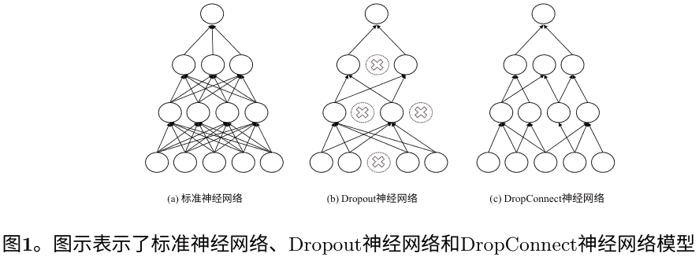

### 3 训练描述

在学习过程中，神经网络的每个权重连接根据梯度下降算法的反向传播接收到的误差梯度进行调整。由于每个权重连接是随机初始化的（通常从均匀分布中），梯度的影响即权重值的变化量在每个连接上是不同的。因此，误差梯度与原始权重连接的比值更好地衡量了权重连接的重要性。在学习过程中，监测这个比值的绝对值，并相应地删除权重连接。

为了说明具有梯度监控的训练过程，考虑一个数据集 $D$，其中 $|D| = n$，每个数据点的形式为 $(x, y)$，包括输入特征 $x$ 和输出标签 $y$。具有 $m$ ($m \ge 2$) 个隐藏层的神经网络映射一个函数

$$z_i = W_{m+1}\sigma(W_m\sigma(...\sigma(W_1x_i))), \quad (1)$$

其中 $z_i$ 是输入样本 $x_i$ 的预测标签，$\sigma$ 是非线性激活函数，$W_m$ 是相应层的权重矩阵。通过在每个输入样本 $x_i$ 和层激活中添加一个单位，以上公式隐含地包含了偏置。此外，以上公式用于从模型生成连续值。由于在分类问题中，神经网络的输出是离散变量，输出层通常使用 Softmax 激活函数，该函数产生与每个类别相关的概率（假设有 $k$ 个类别）。Softmax 函数将最高概率分配给所需类别，Softmax 层的输出向量大小与输出标签 $y$ 的大小相等。形式上，Softmax 函数定义如下

$$\text{Softmax}(z_i) = \frac{\exp(z_i)}{\sum_k \exp(z_k)}. \quad (2)$$

Softmax 函数对 $z_i$ 进行指数化和归一化，以获得与目标标签 $y_i$ 尽可能接近的值。神经网络的输出通常与分类任务的目标标签进行比较，使用交叉熵损失函数，该函数以 Softmax 层生成的概率和真实标签作为输入。

$$L(y, z) = -\sum_{i=1}^k y_i \log(z_i). \quad (3)$$

负对数似然损失函数的形式被提出，以使得损失函数对输出单元的梯度尽可能大，从而有助于将学习过程引导到一个良好的解决方案。具有指数函数的输出单元在其输入域中饱和，当输入非常负时，梯度非常小。损失函数中的对数运算消除了这种效应。

训练的目标是最小化损失函数，使得神经网络模型的预测尽可能接近真实标签。这是通过递归地计算损失函数对每个权重参数的偏导数来实现的。每个权重参数的偏导数取决于它连接的相应神经元的激活值和来自损失函数或下一层神经元的损失信号。因此，假设激活值较小的神经元梯度也较小，导致该神经元的学习速度较慢。

具体来说，对于整个神经网络模型，计算每个权重矩阵 $L'_{W_1}, L'_{W_2}, \dots, L'_{W_{l+1}}$ 在训练集的小批量上计算。然后，使用这些梯度通过梯度下降优化算法（如随机梯度下降 (SGD)、RMSprop、Adagrad或Adam [6]）来更新相应的权重参数。通过 SGD，在小批量 $t$ 上更新任意权重矩阵 $W$ 的权重更新方程为

$$W_{t+1} = W_t - \rho L'_{W_t}, \quad (4)$$

其中 $\rho$ 是学习率。由于这个梯度是所有权重参数更新算法的基础，在下一小节中，我们将重点关注它在训练过程中的演变，并提出基于这些观察的正则化方法。

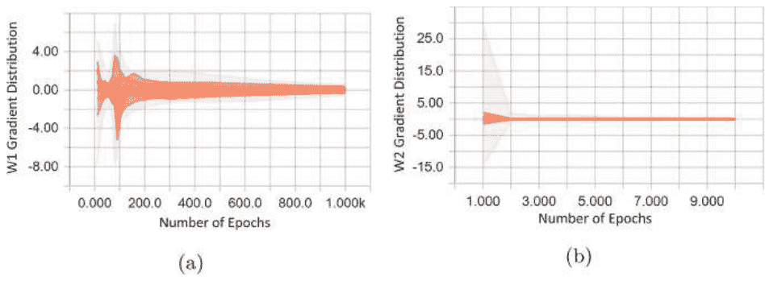

图2。(a) Fisher Iris数据集中权重矩阵 $W_1$ 的梯度分布 (b) MNIST数据集中输出层权重矩阵 $W_2$ 的梯度分布

#### 3.1 梯度分布

图2中的结果是从一个具有10个神经元的单隐藏层神经网络和一个具有256个神经元的双隐藏层神经网络分别对Fisher Iris [1]数据集和MNIST [8]数据集进行训练得到的。即使选择更深的网络，分布图也是相似的。这些图表说明了在训练过程的初始阶段，误差梯度在零附近的范围内分布更广，随着训练的进行，分布逐渐稳定在零附近。这表明大部分学习是在初始阶段完成的，在此之后只进行了对权重参数的轻微更新。因此，我们假设在一定的训练周期后没有更新的权重应该被强制置零。

#### 3.2 通过梯度监控丢弃权重

在训练过程的后期阶段，那些误差梯度与原始权重连接的比值较低的权重连接被丢弃，因为这些权重连接对整体输出没有太大贡献。权重参数通过掩码矩阵 $M$ 进行丢弃。通过这个掩码矩阵，新的权重矩阵可以计算为

$$W_{drop} = M * W, \quad (5)$$

其中 $*$ 表示逐元素相乘。掩码矩阵是基于小批量计算的误差梯度与相应权重矩阵的绝对值比值进行采样的。具体而言，$M$ 可以定义为

$$M = H\left(\left|\frac{L'_W}{W}\right| - \theta\right), \quad (6)$$

其中 $H$ 是海维赛德阶跃函数 (Heaviside step function)，$\theta$ 是确定从训练时期中期望的学习“量”的阈值。因此，在这个掩码矩阵的帮助下，所有未达到该数量的权重都会被丢弃。在相同的训练时期，偏差也会被类似地屏蔽掉。一旦被屏蔽，权重和偏差在测试时始终保持为零。这大大减小了模型的整体大小，并且后面我们将看到，这并不会影响模型的性能。被丢弃的权重和偏差从不参与模型的训练和推理，即它们始终保持为零，梯度只通过未屏蔽的权重传递。因此，没有像 Dropout 和 DropConnect 中使用的单独推理规则和近似方法。算法1提供了学习过程的摘要。

**算法 1. 使用梯度监控的 SGD 训练**
- 1: **输入** : 训练数据点 $(x_i, y_i)$, 权重参数 $W_{t-1}$ 来自步骤 $t-1$, 学习率 $\rho$, 学习阈值 $\theta$, 用于掩码的训练迭代 $\eta$
- 2: **输出** : 更新后的权重参数 $W_t$
- 3: 标准 SGD 训练直到迭代 $\eta$
- 4: 采样掩码矩阵 $M : M = H\left(\left|\frac{L'_W}{W}\right| - \theta\right)$
- 5: 计算新的权重: $W_{drop} = M * W$
- 6: 使用较少的权重参数进行标准 SGD 训练

### 4 实验

我们将我们的研究基础保持在 MNIST 手写图像分类 [8] 和 Fisher Iris 多类分类任务上，用于对不同类型的花进行分类 [1]。所有实验都由使用SGD在100个批次上对MNIST数据集进行训练，并对Iris数据集进行完整批次训练。通过监控梯度的模型进行评估，并与标准SGD和DropConnect的SGD进行比较。所有方法的学习周期数相同，MNIST数据集为25个周期，IRIS数据集为1000个周期。$\eta$设置为1，MNIST和IRIS分别进行200个周期。MNIST和IRIS每个隐藏层的隐藏神经元数量分别为256和10个。学习率 $\rho$ 和学习阈值 $\theta$ 保持不变，分别为0.001和1。DropConnect概率为0.5，所有方法都使用ReLU激活函数。学习率在整个训练过程中保持不变，并报告训练模型的分类准确率和损失。

#### 4.1 MNIST

MNIST数据集包含60,000个黑白训练图像，每个图像大小为$28 \times 28$，包含数字0到9（即10个类别）。此外，测试集中还有10,000个图像。将图像的原始像素值缩放为零均值和单位标准差后，作为NN模型的输入，该模型具有784个输入神经元。对于第一个实验，我们通过观察单隐藏层神经网络的训练损失来研究收敛速度。图3示例了梯度监控模型不仅达到了最低的训练损失，而且比其他两个模型更快地达到了最低训练损失。为了证明训练模型没有过拟合，图4显示了所有可能的权重连接屏蔽条件的测试准确率。所有模型都明显显示出所提出方法相对于标准SGD和DropConnect方法具有更好的性能。

图5展示了不同掩码模型的测试准确率，包括具有两个隐藏层的更深的神经网络。这个图例说明了掩盖模型的初始权重层（在这种情况下是$W_1$）可以提供更好的整体测试准确率。这是因为误差梯度传播到初始层的数量明显低于更深层的数量。

此外，我们分析了学习阈值 $\theta$ 对剩余权重和测试准确率的影响。图6阐明了增加学习阈值会逆向影响剩余权重的百分比，但测试准确率在达到一定阈值后先增加后减少。

通过观察可以明显减小原始模型的大小，最佳测试准确率的剩余权重百分比分别小于5%和10%，对应于$W_1$和 $W_2$。值得注意的是，学习率对剩余权重的百分比也起到重要作用，图6展示了学习率为0.01的结果。因此，成功掩盖权重的关键因素是选择阈值 $\theta$ 和学习率 $\rho$。

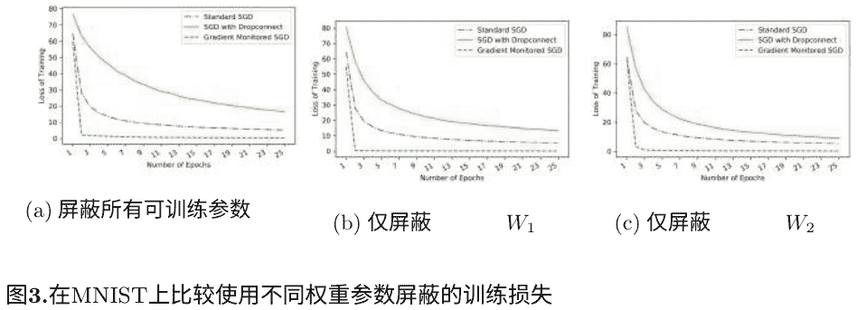
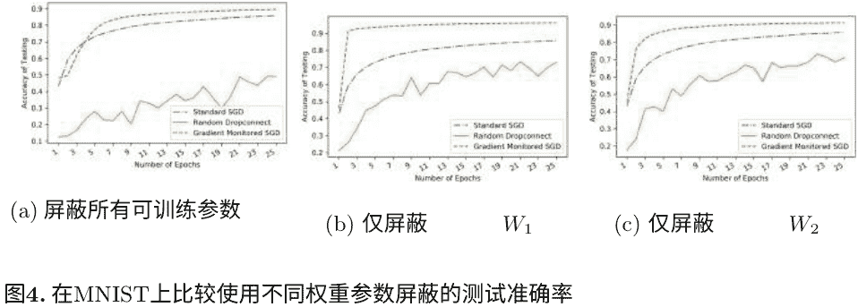

#### 4.2 鸢尾花

费舍尔鸢尾花是一个众所周知的基准测试集，包含了三种不同类别的鸢尾花植物，分别是山鸢尾、维吉尼亚鸢尾和变色鸢尾。四个输入特征是萼片长度、萼片宽度、花瓣长度和花瓣宽度。该数据集还经过零均值和单位标准差的缩放，并按照80-20的比例划分为训练集和测试集。由于这是一个小数据集，我们只研究了单隐藏层的神经网络。我们研究了标准SGD、DropConnect SGD和梯度监控SGD三种不同模型的训练损失和测试准确率。图7显示了DropConnect的随机性质，它放大了学习过程中的波动。其他两种方法的确定性特性以及更快更好的收敛优势表明在Iris数据集上具有更高的性能。

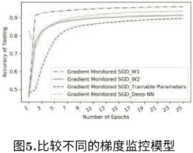
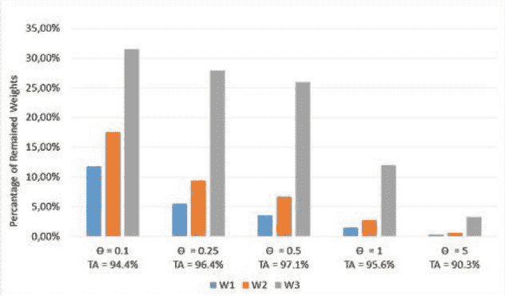

图6. 比较在MNIST中学习阈值 $\theta$ 和测试准确率(TA)下 $W_1$、$W_2$ 和 $W_3$ 中剩余权重的百分比。

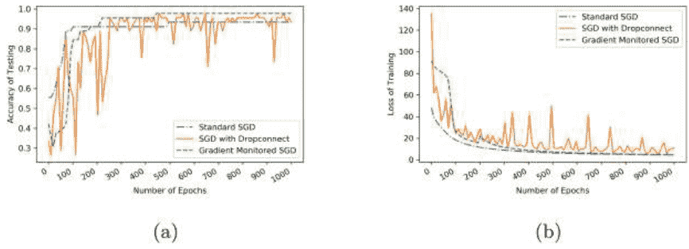

图7. 比较在IRIS数据集上使用不同模型的 (a) 测试准确率和 (b) 训练损失。

### 5 讨论

在本研究中，我们提出了一种基于梯度监控的神经网络和深度神经网络的新型正则化技术。确定性方法不包括Dropout和DropConnect等随机方法的近似。经验上证明梯度监控在显著减少训练参数数量的同时，对神经网络进行了正则化。即使在减小尺寸的情况下，所提出的模型在MNIST和Iris数据集上仍然优于DropConnect技术。

将来，卷积神经网络将以相同的方法论进行分类任务的研究。

### 参考文献

- 1. Bezdek, J.C., Keller, J.M., Krishnapuram, R., Kuncheva, L.I., Pal, N.R.: 请真实的虹膜数据站出来好吗? IEEE模糊系统交易 7(3), 368–369 (1999年) 。https://doi.org/10.1109/91.771092
- 2. Clevert, D.A., Unterthiner, T., Hochreiter, S.: 通过指数线性单元 (ELUs) 实现快速准确的深度网络学习。arXiv预印本arXiv:1511.07289 (2015年)
- 3. Glorot, X., Bengio, Y.: 理解训练深度前馈神经网络的困难。在: 第十三届国际人工智能与统计学会会议论文集, 第249-256页 (2010年)
- 4. Goodfellow, I., Bengio, Y., Courville, A.: 深度学习, 第1卷. MIT出版社, 剑桥 (2016)
- 5. Hinton, G.E., Osindero, S., Teh, Y.W.: 一种用于深度置信网络的快速学习算法. 神经网络计算 18(7), 1527–1554 (2006)
- 6. Kingma, D.P., Ba, J.L.: Adam: 一种用于随机优化的方法. 在: 第3届国际学习表示会议 (ICLR) 论文集(2014)
- 7. LeCun, Y., Bengio, Y., Hinton, G.: 深度学习. Nature 521(7553), 436–444 (2015). https://doi.org/10.1038/nature14539
- 8. LeCun, Y., Cortes, C., Burges, C.J.: MNIST手写数字数据库. AT&T 实验室2(2010). http://yann.lecun.com/exdb/mnist
- 9. Maas, A.L., Hannun, A.Y., Ng, A.Y.: 矫正非线性改善神经网络声学模型。在: ICML 会议记录, 第30卷, 第3页 (2013)
- 10. Nair, V., Hinton, G.E.: 矫正线性单元改善受限玻尔兹曼机。在: 第27届国际机器学习会议记录 (ICML-10), 第807-814页 (2010)
- 11. Srivastava, N., Hinton, G., Krizhevsky, A., Sutskever, I., Salakhutdinov, R.: Dropout: 一种简单的防止神经网络过拟合的方法。机器学习研究, 第15卷, 第1期, 1929-1958页 (2014)
- 12. Wan, L., Zeiler, M., Zhang, S., Le Cun, Y., Fergus, R.: 使用Dropconnect对神经网络进行正则化。在: 机器学习国际会议, 第1058-1066页 (2013)

## 大型铁路网络中支持冲突解决的可视化分析

Udo Schlegel<sup>1(✉)</sup>, Wolfgang Jentner<sup>1</sup>, Juri Buchmueller<sup>1</sup>, Eren Cakmak<sup>1</sup>, Giuliano Castiglia<sup>1</sup>, Renzo Canepa<sup>2</sup>, Simone Petralli<sup>2</sup>, Luca Oneto<sup>3</sup>, Daniel A. Keim<sup>1</sup>, 和 Davide Anguita <sup>3</sup>

<sup>1</sup> DBVIS, 康斯坦茨大学, 康斯坦茨, 德国
{u.schlegel, wolfgang.jentner, juri.buchmueller, eren.cakmak, giuliano.castiglia, daniel.keim}@uni.kn
<sup>2</sup> Rete Ferroviaria Italiana S.p.A., 罗马, 意大利
{r.canepa, s.petralli}@rfi.it
<sup>3</sup> DIBRIS, 热那亚大学, 热那亚, 意大利
{luca.oneto, davide.anguita}@unige.it

**摘要。** 列车运营商负责维护和遵守大规模铁路运输系统的时间表。当两列火车要使用同一铁路段时, 会发生冲突。决定哪列火车先行以解决冲突由列车运营商决定。由于铁路运输系统是一个庞大而复杂的网络, 这个决定可能对未来的时间表、列车延误、成本和其他绩效指标产生重大影响。由于这种复杂性和庞大的底层数据量, 机器学习模型已被证明是有用的。

然而, 自动化模型对列车操作员不可访问这导致他们对其预测的信任度较低。我们提出了一个可视化分析解决方案, 用于决策支持系统, 以在提供对复杂机器学习模型的访问的同时, 帮助列车操作员做出明智的决策。不同的集成、交互式视图允许列车操作员探索决策可能产生的各种影响。此外, 用户可以比较各种数据驱动模型, 这些模型由基于经验的模型构建。我们演示了一个使用案例中的决策过程, 突出了列车操作员如何利用不同的视图。

**关键词:** 可视化和大数据分析 · 决策支持系统

### 1 引言

铁路运输系统 (RTS) 在为全球社会提供服务和可持续经济的交通骨干方面发挥着关键作用。一个运行良好的RTS应满足以7R公式[13, 16]形式定义的要求：正确的产品、正确的数量、正确的质量、正确的地点、正确的时间、正确的顾客和正确的价格。因此，一个实时系统应该提供：(i) 可用性适当的产品（提供不同类别的列车），（ii）适当的执行运输任务数量（足够的列车来满足需求），（iii）适当的运输任务执行质量（安全、正确的调度、有效的冲突解决），（iv）根据时间表的正确目的地（正确的运输路线），（v）适当的提前时间（减少列车延误），（vi）适当的收件人（关注不同的客户需求和要求），以及（vii）适当的价格（从客户和基础设施管理者的角度来看）。

列车操作员（TO）的主要责任是确保列车的安全和平稳运行以及它们的调度。尽管存在给定的列车时刻表，但TO必须处理由延误、缺陷或其他意外事件引起的偏差。由于上述原因，定期安排的列车延误，以至于它们将在同一时间利用同一铁路段。这就产生了冲突。尽管这不会立即造成危险，因为联锁系统不会允许两列车同时行驶，但操作员必须决定哪一列车先行。从7R公式的角度来看，这个决定至关重要，因为应该遵守这个标准。在当前的最新技术中，基于规则的系统提出了一个解决方案，决定哪一列车应该先行。然而，由于这个决定没有解释，大多数TO不使用它。事实上，TO主要依靠他们的经验，因为大多数冲突都是定期发生的，例如每天在同一时间发生，涉及相同的两列车，因为时刻表大部分时间都是相同的，因此容易受到相同的挑战。这使得缺乏经验的TO难以选择最佳决策。对于在另一个地区操作的操作员也是如此。最后，TO选择的决策实际上可能不是最优的，因为会受到认知偏差的影响，例如确认偏见[1]。

存在专门的机器学习（ML）技术来预测大规模实时系统（RTS）的行为[15]。这些模型非常适合支持列车操作员在冲突解决的决策过程中。尽管它们的准确性令人信服，但列车操作员对这些ML模型持有犹豫的态度，因为它们通常不会透露其内部运作方式，也不会解释为什么推荐优先让哪一辆列车（A或B）先行，而不是第二个选择。视觉分析（VA）已被证明是克服这一障碍的有效方法[18]。VA是一个多学科领域，结合了机器学习、可视化、人类感知和人机交互的方法，以支持有用的理解、推理和决策。

我们提出了一个为列车操作员提供支持的视觉分析决策支持系统（VADSS），该系统嵌入了这些强大的ML模型，并通过VA提供对这些模型的访问。这有助于列车操作员做出明智的决策，而他们的经验直接编码到系统中，而不仅仅存在于操作员的头脑中。我们称之为无状态操作员。通过直接将操作员的经验纳入系统，可以共享经验并减少仅存在于操作员头脑中的知识的缺陷，例如记忆错误。我们确定了TO选择的四个主要方面有效地进行最优决策：

1. 网络的复杂性和多种因素需要一个自动模型来优化这些不同的度量标准。TO需要能够检查模型和度量标准，了解这些模型优化的内容，并能够进行比较。
2. TO需要了解自动模型如何得出决策。因此，模型可视化是必要的。
3. 决策（列车A或B先行）对时间表可视化的影响必须可见，以便对单个事件或列车的影响变得可见，这可能比全局度量标准更重要。
4. TO需要了解有关相应冲突的历史决策，并将模型及其预测度量标准、实际度量标准以及决策对时间表的影响传达给TO。

所提出的VADSS结合并整合了所有这些方面。下一节介绍了系统的前两个方面，并详细介绍了用于预测大型列车网络状态和变量的模型。在第3节中，描述了组合系统，以及系统的第二、第三和第四个方面的详细信息。此外，第4节中的用例描述了决策过程，并突出了系统的各个方面。第5节得出一些结论，并概述了进一步的研究方向。

### 2 大型列车网络的预测模型

列车管理系统可能有大量不同的可能模型，用于预测在关键情况下应该使用或建议哪个决策。首先，有基于经验的模型（EBMs）[6, 7]，通常是由列车网络的规则和列车操作员的经验生成的。这些模型通常是基于规则或基于决策树（DT）的。其次，有基于数据的模型（DDMs）[14]，这些模型是根据关键情况的历史数据创建的。DDMs可以是任意的机器学习模型，例如随机森林（RF）[3]、极限学习机（ELM）[8]或其他模型。为了能够兼顾两者的优势，Lulli等人提出了一个混合模型（HM），将EBM的知识融入到选择适当的DDM中。然而，由于任务的性质，用户需要在几秒钟或几分钟内理解每个模型的决策依据是必要的。这样复杂的决策模型需要使用可视化分析使其对列车操作员可访问，以便可视化突出显示模型的重要方面。

通过Lulli等人提出的HM系统的性质[12]，这些可视化概念首先关注决策树的决策过程，然后再关注更困难的算法。按设计，决策树更易理解，但如果它们所训练的数据是高维和复杂的，则可能变得相当复杂。通过HM的第一部分突出显示决策路径以选择DDM对于展示用户第一阶段EBM基于哪些基础决策进行决策至关重要。这个决策路径可以帮助用户理解是否选择了正确的模型，或者是否有其他因素被加权考虑。

有些因素比其他因素更重要。铁路区段、铁路检查点、列车类型、白天时间、工作日、最后延误和天气条件等特征仅仅是EBM根据其决策来选择DDM的一部分。EBM选择DDM的基于特征的推理显著影响了对DDM的优先级的理解，以及DDM基于哪些预测进行其预测。

解决这个问题的方法是展示代表EBM的DT的可维化，并突出模型选择DDM的路径。通过可视化，直观地了解哪些特征被选择用于后续预测。例如，模型可能选择了工作日和白天来选择模型，并忽略了其他特征，因为在高峰时段这些是必要的特征。此外，还可以识别出一些DT错误转向的异常情况。可能是基于某些路径选择了一个不理想的DDM，例如在高峰时段选择了工作日和白天而不是最后延误和天气条件。列车操作员可以凭借自己的经验和领域知识快速识别并修复这个问题。

为了进一步包括底层和可能选择的DDM的决策，展示了解释方法的结果。在HM的情况下，选择的第二阶段DDM是随机森林，并具有自己的特征集。RF的特征包括天气信息、过去的列车延误、过去的停留时间、过去的运行时间、网络拥塞和网络拥塞延误。

仅仅可视化随机森林的所有决策树是不够的，因为在大多数情况下，随机森林由于包含太多树而无法在有限的空间内展示，并且由于其作为弱分类器的设计，它们只有在组合使用时才有用。有一些方法可以对随机森林进行可视化，例如，Forest Floor [19]。然而，这种方法在短时间内很难解释，并且需要对一般技术有深入的了解才能理解模型提出的决策。对于没有可视化的随机森林，一种可能的解释方法是显示变量重要性 [3]。随机森林的变量重要性显示了哪些特征最常用作分割准则，因此更具描述性，可以用于分离和预测数据。例如，如果像网络拥塞这样的特征被选择为分割的次数越多，那么这个特征对数据集来说就越具描述性。

为了快速理解训练操作员，系统只显示了按重要性排名的前三个特征的文本，并隐藏了一些底层信息。

其他机器学习技术，例如Oneto等人提出的ELM [15]，也有一些可能以简短、概括的方式展示这种特征重要性的可能性。在ELM的情况下，由于其复杂性，提取解释是具有挑战性的，但可以通过LIME [17]等解释方法来实现。一般来说，展示算法的决策过程对于建立训练操作员对所提出的决策和模型的信任是至关重要的。对于系统的自动化过程的信任对于有效使用系统是必不可少的。虽然解释和理解模型的一般方法至关重要，但可视化是必需的，特别是对于决策过程。

### 3 可视分析决策支持系统

对于操作员来说，预测模型和预测结果的交互式可视化探索对于进一步了解她的决策的影响至关重要。因此，我们的主要目标是向操作员呈现可解释的模型及其结果，以获得解决列车冲突的洞察力。我们提出了可视化分析决策支持原型（见图1），它可视化了第2节中介绍的混合模型、结果成本、两个预测列车时刻表的可视预览以及基于经验的数据。

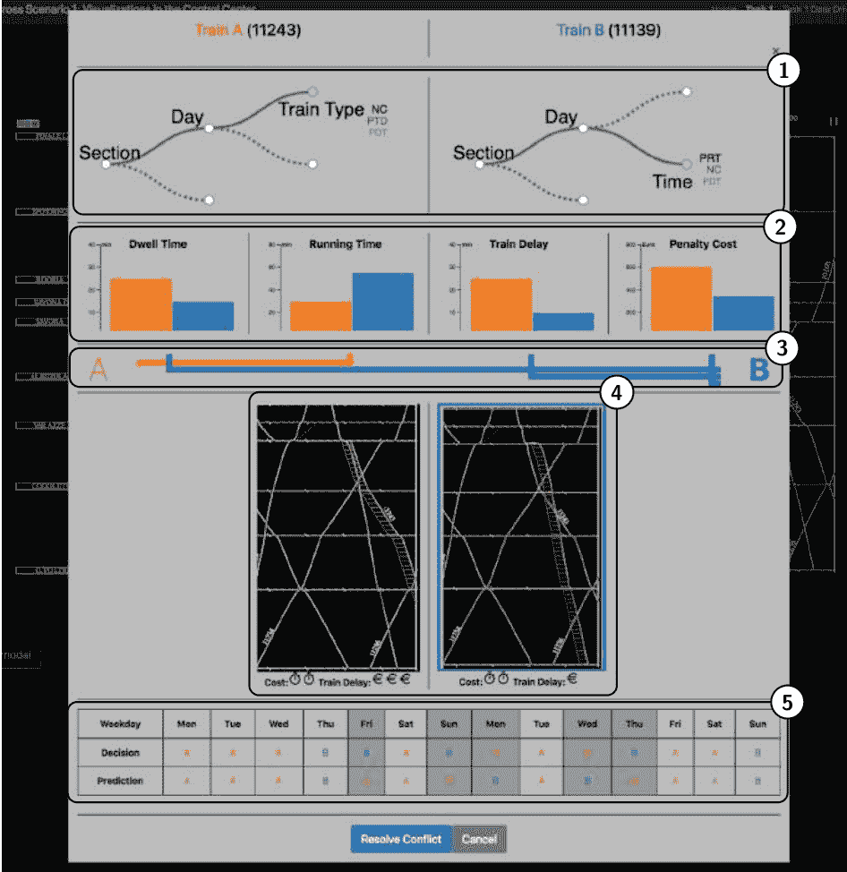

图1. 综合视图中包含了提出的冲突解决界面的简化复杂模型视图(1)，度量比较视图(2)，管道可视化(3)，并排时间表预测可视化(4)和历史决策概述(5)。

我们提出的可视分析原型支持主动决策，使列车管理操作员能够调查和评估决策，寻找最佳解决方案，并降低风险。为了实现这一目标，我们在控制室设置中扩展了现有的可视化，遵循Keim等人引入的VA原则[10]。

在我们的工作中，我们基于Oneto等人提出的列车延误预测系统(TDPS)。TDPS可以有不同的优化策略和重新调度预测，针对不同的特征和策略进行优化，如基于经验的[15]，能源高效的铁路运营[2]，乘客可靠性感知[5]，系统延误[4]等。提出的混合模型[15]结合了RFI已经在使用的EBMs和DDMs。与RFI专家合作， we 设计并实现了两个视图(见图1)来可视化HM和相关成本。

通过我们提出的解决方案，我们打算在安全关键环境中弥合模型探索和决策之间的差距。在操作员工作站上集成模型和解决方案空间可视化需要仔细考虑所呈现信息的数量以及所提供交互功能的复杂性。根据TMS专家的说法，通常情况下，操作员只考虑发生冲突后约30分钟的狭窄时间范围内所做决策的结果。由于每个额外受影响的列车都会增加复杂性，因此超出这个时间范围的任何复杂情况都不会被考虑。

因此，界面需要在显示的信息量上保持极简，同时能够始终以动态的方式为专家提供正确的信息，以便在正确的时间以正确的粒度快速做出明智的决策并实现无状态操作。我们确定了冲突解决快速决策界面所需的五个主要组成部分：

- (1) 简化复杂模型表示
- (2) 指标比较视图
- (3) 统计探索的流程可视化
- (4) 并排的日程预测视图
- (5) 先前决策的历史概述

了解第2节讨论的预测模型对于操作员决定模型是否考虑了操作员认为重要的所有方面至关重要。换句话说，可视化允许操作员决定是否应该信任模型。我们的可视分析原型中的第一个视图（参见图1（1））以DT的形式显示了捕捉高级操作员知识的EBMs。这两个DT可视化允许识别为什么EBM选择了特定的DDM。此外，操作员可以通过选择决策节点交互地探索两个DT中的替代分支。EBM的特征（例如铁路区段和列车类型）包含在视图中，以促进模型的可解释性。

可视化还可以用于研究输入特征（悬停在根节点上）并仅显示突出显示的决策路径。我们使得可以探索为什么选择了特定的DDM的EBM。列车操作员可以使用鼠标悬停来研究具有所有分支条件的决策路径，以了解EBM的结果。此外，在叶节点旁边，我们显示了DDM权重重要的三个特定特征。通过显示特征重要性，操作员能够确定DDM决策中最重要的特征。操作员可以通过选择节点来探索DT中的替代分支。

第二个可视化（见图1（2））显示了所选DDMs的预测结果成本（例如运行时间和停留时间）。我们将第二个视图与DT可视化中所选DDMs的选择相链接。结果以分组柱状图显示，便于直观比较两个训练预测的成本。通过直接比较DT中的成本和替代路径选择，我们旨在帮助操作员理解HM、预测成本以及它们之间的权衡。

此外，操作员可以查看替代的DDM并将其包含在他的决策中。为了提高所面对统计数据的快速可解释性，管道可视化（见图1（3））将每个特征的“获胜方”与相应的训练（A或B）连接起来。

在选择适当的模型之后，我们提出的解决方案的第三部分（见图1（4））允许比较操作员可以选择的两个选项的结果，即两个列车A和B中哪个先行。对于两种情况，预测的结果以与背景中的一般时间表相同的方式进行可视化。红色阴影区域表示如果操作员选择此解决方案，对时间表的影响和偏差。此外，两个模型之间的主要差异使用基于图标的简化近似表示，这里以成本和时间为例。预测的成本和延迟时间被分成简单的直观图标表示，如货币符号和时钟。对于每个特征，一个到五个图标表示通过决策引入的低到高成本或总延迟。

有时候，尽管有能力探索和选择应用模型，操作员的期望仍然与提出的解决方案不同。此外，刚上岗的操作员或临时替代人员可能还没有足够的经验做出明智的决策。

为了支持我对无状态操作员的概念，我们建议的观点的最后部分提供了以往类似情况的历史概述以及它们是如何决定的。用户可以看到模型预测的最佳解决方案与操作员最终选择的解决方案有何不同。记录的决策概述适用于理想情况下，要么加强操作员对模型的信任，要么根据过去有多少决策与模型一致来暗示模型质量不佳。

我们提出的可视化方案使列车管理操作员能够评估和评估预测模型的结果，以了解替代解决方案对列车时刻表的影响。此外，预测成本的可视化使列车管理操作员能够了解预测的不确定性。通过清晰的全局颜色编码，操作员现在能够为冲突解决做出明智的决策。我们不期望操作员在每个决策中都使用所有视图，而是根据当前的运行条件调整应用的模型。在更一般的层面，该系统还旨在为操作员提供的模型提供更多的信任，根据我们的专家的说法，目前应用的黑盒模型表示是可以改进的。

### 4 使用案例

为了展示操作员如何与系统进行交互，本节提供了一个使用案例场景，展示了TO的逐步过程。任务包括当两列火车需要同时离开或到达一个车站时，而两者都没有可用的轨道时，会出现关键冲突。TO必须决定哪列火车应该具有优先权并解决关键冲突。如前所述，决策对火车网络和整体时间表都有很大的影响。TO希望始终最小化罚款成本，同时仍能保持较低的列车延误。

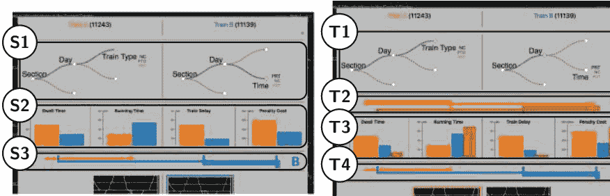

图2.(S1–3)显示了与模型预测和信息存在重要冲突。
(T1–4)显示了用户选择的另一个第三模型，用于纳入TO的决策中。

当冲突出现时，系统通过显示相关信息的新模态向TO发出通知。在解决冲突时，A或B列车应具有优先权。图2中的HM (S1–3)显示了列车B的较低惩罚成本，并建议TO选择它。这种较低的惩罚成本可以在(S2)和度量比较视图中或(S3)的流程可视化中看到，明显偏向于列车B。然而，由于TO希望进一步调查和理解决策，他检查了可用信息的可视化。这种检查意味着他查看了DT可视化和(S1)处RF预测的重要特征。在考虑DT的决策过程和RF的特征的基础上，他决定进行惩罚成本估计。有意义并且模型是正确的。TO决定给列车B优先权以解决冲突。

然而，在另一种情况下，图2 (T1-4)，TO可能对模型的决策不满意。他认为在DT中使用一些特征进行决策是不明智的。根据他的经验，其他特征对于解决这个特定冲突的情况更好。在这种情况下，TO选择DT中的另一个分支 (T1) 来考虑另一个DDM，该DDM使用操作员认为适合这种情况并且训练更好的数据。这个另外的DDM显示在改变模型后，另一列车在条形图和管道可视化中有更高的惩罚成本 (T2-3)。他仍然可以比较不同模型在 (T3) 中的决策，并通过比较 (T2) 和 (T4) 中的两个管道来进行比较。列车A表现更好，操作员应该在这种情况下选择它。

### 5 结论

火车运营商经常需要决定在冲突情况下哪辆火车可以先行。他们的决策会影响大规模铁路运输系统的时间表以及与之相关的性能指标，如火车延误和罚款成本。我们提出了一个综合视图来解决冲突，该视图利用了Lulli等人提出的混合模型[12]。我们的综合视图为火车运营商提供了访问这些模型的权限，充分利用它们的能力，并增加用户对这些模型的信任。火车运营商还可以通过基于经验的模型选择来探索各种模型。火车运营商可以探索不同模型预测的性能指标。管道可视化帮助火车运营商了解各种预测指标对当前基于数据的决策的影响。

此外，他们还可以看到未来时间表将如何受到影响。历史视图显示了操作员过去的决策以及基于数据驱动模型的预测决策。这有助于用户发现时间和周期模式，并显示在特定冲突情况下，火车运营商是否遵循自动化模型的建议。一个使用案例演示了火车运营商如何与综合视图进行交互以制定决策。

致谢。这项研究得到了欧洲联盟的支持，通过IN2DREAMS项目（欧洲联盟的Horizon 2020研究和创新计划，协议号777596）。

### 参考文献

- 1. Arnott, D.: 认知偏见和决策支持系统开发：一种设计科学方法。信息系统杂志 16(1), 55-78 (2006年)
- 2. Bai, Y., Ho, T.K., Mao, B., Ding, Y., Chen, S.: 通过模糊预测控制实现中国干线铁路的节能运行。IEEE智能交通系统交易 15(3), 938-948 (2014年)
- 3. Breiman, L.: 随机森林。机器学习 45(1), 5-32 (2001年)
- 4. Dollevoet, T., Corman, F., D’Ariano, A., Huisman, D.: 延误管理和列车调度的迭代优化框架。柔性服务制造杂志 26(4), 490-515 (2014年)
- 5. Dotoli, M., Epicoco, N., Falagario, M., Seatzu, C., Turchiano, B.: 用于优化联运铁路货运站操作的决策支持系统. IEEE Trans. Syst. Man Cybern. Syst. 47(3), 487–501 (2017)
- 6. Ghofrani, F., He, Q., Goverde, R.M., Liu, X.: 大数据分析在铁路运输系统中的最新应用：一项调查. Transp. Res. Part C Emerg. Technol. 90, 226–246 (2018)
- 7. Hansen, I.A., Goverde, R.M., van der Meer, D.J.: 在线列车延误识别和运行时间预测 . In: IEEE国际智能交通系统会议 (ITSC), pp. 1783–1788 (2010)
- 8. Huang, G.B., Zhu, Q.Y., Siew, C.K.: 极限学习机：一种新的前馈神经网络学习方案. In: IEEE国际联合神经网络会议 (2004)
- 9. Jentner, W., Sevastjanova, R., Stoffel, F., Keim, D.A., Bernard, J., El-Assady, M.: 小黄人、绵羊和水果：用隐喻叙述来解释人工智能并建立信任。 在：可解释人工智能可视化研讨会 (2018年)
- 10. Keim, D., Andrienko, G., Fekete, J.D., Görg, C., Kohlhammer, J., Melançon, G.: 视觉分析：定义、过程和挑战。 在：信息可视化, pp. 154–175 (2008年)
- 11. Lee, J.D., See, K.A.: 对自动化的信任：设计适当的依赖。 人因 46 (1) , 50–80 (2004年)
- 12. Lulli, A., Oneto, L., Canepa, R., Petralli, S., Anguita, D.: 大规模铁路网络列车运行 ：一种动态、可解释和稳健的混合数据分析系统。 在：IEEE国际数据科学与高级分析会议 (DSAA) (2018年)
- 13. Nowakowski, T.: 现代物流技术发展趋势分析. Arch. Civ. Mech. Eng. 11(3), 699–706 (2011)
- 14. Oneto, L., Fumeo, E., Clerico, G., Canepa, R., Papa, F., Dambra, C., Mazzino, N., Anguita, D.: 包括外部天气数据的火车延误预测系统的高级分析. In: IEEE国际数据科学与高级分析会议 (DSAA), pp. 458–467 (2016)
- 15. Oneto, L., Fumeo, E., Clerico, G., Canepa, R., Papa, F., Dambra, C., Mazzino, N., Anguita, D.: 火车延误预测系统：大数据分析视角. 大数据研究 11, 54–64 (2018)
- 16. Restel, F.: 铁路运输的马尔可夫可靠性和安全模型。 在：安全和可靠性: 方法和应用 - 欧洲安全和可靠性会议论文集 (2014)
- 17. Ribeiro, M.T., Singh, S., Guestrin, C.: “为什么我应该相信你？”：解释任何分类器的预测。 在：ACM SIGKDD国际知识发现与数据挖掘会议, pp. 1135–1144 (2016)
- 18. Sacha, D., Stoffel, A., Stoffel, F., Kwon, B.C., Ellis, G.P., Keim, D.A.: 视觉分析的知识生成模型。 IEEE Trans. Visual Comput. Graphics 20(12), 1604–1613 (2014)
- 19. Welling, S.H., Refsgaard, H.H., Brockhoff, P.B., Clemmensen, L.H.: 随机森林的森林地面可视化。 arXiv:1605.09196 (2016)

## 通过图神经网络对城市交通数据进行建模

Viviana Pinto¹, Alan Perotti¹,²(✉), 和 Tania Cerquitelli ³

¹ aizoOn技术咨询公司，都灵，意大利
² 科学交流研究所，都灵，意大利
alan.perotti@isi.it
³ 控制与计算机工程系，都灵理工大学，都灵，意大利

**摘要。** 大数据在交通研究中的应用越来越多，这导致了交通流建模方面的新方法，特别是对于都市地区而言。一个开放且有趣的研究问题是城市范围内的交通表示，将空间和时间模式相关联，并利用它们来预测整个城市网络中的交通流。在本文集，我们提出了一种基于机器学习的方法来模拟都市地区的交通流，最终目标是在不同的时间范围内进行短期交通预测。具体而言，我们引入了一种特定的神经网络模型（GBNN，基于图的神经网络），它反映了城市图的拓扑结构：神经元对应于交叉口，连接对应于道路，信号对应于交通流。此外，我们为每个神经元增加了一个内存缓冲区和一个循环自环，以模拟拥堵情况，并允许每个神经元基于先前的本地数据进行预测。我们为一个意大利主要城市创建了一个GBNN模型，并向其提供了一年的精细实时数据。实验结果表明了所提出的方法在进行准确的前瞻性预测方面的有效性，对于5分钟和1小时的预测，MAAPE误差分别为3%和16%。

**关键词：** 交通 · 神经网络 · 交通运输

### 1 引言

全球约50%的人口居住在大都市地区，预计到2050年将增长到75% [13]。广阔的都市地区内的移动性是一个复杂的系统，需要适当地进行建模，以便预测交通流量和拥堵的影响。如今，有很多数据可以从城市摄像头或感应线圈等检测器中获取：这些设备通常可以记录在一段时间内过渡的车辆数量以及它们的速度。此外，这些数据可以与从人群中获取的信息集成，例如使用手机应用程序或嵌入在车辆中的传感器，如GPS。可以利用数据驱动的方法从这些数据中提取有用的知识，并有效地支持短期交通预测。交通管理系统可以根据拓扑数据和交通测量结果进行训练，以估计和预测交通流量。在本文中，我们使用神经网络（NN）对交通流量进行建模，并进行短期交通预测。我们提出了一种基于城市拓扑的原始神经网络模型（基于图的神经网络 - GBNN），并将意大利一个主要城市（都灵）的拓扑和交通数据集成，并将它们输入到我们的GBNN模型中进行交通流量预测。

本文的概述如下。在第2节中，我们介绍了交通建模的最新技术。在第3节中，我们讨论了GBNN模型，包括总体视觉和数学模型，然后在第4节中介绍了实验评估和结果。在第5节中，我们以最后的评论和未来工作方向结束本文。

### 2 相关工作

在过去几年中，城市交通数据在交通和机器学习等不同研究领域受到了广泛关注。交通研究的兴趣主要集中在开发可以用于建模交通特征（如交通流量、密度和速度）的方法[7]。根据[15]的研究，大多数短期交通预测算法是针对高速公路、快速道路、干线道路或走廊级别的，而不考虑城市交叉口。使用数据驱动方法在网络级别进行预测仍然是一项具有挑战性的任务；覆盖道路网络的传感器数量不足以及人口稠密城市道路中的复杂交互作用是短期交通预测面临的最重要障碍之一。特别是，神经网络在各种交通问题中得到了广泛应用，这是因为它们能够处理大量的多维数据，具有建模灵活性和学习与泛化能力：在[2]中提出了将神经网络应用于交通工程问题的早期想法。关于使用神经网络模拟和预测交通流的更具结构化的想法可以在[12]中找到，其中使用基于神经网络的系统识别方法建立了一个自适应模型，用于描述道路段上交通流的扩散，或者在[16]中，构建了一个时空延迟神经网络来模拟道路交通网络的自相关性。在考虑高速公路的一段路段时，[14]构建了一个类似的神经网络来模拟交通流并使用真实数据进行短期预测；特别是，他们的工作侧重于处理缺失或损坏的数据。马等人[6]使用交通传感器数据作为输入，通过神经网络预测行驶速度，他们考虑了北京一条高速公路上长时间高频率的数据。朱等人[17]研究了三个相邻交叉口的交通流量，观察到单个交叉口的交通流受到显著影响的情况。

邻近交叉口的交通流量。Polson等人[11]专注于在芝加哥的一个特殊事件期间使用道路传感器数据来研究代表拥堵的数据；他们开发了一个深度学习架构，将线性模型与神经网络结合起来，以识别预测变量之间的时空关系和非线性关系。

#### 2.1 神经网络（NN）

人工神经网络[9]是由一系列相互连接的处理单元组成的计算模型，可以并行操作。最常用的学习算法是反向传播算法，由Hinton等人于1986年提出和普及[3]。循环神经网络（RNN）允许从输出层连接到输入层（与传统的前馈网络相比，连接仅馈送到后续层）。由于RNN包含循环，它们可以在处理新输入的同时存储信息。

这种记忆使它们非常适合处理需要考虑先前输入的任务（如时间序列数据）。特别是在非线性自回归外部输入（NARX）网络[8]中，每个循环链接都包括一个延迟单元，因此在时间t的输出神经元O的激活值被应用于时间t + 1的输入神经元I。

### 3 基于图的神经网络模型

为了研究城市网络，我们将城市建模为一个图，其中每个交叉口对应一个节点，每条道路对应一个边。都灵的拓扑结构允许使用这种具有小信息损失的模型，因为道路基本上是笔直的。对于少数弯曲的道路，我们选择将它们表示为直线边，简化图形。得到的城市图是强连通的，并且由于我们不表示立交桥和地下通道，也是平面的。理想情况下，图应该是有向的，具有一些多重边和环；然而，我们决定只考虑主要道路，并使用无向图。

我们首先创建一个与城市图相匹配的神经网络，使得每个图节点（代表一个道路交叉口）对应一个神经元，每条边（代表一条道路）对应神经元之间的连接。然后，交通流量被建模为网络内的信号传播 - 在神经元之间的传入/传出连接上。我们考虑到并非所有接近交叉口的车辆都能在一个时间段内离开它 - 我们通过每个神经元上的循环连接实现了局部拥堵。请注意，我们考虑的系统不是一个封闭系统：根据检测到的数据，流量质量可以丢失或生成。这可能是因为车辆进入/离开城市，或者仅仅是在一天中停放或重新投入使用。从交通检测器收集实际数据开始，我们构建了与交通流量相关的城市图，并根据这些信息设计了一个基于神经网络的模型。然后，我们将交通数据输入神经网络中，我们分析了结果。特别是，我们可以将数据处理分为四个步骤，如下所示：

- 1. 数据收集和预处理 → 收集与城市拓扑相关的数据，收集与城市检测器位置和注册的交通流相关的数据，处理缺失数据，将数据从城市检测器传播到城市节点。
- 2. 数据探索和可视化 → 分析一天内和一周内交通流行为的频繁模式。
- 3. 神经网络模型设计 → 创建GBNN模型，定义神经元级和网络级参数，设计学习过程。
- 4. 模型评估评估 → 对GBNN模型的性能进行分析。

#### 3.1 数据收集和预处理

为了创建模型，我们使用了两种不同类型的数据。在第一阶段，我们使用拓扑数据来构建城市图；在第二阶段，我们使用道路检测器收集的数据来建模交通流。我们关注意大利都灵市（图1 - 左）。我们使用纬度和经度数据创建与城市相关联的图；我们考虑城市中心的主要交叉口和道路，从而得到一个包含1074个节点和1874条边的图（图1 - 中）。

考虑到图1-右侧所示的城市，共有201个探测器。探测器数据以时间序列的形式给出，时间间隔为五分钟，为期一年（从2016年6月27日到2017年6月27日），可用数据为时间间隔内的车辆数量和平均速度。我们将这些数据聚合度一个唯一的指标，即流量。为了在神经网络中使用这些数据，必须将流量从探测器传播到图节点（即神经元），我们按照以下方式进行：

$$f_{i}=\sum_{j=1}^{N} \frac{\hat{f}_{j}}{dist^{2}(i, j)} \text{,}$$ (1)

其中，$f_i$ 表示顶点/神经元 $i$ 上的流量，$\hat{f_j}$ 表示探测器 $j$ 上的流量，$N$ 是探测器的数量，$dist$ 是节点 $i$ 和探测器 $j$ 之间的欧几里德距离。都灵市中心区域有463个探测器，但我们只考虑具有几乎完整数据（>75%）的探测器，即201个，以尽量避免人为生成数据来填充数据集。我们用前一个数据点和后一个数据点的平均值来填补每个数据间隙。

#### 3.2 数据探索与可视化

根据先前提出的设置，我们研究了一天中流量的分布。我们发现了三种不同的出现模式：工作日的模式、星期六的模式和星期天的模式，如图2所示，其中图1。都灵城市地图、道路网络和检测器分布。

每个工作日和每个时间段的所有数据的平均值被表示出来。工作日在早上呈现出高峰，而在周末完全消失。星期天在午餐时间出现了大幅度的流量减少。请注意，在晚间的数据中呈现出了一种超出路径的行为。这可能是由于所考虑的检测器的技术限制。

星期天和星期一的分布中出现了一些有趣的模式。特别是，星期天的流量分布呈现出一些异常情况，即作为图2左上角所示的一些与一般模式不符的日子：绿线代表1月1日，我们可以看到早上的行为与其他星期天相反，而白天的总流量小于一年中的其他星期天；红线代表3月5日和4月2日，这是生态星期天，在这两天车辆不允许从上午10点到下午6点行驶，因此该线路完全遵循模式直到上午10点，然后下降直到下午6点，然后恢复与一般模式相匹配。至于星期一，图2左下角显示了一些与星期天类似的模式，交通量较小且没有早高峰，这些线路代表节假日。

图2.每日和每周的交通模式。

#### 3.3 神经网络模型设计

我们创建了一个循环神经网络，能够根据可用数据进行短期交通预测。我们将城市图的每个节点（对应一个交叉口）与一个神经元相关联，将每条边（对应一条道路）与神经元之间的连接相关联。然后，交通流量被建模为通过神经网络传播的信号。由于每个神经元对应于城市图的一个节点，神经元具有多个输出连接，表示交叉口的出口道路。每个神经元有许多输入连接，由延迟层控制，表示时间窗口管理；输入被组合并产生输出，然后在出口连接上进行分割，直到连接饱和；超过的流量再次通过自环插入神经网络。这个循环上的流量表示交叉口的交通拥堵。起始城市图由节点和边组成，对于每个图节点 $i, i = 1, 2, \dots, N$，存在一个预测堆栈 $f_i(t), t \in [0, T]$，其中每个时间间隔都有流量数据。我们为每个图节点创建一个神经元，并为每个图边创建一个连接。此外，对于每个神经元 $i$，我们创建一个人工自环 $(i,i)$，对于每个连接 $(i,j)$，我们设置最大容量 $C_{i,j}$。在这项工作中，我们将此容量设置为100的流量值，这是流量分布的第三四分位数。考虑长度为 $\tau+1$ 的时间窗口，并且令 $F_i(t) = [f_i(t), f_i(t-1), \dots, f_i(t-\tau)]^T$ 为与节点 $i$ 相关联的时间序列向量。令 $M$ 为节点 $i$ 的入边数，$K$ 为节点 $i$ 的出边数。对于每个节点 $i$，定义一个权重矩阵 $W^i(t)$，具有 $K$ 行和 $\tau$ 列。我们使用指数衰减和高斯噪声 ($\sim \mathbf{N}(0,1)$) 初始化每个权重矩阵，如下所示：

$$W^k(0) = \{w_{ij}^k(0)\}_{ij} = \left\{ \frac{1}{2^j} + \text{噪声} \right\}_{ij}, k = 1, 2, \dots, N \eqno(2)$$

因此，每个节点最初将流量平均路由到相邻节点（因为 $w_{i,j}$ 不依赖于 $i$），并且对最近的历史比以前的历史更加重视（因为对于每个以前的时间戳，$w_{i,j}$ 减半）。我们使用矩阵 $W^i(t)$ 来估计节点 $i$ 在时间 $t+1$ 的 $K$ 出流量。

$$W^i(t) \cdot F_i(t) = \begin{bmatrix} w_{11}^i & w_{12}^i & \dots & w_{1\tau}^i \\ w_{21}^i & w_{22}^i & \dots & w_{2\tau}^i \\ \dots & \dots & \dots & \dots \\ w_{K1}^i & w_{K2}^i & \dots & w_{K\tau}^i \end{bmatrix} \cdot \begin{bmatrix} f_i(t) \\ f_i(t-1) \\ \dots \\ f_i(t-\tau-1) \end{bmatrix} = \begin{bmatrix} \tilde{f}_{i1}(t+1) \\ \tilde{f}_{i2}(t+1) \\ \dots \\ \tilde{f}_{iK}(t+1) \end{bmatrix} = \tilde{\mathcal{F}}_i(t+1), \eqno(3)$$

其中 $\tilde{f}_{ij}(t+1)$ 是在时间 $t+1$ 上边 $(i, j)$ 上的估计流量，$\tilde{\mathcal{F}}_i(t+1)$ 是从节点 $i$ 出去的估计流量向量。

$$\begin{cases} \tilde{f}_i(t) = \sum\limits_{j=1}^M \tilde{f}_{ji}(t) + \tilde{f}_{ii}(t), \\ \tilde{f}_{ii}(t) = \max \left\{ \sum\limits_{j=1}^K (\tilde{f}_{ij}(t) - C_{ij}), 0 \right\}. \end{cases} \eqno(4)$$

形式上，节点 $i$ 在时间 $(t+1)$ 的估计流量是来自其 $M$ 个入边的估计流量之和加上其自环上已存在的流量。自环上的流量是因为边 $(i, j)$ 上的最大容量 $C_{ij}$ 已经达到而无法流出的流量之和。

对于每个节点 $i$，我们定义一个误差 $E_i(t)$ 如下：

$$E_i(t) = f_i(t) - \tilde{f}_i(t). \tag{5}$$

然后，我们按比例将这个误差分配到节点 $i$ 的入边上的流量上，如下所示：

$$E_{ji}(t) = \frac{\tilde{f}_{ji}(t-1) \cdot E_i(t)}{\sum_{j=1}^M \tilde{f}_{ji}(t-1)}. \tag{6}$$

我们将误差 $E^i(t)$ 定义为节点 $i$ 在时间 $t$ 的输出误差向量。

$$E^i(t) = [E_{i1}(t), \dots, E_{iK}(t)]. \tag{7}$$

利用误差向量 $E^i(t)$，我们可以按以下方式向后更新每个节点 $k$ 的矩阵 $W^k(t+1)$。此外，我们还添加了一个学习率参数 $\eta$。

$$W^k(t+1) = \{w_{ij}^k(t+1)\}_{ij} = \left\{ \frac{w_{ij}^k(t) + \eta \cdot E^k(t) \cdot f_k(t)}{\sum_{i,j} w_{ij}^k(t+1)} \right\}_{ij}. \tag{8}$$

#### 3.4 模型评估

为了评估GBNN模型的预测能力，我们采用了由[5]提出的MAAPE，均值反正切绝对百分比误差。

MAPE（平均百分比误差）是最广泛使用的预测准确性度量，但它是非对称的，并且受到除以零的问题的影响。为了避免这个问题但保留MAPE的理念，引入了MAAPE。其定义如下：

$$\text{MAAPE} = \frac{1}{N} \sum_{t=1}^N \arctan \left( \left| \frac{\text{预测} - \text{期望}}{\text{期望}} \right| \right). \tag{9}$$

误差属于 $[0, \frac{\pi}{2}]$。为了获得百分比值，我们通过乘以 $\frac{2}{\pi}$ 来重新缩放MAAPE，使得误差现在属于 $[0, 1]$。

### 4 实验结果

我们在Java中实现了我们的GBNN模型。我们将超参数设置如下：考虑时间窗口（内存大小）的维度为4，图中所有链接的边的最大容量为100.00，学习率为 $10^{-4}$，预测的最大时间范围为12（即预测提前1小时），训练迭代次数为40。

我们继续测试GBNN，对每个工作日单独进行测试，将除一个以外的所有天作为训练集，并将剩余的一天作为验证集。我们使用训练好的网络来预测不同时间范围内的交通流量：即使用验证数据在时间 $t$ 预测时间 $t+k$ 分钟的交通流量，其中 $k \in \{5, 10, 30, 60\}$。

### 表1. 不同时间范围下的MAAPE误差表

| 天 | 5分钟 (%) | 10分钟 (%) | 30分钟 (%) | 1小时 (%) |
| :--- | :--- | :--- | :--- | :--- |
| 星期一 | 2.89 | 4.05 | 9.43 | 15.85 |
| 星期二 | 2.95 | 3.99 | 9.24 | 15.62 |
| 星期三 | 2.82 | 3.90 | 9.09 | 15.33 |
| 星期四 | 2.77 | 3.91 | 9.48 | 16.10 |
| 星期五 | 2.60 | 3.63 | 8.91 | 15.56 |
| 星期六 | 2.39 | 2.96 | 6.78 | 12.13 |
| 星期日 | 2.71 | 3.17 | 7.18 | 13.23 |
| **平均** | **2.73** | **3.66** | **8.59** | **14.83** |

图3. 不同时间范围下的流量预测分析。

我们对于5分钟之后的预测得到非常小的误差，而对于30分钟之后的预测误差仍然在10%以下。GBNN能够以大约15%的误差预测1小时后的交通流量。结果在每一天基于GBNN和每个时间段几乎保持不变，如表1所示。我们选择一个随机神经元来定性地分析不同时间段预测的流量值。

图3显示了验证日星期一集合上的实际流量和预测流量。GBNN在一天的开始和结束部分表现出色，而在中间几个小时则存在较大的误差。对于我们的实验，我们使用了戴尔Precision M3800 (Intel Core i7-4712HQ, 16 GB RAM)。大致上，每个训练迭代需要0.05秒，每天在训练集中有288个时间片。我们进行了随机搜索和网格搜索，以找到学习率和内存大小的最佳值，这是最具影响力的超参数（参见图4）。

在第一种情况下，最低MAAPE与学习率为 $10^{-4}$ 相关：关于内存大小，数值4（即基于前20分钟数据进行预测）与最低交叉时域MAAPE相关。图4中的阴影区域表示使平均误差最小化的数值间隔。我们决定考虑一个简单的模型，即通过重复已知流量值进行预测，以便与结果进行比较，因为经典统计方法不适用于我们的城市交通表示：不完整的数据和不稳定的分布破坏了统计方法的稳定性。我们决定不将我们的模型与基于代理的模型进行比较，因为这种方法完全不同：我们将交通流量视为一个整体，而不是一组个体代理。

此外，文献中没有现有的神经网络模型考虑整个城市网络或双向交通流量。GBNN模型与简单模型的比较如图5所示，分别用于5分钟和1小时的预测（左图为5分钟，右图为1小时），在验证日随机选择的节点上进行。顶部面板显示了真实流量、简单模型预测的流量（红线）和GBNN预测的流量（蓝线），分别对应5分钟（左图）和1小时（右图）的时间范围。底部面板显示了模型的误差比较：简单模型为红线，GBNN为黑线。

图4. MAAPE误差分析关于内存大小（左）和学习率（右）。

图5. 流量和误差比较。

### 5 结论和未来工作

在本文中，我们提出了一种创新的神经网络模型，其拓扑结构模拟了城市图，并且每个节点都通过循环连接进行了增强，以捕捉时间行为。最终的系统能够对整个城市交通流进行建模，考虑到数据中的空间和时间模式，从而进行全网交通流预测。5分钟和1小时交通预测的预测误差分别为3%和16%。

未来的工作方向将集中在实现城市道路网络的特殊性，这些特殊性在初始模型中被忽略，例如单行道和环形交叉口。

### 参考文献

- 1. Chowdhuri, M., Sadek, A.W.: 人工智能的优势和局限性。Trans. Res. B., E-C168, 6–8 (2012)
- 2. Faghri, A., Hua, J.: 评估人工神经网络在交通工程中的应用。交通研究记录。1358, 71–80 (1992)
- 3. Rumelhart, D.E., Hinton, G.E., Williams, R.J.: 通过误差传播学习内部表示。麻省理工学院出版社，剑桥 (1986)
- 4. Karlaftis, M.G., Vlahogianni, E.I.: 在交通研究中，统计方法与神经网络的差异、相似之处和一些见解。交通研究。C-Emer. 19, 387–399 (2011)
- 5. Kim, S., Kim, H.: 间歇需求预测的绝对百分比误差的新度量。预测杂志。32, 669–679 (2016)
- 6. 马, X., 陶, Z., 王, Y., 于, H., 王, Y.: 使用远程微波传感器数据的长短期记忆神经网络进行交通速度预测。运输研究C-紧急 54, 187-197 (2015年)
- 7. Moretti, F., Pizzuti, S., Panzieri, S., Annunziato, M.: 通过统计和神经网络装袋集成混合建模进行城市交通流量预测。神经营算 167, 3-7 (2015年)
- 8. Siegelmann, H.T., Horne, B.G., Giles, C.L.: 循环NARX神经网络的计算能力。IEEE Trans. Syst. Man Cybern. Part B 27 (2), 208-215 (1997年)
- 9. Haykin, S.: 神经网络：全面的基础。Prentice Hall, Upper Saddle River (1999年)
- 10. Rosenblatt, F.: 感知器：大脑中信息存储和组织的概率模型。心理学评论 65, 386–408 (1958)
- 11. Polson, N.G., Sokolov, V.O.: 深度学习用于短期交通流量预测。交通研究C-紧急情况 79, 1-17 (2017)
- 12. Qiao, F., Yang, H., Lam, W.H.K.: 交通流量智能模拟和预测。交通研究B-方法 35, 843–863 (1999)
- 13. 联合国：经济和社会事务部，人口司。世界城市化前景：2014年修订版 (2014)
- 14. van Lint, J.W.C., Hoogendoorn, S.P., van Zuylen, H.J.: 在缺失数据下准确的高速公路旅行时间预测。交通研究C-紧急情况 13, 347–369 (2005)
- 15. Vlahogianni, E.I., Karlaftis, M.G., Golias, J.C.: 短期交通预测：我们现在在哪里，我们将去哪里。交通研究C-紧急情况。43, 3–19 (2014)
- 16. Wang, J., Tsapakis, I., Zhong, C.: 时空延迟神经网络模型用于旅行时间预测。工程应用人工智能。52, 145–160 (2016)
- 17. Zhu, J.Z., Cao, J.X., Zhu, Y.: 基于径向基函数神经网络的交通量预测，考虑相邻交叉口的交通流量。交通研究C-紧急情况。47, 139–154 (2014)

---

# 使用R-CNN进行交通标志检测

Philipp Rehlaender¹(✉), Maik Schroeer², Gavneet Chadha³, and Andreas Schwung³

¹ 德国帕德博恩大学，帕德博恩 rehlaender@lea.upb.de
² 德国布施-雅格尔电气有限公司，吕登斯赫德
³ 德国伊瑟隆应用科学大学，南威斯特法利亚

**摘要。** 由于驾驶辅助系统的日益普及，交通标志检测因其在交通安全中的作用而受到越来越多的关注。本文提出了一种基于卷积神经网络区域（R-CNN）方法的交通标志检测算法。在这种方法中，分割算法提出了可能包含交通标志的区域。这些区域通过卷积神经网络进行分析，为支持向量机提供特征向量。然而，由于提出了过多的区域，该方法的计算时间较长。为了减少区域的数量，本文提出了一种基于透视的逻辑，通过大小-位置不匹配来丢弃不太可能包含交通标志的区域。这样可以平均减少93%的提出区域。为了加快训练速度，该系统由两层支持向量机组成。第一层用于对图片的类别进行分类，第二组SVM用于对交通标志进行分类。该技术的整体分类准确率为86%。将结果输入跟踪算法可能会导致整体改进，因为帧会弥补错误。

**关键词:** 目标检测 · 卷积神经网络 · 具有卷积神经网络的区域 (R-CNN) · 支持向量机 (SVM)

### 1 引言

先进的驾驶辅助系统变得越来越受欢迎。不同的传感器被用于辅助驾驶员在道路上，如摄像头、雷达传感器等。一个特别有趣的驾驶辅助系统是交通标志的检测。德国的道路上有100多种不同的交通标志。并不是所有的标志对驾驶员的安全都很重要。通常，交通标志检测包括两个算法：首先，对图片进行分析并提出潜在的交通标志区域。其次，对提出的区域进行评估，确定它们属于哪个标志组。文献中提出了大量的检测方法。

基于卷积神经网络的方法在[5,6]中提出。毛等人在[5]中使用了一种层次卷积神经网络，通过在分类器之上叠加多个卷积层结果证明非常成功，分类准确率达到99.67%。钱在[6]中使用了一种视觉属性学习方法，通过最大池化位置进行属性预测。基于支持向量机（SVM）的方法已经应用于[1,4,7]。本文使用R-CNN算法实现交通标志检测，其中包括线性阈值逻辑（LTL）和双层支持向量机（SVM）分类。本文结构如下：首先解释了应用的R-CNN算法。第3节详细解释了区域缩减方法。第4节解释了多类支持向量机算法。最后，总结了本文并展望了未来。

### 2 卷积神经网络中的区域

在这项工作中，使用了Girshick在[2]中介绍的卷积神经网络（R-CNN）方法来检测和识别来自43种不同交通标志的图像。为了训练和评估，使用了德国交通标志识别基准（GTSRB）[8]提供的数据库。

该算法分为三个步骤。首先，一个分割算法提出可能包含感兴趣对象的区域。其次，一个卷积神经网络对区域进行采样，并提出一个4096维特征向量。最后，一个支持向量机将提出的区域分类为43种分析的交通标志或背景之一。由于位置-尺寸比，R-CNN方法通过透视逻辑扩展以丢弃不太可能是交通标志的区域。

此外，分类过程已经修改为两步：首先，完整的分类将标志分为类似标志的子组（白色标志、速度标志、禁止标志、警示标志、终点标志和强制标志），或者在无法进行子分组的标志的情况下进行最终分类。然后，对于分组标志，使用子支持向量机进行详细分类。这个两步过程导致了更详细的训练，因为子支持向量机的训练时间大大缩短，从而实现了更好的分类率。完整实现算法的流程图如图1所示。

如果第一个和第二个支持向量机为ROI提供相同的类别，则选择该类别作为最终类别。否则，输入图像的ROI将调整为比之前的ROI大10%，并重复该过程一次。如果第二次循环中两个支持向量机的结果不同，则选择子支持向量机的结果。对于不适用于第二个支持向量机的类别，如优先标志或停止标志，选择第一个支持向量机的结果作为第一次循环的最终结果。

#### 2.1 分割算法

在这项工作中，采用了[9]提出的选择性搜索算法。它结合了穷举搜索和分割的优点。通过多样化搜索算法，该算法可以处理各种不同的图像条件。

图1.实施算法的流程图。一个分割算法提出了一些区域，通过顺序阈值逻辑进行评估。剩余的区域通过卷积神经网络进行评估，该网络提供一个4096个元素的特征向量给第一个支持向量机。这个支持向量机将这些区域分配给五个组中的一个，背景或提供最终的分类。

#### 2.2 区域数量的减少

图像中交通标志的大小取决于其在图像中的位置和路径在图像中的位置。显然，分割算法返回了多余的区域，这些区域不能是交通标志，因为它们的位置与大小不匹配。通过仔细选择区域宽度和高度的边界，可以大大减少提交给卷积神经网络的区域数量。

这在第3节中进一步解释。

#### 2.3 卷积神经网络

区域通过卷积神经网络进行处理。Girshick在[2]中建议使用预训练的网络，并对其进行微调以适应特定任务。这样可以避免巨大的训练时间，并获得更好的性能[2]。

为此，使用了MatConvNet预训练的CNN [3,10]。使用这个预训练网络提供了一个最先进的图像分类基础。由于CNN用于特征提取，因此使用CNN的最后一个全连接层（第19层）提取图像的特征。这返回一个4096维的特征向量。得到的区域建议是一个大小为 $N \times 4096$ 的特征矩阵，其中 $N$ 表示分割算法提出的区域数量。由于CNN只能处理227×227的RGB图像，提取的区域已被调整大小以适应这个架构。特征是通过前向传播到一个均值减去的RGB图像，通过五个卷积层和两个全连接层计算得出[2]。

### 2.4 通过两阶段SVM进行分类

4096特征向量被传输到第一个SVM。SVM被用作预测器，根据其对应的类别对ROI进行分类。由于不同组的标志的误分类率高于预期，为具有相似性的组（如速度标志组、禁止标志组、警告标志组、白色标志组和强制标志组）添加了第二个SVM实例。为了改进训练，使用LASSO算法对特征进行了降维和修改。LASSO算法能够将特征数量减少超过50%。使用这种双重SVM稍微提高了分类率。详细描述请参见第4节。

### 3 通过线性阈值逻辑（LTL）减少区域数量

大多数由分割算法提出的区域一方面不符合交通标志的边比例，另一方面它们也不能是交通标志，因为位置大小不匹配不符合分析帧的透视图。图2显示了透视理论的示意图。消失点位于地平线上。可以非常清楚地看到，物体的大小随着物体靠近消失点而减小。此外，道路左侧和右侧的物体大小不同（图3）。

图2。透视的可视化。所有物体的大小在靠近消失点的过程中线性变小。可以根据它们的位置评估区域。由于大小限制，不是所有区域都可以是交通标志，因此可以删除区域。图源自[2]。

图3.逻辑的可视化。红色边框表示最小阈值，黄色边框表示最大阈值。区域位于第一象限，定位点位于右上角。图源自[2]。

图示显示图片可以分割成四个象限。对于每个象限，必须单独定义最小和最大阈值。一个提议的区域通过其独特特点进行评估，第一象限的点为 $(x_2, y_2)$，第二象限的点为 $(x_1, y_2)$，第三象限的点为 $(x_1, y_1)$，第四象限的点为 $(x_2, y_1)$。这意味着一个区域可以同时位于四个象限。如果至少有一个逻辑接受该区域，则该区域被保留为有效并传递给CNN。

图4.由分割提出的6402个区域。为了易读起见，只绘制了每十个区域。图源自[2]。

最小和最大阈值由与 $x$ 和 $y$ 相关的线性函数定义。坐标系的原点移动到中心。

因此，阈值函数对每个象限 $q$ 定义如下：

$$\Delta x_{\min, x}^q = a_{\min, x}^q + b_{\min, x}^q \cdot |x| + c_{\min, x}^q \cdot |y| \qquad (1)$$
$$\Delta y_{\min, y}^q = a_{\min, y}^q + b_{\min, y}^q \cdot |x| + c_{\min, y}^q \cdot |y| \qquad (2)$$
$$\Delta x_{\max,x}^q = a_{\max,x}^q + b_{\max,x}^q \cdot |x| + c_{Q\max,x} \cdot |y| \quad (3)$$
$$\Delta X_{Q\text{最大},Y} = a_{Q\text{最大},Y} + b_{Q\text{最大},Y} \cdot |x| + c_{Q\text{最大},Y} \cdot |y| \quad (4)$$

为了评估区域大小，需要了解方程 (1) - (4) 的12个变量。然而，评估器可以通过手动调整或使用机器学习工具进行调整。经过精心手动调整的逻辑能够平均减少90%的提交给CNN的区域数量。区域减少的过程如图4和图5所示。最初提出的6402个区域数量减少到最终的386个。这相当于减少了94%。

图5。通过LTL将区域数量压缩到总共386个。图源自[2]。

### 4 多类支持向量机分类

本章描述了支持向量机的设计。优秀的SVM将区域分类为子组或背景。对于子SVM，使用LASSO特征调节技术。最后，对于等分类进行子SVM训练。

### 4.1 主要SVM

将每个图片的4096个不同特征向量给予这个第一个SVM，其任务是为每个给定给CNN的ROI分配最合适的类别。SVM是在GTSRB的训练集和CALTECH 101的附加背景图片上进行训练的。SVM使用贝叶斯优化进行训练，产生了图6所示的分类结果。

#### 4.2 特征正则化

使用LASSO算法进行特征正则化，强制某些特征为零。通过使用这种正则化技术，可以强制某些特征为零，以避免过拟合。被强制为零的参数数量如表1所示。在一个子训练的SVM上，平均提高了0.5%的分类准确率。从被强制归零的特征数量的变化来看，不同的特征对于不同的子类别是相关的。

表1. 被强制归零的子集特征

| 子集 | 被强制归零的特征 |
| :--- | :--- |
| 蓝色标志 | 2595 |
| 禁止标志 | 2601 |
| 限速标志 | 2332 |
| 警告标志 | 2469 |
| 白色标志 | 3411 |

### 4.3 次级SVM的设计和性能

这五个子SVM是在降维后的特征空间上训练的。每个子SVM都经过个别优化以获得最佳性能。

**蓝色标志。** 该SVM使用径向基函数核、密集随机编码，并在核尺度和盒约束方面进行贝叶斯优化。分类结果显示在图7a中。该子组的整体分类准确率为86%。进一步使用其他核函数和编码矩阵进行训练无法提高分类率。

**禁止标志。** 对于这个子SVM，使用线性核函数和一对多编码进行了10折交叉验证，使用随机参数搜索即可。分类结果显示在图7b中。整体分类率为97%。

图7。子SVM“蓝色标志”的分类结果 $\eta$ (a) 和子SVM“禁止标志”的分类结果 $\eta$ (b) 与相应的类别编号 $n$。

图8。子SVM“限速标志”的分类结果 $\eta$ (a) 和子SVM“警示标志”的分类结果 $\eta$ (b) 与相应的类别编号 $n$。

**速度限制。** 已经进行了大量测试以达到足够的结果在这个类别上。使用非线性径向基函数核、贝叶斯优化和稀疏随机编码取得了最佳结果。图6的结果已经显示出20公里/小时的速度限制非常难以分类。分析表明，这个速度限制经常与30公里/小时和50公里/小时混淆。分类结果如图8a所示。这个组的整体分类准确率为81%。最差的准确率是只有24%的20公里/小时速度限制。这个准确率不够，需要进一步的训练。对于其他交通标志的检测准确率是足够的。

**警告标志。** 这个预测器的分类结果平均均为80%。分类率如图8b所示。结果显示整体的准确率是有效的，但有些个别准确率不够符。这个子组需要进一步的训练，例如生成合成子样本。

**白色标志。** 最后一个为白色交通标志编程的分类器。该组的整体分类率为80%。分类结果如图9所示。

图9。子SVM“白色标志”的分类结果 $\eta$，具有类别编号 $n$。

### 5 结论

使用R-CNN进行交通标志的检测。提出了一个分割算法来生成感兴趣区域（ROIs）。通过顺序线性逻辑，平均减少了93%的区域数量，以丢弃位置-尺寸不匹配的区域。预训练的CNN分析剩余的区域以提取特征向量，然后通过两层SVM对图像进行分类。第一个SVM将交通标志与背景图像分离，并进行第一次分类，将其分为子组。

一组较差的SVM提供最终的分类。这种两层结构使分类准确率从85%提高到86%。

### 6 观点

本文提出的顺序线性逻辑已经手动调整，以在各种驾驶情况下执行。然而，可以使用图像中消失点和道路位置的自动检测来自动确定参数集合（1）到（4）。这将导致对冗余区域的改进抑制。将在未来的工作中进行研究。

### 参考文献

- 1. Boi, F., Gagliardini, L.: 用于交通标志识别的支持向量机网络。在: 2011年国际联合神经网络会议, 第2210-2216页。IEEE (2011年)。 https://doi.org/10.1109/IJCNN.2011.6033503
- 2. Girshick, R., Donahue, J., Darrell, T., Malik, J.: 用于准确目标检测和语义分割的丰富特征层次结构。在: 2014年IEEE计算机视觉与模式识别会议, 第580-587页。IEEE (2014年)。 https://doi.org/10.1109/CVPR.2014.81
- 3. Krizhevsky, A., Sutskever, I., Hinton, G.E.: 使用深度卷积神经网络进行ImageNet分类。 http://papers.nips.cc/paper/4824-imagenet-classification-with-deep-convolutional-neural-networks
- 4. Maldonado-Bascon, S., Lafuente-Arroyo, S., Gil-Jimenez, P., Gomez-Moreno, H., Lopez-Ferreras, F.: 基于支持向量机的道路标志检测和识别。IEEE智能交通系统杂志 8 (2), 264-278 (2007)。 https://doi.org/10.1109/TITS.2007.895311
- 5. Mao, X., Hijazi, S., Casas, R., Kaul, P., Kumar, R., Rowen, C.: 用于交通标志识别的分层卷积神经网络。在: 2016年IEEE智能车辆研讨会 (IV) , 第130-135页。IEEE (2016) 。 https://doi.org/10.1109/IVS.2016.7535376
- 6. Qian, R.Q., Yue, Y., Coenen, F., Zhang, B.L.: 使用视觉属性学习和卷积神经网络进行交通标志识别。在: 2016年国际机器学习与控制会议 (ICMLC) , 第386-391页。IEEE (2016) 。 https://doi.org/10.1109/ICMLC.2016.7860932
- 7. 石，M.，吴，H.，弗莱伊，H.：支持向量机用于交通标志识别。在：2008年IEEE国际联合神经网络会议 (IEEE世界计算智能大会) ，第3820-3827页。IEEE (2008年) 。 https://doi.org/10.1109/IJCNN.2008.4634347
- 8. Stallkamp, J., Schlipsing, M., Salmen, J., Igel, C.: 人类对计算机: 交通标志识别的机器学习算法基准测试。神经网络Off. J.Int.神经网络学会。 32, 323-332 (2012年)。 https://doi.org/10.1016/j.neunet.2012.02.016
- 9. Uijlings, J.R.R., van de Sande, K.E.A., Gevers, T., Smeulders, A.W.M.: 选择性搜索用于物体识别。国际计算机视觉杂志。 104 (2) , 154-171 (2013年)。 https://doi.org/10.1007/s11263-013-0620-5
- 10. Vedaldi, A., Lenc, K.: MatConvNet: 用于MATLAB的卷积神经网络 (2014). https://arxiv.org/pdf/1412.4564v3.pdf

---

## 深度树转导-简短调查

Davide Bacciu (✉) 和 Antonio Bruno

意大利比萨大学计算机科学系
{bacciu,antonio.bruno}@di.unipi.it

**摘要.** 本文从学习非平凡的同构结构转导的角度，综述了最近对长短期记忆网络进行的树结构扩展。它对现代TreeLSTM模型进行了讨论，展示了树处理方向引起的偏差的影响。对真实世界基准进行了实证分析，突出了没有单一模型能够有效处理所有转导事实。

**关键词：** 结构化数据处理 · 树转导 · TreeLSTM

### 1 引言

结构转导是对监督学习的自然推广，适用于输入样本和预测结果都是结构化信息的应用场景。树是一种非平凡的结构化数据示例，可以直观地表示由其元素之间存在层次关系所特征化的复合信息。在这个背景下，学习树结构转导等同于推断将输入树与预测结果树相关联的函数。许多具有挑战性的现实世界应用可以作为树转导问题来解决。

学习通用树转导问题的难点在于输入和输出树具有不同的拓扑结构，尽管一些研究[2,21]已经开始处理学习树结构化信息采样的问题，这是实现树结构化输出预测器的先决功能。同构转导定义了一种受限的树转换形式[7]，然而，它仍然可以对结构化数据上的几个有趣的学习任务进行建模和处理，包括：(i)树分类和回归，即为整个树预测一个向量标签；(ii)节点重标记，即为树中的每个节点预测一个向量标签，考虑其周围上下文信息(例如，其根子树或其根到节点路径)；以及(iii)子结构约简，即预测通过修剪输入结构的部分而得到的树。

多个学习模型已经实现了同构转导，从[13]中关于结构递归处理的开创性工作开始。在这里，已经形式化了将递归模型扩展到对树进行自底向上处理的想法，通过递归地展开网络来处理树结构，使得当前树节点的隐藏状态依赖于其子节点的隐藏状态。许多模型采用了相同的方法，来自不同的范例，例如概率自底向上隐马尔可夫模型[4], 神经树回声状态网络[14]或神经-概率混合的隐马尔可夫网络（HTNs）[3]。

另一种方法可以基于反转树的解析方向，通过自顶向下地处理从根到叶子的树。这在概率范例[12]中特别流行，它代表了序列的隐马尔可夫模型的适当直接扩展。最近，在深度学习社区中，长短期记忆（LSTM）网络[15]在处理树结构信息方面得到了广泛应用。所谓的TreeLSTM模型[20]通过自底向上的方法扩展了LSTM单元，通过实现[13]中递归框架的特定实例来处理树结构。尽管TreeLSTM被定义为n叉树的一般情况，但它已经被用于通过对原始解析树进行二叉化得到的二叉树，实际上，这显著减少了结构信息对解决任务的贡献。最近的两项工作展示了自顶向下的TreeLSTM的示例：一项提出在[21]中学习采样树，一项在[6]中展示了其在学习简单的非同构转导中的应用。

本文的目的是对现代TreeLSTM模型进行有序讨论，评估不同稳定性假设（即隐藏状态的参数化）对完全n元设置（即不需要对结构进行二元化）的影响。此外，由于树解析方向的选择对模型的表征能力有着众所周知的影响[4]，我们考虑了自底向上和自顶向下的TreeLSTM模型。具体而言，我们重点评估了TreeLSTM模型在与上述三种不同类型的同构树结构转导相关的三个不同任务上的性能。我们将展示每个任务都有不同的假设和特点，不能通过单一方法有效解决所有问题。

### 2 问题阐述

在深入讨论处理树数据的不同基于LSTM的方法的细节之前，我们使用结构转导的通用框架对实验评估中涉及的问题进行形式化。

我们考虑从输入-输出树对 $(x^n, y^n)$ 中学习树转导的问题，其中上标标识数据集中的第 $n$ 个样本对（上下文清晰时省略）。我们考虑由三元组 $(\mathcal{U}_n, \mathcal{E}_n, \mathcal{X}_n)$ 定义的带标签的根树，其中包括节点集合 $\mathcal{U}_n = \{1, \dots, U_n\}$, 边集合 $\mathcal{E}_n \subseteq \mathcal{U}_n \times \mathcal{U}_n$ 和标签集合 $\mathcal{X}_n$。术语 $u \in \mathcal{U}_n$ 表示一个通用树节点，其直接祖先称为父节点，记为 $pa(u)$。节点 $u$ 可以有可变数量的直接后代（子节点），如下所示节点 $u$ 的第 $l$ 个子节点表示为 $ch_l(u)$。对于一个普通节点和其子节点之间的边，我们用 $(u, v) \in \mathcal{E}_n$ 表示。我们假设树的最大有限出度为 $L$（即每个节点的最大子节点数）。树中的每个顶点 $u$ 都与一个标签 $x_u$（分别为 $y_u$）相关联，这取决于应用的不同，例如表示词嵌入的连续值特征向量或来自离散有限字母表的符号。

树转导被定义为从输入样本到输出元素的映射，其中两者都是树结构的信息片段。使用 $\mathcal{I}^{\#}$ 和 $\mathcal{O}^{\#}$ 分别表示输入和输出域，那么结构转导是一个函数 $\mathcal{F} : \mathcal{I}^{\#} \to \mathcal{O}^{\#}$。我们关注利用以下树同构的定义进行转导。

**定义1. 树同构性：** 设 $\mathbf{x} = (\mathcal{U, E, X})$ 和 $\mathbf{x}' = (\mathcal{U', E', X'})$，如果存在一个双射 $f : \mathcal{U} \to \mathcal{U}'$，使得 $\forall(u, v) \in \mathcal{E} \iff (f(u), f(v)) \in \mathcal{E}'$。

可以使用骨架的概念给出一个等价的定义。

**定义2. 骨架树：** 设为 $\mathbf{x} = (\mathcal{U, E, X})$，其骨架为 $skel(\mathbf{x}) = (\mathcal{U, E})$。

根据这样的定义，如果两棵树具有相同的骨架（标签无关紧要，只有结构才重要），则它们是同构的。

一个通用的结构化转导可以通过可学习的编码-解码过程来形式化，其中 $\mathcal{F} = \mathcal{F}_{out} \circ \mathcal{F}_{enc}$：

$$\mathcal{F}_{enc} : \mathcal{I}^{\#} \to \mathcal{H}^{\#} \qquad \mathcal{F}_{out} : \mathcal{H}^{\#} \to \mathcal{O}^{\#}$$

术语 $\mathcal{F}_{enc}$ 和 $\mathcal{F}_{out}$ 分别表示编码和输出转导，同时我们假设存在一个状态空间 $\mathcal{H}^{\#}$，提供结构化信息的中间且丰富的表示，例如递归神经网络模型的隐藏神经元的激活。根据编码和输出映射的同构性质，可以获得不同类型的转导。在这项工作中，我们考虑三种类型的树转导，每种类型都与实际的学习和预测任务相关联。

- 首先，我们考虑一种树到树同构转导，其中编码和输出映射都是同构的。
- 第二种类型是结构到元素或超源转导，将输入树映射到输出域中的单个向量元素，基本上实现了经典的树分类或回归任务。
- 第三种类型是结构到子结构转导，它定义了一种受限的非同构转导，其中输出树 $y$ 是通过修剪输入树 $\mathbf{x}$ 的一些子树获得的。在实践中，这种转换可以再次作为同构转导实现，其中编码与前面的情况一样是同构的。输出函数则将隐藏编码的每个元素同构地映射到输出节点，同时使用特定的 $NULL$ 值作为输入结构中不存在的节点的标签。

## 3个TreeLSTM用于约束树转换

已经有几项工作在处理扩展循环神经网络（RNN）以处理树结构数据。最近，大多数这些工作都集中在树结构的LSTM单元和网络上。不同模型之间存在两个不同的差异源。一个关注的是稳定性假设，即网络参数与拓扑结构的联系有多大，例如节点相对于其兄弟节点的位置。

第二个差异源涉及树处理的方向（自顶向下或自底向上），这决定了评估特定节点的上下文（即依赖于父节点的隐藏状态，对于自顶向下的情况，或依赖于其子节点的状态，对于自底向上的情况）。接下来，我们将简要回顾文献中关于这两个差异因素的TreeLSTM方法。

#### 自顶向下（TD）TreeLSTM
在这个模型中，树的处理从根节点到叶节点。在文献中，TD TreeLSTM 模型主要用于生成设置，其中根据父节点的隐藏状态生成节点的子节点 [2, 21]。它们作为整个结构的编码器的使用并不常见，因为这需要某种形式的映射函数将整个树总结为单个编码向量（例如，树中所有节点的隐藏状态的平均值）。在这里，我们考虑将 TD TreeLSTM 用于学习第2节讨论的三种同构转导。具体而言，我们将评估该模型在实现非生成任务方面的能力，突出其与更受欢迎的自底向上对应模型之间的限制和优势。形式上，对于一个通用节点 $u$，TD TreeLSTM 单元的激活受以下方程式的调节：

$$
\begin{aligned}
r_u &= \tanh\left( W^{(r)}x_u + U^{(r)}h_{pa(u)} + b^{(r)} \right) & (1) \\
i_u &= \sigma\left( W^{(i)}x_u + U^{(i)}h_{pa(u)} + b^{(i)} \right) & (2) \\
o_u &= \sigma\left( W^{(o)}x_u + U^{(o)}h_{pa(u)} + b^{(o)} \right) & (3) \\
f_u &= \sigma\left( W^{(f)}x_u + U^{(f)}h_{pa(u)} + b^{(f)} \right) & (4) \\
c_u &= i_u \odot r_u + f_u \odot c_{pa(u)} & (5) \\
h_u &= o_u \odot \tanh(c_u) & (6)
\end{aligned}
$$

其中，$x_u$ 表示单元输入，$h_{pa(u)}$ 和 $c_{pa(u)}$ 分别表示节点父节点的隐藏状态和记忆细胞状态，$\sigma$ 是 sigmoid 激活函数，$\odot$ 是逐元素相乘。可以看出，该单元的形式模型是序列的标准LSTM单元，但是通过按照并行方式在树上展开，将在TD方式下的所有根到叶子路径上进行处理。

第二种类型是自底向上 (BU) TreeLSTM，其中树的处理从叶子到根。在文献中，有两种类型的 BU TreeLSTM，主要用作树结构信息的一次性编码器 [20]。这两种 BU TreeLSTM 类型在稳定性假设和选择上有所不同，使用哪种取决于手头结构化数据的特异性（例如出度的有限性，节点位置信息的相关性）。选择自底向上方法的动机是基于已经证实的结果，即在处理树时，自底向上的解析比自顶向下的方法具有更好的表达能力 [4]。当考虑到结构的神经处理时，这是一个假设，即从其子节点状态递归计算得到的节点隐藏状态是包含在节点所在子树中的所有信息的“好”向量化摘要。另一个观察是，自底向上的方法提供了一种自然的方式来获得整个树的状态映射函数，通过将树的隐藏状态视为包含在整个结构中的信息的良好摘要。

#### Child-Sum TreeLSTM
这种类型的 TreeLSTM 用于编码树，其中节点的位置（顺序）与其兄弟节点无关。令 $ch(u)$ 为通用节点 $u$ 的子节点集合（大小为 $K$），其状态转移方程如下：

$$
\begin{aligned}
\tilde{h}_u &= \sum_{k \in ch(u)} h_k & (7) \\
r_u &= \tanh \left( W^{(r)}x_u + U^{(r)}\tilde{h}_u + b^{(r)} \right) & (8) \\
i_u &= \sigma \left( W^{(i)}x_u + U^{(i)}\tilde{h}_u + b^{(i)} \right) & (9) \\
o_u &= \sigma \left( W^{(o)}x_u + U^{(o)}\tilde{h}_u + b^{(o)} \right) & (10) \\
f_{uk} &= \sigma \left( W^{(f)}x_u + U^{(f)}h_k + b^{(f)} \right), \forall k \in ch(u) & (11) \\
c_u &= i_u \odot r_u + \sum_{k \in ch(u)} f_{uk} \odot c_k & (12) \\
h_u &= o_u \odot \tanh(c_u) & (13)
\end{aligned}
$$

其中术语 $x_u$ 表示单元输入，$h_k$ 和 $c_k$ 分别表示第 $k$ 个子节点的隐藏状态和记忆细胞状态，$\sigma$ 为 sigmoid 函数，$\odot$ 表示逐元素乘积。与每个 LSTM 一样，它具有三个门，特别是每个子节点都有一个遗忘门，但它们共享相同的参数。

### N元TreeLSTM
这种 TreeLSTM 变体允许根据兄弟节点的位置来区分子节点，但需要预先确定树的最大出度。设 $u$ 为通用节点，则相关的 TreeLSTM 细胞激活如下：

$$
\begin{aligned}
r_u &= \tanh \left( W^{(r)} x_u + \sum_{\ell=1}^N U_\ell^{(r)} h_\ell + b^{(r)} \right) & (14) \\
i_u &= \sigma \left( W^{(i)} x_u + \sum_{\ell=1}^N U_\ell^{(i)} h_\ell + b^{(i)} \right) & (15) \\
o_u &= \sigma \left( W^{(o)} x_u + \sum_{\ell=1}^N U_\ell^{(o)} h_\ell + b^{(o)} \right) & (16) \\
f_{uk} &= \sigma \left( W^{(f)} x_u + \sum_{\ell=1}^N U_{k\ell}^{(f)} h_\ell + b^{(f)} \right), \forall k = 1, 2, \dots, N & (17) \\
c_u &= i_u \odot r_u + \sum_{\ell=1}^N f_{u\ell} \odot c_\ell & (18) \\
h_u &= o_u \odot \tanh(c_u) & (19)
\end{aligned}
$$

其中 $h_\ell$ 和 $c_\ell$ 分别是第 $\ell$ 个子节点的隐藏状态和记忆细胞状态，$\sigma$ 是 sigmoid 函数，$\odot$ 表示逐元素相乘。

为每个子节点引入单独的参数矩阵，使得模型能够更精细地对单元的子节点状态进行条件控制。方程 (17) 展示了第 $k$ 个子节点的遗忘门 $f_{uk}$ 的参数化方式，可以更灵活地控制从子节点到父节点的信息传播，并且还可以用于控制兄弟节点之间的影响。

### 4 实验和结果

在本节中，我们通过在三种不同的树转换任务中对 TreeLSTM 类型进行实证评估，对其进行了调查。所有任务都基于真实世界的数据，并且选择这些任务是为了与文献中的其他方法进行进一步比较。模型选择的选择是在保留验证数据上进行的，并且最终性能是在进一步保留的测试数据上评估的。为了模型正则化，在损失函数中添加了一个 $L_2$ 惩罚项，使用固定的惩罚权重 $\lambda = 10^{-4}$。模型选择中唯一的超参数是 LSTM 单元的数量，选择在 {100, 150, 200, 250, 300, 350, 400} 中进行，并且我们使用了标准的 Adam 优化器 [16]。为了简洁起见，我们只报告了测试集结果，这些结果是在具有随机权重初始化的 10 次独立运行中取平均得到的（如果方差小于千分之一，则不报告方差）。

第一个实验通过两个来自 INEX 2005 和 INEX 2006 竞赛 [11]（以下简称 INEX20xx 任务）的树分类任务，评估了 TreeLSTM 模型在结构到元素的转换上的性能。这两个数据集都是基于表示 XML 的树的多类分类任务，包含来自不同主题类别的文件。数据集以标准的训练和测试集拆分提供：为了模型选择目的，我们保留了前 10% 作为验证集（通过分层抽样，以保持数据集类别比例在折叠中的一致性）。所有 TreeLSTM 模型在输出中使用了 LogSoftMax 层和负对数似然损失。对于每个 TreeLSTM 模型的模型选择配置，INEX20xx 数据集的性能以分类准确率评估，结果在表1和表2中报告。

这些结果突显了 BU 方法在结构到元素转换中优于 TD 方法。这是因为 BU 编码导致节点隐藏激活，总结了关于整个子树的信息。与其他最先进的方法相比，TreeLSTMs 在 INEX 2005 中表现出非常有竞争力的结果（最佳准确率为 97.15%，由 PAK-PT [1] 实现），而 Child-Sum TreeLSTM 在 INEX 2006 中表现最佳（亚军是 [5] 中的 Jaccard 核，准确率为 45.06%）。

**表1. Inex05测试结果**

| 模型 | 准确率 % |
| :--- | :--- |
| TD-TreeLSTM | 62.05 |
| ChildSum TreeLSTM | 82.85 |
| **N-ary TreeLSTM** | **96.89** |

**表2. Inex06测试结果**

| 模型 | 准确率 % |
| :--- | :--- |
| TD-TreeLSTM | 25.07 |
| **ChildSum TreeLSTM** | **46.12** |
| N-ary TreeLSTM | 38.57 |

第二个实验重点评估了基于 CLWritten 语料库 [9] 的 TreeLSTM 模型在结构到子结构转换上的表现。这是一个基准数据集，用于句子压缩技术，它基于从书面来源中手动创建的地面真实缩短版本的句子。在这里，注释者被要求通过从源中删除多余的单词来生成最小的目标压缩，而不改变句子的词序和意义。

原始语料库以顺序形式提供句子（有关详细信息，请参见 [9]）。相应的树形表示是通过在原始句子上使用（组成性）斯坦福解析器 [17] 获得的。生成的树中的节点标签有两种类型：叶子节点用词汇单词标记，通过使用 word2vec [18] 获得的词嵌入来表示。内部节点使用一位有效编码表示语义类别的标签。为了模型选择和验证目的，我们将语料库分为 903 个训练树、63 个验证样本和 882 个测试树，按照 [10, 19] 中基准模型的实验设置进行划分。

TreeLSTM 输出由一层 sigmoid 神经元生成，其中小于 0.5 的激活表示相应的输入节点不在输出树中，而相反则表示节点（和相应的单词）被保留。相关损失实际上是二进制交叉熵。使用两个度量评估了语料库上的性能，评估了压缩质量的不同方面：

- **准确性或重要性因子**：该度量衡量保留了多少重要信息。使用简单字符串准确性（$SSA$）[8] 评估准确性，该准确性基于模型生成的压缩输出与参考基准压缩之间的字符串编辑距离；
- **压缩率**：该度量衡量压缩后的原始句子的剩余部分。压缩率定义为压缩句子的长度除以原始长度，因此较低的值表示更多的压缩；

在训练过程中，通过考虑一个混合度量来进行早停止决策，该度量根据定义权衡准确性和压缩。

表3报告了 CLWritten 任务的性能值。从这里可以明显看出，TD 方法优于两种 BU 方法。与第一个实验一样，这是由于转导任务的特性。在一个解析树中，单词只出现在叶子节点上，只有通过考虑它们的上下文才能对它们的解释进行消歧，而上下文只能来自它们的祖先，因为根据定义它们没有子节点。因此，可以得出结论，从父节点到子节点的信息流比从子节点到父节点的信息流更重要，以确定一个必然由叶子节点表示的单词是否应该包含在摘要中。该任务在文献中的最佳结果是将 LSTM 应用于原始的顺序表示，准确率不到 70%，压缩率约为 82%。这标志着使用 TD 树转导方法的明显优势，因为相应的 TreeLSTM 在准确性和压缩方面都优于顺序模型。

**表3. CLWritten 摘要结果：黄金标准压缩的参考值为 70.41**

| 模型 | 准确率 % | 压缩百分比 |
| :--- | :--- | :--- |
| **TD-TreeLSTM** | **73.58** | **72.37** |
| ChildSum TreeLSTM | 63.17 | 84.01 |
| N-ary TreeLSTM | 63.41 | 91.46 |

最后一个实验评估了 TreeLSTM 模型在同构结构到同构结构的转换上。该任务要求将输入树重新标记为具有更改标签的同构结构。这适用于通过推断解析树的语义类别（语法归纳），给定解析树的结构和叶子节点（即句子中的单词）的标签知识。为此，我们使用了 Treebank2 数据集，特别关注华尔街日报（WSJ）子树集。由于输出标签可以从离散集合中取值，用于标记内部节点的输出层采用 LogSoftMax 类型（以负对数似然作为训练损失）。在我们的实验中，我们使用了标准的 WSJ 分区，其中 2-21 节用于训练，第 22 节用于验证，第 23 节用于测试。该任务的性能指标是标签准确率（计算每个解析树的正确推断语义类别的比例）。表4报告了 TreeLSTM 模型的准确性结果：对于这个任务，我们无法在合理的计算时间（2周）内获得 N-ary TreeLSTM 配置的结果，因为它的计算复杂性。尽管如此，结果表明基于 ChildSum 编码的 BU 方法优于 TD 方法。与第一个实验类似，这个任务的相关信息从叶子节点流向根节点，即从可观察到的句子单词流向我们想要推断缺失语义类别的内部节点。

**表4. Treebank2测试结果**

| 模型 | 测试准确率 % |
| :--- | :--- |
| TD-TreeLSTM | 49.56 |
| **ChildSum TreeLSTM** | **95.23** |

由于我们使用了一组受限制的输出标签，所以无法与最先进的方法进行比较，因此比较将是不公平的。

### 5 结论

我们调查了不同的 TreeLSTM 架构和参数化，对学习不同类型的约束树转换的性能进行了实证评估。我们的分析并不意外地得出结论，对于所有转换问题，没有单一的最佳配置。一般来说，必须选择一个模型，该模型根据结构的信息流进行结构编码的计算方向。尽管如此，在大多数情况下，自底向上的方法比自顶向下的方法更有效，这要归功于自底向上方法中节点的状态总结了其根子树的信息。此外，我们展示了 TreeLSTM 在所有类型的结构转换中与最先进的模型相比具有竞争力的性能。

致谢。这项工作得到了意大利教育、大学和研究部（MIUR）在 SIR 2014 LIST-IT 项目（资助号 RBSI14STDE）下的支持。

### 参考文献

- 1. Aiolli, F., Da San Martino, G., Sperduti, A.: 扩展带有拓扑信息的树核 (2011)
- 2. Alvarez-Melis, D., Jaakkola, T.: 带有双重递归神经网络的树结构解码。在: ICLR 2017 (2017)
- 3. Bacciu, D.: 隐藏的树马尔可夫网络：用于结构化数据的深度和宽度学习。在: IEEE-SSCI 2017, 第1-8页 (2017)
- 4. Bacciu, D., Micheli, A., Sperduti, A.: 树结构数据的组合生成映射；第一部分：自底向上的树概率建模。IEEE Trans. Neural Netw. Learn. Syst. 23(12), 1987-2002 (2012)
- 5. Bacciu, D., Micheli, A., Sperduti, A.: 生成树结构数据的生成核函数。IEEE Trans. Neural Netw. Learn. Syst. 29(10), 4932–4946 (2018)
- 6. Bacciu, D., Bruno, A.: 作为自上而下的树转导的文本摘要。在: IEEE SSCI 2018 会议记录中 (2018)
- 7. Bacciu, D., Micheli, A., Sperduti, A.: 用于树转导的输入输出隐马尔可夫模型。Neurocomputing 112(suppl. C), 34–46 (2013)
- 8. Bangalore, S., Rambow, O., Whittaker, S.: 生成的评估指标。在: 第一届 INLG 会议记录, 第14卷, 第1-8页 (2000)
- 9. Clarke, J.: 句子压缩的全局推理：整数线性规划方法。人工智能研究杂志 31, 399–429 (2008)
- 10. Cohn, T., Lapata, M.: 句子压缩作为树转导。人工智能研究杂志 34(1), 637–674 (2009)
- 11. Denoyer, L., Gallinari, P.: INEX 2005和INEX 2006的XML挖掘跟踪报告：XML文档的分类和聚类。在: SIGIR 2007, vol.41, pp. 79–90 (2007)
- 12. Diligenti, M., Frasconi, P., Gori, M.: 用于文档图像分类的隐藏树马尔可夫模型。IEEE TPAMI 25(4), 519–523 (2003)
- 13. Frasconi, P., Gori, M., Sperduti, A.: 自适应处理数据结构的通用框架。IEEE神经网络交易 9(5), 768–786 (1998)
- 14. Gallicchio, C., Micheli, A.: 树回声状态网络。神经网络计算 101, 319–337 (2013)
- 15. Hochreiter, S., Schmidhuber, J.: 长短期记忆神经网络计算 9(8), 1735–1780 (1997)
- 16. Kingma, D.P., Ba, J.: Adam: 一种随机优化方法。在: ICLR 2015 (2015)
- 17. Klein, D., Manning, C.D.: 自然语言解析的分解模型的快速精确推理。在: 神经信息处理系统的进展, 第15卷, pp. 3–10 (2003)
- 18. Mikolov, T., Chen, K., Corrado, G., Dean, J.: 在向量空间中高效估计词表示的方法。在: ICLR 研讨会论文集 (2013)
- 19. Sakti, S., Ilham, F., Neubig, G., Toda, T., Purwarianti, A., Nakamura, S.: 使用 LSTM 循环网络的增量句子压缩。在: 2015年 IEEE 工作坊上, ASRU, pp. 252–258 (2015)
- 20. Tai, K.S., Socher, R., Manning, C.D.: 从树状长短期记忆网络中改进语义表示. 在: 第53届 ACL 年会和第7届 IJCNLP 会议记录, 第1556-1566页 (2015)
- 21. Zhang, X., Lu, L., Lapata, M.: 应用于语言建模的树状递归神经网络. 在: 第2016届 NAACL-HLT 会议记录, 第310-320页 (2016)

## 使用深度神经网络近似解决表面波传播问题

Wilhelm E. Sorteberg, Stef Garasto<sup>(✉)</sup>, Chris C. Cantwell, and Anil A. Bharath

英国伦敦帝国理工学院生物工程系, 伦敦SW7 2AZ, 英国

stef.grs@gmail.com

**摘要.** 偏微分方程通过数值解来形式化人类通过经验和观察所获得的对物理世界行为的理解。通过数值解, 这些方程被用于模拟和预测动力系统的演化。

然而, 这些技术需要大量的计算资源, 并且假设物理学是预先规定的。在这里, 我们提出了一个神经网络, 能够预测一个特定物理现象的演变: 封闭在容器中的表面波的传播, 从数学上来说, 可以用圣维南方程来描述。反射和干涉的存在使得这个问题变得非常复杂。从相对较小的一组初始观测中, 可以实现对未来状态 (即渲染波幅的空间模式) 的预测。使用神经网络进行近似但快速的预测将使得对物理系统的主动实时控制成为可能, 这在工程设计中经常需要。我们使用了一个深度神经网络, 包括三个主要模块: 一个编码器, 一个具有三个并行长短期记忆层的传播器, 以及一个解码器。在一个新颖的、定制的数据集上（该数据集由数值求解器产生的模拟序列组成）, 我们展示了在一个保留数据集上, 对未来80个时间步的合理预测结果。此外, 我们还展示了该网络能够泛化到与训练时不同的两个初始条件。

**关键词:** 物理系统的深度学习 · 循环神经网络 · 表示学习

### 1 引言

偏微分方程（PDEs）被用于模拟许多不同领域的物理系统，包括航空、机械、电气和电磁系统设计。传统上用于数值解的算法可以达到很高的精度，但计算成本很高。求解器可能还需要进行大量参数调整，动力学由PDEs控制，因此事先规定。最近有兴趣直接从数据中学习物理系统的行为，并补充传统求解器的作用 [2, 3, 9-11]。例如，使用近似但计算成本较低的解决方案可以减少设计迭代所需的时间，或在复杂系统中提供实时主动控制。为了实现这一点，深度神经网络必须具备对许多不同的初始条件进行泛化的能力，即使这些条件与训练过程中使用的数据差异很大，并且在不借助数值模拟软件的情况下进行长期预测。

本文的主要贡献是研究使用深度学习在具有固体壁边界条件的表面波的渲染振幅上进行状态演化预测，使用了一种对现有架构进行了新颖修改的方法。这个物理系统由圣维南方程描述，并在许多重要应用中使用，例如雪崩 [7] 和城市洪水模拟 [8]。由于方程的复杂性以及反射和干涉现象的存在，解决这个问题是非平凡的。据我们所知，以往尚未尝试使用深度网络来进行表面波现象的状态演化。该网络仅通过视觉输入进行操作，而不知道操作环境的参数。通过在时间上观察到的渲染波振幅的5个瞬时快照（以恒定但任意的采样率100 Hz），我们使用编码器-传播器-解码器架构 [2] 预测未来10个时间步长（即100毫秒）的波纹模式。然后，最后5个预测将重复用作新的输入，以实现长期预测。预测质量的测试是雄心勃勃的：在训练了下一个20帧的预测之后，我们在测试时向未来传播80个时间步长（即800毫秒）。最后，我们测试了网络在质量上的泛化能力，使用了 qualitatively 新的初始条件。

### 2 相关工作

以前在各个领域中可以找到使用深度神经网络预测系统状态演变的例子。例如，多体动力学的预测 [10]，轨迹 [2]，机器人末端执行器与周围环境的相互作用 [3, 4]，以及混沌系统的演变 [9]。在流体动力学中，两个关键研究表明神经网络如何加速不可压缩纳维-斯托克斯方程所控制的无散流体的数值模拟，分别是 Yang 等人的研究 [15] 和 Tompson 等人的研究 [12]。

特别是后者专注于加速数值求解器的压力步骤 [12]。最近，Wiewel 等人使用基于 LSTM 的架构（长短期记忆），与数值模拟交替使用以预测流体的三维压力场的演变 [14]。此外，Kim 等人提出了一种生成神经网络，可以从低维参数集合中合成可参数化但不完全任意的流体速度场 [5]。值得注意的是，大多数应用于纳维-斯托克斯方程的神经网络都是训练用于预测压力场或速度场，或者两者，而不是流体中粒子的运动。

然而，与粒子跟踪相比，实验上更难测量这些领域。因此，其他研究已经应用深度学习来建模粒子运动 [11]。最后，Long 等人 [6] 使用基于细胞神经网络的数值求解器与 LSTM 相结合的混合算法来预测施加在流体上的外部力的演变。据我们所知，我们是第一个预测由 Saint-Venant 方程描述的系统演变的人。

许多神经网络在动态预测方面共享的策略是首先允许网络构建自己对时空数据的表示，然后将这个潜在空间在时间上传播 [2, 3, 9]。

这个过程基于每个单独的时间传播都受相同函数的控制的假设。然而，传播器可以是卷积层或单个 LSTM。此外，将感兴趣的系统作为输入提供给网络的方式也有所不同。例如，Sanchez-Gonzalez 等人使用包含系统静态或动态属性信息的多个图网络 [10]，而 Finn 等人使用引导过程，将感知数据关于执行器实时位置和力的信息提供给网络 [3]，Ehrhardt 等人则仅依赖视觉输入的神经网络 [2]。我们遵循后一种策略，旨在将目前的工作从模拟扩展到实验数据。

### 3 圣维南方程

我们的目标是在非守恒形式下解决二维圣维南方程，没有科里奥利力或粘性力（一个非线性耦合系统）。它们成功地模拟了波传播现象，并在许多领域中使用，包括雪崩 [7] 和城市洪水模拟 [8]。它们的表达式如下：

$$
\begin{aligned}
h_t+((H+h) u)_x+((H+h) v)_y & =0 \\
u_t+u u_x+v u_y+g h_x-\nu\left(u_{x x}+u_{y y}\right) & =0 \\
v_t+u v_x+v v_y+g h_y-\nu\left(v_{x x}+v_{y y}\right) & =0
\end{aligned}
$$

在这里，$H$ 是参考水位，$h$ 是相对于该参考水位的偏差，$u$ 和 $v$ 分别是在 $x$ 和 $y$ 方向上的速度，$g$ 是重力加速度，$\nu$ 是运动粘度（设为 $10^{-6} \mathrm{~m}^2 \mathrm{~s}^{-1}$），$u_x$ 是 $u$ 相对于 $x$ 的偏导数。我们使用了固壁边界作为整个环境的边界条件。初始条件由一个液滴（一个局部的二维高斯分布）给出，我们在数据集中变化了它的位置和传播速度。模拟使用 TriFlow [1] 运行，每个模拟帧的生成平均需要 0.44 秒在 CPU 上。最终的图像（图1）由一个方位角为 45° 和仰角为 20° 的渲染模型给出。我们运行了 3,000 次模拟，每次模拟包含 100 张分辨率为 128 × 128 的图像，采样频率为 100 Hz（总共 300,000 张图像）。在训练过程中，通过在水平和垂直方向上进行随机翻转来实现随机数据增强。对于每个训练的网络，我们将 3,000 次模拟随机分为训练集（70%）、验证集（15%）和测试集（15%）。为了评估网络在更具挑战性的场景中的泛化性能，我们还模拟了两个新的初始条件：两个具有随机位置和线性波前的液滴。

### 4 长期预测网络架构

我们的神经网络由一个自编码器结构和一个传播器组成 [2]。数据工作流程如下：初始输入是表示连续 5 个时间点上的渲染波纹模式的五个状态。这些状态通过编码器传递，然后通过选择三个全连接的 LSTM（每个 1000 个单元）在时间上进行重复传播，而不是像 [2] 中应用的单个 LSTM。最后，解码器将传播的潜在向量转换为 10 个预测的未来状态。从中，最后 5 个字段再次作为输入重新插入以进行进一步传播。为了无缝处理这个协议，我们在传播器中使用了三个 LSTM，每次只有一个 LSTM 处于活动状态，根据预测类型选择。一个 LSTM 处理网络的初始化，一个执行自传播，最后一个在重新插入步骤中处于活动状态。初步结果表明这种修改比单个 LSTM 更好。具体来说，仅使用单个 LSTM 在时间上产生周期性的伪影，在将预测重新插入为输入时出现峰值。使用三个 LSTM 结构可以减少这种效应。三个 LSTM 共享相同的隐藏和细胞状态，确保完整的信息保留（在图2中可视化）。编码器有 4 个卷积层（60、120、240 和 480 个单元，第一层和后续层分别使用步幅为 2 的 7×7 和 3×3 内核），以及一个全连接层到一个 1000 个节点的潜在空间。在整个过程中使用了 $tanh$ 非线性函数。通过 dropout 和批量归一化层进行正则化。解码器的架构与编码器相似，使用反卷积层。我们使用目标和预测之间的均方误差（MSE）作为损失函数，并使用 ADAM 作为优化方案。在训练和测试时，分别预测了 20 帧和 80 帧，以测试网络的外推能力。

使用 PyTorch 和 NVIDIA GTX 1070，每个网络训练 50 个 epochs 大约需要 7 小时。

图2. 预测网络的内部结构和数据流程的描述，使用了三个 LSTM。每次只使用其中一个 LSTM。

### 5 结果

我们训练了 10 个预测网络，其中 6 个成功收敛。剩下的 4 个失败可能是由于缺乏足够的数据来训练三个大型 LSTM（更长的训练没有帮助）。通过结合 LSTM 传播和重新插入的输出结果，我们从 5 个图像的初始输入预测未来 80 个时间步。我们不仅报告最成功网络的结果，还报告整个收敛网络集合的平均结果，以展示在这样一个复杂任务的训练中固有的变异性。

#### 5.1 性能评估

图3 显示了网络预测质量与最后一个初始输入的时间步之间的定量测试结果。具体而言，我们使用均方根误差（RMSE，图3a）和结构相似性指数（SSIM，图3b）评估预测的图像质量与目标之间的差异。前者旨在量化预测的像素级时空准确性，然而它并不总是与感知相似性相关，后者则捕捉到了这种相似性 [13]。结果以收敛的所有网络的平均值（实线）和标准差（阴影区域）呈现。我们最好的网络在时间步长为 1、20、40、60 和 80 时的平均 SSIM（RMSE）分别为 0.96（0.04）、0.89（0.09）、0.80（0.11）、0.66（0.16）和 0.56（0.19）。

对于网络来说，主要挑战之一是在仅在 20 帧训练后将预测外推到 80 帧：如预期的那样，SSIM 随着预测时间的增加而减小，RMSE 随之增加。然而，在 $T=20$ 之后，性能没有明显下降是令人鼓舞的。为了绝对准确性值进行情境化，我们还绘制了目标和输入序列的最后一帧之间的 RMSE 和 SSIM（“最后输入”基准）。这种度量的目的是估计网络在没有任何物理知识的情况下的表现，即它对未来的最佳预测是它最后接收到的输入。从 $T=60$ 开始，SSIM 表明相对于这个“最后输入”基准有适度的改进，而视觉检查（图4）表明一些预测比最后输入帧更接近目标模式。

图3. 目标和预测之间的均方根误差（a）和结构相似性指数（b）（实线）。为了比较，我们展示了目标和最后输入帧之间计算的相同指标（虚线）。线和阴影区域分别表示整个测试数据集的平均值和标准差。

图4 展示了初始输入序列、目标和预测的波形图示例。展示了以固定间隔取样的五帧，以说明短期和长期预测。尽管性能随时间下降，但网络似乎能够长时间保持传播波的相关特征，几乎一直持续到模拟结束。值得注意的是，整个序列的预测仅由神经网络完成，没有调用任何数值模拟软件。此外，为了进行正确的预测，网络不仅仅需要推断如何更新当前状态，同时还需要从输入数据中直接执行相关物理参数的隐式视觉估计，例如粘度和密度。图5 显示了另一个预测示例（来自不同的训练网络），以及接近边界表面的一行上的真实图像和预测图像的强度剖面。选择这样一条线来跟踪反射期间的波前，这更难建模。可以看到网络能够复制渲染波幅的空间模式（顶行），尽管在边界处的反射区域（底行）精度较低。最后，我们报告预测和保存整个 80 帧时间序列只需不到半秒钟。

图5. 上方：训练网络 3 号的预测二维空间模式与数值求解器的目标对比。下方：预测和目标在顶部帧中沿水平线的空间强度剖面。该线大致沿着波前经过反射的路径。

#### 5.2 泛化性能

除了在留出的测试数据上评估网络之外，我们还在两种定性不同的初始条件下对其进行了测试：具体来说，(i) 两个液滴和 (ii) 一个线性传播的波前。这使我们能够评估训练网络对波动传播物理的捕捉程度。结果显示在图6 和图7 中。前者显示了两种新类型初始条件下目标和预测之间的均值均方根误差和结构相似性指数。为了比较，我们还计算了最后一个原始输入和当前目标帧之间的相同指标。图7 显示了一些示例预测。如“最后输入”基线所示的误差和准确率曲线表明，新的情景对于网络预测。线性波前是一个特别具有挑战性的测试，因为它涉及到一个新的情景和一个新的波形。尽管如此，结果表明，虽然预测不太准确，但网络可以适应完全不同于训练数据的空间分布的全新数据。同时，曲线波前的影响——由训练数据创建的先验——也是明显可见的，特别是对于时间上更远的预测。

图6. 两个新的初始条件之间的目标和预测之间的 RMSE（a）和 SSIM（b）（厚蓝线）的比较。为了比较，我们还显示了目标和最后一个初始输入帧之间计算的相同指标（薄橙线）。线和阴影区域分别是所有训练网络的平均值和标准差。

图7. 数值求解器的示例目标和训练网络 3 号预测的时空模式。第一行和最后两行显示了对具有两个液滴和线性波前的初始条件的预测。每个预测的时间步长对应于最后一个初始输入帧之后经过的时间步长。

### 6 讨论

本研究所提出的结果表明，我们训练的网络可以对由复杂物理定律控制的环境进行状态预测。我们相信这是首次将这种分析应用于由圣维南方程描述的系统。因此，尽管可能会涉及到与光流方法的比较，但目前没有其他先进技术存在。从 5 帧视觉输入中，网络能够以合理的准确性预测未来的 80 帧，尽管对于后期时间步骤而言，质量较低。然而，考虑到在训练过程中只反向传播了前 20 帧，网络表现出良好的外推性能。使用神经网络预测 80 帧只需不到半秒钟的时间，这促进了将这些技术用于实时模拟和控制的想法。在足够通用的训练下，类似的网络可以作为近似模拟工具来进行初始参数扫描，或快速迭代设计。对于两个不同的未见初始条件的泛化结果也是令人鼓舞的。

然而，仍然存在一些限制。首先，我们训练的少数网络没有达到收敛，并且性能在网络之间存在一定的变异性。其次，渲染的波幅图案的某些部分随着时间的推移而丢失。最后，在新场景下进行测试时，训练期间学到的先验知识的影响是明显的。对于未来的工作，我们将寻求：(a) 提高预测准确性 (从而提高泛化性能)；(b) 研究泛化的架构和基准 (例如多个来源、波前形状和边界条件)；(c) 通过评估不同的成本函数来稳定训练；(d) 分析网络学习到的潜在空间表示；(e) 将方法扩展到来自实际波传播的数据。

### 参考文献

- 1. Cellier, N.: Locie/triflow: Triflow v0.5.0., 2018年5月. https://doi.org/10.5281/zenodo.1239703
- 2. Ehrhardt, S., Monszpart, A., Mitra, N.J., Vedaldi, A.: 学习物理长期预测器。 ArXiv 电子预印本 arXiv:1703.00247, 2017年3月
- 3. Finn, C., Goodfellow, I., Levine, S.: 通过视频预测进行无监督学习以实现物理交互。在: NeurIPS, 第 64-72 页 (2016年)
- 4. Guevara, T.L., Gutmann, M.U., Taylor, N.K., Ramamoorthy, S., Subr, K.: 适应性倾倒：使用快速但近似的流体模拟教导机器人不溢出。 ArXiv 电子预印本 arXiv:1708.01465v2, 2017年8月
- 5. Kim, B., Azevedo, V.C., Thuerey, N., Kim, T., Gross, M., Solenthaler, B.: 深度流体：用于参数化流体模拟的生成网络。 ArXiv 电子预印本 arXiv:1806.02071, 2018年6月
- 6. Long, Y., She, X., Mukhopadhyay, S.: HybridNet: 将基于模型和数据驱动的学习相结合，预测动态系统演化。 ArXiv 电子预印本 arXiv:1806.07439, 2018年6月
- 7. Mangeney-Castelnau, A., Vilotte, J.P., Bristeau, M.O., Perthame, B., Bouchut, F., Simeoni, C., Yerneni, S.: 基于圣维南方程的雪崩数值模拟，使用动力学方案。 J. Geophys. Res. Solid Earth 108(B11) (2003)
- 8. Oezgen, I., Zhao, J., Liang, D., Hinkelmann, R.: 使用深度相关各向异性孔隙度的浅水方程进行城市洪水模拟。 J. Hydrol. 541, 1165–1184 (2016)
- 9. Pathak, J., Lu, Z., Hunt, B.R., Girvan, M., Ott, E.: 使用机器学习从数据中复制混沌吸引子并计算李雅普诺夫指数。混沌学国际学报非线性科学 27(12), 121102 (2017)
- 10. Sanchez-Gonzalez, A., Heess, N., Springenberg, J.T., Merel, J., Riedmiller, M., Hadsell, R., Battaglia, P.: 图网络作为可学习的物理引擎用于推理和控制。 ArXiv 电子预印本 arXiv:1806.01242, 2018年6月
- 11. Schenck, C., Fox, D.: SPNets: 可微分流体动力学用于深度神经网络。在: Billard, A., Dragan, A., Peters, J., Morimoto, J. (eds.) 机器人学习会议(CoRL)论文集。机器人学习研究的会议记录, PMLR, 2018年10月29日至31日, 第 87 卷, 第 317-335 页 (2018)
- 12. Tompson, J., Schlachter, K., Sprechmann, P., Perlin, K.: 使用卷积网络加速欧拉流体模拟。 ArXiv 电子预印本 arXiv:1607.03597v6, 2017年6月

- 13. Wang, Z., Bovik, A.C., Sheikh, H.R., Simoncelli, E.P.: 图像质量评估：从误差可见性到结构相似性。IEEE图像处理期刊 **13**(4), 600-612 (2004)
- 14. Wiewel, S., Becher, M., Thuerey, N.: 潜在空间物理学：走向学习流体流动的时间演化。ArXiv电子打印版 arXiv:1802.10123v2, 2018年6月
- 15. Yang, C., Yang, X., Xiao, X.: 数据驱动的流体模拟中的投影方法。计算机动画虚拟世界 **27**, 415-424 (2016)

## 一种半监督深度基于规则的遥感场景分类方法

Xiaowei Gu$^{1,2}$ and Plamen P. Angelov$^{1,2,3(\boxtimes)}$

$^{1}$ 兰卡斯特大学计算与通信学院，英国兰卡斯特LA1 4WA
p.angelov@lancaster.ac.uk
$^{2}$ 兰卡斯特大学智能、机器人和自主系统中心（LIRA），英国兰卡斯特
$^{3}$ 索菲亚，保加利亚1000

**摘要。** 本文提出了一种新的方法，该方法基于最近引入的半监督深度基于规则的遥感场景分类器。所提出的方法采用预训练的深度卷积神经网络作为特征描述符，从遥感图像的子区域中提取高级别的区分性语义特征。这种方法能够通过高效的监督初始化过程从少量标记的训练图像中自组织出一组基于原型的IF...THEN规则，并以无监督、自主、透明和人可解释的方式持续更新规则库。在学习过程结束时，对未标记图像进行高精度分类。数值实例证明了所提出的方法是与最先进方法的一个强有力的替代方案。

**关键词：** 深度基于规则 · 遥感场景分类 · 半监督学习

### 1 引言

过去几十年遥感技术的快速发展导致了大量高分辨率遥感图像的产生。这些图像是我们观察地球地表详细结构的重要数据源，对许多实际应用非常有用。

由于遥感图像数量的急剧增加以及这些图像中语义内容的高复杂性，手动标注它们变得非常困难。因此，遥感场景的自动分类成为一个热门研究问题。

现有方法中绝大多数使用全监督机器学习技术进行遥感场景分类[1-12]。这些方法从标记图像中学习分类模型。特别是，在遥感领域，深度卷积神经网络（DCNNs）作为最先进的技术，需要大量标记图像进行训练[6,9,12]。

实际上，标记的遥感图像稀缺且昂贵，而未标记的图像则很丰富。然而，监督方法无法使用未标记的图像。另一方面，半监督机器学习方法[13–16]同时考虑标记和未标记的图像进行分类，因此能更充分地利用未标记图像的信息。然而，应用半监督技术进行遥感场景分类的已发表作品非常少[17–19]。

半监督深度规则（SSDRB）方法[20]是深度规则（DRB）方法[11, 21]的半监督学习扩展，用于图像分类。与其他方法[13-19]相比，SSDRB分类器能够以自组织、完全透明和人类可解释的方式进行半监督学习，这要归功于其基于原型的特性。通过利用“伪标记”思想，SSDRB分类器可以离线学习未标记图像，并主动识别新类别，无需人类专业知识参与。它还支持逐个样本或逐个块的在线学习。

本文提出了一种基于SSDRB的遥感场景分类方法。所提出的方法通过在遥感图像的局部区域上进行半监督学习，扩展了我们之前工作的思想[11,22]。使用基于DCNN的特征描述符[23]从局部提取高级语义特征，SSDRB分类器能够从标记和未标记图像的每个子区域局部得到置信度得分，并根据得分对未标记图像进行分类。

### 2 提出的方法

本文中使用的SSDRB分类器的总体架构如图1所示。从这个图中可以看出，SSDRB分类器由以下组件组成：

- 1. 分割层；
- 2. 均值减法层；
- 3. 特征描述层；
- 4. IF...THEN基于规则的层；
- 5. 决策者，

它们的功能分别在下面的五个小节中描述。

#### 2.1 分割层

该层将每个遥感图像裁剪成五个不同的子图像[3]，即：1.左上角；2.右上角；3.左下角；4.右下角；5.中心，大小为所需尺寸（224 × 224像素），通过特征描述符 [23]。与使用整个图像进行分类相比，以这种方式对图像进行分割使特征描述符能够从局部提取语义特征，从而提高了所提方法的泛化能力。

图1 SSDRB分类器的总体架构。

#### 2.2 均值减法层

该层通过均值减法对片段进行预处理以进行特征提取。该操作将片段的三个通道（R、G、B）以零均值为中心，这有助于特征描述符的更快执行，因为梯度对每个通道均匀作用。

#### 2.3 特征描述符层

该层用于从图像的子区域中提取高级语义特征向量以进行学习过程。在这项工作中，我们使用预训练的 VGG-VD-16 DCNN 模型 [23] 进行特征提取，并使用来自第一个全连接层的 $1 \times 4096$ 维激活作为每个片段的特征向量。

#### 2.4 IF…THEN 基于规则的层

该层是一个大规模并行的零阶IF…THEN规则集合，是SSDRB分类器的“核心”。首先，SSDRB分类器在带标签的训练集[20,21]上进行完全监督训练。

假设基于带标签的遥感图像有 $C$个已知类别，根据相应类别的带标签图像段并行初始化 $C$个IF...THEN规则（每个类别一个规则）。

在监督初始化过程之后，根据未标记图像段的自组织方式不断更新识别到的 $C$ 个 IF...THEN 规则。SSDRB 分类器还能够在没有人为干预的情况下进行主动学习 [20]，但本文只考虑半监督学习。一旦整个学习过程完成，可以得到以下形式的一组 IF...THEN 规则 [11, 20, 21] ($c = 1, 2, 3, ..., C$)：

如果 ($s \sim \mathbf{P}_{c, 1}$) 或者 ($s \sim \mathbf{P}_{c, 2}$) 或者 ... 或者 ($s \sim \mathbf{P}_{c, N_c}$)，那么 (类别 $c$)  (1)

其中 “$\sim$” 表示相似度，也可以看作是隶属度的模糊程度；$s$ 是特定图像的一个片段，$x$ 是由 DCNN 模型提取的相应特征向量；$\mathbf{P}_{c, i}$ 表示第 $i$ 个类别的视觉原型，$p_{c, i}$ 是相应的特征向量；$i = 1, 2, ..., N_c$；$N_c$ 是从该类别的图像片段中识别出的原型数量。

#### 2.5 决策者

在验证过程中，对于未标记的遥感图像的每个片段，$C$ 个 IF...THEN 规则将生成一个置信度分数向量：

$\boldsymbol{\lambda}(\mathbf{s}_{k, j}) = [\lambda_1(\mathbf{s}_{k, j}), \lambda_2(\mathbf{s}_{k, j}), ..., \lambda_C(\mathbf{s}_{k, j})] \hfill (2)$

其中 $\mathbf{s}_{k, j}$ 表示第 $j$ 个 ($j = 1, 2, ..., K_o; K_o = 5$) 未标记图像的第 $k$ 个段落，$\mathbf{I}_k$；$\lambda_c(\mathbf{s}_{k, j})$ 表示通过以下方程计算的置信度得分的第 $c$ 个 IF...THEN 规则：

$\lambda_c(\mathbf{s}_{k, j}) = \max_{i=1, 2, ..., N_c} (e^{-||\boldsymbol{x}_{k, j} - \mathbf{p}_{c, i}||^2}) \hfill (3)$

其中 $\boldsymbol{x}_{k, j}$ 对应于视觉原型的特征向量，$\mathbf{P}_{c, i}$。基于所有段落计算得到的置信度得分向量决定了遥感图像的标签：

标签 $(\mathbf{I}_k) \leftarrow 类 \quad c^*; \quad c^* = \operatorname{argmax}_{c=1, 2, ..., C} (\frac{1}{K_o} \sum_{j=1}^{K_o} \lambda_c(\mathbf{s}_{k, j})) \hfill (4)$

由于本文篇幅有限，我们跳过了 SSDRB 分类器的监督和半监督学习过程的细节。算法过程的详细描述可以在 [20] 和书籍 [25] 的第 9 章中找到。您可以从以下网址下载在 Matlab 平台上实现的开源软件，附有详细的说明，书籍 [25] 的附录 C 中提供了详细的指导：
https://uk.mathworks.com/matlabcentral/fileexchange/69012-empirical-approach-to-machine-learning-software-package?s_tid=prof_contriblnk

### 3 数值示例

本节将基于遥感领域的基准问题提供数值示例，以展示所提方法的性能。

#### 3.1 实验设置

在本文中，我们考虑以下广泛使用的基准数据集：

- 1. 新加坡数据集；
- 2. WHU-RS数据集；
- 3. RSSCN7数据集。

新加坡数据集[26]是一个最近引入的用于遥感场景分类的基准图像集。该图像集包含1086张尺寸为$256 \times 256$像素的图像，共有九个类别：(i)飞机，(ii)森林，(iii)港口，(iv)工业，(v)草地，(vi)立交桥，(vii)住宅区，(viii)河流和(ix)跑道。该图像集不平衡，每个类别中的图像数量从42到179不等。图2(a)给出了九个类别的示例图像。

图2。基准数据集的示例图像。

WHU-RS数据集[27]是一个来自GoogleEarth（Google Inc.）的流行基准问题。该图像集包含950个尺寸为$600 \times 600$像素的图像，均匀分布在19个场景类别中，包括：(i)机场，(ii)海滩，(iii)桥梁，(iv)商业，(v)沙漠，(vi)农田，(vii)足球场，(viii)森林，(ix)工业，(x)草地，(xi)山，(xii)公园，(xiii)停车场，(xiv)池塘，(xv)港口，(xvi)铁路，(xvii)住宅，(xviii)河流和(xix)高架桥。图像在光照、尺度、分辨率等方面存在很大的变化，这使得这个分类问题变得困难。该问题的图示示例如图2(b)所示。

RSSCN7数据集[28]也是从GoogleEarth收集的基准问题。该图像集由七个不同类别的图像组成，包括 (i)草地，(ii)森林，(iii)农田，(iv)停车场，(v)住宅区，(vi)工业区，(vii)河流和湖泊。每个类别有400张大小为$400 \times 400$像素的图像。由于每个类别的图像在四个不同的尺度上采样（每个尺度100张图像），因此该数据集非常有挑战性，并且具有不同的成像角度。该问题的图示例如图2(c)所示。

在本文中，我们对SSDRB分类器使用离线半监督学习策略，并设置了所需的用户控制参数 $\Omega_1 = 1.2$。报告的实验结果是进行五次蒙特卡洛实验后的平均值。为了避免在分割操作期间丢失信息，WHU-RS数据集的图像已重新缩放为与RSSCN7数据集的图像相同大小，即$400 \times 400$像素。

我们进一步采用以下七种流行方法进行比较：

- 1. 基于深度规则的分类器 (DRB) [21];
- 2. 支持向量机分类器 (SVM) [29], 具有线性核函数;
- 3. k最近邻分类器 (kNN) [30];
- 4. 基于AnchorGraphReg的半监督分类器，使用核权重 (AnchorK) [16];
- 5. 基于AnchorGraphReg的半监督分类器，使用局部Anchor嵌入权重 (AnchorL) [16];
- 6. 基于贪婪梯度最大割的半监督分类器 (GGMC) [14];
- 7. 基于拉普拉斯支持向量机的半监督分类器 (LapSVM) [15,17]。

在以下数值示例中，kNN的 $k$值设置为 $k=5$。AnchorK和AnchorL的用户控制参数S（最接近的锚点数）设置为S = 3, 并且根据[16]的建议，AnchorL的局部Anchor嵌入 (LAE) 迭代次数设置为10。GGMC使用KNN图，其中 $k=5$。LapSVM采用一对多策略，并使用径向基函数核，其中 $\sigma=10$。两个用户控制参数 $\gamma_I$和 $\gamma_A$分别设置为1和$10^{-6}$；计算图拉普拉斯的邻居数 $k$设置为15, 根据[15]的建议。对于比较算法，我们遵循常见做法，通过对五个子区域的$1 \times 4096$维特征向量进行平均，生成整体图像表示作为输入特征向量[3]。

#### 3.2 新加坡数据集上的实验结果

首先，我们从新加坡数据集的每个类别中随机选择 $L = 5, 8, 10, 12, 15$张图像作为标记的训练图像，将剩余的图像用作未标记的图像来测试所提出方法的性能。所提出方法在未标记图像上的分类准确率见表1。我们还在同一表格中报告了七种比较方法的结果。

其次，我们按照常用的实验协议[26]，从每个类别中随机选择出20%的图像作为标记的训练图像，将剩余的图像用作未标记的图像，并在表2中报告了八种方法的分类性能。为了更好地比较，我们还提供了其他方法报告的最新结果。

**表1。在新加坡数据集上，不同数量的标记训练图像的分类性能比较。**

| 算法 | L=5 | L=8 | L=10 | L=12 | L=15 |
| :--- | :--- | :--- | :--- | :--- | :--- |
| 提出的 | **0.9634** | **0.9661** | **0.9747** | **0.9746** | **0.9781** |
| DRB | 0.9353 | 0.9339 | 0.9558 | 0.9568 | 0.9574 |
| SVM | 0.9155 | 0.9533 | 0.9606 | 0.9608 | 0.9689 |
| kNN | 0.9375 | 0.9381 | 0.9548 | 0.9576 | 0.9592 |
| AnchorK | 0.9591 | 0.9469 | 0.9538 | 0.9524 | 0.9546 |
| AnchorL | 0.9501 | 0.9314 | 0.9438 | 0.9489 | 0.9487 |
| GGMC | 0.8999 | 0.8828 | 0.9422 | 0.9286 | 0.9447 |
| LapSVM | 0.7858 | 0.9609 | 0.9679 | 0.9658 | 0.9588 |

**表2. 在常用的实验协议下，对新加坡数据集进行分类性能比较。**

| 算法 | 准确性 | 算法 | 准确性 | 算法 | 准确性 |
| :--- | :--- | :--- | :--- | :--- | :--- |
| 提出的 | **0.9793** | DRB | 0.9573 | SVM | 0.9643 |
| kNN | 0.9768 | AnchorK | 0.9678 | AnchorL | 0.9551 |
| GGMC | 0.9578 | LapSVM | 0.9293 | TLFP [26] | 0.9094 |
| BoVW [31] | 0.8741 | VLAD [32] | 0.8878 | SPM [33] | 0.8285 |

### 3.3 对WHU-RS数据集的实验结果

在下面的数值示例中，我们按照常用的实验协议[7]，随机选择每个类别的40%图像作为标记的训练图像，其余图像作为未标记的图像。八种方法得到的分类结果的准确性在表3中列出，同时报告了其他方法选择的最先进结果。

**表3. 在常用的实验协议下，对WHU-RS数据集进行分类性能比较。**

| 算法 | 准确性 | 算法 | 准确性 | 算法 | 准确性 |
| :--- | :--- | :--- | :--- | :--- | :--- |
| 提出的 | **0.9387** | DRB | 0.9228 | SVM | 0.9291 |
| kNN | 0.9235 | AnchorK | 0.9013 | AnchorL | 0.9126 |
| GGMC | 0.9073 | LapSVM | 0.9305 | BoVW (SIFT) [7] | 0.7526 |
| VLAD (SIFT) [7] | 0.7637 | SPM (CH) [7] | 0.5595 | CaffeNet [7] | 0.9511 |
| VGG-VD-16 [7] | 0.9544 | GoogLeNet [7] | 0.9312 | salM³LBP-CLM [8] | 0.9535 |

### 3.4 RSSCN7数据集上的实验结果

作为一种常见的做法[7]，我们随机挑选每个类别的图像的20%，即每类80个图像作为标记的训练图像，使用剩余的图像作为未标记的图像，并使用八种方法进行实验。实验结果见表4。同样，其他方法产生的最新结果也在同一表格中报告。

**表4. 在常用的实验方案下，对RSSCN7数据集的分类性能进行比较。**

| 算法 | 准确性 | 算法 | 准确性 | 算法 | 准确性 |
| :--- | :--- | :--- | :--- | :--- | :--- |
| 提出的 | **0.8670** | DRB | 0.8422 | SVM | 0.8529 |
| kNN | 0.8532 | AnchorK | 0.8413 | AnchorL | 0.8465 |
| GGMC | 0.7705 | LapSVM | 0.8398 | BoVW (SIFT) [7] | 0.7633 |
| VLAD (SIFT) [7] | 0.7727 | SPM (CH) [7] | 0.6862 | CaffeNet [7] | 0.8557 |
| VGG-VD-16 [7] | 0.8398 | GoogLeNet [7] | 0.8255 | DBNFS [28] | 0.7119 |

#### 3.5 讨论

表1、2、3和4表明，所提出的SSDRB方法始终优于七种比较方法。所产生的分类准确率高于或至少与最先进的方法相同。此外，我们之前的研究[20]还表明，即使每个类别只有一张标记图像，SSDRB分类器也能够实现非常高的性能，并且能够主动学习新的类别而不需要人类专业知识的参与。

因此，可以得出结论，所提出的方法是遥感场景分类问题中与最先进方法的一个强有力的替代方案。

### 4 结论

本文提出了一种半监督深度基于规则的（SSDRB）方法，用于遥感场景分类。通过从图像的子区域提取高级特征，所提出的方法能够从本地图像中捕捉更具有区分性的语义特征。在监督初始化过程之后，所提出的方法以完全自主、无监督的方式自组织其系统结构并自动更新其元参数。基准数据集上的数值实例表明，所提出的方法能够在未标记的遥感图像上产生领先于已发表的替代方案的最新分类结果。

### 参考文献

- 1. Sheng, G., Yang, W., Xu, T., et al.: 基于稀疏编码的多特征组合的高分辨率卫星场景分类。国际遥感杂志 33(8), 2395-2412 (2012)
- 2. Cheriyadat, A.M.: 无监督特征学习用于航空场景分类。IEEE Trans. Geosci. Remote Sens. 52(1), 439–451 (2014)
- 3. Hu, F., Xia, G.-S., Hu, J., 等: 将深度卷积神经网络迁移到高分辨率遥感图像的场景分类中。Remote Sens. 7(11), 14680–14707 (2015)
- 4. Chen, S., Tian, Y.: 空间关系金字塔用于场景级土地利用分类。IEEE Trans. Geosci. Remote Sens. 53(4), 1947–1957 (2015)
- 5. Zhang, L., Zhang, L., Kumar, V.: 远程感知数据的深度学习。IEEE Geosci. Remote Sens. Mag. 4(2), 22–40 (2016)
- 6. Scott, G.-J., England, M.R., Starms, W.A., 等: 训练深度卷积神经网络用于高分辨率图像的土地覆盖分类。IEEE地球科学与遥感通信快报 14(4), 549–553 (2017)
- 7. Xia, G.-S., Hu, J., Hu, F., 等: AID: 用于航空场景分类性能评估的基准数据集。IEEE地球科学与遥感通信 55(7), 3965–3981 (2017)
- 8. Bian, X., Chen, C., Tian, L., 等: 融合局部和全局特征用于高分辨率场景分类。IEEE选择性应用地球观测与遥感 10(6), 2889–2901 (2017)
- 9. Li, Y., Zhang, H., Shen, Q.: 用于高光谱图像的光谱空间分类的三维卷积神经网络。遥感 9(1), 67 (2017)
- 10. Liu, R., Bian, X., Sheng, Y.: 通过多特征融合进行遥感图像场景分类。在: 中国控制与决策会议, pp. 3495–3500 (2018)
- 11. Gu, X., Angelov, P., Zhang, C., 等: 用于遥感场景的大规模并行深度基于规则的集成分类器。IEEE地球科学与遥感通信快报 32(11), 345–349 (2018)
- 12. 张, M., 李, W., 杜, Q., 等: 使用补丁到补丁的CNN进行高光谱和LiDAR数据的特征提取分类。IEEE Trans. Cybern. (2018). https://doi.org/10.1109/TCYB.2018.2864670
- 13. 向, S., 聂, F., 张, C.: 通过局部样条回归进行半监督分类。IEEE Trans. Pattern Anal. Mach. Intell. 15(3), 2039–2053 (2010)
- 14. 王, J., 杰巴拉, T., 张, S.-F.: 使用贪婪的最大割进行半监督学习。J. Mach. Learn. Res. 14, 771–800 (2013)
- 15. 贝尔金, M., 尼约吉, P., 辛德瓦尼, V.: 流形正则化：从标记和未标记的示例中学习的几何框架。J. Mach. Learn. Res. 7, 2399–2434 (2006)
- 16. 刘, W., 何, J., 常, S.-F.: 用于可扩展半监督学习的大型图构建。在：机器学习国际会议, 第679-689页 (2010)
- 17. Gómez-Chova, L., Camps-Valls, G., Muñoz-Marí, J., 等：具有拉普拉斯支持向量机的半监督图像分类。IEEE地球科学遥感信件。5(3), 336-340页 (2008)
- 18. Bruzzone, L., Chi, M., Marconcini, M.：一种新颖的用于遥感图像半监督分类的传导SVM。IEEE地球科学遥感 44(11), 3363-3373页 (2006)
- 19. 霍, L., 赵, L., 唐, P.：用于图像分类的半监督深度基于规则的方法。在：高光谱图像和信号处理研讨会 (WHISPERS), 第1-4页 (2014)
- 20. 顾, X., 安杰洛夫, P.：半监督深度基于规则的图像分类方法。应用软件计算。68, 53-68 (2018年)
- 21. 安杰洛夫, P., 顾, X.: 具有人类水平性能和特征的深度基于规则的分类器。信息科学 (纽约) 463-464, 196-213 (2018年)
- 22. 顾, X., 安杰洛夫, P.：一种用于卫星场景图像分析的深度基于规则的方法。在：IEEE国际系统、人类和控制论大会 (2018年)
- 23. Simonyan, K., Zisserman, A.：用于大规模图像识别的非常深的卷积网络。在：国际学习表示会议, 第1-14页 (2015年)
- 24. 安杰洛夫, P., 亚格尔, P.：一种新型简化模糊基于规则的系统。国际通用系统杂志。41(2), 163-185 (2011年)
- 25. Angelov, P., Gu, X.: 机器学习的经验方法. Springer国际出版社, Cham (2019)
- 26. Gan, J., Li, Q., Zhang, Z., 等: 用于航空场景分类的两级特征表示. IEEE地球科学与遥感通信快报 13(11), 1626–1639 (2016)
- 27. Xia, G., Yang, W., Delon. J., 等: 结构化高分辨率卫星图像索引. 在: ISPRS, TC VII Symposium Part A: 100 Years ISPRS–Advancing Remote Sensing Science, pp. 298–303 (2010)
- 28. Zou, Q., Ni, L., Zhang, T., 等: 基于深度学习的遥感场景分类特征选择. IEEE地球科学与遥感通信快报 12(11), 2321–2325 (2015)
- 29. Cristianini, N., Shawe-Taylor, J.: 支持向量机和其他基于核的学习方法简介. 剑桥大学出版社, 剑桥 (2000)
- 30. Cunningham, P., Delany, S.-J.: K最近邻分类器. 多类别分类系统 34(11), 1–17 (2017)
- 31. Yang, Y., Newsam, S.: 用于土地利用分类的视觉词袋和空间扩展. 在: 地理信息系统进展国际会议, pp. 270–279 (2010)
- 32. Jégou, H., Douze, M., Schmid, C.: 将局部描述符聚合成紧凑表示. 在: IEEE计算机视觉和模式识别会议. pp. 3304–3311 (2010)
- 33. Lazebnik, S., Schmid, C., Ponce, J.: 超越特征包: 用于识别自然场景类别的空间金字塔匹配. 在: IEEE计算机学会计算机视觉和模式识别会议, pp. 2169–2178 (2006)

## 比较人工神经网络和其他方法在商业领域中估计风险价值的结果

Siu Cheung$^{1(\boxtimes)}$, Ziqi Chen$^2$, 和 Yanli Li$^1$

$^1$ 统计与精算科学系, 数学学院, 滑铁卢大学, 加拿大滑铁卢
jameszhangxiao5@hotmail.com
$^2$ 统计与精算科学系, 科学学院, 西安大略大学, 加拿大伦敦

**摘要。** 以往关于估计风险价值的研究主要集中在市场指数或特定投资组合上，而对于特定的商业领域几乎没有研究。本文比较了不同方法（即人工神经网络模型、基于极值理论的方法和蒙特卡洛模拟）对风险价值的估计结果。我们发现，虽然非参数方法如蒙特卡洛模拟在边际上表现更好，但人工神经网络在未来的发展中具有巨大潜力。

**关键词:** 人工神经网络 · 风险价值 · 风险管理

### 1 引言

在金融市场中，我们总是面临各种风险，例如项目失败、信用风险或金融危机等等。我们总是希望能够衡量和管理我们所面临的不确定性，以便更好地减少和对冲潜在风险。最近的研究指出，风险管理被金融高管视为他们最重要的目标之一[1]。

价值风险 (VaR) 最初由摩根大通引入并广泛发展为一种风险管理工具[2]，现在被认为是从业人员和研究人员最常用的风险度量之一。VaR旨在估计在给定时间段内、在正常市场条件下、在给定置信水平下的投资组合的分位数损失。对于一个随机变量 $X$，具有置信水平 $\alpha \in (0,1)$ 的风险价值 (VaR) 是最小的数字 $y$，使得概率 $Y := -X$ 不超过 $y$ 至少为 $(1-\alpha)$。统计上，$VaR_{\alpha}(X)$ 是 $Y$ 的 $(1-\alpha)$ 分位数，或者：

$$VaR_{\alpha}(X) = \inf\{x \in \mathbb{R} : F_{X}(x) > \alpha\} = F_{Y}^{-1}(1 - \alpha).$$

先前的研究中开发了各种估计VaR的方法。这些方法大多分为两类：非参数方法，如历史模拟法，和参数方法，如基于极值理论的方法。历史模拟法基于历史数据可以用来预测未来收益，而不需要对任何统计参数或分布进行假设。然而，当历史观测不足时会出现问题。历史模拟法的一个自然扩展是蒙特卡洛模拟。蒙特卡洛模拟不仅仅收集历史收益来估计收益的经验分布，而是采用随机数生成器模拟过去的信息，然后生成经验分布。

在基于模型的方法中，Bollerslev于1986年提出的GARCH滤波器[3]是最受欢迎之一。受到金融市场的事实启发，GARCH模型被广泛用于建模市场收益，因此我们可以进一步用它来估计实践中的VaR。近年来，风险管理领域的研究人员对机器学习技术的发展非常感兴趣，并且在估计VaR方面投入了大量的努力。鉴于金融市场变得越来越复杂，人工神经网络（ANNs）成为其中一种受欢迎的选择[5]。例如，当估计美元投资组合的VaR时，Locarek-Junge和Prinzler采用了ANN方法[6]。

注意到之前的研究忽视了一个关键方面。大多数现有的研究要么只关注于估计特定投资组合的VaR，要么关注于整个市场的指数。很少有人关注个别业务部门。整个市场可以分为不同的业务部门，每个部门包括相对相似的公司。业务部门的行为可能会有很大的不同。例如，合理地认为IT公司的风险应该与医疗公司的风险非常不同。因此，本文的一个主要贡献是通过业务部门来研究VaR的估计。我们还比较了三种常用的VaR估计方法的性能，即蒙特卡洛模拟、基于极值理论的方法和人工神经网络。

本文的剩余部分组织如下：第2节讨论我们使用的方法。第3节介绍并比较了S&P500股票指数中7个业务部门的VaR估计结果。第4节是结论。

### 2 方法论

在本节中，我们讨论了三种不同的方法来估计风险价值，即蒙特卡洛模拟、基于极值理论的方法和人工神经网络。

#### 2.1 蒙特卡洛模拟

在现实生活中，大多数金融时间序列明显是非平稳的，这意味着序列之间存在依赖关系、均值漂移或变化点。由Bollerslev [3] 引入的GARCH (p, q)（广义自回归条件异方差）模型通常用于捕捉金融数据的长期和非线性依赖关系。该模型允许今天的方差取决于之前的滞后值。

通常，GARCH (1,1) 模型足以捕捉金融序列的上述特征[4]。在GARCH (1,1) 模型下，我们假设：

$$X_t = \mu_t + \sigma_t Z_t, \qquad (1)$$

其中 $X_t$ 是时间 $t$ 的对数收益率，$\mu_t$ 是收益率的均值，$\sigma_t$ 是时间 $t$ 的波动率，$Z_t$ 是均值为零、标准差为1的独立同分布创新项。从 (1) 我们知道，在时间 $t+1$ 时估计VaR，需要分别估计 $\mu_{t+1}$、$\sigma_{t+1}$ 和 $Z$ 的分位数。虽然当拟合GARCH模型时可以获得 $\mu_{t+1}$ 和 $\sigma_{t+1}$，但估计 $Z$ 的分位数是一个挑战。在这里我们实施蒙特卡洛模拟。

首先，我们收集某个商业部门的5年收盘价（从2013年10月16日到2017年12月29日），并计算相应的对数收益率。然后我们设置一个滚动窗口，其大小恒定且等于500天的长度。这个滚动窗口将通过添加最新观察值和删除最旧观察值来移动数据。直到达到最后一个观察值为止，循环将停止。

我们对滚动窗口中的每个数据应用AR(1)-GARCH(1,1) 滤波器，并获得了下一天的 $\mu$ 和 $\sigma$ 的预测值。我们将它们表示为 $\hat{\mu}$ 和 $\hat{\sigma}$。下一步是通过反推残差的经验分布来估计 $Z$ 的分布。我们使用蒙特卡洛模拟来估计这个经验分布。我们通过AR(1)-GARCH(1,1) 滤波器估计的残差生成了10000个重复样本。我们将残差的经验分布的 $\alpha^{th}$ 分位数表示为 $VaR(Z)$。

最后，我们将 $Z$ 的估计分位数与预测的 $\hat{\mu}$ 和 $\hat{\sigma}$ 相结合，得到了 $X_{t+1}$ 的估计VaR：

$$VaR(X_{t+1}) = \hat{\mu} + \hat{\sigma} \times VaR(Z)$$

### 2.2 基于EVT的方法

蒙特卡洛模拟的一个问题是它只包括过去的信息。我们无法对尚未发生的潜在风险建模。一种常见的方法是将GARCH过滤器与极值理论相结合。

按照蒙特卡洛模拟中描述的类似方法，我们将股票的对数收益率拟合到AR(1)-GARCH(1,1) 过滤器，并获得了估计的创新 $Z_t$。类似地，下一天的收益率 $X_{t+1}$ 的均值 $\hat{\mu}$ 和标准差 $\hat{\sigma}$ 可以通过类似的方法进行预测。然而，我们不是通过模拟来估计 $Z$ 的分位数，而是将阈值超额拟合到一些专门的分布中。

假设 $X$ 是具有分布函数 $F$ 和上限 $x_F$ 的随机变量，$u$ 是某个阈值，则条件超额分布被定义为：

$$F_u = P(X - u \le x | X > u)$$

然后根据Pickands-Balkema-de Haan定理[7]，存在一个函数 $\eta(u)$ 使得：

$$\lim_{u \to x_F} \max_{0 \le x \le x_F - u} |F_u(x) - G_{\xi, \eta(u)}(x)| = 0.$$

换句话说，这些残差的大值遵循某种特殊的重尾分位数分布。常用的分位数分布之一是广义帕累托分布[8]，其分布函数如下：

$$G_{\xi, \eta(u)}(x) = \begin{cases} 1 - (1 + \frac{\xi x}{\eta})^{-\frac{1}{\xi}} & \text{如果 } \xi \neq 0 \\ 1 - \exp(-\frac{x}{\eta}) & \text{如果 } \xi = 0 \end{cases} \qquad (2)$$

我们选择阈值 $u$ 为 $Z$ 的90%分位数。我们从广义帕累托分布中估计分位数，并将其表示为 $VaR^*(Z)$。然后可以估计 $X_{t+1}$ 的 $VaR$：

$$VaR^*(X_{t+1}) = \hat{\mu} + \hat{\sigma} \times VaR^*(Z)$$

#### 2.3 人工神经网络

现在我们讨论使用ANN来估计VaR。人工神经网络是机器学习中常用的数学模型，用于信息处理。

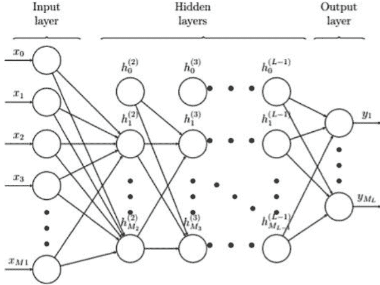
图1。常见神经网络结构示例。[9]

神经网络包括三组层：输入层、输出层和隐藏层，它们在输入层和输出层之间建立连接。图1展示了一个多层神经网络。

White [10] 表明，多层神经网络是通用、灵活、非线性的模型，如果给出足够的隐藏神经常元和足够的数据，它可以以任意所需的精度逼近几乎任何函数。为了使用ANN方法估计VaR，陈等人[6]建议使用以下模型：

$$r_t = \mu_t + \epsilon_t$$
$$\epsilon_t = z_t \sigma_t$$
$$\mu_t = \mu(\Omega_{t-1}; \theta)$$
$$\sigma_t^2 = \sigma^2(\Omega_{t-1}; \theta)$$

其中，$r_t$ 表示时间 $t$ 的对数收益率，$\mu_t$ 是条件期望收益率，$\sigma_t$ 表示组合变化或创新 $\epsilon_t$ 的条件波动率，$\Omega_{t-1}$ 是时间 $t-1$ 可用的信息集合，$\theta$ 是真实参数值的有限维向量，$z_t$ 是满足 $E(z_t | \Omega_{t-1}; \theta) = 0$ 和 $Var(z_t | \Omega_{t-1}; \theta) = 1$ [6] 的独立同分布随机变量。

在时间 $t$ 上，具有 $\alpha$ 置信水平的VaR可以估计为：

$$VaR_{\alpha}^t = \mu_t + q_{\alpha} \times \sigma_t,$$

其中，$q_{\alpha}$ 是 $\alpha$ 分位数的值。预期收益率 $\mu_t$ 和条件波动率 $\sigma_t$ 是基于以下内容构建的ANN模型进行估计的：首先，使用收盘价计算每个业务部门的对数收益率。

然后，使用最小-最大归一化方法对对数收益率进行缩放，以适应神经网络。数据的缩放是必要的，否则一个变量可能仅仅因为其尺度而对预测变量产生很大的影响。因此，使用未缩放的输入可能导致无意义的结果。

然后，缩放后的数据被分成训练集和测试集。训练数据集用于找到表现最佳的ANN模型的参数，然后选择的模型用于在测试集上预测VaR。在本研究中，训练集包含前500个数据记录，测试集包含其余的数据。ANN模型的滚动窗口大小固定为100天。我们使用滚动窗口方法，使样本大小保持为100，通过添加第101个观测值并删除第1个观测值。这个过程重复进行，直到整个样本的最后一个观测值。

本研究中的ANN模型是从第501个观测开始的一步预测模型。使用从第1个观测到第500个观测的每日数据来估计ANN模型的参数。通过比较所有测试组合的均方误差(MSE)，确定最佳的神经元组合。

在本研究中，我们测试了几种层-神经元组合，并发现完全连接的ANN模型在每个隐藏层中有7个隐藏神经元的组合表现最佳。确定了适用于拟合均值和均方误差的最优ANN模型后，我们开始对测试集进行VaR预测。然后根据上述VaR公式计算基于模型的测试数据集的VaR。

为了进一步利用ANN模型的灵活性，我们针对金融行业测试了一个扩展模型，其中添加了三个与金融行业密切相关的变量：黄金价格、利率和通胀。然后根据相同的程序估计VaR，以确定ANN模型是否得到改进。

### 3 结果

图2显示了S&P 500市场指数中公用事业部门的VaR估计，使用蒙特卡洛模拟、基于EVT的方法和ANN模型。如图所示，三种方法的估计非常接近。

为了测试和比较每个VaR模型的性能，我们需要一种更好的方法来量化它们之间的差异。Ehm等人[11]提出了一种分段线性评分函数，它在对分位数进行排名时是一致的。公式如下：

$$S_{\alpha}(x, y)=\left\{\begin{array}{ll}\alpha|x-y| & x \leq y \\ (1-\alpha)|x-y| & x \geq y\end{array}\right. \quad(3)$$

这个评分函数的直觉是，过高估计VaR总比低估计VaR好。因此，对低估计的VaR会有很大的惩罚。平均分数越小，估计VaR的方法越准确和可取。如果估计完美，分数应为0；否则，分数严格为正。

图2. 2015-10-13至2017-12-29期间公用事业部门的对数收益率，以及上述三种方法计算的相应每日风险价值估计。

设 $x$ 为预测值，$y$ 为相应的观测值，那么通过上述公式可以计算出 $\alpha\%$ 得分。如果估计值小于观测值，即 $x \le y$，则在计算中分配较高的权重 $\alpha\%$，否则当 $x \ge y$ 时分配较低的权重。

下表呈现了基于ANN模型、蒙特卡洛模拟和基于EVT方法对7个不同业务部门（包括S&P 500股票指数）进行VaR估计的平均得分结果：

### 表1. 通过ANN模型、蒙特卡洛模拟和基于EVT方法，在不同业务部门进行VaR估计的平均得分比较（在 $10^{-3}$ 水平上）

| 行业 | 人工神经网络 | 蒙特卡洛 | 极值理论 |
| :--- | :--- | :--- | :--- |
| 金融 | 1.2 | 1.14 | 1.41 |
| 医疗保健 | 0.94 | 0.79 | 1.06 |
| 信息技术 | 1.14 | 0.89 | 1.18 |
| 工业 | 0.92 | 0.77 | 0.93 |
| 材料 | 1.03 | 0.84 | 1.24 |
| 电信 | 1.09 | 1.06 | 1.28 |
| 公用事业 | 0.89 | 0.78 | 1.05 |

我们还尝试通过在金融领域预测VaR时添加黄金价格、利率和通胀率作为额外变量来扩展ANN模型。结果显示，与不包含这三个额外变量的原始模型得分相同。结果表明，我们认为与金融领域强相关的这三个变量并不影响VaR估计。一个可能的解释是这三个变量与金融领域的对数收益已经在先前的对数收益中暴露出来。因此，扩展的ANN模型的结果被省略。

总体而言，蒙特卡洛模拟在每个行业中具有最小的平均得分。人工神经网络方法生成的平均得分是第二小的。基于极值理论的模型生成的平均得分在这三种方法中最高。尽管我们预期基于极值理论的方法在金融数据已知为重尾分布的情况下表现优于蒙特卡洛模拟，然而，我们的结果表明它在这三者中实际上表现最差。

一个可能的解释是EVT方法是基于参数的，并且对数据的动态有一些非常强的假设。例如，GARCH(1,1)滤波器假设今天的平方波动率是前一天平方波动率和平方收益的线性组合[3]，而股票市场的实际机制肯定远离这个模型假设。因此，可以合理地认为参数方法的表现不如非参数方法。为了克服这个问题，建议使用更高阶的GARCH滤波器，如GARCH(2,2)或指数ARCH (EGARCH) [12]。

我们进一步比较了不同业务部门的VaR估计。虽然这7个不同部门的标准普尔500股票指数的平均分数非常接近，但金融部门的平均分数最高。这意味着在金融市场上，VaR估计不够准确和可靠。

相反地，这些VaR估计方法在医疗市场和公用事业市场中表现相对较好。我们的解释是，标准普尔500指数的金融部门包括8个金融行业，如银行、保险公司和资本市场[13]。这些行业的波动性很高，这增加了准确估计VaR的难度。另一方面，医疗行业相对于金融行业来说比较稳定。这导致VaR预测的性能更好。

我们还发现，在传统行业如工业、材料和医疗保健领域，人工神经网络方法被蒙特卡洛模拟方法超越。一个可能的解释是，传统行业的波动性较低，作为金融预测中引入的新方法，人工神经网络缺乏一致的统计基础，导致估计不稳定。另一方面，在金融、信息技术和电信等新兴行业中，人工神经网络与蒙特卡洛模拟方法的表现水平相似。

### 4 结论

总结一下，在我们的研究中，蒙特卡洛方法在S&P 500的所有业务领域中都证明是最佳的VaR估计模型。蒙特卡洛方法的准确性和效率已经成为金融预测中的基准模型之一。基于极值理论的方法在S&P 500的所有业务领域中VaR估计中表现最差。

ANN方法在S&P 500的所有业务领域中的VaR估计中表现优于基于极值理论的方法，同时在更具波动性的业务领域中与蒙特卡洛方法相比保持了类似的准确性水平。此外，扩展的ANN模型展示了ANN方法的灵活性以及在金融预测中包含外部变量的可能性。由于市场受到许多因素的影响，我们对市场的理解越深入，ANN方法在未来的表现就会越好。请注意，相对于传统的ANN，循环神经网络（RNN）更常用于建模时间序列。我们邀请未来的研究者进一步将RNN与VaR预测相结合，以发挥神经网络的全部潜力。

### 参考文献

- 1. Rawls, S.W., Smithson, C.W.: 战略风险管理。应用公司金融学。 **2**(4), 6–18 (1990)
- 2. Nadarajah, S., Chan, S.: 价值风险估计方法。在：金融中的极端事件，第283–356页 (2016)
- 3. Bollerslev, T.: 广义自回归条件异方差。经济学杂志。 **31**(3), 307–327 (1986)
- 4. Brooks, C.: 金融入门计量经济学。剑桥大学出版社，剑桥 (2017)
- 5. Locarek-Junge, H., Prinzler, R.: 使用神经网络估计风险价值。在：金融信息系统，第385–397页 (1998)
- 6. Chen, X., Lai, K.K., Yen, J.: 一种用于风险价值分析的统计神经网络方法。在：国际计算科学和优化联合会议，第2卷，第17–21页。IEEE (2009)
- 7. Iii, J.P.: 使用极值序统计量进行统计推断。Ann. Stat. **3**(1), 119–131 (1975)
- 8. Hosking, J.R.M., Wallis, J.R.: 广义帕累托分布的参数和分位数估计。Technometrics **29**(3), 339 (1987)
- 9. Hagan, M.T., Demuth, H.B., Beale, M.H., De Jesús, O.: 神经网络设计，卷20 (1996)
- 10. White, H.: 使用神经网络进行条件分位数的非参数估计。In: 计算科学与统计学，第190–199页 (1992)
- 11. Ehm, W., Gneiting, T., Jordan, A., Krüger, F.: 关于分位数和期望分位数：一致的评分函数，Choquet表示和预测排名。J. Roy. Stat. Soc. Ser. B (Stat. Methodol.) **78**(3), 505–562 (2016)
- 12. Nelson, D.B.: 资产回报中的条件异方差性：一种新方法。Econometrica **59**(2), 347 (1991)
- 13. Kennon, J.: 标准普尔500指数的行业和部门是什么？The Balance. https://www.thebalance.com/what-are-the-sectors-and-industries-of-the-sandp-500-3957507. 2018年11月1日访问

---

## 使用卷积神经网络来区分不同的手语字母数字

Stephen Green$^{1(\boxtimes)}$, Ivan Tyukin$^{1,2}$, and Alexander Gorban$^{1,2}$

$^1$ 英国莱斯特大学, 莱斯特大学路, 莱斯特郡LE1 7RH  
slg46@le.ac.uk  
$^2$ Lobachevsky大学, 加加林纳大街23号, 下诺夫哥罗德, 下诺夫哥罗德州, 603022下诺夫哥罗德, 俄罗斯

**摘要：** 使用卷积神经网络 (CNN) 来创建深度学习系统，将手语转化为文本，已成为打破聋哑人之间沟通障碍的重要工具。目前对这一主题的传统研究主要涉及训练网络识别字母数字手势并生成它们的文本等价物。

当前方法的一个问题是图像稀缺，可用手势变化很小，通常偏向于肤色和手大小，这使得一部分手势很难检测。目前的识别程序只针对单一语言进行训练，尽管已知的语言变体已经超过两百种。这对于传统的技术如CNN来说是一个限制，因为它们需要大量的参数。

本研究提出了一种技术，旨在通过将预训练的通用对象识别任务的遗留AI系统与纠正方法相结合，对遗留网络进行上训练，以解决这个问题。结果产生了一个程序，可以接收多种触觉语言的手指拼写，并推断出相应的字母数字和语言，这是其他神经网络无法复制的。

**关键词：** 卷积神经网络 · 手语 · 深度学习 · 传统人工智能

### 1 引言

使用神经网络进行手语分类是数据科学家自本十年初以来的目标。关于这个主题已经有很多论文存在，并且使用卷积神经网络，每个手势可以被分配类别，以便网络进行预测，使其表现得像大多数其他CNN的迭代版本一样。手语识别的方向更注重于在指定语言中正确识别单个字母和数字，而不是整个单词。这个过程被称为手指拼写，非常适合进行分类。只有26个字母和十个数字可以对任何给定的手语词典中存在的成千上万个单词进行分类。

一种能够读取手语并将结果转换为文本的技术的影响将对聋人和听力有困难的人的交流产生巨大的飞跃。世界卫生组织进行的一项研究[1]表明，全球约有4.66亿人患有听力损失（其中3400万儿童），其中7000万人擅长手语。这个数字分布在全球范围内的200多种已知手语变体之间[2]。手语检测的一些困难是由于与其他类型的手势识别相似之处，例如姿势的相似性。在全身检测中，否则会被忽略的变化，如拇指的位置或手与手腕的角度，可以改变所传达手势的含义。这就是为什么大多数论文专注于专门研究一个手语的字母数字的原因。

通过本文，美国手语（在美国有大约五十万人使用）[3]、英国手语（在英国有大约十五万人使用）[4]和中国（拼音）手语的手势集被输入到Inception神经网络中，并创建了一个能够识别这三种语言的算法。然后，将一个错误修正器附加到结果上，以便在最终输出之前检测和修正Inception产生的任何错误分类。这种组合提供了一个能够快速并且表现良好的神经网络，能够阅读多种手语。

### 2 之前的文献

手势识别的两个最流行的类别是基于手套的系统和基于视觉的系统。基于手套的方法[7]具有能够记录用户进行的每一个微小动作的优势，从而提供了手的弯曲运动沿轨迹的具体信息，克服了特别是在手语之外存在的基于运动的手势的问题。它们还能够提供非常准确的结果，对美国手语中的36个字母数字进行测试，平均准确率达到92%[8]。问题在于这种方法很繁琐。运动检测手套目前非常昂贵，并且不推荐用于与听力障碍者的日常交流。还需要保持手套与计算机之间的连接，以有效地捕捉手势。虽然有无线连接的例子，但仍然需要保持这种连接，因此对于这个项目所需的同时翻译来说是不实际的。

基于视觉的系统通常需要设备，如微软Kinect，它能够跟踪手势相对于人体的位置，并具有与使用手套进行手势捕捉相似的准确率[9]。然而，这两种方法对于这个项目来说都不实用，因此数据集中的所有手势都是用三星Galaxy S8相机拍摄的。然后将视频文件分割成图像，这就构成了数据集。

除了一个值得注意的例外[10]，现有文献中没有提到多语言检测系统的想法。最有可能的原因是，目前的研究已经在计算上非常昂贵，只专注于一个广泛使用的语言。即使是最基本的手指拼写识别网络也需要大量的训练数据集才能获得良好的结果，而这些数据集只存在于少数已知的手语中[11]。附加的错误校正程序是我们之前工作的延续[12]，其中Inception在美国手语的0-9号手势上运行。最初实验的结果是在10000张测试图像上的正确分类率为82.4%。在将图像按照4:1的比例分成训练集和测试集之后，应用了一个校正器，能够成功地从测试集中移除错误分类，并且对真正阳性结果的数量几乎没有改变。

### 3 实施

#### 3.1 预处理

在这些实验中，Inception Version 3在268800个RGB图像上进行了训练，涵盖了112个手势，这些手势由不同年龄、性别和肤色的多个参与者拍摄，每个手势有2400张图像。每个图像都是使用三星Galaxy S8的前置800万像素摄像头拍摄的，分辨率为1920×1080，当输入到Inception中时，会将其调整为299×299。每个图像代表了以各种角度和距离拍摄的手势，尽可能涵盖了尽可能多的变化，其中相机位于手势的前方某个角度。为了减轻背景噪声的问题，每个参与者的手势是在不同的位置拍摄的，因此每个组内唯一的共同元素就是手势本身。

传统的跟踪软件通常要求图像与相机之间的距离在一定范围内，才能检测到标志，而这种方法提供了大量的图像，可以帮助检测，无论相机指向标志的方向如何。虽然大多数静态检测算法忽略了需要运动的手势（在这个实验中，ASL J、ASL Z、BSL H和BSL J通常需要运动），但这项工作专注于静止图像，这些图像对于手势制作过程是独特的，并且可以用来将它们与其他集合中的字母数字区分开来，而不会丢失字母数字。

#### 3.2 架构

Inception模型是一个计算效率高的卷积神经网络，最初由Google于2015年12月开发，以在ImageNet大规模视觉识别挑战赛上提供最先进的性能水平[13]。与VGGNet和AlexNet等类似的学习算法不同，这些算法使用深度、宽度网络以获得高性能，但计算时间长，使得这些过程对计算机来说更加不切实际。由于处理能力较小且无法访问高端GPU, Inception利用重复模块以更快的速度复制这些模型的成功，参数比AlexNet少12倍，比VGGNet少36倍[14]。

从性能角度来看，Inception-v3的平均表现优于大多数替代方案，在前1%和前5%的错误率上分别为18.77%和4.2%[15]。通过RMSProp优化器、额外的卷积层、对每个卷积层的激活进行标准化的BatchNorm过程以及防止最大logits过拟合的标签平滑组件，这改进了之前版本的Inception[16]。由于Inception最初是为了在ImageNet上进行训练而创建的，ImageNet是一个拥有超过1500万张图像的数据库，分为约22000个类别，因此这是将创建的数据集进行排序的理想系统，因为有112个类别需要区分。

该模型以一个 $299 \times 299 \times 3$ 的输入开始，对应于一个大小为 299 像素的 3 通道（RGB）方形图像，通过堆叠的 Inception 模块进行处理，其中包括五个常规卷积层、一个最大池化函数和一个 softmax 输出，用于生成输入的预测标签 [14]。每个模块处理它之前的层的相关统计信息，并将单元的聚类分组为滤波器组 [17]。这导致大量单元集中在单个区域，可以使用 $1 \times 1$ 卷积来覆盖结构的原始维度，几乎不会丢失信息，而其他结构则通过 $3 \times 3$ 或 $5 \times 5$ 的滤波器进行处理，具体取决于聚类的分布情况。还包括第四个池化路径，用于与其余数据几乎没有关系的异常值。较大的层上附加了小的 $1 \times 1$ 卷积滤波器，从而减少了必要的计算量，连续堆叠的模块形成了 Inception 框架。

#### 3.3 训练

Inception 的顶层是一个 softmax 层，它以一个 2048 维向量作为输入，称为瓶颈。对于 Inception 的训练，需要学习的权重和偏置的总数为 229,488 个参数 [18]，其中包括 112 个标签。

Inception 在包含 268,800 张图像的数据集上进行训练，学习率为 0.01，总共进行 50000 个训练步骤，每个训练批次包含 100 张图像。总共使用 26880 张图像进行测试，215,040 张图像进行训练。完成这些步骤后，将 268800 张图像输入重新训练的 Inception 算法。由于已经有大量图像可用，不再进行其他转换。对于每个图像，softmax 层接收瓶颈并为每个标签生成一个概率，该概率对应于 Inception 根据训练情况正确匹配给定图像的可能性。选择具有最高概率的标签作为 Inception 的最终预测。

#### 3.4 后处理

当每个图像都附有预测标签时，可以向当前系统附加一个纠正器，该纠正器能够检测出错误的标签并重新评估它们 [19]。首先，将每个元素分别排序到包含正确标签的集合 $\mathcal{M}$ 和包含错误标签的集合 $\mathcal{Y}$ 中，然后将它们的并集 $\mathcal{S}=\mathcal{M} \cup \mathcal{Y}$ 中的每个元素都附上正确的标签。然后初始化集合 $\mathcal{M}^{1}=\mathcal{M}$、$\mathcal{Y}^{1}=\mathcal{Y}$ 和 $\mathcal{S}^{1}=\mathcal{S}$，选择聚类数 $p$ 并设置过滤阈值 $\theta$。

**居中处理：** 首先对数据进行居中处理，通过从每个集合的元素中减去均值 $\overline{\mathbf{x}}(\mathcal{S}^i)$ 来创建 $\mathcal{S}_c^i$ 和 $\mathcal{Y}_c^i$。
$$\mathcal{S}_c^i = \{\mathbf{x} \in \mathbb{R}^n | \mathbf{x} = \xi - \overline{\mathbf{x}}(\mathcal{S}^i), \xi \in \mathcal{S}^i\} \quad (1)$$
$$\mathcal{Y}_c^i = \{\mathbf{x} \in \mathbb{R}^n | \mathbf{x} = \xi - \overline{\mathbf{x}}(\mathcal{S}^i), \xi \in \mathcal{Y}^i\} \quad (2)$$

**正则化：** 计算 $\mathcal{S}^i$ 的协方差矩阵以及相应的特征值和特征向量。所有特征向量 $h_1, h_2, \dots, h_m$ 通过 Kaiser-Guttman 测试的特征向量 $\lambda_m$ 在合并之前与矩阵 $H$ 相乘，然后与 $\mathcal{S}_c^i$ 和 $\mathcal{Y}_c^i$ 的每个元素相乘：
$$\mathcal{S}_r^1 = \{\mathbf{x} \in \mathbb{R}^n | \mathbf{x} = H^T \xi, \xi \in \mathcal{S}_c^1\} \quad (3)$$
$$\mathcal{Y}_r^1 = \{\mathbf{x} \in \mathbb{R}^n | \mathbf{x} = H^T \xi, \xi \in \mathcal{Y}_c^1\} \quad (4)$$

**白化：** 然后，这两组数据经过白化坐标变换，确保转换后的数据的协方差矩阵为单位矩阵：
$$\mathcal{S}_w^1 = \{\mathbf{x} \in \mathbb{R}^m | \mathbf{x} = Cov(\mathcal{S}_r^1)^{-\frac{1}{2}} \xi, \xi \in \mathcal{S}_r^1\} \quad (5)$$
$$\mathcal{Y}_w^1 = \{\mathbf{x} \in \mathbb{R}^m | \mathbf{x} = Cov(\mathcal{S}_r^1)^{-\frac{1}{2}} \xi, \xi \in \mathcal{Y}_r^1\} \quad (6)$$

**投影：** $\mathcal{S}_w^1$ 和 $\mathcal{Y}_w^1$ 的元素通过将它们缩放到单位长度来投影到单位球上：$\mathbf{x} \to \mathbf{x} / \|\mathbf{x}\|$

**聚类：** 误差集合 $\mathcal{Y}_w^1$ 被划分为 $p$ 个聚类 $\mathcal{Y}_{w,1}^1, \mathcal{Y}_{w,2}^1, \dots, \mathcal{Y}_{w,p}^1$。其中的元素两两正相关。

**训练：** 对于每个簇 $\mathcal{Y}_{w,j}^1, j=1,\dots,p$ 及其补集 $\mathcal{S}_w \setminus \mathcal{Y}_{w,j}^1$，我们构造以下分离超平面：
$$h_j(\mathbf{x}) = \ell_j(\mathbf{x}) - c_j \quad (7)$$ 
$$\ell_j(\mathbf{x}) = \langle \frac{\mathbf{w}_j}{\|\mathbf{w}_j\|}, \mathbf{x} \rangle, c_j = \min_{\xi \in \mathcal{Y}_{w,j}^1} \langle \frac{\mathbf{w}_j}{\|\mathbf{w}_j\|}, \xi \rangle \quad (8)$$ 
$$\mathbf{w}_j = (Cov(\mathcal{S}_w^1 \setminus \mathcal{Y}_{w,j}^1) + Cov(\mathcal{Y}_{w,j}^1))^{-1} \times (\overline{\mathbf{x}}(\mathcal{Y}_{w,j}^1) - \overline{\mathbf{x}}(\mathcal{S}_w^1 \setminus \mathcal{Y}_{w,j}^1)) \quad (9)$$ 

大于 $\theta$ 的 $\mathbf{w}_j$ 值保留其相应的超平面，并创建相应的元素 $f_j(x)$：
$$f_j(\mathbf{x}) = f\left(\langle \frac{W H^T(\mathbf{x} - \overline{\mathbf{x}}(S^i))}{|x|}, \frac{\mathbf{w}_j}{\|\mathbf{w}_j\|} \rangle - c_j\right) \quad (10)$$

元素集合 $\mathbf{x} \in s^i_w \setminus y_{wi}$，其中 $h_j(\mathbf{x}) \ge 0$ 被称为 $\mathcal{C}_j$。集合 $\mathcal{C}_j \cup \mathcal{Y}_{wi,j}$ 在超平面 $h_j(\mathbf{x}) = l_j(\mathbf{x}) - c_j$ 上的正交投影为：

$$\mathbf{x} \to \left( I - \frac{\mathbf{w}_j \mathbf{w}_j^T}{\|\mathbf{w}_j\|^2} \right) \mathbf{x} + \frac{c_j \mathbf{w}_j}{\|\mathbf{w}_j\|} = P(\mathbf{w}_j)\mathbf{x} + b(\mathbf{w}_j, c_j) \quad (11)$$

这确定了一个超平面 $h_{j,2}(\mathbf{x}) = \langle \mathbf{w}_{j,2}, \mathbf{x} \rangle - c_{j,2}$，其值对于 $\mathcal{C}_j$ 的所有投影小于 0，对于 $s_w^i$ 的所有投影大于等于 0。如果不存在这样的平面，则使用线性费舍尔判别（Fisher Linear Discriminant）。

然后创建第二个函数进行合并，只有在前两个函数的输出也为正时才产生正响应：

$$f_j^\perp(\mathbf{x}) = f \left( \langle P(\mathbf{w}_j) \left( \frac{W H^T (\mathbf{x} - \bar{x}(S^1))}{\|\mathbf{x}\|} \right) + b(\mathbf{w}_j, c_j), \mathbf{w}_{j,2} \rangle - c_{j,2} \right) \quad (12)$$

$$f_j^c(\mathbf{x}) = f(\text{Step}(f_j(\mathbf{x})) + \text{Step}(f_j^\perp(\mathbf{x})) - 2) \quad (13)$$

**整合**：对于任何产生大于 0 的值的 $\mathbf{x}$，标签可以相应地与 Inception 为该图像报告的下一个最佳匹配标签进行交换。

**测试**：新生成的集合 $\mathcal{M}^2, \mathcal{V}^2$ 和 $\mathcal{S}^2$，簇数 $p$ 以及过滤阈值 $\theta$ 可以在纠正的另一次迭代中继续使用，直到达到所需的结果为止。

### 4 结果

经过测试，Inception 能够以标准阈值 $\theta = 0$ 正确识别每个手势的时间比例为 66.7%。这种相对较低的初始结果的原因在于数据中的相似性，手势中的小变化会导致不同的字母数字之间的交叉，并且还存在所有触觉翻译器面临的现有问题。错误的分布显示了一致的错误方差，没有在 2400 个手势集中的 800 个错误的平均值的 3 个标准差之外的异常值。

在对每个手势进行分类之后，还添加了一个手势不在给定图像中的情况。这是为了以防万一，以便在后续的测试中，可以尝试识别不存在手势的广泛词汇表。为了解决这个问题，我们制定了一系列与传统错误类型（在表 1 中详细说明）相关的指标作为 $\theta$ 的函数：

$$\text{真正例率} (\theta) = \frac{TP(\theta)}{FP(\theta) + TP(\theta)} \quad (14)$$

$$\text{误分类率} (\theta) = \frac{FP(\theta)}{FP(0)} \quad (15)$$

图 2. 与真实标签相比，错误通常以微小的差距为先，整个数据集的最高评分的直方图和混淆矩阵显示，对排序过程进行非常小的改变可能会带来巨大的改进。

在所描述的情况下，系统必须做出决策，而不管最高分数如何，即使绝大多数错误只是以相对较小的数量作为胜利者，如图 2b 所示，以及归一化的数据点 $\langle \frac{x_i}{\|x_i\|}, \frac{x_j}{\|x_j\|} \rangle$ 具有 266 个主要成分的维度（从原始瓶颈长度 2048 的 90% 以上减少），其中被标记为错误的点在很大程度上是正交的。

表 1. 错误类型的分类，其中 (*) 表示未被接受进入识别系统的结果

| 手势的存在 | 系统的响应 | 错误类型 |
| :--- | :--- | :--- |
| 是 | 正确分类 | 真正例 |
| 是 | 错误分类 | 假正例 |
| 否 | 未报告 | 假阴性 |
| 否 | 已报告 | 假正例* |
| 否 | 未报告 | 真阴性* |

聚类数从 1 个未排序的聚类扩展到 1000 个聚类，对于每个值 $p$，k-means 算法运行 20 次，并记录平均真正例率。对于每个聚类迭代，创建相应的分离超平面 $h_i$，如果值高于选择的阈值 $\theta$，则保留特征超平面。图 3 显示了这些试验的结果。

图 3. 平均真正例率与聚类数和阈值为 0.0、0.1、0.2 和 0.3 的关系。

### 5 结论和未来工作

本研究提出了第一个能够以合理准确率检测多种手语并具有自我纠正能力的算法。该程序的应用非常广泛，尤其是继续打破视觉障碍者与世界其他人之间的沟通障碍。错误校正过程有助于减轻在具有大量类内变化的大型数据集中常见的准确率损失，并且从这项研究中可以进一步发展未来的变体，使其具有语言偏好选项，因此如果最终用户认为他们知道正在使用的语言，则可以为每个来自该语言的手势附加优先级状态，从而大大改善最终结果。

未来的工作涉及扩展当前结果，因为计算最佳阈值和聚类数所需的最后阶段需要大量计算时间，以确保检测到的错误数量最大化，同时保持计算效率。还可以将更多语言添加到当前数据集中，一旦确定了最佳参数，就可以建立新的类别，而不会降低准确性，前提是新的类别与原始的三种语言一样多样化。

所提出的研究可以成为开源的。大型手语数据库仅存在于最流行的触觉语言中，而其他数百种变体则没有可用的图像集。通过将项目发布给公众，可以接受来自全球的贡献，除了当前的状态之外，Inception 还可以继续训练，直到识别更多的语言。

### 参考文献

- 1. 世界卫生组织：聋和听力损失。 http://www.who.int/mediacentre/factsheets/fs300/en/
- 2. Clarion UK. https://www.clarion-uk.com/know-many-sign-languages-world/
- 3. https://www.startasl.com/american-sign-language
- 4. British Deaf Association. https://bda.org.uk/help-resources/
- 5. http://www.washington.edu/news/2016/04/12/uw-undergraduate-team-wins-10000-lemelson-mit-student-prize-for-gloves-that-translate-sign-language/
- 6. https://www.microsoft.com/en-us/research/blog/kinect-sign-language-translator-part-1/
- 7. Mohandes, M., Aliyu, S., Deriche, M.：利用两个 Leap Motion 控制器的多传感器数据融合原型阿拉伯手语识别。在：2015 年 IEEE 第 12 届国际系统、信号和设备多会议 (SSD15)，马赫迪亚，第 1-6 页 (2015 年)
- 8. Abhishek, K.S., Qubeley, L.C.F., Ho, D.：基于电容触摸传感器的手套式手势识别手语翻译器。在：2016 年 IEEE 国际电子器件和固态电路会议 (EDSSC)。IEEE (2016 年)
- 9. Yang, H.-D.：基于条件随机场的 Kinect 传感器手语识别。传感器 (2014 年)
- 10. Kumar, V.K., Goudar, R.H., Desai, V.T.：手语统一化：下一代聋人教育的需求。计算机科学会议论文集 48, 673-678 (2015 年)。 https://doi.org/10.1016/j.procs.2015.04.151
- 11. http://facundoq.github.io/unlp/sign_language_datasets/index.html
- 12. 改进深度学习人工智能系统的浅层级联效率。https://doi.org/10.1109/IJCNN.2018.8489266
- 13. [cs.CV] arXiv:1512.00567
- 14. https://medium.com/initialized-capital/we-need-to-go-deeper-a-practical-guide-to-tensorflow-and-inception-50e66281804f
- 15. https://medium.com/@sh.tsang/review-inception-v3-1st-runner-up-image-classification-in-ilsvrc-2015-17915421f77c
- 16. https://towardsdatascience.com/a-simple-guide-to-the-versions-of-the-inception-network-7fc52b863202
- 17. [cs.CV] arXiv:1409.4842
- 18. [cs.CV] arXiv:1805.06618
- 19. Tyukin, I.Y., Gorban, A.N., Green, S., Prokhorov, D.：对遗留人工智能系统进行快速纠正集成的构建：算法和案例研究
- 20. Jackson, D.：主成分分析中的停止规则：启发式和统计方法的比较。生态学 74(8), 2204-2214 (1993)

## 与人工智能的 mise en abyme：如何预测 NN 的准确性，应用于超参数调整

Giorgia Franchini$^1$, Mathilde Galinier$^{1,2(✉)}$, and Micaela Verucchi$^1$

$^1$ 摩德纳和雷焦埃米利亚大学, Via Università, 4, 41121 Modena, Italy
mathildeemmanuelle.galinier@unimore.it

$^2$ Marie Sklodowska-Curie 是意大利罗马 Istituto Nazionale di Alta Matematica 的研究员

**摘要**：在深度学习的背景下，从计算角度来看，最昂贵的阶段是学习算法的完全训练。然而，在设计新的人工神经网络过程中，这个过程需要使用很多次，因此导致非常昂贵的操作。在这里，我们提出了一种低成本的策略，仅基于算法的初始行为来预测算法的准确性。

为此，我们多次训练感兴趣的网络，直到收敛，每次训练都修改其特征。在此之前的过程中观察到的初始和最终准确性存储在数据库中。

然后，我们利用曲线拟合和支持向量机技术，后者在创建的数据库上进行训练，以预测网络的准确性，给定其在学习的初始迭代中的准确性。当网络特征空间特别大或完全训练非常耗时时，这种方法可能特别有意义。我们获得的结果是令人鼓舞的，并鼓励我们将这种策略应用于一个热门问题：超参数优化（HO）。特别是，我们专注于用于数据库 MNIST 和 CIFAR-10 分类的卷积神经网络的 HO。通过使用我们的预测方法和我们自己实现的用于超参数空间的概率探索算法，我们能够以相对较低的成本找到已知文献中的最佳准确性对应的超参数设置。

**关键词**: 机器学习 · 支持向量机 · 曲线拟合 · 人工神经网络 · 超参数优化

### 1 引言

在过去几十年中，机器学习算法和深度神经网络在许多领域展现出了显著的潜力。然而，尽管它们取得了成功，但设计这类算法仍然很困难，它们的性能通常高度依赖于众多标准的选择（学习速率、优化器、层结构等），称为超参数。

实际上，找到这些超参数的最佳组合往往可以决定结果是糟糕或平均还是达到最先进的性能。通过最大化给定学习算法的准确性 $f$ 来执行此最佳设置的搜索。然而，这个过程在通常情况下非常困难（arduous），因为最大化这样一个函数通常非常昂贵。

基于这一观察，我们决定以低成本的方式开发一种预测目标函数 $f$ 值的策略。基于支持向量机（SVM）和曲线拟合，该方法能够在人工智能神经网络（NN）的学习的前几个时期内，仅利用 NN 的行为来获得准确性的预测。据我们所知，文献中没有提到其他关于 NN 准确性的低成本近似方法的文章，因此我们的方法在人工智能领域可能是一个突破。我们提出的算法对于快速评估新学习算法可能具有特别的兴趣。特别地，它可以以有趣的方式促进超参数优化。本文第 2 节描述了我们预测给定 NN 准确性的主要步骤。第 3 节涉及我们将方法在一个热门问题上的应用：超参数优化。第 4 节展示了在 MNIST 和 CIFAR-10 数据库上的实验结果。最后，本文在第 5 节中以总结性的评论结束。

### 2 方法论

在训练感兴趣的神经网络算法之前，预先创建一个数据库，使用不同的随机选择的超参数集合进行训练，直到收敛。在整个过程中，收集神经网络算法的预测准确性，并最终构成一个数据库，应用于下文所述的方法。请注意，每次考虑新的训练/测试样本集时，都需要创建一个新的数据库。

#### 支持向量机和曲线拟合之间

目标是仅基于神经网络算法在学习的前几个时期的行为，能够预测其在收敛后的最终准确性。为了实现这一目标，我们结合了文献中广泛应用的两种技术：支持向量机（SVM）[10] 和曲线拟合 [11]。

首先，我们介绍了这些技术的理论背景，然后说明了我们在这项工作中如何使用它们。

支持向量机是一种通过分离超平面来进行判别的分类器。换句话说，给定带标签的训练数据（监督学习），该算法输出一个最优的超平面，用于对样本进行分类。支持向量机算法的特点是使用核函数、解的稀疏性以及通过对边界或支持向量的数量进行调整来控制容量。SVM 不仅可以应用于分类问题，还可以应用于回归问题。SVM 用于回归问题的一个重要思想是通过小的训练点子集来表示解决方案，这样可以获得巨大的计算优势。

我们考虑 SVM 算法的著名对偶问题 [10]，其解为：

$$f(\mathbf{x}) = \sum_{i=1}^{n_{SV}} (\alpha_i - \alpha_i^*) K(\mathbf{x}_i, \mathbf{x}) + b$$

其中 $n_{SV}$ 是支持向量的数量，$\alpha$ 和 $\alpha^* \in \mathbb{R}$ 是支持向量的乘法器，$b \in \mathbb{R}$ 是一个常数。$K(\mathbf{x}_i, \mathbf{x})$ 是核函数，我们可以选择线性、多项式或高斯核函数。特别是高斯核函数形式为：

$$K(\mathbf{x}_i, \mathbf{x}) = \exp(-\gamma \|\mathbf{x}_i - \mathbf{x}\|^2), \text{ 其中 } \gamma \text{ 是一个自由的正参数。}$$

曲线拟合是构建一条最佳拟合曲线的过程，可能受到约束条件的限制。换句话说，曲线拟合的目标是根据选择的模型，尽可能准确地描述实验数据的适当参数。这些参数的值通常通过最小二乘 (LS) 方法计算，该方法最小化原始数据与模型预测值之间的误差的平方。在这项工作中，拟合函数的形式被选择为：

$$g(x) = \alpha x^{\beta} \quad (1)$$

其中 $\alpha$ 和 $\beta$ 是通过非线性 LS 计算的参数。

我们的方法基于以下步骤：通过其训练过程的前几个时期的准确性，利用事先在创建的数据库上进行训练的 SVM 算法预测了 NN 在收敛后达到的准确性。这个值被认为是目标函数 $f$ 的近似值。如果该预测值不大于 1 且不小于初始观察到的准确性的最大值，则采用该值；否则，基于曲线拟合策略预测 NN 的最终准确性：根据前几个时期的准确性值，通过函数 (1) 拟合相应的曲线。一旦计算出参数 $\alpha$ 和 $\beta$，函数 $g$ 被用来预测算法收敛后的准确性值。值得注意的是，这些参数受以下约束条件的限制：

$$\begin{cases} \alpha \cdot T_{max}^{\beta} > \text{Accuracy}_{max} \\ 0 < \beta < 1 \end{cases} \quad (2)$$

其中 $\text{Accuracy}_{max}$ 是在前几个时期中准确度的最大值，而 $T_{max}$ 是学习算法允许查看的最大时期数。特别是，第一个约束条件要求曲线在最后一个时期达到的准确度高于在前几个时期已经观察到的准确度。

将这两种不同的技术结合起来预测最终准确度，使预测过程更加高效。此外，曲线拟合方法对我们来说很有吸引力，因为拟合函数可以很容易地受到约束。这个启发式选择经过实验证实。

从计算的角度来看，这种方法非常方便，因为一旦创建了数据库并训练了 SVM，就可以在很短的时间内对目标函数进行新的评估。必须评估创建数据库所花费的时间；显然，这种方法的便利性随着问题复杂性的增加而增加。

### 3 应用：从预测到超参数优化

能够预测给定超参数集的神经网络准确性对于找到最佳超参数组合特别有优势。在本节中，我们旨在将上述描述的方法应用于卷积神经网络 (CNN) 的超参数优化 (HO)。我们首先描述最先进的 HO 方法。其次，我们介绍了我们设计的算法来找到优化的超参数。

#### 3.1 相关工作

最直观和广泛使用的两种方法是网格搜索和随机搜索 [5]。然而，当超参数的评估成本很高时，这些技术并不适用。因此，顺序模型优化 (SMBO) [1] 算法在模型性能评估昂贵的许多场景中被使用。它们通过一个更便宜的代理函数来近似要最大化的黑盒目标函数 $f$。在算法的每次迭代中，通过最大化选择代理函数要评估的新点的标准来选择。文献中提出了几种 SMBO 算法，它们在优化代理函数的标准和给定观察历史的方式上有所不同。最著名的两种 SMBO 方法是贝叶斯优化方法 [3, 4] 和树状帕尔岑估计（TPE）策略 [2]。

最近，基于强化学习的新的超参数优化方法已经出现 [6–9]。大多数人的目标是找到可能产生优化性能的神经网络 (NN) 或 CNN 架构。因此，他们寻求适当的架构超参数，如层数或每个卷积层的结构，但最终还是手动选择了许多其他超参数，如学习率和正则化参数。无论如何，尽管所有上述策略的目标都是尽可能少地评估昂贵的目标函数 $f$（在 NN 或 CNN 的情况下是预测准确性）。

据我们所知，很少有算法能够降低评估成本。

## 3.2 我们的方法应用于HO

在这里，我们假设我们已经有了一个CNN，并且我们正在寻找它的最佳超参数。基于我们上述的方法来优化这些超参数实际上意味着选择其他参数，例如核函数的类型或拟合函数的形式 (1)。然而，需要注意的是，这些新参数可以更容易地选择。例如，SVM用于回归在文献中已经是一个非常知名的方法，并且在其超参数方面具有良好的鲁棒性。相反，对于一般的神经网络（NN）来说，情况绝对不是这样，这使得它们的参数选择更加困难。

我们专注于学习率、优化器和小批量大小的优化，以获得最佳准确性，但这种方法可以扩展到其他超参数（层数、每层神经元数量、激活函数）。

我们提出的过程包括以下步骤。首先，创建一个数据库，如上所述，并在其上训练一个SVM算法。我们选择使用超参数可能设置的10%来创建数据库，随机选择，概率均匀。尽管耗时，但这个预处理步骤可能比文献中已知的方法更节省成本的超参数优化过程。

在我们的HO方法中，每个感兴趣的超参数 $i$ 被表示为一个包含实验者选择的范围内的值的向量 $V_i$。对应于这个向量的是一个概率向量 $P_i$，初始化为均匀分布。在探索过程的每次迭代中，根据相应向量 $P_i$ 中的概率，随机选择一组超参数。CNN使用所选的超参数进行参数化，并在几个时期（epoch）进行训练。根据其学习开始时的行为，以及在第2节中详细介绍的方法，预测CNN在学习收敛后的准确性，将该值视为奖励。如果迭代 $t$ 的奖励 $r^{(t)}$ 高于上一次迭代的奖励 $r^{(t-1)}$，则增加与所选参数及其向量中相邻超参数对应的 $P$ 中的概率，而惩罚其他超参数。相反，如果 $r^{(t)} < r^{(t-1)}$，则惩罚所选超参数的概率，增加其他超参数的概率。因此，超参数通过在探索过程中修改的概率加权，直到每个超参数的一个值达到大于某个阈值 $t_i$ 的概率。然后，我们的探索算法被认为已经收敛。

最后，NN使用与10个最高预测最终准确率相对应的一组超参数进行参数化，并收敛。导致最佳观察到的最终准确率的设置被定义为最优超参数设置。

### 4 实验

为了评估和调整我们的方法，我们进行了不同的测试。我们决定考虑一个广泛使用的NN，即CNN进行分类。我们选择了两个著名的数据集，MNIST [1] 和 CIFAR-10 [2]，并设计了两个不同的网络，能够将图像分类为10个类别之一。对于MNIST数据集，网络由一个输入层，两个卷积和最大池化层的序列，一个全连接层和一个输出层组成。我们使用修正线性单元（ReLU）激活和dropout技术。另一方面，对于CIFAR数据集，CNN由一个输入层，四个卷积和最大池化层的序列，四个全连接层和一个输出层组成，利用ReLU激活，批量归一化和dropout。

对于这两个网络的训练过程，我们选择插入一种正则化形式：提前停止（Early Stopping）。当使用迭代方法（如梯度下降）训练学习器时，该技术用于避免过拟合。特别地，如果网络的训练在一定数量的迭代后没有提供更好的结果，学习过程将停止，因为认为它陷入了一个最小值并可能导致过拟合。正如已经提到的，我们首先需要一个数据库来训练我们的SVM。通过本文的基本思想，我们赢得了一个项目，使我们能够使用Marconi集群上的CINECA资源 [3]。这个资助使我们能够进行所有的测试并生成MNIST和CIFAR的数据库。数据库是一个表，每一行对应于网络的完整训练。

我们选择了学习率、优化器和批量大小作为超参数，并将它们与每个时期观察到的准确性一起存储在数据库中。实际上，所需的完全训练网络数量非常少。在我们的案例中，我们只需要44个示例：我们用35个示例来训练SVM，用9个示例来测试。一旦我们收集到数据库，我们就能够了解哪种SVM配置更适合我们的问题。我们尝试了三种不同的核函数：线性、多项式和高斯，我们选择了最后一种，因为它在损失（均方误差 - MSE）方面表现优于其他两种。在表1中报告了三种不同核函数的预测结果。在这种情况下，预测是基于测试集进行的，并且基于三个时期。对于CIFAR数据集，MSE损失在表1中报告，其中显示高斯核函数是占主导地位的。

我们还进行了一些测试，以了解哪些是最重要的特征，可以用来喂给SVM预测器，并根据结果选择只使用时期准确性来喂给该方法。关于曲线拟合，我们还尝试了几种函数，以找到产生最佳拟合的函数之一(1)。图1显示了SVM预测和曲线拟合的图形示例。在图表中，实心点表示准确性的实际值，逐个时期；最后一个时期的星号是SVM的预测值。

- [1] http://yann.lecun.com/exdb/mnist/
- [2] https://www.cs.toronto.edu/~kriz/cifar.html
- [3] https://www.cineca.it/en/content/marconi

表1。根据神经网络在前三个时期的准确性，使用上述方法预测最终准确性。研究了三种不同的SVM核函数：线性、多项式和高斯。前九行显示了九个不同测试案例的预测最终准确性，最后一行表示每种方法对应的MSE损失。

| 样本ID | 地面真实 | 线性 | 多项式 | 高斯 |
| :--- | :--- | :--- | :--- | :--- |
| 0 | 0.7129 | 0.816350 | 0.854324 | 0.713435 |
| 1 | 0.1871 | 0.197152 | 0.207737 | 0.175775 |
| 2 | 0.1000 | 0.200523 | 0.204122 | 0.200774 |
| 3 | 0.6820 | 0.704606 | 0.599408 | 0.781832 |
| 4 | 0.4340 | 0.381075 | 0.301048 | 0.456969 |
| 5 | 0.6369 | 0.572801 | 0.489510 | 0.638199 |
| 6 | 0.7315 | 0.747803 | 0.682245 | 0.805067 |
| 7 | 0.1000 | 0.190538 | 0.203211 | 0.175411 |
| 8 | 0.4783 | 0.410684 | 0.325788 | 0.491291 |
| **均方误差** | 0 | 0.04136 | 0.1138 | 0.0320 |

图1. 曲线拟合和支持向量机的预测，与实际准确率进行比较。线是通过拟合得到的。对于支持向量机和曲线拟合，只使用前三个时期的准确率来预测最终时期的准确率。

图2显示了我们的方法应用于CIFAR-10数据集的CNN最终准确率的预测结果。在这种情况下，我们只使用前两个或四个时期的准确率来预测最终准确率。橙色线表示我们的预测，蓝色线表示地面真实情况（即网络完全训练到收敛，相同的超参数）。可以看出，该方法能够有效地在仅有少数时期后对网络的最终行为进行满意的预测。在这些结果的鼓舞下，我们将我们的策略应用于一个具有挑战性的实例：自动调整网络的超参数，具体过程在第3节中解释。我们使用前两个时期进行进一步的测试，以预测最终的时期。经过200次迭代，我们能够找到导致最佳最终准确率的参数，并通过真实的完全收敛进行了确认。我们方法提供的超参数是：学习率为0.0008425，小批量大小为128，选择的优化器为ADAM。

源代码可以在 https://git.hipert.unimore.it/mverucchi/optics 找到。

### 5 结论

我们提出并实施了一种新的方法来预测学习过程的最终行为。这种新方法利用了支持向量机和曲线拟合，仅使用一些初始步骤就可以预测长方法的准确性。我们将这种技术应用于卷积神经网络，以便快速了解网络的训练是否会以良好或不良的方式结束。结果表明，我们的技术所实现的预测与实际情况非常相似，并且证实了这种策略在超参数优化领域具有特殊的意义。此外，我们将专注于更完整的程序，利用我们的支持向量机-曲线拟合预测器自动调整超参数，如层数或激活函数。

**致谢。** 导致这些结果的研究得到了欧盟Horizon 2020计划在CLASS项目（https://class-project.eu/）下的资助，协议编号为780622。这项工作也得到了INdAM-GNCS（2018年研究项目）的部分支持。此外，它还得到了INdAM数学和/或应用博士项目的部分支持，该项目由Marie Sklodowska-Curie行动（INdAM-DP-COFUND-2015）共同资助，资助号为713485。

### 参考文献

- 1. Hutter, F., Hoos, H., Leyton-Brown, K.: 基于顺序模型的通用算法配置优化。在: LION-5 2011。扩展版本作为UBC技术报告TR-2010-10（2011年）
- 2. Bergstra, J.S., Bardenet, R., Bengio, Y., K´egl, B.: 超参数优化算法。在: NIPS（2011年）
- 3. Shahriari, B., Swersky, K., Wang, Z., Adams, R.P., de Freitas, N.: 将人类排除在循环之外：贝叶斯优化综述。IEEE会议记录104 (1) , 148–175 (2016年)
- 4. Mockus, J., Tiesis, V., Zilinskas, A.: 应用贝叶斯方法寻找极值。在: Dixon, L.C.W., Szego, G.P. (eds.) 迈向全球优化。卷2, 页117-129。北荷兰, 纽约（1978年）
- 5. Bergstra, J., Bengio, Y.: 超参数优化的随机搜索。J. Mach. Learn. Res. 13(1), 281-305 (2012年)
- 6. Zoph, B., Le, Q.V.: 强化学习的神经网络架构搜索。在: 国际学习表示会议, 图伦, 法国, 页1-16 (2017年)
- 7. Baker, B., Gupta, O., Naik, N., Raskar, R.: 使用强化学习设计神经网络架构。在: 国际学习表示会议, 页1-18 (2017年)
- 8. 钟, Z., 严, J., 魏, W., 邵, J., 刘, C.-L.: 实用的分块神经网络架构生成。在: 计算机视觉和模式识别会议, 美国犹他州盐湖城（2018年）。arXiv预印本: 1708.05552
- 9. 蔡, H., 陈, T., 张, W., 于, Y., 王, J.: 通过网络转换进行高效的架构搜索。在: AAAI人工智能会议, 美国路易斯安那州新奥尔良, 第2787-2794页（2018年）
- 10. Chapelle, O., Vapnik, V.: 支持向量机的模型选择。在: 神经信息处理系统的进展, 第12卷 (1999年)
- 11. Arlinghaus, S.L.: PHB曲线拟合实用手册。CRC出版社, 博卡拉顿 (1994年)

## 异步随机变分推断

Saad Mohamad$^{1(\boxtimes)}$, Abdelhamid Bouchachia$^1$, 和 Moamar Sayed-Mouchaweh$^2$

$^1$ 计算科学系，伯恩茅斯大学，普尔，英国  
saad.mohamad@outlook.com  
$^2$ 信息与自动化系，法国杜埃矿业学院

**摘要。** 随机变分推断 (SVI) 采用随机优化方法将贝叶斯计算扩展到海量数据。由于 SVI 本质上是一种基于随机梯度的算法，可以利用水平并行性来实现更大规模的推断。我们提出了一种无锁并行 SVI 实现，可以以异步方式在多个从节点上进行分布式计算。我们展示了我们的实现可以实现线性加速，并保证渐进的遍历收敛速率 $O(1/\sqrt{T})$，而从节点的数量受到限制 ($T$ 是迭代的总次数)。该实现是在高性能计算环境中完成的，使用消息传递接口进行 Python 编程 (MPI4py)。经验评估表明，我们的并行 SVI 是无损的，与其串行 SVI 具有相当的性能提升。

### 1 引言

具有潜在变量的概率模型已经成为许多现代机器学习应用的支柱，如文本分析、计算机视觉、时间序列分析、网络建模等。在这种模型中，主要挑战是计算隐藏变量上的后验分布，该分布编码了观测数据中的隐藏结构。通常，计算后验是不可行的，需要进行近似计算。马尔可夫链蒙特卡洛(MCMC)采样一直是后验计算的主导范式。它构建了一个在隐藏变量上的马尔可夫链，其稳态分布是所需的后验分布。因此，该近似方法基于长时间的采样，希望能够从后验中收集样本[1]。

最近，变分推断 (VI) 已经成为马尔可夫链蒙特卡罗 (MCMC) 采样的确定性替代方法。一般来说，VI比MCMC更快，更适用于大数据集的问题。VI通过将推断问题转化为优化问题来解决。假设一个更简单的分布族，并找到最接近真实后验分布的成员[2]。这样的优化问题是一个非凸问题，需要复杂的工具来解决。随机优化已经应用于VI以应对海量数据[3]。虽然VI在更新变分参数（变分目标的参数）之前需要重复迭代整个数据集，但随机VI（SVI）在处理每个数据示例时更新参数。因此，在通过数据集的一次遍历结束时，参数将被多次更新。因此，参数收敛更快，需要更少的计算资源。SVI的思想是在每次迭代中将变分参数朝着基于一对示例的变分目标自然梯度的嘈杂估计的方向移动[3]。在（递减的）学习率计划上遵循这些梯度，SVI可以证明收敛到一个局部最优解[4]。

尽管随机优化改善了VI的性能，但其串行执行方式阻碍了推理的扩展。由于SVI基本上是一种基于随机梯度的优化算法，水平并行化是直接的。也就是说，可以在本地并行地计算一批数据样本的随机梯度（在多核机器上），只要参数更新是同步的。然而，这种同步限制了可扩展性，因为在每个参数更新之前，从属节点需要将其随机梯度发送给主节点。因此，同步方法受到最后一个“减速器”的限制；也就是说，一个慢的从属节点可以极大地减慢整体性能。

因此，异步并行优化是一个有趣的替代方案，前提是它能够保持与同步方法相当的收敛速度。事实上，异步并行随机梯度优化算法最近受到广泛关注[5-9]。[6]中的作者表明，对于平滑的随机凸问题，异步化效应是渐近可忽略的，并且可以实现最优阶收敛结果。由于SVI目标函数是非凸的，我们对平滑非凸优化的异步并行随机梯度算法（ASYSG）感兴趣[10]。最近的一项研究[11]打破了[6]所做的通常的凸性假设。尽管如此，对于ASYSG的许多最近成功的理论保证（收敛和加速）已经报道。在本文中，我们使用[6]中提出的ASYSG算法来提出一种异步的SVI（ASYSVI）算法，适用于广泛的贝叶斯模型。我们还根据[11]中的平滑非凸优化的理论研究，解释ASYSVI的收敛和加速性质。我们还提出了一种新颖的方法，通过以异步方式分布其随机自然梯度计算，线性加速SVI，并保证遍历收敛速度 $O(1/\sqrt{T})$。在一些假设下，我们使用潜在狄利克雷分配（LDA）作为案例研究来经验性评估ASYSVI。

### 2 异步随机变分推理

ASYSVI类似于[11]中的ASYSG，但在VI的背景下进行。ASYSVI运行的计算机网络架构被称为星形网络。在这个网络中，一个主节点维护全局变分参数 $\lambda$，而其他节点作为从节点，独立且同时计算局部变分参数 $\phi$ 和 $ELBO$ 的随机梯度 $\mathcal{L}(\lambda)$。从节点只与主节点通信，交换信息，访问全局变分参数的状态，并向主节点提供随机梯度。这些梯度是基于从分布式源获取的少量数据点计算出来的，相对于 $\lambda$ 进行计算。主节点从各从节点收集的随机梯度中聚合预定义数量的梯度，而不关心梯度的来源。然后，它更新当前的全局变分参数。更新步骤作为一个原子操作执行，从节点在此步骤中无法读取全局变分参数的值。然而，通过采用[5]中提出的ASYSG算法，可以实现垂直并行。此外，通过将[12]中使用的机制与ASYSVI结合，可以实现混合的水平-垂直并行（详见第5节）。

```text
算法1. ASYSVI-Master
1: 输入：迭代次数 T 和步长 {ρ_t}, t = 0, ..., T-1
2: 初始化：λ^0 随机选择，并将 t 设为 0
3: 当 (t < T) 时执行：
4:     从从节点聚合 M 个随机自然梯度
5:     平均随机自然梯度：G^t_M = (1/M) * Σ ∇L_m(λ^{t-τ_{t,m}})
6:     更新全局变分参数的当前估计：λ^{t+1} = λ^t + ρ_t * G^t_M
7:     t = t + 1
8: 结束循环
```

```text
算法2. ASYSVI-Slave
1: 输入：数据大小 D
2: 当 (True) 时执行：
3:     从数据集中均匀采样一个数据点 x_i
4:     从主节点获取全局变分参数 λ*
5:     计算与数据点 x_i 和全局变分参数 λ* 相对应的局部变分参数 φ*_i(λ*)：
       φ*_i(λ*) = arg max_{φ_i} L_i(λ*, φ_i)
6:     计算相对于全局参数 λ 的随机自然梯度 g_i(λ*)：
       g_i(λ*) = α + D * E_{φ_i(λ*)}[t(x_i, z_i)] - λ*
7:     将 g_i(λ*) 推送到主节点
8: 结束循环
```

ASYSVI和同步并行SVI之间的关键区别在于，ASYSVI在主节点的更新步骤完成之前不会锁定从节点。也就是说，从节点可能会根据全局变分参数的早期值计算一些随机梯度。通过允许延迟和异步更新，可以预期收敛速度较慢。在下一节中，我们将应用[11]中对SVI的研究结果，以展示随机梯度延迟的影响将在渐近情况下消失。ASYSVI-master和ASYSVI-slave的算法如算法1和算法2所示。我们用 $\tau_{t,m}$ 表示当前迭代 $t$ 和从节点拉取全局变分参数的迭代之间的延迟。

#### 2.1 收敛性分析

根据 [6, 11]，我们采用相同的假设，但用自然梯度替代梯度:

- **无偏梯度：** 随机自然梯度的期望与公式（16）的自然梯度等价：$\hat{\nabla} \mathcal{L}(\boldsymbol{\lambda})=E[\hat{\nabla} \mathcal{L}_{i}(\boldsymbol{\lambda})]$。这个假设在Sect. A中展示的模型族的SVI问题中已经成立。
- **有界方差：** 随机自然梯度的方差对于所有 $\lambda \in \mathcal{G}$，$E[||\hat{\nabla} \mathcal{L}_{i}(\boldsymbol{\lambda})-\hat{\nabla} \mathcal{L}(\boldsymbol{\lambda})||^{2}] \leq \sigma^{2}$。通过应用SVI自然梯度，我们得到:
  $$E[||n E_{\phi_{i}(\boldsymbol{\lambda})}[t(\boldsymbol{x}_{i}, \boldsymbol{z}_{i})]-\sum_{i=1}^{n} E_{\phi_{i}(\boldsymbol{\lambda})}[t(\boldsymbol{x}_{i}, \boldsymbol{z}_{i})]||^{2}] \leq \sigma^{2}$$
- **Lipschitz连续梯度：** 自然梯度是L-Lipschitz连续的。对于所有 $\lambda \in \mathcal{G}$ 和 $\lambda^{\prime} \in \mathcal{G}$，$||\hat{\nabla} \mathcal{L}(\boldsymbol{\lambda})-\hat{\nabla} \mathcal{L}(\lambda^{\prime})|| \leq L||\lambda-\lambda^{\prime}||$。通过应用SVI自然梯度，我们得到以下公式:
  $$||\sum_{i=1}^{n} E_{\phi_{i}(\boldsymbol{\lambda})}[t(\boldsymbol{x}_{i}, \boldsymbol{z}_{i})]-\lambda-\sum_{i=1}^{n} E_{\phi_{i}(\lambda^{\prime})}[t(\boldsymbol{x}_{i}, \boldsymbol{z}_{i})]+\lambda^{\prime}|| \leq L||\lambda-\lambda^{\prime}||$$
- **有界延迟：** 所有延迟变量 $\tau_{t,m}$ 都有界: $\max_{t, m} \tau_{t, m} \leq B$。

除了这些假设外，作者 [6, 11] 假设每个从属节点都接收到一个独立数据点的流。因此，由 [11] 得出的相同理论结果可以应用于ASYSVI，即渐近收敛速率 $O(1/\sqrt{MT})$，前提是 $T$ 大于 $O(B^{2})$。结果还表明，由于从属节点的数量与 $B$ 成比例，只要从属节点的数量受到 $O(\sqrt{T/M})$ 的限制，就可以实现线性加速。注意 $O(1/\sqrt{MT})$ 与串行随机梯度 (SG) 和随机变分推断 (SVI) 的收敛速率一致。

### 3 案例研究：潜在狄利克雷分配

潜在狄利克雷分配（LDA）是在第 A 节中描述的模型家族的一个实例，其中全局、局部、观察变量及其分布设置如下：

- 全局变量 $\{\beta\}_{k=1}^K$ 是 LDA 中的主题。主题是对词汇的分布，其中词 $w$ 在主题 $k$ 中的概率表示为 $\beta_{k,w}$。因此，$\beta$ 的先验分布是一个狄利克雷分布 $p(\beta) = \prod_k Dir(\beta_k; \eta)$。
- 局部变量是主题比例 $\{\theta_d\}_{d=1}^D$ 和主题分配 $\{\{z_{d,w}\}_{w=1}^W\}_{d=1}^D$，它们索引生成观察的主题。每个文档都与一个主题比例相关联，这是一个主题分布 $p(\theta_d|\alpha) = Dir(\theta_d; \alpha)$。分配 $z_{d,w}$ 是索引，由 $\theta_d$ 生成，将主题与单词关联，$p(z_{d,w}|\theta_d) = \text{Mult}(\theta_d)$。
- 观察值 $x_d$ 是文档中的单词，假设从主题 $\beta$ 中选择的索引 $z_d$ 生成，$p(x_{d,w}|z_{d,w}, \beta) = \text{Mult}(\beta_{z_{d,w}})$。

在 LDA 中，文档被表示为随机混合的潜在主题，其中每个主题由单词分布描述。LDA 假设以下生成过程：

1. 绘制主题 $\beta_k \sim Dir(\eta, ..., \eta)$，对于 $k \in \{1, ..., K\}$。
2. 对于每个文档 $d \in \{1, ..., D\}$：
    - 绘制主题比例 $\theta_d \sim Dir(\alpha, ..., \alpha)$。
    - 对于文档中的每个单词 $w \in \{1, ..., W\}$：
        - 绘制主题分配 $z_{d,w} \sim \text{Mult}(\theta_d)$。
        - 绘制单词 $x_{d,w} \sim \text{Mult}(\beta_{z_{d,w}})$。

根据第 A 节，每个变分分布被假设来自真实分布的相同族。因此，$q(\beta_k|\lambda_k) = Dir(\lambda_k)$，$q(\theta_d|\gamma_d) = Dir(\gamma_d)$ 和 $q(z_{d,w}|\phi_{d,w}) = \text{Mult}(\phi_{d,w})$。为了在算法 2 中计算 LDA 中的随机自然梯度 $g_i$，我们需要找到表达式中的充分统计量 $t(\cdot)$。通过将 LDA 的似然函数写成式 (7) 的形式，我们得到 $t(x_d, z_d) = \sum_{w=1}^W \mathbf{I}_{z_{d,w},x_{d,w}}$，其中 $\mathbf{I}_{i,j}$ 等于 1 表示 $(i, j)$ 的条目，其余都为 0。因此，随机自然梯度 $g_i(\lambda_k)$ 可以表示为：

$$g_i(\lambda_k) = \eta + D \sum_{w=1}^W \phi_{i,w}^k \mathbf{I}_{k, x_{i,w}} - \lambda_k \qquad (5)$$

有关如何计算局部变分参数 $\phi_i^*(\lambda^*)$ 的详细信息，请参见 [3]。

在计算 ASYSVI 的算法 1 和算法 2 所需的元素之后，我们进行收敛性分析。由于数据被假定为均匀子采样，LDA 的无偏梯度假设成立。我们总是可以找到一个常数变量来限制方差。在最坏的情况下，LDA 的随机自然梯度的方差可以被 $DW$ 限制：$(\max_{i,w}(\phi_{i,w}^k)^2 - \min_{i',w'}(\phi_{i',w'}^k)^2), \forall k$。因此，它可以被界定为 $O((DW)^2)$。很明显，Lipschitz 连续的梯度可以满足在第 A 节中提出的任何类别的家族模型，因此也适用于 LDA。最后，通过实现可以保证有界延迟。因此，LDA 的 ASYSVI 可以收敛，因为上述假设可以满足。

#### 表 1. 参数设置

| 数据集 | Enron 电子邮件 | | | | NYTimes 新闻文章 | | | | 维基百科文章 | | | |
| :--- | :--- | :--- | :--- | :--- | :--- | :--- | :--- | :--- | :--- | :--- | :--- | :--- |
| **批处理大小** | 16 | 64 | 256 | 1024 | 16 | 64 | 256 | 1024 | 16 | 64 | 256 | 1024 |
| $\kappa$ | 0.7 | 0.7 | 0.5 | 0.5 | 0.7 | 0.7 | 0.5 | 0.5 | 0.7 | 0.7 | 0.5 | 0.5 |
| $\tau_0$ | 1024 | 24 | 24 | 1 | 1024 | 24 | 24 | 1 | 1024 | 1024 | 1024 | 1024 |
| **困惑度** | 5919 | 5348 | 5264 | 4771 | 11989 | 10156 | 9015 | 5501 | 1446 | 1390 | 1355 | 1332 |

### 4 实验结果

在接下来的内容中，我们展示了分布式计算 SVI 的有用性，主要是 ASYSVI 的加速优势。为此，我们比较了 ASYSVI LDA 相对于串行 SVI LDA（在线 LDA [14]）的加速效果。这两个版本在包含非常大的文档集合的三个数据集上进行评估。我们还在流式设置中评估了 ASYSVI LDA，其中新文档以流的形式到达。该实现可在 PROTEUS SOLMA Library¹ 中获得。评估使用留存困惑度作为模型拟合的度量。困惑度被定义为留存文档集中每个单词的逆边际概率的几何平均值 [13]。

为了验证加速性质，按照 [11] 的方法，我们计算运行时间加速比（TSP）：

$$TSP = \frac{\text{SVI-LDA 的运行时间}}{\text{ASYSVI-LDA 的运行时间}}$$

当两个模型达到相同的最终保留困惑度时，它们的运行时间被记录。

图 1。将 ASYSVI LDA 与在线 LDA 在 *Enron* 数据集上进行比较。

**数据集：** 我们在三个文档语料库上进行所有比较和评估。前两个语料库可在 [15] 上获得。第三个语料库在 [14] 中使用。

- *Enron* 电子邮件：包含来自约 150 个用户的 39,861 封电子邮件。数据经过预处理，删除了不在包含 28,102 个词的词汇字典中的所有单词。
- *NYTimes* 新闻数据集：包含来自纽约时报的 300,000 篇新闻文章。数据经过预处理，删除了停用词（不在 102,660 个词的字典中）。
- 维基百科文章：包含从维基百科下载的 1M 个文档。在使用之前，数据经过处理，删除了不在 7,700 个词的词汇字典中的所有单词。

¹ https://github.com/proteus-h2020/proteus-solma/tree/master/src/main/scala/eu/proteus/solma/asvi

图 2。关于 Enron 数据集上的流式样本的 TSP 和 RSP
图 3。关于 NYTimes 数据集上的流式样本的 TSP 和 RSP
图 4。关于 Wikipedia 数据集上的流式样本的 TSP 和 RSP

**设置参数：** 在所有实验中，$\alpha$ 和 $\eta$ 固定为 $0.01$，主题数量 $K=50$。我们对学习参数 $\kappa$、$\tau_0$ 和批次在所有语料库上进行了一系列设置的评估。参数 $\kappa$ 和 $\tau_0$ 在 [14] 中定义，控制学习步长 $\rho_t$。我们使用来自 Enron 数据的 29,861 封电子邮件，来自 NYTimes 数据的 50,000 篇新闻文章以及来自维基百科数据的 300,000 个文档作为训练集。我们还保留了 5,000 个文档作为验证集和另外 5,000 个文档作为测试集。在线 LDA 在训练集上运行（每个语料库运行一次）以获取 $\kappa \in \{0.5, 0.7, 0.9\}$，$\tau_0 \in \{1, 24, 256, 1024\}$ 和 batch $\in \{16, 64, 256, 1024\}$ 的结果。表 1 总结了每个批次的最佳设置以及每个语料库上测试集的困惑度。

**比较串行在线 LDA 和异步 LDA：** 对于每个数据集，我们设置参数以获得最佳性能（最小困惑度）。然后，将 ASYSVI LDA 与使用相同参数设置的串行 SVI LDA 进行比较。

本文的实证结果是通过在高性能计算（HPC）环境中使用消息传递接口（MPI）为 Python（MPI4py）实现的 Python 代码获得的。该集群由 10 个节点组成，不包括头节点，每个节点都是一个四核处理器。我们在 Enron 数据集上运行 ASYSVI LDA，工作节点数 $nW \in \{2, 4, 6, 8, 9, 18, 27, 36\}$，$B$ 设置为 5。当 $nW$ 小于 9 时，使用的节点数等于 $nW$。当 $nW$ 超过可用节点时，节点的处理器核心被用作从属节点，直到使用所有节点的所有核心，即 $9 \times 4 = 36$。由于批量大小固定为 1024，每个从属节点在每次迭代中处理大小为 $S = 1024/M$ 的数据批次，其中 $M$ 固定为 36。因此，每个从属节点计算的梯度将乘以 $D/S$。因此，算法 2 的第 6 行变为：$g_{-i}(\lambda) = \alpha + (D/S)E_{\phi_i(\lambda)}[t(x_i, z_i)] - \lambda$。

图 1 总结了在 Enron 数据集测试集上的总加速比（即算法结束时测得的 TSP）以及串行 LDA 困惑度与并行 LDA 困惑度的比值（RSP）。它展示了随着从属节点数量的增加，TSP 和 RSP 的结果。很明显，只要每个节点分配一个从属节点，加速比就是线性的，这证明了第 2 节中所做的收敛性分析。当单机托管多个从属节点时，线性加速比逐渐转变为亚线性。这种行为的主要原因是网络流量的增加导致的通信延迟。因此，TSP 受到硬件的影响。当通信成本与本地计算相当时，速度提升开始受到影响。因此，通过增加批处理大小来增加本地计算量可以减轻通信效果。然而，这会降低收敛速度并增加本地内存负载。因此，应考虑平衡的权衡。图 1 中的 RSP 显示，尽管在线 LDA 的速度提高了 15 倍，但性能并没有受到严重影响。我们还对 NYTimes 和 Wikipedia 进行了 TSP 和 RSP 的评估，其中 $nW = 27$。在 NYTimes 上，在线 LDA 的处理速度提高了 19.29 倍，TSP = 19.29，性能略有损失，RSP = 0.97。对于 Wikipedia，TSP = 18.58，RSP = 0.94。

图 2、3 和 4 展示了关于来自 Enron、NYTimes 和 Wikipedia 数据集的流式样本的 TSP 和 RSP。这些图表展示了 ASYSVI 在真实在线环境中的性能，算法不断从硬盘中收集 Enron 和 NYTimes 的样本，或者在 Wikipedia 的情况下在线下载。困惑度是在更新模型参数之前在线获取的。图表中的曲线经过低通滤波器稍微平滑，以便更容易阅读。这些图表显示随着处理更多样本，加速比变得不变。开始时速度较慢通常是由于初始化和加载过程引起的。可以注意到 ASYSVI LDA 的性能在开始时受到影响，然后在一定数量的迭代后与在线 LDA 相当。这种行为可以通过第 2 节中的收敛条件来解释（$T$ 大于 $O(B^2)$）。因此，随着迭代次数的增加，ASYSVI LDA 的收敛性得到保证，并且其性能与在线 LDA 相当。因此，RSP 趋近于 1。

### 5 结论和讨论

我们介绍了 ASYSVI，这是一个在计算机集群上实现的 SVI 异步并行实现。ASYSVI 实现了线性加速，同时在一些涉及从属节点数量和迭代次数的假设下保证了渐近收敛速度。使用潜在狄利克雷分配主题模型作为案例研究的实证结果表明了 ASYSVI 相对于 SVI 的优势，特别是在加速计算的关键问题上，同时保持了与 SVI 相当的性能。

在未来的工作中，可以采用垂直并行性与提出的水平并行性相结合，实现混合的水平-垂直并行性。在这种情况下，垂直并行性将使用多核处理器，而水平并行性将在多节点机器上实现。另一个有趣的方向是推导出一种用于流式、分布式、异步推理的算法，其中实例的数量是未知的。此外，将 ASYSVI 应用于非常大规模的问题，特别是应用于本节讨论的其他模型家族，并研究这些模型的统计特性的影响，是非常有趣的。

## 背景

我们推导出本文研究的模型族，并按照 [3] 中相同的模式回顾了 SVI。

#### 模型族
我们的模型族由三个随机变量组成：观测变量 $x = x_{1:n}$，局部隐藏变量 $z = z_{1:n}$，全局隐藏变量 $\beta$ 和固定参数 $\alpha$。该模型假设在给定 $\beta$ 的情况下，$n$ 对 $(x_i, z_i)$ 是条件独立的。此外，它们的分布和 $\beta$ 的先验分布都属于指数族：

$$p(\beta, x, z \mid \alpha) = p(\beta \mid \alpha) \prod_{i=1}^n p(z_i, x_i \mid \beta) \qquad (6)$$
$$p(z_i, x_i \mid \beta) = h(x_i, z_i) \exp \left(\beta^T t(x_i, z_i) - a(\beta)\right) \qquad (7)$$
$$p(\beta \mid \alpha) = h(\beta) \exp \left(\alpha^T t(\beta) - a(\alpha)\right) \qquad (8)$$

在这里，我们重载了基本测度 $h(\cdot)$、充分统计量 $t(\cdot)$ 和对数标准化器 $a(\cdot)$ 的符号。虽然这种方法是通用的，但我们假设 $(x_i, z_i)$ 和 $\beta$ 之间存在共轭关系。也就是说，分布 $p(\beta \mid x, z)$ 与先验分布 $p(\beta \mid \alpha)$ 属于同一族。

请注意，这个看似无害的模型族包括（但不限于）潜在狄利克雷分配 [13]、贝叶斯高斯混合模型、概率矩阵分解、隐马尔可夫模型、层次线性和概率回归，以及许多贝叶斯非参数模型。

#### 均场变分推断
变分推断（VI）通过假设一族简单分布 $q(\beta, z \mid x)$ 来近似计算难以处理的后验分布 $p(\beta, z)$，并找到与后验分布最接近的族中的成员（接近程度用 KL 散度衡量）。由此产生的优化问题等价于最大化证据下界（ELBO）：

$$\mathcal{L}(q) = E_q[\log p(x, z, \beta)] - E_q[\log q(z, \beta)] \leq \log p(x) \qquad (9)$$

均场是最简单的族，因为它允许隐藏变量的分布因子化：

$$q(\beta, z) = q(\beta \mid \lambda) \prod_{i=1}^n q(z_i \mid \phi_i) \qquad (10)$$

假设每个变分分布来自相同的真实分布族。均场变分推断优化新的 ELBO，关于局部和全局变分参数 $\phi$ 和 $\lambda$：

$$\mathcal{L}(\lambda, \phi) = E_q\left[\log \frac{p(\beta)}{q(\beta)}\right] + \sum_{i=1}^n E_q\left[\log \frac{p(x_i, z_i \mid \beta)}{q(z_i)}\right] \qquad (11)$$

它迭代地更新每个变分参数，保持其他参数不变。在目前所做的假设下，每个更新都有一个闭式解。局部参数是全局参数的函数：
$$\phi(\lambda_t) = \arg \max_{\phi} \mathcal{L}(\lambda_t, \phi) \qquad (12)$$

全局参数总结了数据集：
$$\mathcal{L}(\lambda) = \max_{\phi} \mathcal{L}(\lambda, \phi) \qquad (13)$$

为了找到给定固定 $\phi$ 的最优 $\lambda$，我们计算 $\mathcal{L}(\lambda)$ 的自然梯度，并将其设置为零：

$$\lambda^* = \alpha + \sum_{i=1}^n E_{\phi_i(\lambda_t)}[t(x_i, z_i)] \qquad (14)$$

因此，新的最优全局参数为 $\lambda_{t+1} = \lambda^*$。该算法通过在计算给定全局参数的最优局部参数（方程 (12)）和反之（方程 (14)）之间迭代来工作。

#### 随机变分推断
不必在每次迭代中分析所有数据以计算 $\lambda^*$，可以使用随机优化。假设数据是从数据集中随机均匀选择的，可以基于单个数据点开发 $\mathcal{L}(\lambda, \phi)$ 的无偏噪声估计器：

$$\mathcal{L}_i(\lambda, \phi_i) = E_q \left[ \log \frac{p(\beta)}{q(\beta)} \right] + n E_q \left[ \log \frac{p(x_i, z_i | \beta)}{q(z_i)} \right] \qquad (15)$$

无偏随机逼近 ELBO 作为 $\lambda$ 的函数可以写成如下形式：

$$\mathcal{L}_i(\lambda) = \max_{\phi_i} \mathcal{L}_i(\lambda, \phi_i) \qquad (16)$$

按照前一节的步骤，我们得到了 Eq. (14) 的噪声无偏估计：

$$\hat{\lambda} = \alpha + n E_{\phi_i(\lambda_t)}[t(x_i, z_i)] \qquad (17)$$

迭代地，我们以步长 $\rho_t$ 在噪声自然梯度的方向上移动全局参数：

$$\lambda_{t+1} = (1 - \rho_t)\lambda_t + \rho_t \hat{\lambda} \qquad (18)$$

在 $\rho_t$ 满足一定条件的情况下，该算法收敛 ($\sum_{t=1}^\infty \rho_t = \infty, \sum_{t=1}^\infty \rho_t^2 < \infty$) [4]。

## B 相关工作

很少有工作提出将 VI 扩展到大型数据集。我们可以区分两个主要类别。第一类基于贝叶斯滤波方法 [16, 17]。也就是说，利用贝叶斯定理的顺序性质，递归地更新后验的近似值。特别地，在更新之间使用 VI 来近似后验，后验成为下一步的先验。在 [16] 中，作者使用遗忘因子来减少旧数据的贡献，以便选择新的更好的数据。在 [17] 中提出的算法考虑了一系列数据批次，并在每个批次的数据上迭代直到收敛。依靠主从架构，批次后验的计算以分布式和异步的方式进行。也就是说，该算法通过对数据批次的到达进行异步贝叶斯更新来应用 VI。

第二类工作基于优化 [3, 12, 18]。正如我们已经讨论的，[3] 提出的 SVI 采用随机优化来扩展贝叶斯计算到海量数据。SVI 本质上是串行的，并且需要模型参数适应单个处理器的内存。[18] 中的作者提出了一种基于 VI 的推断算法，该算法在多个从节点上并行运行，数据被分割到这些从节点上。然而，在每次迭代中，从节点需要同步以合并它们获得的参数。这种同步限制了可扩展性，并降低了更新速度，使其等于最慢的从节点。为了避免批量同步，[12] 中的作者提出了一种异步和无锁的更新方法。在这种更新中，采用了垂直并行性，每个处理器根据一部分属性异步更新一部分参数。

相比之下，我们采用基于少量（小批量或单个）从分布式源获取的数据点水平并行更新。更新步骤被聚合形成全局更新。我们提出的方法可以利用 [12] 提出的机制实现混合水平-垂直并行。与 [12] 相反，我们的方法不是针对 LDA 定制的，可以应用于 Sect. A 中提出的任何模型族。

### 参考文献

- 1. Andrieu, C., De Freitas, N., Doucet, A., Jordan, M.I.: 机器学习中 MCMC 的介绍。机器学习。50(1–2), 5–43 (2003)
- 2. Wainwright, M.J., Jordan, M.I.: 图形模型，指数族和变分推断。Found. Trends® Mach. Learn. 1(1–2), 1–305 (2008)
- 3. Hoffman, M.D., Blei, D.M., Wang, C., Paisley, J.: 随机变分推断。J. Mach. Learn. Res. 14(1), 1303–1347 (2013)
- 4. Robbins, H., Monro, S.: A stochastic approximation method. Ann. Math. Stat. 400–407 (1951)
- 5. Recht, B., Re, C., Wright, S., Niu, F.: Hogwild: a lock-free approach to parallelizing stochastic gradient descent. In: Advances in Neural Information Processing Systems, pp. 693–701 (2011)
- 6. Agarwal, A., Duchi, J.C.: Distributed delayed stochastic optimization. In: Advances in Neural Information Processing Systems, pp. 873–881 (2011)
- 7. Zhang, R., Kwok, J.T.: Asynchronous distributed ADMM for consensus optimization. In: ICML, pp. 1701–1709 (2014)
- 8. Feyzmahdavian, H.R., Aytekin, A., Johansson, M.: An asynchronous mini-batch algorithm for regularized stochastic optimization. IEEE Trans. Autom. Control 61(12), 3740–3754 (2016)
- 9. Mania, H., Pan, X., Papailiopoulos, D., Recht, B., Ramchandran, K., Jordan, M.I.: 异步随机优化的扰动迭代分析。arXiv 预印本 [arXiv:1507.06970 (2015)](http://arxiv.org/abs/1507.06970)
- 10. Bertsekas, D.P., Tsitsiklis, J.N.: 并行和分布式计算: 数值方法, 第 23 卷。Prentice Hall, Englewood Cliffs (1989)
- 11. Lian, X., Huang, Y., Li, Y., Liu, J.: 非凸优化的异步并行随机梯度。在: 神经信息处理系统的进展, pp. 2737–2745 (2015)
- 12. Raman, P., Zhang, J., Yu, H.-F., Ji, S., Vishwanathan, S.V.N.: 极端随机变分推断: 分布式和异步。arXiv 预印本 [arXiv:1605.09499 (2016)](http://arxiv.org/abs/1605.09499)
- 13. Blei, D.M., Ng, A.Y., Jordan, M.I.: 潜在狄利克雷分配. 机器学习杂志 **3**, 993–1022 (2003)
- 14. Hoffman, M., Bach, F.R., Blei, D.M.: 潜在狄利克雷分配的在线学习. 在: 神经信息处理系统的进展, pp. 856–864 (2010)
- 15. Lichman, M.: UCI 机器学习仓库 (2013)
- 16. Honkela, A., Valpola, H.: 在线变分贝叶斯学习. 在: 第四届独立成分分析和盲信号分离国际研讨会, pp. 803–808 (2003)
- 17. Broderick, T., Boyd, N., Wibisono, A., Wilson, A.C., Jordan, M.I.: 流式变分贝叶斯. 在: 神经信息处理系统的进展, pp. 1727–1735 (2013)
- 18. Neiswanger, W., Wang, C., Xing, E.: 非共轭模型中尴尬并行变分推理的最新进展. arXiv 预印本 arXiv:1510.04163 (2015)

## 大数据和深度学习的最新进展的概率界限

Věra Kůrková¹ 和 Marcello Sanguineti² (✉)

1 捷克科学院计算机科学研究所, 捷克共和国布拉格 vera@cs.cas.cz
2 热那亚大学计算机科学、生物工程、机器人学和系统工程学部 (DIBRIS), 热那亚, 意大利 marcello.sanguineti@unige.it

**摘要.** 研究了一种用于任务相关性分类的概率模型。估计了随机选择的函数和网络输入输出函数之间的相关性。从测度集中现象的角度分析了大数据集的影响。利用了 Azuma-Hoeffding 不等式，该不等式也适用于当朴素贝叶斯假设不成立时（即，当将类标签分配给特征向量时不是独立的）。

**关键词:** 二元分类 · 前馈网络的逼近 · 测度集中

### 1 引言

众所周知，许多广泛使用的前馈网络类可以在有限域上精确计算任何函数。特别是，满足一定条件的浅层（即仅有一层隐藏层）计算单元的网络可以计算任何有限映射 [9]。因此，许多类型的浅层网络可以在任何有限数据集上精确执行任何分类任务。然而，证明各种网络类具有普遍表示性质的论证假设单元的数量要与计算的函数域的大小一样大 [9]。因此，对于要分类的大数据集，通过普遍性论证保证的网络可能不适合高效性能。

给定域上的所有二元分类任务的数量随其大小呈指数增长。即使对于中等大小的域，它很快就会达到估计的宇宙中原子的数量 $10^{80}$（参见，例如，[14]），这个数量小于大小为 267 的域上所有二元分类器的数量 $2^{267}$。

然而，在实际任务中，通常来自庞大的所有可能的二元分类器集合的大多数函数都不太可能模拟任何实际感兴趣的情况。这些函数对于选择适用于高效计算的神经网络类别的相关性非常低或可以忽略不计。

在 [11] 中，我们引入了一种概率方法来建模给定应用中函数可能出现的先验知识。在其中，我们假设有限域的元素表示特征、测量或观察向量，这些向量具有关于每个特征存在意味着属于其中一个类别的属性的概率。例如，在某些医疗应用中，域由症状向量（如血压、体温、胆固醇等）组成，而在这些域上的函数表示将这些向量分类为疾病/健康。患有某些特征值较小的患者被诊断为病情的可能性较低。

在机器学习中，通常假设数据是独立同分布的（i.i.d.）[4, 18]。在这个假设下，我们得到了用于分类的随机分离定理 [7, 8]。在 [11, 12] 中，我们还假设每个向量属于某个类别的概率是独立的。因此，我们假设在由 $m$ 个特征向量组成的域上，所有二分类器对任务的概率建模相关性可以表示为 $m$ 个独立随机变量的乘积。在 [11, 12] 中，我们分析了测度集中现象 [13]（对于“足够大”的 $m$ 值成立）对网络单元和要计算的函数之间的相关性的影响。为了推导概率界限，我们使用了 Chernoff-Hoeffding 界限，该界限适用于不一定是独立同分布的独立随机变量的和。

然而，随机变量的独立性是一个强假设。假设一个概率分布可以表示为一个概率的乘积被称为“朴素贝叶斯假设”[16]。它假设类别标签独立于特征向量的分配。在实际任务中，通常不满足这个假设。例如，在上述提到的医疗应用中，如果一个具有某些症状值的患者可能被诊断为病，那么另一个具有这些症状值更大的患者更有可能是病。虽然有很多用于研究乘积概率的工具可用，但对于依赖变量的情况，通常只有在各种特殊假设下才适用于基于马丁格尔理论的复杂工具 [6]。

在本文中，我们研究了一类二分类任务，其特征是一般的概率分布，可能无法表示为乘积分布。我们分析了数据集大小增加对大多数随机选择的函数与前馈网络的某些输入-输出函数相关性的概率的影响。为了描述由不满足独立性假设的概率分布建模的任务的这种相关性，我们利用了 Hoeffding-Azuma 不等式，该不等式适用于随机变量的函数的期望值在“平均有界差异条件”下 [6]。该不等式表明，满足这个条件的几个随机变量的函数与其期望值之间的大偏差的概率随着偏差的增加而指数级下降 [3, 6]。利用这个不等式，我们证明在大数据集上，随机选择的分类器与任何固定的输入-输出函数的内积集中在这些内积的均值周围。

本文的组织如下。在第 2 节中，我们介绍了前馈网络和逼近的符号和基本概念。在第 3 节中，引入了概率模型。第 4 节研究了待分类数据集大小增加的影响。在不假设独立性的情况下，估计了随机选择的函数与任意给定函数的内积偏差与其期望值。在第 5 节中，分析了概率结果对神经网络逼近的影响。第 6 节是一个简要讨论。

### 2 前馈网络

一个具有单个线性输出的前馈网络从集合中计算输入-输出函数：

$$\text{span } G := \left\{ \sum_{i=1}^n w_i g_i \middle| w_i \in \mathbb{R}, g_i \in G, n \in \mathbb{N} \right\},$$

其中 $G$ 称为一个参数化的函数族。在具有一个隐藏层（称为浅层）的网络中，$G$ 由可由给定类型的计算单元计算的函数组成。在具有多个隐藏层（称为深层）的网络中，它由表示来自较低层的单元的函数的组合和组成形成（参见，例如，[2, 15]）。

对于二元分类任务，使用具有单个阈值输出单元的单隐藏层网络。这样的具有 $n$ 个单元的网络计算来自集合的函数：

$$\text{sgn span}_n G := \left\{ \text{sgn} \sum_{i=1}^n w_i g_i \middle| w_i \in \mathbb{R}, g_i \in G \right\},$$

其中 $\text{sgn}$ 表示符号函数，定义为：

$$\text{sgn}(t) := -1 \text{ 当 } t < 0 \text{ 时，} \text{sgn}(t) := 1 \text{ 当 } t \geq 0 \text{。}$$

字典是形式为函数族的参数化：

$$G_{\phi}(X, Y) := \{ \phi(\cdot, y) : X \to \mathbb{R} | y \in Y \},$$

其中 $\phi : X \times Y \to \mathbb{R}$ 是一个具有两个变量的函数：一个输入向量 $x \in X \subseteq \mathbb{R}^d$ 和一个参数向量 $y \in Y \subseteq \mathbb{R}^s$。当参数集合为整个 $\mathbb{R}^s$ 时，我们简写为 $G_{\phi}(X)$。

对于一个定义域 $X \subset \mathbb{R}^d$，我们用 $\mathcal{F}(X) := \{ f | f : X \to \mathbb{R} \}$ 表示 $X$ 上所有实值函数的集合，并用 $\mathcal{B}(X) := \{ f | f : X \to \{-1, 1\} \}$ 表示 $X$ 上所有取值为 $\{-1, 1\}$ 的函数的集合。

在实际应用中，定义域 $X \subset \mathbb{R}^d$ 是有限的，但其大小 $\text{card } X$ 和/或输入维度 $d$ 可能非常大。很容易看出，当 $\text{card } X = m$ 且 $X = \{x_1, \dots, x_m\}$ 是 $X$ 的线性排序时，映射 $\iota: \mathcal{F}(X) \to \mathbb{R}^m$ 定义为 $\iota(f) := (f(x_1), \dots, f(x_m))$ 是一个同构。因此，在 $\mathcal{F}(X)$ 上，我们有欧几里得内积定义为 $\langle f, g \rangle := \sum_{u \in X} f(u)g(u)$，以及欧几里得范数 $\|f\| := \sqrt{\langle f, f \rangle}$。

在神经网络的逼近能力分析中，必须考虑逼近误差 $\|f - \text{span}_n G\|$ 在任何范数 $\|\cdot\|$ 中。$\|\cdot\|$ 可以通过乘以一个标量来任意增大 $f$。事实上，对于每个 $c > 0$，有 $\|cf - \text{span}_n G\| = c\|f - \text{span}_n G\|$。因此，逼近误差必须在归一化函数集合或给定固定范数的函数集合中进行研究。因此，与其使用 $\{0, 1\}$ 作为范围，不如考虑取值为 $\{-1, 1\}$ 的二值函数。在 $\mathcal{B}(X)$ 中的所有函数的范数都等于 $\sqrt{\text{card } X}$。

以下命题 [10, 命题 3.1] 表明，当要近似的函数是二值的时，通过具有单个线性输出单元的网络可以从具有单个阈值输出单元的网络的下界获得近似误差的下界。

#### 命题 1
若 $f \in \mathcal{B}(X)$，则 $\|f - h\|_2 \geq \frac{1}{2} \|f - \text{sgn}(h)\|_2$。

当两个函数 $f, h$ 的范数相同时，它们的欧几里得距离 $\|f - h\|_2$ 取决于角度 $\text{arccos}(\langle f/\|f\|_2, h/\|h\|_2 \rangle)$，因为 $\|f - h\|_2^2 = \|f\|^2 + \|h\|^2 - 2\langle f, h \rangle$。因此，当内积 $\langle f, h \rangle$ 很大时，即 $f$ 和 $h$ 相关时，函数 $f \in \mathcal{B}(X)$ 可以很好地近似函数 $h \in \mathcal{B}(X)$。

另一方面，当 $f$ 几乎正交于所有可由一类网络计算的输入-输出函数时，它不能被这些网络很好地逼近。

### 3 任务相关性的概率模型

在实际分类任务中，给定域上的大多数二值函数都不太可能表示任何感兴趣的任务。关于这些任务相关性的先验知识可以通过对域上所有函数的概率度量来表示。

我们通过对域上所有 $\{-1, 1\}$ 值函数的集合 $\mathcal{B}(X)$ 上的离散概率度量 $\rho$ 来建模给定应用的任务相关性。函数 $f \in \mathcal{B}(X)$ 可以表示为一个向量 $(f(x_1), \dots, f(x_m)) \in \{-1, 1\}^m \subset \mathbb{R}^m$。因此，$\rho$ 可以被视为集合 $\{-1, 1\}^m$ 上的概率分布。对于根据 $\rho$ 随机选择的每个 $f \in \mathcal{B}(X)$，我们有一组随机变量 $Y_1 := f(x_1), \dots, Y_m := f(x_m)$。

在没有任何先验知识的情况下，人们必须假设概率 $\rho$ 是均匀的。在这种情况下，每个随机选择的函数具有相同的概率 $1/2^m$。通常在实际应用中，函数相关性建模的概率远非均匀。通常，它们只在相对较小的子集 $\mathcal{B}(X)$ 上非零。最简单的特殊情况是概率 $\rho$ 在集合 $\mathcal{B}(X)$ 上是一个乘积概率，可以表示为：

$$\rho(f) := \prod_{i=1}^m \rho_i(f(x_i)), \quad (1)$$

其中对于每个 $i=1, \dots, m$，$\rho_i$ 是 $\{-1, 1\}$ 上的概率。它可以由 $p_i \in [0, 1]$ 来描述：
$\text{Pr} (Y_i = 1) = p_i$ 且 $\text{Pr} (Y_i = -1) = 1 - p_i$。

当 $\rho$ 是一个乘积分布时，随机变量 $Y_1 = f(x_1), \dots, Y_m = f(x_m)$ 是独立的。独立性假设非常强大。在许多实际应用中，它并不成立。例如，假设要分类的数据集 $X = \{x_1, \dots, x_m\}$ 由表示一些症状的向量 $x_i \in \mathbb{R}^d$ 组成，并且具有某些症状的值较大的向量被分类为属于类别 1 的概率不能小于具有相同条目较小值的向量属于相同类别的概率。这种情况可以用集合 $X$ 的排序和概率分布的以下条件来形式化描述：

$$x_i \le x_j \quad \Rightarrow \quad \text{Pr}(Y_i = 1) \le \text{Pr}(Y_j = 1).$$

### 4 数据集规模增加的影响

在本节中，我们研究了增加待分类数据集规模的影响。当集合 $X$ 很大时，所有函数集合 $\mathcal{F}(X)$ 与高维欧几里得空间同构，所有二元分类器集合 $\mathcal{B}(X)$ 与高维汉明立方体同构。高维几何呈现出相当反直觉的特性。出现了各种测度集中现象 [3, 6]。它们意味着大量随机变量的函数倾向于将其值集中在一个相对较窄的范围内。在随机变量的独立性和函数的平滑性的某些组合条件下，这一点成立。我们证明了即使在随机变量不独立的情况下，内积也满足这些条件。

在随机变量独立的特殊情况下（但不一定是相同分布的情况下），切尔诺夫-霍夫丁不等式 [5] 表明它们的和围绕其均值有尖锐的集中。在 [11] 中，我们将其应用于对大数据集的乘积概率的随机选择分类器的相关性研究。

在这里，我们研究了当概率不能表示为乘积时的更自然情况，因此随机变量的独立性假设不成立。切尔诺夫-霍夫丁不等式的各种推广不仅适用于求和，而且更一般地适用于随机变量 $Y_1, \dots, Y_m$ 的“良好行为”函数 $\varPhi(Y_1, \dots, Y_m)$，这些函数满足“有界差异条件”。它们可以从阿祖马-霍夫丁不等式和鞍点理论中得出（参见，例如，[1, 3], [6, 定理5.1, p. 62], [6, p. 58]）。我们利用其中一种称为“平均有界差异法”的推广方法。它适用于满足“平均利普希茨条件”($ALC$) 的函数[6, p. 68]。我们将函数 $\varPhi : \mathbb{R}^m \rightarrow \mathbb{R}$ 的实数变量满足具有参数 $c_i, i=1, \dots, m$，关于随机变量 $Y_1, \dots, Y_m$ 取值在 $A_1, \dots, A_m$ 的情况下，对于每个 $i=1, \dots, m$ 和每个 $a_i, \bar{a}_i \in A_i$，以下条件在条件期望值上成立：

$$ \left| E(\varPhi | \mathbf{Y}_{i-1}, Y_i = a_i) - E(\varPhi | \mathbf{Y}_{i-1}, Y_i = \bar{a}_i) \right| \le c_i. $$

直观上，$ALC$ 表明将一些值分配给前 $i-1$ 个随机变量，让第 $i$ 个变量取两个不同的值，并根据给定的分布随机设置剩余变量的值，则 $\varPhi$ 的两个相应部分平均值之间的差异被 $c_i$ 均匀地限制。对于满足 ALC 的函数，以下界限 [6, p. 68, 推论5.1] 对于随机变量的独立性假设不成立。

## 定理1（平均有界差异法）
设 $\varPhi : \mathbb{R}^m \rightarrow \mathbb{R}$ 是一个关于 $m$ 个随机变量的函数，满足参数为 $c_i (i = 1, \dots, m)$ 的 $ALC$ 条件。对于随机变量 $Y_i (i = 1, \dots, m)$ 取值于 $A_i$，其中 $m$ 为变量个数。且 $c := \sum_{i=1}^m c_i^2$。那么

$$ \text{Pr} (|\varPhi - E(\varPhi)| > t) \le e^{-2t^2/c}. $$

定理1保证了 $\varPhi$ 与其期望值之间的大偏差的概率以指数速度下降，与偏差的数量成比例。

我们将定理1应用于与固定函数 $h \in \mathcal{B}(X)$ 的内积。通过 $h^\circ := h/\|h\|$ 我们表示 $h$ 的归一化。

## 定理2
设 $X = \{x_1, \dots, x_m\} \subset \mathbb{R}^d$ 和 $h \in \mathcal{B}(X)$。那么 $h$ 与从 $\mathcal{B}(X)$ 中随机选择的 $f$ 的内积，根据概率 $\rho$ 满足以下条件对于每个 $\lambda > 0$：

- (i) $\text{Pr} \left( \left| \langle f, h \rangle - \mu(h, \rho) \right| > m \lambda \right) \le e^{-\frac{m \lambda^2}{2}}$;
- (ii) $\text{Pr} \left( \left| \langle f^\circ, h^\circ \rangle - \frac{\mu(h, \rho)}{m} \right| > \lambda \right) \le e^{-\frac{m \lambda^2}{2}}.$

**证明。** 令 $Y_i := f(x_i), i=1, \dots, m$, 是随机变量，并定义函数 $\Phi_h = \langle \cdot, h \rangle$ 由内积与 $h$ 诱导，即

$$\Phi_h(Y_1, \dots, Y_m) := \sum_{i=1}^m h(x_i) Y_i.$$

为了验证 $\Phi_h$ 相对于 $Y_1, \dots, Y_m$ 满足 ALC，令 $a_1, \dots, a_i, \bar{a}_i \in \{-1, 1\}$, $\mathbf{a}_{i-1} := (a_1, \dots, a_{i-1})$, 并且 $\mathbf{Y}_{i-1} := (Y_1, \dots, Y_{i-1})$。然后

$$ \begin{aligned} &| E(\langle f, h \rangle | \mathbf{Y}_{i-1} = \mathbf{a}_{i-1}, Y_i = a_i) - E(\langle f, h \rangle | \mathbf{Y}_{i-1} = \mathbf{a}_{i-1}, Y_i = \bar{a}_i) | \\ &= \left| \sum_{j=1}^{i-1} a_j h(x_j) + a_i h(x_i) + E \sum_{j=i+1}^m f(x_j) h(x_j) \right. \\ &\quad \left. - \sum_{j=1}^{i-1} a_j h(x_j) - \bar{a}_i h(x_i) - E \sum_{j=i+1}^m f(x_j) h(x_j) \right| = |(a_i - \bar{a}_i) h(x_i)| \le 2. \end{aligned} $$

所以 (i) 由定理 1 得出，其中 $t = m \lambda$, (ii) 通过归一化得到。$\square$

定理 2 表明，在一个大的域 $X$ 上，大多数在 $\mathcal{B}(X)$ 中随机选择的函数与任意固定函数 $h \in \mathcal{B}(X)$ 的内积集中在它们的平均值附近。例如，设置 $\lambda = m^{-1/4}$，我们得到界限 $e^{-\frac{m^{-1/2}}{2}}$，随着 $m$ 的增加，它以指数速度下降。因此，对于大量的数据集和任何给定的函数 $h$，根据给定概率，大多数随机选择的分类器与 $h$ 的内积的相关性会集中在其平均值附近。

### 5 网络类别对于分类任务的适用性

在本节中，我们分析定理 1 对于随机选择的分类器和前馈网络的输入输出函数之间的相关性的影响。

我们证明了在大量数据集上的随机分类任务的随机集合上，给定类型的网络的可观测性能几乎是确定性的，即要么给定类型的网络可以很好地逼近几乎所有任务，要么不能逼近任何任务。

对于概率测度 $\rho$ 在 $\mathcal{B}(X)$ 上的函数 $h \in \mathcal{B}(X)$，我们用符号表示

$$\mu(h, \rho) := E_{\rho}(\langle h, f \rangle \mid f \in \mathcal{B}(X))$$

对于从 $\mathcal{B}(X)$ 中随机选择的 $f$ 与 $\rho$ 相关的 $h$ 的内积的平均值。对于固定的 $\rho$，数量 $\mu(h, \rho)$ 作为 $h$ 的函数变化。设 $X = \{x_1, \dots, x_m\} \subset \mathbb{R}^d, h \in \mathcal{B}(X), f$ 是根据 $\rho$ 随机选择的 $\mathcal{B}(X)$ 中的函数。对于 $i = 1, \dots, m$，我们定义

$$h_{\rho}(x_i) := \text{sgn} \left[ E_{\rho} [f(x_i)] \right].$$

它立即得出

$$\mu(h_{\rho}, \rho) = \max_{h \in \mathcal{B}(X)} \mu(h, \rho).$$

对于 $S \subset \mathcal{B}(X)$ 是一个具有阈值输出的前馈网络的输入输出函数集合，我们表示

$$\mu_S(\rho) := \max_{h \in S} \mu(h, \rho). \tag{2}$$

下一个推论估计了内积在 $\mu_S(\rho)/m$ 周围的浓度。

### 推论1
设 $X = \{x_1, \dots, x_m\} \subset \mathbb{R}^d$, $S \subset \mathcal{B}(X)$, 且 $\text{card } S = k$. 那么对于每个根据 $\rho$ 随机选择的 $f \in \mathcal{B}(X)$ 和每个 $\lambda > 0$

$$\text{Pr} \left( \left| \langle f^\circ, h^\circ \rangle \right| \leq \frac{\mu_S(\rho)}{m} + \lambda \right) > 1 - ke^{-\frac{m\lambda^2}{2}}.$$

**证明。** 根据定理2 (ii)，我们得到 $\text{Pr} \left( \left| \langle f^\circ, h^\circ \rangle - \frac{\mu(h, \rho)}{m} \right| > \lambda \ \forall h \in S \right) \leq ke^{-\frac{m\lambda^2}{2}}.$ 因此,

$$\text{Pr} \left( \left| \langle f^\circ, h^\circ \rangle - \frac{\mu(h, \rho)}{m} \right| \leq \lambda \ \forall h \in S \right) > 1 - ke^{-\frac{m\lambda^2}{2}}.$$

由于 $\left| \langle f^\circ, h^\circ \rangle - \frac{\mu(h, \rho)}{m} \right| \leq \lambda$ 意味着 $\left| \langle f^\circ, h^\circ \rangle \right| \leq \frac{\mu(h, \rho)}{m} + \lambda$, 我们得到

$$\text{Pr} \left( \left| \langle f^\circ, h^\circ \rangle \right| \leq \frac{\mu(h, \rho)}{m} + \lambda \ \forall h \in S \right) > 1 - ke^{-\frac{m\lambda^2}{2}}.$$

根据 (2)，对于每个 $h \in S$, $\mu(h, \rho) \leq \mu_S(\rho)$，因此该陈述成立。 $\square$

为了从我们的估计中获得一些见解，考虑一个固定的偏差 $\lambda$ 从内积的期望值，并假设对于一个输入-输出函数 $h$, $\mu(h, \rho) = cm$，其中 $c \in (0, 1]$。然后根据定理2，我们得到

$$\text{Pr} \left( \left| \langle f^\circ, h^\circ \rangle - c \right| > \lambda \right) \leq e^{-\frac{m\lambda^2}{2}}.$$

因此，$m$ 的值越大，内积的集中度越高在 $c$ 周围。如果 $c$ 接近 1，则几乎所有随机选择的分类器与 $h$ 高度相关。因此，一类可以计算 $h$ 或者接近 $h$ 的函数的网络适用于几乎所有在由 $\rho$ 描述的应用领域中遇到的分类任务。相反，如果 $c$ 很小，我们必须考虑网络类可计算的其他输入-输出函数 $h$。

最糟糕的情况是，对于所有可由该类计算的内积的平均值与根据 $\rho$ 选择的随机函数的内积的平均值都很小。根据推论1，如果，例如，$\mu_S(\rho) = 0$，则

$$\text{Pr} (|\langle f^\circ, h^\circ \rangle| \le \lambda) > 1 - k e^{- \frac{m \lambda^2}{2}}.$$

因此，推论1表明，当要分类的数据集 $X$ 足够大，并且对于给定的阈值输出的一类前馈网络的输入-输出函数集合 $S$ 中的所有函数 $h$ 的平均值 $\mu(h, \rho)$ 都很小时，除非 $S$ 的大小超过因子 $e^{m \lambda^2}$ —— 几乎任何随机选择的函数关于 $\rho$ 都几乎与 $S$ 的所有元素正交。

因此，我们的结果表明，当由给定类别的网络计算的所有输入-输出函数与随机选择的分类器的内积具有较小的平均值时，只有当其输入-输出函数集合的大小与数据集的大小呈指数增长时，这类网络才能有效地执行由概率分布建模的分类任务。特别是，在没有关于任务的先验知识的情况下，必须假设均匀分布。另一方面，如果 (i) 网络可以计算具有相对较大平均值的输入-输出函数与根据概率分布随机选择的函数的内积，并且 (ii) 数据集“足够大”，那么几乎任何随机选择的分类器都可以很好地近似这样的网络。

### 6 讨论

为了处理数量呈指数增长的分类任务，我们研究了描述二元分类任务相关性的概率模型。由于在许多实际应用中，将类标签分配给特征向量并不是独立的，我们研究了可能不满足朴素贝叶斯假设的分布。我们探讨了前馈网络类别在根据给定概率与网络输入-输出函数相关性方面逼近分类任务的适用性。我们证明了在大数据集上的随机化一组分类任务中，给定类别的网络的性能几乎是确定性的，即给定类别的网络要么可以很好地近似几乎所有根据给定概率随机选择的任务，要么不能近似任何任务。我们证明了随机选择的分类器与任何固定输入-输出函数的相关性在这些内积的平均值周围严密集中。为了推导我们的结果，我们利用了期望值的 Azuma-Hoeffding 不等式，该不等式适用于“足够平滑”的函数（不仅仅是求和）的多个随机变量。我们证明了以内积形式形式化的相关性满足“平均有界差异条件”。

请注意，相关性在由一种相干性概念描述的网络类的累积行为研究中也起着重要作用[17]。它被定义为不同输入-输出函数对的内积绝对值的最大值。粗略地说，它衡量了两个输入-输出函数的相关程度，即相似程度。尽管相干性只反映了最极端的相关性，但它很容易计算，并且以显著的方式捕捉了函数集合的行为。由于我们假设一个概率框架，我们考虑内积的期望值。

我们将我们的结果扩展到回归任务是我们未来研究的课题。为此，可以将 Azuma-Hoeffding 不等式的适当版本应用于具有比二进制值更一般的随机变量。

**致谢。** V.K.部分得到捷克基金会GA 18-23827S的支持，并得到捷克科学院计算机科学研究所RVO 67985807的机构支持。M.S.部分得到意大利教育、大学和研究部（MIUR）的FFABR资助。他是意大利国家研究委员会（CNR）海洋工程研究所（INM）的研究助理，参与了PDGP 2018/20 DIT.AD016.001“智慧社区技术”项目，并且是GNAMP A-INdAM（意大利国家高等数学研究所的国家组织）的成员。

### 参考文献

- 1. Azuma, K.: 某些相关随机变量的加权和。东北数学学报 19, 357–367 (1967)
- 2. Bengio, Y., Courville, A.: 表示的深度学习。在: Bianchini, M., Maggini, M., Jain, L. (eds.) 神经信息处理手册。Springer, Heidelberg (2013)
- 3. Chung, F., Lui, L.: 集中不等式和鞅不等式：一项调查。互联网数学 3, 79–127 (2005)
- 4. Cucker, F., Smale, S.: 学习的数学基础。美国数学学会通报 39, 1–49 (2002)
- 5. Doerr, B.: 分析随机搜索启发式算法：概率论工具。在: 随机搜索启发式算法理论 - 基础和最新发展, 第1章, 第1-20页。世界科学出版社 (2011)
- 6. Dubhashi, D., Panconesi, A.: 集中度测量用于随机算法分析. 剑桥大学出版社, 剑桥 (2009)
- 7. Gorban, A.N., Golubkov, A., Grechuk, B., Mirkes, E.M., Tyukin, I.Y.: 通过线性判别修正AI系统: 概率基础. 信息科学 466, 303–322 (2018)
- 8. Gorban, A., Tyukin, I.: 随机分离定理. 神经网络 94, 255–259 (2017)
- 9. Ito, Y.: 神经网络和真值函数的有限映射. 数学科学 17, 69–77 (1992)
- 10. Kůrková, V., Sanguineti, M.: 浅感知器网络逼近的概率下界. 神经网络 91, 34–41 (2017)
- 11. Kůrková, V., Sanguineti, M.: 对计算二进制分类任务的网络复杂性的概率界限。在: Krajčí, S. (ed.) ITAT 2018会议记录。CEUR Workshop Proceedings, vol. 2203, pp. 86–91 (2018)
- 12. Kůrková, V., Sanguineti, M.: 稀疏神经网络的分类。IEEE Trans. Neural Netw. Learn. Syst. (2019). https://doi.org/10.1109/TNNLS.2018.2888517
- 13. Ledoux, M.: 测度集中现象。AMS, Providence (2001)
- 14. Lin, H., Tegmark, M., Rolnick, D.: 为什么深度和廉价学习效果如此好? J. Stat. Phys. **168**, 1223-1247 (2017)
- 15. Mhaskar, H.N., Poggio, T.: 深度网络与浅层网络：一种近似理论视角。分析应用 **14**, 829-848 (2016年)
- 16. Rennie, J., Shih, L., Teevan, J., Karger, D.: 解决朴素贝叶斯分类器的错误假设。在：第20届国际机器学习会议论文集 (ICML 2003) (2003年)
- 17. Tropp, A.: 贪婪是好的：稀疏逼近的算法结果。IEEE 信息论 **50**, 2231-2242 (2004年)
- 18. Vapnik, V.: 统计学习理论的本质。斯普林格, 纽约 (1997年)

## 多核激活函数：公式化和案例研究

Simone Scardapane$^{1(\text{✉})}$, Elena Nieddu$^2$, Donatella Firmani$^2$, 和 Paolo Merialdo$^2$

$^1$ DIET部门，罗马大学，罗马，意大利  
simone.scardapane@uniroma1.it  
$^2$ 工程系，罗马第三大学，罗马，意大利  
{elenanieddu, donatellafirmani, paolomerialdo}@uniroma3.com

**摘要。** 激活函数的设计是神经网络领域的一个不断发展的研究领域。特别是，与其使用固定的逐点函数（例如修正线性单元），一些作者提出了直接从数据中以非参数化方式学习这些函数的方法。在本文中，我们重点研究了核激活函数（KAF），这是一个最近提出的框架，其中每个函数被建模为一维核模型，其权重通过标准的基于反向传播的优化进行调整。KAF的一个缺点是需要选择单个核函数及其可能的超参数。为了部分解决这个问题，我们提出了对KAF模型的扩展，其中多个核在每个神经元处线性组合，受到多核学习文献的启发。我们在一个实际的用例中提供了多核KAF的应用，具体是在“In Codice Ratio”项目的大型数据集上进行手写拉丁OCR。结果表明，多核KAF可以提高之前为该任务开发的卷积网络的准确性，收敛速度更快，即使参数总数较小。

**关键词：** 激活函数 · 多核 · OCR · 拉丁

### 1 引言

深度学习的最近成功很大程度上归功于激活函数设计的并发进展，特别是引入了修正线性单元（ReLU）[7]及其几个变体[2, 11, 13]。尽管绝大多数应用程序考虑固定的激活函数，但最近的研究趋势集中在设计能够通过使用额外的可训练参数从数据中自适应调整形状的灵活激活函数。常见的例子是ReLU的参数化版本[11]或beta-Swish函数[16]。

在更极端的情况下，多位作者提倡非参数化的形式，其中用户可以根据一个或多个超参数自由选择总体灵活性和参数数量。因此，训练的函数可以潜在地逼近更大的形状族。然而，不同的提议在对每个函数建模的方式上存在差异，从而在逼近、优化和实现简单性方面具有极大的特征差异。

非参数激活函数的例子包括最大输出神经元 [9, 20]，定义为其输入的一组仿射函数的最大值；傅里叶激活函数 [3]，定义为预先确定的三角函数基扩展的线性组合；或者基于厄米多项式的扩展 [19]。我们参考 [17] 以获取更全面的概述。

在本文中，我们专注于最近提出的核激活函数 (KAF) [17]，其中每个（标量）函数被建模为一维核扩展，线性混合系数与网络的所有其他参数一起在优化过程中进行调整。在 [17] 中已经表明，KAF 可以极大地简化神经网络的设计，有时可以以较少的隐藏层达到更高的准确性。将神经网络与核方法相结合还可以利用大量关于核函数学习的文献（例如，核滤波器 [14]），特别是关于其近似能力方面。与 ReLU 相比，KAF 引入了许多额外的设计选择，最重要的是选择使用哪个核函数以及其最终的超参数（例如，高斯核的带宽）。尽管在 [17] 和后续的研究中我们主要关注高斯核，但并不保证在所有应用中都是最优的。

#### 论文的贡献

为了解决 KAFs 的核选择问题，在本文中我们提出了一个受到多核学习理论启发的扩展 [1, 8]。在提出的多重 KAF 中，通过一个额外的混合系数集合，为每个神经元线性组合不同的核，在训练过程中进行调整。通过这种方式，在优化过程中可以以一种有原则的方式学习每个神经元的最优核（或特定的混合核）。此外，由于在我们的 KAF 实现中，核被评估的点是固定的，因此可以在不同的核之间共享大量计算，从而导致整体上非常小的计算开销，如下面的章节所示。

#### 案例研究：In Codice Ratio

为了展示所提出的激活函数的实用性，我们通过将其应用于来自梵蒂冈秘密档案的中世纪手稿数据的“In Codice Ratio”（ICR）项目 [4] 来提供一个现实的用例。该项目的目标是对拉丁手写文本进行自动转录（详见第 4 节的附加细节）。在 [5] 中，我们提出了一个卷积神经网络 (CNN) 用于这个任务，我们将其应用于从梵蒂冈注册处的页面样本选择中提取的 23 个不同的拉丁字符的数据集。在本文中，我们展示了使用多个 KAFs，即使减少每层滤波器的数量，也能提高 CNN 的准确性。

#### 论文的组织

在第 2 节和第 3 节中，我们描述了神经网络的标准激活函数，KAFs [17]，以及提出的多个 KAFs。ICR 项目的数据集在第 4 节中描述。然后我们在第 5 节进行一系列实验，最后在第 6 节总结。

### 2 预备知识

#### 2.1 前馈神经网络

考虑一个通用的前馈神经网络层，以一个向量 $\mathbf{x} \in \mathbb{R}^d$ 作为输入，并在输出中产生一个向量 $\mathbf{y} \in \mathbb{R}^c$:

$$\mathbf{y} = g(\mathbf{Wx} + \mathbf{b}), \quad (1)$$

其中 $\{\mathbf{W, b}\}$ 是可调整的权重矩阵，$g(\cdot)$ 是逐元素的激活函数。可以堆叠多个层以获得完整的神经网络。在接下来的内容中，我们特别关注 $g(\cdot)$ 的选择，但我们注意到一切都可以立即扩展到更复杂的层类型，包括卷积层（其中矩阵乘积被卷积运算符替代）或循环层 [10]。

一般来说，隐藏层（非最后一层）的激活函数 $g(\cdot)$ 被选择为简单的操作，例如修正线性单元（ReLU），最初在 [7] 中引入:

$$g(s) = \max \{0, s\}, \quad (2)$$

其中我们使用字母 $s$ 表示函数的通用标量输入，即单个激活值。NN 是由 $L$ 个这样的层组成的通用组合，表示为 $f(\mathbf{x})$，使用一个包含 $N$ 个训练样本的数据集进行训练：$\{\mathbf{x}^i, \mathbf{d}^i\}_{i=1}^N$。

在实验部分，我们主要处理具有 $C$ 个类别的多类别分类问题，其中期望的输出 $\mathbf{d}^i$ 表示目标类别的独热编码。我们通过最小化正则化的交叉熵损失来训练它:

$$\min \left\{ -\sum_{i=1}^N \sum_{c=1}^C d_c^i \log \left( f_c(\mathbf{x}^i) \right) + \lambda \cdot \|\mathbf{w}\|^2 \right\}, \quad (3)$$

其中 $\mathbf{w}$ 是收集网络中所有可调权重的权重向量，$\lambda$ 是一个正数标量，我们使用下标表示向量的 $c\text{-th}$ 元素。

#### 2.2 内核激活函数

与 (2) 不同，KAF 可以根据数据进行调整。特别地，每个激活函数都是基于 $D$ 展开的激活函数 $s$ 的核函数 $\kappa$ 进行建模:

$$g(s) = \sum_{i=1}^{D} \alpha_i \kappa(s, d_i), \quad (4)$$

其中标量 $d_i$ 构成所谓的字典，而标量 $\alpha_i$ 被称为混合系数。为了简化训练问题，字典在之前被固定（不进行调整），通过从实线上均匀采样 $D$ 值，并且在网络中共享，而每个神经元则适应不同的混合系数集合。这使得实现非常高效。整数 $D$ 是模型的关键超参数：$D$ 的较高值增加了每个函数的整体灵活性，但需要增加额外的要适应的混合系数。

从文献中可以使用任何核函数在 (4) 中，只要它满足半正定性质：

$$\sum_{i=1}^D \sum_{j=1}^D \alpha_i \alpha_j \kappa(d_i, d_j) \ge 0, \quad (5)$$

对于混合系数和字典的任意选择。在实践中，[17] 和所有后续的论文只使用了一维高斯核函数定义为：

$$\kappa(s, d_i) = \exp \left\{ -\gamma (s - d_i)^2 \right\}, \quad (6)$$

其中 $\gamma > 0$ 是核函数的参数。$\gamma$ 的值影响每个 $\alpha_i$ 相对于字典的 “局部性”。在 [17] 中，我们提出了以下经验法则：

$$\gamma = \frac{1}{6\Delta^2}, \quad (7)$$

其中 $\Delta$ 是任意两个字典元素之间的距离。然而，注意到 (6) 中的高斯核函数和 (7) 中的经验法则在一般情况下都不是最优的。例如，简单的平滑形状（如缓慢变化的多项式）可以通过不同类型的核函数或更大的 $\gamma$ 值（可能具有较小的 $D$）更容易地建模。这些问题在核函数文献中也很常见。利用它，在下一节中我们提出了对 KAF 的扩展，以减轻这两个问题。

### 3 提出的多核激活函数

为了缓解前一节中提到的问题，假设有一组 $M$ 个候选核函数 $\kappa_1, \dots, \kappa_M$ 可用。这些可以是完全不同的函数，也可以是具有不同选择的相同核函数的参数。已经有大量研究关于如何成功地组合不同的核函数以获得一个新的核函数，这被称为多核学习（MKL）[1]。为了评估其可行性，本文采用了一种简单的方法。具体而言，我们使用线性加权和的方式构建每个 KAF 的新核函数（基础核函数）：

$$g(s) = \sum_{i=1}^{D} \alpha_i \left[ \sum_{m=1}^{M} \mu_m \kappa_m (s, d_i) \right] = \sum_{i=1}^{D} \alpha_i \widetilde{\kappa} (s, d_i), \quad (8)$$

其中 $\{\mu_m\}_{m=1}^M$ 是一组额外的混合系数。根据再生核希尔伯特空间的性质，如果其组成部分也是有效的核函数，那么 $\widetilde{\kappa}$ 是一个有效的核函数。我们将其称为多重 KAFs 激活函数。需要注意的是，这种方法对于每个神经元只引入了 $M-1$ 个额外参数，其中 $M$ 通常很小。此外，由于在我们的实现中字典是固定的，所有核函数都在相同的点上进行评估，这可以极大地简化实现，并允许共享大部分计算。

更详细地说，对于我们的实验，我们考虑了一个 $M=3$ 的实现，其中 $\kappa_1$ 是 (6) 中的高斯核函数，$\kappa_2$ 被选择为（各向同性的）有理二次核函数 [6]:

$$\kappa_2(s, d_i) = 1 + \frac{(s - d_i)^2}{(s - d_i)^2 + c}, \quad (9)$$

其中 $c$ 是一个参数，$\kappa_3$ 被选择为 2 次多项式核函数:

$$\kappa_3(s, d_i) = (1 + sd_i)^2. \quad (10)$$

有理二次核函数类似于高斯核函数，但在实际应用中有时更受青睐 [6]，而多项式核函数允许引入一个平滑变化的全局趋势到函数中。

为了简化优化过程，特别是对于更深的架构，我们应用了 [17] 中描述的核岭回归初始化过程来初始化所有多核激活函数为已知激活函数，即指数线性单元 (ELU) [2]。为此，用 $\mathbf{t}$ 表示在我们的字典点上计算的 ELU 值的向量。我们将所有 $\mu_j$ 初始化为 $1/3$，并将混合系数向量 $\boldsymbol{\alpha}$ 初始化为：

$$\boldsymbol{\alpha} = \left(\widetilde{\mathbf{K}} + \varepsilon \mathbf{I}\right)^{-1} \mathbf{t}, \quad (11)$$

其中 $\widetilde{\mathbf{K}} \in \mathbb{R}^{D \times D}$ 是使用 $\widetilde{\kappa}$ 计算的核矩阵，而 $\varepsilon = 10^{-4}$。最后要注意的是，在 (8) 中我们考虑了构成核的无限线性组合。我们可以通过对混合系数 $\mu_m$ 应用一些非线性变换（例如 softmax 函数）来获得受限制的形式（有时在 MKL 文献中可以找到 [8]），以获得凸组合。我们将这样的比较留给未来的工作。

图 1。一个由高斯核（绿色虚线）和多项式核（红色虚线）混合得到的多 KAF 示例。在这个例子中，我们的字典中有 $D=15$ 个元素，等距分布在 $[-3.0, 3.0]$ 上，混合系数 $\alpha_i$ 从正态分布中采样，且 $\mu_1 = 0.5, \mu_2 = 0.01$。

### 4 案例研究：In Codice Ratio

正如介绍中所述，我们将提出的多重 KAF 应用于 ICR 项目中的一个现实案例研究。除了下面描述的细节，我们还参考 [4, 5] 对该项目进行了更详细的描述。

ICR 的总体目标是转录梵蒂冈秘密档案的大部分内容，这是现存最大的历史图书馆之一。在项目的第一阶段，我们收集并手动注释了一组 23000 张图像，代表了 23 种不同类型的字符（其中一种是特殊的“非字符”类）。所有字符都是从 13 世纪教皇 Honorii III 的 30 页私人信件样本中提取的（手写）。然后，使用众包平台和 120 名志愿学生对每个字符进行了注释。数据集中的一些示例如图 2 所示。

图 2. 这些例子来自拉丁 OCR 数据集。(a) 和 (d) 是字符 's' 的例子；(b) 和 (c) 是字符 'd' 的例子；(e) 是字符 's' 的另一个版本的例子（在数据集中被视为一个单独的类）。

在 [5] 中，我们描述了一个用于自动分配每个字符类别的 CNN 的设计和评估，输入为 $56 \times 56$ 的黑白图像。最终的 CNN 具有以下架构：
- (i) 一个具有 42 个大小为 $5 \times 5$ 的滤波器的卷积块；
- (ii) 大小为 $2 \times 2$ 的最大池化；
- (iii) 两个额外的卷积块和最大池化系列，每层有 28 个滤波器；
- (iv) 一个具有 100 个神经元的全连接层，接着是
- (v) 一个具有 23 个神经元的输出层。

在原始实现中，所有线性操作之前都有 50% 的 dropout，并且之后有 ReLU 非线性激活函数。我们将使用这个数据集和架构作为我们实验的基准。请注意，这个设计经过了大量的微调，无法通过简单地添加更多神经元/层来提高测试准确性。

### 5 实验结果

#### 5.1 实验设置

为了进行比较，我们使用了第 4 节中描述的相同的 CNN 架构，但我们用 KAF 或提出的多 KAF 替换了 ReLU 函数，其超参数在前面的章节中描述。为了使网络在参数方面可比较，对于 KAF 和多 KAF，我们将线性层中的滤波器和神经元数量减少了 10%。为了稳定训练，我们还在应用基于 KAF 的非线性之前，用批量归一化步骤 [12] 替换了 dropout。

我们按照类似于 [5] 的程序训练网络。我们使用 Adam 优化算法在随机的 32 个元素的小批量上，使用小的正则化因子 $\lambda = 0.001$。在优化算法的每 10 次迭代之后，我们在一个随机保留的 2500 个样本集上评估准确性，这些样本来自原始训练集。只要验证准确性在至少 250 次迭代中没有改善，训练就会停止。然后，在一个独立的保留集合中评估网络，该集合包含 2300 个示例。所有网络都是用 PyTorch 实现的，并且在使用 Google Colaboratory 平台的 CUDA 后端上运行实验。

#### 5.2 实验结果

实验结果取平均值，重复 5 次，结果显示在表 1 中，同时显示了不同架构的可训练参数数量。可以看出，虽然 KAF 在这种情况下没有提供有意义的改进，但多 KAF 架构在测试准确性上获得了显著的增益，并且在重复实验中保持稳定。值得注意的是，这种增益是在可训练参数数量大幅减少的情况下获得的，KAF 架构约为 $16 \cdot 10^4$，而基线架构约为 $19 \cdot 10^4$ 个参数。

表 1. 在第 4 节中描述的 OCR 数据集上比较不同激活函数的结果。

| 激活函数 | 测试准确率[%] | 可训练参数 |
| :--- | :--- | :--- |
| ReLU | 94.99 (±0.1) | 191871 |
| KAF | 94.00 (±0.3) | 158840 |
| 提出的多重KAF | 96.31 (±0.2) | 159552 |

这种准确性的提升不仅仅是通过更少的总参数数量实现的，而且收敛速度也更快。为了验证这一点，我们在图 3 中绘制了损失函数 (3) 的演变和验证数据集上准确性的演变。

图 3. 基线网络（使用 ReLU）和提出的多重 KAF 的损失和验证准确率演变。所有曲线的标准差以较浅的颜色显示。

最后，我们在图 4 中展示了经过训练的多重 KAF 网络第一卷积层中 25 个随机抽样神经元的最终混合系数 $\mu_m$。有趣的是，不同的神经元需要完全不同的基础核函数组合，这在图 4 中以浅色/深色显示。

### 6 结论

在本文中，我们研究了一种新的非参数激活函数，用于神经网络，它扩展了最近提出的核激活函数，通过结合多核学习的思想来简化核函数的选择，并进一步增加表达能力。

我们在一个拉丁手写字符识别的基准数据集上评估了结果多核激活函数，在一个正在进行的实际项目的背景下。虽然从某种意义上说，这些只是初步结果，但它们指向了这种激活函数的更大灵活性，具有更快的收敛速度和整体较小的可训练参数数量。

我们目前正在收集一个更大的数据集，考虑更多可能的字符类别，以进一步评估所提出的架构。额外的研究方向将考虑应用多核激活函数在不同类型的基准测试中，超越标准的卷积神经网络，特别是在循环模型、复数核 [18] 和生成对抗网络方面。此外，我们计划更广泛地测试其他类型的核函数，如周期性核函数 [6]，以评估在存在更多组成核函数的情况下，多核激活函数的可扩展性。泛化界限也是一个有前途的研究方向 [15]。

### 参考文献

1. Aiolli, F., Donini, M.: EasyMKL: 一种可扩展的多核学习算法。神经计算 169, 215–224 (2015)
2. Clevert, D.A., Unterthiner, T., Hochreiter, S.: 通过指数线性单元 (ELUs) 实现快速准确的深度网络学习。在: 2016年国际学习表示会议记录, ICLR (2016)
3. Eisenach, C., Wang, Z., Liu, H.: 在深度神经网络中非参数地学习激活函数。在: 第五届国际学习表示会议（研讨会） (2017)
4. Firmani, D., Maiorino, M., Merialdo, P., Nieddu, E.: 从梵蒂冈秘密档案中发现知识。在Codice Ratio-episode 1: 手稿的机器转录。在: 第24届ACM SIGKDD国际知识发现与数据挖掘会议记录, 第263-272页。ACM (2018)
5. Firmani, D., Merialdo, P., Nieddu, E., Scardapane, S.: In Codice Ratio: 使用深度卷积网络进行手写拉丁文档的OCR。在：第11届国际文化遗产人工智能研讨会, AI* CH 2017, 第9-16页 (2017年)
6. Genton, M.G.: 机器学习的核函数类别：统计学视角。J.机器学习研究2 (12月)， 299-312页 (2001年)
7. Glorot, X., Bordes, A., Bengio, Y.: 深度稀疏整流器神经网络。在：第14届国际人工智能和统计学会议, AISTATS, 第275页 (2011年)
8. Gönen, M., Alpaydın, E.: 多核学习算法。J.机器学习研究12 (7月)， 2211-2268 页 (2011年)
9. Goodfellow, I.J., Warde-Farley, D., Mirza, M., Courville, A., Bengio, Y.: 最大输出网络。在：机器学习国际会议(ICML)第30届会议记录 (2013)
10. Goodfellow, I., Bengio, Y., Courville, A.: 深度学习。麻省理工学院出版社, 剑桥 (2016)
11. He, K., Zhang, X., Ren, S., Sun, J.: 深入研究整流器: 在ImageNet分类上超越人类水平的性能。在：电脑视觉国际会议(ICCV)会议记录, 第1026-1034页 (2015)
12. Ioffe, S., Szegedy, C.: 批归一化: 通过减少内部协变量偏移来加速深度网络训练。在 : 机器学习国际会议(ICML)第32届会议记录, 第448-456页 (2015)
13. 金, X., 徐, C., 冯, J., 魏, Y., 熊, J., 颜, S.: 带有S形修正线性激活单元的深度学习。在：第三十届AAAI人工智能会议论文集 (2016)
14. 刘, W., Principe, J.C., Haykin, S.: 核自适应滤波: 一种全面介绍。Wiley, Hoboken (2011)
15. Oneto, L., Navarin, N., Donini, M., Ridella, S., Sperduti, A., Aiolli, F., Anguita, D.: 基于局部Rademacher复杂性的核学习分析及其应用于图核。IEEE Trans. Neural Netw. Learn. Syst. 29(10), 4660–4671(2017)
16. Ramachandran, P., Zoph, B., Le, Q.V.: 搜索激活函数。arXiv 预印本 arXiv:1710.05941 (2017)
17. Scardapane, S., Van Vaerenbergh, S., Totaro, S., Uncini, A.: Kafnets: 基于核的非参数激活函数用于神经网络. 神经网络. (2018, 即将出版)
18. Scardapane, S., Van Vaerenbergh, S., Hussain, A., Uncini, A.: 复数值非参数激活函数用于神经网络. IEEE Trans. Emerg. Top. Comput. Intell. (2018, 即将出版)
19. Siniscalchi, S.M., Salerno, V.M.: 使用可训练激活函数的人工神经网络适应新麦克风. IEEE Trans. Neural Netw. Learn. Syst. 28 (8), 1959–1965 (2017)
20. Zhang, X., Trmal, J., Povey, D., Khudanpur, S.: 使用广义最大输出网络改进深度神经网络声学模型. 在: 2014年IEEE国际会议论文集, ICASSP, pp. 215–219. IEEE (2014)

## 理解古代硬币图像

杰西卡·库珀和奥格尼恩·阿兰杰洛维奇(✉)
圣安德鲁斯大学，圣安德鲁斯，英国
jessicamarycooper@gmail.com, ognjen.arandjelovic@gmail.com

摘要。近年来，古代硬币的自动计算机视觉分析领域中的一系列问题引起了越来越多的关注。尽管这些研究努力，但在已发表的文献中，现有技术的结果仍然很差，远远不能满足任何实际目的。在本文中，我们提出了一系列我们认为将有益于感兴趣的社区的贡献。

首先，我们解释了在该主题的所有已发表论文中普遍采用的硬币视觉匹配方法对实际利益没有意义，因为古代硬币类型的数量远远超过了已被成像的类型数量，无论是以数字形式（例如在线）还是以其他方式（传统胶片、印刷等）。相反，我们认为应该关注对硬币的语义内容的理解。因此，我们描述了一种使用真实世界多模态输入来提取和关联语义概念与正确硬币图像的新方法，然后使用一种新颖的卷积神经网络学习这些概念的外观。通过对一个真实世界上迄今为止最大的古代硬币数据集的实证证据，我们展示了非常有希望的结果。

### 1 引言

货币学是研究货币的学科，包括硬币、纸币和代币。这门学科提供了有趣的文化和历史洞见，对学者、业余收藏家和专业交易商都具有极大的兴趣。机器学习在这个领域的重要应用包括盗窃检测、发现的识别和分类，以及防伪。本研究重点关注古代硬币。

同一类型的古代硬币在外观上可能存在很大差异，这是由于居中、磨损、包浆和对相同语义元素的艺术描绘的差异造成的。这带来了一系列技术挑战，并使得使用机器学习和计算机视觉的自动技术可靠地识别给定硬币上描绘的概念变得困难[4]。因此，古代硬币通常由专业交易商或学者进行鉴定和分类，这是一个耗时且需要多年经验的过程，因为需要专业知识。人类专家根据硬币的属性进行归属，根据其名称、铸造者和铸造时间和地点。常用于归属的各种不同特征包括：

- 物理特征，如重量、直径、模具对齐和颜色；
- 正面铭文，包括发行者的名称、头衔或其他称号；
- 反向模式（本文的主要兴趣），例如人物（士兵，神祇等），地点（港口，堡垒等）或物体（祭坛，花环，动物等）；
- 任何铸币标记的类型和位置。

#### 1.1 相关先前工作

大多数现有的硬币识别算法方法是基于局部特征的，这导致了空间关系的丢失[4,13,14]。为了克服这个限制，提出了将硬币分割成片段的方法，但这些方法假设硬币是完美居中，准确注册，并且形状接近圆形[7]。最近的研究表明，现有方法在真实世界的数据上表现不佳，因为这些假设的脆弱性[7]。虽然传说可以是有价值的信息来源，但依靠它进行识别是有问题的，因为它经常受到磨损，照明和铸币缺陷的影响[5]。最后，在自动数据准备的过程中出现了许多其他挑战，例如分割，尺度归一化，方向和颜色[6]。

在当前工作的背景下，特别重要的是要注意，这个领域中的所有现有工作都受到视觉匹配[2–4,9,17]的依赖和未知查询硬币是有数量的画廊类型之一的假设的固有限制。然而，这个假设是不现实的，因为有成千上万种不同的硬币类型[12]。因此，在这里我们的想法是探索理解硬币上描绘的艺术内容的可能性，然后将其用于后续的基于文本的匹配，从而可以访问更多的硬币类型，而不需要将它们表示在训练数据中。简而言之，我们的最终目标是尝试以与人类专家相同的方式描述硬币——通过识别其中描绘的个体语义元素。

### 2 问题规范、约束和背景

深度学习在各种图像理解任务中取得了成功[16]。最近在硬币图像上使用的开创性工作已经证明了其极其有希望的结果，比传统方法表现出一个数量级的优势[15]。我们在这里面对的挑战的一个主要区别是，我们的数据集是弱监督的——也就是说，样本只有在图像级别上由相应的大部分非结构化的文本描述进行标记，尽管感兴趣的实际语义元素本身只占图像的一个相对小的区域。这种类型的数据比完全监督的数据（像素级标签）更丰富且更容易获得，但也带来了更大的挑战。

#### 2.1 弱监督的挑战

回想一下，我们的总体目标是在未知的查询硬币的背面上识别各种重要的语义元素。此外，我们追求的是一种可扩展的方法——可以与大型自动提取的元素列表一起使用。由于这是解决所提出的任务的第一次尝试，我们选择使用相对简洁的图像，从而将图像中硬币的定位和分割问题分开。可以在图1中看到所使用图像的代表性示例。

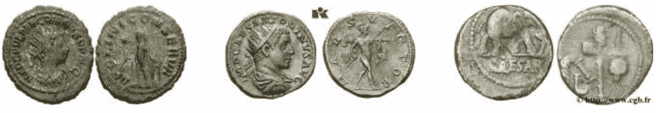
图1. 本研究中使用的典型图像（正面在左侧，背面在右侧）。

为了便于自动提取显著的语义元素和学习它们的视觉外观，每个硬币图像都与硬币的非结构化文本描述相关联，这些描述由专业的销售商提供；参见图2。在这些文本元数据中提供的信息差异很大——通常包括硬币的正面和背面描述以及发行机构（通常是皇帝）等，但也可能包括目录参考、铸造日期和地点、起源等。

我们已经强调了可扩展方法的实际需求。因此，由于可用数据的性质（它本身代表了实践中可以轻松获取的数据类型），最多只能说一个特定的语义元素（从文本中推断出来；见下一节）是否存在于图像中，参见图5。由于需要大量的人力劳动，不可能进行更精细的标注，即指定元素的位置或形状（可能的元素太多，需要标注的数据量过大），因此需要类似图5中所示的弱监督。

> 83, 批次: 226。估价100美元。以92美元售出。
> 
> MACRIANUS。公元260-261年。安东尼安尼乌斯 (22毫米, 3.40克)。萨摩萨塔? 铸币厂。放射状, 披着衣服, 穿着盔甲的右侧胸像/阿波罗面对站立, 头向左, 手持月桂枝, 倚靠竖琴; 左侧有星星。参见RIC V 6 (安条克); MIR 44, 1728k; 参见Cohen 2 (相同)。VF, 轻微多孔性。罕见。

图2. 典型的非结构化文本归属于硬币。

#### 2.2 数据预处理和清理

与大多数现实世界的应用程序一样，非结构化、松散标准化和异构数据是当前工作领域中的一个重要挑战，可能存在错误的标记、特殊性等。因此，对数据进行强大的预处理和清理是促进学习的关键步骤。

**基于图像的预处理。** 我们首先将所有图像裁剪为仅包含相应硬币的反面的正方形边界框，并将结果等比例缩放为300 × 300像素的统一尺寸。硬币的正面通常描绘了一位皇帝的半身像，而反面则包含了本文感兴趣的语义元素。

**基于文本的语义提取。** 为了选择要关注的语义元素，我们使用非结构化文本文件分析单词出现的频率，并特别关注最常见的概念，参见图3和图4。考虑到本研究是首次尝试解决手头的问题，为了确保有足够的训练数据可用，做出了上述决定。

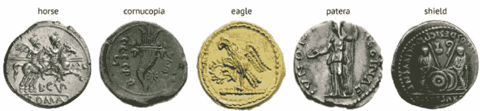
图3. 本研究关注的反面图案元素的示例。

**文本数据的清理和标准化。** 为了标记数据，我们首先清理归属文本文件，以删除重复的单词和标点符号。由于数据包含法语、西班牙语、德语和英语的归属，我们使用翻译API（googletrans）生成每个关键词的翻译。因此，在构建用于学习“马”概念的数据集时，包含了包含单词“马”、“caballo”、“cheval”和“pferd”的相关文本的图像也包括作为正例，更好地利用可用数据。复数形式、同义词和与所讨论的概念强相关的其他词（例如“骑手”）及其翻译也包括在内。

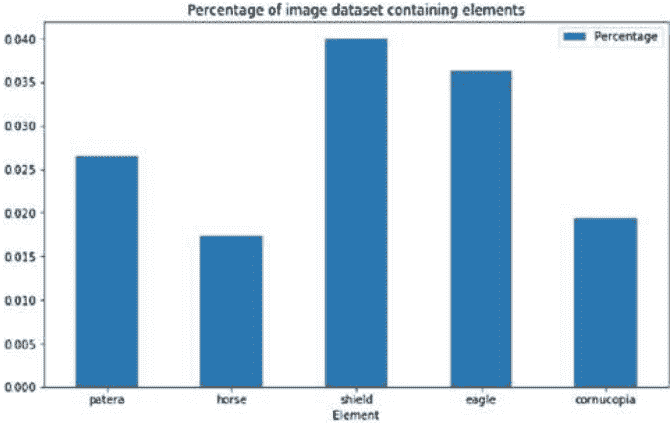
图4. 由于古代硬币上出现了各种不同的语义元素，整个语料库中只有相对较少的硬币包含了我们在此处尝试学习的特定语义元素，这引发了类别不平衡问题，我们使用分层抽样来解决这个问题。

**随机化和分层。** 我们在构建所选元素（‘马’、‘丰饶之角’、‘鸟盘’、‘老鹰’和‘盾牌’）的训练、验证和测试集之前对样本进行洗牌，比例为70%的训练集、15%的验证集和15%的测试集。为了解决正例的欠表示问题，我们使用分层抽样来确保平衡的类别表示。

#### 2.3 数据中的错误

在当前问题的背景下，就像大多数大规模、实际应用的自动数据分析一样，在预处理之后，得到的数据仍然会包含一定比例的错误数据。错误的性质各不相同，从错误的标签分配到准备不正确的图像。

举个具体的例子，我们观察到一些情况，即用于标记给定硬币图像是否包含所讨论的元素的关键词实际上是指硬币的正面，而不是我们关心的背面。这在盾牌上最为普遍，并且在构建相应的数据集时导致了错误的标记。我们的假设（后来通过经验证据得到确认）是这种错误标记并不是系统性的（参见RANSAC），因此相对较少的错误标记的累积效应将被正确标记数据的一致性（视觉和其他方面）所压倒。

我们还发现一些原始（未经处理）图像在对应硬币的正面和反面的定位方面布局异常，因此在预处理过程中会出现扭曲。然而，这些似乎几乎完全是上述拍卖清单类型的负样本，并且因此累积起来相对不重要。

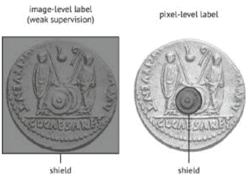
图5. 提供像素级标注（右侧）以提供不同概念的劳动量是不可行的，这对于从弱标注数据（左侧）进行学习来说是一个更具挑战性的任务。

### 3 提出的框架

在本文中，我们描述了一种新颖的基于AlexNet [11]的深度卷积神经网络，用于学习语义元素的外观，并确定未知查询硬币是否包含该元素。虽然我们在目前的工作中没有将此信息用于其他目的，而仅用于结果分析，但我们还能够通过使用遮挡技术 [15] 生成热图来确定元素的位置。

#### 3.1 模型拓扑

如图6和表1所总结的，我们的网络由五个卷积层（其中三个后面跟着一个最大池化层）组成，之后输出被展平并通过三个全连接层传递。卷积和池化层负责检测输入数据中的高级特征，然后全连接层使用这些特征生成类别预测。

卷积层使得对数据中的特征进行位置无关的识别成为可能。卷积层的输出取决于我们为每个层指定的一些超参数。这些超参数包括步长、卷积核数量（也称为深度）、卷积核大小和填充。使用多个卷积核是为了学习一系列特征。我们能够检测到的特征的复杂性取决于卷积层的数量。

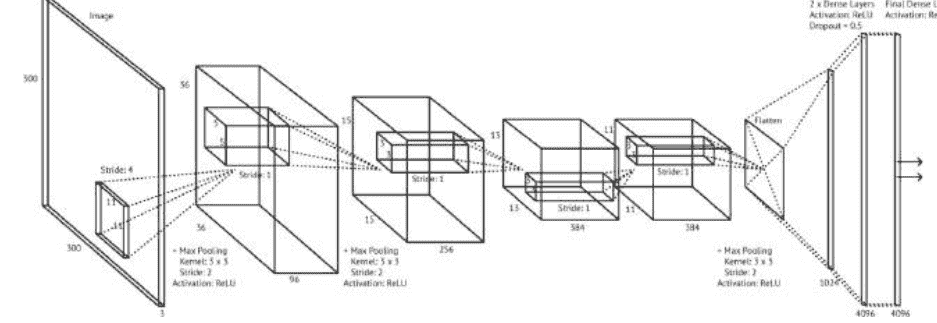
图6. 我们的模型架构：全局视图。

表1. 我们的卷积神经网络拓扑结构：一个概述。

| 层类型 | 卷积核大小 | 步长 | 卷积核数量 | 丢弃率 | 激活函数 |
| :--- | :--- | :--- | :--- | :--- | :--- |
| 卷积 | 11 × 11 | 4 | 96 | - | ReLU |
| 最大池化 | 3 × 3 | 2 | - | - | - |
| 卷积 | 5 × 5 | 1 | 256 | - | ReLU |
| 最大池化 | 3 × 3 | 2 | - | - | - |
| 卷积 | 3 × 3 | 1 | 384 | - | ReLU |
| 卷积 | 3 × 3 | 1 | 384 | - | ReLU |
| 卷积 | 3 × 3 | 1 | 256 | - | ReLU |
| 最大池化 | 3 × 3 | 2 | - | - | - |
| 展平 | - | - | - | - | - |
| 全连接 | - | - | 4096 | 0.5 | ReLU |
| 全连接 | - | - | 4096 | 0.5 | ReLU |
| 全连接 (输出) | - | - | 2 | 0.5 | ReLU |

网络中的层——例如，我们可以合理地期望在第一层中仅检测到原始像素输入中的简单、低级特征，例如边缘，然后从这些边缘中学习简单的形状在第二层中，然后从这些简单的形状中学习更复杂、更高级的特征，依此类推。

池化层可以被看作是降采样——目的是减小输出的大小，同时保留每个卷积核中最重要的信息。池化还有助于使网络对图像输入中的小变化、平移和扭曲不敏感。我们的设计使用最大池化，其中每个卷积核中的最大值形成池化层输出的一个元素。

密集层（也称为全连接层）将前一层学习到的高级特征转化为类别预测。为了避免过拟合，我们模型中的密集层采用了一种正则化技术，即随机删除每次迭代中的节点。被删除的节点数量由一个超参数决定，我们根据之前在CNN上的工作将其设置为0.5。

我们使用批量大小为24，最大迭代次数为200，经实验证明这已经足够，训练通常在达到该次数之前结束。每个迭代中，我们检查损失是否低于0.001，或者连续30个迭代中损失没有改善。如果满足任一条件，则停止训练。这样做部分是为了避免模型过拟合，部分是为了节省时间，如果某个模型或一组特定的超参数明显表现不佳。

该模型使用自适应矩估计（Adam）优化算法进行训练，这是一种梯度下降的形式，学习率和动量分别针对每个权重进行计算[10]。因为我们正在进行分类（每个样本要么“包含元素”，要么“不包含元素”），所以我们使用交叉熵损失函数[8]。为了避免梯度消失的问题，我们使用修正线性单元（ReLU）[1]作为激活函数。

### 4 实验

本节讨论的实验使用华硕H110M-Plus主板，搭载英特尔Core i5 6500 3.2 GHz四核处理器和Nvidia GTX 1060 6 GB GPU, 8 GB RAM。数据包括由古币搜索拍卖聚合器https://www.acsearch.info/（图1）提供的10万个拍卖品的图像和相关文本描述。

#### 4.1 结果与讨论

从表2中可以清楚地看出，我们的方法在训练、验证和测试数据上都达到了很高的准确性水平。验证和测试分数与训练分数没有显著差异，这表明没有过拟合的迹象，说明了一个良好设计的架构和足够的数据集。用于识别羊角和盘子的模型特别成功。

表2. 实验设置和结果总结。

| 指标 | 羊角 | 盘子 | 盾牌 | 鹰 | 马 |
| :--- | :--- | :--- | :--- | :--- | :--- |
| 迭代次数 | 105 | 136 | 118 | 86 | 148 |
| 训练时间（分钟） | 58 | 30 | 82 | 51 | 106 |
| 训练准确率 | 0.71 | 0.83 | 0.75 | 0.88 | 0.88 |
| 验证准确率 | 0.85 | 0.86 | 0.73 | 0.73 | 0.82 |
| 验证精确度 | 0.86 | 0.85 | 0.72 | 0.71 | 0.82 |
| 验证召回率 | 0.83 | 0.86 | 0.75 | 0.81 | 0.84 |
| 验证F1值 | 0.85 | 0.86 | 0.74 | 0.75 | 0.83 |
| 测试准确率 | 0.84 | 0.84 | 0.72 | 0.73 | 0.82 |
| 测试精确度 | 0.85 | 0.82 | 0.71 | 0.70 | 0.81 |
| 测试召回率 | 0.83 | 0.87 | 0.74 | 0.81 | 0.82 |
| 测试F1值 | 0.84 | 0.84 | 0.72 | 0.75 | 0.82 |

这很可能是因为艺术描绘中这些元素的差异水平较低——盾牌、马和鹰的方向、位置和风格有很大的变化，但丰饶角和祭坛盘在描绘中相对稳定。

#### 4.2 学习到的显著区域

我们使用遮挡技术[15]来量化不同图像区域在特定任务背景下的重要性。简而言之，该过程涉及使用均匀核进行合成遮挡，并量化未遮挡和遮挡输入之间的分类性能差异，较高的差异意味着较高的重要性。基于计算机视觉的古币分析的先前工作已经证明了这种技术在解释实证结果方面的有用性[15]。为了确保相对大小（语义元素与硬币直径的比例）的鲁棒性，在本研究中我们采用了三种核大小，32×32、48×48和64×64像素。

图8展示了不同语义元素的典型显著区域示例。很容易看出，我们的算法很好地捕捉到了元素的最具特征的区域——象征丰饶的螺旋图案，花瓶的椭圆形状和鹰的羽毛图案。正如我们之前提到的，并且从表2中可以明显看出，我们的算法在盾牌检测任务上的性能稍差，因此我们使用了遮挡技术来更详细地视觉检查结果。经过这样做，我们得出的结论是令人放心的——我们的假设是，盾牌在检测上本质上更具挑战性，因为它们在外观和描绘风格上存在显著的变异性（从正面显示时，它们呈圆形，而从侧面显示时，它们呈弧形），并且具有最少的特征细节（在硬币上显示的更复杂的语义元素中常见到圆形和弧形）。

### 5 总结和结论

在本文中，我们对古代硬币的计算机视觉分析领域做出了一系列重要贡献。首先，我们提出了第一个反对使用古代硬币图像的视觉匹配的论点，并解释了其实际价值的缺乏。相反，我们认为应该努力集中在对硬币图像的语义理解上，并描述了这一具有挑战性任务的首次尝试。

具体而言，我们描述了一种新颖的方法，该方法结合了非结构化文本分析和使用卷积神经网络的视觉学习，以在古代硬币上找到语义元素与相应图像之间的弱关联，并从而学习前述元素的外观。我们使用从10万个拍卖批次中提取的硬币图像展示了所提出方法的有效性，使得该实验成为现有文献中最大的实验。除了全面的统计分析外，我们还展示了在特定硬币实例上学习概念的可视化结果，表明我们的算法确实创建了正确的关联。我们相信我们的贡献将有助于引导未来的工作，并为新的有前途的研究开辟道路。

### 参考文献

- 1. Agarap, A.F.: 使用修正线性单元（ReLU）的深度学习。arXiv:1803.08375 (2018)
- 2. Anwar, H., Zambanini, S., Kampel, M.: 通过基于图像的反面符号识别支持古代硬币分类。在：国际计算机图像和模式分析会议记录，第17-25页（2013）
- 3. Anwar, H., Zambanini, S., Kampel, M.: 使用基于图像的反面图案识别进行粗粒度古代硬币分类。机器视觉应用。 26（2），295-304（2015）
- 4. Arandjelović, O.: 古罗马帝国硬币的自动归属。在：IEEE计算机视觉和模式识别会议记录，第1728-1734页（2010）
- 5. Arandjelović, O.: 阅读古代硬币: 使用正面传说种子检索自动识别银币。在: 欧洲计算机视觉会议记录, vol. 4, pp. 317–330 (2012)
- 6. 康恩, B., 阿兰杰洛维奇, O.: 走向基于计算机视觉的野外古币识别 - 自动可靠的图像预处理和归一化。在: IEEE国际联合神经网络会议记录, 第1457-1464页 (2017年)
- 7. 费尔, C., 阿兰杰洛维奇, O.: 古罗马硬币检索: 一个新的数据集和对硬币等级影响的系统性研究。在: 欧洲信息检索会议记录, 第410-423页 (2017年)
- 8. Janocha, K., Czarnecki, W.M.: 关于深度神经网络分类中的损失函数。arXiv:1702.05659 (2017)
- 9. Kampel, M., Zaharieva, M.: 基于局部特征的古币识别。在: 视觉计算国际研讨会论文集, 卷1, 第11-22页 (2008年)
- 10. Kinga, D., Adam, J.B.: 一种随机优化方法。在: 学习表示国际会议记录, 卷5 (2015年)
- 11. Krizhevsky, A., Sutskever, I., Hinton, G.E.: 使用深度卷积神经网络进行ImageNet分类。在: 神经信息处理系统进展, 第1097-1105页 (2012年)
- 12. Mattingly, H.: 罗马帝国硬币, 第7卷。Spink, 伦敦 (1966年)
- 13. Rieutort-Louis, W., Arandjelović, O.: 从视频中进行对象识别的Bo(V)W模型。在: 系统、信号和图像处理国际会议记录, 第89-92页 (2015年)
- 14. Rieutort-Louis, W., Arandjelović, O.: 使用消费级手持移动设备获取的无约束杂乱视频的对象检索描述转换表。在: IEEE国际联合会议记录上的神经网络, 第3030-3037页 (2016)
- 15. Schlag, I., Arandjelović, O.: 使用基于深度学习的艺术家描绘的面部轮廓识别技术在野外识别古罗马硬币。在: IEEE国际计算机视觉会议记录上, 第2898-2906页 (2017年)
- 16. Yue, X., Dimitriou, N., Arandjelović, O.: 使用机器学习和自动推断的表型特征, 从H&E全切片图像中预测结直肠癌结果。在: 国际生物信息学和计算生物学会会议记录上 (2019)
- 17. Zaharieva, M., Kampel, M., Zambanini, S.: 基于图像的古代硬币识别。在: 国际计算机图像和模式分析会议论文集, 第547-554页 (2007年)

# 在ResNet和Batch-Normalization中跳过连接对Fisher信息矩阵的影响

Yasutaka Furusho<sup>(✉)</sup> 和 Kazushi Ikeda

日本奈良科学技术学院, 奈良630-0192
{furusho.yasutaka.fm1,kazushi}@is.naist.jp

**摘要。** 深度神经网络，如多层感知器（MLP），已经得到了广泛研究，并引入了新的技术，以提高泛化能力和更快的收敛速度。其中一种技术是ResNet中层之间的跳过连接，另一种技术是批量归一化（BN）。为了澄清这些技术的影响，我们对这些网络的损失函数进行了景观分析。

景观影响收敛性质，其中费舍尔信息矩阵（FIM）的特征值起着重要作用。因此，我们通过对具有随机权重的网络应用函数分析，计算了MLP、ResNet和带有BN的ResNet的FIM的特征值，其中MLP在渐近情况下使用中心极限定理进行了分析。我们的结果表明，MLP的特征值与其深度无关，ResNet的特征值随深度呈指数增长，而带有BN的ResNet的特征值随深度呈次线性增长。这意味着BN允许ResNet使用更大的学习率，从而比普通的ResNet更快地收敛。

**关键词：** ResNet · 批归一化 · 费舍尔信息矩阵

### 1 引言

深度神经网络正在改变机器学习的历史，其高性能是由其指数级的表达能力所导致的。然而，标准的前馈网络（MLP）即使堆叠更多层也无法减少其经验风险。事实上，具有56层的MLP的经验风险比具有20层的MLP更大。

为了克服这个问题，ResNet在层之间引入了跳跃连接[4]。事实上，跳跃连接使得极深的ResNet（1202层）能够以较小的经验风险进行学习。这是因为带有批归一化（BN）[5]的ResNet能够解决MLP中的梯度破碎问题，即数据点的梯度之间的相关性呈指数衰减，梯度的空间结构随着网络深度的增加而被破坏[1]。此外，ResNet在性能上表现更好，当引入BN时，它显示出更好的收敛性[5]。它在线性MLP的情况下通过BN平滑损失函数来获得更好的收敛性[13]。然而，在具有非线性ReLU激活函数的ResNet的情况下，其机制仍不清楚。

为了清楚机制，我们分析了ResNet中跳跃连接和BN对其损失景观的影响，其中Fisher信息矩阵（FIM）的特征值在梯度下降方法的收敛性质中起着重要作用[6,9]。Karakida等人[6]利用中心极限定理计算了具有随机权重的MLP的FIM，也就是说，他们的分析仅适用于具有无限节点的MLP的渐近情况。

我们通过应用函数分析[1]到具有随机权重的网络中，计算了MLP、ResNet和带有BN的ResNet的FIM。我们的结果解释了为什么当引入BN时，ResNet在收敛性方面表现得更好。

### 2 材料和方法

我们分析了MLP、ResNet和带有BN的ResNet的FIM。本节阐述了这些网络并解释了FIM。

#### 2.1 数据集

我们有一个训练集 $S := \{x(n), y(n)\}_{n=1}^N$。每个例子都是一个输入对 $x(n) \in \mathcal{X} \subset \mathbb{R}^D$ 和输出 $y(n) \in \mathcal{Y} \subset \mathbb{R}$，满足以下条件。

**假设1.** 输入数据被规范化如下：
$$\forall i \in [D], \quad \mathbb{E}_n[x_i] := \frac{1}{N} \sum_{n=1}^N x(n)_i = 0, \quad \mathbb{V}_n[x_i] := \frac{1}{N} \sum_{n=1}^N (x(n)_i - \mathbb{E}_n[x_i])^2 = 1 \quad (1)$$
其中期望是根据输入的经验分布 $q(x)$ 计算的。

如果上下文清楚，我们会省略数据的索引。

#### 2.2 神经网络

我们考虑以下 $L$-层神经网络 $f: \mathcal{X} \times \mathcal{W} \rightarrow \mathcal{Y}$，其中参数（权重向量） $\theta \in \mathcal{W} \subset \mathbb{R}^{LD^2}$，用于预测输入 $x \in \mathcal{X}$ 的相应输出 $y \in \mathcal{Y}$。令 $h^0 = x, \quad \phi(\cdot) := \max(0, \cdot)$ 是 ReLU 函数。

**多层感知机（MLP）：**
$$u_i^l = \sum_{j=1}^D W_{ij}^l h_j^{l-1}, \quad h_i^l = \phi(u_i^l), \quad \hat{y} = 1^T h^L \quad (2)$$

**残差网络 (ResNet)：**
$$u_i^l = \phi(h_i^{l-1}), \quad h_i^l = \sum_{j=1}^D W_{ij}^l u_j^l + h_i^{l-1}, \quad \hat{y} = 1^T h^L \quad (3)$$

**具有批归一化 (BN) 的ResNet：**
$$u_i^l = \phi \left( \text{BN}(h_i^{l-1}) \right), \quad \text{BN} \left( h_i^l \right) = \frac{h_i^l - \mathbb{E}_n[h_i^l]}{\sqrt{\mathbb{V}_n[h_i^l]}} \quad (4)$$
$$h_i^l = \sum_{j=1}^D W_{ij}^l u_j^l + h_i^{l-1}, \quad \hat{y} = 1^T h^L$$

我们通过He初始化[3]来初始化权重：
$$W_{ij}^l \sim \mathcal{N} \left( 0, \frac{2}{D} \right) \quad (5)$$

我们对隐藏单元的激活做出以下假设。
**假设2.** 隐藏单元的激活概率为0.5。

### 2.3 Fisher信息矩阵 (FIM)

概率分布 $p(x, y; \theta)$ 的 FIM 定义为：
$$F := \mathbb{E}_{x, y} \left[ \nabla_{\theta} \log p(x, y; \theta) \nabla_{\theta} \log p(x, y; \theta)^T \right] \quad (6)$$
期望是关于 $p(x, y; \theta) = p(x)p(y|x; \theta)$ 的期望，其中 $p(x)$ 是输入的概率分布且
$$p(y|x; \theta) = \mathcal{N}(f(x; \theta), 1) = \frac{1}{\sqrt{2\pi}} \exp \left( -\frac{(y - f(x; \theta))^2}{2} \right) \quad (7)$$

然后，FIM 可以写成：
$$F = \mathbb{E}_x \left[ \nabla_{\theta} f(x; \theta) \nabla_{\theta} f(x; \theta)^T \right] \quad (8)$$
如果我们使用经验分布 $q(x)$ 作为 $p(x)$，FIM 可以写成：
$$F = \mathbb{E}_n \left[ \nabla_{\theta} f(x; \theta) \nabla_{\theta} f(x; \theta)^T \right] \quad (9)$$

如果损失函数是均方误差 $E(\theta)$，FIM 类似于局部最小值周围的 Hessian 矩阵：
$$H := \nabla_{\theta} \nabla_{\theta} E(\theta) = F - \mathbb{E}_n \left[ (y - f(x; \theta)) \nabla_{\theta} \nabla_{\theta} f(x; \theta) \right] \quad (10)$$
其中期望是针对输入和输出对的经验分布 $q(x, y)$。

由于这个特性，FIM与梯度下降的收敛性质有关。梯度下降需要将学习率设置得比 $\frac{2}{\lambda_{\max}}$ 更小以保证收敛性[6,9]，其中 $\lambda_{\max}$ 是FIM的最大特征值。

### 3 结果与讨论

我们计算了MLP、ResNet和带有BN的ResNet的FIM的特征值均值 $m_\lambda$ 和最大特征值 $\lambda_{\max}$，以清楚地了解跳跃连接和BN对梯度下降的收敛性质的影响。我们计算了这些特征值 $m_\lambda, \lambda_{\max}$ 对参数初始化分布的期望（表1）。

**表1. 期望的Fisher信息矩阵特征值均值和最大特征值的平均。** 注意 $H_{L+1} := \sum_{k=1}^L \frac{1}{k}$ 是调和数。

| 网络架构 | 均值 $m_\lambda$ | 最大值 $\lambda_{\max}$ |
| :--- | :--- | :--- |
| 多层感知机 | $\frac{1}{2}$ | - |
| 残差网络 | $2^{L-2}$ | $\frac{LD^2}{N} m_\lambda \leq \lambda_{\max} \leq LD^2 m_\lambda$ |
| 带批归一化的残差网络 | $\frac{L+1}{L} \frac{H_{L+1}-1}{2}$ | - |

表1展示了网络架构对损失函数空间和梯度下降收敛性的三个有趣结果。

第一个结果是关于每个隐藏层单元数量的影响。特征值的均值与隐藏单元数量无关。然而，最大特征值与隐藏单元数量的平方成正比增长。这意味着损失函数空间在大多数维度上是平坦的，但在其他维度上是陡峭的，这与具有无限单元的MLP的渐近情况的理论结果相符[6]。第二个结果是关于残差网络中跳跃连接的影响。MLP的特征值均值与深度无关。然而，残差网络中的跳跃连接使特征值均值随深度呈指数增长。因此，梯度下降应该为训练残差网络设置较小的学习率。最后一个结果是关于批归一化的影响。批归一化将深度的指数依赖关系转化为亚线性依赖关系。这意味着批归一化使梯度下降能够设置更大的学习率并且比普通残差网络更快地收敛，这解释了其实验上的快速收敛结果[5]。

为了确认我们的分析有效，我们在PCA白化的MNIST数据集上进行了数值实验（更多细节请参见附录B）。我们计算了20个初始化参数上FIM的特征值均值（图1，2）。实验结果几乎与我们的理论结果相匹配。此外，为了确认我们理论结果的含义：BN使梯度下降可以设置比普通ResNet更大的学习率，我们通过梯度下降（仅更新隐藏层参数50次）训练了ResNet和带有BN的ResNet，其中隐藏单元的数量为 $D$，隐藏层的数量为 $L$，学习率为 $\eta$，并计算了其训练损失（图3，4）。损失值是五次试验的平均值。红线表示学习率的理论收敛上界 $\frac{2}{\lambda_{\max}}$。

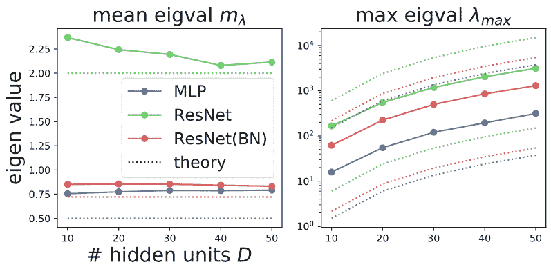
图1. 具有 $D$ 隐藏单元的3隐藏层网络的特征值。

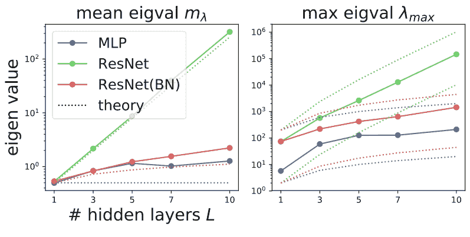
图2. 具有20个隐藏单元的 $L$ 隐藏层网络的特征值。

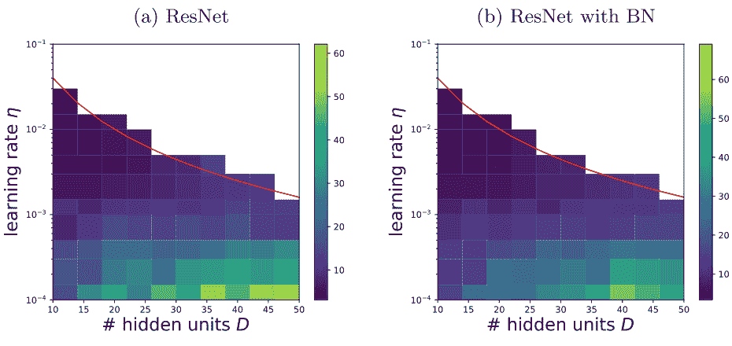
图3. 具有 $D$ 隐藏单元的1隐藏层网络的训练损失的热力图。

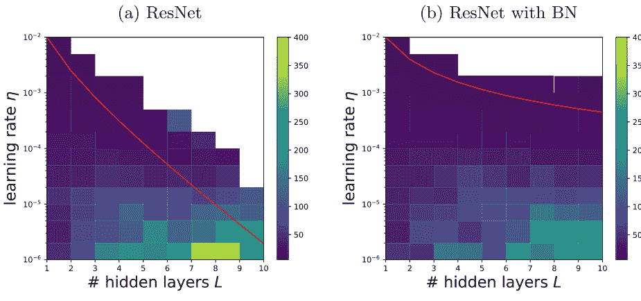
图4. 具有20个隐藏单元的 $L$ 隐藏层网络的训练损失的热力图。白色区域表示损失发散（即大于1000）。实验结果几乎与推论相符。

### 4 结论

深度神经网络已经得到了广泛研究，并引入了新的技术以提高其泛化能力和更快的收敛速度。其中一种技术是在ResNet中的层之间添加跳跃连接，另一种技术是批归一化（BN）。当引入BN时，ResNet在收敛性方面表现出更好的性质。为了清楚其机制，我们分析了ResNet中跳跃连接和BN对其损失景观的影响。我们的结果表明，BN平滑了ResNet的损失景观，使得梯度下降可以设置更大的学习率，并使ResNet更快地收敛到极小值。

**致谢。** 本工作得到JSPS KAKENHI Grant Number JP18J15055、JP18K19821和NAIST Big Data Project的支持。

## 附录A 理论结果的证明

本节概述了MLP主要结果的证明。这个分析过程可以应用于ResNet和带有BN的ResNet的情况。FIM的平均特征值 $m_\lambda$ 和最大特征值 $\lambda_{\max}$ 可以表示为误差梯度、激活和隐藏单元的输出。这个结果是[6]的修改。

**引理1.** 设 $\delta_i^l := \frac{\partial y}{\partial h_i^l}$ 是误差梯度, $\beta_i^l := \phi'(u_i^l)$ 是激活函数。那么,
$$m_\lambda = \frac{1}{NP} \sum_{l=1}^L \sum_{i,j=1}^D \sum_{n=1}^N \delta_i^l(n)^2 \beta_i^l(n)^2 h_j^{l-1}(n)^2, \quad \frac{LD^2}{N} m_\lambda \leq \lambda_{\max} \leq LD^2 m_\lambda \quad (11)$$

我们假设 $\mathbb{E}_{n, \theta}\left[\delta_{i}^{l^2} \beta_{i}^{l^2} h_{j}^{l-1^2}\right]=\mathbb{E}_{n, \theta}\left[\delta_{i}^{l^2}\right] \mathbb{E}_{n}\left[\beta_{i}^{l^2}\right] \mathbb{E}_{n, \theta}\left[h_{j}^{l-1^2}\right]$。假设2保证 $\mathbb{E}_{n}\left[\beta_{i}^{l^2}\right]=\frac{1}{2}$。因此，剩下的是计算 $\mathbb{E}_{n, \theta}\left[\delta_{i}^{l^2}\right]$ 和 $\mathbb{E}_{n, \theta}\left[h_{j}^{l-1^2}\right]$。

为了计算这些项，我们将 $h_{j}^{l}$ 和 $\delta_{i}^{l}$ 分解为网络的路径权重（图5），这是正交元素，类似于傅里叶展开（图6）。这个结果是将输入 $\delta_{i}^{0}$ 的误差梯度的结果扩展到一般隐藏单元 $\delta_i^{l}$ 和隐藏单元输出 $h_{j}^{l}$ 的误差梯度。

**引理2.** 设 $\alpha$ 表示通过的权重矩阵的边的路径，$A(n)_{l, i}:=\beta_{i}^{l}$ 表示元素为单元激活状态（1为激活，0为非激活）的矩阵，对于第 $n$ 个数据，则
$$h_{j}^{l}(n)=\sum_{\alpha \in[D]^{l} \times\{j\}} W_{\alpha} A(n)_{\alpha} x(n)_{\alpha_{1}} \quad (12)$$
其中 $W_{\alpha}:=\prod_{k=1}^{|\alpha|-1} W_{\alpha_{k}, \alpha_{k+1}}^{k}$ 是路径权重，而 $A(n)_{\alpha}:=\prod_{k=1}^{|\alpha|-1} A(n)_{k, \alpha_{k}}$ 是路径激活状态。这些元素的和是正交的，因为
$$\mathbb{E}_{\theta}\left[W_{\alpha 1} W_{\alpha 2}\right]=\left\{\begin{array}{cl}\left(\frac{2}{D}\right)^{|\alpha|-1} & \text { 如果 } \alpha 1=\alpha 2 \\ 0 & \text { 否则 }\end{array}\right. \quad (13)$$

利用引理2，假设1和2，
$$\begin{aligned} \mathbb{E}_{n, \theta}\left[h_{j}^{l^2}\right] &=\sum_{\alpha \in[D]^{l} \times\{j\}} \mathbb{E}_{\theta}\left[W_{\alpha}^{2}\right] \mathbb{E}_{n}\left[A_{\alpha}^{2}\right] \mathbb{E}_{n}\left[x_{\alpha_{1}}^{2}\right] \\ &=\left(\frac{2}{D}\right)^{l} \sum_{\alpha \in[D]^{l} \times\{j\}} \mathbb{E}_{n}\left[A_{\alpha}^{2}\right]=1 \end{aligned} \quad (14)$$

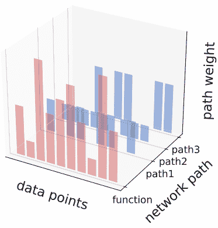
图5. 将函数（输出或隐藏单元的误差梯度）扩展为路径权重。

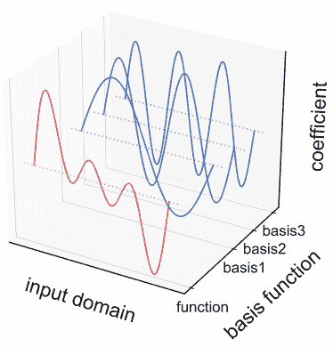
图6. 将函数（时间序列）展开为基函数（正弦波）的傅里叶展开。

同样地，我们可以计算 $\mathbb{E}_{n, \theta}\left[\delta_{i}^{l^2}\right]$。然后，我们可以通过将这些值代入引理1来计算特征值的均值和最大特征值。

## 附录B 实验设置

在我们的实验中，我们从MNIST数据集[8]中属于0或1类的1000个示例进行子采样，以准备用于二元分类问题的数据集。我们将输出 $y$ 的值设置为对应类别的标签 $\pm 1$。此外，我们通过PCA白化对该数据集的输入 $x$ 进行预处理，以满足假设1。

### 参考文献

- 1. Balduzzi, D., Frean, M., Leary, L., Lewis, J., Ma, K.W.D., McWilliams, B.: 破碎的梯度问题：如果ResNets是答案，那么问题是什么？ 在：国际机器学习会议，第342-350页（2017年）
- 2. Bengio, Y., 等：学习人工智能的深度架构。基础趋势 Mach. Learn. 2(1), 1-127（2009年）
- 3. He, K., Zhang, X., Ren, S., Sun, J.: 深入研究整流器：超越人类一级性能的ImageNet分类。在：IEEE国际计算机视觉会议记录，第1026-1034页（2015年）
- 4. He, K., Zhang, X., Ren, S., Sun, J.: 深度残差学习用于图像识别。在：IEEE计算机视觉和模式识别会议记录，第770-778页（2016年）
- 5. Ioffe, S., Szegedy, C.: 批归一化：通过减少内部协变量偏移加速深度网络训练。在：国际机器学习会议，第448-456页（2015年）
- 6. Karakida, R., Akaho, S., Amari, S.: 深度神经网络中Fisher信息的普适统计：平均场方法。arXiv预印本 arXiv:1806.01316 (2018)
- 7. LeCun, Y., Bengio, Y., Hinton, G.: 深度学习。Nature 521(7553), 436 (2015)
- 8. LeCun, Y., Bottou, L., Bengio, Y., Haffner, P.: 基于梯度的学习应用于文档识别。IEEE会议记录 86(11), 2278–2324 (1998)
- 9. LeCun, Y.A., Bottou, L., Orr, G.B., Müller, K.R.: 高效的反向传播。在：神经网络：技巧与经验，第9-48页。Springer, Heidelberg (2012)
- 10. Montufar, G.F., Pascanu, R., Cho, K., Bengio, Y.: 深度神经网络的线性区域数量。在：神经信息处理系统的进展，第2924-2932页。
- 11. Raghu, M., Poole, B., Kleinberg, J., Ganguli, S., Sohl-Dickstein, J.: 关于深度神经网络的表达能力。在：国际机器学习会议上，第2847-2854页（2017年）
- 12. Russakovsky, O., Deng, J., Su, H., Krause, J., Satheesh, S., Ma, S., Huang, Z., Karpathy, A., Khosla, A., Bernstein, M., 等：ImageNet大规模视觉识别挑战。计算机视觉国际期刊 115(3), 211-252页（2015年）
- 13. Santurkar, S., Tsipras, D., Ilyas, A., Madry, A.: 批归一化如何帮助优化？ 在：神经信息处理系统的进展，第31卷（2018年）
- 14. Telgarsky, M.: 神经网络深度的好处。在：学习理论会议, pp. 1517–1539 (2016)

# 在ResNet中跳过两层比跳过一层或不跳过层的泛化差距更小

Yasutaka Furusho$^{1(\text{✉️})}$, Tongliang Liu$^{2}$, 和 Kazushi Ikeda$^{1}$

1 奈良科学技术学院, 日本奈良 630-0192
{furusho.yasutaka.fm1, kazushi}@is.naist.jp
2 悉尼大学, 澳大利亚新南威尔士州达令顿 2008
tliang.liu@gmail.com

**摘要**：已知ResNet跳过两层 (ResNet2) 的期望风险比跳过一层 (ResNet1) 或不跳过层 (MLP) 的期望风险更小，然而，小期望风险的机制仍不清楚。期望风险分为三个组成部分：泛化差距、优化误差和样本表达能力，后两个组成部分已知有助于ResNet的快速收敛。我们在线性情况下计算了第一个组成部分——泛化差距，并显示出ResNet2的泛化差距比ResNet1或MLP更小。我们的数值实验验证了分析的有效性以及对具有ReLU激活函数情况的适用性。

**关键词**：深度神经网络 · ResNet · 跳连接 · 泛化差距 · 损失曲面

### 1 引言

深度神经网络一直在改变机器学习的历史，其高性能被认为由于其指数级的表达能力 [2, 14, 15, 18]。然而，标准的前馈网络即使堆叠更多的层也无法减少其经验风险。事实上，一个具有56层的多层感知器比一个具有20层的多层感知器具有更大的经验风险 [6]。

为了克服这个问题，ResNet在层之间引入了跳连接 [6]。跳连接使得即使是极深的ResNet (1202层) 也能以较小的经验风险和较小的期望风险进行学习。此外，跳过两层的ResNet (ResNet2) 比跳过一层的ResNet (ResNet1) 或标准的前馈网络 (MLP) [6, 7, 13] 表现更好。

预期风险 $R$ 被分为三个组成部分：泛化差距 $\epsilon_{\text{间隙}}$、优化误差 $\epsilon_{\text{优化}}$ 和样本表达能力 $\epsilon_{\text{表达}}$，即：

$$R(w_t) = \underbrace{R(w_t) - R_S(w_t)}_{\epsilon_{\text{间隙}}} + \underbrace{R_S(w_t) - R_S(w_*)}_{\epsilon_{\text{优化}}} + \underbrace{R_S(w_*)}_{\epsilon_{\text{表达}}} \qquad (1)$$

其中 $R_S$ 是经验风险；$w_t$ 是梯度下降在第 $t$ 个迭代中的输出，$w_*$ 是经验风险最小化器，两者都依赖于训练集 $S$。最后两个组成部分的分析发现，与MLP和ResNet1相比，ResNet2更容易降低优化误差 $\epsilon_{\text{优化}}$，因为ResNet2的Hessian矩阵的条件数是深度不变的，而其他模型的条件数随深度增加而爆炸 [11, 13]。此外，一旦ResNet2的参数数量超过训练集中的数据数量，它就具有完美的样本表达能力 $\epsilon_{\text{表达}} = 0$ [5]。这些事实解释了ResNet的快速收敛性，但不能解释其小的预期风险。因此，我们计算了ResNet2、ResNet1和MLP的泛化差距，并展示了跳跃连接对泛化差距的影响。

### 2 材料和方法

我们分析了MLP、ResNet1和ResNet2的泛化差距。本节阐述了这些神经网络和问题设置，并解释了泛化差距的分析方法。

#### 2.1 线性神经网络

由于非线性神经网络很难分析，我们分析了线性神经网络的泛化差距，作为理解非线性情况的一步。实际上，有几项研究探索了线性神经网络的损失景观和学习动态，作为第一步 [1, 4, 5, 8, 17]。

我们考虑以下 $L$ 层神经网络 $f: \mathcal{X} \times \mathcal{W} \rightarrow \mathcal{Y}$，其中参数（权重） $w \in \mathcal{W}$，用于预测输入 $x \in \mathcal{X}$ 的相应输出 $y \in \mathcal{Y}$:

$$
\begin{aligned}
\text{MLP} & : f(x, w) = \prod_{l=1}^L W^l x, & (2) \\
\text{ResNet1} & : f(x, w) = \prod_{l=1}^L (W^l + I)x, & (3) \\
\text{ResNet2} & : f(x, w) = \prod_{l=1}^{L/2} (W^{2l} W^{2l-1} + I)x, & (4)
\end{aligned}
$$

其中 $\mathcal{W}$ 是一个假设空间；$\mathcal{X}$，$\mathcal{Y}$ 分别是输入和输出空间。

#### 2.2 问题设定

我们在以下问题设定中分析了线性神经网络（方程2-4）的泛化差距。我们有一个训练集 $S := \{z^n\}_{n=1}^N$。每个训练样本是一个输入和输出的对 $z^n := (x^n, y^n) \in \mathcal{X} \times \mathcal{Y} := \mathcal{Z}$，它们是独立同分布的，来自概率分布 $D$。

我们对训练集做了两个假设，以获得线性神经网络的特殊学习动力学（引理1）。这些特殊的学习动力学对我们的分析至关重要。

- **假设1**：输入相关矩阵 $\Sigma^{xx} := \sum_{n=1}^N x^n x^{nT}$ 是单位矩阵。
- **假设2**：输出-输入相关矩阵 $\Sigma^{yx} := \sum_{n=1}^N y^n x^{nT}$ 是正定对称的，其特征值大于1。

假设1是弱的，因为实际的数据预处理方法（如PCA白化）满足这个假设。假设2可以放宽如下：我们可以通过修改跳跃连接 $I$ 到 $R^{l+1}R^{lT}$ 的方式，将我们的理论结果扩展到任意矩形的输出-输入相关矩阵 $\Sigma^{yx}$，其奇异值大于1（假设2的一个弱版本）；其中 $R^l$ 是正交矩阵，$R^1$ 和 $R^{L+1}$ 是 $\Sigma^{yx}$ 的右奇异向量和左奇异向量。为简单起见，我们在分析中考虑假设2。

我们通过梯度下降训练线性神经网络（方程2-4）：

$$w_{t+1} = w_t - \eta \nabla_w R_S(w_t) \qquad (5)$$

为了实现小的经验风险，通过平方损失进行测量：

$$R_S(w) = \frac{1}{2} \sum_{n=1}^{N} \|f(x^n; w) - y^n\|^2. \qquad (6)$$

#### 2.3 泛化间隙的分析方法

线性神经网络的泛化间隙取决于两个组成部分：梯度下降的参数收敛速度和全局最小值周围的损失平坦度。

**泛化差距和算法稳定性**：我们使用算法稳定性 [3] 来推导线性神经网络的泛化差距。一个训练算法 $A: \mathcal{Z}^N \to \mathcal{W}$ 接收训练集 $S$ 并输出一个训练模型 $A(S)$。算法稳定性衡量从训练集 $S$ 中移除一个样本对训练模型 $A(S)$ 的影响程度。

**定义1** [3]：训练算法 $A$ 是点对假设稳定的，如果满足以下条件：
$$\forall n \in [N], \mathbb{E}_{A, S} [|\ell(A(S), z^n) - \ell(A(S^n), z^n)|] \le \epsilon_{\text{stab}} \qquad (7)$$
其中 $\ell$ 是损失函数，$S^n := S \setminus z^n$。具有更好稳定性 ($\epsilon_{\text{stab}}$ 很小) 的训练算法实现了小的泛化差距。

**定理1** [3]：如果训练算法 $A$ 是逐点假设稳定的，则以下不等式至少以概率 $1 - \delta$ 成立：
$$R(A(S)) - R_S(A(S)) \le \sqrt{\frac{M^2 + 12MN \epsilon_{\text{stab}}}{2N \delta}} \qquad (8)$$
其中 $M$ 是损失函数的上界。

**算法稳定性和PL条件**：梯度下降的算法稳定性 $\epsilon_{\text{stab}}$ 取决于参数收敛的速度和全局最小值周围损失函数的平坦程度。

**定义2**：如果满足以下条件，则函数 $g$ 是 $\alpha$-Lipschitz 的：
$$\forall b_1, b_2 \in \mathcal{B}, \quad |g(b_1) - g(b_2)| \leq \alpha \|b_1 - b_2\|. \qquad (9)$$

**定义3**：如果满足以下条件，则函数 $g$ 是 $\beta$-smooth 的：
$$\forall b_1, b_2 \in \mathcal{B}, \quad \|\nabla g(b_1) - \nabla g(b_2)\| \leq \beta \|b_1 - b_2\|. \qquad (10)$$

**定义4** [4]：函数 $g$ 满足 PL条件 $\mu$ 如果以下条件成立：
$$\forall b \in \mathcal{B}, \quad \mu(g(b) - g_*) \leq \frac{1}{2} \|\nabla g(b)\|^2 \qquad (11)$$
其中 $g_*$ 是 $g$ 在 $\mathcal{B}$ 上的最小值。

PL条件的 $\mu$ 度量了全局最小值周围损失函数的平坦度。如果经验风险 $R_S$ 满足 PL 条件 $\mu$ 并且对于所有 $w \in \mathcal{W}$ 都是 $\beta$-光滑的，我们可以推导出：
$$R_S(w) - R_{S*} \leq \frac{\beta^2}{2\mu} \| w - \text{Proj}_{\mathcal{W}_*}(w) \|^2 \qquad (12)$$
其中 $R_{S*}$ 是 $\mathcal{W}$ 上 $R_S$ 的最小值，$\text{Proj}_{\mathcal{W}_*}(w)$ 是 $w$ 在全局最小值集合 $\mathcal{W}_*$ 上的投影。这表明具有较大 $\mu$ 的经验风险具有平坦的全局最小值。

**定理2** [4]：假设对于所有的训练集 $S$ 和参数 $w \in \mathcal{W}$，经验风险 $R_S$ 满足具有 $\mu$ 的 PL 条件，损失函数 $\ell$ 是 $\alpha$-利普希茨的。如果训练算法 $A$ 以收敛速度 $\|w_t - w_*\| \le \epsilon_t$ 收敛到全局最小值 $w_*$，则算法 $A$ 是逐点假设稳定的：
$$\epsilon_{\text{stab}} \le 2\alpha\epsilon_t + \frac{2\alpha^2}{\mu(N-1)} \qquad (13)$$

### 3 主要结果

本节通过分析参数收敛速度 $\epsilon_t$ 和全局最小值周围损失函数的平坦性 $\mu$ 来展示在 ResNet 中跳过两个层比跳过一个或没有层在梯度下降更新参数足够多次后使泛化差距更小。

#### 3.1 梯度下降法参数收敛速度

通过初始化权重，我们可以得到特殊的学习动态：$W^l = U \bar{W} U^\top$，其中 $U$ 是 $\Sigma^{yx}$ 的特征向量，$\bar{W}$ 是一个对角矩阵。

**引理1**：梯度下降法只更新 $\bar{W}$ 的对角元素，并在不同层之间保持相同的对角矩阵 $\bar{W}$。

我们计算了每个对角元素 $a := \bar{W}_{ii}$（模式强度）收敛到全局最小值 $a_*$ 的速度。

**定理3**：对于足够小的学习率 $\eta$，$ResNet2$ 的参数收敛速度 $|a_t - a_*| \le \epsilon_t$ 比其他模型慢。$ResNet1$ 的参数收敛速度与 $MLP$ 相同。

| 模型 | 参数收敛速度 $\epsilon_t$ |
| :--- | :--- |
| MLP 和 ResNet1 | $(1 - \eta L \gamma^{2(L-1)})^t \epsilon_0$ |
| ResNet2 | $(1 - \eta L \frac{\gamma^2 - 1}{2\gamma^2} \gamma^{2(L-1)})^t \epsilon_0$ |

*注：$\gamma$ 是训练过程中的最小模式强度，$\epsilon_0$ 是初始误差。*

### 3.2 PL条件

我们将证明策略应用于 ResNet2 的情况，并计算其 PL 条件下的 $\mu$。设 $a_{\min}, a_{\max}$ 为训练过程中模式强度的最小和最大绝对值。特殊的学习动力学保证了在学习率足够小的情况下，模式强度在初始值 $a_0$ 和全局最小值 $a^*$ 之间。对于足够深的神经网络，$a_{\max} \le a^* \le 1$。

**定理4**：对于 $MLP$ 的 PL 条件，大的 $a_{\min}$ 会导致大的 $\mu$。对于 $ResNet1$ 的 PL 条件，小的 $a_{\max}$ 会导致大的 $\mu$。$ResNet2$ 具有以上两个优点。换句话说，小的条件数 $a_{\max}/a_{\min}$ 会导致大的 $\mu$。

| 模型 | PL 条件下的 $\mu$ | 参考 |
| :--- | :--- | :--- |
| 多层感知机 (MLP) | $\frac{L a_{\min}^{2L-2}}{C}$ | [4] |
| ResNet1 | $\frac{L(1-a_{\max})^{2L-2}}{C}$ | [5] |
| ResNet2 | $\frac{L(1-a_{\max})^{L-2} a_{\min}^2}{C}$ | 本文 |

*注：$C$ 是一个常数。*

实验显示 ResNet2 的 $\mu$（更平坦的极小值）比其他模型更大。这意味着 ResNet2 在全局最小值附近的损失函数曲面更平坦。

#### 3.3 稳定性

通过结合参数收敛速度 $\epsilon_t$ 和 PL 条件下的 $\mu$，我们可以发现 MLP 和 ResNet1 在早期阶段具有更好的稳定性（参数收敛更快）。但最终，由于更大的 $\mu$，ResNet2 实现了更好的稳定性。

这意味着在 ResNet 中跳过两层比跳过一层或不跳过层在梯度下降更新参数足够次数后使泛化差距变小。数值实验证实了分析的有效性，并适用于具有 ReLU 激活函数的情况。

### 4 讨论

我们的结果表明，在 ResNet 中跳过两层比跳过一层或不跳过层使泛化差距变小。

- 这个结果源于 ResNet2 具有比其他模型更平坦的全局最小值。
- 这些理论结果支持了以下有趣的实验结果：ResNet2 在最小值周围具有平坦的损失景观，而 MLP 则具有尖锐的景观 [12]。
- 派生的算法稳定性 $\epsilon_{\text{stab}}$ 可以用作合理的模型选择标准。由于特殊的学习动态（引理1），可以在训练之前计算出这个值，因此没有必要多次训练深度神经网络来寻找良好的网络结构。

### 5 结论

在本文中，我们分析了跳跃连接对线性神经网络中泛化差距的影响。基于稳定性的分析表明，泛化差距与参数收敛速度和全局最小值周围损失平面的平坦性有关。我们表明，跳过两层使参数收敛速度变慢，但其全局最小值周围的损失平面更平坦。综合这些结果，ResNet 中跳过两层使泛化差距在梯度下降更新足够次数后比跳过一层或不跳过层更小。数值实验证实了分析的有效性，并显示其适用于具有 ReLU 激活函数的情况。

**致谢**：本工作得到 JSPS KAKENHI Grant Number JP18J15055、JP18K19821 和 NAIST Big Data Project 的支持。

### 参考文献

- 1. Bartlett, P.L., Helmbold, D.P., Long, P.M.: 深度残差网络通过恒等初始化使用梯度下降高效学习正线性变换。在：国际机器学习会议（2018）
- 2. Bengio, Y., et al.: 为人工智能学习深度架构。Found. Trends® Mach. Learn. 2(1), 1–127 (2009)
- 3. Bousquet, O., Elisseeff, A.: 稳定性和泛化性. 机器学习研究杂志 2(3月), 499–526 (2002)
- 4. Charles, Z., Papailiopoulos, D.: 收敛到全局最优解的学习算法的稳定性和泛化性. 在: 国际机器学习会议(2018)
- 5. Hardt, M., Ma, T.: 身份在深度学习中很重要. 在: 学习表示国际会议 (2017)
- 6. He, K., Zhang, X., Ren, S., Sun, J.: 深度残差学习用于图像识别. 在: 计算机视觉和模式识别IEEE会议记录, pp. 770–778 (2016)
- 7. He, K., Zhang, X., Ren, S., Sun, J.: 深度残差网络中的身份映射. 在: 计算机视觉欧洲会议, pp. 630–645. Springer (2016)
- 8. Kawaguchi, K.: 没有贫穷局部极小值的深度学习. 在: 神经信息处理系统进展, pp. 586–594 (2016)
- 9. Keskar, N.S., Mudigere, D., Nocedal, J., Smelyanskiy, M., Tang, P.T.P.: 关于深度学习的大批量训练：泛化差距和尖锐极小值。在：国际学习表示会议（2017年）
- 10. LeCun, Y., Bengio, Y., Hinton, G.: 深度学习。自然 521 (7553), 436 (2015年)
- 11. LeCun, Y.A., Bottou, L., Orr, G.B., Müller, K.R.: 高效的反向传播。在：神经网络：行业技巧，第9-48页。斯普林格 (2012年)
- 12. Li, H., Xu, Z., Taylor, G., Goldstein, T.: 可视化神经网络的损失景观。在：国际学习表示会议（2018年）
- 13. Li, S., Jiao, J., Han, Y., Weissman, T.: 解密ResNet。arXiv预印本arXiv:1611.01186 (2016年)
- 14. Montufar, G.F., Pascanu, R., Cho, K., Bengio, Y.: 关于深度神经网络的线性区域数量的研究。在: 神经信息处理系统进展, 第2924-2932页 (2014)
- 15. Raghu, M., Poole, B., Kleinberg, J., Ganguli, S., Sohl-Dickstein, J.: 关于深度神经网络的表达能力的研究。在: 机器学习国际会议上, 第2847-2854页 (2017)
- 16. Russakovsky, O., Deng, J., Su, H., Krause, J., Satheesh, S., Ma, S., Huang, Z., Karpathy, A., Khosla, A., Bernstein, M., et al.: ImageNet大规模视觉识别挑战。计算机视觉国际期刊 115(3), 211-252页 (2015)
- 17. Saxe, A.M., McClelland, J.L., Ganguli, S.: 深度线性神经网络学习的非线性动力学的精确解。在：国际学习表示会议（2014年）
- 18. Telgarsky, M.: 神经网络中深度的好处。在：学习理论会议，第1517-1539页（2016年）


## 一种用于建模关系数据的偏好学习框架

Ivano Lauriola$^{1,2(\text{✉})}$, Mirko Polato$^1$, Guglielmo Faggioli$^1$, 和 Fabio Aiolli $^1$

$^1$ 帕多瓦大学数学系, Trieste街63号, 35121帕多瓦, 意大利
ivano.lauriola@phd.unipd.it, {mpolato,gfaggiol,aiolli}@math.unipd.it
$^2$ 布鲁诺·凯斯勒基金会, Via Sommarive, 18号, 38123特伦托, 意大利

**摘要**。如今，大规模知识库 (KBs) 在开发专家系统时是非常重要的资源。然而，尽管它们的规模很大，但KBs经常存在不完整性。最近，我们在开发学习模型以减少上述问题方面投入了很多努力。

在这项工作中，我们展示了关系学习任务（如链接预测）如何转化为偏好学习任务。具体而言，我们提出了一种偏好学习方法，称为REC-PLM，用于学习知识库中实体和关系的低维表示。由于高度可并行化，REC-PLM是处理高维现代知识库的强大资源。对比最先进的方法，在大规模知识库上的实验证明了该方法的潜力。

**关键词**: 偏好学习 · 嵌入 · 知识库 · 关系数据 · 关系学习

### 1 引言

随着信息时代的到来，知识库（KBs）的规模不断增长。广义上说，知识库（也称为知识图谱）编码了实体及其关系（也称为事实）的结构化信息，通常以RDF三元组的形式呈现$^1$。一些知识库的例子包括Freebase [1]、DBpedia [2]和WordNet [3]。尽管它们的规模很大，例如Freebase包含数百万个实体和数十亿个事实，但它们远未完整。在知识库中推断新事实的任务被称为知识库补全，或更一般地说是关系学习。具体而言，知识库补全旨在在现有关系的监督下预测实体之间的新关系。知识库补全与链接预测密切相关，主要有两个挑战：(i) 节点是异构的，(ii) 边表示不同类型的关系。

在过去几年中，许多努力已经投入到开发能够扩展到大型知识库的学习模型中。张量分解、基于神经嵌入和基于翻译的模型是为了关系学习目的而广泛研究的最流行的方法。

在所有这些模型家族中，学习过程旨在使用实体和关系的低维表示来编码关系信息，通常称为知识图嵌入。

基于翻译的模型的浪潮受到了word2vec [4]的启发。核心假设是嵌入空间中的关系表示涉及实体之间的固定线性翻译。最早提出的基于翻译的方法之一是Trans-E [5]，它展示了最先进的性能。Trans-E的一个优点是其简单性，因此效率高。然而，很快就证明Trans-E在建模一对多/多对一/多对多关系方面存在困难。因此，提出了新的基于翻译的方法，例如Trans-H [6]，Trans-M [7]，Trans-R [8]和S-Trans-E [9]等。所有这些方法都试图通过向模型添加关系相关参数来更好地建模1-n、n-1和n-n关系。总的来说，与张量分解方法（例如RESCAL [10]）相比，基于翻译的技术表现更好。基于神经嵌入的模型也展示了最先进性能，其中使用能量为目标的神经网络来学习表示。

例如，SME [11] 和 NTN [12] 将实体表示为低维向量，而关系表示为将两个实体的表示组合起来的运算符。这两种方法的核心区别在于关系运算符的参数化方式。一般来说，神经嵌入模型在大规模知识库上展现出良好的可扩展性和强大的泛化能力。在这项工作中，我们展示了如何使用偏好学习框架 [13] 学习低维表示。具体而言，我们将标签排序方法应用于关系学习。通过将手头的知识库转换为一组偏好，我们可以实现这种适应。其中，现有的关系优先于不存在的关系。我们提出的方法名为 REC-PLM，从单个关系类型的偏好出发，学习了对三元组的排序。与前述的关系学习方法不同，REC-PLM 基于相似性（以点积定义）而不是距离，并且可以一次处理一个关系。然而，这种特性是有限制的，但我们证明了即使在训练过程中使用的信息要少得多，REC-PLM 仍能够达到与其他方法相当的结果。此外，对于每种关系类型，可以并行地学习一个 REC-PLM 模型，这使得我们的方法在知识库中的关系数量增加时易于扩展。

### 2 相关工作

在这项工作中，我们将KBs视为图形：图的每个节点对应于数据库的一个元素，称为实体，并且每个边缘（也称为链接）定义了所涉及实体之间的关系。关系被认为是有向的，并且单个图通常包含不同类型的关系。形式上，关系由三元组 $(h, l, t)$ 表示，其中 $h$ 是关系的头部（或左实体），$l$ 是关系的类型（标签），$t$ 是关系的尾部（或右实体）（见图1）。我们假设 $h, t \in \mathcal{E}$ 其中 $\mathcal{E}$ 是所有可能实体的集合，$l \in \mathcal{R}$ 其中 $\mathcal{R}$ 是所有可能关系的集合。知识库补全可以看作是更一般的链接预测任务的特例。在这项工作中，我们专注于与链接预测相关的任务，称为尾部预测。具体而言，给定一个之前未见过的黄金三元组 $(h, l, t)$，学习模型固定关系和头部，并将所有可能的实体从最有可能是尾部的排名到最不可能的排名。目标是尽可能高地排名 $t$。

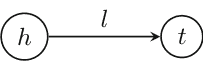

图1. 图形化描述了实体之间的关系 $l$ 和 $t$，用三元组 $(h, l, t)$ 表示。

在接下来的部分中，我们将假设可信的（也称为正面/黄金）训练三元组来自集合 $\mathcal{S}$，而不可信的（负面）三元组来自集合 $\mathcal{S}' \equiv (\mathcal{E} \times \mathcal{R} \times \mathcal{E}) \setminus \mathcal{S}$。

关于建模知识库的问题有大量的研究。SE（结构化嵌入） [14] 是最早将知识库中的实体建模为向量的方法之一。具体而言，该方法假设实体可以在一个 $k$ 维嵌入空间中建模，即 $h \to \mathbf{h} \in \mathbb{R}^k$ 和 $t \to \mathbf{t} \in \mathbb{R}^k$，并且在这样的空间中，关系类型 $l$ 定义了一种特定的相似度度量。SE 为每个关系类型 $l$ 关联了一对在空间 $\mathbb{R}^{k \times k}$ 中定义的矩阵 $(\mathbf{R}^h_l, \mathbf{R}^t_l)$。给定一个关系类型 $l$，评分函数定义为 $f_l(h, t) = \|\mathbf{R}^h_l \mathbf{h} - \mathbf{R}^t_l \mathbf{t}\|_p$，其中 $p$ 为固定的 p 范数。这个想法是，一个可信的关系 $(h, l, t)$ 应该具有较低的 $f_l(h, t)$ 值（接近 0），而不可信的关系应该具有较高的值。

最近，提出了一系列基于翻译的方法。在多关系数据的背景下，Trans-E [5] 是第一个提出的基于翻译的方法。Trans-E（以及相关方法）的灵感来自于 [4]，其观点是关系对应于嵌入空间中的线性翻译。与 SE 类似，Trans-E 利用一个 $k$ 维嵌入空间，但与 SE 不同的是，它还以一种方式对关系进行建模，使得当存在 $(h, l, t)$ 时， $\mathbf{h} + \mathbf{l} \approx \mathbf{t}$，否则 $\mathbf{t}$ 应该远离 $\mathbf{h} + \mathbf{l}$。

设 $d$ 为嵌入空间中向量之间的差异函数（通常是 $L_1$ 或 $L_2$ 范数），则评分函数定义为 $f_l(h, t) = d(\mathbf{h} + \mathbf{l}, \mathbf{t})$。为了学习这些嵌入，Trans-E 最小化了基于边界的排名准则：

$$\mathcal{L} = \sum_{(h,l,t) \in \mathcal{S}} \sum_{(h',l,t') \in \mathcal{S}'_{(h,l,t)}} [f_l(h, t) - f_l(h', t') + \gamma]_+,$$

其中 $[x]_+$ 表示 $x$ 的正部分， $\gamma$ 是一个边界超参数。 $\mathcal{S}'_{(h,l,t)}$ 是由训练三元组组成的损坏三元组集合，其中头部或尾部被随机实体替换（但不同时替换）。优化问题在约束条件下求解，即嵌入（实体和关系）的 $L_2$ 范数为单位。

尽管Trans-E在建模一对一关系方面具有高效性和有效性，但在建模反身/一对多/多对一/多对多关系方面存在问题。为了克服这些限制，提出了Trans-H [6]，使得实体在参与不同关系时具有所谓的分布式表示。Trans-H不直接考虑实体的嵌入空间中的线性变换，而是考虑与关系相关的超平面确定的关系特定空间。

给定一个黄金三元组 $(h, l, t)$ ，嵌入 $\mathbf{h}$ 和 $\mathbf{t}$ 首先投影到关系特定的超平面 $\mathbf{w}_l$ ，即， $\mathbf{h}_{\perp}=\mathbf{h}-\mathbf{w}_l^T \mathbf{h} \mathbf{w}_l$ ， $\mathbf{t}_{\perp}=\mathbf{t}-\mathbf{w}_l^T \mathbf{t} \mathbf{w}_l$ ，满足约束条件 $\|\mathbf{w}_l\|_2=1$ 。然后，得分函数定义为 $f_l(\mathbf{h}, \mathbf{t})=\|\mathbf{h}_{\perp}+\mathbf{l}-\mathbf{t}_{\perp}\|^2$ 。为了学习参数，Trans-H最小化与Trans-E相同的基于边际的排名损失 $\mathcal{L}$ 。图2提供了Trans-E和Trans-H之间差异的简单2D示例。

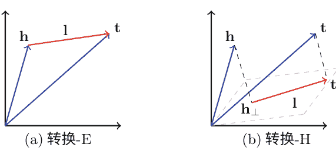

图2. 简单的二维图示，显示了(a) Trans-E 和 (b) Trans-H 之间的差异。

此后，为了解决 Trans-E 的局限性，提出了其他基于翻译的方法，例如 Trans-M [7]、Trans-R [8] 和 S-Trans-E [9]。尽管有与翻译相关的方法，但建模知识库的任务也在神经嵌入文献中广泛存在。值得一提的方法有 SME [11]、NTN [12]、DISTMULT [15] 和 HolE [16]。

在这项初步工作中，我们将我们的方法与 Trans-E 和 Trans-H 进行了比较。未来，我们的目标是至少扩展到上述所有方法。

### 3 偏好学习简介

偏好学习是一种基于偏好概念的排名问题建模的通用框架。形式上，偏好可以被定义为一个二分图 $g = (\mathcal{N}, \mathcal{A})$，其中 $\mathcal{N}$ 是节点集合，$\mathcal{A} \subseteq \mathcal{N} \times \mathcal{N}$ 是弧集合。

在关系学习环境中，一个节点 $n = (h, l, t) \in \mathcal{N} \subseteq (\mathcal{E} \times \mathcal{R} \times \mathcal{E})$ 表示一个连接头实体 $h$ 和尾实体 $t$ 的标签 $l$ 的三元组。一个节点 $n = (h, l, t)$ 被称为正节点，如果三元组 $n$ 存在于知识库中，即 $n \in \mathcal{S}$，否则 $n \in \mathcal{S}'$ 是一个负节点。一条弧 $a = (n_s, n_e) \in \mathcal{A}$ 连接一个起始（正）节点 $n_s$ 与其结束（负）节点 $n_e$。弧的方向表示起始节点必须优先于结束节点。

在这项工作中，偏好被用来建模一个排名假设 $f_\Theta$，该假设将三元组与属于集合 $S$ 的概率得分相关联。一条弧 $a= (n_s, n_e)$ 的边际是应用排名函数 $f_\Theta$ 到起始节点和结束节点之间的差异，即

$$\rho_A(a, \Theta) = f_\Theta(n_s) - f_\Theta(n_e).$$

我们说一条弧 $a= (n_s, n_e)$ 与假设 $f_\Theta$ 一致，如果分配给节点 $n_s$ 的分数大于分配给节点 $n_e$ 的分数，即 $f_\Theta(n_s) > f_\Theta(n_e)$，因此边界 $\rho_A(a, \Theta) > 0$。偏好图 $g= (\mathcal{N}, \mathcal{A})$ 的边界被定义为其弧的最小边界，即

$$\rho_G(g, \Theta) = \min_{a \in \mathcal{A}} \rho_A(a, \Theta).$$

假设 $f_\Theta$ 满足偏好图，如果它的所有弧都是一致的，因此偏好图具有正边界 $\rho_G(g, \Theta) > 0$。

可以使用几种偏好图的架构。图3显示了三个偏好图的示例，其中：（左）只有一个完全连接的二分图将两个正节点连接到三个负节点；（中）将前一个图分成两个更简单的图，每个图都有一个正节点；（右）每对正节点和负节点都有一个图。这个工作考虑了偏好的最后一个例子。我们采用符号 $(h, l, t) \rightarrow (h', l, t')$ 来表示一个偏好图，其中三元组 $(h, l, t)$ 优先于三元组 $(h', l, t')$。

请注意，对于每个图结构，总弧数相同，满足的弧数也相同，但满足的偏好数不同。

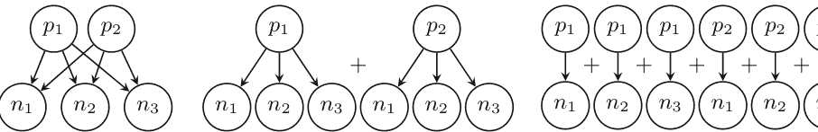

图3. 偏好图的例子。$p_i$ 和 $n_j$ 是正节点和负节点。

基于偏好的算法的最后一个要素是损失函数 $\mathcal{L}$，它惩罚不一致的偏好。算法试图找到假设空间 $\mathcal{F}$ 中最小化 $\mathcal{L}$ 的假设 $\hat{f}$：

$$\hat{f} = \arg \min_{f_\Theta \in \mathcal{F}} \sum_{g \in \mathcal{V}} \mathcal{L}(\rho_G(g, \Theta)),$$

其中 $\mathcal{V}$ 是偏好图的集合。通常，损失函数基于偏好的边际。在这项工作中，损失被定义为不满足的图的数量，即 $\mathcal{L}(\rho) = [[\rho \le 0]]$，其中 $[[\cdot]]$ 是指示函数。

## 4 REC偏好学习机

关系嵌入编码偏好学习机 (REC-PLM) 是一种基于偏好的算法。它学习一个排名函数 $f_{\Theta}$，为输入三元组 $(h, l, t)$ 分配一个分数，即 $f_{\Theta} : \mathcal{N} \to \mathbb{R}$。

该算法依赖于两个内部函数：嵌入 $W : \mathcal{E} \to \mathbb{R}^s$ 和编码 $M : \mathcal{E} \to \mathbb{R}^s$。前者旨在学习输入三元组中头实体的一个 $s$ 维嵌入，而后者在同一向量空间中为三元组的尾部学习一个不同的嵌入。这意味着实体 $e \in \mathcal{E}$ 根据其在三元组中的角色而有两个不同的嵌入。实际上，角色可以强调实体的不同方面 [9]。

在 REC-PLM 设置中，评分函数根据它们关联的嵌入和编码的相似性，即 $W(h)$ 和 $M(t)$，对实体 $h$ 和 $t$ 之间的关系进行排名。我们将点积作为相似性得分，即

$$f_{\Theta}(h, l, t) = \langle W(h), M(t) \rangle$$

嵌入和编码函数对其输入进行线性变换，即 $W(h) = \mathbf{h}^{\intercal} \mathbf{W}$，以及 $M(t) = \mathbf{t}^{\intercal} \mathbf{M}$，其中 $\mathbf{h}$ 和 $\mathbf{t}$ 是实体 $h$ 和 $t$ 的输入表示。$\mathbf{W}$ 和 $\mathbf{M}$ 是 $|\mathcal{E}| \times s$ 权重矩阵。输入表示由实体的独热向量组成，因此，矩阵 $\mathbf{W}$ 和 $\mathbf{M}$ 可以看作是查找表。

该算法通过交替优化过程学习两个矩阵 $\mathbf{M}$ 和 $\mathbf{W}$。在每个优化步骤中，算法固定矩阵 $\mathbf{M}$ 并优化 $\mathbf{W}$，然后固定 $\mathbf{W}$ 并优化 $\mathbf{M}$。重复此过程直到收敛。

当算法优化 $\mathbf{W}$ 时，一个偏好图 $(h, l, t) \to (h', l, t')$ 被编码为 $(\mathbf{t}^{\intercal} \mathbf{M} \otimes \mathbf{h}) - (\mathbf{t}'^{\intercal} \mathbf{M} \otimes \mathbf{h}')$，其中 $\otimes$ 是两个向量的克罗内克积。使用随机选择的一批偏好来优化 $\mathbf{W}$，采用投票感知器算法 [17]。要优化编码矩阵 $\mathbf{M}$，我们使用不同的偏好表示，即 $(\mathbf{t} \otimes \mathbf{h}^{\intercal} \mathbf{W}) - (\mathbf{t}' \otimes \mathbf{h}'^{\intercal} \mathbf{W})$。与前一情况类似，从训练知识库构建一批偏好，并通过投票感知器优化 $\mathbf{M}$。每个训练周期后，矩阵 $\mathbf{M}$ 和 $\mathbf{W}$ 进行归一化。

我们将感知器更新的次数视为训练损失。在我们的实验中，批量大小设置为 1000。算法 1 包含了所提出方法的伪代码。

### 4.1 REC-PLM作为神经架构

REC-PLM 本质上代表了具有单隐藏层和线性激活函数的多层感知器 (MLP) 的相同架构。

让我们考虑一个全连接的 MLP，具有 $|\mathcal{E}|$ 维输入层，通过密集的 $|\mathcal{E}| \times s$ 线性连接将输入映射到隐藏层的 $s$ 维层。然后，隐藏层通过使用密集的 $s \times |\mathcal{E}|$ 线性连接将信息映射到一个 $|\mathcal{E}|$ 维输出层。

**算法 1: REC偏好学习机**
- **输入:** 
  - KB: 来自知识库的三元组集合
  - s: 代码的维度
  - n个epochs: 训练的轮数
- **输出:** 
  - W: 嵌入矩阵
  - M: 编码矩阵
1. $W^{(0)} \leftarrow$ 随机 $|\mathcal{E}| \times s$ 矩阵
2. $M^{(0)} \leftarrow$ 随机 $|\mathcal{E}| \times s$ 矩阵
3. 对于 $t \in 1..n$ 个周期执行:
4. | $P_{集合} \leftarrow$ 一批偏好
5. | $W^{(i)} \leftarrow \text{Voted Perceptron}(P_{集合}, M^{(i-1)})$
6. | $P_{集合} \leftarrow$ 一批偏好
7. | $M^{(i)} \leftarrow \text{Voted Perceptron}(P_{集合}, W^{(i)})$
8. 结束
9. 返回 $W^{(t)}, M^{(t)}$

层之间的两个映射对应于在 REC-PLM 设置中学到的嵌入 $W$ 和编码 $M$。

尽管 REC-PLM 可以映射到 MLP，反之亦然，但学习机制是非常不同的。MLP 使用反向传播过程，而 REC-PLM 尝试优化每个输入偏好。MLP 将三元组的独热编码作为输入实例，将输出作为独热编码。就像 REC-PLM 一样，这个神经网络能够学习单一关系。

### 5 实验评估

在这项工作中，使用了 WordNet18 [3] 数据库来评估所提出的方法。WordNet 是一个英语词汇数据库，包含名词、动词、形容词和副词。该数据库由一个网络组成，将术语和概念与适当的关系（如同义词、下位关系等）分组。知识库包括 40943 个实体、18 个关系和 151442 个三元组。

知识库已被分为训练集 ($S_{TR}$) 和测试集 ($S_{TE}$)，分别包含可用三元组的 70% 和 30%。验证集是从训练集中随机提取的 5000 个三元组构建的。测试集从集合 $S'$ 中增加了 $|S_{TE}|$ 个不合理的三元组，通过交换尾部实体。

REC-PLM 已经在 WN18 数据库的 8 个关系上与 Trans-E 和 Trans-H 进行了比较。这些关系在表 1 中描述。

我们决定一次比较一个关系，有两个主要原因。首先，关系彼此非常不同，我们想观察算法在这些不同情况下的行为。第二个原因更实际，这取决于 REC-PLM 为每个关系学习单一模型的事实。然而，Trans-E 和 Trans-H 能够利用多关系信息，不适用于单一关系任务。因此，为了从经验上分析多关系嵌入的优势，对 Trans-E 和 Trans-H 进行了两种不同的模型训练。第一种考虑所有的训练三元组和关系，第二种只使用了 8 个选定的关系。

表 1。关系描述，包括三元组数量和每个关系涵盖的实体数量。

| 关系 | 三元组数量 | 实体数量 | 类型 |
| :--- | :--- | :--- | :--- |
| 部分_ (part_of) | 5148 | 5445 | n-1 |
| 有部分 (has_part) | 5142 | 5444 | 1-n |
| 类似于_ (similar_to) | 86 | 82 | 1-1 |
| 成员的部分 (member_of_part) | 7928 | 8173 | 1-n |
| 领域主题的成员_ (member_of_domain_topic) | 3341 | 3453 | 1-n |
| 派生关系_ (derivationally_related_form) | 31867 | 16737 | n-n |
| 还可以看到 (also_see) | 1396 | 1061 | n-n |
| 动词组 (verb_group) | 1220 | 1038 | 1-1 |

为了更好地理解 REC-PLM 的收敛性，我们分析了其在增加训练轮数时的行为。图 4 显示了在两个关系上的训练损失和测试集上的 AUC 分数，即“部分”和“领域主题的成员”。一方面，随着训练轮数的增加，训练损失减少。另一方面，测试集上计算的 AUC 分数不太稳定，因此需要基于验证损失的检查点程序。为此，我们计划在将来添加检查点程序。

我们将所提出的方法与三个基准方法进行了比较，它们分别是 Trans-E、Trans-H 和第 4.1 节中描述的神经网络。比较结果见表 2。用于评估的指标是 AUC 分数。结果清楚地表明，当使用完整的可用关系集时，Trans-E 和 Trans-H 的效果更好。这意味着在这些任务中，来自多个关系的信息很重要。一方面，Trans-H 算法平均而言取得了更好的结果。另一方面，REC-PLM 通过使用更少的信息在几个关系上达到了可比较的结果。MLP 平均而言取得了最低的结果。我们认为 MLP 的性能不佳可能取决于输入表示的稀疏性以及网络参数与训练样本数量的比例。

**图 4. 所提算法的经验收敛性**

**表 2. 基线和 REC-PLM 在尾部预测任务上的 AUC 得分**

| 关系 | TRANS-E 完整的 | TRANS-H 完整的 | TRANS-E 子集 | TRANS-H 子集 | MLP 线性 | MLP 非线性 | PLM |
| :--- | :--- | :--- | :--- | :--- | :--- | :--- | :--- |
| 部分_ | 85.29 | 92.41 | 77.44 | 91.66 | 54.96 | 79.66 | **93.71** |
| 有部分 | 76.05 | 89.19 | 68.08 | 86.31 | 44.41 | 63.91 | **90.00** |
| 类似于_ | 73.10 | 81.16 | 67.60 | **86.42** | 65.93 | 65.93 | 77.78 |
| 成员的部分 | 75.29 | **91.88** | 65.54 | 51.81 | 52.52 | 90.76 | 88.10 |
| 领域t的成员_ | 76.99 | **87.67** | 53.17 | 52.15 | 49.54 | 56.31 | 86.84 |
| 派生相关的_ | **96.59** | 95.30 | 96.03 | 94.41 | 61.13 | 59.93 | 76.61 |
| 还可以看到 | 64.45 | 87.80 | 56.83 | 86.63 | 52.33 | 79.66 | **93.72** |
| 动词组 | 72.88 | **98.32** | 68.99 | 95.09 | 52.95 | 58.14 | 86.62 |

### 6 结论和未来工作

在本文中，我们提出了 REC-PLM，这是一种基于偏好学习框架的简单算法，用于解决关系学习任务。与基于距离的传统方法不同，REC-PLM 将关系定义为向量空间中两个实体之间的相似性。所提出的方法与三个基准进行了比较，在 WordNet 数据库上展示了有希望的结果。

然而，在不久的将来，我们将专注于算法的一些弱点，如扩展到多关系。

### 参考文献

1. Bollacker, K., Evans, C., Paritosh, P., Sturge, T., Taylor, J.: Freebase: a collaboratively created graph database for structuring human knowledge. In: Proceedings of the 2008 ACM SIGMOD International Conference on Management of Data, SIGMOD 2008, pp. 1247–1250 (2008)
2. Lehmann, J., Isele, R., Jakob, M., Jentzsch, A., Kontokostas, D., Mendes, P.N., Hellmann, S., Morsey, M., van Kleef, P., Auer, S., Bizer, C.: DBpedia - a large-scale, multilingual knowledge base extracted from Wikipedia. Semant. Web J. 6(2), 167–195 (2015)
3. Miller, G.A.: WordNet: a lexical database for English. Commun. ACM 38(11), 39–41 (1995)
4. Mikolov, T., Sutskever, I., Chen, K., Corrado, G., Dean, J.: Distributed representations of words and phrases and their compositionality. In: Proceedings of the 26th International Conference on Neural Information Processing Systems - Volume 2, NIPS 2013, pp. 3111–3119 (2013)
5. Bordes, A., Usunier, N., Garcia-Durán, A., Weston, J., Yakhnenko, O.: 用于建模多关系数据的翻译嵌入。在：第26届国际神经信息处理系统会议论文集-第2卷, NIPS 2013, 第2787-2795页 (2013年)
6. Wang, Z., Zhang, J., Feng, J., Chen, Z.: 通过在超平面上进行翻译的知识图嵌入。在：第二十八届AAAI人工智能大会论文集，AAAI 2014, 第1112-1119页 (2014年)
7. Fan, M., Zhou, Q., Chang, E., Zheng, T.F.: 具有关系映射属性的基于转换的知识图嵌入。在：PACLIC (2014)
8. Lin, Y., Liu, Z., Sun, M., Liu, Y., Zhu, X.: 用于知识图完成的实体和关系嵌入学习。在：第二十九届AAAI人工智能大会论文集, AAAI 2015, 第2181-2187页 (2015年)
9. Nguyen, D.Q., Sirts, K., Qu, L., Johnson, M.: STransE: 知识库中实体和关系的新型嵌入模型。在: HLT-NAACL (2016)
10. Nickel, M., Tresp, V., Kriegel, H.-P.: 用于多关系数据的集体学习的三路模型。在：第28届国际机器学习大会论文集, ICML 2011, 第809-816页 (2011年)
11. Bordes, A., Glorot, X., Weston, J., Bengio, Y.: 用于学习多关系数据的语义匹配能量函数。机器学习。94(2), 233-259页 (2014年)
12. Socher, R., Chen, D., Manning, C.D., Ng, A.Y.: 用于知识库完成的神经张量网络推理。在：第26届国际神经信息处理系统会议论文集-第1卷, NIPS 2013, 第926-934页 (2013年)
13. Lauriola, I., Polato, M., Lavelli, A., Rinaldi, F., Aiolli, F.: 学习大规模多标签问题的偏好。在：人工神经网络国际会议上，第546-555页。Springer（2018年）
14. Bordes, A., Weston, J., Collobert, R., Bengio, Y.: 学习知识库的结构化嵌入。在：第二十五届AAAI人工智能会议记录, AAAI 2011, 第301-306页 (2011年)
15. Yang, B., Yih, W., He, X., Gao, J., Deng, L.: 嵌入实体和关系，用于知识库的学习和推理。在: 国际学习表示会议记录 (2015年)
16. Nickel, M., Rosasco, L., Poggio, T.: 知识图的全息嵌入。在: 第三十届AAAI人工智能大会论文集，AAAI 2016年，第1955-1961页 (2016年)
17. Freund, Y., Schapire, R.E.: 使用感知器算法进行大边界分类。机器学习。37 (3), 277-296 (1999年)

---

## 用于Twitter文本毒性分析的卷积神经网络

Spiros V. Georgakopoulos, Sotiris K. Tasoulis, Aristidis G. Vrahatis, 和 Vassilis P. Plagianakos (✉)
希腊拉米亚大学计算机科学与生物医学信息学系
{spirosgeorg, stasoulis, arisvrahatis, vpp}@uth.gr

**摘要。** 有关有害信息检测的研究已经涉及到通信平台上的多个任务，有害评论分类是一个新兴的研究领域。尽管情感分析是观察群体行为的一种准确方法，但它无法发现文本中的其他类型信息，例如毒性，而毒性通常可以揭示隐藏的信息。为此，提出了一个使用与研究的主题相关的推文进行评论毒性的时间跟踪模型。具体而言，使用卷积神经网络模型训练了一个用于预测有害评论的分类器。然后，给定一个主题，所有相关的推文都被解析并用作分类器的输入，因此，有关有害文本的知识被转移到了一个新的数据集中进行分类。同时，采用了一种适应性变化检测方法来监测主题推文中毒性趋势随时间的变化。我们的实验结果表明，在 Twitter 对话中进行有害评论分类可以揭示重要的知识，并且可以准确地识别出毒性随时间的变化。

**关键词：** 卷积神经网络 · 有毒评论 · Twitter对话 · 变化检测

### 1 引言

Twitter 情感分析已经涵盖了与产品意见 [1]、股市走势 [22, 24] 和政治对众筹 [11, 18, 25] 的影响相关的众多需求。Twitter 已经展示了其对政治的影响 [4, 30]，尤其是对选举机构的影响，使其成为政治家受欢迎程度的重要工具。作为一个序列，Twitter 在过去十年中已经成为政治家们的常用沟通平台 [6]。因此，对于更准确的文本挖掘和机器学习方法来进行 Twitter 分析，产生了迫切的需求。

文本挖掘和机器学习方法在文本分析中的核心是通过提供这些信息的单词（或单词组合）来检测消息内容。该领域的趋势是情感分析文本以分析信息并识别选民和群体极性。为了实现这一目标，使用基于机器学习或词汇方法的情感分析工具。这些工具估计文本的情感内容 [29]。估计与词数有关（二进制-积极/消极，三进制-积极/中性/消极等）的方法使用具有极性影响的词汇表。

尽管文献中已经涌现出这样的工具，但对于以不同视角进行在线对话分析的兴趣越来越浓厚，这可能对个体任务更合适。在这项工作中，我们专注于基于 Kaggle 竞赛中提供的最新数据集揭示 Twitter 评论的毒性。有毒的信息不仅仅是常规的恶言恶语，还包括侵略性信息 [33] 或发生个人攻击的信息（如威胁和侮辱信息） [32, 34]。当这些行为在时间上连续出现而不是作为一段时间内的大纲信息时（假设常规选民不会出现这种行为），可能是恶意的（机器人，垃圾邮件等）。恶意信息可能是政治对手的一部分，并且必须从文本的时间序列分析中删除，以提取准确的选民行为结果。

一个指示性的相关示例是由 Google 和 Jigsaw 创建的项目，称为 Perspective，它使用机器学习来自动检测有害语言 [13]。最近，使用卷积神经网络 [9]、循环神经网络 [19] 和深度学习方法 [26] 提出了有毒评论分类工具，但迄今为止还没有应用于 Twitter 数据。考虑到 Twitter 分析对社会有重大影响，有毒评论分类是在在线对话中的新兴领域，识别 Twitter 主题中的毒性趋势似乎非常有趣。然而，这个任务面临两个需要解决的挑战。由于文档长度较短，对 Twitter 帖子进行表征可能是一项困难的任务，而连续的数据流则需要使用在线方法进行变化检测。在这项工作中，我们提出了一种完整的方法论，可以应对这两个挑战的问题。

### 2 方法论

所提出的方法基于构建一个专门用于有毒评论分类的分类器，采用了最近非常广泛使用的有标签的有毒评论数据集进行训练。该分类器通过使用 word2vec 方法 [20] 将物理文本映射到低维表示的卷积神经网络 (CNN) 模型来设计。利用分类器获得的知识，对来自特定主题的一部分 Twitter 帖子进行分类。在线解析推文，并应用实时方法来检测趋势变化。

---
¹ https://www.kaggle.com/c/jigsaw-toxic-comment-classification-challenge.

我们的方法包括三个主要步骤，(i) 设计和实现用于有毒评论分类的CNN模型，(ii) 在线解析和对于预定义标签相关的推文进行特征化，以及(iii) 使用改进的累积和(CUSUM)算法进行实时毒性趋势变化检测分析。方法的流程图如图1所示。

## 2.1 用于有毒评论分类的CNN模型

CNN模型适用于图像分类，其中图像的像素由特定范围内的整数值表示。另一方面，句子的组成部分(单词)在被馈送到CNN之前必须进行编码。为了克服这个限制，应用了一个词汇表作为索引，其中包含出现在文档文本集中的单词，将每个单词映射到[0,1]中的一个整数。然而，我们还必须处理文档长度的变化(文档中的单词数)，因为CNN需要一个恒定的输入维度。为了解决这个问题，我们采用了填充技术，用零填充文档矩阵，使其达到所有文档中的最大长度。

在下一步中，编码的文档被转换为矩阵，每一行对应一个单词。生成的矩阵通过嵌入层，其中每个单词（行）通过密集向量[7]转换为低维表示。该过程遵循标准的CNN方法。在这项工作中，我们使用了固定的密集向量作为单词的word2vec [20]。word2vec嵌入方法已经在Google新闻的1000亿个单词上进行了训练，产生了一个包含300万个单词的词汇表。

嵌入层将输入的单词与已选择的预训练嵌入方法的固定密集向量进行匹配。这些向量的值在训练过程中不会改变，除非存在词汇表中尚未包含的单词，在这种情况下它们将被随机初始化。

手头的CNN模型基于Kaggle竞赛从维基百科检索到的一些文档。提供的类别标签最初是针对不同级别或类型的毒性定义的，对于本研究，我们考虑二元分类问题（文档样本被标记为有毒或无毒）。

#### 2.2 推文流和基于毒性的分类

在上述训练过程之后，有毒评论分类器能够将任何一组推文分类为有毒或非有毒。在我们的方法中，给定一个用户定义的标签，所有相关的推文都会实时通过Kalucki [14]提出的Twitter流应用程序接口（API）进行流式传输。

流式文档会连续清理，去除噪声，例如标签、空格、数字、标点符号、URL等。在通过训练过的分类器之前，按照[28]中描述的过程进行处理，从中获得毒性概率值。这是输出层神经元返回的值，对应于训练过的有毒评论指示神经元。随后，通过在输出层上执行softmax函数生成概率分数的时间序列，其范围由softmax函数限定。

#### 2.3 毒性变化检测

为了识别毒性水平上的显著变化，我们利用了一个在线版本的累积和（CUSUM）算法，重点关注与自适应阈值相连的技术 [2,8,27]。为了描述变化检测算法，我们考虑了一系列独立的随机变量 $y_k$，其中 $y_k$ 是当前时间点 $k$（离散时间）的信号，其概率密度 $p_\theta(y)$ 仅依赖于一个标量参数 $\theta$。

在未知的变化时间 $t$ 之前，参数 $\theta$ 等于 $\theta_0$，在变化之后，它等于 $\theta_1 \neq \theta_0$。因此，问题是检测和估计这个参数变化。在这项工作中，我们的目标是在已知参数 $\theta_0$ 和 $\theta_1$ 的情况下检测变化，这对许多实际应用来说是相当不现实的假设。通常参数 $\theta_0$ 和 $\theta_1$ 可以通过实验估计，但我们在这个应用中不考虑可用的测试数据。

然而，对于类似的强边界问题（信号值对应于概率），参数值可以经验性地假设。例如，我们可以考虑 $\theta_0$ 监测开始时的毒性水平，可以通过前几个样本的平均值得到。为此，我们对当前状态（即有毒、无毒或中性）不感兴趣，只关注负面或正面毒性变化的发现。因此，我们只需要定义变化的大小，我们将其任意设置为0.3，考虑到信号值介于0和1之间。

由于需要检测每个方向的变化，即发现推特帖子的毒性增加和减少，分别使用两个单侧算法，其中 $\theta_1^{pos} = \theta_0 + 0.3$ 和 $\theta_1^{neg} = \theta_0 - 0.3$。当任何双侧函数在时间 $t$ 触发变化时，CUSUM算法将被重置为零，并进行重新初始化。算法以最后几次观察的平均值 ($[t - n \rightarrow t]$) 作为新的 $\theta_0$ 重新启动，并根据固定的变化大小重新计算 $\theta_1$。

为了检测变化，随着样本（推文）在每个时间点到达，计算决策规则并与自适应阈值进行比较。这是检测阈值 $h$，一个基于平均运行长度函数的用户定义的调整参数，该函数定义为在采取行动之前预期的样本数量[21]。更准确地说，必须设置虚警之间的平均时间 $ARL_0$ 和平均检测延迟 $ARL_1$。这两个ARL函数的特定值取决于检测阈值 $h$，并且可以用于为每个特定应用程序设置CUSUM算法的性能水平[10]。

从这个角度来看，我们在动态估计下检测行为变化。这是至关重要的，因为一个标签的有害性可能会在其生命周期内多次发生变化，而变化应该基于其当前状态而不是初始状态进行估计。为了实现这个目标，我们的方法框架可以通过更新其初始状态来在线检测一个标签的变化。

### 3 数据检索和清洗

所描述的方法论框架应用于从2018年3月15日至2018年3月24日收集的Twitter数据流，使用的标签是“theresamay”。显然，这个术语指的是特蕾莎·玛丽·梅，自2016年以来担任英国首相和保守党领袖。我们的选择在于政治相关的Twitter标签为测试毒性变化提供了满意的机会。此外，选择这个标签是考虑到在此期间，“脱欧”新闻话题引起了关注，因为高级政治家之间关于英国和欧盟关系的进一步讨论。

推文是通过Twitter流API收集的，该API是免费使用的，只需要一个有效的Twitter账户进行身份验证。在R项目中，我们使用“rtweet”包[15]连接到API并流式传输通过关键词过滤的推文，例如Twitter标签（在我们的案例中是“theresamay”）。数据以JSON格式检索，并使用“rtweet”包进行解析。然后，需要进行数据清洗，删除标签、空格、数字、标点符号、URL等。为了实现这一点，我们分别使用了“stringr”和“glue”包中的函数[12,31]。

在丢弃非英语语言帖子后，总共流式传输了15491条推文。其中有11872条转发（76%），它们没有特别处理，因为它们仍然表达了一种观点。然后，生成一个文本语料库，我们可以根据词频-逆文档频率（TF-IDF）方法研究最常见的单词，其中单词的频率通过它们出现的频率进行重新缩放，惩罚最常见的单词。按降序排列的结果单词是：英国、看、俄罗斯、威胁、强大、力量。

### 4 实验结果

所提出方法的第一部分是使用Kaggle竞赛的有毒评论数据集对CNN模型进行训练。所使用的架构同时包括三个不同的卷积层，滤波器尺寸为128，稠密向量维度为300。滤波器的宽度等于向量维度，而它们的高度分别为3、4和5，对应于每个卷积层。在每个卷积层之后，应用最大时间池化操作。池化层的输出被连接到一个全连接层，最后一层应用softmax函数。使用随机梯度下降算法[3]对模型进行了100个epoch的训练，每个mini-batch包含64个输入，学习率为0.005。当应用于相同来源的未标记数据时，该模型的分类准确率达到91.2%[9]。

为了对毒性趋势变化进行可视化检查，我们使用了由CNN分类器检索到的毒性预测概率分数的对应移动平均值。图2（左）展示了窗口总大小为200的计算移动平均值。随后，我们根据推文的毒性水平进行直方图分析（见图2（右））。

接下来，我们将变化检测算法应用于检索到的概率分数时间序列，并报告结果。对于参数值的初始化，我们设置 $\theta_0=0.5$，变化幅度设置为0.3；因此，我们将分别考虑双侧CUSUM的 $\theta_{1inc}=0.8$ 和 $\theta_{1dec}=0.2$。在图3（左）中，我们展示了CUSUM函数和算法检测到的变化点。请注意，每次检测到变化时，算法都会使用更新后的初始化重新开始。选择 $h$ 参数的值通常是有争议的，并且取决于用户的需求。在我们的分析中，对于这个特定的研究主题，我们假设每天报告的变化数量较少即可，因此我们定义 $h=10^0$。

为了对报告的变化点进行可视化检查，我们使用了图2（左）中展示的计算移动平均值。图中描绘了垂直直线（见图3（右）），颜色与图3（左）相对应。此时，我们可以得出结论，报告的变化点与可能的变化的简单视觉检查一致。为了进一步验证这个结果，我们采用了一个成熟的离线变化检测方法，该方法能够自动发现多个变化点[6, 7]并估计它们在时间序列中的数量。该算法的惩罚参数设置为 $1/2 \cdot \log(n)$，其中 $n$ 是样本的总数。检测到的变化点也在图3（右）中用绿色垂直直线报告。我们观察到这个结果准确地匹配了由自适应CUSUM方案检索到的变化点，考虑到报告的变化主要涉及在线算法强制的延迟。

在我们实验分析的最后一部分中，我们根据分类器的特征研究了推文的内容。为此，我们报告了绘制在对应的推特帖子集合中出现的单词频率的词云图。同样，文本正在使用词频-逆文档频率（TF-IDF）进行预处理（见图4）。看起来存在着明显的词云之间的区别。我们观察到像“懦夫”和“可悲”这样的词出现在有毒类中，验证了最初的假设。此时，我们还可以调查已被强烈分类的两个不同类别的示例推文（见图5）。图中右侧的推文被强烈地标记为有毒，并且显然是一个使用了粗言秽语的讽刺评论，这些词并不是最常见的词之一。

### 5 结论

有毒评论分类是一个新兴的研究领域，虽然在这个角度下有几种方法，但仍处于初级阶段。推特的广泛数据可用性为社交对话的机器学习研究提供了巨大潜力。在这项工作中，我们通过时间序列分析研究了评论的毒性，以实时发现重要变化。我们可以认为这个过程通过扩大对社区反应的理解来增加社交媒体数据的价值，在某些情况下支持即时决策。实验分析提供了证据，毒性识别可能揭示出其他基于情感的方法所隐藏的重要知识。

**致谢。** 我们衷心感谢NVIDIA Corporation对本研究所使用的Titan X Pascal GPU的捐赠支持。该项目得到了希腊研究和创新基金会（HFRI）和研究与技术总秘书处（GSRT）的资助，合同编号为1901。

### 参考文献

- 1. Anastasia, S., Budi, I.: 对在线交通服务提供商的Twitter情感分析。在：2016年国际高级计算机科学和信息系统会议 (ICACSIS) ，第359-365页，2016年10月
- 2. Basseville, M., Nikiforov, I.V.: 突变检测：理论和应用 (1993)
- 3. Bottou, L.: 在线学习和随机逼近。在：神经网络的在线学习，第9-42页。剑桥大学出版社，纽约 (1998年)
- 4. Burgess, J., Bruns, A.: (Not) the Twitter election: the dynamics of the #ausvotes conversation in relation to the Australian media ecology. Journal. Pract. 6(3), 384–402 (2012)
- 5. Collobert, R., Weston, J., Bottou, L., Karlen, M., Kavukcuoglu, K., Kuksa, P.: Natural language processing (almost) from scratch. J. Mach. Learn. Res. 12, 2493–2537 (2011)
- 6. Enli, G.S., Skogerbø, E.: Personalized campaigns in party-centred politics: Twitter and Facebook as arenas for political communication. Inf. Commun. Soc. 16(5), 757–774 (2013)
- 7. Gal, Y., Ghahramani, Z.: A theoretically grounded application of dropout in recurrent neural networks. In: Advances in Neural Information Processing Systems 29: Annual Conference on Neural Information Processing Systems 2016, Barcelona, Spain, 5–10 December 2016, pp. 1019–1027 (2016)
- 8. Georgakopoulos, S.V., Tasoulis, S.K., Plagianakos, V.P.: 高维数据流的高效变化检测。在：2015年IEEE国际大数据会议 (Big Data) ，第2219-2222页，2015年10月
- 9. Georgakopoulos, S.V., Tasoulis, S.K., Vrahatis, A.G., Plagianakos, V.P.: 用于有毒评论分类的卷积神经网络。CoRR abs/1802.09957 (2018年)。
- 10. Granjon, P.: CUSUM算法简要回顾 (2014年)
- 11. Haselmayer, M., Jenny, M.: 政治沟通的情感分析：将词典方法与众包编码相结合。Qual. Quant. 51 (6) , 2623-2646 (2017年)
- 12. Hester, J.: 粘合：解释字符串文字 (2017年)。r软件包版本1.2.0
- 13. Hosseini, H., Kannan, S., Zhang, B., Poovendran, R.: 欺骗谷歌的透视API，用于检测有害评论。arXiv预印本arXiv:1702.08138 (2017年)
- 14. Kalucki, J.: Twitter流API (2010年) 。
- 15. Kearney, M.W.: rtweet: 收集Twitter数据 (2017年) 。R软件包版本0.6.0
- 16. Killick, R., Fearnhead, P., Eckley, I.: 具有线性计算成本的最佳变点检测 107, 1590-1598 (2012年)
- 17. Killick, R., Haynes, K., Eckley, I.A.: changepoint: R包changepoint的变点分析 (2016). R包版本2.2.2
- 18. Kušen, E., Strembeck, M.: 政治、情感和错误信息: 对2016年奥地利总统选举的Twitter讨论的分析. 在线社交网络媒体 5, 37–50 (2018)
- 19. Li, S.: 循环神经网络在有害评论分类中的应用. Ph.D.论文, UCLA (2018)
- 20. Mikolov, T., Sutskever, I., Chen, K., Corrado, G., Dean, J.: 词和短语的分布式表示及其组合性. 在: 神经和信息处理系统 (NIPS) (2013)
- 21. Page, E.S.: 连续检验方案. Biometrika 41(1/2), 100–115 (1954)
- 22. Pagolu, V.S., Reddy, K.N., Panda, G., Majhi, B.: 通过分析推特数据预测股市走势的情感分析. 在: 2016年国际信号处理、通信、电力和嵌入式系统会议(SCOPES), 第1345–1350页, 2016年10月
- 23. Rajaraman, A., Ullman, J.D.: 大规模数据挖掘. 剑桥大学出版社, 剑桥 (2011)
- 24. Ranco, G., Aleksovski, D., Caldarelli, G., Grčar, M., Mozetič, I.: 推特情感对股票价格回报的影响. PLoS One 10(9), e0138441 (2015)
- 25. Ringsquandl, M., Petkovic, D.: 分析推特上的政治情感. 在: AAAI春季研讨会: 分析微文本. AAAI技术报告, vol. SS-13-01. AAAI (2013)
- 26. Risch, J., Krestel, R.: 使用深度学习和数据增强进行攻击识别。 在: 第一届Trolling、Aggression and Cyberbullying (TRAC 2018)研讨会论文集, 第150-158页 (2018)
- 27. Tasoulis, S., Doukas, C., Plagianakos, V., Maglogiannis, I.: 在辅助环境中对流动运动数据进行活动和跌倒识别的统计数据挖掘。 Neurocomputing 107, 87–96 (2013).
- 28. Tasoulis, S.K., Vrahatis, A.G., Georgakopoulos, S.V., Plagianakos, V.P.: 实时检测Twitter数据流的情感变化。 CoRR abs/1804.00482 (2018)
- 29. Thelwall, M.: 网络的心灵和灵魂？ 在社交网络中使用sentistrength进行情感强度检测, 第119-134页。 Springer, Cham (2017)
- 30. Wang, H., Can, D., Kazemzadeh, A., Bar, F., Narayanan, S.: 一个用于实时Twitter情感分析2012年美国总统选举周期的系统。 在: ACL 2012系统演示论文集, 第115-120页。 计算语言学协会 (2012)
- 31. Wickham, H.: stringr: 简单、一致的常见字符串操作包 (2017). R软件包版本1.2.0
- 32. Wulczyn, E., Thain, N., Dixon, L.: Ex machina: 规模上看到的个人攻击. 在: 第26届国际万维网会议论文集, WWW 2017, 第1391–1399页.
- 33. Wulczyn, E., Thain, N., Dixon, L.: Wikipedia讨论标签: 侵略行为 (2017)
- 34. Wulczyn, E., Thain, N., Dixon, L.: Wikipedia讨论标签: 个人攻击 (2017)

## 用于循环神经网络的快速谱半径初始化

Claudio Gallicchio (✉), Alessio Micheli, 和 Luca Pedrelli

意大利比萨大学计算机科学系
Largo B. Pontecorvo 3, Pisa
{gallicch, micheli, luca.pedrelli}@di.unipi.it

摘要。本文讨论了递归神经网络中基于随机权重初始化的问题。具体来说，我们提出了一种方法，该方法根植于随机矩阵理论领域，用于快速初始化满足特定谱半径约束的递归权重矩阵。该方法专注于储备计算（RC）框架，允许我们克服与大矩阵特征分解相关的典型计算瓶颈，从而能够高效设计大型储备网络，并解决中大型数据集的时间序列任务。实验结果表明，所提出的方法能够准确控制随机初始化递归矩阵的谱半径，提供了一种比常规RC实践更高效的初始化方法。

关键词：循环神经网络 · 回声状态网络 · 随机矩阵的谱半径 · 时间序列预测

### 1 引言

循环神经网络（RNN）是一类适用于时间序列预测和序列分类的强大学习模型。特别地，储备计算（RC）框架 [9] 提供了一种有效的方法，用于在初始化后不对网络的循环部分进行训练的RNN架构的实现。因此，RC领域的研究可以将研究重点放在对RNN模型的内在特征进行分析，而不受学习方面的影响。在这种情况下，一个主要问题与循环网络动力学的稳定性有关，尤其是在存在驱动输入信号的情况下，通常要求网络满足回声状态特性（ESP）[9] 的稳定性属性。ESP的文献条件将循环系统的稳定行为与循环权重矩阵的谱特性，特别是谱半径，联系起来，从而导致网络初始化过程需要执行特征分解算法。

因此，尽管它们很简单，常用的RC初始化过程可能变得不实用，并且在需要大量递归单元（数量达到数千个 [6]）的实际任务中，会导致计算瓶颈。此外，从更广泛的角度来看，对于完全训练的递归神经网络 [11]，对递归权重矩阵的谱特性进行适当控制可能对缓解梯度消失和梯度爆炸很重要 [10]。

在本文中，我们提出了一种有效的方法来初始化递归神经网络的递归权重，以获得所需谱半径的近似值，避免执行昂贵的算法。具体而言，我们提出了两种基于随机矩阵理论和圆律 [1, 2, 12] 的理论基础算法，用于从均匀分布中初始化完全连接和稀疏矩阵。所提出的方法在谱半径估计准确性和计算优势方面进行了实验评估，与常见的RC初始化方法相比。此外，我们展示了如何利用所提出的方法在具有挑战性的时间序列任务中实现大型RC网络（最多10000个单元），包括音乐处理领域的RC基准和实际数据集。

### 2 回声状态网络

回声状态网络（ESN）[8] 模型是在RC框架内实现RNN方法的高效实现。该架构由两部分组成，一个非线性循环层称为储层和一个线性输出层（读出层）。储层是随机初始化并保持未训练状态，而读出层利用储层部分开发的时间状态表示计算网络的输出。

为了简化表示，以下公式中省略了偏置项，ESN的状态转换函数定义如下：

$$\mathbf{x}(t) = \tanh(\mathbf{W}_{in}\mathbf{u}(t) + \mathbf{\hat{W}}\mathbf{x}(t-1)), \quad (1)$$

其中 $\mathbf{u}(t) \in \mathbb{R}^{N_U}$ 和 $\mathbf{x}(t) \in \mathbb{R}^{N_R}$ 分别是时间 $t$ 的输入和储层状态，$\mathbf{W}_{in} \in \mathbb{R}^{N_R \times N_U}$ 是输入权重矩阵，$\mathbf{\hat{W}} \in \mathbb{R}^{N_R \times N_R}$ 是循环权重的矩阵，而 $\tanh$ 表示逐元素应用双曲正切激活函数。

储层参数根据回声状态特性 (ESP) [4, 8] 进行初始化。通常，根据ESP的必要条件，$\hat{\mathbf{W}}$ 的元素从均匀分布中随机初始化，然后重新缩放，使得 $\rho(\hat{\mathbf{W}})$ 小于 1，其中 $\rho(\hat{\mathbf{W}})$ 表示 $\hat{\mathbf{W}}$ 的谱半径（即其最大绝对特征值）：

$$\rho(\hat{\mathbf{W}}) < 1. \quad (2)$$

算法1展示了典型的ESN初始化 (ESNinit)。ESNinit过程的成本由第3行计算的特征分解算法主导，其渐近成本为 $\mathcal{O}(N_R^3)$。关于输入权重，矩阵 $\mathbf{W}_{in}$ 中的值是从均匀分布中随机选择的，范围为 $[-scale_{in}, scale_{in}]$，其中 $scale_{in}$ 是输入缩放参数。

**算法 1. ESNinit**
- 1: **procedure** ESNINIT($N_R, \hat{\rho}$)
- 2: $\quad \hat{\mathbf{W}} =$ 均匀分布(($N_R, N_R), -1, +1$) $\triangleright$ 从均匀分布生成矩阵 $\in \mathbb{R}^{N_R \times N_R}$
- 3: $\quad \rho =$ 特征值($\hat{\mathbf{W}}$) $\triangleright$ 特征分解 $\hat{\mathbf{W}}$
- 4: $\quad \hat{\mathbf{W}} = (\hat{\mathbf{W}}/\rho) * \hat{\rho}$ $\triangleright$ 重新缩放 $\hat{\mathbf{W}}$ 的谱半径为 $\hat{\rho}$
- 5: **return** $\hat{\mathbf{W}}$

网络在时间 $t$ 的输出由读出层计算，作为储备单元激活的线性组合，即 $y(t) = \mathbf{W}_{out}\mathbf{x}(t)$，其中 $\mathbf{y}(t) \in \mathbb{R}^{N_Y}$ 是时间 $t$ 的输出，而 $\mathbf{W}_{out} \in \mathbb{R}^{N_Y \times N_R}$ 是输出权重矩阵。读出层是网络中唯一被训练的部分，通常通过伪逆或岭回归的闭式形式进行训练 [9]。

### 3 快速谱初始化

在本节中，我们介绍了两种高效的方法，我们称之为快速谱初始化 (FSI) 和稀疏 FSI (S-FSI)。假设目标是构建一个具有期望谱半径 $\hat{\rho}$ 的储层权重矩阵，FSI和S-FSI算法被定义为获得一个矩阵 $\hat{\mathbf{W}}$，使得 $\rho(\hat{\mathbf{W}})$ 是期望谱半径 $\hat{\rho}$ 的近似值。接下来，我们提出了一个基于随机矩阵理论的理论支持。

**定理 1 (FSI).** 设 $\hat{\mathbf{W}} \in \mathbb{R}^{N_R \times N_R}$ 为循环权重矩阵，其元素是一个均匀分布的随机变量 $w$ 的独立同分布副本，范围为 $[-\frac{\hat{\rho}}{\sqrt{N_R}} \frac{6}{\sqrt{12}}, +\frac{\hat{\rho}}{\sqrt{N_R}} \frac{6}{\sqrt{12}}]$，然后

$$\rho(\hat{\mathbf{W}}) \to \hat{\rho} \text{ 对于 } N_R \to \infty. \quad (3)$$

**证明。** 设 $\overline{\mathbf{W}} \in \mathbb{R}^{N_R \times N_R}$ 是其元素为独立同分布的随机变量 $\overline{w}$ 的矩阵，其在均匀分布 $[-\frac{6}{\sqrt{12}}, +\frac{6}{\sqrt{12}}]$ 中，因此 $\overline{w}$ 的均值为0，方差为1。然后，根据 [1] 和 [12] 的结果（详见 [2]），我们得到

$$\frac{\rho(\overline{\mathbf{W}})}{\sqrt{N_R}} \to 1 \text{ 对于 } N_R \to \infty. \quad (4)$$

设 $\hat{\mathbf{W}} = \frac{\hat{\rho}}{\sqrt{N_R}} \overline{\mathbf{W}}$，因此 $\hat{\mathbf{W}}$ 中的随机变量在 $[-\frac{\hat{\rho}}{\sqrt{N_R}} \frac{6}{\sqrt{12}}, +\frac{\hat{\rho}}{\sqrt{N_R}} \frac{6}{\sqrt{12}}]$。此外，$\overline{\mathbf{W}} = \frac{\sqrt{N_R}}{\hat{\rho}} \hat{\mathbf{W}}$；根据等式 (4) 的性质和谱半径的线性性质：

$$\frac{\rho(\frac{\sqrt{N_R}}{\hat{\rho}} \hat{\mathbf{W}})}{\sqrt{N_R}} = \frac{\sqrt{N_R}}{\hat{\rho}} \frac{\rho(\hat{\mathbf{W}})}{\sqrt{N_R}} \xrightarrow{N_R \to \infty} 1,$$

因此，$\rho(\hat{\mathbf{W}}) \to \hat{\rho}$ 对于 $N_R \to \infty$。 $\square$

从定理1我们可以注意到 $w$ 的均值为 0 和方差为 $\frac{\hat{\rho}^2}{N_R}$。总的来说，定理1意味着从均匀分布中初始化 $\hat{\mathbf{W}}$ 的值，定义在 $[-\frac{\hat{\rho}}{\sqrt{N_R}} \frac{6}{\sqrt{12}}, +\frac{\hat{\rho}}{\sqrt{N_R}} \frac{6}{\sqrt{12}}]$（均值为 0，方差为 $\frac{\hat{\rho}^2}{N_R}$），我们得到 $\rho(\hat{\mathbf{W}}) \approx \hat{\rho}$，其近似精度随着 $N_R$ 的增加而增加。FSI初始化在算法2中定义。

**算法 2. FSI初始化**
- 1: **procedure** FSI($N_R, \hat{\rho}$)
- 2: $\quad a = -\frac{\hat{\rho}}{\sqrt{N_R}}\frac{6}{\sqrt{12}}, b = +\frac{\hat{\rho}}{\sqrt{N_R}}\frac{6}{\sqrt{12}}$
- 3: $\quad \hat{\mathbf{W}} = \text{uniform}((N_R, N_R), a, b)$ $\triangleright$ 从均匀分布 [a,b] 生成矩阵 $\in \mathbb{R}^{N_R \times N_R}$
- 4: **return** $\hat{\mathbf{W}}$

由于我们对中大型数据提出高效的方法感兴趣，我们还进一步考虑了基于稀疏储层的ESN的典型方法。因此，我们引入了定理1的扩展，适用于稀疏矩阵 $\hat{\mathbf{W}}_C$，其中 $C$（也称为连通性）是递归层中每个神经元的传入连接的百分比。

**猜想 1 (S-FSI).** 令 $\hat{\mathbf{W}}_C \in \mathbb{R}^{N_R \times N_R}$ 为具有连通性 $C$ 的递归权重矩阵，其非零条目是独立同分布的随机变量 $w$，其均匀分布在 $[-\frac{\hat{\rho}}{\sqrt{CN_R}}\frac{6}{\sqrt{12}}, +\frac{\hat{\rho}}{\sqrt{CN_R}}\frac{6}{\sqrt{12}}]$，然后

$$\rho(\hat{\mathbf{W}}_C) \to \hat{\rho} \text{ 对于 } N_R \to \infty. \quad (5)$$

猜想1表明，如果我们从均匀分布 $[-\frac{\hat{\rho}}{\sqrt{CN_R}}\frac{6}{\sqrt{12}}, +\frac{\hat{\rho}}{\sqrt{CN_R}}\frac{6}{\sqrt{12}}]$ 中初始化稀疏递归矩阵 $\hat{\mathbf{W}}_C$（均值为 0 和方差 $\frac{\hat{\rho}^2}{CN_R}$），我们得到 $\rho(\hat{\mathbf{W}}) \approx \hat{\rho}$，其近似精度随着 $N_R$ 的增加而增加。

使我们能够提出这个猜想的洞察力相对简单。我们考虑了一个稀疏矩阵，其连接性为 $C$，从均匀分布中初始化，作为一个具有非零值的维度为 $CN_R \times CN_R$ 的矩阵。然而，由于这种情况的理论方面并不简单，我们决定将这个假设作为一个猜想，将理论证明委托给进一步的研究。S-FSI初始化在算法3中定义。值得注意的是，在算法2和算法3中，我们避免了在算法1中进行特征分解计算所花费的立方成本。

**算法 3. S-FSI初始化**
- 1: **procedure** S-FSI($N_R, \hat{\rho}, C$)
- 2: $\quad \hat{\mathbf{W}} = \text{zeros}((N_R, N_R))$ $\triangleright$ 生成零矩阵 $\in \mathbb{R}^{N_R \times N_R}$
- 3: $\quad a = -\frac{\hat{\rho}}{\sqrt{CN_R}}\frac{\sqrt{6}}{\sqrt{12}}, b = +\frac{\hat{\rho}}{\sqrt{CN_R}}\frac{\sqrt{6}}{\sqrt{12}}$
- 4: $\quad N = \lfloor C * N_R \rfloor$ $\triangleright$ $C * N_R$ 的整数部分
- 5: $\quad$ **for** $irow$ in 1, ..., $N_R$ **do**
- 6: $\quad\quad P = \text{randperm}(N_R, N)$ $\triangleright$ 仅选择 $N$ 个索引进行初始化（稀疏性）
- 7: $\quad\quad \hat{\mathbf{W}}(irow, P) = \text{uniform}((1, N), a, b)$ $\triangleright$ 从均匀分布 [a,b] 生成向量 $\in \mathbb{R}^{N}$
- 8: **return** $\hat{\mathbf{W}}$

### 4 实验评估

在本节中，我们实验评估了在第3节中引入的FSI和S-FSI方法，以便在中大型时间序列任务上高效利用大型RNN并提高模型准确性。首先，我们经验性地评估了定理1和猜想1。然后，我们将我们的方法和ESNinit之间的计算时间进行比较。最后，我们展示了在中大型时间序列预测的RC基准和现实世界任务中使用所提出的方法的好处。

#### 4.1 实证评估

在本节中，我们对定理1和猜想1进行了实证评估，测量了我们提出的方法初始化的循环矩阵的谱半径，即 $\rho(\text{FSI}(N_R, \hat{\rho}))$ 和 $\rho(\text{S-FSI}(N_R, \hat{\rho}, C))$ 与期望的谱半径 $\hat{\rho}$ 之间的差异。因此，我们通过以下方程来衡量误差：

$$ERR(\hat{\rho}) = \rho(\text{FSI}(N_R, \hat{\rho})) - \hat{\rho}. \quad (6)$$

类似地，我们计算 S-FSI 情况下的误差为 $\rho(\text{S-FSI}(N_R, \hat{\rho}, C)) - \hat{\rho}$。在以下实验中，对于每个储备超参数化，我们独立生成了10个储备猜测，并对这些猜测的结果进行了平均。图2(a)显示了通过FSI和S-FSI方法在增加 $N_R$ 时获得的ERR。正如定理1所预期的那样，我们可以注意到FSI算法获得的ERR随着 $N_R$ 的增加而减小，始终保持在 0.03 以下。此外，S-FSI对所有考虑的单元数都获得了小于 0.02 的 ERR。请注意，这些ERR结果对于实际情况非常好。

有趣的是，尽管FSI和S-FSI在不同的矩阵结构上工作，但它们取得的结果非常相似。总的来说，尽管猜想1（据我们所知）在理论上尚未被证明，但我们认为这些结果对猜想1的有效性提供了良好的经验支持。

在这里，我们评估了提出的方法在计算时间（在 CPU Intel Xeon E5, 1.80 GHz, 16核心上）方面的好处。因此，我们测量了 ESNinit 和我们的方法所需的时间之间的差异（以秒为单位）。图2(b)显示了FSI和S-FSI相对于ESNinit在 $N_R$ 增加时节省的时间。在完全和稀疏储备层的情况下，图2(b)中显示的曲线趋势证实了我们算法在计算时间方面的立方优势，如第3节所述。特别是，在由 10000 个单元组成的完全连接储备层的情况下，ESNinit 花费了 265 秒，而 FSI 只需要 2.15 秒。最佳结果是由 S-FSI 实现的，它只需要 0.43 秒来初始化一个大小为 10000 × 10000 的稀疏矩阵，而 ESNinit 需要 290 秒。

#### 4.2 时间序列预测任务的实验评估

在本节中，我们通过实验证明了所提出的方法如何能够以高效的方式改善中大型数据集上的模型准确性，这些数据集以时间序列预测为特征，并利用大型储备池。

**实验设置。** 为了展示非常大的储备池可以被有效利用以获得更好的性能，我们在验证集上对一些单位数 $N_R$ 进行了模型选择，其中 $N_R$ 取自 $\{1000, 2000, 3000, 4000, 5000\}$，用于RC基准测试，以及 $N_R$ 取自 $\{4000, 6000, 8000, 10000\}$，并且储备池的连通性 $C=0.01$，用于真实世界任务。此外，在模型选择中，我们考虑了谱半径 $\rho$ 的值，其中 $\rho$ 取自 $\{0.5, 0.6, 0.7, 0.8, 0.9\}$，以及尺度 $scale_{in}=1$，用于RC基准测试，以及尺度 $scale_{in}$ 的值，其中 $scale_{in}$ 取自 $\{0.01, 0.1\}$，用于真实世界任务。训练通过岭回归 [8, 9] 进行，正则化系数 $\lambda_r$ 取自 $\{10^{-16}, 10^{-15}, \dots, 10^{-1}\}$，用于RC基准测试，以及正则化系数 $\lambda_r$ 取自 $\{10^{-4}, 10^{-3}, 10^{-2}, 10^{-1}\}$，用于真实世界任务。

**RC基准测试。** 首先，我们在3个RC基准测试上评估了FSI方法：Mackey-Glass时间序列，10阶NARMA系统和Santa Fe激光时间序列，我们分别称之为MG，NARMA和LASER任务。

对于RC基准测试，我们测量了均方误差（MSE）。MG任务是混沌时间序列下一步预测的标准基准测试 [8]。输入序列是通过以下方程的离散化得到的：

$$\frac{\partial u(t)}{\partial t} = \frac{0.2u(t-17)}{1+u(t-17)} - 0.1u(t). \quad (7)$$

输入序列被 -1 移位，并作为 [8] 中所述的 tanh 函数的输入。我们生成了一个包含 10000 个时间步长的时间序列，首先使用了前 5000 个时间步长进行训练，然后使用训练集的最后 1000 个时间步长进行验证，最后使用 5000 个时间步长进行测试。在读出训练之前，我们丢弃了前 1000 个时间步长的转换。

LASER任务 [4] 的目标是通过采样混沌状态下远红外激光的强度来进行下一步预测的序列。输入序列包含 10093 个时间步，前 $N_{训练}=5000$ 个时间步用于训练，训练集的最后 $N_{验证}=1000$ 个时间步用于验证，最后 $N_{测试}=5093$ 个时间步用于测试。前 $N_{瞬态}=1000$ 个时间步用作初始瞬态。

NARMA任务 [4] 的目标是预测一个10阶非线性自回归移动平均系统的输出。输入序列 $u(t)$ 在 [0, 0.5] 上按均匀分布生成。目标序列通过以下方程计算：

$$\hat{y}(t) = 0.3\hat{y}(t-1) + 0.05\hat{y}(t-1)\left(\sum_{i=1}^{10} \hat{y}(t-i)\right) + 1.5u(t-10)u(t-1) + 0.1. \quad (8)$$

给定 $u(t)$ 任务的目标是预测 $\hat{y}(t)$。输入序列包含 4200 个时间步，首先 $N_{train}=2200$ 个时间步用于训练，最后 $N_{validation}=1000$ 个训练集用于验证，最终 $N_{test}=2000$ 个用于测试。初始瞬态设置为 $N_{transient}=200$。

通过特征分解（ESNinit），FSI 和 ESN 初始化得到的结果如表1所示。模型在所有任务中获得了最佳结果$N_R = 5000$个循环单元。因此，在这些情况下，快速逼近大型循环矩阵的谱半径对于提高性能非常重要且高效。此外，我们可以看到FSI方法获得的测试MSE与ESNinit获得的非常相似，突出了谱半径逼近的有效性。有趣的是，相对于每个超参数配置所需的45秒的ESNinit，FSI仅需要0.51秒来初始化循环层。在这方面，需要注意的是，考虑到超参数化的网格搜索，所提出的方法的计算优势进一步增强。接下来，我们迈出一步，考虑更大的循环矩阵和更具挑战性和更大的数据集。

## 表1. 测试MSE和初始化时间（初始化时间列）

$ERR(\hat{\rho})$ 列：由模型选择选择的FSI获得的$ERR$，其中$\hat{\rho}$是选择的谱半径。训练时间列：读出训练所需的时间，平均值为FSI和ESNinit水库初始化方法（不依赖于初始化方法）。单元列：由模型选择选择的递归单元数。

| 方法 | 测试MSE | $ERR(\hat{\rho})$ | 初始化时间 | 训练时间 | 单元 |
| :--- | :--- | :--- | :--- | :--- | :--- |
| **MG** | | | | | |
| FSI | 8.32e-15 (1.06e-14) | 0.012 (0.002) | 0.51秒 | 222秒 | 5000 |
| ESNinit | 8.97e-15 (1.44e-14) | -- | 45秒 | | |
| **LASER** | | | | | |
| FSI | 3.90e-3 (1.83e-04) | 0.007 (0.001) | 0.51秒 | 207秒 | 5000 |
| ESNinit | 4.14e-3 (2.96e-04) | -- | 45秒 | | |
| **NARMA** | | | | | |
| FSI | 2.80e-4 (2.02e-05) | 0.012 (0.002) | 0.51秒 | 83秒 | 5000 |
| ESNinit | 2.78e-4 (2.30e-05) | -- | 45秒 | | |

## 多音乐任务

在这里，我们考虑了稀疏储层上的S-FSI在具有中等/大型数据集的具有挑战性的真实任务中的应用。大型循环层中实现的稀疏连接使得模型能够在大量单元的情况下进行高效计算。该方法在[3]中定义的多音乐任务上进行评估。具体而言，我们考虑以下4个数据集$^1$：**Piano-midi.de**，**MuseData**，**JSBchorales**和**Nottingham**。钢琴-迷笛、**MuseData**、**JSBchorales**和**Nottingham**数据集的多音乐任务分别定义为88、82、52和58维序列的下一步预测。这些数据集包含大量的时间步长（数量级为数十万，详见[3,6]）。训练，验证和测试集中使用的钢琴卷积[3]是公开可用的$^2$。关于多音乐数据集的详细信息（为了简洁起见在此省略）在[6]中有报道。

$^1$ Piano-midi.de (www.piano-midi.de); MuseData (www.musedata.org); JSBchorales (巴赫合唱曲); Nottingham (ifdo.ca/~seymour/nottingham/nottingham.html).  
$^2$ www-etud.iro.umontreal.ca/~boulanni/icml2012.

#### 表2. 测试准确性（测试均方误差）和初始化时间

$ERR(\hat{\rho})$ 列：S-FSI获得的$ERR$，其中$\hat{\rho}$是模型选择的选择性半径。训练时间列：读出训练所需的时间，平均值为S-FSI和ESNinit水库初始化方法（不依赖于初始化方法）。单元列：由模型选择选择的递归单元数。

| 方法 | 测试准确性 | $ERR(\hat{\rho})$ | 初始化时间 | 训练时间 | 单元 |
| :--- | :--- | :--- | :--- | :--- | :--- |
| **Piano-midi.de** | | | | | |
| S-FSI | 28.80 (0.01)% | 0.009 (0.003) | 0.43 秒 | 124 秒 | 10000 |
| ESNinit | 28.80 (0.03)% | – | 290 秒 | | |
| **MuseData** | | | | | |
| S-FSI | 33.79 (0.01)% | 0.005 (0.002) | 0.43 秒 | 101 秒 | 10000 |
| ESNinit | 33.80 (0.03)% | – | 290 秒 | | |
| **JSBchorales** | | | | | |
| S-FSI | 32.18 (0.26)% | 0.005 (0.002) | 0.43 秒 | 29 秒 | 10000 |
| ESNinit | 32.14 (0.44)% | – | 290 秒 | | |
| **Nottingham** | | | | | |
| S-FSI | 70.28 (0.02)% | 0.009 (0.003) | 0.43 秒 | 280 秒 | 10000 |
| ESNinit | 70.25 (0.04)% | – | 290 秒 | | |

模型的预测准确率以多音乐任务中采用的预期帧级准确率（ACC）进行衡量[3]，计算如下：

$$ACC = \frac{\sum_{t=1}^{T} TP(t)}{\sum_{t=1}^{T} (TP(t) + FP(t) + FN(t))}$$

其中 $T$ 是时间步骤的总数，而 $TP(t)$、$FP(t)$ 和 $FN(t)$ 分别表示在时间步骤 $t$ 处预测的真正正例、假正例和假负例的数量。

表2显示了S-FSI和ESNinit获得的结果。与RC基准测试中获得的结果类似，这里的模型在 $N_R=10000$ 个单元时获得了最佳结果。此外，S-FSI和ESNinit获得的测试ACC非常相似。这些结果表明，无需计算精确的谱半径即可获得良好的性能。此外，稀疏操作的使用可以进一步提高模型的初始化和训练时间。事实上，S-FSI比FSI更加高效。请注意，ESNinit所需的时间数量级与读出训练所需的时间相当。总的来说，S-FSI比ESNinit更高效，仅需0.43秒即可初始化一个大小为10000×10000的循环矩阵，而ESNinit需要290秒来初始化每个超参数配置。总之，所提出的方法使我们能够设计出非常高效的ESN模型，能够达到接近文献中多音乐任务的最新结果[6,7]的性能。

### 5 结论

在本文中，我们介绍了一种快速初始化RNN的方法，能够准确控制循环矩阵的谱半径。首先，我们提供了理论支持，然后我们为全连接和稀疏矩阵定义了FSI和S-FSI算法。此外，我们通过实验证实了理论工具在循环单元数量增加时的有效性。最后，我们在RC基准测试和实际任务中评估了所提出的方法。结果表明，所提出的方法比典型的谱半径初始化方法更高效，使储备模型能够利用更多单元并提高准确性。总的来说，所提出的方法克服了ESN初始化的计算瓶颈，为快速设计这种模型提供了实用工具。

本文提出的方法为进一步研究开辟了道路，特别是在利用RC进行大数据任务时与深度学习范式的协同方面，例如在Deep Echo State Network [5]模型中。更一般地说，未来的研究可以涉及对完全训练的深度RNN的初始化方法的评估。

### 参考文献

1. Bai, Z., Yin, Y.: 随机矩阵乘积范数的极限行为及Geman-Hwang的两个问题。 Probab. Theory Relat. Fields **73**(4), 555–569(1986)
2. Bordenave, C., Caputo, P., Chafaï, D., Tikhomirov, K.: 随机矩阵的谱半径。 arXiv 预印本 arXiv:1607.05484 (2016)
3. Boulanger-Lewandowski, N., Bengio, Y., Vincent, P.: 对高维序列中的时间依赖性建模：应用于多声音乐生成和转录。 In: 第29届国际机器学习大会论文集 (2012)
4. Gallicchio, C., Micheli, A.: 回声状态网络的架构和马尔可夫因素。 神经网络。 **24**(5), 440–456 (2011)
5. Gallicchio, C., Micheli, A., Pedrelli, L.: 深度储备计算：一项关键实验分析。 神经计算 **268**, 87–99 (2017)
6. Gallicchio, C., Micheli, A., Pedrelli, L.: 深度回声状态网络的设计。 神经网络。 **108**, 33–47 (2018)
7. Gallicchio, C., Micheli, A., Pedrelli, L.: 深度ESN和门控RNN在多变量时间序列预测上的比较。 在: 第27届欧洲人工神经网络研讨会 (ESANN) 论文集 (即将出版)
8. Jaeger, H., Haas, H.: 利用非线性：预测混沌系统和在无线通信中节能。科学 304(5667), 78–80 (2004)
9. Lukoševičius, M., Jaeger, H.: 储备计算方法用于循环神经网络训练。计算机科学评论。 3(3), 127–149 (2009)
10. Pascanu, R., Mikolov, T., Bengio, Y.: 关于训练循环神经网络的困难。在：国际机器学习会议(ICML)论文集，第28卷，第1310-1318页(2013)
11. Sutskever, I., Martens, J., Dahl, G., Hinton, G.: 初始化和动量在深度学习中的重要性。在：国际机器学习会议，第1139-1147页(2013)
12. Tao, T., Vu, V., Krishnapur, M., et al.: 随机矩阵：ESDs的普遍性和圆形定律。Ann. Probab. 38(5)，2023-2065页(2010)

## 作者索引

### A
- Aiolli, Fabio, 48, 359
- Alamudun, Folami, 89
- Anastasovski, Dimitar, 120
- Angelov, Plamen P., 257
- Anguita, Davide, 120, 136, 142, 152, 206
- Arandjelović, Ognjen, 330

### B
- Bacciu, Davide, 236
- Becker, Stephen, 58
- Bharath, Anil A., 246
- Bontempi, Gianluca, 78
- Bouchachia, Abdelhamid, 296
- Bruno, Antonio, 236
- Buchmueller, Juri, 206
- Buselli, Irene, 136, 142
- Byrne, Jonathan, 17

### C
- Cakmak, Eren, 206
- Cambria, Erik, 180
- Campese, Stefano, 48
- Canepa, Renzo, 120, 136, 142, 206
- Cantwell, Chris C., 246
- Castiglia, Giuliano, 206
- Cerquitelli, Tania, 216
- Cetto, Tomaso, 17
- Chadha, Gavneet Singh, 196
- Chadha, Gavneet, 226
- Chen, Ziqi, 267
- Cheung, Siu, 267
- Christian, J. Blair, 89
- Cipollini, Francesca, 152
- Colotte, Vincent, 186
- 库珀, 杰西卡, 330
- 克雷西曼纳, 文森佐, 99

### D
- 达席尔瓦, 爱德华多·科斯塔, 109
- 杜普莱西斯, 马西斯·C., 38

### F
- 法布里齐奥, 娜迪亚, 120
- 法焦利, 古列尔莫, 359
- 冯, 守博, 158
- 菲尔马尼, 多纳泰拉, 320
- 弗兰奇尼, 乔治亚, 286
- 古鲁维奇, 安塔卡, 341, 349

### G
- 加利尼尔, 玛蒂尔德, 286
- 加利奇奥, 克劳迪奥, 380
- 加拉斯托, 斯特夫, 246
- 加斯塔尔多, 斯特夫, 27
- 乔治亚科普洛斯, 斯皮罗斯·V., 370
- 涅科, 乔治奥, 1
- 戈班, 亚历山大, 276
- 格雷厄姆, 布鲁斯, 99
- 格林, 斯蒂芬, 276
- 顾, 晓伟, 257
- 郭, 平, 158

### H
- Hajewski, Jeff, 7
- Han, Min, 158
- He-Guelton, Liyun, 78
- Hinkle, Jacob, 89
- Huang, Zhishen, 58

### I
- Ikeda, Kazushi, 341, 349

### J
- Jentner, Wolfgang, 206
- Jouvet, Denis, 186

### K
- Keim, Daniel A., 206
- Kůrková, Věra, 309

### L
- Lauriola, Ivano, 48, 359
- Le Borgne, Yann-Aël, 78
- Lebichot, Bertrand, 78
- Li, Yanli, 267
- Liu, Tongliang, 349
- Lulli, Alessandro, 142

### M
- Makarenko, Alexander, 126
- Manzini, Raffaella, 169
- Merello, Simone, 180
- Merialdo, Paolo, 320
- Meydani, Elnaz, 196
- Micheli, Alessio, 380
- Miglianti, Fabiana, 152
- Mnasri, Zied, 186
- Mohamad, Saad, 296
- Moloney, David, 17

### N
- Nieddu, Elena, 320
- Nutarelli, Federico, 1

### O
- Oblé, Frédéric, 78
- Oliveira, Suely, 7
- Oneto, Luca, 120, 136, 142, 152, 169, 180, 206

### P
- Palatnik de Sousa, Iam, 109
- Pedrelli, Luca, 380
- Perotti, Alan, 216
- Petralli, Simone, 136, 142, 206
- Pinto, Viviana, 216
- Plagianakos, Vassilis P., 370
- Polato, Mirko, 359
- Ponta, Linda, 169
- Popov, Anton, 126
- Puliga, Gloria, 169

### Q
- 邱，约翰X.，89

### R
- 拉古萨，埃多阿多，27
- 拉托，安德烈亚·皮卡索，180
- 雷兰德，菲利普，226

### S
- 萨内蒂，保罗，136
- 桑吉内蒂，马塞洛，309
- 萨托里，朱塞佩，48
- 赛义德-穆沙威，莫阿马尔，296
- 斯卡达帕内，西蒙，320
- 斯卡帕扎，克里斯蒂娜，48
- 施莱格尔，乌多，206
- 施罗尔，迈克，226
- 施文，安德烈亚斯，196, 226
- 索特伯格，威廉姆E.，246
- 斯皮戈隆，罗伯托，120
- 斯维亚特克，玛丽，120

### T
- 谭厄，乔治奥，152
- 塔索利斯，索蒂里斯K.，370
- 图拉西，乔治亚，89
- 图金，伊万，276

### V
- 韦拉斯科，马利玛利亚贝尔纳德斯·雷布齐，109
- 韦鲁奇，米卡埃拉，286
- 维维亚尼，米开朗基罗，152
- 弗拉哈蒂斯，阿里斯蒂德斯G.，370

### W
- 瓦特，内森，38

### X
- 徐，晓凡，17

### Y
- 尹，洪俊，89

### Z
- 赞加尔，伊曼，186
- 赵，东斌，158
- 祖尼诺，罗多尔福，27