# 太阳天文学中的深度学习


# 计算机科学中的SpringerBriefs

Long Xu · Yihua Yan · Xin Huang

# 系列编辑

- Stan Zdonik, 美国罗得岛普罗维登斯市布朗大学
- Shashi Shekhar, 美国明尼苏达大学明尼阿波利斯市
- Xindong Wu, 美国佛蒙特大学伯灵顿市
- Lakhmi C. Jain, 澳大利亚南澳大学阿德莱德市
- David Padua, 美国伊利诺伊大学厄巴纳-香槟市
- Xuemin Sherman Shen, 加拿大滑铁卢大学滑铁卢市
- Borko Furht, 美国佛罗里达大西洋大学博卡拉顿市
- V. S. Subrahmanian, 美国马里兰大学学院公园市
- Martial Hebert, 美国卡内基梅隆大学匹兹堡市
- Katsushi Ikeuchi, 日本东京大学东京市
- Bruno Siciliano, 意大利那不勒斯费德里科二世大学那不勒斯市
- Sushil Jajodia, 美国乔治梅森大学费尔法克斯市
- 纽顿·李，教育、研究和奖学金研究所，洛杉矶，加利福尼亚州，美国

SpringerBriefs在各个领域的前沿研究和实际应用方面提供简明扼要的总结。该系列的紧凑卷册页数为50至125页，涵盖了从专业到学术的各种内容。
典型的主题可能包括：

- 最新分析技术的及时报告
- 作为期刊文章中新研究结果和背景文献综述之间的桥梁
- 热门或新兴主题的快照
- 深入的案例研究或临床示例
- 介绍学生必须理解的核心概念，以便进行独立贡献

简明扼要的论文允许作者以最少的时间投入来展示他们的想法，并让读者吸收这些想法。Springer的电子书系列中将出版这些简明扼要，全球数百万用户可使用。此外，这些简明扼要将可供个人购买纸质版和电子版。这些简明扼要的特点是快速的全球电子传播、标准的出版合同、易于使用的稿件准备和格式指南，以及加快的出版进度安排。我们的目标是在接受后8-12周内发布。我们考虑出版这个系列的稿件，无论是征求的还是非征求的。

**索引：该系列已被Scopus、Ei-Compendex和zbMATH索引**

# 太阳天文学中的深度学习

Long Xu
NSSC
中国科学院
中国北京

Yihua Yan
NSSC
中国科学院
中国北京

Xin Huang
NSSC
中国科学院
中国北京

ISSN 2191-5768
计算机科学SpringerBriefs
ISBN 978-981-19-2745-4
ISSN 2191-5776（电子版）
ISBN 978-981-19-2746-1（电子书）

https://doi.org/10.1007/978-981-19-2746-1

© 作者（们），独家许可给 Springer Nature Singapore Pte Ltd. 2022。本作品受版权保护。出版商独家授权，无论是全部还是部分内容，包括翻译、重印、插图重用、朗读、广播、微缩胶片复制、以任何其他实体方式或电子途径进行复制、信息存储和检索、电子适应、计算机软件，或通过类似或不同的已知或今后开发的方法进行复制。

在本出版物中使用一般描述性名称、注册名称、商标、服务标志等，并不意味着即使在没有明确声明的情况下，这些名称也不受相关保护法律和法规的约束，因此可以自由使用。

出版商、作者和编辑可以安全地假设本书中的建议和信息在出版日期时被认为是真实和准确的。出版商、作者或编辑对本文中包含的材料不提供明示或暗示的保证，也不对可能存在的任何错误或遗漏负责。出版商在已发表的地图和机构隶属方面保持中立。

这本 Springer 印记由注册公司 Springer Nature Singapore Pte Ltd. 出版。注册公司地址为：1 52 Beach Road, #21-01/04 Gateway East, Singapore 189721, Singapore

# 前言

在过去的十年中，深度学习在很大程度上得到了发展。它被认为是人工智能领域最有前景的方法，引发了整个计算机科学领域的革命。最成功的例子包括图像分类、目标检测、识别、跟踪、分割、自然语言处理（NLP）和机器翻译。最近，我们目睹了深度学习在天文学中的快速发展，主要涉及大数据处理，包括过滤和存档大量观测数据、检测/识别物体/事件、预测天文事件、成像观测数据和图像恢复。

深度学习直接从海量原始数据中学习紧凑/压缩特征，无需先验知识，这在先验知识不可用或不可靠的情况下优于手工设计的特征。这在天文学中非常常见，因为大多数物理过程是未知的。需要指出的是，在机器学习中，从原始数据中提取特征是不可或缺的；由于原始数据的维度非常高，无法建立在这样高维数据上的分类/回归模型。此外，深度学习模型是一个端到端的系统，无需人工干预，这使我们能够以较低的人力成本处理海量数据。此外，深度学习可以同时从“现场”数据中挖掘隐含的数据知识，并利用已经通过统计验证的先验知识，通过使用预训练模型并在损失函数中添加约束。如今，对海量数据进行建模已经被赋予了一个时髦的名字，即数据驱动。

深度学习已经被反复验证为数据驱动建模的最高效技术。经典的深度学习模型，如AlexNet、VGG、ResNet和DenseNet，已经在大规模数据库上进行了良好的预训练。对于特定的应用，一个轻量级网络和少量样本就足够进行建模。最近，我们看到了深度学习在利用先验知识和数据驱动方面的流行应用，其中一个轻量级网络被嵌入到主干网络中，以实现比它们单独使用时更高的效率。数据驱动意味着挖掘海量数据背后的数据知识。单个网络无法高效地利用先验知识，而挖掘数据同时获取知识。因此，解开这两个任务可以使它们的独立优化更容易，通过使用两个子网络，每个子网络负责一个任务。例如，一个轻量级子网络被嵌入到主干网络中，以实现具有高保真度图像内容和精细梯度/边缘的超分辨率。

受到深度学习在计算机视觉领域的成功启发，我们研究了深度学习在太阳大数据处理中的应用：（1）目标检测，例如太阳黑子、日珥、活动区和日冕空洞的检测；（2）时间序列分析，例如太阳耀斑、太阳射电流量和日冕物质抛射预测；（3）图像生成，例如图像去卷积、去模糊、去饱和、超分辨率和磁场图生成。

本书首次全面概述了深度学习在太阳天文学中的应用，涵盖了网络设计的概念和细节、实验结果以及与最新技术的竞争。本书的内容来自我们之前的出版物和最新的研究进展。本书预计将成为天文学和计算机科学专业的学生和年轻研究人员的良好参考，特别是那些进行跨学科研究的人。

本书的内容安排如下。第一章简要介绍了太阳天文学中的人工智能、深度学习和大数据。第二章介绍了文献中的经典深度学习模型。然后，太阳天文学中的深度学习应用被分为四个类别：分类、目标检测、图像生成和预测，每个类别在单独的章节中介绍，从第三章到第六章。

中国北京
严义华
黄欣 2022年3月

中国北京龙旭
中国北京
中国北京

# 致谢

本工作得到了中国国家自然科学基金会(NSFC)的支持，项目编号为11790301、11790305、11873060和U1831121，中国国家重点研发计划项目编号为2021YFA1600504，北京市自然科学基金项目编号为1202022。

# 目录

- 1 引言
  - 1.1 人工智能（AI）
  - 1.2 天文学的大数据
  - 1.3 深度学习
  - 1.4 深度学习在太阳天文学中的应用
  - 参考文献
- 2 经典的深度学习模型
  - 2.1 卷积神经网络（CNN）
  - 2.2 长短期记忆（LSTM）网络
  - 2.3 生成对抗网络（GAN）
  - 2.4 自编码器（AE）
  - 参考文献
- 3 太阳图像分类任务中的深度学习
  - 3.1 太阳射电谱
  - 3.2 太阳射电谱的预处理
  - 3.3 用于太阳射电谱分类的DBN
  - 3.4 用于谱分类的自编码器
    - 3.4.1 结构化正则化（SR）
    - 3.4.2 将SR与AE集成
    - 3.4.3 网络架构
  - 3.5 太阳射电频谱分类的卷积神经网络
  - 3.6 太阳射电频谱分类的长短期记忆网络
  - 3.7 模型评估和分析
    - 3.7.1 数据库
    - 3.7.2 评估指标
    - 3.7.3 模型评估
  - 参考文献
- 4 太阳目标检测中的深度学习任务
  - 4.1 活动区域（AR）检测
    - 4.1.1 活动区域（AR）
    - 4.1.2 活动区域检测的最新技术
    - 4.1.3 基于深度学习的目标检测
    - 4.1.4 我们提出的活动区域检测方法
    - 4.1.5 性能评估
    - 4.1.6 结论
  - 4.2 EUV波的检测
    - 4.2.1 EUV波
    - 4.2.2 用于EUV波的检测网络
    - 4.2.3 EUV波轮廓的网络
    - 4.2.4 性能评估
  - 参考文献
- 5 太阳图像生成任务中的深度学习
  - 5.1 太阳射电望远镜图像去卷积
    - 5.1.1 孔径合成原理
    - 5.1.2 图像去卷积的提出模型
    - 5.1.3 评估
  - 5.2 过曝光太阳图像的恢复
    - 5.2.1 提出的掩膜-pix2pix网络
    - 5.2.2 评估
  - 5.3 从EUV图像生成磁场图
  - 5.4 从Hα生成磁场图
  - 参考文献
- 6 太阳预测任务中的深度学习
  - 6.1 太阳耀斑预测
    - 6.1.1 太阳耀斑预测的历史
    - 6.1.2 太阳耀斑预测的深度学习模型
    - 6.1.3 模型验证
    - 6.1.4 讨论
  - 6.2 F10.7 cm预测
    - 6.2.1 F10.7厘米预测的深度学习模型
    - 6.2.2 模型验证
  - 参考文献

# 关于作者

徐龙于2009年获得中国科学院计算技术研究所的博士学位。他于2014年被选入中国科学院的百人计划。从2014年到2022年，他在中国科学院国家天文台工作。他目前同时在中国科学院国家空间科学中心和鹏城实验室工作。他的研究兴趣包括图像/视频处理、太阳射电天文学、小波、机器学习和计算机视觉。他发表了100多篇学术论文，还在2015年与Springer合作出版了一本名为《机器学习视觉质量评估》的书籍。

严义华于1990年获得大连理工大学的博士学位。他曾于1995年至1996年在日本国立天文台担任外籍研究员，1996年至1997年在德国维尔茨堡大学天文研究所担任亚历山大·冯·洪堡学者。他曾于2015年至2018年担任国际天文学联合会E分部（太阳和日冕层）主席。他曾任中国科学院太阳活动重点实验室主任（2008年至2019年）和国家天文台太阳物理学部主任（2013年至2021年）。他目前是中国科学院国家空间科学中心的教授和首席科学家。

黄鑫于2010年获得哈尔滨工业大学博士学位。他于2013年成为中国科学院国家天文台太阳活动预报中心的副教授。现在，他在中国科学院国家空间科学中心空间环境预测中心工作。他的研究兴趣包括数据挖掘、图像处理和短期太阳活动预测。他发表了20多篇学术论文，其中包括IOP Publishing天体物理学期刊中被引用最多的1%论文之一，发表于2018-2020年期间。

# 缩略词

| 缩略词 | 解释 |
|--------|------|
| AI | 人工智能 |
| SVM | 支持向量机 |
| MAP | 最大后验估计 |
| MLE | 最大似然估计 |
| GCN | 图卷积网络 |
| FCN | 全连接神经网络 |
| DBN | 深度置信网络 |
| PCA | 主成分分析 |
| GRU | 门控循环单元 |
| SGD | 随机梯度下降 |
| BP | 反向传播 |
| CNN | 卷积神经网络 |
| GAN | 生成对抗网络 |
| RNN | 循环神经网络 |
| LSTM | 长短期记忆 |
| AE | 自编码器 |
| R-CNN | 基于区域的卷积神经网络 |
| YOLO | 你只需要看一次 |
| RPN | 区域提议网络 |
| CV | 计算机视觉 |
| NLP | 自然语言处理 |
| HVS | 人类视觉感知系统 |
| DPM | 可变形部件模型 |
| HOG | 方向梯度直方图 |
| EUV | 极端紫外线 |
| AR | 活动区域 |
| CME | 日冕物质抛射 |
| PSNR | 峰值信噪比 |
| SSIM | 结构相似性指数 |
| SDO | 太阳动力学观测卫星 |
| HMI | 太阳地震和磁场成像仪 |
| AIA | 大气成像组件 |
| SOHO | 太阳和日球层观测卫星 |
| MDI | 迈克尔逊多普勒成像仪 |
| EIT | 极紫外成像望远镜 |
| STEREO | 太阳地球关系观测卫星 |
| LASCO | 大角度和光谱冠层仪 |
| SECCHI | 太阳地球连接冠层和日球层研究 |
| SKA | 平方千米阵列 |
| SBRS | 太阳宽带射电光谱仪 |
| MUSER | 明安图射电光谱仪 |
| FAST | 五百米口径球面射电望远镜 |
| NASA | 美国国家航空航天局 |
| ESA | 欧洲航天局 |
| NOAA | 美国国家海洋和大气管理局 |
| SWPC | 国家海洋和大气管理局太空天气预测中心 |
| JSOC | 联合科学操作中心 |

# 第1章 引言

摘要 由于大数据、高性能计算和神经网络训练技术的突破，深度学习在近年来发展迅速。它在计算机视觉、机器翻译、语音识别和自然语言处理方面取得了特别成功。现代天文学面临着高分辨率、高精度和高频率望远镜带来的大数据挑战。大数据对数据处理、统计分析和科学发现提出了巨大挑战。因此，迫切需要开发人工智能算法来自动处理大数据，进一步发现隐藏在海量数据中的复杂关系和挖掘知识。作为人工智能的最佳代表，已经开发了一系列经典模型来处理单幅图像、视频、语音和自然语言。其中，卷积神经网络被证明是处理图像最高效的方法。为了处理时间序列输入，如视频，发展了循环神经网络，例如长短期记忆（LSTM），这在预测未来，例如事件发生和物理参数预测方面被广泛应用。

本章介绍了人工智能、深度学习和天文大数据的概述，作为本书的背景。

关键词 人工智能（AI）·深度学习·太阳天文学·大数据

## 1.1 人工智能（AI）

人工智能（AI）近年来在各个领域引起了广泛关注，特别是计算机视觉（CV）、语音识别、机器翻译和自然语言处理（NLP）。人们普遍认为，人工智能的发展历史上有三个阶段。现在，我们正处于第三个人工智能浪潮，它始于2006年，随着深度学习的兴起。深度学习被认为是解决当前和近期人工智能任务最强大和最有前景的工具。它的繁荣是由大数据、高性能计算，特别是GPU计算的兴起推动的。AI的第一波和第二波发生在1950年代和1980年代。

代表性的技术分别是感知器和反向传播（BP）。深度学习继承了众所周知的神经网络。以前，由于计算能力和数据资源的限制，神经网络只有几层，甚至在1980年代和1990年代被轻量级的浅层模型，即支持向量机（SVM）所取代。随着大数据的快速崛起，计算机硬件的升级（特别是图形处理单元（GPU）），深度神经网络（深度学习）在学术界和工业界引起了广泛关注。大数据为深度模型提供了充足的数据源；GPU计算为训练深度模型提供了高计算能力。从经验证据来看，更深的网络具有更强的非线性拟合能力，可以挖掘输入数据的高级语义信息，提供了输入数据的紧凑表示，这种优势在计算机视觉和图像处理的各种任务中已经反复验证。深度学习网络可以通过简单地堆叠多个层次来获得，其中深层和浅层分别捕捉输入图像的不同特征。粗略地说，浅层提取低级图像特征，如颜色、纹理、边缘和部分对象的轮廓。而深层提取高级语义信息的特征（例如可识别的对象或对象的部分）。这种深度学习的机制与人类视觉感知系统（HVS）一致。从算法/理论原理的角度来看，越来越多的研究[1-4]证明了网络层数的增加与泛化能力的增加是一致的。

在天文学中，随着高分辨率和高精度天文仪器的快速发展，现代天文学已经进入了一个“大数据”时代。因此，现代天文学研究中高度需要人工智能技术。一方面，尽管天文观测数据庞大，但其价值密度很低，迫切需要人工智能进行数据过滤和挖掘。另一方面，天文观测还提供了例行监测数据的时间序列（例如磁场、X射线、射电和极紫外波长对太阳的监测）。通过人工智能，我们可以从历史数据中找到天文事件的隐含因果关系，用于预测未来天文事件的发生或发展，例如太阳耀斑的预测。

## 1.2 天文学的大数据

从1970年代开始，人类已经发射了许多卫星进行深空探测、太阳、月球和火星探索等各种任务。著名的太阳动力学观测卫星（SDO）[5]、太阳和日球层观测卫星（SOHO）[6]和太阳地球关系观测卫星（STEREO）[7]为全球天文学家提供了丰富的高精度、高分辨率和高频率的观测数据。与此同时，世界上的大型地面望远镜越来越多，例如SKA [8]、Arecibo [9]、ALMA [10]、MUSER [11]和FAST [12]。新开发的望远镜在灵敏度和分辨率方面越来越好，同时它们产生了大量的观测数据。尽管如此

## 1.3 深度学习

人工智能起源于1956年的达特茅斯会议。它在历史上经历了三个阶段。在第一阶段，它成功地发展了逻辑推理来证明定理。第二阶段始于1976年，持续了30年。在那段时间里，专家系统得到了广泛应用。第三阶段以深度学习为特征，始于2006年。

深度学习本质上是具有多个隐藏层的神经网络。过去，由于缺乏数据和计算能力，只能使用浅层神经网络在2006年之前。由于大数据、高性能计算（特别是GPU计算）和训练技巧（例如反向传播（BP）），深度学习自2006年以来得到了爆发式增长。已经验证深度网络在探索更接近人类认知的高级语义信息方面优于浅层网络。因此，深度学习在图像分类、目标检测、机器翻译和自然语言处理方面取得了重大突破。如今，随着大量数据的可用性，深度学习[15]已被广泛应用于解决许多传统的识别、分类、回归和聚类任务。深度学习的方法，如卷积神经网络（CNN）[16, 17]、自编码器（AE）[18]、深度置信网络（DBN）[19-21]，在各种任务中展示了最先进的性能，包括视觉识别[22]、音频识别[23]和自然语言处理[24]。

这些方法可以直接从输入数据中学习代表性特征，无需事先提取手工制作的特征。深度学习的这个优势对于我们在缺乏坚实领域知识的任务尤为有益，或者涉及的物理原理非常复杂，我们无法准确推理或建模。

卷积神经网络（CNN）是深度学习家族中最成功的一种。在CNN中，卷积操作被限制在一个局部区域，模拟了人类视觉系统的局部感受野。此外，卷积核的参数在整个图像中共享，因此无论图像分辨率如何，只需学习少量参数。CNN的成功带来了一系列深度学习模型，包括AlexNet [25]、GoogleNet [26]、VGGNet [17]、ResNet [27]和DenseNet [28]，在图像分类和识别方面取得了巨大成功。ImageNet大规模视觉识别竞赛（ILSVRC）[29]是一项非常著名的国际图像分类和识别竞赛。在2012年之前，通过使用手工制作的特征和浅层模型，该竞赛的最佳结果为26%的分类错误率。从2012年开始，所有的竞争者都采用深度学习来构建他们的模型，逐渐将错误率从26%降低到2%。自动编码器是一种生成模型，其原理很直观，即将输入信号压缩以获得其压缩表示，然后解压缩以重构信号。在这个过程中，自动编码器可以获取输入信号的基本特征表示并压缩冗余信息。最近，生成对抗网络（GAN）[30]变得非常流行。它建立在零和博弈理论的基础上。通过生成器和判别器的交替对抗学习，最终可以获得一个良好的图像生成器。上述模型都是静态的，意味着只有当前输入对当前输出有贡献，没有利用顺序输入的上下文信息。循环神经网络（RNN）是一种用于处理顺序输入的动态模型，通过提供一个循环单元，可以保留网络的历史状态以获得当前输出。在RNN家族中，长短期记忆（LSTM）[31]网络因其高效和易于使用而受到人们的青睐。LSTM通过三个门控制信息流动，对时间序列建模表现出良好的性能。

### 1.4 深度学习在太阳天文学中的应用

人工智能主要用于分类和生成的目的。日期归档/选择从日常观测中找出有趣的事件，本质上是一个分类任务，例如在天空调查中找到新的恒星，在太阳观测中检测太阳爆发。在太阳天文学中，我们使用深度学习的分类模型来分类太阳射电谱，检测活动区域、太阳黑子、日珥、太阳耀斑、日冕洞等。图像生成与观测数据的可视化、图像重建和图像增强密切相关。上述的分类和生成都与静态图像处理有关。在天文学中，人工智能的另一个重要应用是根据历史数据预测未来，即预测，例如太阳耀斑的预测。

本质上，预测也是一个分类任务。具体而言，它根据当前或过去的输入为未来做出决策。在大多数情况下，它利用时间序列数据建立动态模型。

对于现代天文学来说，大数据在存储、带宽和计算能力方面是一个巨大的挑战。与此同时，从海量数据中挖掘知识对机器学习提出了很高的要求。天文观测数据的价值密度非常低，因此采用机器学习来挖掘有用的数据。然后，挖掘出的信息经过进一步的分析和研究。分类、识别、检测、聚类和预测被统称为数据挖掘，从海量数据中挖掘有价值的知识。过去，浅层机器学习，如贝叶斯学习、最大似然估计（MLE）、最大后验估计（MAP）和支持向量机（SVM）被广泛应用。从2006年开始，深度学习席卷了计算机视觉、自然语言处理、机器翻译、图像处理等所有领域，因此它在数据挖掘的各种任务中得到了广泛的探索。

在本综述中，介绍和讨论了深度学习在太阳天文学中的一些应用。这些应用可以分为三类，分类、生成和预测/预测，涉及大规模太阳数据的选择/过滤、太阳数据成像和图像增强，以及太阳爆发的预测。深度学习在太阳天文学、大规模太阳数据挖掘和太阳爆发的数据驱动建模方面有着显著的推动作用。

## 参考文献

- 1. 张杰，刘涛，陶迪。2018年深度学习的信息论视角。
- 2. Novak R, Bahri Y, Abolafia DA, Pennington J, Sohl-Dickstein J. 2018年神经网络的敏感性和泛化性：一项实证研究。
- 3. Canziani A, Paszke A, Culurciello E. 2017年深度神经网络模型的分析与实际应用。
- 4. Neyshabur B, Tomioka R, Srebro N. 2014年寻找真正的归纳偏差：隐式正则化在深度学习中的作用。
- 5. SDO观测站。[EB/OL]。https://sdo.gsfc.nasa.gov/ 访问日期：2020年10月31日。
- 6. SOHO观测站。[EB/OL]。https://sohowww.nascom.nasa.gov/ 访问日期：2020年10月31日。
- 7. 立体天文台。[EB/OL]。https://stereo.gsfc.nasa.gov/ 访问日期：2020年10月31日。
- 8. SKA天文台。[EB/OL]。https://www.skatelescope.org/the-ska-project/ 访问日期：2020年10月31日。
- 9. 阿雷西博天文台。[EB/OL]。https://www.almaobservatory.org/en/home/ 访问日期：2020年10月31日。
- 10. ALMA天文台。[EB/OL]。https://www.almaobservatory.org/en/home/ 访问日期：2020年10月31日。
- 11. 明谷太阳射电天文台。[EB/OL]。http://ksla.bao.ac.cn/ 访问日期：2020年10月31日。
- 12. FAST望远镜。[EB/OL]。https://fast.bao.ac.cn/ 访问日期：2020年10月31日。
- 13. 野边山射电望远镜。[EB/OL]。https://www.nro.nao.ac.jp/ 访问日期：2020年10月31日。
- 14. 西伯利亚太阳射电望远镜。[EB/OL]。http://en.iszf.irk.ru/ 访问日期：2020年10月31日。
- 15. Bengio Y等。2009年。学习人工智能的深度架构。Foundations and trends® in Machine Learning 2, 1–127。
- 16. LeCun Y, Boser B, Denker JS, Henderson D, Howard RE, Hubbard W, Jackel LD. 1989 反向传播应用于手写邮政编码识别。神经计算 1, 541–551。
- 17. Simonyan K, Zisserman A. 2015 非常深的卷积神经网络用于大规模图像识别。In国际学习表示会议。
- 18. Vincent P, Larochelle H, Bengio Y, Manzagol PA. 2008 用去噪自编码器提取和组合稳健特征。 In第25届国际机器学习会议pp. 1096–1103. ACM。
- 19. Hinton GE, Salakhutdinov RR。2006年用神经网络降低数据维度。科学 313, 504–507。
- 20. Hinton GE, Osindero S, Teh YW。2006年深度信念网络的快速学习算法。神经计算 18 ,1527–1554。
- 21. Hinton GE。2012年训练受限玻尔兹曼机的实用指南。 在神经网络: 行业技巧pp. 599–6 19。 Springer。
- 22. Sohn K, Jung DY, Lee H, Hero AO。2011年用于目标识别的稀疏、分布式、卷积特征表示的高效学习。 在计算机视觉（ICCV），2011年IEEE国际会议pp. 2643–2650。 IEEE E。
- 23. Mohamed Ar, Dahl GE, Hinton G等。2012年使用深度信念网络进行声学建模。 IEEE Trans. 音频、语音和语言处理 20, 14–22。
- 24. Collobert R, Weston J, Bottou L, Karlen M, Kavukcuoglu K, Kuksa P. 2011 自然语言处理（几乎）从零开始。机器学习研究杂志 12, 2493–2537。
- 25. Krizhevsky A, Sutskever I, Hinton G. 2012 使用深度卷积神经网络进行ImageNet分类。神经信息处理系统 25。
- 26. Szegedy C, Wei Liu, Yangqing Jia, Sermanet P, Reed S, Anguelov D, Erhan D, Vanhoucke V, Rabinovich A. 2015 使用卷积进行更深层次的研究。 在2015年IEEE计算机视觉和模式识别会议（CVPR）pp. 1–9。
- 27. He K, Zhang X, Ren S, Sun J. 2016年深度残差学习用于图像识别。 在计算机视觉和模式识别的IEEE会议论文集中pp. 770–778。
- 28. Huang G, Liu Z, Van Der Maaten L, Weinberger KQ. 2017年密集连接卷积网络。 在2017年 IEEE计算机视觉和模式识别会议(CVPR)中pp。 2261–2269。
- 29. Russakovsky O, Deng J, Su H, Krause J, Satheesh S, Ma S, Huang Z, Karpathy A, Khosla A, Bernstein M, Berg AC, Fei-Fei L. 2015年ImageNet大规模视觉识别挑战。国际计算机视觉杂志(IJCV) 115, 211–252。
- 30. Goodfellow IJ, Pouget-Abadie J, Mirza M, Xu B, Warde-Farley D, Ozair S, Courville AC, Bengio Y. 2014年生成对抗网络。 ArXiv:1406.2661。
- 31. Hochreiter S, Schmidhuber J. 1997 长短期记忆。神经计算 9, 1735– 1780。

# 第2章 经典深度学习模型

摘要 深度学习在计算机视觉、自然语言处理、音频处理和机器翻译方面取得了巨大的成功。因此，针对这些任务设计了许多经典的深度学习模型。 在本章中，简要讨论了卷积神经网络（CNN）、长短期记忆（LSTM）、自编码器（AE）和生成对抗网络（GAN）。 这些模型分别对图像、时间序列（例如视频、自然语言处理）和图像生成等进行了最有效的处理，作为本书中提出的模型的基础。 最近，出现了更先进的深度学习模型/原理，例如注意力（例如非局部、压缩与激励（SE）、全局上下文（GC）和最流行的Transformer）、图卷积网络（GCN）、自监督学习和对比学习。 它们可以进一步提升模型性能，扩展应用领域，并突破缺乏标记数据、噪声数据等限制。

关键词 深度学习 · 卷积神经网络(CNN) · 生成对抗网络(GAN) · 长短期记忆网络(LSTM) · 自编码器(AE)

## 2.1 卷积神经网络（CNN）

全连接神经网络(FCN)接收输入，并通过一系列隐藏层进行转换，其中每个神经元与前一层中的所有神经元都完全连接。 由于参数数量庞大，它不适用于图像，这可能导致过拟合。 事实上，对哺乳动物视觉系统的研究发现，视觉神经元只对图像的局部区域敏感，而不是整个图像。 这一发现揭示了哺乳动物视觉系统具有局部感受野，激发了我们开发卷积神经网络(CNN)，这是图像处理中最成功的模型。 在CNN中，较高层的每个神经元只与前一层中的一小部分神经元相关，而不是与所有神经元相关。 CNN的图示如图2.1所示。通过局部感受野，我们可以提取基本的视觉特征，如定向边缘、端点、角点（或类似的语音频谱图中的特征）。

然后将这些特征在更高的层次中结合在一起。

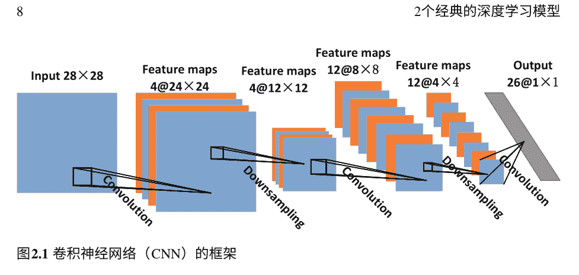

图2.1 卷积神经网络（CNN）的框架

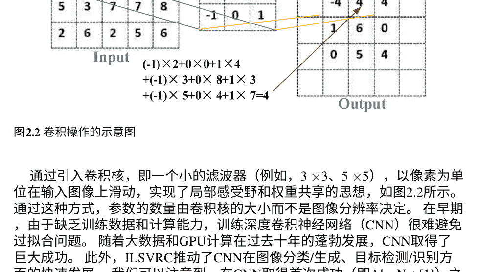

图2.2 卷积操作的示意图

通过引入卷积核，即一个小的滤波器（例如，3×3、5×5），以像素为单位在输入图像上滑动，实现了局部感受野和权重共享的思想，如图2.2所示。通过这种方式，参数的数量由卷积核的大小而不是图像分辨率决定。在早期，由于缺乏训练数据和计算能力，训练深度卷积神经网络（CNN）很难避免过拟合问题。随着大数据和GPU计算在过去十年的蓬勃发展，CNN取得了巨大成功。此外，ILSVRC推动了CNN在图像分类/生成、目标检测/识别方面的快速发展。我们可以注意到，在CNN取得首次成功（即AlexNet[1]）之后，CNN在计算机视觉的所有领域都占据了主导地位，ILSVRC 2012是一个很好的例子。

卷积神经网络（CNN）由卷积层、下采样层和全连接层组成。卷积操作模拟了生物学中的局部感受野，具有局部感受野和权重共享的特点，可以大大压缩网络参数。下采样，也称为池化，是图像的子采样。它用于减少数据量，同时保留有用的信息。在堆叠多个卷积和池化层之后，连接一个或多个全连接层来实现分类/回归。

## 2.2 长短期记忆（LSTM）网络

在深度学习的家族中，大多数模型（如FCN、CNN、GAN和自编码器）仅从当前输入给出输出。它们都是静态模型，没有利用顺序输入的时间上下文信息。然而，对于视频处理、语言建模、机器翻译、语音识别、阅读理解等任务，输入的上下文非常重要，对于识别和理解至关重要。从人类理解的角度来看，我们在阅读一篇论文时，并不是每秒都从零开始思考。相反，我们根据对前面单词的理解来理解每个单词。我们不会把一切都抛弃，然后重新开始思考。然而，静态模型会将输入分别处理，每个输入都会输出结果。它们无法告诉我们输入的历史如何影响当前状态和输出。循环神经网络（RNN）被提出来解决这个问题。

在图2.3中，展示了一个循环神经网络（RNN）的图示，其中一个神经网络块，A，接收一个输入 x_t 并输出 h_t。在RNN中有一个循环，保留了历史输入以用于当前输出。循环允许信息从网络的一个步骤传递到下一个步骤。可以将RNN看作是同一个网络的多个副本，每个副本向其后继者传递一条消息。如果我们展开循环，它可以被展开成一个类似链式的普通神经网络，如图2.4所示。这种类似链式的结构表明它与序列和列表密切相关。对于顺序输入来说，这是一种自然的神经网络架构，可以探索相邻输入之间的相关性和相互作用。在过去几年中，RNN的各种应用，包括语音识别[2, 3]，语言建模[4, 5]，机器翻译[6]和图像字幕[7, 8]，取得了令人难以置信的成功。

循环神经网络（RNN）保留历史输入以更好地理解当前状态，例如阅读理解。在实践中，RNN在探索短期依赖性方面表现良好，但在长期依赖性方面较差。因此，LSTM作为RNN的一个优秀代表，被提出来很好地处理长期和短期依赖性。RNN和LSTM都通过重复一个基本单元来形成链式结构网络。与RNN相比，LSTM的基本单元，即LSTM单元，在图2.5中具有更精细的结构，由四个非线性层组成。LSTM的关键是细胞状态，保存在图2.5的水平轴上。


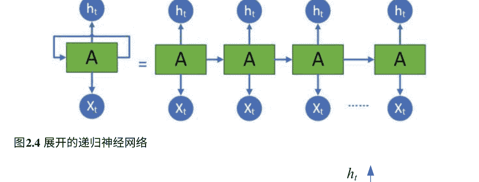

图2.4 展开的递归神经网络

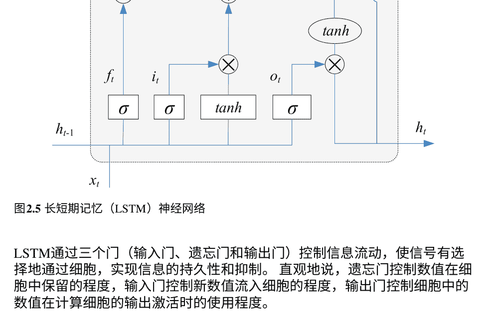

图2.5 长短期记忆（LSTM）神经网络

LSTM通过三个门（输入门、遗忘门和输出门）控制信息流动，使信号有选择地通过细胞，实现信息的持久性和抑制。直观地说，遗忘门控制数值在细胞中保留的程度，输入门控制新数值流入细胞的程度，输出门控制细胞中的数值在计算细胞的输出激活时的使用程度。

在 LSTM单元中，从输入序列 x = (x1, x2, ..., xT)到输出序列 h = (h1, h2, ..., hT)的映射函数被精确地规定为

```
f_t = \sigma (W_{fx} x_t + W_{fh} h_{t-1} + b_f) \quad (2.1)
i_t = \sigma (W_{ix} x_t + W_{ih} h_{t-1} + b_i) \quad (2.2)
o_t = \sigma (W_{ox} x_t + W_{oh} h_{t-1} + b_o) \quad (2.3)
```

```
$c_t = f_t * c_{t-1} + i_t * \tilde{c}_t$

$\tilde{c}_t = \tanh(W_{cx} x_t + W_{ch} h_{t-1} + b_c) \quad (2.4)$

$h_t = o_t * \tanh(c_t) \quad (2.5)$
```

其中 $\sigma$ 是逻辑 sigmoid 函数，$i$、$f$、$o$ 和 $c$ 是输入门、遗忘门、输出门、细胞和细胞输入激活向量，它们都与细胞输出激活向量 $h$ 具有相同的大小。矩阵 $W$ 表示权重，$b$ 表示偏置向量。运算符“*”表示逐元素向量乘积。

LSTM的第一步是决定我们要从细胞状态中丢弃哪些信息。这个决策由一个称为“遗忘门”的 sigmoid 层来进行。如(2.1)所述，它查看 $h_{t-1}$ 和 $x_t$，并为细胞状态 $c_{t-1}$ 中的每个元素输出一个介于0和1之间的数字。“1”表示我们完全保留该元素的历史记录，而“0”表示我们完全丢弃该元素的历史记录。LSTM的第二步是决定我们将更新哪些信息到细胞状态中。这个决策由一个称为“输入门”的 sigmoid 层来进行，如(2.2)所示。它查看 $h_{t-1}$ 和 $x_t$，并输出一个介于0和1之间的数字。接下来，它将被施加在一个 $\tanh$ 层上，该层创建一个新的候选值向量 $\tilde{c}_t$，可以添加到新状态 $c_t$ 中，如(2.4)所示。因此，输入门决定了状态的每个元素（候选状态）的更新程度。

在上述两个步骤之后，通过旧状态 $c_t$ 和新候选状态 ($\tilde{c}_t$) 通过公式 (2.4) 更新新细胞状态 $c_t$。其中，旧状态 $c_{t-1}$ 通过遗忘门 $f_t$ 进行缩放，表示我们忘记历史的程度；候选状态 ($\tilde{c}_t$) 通过输入门 $i_t$ 进行缩放，控制每个状态值 ($c_t$) 更新到新状态的程度。

最后，我们决定输出什么。这个输出将基于当前的细胞状态，但会是一个经过滤波的版本，如公式 (2.5) 所述。首先，我们运行一个 sigmoid 层，决定我们要输出细胞状态的哪些部分。这个 sigmoid 层被称为“输出门”，由公式 (2.3) 给出。然后，我们将细胞状态 $c_t$ 通过 $\tanh$ 函数进行处理，并乘以 $o_t$，得到最终的输出 $h_t$。

## 2.3 生成对抗网络 (GAN)

GAN [9, 10] 是生成式深度学习（DL）模型的一个优秀代表。它在图像重建、图像去噪、图像合成、超分辨率等方面得到了广泛研究。GAN 由一个生成器和一个判别器组成。生成器使假图像接近真实图像/真实图像，而判别器则区分假图像和真实图像，如图2.6所示。通过它们之间的对抗学习重复，可以学习到一个强大的生成器，生成非常接近真实图像的图像。GAN 的原理源于## 图2.6 条件GAN网络的示意图

从著名的零和游戏中，数学上表示为

$$G^* = \arg \min_G \max_D L_{GAN}(G, D)$$
$$L_{GAN}(G, D) = E_y[\log D(y)] + E_z[\log(1 - D(G(z)))]$$

其中 D 代表探测器，G 代表生成器，y 是真实图像，G(x, z) 是生成的假图像。在公式(2.6)中，y 来自真实数据的分布，z 来自随机噪声（例如，高斯噪声）。对于优化 D，我们希望真实数据的 D(y) 越大，生成器 G 生成的假数据 D(G(z)) 越小。而对于优化 G，我们希望它能够生成足够逼真的样本 G(z) 以成功欺骗 D。在这样的对抗过程中，D 和 G 交替进行优化。

正如公式(2.6)所示，普通的生成对抗网络只能区分输出的真假。然而，大多数图像处理任务，例如著名的图像到图像的转换[11]，除了区分真假之外，还需要输入和输出之间的对应关系。为了实现这个目的，提出了条件生成对抗网络（cGAN），其描述如下：

$$G^* = \arg \min_G \max_D L_{cGAN}(G, D)$$
$$L_{cGAN}(G, D) = E_{x,y}[\log D(x, y)] + E_{x,z}[\log(1 - D(x, G(x, z)))]$$

其中 D(x, y), D(x, G(x, z)) 表示 D 不仅需要区分真实和假的，还需要告诉它们之间的对应关系。在[11]中，Phillip Isola等人描述了一种用于图像到图像转换的cGAN模型，即pix2pix。

## 2.4 自编码器 (AE)

自编码器 (AE) 是一种用于对输入数据进行编码以获取其压缩表示的深度神经网络类型，然后解码该表示以尽可能地恢复输入。图2.7展示了一个基本的自编码器，其中编码器提供了压缩代码，而解码器从这个压缩代码中产生输入的恢复。在自编码器中，编码和解码过程是联合优化的，以从压缩代码中再生输入。自编码器的目的通常是降维、压缩和去噪，通过压缩不重要的“噪声”并保留输入数据的“真实”信号。

AE也是一种生成模型，通过神经网络空间中的函数来表示输入数据，这使得输入数据具有一些特殊属性。它由编码器和解码器组成，其中编码器将输入数据压缩为压缩代码，而解码器将该代码解压缩为输入的重建。通常，AE被强制以近似的方式重建输入，仅保留输入数据的最相关方面。

作为一种无监督学习，AE可以堆叠在任何神经网络上进行模型的预训练，以应对缺乏标记数据的情况。我们可以首先使用未标记的数据训练堆叠的AE，然后使用AE的较低层创建一个深度神经网络来进行实际任务，并使用标记数据进行改进。AE有许多变种，例如：

- 去噪AE
- 稀疏AE
- 对比AE
- 对抗性AE
- 变分AE

去噪自编码器 (DAE) 通过向原始输入添加噪声，然后训练自身恢复原始的无噪声输入来学习有用的特征。这防止自编码器简单地将输入复制到输出中，以便它能够发现数据中的模式。噪声可以是添加到输入的纯高斯噪声，也可以是随机关闭输入，就像使用dropout一样。

训练DAE的过程如下：

- (1) 初始输入 $x$ 通过随机映射 $\tilde{x}$ 被损坏成 $\tilde{x} \sim q_D(\tilde{x}|x)$。
- (2) 损坏的输入 $\tilde{x}$ 通过与标准自编码器相同的过程映射到隐藏表示中，$h = f_\theta(\tilde{x}) = s(W\tilde{x} + b)$。
- (3) 从隐藏表示中，模型重构 $z = g_{\theta'}(h)$。

模型的参数 $\theta$ 和 $\theta'$ 被训练以最小化训练数据上的平均重构误差，具体来说，最小化 $z$ 和原始未损坏的输入 $x$ 之间的差异。

稀疏自编码器 (SAE) 稀疏性是一种约束，可以在图像处理中实现良好的特征提取。通过向代价函数添加一个项，SAE 被迫减少编码层中活跃神经元的数量。层越稀疏，特征提取效果越好。可以通过制定惩罚项的方式来实现稀疏性。Kullback-Leibler (KL) 散度是一种常见的惩罚项，表示为

$$\sum_{j=1}^{s} KL(\rho||\hat{\rho}_j) = \sum_{j=1}^{s} \left[ \rho \log \frac{\rho}{\hat{\rho}_j} + (1 - \rho) \log \frac{1 - \rho}{1 - \hat{\rho}_j} \right] \quad (2.8)$$

其中，$s$ 和 $m$ 分别表示隐藏层中隐藏节点的数量和训练样本的数量，稀疏参数 $\rho$ 接近于零，$\hat{\rho}_j$ 的定义如下

$$\hat{\rho}_j = \frac{1}{m} \sum_{i=1}^{m} [h_j(x_i)], \quad (2.9)$$

它表示所有训练样本中隐藏单元 $j$ 的平均激活，其中 $h_j(x_i)$ 标识触发激活的输入值。为了鼓励大多数神经元处于非活跃状态，$\hat{\rho}_j$ 需要接近 $\rho$。$KL(\rho||\hat{\rho}_j)$ 是均值为 $\rho$ 的伯努利随机变量与均值为 $\hat{\rho}_j$ 的伯努利随机变量之间的 KL 散度。实现稀疏性的另一种方法是在损失函数上施加 L1 或 L2 正则化项。例如，在 L1 正则化项的情况下，损失函数可以写成

$$\mathcal{L}(x, z) + \lambda \sum_{i} |h_i| \quad (2.10)$$

对比自编码器 (CAE) 鼓励将输入点的邻域映射到输出点的较小邻域，通过添加显式正则化器，迫使模型学习对输入的轻微变化具有鲁棒性的编码在损失函数中。这个正则化器对应于编码器激活相对于输入的雅可比矩阵的Frobenius范数，鼓励模型学习有关训练分布的有用信息。最终的目标函数为

$$\mathcal{L}(x,z) + \lambda \sum_i \|\nabla_x h_i\|^2 \quad (2.11)$$

变分自编码器（VAE）VAE是一个概率模型，表示其输出部分由机会决定。更重要的是，它是一个生成模型，意味着它可以生成看起来像从训练集中采样的新实例。编码器不直接产生给定输入的编码，而是产生一个均值编码 $\mu$ 和一个标准差 $\sigma$。然后，实际编码是从高斯分布 $G(\mu,\sigma)$ 中随机采样的。之后，解码器正常解码采样的编码。VAE的示意图如图2.8所示。

VAE倾向于产生看起来像是从一个简单的高斯分布中采样的编码。VAE的成本函数由两部分组成。第一个部分是通常的重构损失，它推动自编码器重现其输入。第二个部分是潜在损失，它可以推动编码逐渐在编码空间（潜在空间）内迁移，占据一个大致呈（超）球形的区域，看起来像一个高斯点云。其结果是我们可以轻松地从这个高斯分布中采样一个新的实例。为此，目标分布（高斯分布）与编码的实际分布之间的KL散度被用作潜在损失。

给定一个具有未知概率函数 $P(\mathbf{x})$ 和多元潜在编码向量 $\mathbf{z}$ 的输入数据集 $\mathbf{x}$，目标是将数据转化为分布 $P(\mathbf{x})_{\theta}$。

$$p_{\theta}(\mathbf{x}) = \int_{\mathbf{z}} p_{\theta}(\mathbf{x}, \mathbf{z}) d\mathbf{z} = \int_{\mathbf{z}} p_{\theta}(\mathbf{x}|\mathbf{z}) p_{\theta}(\mathbf{z}) d\mathbf{z}, \quad (2.12)$$

其中，$p_{\theta}(\mathbf{x}|\mathbf{z})$ 描述了一个从 $\mathbf{z}$ 生成 $\mathbf{x}$ 的网络，$\theta$ 是网络的参数。在假设 $\mathbf{p}(\mathbf{z})$ 为正态分布的情况下，生成 $\mathbf{x}$ 可以被解释为从正态分布中随机采样一个实例 $\mathbf{z}$ 来计算 $\mathbf{x}$。

对抗自编码器（AAE）AAE将自编码器与GAN给出的对抗损失相结合，如图2.9所示。它与VAE使用类似的概念，只是它使用对抗损失来规范化潜在代码，而不是VAE的KL散度。在VAE中，KL散度用于将编码的潜在代码匹配到正态分布，而在对抗损失中，引入了一个额外的鉴别器组件，编码器充当生成器。与基本的GAN不同，AAE的生成器生成潜在代码以欺骗鉴别器，使其相信潜在代码是从正态分布中采样得到的。AAE的鉴别器预测给定的潜在代码是由自编码器生成的（假）还是从正态分布中随机采样得到的（真）。

## 图2.9 对抗自编码器（AAE）的架构

## 参考文献

1. Krizhevsky A, Sutskever I, Hinton G. 2012 使用深度卷积神经网络进行ImageNet分类。神经信息处理系统 **25**.
2. Graves A, Mohamed Ar, Hinton G. 2013 使用深度递归神经网络进行语音识别。在2013年IEEE国际会议上的声学、语音和信号处理 (ICASSP) 中pp. 6645–6649. IEEE.
3. Graves A, Jaitly N. 2014 迈向端到端语音识别的递归神经网络。在机器学习国际会议上pp. 1764–1772.
4. Sundermeyer M, Schlüter R, Ney H. 2012 LSTM神经网络用于语言建模。在国际语音通信协会第十三届年会。
5. Mikolov T, Karafiát M, Burget L, Černocký J, Khudanpur S. 2010 基于循环神经网络的语言模型。在国际语音通信协会第十一届年会。
6. Cho K, Van Merriënboer B, Gulcehre C, Bahdanau D, Bougares F, Schwenk H, Bengio Y. 2014 使用RNN编码器-解码器学习短语表示用于统计机器翻译。arXiv预印本 arXiv:1406.1078。
7. Chen L, Zhang H, Xiao J, Nie L, Shao J, Liu W, Chua TS. 2017 Sca-cnn: 空间和通道注意力在卷积网络中的应用于图像字幕。在2017年IEEE计算机视觉和模式识别会议 (CVPR) pp. 6298–6306. IEEE。
8. Ren Z, Wang X, Zhang N, Lü X, Li LJ. 2017年基于深度强化学习的图像字幕生成与嵌入奖励。arXiv预印本arXiv:1704.03899。
9. Goodfellow I, Pouget-Abadie J, Mirza M, Xu B, Warde-Farley D, Ozair S, Courville A, Bengio Y. 2014年生成对抗网络。在神经信息处理系统的进展中pp. 2672–2680。
10. 徐L, 严Y, 孙W. 2018年通过生成对抗网络进行太阳图像去卷积。在AGU秋季会议摘要。
11. Isola P, Zhu JY, Zhou T, Efros AA. 2016年图像到图像的条件对抗网络翻译。arXiv电子打印。

# 第3章 太阳图像分类任务中的深度学习

摘要 天文学中数据的指数增长带来了大数据挑战。及时高效地从海量原始数据中挖掘有价值的信息是非常需要的。即使是对收集到的原始数据进行简单的二元分类也非常重要，可以减轻后续数据处理的负担。受到深度学习在图像分类方面的成功启发，我们研究了使用深度学习进行太阳射电频谱分类的方法，包括首屈一指的深度置信网络（DBN）、最流行的卷积神经网络（CNN）和长短期记忆网络（LSTM）。为了模型训练，建立了一个太阳频谱数据库并向公众发布。据我们所知，这是世界上第一个。该数据库包含8816个具有不同图像模式的频谱，代表了不同的太阳射电机制。然后，每个频谱由太阳射电天文学的专家进行标记。

- 太阳射电谱
- 图像分类
- 深度置信网络 (DBN)
- 多模态
- 结构化正则化

## 3.1 太阳射电谱

太阳射电光谱仪作为太阳观测中最常见的仪器之一，广泛应用于地面上记录太阳总射电辐射通量，提供长期太阳活动水平的指标。此外，光谱仪具有多个频率通道。因此，它可以在一定时间间隔内生成一个二维图像，即光谱。在太阳爆发的情况下，太阳射电辐射会有剧烈放大，对应于跳过个别频率通道，或者光谱中某个区域的突然亮度增加。

图3.1展示了一些典型的光谱，如“脉冲”、“漂移”、“斑马”和“纤维”，它们根据形状命名，其中每个光谱显示出独特的图像模式，表明了不同的物理机制。

为了模型训练，我们收集了中国太阳宽带无线电光谱仪（SBRS）的光谱数据[1]，建立了一个光谱数据库。SBRS由五个“组分光谱仪”组成，覆盖了广泛的频率范围0.7-7.6 GHz，持续监测太阳射电活动，因此积累了大量数据。由于太阳爆发事件在所有数据中非常稀少（不到所有记录数据的5%），因此仅二元分类对于每日数据归档非常重要。通过二元分类，我们可以首先从大量数据中找出爆发事件，为后续的数据分析节省超过95%的人力劳动。在本节中，介绍和讨论了一系列用于太阳射电频谱分类的深度学习模型。此外，我们已经对频谱的细微结构与其物理机制之间的对应关系有丰富的知识。因此，通过分类模型收集各种频谱，我们可以在太阳射电天文学的科学研究上做更多工作。

## 3.2 太阳射电谱的预处理

SBRS捕获的原始太阳射电数据包含射电辐射的通量值以及观测时间。尽管捕获的数据涵盖了太阳辐射的所有信息，但对于观察者/研究人员来说，很难判断太阳爆发是否发生以及太阳爆发的级别如何。为了便于理解，首先将SBRS捕获的原始数据转换为图像进行可视化。

SBRS包含多个频道，用于监测不同频率下的太阳爆发。因此，从每个频道感知到的信号将被单独处理。总共有120个频道同时工作，用于捕捉太阳射电信息。此外，每个捕捉到的文件都包含左右圆偏振部分，需要分开处理以进行可视化和进一步处理。我们将从每个频道提取的捕捉数据作为行向量存储，按感知时间排序。随后，所有来自120个频道的向量将根据频率值组合在一起，形成太阳射电谱，用于可视化和进一步处理。由于有120个频道和2520个感知时间点在8ms的记录文件中，转换后图像的最终分辨率为2520×120。图3.2a展示了一个样本图像。

在转换过程中，可以观察到几乎每张图片中都有一些类似水平条纹的干扰信号，如图3.2a所示。这种现象被称为太阳射电观测中的通道效应，是由于不同通道的增益不同引起的。从图3.2a中可以观察到，每个频道产生的信号幅度相同。因此，可以从捕获的太阳射电频谱中轻松检测到清晰的水平线。信道效应可能会隐藏爆发的呈现。为了消除信道效应，我们提出了一种信道归一化的方法，其公式为

$$g = f - f_{LM} + f_{GM}, \quad (3.1)$$

其中，$f$ 是构建的图像，$g$ 是执行信道归一化后的图像，$f_{LM}$ 和 $f_{GM}$ 分别表示局部均值和全局均值。局部均值 $f_{LM}$ 是频率通道中像素的平均值。$f_{GM}$ 代表整个图像的均值。$f_{LM}$ 用于减轻不均匀信道增益导致的水平条纹状干扰，而 $f_{GM}$ 通过添加全局背景来补偿每个像素值。信道归一化后的太阳射电频谱如图3.2b所示。可以观察到信道归一化成功地去除了水平条纹噪声，并且太阳射电爆发更容易被检测到。

在成像和归一化之后，我们得到了如图3.2所示的2520×120的光谱。可以观察到相邻的列非常相似，表明存在很高的冗余性。在光谱中，每一行给出了在某个频率通道上的太阳射电流量在某个时间间隔内的观测结果。可以将其视为离散随机过程的观测。因此，每一列代表一个随机变量。

在概率论和统计学中，随机过程的相关性可以通过相关系数[10][11] $\gamma$ 来衡量，其定义为

$$\gamma(n_1, n_2) = \frac{\Phi[(x(n_1) - \mu_1)(x(n_2) - \mu_2)]}{(\sigma_1 \sigma_2)}, \quad (3.2)$$

其中，$x(n_1)$ 和 $x(n_2)$ 表示在 $n_1$ 和 $n_2$ 处的两个随机变量，具有集合平均值 $\mu_1$ 和 $\mu_2$，以及标准差 $\sigma_1$ 和 $\sigma_2$，$\Phi$ 表示集合平均值算子。因此，$\gamma(n, n + \tau)$ 是 $\tau$ 和 $n$ 的函数，即它不是一个平稳随机过程。因此，对于给定的 $\tau$，$\gamma(\tau)$ 是一个随机变量，而不是一个常数。我们使用不同的 $\tau$ 值计算 $\gamma(\tau)$。结果如表3.1所示。

从表3.1可以看出，行之间存在高相关性，而列之间相关性较低。因此，原始光谱可以进行下采样以去除冗余。我们使用最近邻采样方法将原始光谱下采样为75×30。可以观察到图3.3中的图像特征与原始光谱相比变化很小。

表3.1 太阳射电图像的相关系数。

| $\tau$ | $\gamma(\tau)$ (行相关) | $\tau$ | $\gamma(\tau)$ (列相关) |
| :--- | :--- | :--- | :--- |
| $\tau = 1$ | 0.9978 | $\tau = 1$ | 0.8343 |
| $\tau = 10$ | 0.9829 | $\tau = 2$ | 0.7738 |
| $\tau = 20$ | 0.9771 | $\tau = 3$ | 0.7660 |
| $\tau = 30$ | 0.9753 | $\tau = 4$ | 0.7096 |
| $\tau = 40$ | 0.9750 | $\tau = 5$ | 0.6650 |

由于校准值的差异，光谱的平均灰度存在较大差距，这可能会误导神经网络学习灰度差异而不是不同的光谱图案。不同的光谱图案表示不同的太阳活动现象。因此，在整个数据集上实施图像归一化。这与(3.1)中的通道归一化不同。对于图像归一化，计算每个光谱的局部均值 $f_{LM}$，而全局均值 $f_{GM}$ 则是整个数据集上局部均值的平均值。

图像归一化后，进一步进行图像增强，然后输入网络。根据我们的经验，光谱的大部分代表性信息由光谱均值周围的像素提供，即±30 + f。其余部分包含更多噪声。为了使光谱更具代表性，在(f-30,f+30)范围内补充线性放大。与一般图像一样，光谱也服从高斯分布，通过检查光谱的直方图可以看出。然而，每个光谱的均值差异很大，导致训练集的分布不能准确地由高斯分布建模。在这种情况下，神经网络倾向于捕捉光谱的整体灰度，忽视光谱真正代表的内容，而这主要体现在光谱的纹理模式中。为了防止这种情况发生，在前面的归一化之后，还进一步实施了双线性增强处理。

在图3.4中，原始数据集、归一化后的数据集和增强后的数据集的直方图被展示。可以观察到，在归一化和增强后，得到了更加普遍的类似高斯分布。

## 太阳射电频谱分类的DBN模型

传统的浅层机器学习，例如支持向量机（SVM），需要手工设计的图像特征来训练分类器/回归器。在没有足够的先验知识的情况下，深度学习相对于浅层模型具有很大的优势。它通过端到端的网络直接学习图像特征，而不是手工设计的特征。深度学习在各种任务中已经展示出了最先进的性能，包括视觉识别、音频识别和自然语言处理。我们开发的第一个深度学习模型[2]用于频谱分类是基于深度置信网络（DBN）的。

DBN [3] 是一个多层、随机生成模型，将多个受限玻尔兹曼机（RBM）堆叠在一起，如图3.5所示。RBM由一个可见层和一个隐藏层组成，两层之间的节点完全连接，但各个层内部没有连接。通过RBM，神经网络可以在没有标签的情况下实现自我学习，因此通常用于模型初始化。对于分类任务，最后在RBM层之上堆叠一个分类层。通过提供带标签的数据，预训练模型可以通过有监督学习进一步优化。

为了优化RBM，定义了一个能量函数

$$E(v, h) = - \sum_{i=1}^V \sum_{j=1}^H v_i h_j \omega_{ij} - \sum_{i=1}^V v_i b_i^v - \sum_{j=1}^H h_j b_j^h \quad (3.3)$$

其中 v是可见节点的二进制状态向量，h是隐藏节点的二进制状态向量，v_i是可见节点i的状态，h_j是隐藏节点j的状态，ω_{ij}是可见节点i和隐藏节点j之间的实值权重。b_i^v是可见节点i的实值偏置，和b_j^h是隐藏节点j的实值偏置。

可见节点和隐藏节点的联合分布由以下定义

$$p(v, h) = \frac{e^{-E(v,h)}}{\sum_u \sum_g e^{-E(u,g)}} \quad (3.4)$$

可以观察到低能量会导致高概率，反之亦然。而且，活跃可见节点的概率与其他可见节点的状态无关。同样，隐藏节点之间也是相互独立的。RBM的特性使得采样非常高效，可以同时采样所有隐藏节点，然后同时采样所有可见节点。然而，由于RBM只能处理二进制可见节点，限制了其在处理实值数据上的应用。

为了处理实值输入，定义了高斯伯努利受限玻尔兹曼机（G-RBM）。它的能量函数被建模为

$$E(v, h) = -\sum_{i=1}^{V} \sum_{j=1}^{H} \frac{v_i}{\sigma_i} h_j \omega_{ij} - \sum_{i=1}^{V} \frac{(v_i - b_i^v)^2}{2\sigma_i^2} - \sum_{j=1}^{H} h_i b_i^h \qquad (3.5)$$

其中，$v_i$表示可见节点$v_i$的实值活动。每个可见节点对能量函数添加了一个二次偏移，其中$\sigma_i$控制相应的宽度。通过检查（3.4）中定义的二进制可见节点和二进制隐藏节点，G-RBM将实值节点作为输入并输出二进制节点。DBN由多个RBM层组成。较高层的权重通过固定所有较低层的权重来训练。因此，它是贪婪地和顺序地训练的。如果第二个隐藏层的大小与第一个隐藏层的大小相同，并且第二个隐藏层的权重从第一个隐藏层的权重中借用，可以证明在保持第一个隐藏层的权重不变的情况下训练第二个隐藏层可以提高模型下数据的对数似然度[4]。图3.5展示了多层DBN。DBN的概率可见向量的分配被定义为

$$p(v) = \sum_{h_1,...,h_n} p(h_{n-1}, h_n) \prod_{k=2}^{n-1} p(h_{k-1}|h_k) p(v|h_1) \quad (3.6)$$

其中n表示隐藏层的数量。DBN被证明对手写数字识别和无监督训练[5]非常有帮助。在我们的工作中，它被用来学习太阳射电谱的表示。由于训练样本有限，我们的模型只使用了一个隐藏层。然后，提出了一个“I-H-C”结构的神经网络用于谱分类，其中“C”、“I”和“H”分别代表分类、输入层和隐藏层。网络的底层是一个RBM，顶层是一个softmax层。目标函数由 \hat{o} =arg max给出 p(o|x; \theta)，其中 包括RBM和softmax层中的所有参数。在模型训练中，采用标准的对比散度学习过程进行预训练。网络的深度通常取决于训练集的大小。对于训练深度学习模型来说，过拟合是一个很大的挑战，尤其是在缺乏训练数据的情况下。幸运的是，RBM可以实现无监督学习，因此在网络初始化和预训练方面得到了很好的发展。预训练可以显著减轻训练任务的复杂性，而无需大量标签，避免陷入贫乏的局部最优解的风险。对于训练RBM层，首先执行标准的对比散度学习过程。在预训练之后，进一步实施微调过程，使网络更加适用于光谱分类，其中目标函数的形式为对数似然函数。此外，为了防止过拟合，采用了dropout技术。

通常，在训练阶段，神经元的输出以概率 p为零，并在测试阶段乘以 1 - p 。通过随机屏蔽神经元，dropout是训练许多具有共享权重的不同网络的有效近似。

对于光谱分类，将具有三个输出节点的分类层堆叠在RBM层的顶部，该层以RBM的输出作为输入，并输出输入属于这三个类别之一的概率。

表3.6给出的实验结果表明，DBN可以学习太阳射电谱的更好表示，从而实现比传统的SVM [6]与主成分分析（PCA）[7,8]更高的分类准确性。

## 3.4 用于谱分类的自编码器

除了RBM，自编码器（AE）是实现无监督学习的另一种方法。通过将输出设置为输入进行优化。换句话说，它学习了一个接近于恒等函数的近似，以使网络输出与输入相同。

恒等函数似乎是一个特别平凡的函数。但是，通过对网络施加一定的限制，比如隐藏单元的数量有限，可以学习到关于数据的有趣结构。在我们之前的工作中[2]，已成功应用于学习光谱的表示。在文献中，还开发了一些AE的变种，如去噪AE [9]，堆叠AE（SAE）[10]。然而，这些AE对输入的处理是相同的，不能很好地区分不同的输入模态的特征。因此，不能捕捉到不同模态输入之间的交互作用。

在[5]中，提出了一种自动降维方法，通过自适应地组成一个多层“编码器”网络将高维数据转换为低维编码，并通过一个“解码器”网络将低维编码恢复为高维数据，以便于分类、可视化、通信和存储高维数据。在这两个网络中使用随机权重作为初始化，可以通过最小化原始数据与其重构之间的差异来一起训练它们。然后，通过无监督学习可以学习到输入数据的压缩表示。受到这些成果的启发，我们可以比[2]更好地学习光谱的表示，这将有益于以下的分类、识别、存储和分析。

在[11]和[12]中，自动编码器（AE）[9, 10, 13]被用于光谱分类。此外，多模态概念[14, 15]被用于利用相邻频道之间的相关性，其中每个频道被视为一种模态（图3.6）。具体而言，网络是建立在具有结构化正则化（SR）的AE上，用于学习光谱的表示。然后，它使用softmax层进一步对光谱进行分类。

多模态架构接受不同数量和类型的模态作为输入。输出将是分类结果，不仅考虑每个模态的特性，还考虑不同模态之间的交互作用。所提出的多模态学习架构是通过在具有结构化正则化的AE层之上堆叠softmax层来构建的。从图3.7可以观察到，单一模态和多模态之间的区别在于每个模态在低层中是单独训练的。已经证明多模态学习方法优于单模态的深度学习[2]。在提出的模型中，每个模态的学习都使用了自动编码器(AE)，从输入层到最后一个隐藏层。所有模态之间通过一个SR进行交互。提出的多模态学习的全局损失函数可以表示为

$$ \hat{L} = \phi(f_{SR}(x_1, x_2, \ldots, x_m)) $$

其中 $\hat{L}$ 是网络的输出，$\phi$ 表示一个非线性函数，在我们的模型中是一个softmax函数， $f_{SR}()$ 是从视觉层到第一个隐藏层的线性变换，其中使用了SR。通过在AE中使用SR，我们可以通过探索它们的相关性来获得输入信号的联合表示。

### 3.4.1 结构化正则化（SR）

SR在AE中使用多模态输入，受Fawcett [16]和Jalali[17]的启发。每个模态将分别用作每个隐藏单元的正则化组，类似于组正则化。这与传统的SR不同，传统的SR中每个输入单元都被平等对待，忽略了不同模态之间的相关性。

假设 $S_{r,i}$ 是一个 $K \times N$ 模态的二进制矩阵，其中 $K$ 表示模态的数量，$N$表示相应模态中的单元数，SR被定义为

$$SR(W^{[1]}) = \sum_{j=1}^{M} \sum_{k=1}^{N} f_{B}(\max_{i}(S_{k,i} | W_{i,j}^{[1]}|) > 0)\quad(3.8)$$
其中$f_{B}$表示一个布尔函数，如果其变量为真，则取值为1，否则为0。$(3.8)$中的正则化函数对每个权重使用的模态数量进行直接惩罚。

### 3.4.2 将SR与AE集成

通过将SR与AE集成，用于训练网络的目标函数可以表示为：

$$\begin{aligned} W^{[1]} = \arg \min_{W^{[1]}} \sum_{i=1}^{n^{[1]}} \|z_{i}^{[1]} - x_{i}^{[1]}\|_{2}^{2} + \alpha \cdot SR(W^{[1]}) \\ z_{i}^{[1]} = \sum_{j}^{k^{[1]}} \mu_{j}^{[1]} W_{i,j}^{[1]} \end{aligned}\quad(3.9)$$

其中，$z_{i}^{[1]}$是AE解码器重构的信号。$n^{[1]}$是包括所有模态特征的输入节点数量，$k^{[1]}$是多模态AE的隐藏节点数量。$W_{i,j}^{[1]}$是引入SR的多模态AE的权重。$\alpha$是平衡误差和正则化项的参数。通过将SR集成到AE中，得到的表示$y_{i}$仅连接到第一隐藏层的部分节点。如图3.8所示，为了最小化$SR(W^{[1]})$，$W_{i,j}^{[1]}$应尽可能接近0，导致第一隐藏层中的一些节点仅连接到视觉层的部分节点。具有SR的AE表明多模态网络可以自动区分不同的模态并学习它们之间的相关性。

### 3.4.3 网络架构

我们提出了一个“I-H-C”结构的网络，如图3.7所示，用于太阳射电频谱分类。“I”代表多模态输入，在我们的案例中维度为2000。需要指出的是，这些输入节点被分为10个模态，每个模态的大小为200。“H”表示隐藏层，第一隐藏层由200个节点组成，第二隐藏层由100个节点组成。“C”被定义为分类节点，计算给定类别的每个输入的概率。我们的应用程序中有3个输出 ：“爆发”，“非爆发”和“校准”。

输入层包含10个模态。通常，模态表示不同类型的数据，例如音频、图像、语言、文本等。在本应用中，频率频谱的通道被视为模态。多模态学习有三种可能的模型。将特征学习应用于多模态数据的一种简单方法是将整个数据向量直接输入模型。这种方法称为“完全密集模型”，可能无法学习具有非常不同的底层统计学的模态之间的关联。此外，它过早地学习特征，可能导致过拟合。与完全密集模型不同，模态特定的稀疏模型分别为每个模态训练第一层表示。这种方法假设每个模态的理想低层特征是纯单模态的，而高层特征是纯多模态的。因此，这种方法在某些问题上可能效果更好，其中模态具有非常不同的基本表示，例如图像和文本。在我们的应用中，频率频谱的通道被视为模态。这些模态之间存在强烈的相关性，这意味着学习低层相关性可能会导致更好的特征。因此，采用了图3.6c中显示的组稀疏模型，并提出了一种多模态组正则化算法来学习多个通道的联合特征。采用具有SR的AE来建立多模态学习网络。由于标记的太阳射电频谱数量有限，层数和节点数不能太大。在这个提出的网络中，只使用了两个隐藏层，以避免过拟合。在上述由AE和正则化实现的多模态学习架构的顶部添加了一个softmax层。它以多个模态的联合表示作为输入，并输出每个频谱的分类结果。分类层将确定输入频谱相对于给定类别的概率。

## 3.5 太阳射电频谱分类的卷积神经网络

由于太阳射电频谱是一种特殊类型的图像，可以预期使用卷积神经网络可以学习到更好的图像表示和频谱分类器。第一次尝试使用卷积神经网络进行频谱分类是在[18]中提出的。如图3.8所示，所提出的模型由四个卷积层、四个池化层、一个全连接层和一个softmax层组成，这些层被堆叠在一起实现特征提取和分类。表3.6中的实验结果表明，所提出的卷积神经网络在性能上超过了我们之前的DBN [2]和自编码器（AE）[12]的努力。卷积神经网络由卷积层、下采样层和全连接层组成。卷积层的理论基础主要是生物学中的感受野概念和局部感受野和权重共享是卷积和感受野之间的共同点，可以大大减少神经网络需要训练的参数。下采样，也称为池化，实际上是图像的子采样。它用于减少数据量，同时保留有用的信息。通过堆叠卷积和池化层，可以形成一个或多个全连接层，实现高阶推理能力。

我们提出的CNN模型如图3.2所示，由四对卷积层和相应的池化层（C1-P1，C2-P2，C3-P3和C4-P4）以及一个全连接层（F1）组成。我们使用经过预处理后大小为120×120的光谱作为网络的输入。C1包含1×5的补丁滤波器，其目的是提取输入数据的局部特征并构建C1层的特征图。假设有32个卷积核，经过C1后得到大小为120×120的32个特征图。然后，这些得到的特征图在P1中进行池化。这里，我们使用2×2的池化核。经过池化后，120×120的特征图被减少为60×60的特征图。

在提出的模型中，C2-P2，C3-P3和C4-P4与C1-P1具有相同的结构。我们在所有卷积层中使用相同的激活函数Relu。C2，C3和C4的特征图数量分别为64、128和256。C1-C3的卷积核大小为1×5。与C1、C2和C3不同，C4的卷积核大小为1×3。经过C4-P4后，我们可以得到大小为8×8的256个特征图。然后，将1024个节点的全连接层F1应用于C4-P4的输出。激活函数使用修正线性单元，并且在F1中使用0.75的概率进行dropout，以加快收敛速度并避免对某些节点的过度依赖。最后，我们在网络的顶部堆叠了一个softmax层，用于分类的目的。

为了清楚地理解整个网络的数据流，我们在表3.2中列出了所有层、输入、输出和内核大小。

表3.2 CNN架构的参数

| 层 | 层类型 | 内核大小 | 步幅 | 输出 |
|----|--------|----------|------|------|
| 输入 | | | (120,120,32) | |
| C1 | 卷积 | (1,5) | (1,1) | (120,120,32) |
| P1 | 最大池化 | (2,2) | (2,2) | (60,60,32) |
| C2 | 卷积 | (1,5) | (1,1) | (60,60,64) |
| P2 | 最大池化 | (2,2) | (2,2) | (30,30,64) |
| C3 | 卷积 | (1,5) | (1,1) | (30,30,128) |
| P3 | 最大池化 | (2,2) | (2,2) | (15,15,256) |
| C4 | 卷积 | (1,3) | (1,1) | (15,15,256) |
| P4 | 最大池化 | (2,2) | (2,2) | (8,8,256) |
| F1 | 全连接 | | | 1024 |
| 输出 | softmax | | | 3 |

## 3.6 太阳射电频谱分类的LSTM

以上所有模型[2, 11, 12, 18]都是静态模型，将频谱视为空间图像。实际上，频谱描述了太阳射电辐射在每个频率通道上随时间的变化。在[12]中，我们首次尝试建立了一个多模态学习模型，由一个自编码器和一个结构化正则化项组成，其中频谱的每个频率通道被视为一种模态，因此一个频谱由多个模态组成。在网络的低层中，每个模态都使用自编码器网络进行独立训练。同时，所有模态通过结构化正则化项进行交互。然后，在这些自编码器层的顶部堆叠了两个全连接层。最后，在所有隐藏层的顶部堆叠了一个softmax层。将频谱的每一列作为一个输入，那么频谱可以被视为一个时间序列。因此，我们采用了LSTM [19]-[20]来进一步探索频谱各列之间的相关性，从而更好地表示频谱，并相应地提高频谱分类的准确性。

所提出的LSTM模型的架构如图3.9所示，其中 (x1, x2, ..., xT) 是由光谱的列组成的时间序列。如上所述，光谱可以被视为时间序列。因此，LSTM在处理光谱方面具有超越静态模型的优势。

LSTM模型由输入层、LSTM层和softmax层组成。在输入层中，向量 (x1, x2, ..., xT) 由光谱的列给出。它们按顺序逐个输入到LSTM单元中。每个LSTM单元根据(2.3)-(2.5)处理输入。LSTM网络的循环概念意味着每个LSTM单元不会立即输出响应当前输入，而是保持沉默直到其时间槽到来。时间槽是根据经验给定的时间步长安排的。然后，在LSTM层之上堆叠了一个softmax层。它以LSTM输出作为输入，并输出光谱类型。在我们的情况下，输入是图3.9所提出的用于光谱分类的LSTM的架构大小为$120\times120$。时间步长为120，以便每个输入光谱都有一个输出到Softmax层。

LSTM有许多变种，例如添加了窥视孔连接的LSTM [21]，门控循环单元（GRU）[22]。在[23, 24]中，读者可以找到更多关于这些LSTM变种的信息。在这项工作中，使用了[25]中的初始模型。基本LSTM单元的结构如图2.4所示。在LSTM单元中，提供了一个内存块来存储网络的当前状态，以便将该状态保持到下一个时间步。通过这种方式，LSTM层可以探索顺序输入$x_1, x_2, \cdots, x_T$的相互作用和相关性。假设$f_{LR}(\cdot)$是LSTM模块的映射函数，$h_T$表示时间$T$时LSTM单元的隐藏状态，LSTM层的输出表示为

$$h_T = f_{LR}(x_1, x_2, \cdots, x_T), \tag{3.10}$$

其中$\{x_i, i = 1, \ldots, T\}$由光谱组成，下标$i$表示时间索引。LSTM单元$f_{LR}$应用于$\{x_i, i = 1, \ldots, T\}$以产生输出$h_T$。通过(3.10)，可以学习到光谱的高度压缩表示。然后，将该表示馈送到softmax层，在此层中通过监督学习训练一个分类器。假设$\hat{L}$是分类器的输出，$\varphi[\cdot]$是分类函数，则光谱分类的整个过程可以描述为

$$\hat{L} = \varphi[f_{LR}(x_1, x_2, \cdots, x_T)] \tag{3.11}$$

对于光谱分类的任务，softmax层被堆叠在LSTM层的顶部，其定义为

$$softmax(z_i) = \frac{\exp(z_i)}{\sum_j \exp(z_i)}. \tag{3.12}$$

LSTM层的输出 $h_T$ 首先通过一个具有3个输出的全连接网络，如图3.9所示。这个过程可以描述为

$$z = W_s h_T + b_s, \tag{3.13}$$

其中 $W_s$ 和 $b_s$ 是连接LSTM单元和softmax函数的全连接层的权重和偏置。然后，$z$ 被输入到softmax函数(3.12)中，输出 $z$ 属于给定三个类别的概率。这个过程在图3.10中展示，输入是一个维度取决于类别数量的向量，输出必须小于1，以便成为概率值。

图3.10分类问题中softmax层的示意图

## 3.7 模型评估和分析

### 3.7.1 数据库

统计数据表明，太阳爆发在所有捕获的数据中非常罕见。我们从1995年到2001年底通过SBRS共记录了数百万个微波数据。然而，其中只有数百个是“爆发”类型，如表3.3所示。在太阳天文学专业知识的帮助下，我们标记了8816个光谱以构建一个数据库。我们首先将光谱标记为六个类别（0：无爆发或难以识别，1：弱爆发，2：中等爆发，3：大爆发，4：有干扰的数据，5：校准）。表3.4给出了数据库中每个类型的光谱数量。然而，每个类别的样本数量都不足，所以我们将三种爆发类型（1、2、3）合并为一个类别。因此，数据库中有三个类别：“爆发”、“非爆发”和“校准”。表3.5给出了每个类别的光谱数量。至少包含一个可检测到的太阳射电爆发的光谱，在其生命周期内，而“非爆发”光谱在其生命周期内没有可识别的爆发。“校准”光谱通常包含一个步进校准信号。它更容易识别。

原始光谱的尺寸为120 × 2520。水平轴是时间，垂直轴是频率。经过预处理，新的光谱尺寸为120 × 120。

### 3.7.2 评估指标

为了评估分类器，提供了许多评估指标/度量，例如准确率、错误率、精确度和召回率。它们是基于以下四个基本术语定义的。

表3.3 太阳射电爆发的统计数据（SBRS）

| 频率范围 (GHz) | 0.5–1.5 | 1.0–2.0 | 2.6–3.8 | 4.5–7.5 | 5.2–7.6 |
| --- | --- | --- | --- | --- | --- |
| 爆发数量 | 108 | 526 | 921 | 233 | 550 |

表3.4 光谱类型的统计数据（0: 无爆发或难以识别，1: 弱爆发，2: 中等爆发，3: 大爆发，4: 干扰数据，5: 校准）类别

| 0 | 1 | 2 | 3 | 4 | 总数 |
| --- | --- | --- | --- | --- | --- |
| 6670 | 618 | 268 | 272 | 570 | 8816 |

表3.5 具有三个类别的光谱数据库

| 光谱类型 | 非爆发 | 爆发 | 校准 | 总数 |
| --- | --- | --- | --- | --- |
| 光谱数量 | 6670 | 1158 | 988 | 8816 |

- (i) 真正例 (TP): 如果一个正例被成功预测为一个正类；
(ii) 假负例 (FN): 如果一个正例被错误预测为一个负类；
(iii) 假正例 (FP): 如果一个负例被预测为一个正类；
(iv) 真负例 (TN): 如果一个负例被成功预测为一个负类。

在这四个术语中，真正例率 (TPR) 是在所有正例中 TP 的百分比/比率，即

$$TPR = TP/(TP+FN), \tag{3.14}$$

表示成功检索到的正例（正确分类为正类）在所有正例中的百分比。

类似地，假正例率 (FPR) 定义为

$$FPR = FP/(FP+TN), \tag{3.15}$$

表示在负例类别中错误判定为正例的负例的百分比。让 P 和 N 分别表示正例和负例的数量。准确性指数被定义为

$$准确率 = (TP+TN)/(P+N), \tag{3.16}$$

精确度或精确率定义为

$$精确度 = TP/(TP+FP), \tag{3.17}$$

召回率或召回率定义为

$$召回率 = TP/(TP+FN) = TP/P = 敏感度. \tag{3.18}$$

从上述定义可知，准确率表示成功分类的实例在所有实例中的百分比（P+N 是实例的总数）。分子由所有分类正确的实例组成，无论是正实例还是负实例，而分母由所有实例组成。

### 3.7.3 模型评估

为了评估模型，数据库被分为两部分，训练集和测试集。对于训练，每次从数据库中随机选择800个“爆发”、800个“非爆发”和800个“校准”来组成训练集。使用光谱和标签作为输入，在训练集上训练分类器。

数据库的其余部分构成测试集。为了有效评估提出的LSTM模型，我们将其与之前的DBN模型[2]、CNN模型[18]、多模态模型[11， 12]进行比较。还将与传统的PCA+SVM模型[2]进行比较。

本研究中使用的编解码器和数据库可以通过https://github.com/filterbank/spectrumcls访问。

为了公平比较，我们遵循基准测试中的评估指标[2， 11， 12， 18]，使用(3.14)和(3.15)定义的TPR和FPR指标来评估提出的LSTM模型。较大的TPR和较小的FPR表示更好的分类器。

在我们的案例中，我们有三种类型的光谱，因此TPR和FPR是针对每种类型单独计算的。此外，我们的案例涉及到一种类间不平衡问题，其中只有很小一部分是“爆发”样本。对于类间不平衡问题，TPR和FPR指标比准确度指标更好地描述了分类性能。“爆发”样本短缺有两个原因。一个原因是太阳爆发事件在所有记录的数据中很稀少。另一个原因是手动标记非常困难且耗时。

经过多轮训练和测试，TPR和FPR的统计数据列在表3.6中。从表3.6中分析，所有五个深度学习模型在光谱分类方面表现良好，而PCA+SVM方法在太阳射电光谱上失败。对于“校准”类型，所有深度学习模型都取得了良好的性能。所有模型的TPR约为95%，这意味着95%的数据被正确分类。所有模型的FPR非常小，小于3.2%，这意味着只有3.2%的其他类型数据被错误地分类为“校准”。对于“爆发”类型，提出的LSTM模型的TPR最高达到85.4%，意味着85.4%的“爆发”数据被LSTM模型正确识别。对于“爆发”类型，LSTM模型的FPR为6.7%。这表明6.7%的其他类型光谱被错误地分类为“爆发”。从FPR的定义来看，给定较小的FPR，性能越好。因此，LSTM模型在所有比较模型中在FPR方面表现最佳。对于“非爆发”类型，LSTM在所有比较模型中在TPR方面表现最佳。比较“爆发”和“非爆发”，“非爆发”具有更好的TPR和FPR（较大的TPR和较小的FPR）。原因是“非爆发”具有比“爆发”更简单的图像模式，如图3.1所示。因此，它比“爆发”更容易识别。

所提出的LSTM模型的增益可能对两个方面有贡献。首先，将光谱重新组织成时间序列，以便利用其内部结构进行分类。其次，LSTM模块可以有效地学习时间序列的关系和相互作用，生成更具代表性的光谱特征。

表3.6 太阳射电频谱分类性能比较

| 方法 | LSTM | LSTM | CNN | CNN | 多模态深度模型 | 多模态深度模型 | DBN | DBN | PCA+SVM | PCA+SVM |
| :--- | :--- | :--- | :--- | :--- | :--- | :--- | :--- | :--- | :--- | :--- |
| 类别 | TPR(%) | FPR(%) | TPR(%) | FPR(%) | TPR(%) | FPR(%) | TPR(%) | FPR(%) | TPR(%) | FPR(%) |
| 爆发 | 85.4 | 6.7 | 83.8 | 9.4 | 82.2 | 22.5 | 70.9 | 15.6 | 67.4 | 13.2 |
| 非爆发 | 92.3 | 8.2 | 89.7 | 8.7 | 83.3 | 9.6 | 80.9 | 13.9 | 86.4 | 14.1 |
| 校准 | 96.2 | 0.9 | 100 | 0.7 | 92.5 | 1.7 | 96.8 | 3.2 | 95.7 | 0.4 |

## 参考文献

- 1. Fu Q, Ji H, Qin Z, Xu Z, Xia Z, Wu H, Liu Y, Yan Y, Huang G, Chen Z等。2004年中国的新型太阳宽带射电光谱仪（SBRS）。太阳物理学 222，167-173。
2. Chen Z, Ma L, Xu L, Tan C, Yan Y. 2016 对太阳射电频谱的成像和表示学习进行分类。多媒体工具和应用 75, 2859–2875。
3. Hinton GE, Osindero S, Teh YW. 2006 一种用于深度信念网络的快速学习算法。神经计算 18, 1527–1554。
4. Salakhutdinov R, Murray I. 2008 关于深度信念网络的定量分析。 在Cohen WW, McCallum A, Roweis ST. 编辑,机器学习, 第二十五届国际会议论文集 (ICML 2008), 芬兰赫尔辛基, 2008年6月5日-9日vol. 307ACM国际会议论文集pp. 872–879. ACM。
5. Hinton GE, Salakhutdinov RR. 2006 用神经网络降低数据的维度。 科学 313, 504–507。
6. Suykens JA, Vandewalle J. 1999 最小二乘支持向量机分类器。 神经处理信件 9, 293–300。
7. Jolliffe I. 2011 主成分分析。 在国际统计科学百科全书pp. 1094–1096. Springer。
8. Wold S, Esbensen K, Geladi P. 1987 主成分分析。 化学计量学和智能实验室系统 2, 37–52。
9. Vincent P, Larochelle H, Bengio Y, Manzagol PA. 2008 用去噪自编码器提取和组合鲁棒特征。 在机器学习, 第25届国际会议onpp. 1096–1103 美国纽约, 纽约。ACM。
10. Vincent P, Larochelle H, Lajoie I, Bengio Y, Manzagol PA. 2010 堆叠去噪自编码器：在深度网络中学习有用的表示，具有局部去噪准则。机器学习研究杂志 11, 3371–3408。
11. 陈Z，马L，徐L，翁Y，严Y。2015年多模态学习用于太阳射电频谱分类。 在系统、人类和控制论(SMC)方面，2015年IEEE国际会议pp. 1035–1040. IEEE。
12. 马L，陈Z，徐L，严Y。2017年多模态深度学习用于太阳射电爆发分类。模式识别 61, 573–582。
13. Vincent P, Larochelle H, Bengio Y, Manzagol PA。2008年用去噪自动编码器提取和组合稳健特征。 在第25届国际会议上的论文机器学习pp. 1096–1103. ACM。
14. Guillaumin M, Verbeek J, Schmid C。2010年多模态半监督学习用于图像分类。 在计算机视觉和模式识别(CVPR)方面，2010年IEEE会议pp. 902–909. IEEE。
15. Ngiam J, Khosla A, Kim M, Nam J, Lee H, Ng AY。2011 多模态深度学习。 在第28届国际机器学习大会(ICML-11)的论文集中pp. 689–696。
16. Fawcett T. 2006 ROC分析简介。Pattern recognition letters 27, 861–874。
17. Jalali A, Sanghavi S, Ruan C, Ravikumar P. 2010 用于多任务学习的脏模型。在Lafferty J, Williams C, Shawe-Taylor J, Zemel R, Culotta A, 编辑,Advances in Neural Information Processing Systemsvol. 23. Curran Associates, Inc。
18. Chen S, Xu L, Ma L, Zhang W, Chen Z, Yan Y. 2017 用于太阳射电频谱分类的卷积神经网络。 在2017年IEEE多媒体与博览会研讨会(ICMEW)上pp. 198–201. IEEE。
19. Hochreiter S, Schmidhuber J. 1997 长短期记忆网络。 神经计算 9, 1735–1780。
20. Gers FA, Schmidhuber J, Cummins F. 1999 遗忘学习：LSTM中的连续预测。
21. Cho K, Van Merrienboer B, Gulcehre C, Bahdanau D, Bougares F, Schwenk H, Bengio Y. 2014 使用RNN编码器-解码器学习短语表示进行统计机器翻译。arXiv预印本 arXiv:1406.1078。
22. Graves A, Jaitly N. 2014 迈向端到端语音识别的循环神经网络。在国际机器学习会议上pp. 1764–1772。
23. Gers FA, Schraudolph NN, Schmidhuber J. 2002 使用LSTM循环网络学习精确的时间。机器学习研究杂志 **3**, 115–143。
24. Greff K, Srivastava RK, Koutnık J, Steunebrink BR, Schmidhuber J. 2017 LSTM: A search space odyssey.*IEEE*神经网络和学习系统交易 **28**, 2222–2232。
25. Jozefowicz R, Zaremba W, Sutskever I. 2015 基于经验的循环网络结构探索. 在国际机器学习会议pp. 2342–2350。

# 第四章 太阳物体检测中的深度学习

摘要 太阳观测为我们提供了丰富的太阳图像，其中包含了丰富的太阳活动信息。特别是，卫星上的太阳仪器不断记录高分辨率和高频率的全盘太阳图像。这些图像用于太阳活动预测和统计分析。通常，首先需要从全盘图像中挖掘关键信息。然后，通过提取的信息，可以使用机器学习或深度学习建立分类、识别或预测模型。在全盘太阳图像中，活动区域、日珥、日冕洞和太阳黑子是携带太阳活动主要信息的对象。在计算机视觉中，目标检测是最经典的任务之一，已经得到了广泛研究。在本章中，我们使用计算机视觉中经过良好预训练的深度学习模型，提供了两个太阳图像目标检测的示例。

- 活动区域（AR）
- 目标检测
- 区域卷积神经网络（R-CNN）
- 区域建议网络（RPN）

## 4.1 活动区域（AR）检测

太阳喷发事件会影响无线通信、全球定位系统和一些高科技设备，无论是在太空还是地面上。太阳上的活动区域是太阳喷发事件的主要源区。因此，自动检测活动区域不仅对例行观测很重要，对太阳活动的预测也很重要。目前，活动区域是通过传统图像处理技术手动提取或自动提取的。由于活动区域不断演变，设计一个合适的特征提取器并不容易。在这项工作中，采用了两种代表性的目标检测模型，即Faster R-CNN和YOLO V3，来学习活动区域的特征，并建立活动区域检测模型。此外，还使用了Faster R-CNN和YOLO V3的预训练模型，并在全盘太阳磁场图上进行了优化。实验结果表明，这两种模型都能实现高精度的活动区域检测。此外，YOLO V3的性能比Faster R-CNN提高了4%和1%相对于真正的阳性（TP）和真正的阴性（TN）指数，YOLO V3比Faster R-CNN快8倍。

### 4.1.1 活动区域（AR）

太阳活动区是太阳上磁场强的区域。它被认为是太阳喷发事件的主要源区。该区域经常孕育各种类型的太阳活动，包括太阳耀斑等爆炸性太阳爆发和日冕物质抛射（CME）。活动区具有强磁场，通常足够强以抑制对流，阻止对流将能量从太阳内部传输到光球。因此，活动区的温度相对于周围环境降低，导致冷却等离子体，即太阳黑子。太阳黑子是活动区的可视指标。与活动区相关的高能现象使该区域在紫外线和X射线图像中变亮。许多类型的戏剧性太阳特征，如太阳突起和日冕环，经常出现在活动区周围。在图4.1中，展示了一个活动区的示例，包括AIA 304 ， AIA 193 ， AIA 304 ， AIA 1700 ， HMI磁图，HMI 6173 和XRT。图4.1a，c和e## 4.1.2 活动区域检测的最新技术

清晰显示了明显的活动区域，图4.1b显示了太阳大气层中活动区域上方的日冕环的紫外视图。图4.1d显示了X射线图像上的强烈亮度增强。太阳喷发事件可能会引起严重的空间天气影响，可能会影响卫星的安全性、全球定位系统的精度等。因此，在常规监测和自动提取活动区域方面具有重要意义。

已经做出了一些努力，以实现太阳活动区域的自动识别。Benkhalil等人[1]确定了活动区域的阈值，以获得活动区域的初始种子。通过中值滤波和形态学运算去除噪声。基于这些初始种子，使用区域生长算法来检测活动区域。Zhang等人[2]设计了一个活动区域检测系统，使用强度阈值和形态学分析算法。McAteer等人[3]结合了区域生长算法和边界提取技术来检测活动区域。Caballero和Aranda [4]提出了一种两步法来从全盘图像中检测活动区域。在第一步中，应用区域生长算法来分割活动区域中的亮部分。在第二步中，分别使用基于分区的聚类和层次聚类来将这些亮部分分组在一起。推荐使用层次聚类方法，因为其性能较好。Higgins等人[5]提出了太阳监测活动区域跟踪（SMART）算法，用于检测和跟踪活动区域的整个生命周期。在该算法中，去除了宁静太阳和一些瞬态磁特征，然后应用区域生长技术来确定活动区域。计算了活动区域的一些磁性属性，如区域大小、磁通量出现速率、非势性测量。Colak和Qahwaji [6]提出了自动太阳活动预测工具（ASAP），用于自动检测、分组和分类太阳黑子。强度阈值、形态学算法、区域生长算法和神经网络被应用于确定太阳黑子的边界。Watson等人[7]提出了太阳黑子跟踪和识别算法（STARA），用于从太阳白光图像中检测和跟踪太阳黑子。Barra等人[8]提出了一种模糊聚类算法（空间可能性聚类算法（SPoCA）），将全盘太阳图像自动分割为日冕洞、宁静太阳和活动区域。SPoCA算法在[9]中得到改进，并进一步发展了活动区域的自动跟踪。在[10]中分析和比较了SMART、ASAP、STARA和SPoCA的性能。他们发现ASAP倾向于检测非常小的太阳黑子，而STARA对太阳黑子的检测有更高的阈值，而SMART和SPoCA检测到的区域比美国国家海洋和大气管理局（NOAA）更多。所提出的检测方法主要基于强度阈值、形态学操作、区域生长算法和聚类方法。在这些方法中，预定义参数应该由[11]确定。然而，设置最优参数并不容易。

深度学习算法可以自动提取区分特征，并实现端到端的目标检测。到目前为止，深度学习算法尚未应用于太阳活动区的检测。本文使用更快的R-CNN（具有卷积神经网络的区域）算法从全盘太阳图像中检测活动区，并将其性能与NOAA标记的活动区进行比较。

已经有很多关于自动检测活动区的研究，包括强度阈值、形态学操作、区域生长算法、聚类方法以及它们的组合，如表4.1所示。然而，确定这些算法中的参数是困难的。

已经提出了深度学习方法来从观测数据中学习检测模型，包括R-CNN、Fast R-CNN、Faster R-CNN等更多新算法。生成R-CNN检测器有三个步骤。第一步，生成区域建议。然后，训练一个CNN来对这些建议区域进行分类。最后，对建议区域的边界框进行细化。与R-CNN算法不同，快速R-CNN算法将对应于生成的区域建议的CNN特征映射，因此快速R-CNN检测器比R-CNN检测器更高效。在Faster R-CNN检测器中，使用区域建议网络（RPN）生成区域建议。RPN比提出的区域建议生成方法更快、更好。本文首次实现了基于深度学习的活动区检测模型。

### 4.1.3 基于深度学习的目标检测

目标检测是计算机视觉中的一个基本问题之一。在深度学习之前，它已经被广泛研究过。在[12]中，基于梯度或边缘的方向密度分布原理提出了直方图梯度（HOG）检测器。目标对象的外观和形状可以通过图像中的梯度或边缘的方向密度分布很好地描述。此外，它被设计为在均匀间隔的密集网格上计算，并使用重叠的局部对比度归一化（对“块”）来处理特征的不变性（包括平移、缩放、光照等）和非线性（用于区分不同的对象类别）。在[13]中，提出了一种可变形的基于部件的模型（DPM）来解决HOG中的多尺度问题，该模型是VOC-07、08和09检测挑战的获胜者。典型的DPM检测器由一个根过滤器和若干个部件过滤器组成。与手工设计特征的方法相比，DPM无法超越深度学习方法，后者具有自动特征学习和检测准确性以及计算复杂性方面的优势，尽管有许多增强DPM的技巧。

最早的基于深度学习的算法是一个两阶段的检测器，即区域卷积神经网络（R-CNN）[14]。在图4.2中，展示了R-CNN的架构。它从选择性搜索中提取一组物体建议，大约2000个自底向上的建议。然后，这些建议被重新缩放到统一的大小，并输入到在ImageNet上预训练的CNN模型中提取特征。最后，在特征提取器的顶部堆叠了一个SVM分类器，用于预测每个区域内是否存在物体并识别物体类别。R-CNN在VOC07上取得了显著的性能提升，平均精度均值（mAP）从33.7%（DPM-v5）提高到58.5%。它的缺点在于在大量重叠的建议上进行冗余特征计算，导致检测速度极慢。SPPNet [15]被提出来克服这个问题，它使得CNN能够生成一个固定长度的表示，而不管图像/感兴趣区域的大小是否重新缩放。在SPPNet中，特征图仅从整个图像计算一次，然后可以为任意区域生成固定长度的表示，用于训练检测器，从而避免了重复计算卷积特征。通过仅对整个图像计算一次特征图，SPPNet的速度比R-CNN快20倍以上，而且没有牺牲任何检测准确性。

## 图4.2 R-CNN的流程图

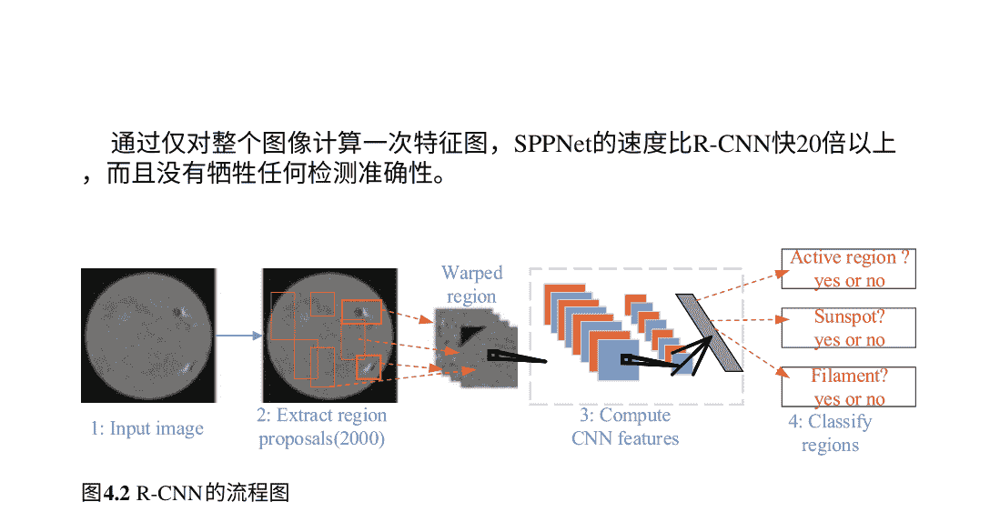

然而，它仍然是多阶段的，并且只对其完全连接的层进行微调，而忽略了所有之前的层。因此，后来提出了Fast R-CNN [16]来解决这些问题。它使我们能够在相同的网络配置下同时训练检测器和边界框回归器。在Fast R-CNN中，RoI层提取多个感兴趣区域（RoIs）并将特征发送到完全卷积网络中。每个RoI都被池化成固定大小的特征图，然后通过完全连接的层（FCs）映射到特征向量。该网络每个RoI有两个输出向量，即softmax概率和每类别边界框回归偏移量。Fast R-CNN最显著的特点是端到端的架构，将R-CNN和SPP Net的优势结合起来，在VOC07数据集上将mAP从58.5%（R-CNN）提高到70.0%，检测速度比R-CNN快200倍以上。然而，它的检测速度仍然受到提案检测的限制，直到提出了Faster R-CNN [17]的提案。Faster R-CNN旨在实现实时目标检测，它使用区域提案网络（RPN）将特征图作为输入，并输出一组矩形目标提案，每个提案都有一个目标得分和一个边界框。Faster R-CNN的主要贡献是引入了RPN，使得区域提议几乎没有成本。从R-CNN到Faster R-CNN，目标检测系统的大部分组件，例如提案检测、特征提取、边界框回归等，已逐渐集成到一个统一的端到端学习框架中。为了进一步减少后续检测阶段的计算冗余，提出了各种改进方法，例如RFCN [18]和Light head R-CNN [19]。

R-CNN系列是典型的两阶段算法，由提议和分类/回归阶段组成。YOLO算法[20]是一种单阶段算法。它将输入图像分割成一个$S \times S$的网格。如果一个物体的中心落在一个网格单元中，那个网格单元负责检测该物体。每个网格单元预测$B$个边界框和置信度分数。这些置信度分数反映了模型对于该框包含物体的自信程度，以及对于其预测的框的准确性。每个边界框由5个预测值组成，x，y，w，h和置信度。(x, y)坐标表示框的中心相对于网格单元的边界。宽度和高度是相对于整个图像预测的。最后，置信度预测表示预测框与任何真实框之间的IoU。YOLO [20]是深度学习时代的第一个单阶段检测器。YOLO大大提高了检测速度，但与两阶段检测器相比，尤其是对于一些小物体，它的定位精度下降。YOLO的后续版本[21, 22]和后来提出的SSD [23]更加关注这个问题。SSD方法基于前馈卷积网络，该网络生成一组固定大小的边界框和得分，用于检测这些边界框中物体类别实例的存在，并通过非最大值抑制步骤生成最终的检测结果。模型损失是定位损失（例如平滑L1损失）和置信度损失（例如Softmax）之间的加权和。SSD的主要贡献是引入了多参考和多分辨率的方法。检测技术显著提高了一阶检测器的检测准确性，特别是对于一些小物体。在一阶算法中，在密集检测器的训练过程中会遇到极端的前景-背景类别不平衡问题。为此，RetinaNet [24] 引入了一种名为“焦点损失”的新损失函数，通过重新定义标准的交叉熵损失函数，使得检测器在训练过程中能够更加关注难以分类的错误样本。RetinaNet是一个由主干网络和两个任务特定子网络组成的单一统一网络。主干网络负责在整个输入图像上计算卷积特征图，并且是一个现成的卷积网络。第一个子网络对主干网络的输出进行卷积对象分类，第二个子网络对主干网络的输出进行卷积边界框回归。网络设计故意保持简单，这使得本研究能够专注于一种新颖的焦点损失函数，从而消除了我们的一阶检测器与Faster R-CNN with RPN等最先进的二阶检测器之间的准确性差距，同时运行速度更快。焦点损失使得一阶检测器能够在保持非常高的检测速度的同时，达到与二阶检测器相当的准确性。

### 4.1.4 我们的主动区域检测提案

传统的包括3个主要步骤:

- 1. 区域提案生成。通过选择性搜索算法[25]生成大量的区域提案。
- 2. 特征提取。应用一些特征提取器来获取固定长度的特征向量，例如Hog或SIFT [26, 27]。
- 3. 分类。基于固定长度的特征向量，可以学习分类模型来判断区域提案是否为目标物体。

特征提取是目标检测成功的关键。在传统的目标检测方法中，为特定任务设计特征提取器是困难的。在基于深度学习的方法中，使用卷积神经网络（CNN）来提取图像特征。例如，基于区域的卷积神经网络（R-CNN）使用选择性搜索来准备区域提案。然后，将所有提案缩放到相同的大小，使用CNN来提取提案的图像特征，接着使用分类器和回归器分别对目标物体和背景进行分类，并计算目标物体的坐标。为了进一步加速目标检测，Fast R-CNN进一步优化为端到端网络，即Faster R-CNN，通过使用区域提案网络（RPN）替代选择性搜索来生成区域提案，大大节省计算时间。

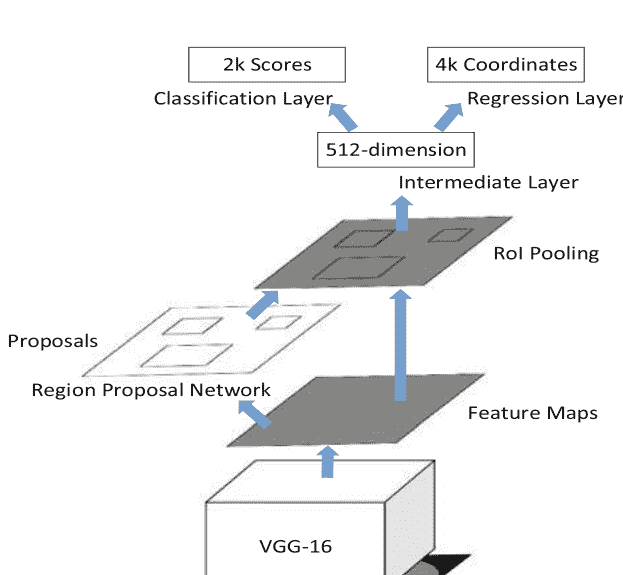

如图4.3所示，Faster R-CNN由3个组件[28]组成：

- (1) 使用预训练的CNN (VGG-16 [29]) 从太阳全盘磁图中提取图像特征；
- (2) 在第一步得到的特征图上执行RPN以生成物体候选框；
- (3) 训练分类器和回归器来对物体和背景进行分类，并推导出每个物体的坐标。

特征提取器可以是预训练的CNN，例如包含16个卷积层和池化层的VGG-16。卷积层负责特征提取，而池化层用于降低特征维度。在我们的实现中，全盘图像首先被调整为1024×1024的尺寸。然后，一个尺寸为1024×1024的图像通过特征提取器被降低为一个64×64的特征图。此外，训练一个RPN来生成物体候选框，以替代R-CNN和Fast-R-CNN中耗时的选择性搜索模块。为了训练一个RPN，需要有标记的样本。正类表示相关的锚点包含一个物体，而负类表示相关的锚点是背景。交并比（IoU）被定义为物体候选框与真实值之间重叠区域的面积相对于当前整个并集的比率。与真实框的IoU重叠大于0.7的候选框被视为正样本，而与真实框的IoU重叠小于0.3的候选框被视为负样本。为了增加数据集，使用随机变换来生成更多样本，以减少过拟合的风险。通过获取区域候选框后

## ## 4.1.5 性能评估

太阳动力学观测卫星（SDO）上的太阳地震学和磁力成像仪（HMI）提供了太阳的常规全盘磁场观测。美国国家海洋和大气管理局（NOAA）维护着一个活动区域列表。它每天手动或自动检测活动区域，并按时间顺序列出它们。我们从联合科学运营中心（JSOC）和美国国家海洋和大气管理局（NOAA）的太空天气预报中心获得了太阳全盘磁场图和相应的活动区域摘要。从${}^{2010}$年到${}^{2017}$年，共有4645个全盘磁场图，时间间隔为${}^{24}$小时。在这些磁场图和相应的活动区域信息上建立了一个活动区域数据库。该数据库被分为训练集和测试集，前者包含${}^{2010}$年至${}^{2015}$年的4073个样本，而后者包含${}^{2016}$年至${}^{2017}$年的其余样本。

所提出的太阳活动区检测模型使用SGD算法进行优化，动量为0.9，批量大小为4，最大迭代次数为100。初始学习率为0.001，然后在每6个迭代周期后除以10。

图4.4展示了一个成功的活动区检测示例，成功检测到了4个活动区（记录于2016年8月26日）。然而，我们的模型有时可能会错过一些活动区，如图4.5所示，该磁图是在2017年3月30日记录的。真阳率为90%，这意味着有10%的活动区可能会被错过。通常，较小的活动区或太阳盘边缘的活动区更容易被错过。因为太阳盘边缘的活动区受到太阳的投影效应的影响。此外，我们的模型有时可能会错误地判断一些安静区域为活动区，如图4.6所示，该磁图是在2016年5月4日记录的。真阴率为98%，这意味着只有2%的安静区域可能会被错误地检测到。

## 图4.4 成功的活动区域检测

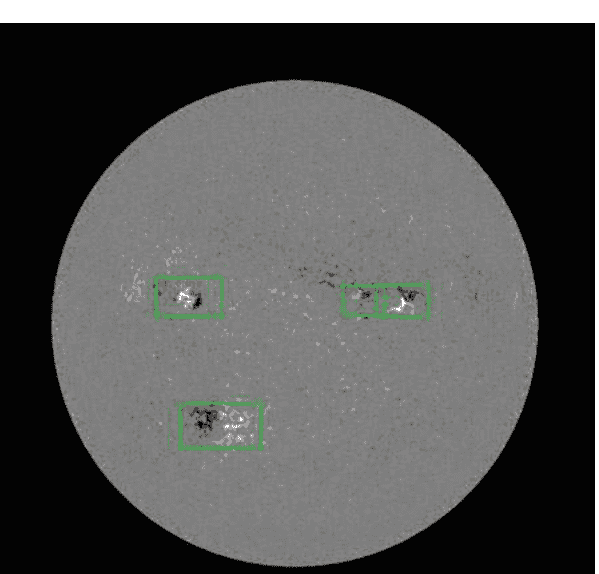

## 图4.5 缺失的活动区域

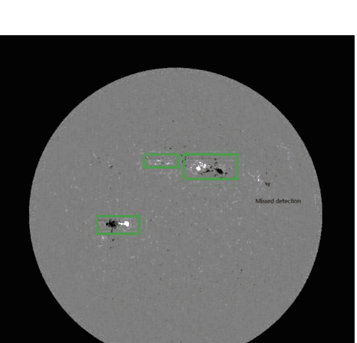

## 图4.6 错误检测的活动区域

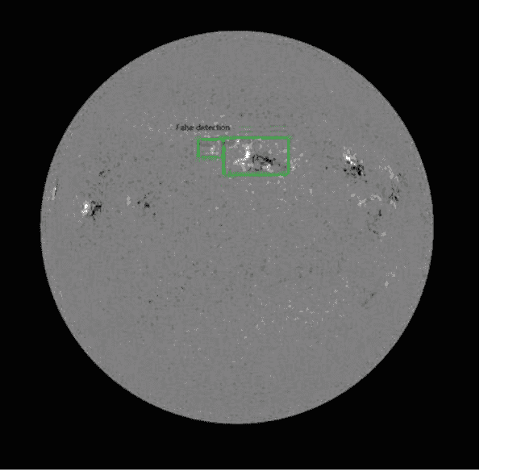

### 4.1.6 结论

一个活动区域检测数据集是基于2010年到2017年的SDO/HMI磁图构建的。该数据集包括太阳全盘磁图、活动区域和静区域提议，分别是正样本和负样本，以及活动区域的边界框。在建立的数据集上，训练了一个Faster R-CNN模型用于活动区域检测。性能评估表明，有10%的活动区域被漏检，而有2%的静区域被错误地检测为活动区域，证明了我们提出的活动区域检测模型的良好性能。然而，仍然存在一些关于小型活动区域或位于太阳盘边缘的活动区域的问题。可以通过特殊处理小型活动区域和受到太阳盘边缘投影效应影响的活动区域来进一步优化。

## 4.2 EUV波的检测

### 4.2.1 EUV波

日冕“EUV波”表现为EUV明亮的前沿在太阳盘的一个显著部分传播。例如，[30]曾经报道过一次大规模的波动，明亮的前沿后面是扩展的暗淡区域，并从一个耀斑点传播出去。尽管这种现象已经在高时空分辨率下广泛研究过

### 4.2.2 用于EUV波的检测网络

现有的经典检测网络包括 R-CNN [14]、Fast R-CNN [16]、Faster R-CNN [17] 和 Mask-RCNN [40]。它们将目标检测视为一个分类任务。为了检测一个目标，首先需要提供许多候选区域建议进行检查。这些区域建议是从不同的位置和不同的补丁大小中提取的。然后，在区域建议和真实值之间进行对应关系的训练二元分类器，其中对应关系表示一个区域建议是否是目标。具有自身与真实值之间最佳匹配的区域建议是目标。与之前的网络[14-16]相比，Faster R-CNN由于使用了区域建议网络（RPN）[17]而具有更高的计算效率，因此我们选择它来构建我们的EUV波检测网络。

所提出的检测网络如图4.7所示。它包括一个用于提取特征的卷积模块，一个用于确定最佳区域建议的RPN模块，一个感兴趣区域（RoI）池化[15]模块，一个分类器和一个回归器。为了生成区域建议，我们在最终的卷积特征图上滑动一个小型网络。该网络与输入卷积特征图的一个 n×n 空间窗口完全连接。每个窗口被转换为一个向量，并输入到两个兄弟全连接层中，即一个框回归层（用“reg”表示）和一个框分类层（用“cls”表示）。在每个滑动窗口位置，我们提取 k 个具有不同尺度的区域建议。

## 图4.7 EUV波检测网络

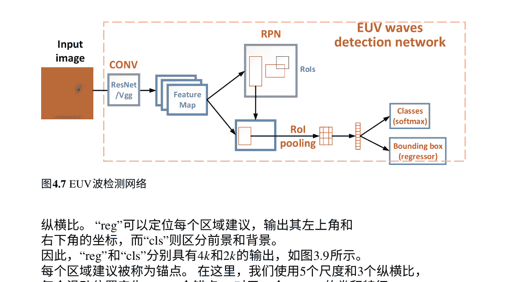

纵横比。“reg”可以定位每个区域建议，输出其左上角和右下角的坐标，而“cls”则区分前景和背景。因此，“reg”和“cls”分别具有4k和2k的输出，如图3.9所示。每个区域建议被称为锚点。在这里，我们使用5个尺度和3个纵横比，每个滑动位置产生k=15个锚点。对于一个W×H的卷积特征图，总共有W×H×k个锚点。

给定一张图片，我们首先使用预训练的网络（CONV），例如VGGNet[41]和ResNet [29]，提取图像特征。预训练的VGGNet和ResNet可以通过GitHub下载，例如[42]。然后，RPN被堆叠在CONV上生成区域建议。在R-CNN [14]和FastR-CNN [16]中，使用选择性搜索算法[25]生成区域建议。它是通过神经网络之外的CPU实现的，导致计算复杂度非常高。在Faster R-CNN中，使用了图4.8中所示的RPN代替了选择性搜索算法，从而在一个端到端的系统中生成了区域建议。此外，它们与检测网络共享相同的特征图，无需额外的计算。因此，相对于Fast R-CNN，Faster R-CNN的推理速度快了10倍。

对于训练RPN，为每个锚点分配一个二进制类别标签（是CME还是非CME）。如果一个锚点与任何一个真实值的IoU重叠大于0.7，则分配一个正标签。而对于与所有真实值的IoU重叠小于0.3的锚点，则分配一个负标签。然后我们可以得到图像的损失函数。

$$
\mathcal{L}(p_i, t_i) = \frac{1}{N_{\text{cls}}} \sum_i \mathcal{L}_{\text{cls}}(p_i, p_i^*) + \lambda \frac{1}{N_{\text{reg}}} \sum_i p_i^* \mathcal{L}_{\text{reg}}(t_i, t_i^*), \quad (4.1)
$$

其中 i是一个小批量中锚点的索引，pi是预测的概率第 i个锚点是一个物体（CME）的概率。地面真实标签 p_i^*表示锚点是正样本（p_i^* = 1）还是负样本（p_i^* = 0）。ti是预测边界框的坐标，t_i^*是与一个正样本锚点相关的真实边界框的坐标。Lcls是两个类别（物体和非物体）的对数损失。Lreg图4.8 区域建议网络（RPN）

将预测框的坐标限制在接近真实框的范围内。N<sub>cls</sub>和Nreg是规范化因子，设置为小批量大小和锚点位置的数量。λ设置为10，在接下来的实验中将进一步讨论。

观察图3.9a，在通过RPN生成区域建议之后，它们通过RoI池化，使得每个区域建议具有相同的维度。最后，这些具有相同维度的向量被输入到一个分类器和一个回归器中，每个RoI输出两个向量，即softmax概率和每类边界框回归偏移。我们遵循Faster R-CNN的做法，使用一个多任务损失函数，包括分类和回归。

### 4.2.3 EUV波轮廓的网络

在给定矩形区域检测到EUV波之后，我们进一步绘制EUV波的轮廓，以更好地确定其起源、传播方向/速度和面积。为此，我们采用pix2pix GAN自动生成EUV波的轮廓。Pix2pix GAN是一个有条件的GAN，由一个生成器（G）和一个判别器（D）组成。生成器被训练成生成无法被判别器与“真实”区分的“伪造”图像。这个训练过程在图4.9中有示意图，其中x，G(x)和y分别是输入图像、生成图像（“伪造”）和标记图像（“真实”）。为了训练模型，我们手动标记了EUV波（“y”），如图4.9所示。

图4.9 使用pix2pix GAN描绘检测到的EUV波的波前

为了训练EUV波描绘网络，以下三个过程被迭代实施，直到满足结束条件或达到最大迭代次数。在这里，“x”代表从上述检测网络中检测到的EUV波的图像块，“y”是手动绘制的地面真实值。

- (i) 将图像块（在第一步中检测到的EUV波）输入到 G中，并获得输出 G(x)；
- (ii) 使用 (x, G(x)): “fake” 和 {x, y}: “real” 对来训练鉴别器 D；
- (iii) 使用 (x, G(x))来训练生成器 G，同时固定鉴别器 D，并返回损失；
- (iv) 转到步骤 (i)。

在训练阶段， G的目标是生成尽可能接近地面真实值的图像，以便欺骗 D。D尽力区分伪造的G(x)和“real”图像。因此， G和D组成了一个双人零和游戏，如（2.7）所述。对于我们的任务， G需要生成不仅具有轮廓风格，而且接近地面真实值的图像。因此，除了传统的cGAN之外，我们模型的损失函数定义为

$$ G^* = \arg \min_G \max_D \mathcal{L}_{cGAN}(G, D) + \mathcal{L}_{L1}(G), \quad (4.2) $$

where \( \mathcal{L}_{L1}(G) = \mathbb{E}_{x,y,z} [||y - G(x, z)||_1] \). 经过以上两个步骤，我们最终可以用简单的轮廓描述EUV波。通过提供轮廓序列，我们可以更容易地推断EUV波的演化/传播。然后，我们可以推断出CME的初始/最终速度、加速度、面积和主要角度，以其起源为中心，将CME表征为CDAW SOHO/LASCO CME目录[43, 44]。

### 4.2.4 性能评估

为了探测CME的起源并诊断其源区，我们的研究是基于SDO/AIA观测，CME是在EUV波前进过太阳盘面的。测试条件：Python，PyTorch深度学习包，Nvidia Geforch GTX780 GPU卡。本研究中使用的数据库和代码可以通过https://github.com/filterbank/EUVwaves访问。

我们收集了从2011年3月到2015年3月的29个X射线耀斑视频序列。对于每个视频序列，计算每帧相对于第一帧的差异，以更好地展示耀斑。首先，使用Faster R-CNN对EUV波进行训练，其中的真实值由活动区域的坐标推导出的边界框提供。采用动量为0.9的随机梯度下降法，初始学习率为0.001，在大约6个周期后下降0.1。在EUV波检测之后，我们手动标记了EUV波的波前作为训练EUV波轮廓网络的真实值。我们采用了pix2pix GAN来进行EUV波轮廓，如图4.9所示，“y”代表真实值，“x”表示在第一步中由Faster R-CNN检测到的EUV波。

在上述两个步骤之后，可以成功获得EUV波的轮廓，如图4.10所示，这可以更清楚地描述CME在其起源周围的情况。此外，自动轮廓EUV波可以提供EUV波的轮廓，这使得计算CME的参数更容易。

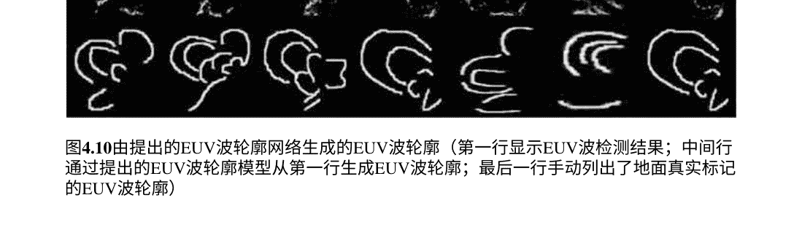

## 参考文献

1.  Benkhalil A, Zharkova V, Zharkov S, Ipson S. 2006年通过太阳特征目录进行活动区域检测和验证。太阳物理学 **235**, 87–106.
2.  Zhang J, Wang Y, Liu Y. 2010年从自动检测系统和计算偏差中获得的太阳活动区的统计特性。*The Astrophysical Journal* **723**, 1006.
3.  McAteer RJ, Gallagher PT, Ireland J, Young CA. 2005年应用于太阳磁图的自动边界提取和区域生长技术。太阳物理学 **228**, 55–66.
4.  Caballero C, Aranda M. 2013年用于太阳EUV图像中活动区检测的聚类方法的比较研究。太阳物理学 **283**, 691–717.
5.  Higgins PA, Gallagher PT, McAteer RJ, Bloomfield DS. 2011年用于空间天气监测的太阳磁特征检测和跟踪。空间研究进展 **47**, 2105–2117.
6.  Colak T, Qahwaji R. 2009年自动太阳活动预测：使用机器学习和太阳成像的混合计算平台进行太阳耀斑的自动预测。太空天气 **7**.
7.  Watson F, Fletcher L, Dalla S, Marshall S. 2009年对太阳黑子出现的纵向不对称性进行建模：Wilson凹陷的作用。太阳物理学 **260**, 5–19.
8.  Barra V, Delouille V, Hochedez JF. 2008年通过多通道模糊聚类分割极紫外太阳图像。空间研究进展 **42**, 917–925.
9.  Barra V, Delouille V, Kretzschmar M, Hochedez JF. 2009年太阳EUV图像的快速和稳健分割：算法和太阳23周期的结果。天体物理学与天文学 **505**, 361–371.
10. Verbeeck C, Higgins PA, Colak T, Watson FT, Delouille V, Mampaey B, Qahwaji R. 2013年通过比较自动检测算法的多波长分析活动区和太阳黑子。太阳物理学 **283**, 67–95.
11. Harker BJ. 2012年利用Hermite函数分解的无参数自动太阳活动区检测。天体物理学杂志补充系列 **203**, 7.
12. Dalal N, Triggs B. 2005年，用于人体检测的梯度直方图。在2005年IEEE计算机学会计算机视觉和模式识别会议（CVPR 2005）上，于2005年6月20日至26日，美国加利福尼亚州圣地亚哥pp. 886–893. IEEE计算机学会。
13. Felzenszwalb PF, McAllester DA, Ramanan D. 2008年，一种具有多尺度、可变形部件的判别式训练模型。在2008年IEEE计算机学会计算机视觉和模式识别会议（CVPR 2008）上，于2008年6月24日至26日，美国阿拉斯加州安克雷奇。IEEE计算机学会。
14. Girshick R, Donahue J, Darrell T, Malik J. 2014年，用于准确目标检测和语义分割的丰富特征层次结构。在IEEE计算机视觉和模式识别会议的论文集中pp. 580–587.
15. He K, Zhang X, Ren S, Sun J. 2015年深度卷积网络中的空间金字塔池化用于视觉识别。IEEE模式分析与机器智能交易 **37**, 1904–1916.
16. Girshick R. 2015年快速r-cnn。在IEEE国际计算机会议论文集中视觉pp. 1440–1448.
17. Ren S, He K, Girshick R, Sun J. 2015年更快的r-cnn：实时目标检测与区域建议网络。在神经信息处理系统进展pp. 91–99.
18. Dai J, Li Y, He K, Sun J. 2016年R-FCN：基于区域的全卷积网络的目标检测。在Lee DD，Sugiyama M, von Luxburg U, Guyon I, Garnett R, 编辑，神经信息处理系统29：神经信息年会处理系统2016年12月5日至10日，西班牙巴塞罗那pp. 379–387.
19. Li Z, Peng C, Yu G, Zhang X, Deng Y, Sun J. 2017年 光头 R-CNN: 为两阶段目标检测辩护. *CoRR* abs/1711.07264.
20. Redmon J, Divvala SK, Girshick RB, Farhadi A. 2016年 你只需要看一次: 统一的、实时的目标检测。在2016年IEEE计算机视觉和模式识别会议, CVPR 2016, 拉斯维加斯, 美国, 2016年6月27日-30日pp. 779–788. IEEE计算机学会。
21. Redmon J, Farhadi A. 2017年 YOLO9000: 更好、更快、更强. 在2017年IEEE计算机视觉和模式识别会议, CVPR 2017, 檀香山, 美国, 2017年7月21日-26日 pp. 6517–6525. IEEE计算机学会。
22. Redmon J, Farhadi A. 2018年 YOLOv3: 一种渐进式改进。 CoRRabs/1804.02767。
23. Liu W, Anguelov D, Erhan D, Szegedy C, Reed SE, Fu C, Berg AC. 2015年 SSD: 单次多框检测器。 CoRRabs/1512.02325。
24. Lin T, Goyal P, Girshick RB, He K, Doll r P. 2017年 密集目标检测的焦点损失。 CoRRabs/1708.02002。
25. Uijlings JR, Van De Sande KE, Gevers T, Smeulders AW. 2013年 用于目标识别的选择性搜索。 国际计算机视觉杂志 104, 154–171。
26. Lowe DG. 2004年 尺度不变关键点的独特图像特征。 国际计算机视觉杂志 60, 91–110。
27. Dalal N, Triggs B. 2005年，用于人体检测的梯度方向直方图。 在2005年IEEE计算机学会计算机视觉和模式识别会议（CVPR'05）卷1页886-893. Ieee。
28. Ren S, He K, Girshick R, Sun J. 2016年，更快的R-CNN：基于区域建议网络的实时目标检测。 IEEE模式分析与机器智能交易 39, 1137-1149.
29. He K, Zhang X, Ren S, Sun J. 2016年，用于图像识别的深度残差学习。 在 IEEE计算机视觉和模式识别会议论文集 pp. 770-778.
30. Thompson BJ, Plunkett SP, Gurman JB, Newmark JS, St. Cyr OC, Michels DJ. 1998年，SOHO/EIT观测到的一个朝地球方向的日冕物质抛射，发生在1997年5月12日。 Geophys. Res. Lett. 25, 2465–2468.
31. 王华，沈超，林杰。2009年通过数值实验研究磁场不稳定引起的波动现象。 Astrophys. J. 700, 1716–1731.
32. Wills-Davey MJ, DeForest CE, Stenflo JO. 2007年“EIT波”是快模磁流体力学波吗？。 Astrophys. J. 664, 556–562.
33. Vr nak B, Cliver EW. 2008年冠层冲击波的起源。 邀请综述。 Solar Phys. 253, 215–235.
34. Chen PF, Wu ST, Shibata K, Fang C. 2002年在数值模拟中观测到的EIT和Moreton波。 Astrophys. J. Lett. 572, L99–L102.
35. Delann e C, T r k T, Aulanier G, Hochedez JF. 2008年 A New Model for Propagating Parts of EIT Waves: A Current Shell in a CME. Solar Phys. 247, 123–150.
36. Attrill GDR, Harra LK, van Driel-Gesztelyi L, D moulin P. 2007年 Coronal “Wave”: Magnetic Footprint of a Coronal Mass Ejection?. Astrophys. J. Lett. 656, L101–L104.
37. Biesecker DA, Myers DC, Thompson BJ, Hammer DM, Vourlidas A. 2002年 Solar Phenomena Associated with “EIT Waves”. Astrophys. J. 569, 1009–1015.
38. 陈平福. 2009年 EIT波与日冕物质抛射之间的关系. Astrophys. J. Lett. 698, L112-L115.
39. Xu L, Liu S, Yan Y, Zhang W. 2020年利用深度学习进行EUV波的检测和表征。 太阳物理学 295, 44.
40. He K, Gkioxari G, Doll r P, Girshick R. 2017年Mask r-cnn。 在计算机视觉国际会议论文集 pp. 2961–2969.
41. Simonyan K, Zisserman A. 2015年用于大规模图像识别的非常深的卷积神经网络。 国际学习表示会议.
42. Chollet F. 2019年github代码库。 https://github.com/fchollet/deep-learning-models/releases。 于2019年5月15日访问。
43. Center CD. 2019年LASCO CME目录。 https://cdaw.gsfc.nasa.gov/CME_list/。 于2019年6月28日访问。
44. Gopalswamy N, Yashiro S, Michalek G, Stenborg G, Vourlidas A, Freeland S, Howard R. 2009年 SOHO/LASCO CME目录。 地球、月球和行星 104, 295–313.

# 第五章 太阳图像的深度学习 生成任务

摘要 在前几章中，我们已经看到深度学习已经应用于分类任务。事实上，深度学习还展示了在图像生成方面的巨大能力，这比分类更具挑战性。在本章中，我们介绍了深度学习在太阳图像增强、重建和处理方面的几个应用，包括太阳射电望远镜图像去卷积、太阳成像去饱和、生成磁场图像、图像超分辨率。

这些任务都涉及图像生成，通过使用生成性神经网络。作为生成性网络的代表，GAN在图像生成任务中被广泛应用。它可以生成高保真度和逼真的内容，主要归功于对抗性损失。

- 图像去卷积
- 孔径合成
- 图像生成
- 磁图

## 5.1 太阳射电日晷的图像去卷积

对于单天线，其空间分辨率由天线直径决定。构建一个大型单天线是困难的，因此其空间分辨率不能很大。通过孔径合成（AS）技术，一组小天线被组装成一个大型望远镜，其空间分辨率由两个最远天线的距离而不是单个天线的直径给出。与直接成像系统不同，AS望远镜捕捉空间图像的傅里叶系数，然后实施逆傅里叶变换来重建空间图像。在实践中，受到天线数量的限制，傅里叶系数非常稀疏，导致图像模糊。为了去除/减少模糊，开发了“CLEAN”去卷积方法。然而，它最初是为点源设计的。

对于像太阳这样的扩展源，其效率受到了影响。受到深度学习在图像生成方面的成功启发，提出了一种基于GAN的太阳图像去卷积的深度网络。它是在原始图像和退化图像对上进行训练的。在鉴别器和生成器之间进行多轮的“对抗”，最终可以得到一个强大的生成器用于图像去卷积。

### 5.1.1 孔径合成原理

AS 的成像系统如图 5.1 所示，其中 \(I(x, y)\) 和 \(V(u, v)\) 分别是空间域和频率域中对应的亮度和可见度函数，对应原始图像。在实践中，使用 AS，只能获得稀疏采样的 \(V(u, v)\)，用 \(V^D(u, v)\) 表示。

\[V^D(u, v) = V(u, v) \times S(u, v),\tag{5.1}\]

其中 \(S(u, v)\) 是频域中的采样函数，对应于空间域中的脏波束（或点扩散函数（PSF））由 \(B^D(l, m)\) 表示。对（5.1）应用逆傅里叶变换，我们可以得到

\[I^D(l, m) = I(l, m) \otimes B^D(l, m),\tag{5.2}\]

其中符号“\(\otimes\)”表示卷积运算符。

根据（5.2），AS 望远镜只提供了脏图像 \(I^D(x, y)\)，而原始图像 \(I(x, y)\) 被脏波束 \(B(x, y)\) 污染。为了从（5.2）中恢复 \(I(x, y)\)，

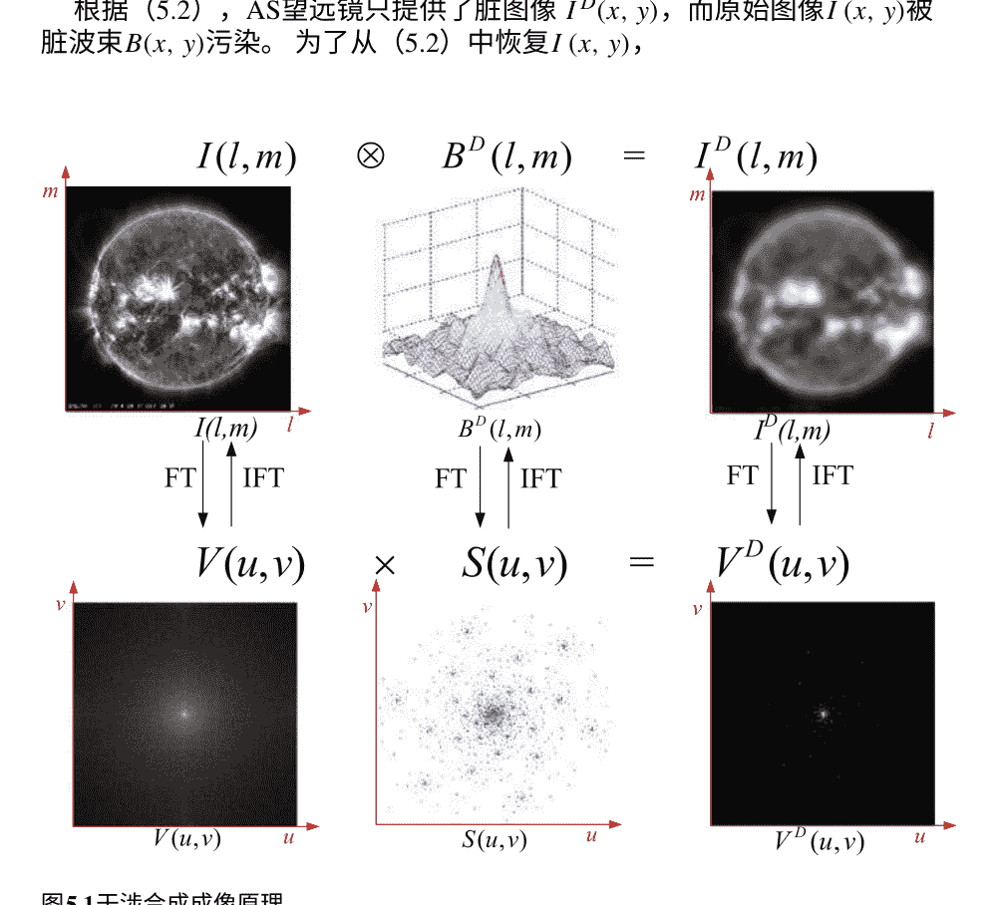

## 5.1 太阳射电日晕的图像去卷积

“CLEAN”去卷积方法被提出，它通过迭代地从（5.2）的左侧消除脏波束$B(x, y)$的影响。第一个CLEAN算法由H gbom等人提出，即H gbom CLEAN [1]。它在点源上的效率得到了广泛认可，例如对恒星对象的去卷积。然而，对于像太阳这样的扩展源，它并不理想，因此提出了许多H gbom CLEAN的变体，包括多分辨率CLEAN（MRC）、多尺度CLEAN和小波CLEAN [2, 3]。

### 5.1.2 图像去卷积的提出模型

图5.2展示了图像反卷积提出模型的原理。该模型的基线是一个cGAN，具体是[4]中描述的pix2pix网络。除了cGAN损失和空间域的L1损失($\mathcal{L}_{L1}^I(G) = \mathbb{E}_{x,y,z}[||y - G(x, z)||_1]$)，还引入了一种新的损失，即感知损失[5]。

$$\mathcal{L}_{L1}^P(G) = \mathbb{E}_{x,y,z}[||\Phi(y) - \Phi(G(x, z))||_1] \tag{5.3}$$

其中$\Phi(\cdot)$表示由预训练的VGG-16模型[6]提取的特征。在这里，我们提取VGG-16的前四层来得到$\Phi(y)$和$\Phi(G(x, z))$。因此，最终目标是

$$G^* = \arg \min_G \max_D \mathcal{L}_{cGAN}(G, D) + \lambda_1 \mathcal{L}_{L1}^I(G) + \lambda_2 \mathcal{L}_{L1}^P(G) \tag{5.4}$$

在我们的模型中，如图5.3所示，生成器是一个经典的UNet，由多个卷积和转置卷积层组成。编码器获取输入的压缩表示，而解码器则将该表示解压缩以重构输入。跳跃连接结合了图像的高级语义信息和低级特征，有益于

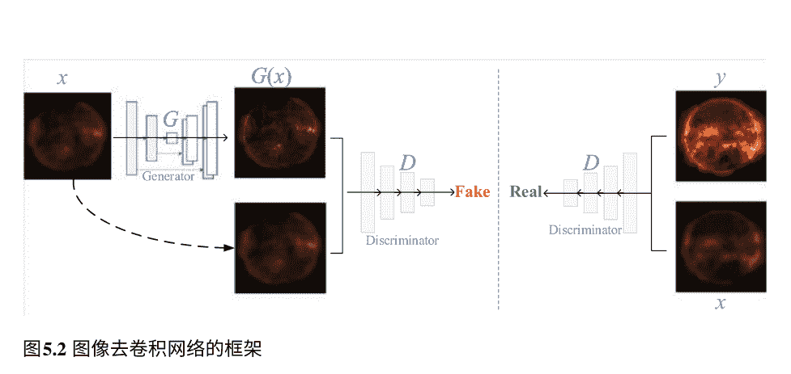

图5.2 图像去卷积网络的框架## 5 太阳图像生成任务中的深度学习

图5.3 用于AS图像去卷积的网络架构

图像生成任务。判别器是一个由5个卷积层组成的通用卷积神经网络。

图像生成/重构，如图像去模糊、去噪和超分辨率，已经在文献[7–10]中得到了很好的研究。图像去卷积是一个典型的图像生成问题。通常，在射电天文学中，它是通过CLEAN算法来处理的[1–3]。CLEAN算法在图像去卷积中需要满足两个条件才能成功。一个是信号应该是点源，另一个是脏波束应该完全已知，这意味着实际系统的脏波束和理想波束完全相同。然而，在实践中，这两个条件并不成立，因此CLEAN算法的效率受到了影响。

## 5.1 太阳射电日晷的图像去卷积

完整的实现（基于Pytorch）和训练好的网络可以通过https://github.com/filterbank/solarGAN访问。

经过约5000次循环后，学习到的模型可以稳定下来，生成高质量的图像，如图5.4所示，左列为脏图像，中列为GAN去卷积后的输出图像，右列为原始图像。学习到的模型可以很好地恢复图像的细节/结构，如图5.4b所示。与图5.4a中的脏图像相比，重建图像包含更多细节。我们还验证了空间损失和感知损失在我们的任务中的有效性，如（5.3）中所述。在整个测试数据集上比较峰值信噪比（PSNR）和结构相似性指数测量（SSIM）[11]，结果如表5.1所示。可以观察到最佳结果来自cGAN损失、空间域L1损失和感知L1损失的组合。

为了客观地衡量图像质量，使用PSNR和SSIM来评估所提出的模型。PSNR测量了两幅图像像素之间的绝对差异。SSIM可能忽略像素之间的差异，而更加关注图像结构的相似性。PSNR和SSIM的统计数据列在表5.2中。从表5.2可以看出，所提出的模型可以实现显著的图像质量改善，其中平均PSNR改善了4.97 dB，平均SSIM改善了5.2%。

为了比较所提出的模型和传统的Högbom CLEAN算法，在图5.4a中的脏图像经过Högbom CLEAN处理。Högbom CLEAN的结果显示在图5.5中，其中图5.5a和b分别展示了经过400次和4000次Högbom CLEAN处理后的亮点图像。图5.5c是对应于图5.5b的残差图像。图5.5d给出了最终的去卷积图像，它将残差图像（图5.5c）和亮点图像（图5.5b）相结合。从图5.5可以得出结论，Högbom CLEAN可以成功恢复图像中的亮点，但无法恢复图像的细节。这个结论也证实了Högbom CLEAN是为点源而设计的，而不是扩展源。将图5.5和图5.4进行比较，可以看出所提出的模型在恢复图像细节/精细结构方面明显优于Högbom CLEAN。

### 5.1.3 评估

为了评估所提出的模型，首先建立了一个包含原始/清晰图像和脏图像对的数据库。我们收集了来自SDO上的大气成像组件（AIA）的193 的41096张图像作为基准/清晰图像。然后，我们将MUSER-I的脏波束（如图5.1b所示）应用于这些清晰图像，得到相应的脏图像。对于训练、验证和测试，将数据库分为3个部分：8000对图像用于验证，8000对图像用于测试。

表5.1 所提出的网络在不同损失函数下的性能验证（粗体数字表示最佳性能）

| 损失函数 | PSNR | SSIM |
| --- | --- | --- |
| $\mathcal{L}_{cGAN}(G,D) + \mathcal{L}_{L1}^l$ | 38.0575 | 0.9561 |
| $\mathcal{L}_{cGAN}(G,D) + \mathcal{L}_{L1}^l + \mathcal{L}_{L1}^p$ | **38.4442** | **0.9609** |
| $\mathcal{L}_{cGAN}(G,D) + \mathcal{L}_{L2}^l$ | 35.2378 | 0.9316 |
| $\mathcal{L}_{cGAN}(G,D) + \mathcal{L}_{L2}^l + \mathcal{L}_{L2}^p$ | 37.3543 | 0.94727 |

表5.2 所提出的AS图像去卷积算法的性能评估

| 测试图像 | 峰值信噪比（dB） | SSIM（块：8 × 8） | SSIM（块：16 × 16） |
| --- | --- | --- | --- |
| | 去卷积脏图 | 原始图像 | 去卷积脏图 | 原始图像 | 去卷积脏图 | 原始图像 |
| 2012-08-31 19:48:06UT | 43.4474 | 38.1938 | 0.9512 | 0.8965 | 0.9493 | 0.8932 |
| 2014-09-17 08:48:06UT | 43.7925 | 38.3835 | 0.9527 | 0.9004 | 0.9509 | 0.8971 |
| 2014-09-17 09:00:06UT | 43.7546 | 38.2539 | 0.9520 | 0.8975 | 0.9502 | 0.8942 |
| 2014-09-17 09:12:06UT | 42.9609 | 37.6210 | 0.9508 | 0.8887 | 0.9491 | 0.8847 |
| 2015-05-28 12:48:06UT | 43.3054 | 38.5841 | 0.9530 | 0.9028 | 0.9512 | 0.8988 |
| 2016-05-18 02:00:05UT | 43.2166 | 38.5393 | 0.9531 | 0.9020 | 0.9512 | 0.8981 |
| 2016-05-18 02:12:05UT | 43.2083 | 38.5592 | 0.9504 | 0.9014 | 0.9484 | 0.8979 |
| 2017-02-01 03:48:04UT | 43.1904 | 38.4375 | 0.9500 | 0.8987 | 0.9481 | 0.8951 |
| 2017-02-01 04:00:04UT | 44.0610 | 39.4934 | 0.9574 | 0.9174 | 0.9558 | 0.9140 |
| 2017-09-03 00:48:04UT | 44.8305 | 40.0187 | 0.9599 | 0.9252 | 0.9584 | 0.9223 |
| 平均 | 43.5768 | 38.6084 | 0.9531 | 0.9031 | 0.9513 | 0.8995 |
| 改进 | 4.9683 | | 0.0500 | | 0.0517 |

## 5.2 过曝太阳图像的恢复

过曝可能发生在太阳观测图像中，当紫外线太阳爆发发生时，信号强度超出了成像系统的动态范围，导致信息丢失。 尽管在耀斑情况下，通过减少曝光时间可以稍微减轻过曝问题，但无法完全解决。 例如，在太阳耀斑期间，SDO/AIA [12-15] 经常记录过曝的图像/视频，导致太阳耀斑的细微结构丢失。

对于过曝区域（OER）的恢复（或去饱和），[16] 中引入了一种迭代算法，采用了 PRiL 近似 [17] 和 EM 算法。 它通过参考图像中的正常区域来恢复过曝区域。 最近，得益于深度学习，许多传统的图像处理/重建问题取得了突破，包括图像修复。 过曝恢复类似于图像修复任务。 它们之间的区别有两个方面。 首先，一些基于学习的方法，如 [18-21] 和 [22]，使用固定的缺失区域形状和位置来训练网络，而过曝通常具有不规则的形状和随机的位置。 其次，尽管对于图像修复的不规则缺失区域已经做出了一些努力，如 [23-25] 和 [26]，它们生成视觉上连贯的补全或产生语义上合理的结果，而过曝恢复旨在以高保真度恢复丢失的信息，除了视觉上合理外。

### 5.2.1 提出的Mask-pix2pix网络

为了解决上述挑战，提出了一种基于学习的模型，即mask-pix2pix网络[27]，用于恢复/完成过曝光区域。 所提出的模型是建立在pix2pix[28]之上的，因此它具有GAN的形式，其中生成器和判别器分别是U-net[29]和PatchGAN[30]。 与传统的pix2pix不同，所提出的模型使用了卷积-开关归一化-线性整流/整流线性单元（LReLU/ReLU） [31]模块（编码器使用LReLU，解码器使用ReLU），而不是卷积-批归一化-线性整流（Convolution-BatchNorm-ReLU） [32]。 前者（即可切换归一化）可以通过端到端学习其权重在批归一化[32]、层归一化[33]和实例归一化[34]之间进行切换。 这一改进提高了所提出模型的鲁棒性。 此外，所提出模型的损失函数包括对抗性cGAN损失、掩膜L1损失和边缘掩膜损失/平滑度。 对抗性cGAN损失可以捕捉所关注条件分布的完整熵，从而产生高度逼真的纹理。

掩蔽的L1损失只计算OER上的L1损失，强制在低频率下保证OER的正确性，从而保证OER的高保真度恢复。 边缘掩蔽损失用于平滑OER的边缘，并抑制最终恢复图像中的边缘伪影。

在[27]中，建立了一个新的过曝数据库，从大规模太阳动力学观测卫星图像数据库（LSDO）[35]中收集了13700张图像，用于训练模型。如图5.6所示，与我们的任务相关的是真实图像$I_A$，过曝图像$I_B$，二值掩蔽图$I_C$和边缘掩蔽图$I_D$，我们的任务是恢复$I_B$中$I_C$标记的区域，同时保持$I_C$之外的区域不变。给定OER $\Omega_M$和非OER $\bar{\Omega}_M$，我们可以得到$\Omega_M = I_B \odot I_C$和$\bar{\Omega}_M = I_B \odot (1 - I_C)$，其中$\odot$是逐元素乘法运算符。受图像修复的启发，可以使用生成对抗网络（GAN）来恢复$I_B$的缺失区域（即$\bar{\Omega}_M$）。在GAN中，生成器$G$是在真实图像和退化图像对上进行训练的。然后，将生成器应用于退化图像，输出修复后的图像，即$I_G = G(I_B)$。

对于我们的任务，期望$I_G$尽可能包含逼真的纹理，即在视觉上连贯且在语义上与$I_A$相关的。此外，$I_G \odot I_C$相对于地面真实$I_A$具有高保真度。此外，OERs和正常区域之间的边界应平滑过渡，以抑制人工边缘。为了实现这些目的，损失函数中还引入了一个掩码L1损失项和一个边缘掩码损失/平滑项。

在提出的mask-pix2pix模型中，生成器采用了U-Net架构，如图5.7所示。U-Net的命名来源于其形状，看起来像一个“U”。它由8层编码器和8层解码器组成。每层的参数在表5.3中详细解释。此外，在编码器和解码器之间添加了相同层的跳跃连接，如图5.7所示，用虚线表示。每个跳跃连接简单地将编码器的特征图与解码器的特征图在相同层级上连接起来（例如，在图5.7中的第$l$层，将$D_l$和$U_{n-l}$的特征图连接起来）。这种跨层连接可以减小编码器和解码器相同层级之间的语义差距，因为它们在U-Net结构中相距较远。判别器是一个PatchGAN网络，其结构在表5.4中解释。在GAN框架中，判别器用于判断“假”实例和“真”实例。在我们的工作中，判别器的输出是一个$16 \times 16$的图像，每个像素值的范围从0到1，用于衡量输出的真实程度。此外，在提出的模型中，我们采用了Convolution-SwitchNorm-LReLU/ReLU [31]，而不是传统pix2pix [28]中的Convolution-BatchNorm-ReLU [32]。前者被证明更加稳健。

OERs恢复是一项图像修复任务，但更关注的是重建信号的保真度，OERs和非OERs之间的自然过渡。因此，为OER恢复任务设计了一个新的混合损失函数，如下所示。

$\mathcal{L}_{cGAN}(G, D) =\mathbb{E}_{I_B,I_A}[\log D(I_B, I_A)] + \mathbb{E}_{I_B,z}[\log(1 - D(I_B, G(I_B, z)))]$, (5.5)

其中 $G$和 $D$分别表示生成器和判别器，$z$表示高斯噪声，$G$的目标是最小化 $D(I_B, G(I_B, z))$，使得 $G(I_B, z)$更像真实图像，而 $D$最大化 $D(I_B, I_A)$以尽可能区分“假”和“真”。图5.8说明了对抗性cGAN训练的概念，包括生成器和判别器。在图5.8中，判别器有两个任务，检查 $I_A$和 $I_B$是否是图像对（“真”和“假”），以及检查 $G(I_B)$是否是“真”（或“假”），而 $G$则生成尽可能逼真的“假”图像来欺骗 $D$。

(2) 掩蔽区域 $I_B \odot I_C$相对于 $I_A \odot I_C$的L1损失，用于高精度重建OER，其定义如下：

$\mathcal{L}_{1}^{m}(G) =\mathbb{E}[\|(I_A - G(I_B)) \odot I_C\|_1]$. (5.6)

(3) 边缘掩模的L1损失，可以使OER的边缘平滑，以防止人工连接OER和非OER的边缘。它的定义如下

$\mathcal{L}_1^e(G) = \mathbb{E}[||(I_A - G(I_B)) \odot I_D||_1] \quad (5.7)$

总之，最终的优化目标为

$$G^* = \arg \min_G \max_D \mathcal{L}_{cGAN}(G, D) + \lambda_1 \mathcal{L}_1^m(G) + \lambda_2 \mathcal{L}_1^e(G)$$

其中 $\lambda_1$ 和 $\lambda_2$ 是用于组合上述三个损失组件的权重。根据我们的经验，它们被设置为0.1。

表5.3 生成器的架构

| 层 | 生成器的架构 | 输出尺寸 |
|---|---|---|
| 输入 | $I_A, I_B, I_C, I_D$ | (256×256×1) |
| D1 | 卷积层(4×4×64), **LReLU** | (128×128×64) |
| D2 | 卷积层(4×4×128), **SwitchNorm, LReLU** | (64×64×128) |
| D3 | 卷积层(4×4×256), **SwitchNorm, LReLU** | (32×32×256) |
| D4 | 卷积层(4×4×512), **SwitchNorm, LReLU, Dropout** | (16×16×512) |
| D5 | 卷积层(4×4×512), **SwitchNorm, LReLU, Dropout** | (8×8×512) |
| D6 | 卷积层(4×4×512), **SwitchNorm, LReLU, Dropout** | (4×4×512) |
| D7 | 卷积层(4×4×512), **SwitchNorm, LReLU, Dropout** | (2×2×512) |
| D8 | 卷积层(4×4×512), **LReLU, Dropout** | (1×1×512) |
| U1 | 连接(D8, D7), 反卷积层(4 ×4×512),<br> **SwitchNorm, ReLU, Dropout** | (2×2×512) |
| U2 | 连接(U1, D6), 反卷积层(4 ×4×512),<br> **SwitchNorm, ReLU, Dropout** | (4×4×512) |
| U3 | Concatenate(U2, D5), DeConv.(4×4×512),<br> **SwitchNorm, ReLU, Dropout** | (8×8×512) |
| U4 | Concatenate(U3, D4), DeConv.(4×4×512),<br> **SwitchNorm, ReLU, Dropout** | (16×16×512) |
| U5 | Concatenate(U4, D3), DeConv.(4×4×256),<br> **SwitchNorm, ReLU** | (32×32×256) |
| U6 | Concatenate(U5, D2), DeConv.(4×4×128),<br> **SwitchNorm, ReLU** | (64×64×128) |
| U7 | Concatenate(U6, D1), DeConv.(4×4×64),<br> **SwitchNorm, ReLU** | (128×128×64) |
| Final | Upsample(4×4×1), ZeroPad, Conv.(4×4×1), $tanh$ | (256×256×1) |
| Output | $I_G$ | (256×256×1) |

表5.4 鉴别器的架构

| 层 | 鉴别器的架构 | 输出尺寸 |
|---|---|---|
| 输入 | $[I_A I_B]$ or $[I_G^* I_B]$ | (256×256×2) |
| C1 | 卷积层(4×4×64), **LReLU** | (128×128×64) |
| C2 | 卷积层(4×4×128), **SwitchNorm, LReLU** | (64×64×128) |
| C3 | 卷积层(4×4×256), **SwitchNorm, LReLU** | (32×32×256) |
| C4 | 卷积层(4×4×512), **SwitchNorm, LReLU** | (16×16×512) |
| C5 | ZeroPad2d, Conv.(4×4×1) | (16×16×1) |
| Output | 真实或伪造矩阵 16 ×16 | |

### 5.2.2 评估

为了验证提出的掩膜-pix2pix模型，我们使用PyTorch在我们的数据库上实现了该模型，并与其他最先进的图像修复算法进行了比较。此外，我们进行了消融实验来评估损失函数的每个组件。我们使用Adam优化器来训练我们的模型，其中 $\beta_1 = 0.5$， $\beta_2 = 0.999$， $\epsilon = 10^{-8}$。图像分辨率为256×256，批量大小为16。初始学习率初始化为0.0002，然后每100个epoch减半。

#### 5.2.2.1 数据库

为了模型训练，我们在LSDO [35]上构建了一个过曝光数据库，其中包括事件记录、相应的图像和一些图像参数。事件记录包括生成和提取属性的太阳事件列表。
有四种事件，AR、日珥、太阳耀斑和S型。对于一个AR，边界框属性给出了多边形包围AR的左上角和右下角坐标，因此可以从全盘SDO/AIA图像中裁剪出相应的AR。裁剪后的AR被缩放到相同的分辨率（512×512），表示为 $I_A$。然后，在AR上施加阈值，产生过曝光的图像，表示为 $I_B$。从 $I_B$中，我们可以提取一个掩膜图，表示为 $I_C$，该图进一步通过一个圆形核（半径为3）膨胀。最后，从 $I_C$中提取边缘掩膜图 $I_D$，用于边缘掩膜损失/平滑度。因此，数据库中的每个样本包含四个组件：真实图像 $I_A$，过曝光（伪造）图像 $I_B$，掩膜图$I_C$和边缘掩膜图 $I_D$。

#### 5.2.2.2 与最先进方法的比较

我们将提出的mask-pix2pix与基于补丁的平面结构引导(PSG) [36]和pix2pix [28]进行比较。图5.9显示了3个样本的视觉比较。可以发现，提出的mask-pix2pix可以生成具有显著视觉质量改进的图像，PSG不能充分恢复OERs，pix2pix [28]可能低估OERs，在重建后仍然存在过曝光的OERs。我们使用峰值信噪比(PSNR)和结构相似性指数(SSIM) [11]对它们的性能进行定量测量。PSNR和SSIM在图5.9中的每个重建图像下方显示。在整个数据库(超过1600个样本)上还计算了平均PSNR和SSIM，列在表5.5中。可以观察到，提出的模型在性能上明显优于其他两个基准模型，相对于pix2pix [28]的PSNR增益高达5 dB，相对于PSG [36]的PSNR增益高达15 dB。

#### 5.2.2.3 消融研究

为了评估损失函数的每个组成部分的贡献，我们进行了以下三个消融实验：

- 1. 对整个图像进行对抗损失和传统的L1损失，即 $\mathcal{L}_{cGAN}(G, D) + \lambda_1 \mathcal{L}_1(G)$;
- 2. 对抗损失和掩蔽的L1损失，即 $\mathcal{L}_{cGAN}(G, D) + \lambda_1 \mathcal{L}^m_1(G)$;
- 3. 对抗损失、掩蔽的L1损失和边缘掩膜损失/平滑度，即 $\mathcal{L}_{cGAN}(G, D) + \lambda_1 \mathcal{L}^m_1(G) + \lambda_2 \mathcal{L}^e_1(G)$。

SDO AIA 171Å 2014-03-02 21:45:11

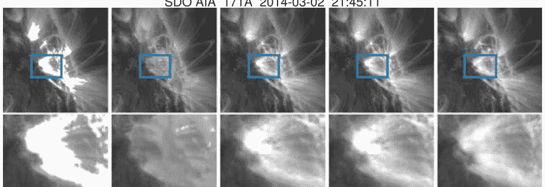

PSNR=24.8262 SSIM=0.9825 PSNR=35.3191 SSIM=0.9898 PSNR=35.8122 SSIM=0.9941

SDO AIA 171Å 2014-01-14 11:15:35

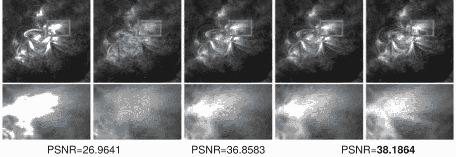

PSNR=26.9641 SSIM=0.9892 PSNR=36.8583 SSIM=0.9973 PSNR=38.1864 SSIM=0.9982

SDO AIA 171Å 2014-03-10 02:55:11

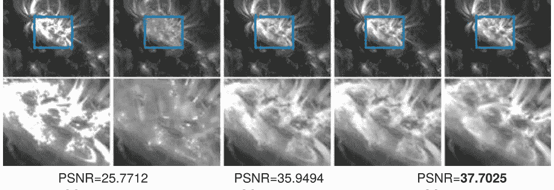

PSNR=25.7712 SSIM=0.9863 PSNR=35.9494 SSIM=0.9978 PSNR=37.7025 SSIM=0.9985

input PSG [36] pix2pix [28] mask-pix2pix (with Convolution-BatchNorm-ReLU modules) ground truth

图5.9 所提出的方法与两种最先进方法的比较

表5.5 我们模型与其他两个基准模型之间的平均PSNR和SSIM比较 (粗体数字表示最佳性能)

| 方法 | 损失函数 | 模块 | PSNR | SSIM |
|------|----------|------|------|------|
| PSG [36] | | | 24.6219 | 0.9810 |
| pix2pix [28] | L_cGAN + λ_1 L_1^a | 卷积-批归一化-ReLU | 34.7763 | 0.9891 |
| pix2pix | L_cGAN + λ_1 L_1^a | 卷积-切换归一化-LReLU/ReLU | 35.9939 | 0.9918 |
| 掩膜-pix2pix | L_cGAN + λ_1 L_1^m^a | 卷积-切换归一化-LReLU/ReLU | 37.4334 | 0.9937 |
| 掩膜-pix2pix | L_cGAN + λ_1 L_1^m + λ_2 L_1^e^b | 卷积-切换归一化-LReLU/ReLU | 39.6931 | 0.9985 |

- - a λ1 = 0.1.
- b λ1 = λ2 = 0.1.

图5.10展示了三个实验的实验结果。可以发现，尽管OER和非OER之间的边界平滑，但第一个消融实验无法准确估计强度和遗漏区域的内容。受益于提出的掩蔽损失，第二个消融实验可以很好地解决第一个实验的问题，但是它会产生人工边缘，如图5.10中的第一和第三幅图所示。在第二个实验之外引入边缘掩蔽损失 L_1^e，即提出的第三个实验，可以很好地解决上述两个问题。

## 5.3 从EUV图像生成磁图

磁场操纵着太阳大气中发生的所有太阳活动。在高太阳大气中发生的太阳爆发，如耀斑和日冕物质抛射，仍然与低太阳大气中的光球磁场密切相关。探索光球磁场与日冕的紫外观测之间的关系对我们理解太阳爆发机制非常重要。

SDO/AIA [37] 提供了太阳色球和日冕的紫外和极紫外观测仪。它可以展示色球和日冕的丰富太阳活动。SDO/HMI 可以测量光球磁场。Galvez等人[38]指出了HMI和AIA之间的物理机制映射关系。Kim等人[39]将这种映射视为图像到图像的转换，通过使用pix2pix网络[41]，从STEREO [40] EUV 304 观测仪生成远侧磁图。[39]的模型可以提供一个活动区域从太阳背面到正面的完整演化过程。

我们复现了Kim的算法，并在图5.11中比较了SDO/HMI磁图和生成的磁图。可以观察到该模型成功地从SDO/AIA 304 图像生成了正面磁图。生成的这些图像在形态上与SDO/HMI非常相似，活动区域和极性非常对齐。更重要的是，当将训练良好的模型应用于SDO到STEREO时，我们可以生成太阳背面的磁图，如图5.12所示。众所周知，STEREO由两颗几乎相同的卫星组成，一颗在地球轨道前方，另一颗在后方，提供首次立体测量太阳和其日冕物质抛射或CME性质的数据。不幸的是，它没有携带磁图仪。使用Kim的模型，可以从STEREO上的SECCHI EUVI（极紫外成像仪）生成磁图。因此，当背面极紫外观测可用时，我们可以与SDO/HMI合作，监测磁场从背面到正面的持续演变。然而，它遭受了磁极反转问题、不一致的运动和磁图序列的波动视觉感知问题。原因在于Kim的模型[39]是建立在单输入和单输出系统上的静态模型，因此无法很好地描述输入序列的渐变过渡和稳定几何构造。

为了处理时间序列，我们将卷积门控循环单元（GRU）[42]添加到通用的pix2pix GAN [41]中，构建了一个convGRU-pix2pix网络，这是一个动态模型。动态模型可以从输入图像序列中探索顺序信息，除了从每个单独的图像中挖掘信息，有助于生成一致的磁图序列。

图5.12 从STEREO的EUV观测生成的磁图。(a) STEREO 304。(b) 从(a)生成的磁图

此外，动态模型可以在源域和目标域之间建立联系，即使它们的变化是异步的。与HMI相比，AIA观测站记录了高太阳大气层中的太阳活动，其中通常发生快速的局部亮化或物质喷射。HMI和AIA的演变是不同步的。前者演变缓慢，即使太阳爆发也是如此。而后者变化快速而激烈，尤其是在太阳爆发的情况下。

所提出模型的基准是一个通用的pix2pix GAN，由一个生成器和一个判别器组成。生成器是一个典型的U-Net，即编码器-解码器结构。如图5.13所示，一个基本的U-Net在编码器和解码器之间配备了一个convGRU模块，使其能够处理静态模型上的时间序列。

GRU是由Cho等人提出的[43]，它是一种递归神经网络模型，允许每个递归单元自适应地捕捉不同长度的时间序列依赖关系。与LSTM相比，GRU将细胞状态和隐藏状态合并在一起，从而得到一个轻量级模型。GRU具有一个门控结构，用于控制单元内部信息的流动，其公式如下：

```
r_t = \delta(W^r x_t + R^r h_{t-1} + b^r) \tag{5.9}
z_t = \delta(W^z x_t + R^z h_{t-1} + b^z) \tag{5.10}
\tilde{h}_t = \varphi(W^h x_t + r_t \odot (R^h h_{t-1}) + b^h) \tag{5.11}
h_t = z_t \odot h_{t-1} + (1 - z_t) \odot \tilde{h}_t \tag{5.12}
```

其中$\tilde{h}_t$和$h_t$分别表示候选隐藏状态和时间$t$的隐藏状态，$r_t$和$z_t$分别表示时间$t$的重置门和更新门，$W*$和$R*(*=r,z,h)$表示网络的权重，$b*(*=r,z,h)$表示网络的偏置。非线性函数$\delta(\cdot)$和$\varphi(\cdot)$分别是sigmoid函数和tanh函数。

在[39]的工作基础上，SDO/AIA 304 和SDO/HMI磁图像形成图像对用于模型训练。三个AIA 304 连续图像和一个HMI图像被分组在一起形成一个样本，其中三个AIA连续图像构成条件输入，一个HMI磁图像是convGRU-pix2pix的真实值。HMI磁图像与第三个AIA 304 图像具有相同的时间戳。总共有约40,000个样本，构成一个数据库。

我们比较了三个模型，pix2pix，多通道pix2pix和convGRU pix2pix，以验证时间序列模型在生成磁图像方面的有效性。可以观察到convGRU pix2pix模型在磁场演化方面最一致，特别是在生成的磁图像序列中强磁场周围。请参考https://github.com/filterbank/solarMag。

## 5.4 从Hα生成磁场图

Hα是由氢产生的特定的深红可见光谱线，波长为6562.8纳米。因此，Hα望远镜可以放置在地面上。 由于磁场图和Hα之间存在密切的相关性，我们建议使用cGAN学习Hα和HMI磁场图之间的映射关系。

SDO/HMI和Hα图像之间的映射涉及到图像到图像的转换任务。 Pix2pix模型用于图像到图像的转换。 它的基线是一个cGAN，由生成器和判别器组成。 cGAN的目标函数由(2.7)描述，涉及对抗损失。 此外，我们的模型还使用L1损失来衡量信号的保真度。 所提出的模型采用与pix2pix相同的框架，但优化目标与pix2pix不同。 如上所述，静态模型（如pix2pix）不能很好地适应从SDO/AIA图像生成磁场图的任务。 原因在于SDO/AIA图像和SDO/HMI磁场图在同一时间尺度上是异步的。 令人惊讶的是，这个静态模型在从Hα生成磁场图方面表现良好，因为它们都记录了光球的图像，具有相同的太阳活动演化尺度。

pix2pix网络采用U-Net作为生成器，采用分块全卷积网络作为判别器。 网络配置的详细信息列在表5.6中。编码器有八个块，每个块由卷积、实例归一化和LeakyReLu组成。在这些块中，第四到第八个块以0.5的概率进行dropout。 解码器有八个块，每个块由卷积、实例归一化和LeakyReLu组成。其中包括转置卷积、实例归一化和ReLU。此外，第九到第十四个块使用了0.5的丢弃概率。对于模型训练，建立了一个由磁图和Hα对组成的数据库。Hα图像和磁图来自全球振动网络组（GONG [44]）和SDO [37]上的HMI [45]。GONG包括六个站点（Big Bear Solar Observatory、High Altitude Observatory、Learmonth Solar Observatory、Udaipur Solar ObservatoryInstituto de Astrof sica de Canarias和Cerro Tololo Interamerican Observatory），分布在世界各地。GONG提供全盘线心Hα太阳图像（2048 ×2048），时间间隔约为1分钟。SDO/HMI提供了线视场（LOS）磁场，以高时间和空间分辨率观测太阳光球磁场。我们从2012年到2013年收集了500对Hα和HMI LOS图像。原始的Hα和HMI图像分别为2048 ×2048和4096 ×4096。

我们根据它们的时间戳将Hα和HMI配对。HMI每个像素的空间分辨率为0.5角秒，而GONG Hα的空间分辨率只有HMI的一半。为了适应GPU的能力，它们都被降采样到512 ×512。最终，得到了包含654对图像的数据库。在训练过程中，训练集、验证集和测试集分别有394、130和130个图像对。

图5.14展示了从Hα生成磁图的一个例子，左边的图像是Hα图像，中间的图像是SDO/HMI图像，右边的图像是生成的磁图。可以观察到生成的磁图与真实值非常接近。此外，发现从Hα生成的磁图序列变化平滑，没有SDO/AIA生成的磁图出现的突变波动。原因在于Hα更接近光球的磁图，而SDO/AIA的EUV图像表现得更加活跃和暴力，尤其是在太阳耀斑的情况下。

表5.6 用于从Hα生成磁图的网络配置 (Ei和Di (i = 0, 1, ...,7)分别表示编码器和解码器的第 i层)

| 模块 | Conv2d | ConvTranpose | InstanceNorm | LeakyReLU | ReLU | Dropout |
|------|--------|--------------|--------------|-----------|------|---------|
| 编码器 E0 | ✓ | | ✓ | ✓ | | |
| E1 | ✓ | | ✓ | ✓ | | |
| E2 | ✓ | | ✓ | ✓ | | |
| E3 | ✓ | | ✓ | ✓ | | 0.5 |
| E4 | ✓ | | ✓ | ✓ | | 0.5 |
| E5 | ✓ | | ✓ | ✓ | | 0.5 |
| E6 | ✓ | | ✓ | ✓ | | 0.5 |
| E7 | ✓ | | ✓ | ✓ | | 0.5 |
| 解码器 D0 | | ✓ | ✓ | | ✓ | |
| D1 | | ✓ | ✓ | | ✓ | |
| D2 | | ✓ | ✓ | | ✓ | |
| D3 | | ✓ | ✓ | | ✓ | 0.5 |
| D4 | | ✓ | ✓ | | ✓ | 0.5 |
| D5 | | ✓ | ✓ | | ✓ | 0.5 |
| D6 | | ✓ | ✓ | | ✓ | 0.5 |
| D7 | | ✓ | ✓ | | ✓ | 0.5 |

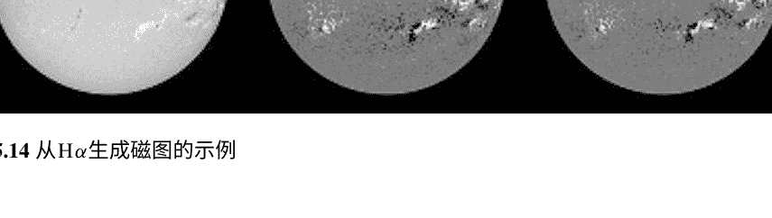

图5.14 从Hα生成磁图的示例

## 参考文献

1. H gbom J. 1974具有非规则干涉仪基线分布的孔径综合。天体物理学和天体物理学补充系列15，417。
2. Wakker BP, Schwarz U. 1988多分辨率CLEAN及其在干涉测量中的应用。天体物理学和天体物理学200，312-322。
3. Cornwell TJ. 2008无线电合成图像的多尺度CLEAN去卷积。IEEE选定主题信号处理杂志2，793-801。
4. Isola P, Zhu JY, Zhou T, Efros AA. 2016具有条件对抗网络的图像到图像转换。arXiv电子打印。
5. Johnson J, Alahi A, Fei-Fei L. 2016用于实时风格转换和超分辨率的感知损失。计算机科学讲义pp. 694-C711。
6. Simonyan K, Zisserman A. 2015 非常深的卷积神经网络用于大规模图像识别. 在国际学习表示会议.
7. Kupyn O, Budzan V, Mykhailych M, Mishkin D, Matas J. 2017 DeblurGAN: 使用条件对抗网络进行盲目运动去模糊.arXiv电子打印.
8. KupynOrest. 2019 github存储库. https://github.com/KupynOrest/DeblurGAN.git. 访问日期: 2019年8月19日.
9. Nah S, Kim TH, Lee KM. 2016深度多尺度卷积神经网络用于动态场景去模糊.arXiv电子打印.
10. Yan Q, Wang W. 2017 DCGANs用于图像超分辨率、去噪和去模糊. Adv. 神经信息处理系统8, 487-495.
11. Wang Z, Bovik AC, Sheikh HR, Simoncelli EP等人。2004年图像质量评估: 从错误可见性到结构相似性。IEEE图像处理交易13, 600-612.
12. Lemen JR, Akin DJ, Boerner PF, Chou C, Drake JF, Duncan DW, Edwards CG, FriedlaenderFM, Heyman GF, Hurlburt NE等。2011年, 太阳动力学观测卫星(SDO)上的大气成像组件(AIA)。在太阳动力学观测卫星pp.17-40。Springer。
13. Pesnell WD, Thompson BJ, Chamberlin PC. 2011年, 太阳动力学观测卫星(SDO)。在太阳动力学观测卫星pp.3-15。Springer。
14. Boerner P, Edwards C, Lemen J, Rausch A, Schrijver C, Shine R, Shing L, Stern R, Tarbell T, Wolfson CJ等。2011年, 太阳动力学观测卫星(SDO)上大气成像组件(AIA)的初始校准。在太阳动力学观测卫星第41-66页。Springer。
15. Scherrer PH, Schou J, Bush R, Kosovichev A, Bogart R, Hoeksema J, Liu Y, Duvall T, Zhao J, Schrijver C等。2012年, 太阳动力学观测卫星(SDO)的地震和磁场成像仪(HMI)研究。太阳物理学275, 207-227。
16. Guastavino S, Piana M, Massone AM, Schwartz R, Benvenuto F. 2019对太阳耀斑风暴的EUV观测进行去饱和处理。arXiv预印本arXiv:1904.04211.
17. Sabrina G, Federico B. 2018一种一致且数值高效的稀疏泊松回归变量选择方法，适用于学习和信号恢复。统计与计算29, 1-16.
18. Yu F, Koltun V. 2015通过扩张卷积进行多尺度上下文聚合。arXiv预印本arXiv:1511.07122.
19. Pathak D, Krahenbuhl P, Donahue J, Darrell T, Efros AA. 2016上下文编码器: 通过修复学习特征。在IEEE计算机视觉和模式识别会议论文集中pp. 2536-2544.
20. 杨C，卢X，林Z，谢特曼E，王O，李H。2017年高分辨率图像修复使用多尺度神经补丁合成。在计算机视觉和模式识别的IEEE会议论文集pp. 6721-6729。
21. 飯塚S，Simo-Serra E，石川H。2017年全局和局部一致的图像补全。ACM图形学交易(ToG)36, 107。
22. 宋Y，杨C，林Z，刘X，黄Q，李H，郭CC。2018年基于上下文的图像修复: 推断，匹配和翻译。在欧洲计算机视觉会议(ECCV)的论文集pp. 3-19。

# 第六章 太阳预测任务中的深度学习

## 参考文献
- 23. 刘G, 雷达FA, 施KJ, 王TC, 陶A, 卡坦扎罗B。 2018年用于不规则孔洞的图像修复使用部分卷积。 在欧洲计算机视觉会议（ECCV）的论文集pp. 85–100。
- 24. Yan Z, Li X, Li M, Zuo W, Shan S. 2018 Shift-net: 基于深度特征重排的图像修复. 在欧洲计算机视觉会议(ECCV)论文集中 pp.1–17.
- 25. Xiao Q, Li G, Chen Q. 2018 深度启发式生成网络用于认知图像修复. arXiv预印本 arXiv:1812.01458.
- 26. Nazeri K, Ng E, Joseph T, Qureshi F, Ebrahimi M. 2019 EdgeConnect: 基于对抗边缘学习的生成图像修复. arXiv预印本 arXiv:1901.00212.
- 27. Zhao D, Xu L, Chen L, Yan Y, Duan LY. 2019 Mask-Pix2Pix网络用于太阳图像过曝区域修复. 天文学进展 2019, 5343254.
- 28. Isola P, Zhu JY, Zhou T, Efros AA. 2017 带条件的图像到图像翻译与对抗网络。 在计算机视觉和模式识别的IEEE会议论文集中pp. 1125–1134。
- 29. Ronneberger O, Fischer P, Brox T. 2015 U-net: 用于生物医学图像分割的卷积网络。 在医学图像计算和计算辅助干预的国际会议上pp. 234–241。 Springer。
- 30. Mirza M, Osindero S. 2014 条件生成对抗网络。 arXiv预印本 arXiv:1411.1784。
- 31. Luo P, Ren J, Peng Z. 2018 可微学习归一化通过可切换归一化。 arXiv预印本 arXiv:1806.10779.
- 32. Ioffe S, Szegedy C. 2015 批归一化: 通过减少内部协变量偏移加速深度网络训练。 arXiv预印本 arXiv:1502.03167.
- 33. Lei Ba J, Kiros JR, Hinton GE. 2016 层归一化。 arXiv预印本 arXiv:1607.06450.
- 34. Ulyanov D, Vedaldi A, Lempitsky V. 2016 实例归一化: 快速风格化的缺失成分。 arXiv预印本 arXiv:1607.08022.
- 35. Kucuk A, Banda JM, Angryk RA. 2017 用于计算机视觉应用的大规模太阳动力学观测图像数据集。 科学数据 4, 170096.
- 36. Huang JB, Kang SB, Ahuja N, Kopf J. 2014 使用平面结构引导的图像补全。 ACM Transactions on graphics (TOG) 33, 129.
- 37. SDO观测站. [EB/OL]. https://sdo.gsfc.nasa.gov/ 访问日期：2020年10月31日。
- 38. Galvez R, Fouhey DF, Jin M, Szenicer A, Mu oz-Jaramillo A, Cheung MCM, Wright PJ, Bobra MG, Liu Y, Mason J, Thomas R. 2019 从NASA太阳动力学观测卫星任务中准备的机器学习数据集。 天体物理学补充系列 242, 7.
- 39. Kim T, Park E, Lee H, Moon YJ, Bae SH, Lim D, Jang S, Kim L, Cho IH, Choi M, Cho KS. 2019 通过对STEREO/EUVI数据进行深度学习分析获得的太阳背面磁图。 自然天文学 3, 397–400.
- 40. STEREO观测站. [EB/OL]. https://stereo.gsfc.nasa.gov/ 访问日期：2020年10月31日。
- 41. Isola P, Zhu JY, Zhou T, Efros AA. 2016 带有条件对抗网络的图像到图像的转换。
- 42. Cho K, van Merrienboer B, Bahdanau D, Bengio Y. 2014a 关于神经机器翻译的性质：编码器-解码器方法。 在SSST-8会议论文集中，第八届句法、语义和结构在统计翻译中的研讨会，103-111页，卡塔尔多哈。 计算语言学协会。
- 43. Cho K, van Merrienboer B, Bahdanau D, Bengio Y. 2014b 关于神经机器翻译的性质：编码器-解码器方法。 在SSST-8会议论文集中，第八届句法、语义和结构在统计翻译中的研讨会，103-111页，卡塔尔多哈。 计算语言学协会。
- 44. Frank, Hill, George, Fischer, Jennifer, Grier, John, W., Leibacher, and H. 1994 全球振荡网络组的站点调查。 太阳物理学。
- 45. 2011年设计和地面校准太阳动力学观测卫星（SDO）上的地震和磁场成像仪（HMI）仪器。 太阳物理学。

摘要 除了分类和生成，深度学习还适用于时间序列分析。与接受单个图像输入的CNN不同，RNN专门设计用于处理时间序列输入，例如视频序列、自然语言处理。作为RNN的最佳代表，LSTM已经在各种时间序列分析中被广泛利用，取得了巨大的成功。在本章中，它被应用于太阳活动/事件预测和太阳辐射指数预测。

作为最猛烈的太阳爆发之一，太阳耀斑是灾难性太空天气的主要驱动源，因此太阳耀斑的预测非常重要。10.7厘米太阳射电流量是衡量全球太阳活动的典型指标。它是长期太空天气的典型指标。

关键词 太阳耀斑预测 · 循环神经网络 (RNN) · F10.7 cm 射电流量 · 太阳活动周期

## 6.1 太阳耀斑预测

太阳耀斑是由太阳活跃区磁场中储存的能量释放引起的。然而，它们的触发机制仍然未知。因此，太阳耀斑预测高度依赖于关于太阳耀斑和活跃区磁场/拓扑参数之间关系的统计数据。

在我们之前的工作中[1]，我们采用深度学习方法建立了太阳活跃区视线磁图的太阳耀斑预测模型。为了验证所提出的模型，我们构建了一个数据库，其中包含了1996年4月至2015年10月由SOHO/MDI和SDO/HMI记录的活跃区磁图。实验结果表明，所提出的模型与最先进的模型相当。此外，所提出的模型具有鲁棒性，对噪声不敏感。此外，网络的热力图显示了磁场特征对太阳耀斑预测的贡献最大。

### 6.1.1 太阳耀斑预测的历史

自1930年代以来，统计模型被广泛用于太阳耀斑预测模型中[2-7]。随着对人工智能的兴趣增加，机器学习被开发出来从大量数据中发现太阳耀斑预测的知识，例如著名的SVM [8-10]，神经网络 [11-14]，序数逻辑回归[15]，贝叶斯网络 [16]和集成学习 [17]。太阳耀斑预测的统计和传统机器学习模型都依赖于活动区域的形态和物理参数。与形态参数相比，衡量活动区域复杂性和非势能性的物理参数更为合理，例如中性线长度 [18]，磁场梯度 [19]，高应力纵向磁场 [20]，活动区域与预测活动经度之间的距离 [21]，Zernike矩的磁场图 [22]。此外，活动区域中物理参数的演变在[23-27]中进行了研究。然而，从活动区域提取的大多数参数彼此之间强相关，导致使用这些参数的模型性能相当[6, 28, 29]。从活动区域中提取高效参数长期以来一直是太阳耀斑预测的瓶颈。

### 6.1.2 太阳耀斑预测的深度学习模型

在过去的十年中，深度学习在太阳天文学领域得到了快速发展 [30-32]。深度学习最令人兴奋的特点是端到端的特征学习。因此，它可以自动挖掘隐藏在大量数据中的一些特定的预测模式，而不是从活动区域中提取手工制作的物理/形态参数来进行太阳耀斑预测，这在太阳耀斑预测方面取得了突破。

将浅层模型（例如SVM）应用于太阳耀斑预测时，首先需要从磁图中提取物理参数。然后，通过这些参数来训练一个分类器/回归器。通过深度学习，我们现在可以同时从端到端的网络中学习磁图的特征和分类器/回归器。在我们之前的工作中[1]，我们提出了一个基于CNN的太阳耀斑预测模型，取得了最先进的性能。

所提出模型的框架如图6.1所示，包括卷积层、非线性层、池化层和全连接层。每个卷积层都有64个滤波器，以确保从输入数据中提取预测模式的能力。滤波器的大小设置为11×11。网络参数/权重通过均值为0、标准差为0.02的高斯函数进行初始化。

基于梯度下降算法的优化不能保证全局最优解，尽管不同的权重会导致优化目标的不同解，但是随机权重的不同初始化会得到相似结果的次优解。为了统一图像尺寸，首先通过裁剪或变形将任意尺寸的图像调整为固定尺寸[33]。

在这里，我们将所有图像处理成100 × 100的尺寸。然后，在卷积层中进行卷积操作。之后，应用修正线性单元进行非线性变换。然后，在非线性层的输出上进行最大池化，以压缩网络体积，避免过拟合。在卷积层的顶部，堆叠了三个全连接层。最后，网络输出一个表示太阳耀斑事件是否发生的概率。

在选择网络结构之后，通过使用随机梯度下降（SGD）算法从大量数据中学习网络的权重。SGD中的学习率决定了训练过程的收敛速度。在学习率较小的情况下，训练过程会收敛得较慢，否则训练过程可能会发散。在这里，学习率设置为0.01。损失函数是网络输出和训练样本标签之间的交叉熵，由以下公式表示

$$L = - \sum_{i} y_i \log(x_i), \quad (6.1)$$

其中，$y_i$和$x_i$分别表示标签和网络输出。

### 6.1.3 模型验证

所提出的模型在伯克利视觉与学习中心开发的Caffe平台[34]上实现。首先，我们在SOHO/MDI上训练模型，并在SDO/HMI上进行测试。表6.1列出了通过TPR和FPR衡量的预测准确性。可以观察到，所提出的模型在24小时内可以实现0.85的M级耀斑预测TPR。其次，我们将所提出的模型与最先进的方法进行了比较。由于这些模型是在不同的数据集上进行训练和测试，并且使用不同的事件定义、预测频率和预测周期，我们只以24小时M级耀斑预测为例进行了比较[1]。

Murray等人[35]在全盘预测中进行了研究，数据集包括2015年至2016年的141个阳性样本和1489个阴性样本。Muranushi等人[36]提供了1小时间隔的24小时全盘预测M级耀斑。数据集包括2011年至2012年的1574个阳性样本和6837个阴性样本。

表6.1 不同预测周期和耀斑级别的太阳耀斑预测精度

| 预测周期（小时） | 耀斑级别 | TP | FN | TN | FP | TPR | FPR |
| :--- | :--- | :--- | :--- | :--- | :--- | :--- | :--- |
| 6 | C | 1945 | 1106 | 37,516 | 7919 | 0.64 | 0.17 |
| 6 | M | 304 | 60 | 39,782 | 8340 | 0.84 | 0.17 |
| 6 | X | 29 | 4 | 40,894 | 7559 | 0.88 | 0.16 |
| 12 | C | 3386 | 1496 | 32,856 | 10,748 | 0.69 | 0.25 |
| 12 | M | 559 | 115 | 38,388 | 9424 | 0.83 | 0.20 |
| 12 | X | 61 | 6 | 41,050 | 7369 | 0.91 | 0.15 |
| 24 | C | 5338 | 2017 | 31,301 | 9830 | 0.73 | 0.24 |
| 24 | M | 999 | 176 | 38,398 | 8913 | 0.85 | 0.19 |
| 24 | X | 118 | 18 | 40,899 | 7451 | 0.87 | 0.15 |
| 48 | C | 7191 | 3591 | 31,607 | 6097 | 0.67 | 0.16 |
| 48 | M | 1614 | 378 | 37,711 | 8783 | 0.81 | 0.19 |
| 48 | X | 229 | 8 | 39,791 | 8458 | 0.97 | 0.18 |

表6.2 四个24小时M级耀斑预测模型的性能比较

| 事件参考 | 定义 | 预测频率 | 预测周期 | 测试样本 | TP率 | TN率 | TSS |
| :--- | :--- | :--- | :--- | :--- | :--- | :--- | :--- |
| [35] | 全盘M级 | 每6小时 | 24小时 | 2015–2016 | 80% | 72% | 0.525 |
| [36] | 全盘M级 | 每1小时 | 24小时 | 2011–2012 | 85% | 67% | 0.517 |
| [9] | 活动区域前24小时M级 | | | 2010–2014 | 83.2% | 93.3% | 0.765 |
| 提出的模型 | 活动区域每1.5小时24小时M级 | | | 2010–2015 | 85% | 81% | 0.662 |
| [1] | M级 | | | | | | |

Bobra和Couvidat [9]建立了一个针对活动区域24小时M级耀斑的预测模型。数据集包括303个阳性样本和5000个阴性样本，70%的数据用于训练，剩余的用于测试。为了验证我们的模型，数据集被分成十个折叠，九个折叠用于训练，一个折叠用于测试。这个过程重复了十次，直到每个折叠都被测试了一次。然后，评估指标在十次测试中进行了平均，以得到性能评估。性能比较列在表6.2中。可以观察到，所提出的模型通过TPR测量实现了对耀斑的最佳预测。

为了更好地理解网络的机制，图6.2可视化了网络的第一个卷积层。第一个卷积层由64个大小为11×11的卷积核组成，这些卷积核是随机初始化的，如图6.2a所示。随着迭代次数的增加，网络权重变得越来越有序，如图6.2b、c所示。经过3000次迭代后，权重变得越来越稳定，如图6.2d所示，表明成功捕捉到了稳定的预测模式。

图6.2 所提出网络的可视化（第一个卷积层的64个卷积核）。（a）初始随机滤波器权重。（b）经过1000次训练迭代后的滤波器权重。（c）经过2000次训练迭代后的滤波器权重。（d）经过3000次训练迭代后的滤波器权重。

如图6.2d所示，权重逐渐稳定，表明成功捕捉到了稳定的预测模式。

### 6.1.4 讨论

提出的太阳耀斑预测模型已经达到了最先进的性能。通过结合更多太阳色球和日冕的观测，它可能进一步改进。因此，我们进一步提出了一个新的模型，通过引入EUV图像与磁图合作进行太阳耀斑预测。此外，还提出了一个动态深度网络，用于从磁图序列推断太阳耀斑。由于太阳耀斑是一个动态过程，序列可以更好地表示动态过程。为了验证这个动态模型，建立了一个太阳耀斑序列数据库。数据库包含超过1091个耀斑序列，涵盖了从1996年到2020年发生的所有耀斑。每个序列都有30-100个磁图和相应的EUV图像。

## 6.2 F10.7 cm预测

F10.7（波长为10.7厘米）的来源是回旋共振辐射和布朗运动辐射[37-39]，这是两种不同的机制[40]。F10.7作为EUV观测的代理，表征了太阳EUV辐射的强度。它也是许多现有电离层和导航模型的输入参数。F10.7预测对太空天气非常重要。文献中已经有很多F10.7预测方法。刘等人[41]应用自回归模型(AR)预测27天内的f10.7，使用了54阶。黄等人[42]使用支持向量回归(SVM)方法预测F10.7 [42]。雷等人[43]从304 EUV观测中定义了一个指标PSR来预测F10.7 [43]。

LSTM是一种用于处理时间序列数据的RNN，用于探索输入序列的长期依赖性。它现在已经相当成熟，在行人预测[44]、语音识别[45]、序列到序列学习[46]等方面被使用。在这项工作中，它被用作骨干，建立了一个用于F10.7预测的双流LSTM模型。这两个流具有相同的网络结构，但它们的时间步长不同，分别为3天和27天。与单流模型相比，双流模型需要额外的27天输入，这可以挖掘关于27天太阳旋转周期的知识，有利于F10.7预测。实验结果表明，双流模型的性能优于单流模型。

### 6.2.1 F10.7厘米预测的深度学习模型

所提出的用于预测F10.7的双流LSTM模型如图6.3所示，由两个流组成。左流和右流的节点数不同，取决于时间步长。每个流包含三层，输入层、隐藏层和输出层。输入层接收F10.7序列$(x_1, x_2, ..., x_T)$，对于两个不同的流，$T=3$和$T=27$。隐藏层由LSTM单元组成，每个单元接收输入序列的一个元素。

然而，并不是所有的细胞都输出，只有最后一个。在隐藏层之后，我们可以得到来自输入F10.7序列的压缩表示，每个流都有一个。这两个表示被连接起来作为输出层的输入。在我们的任务中，输出层是一个回归器，用于预测未来3天的F10.7。

### 6.2.2 模型验证

我们使用Python和PyTorch库实现了提出的模型，用于预测未来3天的F10.7。用于模型训练和测试的数据库来自SWPC（https://www.swpc.noaa.gov/）。从1996年1月1日到2018年4月30日，包括8156个每日F10.7观测数据。数据库被分为训练集和测试集。训练集从1996年1月1日到2014年12月30日，测试集从2015年1月1日到2018年4月30日。为了衡量模型的准确性，使用预测的F10.7和真实值之间的均方误差（MSE）[47]。训练模型使用Adam优化器，批量大小为128。

F10.7具有27天的周期。为了探索F10.7的这种周期性，输入数据是一个54维向量，包含两个流的每日F10.7的两个周期。一个具有54维F10.7输入和时间步长为1。另一个具有时间步长为2的27 × 2的输入。为了验证所提出的双流模型的优势，我们将其与单流的LSTM和传统的自回归（AR）模型进行比较。这些实现的编解码器可以通过（https://github.com/filterbank/F10.7Forecast）访问。双流LSTM模型表现最好，均方误差最小为0.033870。单流LSTM的均方误差为0.035045，比双流模型差，但比AR模型的均方误差0.097559要好得多。此外，经过50个周期后，所提出的模型的均方误差趋于稳定。

图6.4和6.5展示了由提出的双流模型和两个基准模型预测的F10.7曲线，其中左图展示了经典AR模型的结果，中间图展示了单流LSTM模型的结果，右图展示了提出的模型的结果。为了比较，真实的F10.7以绿色显示，与预测的F10.7以红色显示进行对比。可以看出，相比于AR模型，提出的模型更接近真实的F10.7，这要归功于对输入序列的长期依赖的探索。对于AR模型，预测的F10.7与真实值之间存在一定的差距。

如图6.5所示，在2017年6月，由于太阳黑子和其他干扰因素，F10.7发生了突变。在这种情况下，经典的AR模型失效，导致无效的预测。尽管LSTM具有长期依赖性，可以校准以适应这种突变，但是如图6.5所示，两个LSTM模型的响应存在一定的延迟。与这两个LSTM模型相比，双流模型更好，因为它还考虑了F10.7的周期特性。

## 参考文献

- 1. 黄X，王H，徐L，刘J，李R，戴X。2018年基于深度学习的太阳耀斑预测模型。I. 针对视线磁图的结果。天体物理学杂志 **856**, 7。
- 2. Giovanelli RG. 1939年爆发与太阳黑子之间的关系。天体物理学杂志 **89**, 555。
- 3. Gallagher PT, Long DM。2011年太阳冕中的大尺度明亮前沿：对“EIT波”的综述。太空科学评论 **158**, 365–396。
- 4. Bloomfield DS, Higgins PA, McAteer RTJ, Gallagher PT。2012年可靠的太阳耀斑预测方法基准测试。天体物理学快报 **747**, L41。
- 5. Leka KD，Barnes G。2003年耀斑与安静耀斑活动区的光球磁场特性。II. 判别分析。天体物理学杂志 **595**, 1296–1306。
- 6. Leka KD, Barnes G. 2007年耀斑与耀斑安静活动区的光球磁场特性。IV. 一个具有统计学意义的样本。*Astrophys. J.* **656**, 1173-1186。
- 7. Mason JP, Hoeksema JT. 2010年使用13年的Michelson Doppler Imager磁谱仪测试自动太阳耀斑预测。*Astrophys. J.* **723**, 634–640。
- 8. Li R, Wang HN, He H, Cui YM, Zhan-LeDu. 2007年支持向量机结合K-最近邻算法用于太阳耀斑预测。*Chin. J. Astron. Astrophys.* **7**, 441-447。
- 9. Bobra MG，Couvidat S。2015年使用SDO/HMI矢量磁场数据进行太阳耀斑预测的机器学习算法。*Astrophys. J.* **798**, 135。
- 10. Nishizuka N, Sugiura K, Kubo Y, Den M, Watanari S, Ishii M. 2017年太阳耀斑预测模型，使用紫外线亮度和矢量磁图的三种机器学习算法。天体物理学杂志 **835**, 156。
- 11. Qahwaji R, Colak T. 2007年利用机器学习和太阳黑子关联的自动短期太阳耀斑预测。太阳物理学 **241**, 195–211。
- 12. Wang HN, Cui YM, Li R, Zhang LY, Han H. 2008年太阳耀斑预测模型，支持人工神经网络技术。空间研究进展 **42**, 1464–1468。
- 13. Colak T, Qahwaji R. 2009年自动化太阳活动预测：使用机器学习和太阳成像的混合计算平台进行太阳耀斑的自动预测。太空天气 **7**, S06001。
- 14. Ahmed OW, Qahwaji R, Colak T, Higgins PA, Gallagher PT, Bloomfield DS。2013年太阳耀斑预测使用先进特征提取，机器学习和特征选择。*Solar Phys.* **283**, 157–175。
- 15. Song H, Tan C, Jing J, Wang H, Yurchyshyn V, Abramenko V。2009年对即将发生的太阳耀斑预测中光球磁特征的统计评估。*Solar Phys.* **254**, 101–125。
- 16. Yu D, Huang X, Wang H, Cui Y, Hu Q, Zhou R。2010年使用贝叶斯网络方法进行短期太阳耀斑级别预测。*Astrophys. J.* **710**, 869–877。
- 17. Guerra JA, Pulkkinen A, Uritsky VM。2015年主要太阳耀斑的集合预测：初步结果。*Space Weather* **13**, 626–642。
- 18. Falconer DA. 2001 一种从矢量磁图预测日冕物质抛射的前瞻性方法。*J. Geophys. Res.* **106**, 25185–25190。
- 19. Cui Y, Li R, Zhang L, He Y, Wang H. 2006 太阳耀斑产生能力与光球磁场特性之间的相关性. 1. 最大水平梯度，中性线长度，奇点数量。*Solar Phys.* **237**, 45–59.
- 20. Huang X, Wang HN. 2013 利用高应力纵向磁场参数进行太阳耀斑预测.天体物理学和天文学研究 **13**, 351–358。
- 21. Huang X, Zhang L, Wang H, Li L. 2013 利用活动经度信息提高太阳耀斑预测性能。*Astron. Astrophys.* **549**, A127。
- 22. Raboonik A, Safari H, Alipour N, Wheatland MS. 2017 使用磁场图像的独特特征预测太阳耀斑。*Astrophys. J.* **834**, 11。
- 23. Yu D, Huang X, Wang H, Cui Y. 2009 使用顺序监督学习方法进行短期太阳耀斑预测。*Solar Phys.* **255**, 91–105。
- 24. Yu D, Huang X, Hu Q, Zhou R, Wang H, Cui Y. 2010 使用多分辨率预测器进行短期太阳耀斑预测。*Astrophys. J.* **709**, 321–326.
- 25. Huang X, Yu D, Hu Q, Wang H, Cui Y. 2010 使用预测团队进行短期太阳耀斑预测。*Solar Phys.* **263**, 175–184.
- 26. Korsós MB，Baranyi T，Ludmány A。 2014年太阳黑子群的爆发前动力学。 *Astrophys. J.* **789**, 107。
- 27. Korsós MB，Ludmány A，Erdélyi R，Baranyi T。 2015年基于太阳黑子群演化的耀斑可预测性。*Astrophys. J. Lett.* **802**, L21。
- 28. Barnes G，Leka KD。 2008年评估太阳耀斑预测方法的性能。*Astrophys. J. Lett.* **688**, L107。
- 29. Barnes G，Leka KD，Schrijver CJ，Colak T，Qahwaji R，Ashamari OW，Yuan Y，Zhang J，McAteer RTJ，Bloomfield DS，Higgins PA，Gallagher PT，Falconer DA，Georgoulis MK，Wheatland MS，Balch C，Dunn T，Wagner EL。 2016年耀斑预测方法的比较。I.来自“全清”研讨会的结果。*Astrophys. J.* **829**, 89。
- 30. Hinton GE，Salakhutdinov RR。 2006 用神经网络降低数据的维度。*科学* **313**, 504–507.
- 31. LeCun Y，Bengio Y，Hinton G。 2015 深度学习。 *自然* **521**, 444.
- 32. Schmidhuber J。 2015 神经网络中的深度学习: 概述。*神经网络* **61**, 85–117.
- 33. He K, Zhang X, Ren S, Sun J。 2015 深度卷积网络中的空间金字塔池化用于视觉识别。*IEEE模式分析与机器智能交易* **37**,1904–1916.
- 34. Jia Y, Shelhamer E, Donahue J, Karayev S, Long J, Girshick R, Guadarrama S, Darrell T。 2014 Caffe: 快速特征嵌入的卷积架构。*arXiv电子打印* p. arXiv:1408.5093.
- 35. Murray SA, Bingham S, Sharpe M, Jackson DR。 2017年在Met Office Space Weather Operations Centre进行的耀斑预测。*Space Weather* **15**, 577–588.
- 36. Muranushi T, Shibayama T, Muranushi YH, Isobe H, Nemoto S, Komazaki K, Shibata K。 2015年在GOES X射线通量中完全自动化的太阳耀斑预测器。*Space Weather* **13**,778–796.
- 37. Schröter EH。 1971年关于太阳黑子和活动区的磁场。 **43**, 167。
- 38. Schunker H, Cally P。 2006年关于太阳活动区上方磁场倾斜和大气振荡的研究。*Monthly Notices of the Royal Astronomical Society* **372**, 551–564.
- 39. Athay RG。 1976年关于太阳色球和日冕的研究：宁静太阳。 **53**。
- 40. 李杰。 2007年太阳活动区的无线电发射。《空间科学评论》**133**, 73–102。
- 41. 李思清, 邱振, 王静, 丁先康。 2010年10.7厘米太阳射电流量27天预报的建模研究(I)。《中国天文学和天体物理学》**34**, 305–315.
- 42. 黄超, 刘丹丹, 王建设。 2009年使用支持向量回归方法预测太阳活动指数F10.7的日指数。《天文与天体物理研究》**9**。
- 43. 雷磊, 钟琼, 王杰, 石亮, 刘硕。 2019年基于极紫外图像的F10.7中期预报方法。《天文学进展》2019, 5604092.
- 44. Alahi A, Goel K, Ramanathan V, Robicquet A, Fei-Fei L, Savarese S。 2016年社交LSTM:
- 45. Graves A, Jaitly N。 2014 朝着端到端的循环神经网络语音识别31st国际机器学习大会,*IC ML 2014* **5**, 1764–1772.
- 46. Sutskever I, Vinyals O, Le QV。 2014 序列到序列的神经网络学习*CoRRabs/1409.3215*.