# 工程系统中的深度学习和缺失数据


## 前言

《工程系统中的深度学习和缺失数据》讨论了人工智能的概念和应用，特别是深度学习。研究的人工智能技术包括多层自编码器网络和深度自编码器网络。本书还研究了计算和群体智能技术，包括蚁群优化、蚁狮优化、蝙蝠算法、布谷鸟搜索优化、火萤算法和入侵杂草优化算法。此外，本书探讨了使用具有不同隐藏层数的深度自编码器进行图像重建。本书还研究了从深度自编码器的瓶颈层获得的降维图像的重建。

这些技术被用于解决图像识别和重建环境中的缺失数据问题。

这本书对研究生、研究人员和对深度学习和图像处理感兴趣的人工智能从业者来说是一个有趣的参考资料。

南非奥克兰公园
2018年7月

Collins Achepsah Leke博士
Tshilidzi Marwala博士

## 致谢

我们要感谢以下人员对本手稿的贡献：Msizi Khoza、Mlungisi Duma博士、Fulufhelo Nelwamondo教授、Vukosi Marivate博士、Marcos Alvares博士、Pramod Parida博士、Ali Hasan博士、Ilyes Boulkaibet博士和Satyakama Paul博士。

我们还要感谢直接和间接参与手稿撰写的同事和从业者，包括Alain Richard Ndjongue博士、Stephan Martin Nlom、Mokesioluwa Fanoro、Chwayita Macanda和Nqobile Dudu。我们感谢Bhekisipho Twala教授。

我们将这本书献给Leke Nee Nchangeh Agatha Fonkeng，Leke Nchabanu Gwendoline，Dr. Leke Clarence Fonkeng，Dr. Leke Betechuoh Brain，Mbali Denga Marwala，Lwazi Thendo Marwala，Nhlonipho Khathushelo Marwala和Dr. Jabu lile Vuyiswa Manana。

2018年7月
Collins Achepsah Leke
Tshilidzi Marwala


## 关于作者

Collins Achepsah Leke 出生于喀麦隆雅温得，是约翰内斯堡大学的博士后研究员。他拥有南非威特沃特斯兰德大学计算机科学荣誉学士学位，约翰内斯堡大学工程硕士学位和工程博士学位。他的研究兴趣包括计算智能在工程、计算机科学、金融、社会科学和医学中的应用。

Tshilidzi Marwala 出生于南非林波波省文达，是约翰内斯堡大学的副校长和校长。此前，他曾担任约翰内斯堡大学研究与国际化副校长、工程与建筑环境学院执行院长。2003年至2008年，他先后担任南非威特沃特斯兰德大学电气与信息工程系副教授、教授、卡尔和艾米莉·福克斯系统与控制工程讲座教授以及系统工程SARChI讲座教授。2001年至2003年，他担任南非啤酒公司技术总监助理。2000年至2001年，他在伦敦帝国学院（当时的伦敦大学）担任博士后研究助理。他于1995年获得美国凯斯西储大学机械工程学士学位（优等荣誉），1997年获得南非比勒陀利亚大学机械工程硕士学位，2000年获得剑桥大学人工智能和工程专业博士学位。 Marwala于2017年在哥伦比亚大学商学院完成了高级管理项目（AMP），并于2007年在哈佛大学商学院完成了领导力发展项目（PLD）。 Tshilidzi是一名注册专业工程师，是TWAS（世界科学院）、南非科学院、非洲科学院和南非工程院的院士。他是IEEE（电气和电子工程师学会）的高级会员，也是ACM（计算机协会）的杰出会员。他的研究兴趣是多学科的，包括人工智能在工程、计算机科学、金融、社会科学和医学中的理论和应用。他在人才培养方面有着丰富的经验，曾指导完成47名硕士和28名博士研究生。其中一些学生已经在哈佛、牛津、剑桥、英属哥伦比亚、罗格斯、普渡、千叶和早稻田等知名大学继续攻读博士和博士后研究。他在人工智能领域出版了13本书，其中一本已经被翻译成中文，发表了300多篇论文，并拥有四项专利。他是《国际系统科学杂志》（泰勒和弗朗西斯出版社）的副编辑。他曾在哈佛大学、加州大学伯克利分校、剑桥大学沃尔夫森学院和南京工业大学访问学者，还是波兰西里西亚理工大学电气工程学院编程委员会的成员。他获得了45多个奖项，包括马普恩古布韦勋章，并在1989年伦敦国际青年科学双周会议（LIYSF）上担任代表。他的文章和观点曾出现在《新科学家》、《经济学人》和《时代》杂志上。

# 第一章 缺失数据估计简介

## 1.1 简介

缺失数据的存在影响数据集的质量，进而影响数据的分析和解释。导致数据缺失的原因有很多，其中一些原因更为突出。

第一个众所周知的原因是参与者拒绝透露一些个人和敏感信息，例如月收入。第二个主要原因是捕获和存储数据的系统故障。另一个主要原因是互操作性，即在系统之间交换的信息可能存在缺失数据。在几种情况下，数据收集者会实施严格的程序，使任何数据收集系统对缺失数据具有免疫性。尽管有所有这些尝试，但遗憾的是，缺失数据的存在仍然是数据分析任务中的一个重要问题。实际上，缺失数据问题的真正原因很少被事先知道，尤其是在工程问题中。因此，解决缺失数据问题的技术通常是不成功的。可用数据的不完整性对决策过程产生了不利影响，因为决策依赖于完整信息。

许多现有的决策支持系统，如常用的支持向量机、神经网络和几种计算智能方法，都是使用已知数据作为输入特征并预测输出的预测框架。这样的模型在输入中有一个或多个缺失信息时无法操作和产生决策。因此，如果数据集中的某些特征不完整，它们不能作为决策框架的一部分使用。缺失数据估计过程的目标通常是做出最佳决策。实现这个目标需要对缺失数据进行正确的近似。在对缺失数据进行近似后，就可以使用分类和回归工具进行决策。

值得注意的是，要区分缺失数据的估计和插补。缺失数据插补基本上是指处理缺失数据。这可能涉及删除带有缺失信息的数据集，或者应用诸如列表删除或简单估计缺失数据的方法。因此，在本章中，将缺失数据估计视为缺失数据插补的子集。一般而言，在社会科学的各种数据集中，缺失数据插补是处理缺失数据的可行方法。这是因为在社会科学中，统计分析任务的目标是估计统计参数，如标准差和均值。在工程等领域中，通常需要数据进行手动决策支持或自动决策支持，理想情况下不删除任何带有缺失数据的记录。因此，在大多数情况下，逼近缺失数据是所需的方法。正因为如此，在工程问题中，使用术语缺失数据估计更加合适，而不是缺失数据插补。

## 1.2 缺失数据估计方法的演变

在1970年代之前，缺失数据问题通过编辑来解决，即使用附加给定数据逻辑上暗示缺失值的设置。1976年，一种从不完整数据中进行推断的方法被开发出来。此后，Dempster等人（1997年）提出了期望最大化（EM）算法，导致了最大似然（ML）缺失数据估计方法的使用。不到十年后，Little和Rubin（1987年）确定了单一插补和案例删除的限制。他们引入了多重插补（MI）。在计算能力的同时进展下，多重插补才变得可行。这是因为它们需要大量的计算能力（Ho等，2001年；Faris等，2002年；Hui等，2004年；Sartori等，2005年）。从1990年代至今，已经开发并应用了多种缺失数据估计技术于不同领域。

最近，研究人员开始研究缺失数据估计结果对使用估计变量值的决策过程结果的敏感性。已经进行了研究，提出了新颖的方法来近似缺失数据条目。例如，人工智能方法如神经网络和优化算法如进化计算算法是越来越多地用于几个缺失数据估计任务的方法之一（Dhlamini等，2006年；Nelwamondo等，2007a年；Nelwamondo和Marwala，2007a，2008年）。应用于缺失数据插补问题的一些技术包括粗糙集（Nelwamondo和Marwala，2007b年），半隐藏马尔可夫模型（Yu和Kobayashi，2003年）和模糊方法（Gabrys，2002年；Nelwamondo和Marwala，2007c年），Hopfield神经网络（Wang，2005年）和遗传算法（Junninen等，2004年；Abdella，2005年；Abdella和Marwala，2005年）。

## 1.3 缺失数据比例

数据集中的缺失数据会影响基于信息的分析、推断和结论。随着数据集中缺失数据比例的增加，对机器学习算法性能的影响变得更加显著。研究人员已经表明，在大规模数据集中，当缺失数据比例较小时，对机器学习算法的影响并不显著（Ramon和Sebastiani 2001; Tremblay等人2010; Polikar等人2010）。这可能归因于某些机器学习算法本身具有适应一定比例缺失数据的框架。随着缺失数据比例的增加，例如比例大于25%的情况，观察到机器学习算法的容忍度和性能水平显著降低（Twala 2009）。正是由于这些容忍度和性能水平的降低，需要更复杂和可靠的方法来解决缺失数据问题。

## 1.4 缺失数据机制

如前所述，确定数据缺失的原因非常重要。当解释已知时，可以选择或推导出适合缺失数据插补的方法，从而提高效果和预测准确性。在许多情况下，数据收集者可能意识到这些原因，而统计学家和数据使用者在进行分析时可能没有这些信息可用。在这种情况下，数据使用者可能需要使用其他技术来帮助数据分析，以了解缺失数据与观察到的数据的关系，从而推导出可能的原因。数据集中的变量或特征被视为机制，如果它有助于解释其他变量是缺失还是不缺失。在通过调查收集的数据集中，机制变量经常与人们不愿透露的细节相关联。然而，这些信息通常可以从已有的数据中推导出来。例如，低收入人群可能不愿透露他们的收入，但可能会透露他们的最高教育水平。数据使用者可以利用提供的教育信息来了解收入情况。假设变量Y是完整的数据集，则：Y = {Y₀, Yₘ}。

这里 Y₀是观测到的Y的组成部分，而Yₘ是Y的缺失部分。当数据集中的某些或所有特征变量存在缺失数据条目或包含未完全描述问题域范围的数据条目时，这被称为缺失数据（Rubin 1978）。缺失数据的存在导致了许多领域面临问题，这些领域依赖于完整和高质量的数据。这导致不同的方法被引入，目的是解决不同学科中的缺失数据问题（Rubin 1978; Allison 2000）。以可接受的方式处理缺失数据取决于缺失性质。目前文献中存在四种缺失数据机制，分别是完全随机缺失（MCAR），随机缺失（MAR），非可忽略情况或非随机缺失（MNAR）和自然设计缺失（MBND）。

### ## 1.4.1 完全随机缺失（MCAR）

当特征变量的缺失数据条目的可能性与特征变量本身或数据集中的任何其他特征变量无关时，观察到MCAR情况。基本上，这意味着缺失数据条目不依赖于正在考虑的特征变量或数据集中的任何其他特征变量。这种关系在数学上表示为Little和Rubin（2014）：

$$ P(M|Y_{\text{o}}, Y_{\text{m}}) = P(M) \qquad (1.1) $$

其中 $M \in \{0, 1\}$ 表示缺失值的指示。如果 $Y$ 已知，则 $M = 1$，如果 $Y$ 未知/缺失，则 $M = 0$。$Y_{\text{o}}$ 表示 $Y$ 中的观察值，而 $Y_{\text{m}}$ 表示 $Y$ 的缺失值。根据公式（1.1），变量中的缺失条目的概率与 $Y_{\text{o}}$ 或 $Y_{\text{m}}$ 无关。例如，假设在与开发时间相关的建模软件缺陷时，如果缺失与缺陷率的缺失值以及开发时间的值无关，则数据被称为MCAR。研究人员已成功解决了数据为MCAR的情况。Silva-Ramirez等人（2011）成功地在具有缺失值的数据集中应用了多层感知器（MLPs）进行缺失数据插补。关于这种机制的其他研究工作可以在Pigott（2001）、Nishanth和Ravi（2013）中找到。

### ## 1.4.2 随机缺失（MAR）

当一个特定的特征变量具有缺失数据条目的可能性与数据集中的其他特征变量相关时，就观察到了MAR情况。然而，这些缺失数据并不依赖于特征变量本身。MAR意味着特征变量中的缺失数据是条件于数据集中的任何其他特征变量而不是正在考虑的特征变量（Scheffer 2000）。例如，考虑一个具有两个相关变量的数据集，月度支出和月度收入。假设高收入者都拒绝透露他们的月度支出，而低收入者提供这些信息。这意味着在数据集中，高收入者没有月度支出记录，而低收入者的信息是可用的。缺失的月度收入记录与其他变量相关联，与个人的收入水平之间存在着一种关系。这种关系可以用数学方式表达，如Marwala（2009）所述：

$$ P(M|Y_o, Y_m) = P(M|Y_o) \quad (1.2) $$

其中 $M \in \{0, 1\}$是缺失数据指示器，如果$Y$已知，则 $M =1$，如果 $Y$未知/缺失，则 $M = 0$。$Y_o$表示 $Y$中的观测值，而 $Y_m$表示 $Y$中的缺失值。方程（1.2）表明，给定一个可观测条目和一个缺失条目，缺失条目的出现概率等于仅给定可观测条目时缺失条目的概率。考虑到在第1.4.1节中描述的例子，由于某个开发时间，软件缺陷可能不会被揭示出来。这种情况表明数据是MAR的。在文献中进行了多项研究，其中缺失数据机制是MAR的，例如Nelwamondo等人（2007b）进行了一项研究，比较了期望最大化和GA优化的AANN的性能，结果发现AANN方法优于期望最大化方法。García-Laencina等人（2009）、Pooleto等人（2011）和Liu和Brown（2013）对这种机制进行了进一步研究。

### 1.4.3 非可忽略情况或非随机缺失 (MNAR)

第三种缺失数据机制是非随机或非可忽略情况。当特征变量的缺失数据条目的可能性取决于特征变量本身的值，而不考虑数据集中其他特征变量的值的任何改变或修改时，观察到MNAR情况（Allison 2000）。在这种情况下，由于缺失数据的性质不是随机的，因此无法通过利用数据集中的其他特征变量来估计缺失数据。MNAR是最具挑战性的缺失数据机制，这些值很难估计（Rubin 1978）。

让我们考虑前一小节中描述的相同情景。假设有些高收入者透露了他们的月度支出，而其他人拒绝透露，低收入者也是如此。与MAR机制不同，这种情况下月度支出变量的缺失条目不能被忽略，因为它们与收入变量或任何其他变量没有直接关联。用于估计这种类型缺失数据的模型往往不会有偏差。这种机制的概率形式不容易，因为机制中的数据既不是MAR也不是MCAR。

### ### 1.4.4 自然设计缺失 (MBND)

这是一种机制，其中缺失数据是因为无法在物理上测量 (Marwala 2009)。这些数据条目是不可能测量的，然而，在数据分析过程中它们是相当相关的。克服这个问题需要制定数学方程。这种缺失数据机制主要适用于机械工程和自然科学问题。因此，在考虑的问题中不会使用它在这篇论文中。

## 1.5 缺失数据模式

缺失数据发生的方式可以分为三种模式，如表1.1、1.2、1.3所示。表1.1描述了一种单变量模式，即仅在一个特征变量中存在缺失数据，如I7列所示。表1.2描述了一种任意缺失数据模式，即缺失数据以分布和随机的方式出现的情况。最后一种模式是单调缺失数据模式，如表1.3所示。这种模式也被称为均匀模式，因为它出现在缺失数据可以存在于多个特征变量中，并且很容易理解和识别的情况下 (Ramoni and Sebastiani 2001)。

本书考虑的缺失数据模式是任意模式，机制是随机缺失和完全随机缺失机制。

表1.1 单变量缺失数据模式

| 样本 | I1 | I2 | I3 | I4 | I5 | I6 | I7 |
|------|----|----|----|----|----|----|----|
| 1 | 0.38 | 0.18 | 0.20 | 0.19 | 0.75 | 0.67 | 0.96 |
| 2 | 0.69 | 0.11 | 0.08 | 0.41 | 0.65 | 0.63 | ? |
| 3 | 0.17 | 0.79 | 0.66 | 0.53 | 0.95 | 0.43 | ? |
| 4 | 0.19 | 0.24 | 0.15 | 0.91 | 0.46 | 0.82 | ? |

表1.2 任意缺失数据模式

| 样本 | I1 | I2 | I3 | I4 | I5 | I6 | I7 |
|------|----|----|----|----|----|----|----|
| 1 | 0.38 | ? | 0.20 | 0.19 | 0.75 | 0.67 | 0.96 |
| 2 | 0.69 | 0.11 | 0.08 | 0.41 | ? | 0.63 | 0.04 |
| 3 | 0.17 | 0.79 | ? | 0.53 | 0.95 | 0.43 | 0.054 |
| 4 | ? | 0.24 | 0.15 | 0.91 | 0.46 | 0.82 | ? |

表1.3 单调缺失数据模式

| 样本 | I1 | I2 | I3 | I4 | I5 | I6 | I7 |
|------|-----|-----|-----|-----|-----|-----|-----|
| 1 | 0.38 | 0.18 | 0.20 | 0.19 | 0.75 | 0.67 | ? |
| 2 | 0.69 | 0.11 | 0.08 | 0.41 | 0.65 | ? | ? |
| 3 | 0.17 | 0.79 | 0.66 | 0.53 | ? | ? | ? |
| 4 | 0.19 | 0.24 | 0.15 | ? | ? | ? | ? |

## 1.6 经典缺失数据技术

根据数据在数据集中的缺失方式，目前存在几种在统计软件包中使用的数据插补技术（Yansaneh等，1998年）。这些技术包括基本方法，如逐案例数据删除，并采用更精细的人工智能和统计方法的方法。接下来的小节介绍了一些最常用的缺失数据插补方法。我们从基本和朴素的方法开始，然后介绍更复杂和有竞争力的机制。由于其简单性和易于实施，存在各种经典的缺失数据插补技术。本节介绍的技术包括列表或逐案例删除、成对删除、均值替代、基于期望最大化的随机插补、热卡和冷卡插补、多重插补和回归方法。

### 1.6.1 列删除或行删除

许多统计方法会在发现记录中的任何列有缺失数据时，将整个记录删除。这种方法被称为行删除或列删除，是一种情况，即如果记录中的任何列有特征变量的缺失值，那么整个记录将从数据集中删除。列删除是处理缺失数据问题的最简单和最基本的方法，但也是最不推荐的选项，因为它会显著减少数据集中的记录数量，这对于数据分析任务是必要的，并且由此降低了数据分析结果的准确性。如果缺失数据的记录与完整数据的记录比例非常小，可以考虑使用这种技术。如果情况不是这样，使用这种方法可能导致缺失数据的估计结果存在偏差。

### ## 1.6.2 逐对删除

逐对数据删除方法通过使用逐对数据进行所需分析。这意味着只有在不需要具有缺失数据的特征变量的情况下，才会在分析任务中使用具有缺失数据的记录。这样做的好处是用于分析的记录数量通常比使用整体数据删除方法要多。然而，这种方法会导致偏差的缺失数据估计，这对于缺失数据机制为MAR或MNAR的数据集来说是一个不好的结果。相反，如果数据是MCAR，这种方法是相当有竞争力的。

### ## 1.6.3 均值-众数替代

这种方法通过用特征变量中可用数据的均值或众数替代缺失数据条目。它有很高的可能性产生偏倚的缺失数据估计，就像逐对数据删除方法一样（Allison 2002），并且不是一个高度推荐的解决方法。对于具有连续或数值值的数据集特征变量，缺失数据条目将被相关变量的均值替代。另一方面，对于具有分类或名义值的特征变量，缺失数据将通过使用相应特征变量的最常见或众数值进行替代（Little and Rubin 2014）。这些技术在数据被假设为MCAR时最有效。均值-众数替代在先前的研究中取得了成功（Kalouse and Hilario 2000; P rez et al. 2002）。

### ## 1.6.4 插补

在统计学中，插补是用替代值替换缺失数据的过程，从而解决缺失数据存在的问题。插补技术可以分为单一插补和多重插补。单一插补是用一个估计值替换缺失值，而多重插补是用一组M个估计值替换每个缺失项。

### ### 1.6.4.1 基于单一插补技术

### #### 期望最大化

期望最大化（EM）是一种基于模型的插补技术，旨在用于具有缺失数据的概率方法中的参数估计（Dempster等人，1997年）。EM由两个步骤组成，第一步骤称为E步骤，是根据模型估计给定模型下缺失数据完成的概率分布的过程。M步骤是第二步骤，它确定从E步骤中获得的完整数据对数似然的最大化参数估计。M步骤的停止准则可以是达到收敛，或达到迭代次数（Dempster等人，1997年）。有关此算法的详细信息可以在Dempster等人（1997年）中找到。它适用于单一和多重插补程序，并且已经显示出比上述技术更好的性能（Twala 2009; Nelwamondo等人，2007b; Marwala 2009）。该技术在数据是MAR的假设下效果最佳。

##### 热牌和冷牌插补

这些方法属于基于捐赠者的插补技术类别。基于捐赠者的插补是用其他记录的数据替换缺失条目。

热牌插补是一种方法，其中缺失的数据条目用其他记录的值填充。这是由Little和Rubin（2014）实现的：

- 将实例分成相似数据的群集。这可以使用k最近邻等方法来完成。
- 将缺失条目替换为属于相同类别的实例的值。

另一方面，冷牌插补是通过从其他来源获得的常数值替换缺失数据（Little和Rubin 2014）。热牌或冷牌插补因其简单性以及不需要对适应数据的模型做出强烈假设而受欢迎。值得一提的是，插补策略不一定会导致对不完整数据集的偏差减少。

#### 1.6.4.2 基于多重插补技术

多重插补（MI）是一种方法，其中缺失的数据条目被替换为一组近似值。在Rubin（1978）中，MI被描述为三个连续的步骤。第一步是用M个不同的值替换数据集中的缺失数据条目。这导致获得M个不同的具有完整记录的数据集。过程的第二步是通过应用完整数据分析技术对不同的M个具有完整记录的数据集进行分析。最后，在第三步中，根据第二步中进行的分析，将M个数据集的结果进行组合。第二步中的结果指示哪个数据集获得了缺失数据条目的最佳状态或产生了更好的结论和推断。这种方法比单一插补方法更好。它还利用了EM和似然估计方法的优点，结合了热卡片插补方法的流行特点，以获得将被处理的新数据矩阵（Scheffer 2000; Allison 2002）。上述三个步骤可以进一步解释如下：

- 利用可靠的模型来估计缺失的数据；
- 通过重复该过程 M次生成 M个完整的数据集；
- 应用完整数据分析算法对获取的数据集的组成部分进行分析；
- 从获取的 M个完整数据集中，通过对 M个数据集的值进行平均计算得到估计的整体值。

该方法依赖于数据是MAR且来自多元均匀分布的假设。

### ## 1.6.5 回归方法

该方法涉及生成一个回归方程，该方程依赖于具有给定特征变量的所有可用数据的记录。为了实现这一点，将具有缺失数据的特征变量视为方程中的因变量，而将所有其他特征变量视为自变量（预测变量）。

具有缺失值的记录将使用回归方程的估计值来获得，其中感兴趣的特征变量是输出，而其他所有特征变量是模型方程的输入（Little和Rubin 2014）。

生成回归方程的过程是重复进行的，并且按顺序进行，直到所有具有缺失数据条目的特征变量的缺失条目值被估计和替换为止。这意味着具有缺失数据条目的特征变量v_j将使用具有其他变量已知值的记录为其创建模型。将此方法应用于估计表1.2的样本2中的缺失数据条目时，将考虑变量I1, I2, I3, I4, I6和 I7来拟合回归方程。结果如下所示：

$$ I5 = i_1 I1 + i_2 I2 + i_3 I3 + i_4 I4 + i_6 I6 + i_7 I7 + \varepsilon \quad (1.3) $$

回归方程包括估计项 i_i以及误差 ε。 随后，可以通过用已知值替换 I1, I2, I3, I4, I6和 I7来近似缺失数据条目。

## 1.7 缺失数据的机器学习方法

计算智能领域已经发展出了几种方法来解决缺失数据的问题，以及统计技术在1.6节中所涵盖的缺点。其中一些技术是基于树结构或生物概念的。

### 1.7.1 决策树

决策树是一种监督学习模型，旨在将数据分离成一致的簇，用于分类或回归分析。决策树默认是无环的，由根节点、叶节点、内部节点和边组成。根节点表示树的开始，叶节点表示树的结束，可以呈现结果或类别标签。内部节点存储有关每个节点上用于分割数据的属性的详细信息。边是节点之间的链接，包含有关分割的详细信息。通过从根节点到叶节点的树上的信息处理，可以获得记录的结果（Twala和Cartwright 2010）。

使用决策树来执行缺失数据估计任务需要为每个具有缺失数据条目的特征变量构建一棵树。这个特征变量被认为是类标签，实际的类标签是输入特征集的一部分。树的构建是使用具有已知类标签的记录进行的，缺失的数据条目被替换为相应的树（Twala和Cartwright，2010年）。假设，例如，一个数据集具有属性 I1, I2, I3和一个类标签L，它是这样获得的：L（I1, I2, I3）。假设I1有缺失值，I1将被视为类标签，而L将被视为输入特征变量之一。新的类标签将通过以下方式获得：I1（L, I2, I3）。如果I2有缺失数据，使用以下方式获得新的输出：I2（I1, L, I3），并且I2被视为新的类标签。此过程将一直执行，直到所有具有缺失数据的特征变量完整为止。

上述策略的操作方式类似于单一插补方法，已成功应用（Twala和Cartwright 2010；Twala等人 2008年；Twala和Phorah 2010年）。目前尚不清楚替代缺失值的顺序是否会影响估计结果，该方法在数据被假定为MCAR时效果最好。

### 1.7.2 人工神经网络（ANNs）

ANN被称为一种概率模型，用于以与生物神经系统相似的方式处理数据（Abdella和Marwala 2005b）。人脑是这种系统的一个很好的例子。它还可以被定义为一个由元素组成并组合在一起的集合，其性能取决于元素，而在神经网络中，这些元素是神经元。神经元彼此相连，这些连接的性质也会影响网络的性能。神经网络的基本处理单元被称为神经元（Ming-Hau 2010）。神经网络由四个重要组成部分组成，这些部分是Haykin（1999）提到的：

- 1. 在神经网络的生物节律的任何阶段，每个神经元都有一个激活函数值；
- 2. 每个神经元都与其他每个神经元相连，这些连接决定了一个神经元的激活水平如何成为另一个神经元的输入；每个连接都被分配一个权重值；
- 3. 在一个神经元中，激活函数被应用于所有传入的输入，以生成输出层或后续隐藏层神经元的新输入；
- 4. 当给定输入-输出配对时，使用的学习算法用于调整神经元之间的权重。

神经网络的一个主要特点是它具有适应和适应环境的能力，引入新的数据和信息。 正是基于这一点，学习算法被创建出来，它们在确定神经网络的能力和潜力方面非常重要。神经网络适用于多个领域，例如在建模高度复杂问题方面，因为它们相对容易从复杂数据中提取含义，识别模式和趋势，这对于其他计算模型来说非常复杂（Abdella和Marwala 2005a）。经过训练的神经网络适用于预测任务，其目的是在训练过程中提供类似信息后，确定新输入记录的结果（Abdella和Marwala 2005a）。它们天生具有适应新的非线性信息的能力，使它们成为解决非线性模型的有利选择。

神经网络被观察到在各种任务中都非常高效和有能力，其中大部分是预测和建模、专家系统和信号处理任务(Haykin 1999)。神经网络中神经元的组织方式影响了网络的处理能力，同时也影响了信息在层与神经元之间的传递方式。

#### 1.7.2.1 自联想神经网络

自编码器网络被定义为试图在输出层中将输入重建为输出的网络(Lu and Hsu 2002)，这保证了当输入新数据时，网络会将其预测为输出。这些自编码器由一个输入层和一个输出层组成，两者具有相同数量的神经元，因此被称为自联想(Lu and Hsu 2002)。

除了这两个层之外，还存在一个窄隐藏层，重要的是这个层中的神经元数量要少于输入和输出层中的神经元数量，目的是在尝试找到给定任务的解决方案时应用编码和解码过程（Mistry等人，2008年）。这些网络已经在各种应用中使用（Hines等人，1998年；Atalla和Inman，1998年；Smauo和Al-Yakoob，2003年；Marwala，2001年；Marwala和Chakraverty，2006年；Marwala，2013年）。自编码器网络的主要概念是将输入映射到输出，$x^{(i)} \rightarrow y^{(i)}$，存储非常重要的信息和输入中固有的关键架构，这与假设相反。

(Hines等人1998年; Leke和Marwala 2016年)。自动编码器将 $x$ 作为输入并通过使用映射函数 $f_{\theta}$ 将其转录为隐藏表示 $y$，该函数是确定性的。这个函数可以表示为Leke和Marwala (2016), Issacs (2014):

```
$f_{\theta}(x) = s(W x + b).$
```

参数 $\theta$ 由权重 $W$ 和偏差 $b$ 组成。$s$ 表示sigmoid激活函数，其定义为

```
$s = \frac{1}{1 + e^{-x}}.$
```

然后，将$y$映射到表示输入重构的向量 $z$。通过使用以下方程获得重构向量$z$(Leke和Marwala 2016年):

```
$z = g_{\theta'}(y) = s(W' y + b'),$
```

或者

```
$z = g_{\theta'}(y) = W' y + b'.$
```

在上述方程中，$\theta'$由权重矩阵的转置和来自方程(1.4)的偏置向量组成。方程(1.6)是自编码器的输出函数，具有sigmoid传递函数方程(1.5)，而方程(1.7)是线性输出方程。经过这些操作，网络可以通过应用监督学习方法（Isaacs 2014）进行微调。当权重矩阵被转置时，网络被称为具有绑定权重。向量 $z$ 不被描述为 $x$ 的精确转换，而是作为概率术语中分布 $p(X|Z = z)$的标准。希望这些标准将以高概率导致 $x$ (Isaacs 2014)。得到的方程如下（Leke和Marwala 2016） ：

```
$p(X|Y = y) = p(X|Z = g_{\theta'}(y)).$
```

这导致了相关的再生差异，形成了优化算法使用的目标函数的基础。这种差异通常由Leke和Marwala（2016）表示：

```
$L(x, z) \propto -\log p(x|z).$
```

$\alpha$表示比例关系。上述方程可以由Sartori等人（2005）表示：

```
$\delta_{AE}(\theta) = \sum_{i} L(x^{(i)}, g_{\theta}(f_{\theta}(x^{(i)}))).$
```

自编码器网络已经被多个研究者在各种应用领域中使用，重点是处理缺失数据的问题（Abdella和Marwala 2005a; Baek和Cho 2003; Tim等人2004; Brain等人2006）。

### 1.7.3 支持向量机（SVM）

支持向量机（SVM）是一种能够解决线性和非线性复杂问题的分类模型（Steeb 2008; Hastie et al. 2008）。在线性问题中，该模型试图找到具有最大边际的超平面。该超平面必须满足以下表达式（Steeb 2008; Hastie et al. 2008）：

```
f(x) = \begin{cases} 1, & w.x + b \geq 1 \\ -1, & w.x + b \leq 1 \end{cases}
(1.11)
```

其中，w和x分别表示权重和输入向量，b表示偏差。较大的边际更可取，因为它们提高了分类的准确性。在数据维度线性不可分的情况下，数据需要转换为更高的维度。该模型在新的高维空间中识别出能够分离类别变量的最优超平面。

核函数用于将原始数据映射到更高维度，可以用数学方式表示为Suykens和Vandewalle（1999），Hearst等人（1998），Burges（1998）：

```
K(x_i, x_j) = \varphi(x_i) \circ \varphi(x_j)
(1.12)
```

其中 $\varphi(x_i)$ 和 $\varphi(x_j)$ 是非线性映射函数。一些常用的核函数是Suykens和Vandewalle（1999），Hearst等人（1998），Burges（1998）：多项式、S型和高斯径向函数。

## 1.8 机器学习优化

如前所述，构建处理缺失数据的模型可能会复杂且计算成本高。成功的模型采用优化技术来构建最适合训练集的模型。在本节中，我们将介绍在缺失数据问题中使用的各种优化技术策略。

### 1.8.1 遗传算法（GA）

遗传算法（GA）是一种用于搜索复杂问题的全局最优解的进化计算技术。它受到达尔文的自然进化理论的启发。遗传算法使用“适者生存”的概念，选择最强的个体进行繁殖，直到找到最佳解决方案或完成指定的循环次数。遗传算法涉及的过程包括选择、交叉、变异和重组。选择过程使用概率技术选择最强的父代个体用于交叉过程。在交叉过程中，选择两个父代个体之间的交叉点。从个体的起始点到交叉点之间交换或交换数据。结果是两个子代。此时，如果子代比父代更强，可以用它们替换一个或两个父代。变异是通过随机选择一个基因并将其反转来执行的。变异的概率值较低，意味着它发生的次数少于交叉过程。重组过程评估子代或新生成个体的适应度，以确定它们是否可以与当前种群合并。

如前所述，遗传算法已被应用于优化神经网络（Nelwamondo等人，2007b；Marwala，2009；Brain等人，2006），通过搜索最大化目标函数的个体来进行插补之前。这个算法被归类为计算智能领域，如Marwala（2010）所述，并进一步用于解决缺失数据问题（Abdella和Marwala，2005b；Brain等人，2006；Abdella，2005）。

### 1.8.2 粒子群优化（PSO）

粒子群优化（PSO）是一种基于鸟群集体行为的搜索技术。该技术的目标是模拟鸟群的随机和不可预测的移动，以寻找控制鸂群能够同时移动和改变方向并以最佳方式重新组合的模式（Kennedy和Eberhart，1995；Engelbrecht，2006）。

PSO粒子在搜索空间中移动。粒子在空间中的位置变化基于每个粒子模仿或模拟邻近粒子和自身成功的社会心理倾向。这些变化受周围粒子的知识或经验以及粒子自身的影响。因此，一个粒子的搜索行为受到其他粒子或自身行为的影响。群体中粒子的行为允许在高维搜索空间中发现全局最优解（Kennedy和Eberhart 1995; Engelbrecht 2006）。这个算法也被归类为计算智能领域，如Marwala（2010）所述，并且还被用于解决Leke等人（2014）的缺失数据问题。

### 1.8.3 模拟退火（SA）

模拟退火（SA）是一种优化技术，它使用冷却金属物质的概念，以将物质凝结成晶体固体。它可以被视为一种用于寻找最优解的过程。模拟退火的主要特点是

- 它可以找到全局最优解；
- 它易于实现复杂问题；
- 它解决了具有不同变量数量的复杂问题和成本函数。

模拟退火的缺点如下（Marwala和Lagazio，2011）：

- 需要很多迭代才能找到最优解；
- 成本函数的计算代价高；
- 如果存在许多局部最小点，则效率低下；
- 它取决于问题的性质；
- 很难确定温度冷却技术。

研究表明，模拟退火在性能上略优于遗传算法和粒子群优化算法（Marwala，2009；Marwala和Lagazio，2011）。然而，对于涉及高维数据集的问题，建议使用遗传算法和粒子群优化算法而不是模拟退火，因为模拟退火存在这些缺点。此外，根据Marwala（2010）的分类，该算法被归类为计算智能领域，并且已经被进一步用于解决缺失数据问题（Leke等，2014年）。

## 1.9 缺失数据插补的挑战

上述许多技术并不能得到缺失数据问题的最优解。然而，在一些特殊场景下，它们会导致偏差。对于MCAR机制和大型数据库，观察到列表删除技术表现良好。然而，很难确定数据是否符合MCAR机制。使用均值替代技术是不合理的，因为它改变了任何条件下的方差。在插补缺失数据时会出现许多问题。其中一些问题包括确定基于插补任务选择哪种技术。例如，数据建模技术的选择是否重要？在文献综述中发现，期望最大化（EM）方法仍然被广泛使用（Shinozaki和Ostendorf 2008；Stolkin等，2008）。因此，引发的问题是：EM算法是否是最先进的技术？最近的文献报道了一些结合了计算智能和优化算法的模型，尤其是用于高度非线性场景（Abdella和Marwala 2005b；Leke和Marwala 2016；Abdella 2005）。引发的问题是：哪种计算智能方法是最好的？

最适合缺失数据估计的方法是什么？此外，哪种优化方法对于缺失数据问题是理想的？回避这个问题导致像Twala（2005）这样的研究人员采用多模型方法，特别是在使用的技术不明显的情况下。随之而来的问题是：组合不同的模型以实现高效的缺失数据估计结果的最佳方法是什么？
这只是一些需要回答的问题。

## 1.10 结论

本章首先介绍了一些缺失数据估计方法的历史概述，然后总结了缺失数据机制和模式，以及处理缺失数据的经典技术的背景摘要。

我们还讨论了处理缺失数据及其应用的现代方法。此外，我们介绍了一些常见的缺失数据插补方法中的挑战。本章的重要性在于它说明了理解缺失数据的重要性以及多年来各种方法如何发展来解决这个问题。

## 参考文献

Abdella, M., & Marwala, T. (2005a). 使用遗传算法和神经网络来近似数据库中的缺失数据。24, 577–589.
Abdella, M. (2005). 使用遗传算法和神经网络来近似数据库中的缺失数据。未发表的硕士论文，Witwatersrand大学，约翰内斯堡。
Abdella, M., & Marwala, T. (2005b). 使用神经网络处理缺失数据。在：IEEE国际联合神经网络会议论文集，vol. 1, 598–603
Allison, P. D. (2000). 多重插补法处理缺失数据。社会学方法与研究，28(3), 301–309.
Allison, P. D. (2002). 缺失数据. 千橡: Sage出版社.
Atalla, M. J., & Inman, D. J. (1998). 使用神经网络进行模型更新。机械系统和信号处理, 12, 135–161.
Baek, K., & Cho, S. (2003). 韩国公司中使用自联想神经网络进行信用风险的破产预测。在：香港，中国，IEEE金融工程计算智能会议，第25-29页。
Brain, L. B., Marwala, T., & Tettey, T. (2006). 用于HIV分类的自编码器网络。Current Science, 91(11), 1467–1473.
Burges, C. J. C. (1998). 用于模式识别的支持向量机教程。数据挖掘和知识发现，2(2), 121–167.
Dempster, A. P., Laird, N. M., & Rubin, D. B. (1977). 通过EM算法从不完整数据中获得最大似然估计。Journal of the Royal Statistics Society, 39(1), 1–38.
Dhlamini, S. M., Nelwamondo, F. V., & Marwala, T. (2006). 在存在缺失数据的情况下，使用进化计算进行高压套管的状态监测。电力系统交易，1(2), 280–287.
Engelbrecht, A. P. (2006). 粒子群优化: 它属于哪里？在:IEEE群体智能研讨会会议录, pp. 48–54.
Faris, P. D., Ghali, W. A., Brant, R., Norris, C. M., Galbraith, P. D., & Knudtson, M. L. (2002). 多重插补与数据增强在观察性医疗保健结果分析中处理缺失数据的比较。临床流行病学杂志, 55(2), 184–191.
Gabrys, B. (2002). 神经模糊方法处理模式识别问题中的缺失值输入。近似推理国际期刊, 30, 149–179.
Garca-Laencina, P., Sancho-Gmez, J., Figueiras-Vidal, A., & Verlysen, M. (2009). 基于互信息的K最近邻算法用于同时分类和缺失数据插补。Neurocomputing, 72(7–9), 1483–1493.
Hastie, T., Tibshirani, R., & Friedman, J. (2008). 统计学习的要素：数据挖掘、推理和预测。纽约：斯普林格出版社。
Haykin, S. (1999). 神经网络(第2版)。新泽西：普林斯顿大学出版社。
Hearst, M. A., Dumais, S. T., Osuna, E., Platt, J., & Scholkopf, B. (1998). 支持向量机。IEEE智能系统及其应用, 13(4), 18–28.
Hines, J. W., Robert, E. U., & Wrest, D. J. (1998). 使用自联想神经网络进行信号验证。智能和机器人系统杂志, 21(2), 143–154.
Ho, P., Silva, M. C. M., & Hogg, T. A. (2001). 多重插补和最大似然主成分分析不完整多变量数据的研究。化学计量学和智能实验室系统, 55(1–2), 1–11.
Hui, D., Wan, S., Su, B., Katul, G., Monson, R., & Luo, Y. (2004). 使用多重插补（MI）填补涡动协方差测量中的缺失数据进行年度估计。农业和森林气象学, 121(1–2), 93–111.
Isaacs, J. C. (2014). 工程系统中的深度学习和缺失数据。在SPIE国防+安全中. 在:探测和感知地雷、爆炸物和隐蔽目标XIX. 国际光学和光子学学会, 第9072卷, 第907203页. https://doi.org/10.1117/12.2053057.
Junninen, H., Niska, H., Tuppurainen, K., Ruuskanen, J., & Kolehmainen, M. (2004). 在空气质量数据集中填补缺失值的方法大气环境, 38(18), 2895–2907.
Kalousis, A., & Hilario, M. (2000). 从不完整数据中进行监督式知识发现. 在: 第2届国际数据挖掘会议论文集. WIT出版社. http://cui.unige.ch/AI-group/research/metal/Papers/missingvalues.ps. 2016年10月访问.
Kennedy, J., and Eberhart, R. (1995). 粒子群优化（PSO）。在：IEEE国际神经网络会议（ICNN）论文集，澳大利亚珀斯，第4卷，第1942-1948页。
Leke, C., and Marwala, T. (2016). 高维数据集中的缺失数据估计：一种群智能-深度神经网络方法。在：群智能国际会议。Springer国际出版社，第259-270页。
Leke, C., Twala, B., and Marwala, T. (2014). 缺失数据预测建模：计算智能和优化算法。在：2014年IEEE国际系统，人和控制论（SMC）会议，第1400-1404页。
Little, R., and Rubin, D. (2014). 缺失数据的统计分析（第333卷）。纽约：Wiley。
Little, R. J. A., and Rubin, D. B. (1987). 缺失数据的统计分析。纽约：Wiley。
Liu, Y., and Brown, S. D. (2013). 五种迭代插补方法在多变量分类中的比较。化学计量学和智能实验室系统，120，106-115页。
Lu, P. J., & Hsu, T. C. (2002). 应用自联想神经网络对气体路径传感器数据进行验证。推进与动力学杂志, 18(4), 879–888.
Marwala, T. (2010). 使用计算智能技术进行有限元模型更新：应用于结构动力学。海德堡：施普林格。
Marwala, T., & Lagazio, M. (2011). 使用计算智能技术进行军事冲突建模。伦敦：施普林格。
Marwala, T. (2009). 用于缺失数据插补的计算智能：估计和管理知识优化技术。赫尔希，纽约：信息科学参考。
Marwala, T. (2001). 使用神经网络委员会和振动数据进行概率性故障识别。飞行器杂志, 38(1), 138–146.

Marwala, T., & Chakraverty, S. (2006). 使用自联想神经网络和遗传算法对具有不完整测量数据的结构进行故障分类。Current Science, 90(4), 542-549.

Marwala, T. (2013). 使用人工智能方法进行经济建模. 伦敦：Springer.

Ming-Hau, C. (2010). 考虑缺失值的自联想神经网络对企业失败的模式识别。国际计算机研讨会(ICS)(pp. 711–715). 台湾：台北.

Mistry, J., Nelwamondo, F., & Marwala, T. (2008). 估计缺失数据并确定估计数据的置信度。在：第七届国际机器学习和应用会议，美国加利福尼亚州圣地亚哥，pp. 752–755.

Nelwamondo, F. V., Mohamed, S., & Marwala, T. (2007a). 缺失数据：神经网络和期望最大化技术的比较。Current Science, 93(11), 1514–1521.

Nelwamondo, F. V., & Marwala, T. (2007a). 处理异方差和非平稳数据的缺失数据。Lecture Notes in Computer Science, 4491(1), 1297–1306.

Nelwamondo, F. V., & Marwala, T. (2007b). 粗糙集理论用于不完整数据的处理。在：IEEE模糊系统会议论文集, 伦敦, 英国, pp. 338–343.

Nelwamondo, F. V., & Marwala, T. (2007c). 模糊ARTMAP和神经网络方法用于处理具有缺失值的在线输入。SAIEE Africa Research Journal, 98(2), 45–51.

Nelwamondo, F. V., Mohamed, S., & Marwala, T. (2007b). 缺失数据：神经网络和期望最大化技术的比较。Current Science, 93(12), 1514–1521.

Nelwamondo, F. V., & Marwala, T. (2008). 处理缺失数据的技术：应用于在线条件监测。International Journal of Innovative Computing, Information and Control, 4(6), 1507–1526.

Nishanth, K. J., & Ravi, V. (2013). 基于计算智能的在线数据插补方法：银行应用。Journal of Information Processing Systems, 9(4), 633–650.

Pérez, A., Dennis, R. J., Gil, J. F. A., Rondón, M. A., & López, A. (2002). 使用均值、热卡和多重插补技术预测哥伦比亚重症监护病房患者的结果。Journal of Statistics in Medicine, 21(24), 3885–3896.

Pigott, T. D. (2001). 缺失数据的方法综述。教育研究与评估，7(4)，353–383.

Poletto, F. Z., Singer, J. M., & Paulino, C. D. (2011). 缺失数据机制及其对分类数据分析的影响。统计与计算，21(1), 31–43.

Polikar, R., De Pasquale, J., Mohammed, H. S., Brown, G., & Kuncheva, L. I. (2010). Learn++MF: 一种用于缺失特征问题的随机子空间方法。Pattern Recognition, 43(11), 3817–3832.

Ramoni, M., & Sebastiani, P. (2001). 缺失数据的鲁棒学习。机器学习杂志，45(2)，147–170.

Rubin, D. (1978). 在工程系统中的深度学习和缺失数据在样本调查中的多重插补-一种现象学贝叶斯方法应对非响应。美国统计协会调查研究方法部门会议论文集, 1, 20-34.

Rubin, D. (1998). 在癌症死亡率分析中对缺失值进行多重插补，估计暴露剂量。计算统计与数据分析, 49(3), 937-953.

Scheffer, J. (2000). 处理缺失数据。信息和数学科学研究快报. 3: 153–160. （最后访问日期：2016年3月18日）。[在线]. 可用：http://www.massey.ac.nz/wwiims/research/letters.

Shinozaki, T., & Ostendorf, M. (2008). 用于鲁棒参数估计的交叉验证和聚合EM训练。计算机语音与语言, 22(2), 185–195.

- Smaoui, N., & Al-Yakoob, S. (2003). 使用Karhunen-loeve分解和自联想神经网络分析细胞火焰的动力学。工业和应用数学学会，24, 1790–1808.
- Steeb, W.-H. (2008). 非线性工作手册. 新加坡：世界科学出版社.
- Stolkin, R., Greig, A., Hodgetts, M., & Gilby, J. (2008). 一种自适应模型跟踪在极低能见度下的EM/E-MRF算法。图像与视觉计算，26(4), 480–495.
- Suykens, J. A. K., & Vandewalle, J. (1999). 最小二乘支持向量机分类器。神经处理信件，9(3), 293–300.
- Tim, T., Mutajogire, M., & Marwala, T. (2004). 使用进化神经网络进行股市预测(pp. 123–133). PRASA: 模式识别的第十五届年度研讨会.
- Tremblay, M. C., Dutta, K., & Vandermeer, D. (2010). 使用数据挖掘技术发现缺失数据中的偏差模式。数据与信息质量杂志，2(1), 1–19.
- Twala, B. (2009). 使用决策树处理不完整数据的实证比较。应用人工智能，23(5), 373–405.
- Twala, B., & Cartwright, M. (2010). 用于软件工作量预测的集成缺失数据技术。智能数据分析，14(3), 299–331.
- Twala, B. E. T. H., Jones, M. C., & Hand, D. J. (2008). 在决策树中处理缺失数据的好方法。模式识别信件，29(7), 950–956.
- Twala, B., & Phorah, M. (2010). 使用监督学习算法预测不完整的基因微阵列数据。模式识别信件，31, 2061–2069.
- Twala, B. E. T. H. (2005). 使用决策树处理不完整数据的有效技术。未发表的博士学位论文，开放大学，英国.
- Wang, S. (2005). 使用不完整调查数据的分类：一种Hopfield神经网络方法。计算机与运筹学，24, 53–62.
- Yansaneh, I. S., Wallace, L. S., & Marker, D. A. (1998). 大型复杂数据集的填补方法：以Nehis为例。在：调查研究方法部门会议论文集，pp. 314–319.
- Yu, S., & Kobayashi, H. (2003). 带有缺失数据和多个观测序列的隐藏半马尔可夫模型信号处理，83(2), 235–250.

## 2.1 简介

深度学习，也称为分层学习或深度结构学习，是机器学习技术家族中的一部分，依赖于学习数据表示，而不是传统的任务特定方法。数据表示的学习可以通过半监督、监督或无监督方法来实现。深度学习模型模仿生物神经系统中观察到的信息处理和通信模式，如神经编码，试图定义和描述大脑中存在的多个刺激和相关神经反应之间的相互关系。

深度学习由机器学习领域中的多种技术组成，利用大量非线性节点排列成多层，从输入向量中提取和转换特征变量值（Deng等，2013年；Deng和Yu，2014年）。这样的系统的各个层次的输入都来自前面层次的输出，除了输入层只接收来自外部环境的信号或输入向量。此外，在系统训练过程中，可以应用无监督或监督技术。这使得这些模型可以在监督学习任务（如分类）和无监督任务（如模式分析）中得到应用。深度学习模型还基于从低层特征中提取高层特征，通过对特征的不同层次进行无监督学习方法，获得对输入数据的分层描绘（Deng和Yu，2014年）。通过学习数据的不同层次的描绘，可以获得概念和理论的排序，这些描绘代表了对数据的不同吸收水平。文献中一些深度学习框架包括深度置信网络（DBNs）（Hinton等，2006年；Hinton，2009年）、深度/堆叠自编码器网络（DAEs/SAEs）（Vincent等，2010年；Larochelle等，2009年）和卷积神经网络（CNNs）（Alex等，2012年；LeCun和Bengio，1995年）。这些深度学习框架已经在自然语言处理、语音识别、音频识别、物体识别和检测和计算机视觉中得到应用。本书中使用的深度学习技术是堆叠自编码器（SAE），它是由受限玻尔兹曼机无监督训练的自编码器组成的，使用对比散度方法连接起来形成编码器和解码器部分，然后使用随机梯度下降算法以监督学习方式进行训练。使用SAE的动机是它以这样的方式进行训练，使得隐藏层保留有关输入的所有信息。

深度学习是机器学习算法的一个分支，

- 使用大量非线性处理节点的层级进行特征的提取和转换。后续层使用前一层的输出作为输入。
- 以无监督学习（例如模式分析）和/或有监督学习（例如分类）的方式学习。
- 学习与不同抽象层次相关的多个表示层次。这些层次代表了一个概念的层次结构。

### 2.2 限制玻尔兹曼机（RBMs）

在定义RBM之前，我们首先解释一下玻尔兹曼机（BM）是什么。它是一个双向连接的随机处理单元网络，可以被解释为神经网络（Salakhutdinov等人，2007年）。它可以用来根据来自分布的案例来模拟匿名概率分布的关键属性。这通常是一个具有挑战性的过程。通过对网络架构施加约束，可以简化学习过程，从而导致限制玻尔兹曼机（Salakhutdinov和Hinton，2009年）。RBMs可以被定义为概率的、无向的、参数化的图模型，也被称为马尔可夫随机场（MRFs）。RBMs在被提出作为深度网络（Salakhutdinov和Hinton，2009年；Leke和Marwala，2016年）的构建块之后，受到了很多关注。深度网络的概念是隐藏神经元从输入数据中提取相关特征，然后作为另一个RBM的输入（Tieleman，2008年）。组装RBM的目标是通过从特征中学习特征来获得数据的更高级别的描绘（Tieleman，2008年）。RBMs也是与二进制无向图相关的MRFs，由可见单元 V = (V1, . . . , V m)表示可检测数据，由隐藏单元 H = (H1, . . . , H n)表示输入层变量之间的关系（Hinton等人，2006年；Hinton，2010年）。变量V的取值范围为[0, 1]^{m}，而变量 H的取值范围为 {0, 1}^{n}。从Gibbs分布得到的联合概率分布需要一个激活函数，如下所示（Tieleman，2008年；LeCun等人，2015年）：

```
E(v, h) = -h^T W v - b^T v - c^T h.
(2.1)
```

在标量形式下，(2.1)可以表示为(Tieleman 2008; LeCun et al. 2015):

```
E(v, h) = - \sum_{i=1}^{n} \sum_{j=1}^{m} w_{ij} h_i v_j - \sum_{j=1}^{m} b_j v_j - \sum_{i=1}^{n} c_i h_i \quad\quad (2.2)
```

在方程(2.2)中，$w_{ij}$表示输入单元$V_j$和隐藏单元$H_i$之间的实值权重。这个值是RBM的最重要部分。参数$b_j$和$c_i$表示与第$j$个可见变量和第$i$个隐藏变量相关的实值偏差项(Leke and Marwala 2016)。在$w_{ij}$小于零且$v_j = h_i =1$的情况下，能量较高，概率较低。然而，如果$w_{ij}$大于零，并且$v_j = h_i =0$，能量值较低，概率较高。如果$b_j$小于零且$v_j =1$，能量较高，概率较低(Tieleman 2008; LeCun et al. 2015)。这表明$v_j$更倾向于等于零，而不是等于一。另一方面，如果$b_j$大于零且$v_j =0$，能量较低，概率较高。这表明$v_j$更倾向于等于一，而不是等于零。方程(2.2)的第二项受$b_j$的影响，小于零的值会减小这一项，而大于零的值会增加这一项。方程(2.2)的第三项受$c_i$的影响，与$b_j$对第二项的影响方式相同。

通过Tieleman（2008年）、LeCun等人（2015年）可以得到Gibbs分布或概率（2.1）或（2.2）：

```
p(v, h) = \frac{e^{-E(v,h)}}{Z},
 = \frac{e^{(h^T W v + b^T v + c^T h)}}{Z},
 = \frac{e^{(h^T W v)} e^{(b^T v)} e^{(c^T h)}}{Z}. \quad\quad (2.3)
```

在这个方程中，$Z$代表一个难以处理的分区函数，而所有指数项代表具有向量节点的马尔可夫网络的因子（Leke和Marwala 2016年）。$Z$的难以处理性质是由于它可以假设的指数数量级。在RBM中，通过（Tieleman 2008年；LeCun等人2015年）可以得到难以处理的分区函数：

```
Z = \sum_{v,h} e^{-E(v,h)}. \quad\quad (2.4)
```

变量，$h$, 在条件上独立于$v$, 反之亦然, 这是RBM的另一个重要特征。这是因为同一层中的节点没有连接。数学上，可以表示为（Tieleman 2008; LeCun et al. 2015）：

```
p(h|v) = \prod_{i=1}^{n} p(h_i|v) \quad (2.5)
```

和

```
p(v|h) = \prod_{i=1}^{m} p(v_i|h) \quad (2.6)
```

### 2.3 对比散度（CD）

在训练RBM时，目标是尽可能减少均值负对数似然或损失，而不进行任何形式的正则化（Leke and Marwala 2016）。这是通过使用随机梯度下降算法来完成的，因为它比其他算法更好地处理高维数据集。损失函数表示为（Tieleman 2008; Tieleman and Hinton 2009）

```
\text{损失} = -\frac{1}{T} \sum_{t} \log p\left(v^{(t)}\right) \quad (2.7)
```

这可以通过计算损失函数对参数θ的偏导数来实现，如下所示（Tieleman 2008; Tieleman and Hinton 2009）：

```
\frac{\partial \left( -\log p\left(v^{(t)}\right) \right)}{\partial \theta} = E_h \left[ \frac{\partial E\left(v^{(t)}, h\right)}{\partial \theta} \middle| v^{(t)} \right] - E_{v,h} \left[ \frac{\partial E(v, h)}{\partial \theta} \right] \quad (2.8)
```

(2.8) 中的第一项定义了数据分布的期望。这被称为正相位。v和h是方程（2.1） - （2.6）中使用的相同变量。第二项被称为负相位，表示模型分布的期望。由于需要对v和h变量进行指数求和，计算这些偏导数既难以处理又困难（Carreira-Perpin and Hinton 2005）。此外，获得无偏的对数似然梯度估计通常需要多个采样步骤。

最近，尽管已经揭示出从执行马尔可夫链获得的估计值在模型训练过程中可以足够几次迭代。从这中产生了对比散度（CD）方法（Tieleman 2008; Tieleman和Hinton 2009）。CD可以被定义为一种训练概率性质的无向图模型的技术。希望这样可以消除负相位中的双重期望过程（方程2.8），而更加关注估计。它基本上使用一个输入数据点的蒙特卡洛期望估计（Carreira-Perpin和Hinton 2005）。CD算法的扩展是k步CD学习技术（CD-k），它指出可以通过从分布中的一个案例来近似方程（2.8）中的第二项。模型，使用Gibbs链只能执行k步，通常将k设置为1。$v^{(0)}$ 是用于初始化Gibbs链的训练集数据中的训练样本，并且，在k步之后产生样本 $v^{(k)}$ 。每个时间步骤包括从概率 $p(h|v^{(t)})$ 获得的样本 $h^{(t)}$ 以及随后从 $p(v|h^{(t)})$ 获得的样本 $v^{(t+1)}$ 。

对于单个训练样本 $v^{(0)}$ ，对于 $\theta$ 的对数似然的偏导数由Tieleman (2008), Tieleman and Hinton (2009)近似计算：

$$ CD_k \left( \theta, v^{(0)} \right) = - \sum_h p\left( h|v^{(0)} \right) \frac{\partial E\left( v^{(0)}, h \right)}{\partial \theta} + \sum_h p\left( h|v^{(k)} \right) \frac{\partial E\left( v^{(k)}, h \right)}{\partial \theta} $$

(2.9)

由于 $v^{(k)}$ 不是从模型的平稳分布中抽取的，因此，从方程(2.9)得到的估计是有偏的(Leke和Marwala 2016)。当 $k \to \infty$ 时，偏差消失。指出CD算法的有偏性的另一个因素是它最大化了两个Kullback–Liebler (KL)散度之间的差异 (Tieleman 2008; Tieleman和Hinton 2009):

$$ KL(q|p) - KL(p_k|p) $$

(2.10)

这里，$p_k$ 定义了马尔可夫链经过 $k$ 步之后可见变量的分布，而 $q$ 表示经验分布。如果观察到链已经达到平稳状态，则 $p_k = p$，因此，$KL(p_k|p) = 0$，这样，CD估计的误差消失。有关CD算法的更多信息可以在Hinton (2002)中找到。

### 2.4 深度置信网络（DBNs）

DBN是一种深度神经网络，本质上是一个概率生成模型，由多层隐藏变量组成 (Hinton等人，2006年) 。这些网络既有有向边，又有无向边。它使用一系列的RBM进行训练，通常是自编码器，还有一个额外的层形成贝叶斯网络 (Hinton和Salakhutdinov，2006年) 。使用RBM意味着不存在层内连接。此外，DBN的性能在很大程度上取决于节点的初始化，因此，层使用无监督预训练，使用RBM堆叠过程，其中包括CD (Hinton等人，2006年；Le Roux等人，2008年) 。理解DBN有两个部分，即RBM和信念网络。信念网络（BN）是由随机二元单元层组成的有向无环图，每个连接的层都有一些权重 (Hinton等人，2006年) 。这些随机二元单元具有状态，0或1，被打开（变为1）的概率由偏置和来自其他单元的加权输入决定，表示为 (Hinton等人，2006年；Le Roux等人，2008年) ：$$p(u_i = 1) = \frac{1}{1 + e^{-(b_i+\sum_j u_j w_{ji})}}$$

其中 $u$ 是一个随机单元， $b$ 是与该单元相关的偏差， $w$ 是权重参数。

其中一些单元是可见单元，与此相关的有两个主要问题这些问题旨在解决。这些问题是 (Hinton等人，2006年) :

- 1. 推理问题：即需要推断未观察到的单元的状态。
- 2. 学习问题：即需要调整单元之间的相互作用，以确保网络能够生成可见单元中的观察数据。

DBN是一种多层信念网络，其中每一层都是一个RBM，堆叠在一起形成DBN (Hinton等人，2006年；Le Roux等人，2008年) 。使用基本方法训练DBN的初始步骤是通过CD算法从可见单元中学习一层特征 (Hinton等人，2006年；Le Roux等人，2008年) 。随后的步骤涉及将先前训练的特征的激活作为可见单元，并从隐含层中的特征中学习特征 (Hinton等人，2006年；Le Roux等人，2008年) 。最后一步是以监督学习的方式训练整个DBN，对网络参数进行微调。如前所述，RBM可以堆叠在一起，并以贪婪的方式进行训练，形成这些DBN，这些DBN是可以学习提取输入训练数据的深层次表示的图形模型 (Hinton等人，2006年；Le Roux等人，2008年) 。这些框架模拟了观察到的数据向量 $x$ 和 $h^k$ 之间的联合分布，如下所示 (Hinton等人，2006年；Le Roux等人，2008年) 。

$$P\left(x, h^{1}, \ldots, h^{l}\right)=\left(\prod_{k=0}^{l-2} P\left(h^{k} \mid h^{k+1}\right)\right) P\left(h^{l-1}, h^{l}\right)$$

其中，$x = h^0$, $P(h^{k-1}|h^k)$表示可见单元在第k层RBM的隐藏单元条件分布。此外，在RBM的顶层中，可见-隐藏联合分布为 $P(h^{l-1}|h^l)$。这可以在图2.1中看到(Hinton et al. 2006)。

贪婪逐层无监督学习过程的思想适用于每一层以RBM为构建块的DBNs (Hinton et al. 2006)。该过程如下 (Bengio et al. 2007; Hinton et al. 2006):

- • 将第一层训练为一个RBM，该RBM对原始输入数据进行建模，将其作为可见层。 $x = h^0$
- • 然后使用该层来获取输入的表示，这些表示将成为第二层的输入数据。这些表示可以选择为 $p(h^{(1)}|h^{(0)})$ 的样本或平均激活 $p(h^{(1)} = 1|h^{(0)})$。
- • 将第二层作为一个RBM进行训练，将转换后的数据（平均激活或样本激活）作为该RBM的可见层的训练样本。
- • 这些步骤将根据所需的层数进行实施，每次向上传播样本或平均值。
- • 从上述步骤创建的网络进行微调。这包括对DBN的所有参数进行微调，以使其与DBN对数似然的代理或监督学习准则相匹配（在将学习到的表示转换为监督预测之后，可以通过添加额外的学习步骤来实现，例如线性分类器）。

为了验证这种训练DBN的方法是否有效，让我们考虑一个具有隐藏层 h^{(1)} 和 h^{(2)}的两层DBN。这些隐藏层具有相应的权重参数 W^{(1)}和 W^{(2)}。Hinton 等人（2006）证明了对数概率log p(x)可以重写为

$$\log p(x) = KL(Q(h^{(1)}|x)||p(h^{(1)}|x)) + H_{Q(h^{(1)}|x)} + \sum_{h} Q(h^{(1)}|x) \left( \log p(h^{(1)}) + \log p(x|h^{(1)}) \right). (2.13)$$

KL(Q(h^{(1)}|x)||p(h^{(1)}|x))是第一个RBM的后验分布 Q(h^{(1)}|x)与整个DBN定义的同一层的概率分布P(h^{(1)}|x)之间的Kullback-Liebler散度。当考虑由顶层RBM定义的先验分布P(h^{(1)}|h^{(2)})时，这是可能的。第二项 H_{Q(h^{(1)}|x)}表示分布Q(h^{(1)}|x)的熵。

此外，可以证明如果两个隐藏层都被初始化为

$$W^{(2)} = W^{(1)^T}, \tag{2.14}$$

那么以下结论成立

$$Q(h^{(1)}|x) = p(h^{(1)}|x), \tag{2.15}$$

并且KL散度项为零 (Hinton 2009; Hinton et al. 2006; Bengio et al.2007)。如果第一层RBM被训练并且它的参数 $W^{(1)}$ 保持不变，那么仅通过优化上述方程关于 $W^{(2)}$ 的可能性，可以得到似然函数 $p(x)$。

此外，可以观察到如果只考虑与 $W^{(2)}$ 有关的项，可以得到以下方程 (Hinton et al. 2006) :

$$\sum_h Q(h^{(1)}|x)p(h^{(1)}), \tag{2.16}$$

通过对上述方程进行优化，得到的结果关于 $W^{(2)}$ 进行训练，从而得到第二阶段的RBM，该RBM利用输出结果 $Q(h^{(1)}|x)$ 作为训练分布，当 $x$ 从训练分布中采样时用于第一个RBM的(Hinton等人, 2006)。

#### 图2.1 深度置信网络的示意图

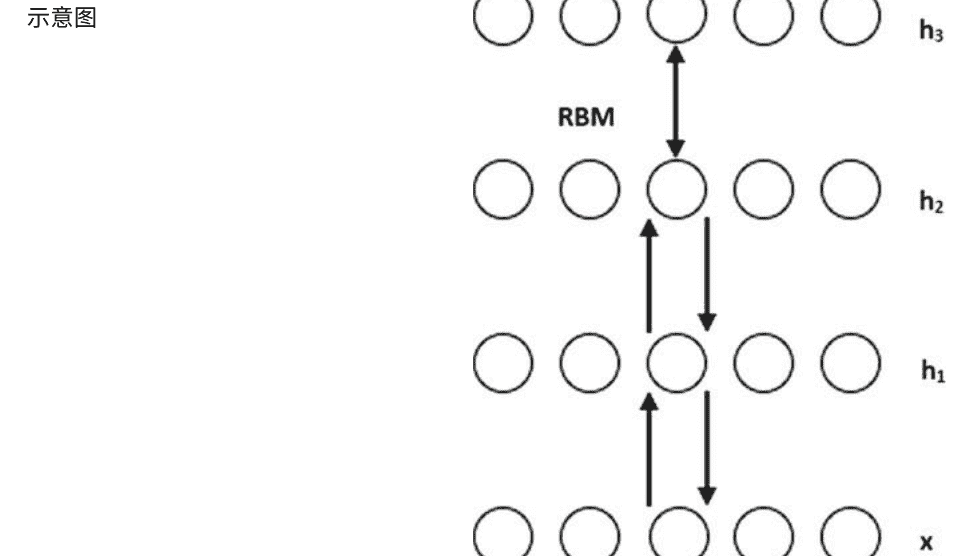

### 2.5 卷积神经网络 (CNNs)

CNNs是一种在图像识别和分类 (Alex等人, 2012; Krizhevsky等人, 2012; Simard等人, 2003) 等研究中被证明非常高效的神经网络。这些网络还成功应用于面部识别、物体检测和识别以及交通标志识别 (Sermanet和LeCun, 2011)。CNNs还在各种自然语言处理任务中得到了有效应用，如句子分类和情感分析 (Kim, 2014; Hu等人, 2014)。CNNs主要包括四个步骤，如下所示 :

- 1. 卷积,
- 2. 池化或子采样,
- 3. 非线性 (ReLU) 和
- 4. 分类.

这些过程是CNN的构建模块，为了解释这些过程，我们将以图像分类为例。图像可以通过包含图像像素值的矩阵来描述。如果是二维图像，如灰度图像，生成这样的表示更容易。像素值的范围是[0 255]，其中0表示黑色，255表示白色。

#### 2.5.1 卷积

第一个过程是卷积，CNN从中得名。CNN中卷积的初始目的是识别输入矩阵表示的图像中存在的特征。卷积通过使用输入矩阵的小方块来识别输入图像的特征，保留像素之间的维度链接（Simard等，2003）。让我们考虑一个6×6的图像，其像素值在范围[0, 1]内，如下所示。

| 1 | 1 | 1 | 0 | 0 | 0 |
|---|---|---|---|---|---|
| 0 | 0 | 1 | 1 | 1 | 0 |
| 0 | 0 | 0 | 1 | 1 | 1 |
| 0 | 0 | 1 | 1 | 0 | 0 |
| 0 | 1 | 1 | 0 | 0 | 1 |
| 1 | 0 | 1 | 0 | 1 | 0 |

此外，考虑一个3×3的矩阵如下：

| 1 | 0 | 1 |
|---|---|---|
| 0 | 1 | 0 |
| 1 | 0 | 1 |

通过将这个3×3的图像以1个像素的步长滑动到输入图像矩阵上，计算输入图像矩阵和上述绿色矩阵的卷积：

| 1*1 | 1*0 | 1*1 | 0 | 0 | 0 |
|---|---|---|---|---|---|
| 0*0 | 0*1 | 1*0 | 1 | 1 | 0 |
| 0*1 | 0*0 | 0*1 | 1 | 1 | 1 |
| 0 | 0 | 1 | 1 | 0 | 0 |
| 0 | 1 | 1 | 0 | 0 | 1 |
| 1 | 0 | 1 | 0 | 1 | 0 |

| 1 | 1*1 | 1*0 | 0*1 | 0 | 0 |
|---|---|---|---|---|---|
| 0 | 0*0 | 1*1 | 1*0 | 1 | 0 |
| 0 | 0*1 | 0*0 | 1*1 | 1 | 1 |
| 0 | 0 | 1 | 1 | 0 | 0 |
| 0 | 1 | 1 | 0 | 0 | 1 |
| 1 | 0 | 1 | 0 | 1 | 0 |

| 1 | 1 | 1*1 | 0*0 | 0*1 | 0 |
|---|---|---|---|---|---|
| 0 | 0 | 1*0 | 1*1 | 1*0 | 0 |
| 0 | 0 | 0*1 | 1*0 | 1*1 | 1 |
| 0 | 0 | 1 | 1 | 0 | 0 |
| 0 | 1 | 1 | 0 | 0 | 1 |
| 1 | 0 | 1 | 0 | 1 | 0 |

| 1 | 1 | 1 | 0*1 | 0*0 | 0*1 |
|---|---|---|---|---|---|
| 0 | 0 | 1 | 1*0 | 1*1 | 0*0 |
| 0 | 0 | 0 | 1*1 | 1*0 | 1*1 |
| 0 | 0 | 1 | 1 | 0 | 0 |
| 0 | 1 | 1 | 0 | 0 | 1 |
| 1 | 0 | 1 | 0 | 1 | 0 |

这种滑动操作被称为步幅，会导致卷积矩阵

| 2 | 3 | 3 | 3 |
|---|---|---|---|
| 2 | 2 | 4 | 3 |
| 1 | 3 | 3 | 3 |
| 4 | 2 | 3 | 1 |

这是通过执行逐元素乘法，然后将乘法的输出相加以获得最终整数来实现的。这构成了一个单独的结果矩阵（黄色）的组成部分。只有输入矩阵的一部分被绿色矩阵看到，每个步幅（Simard等人，2003年）。绿色矩阵在CNN术语中被称为过滤器。它也可以被称为内核或特征检测器。卷积操作的输出被称为卷积特征或特征图（Simard等人，2003年）。这些过滤器被用作从输入图像中提取特征的特征检测器。可以从这些矩阵推断出，不同的值将为相同的输入产生不同的特征图。

例如，考虑下面的过滤器，在上面给定的6×6输入图像上


这将导致特征图

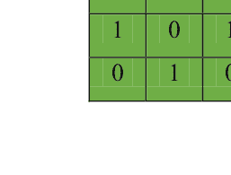

通过使用不同的filters，可以执行模糊、锐化和边缘检测等计算。这是通过在执行卷积操作之前简单地改变filter矩阵的值来实现的。这意味着不同的filters可以从图像中提取不同的特征，如曲线、边缘等。值得一提的是，卷积操作记录了原始图像中的局部关系。在操作的训练阶段，卷积神经网络会自动吸收filter值。然而，在进行训练之前，仍然需要指定某些条件，如网络的架构、filter的数量和filter的大小。filters越多，从图像中提取的特征就越多样化。这也将使网络更好地进行泛化。

在卷积步骤之前，有三个参数控制特征图的大小，必须在决定之前进行。这些参数是深度、步幅和零填充。深度定义了用于卷积过程的滤波器的数量，从而导致相同数量的特征图。步幅定义了在执行卷积过程时，将滤波器矩阵沿原始输入矩阵滑动的像素数。值为1表示每次将滤波器移动一个像素，而值为2表示每次跳过两个像素。较大的步幅值会导致较小的特征图。例如，使用相同的6×6输入矩阵，如果滤波器是一个4×4矩阵：

| 1 | 0 | 0 | 1 |
|---|---|---|---|
| 0 | 1 | 1 | 0 |
| 1 | 0 | 1 | 0 |
| 0 | 1 | 0 | 1 |

那么对应的特征图将是：

| 3 | 5 | 5 |
|---|---|---|
| 3 | 4 | 5 |
| 3 | 6 | 3 |

可以看出，使用3×3滤波器矩阵时，该特征图的尺寸比较小（3×3 vs. 4×4）。零填充意味着在输入矩阵的边界周围添加零，以便对输入矩阵的边界元素应用滤波器。零填充的一个好处是它可以控制特征图的大小。这个过程也被称为宽卷积，相反的是窄卷积。

#### 2.5.2 非线性 (ReLU)

卷积之后的下一个步骤是ReLU，它代表修正线性单元，这是一个非线性的过程。这个操作的输出可以通过（Hu等人，2014年; Krizhevsky等人，2012年）获得：

$$O = \max (0, x)$$

这是一个逐元素操作，应用于图像的每个像素，将特征图中的负像素替换为零。ReLU操作的主要目标是将非线性引入CNN中，添加到卷积中，卷积由逐元素矩阵乘法和加法组成，这些都是线性操作，而现实世界中的大多数数据都是非线性的。在ReLU操作的位置上，可以应用其他非线性函数，如双曲正切和Sigmoid，但观察发现ReLU操作的性能更高效（Hu等人，2014年; Krizhevsky等人，2012年）。ReLU操作的输出特征图称为修正特征图。

#### 2.5.3 池化

空间池化，也称为子采样或下采样，是一种旨在降低特征图维度的操作，但它具有保留重要信息的优势。池化可以是最大池化、平均池化或求和池化等等（Hu等，2014年；Krizhevsky等，2012年）。

对于最大池化，定义了一个空间邻域，从中选择窗口中ReLU操作输出的最大元素。选择窗口中最大元素的另一种选择是计算元素的平均值（平均池化）。另一种选择是计算元素的总和（求和池化）。已经证明最大池化的性能更好（Hu等，2014年；Krizhevsky等，2012年）。

下面，我们展示了在经过卷积和ReLU操作后获得的矩形特征图上使用2×2窗口进行最大池化计算的示例。考虑一个4×4矩阵

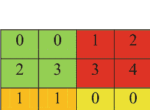

最大池化操作导致

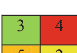

上述矩阵是通过

- 最大值(0, 0, 2, 3)
- 最大值(1, 2, 3, 4)
- 最大值(1, 1, 5, 1)
- 最大值(0, 0, 1, 2)

这是通过将2×2窗口滑动两个单元格并取区域内的最大值来完成的。此操作导致特征图维度的减小，如上面的两个矩阵所示。池化操作应用于每个特征图，因此如果有三个特征图，则将在这三个特征图上执行池化操作，结果是维度减小的三个特征图。池化操作的主要目标是逐步减小输入矩阵的空间维度。更具体地说，池化操作：

- 减少输入表示特征图的维度，使其更易管理，
- 通过降低网络中的计算量和参数数量来控制过拟合问题，
- 使网络对输入图像的微小扭曲、变换和平移不敏感，
- 帮助实现几乎尺度不变的输入图像表示，称为等变表示。这是一个重要且强大的方面，因为将能够在图像中检测到物体，无论其位置如何。

#### 2.5.4 全连接层

该层是一个传统的多层感知器，使用softmax输出层激活函数。全连接的涵义是指每个神经元与后续层中的每个其他神经元相连接。卷积层和池化层的输出是输入图像的高级特征表示。该层的目的是利用这些特征对输入图像进行分类，根据训练数据集进行离散类别的分类。除了分类，添加该层是学习特征的非线性组合的一种廉价方式。卷积层和池化层的许多特征可以用于分类，然而，组合这些特征可能会导致更好的分类结果。该层输出的概率之和始终为1。这是通过使用softmax函数作为输出层激活函数来保证的。softmax函数以实值分数向量作为输入。然后将其转换为范围为[0, 1]且总和为1的值向量。

### 2.6 循环神经网络（RNNs）

循环神经网络是一种神经网络类型，其中单元之间的连接形成一个沿着序列的有向边的图（Grossberg 2013; Mikolov et al. 2010）。这些网络的主要目标是利用顺序信息。在传统神经网络中，假设输入和输出之间没有相互依赖关系。然而，在某些情况下，这是不可取的，例如，如果目标是确定句子中的下一个单词，就需要知道前面的单词是什么。RNNs被称为循环的，因为网络对序列的所有元素执行相同的操作，输出取决于先前的计算。人们还可以将RNNs视为具有记录到目前为止发生的细节的记忆方面。从理论上讲，RNNs可以在很长的序列中使用获得的知识，而在实际中，这些网络仅限于使用前几步的信息。RNN的形式如下：

## 2.6 循环神经网络 (RNNs)

在上图中，描绘了一个展开成完整网络的RNN。展开网络意味着将整个序列写出网络。例如，如果考虑的序列有四个单词，展开网络将导致一个四层网络。每一层代表一个单词。下面，我们概述了在RNN中进行计算的方程式：

- $i_t$表示时间步骤 $t$的输入。
- $s_t$表示时间步骤 $t$的隐藏状态。这代表了网络的记忆。使用之前的隐藏状态和当前步骤的输入，可以得到$s_t$的值（Gross-berg 2013; Mikolov et al. 2010）：
  $$s_t = f(Ui_t + W s_{t-1}) \quad (2.17)$$
- $f$通常是一个非线性函数，如双曲正切、ReLU或sigmoid。
- $s_{-1}$通常初始化为零，用于计算第一个隐藏状态。
- $o_t$表示时间步骤 $t$的输出。例如，如果目标是确定句子中的下一个单词，可以通过这个输出来获得
  $$o_t = softmax(Ys_t) \quad (2.18)$$

值得一提的是：

- 可以将状态 $s_t$视为网络的记忆。$s_t$存储有关每个先前步骤中执行的计算的数据。$o_t$仅使用时间 $t$存储的信息来计算。
- 与传统的深度神经网络相反，RNN在每个步骤中共享相似的参数，而不是在每个层使用不同的参数。
- 图2.2显示，在每个时间步骤中都有输出。然而，根据练习的不同，可能不需要这样做。例如，在确定句子的情感时，只关心最终输出即可。不需要考虑每个单词后的情感。此外，并不一定需要在每个步骤都有输入。RNN的隐藏状态是网络的主要特征，它们捕捉了序列的一些细节。

### 2.7 深度自编码器 (DAE)

自编码器网络被定义为试图在输出层中将输入记住为输出的网络（Mistry等人，2008），这保证了网络在提供新输入时可以预测新输入值作为输出。这些自编码器由一个输入层和一个输出层组成，两者具有相同数量的神经元，因此被称为自联想（Lu和Hsu，2002）。

#### 图2.2 一个循环神经网络

除了这两个层之外，还存在一个窄隐藏层，重要的是这个层中的神经元数量比输入和输出层中的神经元数量少，目的是在尝试找到给定任务的解决方案时应用编码和解码过程（Mistry等人，2008年）。这些网络已经在各种应用中使用（Hines等人，1998年；Atalla和Inman，1998年；Smaoui和Al-Yakoob，2003年；Marwala，2001年）。自编码器网络运行的主要概念是从输入到输出的映射，$x^{(i)} \rightarrow y^{(i)}$ 存储非常重要的信息和输入中存在的关键内在架构，这与假设相反（Hinton，2002年；Hines等人，1998年）。自编码器以$x$作为输入，并通过使用确定性的映射函数$y$来将其转录为输入的隐藏表示$f_θ$。这个函数可以表示为（Leke和Marwala，2016年；Isaacs，2014年）：

$$f_θ(x) = s(W x + b) \quad (2.19)$$

## 2.7 深度自编码器（DAE）

参数 $θ$ 由权重 $W$ 和偏差 $b$ 组成。$s$ 表示 sigmoid 激活函数，其定义为

$$s = \frac{1}{1+e^{-x}}, \tag{2.20}$$

其中 $y$ 被映射为一个向量，$z$ 代表了输入的重构从这个隐藏表示中。这个重构向量是通过使用以下方程获得的（Leke和Marwala，2016）：

$$z = g_{θ'}(y) = s \left( W'y + b' \right), \tag{2.21}$$

或者

$$z = g_{θ'}(y) = W'y + b'. \tag{2.22}$$

在上述方程中，$θ'$ 由权重矩阵的转置和来自方程（2.19）的偏置向量组成。方程（2.21）是自编码器输出函数，具有 Sigmoid 转移函数方程（2.20），而方程（2.22）是线性输出方程。在这些操作之后，可以通过应用有监督学习方法（Isaacs，2014）对网络进行微调。当权重矩阵被转置时，网络被称为具有绑定权重。向量 $z$ 不被描述为 $x$ 的精确转换，而是作为分布 $p(X|Z = z)$ 的标准。希望这些标准将以高概率导致 $x$（Isaacs，2014；Marwala，2013）。得到的方程如下（Leke和Marwala，2016）：

$$p(X|Y = y) = p(X|Z = g_{θ'}(y)). \tag{2.23}$$

这导致了相关的再生差异，形成了优化算法使用的目标函数的基础。这种差异通常由（Leke和Marwala，2016）表示

$$L(x, z) \propto -\log p(x|z), \tag{2.24}$$

其中 $\alpha$ 表示比例。上述方程可以由（Sartori等人，2005）表示：

$$δ_{AE}(θ) = \sum_t L \left( x^{(t)}, g_θ \left( f_θ \left( x^{(t)} \right) \right) \right) \tag{2.25}$$

自编码器网络已经在各种应用领域中被多位研究人员使用，重点是解决缺失数据的问题（Abdella和Marwala，2005；Baek和Cho，2003；Tim等人，2004；Brain等人，2006）。深度自编码器采用了窄自编码器的相同原理，唯一的例外是

### 2.8 结论

本章首先介绍了深度学习的一些基础知识，然后概述了传统深度学习框架的构建模块，包括受限玻尔兹曼机和对比散度。我们还讨论了一些现有的深度学习框架，包括深度置信网络、卷积神经网络、循环神经网络和深度自编码器。

## 参考文献

- Abdella, M., & Marwala, T. (2005). 使用遗传算法和神经网络来近似数据库中的缺失数据。 24, 577–589.
- Alex, K., Sutskever, I., & Hinton, G. E. (2012). 使用深度卷积神经网络进行Imagenet分类。 在 F. Pereira, C. J. C. Burges, L. Bottou, & K. Q. Weinberger (Eds.), 神经信息处理系统的进展 (第25卷, 第1097–1105页). Curran Associates, Inc. http://papers.nips.cc/paper/4824-imagenet-classification-with-deep-convolutional-neural-networks.pdf/. 2016年5月访问.
- Atalla, M. J., & Inman, D. J. (1998). 使用神经网络进行模型更新。 机械系统和信号处理, 12, 135–161.
- Baek, K., & Cho, S. (2003). 韩国公司中使用自联想神经网络进行信用风险破产预测。 在香港，中国的IEEE金融工程计算智能会议上 (pp. 25–29)。
- Bengio, Y., Lamblin, P., Popovici, D., & Larochelle, H. (2007). 贪婪逐层训练深度网络。 在神经信息处理系统的进展中 (pp. 153–160)。
- Brain, L. B., Marwala, T., & Tettey, T. (2006). 用于HIV分类的自编码器网络。 Current Science, 91(11), 1467–1473.
- Carreira-Perpin, M., & Hinton, G. E. (2005). 对比散度学习。 在人工智能和统计学中 (pp. 1–7)。 http://learning.cs.toronto.edu/~hinton/absps/cdmiguel.pdf. 于2015年3月15日访问。
- Deng, L., & Yu, D. (2014). 深度学习：方法与应用。 信号处理的基础与趋势，7(3–4), 197–387。
- Deng, L.等人 (2013年)。 微软语音研究中深度学习的最新进展。在 IEEE 国际声学、语音和信号处理会议 (ICASSP) (pp. 8604–8608)。
- Grossberg, S. (2013年)。 循环神经网络。Scholarpedia, 8 (2), 1888。
- Hines, J. W., Robert, E. U., & Wrest, D. J. (1998). 使用自联想神经网络进行信号验证。智能和机器人系统杂志, 21(2), 143–154.
- Hinton, G.E. (2002年)。 通过最小化对比散度训练专家产品。神经计算, 14 (8), 1771–1800。
- Hinton, G.E. (2009年)。深度信念网络。Scholarpedia, 4 (5), 5947。
- Hinton, G. (2010年)。 训练受限玻尔兹曼机的实用指南。动量, 9 (1), 926。
- Hinton, G.E., & Salakhutdinov, R.R. (2006年)。 用神经网络降低数据的维度。科学, 313 (5786), 504–507。
- Hinton, G. E., Osindero, S., & Teh, Y. W. (2006). 一种用于深度信念网络的快速学习算法。神经计算, 18(7), 527–1554.
- Hu, B., Lu, Z., Li, H., & Chen, Q. (2014). 用于匹配自然语言句子的卷积神经网络架构。 在神经信息处理系统的进展中 (pp. 2042–2050).
- Isaacs, J. C. (2014). 用于声纳ATR的表征学习。在SPIE Defense + Security中。 在 Detection and Sensing of Mines, Explosive Objects, and Obscured Targets XIX; 907203. 国际光学和光子学学会。https://doi.org/10.1117/12.2053057.
- Kim, Y. (2014). 用于句子分类的卷积神经网络。arXiv预印本arXiv: 1408.5882.
- Krizhevsky, A., Sutskever, I., & Hinton, G. E. (2012). 深度学习和工程系统中的缺失数据 在神经信息处理系统进展中 (pp. 1097–1105).
- Larochelle, H., Bengio, Y., Louradour, J., & Lamblin, P. (2009). 探索训练深度神经网络的策略 机器学习研究杂志, 1, 1–40.
- Le Roux, N., & Bengio, Y. (2008). 受限玻尔兹曼机和深度置信网络的表征能力神经计算, 20(6), 1631–1649.
- LeCun, Y., & Bengio, Y. (1995). 卷积网络用于图像、语音和时间序列大脑理论和神经网络手册, 3361(10), 1–14.
- LeCun, Y., Bengio, Y., & Hinton, G. E. (2015). 深度学习。 自然, 521, 436–444.
- Leke, C., & Marwala, T. (2016). 高维数据集中的缺失数据估计：一种群智能-深度神经网络方法。 在群智能国际会议中 (pp. 259–270)。 海德堡：施普林格国际出版社。
- Lu, P. J., & Hsu, T. C. (2002). 应用自联想神经网络对气体路径传感器数据进行验证。推进与动力学杂志, 18(4), 879–888.
- Marwala, T. (2001). 使用神经网络和振动数据的概率性故障识别。飞行器杂志, 38(1), 138–146.
- Marwala, T. (2013).使用人工智能方法进行经济建模. 伦敦：施普林格.
- Mikolov, T., Karafiát, M., Burget, L., Černocký, J., & Khudanpur, S. (2010). 基于循环神经网络的语言模型。 在国际语音通信协会第十一届年会.
- Mistry, J., Nelwamondo, F., & Marwala, T. (2008). 估计缺失数据并确定估计数据的置信度。在第七届国际机器学习和应用会议上，美国加利福尼亚州圣地亚哥 (pp. 752–755).
- Salakhutdinov, R., Mnih, A., & Hinton, G. (2007). 用于协同过滤的受限玻尔兹曼机。 在第24届国际机器学习大会上的论文集中 (pp. 791–798)。纽约：ACM。http://doi.acm.org/10.1145/1273496.1273596。访问时间：2016年5月。
- Salakhutdinov, R., & Hinton, G. (2009). 深度玻尔兹曼机。 人工智能和统计学, 1(2), 448–455。
- 美国统计协会调查研究方法部门会议论文集, 1, 20–34. 在癌症死亡率分析中对缺失值进行多重插补，估计暴露剂量。 计算统计与数据分析, 49(3), 937–953.
- Sermanet, P., & LeCun, Y. (2011). 多尺度卷积网络的交通标志识别。在2011年国际联合神经网络大会(IJCNN)上 (pp. 2809–2813). IEEE.
- Simard, P. Y., Steinkraus, D., & Platt, J. C. (2003). 应用于视觉文档分析的卷积神经网络的最佳实践。 在国际文档分析和识别会议上 (p. 958). IEEE.
- Smaoui, N., & Al-Yakoob, S. (2003). 使用Karhunen-loeve分解和自联想神经网络分析细胞火焰的动力学。 工业和应用数学学会, 24, 1790–1808.
- Tieleman, T. (2008). 使用似然梯度的受限玻尔兹曼机训练的近似方法。 在第25届国际机器学习大会上的论文集 (pp. 1064–1071). 纽约: ACM. http://doi.acm.org/10.1145/1390156.1390290. 访问日期2016年5月。
- Tieleman, T., & Hinton, G. E. (2009). 使用快速权重改进持续对比散度。 在第26届国际机器学习大会上 (pp. 1033–1040).
- Tim, T., Mutajogire, M., & Marwala, T. (2004). 使用进化神经网络进行股市预测。 在模式识别的第15届年度研讨会PRASA (pp. 123–133).
- Vincent, P., Larochelle, H., Lajoie, I., Bengio, Y., & Manzagol, P.-A. (2010). 堆叠去噪自编码器：在具有局部去噪准则的深度网络中学习有用的表示。机器学习研究杂志, 11, 3371–3408.

# 第3章 使用蝙蝠算法进行缺失数据估计

## 3.1 引言

在现实世界和研究界中，缺失数据一直是一个挑战。 依赖准确知识的决策过程非常依赖数据的可用性，从中可以提取信息。这些过程通常需要预测模型或其他计算智能技术，这些技术使用观察到的数据作为输入。 然而，在某些情况下，数据可能丢失、损坏或记录不完整，这会对数据的质量产生负面影响。 大多数决策和机器学习框架，如人工神经网络、支持向量机和主成分分析，如果数据不完整，就无法用于决策和数据分析，因为这些缺失值可能会影响模式识别和分类任务。 尽管存在缺失数据，决策输出仍然应该保持，因此解决这个问题非常重要。 因此，在处理数据的初始阶段，需要估计缺失值。

缺失数据估计方法的应用非常广泛，包括结构方程建模（Carter，2006）、空气质量数据（Zainuri等，2015）和时间序列数据重建（Sidekerskiene和Damaševičius，2016）观测等。 话虽如此，现有的方法取决于数据的性质、缺失模式，并且主要应用于低维数据集。 Abdella和Marwala（2005）在一维数据中实现了联合神经网络-遗传算法框架来填补缺失值，而Rana等人（2015）则在带有异常值的数据集中使用了鲁棒回归填补，并研究了其性能。Zhang等人（2011）建议在估计缺失数据时使用相关实例的知识。 这导致提出了一种非参数迭代插补算法（NIIA）。在Jerez等人（2010）、Leke和Marwala（2016）、Liew等人（2011）、Van Buuren（2012）和Ju等人（2015）等论文中，观察到了填补缺失数据的新技术以及与现有方法之间的比较。前述的这些技术主要适用于具有缺失值的低维数据集，但在考虑具有不受控制的高维数据集时效果较差，如后面的章节中所示。因此，本研究的主要动机是引入高维缺失数据估计方法，重点放在图像识别数据集上。这些方法将用于通过估计图像像素值来重建损坏的图像。

为了研究解决先前提到的维度缺陷的新技术，我们实现了一个深度自编码器，自编码器网络是一种无监督学习技术，通过学习减少原始数据$x$和输出重建数据$\tilde{x}$之间对比度的近似函数来将输入数据重建为输出。与主成分分析（PCA）相同。根据定义，深度自编码器由两个对称的深度置信网络组成，其中一对浅层表示网络的编码部分，而第二对浅层表示网络的解码部分，每个单独的层都是受限玻尔兹曼机（RBM）。这些网络适用于各种领域，例如，Finn等人（2016）使用深度自编码器进行视觉运动学习，而Ju等人（2015）则将其与支持向量机（SVM）一起使用以学习稀疏特征并执行分类任务。Feng等人（2014）使用深度去噪自编码器为嘈杂的混响语音识别系统生成稳健的语音特征，而Krizhevsky和Hinton（2011）则使用这些网络将小的彩色图像映射到短的二进制码。自编码器具有几个优点，例如，在网络的编码部分引入非线性，与PCA等方法相比更加灵活，这是预训练过程的一个关键特性，它们不需要对数据属性和相关性有先验知识，而且它们直观易懂。这个网络的主要缺点是需要大量的样本进行训练和学习，而这些样本并不总是容易获得的。

另一方面，蝙蝠算法是一种基于蝙蝠回声特性的元启发式群智能技术，也被使用。蝙蝠具有令人难以置信的能力，能够利用声纳和多普勒效应在黑暗中捕食猎物。这种特性在Yang（2010）中以数学方式表达，形成了一种优化算法，并在一组基准函数上与现有优化方法进行了测试。在Yang（2011）中，蝙蝠算法被用于解决包含大多数工程问题的多目标优化任务，而在Yang等人（2012）中，它被应用为解决拓扑优化问题的一种方法。Teodoro等人（2012）使用蝙蝠算法来优化与无刷直流轮毂电机相关的单/多目标任务。该算法的一些固有优势是它在开发利用（通过使用蝙蝠的响度和脉冲发射率）和探索（类似于标准粒子群优化（PSO））之间实现了很好的平衡，并且，Yang（2010）揭示了在寻找最优点的搜索中存在获得全局最优解的保证。这些是为什么在这项研究中使用该算法的一些原因，另外还有一个原因是它以前没有被使用过。缺失数据文献。此外，关于蝙蝠算法的文献表明，它在解决各种应用领域的问题方面表现出色，因此，我们认为有必要研究它在缺失数据估计领域的表现。然而，该算法的主要缺点是优化过程的收敛速度取决于算法参数的微调。

在本章中，我们提出了一种新的高维数据集缺失数据估计方法，即DL-BAT，基于深度自编码器和蝙蝠算法的优势。为此，我们首先描述了用于填补任务的提出模型，该模型由深度自编码器和蝙蝠算法组成。随后，我们对提出模型的性能进行分析，并将结果与现有方法进行比较。此外，我们报告了实验结果并讨论了研究结果。最后，简要总结被提出。

## 3.2 模型

在本节中，我们描述了将深度自编码器网络和蝙蝠算法的优势结合起来的提出方法。当应用任何类型的网络来估计缺失数据时，网络模型的准确性非常重要。所提出的方法总结如图3.1所示，其中$\vec{I_k}$和$\vec{I_u}$分别表示已知和未知特征，并构成输入集合。首先，使用随机梯度下降（SGD）算法对网络进行训练，使用完整的记录集识别一个映射函数$f$，该函数提取并存储数据集中特征之间的相互关系和相关性。这导致输出$\vec{O}$的获得

$$ \vec{O} = f\left(\begin{bmatrix} \vec{I_k} \\ \vec{I_u} \end{bmatrix}\right). \quad (3.1) $$

由于自编码器框架试图将输入表示为网络的输出，因此输出与输入大致相等。这导致一个小误差，该误差依赖于自编码器的准确性。该误差表示为

$$ \vec{e} = \begin{bmatrix} \vec{I_k} \\ \vec{I_u} \end{bmatrix} - f\left(\begin{bmatrix} \vec{I_k} \\ \vec{I_u} \end{bmatrix}, \vec{w}\right). \quad (3.2) $$

为了保证误差始终为正，方程（3.2）被平方，得到以下方程：## 3.2 模型

图3.1估计模型的流程图表示。© 2017 IEEE。经许可转载自Leke等人（2017）

$$
\vec{e} = \left( \begin{bmatrix} \vec{I_k} \\ \vec{I_u} \end{bmatrix} - f \left( \begin{bmatrix} \vec{I_k} \\ \vec{I_u} \end{bmatrix}, \vec{w} \right) \right)^2 \quad (3.3)
$$

当输出尽可能接近输入时，误差将被最小化。这主要发生在向框架呈现的数据具有与训练期间记录的数据类似的特征时。因此，在估计过程中，最小化误差象征着以使新数据矩阵与训练期间完整数据集产生的模式相匹配的方式优化缺失数据。蝙蝠算法用于进一步优化网络权重，基于之前提到的事实，它保证达到全局最优点，从而确保网络尽可能准确。

该算法作为一种优化技术，试图达到全局最优点，即误差函数的最低点或谷底。这个过程在数学上表示为：

$$
\text{最小化} \left( \begin{bmatrix} \overrightarrow{I_k} \\ \overrightarrow{I_u} \end{bmatrix} - f\left( \begin{bmatrix} \overrightarrow{I_k} \\ \overrightarrow{I_u} \end{bmatrix}, \overrightarrow{w} \right) \right)^2 \quad (3.4)
$$

为了实现这个目标，每只蝙蝠都在解空间中以特定的速度和给定的点/位置移动。总有一只蝙蝠是其他蝙蝠朝向的方向，这构成了当前最佳解。除此之外，蝙蝠使用声纳发出具有特定频率、波长和响度的声音，这些可以根据猎物或障碍物的接近程度进行调整。这些属性在公式(3.5)、(3.6)和(3.7)中以数学方式表达。

$$
x_i^{t+1} = x_i^t + v_i^{t+1} \quad (3.5)
$$

$$
v_i^{t+1} = v_i^t + (x_i^t - x^*)f_i \quad (3.6)
$$

和

$$
f_i = f_{\text{min}} + (f_{\text{max}} - f_{\text{min}})v \quad (3.7)
$$

其中 $v \in [0, 1]$ 是从U(a, b)中抽取的随机向量，其中 $-\infty < a < b < \infty$，并且具有概率密度函数 $f(x) = \frac{1}{b - a}$，使得 $a < x < b$。本章中实现的蝙蝠算法通过Lévy飞行的形式为蝙蝠的运动增加了随机性。这导致位置方程为

$$
x_i^{t+1} = x_i^t + v_i^{t+1} + \text{Lévy}(\lambda) \quad (3.8)
$$

在图3.2中，我们描述了原始蝙蝠算法的伪代码，揭示了停止准则选项和点，解决方案更新的阶段以及参数更新步骤。

蝙蝠算法基于三个主要规则设计，分别是：

- 1. 每只蝙蝠使用回声定位来感知距离，并区分食物/猎物和障碍物。
- 2. 蝙蝠以随机的速度和位置、给定的频率、变化的波长和变化的响度飞行，以寻找猎物，尽管响度可以有多种变化方式，但假设是响度从一个较大的正值变化到一个低常数值。

模型实现中使用的蝙蝠算法参数在表3.1中给出，唯一的例外是决策变量的数量取决于记录中缺失值的数量。选择这些参数是因为它们在不同的组合和排列下产生了更优的结果。

### Bat Algorithm

```
Objective function f(x), x = (x1, ..., xd)T
Initialize the bat population xi (i = 1, 2, ..., n) and vi
Define pulse frequency fi at xi
Initialize pulse rates r and the loudness A
while (t < Max number of iterations)
    Generate new solutions by adjusting frequency,
    and updating velocities and locations/solutions [equations (5) to (7)]
    if (rand > r)
        Select a solution among the best solutions
        Generate a local solution around the selected best solution
    end if
    Generate a new solution by flying randomly
    If (rand < A & f(xi) < f(x*))
        Accept the new solutions
        Increase r and reduce A
    end if
    Rank the bats and find the current best x*
end while
Postprocess results and visualization
```

图3.2 原始蝙蝠算法伪代码

不完整的数据集作为输入传递给蝙蝠算法，其中优化的深度神经网络是目标函数的一部分。缺失数据被估计，并与已知值一起通过训练过的网络运行，以观察网络误差是否已被最小化，而不进行任何更改几次迭代。如果是这样，数据集将返回带有插补值，否则将再次执行插补过程。使用蝙蝠算法进行缺失数据估计的停止准则是执行了40,000次函数评估，或者目标函数值没有变化。

| 参数 | 数值 |
|------|------|
| 种群大小 | 40 |
| 响度 | 0.25 |
| 脉冲频率 | 0.5 |
| 迭代次数 | 1000 |

> © 2017 IEEE。经许可转载自Leke等人。(2017)

从上述对深度自编码器和蝙蝠算法如何使用的描述中，下面的方程总结了所提方法的混合函数，其中 $f_{\text{BAT}}$ 是蝙蝠算法数据估计操作，$f_{\text{DAE}}$ 是深度自编码器的函数。

$$
y = f_{\text{DAE}} \left( W, f_{\text{BAT}} \left( \vec{I} \right) \right) \tag{3.9}
$$

$\begin{bmatrix} \vec{I}_{\text{k}} \\ \vec{I}_{\text{u}} \end{bmatrix}$ 表示已知和未知特征的输入空间。

## 3.3 性能分析

为了研究和验证所提出的模型与其他现有方法的比较，使用了混合国家标准与技术研究所（MNIST）手写数字数据集。它包含60,000个训练样本和10,000个测试样本，每个样本有784个特征，代表图像的像素值。黑色像素的值为0，而白色像素的值为255，因此，所有变量都可以被视为连续变量。当前数据已经清除了异常值，因此数据集中使用的每个样本都应该有助于泛化系统。数据被归一化到[0, 1]的范围，并进行随机化以提高网络性能。训练数据集进一步分为训练集和验证集（分别为50000和10000个样本）。

神经网络架构使用验证数据集进行优化，使用测试数据集测试所提出系统的性能正确性。值得一提的是，这项研究的目标不是提出一种与现有最先进方法相媲美的分类模型，而是提出一种在缺失数据（缺失像素）情况下重建图像的方法。优化的深度网络架构使用的是784-1000-500-250-30-250-500-1000-784，最初由Hinton等人（2006）建议，并通过使用验证数据集进行交叉验证进一步验证，具有784个输入和输出节点，以及1000、500、250、30、250、500和1000个隐藏层节点。

训练后得到的目标函数值（均方误差）为1.96%，接近交叉验证期间获得的最低值（2.12%）。

用于比较的多层感知器（MLP）自编码器与深度自编码器的输入和输出层具有相同数量的节点，其中单隐藏层由400个节点组成，该数量通过改变隐藏层中的节点数量并确定哪种架构产生最低的网络错误来确定。实验观察到784-400-784 MLP自编码器网络架构产生了2.5088%的网络错误值。隐藏层和输出层的激活函数分别使用sigmoid和线性激活函数。在深度自编码器的每一层中都使用sigmoid激活函数，除了瓶颈层，该层使用线性激活函数。MLP使用缩放共轭梯度（SCG）算法进行训练，深度自编码器网络使用随机梯度下降（SGD）算法进行训练，训练周期为500个周期。

从数据的测试集中随机选择100个样本，然后根据随机缺失（MAR）和完全随机缺失（MCAR）机制以及任意缺失数据模式进行特征删除。通过创建与测试数据大小相同的二项式矩阵，其中的零和一符合所述机制和模式，并将每个出现的一替换为NaN（表示缺失）。使用包含缺失值的数据集来测试缺失数据估计方案的性能，然后与现有方法进行比较。

通过均方误差（MSE）、均方根对数误差（RMSLE）、相关系数（r）和相对预测准确度（RPA）来评估所提出方法的有效性。还使用了信噪比（SNR）和全局偏差（GD）。均方误差、均方根对数误差以及全局偏差是衡量实际值和预测值之间差异的指标，并提供了估计能力的指示。

$$
\text{均方误差} = \frac{\sum_{i=1}^{n} \left( I_i - \hat{I_i} \right)^2}{n}, \quad (3.10)
$$

$$
\text{均方根对数误差} = \sqrt{\frac{\sum_{i=1}^{n} \left( \log(I_i + 1) - \log(\hat{I_i} + 1) \right)^2}{n}}, \quad (3.11)
$$

$$
\text{全局偏差} = \left( \frac{\sum_{i=1}^{n} \left( \hat{I_i} - I_i \right)}{n} \right)^2. \quad (3.12)
$$

相关系数提供了预测数据和实际数据之间相似性的度量。该度量的输出值位于[-1, 1]范围内，绝对值表示链接的强度，符号表示链接的方向。因此，接近1的值表示强大的预测能力，接近 -1的值表示相反。在下面的方程中，\(\bar{I}\)表示数据的均值。

$$
r = \frac{\sum_{i=1}^{n} (I_i - \bar{I})(\hat{I_i} - \bar{\hat{I}})}{\left[ \sum_{i=1}^{n} (I_i - \bar{I})^2 \sum_{i=1}^{n} (\hat{I_i} - \bar{\hat{I}})^2 \right]^{1/2}}. \tag{3.13}
$$

相对预测准确度（RPA）则测量了在特定容忍度内进行的估计数量，容忍度取决于应用程序所需的敏感性。容忍度设置为10%，因为它对应用领域似乎是有利的。该度量由以下公式给出：

$$
\text{RPA} = \frac{n_\tau}{n} * 100. \tag{3.14}
$$

平方误差（SE）是一种记录误差平均幅度的二次评分规则。这可以通过计算方差平方根来获得，也称为标准差。它减少了误差的方差，与MSE相反，因此在这项工作中应用它。SE可以使用以下公式获得：

$$
\text{SE} = \sqrt{ \frac{1}{n} \sum_{i=1}^{n} (I_i - \hat{I_i})^2 }. \tag{3.15}
$$

平均绝对误差（MAE）测量数据集中错误的平均幅度，而不考虑方向。在理想情况下，SE值始终大于MAE值，如果相等，则错误值具有相同的幅度。可以使用以下方程计算此误差：

$$
\text{MAE} = \frac{1}{n} \sum_{i=1}^{n} |I_i - \hat{I_i}|. \tag{3.16}
$$

确定系数是在统计分析中经常应用的度量标准，旨在评估模型在解释和预测未来输出方面的性能。它也被称为R平方统计量，通过以下方式获得：

### 表3.2 DL-BAT附加指标

| 方法 | DL-BAT | MLP-PSO | MLP-SA | MLP-GA |
| --- | --- | --- | --- | --- |
| COD | **91.89** | 59.19 | 0.04 | 0.09 |
| GD | **0.06** | 0.8 | 12.1 | 12.36 |
| MAE | **4.73** | 14.3 | 47.74 | 48.15 |
| MSE | **0.89** | 5.11 | 30.92 | 31.4 |
| SNR | **8.44** | 53.47 | 228.91 | 230.52 |

粗体数值表示该算法确实产生了最佳（最低）结果

$$
\text{COD} = \left( \frac{ \sum_{i=1}^{n} ( I_i - \bar{I} ) ( \hat{I}_i - \bar{I} ) }{ \left[ \sum_{i=1}^{n} ( I_i - \bar{I} )^2 \sum_{i=1}^{n} ( \hat{I}_i - \bar{I} )^2 \right]^{1/2} } \right)^2 \tag{3.17}
$$

本章中使用的信噪比由以下方式获得：

$$
\text{SNR} = \frac{ \text{var}(I - \hat{I}) }{ \text{var}(\hat{I}) } \tag{3.18}
$$

在公式（3.10）-（3.13）和公式（3.15）-（3.17）中，n是样本数量，I和Î分别表示真实测试集值和预测的缺失输出值。在公式（3.14）中，n_τ表示正确预测输出的数量。

## 3.4 结果与讨论

考虑到上述指标，通过同时估计缺失数据的DL-BAT方法对性能进行评估并与现有方法进行比较，无论缺失数据在哪里确定。所研究的场景是，任何样本/记录可能有至少62个，最多97个缺失属性（维度）需要近似。

图3.3、3.4、3.5和3.6展示了DL-BAT与MLP-PSO、MLP-SA和MLP-GA的性能和比较，以及表3.2和3.3。正如将会观察到的，所介绍的方法与现有方法有明显的不同，现有方法适用于每个实例估计一个或不超过10个缺失值的情况。

结果表明，DL-BAT方法优于其他方法。图3.3给出了平方误差。DL-BAT的误差为9.45%，而MLP-PSO、MLP-SA和MLP-GA的误差值分别为22.61%、55.61%和56.04%。

图3.3 均方误差与估计方法

图3.4 相关系数与估计方法

图3.5 相对预测准确度与估计方法

### 图3.6 均方根对数误差与估计方法

### 表3.3 每个样本的DL-BAT均方误差目标值

| 样本 | 尺寸 | DL-BAT | MLP-PSO | MLP-SA | MLP-GA |
|------|------|--------|---------|--------|--------|
| 1 | 66 | **5.09** | 9.05 | 9.02 | 9.02 |
| 2 | 69 | **1.62** | 5.26 | 8.60 | 8.60 |
| 3 | 73 | **0.32** | 3.69 | 4.74 | 4.74 |
| 4 | 85 | **3.90** | 9.22 | 18.54 | 18.54 |
| 5 | 83 | **2.20** | 7.28 | 15.83 | 15.83 |
| 6 | 92 | **2.74** | 8.59 | 8.79 | 8.79 |
| 7 | 77 | **3.08** | 7.56 | 13.44 | 13.44 |
| 8 | 82 | **0.53** | 6.07 | 4.46 | 4.46 |
| 9 | 84 | **2.29** | 6.51 | 17.09 | 17.09 |
| 10 | 63 | **0.52** | 3.21 | 1.82 | 1.82 |

粗体数值表示该算法确实产生了最佳（最低）结果

图3.4和3.5显示了四种分析方法（包括新颖的DL-BAT方法）的相关系数和相对预测准确度。它们都证实了DL-BAT方法相对于其他方法的更好性能。DL-BAT与85%的RPA具有95.86%的相关性，而MLP-PSO的相关系数为76.93%，MLP-SA和MLP-GA的相关系数分别为-2.06%和-3.06%。MLP-PSO的RPA为56.33%，而MLP-SA和MLP-GA的值分别为9.92%和10.17%。

在图3.6中，我们描述了通过分析方法获得的均方根对数误差值。可以观察到DL-BAT方法的RMSLE值最低，为7.11%，而第二好的表现者是MLP-PSO，其值为17.65%。MLP-SA和MLP-GA方法产生的RMSLE值分别为41%和41.32%。

这些发现在表3.2中的数值进一步支持，DL-BAT系统产生了最低的COD、GD、MAE、MSE和SNR值。

**表3.4 DL-BAT结果的统计分析**

| 比较的对 | P值（95%置信水平） |
|----------|-------------------|
| DL-BAT:MLP-PSO | 1.2 × 10^{-07} |
| DL-BAT:MLP-SA | 2.0 × 10^{-134} |
| DL-BAT:MLP-GA | 9.0 × 10^{-137} |

根据表3.3，观察到在估计该记录中的所有缺失值时，所提出的DL-BAT方法导致每个记录的最佳目标函数值。

在表3.4中，我们通过t检验对DL-BAT方法与MLP-PSO、MLP-SA和MLP-GA方法的估计结果进行了统计分析。t检验的零假设(H₀)假设DL-BAT、MLP-PSO、MLP-SA和MLP-GA方法得到的缺失数据估计的均值没有显著差异。然而，备择假设(H_A)表明这四种方法得到的缺失数据估计的均值存在显著差异。

表3.4显示，在95%的置信水平下，DL-BAT与MLP-PSO、MLP-SA和MLP-GA之间的估计均值存在显著差异，当比较这三对时，p值分别为1.2×10^{-07}、2.0×10^{-134}和9.0×10^{-137}。因此，这表明在95%的置信水平下，可以拒绝假设H₀，即DL-BAT与其他三种方法之间的均值没有显著差异，而支持备择假设H_A。

在图3.7的顶部行中，我们展示了10个具有缺失像素值的图像，这些值需要在进行统计方法的分类任务之前进行估计。在同一图的底部行中，我们展示了使用DL-BAT方法重建的图像，而在图3.8的顶部和底部行中，我们观察到使用MLP-PSO和MLP-GA方法重建的图像。可以看出，使用MLP-PSO和MLP-GA重建的图像引入了很多噪声，尤其是在底部行比顶部行更多，而DL-BAT方法则不然。此外，仔细观察发现，图像并没有完全重建，因为图像中并不是所有像素值都被正确估计。

关于执行时间，DL-BAT方法表现出更好的误差百分比、最高相关系数和最高相对预测准确度，以及在其他指标上的更好性能，但它比MLP-PSO、MLP-SA和MLP-GA方法更慢，这些方法被观察到比其他任何方法都更快，如图3.9所示。

## 3.5 结论

本章研究了一种新颖方法来估计缺失数据。估计方法包括使用深度自编码器网络复制输入数据，结合蝙蝠算法来估计缺失数据。研究了混合模型的性能，并与现有方法进行了比较，包括使用遗传算法的MLP自编码器，模拟退火和粒子群优化。还将所提出的方法与最近提出的一种用于估计高维数据集中缺失数据的技术进行了比较，该技术结合了深度自编码器网络和萤火虫算法。所得结果表明，所提出的系统不仅在与MLP混合系统相比时产生更准确的估计，而且在与最近的深度自编码器-萤火虫算法系统相比时也是如此。当考虑标准误差、相关系数、相对预测准确性、信噪比和全局偏差时，这一点变得明显，所提出的方法在这些方面产生了最佳值。此外，在估计过程中考虑目标函数值时，观察到所提出的方法对于每个记录的目标函数值都是最低的。面临的一个障碍是估计缺失数据所需的计算时间，可以通过并行化估计来解决。

观察这种方法是否加速了过程，同时保持效率和准确性的过程。此外，由于时间限制，本文中进行的实验只考虑了10%的数据缺失情况。

进一步尝试不同缺失百分比的实验是值得的。此外，值得测试所提出的方案在其他缺失数据机制（如完全随机缺失和自然设计缺失）以及其他模式（如单调缺失数据模式）上的效果。

## 参考文献

Abdella, M., & Marwala, T. (2005). 使用遗传算法和神经网络来近似数据库中的缺失数据。在计算控制国际会议(ICCC)上的第3届国际会议上(pp. 207–212). IEEE.

Carter, R. L. (2006). 结构方程建模中的缺失数据解决方案。评估研究与实践，1(1), 1–6.

冯, X., 张, Y., 和格拉斯, J.R. (2014年)。通过深度自动编码器对噪声混响语音进行语音特征去噪和去混响处理，用于噪声混响语音识别。在国际声学、语音和信号处理会议 (ICASSP) 上（第1759-1763页）. IEEE.

Finn C., 谭, X., 段, Y., 达雷尔, T., 莱文, S., 和阿贝尔, P. (2016年)。用于视觉运动学习的深度空间自动编码器。 在国际机器人与自动化会议 (ICRA) 上 (第512-519页). IEEE.

Hinton, G.E., Osindero, S., 和Teh, Y. W. (2006年)。一种用于深度信念网络的快速学习算法。神经计算，18 (7), 1527-1554.

Jerez, J. M等 (2010年)。在一个真实的乳腺癌问题中，使用统计和机器学习方法进行缺失数据插补。医学中的人工智能，50 (2), 105-115 (爱思唯尔).

Ju, Y.,Guo, J., & Liu, S. (2015). 一种将稀疏自编码器与支持向量机相结合的深度学习方法。在国际分布式计算与知识发现会议上 (CyberC) (pp. 257–260). IEEE.

Krizhevsky, A., & Hinton, G.E. (2011). 使用非常深的自编码器进行基于内容的图像检索。在第19届欧洲人工神经网络研讨会上, 比利时布鲁日, 2011年4月27日至29日.

Leke, C., & Marwala, T. (2016). 高维数据集中的缺失数据估计: 一种群智能-深度神经网络方法。在群智能国际会议上(pp. 259–270). Springer国际出版社.

Leke, C., Ndjongue, A. R., Twala, B., & Marwala, T. (2017). 深度学习-蝙蝠高维缺失数据估计器。在2017年IEEE国际系统、人类和控制论大会上 (SMC) (pp. 483–488) IEEE

Liew, A. W.-C., Law, N.-F., & Yan, H. (2011). 基因表达数据的缺失值插补: 从可用信息中恢复缺失数据的计算技术。生物信息学简报，12(5), 498–513 (牛津大学出版社).

Rana, S., John, A. H., Midi, H., & Imon, A. (2015). 在存在异常值的情况下对缺失数据进行鲁比回归插补。远东数学科学杂志，97(2), 183 (Pushpa出版社).

Sidekerskiene, T., & Damasevicius, R. (2016).使用EMD对合成时间序列中的缺失数据进行重建.

Teodoro C. B., Leandro d. S. C., & Luiz, L. (2012). 基于蝙蝠优化方法解决无刷直流轮毂电机问题。Transactions on Magnetics, 48(2), 947–950 (IEEE).

Van Buuren, S. (2012).工程系统中的深度学习和缺失数据. 博卡拉顿: CRC出版社.

杨，X. S. (2010). 一种新的启发式蝙蝠算法自然启发的合作策略优化(NISCO)(第65-74页)，计算智能研究。海德堡：斯普林格。

杨，X. S. (2011) 多目标优化的蝙蝠算法生物启发计算国际期刊, 3(5)，267-274。

杨，X. S.，Karamanoglu，M.，& Fong，S. (2012). 微电子应用中的拓扑优化蝙蝠算法 在未来通信技术国际会议(FGST)(第150-155页)，伦敦，英国，2012年12月12-14日。

Zainuri, N. A.，Jemain, A. A.，& Muda, N. (2015). 各种插补方法对空气质量数据中缺失值的比较马来西亚科学, 44(3)，449-456。

张，S.，金，Z.，& 朱，X. (2011年) 。 利用不完整实例内的信息进行缺失数据插补。系统与软件杂志, 84 (3) ，452-459 (爱思唯尔) 。

# 第4章 使用布谷鸟搜索算法进行缺失数据估计

## 4.1 引言

现今的数据集，如记录生产、制造和医疗数据的数据集，在数据收集和存储过程的不同阶段可能会遇到缺失数据的问题。测量仪器故障或数据传输线路是导致数据缺失的主要原因。缺失数据的发生导致决策和分析任务变得困难，这些任务依赖于对完整和准确数据的访问，因此需要准确且高效的数据估计技术。存在多种方法来缓解缺失数据带来的问题，从删除具有缺失属性的记录（列表和成对数据删除）到使用统计和人工智能方法的方法，如下一段所述。问题在于，一些统计和朴素的方法往往产生有偏差的近似值，或者对数据和数据之间的相关性做出错误的假设。这对依赖于数据的决策过程产生不利影响。

缺失数据估计技术的应用非常广泛，因此现有的方法取决于数据的性质、缺失模式，并且主要用于低维数据集的实现。Abdella和Marwala（2005）在一维数据中实现了联合神经网络-遗传算法框架来填补缺失值，而Leke等人（2014）则使用了粒子群优化、模拟退火和遗传算法与多层感知器（MLP）自编码器网络的组合，在一维数据中取得了良好的结果。

Vukosi等人（2007）使用MLP自编码器网络、主成分分析和支持向量机与遗传算法相结合来填补缺失变量。在Ssali和Marwala（2007）中，决策树与MLP自编码器网络相结合，用于估计数据集中的缺失数据，从而提高了准确性。在Jerez等人（2010）、Liew等人（2011）、Myers（2011）和Schafer（2002）等论文中，介绍了填补缺失数据的新技术和比较。

观察了这些和现有的方法。最近，在Leke和Marwala（2016）中，提出了一种涉及深度网络框架和群体智能算法的技术，用于处理高维数据集中的缺失数据，这是第一次尝试，结果有希望。正是因为这项工作，我们在本章中进行研究，以探索其他高维缺失数据估计方法，观察是否可以提高准确性。

调查解决前面提到的缺点的新技术，导致了深度自编码器的实现，它是一种无监督学习技术，通过学习一个近似函数来减小原始数据，x，和重构数据，x^，之间的差异，与主成分分析（PCA）相同。深度自编码器由两个对称的深度置信网络组成，其中一对浅层代表网络的编码部分，而第二对浅层代表解码部分，每个单独的层都是受限玻尔兹曼机（RBM）。RBM被堆叠在一起形成整体的深度自编码器网络，然后使用反向传播算法进行微调。这些网络适用于各种领域，例如Finn等人（2016）在视觉运动学习中使用了深度自编码器，而Ju等人（2015）则与支持向量机（SVM）一起使用，学习稀疏特征并执行分类任务。Brain等人（2006）用自编码器进行HIV分类，在Krizhevsky和Hinton（2011）中，这些网络用于将小的彩色图像映射到短的二进制码。自编码器具有几个优点，例如在网络的编码部分引入非线性，与PCA等方法相比更加灵活，这是预训练过程的一个关键特性，它们不需要对数据属性和相关性有先验知识，而且它们直观易懂。这个网络的主要缺点是需要大量的样本进行训练和学习，而这些样本并不总是容易获得的。

结合深度自编码网络，使用布谷鸟搜索（CS）算法。这是一种受布谷鸟寄生行为启发的基于种群的随机优化技术（Yang和Debb 2014）。通过使用Lévy飞行引入更多的随机性来进一步改进算法中鸟类的运动。它已被用于在满足系统小时需求和约束的同时，最小化微电网的发电和排放成本（Vasanthakumar等人2015），而在Wang等人（2016）中，它被用于通过改进的布谷鸟搜索算法建立混沌系统的参数。Ali和Mohamed（2016）提出了一种新的混合算法，由布谷鸟搜索算法和Nelder-Mead方法组成，旨在解决整数和极小化优化问题。

在本章中，训练了一个深度自编码网络，并结合CS算法（DL-CS），将其性能与普通的多层感知器自编码器和其他方案进行了比较。介绍了使用的优化算法。首先介绍了方法论的描述，然后介绍了模型的性能和分析。随后，呈现了实验结果和发现，最后是结论性的评论。

## 4.2 布谷鸟搜索（CS）

CS算法是一种基于某些布谷鸟物种的寄生特性的基于种群的元启发式技术（Yang和Debb 2014）。布谷鸟是非常有趣的鸟类，不仅因为它们发出的宁静声音，还因为它们的激进繁殖策略。CS算法的设计简化了三个主要规则的假设：

+ (i) 每只布谷鸟一次只下一个蛋，并将这个蛋随机放在一个巢中，
+ (ii) 质量高的蛋的最佳巢将传承到下一代，
+ (iii) 布谷鸟可以将它们的蛋放在固定数量的巢中，主鸟有可能以概率 p ∈ [0, 1] 发现这些巢中的蛋（Yang和Debb 2009）。

当发现布谷鸟蛋时，要么将蛋扔出巢外，要么寄主鸟会放弃巢穴并建造一个新的巢穴。最后一条规则通过近似 p_a 并用新的巢穴替换现有巢穴的一部分进一步简化（Yang和Debb 2009）。在解决最大化问题时，解的适应度可以简单地与目标函数的值成比例。为了进一步简化算法的实现，假设巢穴中的每个蛋都代表一个解，而布谷鸟蛋代表一个新解。目标是使用新的、可能更好的解/布谷鸟来替换巢穴中不太好的解。这些新解由（Yang和Debb 2009）给出：

$$ x_i^{(t+1)} = x_i^{(t)} + \alpha \oplus \text{Lévy}(\lambda), \quad\quad (4.1) $$

其中 α > 0 是步长，应与感兴趣问题的尺度相关。往往情况下，α = 1。方程（4.1）本质上表示了随机游走过程的随机方程。从一般意义上讲，随机游走是一个马尔可夫链，其下一个位置完全依赖于当前位置[方程（4.1）中的第一项]和转移概率[方程（4.1）中的第二项]。⊕符号表示逐元素乘法。Lévy飞行基本上是从Lévy分布中随机抽取步长的随机游走，如下所示：

$$ \text{Lévy} \sim u = t^{-\lambda}, \quad\quad (4.2) $$

其中 t 是步长，λ是一个具有重尾连续概率分布的概率密度函数满足条件 1 < λ ≤ 3。Lévy分布具有无限方差和无限均值。

尽管CS算法已经在多个领域中使用，但在缺失数据估计任务中尚未进行研究，这是应用CS算法在本研究中的原因。此外，由于步长呈重尾分布且参数数量较少，运动方程的随机化更加高效。

### 表4.1 布谷鸟搜索参数

| 参数 | 数值 |
| --- | --- |
| 巢穴数量 | 40 |
| 发现率 (pa) | 0.25 |
| 最大迭代次数 | 1000 |

这需要进行调整，从而使算法更加通用，适应更广泛的优化问题范围。

CS算法已被用于最小化微电网的发电和排放成本，同时满足系统每小时的需求和约束（Vasanthakumar等，2015）。在Wang等（2016）中，它被用于通过改进的布谷鸟搜索算法确定混沌系统的参数。Ali和Mohamed（2016）提出了一种新的混合算法，由布谷鸟搜索算法和Nelder-Mead方法组成，旨在解决整数和极小化优化问题。

模型实现中使用的CS参数在表4.1中给出，唯一的例外是决策变量的数量，它取决于记录中缺失值的数量。数据被归一化到[0, 1]的范围内，这意味着决策变量的下限和上限分别为0和1。

选择这些参数是因为它们在不同的值组合和排列下产生了更优的结果。

## 4.3 提出的方法

在本节中，我们介绍了使用深度学习回归模型、深度自编码器网络和CS算法的优化技术来近似缺失数据的提出方法的信息。图4.1说明了回归模型和优化方法的使用方式。

自编码器的两个主要特点是：(i) 它的自联想性质，和 (ii) 网络的蝶式结构，这是由于隐藏层中的瓶颈特性导致的。自编码器也非常理想，因为它们能够通过学习输入空间中的线性和非线性相关性和协方差来复制输入数据，通过将输入数据投影到较低的维度。唯一的条件是隐藏层的节点数少于输入层的节点数，尽管这取决于应用程序。在优化回归模型参数之前，需要确定网络结构，其中结构取决于层数、每个隐藏层的隐藏单元数、所使用的激活函数以及输入和输出变量的数量。之后，可以使用训练数据集来近似参数。参数近似过程是在给定的训练周期内进行的，通过分析验证误差来获得最佳的训练周期数。目标是这样做是为了避免网络过度训练，同时使用最快的训练方法而不影响准确性。最佳训练周期数为500。训练过程估计权重参数，使得网络输出尽可能接近目标输出。

CS算法用于通过优化目标函数来估计缺失值，其中包括训练过的网络。它将使用人口中的值作为网络的一部分输入，并且回忆起这些值，并将其作为输出的一部分。包含估计值和观测值的完整数据矩阵将作为自编码器的输入。

一些输入是已知的，其他输入是未知的，将使用回归方法和CS算法进行估计，如段落开头所述。符号 \( I_k \) 和 \( I_u \) 在图4.1和4.2中表示已知和未知/缺失值。

考虑到该方法使用了深度自编码器，因此自编码器的架构必须与输入匹配。当使用具有网络中记录的熟悉相关性的数据集时，预期会出现这种特征。所使用的误差是目标输出与网络输出之间的差异，表示为

$$ \delta = T - f(\vec{W}, \vec{I}) \quad (4.3) $$

其中 \(\vec{I}\) 和 \(\vec{W}\) 分别表示输入和权重。使用方程（4.3）的平方始终保证误差为正。这导致以下方程:

$$ \delta = ( T - f(\vec{W}, \vec{I}) )^2 \quad (4.4) $$

由于输入和输出向量都包含$I_k$和$I_u$，因此误差函数被重写为

$$ \delta = \left(\begin{bmatrix} I_k \\ I_u \end{bmatrix} - f\left(\begin{bmatrix} I_k \\ I_u \end{bmatrix}, \text{双}\right)\right)^2. \quad (4.5) $$

方程（4.5）是CS算法使用和最小化的目标函数，以估计$I_u$，其中$f$是回归模型函数。从上述对深度自动编码器和CS算法操作的描述中，下面的方程总结了所提出方法的功能，其中$f_{CS}$是CS算法估计操作，$f_{DAE}$是深度自动编码器的函数。

$$ y = f_{DAE}\left(W, f_{CS}\left(\vec{I}\right)\right), \quad (4.6) $$

其中 $\vec{I} = \begin{bmatrix} \vec{I_k} \\ \vec{I_u} \end{bmatrix}$ 表示已知和未知特征的输入空间。

## 4.4 实验分析

为了研究和验证所提出的模型与其他现有方法的比较，使用了Mixed National Institute of Standards and Technology (MNIST)手写数字数据集。它包含60,000个训练样本和10,000个测试样本，每个样本有784个特征，表示图像的像素值。黑色像素的值为0，而白色像素的值为255，因此所有变量都可以被视为连续变量。当前数据已经清除了异常值，因此数据集中的每个图像都应该有助于泛化系统。数据被归一化到[0, 1]的范围，并进行随机化以提高网络性能。数据的训练集进一步分为训练集和验证集（分别为50,000和10,000个样本）。

神经网络架构使用验证数据集进行优化，通过测试数据的性能正确性来测试所提出系统的性能。值得一提的是，本研究的目标不是提出一种与现有最先进的方法相媲美的分类模型，而是提出一种在缺失数据（缺失像素）情况下重建图像的方法。所使用的优化深度网络架构为784-1000-500-250-30-250-500-1000-784，最初由Hinton等人（2006）建议，并通过使用验证数据集进行交叉验证进一步验证，具有784个输入和输出节点以及7个隐藏层，分别包含1000、500、250、30、250、500和1000个节点。训练后得到的目标函数值（均方误差）为1.96%，接近交叉验证期间的最低值（2.12%）。用于比较的多层感知器（MLP）自编码器在输入和输出层具有与深度自编码器相同数量的节点，而隐藏层只有400个节点，通过改变隐藏层中的节点数量并确定哪种架构产生最低的网络误差来确定。实验证明，784-400-784的MLP自编码器网络架构产生了2.5088%的网络误差值。MLP网络的隐藏层和输出层使用Sigmoid和线性激活函数，分别。深度自编码器的每一层都使用Sigmoid激活函数，除了瓶颈层，瓶颈层使用线性激活函数。MLP使用缩放共轭梯度（SCG）算法进行训练，深度自编码器网络使用随机梯度下降（SGD）算法进行训练，训练500个时期。从测试数据集中随机选择100个样本，然后根据缺失随机（MAR）和完全随机缺失（MCAR）机制以及任意缺失数据模式删除特征。这是通过创建一个与测试数据大小相同的二项矩阵，其中的零和一符合所述机制和模式，并将每个一的出现替换为NaN（表示缺失）来完成的。使用包含缺失值的数据集来测试缺失数据估计方案的性能，并与现有方法进行比较。

使用均方误差（MSE）、均方根对数误差（RMSLE）、相关系数（r）和相对预测准确度（RPA）来估计所提出方法的有效性。还使用了信噪比（SNR）和全局偏差（GD）。均方误差、均方根对数误差以及全局偏差是衡量实际值和预测值之间差异的指标，并提供了估计能力的指示。

均方误差的计算公式为：

$$
\text{均方误差} = \frac{\sum_{i=1}^{n} (I_i - \hat{I_i})^2}{n} \quad (4.7)
$$

均方根对数误差的计算公式为：

$$
\text{均方根对数误差} = \sqrt{\frac{\sum_{i=1}^{n} (\log(I_i + 1) - \log(\hat{I_i} + 1))^2}{n}} \quad (4.8)
$$

全局偏差的计算公式为：

$$
\text{全局偏差} = \left( \frac{\sum_{i=1}^{n} (\hat{I_i} - I_i)}{n} \right)^2 \quad (4.9)
$$

相关系数提供了预测数据和实际数据之间相似性的度量。该度量的输出值位于[-1,1]范围内，绝对值表示链接的强度，符号表示链接的方向。因此，接近1的值表示强预测能力，接近 -1的值表示相反。在下面的方程中，$I$表示数据的均值。

$$
r = \frac{\sum_{i=1}^{n} (I_i - \bar{I})(\hat{I_i} - \bar{\hat{I}})}{\left[ \sum_{i=1}^{n} (I_i - \bar{I})^2 \sum_{i=1}^{n} (\hat{I_i} - \bar{\hat{I}})^2 \right]^{1/2}} \quad (4.10)
$$

相对预测准确度（RPA）则衡量在特定容忍度内进行的估计数量，容忍度取决于应用所需的敏感性。容忍度设置为10%，因为在应用领域中似乎比较有利。该度量由以下公式给出：

$$
\text{RPA} = \frac{n_{\tau}}{n} \times 100 \quad (4.11)
$$

平方误差（SE）是一种记录误差平均幅度的二次评分规则。可以通过计算方差的平方根来获得，也称为标准差。与MSE相反，它减少了误差的方差，因此在本工作中应用了它。可以使用以下公式获得SE：

平均绝对误差（MAE）测量数据集中错误的平均幅度，而不考虑方向。在理想情况下，SE值始终大于MAE值，如果相等，则错误值具有相同的幅度。可以使用以下方程计算此误差：

$$
\text{SE} = \sqrt{\frac{1}{n} \sum_{i=1}^{n} (I_i - \hat{I}_i)^2} \quad (4.12)
$$

$$
\text{MAE} = \frac{1}{n} \sum_{i=1}^{n} |I_i - \hat{I}_i| \quad (4.13)
$$

决定系数是在统计分析任务中经常应用的度量，旨在评估模型在解释和预测未来输出方面的性能。也称为R平方统计量，通过以下公式获得：

$$
\text{COD} = \left( \frac{\sum_{i=1}^{n} (I_i - \bar{I}_i)(\hat{I}_i - \bar{I}_i)}{\left[\sum_{i=1}^{n} (I_i - \bar{I}_i)^2 \sum_{i=1}^{n} (\hat{I}_i - \bar{I}_i)^2 \right]^{1/2}} \right)^2 \quad (4.14)
$$

本章中使用的信噪比由以下方式获得：

$$
\text{SNR} = \frac{\text{var}(I - \hat{I})}{\text{var}(\hat{I})} \quad (4.15)
$$

在方程 (4.7) - (4.10) 和方程 (4.12) - (4.14) 中，$n$是样本数量，而$I$和$\hat{I}$分别表示真实测试集值和预测的缺失输出值。在方程 (4.11) 中，$n_\tau$表示正确预测输出的数量。

考虑到性能指标，通过同时估计缺失数据可能确定的缺失属性，评估了DL-CS方法的性能，并与现有方法进行了比较。所研究的场景是每个样本/记录可能有至少62个，最多97个缺失属性（维度）需要近似。图4.3、4.4、4.5和4.6展示了DL-CS与MLP-PSO、MLP-SA和MLP-GA的性能和比较。正如所观察到的，这种方法与现有方法有明显的不同，现有方法只适用于每个实例估计一个或不超过10个缺失值的情况。

由于执行时间的原因，所呈现的结果仅基于模型的5次运行平均值。图4.3、4.4、4.5、4.6和4.9展示了DL-CS与MLP-PSO、MLP-SA和MLP-GA的性能和比较。在分析结果之前，请注意均方误差是衡量平均偏差的一种度量，对应于误差的平方之和。估计器的最佳性能对应于最小的均方误差。另一种度量是均方根对数误差，它衡量模型预测样本之间的差异。

### 图4.3 均方误差与估计方法的关系

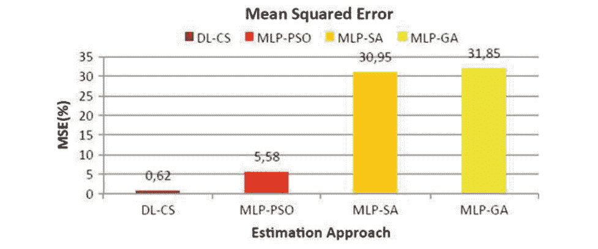

### 图4.4 均方根对数误差与估计方法的关系

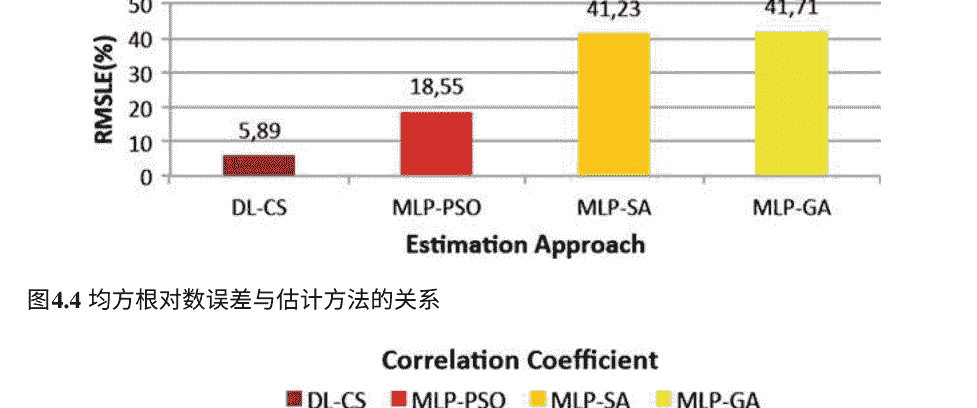

### 图4.5 相关系数与估计方法的关系

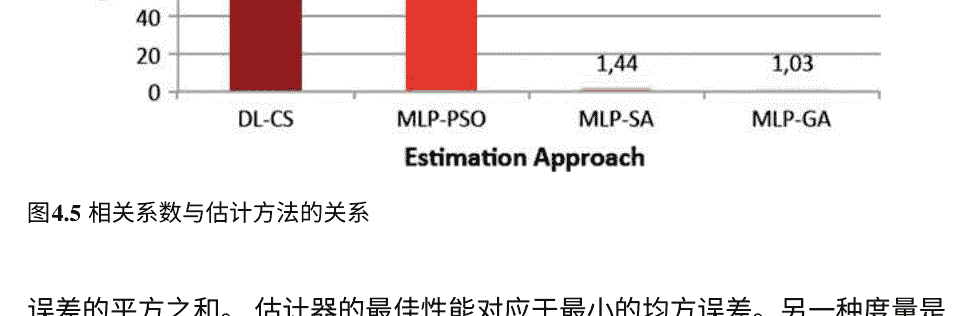

### 图4.6 相对预测准确性与估计方法的关系

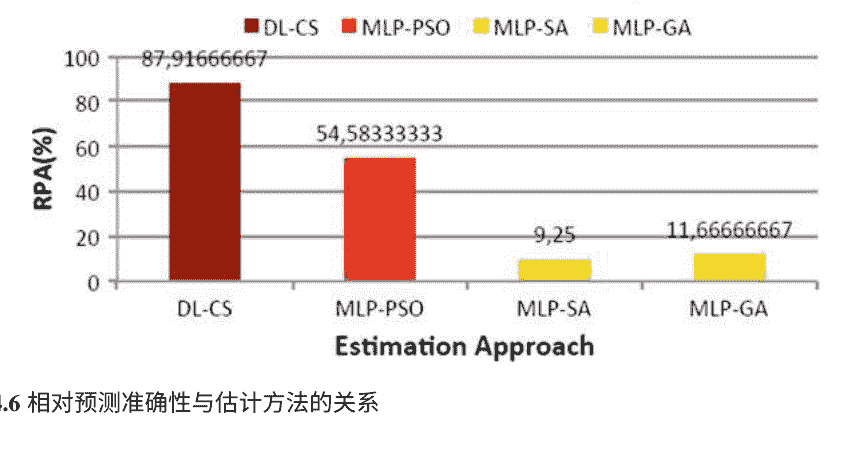

在MSE的情况下，提出的方法表现更好，得到了RMSLE的最小值。在评估数据挖掘方法时，我们还关注相关系数。它量化了样本之间的依赖类型。当相关系数较高时，估计器的性能更好。与相关系数一样，预测准确性也以百分比给出，并表示与最佳准确性相对应的平均绝对偏差为100%。

图4.3和4.4是条形图，显示了DL-CS与MLP-PSO、MLP-SA和MLP-GA相比的MSE和RMSLE值。我们观察到DL-CS、MLP-PSO、MLP-SA和MLP-GA的MSE分别为0.62、5.58、30.95和31.85%，RMSLE分别为5.89、18.55、41.23和41.71%。与其他方法相比，DL-CS的均方误差值最低。这些结果通过相关系数进行验证，其条形图显示在图4.5中。DL-CS和MLP-PSO分别得到了96.19%和71.57%的相关性值，而MLP-SA和MLP-GA的相关性分别为1.44%和1.03%。

MLP-SA和MLP-GA分别得到了9.25%和11.67%的RPA，而DL-CS和MLP-PSO分别得到了87.92%和54.58%，如图4.6所示。观察到，DL-CS方法在所有四个指标上都获得了最佳结果。

在图4.7的顶部行中，我们展示了10个具有缺失像素值的图像，这些值需要在进行统计方法的分类任务之前进行估计。在同一图的底部行中，我们展示了使用DL-CS方法重建的图像，而在图4.8的顶部和底部行中，我们观察到使用MLP-PSO和MLP-GA方法重建的图像。可以看出，使用MLP-PSO和MLP-GA方法重建的图像引入了很多噪音，尤其是在底部行比顶部行更多，与应用DL-CS方法时相反。此外，仔细观察发现，当使用MLP-PSO和MLP-GA方法时，图像并没有完全重建，因为图像中并不是所有像素值都被正确估计。

### 图4.7 顶部行：损坏的图像-底部行：DL-CS重建的图像

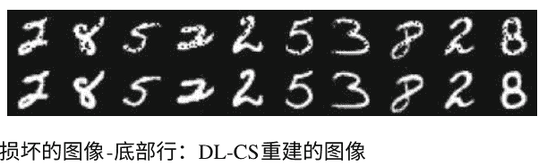

### 图4.8 顶部行：MLP-PSO重建的图像-底部行：MLP-GA重建的图像

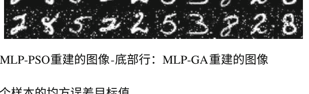

### 表4.2 DL-CS每个样本的均方误差目标值

| 样本 | 尺寸 | 深度学习工程系统中的缺失数据 | MLP-PSO | MLP-SA | MLP-GA |
|------|------|---------------------------|---------|--------|--------|
| 1    | 83   | **2.89**                  | 5.72    | 9.26   | 9.26   |
| 2    | 75   | **2.84**                  | 8.94    | 14.22  | 14.22  |
| 3    | 85   | **1.29**                  | 5.73    | 6.77   | 6.77   |
| 4    | 74   | **3.45**                  | 7.72    | 16.06  | 16.06  |
| 5    | 66   | **1.78**                  | 6.79    | 10.33  | 10.33  |
| 6    | 74   | **1.10**                  | 5.37    | 9.12   | 9.12   |
| 7    | 82   | **3.19**                  | 9.31    | 11.79  | 11.79  |
| 8    | 77   | **2.97**                  | 10.38   | 14.64  | 14.64  |
| 9    | 74   | **3.51**                  | 8.35    | 8.49   | 8.49   |
| 10   | 81   | **1.25**                  | 5.67    | 15.36  | 15.36  |

粗体数值表示算法产生了最佳（最低）结果。

### 表4.3 DL-CS附加指标

|      | 深度学习工程系统中的缺失数据 | MLP-PSO | MLP-SA | MLP-GA |
|------|---------------------------|---------|--------|--------|
| COD  | **92.52**                 | 51.22   | 0.02   | 0.01   |
| GD   | **0.01**                  | 1.23    | 14.93  | 15.22  |
| MAE  | **3.57**                  | 15.17   | 47.63  | 48.07  |
| SE   | **7.85**                  | 23.61   | 55.63  | 56.44  |
| SNR  | **8.36**                  | 60.35   | 194.62 | 189.37 |

粗体数值表示算法产生了最佳（最低）结果。

在表4.2中，维度列指的是样本/记录中缺失值的数量。表4.2和4.3进一步支持了图4.3、4.4、4.5和4.6的结果，表明所提出的DL-CS方法在每个样本中估计缺失值时产生了最低的目标函数值，以及最佳的COD、GD、MAE、SE和SNR值。

在表4.4中，我们展示了通过与MLP-PSO、MLP-SA和DL-CS方法进行统计分析得到的结果。

| 比较的对 | P值（95%置信水平） |
|----------|---------------------|
| DL-CS:MLP-PSO | 3.7 × 10^{-19} |
| DL-CS:MLP-SA | 4.6 × 10^{-50} |
| DL-CS:MLP-GA | 4.6 × 10^{-50} |

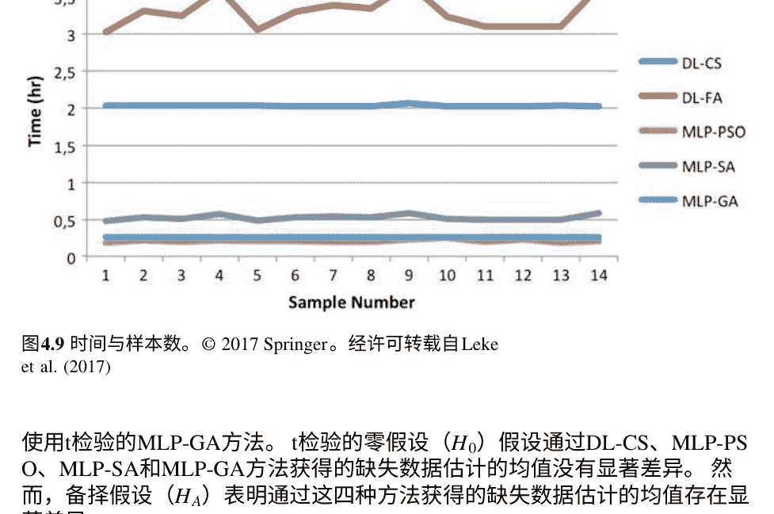

使用t检验的MLP-GA方法。t检验的零假设（$H_0$）假设通过DL-CS、MLP-PSO、MLP-SA和MLP-GA方法获得的缺失数据估计的均值没有显著差异。然而，备择假设（$H_A$）表明通过这四种方法获得的缺失数据估计的均值存在显著差异。

表4.4显示，在95%的置信水平下，DL-CS方法与MLP-PSO、MLP-SA和MLP-GA方法相比，估计值的均值存在显著差异，分别为3.7 × 10^{-19}、4.6 × 10^{-50}和4.6 × 10^{-50}。因此，这表明在95%的置信水平下，可以拒绝零假设（$H_0$），即认为DL-CS与其他三种方法之间的均值没有显著差异，而支持备择假设（$H_A$）。

执行时间是此分析中使用的最后一个指标。MLP-PSO、MLP-SA和MLP-GA一直被DL-CS超越。这是因为它们的执行时间相对较短，少于30分钟，与DL-CS相比如图4.9所示。

## 4.5 结论

本章介绍了一种通过新方法估计缺失数据的调查。估计方法包括使用深度自动编码器网络复制输入数据，结合布谷鸟搜索算法估计缺失数据。研究了该模型的性能，并与现有方法进行了比较，包括具有遗传算法、模拟退火和粒子群优化的MLP自动编码器。结果表明，与MLP混合系统相比，所提出的系统产生更准确的估计。当考虑均方误差、均方根对数误差、相关系数、相对预测准确性、信噪比和全局偏差时，所提出的方法得到了最佳值。此外，在估计过程中考虑目标函数值时，观察到所提出的方法在每个实例中都具有最低的值。

## 参考文献

- Abdella, M., & Marwala, T. (2005). 遗传算法和神经网络在数据库中近似缺失数据的使用。在第三届国际计算控制会议(ICCC)上，(第207-212页). IEEE.
- Ali, F. A., & Mohamed, A. T. (2016). 一种混合布谷鸟搜索算法与Nelder-Mead方法解决全局优化问题。SpringerPlus, 5(1), 473. https://doi.org/10.1186/s40064-016-2064-1. Springer国际出版社.
- Brain, L. B., Marwala, T., & Tettey, T. (2006). 用于HIV分类的自编码器网络。Current Science, 91(11), 1467-1473.
- Finn C., Tan, X., Duan, Y., Darrell, T., Levine, S., & Abbeel, P. (2016). 用于视觉运动学习的深度空间自动编码器。在国际机器人与自动化会议(ICRA)上(第512-519页).
- Hinton, G. E., Osindero, S., & Teh, Y. W. (2006). 一种用于深度信念网络的快速学习算法。Neural Computation, 18(7), 1527-1554.
- Jerez, J. M., Molina, I., García-Laencina, P. J., Alba, E., Ribelles, N., Martín, M., 等 (2010). 在一个真实的乳腺癌问题中，使用统计和机器学习方法进行缺失数据插补。Artificial Intelligence in Medicine, 50(2), 105-115. 爱思唯尔.
- Ju, Y., Guo, J., & Liu, S. (2015). 一种将稀疏自编码器与SVM相结合的深度学习方法。在国际分布式计算和知识发现会议(CyberC)(pp. 257-260).
- Krizhevsky, A., & Hinton, G. E. (2011). 使用非常深的自编码器进行基于内容的图像检索。在第19届欧洲人工神经网络研讨会(ESANN), 比利时布鲁日. 2011年4月27日至29日.
- Leke, C., & Marwala, T. (2016). 高维数据集中的缺失数据估计：一种群智能-深度神经网络方法。在群智能国际会议上(pp. 259-270). Springer国际出版社.
- Leke, C., Twala, B., & Marwala, T. (2014). 缺失数据预测建模：计算智能和优化算法。在国际系统、人类和控制论大会(SMC)（第1400-1404页）. IEEE.
- Leke, C., Ndjongue, A. R., Twala, B., & Marwala, T. (2017). 一种用于高维数据集中缺失数据估计的深度学习布谷鸟搜索方法。在群体智能国际会议上（第561-572页）. Cham: Springer.
- Liew, A. W.-C., Law, N.-F., & Yan, H. (2011). 基因表达数据的缺失值插补：从可用信息中恢复缺失数据的计算技术。Briefings in Bioinformatics, 12(5), 498-513. 牛津大学出版社.
- Myers, T. A. (2011). 再见，整体删除：将热卡片插补作为处理缺失数据的简单且有效工具的介绍。Communication Methods and Measures, 5(4), 297-310. Taylor & Francis.
- Schafer, J. L., & Graham, J. W. (2002). 缺失数据：我们对现有技术的看法。Psychological Methods, 7(2), 147. 美国心理学协会.
- Ssali, G., & Marwala, T. (2007). 使用计算智能和决策树估计缺失数据。arXiv预印本arXiv:0709.1640.
- Vasanthakumar, S., Kumarappan, N., Arulraj, R., & Vigneysh, T. (2015). 基于布谷鸟搜索算法的分布式发电微电网系统的环境经济调度。在智能技术和计算、通信、控制、能源和材料管理国际会议(ICSTM)上(pp. 575-580). IEEE.
- Vukosi, M. N., Nelwamondo, F. V., & Marwala, T. (2007). 自编码器，主成分分析和支持向量回归用于数据插补。arXiv预印本 arXiv:0709.2506.
- Wang, J., Zhou, B., & Zhou, S. (2016). 改进的布谷鸟搜索优化算法用于混沌系统参数估计. Computational Intelligence and Neuroscience, 8. https://doi.org/10.1155/2016/2959370.
- Yang, X. S., & Deb, S. (2014). 布谷鸟搜索：最新进展和应用。Neural Computing and Applications, 24(1), 169–174.
- Yang, X. S., & Deb, S. (2009). 通过列维飞行的布谷鸟搜索。World Congress on Nature & Biologically Inspired Computing (NaBIC), 48(2), 210–214.

# 第5章 使用萤火虫算法进行缺失数据估计

## 5.1 引言

在广泛的学术领域中，先前的研究表明，缺失数据的存在使决策和数据分析任务变得复杂。因此，可以假设使用完整/代表性的数据集而不是不完整的数据集时，决策可能更准确可靠。这个假设导致了数据挖掘领域的大量研究，开发了准确执行此任务的新技术（Abdella和Marwala 2005；Aydilek和Arslan 2012；Koko和Mohamed 2015；Leke等人2014；Mistry等人2009；Nelwamondo等人2007；Rana等人2015；Zhang等人2011；Zhang 2011）。研究表明，在医学、制造或能源等各个专业领域中，使用仪器中的传感器报告重要信息并支持决策过程的应用可能因为缺失数据而失败并导致不正确的结果。在这种情况下，拥有能够以高准确度从故障传感器中填补缺失数据的系统非常重要。填补过程将需要考虑系统中传感器数据之间的相互关系，以近似缺失值。在图像识别系统中，缺失数据的存在也会对图像预测或分类任务造成困难，因为缺少像素值，因此需要能够以高准确度填补缺失值的系统，以使任务更可行。

考虑一个高维数据集，例如混合国家标准与技术研究所（MNIST）数据集，其中有784个特征变量作为像素值，如图5.1所示。假设像素值是随机丢失的，如底部行所示，并且需要进行统计分析来对上述数据集进行分类，感兴趣的问题是：（i）我们能否以高准确性对高维数据集中的缺失数据进行不确定性填补？（ii）当相关数据丢失时，是否可以引入新的技术来近似缺失数据？

考虑变量之间的关系和相互关系？ 因此，本章旨在使用由受限玻尔兹曼机堆叠而成的深度学习（DL）技术，与萤火虫算法（FA）一起构建自编码器，以估计由模型创建的缺失数据，以适应感兴趣的机制和任意模式。 所使用的数据集是LeCun（2016）的手写数字MNIST数据库。 它有一个包含60,000个样本图像的训练集和一个包含10,000个样本图像的测试集，具有784个特征。

这些图像显示了从0到9的手写数字。 由于本章讨论的研究是在对高维数据上的DL-FA缺失数据预测器几乎没有兴趣或没有兴趣的时候进行的，因此本章旨在利用这种技术对MNIST数据集进行研究。

本章的其余部分结构如下，第5.2节介绍了缺失数据，以及使用的深度学习技术和群体智能算法已实施。 第5.3节介绍了实验设计和使用的程序，而第5.4节重点介绍了本章实验中的结果和主要发现。 讨论、结论和未来研究建议进一步在第5.5节中提出。

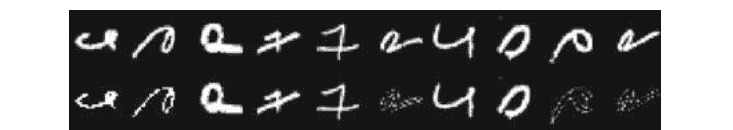

图5.1 MNIST数据集的样本。顶行-真实数据：底行-带有缺失像素值的数据。©2016 Springer。经Leke和Marwala（2016）许可复制。

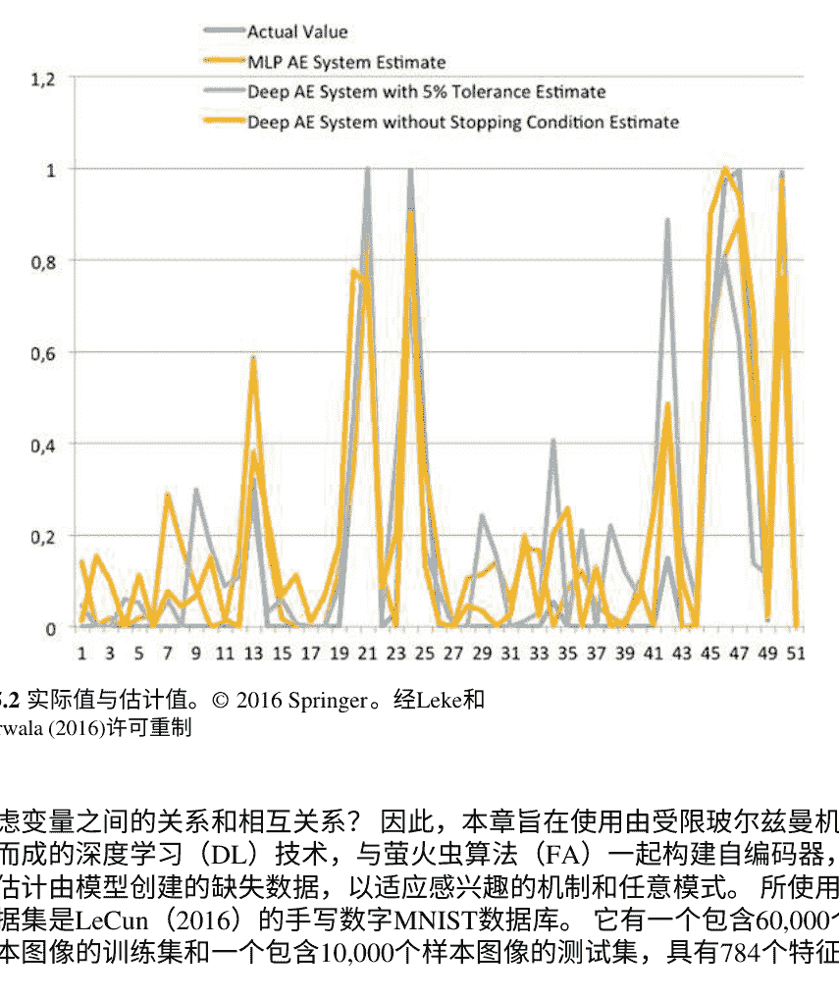

图5.2 实际值与估计值。©2016 Springer。经Leke和Marwala（2016）许可重制

## 5.2 文献综述

本章实现了一种称为堆叠自编码器的深度学习技术，这些技术使用受限玻尔兹曼机进行了单独训练，并以自底向上的方式堆叠在一起。缺失值的估计是通过使用萤火虫算法来完成的，这是一种群体智能方法。然而，我们首先简要讨论所使用的方法和它们旨在解决的问题。

### 5.2.1 缺失数据

缺失数据是指数据集中某些特征缺少组件的情况（Rubin 1978）。这导致应用领域出现问题，这些领域依赖于完整和高质量的数据，可能影响各个学术/专业领域和行业。解决这个问题的技术已经成为多个学科的研究领域（Rubin 1978; Allison 1999; Little and Rubin 2014）。

- 缺失数据可能是由以下一个或多个原因引起的：
  - (i) 在调查或数据录入过程中对问题的非响应
  - (ii) 数据记录过程中传感器或仪器的故障
  - (iii) 研究人员的不当数据收集程序

#### 5.2.1.1 缺失数据机制

数据集中数据点缺失的方式决定了估计这些值的方法。根据Little和Rubin（2014）的说法，存在三种缺失数据机制。它们是：

- (i) 完全随机缺失（MCAR）
- (ii) 随机缺失（MAR）
- (iii) 非随机缺失或不可忽略的情况（MNAR或NI）

本章重点研究MCAR和MAR机制。以前的研究表明，MCAR情况发生在特征的缺失数据条目的可能性不依赖于特征本身或数据集中的任何其他特征（Leke等，2014）。这意味着特征之间，包括感兴趣的特征之间，缺乏相关性或交叉相关性（Rubin 1978）。另一方面，MAR是指特定特征的缺失取决于数据集中的其他特征，但不依赖于感兴趣的特征本身（Leke等，2014）。

#### 5.2.1.2 缺失数据模式

根据Little和Rubin（2014）的说法，存在两种主要的缺失数据模式。这些是任意和单调的缺失数据模式。除了这两种模式之外，还有单变量的缺失数据模式。在任意模式中，缺失观测可能发生在任何地方，变量的顺序并不重要。在单调缺失模式中，变量的顺序很重要，缺失的发生并不是随机的。因此，在具有多个特征变量的数据集中，例如$X1$，$X2$，...，$Xn$，如果观察到一个变量$Xj$，那么意味着所有之前的变量$Xk$（其中$k<j$）也在该实例中观察到（Little和Rubin，2014）。单变量模式定义了只有一个特征变量具有缺失数据条目的情况。基于这一认识，本章将继续关注任意缺失模式。

### 5.2.2 深度学习（DL）

深度学习包括机器学习中的几种算法，利用一系列非线性处理单元组织成多层，从输入数据中提取和转换特征到输出数据（Deng等，2013年；Deng和Yu，2014年）。每一层都使用前一层的输出作为输入，在训练阶段可以使用监督或无监督算法。这些应用于监督和无监督问题，如分类和模式分析。它还基于对输入数据的多层特征或表示进行无监督学习，其中高层特征是从低层特征中获得的，从而得到数据的分层表示（Deng和Yu，2014年）。通过学习描绘数据不同抽象层次的多层表示，我们获得了一个概念的层次结构。

在本文中，使用的深度学习技术是堆叠自编码器。

### 5.2.3 受限玻尔兹曼机（RBM）

首先，玻尔兹曼机（BM）是一个双向连接的随机处理单元网络，可以解释为神经网络。它可以根据来自分布的样本学习未知概率分布的重要方面，这通常是一个困难的过程。通过对网络拓扑施加限制，可以简化这个学习过程，从而得到受限玻尔兹曼机（RBMs）。RBM可以被描述为一个无向、概率、参数化的图模型，也被称为马尔可夫随机场（MRF）。

在被提出作为深度网络（Fischer和Igel 2012）的构建块之后，RBMs引起了很大的兴趣。这个想法是隐藏神经元从观测中提取相关特征，随后作为输入传递给另一个RBM。将这些RBM堆叠在一起的目标是通过从特征中学习特征来获得数据的高级表示。RBM也是与二分无向图相关联的MRF，由可观测数据表示的可见单元V=(V1, V2,..., Vm)，以及捕捉输入层中特征之间相互依赖关系的隐藏单元H=(H1, H2,..., Hn)。在本章中，变量V取值为v∈[0,1]^{m+n}，而H取值为{0,1}^{m+n}。给定的Gibbs分布的联合概率分布具有以下能量函数（Fischer和Igel 2012）：

$$E(v, h) = -h^T W v - b^T v - c^T h. \tag{5.1}$$

在标量形式下，(5.1)由Fischer和Igel (2012)表示：

$$E(v, h) = -\sum_{i=1}^{n}\sum_{j=1}^{m} w_{ij}h_iv_j - \sum_{j=1}^{m} b_jv_j - \sum_{i=1}^{n} c_ih_i. \tag{5.2}$$

在方程(5.2)中，$w_{ij}$是RBM模型中最重要的部分，它是单位$v_j$和$H_i$之间的实值权重，而$b_j$和$c_i$是与第j个可见变量和第i个隐藏变量相关的实值偏差项。如果$w_{ij}$为负数，并且$v_j$和$h_i$都等于1，则概率会降低，能量会增加。

相反，如果$w_{ij}$为正数，并且$v_j$和$h_i$都等于0，则概率会增加，能量会降低。如果$b_j$为负数，并且$v_j=1$，则能量会增加，概率会降低。因此，更倾向于$v_j=0$而不是$v_j=1$。然而，如果$b_j$为正数，并且$v_j=0$，则能量会降低，概率会增加，更倾向于$v_j=1$而不是$v_j=0$。负数的$b_j$值会减少方程(5.2)中的第二项，而正数的$b_j$值会增加这个第二项。对于$c_i$和方程(5.2)中的第三项也是同样的道理。然后，由Fischer和Igel (2012)得到了Gibbs分布或概率，如方程(5.1)或(5.2)所示：

$$p(v, h) = \frac{e^{-E(v,h)}}{Z} = \frac{e^{(h^T W v + b^T v + c^T h)}}{Z} = \frac{e^{(h^T W v)}e^{(b^T v)}e^{(c^T h)}}{Z}. \tag{5.3}$$

在这里，指数项是具有向量节点的马尔可夫网络的因子，而Z是不可计算的分区函数。由于它可以取到指数数量的值，所以它是不可计算的。对于一个RBM,

$$Z = \sum_{v,h} e^{-E(v,h)}. \tag{5.4}$$

RBM的另一个关键方面是h在条件上独立于v，反之亦然，这是因为同一层中的节点之间没有连接。这个属性可以用数学方式表达为Fischer和Igel（2012）：

$$p(h|v) = \prod_{i=1}^{n} p(h_i|v)$$

和
$$p(v|h) = \prod_{i=1}^{m} p(v_i|h). \quad (5.5)$$

### 5.2.4 对比散度（CD）

在训练RBM时，目标是使用随机梯度下降算法最小化平均负对数似然（损失），而不使用正则化，因为它在高维数据集上具有良好的可扩展性。这个损失函数可以表示为

$$损失 = \frac{1}{T} \sum_{t} - \log p\left(v^{(t)}\right). \quad (5.6)$$

实现这个目标需要根据以下方程式计算损失函数的任何参数θ的偏导数：

$$\frac{\partial \left( -\log p\left(v^{(t)}\right) \right)}{\partial \theta} = E_h\left[ \frac{\partial E\left(v^{(t)}, h\right)}{\partial \theta} \middle| v^{(t)} \right] - E_{v, h}\left[ \frac{\partial E(v, h)}{\partial \theta} \right]. \quad (5.7)$$

方程（5.5）中的第一项是对数据分布的期望，被称为正相位，而v和h表示与方程（5.1）-（5.4）中相同的变量。第二项是对模型分布的期望，被称为负相位。由于需要对v和h进行指数求和，因此这个阶段很难计算且难以处理。此外，获得对数似然梯度的无偏估计通常需要许多采样步骤。然而，最近的研究表明，仅运行几个步骤的马尔可夫链得到的估计值就足以训练模型。这种方法导致了对比散度（CD）算法。CD是一种用于无向概率图模型的训练方法，其思想是在方程（5.5）中消除负相位中的双重期望，而是专注于估计。

它基本上实现了对工程系统中单个输入数据点的期望的蒙特卡洛估计。k步CD学习（CD-k）的思想是，不再通过从模型分布中采样来近似方程（5.5）中的第二项，而是只运行k步的Gibbs链，其中k通常设置为1。Gibbs链的初始化为使用训练集中的一个训练样例v⁽⁰⁾作为初始值，并在k步后得到样本v⁽ᵏ⁾。每一步t，都从p⁽ʰ|v⁽ᵗ⁾⁾中采样h⁽ᵗ⁾，然后从p⁽ᵛ|h⁽ᵗ⁾⁾中采样v⁽ᵗ⁺¹⁾。对于一个训练模式v⁽⁰⁾，对数似然关于θ的梯度被近似为

$$CD_k(\theta, v^{(0)}) = -\sum_{h} p(h|v^{(0)}) \frac{\partial E(v^{(0)}, h)}{\partial \theta} + \sum_{h} p(h|v^{(k)}) \frac{\partial E(v^{(k)}, h)}{\partial \theta}$$

由于v⁽ᵏ⁾不是来自平稳模型分布的样本，近似公式（5.6）存在偏差。随着k→∞，偏差效应消失。指出CD存在偏差的另一个方面是它最大化了两个Kullback-Leibler（KL）散度之间的差异：

$$KL(q|p) - KL(p_k|p)$$

这里，q是经验分布，p_k是经过k步马尔可夫链的可见变量的分布（Fischer和Igel，2012年）。如果链已经达到平稳状态，则有p_k=p，因此KL（p_k|p）=0，CD的近似误差消失（Fischer和Igel，2012年）。

### 5.2.5 自编码器（AE）

自动编码器是一种人工神经网络，试图在输出层重现其输入。自动编码器的基本思想是从输入到输出的映射，x⁽ⁱ⁾→y⁽ⁱ⁾揭示了输入向量中的重要信息和基本结构，否则是抽象的。自动编码器通过确定性映射函数f_θ将输入向量x映射到隐藏表示y（Isaacs 2014; Leke and Marwala 2016）：

$$f_{\theta}(x) = s(W x + b)$$

θ参数由权重矩阵W和偏移/偏置向量b组成。s是表示为的sigmoid激活函数

$$s = \frac{1}{1 + e^{-x}}$$

然后，隐藏表示y通过函数映射到重构向量z，该函数由（Leke and Marwala 2016）获得：

$$z = g_{\theta'}(y) = s(W'y + b')$$

在这里，参数集θ'由编码器在微调阶段之前的权重矩阵的转置和偏置向量组成（Leke and Marwala 2016）。当进行上述权重的转置时，称为绑定权重的自动编码器。参数z并不被解释为对x的严格再生，而是作为概率术语中分布p(X|Z=z)的参数，该分布可能以高概率产生x（Isaacs 2014）。因此，这导致

$$p(X|Y=y) = p(X|Z = g_{\theta'}(y))$$

从这个中，我们得到一个相关的重构误差，这个误差将通过优化技术进行优化，并且具有以下形式$L(x,z)\propto -log p(x|z)$。根据Bengio等人（2013）的说法，这个方程也可以表示为

$$\delta_{AE}(\theta) = \sum_t L\left(x^{(t)}, g_\theta\left(f_\theta\left(x^{(t)}\right)\right)\right)$$

### 5.2.6 萤火虫算法（FA）

FA是一种基于萤火虫的闪烁模式和行为的自然启发元启发式算法（Yang 2010）。它基于三个主要规则：

- (i) 萤火虫是无性别的，所以所有的萤火虫都被吸引到其他的萤火虫身上，
- (ii) 吸引力与亮度成正比，随着距离的增加而减小。这个想法是较暗的萤火虫会向较亮的萤火虫移动。如果没有明显更亮的萤火虫，它们会随机移动，而且，
- (iii) 萤火虫的亮度由目标函数的地形决定（Yang 2010）。

考虑到吸引力与光强成正比，吸引力的变化可以根据距离来定义

$$\beta = \beta_0 e^{-\gamma r^2}$$

在公式（5.15）中，$\beta$是一个萤火虫的吸引力，$\beta_0$是一个萤火虫的初始吸引力，$r$是两个萤火虫之间的距离。一个萤火虫向更亮的萤火虫移动是由以下因素决定的

$$x_i^{t+1} = x_i^t + \beta_0 e^{-\gamma r_{ij}^2} \left(x_j^t - x_i^t\right) + \alpha_i \varepsilon_i^t$$

在这里，$x_i$和$x_j$是两个萤火虫的位置，第二项是由于萤火虫之间的吸引力。t和t+1代表不同的时间步长，$\alpha$是控制第三项步长的随机化参数，而是一个向量从高斯或均匀分布中抽取的随机数。如果 $\beta_0 =0$，则运动变成简单的随机行走（Yang 2010）。如果 $\gamma =0$，则运动变成粒子群优化算法的变体（Yang 2010）。本研究中使用的参数为：（i）25只萤火虫，（ii）1000次迭代，（iii）$\alpha=0.5$，（iv）$\beta=0.2$和（v）$\gamma=1$。选择这些参数是因为在不同的值排列和组合实验后，它们产生了更优的结果。

FA算法被用于此研究，因为尽管它已经应用于许多领域，如数字图像压缩、特征值优化、特征选择和故障检测、调度和TSP等，但其在缺失数据估计任务中的效率尚未得到研究。

## 5.3 实验设计和过程

在实验设计中，使用了MATLAB®R2014a软件在一台搭载Intel®Core™i3-212 0 CPU @ 3.30 GHz处理器、4.00 GB RAM、32 GB虚拟RAM、64位操作系统Windows 8.1 Pro的Dell台式电脑上。此外，使用了MNIST数据库，其中包含60,000个训练图像和10,000个测试图像。这些图像的尺寸为28 $\times$ 28=784像素。因此，训练集的尺寸为60,000 $\times$ 784，测试集的尺寸为10,000 $\times$ 784。数据预处理通过将所有像素值归一化到[0, 1]范围内进行。

深度自编码器的各个网络层使用RBM和CD进行预训练，以在良好的解空间中初始化权重和偏置。预训练的各个层的尺寸为784-1000、1000-500、500-250和250-30。这些层被堆叠起来，然后转置以获得自编码器网络的编码器和解码器部分。得到的网络架构的尺寸为784-1000-500-250-30-250-500-1000-784，输入层和输出层具有相同数量的节点，七个隐藏层的节点数量各不相同。然后使用反向传播进行微调，最小化均方网络误差。训练后得到的误差值为0.0025。训练使用了整个训练数据集，将其分为600个平衡的小批量，每个数字类别包含10个示例。在每个小批量之后更新权重和偏置。通过将RBM中可见单元的实值活动转录为较低级别RBM中隐藏单元的激活概率，实现对更高层权重的训练。多层感知机（MLP）自编码器具有一个由784个节点组成的输入层和输出层，以及一个由400个节点组成的隐藏层，通过尝试不同数量的隐藏层节点并观察哪种架构产生最低的均方网络误差来获得。784-400-784的网络架构导致最低的均方网络误差值为0.0032。隐藏层和输出层的激活函数使用的是sigmoid函数。训练使用了缩放共轭梯度下降算法进行1000个时期。测试中存在缺失数据然后根据MAR和MCAR机制以及任意模式随机创建一组数据，并使用萤火虫算法来近似估计这些缺失值，该算法的目标函数是最小化微调网络的损失函数。容忍误差最初设置为0.05（5%），这在首次研究所提出的方法中被认为是合理的。创建一个与测试数据集大小相同的矩阵，其值来自具有所需缺失率（10%）的二项分布，然后将其叠加在测试集上以包含预期的缺失数据。整体方法包括以下四个连续步骤：

1.  使用Hinton和Salakhutdinov（2006）描述的贪婪逐层预训练算法，从底层开始，在具有完整记录的训练数据集上训练各个RBM。每个层级训练50个时期。
2.  将RBM堆叠起来，形成深度自动编码器的编码器和解码器阶段，使用绑定权重。
3.  使用随机梯度下降技术通过反向传播微调深度自动编码器。
4.  使用经过微调的深度网络估计缺失数据作为萤火虫算法的目标函数的一部分，将已知变量值解析到目标函数中，然后在解析这些估计值到目标函数之前首先估计未知值。当达到停止准则时，估计过程终止，停止准则可以是误差容限为5%（0.05），或者达到最大函数评估次数。

## 5.4 实验结果

在缺失数据填补技术的研究中，我们使用了包含约10%缺失数据条目的测试数据集。我们在表5.1和表5.2中展示了来自提议的深度自动编码器系统（无容限）和MLP自动编码器系统的实际值、估计值和平方误差值。距离ϵ和平方误差的和是衡量方法性能的参数。在两个表中呈现的所有情况中，提议的深度自动编码器系统显示ϵ_d =0、0.0608、0、0.0275、0、0.0922、0.0009、0.0283，而对于相同的条目（实际值），MLP自动编码器显示ϵ_m =0.0246、0.2646、0.0149、0.1643、0、0.1982、0.0509、0.0473。与现有的MLP自动编码器相比，提议的技术在没有设定误差容限的情况下表现出更好的性能。这一结论通过表5.1和表5.2中呈现的所有情况中的平方误差得到验证，提议的技术始终具有更小的平方误差。

表5.1 深度自编码器系统中的实际值、估计值和平方误差值没有设置容差

| 实际值 | 估计值 | 平方误差 |
| :---: | :---: | :---: |
| 0 | 0 | 0 |
| 0.3216 | 0.3824 | 0.0037 |
| 0 | 0 | 0 |
| 0.9725 | 1 | 0.0008 |
| 0 | 0 | 0 |
| 0.9961 | 0.9039 | 0.0085 |
| 0.0509 | 0.0500 | 8.38e-07 |
| 0.5765 | 0.6048 | 0.0008 |

© 2016 Springer。经Leke和Marwala (2016)许可复制

表5.2 MLP自编码器系统中的实际值、估计值和平方误差值

| 实际值 | 估计值 | 平方误差 |
| :---: | :---: | :---: |
| 0 | 0.0246 | 0.0006 |
| 0.3216 | 0.5862 | 0.0700 |
| 0 | 0.0149 | 0.0002 |
| 0.9725 | 0.8082 | 0.0270 |
| 0 | 0 | 0 |
| 0.9961 | 0.7979 | 0.0393 |
| 0.0509 | 0 | 0.0026 |
| 0.5765 | 0.5292 | 0.0022 |

© 2016 Springer。经Leke和Marwala (2016)许可复制

我们可以认为这足以对比两种技术的性能进行结论，但我们需要分析处理时间，这似乎对于现有方法比提出的深度自编码器系统更好。 这在图5.3中得到了证明，我们比较了两种技术的处理时间。 显然，设置一个误差容限值会使估计过程更快，如图5.3所示。 然而，这是以准确性为代价的，而准确性是这样一个任务的主要方面，如图5.2所示。 误差容限值越大，估计缺失数据的速度越快。

该提出的方法进一步用于重建损坏的图像，仍然通过估计缺失像素。 通过使用SE、MSE、RMSLE、MAE、r和RPA指标来确定其有效性。 还使用了在第3章中定义的SNR、GD和COD性能指标。 考虑到这些评估指标，将新颖的DL-FA方法与现有的文献中的方法（MLP-PSO、MLP SA和MLP-GA）进行比较。 结果分组在图5.4、5.5、5.6和5.7，表5.3和5.4中。

结果表明DL-FA方法优于其他方法。
全局偏差在图5.4中给出。 它显示DL-FA的0.27% GD值。

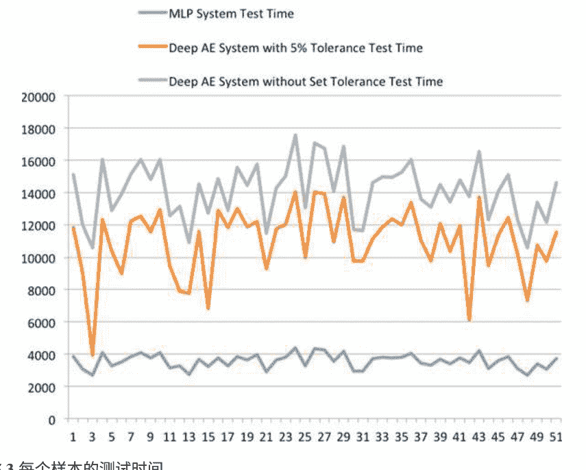

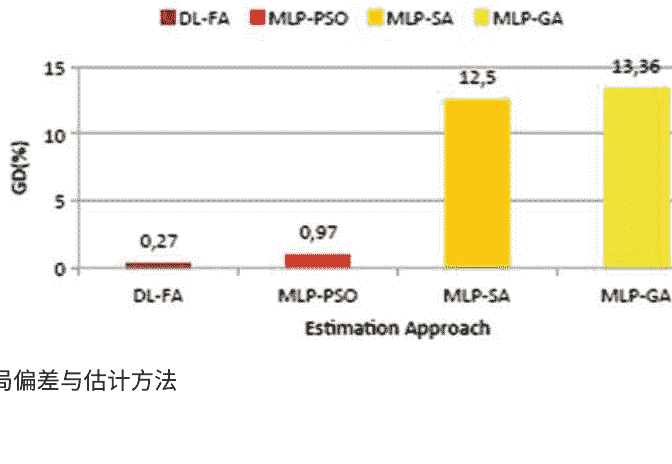

而MLP-PSO、MLP-SA和MLP-GA分别获得0.97、12.5和13.36%的GD值，

图5.5和5.6显示了四种方法的均方误差和均方根对数误差值，包括新的DL-FA方法。它们都证实了DL-FA方法相对于其他方法的更好性能。DL-FA的MSE为2.24%，RMSLE为11.79%，而MLP-PSO的MSE为5.83%，MLP-SA的MSE为30.81%和33.27%。

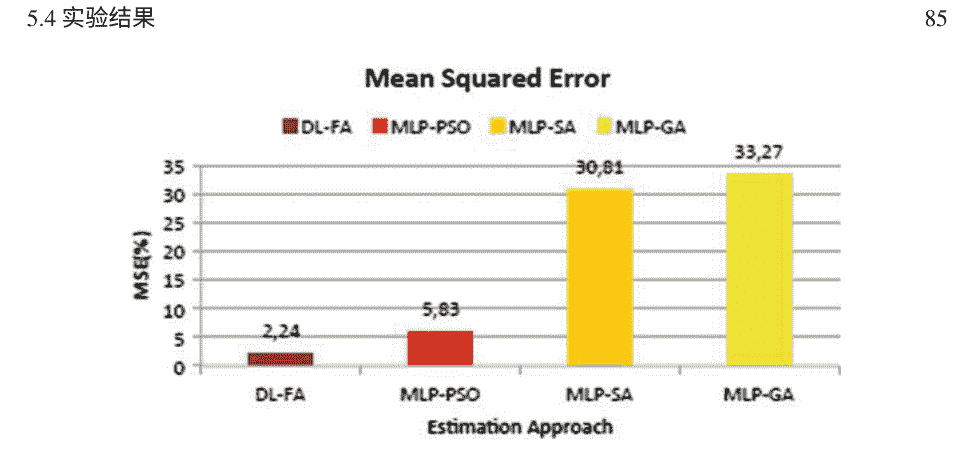

图5.5 均方误差与估计方法

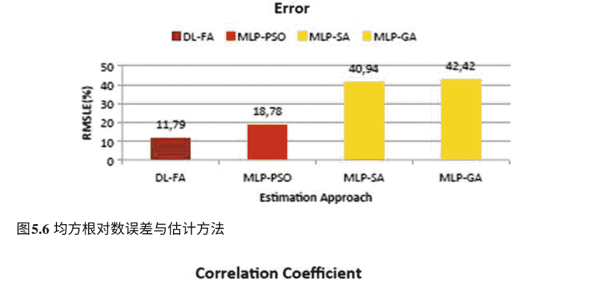

图5.6 均方根对数误差与估计方法

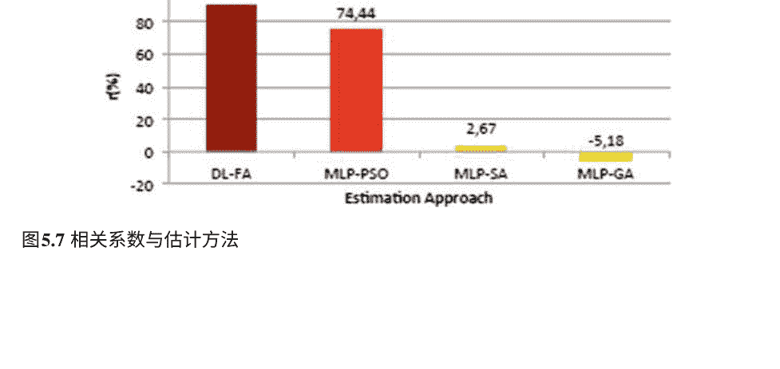

图5.7 相关系数与估计方法

### 表5.3 DL-FA附加指标

| 方法 | DL-FA | MLP-PSO | MLP-SA | MLP-GA |
| :--- | :--- | :--- | :--- | :--- |
| COD | **81.41** | 55.41 | 0.07 | 0.27 |
| MAE | **10.05** | 15.83 | 47.57 | 49.8 |
| RPA | **56.75** | 51.75 | 10.75 | 8.25 |
| SE | **14.98** | 24.15 | 55.51 | 57.68 |
| SNR | **22.42** | 61.1 | 221.36 | 236.98 |

粗体数值表示该算法确实产生了最佳（最低）结果

### 表5.4 DL-FA每个样本的均方误差目标值

| 样本 | 尺寸 | DL-FA | MLP-PSO | MLP-SA | MLP-GA |
| :--- | :--- | :--- | :--- | :--- | :--- |
| 1 | 74 | **1.27** | 2.44 | 4.11 | 4.11 |
| 2 | 74 | **2.93** | 7.42 | 8.56 | 8.56 |
| 3 | 72 | **12.34** | 17.90 | 20.69 | 20.69 |
| 4 | 72 | **1.36** | 5.58 | 4.28 | 4.28 |
| 5 | 73 | **2.97** | 4.99 | 12.23 | 12.23 |
| 6 | 75 | **2.86** | 5.90 | 13.84 | 13.84 |
| 7 | 78 | **5.46** | 8.76 | 13.59 | 13.59 |
| 8 | 78 | **3.43** | 11.34 | 11.34 | 11.34 |
| 9 | 84 | **1.74** | 6.00 | 6.72 | 6.72 |
| 10 | 97 | **5.87** | 17.65 | 19.58 | 19.58 |

粗体数值表示该算法确实产生了最佳（最低）结果

分别为MLP-GA。 MLP-PSO的RMSLE值为18.78%，而MLP-SA和MLP-GA的值分别为40.94%和42.42%。

考虑到图5.7，我们观察到DL-FA方法产生了90.22%的最高相关系数值，而MLP-PSO方法获得了74.44%的第二高值。 MLP-SA和MLP-GA的相关系数值分别为2.67和 −5.18%。

这些发现进一步得到了表5.3中的数值支持，DL-FA系统产生了最佳的COD、MAE、RPA、SE和SNR值。

考虑到表5.4，观察到在估计该记录中的所有缺失值时，所提出的DL-FA方法导致每个记录的最佳目标函数值。

在表5.5中，我们通过t检验对DL-$F_{A}$方法得到的估计结果与MLP-PSO、MLP-$S_{A}$和MLP-$G_{A}$方法进行了统计分析。 t检验的零假设（$H_{0}$）假设DL-$F_{A}$、MLP-PSO、MLP-$S_{A}$和MLP-$G_{A}$方法得到的缺失数据估计的均值没有显著差异。 然而，备择假设（$H_{A}$）表明这四种方法得到的缺失数据估计的均值存在显著差异。

表5.5 DL-FA结果的统计分析

| 比较的对 | P值（95%置信水平） |
| :--- | :--- |
| DL-FA:MLP-PSO | 4.09 × 10⁻⁵ |
| DL-FA:MLP-SA | 2.0 × 10⁻¹³² |
| DL-FA:MLP-GA | 1.0 × 10⁻¹⁴⁰ |

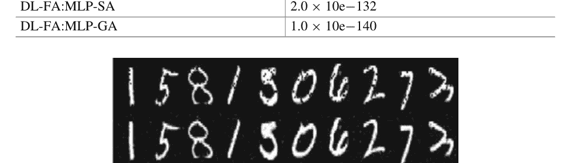

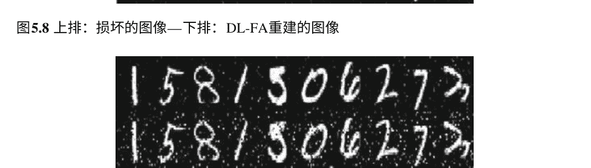

表5.5显示，在DL-FA与MLP-PSO、MLP-SA和MLP-GA之间的估计均值方面，在95%置信水平下存在显著差异，当比较这三对时，其p值分别为4.09 × 10⁻⁵、2.0 × 10⁻¹³²和1.0 × 10⁻¹⁴⁰。因此，这表明在95%置信水平下，可以拒绝假设(H_0)，即假设DL-FA与其他三种方法之间的均值没有显著差异，而支持备择假设(H_A)。

在图5.8的顶部行中，我们展示了10个具有缺失像素值的图像，这些值需要在统计方法执行分类任务之前进行估计。在同一图的底部行中，我们展示了使用DL-FA方法重建的图像，而在图5.9的顶部和底部行中，我们观察到使用MLP-PSO和MLP-GA方法重建的图像。可以看出，使用MLP-PSO和MLP-GA重建的图像引入了大量噪音，尤其是在底部行中，而DL-FA方法应用时则相反。此外，仔细观察发现，图像并没有完全重建，因为并没有正确估计图像中的所有像素值。

## 5.5 结论

本章研究了在高维数据集中使用深度神经网络和群智能算法来填补缺失数据。根据任意缺失数据模式和MCAR机制，缺失数据可能出现在数据集的任何位置。本章的实验考虑了测试数据集中10%的缺失情况。这些值需要在误差容限为10%的情况下进行估计。通过分析系统的输出，可以观察到一些估计值确实在这个容限值内，但其他一些估计值则不在内。此外，平均得到的1.29%误差值可能是误导性的，因为在某些情况下，实际值和估计值之间的个别比较导致了较高的误差值，正如结果部分的第一部分所观察到的。可以假设这些差异的原因可能是估计过程中使用的参数不足或在估计阶段重新逼近了一些已知值。因此，这改变了存储在网络权重中的数据集变量之间的学习相互关系和相关性。基于本章的研究结果，值得在未来的研究中进行深入的参数分析，以观察哪些参数对任务是最优的，并使用多个数据集来推广这个方面。在这项研究中面临的另一个障碍是估计缺失值的计算时间，为了解决这个问题，可以考虑在多核系统上并行化该过程，以观察并行化任务是否确实加快了进程并保持了效率和准确性。

## 参考文献

> Abdella, M., & Marwala, T. (2005). 使用遗传算法和神经网络来近似数据库中的缺失数据。在第三届国际计算控制会议(ICCC 2005)上(pp. 207–212). IEEE.

> Allison, P. D. (1999). 缺失数据的多重插补: 一个警示故事。费城.

> Aydilek, I. B., & Arslan, A. (2012). 一种新的混合方法来估计数据库中的缺失值, 使用k最近邻和神经网络。创新计算、信息和控制国际期刊, 7(8), 4705–4717.

> Bengio, Y., Courville, A., & Vincent, P. (2013). 表示学习: 一篇综述和新的观点。模式分析和机器智能交易, 35(8), 1798–1828. IEEE.

> Deng, L., et al. (2013). 微软语音研究中深度学习的最新进展。在国际声学、语音和信号处理会议(ICASSP)上(pp. 8604–8608). IEEE.

> Deng, L., & Yu, D. (2014). 深度学习: 方法和应用。信号处理的基础和趋势, 7(3-4), 197-387.

> Fisher, A., & Igel, C. (2012). 受限玻尔兹曼机的介绍。在第17届伊比利亚美洲国际大会, CIARP, 进展中的模式识别, 图像分析, 计算机视觉和应用(第14-36页)。海德堡: 斯普林格。

> Hinton, G.E., & Salakhutdinov, R.R. (2006). 用神经网络降低数据的维度。美国科学促进会, 313(5786), 504-507.

> Isaacs, J.C. (2014). 用于声纳ATR的表征学习。在SPIE 9072会议记录，检测和感知地雷，爆炸物和隐蔽目标XIX（第907203页）。

> Koko, E. E. M., & Mohamed, A. I. A. (2015). 缺失数据处理方法在集群分析中的应用. 国际高级统计与概率学杂志, 3(2), 191–209.

> LeCun, Y. (2016). 手写数字MNIST数据库.

> Leke, C., Twala, B., & Marwala, T. (2014). 缺失数据预测建模：计算智能和优化算法。在国际系统、人类和控制论大会（SMC）（第1400-1404页）。IEEE.

> Leke, C., & Marwala, T. (2016). 高维数据集中的缺失数据估计：一种群体智能-深度神经网络方法。在群体智能国际会议中. Springer国际出版社, pp. 259–270.

> Little, R. J., & Rubin, D. B. (2014). 缺失数据的统计分析. 纽约: Wiley.

> Mistry, F. J., Nelwamondo, F. V., & Marwala, T. (2009). 使用主成分分析和自联想神经网络进行缺失数据估计. 系统学、控制论和信息学杂志, 7(3), 72–79.

> Nelwamondo, F. V., Mohamed, S., & Marwala, T. (2007). 缺失数据：神经网络和期望最大化技术的比较. ArXiv预印本arXiv:0704.3474.

> Rana, S., John, A. H., Midi, H., & Imon, A. (2015). 在存在异常值的情况下，对缺失数据进行鲁棒回归插补。远东数学科学杂志，97(2), 183. Pushpa Publishing House.

> Rubin, D. B. (1978). 在样本调查中的多重插补-一种非响应的现象学贝叶斯方法。在美国统计协会的调查研究方法部门的会议记录中(卷1，第20-34页)。美国统计协会.

> Yang, X.-S. (2010). 萤火虫算法，李维飞行和全局优化。在M. Bramer, R. Ellis, & M. Petridis (Eds.), 智能系统XXVI的研究与开发(pp. 209-218)。伦敦：斯普林格出版社.

> Zhang, S., Jin, Z., & Zhu, X. (2011). 通过利用不完整实例中的信息来填补缺失数据。系统与软件杂志，84(3), 452-459.

> Zhang, S. (2011). 邻居法及其在缺失数据填补中的应用。应用智能，35(1), 123-133.

# 第6章 使用蚁群优化算法进行缺失数据估计

## 6.1 引言

缺失数据的存在影响了数据集的质量，从而影响了数据的分析和解释。 导致数据在数据集中缺失的原因有多种，其中一些原因比其他原因更为突出。

第一个众所周知的原因是参与者拒绝透露一些个人和敏感信息，例如每月收入或每月支出。 第二个主要原因是捕捉和存储数据的系统故障。 另一个主要原因是互操作性，即系统之间交换的信息可能存在缺失数据。

在现实世界和学术界中，缺失数据仍然是一个永恒存在的问题。 做出依赖于准确知识的决策主要依赖于数据的可用性，从中可以提取信息并做出决策。 这样的过程通常需要预测模型或其他计算智能技术，这些技术使用观测数据作为输入。 然而，在某些情况下，数据可能丢失、损坏或记录不完整，这会对数据质量产生负面影响。 大多数决策和机器学习框架，如人工神经网络、支持向量机和主成分分析，如果数据不完整，则无法用于决策和数据分析，因为这些缺失值可能会影响模式识别和分类任务。 尽管存在缺失数据，决策输出仍然应该保持，因此解决这个问题非常重要。 因此，在处理数据时，如果存在不完整或缺失的数据，首先需要估计缺失值。

缺失数据估计方法的应用非常广泛，包括结构方程建模（Carter 2006）、空气质量数据（Zainuri等，2015）和时间序列数据重建（Sidekerskiene和Damasevicius，2016）观测等。 话虽如此，现有的方法取决于数据的性质、缺失模式，并且主要是实施在低维数据集上。Abdella和Marwala（2005）实施了一个联合神经网络-遗传算法框架，用于在一维数据中插补缺失值，而Rana等人（2015）则在具有异常值的数据集中使用鲁棒回归插补，并研究了其性能。在Zhang等人（2011）中，建议在估计缺失数据时使用相关实例的知识。这导致了非参数迭代插补算法（NIIA）的引入。在Jerez等人（2010）、Leke等人（2014）、Liew等人（2011）、Myers（2011）和Van Buuren（2012）等论文中，观察到了插补缺失数据和现有方法之间的新技术和比较。这些技术主要适用于具有缺失值的低维数据集，但在考虑具有无控制缺失方式的高维数据集时效果较差，这将在后续章节中详细描述。因此，本工作的主要动机是引入高维缺失数据估计方法，重点放在图像识别数据集上。这些方法将用于通过估计图像像素值来重建损坏的图像。

为了研究解决之前提到的维度问题，我们实现了一个深度自编码器，自编码器网络是一种无监督学习技术，通过学习一个减少原始数据x和输出重构数据x̂之间对比度的近似函数来重建输入数据作为输出。这与主成分分析（PCA）相同。深度自编码器由两个对称的深度置信网络组成，其中一对浅层代表网络的编码部分，而第二对浅层代表解码部分，每个单独的层都是受限玻尔兹曼机（RBM）。

这些网络适用于各种领域，例如，深度自编码器在Finn等人（2016）的视觉运动学习中使用，而在Ju等人（2015）中，它们与支持向量机（SVM）一起用于学习稀疏特征和执行分类任务。Feng等人（2014）使用深度去噪自编码器为嘈杂的混响语音识别系统生成稳健的语音特征，而在Krizhevsky和Hinton（2011）中，这些网络用于将小的彩色图像映射到短的二进制码。自编码器有几个优点，例如，在网络的编码部分引入非线性，与PCA等方法相比更加灵活，这是预训练过程的一个关键特性，它们不需要先验知识的数据属性和相关性，而且它们直观易懂。这个网络的主要缺点是需要大量的样本进行训练和学习，而这些样本并不总是容易获取的。

在本章中，我们提出了一种新的高维数据集中缺失数据估计方法，即基于深度自动编码器和蚁群优化算法的DL-ACO。为此，我们首先介绍了优化算法的背景信息，即ACO算法。随后，我们介绍了所使用的实验模型的描述。接下来，我们对所提出模型的性能进行分析，并将所得结果与现有方法进行比较。此外，我们还报告了实验结果，并讨论了实验结果的发现。最后，我们简要总结了结论。

## 6.2 蚁群优化（ACO）

ACO是一种模仿蚂蚁固有行为的算法。在蚂蚁的日常生活中，它们必须探索巢穴附近的领域，寻找食物以维持生存（Monteiro等，2012年）。当蚂蚁移动时，它们在路径上留下一种称为信息素的物质。这种沉积信息素的背后有两个主要目标。一个原因是让蚂蚁能够找回巢穴的路线，另一个原因是让其他蚂蚁能够追踪其他蚂蚁使用的方向，以便跟随（Monteiro等，2012年）。

ACO具有一系列可视为构建模块的特征。这些特征是必不可少的，并且在每个实现中都需要指定。这些特征包括（Dorigo等，1991年）：
- i. 选择用于构建解决方案的方法，
- ii. 检查知识，
- iii. 更新信息素的规则，
- iv. 概率函数和转换规则，
- v. 参数的值，
- vi. 停止准则（Monteiro等，2012年）。

该算法考虑了一个独特的蚁群，其中有 $m$ 人工蚂蚁相互合作。在算法执行开始之前，每个解决方案之间的链接都被赋予一定数量的信息素，$\tau_0$。这个值通常非常小，足够小以至于每个解决方案被选择的概率不为零。在每次迭代中，每个已构建解决方案的 $m$ 蚂蚁都会更新信息素的值。与解决方案 $i$ 和 $j$ 之间的链接相关的信息素，$\tau_{ij}$，使用以下方程进行修订（Dorigo等，1991年，1996年）：

$$\tau_{ij} \leftarrow (1-\rho) \cdot \tau_{ij} + \sum_{k=1}^{m} \Delta\tau_{ij}^k, \quad (6.1)$$

其中 $\rho$ 表示信息素的蒸发速率，$m$ 表示蚂蚁的数量，而 $\Delta\tau_{ij}^k$ 表示在解决方案 $i$ 和 $j$ 之间的链接上沉积的信息素数量，由蚂蚁 $k$ 更新：

$$\Delta\tau_{ij}^k = \frac{Q}{L_k}, \quad (6.2)$$

如果蚂蚁 $k$ 使用解决方案 $i$ 和 $j$ 之间的链接，则 $\Delta\tau_{ij}^k = 1$，否则为0（Dorigo et al. 1996）。$Q$ 是一个常数，其中 $L_k$ 表示蚂蚁 $k$ 创建的链接的半径。在构建新解决方案时，蚂蚁通过随机方法选择下一个解决方案。当蚂蚁 $k$ 位于解决方案 $i$ 并构建了部分解决方案 $p$ 时，移动到解决方案 $j$ 的概率为（Dorigo and Di Caro 1999）：

## 6 使用蚁群优化算法进行缺失数据估计

| 参数 | 数值 |
|---|---|
| 最大迭代次数 | 1000 |
| 种群大小 | 10 |
| 强化因子 | 0.5 |
| 偏差距离比 | 1 |
| 样本大小 | 40 |

$$p_{ij}^k = \frac{\tau_{ij}^{\alpha} \cdot \eta_{ij}^{\beta}}{\sum_{c_{il} \in N(s^p)} \tau_{il}^{\alpha} \cdot \eta_{il}^{\beta}} \text{ if } c_{ij} \in N(s^p),$$

$$\text{or}$$

$$p_{ij}^k = 0 \text{ if } c_{ij} \notin N(s^p). \quad (6.3)$$

$N(s^p)$表示适当项目的集合，这些项目是解决方案 $i$ 和 $l$ 之间的链接，其中 $l$ 是尚未通过蚂蚁 $k$ 测试其适应性的解决方案。参数 $\alpha$ 和 $\beta$ 控制启发式信息与信息素 $\eta_{ij}$ 之间的相关性，该信息素由（Dorigo et al. 1991, 2006）获得：

$$\eta_{ij} = \frac{1}{d_{ij}}, \quad (6.4)$$

其中 $d_{ij}$ 是解决方案 $i$ 和 $j$ 之间的距离。

该算法已经应用于多篇论文中，例如在Zecchina等人（2006）的论文中，用于解决水配系统问题，在Liu等人（2013）的论文中，ACO算法被用于解决数学模型，该模型用于表示过程规划问题。在Nkaya等人（2015）的论文中，ACO算法被用于解决空间聚类问题，该问题中没有考虑先验信息，并与提出的新算法进行了比较。

模型实现中使用的ACO参数如表6.1所示，决策变量的数量取决于记录中缺失值的数量。数据被归一化到[0, 1]的范围内，这意味着决策变量的下界和上界分别为0和1。

选择这些参数是因为它们导致了更优化的结果。在测试了不同的数值组合和排列之后得出了这个结论。

## 6.3 实验模型

在本节中，我们介绍了使用深度学习回归模型、深度自编码器网络和一个组合的方法的相关信息，优化技术，使用蚁群算法来近似缺失数据。自编码器的两个主要特点是：(i) 它的自联想性质和 (ii) 网络中的蝴蝶状结构，这是由于隐藏层中的瓶颈特性导致的，这些是使用该网络的原因。自编码器还非常理想，因为它们能够通过学习输入空间中存在的某些线性和非线性相关性和协方差来复制输入数据，通过将输入数据投影到较低的维度。唯一要求的条件是隐藏层的节点数少于输入层，尽管这取决于应用程序。在优化回归模型参数之前，有必要确定网络结构，其中结构取决于层数、每个隐藏层的隐藏单元数、所使用的激活函数以及输入和输出变量的数量。之后，可以使用训练数据集来近似参数。参数近似过程是针对给定数量的训练周期进行的，最佳数量是通过分析验证误差来获得的。这样做的目的是避免过度训练网络，并使用最快的训练方法而不影响准确性。

最佳的训练周期数为500。训练过程估计权重参数，使得网络输出尽可能接近目标输出。

蚁群算法用于通过优化目标函数来估计缺失值，该目标函数中包含了训练好的网络。它将使用来自种群的值作为网络的一部分输入，并且网络将回忆起这些值并将其作为输出的一部分。包含估计值和观测值的完整数据矩阵将作为自编码器的输入。

一些输入是已知的，而其他输入是未知的，它们将使用回归方法和蚁群算法进行估计，如段落开头所述。图6.1中使用的符号 $I_k$ 和 $I_u$ 分别表示已知和未知/缺失值。

考虑到该方法使用了深度自编码器，自编码器的架构必须与输入匹配。当使用具有网络记录的熟悉相关性的数据集时，这种特性是可以预期的。所使用的误差是目标输出和网络输出之间的差异，表示为

$$
\delta = I - f(\vec{W}, \vec{I}),
$$

其中 $\vec{I}$ 和 $\vec{W}$ 分别代表输入和权重。方程 (6.5) 的平方用于始终保证误差为正。这导致以下方程：

$$
\delta = \left( \vec{I} - f(\vec{W}, \vec{I}) \right)^2.
$$

由于输入和输出向量都包含 $I_k$ 和 $I_u$，因此误差函数被重写为

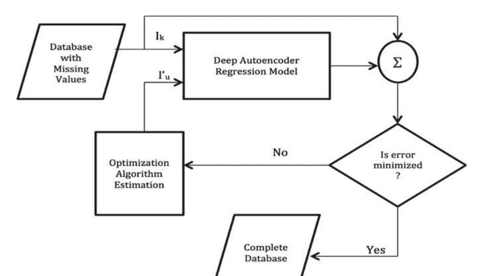

> 图6.1 深度自编码器和蚁群优化缺失数据估计结构。 © 2017 Springer。经许可转载自Leke等人（2017）

$$\delta = \left( \begin{bmatrix} I_k \\ I_u \end{bmatrix} - f\left( \begin{Bmatrix} I_k \\ I_u \end{Bmatrix}, w \right) \right)^2. \tag{6.7}$$

方程（6.7）是ACO算法使用和最小化的目标函数，用于估计 $I_u$，其中 $f$ 是回归模型函数。从上述深度自编码器和ACO算法操作的描述中，下面的方程总结了所提出方法的功能，其中 $f_{\text{ACO}}$ 是ACO算法的估计操作，$f_{\text{DAE}}$ 是深度自编码器的函数。

$$y = f_{\text{DAE}}\left(W, f_{\text{ACO}}\left(\boldsymbol{w}\right)\right), \tag{6.8}$$

在这里 $\boldsymbol{w} = \begin{bmatrix} \overrightarrow{I_k} \\ \overrightarrow{I_u} \end{bmatrix}$ 表示已知和未知特征的输入空间。

这个方程表示模型设计，通过执行缺失数据估计过程（$f_{\text{ACO}}$）获得的已知和估计的缺失数据条目的完整输入向量被呈现给深度回归模型（$f_{\text{DAE}}$）以观察网络误差是否已经最小化。如果发现误差已经最小化，则输出，$y$，将包含已知输入向量值和最佳缺失数据估计值。

## 6.4 实验结果

考虑到第4.4节中提出的评估指标，通过同时估计缺失属性，评估并与现有方法（MLP-GA、MLP-SAO和MLP-PSO）进行比较，无论缺失数据在哪里确定。所研究的场景是，任何样本/记录可能至少有62个，最多有97个缺失属性（维度）需要近似。所使用的MLP网络结构为784-400-784，输入和输出层分别具有784个输入和输出节点，隐藏层具有400个节点。通过测试隐藏层中不同数量的节点并观察产生最低可能网络误差的网络结构来获得此数字。

图6.2、6.3、6.4和6.5展示了DL-ACO、MLP-PSO、MLP-SAO和MLP-GA方法之间的性能和比较。图6.2和6.3是柱状图，显示了DL-ACO与MLP-PSO、MLP-SAO和MLP-GA之间的MSE和RMSLE值。

我们观察到DL-ACO、MLP-PSO、MLP-SAO和MLP-GA的MSE分别为0.66、5.19、31.02和30.98%，RMSLE分别为6.06、17.98、41.21和41.25%。与其他方法相比，DL-ACO的MSE值最低。这些结果通过相关系数进行验证，其柱状图在图6.4中给出。

DL-ACO和MLP-PSO分别得到96.29和74.52%的相关性值，而MLP-SAO和MLP-GA的相关性分别为 -1.88和 -0.56%。

MLP-SAO和MLP-GA分别得到13.25和13.67%的全局偏差，而DL-ACO和MLP-PSO分别得到0.0078和0.98%的全局偏差，如图6.5所示。观察到，DL-ACO方法在四个度量指标上获得了最佳值。

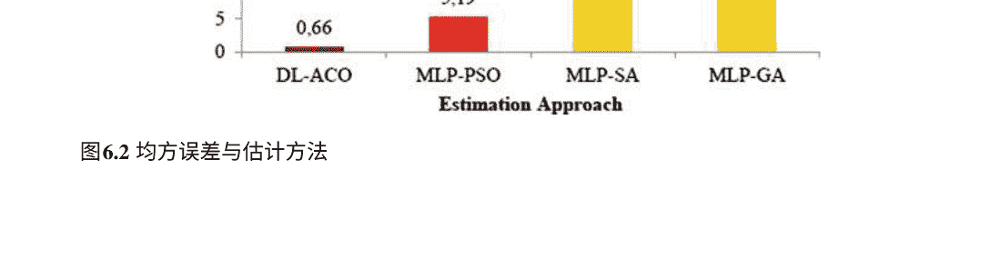

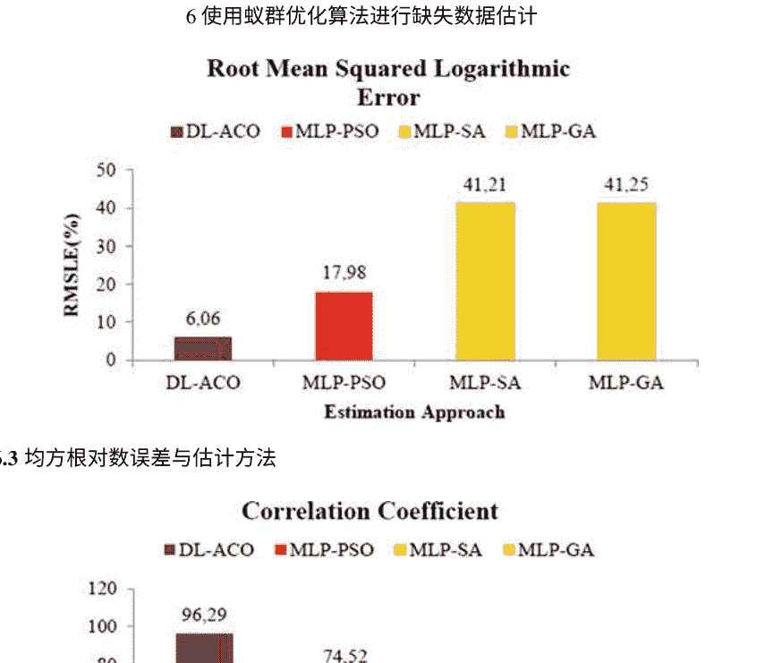

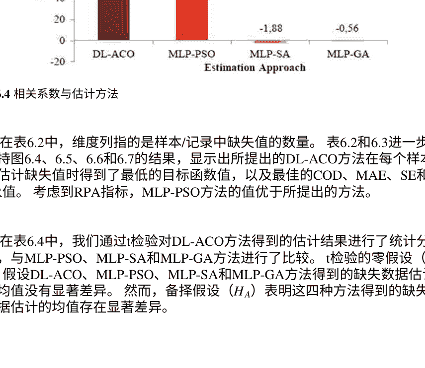

在表6.2中，维度列指的是样本/记录中缺失值的数量。表6.2和6.3进一步支持图6.4、6.5、6.6和6.7的结果，显示出所提出的DL-ACO方法在每个样本中估计缺失值时得到了最低的目标函数值，以及最佳的COD、MAE、SE和SNR值。考虑到RPA指标，MLP-PSO方法的值优于所提出的方法。

在表6.4中，我们通过t检验对DL-ACO方法得到的估计结果进行了统计分析，与MLP-PSO、MLP-SA和MLP-GA方法进行了比较。t检验的零假设（$H_0$）假设DL-ACO、MLP-PSO、MLP-SA和MLP-GA方法得到的缺失数据估计的均值没有显著差异。然而，备择假设（$H_A$）表明这四种方法得到的缺失数据估计的均值存在显著差异。

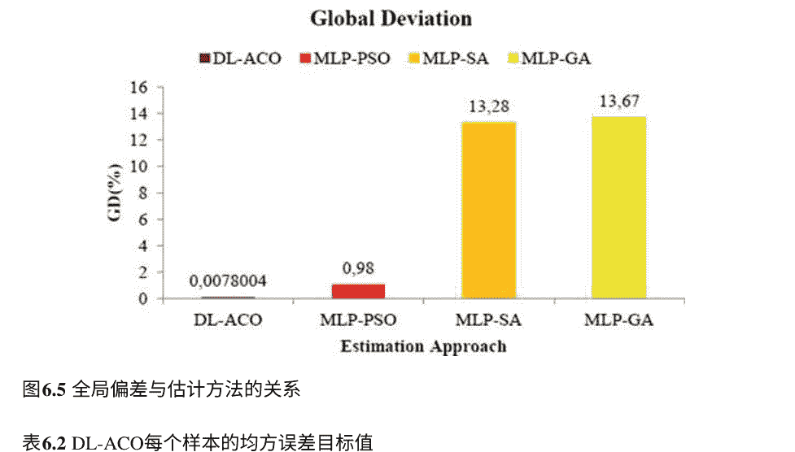

### 表6.2 DL-ACO每个样本的均方误差目标值

| 样本 | 尺寸 | DL-ACO | MLP-PSO | MLP-SA | MLP-GA |
|------|------|--------|---------|--------|--------|
| 1 | 79 | **2.52** | 13.62 | 15.59 | 15.59 |
| 2 | 88 | **2.38** | 7.34 | 8.78 | 8.78 |
| 3 | 75 | **1.27** | 5.59 | 6.76 | 6.76 |
| 4 | 81 | **0.26** | 3.69 | 5.91 | 5.91 |
| 5 | 83 | **0.46** | 6.57 | 8.02 | 8.02 |
| 6 | 82 | **1.27** | 4.81 | 9.76 | 9.76 |
| 7 | 90 | **1.91** | 5.66 | 15.05 | 15.05 |
| 8 | 79 | **1.18** | 7.58 | 9.54 | 9.54 |
| 9 | 76 | **2.59** | 7.96 | 9.48 | 9.48 |
| 10 | 76 | **2.86** | 6.52 | 12.60 | 12.60 |

粗体数值表示该算法确实产生了最佳（最低）结果

### 表6.3 DL-ACO附加指标

| 方法 | DL-ACO | MLP-PSO | MLP-SA | MLP-GA |
|------|--------|---------|--------|--------|
| COD | **92.71** | 55.53 | 0.0353 | 0.0032 |
| MAE | **3.37** | 14.82 | 47.5 | 47.7 |
| RPA | 53.25 | **53.58** | 10.75 | 10.08 |
| SE | **8.12** | 22.78 | 55.7 | 55.66 |
| SNR | 7.7 | 57.16 | 209.04 | 208.83 |

粗体数值表示该算法确实产生了最佳（最低）结果

表6.4显示，在95%的置信水平下，DL-ACO方法得到的估计均值与MLP-PSO、MLP-SA和MLP-GA方法之间存在显著差异，当比较这三对时，得到的p值分别为 $5.31 \times 10^{-15}$、$2 \times 10^{-167}$ 和 $3 \times 10^{-173}$。因此，

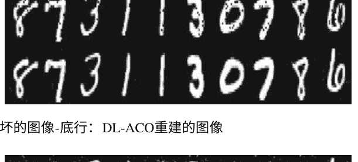

> 图6.6 顶行：损坏的图像-底行：DL-ACO重建的图像

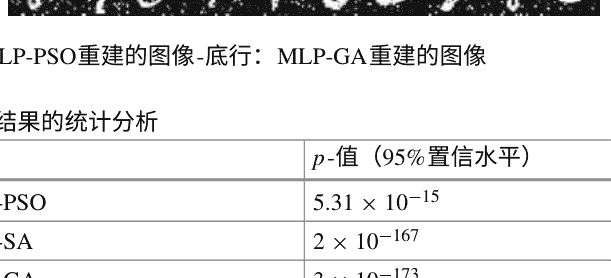

> 图6.7 顶行：MLP-PSO重建的图像-底行：MLP-GA重建的图像

### 表6.4 DL-ACO结果的统计分析

| 比较的对 | p-值 (95%置信水平) |
|----------|-------------------|
| DL-ACO:MLP-PSO | 5.31 × 10^{-15} |
| DL-ACO:MLP-SA | 2 × 10^{-167} |
| DL-ACO:MLP-GA | 3 × 10^{-173} |

表明在95%置信水平下，可以拒绝零假设（H0），即假设DL-ACO估计值与其他三种方法的均值之间没有显著差异，而支持备择假设（HA）。

在图6.6的顶行中，我们展示了10个具有缺失像素值的图像，在进行统计方法的分类任务之前需要估计这些值。在同一图的底部行中，我们展示了使用DL-ACO方法重建的图像，而在图6.7的顶部和底部行中，我们观察到使用MLP-PSO和MLP-GA方法重建的图像。可以看出，与应用DL-ACO方法相比，使用MLP-PSO和MLP-GA重建的图像引入了更多的噪音，尤其是在底部行中比顶部行中更多。此外，仔细观察发现，这些图像并没有完全重建，因为图像中并没有所有像素值都被正确估计。

## 6.5 结论

本章介绍了一种通过新方法估计缺失数据的研究。估计方法包括使用深度自动编码器网络复制输入数据，结合蚁群优化算法估计缺失数据。该模型的性能经过了调查，并与包括MLP自动编码器与遗传算法、模拟退火和粒子群优化在内的现有方法进行了比较。所得结果表明，与MLP混合系统相比，所提出的系统在估计方面提供了更准确的估计。当考虑均方误差、均方根对数误差、相关系数、相对预测准确性、信噪比和全局偏差时，所提出的方法得到了最佳值。此外，在估计过程中考虑目标函数值时，观察到所提出的方法在每个实例中都得到了最低的值。

## 参考文献

Abdella, M., & Marwala, T. (2005). 使用遗传算法和神经网络来近似数据库中的缺失数据。在计算控制国际会议(ICCC)上的第3届国际会议上(pp. 207–212). IEEE.

Carter, R. L. (2006). 结构方程建模中的缺失数据解决方案。评估研究与实践，1(1), 1–6.

Dorigo, M., & Di Caro, G. (1999). 优化中的新思路。在蚁群优化元启发式中(pp. 11–32)。英国梅登黑德：麦格劳希尔有限公司。2016年5月20日检索自http://dl.acm.org/citation.cfm?id=329055.329062.

Dorigo, M., Maniezzo, V., & Colorni, A. (1991).正反馈作为一种搜索策略。技术报告。

Dorigo, M., Maniezzo, V., & Colorni, A. (1996). 蚁群系统：通过一群合作代理进行优化。IEEE系统、人和控制论-第B部分，26(1), 29–41。

Dorigo, M., Birattari, M., & Stutzle, T. (2006). 蚁群优化：人工蚂蚁作为一种计算智能技术。IEEE计算智能杂志，1,28–39。

Feng, X., Zhang, Y., & Glass, J. R. (2014). 通过深度自动编码器对噪声混响语音进行语音特征去噪和去混响处理，用于噪声混响语音识别。在国际声学、语音和信号处理会议（ICASSP）上（第1759-1763页）。IEEE.

Jerez, J. M., Molina, I., Garc'ia-Laencina, P. J., Alba, E., Ribelles, N., Martin, M., & Franco, L. (2010). 在工程系统中使用统计和机器学习方法进行缺失数据插补在一个真实的乳腺癌问题中。医学中的人工智能，50(2), 105–115. Elsevier.

Ju, Y., Guo, J., & Liu, S. (2015).一种将稀疏自编码器与SVM相结合的深度学习方法。在2015年国际分布式计算和知识发现会议(CyberC)(pp. 257–260). IEEE.

Krizhevsky, A., & Hinton, G. E. (2011). 使用非常深的自编码器进行基于内容的图像检索。在第19届欧洲人工神经网络研讨会(ESANN), 2011年4月27日至29日。比利时布鲁日。

Leke, C., Twala, B., & Marwala, T. (2014). 缺失数据预测建模：计算智能和优化算法。在国际系统、人类和控制论大会（SMC）（第1400-1404页）。IEEE。

Leke, C., Ndjongue, A. R., Twala, B., & Marwala, T. (2017). 一种用于高维数据集中缺失数据估计的深度学习-布谷鸟搜索方法。在群体智能国际会议上(第561-572页)。斯普林格，查姆。

Liew, A. W. -C., Law, N. -F., & Yan, H. (2011). 基因表达数据的缺失值插补：从可用信息中恢复缺失数据的计算技术。生物信息学简报, 12(5), 498-513。牛津大学出版社。

## 6 使用蚁群优化算法进行缺失数据估计

- Liu, X. J., Yi, H., & Ni, Z.-H. (2013). 蚁群优化算法在工艺规划优化中的应用. 智能制造杂志, 24(1), 1-13.
- Monteiro, M. S. R., Fontes, D. B. M. M., & Fontes, F. A. C. C. (2012). 蚁群优化: 一项文献调查. 波尔图大学, 波尔图经济学院, FEP工作论文474. 检索于2016年1月, 来自http://EconPapers.repec.org/RePEc:por:fepwps:474.
- Myers, T. A. (2011). 再见, 列表删除: 将热卡片插补作为处理缺失数据的简单有效工具. 通信方法与测量, 5(4), 297-310. Taylor & Francis.
- Nkaya, T., Kayalgil, S., & Özdemirel, N. E. (2015). 基于蚁群优化的聚类方法-技术. 应用软计算, 28, 301–311.
- Rana, S., John, A. H., Midi, H., & Imon, A. (2015). 在异常值存在的情况下, 用鲁棒回归填补缺失数据. 远东数学科学杂志. Pushpa Publishing House, 97(2), 183–195.
- Sidekerskiene, T., & Damasevicius, R. (2016). 使用EMD在合成时间序列中重建缺失数据. 在 CEUR Workshop Proceedings(Vol. 1712, pp. 7–12).
- Finn, C., Tan, X., Duan, Y., Darrell, T., Levine, S., & Abbeel, P. (2016). 用于视觉运动学习的深度空间自动编码器. 在国际机器人与自动化大会(ICRA)(pp. 512–519). IEEE.
- Van Buuren, S. (2012). 灵活的缺失数据插补. CRC出版社.
- Zainuri, N. A., Jemain, A. A., & Muda, N. (2015). 各种插补方法对空气质量数据中缺失值的比较. 马来西亚科学, 44(3), 449-456.
- Zecchina, A. C., Simpson, A. R., Maier, H. R., Leonard, M., Roberts, A. J., & Berrisford, M. J. (2006). 应用两种蚁群优化算法进行水配水系统优化. 数学和计算机建模, 44(5–6), 451–468.
- Zhang, S., Jin, Z., & Zhu, X. (2011). 通过利用不完整实例中的信息进行缺失数据插补. 系统与软件杂志, 84(3), 452–459. Elsevier.

# 第7章 使用蚁狮优化算法进行缺失数据估计

## 7.1 引言

根据先前的研究，数据集中存在缺失数据的情况在各个学术领域中都表明数据分析任务和决策过程变得非常复杂。基于这一观察，可以假设使用完整记录而不是不完整数据集时，更有可能做出可靠和准确的决策。这种假设的结果是，在数据挖掘领域进行了更多的研究，引入了准确执行填充缺失数据任务的新方法。研究表明，在不同的专业领域中，使用仪器中的传感器报告非常重要的信息的过程，这些信息随后用于做出决策，例如在医学、制造和能源领域，可能会遇到传感器故障的情况，导致数据集中存在缺失数据条目，从而影响所做出的决策的性质。在这种情况下，非常重要的是有一个系统能够以高准确性从这些故障传感器中插补缺失数据。这个插补框架需要考虑到系统中从传感器获得的信息之间的现有相关性，以便准确估计缺失数据。缺失数据问题的另一个例子是图像识别任务，其中缺失的像素值使得预测或分类图像的任务变得困难。因此，非常重要的是有一个能够以高准确性估计这些缺失像素值的系统，以便使这些任务更容易和可行。

如今的数据集，例如记录生产、制造和医疗数据的数据集，在数据收集和存储过程的不同阶段可能会出现数据缺失的问题。测量仪器故障或数据传输线路是导致数据缺失的主要原因。数据缺失的发生导致了依赖完整准确数据进行决策和分析任务的困难。这导致了数据估计技术的出现，这些技术不仅准确而且高效。


## 7.2 理由

缺失数据估计技术的应用非常广泛，因此现有的方法取决于数据的性质、缺失模式，并且主要应用于低维数据集。这些方法包括但不限于结构方程模型（Carter 2006）、环境观测（Zainuri等，2015）和时间序列观测（Sidekerskiene和Damasevicius，2016）。Marivate等人（2007）使用MLP自编码器网络、主成分分析和支持向量机与遗传算法相结合来填补缺失数据，在Rana等人（2015）中，他们在含有异常值的数据集中使用鲁棒回归填补缺失数据，并研究其性能。Lobato等人（2015）提出了一种通过多目标遗传算法技术进行缺失数据插补的方法。所得到的结果表明，所提出的方法优于某些常用的缺失数据插补技术，准确率达到90%以上。

Abdella和Marwala（2005）实施了一个混合系统，该系统由遗传算法和神经网络组成，旨在逐个特征变量内插入缺失数据值，其中该变量中的缺失值数量有所变化。Aydilek和Arslan（2012）提出了一个新颖的系统，将k最近邻与神经网络相结合，填补单个特征变量中的缺失值是目标。在Leke等人（2014）的研究中，他们创建了由自联想神经网络（AANN）和粒子群优化（PSO）、模拟退火（SA）和遗传算法（GA）优化技术组成的混合系统，并应用于估计缺失值，在单个特征变量受到缺失数据问题影响的情况下，得到了高准确度的结果。一些研究人员使用神经网络与主成分分析（PCA）和遗传算法（GA）来解决缺失数据问题（Mistry等，2009；Nelwamondo等，2007）。在Zhang等（2011）中，建议利用具有缺失值的记录中的信息来进行缺失数据估计任务。这导致引入了非参数迭代插补算法（NIIA），在不同的缺失数据比例下，离散值的分类准确度最高可达87.3%，连续值的均方根误差最低可达0.5。在Zhang（2011）中，提出了一种壳邻居插补（SNI）方法，并应用于缺失数据插补问题，它利用了壳邻居方法。所得结果表明，与k最近邻插补相比，所提出的方法在插补和分类准确度方面表现更好。这是因为该方法考虑了缺失数据的右侧和左侧最近邻居，并使用不同数量的最近邻居，而不是k最近邻居方法使用固定数量的k最近邻居。文献中可以找到解决缺失数据问题的新技术以及与现有方法的比较（Baraldi和Enders，2010；Van Buuren，2012；Jerez等，2010）。

## 7.3 蚁狮优化器 (ALO)

ALO是一种模拟蚂蚁、猎物和蚁狮物种之间相互作用的元启发式算法（Mirjalili 2015）。ALO实现了狩猎的五个主要步骤，分别是：

1.  蚂蚁的随机运动,
2.  蚁狮建立陷阱,
3.  蚂蚁被陷阱捕获,
4.  捕获猎物,
5.  重建陷阱。

此外，它是一种无梯度算法，具有提供更大的解空间探索和利用的特性。探索通过随机选择蚁狮以及蚂蚁在其周围的随机运动来保证。而利用则通过灵活地降低蚁狮陷阱的边界来保证。该算法基于三个元组，即ALO（A1, A2, A3），用于估计优化问题的全局最优解。这三个元组分别由（Mirjalili 2015; Gupta and Saxena 2016）定义。

$$\Phi \rightarrow_{A_1} \{G_{\text{蚂蚁}}, G_{\text{OA}}, G_{\text{蚁狮}}, G_{\text{OAL}}\}, \quad (7.1)$$

$$\{G_{\text{蚂蚁}}, G_{\text{蚁狮}}\} \rightarrow_{A_2} \{G_{\text{蚂蚁}}, G_{\text{蚁狮}}\}, \quad (7.2)$$

和

$$\{G_{\text{蚂蚁}}, G_{\text{蚁狮}}\} \rightarrow_{A_3} \{\text{true}, \text{false}\}, \quad (7.3)$$

其中 $G_{\text{蚂蚁}}$ 代表蚂蚁的位置矩阵， $G_{\text{蚁狮}}$ 由蚁狮的位置组成， $G_{\text{OA}}$ 表示蚂蚁的适应度，最后， $G_{\text{OAL}}$ 包含蚁狮的适应度值。 该算法的操作方式是通过应用公式（7.1）以随机方式初始化蚁狮和蚂蚁矩阵。 使用轮盘赌算子来选择每只蚂蚁相对于蚁狮的位置。 公式（7.2）用于更新每次迭代中的精英。 关于周长位置的更新主要是根据该时刻的迭代次数来描述的。 然后，通过在所选精英和蚁狮附近进行两个随机步骤来进一步优化位置。 适应度函数用于估计每只蚂蚁随机行走的点。 如果有任何一只蚂蚁比任何一只蚁狮更有能力，它们的位置将在下一次迭代中作为蚁狮的新位置使用。 然后，在优化过程中将对最佳蚁狮和最佳蚂蚁进行比较，并将它们替换为算法实现中的关键操作之一。 这些步骤将一直执行，直到公式（7.3）的函数返回false。

在算法的实现中，蚂蚁根据 (Mirjalili 2015; Gupta and Saxena 2016) 随机行走：

$$X^a(t) = [0, \text{cumsum}(2l(t_1) - 1), \text{cumsum}(2l(t_2) - 1), \ldots, \text{cumsum}(2l(T_n) - 1)], \quad (7.4)$$

其中 $n$ 是迭代的最大次数，$\text{cumsum}$ 表示累积和，表示随机步行。$l(t)$ 是由以下关系定义的随机方程：

$$\text{如果 } \text{rand} > 0.5, \text{ 则 } l(t) = 1, \quad (7.5)$$

和

$$\text{如果 } \text{rand} \leq 0.5, \text{ 则 } l(t) = 0. \quad (7.6)$$

其中 $\text{rand}$ 表示从高斯分布中获得的随机数，范围在[0, 1]之间。 为了限制蚂蚁的随机移动范围，根据(Mirjalili 2015; Gupta and Saxena 2016)对解空间进行归一化处理。

$$X_i^t = \frac{(X_i^t - a_i) * (d_i - c_i^t)}{(d_i^t - a_i)} + c_i, \quad (7.7)$$

其中 $a_i$ 表示第 $i$ 个变量的最小随机步长，$b_i$ 表示第 $i$ 个变量的最大随机步长，$c_i^{\prime}$ 表示第 $i$ 个变量在第 $t$ 次迭代中的最小值，$d_i^{\prime}$ 表示第 $i$ 个变量在第 $t$ 次迭代中的最大值(Mirjalili 2015)。

通过(Mirjalili 2015; Gupta and Saxena 2016)可以得到对蚂蚁被蚁狮坑困住的建模。

$$c_i^{t} = \text{蚁狮}_j^{t} + c^{t},$$

和

$$d_i^{t} = \text{蚁狮}_j^{t} + d^{t},$$

其中 $c^{t}$ 表示第 $t$ 步的所有特征的下界，$d^{t}$ 表示第 $t$ 步的所有特征的上界，而 $\text{蚁狮}_j^{t}$ 表示第 $t$ 步选择的第 $j$ 只蚁狮的位置。

蚁狮的捕猎能力由适应度比例轮盘选择描述。描述蚁狮陷阱中被困的蚂蚁滑向蚁狮的数学方程为(Mirjalili 2015; Gupta and Saxena 2016):

$$u^{t} = \frac{u^{\prime t}}{Z},$$

和

$$v^{t} = \frac{v^{\prime t}}{Z},$$

其中 $Z$ 是通过计算得到的比率

$$Z = 10^{w\frac{t}{T}}.$$

在上述方程中，$t$ 表示当前步骤，$T$ 表示要执行的步骤的上界，$w$ 表示根据当前步骤的常数，根据以下关系计算(Mirjalili 2015):

$$w = \begin{cases}
3 & \text{如果 } t > 0.1T, \\
2 & \text{如果 } t > 0.5T, \\
1 & \text{如果 } t > 0.75T, \\
0.5 & \text{如果 } t > 0.9T, \\
0.1 & \text{如果 } t > 0.95T.
\end{cases}$$

算法的最后一步部分是精英主义，即每一步中最适应的蚁狮被称为精英。这意味着每只蚂蚁都随机在一个选择的蚁狮周围行走，其位置满足以下方程（Mirjalili 2015; Gupta and Saxena 2016）：

$$ \text{蚂蚁}_i' = \frac{R_A + R_E'}{2} \quad (7.14) $$

在公式 (7.14) 中，$R'_A$ 表示在第 t 步中使用轮盘赌方法选择的蚁狮周围的随机运动，而 $R'_E$ 表示在第 t 步中围绕精英蚁狮的随机运动。

在Gupta和Saxena (2016) 中，ALO算法被用于找到热发电机的主调节环路的参数，以实现成功的自动发电控制（AGC）的两区域互联系统。 Satheeshkumar和Shivakumar (2016) 使用它来研究三区域互联系统，而Yamany等人 (2015) 则使用它来训练多层感知神经网络。Zawbaa等人 (2016) 使用混沌ALO算法从大型数据集中进行特征选择，而Petrovi等人 (2015) 则使用ALO算法解决了NP-hard组合优化问题，根据所有可选的制造资源获得最优的工艺计划。

模型实现中使用的ALO参数包括：搜索代理的数量设置为40，最大迭代次数设置为1000。决策变量的数量取决于记录中缺失值的数量。数据被归一化到[0, 1]的范围内，这意味着决策变量的下限和上限分别为0和1。选择这些参数是因为它们在不同的值的组合和排列下产生了更优的结果。

## 7.4 缺失数据估计模型

本章实施的方法主要包括对数据集进行预处理。该过程包括对数据进行归一化处理，以减少特征变量之间的值的变化，并确保网络生成代表性的输出。应用蚁狮优化算法来减小由使用随机梯度下降方法训练深度学习线性回归模型得到的误差函数。将训练集中的归一化数据的一部分提供给深度学习网络架构进行训练。然后导出一个误差函数，该函数通过计算真实输出与估计模型输出之间的差异的平方来进行数学定义。在本章中，测试集中的任何特征变量的数据条目可能同时缺失，因此，重新制定了误差函数以包含未知和已知的输入值。

通常的做法是在特定特征中创建缺失值，然后进行估计。据我们所知，测试数据集中缺失数据的不受控制的性质是一个尚未被研究和报道的方面。使用受限玻尔兹曼机（RBM）以无监督的方式训练网络的各个层，然后将它们连接在一起形成网络的编码部分，然后进行转置以构成解码部分。应用随机梯度下降（SGD）算法以有监督的方式使用训练数据集来训练网络。构建最佳网络结构，包括一个输入层、七个隐藏层和一个输出层。隐藏层中的节点数是根据Hinton等人（2006）的初始建议和在验证数据集上进行交叉验证得到的。通过训练得到的最佳网络结构，使用实施的群体算法来识别最佳网络和算法参数组合。然后使用在前一步骤中确定的参数执行缺失数据估计过程。将预期输出与估计输出进行比较，以了解该方法的性能。

为了评估这些方法作为高维估计器的性能，使用了一个图像识别数据集。从测试数据集中删除了一些条目，并使用模型进行了近似。这些模型都是用MATLAB®编写的。为了衡量这些方法作为估计器的准确性，使用了八个误差指标，包括：平方误差（SE），均方误差（MSE），平均绝对误差（MAE），均方根对数误差（RMSLE），全局偏差（GD），相对预测准确性（RPA），信噪比（SNR）和确定系数（COD）。选择这些误差指标是因为它们在各种研究报告中已经被应用（Marivate等，2007；Abdella和Marwala，2005；Leke等，2014；Mohamed等，2007）作为缺失数据估计问题的性能指标，并且它们很方便使用。还使用估计值和实际值之间的相关系数（r）来提供更多关于估计值和真实值之间关系的见解。还进行了统计t检验来支持指标的发现，并提供有关结果的统计显著性的信息。

## 7.5 实验结果

图7.1、7.2、7.3和7.4显示了DL-ALO与MLP-PSO、MLP-SA和MLP-GA方法的性能和比较。MLP网络的结构为784-400-784，输入和输出层分别具有784个节点，隐藏层具有400个节点。通过测试隐藏层中不同节点数的网络，并观察导致网络误差最小的网络结构，得到该数字。

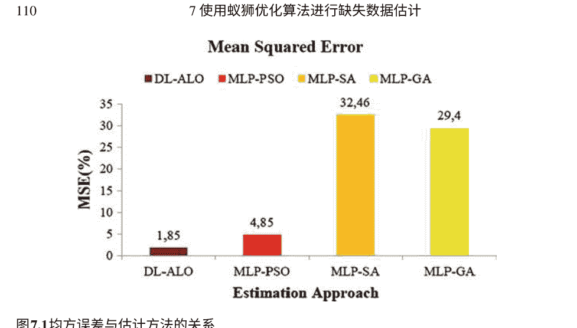

图7.1 均方误差与估计方法的关系

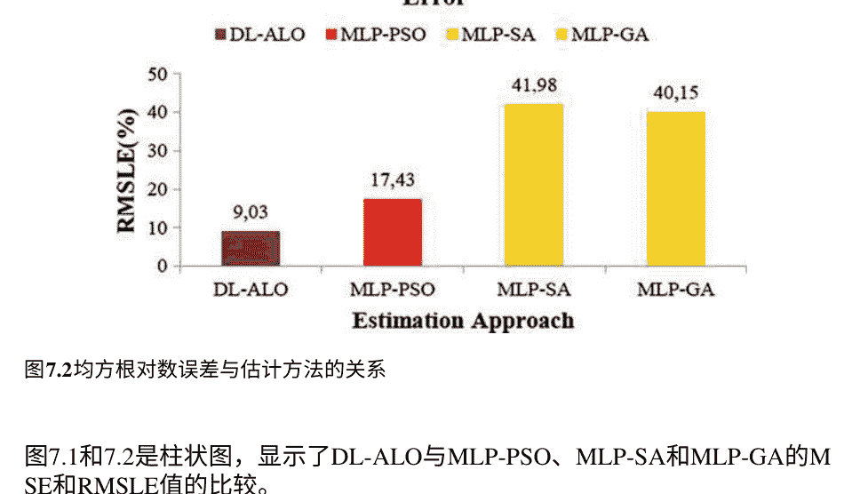

图7.2 均方根对数误差与估计方法的关系

图7.1和7.2是柱状图，显示了DL-ALO与MLP-PSO、MLP-SA和MLP-GA的MSE和RMSLE值的比较。我们观察到DL-ALO、MLP-PSO、MLP-SA和MLP-GA的MSE分别为1.85、4.85、32.46和29.4%，RMSLE分别为9.03、17.43、41.98和40.15%。与其他方法相比，DL-ALO的MSE值最低。这些结果通过相关系数进行验证，其条形图见图7.3。

DL-ALO和MLP-PSO的相关值分别为92.49%和78.62%，而MLP-SA和MLP-GA的相关值分别为4.03%和8.29%。

MLP-SA和MLP-GA的RPA分别为10.92%和11.42%，而DL-ALO和MLP-PSO的RPA分别为81.33%和54.83%。

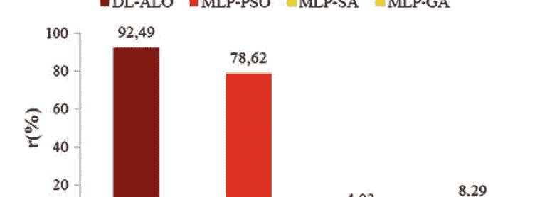

图7.3 相关系数与估计方法之间的关系

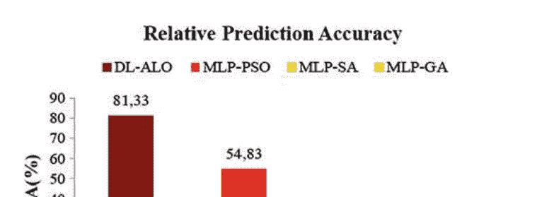

图7.4 相对预测准确度与估计方法之间的关系

如图7.4所示。观察到，DL-ALO方法在所有四个以图形方式呈现的指标中获得了最佳值。

在表7.1中，维度列指的是样本/记录中缺失值的数量。 表7.1和7.2进一步支持了图7.1、7.2、7.3和7.4的结果，显示出所提出的DL-ALO方法在每个样本的缺失值估计中产生了最低的目标函数值，以及最佳的COD、GD、MAE、SE和SNR值。

表7.2表明，DL-ALO与MLP-PSO、MLP-SA和MLP-GA在估计中获得的均值之间没有显著差异，当比较DL-ALO时，p值分别为0.46、0.34和0.16。

| 方法 | 平方误差 (SE) | 均方误差 (MSE) | 平均绝对误差 (MAE) | 均方根对数误差 (RMSLE) | 全局偏差 (GD) | 相对预测准确性 (RPA) | 信噪比 (SNR) | 确定系数 (COD) |
| :--- | :--- | :--- | :--- | :--- | :--- | :--- | :--- | :--- |
| DL-ALO |  | 1.85% |  | 9.03% |  | 81.33% |  |  |
| MLP-PSO |  | 4.85% |  | 17.43% |  | 54.83% |  |  |
| MLP-SA |  | 32.46% |  | 41.98% |  | 10.92% |  |  |
| MLP-GA |  | 29.40% |  | 40.15% |  | 11.42% |  |  |## 7 使用蚁狮优化算法进行缺失数据估计

**表7.1 DL-ALO每个样本的均方误差目标值**

| 样本 | 尺寸  | DL-ALO | MLP-PSO | MLP-SA | MLP-GA |
| :--- | :---- | :----- | :------ | :----- | :----- |
| 1    | 81    | **1.29** | 9.46    | 6.57   | 6.57   |
| 2    | 72    | **1.63** | 7.39    | 7.65   | 7.65   |
| 3    | 85    | **3.65** | 7.66    | 10.57  | 10.57  |
| 4    | 88    | **1.13** | 7.75    | 6.03   | 6.03   |
| 5    | 77    | **2.21** | 6.28    | 9.09   | 9.09   |
| 6    | 89    | **1.45** | 6.49    | 13.55  | 13.55  |
| 7    | 84    | **2.70** | 5.79    | 6.77   | 6.77   |
| 8    | 75    | **1.14** | 5.30    | 9.11   | 9.11   |
| 9    | 71    | **1.22** | 5.67    | 6.31   | 6.31   |
| 10   | 85    | **1.67** | 5.63    | 16.55  | 16.55  |

粗体数值表示提出的方法产生了最佳结果。

**表7.2 DL-ALO结果的统计分析**

| 比较的对          | P-值 (95%置信水平) |
| :---------------- | :----------------- |
| DL-ALO:MLP-PSO   | 0.46               |
| DL-ALO:MLP-SA    | 0.34               |
| DL-ALO:MLP-GA    | 0.16               |

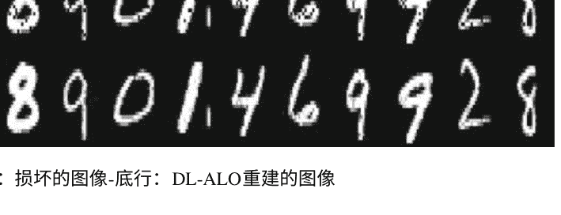

图7.5 顶行：损坏的图像-底行：DL-ALO重建的图像

在95%置信水平下，与MLP-PSO、MLP-SA和MLP-GA相比。因此，可以接受零假设。

在图7.5的顶行，我们描绘了10个具有缺失像素值的图像，在进行统计方法执行分类任务之前需要估计这些值。在同一图中的底行，我们展示了使用DL-ALO方法重建的图像。在图7.6的顶行和底行，我们观察到使用MLP-PSO和MLP-GA方法重建的图像。可以看出，使用MLP-PSO和MLP-GA重建的图像引入了很多噪音，尤其是在底行比顶行更多，与应用DL-ALO方法时形成对比。此外，仔细观察发现，图像没有完全重建，因为并非所有像素值都被正确估计。

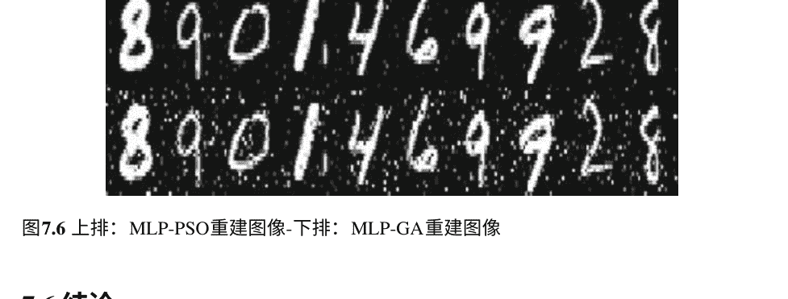

图7.6 上排：MLP-PSO重建图像-下排：MLP-GA重建图像

## 7.6 结论

本章介绍了一种通过新颖方法估计缺失数据的研究。估计方法包括使用深度自动编码器网络复制输入数据，结合蚁狮优化算法估计缺失数据。研究了该模型的性能，并与包括MLP自动编码器与遗传算法、模拟退火和粒子群优化在内的现有方法进行了比较。所得结果表明，与MLP混合系统相比，所提出的系统在估计方面提供了更准确的估计值。当考虑均方误差、均方根对数误差、相关系数、相对预测准确性、信噪比和全局偏差时，所提出的方法提供了最佳值。此外，在估计过程中考虑目标函数值时，观察到所提出的方法在每个实例中都得到了最低值。

## 参考文献

- Abdella, M., & Marwala, T. (2005). 遗传算法和神经网络在数据库中近似缺失数据的使用(卷2 4, 577–589页).
- Aydilek, I., & Arslan, A. (2012). 一种新颖的混合方法来估计数据库中的缺失值使用k最近邻和神经网络.国际创新计算、信息和控制杂志, 7(8), 4705–4717.
- Baraldi, A., & Enders, C. (2010). 现代缺失数据分析简介.学校心理学杂志, 48(1), 5–37.
- Carter, R. L. (2006). 结构方程建模中的缺失数据解决方案.评估研究与实践, 1(1), 1–6.
- Gupta, E., & Saxena, A. (2016). 基于蚁狮优化器的自动发电控制中调节器的性能评估互联电力系统.工程杂志, 2016, 1–14页.
- Hinton, G. E., Osindero, S., and Teh, Y. W. (2006). 一种用于深度信念网络的快速学习算法.神经计算, 18(7), 1527–1554.
- Jerez, J. M., Molina, I., Garcia-Laencina, P. J., Alba, E., Ribelles, N., Martin, M., 等 (2010). 在一个真实的乳腺癌问题中，使用统计和机器学习方法进行缺失数据插补.医学中的人工智能, 50(2), 105–115.
- Leke, C., Twala, B., & Marwala, T. (2014). 缺失数据预测建模：计算智能和优化算法.在IEEE国际系统、人类和控制论大会 (SMC)(pp. 1400–1404).美国加利福尼亚州圣地亚哥.
- Lobato, F., Sales, C., Araujo, I., Tadaiesky, V., Dias, L., Ramos, L., & Santana, A. (2015). 用于缺失数据插补的多目标遗传算法.模式识别信件, 68(1), 126–131, 检索于2016年3月18日.
- Marivate, V. N., Nelwamondo, F. V., & Marwala, T. (2007). 自编码器，主成分分析和支持向量回归用于数据插补.arXiv:0709.2506.
- Mirjalili, S. (2015). The ant lion optimizer. Advances in Engineering Software, 8, 80–98.
- Mistry, F. J., Nelwamondo, F. V., & Marwala, T. (2009). 使用主成分分析和自联想神经网络进行缺失数据估计.Journal of Systemics, Cybernetics and Informatics, 7(3), 72–79.
- Mohamed, A. K., Nelwamondo, F. V., & Marwala, T. (2007). 使用神经网络技术，主成分分析和遗传算法估计缺失数据.In Proceedings of the Eighteenth Annual Symposium of the Pattern Recognition Association of South Africa.
- Nelwamondo, F. V., Mohamed, S., & Marwala, T. (2007). 缺失数据：神经网络和期望最大化技术的比较.Current Science, 93(12), 1514–1521.
- Petrovi, M., Petronijevi, J., Miti, M., Vukovi, N., Plemi, A., Miljkovi, Z., 等 (2015). 蚂蚁狮优化算法用于灵活的工艺规划.生产工程杂志, 18(2), 65–68.
- Rana, S., John, A. H., Midi, H., & Imon, A. (2015). 在存在异常值的情况下，对缺失数据进行鲁棒回归插补.远东数学科学杂志, 97(2), 183–195.
- Satheeshkumar, R., & Shivakumar, R. (2016). 蚂蚁狮优化方法用于多区域互联电力系统的负荷频率控制.电路与系统, 7, 2357–2383.
- Sidekerskiene, T., & Damasevicius, R. (2016). 使用EMD对合成时间序列中的缺失数据进行重建.CEUR研讨会论文集, 1712, 7–12.
- Van Buuren, S. (2012). 灵活的缺失数据插补.CRC出版社.
- Yamany, W., Tharwat, A., Fawzy, Gaber, T., & Hassanien, A. E. (2015). 一种基于蚁狮优化算法的新型多层感知机训练器.在第四届国际信息科学与工业应用会议(ISI)(pp. 40–45)上.
- Zainuri, N. A., Jemain, A. A., & Muda, N. (2015). 各种插补方法对空气质量数据中缺失值的比较马来西亚科学, 44(3), 449–456.
- Zhang, S., Jin, Z., & Zhu, X. (2011). 利用不完整实例内的信息进行缺失数据插补.系统与软件杂志, 84(3), 452–459.
- Zhang, S. (2011). 壳邻居法及其在缺失数据插补中的应用.应用智能, 35(1), 123–133.
- Zawbaa, H. M., Emary, E., & Grosan, C. (2016). 混沌蚁狮优化算法进行特征选择.PLOS ONE, 11(3),1–21. 2016年6月检索, 来自https://doi.org/10.1371/journal.pone.0150652.

# 第8章 使用入侵杂草优化算法进行缺失数据估计

## 8.1 引言

在现实世界中，缺失数据是一个常见的挑战。依赖准确知识的决策过程非常依赖于可用的数据，从中可以提取信息。这些过程通常需要预测模型或其他计算智能技术，这些技术使用观察到的数据作为输入。然而，在某些情况下，数据可能丢失、损坏或记录不完整，这会对数据质量产生负面影响。大多数决策和机器学习框架，如人工神经网络、支持向量机和主成分分析，如果数据不完整，则无法用于决策和数据分析，因为这些缺失值可能会影响模式识别和分类任务。由于决策输出仍然应该保持不变，尽管存在缺失数据，因此解决这个问题非常重要。因此，在数据不完整或缺失的情况下，处理数据的初始步骤是估计缺失值。

缺失数据估计方法的应用非常广泛。话虽如此，现有的方法取决于数据的性质、缺失模式，并且主要应用于低维数据集。Abdella和Marwala（2005）在一个维度上实现了联合神经网络-遗传算法框架来填补缺失值，而Rana等人（2015）则在具有异常值的数据集中使用了鲁棒回归填补方法并研究了其性能。在Zhang等人（2011）的研究中，引入了非参数迭代插补算法（NIIA）方法。这是一种在估计缺失数据时利用相关数据实例中的知识的方法。在Leke和Marwala（2016）、Liew等人（2011）、Jerez等人（2010）、Myers（2011）和Van Buuren（2012）等论文中，观察到了填补缺失数据和现有方法之间的新技术和比较。这些技术主要适用于具有缺失值的低维数据集，但在考虑到高维数据集且缺失情况不受控制时效果较差，如后面所述。

在这一章中。因此，这项工作的主要动机是引入高维缺失数据估计方法，重点放在图像识别数据集上。这些方法将用于通过估计图像像素值来重建损坏的图像。

为了研究解决先前提到的维度缺陷的新技术，我们实现了一个深度自动编码器，其中自动编码器网络是一种无监督学习技术，通过学习一个减少原始数据x和输出重建数据ût之间对比度的近似函数来尽力重建输入数据作为输出，与主成分分析（PCA）获得的结果相同。深度自动编码器由两个对称的深度置信网络组成，其中一对浅层表示网络的编码部分，而第二对浅层表示网络的解码部分，每个单独的层都是受限玻尔兹曼机（RBM）。这些网络适用于各个领域，例如，深度自动编码器在Finn等人（2016）的视觉运动学习中使用，而在Ju等人（2015）中，它们与支持向量机（SVM）一起用于学习稀疏特征和执行分类任务。Feng等人（2014）使用深度去噪自动编码器为嘈杂的混响语音识别系统生成稳健的语音特征，而这些网络被用于将小的彩色图像映射到短的二进制码（Krizhevsky和Hinton 2011）。自动编码器具有几个优点，例如，在网络的编码部分引入非线性，与PCA等方法相比更加灵活，这是预训练过程的一个关键特性，它们不需要先前对数据属性和相关性的了解，并且它们直观易懂。这个网络的主要缺点是需要大量的样本进行训练和学习，而这些样本并不总是容易获得的。

在本章中，我们提出了一种基于深度自动编码器和侵入性杂草优化算法的高维数据集中缺失数据估计方法，即DL-IWO。为此，我们首先描述了优化算法，然后介绍了用于填补任务的提出模型，该模型由深度自动编码器和优化算法组成。

随后，我们对提出模型的性能进行了分析，并将结果与现有方法进行了比较。此外，我们报告了实验结果并讨论了研究结果。最后，简要总结被提出。

### ## 8.2 侵入性杂草优化（IWO）算法

在Mehrabian和Lucas（2006）中，作者提出了模仿杂草入侵特性的侵入性杂草优化（IWO）算法。一般来说，杂草被定义为在不需要的区域生长的植物。对于园艺来说，杂草一词指的是生长特性对栽培植物构成威胁的植物。杂草具有适应性和韧性等迷人特征。在侵入性杂草优化算法中，杂草被替换为解决方案空间中的点集，其中一群点增长到最优值(Veenhuis 2010)。例如，假设$D$表示问题的维度，意味着搜索空间的维度是$R^D$。进一步假设$P_{init}$是初始杂草种群大小，$P_{max}$是种群大小的上限，使得$1 \leq P_{init} \leq P_{max}$(Veenhuis 2010)。此外，让$W$定义杂草集合其中$W = \{ W_1, ..., W_{\|W\|} \}$(Kasdirin et al. 2017)。每一个杂草，$W_i \in R^D$代表解决方案空间中的一个位置。计算杂草的适应度需要使用以下形式的适应度函数：$F: R^D \rightarrow R$(Veenhuis 2010)。

IWO算法有两个主要部分，分别是：初始化和迭代。在初始化步骤中，解的生成计数器被设置为零，$G = 0$。随后，通过创建具有均匀分布值的$P_{init}$，随机生成初始种群$W$(Veenhuis 2010)：

$$W_i \sim U(X_{min}, X_{max})^D \quad\quad (8.1)$$
其中$X_{min}$和$X_{max}$分别表示解空间的下界和上界，并且是问题特定的。

在迭代步骤中，当前种群中的每个杂草都通过给定数量的种子再生。$S_{num}$定义了种子的数量，并且根据考虑的杂草的适应度值成比例地评估(Veenhuis 2010)：这意味着它根据种群的最差和最佳适应度$F_{worse}$和$F_{best}$进行线性映射(Veenhuis 2010)：

$$S_{num} = S_{min} + \frac{F(W_i) - F_{worse}}{F_{best} - F_{worse}}(S_{max} - S_{min}) \quad\quad (8.2)$$

在方程8.2中，$S_{min}$和$S_{max}$表示允许的种子的下限和上限(Veenhuis 2010)。所有的$S_{num}$种子，$S_j$，都是在当前杂草附近生成的，使用具有不同标准差和零均值的高斯分布(Veenhuis 2010)：

$$S_j = W_i + \mathcal{N}(0, \sigma_G)^D \quad\quad (8.3)$$

在方程8.3中，$1 \leq j \leq S_{num}$。标准差，$\sigma_G$从$\sigma_{init}$开始，在整个运行过程中以非线性方式减小到$\sigma_{final}$。当前代的标准差通过使用(Veenhuis 2010)计算

$$\sigma_G = \sigma_{final} + \frac{(N_{iterations} - G)^{\sigma_{mod}}}{(N_{iterations})^{\sigma_{mod}}} (\sigma_{initial} - \sigma_{final}), \quad\quad (8.4)$$

其中$N_{iterations}$表示迭代的上限，$\sigma_{mod}$是非线性调制指示器。按照这些步骤，后续的种群是通过将当前种群与所有杂草的生成种子合并而生成的。如果新种群的体积达到$P_{max}$，这个新的种群根据适应度值进行分类，保留$P_{max}$优势杂草。最不利的杂草被移除。

该算法已被用于研究项目中的时间-成本-质量权衡问题（Paryzad和Pour 2013）。Hung等人（2010）开发了一种新颖的接收器，将常数模数方法（CMA）盲目自适应多用户检测与IWO用于多载波码分多址（MC-CDMA）。在Su等人（2014）中，服务选择问题被建模为一个带约束的非线性优化问题，并使用IWO算法的离散版本进行求解。无约束和约束优化问题在Kasdirin等人（2017）中使用混合IWO和萤火虫算法进行求解。最后，在Yazdani和Ghodsi（2017）中，考虑了在单台机器上最小化总加权滞后和提前标准的问题。

模型实现中使用的IWO参数在表8.1中给出，除了维度的数量取决于记录中缺失值的数量。数据被归一化到[0, 1]的范围内，这意味着决策变量的下限和上限分别为0和1。选择这些参数是因为它们在不同的值的组合和排列下产生了更优的结果。

**表8.1 IWO参数**

| 参数             | 数值  |
| :--------------- | :---- |
| 初始种群大小     | 10    |
| 最大种群大小     | 40    |
| 最小种子数量     | 0     |
| 最大种子数量     | 5     |
| 方差减少指数     | 2     |
| 最大迭代次数     | 1000  |

### ## 8.3 缺失数据估计模型

在本节中，我们描述了将深度自编码器网络和入侵杂草优化算法的优势结合起来的提出方法。当将任何类型的网络应用于估计缺失数据时，网络模型的准确性非常重要。所提出的方法概述如图8.1所示，其中I_k和I_u分别表示已知和未知特征，并构成输入集合。

首先，使用随机梯度下降（SGD）算法对网络进行训练，使用完整的记录集识别出一个映射函数f，该函数提取并存储数据集中特征之间的相互关系和相关性。这导致输出O_b的获得

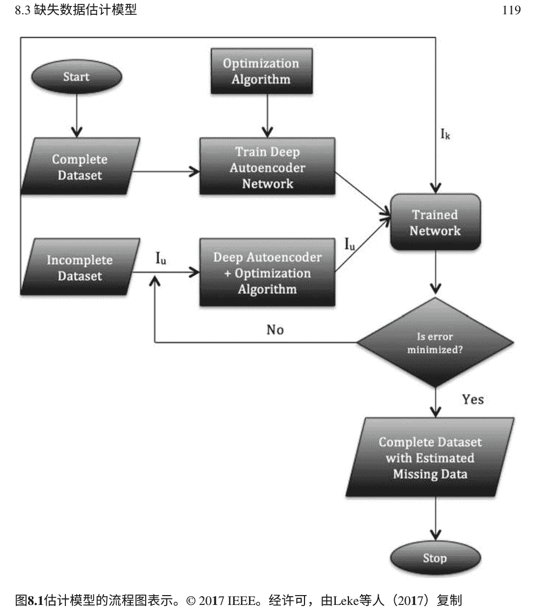

图8.1估计模型的流程图表示。© 2017 IEEE。经许可，由Leke等人（2017）复制

$$\vec{O} = f\left( \begin{bmatrix} \vec{I_k} \\ \vec{I_u} \end{bmatrix} \right) \tag{8.5}$$

由于自编码器框架试图将输入表示为网络的输出，因此输出与输入大致相等。这导致一个小误差，该误差依赖于自编码器的准确性。该误差表示为为了保证误差始终为正，方程（8.6）被平方，得到以下方程：

$$\vec{e} = \left(\left(\left[\begin{array}{c} \overrightarrow{I_{k}} \\ \overrightarrow{I_{u}} \end{array}\right] - f\left(\left[\begin{array}{c} \overrightarrow{I_{k}} \\ \overrightarrow{I_{u}} \end{array}\right], \vec{w}\right)\right)\right)^{2}. \quad\quad\quad\quad(8.7)$$

当输出尽可能接近输入时，误差将被最小化。这主要发生在向框架呈现的数据具有与训练期间记录的数据相似的特征时。因此，在估计过程中，最小化误差象征着优化缺失数据的方式，使得新的数据矩阵与训练期间完整数据集产生的模式相匹配。进一步优化网络权重使用入侵杂草优化算法，因为如前所述，它保证达到全局最优点，从而确保网络尽可能准确。

该算法作为一种优化技术，试图达到全局最优点，在误差函数的景观中，即均方误差，是函数的最低点或谷底。这个过程可以用数学方式表示为

$$\operatorname{minimize}_{\vec{w}}\left(\left[\begin{array}{c} \overrightarrow{I_{k}} \\ \overrightarrow{I_{u}} \end{array}\right] - f\left(\left[\begin{array}{c} \overrightarrow{I_{k}} \\ \overrightarrow{I_{u}} \end{array}\right], \vec{w}\right)\right)^{2}. \quad\quad\quad\quad(8.8)$$

不完整的数据集作为输入传递给蝙蝠算法，该算法的目标函数中包含了优化的深度神经网络。缺失的数据被估计，并与输入矩阵中的已知值一起通过训练过的网络运行，观察网络误差是否已经最小化，而不进行任何更改几次迭代。如果是这样，数据集将返回带有估计值，否则将再次执行插补过程。使用入侵杂草优化算法进行缺失数据估计过程的停止准则是要么是已执行了40,000个函数评估，要么是目标函数值没有变化。

从上述关于深度自编码器和蝙蝠算法如何使用的描述中，下面的方程总结了所提出方法的混合函数，其中 $f_{\text{IWO}}$ 是蝙蝠算法数据估计操作， $f_{\text{DAE}}$ 是深度自编码器的函数。

$$y = f_{\text{DAE}}(W, f_{\text{IWO}}(\vec{I})), \quad\quad\quad\quad(8.9)$$

其中 $\vec{I} = \begin{bmatrix} \vec{I_k} \\ \vec{I_u} \end{bmatrix}$ 代表已知和未知特征的输入空间。这方程表示模型设计，其中完整的输入向量包含已知和估计的缺失数据条目，通过执行缺失数据估计程序（$f_{\text{IWO}}$）获得，并呈现给深度回归模型（$f_{\text{DAE}}$）以观察网络误差是否已最小化。如果发现误差已最小化，则输出值 $y$ 将包含已知输入向量值和最佳缺失数据估计值。

### 8.4 实验结果

为了研究和验证所提出的模型与其他现有方法的比较，使用了Mixed National Institute of Standards and Technology (MNIST) 手写数字数据集。它包含60,000个训练样本和10,000个测试样本，每个样本有784个特征，表示图像的各个像素值。黑色像素的值为0，而白色像素的值为255，因此，所有变量都可以被视为连续变量。当前形式的数据已经清除了异常值，因此数据集中使用的每个图像都应有助于泛化系统。数据被归一化到[0, 1]的范围，并进行随机化以提高网络性能。数据的训练集进一步分为训练集和验证集（分别为50,000和10,000个样本）。

神经网络架构使用验证数据集进行优化，使用测试数据对所提出系统的性能进行正确性测试。值得一提的是，本研究的目标不是提出一种与现有最先进方法相媲美的分类模型，而是提出一种在数据缺失（缺失像素）情况下重建图像的方法。所使用的优化深度网络架构为784-1000-500-250-30-250-500-1000-784，最初由Hinton等人（2006）建议，并通过使用验证数据集进行交叉验证进一步验证，具有784个输入和输出节点，以及七个隐藏层，分别具有1000、500、250、30、250、500和1000个节点。训练后得到的目标函数值（均方误差）为1.96%，接近交叉验证期间获得的最低值（2.12%）。用于比较的多层感知器（MLP）自编码器在输入和输出层具有与深度自编码器相同数量的节点，具有一个由400个节点组成的单隐藏层，通过改变隐藏层中的节点数量并确定哪种架构产生最低的网络误差来确定。实验证明，784-400-784的MLP自编码器网络架构产生了2.5088%的网络误差值。MLP网络的隐藏层和输出层分别使用Sigmoid和线性激活函数。在深度自编码器的每一层中使用Sigmoid激活函数，仅在瓶颈层中使用线性激活函数。训练是使用为多层感知机（MLP）使用缩放共轭梯度（SCG）算法和深度自编码器网络使用随机梯度下降（SGD）算法，进行500个时期的训练。从测试数据集中随机选择100个样本，然后根据随机缺失（MAR）和完全随机缺失（MCAR）机制以及任意缺失数据模式删除特征。通过创建与测试数据大小相同的二项式矩阵，其中的零和一符合所述机制和模式，并将每个出现的一替换为NaN（表示缺失）。使用带有缺失值的数据集来测试缺失数据估计方案的性能，然后与现有方法进行比较。

使用均方误差（MSE）、均方根对数误差（RMSLE）、相关系数（r）和相对预测准确度（RPA）来评估所提出方法的有效性。还使用信噪比（SNR）和全局偏差（GD）。
- 均方误差、均方根对数误差以及全局偏差提供了实际值和预测值之间差异的度量，并提供了估计能力的指示。

$$ \text{均方误差} = \frac{\sum_{i=1}^{n}(I_i - \hat{I}_i)^2}{n}, \quad\quad\quad (8.10) $$

$$ \text{均方根对数误差} = \sqrt{\frac{\sum_{i=1}^{n}(\log(I_i + 1) - \log(\hat{I}_i + 1))^2}{n}}, \quad\quad\quad (8.11) $$

和

$$ \text{全局偏差} = \left(\frac{\sum_{i=1}^{n}(\hat{I}_i - I_i)}{n}\right)^2. \quad\quad\quad (8.12) $$

- 相关系数提供了预测数据和实际数据之间相似性的度量。该度量的输出值位于[-1, 1]的范围内，绝对值表示链接的强度，符号表示链接的方向。因此，接近1的值表示强大的预测能力，而接近 -1的值则表示相反。在下面的方程中，$\bar{I}$表示数据的均值。

$$ r = \frac{\sum_{i=1}^{n}(I_i - \bar{I}_i)(\hat{I}_i - \bar{\hat{I}}_i)}{\left[\sum_{i=1}^{n}(I_i - \bar{I}_i)^2 \sum_{i=1}^{n}(\hat{I}_i - \bar{\hat{I}}_i)^2\right]^{1/2}}. \quad\quad\quad (8.13) $$

- 相对预测准确率（RPA）则测量了在特定容忍度内进行的估计次数，容忍度取决于应用程序所需的敏感性。容忍度设置为10%，因为它在应用领域中似乎是有利的。该度量由以下公式给出：

$$ \text{RPA} = \frac{n_{\tau}}{n} \times 100. \quad\quad\quad (8.14) $$

- 平方误差（SE）是一种记录误差平均幅度的二次评分规则。这可以通过计算方差的平方根来获得，也称为标准差。它减少了误差的方差，与MSE相反，因此在这项工作中应用它。可以使用以下公式获得SE:

$$ \text{SE} = \sqrt{ \frac{1}{n} \sum_{i=1}^{n} (I_i - \hat{I_i})^2 }. \quad\quad\quad (8.15) $$

- 平均绝对误差（MAE）测量数据集中错误的平均幅度，而不考虑方向。在理想情况下，SE值始终大于MAE值，如果相等，则错误值具有相同的幅度。可以使用以下方程计算此误差:

$$ \text{MAE} = \frac{1}{n} \sum_{i=1}^{n} |I_i - \hat{I_i}|. \quad\quad\quad (8.16) $$

- 决定系数是在统计分析任务中经常应用的度量，旨在评估模型在解释和预测未来输出方面的性能。也称为R平方统计量，通过以下公式获得:

$$ \text{COD} = \left( \frac{ \sum_{i=1}^{n} (I_i - \bar{I_i}) (\hat{I_i} - \bar{\hat{I_i}}) }{ \left[ \sum_{i=1}^{n} (I_i - \bar{I_i})^2 \sum_{i=1}^{n} (\hat{I_i} - \bar{\hat{I_i}})^2 \right]^{1/2} } \right)^2. \quad\quad\quad (8.17) $$

- 本章中使用的信噪比由以下方式获得:

$$ \text{SNR} = \frac{\text{var}(I - \hat{I})}{\text{var}(\hat{I})}, \quad\quad\quad (8.18) $$

在方程(8.10)-(8.13)和方程(8.15)-(8.17)中， n是样本数量而 I 和 \hat{I} 分别表示真实的测试集值和预测的缺失输出值。在方程(8.14)中， n_τ表示正确预测输出的数量。

在这个分析中，新颖的DL-IWO方法与现有的方法(MLP-PSO MLP-SA和MLP-GA)进行了比较。结果分组显示在图8.2、8.3、8.4和8.5以及表8.2和8.3中。结果表明DL-IWO方法优于其他所有方法。均方误差显示在图8.2中。DL-IWO的误差为0.45%，而MLP-PSO、MLP-SA和MLP-GA的误差分别为5.53%、31.86%和32.61%。

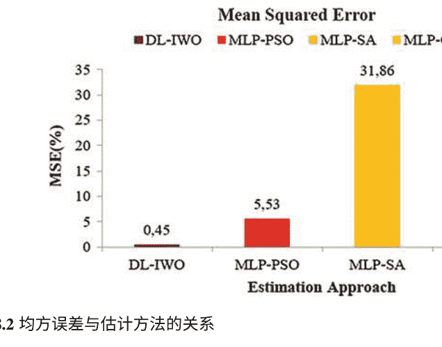

图8.2 均方误差与估计方法的关系

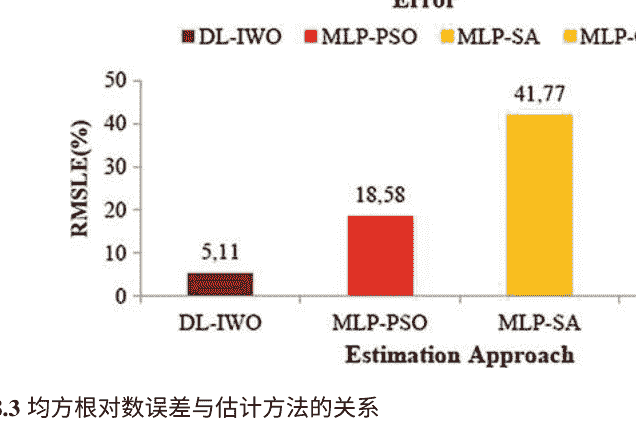

图8.3 均方根对数误差与估计方法的关系

图8.3展示了各种方法的均方根对数误差，包括新颖的DL-IWO方法。与其他方法相比，它证实了DL-IWO方法的更好性能。DL-IWO方法的RMSLE为5.11%，而MLP-PSO方法的RMSLE为18.58%。MLP-SA和MLP-GA的RMSLE值分别为41.77%和42.16%。

在图8.4中，揭示了各种方法的RPA值，而在图8.5中，我们展示了这些方法的相关系数值。在图8.4中，DL-IWO方法的RPA值为88.25%，而MLP-PSO、MLP-SA和MLP-GA的值分别为54.42%、8.75%和10.25%。

此外，在图8.5中，DL-IWO方法显示出更好的相关系数值，达到了97.67%，而MLP-SA和MLP-GA之间的相关性则为−3.7%和0.28%，估计值与真实值之间的相关性。MLP-PSO方法是第二好的表现者，结果为73.65%。

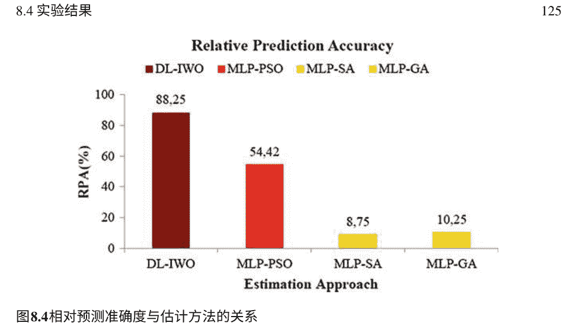

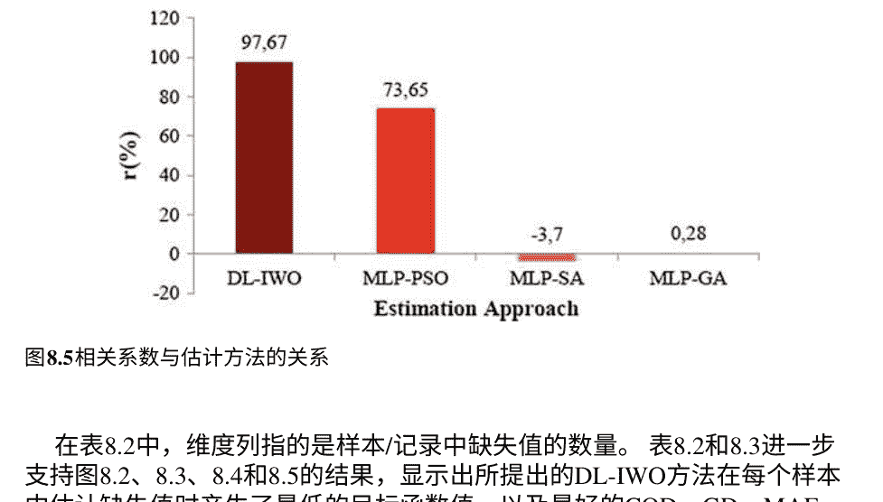

在表8.2中，维度列指的是样本/记录中缺失值的数量。表8.2和8.3进一步支持图8.2、8.3、8.4和8.5的结果，显示出所提出的DL-IWO方法在每个样本中估计缺失值时产生了最低的目标函数值，以及最好的COD、GD、MAE、SE和SNR值。

在表8.4中，我们通过t检验对DL-IWO方法得到的估计结果进行了统计分析，与MLP-PSO、MLP-SA和MLP-GA方法进行了比较。t检验的零假设（H0）假设DL-IWO、MLP-PSO、MLP-SA和MLP-GA方法得到的缺失数据估计的均值没有显著差异。然而，备择假设（HA）表明这四种方法得到的缺失数据估计的均值存在显著差异。

表8.2 DL-IWO每个样本的均方误差目标值
| 样本 | 尺寸 | DL-IWO | MLP-PSO | MLP-SA | MLP-GA |
|---|---|---|---|---|---|
| 1 | 76 | **2.07** | 11.48 | 9.04 | 9.04 |
| 2 | 89 | **0.69** | 6.01 | 5.81 | 5.81 |
| 3 | 82 | **4.74** | 11.26 | 14.80 | 14.80 |
| 4 | 86 | **1.21** | 8.42 | 6.19 | 6.19 |
| 5 | 82 | **2.59** | 7.03 | 7.70 | 7.70 |
| 6 | 62 | **1.02** | 4.65 | 8.71 | 8.71 |
| 7 | 88 | **1.69** | 7.63 | 12.61 | 12.61 |
| 8 | 71 | **4.89** | 12.21 | 12.09 | 12.09 |
| 9 | 79 | **1.01** | 4.24 | 8.14 | 8.14 |
| 10 | 84 | **1.34** | 7.06 | 13.36 | 13.36 |

粗体数值进一步证明了该方法产生了最佳结果。

表8.3 DL-IWO附加指标
| 方法 | DL-IWO | MLP-PSO | MLP-SA | MLP-GA |
|---|---|---|---|---|
| COD | **95.4** | 54.24 | 0.14 | 0.08 |
| GD | **0.02** | 1.10 | 13.89 | 14.83 |
| MAE | **3.31** | 15.20 | 48.72 | 48.91 |
| SE | **6.67** | 23.52 | 56.44 | 57.1 |
| SNR | **5.16** | 59.76 | 219.89 | 205.01 |

粗体数值进一步证明了该方法产生了最佳结果。

表8.4 DL-IWO模型结果的统计分析
| 比较的对 | P-值 (95%置信水平) |
|---|---|
| DL-IWO:MLP-PSO | 2.51 × 10⁻¹⁵ |
| DL-IWO:MLP-SA | 2.0 × 10⁻¹⁷⁴ |
| DL-IWO:MLP-GA | 4.0 × 10⁻¹⁸⁰ |

表8.4显示，在DL-IWO与MLP-PSO、MLP-SA和MLP-GA之间的估计均值比较时，存在显著差异，其p值分别为2.51 × 10⁻¹⁵、2.0 × 10⁻¹⁷⁴和4.0 × 10⁻¹⁸⁰，当比较这三对时。因此，这表明在95%置信水平下，可以拒绝假设（H₀），即DL-IWO与其他三种方法之间的均值没有显著差异，而接受备择假设（H_A）。

在图8.6的顶部行中，我们展示了10个具有缺失像素值的图像，在进行统计方法执行的分类任务之前需要进行估计。在同一图8.6的底部行中，我们展示了使用DL-IWO方法重建的图像，而在图8.7的顶部和底部行中，我们观察到使用MLP-PSO和MLP-GA方法重建的图像。

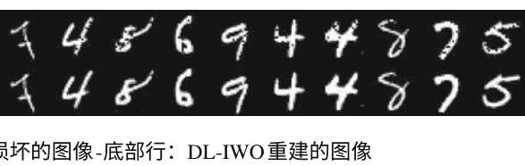

图8.6 顶部行：损坏的图像-底部行：DL-IWO重建的图像

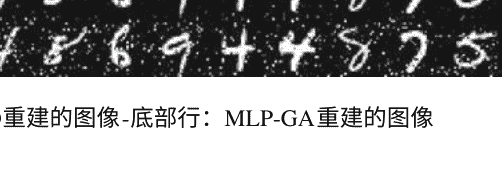

图8.7 顶部行：MLP-PSO重建的图像-底部行：MLP-GA重建的图像

分别。使用MLP-PSO和MLP-GA重建的图像引入了很多噪音，尤其是在底部行比顶部行更多，与应用DL-IWO方法时相反。此外，仔细观察发现，图像没有完全重建，因为图像中并没有所有像素值都被正确估计。

### 8.5 结论

本章介绍了一种通过新颖方法估计缺失数据的调查。估计方法包括使用深度自动编码器网络复制输入数据，结合侵入性杂草优化算法估计缺失数据。研究了该模型的性能，并与包括MLP自动编码器与遗传算法、模拟退火和粒子群优化在内的现有方法进行了比较。所得结果表明，与MLP混合系统相比，所提出的系统提供了更准确的估计。当考虑均方误差、均方根对数误差、相关系数、相对预测准确性、信噪比和全局偏差时，这一点变得明显，所提出的方法在这些方面取得了最佳值。此外，在估计过程中考虑目标函数值时，观察到所提出的方法在每个实例中都具有最低值。

参考文献

Abdella, M., & Marwala, T. (2005). 使用遗传算法和神经网络来近似数据库中的缺失数据。在计算控制国际会议(ICCC)上的第3届国际会议上(pp. 207–212). IEEE.

Feng, X., Zhang, Y., & Glass, J. R. (2014). 通过深度自动编码器对噪声混响语音进行语音特征去噪和去混响处理，用于噪声混响语音识别。在国际声学、语音和信号处理会议(ICASSP)上(第1759-1763页)。IEEE.

Finn, C., Tan, X., Duan, Y., Darrell, T., Levine, S., & Abbeel, P. (2016). 深度空间自编码器用于视觉运动学习。在国际机器人与自动化大会(ICRA)上(第512-519页)。IEEE.

Hinton, G. E., Osindero, S., & Teh, Y. W. (2006). 一种用于深度信念网络的快速学习算法。神经计算, 18(7), 1527-1554.

Hung, H. L., Chao, C. C., Cheng, C. H., & Huang, Y. F. (2010). 基于入侵杂草优化方法的盲多用户检测，用于MC-CDMA干扰抑制多径衰落信道。在国际系统、人类和控制大会(SMC)上(第2145-2150页)。

Jerez, J. M., Molina, I., Garcia-Laencina, P. J., Alba, E., Ribelles, N., Martin, M., 等 (2010). 在一个真实的乳腺癌问题中，使用统计和机器学习方法进行缺失数据插补。医学中的人工智能, 50(2), 105–115。爱思唯尔。

Ju, Y., Guo, J., & Liu, S. (2015). 一种将稀疏自编码器与支持向量机相结合的深度学习方法。在国际分布式计算与知识发现会议上(CyberC) (pp. 257–260). IEEE.

Kasdirin, H. A., Yahya, N. M., Aras, M. S. M., & Tokhi, M. O. (2017). 将入侵杂草优化与萤火虫算法相结合，用于无约束和约束优化问题。《理论与应用信息技术杂志》, 95(4), 912–927。

Krizhevsky, A., & Hinton, G. E. (2011). 使用非常深的自编码器进行基于内容的图像检索。在第19届欧洲人工神经网络研讨会(ESANN)上, 2011年4月27日至29日。比利时布鲁日。

Leke, C., & Marwala, T. (2016). 高维数据集中的缺失数据估计：一种群智能-深度神经网络方法。在群智能国际会议上(pp. 259–270). Springer国际出版社。

Liew, A. W.-C., Law, N.-F., & Yan, H. (2011). 基因表达数据的缺失值插补：从可用信息中恢复缺失数据的计算技术。《生物信息学简报》, 12(5), 498–513。牛津大学出版社。

Mehrabian, A. R., & Lucas, C. (2006). 一种受到杂草殖民启发的新型数值优化算法。《生态信息学》, 1, 355–366。

Myers, T. A. (2011). 告别，整体删除：将热卡片插补作为处理缺失数据的简单有效工具。通信方法与测量, 5(4), 297–310。Taylor & Francis.

Paryzad, B., & Pour, N. S. (2013). 使用入侵性杂草优化算法的项目时间-成本-质量权衡Journal of Basic and Applied Scientific Research, 3(11), 134–142。

Rana, S., John, A. H., Midi, H., & Imon, A. (2015). 在存在异常值的情况下，对缺失数据进行鲁棒回归插补Far East Journal of Mathematical Sciences, 97(2), 183. Pushpa Publishing House。

Su, K., Ma, L., Guo, X., & Sun, Y. (2014). 一种高效的离散入侵性杂草优化算法用于Web服务选择Journal of Software, 9(3), 709–715。

Van Buuren, S. (2012). 灵活的缺失数据插补. CRC出版社。

Veenhuis, C. (2010). 二进制入侵性杂草优化在自然和生物启发计算第二届世界大会上(pp. 449–454)。

Yazdani, M., & Ghodsi, R. (2017). 侵略性杂草优化算法用于在老化效应下最小化总加权提前和延迟惩罚的单机系统。国际机器人与自动化杂志, 2(1), 1–5。

Zhang, S., Jin, Z., & Zhu, X. (2011). 利用不完整实例中的信息进行缺失数据插补。系统与软件杂志, 84(3), 452–459。爱思唯尔。

## 9.1 自编码神经网络

自编码器网络被定义为试图在输出层中将输入重建为输出的网络（Lu和Hsu 2002），这保证了当网络面对新的输入时，它可以预测新的输入值作为输出。这些自编码器由一个输入层和一个输出层组成，两者具有相同数量的神经元，因此被称为自关联（Lu和Hsu 2002）。

除了这两个层之外，还存在一个窄隐藏层，重要的是这个层中的神经元数量要少于输入和输出层中的神经元数量，目的是在尝试找到给定任务的解决方案时应用编码和解码过程（M'stry等人，2008年）。这些网络已经在各种应用中使用（H'nes等人，1998年；Atalla和Inman，1998年；Smauo'i和Yakoob，2003年；Marwala，2001年，2013年；Marwala和Chakraverty，2006年）。定义自编码器网络操作的主要概念是从输入到输出的映射，$x^{(i)} \rightarrow y^{(i)}$，存储非常重要的信息和输入中存在的关键内在架构，这与假设相反（H'nes等人，1998年；Leke和Marwala，2016年）。自编码器以$x$为输入，并通过使用确定性的映射函数$f_{\theta}$将其转录为$y$，$y$是输入的隐藏表示（Leke和Marwala，2016年；Isaacs，2014年）。这个函数表示为（Leke和Marwala，2016年；Isaacs，2014年）：

$$f_{\theta}(x) = s(W x + b). \tag{9.1}$$

参数 θ由权重 W和偏差 b组成，s表示由以下公式给出的sigmoid激活函数

$$s = \frac{1}{1 + e^{-x}}. \tag{9.2}$$

然后将 y 映射到表示输入重构的向量 z 中隐藏表示。通过以下方程获得重构向量 (Leke和Marwala 2016):

$$z = g_{\theta'}(y) = s(W'y + b'), \tag{9.3}$$

或者

$$z = g_{\theta'}(y) = W'y + b'. \tag{9.4}$$

在上述方程中，$\theta'$ 由权重矩阵的转置和来自方程 9.1 的偏置向量组成。方程 9.3 是自编码器的输出函数，使用了一个 sigmoid 传递函数 (方程 9.2)，而方程 9.4 是线性输出方程。在这些操作之后，可以通过应用监督学习方法 (Isaacs 2014) 对网络进行微调。当权重矩阵被转置时，网络被称为具有绑定权重。向量 z 并不被描述为 x 的精确转换，而是作为概率术语中分布 $p(X|Z = z)$ 的标准。

希望这些标准将以高概率得到 x (Isaacs 2014)。得到的方程如下 (Leke和Marwala 2016)：

$$p(X|Y = y) = p(X|Z = g_{\theta'}(y)). \tag{9.5}$$

这导致了相关的再生差异，形成了优化算法使用的目标函数的基础。这种差异通常由 (Leke 和 Marwala 2016) 表示

$$L(x, z) \propto -\log p(x|z). \tag{9.6}$$

$\alpha$ 表示成比例。上述方程可以由 (Sartori 等人 2005) 表示

$$\delta_{AE}(\theta) = \sum_{t} L\left(x^{(t)}, g_{\theta}\left(f_{\theta}(x^{(t)})\right)\right). \tag{9.7}$$

自编码器网络已经被多位研究人员在各种应用领域中使用，重点是解决缺失数据的问题 (Abdella 和 Marwala 2005; Baek 和 Cho 2003; Tim 等人 2004; Brain 等人 2006)。

## 9.2 缺失数据估计模型

在本节中，我们描述了将自编码器网络和优化算法的优点结合起来的方法。在应用任何类型的网络来估计缺失数据时，网络模型的准确性非常重要。

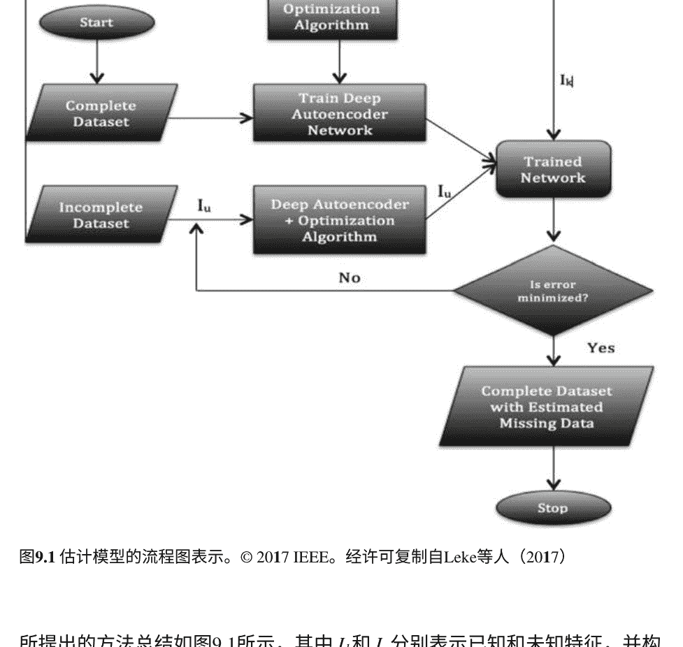

图9.1 估计模型的流程图表示。© 2017 IEEE。经许可复制自Leke等人（2017）

所提出的方法总结如图9.1所示，其中 $I_k$ 和 $I_u$ 分别表示已知和未知特征，并构成输入集合。

首先，使用缩放共轭梯度（SCG）算法对网络进行训练，使用完整的记录集识别映射函数 $f$，该函数提取并存储数据集中特征之间的相互关系和相关性。这导致输出 $\vec{O}$，由（Leke和Marwala 2016）获得：

$$\vec{O} = f\left( \begin{bmatrix} \vec{I_k} \\ \vec{I_u} \end{bmatrix} \right).$$

由于自编码器框架试图将输入表示为网络的输出，因此输出与输入大致相等。这导致一个小误差，该误差依赖于自编码器的准确性。该误差表示为（Leke和Marwala 2016）：

$$\vec{e} = \begin{bmatrix} \vec{I_k} \\ \vec{I_u} \end{bmatrix} - f\left( \begin{bmatrix} \vec{I_k} \\ \vec{I_u} \end{bmatrix}, \vec{w} \right) \quad (9.9)$$

为了确保误差始终为正，将方程9.9平方，得到以下方程：

$$\vec{e} = \left( \begin{bmatrix} \vec{I_k} \\ \vec{I_u} \end{bmatrix} - f\left( \begin{bmatrix} \vec{I_k} \\ \vec{I_u} \end{bmatrix}, \vec{w} \right) \right)^2 \quad (9.10)$$

当输出尽可能接近输入时，误差将被最小化。这主要发生在向框架呈现的数据具有与训练期间记录的数据相似的特征时。因此，在估计过程中，最小化误差象征着以使新的数据矩阵与训练期间完整数据集产生的模式相匹配的方式来优化缺失数据。优化算法用于进一步优化网络权重，因为它们保证达到全局最优点，从而确保网络尽可能准确。作为优化技术的算法试图达到全局最优点，即在误差函数的景观中，即均方误差，是函数的最低点或谷底。这个过程在数学上表示为（Leke和Marwala 2016）：

$$\text{最小化}_{\vec{w}} \left( \begin{bmatrix} \vec{I_k} \\ \vec{I_u} \end{bmatrix} - f\left( \begin{bmatrix} \vec{I_k} \\ \vec{I_u} \end{bmatrix}, \vec{w} \right) \right)^2 \quad (9.11)$$

不完整的数据集作为输入传递给优化算法，其中目标函数的一部分是优化的神经网络。缺失的数据被估计，并与已知值一起通过训练过的网络运行，观察网络误差是否已经最小化，而不进行任何更改几次迭代。如果是这样，数据集将返回带有估计值；否则，将再次执行插补过程。使用优化算法进行缺失数据估计过程的停止准则要么是已执行了40000个函数评估，要么是目标函数值没有变化。

从上述对自编码器和优化算法如何使用的描述中，下面的方程总结了所提出方法的混合函数，其中$f_{OA}$是优化算法数据估计操作，$f_{AE}$是自编码器的函数。

$$y = f_{AE} \left( W, f_{OA} \left( I \right) \right) \quad (9.12)$$

其中 $I = \begin{bmatrix} \vec{I_k} \\ \vec{I_u} \end{bmatrix}$ 代表已知和未知特征的输入空间。这个方程表示模型设计，其中通过执行缺失数据估计过程（$f_{OA}$）获得的已知和估计的缺失数据条目的完整输入向量被呈现给回归模型（$f_{AE}$）以观察网络误差是否已被最小化。如果发现误差已被最小化，则输出，$y$，将包含已知输入向量值和最佳缺失数据估计值。

## 9.3 实验结果

为了研究和验证所提出的模型与其他现有方法的比较，使用了混合国家标准与技术研究所（MNIST）手写数字数据集（LeCun 2016）。它包含60,000个训练样本和10,000个测试样本，每个样本有784个特征，表示图像的各个像素值。黑色像素表示为0，而白色像素的值为255；因此，所有变量都可以被视为连续变量。

当前形式的数据已经清除了异常值；因此，数据集中的每个图像都应该对系统的泛化有所贡献。数据被归一化到[0, 1]的范围，并进行随机化以提高网络性能。训练数据集进一步分为训练集和验证集（分别为50000和10000）。

使用验证集对神经网络架构进行优化，使用测试数据对所提出系统的性能进行正确性测试。所使用的优化深度网络架构为784-1000-500-250-30-250-500-1000-784，通过使用验证数据集进行交叉验证，具有784个输入和输出节点，以及7个隐藏层，分别具有1000、500、250、30、250、500和1000个节点。从该网络中，瓶颈层的输出被用于进行本章的实验。作为结果，所使用的窄网络由30个输入节点、一个隐藏层的15个节点和一个输出层的30个节点组成。它的形状与图9.2中所示的形状类似。数据仍然被归一化到[0, 1]的范围。窄网络的隐藏层和输出层分别使用Sigmoid和线性激活函数。训练使用缩放共轭梯度（SCG）算法。从测试数据集中随机选择100个样本，然后根据随机缺失（MAR）和完全随机缺失（MCAR）机制以及任意缺失数据模式删除特征。这是通过创建与测试数据大小相同的二项矩阵，其中的零和一遵循所述机制和模式，并将每个出现的一替换为NaN（表示缺失）。此外，这些数据集中包含1、5和10%的缺失数据。从中获得的带有缺失值的数据集用于测试缺失数据估计方案的性能，这些方案是然后与现有方法进行比较。此外，我们将验证通过这些方法生成的完整数据集重建图像是否产生可用于分类任务的准确图像。

所提出方法的有效性是通过均方误差（MSE）和根均方对数误差（RMSLE）进行估计。还使用平均绝对误差（MAE）和标准误差（SE）。均方误差、根均方对数误差以及全局偏差提供了实际值和预测值之间差异的度量，并提供了估计能力的指示。

$$MSE = \frac{\sum_{i=1}^{n} (I_i - \hat{I}_i)^2}{n}, \quad (9.13)$$

和

$$RMSLE = \sqrt{\frac{\sum_{i=1}^{n} (\log(I_i + 1) - \log(\hat{I}_i + 1))^2}{n}}, \quad (9.14)$$

$$GD = \left( \frac{\sum_{i=1}^{n} (\hat{I}_i - I_i)}{n} \right)^2, \quad (9.15)$$

在公式9.13-9.15中，n是样本数量，I和$\hat{I}$分别表示真实测试集值和预测的缺失输出值。在此分析中，将与文献中的现有方法（MLP-PSO，MLP-SA和MLP-GA（Abdella和Marwala 2005; Leke等，2014年））进行比较。结果分组在下面的图表中。

### 9.3.1 蚁群优化结果

均方误差在图9.3中给出。MLP-ACO的误差为6.08%，而MLP-PSO，MLP-SA和MLP-GA在1%缺失数据下的误差分别为6.08%，24.1%和24.1%。对于5%的缺失数据，MLP-ACO，MLP-PSO，MLP-SA和MLP-GA方法的误差分别为3.35%，3.35%，23.53%和23.53%。此外，对于10%的缺失数据，MLP-ACO，MLP-PSO，MLP-SA和MLP-GA方法的误差分别为6.17%，6.19%，22.76%和22.76%。

图9.4描述了根均方对数误差的分析结果，包括MLP-ACO方法。它证实了与其他方法相比，MLP-ACO方法具有更好的性能。可以观察到，它在性能方面与MLP-PSO方法相当。MLP-ACO的RMSLE为18.26%，而MLP-PSO也获得了18.26%的RMSLE。对于1%的缺失数据，MLP-SA和MLP-GA的RMSLE值分别为39.83和39.83%。此外，MLP-ACO的RMSLE为11.95%，而MLP-PSO也获得了11.95%的RMSLE。对于5%的缺失数据，MLP-SA和MLP-GA的RMSLE值分别为39.03和39.03%。

此外，MLP-ACO的RMSLE为16.64%，而MLP-PSO的RMSLE为16.66%。对于10%的缺失数据，MLP-SA和MLP-GA的RMSLE值分别为38.33和38.33%。

在图9.5中，展示了这些方法的GD值。我们观察到，对于1%的缺失数据，MLP-ACO的GD值为2%，而MLP-PSO、MLP-SA和MLP-GA的GD值分别为2、23.79和23.79%。

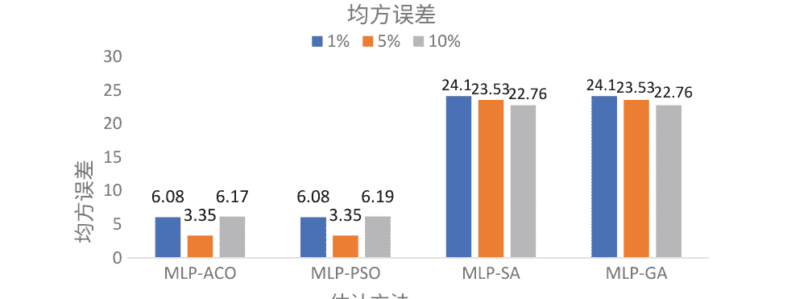

图9.3 均方误差与估计方法的关系

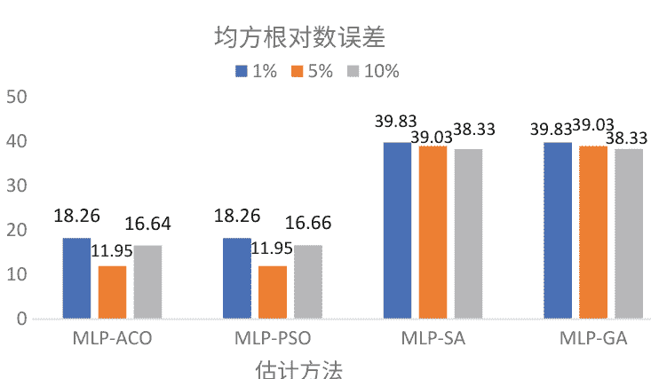

图9.4 均方根对数误差与估计方法的关系

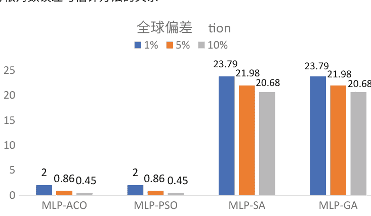

图9.5 全球偏差与估计方法的关系

此外，我们观察到在5%的缺失数据情况下，MLP-ACO的GD值为0.86%，而MLP-PSO、MLP-SA和MLP-GA的值分别为0.86、21.98和21.98%。此外，我们观察到在10%的缺失数据情况下，MLP-ACO的GD值为0.45%，而MLP-PSO、MLP-SA和MLP-GA的值分别为0.45、20.68和20.68%。

### 9.3.2 蚁狮优化器结果

图9.6给出了均方误差。在1%的缺失数据情况下，MLP-ALO的误差为4.4%，而MLP-PSO、MLP-SA和MLP-GA的误差分别为4.4、17.42和17.42%。它显示了4.82、4.83、26.65和26.65%的误差分别对应5%缺失数据的MLP-ALO、MLP-PSO、MLP-SA和MLP-GA方法。此外，对于10%缺失数据，MLP-ALO、MLP-PSO、MLP-SA和MLP-GA方法的误差分别为6.86%、6.87%、24.16%和24.16%。

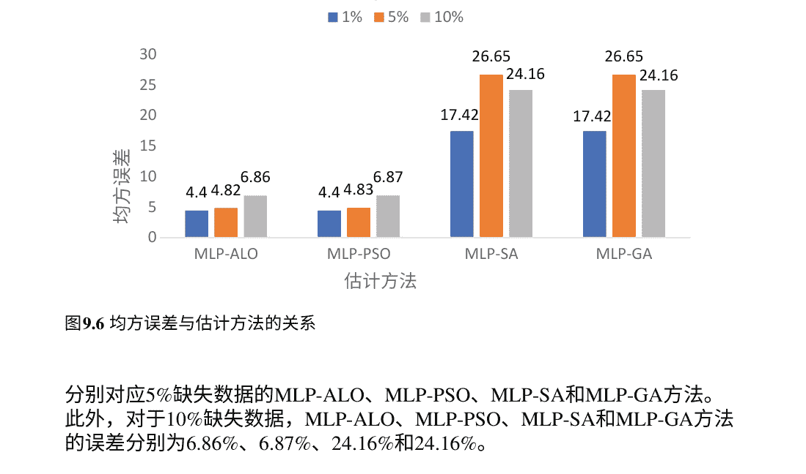

图9.6 均方误差与估计方法的关系

图9.7展示了各种分析方法（包括MLP-ALO方法）的均方根对数误差。结果证实了MLP-ALO方法相对于其他方法的更好性能。可以观察到，MLP-ALO方法在性能上与MLP-PSO方法相当。MLP-ALO方法的RMSLE为13.38%，而MLP-PSO方法也得到了13.38%的RMSLE。MLP-SA和MLP-GA方法在1%缺失数据时的RMSLE值分别为34.61%和34.61%。此外，MLP-ALO方法的RMSLE为14.98%，而MLP-PSO方法也得到了15%的RMSLE。MLP-SA和MLP-GA方法在5%缺失数据时的RMSLE值分别为41.12%和41.12%。

此外，MLP-ALO的RMSLE为17.66%，而我们也得到了MLP-PSO的17.66%的RMSLE。MLP-SA和MLP-GA在10%的缺失数据情况下的RMSLE值分别为39.18和39.18%。在图9.8中，揭示了这些方法的GD值。我们观察到，MLP-ALO在1%的缺失数据情况下的GD值为2.2%，而MLP-PSO、MLP-SA和MLP-GA分别为2.2、16.71和16.71%。此外，我们观察到，MLP-ALO在5%的缺失数据情况下的GD值为0.1%，而MLP-PSO、MLP-SA和MLP-GA分别为0.1、25.01和25.01%。此外，我们观察到，MLP-ALO在10%的缺失数据情况下的GD值为0.29%，而MLP-PSO、MLP-SA和MLP-GA分别为0.29、21.84和21.84%。

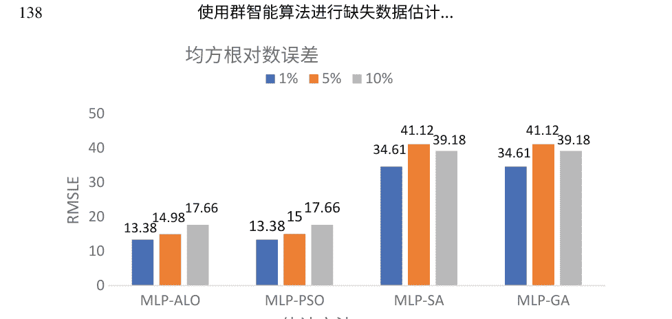

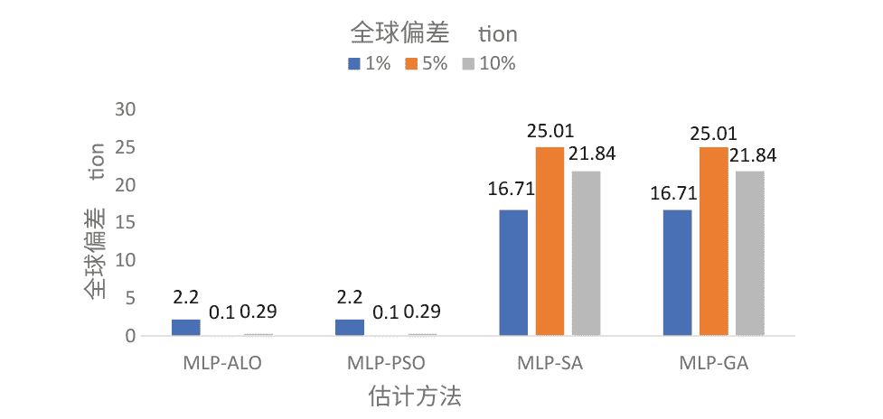

### 9.3.3 蝙蝠算法结果

均方误差在图9.9中给出。它显示了MLP-BAT的误差为7.79%，而MLP-PSO、MLP-SA和MLP-GA在1%的缺失数据情况下的误差分别为7.79%、17.61%和17.61%。对于5%的缺失数据，MLP-BAT、MLP-PSO、MLP-SA和MLP-GA方法的误差分别为5.21%、4.52%、23.19%和23.19%。此外，对于10%的缺失数据，MLP-BAT、MLP-PSO、MLP-SA和MLP-GA方法的误差分别为6.86%、6.87%、24.16%和24.16%。

图9.10显示了根均方对数误差，包括MLP-BAT方法在内的分析方法。与其他方法相比，它证实了MLP-BAT方法的更好性能。MLP-BAT的RMSLE为18.11%，而MLP-PSO的RMSLE也为18.11%。对于1%的缺失数据，MLP-SA和MLP-GA的RMSLE值分别为34.94和34.94%。此外，MLP-BAT的RMSLE为14.99%，而MLP-PSO的RMSLE也为14.37%。对于5%的缺失数据，MLP-SA和MLP-GA的RMSLE值分别为38.68和38.68%。

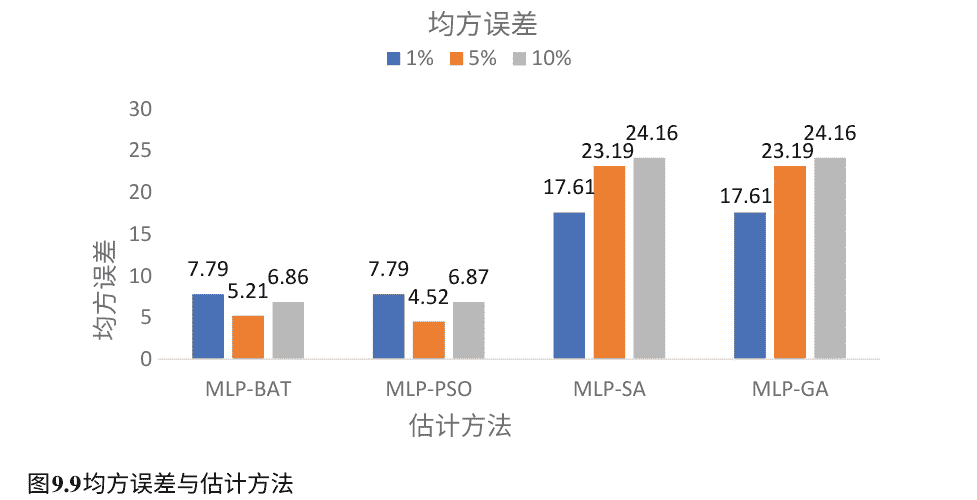

图9.9 均方误差与估计方法的关系

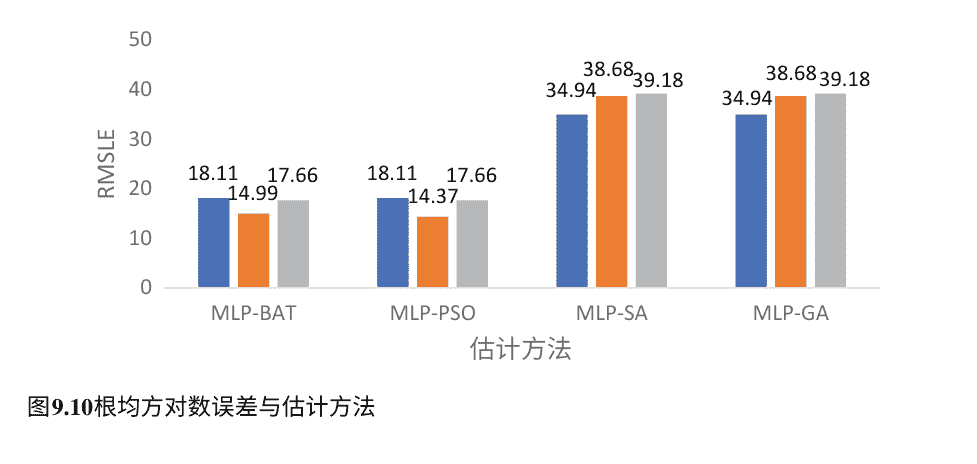

图9.10 根均方对数误差与估计方法的关系

此外，MLP-BAT的RMSLE为17.66%，而MLP-PSO也获得了17.66%的RMSLE。MLP-SA和MLP-GA在10%的缺失数据情况下的RMSLE值分别为39.18和39.18%。

在图9.11中，揭示了这些方法的GD值。我们观察到，MLP-BAT在1%的缺失数据情况下的GD值为2.9%，而MLP-PSO、MLP-SA和MLP-GA分别为2.9、17.32和17.32%。此外，我们观察到MLP-BAT的GD值为0.65%。

### 9.3.4 布谷鸟搜索算法结果

与MLP-PSO、MLP-SA和MLP-GA相比，5%的缺失数据情况下的值分别为0.22、21.4和21.4%。此外，我们观察到MLP-BAT在10%的缺失数据情况下的GD值为0.29%，而MLP-PSO、MLP-SA和MLP-GA分别为0.29、21.84和21.84%。

均方误差在图9.12中给出。MLP-CS的误差为9.02%，而MLP-PSO、MLP-SA和MLP-GA在1%的缺失数据下的误差分别为9.02%、27.21%和27.21%。对于5%的缺失数据，MLP-CS、MLP-PSO、MLP-SA和MLP-GA的误差分别为5.96%、5.98%、29.61%和29.61%。此外，对于10%的缺失数据，MLP-CS、MLP-PSO、MLP-SA和MLP-GA的误差分别为6.89%、6.89%、22.36%和22.36%。

图9.13描述了所分析方法（包括MLP-CS方法）的均方根对数误差。它证实了MLP-CS方法相对于其他方法的更好性能。MLP-CS的RMSLE为19.6%，而MLP-PSO的RMSLE也为19.61%。

对于1%的缺失数据，MLP-SA和MLP-GA的RMSLE值分别为40.77和40.77%。此外，MLP-CS的RMSLE为16.32%，而MLP-PSO的RMSLE为16.35%。对于5%的缺失数据，MLP-SA和MLP-GA的RMSLE值分别为42.73和42.73%。此外，MLP-CS的RMSLE为17.71%，而MLP-PSO的RMSLE也为17.71%。对于10%的缺失数据，MLP-SA和MLP-GA的RMSLE值分别为38.13和38.13%。

在图9.14中，展示了这些方法的GD值。我们观察到MLP-CS相比于MLP-PSO、MLP-SA和MLP-GA的GD值为6.14%。

遗传算法对于1%缺失数据分别得到6.14、23.47和23.47%的值。此外，我们观察到MLP-CS相比于MLP-PSO、MLP-SA和MLP-GA在5%缺失数据时的GD值为0.0029%，而MLP-PSO、MLP-SA和MLP-GA分别得到0.0031、27.06和27.06%的值。此外，我们观察到MLP-CS相比于MLP-PSO、MLP-SA和MLP-GA在10%缺失数据时的GD值为0.62%，而MLP-PSO、MLP-SA和MLP-GA分别得到0.63、20.6和20.6%的值。

### 9.3.5 萤火虫算法结果

均方误差在图9.15中给出。它显示了MLP-FA的6.36%误差，而MLP-PSO、MLP-SA和MLP-GA分别对应1%缺失数据的6.37%、25.94%和25.94%误差。它描绘了4.17%、4.17%、20%和20%的误差分别对应5%缺失数据的MLP-FA、MLP-PSO、MLP-SA和MLP-GA方法。此外，它显示了分别对应10%缺失数据的MLP-FA、MLP-PSO、MLP-SA和MLP-GA方法的7.72%、7.59%、25.19%和25.19%的误差。

图9.16描述了根均方对数误差的分析结果，包括MLP-FA方法。与其他方法相比，它证实了MLP-FA方法的更好性能。MLP-FA表现出16.7%的RMSLE，而MLP-PSO也获得了16.7%的RMSLE。MLP-SA和MLP-GA在1%的缺失数据情况下的RMSLE值分别为40.84和40.84%。此外，MLP-FA表现出13.89%的RMSLE，而MLP-PSO也获得了13.89%的RMSLE。MLP-SA和MLP-GA在5%的缺失数据情况下的RMSLE值分别为36.5和36.5%。此外，MLP-FA表现出19.08%的RMSLE，而MLP-PSO也获得了18.88%的RMSLE。MLP-SA和MLP-GA在10%的缺失数据情况下的RMSLE值分别为39.81和39.81%。

图9.17描述了全局偏差与估计方法的关系。

在图9.17中，揭示了各种方法的全局偏差值。我们观察到，相比于MLP-PSO、MLP-SA和MLP-GA在1%缺失数据情况下分别产生的0.0832、24.93和24.93%的偏差值，MLP-FA产生了0.0084%的偏差值。此外，我们观察到，相比于MLP-PSO、MLP-SA和MLP-GA在5%缺失数据情况下分别产生的1.14、18.61和18.61%的偏差值，MLP-FA产生了1.09%的偏差值。此外，我们观察到，相比于MLP-PSO、MLP-SA和MLP-GA在10%缺失数据情况下分别产生的0.072、22.46和22.46%的偏差值，MLP-FA产生了0.096%的偏差值。

### 9.3.6 侵入性杂草优化结果

均方误差在图9.18中给出。对于MLP-IWO，它显示了5.86%的误差，而对于1%的缺失数据，MLP-PSO、MLP-SA和MLP-GA分别产生了5.86%、33.4%和33.4%的误差。对于5%的缺失数据，MLP-IWO、MLP-PSO、MLP-SA和MLP-GA方法的误差分别为6.32%、6.33%、21.67%和21.67%。此外，对于10%的缺失数据，MLP-IWO、MLP-PSO、MLP-SA和MLP-GA方法的误差分别为6.21%、6.21%、24.99%和24.99%。

图9.19描述了所分析方法（包括MLP-IWO方法）的均方根对数误差。它证实了MLP-IWO方法相对于其他方法的更好性能。MLP-IWO的RMSLE为15.66%，而MLP-PSO也获得了15.66%的RMSLE。MLP-SA和MLP-GA在1%的缺失数据情况下的RMSLE值分别为44.93%。此外，MLP-IWO的RMSLE为17.36%，而MLP-PSO也获得了17.37%的RMSLE。MLP-SA和MLP-GA在5%的缺失数据情况下的RMSLE值分别为37.84%。

此外，MLP-IWO的RMSLE为17.09%，而MLP-PSO也获得了17.09%的RMSLE。MLP-SA和MLP-GA在10%的缺失数据情况下的RMSLE值分别为39.86和39.86%。

在图9.20中，揭示了这些方法的GD值。我们观察到，MLP-IWO在1%的缺失数据情况下的GD值为0.43%，而MLP-PSO、MLP-SA和MLP-GA分别为0.43、31.15和31.15%。此外，我们观察到，MLP-IWO在5%的缺失数据情况下的GD值为0.98%，而MLP-PSO、MLP-SA和MLP-GA分别为0.99、20.28和20.28%。此外，我们观察到，MLP-IWO在10%的缺失数据情况下的GD值为0.0929%，而MLP-PSO、MLP-SA和MLP-GA分别为0.0939、22.79和22.79%。

## 9.4 结论

本章介绍了在降维后的特征维度中估计缺失数据的研究。本章的实验使用瓶颈层的输出作为数据。在数据集中测试了1%，5%和10%的缺失情况。观察到MLP-PSO方法与提出的新方法表现相当。

## 参考文献

Abdella, M., & Marwala, T. (2005). 使用遗传算法和神经网络来近似数据库中的缺失数据 (第24卷，第577-589页).

Atalla, M. J., & Inman, D. J. (1998). 使用神经网络进行模型更新. 机械系统和信号处理, 12, 135–161.

Baek, K., & Cho, S. (2003). 使用自联想神经网络进行信用风险的破产预测在韩国公司中. 在香港，中国IEEE金融工程计算智能会议 (第25-29页).

Brain, L. B., Marwala, T., & Tettey, T. (2006). 用于HIV分类的自编码器网络. Current Science, 91(11), 1467–1473.

Hines, J. W., Robert, E. U., & Wrest, D. J. (1998). 使用自联想神经网络进行信号验证. 智能和机器人系统杂志, 21(2), 143–154.

Isaacs, J. C. (2014). 工程系统中的深度学习和缺失数据. 国际光学与光子学学会.

Leke, C., Twala, B., & Marwala, T. (2014). 缺失数据预测建模：计算智能和优化算法. 在国际系统、人类和控制论大会上 (SMC) (pp. 1400–1404).

LeCun, Y. (2016). 手写数字的MNIST数据库. 2016年1月1日检索，来自http://yann.lecun.com/exdb/mnist/.

Leke, C., & Marwala, T. (2016). 高维数据集中的缺失数据估计：一种群智能-深度神经网络方法. 在国际群智能大会上 (pp. 259–270) Springer International Publishing.

Leke, C., Ndjongue, A. R., Twala, B., & Marwala, T. (2017). 深度学习-高维度缺失数据估计器. 在2017年IEEE国际系统、人类和控制论大会 (SMC) (pp. 483–488). IEEE.

Lu, P. J., & Hsu, T. C. (2002). 应用自联想神经网络对气体路径传感器数据进行验证. 推进与动力学杂志, 18(4), 879–888.

Marwala, T. (2001). 使用神经网络和振动数据的概率性故障识别. 飞行器杂志, 38(1), 138–146.

Marwala, T., & Chakraverty, S. (2006). 使用自联想神经网络和遗传算法对具有不完整测量数据的结构进行故障分类. Current Science, 90(4), 542–548.

Marwala, T. (2013). 使用人工智能方法进行经济建模. 伦敦：Springer.

Mistry, J., Nelwamondo, F., & Marwala, T. (2008). 估计缺失数据并确定估计数据的置信度. 在第七届国际机器学习和应用大会 (pp. 752–755). 美国加利福尼亚州圣地亚哥.

美国统计协会调查研究方法部门会议论文集, 1, 20–34. 在癌症死亡率分析中对缺失值进行多重插补，估计暴露剂量. 计算统计与数据分析, 49(3), 937–953.

Smauoi, N., & Al-Yakoob, S. (2003). 使用Karhunen-Loeve分解和自联想神经网络分析细胞火焰的动力学. 工业和应用数学学会, 24, 1790–1808.

Tim, T., Mutajogire, M., & Marwala, T. (2004). 使用进化神经网络进行股市预测. 在模式识别的第15届年度研讨会PRASA (pp. 123–133).

# 第10章 深度学习框架分析

## 10.1 引言

现今的数据集，如记录生产、制造和医疗数据的数据，可能在数据收集和存储过程的不同阶段遇到缺失数据的问题。测量仪器或数据传输线路的故障是导致数据缺失的主要原因。缺失数据的发生导致决策和分析任务变得困难，这些任务依赖于对完整和准确数据的访问，从而需要准确且高效的数据估计技术。存在多种方法来缓解缺失数据带来的问题，从删除具有缺失属性的记录（完全删除和成对删除）到使用统计和人工智能方法的方法，如下一段所述。问题在于，一些统计和朴素的方法往往产生有偏差的近似值，或者对数据和数据之间的相关性做出错误的假设。这对依赖于数据的决策过程产生不利影响。

缺失数据估计技术的应用非常广泛，现有的方法取决于数据的性质、缺失模式，并且主要应用于低维数据集。Abdella和Marwala（2005）在一维数据中实现了联合神经网络-遗传算法框架来填补缺失值。Leke等人（2014）使用粒子群优化、模拟退火和遗传算法与多层感知器（MLP）自编码器网络的组合，在一维数据中取得了良好的结果。Vukosi等人（2007）使用MLP自编码器网络、主成分分析和支持向量机与遗传算法相结合来填补缺失变量。在Ssali和Marwala（2007）中，决策树与MLP自编码器网络相结合，用于估计数据集中的缺失数据，从而提高了准确性。在Zhang（2011）、Jerez等人（2010）、Liew等人（2011）、Myers（2011）、Schafer和Graham（2002）以及Van Buuren（2012）等论文中，观察到了处理缺失数据的新技术和与现有方法之间的比较。最近在Leke和Marwala（2016）中，提出了一种涉及深度网络框架和群体智能算法的技术，用于处理高维数据集中的缺失数据，这是首次尝试，具有有希望的结果。正是因为这项工作，我们在本章中进行了研究，以探索使用类似性质但隐藏层数较少的深度神经网络是否可以改善甚至达到更高的准确性。

研究新技术来解决前面提到的缺点，导致了深度自编码器的实现，它是一种无监督学习技术，通过学习一个逼近函数来回忆输入空间，减小原始数据x和重构数据x之间的差异，与主成分分析（PCA）相同。

深度自编码器由两个对称的深度置信网络组成，其中包含几个浅层代表网络的编码部分，而第二组浅层代表解码部分，每个单独的层都是一个受限玻尔兹曼机（RBM）。这些RBM被堆叠在一起形成整体的深度自编码器网络，然后使用反向传播算法进行微调。这些网络适用于各种领域；例如，Finn等人（2016）在视觉运动学习中使用了深度自编码器，而Ju等人（2015）则使用了支持向量机（SVM）和深度自编码器网络来学习稀疏特征并进行分类任务。

Brain等人（2006）在HIV分类中使用了自编码器，在Krizhevsky和Hinton（2011）中，这些网络被用于将小的彩色图像映射为短二进制码。自编码器具有几个优点，例如，在网络的编码部分引入非线性，与PCA等预训练过程相比更加灵活，它们不需要对数据属性和相关性有先验知识，而且它们直观易懂。这个网络的主要缺点是需要大量的样本进行训练和学习，而这些样本并不总是容易获取的。

## 10.2 缺失数据估计模型

在本节中，我们介绍了一个模型，该模型使用了深度学习回归模型、深度自编码器网络和优化技术的组合，其中包括蚁群优化、蚁狮优化器、蝙蝠、布谷鸟搜索、萤火虫和入侵杂草优化算法，以近似估计缺失数据。

图10.1说明了回归模型和优化算法的使用方式。

自编码器的两个主要特点是： (i) 它的自联想性质和 (ii) 网络中隐藏层的瓶颈特性导致的蝴蝶状结构，这些是使用该网络的原因。自编码器也非常理想，因为它们能够通过学习来复制输入数据。通过将输入数据投影到较低维度，可以处理输入空间中的线性和非线性相关性和协方差。唯一的条件是隐藏层的节点数少于输入层的节点数，尽管这取决于应用程序。在优化回归模型参数之前，需要确定网络结构，其中结构取决于层数、每个隐藏层的隐藏单元数、激活函数的使用以及输入和输出变量的数量。然后，可以使用训练数据集来近似参数。参数近似过程是在给定数量的训练周期内执行的，通过分析验证误差来获得最佳数量。这样做的目的是避免过度训练网络，并在不影响准确性的情况下使用最快的训练方法。

最佳的训练周期数为500。训练过程估计权重参数，使得网络输出尽可能接近目标输出。

优化算法用于通过优化目标函数来估计缺失值，其中目标函数的一部分是经过训练的网络。他们将使用人口中的值作为网络的输入之一，并且网络将记住这些值，并将其作为输出的一部分。包含估计值和观测值的完整数据矩阵将作为自编码器的输入。一些输入是已知的，其他输入是未知的，将使用回归方法和优化算法进行估计，如段落开头所述。图10.1和10.2中使用的符号 $I_k$ 和 $I_u$ 分别表示已知值和未知/缺失值。

考虑到该方法使用了深度自编码器，自编码器的架构必须与输入匹配。这种特性是必要的，当使用具有网络中记录的熟悉相关性的数据集时。误差使用的是目标输出和网络输出之间的差异，表示为

$\delta = \vec{I} - f(\vec{W}, \vec{I}), \quad (10.1)$

其中 $\vec{I}$ 和 $\vec{W}$ 分别表示输入和权重。方程10.1的平方用于始终保证误差为正。这导致以下方程:

$\delta = (\vec{I} - f(\vec{W}, \vec{I}))^2. \quad (10.2)$

由于输入和输出向量都包含 $I_k$ 和 $I_u$，因此误差函数被重写为

$$\delta = \left( \left[ \begin{matrix} I_k \ I_u \end{matrix} \right] - f\left( \left\{ \begin{matrix} I_k \ I_u \end{matrix} \right\}, w \right) \right)^2.$$

方程10.3是优化算法用于估计$I_u$的目标函数，并通过最小化来实现，其中$f$是回归模型函数。从上述对深度自编码器和优化算法操作的描述中，下面的方程总结了所提出方法的功能，其中$f_{OA}$是优化算法估计操作，$f_{DAE}$是深度自编码器的函数。

$$y = f_{DAE}\left( W, f_{OA}\left(\mathbf{x}\right) \right),$$

在哪我$= \left[ \begin{matrix} \overrightarrow{I_k} \ \overrightarrow{I_u} \end{matrix} \right]$表示已知和未知特征的输入空间。

## 10.3 实验分析

为了研究和验证模型与其他现有方法的一致性，使用了手写数字的混合国家标准与技术研究所（MNIST）数据集。它包含60,000个训练样本和10,000个测试样本，每个样本具有784个特征，代表图像的每个像素值。黑色像素的值为0，而白色像素的值为255，因此，所有变量都可以被视为连续的。当前形式的数据已经清除了异常值；因此，数据集中使用的每个图像都应该有助于泛化系统。数据被归一化到[0, 1]的范围内，并且随机化以提高网络性能。数据的训练集进一步分为训练集和验证集（分别为50,000和10,000个样本）。

神经网络架构使用验证数据集进行优化，使用测试数据测试所提出系统的性能正确性。

值得一提的是，目标不是提出一种与现有最先进方法相媲美的最新分类模型，而是研究在数据缺失（缺失像素）情况下重建图像的方法。

所使用的深度网络架构大小为784-1000-30-1000-784和784-1000-250-30-250-1000-784，基于Hinton等人（2006）的初始建议。用于比较的多层感知器（MLP）自编码器与深度自编码器的输入层和输出层具有相同数量的节点，隐藏层由400个节点组成，通过改变隐藏层中的节点数量并确定哪种架构产生最低的网络错误来确定。实验证明，784-400-784的MLP自编码器网络架构产生了2.5088%的网络错误值。

| 方法 | 网络错误率（%） |
| :--- | :--- |
| 784-1000-30-1000-784 深度自编码器 | 1.80 |
| 784-1000-250-30-250-1000-784 深度自编码器 | 1.95 |
| 784-400-784 MLP自编码器 | 2.5088 |

隐藏层和输出层使用sigmoid和线性激活函数。

分别使用MLP网络。在深度自编码器的每一层中使用Sigmoid激活函数，除了瓶颈层使用线性激活函数。MLP网络使用缩放共轭梯度（SCG）算法进行训练，深度自编码器网络使用随机梯度下降（SGD）算法进行训练，共进行500次迭代。从测试数据集中随机选择样本，然后根据随机缺失（MAR）和完全随机缺失（MCAR）机制以及任意缺失数据模式删除特征。通过创建与测试数据相同大小的二项矩阵，并根据所述机制和模式将零和一替换为NaN（表示缺失）来实现此目的。使用包含缺失值的数据集来测试缺失数据估计方案的性能，并与现有方法进行比较。

使用均方误差（MSE）、均方根对数误差（RMSLE）、相关系数（r）和相对预测准确度（RPA）来评估这些方法的有效性。还使用了信噪比（SNR）和全局偏差（GD）。均方误差、均方根对数误差以及全局偏差是衡量实际值和预测值之间差异的指标，并提供了估计能力的指示：

```
$$ \text{MSE} = \frac{\sum_{i=1}^{n} (I_i - \hat{I_i})^2}{n}, \quad (10.5) $$
```

```
$$ \text{RMSLE} = \sqrt{ \frac{ \sum_{i=1}^{n} \left( \log(I_i + 1) - \log(\hat{I_i} + 1) \right)^2 }{n} }, \quad (10.6) $$
```

和

```
$$ \text{GD} = \left( \frac{ \sum_{i=1}^{n} ( \hat{I_i} - I_i ) }{n} \right)^2, \quad (10.7) $$
```

相关系数提供了预测数据和实际数据之间相似性的度量。该度量的输出值位于[-1, 1]范围内，绝对值表示链接的强度，符号表示链接的方向。因此，接近1的值表示强大的预测能力，接近 -1的值表示相反。在下面的方程中，$\bar{I}$表示数据的均值。

```
$$ r = \frac{ \sum_{i=1}^{n} (I_i - \bar{I})(\hat{I_i} - \bar{I}) }{ \left[ \sum_{i=1}^{n} (I_i - \bar{I})^2 \sum_{i=1}^{n} (\hat{I_i} - \bar{I})^2 \right]^{1/2} }, \quad (10.8) $$
```

另一方面，相对预测准确度（RPA）衡量在特定容差范围内进行的估计数量，容差取决于应用程序所需的灵敏度。容差设置为10%，因为在应用领域中似乎比较有利。该指标由以下公式给出：

```
RPA = \frac{n_{\tau}}{n} \times 100.
```

平方误差（SE）是一种记录误差平均值的二次评分规则，记录误差的平均幅度。这可以通过计算方差的平方根来获得，也称为标准差。它减少了误差的方差，与MSE相反，因此在这项工作中应用。SE可以通过以下公式获得：

```
SE = \sqrt{\frac{1}{n} \sum_{i=1}^{n} (I_i - \hat{I}_i)^2}.
```

平均绝对误差（MAE）衡量数据集中误差的平均幅度，而不考虑方向。在理想情况下，SE值始终大于MAE值，如果相等，则误差值具有相同的幅度。可以使用以下方程计算此误差：

```
MAE = \frac{1}{n} \sum_{i=1}^{n} |I_i - \hat{I}_i|.
```

确定系数是在统计分析中经常应用的度量标准，旨在评估模型在解释和预测未来输出方面的性能。它也被称为R平方统计量，通过以下方式获得：

```
COD = \left( \frac{\sum_{i=1}^{n} (I_i - \hat{I}_i)(\hat{I}_i - \bar{\hat{I}})}{\left[ \sum_{i=1}^{n} (I_i - \bar{I})^2 \sum_{i=1}^{n} (\hat{I}_i - \bar{\hat{I}})^2 \right]^{1/2}} \right)^2.
```

本章中使用的信噪比由以下方式获得：

```
SNR = \frac{\text{var}(I - \hat{I})}{\text{var}(\hat{I})}.
```

在公式（10.5）-（10.8）和公式（10.10）-（10.12）中，n是样本数而I和Î分别表示真实的测试集值和预测的缺失输出值。在公式（10.9）中，n_τ表示正确预测输出的数量。

## 10.4 实验结果（三个隐藏层）

在本节中，我们介绍了与优化算法结合使用的784-1000-30-1000-784深度自编码器网络运行实验得到的结果。

### 10.4.1 蚁群优化（DL-ACO）

考虑到第10.3节中介绍的评估指标，通过同时估计缺失数据的位置，评估并比较了DL-ACO方法与现有方法（MLP-GA、MLP-SA和MLP-PSO）的性能。所研究的场景是，任何样本/记录可能有至少62个，最多97个缺失属性（维度）需要近似。所使用的MLP网络结构为784-400-784，输入和输出层分别具有784个节点，隐藏层具有400个节点。

图10.3和图10.4展示了DL-ACO、MLP-PSO、MLP-SA和MLP-GA方法之间的性能和比较。图10.3和图10.4是条形图，展示了DL-ACO与MLP-PSO、MLP-SA和MLP-GA之间的MSE和RMSLE值。

我们观察到DL-ACO、MLP-PSO、MLP-SA和MLP-GA的MSE分别为0.81、5、31.02和31.21%，RMSLE分别为6.57、17.7、41.22和41.4%。与其他方法相比，DL-ACO的MSE值最低。表10.1进一步支持图10.3和图10.4的结果，表明DL-ACO方法在COD、MAE、SE、RPA、SNR、GD和r值方面表现最佳。

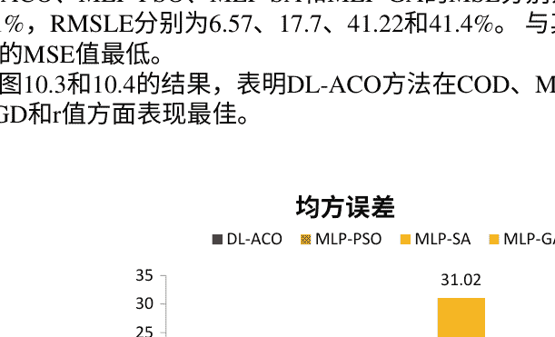

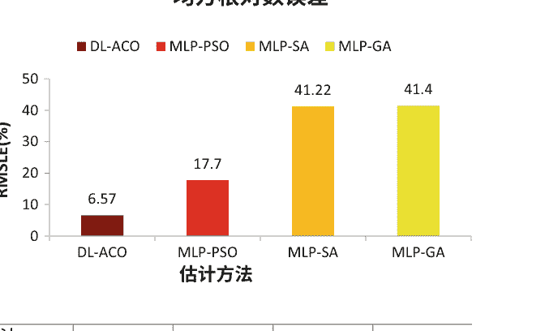

**表10.1 DL-ACO 附加指标**

| 方法 | DL-ACO | MLP-PSO | MLP-SA | MLP-GA |
| :--- | :--- | :--- | :--- | :--- |
| COD | 91.2 | 57.4 | 0.0130 | 0.0697 |
| MAE | 3.62 | 14.48 | 47.39 | 48.03 |
| RPA | 86.85 | 54.65 | 10.94 | 10.08 |
| SE | 8.97 | 22.35 | 55.7 | 55.87 |
| SNR | 9.45 | 54.77 | 207.9 | 214.96 |
| GD | 0.0074 | 0.95 | 13.19 | 13.43 |
| r | 95.5 | 75.76 | -1.14 | -2.64 |

*粗体数值表示产生最佳结果的算法*

### 10.4.2 蚁狮优化器 (DL-ALO)

图10.5和图10.6显示了DL-ALO与MLP-PSO、MLP-SA和MLP-GA方法的性能和比较。图10.5和图10.6是柱状图，显示了DL-ALO与MLP-PSO、MLP-SA和MLP-GA方法的MSE和RMSLE值的对比。

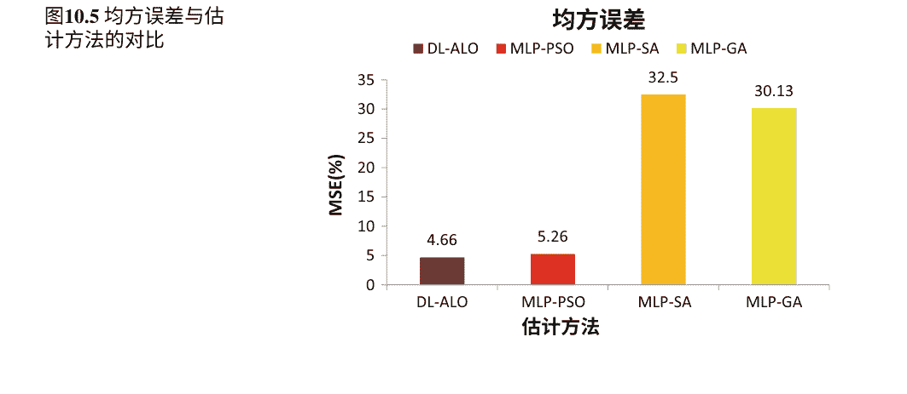

图10.6 均方根对数误差与估计方法的关系

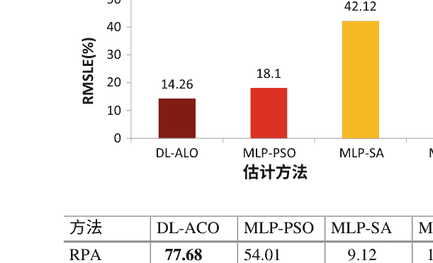

**表10.2 DL-ALO附加指标**

| 方法 | DL-ALO | MLP-PSO | MLP-SA | MLP-GA |
| :--- | :--- | :--- | :--- | :--- |
| RPA | 77.68 | 54.01 | 9.12 | 12.04 |
| COD | 72.31 | 57.26 | 2.39e-09 | 0.4 |
| MAE | 9.89 | 15.06 | 49.18 | 46.49 |
| r | 85.04 | 75.67 | -0.0005 | 6.34 |
| SE | 21.59 | 22.94 | 57.01 | 54.89 |
| SNR | 217.9 | 58.03 | 218.75 | 200.36 |
| GD | 0.39 | 0.97 | 14.56 | 12.99 |

*粗体数值表示产生最佳结果的算法*

我们观察到DL-ALO、MLP-PSO、MLP-SA和MLP-GA的MSE分别为4.66、5.26、32.5和30.13%，RMSLE分别为14.26、18.1、42.12和40.63%。与其他方法相比，DL-ALO的MSE值最低。MLP-SA和MLP-GA分别得到了9.12%和12.04%的RPA，而DL-ALO和MLP-PSO分别得到了77.68%和54.01%，如表10.2所示。观察到，DL-ALO方法在所有性能指标中获得了最佳值，除了SNR指标，其中MLP-PSO方法表现最好。

### 10.4.3 布谷鸟搜索算法 (DL-CS)

图10.7和图10.8显示了DL-CS与MLP-PSO、MLP-SA和MLP-GA的性能和比较。所介绍的方法与现有方法有很大的不同，现有方法适用于每个实例估计一个或不超过10个缺失值的情况。

在进行结果分析之前，请注意均方误差是衡量误差平方的平均偏差。最优解估计值的性能对应于均方误差的最小值。另一个衡量指标是均方根对数误差，它衡量模型预测样本之间的差异。与均方误差类似，所提出的方法在性能上表现更好，得到了均方根对数误差的最小值。在评估数据挖掘方法时，我们还关注相关系数。它量化样本之间的依赖关系类型。当相关系数较高时，估计值的性能更好。与相关系数一样，预测准确性也以百分比表示，并表示与最佳准确性的平均绝对偏差。图10.7和图10.8是柱状图，显示了DL-CS与MLP-PSO、MLP-SA和MLP-GA的均方误差和均方根对数误差值的比较。

我们观察到DL-CS、MLP-PSO、MLP-SA和MLP-GA的MSE分别为0.58、5.46、31.02和31.56%，RMSLE分别为5.77、18.37、41.24和41.51%。与其他方法相比，DL-CS的MSE值最低。这些结果在表10.3中的相关系数验证。DL-CS和MLP-PSO的相关系数分别为96.49%和72.18%，而MLP-SA和MLP-GA的相关系数分别为1.64%和3.27%。

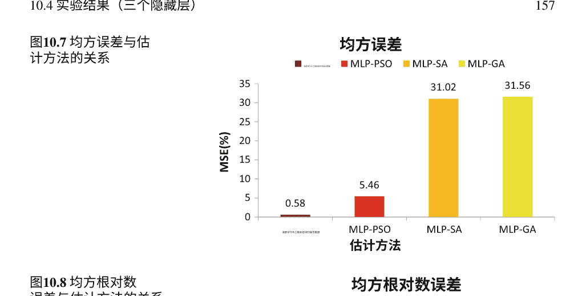

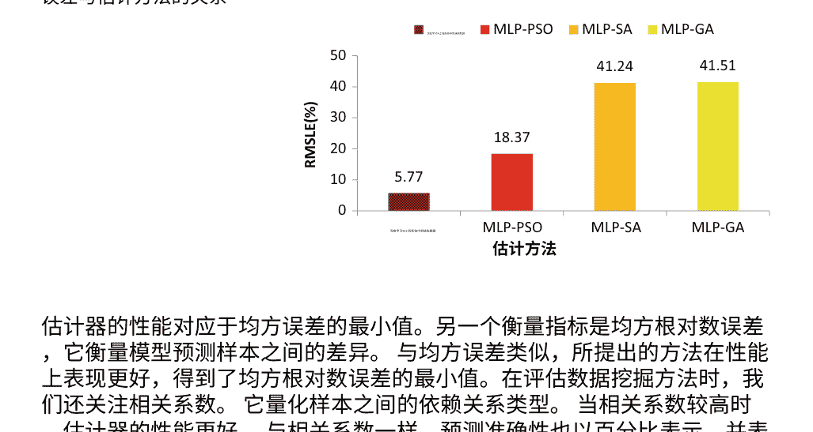

**表10.3 DL-CS 附加指标**

| 方法 | DL-CS | MLP-PSO | MLP-SA | MLP-GA |
| :--- | :--- | :--- | :--- | :--- |
| RPA | **87.17** | 57.58 | 9.67 | 12.5 |
| COD | **93.11** | 52.1 | 0.0268 | 0.11 |
| MAE | **3.57** | 15.01 | 47.74 | 47.66 |
| r | **96.49** | 72.18 | 1.64 | 3.27 |
| SE | **7.65** | 23.37 | 55.7 | 56.18 |
| SNR | **7.67** | 60.38 | 196.91 | 186.82 |
| GD | **0.0156** | 1.16 | 14.86 | 15.06 |

*粗体数值表示产生最佳结果的算法*

如表10.3所示，MLP-SA和MLP-GA的RPA分别为9.67%和12.5%，而DL-CS和MLP-PSO的RPA分别为87.17%和57.58%。从图表中可以看出，DL-CS方法在所有四个指标上都取得了最佳结果。

### 10.4.4 火蝇算法 (DL-FA)

图10.9和图10.10展示了DL-FA与MLP-PSO、MLP-SA和MLP-GA方法的性能和比较。图10.9和图10.10是柱状图，显示了DL-FA与MLP-PSO、MLP-SA和MLP-GA的MSE和RMSLE值。

我们观察到DL-FA、MLP-PSO、MLP-SA和MLP-GA的MSE分别为2.69、5.94、30.79和33.11%，RMSLE分别为12.59、18.93、40.95和42.33%。与其他方法相比，DL-FA的MSE值最低。MLP-SA和MLP-GA分别为10.59%和8.31%的RPA，而DL-FA和MLP-PSO分别为58.12%和51.69%，如图所示。

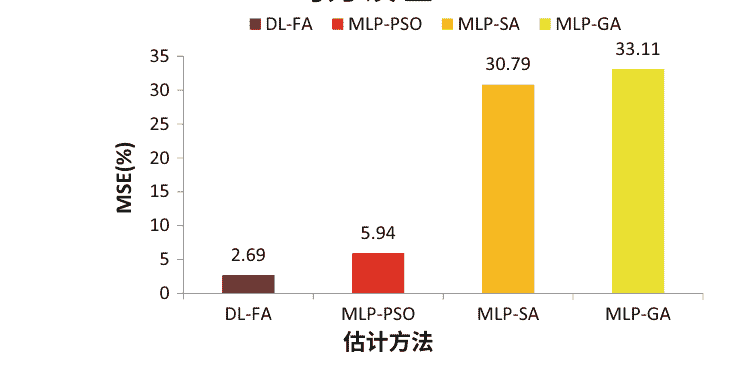

图10.10 均方根对数误差与估计方法的关系

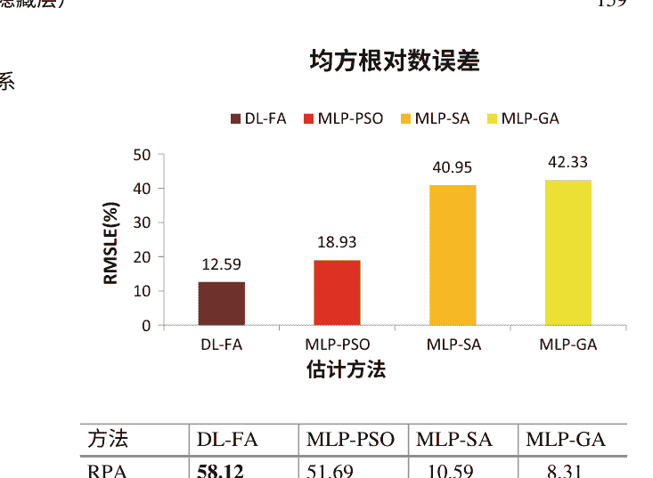

**表10.4 DL-FA附加指标**

| 方法 | DL-FA | MLP-PSO | MLP-SA | MLP-GA |
| :--- | :--- | :--- | :--- | :--- |
| RPA | 58.12 | 51.69 | 10.59 | 8.31 |
| COD | 76.65 | 54.76 | 0.06 | 0.24 |
| MAE | 10.64 | 16 | 47.57 | 49.66 |
| r | 87.55 | 74 | 2.41 | -4.91 |
| SE | 16.4 | 24.36 | 55.49 | 57.54 |
| SNR | 32.82 | 61.11 | 220.88 | 234.58 |
| GD | 0.25 | 1.03 | 12.59 | 13.37 |

*粗体数值表示产生最佳结果的算法。*

如观察所示，DL-FA方法在所有性能指标上获得了最佳值。

### 10.4.5 蝙蝠算法 (DL-BAT)

图10.11和图10.12展示了DL-BAT与MLP-PSO、MLP-SA和MLP-GA的性能和比较，以及表10.5。所研究的方法与现有方法存在显著差异。结果表明，DL-BAT方法优于其他方法。图10.11给出了平方误差。DL-BAT的误差为9.45%，而MLP-PSO、MLP-SA和MLP-GA的误差值分别为22.61%、55.61%和56.04%。

图10.12显示了四种分析方法的相关系数，包括DL-BAT方法。与其他方法相比，它证实了DL-BAT方法的更好性能。DL-BAT表现出95.24%的相关性和83.77%的RPA，而MLP-PSO的相关系数为76.73%，MLP-SA和MLP-GA的相关系数分别为-2.01%和-3.21%。MLP-PSO显示出56.34%的RPA，而MLP-SA和MLP-GA分别产生10.05%的值。

图10.11 均方误差与估计方法的关系

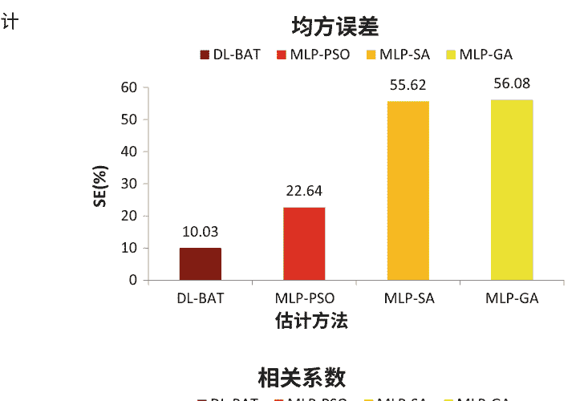

图10.12 相关系数与估计方法的关系

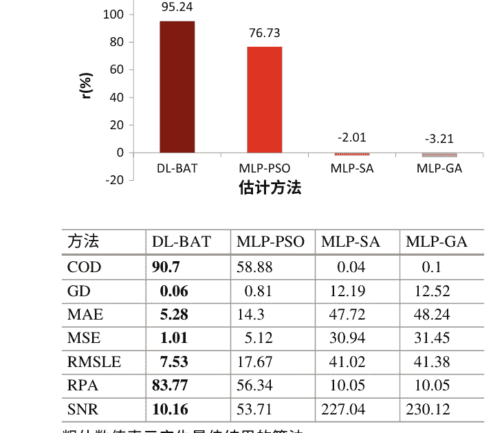

**表10.5 DL-BAT附加指标**

| 方法 | DL-BAT | MLP-PSO | MLP-SA | MLP-GA |
| :--- | :--- | :--- | :--- | :--- |
| COD | **90.7** | 58.88 | 0.04 | 0.1 |
| GD | **0.06** | 0.81 | 12.19 | 12.52 |
| MAE | **5.28** | 14.3 | 47.72 | 48.24 |
| MSE | **1.01** | 5.12 | 30.94 | 31.45 |
| RMSLE | **7.53** | 17.67 | 41.02 | 41.38 |
| RPA | **83.77** | 56.34 | 10.05 | 10.05 |
| SNR | **10.16** | 53.71 | 227.04 | 230.12 |

*粗体数值表示产生最佳结果的算法*

这些发现在表10.5中的数值进一步证实了DL-BAT系统具有最低的COD、GD、MAE、MSE、RMSLE、RPA和SNR值。

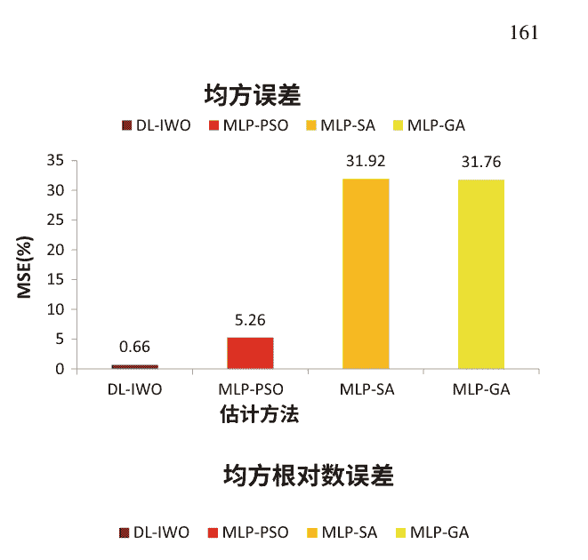

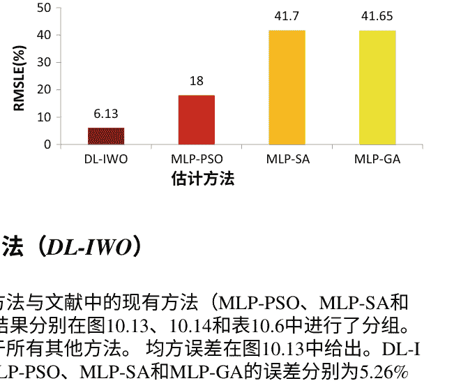

### 10.4.6 入侵杂草优化算法（DL-IWO）

在这个分析中，DL-IWO方法与文献中的现有方法（MLP-PSO、MLP-SA和MLP-GA）进行了比较。结果分别在图10.13、10.14和表10.6中进行了分组。结果表明DL-IWO方法优于所有其他方法。均方误差在图10.13中给出。DL-IWO的误差为0.66%，而MLP-PSO、MLP-SA和MLP-GA的误差分别为5.26%、31.92%和31.76%。

图10.14描述了根据所分析的方法计算的均方根对数误差，包括DL-IWO方法。它证实了与其他方法相比，DL-IWO方法的性能更好。DL-IWO的RMSLE为6.13%，而MLP-PSO的RMSLE为18%。MLP-SA和MLP-GA的RMSLE值分别为41.7和41.65%。

表10.6进一步证实了图10.13和10.14的结果，表明DL-IWO方法产生了最佳的COD、GD、MAE、RPA、r、SE和SNR值。

**表10.6 DL-IWO 附加指标**

| 方法 | DL-IWO | MLP-PSO | MLP-SA | MLP-GA |
| :--- | :--- | :--- | :--- | :--- |
| COD | **93.27** | 56.75 | 0.05 | 0.08 |
| GD | **0.01** | 0.94 | 13.86 | 14.32 |
| MAE | **3.83** | 14.66 | 48.75 | 48.19 |
| RPA | **85.19** | 55.49 | 8.87 | 9.76 |
| r | **96.57** | 75.33 | -2.18 | 2.86 |
| SE | **8.12** | 22.94 | 56.5 | 56.36 |
| SNR | **7.54** | 56.16 | 221.78 | 207.02 |

*粗体数值表示产生最佳结果的算法*

## 10.5 实验结果（五个隐藏层）

在本节中，我们介绍了与优化算法结合使用的784-1000-250-30-250-1000-784深度自编码器网络的实验结果。

### 10.5.1 蚁群优化 (DL-ACO)

考虑到第10.3节中提出的评估指标，通过同时估计缺失数据的位置，评估并比较了DL-ACO方法与现有方法（MLP-GA、MLP-SA和MLP-PSO）的性能。所研究的场景是每个样本/记录可能有至少62个，最多97个缺失属性（维度）需要近似。所使用的MLP网络结构为784-400-784，输入和输出层分别具有784个输入和输出节点，隐藏层具有400个节点。

图10.15和图10.16显示了DL-ACO、MLP-PSO、MLP-SA和MLP-GA方法之间的性能和比较。图10.15和图10.16是柱状图，显示了DL-ACO与MLP-PSO、MLP-SA和MLP-GA相比的MSE和RMSLE值。

我们观察到DL-ACO、MLP-PSO、MLP-SA和MLP-GA的MSE和RMSLE分别为0.73、5、31.02和31.21%，以及6.43、17.7、41.22和41.4%。与其他方法相比，DL-ACO产生了最低的MSE值。表10.7进一步证实了图10.15和10.16的结果，表明DL-ACO方法在COD、MAE、SE、RPA、SNR、GD和r值方面表现最好。

## 10.5 实验结果（五个隐藏层）

表10.7 DL-ACO 附加指标

| 方法 | DL-ACO | MLP-PSO | MLP-SA | MLP-GA |
| :--- | :--- | :--- | :--- | :--- |
| COD | **91.99** | 57.4 | 0.0130 | 0.0697 |
| MAE | **3.67** | 14.48 | 47.39 | 48.03 |
| RPA | **87.17** | 54.65 | 10.94 | 10.08 |
| SE | **8.56** | 22.35 | 55.7 | 55.87 |
| SNR | **8.77** | 54.77 | 207.9 | 214.96 |
| GD | **0.0070** | 0.95 | 13.19 | 13.43 |
| *r* | **95.91** | 75.76 | -1.14 | -2.64 |
| | 粗体数值表示产生最佳结果的算法 | | |

### 10.5.2 蚁狮优化器 (DL-ALO)

图10.17和10.18展示了DL-ALO与MLP-PSO、MLP-SA和MLP-GA方法的性能和比较。图10.17和10.18是柱状图，显示了DL-ALO与MLP-PSO、MLP-SA和MLP-GA的MSE和RMSLE值的比较。

我们观察到DL-ALO、MLP-PSO、MLP-SA和MLP-GA的MSE分别为3.37、5.26、32.5和30.13%，RMSLE分别为12.2、18.1、42.12和40.63%。与其他方法相比，DL-ALO的MSE值最低。

MLP-SA和MLP-GA分别得到了9.12%和12.04%的RPA，而DL-ALO和MLP-PSO分别得到了77.68%和54.01%，如表10.8所示。观察到，DL-ALO方法在所有性能指标上都获得了最佳值，除了SNR指标，MLP-PSO方法表现最好。

图10.15 均方误差与估计方法

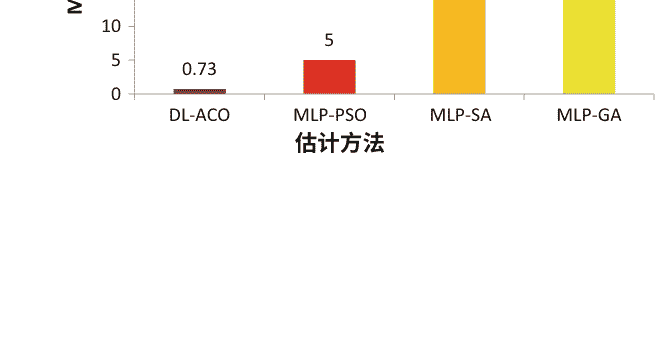

## 10个深度学习框架分析

#### 图10.16 均方根对数误差与估计方法

均方根对数误差

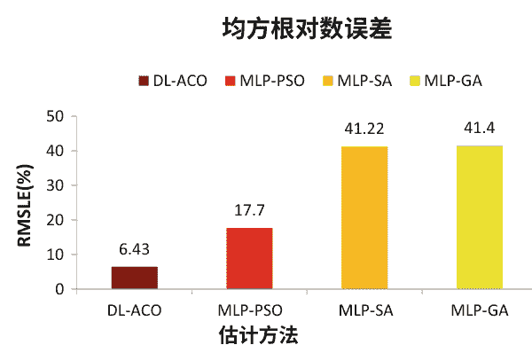

#### 图10.17 均方误差与估计方法的关系

均方误差

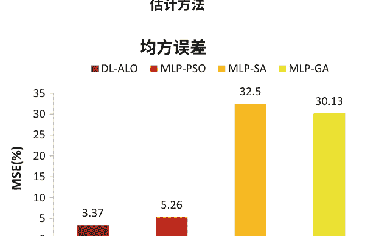

#### 图10.18 均方根对数误差与估计方法的关系

均方根对数误差

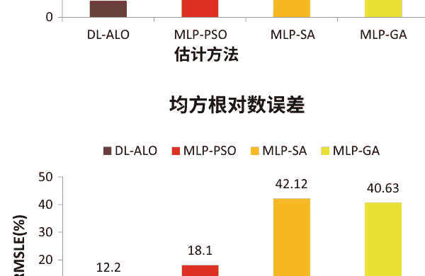

### 10.5.3 杜鹃搜索算法 (DL-CS)

图10.19和10.20展示了DL-CS与MLP-PSO、MLP-SA和MLP-GA的性能和比较。所介绍的方法与现有方法有所不同。

表10.8 DL-ALO附加指标

| 方法 | DL-ALO | MLP-PSO | MLP-SA | MLP-GA |
| :--- | :--- | :--- | :--- | :--- |
| RPA | **74.57** | 54.01 | 9.12 | 12.04 |
| COD | **77.94** | 57.26 | 2.39e-09 | 0.4 |
| MAE | **9.38** | 15.06 | 49.18 | 46.49 |
| *r* | **88.28** | 75.67 | -0.0005 | 6.34 |
| SE | **18.37** | 22.94 | 57.01 | 54.89 |
| SNR | 110.71 | **58.03** | 218.75 | 200.36 |
| GD | **0.13** | 0.97 | 14.56 | 12.99 |

粗体数值表示产生最佳结果的算法

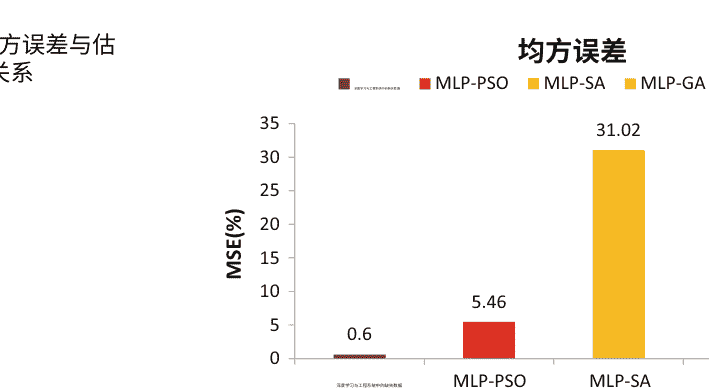

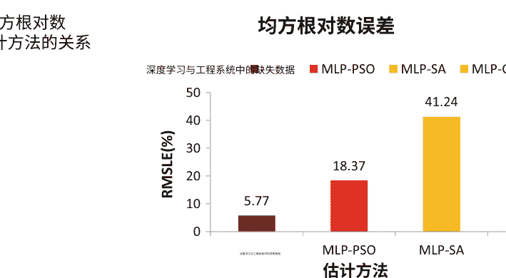

与现有方法相比，该方法适用于每个实例估计一个或不超过10个缺失值的情况。

在进行结果分析之前，请注意均方误差是衡量误差平方的平均偏差。估计器的最佳性能对应于最小的MSE值。另一个衡量指标是均方根对数误差，它衡量了差异。

表10.9 DL-CS附加指标

| 方法 | DL-CS | MLP-PSO | MLP-SA | MLP-GA |
| :--- | :--- | :--- | :--- | :--- |
| RPA | **86.46** | 54.07 | 9.08 | 11.74 |
| COD | **93.13** | 52.1 | 0.0268 | 0.11 |
| MAE | **3.88** | 15.01 | 47.74 | 47.66 |
| r | **96.5** | 72.18 | 1.64 | 3.27 |
| SE | **7.72** | 23.37 | 55.7 | 56.18 |
| SNR | **7.8** | 60.38 | 196.91 | 186.82 |
| GD | **0.0262** | 1.16 | 14.86 | 15.06 |

粗体数值表示产生最佳结果的算法

模型预测的样本之间的差异。与MSE的情况类似，所提出的方法在性能上更好，产生了RMSLE的最小值。在评估数据挖掘方法时，我们还关注相关系数。它量化了样本之间的依赖类型。当相关系数较高时，估计器的性能更好。与相关系数一样，预测准确性也以百分比表示，并表示与最佳准确性相对应的平均绝对偏差为100%。图10.19和10.20是条形图，显示了DL-CS与MLP-PSO、MLP-SA和MLP-GA相比的MSE和RMSLE值。

我们观察到DL-CS、MLP-PSO、MLP-SA和MLP-GA的MSE分别为0.6、5.46、31.02和31.56%，RMSLE分别为5.91、18.37、41.24和41.51%。与其他方法相比，DL-CS的均方误差值最低。这些结果通过相关系数在表10.9中得到验证。DL-CS和MLP-PSO的相关值分别为96.5%和72.18%，而MLP-SA和MLP-GA的相关值分别为1.64%和3.27%。

在表10.9中，MLP-SA和MLP-GA的RPA分别为9.08%和11.74%，而DL-CS和MLP-PSO的RPA分别为86.46%和54.07%。如图所示，DL-CS方法在所有四个指标上都获得了最佳结果。

### 10.5.4 萤火虫算法（DL-FA）

图10.21和10.22显示了DL-FA与MLP-PSO、MLP-SA和MLP-GA方法的性能和比较。图10.21和10.22是柱状图，显示了DL-FA与MLP-PSO、MLP-SA和MLP-GA的均方误差和均方根对数误差值的比较。

我们观察到DL-FA、MLP-PSO、MLP-SA和MLP-GA的MSE分别为2.2、5.94、30.79和33.11%，RMSLE分别为11.67、18.93、40.95和42.33%。与其他方法相比，DL-FA的MSE值最低。

#### 图10.21 均方误差与估计方法

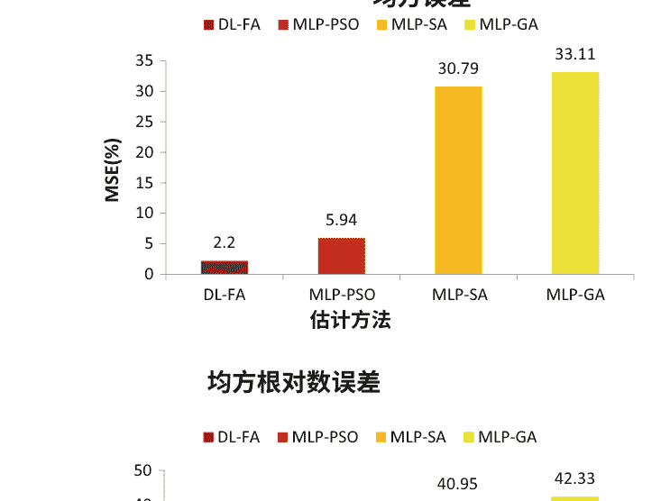

#### 图10.22 均方根对数误差与估计方法

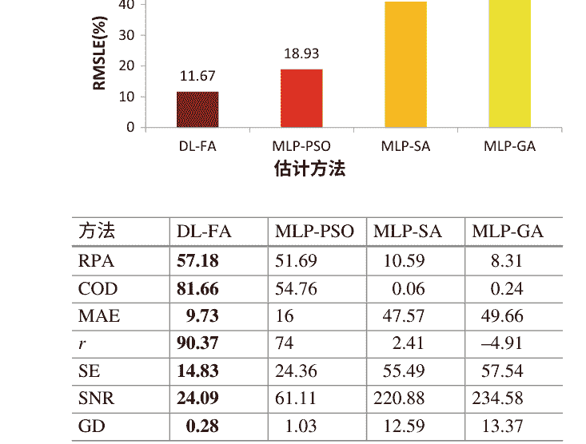

#### 表10.10 DL-FA附加指标

| 方法 | DL-FA | MLP-PSO | MLP-SA | MLP-GA |
| :--- | :--- | :--- | :--- | :--- |
| RPA | **57.18** | 51.69 | 10.59 | 8.31 |
| COD | **81.66** | 54.76 | 0.06 | 0.24 |
| MAE | **9.73** | 16 | 47.57 | 49.66 |
| r | **90.37** | 74 | 2.41 | -4.91 |
| SE | **14.83** | 24.36 | 55.49 | 57.54 |
| SNR | **24.09** | 61.11 | 220.88 | 234.58 |
| GD | **0.28** | 1.03 | 12.59 | 13.37 |

粗体数值表示产生最佳结果的算法。

MLP-SA和MLP-GA分别得到了10.59%和8.31%的RPA，而DL-FA和MLP-PSO分别得到了57.18%和51.69%，如表10.10所示。观察到DL-FA方法在所有性能指标上获得了最佳值。

### 10.5.5 蝙蝠算法 (DL-BAT)

图10.23和10.24展示了DL-BAT与MLP-PSO、MLP-SA和MLP-GA的性能和比较，以及表10.11。所研究的方法与现有方法有明显的差异。结果显示DL-BAT方法优于其他方法。图10.23给出了平方误差。DL-BAT的误差为9.08%，而MLP-PSO、MLP-SA和MLP-GA的误差分别为22.64%、55.62%和56.08%。

图10.24展示了四种方法（包括DL-BAT方法）的相关系数。这证实了DL-BAT方法相比其他方法的更好性能。DL-BAT与RPA的相关系数为96.1%，而MLP-PSO的相关系数为76.73%，MLP-SA和MLP-GA的相关系数分别为-2.01%和-3.21%。MLP-PSO的RPA为56.34%，而MLP-SA和MLP-GA的RPA分别为10.05%。

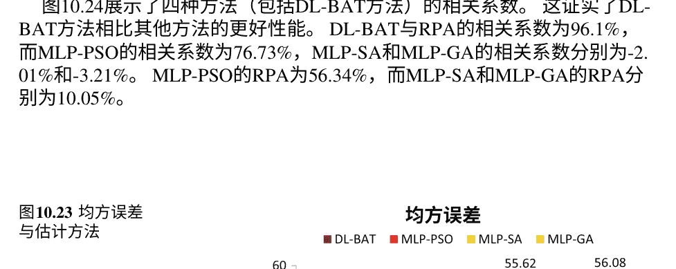

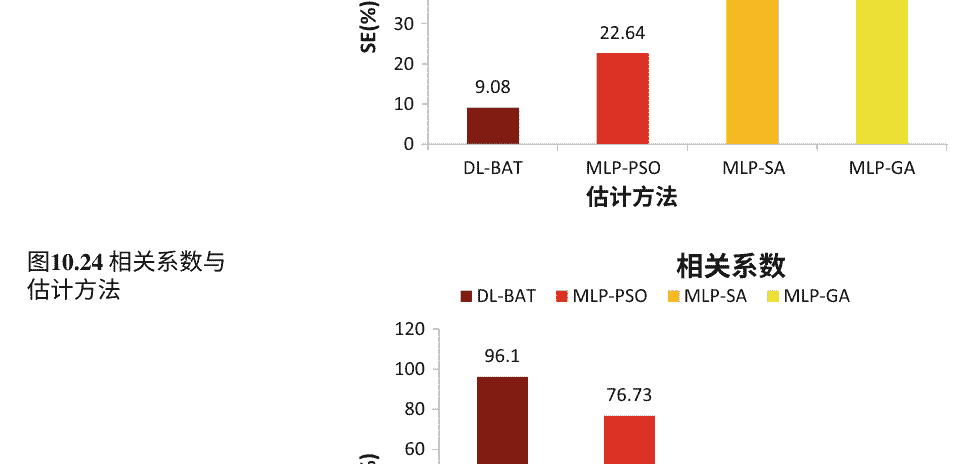

#### 表10.11 DL-BAT附加指标

| 方法 | DL-BAT | MLP-PSO | MLP-SA | MLP-GA |
| :--- | :--- | :--- | :--- | :--- |
| COD | **92.35** | 58.88 | 0.04 | 0.1 |
| GD | **0.05** | 0.81 | 12.19 | 12.52 |
| MAE | **4.69** | 14.3 | 47.72 | 48.24 |
| MSE | **0.82** | 5.12 | 30.94 | 31.45 |
| RMSLE | **6.82** | 17.67 | 41.02 | 41.38 |
| RPA | **85.09** | 56.34 | 10.05 | 10.05 |
| SNR | **8.19** | 53.71 | 227.04 | 230.12 |

*注：粗体数值表示产生最佳结果的算法*

表10.11中的数值进一步证实了这些发现，DL-BAT系统具有最低的COD、GD、MAE、MSE、RMSLE、RPA和SNR值。

### 10.5.6 入侵杂草优化算法（DL-IWO）

在这个分析中，将DL-IWO方法与文献中的现有方法（MLP-PSO、MLP-SA和MLP-GA）进行比较。结果分别在图10.25、10.26和表10.12中进行分组。结果表明，DL-IWO方法优于所有其他方法。均方误差在图10.25中给出。DL-IWO的误差为0.56%，而MLP-PSO、MLP-SA和MLP-GA的误差分别为5.26%、31.92%和31.76%。

图10.26显示了根据分析的方法，包括DL-IWO方法，的均方根对数误差。与其他方法相比，它证实了DL-IWO方法的更好性能。DL-IWO表现出5.72%的RMSLE，而我们得到MLP-PSO的18%的RMSLE。MLP-SA和MLP-GA的RMSLE值分别为41.7和41.65%。

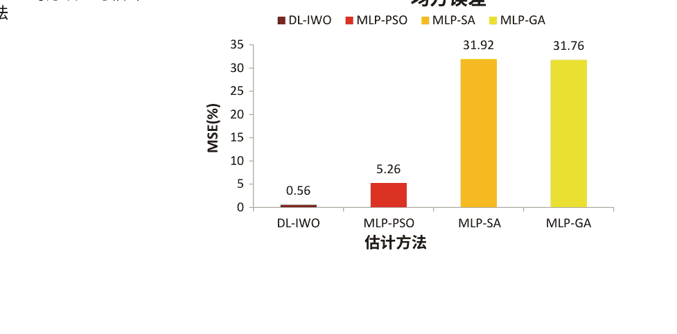

#### 均方根对数误差

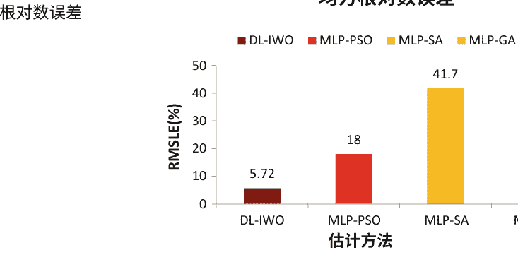

图10.26 根据估计方法的均方根对数误差

#### 表10.12 DL-IWO附加指标

| 方法 | DL-IWO | MLP-PSO | MLP-SA | MLP-GA |
| :--- | :--- | :--- | :--- | :--- |
| COD | **94.39** | 56.75 | 0.05 | 0.08 |
| GD | **0.01** | 0.94 | 13.86 | 14.32 |
| MAE | **3.72** | 14.66 | 48.75 | 48.19 |
| RPA | **86.49** | 55.49 | 8.87 | 9.76 |
| R | **97.16** | 75.33 | -2.18 | 2.86 |
| SE | **7.47** | 22.94 | 56.5 | 56.36 |
| SNR | **6.44** | 56.16 | 221.78 | 207.02 |

粗体数值表示产生最佳结果的算法

表10.12进一步证实了图10.25和10.26的结果，显示DL-IWO方法产生了最佳的COD、GD、MAE、RPA、R、SE和SNR值。

## 10.6 结论

在本章中，测试了不同的深度网络架构。观察到这些网络与优化算法相结合，优于现有的窄网络模型。此外，观察到这些网络与三个和五个隐藏层的网络模型表现相当，这表明使用七个隐藏层并不必要，三个隐藏层就足够了，并且训练一个三个隐藏层的网络所需的时间比训练一个七个隐藏层的深度神经网络要少。

## 参考文献

Abdella, M., & Marwala, T. (2005). 遗传算法和神经网络在数据库中近似缺失数据的使用。在第三届国际计算控制会议(ICCC)上, (第207-212页). IEEE.

Brain, L. B., Marwala, T., & Tettey, T. (2006). 用于HIV分类的自编码器网络。Current Science, 91(11), 1467–1473.

Finn C., Tan, X., Duan, Y., Darrell, T., Levine, S., & Abbeel, P. (2016). 用于视觉运动学习的深度空间自动编码器。在国际机器人与自动化会议(ICRA)上(第512-519页).

Hinton, G. E., Osindero, S., & Teh, Y. W. (2006). 一种用于深度信念网络的快速学习算法。Neural Computation, 18(7):1527–1554.

Jerez, J. M., Molina, I., García-Laencina, P. J., Alba, E., Ribelles, N., Martun, M., et al. (2010). 在一个真实的乳腺癌问题中，使用统计和机器学习方法进行缺失数据插补。Artificial Intelligence in Medicine, 50(2), 105–115. 爱思唯尔。

Ju, Y., Guo, J., & Liu, S. (2015). 一种将稀疏自编码器与SVM相结合的深度学习方法。在国际分布式计算与知识发现会议 (CyberC) (pp. 257–260)中。

Krizhevsky, A., & Hinton, G. E. (2011). 使用非常深的自编码器进行基于内容的图像检索。在第19届欧洲人工神经网络研讨会 (ESANN) 中。比利时布鲁日，2011年4月27日至29日。

Leke, C., Twala, B., & Marwala, T. (2014). 缺失数据预测建模：计算智能和优化算法。在国际系统、人类和控制论大会 (SMC) （第1400-1404页）。IEEE。

Leke, C., & Marwala, T. (2016). 高维数据集中的缺失数据估计：一种群智能-深度神经网络方法。在群智能国际会议上（第259-270页）。斯普林格国际出版社。

Leke, C., Ndiongue, A. R., Twala, B., & Marwala, T. (2017). 一种用于高维数据集中缺失数据估计的深度学习-布谷鸟搜索方法。在群体智能国际会议上(第561-572页)。斯普林格，查姆。

Liew, A. W.-C., Law, N.-F., & Yan, H. (2011). 基因表达数据的缺失值插补：从可用信息中恢复缺失数据的计算技术。Briefings in Bioinformatics, 12(5), 498-513。牛津大学出版社。

Myers, T. A. (2011). 再见，整体删除：将热卡片插补作为处理缺失数据的简单且有效工具的介绍。Communication Methods and Measures, 5(4), 297-310。Taylor & Francis.

Schafer, J. L., & Graham, J. W. (2002). 缺失数据：我们对现有技术的看法。Psychological Methods, 7(2), 147。美国心理学协会。

Ssali, G., & Marwala, T. (2007). 使用计算智能和决策树估计缺失数据。arXiv:0709.1640。

Van Buuren, S. (2012). 灵活的缺失数据插补。CRC出版社。

Vukosi, M. N., Nelwamondo, F. V., & Marwala, T. (2007). 自编码器，主成分分析和支持向量回归用于数据插补。arXiv:0709.2506。

Zhang, S. (2011). Shell-neighbor方法及其在缺失数据插补中的应用。Applied Intelligence, 35(1), 123-133。斯普林格。

# 第11章 总结

## 11.1 本书概要

本书研究了缺失数据、缺失数据机制和缺失数据模式，以及缺失数据估计问题（Ramoni和Sebastiani 2001; Tremblay等2010; Polikar等2010; Twala 2009; Rubin 1978; Allison 2000）。此外，本书介绍了经典的缺失数据估计技术以及机器学习方法（Allison 2002; Kalousis和Hilario 2000; Pérez等2002; Marwala 2009; Dempster等1997）。此外，本书还介绍了解决缺失数据问题的人工智能方法（Twala和Cartwright 2010; Twala等2008; Twala和Phorah 2010; Marwala 2015; Abdella和Marwala 2005）。此外，本书还介绍了缺失数据插补的挑战。本书还研究了深度学习理论及其应用（Deng等2013; Deng和Yu 2014; Hinton等2006; Alex等2012）。此外，本书还介绍了深度学习框架的构建模块，如受限玻尔兹曼机和对比散度（Leke和Marwala 2016; Hinton 2010; Tieleman 2008; LeCun等2015）。此外，本书还介绍了一些著名的深度学习框架，如深度置信网络、卷积神经网络和循环神经网络等（Hinton等2006; Zhang和Wu 2013; Le Roux和Bengio 2008; Krizhevsky等2012; Simard等2003; Mikolov等2010; Feng等2014; Grossberg 2013）。

本书还介绍了一种名为深度学习蝙蝠算法（DL-BAT）的新型缺失数据估计方法，它结合了深度自动编码器网络和蝙蝠算法的优势。蝙蝠算法是一种基于蝙蝠回声定位特性的元启发式群智能技术（Yang 2010c; Zhou et al. 2014; Yang 2011; Teodoro et al. 2012）。

本书还研究了一种名为深度学习布谷鸟搜索算法（DL-CS）的新型缺失数据估计方法，它结合了深度自动编码器网络和布谷鸟搜索优化算法的优势。

布谷鸟搜索算法是一种基于种群的随机优化技术，受到布谷鸟的寄生行为启发（Yang and Deb 2009, 2014; Vasanthakumar et al. 2015; Wang et al. 2016; Ali and Mohamed 2016）。

本书研究了一种新颖的缺失数据估计方法，称为深度学习-萤火虫算法（DL-FA），旨在结合深度自动编码器网络和萤火虫算法的优势。萤火虫算法是一种基于萤火虫的闪烁模式和行为的自然启发元启发式算法（Yang 2010a, b; Yang et al. 2012）。

本书介绍了一种新颖的缺失数据估计方法，称为深度学习-蚁群优化算法（DL-ACO），结合了深度自动编码器网络和蚁群优化算法的优势。蚁群优化算法是一种模仿蚂蚁固有行为的算法（Monteiro et al. 2012; Dorigo et al. 1991; Zecchina et al. 2006; Liu et al. 2013）。

本书研究了一种名为深度学习-蚁狮优化算法（DL-ALO）的新型缺失数据估计方法，该方法结合了深度自动编码器网络和蚁狮优化算法的优点。蚁狮优化算法是一种模拟蚂蚁、猎物和蚁狮物种之间相互作用的元启发式算法（Mirjalili 2015; Gupta and Saxena 2016; Satheeshkumar and Shivakumar 2016; Yamany et al. 2015）。

本书研究了一种名为深度学习-入侵杂草优化算法（DL-IWO）的新型缺失数据估计方法，该方法结合了深度自动编码器网络和入侵杂草优化算法的优点。入侵杂草优化算法是一种模拟杂草入侵特性的技术（Mehrabian and Lucas 2006; Veenhuis 2010; Hung et al. 2010）。

本书研究了从降维图像重建和使用窄人工智能框架的可能性。这旨在解决使用深度神经网络框架时遇到的高执行时间缺点。考虑的窄人工智能框架是多层感知器自联想神经网络（Marwala 2001, 2013; Marwala and Chakraverty 2006）。

本书研究了在深度学习框架分析方法中使用具有不同隐藏层的深度自动编码器网络的影响。

## 参考文献

Abdella, M., & Marwala, T. (2005). 使用遗传算法和神经网络来近似数据库中的缺失数据。在计算控制国际会议（ICCC）上的第3届国际会议上（pp. 207–212）。 IEEE。

Alex, K., Sutskever, I., & Hinton, G. E. （2012）。 使用深度卷积神经网络的Imagenet分类。 在 F. Pereira, C. J. C. Burges, L. Bottou 和 K. Q. Weinberger (Eds.) 的《神经信息处理系统25》中（第1097-1105页）。 Curran Associates, Inc.， （最后访问时间：2016年5月）。 [在线]。 可用：http://papers.nips.cc/paper/4824-imagenet-classification-with-deep-convolutional-neural-networks.pdf。

Ali, F. A., & Mohamed, A. T. （2016）。 一种混合布谷鸟搜索算法与Nelder-Mead方法解决全局优化问题。 SpringerPlus, 5(1), 473。 Springer International Publishing.

Allison, P. D. （2000）。 多重插补法用于缺失数据社会学方法与研究, 28(3), 301–309.

Allison, P. D. （2002）。 缺失数据。 千橡市, 加利福尼亚州： Sage.

Dempster, A. P., Laird, N. M., & Rubin, D. B. （1977）。 通过EM算法从不完整数据中获得最大似然估计。 Journal of the Royal Statistics Society, 39(1), 1–38.

Deng, L., Li, J., Huang, J.-T., Yao, K., Yu, D., Seide, F., Seltzer, M., Zweig, G., He, X., & Williams, J. （2013）。 微软语音研究中的深度学习最新进展。 IEEE国际声学、语音和信号处理会议（ICASSP）（pp. 8604–8608）。

Deng, L., & Yu, D. （2014）。 深度学习： 方法与应用。 信号处理的基础与趋势, 7(3–4), 197–387.

Dorigo, M., Maniezzo, V., & Colorni, A. （1991）。 正反馈作为一种搜索策略。 Tech. Rep.

Feng, X., Zhang, Y., & Glass, J. （2014）。 通过深度自编码器对噪声混响语音进行特征去噪和去混响处理，用于语音识别。 在IEEE国际会议上声学、语音和信号处理（ICASSP）（pp. 1759–1763）。

Grossberg, S. （2013）。 循环神经网络。 Scholarpedia, 8(2), 1888.

Gupta, E., & Saxena, A. （2016）。 基于蚁狮优化器的自动发电控制中调节器的性能评估互联电力系统。 工程杂志, 2016, 1–14页。

Hinton, G. （2010）。 工程系统中的深度学习和缺失数据。

Hinton, G. E., Osindero, S., 和 Teh, Y. W. （2006）。 一种用于深度信念网络的快速学习算法。 神经计算, 18(7), 1527–1554.

Hung, H. L., Chao, C. C., Cheng, C. H., & Huang, Y. F. （2010）。 基于入侵杂草优化方法的盲多用户检测用于多径衰落信道干扰抑制国际系统、人类和控制论大会（SMC）（pp. 2145–2150）。

Kalousis, A., & Hilario, M. （2000）。 从不完整数据中进行监督式知识发现 在第二届国际数据挖掘会议上的论文 检索于2016年10月， 来自 http://cui.unige.ch/AI-group/research/metal/Papers/missingvalues.ps.

Krizhevsky, A., Sutskever, I., & Hinton, G. E. （2012）。 深度学习和工程系统中的缺失数据 在神经信息处理系统进展中（pp. 1097–1105）。

Le Roux, N., & Bengio, Y. （2008）。 受限玻尔兹曼机和深度置信网络的表征能力神经计算, 20(6), 1631–1649.

LeCun, Y., Bengio, Y., & Hinton, G. E. （2015）。 深度学习。 自然, 521, 436–444.

Leke, C., & Marwala, T. （2016）。 高维数据集中的缺失数据估计： 一种群智能-深度神经网络方法。 在群智能国际会议上（pp. 259–270）。 Springer国际出版社。

Liu, X. J., Yi, H., & Ni, Z.-H. （2013）。 蚁群优化算法在工艺规划优化中的应用。 智能制造杂志, 24(1), 1-13.

Marwala, T. （2009）。 用于缺失数据插补的计算智能： 估计和管理知识优化技术 纽约： 信息科学参考。

Marwala, T. （2001）。 使用神经网络委员会和振动数据进行概率性故障识别飞机杂志, 38(1), 138–146。

Marwala, T., & Chakraverty, S. （2006）。 使用自联想神经网络和遗传算法对具有不完整测量数据的结构进行故障分类, 90(4)。

Marwala, T. （2013）。 使用人工智能方法进行经济建模。 英国： Springer。

Marwala, T. （2015）。 因果关系、相关性和人工智能用于合理决策。 新加坡： 世界科学。

Mehrabian, A. R., & Lucas, C. （2006）。 一种受到杂草殖民启发的新型数值优化算法。《生态信息学》, 1, 355–366。

Mikolov, T., Karafiát, M., Burget, L., Černocký, J., & Khudanpur, S. （2010）。 基于循环神经网络的语言模型。 在国际语音通信协会第十一届年会。

Mirjalili, S. （2015）。 蚁狮优化器。 工程软件的进展, 8, 80-98。

Monteiro, M. S. R., Fontes, D. B. M. M., & Fontes, F. A. C. C. （2012）。 蚁群优化： 文献综述 波尔图大学，波尔图经济学院，FEP工作论文。 2016年1月检索，来自 http://EconPapers.repec.org/RePEc:por:fepwps:474。

Pérez, A., Dennis, R. J., Gil, J. F. A., Rondón, M. A., & López, A. （2002）。 在哥伦比亚重症监护病房中使用均值、热卡和多重插补技术来预测结果。《医学统计学杂志》，21(24)，3885–3896。

Polikar, R., De Pasquale, J., Mohammed, H. S., Brown, G., & Kuncheva, L. I. （2010）。 Learn++mf： 一种用于缺失特征问题的随机子空间方法。 模式识别, 43(11), 3817–3832。

Ramoni, M., & Sebastiani, P. （2001）。 缺失数据的鲁棒学习。 机器学习杂志, 45(2), 147–170。

Rubin, D. （1978）。 在工程系统中的深度学习和缺失数据在样本调查中的多重插补-一种现象学贝叶斯方法对非响应的处理。

Satheeshkumar, R., & Shivakumar, R. （2016）。 蚂蚁狮优化方法用于多区域互联电力系统的负荷频率控制。 电路与系统, 7, 2357–2383。

美国统计协会调查研究方法部门会议论文集, 1.20–34. 卷积神经网络在视觉文档分析中的最佳实践（pp. 958）。 IEEE.

Teodoro C. B., Leandro d-. S. C., & Luiz L. （2012）。 基于蝙蝠启发的优化方法解决无刷直流轮毂电机问题。 IEEE磁学交易, 48(2), 947–950。

Tieleman, T. （2008）。 使用对然梯度的近似训练受限玻尔兹曼机 在第25届国际机器学习大会论文集中, ser. 纽约, 纽约, 美国： ACM. pp. 1064–1071. [在线]。 可获取： http://doi.acm.org/10.1145/1390156.1390290. 2016年5月访问。

Tremblay, M. C., Dutta, K., & Vandermeer, D. （2010）。 使用数据挖掘技术发现缺失数据中的偏差模式。 数据与信息质量杂志, 2(1)。

Twala, B., & Cartwright, M. （2010）。 用于软件工作量预测的集成缺失数据技术。 智能数据分析, 14(3), 299–331。

Twala, B. （2009）。 使用决策树处理不完整数据的实证比较。 应用人工智能, 23(5), 373–405。

Twala, B. E. T. H., Jones, M. C., & Hand, D. J. （2008）。 在决策树中处理缺失数据的好方法。 模式识别信件, 29(7), 950–956。

Twala, B., & Phorah, M. （2010）。 使用监督学习算法预测不完整的基因微阵列数据。 模式识别信件, 31, 2061–2069。

Vasanthakumar, S., Kumarappan, N., Arulraj, R. & Vigneysh, T. （2015）。 基于布谷鸟搜索算法的分布式发电微电网环境经济调度。 在智能技术和计算、通信、控制、能源和材料管理国际会议（ICSTM）（pp. 575–580）。 IEEE。

Veenhuis, C. （2010）。 二进制入侵性杂草优化 在自然和生物启发计算第二届世界大会上（pp. 49–454）。

Wang, J., Zhou, B., & Zhou, S. （2016）。 一种改进的布谷鸟搜索优化算法用于混沌系统参数估计问题。 计算智能与神经科学, 8。

Yamany, W., Tharwat, A., Fawzy, M., Gaber, T., & Hassanien, A. E. （2015）。 一种基于蚁狮优化算法的新型多层感知器训练器。 在第四届国际信息科学与工业应用会议（ISI）（pp. 40–45）。

Yang, X. S., & Deb, S. （2009）。 通过列维飞行的布谷鸟搜索。 世界自然与生物启发计算大会（NaBIC）, 48(2), 210–214。

Yang, X. S. （2010a）。 萤火虫算法，列维飞行和全局优化。 在 M. Bramer, R. Ellis, M. Petridis (Eds.), 智能系统研发 XXVI（pp. 209–218）。 伦敦：斯普林格出版社。

Yang, X. S. （2010b）。 萤火虫算法，随机测试函数和设计优化。 国际生物启发计算杂志，2(2), 78–84。

Yang, X. S. （2010c）。 一种新的启发式蝙蝠算法。 在自然启发的合作优化策略（NISCO）， 计算智能研究（pp. 65–74）。 Springer, Heidelberg。

Yang, X. S. （2011）。 蝙蝠算法用于多目标优化。 生物启发计算国际期刊，3(5), 267–274。

Yang, X. S., Hosseini, S. S. S., & Gandomi, A. H. （2012）。 萤火虫算法用于解决具有阀门负载效应的非凸经济调度问题。 应用软计算，12(3), 1180–1186。

Yang, X. S., & Deb, S. （2014）。 布谷鸟搜索： 最新进展和应用。 神经计算和应用，24(1), 169–174。

Zecchina, A. C., Simpsona, A. R., Maiera, H. R., Leonarda, M., Roberts, A. J., & Berrisforda, M.J. （2006）。 应用两种蚁群优化算法进行水配水系统优化。 数学和计算机建模，44(5–6), 451–468。

Zhang, X. L., & Wu, J. （2013）。 基于深度置信网络的语音活动检测。 IEEE交易-音频、语音和语言处理，21(4), 697–710。

Zhou, Y., Xie, J., Li, L. & Ma, M. （2014）。 云模型蝙蝠算法。 科学世界杂志，2014(237102), 1–11。 Hindawi出版公司。

## 索引

- 蚁群优化, 92
- 蚁狮优化器, 105
- 人工神经网络, 11
- 自编码器, 79
- 蝙蝠算法, 45
- 冷牌堆补全, 9
- 对比散度, 24,78
- 卷积, 28
- 卷积神经网络, 28
- 布谷鸟搜索, 58
- 决策树, 11
- 深度自编码器, 42
- 深度置信网络, 25
- 深度学习, 76
- 期望最大化, 8
- 火- fly算法, 80
- 遗传算法, 15
- 热牌堆补全, 9
- 补全, 8
- 入侵杂草优化, 116
- 列表删除, 16
- 均值-众数替代, 8
- 随机缺失, 4
- 自然设计缺失, 6
- 完全随机缺失, 4
- 缺失数据, 75
- 缺失数据模式, 6
- 缺失数据比例, 3
- 非随机缺失, 5
- 基于多个的补全, 9
- 非线性, 32
- 成对删除, 8
- 粒子群优化, 15
- 汇聚, 33
- 循环神经网络, 34
- 回归方法, 10
- 受限玻尔兹曼机, 22,76
- 模拟退火, 16
- 支持向量机, 14