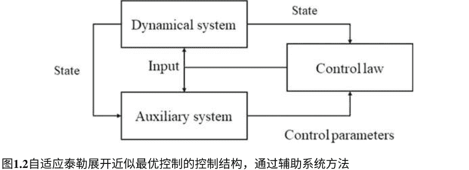
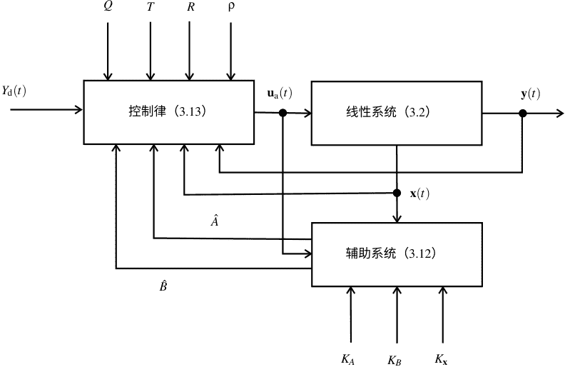

# 带有性能保障的深度强化学习

## 基于李雅普诺夫的方法

系统、决策与控制研究 265

张银燕

李帅

周雪峰

## 系统、决策与控制研究

### 第265卷

### 系列编辑

Janusz Kacprzyk, 波兰科学院系统研究所, 华沙, 波兰

该系列“系统、决策与控制研究”(SSDC)涵盖了广泛感知的系统、决策和控制领域的新发展、进展以及最新技术水平，快速、及时、高质量。其目的是涵盖与嵌入在工程、计算机科学、物理学、经济学、社会科学和生命科学等领域相关的系统、决策、控制、复杂过程和相关领域的理论、应用和前景，以及背后的范式和方法论。该系列包含了系统、决策和控制领域的专著、教材、讲义和编辑卷，涵盖了物联网系统、自主系统、传感器网络、控制系统、能源系统、汽车系统、生物系统、车联网和连接车辆、航空航天系统、自动化、制造业、智能电网、非线性系统、电力系统、机器人、社会系统、经济系统等领域。对于投稿者和读者来说，短时间的出版周期和全球范围的分发和曝光都具有特别的价值，这使得研究成果能够广泛而迅速地传播。

**索引：**本系列图书已提交至ISI、SCOPUS、DBLP、Ulrichs、MathSciNet、Current Mathematical Publications、Mathematical Reviews、Zentralblatt Math：MetaPress和Springerlink。

有关本系列的更多信息，请访问 http://www.springer.com/series/13304

张银燕 · 李帅 · 周雪峰

## 具有保证性能的深度强化学习

### 基于李雅普诺夫的方法

张银燕，网络安全学院，暨南大学，中国广州

李帅，信息科学与工程学院，兰州大学，中国兰州

周雪峰，智能制造研究所，广东省科学院，中国广州

- ISSN 2198-4182

- ISSN 2198-4190 (电子版)

- 系统、决策与控制研究

- ISBN 978-3-030-33383-6

- ISBN 978-3-030-33384-3 (电子书)

- https://doi.org/10.1007/978-3-030-33384-3

© Springer Nature Switzerland AG 2020

本作品受版权保护。出版商保留全部或部分材料的权利，包括翻译、再版、插图重用、朗读、广播、微缩胶片复制或以任何其他实体方式复制、传输或信息存储和检索、电子适应、计算机软件或类似或不同的方法学，无论是现在已知还是今后开发的。

本出版物中使用的一般描述性名称、注册名称、商标、服务标志等，并不意味着即使在没有明确声明的情况下，这些名称不受相关保护法律和法规的约束，因此可以自由使用。

出版商、作者和编辑可以安全地假设本书中的建议和信息在出版日期时是真实准确的。出版商、作者或编辑对本书中所含材料或可能存在的任何错误或遗漏不提供明示或暗示的保证。出版商在已发布的地图和机构affiliations方面保持中立。

这本Springer印记由注册公司Springer Nature Switzerland AG出版

注册公司地址为：Gewerbestrasse 11, 6330 Cham, Switzerland

## 向我们的祖先和父母致敬

## 前言

在过去的几十年里，最优控制和自适应控制已经广泛研究，以解决工程应用中产生的非线性系统的控制问题。最优控制的目标是找到一种控制规律，将控制系统驱动到所期望的状态，同时优化某些性能指标，可以有或没有约束条件。自适应控制是处理控制系统参数不确定性或结构不确定性的工具。在大多数研究中，这两种类型的控制方法是分开的。强化学习，特别是深度强化学习，在近年来越来越受到研究的关注。这种学习方法可以成为非线性系统控制的强大工具。

在本书中，我们基于泰勒展开、神经网络、估计器设计方法和滑模控制的思想，对近似最优自适应控制方法进行了系统研究。我们主要处理不同场景下的非线性系统跟踪控制问题，其中控制的非线性系统的输出预期随时间 `$t$` 跟踪所需的参考输出轨迹。所提出的方法的性能在理论上是有保证的。具体来说，性能指标渐近收敛于最优值，跟踪误差渐近收敛于0。

本书还考虑了像执行器饱和等问题。通过将近似最优自适应控制方法的设计方法与冗余机械臂解决方法的新思想相结合，还提出了两种新的冗余解决方法。

为了使内容清晰易懂，在本书中，每个部分（甚至每个章节）都以相对独立的方式编写。本书分为以下七章。

- **第1章**——本章简要回顾了最近在最优控制领域的进展。

- **第2章**——本章介绍了一种基于时间尺度扩展的方案，用于近似解决连续时间非线性系统在输入约束和系统动力学下的最优控制问题。通过对原始性能指标进行时间尺度的泰勒展开，将最优控制问题放松为一个近似的最优控制问题。基于系统动力学，进一步将问题重新表述为一个二次规划问题，通过投影神经网络进行求解。对由受控系统和投影神经网络合成的闭环系统进行理论分析，揭示出在一定条件下，闭环系统具有指数稳定性，并且原始性能指标随着时间趋于无穷大而收敛于零。

- **第3章**——本章介绍了一种统一的在线自适应近似最优控制框架，适用于具有参数不确定性的线性和非线性系统。在这个框架下，构建了收敛到未知动态的辅助系统来近似和补偿参数不确定性。借助辅助系统的帮助，递归地预测了受控系统的未来输出。通过利用预测时间尺度近似技术，将最优控制的非线性动态规划问题显著简化并与参数学习动态解耦：有限时间内的积分型目标函数相对于控制动作简化为二次型，并且无需解决耗时的哈密尔顿方程。理论分析表明闭环系统是渐近稳定的。还证明了所提出的自适应近似最优控制渐近收敛于最优控制。通过应用于欠驱动表面舰艇的实例验证了所提出框架和理论结果的有效性。

- **第4章**——在本章中，设计了一种自适应近似最优控制律，该控制律在本质上是实时的，用于解决具有完全未知参数的一般类非线性系统的最优控制中解决精度和解决速度之间的矛盾。所提出的自适应近似最优控制中的关键技术是利用滑模控制概念设计辅助系统，以重构受控非线性系统的动力学。基于滑模辅助系统和性能指标的逼近，所提出的控制律保证了闭环系统的渐近稳定性和性能指标的渐近最优性。为验证所提出的自适应近似最优控制的有效性，给出了两个示例和将该方法应用于`van der Pol`振荡器的实例。此外，还提供了基于直流电机的物理实验结果，以展示所提出方法的可实现性、性能和优越性。

- **第5章**——本章考虑了一类具有完全未知动力学的连续时间非线性系统的递减视界近似最优跟踪控制问题。通过利用基于泰勒展开的问题放松、S型神经网络的通用逼近性质和滑模控制的概念，提出了一种新颖的无模型自适应近似最优控制方法来解决这个问题。通过对性能指标进行近似，将其放松为一个二次规划问题，然后得到一个带有未知项的线性代数方程。设计了一个辅助系统来重构具有未知动力学的控制系统的输入-输出特性，以解决未知项带来的困难。然后，通过考虑滑模面的特性，从线性代数方程中导出了一个显式的自适应近似最优控制律。理论分析表明，辅助系统收敛，结果闭环系统渐近稳定，并且性能指标渐近收敛到最优。通过一个说明性例子和实验结果，证实了所提方法的有效性并验证了理论结果。

- **第6章**——本章介绍了一种自适应投影神经网络（`PNN`），该网络具有在线学习功能，用于解决具有未知物理参数的机械手臂的冗余解析问题，解决了现有方法中的困境。所提出的方法能够同时优化性能指标，同时处理参数不确定性和物理约束。通过理论结果证明了所提出的神经网络的性能保证。此外，基于具有未知物理参数的`PUMA 560`机械手臂的仿真以及与现有`PNN`的比较验证了所提出的神经网络的有效性和优越性，并验证了理论结果。

- **第7章**——本章介绍了一种新颖的循环神经网络，用于同时解决周期性输入干扰、调节角度约束和关节速度约束，并优化通用二次性能指标。所提出的循环神经网络适用于调节和跟踪任务。理论分析表明，在所提出的神经网络的作用下，末端执行器的跟踪和调节误差在存在输入干扰和两个约束条件的情况下渐近收敛于零。还提供了仿真示例和与现有控制器的比较，以验证所提出控制器的有效性和优越性。

总结一下，本书主要介绍了非线性系统近似最优自适应控制的方法和算法，以及相应的理论分析和仿真示例。基于这些方法，还提出了两种考虑参数不确定性和周期性干扰的冗余机械手解决方案。本书适用于研究生、学术界和工业界的研究人员，涉及自适应/最优控制、机器人技术和动态神经网络等领域。我们希望本书能够使读者受益，并在相关领域给予他们一些启发。特别是，我们希望本书中提出的结果能够通过基于李雅普诺夫方法的深度强化学习方法来开发具有性能保证的非线性系统控制方法，这也是本书的主题。

欢迎提出任何意见或建议，作者的联系方式为：zhangyinyan12@163.com（张银燕），shuaili@ieee.org（李帅），xuefengzhou@vip.qq.com（周雪峰）。

中国广州

中国兰州

中国广州

2019年8月

张银燕

李帅

周雪峰

## 致谢

在编写本书的过程中，我们有幸与许多合作者和学生讨论了各个方面和结果。我们非常感谢他们的贡献，这些贡献有助于提高本书的质量和呈现方式。

中国广州

中国兰州

中国广州

2019年8月

张银燕

李帅

周雪峰

## 目录

- **1 非线性系统近似最优控制综述**

    - 1.1 引言

    - 1.2 动态规划

        - 1.2.1 连续时间非线性系统示例

        - 1.2.2 离散时间非线性系统示例

        - 1.2.3 自适应动态规划近似解决 HJB 方程

        - 1.2.4 无需NNA的数值方法近似解决 HJB 方程

    - 1.3 非线性规划下的近似最优控制

        - 1.3.1 通过控制参数化的方法

        - 1.3.2 模型预测控制

        - 1.3.3 通过泰勒展开的方法

    - 1.4 总结

    - 参考文献

- **2 输入饱和的近似最优控制**

    - 2.1 引言

    - 2.2 预备知识和符号

    - 2.3 问题表述

        - 2.3.1 原始表述

        - 2.3.2 重新表述

    - 2.4 投影神经网络设计

    - 2.5 理论分析

    - 2.6 数值研究

        - 2.6.1 机械臂控制的性能比较

        - 2.6.2 应用于欠驱动船舶

    - 2.7 问题与答案

    - 2.8 总结

    - 参考文献

- **3 具有全状态反馈的自适应近似最优控制**

    - 3.1 引言

    - 3.2 预备知识

    - 3.3 一般线性系统

        - 3.3.1 问题形式化

        - 3.3.2 标称设计

        - 3.3.3 自适应设计

    - 3.4 非线性系统扩展

        - 3.4.1 问题形式化

        - 3.4.2 标称设计

        - 3.4.3 自适应设计

        - 3.4.4 计算复杂性分析

    - 3.5 理论结果

        - 3.5.1 辅助系统的收敛性

        - 3.5.2 闭环系统的稳定性

        - 3.5.3 渐近最优性

    - 3.6 不确定非完全驱动表面船的应用

        - 3.6.1 无测量噪声

        - 3.6.2 有测量噪声

        - 3.6.3 实时控制能力

    - 3.7 问题与答案

    - 3.8 总结

    - 参考文献

- **4 使用滑模的自适应近似最优控制**

    - 4.1 引言

    - 4.2 问题描述和初步

    - 4.3 名义近似最优设计

    - 4.4 自适应近似最优设计

    - 4.5 实例说明

        - 4.5.1 示例1

        - 4.5.2 示例2

    - 4.6 应用于`van der Pol`振荡器

    - 4.7 实验验证

    - 4.8 问题和答案

    - 4.9 总结

    - 参考文献

- **5 无模型自适应近似最优跟踪控制**

    - 5.1 引言

    - 5.2 问题描述和初步

        - 5.2.1 问题描述

        - 5.2.2 Sigmoid神经网络

        - 5.2.3 问题重新定义

    - 5.3 控制设计

        - 5.3.1 问题放松

        - 5.3.2 输入输出动力学重构

        - 5.3.3 自适应最近最优控制律

    - 5.4 理论分析

        - 5.4.1 无奇异问题的确认

        - 5.4.2 辅助系统的收敛

        - 5.4.3 闭环系统的稳定性

        - 5.4.4 性能指标的渐近最优性

    - 5.5 实例说明

    - 5.6 实验验证

    - 5.7 问题与答案

    - 5.8 总结

    - 参考文献

- **6 冗余机械手的自适应运动学控制**

    - 6.1 引言

    - 6.2 初步和问题形式化

        - 6.2.1 正向运动学

        - 6.2.2 QP型问题形式化

    - 6.3 标称设计

    - 6.4 自适应设计

        - 6.4.1 自适应投影神经网络

        - 6.4.2 理论分析

    - 6.5 模拟验证和比较

        - 6.5.1 PUMA 560 描述

        - 6.5.2 最小速度范数冗余解决

        - 6.5.3 重复运动冗余解决

    - 6.6 实验验证

    - 6.7 问题与答案

    - 6.8 总结

    - 参考文献

- **7 周期性输入干扰下的冗余解决**

    - 7.1 引言

    - 7.2 初步和问题描述

        - 7.2.1 机械手运动学模型

        - 7.2.2 问题描述

        - 7.2.3 问题重构为二次规划

    - 7.3 神经网络设计

        - 7.3.1 步骤1：无干扰的标准设计

        - 7.3.2 步骤2：带有干扰拒绝的修改控制器

    - 7.4 仿真示例和比较

        - 7.4.1 模拟设置

        - 7.4.2 终端执行器调节

        - 7.4.3 终端执行器跟踪

    - 7.5 问题与答案

    - 7.6 总结

    - 参考文献

## 缩写

| 缩写 | 英文全称 / 中文含义 |
| :--- | :--- |
| `ADP` | 自适应动态规划 (Adaptive Dynamic Programming) |
| `APNN` | 自适应投影神经网络 (Adaptive Projection Neural Network) |
| `D-H` | Denavit-Hartenberg |
| `DOF` | 自由度 (Degree of Freedom) |
| `FPGA` | 可编程门阵列 (Field Programmable Gate Array) |
| `HJB` | Hamilton-Jacobi-Bellman |
| `MPC` | 模型预测控制 (Model Predictive Control) |
| `NNA` | 神经网络逼近 (Neural Network Approximation) |
| `PE` | 持续激励 (Persistence of Excitation) |
| `PID` | 比例-积分-微分 (Proportional-Integral-Derivative) |
| `PNN` | 投影神经网络 (Projection Neural Network) |
| `PSO` | 粒子群优化 (Particle Swarm Optimization) |
| `QP` | 二次规划 (Quadratic Programming) |

## 第一章 非线性系统的近最优控制调查

**摘要** 对于非线性动力系统，最优控制问题通常需要解决一个称为 `Hamilton-Jacobi-Bellman` (`HJB`) 方程的偏微分方程，其解析解通常无法获得。然而，对于最优控制的需求不断增加，目标是节省能源，减少瞬态时间，最小化误差累积等。因此，报告了用于近最优控制的方法，尽管它们的技术细节有所不同。这个研究方向近年来取得了很大的进展，但对它们的及时回顾仍然缺失。本章作为对这个研究方向现有方法的简要调查。

### 1.1 引言

最优控制是一种控制方法论，旨在寻找优化给定性能指标的控制策略。经典的最优控制理论基于庞特里亚金最大值原理或动态规划原理[1]。前者提供了最优性的必要条件，并经常给出开环控制律，而后者通过求解所谓的 `Hamilton-Jacobi-Bellman` (`HJB`) 方程提供了充分条件，该方程是一个偏微分方程，其非线性动力系统的解析解很难推导出来。线性动力系统的最优控制理论通常是基于线性二次调节器和线性二次跟踪器[2-7]。请注意，对于线性动力系统，`HJB`方程退化为`Riccati`方程，处理起来要容易得多。几乎所有具有完全已知动力学的线性最优控制问题都有易于计算的解决方案[5]。然而，在实践中，感兴趣的控制系统或多或少是非线性的[8-11]。因此，实现非线性动力系统的最优或接近最优控制的系统化和可实施的方法是需要的。

在过去的二十年中，关于非线性系统的最优控制，包括有限时间最优控制和无限时间最优控制，已经有很多研究成果报告。由于`HJB`方程的解析解通常无法获得，因此，对于`HJB`方程，大多数现有方法都集中于寻找近似解，例如[12]，尽管所研究问题的假设或情景可能不同。还有其他方法试图放松原始最优控制问题，然后找到一个解析控制律，例如[13]，这也为原始问题提供了一个近似解。因此，对于非线性动力系统，一般只能在实践中实现近似最优控制。

有一些针对具有非线性动力系统的近似最优调节或跟踪控制方法的调查。例如，在2005年，Bertsekas [14] 提出了一个关于动态规划和次优控制的调查，重点关注自适应动态规划 (ADP) 和模型预测控制 (MPC)。2014年，Mayne [15] 对MPC的发展进行了调查，MPC也被称为递进视界控制。MPC是一种广泛应用于过程控制的控制方法，通过在线求解约束离散时间最优控制问题生成控制策略。关于MPC的调查也在[16–18]中报道过。在过去几十年中，基于强化学习的最优控制，通常称为ADP，也得到了广泛研究。

该方法利用神经网络作为工具来近似解决相应的HJB方程。尽管具有不同的观点，但过去二十年中关于ADP发展的调查在[19-21]中进行。值得注意的是，尽管有大量关于MPC和ADP的出版物，但也有其他一些解决该问题的方法，例如[12, 22, 23]。

虽然关于非线性动态系统的近似最优控制已经有很多研究成果，但在过去的二十年中，还没有关于其发展的系统性调查报告。然而，这样的调查对于新来者或对这个领域感兴趣的研究人员来说非常重要，可以让他们对这个领域有一个整体的了解或知识。

最优控制发展中的一个重要新趋势可能是与神经网络的结合，这得到了过去二十年相关出版物的支持[24-26]。神经网络具有通用逼近性质，适合学习任何平滑函数[27]。因此，对于传统的最优控制，即处理完全已知系统动力学的情况，可以通过神经网络学习HJB方程的解。具体而言，我们可以首先假设解可以由一个具有已知结构和连接但未知权重的神经网络表示。然后，我们可以应用一些经典方法来学习神经网络的权重。这种思想在自适应动态规划中得到了应用。同时，借助神经网络，我们还可以处理系统的不确定性，从而发展出所谓的自适应最优控制甚至是无模型最优控制[28-31]。

鉴于上述观察结果，本章旨在对过去二十年中非线性系统的近最优控制的主要发展进行简要调查。请注意，本章不涵盖庞特里亚金最大值原理和随机最优控制。具体而言，我们关注基于动态规划的方法和基于非线性规划的方法，以实现非线性动力系统的近最优控制。

### 1.2 动态规划

在本节中，我们首先提供了关于两种类型的非线性动力系统[1]的基本最优控制问题，以说明动态规划原理给出的HJB方程。尽管这两个例子很基础，但它们被认为能够展示这个研究领域的困难之处。然后，我们讨论基于近似解HJB方程的近最优控制方法。

#### 1.2.1 连续时间非线性系统的例子

作为一个例子，考虑以下确定性连续时间非线性仿射动力系统：

$$\dot{x}(t) = f(x(t)) + g(x(t))u(t), \quad (1.1)$$

其中 $x \in \mathbb{R}^n$ 表示状态变量，$u \in \mathbb{R}^m$ 表示输入变量；$\dot{x} = \text{d}x / \text{d}t$ 其中 $t$ 表示时间点。通常假设：

1. $f(0) = 0$；
2. 函数 $f(x(t)) + g(x(t))u(t)$ 在局部上是利普希茨的；
3. 系统 (1.1) 是可稳定的。

动力系统 (1.1) 的最优控制问题可以根据相应的性能指标进行分类，也称为成本函数。例如，一般情况下，无限时间最优调节问题涉及到以下成本函数的最小化 [32]:

$$J(x, u) = \int_0^\infty r(x(\tau), u(\tau))\text{d}\tau = \int_0^\infty (Q(x(\tau)) + u^\text{T}(\tau) R u(\tau))\text{d}\tau,$$

其中 $Q(x) \in \mathbb{R}$ 是正定的，$R \in \mathbb{R}^{m \times m}$ 是对称的和正定的。这里的一个重要要求是输入应该是可接受的，以保证一个有限的成本函数[28]。价值函数是

$$V(x, u) = \int_t^\infty (Q(x(\tau)) + u^\text{T}(\tau) R u(\tau))\text{d}\tau,$$

这相当于

$$r(x, u) + \frac{\partial V^\text{T}}{\partial x}(f(x) + g(x)u) = 0, \quad V(0) = 0.$$

因此，通过解决以下连续时间HJB方程，可以确定最优值函数：

$$r(x, u^*) + \left(\frac{\partial V^*}{\partial x}\right)^\text{T} (f(x) + g(x)u^*) = 0$$

通过这个，相应的最优控制律是

$$u^* = \text{argmin}_u \left\{ r(x, u^*) + \left(\frac{\partial V^*}{\partial x}\right)^\text{T} (f(x) + g(x)u^*) \right\} = -\frac{1}{2} R^{-1} g^\text{T}(x) \frac{\partial V^*}{\partial x}$$

#### 1.2.2 离散时间非线性系统的示例

对于系统 (1.1)，确定性离散时间非线性仿射动态系统如下所示：

$$x_{k+1} = f(x_k, u_k) \quad (1.2)$$

其中 $k = 0, 1, 2, \dots$ 表示采样索引。

系统 (1.1) 的假设也在这里采用。对于系统 (1.2) 的无限时域最优调节问题，一般关注的是以下成本函数的最小化：

$$J(x, u) = \sum_{i=0}^\infty r(x(i), u(i)) = \sum_{i=0}^\infty (Q(x(k)) + u^\text{T}(k) R u(k))$$

然后，值函数可以表示为

$$V(x(k), u(k)) = \sum_{i=k}^{\infty}(Q(x(i)) + u^{\text{T}}(i)Ru(i)),$$

这相当于

$$V(x(k), u(k)) = r(x(k), u(k)) + V(x(k + 1), u(k + 1)).$$

根据动态规划原理，最优值函数通过离散时间HJB方程给出如下：

$$V^*(x(k), u(k)) = \min_u \{r(x(k), u(k)) + V(x(k + 1), u(k + 1))\}$$

由此我们得到

$$u^*(x(k)) = \text{argmin}_u \{r(x(k), u(k)) + V(x(k + 1), u(k + 1))\} = -\frac{1}{2}R^{-1}g^{\text{T}}(x(k)) \frac{\partial V^*(x(k + 1))}{\partial x(k + 1)}.$$

从上述两个例子可以发现，HJB方程对非线性动态系统的最优控制是重要的。不幸的是，它们是偏微分方程，其解析解通常难以推导出来，甚至在实际中对感兴趣的系统来说是不可能的。值得注意的是，成本函数可以与上述两个例子中的不同，并且问题的制定中可能存在其他约束。

由于HJB方程的显式解很难推导出来，一种直观的方法是为其提供近似解。在下一小节中，将讨论通过近似解HJB方程来实现近似最优控制的方法。

#### 1.2.3 自适应动态规划用于近似解HJB方程

ADP是一种基于神经网络的方法，用于基于神经网络和动态规划的普适逼近性质来实现非线性动态系统的近最优控制。ADP的基本结构如图1.1所示。它主要由评论家网络和行动网络组成。这两个网络都是参数化的，需要通过在线或离线方式进行训练。前者用于根据性能指标评估当前的控制动作，为控制动作的改进提供指导。后者用于实施控制动作。换句话说，评论家网络用于实现值函数的逼近，而另一个网络用于实现最优控制策略的逼近。这个想法是自然而然的，因为在HJB方程中有两个未知的泛函。一个是值函数，另一个是控制策略。当系统动力学未知时，可以包括另一个称为识别网络的网络。附加网络根据可用的测量数据估计系统动力学。

过去20年中，非线性动态系统的ADP发展可以从三个角度进行讨论，即控制结构、感兴趣的问题和应用。

ADP有几种控制结构。根据评论家网络的设计，它们可以大致分为以下几类：启发式动态规划（HDP）[33-42]，双启发式动态规划（DHDP）[26, 43-48]，全局化双启发式动态规划（GDHDP）[49-53]，以及上述方法的动作相关扩展[54-56]。在HDP中，控制动作由动作网络生成，值函数由评论家网络近似。对于DHDP，核心是将评论家网络用作实现状态向量相关值函数导数近似的工具。GDHDP是HDP和DHP的新型综合，其中评论家网络被用来实现值函数以及导数的近似。

需要注意的是，虽然所有的结构能够生成接近最优的控制策略，但计算效率和性能指标的价值可能会有所不同。

关于非线性动态系统的自适应动态规划的最新发展也可以通过感兴趣的问题进行讨论。对于最优调节问题，Dierks等人[57]提出了一种启发式动态规划方案，用于不明确知道系统动态的仿射非线性离散时间动态系统。该方案包括在线系统识别和离线训练以进行控制律参数。我们还使用其他具有不同控制结构和假设的自适应动态规划方法研究了最优调节问题[58-61]。

例如，Wei和Liu [58]提出了一种新颖的自适应动态规划方案，用于一类具有不固定初始状态的离散时间非线性系统，可以保证收敛到具有任意初始可接受控制序列的最优解。Wang等人[61]提出了一种用于未知连续时间仿射非线性系统的最近调节的自适应动态规划方法，用于抑制干扰。在某些假设下，非线性动态系统的近似最优跟踪控制也可以通过自适应动态规划来解决[36-38, 40, 42, 47, 62, 63]。特别地，Zhang等人[62]提出了一种用于一般非线性连续时间系统的鲁棒状态跟踪的自适应动态规划方法，理论上保证了系统输入接近最优。

最近，还提出了事件触发的自适应动态规划[39, 64-66]。在事件触发的自适应动态规划中，控制动作的更新取决于一定的条件，称为触发条件。当条件满足时，执行控制动作的更新。因此，它可以节省计算成本和传输负载。请注意，自适应动态规划通常需要使用神经网络，例如上述所有自适应动态规划文献，当应用于具有高维状态空间的系统时，计算负担仍然很高。在[68]中，开发了一种针对不确定连续时间仿射非线性动态系统的新颖自适应动态规划方案，不需要使用神经网络进行近似，通过在线学习保证最优稳定化。

在过去的二十年中，一些应用自适应动态规划的研究成果已经报道，包括电力系统[67]、空气呼吸高超声速飞行器[69]、可穿戴机器人[70]、倒立摆系统[71]和涡轮发电机[72]。

### 1.2.4 数值方法不使用神经网络近似求解HJB方程

在过去的二十年中，针对非线性动态系统，也提出了一些不使用神经网络近似(NNA)的数值方法，用于近似求解HJB方程以实现近似最优控制。Beard等人[73]提出了通过逐次Galerkin逼近来近似求解HJB方程的方法。Chen等人[74]研究了一个无限时间非线性二次最优控制问题，并提出了通过求解Riccati方程和一系列代数方程来计算近似最优解的方法。Song等人[75]提出了一种基于有限差分的数值算法，通过Sigmoid变换来近似求解与滑动时域最优控制相关的HJB方程。Fakharian等人[76]的方法依赖于Adomian分解方法。Nik等人[77]通过使用He的多项式和同伦摄动法提出了HJB方程的解析近似解。为了解决这个问题，[78]提出了一种使用Padé近似的改进同伦摄动法，其优于[77]中的方法。Zhu [79]提出了一种计算方法，用于解决与仿射非线性系统最优控制相关的HJB方程。Govindarajan等人[80]提出了一种稀疏插值方法，用于计算具有有限时域积分成本函数的连续时间非线性系统的近似最优解。Sun和Guo [81]提出了一种逆风差分方案，用于近似求解HJB方程，并给出了收敛结果。[82]中提出了一种迭代方法，用于求解广义HJB方程(GHJB)，该方程是非线性系统最优控制中HJB方程的近似。该方法将GHJB方程转化为一组非线性方程。利用非线性方程的线性化来获得解，并且需要一个良好的初始控制猜测。Michailidis等人[83]提出了一种基于认知自适应最优的新方法，用于近似求解大规模非线性系统的HJB方程，以实现自适应最优控制。

在他们的情况下，系统动力学中的平滑函数 `$f(x)$` 是未知的。该方法不需要系统动力学的参数化模型，并且可以实时优化控制动作和相应的值函数。尽管过去二十年中提出了许多数值算法来获得HJB方程的近似解，但它们都受到系统形式和问题的特定假设的限制。根据文献，无论问题的形式如何，目前不存在一种准确且计算高效的数值方法来近似解决HJB方程的方法。

### 1.3 通过非线性规划实现近似最优控制

从问题的形式可以看出，非线性动态系统的最优控制问题本质上是优化问题。因此，现有文献中也报告了一些关于从非线性规划的角度近似解决最优控制问题的结果。具体而言，采用了一些方法来近似控制变量、状态、性能指标甚至连续时间系统动力学，从而将原始问题放松为相应的非线性规划问题。

#### 1.3.1 通过控制参数化的方法

在这个小节中，我们讨论一些数值方法，通过近似状态或控制变量来近似求解非线性动力系统的最优控制问题。

在直接射击方法中，包括直接多重射击方法和直接单一射击方法，通过控制近似和状态近似，将最优控制问题放松为一个有限维非线性规划问题[84-87]。离散化是通过定义一个射击网格，并通过添加匹配条件来保证解的连续性。它的性能受到网格点数量、射击点位置和基函数类型的影响。需要注意的是，由此产生的非线性优化问题通常是大规模的。在直接配点方法中，试验函数用于近似控制变量和受控系统的状态，而系统动力学和约束条件则在解决域内的某些点上配点。其中，伪谱方法受到了广泛关注[88-93]。人们已经认识到，与射击方法和传统的直接配点方法相比，伪谱方法具有更高的精度、对初始值的敏感性较低和更快的收敛速度[93, 94]。

在伪谱方法中，通过使用全局多项式和配位微分代数方程，将问题首先放松为非线性规划问题 [88–93]。基于对偶变分原理，彭等人 [95] 提出了一种自适应辛伪谱方法。根据该方法，原始的最优控制问题被转化为多个非线性方程。这些方程通过牛顿-拉夫逊迭代方法求解。Tabrizidooz等人 [96] 提出了一种复合伪谱方法。Ge等人 [97] 提出了使用切比雪夫-高斯伪谱方法来解决耦合刚体航天器的最优姿态控制问题。在逼近状态和控制变量时，使用了重心拉格朗日插值。伪谱方法已经应用于能源系统 [98, 99]。

#### 1.3.2 模型预测控制

在本小节中，我们讨论MPC。在每个采样瞬间，控制动作是通过求解基于当前控制系统状态的离散有限时域开环最优控制问题计算得到的控制动作序列的第一个动作[15, 100]。需要注意的是，当采用线性系统动力学来预测系统行为时，MPC的优化问题通常是凸优化问题，而当直接使用非线性系统动力学来预测系统行为时，非线性MPC的优化问题通常不是凸优化问题，这使得优化问题难以求解[101, 102]。通过基于状态反馈进行在线开环最优控制计算，即在线求解相应的优化问题，MPC不依赖于（近似）求解HJB方程[16]。因此，MPC的计算效率优于传统最优控制方法。同时，MPC可以处理状态和输入约束。

然而，当应用于非线性动态系统时，MPC需要在每个采样瞬间求解一个大规模非线性优化问题，因此对于采样频率较高的控制系统来说，计算量仍然很大。这也是为什么MPC在石油化工和相关行业中得到了广泛应用的原因。近年来，MPC在非线性系统的最新发展中的一个主要课题是如何提高计算效率，以便将其应用于具有高控制频率的系统[103-105]。一种直观的方法是通过线性化来近似非线性系统动力学，从而可以在线性动态系统的MPC框架下求解问题[104]。进化计算方法也被应用于解决该问题。Xu等人[105]提出了一种基于可编程门阵列（FPGA）的MPC高效硬件实现方法，该方法采用粒子群优化（PSO）算法来求解非线性优化问题。Mozaffari等人[106]提出了一种改进的动态PSO算法，用于提高非线性动态系统MPC的计算效率，其中去除了繁殖和衰老算子，以在很短的时间内找到近似最优解。

递归神经网络方法也被报道用于计算效率高的非线性动态系统MPC[107-111]。一般而言，该方法首先将MPC问题转化为约束二次规划问题，然后通过递归神经网络来求解。在[110]中，提出了一种针对具有未建模动力学和有界不确定性的非线性动态系统的鲁棒MPC方法。该问题通过使用极限学习机进行系统辨识和使用递归神经网络求解得到的极小极大优化问题。通过神经网络增强MPC的方法已经得到了广泛研究。

近年来，程等人[112]提出了一种非线性模型预测控制方法，针对压电执行器，其中使用了多层神经网络进行系统识别。由于MPC方法依赖于系统模型来预测系统行为，因此需要适当的系统建模。然而，在实践中，有一些现象或效应很难建模。因此，人们致力于增强MPC的鲁棒性，从而导致了所谓的鲁棒MPC[113-117]。通常有两种方法实现鲁棒MPC。一种是使用极小-极大目标函数。特别地，刘等人[117]提出了一种自触发鲁棒MPC方法，其中使用极小-极大目标函数，根据当前系统状态和受控非线性动力系统的动力学预先计算下一个触发时间。另一种方法是在MPC公式中添加约束条件以保证鲁棒性[116]。MPC与另一种称为滑模控制的鲁棒控制方法的组合也有报道[118]。MPC已经应用于多个非线性物理系统的控制，例如无人机[119, 120]，聚苯乙烯批量反应器[121]，起重机[122]，倒立摆[123]，火花点火发动机[124]，DC/DC变换器[125]和关节式无人地面车辆[126]。

#### 1.3.3 基于泰勒展开的方法

还有一种基于泰勒展开的方法适用于连续时间仿射非线性系统的滑动时域最优控制[23, 127]。这种方法也被称为显式模型预测控制（MPC），因为它通过系统动力学导出了一个闭合控制律，并且它还依赖于对系统行为的预测。该方法的优势在于计算效率。与上述MPC不同，基于泰勒展开的方法不采用系统动力学的离散化。该方法的主要特点是将时间尺度泰勒展开应用于性能指标中的变量，这使得将问题放松为一个二次规划问题成为可能，因此在没有约束条件时可以直接获得显式解。泰勒展开的阶数取决于系统的相对阶数。

在这里，我们给出了基于泰勒展开的方法的一个例子[13]。该方法的详细内容将在后面的章节中讨论。考虑以下关于仿射非线性动力系统的滑动时域最优跟踪控制问题：最小化 $J(t)$，受限于

$$
\begin{aligned}
\dot{x}(t) &= f(x(t)) + g(x(t))u(t), \\
y(t) &= h(x(t)),
\end{aligned}
$$

其中 $J(t)$ 表示性能指标，定义如下：

$$
J(t) = \int_{0}^{T} (y_d(t + \tau) - y(t + \tau))^T Q (y_d(t + \tau) - y(t + \tau)) d\tau, \qquad (1.3)
$$

其中常数 $T > 0 \in \mathbb{R}$ 表示预测周期；性能指标中的参数矩阵 $Q$ 是对称正定的；所需输出函数 $y_d(t)$ 关于时间 $t$ 是连续可微的。通过使用Lie导数的符号和相对阶数的定义[13]，如果受控系统的相对阶数为 $\rho$，则有

$$
\begin{cases}
\dot{y}(t) = L_f h(x(t)), \\
\quad \vdots \\
y^{[\rho-1]}(t) = L_f^{\rho-1} h(x(t)), \\
y^{[\rho]}(t) = L_f^{\rho} h(x(t)) + L_g L_f^{\rho-1} h(x(t))u(t),
\end{cases}
$$

其中，$y^{[i]}(t)$ 表示 $y(t)$ 的第 $i$ 阶导数，对于 $i = 1, 2, \dots, \rho$。借助时间尺度 Taylor 展开，输出 $y(t+\tau)$ 可以通过使用时间点 $t$ 处的信息来进行预测，如下所示：

$$ y(t + \tau) \approx Y(t)w(\tau) + \frac{\tau^\rho}{\rho!} L_g L_f^{\rho-1} h(x(t))u(t), $$

其中 $w(\tau) = [1, \tau, \dots, \tau^{\rho-1}/(\rho - 1)!, \tau^\rho/\rho!]^T$。因此，在 (1.3) 中，对于 $J(t)$，我们有

$$
\begin{aligned}
J(t) &\approx \mathfrak{J}(t) \\
&= \int_{0}^{T} (E(t)w(\tau) - \frac{\tau^\rho}{\rho!} L_g L_f^{\rho-1} h(x(t))u(t))^T Q (E(t) w(\tau) - \frac{\tau^\rho}{\rho!} L_g L_f^{\rho-1} h(x(t))u(t)) d\tau \\
&= \int_0^T w^{\mathrm{T}}(\tau) E^{\mathrm{T}}(t) Q E(t) w(\tau) \mathrm{d} \tau - 2 \int_0^T \frac{\tau^\rho}{\rho !} w^{\mathrm{T}}(\tau) \mathrm{d} \tau E^{\mathrm{T}}(t) Q L_g L_f^{\rho-1} h(x(t)) u(t) \\
&\quad + \int_0^T \frac{\tau^{2 \rho}}{(\rho !)^2} \mathrm{d} \tau u^{\mathrm{T}}(t)\left(L_g L_f^{\rho-1} h(x(t))\right)^{\mathrm{T}} Q L_g L_f^{\rho-1} h(x(t)) u(t),
\end{aligned}
$$

其中 $E=Y_{\mathrm{d}}(t)-Y(t)$。令

$$
v = \int_0^T \frac{\tau^\rho}{\rho !} w^{\mathrm{T}}(\tau) \mathrm{d} \tau = \left[\frac{T^{\rho+1}}{(\rho+1) \rho !}, \frac{T^{\rho+2}}{(\rho+2) \rho ! 1!}, \dots, \frac{T^{2 \rho+1}}{(2 \rho+1)(\rho !)^2}\right]
$$

和

$$ \kappa = \int_0^T \frac{\tau^{2 \rho}}{(\rho !)^2} \mathrm{d} \tau = \frac{T^{2 \rho+1}}{(2 \rho+1)(\rho !)^2} . $$

因为决策变量是 $u(t)$，所以最小化问题的解与最小化二次函数的解相同：

$$ \Psi(t)=u^{\mathrm{T}}(t) \Theta u(t)+p^{\mathrm{T}} u(t), $$

鉴于 $\Theta$ 是正定的，问题变成了一个无约束的二次规划问题，通过求解 $\partial \Psi(t) / \partial u=0$，可以得到最小化 $\mathfrak{J}(t)$ 的解：

$$ u(t)=\left(L_g L_f^{\rho-1} h(x(t))\right)^{-1} \frac{1}{\kappa}\left(Y_{\mathrm{d}}(t)-Y(t)\right) v^{\mathrm{T}} . \eqno(1.4) $$

自从陈等人的早期工作[23, 127]以来，这种方法引起了很多关注。Merabet 等人[128]将该方法应用于感应电动机的速度控制。Wang等人[129]将该方法应用于分流有源电力滤波器的电流控制。该方法的性能还在球杆系统[130]和永磁同步电动机[131, 132]中得到了验证。为了增强该方法的鲁棒性，还报道了与扰动观测器的组合[133–139]。特别地，杨和郑[135]提出的方法能够补偿不匹配的扰动。为了解决输入约束问题，[9]采用了投影神经网络，通过在线方式将控制动作给出网络输出。在[140, 141]中，该方法进一步扩展到具有参数不确定性的情况。具体而言，设计了一个状态反馈辅助系统来补偿参数不确定性。

所得控制结构的框图可以在图1.2中显示。还提出了一种输出反馈辅助系统，通过使用滑模控制技术[13]来解决问题。为了解决系统输出的时间导数测量问题，使用了跟踪微分器。还表明，对于仿射非线性动力系统，在一定条件下，可以使用神经网络[29]来处理完全未知系统动力学的情况。基于泰勒展开方法的扩展应用于多智能体系统的一致性问题，其中代理动力学是非线性的[142, 143]。通过适当设计性能指标来实现这一目标。然而，一致性协议并非完全分布式。

### 1.4 总结

本章简要回顾了近期在具有非线性动力学的系统的近似最优控制方面的一些进展。特别关注了基于动态规划和非线性规划的近似最优控制方法。根据调查，概述了一些未来研究工作的相关问题如下：

- (1) 对于动态规划和非线性规划方法，现有的非线性动力系统近似最优控制方法的计算效率在一般情况下仍然不令人满意。尽管已经有一些尝试来解决这个问题，例如事件触发方法[39, 64-66]，但如何设计计算效率高的非线性动力系统近似最优控制方法仍然被认为是一个开放问题。

- (2) 关于非线性时滞动力系统的近似最优控制，只有少数结果被报道[36, 45]。然而，时滞在实践中普遍存在。事实上，对于线性时滞动力系统的最优控制已经有许多现有结果，例如[2, 6, 36]。因此，值得研究非线性时滞动力系统的近似最优控制律设计。

- (3) 很少有关于非线性多智能体系统的近似最优合作控制的研究。这个问题非常具有挑战性，特别是当我们需要设计一个完全分布式的控制律时。事实上，即使对于线性 multi-agent 系统，近似最优控制也是困难的。只有一些结果可以保证逆最优性[144]。

- (4) 大多数现有的近似最优控制方法需要受控非线性动态系统的某些模型信息。如果能提出一个完全无模型的方法将会更好。这也是非常具有挑战性的。对于非线性动态系统，学习系统动力学的数据应该足够以确保学习性能。同时，在实践中，测量数据通常会受到测量噪声的污染。

- (5) 将最近最优控制方法与其他现代控制方法结合应用于非线性动态系统是有趣的。例如，有关于最优控制和反步设计的一些结果，例如[145]。还研究了滑模控制与最优控制的结合[146]。如果最终的控制设计能够兼具近似最优控制方法和其他现代控制方法的优点，那将更好。

### 参考文献

1. Lewis, F.L., Vrabie, D., Syrmos, V.L.: Optimal Control. Wiley, New York (2012)

2. Zhang, H., Li, L., Xu, J., Fu, M.: 具有延迟和乘性噪声的离散时间系统的线性二次调节和稳定性。IEEE Trans. Autom. Control 60(10), 2599–2613 (2015)

3. Grieder, P., Borrelli, F., Torrisi, F., Morari, M.: 计算受约束的无限时间线性二次调节器。Automatica 40, 701–708 (2004)

4. Modares, H., Lewis, F.L., Jiang, Z.: 使用离策策略强化学习对未知连续时间线性系统进行最优输出反馈控制。IEEE Trans. Autom. Control 46(11), 2401–2410 (2016)

5. Anderson, B.D.O., Moore, J.B.: 最优控制：线性二次方法。Courier Corporation (2007)

6. Zhang, H., Duan, G., Xie, L.: 具有多个输入延迟的线性时变系统的线性二次调节。Automatica 42, 1465–1476 (2006)

7. Modares, H., Lewis, F.L.: 使用强化学习的部分未知连续时间系统的线性二次跟踪控制。IEEE Trans. Autom. Control 59(11), 3051–3056 (2014)

8. Zhou, J., Wen, C., Zhang, Y.: 具有不确定死区非线性的非线性系统的自适应输出控制。IEEE Trans. Autom. Control 51(3), 504–511 (2006)

9. Zhang, Y., Li, S.: 使用投影神经网络的时间尺度扩展近似最优控制的非完全驱动系统。IEEE Trans. Syst. Man, Cybern., Syst. in press. https://doi.org/10.1109/TSMC.2017.2703140

10. Liang, X., Fang, Y., Sun, N., Lin, H.: 无人四旋翼运输系统的非线性分层控制. IEEE Trans. Ind. Electron. 65(4), 3395–3405 (2018)

11. Xiao, B., Yin, S.: 一类非线性系统的无速度容错和不确定性衰减控制. IEEE Trans. Autom. Control 63(7), 4400–4411 (2016)

12. Sassano, M., Astolfi, A.: 输入仿射非线性系统的HJ不等式和HJB方程的动态近似解. IEEE Trans. Autom. Control 57(10), 2490–2503 (2012)

13. Zhang, Y., Li, S., Jiang, X.: 无需解决HJB方程的近似最优控制及其应用. IEEE Trans. Ind. Electron. 65(9), 7173–7184 (2018)

14. Bertsekas, D.P.: 动态规划和次优控制: 从ADP到MPC的综述. Eur. J. Control 11(4), 310–334 (2005)

15. Mayne, D.Q.: 模型预测控制: 最新发展和未来前景。Automatica 50(12), 2967–2986 (2014)

16. Lee, J.H.: 模型预测控制: 三十年发展回顾。Int. J. Control Autom. Syst. 9(3), 415–424 (2011)

17. Mesbah, A.: 具有主动不确定性学习的随机模型预测控制: 对双重控制的综述。Annu. Rev. Control 45, 107–117 (2018)

18. Vazquez, S., Leon, J.I., Franquelo, L.G., Rodriguez, J., Young, H.A., Marquez, A., Zanchetta, P.: 模型预测控制: 在电力电子中的应用综述。IEEE Ind. Electron. Mag. 8(1), 16–31 (2014)

19. Kiumarsi, B., Vamvoudakis, K.G., Modares, H., Lewis, F.L.: 使用强化学习的最优和自主控制: 一项调查. IEEE Trans. Neural Netw. Learn. Syst. 29(6), 2042–2062 (2018)

20. Khan, S.G., Herrmann, G., Lewis, F.L., Pipe, T., Melhuish, C.: 强化学习和最优自适应控制: 概述和实现示例. Annu. Rev. Control 36, 42–59 (2012)

21. Wang, D., He, H., Liu, D.: 自适应评论家非线性鲁棒控制: 一项调查. IEEE Trans. Cybern. 47(10), 3429–3451 (2017)

22. Kang, W., Wilcox, L.C.: 缓解维度灾难: 用于最优反馈控制和HJB方程的稀疏网格特性方法. Optimal Control Appl. 68(2), 289–315 (2017)

23. Chen, W., Ballanceb, D.J., Gawthrop, P.J.: 非线性系统的最优控制: 一种预测控制方法. Automatica 39(4), 633–641 (2003)

24. Liu, Y., Tong, S.: 基于最优控制的自适应神经网络设计用于一类非线性离散时间块三角系统. IEEE Trans. Cybern. 46(11), 2670–2680 (2016)

25. Wang, D., Liu, D., Li, H., Ma, H.: 基于神经网络的鲁棒最优控制设计用于一类不确定的非线性系统通过自适应动态规划. Inform. Sci. 282, 167–179 (2014)

26. Zhang, H., Qin, C., Luo, Y.: 基于神经网络的离散时间切换非线性系统的约束最优控制方案使用双启发式编程. IEEE Trans. Autom. Sci. Eng. 11(3), 839–849 (2014)

27. Park, J., Sandberg, I.W.: 使用径向基函数网络的通用逼近. Neural Computation 3(2), 246–257 (1991)

28. Vrabie, D., Lewis, F.: 面向部分未知非线性系统的连续时间直接自适应最优控制的神经网络方法. Neural Networks 22(3), 237–246 (2009)

29. Zhang, Y., Li, S., Liu, X.: 基于神经网络的无模型自适应最近最优跟踪控制一类非线性系统. IEEE Trans. Neural Netw. Learn. Syst. in press. https://doi.org/10.1109/TNNLS.2018.2828114

30. Luo, B., Liu, D., Huang, T., Wang, D.: 通过仅批评者的Q学习实现无模型最优跟踪控制. IEEE Trans. Neural Netw. Learn. Syst. 27(10), 2134–2144 (2016)

31. Tassa, Y., Erez, T.: 具有神经网络值函数逼近器的HJB方程的最小二乘解. IEEE Trans. Neural Netw. 18(4), 1–10 (2007)

32. Dierks, T., Jagannathan, S.: 仿射非线性连续时间系统的最优控制。在：ACC会议论文集，第1568-1573页 (2010年)

33. Wang, F., Zhang, H., Liu, D.: 自适应动态规划：简介。IEEE计算机杂志 4(2), 39-47页 (2009年)

34. Al-Tamimi, A., Lewis, F.L., Abu-Khalaf, M.: 使用近似动态规划的离散时间非线性HJB解决方案：收敛证明。IEEE Trans. Syst., Man, Cybern. B, Cybern. 38(4), 943-949页 (2008年)

35. Liu, D., Wei, Q.: 用于离散时间非线性系统的策略迭代自适应动态规划算法。IEEE Trans. Neural Netw. Learn. Syst. 25(3), 621-634页 (2014年)

36. Zhang, H., Song, R., Wei, Q., Zhang, T.: 基于启发式动态规划的具有时延的一类非线性离散时间系统的最优跟踪控制。IEEE Trans. Neural Netw. 22(12), 1851-1862页 (2011年)

37. 张, H., 魏, Q., 罗, Y.: 一种新颖的通过贪婪HDP迭代算法的离散时间非线性系统的无限时间最优跟踪控制方案。IEEE Trans. Syst., Man, Cybern. B, Cybern. 38(4), 937-942 (2008年)

38. 杨, L., 司, J., Tsakalis, K.S., 罗德里格斯, A.A.: 用于带有滤波跟踪误差的非线性跟踪控制的直接启发式动态规划。IEEE Trans. Syst., Man, Cybern. B, Cybern. 39(6), 1617-1622 (2009年)

39. 董, L., 钟, X., 孙, C., 何, H.: 基于启发式动态规划的非线性离散时间系统的自适应事件触发控制。IEEE Trans. Neural Netw. Learn. Syst. 28(7), 1594-1605 (2017年)

40. Luo, B., Liu, D., Huang, T., Liu, J.: 基于自适应动态规划和多步策略评估的输出跟踪控制. IEEE Trans. Syst., Man., Cybern., Syst. 即将发表. https://doi.org/10.1109/TSMC.2017.2771516

41. He, H., Ni, Z., Fu, J.: 基于自适应动态规划的在线 learning 和优化的三网络架构. Neurocomputing 78(1), 3–13 (2012)

42. Ni, Z., He, H., Wen, J.: 基于双批评者网络设计的自适应学习跟踪控制. IEEE Trans. Neural Netw. Learn. Syst. 24(6), 913–928 (2013)

43. Ni, Z., He, H., Zhao, D., Xu, X., Prokhorov, D.V.: GrDHP: 一种用于双启发式动态规划的通用效用函数表示. IEEE Trans. Neural Netw. Learn. Syst. 26(3), 614–627 (2015)

44. Ni, Z., He, H., Zhong, X., Prokhorov, D.V.: 无模型双启发式动态规划。IEEE Trans. Neural Netw. Learn. Syst. 26(8), 1834–1839 (2015)

45. Wang, B., Zhao, D., Alippi, C., Liu, D.: 具有状态延迟的非线性离散时间不确定系统的双启发式动态规划。Neurocomputing 134, 222–229 (2014)

46. Lin, W., Yang, P.: 通过双启发式规划的自适应评论者运动控制设计自主轮式移动机器人。 Automatica 44(11), 2716–2723 (2008)

47. Lian, C., Xu, X., Chen, H., He, H.: 通过递进式双启发式规划实现移动机器人的近最优跟踪控制。IEEE Trans. Cybern. 46(11), 2484–2496 (2016)

48. Fairbank, M., Alonso, E., Prokhorov, D.: 自适应动态规划与批评家和时间反向传播之间的等价性。IEEE Trans. Neural Netw. Learn. Syst. 24(12), 2088–2100 (2013)

49. 钟, X., 倪, Z., 何, H.: 全球化双启发式动态规划的新架构 Gr-GDHP。IEEE Trans. Cybern. 47(10), 3318-3330 (2017年)

50. Yen, G.G., DeLima, P.G.: 通过在线学习监督员改进全球化双启发式编程的容错控制性能。IEEE Trans. Autom. Sci. Eng. 2(2), 121-131 (2005年)

51. 王, D., 刘, D., 魏, Q., 赵, D., 金, N.: 基于自适应动态规划的未知非仿射非线性离散时间系统的最优控制。 Automatica 48(8), 1825-1832 (2012年)

52. Fairbank, M., Alonso, E., Prokhorov, D.: 在神经网络中全球化双启发式动态规划的二阶梯度的简单快速计算。IEEE Trans. Neural Netw. Learn. Syst. 23(10), 1671-1676 (2012年)

53. 刘, D., 王, D., 赵, D., 魏, Q., 金, N.: 基于神经网络的全局双启发式规划的一类未知离散时间非线性系统的最优控制。IEEE Trans. Autom. Sci. Eng. 9(3), 628–634 (2012)

54. 赵, D., 夏, Z., 王, D.: 无模型最优控制的仿射非线性系统收敛分析。IEEE Trans. Autom. Sci. Eng. 12(4), 1461–1468 (2015)

55. Si, J., 王, Y.: 关联和强化的在线学习控制。IEEE Trans. Neural Netw. 12(2), 264–276 (2001)

56. 魏, Q., 张, H., 戴, J.: 无模型多目标近似动态规划的离散时间非线性系统与一般性能指标函数。Neurocomputing 72(7), 1839–1848 (2009)

57. Dierks, T., Thumati, B.T., Jagannathan, S.: 使用离线训练的神经网络进行未知仿射非线性离散时间系统的最优控制，并证明收敛性。Neural Networks 22(5), 851-860 (2009)

58. Wei, Q., Liu, D.: 一种用于一类离散时间非线性系统的迭代-最优控制方案，其初始状态不固定。Neural Networks 32, 236-244 (2012)

59. Dierks, T., Jagannathan, S.: 使用近似动态规划的在线最优控制非线性离散时间系统。IET Control Theory Appl. 9(3), 361-369 (2011)

60. Zhao, Q., Xu, H., Jagannathan, S.: 基于神经网络的不确定仿射非线性离散时间系统的有限时间最优控制。IEEE Trans. Neural Netw. Learn. Syst. 26(3), 486-499 (2015)

61. 王, D., 何, H., 穆, C., 刘, D.: 具有干扰衰减的智能评论控制，包括对微电网系统的应用。IEEE Trans. Ind. Electron. 64(6), 4935-4944 (2017年)

62. 张, H., 崔, L., 张, X., 罗, Y.: 使用自适应动态规划方法的未知一般非线性系统的数 据驱动鲁棒近似最优跟踪控制。 IEEE Trans. Neural Netw. 22(12), 2226-2236 (2011年)

63. 魏, Q., 刘, D.: 自适应动态规划用于未知非线性系统的最优跟踪控制, 应用于煤气化。IEEE Trans. Autom. Sci. Eng. 11(4), 1020-1036 (2014年)

64. 钟, X., 何, H.: 用于具有未知内部状态的连续时间系统的事件触发ADP控制方法。 IEEE Trans. Cybern. 47(3), 683-694 (2017年)

65. 杨, X., 何, H.: 自适应评论家设计用于具有未知动力学的事件触发鲁棒控制的非线性系统。IEEE Trans. Cybern.即将出版。 https://doi.org/10.1109/TCYB.2018.2823199

66. 王, D., 穆, C., 刘, D., 马, H.: 关于混合数据和事件驱动设计的自适应评论家非线性 `$H_{\infty}$`控制。IEEE Trans. Neural Netw. Learn. Syst. 29(4), 993–1005 (2018)

67. 刘, W., Venayagamoorthy, G.K., Wunsch II, D.C.: 基于启发式动态规划的单机电力系统中涡轮发电机的功率系统稳定器。IEEE Trans. Ind. Appl. 41(5), 1377–1385 (2005)

68. 江, Y., 江, Z.: 全局自适应动态规划用于连续时间非线性系统。IEEE Trans. Autom. Control 60(11), 2917–2929 (2015)

69. 穆, C., 倪, Z., 孙, C., 何, H.: 基于自适应动态规划的空气呼吸高超声速飞行器跟踪控制。IEEE Trans. Neural Netw. Learn. Syst. 28(3), 584-598 (2017)

70. 温, Y., 司, J., 高, X., 黄, S., 黄, H.: 一种基于自适应动态规划的新型下肢假肢控制框架。IEEE Trans. Neural Netw. Learn. Syst. 28(9), 2215-2220 (2017)

71. 徐, X., 连, C., 左, L., 何, H.: 基于核近似动态规划的实时在线 learning 控制：实验研究。IEEE Trans. Control Syst. Technol. 22(1), 146-156 (2014)

72. Venayagamoorthy, G.K., Harley, R.G., Wunsch, D.C.: 启发式动态规划和双启发式规划自适应评论在涡轮发电机神经控制中的比较。IEEE Trans. Neural Netw. 13(3), 764-773 (2002)

73. Beard, R.W., Saridis, G.N., Wen, J.T.: 对于时不变的 Hamilton-Jacobi-Bellman 方程的近似解。J. Opt. Theory Appl. 96(3), 589–626 (1998)

74. Chen, Y., Edgar, T., Manousiouthakis, V.: 关于无限时间非线性二次最优控制。Syst. Control Lett. 51(3), 259–268 (2004)

75. Song, C., Ye, J., Liu, D., Kang, Q.: 基于数值优化算法的模糊系统的广义滞后控制。IEEE Trans. Fuzzy Syst. 17(6), 1336–1352 (2009)

76. Fakharian, A., Beheshti, M.T.H., Davari, A.: 使用 Adomian 分解方法求解 Hamilton-Jacobi-Bellman 方程。Int. J. Comp. Math. 87(12), 2769–2785 (2010)

77. Nik, H.S., Effati, S., Shirazian, M.: 通过同伦摄动法求解 Hamilton-Jacobi-Bellman 方程的近似解。App. Math. Model. 36(11), 5614–5623 (2012)

78. Ganjefar, S., Rezaei, S.: 使用 Padé 逼近的改进同伦摄动方法求解最优控制问题。应用数学模型。 40(15), 7062–7081 (2016)

79. Zhu, J.: 通过 Hamilton-Jacobi-Bellman 方程的反馈最优控制。欧洲控制杂志 37, 70–74 (2017)

80. Govindarajan, N., de Visser, C.C., Krishnakumar, K.: 使用多元 B 样条解决时变 HJB 方程的稀疏插值方法。Automatica 50(9), 2234–2244 (2014)

81. Sun, B., Guo, B.: 有限差分格式在最优控制的 Hamilton-Jacobi-Bellman 方程中的收敛性。 IEEE Trans. Autom. Control 60(11), 3012–3017 (2015)

82. Chen, X., Chen, X.: 一种用于最优反馈控制和广义 HJB 方程的迭代方法。IEEE/CAA J. Autom. Sinica 5(5), 999–1006 (2018)

- 83. Michailidis, I., Baldi, S., Kosmatopoulos, E.B., Ioannou, P.A.: 自适应最优控制大规模非线性系统. IEEE Trans. Autom. Control `62`(11), 5567–5577 (2017)

- 84. Kirches, C., Bock, H.G., Schlöder, J.P., Sager, S.: 块结构二次规划直接多重射击法的最优控制. Opt. Methods Softw. `26`(2), 239–257 (2011)

- 85. Schäfer, A., Kühl, P., Diehl, M., Schlöder, J., Bock, H.G.: 非线性模型预测控制的快速减少多重射击方法. Chem. Eng. Process. `46`, 1200–1214 (2007)

- 86. Gerdts, M.: 直接射击法求解高阶DAE最优控制问题的数值解. J. Opt. Theory Appl. `117`(2), 267–294 (2003)

- 87. Hannemann-Tamás, R., Marquardt, W.: 如何验证直接射击方法计算得到的最优控制? - 教程. J. Process Control `22`, 494–507 (2012)

- 88. Garg, D., Hager, W.W., Rao, A.V.: 用于解决无限时域最优控制问题的伪谱方法. Automatica `47`(4), 829–837 (2011)

- 89. Wang, X., Peng, H., Zhang, S., Chen, B., Zhong, W.: 一种用于非线性最优控制问题的不等式约束的辛伪谱方法. ISA Trans. `68`, 335–352 (2017)

- 90. Garg, D., Patterson, M., Hager, W.W., Rao, A.V., Benson, D.A., Huntington, G.T.: 使用伪谱方法数值求解最优控制问题的统一框架. Automatica `46`(11), 1843–1851 (2010)

- 91. Darby, C.L., Hager, W.W., Rao, A.V.: 用于解决最优控制问题的hp自适应伪谱方法. Optim. Control Appl. Meth. `32`(4), 476–502 (2011)

- 92. Ruths, J., Zlotnik, A., Li, J.: 用于复杂动态系统最优控制的伪谱方法的收敛性. 在CDC-ECC会议论文集中, 第5553-5558页. 奥兰多 (2011)

- 93. Xu, S., Li, S.E., Deng, K., Li, S., Cheng, B.: 用于道路车辆最优控制的统一伪谱计算框架. IEEE/ASME Trans. Mechatron. `20`(4), 1499–1510 (2015)

- 94. Fahroo, F., Ross, I.M.: 最优控制的伪谱方法的进展. AIAA Guidance, Navigation, and Control Conference and Exhibition会议论文集, 第18-21页. 夏威夷檀香山 (2008年)

- 95. 彭, H., 王, X., 李, M., 陈, B.: 一种非线性最优控制的hp辛伪谱方法. 非线性科学通信. 数值模拟. `42`, 623-644 (2017)

- 96. Tabrizidooz, H.R., Marzban, H.R., Pourbabaee, M., Hedayati, M.: 具有分段光滑解的最优控制问题的复合伪谱方法. 富兰克林研究所学报. `354`(5), 2393-2414 (2017)

- 97. Ge, X., Yi, Z., Chen, L.: 通过Chebyshev-Gauss伪谱方法对耦合刚体航天器的姿态进行最优控制. 应用数学与力学 (英文版). `38`(9), 1257-1272 (2017)

- 98. Genest, R., Ringwood, J.V.: 退化视域伪谱控制用于波能装置的能量最大化的应用. IEEE控制系统技术交易 `25`(1), 29–38 (2017)

- 99. Merigaud, A., Ringwood, J.V.: 提高非线性伪谱控制波能转换器的计算性能. IEEE可持续能源交易 `9`(3), 1419–1426 (2018)

- 100. Mayne, D.Q., Rawlings, J.B., Rao, C.V., Scokaert, P.O.M.: 约束模型预测控制: 稳定性和最优性. Automatica `36`(6), 789–814 (2010)

- 101. Gros, S.: 基于NMPC的风电场控制的分布式算法. 在: CDS会议论文集, pp. 4844–4849. 加利福尼亚洛杉矶 (2014)

- 102. Cannon, M.: 高效的非线性模型预测控制算法. 控制年度综述 `28`(2), 229–237 (2004)

- 103. Ohtsuka, T.: 一种用于快速计算非线性递推视界控制的连续/GMRES方法. Automatica `40`(4), 563–574 (2004)

- 104. Wan, Z., Kothare, M.V.: 用于受限非线性系统的高效定时稳定输出反馈模型预测控制. IEEE Trans. Autom. Control `49`(7), 1172–1177 (2004)

- 105. Xu, F., Chen, H., Gong, X., Mei, Q.: 使用粒子群优化在FPGA上进行快速非线性模型预测控制. IEEE Trans. Ind. Electron. `63`(1), 310–321 (2016)

- 106. Mozaffari, A., Azad, N.L., Hedrick, J.K.: 用于汽车冷启动碳氢化合物排放减少的多智能体在线优化器的非线性模型预测控制器. IEEE Trans. Veh. Technol. `65`(6), 4548–4563 (2016)

- 107. 李, Z., 邓, J., 卢, R., 徐, Y., 白, J., 苏, C.: 考虑神经动力学优化模型预测方法的移动机器人轨迹跟踪控制系统. IEEE Trans. Syst., Man, Cybern., Syst. **46**(6), 740–749 (2016)

- 108. 潘, Y., 王, J.: 基于递归神经网络的未知非线性动力系统的模型预测控制. IEEE Trans. Ind. Electron. **59**(8), 3089–3101 (2012)

- 109. 严, Z., 王, J.: 基于前馈和递归神经网络的非线性系统的模型预测控制. IEEE Trans. Ind. Inform. **8**(4), 746–756 (2012)

- 110. 严, Z., 王, J.: 基于神经网络的非线性系统的鲁棒模型预测控制. IEEE Trans. Neural Netw. Learn. Syst. **25**(3), 457–469 (2014)

- 111. Yan, Z., Wang, J.: 基于集体神经动力学优化的非线性模型预测控制. IEEE Trans. Neural Netw. Learn. Syst. **26**(4), 840–850 (2015)

- 112. Cheng, L., Liu, W., Hou, Z., Yu, J., Tan, M.: 基于神经网络的压电执行器非线性模型预测控制. IEEE Trans. Ind. Electron. **62**(12), 7717–7727 (2015)

- 113. Bayer, F., Burger, M., Allgower, F.: 离散时间增量ISS: 用于鲁棒NMPC的框架. In: Proceedings of the ECC, Zürich, pp. 2068–2073. Switzerland (2013)

- 114. Garcia, G.A., Keshmiri, S.S., Stastny, T.: 用于非稳态和高度非线性无人机的鲁棒自适应非线性模型预测控制器. IEEE Trans. Control Syst. Technol. **23**(4), 1620–1627 (2015)

- 115. Pin, G., Raimondo, D.M., Magni, L., Parisini, T.: 具有有界和状态相关不确定性的非线性系统的鲁棒模型预测控制. IEEE Trans. Autom. Control **54**(7), 1681–1687 (2009)

- 116. Li, H., Shi, Y.: 受限连续时间非线性系统的鲁棒分布式模型预测控制: 一种鲁棒性约束方法. IEEE Trans. Autom. Control **59**(6), 1673–1678 (2014)

- 117. Liu, C., Li, H., Gao, J., Xu, D.: 离散时间非线性系统的鲁棒自触发极小-极大模型预测控制. Automatica **89**, 333–339 (2018)

- 118. Rubagotti, M., Raimondo, D.M., Ferrara, A., Magni, L.: 连续时间采样数据非线性系统中具有积分滑模的鲁棒模型预测控制. IEEE Trans. Autom. Control **56**(3), 556–570 (2011)

- 119. Kang, Y., Hedrick, J.K.: 使用非线性模型预测控制的固定翼无人机的线性跟踪. IEEE Trans. Control Syst. Technol. **17**(5), 1202–1210 (2009)

- 120. Kim, S., Oh, H., Suk, J., Tsourdos, A.: 使用多个无人机进行协调轨迹规划以实现高效的通信中继. Control Eng. Prac. **29**, 42–49 (2014)

- 121. Hosen, M.A., Hussain, M.A., Mjalli, F.S.: 使用基于神经网络的模型预测控制（NNMPC）控制聚苯乙烯批量反应器：实验研究. Control Eng. Prac. **19**, 454–467 (2011)

- 122. Vukov, M., Loock, W.V., Houska, B., Ferreau, H.J., Swevers, J., Diehl, M.: 在自动代码生成的情况下，对天车进行非线性MPC的实验验证. 在: ACC会议论文集, pp. 6264–6269. 加拿大蒙特利尔 (2012年)

- 123. Mills, A., Wills, A., Ninness, B.: 倒立摆的非线性模型预测控制. 在：ACC会议论文集，第2335-2340页. St. Louis (2009)

- 124. Zhu, Q., Onori, S., Prucka, R.: 一种经济非线性模型预测控制策略SI发动机：基于模型的设计和实时实验验证. IEEE Trans. Control Syst. Technol., 即将发表, https://doi.org/10.1109/TCST.2017.2769660

- 125. Xie, Y., Ghaemi, R., Sun, J., Freudenberg, J.S.: 全桥DC/DC变换器的模型预测控制. IEEE Trans. Control Syst. Technol. **20**(1), 164–172 (2012)

- 126. Kayacan, E., Saeys, W., Ramon, H., Belta, C., Peschel, J.: 关于关节式无人地面车辆的线性和非线性MPC的实验验证. IEEE/ASME Trans. Mechatron. 即将发表. https://doi.org/10.1109/TMECH.2018.2854877

- 127. Chen, W.: 具有不同相对阶的多变量非线性系统的闭式非线性MPC. 在：ACC会议论文集，第4887-4892页. 丹佛（2003）

- 128. Merabet, A., Arioui, H., Ouhrouche, M.: 级联预测控制器设计用于感应电动机的速度控制和负载转矩抑制. 在：ACC会议论文集，第1139-1144页. 西雅图（2008）

- 129. Wang, X., Xie, Y., Shuai, D.: 基于非线性最优预测控制的三相四腿有源电力滤波器. 在：CCC会议论文集，第217-222页. 昆明，中国（2008）

- 130. Dong, Z., Zheng, G., Liu, G.: 网络化非线性模型预测控制的球杆系统. 在：CCC会议论文集，第469-473页. 昆明，中国（2008）

- 131. Errouissi, R., Ouhrouche, M.: 用于永磁同步电动机驱动的非线性预测控制器. 数学计算与仿真. 81, 394-406 (2010)

- 132. Errouissi, R., Ouhrouche, M., Chen, W., Trzynadlowski, A.M.: 具有优化成本函数的鲁棒非线性预测控制器用于永磁同步电机. IEEE Trans. Ind. Electron. 59(7), 2849–2858 (2012)

- 133. Yang, J., Zhao, Z., Li, S., Zheng, W.X.: 用于空气呼吸超声速飞行器的复合预测飞行控制. Int. J. Control 87(9), 1970–1984 (2014)

- 134. Liu, C., Chen, W., Andrews, J.: 使用显式非线性MPC和扰动观测器的小型直升机跟踪控制. Control Eng. Prac. 20(3), 258–268 (2012)

- 135. Yang, J., Zheng, W.X.: 用于不匹配扰动衰减的无偏非线性MPC及其在静态无功补偿器中的应用. IEEE Trans. Circuits Syst. II, Exp. Briefs 61(1), 49–53 (2014)

- 136. Ouari, K., Rekioua, T., Ouhrouche, M.: 具有非线性观测器的风能转换系统的非线性广义预测控制的实时仿真. ISA Trans. 53(1), 76–84 (2014)

- 137. Errouissi, R., Muyeen, S.M., Al-Durra, A., Leng, S.: 基于鲁棒连续非线性模型预测控制的光伏逆变器与电网互联的实验验证. IEEE Trans. Ind. Electron. 63(7), 4495–4505 (2016)

- 138. Errouissi, R., Al-Durra, A., Muyeen, S.M.: 网络光伏逆变器的非线性PI预测控制器的设计与实现. IEEE Trans. Ind. Electron. 64(2), 1241–1250 (2017)

- 139. Errouissi, R., Ouhrouche, M., Chen, W., Trzynadlowski, A.M.: 具有抗积分饱和补偿器的永磁同步电动机的鲁棒级联非线性预测控制. IEEE Trans. Ind. Electron. 59(8), 3078–3088 (2012)

- 140. 张, Y., 李, S., 刘, X.: 自适应近似最优控制不确定系统，并应用于欠驱动水面舰船. IEEE Trans. Control Syst. Technol. 26(4), 1204–1218 (2018)

- 141. 张, Y., 李, S., 罗, X., 尚, M.: 永磁直流电机自适应最优控制的动态神经网络控制器. 在：IJCNN会议论文集，pp. 839–844. 安克雷奇，美国 (2017)

- 142. 张, Y., 李, S.: 具有非线性动力学的多智能体系统的预测次优共识. IEEE Trans. Syst., Man, Cybern., Syst. 47(7), 1701–1711 (2017)

- 143. 张, Y., 李, S.: 具有异质性的高阶非线性多智能体系统的自适应近似最优共识. Automatica 85, 426–432 (2017)

- 144. Movric, K.H., Lewis, F.L.: 面向有向图拓扑的多智能体系统的合作最优控制. IEEE Trans. Autom. Control 59(3), 769–774 (2014)

- 145. Liu, Y., Gao, Y., Tong, S., Li, Y.: 基于模糊逼近的自适应反步最优控制方法，用于一类具有死区的非线性离散时间系统. IEEE Trans. Fuzzy Syst. 24(1), 16–28 (2016)

- 146. Chen, S., Wang, J., Yao, M., Kim, Y.: 改进的非线性车辆主动悬挂系统的最优滑模控制. J. Sound Vib. 395, 1–25 (2017)

## 第二章 具有输入饱和度的近似最优控制

**摘要** 本章提出了一种基于时间尺度扩展的方案，用于近似解决连续时间欠驱动非线性系统在输入约束和系统动力学下的最优控制问题。通过对原始性能指标进行时间尺度的泰勒展开，将最优控制问题放松为一个近似最优控制问题。基于系统动力学，进一步将问题重新表述为一个二次规划问题，并通过投影神经网络进行求解。对由受控系统和投影神经网络合成的闭环系统进行理论分析，揭示出在一定条件下，闭环系统具有指数稳定性，并且原始性能指标随着时间趋于无穷大而收敛于零。此外，还提供了两个示例，分别基于柔性关节机械手和欠驱动船舶，以验证理论结果并展示所提出控制方案的有效性和优越性。

### 2.1 引言

最优控制一直是控制领域的一个热门研究课题，通常涉及到在控制系统的动力学和一些约束条件下，最小化给定性能指标的问题。非线性系统的最优控制通常需要解决`Hamilton-Jacobi-Bellman`偏微分方程，这些方程通常很难直接求解，因此提出了一些间接的方法[1-4]。

作为一种有前景的方法，基于模型的预测控制引起了很多关注，它避免了解决`Hamilton-Jacobi-Bellman`方程，通常通过解决一个受约束的离散时间有限时间最优控制问题来获得控制动作[5]。具体而言，需要找到一种最优控制策略，通过使用受控系统的离散时间模型获得最小化离散时间有限时间性能指标的信息。作为基于模型的预测控制方法的一个特例，陈等人[6]采用移动视界控制概念，定义了一个递进视界连续时间积分型针对仿射非线性系统的性能指标，提出了一种显式控制律，可以在一定条件下保证闭环系统的稳定性。在他们的方法的基础上，Hedjar等人[7]进一步考虑了特殊类型的仿射非线性系统的最优控制并通过`Lyapunov`理论证明了闭环系统的稳定性。为了得出分析性结论，Chen等人[6]和Hedjar等人[7]忽略了对控制输入的约束。这种简化也出现在一些有限时间控制文献中[8-12]。然而，对于实际系统，存在输入约束，例如，实际中供给给电液执行器的输入功率是有限的[13, 14]。还有一些考虑到输入约束的离散时间非线性系统的最优控制方法，采用离散时间性能指标并基于离散时间系统模型，例如在[5, 15-19]中研究的模型预测控制。在[20]中，考虑了具有非整数型性能指标的连续时间非线性系统的最优控制问题，该问题受到有界控制约束的限制，提出了一种基于不动点迭代的迭代算法来计算最优控制律。

神经网络在近几十年广泛研究 [21-28]。神经网络的主要应用之一是解决优化问题 [24-27]。在 [24] 中，提出了一种噪声容忍的递归神经网络用于解决时变二次规划问题。在 [26] 中，提出了一种两层递归神经网络，用于解决具有凸不等式和线性等式约束的非光滑凸优化问题，不需要惩罚参数。此外，递归神经网络已应用于机器人操纵器的冗余解析 [24, 29-59]，这些问题通常被规定为满足操纵器的物理和运动学约束的优化问题。例如，在 [52] 中，提出了一种双重神经网络，用于解决在关节限制和关节速度限制下的运动学冗余操纵器的冗余解析问题。通过利用解决优化问题、适应性或全局逼近性质的能力，神经网络也被应用于控制领域 [17-19, 60-65]。例如，陈等人 [60] 提出了一种利用神经网络实现非线性多智能体时滞系统的自适应一致性控制的方案。

在本章中，研究了具有输入约束的连续时间欠驱动非线性系统的最优控制问题，这涵盖了大量的机械系统[66-69]。通过时间尺度泰勒展开，将原始欠驱动系统的有限时间积分型性能指标近似为一个近似的最优控制问题，而不需要对连续时间系统进行线性化。这与现有结果[17-19]中处理非线性系统控制问题的递归神经网络不同。本章采用时间尺度近似，由此产生的近似最优控制问题需要计算的变量较少，而基于模型预测控制的离散时间性能指标则需要更多变量。进一步将近似控制问题制定为一个二次规划问题，并设计了一个投影神经网络来解决它。

### 2.2 预备知识和符号

在本节中，介绍了一些必要的定义、理论基础和假设。

定义 2.1 本章考虑的欠驱动非线性系统描述如下：

$$\begin{cases} \dot{\mathbf{x}} = f(\mathbf{x}) + g(\mathbf{x})\mathbf{u}(t), \\ \mathbf{y}(t) = h(\mathbf{x}), \end{cases} \eqno(2.1)$$

其中 $\mathbf{x}(t) \in \mathbb{R}^n, \mathbf{u}(t) \in \mathbb{R}^r$（其中 $n > r$），而 $\mathbf{y}(t) \in \mathbb{R}^r$ 分别表示状态向量、控制输入向量和输出向量；函数 $f: \mathbb{R}^n \to \mathbb{R}^n, g: \mathbb{R}^n \to \mathbb{R}^{n \times r}$, 和 $h: \mathbb{R}^n \to \mathbb{R}^r$ 是光滑函数。

定义 2.2 ([69]) 对于整数 $i \ge 0$, $L^i_f h(\mathbf{x})$ 表示对于 $f(\mathbf{x})$ 的第 $i$ 个 `Lie` 导数 $h(\mathbf{x})$。具体而言，对于 $i=0$, $L^0_f h(\mathbf{x}) = h(\mathbf{x})$; 对于 $i=1$,

$$L^1_f h(\mathbf{x}) = \frac{\partial h(\mathbf{x})}{\partial \mathbf{x}} f(\mathbf{x}),$$

对于 $i > 1, L^i_f h(\mathbf{x})$ 由以下方式定义

$$L^i_f h(\mathbf{x}) = \frac{\partial L^{i-1}_f h(\mathbf{x})}{\partial \mathbf{x}} f(\mathbf{x}).$$

同样地，$L_g L^i_f h(\mathbf{x})$ 由以下方式定义

$$L_g L^i_f h(\mathbf{x}) = \frac{\partial L^i_f h(\mathbf{x})}{\partial \mathbf{x}} g(\mathbf{x}).$$

定义 2.3 ([69]) 在感兴趣的区域内，系统`(2.1)`的相对阶数为 $\rho$, 如果满足以下属性

- $\forall \mathbf{x} \in \mathbb{U}, L_g L^i_f h(\mathbf{x}) = 0$, 对于 $0 \le i < \rho - 1$;

- $\forall \mathbf{x} \in \mathbb{U}, L_g L^{\rho-1}_f h(\mathbf{x}) \neq 0.$

引理 2.1 ([70]) 如果 $\nabla F(\mathbf{s})$ 是对称且正定的，则投影神经网络

$$\lambda \dot{\mathbf{s}} = -\mathbf{s} + P_{\Omega}(\mathbf{s} - F(\mathbf{s})) \eqno(2.2)$$

是全局且指数稳定的，其中 $\mathbf{s} \in \mathbb{R}^\sigma$ 是状态变量，参数 $\lambda > 0 \in \mathbb{R}$ 用于缩放投影神经网络的收敛性，映射 $F(\cdot): \mathbb{R}^\sigma \to \mathbb{R}^\sigma$ 是连续可微的， $\Omega = \{\zeta \in \mathbb{R}^\sigma | \zeta^- \le \zeta \le \zeta^+\}$ 是 $\mathbb{R}^\sigma$ 的一个闭凸子集，其中 $\zeta^-$ 和 $\zeta^+$ 分别表示下界和上界，并且投影函数 $P_{\Omega}(\mathbf{s}): \mathbb{R}^{\sigma} \rightarrow \Omega$ 的每个元素定义如下：

$$P_{\Omega}(s_{i}) = \begin{cases} \zeta_{i}^{+}, & s_{i} > \zeta_{i}^{+}, \\ s_{i}, & \zeta_{i}^{-} \leq s_{i} \leq \zeta_{i}^{+}, \\ \zeta_{i}^{-}, & s_{i} < \zeta_{i}^{-}. \end{cases} \quad (2.3)$$

引理 2.2 ([66]) 考虑以下奇异扰动系统：

$$\begin{cases} \dot{\varpi} = \mu(\varpi, \rho, \varepsilon), \\ \varepsilon \dot{\rho} = \vartheta(\varpi, \rho, \varepsilon), \end{cases} \quad (2.4)$$

其中 $\varpi \in \mathbb{R}^{\nu}$ 和 $\rho(t) \in \mathbb{R}^{\chi}$ 表示系统的状态向量， $\varepsilon > 0 \in \mathbb{R}$ 是一个常数参数；函数 $\mu: \mathbb{R}^{\nu+\chi+1} \rightarrow \mathbb{R}^{\nu}$ 和 $\vartheta: \mathbb{R}^{\nu+\chi+1} \rightarrow \mathbb{R}^{\chi}$ 是平滑的。

假设对于所有的 $(\varpi, \varepsilon) \in B_{\nu} \times [0, \varepsilon_{0}]$，以下条件都得到满足。

- (1) $\mu(0, 0, \varepsilon) = 0$ 和 $\vartheta(0, 0, \varepsilon) = 0$。
- (2) 方程 $\vartheta(\varpi, \rho, 0) = 0$ 有一个孤立的根 $\rho = \phi(\varpi)$，其中 $\phi(\varpi)$ 是常数，$\phi: \mathbb{R}^{\nu} \rightarrow \mathbb{R}^{\chi}$ 是一个光滑函数。
- (3) 函数 $\mu, \vartheta, \phi$ 以及它们的二阶偏导数对于 $\rho - \phi(\varpi) \in B_{\chi}$ 是有界的。
- (4) 缩减系统的原点 $\dot{\varpi} = \mu(\varpi, \phi(\varpi), 0)$ 是指数稳定的。
- (5) 边界层系统的原点

$$\frac{\text{d}\omega}{\text{d}\hat{\tau}} = \vartheta(\varpi, \omega + \phi(\varpi), 0) \quad (2.5)$$

指数稳定，其中 $\omega = \rho - \phi(\varpi)$ 和 $\hat{\tau} = t/\varepsilon$。

然后，存在 $\varepsilon^{*} > 0 \in \mathbb{R}$ 使得对于所有 $\varepsilon < \varepsilon^{*}$，系统 (2.4) 的原点 $(\varpi = 0, \rho = 0)$ 是指数稳定的。

在本章中，对系统 (2.1) 施加以下一般假设[69, 71–76]：

- (1) 系统 (2.1) 的零动力学是稳定的；
- (2) 系统 (2.1) 的所有状态变量都是可用的；
- (3) 系统 (2.1) 具有明确定义的相对阶 $\rho$；
- (4) 系统 (2.1) 的输出 $\mathbf{y}(t)$ 和期望输出 $\mathbf{y}_{d}(t)$ 对时间 $t$ 连续地 $\rho$ 次可微。

在本章中，使用以下符号：$|A|$ 表示矩阵 $A$ 的行列式。$\|A\|_{2}$ 表示矩阵或向量 $A$ 的欧几里德范数，当 $A$ 是实数时，它变为绝对值。$A^{\text{T}}$ 表示矩阵或向量 $A$ 的转置。$A^{*}$ 和 $A^{-1}$ 分别表示矩阵 $A$ 的伴随矩阵和逆矩阵。此外，$n!$ 表示整数 $n$ 的阶乘。

### 2.3 问题形式化

在本节中，介绍了带有输入约束的关于 (2.1) 的最优控制问题。通过时间尺度的泰勒级数展开，将其放松为一个近似的最优控制问题。

#### 2.3.1 原始形式

关于系统 (2.1) 的有限时间最优控制问题，带有输入约束，定义如下：

$$
\begin{aligned}
\text{最小化} & \quad J(t) & (2.6) \\
\text{受限于} & \quad \dot{\mathbf{x}} = f(\mathbf{x}) + g(\mathbf{x})\mathbf{u}(t), & (2.7) \\
& \quad \mathbf{y}(t) = h(\mathbf{x}), & (2.8) \\
& \quad \mathbf{u}(t) \in \Omega, & (2.9)
\end{aligned}
$$

其中凸集 $\Omega = \{\mathbf{u} \in \mathbb{R}^r | \mathbf{u}^- \le \mathbf{u} \le \mathbf{u}^+\}$ 具有常向量 $\mathbf{u}^- \in \mathbb{R}^r$ 和 $\mathbf{u}^+ \in \mathbb{R}^r$ 表示对控制输入 $\mathbf{u}(t)$ 施加的约束的下界和上界，性能指标 $J(t)$ 定义如下：

$$J(t) = \int_0^T (\mathbf{y}_d(t+\tau) - \mathbf{y}(t+\tau))^T Q (\mathbf{y}_d(t+\tau) - \mathbf{y}(t+\tau)) d\tau, \quad (2.10)$$

其中矩阵 $Q \in \mathbb{R}^{r \times r}$ 是对称且正定的。常数参数 $T > 0 \in \mathbb{R}$ 被称为预测控制中的预测周期[6]。直观地说，最优控制问题是要找到一个属于集合 $\Omega$ 的输入 $\mathbf{u}(t)$，使得系统的性能指标 $J(t)$ 最小化。因此，最优控制律首先必须是可行的，也就是说它必须属于 $\Omega$。请注意，在本章中，通过 $\mathbf{u}^- \le \mathbf{u}$ 和 $\mathbf{u} \le \mathbf{u}^+$，我们指的是对于所有 $i$，$u_i^- \le u_i$ 和 $u_i \le u_i^+$。在每个时间点 $t$，需要求解问题 (2.6)–(2.9) 的最优控制律 $\mathbf{u}_o^*(t)$。假设存在一个最优控制律来解决最优控制问题(2.6)，即该问题是可解的。

关于欠驱动系统(2.1)的最优控制问题(2.6)–(2.9)，我们提供以下评论。

注 2.1 如引言部分所提到的，投影神经网络已成功应用于解决冗余机器人操纵器的冗余解析问题，这些问题通常被表述为约束优化问题。然而，问题(2.6)–(2.9)与机器人操纵器的冗余解析问题在性能指标上存在差异。更重要的是，问题(2.6)–(2.9)考虑的系统是欠驱动的，因为输入数量少于系统的自由度，即 $r < n$，这与冗余机器人操纵系统非常不同。从这个意义上说，在机械手冗余解决中使用的方法不能直接用于解决问题 (2.6) - (2.9) 。

注 2.2 鉴于问题的形式化，由于它是一个带有非线性的约束动态优化问题，很难获得最优控制问题 (2.6) - (2.9) 的解析解。因此，在本章中采用了性能指标的近似。直观地说，这在某种程度上是以牺牲最优性为代价获得可行解。

### 2.3.2 重新制定

为了放松原始的最优控制问题 (2.6) - (2.9) ，本小节采用了时间尺度的泰勒级数展开，并将原始的最优控制问题重新制定为近似问题。这种放松不仅使问题可解，还提供了充分利用系统动力学中包含的信息的机会。

通过时间尺度的泰勒级数展开，我们有

$$\mathbf{y}_d(t+\tau) \approx \mathbf{y}_d(t) + \tau \dot{\mathbf{y}}_d(t) + \dots + \frac{\tau^\rho \mathbf{y}_d^{[\rho]}(t)}{\rho!}.$$

令 $\mathbf{w}(\tau) = [1, \tau, \dots, \tau^{\rho-1}/(\rho-1)!, \tau^\rho/\rho!]^\text{T}$ 和 $Y_d(t) = [\mathbf{y}_d(t), \dots, \mathbf{y}_d^{[\rho]}(t)]$，我们进一步有

$$\mathbf{y}_d(t+\tau) \approx Y_d(t) \mathbf{w}(\tau).$$

同样地，我们有以下对 $\mathbf{y}(t+\tau)$ 的近似：

$$\mathbf{y}(t+\tau) \approx \mathbf{y}(t) + \tau \dot{\mathbf{y}}(t) + \dots + \frac{\tau^\rho \mathbf{y}^{[\rho]}(t)}{\rho!}. \quad (2.11)$$

对于 $\mathbf{y}(t+\tau)$ 的近似可以用更紧凑的形式表示为：

$$\mathbf{y}(t+\tau) \approx Y_a(t) \mathbf{w}(\tau).$$

对于控制输入 $\mathbf{u}(t+\tau)$，在 $\tau$ 的值较小时，可以近似为 $\mathbf{u}(t)$，即 $\mathbf{u}(t+\tau) \approx \mathbf{u}(t)$。然后，我们可以得到以下对性能指标 $J(t)$ 在方程式 (2.10) 中的近似，表示为 $J_{\text{a}}(t)$：

$$J_{\text{a}}(t) = \int_0^T (Y_d(t)\mathbf{w}(\tau) - Y_a(t)\mathbf{w}(\tau))^\text{T} Q (Y_d(t)\mathbf{w}(\tau) - Y_a(t)\mathbf{w}(\tau)) d\tau, \quad (2.12)$$

因此，问题(2.6)–(2.9)所示的最优控制问题被放松为以下近似最优控制问题：

$$\begin{aligned} \text{最小化} && J_{\text{a}}(t) && (2.13) \\ \text{受限于} && \dot{\mathbf{x}} = f(\mathbf{x}) + g(\mathbf{x})\mathbf{u}(t), && (2.14) \\ && \mathbf{y}(t) = h(\mathbf{x}), && (2.15) \\ && \mathbf{u}(t) \in \Omega. && (2.16) \end{aligned}$$

近似最优控制问题(2.13)–(2.16)的最优控制律被表示为 $\mathbf{u}_{\text{a}}^*(t)$，也被称为对应于原始最优控制问题(2.6)–(2.9)的近似最优控制律。为后续说明打下基础，对于最优控制问题(2.13)–(2.15) [即，不考虑输入约束(2.16)]，最优控制律被表示为 $\mathbf{u}_{\text{n}}^*(t)$。

假设1 假设 $\mathbf{u}_{\text{n}}^*(t)$ 存在。还假设存在一个常数 $0 \le t_{\text{c}} < \infty$，使得对于所有 $t > t_{\text{c}}, \mathbf{u}_{\text{n}}^*(t) \in \Omega$。换句话说，对于所有 $t > t_{\text{c}}, \mathbf{u}_{\text{n}}^*(t) = \mathbf{u}_{\text{a}}^*(t)$。

存在 $\mathbf{u}_{\text{n}}^*(t)$ 保证 $\mathbf{u}_{\text{n}}^*(t)$ 有界。因此，在实践中，对于一个时间间隔的控制任务，例如 $[0, t_{\text{f}}]$，其中 $t_{\text{f}}$ 表示最终时间时刻，总是存在一个 $\mathbf{u}^+$ 使得 $\mathbf{u}^+ > \sup_{t \in [0, t_{\text{f}}]} \mathbf{u}_{\text{n}}^*(t)$ 和一个 $\mathbf{u}^-$ 使得 $\mathbf{u}^- < \inf_{t \in [0, t_{\text{f}}]} \mathbf{u}_{\text{n}}^*(t)$。

### 2.4 投影神经网络设计

在本节中，设计了一个投影神经网络来解决最优控制问题。基于系统动力学，进一步将(2.13)–(2.16)中描述的近似最优控制问题转化为一个凸二次规划问题。

然后，基于二次规划构建了一个投影神经网络，用于处理欠驱动系统(2.1)的近似最优控制。根据相对阶数 $\rho$ 的系统(2.1)，通过对输出 $\mathbf{y}(t)$ 关于时间 $t$ 的 $\rho$ 次求导，并使用李导数符号，根据定义2.2和2.3，得到了基于系统动力学的以下方程：

$$\begin{cases} \dot{\mathbf{y}}(t) = \frac{\partial h}{\partial \mathbf{x}} \dot{\mathbf{x}} = \frac{\partial h}{\partial \mathbf{x}} f(\mathbf{x}) = L_f h(\mathbf{x}), \\ \vdots \\ \mathbf{y}^{[\rho-1]}(t) = L_f^{\rho-1} h(\mathbf{x}), \\ \mathbf{y}^{[\rho]}(t) = L_f^{\rho} h(\mathbf{x}) + \frac{\partial L_f^{\rho-1} h(\mathbf{x})}{\partial \mathbf{x}} g(\mathbf{x})\mathbf{u}(t) \\ \quad \quad = L_f^{\rho} h(\mathbf{x}) + L_g L_f^{\rho-1} h(\mathbf{x})\mathbf{u}(t). \end{cases} \quad (2.17)$$

将方程式 (2.17) 代入方程式 (2.11) 得到以下近似的 $\mathbf{y}(t+\tau)$:

$$\mathbf{y}(t+\tau) \approx \mathbf{y}(t)+\tau L_{f} h(\mathbf{x})+\cdots+\frac{\tau^{\rho}}{\rho !} L_{f}^{\rho} h(\mathbf{x})+\frac{\tau^{\rho}}{\rho !} L_{g} L_{f}^{\rho-1} h(\mathbf{x}) \mathbf{u}(t),$$

这实际上是通过系统动力学来预测系统输出。通过 $Y(t) = [\mathbf{y}(t), L_f h(\mathbf{x}), \dots, L_f^\rho h(\mathbf{x})]$, 可以得到上述方程的更紧凑形式

$$\mathbf{y}(t+\tau) \approx Y(t) \mathbf{w}(\tau)+\frac{\tau^{\rho}}{\rho !} L_{g} L_{f}^{\rho-1} h(\mathbf{x}) \mathbf{u}(t).$$

通过将系统动力学预测的 $\mathbf{y}(t+\tau)$ 的上述表达式代入 (2.12), 性能指标 $J_a(t)$ 可以被重写为

### 2.5 理论分析

本节提供了关于基于时间尺度扩展的近似最优控制方案 (2.1) 的理论分析，该方案使用了投影神经网络 (2.20) 。

**定理 2.1** 假设矩阵 `Q` 和 `L_g L_f^{\rho-1} h(\mathbf{x})` 是对称且正定的，投影神经网络 (2.20) 全局且指数收敛到最优解 `\mathbf{u}^*(t)` 以解决二次规划问题 (2.18)-(2.19)，即最优控制律 `\mathbf{u}_a^*(t)` 解决了近似最优控制问题 (2.13)-(2.16)。

**证明** 由于矩阵 `Q` 和 `L_g L_f^{\rho-1} h(\mathbf{x})` 是对称且正定的， `\Theta = \kappa(L_g L_f^{\rho-1} h(\mathbf{x}))^T Q L_g L_f^{\rho-1} h(\mathbf{x})` 也是对称且正定的。根据引理 2.1，由于 `\nabla \Psi = \partial \Psi / \partial \mathbf{u} = 2 \Theta` 是对称且正定的，投影神经网络 (2.20) 是全局且指数稳定的，即，投影神经网络 (2.20) 全局且指数收敛到最优解 `\mathbf{u}^*(t)` 到二次规划问题 (2.18)-(2.19)，这也是最优控制律 `\mathbf{u}_a^*(t)` 到近似最优控制问题 (2.13)-(2.16) 的解。证明完成。 □

---

$$\begin{aligned} J_a(t) = & \int_{0}^{T}\left(Y_{d}(t) \mathbf{w}(\tau)-Y(t) \mathbf{w}(\tau)-\frac{\tau^{\rho}}{\rho !} L_{g} L_{f}^{\rho-1} h(\mathbf{x}) \mathbf{u}(t)\right)^{\mathrm{T}} Q \\ & \cdot\left(Y_{d}(t) \mathbf{w}(\tau)-Y(t) \mathbf{w}(\tau)-\frac{\tau^{\rho}}{\rho !} L_{g} L_{f}^{\rho-1} h(\mathbf{x}) \mathbf{u}(t)\right) \mathrm{d} \tau \\ = & \int_{0}^{T}\left(\mathbf{w}^{\mathrm{T}}(\tau) E^{\mathrm{T}}-\frac{\tau^{\rho}}{\rho !} \mathbf{u}^{\mathrm{T}}(t)\left(L_{g} L_{f}^{\rho-1} h(\mathbf{x})\right)^{\mathrm{T}}\right) Q\left(E \mathbf{w}(\tau)-\frac{\tau^{\rho}}{\rho !} L_{g} L_{f}^{\rho-1} h(\mathbf{x}) \mathbf{u}(t)\right) \mathrm{d} \tau \\ = & \int_{0}^{T}\left(\mathbf{w}^{\mathrm{T}}(\tau) E^{\mathrm{T}} Q E \mathbf{w}(\tau)-2 \frac{\tau^{\rho}}{\rho !} \mathbf{w}^{\mathrm{T}}(\tau) E^{\mathrm{T}} Q L_{g} L_{f}^{\rho-1} h(\mathbf{x}) \mathbf{u}(t) \right. \\ & \left. +\frac{\tau^{2 \rho}}{(\rho !)^{2}} \mathbf{u}^{\mathrm{T}}(t)\left(L_{g} L_{f}^{\rho-1} h(\mathbf{x})\right)^{\mathrm{T}} Q L_{g} L_{f}^{\rho-1} h(\mathbf{x}) \mathbf{u}(t)\right) \mathrm{d} \tau \\ = & \int_{0}^{T} \mathbf{w}^{\mathrm{T}}(\tau) E^{\mathrm{T}} Q E \mathbf{w}(\tau) \mathrm{d} \tau-2 \int_{0}^{T} \frac{\tau^{\rho}}{\rho !} \mathbf{w}^{\mathrm{T}}(\tau) \mathrm{d} \tau E^{\mathrm{T}} Q L_{g} L_{f}^{\rho-1} h(\mathbf{x}) \mathbf{u}(t) \\ & +\int_{0}^{T} \frac{\tau^{2 \rho}}{(\rho !)^{2}} \mathrm{d} \tau \mathbf{u}^{\mathrm{T}}(t)\left(L_{g} L_{f}^{\rho-1} h(\mathbf{x})\right)^{\mathrm{T}} Q L_{g} L_{f}^{\rho-1} h(\mathbf{x}) \mathbf{u}(t), \end{aligned}$$

其中 `E = Y_d(t) - Y(t)`。

让

$$\mathbf{v}=\int_{0}^{T} \frac{\tau^{\rho}}{\rho !} \mathbf{w}^{\mathrm{T}}(\tau) \mathrm{d} \tau=\left[\frac{T^{\rho+1}}{(\rho+1) \rho !}, \frac{T^{\rho+2}}{(\rho+2) \rho !}, \ldots, \frac{T^{2 \rho+1}}{(2 \rho+1)(\rho !)^{2}}\right]$$

和

$$\kappa=\int_{0}^{T} \frac{\tau^{2 \rho}}{(\rho !)^{2}} \mathrm{d} \tau=\frac{T^{2 \rho+1}}{(2 \rho+1)(\rho !)^{2}}.$$

由于决策变量是 `\mathbf{u}(t)`, 所以最小化近似最优控制问题 (2.13)-(2.16) 的性能指标 `J_{a}` 等价于最小化

$$-2 \mathbf{v} E^{\mathrm{T}} Q L_{g} L_{f}^{\rho-1} h(\mathbf{x}) \mathbf{u}(t)+\kappa \mathbf{u}^{\mathrm{T}}(t)\left(L_{g} L_{f}^{\rho-1} h(\mathbf{x})\right)^{\mathrm{T}} Q L_{g} L_{f}^{\rho-1} h(\mathbf{x}) \mathbf{u}(t) \quad ([77])。$$

让 `\Theta = \kappa(L_g L_f^{\rho-1} h(\mathbf{x}))^T Q L_g L_f^{\rho-1} h(\mathbf{x})` 和 `\mathbf{p} = -2(L_g L_f^{\rho-1} h(\mathbf{x}))^T Q^T E \mathbf{v}^T`。性能指标 `J_a` 因此被重新定义为以下二次性能指标：

$$\Psi(t) = \mathbf{u}^T(t) \Theta \mathbf{u}(t) + \mathbf{p}^T \mathbf{u}(t),$$

这进一步将近似最优控制问题 (2.13)-(2.16) 转化为以下二次规划问题：

| 项目 | 内容 | 编号 |
| :--- | :--- | :--- |
| 最小化 | `\Psi(t) = \mathbf{u}^T(t) \Theta \mathbf{u}(t) + \mathbf{p}^T \mathbf{u}(t)` | (2.18) |
| 受限于 | `\mathbf{u}(t) \in \Omega,` | (2.19) |

其中系统动力学已经纳入到性能指标 `\Psi` 中。因此，设计一个投影神经网络来解决系统 (2.1) 的近似最优控制问题，就变成了设计一个投影神经网络来解决上述二次规划问题。根据 [70] 的方法，设计一个能够解决二次规划问题 (2.18)-(2.19) 的投影神经网络，如下所示：

$$\lambda \dot{\mathbf{u}}(t) = -\mathbf{u}(t) + P_{\Omega} \left( \mathbf{u}(t) - \frac{\partial \Psi}{\partial \mathbf{u}} \right), \quad (2.20)$$

其中

$$\frac{\partial \Psi(t)}{\partial \mathbf{u}} = 2 \Theta \mathbf{u}(t) + \mathbf{p} \quad (2.21)$$

其中 `\lambda, \mathbf{u}, \Theta(t),` 和 `\mathbf{p}` 被定义为上述的内容。

**定理 2.2** 假设矩阵 `$Q$` 和 `$L_g L_f^{\rho-1}h(\mathbf{x})$` 是对称的且正定的，相对阶数 `$\rho < 5$`，闭环系统由系统 (2.1) 和近似最优控制律 `$\mathbf{u}_a^*$` 组成，是指数稳定的。

**证明** 为了方便演示和阅读，令 `$M = L_g L_f^{\rho-1}h(\mathbf{x})$`。根据 (2.21)，我们有

$$\begin{aligned} \mathbf{u}_n^* &= -\frac{1}{2}\Theta^{-1}\mathbf{p} \\ &= -\frac{1}{2}(\kappa M^T Q M)^{-1}(-2 M^T Q^T E \mathbf{v}^T) \qquad (2.22) \\ &= (\kappa M^T Q M)^{-1} M^T Q^T E \mathbf{v}^T \end{aligned}$$

根据假设 1，证明分为两种情况，具体如下。

**情况 1：** 当 `$t \in (t_c, +\infty)$` 时，根据假设 1，我们有 `$\mathbf{u}_a^*(t) = \mathbf{u}_n^*(t)$`。将 `$\mathbf{u}_a^*(t)$` 代入方程式 (2.17)，即

$$\mathbf{y}^{[\rho]}(t) = L_f^\rho h(\mathbf{x}) + L_g L_f^{\rho-1}h(\mathbf{x})\mathbf{u}(t) \qquad (2.23)$$

得到

$$\mathbf{y}^{[\rho]}(t) = L_f^\rho h(\mathbf{x}) + M(\kappa M^T Q M)^{-1} M^T Q^T E \mathbf{v}^T \qquad (2.24)$$

令 `$(\kappa M^T Q M)^*$` 和 `$|\kappa M^T Q M|$` 分别表示伴随矩阵和行列式 `$\kappa M^T Q M$`，则方程式 (2.24) 可写为

$$\mathbf{y}^{[\rho]}(t) = L_f^\rho h(\mathbf{x}) + M \frac{(\kappa M^T Q M)^*}{|\kappa M^T Q M|} M^T Q^T E \mathbf{v}^T$$

鉴于 `$E$` 和 `$\mathbf{v}$` 的定义，我们进一步有

$$\begin{aligned} |\kappa M^T Q M|\mathbf{y}^{[\rho]}(t) &= |\kappa M^T Q M|L_f^\rho h(\mathbf{x}) + M(\kappa M^T Q M)^* M^T Q^T E \mathbf{v}^T \\ &= |\kappa M^T Q M|L_f^\rho h(\mathbf{x}) + M(\kappa M^T Q M)^* M^T Q^T \sum_{i=0}^{\rho-1} \frac{T^{\rho+i+1}}{(\rho+i+1)\rho!i!} \mathbf{e}^{[i]}(t) \\ & \quad + M(\kappa M^T Q M)^* M^T Q^T \kappa \mathbf{y}_d^{[\rho]}(t) - M(\kappa M^T Q M)^* M^T Q^T \kappa L_f^\rho h(\mathbf{x}) \end{aligned}$$

请注意，对于矩阵 `$A \in \mathbb{R}^{r \times r}$`，向量 `$\mathbf{x} \in \mathbb{R}^r$` 和数 `$c \in \mathbb{R}$`，`$A\mathbf{x} + c\mathbf{x} = (A + cI)\mathbf{x}$`，其中 `$I$` 是 `$r \times r$` 单位矩阵。由此得出以下方程式成立

$$|\kappa M^T Q M|\mathbf{e}^{[\rho]}(t) + M(\kappa M^T Q M)^* M^T Q^T \sum_{i=0}^{\rho-1} \frac{T^{\rho+i+1}}{(\rho+i+1)\rho!i!} \mathbf{e}^{[i]}(t) + (M(\kappa M^T Q M)^* M^T Q^T \kappa - |\kappa M^T Q M| I) \mathbf{y}_d^{[\rho]}(t) + (|\kappa M^T Q M| I - M(\kappa M^T Q M)^* M^T Q^T \kappa) L_f^\rho h(\mathbf{x}) = 0.$$

然后，进一步有

$$\kappa^r|M^T Q M| \mathbf{e}^{[\rho]}(t) + \kappa^{r-1} |M^T Q M| \sum_{i=0}^{\rho-1} \frac{T^{\rho+i+1}}{(\rho+i+1)\rho! i!} \mathbf{e}^{[i]}(t) = 0,$$

即，

$$\sum_{i=0}^\rho \frac{T^i}{(\rho + i + 1)i!} \mathbf{e}^{[i]}(t) = 0, \qquad (2.25)$$

其中特征多项式为 `$P(\gamma) = \sum_{i=0}^\rho T^i \gamma^i / ((\rho + i + 1) i!)$`。

根据 Routh-Hurwitz 准则 [78]，特征多项式 `$P(\gamma)$` 的所有根的实部都是负的，如果 `$\rho < 5$`，由此可以进一步得出结论，由方程 (2.25) 控制的闭环系统是指数稳定的。

**情况 2：** 当 `$t \in [0, t_c]$` 时，定义一个常向量 `$\hat{\mathbf{e}} \in \mathbb{R}^r$`，其中 `$\hat{\mathbf{e}}_k = \max_{0 \le t \le t_c} |e_k(t)|$`。

一方面，从 `$\mathbf{u}_a^*(t) \ge \mathbf{u}_n^*(t) - \hat{\mathbf{e}}$`，我们有

$$\mathbf{u}_a^*(t) \ge (\kappa M^T Q M)^{-1} M^T Q^T E \mathbf{v}^T - \hat{\mathbf{e}}.$$

将上述不等式代入方程 (2.23) 得到

$$\mathbf{y}^{[\rho]}(t) \ge L_f^\rho h(\mathbf{x}) + M(\kappa M^T Q M)^{-1} M^T Q^T E \mathbf{v}^T - M \hat{\mathbf{e}}.$$

然后，类似于情况 1 的证明，得到以下不等式

$$-|\kappa M^T Q M| M \hat{\mathbf{e}} \le \kappa^r |M^T Q M| \mathbf{e}^{[\rho]}(t) + \kappa^{r-1} |M^T Q M| \sum_{\varsigma=0}^{\rho-1} \frac{T^{\rho+\varsigma+1}}{(\rho+\varsigma+1)\rho! \varsigma!} \mathbf{e}^{[\varsigma]}(t) \le |\kappa M^T Q M| M \hat{\mathbf{e}},$$

即，

$$-c M \hat{\mathbf{e}} \le \sum_{i=0}^\rho \frac{T^i}{(\rho + i + 1)i!} \mathbf{e}^{[i]}(t) \le c M \hat{\mathbf{e}},$$

当 `$\rho < 5$` 时，基于 Routh-Hurwitz 准则 [78] 和常微分方程理论，上述不等式的解对于所有 `$t \in [0, t_c]$` 都是有界的。

通过总结对这两种情况的分析, 由系统 (2.1) 和近似最优控制律 `$\mathbf{u}_a^*$` 组成的闭环系统是指数稳定的。 证明完成。 □

定理 2.2 表明由系统 (2.1) 和近似最优控制律 `$\mathbf{u}_a^*$` 组成的闭环系统是稳定的。需要注意的是, 通过投影神经网络 (2.20) 获得了近似最优控制律 `$\mathbf{u}_a^*$`。换句话说, 实际控制是通过投影神经网络实现的。由于在投影神经网络收敛到 `$\mathbf{u}_a^*$` 之前存在一个瞬态, 因此值得分析由系统 (2.1) 和投影神经网络 (2.20) 组成的闭环系统的稳定性, 该分析在以下定理中进行。

**定理 2.3** 给定矩阵 `$Q$` 和 `$L$` 是对称且正定的, 其中 `$\rho < 5$` 且 `$\lambda > 0 \in \mathbb{R}$` 足够小, 由系统 (2.1) 和投影神经网络 (2.20) 组成的闭环系统的平衡点是指数稳定的, 跟踪误差 `$\mathbf{e}(t) = \mathbf{y}_d(t) - \mathbf{y}(t)$` 指数收敛于零。

**证明** 令 $\psi = [\mathbf{e, \dot{e}, \dots, e^{(\rho-1)}}]^T$。由欠驱动系统 (2.1) 和投影神经网络 (2.20) 组成的闭环系统描述如下：

$$\left\{ \begin{aligned} \dot{\psi}(t) &= \gamma (\psi(t), \mathbf{u}(t), \lambda) = \begin{bmatrix} \dot{\mathbf{e}} \\ \mathbf{e}^{[2]} \\ \dots \\ \mathbf{y}_d^{[\rho]} - L_f^\rho h(\mathbf{x}) - L_g L_f^{\rho-1} h(\mathbf{x}) \mathbf{u}(t) \end{bmatrix}, \\ \lambda \dot{\mathbf{u}} &= F(\psi(t), \mathbf{u}(t), \lambda) = -\mathbf{u}(t) + P_\Omega \left( \mathbf{u}(t) - \frac{\partial \Psi}{\partial \mathbf{u}} \right), \end{aligned} \right. \qquad (2.26)$$

其中平衡点为 $(\psi(t) = 0, \mathbf{u}(t) = \mathbf{u}_n^*(t))$。显然, 上述系统是奇异摄动系统 (2.4) 的特例。因此, 通过引理 2.2 评估平衡点的稳定性。

情况 1: 当 $t \in [0, t_c]$ 时, 根据定理 2.2, 跟踪误差 $\mathbf{e}(t)$ 是有界的, 并且根据定理 2.1, 投影神经网络 (2.20) 是指数收敛的。

情况 2: 当 $t \in (t_c, +\infty)$ 时, 根据假设 1 和定理 2.2, 我们有 $\mathbf{u}_a^*(t) = \mathbf{u}_n^*(t)$, 并且, 假设矩阵 $Q$ 和 $L_g L_f^{\rho-1} h(\mathbf{x})$ 是对称且正定的, 且 $\rho < 5$, 那么以下方程成立

$$\dot{\psi}(t) = \begin{bmatrix} \dot{\mathbf{e}} \\ \mathbf{e}^{[2]} \\ \dots \\ -\frac{1}{\kappa} \sum_{i=0}^{\rho-1} K_i \mathbf{e}^{[i]} \end{bmatrix}. \qquad (2.27)$$

**表 2.1 单链柔性关节机械手的参数值**

| 参数 | $K_s$ | $J_h$ | $J_l$ | $K_m$ | $K_g$ | $R_m$ | $m$ | $g$ | $h$ |
| :--- | :--- | :--- | :--- | :--- | :--- | :--- | :--- | :--- | :--- |
| 数值 | 1.61 | 0.0021 | 0.0059 | 0.00767 | 70 | 2.6 | 0.403 | -9.81 | 0.06 |

因此，我们有 $\gamma(0, \mathbf{u}_{\mathrm{n}}^*, \lambda)=0$。由于 $\mathbf{u}_{\mathrm{a}}^*(t)=\mathbf{u}_{\mathrm{n}}^*(t)$，关于 $F(0, \mathbf{u}_{\mathrm{n}}^*, \lambda)$，我们有：

$$F(0, \mathbf{u}_{\mathrm{n}}^*, \lambda)=-\mathbf{u}_{\mathrm{a}}^*+P_{\Omega}\left(\mathbf{u}_{\mathrm{a}}^*-\left.\frac{\partial \Psi}{\partial \mathbf{u}}\right|_{\mathbf{u}=\mathbf{u}_{\mathrm{a}}^*}\right)=0. \eqno(2.28)$$

因此，条件（1）得到满足。根据定理 2.1，很明显 $F(\psi, \mathbf{u}, \lambda)$ 具有孤立根 $\mathbf{u}=\mathbf{u}_{\mathrm{a}}^*(t)$，即条件（2）得到满足。根据公式（2.26），定理 2.1 和对系统（2.1）施加的假设，函数 $\gamma, F$ 和它们的二阶偏导数对于 $\mathbf{u}(t)-\mathbf{u}_{\mathrm{a}}^*(t)$ 是有界的，即条件（3）得到满足。根据定理 2.2，假设矩阵 $Q$ 和 $L_{\mathrm{g}} L_{f}^{\rho-1} h(\mathbf{x})$ 是对称且正定的，相对阶数 $\rho<5$，系统 $\dot{\psi}(t)=\gamma(\psi(t), \mathbf{u}(t), \lambda)$ 的平衡点 $(\psi=0, \mathbf{u}(t)=\mathbf{u}_{\mathrm{a}}^*(t))$ 是指数稳定的，即条件（4）得到满足。此外，对于系统（2.26）的有界层系统，原点（即 $\mathbf{u}(t)-\mathbf{u}_{\mathrm{a}}^*(t)=0$）：

$$\frac{\mathrm{d}(\mathbf{u}-\mathbf{u}^*)}{\mathrm{d} \hat{t}}=F(\psi(t), \mathbf{u}(t), \lambda), \eqno(2.29)$$

其中 $\hat{t}=t / \lambda$ 根据定理 2.1 和条件 (5)，指数稳定，因此满足条件。

由于所有五个条件对于所有 $t \in(t_{\mathrm{c}},+\infty)$ 都满足，根据引理 2.2，存在 $\lambda^*>0 \in \mathbb{R}$ 使得对于所有 $\lambda<\lambda^*$，闭环系统的平衡点 $(\psi(t)=0, \mathbf{u}=\mathbf{u}_{\mathrm{a}}^*)$ 指数稳定。通过总结情况 1 和情况 2 的分析，由系统 (2.1) 和投影神经网络 (2.20) 组成的闭环系统的平衡点 $(\psi(t)=0, \mathbf{u}(t)=\mathbf{u}_{\mathrm{n}}^*(t))$ 指数稳定。因此，跟踪误差 $\mathbf{e}(t)=\mathbf{y}_{d}(t)-\mathbf{y}(t)$ 指数收敛于零。证明完成。 $\square$

注 2.3 根据定理 2.3，控制方案中采用的投影神经网络的参数 $\lambda$ 应尽可能设置得很小，以保证由欠驱动系统 (2.1) 和投影神经网络 (2.20) 组成的闭环系统的整体稳定性。我们的模拟经验表明，参数 $\lambda$ 的阶数不应大于 $10^{-7}$。

为了验证通过时间尺度级数展开对原始最优控制问题的近似的可行性，我们提供以下关于性能指标最优性的定理。

定理 2.5 假设矩阵 $Q$ 和 $L_{\mathrm{g}} L_{f}^{\rho-1} h(\mathbf{x})$ 是对称且正定的，$\rho<5, \lambda>0 \in \mathbb{R}$ 足够小，由投影神经网络 (2.20) 合成的系统 ($2.1^{\prime}$) 的性能指标 $J(t)$ 满足当 $t$ 趋近于无穷大时，$J(t)=0$。

基于泰勒级数展开的证明，考虑到方程 (2.10) 和 (2.12) $J(t)$ 和 $J_{\text{a}}(t)$，我们有

$$J(t) = \int_0^T (Y_{\text{d}}(t+\tau) - Y_{\text{a}}(t+\tau) + \Delta)^{\text{T}} Q (Y_{\text{d}}(t+\tau) - Y_{\text{a}}(t+\tau) + \Delta) \text{d}\tau,$$

基于三角不等式，我们进一步有

$$\begin{aligned} J(t) &\le 2J_{\text{a}}(t) + 2 \int_0^T \frac{\tau^{2\rho}}{(\rho!)^2} \Delta^{\text{T}} Q \Delta \text{d}\tau \\ &= 2J_{\text{a}}(t) + 2 \frac{T^{2\rho+1}}{(2\rho+1)(\rho!)^2} \Delta^{\text{T}} Q \Delta \\ &\le 2J_{\text{a}}(t) + 2 \frac{T^{2\rho+1}}{(2\rho+1)(\rho!)^2} \sup_{\varkappa \in (0, 1)} \|\Delta\|_2^2 \|Q\|_2, \end{aligned}$$

其中 $\|\cdot\|_2$ 表示向量或矩阵的欧几里得范数。假设矩阵 $Q$ 和 $L_g L_f^{\rho-1} h(\mathbf{x})$ 是对称且正定的，$\rho < 5$ 且 $\lambda > 0$ 足够小，根据定理 2.3，由神经网络 (2.20) 合成的系统 (2.1) 的输出满足 $\mathbf{y}(t) \to \mathbf{y}_d(t)$ 当 $t \to +\infty$，表明 $\mathbf{y}^{[\rho]}(t) \to \mathbf{y}_d^{[\rho]}(t)$，即 $\Delta \to 0$。然后，我们有

$$0 \le \lim_{t \to \infty} J(t) \le \lim_{t \to \infty} 2J_{\text{a}}(t) = 0.$$

结果是，当 $t \to \infty$ 时，$\lim_{t \to \infty} J(t) = 0$。证明到此结束。 $\square$

备注 2.4 一般来说，引入约束到问题的输入 $\mathbf{u}$ 中有两种方法。第一种方法是引入一个有界约束，即 $\mathbf{u}(t) \in \Omega$，这将产生一个受有界约束的优化问题。第二种方法是在性能指标 $J(t)$ 中引入关于输入 $\mathbf{u}(t)$ 的惩罚项。对于本章介绍的方法，输入约束是通过第一种方法考虑的，即将一个有界约束 $\mathbf{u}(t) \in \Omega$ 添加到最优控制问题中。

### 2.6 数值研究

在本节中，我们将基于投影神经网络的近似最优控制方案与现有的基于单链柔性关节操纵器的有限时间控制器进行比较，从而展示了所提出方案的优越性和有效性。应用于非完全驱动的船舶进一步验证了该方案的有效性。

### 2.6.1 操纵器控制的性能比较

在这个例子中，考虑一个单输入单输出的非完全驱动非线性系统（即 [79] 中提出的单链柔性关节操纵器），其描述如下：

$$\begin{cases} \dot{x}_1 = x_2, \\ \dot{x}_2 = \frac{K_s}{J_h} x_3 - \frac{K_m^2 K_g^2}{R_m J_h} x_2 + \frac{K_m K_g}{R_m J_h} u, \\ \dot{x}_3 = x_4, \\ \dot{x}_4 = -\frac{K_s}{J_h} x_3 + \frac{K_m^2 K_g^2}{R_m J_h} x_2 - \frac{K_m K_g}{R_m J_h} u - \frac{K_s}{J_l} x_3 + \frac{mgh}{J_l} \sin(x_1 + x_3), \\ y = x_1 + x_3, \end{cases} \quad (2.30)$$

其中，$x = [x_1, x_2, x_3, x_4]^T \in \mathbb{R}^4$ 是状态向量，$u \in \mathbb{R}$ 是控制输入，$y \in \mathbb{R}$ 是系统输出。参数值 $K_s, J_h, J_l, K_m, K_g, R_m, m, g$ 以及 $h$ 列在表 2.1 中，参数的单位可以在 [79] 中找到。期望输出表示为 $y_d(t)$。

对于系统 (2.30)，我们有以下方程：

$$\begin{cases} \dot{y} = x_2 + x_4 = L_f h(\mathbf{x}), \\ y^{[2]} = -\frac{K_s}{J_l} x_3 + \frac{mgh}{J_l} \sin(x_1 + x_3) = L_f^2 h(\mathbf{x}), \\ y^{[3]} = -\frac{K_s}{J_l} x_4 + \frac{mgh}{J_l} (x_2+x_4) \cos(x_1 + x_3) = L_f^3 h(\mathbf{x}), \\ y^{[4]} = \frac{K_s^2}{J_l J_h} x_3 - \frac{K_s K_m^2 K_g^2}{J_l R_m J_h} x_2 + \frac{K_s^2}{J_l^2} x_3 - \frac{mgh K_s}{J_l^2} \sin(x_1 + x_3) \\ \quad - \frac{mgh}{J_l} \sin(x_1 + x_3)(x_2 + x_4)^2 - \frac{mgh K_s}{J_l^2} \cos(x_1 + x_3)x_3 \\ \quad + \left( \frac{mgh}{J_l} \right)^2 \cos(x_1 + x_3) \sin(x_1 + x_3) + \frac{K_s K_m K_g}{J_l R_m J_h} u = L_f^4 h(\mathbf{x}) + L_g L_f^3 h(\mathbf{x}) u, \end{cases}$$

这表明该系统的相对阶数为 4，即 $\rho = 4$。

在模拟中，系统 (2.30) 的输出预期跟踪期望输出 $y_d(t) = \pi \sin(t)/6 + 0.1$，其中 $Q = 1$。控制输入 $u$ 的下限和上限分别指定为 $u^- = -0.8$ 和 $u^+ = 0.8$。此外，所提出的控制方案的参数设置为 $\lambda = 10^{-7}$ 和 $T = 0.1$ s。系统 (2.30) 和投影神经网络 (2.20) 的初始状态变量值设置为 $x_1(0) = x_2(0) = x_3(0) = x_4(0) = 0$。

对于通过投影神经网络 (2.20) 合成的系统 (2.30) 的 20 秒仿真，结果如图 2.1 所示。从图 2.1b、d 可以看出，单链柔性关节操纵系统 (2.30) 的输出 $y$ 成功跟踪了期望输出，且跟踪误差 $e(t) = y_d(t) - y(t)$ 指数收敛于零。此外，图 2.1c 显示控制输入 $u$ 始终位于 $u^-$ 和 $u^+$ 之间。换句话说，跟踪控制任务成功完成，并满足对控制输入的要求，这证实了所提出的控制方案的有效性，并验证了理论结果。

为了比较，使用相同的设置，对于相同性能指标的控制器在 [7] 中合成的单链柔性关节操纵器系统 (2.30) 的仿真结果如图 2.2 所示。从图 2.2 可以看出，尽管单链柔性关节操纵器系统的输出 $y(t)$ 成功跟踪所需的输出 $y_d(t)$，但很明显，通过控制器 (7) 生成的控制输入 $u$ 的幅度在某些时间点 $t \in (0, 2]$ s 上大于 $u^+$。此外，从图 2.2b、d 和 2.1b、d 可以看出，控制器 (7) 引起的超调比所提出的控制方案更大。还可以看出，通过神经网络 (2.20) 合成的系统的误差收敛速度比通过控制器 (7) 合成的系统更快。这些结果证实了所提出的控制方案在误差收敛速度、超调和输入幅度方面的优越性。

**图 2.2** 单链柔性关节机械手系统 (2.30) 的跟踪性能，由控制器 (7) 在 [7] 中合成，$y$ 和 $y_d$ 的轨迹。c 控制输入的轨迹 $u$。

为了展示参数 $\lambda$ 对所提出的投影神经网络 (2.20) 性能的影响，进行了不同 $\lambda$ 值下的模拟实验，其他设置与前述相同。如图 2.3a 所示，在 $\lambda > 0$ 的较小值下，实现了更好的误差收敛。此外，如图 2.3b 所示，投影神经网络 (2.20) 生成的输入始终满足输入约束，即 $u(t)$ 的值始终在 $[-0.8, 0.8]$ 的区间内。

#### 2.6.2 应用于欠驱动船舶

在这个例子中，我们考虑一个在故障模式下运行的表面船舶，只有两个螺旋桨工作，即航行中的力和偏航中的控制力矩。在这个现实的假设下，船舶的运动学和动力学由以下常微分方程控制 [80]:

**图 2.3** 当采用投影神经网络 (2.20) 来控制单链柔性关节操纵器系统 (2.30) 时，跟踪误差 $e$ 和控制输入 $u$ 的轨迹在不同的 $\lambda$ 值下。**a** 跟踪误差 $e$ 的轨迹。**b** 控制输入 $u$ 的轨迹。

$$ \begin{cases} \dot{x}_1 = x_4 \cos x_3 - x_5 \sin x_3, \\ \dot{x}_2 = x_4 \sin x_3 + x_5 \cos x_3, \\ \dot{x}_3 = x_6, \\ \dot{x}_4 = \frac{m_{22}}{m_{11}} x_5 x_6 - \frac{d_{11}}{m_{11}} x_4 + \frac{1}{m_{11}} u_1, \\ \dot{x}_5 = -\frac{m_{11}}{m_{22}} x_4 x_6 - \frac{d_{22}}{m_{22}} x_5, \\ \dot{x}_6 = \frac{m_{11} - m_{22}}{m_{33}} x_4 x_5 - \frac{d_{33}}{m_{33}} x_6 + \frac{1}{m_{33}} u_2, \end{cases} \quad (2.31) $$

其中 $(x_1, x_2)$ 表示船在地球固定坐标系中的质心坐标；$x_3$ 表示其航向角；$x_4, x_5$ 和 $x_6$ 分别表示船的前进、横移和偏航速度；$u_1$ 和 $u_2$ 分别表示船的前进力和偏航力矩。此外，参数 $m_{11}, m_{22}, m_{33}, d_{11}, d_{22}$ 和 $d_{33}$ 是正数，假设为常数，并由船体的惯性和阻尼矩阵给出 [80]。显然，状态向量为 $\mathbf{x} = [x_1, x_2, x_3, x_4, x_5, x_6]^\text{T}$；输入向量为 $\mathbf{u} = [u_1, u_2]^\text{T}$。

**图 2.4** 通过投影神经网络综合的船舶系统 (2.31) 的跟踪性能 (2.20)，带有期望输出 $\mathbf{y}_d = [2 \sin(t) + 2, t + 1]^\text{T}$，神经网络参数 $\lambda = 10^{-9}$，预测周期 $T = 0.1$ 秒，控制输入 $\mathbf{u}$ 的边界为 $\mathbf{u}^- = [-35, -35]^\text{T}$ 和 $\mathbf{u}^+ = [35, 35]^\text{T}$。**a** 状态变量的轨迹。**b** 跟踪误差 $e_1 = y_{d1} - y_1$ 的轨迹。**c** 控制输入 $u_1$ 和 $u_2$ 的轨迹。**d** 输出 $y_1 = x_1 + l \cos x_3$ 和期望输出 $y_{d1}$ 的轨迹。**e** 输出 $y_2 = x_2 + l \sin x_3$ 和期望输出 $y_{d2}$ 的轨迹。**f** 船舶的实际路径和期望路径。

为了避免奇异性问题 [80]，考虑的船体系统输出定义如下：

$$\mathbf{y} = \left[ \begin{array}{l} y_1 \\ y_2 \end{array} \right] = \left[ \begin{array}{l} x_1 + l \cos x_3 \\ x_2 + l \sin x_3 \end{array} \right], \quad (2.32)$$

其中 $l > 0 \in \mathbb{R}$ 表示所考虑位置 $(x_1 + l \cos x_3, x_2 + l \sin x_3)$ 与船体质心位置 $(x_1, x_2)$ 之间的距离。对于本例中考虑的船体系统，我们有

$$\dot{\mathbf{y}} = \left[ \begin{array}{l} x_4 \cos x_3 - x_5 \sin x_3 - l x_6 \sin x_3 \\ x_4 \sin x_3 + x_5 \cos x_3 + l x_6 \cos x_3 \end{array} \right] = L_f h(\mathbf{x}).$$

然后，推导出以下方程

$$\begin{aligned} y_1^{[2]} &= \frac{m_{22}}{m_{11}} x_5 x_6 \cos x_3 - \frac{d_{11}}{m_{11}} x_4 \cos x_3 - x_4 x_6 \sin x_3 + \frac{m_{11}}{m_{22}} x_4 x_6 \sin x_3 + \frac{d_{22}}{m_{22}} x_5 \sin x_3 \\ &\quad - x_5 x_6 \cos x_3 - \frac{m_{11} - m_{22}}{m_{33}} l x_4 x_5 \sin x_3 + \frac{d_{33}}{m_{33}} l x_6 \sin x_3 - l x_6^2 \cos x_3 \\ &\quad + \frac{1}{m_{11}} \cos x_3 u_1 - \frac{1}{m_{33}} l \sin x_3 u_2, \\ y_2^{[2]} &= \frac{m_{22}}{m_{11}} x_5 x_6 \sin x_3 - \frac{d_{11}}{m_{11}} x_4 \sin x_3 + x_4 x_6 \cos x_3 - \frac{m_{11}}{m_{22}} x_4 x_6 \cos x_3 - \frac{d_{22}}{m_{22}} x_5 \cos x_3 \\ &\quad - x_5 x_6 \sin x_3 + \frac{m_{11} - m_{22}}{m_{33}} l x_4 x_5 \cos x_3 - \frac{d_{33}}{m_{33}} l x_6 \cos x_3 - l x_6^2 \sin x_3 \\ &\quad + \frac{1}{m_{11}} \sin x_3 u_1 + \frac{1}{m_{33}} l \cos x_3 u_2, \end{aligned}$$

这表明在这个例子中考虑的船舶系统 (2.31) 具有相对度为 2，即 $\rho = 2$。

在模拟中，根据 [80]，船舶系统的参数被设置为 $m_{11} = m_{22} = m_{33} = 0.1, d_{11} = d_{22} = d_{33} = 0.1$。船舶系统的输出预期跟踪期望输出 $\mathbf{y}_d = [2 \sin(t) + 2, t + 1]^T$，其中 $Q = [5, 2; 2, 5]$。控制输入 $\mathbf{u}$ 的下限和上限被指定为 $\mathbf{u}^- = [-30, -30]^T, \mathbf{u}^+ = [30, 30]^T$。此外，所提出的控制方案的参数被设置为 $\lambda = 10^{-9}$ 和 $T = 0.1$ s。系统 (2.31) 和投影神经网络 (2.20) 的初始状态变量值及参数 $l$ 的值均设置为 0.1。

上述设置下的 20 秒模拟结果如图 2.4 所示。从该图中可以看出，考虑的输出 $\mathbf{y}(t)$ 成功地跟踪所期望的输出 $\mathbf{y}_d(t)$，跟踪误差 $\mathbf{e}(t) = \mathbf{y}_d(t) - \mathbf{y}(t)$ 指数收敛于零。此外，在模拟过程中，对船只施加的控制输入 $u(t)$。系统始终满足其约束。此外，图2.4f显示了通过 $(y_1, y_2)$ 数据绘制的船舶路径，以及通过 $(y_{d1}, y_{d2})$ 数据绘制的期望路径，在模拟过程中进一步验证了位置误差在控制过程中的收敛性。这些结果进一步验证了近似最优控制方案的有效性。

## 2.7 问题和答案

在本节中，我们以问题和答案的形式对本章内容进行一些讨论。

### 问题 2.1 “什么是 $\mathbf{e}^{[i]}$？它是矩阵 $E$ 的第 $i$ 列向量吗？”

答案：$\mathbf{e}^{[i]}(t)$ 被定义为 $\mathbf{e}^{[i]}(t) = \mathbf{y}_d^{[i]}(t) - \mathbf{y}^{[i]}(t)$，其中 $\mathbf{y}_d^{[i]}(t)$ 和 $\mathbf{y}^{[i]}(t)$ 分别表示 $\mathbf{y}_d(t)$ 和 $\mathbf{y}(t)$ 的 $i$ 阶时间导数。

### 问题 2.2 “如果最优控制律不符合约束集，对于提出的方案是否有效？”

答案：考虑最优控制问题：

最小化 $J(t)$ (2.33)

受限于 $\dot{\mathbf{x}} = f(\mathbf{x}) + g(\mathbf{x})\mathbf{u}(t)$, (2.34)

$\mathbf{y}(t) = h(\mathbf{x})$, (2.35)

$\mathbf{u}(t) \in \Omega$, (2.36)

其中凸集 $\Omega = \{ \mathbf{u} \in \mathbb{R}^r | \mathbf{u}^- \leq \mathbf{u} \leq \mathbf{u}^+ \}$ 具有常向量 $\mathbf{u}^- \in \mathbb{R}^r$ 和 $\mathbf{u}^+ \in \mathbb{R}^r$ 表示对控制输入 $\mathbf{u}(t)$ 施加的约束的下界和上界，性能指标 $J(t)$ 定义如下：

$$ \begin{aligned} J(t) = & \int_{0}^{T} (\mathbf{y}_d(t+\tau) - \mathbf{y}(t+\tau))^T Q (\mathbf{y}_d(t+\tau) - \mathbf{y}(t+\tau)) \mathrm{d}\tau \\ & + \int_{0}^{T} \mathbf{u}^T(t+\tau) R \mathbf{u}(t+\tau) \mathrm{d}\tau. \end{aligned} \eqno{(2.37)} $$

关于最优控制问题的直观解释是找到一个属于集合 $\Omega$ 的输入 $\mathbf{u}(t)$，使得系统的性能指标 $J(t)$ 最小化。因此，最优控制律首先必须是可行的，也就是说它必须属于 $\Omega$。以手稿中所示的欠驱动船舶系统为例。船舶的前进力和偏航控制扭矩（即输入）受到物理约束，这意味着它们的大小不能过大，这由集合约束 $\mathbf{u}(t) \in \Omega$ 来捕捉。使性能指标 $J(t)$ 最小化的输入不能超过物理界限。总之，一个最优控制律必须首先可行，这意味着它必须落在约束集内。

### 问题 2.3 “为什么 $\rho$ 取小于5？”

答案：通过使用 Routh-Hurwitz 准则分析闭环系统的特征多项式，发现当 $\rho < 5$ 时，多项式的所有根的实部都是负的。然后，根据引理4，稳定性结果得出。换句话说，这个条件（即 $\rho < 5$）保证了系统的稳定性。

### 问题 2.4 “这项工作强调输入约束的存在。然而，我们注意到矩阵 $R$ 取零，这意味着对控制输入的约束被忽略了。”

答案：为了方便说明，问题的表述如下重复：

$$ \begin{aligned} &\text{最小化} \quad J(t) & (2.38) \\ &\text{受限于} \quad \dot{\mathbf{x}} = f(\mathbf{x}) + g(\mathbf{x})\mathbf{u}(t), & (2.39) \\ &\qquad \quad \mathbf{y}(t) = h(\mathbf{x}), & (2.40) \\ &\qquad \quad \mathbf{u}(t) \in \Omega, & (2.41) \end{aligned} $$

其中凸集 $\Omega = \{\mathbf{u} \in \mathbb{R}^r | \mathbf{u}^- \le \mathbf{u} \le \mathbf{u}^+\}$ 具有常向量 $\mathbf{u}^- \in \mathbb{R}^r$ 和 $\mathbf{u}^+ \in \mathbb{R}^r$ 表示对控制输入 $\mathbf{u}(t)$ 施加的约束的下界和上界，性能指标 $J(t)$ 定义如下：

$$ \begin{aligned} J(t) = &\int_0^T (\mathbf{y}_d(t+\tau) - \mathbf{y}(t+\tau))^T \mathbf{Q} (\mathbf{y}_d(t+\tau) - \mathbf{y}(t+\tau)) \text{d}\tau \\ &+ \int_0^T \mathbf{u}^T(t+\tau) \mathbf{R} \mathbf{u}(t+\tau) \text{d}\tau. \qquad (2.42) \end{aligned} $$

一般来说，在问题的制定中，引入约束到输入 $\mathbf{u}$ 有两种方法。第一种方法是引入有界约束 $\mathbf{u}(t) \in \Omega$，这导致了一个受界约束的优化问题。第二种方法是在性能指标 $J(t)$ 中引入非零 $R$。对于本章提出的方法，在 $R=0$ 时，仍然通过第一种方法考虑输入约束，即将一个有界约束 $\mathbf{u}(t) \in \Omega$ 添加到优化问题中。这也可以通过定理1和仿真结果来验证。例如，本章的图2.1c显示，当 $R=0$ 时，通过所提出的方法生成的控制输入满足输入约束 $u(t) \in [-0.8, 0.8]$，而通过现有方法生成的控制输入违反了该界限（请参见本章的图2.2c）。此外，在性能指标中，$R$ 和 $Q$ 用于调整跟踪精度和控制力度之间的权衡。当 $R=0$ 时，意味着跟踪精度被认为比控制力度更重要。换句话说，$R=0$ 的情况在本章中，对于由 $\mathbf{u}(t) \in \Omega$ 描述的有限输入，对应于实现最佳跟踪精度的部分是指实现最佳跟踪精度的部分。

##### 问题 2.5：“在证明中，为什么在某些项中引入单位矩阵而在其他项中不引入？”

答案：在本章中，根据矩阵和向量的计算规则，单位矩阵在某些地方被引入。具体来说，对于矩阵 $A \in \mathbb{R}^{r \times r}$，向量 $\mathbf{x} \in \mathbb{R}^r$ 和数值 $c \in \mathbb{R}$，$A^* \mathbf{x} + c^* \mathbf{x} = A^* \mathbf{x} + cI^* \mathbf{x} = (A + cI)^* \mathbf{x}$，其中 $I$ 是 $r \times r$ 的单位矩阵。根据这个规则，从

$$ \begin{aligned} |TR + \kappa M^TQM|\mathbf{y}^{[\rho]}(t) &= |TR + \kappa M^TQM|L_f^\rho h(\mathbf{x}) + M(TR + \kappa M^TQM)^*M^TQ^TE\mathbf{v}^T \\ &= |TR + \kappa M^TQM|L_f^\rho h(\mathbf{x}) + M(TR + \kappa M^TQM)^*M^TQ^T \\ &\quad \times \sum_{i=0}^{\rho-1} \frac{T^{\rho+i+1}}{(\rho+i+1)\rho!i!} \mathbf{e}^{[i]}(t) + M(TR + \kappa M^TQM)^*M^TQ^T \\ &\quad \times \kappa \mathbf{y}_d^{[\rho]}(t) - M(TR + \kappa M^TQM)^*M^TQ^T \kappa L_f^\rho h(\mathbf{x}), \end{aligned} $$

下面的方程很容易得到

$$ \begin{aligned} &|TR + \kappa M^TQM|\mathbf{e}^{[\rho]}(t) + M(TR + \kappa M^TQM)^*M^TQ^T \sum_{i=0}^{\rho-1} \frac{T^{\rho+i+1}}{(\rho+i+1)\rho!i!} \mathbf{e}^{[i]}(t) \\ &+ (M(TR + \kappa M^TQM)^*M^TQ^T\kappa - |TR + \kappa M^TQM|I)\mathbf{y}_d^{[\rho]}(t) + (|TR + \kappa M^TQM|I \\ &- M(TR + \kappa M^TQM)^*M^TQ^T\kappa)L_f^\rho h(\mathbf{x}) = 0. \end{aligned} $$

### 问题 2.6 “在定理 3 的证明中，为什么引入指数 $r$？我认为它只等于一。”

回答：请注意，在本章中，$|\cdot|$ 表示矩阵的行列式，在定理 1 的证明中已经用蓝色标记进行了解释。在推导中，使用了关于矩阵行列式的一个性质。具体而言，对于 $\kappa \in \mathbb{R}$ 和 $A \in \mathbb{R}^{r \times r}$，$|\kappa A| = \kappa^r |A|$。因此，$|\kappa M^TQM| = \kappa^r |M^TQM|$。

### 问题 2.7 “在满足条件小于 $10^{-7}$ 的情况下，$\lambda$ 的值有什么影响？”

答案：$\lambda$ 的值会影响投影神经网络的收敛速度。具体而言，较小的 $\lambda > 0$ 值会导致更快的收敛，从而使跟踪误差更好地收敛。例如，我们针对单链柔性关节操纵器系统进行了基于不同参数 $\lambda$ 值的仿真实验，其他设置相同。从本章相应部分的图表中可以看出，当 $\lambda$ 的值从 10 减少到 $10^{-7}$ 时，跟踪误差收敛得更好。同时，$u(t)$ 的值由提出的投影神经网络生成的值始终在区间 $[-0.8, 0.8]$ 内。

### 问题 2.8 “什么是 $\mathbf{e}^{[i]}$？它是矩阵 $E$ 的第 $i$ 列向量吗？”

答案: $\mathbf{e}^{[i]}(t)$ 被定义为 $\mathbf{e}^{[i]}(t) = \mathbf{y}_d^{[i]}(t) - \mathbf{y}^{[i]}(t)$，其中 $\mathbf{y}_d^{[i]}(t)$ 和 $\mathbf{y}^{[i]}(t)$ 分别表示 $\mathbf{y}_d(t)$ 和 $\mathbf{y}(t)$ 的 $i$ 阶时间导数。

### 2.8 总结

在本章中，考虑输入约束的情况下，通过投影神经网络提出了一种基于时间尺度扩展的近似最优控制方案，用于欠驱动系统。理论分析证明，在某些条件下，由受控欠驱动系统和投影神经网络组成的闭环系统是指数稳定的，并且积分成本函数收敛到时间视角最优。对于控制单链柔性关节机器人的控制，模拟比较验证了该方案与现有的有限时间视角最优控制器的有效性和优越性。将该方案应用于欠驱动船舶进一步证实了该方案的有效性，并验证了本章中得出的理论结论。

### 参考文献

- 1. 刘, Y.-J., 童, S.: 一类非线性离散时间块三角系统的基于最优控制的自适应神经网络设计。IEEE Trans. Cybern. **46**(11), 2670-2680 (2016)

- 2. 刘, Y.-J., 高, Y., 童, S., 李, Y.: 一类具有死区的非线性离散时间系统的模糊逼近自适应反馈最优控制。IEEE Trans. Fuzzy Syst. **24**(1), 16-28 (2016)

- 3. 刘易斯, F.L., Syrmos, V.L.: 最优控制。Wiley, 纽约 (1995)

- 4. 陈, Z., 贾甘纳坦, S.: 基于广义 Hamilton-Jacobi-Bellman 公式的仿射非线性离散时间系统的神经网络控制。IEEE Trans. Neural Netw. **19**(1), 90-106 (2008)

- 5. Mayne, D.Q.: 模型预测控制: 最新发展和未来前景。 Automatica **50**(12), 2967-2986 (2014)

- 6. Chen, W.H., Ballance, D.J., Gawthrop, P.J.: 非线性系统的最优控制: 预测控制方法。 Automatica **39**(4), 633-641 (2003)

- 7. Hedjar, R., Toumi, R., Boucher, P., Dumur, D.: 有限时间非线性预测控制通过泰勒近似应用于机器人轨迹跟踪。国际应用数学计算科学杂志。 **15**(4), 527-540 (2005)

- 8. Mayne, D.Q., Michalska, H.: 非线性系统的递进视界控制。IEEE Trans. Autom. Control **35**(7), 814-824 (1990)

- 9. Han, D., Shi, L.: 通过统一划分的保证成本控制方法来控制仿射非线性系统。 Automatica **49**(2), 660-666 (2013)

- 10. Lian, C., Xu, X., Chen, H., He, H.: 通过递进-视界双启发式编程实现移动机器人的最近优跟踪控制. IEEE Trans. Cybern. **46**(11), 2484–2496 (2016)

- 11. Li, H., Shi, Y., Yan, W.: 关于分布式递进视界控制中的邻居信息利用. IEEE Trans. Cybern. **46**(9), 2019–2027 (2016)

- 12. Yang, Q., Jagannathan, S.: 利用在线逼近器进行仿射非线性离散时间系统的强化学习控制器设计. IEEE Trans. Syst. Man Cybern. B Cybern. **42**(2), 377–390 (2012)

- 13. Du, H., Zhang, N.: 非线性不确定电液主动悬挂系统的模糊控制与输入约束. IEEE Trans. Fuzzy Syst. **17**(2), 343–356 (2009)

- 14. Liu, Y.-J., Gao, Y., Tong, S., Philip Chen, C.L.: 一种适用于非线性离散时间系统具有非线性死区输入的自适应神经网络控制的统一方法。IEEE Trans. Neural Netw. Learn. Syst. **27**(1), 39–150 (2016)

- 15. Ma, Y., Borrelli, F., Hencey, B., Coffey, B., Bengea, S., Haves, P.: 用于建筑冷却系统运行的模型预测控制。IEEE Trans. Control Syst. Technol. **20**(3), 796–803 (2012)

- 16. Han, H.G., Wu, X.L., Qiao, J.F.: 使用自组织神经网络的实时模型预测控制。IEEE Trans. Neural Netw. Learn. Syst. **24**(9), 1425–1436 (2013)

- 17. Lu, C.H.: 使用循环小波神经网络设计和应用稳定预测控制器。IEEE Trans. Ind. Electron. **56**(9), 3733–3742 (2009)

- 18. 彭，H.，中野，K.，盐谷，H.：基于神经网络的局部线性 ARX 模型的非线性预测控制-稳定性和工业应用。IEEE Trans. Control Syst. Technol. **15**(1), 130-143 (2017年)

- 19. 李，Z.，肖，H.，杨，C.，赵，Y.：使用通用投影神经网络优化的非完整链式系统的模型预测控制。IEEE Trans. Syst. Man Cybern. Syst. **45**(10), 1313-1321 (2015年)

- 20. 卢, P.：非线性系统的约束跟踪控制。 Automatica **27**(5), 305-314（1996年）

- 21. 李，X., Rakkiyappan, R., Velmurugan, G.: 基于时间变化延迟的基于记忆电阻器的复数神经网络的耗散性分析。Inform. Sci. **294**, 645-665 (2015年)

- 22. 张, Y., 葛, S.S., 李, T.H.: 基于统一二次规划的动力系统方法用于物理约束冗余操纵器的联合力矩优化。IEEE Trans. Syst. Man Cybern. B **34**(5), 2126-2132 (2004年)

- 23. Li, X., Regan, D.O., Akca, H.: 具有无界连续分布延迟的脉冲神经网络的全局指数稳定性. IMA J. Appl. Math. **80**(1), 85–99 (2015)

- 24. Jin, L., Zhang, Y., Li, S., Zhang, Y.: 具有对噪声具有内在容忍度的时变二次规划的改进 ZNN 及其在机器人操纵器的运动冗余解决中的应用. IEEE Trans. Ind. Electron. **63**(11), 6978–6988 (2016)

- 25. Xiao, L.: 非线性激活的神经网络动力学模型及其对非平稳系数的有限时间解的相等约束二次优化的应用. Appl. Soft Comput. **40**, 252–259 (2016)

- 26. Qin, S., Xue, X.: 用于非光滑凸优化问题的两层递归神经网络. IEEE Trans. Neural Netw. Learn. Syst. **26**(6), 1149–1160 (2015)

- 27. Zhang, Z., Zhang, Y.: 由二次规划处理的冗余机器人操纵器的可变关节速度限制. IEEE/ASME Trans. Mechatronics **18**(2), 674–686 (2013)

- 28. Li, X., Song, S.: 具有离散和连续分布延迟的周期解的存在性，唯一性和全局稳定性的脉冲控制. IEEE Trans. Neural Netw. **24**, 868–877 (2013)

- 29. 李，陈，刘，李，梁：通过递归神经网络实现一类协作冗余机械手的分散运动学控制。神经计算 **91**, 1-10 (2012年)

- 30. 李，崔，李，刘，楼：通过局部连接的递归神经网络实现具有部分命令覆盖的协作冗余机械手的分散控制。神经计算应用。**23 (3)**, 1051-1060 (2013年)

- 31. 李，何，李，拉菲克：分布式递归神经网络在协作控制机械手中的应用：博弈论视角。 IEEE Trans. Neural Netw. Learn. Syst. **28 (2)**, 415-426 (2017年)

- 32. 金，李，拉，罗：使用动态神经网络优化冗余机械手的可操作性。IEEE Trans. Ind. Electron. 64 (6), 4710-4720（2017年）

- 33. 李，李，汉纳福德：一种改进冗余机械手运动规划完整性的新型递归神经网络。ICRA，2956-2961（2018年）

- 34. 张，Y.，李，S.：用于具有物理约束的机器人图像视觉伺服的神经控制器。IEEE Trans. Neural Netw. Learning Syst. 29(11), 5419-5429（2018）

- 35. 李，S.，周，M.，罗，X.：用于具有动态拒绝谐波噪声的冗余机器人运动控制的改进型原始-对偶神经网络。IEEE Trans. Neural Netw. Learning Syst. 29(10), 4791-4801（2018）

- 36. 李，S.，王，H.，拉菲克，M.U.：用于具有改进噪声容忍度的机器人控制的新型递归神经网络。IEEE Trans. Neural Netw. Learning Syst. 29(5), 1908-1918（2018）

- 37. 金，L.，李，S.，罗，X.，李，Y.，秦，B.：用于冗余机器人操纵器的合作控制的神经动力学。IEEE Trans. Ind. Inform. 14(9), 3812-3821（2018）

### 参考文献

- 38. 李，J.，张，Y.，李，S.，毛，M.：基于离散化公式的零化动力学用于实时跟踪控制串联和并联操纵器。IEEE Trans. Ind. Inform. 14(8), 3416–3425（2018）
- 39. 陈，D.，张，Y.，李，S.：具有未知模型的机器人操纵器跟踪控制：雅可比矩阵适应方法。IEEE Trans. Ind. Inform. 14(7), 3044–3053（2018）
- 40. 张，Y.，李，S.，桂，J.，罗，X.：速度级控制与加速度级约束的一致性：操纵器冗余解决的新方案。IEEE Trans. Ind. Inform. 14(3), 921–930（2018）
- 41. 肖，L.，廖，B.，李，S.，张，Z.，丁，L.，金，L.：FTZNN的设计与分析应用于非定常 Lyapunov 方程的实时解和轮式移动操纵器的跟踪控制。IEEE Trans. Ind. Inform. 14(1), 98–105（2018）
- 42. 张，Y.，陈，S.，李，S.，张，Z.：自适应投影神经网络用于具有未知物理参数的冗余操纵器的运动学控制。IEEE Trans. Ind. Electron. 65(6), 4909-4920（2018年）
- 43. 张，Z.，林，Y.，李，S.，李，Y.，于，Z.，罗，Y.：用于复杂路径规划的双冗余机器人操纵器的三目标优化协调运动。IEEE Trans. Control Syst. Technol. 26(4), 1345-1357（2018年）
- 44. 金，L.，李，S.，胡，B.，易，C.：动态神经网络辅助分布式协同控制具有不同性能指标的操纵器。Neurocomputing 291, 50-58（2018年）
- 45. 金，L.，李，S.，于，J.，何，J.：使用神经网络的机器人操纵器控制：一项调查。神经计算 285, 23-34 (2018)
- 46. 陈，D.，张，Y.，李，S.：零化神经动力学方法及其对多重干扰的并行机器人操纵器的稳健快速解决方案。神经计算 275, 845-858 (2018)
- 47. 李，S.，邵，Z.，关，Y.：一种用于操纵器高效控制的动态神经网络方法。IEEE Trans. Syst. Man Cybern. Syst. 49(5), 932-941 (2019)
- 48. 张，Y.，李，S.，周，X.：基于循环神经网络的速度级冗余解决方案，受到关节加速度限制的操纵器。IEEE Trans. Ind. Electron. 66(5), 3573-3582 (2019)
- 49. 张，Z.，陈，S.，李，S.：基于兼容凸非凸约束 QP 的双神经网络的冗余机器人操纵器运动规划。IEEE Trans. Control Syst. Technol. 27(3), 1250-1258 (2019)
- 50. 徐，Z.，李，S.，周，X.，严，W.，程，T.，黄，D.：基于动态神经网络的具有模型不确定性的冗余机械臂的运动学控制。神经计算 329, 255–266（2019年）
- 51. 李，S.，张，Y.，金，L.：使用神经网络的冗余机械臂的运动学控制。IEEE Trans. Neural Netw. Learn. Syst. (即将出版)
- 52. 张，Y.，王，J.，夏，Y.：用于关节限制和关节速度限制下的运动学冗余机械臂的双重神经网络。IEEE Trans. Neural Netw. 14（3）, 658–667（2003年）
- 53. 张, Z., 李, Z., 张, Y., 罗, Y., 李, Y.: 基于神经网络动力学方法的具有时变约束的双臂 CMG 方案应用于人形机器人。IEEE Trans. Neural Netw. Learn. Syst. 26 (12), 3251–3262 (2015年)
- 54. 张, Y., 李, W., 张, Z.: 受物理限制约束的最小速度范数协调方案, 用于轮式移动冗余操纵器。机器人学 33(6), 1325–1350 (2015)
- 55. 穆罕默德, A.M., 李, S.: 用于平行斯图尔特平台运动冗余解决方案的动态神经网络。IEEE Trans. Cybern. 46(7), 1538–1550 (2016)
- 56. 金, L., 张, Y.: 用于两个冗余机器人臂的同步操纵的 G2 型 SRMPC 方案。IEEE Trans. Cybern. 45(2), 153–164 (2015)
- 57. 金, L., 李, S., 肖, L., 卢, R., 廖, B.: 在分布式冗余机器人操纵器网络中的合作运动生成。IEEE Trans. Syst. Man Cybern. Syst. (待发表). https://doi.org/10.1109/TSMC.2017.2693400
- 58. 李, S., 邵, Z., 关, Y.: 一种用于机械臂高效控制的动态神经网络方法。IEEE Trans. Syst. Man Cybern. Syst. (待发表). https://doi.org/10.1109/TSMC.2017.2690460
- 59. 金, L., 李, S.: 多机器人的分布式任务分配: 控制视角。IEEE Trans. Syst. Man Cybern. Syst. (待发表). https://doi.org/10.1109/TSMC.2016.2627579
- 60. 陈, C.L.P., 温, G.-X., 刘, Y.-J., 王, F.-Y.: 一类非线性多智能体时滞系统的自适应一致性控制, 使用神经网络。IEEE Trans. Neural Netw. Learn. Syst. 25(6), 1217–1226 (2014)
- 61. 王, H.Q., 刘, X.P., 刘, K.F.: 一类随机非线性互联系统的鲁棒自适应神经跟踪控制. IEEE Trans. Neural Netw. Learn. Syst. 27(3), 510–523 (2016)
- 62. 陈, C.L.P., 刘, Y.-J., 温, G.-X.: 一类不确定非线性随机系统的模糊神经网络自适应控制. IEEE Trans. Cybern. 44(5), 583–593 (2014)
- 63. 刘, Y.-J., 唐, L., 童, S., 陈, C.L.P.: 一类非线性 MIMO 离散时间系统的自适应 NN 控制器设计. IEEE Trans. Neural Netw. Learn. Syst. 26(5), 1007–1018 (2015)
- 64. 刘, Y.-J., 唐, L., 童, S., 陈, C.L.P., 李, D.-J.: 基于强化学习设计的具有较少学习参数的非线性离散时间 MIMO 系统自适应跟踪控制. IEEE Trans. Neural Netw. Learn. Syst. 26(1), 165–176 (2015)
- 65. Li, T., Duan, S., Liu, J., Wang, L., Huang, T.: 基于自旋电子器件的神经网络，用于机器人操纵器控制实现。IEEE Trans. Syst. Man Cybern. Syst. 46(4), 582–588 (2016)
- 66. Khalil, H.K.: 非线性系统, 第3版。Prentice-Hall, 新泽西州 (2002)
- 67. Gao, Y., Wang, H., Liu, Y.-J.: 自适应模糊控制与最小学习参数的电动感应电机。Neurocomputing 156, 143–150 (2015)
- 68. Wang, H., Chen, B., Liu, X., Liu, K., Lin, C.: 具有输入约束的纯反馈随机非线性系统的鲁棒自适应模糊跟踪控制。IEEE Trans. Cybern. 43(6), 2093–2104 (2013)
- 69. Isidori, A.: 非线性控制系统导论, 第三版. Springer, 纽约 (1995)
- 70. Xia, Y.: 关于全局投影动力系统全局收敛性和稳定性的进一步结果. J. Optim. Theory Appl. 122(3), 627–649 (2004)
- 71. Wang, H., Shi, P., Li, H., Zhou, Q.: 自适应神经跟踪控制一类具有动态不确定性的非线性系统. IEEE Trans. Cybern. (即将发表)
- 72. Chen, C.L.P., 温, G.-X., Liu, Y.-J., Liu, Z.: 基于观测器的自适应反步一致跟踪控制高阶非线性半严格反馈多智能体系统. IEEE Trans. Cybern. 46(7), 1591–1601 (2016)
- 73. Liu, Y.-J., Tong, S.: 基于障碍李雅普诺夫函数的一类具有全状态约束的非线性纯反馈系统自适应控制. Automatica 64, 70–75 (2016)

- 74. He, W., Ge, W., Li, Y., Liu, Y.-J., Yang, C., Sun, C.: 用于人形机器人的模型识别和控制设计. IEEE Trans. Syst. Man Cybern. Syst. 47(1), 45–57 (2017)
- 75. Wang, H., Liu, X., Liu, K.: 一类具有非下三角结构的纯反馈随机非线性系统的自适应模糊跟踪控制. Fuzzy Set Syst. 302, 101–120 (2016)
- 76. Chien, T., Chen, C., Huang, C.: 反馈线性化控制及其在多输入多输出癌症免疫疗法中的应用。IEEE Trans. Control Syst. Technol. 18(4), 953–961 (2010)
- 77. Zhang, Y., Li, S.: 具有非线性动力学的多智能体系统的预测次优共识。IEEE Trans. Syst. Man Cybern. Syst. (In Press). https://doi.org/10.1109/TSMC.2017.2668440
- 78. Allen, L.J.S.: 数学生物学导论。Pearson Education, 新泽西 (2007)
- 79. Groves, K., Serrani, A.: 单链柔性关节机械手的建模和非线性控制 (2004)
- 80. Jiang, Z.: 利用 Lyapunov 的直接方法对欠驱动船舶进行全局跟踪控制。Automatica 38(2), 301–309 (2002)

## 第三章 自适应近似最优控制与全状态反馈

**摘要**：在本章中，提出了一个统一的在线自适应近似最优控制框架，用于具有参数不确定性的线性和非线性系统。在这个框架下，构建了收敛到未知动态的辅助系统来近似和补偿参数的不确定性。借助辅助系统的帮助，可以递归地预测受控系统的未来输出。通过利用预测时间尺度近似技术，将最优控制的非线性动态规划问题大大简化，并且与参数学习动态解耦：有限时间积分型目标函数相对于控制动作被简化为二次型，无需解决耗时的哈密尔顿方程。理论分析表明闭环系统是渐近稳定的。还证明了所提出的自适应近似最优控制律是渐近最优的。通过对欠驱动表面船舶的应用验证了所提出框架和理论结果的有效性。

### 3.1 引言

最优控制是关于找到一种控制规律，以最优的方式将受控系统驱动到所期望的目标，即最小化或最大化预定义的性能指标 [1]。最优控制已经应用于各种系统，例如电力系统 [2, 3]、机器人系统 [4] 和航空航天系统 [5]。在经典最优控制中，需要解决一个称为哈密尔顿方程的偏微分方程，其非线性系统的解析解通常难以获得 [1, 6-9]。因此，通过找到相应哈密尔顿方程的近似解，提出了近似最优控制规律。

例如，在 [7] 中，提出了一种神经网络哈密尔顿-雅可比-贝尔曼方法，并为完全已知的非线性系统设计了一个离线近似最优状态反馈控制器。在 [10] 中，基于策略迭代，针对已知动力学的连续时间非线性系统的无限时域最优控制，开发了一种在线近似解法。

在实际应用中，受控系统总是存在建模误差 [11]。为了应对建模误差，发展了自适应控制技术 [11-13]。然而，传统的自适应控制通常远离最优 [14]。因此，人们在自适应最优控制方面付出了相当大的努力。广泛使用的自适应最优控制方法之一是近似动态规划。近似动态规划（ADP）基于迭代强化学习，并在演员-评论家结构上实现，其中两个耦合的学习网络，称为评论家和演员，被在线调整以近似最优值函数和最优控制解 [14-21]。Modares 等人 [14] 提出了一种用于未知约束输入系统的自适应最优控制的在线策略迭代算法。Liu 等人 [16] 扩展了 [14] 中的工作，并进一步提出了一种离散时间非线性系统的策略迭代自适应动态规划算法。通过开发一种具有双神经网络逼近结构的新型识别器-评论家式近似动态规划算法，Lv 等人 [21] 进一步提出了一种用于完全未知动力学的连续时间非线性系统的在线自适应最优控制。如上所述，基于近似动态规划的自适应最优控制方法至少需要两个学习网络，这使得这些方法的控制结构变得复杂。

作为最优控制的一个分支，逐步优化最优控制要求在每个时间点上最小化一个连续时间变化的积分型有限时间成本函数，也称为性能指标 [22]。最优控制的一个特殊情况可能是机械手臂的冗余解决问题 [23-53]。逐步优化最优控制的控制律可以在时间上离散更新，从而得到离散时间逐步优化控制 [54-56]。关于自适应离散时间逐步优化控制的结果也已经报道，例如 [56, 57]。

离散时间逐步优化控制的一个主要问题是计算负担 [56]。值得指出的是，Chen 等人 [6] 提出了一个明确的控制律，用于具有已知动力学的非线性系统的连续时间逐步优化控制，这显著减少了计算负担。在 [58] 中，[6] 中的方法被扩展到二阶非线性多智能体系统的共识问题。

对于欠驱动表面船舶的跟踪控制引起了学术界和工业界的广泛关注 [59-66]。例如，在 [59] 中通过李雅普诺夫直接法解决了具有完全已知参数的欠驱动表面船舶的全局跟踪控制问题 sleeper。在对系统动力学有完全了解的情况下，[61] 基于递归神经网络开发了一种基于预测的欠驱动表面船舶跟踪控制器。为了实现相同的目的，[62-64] 中开发了滑模控制器。此外，[66] 提出了一种基于神经网络的反馈控制方法，用于具有未知系统参数的欠驱动表面船舶的跟踪控制。

本章旨在提出一种统一的在线自适应近似最优控制框架，用于不确定的线性和非线性系统。所提出的自适应近似最优控制律的参数以实时方式更新，无需对所提出的自适应近似最优控制律的参数进行离线训练。所提出的框架处理在线自适应控制的问题，递减的视野最优控制与上述现有自适应最优控制方法相比具有更简单的结构。具体而言，本章所提出的框架主要包括构建辅助系统和利用从系统中获得的模型信息直接近似给定控制系统的性能指标。为了更好地阅读，本章首先介绍了关于线性系统自适应最优控制的结果。然后，我们将这些结果推广到完全未知参数的非线性系统。为了减少系统转换过程中的超调和初始控制阶段的估计误差，引入了饱和函数来保证控制性能。辅助系统的有意设计使得控制部分与估计部分解耦。它进一步为我们将最优设计整合到自适应控制循环中提供了机会，并在性能最优性和对不确定性的容忍性方面取得了巨大的提升。

理论分析表明，使用所提出的控制法的闭环系统是渐近稳定的。还证明了所提出的近似最优控制法渐近收敛于最优控制法。将所提出的近似最优控制方案应用于一个欠驱动的水面船验证了该框架和理论结果的有效性。

本章的其余部分组织如下：在第 3.2 节中，提供了一些定义、理论基础和假设。在第 3.3 节中，我们提出了适用于一般线性系统的在线自适应近似最优控制法。在第 3.4 节中，我们进一步提出了适用于非线性系统的在线自适应近似最优控制法。理论结果在第 3.5 节中进行了介绍。在第 3.6 节中，将所提出的在线自适应近似最优控制应用于具有参数不确定性的欠驱动水面船。然后，在第 3.8 节中，我们用最终的评论总结了本章。

### 3.2 初步

在本节中，介绍了一些有用的定义和假设。

**定义 3.1** 本章中考虑的非线性系统如下所述：

$$\begin{cases} \dot{\mathbf{x}} = f(\mathbf{x}) + g(\mathbf{x})\mathbf{u}(t), \\ \mathbf{y}(t) = h(\mathbf{x}), \end{cases} \quad (3.1)$$

其中 $\mathbf{x}(t) \in \mathbb{R}^n$, $\mathbf{u}(t) \in \mathbb{R}^m$ (其中 $n > m$), $\mathbf{y}(t) \in \mathbb{R}^m$ 分别表示状态向量、控制输入向量和输出向量；函数 $f: \mathbb{R}^n \to \mathbb{R}^n, g: \mathbb{R}^n \to \mathbb{R}^{n \times m}$ 和 $h: \mathbb{R}^n \to \mathbb{R}^m$ 是连续可微的。

**定义 3.2** ([67]) 对于整数 $i \ge 0$, $L^i_f h(\mathbf{x})$ 表示 $h(\mathbf{x})$ 关于 $f(\mathbf{x})$ 的第 $i$ 阶李导数。具体而言，对于 $i=0, L^0_f h(\mathbf{x}) = h(\mathbf{x})$; 对于 $i=1$：

$$L^1_f h(\mathbf{x}) = \frac{\partial h(\mathbf{x})}{\partial \mathbf{x}} f(\mathbf{x}),$$

对于 $i > 1, L_f^i h(\mathbf{x})$ 的定义如下

$$L_f^i h(\mathbf{x}) = \frac{\partial L_f^{i-1} h(\mathbf{x})}{\partial \mathbf{x}} f(\mathbf{x}).$$

同样地, $L_g L_f^i h(\mathbf{x})$ 由以下方式定义

$$L_g L_f^i h(\mathbf{x}) = \frac{\partial L_f^i h(\mathbf{x})}{\partial \mathbf{x}} g(\mathbf{x}).$$

定义 3.3 ([67]) 在感兴趣的区域内, 系统 (3.1) 的相对阶数为 $\rho$, 如果以下属性成立:

- $\forall \mathbf{x} \in \mathbb{U}, \forall j \in \{1, 2, \dots, m\}, L_g L_f^i h_j(\mathbf{x}) = 0$, 对于 $0 \le i < \rho - 1$,
- $\forall \mathbf{x} \in \mathbb{U}, \forall j \in \{1, 2, \dots, m\}, L_g L_f^{\rho-1} h_j(\mathbf{x}) \neq 0$.

在本章中, 对系统 (3.1) 做出以下一般假设。

- (1) 系统 (3.1) 的零动力学是稳定的 [68]。
- (2) 系统 (3.1) 的所有状态变量是可用的 [69, 70]。
- (3) 系统 (3.1) 具有明确定义的相对阶数 $\rho$ [68]。
- (4) 系统 (3.1) 的输出 $\mathbf{y}(t)$ 和期望输出 $\mathbf{y}_d(t)$ 对时间 $t$ 连续可微 $\rho$ 次 [68]。

### 3.3 一般线性系统

在本节中, 我们介绍了一般线性系统的控制律设计过程, 并将在下一节中将此结果推广到非线性系统。

#### 3.3.1 问题描述

考虑以下线性系统:

$$\begin{cases} \dot{\mathbf{x}}(t) = A\mathbf{x}(t) + B\mathbf{u}(t), \\ \mathbf{y}(t) = C\mathbf{x}(t), \end{cases} \qquad (3.2)$$

其中 $\mathbf{x} \in \mathbb{R}^n, \mathbf{u} \in \mathbb{R}^m$ 和 $\mathbf{y} \in \mathbb{R}^m$ 分别表示状态向量、输入向量和输出向量。$A \in \mathbb{R}^{n \times n}$, $B \in \mathbb{R}^{n \times m}$ 和 $C \in \mathbb{R}^{m \times n}$ 是常数参数矩阵, 其中矩阵 $C$ 是已知的, 而矩阵 $A$ 和 $B$ 是未知的。

此外, 由于线性系统可以看作非线性系统 (3.1) 的特例, 可以通过定义 3.2 计算线性系统的相对阶 $\rho$。并且在本章中，我们考虑线性系统 (3.2) 是可控的情况 [71]。此外，在本章中，$y_d(t)$ 用于表示期望的输出。

关于系统 (3.2) 的有限时间最优控制问题被制定为

$$\begin{aligned} \text{最小化} & \quad J_1(t) \\ \text{受限于} & \quad \dot{\mathbf{x}}(t) = A\mathbf{x}(t) + B\mathbf{u}(t), \\ & \quad \mathbf{y}(t) = C\mathbf{x}(t), \end{aligned} \eqno(3.3)$$

其中 $J_1(t)$ 表示性能指标。在本章中，$J_1(t)$ 被给定为

$$J_1(t) = \int_{0}^{T} (\mathbf{y}_d(t+\tau) - \mathbf{y}(t+\tau))^T \mathbf{Q} (\mathbf{y}_d(t+\tau) - \mathbf{y}(t+\tau)) d\tau + \int_{0}^{T} \mathbf{u}^T(t+\tau) \mathbf{R} \mathbf{u}(t+\tau) d\tau \eqno(3.4)$$

其中 $Q \in \mathbb{R}^{m \times m}$ 和 $R \in \mathbb{R}^{m \times m}$ 表示对称且正定的权重矩阵，$T > 0 \in \mathbb{R}$ 表示预测周期。

到目前为止，我们已经将问题制定为在有限时间段内具有积分成本函数的最优控制问题，并且由系统动力学形成的方程约束。请注意，成本函数本质上是关于解 $\mathbf{u}(t)$ 的函数，而不是变量。从这个意义上讲，这是一个函数优化问题，其解通常等价于解决一个哈密尔顿方程。

### 3.3.2 名义设计

我们首先在所有参数已知的假设下设计一个名义近似最优控制律。令 $\mathbf{w} = [1, \tau, \dots, \tau^{\rho-1}/(\rho-1)!, \tau^\rho/\rho!]^T$ 和 $Y_d(t) = [\mathbf{y}_d(t), \dots, \mathbf{y}_d^{[\rho-1]}(t), \mathbf{y}_d^{[\rho]}(t)]$。根据泰勒展开，假设 $\tau > 0$ 很小，我们有

$$\begin{cases} \mathbf{y}_d(t+\tau) \approx Y_d(t) \mathbf{w}(\tau), \\ \mathbf{u}(t+\tau) \approx \mathbf{u}(t). \end{cases} \eqno(3.5)$$

同样地，我们有以下对 $\mathbf{y}(t+\tau)$ 的近似：

$$\mathbf{y}(t+\tau) \approx \mathbf{y}(t) + \tau \dot{\mathbf{y}}(t) + \dots + \tau^\rho \frac{\mathbf{y}^{[\rho]}(t)}{\rho!}. \eqno(3.6)$$

对于相对阶为 $\rho$ 的线性系统 (3.2)，根据定义 3.2 和 3.3，我们有 $CB = 0, CAB = 0, \dots, CA^{\rho-2}B = 0$。由此可得

$$ \begin{cases} \dot{\mathbf{y}}(t) = C A \mathbf{x}(t), \\ \vdots \\ \mathbf{y}^{(\rho-1)}(t) = C A^{\rho-1} \mathbf{x}(t), \\ \mathbf{y}^{(\rho)}(t) = C A^\rho \mathbf{x}(t) + C A^{\rho-1} B \mathbf{u}(t), \end{cases} $$

令 $Y_l(t) = [\mathbf{y}(t), C A \mathbf{x}(t), \ldots, C A^{\rho} \mathbf{x}(t)]$。方程 (3.6) 可以写成

$$ \mathbf{y}(t + \tau) \approx Y_l(t) \mathbf{w}(\tau) + \frac{\tau^\rho}{\rho!} C A^{\rho-1} B \mathbf{u}(t). \quad (3.7) $$

将方程 (3.5) 和 (3.7) 代入方程 (3.4) 得到

$$ \begin{aligned} J_l(t) \approx & \int_0^T \left( E_l(t) \mathbf{w}(\tau) - \frac{\tau^\rho}{\rho!} C A^{\rho-1} B \mathbf{u}(t) \right)^T Q \left( E_l(t) \mathbf{w}(\tau) - \frac{\tau^\rho}{\rho!} C A^{\rho-1} B \mathbf{u}(t) \right) d\tau \\ & + \int_0^T \mathbf{u}^T(t) R \mathbf{u}(t) d\tau \\ = & \int_0^T \mathbf{w}^T(\tau) E_l^T(t) Q E_l(t) \mathbf{w}(\tau) d\tau - 2 \int_0^T \frac{\tau^\rho}{\rho!} \mathbf{w}^T(\tau) d\tau E_l^T(t) Q C A^{\rho-1} B \mathbf{u}(t) \\ & + \int_0^T \frac{\tau^{2\rho}}{(\rho!)^2} d\tau \mathbf{u}^T(t) (C A^{\rho-1} B)^T Q C A^{\rho-1} B \mathbf{u}(t) + T \mathbf{u}^T(t) R \mathbf{u}(t), \\ = & \mathcal{J}_l(t), \end{aligned} $$

其中 $E_l(t) = Y_d(t) - Y_l(t)$，而 $\mathcal{J}_l(t)$ 表示 $J(t)$ 的近似。让

$$ \begin{aligned} \mathbf{v} & = \int_0^T \frac{\tau^\rho}{\rho!} \mathbf{w}^T(\tau) d\tau \\ & = \left[ \frac{T^{\rho+1}}{(\rho+1)\rho!}, \frac{T^{\rho+2}}{(\rho+2)\rho!1!}, \ldots, \frac{T^{2\rho+1}}{(2\rho+1)(\rho!)^2} \right], \end{aligned} $$

和

$$ \kappa = \int_0^T \frac{\tau^{2\rho}}{(\rho!)^2} d\tau = \frac{T^{2\rho+1}}{(2\rho+1)(\rho!)^2}. $$

由于决策变量是 $\mathbf{u}(t)$，所以最小化 $\mathcal{J}_l(t)$ 等价于最小化

$$ J_e(t) = \mathbf{u}^T(t) \Theta \mathbf{u}(t) + \mathbf{p}^T(t) \mathbf{u}(t), $$

其中 $\Theta = T R + \kappa(C A^{\rho-1} B)^T Q C A^{\rho-1} B$ 和 $\mathbf{p} = (-2 \mathbf{v} E_l^T Q C A^{\rho-1} B)^T$。鉴于 $\Theta$ 是正定的，$J_e(t)$ 是凸的，$\mathbf{u}(t)$ 因此通过求解 $\partial J_e(t) / \partial \mathbf{u} = 0$ 得到

$$\mathbf{u}(t) = (TR + \kappa(CA^{\rho-1}B)^{\text{T}}QCA^{\rho-1}B)^{-1}(QCA^{\rho-1}B)^{\text{T}}(Y_{\text{d}}(t) - Y_l(t))\mathbf{v}^{\text{T}}. \quad (3.8)$$

这个控制律需要对系统参数有全面的了解，因此在存在不确定性的实际应用中不太令人满意。

为了比较，我们给出了有限时间最优控制问题的传统解决方案，如下所示 [72]:

$$\mathbf{u}(t) = -R^{-1}(t)B^{\text{T}}(P(t)\mathbf{x}(t) + \mathbf{s}(t)), \quad (3.9)$$

其中矩阵 $P$ 是以下微分 Riccati 方程的解:

$$-\dot{P} = P(t)A + A^{\text{T}}P(t) - P(t)BR^{-1}B^{\text{T}}P(t) + Q',$$

此外，$\mathbf{s}(t)$ 由以下微分方程确定 [72]:

$$-\dot{\mathbf{s}} = (A - BR^{-1}B^{\text{T}}P)^{\text{T}}\mathbf{s}(t) + Q'C^{\text{T}}(CC^{\text{T}})^{-1}\mathbf{y}_{\text{d}}(t)$$

显然，与传统解决方案 (3.9) 相比，近似最优控制律 (3.8) 不需要解任何微分方程。

### 3.3.3 自适应设计

在本小节中，我们设计了一个在线自适应近似最优控制器，用于处理参数矩阵 $A$ 和 $B$ 未知的情况。

为了解决参数矩阵 $A$ 和 $B$ 的不确定性，构建了一个线性辅助系统如下：

$$\dot{\hat{\mathbf{x}}}(t) = \hat{A}\mathbf{x}(t) + \hat{B}\mathbf{u}(t) - K_{\mathbf{x}}(\hat{\mathbf{x}}(t) - \mathbf{x}(t)), \quad (3.10)$$

其中 $\hat{A} \in \mathbb{R}^{n \times n}, \hat{B} \in \mathbb{R}^{n \times m}, \hat{\mathbf{x}} \in \mathbb{R}^n$ 是辅助状态向量，对角矩阵 $K_{\mathbf{x}} = \text{diag}([k_{x_1}, k_{x_2}, \dots, k_{x_n}]) \in \mathbb{R}^{n \times n}$ 是一个正定增益矩阵，其他的定义如上所述。希望线性辅助系统 (3.10) 具有与线性系统 (3.2) 相同的动态行为。为了实现这样的目标，我们定义了以下矩阵 $\hat{A}$ 和 $\hat{B}$ 的演化：

$$\begin{cases} \dot{\hat{A}} = -K_A(\hat{\mathbf{x}}(t) - \mathbf{x}(t))\mathbf{x}^{\text{T}}(t), \\ \dot{\hat{B}} = -K_B(\hat{\mathbf{x}}(t) - \mathbf{x}(t))\mathbf{u}^{\text{T}}(t), \end{cases} \quad (3.11)$$

其中 $K_A = \text{diag}([k_{A_1}, k_{A_2}, \dots, k_{A_n}]) \in \mathbb{R}^{n \times n}$ 和 $K_B = \text{diag}([k_{B_1}, k_{B_2}, \dots, k_{B_n}]) \in \mathbb{R}^{n \times n}$ 是正定增益矩阵。整个线性辅助系统因此被表述为

$$\begin{cases} \dot{\hat{\mathbf{x}}}(t) = \hat{A}\mathbf{x}(t) + \hat{B}\mathbf{u}(t) - K_{\mathrm{x}}(\hat{\mathbf{x}}(t) - \mathbf{x}(t)), \\ \dot{\hat{A}} = -K_{\mathrm{A}}(\hat{\mathbf{x}}(t) - \mathbf{x}(t))\mathbf{x}^{\mathrm{T}}(t), \\ \dot{\hat{B}} = -K_{\mathrm{B}}(\hat{\mathbf{x}}(t) - \mathbf{x}(t))\mathbf{u}^{\mathrm{T}}(t). \end{cases} \eqno(3.12)$$

线性辅助系统 (3.12) 中的增益矩阵是按照以下方式选择的。对于 $K_{\mathrm{x}}$ 中的对角元素的值要比 $K_{\mathrm{A}}$ 和 $K_{\mathrm{B}}$ 中的值小得多，以确保 $\hat{A}$ 和 $\hat{B}$ 在学习受控系统的动力学时起主导作用。在实践中，我们建议将 $K_{\mathrm{x}}$ 中的对角元素的值至少比 $K_{\mathrm{A}}$ 和 $K_{\mathrm{B}}$ 中的值小 10 倍。在这种条件下，增益矩阵中对角元素的值越大，$\hat{\mathbf{x}}(t)$ 收敛到 $\mathbf{x}(t)$ 的速度越快。请注意，增益矩阵中的非常大的值可能导致过冲现象。从这个意义上说，它们不能太大。

当 $\hat{\mathbf{x}}(t) = \mathbf{x}(t)$ 时，也就是说线性辅助系统重构了原始线性系统 (3.2) 的状态和动力学，线性辅助系统 (3.10) 变为

$$\dot{\mathbf{x}}(t) = \hat{A}\mathbf{x}(t) + \hat{B}\mathbf{u}(t).$$

然后，按照前一小节的类似步骤，线性系统 (3.2) 的在线自适应近似最优控制律可以得到如下：

$$\mathbf{u}_{\mathrm{a}}(t) = (TR + \kappa(C\hat{A}^{\rho-1}\hat{B})^{\mathrm{T}}QC\hat{A}^{\rho-1}\hat{B})^{-1}(QC\hat{A}^{\rho-1}\hat{B})^{\mathrm{T}}(Y_{\mathrm{d}}(t) - Y_l(t))\mathbf{v}^{\mathrm{T}}. \eqno(3.13)$$

在线自适应近似最优控制律 (3.13) 和线性辅助系统 (3.12) 综合合成线性系统 (3.2) 的框图如图 3.1 所示。从这个图中可以看出，通过利用线性系统 (3.2) 的状态信息和输入信息，辅助系统 (3.12) 估计线性系统 (3.2) 的参数矩阵。辅助系统 (3.12) 生成的参数矩阵传递给控制律 (3.13)，从而为线性系统 (3.2) 提供自适应近似最优控制动作。

### 3.4 非线性系统的扩展

基于先前对线性系统的结果，本节介绍关于非线性系统的在线自适应近似最优控制的结果。

#### 3.4.1 问题描述

关于非线性系统 (3.1) 的有限时间最优控制问题被描述为

最小化 $J_{\text{n}}(t)$

满足条件：

$$\begin{cases} \dot{\mathbf{x}} = f(\mathbf{x}) + g(\mathbf{x})\mathbf{u}(t), \\ \mathbf{y}(t) = h(\mathbf{x}), \end{cases} \quad (3.14)$$

其中 $J_{\text{n}}(t)$ 表示性能指标，并给出为

$$J_{\text{n}}(t) = \int_{0}^{T} (\mathbf{y}_{\text{d}}(t+\tau) - \mathbf{y}(t+\tau))^{\text{T}}\mathbf{Q}(\mathbf{y}_{\text{d}}(t+\tau) - \mathbf{y}(t+\tau))d\tau + \int_{0}^{T} \mathbf{u}^{\text{T}}(t+\tau)\mathbf{R}\mathbf{u}(t+\tau)d\tau. \eqno(3.15)$$

与线性系统 (3.2) 相比，非线性系统 (3.1) 的有限时间最优控制问题具有相同的性能指标但不同的动态约束。在下一小节中，利用两个最优控制问题之间的相似性来解决非线性系统 (3.1) 的有限时间最优控制问题。

**注 3.1** 直接求解有限时间最优控制问题 (3.14) 需要解一个称为 Hamilton 方程的偏微分方程，其解析解通常难以获得。因此，在下面的设计过程中进行了近似，以放宽最优控制问题，从而获得明确的在线近似最优控制律。

### 3.4.2 标称设计

在本小节中，介绍了在假设已知非线性系统 (3.1) 的所有参数的情况下，设计近似最优标称控制律的过程。

与线性系统 (3.2) 的情况类似，有

$$\begin{cases} \mathbf{y}_d(t + \tau) \approx Y_d(t)\mathbf{w}(\tau), \\ \mathbf{u}(t + \tau) \approx \mathbf{u}(t), \\ \mathbf{y}(t + \tau) \approx \mathbf{y}(t) + \tau \dot{\mathbf{y}}(t) + \dots + \tau^\rho \frac{\mathbf{y}^{[\rho]}(t)}{\rho!}. \end{cases}$$

对于相对阶数为 $\rho$ 的非线性系统 (3.1)，基于定义 3.2 和 3.3，有

$$\begin{cases} \dot{\mathbf{y}}(t) = \frac{\partial h}{\partial \mathbf{x}} \dot{\mathbf{x}} = \frac{\partial h}{\partial \mathbf{x}} f(\mathbf{x}) = L_f h(\mathbf{x}), \\ \quad \vdots \\ \mathbf{y}^{[\rho-1]}(t) = L_f^{\rho-1} h(\mathbf{x}), \\ \mathbf{y}^{[\rho]}(t) = L_f^\rho h(\mathbf{x}) + \frac{\partial L_f^{\rho-1} h(\mathbf{x})}{\partial \mathbf{x}} g(\mathbf{x}) \mathbf{u}(t) = L_f^\rho h(\mathbf{x}) + L_g L_f^{\rho-1} h(\mathbf{x}) \mathbf{u}(t). \end{cases} \quad (3.16)$$

然后，非线性系统 (3.1) 的输出 $\mathbf{y}(t + \tau)$ 的近似为

$$\mathbf{y}(t + \tau) \approx Y_n(t)\mathbf{w}(\tau) + \frac{\tau^\rho}{\rho!} L_g L_f^{\rho-1} h(\mathbf{x}) \mathbf{u}(t).$$

性能指标 $J_n(t)$ 在方程式 (3.15) 中被近似为

$$\begin{aligned} \hat{J}_n(t) &= \int_0^T \left( E_n(t)\mathbf{w}(\tau) - \frac{\tau^\rho}{\rho!} L_g L_f^{\rho-1} h(\mathbf{x}) \mathbf{u}(t) \right)^T Q \left( E_n(t)\mathbf{w}(\tau) - \frac{\tau^\rho}{\rho!} L_g L_f^{\rho-1} h(\mathbf{x}) \mathbf{u}(t) \right) d\tau + T\mathbf{u}^T(t) R \mathbf{u}(t) \quad (3.17) \\ &= \int_0^T \mathbf{w}^T(\tau) E_n^T(t) Q E_n(t) \mathbf{w}(\tau) d\tau - 2 \int_0^T \frac{\tau^\rho}{\rho!} \mathbf{w}^T(\tau) d\tau E_n^T(t) Q L_g L_f^{\rho-1} h(\mathbf{x}) \mathbf{u}(t) \\ &\quad + \int_0^T \frac{\tau^{2\rho}}{(\rho!)^2} d\tau \mathbf{u}^T(t) (L_g L_f^{\rho-1} h(\mathbf{x}))^T Q L_g L_f^{\rho-1} h(\mathbf{x}) \mathbf{u}(t) + T\mathbf{u}^T(t) R \mathbf{u}(t), \end{aligned}$$

类似于线性系统 (3.2) 的控制律设计，由于决策变量是 $\mathbf{u}(t)$，最小化性能指标 $\hat{J}_n(t)$ 等价于最小化以下二次性能指标：

$$\Psi_{\mathrm{n}}(t)=\mathbf{u}^{\mathrm{T}}(t) \Theta_{\mathrm{n}} \mathbf{u}(t)+\mathbf{p}_{\mathrm{n}}^{\mathrm{T}} \mathbf{u}(t), \quad(3.18)$$

其中

$$\Theta_{\mathrm{n}}=T R+\kappa\left(L_{\mathrm{g}} L_{f}^{\rho-1} h(\mathbf{x})\right)^{\mathrm{T}} Q L_{\mathrm{g}} L_{f}^{\rho-1} h(\mathbf{x})$$

和

$$\mathbf{p}_{\mathrm{n}}=-2\left(L_{\mathrm{g}} L_{f}^{\rho-1} h(\mathbf{x})\right)^{\mathrm{T}} Q^{\mathrm{T}} E_{\mathrm{n}} \mathbf{v}^{\mathrm{T}} .$$

鉴于 $\Theta_{\mathrm{n}}$ 是正定的，性能指标 $\Psi_{\mathrm{n}}$ 在 (3.18) 中是凸的。因此最优解是通过求解 $\partial \Psi_{\mathrm{n}}(t) / \partial \mathbf{u}=0$ 来获得的，这给出了非线性系统 (3.1) 的以下名义近似最优控制律：

$$\mathbf{u}(t)=\left(T R+\kappa\left(L_{g} L_{f}^{\rho-1} h(\mathbf{x})\right)^{\mathrm{T}} Q L_{g} L_{f}^{\rho-1} h(\mathbf{x})\right)^{-1}\left(Q L_{g} L_{f}^{\rho-1} h(\mathbf{x})\right)^{\mathrm{T}}\left(Y_{d}(t)-Y_{\mathrm{n}}(t)\right) \mathbf{v}^{\mathrm{T}}, \quad(3.19)$$

这只能在已知受控系统动力学的假设下使用。

### 3.4.3 自适应设计

在本小节中，我们设计了在线自适应近似最优控制律，用于具有参数不确定性的非线性系统 (3.1)。

由于 $f(\mathbf{x})$ 和 $g(\mathbf{x})$ 是光滑的，我们采用以下参数化网络来重构它们：

$$\begin{cases} f(\mathbf{x})=W_{f} \phi_{f}(\mathbf{x}), \\ g(\mathbf{x})=W_{g} \phi_{g}(\mathbf{x}), \end{cases}$$

其中 $W_{f} \in \mathbb{R}^{n \times N_{f}}$ 和 $W_{g} \in \mathbb{R}^{n \times N_{g}}$ 表示未知的常数权重矩阵；$\phi_{f}(\cdot): \mathbb{R}^{n} \rightarrow \mathbb{R}^{N_{f}}$ 和 $\phi_{g}(\cdot): \mathbb{R}^{n} \rightarrow \mathbb{R}^{N_{g} \times m}$ 表示适当的基函数；$N_{f}$ 和 $N_{g}$ 表示神经元的数量。因此，非线性系统 (3.1) 可以被重写为以下参数化系统：

$$\begin{cases} \dot{\mathbf{x}}(t)=W_{f} \phi_{f}(\mathbf{x})+W_{g} \phi_{g}(\mathbf{x}) \mathbf{u}(t), \\ \mathbf{y}(t)=h(\mathbf{x}) . \end{cases} \quad (3.20)$$

从这个意义上说，非线性系统 (3.1) 的参数不确定性对应于权重矩阵 $W_{f}$ 和 $W_{g}$ 的不确定性。基于参数化系统 (3.20)，我们设计了一个自适应近似最优控制律，用于非线性系统 (3.1) 在参数不确定性下。

与线性系统情况类似，我们设计了以下非线性辅助系统来重构非线性系统 (3.20) 的状态和动力学：

$$\dot{\hat{\mathbf{x}}}(t)=\hat{W}_{f} \phi_{f}(\mathbf{x})+\hat{W}_{g} \phi_{g}(\mathbf{x}) \mathbf{u}(t)-K_{\mathbf{x}}(\hat{\mathbf{x}}(t)-\mathbf{x}(t)), \quad (3.21)$$

需要获得参数矩阵 $\hat{W}_f$ 和 $\hat{W}_g$，其中 $K_{\mathbf{x}}$ 被定义为上述。为了使 $\hat{\mathbf{x}} - \mathbf{x}$ 趋近于零，矩阵 $\hat{W}_f$ 和 $\hat{W}_g$ 的演化定义如下：

$$ \begin{cases} \dot{\hat{W}}_f = -K_f (\hat{\mathbf{x}}(t) - \mathbf{x}(t))\phi_f^{\mathrm{T}}(\mathbf{x}), \\ \dot{\hat{W}}_g = -K_g (\hat{\mathbf{x}}(t) - \mathbf{x}(t))\mathbf{u}^{\mathrm{T}}(t)\phi_g^{\mathrm{T}}(\mathbf{x}), \end{cases} \quad (3.22) $$

其中 $K_f = \mathrm{diag}([k_{f_1}, k_{f_2}, \dots, k_{f_n}]) \in \mathbb{R}^{n \times n}$ 和 $K_g = \mathrm{diag}([k_{g_1}, k_{g_2}, \dots, k_{g_n}]) \in \mathbb{R}^{n \times n}$ 是正定增益矩阵，用于调整收敛速度。因此，整个非线性辅助系统是

$$ \begin{cases} \dot{\hat{\mathbf{x}}}(t) = \hat{W}_f \phi_f(\mathbf{x}) + \hat{W}_g \phi_g(\mathbf{x})\mathbf{u}(t) - K_{\mathbf{x}}(\hat{\mathbf{x}}(t) - \mathbf{x}(t)), \\ \dot{\hat{W}}_f = -K_f (\hat{\mathbf{x}}(t) - \mathbf{x}(t))\phi_f^{\mathrm{T}}(\mathbf{x}), \\ \dot{\hat{W}}_g = -K_g (\hat{\mathbf{x}}(t) - \mathbf{x}(t))\mathbf{u}^{\mathrm{T}}(t)\phi_g^{\mathrm{T}}(\mathbf{x}). \end{cases} \quad (3.23) $$

请注意，非线性辅助系统 (3.23) 中增益矩阵 $K_{\mathbf{x}}$，$K_f$ 和 $K_g$ 的值与线性辅助系统 (3.12) 中的值选择相似。

对于特殊情况，当非线性辅助系统 (3.21) 重构了非线性系统 (3.20) 的状态，即 $\hat{\mathbf{x}}(t) = \mathbf{x}(t)$ 时，带有参数不确定性的非线性系统 (3.1) 变为

$$ \begin{cases} \dot{\mathbf{x}}(t) = \hat{W}_f \phi_f(\mathbf{x}) + \hat{W}_g \phi_g(\mathbf{x})\mathbf{u}(t), \\ \mathbf{y}(t) = h(\mathbf{x}). \end{cases} \quad (3.24) $$

我们基于 (3.24) 进行控制器设计。令 $\hat{f}(\mathbf{x}) = \hat{W}_f \phi_f(\mathbf{x})$ 和 $\hat{g}(\mathbf{x}) = \hat{W}_g \phi_g(\mathbf{x})$。鉴于非线性系统 (3.1) 的相对阶数 $\rho$ 在存在参数不确定性时是已知的，我们有

$$ \begin{cases} \dot{\mathbf{y}}(t) = \frac{\partial h}{\partial \mathbf{x}} \hat{f}(\mathbf{x}) = L_{\hat{f}} h(\mathbf{x}), \\ \vdots \\ \mathbf{y}^{[\rho-1]}(t) = L_{\hat{f}}^{\rho-1} h(\mathbf{x}), \\ \mathbf{y}^{[\rho]}(t) = L_{\hat{f}}^{\rho} h(\mathbf{x}) + \frac{\partial L_{\hat{f}}^{\rho-1} h(\mathbf{x})}{\partial \mathbf{x}} \hat{g}(\mathbf{x})\mathbf{u}(t) = L_{\hat{f}}^{\rho} h(\mathbf{x}) + L_{\hat{g}} L_{\hat{f}}^{\rho-1} h(\mathbf{x})\mathbf{u}(t). \end{cases} \quad (3.25) $$

令 $\hat{Y}_n(t) = [\mathbf{y}(t), L_{\hat{f}} h(\mathbf{x}), \dots, L_{\hat{f}}^{\rho} h(\mathbf{x})]$。然后，根据第 3.4.2 节中的类似步骤，在具有参数不确定性的非线性系统 (3.1) 的基础上，得到了一个在线自适应近似最优控制律，如下所示：

$$\mathbf{u}_{\text{a}}(t) = (TR + \kappa(L_{\hat{g}}L_{\hat{f}}^{\rho-1}h(\mathbf{x}))^T Q L_{\hat{g}}L_{\hat{f}}^{\rho-1}h(\mathbf{x}))^{-1} (Q L_{\hat{g}}L_{\hat{f}}^{\rho-1}h(\mathbf{x}))^T (Y_{\text{d}}(t) - \hat{Y}_{\text{n}}(t))\mathbf{v}^T. \quad (3.26)$$

图 3.2 展示了具有参数不确定性的非线性系统 (3.1) 的模块图，由在线自适应近似最优控制律 (3.26) 和非线性辅助系统 (3.23) 合成。

对于一般情况，非线性系统 (3.1) 带有参数不确定性的表示为

$$\begin{cases} \dot{\mathbf{x}}(t) = \hat{W}_f\phi_f(\mathbf{x}) + \hat{W}_g\phi_g(\mathbf{x})\mathbf{u}(t) - (\tilde{W}_f\phi_f(\mathbf{x}) + \tilde{W}_g\phi_g(\mathbf{x})\mathbf{u}(t)), \\ y(t) = h(\mathbf{x}), \end{cases} \quad (3.27)$$

鉴于非线性系统 (3.1) 的相对阶数 $\rho$ 是先验知识，因此我们有

$$\begin{cases} \dot{y}(t) = L_{\hat{f}}h(\mathbf{x}) - L_{\tilde{f}}h(\mathbf{x}), \\ \quad \vdots \\ y^{[\rho-1]}(t) = L_{\hat{f}}^{\rho-1}h(\mathbf{x}) - L_{\tilde{f}}^{\rho-1}h(\mathbf{x}), \\ y^{[\rho]}(t) = L_{\hat{f}}^{\rho}h(\mathbf{x}) + L_{\hat{g}}L_{\hat{f}}^{\rho-1}h(\mathbf{x})\mathbf{u}(t) - (L_{\tilde{f}}^{\rho}h(\mathbf{x}) + L_{\tilde{g}}L_{\hat{f}}^{\rho-1}h(\mathbf{x})\mathbf{u}(t)), \end{cases} \quad (3.28)$$

其中由于 $\tilde{W}_g$ 和 $\tilde{W}_f$ 是未知的，控制设计无法基于 (3.28) 进行。

**备注 3.2** 在实际应用中，如果对控制非线性系统的参数矩阵 $W_f$ 和 $W_g$ 的所有元素的值有很好的先验知识可用，这意味着 $\hat{W}_f$ 和 $\hat{W}_g$ 的所有初始值都设置在与 $W_f$ 和 $W_g$ 相应元素值的邻域内，那么控制器 (3.26) 是一个很好的选择，因为控制器 (3.26) 和名义控制器 (3.19) 之间的差异很小。

在没有良好的先验知识的情况下，辅助系统 (3.23) 完全重构非线性系统 (3.1) 的状态和动力学之前，差异可能非常大，这可能导致自适应控制输入 $\mathbf{u}_{\mathrm{a}}(t)$ 的幅度非常大。值得指出的是，实际系统可以承受的控制输入幅度是有限的。为了避免产生过大的控制输入，可以采用以下修改的在线自适应近似最优控制器：

$$\mathbf{u}_{\mathrm{s}}(t) = \text{sat}_{\beta}(\mathbf{u}_{\mathrm{a}}(t)), \quad (3.29)$$

其中 $\beta=[\beta_1, \beta_2, \ldots, \beta_m]^{\mathrm{T}} \in \mathbb{R}^m$ 是饱和度的界限，对于所有的 $j=1, 2, \ldots, m$，都有 $\beta_j > 0$。$\text{sat}_{\beta_j}(u_{\mathrm{a}j}(t))$ 的第 $j$ 个元素定义如下：

$$\text{sat}_{\beta_j}(u_{\mathrm{a}j}(t)) = \begin{cases} \beta_j, & \text{如果 } u_{\mathrm{a}j}(t) > \beta_j, \\ u_{\mathrm{a}j}(t), & \text{如果 } -\beta_j \le u_{\mathrm{a}j}(t) \le \beta_j, \\ -\beta_j, & \text{如果 } u_{\mathrm{a}j}(t) < -\beta_j. \end{cases}$$

这种方法也可以用于处理自适应近似最优控制线性系统 (3.2) 以避免控制输入幅度过大。

**备注 3.3** 在控制结构复杂性和计算负担方面，所提出的自适应近似最优控制与 ADP [14–21] 进行了比较：

- (1) 对于自适应近似最优控制，ADP 通常需要演员（Actor）和评论家（Critic）网络来保证近似最优性，并需要识别器网络来处理系统不确定性。在所提出的方法中，只有一个与辅助系统相关联的网络来处理系统不确定性。从这个意义上说，与 ADP 相比，所提出的自适应近似最优控制具有更简单的结构。

- (2) 与控制结构相对应，ADP 需要时间来训练演员、评论家和识别网络权重。所谓的价值函数和控制律的值是基于网络的权重进行迭代计算的。与 ADP 不同，所提出的自适应近似最优控制不需要对网络的权重进行预训练。此外，所提出的控制律以解析形式呈现，其参数直接从辅助系统中获得。

### 3.4.4 计算复杂度分析

由于非线性系统比线性系统更加复杂，在本小节中，我们分析了将所提出的自适应近似最优控制方法应用于非线性系统时的计算复杂度。对于线性系统情况，计算复杂度的分析可以以类似的方式进行，并因此省略。

在分析计算复杂度之前，我们将浮点运算定义为两个浮点数的加法、减法、乘法或除法，并回顾以下事实 [73]。

- (1) 一个标量和一个大小为 $s_1$ 的向量的乘法需要 $s_1$ 个浮点运算。

- (2) 一个大小为 $s_1 \times s_2$ 的矩阵和一个大小为 $s_2$ 的向量的乘法需要 $s_1(2s_2 - 1)$ 个浮点运算。

- (3) 一个大小为 $s_1 \times s_2$ 的矩阵和一个大小为 $s_2 \times s_3$ 的矩阵的乘法需要 $2s_1s_2s_3 - s_1s_3$ 个浮点运算。

- (4) 两个大小为 $s_1$ 的向量的加法或减法需要 $s_1$ 个浮点运算。

- (5) 一个大小为 $s_1 \times s_1$ 的方阵的求逆需要 $s_1^3$ 个浮点运算。

首先通过对非线性辅助系统的离散化，对计算复杂度进行了分析 (3.23)。通过使用欧拉差分公式 [74]，可以得到离散时间非线性辅助系统如下：

$$

\begin{cases} 

\mathbf{\hat{x}}^{k+1} = \mathbf{\hat{x}}^k + \tau (\hat{W}_f^k \phi_f(\mathbf{x}^k) + \hat{W}_g^k \phi_g(\mathbf{x}^k)\mathbf{u}^k - K_x(\mathbf{\hat{x}}^k - \mathbf{x}^k)), \\ 

\hat{W}_f^{k+1} = \hat{W}_f^k - \tau (K_f^k (\mathbf{\hat{x}}^k - \mathbf{x}^k) \phi_f^T(\mathbf{x}^k)), \\ 

\hat{W}_g^{k+1} = \hat{W}_g^k - \tau (K_g^k (\mathbf{\hat{x}}^k - \mathbf{x}^k) \mathbf{u}^{k^T} \phi_g^T(\mathbf{x}^k)), 

\end{cases}

$$

其中 $\tau > 0 \in \mathbb{R}$ 是采样周期，$k = 1, 2, \dots$ 是更新索引。为了利用所提出的自适应近似最优控制方法，在第 $k$ 个采样时间点需要计算 $\mathbf{\hat{x}}^{k+1}$，$\hat{W}_f^{k+1}$ 和 $\hat{W}_g^{k+1}$ 的值。让 $c_{\max}$ 表示计算向量 $\phi_f(\mathbf{x}^k) \in \mathbb{R}^{N_f}$ 或矩阵 $\phi_g(\mathbf{x}^k) \in \mathbb{R}^{N_g \times m}$ 中元素所需的最大浮点运算次数。基于上述事实和定义，在第 $k$ 个采样时间点，计算 $\mathbf{\hat{x}}^{k+1}$ 所需的浮点运算次数少于 $mn(1 + 2N_g) + 2n(N_f + n) + c_{\max}(n + mN_g)$；计算 $\hat{W}_f^{k+1}$ 所需的浮点运算次数少于 $mn + 2n^2 + N_f(2n + c_{\max})$；计算 $\hat{W}_g^{k+1}$ 所需的浮点运算次数少于 $mn(1 + 2N_g) + 2n^2 + nN_g + mN_g c_{\max}$。总体而言，非线性辅助系统在每个采样时间点需要的浮点运算次数少于 $mn(3 + 4N_g) + 4nN_f + 6n^2 + c_{\max}(n + 2mN_g + N_f) + nN_g$。

考虑所提出的自适应近似最优控制律 (3.26)，其中 $TR \in \mathbb{R}^{m \times m}, \mathbf{v}^T \in \mathbb{R}^{\rho+1}, Q \in \mathbb{R}^{m \times m}, \kappa \in \mathbb{R}$ 是常数，在每个采样时间点上不需要计算；$Y_d(t) \in \mathbb{R}^{m \times (\rho+1)}$ 是预先计算的；$L_{\hat{g}}L_{\hat{f}}^{\rho-1}h(\mathbf{x}) \in \mathbb{R}^{m \times m}$ 和 $\hat{Y}_n(t) \in \mathbb{R}^{m \times (\rho+1)}$ 需要在每个采样时间点上更新。让 $c'_{\max}$ 表示计算矩阵 $L_{\hat{g}}L_{\hat{f}}^{\rho-1}$ 中元素值所需的最大浮点运算次数。因此，基于 (3.26)，计算一次需要的浮点运算次数小于 $9m^3 + (1 + 2\rho)m^2 + 2m\rho + m + c'_{\max}(m^2 + m\rho + m)$。

所提出的自适应近似最优控制方法的计算复杂度由两部分组成：更新辅助系统和基于辅助系统生成的参数矩阵计算自适应近似最优控制律。因此，所提出的自适应近似最优控制方法在非线性系统 (3.1) 上的总计算复杂度是这两部分的总和。由此可知，所提出的自适应近似最优控制方法在非线性系统 (3.1) 上总共需要的浮点运算次数小于 $mn(3+4N_g) + 4nN_f + 6n^2 + c_{\max}(n + 2mN_g + N_f) + nN_g + 9m^3 + (1 + 2\rho)m^2 + 2m\rho + m + c'_{\max}(m^2 + m\rho + m)$。值得指出的是，通过改进所提出的控制方法的实现，可以减少所需的浮点运算次数。例如，我们可以引入一个变量来存储 $\mathbf{\hat{x}}^k - \mathbf{x}^k$ 的值，以避免在计算 $\hat{W}_f^{k+1}$ 或 $\hat{W}_g^{k+1}$ 时重复计算。

在同一时间点进行更新。

### 3.5 理论结果

在本节中，考虑到线性系统 (3.2) 可以被视为非线性系统 (3.1) 的特例，我们主要介绍了关于辅助系统 (3.23) 和参数不确定性合成的非线性系统 (3.1) 的性能的理论结果，该系统通过在线自适应近似最优控制律 (3.26) 进行调整。

#### 3.5.1 辅助系统的收敛性

在本小节中，我们介绍了关于辅助系统 (3.23) 和 (3.12) 收敛性的理论结果。

> **定理 3.1** 非线性辅助系统 (3.23) 的状态和动力学收敛于非线性系统 (3.1) 的状态和动力学。

证明 回顾一下非线性系统 (3.1) 可以由参数化系统 (3.20) 描述：

$$

\begin{cases} \dot{\mathbf{x}}(t) = W_f\phi_f(\mathbf{x}) + W_g\phi_g(\mathbf{x})\mathbf{u}(t), \\ \mathbf{y}(t) = \mathbf{h}(\mathbf{x}), \end{cases}

$$

以及非线性辅助系统 (3.23)：

$$ 

\begin{cases} 

\dot{\hat{\mathbf{x}}}(t) = \hat{W}_f \phi_f(\mathbf{x}) + \hat{W}_g \phi_g(\mathbf{x})\mathbf{u}(t) - K_{\mathbf{x}}(\hat{\mathbf{x}}(t) - \mathbf{x}(t)), \\ 

\dot{\hat{W}}_f = -K_f(\hat{\mathbf{x}}(t) - \mathbf{x}(t))\phi_f^\text{T}(\mathbf{x}), \\ 

\dot{\hat{W}}_g = -K_g(\hat{\mathbf{x}}(t) - \mathbf{x}(t))\mathbf{u}^\text{T}(t)\phi_g^\text{T}(\mathbf{x}). 

\end{cases} 

$$

令 $\tilde{\mathbf{x}}(t) = \hat{\mathbf{x}}(t) - \mathbf{x}(t), \tilde{W}_f = \hat{W}_f - W_f$ 和 $\tilde{W}_g = \hat{W}_g - W_g$。那么，有

$$ 

\begin{cases} 

\dot{\tilde{\mathbf{x}}}(t) = \tilde{W}_f \phi_f(\mathbf{x}) + \tilde{W}_g \phi_g(\mathbf{x})\mathbf{u}(t) - K_{\mathbf{x}}\tilde{\mathbf{x}}(t), \\ 

\dot{\tilde{W}}_f = -K_f \tilde{\mathbf{x}}(t)\phi_f^\text{T}(\mathbf{x}), \\ 

\dot{\tilde{W}}_g = -K_g \tilde{\mathbf{x}}(t)\mathbf{u}^\text{T}(t)\phi_g^\text{T}(\mathbf{x}). 

\end{cases} \quad (3.30) 

$$

定义以下候选李雅普诺夫函数:

$$ V_1(t) = \frac{1}{2}\tilde{\mathbf{x}}^\text{T}(t)\tilde{\mathbf{x}}(t) + \frac{1}{2}\text{tr}(\tilde{W}_f^\text{T} K_f^{-1} \tilde{W}_f) + \frac{1}{2}\text{tr}(\tilde{W}_g^\text{T} K_g^{-1} \tilde{W}_g), $$

其中 $\text{tr}(\cdot)$ 表示矩阵的迹。由于 $K_f$ 和 $K_g$ 是正定且对角的，$K_f^{-1}$ 和 $K_g^{-1}$ 也是正定且对角的。因此，很明显 $V_1(t) \ge 0$ 总是成立的。计算 $V_1(t)$ 沿系统动力学的时间导数得到

$$ \dot{V}_1(t) = \tilde{\mathbf{x}}^\text{T}(t)\dot{\tilde{\mathbf{x}}}(t) + \text{tr}(\tilde{W}_f^\text{T} K_f^{-1} \dot{\tilde{W}}_f) + \text{tr}(\tilde{W}_g^\text{T} K_g^{-1} \dot{\tilde{W}}_g). $$

将方程 (3.30) 代入 $\dot{V}_1(t)$ ，进一步得到

$$ 

\begin{aligned} 

\dot{V}_1(t) &= \tilde{\mathbf{x}}^\text{T}(t)(\tilde{W}_f \phi_f(\mathbf{x}) + \tilde{W}_g \phi_g(\mathbf{x})\mathbf{u}(t) - K_{\mathbf{x}}\tilde{\mathbf{x}}(t)) + \text{tr}(\tilde{W}_f^\text{T} K_f^{-1}(-K_f \tilde{\mathbf{x}}(t)\phi_f^\text{T}(\mathbf{x}))) \\ 

&+ \text{tr}(\tilde{W}_g^\text{T} K_g^{-1}(-K_g \tilde{\mathbf{x}}(t)\mathbf{u}^\text{T}(t)\phi_g^\text{T}(\mathbf{x}))) \\ 

&= \tilde{\mathbf{x}}^\text{T}(t)\tilde{W}_f \phi_f(\mathbf{x}) + \tilde{\mathbf{x}}^\text{T}(t)\tilde{W}_g \phi_g(\mathbf{x})\mathbf{u}(t) - \tilde{\mathbf{x}}^\text{T}(t)K_{\mathbf{x}}\tilde{\mathbf{x}}(t) - \text{tr}(\tilde{W}_f^\text{T} \tilde{\mathbf{x}}(t)\phi_f^\text{T}(\mathbf{x})) \\ 

&- \text{tr}(\tilde{W}_g^\text{T} \tilde{\mathbf{x}}(t)\mathbf{u}^\text{T}(t)\phi_g^\text{T}(\mathbf{x})) \\

$$
\begin{aligned}
&= \text{tr}(\tilde{\mathbf{x}}^\text{T}(t)\tilde{W}_f \phi_f(\mathbf{x})) + \text{tr}(\tilde{\mathbf{x}}^\text{T}(t)\tilde{W}_g \phi_g(\mathbf{x})\mathbf{u}(t)) - \tilde{\mathbf{x}}^\text{T}(t)K_{\mathbf{x}}\tilde{\mathbf{x}}(t) - \text{tr}(\tilde{W}_f^\text{T} \tilde{\mathbf{x}}(t)\phi_f^\text{T}(\mathbf{x})) \\
&- \text{tr}(\tilde{W}_g^\text{T} \tilde{\mathbf{x}}(t)\mathbf{u}^\text{T}(t)\phi_g^\text{T}(\mathbf{x})) \\
&= \text{tr}(\phi_f(\mathbf{x})\tilde{\mathbf{x}}^\text{T}(t)\tilde{W}_f) + \text{tr}(\phi_g(\mathbf{x})\mathbf{u}(t)\tilde{\mathbf{x}}^\text{T}(t)\tilde{W}_g) - \tilde{\mathbf{x}}^\text{T}(t)K_{\mathbf{x}}\tilde{\mathbf{x}}(t) - \text{tr}(\tilde{W}_f^\text{T} \tilde{\mathbf{x}}(t)\phi_f^\text{T}(\mathbf{x})) \\
&- \text{tr}(\tilde{W}_g^\text{T} \tilde{\mathbf{x}}(t)\mathbf{u}^\text{T}(t)\phi_g^\text{T}(\mathbf{x})) \\
&= \text{tr}(\tilde{W}_f^\text{T}\tilde{\mathbf{x}}(t)\phi_f^\text{T}(\mathbf{x})) + \text{tr}(\tilde{W}_g^\text{T}\tilde{\mathbf{x}}(t)\mathbf{u}^\text{T}(t)\phi_g^\text{T}(\mathbf{x})) - \tilde{\mathbf{x}}^\text{T}(t)K_{\mathbf{x}}\tilde{\mathbf{x}}(t) - \text{tr}(\tilde{W}_f^\text{T} \tilde{\mathbf{x}}(t)\phi_f^\text{T}(\mathbf{x})) \\
&- \text{tr}(\tilde{W}_g^\text{T} \tilde{\mathbf{x}}(t)\mathbf{u}^\text{T}(t)\phi_g^\text{T}(\mathbf{x})) \\
&= -\tilde{\mathbf{x}}^\text{T}(t)K_{\mathbf{x}}\tilde{\mathbf{x}}(t).
\end{aligned}
$$

显然，如果 $\tilde{\mathbf{x}}(t) \neq 0$，则 $\dot{V}_1(t) < 0$，当且仅当 $\tilde{\mathbf{x}}(t)=0$ 时，$\dot{V}_1(t)=0$。根据 Lyapunov 理论 [75]，$\tilde{\mathbf{x}}(t)=0$ 是渐近稳定的。因此，当 $t \to \infty$ 时，有 $\hat{\mathbf{x}} = \mathbf{x}$，并且辅助系统 (3.23) 变为 $\dot{\mathbf{x}}(t) = \hat{W}_f \phi_f(\mathbf{x}) + \hat{W}_g \phi_g(\mathbf{x})\mathbf{u}(t)$，这意味着在给定相同输入 $\mathbf{u}(t)$ 的情况下，辅助系统的状态响应与非线性系统 (3.1) 相同。由此可得, $\lim_{t\to+\infty} (\tilde{W}_f \phi_f(\mathbf{x}) + \tilde{W}_g \phi_g(\mathbf{x})\mathbf{u}) = 0$。换句话说，非线性辅助系统 (3.23) 的状态和动力学会随时间收敛到非线性系统 (3.1) 的状态和动力学。证明已完成。

$\square$

在定理 3.1 中，证明了一个特殊情况在渐近方式下实现，即，$\lim_{t\to+\infty} \hat{\mathbf{x}}(t) = \mathbf{x}(t)$。基于定理 3.1 中规定的条件，基于渐近方式，特殊情况总是成立的基本直觉。换句话说，即使特殊情况在开始时不成立，它也会渐近地实现，使得所提出的控制法则对于一般情况有效。基于定理 3.1，我们提供关于辅助系统 (3.12) 的以下推论。

**推论 3.1** 线性辅助系统 (3.12) 的状态和动力学收敛于线性系统 (3.2) 随时间的变化。

**证明** 它可以从定理 3.1 推广，并因此被省略。

$\square$

#### 3.5.2 闭环系统的稳定性

关于由受控系统和提出的在线自适应近似最优控制律组成的闭环系统的稳定性，我们提供以下理论结果。

**引理 3.1** 具有相同维度的可逆矩阵 $M$ 和 $N$ 满足 $N(MN)^{-1} = M^{-1}$。

**证明** 由于可逆矩阵 $M$ 和 $N$ 具有相同的维度，$MN$ 也是可逆的，即 $MN(MN)^{-1} = I$。由此可得 $N(MN)^{-1} = M^{-1}$。证明完成。

$\square$

**定理 3.2** 给定权重矩阵 $R = 0$，相对度 $\rho \in \{1, 2, 3, 4\}$ 和矩阵 $L_{\hat{g}} L_{\hat{f}}^{\rho-1} h(\mathbf{x})$ 是可逆的，由参数不确定性和在线自适应近似最优控制律 (3.26) 组成的非线性闭环系统在吸引和李亚普诺夫稳定性意义下是渐近稳定的。

**证明** 将 $\mathbf{u}(t) = \mathbf{u}_a(t)$ 代入 (3.16) 的最后一个方程，其中 $\mathbf{u}_a(t)$ 在等式 (3.26) 中定义得到

$$\mathbf{y}^{[\rho]}(t) = L_{f}^{\rho} h(\mathbf{x}) + L_g L_f^{\rho-1} h(\mathbf{x})\mathbf{u}_a(t)。 \quad (3.31)$$

令

$$
\begin{cases}
L_{\tilde{f}} L_{f}^{\rho} h(\mathbf{x}) = L_{f}^{\rho} h(\mathbf{x}) - L_{\hat{f}}^{\rho} h(\mathbf{x}), \\
L_{\tilde{g}} L_{f}^{\rho-1} h(\mathbf{x}) = L_{\hat{g}} L_{\hat{f}}^{\rho-1} h(\mathbf{x}) - L_g L_f^{\rho-1} h(\mathbf{x}), \\
\eta(t) = L_{\tilde{f}}^{\rho} h(\mathbf{x}) + L_{\tilde{g}} L_{\hat{f}}^{\rho-1} h(\mathbf{x})\mathbf{u}_a(t)。
\end{cases} \quad (3.32)
$$

方程式 (3.31) 可以写成

$$\mathbf{y}^{[\rho]}(t)=L_{\hat{f}}^{\rho} h(\mathbf{x})+L_{\hat{g}} L_{\hat{f}}^{\rho-1} h(\mathbf{x}) \mathbf{u}_{\mathrm{a}}(t)-\eta(t) . \quad (3.33)$$

鉴于 $R=0$，自适应近似最优控制律 (3.26) 变为

$$\mathbf{u}(t)=(\kappa(L_{\hat{g}} L_{\hat{f}}^{\rho-1} h(\mathbf{x}))^{\mathrm{T}} Q L_{\hat{g}} L_{\hat{f}}^{\rho-1} h(\mathbf{x}))^{-1}(Q L_{\hat{g}} L_{\hat{f}}^{\rho-1} h(\mathbf{x}))^{\mathrm{T}}(Y_{\mathrm{d}}(t)-\hat{Y}_{\mathrm{n}}(t)) \mathbf{v}^{\mathrm{T}} . \quad (3.34)$$

将方程式 (3.34) 代入方程式 (3.33) 得到

$$\begin{aligned} \mathbf{y}^{[\rho]}(t) = & L_{\hat{f}}^{\rho} h(\mathbf{x})+L_{\hat{g}} L_{\hat{f}}^{\rho-1} h(\mathbf{x})(\kappa(L_{\hat{g}} L_{\hat{f}}^{\rho-1} h(\mathbf{x}))^{\mathrm{T}} Q L_{\hat{g}} L_{\hat{f}}^{\rho-1} h(\mathbf{x}))^{-1}(Q L_{\hat{g}} L_{\hat{f}}^{\rho-1} h(\mathbf{x}))^{\mathrm{T}} \\ & \times(Y_{\mathrm{d}}(t)-\hat{Y}_{\mathrm{n}}(t)) \mathbf{v}^{\mathrm{T}}-\eta(t) . \end{aligned}$$

鉴于 $L_{\hat{g}} L_{\hat{f}}^{\rho-1} h(\mathbf{x})$ 是可逆的，根据引理 3.1，进一步有

$$\begin{aligned} \mathbf{y}^{[\rho]}(t) = & L_{\hat{f}}^{\rho} h(\mathbf{x})+\frac{1}{\kappa}((L_{\hat{g}} L_{\hat{f}}^{\rho-1} h(\mathbf{x}))^{\mathrm{T}} Q)^{-1}(L_{\hat{g}} L_{\hat{f}}^{\rho-1} h(\mathbf{x}))^{\mathrm{T}} Q^{\mathrm{T}}(Y_{\mathrm{d}}(t)-\hat{Y}_{\mathrm{n}}(t)) \mathbf{v}^{\mathrm{T}} \\ & -\eta(t) . \end{aligned}$$

回想一下 $Q$ 是对称的，即 $Q=Q^{\mathrm{T}}$，并且是正定的。进一步得到

$$\mathbf{y}^{[\rho]}(t)=L_{\hat{f}}^{\rho} h(\mathbf{x})+\frac{1}{\kappa}(Y_{\mathrm{d}}(t)-\hat{Y}_{\mathrm{n}}(t)) \mathbf{v}^{\mathrm{T}}-\eta(t) . \quad (3.35)$$

方程式 (3.35) 然后被重写为

$$\mathbf{y}^{[\rho]}(t)=L_{\tilde{f}}^{\rho} h(\mathbf{x})+\frac{1}{\kappa}(Y_{\mathrm{d}}(t)-Y_{\mathrm{n}}(t)) \mathbf{v}^{\mathrm{T}}+L_{\tilde{f}}^{\rho} h(\mathbf{x})-\frac{1}{\kappa} \tilde{Y}_{\mathrm{n}}(t) \mathbf{v}^{\mathrm{T}}-\eta(t) . \quad (3.36)$$

令 $\delta(t)=-L_{\tilde{f}}^{\rho}$。回顾 (3.32) 中 $\eta(t)$ 的定义，我们进一步有 $\delta(t)=L_{\tilde{g}} L_{\tilde{f}}^{\rho-1} h(\mathbf{x}) \mathbf{u}_{\mathrm{a}}(t)+\tilde{Y}_{\mathrm{n}}(t) \mathbf{v}^{\mathrm{T}} / \kappa$。然后，方程 (3.36) 可以写成

$$\mathbf{y}^{[\rho]}(t)=L_{\hat{f}}^{\rho} h(\mathbf{x})+\frac{1}{\kappa}\left(Y_{\mathrm{d}}(t)-Y_{\mathrm{n}}(t)\right) \mathbf{v}^{\mathrm{T}}-\delta(t) . \quad (3.37)$$

回想一下 $\hat{Y}_{\mathrm{n}}(t)=[\mathbf{y}(t), L_{\hat{f}} h(\mathbf{x}), \dots, L_{\hat{f}}^{\rho} h(\mathbf{x})], Y_{\mathrm{d}}(t)=[\mathbf{y}_{\mathrm{d}}(t), \dots, \mathbf{y}_{\mathrm{d}}^{[\rho-1]}(t), \mathbf{y}_{\mathrm{d}}^{[\rho]}(t)],$

$$\kappa=\int_{0}^{T} \frac{\tau^{2 \rho}}{(\rho !)^{2}} \mathrm{~d} \tau = \frac{T^{2 \rho+1}}{(2 \rho+1)(\rho !)^{2}},$$

并且

$$\mathbf{v}=\left[\frac{T^{\rho+1}}{(\rho+1) \rho !}, \frac{T^{\rho+2}}{(\rho+2) \rho ! 1 !}, \cdots, \frac{T^{2 \rho+1}}{(2 \rho+1)(\rho !)^{2}}\right] .$$

因此，根据方程 (3.37)，可以得出

$$\mathbf{y}^{[\rho]}(t)=L_{f}^{\rho} h(\mathbf{x})+\frac{1}{\kappa} \sum_{j=0}^{\rho-1} \frac{T^{\rho+1+j}}{(\rho+1+j) \rho ! j !}\left(\mathbf{y}_{d}^{[j]}(t)-\mathbf{y}^{[j]}(t)\right)+\mathbf{y}_{d}^{[\rho]}(t)-L_{f}^{\rho} h(\mathbf{x})-\delta(t) .$$

由此可知，由非线性系统 (3.1) 和自适应近似最优控制律 (3.26) 组成的闭环系统是

$$\mathbf{e}^{[\rho]}(t)=-\frac{1}{\kappa} \sum_{j=0}^{\rho-1} \frac{T^{\rho+1+j}}{(\rho+1+j) \rho ! j !} \mathbf{e}^{[j]}(t)+\delta(t). \quad (3.38)$$

请注意，$\delta(t)$ 可以被视为一种扰动或输入。当 $\delta(t)=0$ 时，根据公式 (3.38)，无强迫系统为

$$\frac{1}{\kappa} \sum_{i=0}^{\rho} \frac{T^{\rho+1+i}}{(\rho+1+i) \rho ! i !} \mathbf{e}^{[i]}(t)=0. \quad (3.39)$$

当 $\rho \in\{1,2,3,4\}$ 时，根据 Routh-Hurwitz 准则 [71]，可以很容易地证明系统 (3.39) 是指数渐近稳定的。因此，线性系统 (3.38) 满足有界输入有界输出的性质 [71]。

从定理 3.1 的证明中，我们有 $\mathbf{u}(t)=\mathbf{u}_{a}(t)$。

$$\lim_{t \rightarrow+\infty}\left(\tilde{W}_{f} \phi_{f}(\mathbf{x})+\tilde{W}_{g} \phi_{g}(\mathbf{x}) \mathbf{u}_{a}(t)\right)=0。$$

鉴于 $\phi_{f}(\mathbf{x})$ 和 $\phi_{g}(\mathbf{x})\mathbf{u}_{a}(t)$ 满足持久激励条件 [21, 76, 77]，进一步有 $\lim_{t \rightarrow+\infty} \tilde{W}_f(t) =0$ 和 $\lim_{t \rightarrow+\infty} \tilde{W}_g(t) =0$。根据 $L^i h(\mathbf{x})$ 和 $L_{\hat{g}} L_{f}^{\rho-1}$ 的定义以及方程 (3.25) 中的 $L^{i \sim}$，进一步有 $\lim_{t \to +\infty} L_{\tilde{f}}^i h(\mathbf{x}) = 0, \lim_{t \to +\infty} \tilde{Y}_n(t) = 0, \lim_{t \to +\infty} L_{\tilde{g}} L_f^{\rho-1} h(\mathbf{x}) \mathbf{u}_a(t) = 0$。因此，

$$\lim_{t \rightarrow+\infty} \delta(t)=\lim _{t \rightarrow+\infty}\left(L_{\tilde{f}}^{\rho} h(\mathbf{x})+L_{\tilde{g}} L_{f}^{\rho-1} h(\mathbf{x}) \mathbf{u}_{a}(t)-\tilde{Y}_{n}(t) \mathbf{v}^{\mathrm{T}} / \kappa\right)=0.$$

根据有界输入有界输出性质 [71]，$\lim _{t \rightarrow+\infty}\|\mathbf{e}(t)\|_{2}=\lim _{t \rightarrow+\infty}\|\delta(t)\|_{2}=0$，即，平衡点 $\mathbf{e}(t)=0$ 是渐近稳定的。换句话说，由非线性系统 (3.1) 和在线自适应近似最优控制律 (3.26) 组成的闭环系统 (3.38) 是渐近稳定的。证明完毕。

$\square$

现在我们对具有参数不确定性的非线性系统 (3.1) 的在线自适应近似最优控制进行以下备注。

**备注 3.4** 直观地说，所提出的在线自适应控制方案对于具有参数不确定性的非线性系统 (3.1) 的哲学在于准确估计 $W_f \phi_f(\mathbf{x})$ 和从非线性辅助系统 (3.23) 中获得 $W_g \phi_g(\mathbf{x}) \mathbf{u}(t)$ 的输入状态和输入输出特性，使其随时间收敛到与非线性系统 (3.1) 相同。请注意，持续激励条件通常需要确保自适应控制或参数估计方法中参数的收敛 [11, 76, 77]。

**备注 3.5** 根据定理 $3.1^1$ 和定理 3.2，可以证明由非线性系统 ($3.1^1$) 和饱和在线自适应近似控制律 (3.29) 组成的闭环系统也是渐近稳定的。根据定理 $3.1^1$, $\hat{W}_f$ 和 $\hat{W}_g$ 始终有界。结合等式 (3.26) 和定理 3.2, 当权重矩阵 $R=0$, 相对阶数 $\rho \in \{1, 2, 3, 4\}$, 矩阵 $L_{\hat{g}} L^{\rho-1}_{\hat{f}} h(\mathbf{x})$ 是可逆的，每个时间瞬间 $t$ 上的连续函数 $\mathbf{u}_{\text{a}}(t)$ 有界。由于 $\mathbf{u}_{\text{a}}(t)$ 在每个时间点 $t$ 上都是有界且连续的，因此总是存在一个时间点 $t_i$ 和一个常数饱和向量 $\bar{\eta}$, 使得对于任意 $t > t_i$, $-\bar{\eta}_j \leq u_{\text{a}j}(t) \leq \bar{\eta}_j$, 其中 $j = 1, 2, \dots, m_o$。由此可得, $\text{sat}_{\bar{\eta}}(\mathbf{u}_{\text{a}}(t)) = \mathbf{u}_{\text{a}}(t)$ 对于所有的 $t > t_{i0}$。显然，当 $t \to +\infty$ 时, $\lim_{t \to +\infty} \eta(t) = 0$。按照定理 3.2 的证明步骤, 可以很容易地证明由非线性系统 (3.1) 和饱和在线自适应近似最优控制律 (3.29) 组成的闭环系统是渐近稳定的。

**备注 3.6** 定理 3.2 是在 $R=0$ 的条件下推导出来的。鉴于性能指标 (3.15), 矩阵 $Q$ 和 $R$ 用于调整跟踪精度 (由 $\mathbf{y}_d(t) - \mathbf{y}(t)$ 描述) 和能量消耗 (由控制力的大小描述) 之间的权衡。实际上, $R=0$ 意味着只考虑跟踪精度。当 $R \neq 0$ 时，也意味着考虑能量消耗。在这种情况下, 通过有界输入有界输出性质 [71], 通过所提出的方法，跟踪误差 $\mathbf{y}_d(t) - \mathbf{y}(t)$ 可以保证有界。

鉴于在线自适应近似最优控制线性系统 (3.2) 是非线性系统 (3.1) 的特例, 我们有以下推论。

**推论 3.2** 给定权重矩阵 $R=0$, 相对阶数 $\rho \in \{1, 2, 3, 4\}$, 以及矩阵 $C \hat{A}^{\rho-1} B$ 可逆, 由参数不确定性和在线自适应近似最优控制律 (3.13) 构成的闭环系统是渐近稳定的。

证明 它可以从定理 3.2 的证明中推广, 因此被省略。 $\square$

### 3.5.3 渐近最优性

在本章中, 利用性能指标的统一近似来实现线性系统 (3.2) 和非线性系统 (3.1) 的最优控制，以避免求解 Hamilton 方程并获得解析控制律。在本小节中，介绍了关于所提出的控制律的最优性的理论结果。

**定理 3.3** 如果矩阵 $Q$ 是对称且正定的，矩阵 $R = 0$，矩阵 $L_{\hat{g}}L_{\hat{f}}^{\rho-1}h(\mathbf{x})$ 是可逆的，并且相对阶数 $\rho \in \{1, 2, 3, 4\}$，那么非线性系统 (3.1) 的性能指标 $J_n(t)$ 有界，并且渐近收敛到最优值，即在线自适应近似最优控制律 (3.26) 渐近收敛到最优值。

证明 基于泰勒展开和方程 (3.15) 和 (3.17) 关于 $J_n(t)$ 和 $\hat{J}_n(t)$，取 $R = 0$，得到

$$J_n(t) = \int_0^T \left( E_n(t)\mathbf{w}(\tau) - \frac{\tau^\rho}{\rho!} L_{\hat{g}}L_{\hat{f}}^{\rho-1}h(\mathbf{x}) + \frac{\tau^\rho}{\rho!} \Delta(t) \right)^{\mathrm{T}} Q \left( E_n(t)\mathbf{w}(\tau) - \frac{\tau^\rho}{\rho!} L_{\hat{g}}L_{\hat{f}}^{\rho-1}h(\mathbf{x}) + \frac{\tau^\rho}{\rho!} \Delta(t) \right) \text{d}\tau,$$

其中 $\Delta(t) = (\mathbf{y}_d^{[\rho]}(t + \psi\tau) - \mathbf{y}^{[\rho]}(t + \psi\tau) - (\mathbf{y}_d^{[\rho]}(t) - \mathbf{y}^{[\rho]}(t)))$ 且 $\psi \in (0, 1)$。基于三角不等式，我们进一步有

$$J_n(t) \le 2\hat{J}_n(t) + 2 \int_0^T \frac{\tau^{2\rho}}{(\rho!)^2} \Delta^{\mathrm{T}}(t) Q \Delta(t) \text{d}\tau \le 2\hat{J}_n(t) + 2 \frac{T^{2\rho+1}}{(2\rho + 1)(\rho!)^2} \sup_{0<\psi<1} \|\Delta(t)\|_2^2 \|Q\|_2,$$

其中 $\|\cdot\|_2$ 定义了向量或矩阵的二范数。根据定理 3.2，假设矩阵 $Q$ 是对称且正定的，矩阵 $R = 0$，以及矩阵 $L_{\hat{g}}L_{\hat{f}}^{\rho-1}h(\mathbf{x})$ 是可逆的，由非线性系统 (3.1) 和自适应最近最优控制律 (3.26) 组成的闭环系统等价于以下线性系统：

$$\mathbf{e}^{[\rho]}(t) = -\frac{1}{\kappa} \sum_{j=0}^{\rho-1} \frac{T^{\rho+1+j}}{(\rho + 1 + j)\rho!j!} \mathbf{e}^{[j]}(t) + \delta(t),$$

其中每个子系统是

$$\dot{\mathbf{s}}_i(t) = W\mathbf{s}_i(t) + \mathbf{v}_i(t),$$

其中 $\mathbf{s}_i(t) = [e_i(t), \dot{e}_i(t), \dots, e_i^{[\rho-1]}(t)]^{\mathrm{T}} \in \mathbb{R}^\rho,\ \mathbf{v}_i(t) = [0, \dots, 0, \delta_i(t)]^{\mathrm{T}} \in \mathbb{R}^\rho,$ 并且 $W \in \mathbb{R}^{\rho \times \rho}$ 的定义如下：

$$W = \begin{bmatrix} 0 & 1 & 0 & \dots & 0 \\ 0 & 0 & 1 & \dots & 0 \\ \vdots & \vdots & \vdots & \ddots & \vdots \\ -\frac{1}{\kappa} \frac{T^{\rho+1}}{(\rho+1)\rho!} & -\frac{1}{\kappa} \frac{T^{\rho+2}}{(\rho+2)\rho!} & -\frac{1}{\kappa} \frac{T^{\rho+3}}{(\rho+3)\rho!} & \dots & -\frac{1}{\kappa} \frac{T^{2\rho}}{(2\rho)\rho!(\rho-1)!} \end{bmatrix}.$$

很容易验证，当 $\rho \in \{1, 2, 3, 4\}$ 时，$W$ 的所有特征值都位于左半平面上。由此可知，线性系统 $\dot{\mathbf{s}}_i(t) = W\mathbf{s}_i(t)$ 是指数稳定的，并且当 $t \to +\infty$ 时，$\mathbf{s}_i(t) = 0$，对于所有的 $i = 1, 2, \dots, m_0$。根据定理 3.2，当 $t \to +\infty$ 时，$\delta(t) = 0$，即当 $t \to +\infty$ 时，$\mathbf{v}_i(t) = 0$，对于所有的 $i = 1, 2, \dots, m_0$。根据线性系统的有界输入有界输出特性 [71]，线性系统 $\dot{\mathbf{s}}_i(t) = W\mathbf{s}_i(t) + \mathbf{v}_i(t)$ 的平衡点是渐近稳定的，即当 $t \to +\infty$ 时，$\mathbf{s}_i(t) = 0$。

结合 $\dot{\mathbf{s}}_i(t) = W\mathbf{s}_i(t) + \mathbf{v}_i(t)$，可得 $\lim_{t \to +\infty} \dot{\mathbf{s}}_i(t) = 0$。回顾 $\mathbf{s}_i(t) = [e_i(t), \dot{e}_i(t), \dots, e_i^{[\rho-1]}(t)]^{\mathrm{T}}$，进一步有 $\lim_{t \to +\infty} e_i^{[\rho]}(t) = 0$，对于所有 $i = 1, 2, \dots, m_0$。由此可得 $\lim_{t \to +\infty} \mathbf{e}^{[\rho]}(t) = 0$，即 $(\mathbf{y}^{[\rho]}(t) - \mathbf{y}_d^{[\rho]}(t)) = 0$。由此可得 $\lim_{t \to +\infty} \sup_{0 < \psi < 1} \| \Delta(t) \|^2 \| Q \|_2 = 0$。在定理 3.2 的证明中也得到了这一结论，即 $\lim_{t \to +\infty} \tilde{W}_f(t) = 0$ 和 $\lim_{t \to +\infty} \tilde{W}_g(t) = 0$，前提是 $\phi_f(\mathbf{x})$ 和 $\phi_g(\mathbf{x})\mathbf{u}_a(t)$ 满足持久激励条件 [21, 76, 77]。由此可得 $\lim_{t \to +\infty} (\mathbf{u}(t) - \mathbf{u}_a(t)) = 0$，其中 $\mathbf{u}(t)$ 在等式 (3.19) 中定义，并最小化凸二次性能指标 $\hat{J}_n(t)$ (见等式 (3.17))，在自适应情况下，$\mathbf{u}(t)$ 被 $\mathbf{u}_a(t)$ 替代。由此可得当采用自适应近似最优控制律 (3.26) 时，$\lim_{t \to +\infty} \hat{J}_n(t) = 0$。注意 $J_n(t) \ge 0$。然后，根据夹逼定理 [78]，$\lim_{t \to +\infty} J_n(t) = 0$。证明完成。

$\square$

同样，我们对线性系统 (3.2) 的在线自适应近似最优控制有以下推论。

**推论 3.3** 如果矩阵 $Q$ 是对称且正定的，矩阵 $R = 0$，相对阶数 $\rho \in \{1, 2, 3, 4\}$，且矩阵 $C\hat{A}^{\rho-1}\hat{B}$ 可逆，则参数不确定性的线性系统 (3.1) 的性能指标 $J_l(t)$ 有界且渐近收敛到最优值，即在线自适应近似最优控制律 (3.13) 渐近收敛到最优值。

**证明** 它可以从定理 3.3 的证明推广而来，因此被省略。 $\square$

在结束本节之前，我们对以下情况提供以下备注：$L_{\hat{g}}L_{\hat{f}}^{\rho-1}h(\mathbf{x})$ 或 $C\hat{A}^{\rho-1}\hat{B}$ 是奇异的，这在实际中具有重要意义。

**备注 3.7** 在在线自适应近似最优控制律 (3.26) 中，当项 $\kappa(L_{\hat{g}}L_{\hat{f}}^{\rho-1}h(\mathbf{x}))^{\mathrm{T}} Q L_{\hat{g}}L_{\hat{f}}^{\rho-1}h(\mathbf{x})$ 是奇异的且 $R = 0$ 时，可以使用调节项。

- 具体而言，可以使用 $\nu I_l + \kappa(L_{\hat{g}}L_{\hat{f}}^{\rho-1}h(\mathbf{x}))^{\mathrm{T}} Q L_{\hat{g}}L_{\hat{f}}^{\rho-1}h(\mathbf{x})$ 替代 $\kappa(L_{\hat{g}}L_{\hat{f}}^{\rho-1}h(\mathbf{x}))^{\mathrm{T}} Q L_{\hat{g}}L_{\hat{f}}^{\rho-1}h(\mathbf{x})$，其中 $\nu > 0 \in \mathbb{R}$ 是一个小的正参数，例如，$10^{-6}$，$I_l$ 是适当维度的单位矩阵。假设 $\nu$ 足够小，由于有界输入，控制性能仍然令人满意。

有界输出性质[71]。这种方法也适用于在线自适应近-最优控制律(3.13)。

## 3.6 不确定非完全驱动表面船舶的应用

由于系统的固有非完全驱动性，表面船舶的控制一直被认为是一个具有挑战性的问题。为了测试所提出的控制方案的有效性和普适性，在本节中，将所提出的在线自适应近-最优控制应用于一个具有大参数不确定性的非完全驱动表面船舶。我们依次考虑没有测量噪声的情况和有测量噪声的情况。然后，我们分析所提出的控制方案对非完全驱动表面船舶的实时控制能力。

### 3.6.1 没有测量噪声

我们首先考虑没有测量噪声的情况。考虑一艘在故障模式下运行的表面船舶，只有两个推进器工作，即前进力和偏航控制力矩。在这个现实的假设下，表面船舶的运动学和动力学由以下常微分方程控制[59]：

(3.40) 相关方程描述如下：

其中 $(x_1, x_2)$ 表示地球固定坐标系中的船舶表面的坐标；$x_3$ 表示其航向角；$x_4$，$x_5$ 和 $x_6$ 分别表示船舶在前进、横移和偏航方向上的速度；$u_1$ 和 $u_2$ 分别表示前进力和偏航扭矩。此外，参数 $m_{11}$，$m_{22}$，$m_{33}$，$d_{11}$，$d_{22}$ 和 $d_{33}$ 是正常数，由表面船舶的惯性和阻尼矩阵给出[59]。显然，状态向量为 $\mathbf{x} = [x_1, x_2, x_3, x_4, x_5, x_6]^T$；输入向量为 $\mathbf{u} = [u_1, u_2]^T$。在这个应用中，表面船舶系统(3.40)的实际惯性和阻尼参数为 $m_{11} = m_{22} = m_{33} = 0.1, d_{11} = d_{33} = 0$ 和 $d_{22} = 0.2$ [59]。

表面舰船系统 (3.40) 可以重写为参数化系统 (3.20)，其中 $\phi_f(\mathbf{x}) \in \mathbb{R}^8$，其中 $\phi_{f_1}(\mathbf{x}) = x_4 \cos x_3$，$\phi_{f_2}(\mathbf{x}) = x_5 \sin x_3$，$\phi_{f_3}(\mathbf{x}) = x_4 \sin x_3$，$\phi_{f_4}(\mathbf{x}) = x_5 \cos x_3$，$\phi_{f_5}(\mathbf{x}) = x_6$，$\phi_{f_6}(\mathbf{x}) = x_5 x_6$，$\phi_{f_7}(\mathbf{x}) = x_4 x_6$，并且 $\phi_{f_8}(\mathbf{x}) = x_5$；矩阵 $W_f \in \mathbb{R}^{6 \times 8}$ 的非零元素为 $w_{f_{11}} = 1, w_{f_{12}} = -1, w_{f_{23}} = 1, w_{f_{24}} = 1, w_{f_{35}} = 1, w_{f_{46}} = m_{22}/m_{11} = 1, w_{f_{57}} = -m_{11}/m_{22} = -1, w_{f_{58}} = -d_{22}/m_{22} = -2$；$\phi_g(\mathbf{x}) = [1, 0; 0, 1]$；矩阵的非零元素由此确定。

值得指出的是，表面舰船系统的参数矩阵 $W_f$ 和 $W_g$ 的确切值仅用于比较的目的，不用于表面舰船系统的控制。换句话说，所提出的控制方案不需要对这些系统参数的值有任何先验知识。

如果选择的输出为 $\mathbf{y} = [x_1, x_2]^T$，则很容易得到 $L_g L_f$。显然，在这种情况下，$L_g L_f h(\mathbf{x})$ 是不可逆的，即 $L_g L_f h(\mathbf{x})$ 是奇异的，这使得所提出的控制方案不可行。为了避免奇异性问题，考虑到表面船只的输出定义如下：

$$\mathbf{y} = \begin{bmatrix} y_1 \\ y_2 \end{bmatrix} = \begin{bmatrix} x_1 + l \cos x_3 \\ x_2 + l \sin x_3 \end{bmatrix}, \quad (3.41)$$

其中 $l > 0 \in \mathbb{R}$ 表示所考虑位置 $(x_1 + l \cos x_3, x_2 + l \sin x_3)$ 和质心位置 $(x_1, x_2)$。根据定义 3.2 和 3.3，表面船只系统的相对阶数 $\rho$ 为 2，$L_g L_f h(\mathbf{x}) = [\cos x_3/m_{11}, -l \sin x_3/m_{33}; \sin x_3/m_{11}, l \cos x_3/m_{33}]$。由于 $l = 0.1 > 0$ 且 $m_{11} = m_{33} = 0.1 > 0$，表面船只系统的 $L_g L_f h(\mathbf{x})$ 的行列式为 $|L_g L_f h(\mathbf{x})| = l/(m_{11} m_{33}) = 10 > 0$。因此，$L_g L_f h(\mathbf{x})$ 是可逆的。

在 $W_f$ 和 $W_g$ 不确定的情况下，期望表面舰船系统 (3.40) 能够跟踪由 $\mathbf{y}_d = [10 \cos(0.1t), 10 \sin(0.1t) + 1]^T$ 定义的圆形路径，其中 $R=0, Q=[1, 0; 0, 1], l=0.1$。我们选择 $R=0$ 有两个原因：(1) 验证理论结果；(2) 实现高精度。在应用中，饱和在线自适应最近最优控制律 (3.29) 的预测周期设置为 $T = 0.2$ 秒，$\beta$ 的每个元素设置为 5。为了避免奇异性，根据备注 3.7 中所示的调节项添加了 $\nu = 10^{-6}$。相应辅助系统 (3.23) 的参数设置为 $K_x = 20 \times \text{diag}([1, 1, 1, 1, 1, 1]), K_f = 5000 \times \text{diag}([1, 1, 1, 1, 1, 1, 1, 1]),$ 和 $K_g = 5000 \times \text{diag}([1, 1])$。辅助系统 (3.23) 的初始状态 $\hat{\mathbf{x}}(0)$ 设置为与表面舰船系统 (3.40) 的初始状态 $\mathbf{x}(0)$ 相同，其中 $\mathbf{x}(0) = [7, 0, 0, 0, 0, 0]^T$。在 $\hat{W}_f$ 和 $\hat{W}_g$ 中的非零元素的初始值是随机设置的，每个元素都属于区间 (0, 10)。值得指出的是，由于缺乏系统参数的良好先验知识，这种情况下的自适应控制非常困难。

通过上述设置，非线性辅助系统(3.23)生成的 $\hat{W}_g$ 和 $\hat{W}_f$ 的非空元素的时间历史与控制表面舰船系统的相应元素 $w_g$ 和 $w_f$ 相比，可以看出 $\hat{W}_f$ 和 $\hat{W}_g$ 的所有非空元素的值都收敛到控制表面舰船系统的相应元素 $W_f$ 和 $W_g$ 的值。

通过饱和和在线自适应近似最优控制律 (3.29) 合成的控制器。从仿真结果可以看出，经过短时间后，表面船只的航向角 $x_3$ 不断增加，偏航速度 $x_6$ 变为恒定，这意味着表面船只以固定速度向左转。表面船只成功跟踪参考路径，并且位置误差 $e_{y1} = y_{d1} - y_1$ 和 $e_{y2} = y_{d2} - y_2$ 随时间收敛于零。上述结果证实了所提出的自适应近似最优控制方法在无测量噪声下的有效性，并验证了理论结果。

### 3.6.2 带有测量噪声

在这个子节中，我们展示了模拟结果，以展示在测量噪声下的自适应近似最优控制方法的有效性。

再次考虑带有测量噪声的欠驱动表面船只 (3.40)，即在自适应近似最优控制律 (3.29) 中，欠驱动表面船只 (3.40) 的状态值和输出值受到测量噪声的污染。让 $\zeta_s(t) \in \mathbb{R}^6$ 和 $\zeta_o(t) \in \mathbb{R}^2$ 分别表示状态和输出测量噪声。我们考虑每个测量的独立零均值高斯噪声，标准差为 0.01。测量值与实际值之间的关系为 $\mathbf{x}_m(t) = \mathbf{x}(t) + \zeta_s(t)$ 和 $\mathbf{y}_m(t) = \mathbf{y}(t) + \zeta_o(t)$，其中 $\mathbf{y}(t)$ 在 (3.41) 中定义。相应辅助系统 (3.23) 的参数设置为 $\mathbf{K}_x = 5 \times \text{diag}([1, 1, 1, 1, 1, 1]), K_f = 50 \times \text{diag}([1, 1, 1, 1, 1, 1, 1, 1]),$ 以及 $K_g = 50 \times \text{diag}([1, 1])$，以避免由测量噪声引起的 $\hat{W}_f$ 和 $\hat{W}_g$ 元素的潜在过度摆动。

尽管存在噪声，通过自适应最近最优控制律 (3.29) 综合的表面舰船系统的跟踪性能仍然令人满意，最大稳态误差小于 0.001。此外，控制律生成的系统输入的时间历史也保持稳定。这些结果证实了所提出的自适应最近最优控制方法在测量噪声下的有效性。

#### 3.6.3 实时控制能力

在本小节中，我们进一步分析了所提出的自适应控制方法在表面舰船上的实时控制能力。

本文利用第 3.4.4 节中的结果来计算所提出方法每个采样时间点的浮点运算次数。在这个应用中，我们有 $m = 2, n = 6, N_f = 8$ 和 $N_g = 2$。在实际应用中，可以通过 $\sin(x) \approx x - x^3/6 + x^5/120 - x^7/5040 + x^9/362880 - x^{11}/39916800$ 来计算 $\sin(x)$ 的值，需要 40 次浮点运算。同样地，$\cos(x)$ 可以通过 $\cos(x) \approx 1 - x^2/2 + x^4/24 - x^6/720 + x^8/40320 - x^{10}/3628800$ 来计算，需要 34 次浮点运算。由此可知，计算向量 $\phi_f(\mathbf{x}^k)$ 或矩阵 $\phi_g(\mathbf{x}^k)$ 中元素值所需的最大浮点运算次数为 41，即 $c_{\max} = 41$。

因此，在该应用中，每个采样时间点，非线性辅助系统所需的浮点运算次数不超过 $mn(3+4N_g)+4nN_f+6n^2+c_{\max}(n+2mN_g+N_f)+nN_g = 1452$ 次。此外，在每个采样时间瞬间 $t$，计算 $\mathbf{u}_{\mathrm{a}}(t)$ 需要少于 $9 m^{3}+(1+2 \rho) m^{2}+2 m \rho+m+c_{\max }^{\prime}\left(m^{2}+m \rho+m\right)=742$ 浮点运算。

因此，在应用于欠驱动表面舰船时，所提出的自适应近似最优控制方法每个采样时间瞬间的总计算代价不超过 $1452+742=2194$ 浮点运算。如果采样率选择为 100 Hz，即采样周期选择为 0.01 s，则所提出的自适应近似最优控制方法对于欠驱动表面舰船的计算负担不超过 $2.194 \times 10^{5}$ 浮点运算每秒。值得指出的是，即使是一个非常老式的 Pentium III 750 微处理器，其计算能力也达到每秒 $3.75 \times 10^{8}$ 浮点运算[79]。因此，所提出的自适应近似最优控制方法对于欠驱动表面舰船的实时控制是可行的。

## 3.7 问题和答案

在这些部分中，以问题和答案的形式提出了关于本章内容的一些讨论。

**问题 3.1** “在 $\dot{V}_1(t)$ 的方程中，最后两行的推导不清楚。已知：

$$\begin{aligned} \dot{V}_1(t) &= tr(\tilde{W}_f^T \tilde{\mathbf{x}}(t) \phi_f(\mathbf{x})) + tr(\tilde{W}_g^T \tilde{\mathbf{x}}(t) \phi_g(\mathbf{x})\mathbf{u}(t)) - \tilde{\mathbf{x}}^T(t) K_{\mathbf{x}} \tilde{\mathbf{x}}(t) - tr(\tilde{W}_f^T \tilde{\mathbf{x}}(t) \phi_f(\mathbf{x})) \\ &\quad - tr(\tilde{W}_g^T \tilde{\mathbf{x}}(t) \phi_g(\mathbf{x})\mathbf{u}(t)) \\ &= -\tilde{\mathbf{x}}^T(t) K_{\mathbf{x}} \tilde{\mathbf{x}}(t) \end{aligned}$$

项是如何被抵消的？”

**答案：** 召回系统模型：

$$\begin{cases} \dot{\mathbf{x}}(t) = W_f \phi_f(\mathbf{x}) + W_g \phi_g(\mathbf{x})\mathbf{u}(t), \\ \mathbf{y}(t) = h(\mathbf{x}), \end{cases}$$

和非线性辅助系统：

$$\begin{cases} \dot{\hat{\mathbf{x}}}(t) = \hat{W}_f \phi_f(\mathbf{x}) + \hat{W}_g \phi_g(\mathbf{x})\mathbf{u}(t) - K_{\mathbf{x}}(\hat{\mathbf{x}}(t) - \mathbf{x}(t)), \\ \dot{\hat{W}}_f = -K_f \tilde{\mathbf{x}}(t) \phi_f^T(\mathbf{x}), \\ \dot{\hat{W}}_g = -K_g \tilde{\mathbf{x}}(t) \mathbf{u}^T(t) \phi_g^T(\mathbf{x}). \end{cases}$$

令 $\tilde{\mathbf{x}}(t) = \hat{\mathbf{x}}(t) - \mathbf{x}(t)$，$\tilde{W}_f = \hat{W}_f - W_f$ 和 $\tilde{W}_g = \hat{W}_g - W_g$。那么，有

$$\begin{cases} \dot{\tilde{\mathbf{x}}}(t) = \tilde{W}_f \phi_f(\mathbf{x}) + \tilde{W}_g \phi_g(\mathbf{x})\mathbf{u}(t) - K_{\mathbf{x}}\tilde{\mathbf{x}}(t), \\ \dot{\tilde{W}}_f = -K_f \tilde{\mathbf{x}}(t) \phi_f^T(\mathbf{x}), \\ \dot{\tilde{W}}_g = -K_g \tilde{\mathbf{x}}(t) \mathbf{u}^T(t) \phi_g^T(\mathbf{x}). \end{cases}$$

定义以下候选李雅普诺夫函数：

$$V_1(t) = \frac{1}{2} \tilde{\mathbf{x}}^T(t) \tilde{\mathbf{x}}(t) + \frac{1}{2} tr(\tilde{W}_f^T K_f^{-1} \tilde{W}_f) + \frac{1}{2} tr(\tilde{W}_g^T K_g^{-1} \tilde{W}_g),$$

其中 $tr(\cdot)$ 表示矩阵的迹。由于 $K_f$ 和 $K_g$ 是正定对角矩阵，$K_f^{-1}$ 和 $K_g^{-1}$ 也是正定对角矩阵。因此很明显 $V_1(t) \ge 0$。计算 $V_1(t)$ 沿系统动力学的时间导数得到：

$$\dot{V}_1(t) = \tilde{\mathbf{x}}^T(t) \dot{\tilde{\mathbf{x}}}(t) + tr(\tilde{W}_f^T K_f^{-1} \dot{\tilde{W}}_f) + tr(\tilde{W}_g^T K_g^{-1} \dot{\tilde{W}}_g)$$

然后，进一步得到

$$\begin{aligned} \dot{V}_{1}(t)= & \tilde{\mathbf{x}}^{\mathrm{T}}(t)\left(\tilde{W}_{f} \phi_{f}(\mathbf{x})+W_{g} \phi_{g}(\mathbf{x}) \mathbf{u}(t)-K_{\mathbf{x}} \tilde{\mathbf{x}}(t)\right)+\operatorname{tr}\left(\tilde{W}_{f}^{\mathrm{T}} K_{f}^{-1}\left(-K_{f} \tilde{\mathbf{x}}(t) \phi_{f}^{\mathrm{T}}(\mathbf{x})\right)\right) \\ & +\operatorname{tr}\left(\tilde{W}_{g}^{\mathrm{T}} K_{g}^{-1}\left(-K_{g} \tilde{\mathbf{x}}(t) \mathbf{u}^{\mathrm{T}}(t) \phi_{g}^{\mathrm{T}}(\mathbf{x})\right)\right) \\ = & \tilde{\mathbf{x}}^{\mathrm{T}}(t) \tilde{W}_{f} \phi_{f}(\mathbf{x})+\tilde{\mathbf{x}}^{\mathrm{T}}(t) \tilde{W}_{g} \phi_{g}(\mathbf{x}) \mathbf{u}(t)-\tilde{\mathbf{x}}^{\mathrm{T}}(t) K_{\mathbf{x}} \tilde{\mathbf{x}}(t)-\operatorname{tr}\left(\tilde{W}_{f}^{\mathrm{T}} \tilde{\mathbf{x}}(t) \phi_{f}^{\mathrm{T}}(\mathbf{x})\right) \\ & -\operatorname{tr}\left(\tilde{W}_{g}^{\mathrm{T}} \tilde{\mathbf{x}}(t) \mathbf{u}^{\mathrm{T}}(t) \phi_{g}^{\mathrm{T}}(\mathbf{x})\right) \\ = & \operatorname{tr}\left(\tilde{\mathbf{x}}^{\mathrm{T}}(t) \tilde{W}_{f} \phi_{f}(\mathbf{x})\right)+\operatorname{tr}\left(\tilde{\mathbf{x}}^{\mathrm{T}}(t) \tilde{W}_{g} \phi_{g}(\mathbf{x}) \mathbf{u}(t)\right)-\tilde{\mathbf{x}}^{\mathrm{T}}(t) K_{\mathbf{x}} \tilde{\mathbf{x}}(t)-\operatorname{tr}\left(\tilde{W}_{f}^{\mathrm{T}} \tilde{\mathbf{x}}(t) \phi_{f}^{\mathrm{T}}(\mathbf{x})\right) \\ & -\operatorname{tr}\left(\tilde{W}_{g}^{\mathrm{T}} \tilde{\mathbf{x}}(t) \mathbf{u}^{\mathrm{T}}(t) \phi_{g}^{\mathrm{T}}(\mathbf{x})\right) \\ = & \operatorname{tr}\left(\phi_{f}(\mathbf{x}) \tilde{\mathbf{x}}^{\mathrm{T}}(t) \tilde{W}_{f}\right)+\operatorname{tr}\left(\phi_{g}(\mathbf{x}) \mathbf{u}(t) \tilde{\mathbf{x}}^{\mathrm{T}}(t) \tilde{W}_{g}\right)-\tilde{\mathbf{x}}^{\mathrm{T}}(t) K_{\mathbf{x}} \tilde{\mathbf{x}}(t)-\operatorname{tr}\left(\tilde{W}_{f}^{\mathrm{T}} \tilde{\mathbf{x}}(t) \phi_{f}^{\mathrm{T}}(\mathbf{x})\right) \\ & -\operatorname{tr}\left(\tilde{W}_{g}^{\mathrm{T}} \tilde{\mathbf{x}}(t) \mathbf{u}^{\mathrm{T}}(t) \phi_{g}^{\mathrm{T}}(\mathbf{x})\right) \\ = & \operatorname{tr}\left(\tilde{W}_{f}^{\mathrm{T}} \tilde{\mathbf{x}}(t) \phi_{f}^{\mathrm{T}}(\mathbf{x})\right)+\operatorname{tr}\left(\tilde{W}_{g}^{\mathrm{T}} \tilde{\mathbf{x}}(t) \mathbf{u}^{\mathrm{T}}(t) \phi_{g}^{\mathrm{T}}(\mathbf{x})\right)-\tilde{\mathbf{x}}^{\mathrm{T}}(t) K_{\mathbf{x}} \tilde{\mathbf{x}}(t)-\operatorname{tr}\left(\tilde{W}_{f}^{\mathrm{T}} \tilde{\mathbf{x}}(t) \phi_{f}^{\mathrm{T}}(\mathbf{x})\right) \\ & -\operatorname{tr}\left(\tilde{W}_{g}^{\mathrm{T}} \tilde{\mathbf{x}}(t) \mathbf{u}^{\mathrm{T}}(t) \phi_{g}^{\mathrm{T}}(\mathbf{x})\right) \\ = & -\tilde{\mathbf{x}}^{\mathrm{T}}(t) K_{\mathbf{x}} \tilde{\mathbf{x}}(t) . \end{aligned}$$

显然，如果 $\tilde{\mathbf{x}}(t) \neq 0$，则 $\dot{V}_{1}(t) < 0$；当且仅当 $\tilde{\mathbf{x}}(t)=0$ 时，$\dot{V}_{1}(t)=0$。根据李雅普诺夫理论，$\tilde{\mathbf{x}}(t)=0$ 是渐近稳定的。因此，当 $t \rightarrow \infty$ 时，有 $\hat{\mathbf{x}}=\mathbf{x}$，辅助系统变为：

$$\dot{\mathbf{x}}(t)=\hat{W}_{f} \phi_{f}(\mathbf{x})+\hat{W}_{g} \phi_{g}(\mathbf{x}) \mathbf{u}(t), \quad (3.42)$$

这意味着给定相同的输入 $\mathbf{u}(t)$，辅助系统的状态响应与非线性系统相同。换句话说，非线性辅助系统的状态和动力学随时间收敛到受控非线性系统的状态和动力学。

### 问题 3.2

“在定理 2 中，只是简单地提到线性系统满足有界输入有界输出的性质。然而，$\delta(t)$ 具有控制输入 $\mathbf{u}_{a}(t)$ 和主导数项，可能不是有界的。”

**回答：** 根据定理 1 的证明，对于所有的 $i=1, 2, \ldots, m$，当 $t \rightarrow +\infty$ 时，$\lim _{t \rightarrow +\infty} \delta_{i}(t)=0$。根据极限的定义，总是存在一个 $\varepsilon > 0$ 和一个 $t' > 0$，使得对于任意 $t > t'$，都有 $|\delta_{i}(t)| < \varepsilon, \forall i=1, 2, \ldots, m$。注意 $\delta(0)=L_{\tilde{f}} h(\mathbf{x}(0)) + L_{\tilde{g}} L_{\tilde{f}}^{\rho-1} h(\mathbf{x}(0)) \mathbf{u}_{a}(0)$ 是有界的，因为 $\mathbf{x}(0)$、$\mathbf{u}_{a}(0)$ 和 $\tilde{W}_f(0), \tilde{W}_g(0)$ 都是有界的。此外，$\delta(t)$ 是连续的，因为所有相关变量都是连续的。由此可见，$\delta(t)$ 始终是有界的。

### 问题 3.3

“定理 2 假设权重矩阵 $R=0$。这个假设有什么实际意义？那么非零权重矩阵的情况呢？”

**答案：** 在性能指标 $J_{n}(t)$ 中：

$$J_n(t) = \int_{0}^{T} (\mathbf{y}_d(t+\tau) - \mathbf{y}(t+\tau))^T Q (\mathbf{y}_d(t+\tau) - \mathbf{y}(t+\tau)) d\tau + \int_{0}^{T} \mathbf{u}^T(t+\tau) R \mathbf{u}(t+\tau) d\tau$$

矩阵 $Q$ 和 $R$ 用于调整跟踪精度（由 $\mathbf{y}_d(t) - \mathbf{y}(t)$ 描述）和能量消耗（由控制力的大小描述）之间的权衡。

实际上，$R=0$ 意味着跟踪精度比能量消耗更重要。当 $R \neq 0$ 时，意味着考虑了能量消耗。在这种情况下，根据有界输入有界输出的特性，通过我们的方法，跟踪误差 $\mathbf{y}_d(t) - \mathbf{y}(t)$ 只能保证有界。

### 问题 3.4

“在备注 4 中，声明‘总是存在一个时间点 $t_i$’，而定理 1 只证明了渐近收敛。请进一步解释时间点 $t_i$ 的存在。”

**答案：** 根据定理 1，$\hat{W}_f$ 和 $\hat{W}_g$ 始终有界。结合定理 2，当权重矩阵 $R=0$，相对阶数 $\rho \in \{1, 2, 3, 4\}$，以及矩阵 $L_{\hat{g}}L_{\hat{f}}^{\rho-1}h(\mathbf{x})$ 非奇异时，函数 $\mathbf{u}_a(t)$ 在每个时间点 $t$ 上都是有界且连续的。

由于 $\mathbf{u}_a(t)$ 在每个时间点 $t$ 上都是有界且连续的，因此总是存在一个时间点 $t_t$ 和一个常数饱和向量 $\beta$，使得对于任何 $t > t_t$，$ -\beta_j \le u_{aj}(t) \le \beta_j$ 对于所有 $j=1, 2, \ldots, m$ 成立。由此可得，$\text{sat}_{\beta}(\mathbf{u}_a(t)) = \mathbf{u}_a(t)$ 对于所有 $t > t_t$ 成立。值得指出的是，这个备注中讨论的 $t_t$ 的存在取决于 $\mathbf{u}_a(t)$ 的有界性。

### 问题 3.5

“请对贡献 (2) 进行更多解释。与现有结果相比如何？为什么所提出的控制框架更简单且计算负担更低？”

**答案：** 所提出的自适应近似最优控制与自适应动态规划 (ADP) 的比较如下：

- (1) 对于自适应近似最优控制，ADP 通常需要执行器（Actor）和评论家（Critic）网络来保证近似最优性，并需要识别网络来处理系统不确定性。在我们的方法中，只有一个与辅助系统相关联的网络来处理系统不确定性。从这个意义上讲，与 ADP 相比，所提出的自适应近似最优控制具有更简单的结构。

- (2) 与控制结构相对应，ADP 需要时间（和足够的数据）来训练执行器、评论家和识别网络的权重。所谓的值函数和控制律的值是基于网络的权重进行迭代计算的。与 ADP 不同，所提出的自适应近似最优控制不需要训练执行器和评论家网络的权重。此外，所提出的控制律以解析形式呈现，其参数直接从辅助系统获得。从这个意义上讲，所提出的自适应近似最优控制具有更低的计算负担。

### 问题 3.6

“本质上，所考虑的是可以通过神经网络重建的非线性系统。问题在于所提出的控制框架与现有的基于神经网络的近最优控制有何不同。”

**答案：** 作者真诚地感谢审稿人提出的评论。大多数现有的基于神经网络的近最优控制方法都是自适应动态规划（ADP）的变体。我们的方法与 ADP 之间的一般比较如下：

- (1) 在 ADP 中，近最优控制律 $\mathbf{u}(t)$ 是通过迭代计算的，并且神经网络用于近似求解哈密尔顿-雅可比-贝尔曼（HJB）方程的最优控制问题。与 ADP 不同，我们的方法将性能指标放宽为预测区间的二次性能指标，从而获得了一个解析的近最优控制律。

- (2) ADP 需要执行器和评论家网络来保证近最优性，并需要识别器网络来处理系统不确定性。在我们的方法中，神经网络仅用于处理受控系统的不确定性，因此我们的方法使用的神经元较少。

- (3) ADP 通常需要一个稳定的初始策略来保证系统的稳定性，而我们的方法则不需要。

### 问题 3.7

“为什么在预测期间内假设 $\mathbf{u}(t+\tau) \approx \mathbf{u}(t)$？通常情况下，对于有限时间最优控制，它假设一个 $\mathbf{u}(t)$ 的轨迹而不是一个恒定的输入。”

**答案：** 为了近似性能指标，采用了 Taylor 展开式。假设 $\tau > 0$ 很小，通过 Taylor 展开，可以得到：

$$\mathbf{u}(t + \tau) = \mathbf{u}(t) + \tau \dot{\mathbf{u}}(t) + \frac{\tau^2}{2} \ddot{\mathbf{u}}(t) + \dots$$

换句话说，通过 0 阶泰勒展开得到的是 $\mathbf{u}(t+\tau) \approx \mathbf{u}(t)$。

### 问题 3.8

“如果存在一个时间点 $t_s > 0$ 使得对于所有 $t > t_s, \hat{\mathbf{x}}(t) = \mathbf{x}(t)$，这是否与定理 1 中的渐近收敛相矛盾？因为定理 1 并没有证明有限时间收敛。”

**回答：** 我们同意评论中的观点，原陈述不够准确，并已对相应段落进行了修订。修订如下：

**对于特殊情况，当 $\hat{\mathbf{x}}(t) = \mathbf{x}(t)$ 时：**

当非线性辅助系统重构了受控非线性系统的状态，即 $\hat{\mathbf{x}}(t) = \mathbf{x}(t)$ 时，带有参数不确定性的受控非线性系统变为：

$$\begin{cases} \dot{\mathbf{x}}(t) = \hat{W}_f \phi_f(\mathbf{x}) + \hat{W}_g \phi_g(\mathbf{x}) \mathbf{u}(t) \\ \mathbf{y}(t) = \mathbf{h}(\mathbf{x}) \end{cases}$$

鉴于受控非线性系统的相对阶 $\rho$ 是先验知识，因此我们有：

$$\begin{cases} \dot{\mathbf{y}}(t) = L_{\hat{f}}h(\mathbf{x}) \\ \vdots \\ \mathbf{y}^{[\rho-1]}(t) = L_{\hat{f}}^{\rho-1}h(\mathbf{x}) \\ \mathbf{y}^{[\rho]}(t) = L_{\hat{f}}^{\rho}h(\mathbf{x}) + L_{\hat{g}}L_{\hat{f}}^{\rho-1}h(\mathbf{x})\mathbf{u}(t) \end{cases}$$

令 $\hat{Y}_n(t) = [\mathbf{y}(t), L_{\hat{f}}h(\mathbf{x}), \dots, L_{\hat{f}}^{\rho}h(\mathbf{x})]^T$。然后，按照线性系统情况下的类似步骤，得到了用于具有参数不确定性的受控非线性系统的在线自适应近似最优控制律：

$$\mathbf{u}_a(t) = (TR + \kappa(L_{\hat{g}}L_{\hat{f}}^{\rho-1}h(\mathbf{x}))^T Q L_{\hat{g}}L_{\hat{f}}^{\rho-1}h(\mathbf{x}))^{-1} (Q L_{\hat{g}}L_{\hat{f}}^{\rho-1}h(\mathbf{x}))^T (\mathbf{Y}_d(t) - \hat{Y}_n(t))\mathbf{v}^T$$

**对于一般情况（$\hat{\mathbf{x}}(t) \neq \mathbf{x}(t)$）：**

具有参数不确定性的受控非线性系统表示为：

$$\begin{cases} \dot{\mathbf{x}}(t) = \hat{W}_f \phi_f(\mathbf{x}) + \hat{W}_g \phi_g(\mathbf{x})\mathbf{u}(t) - (\tilde{W}_f \phi_f(\mathbf{x}) + \tilde{W}_g \phi_g(\mathbf{x})\mathbf{u}(t)) \\ \mathbf{y}(t) = h(\mathbf{x}) \end{cases}$$

鉴于受控非线性系统的相对阶 $\rho$ 是先验知识，因此我们有：

$$\begin{cases} \dot{\mathbf{y}}(t) = L_{\hat{f}}h(\mathbf{x}) - L_{\tilde{f}}h(\mathbf{x}) \\ \vdots \\ \mathbf{y}^{[\rho-1]}(t) = L_{\hat{f}}^{\rho-1}h(\mathbf{x}) - L_{\tilde{f}}^{\rho-1}h(\mathbf{x}) \\ \mathbf{y}^{[\rho]}(t) = L_{\hat{f}}^{\rho}h(\mathbf{x}) + L_{\hat{g}}L_{\hat{f}}^{\rho-1}h(\mathbf{x})\mathbf{u}(t) - (L_{\tilde{f}}^{\rho}h(\mathbf{x}) + L_{\tilde{g}}L_{\hat{f}}^{\rho-1}h(\mathbf{x})\mathbf{u}(t)) \end{cases} \hfill (Eq.x)$$

其中 $L_{\tilde{f}}^i h(\mathbf{x})$ 项由于 $W_g$ 和 $W_f$ 是未知的，控制设计无法直接基于 (Eq.x) 进行。

### 问题 3.9

“在第 III 节中，线性名义设计案例的推导似乎非常标准。我希望作者能够澄清这些是否是原创结果，以及它们与现有结果的区别。”

值得指出的是，我们考虑连续考虑线性系统和非线性系统以及名义和自适应情况的动机是为了增强可读性。我们希望这种方式能够使内容对读者更有益处。

在第 III-A 节中，我们介绍了线性系统有限时间最优控制的问题形式。正如我们在第 III-A 节中所述，这种形式通常被采用。我们同意审稿人的观点，线性系统有限时间最优控制的问题形式是标准的。该问题也可以被表述为线性二次调节跟踪：

最小化 $J_1 = \int_t^{t+T} ((\mathbf{y}_d(\tau) - \mathbf{y}(\tau))^T \mathbf{Q} (\mathbf{y}_d(\tau) - \mathbf{y}(\tau)) + \mathbf{u}^T(\tau) \mathbf{R} \mathbf{u}(\tau)) d\tau$ (3.1)

满足条件 $\dot{\mathbf{x}}(t) = \mathbf{Ax}(t) + \mathbf{Bu}(t)$, $\mathbf{y}(t) = \mathbf{Cx}(t)$,

其中 $Q \in \mathbb{R}^{m \times m}$ 和 $R \in \mathbb{R}^{m \times m}$ 表示对称且正定的权重矩阵，而 $T > 0 \in \mathbb{R}$ 表示预测周期。

**标准解：** 问题（3.1）的标准最优控制律为：

$\mathbf{u}(t) = -R^{-1}(t) B^T (P(t) \mathbf{x}(t) + \mathbf{s}(t))$ (3.2)

其中矩阵 $P$ 是以下微分 Riccati 方程的解：

$-\dot{P} = P(t)A + A^T P(t) - P(t)BR^{-1}B^T P(t) + Q'$ (3.3)

此外，$\mathbf{s}(t)$ 由以下微分方程确定：

$-\dot{\mathbf{s}} = (A - BR^{-1}B^T P)^T \mathbf{s}(t) + Q'C^T(CC^T)^{-1}\mathbf{x}_d(t)$ (3.4)

其中 $C\mathbf{x}_d(t) = \mathbf{y}_d(t)$ 且 $\mathbf{s}(t+T) = 0$。

**我们的解决方案：** 在第 III-B 节中，我们提出了一种名义上接近最优的设计，用于解决在第 III-A 节中阐述的线性系统的有限时间最优控制问题，该问题也可以表示为（3.1）。通过利用泰勒展开，在手稿中，该问题被放松为一个二次规划问题，从中得出了以下近似最优控制律：

$\mathbf{u}(t) = (TR + \kappa(CA^{\rho-1}B)^T Q C A^{\rho-1}B)^{-1} (QC A^{\rho-1}B)^T (Y_d(t) - Y_1(t)) \mathbf{v}^T$ (3.5)

其中 $Y_d(t) = [\mathbf{y}_d(t), \dots, \mathbf{y}_d^{[\rho-1]}, \text{和 } \mathbf{y}_d^{[\rho]}(t)]$，$Y_1(t) = [\mathbf{y}(t), CA\mathbf{x}(t), \dots, CA^\rho\mathbf{x}(t)]$，

$$\mathbf{v} = \left[ \frac{T^{\rho+1}}{(\rho+1)\rho!}, \frac{T^{\rho+2}}{(\rho+2)\rho!1!}, \dots, \frac{T^{2\rho+1}}{(2\rho+1)(\rho!)^2} \right]$$

和

$$\kappa = \int_{0}^{T} \frac{\tau^{2\rho}}{(\rho!)^2} d\tau = \frac{T^{2\rho+1}}{(2\rho + 1)(\rho!)^2}$$

显然，近似最优控制律（3.5）与标准解（3.2）不同。此外，标准解需要解两个微分方程，即（3.3）和（3.4），而近似最优控制律（3.5）不需要解任何微分方程。

##### 问题 3.10

“在第 III 节和第 IV 节中，假设 $\Theta$ 和 $\Theta_n$ 矩阵是正定的。在第 V 节中，$R$ 被假设为 0。一个自然的问题是为什么我们需要一个非零的 $R$，如果 $R$ 是非零会怎样？”

**答案：** 作者真诚地感谢审稿人指出的评论。在性能指标 $J_n(t)$ 中：

$$J_{\text{n}}(t)=\int_{0}^{T}\left(\mathbf{y}_{\mathrm{d}}(t+\tau)-\mathbf{y}(t+\tau)\right)^{T} Q\left(\mathbf{y}_{\mathrm{d}}(t+\tau)-\mathbf{y}(t+\tau)\right) \mathrm{d} \tau + \int_{0}^{T} \mathbf{u}^{T}(t+\tau) \mathbf{R} \mathbf{u}(t+\tau) \mathrm{d} \tau$$

矩阵 $Q$ 和 $R$ 用于调整跟踪精度（由 $\mathbf{y}_{\mathrm{d}}(t) - \mathbf{y}(t)$ 描述）和能量消耗（由控制力的大小描述）之间的权衡。实际上，$R=0$ 意味着跟踪精度比能量消耗更重要。当 $R \neq 0$ 时，意味着考虑了能量消耗。在这种情况下，通过有界输入有界输出的特性，通过我们的方法，跟踪误差 $\mathbf{y}_{\mathrm{d}}(t) - \mathbf{y}(t)$ 只能保证有界。

##### 问题 3.11

“定理 2 和定理 3 假设具有李导数的矩阵可逆。第 VI 节的例子是否满足这个假设？”

**答案：** 对于第 VI 节中考虑的不确定的欠驱动表面船只，可以很容易地得到：

$$\begin{aligned}
\dot{\mathbf{y}} &= \begin{bmatrix} x_4 \cos x_3 - x_5 \sin x_3 - l x_6 \sin x_3 \\ x_4 \sin x_3 + x_5 \cos x_3 + l x_6 \cos x_3 \end{bmatrix} = L_f h(\mathbf{x}), \\
y_1^{[2]} &= \frac{m_{22}}{m_{11}} x_5 x_6 \cos x_3 - \frac{d_{11}}{m_{11}} x_4 \cos x_3 - x_4 x_6 \sin x_3 \\
&\quad + \frac{m_{11}}{m_{22}} x_4 x_6 \sin x_3 + \frac{d_{22}}{m_{22}} x_5 \sin x_3 - x_5 x_6 \cos x_3 \\
&\quad - \frac{m_{11} - m_{22}}{m_{33}} l x_4 x_5 \sin x_3 + \frac{d_{33}}{m_{33}} l x_6 \sin x_3 - l x_6^2 \cos x_3 \\
&\quad + \frac{1}{m_{11}} \cos x_3 u_1 - \frac{1}{m_{33}} l \sin x_3 u_2,
\end{aligned}$$

以及

$$\begin{aligned}
y_2^{[2]} = & \frac{m_{22}}{m_{11}} x_5 x_6 \sin x_3 - \frac{d_{11}}{m_{11}} x_4 \sin x_3 + x_4 x_6 \cos x_3 - \frac{m_{11}}{m_{22}} x_4 x_6 \cos x_3 \\
\end{aligned}$$

这表明欠驱动表面船舶系统具有相对度为 2，即 $\rho = 2 < 4$。此外，从上述推导中，可以得到：

$$L_g L_f h(\mathbf{x}) = \begin{bmatrix} \cos x_3 / m_{11} & -l \sin x_3 / m_{33} \\ \sin x_3 / m_{11} & l \cos x_3 / m_{33} \end{bmatrix}$$

由于 $l = 0.1$ 且 $m_{11} = m_{33} = 0.1$，$L_g L_f h(\mathbf{x})$ 的行列式是：

$$\frac{l}{m_{11} m_{33}} \cos^2 x_3 + \frac{l}{m_{11} m_{33}} \sin^2 x_3 = \frac{l}{m_{11} m_{33}} = 10 > 0 \quad (3.43)$$

由此可见，$L_g L_f h(\mathbf{x})$ 是可逆的。

##### 问题 3.12

“什么是奇异性问题?”

**答案：** 我们方法的一个必要假设是 $L_g L_f^{\rho-1}h(\mathbf{x})$ 是可逆的。如果将考虑的表面车辆的输出选择为 $\mathbf{y} = [x_1, x_2]^T$，则 $\rho = 2$，并且有：

$$L_g L_f h(\mathbf{x}) = \begin{bmatrix} \frac{\cos x_3}{m_{11}} & 0 \\ \frac{\sin x_3}{m_{11}} & 0 \end{bmatrix}.$$

显然，在这种情况下，$L_g L_f h(\mathbf{x})$ 的行列式为零，即 $L_g L_f h(\mathbf{x})$ 是奇异的。换句话说，这种情况下控制方法不可行。这被称为奇异性问题。

##### 问题 3.13

“收敛于 $y(t)$ 到 $y_d(t)$ 的导数收敛意味着什么? 请注意，这通常是不正确的。考虑函数 $y(t) = 1/((t+1)(\sin t^2 + 2))$。我们有 $y(t)$ 收敛于 0，但 $y'(t)$ 不收敛。除非有额外的假设并使用，否则这是不可能的。”

**答案：** 根据定理 2，由非线性系统和提出的自适应近似最优控制律组成的闭环系统等效于以下线性系统：

$$\mathbf{e}^{[\rho]}(t) = -\frac{1}{\kappa} \sum_{j=0}^{\rho-1} \frac{T^{\rho+1+j}}{(\rho+1+j)\rho!j!} \mathbf{e}^{[j]}(t) + \delta(t),$$

其中每个子系统是：

$$\mathbf{\dot{s}}_i(t) = W\mathbf{s}_i(t) + v_i(t),$$

其中 $v_i(t) = [0, \dots, 0, \delta_i(t)]^T \in \mathbb{R}^\rho, \mathbf{s}_i(t) = [e_i(t), \dot{e}_i(t), \dots, e_i^{[\rho-1]}(t)]^T \in \mathbb{R}^\rho$，$i = 1, 2, \dots, m$，矩阵 $W$ 为：

$$W = \begin{bmatrix} 0 & 1 & 0 & \dots & 0 \\ 0 & 0 & 1 & \dots & 0 \\ \vdots & \vdots & \vdots & \ddots & \vdots \\ -\frac{1}{\kappa} \frac{T^{\rho+1}}{(\rho+1)\rho!} & -\frac{1}{\kappa} \frac{T^{\rho+2}}{(\rho+2)\rho!} & -\frac{1}{\kappa} \frac{T^{\rho+3}}{(\rho+3)\rho!2!} & \dots & -1 \end{bmatrix} \in \mathbb{R}^{\rho \times \rho}.$$

很容易验证，当 $\rho \in \{1, 2, 3, 4\}$ 时，$W$ 的所有特征值都位于左半平面上。由此可知，线性系统 $\mathbf{\dot{s}}_i(t) = W\mathbf{s}_i(t)$ 是指数稳定的，当 $t \to +\infty$ 时，$\mathbf{s}_i(t) = 0$。根据定理 2，当 $t \to +\infty$ 时，$\delta(t) = 0$，即对于所有的 $i, \nu_i(\cdot) = 0$。根据线性系统的有界输入有界输出特性，系统的平衡点是渐近稳定的，即当 $t \to +\infty$ 时，$\mathbf{s}_i(t) = 0$。

结合 $\mathbf{\dot{s}}_i(t) = W\mathbf{s}_i(t) + v_i(t)$，可得 $\lim_{t \to +\infty} \mathbf{\dot{s}}_i(t) = 0$。由于 $\mathbf{s}_i(t) = [e_i(t), \dot{e}_i(t), \dots, e_i^{[\rho-1]}(t)]^T$，进一步有 $\lim_{t \to +\infty} e_i^{[\rho]}(t) = 0$，由此可得 $\lim_{t \to +\infty} \mathbf{e}^{[\rho]}(t) = 0$。

##### 问题 3.14

“在问题 3.13 的同一页上，‘在定理 2 的证明中得到了...’。不清楚这个显示的方程是如何在定理 2 的证明中证明的。请更具体地说明并相应地添加更多细节。”

**答案：** 这个方程用于证明当采用所提出的自适应近似最优控制律时，$\lim_{t \to +\infty} \hat{J}_n(t) = 0$。根据定理 2 的证明，当 $\phi_f(\mathbf{x})$ 和 $\phi_g(\mathbf{x})\mathbf{u}_a(\cdot)$ 满足持久激励条件时，有 $\lim_{t \to +\infty} \tilde{W}_f(t) = 0$ 和 $\lim_{t \to +\infty} \tilde{W}_g(t) = 0$。由此可得 $\lim_{t \to +\infty} (\mathbf{u}(t) - \mathbf{u}_a(t)) = 0$，其中 $\mathbf{u}(t)$ 是名义控制律，并且最小化凸二次性能指标 $\hat{J}_n(t)$，其最优值为 0。由此可得 $\lim_{t \to +\infty} \hat{J}_n(t) = 0$。

##### 问题 3.15

“定理 2 中的渐近稳定性是什么意思？这是意味着吸引力 + 李雅普诺夫稳定性在通常意义上？如果作者能够澄清实际证明了什么，那将会很有帮助。”

**回答：** 定理 2 中的渐近稳定性意味着吸引力 + 李雅普诺夫稳定性在通常意义上。具体来说，平衡点 $\mathbf{e}(t) = 0$（其中 $\mathbf{e}(t) = \mathbf{y}_d(t) - \mathbf{y}(t)$）是渐近稳定的。

##### 问题 3.16

“最后，作者将他们的自适应设计称为‘在线’。我认为这需要澄清。在线是什么意思？计算是否实现了实时性能？作者在引言中还似乎暗示他们的方法计算上不太昂贵，但后面或示例中没有讨论计算时间。”

**答案：** 所提出的自适应设计被称为“在线”，因为自适应近似最优控制律的参数以实时方式更新，不需要进行离线训练。

关于计算复杂度，我们将浮点运算（FLOPs）定义为两个浮点数的加法、减法、乘法或除法：

- (1) 标量与 $s_1$ 维向量的乘积需要 $s_1$ 次浮点运算。

- (2) $s_1 \times s_2$ 矩阵与 $s_2$ 维向量的乘积需要 $s_1(2s_2 - 1)$ 次浮点运算。

- (3) $s_1 \times s_2$ 与 $s_2 \times s_3$ 矩阵乘法需要 $2s_1s_2s_3 - s_1s_3$ 次浮点运算。

- (4) 两个 $s_1$ 维向量的加减法需要 $s_1$ 次浮点运算。

- (5) $s_1 \times s_1$ 方阵求逆需要 $s_1^3$ 次浮点运算。

##### 非线性辅助系统的计算复杂度

考虑提出的非线性辅助系统：

$$\begin{cases}

\dot{\hat{\mathbf{x}}} = \hat{W}_f \phi_f(\mathbf{x}) + \hat{W}_g \phi_g(\mathbf{x}) \mathbf{u} - K_x(\hat{\mathbf{x}} - \mathbf{x}) \\

\dot{\hat{W}}_f = -K_f(\hat{\mathbf{x}} - \mathbf{x}) \phi_f^T(\mathbf{x}) \\

\dot{\hat{W}}_g = -K_g(\hat{\mathbf{x}} - \mathbf{x}) \mathbf{u}^T \phi_g^T(\mathbf{x})

\end{cases}$$

使用欧拉差分公式离散化：

$$\begin{cases} 

\hat{\mathbf{x}}^{k+1} = \hat{\mathbf{x}}^k + \tau (\hat{W}_f^k \phi_f(\mathbf{x}^k) + \hat{W}_g^k \phi_g(\mathbf{x}^k) \mathbf{u}^k - K_x(\hat{\mathbf{x}}^k - \mathbf{x}^k)), \\ 

\hat{W}_f^{k+1} = \hat{W}_f^k - \tau (K_f^k (\hat{\mathbf{x}}^k - \mathbf{x}^k) \phi_f^T(\mathbf{x}^k)), \\ 

\hat{W}_g^{k+1} = \hat{W}_g^k - \tau (K_g^k (\hat{\mathbf{x}}^k - \mathbf{x}^k) {\mathbf{u}^k}^T \phi_g^T(\mathbf{x}^k)), 

\end{cases}$$

其中 $\tau$ 是采样间隔。设 $c_{\max}$ 为计算 $\phi_f$ 或 $\phi_g$ 单个元素的最大运算量。

在第 $k$ 个采样点：

- 计算 $\hat{\mathbf{x}}^{k+1}$ 需要约 $mn(1 + 2N_g) + 2n(N_f + n) + c_{\max}(n + m N_g)$ 次运算。

- 计算 $\hat{W}_f^{k+1}$ 需要约 $mn + 2n^2 + N_f(2n + c_{\max})$ 次运算。

- 计算 $\hat{W}_g^{k+1}$ 需要约 $mn(1 + 2N_g) + 2n^2 + n N_g + m N_g c_{\max}$ 次运算。

总的来说，非线性辅助系统每个采样点所需的计算量少于：

$$mn(3 + 4N_g) + 4nN_f + 6n^2 + c_{\max}(n + 2m N_g + N_f) + n N_g$$

##### 控制律的计算复杂度

考虑自适应近似最优控制律：

$$\mathbf{u}_a(t) = (TR + \kappa(L_{\hat{g}}L_{\hat{f}}^{\rho-1}h(\mathbf{x}))^T Q L_{\hat{g}}L_{\hat{f}}^{\rho-1}h(\mathbf{x}))^{-1} (Q L_{\hat{g}}L_{\hat{f}}^{\rho-1}h(\mathbf{x}))^T(Y_d(t) - \hat{Y}_n(t))\mathbf{v}^T$$

其中 $TR, \mathbf{v}^T, Q, \kappa$ 是常数。$L_{\hat{g}}L_{\hat{f}}^{\rho-1}h(\mathbf{x}) \in \mathbb{R}^{m \times m}$ 和 $\hat{Y}_n(t) \in \mathbb{R}^{m \times (\rho+1)}$ 需实时更新。设 $c'_{\max}$ 为其单个元素的计算量。

计算 $\mathbf{u}_a(t)$ 一次所需的时间少于：

$$9m^3 + (1 + 2\rho)m^2 + 2m\rho + m + c'_{\max} (m^2 + m\rho + m)$$

**总计算复杂度：** 该方法的总计算复杂度由更新辅助系统和计算控制律两部分组成。在每个采样时间点，两者都需要更新。因此，总计算复杂度由上述各项之和决定。

对于非线性系统来说，计算量是这两部分的总和。由此可见，所提出的非线性系统自适应近似最优控制方法总共需要的计算量少于 $mn(3+4N_{g})+4nN_{f}+6n^{2}+c_{\max}(n+2mN_{g}+N_{f})+nN_{g}+9m^{3}+(1+2\rho)m^{2}+2m\rho+m+c'_{\max}(m^{2}+m\rho+m)$ 每次更新所需的浮点运算。

**应用于不确定欠驱动表面舰船所需的浮点运算：** 对于文稿第六节中所示的不确定欠驱动表面舰船的应用，我们有 $m=2, n=6, N_{f}=8$ 和 $N_{g}=2$。

实际上，$\sin(x)$ 的值可以通过 $\sin(x) \approx x-x^{3}/6+x^{5}/120-x^{7}/5040+x^{9}/362880-x^{11}/39916800$ 来计算，这需要 40 个浮点运算。同样，$\cos(x)$ 可以通过 $\cos(x) \approx 1-x^{2}/2+x^{4}/24-x^{6}/720+x^{8}/40320-x^{10}/3628800$ 计算，需要 34 个浮点运算。

由此可见，计算向量 $\phi_{f}(\mathbf{x}^{k})$ 或矩阵 $\phi_{g}(\mathbf{x}^{k})$ 中一个元素的最大浮点运算次数为 41，即 $c_{\max}=41$。因此，在这个应用中，每个采样时间点非线性辅助系统所需的浮点运算次数小于 $mn(3+4N_{g})+4nN_{f}+6n^{2}+c_{\max}(n+2mN_{g}+N_{f})+nN_{g} = 2 \times 6 \times (3+4 \times 2) + 4 \times 6 \times 8 + 6 \times 6^{2} + 41 \times (6 + 2 \times 2 \times 2 + 8) + 6 \times 2 = 1454$ 个浮点运算。

在这个应用中，$\hat{Y}_{n}(t)=[\mathbf{y}(t), L_{\hat{f}}h(\mathbf{x}), L_{\hat{f}}^{2}h(\mathbf{x})] \in \mathbb{R}^{2 \times 3}$，其中 $\mathbf{y}(t)=[y_{1}(t), y_{2}(t)]^{T}$，

$$

\begin{aligned} 

L_{\hat{f}}h(\mathbf{x}) &= \begin{bmatrix} w_{f11}x_{4} \cos x_{3} + (w_{f12}x_{5} - w_{f35}lx_{6}) \sin x_{3} \\ w_{f23}x_{4} \sin x_{3} + (w_{f24}x_{5} + w_{f35}lx_{6}) \cos x_{3} \end{bmatrix}, \\ 

L_{\hat{f}}^{2}h(\mathbf{x})_{1} &= (w_{f11}w_{f46}x_{5}x_{6} + w_{f12}w_{f35}x_{5}x_{6} - w_{f35}w_{f35}lx_{6}^{2}) \cos x_{3} \\

& \quad + (w_{f12}w_{f57}x_{4}x_{6} - w_{f11}w_{f35}x_{4}x_{6} + w_{f12}w_{f58}x_{5}), \\ 

L_{\hat{f}}^{2}h(\mathbf{x})_{2} &= (w_{f23}w_{f35}x_{4}x_{6} + w_{f24}w_{f57}x_{4}x_{6} + w_{f24}w_{f58}x_{5}) \\ 

& \quad + (w_{f23}w_{f46}x_{5}x_{6} - w_{f35}w_{f35}lx_{6}^{2} - w_{f24}w_{f35}x_{5}x_{6}) \sin x_{3}. 

\end{aligned}

$$

由此可见，计算矩阵 $L_{\hat{g}}L_{\hat{f}}^{\rho-1}h(\mathbf{x})$ 或 $\hat{Y}_{n}(t)$ 中一个元素的最大浮点运算次数取决于 $L_{\hat{f}}^{2}h(\mathbf{x})_{1}$，这需要 64 个浮点运算，即 $c'_{\max}=64$。因此，在该应用中，每个采样时间点 $t$，计算 $\mathbf{u}_{a}(t)$ 需要的时间少于 $9m^{3}+(1+2\rho)m^{2}+2m\rho+m+c'_{\max}(m^{2}+m\rho+m) = 9 \times 2^{3}+(1+2 \times 2) \times 2^{2} + 2 \times 2 \times 2 + 2 + 64 \times (2^{2}+2 \times 2+2) = 742$ 个浮点运算。

因此，在应用于欠驱动表面舰船时，所提出的自适应近似最优控制方法的总成本小于 $1452+742=2194$ 浮点运算每个采样时间瞬间。如果采样率选择为 100 Hz，即采样间隔选择为 0.01 s，则计算所提出的自适应近似最优控制方法在欠驱动表面舰艇上的复杂度小于 $2.194 \times 10^5$ 浮点运算每秒。

值得指出的是，即使是一个非常老式的奔腾III 750微处理器，计算能力也达到 $3.75 \times 10^8$ 浮点运算每秒。换句话说，所提出的自适应近似最优控制方法可以实时实现。请注意，通过改进所提出的控制方法的实现，所需的浮点运算数量可以进一步减少。例如，我们可以引入一个变量来存储 $\hat{\mathbf{x}}^k - \mathbf{x}^k$，以避免在计算 $\hat{W}_f^{k+1}$ 或 $\hat{W}_g^{k+1}$ 时重复计算 $\hat{\mathbf{x}}^k - \mathbf{x}^k$。还可以引入一个变量来存储 $\cos x_3$ 和 $\sin x_3$ 的值，以避免在同一更新中冗余计算这些值。

**问题3.17** “我认为假设所有状态变量都可用是非常限制性的，考虑实际应用时也不太现实。”

**答案：** 在相关研究中通常假设所有状态变量都可用。对于机械系统，如机器人操纵器，可以使用传感器测量所有状态变量。当无法直接测量状态变量时，可以开发状态观测器，这将在将来进行研究。

**问题3.18** “如何选择辅助系统的增益矩阵？”

**答案：** 辅助系统的增益矩阵用于调整辅助系统对受控系统的输入输出特性的学习。对于线性辅助系统：

$$

\begin{cases} 

\dot{\hat{\mathbf{x}}}(t) = \hat{\mathbf{A}}\mathbf{x}(t) + \hat{\mathbf{B}}\mathbf{u}(t) - K_{\text{x}}(\hat{\mathbf{x}}(t) - \mathbf{x}(t)), \\ 

\dot{\hat{\mathbf{A}}} = -K_{\text{A}}(\hat{\mathbf{x}}(t) - \mathbf{x}(t))\mathbf{x}^{\text{T}}(t), \\ 

\dot{\hat{\mathbf{B}}} = -K_{\text{B}}(\hat{\mathbf{x}}(t) - \mathbf{x}(t))\mathbf{u}^{\text{T}}(t). 

\end{cases}

$$

正定矩阵中对角元素的值 $K_{\text{x}} = \text{diag}([k_{\text{x}_1}, K_{\text{x}_2}, \dots, K_{\text{x}_n}]) \in \mathbb{R}^{n \times n}$ 至少比正定矩阵中的对角元素 $K_{\text{A}} = \text{diag}([k_{\text{A}_1}, k_{\text{A}_2}, \dots, k_{\text{A}_n}]) \in \mathbb{R}^{n \times n}$ 和 $K_{\text{B}} = \text{diag}([k_{\text{B}_1}, k_{\text{B}_2}, \dots, k_{B_n}]) \in \mathbb{R}^{n \times n}$ 小10倍。这种设置可以保证参数矩阵 $\hat{A}$ 和 $\hat{B}$ 在学习受控系统动力学时起主导作用。在上述条件下，增益矩阵中的较大值可以加快 $\hat{\mathbf{x}}(t)$ 收敛到 $\mathbf{x}(t)$ 的速度。注意，增益矩阵中的值过大可能导致过冲现象。从这个意义上说，它们不能太大。上述方式也适用于在非线性辅助系统中选择增益矩阵 $K_{\text{x}}, K_f$ 和 $K_g$。

### 3.8 总结

本章介绍了一种统一的在线自适应近似最优控制框架，用于具有参数不确定性的线性和非线性系统。基于这个框架，提出了一种具有简单结构且不需要知道系统参数值的在线自适应近似最优控制律。理论分析表明，基于所提出的控制的闭环系统是渐近稳定的。还证明了所提出的自适应近似最优控制律渐近收敛到最优控制。将所提出的近似最优控制方案应用于具有参数不确定性的欠驱动水面船舶系统验证了框架和理论结果的有效性。在结束本章之前，值得指出的是，所提出的框架可以处理具有大参数不确定性的非线性系统，并具有模型简单性、在线计算、自适应性和近似最优性。本章的进一步工作可能是考虑到状态观测器或测量噪声的非线性系统的自适应近似最优控制。例如，可以将鲁棒控制方法纳入控制设计中，以增强所提出的控制律的有效性。

### 参考文献

- 1. Lewis, F.L., Vrabie, D., Syrmos, V.: 最优控制, 第三版. Wiley, 纽约 (2012)

- 2. Kim, E.K., Mwasilu, F., Choi, H.H., Jung, J.W.: 基于观测器的三相UPS系统最优电压控制方案. IEEE Trans. Ind. Electron. 62(4), 2073–2081 (2015)

- 3. Moghadasi, S., Kamalasadan, S.: 使用集成递推视界控制和凸锥规划的电力分配系统最优快速控制和调度. IEEE Trans. Ind. Appl. 52(3), 2596–2606 (2016)

- 4. Dierks, T., Brenner, B., Jagannathan, S.: 基于神经网络的移动机器人编队的最优控制与减少信息交换. IEEE Trans. Control Syst. Technol. 21(4), 1407–1415 (2013)

- 5. Trelat, E.: 最优控制及其在航空航天中的应用：一些结果和挑战. J. Optim. Theory Appl. 254(3), 713–758 (2012)

- 6. Chen, W.H., Ballance, D.J., Gawthrop, P.J.: 非线性系统的最优控制：预测控制方法。 Automatica 39(4), 633–641 (2003)

- 7. Abu-Khalaf, M., Lewis, F.L.: 使用神经网络求解HJB方法的非线性系统饱和执行器的近似最优控制律. Automatica 41(5), 779–791 (2005)

- 8. Wang, Z., Liu, X., Liu, K., Li, S., Wang, H.: 基于逼近动态规划和平方和技术的反步法李雅普诺夫函数构造. IEEE Trans. Cybern., 即将出版

- 9. Sassano, M., Astolfi, A.: 输入仿射非线性系统的HJ不等式和HJB方程的动态近似解. IEEE Trans. Autom. Control 57(10), 2490–2503 (2012)

- 10. Vamvoudakis, K.G., Lewis, F.L.: 在线演员-评论家算法解决连续时间无限时间最优控制问题。 Automatica 46(5), 878–888 (2010)

- 11. Tao, G.: 多变量自适应控制：一项调查。 Automatica 50(11), 2737–2764 (2014)

- 12. Na, J., Chen, Q., Ren, X., Guo, Y.: 自适应预设性能运动控制伺服机构与摩擦补偿。 IEEE Trans. Control Syst. Technol. 61(1), 486–494 (2014)

- 13. Li, G., Na, J., Stoten, D.P., Ren, X.: 动态子结构系统的自适应神经网络前馈控制。IEEE Trans. Control Syst. Technol. **22**(3), 944–954 (2014)

- 14. Modares, H., Lewis, F.L., Naghibi-Sistani, M.B.: 使用策略迭代和神经网络的未知约束输入系统的自适应最优控制。IEEE Trans. Neural Netw. Learn. Syst. **24**(10), 1513–1525 (2013)

- 15. 王飞宇, 张华, 刘东: 自适应动态规划: 一种介绍。IEEE控制系统杂志 **4**(2), 39-47 (2009年)

- 16. 刘东, 魏强: 离散时间非线性系统的策略迭代自适应动态规划算法。IEEE神经网络与学习系统 **25**(3), 621-633 (2014年)

- 17. Heydari, A., Balakrishnan, S.N.: 使用单网络自适应评论家的有限时间控制约束非线性最优控制。IEEE神经网络与学习系统 **24**(1), 145-157 (2013年)

- 18. 刘亚军, 唐亮, 童硕, 陈春龙, 李东杰: 基于强化学习设计的非线性离散时间MIMO系统自适应跟踪控制方法, 学习参数较少。IEEE神经网络与学习系统 **26**(1), 165-176 (2015年)

- 19. Wang, D., Liu, D., Li, H.: 一类连续时间非线性系统的在线鲁棒控制的策略迭代算法. IEEE Trans. Autom. Sci. Eng. **11**(2), 627–632 (2014)

- 20. Zhang, H., Wei, Q., Luo, Y.: 一类离散时间非线性系统的贪婪HDP迭代算法的无限时间最优跟踪控制方案. IEEE Trans. Syst. Man Cybern. Part B Cybern. **38**(4), 937–942 (2008)

- 21. Lv, Y., Na, J., Yang, Q., Wu, X., Guo, Y.: 具有完全未知动力学的连续时间非线性系统的在线自适应最优控制. Int. J. Control **89**(1), 99–112 (2016)

- 22. Mayne, D.Q., Michalska, H.: 非线性系统的递进视界控制. IEEE Trans. Autom. Control **35**(7), 814–824 (1990)

- 23. 李, 陈, 刘, 李, 梁: 通过递归神经网络实现一类协作冗余机械手的分散运动控制。神经计算 **91**, 1-10 (2012年)

- 24. 李, 崔, 李, 刘, 楼: 通过局部连接的递归神经网络实现具有部分命令覆盖的协作冗余机械手的分散控制。神经计算应用。**23**(3), 1051-1060 (2013年)

- 25. 金, 张, 李, 张: 具有对噪声具有固有容忍性的改进ZNN及其在机器人机械手运动学冗余解析中的应用的时变二次规划。IEEE Trans. Ind. Electron。**63**(11), 6978-6988 (2016年)

- 26. 李, 何, 李, 拉菲克: 协作机械手的分布式递归神经网络: 博弈论视角。IEEE Trans. Neural Netw. Learn. Syst。**28**(2), 415-426 (2017年)

- 27. Jin, L., Li, S., La, H.M., Luo, X.: 使用动态神经网络优化冗余机械手的可操纵性。IEEE Trans. Ind. Electron. **64**(6), 4710–4720 (2017)

- 28. Li, Y., Li, S., Hannaford, B.: 一种改进冗余机械手运动规划完整性的新型循环神经网络。在: ICRA, pp. 2956–2961 (2018)

- 29. Zhang, Y., Li, S.: 一种用于具有物理约束的机械手基于图像的视觉伺服的神经控制器。IEEE Trans. Neural Netw. Learn. Syst. **29**(11), 5419–5429 (2018)

- 30. Li, S., Zhou, M., Luo, X.: 用于冗余机械手运动控制的改进原始-对偶神经网络, 具有动态拒绝谐波噪声。IEEE Trans. Neural Netw. Learn. Syst. **29**(10), 4791–4801 (2018)

- 31. Li, S., Wang, H., Rafique, M.U.: 一种改进噪声容忍度的机械臂控制的新型循环神经网络. IEEE Trans. Neural Netw. Learn. Syst. **29**(5), 1908–1918 (2018)

- 32. Jin, L., Li, S., Luo, X., Li, Y., Qin, B.: 用于冗余机器人操纵的神经动力学. IEEE Trans. Ind. Inform. **14**(9), 3812–3821 (2018)

- 33. Li, J., Zhang, Y., Li, S., Mao, M.: 基于离散化公式的零化动力学用于串联和并联机械臂的实时跟踪控制. IEEE Trans. Ind. Inform. **14**(8), 3416–3425 (2018)

- 34. Chen, D., Zhang, Y., Li, S.: 具有未知模型的机器人操纵的跟踪控制: 一种雅可比矩阵适应方法. IEEE Trans. Ind. Inform. 14(7), 3044–3053 (2018)

- 35. Zhang, Y., Li, S., Gui, J., Luo, X.: 具有加速度级别约束的速度级别控制: 用于机械臂冗余解决的新方案. IEEE Trans. Ind. Inform. 14(3), 921–930 (2018)

- 36. 肖, 李, 廖, 李, 张, 丁, 金: 设计和分析应用于非定态李雅普诺夫方程实时解和轮式移动操纵器跟踪控制的FTZNN。IEEE Trans. Ind. Inform. 14(1), 98-105 (2018年)

- 37. 张, 陈, 李, 张: 用于具有未知物理参数的冗余机械臂运动学控制的自适应投影神经网络。IEEE Trans. Ind. Electron. 65(6), 4909-4920 (2018年)

- 38. 张, 林, 李, 李, 于, 罗: 用于复杂路径规划的双冗余机器人操纵器的三目标优化协调运动。IEEE Trans. Control Syst. Technol. 26(4), 1345-1357 (2018年)

- 39. Jin, L., Li, S., Hu, B., Yi, C.: 动态神经网络辅助的具有不同性能指标的分布式协同控制能力的机械手控制。神经计算 291, 50–58 (2018)

- 40. Jin, L., Li, S., Yu, J., He, J.: 使用神经网络的机械手控制: 一项调查。神经计算 285, 23-34 (2018)

- 41. Chen, D., Zhang, Y., Li, S.: 零化神经动力学方法及其对多重干扰叠加下的并联机器人操纵器的鲁棒快速解决方案。神经计算 275, 845–858 (2018)

- 42. Li, S., Shao, Z., Guan, Y.: 一种用于高效控制机械手的动态神经网络方法。IEEE Trans. Syst. Man Cybern. Syst. 49(5), 932–941 (2019)

- 43. Zhang, Y., Li, S., Zhou, X.: 基于循环神经网络的速度级冗余解决方案, 用于受到关节加速度限制的机械手。IEEE Trans. Ind. Electron. 66(5), 3573–3582 (2019)

- 44. 张, Z., 陈, S., 李, S.: 基于兼容凸非凸约束QP的双神经网络的冗余机器人操纵规划。IEEE Trans. Control Syst. Technol. 27(3), 1250-1258 (2019年)

- 45. 徐, Z., 李, S., 周, X., 严, W., 程, T., 黄, D.: 基于动态神经网络的具有模型不确定性的冗余机械臂运动学控制。Neurocomputing 329, 255-266 (2019年)

- 46. 李, S., 张, Y., 金, L.: 使用神经网络的冗余机械臂的运动学控制。IEEE Trans. Neural Netw. Learn. Syst., 即将出版

- 47. 张, Y., 王, J., 夏, Y.: 用于关节限制和关节速度限制下的运动学冗余机械臂冗余解决的双神经网络。IEEE Trans. Neural Netw. 14(3), 658-667 (2003年)

- 48. 张, Z., 李, Z., 张, Y., 罗, Y., 李, Y.: 基于神经动力学方法的双臂CMG方案应用于人形机器人的时变约束。IEEE Trans. Neural Netw. Learn. Syst. 26(12), 3251-3262 (2015年)

- 49. 张, Y., 李, W., 张, Z.: 受物理限制的最小速度规范协调方案用于轮式移动冗余操纵器。Robotica 33(6), 1325-1350 (2015年)

- 50. 穆罕默德, A.M., 李, S.: 用于平行斯图尔特平台运动冗余解析的动态神经网络。IEEE Trans. Cybern. 46(7), 1538-1550 (2016年)

- 51. 金, L., 张, Y.: 用于两个冗余机器人臂的同步操纵的G2型SRMPC方案。IEEE Trans. Cybern. 45(2), 153-164 (2015年)

- 52. Jin, L., Li, S., Xiao, L., Lu, R., Liao, B.: 在具有噪声的分布式冗余机器人操纵网络中的合作运动生成。IEEE Trans. Syst. Man Cybern. Syst. 48(10), 1715–1724 (2018)

- 53. Jin, L., Li, S.: 多机器人的分布式任务分配: 控制视角。IEEE Trans. Syst. Man Cybern. Syst. 48(5), 693–701 (2018)

- 54. 刘, Y.K., 张, Y.M.: 气体钨弧焊中焊缝穿透的基于模型的预测控制。IEEE Trans. Control Syst. Technol. 22(3), 955–966 (2014)
- 55. Akter, M.P., Mekhilef, S., Tan, N.M.L., Akagi, H.: 基于李亚普诺夫函数的双向AC-DC变换器的改进模型预测控制用于能量存储系统。IEEE Trans. Ind. Electron. 63(2), 704–715 (2016)
- 56. Mayne, D.Q.: 模型预测控制: 最新发展和未来前景。Automatica 50(12), 2967–2986 (2014)
- 57. Pradhan, S.K., Subudhi, B.: 柔性机械臂的非线性自适应模型预测控制器: 实验研究。IEEE Trans. Control Syst. Technol. 22(5), 1754–1768 (2014)
- 58. Zhang, Y., Li, S.: 具有非线性动力学的多智能体系统的预测次优共识。IEEE Trans. Syst. Man Cybern. Syst. 47(7), 1701–1711 (2017)
- 59. Jiang, Z.: 利用Lyapunov的直接方法对欠驱动船舶进行全局跟踪控制。Automatica 38(2), 301–309 (2002)
- 60. Behal, A., Dawson, D.M., Dixon, W.E., Fang, Y.: 具有不可积动力学的欠驱动水面舰艇的跟踪和调节控制。IEEE Trans. Autom. Control 47(3), 495–500 (2002)
- 61. Yan, Z., Wang, J.: 基于循环神经网络的欠驱动船舶跟踪的模型预测控制. IEEE J. Ocean. Eng. 37(4), 717–726 (2012)
- 62. Yu, R., Zhu, Q., Xia, G., Liu, Z.: 滑模跟踪控制欠驱动表面船舶. IET Control Theory Appl. 6(3), 461–466 (2012)
- 63. Ashrafiuon, H., Muske, K.R., McNinch, L.C., Soltan, R.A.: 表面船舶的滑模跟踪控制. IEEE Trans. Ind. Electron. 55(11), 4004–4012 (2008)
- 64. Elmokadem, T., Zribi, M., Youcef-Toumi, K.: 欠驱动AUV的轨迹跟踪滑模控制. Nonlinear Dyn. 84(2), 1079–1091 (2016)
- 65. 胡, C., 王, R., 严, F., 陈, N.: 具有期望航向修正的鲁棒复合非线性反馈路径跟踪控制对于欠驱动表面舰船。IEEE Trans. Ind. Electron. 63(10), 6386–6394 (2016)
- 66. 潘, C.-Z., 赖, X.-Z., 杨, S.X., 吴, M.: 一种生物启发的方法用于跟踪控制欠驱动表面舰船, 受未知动力学影响。Expert Syst. Appl. 42(4), 2153–2161 (2015)
- 67. 张, Y., 陈, D., 金, L., 张, Y., 尹, Y.: GD辅助的IOL (输入输出线性化) 控制器用于具有相对度松散条件的仿射形非线性系统。Int. J. Control 89(4), 757–769 (2016)
- 68. Isidori, A.: 非线性控制系统导论, 第3版. Springer, 纽约 (1995)
- 69. Sun, W., Tang, S., Gao, H., Zhao, J.: 两时间尺度跟踪控制非完整轮式移动机器人. IEEE Trans. Control Syst. Technol. 24(6), 2059–2069 (2016)
- 70. Mehrabian, A.R., Khorasani, K.: 分布式形成恢复控制异构多智能体欧拉-拉格朗日系统在网络切换和诊断缺陷下. IEEE Trans. Control Syst. Technol. 24(6), 2158–2166 (2016)
- 71. Chen, C.T.: 线性系统理论与设计. Oxford University Press, 纽约 (1999)
- 72. Yang, C., Li, Z., Cui, R., Xu, B.: 基于神经网络的运动控制非完整轮式倒立摆模型. IEEE Trans. Neural Netw. Learn. Syst 25(11), 2004–2016 (2014)
- 73. Boyd, S., Vandenberghe, L.: 凸优化. Cambridge University Press, Cambridge (2004)
- 74. 廖, B., 张, Y., 金, L.: Taylor `$O(h^3)$` 离散化的ZNN模型用于动态等式约束二次规划及其在机械手应用中的研究。IEEE Trans. Neural Netw. Learn. Syst. 27(2), 225–237 (2016)
- 75. Khalil, H.K.: 非线性系统, 第3版。Prentice-Hall, Upper Saddle River (2002)
- 76. Kamalapurkar, R., Reish, B., Chowdhary, G., Dixon, W.E.: 使用动态状态导数估计器进行参数估计的并行学习。IEEE Trans. Autom. Control 62(7), 3594–3601 (2017)
- 77. Kersting, S., Buss, M.: 多变量分段仿射系统的直接和间接模型参考自适应控制。IEEE Trans. Autom. Control 62(11), 5634–5649 (2017)
- 78. Royden, H.L.: 实分析。Macmillan, 纽约 (1988)
- 79. 刘, Z., 李, C., 徐, W.: 双支撑相中双足机器人的混合控制 `$H_\infty$` 方法和模糊神经网络。IEE Proc. Control Theory Appl. 150(4), 347-354 (2003)

## 第四章

### 使用滑模的自适应近似最优控制

摘要：在本章中，设计了一种自适应近似最优控制器，该控制器本质上是实时的，用于解决非线性系统最优控制中精度和解决速度之间的矛盾问题，该系统的参数完全未知。所提出的自适应近似最优控制中的关键技术是利用滑模控制概念设计辅助系统，以重构受控非线性系统的动力学。基于滑模辅助系统和性能指标的逼近，所提出的控制器保证了闭环系统的渐近稳定性和性能指标的渐近最优性。为了验证所提出的自适应近似最优控制的有效性，给出了两个示例并将该方法应用于 van der Pol 振荡器的实例。此外，还提供了基于直流电机的物理实验结果，以展示所提出方法的可实现性、性能和优越性。

### 4.1 引言

近几十年来，由于实际需求，对不确定非线性系统的自适应控制引起了很多关注。例如，基于障碍李雅普诺夫函数的自适应控制技术在 [1] 中针对一类具有完全状态约束的非线性系统得到了发展。基于新颖的滞后量化器分解，[2] 研究了具有输入量化的不确定非线性系统的自适应渐近跟踪控制。还有一些基于模糊系统的自适应控制方法，例如 [3, 4]。然而，上述报道的结果以及传统的自适应控制不能直接用于具有最优性要求的情况。

作为一个重要的研究领域，最优控制旨在通过优化给定的成本函数或性能指标，以最优的方式将受控系统驱动到期望的状态。一个特殊情况是冗余机械手臂的最优运动学控制 [5-32]。在线性系统方面，Vamvoudakis [33] 提出了一种新颖的无模型无限时域最优控制方法，适用于连续时间，通过使用 Q 学习来控制线性系统。

对于非线性系统，传统的最优控制方法需要解决 Hamilton-Jacobi-Bellman (HJB) 方程 [34]。当涉及到滑动时域最优控制 [35] 时，相应的 HJB 方程是时变的，更难以解析地求解。Johansen [36] 对可靠嵌入式模型预测控制方法的最新进展进行了深入调查，这是处理该问题的一种替代方法。最近，Chakrabarty 等人 [37] 展示了支持向量机在设计非线性系统稳定的显式非线性模型预测控制器中的有趣应用，以提高计算效率。在 [38] 中，引入了 Taylor 展开来解决完全已知非线性系统的滑动时域最优控制问题，并导出了一个显式控制器，这显著减少了计算工作量。在 [39] 中，将 [38] 中的方法扩展到完全已知系统动力学的二阶非线性多智能体系统的共识问题上。在 [40] 中，将该方法进一步扩展到具有完全已知系统动力学和输入约束的欠驱动系统的控制问题上。

然而，在 [35, 38-40] 中，需要准确知道系统参数，这可能是受限的。具体而言，在实际应用中，为了实现这些控制器，我们需要首先进行参数识别，以获得精确的参数值，以保证控制器的性能。尽管文献中存在各种可用于参数识别的方法，例如 [41-43] 中报道的方法，但如果能够使用自适应最优控制器来适应系统参数的变化，那将更有利。值得注意的是，Pin 等人 [44] 提出了一种新颖的鲁棒滑动时域控制方法，用于具有模型不确定性的约束离散时间非线性系统。

在本章中，针对一类完全未知参数的连续时间非线性系统，提出了一种自适应近似最优控制器，同时保证了闭环系统的渐近稳定性和性能指标的最优化。本章的结果可以看作是对具有未知参数的非线性系统的扩展，扩展自 [38] 中的结果。所提出的自适应近似最优控制也受到滑模控制概念的启发 [45, 46]。

滑模控制广泛应用于设计具有匹配干扰的系统的控制器，并在不同问题中得到了广泛研究，例如卫星姿态跟踪控制问题 [47] 和形成控制问题 [48]。在本章中，我们不直接使用滑模控制概念来设计控制器，而是使用它来构建一个辅助系统来重构受控非线性系统的动力学。这种设计允许控制环路与参数学习环路部分解耦，并为控制部分提供了优化设计的机会。

本章的其余部分按照以下方式组织。在第 4.2 节中，提供了问题的形式化和初步内容。在第 4.3 节中，我们提出了针对完全已知非线性系统的名义近似最优设计。在第 4.4 节中，我们提出了针对完全未知参数非线性系统的自适应近似最优控制。在第 4.5 节中，我们提出了两个示例来展示所提出的自适应近似最优控制的有效性。在第 4.6 节中，介绍了所提出方法的一个应用。为了进一步展示所提出方法的有效性和实际意义，将控制方法应用于 van der Pol 振荡器。然后，在第 4.7 节中给出实验结果并进行比较。最后，在第 4.9 节中给出我们的结论。

### 4.2 问题描述和初步

考虑以下非线性系统：

$$\begin{cases} \dot{\mathbf{x}}(t) = f(\mathbf{x}(t)) + g(\mathbf{x}(t))\mathbf{u}(t), \\ \mathbf{y}(t) = h(\mathbf{x}(t)), \end{cases} \eqno{(4.1)}$$

其中 $\mathbf{x}(t) \in \mathbb{R}^n$ 是状态向量，$\mathbf{y}(t) \in \mathbb{R}^m$ 是输出向量，$\mathbf{u}(t) \in \mathbb{R}^m$ 是输入向量；$f(\cdot): \mathbb{R}^n \to \mathbb{R}^n, g(\cdot): \mathbb{R}^n \to \mathbb{R}^{n \times m}$, 和 $h(\cdot): \mathbb{R}^n \to \mathbb{R}^m$ 是平滑函数。我们考虑系统满足以下条件的情况：(1) 系统 (4.1) 的零动力学是稳定的 [38, 49]；(2) 系统 (4.1) 具有已知的相对阶 $\rho$ 和 $L_g L_f^{\rho-1} h(\mathbf{x})$ 是可逆的 [38, 49]；(3) 系统 (4.1) 的状态变量和输出以及其输出的 $\rho-1$ 阶导数是可测量或可观测的 [38, 50, 51]。

关于系统 (4.1) 的递减视界最优控制问题被表述为：

$$\begin{aligned} \text{最小化} & \quad J(t) \\ \text{受限于} & \quad \dot{\mathbf{x}}(t) = f(\mathbf{x}(t)) + g(\mathbf{x}(t))\mathbf{u}(t), \\ & \quad \mathbf{y}(t) = h(\mathbf{x}(t)), \end{aligned} \eqno{(4.2)}$$

其中性能指标 $J(t)$ 被定义为：

$$J(t) = \int_0^T (\mathbf{y}_d(t+\tau) - \mathbf{y}(t+\tau))^T Q (\mathbf{y}_d(t+\tau) - \mathbf{y}(t+\tau)) \text{d}\tau, \eqno{(4.3)}$$

其中常数 $T > 0 \in \mathbb{R}$ 表示每个时间点 $t$ 的优化周期，$Q$ 是一个对称正定的权重矩阵，$\mathbf{y}_d(t)$ 表示期望输出的连续可微函数。

本章中使用以下关于系统 (4.1) 的定义。

**定义 4.1 ([49])** 对于整数 $i \ge 0, L^i_f h(\mathbf{x})$ 表示关于 $f(\mathbf{x})$ 的第 $i$ 个李导数。类似地，$L_g L^i_f h(\mathbf{x})$ 被定义为 $L_g L^i_f h(\mathbf{x}) = \partial L^i_f h(\mathbf{x}) / \partial \mathbf{x} g(\mathbf{x})$。

**定义 4.2 ([49])** 系统 (4.1) 如果满足以下两个条件, 则称为具有相对阶数 $\rho$: (1) $\forall \mathbf{x} \in \mathbb{R}^n, \quad L_g L^i_f h(\mathbf{x}) = 0$, 对于 $0 \le i < \rho - 1$; (2) $\forall \mathbf{x} \in \mathbb{R}^n, \quad L_g L^{\rho-1}_f h(\mathbf{x}) \neq 0$。

### 4.3 名义近似最优设计

在本节中, 将在非线性系统 (4.1) 的所有参数已知的假设下, 介绍非线性系统的近似最优控制器设计过程。对于具有相对阶数 $\rho$ 的非线性系统 (4.1), 根据定义 4.1 和 4.2, 有：

$$\begin{cases} \dot{\mathbf{y}}(t) = L_f h(\mathbf{x}(t)), \\ \vdots \\ \mathbf{y}^{[\rho-1]}(t) = L_f^{\rho-1} h(\mathbf{x}(t)), \\ \mathbf{y}^{[\rho]}(t) = L_f^\rho h(\mathbf{x}(t)) + L_g L_f^{\rho-1} h(\mathbf{x}(t)) \mathbf{u}(t), \end{cases} \eqno{(4.4)}$$

其中 $\mathbf{y}^{[i]}(t)$ 表示 $\mathbf{y}(t)$ 对于时间瞬间 $t$ 的第 $i$ 阶导数, 对于 $i = 1, 2, \dots, \rho$。然后, 通过使用泰勒展开, 非线性系统 (4.1) 的 $\mathbf{y}(t + \tau)$ 可以近似为：

$$\mathbf{y}(t + \tau) \approx Y(t) \mathbf{w}(\tau) + \frac{\tau^\rho}{\rho!} L_g L_f^{\rho-1} h(\mathbf{x}(t)) \mathbf{u}(t),$$

其中 $\mathbf{w}(\tau) = [1, \tau, \dots, \tau^{\rho-1}/(\rho-1)!, \tau^\rho/\rho!]^\mathrm{T}$。同样地, $\mathbf{y}_d(t + \tau) \approx Y_d(t) \mathbf{w}(\tau)$ 和 $\mathbf{u}(t + \tau) \approx \mathbf{u}(t)$, 其中 $Y_d(t) = [\mathbf{y}_d(t), \dot{\mathbf{y}}_d(t), \dots, \mathbf{y}_d^{[\rho]}(t)]$。

性能指标 $J(t)$ 在方程 (4.3) 中被近似为：

$$\begin{aligned} J(t) &\approx \mathfrak{J}(t) \\ &= \int_0^T \left( E(t) \mathbf{w}(\tau) - \frac{\tau^\rho}{\rho!} L_g L_f^{\rho-1} h(\mathbf{x}(t)) \mathbf{u}(t) \right)^\mathrm{T} Q \left( E(t) \mathbf{w}(\tau) \right. \\ &\quad \left. - \frac{\tau^\rho}{\rho!} L_g L_f^{\rho-1} h(\mathbf{x}(t)) \mathbf{u}(t) \right) d\tau \\ &= \int_0^T \mathbf{w}^\mathrm{T}(\tau) E^\mathrm{T}(t) Q E(t) \mathbf{w}(\tau) d\tau - 2 \int_0^T \frac{\tau^\rho}{\rho!} \mathbf{w}^\mathrm{T}(\tau) d\tau E^\mathrm{T}(t) Q L_g L_f^{\rho-1} h(\mathbf{x}(t)) \mathbf{u}(t) \\ &\quad + \int_0^T \frac{\tau^{2\rho}}{(\rho!)^2} d\tau \mathbf{u}^\mathrm{T}(t) (L_g L_f^{\rho-1} h(\mathbf{x}(t)))^\mathrm{T} Q L_g L_f^{\rho-1} h(\mathbf{x}(t)) \mathbf{u}(t), \end{aligned} \eqno{(4.5)}$$

其中 $E = Y_d(t) - Y(t)$。令：

$$\begin{aligned} \mathbf{v} &= \int_{0}^{T} \frac{\tau^{\rho}}{\rho!} \mathbf{w}^{T}(\tau) d\tau \\ &= \left[ \frac{T^{\rho+1}}{(\rho+1)\rho!}, \frac{T^{\rho+2}}{(\rho+2)\rho!1!}, \dots, \frac{T^{2\rho+1}}{(2\rho+1)(\rho!)^{2}} \right], \end{aligned}$$

和

$$\kappa = \int_{0}^{T} \frac{\tau^{2\rho}}{(\rho!)^{2}} d\tau = \frac{T^{2\rho+1}}{(2\rho+1)(\rho!)^{2}}.$$

由于决策变量是 $\mathbf{u}(t)$，最小化性能指标 $\mathfrak{J}(t)$ 等价于最小化以下二次性能指标：

$$\Psi(t) = \mathbf{u}^{T}(t)\Theta\mathbf{u}(t) + \mathbf{p}^{T}\mathbf{u}(t), \quad (4.6)$$

鉴于 $\Theta$ 是正定的，性能指标 $\Psi$ 在 (4.6) 中是凸的，因此可以通过求解 $\partial\Psi(t)/\partial\mathbf{u} = 0$，得到以下系统 (4.1) 的名义近似最优控制器的最优解：

$$\mathbf{u}(t) = (L_{g}L_{f}^{\rho-1}h(\mathbf{x}(t)))^{-1} \frac{1}{\kappa} (Y_{d}(t) - Y(t))\mathbf{v}^{T}, \quad (4.7)$$

该解只有当系统 (4.1) 的所有参数都已知时才能使用。

当使用近似最优控制器时，可以设置的 $T$ 的值取决于受控系统。例如，如果系统在低频率下工作，即感兴趣的项的值变化缓慢，那么 $T$ 的值可以很大。另一方面，如果系统在高频率下工作，即感兴趣的项的值变化快速，那么 $T$ 的值应该很小。这是自然的，因为泰勒展开被用来预测系统输出的行为。

### 4.4 自适应近似最优设计

在本节中，我们考虑非线性系统 (4.1) 参数未知的情况。根据定义 4.1 和 4.2，对于具有相对阶数为 $\rho$ 的非线性系统 (4.1)，有：

$$\mathbf{y}^{[\rho]}(t) = L_{f}^{\rho}h(\mathbf{x}(t)) + L_{g}L_{f}^{\rho-1}h(\mathbf{x}(t))\mathbf{u}(t). \quad (4.8)$$

假设 (4.8) 可以参数化如下：

$$\mathbf{y}^{[\rho]}(t) = W_{1}\phi_{1}(\mathbf{x}(t)) + W_{2}\phi_{2}(\mathbf{x}(t))\mathbf{u}(t) \quad (4.9)$$

其中 $W_1 \in \mathbb{R}^{m \times N_1}$ 和 $W_2 \in \mathbb{R}^{m \times N_2}$ 是未知参数矩阵；$\phi_1(\cdot): \mathbb{R}^n \to \mathbb{R}^{N_1}$ 和 $\phi_2(\cdot): \mathbb{R}^n \to \mathbb{R}^{N_2 \times m}$ 是已知基函数。

下面设计了一个辅助系统来重构系统 (4.1) 的动力学:

$$
\begin{cases} 
\hat{\mathbf{y}}^{[\rho]}(t) = \hat{W}_1(t) \phi_1(\mathbf{x}(t)) + \hat{W}_2(t) \phi_2(\mathbf{x}(t)) \mathbf{u}(t) - \dot{\mathbf{s}}(t) - \lambda \mathbf{s}(t) + \tilde{\mathbf{y}}^{[\rho]}(t), \\ 
\dot{\hat{W}}_1(t) = -K_1 \mathbf{s}(t) \phi_1^T(\mathbf{x}(t)), \\ 
\dot{\hat{W}}_2(t) = -K_2 \mathbf{s}(t) \mathbf{u}^T(t) \phi_2^T(\mathbf{x}(t)), 
\end{cases} \eqno(4.10)
$$

其中 $\mathbf{s}(t)$ 被定义为

$$
\mathbf{s}(t) = \sum_{j=0}^{\rho-1} \alpha_j \tilde{\mathbf{y}}^{[j]}(t). \eqno(4.11)
$$

此外，$\tilde{\mathbf{y}}(t) = \hat{\mathbf{y}}(t) - \mathbf{y}(t)$，其中 $\hat{\mathbf{y}}(t) \in \mathbb{R}^m$ 表示辅助输出向量；$\hat{W}_1(t) \in \mathbb{R}^{m \times N_1}$ 和 $\hat{W}_2(t) \in \mathbb{R}^{m \times N_2}$ 是辅助参数矩阵；$K_1 \in \mathbb{R}^{m \times m}$ 和 $K_2 \in \mathbb{R}^{m \times m}$ 是对角正定增益矩阵。辅助系统借助滑模控制的概念，滑动面为 $\mathbf{s}(t) = 0$，因此被称为滑模辅助系统。请注意，与传统的滑模控制不同，在本方法中，我们只需要保证 $\lim_{t \to \infty} \mathbf{s}(t) = 0$，而不是在有限时间内达到它（请参阅定理 4.1 关于 $\lim_{t \to \infty} \mathbf{s}(t) = 0$ 的证明），这足以建立本章中得出的稳定性结果。令 $\alpha_{\rho-1} = 1$。然后辅助系统 (4.10) 变为

$$
\begin{cases} 
\hat{\mathbf{y}}^{[\rho]}(t) = \hat{W}_1(t) \phi_1(\mathbf{x}(t)) + \hat{W}_2(t) \phi_2(\mathbf{x}(t)) \mathbf{u}(t) - \sum_{j=0}^{\rho-2} \alpha_j \tilde{\mathbf{y}}^{[j+1]}(t) - \lambda \mathbf{s}(t), \\ 
\dot{\hat{W}}_1(t) = -K_1 \mathbf{s}(t) \phi_1^T(\mathbf{x}(t)), \\ 
\dot{\hat{W}}_2(t) = -K_2 \mathbf{s}(t) \mathbf{u}^T(t) \phi_2^T(\mathbf{x}(t)). 
\end{cases} \eqno(4.12)
$$

通过适当选择参数 $\alpha_j$ ($j = 0, 1, \dots, \rho-2$)，可以保证在滑动面 $\mathbf{s}(t) = 0$ 时，$\tilde{\mathbf{y}}(t) = 0$ 是指数稳定的 [55]。

#### 定理 4.1

滑模辅助系统 (4.12) 的动力学渐近收敛于完全未知参数的非线性系统 (4.1)，并满足

\mathbf{y}^{[\rho]}(t) = \hat{\mathbf{y}}^{[\rho]}(t) = \hat{W}_1(t) \phi_1(\mathbf{x}(t)) + \hat{W}_2(t) \phi_2(\mathbf{x}(t)) \mathbf{u}(t), \eqno(4.13)

当 $t \to +\infty$ 时。

考虑以下候选李雅普诺夫函数：

$$
V_1(t) = \frac{1}{2} \mathbf{s}^T(t) \mathbf{s}(t) + \frac{1}{2} \text{tr}(\tilde{W}_1^T(t) K_1^{-1} \tilde{W}_1(t)) + \frac{1}{2} \text{tr}(\tilde{W}_2^T(t) K_2^{-1} \tilde{W}_2(t)).
$$

从 (4.12) 的第一个方程中减去方程 (4.9) 得到

$$
\dot{\mathbf{s}}(t) = -\lambda\mathbf{s}(t) + \tilde{W}_1(t)\phi_1(\mathbf{x}(t)) + \tilde{W}_2(t)\phi_2(\mathbf{x}(t))\mathbf{u}(t). \quad (4.14)
$$

令 $\alpha_{\rho-1} = 1$，对于 (4.11) 中定义的 $\mathbf{s}(t)$。根据 (4.14) 和 (4.12)，得到以下结果：

$$
\begin{aligned} 
\dot{V}_1(t) &= \mathbf{s}^{T}(t)\dot{\mathbf{s}}(t) + \text{tr}(\tilde{W}_1^{T}(t)K_1^{-1}\dot{\tilde{W}}_1(t)) + \text{tr}(\tilde{W}_2^{T}(t)K_2^{-1}\dot{\tilde{W}}_2(t)) \\ 
&= -\lambda\mathbf{s}^{T}(t)\mathbf{s}(t) + \mathbf{s}^{T}(t)\tilde{W}_1(t)\phi_1(\mathbf{x}(t)) + \mathbf{s}^{T}(t)\tilde{W}_2(t)\phi_2(\mathbf{x}(t))\mathbf{u}(t) \\ 
&\quad - \text{tr}(\tilde{W}_1^{T}(t)\mathbf{s}(t)\phi_1^{T}(\mathbf{x}(t))) - \text{tr}(\tilde{W}_2^{T}(t)\mathbf{s}(t)\mathbf{u}^{T}(t)\phi_2^{T}(\mathbf{x}(t))) \\ 
&= -\lambda\|\mathbf{s}(t)\|_2^2 + \text{tr}(\mathbf{s}^{T}(t)\tilde{W}_1(t)\phi_1(\mathbf{x}(t))) + \text{tr}(\mathbf{s}^{T}(t)\tilde{W}_2(t)\phi_2(\mathbf{x}(t))\mathbf{u}(t)) \\ 
&\quad - \text{tr}(\tilde{W}_1^{T}(t)\mathbf{s}(t)\phi_1^{T}(\mathbf{x}(t))) - \text{tr}(\tilde{W}_2^{T}(t)\mathbf{s}(t)\mathbf{u}^{T}(t)\phi_2^{T}(\mathbf{x}(t))). 
\end{aligned}
$$

根据迹的性质，我们有 $\text{tr}(\mathbf{s}^{T}(t)\tilde{W}_1(t)\phi_1(\mathbf{x}(t))) = \text{tr}(\phi_1(\mathbf{x}(t))\mathbf{s}^{T}(t)\tilde{W}_1(t)) = \text{tr}(\tilde{W}_1^{T}(t)\mathbf{s}(t)\phi_1^{T}(\mathbf{x}(t)))$。这样，我们也有 $\text{tr}(\mathbf{s}^{T}(t)\tilde{W}_2(t)\phi_2(\mathbf{x}(t))\mathbf{u}(t)) = \text{tr}(\tilde{W}_2^{T}(t)\mathbf{s}(t)\mathbf{u}^{T}(t)\phi_2^{T}(\mathbf{x}(t)))$，这导致 $\dot{V}_1(t) = -\lambda\|\mathbf{s}(t)\|_2^2$。显然，$\dot{V}_1(t) \le 0$。令集合 $S = \{\tilde{\mathbf{y}}(t) \in \mathbb{R}^m | V_1(t) = 0\}$。从 $\dot{V}_1(t) = 0$，得到 $S = \{\tilde{\mathbf{y}}(t) \in \mathbb{R}^m | \mathbf{s}(t) = 0\}$。给定系数 $\alpha_j$ 对于 $j=0,1,2,\dots,\rho-1$ 以 $\alpha_{\rho-1}=1$ 满足 Routh 稳定性准则 [55]，则有 $\lim_{t \to +\infty} \tilde{\mathbf{y}}(t) = 0$。换句话说，除了平凡解 $\tilde{\mathbf{y}}(t) = 0$ 之外，没有其他解可以保持在集合 $S$ 中。根据拉萨尔不变集原理 [56]，平衡点 $\tilde{\mathbf{y}}(t) = 0$ 是渐近稳定的。因此，当 $t \to +\infty$ 时，

$$
\mathbf{y}^{[\rho]}(t) = \hat{\mathbf{y}}^{[\rho]}(t) = \hat{W}_1(t)\phi_1(\mathbf{x}(t)) + \hat{W}_2(t)\phi_2(\mathbf{x}(t))\mathbf{u}(t).
$$

换句话说，滑模辅助系统 (4.12) 的动力学渐近地收敛到完全未知参数的非线性系统 (4.1) 的动力学。 $\square$

根据定理 4.1，可以基于系统 (4.13) 设计一个自适应近似最优控制器来控制系统 (4.1)。假设系统 (4.1) 的输出及其时间导数直到 $\rho-1$ 阶可测量。类似于标称情况下的设计过程，可以通过最小化以下性能指标来设计系统 (4.13) 的近似最优控制器：

$$
\begin{aligned} 
\bar{J}(t) &= \int_0^T \left( \hat{E}(t)\mathbf{w}(\tau) - \frac{\tau^\rho}{\rho!} \hat{W}_2(t)\phi_2(\mathbf{x}(t))\mathbf{u}(t) \right)^{T} Q \\ 
&\quad \times \left( \hat{E}(t)\mathbf{w}(\tau) - \frac{\tau^\rho}{\rho!} \hat{W}_2(t)\phi_2(\mathbf{x}(t))\mathbf{u}(t) \right) d\tau. \quad (4.15) 
\end{aligned}
$$

显然，

$$
\begin{aligned} 
\bar{J}(t) = & \int_{0}^{T} \mathbf{w}^{T}(\tau) \hat{E}^{T}(t) Q \hat{E}(t) \mathbf{w}(\tau) \mathrm{d} \tau - 2 \int_{0}^{T} \frac{\tau^{\rho}}{\rho!} \mathbf{w}^{T}(\tau) \mathrm{d} \tau \hat{E}^{T}(t) Q \hat{W}_2(t) \phi_2(\mathbf{x}(t)) \mathbf{u}(t) \\ 
& + \int_{0}^{T} \frac{\tau^{2 \rho}}{(\rho!)^2} \mathrm{d} \tau \mathbf{u}^{T}(t)\left(\hat{W}_2(t) \phi_2(\mathbf{x}(t))\right)^{T} Q \hat{W}_2(t) \phi_2(\mathbf{x}(t)) \mathbf{u}(t), 
\end{aligned}
$$

其中 $E=Y_d(t)-Y(t)$。回想一下

$$
\begin{aligned} 
\mathbf{v} & =\int_0^T \frac{\tau^\rho}{\rho!} \mathbf{w}^{T}(\tau) \mathrm{d} \tau \\ 
& =\left[\frac{T^{\rho+1}}{(\rho+1) \rho!}, \frac{T^{\rho+2}}{(\rho+2) \rho! 1!}, \dots, \frac{T^{2 \rho+1}}{(2 \rho+1)(\rho!)^2}\right], 
\end{aligned}
$$

和

\kappa=\int_0^T \frac{\tau^{2 \rho}}{(\rho!)^2} \mathrm{d} \tau=\frac{T^{2 \rho+1}}{(2 \rho+1)(\rho!)^2}.

由于决策变量是 $\mathbf{u}(t)$，最小化性能指标 $\bar{J}(t)$ 等价于最小化以下二次性能指标：

$$
\psi(t)=\mathbf{u}^{T}(t) \Theta \mathbf{u}(t)+\mathbf{p}^{T} \mathbf{u}(t), \quad (4.16)
$$

鉴于 $\Theta$ 是正定的，性能指标 $\psi$（见 (4.16)）是凸的，因此可以通过求解 $\mathbf{u}(t)$ 的 $\partial \psi(t) / \partial \mathbf{u}=0$ 来获得最优解。然后，假设 $\hat{W}_2(t) \phi_2(\mathbf{x}(t))$ 是可逆的，提出以下控制器：

$$
\mathbf{u}(t) = -\frac{1}{\kappa}\left(\hat{W}_2(t) \phi_2(\mathbf{x}(t))\right)^{-1}\left(Y_d(t)-\hat{Y}(t)\right) \mathbf{v}^{T}, \quad (4.17)
$$

这是一个自适应近似最优控制器，用于完全未知参数的系统 (4.1)。图 4.1 显示了由自适应近似最优控制器 (4.17) 和滑模辅助系统 (4.12) 综合的非线性系统 (4.1) 的框图。

#### 注 4.1

对于自适应近似最优控制器 (4.17)，当 $\hat{W}_2(t) \phi_2(\mathbf{x}(t))$ 是奇异的时，可以使用一个调节项。具体来说，可以使用 $\nu I_1+\hat{W}_2(t) \phi_2(\mathbf{x}(t))$ 来替代 $\hat{W}_2(t) \phi_2(\mathbf{x}(t))$，其中 $\nu > 0 \in \mathbb{R}$ 是一个小参数，例如 $10^{-6}$，$I_1$ 是适当维度的单位矩阵。假设 $\nu$ 足够小，由于有界输入有界输出特性 [55]，控制性能仍然是令人满意的。

关于设计方法论，我们从神经网络的角度有以下评论。

图 4.1 非线性系统 (4.1) 的框图，由自适应近似最优控制器 (4.17) 和滑模辅助系统 (4.12) 合成，其中期望的输出矩阵为 $Y_d(t) = [y_d(t), \dot{y}_d(t), \dots, y_d^{(\rho)}(t)]$, 测量的输出矩阵为 $Y_m(t) = [y(t), \dot{y}(t), \dots, y^{(\rho-1)}(t)]$。

图 4.2 与 $W_1$ 相关的子神经网络的架构，其中 $l_i$ 表示 $L^{\rho}$ 的第 $i$ 个元素。

#### 注 4.2

系统 (4.9) 可以看作是一个神经网络，其中 $\phi_1(\mathbf{x}(t))$ 和 $\phi_2(\mathbf{x}(t))$ 是两个子神经网络的基函数，其中权重矩阵 $W_1$ 和 $W_2$ 是未知的。例如，与 $W_1$ 相关的子神经网络的架构可以如图 4.2 所示。辅助系统 (4.12) 为权重矩阵 $\hat{W}_1(t)$ 和 $\hat{W}_2(t)$ 提供了在线训练机制，使辅助系统动力学收敛到系统 (4.9) 的动力学。然后，基于 $\hat{W}_1(t)$ 和 $\hat{W}_2(t)$ 设计自适应控制器，期望将系统驱动到期望的状态。

#### 定理 4.2

假设相对阶数 $\rho \in \{1, 2, 3, 4\}$ 和 $\hat{W}_2(t)\phi_2(\mathbf{x}(t))$ 在每个时刻 $t$ 都是可逆的，由非线性系统 (4.1) 和自适应近似最优控制器 (4.17) 组成的闭环系统是渐近稳定的。

**证明** 将自适应近似最优控制器 (4.17) 代入方程 (4.9) 得到 $\mathbf{y}^{[\rho]}(t) = W_1 \phi_1(\mathbf{x}(t)) + W_2 \phi_2(\mathbf{x}(t)) (\hat{W}_2(t) \phi_2(\mathbf{x}(t)))^{-1} (Y_d(t) - \hat{Y}(t)) \mathbf{v}^{T} / \kappa$. 令 $\tilde{W}_1(t) = \hat{W}_1(t) - W_1$ 和 $\tilde{W}_2(t) = \hat{W}_2(t) - W_2$. 那么，有

$$
\begin{aligned}
\mathbf{y}^{[\rho]}(t) &= \hat{W}_1(t) \phi_1(\mathbf{x}(t)) + \frac{1}{\kappa}(Y_d(t) - \hat{Y}(t)) \mathbf{v}^{T} - \delta(t) \\
&= W_1 \phi_1(\mathbf{x}(t)) + \tilde{W}_1(t) \phi_1(\mathbf{x}(t)) + \frac{1}{\kappa}(Y_d(t) - Y(t)) \mathbf{v}^{T} - W_1 \phi_1(\mathbf{x}(t)) - \delta(t) \\
&= W_1 \phi_1(\mathbf{x}(t)) + \frac{1}{\kappa}(Y_d(t) - Y(t)) \mathbf{v}^{T} - \delta(t) \\
&= \mathbf{y}^{[\rho]}(t) + \kappa \sum_{j=0}^{\rho} \frac{T^{\rho+1+j}}{(\rho+1+j)\rho!j!} \mathbf{e}^{[j]}(t) - \delta(t),
\end{aligned}
$$

由此可知，由非线性系统 (4.1) 和自适应近似最优控制器 (4.17) 组成的闭环系统是

$$
\kappa \sum_{j=0}^{\rho} \frac{T^{\rho+1+j}}{(\rho+1+j)\rho!j!} \mathbf{e}^{[j]}(t) = \delta(t). \eqno(4.18)
$$

根据 Routh 稳定性准则 [55]，可以轻松证明当 $\delta(t)=0$ 且 $\rho \in \{1, 2, 3, 4\}$ 时，系统 (4.18) 是指数稳定的。此外，根据定理 4.1，有 $\lim_{t \to +\infty} \delta(t) = \lim_{t \to +\infty} (\tilde{W}_1(t) \phi_1(\mathbf{x}(t)) + \tilde{W}_2(t) \phi_2(\mathbf{x}(t)) \mathbf{u}(t)) = 0$。根据有界输入有界输出稳定性理论 [55]，闭环系统 (4.18) 的平衡点 $\mathbf{e}(t)=0$ 是渐近稳定的。 $\square$

#### 定理 4.3

假设相对阶数 $\rho \in \{1, 2, 3, 4\}$ 和 $\hat{W}_2(t) \phi_2(\mathbf{x}(t))$ 在每个时刻 $t$ 都是可逆的，通过自适应近似最优控制器 (4.17) 综合的非线性系统 (4.1) 的性能指标 $J(t)$ 是有界的，并且渐近收敛到最优。

**证明** 考虑到等式 (4.9)，基于泰勒展开和等式 (4.3) 和 (4.5) 关于 $J(t)$ 和 $\hat{J}(t)$，有

$$
\begin{aligned}
J(t) &= \int_0^T \left( E(t)\mathbf{w}(\tau) - \frac{\tau^{\rho}}{\rho!} W_2 \phi_2(\mathbf{x}(t))\mathbf{u}(t) + \Delta_1(t) \right)^{T} Q \\
&\times \left( E(t)\mathbf{w}(\tau) - \frac{\tau^{\rho}}{\rho!} W_2 \phi_2(\mathbf{x}(t))\mathbf{u}(t) + \Delta_1(t) \right) d\tau \\
&= \int_0^T \left( \hat{E}(t)\mathbf{w}(\tau) - \frac{\tau^{\rho}}{\rho!} \hat{W}_2(t) \phi_2(\mathbf{x}(t))\mathbf{u}(t) + \Delta_1(t) \right. \\
&+ \Delta_2(t) \bigg)^{T} Q \left( \hat{E}(t)\mathbf{w}(\tau) - \frac{\tau^{\rho}}{\rho!} \hat{W}_2(t) \phi_2(\mathbf{x}(t))\mathbf{u}(t) + \Delta_1(t) + \Delta_2(t) \right) d\tau,
\end{aligned}
$$

回顾性能指标 $\bar{J}(t)$ 的定义 (4.15)。根据三角不等式，进一步有

$$
\begin{aligned} 
J(t) & \leq 2 \bar{J}(t)+2 \int_{0}^{T} \frac{\tau^{2 \rho}}{(\rho !)^{2}} \Delta_{1}^{\mathrm{T}}(t) Q \Delta_{1}(t) \mathrm{d} \tau+2 \int_{0}^{T} \frac{\tau^{2 \rho}}{(\rho !)^{2}} \Delta_{2}^{\mathrm{T}}(t) Q \Delta_{2}(t) \mathrm{d} \tau \\ 
& \leq 2 \bar{J}(t)+2 \frac{T^{2 \rho+1}}{(2 \rho+1)(\rho !)^{2}} \sup _{0<\varkappa<1}\left\|\Delta_{1}(t)\right\|_{2}^{2}\|Q\|_{2}+2 \frac{T^{2 \rho+1}}{(2 \rho+1)(\rho !)^{2}}\left\|\Delta_{2}(t)\right\|_{2}^{2}\|Q\|_{2} . 
\end{aligned}
$$

根据定理 4.1，

$$
\lim _{t \rightarrow+\infty}\left(\tilde{W}_{1}(t) \phi_{1}(\mathbf{x}(t))+W_{2}(t) \phi_{2}(\mathbf{x}(t)) \mathbf{u}(t)\right)=0 .
$$

由此可得 $\lim _{t \rightarrow+\infty}\left\|\Delta_{2}(t)\right\|^{2}\|Q\|_{2}=0$。此外，根据定理 4.2，当 $\rho \in\{1,2,3,4\}$ 且 $\hat{W}_{2}(t) \phi_{2}(\mathbf{x}(t))$ 可逆时，由自适应近似最优控制器 (4.17) 综合的完全未知参数非线性系统 (4.1) 满足 $\lim _{t \rightarrow+\infty}(\mathbf{y}^{[\rho]}(t)-\mathbf{y}_{\mathrm{d}}^{[\rho]}(t))=0$。由此可得 $\lim _{t \rightarrow+\infty} \sup _{0<\varkappa<1}\left\|\Delta_{1}(t)\right\|^{2}\|Q\|_{2}=0$。注意 $J(t) \geq 0$。此外，根据近似最优控制器 (4.17) 的设计过程，可以得知控制器 (4.17) 在凸二次性能指标 $\bar{J}(t)$ 定义的情况下是最优的，这保证了 $\bar{J}(t)=0$。然后，根据夹逼定理，得到 $\lim _{t \rightarrow \infty} J(t)=0$。 $\square$

**备注 4.3** 当相对阶 $\rho \in\{1,2,3,4\}$ 时，所提出的自适应近似最优控制器 (4.17) 在完全未知参数的非线性系统 (4.1) 上的性能在理论上是有保证发。值得指出的是，许多机械系统的相对阶 $\rho$ 低于 4 [49]。

我们还对所提出方法与其他现有方法的比较进行了以下备注。

**备注 4.4** 如引言部分所示，传统最优控制方法需要解决 HJB 方程，这在实时环境中无法解决。通过适当的近似，所提出的方法无需解决该方程。与反步控制方法（例如，[3]）相比，所提出的方法不需要繁琐的虚拟控制器选择。与自适应滑模控制方法 [59] 相比，所提出的方法本质上不会引入抖动现象。与基于模糊神经网络的方法 [60] 相比，所提出的方法的计算负担更加简单，因为不需要计算许多高斯函数。

### 4.5 举例说明

在本节中，将展示两个举例来展示所提出方法的有效性和优越性，并验证理论结果。

### 4.5.1 例子 1

考虑以下非线性系统：

$$
\begin{cases} 
\dot{x}_1(t) = p_1x_2(t), \\ 
\dot{x}_2(t) = p_2x_1(t)x_2(t) + p_3(\sin(x_2(t)) + 1.1)u(t), \\ 
y(t) = x_1(t), 
\end{cases} \quad (4.19)
$$

系统参数为 $p_1 = 2, p_2 = 4$ 和 $p_3 = 7$。系统 (4.19) 的相对阶数 $\rho$ 为 2。请注意，我们的方法不需要对系统参数值有任何先验知识，实际参数值仅供读者验证我们的方法的可能兴趣。在这个例子中，性能指标 (4.3) 的参数设置为 $T = 0.6$ 和 $Q = 2$。期望输出为 $y_d(t) = 0.5\cos(0.5t) + 3.5$。其中 $\phi_1(\mathbf{x}) = x_1x_2, \phi_2(\mathbf{x}) = \sin(x_2) + 1.1, \lambda = 3, \alpha_0 = 2, \alpha_1 = 1, K_1 = 4, K_2 = 9, x_1(0) = x_2(0) = \hat{y}(0) = \dot{\hat{y}}(0) = 0$，和 $\hat{W}_1(0)$ 和 $\hat{W}_2(0)$ 在间隔 $(0, 10)$ 内随机生成，自适应近似最优控制器 (4.17) 综合非线性系统 (4.19) 的模拟结果显示在图 4.3、4.4 和 4.5 中。

从图 4.3 中可以观察到，性能指标 $J_n(t)$ 迅速收敛到接近零（即最优），非线性系统 (4.19) 的输出 $y(t)$ 快速跟踪期望输出 $y_d(t)$，跟踪误差 $e(t) = y_d(t) - y(t)$ 收敛到零。这验证了定理 4.2 和 4.3。此外，图 4.4c 显示了在控制过程中非线性系统 (4.19) 的 $\dot{y}(t)$ 和滑模辅助系统 (4.12) 的 $\dot{\hat{y}}(t)$ 的时间历史比较，验证了定理 4.1。图 4.5 显示了 $\hat{W}_1(t)$ 和 $\hat{W}_2(t)$ 的演变。以上结果验证了所提出的自适应近似最优控制和理论结果的有效性。

将非线性系统 (4.19) 下参数不确定性条件下的自适应近似最优控制器 (4.17) 的性能与从 [38] 中采用的名义近似最优控制器 (4.7) 进行比较。辅助系统 (4.12) 的 $\hat{W}_1(0)$ 和 $\hat{W}_2(0)$ 的值设置为 $\hat{W}_1(0) = \hat{W}_2(0) = 21$。名义近似最优控制器 (4.7) 中的 $W_1$ 和 $W_2$ 的值设置为不同的值进行比较。

**图 4.3** 自适应近似最优控制器 (4.17) 和滑模辅助系统 (4.12) 合成的不确定非线性系统 (4.19) 的控制性能，其中 $y_d(t) = 0.5\cos(0.5t) + 3.5, T = 0.6, Q = 2$。a 性能指标 $J_n(t)$ 的时间历史，定义如式 (4.3)。b 输出 $y(t)$ 和期望输出 $y_d(t)$ 的时间历史。c 跟踪误差 $e(t) = y_d(t) - y(t)$ 的时间历史。

**图 4.4** 状态变量 $x_1(t)$ 和 $x_2(t)$，控制输入 $u(t)$，滑模辅助系统 (4.12) 和非线性系统 (4.19) 在控制过程中的时间历史。**a** 状态变量 $x_1(t)$ 和 $x_2(t)$ 的时间历史。**b** 控制输入 $u(t)$ 的时间历史。**c** 滑模辅助系统 (4.12) 和非线性系统 (4.19) 的 $\hat{y}(t)$ 和 $\dot{\hat{y}}(t)$ 的时间历史。

**图 4.5** 滑模辅助系统 (4.12) 在非线性系统 (4.19) 的控制过程中的参数 $\hat{W}_1(t)$ 和 $\hat{W}_2(t)$ 的时间历史，通过自适应近似最优控制器 (4.17)。**a** $\hat{W}_1(t)$ 的时间历史。**b** $\hat{W}_2(t)$ 的时间历史。

非线性系统 (4.19) 的状态被设置为 $x_1(0) = 3$，$x_2(0) = 5$。同时，我们设置 $\hat{y}(0) = 3$ 和 $\dot{\hat{y}}(0) = 10$ 作为辅助系统 (4.12) 的参数值与之前的相同。在这些设置下，通过两个控制器合成的非线性系统 (4.19) 的性能指标 $J_n$ (4.3) 的时间历史如图 4.6a 所示。从这个图中可以观察到，在受控系统参数不确定性下，自适应近似最优控制器 (4.17) 优于名义近似最优控制器 (4.7)。

此外，当 $\hat{W}_1(0) = \hat{W}_2(0) = 20$，以及其他参数与上述仿真相同时，自适应近似最优控制器 (4.17) 在不同 $T$ 值下合成的系统 (4.19) 的性能指标 $J_n(t)$ (4.3) 的时间历史如图 4.6b 所示。该图表显示，在不同的 $T$ 值下，通过当前的自适应近似最优控制器 (4.17)，系统 (4.19) 的性能指标 $J_n(t)$ 被优化。此外，性能指标的收敛速度与 $T$ 的值有关，其中 $T > 0$。具体来说，当 $T$ 较小时，收敛速度较快。

#### 4.5.2 示例 2

与大多数现有控制器相比，所提出的方法的一个主要区别在于系统输出的时间导数。当系统没有可用的传感器来测量输出导数时，可以使用跟踪微分器（如 [52-54] 中所述）来构造所需的输出导数。例如，要获得可测函数 $w(t) \in \mathbb{R}$ 的一阶导数，可以使用以下一阶鲁棒精确跟踪微分器 [53]：

$$

\begin{cases} 

\dot{z}_1(t) = z_2(t) - \sqrt{C}|z_1(t) - w(t)|^{1/2}\text{sign}(z_1(t) - w(t)), \\ 

\dot{z}_2(t) = -1.1C\text{sign}(z_1(t) - w(t)), \\ 

z_3(t) = z_2(t) - \sqrt{C}|z_1(t) - w(t)|^{1/2}\text{sign}(z_1(t) - w(t)), 

\end{cases} \quad (4.20)

$$

其中，$z_3(t)$ 是跟踪微分器的输出，它在有限时间内收敛到 $\dot{w}(t)$；$C > 0 \in \mathbb{R}$ 是设计参数，应足够大。请注意，在 [54] 中可以找到用于跟踪高阶导数的高阶跟踪微分器。

为了观察在时间导数不直接可用的情况下，所提出的自适应近似最优控制器的性能，还进行了基于示例 1 的仿真。具体而言，系统 (4.19) 的输出被用作跟踪微分器 (4.20) 的输入，即我们令 $w(t) = y(t)$。此外，跟踪微分器 (4.20) 的输出，即 $z_3$ 被用于自适应控制器 (4.17) 中，以替代 $\dot{y}(t)$。在仿真中，为了不失一般性，将跟踪微分器的状态变量的初始值设为零。此外，根据 [54]，参数 $C$ 的值设为 200。在其他设置与示例 1 相同的情况下，仿真结果如图 4.7 和 4.8 所示。这些结果证实了在输出导数不直接可用的情况下，所提出的自适应控制器的有效性。

**图 4.7** 时间历史 $z_3(t) - \dot{y}$，其中 $z_3(t)$ 是跟踪微分器 (4.20) 的输出，$\dot{y}$ 是系统 (4.19) 在控制过程中的输出导数。

**图 4.8** 系统 (4.19) 通过自适应近似最优控制器 (4.17) 辅助辅助系统 (4.12) 和跟踪微分器 (4.20) 在控制过程中的变量的时间历史。**a** 状态变量 $x_1(t)$ 和 $x_2(t)$ 的时间历史。**b** 系统输出 $y(t)$ 和期望输出 $y_d(t)$ 的时间历史。**c** 跟踪误差 $e(t) = y_d(t) - y(t)$ 的时间历史。**d** 参数 $\hat{W}_1(t)$ 的时间历史。**e** 参数 $\hat{W}_2(t)$ 的时间历史。**f** 输入 $u(t)$ 的时间历史。

## 4.6 应用于 van der Pol 振荡器

在本节中，我们进一步介绍了所提出的控制方法在 van der Pol 振荡器 [57] 上的应用，该振荡器在电子电路中生成相应的电子信号（如正弦波）非常重要。van der Pol 振荡器的模型如下：

$$ 

\begin{cases} 

\dot{x}_1 = x_2, \\ 

\dot{x}_2 = -\varepsilon(x_1^2 - 1)x_2 - x_1 + u, \\ 

y = x_1, 

\end{cases} \quad (4.21) 

$$

其中 $\varepsilon > 0$ 是系统的一个常数参数，它取决于相应电路。在这个应用中，只有 $y$ 是直接可测量的，$\varepsilon = 0.3$，并且期望信号 $y_d(t) = \sin(0.5t) + 0.2$。性能指标 (4.3) 的参数设置为 $T = 0.3$ 和 $Q = 2$。所提出的方法用于解决问题，而不使用 $\varepsilon$ 的精确值。与示例 2 一样，我们使用跟踪微分器 (4.20) 来获得 $y$ 的导数。结果如图 4.9 所示，设置为 $\phi_1(\mathbf{x}) = [-(x_1^2 - 1)x_2, -x_1]^T, \phi_2 = 1, W_1 = [\hat{\varepsilon}, 1]^T, W_2 = 1, \lambda = 3, \alpha_0 = 2, \alpha_1 = 1, K_1 = 7, x_1(0) = x_2(0) = \hat{y}(0) = y(0) = 0$，而 $\hat{\varepsilon}$ 在区间 $(0, 1)$ 内随机生成。这些结果进一步验证了所提出方法的有效性和实际意义。

### 4.7 实验验证

本节提供实验结果和比较，以展示所提出方法的有效性和优越性。

图 4.10 所示的电机控制系统的原型在实验中使用。系统电源由 9V 1A 交流/直流适配器提供。所提出的控制方法在 Arduino UNO 板上实现，并且通过使用 Arduino 命令 `analogWrite(pin, value)` 将计算得到的控制输入转换为 PWM 信号，该信号馈入 12V 电机驱动器。在实验中使用的 Arduino UNO 板的微控制器是 ATmega328P [64]，它是一种低功耗 CMOS 8 位微控制器，时钟速度为 16MHz。在 Arduino UNO 中，$value$ 可以是 0-255，对应于 0-100% 的 PWM。因此，转换规则如下：

$$value = \frac{255u}{12},$$

其中 $u$ 表示由所提出的控制器生成的输入。电机角度位置由编码器测量，当电机旋转一圈时，生成 1040 个脉冲。请注意，在系统配置中，计算机仅用于存储由 Arduino UNO 发送的数据。在实验中，所有计算都由 Arduino UNO 进行。代码是通过开源 Arduino 软件 Arduino IDE 编写和编译的。

直流电机系统本质上是一个非线性系统，因为存在死区和摩擦，这两者都是非线性项。由于很难准确建模死区和摩擦效应，我们使用 (4.22) 中的项 $c_3$ 来表示死区和摩擦效应的非线性项的总和 [65]，包括其他未建模的干扰。在实验中，电机系统动力学模型如下：

$$ 

\begin{cases} 

\dot{\theta} = \omega, \\ 

\dot{\omega} = -c_1 \omega + c_2 u + c_3, 

\end{cases} \quad (4.22) 

$$

其中 $\theta$ 和 $\omega$ 分别表示电机角度和角速度；$c_1 > 0$ 和 $c_2 > 0$ 是系统参数，$c_3$ 表示干扰和未建模项的总和，如摩擦；$u$ 表示电机的输入电压。系统模型基于牛顿定律。

需要注意的是，对于所提出的方法，重点不是识别系统的参数值，而是实现自适应近似最优控制。显然，该系统具有明确定义的相对阶 $\rho = 2$。该模型可以看作是 [58] 中的扩展版本，增加了干扰项 $c_3$。在实验中，项 $\omega$，即 $\dot{\theta}$，通过手稿中的跟踪微分器 (4.20) 获得，其中 $\theta$ 为输入。获得的 $\omega$ 值表示为 $\omega_e$。在实验中，电机角度 $\theta$ 预期跟踪一个期望轨迹 $\theta_d = 2 \sin(4 \pi t) + 1 \text{ rad}$，性能指标的参数设置为 $T = 0.001 \text{ s}$ 和 $Q = 1000$，跟踪微分器的参数设置为 $C = 100$，辅助系统 (4.12) 的参数设置为 $\lambda = 0.1, K_1 = \text{diag}([0.2, 0.4]^\text{T}), K_2 = 0.1$。由于辅助系统是根据实验中的 $\omega_e$ 直接构建的，所以 $\alpha_i = 0$。

由于控制方法是在 Arduino UNO 上实现的，辅助系统和跟踪微分器使用欧拉公式进行离散化，步长为控制系统的采样间隔，设置为 1 毫秒。为了安全起见，输入被给定为 $u_s = \text{sat}(u)$，其中 $u$ 由式 (4.17) 计算得到，饱和函数 $\text{sat}(\cdot)$ 定义如下：

$$ 

\text{sat}(u) = \begin{cases} 7, & \text{if } u > 7; \\ u, & \text{if } -7 < u < 7; \\ -7, & \text{if } u < -7. \end{cases} \quad (4.23) 

$$

饱和函数保证了直流电机输入电压的最大幅值为 7 伏特。在实验过程中，所有必要的数据通过 `Arduino UNO` 板的串行通信端口以 115200 波特率每 10 毫秒发送到计算机。实验结果如图 4.11 所示。具体的测量结果列在表 4.1 中。结果验证了所提出方法的有效性。

| 测量指标 | 数值 |
| :--- | :--- |
| 最大跟踪误差 | 1.57 rad |
| 最小跟踪误差 | $\approx 0$ rad |
| 平均跟踪误差 | 0.0108 rad |
| 跟踪误差标准差 | 0.1963 rad |

**表 4.1** 直流电机实验跟踪误差统计

请注意，在实验中，我们对直流电机系统的参数值没有任何先验知识，即参数是不确定的。所提出的方法不需要对控制系统的参数值有任何先验知识。

为了比较，我们还使用了以下比例-积分-微分 (PID) 控制器进行实验：

$$ u_s(t) = \text{sat} \left( K_p e(t) + K_i \int_0^t e(\tau) \text{d}\tau + K_d \dot{e}(t) \right), $$

在相同的设置下，通过试错法调整得到 $K_p = 45, K_i = 0.01$ 和 $K_d = 7$，实验结果如图 4.12 所示。从这个图中可以看出，当使用 PID 控制器时，跟踪性能变差。性能变差的原因如下：

- (1) 实验中使用的参考信号是一个快速变化的信号，与一般的调节任务相比；
- (2) 使用的直流电机具有死区。从图中可以看出，当电机需要改变旋转方向时， PID 控制器的跟踪性能变差。

特别是从图 4.12c 可以观察到，当使用所提出的自适应近似最优控制器时，性能指标要比使用 PID 控制器的情况好得多。

图4.11 实验中的数据曲线是基于模型 (4.22) 的带饱和 (4.23) 的所提出的自适应近似最优控制方法的直流电机跟踪控制的。电机角度 $\theta(t)$ 和期望角度 $\theta_d(t)$ 的时间历史。由所提出的带有饱和 (4.23) 的控制器 (4.17) 生成的输入 $u$ 的时间历史。由辅助系统估计的参数的时间历史。通过跟踪微分器 (4.20) 估计的 $\omega_c$ 的时间历史，其中输入是由编码器测量的关节角度，用 $\omega_e$ 表示。

### 表4.1 无人为添加负载干扰的电机控制实验性能指标

| 性能指标 | 数值 (弧度) |
| :--- | :--- |
| 最大跟踪误差 | 1.57* |
| 最小跟踪误差 | 0 |
| 平均跟踪误差 | 0.0108 |
| 跟踪误差的标准差 | 0.1963 |

注*：最大跟踪误差是初始误差。

我们还针对带有负载干扰的电机系统进行了实验。负载干扰是使用笔在电机轴上引入更多摩擦力来产生的（如图4.13所示）。在上述相同参数设置的情况下，当使用所提出的控制方法时，实验结果如图4.14所示。从图中可以看出，跟踪性能仍然令人满意。

图4.12 在PID控制器下直流电机跟踪控制实验中的数据曲线和与所提出的自适应近似最优控制器（ANOC）饱和（4.23）的性能比较。a. 电机角度的时间历史 $\theta(t)$ 和期望角度 $\theta_d(t)$；b. 由带饱和的PID控制器生成的输入 $u$ 的时间历史；c. 当使用不同的控制器时，性能指标 $J$ (4.3) 的比较；d. 跟踪误差 $|\theta(t) - \theta_d(t)|$ 的比较。

图4.13 关于负载干扰生成的实验设置。

图4.14 在基于模型 (4.22) 的人工添加负载干扰的情况下，通过提出的自适应近似最优控制方法 (4.23) 进行直流电机跟踪控制的实验中的数据曲线。**a** 电机角度 $\theta(t)$ 和期望角度 $\theta_d(t)$；**b** 由带有饱和度 (4.23) 的控制器 (4.17) 生成的输入 $u$ 的时间历史；**c** 由辅助系统估计的参数的时间历史；**d** 通过跟踪微分器估计的角速度 $\omega_{estimated}$ 的时间历史；**e** 性能指标 $J(t)$ 的时间历史；**f** 跟踪误差的时间历史 $|\theta(t) - \theta_d(t)|$。

### 表4.2 带有人工添加负载干扰的电机控制实验的性能指标

| 性能指标 | 数值 (弧度) |
| --- | --- |
| 最大跟踪误差 | 1.57* |
| 最小跟踪误差 | 0 |
| 平均跟踪误差 | 0.0135 |
| 跟踪误差的标准差 | 0.1812 |

注*：最大跟踪误差是初始误差。

实验数据显示，最大跟踪误差为 $\max_{t \in [0,8]}(|\theta(t) - \theta_d(t)|) = 1.57$ 弧度，这是初始跟踪误差。最小跟踪误差为 $\min_{t \in [0,8]}(|\theta(t) - \theta_d(t)|) \approx 0$ 弧度。平均跟踪误差为 0.0135 弧度。跟踪误差的标准差为 0.1812 弧度。这些指标也列在表4.2中。这些指标的值与没有人工添加负载干扰的情况类似。

这些实验结果验证了所提出方法的有效性、优越性、可实现性和在线控制能力。

在结束本节之前，我们对所提出方法的性能验证提出以下评论。

> **备注4.5** 首先，所提出方法的性能在理论上是有保证的。其次，我们使用大量的仿真和实验结果来验证理论结果和所提出方法的性能。同时，PID控制广泛应用于直流电机控制。与PID控制器的比较显示了所提出方法的优越性。正如实验所示，与PID控制相比，我们的方法不需要其他物理测量。同时，我们的方法具有与PID相同的在线控制能力，通过低成本的`Arduino UNO`控制板实现。

### 4.8 问题与答案

在本节中，以问题和答案的形式提出了对本章内容的一些讨论。

**问题4.1**：“我认为它缺乏实现。一个好的模拟并不意味着一个更好的实现。”

**答案**：我们已经对基于直流电机的提出的方法进行了实验验证。系统电源由 9V 1A 交流/直流适配器提供。所提出的控制方法在 `Arduino UNO` 板上实现，并且由所提出的方法计算的控制输入被转换为 PWM 信号，该信号被馈入 12V 电机驱动器，使用 `Arduino` 命令 `analogWrite(pin, value)`。在 `Arduino UNO` 中，`value` 可以是 0-255，对应于 0-100% 的 PWM。因此，转换规则如下：

$$value = \frac{255u}{12},$$

其中 $u$ 表示由提出的控制器生成的输入。电机角度位置由编码器测量，当电机旋转一圈时，会产生 1040 个脉冲。请注意，在系统配置中，计算机仅用于存储由 `Arduino UNO` 发送的数据。所有计算都由 `Arduino UNO` 进行。

在实验中，电机系统动力学建模如下：

$$\begin{cases} \dot{\theta} = \omega, \\ \dot{\omega} = -c_1\omega + c_2u + c_3, \end{cases}$$

其中 $\theta$ 和 $\omega$ 分别表示电机角度和角速度；$c_1 > 0$ 和 $c_2 > 0$ 是系统参数，$c_3$ 表示干扰和未建模项（如摩擦）的总和；$u$ 表示电机的输入电压。显然，该系统具有明确定义的相对阶 $\rho = 2$。该模型可以看作是在 [R1] 的基础上添加了干扰项 $c_3$ 的扩展版本。在实验中，项 $\omega$（即 $\dot{\theta}$）通过手稿中的跟踪微分器 (17) 获得，其中 $\theta$ 为输入。获得的 $\omega$ 值表示为 $\omega_e$。在实验中，电机角度 $\theta$ 预期跟踪一个期望轨迹 $\theta_d = 2 \sin(4 \pi t) + 1 \text{ rad}$，性能指标的参数设置为 $T = 0.001 \text{ s}$ 和 $Q = 1000$，跟踪微分器的参数设置为 $C = 100$，辅助系统 (12) 的参数设置为 $\lambda = 0.1, K_1 = \text{diag}([0.2, 0.4]^T), K_2 = 0.1$。由于辅助系统是根据实验中的 $\omega_e$ 直接构建的，因此 $\alpha_i = 0$。

由于控制方法是在 `Arduino UNO` 上实现的，辅助系统和跟踪微分器通过使用 Euler 公式离散化，步长为控制系统的采样间隔，设置为 1 毫秒。为了安全起见，输入被给定为 $u_s = \text{sat}(u)$，其中 $u$ 由手稿中的方程式 (15) 计算，饱和函数 $\text{sat}(\cdot)$ 定义如下：

$$\text{sat}(u) = \begin{cases} 7, & \text{if } u > 7; \\ u, & \text{if } -7 < u < 7; \\ -7, & \text{if } u < -7. \end{cases}$$

饱和函数保证了输入电压到直流电机的最大幅值为 7 伏特。在实验过程中，所有必要的数据通过 `Arduino UNO` 板的串行通信端口每 10 毫秒发送到计算机，波特率为 115200。为了比较，还使用以下比例-积分-微分 (PID) 控制器进行实验：

$$u_{\mathrm{s}}(t)=\operatorname{sat}\left(K_{\mathrm{p}} e(t)+K_{\mathrm{i}} \int_{0}^{t} e(\tau) \mathrm{d} \tau+K_{\mathrm{d}} \dot{e}(t)\right),$$

在相同的设置下，我们设置 $K_{\mathrm{p}}=45, K_{\mathrm{i}}=0.01$, 和 $K_{\mathrm{d}}=7$。观察到当使用提出的自适应近似最优控制器时，性能指标要比使用 PID 控制器的情况好得多。这些实验结果验证了提出方法的有效性、优越性、可实现性和在线控制能力。

**问题4.2**：“滑模控制在噪声（尤其是不匹配噪声）场景中被认为是有限的。当 $y=x_{1} +$ 高斯 $(0,1)$ 噪声时，你的方法表现如何？再次，该方法的实用性不明确，需要进行更多的实验。”

**答案**：在通过 `Arduino` 发送控制命令的直流电机实验中，通过编码器获得的输出测量明显受到噪声污染。传感器输出中总是存在噪声，尤其是对于低成本传感器。此外，编码器的测量精度仅为 $360 / 1040 \approx 2.94^{\circ}$。此外，电机的实际输入是通过 `Arduino UNO` 和 12 V 电机驱动器实现的，因此只有 $12 / 255=0.05 \mathrm{~V}$ 的精度。然而，正如实验结果所示，我们的方法有效，并且性能令人满意。此外，无法直接测量的术语（即电机角速度）是通过跟踪微分器获得的，其输入是关节角度。因此，所提出的方法在实践中是可行的。该方法的可行性也可以通过我们使用的模型来证明，其中所有参数都是未知的，这意味着我们只需要对受控系统有相对较少的知识。

**问题4.3**：“我喜欢当前的例子，但至少需要一个在实际情况下（例如，噪声 + 更大的状态维度）能够工作的例子，这将是受欢迎的。”

**答案**：需要强调的是，在物理实验中使用的电机和编码器非常低成本，这意味着电机的动态性能本质上较差，测量精度也较差。这种情况非常嘈杂。

**问题4.4**：“在所提出的论证中，您使用了泰勒展开，因此 $\tau$ 应该非常小；我想知道这是否意味着 $T$ 也必须非常小？这反过来又意味着性能是在一个小的时间范围内计算的。”

**答案**：在使用近似最优控制器时，可以设置的 $T$ 的值取决于受控系统。例如，如果系统在低频率下工作，即感兴趣的项的值需要缓慢变化，$T$ 的值可以很大。另一方面，如果系统在高频率下工作，即感兴趣的项的值需要快速变化，$T$ 的值应该很小。这是因为泰勒展开用于预测系统输出的行为，所以这是自然的。

图4.15 神经网络架构。

**问题4.5**：“作者需要提供更多关于设计方法的细节，特别是关于 `ANN` 结构的。”

**答案**：系统 (9) 可以看作是一个神经网络，其中 $\phi_1(\mathbf{x}(t))$ 和 $\phi_2(\mathbf{x}(t))$ 是两个子神经网络的基函数，其中权重矩阵 $W_1$ 和 $W_2$ 是未知的。例如，与 $W_1$ 相关的子神经网络的架构可以表示为图4.15。辅助系统为权重矩阵 $\hat{W}_1(t)$ 和 $\hat{W}_2(t)$ 提供了一种在线训练机制，使得辅助系统动力学收敛到控制系统的动力学。然后，基于 $\hat{W}_1(t)$ 和 $\hat{W}_2(t)$ 设计自适应控制器，期望将系统驱动到期望的状态。

**问题4.6**：“作者需要澄清以下内容：所提出的方法的有效性没有与其他方法进行比较支持。由于所提出的系统相当复杂，作者应该展示它相对于标准方法在性能方面的优势。”

**答案**：首先，所提出的方法在理论上有保证的性能。其次，我们使用大量的仿真和实验结果来验证理论结果和所提出方法的性能。同时，PID 控制在直流电机控制中被广泛使用。与 PID 控制器的比较显示了所提出方法的优越性。正如实验中所示，与 PID 控制相比，我们的方法不需要其他物理测量。同时，我们的方法具有与 PID 相同的在线控制能力，通过低成本的 `Arduino UNO` 控制板实现。

**问题4.7**：“作者应该对所提出的方法与现有方法进行比较分析。”

**答案**：如介绍部分所示，传统的最优控制方法需要解决 HJB 方程，这在实时情况下无法以解析方式解决。通过适当的近似，所提出的方法不需要解决它。与步退方法相比，所提出的方法不需要繁琐的虚拟控制器选择。与自适应滑模控制方法相比，所提出的方法本质上不会引入抖动现象。与基于模糊神经网络的方法相比，所提出的方法的计算负担更轻，因为不需要计算许多高斯函数。

**问题4.8**：“如果滑模控制器确实可以在有限时间内达到滑动面，人工神经网络无法实现权重估计误差为零，那么就不可能确保整个系统的渐近收敛。”

**答案**：首先，我们想澄清一点，所提出的控制器不是滑模控制器。如介绍部分所示，滑模控制中的思想仅用于设计辅助系统，以便进行系统动力学重构。其次，如定理1所示，所提出的滑模辅助系统的动力学以渐近的方式收敛到受控非线性系统的动力学，而不是在有限时间内收敛。详细信息请参阅理论分析部分。

**问题4.9**：“作者要求对自适应近似最优控制的设计过程提供清晰的细节。”

**回答**：作者真诚地感谢审稿人提出的评论。从原始版本中的方程式 (14) 我们有：

$$\begin{aligned} \bar{J}(t) = & \int_{0}^{T} \mathbf{w}^{\mathrm{T}}(\tau) \hat{E}^{\mathrm{T}}(t) Q \hat{E}(t) \mathbf{w}(\tau) \mathrm{d} \tau - 2 \int_{0}^{T} \frac{\tau^{\rho}}{\rho!} \mathbf{w}^{\mathrm{T}}(\tau) \mathrm{d} \tau \hat{E}^{\mathrm{T}}(t) Q \hat{W}_{2}(t) \phi_{2}(\mathbf{x}(t)) \mathbf{u}(t) \\ & + \int_{0}^{T} \frac{\tau^{2 \rho}}{(\rho!)^{2}} \mathrm{d} \tau \times \mathbf{u}^{\mathrm{T}}(t)(\hat{W}_{2}(t) \phi_{2}(\mathbf{x}(t)))^{\mathrm{T}} Q \hat{W}_{2}(t) \phi_{2}(\mathbf{x}(t)) \mathbf{u}(t), \end{aligned}$$

其中 $E = Y_{d}(t) - Y(t)$。回想一下：

$$\mathbf{v} = \int_{0}^{T} \frac{\tau^{\rho}}{\rho!} \mathbf{w}^{\mathrm{T}}(\tau) \mathrm{d} \tau = \left[ \frac{T^{\rho+1}}{(\rho+1) \rho!}, \frac{T^{\rho+2}}{(\rho+2) \rho!1!}, \dots, \frac{T^{2 \rho+1}}{(2 \rho+1)(\rho!)^{2}} \right],$$

和

$$\kappa = \int_{0}^{T} \frac{\tau^{2 \rho}}{(\rho!)^{2}} \mathrm{d} \tau = \frac{T^{2 \rho+1}}{(2 \rho+1)(\rho!)^{2}}.$$

由于决策变量是 $\mathbf{u}(t)$，最小化性能指标 $\bar{J}(t)$ 等价于最小化以下二次性能指标：

$$\psi(t) = \mathbf{u}^{\mathrm{T}}(t) \Theta \mathbf{u}(t) + \mathbf{p}^{\mathrm{T}} \mathbf{u}(t), \hfill (4.24)$$

其中 $\Theta = \kappa (\hat{W}_{2}(t) \phi_{2}(\mathbf{x}(t)))^{\mathrm{T}} Q \hat{W}_{2}(t) \phi_{2}(\mathbf{x}(t))$ 且 $\mathbf{p} = -2 (\hat{W}_{2}(t) \phi_{2}(\mathbf{x}(t)))^{\mathrm{T}} Q^{\mathrm{T}} E \mathbf{v}^{\mathrm{T}}$。鉴于 $\Theta$ 是正定的，性能指标 $\psi$ 是凸的，因此最优解可以通过求解 $\partial \psi(t) / \partial \mathbf{u} = 0$ 得到。

然后，鉴于 $\hat{W}_2(t)\phi_2(\mathbf{x}(t))$ 是可逆的，可以得到以下控制器：

$$\mathbf{u}(t) = \frac{1}{\kappa}(\hat{W}_2(t)\phi_2(\mathbf{x}(t)))^{-1}(Y_d(t) - \hat{Y}(t))\mathbf{v}^T,$$

这是提出的自适应近似最优控制器。

**问题4.10**：“作者必须研究参数变化对直流电机动态位置响应的影响。”

**答案**：在实验中，我们对直流电机系统的参数值没有任何先验知识。所提出的方法不需要对控制系统的参数值有任何先验知识。

**问题4.11**：“作者想要给出这项工作的新颖性和贡献。”

**答案**：这项工作的主要新颖性和贡献如下所列：

- (1) 提出的自适应近似最优控制器同时保证了闭环系统的渐近稳定性和性能指标的渐近最优性；

- (2) 本文展示了如何利用滑模概念设计辅助系统来重构具有未知参数的受控非线性系统的动力学，这可能会激发其他自适应控制技术的发展；

- (3) 所提出的控制方案计算成本低，可以在低成本微控制器上实现，并通过实验证实。

**问题4.12**：“它写道：... 滑模面为 $s(t) = 0$ 时。众所周知的滑模控制的一个基本条件是保证可达性条件能够满足，即在有限时间内达到滑模面。这种方法如何实现 ‘$s(t) = 0$’？这是一个应该认真分析的重要问题，它与辅助系统的设计和分析密切相关。”

**答案**：辅助系统的设计部分受到滑模控制的启发。然而，与传统的滑模控制不同，在提出的方法中，我们只需要保证 $\lim_{t \to \infty} s(t) = 0$ 而不是在有限时间内达到它（请参考定理1关于 $\lim_{t \to \infty} s(t) = 0$ 的证明），这足以建立得出的稳定性结果。

**问题4.13**：“本文的研究对象是非线性系统，而这里写的实验模型是一个二阶线性系统。矛盾应该解决，或者应该澄清实验模型的可行性以说明方法的有效性。”

**回答**：直流电机系统本质上是一个非线性系统，因为存在死区和摩擦，这两个都是非线性项。由于很难准确地建模死区和摩擦效应，我们使用术语 $c_3$ 来表示关于死区和摩擦效应的非线性项的总和，包括其他未建模的干扰。正如实验结果所示，性能是令人满意的，这验证了所提出的非线性系统方法的有效性。

### 4.9 总结

在本章中，基于滑模辅助系统设计和提出了一种自适应近似最优控制器，用于完全未知参数的非线性系统。理论分析表明，滑模辅助系统渐近地重构了受控非线性系统的动力学。严格的分析还表明，所提出的自适应近似最优控制器同时保证了闭环系统的渐近稳定性和性能指标的渐近最优性。此外，两个示例和对van der Pol振荡器的应用验证了所提出的自适应近似最优控制的有效性。通过基于直流电机的物理实验，还验证了所提出方法的可实现性、性能和优越性。在实践中，通过使用预测平滑变结构滤波器[66, 67]可以进一步改善所提出方法的性能，这是可以进一步研究的。此外，还可以将所提出的方法扩展到分布式控制系统，例如[32]，这也是可以研究的。

### 参考文献

1. 刘, Y., 童, S.: 基于障碍李雅普诺夫函数的自适应控制一类具有全状态约束的非线性反馈系统。Automatica **64**, 70-75 (2016年2月)

2. 赖, G., 陈, C.L.P., 张, Y.: 具有输入量化的不确定非线性系统的自适应渐近跟踪控制。Syst. Control Lett. **96**, 23-29 (2016年10月)

3. 刘, Y., 高, Y., 童, S., 李, Y.: 基于模糊逼近的自适应反步最优控制一类具有死区的非线性离散时间系统。IEEE Trans. Fuzzy Syst. **24** (1), 16-28 (2016年2月)

4. 刘, Y., 童, S.: 一类未知非线性动力系统的自适应模糊控制。Fuzzy Set. Syst. **263** (15), 49-70 (2015年3月)

5. 李, S., 陈, S., 刘, B., 李, Y., 梁, Y.: 通过递归神经网络实现一类协作冗余操纵器的分散运动学控制。神经计算 **91**, 1-10 (2012年)

6. 李, S., 崔, H., 李, Y., 刘, B., 楼, Y.: 通过局部连接的递归神经网络实现具有部分命令覆盖的协作冗余操纵器的分散控制。神经计算应用。**23** (3), 1051-1060 (2013年)

7. 金, L., 张, Y., 李, S., 张, Y.: 具有对噪声具有固有容忍度的时变二次规划的改进 ZNN 及其在机器人操纵器的运动学冗余解决中的应用。IEEE Trans. Ind. Electron. **63** (11), 6978-6988 (2016年)

8. 李, S., 何, J., 李, Y., 拉菲克, M.U.: 协作操纵器的分布式递归神经网络：博弈论视角。IEEE Trans. Neural Netw. Learn. Syst. **28** (2), 415-426 (2017年)

9. Jin, L., Li, S., La, H.M., Luo, X.: 使用动态神经网络优化冗余机械手的可操纵性。IEEE Trans. Ind. Electron. **64**(6), 4710–4720 (2017)

10. Li, Y., Li, S., Hannaford, B.: 一种改进冗余机械手运动规划完整性的新型循环神经网络。在: ICRA, pp. 2956–2961 (2018)

11. Zhang, Y., Li, S.: 一种用于具有物理约束的机械手基于图像的视觉伺服的神经网络控制器。IEEE Trans. Neural Netw. Learn. Syst. **29**(11), 5419–5429 (2018)

12. Li, S., Zhou, M., Luo, X.: 用于冗余机械手运动控制的改进原始-对偶神经网络，具有动态拒绝谐波噪声。IEEE Trans. Neural Netw. Learn. Syst. **29**(10), 4791–4801 (2018)

13. Li, S., Wang, H., Rafique, M.U.: 一种改进噪声容忍度的新型递归神经网络用于机械手控制。IEEE Trans. Neural Netw. Learn. Syst. **29**(5), 1908–1918 (2018)

14. Jin, L., Li, S., Luo, X., Li, Y., Qin, B.: 用于冗余机器人操纵的神经动力学。IEEE Trans. Ind. Inform. **14**(9), 3812–3821 (2018)

15. Li, J., Zhang, Y., Li, S., Mao, M.: 基于离散化公式的零化动力学用于串联和并联机械手的实时跟踪控制。IEEE Trans. Ind. Inform. **14**(8), 3416–3425 (2018)

16. Chen, D., Zhang, Y., Li, S.: 具有未知模型的机器人操纵的跟踪控制：雅可比矩阵适应方法。IEEE Trans. Ind. Inform. **14**(7), 3044–3053 (2018)

17. Zhang, Y., Li, S., Gui, J., Luo, X.: 速度级控制与加速度级约束的兼容性：用于机械手冗余解决的新方案。IEEE Trans. Ind. Inform. **14**(3), 921–930 (2018)

18. 肖, L., 李, S., 廖, B., 李, Y., 张, Y., 丁, L., 金, L.: 设计和分析应用于非定常李雅普诺夫方程实时解和轮式移动操纵器跟踪控制的FTZNN。IEEE Trans. Ind. Inform. **14**(1), 98-105 (2018年)

19. 张, Y., 陈, S., 李, S., 张, Z.: 自适应投影神经网络用于具有未知物理参数的冗余机械手运动学控制。IEEE Trans. Ind. Electron. **65**(6), 4909-4920 (2018年)

20. 张, Y., 林, X., 李, S., 李, Y., 于, Z., 罗, X.: 双冗余机器人操纵器的三目标优化协调运动复杂路径规划。IEEE Trans. Control Syst. Technol. **26**(4), 1345-1357 (2018年)

21. Jin, L., Li, S., Hu, B., Yi, C.: 动态神经网络辅助的具有不同性能指标的分布式协同控制机器人手臂。Neurocomputing **291**, 50–58 (2018)

22. Jin, L., Li, S., Yu, J., He, J.: 使用神经网络的机器人手臂控制：一项调查。Neurocomputing **285**, 23-34 (2018)

23. Chen, D., Zhang, Y., Li, S.: 零化神经动力学方法及其对抗多重干扰的并联机器人手臂的鲁棒快速解决方案。Neurocomputing **275**, 845–858 (2018)

24. Li, S., Shao, Z., Guan, Y.: 一种用于高效控制机器人手臂的动态神经网络方法。IEEE Trans. Syst. Man Cybern. Syst. **49**(5), 932–941 (2019)

25. Zhang, Y., Li, S., Zhou, X.: 基于循环神经网络的速度级冗余解析度解决方案，用于受到关节加速度限制的机器人手臂。IEEE Trans. Ind. Electron. **66**(5), 3573–3582 (2019)

26. Zhang, Z., Chen, S., Li, S.: 兼容凸约束QP的双重神经网络用于冗余机器人操纵的运动规划。IEEE Trans. Control Syst. Technol. **27**(3), 1250–1258 (2019)

27. Xu, Z., Li, S., Zhou, X., Yan, W., Cheng, T., Huang, D.: 基于动态神经网络的具有模型不确定性的冗余机械臂的运动学控制。Neurocomputing **329**, 255–266 (2019)

28. Li, S., Zhang, Y., Jin, L.: 使用神经网络的冗余机械臂的运动学控制。IEEE Trans. Neural Netw. Learn. Syst. (即将发表)

29. Mohammed, A.M., Li, S.: 用于平行斯图尔特平台的运动学冗余解析的动态神经网络。IEEE Trans. Cybern. **46**(7), 1538–1550 (2016年7月)

30. Jin, L., Zhang, Y.: 用于两个冗余机器人手臂的同步操纵的G2型SRMPC方案。IEEE Trans. Cybern. **45**(2), 153–164 (2015年2月)

31. Jin, L., Li, S., Xiao, L., Lu, R., Liao, B.: 在具有噪声的分布式机器人操纵器网络中的合作运动生成。IEEE Trans. Syst. Man Cybern. Syst. **48**(10), 1715–1724 (2018)

32. Jin, L., Li, S.: 多机器人的分布式任务分配：一个控制视角。IEEE Trans. Syst. Man Cybern. Syst. **48**(5), 693–701 (2018)

33. Vamvoudakis, K.G.: 连续时间线性系统的Q学习: 一种无模型无限时域最优控制方法. Syst. Control Lett. **100**, 14–20 (2017年2月)

34. Lewis, F.L., Vrabie, D., Syrmos, V.L.: 最优控制. Wiley, Hoboken (2012)

35. Mayne, D.Q., Michalska, H.: 非线性系统的递减视界控制. IEEE Trans. Autom. Control **35**(7), 814–824 (1990年7月)

36. Johansen, T.A.: 朝着可靠的嵌入式模型预测控制. IEEE Syst. J. **11**(2), 1208–1219 (2017年6月)

37. Chakrabarty, A., Dinh, V., Corless, M.J., Rundell, A.E., Zack, S.H., Buzzard, G.T.: 使用低差异序列的支持向量机信息明确非线性模型预测控制. IEEE Trans. Autom. Control **62**(1), 135–148 (2017年1月)

38. Chen, W.-H., Ballance, D.J., Gawthrop, P.J.: 非线性系统的最优控制: 一种预测控制方法. Automatica **39**(4), 633–641 (2003年4月)

39. Zhang, Y., Li, S.: 具有非线性动力学的多智能体系统的预测次优共识. IEEE Trans. Syst. Man Cybern. Syst. **47**(7), 1701–1711 (2017)

40. Zhang, Y., Li, S.: 基于时间尺度扩展的投影神经网络在欠驱动系统中的近似最优控制. IEEE Trans. Syst. Man Cybern. Syst. **48**(11), 1957–1967 (2018)

41. Yu, Z., Xiao, L., Li, H., Zhu, X., Huai, R.: 利用共进化粒子群优化方法对锂电池进行模型参数识别. IEEE Trans. Ind. Electron. **64**(7), 5690–5700 (2017年7月)

42. Lee, S.-H., Yoo, A., Lee, H.-J., Yoon, Y.-D., Han, B.-M.: 基于积分计算的静止状态下感应电动机参数识别. IEEE Trans. Ind. Appl. **53**(3), 2130–2139 (2017年5月)

43. Odhano, S.A., Bojoi, R., Armando, E., Homrich, G., Flores Filho, A.F., Popescu, M., Dorrell, D.G.: 使用转矩测试识别三相IPM机器参数. IEEE Trans. Ind. Appl. **53**(3), 1883–1891 (2017)

44. Pin, G., Magni, L., Parisini, T., Raimondo, D.M.: 具有状态相关不确定性的非线性系统的鲁棒滑动-视角控制: 一种输入到状态稳定性方法. 在: 美国控制会议论文集, 第1667-1672页 (2008年)

45. Zhao, X., Yang, H., Zong, G.: 非严格反馈非线性系统的自适应神经分层滑模控制及其在电子电路中的应用. IEEE Trans. Syst. Man Cybern. Syst. **47**(7), 1394–1404 (2017)

46. Yin, S., Yang, H., Kaynak, O.: 基于滑模观测器的马尔可夫跳变系统的故障容错控制带有执行器和传感器故障. IEEE Trans. Ind. Electron. **62**(7), 3551–3558 (2017年7月)

47. Cao, L., Li, X., Chen, X., Zhao, Y.: 最小滑模误差反馈控制用于故障容错小卫星姿态控制. Adv. Space Res. **53**(2), 309–324 (2014年1月)

48. Cao, L., Chen, X., Misra, A.K.: 最小滑模误差反馈控制用于具有J2摄动的故障容错可重构卫星编队. Acta Astronaut. **96**, 201–216 (2014年3月)

49. Isidori, A.: 非线性控制系统导论, 第三版. Springer, 纽约 (1995)

50. Sun, W., Tang, S., Gao, H., Zhao, J.: 非完整差动轮式移动机器人的两时间尺度跟踪控制. IEEE Trans. Control Syst. Technol. **24**(6), 2059–2069 (2016年11月)

51. Baek, J., Jin, M., Han, S.: 一种新的适应性滑模控制方案，适用于机器人操纵器. IEEE Trans. Ind. Electron. **63**(5), 3632–3637 (2016年6月)

52. Han, J.: 从PID到主动干扰抑制控制. IEEE Trans. Ind. Electron. **56**(3), 900–906 (2009年3月)

53. Levant, A.: 鲁棒的精确微分通过滑模技术. Automatica **34**(3), 379–384 (1998年3月)

54. Davila, J.: 使用反步控制设计和高阶滑模的精确跟踪. IEEE Trans. Autom. Control **58**(8), 2077–2081 (2013年8月)

55. 陈朝阳: 线性系统理论与设计. 牛津大学出版社, 纽约 (1999)

56. Khalil, H.K.: 非线性系统, 第3版. 普林斯顿大学出版社, Upper Saddle River (2002)

57. Atay, F.M.: 带有延迟反馈的 Van der Pol 振荡器. J. Sound Vib. **218**(2), 333–339 (1998)

58. Chuang, C.A., Lee, T.T., Tien, C.C., Hsu, C.F.: 自适应小波神经网络控制直流电机的二阶滑模方法。在：国际会议论文集机器学习与控制论, 第1174-1179页 (2011)

59. Baek, J., Jin, M., Han, S.: 一种新的自适应滑模控制方案，适用于机器人操纵器。IEEE Trans. Ind. Electron. **63**(6), 3628-3637 (2016年6月)

60. 林, F.-J., 周, P.-H.：使用区间类型-2的自适应控制两轴运动控制系统的模糊神经网络。IEEE Trans. Ind. Electron. **56**(1), 178-193 (2009年1月)

61. 辛格, R.K., 亚达夫, S.：优化的PI控制器用于相互作用的球形罐系统。在：第一届电子材料工程纳米技术会议论文集，第1-6页（2017年）

62. Shauri, R.L.A., Salleh, N.M., Hadi, A.K.A.：用于抓取任务的7自由度三指机器人手的PID位置控制。在：IEEE国际控制系统计算工程会议论文集, 第70-74页 (2014年)

63. Anantachaisilp, P., Lin, Z.：关于主动磁轴承系统的PID调节方法的实验研究。Int. J. Adv. Mechatron. Syst. **5**(2), 146-154 (2013年)

64. 数据表. http://www.atmel.com/Images/Atmel-42735-8-bit-AVR-Microcontroller-ATmega328-328P_Datasheet.pdf

65. 休斯, A., 德鲁里, B.：电动机与驱动器：基础知识、类型和应用。纽恩斯，牛津 (2013年)

66. 曹, L., 李, H.：使用低精度传感器时具有模型误差的无香味预测变结构滤波器用于卫星姿态估计。宇航学报。**127**, 505-513 (2016年10月)

67. 曹, L., 陈, Y., 张, Z., 李, H.：用于卫星编队飞行期间姿态同步估计的预测平滑变结构滤波器。IEEE Trans. Aerosp. Electron. Syst. **53**(3), 1375-1383 (2017年6月)

## 第五章

### 无模型自适应近最优追踪控制

**摘要** 本章考虑了一类具有完全未知动力学的连续时间非线性系统的滑动视界近最优追踪控制问题。这个问题的主要挑战在于两个方面：(1) 大多数现有系统只限制在状态反馈部分，假设输入通道参数已知。本章考虑了状态反馈通道和输入通道中的完全未知系统动力学。(2) 非线性系统的最优控制需要解决非线性Hamilton-Jacobi-Bellman方程。迄今为止，现有文献中没有系统的方法来准确解决这个问题。提出了一种新颖的无模型自适应近最优控制方法，通过利用Taylor展开的问题放松、S型神经网络的通用逼近性质和滑模控制的概念来解决这个问题。通过对性能指标进行近似，首先将其放松为一个二次规划问题，然后得到一个带有未知项的线性代数方程。设计了一个辅助系统来重构具有未知动力学的控制系统的输入-输出特性，以解决未知项带来的困难。然后，通过考虑滑模曲面的特性，从线性代数方程中推导出一个显式的自适应近最优控制律。理论分析表明，辅助系统是收敛的，结果闭环系统是渐近稳定的，性能指标渐近收敛到最优。通过一个示例和实验结果进行了说明，证实了所提方法的有效性并验证了理论结果。

### 5.1 引言

在处理实际动态系统时，不确定性和非线性通常是无法避免的，这可能会降低基于精确系统动力学的控制律的性能，并使控制设计变得困难。因此，在最近几十年中，人们在研究不确定非线性系统的自适应控制方法方面付出了大量努力。通过引入势函数障碍李雅普诺夫函数，刘等人[1]提出了一种基于反步技术的自适应控制方法，适用于一类非线性系统。

其不确定性在参数上是线性的非线性系统，具有明确定义的回归器。更一般的情况是，除了系统参数外，回归器也是未知的，传统的自适应控制方法可能无法工作 [2]。

基于神经网络的方法在近几十年中越来越受到研究的关注 [2-52]。例如，基于反步技术，王等人 [2] 提出了一种神经网络自适应跟踪控制算法，用于非下三角形式的未建模动力学的不确定非线性系统，该算法保证了结果闭环系统的所有信号的半全局有界性。通过结合反步和动态曲面控制技术以及神经网络的通用逼近能力，周等人 [3] 提出了一种新颖的基于逼近的自适应跟踪控制方法，用于具有输入饱和的严格反馈非线性系统。在 [3] 中提出的方法后来被推广到一类非严格反馈系统 [4]。考虑到基于反步的自适应控制方法可能遇到复杂性爆炸和循环问题，那等人 [46] 提出了一种用于非线性纯反馈系统的自适应控制方法，而不使用反步技术。[46] 中的结果表明，通过利用坐标状态转换，纯反馈系统的状态反馈控制可以转化为规范系统的输出反馈控制。神经网络还被应用于机器人操纵器的运动学层面或动力学层面 [12, 53, 54]。在 [55] 中，报告了一种适应性神经网络控制方法，用于扑翼微型飞行器的姿态和位置控制，其中还采用了扰动观测器。在 [56] 中，提出了一种基于神经网络的控制方法，用于压电致动的唇膏装置。观察到大多数现有的自适应控制方法并不考虑最优性。

值得指出的是，在控制系统设计中，最优性是主要关注的问题之一。陈等人 [57] 研究了一类具有完全已知动力学的非线性系统的滑动时域最优跟踪控制问题，并提出了一种显式控制律，与传统方法相比，显著减少了计算负担。这些结果进一步扩展到了各种应用 [58-61]。然而，[58-61] 中的结果仍然需要了解控制系统的部分动力学。

关于非线性系统的自适应最优控制方法，已经有一些研究结果报道 [62-68]。[62] 中，通过使用效用函数，将最优性引入到具有未知动力学的离散时间非线性系统的自适应反步控制设计中，并通过神经网络近似长期系统性能。关于具有未知动力学的连续时间非线性系统，已经在 [66-68] 中报道了一些结果。例如，在 [66] 中考虑了严格反馈非线性系统的模糊自适应最优控制设计。[67] 中的方法需要知道输入增益，而 [68] 中的方法的稳定性没有说明。

受到上述观察的启发，在本章中，我们考虑了一类具有完全未知动力学的连续时间非线性系统的滑动-视界（Sliding-horizon）最优跟踪控制问题，其中包括严格反馈非线性系统，例如在 [66] 中考虑的系统作为特例。通过输出预测和 Sigmoid 神经网络的通用逼近能力，将问题放松为一个二次规划问题，并导出了一个带有未知项的线性代数方程。基于滑模控制概念 [46-48]，设计了一个辅助系统来重构系统的输入-输出特性。通过考虑滑模曲面的特性，从线性代数方程中导出了一种自适应近似最优控制律。

本章的其余部分按照以下方式组织。在第 5.2 节中，介绍了研究的问题并提供了一些初步知识。在第 5.3 节中，说明了所提出的无模型自适应近似最优控制律的设计过程。在第 5.4 节中，提供了理论结果以保证所提出方法的性能。在第 5.5 节中，展示并讨论了一个示例来证明所提出方法的有效性并验证理论结果。在第 5.6 节中，展示了所提出方法性能的实验验证。在第 5.8 节中，提供了本章的结论。

### 5.2 问题描述和初步

在本节中，介绍了本章研究的问题。此外，还提供了一些有用的初步知识。

#### 5.2.1 问题描述

在本章中，考虑以下非线性系统类别：

$$\begin{cases} \dot{\mathbf{x}}(t) = f(\mathbf{x}(t)) + g(\mathbf{x}(t))u(t) \\ y(t) = h(\mathbf{x}(t)) \end{cases} \qquad (5.1)$$

其中 $\mathbf{x}(t)=[x_1(t), x_2(t), \dots, x_n(t)]^\text{T} \in \mathbb{R}^n$ 表示状态向量，$y(t) \in \mathbb{R}$ 表示系统输出，$u(t) \in \mathbb{R}$ 表示系统输入；$f(\cdot): \mathbb{R}^n \to \mathbb{R}^n, g(\cdot): \mathbb{R}^n \to \mathbb{R}^n$ 和 $h(\cdot): \mathbb{R}^n \to \mathbb{R}$ 表示未知的平滑函数。注意，$g(\mathbf{x}(t))$ 被称为输入增益。不失一般性，我们假设对于任何时间点 $t$，$g(\mathbf{x}(t)) \neq 0$，并且系统输出 $y(t)$ 具有良好定义的相对阶 $\rho$ [2, 57, 72, 76]。注意，具有已知相对阶与未知函数无关的这类系统的示例包括许多机械系统 [47] 和严格反馈非线性系统 [49]。在本章中，使用标准的 Lie 导数符号和相对阶的定义 [76]。根据相对阶的定义，对于所有的 $\mathbf{x}$，$L_g L_f^{\rho-1} h(\mathbf{x}(t)) = 0$。不失一般性，在本章中，我们假设 $L_g L_f^{\rho-1} h(\mathbf{x}(t)) \geq d_0 > 0$，其中 $d_0$ 是一个已知的小正数。

在本章中，目标是设计一个控制律来控制系统 (5.1)，使得跟踪误差 $e(t) = y_{\text{r}}(t) - y(t)$ 在系统输出 $y(t)$ 和参考输出 $y_{\text{r}}(t)$ 之间渐近地收敛到零。假设 $k$ 阶时间导数 $y_{\text{r}}^{(k)}(t)$（其中 $k = 0, 1, \dots, \rho$ 且 $y_{\text{r}}^{(0)}(t) = y_{\text{r}}(t)$）是连续且有界的。考虑到积分作用能够在稳态下增强系统的跟踪性能，并且对抗不确定性和噪声具有鲁棒性 [58]，控制目标可以表述为以下的滚动-视界（Receding-horizon）最优跟踪控制问题 [57-61]：

$$\begin{aligned} \text{最小化 } & J(t) \\ \text{受限于 } & \dot{\mathbf{x}}(t) = f(\mathbf{x}(t)) + g(\mathbf{x}(t))u(t) \\ & y(t) = h(\mathbf{x}(t)) \end{aligned} \qquad (5.2)$$

其中性能指标 $J(t)$ 被定义为：

$$J(t) = \int_{0}^{T} (y_{\text{r}}(t+\tau) - y(t+\tau))^2 \text{d}\tau \qquad (5.3)$$

其中常数 $T > 0$ 表示每个时间点 $t$ 的预测周期。

**注 5.1** 本章所考虑问题的主要挑战在于两个方面：

- (1) 递进视野最优跟踪控制问题 (5.2) 是一个非线性优化问题，具有积分型性能指标、普通微分方程约束和代数方程约束。在这个优化问题中，决策变量是输入 $u(t)$，它没有明确地包含在性能指标中。这个问题很难通过分析方法解决，需要求解非线性 Hamilton-Jacobi-Bellman 方程 [57]。迄今为止，现有文献中没有系统的方法来准确解决它。此外，数值求解非线性优化问题 (5.2) 在每个时间点上计算量很大 [57, 59]。

- (2) 不同于 [57-61] 中考虑的情况，在本章中，系统动力学完全未知，即 $f(\mathbf{x}(t))$, $g(\mathbf{x}(t))$ 和 $h(\mathbf{x}(t))$ 都是完全未知的。

关于本章采用的性能指标，我们有以下备注：

**备注 5.2** 在 [77] 中提供了一个考虑控制输入的性能指标，即 $J(t) = \nu(y_{\text{r}}(t+\tau) - y(t+\tau)) + a \int_{0}^{T} (y_{\text{r}}(t+\tau) - y(t+\tau))^2 \text{d}\tau + b \int_{0}^{T} (u_{\text{r}}(t+\tau) - u(t+\tau))^2 \text{d}\tau$，其中 $a>0, b>0$，且 $\nu(\cdot)$ 需要是一个连续且可微的函数，满足 $\nu(0) = 0$ 和 $\nu(x) > 0, \forall x \neq 0$；$u_{\text{r}}(t)$ 是输入函数，用于系统输出使 $y(t) = y_{\text{r}}(t)$。显然，这样的性能指标的物理意义不清楚，需要了解 $u_{\text{r}}(t)$。实际上，由于系统的不确定性，获取 $u_{\text{r}}(t)$ 更加困难。在实践中，使用性能指标 (5.3) 意味着控制精度比能量消耗更重要。

### 5.2.2 S 型神经网络

神经网络以其函数逼近能力而闻名。在本章中，我们使用单隐藏层的 S 型神经网络来逼近任何未知函数 $F_{\text{u}}(\mathbf{z}): \mathbb{R}^n \to \mathbb{R}$，以便实现无模型自适应近似最优跟踪控制系统 (5.1)。考虑的 S 型神经网络具有以下形式：

$$F_{\text{nn}}(\mathbf{z}) = \sum_{j=1}^{l} w_{\text{o}j} \sigma_j(\mathbf{w}_{ij}^{\text{T}}\mathbf{z}) \qquad (5.4)$$

其中 $\mathbf{z}=[z_1, z_2, \dots, z_n]^{\text{T}} \in \mathbb{R}^n$ 表示 Sigmoid 神经网络的输入向量；$\mathbf{w}_{\text{o}} = [w_{\text{o}1}, w_{\text{o}2}, \dots, w_{\text{o}l}]^{\text{T}} \in \mathbb{R}^l$ 是输出层的权重向量；$\mathbf{w}_{ij} = [w_{ij1}, w_{ij2}, \dots, w_{ijn}]^{\text{T}} \in \mathbb{R}^n$ 是相对于第 $j$ 个隐藏神经元的输入层权重向量；$\sigma_j(\cdot)$ 是第 $j$ 个隐藏神经元的 Sigmoid 激活函数，定义为：

$$\sigma_j(x) = \frac{1}{1 + \exp(-c_j(x - b_j))} \qquad (5.5)$$

其中参数 $c_j > 0$ 表示第 $j$ 个 Sigmoid 函数的陡峭程度，而 $b_j \in \mathbb{R}$ 是一个偏置项，确定了第 $j$ 个 Sigmoid 函数的中心。

**引理 5.1 (通用逼近 [51, 78, 79])** 考虑具有足够数量神经元的 Sigmoid 神经网络 (5.4)。如果参数 $c_j$ 和 $b_j$ 是 Sigmoid 激活函数 (5.5) 的随机选择，对于任意连续函数 $F: \mathbb{R}^n \to \mathbb{R}$，对于任意 $\varepsilon_0 > 0$，存在一个正整数 $l$ 和一个最优权重向量 $\mathbf{w}_{\text{o}}^*$，使得：

$$\sup_{\mathbf{z} \in \mathbb{R}^n} |F(\mathbf{z}) - \sum_{j=1}^{l} w_{\text{o}j}^* \sigma_j(\mathbf{w}_{ij}^{\text{T}}\mathbf{z})| \le \varepsilon_0.$$

**注 5.3** 引理 5.1 也被称为通用逼近性质。它表明，如果神经元的数量足够大，Sigmoid 神经网络 (5.4) 可以以任何精度逼近任何连续函数。由此可见，利用 Sigmoid 神经网络可以解决控制设计中出现的未知动态引起的困难。此外，引理 5.1 还表明，在利用 Sigmoid 神经网络逼近连续函数时，可以随机选择常数权重向量 $\mathbf{w}_{ij}$，以及 Sigmoid 激活函数 (5.5) 的常数参数 $c_j$ 和 $b_j$。

### 5.2.3 问题重新表述

对于具有相对阶 $\rho$ 的系统 (5.1)，基于相对阶的定义和 Lie 导数 [76]，可以很容易地得到：

$$y^{[\rho]}(t) = L_{f}^{\rho}h(\mathbf{x}(t)) + L_{g}L_{f}^{\rho-1}h(\mathbf{x}(t))u(t).$$

通过 Sigmoid 神经网络的普适逼近性质（参见引理 5.1），忽略近似误差 $\varepsilon_0$ [73]，如果神经元的数量足够大，则存在理想的未知权重向量 $\mathbf{w}_{o}^{*}$ 和 $\mathbf{w}_{o}^{\prime *}$ 使得 $L_{f}^{\rho}h(\mathbf{x}(t))$ 和 $L_{g}L_{f}^{\rho-1}h(\mathbf{x}(t))$ 可以分别表示为：

$L_{f}^{\rho}h(\mathbf{x}(t)) = \sum_{j=1}^{l} w_{oj}^{*} \sigma_{j}(\mathbf{w}_{i j}^{\text{T}} \mathbf{x}(t))$ 和 $L_{g}L_{f}^{\rho-1}h(\mathbf{x}(t)) = \sum_{j=1}^{l} w_{oj}^{\prime *} \sigma_{j}(\mathbf{w}_{i j}^{\text{T}} \mathbf{x}(t))$。

由此可得，非线性系统 (5.1) 的输入-输出关系可以重新表述如下：

$$y^{[\rho]}(t) = \sum_{j=1}^{l} w_{oj}^{*} \sigma_{j}(\mathbf{w}_{ij}^{\text{T}} \mathbf{x}(t)) + \sum_{j=1}^{l} w_{oj}^{\prime *} \sigma_{j}(\mathbf{w}_{ij}^{\text{T}} \mathbf{x}(t)) u(t) \qquad (5.6)$$

然后，问题 (5.2) 被重新表述为：

$$\begin{aligned} \text{最小化 } & J(t) \\ \text{受限于 } & y^{[\rho]}(t) = \sum_{j=1}^{l} w_{oj}^{*} \sigma_{j}(\mathbf{w}_{ij}^{\text{T}} \mathbf{x}(t)) + \sum_{j=1}^{l} w_{oj}^{\prime *} \sigma_{j}(\mathbf{w}_{ij}^{\text{T}} \mathbf{x}(t)) u(t) \end{aligned} \qquad (5.7)$$

其中 $\mathbf{w}_{o}^{*}$ 和 $\mathbf{w}_{o}^{\prime *}$ 是未知的。

### 5.3 控制设计

本节介绍了控制设计过程。由于系统 (5.6) 的参数是未知的，我们首先设计一个辅助系统，借助滑模控制来重构系统的输入输出特性。然后，基于滑模面的特性，设计并提出了一个近似最优的控制律。为了方便说明和可读性，相应的理论分析将在下一节中介绍。

### 5.3.1 问题放松

在这个小节中，逐步将滑动时域最优跟踪控制问题 (5.7) 放松为一个无约束二次规划和一个带有未知项的线性代数方程。

通过泰勒展开，可以通过时间点 $t$ 的系统输出来预测时间点 $t + \tau$ 的系统输出，即：

$$y(t + \tau) \approx y(t) + \tau \dot{y}(t) + \frac{\tau^2}{2!} y^{[2]}(t) + \dots + \frac{\tau^\rho}{\rho!} y^{[\rho]}(t) \qquad (5.8)$$

其中 $y^{[i]}(t)$ 表示 $y(t)$ 的 $i$ 阶时间导数，其中 $i = 0, 1, 2, \dots, \rho$ 且 $y^{[0]}(t) = y(t)$。将方程 (5.6) 代入方程 (5.8) 得到：

$$y(t + \tau) \approx \rho^\text{T}(\tau)\Upsilon(t) + \frac{\tau^\rho}{\rho!} \sum_{j=1}^l w_{oj}^{\prime*} \sigma_j(\mathbf{w}_{ij}^\text{T}\mathbf{x}(t))u(t) \qquad (5.9)$$

其中

$$\Upsilon(t) = [y(t), \dot{y}(t), \dots, y^{[\rho-1]}(t), \sum_{j=1}^l w_{oj}^* \sigma_j(\mathbf{w}_{ij}^\text{T}\mathbf{x}(t))]^\text{T}$$

和

$$\rho(\tau) = [1, \tau, \tau^2/2!, \dots, \tau^\rho/\rho!]^\text{T}.$$

同样，时间点 $t + \tau$ 的参考输出可以预测如下：

$$y_r(t + \tau) \approx \rho^\text{T}(\tau)\Upsilon_r(t) \qquad (5.10)$$

其中 $\Upsilon_r(t) = [y_r(t), \dot{y}_r(t), \dots, y_r^{[\rho]}(t)]^\text{T}.$

令 $\check{\Upsilon}(t) = \Upsilon_r(t) - \Upsilon(t)$。根据公式 (5.9) 和 (5.10)，性能指标 (5.3) 以以下方式放宽：

$$\begin{aligned} J(t) \approx \mathcal{J}(t) &= \frac{1}{2} \int_0^T \left( \rho^\text{T}(\tau)\check{\Upsilon}(t) - \frac{\tau^\rho}{\rho!} \sum_{j=1}^l w_{oj}^{\prime*} \sigma_j(\mathbf{w}_{ij}^\text{T}\mathbf{x}(t))u(t) \right)^2 \text{d}\tau \\ &= \frac{1}{2} \int_0^T \left( (\rho^\text{T}(\tau)\check{\Upsilon}(t))^2 - \frac{2\tau^\rho}{\rho!} \rho^\text{T}(\tau)\check{\Upsilon}(t) \sum_{j=1}^l w_{oj}^{\prime*} \sigma_j(\mathbf{w}_{ij}^\text{T}\mathbf{x}(t))u(t) \right. \\ &\quad \left. + \frac{\tau^{2\rho}}{(\rho!)^2} \left( \sum_{j=1}^l w_{oj}^{\prime*} \sigma_j(\mathbf{w}_{ij}^\text{T}\mathbf{x}(t)) \right)^2 u^2(t) \right) \text{d}\tau \end{aligned}$$$$\begin{aligned} = & \frac{1}{2} \int_{0}^{T} (\rho^{\text{T}}(\tau) \check{\Upsilon}(t))^{2} \mathrm{d} \tau - \rho_{\text{int}} \check{\Upsilon}(t) \sum_{j=1}^{l} w_{oj}^{\prime*} \sigma_{j}(\mathbf{w}_{ij}^{\text{T}} \mathbf{x}(t)) u(t) \\ & + \frac{T^{2\rho+1}}{2(2\rho+1)(\rho!)^{2}} \left(\sum_{j=1}^{l} w_{oj}^{\prime*} \sigma_{j}(\mathbf{w}_{ij}^{\text{T}} \mathbf{x}(t))\right)^{2} u^{2}(t), \end{aligned}$$

其中常向量 $\rho_{\text{int}}$ 通过计算得到

$$\begin{aligned} \rho_{\text{int}} & = \int_{0}^{T} \tau^{\rho} \rho^{\text{T}}(\tau) / \rho! \mathrm{d} \tau \\ & = \left[ \frac{T^{\rho+1}}{(\rho+1) \rho!}, \frac{T^{\rho+2}}{(\rho+2) \rho! 1!}, \cdots, \frac{T^{2\rho+1}}{(2\rho+1)(\rho!)^{2}} \right]. \end{aligned} \eqno(5.11)$$

显然，$\hat{J}(t)$ 是一个具有系统输入 $u(t)$ 作为决策变量的二次性能指标。换句话说，复杂的非线性优化问题(5.7)被放松为以下无约束二次规划问题：

$$\min_{u(t)} \frac{1}{2} p(t) u^{2}(t) - q(t) u(t) + c(t),$$

其中

$$p(t) = \frac{T^{2\rho+1}(\sum_{j=1}^{l} w_{oj}^{\prime*} \sigma_{j}(\mathbf{w}_{ij}^{\text{T}} \mathbf{x}(t)))^{2}}{(2\rho+1)(\rho!)^{2}},$$

$$q(t) = \rho_{\text{int}} \check{\Upsilon}(t) \sum_{j=1}^{l} w_{oj}^{\prime*} \sigma_{j}(\mathbf{w}_{ij}^{\text{T}} \mathbf{x}(t)),$$

和

$$c(t) = \frac{1}{2} \int_{0}^{T} (\rho^{\text{T}}(\tau) \check{\Upsilon}(t))^{2} \mathrm{d} \tau.$$

注意，由于 $u(t)$ 没有明确包含在 $c(t)$ 的表达式中，因此可以从无约束二次规划中删除 $c(t)$，这不会影响问题的解[80]。由于 $p(t) \geq 0$，二次规划是凸的。然后，通过求解 $\partial \hat{J}(t) / \partial u = 0$，可以得到最优输入，即

$$-\rho_{\text{int}} \check{\Upsilon}(t) + \frac{T^{2\rho+1} \sum_{j=1}^{l} w_{oj}^{\prime*} \sigma_{j}(\mathbf{w}_{ij}^{\text{T}} \mathbf{x}(t)) u(t)}{(2\rho+1)(\rho!)^{2}} = 0,$$

由此得到以下方程：

$$-\sum_{i=0}^{\rho-1} \frac{T^i}{(\rho+1+i)i!} (y_r^{[i]}(t) - y^{[i]}(t)) - \frac{T^\rho}{(2\rho+1)\rho!} y_r^{[\rho]}(t) + \frac{T^\rho}{(2\rho+1)\rho!} \left( \sum_{j=1}^l w_{oj}^* \sigma_j(\mathbf{w}_{ij}^T \mathbf{x}(t)) \right) + \sum_{j=1}^l w_{oj}'^* \sigma_j(\mathbf{w}_{ij}^T \mathbf{x}(t))u(t) = 0. \quad (5.12)$$

通过上述步骤，非线性系统 (5.6) 的滑动时域最优跟踪控制问题 (5.7) 被放松为一个带有未知项 $\mathbf{w}_o^*$ 和 $\mathbf{w}_o'^*$ 的方程。

**备注 5.4** 方程(5.12)是通过考虑递进时域最优跟踪控制问题中的所有约束来近似性能指标(5.3)的结果。具体而言，在问题放松过程中，代数方程约束和常微分方程约束在近似未来时刻系统输出时被纳入考虑，即 $t+\tau$。

#### 5.3.2 重构输入-输出动力学

从前一小节可以看出，方程(5.12)的解取决于完全未知项 $\mathbf{w}_o^*$ 和 $\mathbf{w}_o'^*$，它们与非线性系统(5.6)的输入-输出特性密切相关。在本小节中，设计并提出了一个辅助系统来重构系统(5.6)的输入-输出动力学，从而使得解决方程(5.12)成为可能。

显然，问题变成寻找一组 $\mathbf{w}_{oj}(t)$ 和 $\mathbf{w}_{o'j}(t)$，使得

$$\lim_{t \to +\infty} \left( \left( \sum_{j=1}^l w_{oj}(t) \sigma_j(\mathbf{w}_{ij}^T \mathbf{x}(t)) + \sum_{j=1}^l w_{oj}'(t) \sigma_j(\mathbf{w}_{ij}^T \mathbf{x}(t))u(t) \right) - \left( \sum_{j=1}^l w_{oj}^* \sigma_j(\mathbf{w}_{ij}^T \mathbf{x}(t)) + \sum_{j=1}^l w_{oj}'^* \sigma_j(\mathbf{w}_{ij}^T \mathbf{x}(t))u(t) \right) \right) = 0.$$

为此，我们设计了以下辅助系统：

$$\begin{cases} \hat{y}^{[\rho]}(t) = \sum_{j=1}^l w_{oj}(t) \sigma_j(\mathbf{w}_{ij}^T \mathbf{x}(t)) + \sum_{j=1}^l w_{oj}'(t) \sigma_j(\mathbf{w}_{ij}^T \mathbf{x}(t))u(t) - \sum_{j=0}^{\rho-2} \alpha_j \tilde{y}^{[j+1]}(t) - \lambda \phi(s(t)), \\ \dot{w}_{oj}'(t) = -\gamma s(t) \sigma_j(\mathbf{w}_{ij}^T \mathbf{x}(t))u(t) - p_j(t), \quad j=1, 2, \dots, l, \end{cases} \quad (5.13)$$

其中 $s(t) = \sum_{j=0}^{\rho-1} \alpha_j \tilde{y}^{[j]}(t)$，其中 $\tilde{y}(t) = \hat{y}(t) - y(t)$，$\alpha_{\rho-1} = 1$，且 $\alpha_j > 0$，$j = 0, 1, \dots, \rho - 2$；$\phi(\cdot) : \mathbb{R} \to \mathbb{R}$ 是一个单调递增的奇激活函数；$\lambda > 0 \in \mathbb{R}$ 是一个用于将输出响应缩放到其位移与系统输出(5.6)之间的差异相比较的参数响应的缩放因子；$\gamma > 0 \in \mathbb{R}$ 是一个用于将辅助系统(5.13)和系统(5.6)之间的输出差异缩放到参数响应的缩放因子。此外，$p_j(t)$ 是 $\mathbf{p}(\mathbf{w}_o'(t))$ 的第 $j$ 个元素，其中

$$\mathbf{p}(\mathbf{w}_o'(t)) = \begin{cases} \mathbf{0}, \text{ if } \mathbf{w}_o'(t) \in \Omega, \\ \| \gamma s(t) \sigma_{vec}(t) u(t) \|_2 \left( \frac{(\mathbf{w}_o'(t))^T \sigma_{vec}(t)}{\|\sigma_{vec}(t)\|_2^2} \right) \sigma_{vec}(t) - \left( \frac{d_0}{\|\sigma_{vec}(t)\|_2^2} \right) \sigma_{vec}(t), \text{ if } \mathbf{w}_o'(t) \notin \Omega, \end{cases} \quad (5.14)$$

其中

$$\Omega = \left\{ \mathbf{w}_o' \in \mathbb{R}^l \mid \sum_{j=1}^l w_{oj}'(t) \sigma_j(\mathbf{w}_{ij}^{\text{T}} \mathbf{x}(t)) \geq d_0 \right\},$$

$$\sigma_{vec}(t) = [\sigma_1(\mathbf{w}_{i1}^{\text{T}} \mathbf{x}(t)), \sigma_2(\mathbf{w}_{i2}^{\text{T}} \mathbf{x}(t)), \dots, \sigma_l(\mathbf{w}_{il}^{\text{T}} \mathbf{x}(t))]^{\text{T}},$$

而 $\|\cdot\|_2$ 表示向量的 2 范数。根据 sigmoid 函数在等式(5.5)中的定义，$\sigma_{vec}(t)$ 的每个元素在任何时间点 $t$ 都严格大于零。由此可知，对于任何 $t$，$\|\sigma_{vec}(t)\|_2 > 0$，即 $\mathbf{p}(\mathbf{w}_o'(t))$ 是良定义的。

关于辅助系统(5.13)设计中的基本直觉，我们提出以下备注。

**注 5.5** 辅助系统（5.13）的设计受到滑模控制[46–48, 81]和动力神经网络[29, 44]的进展的启发。在辅助系统（5.13）中，滑模面由 $s(t) = 0$ 定义。（5.13）中的参数演化规则是为了保证 $s(t)$ 渐近收敛于零而设计的，这在理论上进行了分析。在滑模面上，通过适当选择参数 $\alpha_j$（对于 $j = 0, 1, \dots, \rho - 1$），使得特征方程 $\sum_{j=0}^{\rho-1} \alpha_j v^j = 0$ 的所有根位于左半平面上，$\tilde{y}(t) = 0$ 是渐近稳定的[82]。值得指出的是，与[46–48, 81]不同，本章利用滑模概念来促进动力学重构，从而解决了上述带有未知项的线性代数方程，而不是设计滑模控制器或状态观测器。

考虑到非线性激活函数在动态神经网络中广泛使用（例如，[44]），这被视为增强动态系统收敛性的强大工具，非线性激活函数 $\phi(\cdot)$ 被纳入到提出的辅助系统中。此外，引入偏差项 $p_j(t)$ 的动机是为了确保在参数适应的演化过程中，$\sum_{j=1}^l w_{oj}'(t) \sigma_j(\mathbf{w}_{ij}^{\text{T}} \mathbf{x}(t)) \geq d_0$，以避免所谓的控制奇异性问题[70]。详细的证明在定理5.1中提供。

以下备注是关于辅助系统中参数和激活函数的选择。

**备注 5.6** 从辅助系统 (5.13) 可以看出，结合 S 型函数的常数参数的选择（在备注5.1中讨论），以及备注5.5中讨论的 $\alpha_j$，还有其他一些常数参数需要选择，即 $\lambda$ 和 $\gamma$。由于 $\lambda$ 和 $\gamma$ 可以被视为增益参数，它们对系统输出或参数适应的响应具有类似的影响，就像传统比例控制中的比例参数对系统响应的影响一样[83]。因此，较大的 $\lambda$ 和 $\gamma$ 值会导致更快的收敛，但也可能导致更大的超调。从这个意义上讲，它们不应该太大。

此外，由于辅助系统的主要作用是通过参数的演化来捕捉系统 (5.6) 的输入-输出动态 $w_{oj}(t)$ 和 $w'_{oj}(t)$（对于 $j=1, 2, \dots, l$），$\gamma$ 的值不应小于 $\lambda$。在单调递增的奇数激活函数 $\phi(\cdot)$ 方面，有许多替代方案，其中一些可以从[44, 84, 85]中看到。

#### 5.3.3 自适应近似最优控制律

在本小节中，基于辅助系统 (5.13) 和代数方程 (5.12)，导出了一种自适应近似最优控制律。

从辅助系统 (5.13) 出发，在由滑模面 $s(t)=0$ 定义的情况下，可以推导出 $\sum_{j=1}^l w_{oj}(t)\sigma_j(\mathbf{w}_{ij}^\mathrm{T}\mathbf{x}(t)) + \sum_{j=1}^l w'_{oj}(t)\sigma_j(\mathbf{w}_{ij}^\mathrm{T}\mathbf{x}(t))u(t) = \sum_{j=1}^l w_{oj}^*\sigma_j(\mathbf{w}_{ij}^\mathrm{T}\mathbf{x}(t)) + \sum_{j=1}^l w_{oj}'^*\sigma_j(\mathbf{w}_{ij}^\mathrm{T}\mathbf{x}(t))u(t)$，这在第5.4节中通过定理5.2理论上有保证。结合方程式(5.12)，进一步有

$$-\sum_{i=0}^{\rho-1} \frac{T^i}{(\rho+1+i)i!} (y_r^{[i]}(t) - y^{[i]}(t)) - \frac{T^\rho}{(2\rho+1)\rho!} y_r^{[\rho]}(t) + \frac{T^\rho}{(2\rho+1)\rho!} \left( \sum_{j=1}^l w_{oj}(t)\sigma_j(\mathbf{w}_{ij}^\mathrm{T}\mathbf{x}(t)) + \sum_{j=1}^l w'_{oj}(t) \sigma_j(\mathbf{w}_{ij}^\mathrm{T}\mathbf{x}(t))u(t) \right) = 0. \qquad (5.15)$$

注意，$\mathbf{w}_o(t)$ 和 $\mathbf{w}'_o(t)$ 是由设计的辅助系统生成的，因此完全已知。然后，通过求解方程式(5.15)，给定 $\sum_{j=1}^l w'_{oj}(t)\sigma_j(\mathbf{w}_{ij}^\mathrm{T}\mathbf{x}(t)) \neq 0$，通过以下方式获得自适应近似最优控制律：

图5.1所示的块图用于实现对具有完全未知动力学的非线性系统(5.1)的自适应近似最优跟踪控制，其中 $\Upsilon_{\mathrm{r}}(t)=[y_{\mathrm{r}}(t), \dot{y}_{\mathrm{r}}(t), \dots, y_{\mathrm{r}}^{[\rho]}(t)]^{\mathrm{T}}$ 和 $\Phi(t)=[y(t), \dot{y}(t), \dots, y^{[\rho-1]}(t)]^{\mathrm{T}}$。

$$u(t) = \frac{-1}{\sum_{j=1}^{l} w_{oj}'(t) \sigma_{j}(\mathbf{w}_{ij}^{\mathrm{T}} \mathbf{x}(t))} \left( \sum_{i=0}^{\rho-1} \frac{T^i (2\rho + 1) \rho!}{(\rho + 1 + i)i! T^\rho} (y_{\mathrm{r}}^{[i]}(t) - y^{[i]}(t)) - y_{\mathrm{r}}^{[\rho]}(t) - \sum_{j=1}^{l} w_{oj}(t) \sigma_{j}(\mathbf{w}_{ij}^{\mathrm{T}} \mathbf{x}(t)) \right),$$

可以用更简洁的形式重写为：

$$u(t) = \frac{-1}{F_{\mathrm{nn}}'(\mathbf{x}(t))} \left( \sum_{i=0}^{\rho-1} \frac{T^i (2\rho + 1) \rho!}{(\rho + 1 + i)i! T^\rho} (y_{\mathrm{r}}^{[i]}(t) - y^{[i]}(t)) - y_{\mathrm{r}}^{[\rho]}(t) - F_{\mathrm{nn}}(\mathbf{x}(t)) \right), \eqno(5.16)$$

与

$$\begin{cases} F_{\mathrm{nn}}'(\mathbf{x}(t)) = \sum_{j=1}^{l} w_{oj}'(t) \sigma_{j}(\mathbf{w}_{ij}^{\mathrm{T}} \mathbf{x}(t)), \\ F_{\mathrm{nn}}(\mathbf{x}(t)) = \sum_{j=1}^{l} w_{oj}(t) \sigma_{j}(\mathbf{w}_{ij}^{\mathrm{T}} \mathbf{x}(t)). \end{cases} \eqno(5.17)$$

由于基函数和输入层权重向量对于 $F_{\mathrm{nn}}(\mathbf{x}(t))$ 和 $F_{\mathrm{nn}}'(\mathbf{x}(t))$ 是相同的，它们被合并成一个具有两个输出的 S 型神经网络。显然，利用相同的基函数的好处在于减少神经元的数量，从而使 S 型神经网络的结构更简单。

注5.7 所示的图5.1是关于所提出的自适应近似最优跟踪控制方法的实现的框图。从这个图中可以看出，对于具有完全未知动态的非线性系统(5.1)，所提出的自适应近似最优跟踪控制方法由三个部分组成，即自适应近似最优控制律(5.16)，辅助系统(5.13)和S型神经网络(5.17)。基于系统(5.1)的输出和状态信息以及系统输入 $u(t)$，辅助系统(5.13)自适应地生成更好的输出层权重向量 $\mathbf{w}_o(t)$ 和 $\mathbf{w}'_o(t)$ 用于S型神经网络(5.17)。因此，S型神经网络生成更好的 $F_{nn}(\mathbf{x}(t))$ 和 $F'_{nn}(\mathbf{x}(t))$。基于S型神经网络(5.17)的输出 $F_{nn}(\mathbf{x}(t))$ 和 $F'_{nn}(\mathbf{x}(t))$ 以及系统(5.1)的输出信息 $\Phi(t)$，自适应近似最优控制律生成输入 $u(t)$ 以使系统(5.1)的输出 $y(t)$ 跟踪期望的输出 $y_r(t)$ 并最小化性能指标(5.3)。通过这种类型的反馈和信息交互，所提出的自适应近似最优跟踪控制方法对于具有完全未知动态的系统(5.1)是直观有效的。

**备注5.8** 所提出的自适应近似最优跟踪控制方法是一种基于状态反馈和输出反馈的方法。请注意，大多数现有的自适应或最优控制方法都是基于状态反馈或输出反馈的方法，例如反步法[2, 49, 63]。在我们的方法中，除了系统状态和输出之外，还需要知道输出导数 $y^{[i]}$，其中 $i = 1, 2, \dots, \rho - 1$。对于实际系统，输出导数可以通过传感器进行测量[71]。另一种选择是使用跟踪微分器[74, 86, 87]，通过测量 $y(t)$ 可以获得任意阶数的导数 $y(t)$。一些现有的跟踪微分器[74, 86, 87]中有所说明，其中一些是有限时间收敛的。跟踪微分器的令人满意的性能已经通过实际应用得到证实[75, 88]。

**备注5.9** 在[66]中考虑的严格反馈非线性系统是本章考虑的系统的一个特例。换句话说，与反向递推方法相比，所提出的方法允许更一般的系统形式。此外，在[66]中假设控制增益是一个已知的常数，在本章中被认为是状态变量的一个未知函数。请注意，对控制增益的错误估计会严重降低控制性能。例如，控制增益的估计不能为零，这导致了所谓的奇异性问题，使得控制输入变为无穷大。在本章中，使用投影算子来估计控制增益，以避免这个问题。

**备注5.10** 在实践中，控制系统的输入可能受到限制，并且已经有一些解决输入饱和问题的结果。例如，在[89]中研究了具有输入饱和的柔性海洋立管系统的振动控制。在[90]中研究了一类具有输入饱和的非线性系统的模糊跟踪控制问题。在[91]中研究了刚性航天器的姿态控制问题，其中存在执行器饱和。假设控制输入的约束由 $u^- \le u(t) \le u^+$ 描述，其中 $u^-$ 和 $u^+$ 分别表示输入的下界和上界。设 $u_{\text{a}}(t)$ 表示给控制系统的实际输入。然后，通过设置

$$u_{\text{a}}(t) = \begin{cases} u^+, & \text{如果 } u(t) > u^+ \\ u(t), & \text{如果 } u^- \le u(t) \le u^+ \\ u^-, & \text{如果 } u(t) < u^- \end{cases}$$

其中 $u(t)$ 是基于所提出的控制法则计算得到的输入，输入约束始终不会被违反。

关于具有未知动力学的系统（5.1）的相对阶数，我们有以下备注。

**备注5.11** 在实践中，我们通常对于单输入单输出系统的相对阶数有先验知识。例如，直流电机系统的相对阶数为2，这由牛顿定律所示。对于没有此类先验知识的情况，我们可以通过试错法来使用控制器。具体来说，我们可以首先通过假设相对度为2来测试性能。如果性能不好，我们可以再次尝试，假设相对度为3。我们只需要重复这样的过程，直到性能好为止。如果当估计的相对度大于4时性能仍然很差，那么我们可以得出结论，所提出的方法对该系统无效。

### 5.4 理论分析

在本节中，我们提供了理论结果来保证所提出的自适应近似最优跟踪控制方法的性能，包括所提出的辅助系统的收敛性，结果闭环系统的稳定性以及性能指标的最优性。

### 5.4.1 无奇异性问题的确认

如备注5.5所述，偏置项 $p_j(t)$ 被纳入辅助系统(5.13)的设计中，以避免奇异性问题（即 $\sum_{j=1}^l w_{oj}'(t)\sigma_j(\mathbf{w}_{ij}^T\mathbf{x}(t)) = 0$），这可能会降低自适应近似最优控制律(5.16)的性能。在本小节中，我们提供了一个理论结果来证明所提出的方法是无奇异性的。

**定理5.1** 如果 $\sum_{j=1}^l w_{oj}'(0)\sigma_j(\mathbf{w}_{ij}^T\mathbf{x}(0)) \ge d_0 > 0$，那么对于任意时刻 $t \ge 0$，辅助系统 (5.13) 的 $w_{oj}'(t)$ 满足 $\mathbf{w}_o'(t) \in \Omega$，其中 $\Omega = \{ \mathbf{w}_o' \in \mathbb{R}^l | \sum_{j=1}^l w_{oj}'(t)\sigma_j(\mathbf{w}_{ij}^T\mathbf{x}(t)) \ge d_0 \}$。

证明：定义以下投影函数:

$$ P_{\Omega}(\mathbf{w}_{\text{o}}^{\prime}(t)) = \begin{cases} \mathbf{w}_{\text{o}}^{\prime}(t), & \text{if } \mathbf{w}_{\text{o}}^{\prime}(t) \in \Omega \\ \mathbf{w}_{\text{o}}^{\prime}(t) - \frac{(\mathbf{w}_{\text{o}}^{\prime}(t))^{\text{T}}\sigma_{\text{vec}}(t) - d_{0}}{\sigma_{\text{vec}}^{\text{T}}(t)\sigma_{\text{vec}}(t)}\sigma_{\text{vec}}(t), & \text{if } \mathbf{w}_{\text{o}}^{\prime}(t) \notin \Omega \end{cases} $$

其中

$$ \Omega = \{ \mathbf{w}_{\text{o}}^{\prime} \in \mathbb{R}^l \mid \sum_{j=1}^{l} w_{\text{o}j}^{\prime}(t) \sigma_j(\mathbf{w}_{ij}^{\text{T}}\mathbf{x}(t)) \geq d_{0} \}, $$

和

$$ \sigma_{\text{vec}}(t) = [\sigma_1(\mathbf{w}_{i1}^{\text{T}}\mathbf{x}(t)), \sigma_2(\mathbf{w}_{i2}^{\text{T}}\mathbf{x}(t)), \ldots, \sigma_l(\mathbf{w}_{il}^{\text{T}}\mathbf{x}(t))]^{\text{T}}. $$

考虑Lyapunov函数候选 $V_1(t) = \|\mathbf{w}_{\text{o}}^{\prime}(t) - P_{\Omega}(\mathbf{w}_{\text{o}}^{\prime}(t))\|^2/2$. 计算 $V_1(t)$ 的导数得到

$$ \dot{V}_1(t) = (\mathbf{w}_{\text{o}}^{\prime}(t) - P_{\Omega}(\mathbf{w}_{\text{o}}^{\prime}(t)))^{\text{T}}\dot{\mathbf{w}}_{\text{o}}^{\prime}(t). $$

通过辅助系统 (5.13),

$$ \dot{\mathbf{w}}_{\text{o}}^{\prime}(t) = -\gamma s(t)\sigma_{\text{vec}}(t)u(t) - \frac{\|\gamma s(t)\sigma_{\text{vec}}(t)u(t)\|_2}{\|\mathbf{w}_{\text{o}}^{\prime}(t) - P_{\Omega}(\mathbf{w}_{\text{o}}^{\prime}(t))\|_2}(\mathbf{w}_{\text{o}}^{\prime}(t) - P_{\Omega}(\mathbf{w}_{\text{o}}^{\prime}(t))). $$

由此可得

$$ \begin{aligned} \dot{V}_1(t) &= -(\mathbf{w}_{\text{o}}^{\prime}(t) - P_{\Omega}(\mathbf{w}_{\text{o}}^{\prime}(t)))^{\text{T}}\gamma s(t)\sigma_{\text{vec}}(t)u(t) \\ &\quad - \|\gamma s(t)\sigma_{\text{vec}}(t)u(t)\|_2 \|\mathbf{w}_{\text{o}}^{\prime}(t) - P_{\Omega}(\mathbf{w}_{\text{o}}^{\prime}(t))\|_2 \\ &\leq \|\gamma s(t)\sigma_{\text{vec}}(t)u(t)\|_2 \|\mathbf{w}_{\text{o}}^{\prime}(t) - P_{\Omega}(\mathbf{w}_{\text{o}}^{\prime}(t))\|_2 \\ &\quad - \|\gamma s(t)\sigma_{\text{vec}}(t)u(t)\|_2 \|\mathbf{w}_{\text{o}}^{\prime}(t) - P_{\Omega}(\mathbf{w}_{\text{o}}^{\prime}(t))\|_2 \\ &= 0. \end{aligned} $$

注意，从 $\dot{V}_1(t)=0$，可以得到 $\mathbf{w}_{\text{o}}^{\prime}(t) = P_{\Omega}(\mathbf{w}_{\text{o}}^{\prime}(t))$，即 $\mathbf{w}_{\text{o}}^{\prime}(t) \in \Omega$，这也是最大的不变集合。然后，根据LaSalle的不变性原理[100]，如 $\sum_{j=1}^{l} w_{\text{o}j}^{\prime}(0)\sigma_j(\mathbf{w}_{ij}^{\text{T}}\mathbf{x}(0)) \geq d_{0}$，即 $\mathbf{w}_{\text{o}}^{\prime}(0) \in \Omega$，那么对于任意的时间点 $t \geq 0$，辅助系统(5.13)的$\mathbf{w}_{\text{o}}^{\prime}(t)$满足 $\mathbf{w}_{\text{o}}^{\prime}(t) \in \Omega$。证明完成。$\square$

**注5.12** 根据定理5.1，如果 $\mathbf{w}_{\text{o}}^{\prime}(0)$ 被适当设置，使得

$$ \sum_{j=1}^{l} w_{\text{o}j}^{\prime}(0)\sigma_j(\mathbf{w}_{ij}^{\text{T}}\mathbf{x}(0)) \geq d_{0} > 0, $$

由此可知，在自适应近似最优控制律(5.16)中不存在控制奇异性。

**推论5.1** 如果 $\sum_{j=1}^l w'_{oj} (0)\sigma_j(\mathbf{w}_{ij}^T\mathbf{x}(0)) \ge d_0$，则辅助系统(5.13)等价于

$$\left\{ \begin{aligned} \hat{y}^{[\rho]}(t) &= \sum_{j=1}^l w_{oj}(t)\sigma_j(\mathbf{w}_{ij}^T\mathbf{x}(t)) + \sum_{j=1}^l w'_{oj}(t)\sigma_j(\mathbf{w}_{ij}^T \mathbf{x}(t))u(t) \\ \dot{w}_{oj}(t) &= \gamma s(t)\sigma_j(\mathbf{w}_{ij}^T\mathbf{x}(t)), \quad \dot{w}'_{oj}(t) = -\gamma s(t)\sigma_j(\mathbf{w}_{ij}^T\mathbf{x}(t))u(t), \quad j=1, 2, \dots, l. \end{aligned} \right. \eqno(5.18)$$

证明：根据定理5.1，如果 $\sum_{j=1}^l w'_{oj}(0)\sigma_j(\mathbf{w}_{ij}^T\mathbf{x}(0)) \ge d_0 > 0$，则对于任意时间 $t \ge 0$，辅助系统(5.13)的状态 $\mathbf{w}'(t) \in \Omega$。由此可得，根据公式(5.14)定义的 $\mathbf{p}(\mathbf{w}'(t))$ 满足 $\mathbf{p}(\mathbf{w}'(t))=0, \forall t \ge 0$，即 $p_j(t) \equiv 0, \forall j=1, 2, \dots, l$。因此，辅助系统(5.13)等价于(5.18)。证明完成。 □

#### 5.4.2 辅助系统的收敛性

所提出方法的主要组成部分之一是辅助系统（5.13），用于重构系统（5.6）的输入到输出属性。以下定理保证了辅助系统的收敛性。

**定理5.2（辅助系统的渐近收敛性）** 如果 $\sum_{j=1}^l w'_{oj}(0)\sigma_j(\mathbf{w}_{ij}^T\mathbf{x}(0)) \ge d_0 > 0$ 并且特征方程的所有根 $\sum_{i=0}^\rho \alpha_i \nu^i = 0$ 位于左半平面上，那么辅助系统（5.13）的输入到输出属性渐近地收敛于非线性系统（5.6）的输入到输出属性，即 $\lim_{t\to+\infty} (\sum_{j=1}^l \tilde{w}_{oj}(t)\sigma_j(\mathbf{w}_{ij}^T\mathbf{x}(t)) + \sum_{j=1}^l \tilde{w}'_{oj}(t)\sigma_j(\mathbf{w}_{ij}^T\mathbf{x}(t))u(t)) = 0$，其中 $\tilde{\mathbf{w}}_o(t) = \mathbf{w}_o(t) - \mathbf{w}_o^*$ 和 $\tilde{\mathbf{w}}'_o(t) = \mathbf{w}'_o(t) - \mathbf{w}_o'^*$。

证明：假设 $\tilde{\mathbf{w}}_o(t) = \mathbf{w}_o(t) - \mathbf{w}_o^*$ 和 $\tilde{\mathbf{w}}'_o(t) = \mathbf{w}'_o(t) - \mathbf{w}_o'^*$。从辅助系统(5.13)的第一个方程中减去方程(5.6)，从中可以得出

$$\dot{s}(t) = \sum_{j=1}^{l} \tilde{w}_{oj}(t) \sigma_j(\mathbf{w}_{ij}^T \mathbf{x}(t)) + \sum_{j=1}^{l} \tilde{w}'_{oj}(t) \sigma_j(\mathbf{w}_{ij}^T \mathbf{x}(t)) u(t) - \lambda \phi(s(t)), \quad (5.19)$$

其中 $s(t) = \sum_{j=0}^{\rho-1} \alpha_j \tilde{y}^{[j]}(t)$，$\tilde{y}(t) = \hat{y}(t) - y(t)$，$\alpha_{\rho-1} = 1$，且 $\alpha_j > 0$，用于 $j = 0, 1, \dots, \rho - 2$。

考虑以下的李雅普诺夫函数候选：

$$V(t) = \frac{1}{2\gamma} \tilde{\mathbf{w}}_o^T(t) \tilde{\mathbf{w}}_o(t) + \frac{1}{2\gamma} \tilde{\mathbf{w}}'_o{}^T(t) \tilde{\mathbf{w}}'_o(t) + \frac{1}{2} s^2(t). \quad (5.20)$$

计算 $V(t)$ 的导数得到

$$\dot{V}(t) = \frac{1}{\gamma} \tilde{\mathbf{w}}_o^T(t) \dot{\tilde{\mathbf{w}}}_o(t) + \frac{1}{\gamma} \tilde{\mathbf{w}}'_o{}^T(t) \dot{\tilde{\mathbf{w}}}'_o(t) + s(t)\dot{s}(t).$$

从推论5.1可以得知，如果 $\sum_{j=1}^{l} w'_{oj}(0) \sigma_j(\mathbf{w}_{ij}^T \mathbf{x}(0)) \ge d_0$，那么辅助系统(5.13)等价于(5.18)。再加上方程(5.19)，可以进一步得到

$$\begin{aligned} \dot{V}(t) &= -s(t) \sum_{j=1}^{l} \tilde{w}_{oj}(t) \sigma_j(\mathbf{w}_{ij}^T \mathbf{x}(t)) - s(t) \sum_{j=1}^{l} \tilde{w}'_{oj}(t) \sigma_j(\mathbf{w}_{ij}^T \mathbf{x}(t)) u(t) \\ &\quad + s(t) \left( \sum_{j=1}^{l} \tilde{w}_{oj}(t) \sigma_j(\mathbf{w}_{ij}^T \mathbf{x}(t)) + \sum_{j=1}^{l} \tilde{w}'_{oj}(t) \sigma_j(\mathbf{w}_{ij}^T \mathbf{x}(t)) u(t) - \lambda \phi(s(t)) \right) \\ &= -\lambda s(t) \phi(s(t)). \end{aligned}$$

由于 $\phi(\cdot)$ 是一个单调递增的奇函数，所以

$$\phi(s(t)) \begin{cases} > 0 & \text{如果 } s(t) > 0 \\ = 0 & \text{如果 } s(t) = 0 \\ < 0 & \text{如果 } s(t) < 0 \end{cases}$$

结合 $\lambda > 0$，可以得出 $\dot{V}(t) \le 0$，并且 $\dot{V}(t) = 0$ 当且仅当 $s(t) = 0$。

考虑最大的不变集合 $\mathbb{S} = \{ s(t) | V(t) = 0 \} = \{ s(t) | s(t) = 0 \}$。在不变集合中，根据 $s(t)$ 的定义，有 $\sum_{j=0}^{\rho-1} \alpha_j \tilde{y}^{[j]}(t) = 0$，由此可得 $\tilde{y}(t) = \sum_{j=0}^{\rho-1} C_j b_j(t)$，其中 $C_j$ 是依赖于 $\alpha_j$ 的常数，$b_j(t)$ 属于集合 $\{b_1(t), b_2(t), \dots, b_{\rho-1}(t)\}$，它是基本解集合的子集 $\{\exp(r_1 t), t \exp(r_1 t), \dots, t^{d_1-1} \exp(r_1 t), \exp(r_2 t), t \exp(r_2 t), \dots, t^{d_2-1} \exp(r_2 t), \dots\}$。$r_i$ 是特征方程中重复出现的根，重复次数为 $d_i$ 次 ($i \le \rho - 1$) [101]。

$$\sum_{j=0}^{\rho-1} \alpha_j v^j = 0. \tag{5.21}$$

通过适当选择 $\alpha_j$ 的值，其中 $j=0, 1, \dots, \rho-1$ 使得 (5.21) 的所有根都位于左半平面，我们很容易得到 $\lim_{t \to \infty} b_i^{[j]}(t) = 0, \forall i \in \{0, 1, \dots\}, \forall j \in \{0, 1, \dots\}$。由此可知，在不变集上， $\lim_{t \to +\infty} \tilde{y}^{[j]}(t) = 0, \forall j \in \{0, 1, \dots\}$。

基于上述结果，根据 LaSalle 的不变性原理 [100]，我们有

$$\lim_{t \to +\infty} \tilde{y}^{[j]}(t) = 0, \forall j \in \{0, 1, \dots\}.$$

然后，根据方程 (5.19) ，可以得出

$$\lim_{t \to +\infty} \left( \sum_{j=1}^l \tilde{w}_{oj}(t) \sigma_j(\mathbf{w}_{ij}^T \mathbf{x}(t)) + \sum_{j=1}^l \tilde{w}'_{oj}(t) \sigma_j(\mathbf{w}_{ij}^T \mathbf{x}(t)) u(t) \right) = 0.$$

证明完成。 $\square$

基于定理 5.2 和持续激励 (PE) 条件 [92]，我们还可以得出关于神经网络参数收敛的以下推论。请注意，持续激励条件通常是自适应控制方法实现参数收敛所必需的 [50, 92, 93]。

### 推论 5.2 （精确参数适应）

如果两个向量

$$[\sigma_1(\mathbf{w}_{i1}^T \mathbf{x}(t)), \sigma_2(\mathbf{w}_{i2}^T \mathbf{x}(t)), \dots, \sigma_l(\mathbf{w}_{il}^T \mathbf{x}(t))]^T$$

和

$$[\sigma_1(\mathbf{w}_{i1}^T \mathbf{x}(t))u(t), \sigma_2(\mathbf{w}_{i2}^T \mathbf{x}(t))u(t), \dots, \sigma_l(\mathbf{w}_{il}^T \mathbf{x}(t))u(t)]^T$$

同时满足 $PE$ 条件，辅助系统 (5.13) 满足

$$\lim_{t \to +\infty} \mathbf{w}_o(t) = \mathbf{w}_o^*$$

和

$$\lim_{t \to +\infty} \mathbf{w}'_o(t) = \mathbf{w}'^*_o.$$

**证明** 该证明可以从 [92] 推广，基于定理 5.2，因此被省略。 $\square$

请注意，本章中的定理不依赖于推论 5.2，因此不需要 PE 条件。我们认为，这也是我们提出的方法与一些现有的基于神经网络的自适应控制方法之间的差异之一。总的来说，在线验证 PE 条件是困难的。在某种程度上，PE 条件要求信号足够丰富 [94]。在实践中，当控制系统使用足够丰富的参考轨迹时，可以保证 PE 条件。

#### 5.4.3 闭环系统的稳定性

在本小节中，提供了一个定理来保证由非线性系统 (5.6) 和辅助系统 (5.13) 组成的闭环系统的稳定性。

**定理 5.3 (控制系统的渐近稳定性)**

如果

$$\sum_{j=1}^l w'_{oj}(0) \sigma_j(\mathbf{w}_{ij}^T \mathbf{x}(0)) \ge d_0 > 0,$$

特征方程的所有根 $\sum_{j=0}^{\rho-1} \alpha_j v^j = 0$ 位于左半平面上，且相对阶数 $\rho \in \{1, 2, 3, 4\}$, 则由非线性系统 (5.6) 和自适应近似最优控制律 (5.16) 组成的闭环系统是渐近稳定的。

首先，证明系统 (5.6) 可以重写为

$$y^{[\rho]}(t) = \sum_{j=1}^l w_{oj}(t) \sigma_j(\mathbf{w}_{ij}^T \mathbf{x}(t)) + \sum_{j=1}^l w'_{oj}(t) \sigma_j(\mathbf{w}_{ij}^T \mathbf{x}(t))u(t) + \eta(t), \quad (5.22)$$

其中 $\eta(t)$ 的定义如下：

$$\eta(t) = -\left( \sum_{j=1}^l \tilde{w}_{oj}(t) \sigma_j(\mathbf{w}_{ij}^T \mathbf{x}(t)) \right) - \sum_{j=1}^l \tilde{w}'_{oj}(t) \sigma_j(\mathbf{w}_{ij}^T \mathbf{x}(t))u(t)$$

回顾自适应近似最优控制律 (5.16)：

$$u(t) = \frac{-1}{\sum_{j=1}^l w'_{oj}(t) \sigma_j(\mathbf{w}_{ij}^T \mathbf{x}(t))} \left( \sum_{i=0}^{\rho-1} \frac{T^i (2\rho+1)\rho!}{(\rho+1+i)i!T^\rho} (y_r^{[i]}(t) - y^{[i]}(t)) - y_r^{[\rho]}(t) - \sum_{j=1}^l w_{oj}(t) \sigma_j(\mathbf{w}_{ij}^T \mathbf{x}(t)) \right).$$

将 $u(t)$ 的表达式代入 (5.22) 得到

$$y^{[\rho]}(t) = \sum_{i=0}^{\rho-1} \frac{T^{i}(2 \rho+1) \rho !\left(y_{r}^{[i]}(t)-y^{[i]}(t)\right)}{(\rho+1+i) i! T^{\rho}} - y_{r}^{[\rho]}(t) + \eta(t). \quad (5.23)$$

令 $e(t) = y_{r}(t) - y(t)$。然后，根据公式 (5.23),

$$\sum_{i=0}^{\rho} \frac{T^{i}(2 \rho+1) \rho !}{(\rho+1+i) i ! T^{\rho}} e^{[i]}(t) = \eta(t),$$

即，由非线性系统 (5.6) 和自适应近似最优控制律 (5.16) 组成的闭环系统可以描述如下：

$$\sum_{i=0}^{\rho} \frac{T^i}{(\rho+1+i) i !} e^{[i]}(t) = \eta(t), \quad (5.24)$$

将其视为输入为 $\eta(t)$ 的线性系统。考虑相应的自主系统：

$$\sum_{i=0}^{\rho} \frac{T^{i}}{(\rho+1+i) i !} e^{[i]}(t) = 0。$$

根据 Routh-Hurwitz 准则 [76], 很容易检查到相应特征方程 $\sum_{i=0}^{\rho} T^{i} v^i / ((\rho+1+i) i !) = 0$ 的所有根都位于左半平面, 因此平衡态 $e(t)=0$ 是指数稳定的，前提是 $\rho \in \{1, 2, 3, 4\}$。此外，根据定理 5.2，如果特征方程的所有根 $\sum_{j=0}^{\rho-1} \alpha_{j} v^{j} = 0$ 都位于左半平面上，则

$$\lim _{t \rightarrow+\infty} \left( \sum_{j=1}^{l} \tilde{w}_{oj}(t) \sigma_{j}(\mathbf{w}_{ij}^{\mathrm{T}} \mathbf{x}(t)) + \sum_{j=1}^{l} \tilde{w}'_{oj}(t) \sigma_{j}(\mathbf{w}_{ij}^{\mathrm{T}} \mathbf{x}(t)) u(t) \right) = 0,$$

即当 $t \rightarrow +\infty$ 时 $\eta(t) = 0$。然后，根据线性系统的有界输入有界输出性质 [76], 闭环系统 (5.24) 的平衡点 $e(t)=0$ 是渐近稳定的。证明完毕。 $\square$

**注 5.13** 从定理 5.3 可以看出，保证闭环系统渐近稳定性需要满足几个条件。其中条件 $\sum_{j=1}^{l} w_{oj}^{\prime}(0) \sigma_{j}(\mathbf{w}_{ij}^{\mathrm{T}} \mathbf{x}(0)) \geq d_{0} > 0$ 非常弱，可以通过选择适当的 $w_{oj}^{\prime}(0)$ 值很容易地满足。特征方程的根的条件 $\sum_{j=0}^{\rho-1} \alpha_{j} v^{j} = 0$ 也非常弱。具体来说，可以预先定义所需的根 $r_{i}$ ($i=1, 2, \dots, \rho-1$)。通过令 $\sum_{j=0}^{\rho-1} \alpha_{j} v^{j} = \prod_{j=1}^{\rho-1}(v - r_{j})$，可以很容易地找到相应的 $\alpha_{j}$。例如，如果 $\rho=2$ 且所需的根为 $-5$，则可以简单地选择 $\alpha_{0}=5$ 和 $\alpha_{1}=1$。就相对阶数的条件而言，在受控系统中，值得注意的是许多机械系统的相对阶数小于 4 [70, 95, 96]。

#### 5.4.4 性能指标的渐近最优性

如前一节所示，所提出的自适应近似最优控制方法的动机是通过最小化非线性系统的积分性能指标 (5.3) 来实现最优跟踪，其中系统的动力学完全未知。由于问题的放松，所提出的自适应近似最优控制律并不总是最优的，这也是它被称为近似最优的原因之一。幸运的是，理论分析表明，所提出的方法是渐近最优的。

## 定理 5.4 (性能指标的渐近最优性)

如果

$$\sum_{j=1}^{l} w_{oj}^{\prime}(0) \sigma_{j}(\mathbf{w}_{ij}^{\mathrm{T}} \mathbf{x}(0)) \geq d_{0} > 0,$$

给定特征方程的所有根 $\sum_{j=0}^{\rho-1} \alpha_{j} v^{j} = 0$ 位于左半平面上，且相对阶数 $\rho \in \{1, 2, 3, 4\}$, 则通过自适应近似最优控制律 (5.16) 合成的性能指标 (5.3) 与非线性系统 (5.6) 渐近收敛到最优。换句话说，控制律 (5.16) 是渐近最优的。

### 证明

通过泰勒展开，性能指标 (5.3) 可以重写为

$$J(t) = \frac{1}{2} \int_{0}^{T} \left( \rho^{\mathrm{T}}(\tau) \breve{\Upsilon}(t) - \frac{\tau^{\rho}}{\rho !} L_{g} L_{f}^{\rho-1} h(\mathbf{x}(t)) u(t) + \frac{\tau^{\rho}}{\rho !} \Delta(t) \right)^{2} \mathrm{d} \tau, \quad (5.25)$$

其中 $\Delta(t) = (y_{d}^{[\rho]}(t+\varkappa \tau) - y^{[\rho]}(t+\varkappa \tau) - (y_{d}^{[\rho]}(t) - y^{[\rho]}(t)))$ 且 $0 < \varkappa < 1$。根据公式 (5.6)，在公式 (5.26) 中定义的性能指标可以重写为以下形式：

$$J(t) = \frac{1}{2} \int_{0}^{T} \left( \sum_{i=0}^{\rho-1} \frac{\tau^{i}}{i!}(y_{r}^{[i]}(t) - y^{[i]}(t)) + \frac{\tau^{\rho}}{\rho !} y_{r}^{[\rho]}(t) - \frac{\tau^{\rho}}{\rho !} \sum_{j=1}^{l} w_{oj}(t) \sigma_{j}(\mathbf{w}_{ij}^{\mathrm{T}} \mathbf{x}(t)) - \frac{\tau^{\rho}}{\rho !} \sum_{j=1}^{l} w'_{oj}(t) \sigma_{j}(\mathbf{w}_{ij}^{\mathrm{T}} \mathbf{x}(t)) u(t) + \frac{\tau^{\rho}}{\rho !} \Delta(t) - \frac{\tau^{\rho}}{\rho !} \eta(t) \right)^{2} \mathrm{d} \tau,$$

根据三角不等式 [101], 从 (5.26) 可以得出

$$J(t) \leq \bar{J}(t) + \int_{0}^{T} \frac{\tau^{2\rho}}{(\rho!)^{2}} \Delta^{2}(t) \mathrm{d} \tau + \int_{0}^{T} \frac{\tau^{2\rho}}{(\rho!)^{2}} \eta^{2}(t) \mathrm{d} \tau,$$

其中

$$\begin{aligned} \bar{J}(t) &= \int_{0}^{T} \left( \sum_{i=0}^{\rho-1} \frac{\tau^{i}}{i!}(y_r^{[i]}(t) - y^{[i]}(t)) + \frac{\tau^{\rho}}{\rho!} y_r^{[\rho]}(t) - \frac{\tau^{\rho}}{\rho!} \sum_{j=1}^{l} w_{oj}(t) \sigma_j(\mathbf{w}_{ij}^{\mathrm{T}} \mathbf{x}(t)) \right. \\ &\quad \left. - \frac{\tau^{\rho}}{\rho!} \sum_{j=1}^{l} w'_{oj}(t) \sigma_j(\mathbf{w}_{ij}^{\mathrm{T}} \mathbf{x}(t)) u(t) \right)^{2} \mathrm{d} \tau \end{aligned}$$

是关于决策变量 $u(t)$ 的凸二次性能指标；$\Gamma(t)$ 被定义为 $\Gamma(t) = [y_r(t) - y(t), \dot{y}_r(t) - \dot{y}(t), \dots, y_r^{[\rho-1]}(t) - y^{[\rho-1]}(t), y_r^{[\rho]}(t) - \sum_{j=1}^{l} w_{oj}(t) \sigma_j(\mathbf{w}_{ij}^\text{T} \mathbf{x}(t))]^\text{T}$；$\rho(\tau)$ 被定义为 $\rho(\tau) = [1, \tau, \tau^2/2, \dots, \tau^\rho/\rho!]^\text{T}$。此外，$\rho_{\text{int}}$ 在等式 (5.11) 中被定义。显然，$u(t)$ 成为 $\bar{J}(t)$ 的最小化器的充分条件是 $\partial \bar{J}(t) / \partial u = 0$，即，

$$\rho_{\text{int}}\Gamma(t) \sigma_j(\mathbf{w}_{ij}^\text{T} \mathbf{x}(t)) + T^{2\rho+1}(\sigma_j(\mathbf{w}_{ij}^\text{T} \mathbf{x}(t)))^2 u(t) / ((2\rho+1)(\rho!)^2) = 0,$$

这导致

$$-\sum_{i=0}^{\rho-1} \frac{T^{i}}{(\rho+1+i)i!} (y_r^{[i]}(t) - y^{[i]}(t)) - \frac{T^\rho}{(2\rho+1)\rho!} y_r^{[\rho]}(t) + \frac{T^\rho}{(2\rho+1)\rho!} \left( \sum_{j=1}^{l} w_{oj}(t) \sigma_j(\mathbf{w}_{ij}^\text{T} \mathbf{x}(t)) + \sum_{j=1}^{l} w'_{oj}(t) \sigma_j(\mathbf{w}_{ij}^\text{T} \mathbf{x}(t)) u(t) \right) = 0. \eqno(5.27)$$

显然，自适应近似最优控制律 (5.16) 是方程 (5.27) 的解，即控制律 (5.16) 满足 $\partial \bar{J}(t) / \partial u = 0$。当采用控制律 (5.16) 时，有 $\bar{J}(t) = 0$。然后，有

$$\begin{aligned} J(t) &\leq \int_{0}^{T} \frac{\tau^{2\rho}}{(\rho!)^2} \Delta^2(t) d\tau + \int_{0}^{T} \frac{\tau^{2\rho}}{(\rho!)^2} \eta^2(t) d\tau \\ &\leq \frac{T^{2\rho+1}}{(\rho!)^2 (2\rho+1)} \left( \sup_{0 < \varkappa < 1, 0 \leq \tau \leq T} \Delta^2(t) + \eta^2(t) \right). \end{aligned}$$

根据定理 5.2，如果 $\sum_{j=1}^l w'_{0j}(0)\sigma_j(\mathbf{w}_i^\text{T}\mathbf{x}(0)) \ge d_0 > 0$，并且特征方程的所有根 $\sum_{j=0}^{\rho-1} \alpha_j v^j = 0$ 都位于左半平面上，则 $\lim_{t\to+\infty}\eta(t) = 0$。根据定理 5.2 中的条件，对于 $\rho \in \{1, 2, 3, 4\}$，根据定理 5.3，$\lim_{t\to+\infty}(y_r(t) - y(t)) = 0$。根据线性常微分方程的解性质（参见定理 5.2 的证明）和 Barbalat 引理的推广 [69]，进一步有 $\lim_{t\to+\infty}(y_r^{(\rho)}(t) - y^{(\rho)}(t)) = 0$。由此可得 $\lim_{t\to+\infty} \Delta(t) = 0$。注意 $J(t) \ge 0$。然后，根据夹逼定理 [101]，$\lim_{t\to+\infty} J(t) = 0$，即性能指标 (5.3) 渐近收敛到最优值。换句话说，控制律 (5.16) 是渐近最优的。证毕。

□

直观地说，这项工作通过泰勒展开避免了直接解决困难的最优控制问题。通过构建一个辅助系统来解决受控系统的不确定性，该辅助系统的输入输出动态与由神经网络描述的受控系统的输入输出动态渐近等价。如理论分析所示，通过所提出的方法，闭环系统基本上渐近地收敛到所期望的系统，从而保证了性能指标的最优化和闭环系统的稳定性。

## 5.5 示例

本节将提供一个示例来展示所提出方法的有效性，并验证理论结果。

考虑以下非线性系统：

$$ \begin{cases} \dot{x}_1(t) = 2x_2(t) + x_1(t), \\ \dot{x}_2(t) = 4x_1^3(t)x_2(t) + \cos(x_2(t)) + \sin(x_1(t))x_2^2(t) + 7(\sin(x_2(t)) + 1.1)u(t), \\ y(t) = x_1(t), \end{cases} \quad (5.28) $$

其相对阶数为 2，即 $\rho = 2 \in \{1, 2, 3, 4\}$。系统的相对阶数满足定理 5.3 和 5.4 中的要求。要实现所提出的自适应近似最优跟踪控制方法，只需要知道系统的相对阶数、状态和输出信息以及 $d_0$。

在这个例子中，参考输出为 $y_d(t) = 0.5 \cos(0.6t) + 0.1$。此外，$d_0$ 被设置为 $d_0 = 10^{-4}$。值得指出的是，其他平滑的参考输出可以被看作是几个正弦信号的和。因此，所选择的输出是通用的。

我们首先在以下设置下呈现模拟结果。预测周期设置为 $T = 0.3$ 秒。辅助系统 (5.13) 的参数设置为 $\lambda = 2, \gamma = 5, \alpha_1 = 1$, 以及 $\alpha_0 = 2$。显然，在这个设置下，特征方程的根 $\alpha_1 v + \alpha_0 = 0$ 是 $v = -2$，满足定理 5.2 中的要求。不失一般性，选择单调递增的奇激活函数。

选择激活函数 $\phi(\cdot)$ 为 $\phi(z)=(1-\exp (-3 z)) /(1+\exp (-3 z))$，即所谓的双极 Sigmoid 激活函数 [44]。就 sigmoid 神经网络的设置而言 (5.17)，$c_j$ 被设为 $c_j=0$。对于任何 $j=1,2, \ldots, l$，$\mathbf{w}_{ij}$ 和 $b_j$ 的每个元素都是随机设置的，且 $l=256$，即 sigmoid 神经网络的隐藏层由 256 个神经元组成。系统 (5.28) 的初始状态 $\mathbf{x}(0)=[x_1(0), x_2(0)]^\text{T}$ 和辅助系统 (5.13) 的 $\hat{\mathbf{x}}(0)=[\hat{x}_1(0), \hat{x}_2(0)]^\text{T}$，不失一般性地被设置为 $\mathbf{x}(0)=\hat{\mathbf{x}}(0)=[0,0]^\text{T}$。此外，初始输出层权重向量 $\mathbf{w}_o(0)$ 和 $\mathbf{w}'_o(0)$（由 sigmoid 神经网络 (5.17) 定义）的每个元素都在区间 $(0,1)$ 内随机设置。检查 $\mathbf{w}'_o(0)$ 是否满足定理 5.1 中的条件。

图 5.2a 显示了辅助系统 (5.13) 的输入到输出特性收敛到非线性系统 (5.28) 的情况，从而验证了定理 5.2，并证实了基于 sigmoid 神经网络的辅助系统在未知非线性系统动力学重构中的有效性。从图 5.2b 和 c 可以看出，系统 (5.28) 的输出 $y(t)$ 成功跟踪参考输出 $y_r(t)$，输出误差 $e(t)=y(t)-y_r(t)$ 及其导数收敛于零，这验证了定理 5.3。从图 5.2d 可以看出，性能指标 $J(t)$ 渐近地收敛于零，这验证了定理 5.4。此外，图 5.2e 和 f 显示了状态变量 $x_i(t)$（其中 $i=1,2$）和输入 $u(t)$ 的时间轨迹是有界且平滑的。此外，在控制过程中，Sigmoid 神经网络 (5.17) 的参数的时间轮廓如图 5.3 所示。从图中可以看出，每个参数都是有界的，并且每个参数的大小变化不大。在上述设置下，但具有不同的预测周期值 $T$，性能指标 $J(t)$ 和输入 $u(t)$ 的时间轮廓如图 5.4 所示。从图 5.4a 可以看出，当 $T$ 的值较小时，性能指标更快地收敛到零。此外，从图 5.4b 可以观察到输入的时间轮廓。

在不同的 $T$ 值下，$u(t)$ 是平滑的。这些结果证实了所提出的自适应近似最优跟踪控制方法对于具有完全未知动力学的非线性系统的有效性，并验证了理论结果。

### 5.6 实验验证

通过低成本的直流电机系统对所提出的方法的性能进行了测试。直流电机系统是二阶的，输出电机角度 $\theta$ 相对于输入电压 $V$ 具有 2 的相对度。整个系统的电源由 9V 1A 交流/直流适配器通过系统电源端口提供。由于 Arduino UNO 板的存储空间有限，在实验过程中，数据通过系统通信端口发送到个人电脑。在实验中，电机角度 $\theta$ 通过编码器直接测量。角速度通过以下跟踪微分器 [86] 获得：

- **图 5.2** 辅助系统 (5.13) 的输入到输出特性收敛到非线性系统 (5.28) 的输入到输出特性，以及非线性系统 (5.28) 在跟踪时变参考输出 $y_r(t)$ 下，在自适应近似最优控制律 (5.16) 的控制下的性能。

    - **a** $\tilde{y}(t)$，$\dot{\tilde{y}}(t)$，和 $\ddot{\tilde{y}}(t)$ 的时间曲线，其中 $\tilde{y}(t)=\hat{y}(t)-y(t)$。

    - **b** 系统输出 $y(t)$ 和参考输出 $y_r(t)$ 的时间曲线。

    - **c** 不同级别的跟踪误差的时间曲线，即 $e(t)$，$\dot{e}(t)$ 和 $\ddot{e}(t)$，其中 $e(t)=y(t)-y_r(t)$。

    - **d** 性能指标 $J(t)$ 的时间轮廓与非线性系统 (5.28) 相关 $T=0.3$ 秒。

    - **e** 状态变量 $x_1(t)$ 和 $x_2(t)$ 的时间轮廓与系统 (5.28) 相关。

    - **f** 控制输入的时间轮廓 $u(t)$。

$$ \begin{cases} \dot{q}_{1}(t)=q_{2}(t)-\sqrt{C}|q_{1}(t)-\theta(t)|^{1/2}\text{sign}(q_{1}(t)-\theta(t)), \\ \dot{q}_{2}(t)=-1.1C\text{sign}(q_{1}(t)-\theta(t)), \\ q_{3}(t)=q_{2}(t)-\sqrt{C}|q_{1}(t)-\theta(t)|^{1/2}\text{sign}(q_{1}(t)-\theta(t)), \end{cases} $$

- **图 5.3** 神经网络参数在非线性系统 (5.28) 的控制过程中的时间概要（通过自适应近似最优控制律 (5.16)）。

    - **a** 时间概要 $w_{oj}(t)$ 与 $j = 1, 2, \dots, l$。

    - **b** 时间概要 $w'_{oj}(t)$ 与 $j = 1, 2, \dots, l$。

其中 $q_3(t)$ 是跟踪微分器的输出（即直流电机角速度的估计），理论上保证在设计参数 $C > 0 \in \mathbb{R}$ 足够大的情况下，会在无限时间内收敛到 $\dot{\theta}(t)$。所提出的方法在 Arduino UNO 板上实现，计算得到的控制输入被转换为 PWM 信号，然后输入到电机驱动器中。为了安全起见，直流电机控制系统的实际输入设置如下：

$$ V(t) = \begin{cases} u^+, & \text{如果 } u(t) > u^+ \\ u(t), & \text{如果 } u^- \le u(t) \le u^+ \\ u^-, & \text{如果 } u(t) < u^- \end{cases} $$

- **图 5.4** 自适应近似最优控制律 (5.16) 在不同的性能指标 $J(t)$（定义为方程 (5.3)）下跟踪非线性系统 (5.28) 的性能比较。
    - **a** 性能指标 $J(t)$ 的时间曲线。
    - **b** 由控制律生成的输入 $u(t)$ 的时间曲线。

其中，$u(t)$ 是由所提出的控制器 (5.16) 计算得到的输入，$u^+ = 7, u^- = -7$，即输入电压的幅值不大于 7 V。在实验中，$T$ 被设置为 0.001 s。辅助系统的参数被设置为 $\gamma=3, \lambda=3, \alpha_0=2$, 和 $\alpha_1=1$。Sigmoid 基函数的参数与仿真示例中的参数相同，只是由于 Arduino UNO 板的计算能力限制，我们只使用了十个神经元在隐藏层中，即 $l=10$，并且 $b_i$ 被设置为 $-5+i$，从而在区间 [-4, 5] 中得到了规则的中心放置。跟踪微分器的参数被设置为 $C=100$。期望输出被设置为 $\theta_r = 4 \sin(\pi t / 5) + 0.2$ rad。其他设置与仿真示例中相同。从图 5.5 可以看出，通过所提出的方法，直流电机的输出成功跟踪期望输出，并且在稳态时性能指标的值小于 $5 \times 10^{-6}$。

实验数据表明，平均跟踪误差为 $1.7110 \times 10^{-4}$ rad。

- **图 5.5** 使用所提出的控制方法进行电机控制实验的数据曲线。
    - **a** 系统输出 $\theta(t)$ 和参考输出 $\theta_r(t)$ 的时间曲线。
    - **b** 性能指标 $J(t)$ 的时间曲线。
    - **c** 输入电压 $V(t)$ 的时间曲线。

此外，给予直流电机的输入不超过限制。结果进一步验证了所提出方法的效率和可实现性。

### 5.7 问题与答案

在本节中，以问题和答案的形式提出了对本章早期版本的一些讨论。

### 问题 5.1

“与现有方法相比，主要区别在于考虑了未知的控制增益。为了澄清，建议添加一些说明，明确解释未知控制增益项引起的困难以及提出的方案如何克服这些困难。”

**回答：** 现有方法中考虑的严格反馈非线性系统是本文考虑的系统的特例。换句话说，与反步法相比，本文中使用的方法允许更一般的系统形式。此外，现有方法中假设控制增益是已知的常数，在本文中被认为是状态变量的未知函数。请注意，对控制增益的错误估计会严重降低控制性能。例如，对控制增益的估计不能为零，这会导致所谓的奇异性问题，使得控制输入变为无穷大。本文使用投影算子来估计控制增益，以避免这个问题。

### 问题 5.2

“在推论 2 中，神经网络参数的准确收敛与持久激励 (PE) 的满足密切相关。因此，建议为了便于理解参数收敛，提供 PE 条件的定义。此外，众所周知，PE 条件在非线性控制中很难满足。裁判对于如何使具有控制输入 u 的项满足 PE 条件有疑问。”

**回答：** 首先，我们要指出定理（主要结果）不依赖于推论 2，因此也不依赖于持久激励 (PE) 条件。我们认为，这也是所提出方法与一些现有基于神经网络的自适应控制方法的区别之一。我们同意审稿人的观点，在线验证 PE 条件是困难的。在某种程度上，PE 条件要求信号足够丰富 [R1]。在实践中，当控制系统使用足够丰富的参考轨迹时，可以保证 PE 条件。

### 问题 5.3

“这项工作的理论证明是正确的。然而，作者应该指出这个证明背后的基本思想。这项工作的基本原理是什么？”

**回答：** 直观地说，这项工作通过泰勒展开避免了直接解决困难的最优控制问题。受控系统的不确定性通过构建一个输入输出动力学与神经网络描述的受控系统渐近等价的辅助系统来解决。正如理论分析所示，通过提出的方法，闭环系统基本上渐近地收敛到所需的系统，从而保证了性能指标的最优性和闭环系统的稳定性。

### 问题 5.4

“这项工作旨在为一类具有完全未知动态的连续时间非线性系统开发一种逼近最优跟踪控制方案。为什么在性能指标 $J(t)$ 中没有考虑控制输入？此外，也没有考虑控制输入的约束。”

**答案：** 对于手稿中考虑的非线性系统的跟踪控制问题，当采用以下性能指标时：

$$ J(t)=a \int_{0}^{T}(y_r(t+\tau)-y(t+\tau))^{2} \mathrm{d} \tau+b \int_{0}^{T}(u(t+\tau))^{2} \mathrm{d} \tau \quad (5.29) $$

其中 $a>0 \in \mathbb{R}$ 和 $b>0 \in \mathbb{R}$，即使系统动态完全未知，也无法保证系统的稳定性。现有文献中还提供了一个考虑控制输入的可行性性能指标，其形式如下：

$$ \begin{aligned} J(t) &= \nu(y_r(t+\tau)-y(t+\tau)) \\ &+ a \int_{0}^{T}(y_r(t+\tau)-y(t+\tau))^{2} \mathrm{d} \tau+b \int_{0}^{T}(u_r(t+\tau)-u(t+\tau))^{2} \mathrm{d} \tau \quad (5.30) \end{aligned} $$

其中 $\nu(\cdot)$ 需要是一个连续且可微的函数，满足 $\nu(0)=0$ 和 $\nu(x)>0$，对于所有的 $x \neq 0$；$u_r(t)$ 是输入函数，系统的输出满足 $\dot{\mathbf{x}}=f(\mathbf{x})+g(\mathbf{x}) u_r(t)$，$y(t)=h(\mathbf{x}(t))$ 满足 $y(t)=y_r(t)$。显然，这样的性能指标的物理意义不清楚，需要了解 $u_r(t)$。实际上，在系统不确定性下，更难获得 $u_r(t)$。在实践中，使用我们论文中给出的性能指标意味着控制精度比能量消耗更重要。

假设控制输入的约束由 $u^{-} \leq u(t) \leq u^{+}$ 描述，其中 $u^{-}$ 和 $u^{+}$ 分别表示输入的下界和上界。让 $u_{\mathrm{a}}(t)$ 表示给控制系统的实际输入。然后，通过设置

$$ u_{\mathrm{a}}(t)=\begin{cases} u^{+}, & \text{如果 } u(t)>u^{+} \\ u(t), & \text{如果 } u^{-} \leq u(t) \leq u^{+} \\ u^{-}, & \text{如果 } u(t)<u^{-} \end{cases} $$

其中 $u(t)$ 是基于提出的控制法计算得到的输入，那么输入约束始终得到满足。

### 问题 5.5

“尽管完全未知的动态已被考虑，但时间变化的干扰未被考虑在所开发的方法中。同时，神经网络无法处理时间变化的干扰。”

**回答：** 关于时间变化的干扰，可以采用干扰观测器来估计干扰，通过这种方式，我们可以得到一个复合控制器，它是提出的控制器和用于干扰的补偿控制器的和。这是增强控制器对干扰拒绝能力的一般直觉。考虑到页面限制和整体稳定性分析的困难，这种改进的方法将成为我们未来的工作。

### 问题 5.6

“在这项工作中考虑了完全未知的动态。在这种情况下，如何确定所研究系统的相对阶数？”

**回答：** 实际上，尽管系统动态完全未知，但我们通常对单输入单输出系统的相对阶数有先验知识。例如，直流电机系统的相对阶数为 2，这是由牛顿定律指示的。对于没有此类先验知识的情况，我们可以使用试错法来进行控制器设计。具体来说，我们可以首先假设相对阶数为 2 来测试性能。如果性能不好，我们可以再次尝试假设相对阶数为 3。我们只需要进行这样的重复，直到性能好为止。如果在估计的相对阶数大于 4 时性能仍然很差，那么我们可以得出结论，所提出的方法对该系统无效。

### 问题 5.7

“从控制工程的角度来看，只有实验结果可以用来验证所提出的控制方案在实际应用中的有效性。作者应该尝试提供一些实际结果来验证有效性。”

**回答：** 如建议所示，我们已经在一个低成本的直流电机系统中测试了所提出方法的性能。直流电机系统是二阶的，输出电机角度 $\theta$ 相对于输入电压 $V$ 具有相对度为 2。整个系统的电源由一个 9V 1A 的交流/直流适配器通过系统电源端口提供。由于 Arduino UNO 板的存储空间有限，实验期间的数据通过系统通信端口发送到个人电脑。在实验中，电机角度 $\theta$ 通过编码器直接测量。角速度通过以下跟踪微分器获得：

$$ \begin{cases} \dot{q}_1(t) = q_2(t) - \sqrt{C}|q_1(t) - \theta(t)|^{1/2}\text{sign}(q_1(t) - \theta(t)), \\ \dot{q}_2(t) = -1.1C\text{sign}(q_1(t) - \theta(t)), \\ q_3(t) = q_2(t) - \sqrt{C}|q_1(t) - \theta(t)|^{1/2}\text{sign}(q_1(t) - \theta(t)), \end{cases} $$

其中，$q_3(t)$ 是跟踪微分器的输出（即直流电机角速度的估计），理论上保证在设计参数 $C > 0 \in \mathbb{R}$ 足够大的情况下，会在无限时间内收敛到 $\dot{\theta}(t)$。

所提出的方法在 Arduino UNO 板上实现，计算得到的控制输入被转换为 PWM 信号，然后输入到电机驱动器中。为了安全起见，直流电机控制系统的实际输入设置如下：

$$V(t) = \begin{cases} u^+, & \text{如果 } u(t) > u^+ \\ u(t), & \text{如果 } u^- \le u(t) \le u^+ \\ u^-, & \text{如果 } u(t) < u^- \end{cases}$$

其中 $u(t)$ 是由所提出的控制器计算得出的输入，其中 $u^+ = 7$，并且 $u^- = -7$，即输入电压的幅值限制为不大于 7 V。在实验中，$T$ 设置为 $0.001$ s。辅助系统的参数设置为 $\gamma = 3, \lambda = 3, \alpha_0 = 2, \alpha_1 = 1$。Sigmoid 基函数的参数与手稿中的仿真示例相同，只是由于 Arduino UNO 板的计算能力限制，我们只使用了十个神经元，即 $l = 10$，并且 $b_i$ 设置为 $-5 + i$，这导致中心点在区间 $[-4, 5]$ 中均匀分布。跟踪微分器的参数设置为 $C = 100$。

期望输出设置为 $\theta_r = 4 \sin(\pi t / 5) + 0.2$ rad。其他设置与仿真示例中的设置相同。通过所提出的方法，直流电机的输出成功跟踪期望输出，并且在稳态时性能指标的值小于 $5 \times 10^{-6}$。实验数据表明，平均跟踪误差为 $1.7110 \times 10^{-4}$ rad。此外，给予直流电机的输入不超过限制。结果进一步验证了所提出方法的效率和可实现性。

### 5.8 总结

本章介绍了一种新颖的无模型自适应近似最优跟踪控制方法，适用于一类具有完全未知系统动态的连续时间非线性系统。所提出的方法可以保证所得闭环系统的渐近稳定性和性能指标的渐近最优性。

一个说明性的例子和实验结果已经证实了所提出方法的有效性，并验证了理论结果。值得指出的是，本章提供了关于将滑模控制概念与 S 型神经网络的普适逼近能力相结合来解决设计非线性系统完全未知动力学的最优控制律困难的新结果。关于这项工作的未来研究方向包括但不限于扩展到具有多个输入和多个输出的非线性系统，以及通过结合扰动观测器技术 [97-99] 来增强所提出方法。

### 参考文献

1. 刘永军, 童胜: 基于障碍李雅普诺夫函数的一类非线性纯反馈系统的自适应控制, 带有完全状态约束。 Automatica **64**, 70-75 (2016)

2. 王辉, 史鹏, 李华, 周琦: 一类具有动态不确定性的非线性系统的自适应神经跟踪控制。 IEEE Trans. Cybern. **47**(10), 3075-3087 (2017)

3. 周琦, 史鹏, 田宇, 王敏: 基于逼近的 MIMO 非线性系统自适应跟踪控制。 IEEE Trans. Cybern. **45**(10), 2119-2128 (2015)

4. 周琦, 李华, 吴超, 王磊, 安成奎: 使用小增益方法的非线性系统自适应模糊控制。 IEEE Trans. Cybern. **47**(8), 1979-1989 (2017)

5. Li, S., Chen, S., Liu, B., Li, Y., Liang, Y.: 通过递归神经网络实现一类协作冗余操纵器的分散运动学控制。 Neurocomputing **91**, 1-10 (2012)

6. Li, S., Cui, H., Li, Y., Liu, B., Lou, Y.: 通过局部连接的递归神经网络实现具有部分命令覆盖的协作冗余操纵器的分散控制。 Neural Comput. Appl. **23**(3), 1051-1060 (2013)

7. Jin, L., Zhang, Y., Li, S., Zhang, Y.: 具有对噪声具有固有容忍度的时变二次规划的改进 ZNN 及其在机器人操纵器的运动学冗余解决中的应用。 IEEE Trans. Ind. Electron. **63**(11), 6978-6988 (2016)

8. Li, S., He, J., Li, Y., Rafique, M.U.: 协作操纵器的分布式递归神经网络: 博弈论视角。 IEEE Trans. Neural Netw. Learn. Syst. **28**(2), 415-426 (2017)

9. Jin, L., Li, S., La, H.M., Luo, X.: 使用动态神经网络优化冗余机械手的可操纵性。 IEEE Trans. Ind. Electron. **64**(6), 4710–4720 (2017)

10. Li, Y., Li, S., Hannaford, B.: 一种改进冗余机械手运动规划完整性的新型循环神经网络。 ICRA, 2956–2961 (2018)

11. Zhang, Y., Li, S.: 用于具有物理约束的机械手基于图像的视觉伺服的神经控制器。 IEEE Trans. Neural Netw. Learn. Syst. **29**(11), 5419–5429 (2018)

12. Li, S., Zhou, M., Luo, X.: 用于冗余机械手运动控制的改进原始-对偶神经网络, 具有对谐波噪声的动态抑制。 IEEE Trans. Neural Netw. Learn. Syst. **29**(10), 4791–4801 (2018)

13. Li, S., Wang, H., Rafique, M.U.: 一种改进噪声容忍度的新型递归神经网络用于机械手控制。 IEEE Trans. Neural Netw. Learn. Syst. **29**(5), 1908–1918 (2018)

14. Jin, L., Li, S., Luo, X., Li, Y., Qin, B.: 用于冗余机器人操纵的神经动力学。 IEEE Trans. Ind. Inform. **14**(9), 3812–3821 (2018)

15. Li, J., Zhang, Y., Li, S., Mao, M.: 基于离散化公式的零化动力学用于实时跟踪控制串联和并联操纵器。 IEEE Trans. Ind. Inform. **14**(8), 3416–3425 (2018)

16. Chen, D., Zhang, Y., Li, S.: 具有未知模型的机器人操纵器的跟踪控制: 雅可比矩阵适应方法。 IEEE Trans. Ind. Inform. **14**(7), 3044–3053 (2018)

17. Zhang, Y., Li, S., Gui, J., 罗, X.: 速度级控制与加速度级约束的兼容性: 操纵器冗余解决的新方案。 IEEE Trans. Ind. Inform. **14**(3), 921–930 (2018)

18. Xiao, L., Liao, B., Li, S., Zhang, Z., 丁, L., Jin, L.: FTZNN 的设计与分析应用于非定常李雅普诺夫方程的实时解和轮式移动操纵器的跟踪控制。 IEEE Trans. Ind. Inform. **14**(1), 98–105 (2018)

19. Zhang, Chen, Li, Zhang: 自适应投影神经网络用于具有未知物理参数的冗余机械手运动学控制。 IEEE Trans. Ind. Electron. **65**(6), 4909-4920 (2018)

20. Zhang, Z., 林, Y., Li, S., Li, Y., 于, Z., 罗, Y.: 用于复杂路径规划的双冗余机器人操纵器的三准则优化协调运动。 IEEE Trans. Contr. Sys. Techn. **26**(4), 1345-1357 (2018)

21. Jin, L., Li, S., Hu, B., Yi, C.: 动态神经网络辅助的具有不同性能指标的分布式协同控制机器人手臂。 Neurocomputing **291**, 50–58 (2018)

22. Jin, L., Li, S., Yu, J., He, J.: 使用神经网络的机器人手臂控制：一项调查。 Neurocomputing **285**, 23-34 (2018)

23. Chen, D., Zhang, Y., Li, S.: 零化神经动力学方法及其对抗多重干扰的并联机器人手臂的鲁棒快速解决方案。 Neurocomputing **275**, 845–858 (2018)

24. Li, S., Shao, Z., Guan, Y.: 一种用于高效控制操纵器的动态神经网络方法。 IEEE Trans. Syst., Man, Cybern., Syst. **49**(5), 932-941 (2019)

25. Zhang, Y., Li, S., Zhou, X.: 基于循环神经网络的速度级冗余解析度解决方案，用于受到关节加速度限制的机器人手臂。 IEEE Trans. Ind. Electron. **66**(5), 3573–3582 (2019)

26. Zhang, Z., Chen, S., Li, S.: 用于冗余机器人操纵器运动规划的兼容凸非凸约束 QP-based 双神经网络。 IEEE Trans. Contr. Sys. Techn. **27**(3), 1250-1258 (2019)

27. Xu, Z., Li, S., Zhou, X., Yan, W., Cheng, T., Huang, D.: 基于动态神经网络的具有模型不确定性的冗余机械臂的运动学控制。 Neurocomputing **329**, 255–266 (2019)

28. Li, S., Zhang, Y., Jin, L.: 使用神经网络的冗余机械臂的运动学控制。 IEEE Trans. Neural Netw. Learn. Syst. (即将出版)

29. Mohammed, A.M., Li, S.: 动态神经网络用于并联斯图尔特平台的运动学冗余解决. IEEE Trans. Cybern. **46**(7), 1538–1550 (2016)

30. Jin, L., Zhang, Y.: G2 型 SRMPC 方案用于两个冗余机器人手臂的同步操纵. IEEE Trans. Cybern. **45**(2), 153–164 (2015)

31. Jin, L., Li, S., Xiao, L., Lu, R., Liao, B.: 具有噪声的冗余机器人操纵器分布式网络中的协同运动生成. IEEE Trans. Syst., Man, Cybern., Syst. **48**(10), 1715–1724 (2018)

32. Jin, L., Li, S.: 多机器人的分布式任务分配：一个控制视角. IEEE Trans. Syst., Man, Cybern., Syst. **48**(5), 693–701 (2018)

33. Jin, L., Li, S., Hu, B., Liu, M.: 关于投影神经网络及其应用的调查. Appl. Soft Comput. **76**, 533–544 (2019)

34. Xiao, L., Li, K., Tan, Z., Zhang, Z., Liao, B., Chen, K., Jin, L., Li, S.: 用于解线性方程组的非线性梯度神经网络。 Inf. Process. Lett. **142**, 35–40 (2019)

35. Xiang, Q., Liao, B., Xiao, L., Lin, L., Li, S.: 用于动态矩阵伪逆的离散时间容错 Zhang 神经网络。 Soft Comput. **23**(3), 755–766 (2019)

36. Xiao, L., Li, S., Yang, J., Zhang, Z.: 一种具有噪声容忍性和有限时间收敛性的新循环神经网络，用于动态二次最小化。 Neurocomputing **285**, 125–132 (2018)

37. Xiao, L., Li, S., Liao, B., Chen, K.: 非线性递归神经网络用于一般时变线性矩阵方程的有限时间解决。 Neural Netw. **98**, 102-113 (2018)

38. Xiao, L., Zhang, Y., Zhang, Z., Li, S., Li, Y.: 一种新颖的递归神经网络的设计，验证和机器人应用，用于计算动态 Sylvester 方程。 Neural Netw. **105**, 185-196 (2018)

39. 张，卢，郑，李，于，李：一种新的变参数收敛-微分神经网络，用于求解线性等式约束的时变凸 QP 问题。 IEEE Trans. Automat. Contr. **63**(12), 4110-4125 (2018)

40. 金，李：非凸函数激活的零化神经网络模型，用于满足等式和不等式约束的动态二次规划。 Neurocomputing **267**, 107-113 (2017)

41. Jin, L., Li, S., Liao, B., Zhang, Z.: 零化神经网络：一项调查。 Neurocomputing **267**, 597–604 (2017)

42. Mao, M., Li, J., Jin, L., Li, S., Zhang, Y.: 增强的离散时间张量神经网络用于存在偏差噪声的时变矩阵求逆。 Neurocomputing **207**, 220–230 (2016)

43. Jin, L., Zhang, Y., Li, S.: 集成增强的张量神经网络用于实时变化的矩阵求逆在各种噪声存在下。 IEEE Trans. Neural Netw. Learn. Syst. **27**(12), 2615–2627 (2016)

44. Li, S., Li, Y.: 用于解决时变复杂 Sylvester 方程的非线性激活神经网络。 IEEE Trans. Cybern. **44**(8), 1397–1407 (2014)

45. Li, S., Li, Y., Wang, Z.: 一类用于解决二次规划问题的有限时间双神经网络及其 k-赢家全拿应用。 Neural Netw. **39**, 27–39 (2013)

46. Na, J., Ren, X., Zheng, D.: 高阶滑模观测器的非线性纯反馈系统自适应控制。 IEEE Trans. Neural Netw. Learn. Syst. **24**(3), 370–382 (2013)

47. Kayacan, E., Kayacan, E., Ramon, H., Saeys, W.: 基于滑模控制理论的在线学习算法的自适应神经模糊控制球形滚动机器人。 IEEE Trans. Cybern. **43**(1), 170–179 (2013)

48. Shen, Q., Shi, P., Shi, Y.: 通过滑模观测器的分布式自适应模糊控制非线性多智能体系统。 IEEE Trans. Cybern. **46**(12), 3086–3097 (2016)

49. Liu, Y.J., Tong, S.C., Wang, D., Li, T.S., Chen, C.L.P.: 一类不确定非线性 SISO 系统的自适应神经网络输出反馈控制器设计与降阶观测器。 IEEE Trans. Neural Netw. **22**(8), 1328–1334 (2011)

50. 戴, S.L., 王, M., 王, C.: 具有保证瞬态跟踪性能的海洋表面舰船的神经学习控制. IEEE Trans. Ind. Electron. **63**(3), 1717–1727 (2016)

51. Kostarigka, A.K., Rovithakis, G.A.: 具有预定性能的不确定 MIMO 非线性系统的自适应动态输出反馈神经网络控制. IEEE Trans. Neural Netw. Learn. Syst. **23**(1), 138–149 (2012)

52. El-Ferik, S., Qureshi, A., Lewis, F.L.: 未知高阶仿射非线性系统的神经自适应合作跟踪控制. Automatica **50**(3), 798–808 (2014)

53. 周, Q., 李, H., 石, P.: 机器人手指动力学的分散自适应模糊跟踪控制. IEEE Trans. Fuzzy Syst. **23**(3), 501–510 (2015)

54. 杨, C., 王, X., 程, L., 马, H.: 具有保证性能的神经学习的远程机器人控制。 IEEE Trans. Cybern. **47**(10), 3148-3159 (2017)

55. 何, W., 严, Z., 孙, C., 陈, Y.: 具有扰动观测器的振翅微型飞行器的自适应神经网络控制。 IEEE Trans. Cybern. **47**(10), 3452-3465 (2017)

56. 程, L., 刘, W., 杨, C., 黄, T., 侯, Z., 谭, M.: 基于神经网络的压电致动粘滞装置控制器。 IEEE Trans. Ind. Electron. **65**(3), 2598-2607 (2018)

57. 陈, W.H., Ballance, D.J., Gawthrop, P.J.: 非线性系统的最优控制：预测控制方法。 Automatica **39**(4), 633-641 (2003)

58. Chen, W.H., Balance, D.J., Gawthrop, P.J., Gribble, J.J., Reill, J.O.: 非线性 PID 预测控制器。 控制理论应用 **146**(6), 603–611 (1999)

59. Liu, C., Chen, W.H., Andrews, J.: 使用显式非线性 MPC 和扰动观测器的小型直升机跟踪控制。 控制工程实践 **20**(3), 258–268 (2012)

60. Errouissi, R., Al-Durra, A., Muyeen, S.M.: 设计和实现用于并网光伏逆变器的非线性 PI 预测控制器。 IEEE Trans. Ind. Electron. **64**(2), 1241–1250 (2017)

61. Errouissi, R., Ouhrouche, M., Chen, W.H., Trzynadlowski, A.M.: 具有优化成本函数的永磁同步电机的鲁棒非线性预测控制器。 IEEE Trans. Ind. Electron. **59**(7), 2849–2858 (2011)

62. 刘, Y.J., 童, S.: 一类非线性离散时间块三角系统的基于最优控制的自适应神经网络设计。 IEEE Trans. Cybern. **46**(11), 2670-2680 (2016)

63. 刘, Y.J., 高, Y., 童, S., 李, Y.: 基于模糊逼近的自适应反步最优控制一类非线性离散时间系统与死区。 IEEE Trans. Fuzzy Syst. **24**(1), 16-28 (2016)

64. Sheu, J.W., 林, W.S.: 自适应最优控制用于地铁线路的自动列车调度设计。 IEEE Trans. Control Syst. Technol. **20**(5), 1319-1327 (2012)

65. Heydari, A., Balakrishnan, S.N.: 使用单网络自适应评论家的有限时间控制约束非线性最优控制。 IEEE Trans. Neural Netw. Learn. Syst. **24**(1), 145-157 (2013)

66. Sun, K., Li, Y., Tong, S.: 模糊自适应输出反馈最优控制设计用于严格反馈非线性系统. IEEE Trans. Syst. Man Cybern. Syst. 47(1), 33–44 (2017)

67. Huang, Y.: 基于神经网络观测器的在线有限时域最优控制用于不确定非线性连续时间系统. IET Control Theory Appl. 11(3), 401–410 (2017)

68. Dutta, S., Patchaikani, P.K., Behera, L.: 使用策略迭代的未知动力学非线性连续时间系统的近似最优控制器. IEEE Trans. Neural Netw. Learn. Syst. 27(7), 1537–1549 (2015)

69. Wang, Y., Miao, Z., Zhong, H., Pan, Q.: 非完整移动机器人的同时稳定化和跟踪：一种基于李雅普诺夫的方法. IEEE Trans. Control Syst. Technol. 23(4), 1440–1450 (2015)

70. Zhang, Y., Yu, X., Yin, Y., Peng, C., Fan, Z.: 用于IPC系统跟踪控制的Z2G1类型的克服奇异性的ZG控制器. Int. J. Control 87(9), 1729–1746 (2014)

71. Baek, J., Jin, M., Han, S.: 一种新的适应性滑模控制方案，适用于机器人操纵器. IEEE Trans. Ind. Electron. 63(5), 3632–3637 (2016)

72. Zhang, Y., Chen, D., Jin, L., Zhang, Y., Yin, Y.: 基于GD辅助的IOL（输入输出线性化）控制器，用于具有相对度松散条件的仿射非线性系统. Int. J. Control 89(4), 757–769 (2016)

73. Zhang, Y., Tao, G., Chen, M.: 基于自适应神经网络的非规范非线性系统控制. IEEE Trans. Neural Netw. Learn. Syst. 27(9), 1864–1877 (2016)

74. Davila, J.: 使用反步控制设计和高阶滑模的精确跟踪. IEEE Trans. Autom. Control 58(8), 2077–2081 (2013)

75. Castaneda, H., Plestan, F., Chriette, A., León-Morales, J.D.: Continuous differentiator based on adaptive second-order sliding-mode control for a 3-DOF helicopter. IEEE Trans. Ind. Electron. 63(9), 5786–5793 (2016)

76. Isidori, A.: Nonlinear Control Systems: An Introduction, 3rd edn. Springer, New York (1995)

77. Gu, D., Hu, H.: Receding horizon tracking control of wheeled mobile robots. IEEE Trans. Control Syst. Technol. 14(4), 743–749 (2016)

78. Cybenko, G.: Approximations by superpositions of a sigmoidal function. Math. Control Signals Syst. 2(4), 303–314 (1989)

79. Huang, G.B., Zhu, Q.Y., Siew, C.K.: 极限学习机: 理论与应用. 神经计算 70, 489–501 (2006)

80. Zhang, Z., Zhang, Y.: 限制冗余机器人跟踪不同路径的加速度级循环运动生成. IEEE Trans. Syst., Man, Cybern. B, Cybern. 42(4), 1257–1269 (2012)

81. Hassine, I.M.B., Naouar, M.W., Mrabet-Bellaaj, N.: 三相并网变流器的模型预测滑模控制. IEEE Trans. Ind. Electron. 64(2), 1341–1349 (2017)

82. Chen, C.T.: 线性系统理论与设计. 牛津大学出版社, 纽约 (1995)

83. Jin, L., Zhang, Y., Li, S., Zhang, Y.: 用于解决时变零点问题的噪声容忍ZNN模型: 一种控制理论方法. IEEE Trans. Autom. Control 62(2), 992–997 (2017)

84. Joya, G., Atencia, M.A., Sandoval, F.: 用于优化的Hopfield神经网络：不同动力学的研究. Neurocomputing 43, 219–237 (2002)

85. Cichocki, A., Unbehauen, R.: 具有在线学习的鲁棒神经网络用于盲识别和盲源分离. IEEE Trans. Circuits Syst. I, Fundam. Theory Appl. 43(11), 894–906 (1996)

86. Levant, A.: 通过滑模技术实现鲁棒精确微分. Automatica 34(3), 379–384 (1998)

87. Guo, B.Z., Zhao, Z.L.: 追踪微分器的收敛性研究. Int. J. Control 84(4), 693–701 (2011)

88. Tian, D., Shen, H., Dai, M.: 通过前馈改进非线性跟踪微分器的快速性. IEEE Trans. Ind. Electron. 61(7), 3736–3743 (2014)

89. He, W., He, X., Ge, S.S.: 具有输入饱和度的柔性海洋立管系统的振动控制. IEEE/ASME Trans. Mechatron. 21(1), 254–265 (2016)

90. Yu, J., Zhao, L., Yu, H., Lin, C., Dong, W.: 具有输入饱和度的非线性系统的模糊有限时间指令滤波控制. IEEE Trans. Cybern. 48(8), 2378–2387 (2018)

91. Jiang, B., Hu, Q., Friswell, M.I.: 具有执行器饱和度和故障的刚性航天器的固定时间姿态控制. IEEE Trans. Control Syst. Technol. 24(5), 1892–1898 (2016)

92. Boyd, S., Sastry, S.S.: 自适应控制中参数收敛的必要和充分条件. Automatica 22(6), 629–639 (1986)

93. Chen, W., Wen, C., Hua, S., Sun, C.: 基于共识的一组连续时间系统的分布式合作自适应识别和控制，具有合作PE条件. IEEE Trans. Autom. Control 59(1), 91–106 (2014)

94. Dixon, W.E., Dawson, D.M., Zhang, F., Zergeroglu, E.: 通过PE条件实现移动机器人系统的全局指数跟踪控制. IEEE Trans. Syst., Man, Cybern. B, Cybern. 30(1), 129–142 (2000)

95. Münz, U., Papachristodoulou, A., Allgöwer, F.: 针对具有通信约束的非线性相对度为 2 的多智能体系统的鲁棒共识控制器设计. IEEE Trans. Autom. Control 56(1), 145–151 (2011)

96. Loría, A.: 拉格朗日系统的输出反馈控制不需要观测器. IEEE Trans. Autom. Control 61(4), 905–920 (2016)

97. Chen, W., Ballance, D.J., Gawthrop, P.J., O’Reilly, J.: 机器人操纵器的非线性干扰观测器. IEEE Trans. Ind. Electron. 47(4), 932–938 (2000)

98. Chen, W.: 基于干扰观测器的非线性系统控制. IEEE/ASME Trans. Mechatron. 9(4), 706–710 (2004)

99. Yang, J., Li, S., Yu, X.: 通过干扰观测器实现具有不匹配不确定性的滑模控制. IEEE Trans. Ind. Electron. 60(1), 160–169 (2013)

100. Khalil, H.: 非线性系统. Prentice Hall, New Jersey (1996)

101. Nagle, R.K., Saff, E., Snider, A.: 微分方程基础, 第7版. Pearson Addison Wesley, Boston (2008)

## 第6章 自适应冗余机械手运动学控制

**摘要** 冗余解析在机械手控制中非常重要。在处理这个问题的现有结果中，二次规划方法能够在物理约束条件下优化性能指标，被广泛使用。然而，现有的二次规划方法需要准确了解机械手的所有物理参数，而在一些实际应用中可能无法满足这个条件。这个事实激发了我们考虑同时进行参数识别和神经网络控制的自适应控制技术的应用。然而，神经模型的固有非线性和非光滑性阻碍了自适应控制对该模型的直接应用，并且在使用投影神经网络（PNN）方法进行参数收敛的机器人臂自适应控制方面还没有现有的结果。与关节角度空间中的传统处理不同，我们从关节速度空间中研究了这个问题，并将雅可比矩阵的非线性部分与需要学习的结构参数解耦。基于这种新的表示，我们建立了第一个具有在线学习的自适应PNN，用于解决具有未知物理参数的机械手的冗余解析问题，解决了现有方法中的困境。所提出的方法能够同时优化性能指标并处理参数不确定性。

理论结果被提出来保证所提出的神经网络的性能。此外，基于具有未知物理参数的PUMA 560机械手的仿真以及与现有PNN的比较证实了所提出的神经网络的有效性和优越性，并验证了理论结果。

### 6.1 引言

如果机械手的自由度（DOF）比实现给定执行器主要任务所需的自由度多，则称其为冗余机械手。由于冗余性，在期望的末端执行器轨迹上，冗余机械手的关节角度空间中存在许多替代配置。冗余性的优点在于实现额外目标的可行性，例如关节物理限制的避免 [2]、避障 [3] 和避免奇异性 [4]。因此，冗余机械臂引起了相当大的研究兴趣。

在实际应用中，一个关键问题被称为冗余解决，是为了找到冗余机械臂的关节轨迹，以满足在工作空间中描述的给定任务的某些约束条件 [5]。为了解决这个问题，已经研究了各种基于冗余机械臂的正向运动学的方法。由于非线性和冗余性，直接在角度水平上解决这个问题是困难的 [6]。伪逆类型的方法 [7-10] 在过去几十年中得到了广泛研究。这些方法通常将解表示为最小范数特解和齐次解的和，需要求解与冗余机械臂的正向运动学相关的雅可比矩阵的伪逆。伪逆类型方法的局限性包括难以处理关节约束 [11] 和执行伪逆运算的计算强度 [12]。

为了克服伪逆型方法的缺点，基于二次规划（QP）的方法已经得到了广泛的研究和探索 [11-17]。神经网络方法被广泛应用于解决各种科学和工程问题 [18-30]。由于循环神经网络具有并行处理能力，基于QP的冗余解决方法通常使用这种网络来实现高效计算。例如，在 [15] 中，速度级和加速度级冗余解决方案被统一为一个QP，受到等式和不等式/边界约束的限制，然后通过原始-对偶神经网络来求解。

侯等人 [16] 提出了一种基于QP的方法来解决两个冗余机械臂的协调问题，并采用了双重神经网络来求解所得的QP。陈等人 [17] 提出了一种混合多目标方案，用于同时实现末端执行器的主要任务、关节物理限制的避免、障碍物避免和重复运动。

虽然在解决非冗余机械臂的运动学不确定性方面取得了广泛进展（例如，[31-33] 和参考文献中的内容），但对于具有未知运动学的冗余机械臂的控制很少被考虑。通常假设在伪逆类型方法和基于QP的方法中，运动学和相关的雅可比矩阵都是准确已知的 [5-17]。在存在不确定性的情况下，这些方法可能导致末端执行器的运动出现错误甚至不稳定。在 [34] 中，Cheah等人采用了一个统一的框架来解决冗余和非冗余机械臂的运动学不确定性，从而使末端执行器能够以满意的方式完成主要任务。然而，Cheah等人的工作并未考虑次要任务，这与引入冗余度到机械臂的动机相去甚远。此外，由于冗余机械臂的逆运动学的复杂性 [35]，它是一种一对多的关系 [36]，因此很难通过利用自适应控制中的现有结果（例如，[37-40]）直接处理运动学不确定性。

在本章中，我们提出了一种自适应方法来解决在运动学不确定性存在的情况下的冗余解决问题。该问题被表述为一个受等式和有界约束条件限制的QP问题。与现有结果 [5-17] 不同，在本章中，假设与雅可比矩阵相关的一些参数是未知的。即，雅可比矩阵是不确定的。所提出的方法能够同时识别雅可比矩阵，并处理参数不确定性和物理约束，同时解决冗余解决问题。需要注意的是，尽管文献中存在各种方法来实现参数识别或冗余解决，但据我们所知，除了我们在本章中提出的工作外，没有现有的方法可以进行在线同时参数学习和冗余解决。此外，所提出的方法不需要进行伪逆运算。

### 6.2 初步和问题形式化

在本节中，介绍了冗余机械手的正向运动学。此章节中考虑的问题被定义为具有不确定雅可比矩阵的QP问题。

#### 6.2.1 正向运动学

冗余机械手臂的正向运动学是冗余解决的理论基础。考虑一个有 $n$ 个自由度的冗余机械手臂，其末端执行器在 $m$ 维笛卡尔空间中工作。根据冗余的定义，$n > m$。机械手臂的正向运动学可以通过以下非线性函数进行描述：

$$\mathbf{r}(t) = f(\theta(t)), \eqno(6.1)$$

其中 $\mathbf{r}(t) = [r_1(t), r_2(t), \dots, r_m]^T \in \mathbb{R}^m$ 和 $\theta(t) = [\theta_1(t), \theta_2(t), \dots, \theta_n(t)]^T \in \mathbb{R}^n$ 分别表示时间瞬间 $t$ 在工作空间中末端执行器的笛卡尔坐标和关节空间中的关节角向量；下标 $^T$ 表示向量或矩阵的转置；非线性函数 $f(\cdot) : \mathbb{R}^n \rightarrow \mathbb{R}^m$ 由冗余机械臂的机械和几何特性决定。

在机械臂建模中，$f(\cdot)$ 通常通过 Denavit-Hartenberg (D-H) 约定 [41] 导出。

**性质 1** 冗余机械臂正向运动学的雅可比矩阵 $J(\theta(t)) = \partial f(\theta(t))/\partial \theta(t) \in \mathbb{R}^{m \times n}$ 满足以下方程：

$$J(\theta(t)) = W\phi(\theta(t)), \eqno(6.2)$$

其中 $\phi(\theta(t)) \in \mathbb{R}^{k \times n}$ 被称为运动学回归矩阵，$W \in \mathbb{R}^{m \times k}$ 是一个常数参数矩阵。此外，$W$ 的每个非零元素都是机械手臂的链接长度或关节偏移量。

通过对 (6.1) 两边进行时间导数计算，得到 $\dot{\mathbf{r}}(t) = J(\theta(t))\dot{\theta}(t)$。然后，结合 (6.2)，可以推导出冗余机械臂在速度级别上的正向运动学如下：

$$\dot{\mathbf{r}}(t) = W\phi(\theta(t))\dot{\theta}(t). \eqno(6.3)$$

请注意，对于已知扭转角的冗余机械手臂，可以通过 D-H 约定 [41] 轻松计算出 $\phi(\cdot)$ 的解析表达式。在本章中，我们考虑了 $W$ 未知的情况，这导致了雅可比矩阵的不确定性。不确定性使得本章中考虑的冗余解决问题比 [5-17] 中的问题更加困难。

### 6.2.2 QP类型问题的形式化

QP 是广泛采用的冗余解决问题的形式化，因为它可以处理各种约束条件。令 $\mathbf{u} = \dot{\theta}(t)$。在速度级别上，具有等式和有界约束的一般冗余解决问题的形式化如下：

$$

\begin{aligned} 

\min_{\mathbf{u}(t)} \quad & \frac{1}{2}\mathbf{u}^T(t)A\mathbf{u}(t) + \mathbf{b}^T\mathbf{u}(t) & (6.4) \\ 

\text{s.t.} \quad & J(\theta(t))\mathbf{u}(t) = \dot{\mathbf{r}}_d(t) + \zeta(\mathbf{r}_d(t) - f(\theta(t))) & (6.5) \\ 

& J(\theta(t)) = W\phi(\theta(t)), & (6.6) \\ 

& \mathbf{u}(t) \in \Omega, & (6.7) 

\end{aligned}

$$

其中正定对角矩阵 $A \in \mathbb{R}^{n \times n}$ 和向量 $\mathbf{b} \in \mathbb{R}^n$ 是性能指标的系数；$J(\theta(t))$ 是雅可比矩阵；$\mathbf{r}_d(t) \in \mathbb{R}^m$ 表示末端执行器的平滑期望路径；$\zeta > 0 \in \mathbb{R}$ 是可调参数；$\eta^- \in \mathbb{R}^n$ 和 $\eta^+ \in \mathbb{R}^n$ 是机械手关节空间中允许速度的下界和上界；$\Omega = \{\mathbf{u} \in \mathbb{R}^n | \eta^- \leq \mathbf{u} \leq \eta^+\}$ 是一个凸集。关于式 (6.4) 中的性能指标，我们提供以下备注。

**备注 6.1** 式 (6.4) 中的性能指标包括一些广泛研究的特殊情况。例如，速度范数性能指标 $\|\dot{\theta}(t)\|^2/2$（其中 $\|\cdot\|_2$ 表示 2 范数）在 [1, 3, 15, 42, 43] 中采用，对应于 $A$ 为一个 $n \times n$ 单位矩阵和 $\mathbf{b}=0$ 的情况。重复运动性能指标 $\|\dot{\theta}(t) + \gamma(\theta(t) - \theta(0))\|^2/2$ 在 [5, 14, 17] 中用于处理关节角漂移现象，对应于 $A$ 为一个 $n \times n$ 单位矩阵和 $\mathbf{b} = \gamma(\theta(t) - \theta(0))$，其中 $\gamma \in \mathbb{R}$ 是一个常数参数。根据 [5, 14, 17]，常数参数 $\gamma$ 的唯一要求是 $\gamma > 0$。注意，由于冗余解决问题是在速度级别上解决的，即决策变量为 $\dot{\theta}$，因此项 $\gamma^2(\theta(t) - \theta(0))^T(\theta(t) - \theta(0))/2$ 直接从性能指标中移除，这不会影响解的最优性 [5, 14]。[17]. 当 $A$ 等于机械手的惯性矩阵且 $\mathbf{b}=0$ 时，性能指标 (6.4) 作为运动学能量性能指标在 [15] 中进行了研究。

关于 (6.5) 中所示的等式约束的推导，我们提供以下备注。

**备注 6.2** 在角度层面上，等式约束为

$$f(\theta(t)) = \mathbf{r}_d(t), \quad (6.8)$$

当末端执行器预期跟踪由 $\mathbf{r}_d(t)$ 定义的平滑期望路径时。

在现有文献中，有两种方法来推导期望路径 $\mathbf{r}_d(t)$ 和关节角向量 $\theta(t)$ 之间的关系，即速度层面上的关系。第一种方法直接在 (6.8) 的两侧计算时间导数，得到 [1]

$$\dot{\mathbf{r}}_d(t) = J(\theta(t))\dot{\theta}(t). \quad (6.9)$$

基于 (6.9) 的速度级冗余解决方法通常要求末端执行器的初始笛卡尔坐标与期望坐标相同，以保证末端执行器误差 $\mathbf{e}(t) = \mathbf{r}(t) - \mathbf{r}_d(t)$ 收敛到零，并且因此不太理想 [44]。另一种方法通过利用公式 $\dot{\beta}(t) = -\zeta\beta(t)$，其中 $\zeta > 0 \in \mathbb{R}$ 是一个参数来缩放收敛速率，从而保证 $\beta(t)$ 渐近地收敛到零 [2]。然后，通过使用公式，推导出等式约束 (6.5)。

关于在 (6.7) 中所示的约束集，我们提供以下评论。

**评论 6.3** 关节角度限制可以转换为关节速度限制。假设物理关节角度限制为 $\theta^- \le \theta \le \theta^+$，其中 $\theta^-$ 和 $\theta^+$ 分别表示机械臂关节角度的物理下限和上限。假设物理关节速度限制为 $\dot{\theta}^- \le \dot{\theta} \le \dot{\theta}^+$，其中 $\dot{\theta}^-$ 和 $\dot{\theta}^+$ 分别表示机械臂关节速度的物理下限和上限。然后，根据 [15]，可以通过设置 $\eta^- = \max\{\dot{\theta}_{min}, -k(\theta - \theta_{min})\}$ 和 $\eta^+ = \min\{\dot{\theta}_{max}, -k(\theta - \theta_{max})\}$ 来将关节角度限制纳入约束集中，其中 $k > 0 \in \mathbb{R}$ 是一个设计参数，用于缩放负反馈的强度以符合关节角度限制。

## 6.3 标称设计

为了更好的可读性和为后续讨论奠定基础，在本节中，我们介绍了在理想条件下解决问题 (6.4) 的现有标称设计过程，即 $W$ 已知 (或 $J(\theta)$ 已知)。在这种条件下，一些冗余解决问题的特殊情况已经在现有文献中广泛研究 (例如，[5–15])，并借助 Karush-Kuhn-Tucker 条件 [45] 进行了研究。

标称设计过程可以分为三个步骤。首先，定义一个 Lagrange 函数：$L(\theta, \lambda) = \mathbf{u}^\text{T} A \mathbf{u} / 2 + \mathbf{b}^\text{T} \mathbf{u} + \lambda^\text{T}(\dot{\mathbf{r}}_\text{d} - W\phi(\theta)\mathbf{u} + \zeta(\mathbf{r}_\text{d} - f(\theta)))$，其中 $\lambda \in \mathbb{R}^m$ 称为 Lagrange 乘子。其次，关于问题 (6.4) 的最优解的 Karush-Kuhn-Tucker 条件 [45] 可以写成以下形式：

$$

\begin{aligned}

\mathbf{u} &= \text{P}_\Omega \left( \mathbf{u} - \frac{\partial L}{\partial \mathbf{u}} \right), \quad (6.10) \\

W\phi(\theta) \mathbf{u} &= \dot{\mathbf{r}}_\text{d} + \zeta(\mathbf{r}_\text{d} - f(\theta)),

\end{aligned}

$$

其中 $\text{P}_\Omega(\cdot)$ 是一个投影函数，定义为 $\text{P}_\Omega(\mathbf{u}) = \text{arg min}_{\mathbf{y} \in \Omega} \|\mathbf{u} - \mathbf{y}\|^2$。然后，可以设计一个投影神经网络 (PNN) 如下来解决 (6.4) [46]:

$$

\begin{aligned}

\varepsilon \dot{\mathbf{u}} &= -\mathbf{u} + \text{P}_\Omega \left( \mathbf{u} - \frac{\partial L}{\partial \mathbf{u}} \right) \\

&= -\mathbf{u} + \text{P}_\Omega(\mathbf{u} - (A\mathbf{u} + \mathbf{b} - \phi^\text{T}(\theta) W^\text{T}\lambda)), \quad (6.11) \\

\varepsilon \dot{\lambda} &= \dot{\mathbf{r}}_\text{d} - W\phi(\theta) \mathbf{u} + \zeta(\mathbf{r}_\text{d} - \mathbf{r}),

\end{aligned}

$$

其中 $\varepsilon > 0 \in \mathbb{R}$ 是一个正常数设计参数，用于缩放 PNN 的收敛速率。在 [46] 中已经严格证明了 PNN 的状态轨迹指数收敛到 (6.4) 的最优解。关于将 PNN (6.11) 扩展到解决本章考虑的问题，我们提供以下评论。

评论 6.4 PNN (6.11) 的设计基于理想条件，即雅可比矩阵 $J(\theta) = W\phi(\theta)$ 已知。在 $W$ 未知的情况下，将 PNN (6.11) 扩展到解决问题 (6.4) 并要求实时冗余解决是不直接的。困难还在于相应的理论分析。

## 6.4 自适应设计

在本节中，开发了一种自适应 PNN 来解决参数不确定性下的冗余解决问题 (6.4)。

### 6.4.1 自适应投影神经网络

预计 $\hat{W}\phi(\theta) - J(\theta)$ 收敛到零。所提出的自适应 PNN 用于解决具有未知常数矩阵 $W$ 的冗余解决问题 (6.4) 的描述如下：

$$

\begin{aligned} 

\varepsilon \dot{\check{\mathbf{u}}} &= -\check{\mathbf{u}} + \mathrm{P}_{\Omega}(\check{\mathbf{u}} - (A\check{\mathbf{u}} + \mathbf{b} - \phi^{\mathrm{T}}(\theta)\hat{W}^{\mathrm{T}}\lambda)), & (6.12) \\ 

\varepsilon \dot{\lambda} &= \dot{\mathbf{r}}_{\mathrm{d}} - W \phi(\theta)\check{\mathbf{u}} + \varsigma(\mathbf{r}_{\mathrm{d}} - \mathbf{r}), & (6.13) \\ 

\dot{\hat{W}} &= -\nu(\hat{W} \phi(\theta)\mathbf{u} - \dot{\mathbf{r}})\mathbf{u}^{\mathrm{T}}\phi^{\mathrm{T}}(\theta), & (6.14) \\ 

\mathbf{u} &= \check{\mathbf{u}} + \rho, & (6.15) 

\end{aligned}

$$

其中 $\check{\mathbf{u}} \in \mathbb{R}^n, \hat{W} \in \mathbb{R}^{m \times k}$, 和 $\lambda \in \mathbb{R}^m$ 是网络的状态变量；参数 $\nu > 0 \in \mathbb{R}$ 用于缩放参数误差反馈的强度；$\rho \in \mathbb{R}^n$ 是有界的独立同分布 (i.i.d.) 的零均值随机噪声，其标准差为 $\sigma$，其中 $\|\rho\|_2 \le \rho_0, \rho_0 > 0 \in \mathbb{R}$ 表示上界。

从 (6.12) 可以看出，为了解决常数矩阵 $W$ 的不确定性，设计了演化规则 (6.14)。根据 (6.3)，$\dot{\mathbf{r}} = W\phi(\theta)\dot{\theta} = W\phi(\theta)\mathbf{u}$。由此可得 (6.14) 可以重写为

$$

\begin{aligned} 

\dot{\hat{W}} &= -\nu(\hat{W} \phi(\theta)\mathbf{u} - W\phi(\theta)\mathbf{u})\mathbf{u}^{\mathrm{T}}\phi^{\mathrm{T}}(\theta) \\ 

&= -\nu(\hat{W} - W)\phi(\theta)\mathbf{u}\mathbf{u}^{\mathrm{T}}\phi^{\mathrm{T}}(\theta). 

\end{aligned} \quad (6.16)

$$

显然，根据这个规则，$\hat{W}$ 的状态值的变化来自于这个项 $\hat{W}\phi(\theta) - W\phi(\theta) = \hat{W}\phi(\theta) - J(\theta)$，即估计值和真实值之间的差异。当 $\hat{W}\phi(\theta)$ 收敛到 $W\phi(\theta)$，即 $\hat{W}\phi(\theta) - J(\theta) = 0$ 时，显然 $\dot{\hat{W}} = 0$，这意味着由 (6.16) 描述的动态系统，即 (6.14)，达到了平衡。此外，在所提出的 PNN 中，输出 $\mathbf{u}$ 是状态向量 $\check{\mathbf{u}}$ 和附加随机噪声 $\rho$ 的总和。引入噪声到所提出的 PNN 的输出中的原因是为了激发机械手臂的动态特性。

关于如何在实践中获得 $\mathbf{r}$ 和 $\dot{\mathbf{r}}$ 的值，我们提供以下备注。

备注 6.5 参数的不确定性使得通过使用机械臂的正向运动学获得 $\mathbf{r}$ (即末端执行器位置) 和 $\dot{\mathbf{r}}$ (即末端执行器速度) 的值变得困难。另一方面，值得指出的是，有一种高精度的运动捕捉系统可用于测量末端执行器位置 $\mathbf{r}$。例如，`OptiTrack` 运动捕捉系统在机器人和控制领域越来越受欢迎，因为其位置测量误差始终小于 $3 \times 10^{-4}m$ [47]，被认为是一种可靠的位置测量工具 [48-50]，`OptiTrack` 已广泛应用于机器人领域 [51-53]。在本章考虑的问题中，输出是机械臂末端执行器的位置 (以及速度)。动态系统的参数识别本质上需要知道系统的输入和输出数据。因此，了解末端执行器位置的要求是自然的。请注意，在进行机械臂的参数识别时，至少需要末端执行器位置差异数据和输入差异数据 [54]。至于末端执行器速度 $\dot{\mathbf{r}}$，可以通过使用跟踪微分器 [55, 56] 从位置测量中获得。由于末端执行器加速度始终是有界的，根据 [56] 中的定理 6.1，我们可以限定一个有界的实时一阶跟踪微分器，其输出收敛到时间导数 $\dot{\mathbf{r}}$，即 $\mathbf{r}^*$，有限时间内收敛。换句话说，在数学上，我们有 $\mathbf{y}(t)=\dot{\mathbf{r}}(t)$，对于所有 $t > t_e$，其中 $\mathbf{y}(t)$ 是跟踪微分器的输出，$t_e > 0$ 是一个常数。

图 6.1 所示为实时冗余解决机械臂中所使用的自适应投影神经网络（APNN）的模块图，其描述了具有不确定常数矩阵 $W$ 的运动学问题的解决方法。

关于自适应 PNN 的实现，我们提供以下备注。

备注 6.6 图 6.1 显示了在机械臂的实时冗余解决中所使用的自适应 PNN 的模块图。从这个模块图中可以看出，冗余机械臂的关节角度和末端执行器信息（即 $\theta$，$\mathbf{r}$ 和 $\dot{\mathbf{r}}$）被用作自适应 PNN 的反馈。基于反馈信息，通过 $\mathbf{r}_d$ 和 $\dot{\mathbf{r}}_d$ 描述的期望路径以及人为添加的加性噪声 $\rho$，网络状态变量和输出被自适应地更新，其中 $\mathbf{u}$ 被用于控制冗余机械臂。

关于所提出方法的重要性和动机，我们提供以下备注。

备注 6.7 虽然已经有成熟的方法用于离线标定机械手运动学参数，但有些情况需要在线同时识别和控制。事实上，机械手的 D-H 参数受到其使用工具的长度的影响。例如，考虑 PUMA 560 机械手的 D-H 参数，它们在本章的表 6.1 中显示。当机械手在合作焊接任务中握持焊条时，机械手的末端执行器是焊条的尖端。焊接过程中，焊条的长度不断减小，导致 `$d_6$` 的减小。然而，在焊接过程中，一旦离线校准了运动学参数，`$d_6$` 发生变化是不利的。否则，一个简单的焊接过程会因为耗时的离线校准而花费很多时间。此外，正如 Dixon 等人指出的那样，当机器人拿起长度不确定的工具时，整体运动学变得不确定，并根据不同的任务而变化 [57-59]。因此，对于一个机械手需要使用不同的工具依次进行不同任务的情况，进行离线校准仍然是不利的。总之，我们的方法可以作为在任务执行过程中运动学参数可能发生变化的情况下的替代方法。

### 表 6.1 PUMA 560 机械手的 D-H 参数

| 联合 | `$a_i$` (m) | `$\alpha_i$` (rad) | `$d_i$` (m) |
| :--- | :--- | :--- | :--- |
| 1 | 0 | `$\pi/2$` | `$d_1$` |
| 2 | `$a_2$` | 0 | 0 |
| 3 | `$a_3$` | `$-\pi/2$` | `$d_3$` |
| 4 | 0 | `$\pi/2$` | 0 |
| 5 | 0 | `$-\pi/2$` | 0 |
| 6 | 0 | 0 | `$d_6$` |

在这个过程中，一旦离线校准了运动学参数 `$d_6$` 发生变化是不利的。

#### 6.4.2 理论分析

在本小节中，介绍了关于提出的自适应 PNN 的理论结果。

**定理 6.1** 自适应投影神经网络的状态变量 `$\hat{W}$` (6.12) 满足 `$\hat{W}^\top \phi(\theta)=J(\theta)$` 当 `$t \rightarrow +\infty$` 时，状态变量 `$\mathbf{u}$` (6.12) 收敛到 (6.4) 中显示的分辨率问题的最优解，误差受到 `$\rho_0$` 的限制。

考虑以下函数：`$V_1 = \frac{1}{2} \|\tilde{W}\|_F^2 = \frac{1}{2} \text{trace}(\tilde{W}^\top \tilde{W})$`，其中 `$\|\cdot\|_F$` 和 `$\text{trace}(\cdot)$` 分别表示 Frobenius 范数和矩阵的迹。显然，`$V_1 \ge 0$`。根据 (6.2) 和 (6.12)，计算 `$V_1$` 的时间导数：

$$
\begin{aligned}
\dot{V}_1 &= \text{trace}(\tilde{W}^\top \dot{\tilde{W}}) \\
&= -\nu \text{trace}(\tilde{W}^\top (\hat{W}\phi(\theta) \mathbf{u} - \dot{\mathbf{r}}) \mathbf{u}^\top \phi^\top(\theta)) \\
&= -\nu \text{trace}(\tilde{W}^\top (\hat{W}\phi(\theta) \mathbf{u} - W\phi(\theta) \mathbf{u}) \mathbf{u}^\top \phi^\top(\theta)) \quad (6.17) \\
&= -\nu \text{trace}(\tilde{W}^\top \tilde{W}\phi(\theta) \mathbf{u}\mathbf{u}^\top \phi^\top(\theta)).
\end{aligned}
$$

注意，`$\text{trace}(XY) = \text{trace}(X^T Y^T)$` 其中 `$X$` 和 `$Y$` 是两个兼容的矩阵 [60]。令 `$X = \tilde{W}^T$` 和 `$Y = \tilde{W}\phi(\theta)\mathbf{u}\mathbf{u}^T\phi^T(\theta)$`。然后，根据 (6.17) 和 (6.12) 可得

$$
\begin{aligned}
\dot{V}_1 &= -\nu \text{trace}(\tilde{W} \phi(\theta) \mathbf{u} \mathbf{u}^T \phi^T(\theta) \tilde{W}^T) \\
&= -\nu \text{trace}((\tilde{W} \phi(\theta) \mathbf{u})(\tilde{W} \phi(\theta) \mathbf{u})^T) \\
&= -\nu \|\tilde{W} \phi(\theta) \mathbf{u}\|_F^2 \\
&= -\nu \|\tilde{W} \phi(\theta)(\check{\mathbf{u}} + \rho)\|_F^2 \\
&\le 0.
\end{aligned}
$$

然后，结合 (6.17) 和 (6.12)，使用 LaSalle 的不变性原理 [61]，得到

$$\text{trace}(\tilde{W}^T \tilde{W} \phi(\theta) (\check{\mathbf{u}} + \rho) (\check{\mathbf{u}} + \rho)^T \phi^T(\theta)) = 0, \quad (6.18)$$

当 `$t \to +\infty$` 时。在 (6.18) 的两侧计算期望值得到

$$E(\text{trace}(\tilde{W}^T \tilde{W} \phi(\theta) (\check{\mathbf{u}} + \rho) (\check{\mathbf{u}} + \rho)^T \phi^T(\theta))) = 0, \quad (6.19)$$

当 `$t \to +\infty$` 时。回想一下 `$\rho$` 是独立同分布的零均值随机噪声，偏差为 `$\sigma$`，那么

$$
\begin{aligned}
&E(\text{trace}(\tilde{W}^T \tilde{W} \phi(\theta) (\check{\mathbf{u}} + \rho) (\check{\mathbf{u}} + \rho)^T \phi^T(\theta))) \\
&= E(\text{trace}(\tilde{W}^T \tilde{W} \phi(\theta) \check{\mathbf{u}} \check{\mathbf{u}}^T \phi^T(\theta))) + E(\text{trace}(\tilde{W}^T \tilde{W} \phi(\theta) \check{\mathbf{u}} \rho^T \phi^T(\theta))) \\
&\quad + E(\text{trace}(\tilde{W}^T \tilde{W} \phi(\theta) \rho \check{\mathbf{u}}^T \phi^T(\theta))) + E(\text{trace}(\tilde{W}^T \tilde{W} \phi(\theta) \rho \rho^T \phi^T(\theta))) \\
&= E(\text{trace}(\tilde{W} \phi(\theta) \check{\mathbf{u}} \check{\mathbf{u}}^T \phi^T(\theta) \tilde{W}^T)) + E(\text{trace}(\tilde{W} \phi(\theta) \rho \check{\mathbf{u}}^T \phi^T(\theta) \tilde{W}^T)) \\
&\quad + E(\text{trace}(\phi^T(\theta) \tilde{W}^T \tilde{W} \phi(\theta) \check{\mathbf{u}} \rho^T)) + E(\text{trace}(\phi^T(\theta) \tilde{W}^T \tilde{W} \phi(\theta) \rho \rho^T)) \\
&= E(\text{trace}(\tilde{W} \phi(\theta) \check{\mathbf{u}} \check{\mathbf{u}}^T \phi^T(\theta) \tilde{W}^T)) + E(\text{trace}(\phi^T(\theta) \tilde{W}^T \tilde{W} \phi(\theta) \check{\mathbf{u}} \rho^T)) \\
&\quad + E(\text{trace}(\phi^T(\theta) \tilde{W}^T \tilde{W} \phi(\theta) \check{\mathbf{u}} \rho^T)) + E(\text{trace}(\phi^T(\theta) \tilde{W}^T \tilde{W} \phi(\theta) \rho \rho^T)) \\
\end{aligned}
$$

这表明当考虑到 (6.16) 时，$E(\|\tilde{W}\phi(\theta)\check{\mathbf{u}}\|_F^2) + \sigma^2 E(\|\tilde{W}\phi(\theta)\|_F^2) = 0$，当 $t \to +\infty$。由于 $E(\|\tilde{W}\phi(\theta)\check{\mathbf{u}}\|_F^2) \ge 0$，且 $E(\|\tilde{W}\phi(\theta)\|_F^2) \ge 0$，进一步得出结论：当 $t \to +\infty$ 时，$E(\|\tilde{W}\phi(\theta)\|_F^2) = 0$。由此可得 $\tilde{W}\phi(\theta) = 0$，即 $\hat{W}\phi(\theta) = J(\theta)$，当 $t \to +\infty$。换句话说，自适应 PNN 的动力学描述 (6.12) 渐近地收敛到一个不变集合。根据 LaSalle 的不变性原理 [61]，以下结论成立。

分析是在不变集上进行的。具体来说，在不变集中，基于 (6.12)，$\lambda$ 和 $\mathbf{u}$ 的动态变为：

$$\begin{aligned} \epsilon \dot{\check{\mathbf{u}}} &= -\check{\mathbf{u}} + P_{\bar{\Omega}}(\check{\mathbf{u}} - (A\check{\mathbf{u}} + \mathbf{b} - J^T(\theta)\lambda)), \\ \epsilon \dot{\lambda} &= \dot{\mathbf{r}}_d - J(\theta)\check{\mathbf{u}} + \zeta (\mathbf{r}_d - \mathbf{r}), \end{aligned}$$

进一步改写为：

$$\epsilon \dot{\mathbf{z}} = -\mathbf{z} + P_{\bar{\Omega}}(\mathbf{z} - F(\mathbf{z})) \eqno(6.20)$$

其中 $\mathbf{z} = [\check{\mathbf{u}}^T, \lambda^T]^T, \bar{\Omega} = \{(\check{\mathbf{u}}, \lambda) | \check{\mathbf{u}} \in \Omega, \lambda \in \mathbb{R}^m \}$，并且

$$F(\mathbf{z}) = \begin{bmatrix} A\check{\mathbf{u}} + \mathbf{b} - J^T(\theta)\lambda \\ -\dot{\mathbf{r}}_d + J(\theta)\check{\mathbf{u}} - \zeta (\mathbf{r}_d - \mathbf{r}) \end{bmatrix}.$$

考虑一个李雅普诺夫候选函数 $V_2 = (\mathbf{z} - P_{\bar{\Omega}}(\mathbf{z}))^T (\mathbf{z} - P_{\bar{\Omega}}(\mathbf{z}))/2 \geq 0$。沿着动力学方程 (6.20) 计算其时间导数得到 $\dot{V}_2 = (\mathbf{z} - P_{\bar{\Omega}}(\mathbf{z})) \dot{\mathbf{z}} = -(\mathbf{z} - P_{\bar{\Omega}}(\mathbf{z})) (\mathbf{z} - P_{\bar{\Omega}}(\mathbf{z}))/\epsilon \leq 0$，当且仅当 $\mathbf{z} \in \bar{\Omega}$ 时等号成立。因此，根据李雅普诺夫理论 [61]，$\mathbf{z} - P_{\bar{\Omega}}$ 渐近地收敛于零，即 $\mathbf{z}$ 渐近地收敛于集合 $\bar{\Omega}$ 内。

从 $F$ 的解析表达式可知：

$$\nabla F = \frac{\partial F(\mathbf{z})}{\partial \mathbf{z}} = \begin{bmatrix} A & -J^T(\theta) \\ J(\theta) & 0 \end{bmatrix}.$$

然后：

$$\nabla F + \nabla^T F = \begin{bmatrix} 2A & 0 \\ 0 & 0 \end{bmatrix},$$

这是正半定的，因为 $A$ 是一个正定的对角矩阵。此外，根据均值定理，对于任意的 $\mathbf{z}_1$ 和 $\mathbf{z}_2$，有 $F(\mathbf{z}_1) - F(\mathbf{z}_2) = \nabla F(\mathbf{z}_3) (\mathbf{z}_1 - \mathbf{z}_2)$，其中 $\mathbf{z}_3 = \kappa \mathbf{z}_1 + (1 - \kappa)\mathbf{z}_2$ 且 $0 \leq \kappa \leq 1$。由此可得 $(\mathbf{z}_1 - \mathbf{z}_2)^T (F(\mathbf{z}_1) - F(\mathbf{z}_2)) = (\mathbf{z}_1 - \mathbf{z}_2)^T \nabla F(\mathbf{z}_3) (\mathbf{z}_1 - \mathbf{z}_2) \geq 0$，表明 $F(\cdot)$ 是单调的。根据 [62] 中的定理 6.1，进一步得出动态系统 (6.20) 在 Lyapunov 意义下是稳定的，并且 $\mathbf{z}$ 全局收敛到 $\mathbf{z}^* = [\check{\mathbf{u}}^{*T}, \lambda^{*T}]^T$，满足以下不等式：

$$(\mathbf{z} - \mathbf{z}^*)^T F(\mathbf{z}^*) \geq 0, \forall \mathbf{z} \in \bar{\Omega}.$$

换句话说，对于任意的 $\check{\mathbf{u}} \in \Omega$ 和 $\lambda \in \mathbb{R}^m$，以下不等式成立：

$$(\check{\mathbf{u}} - \check{\mathbf{u}}^*)^T (A\check{\mathbf{u}}^* + \mathbf{b} - J^T(\theta)\lambda^*) + (\lambda - \lambda^*)^T (-\dot{\mathbf{r}}_d + J(\theta)\check{\mathbf{u}}^* - \zeta (\mathbf{r}_d - \mathbf{r})) = 0.$$

由此可知，总是可以找到一个 $\lambda$ 的值，使得 $(\lambda - \lambda^*)^T (-\dot{\mathbf{r}}_d + J(\theta)\check{\mathbf{u}}^* - \zeta(\mathbf{r}_d - \mathbf{r}))$ 趋向于无穷大，除非 $-\dot{\mathbf{r}}_d + J(\theta)\check{\mathbf{u}}^* - \zeta(\mathbf{r}_d - \mathbf{r}) = 0$。因此，

$$ \begin{cases} -\dot{\mathbf{r}}_d + J(\theta)\check{\mathbf{u}}^* - \zeta (\mathbf{r}_d - \mathbf{r}) = 0, \\ (\check{\mathbf{u}} - \check{\mathbf{u}}^*)^T (A\check{\mathbf{u}}^* + \mathbf{b} - J^T(\theta)\lambda^*) \geq 0, \forall \check{\mathbf{u}} \in \Omega. \end{cases} \eqno(6.21) $$

显然，(6.21) 满足了如下所述的鞍点问题的解：

$$ \min_{\check{\mathbf{u}} \in \Omega} \max_{\lambda} L(\check{\mathbf{u}}, \lambda) = \frac{1}{2}\check{\mathbf{u}}^T A \check{\mathbf{u}} + \mathbf{b}^T \check{\mathbf{u}} + \lambda^T (\dot{\mathbf{r}}_d - J(\theta)\check{\mathbf{u}} + \zeta (\mathbf{r}_d - \mathbf{r})), $$

其中解与以下约束优化问题相同：

$$ \begin{aligned} \min_{\check{\mathbf{u}}(t)} & \quad \frac{1}{2} \check{\mathbf{u}}^T(t) A \check{\mathbf{u}}(t) + \mathbf{b}^T \check{\mathbf{u}}(t), \\ \text{s.t.} & \quad J(\theta(t)) \check{\mathbf{u}}(t) = \dot{\mathbf{r}}_d(t) + \zeta(\mathbf{r}_d(t) - f(\theta(t))), \\ & \quad \check{\mathbf{u}}(t) \in \Omega. \end{aligned} $$

因此，$\check{\mathbf{u}}^*$ 是 (6.22) 的最优解。由于自适应 PNN (6.12) 的实际输出为 $\mathbf{u} = \check{\mathbf{u}} + \rho$ 且 $\|\rho\|_2 \leq \rho_0$，因此 $\mathbf{u}$ 收敛到最优解，并且误差 $\rho$ 受到 $\rho_0$ 的限制。证明完成。$\square$

定理 6.1 展示了所提出的自适应 PNN 的识别能力，以及自适应 PNN 收敛到未知常数矩阵 $W$ 所示的冗余解决问题的最优解 (6.4)。

**注释 6.8** 从定理 6.1 的证明可以观察到噪声在收敛中起到关键作用。在控制领域中，人们很清楚持久激励 (PE) 条件 [63] 通常需要保证参数收敛。在某种程度上，PE 条件要求信号足够丰富 [64]。要严格验证参考轨迹是否满足 PE 条件，可以参考其定义 [65, 66]。然而，PE 条件很难在线检查 [67]。此外，尽管可以通过使用足够丰富的参考轨迹来保证 PE 条件，在实际应用中，期望的参考轨迹可能不满足 PE 条件。例如，在调节任务中，要求机械手的末端执行器被调节到静止位置，不满足 PE 条件。在本章中，我们故意引入噪声，以保证参数的收敛，并且所得方法不需要在线检查 PE 条件。从定理 6.1 的证明中可以看出，收敛分析不是基于 PE 条件的。就参数收敛而言，从 (6.11) 可以观察到 $\nu$ 是一个调整 $\hat{W}$ 收敛的增益参数。通过使用较大的 $\nu$ 值，参数收敛可以更快。

## 6.5 模拟验证和比较

在本节中，我们将呈现和比较模拟结果，以验证理论结果，并证明所提出的自适应 PNN 的有效性和优越性。

### 6.5.1 PUMA 560 描述

在模拟中，使用了一个 PUMA 560 机械手，它是一个 6 关节 6 自由度的空间机械手。请注意，当仅考虑末端执行器的位置时，根据冗余的定义，PUMA 560 机械手是冗余的。PUMA 560 机械手的物理结构示意图如图 6.2 所示。PUMA 560 机械手的 D-H 参数如表 6.1 所示。在模拟中，我们假设物理参数 $d_1, d_3, d_6, a_3$ 和 $a_4$ 的值是未知的。它们的确切值是 $a_2 = 0.4318$ 米等。

本章附录中给出了 PUMA 560 机械手的正向运动学和雅可比矩阵的解析表达式。从附录中可以看出，$W$ 仅与物理参数 $d_3$、$d_6$、$a_2$ 和 $a_3$ 有关。

**注释 6.9** 实际上，对于机械手的每个物理参数，我们有两个值，即真实值和名义值。名义值是在设计机械手时给定的，通常与真实值存在误差。购买机械手后，我们通常只知道由生产厂家提供的名义值。因此，我们经常使用名义值进行控制器设计或运动学分析。在本章中，$\hat{W}(0)$ 对应于名义值。因此，我们将 $W$ 设置为 $\hat{W}(0)$，以便于对名义 PNN 进行比较。类似地，在实际应用中，由于名义值是真实值的估计，我们可以使用它来减小初始参数误差，从而提高所提出的自适应 PNN 的性能。请注意，在本章的仿真中，我们还展示了参数误差较大的情况，以展示所提出的自适应 PNN 的有效性。

### 6.5.2 最小速度范数冗余解析

在本小节中，我们介绍了当采用所提出的自适应 PNN (6.12) 来解决 PUMA 560 机械臂的最小速度范数冗余解析问题时的仿真结果。然后将其性能与现有的 PNN (6.11) 进行比较。

最小速度范数冗余解析问题对应于 (6.4) 中，$A$ 是一个 $3 \times 3$ 的单位矩阵，$\mathbf{b}=0$。(6.4) 中的参数设置为 $\zeta=0.1$。此外，关节速度的限制为 $\eta^+ = [1, 1, 1, 1, 1, 1]^T \text{rad/s}$，$\eta^- = [-1, -1, -1, -1, -1, -1]^T \text{rad/s}$。在仿真中，机械臂的末端执行器应该跟踪以下描述的路径：

$$\mathbf{r}_d(t) = \begin{bmatrix} \cos(\pi t/5)/5 + 7/20 \\ -(\sqrt{3} \sin(\pi t/5))/10 \\ \sin(\pi t/5)/10 + 13/10 \end{bmatrix}, \quad (6.22)$$

其周期为 10 秒。

在模拟中，自适应 PNN (6.12) 的参数设置为 $\epsilon=0.0001$ 和 $\nu=10000$。噪声的偏差 $\rho$ 设置为 $\sigma=0.001$。从附录中可以看出，$W$ 由 $d_3$、$d_6$、$a_2$ 和 $a_3$ 的值确定。相应地，在神经网络的状态变量 $\hat{W}$ 中，它们分别表示为 $\hat{d}_3$、$\hat{d}_6$、$\hat{a}_2$ 和 $\hat{a}_3$。此外，在初始状态下，通过让 $\hat{d}_3(0) = \hat{d}_6(0) = \hat{a}_2(0) = \hat{a}_3(0) = 0.1$ 米；$\theta(0) = [3.1649, 1.9548, 0.4584, 4.9330, 0.9870, 2.6527]^T \text{rad}$；$\lambda(0)$ 的每个元素在间隔 $(0, 1)$ 内随机生成。

平滑的关节角度曲线和末端执行器曲线分别在图 6.3a 和 b 中呈现。此外，如图 6.3c 和 d 所示，PUMA 560 机械手的末端执行器成功地跟踪了 (6.22) 中定义的期望路径，位置误差小于 $3 \times 10^{-3}$ 米（即 3 毫米），速度误差小于 $2 \times 10^{-4}$ 米/秒（即 0.2 毫米/秒）。如图 6.3e 所示，$\check{\mathbf{u}}$ 的曲线平滑且保持在界限 $\eta^+$ 和 $\eta^-$ 内。图 6.3f 显示了拉格朗日乘子 $\lambda$ 的平滑演变。此外，如图 6.3g 所示，参数 $\hat{d}_3, \hat{d}_6, \hat{a}_2$ 和 $\hat{a}_3$ 收敛，它们迅速收敛到 PUMA 560 机械手的准确物理参数值 $d_3, d_6, a_2$ 和 $a_3$。这也通过图 6.3h 得到了验证，从中观察到 $\|W\phi(\theta) - J(\theta)\|^2$ 迅速收敛到零，证实了定理 6.1。快速收敛是由于参数设置，在模拟中我们设置 $\nu=10000$，这导致反馈增益相对较高。

值得指出的是，为展示参数收敛的优点，当 $t=5$ 秒时，在解析过程中人为停止了参数学习，即 $\dot{\hat{W}}$ 在 $t \ge 5$ 秒时被设置为 0。这些结果证实了所提出的自适应 PNN 在具有未知物理参数的机械手臂最小速度范数冗余解析中的有效性，并验证了理论结果。

为了比较，也使用了名义 PNN (6.11) 来解析 PUMA 560 机械手臂的最小速度范数冗余。为了公平比较，所有共享参数都设置为相同。在 (6.11) 中，静态 $W$ 的值设置为与自适应 PNN 中的 $\hat{W}(0)$ 相同。

图 6.3 通过提出的自适应 PNN (6.12) 对具有未知参数的 PUMA 560 机械手进行最小速度范数冗余解析的仿真结果。a. 关节角度曲线。b. 机械手的运动轨迹，红线表示末端执行器的轨迹，蓝线表示过程中的连杆配置。c. 位置误差曲线。d. 速度误差曲线。e. $\check{\mathbf{u}}$ 曲线。f. $\lambda$ 曲线。g. $\hat{W}$ 曲线。h. 估计误差曲线。注意，$\hat{W}$ 的每个非零元素都与四个元素之一（即 $\hat{d}_6, \hat{d}_3, \hat{a}_2, \hat{a}_3$）相同。

名义 PNN (6.11) 的状态变量如图 6.4 所示。从图 6.4a 可以看出，名义 PNN (6.11) 生成的 $\mathbf{u}$ 的每个元素的幅值大于图 6.3e 中的幅值。此外，图 6.4b 显示了 $\lambda$ 的发散。此外，当分别采用两个投影神经网络时，机械手的控制动作和位置误差的比较如图 6.5 所示，结果显示使用自适应 PNN 相比名义 PNN 时性能更好（即控制动作和位置误差显著减少）。

我们还进行了具有不同初始参数误差水平的仿真实验。参数误差的级别用 $\varphi$ 表示，通过计算得到：

$$\varphi = \frac{\text{标称参数值} - \text{真实参数值}}{\text{真实参数值}}.$$

在模拟中，$\hat{W}(0)$ 的元素值对应于标称值。在相同的设置下，但具有不同级别的初始参数误差，模拟结果如图 6.5c 和 d 所示。从两个子图中可以看出，随着参数误差的增加，当使用现有的名义 PNN 时，位置误差范数急剧增加。例如，当 $\varphi = 10\%$ 时，最大位置误差范数约为 3 厘米。然而，无论参数误差如何，当采用所提出的自适应 PNN 时，位置误差范数始终小于 $4 \times 10^{-3}$ 米。这些结果证实了所提出的自适应 PNN 相对于现有方法的优越性。

图 6.4 在未知参数 $a_2, a_3, d_3$ 和 $d_6$ 下，标称 PNN (6.11) 求解 PUMA 560 机械手最小速度范数冗余过程中的状态变量轮廓。a. $u$ 轮廓。b. $\lambda$ 轮廓。

图 6.5 PUMA 560 机械手在未知参数情况下进行最小速度范数冗余解析过程中性能的比较。$a_2, a_3, d_3$ 和 $d_6$ 通过所提出的自适应投影神经网络 (APNN) (6.12) 和标称投影神经网络 (NPNN) (6.11) 得到。a. 控制动作；b. 位置误差；c. 当采用 APNN (6.12) 时，位置误差范数的曲线；d. 当采用 NPNN (6.11) 时，位置误差范数的曲线。

为了进一步展示所提出的自适应投影神经网络 (6.12) 的有效性，我们基于本章中使用的 PUMA 560 机械手进行了两种情况下的仿真实验，这两种情况在备注 6.7 中提到。我们首先考虑 $d_6$ 突然变化的情况。请注意，在实际操作中，更换机械手的工具可能需要几秒钟的时间。我们仅使用这种极端情况来测试所提出方法的有效性。在仿真中，假设当 $t < 10$ 时，$d_6 = 0.2$，当 $t \ge 10$ 时，$d_6 = 0.3$。除了 $\zeta = 8$ 之外，其他设置与上述相同。仿真结果如图 6.6 所示。在相同的参数设置下，焊接场景下 $d_6$ 持续减小的仿真结果如图 6.7 所示，其中我们假设 $d_6(t) = 0.2 - 0.0075t_m$。从图 6.6 和 6.7 可以看出，在两种情况下，所提出的方法能够有效处理参数不确定性，并保证末端执行器误差收敛到接近零的小范围内。

图 6.6 通过提出的自适应 PNN (6.12) 对具有未知参数的 PUMA 560 机械臂的最小速度范数冗余解析度进行的仿真结果。在 $a_2, a_3, d_3$ 和 $d_6$ 发生突然变化的情况下，$d_6$ 从 0.2 突然变为 0.3 m。a. 位置误差曲线；b. 参数曲线；c. 雅可比矩阵误差曲线；d. 速度范数曲线；e. 关节速度曲线；f. 关节角度曲线。

图 6.7 关于具有未知参数的 PUMA 560 机械手的最小速度范数冗余解析的仿真结果。$a_2, a_3, d_3$ 和 $d_6$ 通过提出的自适应 PNN (6.12) 处理 $d_6$ 随时间递减的情况 $d_6(t) = 0.2 - 0.0075t_m$。a. 位置误差曲线；b. 参数曲线；c. 雅可比矩阵误差曲线；d. 速度范数曲线；e. 关节速度曲线；f. 关节角度曲线。

图 6.8 在解决具有未知参数的 PUMA 560 机械手的重复运动冗余解析过程中的位置误差比较。$a_2, a_3, d_3$ 和 $d_6$。a. 通过自适应投影神经网络 (6.12)；b. 通过名义投影神经网络 (6.11) 和 $W = \hat{W}(0)$。

### 6.5.3 重复运动冗余解决方案

在本小节中，我们进一步展示了所提出的自适应 PNN 在重复运动冗余解决方案中的有效性和优越性。我们考虑 PUMA 560 机械手的重复运动冗余解决方案，对应于问题 (6.4) 中 $A$ 为 $6 \times 6$ 单位矩阵，$\mathbf{b} = \gamma (\theta(t) - \theta(0))$。在模拟中，$\gamma$ 被设置为 0.1。结果还与标准 PNN (6.11) 进行了比较。此外，两个神经网络的其他设置与之前的模拟相同。从图 6.8 可以看出，所提出的自适应 PNN 的跟踪精度要比标准 PNN 更好。

两个模拟之间的关节位移差异定义为 $\Delta \theta_i = |\theta_i(20) - \theta_i(0)|$，在表 6.2 中显示。从表中可以看出，当使用自适应 PNN 时，关节位移小于 0.02 弧度，远小于使用标准 PNN 时的最大关节位移（即 9.1862）。以上结果进一步证明了所提出的自适应 PNN (6.12) 在具有未知参数的机械手的重复运动冗余解决方案中的有效性和优越性。

表 6.2 关节位移 $\Delta \theta_i = |\theta_i(20) - \theta_i(0)|(\text{rad})$ 当 PUMA 560 机械手完成循环路径 (6.22) 的 20 秒跟踪任务时，通过不同的投影神经网络 (PNNs)

| 关节位移 | 自适应 PNN (6.12) | 标准 PNN (6.11) |
| :--- | :--- | :--- |
| $\Delta \theta_1$ | $1.5704 \times 10^{-3}$ | 9.1862 |
| $\Delta \theta_2$ | $5.1877 \times 10^{-4}$ | 1.8226 |
| $\Delta \theta_3$ | $2.1331 \times 10^{-4}$ | $5.3637 \times 10^{-1}$ |
| $\Delta \theta_4$ | $1.4095 \times 10^{-2}$ | 3.9954 |
| $\Delta \theta_5$ | $8.1973 \times 10^{-4}$ | $8.98897 \times 10^{-1}$ |
| $\Delta \theta_6$ | $7.5146 \times 10^{-6}$ | 0 |

## 6.6 实验验证

为了进一步展示所提出的自适应 PNN 的有效性，基于 Kinova JACO² 机械臂进行了基于最小速度范数的冗余解析度实验，该实验借助所提出的自适应投影神经网络 (6.12)。

实验平台如图 6.9 所示。机械臂的 D-H 参数如表 6.3 所示，其中 $a_2 = 0.41, d_1 = 0.2755, d_3 = -0.0098, d_4 = -0.2501, d_5 = -0.0856$, 以及 $d_6 = -0.1578$。在实验中，自适应 PNN (9) 的参数设置为 $\varepsilon = 0.0001$ 和 $v = 4$。零均值噪声 $\rho$ 的标准偏差设置为 0.001。根据 D-H 约定 [41]，可以轻松推导出 Kinova JACO² 机械臂的 $W$ 的解析表达式。$W$ 与 $\dot{q}_1$ 无关。由于实验中没有像 OptiTrack 这样的运动捕捉设备，因此通过使用精确的 D-H 参数值，通过 D-H 约定导出的正向运动学计算出 $\mathbf{r}(t)$ 和 $\dot{\mathbf{r}}(t)$。

在实验中，机械手臂预期绘制直径为 0.2 米的圆。此外，关节速度的界限为 $\eta^+ = [1, 1, 1, 1, 1, 1]^T \text{rad/s}$ 和 $\eta^- = [-1, -1, -1, -1, -1, -1]^T \text{rad/s}$。图 6.9b 显示了实验过程中的一些快照，我们可以观察到任务成功完成。相关曲线如图 6.10 所示。从图 6.10a 可以看出，末端执行器误差小于 1 毫米。从图 6.10b 可以观察到参数收敛，结合图 6.10c，显示参数值收敛到相应的精确值。图 6.10d 和 e 分别显示了 $\|\mathbf{u}\|^2$ 和 $\mathbf{u}$ 的曲线。显然，关节角速度不超过给定的界限。此外，图 6.10f 显示了关节角曲线，图 6.11 显示了末端执行器速度误差曲线。实验结果进一步证明了所提出的自适应 PNN 在解决 Kinova JACO² 物理机械臂的冗余问题中的有效性和功效。

图 6.9 实验平台，包括个人电脑和一个携带笔的 Kinova JACO² 机械臂以及实验过程中的快照。a. 实验平台；b. 快照。

表 6.3 Kinova JACO² 机械臂的 D-H 参数

| 关节 | $a_i$ (m) | $\alpha_i$ (rad) | $d_i$ (m) |
| :--- | :--- | :--- | :--- |
| 1 | 0 | $\pi/2$ | $d_1$ |
| 2 | $a_2$ | $\pi$ | 0 |
| 3 | 0 | $\pi/2$ | $d_3$ |
| 4 | 0 | $\pi/3$ | $d_4$ |
| 5 | 0 | $\pi/3$ | $d_5$ |
| 6 | 0 | $\pi$ | $d_6$ |

图 6.10 实验过程中的数据曲线。a. 位置误差曲线；b. 参数曲线；c. 雅可比矩阵误差曲线；d. 速度范数曲线；e. 关节速度曲线；f. 关节角度曲线。

## 6.7 问题和答案

在本节中，一些与本章早期版本相关的讨论以问题和答案的形式呈现。

**问题 6.1**：“所制定的问题不包含约束条件，其中至少应考虑关节限制对于机械手的任何运动学控制问题。”

**答案**：作者真诚感谢审稿人指出的评论。在之前版本的问题描述中，集合约束对应于关节限制。集合约束也可以重写如下：

$$\eta^- \le \dot{\theta} \le \eta^+, \quad (6.23)$$

这意味着关节速度 $\dot{\theta}$ 受到限制，其中 $\eta^-$ 是下界，$\eta^+$ 是上界。应注意关节角度限制可以转换为速度限制。假设物理关节角度限制为 $\theta^- \le \theta \le \theta^+$，其中 $\theta^-$ 和 $\theta^+$ 分别表示机械臂关节角度的物理下限和上限。假设物理关节角速度限制为 $\dot{\theta}^- \le \dot{\theta} \le \dot{\theta}^+$。然后，根据文献，可以通过设置 $\eta^- = \max\{\dot{\theta}_{\min}, -k(\theta - \theta_{\min})\}$ 和 $\eta^+ = \min\{\dot{\theta}_{\max}, -k(\theta - \theta_{\max})\}$ 来将关节角度限制纳入集合约束中，其中 $k > 0 \in \mathbb{R}$ 是一个设计参数。

**问题 6.2**：“在提出的方法中，导数 $\dot{\mathbf{r}}$ 是必需的，实际上比物理参数更难精确获取。用困难来解决容易的事情是奇怪的。”

**答案**：我们同意参数的不确定性使得通过正向运动学获取 $\mathbf{r}$（末端执行器位置）和 $\dot{\mathbf{r}}$（末端执行器速度）变得困难。另一方面，值得指出的是，有高精度的运动捕捉系统（如 OptiTrack）可用于测量末端执行器位置 $\mathbf{r}$，其误差始终小于 $3 \times 10^{-4} \mathrm{m}$。就末端执行器速度 $\dot{\mathbf{r}}$ 而言，可以通过使用跟踪微分器从位置测量中获取。由于末端执行器加速度始终有界，我们可以配置一个实时的一阶跟踪微分器，其输出 $\mathbf{y}(t)$ 在有限时间内收敛到 $\dot{\mathbf{r}}(t)$。

**问题 6.3**：“在定理 1 的证明中，噪声 $\rho$ 起到了关键作用用来展示收敛性。这一点似乎是不正确的。关键是，$\rho$ 本质上是一个向量，而不是一个标量。”

**回答**：作者真诚地感谢审稿人提出的评论。我们同意噪声在展示收敛性方面起到了关键作用。在控制领域，持久激励 (PE) 条件通常需要保证参数收敛。然而，PE 条件很难在线上进行检查。在这项工作中，我们故意引入了噪声，这保证了参数的收敛，并且所得方法不需要在线上检查 PE 条件。从定理 1 的证明中可以看出，我们的收敛性分析并不基于 PE 条件。

**问题 6.4**：“备注 1 的中间部分对于重复运动性能指标不清楚。这样的指标中的项 $\mathbf{b}^T \mathbf{u}$ 在哪里？”

**答案**：回想一下问题陈述中显示的一般性能指标如下：

$$\mathbf{u}^T(t)\mathbf{Au}(t) + \mathbf{b}^{\mathrm{T}}\mathbf{u}(t),$$

其中 $\mathbf{u}=\dot{\theta}$。重复运动性能指标 $\|\dot{\theta}(t) + k(\theta(t) - \theta(0))\|^2 / 2$ 旨在处理关节角漂移现象，对应的情况是 $A$ 是一个 $n \times n$ 单位矩阵和 $\mathbf{b} = k(\theta(t) - \theta(0))$。具体展开如下：

$$\|\dot{\theta}(t) + k(\theta(t) - \theta(0))\|_2^2 / 2 = \dot{\theta}^T(t)\dot{\theta}(t)/2 + k\dot{\theta}^T(t)(\theta(t) - \theta(0)) + k^2(\theta(t) - \theta(0))^T(\theta(t) - \theta(0))/2.$$

由于冗余解决问题是在速度级别上解决的，即决策变量是 $\dot{\theta}$，因此术语 $k^2(\theta(t)-\theta(0))^T(\theta(t)-\theta(0))/2$ 与 $\dot{\theta}$ 无关，可以直接从性能指标中删除。

**问题 6.5**：“建议对估计动力学的非常快速收敛提供一些解释。”

**答案**：所提出的自适应投影神经网络的收敛速度取决于设计参数的值。回顾所提出的自适应 PNN 动力学：

$$
\begin{aligned}
\epsilon \cdot \dot{\mathbf{u}} &= -\mathbf{u} + P_{\Omega}(\mathbf{u} - (A\mathbf{u} + \mathbf{b} - \phi^T(\theta)\hat{W}^T\lambda)) \\
\epsilon \cdot \dot{\lambda} &= \dot{\mathbf{r}}_d - \hat{W}\phi(\theta)\mathbf{u} + \zeta(\dot{\mathbf{r}}_d - \mathbf{r}) \\
\dot{\hat{W}} &= -\nu(\hat{W}\phi(\theta)\mathbf{u} - \dot{\mathbf{r}})\mathbf{u}^T\phi^T(\theta) \\
\mathbf{u} &= \breve{\mathbf{u}} + \rho
\end{aligned}
$$

可以观察到 $\nu$ 是与 $\dot{\hat{W}}$ 的反馈相关的参数。在模拟中，我们设置 $\nu = 10000$，即使使用相对较高的增益，这使得估计动力学的收敛速度很快。

**问题 6.6**：“如果物理参数是时变的，这种方法是否仍然有效？”

**答案**：首先，我们的工作主要解决机械手 D-H 参数的不确定性，而 D-H 参数通常是时不变的物理参数。未知参数是时变的情况超出了本章的范围。将来我们可能会将此方法扩展到具有时变未知参数的其他系统。

**问题 6.7**：“定理 1 中的参数收敛是基于一个经过深思熟虑的外部噪声。然而，噪声通常具有较小的振幅，因此收敛可能相当缓慢。另外，通过参考轨迹的丰富性也可以实现持续激励。请对这些问题发表一些评论。”

**回答**：我们同意参数收敛是基于噪声的。如前所述，引入噪声是为了避免在线检查 PE 条件。回顾参数更新动态：

$$\dot{\hat{W}} = -\nu(\hat{W} \phi(\theta)\mathbf{u} - \dot{\mathbf{r}})\mathbf{u}^T \phi^T(\theta)$$

通过使用较大的 $\nu$ 值，即使噪声振幅较小，参数收敛也可以很快。另一方面，虽然丰富的参考轨迹可以保证 PE 条件，但在调节任务（末端执行器指向静态位置）中，PE 条件往往无法满足，这也是我们引入噪声的原因。

**问题 6.8**：“在模拟中，将所提出的方法与名义 PNN 进行比较。参数矩阵 $W$ 设置为自适应 PNN 的初始值 $\hat{W}(0)$。这样的比较是不公平的，因为名义 PNN 只在已知物理参数的情况下解决分辨率问题。”

**答案**：这种比较是基于实际应用的。在实践中，我们通常只知道生产厂家提供的名义值。因此，我们使用名义值进行控制器设计，$\hat{W}(0)$ 对应的就是名义值。为了观察名义值与真实值之间的差异对性能的影响，我们进行了不同初始参数误差水平 $\varphi$ 的模拟：

$$\varphi = \frac{\text{标称参数值} - \text{真实参数值}}{\text{真实参数值}}$$

结果显示，随着参数误差增加，名义 PNN 的位置误差急剧增加。例如，当 $\varphi=10\%$ 时，最大位置误差范数约为 3 厘米。然而，无论参数误差如何，当采用提出的自适应 PNN 时，位置误差范数始终小于 $4 \times 10^{-3}$ 米。

##### 问题 6.9

“评审人员赞赏作者为了说明他们的方法而添加了一个真实的实验。然而，通过使用末端执行器的位置和速度误差进行在线估计物理参数的意义仍然值得怀疑。在实验中，真实的位置和速度是通过精确的物理参数计算得出的，而不是通过第三方捕获系统计算得出的。关键点在于物理参数的离线校准已经通过高精度非常成功地验证，根据比离线校准精度低得多的第三方捕获系统获得的误差进行在线物理估计是不合理的。”

**答案：** 虽然已经有成熟的方法用于机械臂运动学参数的离线校准，但有些情况需要在线同时识别和控制。事实上，机械臂的 D-H 参数受到其使用的工具长度的影响。例如，考虑 PUMA 560 机械臂的 D-H 参数，它们在论文的表 II 中显示。当机械臂在合作焊接任务中握持焊接杆时，机械臂的末端执行器是杆的顶端。在焊接过程中，杆的长度不断减小，导致 $d_6$ 的减小。然而，在焊接过程中，一旦 $d_6$ 发生变化，进行离线运动学参数校准是不利的。否则，由于耗时的离线校准，一个简单的焊接过程将花费很多时间。此外，正如 Dixon 等人指出的，当机器人拿起长度不确定的工具时，整体运动学变得不确定，并根据不同的任务而变化。因此，对于需要使用不同工具顺序进行不同任务的机械臂来说，进行离线校准仍然是不利的。总之，我们的方法是在任务执行过程中运动学参数可能发生变化的情况下的一种替代方法。

为了进一步展示所提出方法的有效性，我们基于文中使用的 PUMA 560 机械手在上述两种情况下进行了仿真。我们首先考虑 $d_6$ 突然变化的情况。需要注意的是，在实际操作中，更换机械手工具可能需要几秒钟的时间。我们使用这种极端情况仅仅是为了测试所提出方法的有效性。在仿真中，假设当 $t < 10$ 时，$d_6=0.2$，当 $t \ge 10$ 时，$d_6=0.3$。

除了 $\zeta=8$ 之外，其他设置与第 IV-B 节中的设置相同。仿真结果如图 6.6 所示。在两种情况下，所提出的方法都能有效处理参数不确定性，并保证末端执行器误差收敛到接近零的小范围内。

## 6.8 总结

在本章中，提出了一种自适应 PNN 用于解决具有未知物理参数的机械手的冗余解决方案。已经提出了理论结果来保证所提出的自适应 PNN 的性能。此外，基于 PUMA 560 机械手的两个代表性案例（即最小速度范数冗余解决和重复运动冗余解决）的仿真结果，以及与现有名义 PNN 的比较，已经证实了所提出的 PNN 的功效和优越性，并验证了理论结果。

本章的未来工作将扩展结果到加速度级冗余解决。最后值得一提的是，这是将传统的基于模型的 PNN 扩展到具有在线学习固有时间不变物理参数的自适应情况的首次尝试，用于机器人手的控制。值得注意的是，本章解决了机械手 D-H 参数的不确定性。机械手的 D-H 参数通常是固定的物理参数。将来，我们可以将我们的方法扩展到具有时变未知参数的其他系统。此外，可以研究一种用于外部测量机械手末端执行器位置和速度的低成本方案。

### 附录

根据 D-H 约定 [41]，基于表 6.1，PUMA 560 机械手的正向运动学描述如下 (6.1)，其中 $\mathbf{r} = [r_x, r_y, r_z]^T$，且 $f(\theta) = [f_1(\theta), f_2(\theta), f_3(\theta)]^T$，其中：

$$

\begin{aligned}

f_1(\theta) = & (-(( \cos \theta_1 \cos^2 \theta_2 - \cos \theta_1 \sin \theta_2 \sin \theta_3) \cos \theta_4 - \sin \theta_1 \sin \theta_4) \sin \theta_5 \\

& - (\cos \theta_1 \cos \theta_2 \sin \theta_3 + \cos \theta_1 \sin \theta_2 \cos \theta_3) \cos \theta_5)d_6 + a_2 \cos \theta_1 \cos \theta_2 \cos \theta_3 \\

& - a_2 \cos \theta_1 \sin \theta_2 \sin \theta_3 + d_3 \sin \theta_1 + a_3 \cos \theta_1 \cos \theta_2, \\

f_2(\theta) = & (-(( \sin \theta_1 \cos^2 \theta_2 - \sin \theta_1 \sin \theta_2 \sin \theta_3) \cos \theta_4 + \cos \theta_1 \sin \theta_4) \sin \theta_5 \\

& - (\sin \theta_1 \cos \theta_2 \sin \theta_3 + \sin \theta_1 \sin \theta_2 \cos \theta_3) \cos \theta_5)d_6 + z_{123} \\

& - z_{21} \sin \theta_2 \sin \theta_3 - z_3 \sin \theta_1 + a_3 z_{1231} (-(\dots) \\

& \dots \theta_2 \cos \theta_2 + z_{2345} (- \dots + z_{23}) \sin \theta_5)d_6 + z_{232332}.

\end{aligned}

$$

然后，雅可比矩阵 $J(\theta) = \partial f(\theta) / \partial \theta$ 被推导出来，其描述如 (6.2)，其中 $W \in \mathbb{R}^{3 \times 11}$ 是 $w_{11} = d_6, w_{12} = a_2, w_{13} = d_3, w_{14} = a_3, w_{25} = d_6, w_{26} = a_2, w_{27} = d_3, w_{28} = a_3, w_{39} = d_6, w_{3,10} = a_2,$ 和 $w_{3,11} = a_3.$ 相应 $\phi(\theta) \in \mathbb{R}^{11 \times 6}$ 是：

$$

\begin{aligned}

\phi_{11}(\theta) &= \sin \theta_5(\cos \theta_1 \sin \theta_4 + \cos^2 \theta_2 \cos \theta_4 \sin \theta_1 - \cos \theta_4 \sin \theta_1 \sin \theta_2 \sin \theta_3) + \sin(\theta_2 + \theta_3) \cos \theta_5 \sin \theta_1, \\

\phi_{12}(\theta) &= \cos \theta_1 \cos \theta_2 \cos \theta_4 \sin \theta_5(2 \sin \theta_2 + \sin \theta_3) - \cos(\theta_2 + \theta_3) \cos \theta_1 \cos \theta_5, \\

\phi_{13}(\theta) &= \cos \theta_5(\cos \theta_1 \sin \theta_2 \sin \theta_3 - \cos \theta_1 \cos \theta_2 \cos \theta_3) + \cos \theta_1 \cos \theta_3 \cdot \cos \theta_4 \sin \theta_2 \sin \theta_5, \\

### 参考文献

- 1. 张, Z., 贝克, A., Magnenat-Thalmann, N.: 基于头部-手臂模型的类人行为生成用于机器人追踪外部目标和身体部位。IEEE Trans. Cybern. 45(8), 1390–1400 (2015)

- 2. 金, L., 张, Y.: 用于同步操作两个冗余机器人臂的 G2 型 SRMPC 方案。IEEE Trans. Cybern. 45(2), 153–164 (2015)

- 3. 郭, D., 张, Y.: 一种基于不等式的避障 MVN 方案及其在冗余机器人操纵器中的应用。IEEE Trans. Syst., Man, Cybern. C, Appl. Rev. 42(6), 1326-1340 (2012)

- 4. 徐, W., 张, J., 梁, B., 李, B.: 具有非球面腕部的机器人操纵器的奇异性分析与避免。IEEE Trans. Ind. Electron. 63(1), 277-290 (2016)

- 5. 张, Y., 王, J., 夏, Y.: 用于关节限制和关节速度限制下运动冗余操纵器冗余解决的双重神经网络。IEEE Trans. Neural Netw. 14(3), 658-667 (2003)

- 6. 张, Y., 王, J., 徐, Y.: 用于双目标运动冗余操纵器的双重神经网络。IEEE Trans. Robot. Autom. 18(6), 923-931 (2002)

- 7. 廖, B., 刘, W.: 机器人操纵器冗余解析的伪逆型双目标最小化方案。机器人学 33(10), 2100-2113 (2015)

- 8. 丁, H., 左, S.K.: 具有神经计算的机器人操纵器冗余解析。IEEE Trans. Ind. Electron. 46(1), 230-233 (1999)

- 9. Klein, C.A., Huang, C.H.: 用于运动学冗余操纵器的伪逆控制综述。IEEE Trans. Syst., Man, Cybern. (2), 245-250 (1983)

- 10. Cherubini, A., Passama, R., Crosnier, A., Lasnier, A., Fraisse, P.: 具有物理人机交互的协作制造。机器人。Cim-Int. Manuf. 31, 1-13 (2016)

- 11. Xiao, L., Zhang, Y.: 六连杆平面机器人操纵器加速度级重复运动规划及其实验验证。IEEE Trans. Control Syst. Technol. 21(3), 906-914 (2013)

- 12. Jin, L., Li, S., La, H.M., Luo, X.: 使用动态神经网络优化冗余机械手的可操纵性。IEEE Trans. Ind. Electron. 64(6), 4710–4720 (2017)

- 13. Cheng, F.-T., Sheu, R.-J., Chen, T.-H.: 解决机械手冗余的改进紧凑 QP 方法。IEEE Trans. Syst., Man, Cybern. 25, 1521–1530 (1995)

- 14. Zhang, Z., Li, Z., Zhang, Y., Luo, Y., Li, Y.: 基于神经动力学方法的双臂 CMG 方案，应用于人形机器人。IEEE Trans. Neural Netw. Learn. Syst. 26(12), 3251–3262 (2015)

- 15. Zhang, Y., Ge, S.S., Lee, T.H.: 基于统一二次规划的动力系统方法，用于物理约束冗余机械手的关节力矩优化。IEEE Trans. Syst., Man, Cybern. B, Cybern. 34(5), 2126–2132 (2004)

- 16. Hou, Z.-G., Cheng, L., Tan, M.: 使用双重神经网络进行冗余机器人协调的多准则优化。IEEE Trans. Syst., Man, Cybern. B, Cybern. 40(4), 1075–1087 (2010)

- 17. Chen, D., Zhang, Y.: 应用于冗余机器人操纵器的混合多目标方案。IEEE Trans. Autom. Sci. Eng. 14(3), 1337–1350 (2017)

- 18. Jin, L., Li, S., Hu, B., Liu, M.: 投影神经网络及其应用的综述。Appl. Soft Comput. 76, 533–544 (2019)

- 19. Xiao, L., Li, K., Tan, Z., Zhang, Z., Liao, B., Chen, K., Jin, L., Li, S.: 用于解线性方程组的非线性梯度神经网络。Inf. Process. Lett. 142, 35–40 (2019)

- 20. Xiang, Q., Liao, B., Xiao, L., Lin, L., Li, S.: 用于动态矩阵伪逆的离散时间容错神经网络。Soft Comput. 23(3), 755—766 (2019)

- 21. Xiao, L., Li, S., Yang, J., Zhang, Z.: 具有容错性和有限时间收敛性的新型递归神经网络用于动态二次最小化。Neurocomputing 285, 125–132 (2018)

- 22. Xiao, L., Liao, B., Li, S., Chen, K.: 非线性递归神经网络用于一般时变线性矩阵方程的有限时间解决。神经网络 98, 102-113 (2018)

- 23. Xiao, L., Zhang, Z., Zhang, Z., Li, W., Li, S.: 设计、验证和机器人应用的一种新型循环神经网络，用于计算动态Sylvester方程。神经网络。`105`, 185-196 (2018年)

- 24. Zhang, Z., Lu, Y., Zheng, L., Li, S., Yu, Z., Li, Y.: 一种新的变参数收敛-微分神经网络，用于求解线性等式约束的时变凸QP问题。IEEE Trans. Autom. Control`63`(12), 4110-4125 (2018年)

- 25. Jin, L., Li, S.: 非凸函数激活的零化神经网络模型，用于满足等式 and 不等式约束的动态二次规划。Neurocomputing`267`, 107-113 (2017年)

- 26. Jin, L., Li, S., Liao, B., Zhang, Z.: 零化神经网络：一项调查。神经计算`267`, 597-604 (2017年)

- 27. Mao, M., Li, J., Jin, L., Li, S., Zhang, Y.: 增强的离散时间张量神经网络，用于存在偏差噪声的时变矩阵求逆。神经计算`207`, 220-230 (2016年)

- 28. Jin, L., Zhang, Y., Li, S.: 集成增强的张量神经网络，用于实时变化的矩阵求逆，存在各种噪声。IEEE Trans. Neural Netw. Learn. Syst.`27`(12), 2615-2627 (2016年)

- 29. Li, S., Li, Y.: 用于解决时变复杂Sylvester方程的非线性激活神经网络。IEEE Trans. Cybern.`44`(8), 1397-1407 (2014年)

- 30. Li, S., Li, Y., Wang, Z.: 一类用于解决二次规划问题的有限时间双重神经网络及其k-赢家全取应用。神经网络.`39`, 27–39 (2013)

- 31. Li, M., Li, Y., Ge, S.S., Lee, T.H.: 具有统一运动约束的机器人手臂的自适应控制. IEEE Trans. Syst., Man, Cybern. Syst.`47`(1), 184–194 (2017)

- 32. Wang, H.: 具有不确定运动学和动力学的机器人手臂的自适应控制. IEEE Trans. Autom. Control`62`(2), 948–954 (2017)

- 33. Aghili, F.: 具有不确定运动学模型的闭合运动链机器人的自适应控制. IEEE/ASME Trans. Mechatron.`18`(5), 1544–1554 (2013)

- 34. Cheah, C.C., Hirano, M., Kawamura, S., Arimoto, S.: 具有不确定运动学和动力学的机器人的近似雅可比控制. IEEE Trans. Robot. Autom.`19`(4), 192–702 (2003)

- 35. Shimizu, M., Kakuya, H., Yoon, W.-K., Kitagaki, K., Kosuge, K.: 具有关节限制的7自由度冗余机器人的解析逆运动学计算及其在冗余解决中的应用. IEEE Trans. Robot.`24`(5), 1131–1141 (2008)

- 36. Patchaikani, P.K., Behera, L., Prasad, G.: 机器人操纵器的单网络自适应评论者冗余解决方案。IEEE Trans. Ind. Electron.`59`(8), 3241–3253 (2012)

- 37. Wang, H., Shi, P., Li, H., Zhou, Q.: 一类具有动态不确定性的非线性系统的自适应神经跟踪控制。IEEE Trans. Cybern.`47`(10), 3075–3087 (2017)

- 38. Na, J., Chen, Q., Ren, X., Guo, Y.: 具有摩擦补偿的自适应规定性能运动控制伺服机构。IEEE Trans. Ind. Electron.`61`(1), 486–494 (2014)

- 39. Li, Z., Huang, Z., He, W., Su, C.-Y.: 利用生物信号的上肢机器人外骨骼的自适应阻抗控制。IEEE Trans. Ind. Electron.`64`(2), 1664–1674 (2017)

- 40. Jaramillo-Lopez, F., Kenne, G., Lamnabhi-Lagarrigue, F.: 一类不确定非线性系统的自适应控制：应用于光伏控制系统。IEEE Trans. Autom. Control`62`(1), 393–398 (2017)

- 41. Spong, M.W., Hutchinson, S., Vidyasagar, M.: 机器人建模与控制. Wiley, 纽约 (2006)

- 42. Fang, J., Zhao, J., Mei, T., Chen, J.: 具有扭矩约束的冗余解析度的在线优化方案. Robotics and Computer-Integrated Manufacturing`40`, 44–54 (2016)

- 43. Zhang, Y., Li, S., Gui, J., Luo, X.: 速度级控制与加速度级约束的兼容性：一种用于机械臂冗余解析度的新方案. IEEE Trans. Ind. Inform.`14`(3), 921–930 (2018)

- 44. Li, S., Zhang, Y., Jin, L.: 使用神经网络的冗余机械臂的运动学控制. IEEE Trans. Neural Netw. Learn. Syst.`28`(10), 2243–2254 (2017)

- 45. Boyd, S., Vandenberghe, L.: 凸优化. Cambridge University Press, England (2004)

- 46. Xia, Y., Feng, G.: 投影神经网络的收敛速度. IEEE Trans. Autom. Control`49`(1), 91–96 (2004)

47. OptiTrack运动捕捉系统 (2017). 可用: http://optitrack.com/ [在线]

48. Salehian, S.S.M., Khoramshahi, M., Billard, A.: 一种软性捕捉飞行物体的动力系统方法: 理论和实验. IEEE Trans. Robot. **32**(2), 462–471 (2016)

49. Davis, E., Pounds, P.E.I.: 四旋翼旋翼阵列的推力和速度直接感知. IEEE Robot. Autom. Lett. **2**(3), 1360–1366 (2017)

50. Wang, A., Mu, B., Shi, Y.: 具有积分型事件触发条件和异步周期检测的多智能体系统的一致性控制. IEEE Trans. Ind. Electron. **64**(7), 5629–5639 (2017)

51. Bartelds, T., Capra, A., Hamaza, S., Stramigioli, S., Fumagalli, M.: 顺应性空中机械手：迈向新一代空中机器人工人. IEEE Robot. Autom. Lett. **1**(1), 477–483 (2016)

52. Ajoudani, A., Tsagarakis, N.G., Bicchini, A.: 电阻传递：将人类阻抗调节技能转移到机器人. In: IEEE国际会议论文集机器人与自动化, pp. 382–388 (2012)

53. Papini, G.P.R., Fontana, M., Bergamasco, M.: 模拟手颤抖的桌面触觉界面. IEEE Trans. Haptics **9**(1), 33–42 (2016)

54. Du, G., Zhang, P.: 基于多传感器过程的在线串联机械臂校准, 通过扩展卡尔曼和粒子滤波器. IEEE Trans. Ind. Electron. **61**(12), 6852-6859 (2014)

55. Han, J.: 从PID到主动干扰抑制控制。IEEE Trans. Ind. Electron. **56**(3), 900-906 (2009)

56. Levant, A.: 通过滑模技术实现鲁棒的精确微分。 Automatica **34**(3), 379-384 (1998)

57. Dixon, W.E.: 自适应调节幅度受限的机器人操纵器，具有不确定的运动学和动力学。 IEEE Trans. Autom. Control **52**(3), 488-493 (2007)

58. Cheah, C.C., Liu, C., Slotine, J.J.E.: 具有不确定的运动学，动力学和执行器模型的机器人的自适应雅可比跟踪控制。IEEE Trans. Autom. Control **51**(6), 1024-1029 (2006)

59. Wang, H., Xie, Y.: 基于无需使用航天器加速度的自由浮动空间机械臂的无源自适应雅可比跟踪。 Automatica **45**, 1510–1517 (2009)

60. Bellman, R.: 矩阵分析导论。 工业和应用数学学会, 费城 (1997)

61. Khalil, H.K.: 非线性系统。普林斯顿大学出版社, 新泽西 (2002)

62. Gao, X.: 全局投影动态系统的指数稳定性。IEEE Trans. Neural Netw. **14**(2), 426–431 (2003)

63. Adetola, V., Guay, M.: 非线性系统自适应控制中的有限时间参数估计。IEEE Trans. Autom. Control **53**(3), 807–811 (2008)

64. Mishkov, R., Darmonski, S.: 具有渐近稳定参数估计误差的非线性自适应控制系统设计。 Int. J. Control **91**(1), 181–203 (2018)

65. Bai, E.W., Sastry, S.S.: 在离散时间自适应控制中的激励持久性、足够丰富性和参数收敛性. Syst. Control Lett. **6**, 153–163 (1985)

66. Dixon, W.E., Dawson, D.M., Zhang, F., Zergeroglu, E.: 通过PE条件实现移动机器人系统的全局指数跟踪控制. IEEE Trans. Syst., Man, Cybern. B, Cybern. **30**(1), 129–142 (2000)

67. Modares, H., Lewis, F.L., Naghibi-Sistani, M.B.: 针对部分未知约束输入连续时间系统的自适应最优控制的积分强化学习和经验回放. Automatica **50**(1), 193–202 (2014)

## 第7章 具有周期性输入干扰的冗余解析

**摘要** 输入干扰和物理约束是冗余操纵器运动学控制中的重要问题。在本章中，我们提出了一种新颖的递归神经网络，同时解决了周期性输入干扰、关节角度约束和关节速度约束，并优化了一个通用的二次性能指标。所提出的递归神经网络适用于调节和跟踪任务。理论分析表明，在存在输入干扰和两个约束的情况下，使用所提出的神经网络，末端执行器的跟踪和调节误差渐近地收敛于零。还提供了仿真示例和与现有控制器的比较，以验证所提出控制器的有效性和优越性。

### 7.1 引言

机械手臂广泛应用于工业中完成劳动密集型和高精度的操作，如焊接、喷漆和装配。冗余机械手臂比所需的末端执行器上的主要任务定义的自由度更多，因此受到了相当大的关注。冗余性的存在使得机械手臂能够同时完成辅助任务和主要任务。具体而言，由于冗余性，冗余机械手臂对于可实现的任务有多个控制解决方案，我们可以从中选择最佳的用于辅助任务 [1]。

在过去几十年中，人们在冗余机械手臂的运动学控制方面做出了一大量努力。在 [2-5] 中研究了一种不考虑关节约束的伪逆类型方法。一般来说，由于机械手臂的物理结构，关节角度是有限的。由于每个关节通常由一个电机驱动，关节速度也是有限的。如果违反关节约束，可能会发生饱和现象，并且跟踪误差可能显著增加。同时，机械手臂可能还会发生物理损坏 [6]。正如其名称所示，伪逆类型方法需要在线计算与机械手臂正向运动学相关的雅可比矩阵的伪逆。研究发现，对于伪逆类型方法，在关节空间中会出现漂移，尤其是在执行循环任务时产生的 [5]。

为了处理关节约束，黄等人 [7] 提出了一种夹紧加权最小范数方法，可以保证关节角度限制的避免。程等人 [8] 提出将冗余机械手的跟踪控制问题制定为约束二次规划问题。将运动学控制问题形式化为优化问题并通过数值算法求解的相关工作也在 [9] 中报道。值得注意的是，对于跟踪任务，如冗余机械手的运动学控制中的二次规划问题的解是时间依赖的，传统方法本质上设计用于解决静态优化问题的方法在这种情况下并不高效。

神经网络已广泛应用于智能计算和控制 [10–27]。例如，Jin等人提出了一种基于循环神经网络的算法，考虑了噪声，用于解决时变线性方程。Hopfield和Tank的研究 [28] 为使用循环神经网络解决优化问题打开了一扇大门，以高效的方式。基于Cheng等人的工作 [8] 和循环神经网络的发展，发展了基于神经网络的冗余机械臂的运动学控制 [6, 29–40]。这种方法的优点包括但不限于实时计算控制输入和处理冗余机械臂运动学控制中的各种问题的通用框架。

例如，通过适当设置性能指标 [37]，可以解决长期循环运动中不希望出现的关节漂移现象。在这个框架下，Jin等人 [34] 提出了一种基于循环神经网络的方法，用于在跟踪控制过程中最大化冗余机械臂的可操纵性，以避免运动学奇异性。Zhang等人 [35] 提出了一种速度级运动学控制方法，可以同时保证关节加速度约束的合规性和末端执行器跟踪误差收敛到零。关于多个冗余机械臂的协同控制的扩展报道在 [41–45] 中。最近，还提出了一种基于神经网络的方法来处理基于图像的机械臂视觉伺服 [46]。神经网络设计中的思想也被用于多个冗余机械手的任务分配 [47]。

然而，大多数关于机械手运动学控制的现有结果都没有考虑输入干扰，在实践中不可避免 [48]。虽然在控制理论和工程领域已经取得了许多关于干扰抑制的进展，例如 [49-52] 和其中的参考文献，但由于冗余、约束和优化特定性能指标的目标的存在，它们通常不直接适用于冗余机械手的运动学控制。基于早期关于原始-对偶神经网络的研究，在 [53] 中，提出了一种改进的原始-对偶神经网络，用于具有动态谐波干扰抑制的冗余机械手的运动学控制，这是一种周期性干扰。然而， [53] 中的方法不适用于一般周期性干扰的情况。此外， [53] 中的控制器只能处理跟踪任务，不能用于调节任务。

为了解决关于讨论中的困难，在本章中，我们专注于通过设计一个神经网络控制器来解决冗余机械臂的运动学控制问题，该控制器同时具备以下能力：(1) 符合关节角度约束和关节速度约束；(2) 优化一个通用的二次性能指标；(3) 完全学习和补偿周期性输入干扰。

### 7.2 初步和问题描述

在本节中，描述了本章中研究的运动学控制问题。

## 7.2.1 机械臂运动学模型

考虑一个 $n$ 自由度的机械臂，其从关节空间到其末端执行器的笛卡尔坐标 $\mathbf{r} \in \mathbb{R}^m$ 的映射由以下非线性函数描述：

$$\mathbf{r} = f(\theta), \eqno(7.1)$$

其中 $\theta \in \mathbb{R}^n$ 是关节角度向量。对于串联机械臂，非线性函数 $f(\cdot)$ 可以通过一种称为 Denavit-Hartenberg (D-H) 约定的系统方法推导得到 [54]。对于冗余机械臂，$n > m$。直接计算 (7.1) 两边的时间导数得到

$$\dot{\mathbf{r}} = J(\theta)\omega, \eqno(7.2)$$

其中 $\dot{\mathbf{r}} = \mathrm{d}\mathbf{r}/\mathrm{d}t, J(\theta) = \partial f(\theta)/\partial\theta$, 且 $\omega = \dot{\theta} = \mathrm{d}\theta/\mathrm{d}t$。

一般来说，机械臂的关节角度 $\theta$ 和关节速度 $\omega$ 受到物理约束。让关节约束描述如下：

$$\begin{aligned} \theta^- \le \theta \le \theta^+, \ \omega^- \le \omega \le \omega^+, \end{aligned} \eqno(7.3)$$

其中运算符 $\le$ 以逐元素方式与 $\theta^- \in \mathbb{R}^n$ 和 $\theta^+ \in \mathbb{R}^n$ 的每个元素一起工作，表示关节角度向量 $\theta$ 中对应元素的下界和上界；$\omega^- \in \mathbb{R}^n$ 和 $\omega^+ \in \mathbb{R}^n$ 的每个元素表示关节速度向量 $\omega$ 中对应元素的下界和上界。

## 7.2.2 问题描述

在本章中，我们对具有前向运动学 (7.1) 和物理约束 (7.3) 的冗余机械手的运动学控制感兴趣。预期找到一个在加速度级别上的最优控制器，使得坐标误差 $\mathbf{e}(t) = \mathbf{r}_d(t) - \mathbf{r}(t)$ 渐近地收敛于零，并且最小化用户定义的二次性能指标 $\omega^\text{T} A \omega / 2 + \mathbf{b}^\text{T} \omega$，其中 $\mathbf{r}_d(t)$ 表示所需的平滑末端执行器坐标，$t$ 表示时间点。注意，$A \in \mathbb{R}^{n \times n}$ 是一个正定对称矩阵，$b \in \mathbb{R}^n$ 是一个向量。关于关节速度和输入 $\mathbf{u}(t) \in \mathbb{R}^n$ 之间的关系如下所示：

$$\dot{\omega} = \mathbf{u}(t) + \eta(t), \eqno(7.4)$$

其中 $\eta(t)$ 是一个周期性输入干扰，周期为 $T$，对于这个干扰满足：

$$\eta(t) = \eta(t - T). \eqno(7.5)$$

请注意 $\mathbf{u}(t)$ 表示给定的末端执行器关节加速度指令。这种类型的控制被称为加速度级别的运动学控制。问题可以通过图7.1简要描述，我们的重点是设计如图所示的控制器，以满足给定的要求。

**备注7.1** 可以通过性能指标描述多种类型的目标。例如，为了最小化运动学能量消耗，我们可以将性能指标的参数设置为 $A = I$ 和 $\mathbf{b} = 0$，其中 $I$ 是一个 $n \times n$ 的单位矩阵 [39, 41, 55]。先前的研究表明，通过将性能指标设置为 $A = I$ 和 $\mathbf{b} = v(\theta(t) - \theta(0))$，可以解决关节漂移问题，其中 $v > 0 \in \mathbb{R}$ [56–58]。

实践中讨论了周期性输入干扰的示例，下面是相关说明。

**备注7.2** 由于机械臂的每个关节执行器通常是一个电机，周期性输入干扰可能是由于齿槽力矩引起的，这是永磁体和定子槽之间相互作用的结果 [59]。这种干扰具有正弦形式。当机械臂执行周期性任务时，实际关节加速度与给定加速度之间的差异也可以视为周期性输入干扰。在这种情况下，干扰的周期是周期性任务的周期。

在后续讨论中，将采用关于投影算子的以下定义。

> **定义 7.1 ((投影算子) [34])** 对于集合 $\mathbb{S} \subset \mathbb{R}^n$ 和向量 $\mathbf{y} \in \mathbb{R}^n$，投影算子定义为
>
> $$P_{\mathbb{S}}(\mathbf{y}) = \arg \min_{\mathbf{z} \in \mathbb{S}} \|\mathbf{z} - \mathbf{y}\|_2,$$
>
> 其中 $\|\cdot\|_2$ 表示向量的欧几里得范数。

## 7.2.3 问题重构为二次规划

在本小节中，我们将问题重构为一个二次规划问题。显然，问题的等式约束为

$$f(\theta(t)) = \mathbf{r}_d(t). \tag{7.6}$$

由于决策变量是 $\omega$，根据性能指标 $\omega^T A \omega + \mathbf{b}^T \omega$，等式约束 (7.6) 必须从关节角度级别转换为关节速度级别。回想一下

$$\mathbf{e}(t) = \mathbf{r}_d(t) - \mathbf{r}(t).$$

根据张等人的方法 [60]，通过设置

$$\dot{\mathbf{e}}(t) = -\lambda \mathbf{e}(t), \tag{7.7}$$

$\mathbf{e}(t)$ 指数收敛于零，其中 $\lambda > 0 \in \mathbb{R}$ 是一个正参数，用于缩放收敛速度。由此可见，(7.6) 渐近等于以下方程：

$$J(\theta(t))\omega(t) - \dot{\mathbf{r}}_d(t) = -\lambda (\mathbf{r}(t) - \mathbf{r}_d(t)), \tag{7.8}$$

这是通过将 (7.1)、(7.2) 和 (7.6) 代入 (7.7) 得到的。根据 [6]，两个关节约束 (7.3) 可以统一为以下约束：

$$\varpi^- \le \omega \le \varpi^+, \tag{7.9}$$

为了后续讨论的方便，我们定义以下集合：

$$\Omega = \{\omega \in \mathbb{R}^n \mid \varpi^- \le \omega \le \varpi^+\}. \tag{7.10}$$

显然，$\Omega$ 是凸的，且 $0 \in \Omega$ 因为关节速度可以为零。由此可见，统一的关节约束 (7.9) 可以进一步描述为

$$\omega \in \Omega .$$

因此，结合性能指标，运动学控制问题的二次规划可以表述如下：

$$\begin{aligned} \min_{\omega(t)} \quad & \frac{1}{2} \omega^{\mathrm{T}}(t) A \omega(t) + \mathbf{b}^{\mathrm{T}} \omega(t), & (7.11\mathrm{a}) \\ \text{s.t.} \quad & J(\theta) \omega(t) = \dot{\mathbf{r}}_{\mathrm{d}}(t) + \lambda(\mathbf{r}_{\mathrm{d}}(t) - f(\theta)), & (7.11\mathrm{b}) \\ & \omega(t) \in \Omega . & (7.11\mathrm{c}) \end{aligned}$$

现在，问题变成寻找一个控制律 $\mathbf{u}(t)$ 使得 $\dot{\omega}(t) = \mathbf{u}(t) + \eta(t)$ 满足二次规划问题 (7.11)。

为了演示的目的，在本章的其余部分中，参数 $t$ 在某些地方被省略。

## 7.3 神经网络设计

在本节中，我们设计一个神经网络控制器来解决前一节中描述的问题。设计分为两个步骤。在第一步中，设计了一个名义的神经网络控制器，它保证了在没有干扰的情况下的性能 $\eta(t) \equiv 0$。然后，基于名义控制器设计了一个改进的控制器，它保证了在周期性输入干扰的情况下的性能。

### 7.3.1 步骤 1：无扰动的名义设计

对于名义情况，通过以下步骤设计了一个神经网络控制器。首先，考虑以下的 Lagrange 函数：

$$\begin{aligned} L(\omega, \gamma) = & \frac{1}{2} \omega^{\mathrm{T}} A \omega + \mathbf{b}^{\mathrm{T}} \omega + \frac{1}{2}(J(\theta) \omega - \dot{\mathbf{r}}_{\mathrm{d}} - \lambda(\mathbf{r}_{\mathrm{d}} - f(\theta)))^{\mathrm{T}} C (J(\theta) \omega - \dot{\mathbf{r}}_{\mathrm{d}} - \lambda(\mathbf{r}_{\mathrm{d}} - f(\theta))) \\ & + \gamma^{\mathrm{T}} (J(\theta) \omega - \dot{\mathbf{r}}_{\mathrm{d}} - \lambda(\mathbf{r}_{\mathrm{d}} - f(\theta))) \end{aligned}$$

其中 $C \in \mathbb{R}^{m \times m}$ 是一个正定对称矩阵，增加了与 $C$ 相关的扩展项以增强结果神经网络的收敛性。此外，$\gamma \in \mathbb{R}^m$ 被称为 Lagrangian 乘子。

根据 Karush-Kuhn-Tucker 条件 [61]，(7.11) 的最优解等价于以下方程组的解：

$$\begin{aligned} \omega &= P_{\Omega}\left(\omega - \frac{\partial L}{\partial \omega}\right), \\ 0 &= \frac{\partial L}{\partial \gamma}, \end{aligned}$$

由此得到

$$\begin{aligned} \omega &= P_{\Omega} \left( \omega - \frac{\partial L}{\partial \omega} \right) \\ &= P_{\Omega}(\omega - A\omega - J^T(\theta)C(J(\theta)\omega - \dot{\mathbf{r}}_d - \lambda(\mathbf{r}_d - f(\theta))) - \mathbf{b} - J^T(\theta)\gamma), \\ 0 &= \frac{\partial L}{\partial \gamma} = J(\theta)\omega - \dot{\mathbf{r}}_d - \lambda(\mathbf{r}_d - f(\theta)). \end{aligned} \eqno(7.12)$$

由于无法获得 (7.12) 的理论解，设计如下的递归神经网络来解决问题：

$$\begin{aligned} \varepsilon\dot{\omega} &= -\omega + P_{\Omega}(\omega - A\omega - J^T(\theta)C(J(\theta)\omega - \dot{\mathbf{r}}_d - \lambda(\mathbf{r}_d - f(\theta))) - \mathbf{b} - J^T(\theta)\gamma), \\ \varepsilon\dot{\gamma} &= J(\theta)\omega - \dot{\mathbf{r}}_d - \lambda(\mathbf{r}_d - f(\theta)), \end{aligned} \eqno(7.13)$$

其中 $\varepsilon > 0 \in \mathbb{R}$ 是用于缩放神经网络收敛速度的参数。

显然，(7.13) 的平衡点与 (7.12) 的解相同。根据 (7.4)，当 $\eta(t) \equiv 0$ 时，我们有 $\dot{\omega} = \mathbf{u}$。因此，对于没有输入干扰的情况，神经控制器的获得方式如下：

$$\begin{aligned} \mathbf{u} &= (-\omega + P_{\Omega}(\omega - A\omega - J^T(\theta)C(J(\theta)\omega - \dot{\mathbf{r}}_d - \lambda(\mathbf{r}_d - f(\theta))) - \mathbf{b} - J^T(\theta)\gamma))/\varepsilon, \\ \varepsilon\dot{\gamma} &= J(\theta)\omega - \dot{\mathbf{r}}_d - \lambda(\mathbf{r}_d - f(\theta)). \end{aligned} \eqno(7.14)$$

关于神经网络控制器 (7.14) 的性能，我们有以下定理。

**引理 7.1** 当采用神经网络控制器 (7.14) 时，在没有输入干扰的情况下（即 $\eta(t) \equiv 0$），问题 (7.11) 渐近地得到解决。

**证明** 将 (7.14) 代入 (7.4) 并且 $\eta(t) \equiv 0$，得到闭环动力学方程 (7.13)。令 $\chi = [\omega^T, \gamma^T]^T$，那么 (7.13) 可以重写为

$$\varepsilon \dot{\chi} = -\chi + P_{\Gamma}(\chi - F(\chi)), \eqno(7.15)$$

其中 $F(\chi) = [(A\omega + J^T(\theta)C(J(\theta)\omega - \dot{\mathbf{r}}_d - \lambda(\mathbf{r}_d - f(\theta))) + \mathbf{b} + J^T(\theta)\gamma)^T, (-J(\theta)\omega + \dot{\mathbf{r}}_d + \lambda(\mathbf{r}_d - f(\theta)))^T]^T$，且 $\Gamma = \{ \chi = [\omega^T, \gamma^T]^T \mid \omega \in \Omega \subset \mathbb{R}^n, \gamma \in \mathbb{R}^m\}$。$F(\chi)$ 的梯度是

$$\nabla F(\chi) = \begin{bmatrix} A + J^{\text{T}}(\theta) C J(\theta) & J^{\text{T}}(\theta) \\ -J^{\text{T}}(\theta) & 0 \end{bmatrix}$$

由此可得

$$\nabla F(\chi) + \nabla^{\text{T}} F(\chi) = \begin{bmatrix} 2A + 2J^{\text{T}}(\theta) C J(\theta) & 0 \\ 0 & 0 \end{bmatrix},$$

通过回忆 $A$ 和 $C$ 是对称和正定的，可以得知它是半正定的。根据 [62] 中的定理 1，根据上述性质，(7.15) 是李亚普诺夫稳定的，并收敛到 $\chi^* = [\omega^{*\text{T}}, \gamma^{*\text{T}}]^{\text{T}}$。

$$(\chi - \chi^*)^{\text{T}} F(\chi^*) \ge 0, \forall \chi \in \Gamma. \hfill (7.16)$$

由此可得，$\forall \chi \in \Gamma,$

$$\|\chi^* - (\chi - F(\chi^*))\|_2^2 - \|F(\chi^*)\|_2^2 = \|\chi - \chi^*\|_2^2 + 2(\chi^* - \chi)^{\text{T}} F(\chi^*) \ge 0.$$

因此，根据定义 7.1，(7.16) 可以写成

$$\chi^* = P_{\Gamma}(\chi^* - F(\chi^*)), \hfill (7.17)$$

实际上是 (7.15) 的平衡点。利用 $\chi^*$ 的定义，将 (7.17) 展开得到 (7.12)，选择 $\omega = \omega^*$ 和 $\gamma = \gamma^*$。结合 (7.12) 和 (7.11) 的等价性，可以得出 $\omega^*$ 是 (7.11) 的最优解。证明完成。 $\square$

### 7.3.2 步骤 2：带有干扰抑制的改进控制器

在本小节中，我们进一步设计了一个基于之前控制器的改进控制器，用于处理具有一般周期性输入干扰 (7.5) 的情况。在前一小节中，设计了一个神经控制器，它保证了在没有输入干扰的情况下的最优运动学控制问题的最优解。为了处理具有输入干扰的情况，一种直观的方法是提供一种学习干扰并进行补偿的机制。基于这个想法，我们设计了以下神经网络控制器：

$$\begin{aligned} \mathbf{u} &= (-\omega + P_{\Omega}(\omega - A\omega - J^{\text{T}}(\theta) C (J(\theta)\omega - \dot{\mathbf{r}}_d - \lambda(\mathbf{r}_d - f(\theta))) - \mathbf{b} - J^{\text{T}}(\theta)\gamma))/\varepsilon - k\delta/\varepsilon - \hat{\eta}, \\ \varepsilon \dot{\gamma} &= J(\theta) \omega - \dot{\mathbf{r}}_d - \lambda(\mathbf{r}_d - f(\theta)), \\ \delta &= \varepsilon \omega - \int_0^t (-\omega + P_\Omega (\omega - A\omega - J^T(\theta) C(J(\theta)\omega - \dot{\mathbf{r}}_d - \lambda(\mathbf{r}_d - f(\theta))) - \mathbf{b} - J^T(\theta) \gamma)) d\tau, \\ \hat{\eta}(t) &= \hat{\eta}(t - T) + \beta \delta(t), \end{aligned} \qquad (7.18)$$

其中 $k > 0 \in \mathbb{R}$ 和 $\beta > 0 \in \mathbb{R}$ 是设计参数；$\hat{\eta}$ 是周期性输入干扰 $\eta$ 的估计，其中 $\hat{\eta}(t) = 0, \forall t < 0$。

关于控制器 (7.18) 和控制器 (7.14) 之间的差异，我们提供以下评论。

**评论 7.3** 与控制器 (7.14) 相比，在控制器 (7.18) 中添加了干扰学习组件和干扰补偿组件。具体来说，在 $\mathbf{u}$ 的表达式中添加了两个项，其中 $-\hat{\eta}$ 用于通过其估计来补偿周期性输入干扰，而 $-k\delta/\varepsilon$ 则用于保证系统稳定性。干扰估计组件通过公式 $\hat{\eta} = \hat{\eta}(t - T) + \beta \delta$ 来描述，该公式具有两个特性：(1) 使用输入干扰的周期信息；(2) 干扰估计的更新基于实际关节速度与保证闭环动力学稳定性和运动学控制最优性之间的差值的积分。

关于所提出的控制器 (7.18) 的性能，我们有以下定理。

**定理 7.1** 当采用神经网络控制器 (7.18) 时，在周期性输入干扰 (7.5) 存在的情况下，优化问题 (7.11) 渐近地得到解决。

**证明** 假设

$$\tilde{\eta} = \hat{\eta} - \eta. \qquad (7.19)$$

将 (7.18) 代入 (7.4) 得到

$$\begin{aligned} \varepsilon \dot{\omega} &= -\omega + P_\Omega (\omega - A\omega - J^T(\theta) C(J(\theta)\omega - \dot{\mathbf{r}}_d - \lambda(\mathbf{r}_d - f(\theta))) - \mathbf{b} - J^T(\theta) \gamma) - k\delta - \varepsilon \tilde{\eta}, \\ \varepsilon \dot{\gamma} &= J(\theta) \omega - \dot{\mathbf{r}}_d - \lambda(\mathbf{r}_d - f(\theta)). \end{aligned} \qquad (7.20)$$

根据 (7.19)，(7.5) 和 (7.18) 中的 $\hat{\eta} = \hat{\eta}(t - T) + \beta \delta(t)$，我们有

$$\tilde{\eta}(t) = \tilde{\eta}(t - T) + \beta \delta(t) \qquad (7.21)$$

根据 (7.18)，我们有

$$\dot{\delta} = \varepsilon \dot{\omega} + \omega - P_{\Omega}\left(\omega - A \omega - J^{\mathrm{T}}(\theta) C(J(\theta) \omega - \dot{\mathbf{r}}_{\mathrm{d}} - \lambda(\mathbf{r}_{\mathrm{d}} - f(\theta))) - \mathbf{b} - J^{\mathrm{T}}(\theta) \gamma\right),$$

这与 (7.20) 的第一个方程一起给出

$$\dot{\delta}(t) = -k \delta(t) - \varepsilon \tilde{\eta}(t) . \quad (7.22)$$

通过拉普拉斯变换 [63]，对于 (7.21) 和 (7.22) 的第 $i$ 个子系统，我们有

$$\tilde{\eta}_i(s) = \tilde{\eta}_i(s) \exp (-s T) + \beta \delta_i(s), \quad (7.23)$$

$$s \delta_i(s) - \delta_i(0) = -k \delta_i(s) - \varepsilon \tilde{\eta}_i(s) . \quad (7.24)$$

将 (7.23) 代入 (7.24) 得到

$$\delta_i(s) = \frac{\delta_i(0)}{s + k + \frac{\varepsilon\beta}{1 - \exp (-s T)}}, \quad (7.25)$$

其中传递函数的分母为

$$s + k + \frac{\varepsilon\beta}{1 - \exp (-s T)}.$$

要检查系统 (7.25) 的稳定性，我们只需要考虑以下方程的根：

$$s + k + \frac{\varepsilon\beta}{1 - \exp (-s T)} = 0 . \quad (7.26)$$

令方程 (7.26) 的根表示为 $s = a + b j$，其中 $a \in \mathbb{R}$ 且 $b \in \mathbb{R}$。然后，将 $s = a + b j$ 代入方程 (7.26) 得到

$$\begin{aligned} \exp (-a T) \exp (-b T j) &= 1 + \frac{\varepsilon\beta}{k + a + b j} \\ &= \frac{(k+a)^2 + \varepsilon\beta(k+a) + b^2 - \varepsilon\beta b j}{(k+a)^2 + b^2} . \end{aligned} \quad (7.27)$$

由于 $\exp (-b T j) = \cos (-b T) + j \sin (-b T)$，对于方程 (7.27) 的实部，我们有

$$\exp (-a T) \cos (-b T) = \frac{(k+a)^2 + \varepsilon\beta(k+a) + b^2}{(k+a)^2 + b^2} . \quad (7.28)$$

假设 $a \geq 0$。那么，对于方程 (7.28) 左边，我们有

$$\exp (-a T) \cos (-b T) \leq 1 \quad (7.29)$$

因为 $a \geq 0, T > 0$ 且 $\cos(-bT) \leq 1$。然而，对于方程 (7.28) 右边，我们有

$$\frac{(k + a)^2 + \beta(k + a) + b^2}{(k + a)^2 + b^2} = 1 + \frac{\beta(k + a)}{(k + a)^2 + b^2} > 1,$$

因为 $k > 0, a > 0$ 且 $\beta > 0$。这与 (7.29) 一起得出

$$\exp(-aT)\exp(-bT) < \frac{(k + a)^2 + \beta(k + a) + b^2}{(k + a)^2 + b^2},$$

这与 (7.28) 相矛盾。因此，我们得出结论，方程 (7.26) 的解，即 (7.25) 的极点位于左复平面。由此可知，最终值定理 [63] 适用于 (7.25)，我们有

$$
\begin{aligned}
\lim_{t \rightarrow +\infty} \delta_i(t) &= \lim_{s \rightarrow 0} s\delta_i(s) \\
&= \lim_{s \rightarrow 0} \frac{s\delta_i(0)}{s + k + \frac{\beta}{1 - \exp(-sT)}} \\
&= 0.
\end{aligned}
$$

此外，根据 (7.24) 和 (7.25)，我们有

$$\tilde{\eta}_i(s) = \frac{\frac{\delta_i(0)}{s + k + \frac{\beta}{1 - \exp(-sT)}}}{-(k - s) + s + k + \frac{\beta}{1 - \exp(-sT)}}.$$

然后，通过遵循对 $\delta_i(s)$ 的分析步骤，可以得出结论 $\lim_{t \rightarrow +\infty} \tilde{\eta}_i(t) = 0$。请注意，$\lim_{t \rightarrow +\infty} \tilde{\eta}(t) = 0$ 和 $\lim_{t \rightarrow +\infty} \delta(t) = 0$ 意味着 (7.20) 最终简化为 (7.13)。然后，根据引理 7.1 中的理论分析，我们进一步得出结论，当采用神经网络控制器 (7.18) 时，优化问题 (7.11) 渐近地得到解决。证明完毕。$\square$

根据定理 7.1，通过所提出的方法，优化问题渐近地得到解决，性能指标渐近地收敛为最优，并且约束条件渐近地满足。因此，位置误差渐近地收敛于零。

## 7.4 模拟示例和比较

在本节中，我们提供了模拟示例和比较，以验证理论结果、方法的有效性和在存在周期性输入干扰的情况下，对冗余操纵器的运动学控制的优越性。

### 7.4.1 模拟设置

模拟实验基于一个六自由度的PUMA 560机械臂在MATLAB上进行，该机械臂的物理结构被广泛应用于工业操纵器。在模拟中，我们关注末端执行器位置的调节或跟踪 $\mathbf{r} \in \mathbb{R}^3$。因此，该操纵器可以被视为冗余的。表7.1列出了操纵器的D-H参数。基于D-H约定[54]和该表，可以推导出操纵器的正向运动学。

**表 7.1 PUMA 560机械臂的 D-H参数**

| 链接 | $a_i$ (m) | $\alpha_i$ (rad) | $d_i$ (m) |
| :--- | :--- | :--- | :--- |
| 1 | 0 | $\pi/2$ | 0.67 |
| 2 | 0.4318 | 0 | 0 |
| 3 | 0.438 | $-\pi/2$ | 0.15005 |
| 4 | 0 | $\pi/2$ | 0 |
| 5 | 0 | $-\pi/2$ | 0 |
| 6 | 0 | 0 | 0.2 |

操纵器关节限制的范围为

$$
\begin{aligned} 
\theta^- &= [-2.7925, -4.2761, -0.7854, -1.9199, -1.7453, -4.6426]^\text{T} \text{rad}, \\ 
\theta^+ &= [2.7925, 0.7854, 3.9270, 2.9671, 1.7453, 4.6426]^\text{T} \text{rad}, \\ 
\omega^- &= [-0.5, -0.5, -0.5, -0.5, -0.5, -0.5]^\text{T} \text{rad/s}, \\ 
\omega^+ &= [0.5, 0.5, 0.5, 0.5, 0.5, 0.5]^\text{T} \text{rad/s}. 
\end{aligned}
$$

请注意，联合约束是为了验证控制器在避免联合约束违规方面的性能。在模拟中，我们设置 $\lambda = 5, \varepsilon = 0.01, \beta = 100,000, \alpha = 20$，并且 $B = 10I \in \mathbb{R}^3$。

### 7.4.2 末端执行器调节

当期望的末端执行器坐标 $\mathbf{r}_\text{d}(t)$ 成为一个常向量时，即 $\dot{\mathbf{r}}_\text{d}(t) \equiv 0$，这个任务被称为调节任务。在本小节中，介绍了机械手末端执行器调节的模拟结果并进行了比较。具体而言，期望的末端执行器坐标给定为 $\mathbf{r}_\text{d} = [0.2, 0.2, 1.5]^\text{T} \text{m}$。性能指标 (7.11) 中的参数设置为 $A = I \in \mathbb{R}^{6\times 6}$ 和 $\mathbf{b} = 0$，要求角速度范数最小化。

我们首先考虑输入干扰是正弦信号 $\eta(t) = [\eta_1(t), \eta_2(t), \dots, \eta_6(t)]^\text{T}$，其中 $\eta_i(t) = 100 \sin(20\pi t)$，这是一个周期性干扰，周期为 $T = 0.1$ 秒。从图7.2到图7.3可以看出，当采用所提出的控制器(7.18)时，关节角度限制和关节速度限制在几秒钟后得到满足。从图7.3a可以看出，关节速度的振荡频率约为10 Hz，这与扰动是正弦形式且周期为0.1秒的事实一致。这是正常的，因为输入扰动是添加在关节加速度上的。

图7.2 在输入干扰 $\eta(t)$ 存在的情况下，通过所提出的控制器(7.18)对PUMA 560机械手进行末端执行器调节过程中的关节角度曲线，其中周期 $T = 0.1$秒。a $\theta_1$的轮廓。b $\theta_2$的轮廓。c $\theta_3$的轮廓。d $\theta_4$的轮廓。e $\theta_5$的轮廓。f $\theta_6$的轮廓。

图7.3 PUMA 560机械臂通过所提出的控制器(7.18)在输入扰动 $\eta(t)$ 存在的情况下进行末端执行器调节过程中的关节速度曲线，其中周期 $T = 0.1$秒。 a $\omega_1$的曲线. b $\omega_2$的曲线. c $\omega_3$的曲线. d $\omega_4$的曲线. e $\omega_5$的曲线. f $\omega_6$的曲线。

角度和扰动的幅度足够大。如图7.4a所示，$\|\delta\|_2$ 渐近地趋于零，这表明 $\lim_{t \to +\infty} \delta(t) = 0$。图7.5显示了关节加速度，它们是有界的。此外，图7.4b显示扰动估计误差的范数 $\|\tilde{\eta}\|_2$ 收敛于零, 这表明 $\lim_{t \to +\infty} \tilde{\eta}(t) = 0$。

图7.4 控制器(7.18)中 $\delta$ 的范数 $\|\delta\|_2$ 和扰动估计误差的范数 $\|\tilde{\eta}\|_2$, 其中 $\tilde{\eta}(t) = \eta(t) - \hat{\eta}(t)$, 在PUMA 560机械手调节过程中存在输入扰动 $\eta_i(t) = 100 \sin(20\pi t)$，周期 $T = 0.1$秒。a $\delta$ 的范数 $\|\delta\|_2$ 的轮廓。b $\tilde{\eta}$ 的范数 $\|\tilde{\eta}\|_2$ 的轮廓。

图7.5 PUMA 560机械臂在输入干扰 $\eta(t)$ 存在下通过所提出的控制器(7.18)进行末端执行器调节过程中关节加速度的曲线。

此外，从图7.6可以看出，调节误差 $\mathbf{e}$ 也收敛于零，末端执行器坐标 $\mathbf{r} = [r_X, r_Y, r_Z]$ 收敛于 $\mathbf{r}_d = [0.2, 0.2, 1.5]^\text{T}$ 米。在末端执行器调节过程中，性能指标的曲线如图7.7所示。

图7.6 调节误差 $\mathbf{e}(t) = \mathbf{r}_d - \mathbf{r}(t)$ 和末端执行器坐标 $\mathbf{r}(t)$ 在调节过程中的曲线。a 调节误差的图像 $\mathbf{e}(t)$。b Profiles of $\mathbf{r}(t)$。

图7.7 性能指标 $\omega^{\mathrm{T}}(t)\omega(t)/2$ 在机械手进行末端执行器调节过程中的性能曲线。

在相同的设置下，还进行了模拟实验，以进一步展示所提出的控制器 (7.18) 在PUMA 560机械手末端执行器调节中对其他类型的周期性输入干扰的性能。具体而言，考虑了锯齿波和方波干扰。在模拟实验中，周期设置为0.02秒和0.01秒。如图7.8所示，在存在这两种类型的周期性输入干扰时，调节误差也收敛到零。还发现关节约束以渐近的方式得到满足，由于它们与图7.2和7.3非常相似, 因此省略了。所有的结果都与定理7.1一致, 并且表明所提出的控制器(7.18)在存在不同类型的周期性输入干扰的冗余机械手臂的关节角度和速度约束下对末端执行器的调节是有效的。

图7.8 周期性输入干扰的曲线 $\eta(t)$ 和相应的调节误差 $\mathbf{e}(t) = \mathbf{r}_{\text{d}} - \mathbf{r}(t)$。a 锯齿干扰曲线。b 锯齿干扰对应的调节误差。c 方波干扰曲线。d 方波干扰对应的调节误差。

### 7.4.3 末端执行器跟踪

在本小节中，介绍并比较了机械臂末端执行器跟踪的仿真结果。所有参数设置与前一小节中描述的相同。在仿真中，期望的末端执行器轨迹如下所示：

$$\mathbf{r}_d(t) = \begin{bmatrix} R \cos \left( 2\pi \sin^2 \left( \frac{\pi t}{2T} \right) \right) + r_{\text{X}}(0) - R \\ R \sin \left( 2\pi \sin^2 \left( \frac{\pi t}{2T} \right) \right) + r_{\text{Y}}(0) \\ r_{\text{Z}}(0) \end{bmatrix},$$

首先考虑正弦输入干扰。从图7.9a可以看出，当使用所提出的控制器时，在跟踪过程中，采用的 $\delta(t)$ 的范数 $\|\delta(t)\|_2$ 大部分时间都非常小，小于 $5 \times 10^{-3}$。从图7.9b可以看出，$\tilde{\eta}(t)$ 的范数 $\|\tilde{\eta}(t)\|_2$ 随时间迅速趋近于零。此外，图7.10显示跟踪误差非常小，其大小小于 $2 \times 10^{-3}$ m。图7.11和7.12显示关节约束渐近满足。此外，图7.13显示整个过程中关节加速度有界。

图7.9 控制器(7.18)中 $\delta$ 的范数 $\|\delta\|_2$ 和扰动估计误差的范数 $\|\tilde{\eta}\|_2$。a $\|\delta\|_2$ 的轮廓。b $\|\tilde{\eta}\|_2$ 的轮廓。

图7.10 调节误差 $\mathbf{e}(t)$ 的曲线以及末端执行器坐标 $\mathbf{r}(t)$ 在跟踪过程中的变化。 a $\mathbf{e}(t)$ 的曲线。 b Profiles of $\mathbf{r}(t)$。

图7.11 通过所提出的控制器 (7.18) 在输入干扰 $\eta(t)$ 存在的情况下，PUMA 560机械臂在末端执行器跟踪过程中的关节角度曲线。a-f 分别为 $\theta_1$ 到 $\theta_6$ 的曲线。

图7.12 PUMA 560机械手在存在输入扰动 $\eta(t)$ 的情况下进行末端执行器跟踪过程中的关节速度曲线 $\dot{q}_i$。a-f 分别为 $\omega_1$ 到 $\omega_6$ 的曲线。

为了比较，也考虑了 [30] 中提出的以下控制器：

$$

\begin{aligned} 

\mathbf{u}(t) &= (-\omega(t) + P_{\Omega}(J^{\text{T}}(\theta(t))\gamma(t)))/\varepsilon, \\ 

\varepsilon \dot{\gamma}(t) &= \dot{\mathbf{r}}_d(t) - J^{\text{T}}(\theta(t))\omega(t), 

\end{aligned} \eqno(7.30)

$$

其中 $\varepsilon > 0 \in \mathbb{R}$。在相同的设置和初始状态下，但在存在不同类型的输入扰动的情况下，对于不同的控制器进行末端执行器跟踪误差范数的比较，其中包括无偏正弦输入扰动、锯齿形输入扰动和方波输入。

图7.13 PUMA 560机械手在存在输入扰动 $\eta(t)$ 的情况下通过所提出的控制器 (7.18) 进行末端执行器跟踪过程中的关节加速度曲线。$\eta(t) = [\eta_1(t), \eta_2(t), \dots, \eta_6(t)]^T$，其中 $\eta_i(t) = 100 \sin(20\pi t), \forall i = 1, 2, \dots, 6$，周期 $T = 0.1$ s。

考虑具有不同周期和幅值的扰动。为了公平比较，控制器 (7.30) 的所有设置与控制器 (7.18) 相同。发现所提出的方法对于不同类型的周期性输入扰动具有一致的性能，无论其幅值和周期如何。当扰动幅值为 $1/\varepsilon=100$ 时，跟踪误差范数的均值为 $10^{-4}$ m（即 0.1 毫米）；当扰动幅值为 $10/\varepsilon=1000$ 时，跟踪误差范数的均值为 $10^{-3}$ m（即 1 毫米）。此外，扰动周期的变化对于所提出的控制器的跟踪误差范数性能影响非常小。相比之下，所提出的控制器 (7.18) 在几乎所有的模拟中比 [30] 中提出的控制器 (7.30) 表现更好。例如，对于周期为 0.1 秒、幅值为 $1/\varepsilon$ 的正弦输入扰动，所提出的控制器的最大跟踪误差范数为 $4.32 \times 10^{-3}$ m，远小于控制器 (7.30) 的跟踪误差范数（$2.20 \times 10^{-2}$ m）。在这种情况下，跟踪误差范数的均值差异在性能上更为显著：所提出的控制器的跟踪误差范数的均值为 $7.84 \times 10^{-4}$ m，而控制器 (7.30) 的均值为 $1.25 \times 10^{-2}$ m。同时，可以发现控制器 (7.30) 对于不同类型的输入扰动没有一致的性能，并且对输入扰动的周期敏感。此外，从图 7.14 可以看出，在存在不同类型的周期性输入扰动的情况下，使用所提出的控制器时性能指标的值要比使用 [30] 中提出的控制器 (7.30) 好得多。直观上，[30] 中的方法假设没有扰动。相反，所提出的方法提供了一种学习和补偿扰动的机制。因此，在周期性输入扰动存在的情况下，本章提出的方法比 [30] 中提出的方法表现更好。

通过对上述模拟结果和比较的分析，我们得出结论，模拟结果与定理 7.1 一致，并验证了在存在周期性输入干扰的情况下，对冗余机械手的运动学控制方法的有效性和优越性进行了研究。

图 7.14 在不同控制器（即本章介绍的控制器 (7.18) 和 [30] 中介绍的控制器 (7.30)）下，在存在不同类型周期性输入干扰的情况下，性能指标 $\omega^T(t)\omega(t)/2$ 的曲线比较：

- a. 周期为 0.01 秒，幅值为 $1/\varepsilon$ 的正弦干扰。

- b. 周期为 0.01 秒，幅值为 $1/\varepsilon$ 的锯齿干扰。

- c. 周期为 0.01 秒，幅值为 $1/\varepsilon$ 的方波干扰。

## 7.5 问题和答案

在本节中，以问题和答案的形式提供了关于本章早期版本的一些讨论。

- **问题 7.1：** “为了使从业人员受益，应该包括和讨论实际中的周期性输入干扰的例子。”

- **答案：** 因为机械手每个关节的执行器通常是电机，周期性输入干扰可以由齿槽力矩引起，这是永磁体和定子槽之间相互作用的结果。这种干扰具有正弦形式。当机械手执行周期性任务时，实际关节加速度与给定加速度之间的差异也可以视为周期性输入干扰。在这种情况下，干扰的周期就是周期性任务的周期。

- **问题 7.2：** “期望看到关于为什么所提出的控制器比 [16] 表现更好的理论分析和讨论。这对于未来的控制设计研究人员可能是有指导意义的。”

- **答案：** 直观地说，[16] 中的方法假设没有干扰。相比之下，所提出的方法提供了学习和补偿干扰的机制。因此，所提出的方法比之前的方法表现要好得多。由于本章的重点是介绍所提出方法的主要结果，我们没有对 [16] 中方法的鲁棒性进行理论分析。

- **问题 7.3：** “所提出的神经网络控制器中有几个参数。如果作者能够提供一些关于如何实际设置这些参数值的说明，那将更好。”

- **答案：** 在所提出的神经网络控制器中，有三个参数，即 $\varepsilon, k$ 和 $\beta$。参数设置的要求是 $\varepsilon > 0, k > 0$ 和 $\beta > 0$。

- **问题 7.4：** “建议对读者清楚地解释调节任务。”

- **答案：** 当期望的末端执行器坐标 $\mathbf{r}_{\mathrm{d}}(t)$ 成为一个常向量时，即 $\dot{\mathbf{r}}_{\mathrm{d}}(t) \equiv 0$，这个任务被称为调节任务。

- **问题 7.5：** “对于方程 (4)，建议清楚地解释变量 $\mathbf{u}(t)$，以便读者理解。”

- **答案：** 变量 $\mathbf{u}(t)$ 表示给定的末端执行器关节加速度命令，它是运动学控制问题的输入。这种类型的控制被称为加速度级运动学控制。

- **问题 7.6：** “关节速度中出现的振荡更加密集，这些速度可以应用于实践吗？”

- **答案：** 从图中可以看出，关节速度中出现的振荡频率几乎与输入干扰的频率相同。例如，从图 4a 可以看出，速度振荡的频率约为 10 Hz，这与干扰以正弦形式出现且周期为 0.1 秒的事实一致。这是正常的，因为输入干扰添加到关节角的加速度上，干扰的幅度足够大。因此，这些速度是可以应用于实践的。

## 7.6 总结

在本章中，介绍了一种基于神经网络的运动学控制方法，用于存在一般周期性输入干扰的冗余操纵器。

本章考虑了关节约束和性能指标，用于调节和跟踪任务。理论分析和仿真实例表明，通过使用所提出的控制器，可以渐近地解决运动学控制问题的约束优化问题，使得末端执行器坐标误差渐近地收敛于零，同时输入干扰可以渐近地学习和抑制。与现有控制器的比较进一步显示了所提出方法的优越性。

在结束本章之前，值得注意的是，据作者所知，这是第一个针对存在关节约束和一般周期性输入干扰的冗余操纵器的神经网络基础运动学控制的工作，具有理论上保证的性能。此外，将所提出的方法扩展到多个冗余操纵器的协同控制可能会在将来进行研究。

### 参考文献

1. Li, S., Zhang, Y., Jin, L.: 使用神经网络的冗余机械臂的运动学控制。IEEE Trans. Neural Netw. Learn. Syst. 28(10), 2243–2254 (2017)
2. Klein, C.A., Huang, C.-H.: 用于运动学冗余机械臂的伪逆控制综述。IEEE Trans. Syst. Man Cybern. SMC-13(2), 245–250 (1983)
3. Liao, B., Liu, W.: 机器人机械臂冗余解决的伪逆型双目标最小化方案。Robotica 33(10), 2100–2113 (2015)
4. Flacco, F., Luca, A.: 具有加速度/力矩优化特性的离散时间冗余解决方案。Robot. Auton. Syst. 70, 191–201 (2015)
5. Klein, C.A., Kee, K.B.: 运动学冗余机械臂伪逆控制中漂移的性质。IEEE Trans. Robot. Autom. 5(2), 231–234 (1989)
6. Zhang, Y., Wang, J., Xia, Y.: 一种用于关节限制和关节速度限制下冗余解决的双重神经网络。IEEE Trans. Neural Netw. 14(3), 658–667 (2003)
7. Huang, S., Peng, Y., Wei, W., Xiang, J.: 用于带约束的机械手运动学控制的夹紧加权最小范数方法。Int. J. Control 89(11), 2240–2249 (2016)
8. Cheng, F.T., Chen, T.H., Sun, Y.Y.: 在不等式约束下解决机械手冗余。IEEE Trans. Robot. Autom. 10(1), 65–71 (1994)
9. Patchaikani, P.K., Behera, L., Prasad, G.: 基于神经网络自适应评论者的机器人手臂冗余解决方案。IEEE Trans. Ind. Electron. 59(8), 3241–3253 (2012)
10. He, W., Huang, B., Dong, Y., Li, Z., Su, C.: 用于未知死区的机器人手臂的自适应神经网络控制。IEEE Trans. Cybern. 48(9), 2670–2682 (2018)
11. Li, D., Liu, Y., Tong, S., Chen, C.L.P., Li, D.: 基于神经网络的非线性状态约束系统带输入延迟的自适应控制。IEEE Trans. Cybern. 49(4), 1249–1258 (2019)
12. 郭, D., 严, L., 聂, Z.: 设计、分析和表示新型的五步 DTZD 算法用于时变非线性优化。IEEE Trans. Neural Netw. Learn. Syst. 29(9), 4248–4260 (2018)
13. 杨, C., 李, Z., 崔, R., 徐, B.: 基于神经网络的轮式倒立摆模型运动控制。IEEE Trans. Neural Netw. Learn. Syst. 25(11), 2004–2016 (2014)
14. 金, L., 李, S., 胡, B., 刘, M., 于, J.: 用于解决时变线性方程组的抑噪神经算法: 一种基于控制的方法。IEEE Trans. Ind. Inform. 15(1), 236–246 (2019)
15. 金, L., 李, S., 胡, B., 刘, M.: 关于投影神经网络及其应用的调查。Appl. Soft Comput. 76, 533–544 (2019)
16. Xiao, L., Li, K., Tan, Z., Zhang, Z., Liao, B., Chen, K., Jin, L., Li, S.: 用于解决线性方程组的非线性梯度神经网络。信息处理通信学报. 142, 35–40 (2019)
17. Xiang, Q., Liao, B., Xiao, L., Lin, L., Li, S.: 用于动态矩阵伪逆的离散时间噪声容忍张量神经网络。软计算. 23(3), 755–766 (2019)
18. Xiao, L., Li, S., Yang, J., Zhang, Z.: 一种具有噪声容忍和有限时间收敛性的新型循环神经网络用于动态二次最小化。神经计算. 285, 125–132 (2018)
19. Xiao, L., Liao, B., Li, S., Chen, K.: 用于一般时变线性矩阵方程有限时间解的非线性循环神经网络。神经网络. 98, 102–113 (2018)
20. Xiao, L., Zhang, Z., Zhang, Z., Li, W., Li, S.: 一种新型循环神经网络的设计、验证和机器人应用用于计算动态 Sylvester 方程。神经网络. 105, 185–196 (2018)
21. Zhang, Z., Lu, Y., Zheng, L., Li, S., Yu, Z., Li, Y.: 一种新的变参数收敛-微分神经网络, 用于求解受线性等式约束的时变凸 QP 问题。IEEE Trans. Autom. Control 63(12), 4110–4125 (2018)
22. Jin, L., Li, S.: 非凸函数激活的零化神经网络模型, 用于动态二次规划问题的等式和不等式约束。Neurocomputing 267, 107–113 (2017)
23. Jin, L., Li, S., Liao, B., Zhang, Z.: 零化神经网络: 一项调查。Neurocomputing 267, 597–604 (2017)
24. Mao, M., Li, J., Jin, L., Li, S., Zhang, Y.: 增强的离散时间 Zhang 神经网络, 用于存在偏差噪声的时变矩阵求逆。Neurocomputing 207, 220–230 (2016)
25. Jin, L., Zhang, Y., Li, S.: 集成增强的张量神经网络用于实时变化矩阵求逆在各种噪声存在下。IEEE Trans. Neural Netw. Learn. Syst. 27(12), 2615–2627 (2016)
26. Li, S., Li, Y.: 用于解决时变复杂 Sylvester 方程的非线性激活神经网络。IEEE Trans. Cybern. 44(8), 1397–1407 (2014)
27. Li, S., Li, Y., Wang, Z.: 一类用于解决二次规划问题的有限时间双重神经网络及其 k-winners-take-all 应用。神经网络. 39, 27–39 (2013)
28. Hopfield, J.J., Tank, D.W.: 在优化问题中进行决策的神经计算。生物 Cybern. 52(3), 141–152 (1985)
29. Zhang, Y., Chen, S., Li, S., Zhang, Z.: 自适应投影神经网络用于具有未知物理参数的冗余机械手的运动学控制。IEEE Trans. Ind. Electron. 65(6), 4909–4920 (2017)
30. Xia, Y., Feng, G., Wang, J.: 一种用于在线解决机器人运动控制中的约束运动学冗余的原始-对偶神经网络。IEEE Trans. Syst. Man Cybern. B Cybern. 35(1), 54–64 (2005)
31. Zhang, Y., Wang, J., Xu, Y.: 一种用于冗余机械手的双重神经网络的双目标运动学控制。IEEE Trans. Robot. Autom. 18(6), 923–931 (2002)
32. Zhang, Y., Wang, J.: 使用双重神经网络的冗余机械手的障碍物避难。IEEE Trans. Syst. Man Cybern. B Cybern. 34(1), 752–759 (2004)
33. Zhang, Y., Ge, S.S., Lee, T.H.: 基于统一二次规划的动力系统方法来优化受物理约束的冗余机械手的关节力矩。IEEE Trans. Syst. Man Cybern. B Cybern. 34(5), 2126–2132 (2004)
34. Jin, L., Li, S., La, H.M., Luo, X.: 使用动态神经网络优化冗余机械手的可操纵性。IEEE Trans. Ind. Electron. 64(6), 4710–4720 (2017)
35. Zhang, Y., Li, S., Gui, J., Luo, X.: 具有加速度级别约束的速度级别控制：冗余机械手解决方案的新方案。IEEE Trans. Ind. Inform. 14(3), 921–930 (2018)

36. Guo, D., Zhang, Y.: 基于加速度级别不等式的冗余机械手障碍物避免 MAN 方案。IEEE Trans. Ind. Electron. 61(12), 6903–6914 (2014)

37. Zhang, Z., et al.: 用于解决冗余机械手关节角漂移问题的变参数收敛微分神经网络。IEEE/ASME Trans. Mechatron. 23(2), 679–689 (2018)

38. Xiao, L., 等：FTZNN 应用于非定态 Lyapunov 方程的实时解和轮式移动操纵器跟踪控制的设计与分析。IEEE Trans. Ind. Inform. 14(1), 98–105 (2018)

39. Zhang, Z., Beck, A., Magnenat-Thalmann, N.：基于头臂模型的人类行为生成用于机器人追踪外部目标和身体部位。IEEE Trans. Cybern. 45(8), 1390–1400 (2015)

40. Chen, D., Zhang, Y.：应用于冗余机器人操纵器的混合多目标方案。IEEE Trans. Autom. Sci. Eng. 14(3), 1337–1350 (2017)

41. Li, S., Chen, S., Liu, B., Li, Y., Liang, Y.：通过递归神经网络实现一类协作冗余操纵器的分散运动学控制。Neurocomputing 91, 1–10 (2012)

42. 李, S., 何, J., 李, Y., 拉菲克, U.: 分布式循环神经网络用于协同控制机械手: 博弈论视角。IEEE Trans. Neural Netw. Learn. Syst. 28(2), 415–426 (2017)

43. 金, L., 张, Y.: 用于两个冗余机器人臂同步操作的 G2 型 SRMPC 方案。IEEE Trans. Cybern. 45(2), 153–164 (2015)

44. 侯, Z.G., 程, L., 谭, M.: 使用双重神经网络进行冗余机器人协调的多准则优化。IEEE Trans. Syst. Man Cybern. B Cybern. 40(4) 1075–1087 (2010)

45. 金, L., 李, S., 罗, X., 李, Y., 秦, B.: 冗余机器人操纵器的协同控制的神经动力学。IEEE Trans. Ind. Inform. 14(9), 3812–3821 (2018)

46. Zhang, Y., Li, S.: 一种用于具有物理约束的机器人基于图像的视觉伺服的神经控制器。IEEE Trans. Neural Netw. Learn. Syst. 29(11), 5419–5429 (2018)

47. Jin, L., Li, S.: 多机器人的分布式任务分配：控制视角。IEEE Trans. Syst. Man Cybern. Syst. 48(5), 693–701 (2018)

48. Wang, Z., et al.: 具有扰动抑制能力的工业线性电机驱动舞台的神经网络学习自适应鲁棒控制。IEEE Trans. Ind. Inform. 13(5), 2172–2183 (2017)

49. Chen, W., Yang, J., Guo, L., Li, S.: 基于扰动观测器的控制及相关方法-概述。IEEE Trans. Ind. Electron. 63(2), 1083–1095 (2016)

50. 刘, F., 李, Y., 曹, Y., 余, J., 吴, M.: 用于互联电力系统负荷频率控制的两层主动干扰抑制控制器设计。IEEE Trans. Power Electron. 31(4), 3320-3321 (2016)

51. Fedele, G., Ferrise, A.: 关于周期干扰抵消问题中稳定线性系统相位的不确定性。IEEE Trans. Autom. Control 61(9), 2720-2726 (2016)

52. Muramatsu, H., Katsura, S.: 用于周期干扰抑制的自适应周期干扰观测器。IEEE Trans. Ind. Inform. 14(10), 4446-4456 (2018)

53. 李, S., 周, M., 罗, X.: 用于冗余机械手运动控制的改进的原始-对偶神经网络，具有动态拒绝谐波噪声。IEEE Trans. Neural Netw. Learn. Syst. 29(10), 4791-4801 (2018)

54. Spong, M. W., Hutchinson, S., Vidyasagar, M.: 机器人建模与控制. Wiley, 纽约 (2006)

55. Guo, D., Zhang, Y.: 一种基于不等式的避障 MVN 方案及其在冗余机器人操纵器中的应用. IEEE Trans. Syst. Man Cybern. C Appl. Rev. 42(6), 1326–1340 (2012)

56. Zhang, Z., Zheng, L., Yu, J., Li, Y., Yu, Z.: 三个循环神经网络和三个数值方法用于解决冗余机器人操纵器的重复运动规划方案. IEEE/ASME Trans. Mechatron. 22(3), 1423–1434 (2017)

57. Assal, S. F. M.: 从提示中学习受限工业冗余机械手的保守运动. 神经计算应用. 23(6), 1649–1660 (2013)

58. 孔, Y., 卢, H., 薛, Y., 夏, H.: 终端神经计算: 有限时间收敛及其应用。神经计算 217, 133-141 (2016)

59. Dosiek, L., Pillay, P.: 永磁机中的减小轮槽转矩。IEEE Trans. Ind. Appl. 43(6), 1565-1571 (2007)

60. 张, Y., 葛, S. S.: 一种用于时变矩阵求逆的通用递归神经网络模型的设计与分析。IEEE Trans. Neural Netw. 16(6), 1477-1490 (2005)

61. Boyd, S., Vandenberghe, L.: 凸优化。剑桥大学出版社, 纽约 (2004)

62. 高, X. B.: 全局投影动态系统的指数稳定性。IEEE Trans. Neural Netw. 14(2), 426-431 (2003)

63. Oppenheim, A. V., Willsky, A. S.: 信号与系统. Prentice-Hall, Englewood Cliffs (1997)
