# 应用深度学习
工具、技术和实现

## 前言

《应用人工智能：掌握基础知识》旨在为学生、学者和行业从业者提供概念性概述。学生可以使用本书作为本科、研究生和博士学习的补充材料。对于新手学者来说，可以利用本书来对人工智能有一个广泛的了解，而经验丰富的学者可以将本书作为参考点。在工业界，管理人员可以通过本书了解人工智能以及如何将其整合到现有的业务流程中。对于那些主要关注开发和实施的人来说，本书及其参考资料为进入人工智能开发提供了坚实的基础。本书讨论了诸如TensorFlow、Dask、RAPIDS、Docker和Kubernetes等关键框架。使本书适用于广大读者的原因是有意决定减少数学和编程符号，并更加关注人工智能及其部署的核心和实际概念。一旦读者对概念有了很好的掌握，理解理论原理就变得更容易了。

本书的第一章将介绍人工智能、机器学习和深度学习领域。在引言之后的第一部分（第2章至第5章）将涵盖机器学习的基础知识、有监督学习和无监督学习以及性能评估指标。这包括了一些流行的算法，如支持向量机、随机森林、线性回归和K均值聚类。本书的第二部分（第6章至第11章）将讨论深度学习的概念和技术。这将包括深度学习的介绍、图像分类和目标检测、时间序列数据的深度学习、自然语言处理、生成模型和深度强化学习。这包括了一些算法，如卷积神经网络、循环神经网络、自编码器和生成对抗网络。本书的第三部分（第12章）将介绍加速机器学习的方法，包括Spark、Dask和RAPIDS。本书的最后一部分（第13章和第14章）将讨论机器学习的部署和托管，在企业环境中使用TensorFlow Serving、Docker和Kubernetes等框架内的模型。

英国利物浦

保罗·弗格斯
卡尔·查尔默斯

## 致谢

保罗·弗格斯：与本书的完成相关的许多因素，最重要的是所有帮助过我的人。首先，我要感谢卡尔·查尔默斯博士在写作过程中的坚定热情和承诺。在过去的一年左右，他不得不忍受我很多脾气暴躁的时刻。我要感谢Springer团队在这个项目中给予我们的帮助、支持和出色的指导。 我特别要感谢我的妻子洛娜·布雷斯吉德尔多年来对我包容和支持。我还要感谢我的儿子本杰明·弗格斯、继女萨莎-蕾·布雷斯吉德尔、岳母莉莲·布雷斯吉德尔和岳父布莱恩·布雷斯吉德尔（在本书完成之前不幸去世）在我需要时一直支持我。最后，我要感谢我的狗米洛，他无条件地爱我，并且总是在我需要的时候让我笑。

卡尔·查尔默斯：我想感谢我的妻子瑞秋和我的两个儿子约书亚和托比，在写这本书的过程中他们的耐心和支持。 没有他们的支持和鼓励，这是不可能完成的。 我还要感谢我的朋友和同事保罗·弗格斯教授，在整个过程中给予我的支持、智慧和友谊。 我还要感谢本书中提到的启发性研究者们对人工智能领域的孜孜不倦的贡献。

# 第一部分

## 介绍和概述

# 第一章
## 介绍


我们现在开始在生活的各个领域中广泛使用人工智能（AI）了。从家庭中的Alexa到未来无人驾驶汽车的承诺。

AI的许多方面已经从纯理论领域过渡到应用领域。因此，与传统的大学课程不同，本书为那些希望学习并应用AI解决实际问题的人提供了入门指南。我们从未见过如此多围绕AI应用的框架。许多大型组织，如谷歌、微软、IBM、Facebook和NVIDIA，提供了各种AI技术，争夺市场份额，因为我们继续看到AI的采用。这意味着无论是小型企业还是大型企业，都越来越希望使用这些技术来开始开发解决自己独特问题的解决方案。本书的时机恰到好处，因为它的基本目标是弥合组织提供的得到良好支持的框架与任何有学习应用AI愿望的人之间的差距。本书将为您提供必要的工具，以加快端到端AI解决方案的开发。这将帮助您构建AI系统来解决古老的问题，甚至生成具有重大和广泛影响的新产品。对于考虑从事AI职业的任何人来说，现在是开始的最佳时机。本书将向您展示如何使用Scikit-Learn等框架开发传统的AI应用，并介绍如何使用谷歌的TensorFlow框架、TensorFlow Serving和Docker来进行深度学习（DL）。将使用RAPIDS扩展传统的机器学习框架，以展示如何加速机器学习流程以加快模型部署。本书将深入介绍卷积神经网络（CNNs）、长短期记忆（LSTM）网络、自动编码器（AE）和生成对抗网络（GANs）等DL算法的概念。完成本书后，您将具备开始从事应用AI职业所需的知识。

本书的作者们在开发大规模软件系统和实施人工智能解决方案方面拥有超过15年的工业经验。此外，作者们还通过教育体系从本科阶段过渡到了研究生阶段。

他们拥有软件工程和人工智能方面的学位，甚至在应用人工智能的高级主题方面获得了博士学位。因此，他们对人工智能的应用方面有着独特的视角和理解，并能够将其部署到实际解决方案中。

### 1.1 人工智能、机器学习、深度学习

人工智能、机器学习和深度学习，它们之间有什么区别？

嗯，人工智能要求你编写软件例程来模拟人类智能的特定方面。这需要编写成千上万行复杂规则和决策树的代码。另一方面，机器学习涉及将大量数据输入算法，并允许算法自动学习。深度学习是机器学习的一个子集，受到大脑的结构和功能的启发。

#### 1.1.1 人工智能

人工智能可以宽泛地定义为将人类智能融入机器中。广义上讲，当机器根据一组预定义的规则完成任务时，这种行为被称为人工智能。这种类型的人工智能被称为符号AI。许多人工智能解决方案旨在解决特定问题。这通常被称为狭义人工智能，其中机器能够很好地执行特定任务。狭义人工智能的一个限制是它经常无法推广到新问题，因此在范围上有限制。这被称为封闭世界人工智能。在现代人工智能中，人工智能层充当非符号机器学习和深度学习模型的解释器。图1.1提供了人工智能家族的概述。

关于AI first首次出现有几个参考点。然而，艾伦·图灵的工作是最为人所知的。这是艾伦·图灵在1950年提出图灵测试作为衡量机器智能的方法[1]。实际上，AI这个术语在1955年被定义，并且至今仍在使用[2]。Lisp是发展AI的主要编程语言之一，于1958年引入[3]。在1964年，像Lisp这样的语言使计算机科学家能够创建算法

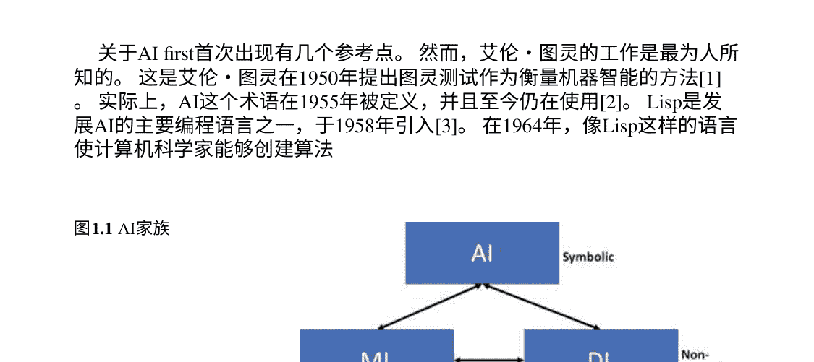

能够理解自然语言的。这被视为符号AI中最值得注意的开始之一。在那个时候，最著名的交互式程序之一是ELIZA，它被编程成模拟心理治疗对话[4]。

1969年，一篇里程碑式的论文《感知机》发表，报告了简单神经网络结构的先前未被认识到的限制[5]。这标志着1970年代AI冬天的开始。尽管如此，符号AI的工作仍在继续增长，并且在1972年引入Prolog编程语言后加速发展[6]。Prolog提供了类似基于规则的编程功能，类似于Lisp。虽然Prolog越来越受欢迎，但仍然有系统在使用Lisp进行开发。70年代最著名的系统之一是MYCIN[7]。MYCIN能够使用基于规则的方法进行医学诊断，可以使用少量事实做出决策。这影响了未来专家系统的发展。MYCIN在1979年被推广并更名为EMYCIN[8]。EMYCIN提供了一个专家系统框架，捕捉了领域专家的知识，并允许非专家用户解决特定问题。

尽管专家系统仍然是人工智能发展的主要关注点，但其他领域如游戏逻辑开始出现。第一个突破是柏林人的first背棋程序击败了当时的世界冠军[9]。随着人工智能在20世纪80年代的进展，更复杂的计算任务如无人驾驶汽车被引入。例如，1986年Ernst Dieckmann建造了第一个无人驾驶汽车的示例，该车在空旷的街道上以55英里/小时的速度行驶[10]。这样的发展直接与并行计算和利用反向传播的神经网络的出现有关[11]。在这个时期，人工智能的其他领域也开始崭露头角。例如，Marvin Minsky正在研究协作人工智能代理的使用，后来在他的著名著作《心智的社会》中发表[12]。与此同时，人们开始转向进化计算，Rodney Brookes和他的行为导向机器人的subsumption architecture的工作引人注目[13]。

在1990年代，人工智能继续取得了显著的进展。这个十年见证了基于符号的人工智能应用的持续增长，如智能辅导系统、案例推理和多智能体系统。人们对规划、调度、数据挖掘、自然语言处理（NLP）、计算机视觉、虚拟现实和游戏等新的应用领域也越来越感兴趣。人工智能在游戏中的应用可能是最有趣的之一。例如，1994年的背棋程序采用了强化学习（RL）方法，现在已经足够强大，可以玩高水平的游戏，后来还击败了世界冠军国际象棋选手[14]。人工智能在游戏中的成功继续在1997年击败了世界国际象棋冠军加里·卡斯帕罗夫[15]。

在2000年代，人工智能的应用主要集中在机器人和自动化领域。一个早期的例子是iRobot的Roomba，它能够在成功导航和避开障碍物的同时自动清扫地板[16]。然而，这个领域最令人印象深刻的突破是本田ASIMO机器人，它能够模仿复杂的人类任务，如步行和投递 [17]。 就在这个时期，我们看到了现代推荐系统在网络跟踪活动和媒体使用中的出现。 这项技术的最早采用者之一是TiVo电视服务，用于向观众提供节目建议 [18]。 在2000年代，人工智能继续发展，出现了能够超越人类水平表现的算法 [19]。

2011年，IBM的Watson在Jeopardy比赛中击败了卫冕冠军Rutter和Jennings [20]。 我们还见证了智能助手的出现，如苹果的Siri，Google Now和微软的Cortana，它们利用了先进的自然语言处理技术。 甚至还有能够执行复杂任务的机器人，如驾驶汽车和爬梯子。 回到游戏领域，在2015年，谷歌的DeepMind AlphaGo以5-0击败了三届欧洲围棋冠军Van Hui [21]。 次年，AlphaGo以4-1击败了李世石，他在职业生涯中赢得了2002–2016年间的27个冠军赛 [22]。 在本章的剩余部分，我们将介绍上述方法中使用的许多算法，这些算法将在本书的后续章节中进行更详细的讨论。

#### 1.1.2 机器学习

那么，什么是机器学习？ 与利用规则和数据产生答案的符号人工智能不同，机器学习利用答案和数据自动产生一组规则。 然后，这些规则可以应用于新的和未知的数据，以促进响应或行动。 符号和非符号方法之间的关键差异可以在图1.2中看到。

这使得算法能够以类似于人类的方式积累经验。 通过将算法暴露给新数据，它们可以自主学习、适应和发展。 它们可以在数据中找到有洞察力的信息，而不需要被告知在哪里寻找。 这种方法深深植根于模式识别中，旨在从先前的计算和交易中学习，以产生可靠和明智的结果。

机器学习的概念可以追溯到20世纪50年代，当时开发了第一个神经网络机器SNARC [23]。 大约在同时，IBM的工程师们也开始研究机器学习算法来玩复杂的游戏[24]。 机器学习的第一个重大进展之一是感知器的发明，至今仍广泛使用[25]。 这个时代继续看到了AI领域的进步，特别是引入了强化学习[26]。 1967年，最近邻算法被开发出来，被广泛认为是第一个基本的模式匹配算法[27]。

在1970年代，一篇关于自动微分（AD）的论文被发表。 这被广泛认为是现代反向传播的起点[28]。 1979年，描述新认知机的工作为卷积神经网络（CNNs）的发展奠定了基础[29]，1982年，Hopfield网络作为一种递归神经网络（RNN）被用作内容可寻址系统[30]。 NetTalk于1985年开发，能够以类似婴儿的方式发音[31]，1986年，在一系列实验中使用AD学习内部表示是人工神经网络领域最基本的突破之一。 这项工作导致了现代反向传播的发展[32]。

1995年引入了随机森林（RF）和支持向量机（SVM）算法[33]。 而在1997年，LSTM RNN被发明出来，以改善时间序列预测中RNN的效率和实用性[34]。 计算机视觉也随着著名的MNIST数据集的发布而兴起，该数据集提供了一个全面的手写数字数据集[35]。

2002年，基于Lua编程语言的Torch机器学习库发布[36]。 而在2006年，Netflix奖竞赛启动，旨在使用机器学习超越他们自己的推荐软件的准确性来预测用户的电影评分[37]。 三年后，Bellkor's Pragmatic Chaos团队击败了Netflix的评分预测算法，提高了10%[38]。 同年，ImageNet被引入，截至目前已拥有超过1400万张图片和2万个类别[39]。 该数据集旨在为机器学习算法提供大量的真实世界图像数据。 ImageNet自2010年开始被视为AI夏季的重要组成部分。 在这一年，通过新推出的Kaggle平台提供了更多的数据集，该平台成为机器学习竞赛的首选网站[40]。 2012年，Google Brain开发了一个神经网络，通过从YouTube视频中获取的图像来识别猫[41]。 直到2014年，神经网络才能以超过97%的准确率识别人脸[42]。

## **1.1.3 深度学习**

深度学习（DL）是机器学习的一个子集。 机器学习在流程中具有特定的特征提取阶段。 在一些DL架构中，通常不需要这一步骤，因为特征可以在训练过程中自动学习。 DL使用无监督算法提取特征，并使用有监督算法对观测进行分类。 图1.3显示了机器学习和DL方法之间的区别。

DL方法提供了几个关键优势。 首先，DL算法可以从大量数据中构建更准确的模型，与传统的机器学习相比。 其次，使用DL可以显著加快流程，因为它消除了对专业领域知识的要求，尽管训练时间可能会更长。 例如，解释心电图（ECG）信号通常需要专家识别信号的相关特征，并将其与特定的心脏状况联系起来。 然而，使用DL，信号的形状将通过提取最相关的特征自动映射到特定的心脏状况。 图1.4显示了使用DL算法时实现的性能提升。

最近，深度学习主要应用于计算机视觉领域。 毫不奇怪，关键的里程碑都集中在神经网络架构的发展上，以提高计算机视觉任务的性能。 有四个计算机视觉中的主要研究领域如图1.5所示。 包括：

- (a) 图像分类-图中有一只犀牛
- (b) 实例分割-对犀牛的每个独立对象中的所有像素进行分类
- (c) 目标检测-检测图像中的每只犀牛
- (d) 语义分割-对与犀牛相关的所有像素进行分类。

最重要的里程碑之一是2012年引入的AlexNet[43]。 当时，由于其网络设计利用了图形处理单元（GPUs）进行训练，AlexNet是最耗计算资源的架构之一。 AlexNet参加了ImageNet大规模视觉识别挑战赛（ILSVRC），并取得了15.3%的前五错误率。 2014年，引入了Visual Geometry Group（VGG）网络架构[44]。 这种网络架构以其简单性而闻名，并在2014年的ILSVRC比赛中获得亚军。

2014年还引入了基于区域建议网络（RPN）[45]。 第一个RPN采用了选择性搜索方法。 区域是图像的特定子区域；网络使用这些图像来识别其中的感兴趣对象。 同年，提出了快速R-CNN作为加速这一过程的方法，并在2016年[46]中通过更快的R-CNN[47]进一步提高了性能。 2015年的重要进展是引入了ResNet。 ResNet使得训练数百甚至数千层成为可能，提供令人信服的结果。 从那时起，ResNet已成为研究界中流行的目标分类网络。

2015年，You Only Look Once (YOLO)统一的、实时的目标检测架构被引入[48]。 YOLO模型用于实时检测图像中的物体。 其他类型的检测模型，如R-CNN系列，利用分类器或定位器进行检测。 相反，YOLO模型使用单个神经网络分析整个图像。 该网络将图像分成区域，并预测给定区域的边界框和相关概率。 通常，YOLO使用低分辨率图像进行目标检测，因此大大加快了性能。 然而，当使用更高分辨率的图像时，这可能会引入严重的问题，因为它们被缩小，导致物体变得像素化且更难检测。 YOLO通常用于检测近距离物体，而R-CNN系列通常使用包含各种大小和被遮挡物体的高分辨率图像进行实现。 与YOLO类似，单次检测器(SSD)架构用于实时目标检测[49]。 与R-CNN系列相比，SSD通过消除基于区域的提案网络来加速检测过程。 SSD采用了多尺度特征和默认框等多种功能来提高准确性。 这使得SSD在使用低分辨率图像时可以与R-CNN系列的性能相匹配。

2017年，计算机视觉领域在引入目标分割技术后取得了进一步的发展。 特别是，Mask R-CNN架构是由Facebook AI研究团队[50]开发的。 该模型分为两部分，包括一个RPN和一个二进制掩码分类器。 掩码网络在计算物体的体积和尺寸方面变得流行，例如计算痴呆患者的食物消耗，如图1.6所示。

开发神经网络架构耗时且通常需要大量的专业知识。 因此，这导致了对自动机器学习（AutoML）的新兴兴趣领域。 自动化生成神经网络架构具有许多好处，例如消除了人工参与的需求。 例如，神经网络架构搜索（NAS）于2016年开发出来以实现这个 [51]。 然而，训练这种类型的架构需要大量的计算资源，这些资源通常对研究人员和从业者都不可用。

神经网络不仅限于架构生成，还可以用于生成数据。 例如，生成对抗网络（GAN）是一种替代学习方法，最早在2014年引入，可以生成合成图像[52]。 在照片上训练的GAN可以生成新的图像，至少在外观上对人类观察者来说是真实的，并具有许多逼真的特征。 有许多研究领域正在研究使用GAN生成合成训练数据应用的可行性。

这在训练数据不容易获取或质量较差的应用中特别有用。 图1.7突出了过去十年深度学习发展的重要里程碑。

#### 1.1.4 它们是如何结合在一起的

希望现在清楚了AI、ML和DL之间的区别以及它们如何用于解决不同的问题。 AI是一个广泛的术语，用于描述过去70年来的计算智能，传统上基于符号AI。 新的子领域机器学习和DL是AI的扩展，主要关注数据驱动的学习。 这并不是说它们被孤立地使用，而是经常结合在一起来捕捉智能和问题解决的不同方面。 例如，这些复杂学习系统的最大问题之一是模型解释和深度神经网络需要学习的大量数据。 通过结合AI中的一些符号方法，可能可以创建可解释的模型。 正在进行研究由MIT、DeepMind和IBM等机构展示了将连接主义技术（如深度学习）与符号推理相结合的强大力量。

选择合适的工具或其组合通常是一部分艺术和一部分科学，只能通过经验和实验来学习和实践（就像神经网络一样）。 本书旨在介绍开发实际AI应用时常见的陷阱和关键考虑因素。 图1.8显示了AI生态系统的概述。

本书将通过真实世界的例子来涵盖AI家族的每个方面。 这将使从业者能够实现AI家族的所有方面，并将它们结合起来解决自己独特的问题。

### 1.2 人工智能正在推动创新

人工智能已经广泛应用于我们所做的一切。 其中最常见的例子是现代智能手机，它提供了场景检测、高级相机功能和像Siri这样的认知助手。 人工智能最近为智能汽车铺平了道路，使得特斯拉的自动驾驶、Siri和Alexa的集成成为可能，这样你可以提问甚至监控驾驶员的行为。 最近，像亚马逊这样的大型零售商一直在开发自动无人机进行自动包裹分发，甚至向世界上最偏远的地区提供关键药物的送货服务。

随着社交媒体的广泛使用，我们所思考和说的一切现在都有数字化的存在。 Twitter、Facebook和Microsoft等公司正在利用这些数据来创建个性化的体验。 通过使用你过去的行为、网络搜索和互动，公司可以提供定向广告和建议。 社交媒体还与人工智能和其他数据相结合，追踪像最近的COVID-19疫情爆发一样在全球范围内传播。

另一个日常使用人工智能的绝佳例子是媒体流媒体平台。 Spotify、Netflix和Amazon等组织利用人工智能进行个性化推荐和自动播放列表。 甚至Google和Apple将人工智能嵌入流行的导航服务中，这些服务利用大量数据提供方向和实时交通警报。 视频游戏行业是最早采用人工智能的行业之一，它使游戏玩法得到改进，并产生了几年前还不可能的先进图形特效。

尽管摄像系统的使用可能是一个有争议的话题，但人工智能的使用在自动识别物体方面起到了重要作用。 人类不可能同时监控数百甚至数千个摄像头的视频源，这是不可行的。 这就是人工智能填补了这个空白，使得物体和面部识别等功能成为可能。 这些功能已经被广泛应用于许多现成的系统，如闭路电视和其他商业产品，如Ring门铃。

在接下来的章节中，我们将讨论一些应用方面。

#### 1.2.1 转变医疗保健

医疗保健可以说是人工智能应用最活跃的领域之一。 许多行业领导者认为，人工智能有潜力彻底改变医疗保健，并帮助解决人类面临的一些最困难的健康挑战。 随着人工智能在医疗保健领域的广泛应用，这将导致更好的护理结果，并提高护理交付的生产力和效率。 巴比伦健康是最先进的人工智能医疗应用之一，它利用人工智能使医疗保健变得更加可及和负担得起。 该系统旨在通过理解患者描述症状的独特方式为数百万人提供医疗保健。 利用这些知识，结合患者的病史，可以更好地了解患者的医疗状况并提出治疗计划[53]。

通过医学影像诊断疾病是医疗保健领域的一项长期实践。 近年来，人工智能在医学诊断中得到了快速应用，并且通常能够胜过临床医生。 例如，放射学在过去几年中需求显著增加，这导致了人工智能的使用技术支持放射技师的决策。 虽然放射学实践中人工智能的理论基础非常令人兴奋，但现实情况是，这个领域还没有完全接受它。 最重要的问题是，这项技术还没有成熟到可以在更广泛的实践中使用。 然而，这是一个快速变化的环境，已经导致了在许多其他应用领域使用成像技术。 例如，移动系统现在可以用于拍摄人体皮肤损伤的照片，并使用人工智能目标检测报告组织状态。 在最近的临床试验中，研究人员使用了一种新颖的创新平台来检测和分级易受伤患者的压力性溃疡。 利用人工智能的先进技术，团队能够创建一个分析模型，可以分析组织特征并自动向护理人员报告结果。 图1.9是使用智能手机对一个二级压力性溃疡进行分类的示例。

#### 1.2.2 保护野生动物

保护主义者越来越多地使用人工智能来收集有关野生动物的信息并防止偷猎。 许多不同的物种都受到偷猎的不利影响。 为了应对这一不断升级的危机，人们已经开始使用隐藏摄像头、无人机和DNA追踪等手段来阻止偷猎，这些手段现在产生了大量的数据点。 然后，这些数据点会被人工智能算法分析，以获得有关野生动物的见解，并支持全球保护工作。 最近的一项研究概述了一种灵活且可互操作的框架，用于自动检测动物和偷猎活动，以促进早期干预实践。 研究人员使用目标检测算法自动分析来自各种来源的视频数据，包括相机陷阱和无人机，以跟踪野生动物和偷猎者[55]。 图1.10显示了一个分类帧的图像，而图1.11突出显示了使用无人机进行目标检测和跟踪。 此外，研究人员通过分析仅音频就能够对不同物种进行分类。 常见动物的声音已经被高度分类，这使得保护人员能够监测到难以到达地方的野生动物。 图1.12展示了用于训练鸟类识别算法的样本鸟鸣录音[56]。

#### 1.2.3 环境安全

正如你所想象的那样，人工智能已经在各种不同的安全应用中使用。 也许最具争议但潜力最大的领域之一是使用人工智能自动解释视觉数据。 其中最重要的领域之一是面部识别，在中国等国家已经广泛使用。 在郑州，乘客可以使用这项技术自动授权支付，而不是扫描手机上的二维码。 新的法规已经生效当移动电话用户与供应商签订新合同时，需要进行面部扫描。

安全部队在使用人工智能方面投入了大量资源，特别是在使用无人机、监控、群体控制和搜救方面。 通常还可以使用额外的摄像技术，如热像仪和灰度图像，来定位难以观察到的物体，如图1.13所示。 将这种技术与本章讨论的一些人工智能技术相结合，可以实现自动化和规模化部署。

警察部队将人工智能视为解决预算下降和人力减少问题的解决方案。 该技术被用于分析照片（以防止儿童被剥削）、闭路电视镜头（以帮助犯罪检测）和证据文件（以帮助分析证据和相关犯罪的关键特征）。 它还被用于分析犯罪日志，以识别高风险区域和报告的犯罪类型。 目前还在研究使用音频信号作为检测特定噪音（如枪声）的方法，以帮助三角定位和定点响应。 使用相对便宜的设备可以轻松部署一个跨大地区的音频检测网络，这些设备可能具有更远的识别能力。

大量的犯罪活动实际上是在虚拟环境中进行的，这导致了AI安全领域的新方向，以识别和阻止网络威胁。 随着网络攻击在数量和复杂性上的增长，不断需要新的工具来保持领先于攻击者。 AI被用于识别新兴威胁，并学习如何应对新型攻击。

最近，围绕大流行病的问题引起了严重关注，人们对使用AI保护人民和经济的兴趣很大。 有人提出利用闭路电视网络通过热像仪扩展来监测人们的体温，同时在社交距离方面提供支持。 智能电表还提供了监测社交隔离对人们和社区以及当前和未来疫情爆发的影响的重要机会。 智能电表可以报告家庭能源数据的实时使用情况，这已经显示出揭示居民日常习惯的能力。 这使得分析师能够识别由于疾病或违反社交距离等原因导致的行为变化。 图1.14显示了家电使用与一天中的时间的关系。 家电与时间的关系，就像蚂蚁信息素路径一样，显示了一个个体家庭的已建立的例行行为[57]。 例如，可以看到微波炉主要在06:00和18:00使用。

### 1.3 工具、框架和硬件

正如我们在本章中所看到的，人工智能有着广泛而多样化的用途，可以解决各种问题。 在工作中，你可能会面临许多问题，人工智能可能是一个有用的工具。 本书将为您提供解决实际问题所需的所有技能。 在本节中，我们将介绍研究和工业界常用的开发人工智能应用的工具。

#### 1.3.1 构建智能应用

本书重点介绍使用各种行业标准框架和工具创建实际示例。 作者们基于他们在开发最新技术的人工智能解决方案方面的行业和研究经验。 他们提供了训练模型和利用其优势的完整端到端流程的见解。 每个框架和工具都将帮助您开发企业解决方案，同时利用中央处理单元（CPU）和图形处理单元（GPU）硬件的进步。

#### 1.3.2 Python，笔记本和环境

在撰写本文时，Python被广泛认为是许多数据科学和人工智能任务的首选语言。 Python是一种通用编程语言，具有重要的工具和包生态系统，并通过论坛提供广泛的支持。 Python易于学习，并且是2019年最常用的前五大编程语言之一。

编写和执行Python代码的最常见方法之一是通过使用在浏览器中直接运行的Jupyter Notebooks。 它们还可以通过使用markdown进行笔记并作为可执行文档，应该被视为数据科学任务的一种方法。 使用Jupyter Notebooks的一个优点是可以直接在浏览器中执行代码，从而可以立即在生成的单元格中看到结果。 它具有易于使用的界面，允许您使用单元格组织和执行代码。 此外，Notebooks可以导出为可执行的Python files，可在您的开发流程中使用。 这相对于其他工具和框架来说具有重要的优势，因为它更容易开发原型并部署端到端解决方案。 Notebooks允许您执行的最重要任务之一是确保通过轻松共享Notebook和相关数据来实现可重复性。

Anaconda是一个可扩展的数据科学平台，允许您组合和分离不同的软件包和框架，以提供预定义的环境。 由于这些环境彼此隔离，因此可以安全地进行修改和## 1.3 工具、框架和硬件

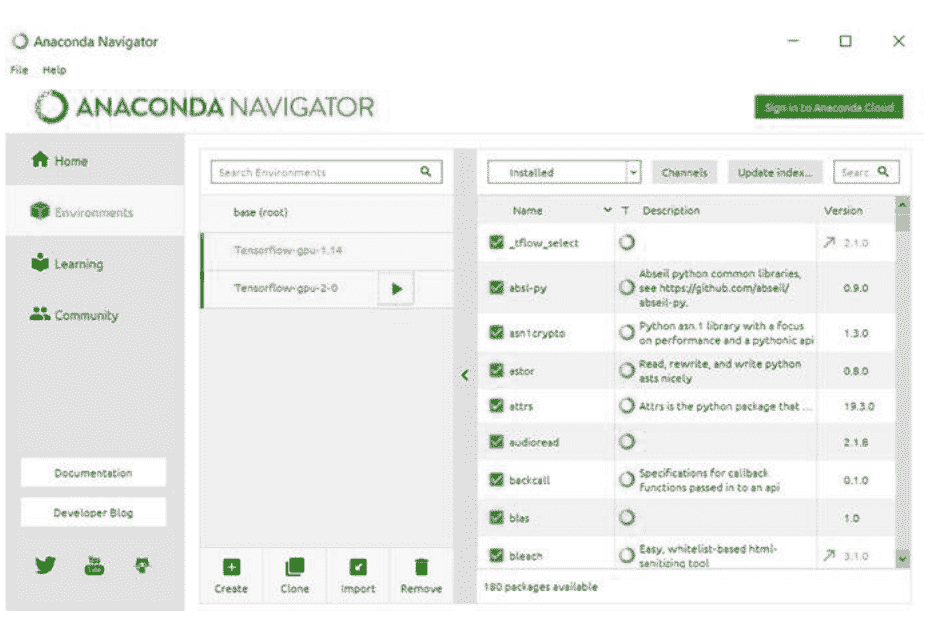

图1.15 Anaconda导航器

更改，而不会影响其他使用的环境。这对于管理版本、软件包依赖关系和部署策略非常有用。使用Anaconda的一个关键优势是能够轻松共享、协作和重现项目。图1.15显示了Anaconda Navigator，它是一个图形化界面，用于管理环境、安装软件包和启动数据科学任务。

#### 1.3.3 预处理

数据通常需要大量的预处理，这对于机器学习和深度学习任务尤其如此。幸运的是，有几个Python库包括：

- **Pandas** –是一个提供数据操作和分析工具的Python库。
- **NumPy** –是一个用于多维数组和矩阵的Python库。
- **Seaborn** –是一个用于绘图和图形的Python可视化库。
- **Matplotlib** – 是一个用于绘图和图形的Python库。
- **Plotly** –提供在线绘图、分析和统计工具。
- **Pillow** – Python图像处理库，提供对图像数据的支持。
- **OpenCV** –是一个用于计算机视觉和图像处理的库。
- **SciPy** –是一个用于科学和技术计算的Python库。

#### 1.3.4 机器学习

对于机器学习方面，本书将介绍一种最流行的Python机器学习库，名为Scikit-learn。Scikit-learn集成了许多最流行的机器学习算法，并提供了有用的工具来进行预处理、训练和评估机器学习任务。Scikit-learn是建立在NumPy、SciPy和matplotlib之上的，可以进行分类、回归和聚类任务。

尽管Scikit-learn有许多优点，但也存在一些关键限制，例如长时间的训练时间，因为管道完全在CPU上执行，这影响了生产力。在小型项目中，数据量很少，这可能不是一个问题。然而，在大数据应用中，通常需要一组替代工具。为了支持这两种情况，本书将介绍RAPIDS。RAPIDS是一组库和API，为用户提供在一个或多个GPU上执行端到端数据科学项目的能力。RAPIDS利用NVIDIA CUDA来暴露GPU并行性和高带宽内存速度，可以通过高级Python编程语言进行访问。

#### 1.3.5 深度学习

对于本书中的深度学习方面，我们将参考包含高级Keras API的TensorFlow。TensorFlow是训练、验证和托管人工神经网络（ANNs）的首选框架。TensorFlow提供了所有必要的工具，用于图像处理、时间序列分析和自然语言处理。TensorFlow与Python编程语言无缝集成，以便快速开发和训练高级ANNs。高级图像处理指的是TensorFlow对象检测API，用于图像分类、目标检测和语义分割。Keras提供了一个与TensorFlow平台所有方面相关联的API。这简化了应用深度学习解决方案的现实开发。

#### 1.3.6 推理

模型的训练是整个流程中的一小部分，也是大多数从业者在推理模型在生产中的复杂性方面遇到困难的部分。虽然相对容易实现简单的端到端解决方案，但有用的算法需要包含在几种不同的技术中，以使其在商业上可行。本书将介绍适合工作的正确技术，并包括gRPC、REST、TensorFlow Serving和Docker。为了暴露模型的功能，还需要使用其他工具和框架。本书将介绍AI流程中被认为是支持框架的内容，并包括使用NGINX进行Flask Web开发。这将使您能够开发和部署端到端的企业解决方案。

### 1.4 本书的组织结构

本书的第一部分（第2章至第5章）将介绍机器学习的基础知识、监督学习和无监督学习以及性能评估指标。

本书的第二部分（第6-11章）将讨论深度学习的概念和技术。这将包括深度学习的介绍，图像分类和目标检测，用于时间序列数据的深度学习，自然语言处理，生成模型和深度强化学习。

本书的第三部分（第12章）将介绍加速机器学习。本书的最后一部分（第13和14章）将讨论在企业环境中部署和托管机器学习模型。

本书是一本应用型书籍，理论符号被故意保持到最小。所有核心概念都有涵盖，理论方面提供给感兴趣的读者作为参考。因此，本书主要面向希望开发和部署实际AI应用和解决方案的相关人士。

### 1.5 适合阅读本书的人群

本书适合对开发和实施实际AI解决方案感兴趣的人群。本书专为新手设计，并为现有的软件开发人员和数据科学家提供有价值的见解。虽然不严格要求具备编程背景，但具备编程背景将有助于理解和加速实施自己的AI解决方案。

这本书也适合那些主要关注人工智能理论方面的研究人员，他们希望通过将解决方案应用于更广泛的受众来发展研究影响力。

### 1.6 总结

本章概述了人工智能的发展历程，简要介绍了机器学习和深度学习的发展。这涵盖了70多年的创新，从基于规则的系统（符号）到广泛应用于许多高级应用的复杂深度神经网络结构（非符号）人工智能。本章突出了三个主要领域之间的差异和关系，我们正在从使用规则和数据生成答案的系统转变为使用答案和数据推导规则的系统。

尽管这三个领域各自独特，但它们越来越多地被结合使用，以解决更复杂的问题，如可解释的人工智能和模型解释。

此外，本章提供了人工智能如何用于推动创新和支持不同领域内外的关键转型的概述。

人工智能的影响已经在改变我们的做事方式，同时帮助解决社会面临的一些最具挑战性的问题。因此，人工智能的采用正在重塑和改变我们在新技术环境中的行为和互动。值得注意的是，我们已经看到了在医疗保健、野生动物保护和安全方面的显著影响。

最后，本章提供了一个框架，用于进行理论和应用方面的研究。为了更好地使用本书，提供了使用不同工具和框架的建议。我们希望本书能够为读者提供必要的技能和工具，以解决他们所面临的现实问题，并开展自己的人工智能解决方案的开发和部署。

## 参考文献

1. C. Machinery, “计算机机械和智能-AM Turing,” Mind, vol. 59, no. 236, p. 433, 1950.
2. J. McCarthy, M. Minsky, N. Rochester, and C. Shannon, “关于达特茅斯夏季研究项目的提案 人工智能。汉诺威，新罕布什尔州，美国，达特茅斯学院。” 1955年。
3. J. McCarthy, “LISP的历史,”在编程语言的历史, 1978年, 第173–185页。
4. J. Weizenbaum, “ELIZA—一种用于研究人机自然语言交流的计算机程序,”ACM通信, 第9卷, 第1期, 第36–45页, 1966年。
5. M. Minsky and S. Papert, “感知器: 计算几何的介绍,”麻省理工学院出版社。剑桥, 扩展版., 第19卷, 第88期, 第2页, 1969年。
6. A. Colmerauer, H. Kanoui, H. Pasero, and P. Roussel, “PROLOG, 一个法语的人机通信系统,” 1973.
7. E. H. Shortliffe, “MYCIN: 一个基于规则的医生抗菌治疗计算机程序,” 1974.
8. W. J. Van Melle, 一个领域无关的系统，有助于构建基于知识的咨询程序. 斯坦福大学, 1980.
9. H. J. Berliner, “Backgammon计算机程序击败世界冠军,”Artif. Intell., vol. 14, no. 2, pp. 205–220, 1980.
10. E. D. Dickmanns and A. Zapp, “计算机视觉下的自主高速道路车辆导航,”IFAC Proc. Vol., vol. 20, no. 5, pp. 221–226, 1987.
11. D. E. Rumelhart, G. E. Hinton, 和 R. J. Williams, “通过反向传播错误学习表示”自然, vol. 323, no. 6088, pp. 533–536, 1986.
12. M. Minsky, 心智的社会 . Simon and Schuster, 1988.
13. R. Brooks, “一个移动机器人的稳健分层控制系统”IEEE J. Robot. Autom., vol. 2, no. 1, pp. 14–23, 1986.
14. G. Tesauro, “TD-Gammon, 一个自学习的黑白棋程序，达到大师级水平” 神经计算 , vol. 6, no. 2, pp. 215–219, 1994.
15. F. Hsu, “IBM’s deep blue chess grandmaster chips, ” IEEE Micro , vol. 19, no. 2, pp. 70–81, 1999.
16. L. Grossman, “定制女仆， ” Time Mag. vol, 2002.
17. Y. Sakagami, R. Watanabe, C. Aoyama, S. Matsunaga, N. Higaki, and K. Fujimura, “The intelligent ASIMO: System overview and integration,” in IEEE/RSJ international conference on intelligent robots and systems, 2002, vol. 3, pp. 2478–2483.
18. J. Barton, “From Server Room to Living Room: How open source and TiVo became a perfect match,” Queue, vol. 1, no. 5, pp. 20–32, 2003.
19. J. Schaeffer等, “解决跳棋问题,”在第19届国际联合会议 人工智能, 2005年, 第292–297页.
20. J. Markoff, “计算机在 ‘Jeopardy!’上获胜： 微不足道, 它不是，”纽约时报, 第16卷, 2011年.
21. D. Silver 等 , “不借助人类知识掌握围棋的游戏,”自然, 第550卷, 第7676期, 第354–359页, 2017年.
22. Y. Chen 等 , “贝叶斯优化在alphago中的应用,”arXiv预印本. arXiv1812.06855, 2018年.
23. D. Hillis 等 , “为了纪念马文·明斯基在他80岁生日上的贡献,”AI杂志, 第28卷, 第4期, 第103页, 2007年.
24. A. L. Samuel, “使用跳棋进行机器学习的一些研究,”IBM J. Res. Dev., 第3卷, 第3期, 第210–229页, 1959年.
25. F. Rosenblatt, “感知器： 大脑中信息存储和组织的概率模型,”Psychol. Rev., 第65卷, 第6期, 第386页, 1958年.
26. D. Michie和R. A. Chambers, ”BOXES: 一种自适应控制的实验,”Mach. Intell., 第2卷, 第2期, 第137–152页, 1968年.
27. T. Cover和P. Hart, “最近邻模式分类,”IEEE Trans. Inf. theory, vol. 13, no. 1, pp. 21–27, 1967.
28. S. Linnainmaa, “将算法的累积舍入误差表示为局部舍入误差的泰勒展开式,”硕士论文 (芬兰语), 赫尔辛基大学, pp. 6–7, 1970.
29. K. Fukushima, “神经网络模型用于不受位置偏移影响的模式识别机制-新认知机,”IEICE Tech. Report, A, vol. 62. no. 10, pp. 658–665, 1979.
30. J. J. Hopfield, “神经网络和具有新兴集体计算能力的物理系统,”Proc. Natl. Acad. Sci., vol. 79, no. 8, pp. 2554–2558, 1982.
31. T. J. Sejnowski和C. R. Rosenberg, “NETTalk: 一个学会朗读的并行网络。 约翰霍普金斯大学电气工程与计算机科学技术报告, ” EEC, vol. 86, no. 01, 1986.
32. D. E. Rumelhart, G. E. Hinton和R. J. Williams, “通过误差传播学习内部表示, ” 1985.
33. T. K. Ho, “随机决策森林, ” in第3届国际文档分析与识别会议, 1995, vol. 1, pp. 278–282 .
34. S. Hochreiter和J. Schmidhuber, “长短期记忆, ”神经计算, vol. 9, no. 8, pp. 1735–1780, 1997.
35. Y. LeCun, L. Bottou, Y. Bengio, and P. Haffner, “基于梯度的学习应用于文档识别,”IEEE会议录, 第86卷, 第11期, 第2278–2324页, 1998年.
36. R. Collobert, S. Bengio, and J. Mariéthoz, “Torch: 一个模块化的机器学习软件库,” 2002年 。
37. J. Bennett, S. Lanning, and others, “The netflix prize,” inKDD杯和研讨会论文集, 2007年, 第2007卷, 第35页.
38. A. Töscher, M. Jahrer, and R. M. Bell, “The bigchaos solution to the netflix grand prize,” Netflix Prize Doc. , 第1–52页, 2009年.
39. J. Deng, W. Dong, R. Socher, L.-J. Li, K. Li, and L. Fei-Fei, “Imagenet: 一个大规模的层次化图像数据库,”在2009年的IEEE计算机视觉和模式识别会议上, 2009年, 第248–255页.
40. J. Carpenter, “愿最好的分析师获胜,”美国科学促进协会, 2011年.
41. L. Clark, “谷歌的人工大脑学会寻找猫视频,” *Wired UK*, www. wired. com, 2012年.
42. J. O’Toole, “Facebook的新面部识别从侧面认识你,”*CNN Money*, 2014年.
43. A. Krizhevsky, I. Sutskever, and G. E. Hinton, “使用深度卷积神经网络进行Imagenet分类” , *Adv. Neural Inf. Process. Syst.*, vol. 25, pp. 1097–1105, 2012.
44. K. Simonyan and A. Zisserman, “用于大规模图像识别的非常深的卷积网络”, *arXiv Preprint. arXiv1409.1556*, 2014.
45. R. Girshick, J. Donahue, T. Darrell, and J. Malik, “基于区域的卷积网络用于准确的目标检测和分割”, *IEEE Trans. Pattern Anal. Mach. Intell.*, vol.38, no. 1, pp. 142–158, 2015.
46. R. Girshick, “Fast r-cnn,” in计算机视觉国际会议论文集, 2015, pp. 1440–1448.
47. S. Ren, K. He, R. Girshick, and J. Sun, “Faster r-cnn: 基于区域提案网络的实时目标检测” in 神经信息处理系统进展, 2015,pp. 91–99.
48. J. Redmon, S. Divvala, R. Girshick, and A. Farhadi, “You only look once: 统一的实时目标检测” in计算机视觉和模式识别国际会议论文集, 2016, pp. 779–788.
49. W. Liu等, “SSD: 单次多框检测器” in欧洲计算机视觉会议, 2016, pp. 21–37.
50. K. He, G. Gkioxari, P. Doll ár, 和 R. Girshick, “Mask r-cnn,” in *Proceedings of the IEEE international conference on computer vision*, 2017, pp. 2961–2969.
51. B. Zoph 和 Q. V Le, “使用强化学习的神经架构搜索,”*arXiv Preprint. arXiv1611.01578*, 2016.
52. I. J. Goodfellow等人, “生成对抗网络,”*arXiv Preprint. arXiv1406.2661*, 2014.
53. K. Middleton, M. Butt, N. Hammerla, S. Hamblin, K. Mehta, 和 A. Parsa, “整理症状: 设计和评估‘babylon check’自动分诊系统,” *arXivPreprint. arXiv1606.02041*, 2016.
54. P. Fergus, C. Chalmers, 和 D. Tully, “协作性压疮预防: 一种自动化的皮肤损伤和压疮评估工具, 适用于护理专业人员、患者、家庭成员和照顾者,” ” *arXiv Preprint. arXiv1808.06503*, 2018.
55. C. Chalmers, P. Fergus, C. Curbelo Montanez, S. N. Longmore, 和 S. Wich, “使用卷积神经网络和消费级无人机进行动物检测的视频分析,”*J. 无人机系统.*, no. ja, 2021.
56. C. Chalmers, P. Fergus, S. Wich, 和 S. N. Longmore, “使用声学监测和深度学习建模动物生物多样性,”*arXiv Preprint. arXiv2103.07276*, 2021.
57. C. Chalmers, P. Fergus, C. A. C. Montanez, S. Sikdar, F. Ball, and B. Kendall, “使用智能电表负荷分解技术检测独居的痴呆患者的日常生活和常规行为”*IEEE Trans. Emerg. Top. Comput.*, 2020.

## 第二部分

## 机器学习基础

## 第二章 机器学习基础知识

### 2.1 什么是机器学习？

机器学习（ML）是一种利用历史数据和领域知识自动构建算法来解决给定问题的人工智能领域。这与其他通过显式编程和预定义规则构建算法的方法形成对比。机器学习可能是一个漫长而复杂的任务，被视为通过模型训练和重新调整的迭代过程。训练过程使用训练数据进行，这些数据可以是已知的或未知的，取决于算法的学习方式。训练好的模型通过使用未见过的测试数据来评估其性能。根据结果，可能需要使用额外的数据重新训练算法以提高准确性。

一旦模型训练完成，就可以部署以接收连续的数据。这也允许通过迭代学习过程对模型进行评估。任何被错误识别的测试数据都会被添加到训练数据中，用于未来的模型训练。图2.1展示了端到端的训练、测试和部署流程。

使用机器学习的一个关键优势是其能够推广到新的和未知的数据。这使得它比使用硬编码规则更加灵活，硬编码规则被称为封闭世界问题，应用程序需要重新开发以表达新的知识。然而，训练机器学习模型的一个关键挑战是在确保有效推广的同时获得合理的准确度。因此，机器学习的一个重要部分是数据的编排和管理（垃圾进/垃圾出），以产生高质量和可重复的模型。数据采集和处理是每个机器学习从业者应该学习掌握的关键技能。本书将为您提供一套开发机器学习解决方案的最佳实践工具和技术。

包括监督学习、无监督学习和强化学习在内的机器学习方法是任何机器学习项目中最常见的技术。它们都被设计用来解决不同的任务和问题。不要担心这些在这个阶段有点模糊，因为随着我们在本章中的深入讨论，它们将会更详细地讨论。

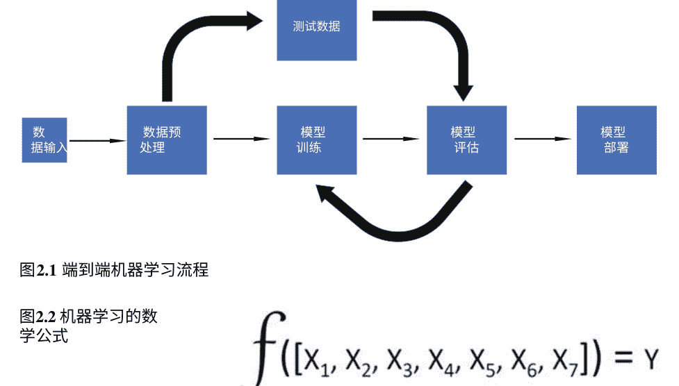

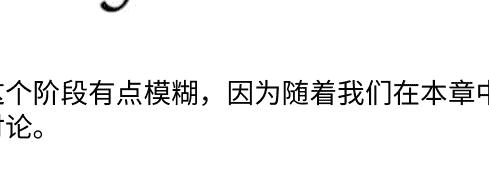

#### 2.1.1 正式和非正式定义

描述机器学习的两种主要方法：

- 正式定义："如果一个计算机程序在某个任务类别T上的性能P，通过经验E的提高而提高，则称其从经验E中学习"[1]。
- 非正式定义：机器学习的目标是通过使用示例数据或过去的经验来解决给定问题的计算机编程”[2]。

在最基本的层面上，机器学习算法试图通过训练过程创建一个函数（f），该函数可以接受一组输入（x）并预测（y）。 图2.2显示了用于训练机器学习算法的基本数学函数。

如第1章所讨论的，机器学习主要关注发现数据集中的模式，从而使计算机能够模仿人类解决复杂任务的智能。 机器学习擅长发现在人类分析下难以察觉的模式。 这就是为什么自90年代初以来，机器学习在许多领域迅速得到应用的原因。 例如，机器学习已经在许多领域中表现出优于人类的能力，包括金融和健康领域，在这些领域中进行时间序列分析、文本处理和预测等任务。

#### 2.1.2 人工智能和机器学习与传统软件开发的区别

在计算机领域，有些应用程序仅仅使用软件工程过程来构建是非常困难的。例如，编写一个能够在多个图像中识别90个不同对象的应用程序将非常复杂，使用传统软件开发工具很难实现。即使可能实现，扩展到包括更多对象也需要进行重大的软件更改。对于这些类型的任务，使用机器学习在解决这些问题上更加高效。与硬编码软件语句不同，机器学习被训练用于自动检测模式并构建对象检测算法。

需要注意的是，在任何机器学习应用中，软件开发仍然是一个关键组成部分。软件开发作为系统流程中个别组件之间的粘合剂，促进用户界面、后端数据存储过程和不同机器学习组件之间的通信。然而，还有第三个组件，即符号人工智能，在人工智能的早期广泛使用，现在开始复苏。像Lisp和Prolog这样的语言能够使用谓词逻辑和推理来处理逻辑和决策组件。这些语言允许实现事实、规则和推理引擎来解决不同的问题。因此，您可以将软件开发视为脚手架，将机器学习视为模式匹配和泛化组件。符号人工智能将由机器学习模型和其他数据源生成的输出与端到端流程执行期间的逻辑和决策过程相结合。

如图2.3所示，软件开发组件需要特定的编程来得出结果。符号人工智能组件允许引入新的事实。

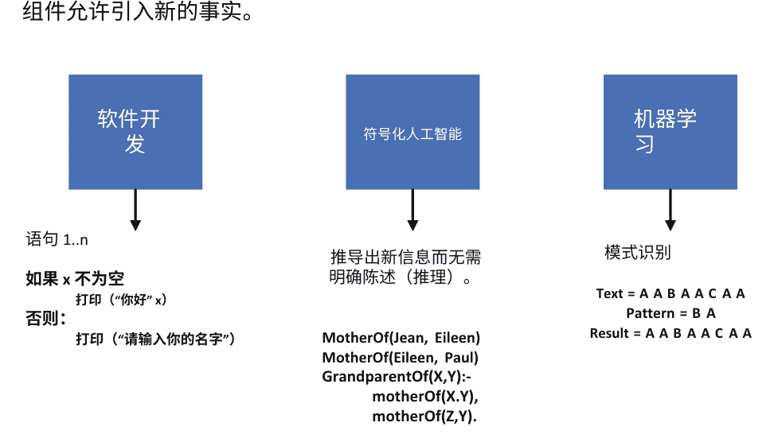

可以推导出来，而无需明确陈述它们。例如，要确定谁是祖父母X和孩子Y，只需遍历事实（母亲）使用一个祖父母的规则。在这个例子中，Jean是Paul的祖父母，因为Jean是Eileen的母亲，而Eileen是Paul的母亲。对于机器学习组件，它可以通过查看共同属性（如身高、体重和面部毛发等）来识别Paul是一个男人。

##### 2.1.2.1 重写规则

在传统软件开发中，知识被明确编码为一组规则。这与机器学习方法相反，机器学习算法通过训练来推导出自己的一组规则，这些规则基于输入数据及其目标结果。计算机程序将明确遵循由软件工程师开发的传统程序的规则。这意味着超出应用范围的新信息只能包含在未来的软件发布中。你可以将一个应用程序视为一个封闭的世界问题，这在第一章中有简要讨论。使用机器学习相比传统软件开发有几个关键优势，包括：

- 泛化：首先，机器学习使您能够将模型泛化以适应新的和相似的数据。机器学习从业者尽可能地使机器学习模型规范化，以防止过拟合。相比之下，软件工程导致对问题域的极端过拟合，并且通常需要进一步开发才能进行微小的更改。图2.4突出了欠拟合和过拟合的一个例子。

- 更快的开发：其次，机器学习使得解决复杂问题变得可行，且使用更少的代码行数来达到相同的结果。虽然机器学习需要您实现自定义代码，但这只是支持机器学习模型的包装代码。这意味着规则生成的复杂性由机器学习来处理。因此，这使得开发过程的速度和简化程度显著提高。

- 规则发现：在软件开发中，开发人员需要与客户一起定义自己的规则来解决给定的问题。

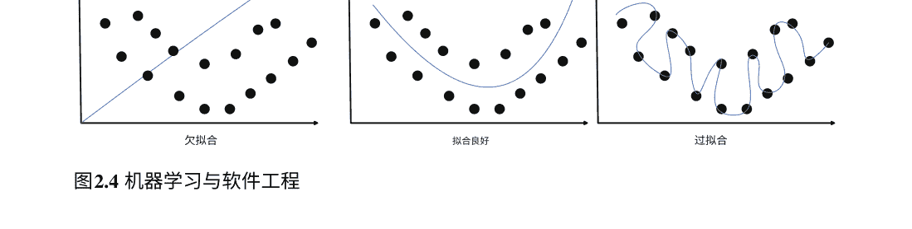

识别和使用这些规则是耗时且容易出错的。这经常导致交付的解决方案不能完全满足客户的期望。同样，选择的规则可能不适合该任务。

使用机器学习，规则会根据提供的数据自动创建。虽然这可能是有益的，但最终模型的好坏取决于提供的数据。

##### 2.1.2.2 智能决策

软件工程和机器学习的关键区别在于机器学习会随着时间的推移学习和改进。这与传统开发的应用程序形成对比，传统应用程序明确地操作提供的代码。机器学习不断学习模式、连接和洞察力，而无需编程以达到特定的结论。

这种学习元素是这两种方法之间的关键区别之一。机器学习提供的一个关键优势是加速决策过程。通过分析大量数据并得出智能洞察力，可以实现这一目标，而这通常是从人类输入中难以得出的。随着数据量的持续显著增加，解释和处理数据变得更加困难。当创建规则来处理数据并寻找新的洞察力时，这一点尤为明显。机器学习允许您快速找到这些重要的洞察力，并将它们提供给感兴趣的各方考虑。因此，机器学习现在能够提供更好的业务决策和更智能的行动方案，减少人为干预。因此，机器学习不是取代人类，而是增强和支持人类。图2.5显示了机器学习决策的即插即用架构。

第一阶段是摄取必要的数据源。使用企业技术，现在更容易集成不同的数据源来解决各种机器学习问题。数据使用各种数据访问技术进行流式传输，并直接提供给分析模型进行问题解决。分析模型处理获取的数据，为提供价值的组织获得洞察。由于这是一个完整的即插即用架构，模块可以快速插入、替换或组合以满足组织的需求。

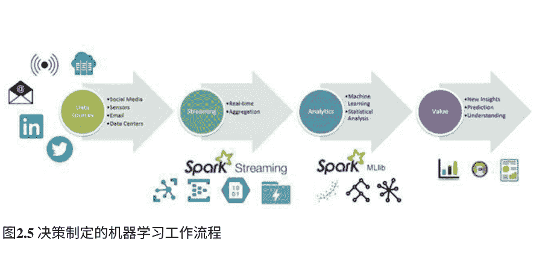

### 2.2 机器学习派系

有各种不同的机器学习算法，每个算法都有其优点和缺点。选择最合适的算法取决于各种因素和整体目标。然而，选择受到数据类型、计算硬件和期望的结果的指导。在本节中讨论数据和计算硬件之前，我们将介绍您在开发项目中可能遇到的最常见的机器学习算法派系[3]。尽管每个派系都不同，但它们的目标相同，即开发机器智能。图2.6突出显示了五个派系：符号派、连接派、进化派、贝叶斯派和类比派。

#### 2.2.1 连接主义者

连接主义者使用神经网络，因为它们受到神经科学的影响。本质上，连接主义者模仿大脑的结构来发展机器智能。大脑通过在神经元之间建立强连接来学习，从而导致正确的结果。这种方法成功的原因在于大脑能够确定哪些连接负责表示错误并进行相应的修正。连接主义者的角色是将大脑及其功能转化为一种称为人工神经网络（ANNs）的相关计算模型，如图2.7所示。在图中，生物神经元可以在左侧看到，而合成表示可以在输入、隐藏和输出层的右侧看到。

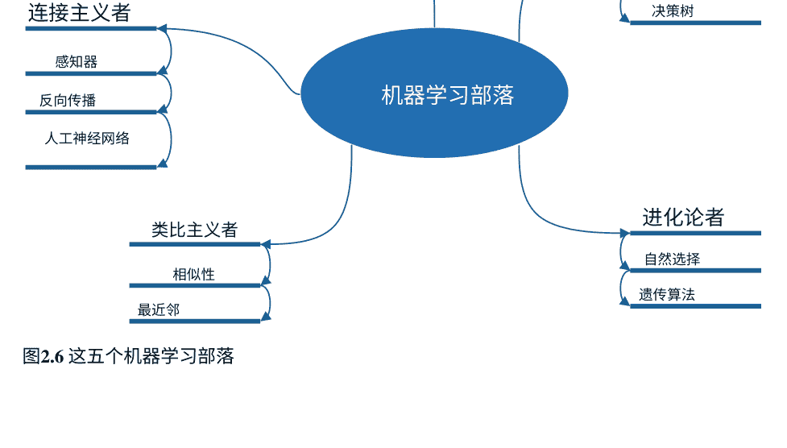

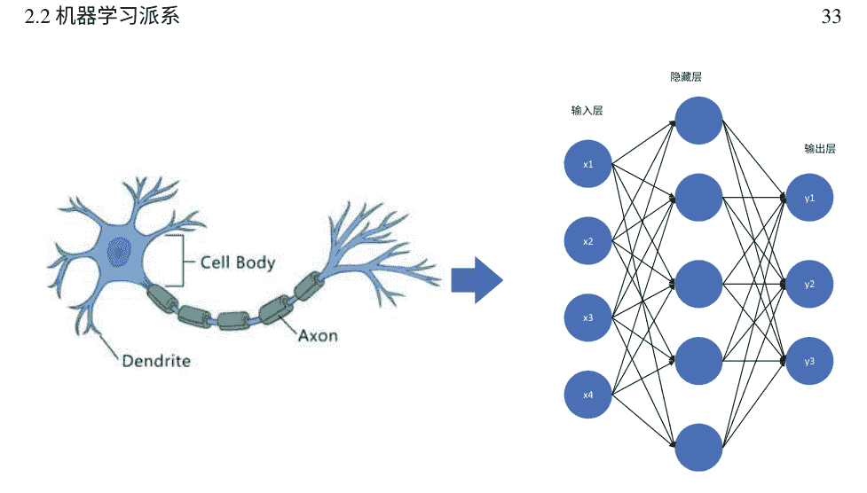

图2.7 生物神经元 vs 感知器

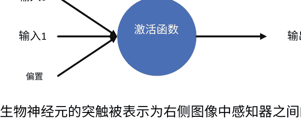

图2.8 带有输入和输出的感知器

在左侧生物图像中连接生物神经元的突触被表示为右侧图像中感知器之间的线条。

与大脑进行的错误校正相关，人工神经网络（ANNs）执行类似的任务，从输出层向输入层反向传播错误，通过其隐藏层。这个过程调整ANN的学习，以最小化其随时间的错误，从而增加获得成功结果的可能性。神经网络由许多层相互连接的感知器组成。这些感知器接受各种不同的输入，并包含一个处理器和一个单一的输出。该过程有四个主要阶段：接收输入、加权输入、求和输入和生成输出。图2.8突出显示了一个简单的感知器以及它的输入和输出。如果这些输入超过感知器的阈值，它会激活并沿着输出连接向下一个感知器传递一个值。

连接主义派中最常见的算法包括多层感知器（MLP）、自编码器、循环神经网络（RNN）、长短时记忆网络（LSTM）、卷积神经网络（CNN）和生成对抗网络（GAN），这些都将在本书中讨论。

#### 2.2.2 进化论者

进化论者对进化结构感兴趣，并受到生物进化的影响。这些算法通过使用自然选择的原理来产生在包含它们的环境中最成功的后代。一个常见的例子是遗传算法，其中学习过程试图解决一个优化问题。在遗传编程中，计算机程序以类似于自然交配和进化生物的方式进行演化。图2.9高亮了遗传算法的过程。

该过程始于一个种群，计算出每个成员的适应度。选择具有最高适应度值的成员，并在交叉步骤中使用它们。该步骤从父本A中取30%的遗传物质，并与父本B中的70%的遗传物质结合，产生后代。这个过程通过将父本A的70%的遗传物质与父本B的30%的遗传物质结合，产生第二个后代。然后对每个后代应用突变，以引入变异，这意味着将一部分遗传物质改变为其相反的值（即，如果值为0，则改为1，反之亦然）。新的后代成为新的父母，过程继续，直达到最佳结果，即找到最适合的后代。由于遗传算法在优化方面非常高效，它们被用于包括卷积神经网络权重配置在内的多种优化问题中[4]。可以使用约翰·科扎提出的遗传编程来开发系统[5]。

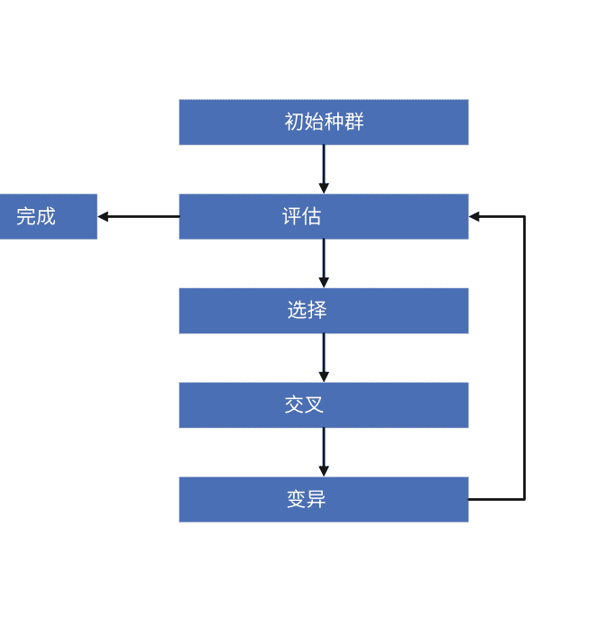

#### 2.2.3 贝叶斯

贝叶斯使用概率推理，受到统计学的影响，并关注不确定性。贝叶斯主要使用概率推理来测试一个假设，其中某些结果比其他结果更有可能发生。随着更多的数据可用，假设会被更新。例如，看图2.10，你能确定图中的人是男性还是女性吗？根据你对发型和时尚的理解，你可能会假设图中的人是女性，但是没有额外的信息，很难说。现在想象一下，如果图中的人在男性洗手间排队。有了这个额外的信息，你现在可能更有信心地假设图中的人是男性。基本上，这就是贝叶斯推理的工作原理。

贝叶斯概率是通过四个主要概念推导出来的：概率（某事发生的方式数除以所有可能发生的事情的总数），条件概率（与正常概率相同，但它们只考虑所有示例的一个子集，即女性和长发女性），联合概率（将两个独立概率相加，即人是女性且有长发的概率），边际概率（将所有不同方式发生某事的概率相加）。一些最流行的贝叶斯算法包括隐马尔可夫模型[6]、贝叶斯网络[7]和朴素贝叶斯分类器[7]。


图2.10 性别概率

#### 2.2.4 符号主义者

符号主义者使用形式系统。他们受到计算机科学、语言学和分析哲学的影响。在这种范式中，使用符号规则系统进行推理。编程语言如Lisp和Prolog允许从规则中编码我们对世界的理解。这些语言被认为是一阶逻辑系统。与许多其他编程语言不同，它们是以事实和规则表示的声明性编程语言。一旦这些被定义，用户可以对这些关系执行查询。并不是所有的信息或事实都需要明确编程，因为它们可以通过推理来推导出来。

这通常是通过推理引擎来完成的。图2.11突出了一个符号workflow。符号人工智能最常用于专家系统，特别是在医疗领域。一般的概念是将临床医生的知识编码，并根据患者提供的症状推导出新的知识。今天最流行的系统之一是巴比伦医疗系统，它结合了推理引擎和其他机器学习技术。这是一个能够在每秒钟处理数百亿种症状、疾病和风险因素组合的系统，以确定可能与患者提供的信息相匹配的病况。有几种应用可以实现符号归纳/演绎推理，包括CyC [8]、Prolog和Decision Trees。

#### 2.2.5 类比学家

类比学家对将当前情况映射到新情况感兴趣。他们专注于识别特征的关键特性之间的相似性，并推断相似性。许多人认为使用类比是人类推理的基本构建模块。当我们面对一个新的情况时，我们会借鉴过去的经验，回忆起发生了什么以及我们是如何应对的。这种方法的一个常见用途是在线推荐引擎，它监控我们的互动并

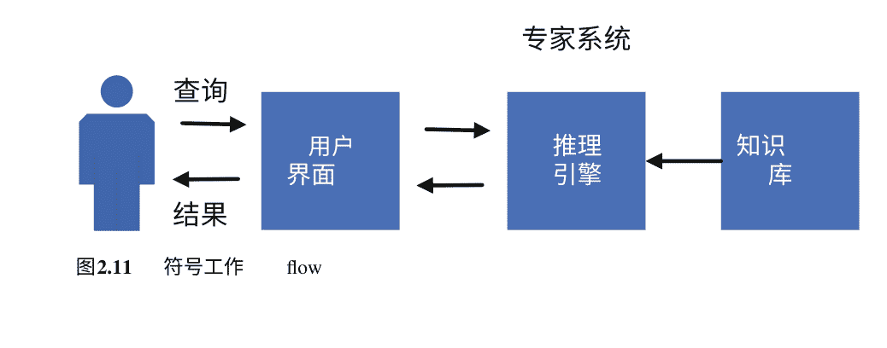

为类似或密切相关的产品或服务提供新的建议。例如，算法学习到如果A和B有相同的兴趣，并且B喜欢A之前没有接触过的东西，那么A也会喜欢那个‘东西’。这是亚马逊、Spotify和Netflix等大型在线组织使用的方法。图2.12显示了一个基本推荐系统的示例。

一些示例算法包括支持向量机（SVM）[9]和K-Means [10]。

### 2.3 数据管理

现代机器学习的核心概念是开发能够从数据中获取并学习的算法。在任何机器学习项目中，最重要的技能之一是理解不同领域及其产生的数据。通常情况下，获取的数据会包含缺失部分，会是混乱、非结构化和不平衡的。从业者的角色是设计一个管道来解决这些问题，以产生最优的机器学习任务数据集。这意味着从业者需要利用许多不同的工具和技术，借鉴过去的经验，让机器学习算法从数据中学习并产生最佳结果。本节将介绍这个过程的基本原理，并为从业者提供处理机器学习项目中的数据所需的必要理解。

#### 2.3.1 数据类型和数据对象

##### 2.3.1.1 数值

数值数据用数字（整数或浮点数）表示信息。通常需要将数据转换为数值形式，然后才能被机器学习算法使用（即使是图像和文本）。原始数值数据类型是其中之一

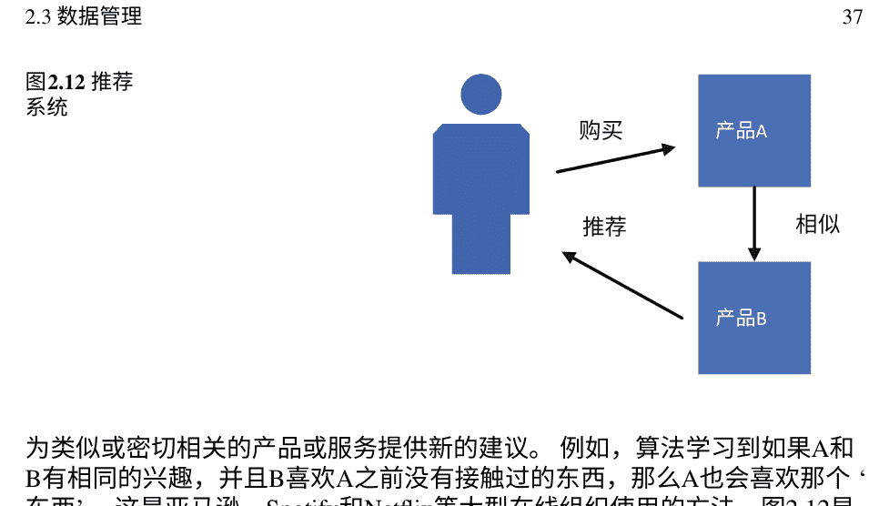

图2.13 整数数据类型

```
x = 5
print(type(x))
输出：<class 'int'>
```

图2.14 浮点数数据类型

```
x = 5.5
print(type(x))
输出：<class 'float'>
```

图2.15 字符串数据类型

```
x = "hello"
print(type(x))
输出：<class 'str'>
```

在机器学习中，最常用的数据类型是整数（Int）和浮点数（Float）。本书中将介绍这两种基本数值数据类型（图2.13）：

浮点数是如1.5、2.5、3.5、4.5、5.5等数字（图2.14）：

根据所使用的编程语言，原始数据类型的定义可能会有很多种。然而，在本书中，你将遇到的最常见的两种数值类型已在上述内容中提到。

##### 2.3.1.2 文本

本书中有两种主要类型的文本数据，分别是字符和字符串。字符是单个字符，如“a”，“b”，“c”，“1”，“2”，“3”，而字符串是存储在一维数组中的字符集合，如['h','e','l','l','o']（图2.15）。

##### 2.3.1.3 类别

在机器学习中，数据几乎总是分为两组：数值和类别。在监督学习中，类别值也被称为类别标签。类别标签用于描述观察结果，例如“猫”，“狗”，“汽车”和“人”。在下面的示例中（图2.16），类别标签显示在Survived列中。在机器学习任务中，这是我们希望算法基于特征（非标签列）准确预测的值。除了类别数据之外，还有一整套其他之前讨论过的数据类型。

由于机器学习算法只能处理数值数据，文本数据（如性别）需要使用诸如独热编码等技术将其转换为数值数据类型。这是数据准备中的一个重要步骤，因为许多算法只能使用数值数据而不是文本进行训练。诸如独热编码的技术通过将文本转换为相关的数值来实现。例如，a、b、c将被转换为1、2、3。

| PassengerId | Survived | Pclass | Name | Sex | Age | SibSp | Parch | Ticket | Fare | Cabin | Embarked |
|---|---|---|---|---|---|---|---|---|---|---|---|
| 1 | 0 | 3 | Braund, Mr. Owen Harris | male | 22 | 1 | 0 | A/5 21171 | 7.25 | | S |
| 2 | 1 | 1 | Cumings, Mrs. John Bradley (Florence Briggs Thayer) | female | 38 | 1 | 0 | PC 17599 | 71.2833 | C85 | C |
| 3 | 1 | 3 | Heikkinen, Miss. Laina | female | 26 | 0 | 0 | STON/O2. 3101282 | 7.925 | | S |
| 4 | 1 | 1 | Futrelle, Mrs. Jacques Heath (Lily May Peel) | female | 35 | 1 | 0 | 113803 | 53.1 | C123 | S |
| 5 | 0 | 3 | Allen, Mr. William Henry | male | 35 | 0 | 0 | 373450 | 8.05 | | S |
| 6 | 0 | 3 | Moran, Mr. James | male | | 0 | 0 | 330877 | 8.4583 | | Q |

图2.16 示例数据

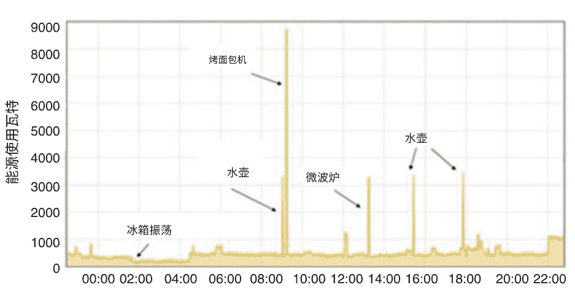

图2.17 24小时能源读数

转换为1、2、3。总体而言，这充当了数据字典和映射组件或键值对。重要的是要记住，在训练数据上进行的任何数据转换也必须在测试数据和生产系统中的实时数据上进行。

##### 2.3.1.4 时间序列

时间序列数据是指在等间隔时间段内按顺序采集的数据点。数据点可以是整数或实数。例如，这些数据点可以是家庭中的公用事业计量器中的能源读数，如图2.17所示。时间序列数据经常用于时间序列分析，例如金融预测、地震监测、心电图和各种类型的趋势分析。时间序列分析提取描述数据的有意义的统计数据或特征。

#### 2.3.2 数据结构

数据以多种不同的方式存储。例如，照片、新闻文章和社交媒体都属于图2.18中概述的一组中的一种。数据的存储方式将影响其结构，从而影响您对其进行处理的方式。

- 结构化数据：是具有严格规则的数据，规定了其表示、访问和修改的方式。例如，符合关系数据库中的模式和相关数据库管理系统（DBMS）的数据。
- 与这些数据的交互通常需要专业知识、对底层数据结构的理解以及与之交互所需的工具。
- 半结构化数据：是结构化数据的一个子集，不像关系数据库中的模型那样严格。半结构化数据更多地涉及数据交换，通常通过软件层使用应用程序编程接口（API）进行访问。例如，文档对象模型（DOM）和JSON解析器。
- 非结构化：没有任何预定义的规则，策展人可以自由地开发内容。要与这种类型的数据进行交互，通常需要专有软件和更复杂的数据预处理流程。

所有上述数据格式都用于机器学习，这要求数据科学家和机器学习开发人员具备管理和利用这些数据解决各种不同问题的必要技能。

##### 2.3.2.1 数据对象

数据对象是包含导入的结构化、半结构化或非结构化数据的中间占位符。在这些对象中，所有必要的数据处理都是通过利用库来为机器学习算法准备数据来完成的。


图2.18 数据结构和类型

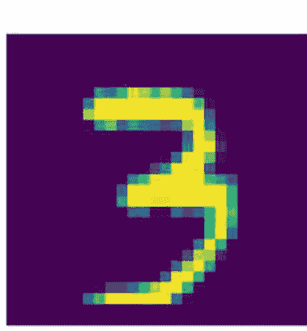

```
In [7] : df.head()
```

|    | 国家 | 大陆 | 年份 | 寿命   | 人口     | 人均国内生产总值 |
|---:|:---|:---|:---:|-------:|----------:|---------------:|
| 0  | 阿富汗 | 亚洲 | 1952 | 28.801 | 8425333  | 779.445314    |
| 1  | 阿富汗 | 亚洲 | 1957 | 30.332 | 9240934  | 820.853030    |
| 2  | 阿富汗 | 亚洲 | 1962 | 31.997 | 10267083 | 853.100710    |
| 3  | 阿富汗 | 亚洲 | 1967 | 34.020 | 11537966 | 836.197138    |
| 4  | 阿富汗 | 亚洲 | 1972 | 36.088 | 13079460 | 739.981106    |

通过使用库来处理缺失数据或对图像和文本等数据格式进行转换以生成数值表示。例如，处理缺失数据或对图像和文本等数据格式进行转换以生成数值表示。图2.19突出显示了左侧的图片和右侧的数值数组。

有几种不同的数据对象，提供了多种不同的存储、访问和操作数据的方式。在机器学习问题中，你将会遇到最常见的是一维数组和二维和三维矩阵。其中许多将包含在高级对象中跨多个库。例如，在Python中，这些包括Pandas、NumPy、列表、字典和元组。根据你使用的数据，你将使用一个数据框来处理表格数据，或者在处理DL模型的图像时，将数据提取到适当的格式，如NumPy数组。这些库包含了所有所需的辅助函数，用于操作和转换数据，而不是必须编写代码来循环遍历轴并处理数据点。图2.20显示了一个典型的Pandas数据框的表格格式。这种类型的数据对象通常用于训练决策森林和SVM等算法。

## 图2.21 不同的数组结构

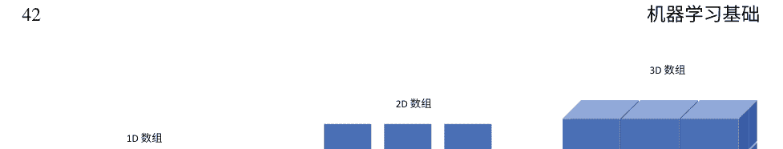

在您的项目中使用表格结构可能不足以处理数据。例如，如果您正在处理信号数据，则更适合使用1D数组，而如果您正在处理图像，则使用2D数组（矩阵）用于灰度图像，使用3D数组用于红色、绿色和蓝色（RGB）图像，其中它们表示每个图层中的ASCII值。图2.21突出显示了不同类型数据的三种不同数组结构。

#### 2.3.3 数据集

数据是机器学习配方中的基本成分。数据以数据集的形式打包，因此管理该数据集的质量对于从机器学习模型中获得最佳性能非常重要——“垃圾进垃圾出”。数据集通常是一组转dump信息，并且不应假设其具有高质量和足够的状态。机器学习从业者的关键技能之一是对数据进行严格的探索，并使用正确的方法和工具进行处理。您将遇到的一些最常见问题是缺失数据、不正确的数据类型、固定和可变长度的数据以及在学习过程中没有用处的数据。

可以使用几种不同的技术来解决这些问题，例如插值法用于缺失值和删除数据的技术，其中特征或观测值质量差或对解决问题没有用处。机器学习本质上是数据密集型的，因此不断努力获取/生成尽可能多的数据以确保最佳结果。在无法实现这一点的情况下，可以使用合成数据生成等技术来减轻小数据集的影响。诸如Kaggle之类的网站使机器学习从业者更容易获得高质量的数据和支持，以便对数据进行各种机器学习任务的转换。因此，利用Kaggle等网站来获取最佳实践问题解决的见解非常有用。这些平台通常被数据科学和机器学习领域的领先专家使用他们参加数据挑战。例如，世界上一些最紧迫的挑战通常会提交给这些网站，以挑战领先的从业者提出实际而独特的解决方案。

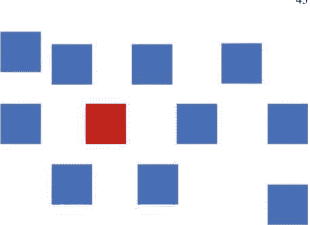

在机器学习中，平衡的数据集是圣杯，但不幸的是，这很少是情况。当处理医学数据集时，这是一个特殊的挑战，因为你自然会期望患病的人数较少，而不是没有患病的人数。换句话说，如果你对100个人进行癌症测试，大多数人可能会测试为阴性。不平衡的数据对学习过程构成挑战，因为模型通常会对多数类别（在我们的例子中是健康人）变得敏感，因为它有更多的实例可以学习。在不平衡的数据上训练的机器学习模型可能会引入偏见，并限制其解决实际问题（泛化）的能力。图2.22突出了不平衡数据的概念，其中少数派类别显著地被低估。

处理数据时，另一个重要的方面是考虑规模。通常，像SVM这样的算法对规模很敏感，可能会影响模型的整体性能。有几种工具可用于解决上述挑战，每个机器学习从业者都需要熟悉，我们将在本书中介绍。

#### 2.3.4 探索性数据分析

了解和收集尽可能多的见解，并解决上述问题非常重要。这个过程经常被从业者忽略，这可能对整个项目有害。在本节中，我们介绍探索性数据分析（EDA）的概念、工具和技术，以便您发现模式、发现异常、测试假设和检查假设。

##### 2.3.4.1 什么是探索性数据分析

EDA是一种统计方法，通过使用各种不同的方法，如数据描述和可视化，来分析数据集的特征。

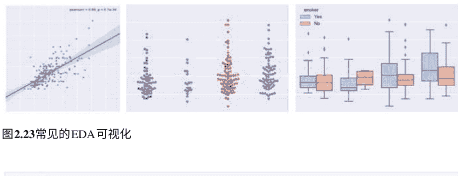

## 图2.23 常见的EDA可视化

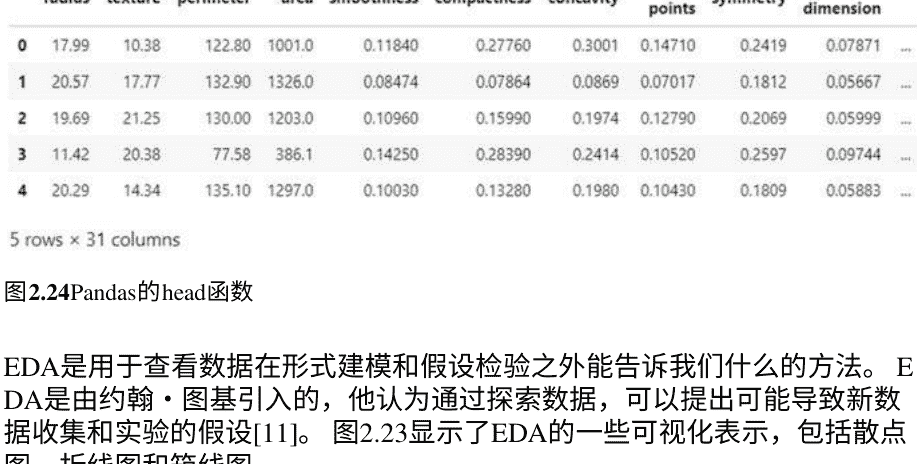

## 图2.24 Pandas的head函数

EDA是用于查看数据在形式建模和假设检验之外能告诉我们什么的方法。EDA是由约翰·图基引入的，他认为通过探索数据，可以提出可能导致新数据收集和实验的假设[11]。图2.23显示了EDA的一些可视化表示，包括散点图、折线图和箱线图。

可视化表示通常与高级数据分析软件包（如Seaborn、Matplotlib、NumPy和Pandas）结合使用，以提取更高级的信息并进行必要的转换以实现最佳建模。例如，使用Pandas数据框的head函数，我们可以轻松获取有关数据集的一些基本信息。这包括列（特征）和行（观测）。

图2.24展示了如何使用Pandas的head函数。通过使用Pandas包和info等函数，我们可以获得一些附加特征，如观测数量、数据类型以及数据集中是否存在缺失值（空值）。图2.25展示了Pandas的info函数和返回的数据。

其他函数，如describe函数，允许我们获取一些基本的统计信息，例如特征集中的最小值、最大值和标准差值。这可以让我们了解数据的规模和可能的归一化技术。图2.26突出了Pandas的describe函数。

```
python
df.info()

<class 'pandas.core.frame.DataFrame'>
RangeIndex: 569 entries, 0 to 568
Data columns (total 31 columns):
 #   Column                    Non-Null Count  Dtype  
---  ------                    --------------  -----  
 0   mean radius               569 non-null    float64
 1   mean texture              569 non-null    float64
 2   mean perimeter            569 non-null    float64
 3   mean area                 569 non-null    float64
 4   mean smoothness           569 non-null    float64
 5   mean compactness          569 non-null    float64
 6   mean concavity            569 non-null    float64
 7   mean concave points       569 non-null    float64
 8   mean symmetry             569 non-null    float64
 9   mean fractal dimension    569 non-null    float64
 10  radius error              569 non-null    float64
 11  texture error             569 non-null    float64
 12  perimeter error           569 non-null    float64
```

## 图2.25 Pandas的Info函数

```
python
df.describe().transpose()
```

|                    | count |       mean |        std |        min |        25% |        50% |        75% |         max |
|:-------------------|------:|-----------:|-----------:|-----------:|-----------:|-----------:|-----------:|------------:|
| mean radius        | 569.0 |  14.127292 |   3.524049 |   6.981000 |  11.700000 |  13.370000 |  15.780000 |   28.110000 |
| mean texture       | 569.0 |  19.289649 |   4.301036 |   9.710000 |  16.170000 |  18.840000 |  21.800000 |   39.280000 |
| mean perimeter     | 569.0 |  91.969033 |  24.298981 |  43.790000 |  75.170000 |  86.240000 | 104.100000 |  188.500000 |
| mean area          | 569.0 | 654.889104 | 351.914129 | 143.500000 | 420.300000 | 551.100000 | 782.700000 | 2501.000000 |
| mean smoothness    | 569.0 |   0.096360 |   0.014064 |   0.052630 |   0.086370 |   0.095870 |   0.105300 |    0.163400 |
| mean compactness   | 569.0 |   0.104341 |   0.052813 |   0.019380 |   0.064920 |   0.092630 |   0.130400 |    0.345400 |
| mean concavity     | 569.0 |   0.088799 |   0.079720 |   0.000000 |   0.029560 |   0.061540 |   0.130700 |    0.426800 |
| mean concave points| 569.0 |   0.048919 |   0.038803 |   0.000000 |   0.020310 |   0.033500 |   0.074000 |    0.201200 |
| mean symmetry      | 569.0 |   0.181162 |   0.027414 |   0.106000 |   0.161900 |   0.179200 |   0.195700 |    0.304000 |
| mean fractal dimension | 569.0 | 0.062798 | 0.007060 | 0.049960 | 0.057700 | 0.061540 | 0.066120 | 0.097440 |
| radius error       | 569.0 |   0.405172 |   0.277313 |   0.111500 |   0.232400 |   0.324200 |   0.478900 |    2.873000 |
| texture error      | 569.0 |   1.216853 |   0.551648 |   0.360200 |   0.833900 |   1.108000 |   1.474000 |    4.885000 |
| perimeter error    | 569.0 |   2.866059 |   2.021855 |   0.757000 |   1.606000 |   2.287000 |   3.357000 |   21.980000 |

## 图2.26 Pandas的describe函数

另一个重要的步骤是确定类别（依赖变量）的分布，以确定我们的数据集是否平衡，如前面讨论的。为了实现这一点，您可以使用Seaborn的countplot函数以可视化方式显示每个类别中的观测（行）数量。正如您所看到的，存在类别不平衡的情况。

```
sns.countplot(x='benign_0__mal_1',data=df)
<matplotlib.axes._subplots.AxesSubplot at 0x243c7a437c8>
```

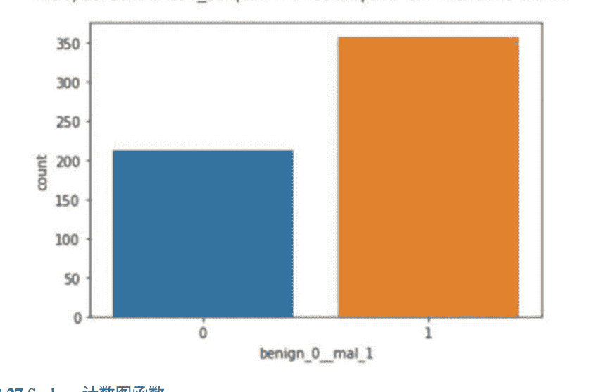

图2.27 Seaborn计数图函数

在这个数据集中存在类别不平衡，因此我们需要使用一种技术（例如合成少数类过采样技术（SMOTE））来过采样少数类，或者从多数类中删除观测[12]。由于数据宝贵且有时稀缺，因此不总是可能忽略数据。图2.27显示了Seaborn的countplot函数。

获取一些特征（非依赖变量）以及它们之间的相关性水平也很重要。高度相关的特征竞争描述相同的事物。因此，在这种情况下，在最终模型中同时拥有它们将提供有限的效用。因此，从业者在建模之前会通过手动降维过程中删除其中一个特征。还有其他实现降维（删除特征或转换）的方法，将在本书后面介绍。例如，特征（平均周长）与特征（最差周长）高度相关，因此根据临床讨论，其中一个将被删除。图2.28突出显示了用于确定特征之间相关性的Seaborn热图函数。

##### 2.3.4.2 数据分布

在机器学习中，几种算法对不同类型的数据分布敏感。包含偏斜高斯分布尾部特征（即向左或向右偏斜）的数据集可能是异常值。

```
python
sns.heatmap(df.corr())
```

```
output
<matplotlib.axes._subplots.AxesSubplot at 0x243c7d46e08>
```

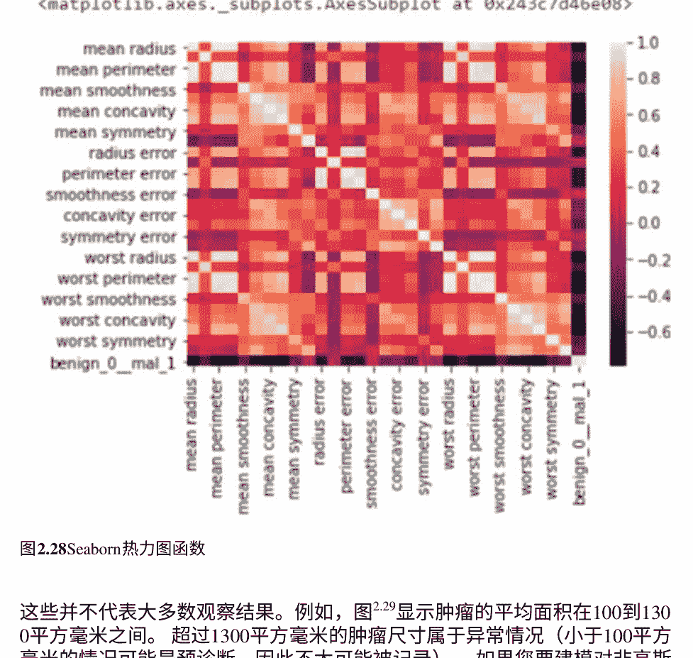

## 图2.28 Seaborn热力图函数

这些并不代表大多数观察结果。例如，图2.29显示肿瘤的平均面积在100到1300平方毫米之间。超过1300平方毫米的肿瘤尺寸属于异常情况（小于100平方毫米的情况可能是预诊断，因此不太可能被记录）。如果您要建模对非高斯分布敏感的机器学习算法，这可能会降低整体检测准确性。在乳腺癌检测的情况下，权衡是您是否愿意系统在98%的数据上68%的时间正确，或者在95%的数据上98%准确——我宁愿选择后者。克服这个问题的一种方法是要么删除超过某个阈值的值，要么使用功率变换将数据正态分布。请注意，并非所有算法都对非高斯分布敏感，例如支持向量机（SVM），但在建模过程之前尽可能使数据正态分布是一种良好的实践，以减小偏斜数据集带来的风险。此外，转换数据分布对成本函数有益，并有助于模型正确且更快地收敛。

对数据分布特别敏感的算法包括：

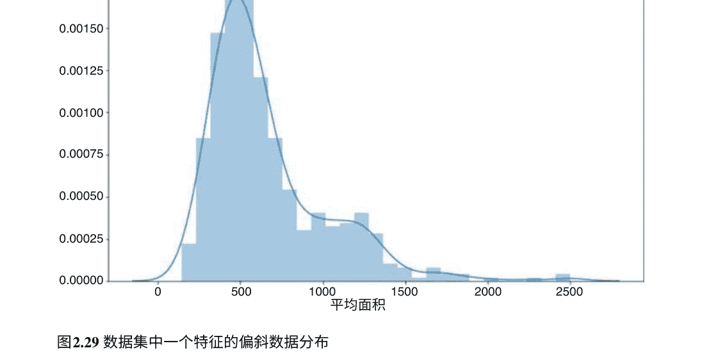

图2.29 数据集中一个特征的偏斜数据分布

- 高斯朴素贝叶斯分类器
- 线性判别分析
- 二次判别分析
- 基于最小二乘法的回归模型

在示例数据集中，展现最接近高斯分布的特征是均值对称性，该特征只有轻微的偏斜。图2.30突出显示了该特征的分布情况。

数据分布有很多不同类型，但在机器学习范式中，我们通常关注高斯（正态分布）、均匀分布、伯努利分布、二项分布、对数正态分布和帕累托分布。

机器学习中的高斯分布基于68–95–99.7%规则。利用这个规则，我们可以推导出总分布中68%的值位于均值的1个标准差内，95%的值位于均值的2个标准差内，99.7%的值位于均值的3个标准差内。图2.31展示了一个高斯分布和相关规则。

为了更好地理解这一点，请考虑两个例子。在第一个例子中，你卖鞋子，想知道男性和女性最常见的鞋码。这将非常有用，因为它将为你提供有关你的商店应该存货的鞋码的宝贵信息。从图2.31可以看出，男性的平均鞋码将位于均值的±1个标准差之内。假设均值为8号，68.27%的区域包含鞋码在8号之间的尺码。

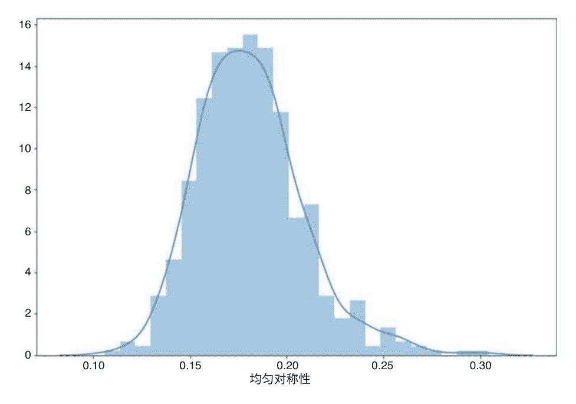

## 图2.30 均值对称性特征的分布

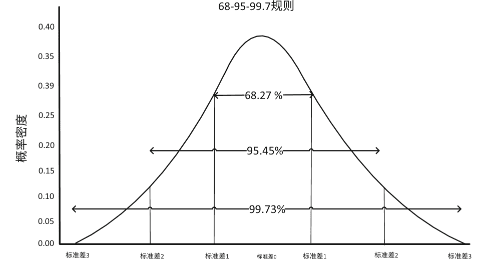

## 图2.31 带有相关规则的高斯分布

7和尺寸9。当我们移动到分布的尾部时，鞋码要么减小要么增大，并且会变得不太常见。因此，我们不会以相同的速度销售相同数量的鞋码，即尺码11的鞋子的需求会比尺码7、8或9的鞋子要低。在第二种情况下## 2.3 数据管理

考虑一个基于肿瘤大小来检测乳腺癌的模型。同样，常见的肿瘤大小将位于分布的68.27%区域内，而越来越小或越来越大的肿瘤则向尾部移动。

在这种情况下，您可能希望创建一个高度准确的机器学习模型，能够检测到最常见大小的肿瘤，而不受异常情况的影响。因此，例如，通过使用位于均值的3个标准差内的数据来训练模型，我们可以推断该模型在检测该范围内的肿瘤大小时具有高度准确性，而不受异常或不常见情况的影响。

下一个重要的分布是均匀分布。均匀分布告诉我们数据集中的每个值是否被平等地表示，并且具有相同的发生概率。在机器学习中，使用均匀分布的规则可以对数据集进行采样，确保其原始分布和子样本分布保持不变。例如，直方图中数据点的比例保持平等。这意味着大数据集的直方图中的第一个区间包含10%的值，那么子集的第一个区间也应该包含该子集的10%的值。在创建训练、验证和测试集时，它们应该具有相同的概率分布。图2.32突出显示了使用均匀分布从较大数据集创建的三个相同的子集。

您将遇到另外两种分布，称为伯努利分布和二项分布。伯努利分布是一种离散概率分布，涵盖了单个事件产生二进制结果的情况，例如硬币的正面（0）和反面（1），或男性（0）和女性（1）。您最常遇到这种类型的分布是在对二进制类标签分布进行调查以及从单个二进制分类试验中获得的结果时。第一类为(0)，第二类为(1)。在二项分布的情况下，可以将其视为多次独立伯努利试验的重复（也称为伯努利过程）。伯努利过程的累积结果将遵循二项分布。你也可以将伯努利分布视为包含单次试验的二项分布。在机器学习中，你可以将经过二分类训练的机器学习算法视为伯努利过程，其中模型对输入观测值的预测是一个伯努利试验（正确或错误）。因此，二项分布表示具有给定成功概率的k次伯努利试验的总结。

对数正态分布表示数据集中的偏斜。这些类型的分布在分布的左侧或右侧（正偏）有很大的权重。换句话说，与高斯分布不同，大部分数据位于图表的左侧，具有相应的大尾巴，表示数据中的异常值或异常情况。根据任务的不同，你可以删除异常值，或者进行幂变换以均匀分布数据。对数正态分布不能包含负值，例如，想象一下绘制组织内的薪水。你会预期大多数人的薪水集中在图表的左侧，而CEO的薪水则在尾部的远端，因为他们的薪水要比大多数员工高得多。同样，你不会期望员工的薪水为负值。

在这种情况下，机器学习算法在偏斜数据上表现不佳，因此我们需要对数据进行正态分布。如果你的数据不包含负数且呈正偏态分布，你可以使用Box-Cox变换。如果变换后的数据呈现高斯分布，则数据被称为对数正态分布。如果数据包含负数，则需要使用其他变换方法，如Yeo-Johnson变换，来使数据正态分布。因此，尽管使用对数正态分布可能有其他原因，但在机器学习中其主要用途是使数据正态分布。图2.33展示了不同类型的偏斜数据分布。

那么，我们如何使负偏态数据正态分布？你可以使用平方根和自然对数等变换方法。对于机器学习从业者来说，一般的经验法则是要么删除观测值，要么使用幂变换。

泊松分布确定了一个事件发生或不发生的概率，通过确定事件的正常发生次数。此外，泊松分布可以用于预测在给定时间段内事件发生的次数。泊松过程和泊松分布是两个基本部分。

- 泊松分布必须满足以下要求：
    - 事件是独立的（一个事件的发生不会影响另一个事件发生的概率）。
    - 事件之间的时间间隔是恒定的。
    - 两个事件不能同时发生。

泊松过程用于描述随机发生的事件，这并不是很有用。我们需要泊松分布来做一些有趣的事情，比如在一个时间段内发生一定数量的事件的概率，或者等待下一个事件发生的时间的概率是从指数分布中得出的。在机器学习中，事件发生的分布或事件发生的时间段可能会有偏斜，因此突出了数据集中的异常值。可以使用Anscombe变换等转换将泊松分布转换为高斯分布。

##### 2.3.4.3 验证假设

EDA的主要功能之一是在做出任何假设之前分析数据。这很重要，因为它可以让你提出问题并验证你对数据集可能做出的任何先前假设。完成这个过程将框定问题，构建数据集，并允许你选择适当的算法。

这通常与领域专家、数据管理员和客户一起完成。机器学习从业者经常忽视这一步骤，导致结果的错误呈现和可重复性差。当我们将模型投入生产时，这可能会带来特别大的挑战。

在探索性数据分析过程中，需要考虑两种类型的假设，包括技术假设和领域假设。技术假设可以帮助我们识别变量之间的共线性（两个或多个变量试图描述同一事物）、数据集中的方差以及是否存在任何缺失或损坏的数据值。如果不测试假设，很容易生成性能差或给出不准确结果的模型。探索性数据分析还可以在特征工程阶段通过选择更高效的关系来帮助在训练模型时进行编码。在ML从业者开始EDA过程之前，他们需要与领域专家讨论数据，以充分理解数据和你试图解决的问题。这将帮助你更好地理解数据，并允许提取有意义的信息用于后续的数据建模。这将提高模型准确性并支持验证结果。

##### 2.3.4.4 特征工程

特征工程是机器学习流程中最重要的方面之一，本书将对其进行广泛介绍。特征工程可以是手动或自动的过程，这取决于技术和问题领域。图2.34突出了手动和自动特征工程过程所需的时间投入。

让我们通过提出一个问题来描述特征工程是什么。如果我告诉你什么有两个轮子和一个发动机？你可能会告诉我是摩托车。现在如果我说它的颜色是黄色，这会让识别更容易吗？可能不是这样，颜色特征可能被丢弃，因为它并没有使识别变得更容易。那么，看一下图2.35中的自行车，你会选择哪些特征来唯一识别一辆摩托车？

根据你提取的特征，你能用它们来识别图2.36中的物体吗？

答案是否定的，所以恭喜你已经找到了一组特征来区分两个不同的物体（一辆自行车或一个水瓶）。所以现在如果我问你什么有发动机，你可以给出很多不同的答案，比如自行车、汽车或飞机。因此，我们没有足够的信息来唯一描述具有发动机的不同类型的物体。在这种情况下，我们需要更多的特征来进行准确的预测。我们所描述的是特征工程，挑战在于提取能够在特定领域中唯一描述我们想要识别的所有物体并区分它们的特征。通常，机器学习从业者会提取大量的特征并使用各种不同的技术来决定哪些技术对训练算法最好。这个任务通常很困难，因为它需要领域知识和对结果的经验分析。特征提取有时被认为是艺术和科学的结合，是一种通过经验发展起来的技能。所以，如果你的模型最初表现不佳，不要担心，机器学习是一个迭代的过程，随着时间的推移会变得更容易。

### 2.4 学习问题

在本节中，我们将介绍和讨论作为机器学习从业者将遇到的三种不同的学习问题。这些问题旨在解决特定的机器学习问题，从基于一组特征的特定结果的识别，到基于它们与特定数据簇的接近程度的结果的识别。问题的类型取决于您的期望结果和可用的数据类型。图2.37显示了不同学习方法之间的差异。

#### 2.4.1 监督学习

作为机器学习从业者，监督学习可能是你会遇到的最常见的ML任务。监督学习用于预测目标值（类别、因变量或标签），作为人类，我们自然而然地做到这一点。以我们上面的摩托车为例，我们通过观察其特征并将其分配给特定的值来知道它是一辆摩托车。在监督学习问题中，输入数据代表从原始数据中提取的特征，并以结构化数据框的形式呈现，并标有相关的类别。图2.38显示了原始数据，每一行代表一个观测值，每一列（自变量）代表为每个观测值收集的相关信息（注意，在这个阶段它们不一定都是特征）。通过监督学习方法，列被映射到特定的结果（在我们的例子中是谁在泰坦尼克号上幸存和谁死亡）。算法的任务是识别列中的模式，以便能够预测正确的结果（在我们的例子中是谁活着或死了）。

图2.38中的数据不处于可以用于训练机器学习算法的状态。就像我们的摩托车例子一样，你需要选择最能够区分不同类别的特征（谁活着，谁死了）。你可以认为性别和年龄对于这个任务来说是特别强的特征，因为妇女和儿童是第一个离开船的。从图2.38的小样本中可以看出，幸存下来的人是女性。也许一些不太有用的特征是姓名和票号，因为它们的格式不正确，并且它们包含无法轻易分组的唯一值。在本书中，您将遇到各种监督学习问题。

#### 2.4.2 半监督机器学习

机器学习算法需要足够的数据来进行学习（训练），以便在新观测中进行准确的预测。虽然通常有足够的数据可用于训练，但并不是所有数据都会被标记。这对于需要每个观测的依赖变量（类别、标签）的监督学习算法来说是一个特殊的问题。这就是半监督学习的作用，它可以帮助我们填补数据集中缺失的标签，而无需删除大量数据。例如，在我们的泰坦尼克号数据集中，如果有缺失的标签（谁活着和谁死了），对于那些已经死亡的人，我们可以使用半监督学习来对观察结果进行聚类，以确定它们更有可能属于哪个类别，基于它们的特征来推断它们更有可能生存还是死亡。然后，您可以相应地对这个观察结果进行标记，并将其添加到训练数据集中。虽然这是一种很好的技术，但在可能的情况下，您应该咨询领域专家来验证结果（在我们的例子中，历史学家或注册员可以根据死亡证明记录验证结果）。图2.39展示了一种半监督学习的方法，通过将未标记的数据与模型预测进行绘制。

半监督学习的另一种用途是将未标记的观察结果通过训练好的分类器进行预测，并使用领域专家来验证结果并将其返回到训练数据中。图2.40展示了一种用于预测未标记数据的半监督方法。然后使用预测数据来重新训练模型。

#### 2.4.3 无监督机器学习

与前两种学习方法相反，用于训练无监督模型的数据不包含标签（类别，因变量）。因此，这种类型的机器学习主要与聚类相关。在这里，具有相似属性的观测值被聚类在一起，以识别群组和数据在空间中的分布情况（密度估计）。例如，如果我们想调查家用电器的使用情况并识别电器的异常使用情况，我们可以使用聚类。图2.41显示了五个不同的电器簇，包括水壶、微波炉、烤箱、烤面包机和洗衣机。进一步地，我们可以识别异常值（基于使用时间的异常电器使用情况），这些异常值以红色显示。这个过程被称为异常检测，也可以是一种无监督学习方法。

#### 2.4.4 回归

回归是一种有监督学习的形式，但与具有多个分类（离散类标签）的情况不同，它只有一个具有连续值的标签。一些机器学习算法可以通过进行修改同时用于分类和回归任务。示例算法包括决策树和人工神经网络。然而，一些算法如线性回归不能用于分类任务。回归任务的一个例子是预测未来可能发生的病例数量。例如，对于最近的Covid-19大流行，可以根据过去的数据拟合线性回归模型。在图2.42中，我们可以看到截至3月15日的病例数量的拟合增长曲线，以及之后预测的预计数量，并绘制实际发生的病例数量。线性回归将在本书后面进行讨论。

#### 2.4.5 强化学习

强化学习允许您通过设定一个最终目标并对算法做出错误决策进行惩罚，同时对正确决策进行奖励来训练机器学习模型。使用一个代理，在复杂环境中通过试错学习模型。该技术包括以下关键组成部分：

- 环境：代理操作的物理世界，以及模型的训练
- 状态：代理在环境中的当前情况
- 奖励：来自环境的反馈
- 策略：将代理的状态映射到其动作的机制
- 价值：代理在每个状态下采取行动所获得的奖励

强化学习的目标是通过ML从业者指定的奖励策略来最大化总奖励。代理没有提供先前的信息，而是从随机试验开始，并随着时间的推移发展出复杂的策略来解决问题。图2.43提供了一个高级概述。

### 2.5 评估机器学习模型

在部署模型解决实际问题时，评估模型性能是一个重要方面。如何评估性能和定义其成功标准将因客户期望和问题类型而异。例如，诊断严重疾病的系统应该产生高度准确的结果。而用于检测道路上坑洞的系统如果漏掉一个或出现错误分类也不会有严重后果。如果正确进行模型评估，将能很好地指示模型在生产中的性能。本书将广泛介绍评估指标及其正确使用方法。

### 2.6 总结

在本章中，我们介绍了机器学习的基本要素的高级概述。这为您提供了对最常见的机器学习组件和术语的概念性理解，这将在您开始机器学习职业生涯时遇到。我们提供了机器学习的明确定义以及它与传统软件开发的区别，以及它在人工智能范式中的独特位置。机器学习是一门独立的学科，有几种不同的方法，正如在机器学习领域中所证明的那样。根据您想要解决的问题和您可以访问的数据，将使用不同的机器学习算法。推动良好机器学习模型的发展是数据管理和提供的众多技术，用于生成用于建模的机器学习准备数据集。

本章提到了几种机器学习算法，每种算法都属于一个独特的学习问题，被归类为监督学习、半监督学习、无监督学习和强化学习。讨论了模型评估的重要性，突出其在机器学习流程中的应用。本书的其余部分将深入探讨这些概念，并为您提供更深入的信息，使您对机器学习及其如何解决问题有扎实的理解。

## 参考文献

1. T. M. Mitchell. “教科书， ” 生物化学. 麦格劳希尔, 伦敦 , 1950.
2. E. Alpaydin, 机器学习导论. MIT出版社, 2020.
3. P. Domingos, 大师算法: 追寻终极学习机器的探索将重塑我们的世界. 基础图书, 2015.
4. T. Kozek, T. Roska, and L. O. Chua, “用于CNN模板学习的遗传算法,” IEEE 电路与系统. /基础理论与应用., vol. 40, no. 6, pp. 392–402, 1993.
5. J. R. Koza 和 J. R. Koza, 遗传编程: 通过自然选择对计算机进行编程, 第1卷. MIT出版社, 1992年.
6. L. E. Baum, T. Petrie, G. Soules, 和 N. Weiss, “在马尔可夫链的概率函数的统计分析中出现的最大化技术,” Ann. Math. Stat., 第41卷, 第1期, 第164–171页, 1970年.
7. J. Pearl, “贝叶斯网络: 一种用于证据推理的自激活记忆模型,” in 第7届认知科学学会会议论文集, 加利福尼亚大学, 尔湾分校, 美国, 1985年, 第15–17页.
8. D. B. Lenat, “CYC: 一个大规模的知识基础设施投资,” Commun. ACM, 第38卷, 第11期, 第33–38页, 1995年.
9. C. Cortes 和 V. Vapnik, “支持向量机,” 机器学习, vol. 20, no. 3, pp. 273–297, 1995.
10. S. Lloyd, “最小二乘量化在PCM中的应用,” IEEE信息论, vol. 28, no. 2, pp. 129–137, 1982.
11. J. W. Tukey, 探索性数据分析. 1977.
12. N. V. Chawla, K. W. Bowyer, L. O. Hall, 和 W. P. Kegelmeyer, “SMOTE: 合成少数类过采样技术,” 人工智能研究杂志, vol. 16, pp. 321–357, 2002.

## 第三章 监督学习

在第二章的基础上，我们将开始更详细地探讨监督学习问题。我们将讨论一些关键的监督学习任务，并描述它们的工作原理以及如何适应监督学习流程。这些任务为支持监督学习模型的开发提供了支架。本章将包括数据处理、特征工程和模型选择，以及示例算法。监督学习的两个方面，包括分类和回归，也将被讨论。

### 3.1 基本概念

监督学习是一种机器学习形式，用于学习将给定的一组输入映射到一个或多个输出的函数。这个过程通过标记的训练数据创建一个函数，该数据包括一组示例（观察）和一组相应的目标值（类别、因变量）。然后，使用未见过的测试数据（具有相同的特征结构但没有标签）来评估训练好的模型（函数）的整体性能。换句话说，给定一组特征，你正在询问训练好的模型认为观察属于哪个类别。

请注意，我们已经讨论了训练数据和测试数据，但是还有一个叫做验证数据的第三个数据集，它在训练过程中用于调整模型。现在不用担心这个问题，因为稍后在本章中会详细讨论。验证数据集是在训练过程中改进机器学习模型的一种方式，而不会给它在面对未知测试数据时带来不公平的优势。

每种机器学习类型都适用于特定的任务和可用的数据类型。选择正确的学习方法是成功开发机器学习解决方案的关键阶段。监督学习主要用于两种类型的任务，包括分类和回归。图3.1突出了每种机器学习类型及其相关用途。

本章的其余部分将讨论您在开发ML模型时会遇到的主要监督学习任务。

### 3.2 监督学习任务

监督学习流程通常分为六个关键步骤，如图3.2所示。在开始之前，有几个假设：

- 存在一个明确的问题需要解决
- 有足够的数据
- 对问题建模是有意义的
- 您可以管理模型的生命周期（第一次尝试很少成功），并且需要持续改进
- 假设使用简单模型可以提供合理性能的基准
- 你具备训练和托管模型的计算能力
- 你具备验证模型的相关领域专业知识

假设以上假设成立，机器学习过程遵循以下步骤：数据提取、数据预处理、特征工程、模型训练、评估（迭代过程）和部署，如图3.2所示。

#### 3.2.1 数据提取

如第2章所讨论的，数据有多种不同形式，这意味着它通常以各种格式存储。请注意，您需要对数据集进行工程处理。根据数据格式，您需要使用工具来访问给定的数据存储技术。例如，考虑图3.3，您需要的集体数据可能存储在多个数据存储技术（如Excel、SQL和HDFS）中，这将要求您使用不同的工具进行提取、转换和加载（ETL）。在前一章的支持材料中，您已经遇到过这种情况，使用诸如Pandas等库将数据加载到数据框中。数据提取阶段的最终目标是将数据加载到兼容且结构化的对象中，以便在建模之前进行各种数据处理步骤。图3.4展示了使用Pandas进行数据提取的示例。这里的read_csv方法将CSV文件解析为Pandas DataFrame对象（您应该对其很熟悉，因为它具有类似于Excel的结构，例如行和列）。

一个单一的数据集很难包含执行数据分析和建模机器学习算法所需的所有信息。通常需要引入来自不同来源的数据组件，以捕捉给定问题的完整上下文。一旦你对给定问题有了全面的理解，清晰地定义中心问题和可衡量的结果是一个好主意。这将让你了解所需的其他外围信息。这个结构将指导数据集的开发，并提供一个测试假设的框架。

最终的数据结构将由不同数据的组合信息构成。

格式和结构。通常，您会开发一个数据层，为机器学习任务提供与数据源的接口，从而生成一个DataFrame。图3.5突出显示了使用数据层从各种不同的数据集构建的DataFrame。

#### 3.2.2 数据准备

很不可能得到干净和结构化的数据。这意味着你需要根据数据的整体状态执行几个不同的预处理任务。第一阶段是熟悉数据，不要在执行EDA之前做任何假设或假设。需要注意的关键事项有：

- 数据的大小（足够还是太多）
- 缺失或不完整的数据（插值）
- 文本数据（不适合机器学习）
- 值的范围（归一化）
- 它的分布（取决于任务）
- 类别平衡
- 特征之间的相关性

##### 3.2.2.1 数据大小

训练机器学习算法所需的数据量取决于各种因素。需要考虑的两个关键因素是问题的复杂性和学习算法本身的复杂性。如果可能的话，查看其他人在类似情况下所做的工作和取得的结果是一个好主意。Google Scholar、Arxiv和Kaggle是寻找这类资料的好资源。利用领域专业知识将为您提供对所需数据规模的洞察。要记住的关键点是，我们正在尝试基于输入数据将函数映射到输出数据。映射函数的好坏取决于提供的数据，因此确保有足够的数据有效地映射关系非常重要。您需要与领域专家密切合作，了解问题和所需数据规模，以充分捕捉和映射输入输出关系。

此外，考虑到数据规模时，也要考虑类别和观测量。您必须有足够的观测来代表每个您想建模的类别。您需要有足够的特征来充分描述类别，但是您需要确保特征数量不超过观测数量，这被称为维度灾难。当我们有太多特征时，由于数据稀疏性（数据的紧密性），观测变得更难分类，这可能导致过拟合。当我们转移到更高维度时，数据稀疏性会出现。维度性及相关缓解措施将在本章后面讨论。图3.6突出了维度的影响。在第一张图像（特征数量较少）中，它们之间的距离较小，观测之间的稀疏性较小。随着特征数量的增加，观测之间的稀疏性增加（观测之间的距离增加）使得数据难以聚类或分类（在类之间放置决策边界）。

通常，非线性算法需要更多的数据，因为它们需要比线性算法更多的调整。如果线性算法在每个类别有数百个观察时表现良好，那么非线性算法很可能需要10倍于此的观察数据。这两种方法将在本章后面更详细地讨论。

随着时间的推移，您将在遇到的不同类型问题中积累更多经验，因此您将更好地估计解决给定问题所需的数据量。

##### 3.2.2.2 缺失数据

数据收集过程远非完美，您可能会看到数据中的不一致性，其中之一是缺失值。这可能有几个潜在原因，包括人为错误、传感器读数错误和软件中的错误。缺失值在机器学习中可能是一个重要问题，并且会对模型的整体性能产生不利影响。为了解决这个问题，有两种主要方法，包括插补和删除数据。简单地删除缺失数据可能会显著减少您拥有的数据量，这可能是您在机器学习中不希望发生的事情。图3.7突出显示了示例数据集中的缺失值。白线表示缺失数据（例如，NAN's, NA, None, Null和?）。

解决缺失数据最简单的方法是直接删除缺失值。当缺失值的比例相对较低（通常小于10%）时，这种方法可能是可以接受的。然而，大部分情况下，这种技术很可能会导致大量的数据丢失。缺失值可能存在于单个特征中，因此您不希望删除所有其他完整的特征。

图3.7 缺失数据

在这种情况下，您可以简单地从数据集中删除表示不良的特征。一个常见的错误是将缺失值替换为0's。这样可以使模型运行，但会产生误导性的结果。

有多种不同的插补方法可以用来替换缺失值，这些方法会用统计推导的值来替代。对于数值型的NAN's，您可以使用统计替换方法，例如：

- 平均值和中位数：这种技术易于实施，通常适用于小型数值数据集。然而，它不考虑特征之间的相关性（仅适用于所选列）。它不能用于编码的分类特征。
- 最常见的：通过用每列中最常见的值替换缺失的数据来工作，并且可以处理分类特征（字符串或数值表示）。然而，它不考虑特征之间的相关性，并且可能引入数据偏差。
- 使用K-最近邻（K-NN）进行插补：通过创建k个选择的邻居的均值插补来工作。在这种情况下，k可以是应用程序特定的协变量。它可以比使用整个特征的均值和中位数更准确，因为它更加局部化。然而，它的计算成本更高，并且对数据中的异常值敏感。

类似的方法已经提出使用线性判别分析（LDA）和深度学习。例如，Datawig可以处理分类和非数值特征，并且在训练期间可以在CPU或GPU上使用。

在本书中，您还将看到生成对抗模型（GANs）的使用，它可以学习生成具有与训练数据相同统计特性的新数据。

##### 3.2.2.3 文本数据

许多机器学习算法无法处理文本数据。它们要求所有输入和输出变量都是数值型的。例如，宠物、猫和狗这样的分类标签需要转换为数值表示。一些算法，如决策树，可以直接从分类数据中学习，无需进行转换。

有多种不同的方法可以选择将分类数据转换为数字表示：

**标签编码（整数编码）** 标签编码将DataFrame中的每一列转换为相应的数字值，如图3.8所示。虽然标签编码很简单，但数字表示将根据DataFrame中不同分类值的数量增加。例如，你有一个包含变量性别和相应值的数据集

### 图3.8 标签编码

- convertible -> 0
- hardtop -> 1
- hatchback -> 2
- sedan -> 3
- wagon -> 4

男性和女性的数字0和1足以进行标签编码。 然而，如果你要转换一个包含汽车颜色的数据集，你可能会得到100个值。 即使有20种不同的颜色，也会创建一个范围为0–19的区间。 如果所有其他剩余的特征都在0和1之间，这个特征会对算法的尺度敏感性造成问题。

**独热编码**

为了克服数据范围较大的问题，我们可以利用一种称为独热编码的技术。 它通过将每个类别值转换为一个新的列，并将其分配一个表示（真/假）的1或0值来工作。 这意味着它克服了模型对比例敏感的问题。 然而，该技术会向数据集添加新的列，从而增加其维度。 图3.9突出了独热编码过程。

##### 3.2.2.4 值范围（归一化和缩放）

归一化和缩放数据确保其处于中心位置（即高斯分布）并在标准化范围内（即0到1之间）。 如果特征具有非常不同的值，它可能会对对比例敏感的算法产生负面影响（利用距离或相似性），例如SVM、KNN和ANN。 示例对于不受特征缩放影响的算法包括朴素贝叶斯和决策森林。虽然这些模型对尺度不敏感，但规范化/重新缩放和标准化数据是一个好的实践。确保所有特征都被规范化或缩放，可以确保每个特征在其表示中具有相等的权重。解决这个问题的两种主要技术是规范化和缩放。这两种方法相似，但是缩放会改变数据的范围，而规范化会改变分布的形状。

**缩放**

缩放可以将数据转换为特定的尺度，例如0-1之间。当使用测量数据点之间距离的方法时，缩放是一个有用的工具。缩放不会改变数据的分布，只会改变其中包含的值的尺度，如图3.10所示。缩放数据的最常见方法之一是Min Max。在这种方法中，将数据转换为特定范围内的特征，例如[0, 1]。使用缩放时，每个特征都会单独进行缩放，而不是整个数据集。换句话说，MinMax值是从单个特征中获取的，而不是跨所有特征。如图3.10所示，缩放每个特征可以保留原始分布。

**归一化**

在缩放中，你逐个特征改变数据的范围，而在归一化中，你一次性使用所有特征改变数据的范围和分布形状。换句话说，你正在从所有特征中取最小值和最大值。

图3.10 缩放效果

### 图3.11 突出显示了未归一化和归一化的数据集

图3.12 左侧为标准化，右侧为最小-最大归一化

最大值由所有特征的完整集合决定。图3.11展示了一个已经进行了缩放和归一化的数据集。

**标准化**

MinMax归一化的一个限制是它不能有效地处理数据集中的异常值。这意味着最大值由较大的异常值决定，并对较小值产生压缩效果。标准化使用Z-Score归一化，将所有数据点转换为具有平均值为0和标准差为1的公共尺度。图3.12突出了MinMax归一化和标准化的效果。

##### 3.2.2.5 分布

对于从数据中提取的每个特征，您需要绘制和理解它们的分布，如第2章所讨论的。数据分布倾斜在您的机器学习项目中，这将是一个常见情况。正如您所记得的，偏斜分布表示数据与正态分布之间的偏差程度。如果您的特征值是偏斜的，那么它们可能违反模型假设，具体取决于模型，或者会影响特征重要性的解释。前一节重点介绍了归一化，并提到了使用Box-Cox和最小-最大归一化将数据转换为高斯分布的技术。这些方法也在第2章中详细讨论过。

在开发数据预处理流程时，因此被认为是良好的实践，使用EDA技术探索每个特征，并将特征统一转换为常见范围和高斯分布（如果可能）。虽然并非所有算法都对数据分布敏感，但您可能会评估对数据分布敏感的模型。因此，将数据预处理流程标准化以包括通常分布数据的任务将对您的机器学习项目非常有价值。

##### 3.2.2.6 类别平衡

在机器学习中，您使用/创建的许多数据集都具有不平衡的类别（因变量）。这描述了每个类别中观察值的不成比例比例，并在机器学习中构成了一个重要问题。这是因为机器学习算法将对多数类别更敏感，因为算法有更多的示例可供学习。您可能会遇到类别不平衡的示例非常广泛，包括医学诊断（例如，图3.13中显示的良性肿瘤比恶性肿瘤更常见），垃圾邮件过滤和信用卡欺诈。

图3.13 给定数据集的类分布

有几种不同的方法来解决类别不平衡问题。轻微的类别不平衡通常不需要任何关注，比例大约为4:6。严重的类别不平衡被认为是1:100。一些真实世界的数据集可能具有更大的类别不平衡，例如1:1000或1:5000，比如信用卡欺诈。评估模型性能最常见的指标之一是准确率。在存在类别不平衡的情况下，准确率不是一个好的性能指标。这是因为从统计上讲，它更有可能选择多数类而不是少数类。解决类别不平衡问题的一些常见方法包括：

**收集更多数据** 如果可能的话，尽量收集更多数据来补充少数类。

**删除大多数观测值（欠采样）** 这种方法是最简单的，但可能会删除数据中的重要或独特观测值。数据往往很难收集，因此在许多情况下简单地丢弃它并不是一个选择。

**过采样少数类别** 通过随机抽样少数类别中的观测值的属性（特征）来生成新的合成观测值。有各种不同的合成过采样算法，其中最常见的是合成少数类别过采样技术（SMOTE）[1]。使用SMOTE过采样少数类别（案例），使用每个少数类别记录来生成沿着连接k个最近的少数类别邻居的线段的新合成记录。这迫使少数类别的决策区域变得更加普遍，并确保分类器创建更大且不太具体的决策区域，而不是更小且更具体的决策区域。在[2]中，作者指出这种方法是解决不平衡数据集相关问题的一种被接受的技术。这些算法在大多数机器学习库（如scikit-learn）中都可用。

**窗口化** 对于时间序列数据，可以使用窗口化方法来平衡数据。从少数类别观察中派生的所有窗口都被保留，而从多数类别观察中随机抽样窗口，以使两个类别的分布相等。数据集中的每个观察都可以使用n个数据点（即100、200、300、400或500）进行划分[3]。首先，将数据集分为训练集和测试集。在每个观察中，窗口化从记录中的第一个数据点开始，没有重叠的片段。例如，使用300个数据点的窗口化策略，第一个片段从0开始，结束于299，而第二个片段从300开始，结束于599，依此类推。从少数类别的训练集中保留所有片段，并从训练集中的多数记录中随机选择相同数量的片段。请注意，多数类别中的片段数量将明显更多。我们不需要全部，只需要足够多的少数类别片段数量等于多数类别片段数量-这样可以使数据集平衡。

**算法选择** 某些算法在不平衡数据上表现良好。因此，如果上述技术都不可行，你可以尝试决策树和随机森林等算法。如果你的问题是二元的（两个类别），而少数类别的数量明显低于多数类别，你可以通过在多数类别上训练算法并报告任何不同之处来使用异常检测。

**惩罚** 惩罚分类允许我们对模型在少数类别上进行错误预测施加成本，从而将模型的性能作为一个可以在学习过程中进行调整的超参数。示例算法包括惩罚支持向量机和惩罚线性判别分析。

##### 3.2.2.7 特征之间的相关性

正如我们之前讨论过的，机器学习模型的好坏取决于用于训练的数据。作为数据预处理阶段的一部分，选择对机器学习模型性能贡献最大的特征也非常重要。通常，特征之间会竞争来描述同一事物。因此，执行数据和特征相关性分析以检测竞争特征并选择合适的特征是一个重要的步骤。特征相关性描述了数据集中变量（特征）和属性（值）之间的关系。从这个分析中得出的一些有趣的见解包括对属性的更好理解以及对数据中其他属性的依赖性。例如，身高很可能与体重相关（你越高，体重越重）。另一个见解可能是检测到多个属性及其与其他属性的关联。

相关分析的一些有用方面是能够预测一个属性从另一个属性中（这可以帮助填补缺失值）。相关性还可以突出显示属性之间的因果关系。相关性有三种类型包括：

- 正相关：意味着特征之间存在直接关系。例如，如果特征1的值增加，特征2的值也会增加。同样地，如果特征1的值减少，特征2的值也会减少。
- 负相关：如果特征1的值增加，特征2的值减少。同样地，如果特征1的值减少，特征2的值增加。
- 无相关性：意味着特征之间没有关系。

特征之间的相关性在0到1的范围内进行测量。0表示没有相关性，而0.5到0.7之间的值描述了特征之间轻微的高度正相关性。因此，0.9或1表示强或完全正相关。如您所预期的负值将代表相同比例上的负相关性。图-3.14使用热图（颜色强度）和相关值突出显示了特征之间的相关矩阵，以在DataFrame中直观地捕捉特征的相关性。

### 图3.14 相关矩阵

完全正面或负面的特征会影响模型的性能，这被称为多重共线性。一些机器学习算法，如线性回归，对此非常敏感，而其他算法如决策树则不敏感。多重共线性实质上意味着特征之间竞争描述同一事物。例如，如果一个人在试听中唱歌，你可以判断歌手是否好。然而，如果你同时试听五个人同时唱歌，那么很难决定哪个歌手最好。为了解决这个问题，你需要逐个试听每个歌手并给他们评分。这样可以帮助你确定并保留最好的歌手。类似地，当存在多重共线性时，你需要执行类似的任务并消除竞争变量。还有其他方法，如主成分分析（PCA），可以将数据转换为达到相同的结果。

这些技术将在本章后面介绍。

图3.15 特征与对应类别之间的相关性

除了检查特征之间的相关性外，检查每个特征与类别之间的相关性也很有用。图3.15突出显示了每个特征与相应类别之间的相关性。

如图3.15所示，与目标类别相关性更高的特征具有更多的正相关性。相反，具有负值的特征与相关类别的相关性较低。您应该使用与类别之间显示强相关性的特征来训练模型。

#### 3.2.3 特征工程

特征工程使您能够充分利用数据，并在许多情况下提高模型的整体性能。您的数据中的特征将影响您的机器学习模型和您可以获得的结果。对于表格数据，您的列已经代表了诸如年龄、性别和身高等特征。然而，其他数据格式，如时间序列（ECG）信号和图像，由原始数据组成，在此阶段尚未提取任何特征。例如，在ECG数据中，计算在60秒内超过给定阈值的振幅将提供一个名为每分钟心跳数的新特征。对于图像，您可以使用一组派生特征（这些特征需要以类似于每分钟心跳的方式来计算）来描述场景（例如，道路或街道）。例如，如图3.16所示，使用左车道、右车道和实线黄色特征，可以推断出场景是道路。从这个例子中可以看出，我们不需要完整的图像和所有特征，只需要一个子集来预测场景是什么。这是特征工程的关键优势，不需要所有原始数据，只需要派生特征，然后可以用于对新图像进行预测。

在特征工程任务之后，可能会导致许多特征，你不需要所有这些特征来描述特定的数据组件，而且许多特征甚至可能是冗余或无用的。因此，关键是找到最佳的一组特征来唯一描述数据集中的每个类别。有两种主要技术可以实现这一点，即特征选择和维度降低，如图3.17所示。

特征工程通常提供更多的灵活性，并允许您使用运行速度更快、更易于理解和维护的较简单的模型。这是ML部署的一个重要方面，复杂的计算模型通常昂贵且难以管理。

##### 3.2.3.1 特征选择

并非所有特征具有相同的区分能力，因此需要特征选择技术来自动选择最佳的一组特征来描述目标类别。有几种不同的技术可用，它们利用评分机制根据预测能力对特征进行排名和选择。

一些方法使用相关性等度量来确定最佳特征，而其他方法则使用试错法来使用特征子集（建模特征子集并测量分类性能以确定最佳特征组合）。一些算法在训练过程中自动执行特征选择，例如逐步回归。你可能会找到一些最常见的特征选择过程，如图3.18所述。有几种不同的特征选择技术，包括单变量过滤方法（F-Score、Chi-2 Square和互信息），多变量过滤方法（最小冗余最大相关性），包装器方法（前向选择/后向选择），嵌入方法（L1正则化）和基于树模型的特征重要性（随机森林、XGBoost和SHapley Additive exPlanations SHAP）。

##### 3.2.3.2 维度约简

在前一节中，我们讨论了现有特征的得分和选择。然而，本节重点是将现有特征转化为捕捉数据中包含的大部分方差的一组新特征子集。

执行降维的最常见技术之一是主成分分析（PCA）[4]。PCA通过创建相互不相关的变量来最大化数据集中的方差。这些变量被称为主成分，用于训练模型。图3.19突出了在数据集上进行的PCA。在这里，您可以看到三个主成分在三维空间中的映射。很明显，第一个成分捕捉到大部分方差，而第二个成分捕捉到稍少一些，第三个成分捕捉到最少。请注意，在这种技术中，一旦原始特征被转换，它们就不再用于训练模型。在模型训练中，主成分成为新的特征。

#### 3.2.4 选择训练算法

在选择正确的训练算法时，有七个关键考虑因素：

**问题类型** 机器学习算法是为解决特定问题而设计的。例如，分类、回归、聚类或异常检测。如果你想对带标签的分类数据进行分类，你会使用分类算法，如逻辑回归或SVM。一个例子是泰坦尼克号数据集，我们试图对谁生存和谁死亡进行分类。如果你想对无标签的数据进行分类，你会使用聚类算法，如K-Means。例如，在第2章中，我们讨论了如何根据家用电器的用电特性将其聚类在一起。如果你想预测一个数量，你会使用回归算法，如线性回归（不要与逻辑回归混淆，后者是一个二元分类器，在本节后面讨论）。一个例子是根据房间数量预测房产价值的回归问题。对于异常检测，我们会使用诸如z-score异常检测的算法来识别位于明确定义的聚类之外的观测值。例如，再次看家电使用情况，你可以检测到家电在一天中异常时间使用的情况。

**数据集大小** 你的数据集的大小将极大地影响你可以使用的算法。也就是说，没有一个黄金规则来确定训练一个机器学习模型所需的数据量。然而，一些机器学习算法在数据较少的情况下表现更好。例如，图像分类任务可能需要数万张图片。回归任务需要比特征观测值更多的观测值（10倍以上），而自然语言处理可能需要1000个以上的示例，因为涉及大量的单词和复杂的短语。一些算法，如神经网络，对数据需求非常大，而其他算法，如随机森林，可以在有限的数据量下产生相当好的结果。根据可用数据的大小找到正确的模型是一种经验性的过程。

**准确性** 所需的模型性能在很大程度上取决于应用领域专家的建议。例如，正确的对于癌症诊断的分类可能需要非常准确。然而，计算进入市中心的汽车数量以进行交通控制可能不需要那么准确。在更复杂的模型、所需数据量和所需准确度之间存在权衡。经验法则是确定性能要求，并从简单算法开始逐渐引入更复杂的算法，直到满足要求为止。

**训练时间** 使用更复杂的模型和更大的数据量会导致更长的训练时间。这也取决于可用的硬件类型不仅用于训练，还用于推理。在后面的章节中，您将看到如何通过使用GPU来显著减少训练时间。

**线性性** 某些算法对数据做出假设。例如，线性回归和逻辑回归利用线性关系进行学习。虽然它们简单且训练速度相对较快，但数据可能不是线性的或线性可分的。因此，不同的算法，如决策森林，将改善模型性能。大多数机器学习从业者从线性算法开始。如果无法获得所需的结果，则考虑使用更复杂或非线性的算法。

**参数数量** 大多数机器学习算法都有几个不同的参数。这些参数随着模型复杂性的增加而增加。具有许多参数的算法通常提供更多的灵活性，但通常需要试错来确定最佳的配置。模型的灵活性和训练模型所需的时间通常存在相关性。然而，花时间来配置这些参数通常是值得的，因为它们通常能够产生更好的性能。

**特征数量** 拥有许多特征（如文本和遗传数据常见）会增加过拟合模型的风险。这个想法是用最少的特征来训练模型，足以充分描述每个类别在你的模型中，并产生所需的性能。请注意，添加更多的特征不一定会提高模型的性能。只有在所需的性能没有达到并且额外的特征在统计上是显著时，才会考虑添加更多的特征。如果添加更多的特征确实提高了模型性能达到所需的水平，您可能需要考虑使用不同的算法。图3.20突出了一些常见的决策点，这将帮助您选择适合给定问题的算法。

### 3.3 监督算法

有各种不同的监督学习算法，每个算法都适用于特定的任务和相应的数据特征。它们分为四个不同的类别，包括线性回归、非线性回归、线性分类和非线性分类。你将会遇到一些更常见的算法，如图3.21所示。

在本节中，我们将介绍所有四个类别中最常见的监督学习算法。请注意，下面的一些算法根据算法的参数配置，可以跨越多个类别，如图3.21所示。

#### 3.3.1 线性回归

线性回归用于对实际值进行预测，例如房屋成本或可能感染的数量。线性回归在许多领域中被使用。预测分析最早是在19世纪提出的，作为研究父母与子女之间关系的一种方法 [5]。在回归中，事物往往趋向于平均值，回归的目标是绘制一条尽可能接近每个点的线，如图3.22所示。

现实世界的数据包含超过两个数据点，因此线性回归试图将所有数据点与我们的线之间的垂直距离（方差）最小化，如图3.23所示。因此，在确定最佳线时，我们试图最小化所有点与我们的线之间的距离。

有几种不同的方法可以实现这一点，但所有方法都试图最小化所有数据点之间的距离。一种常见的方法是最小二乘法，通过最小化残差的平方和（例如，残差r2是通过从y2中减去y2 hat获得的）。换句话说，观测值的残差是观测值（y值）与拟合线之间的差异，如图3.24所示。残差用于推导出一个最优线通过观测值，使得所有残差尽量最小化。如果你从视觉上看，图3.24中的线会不断移动，直到为每个数据点达到最佳残差值。

现在你可以看到，线性回归中的异常值对于拟合数据点的线造成了很大的问题。

#### 3.3.2 逻辑回归

正如之前讨论的，逻辑回归不应与线性回归混淆。逻辑回归是一种分类器，它基于一组独立变量（特征）[6]来估计依赖变量（类别）。它通过将数据拟合到一个逻辑函数（在图3.25中显示为S形状）来预测事件发生的概率。这意味着如果我们试图使用单个特征（身高）来预测性别，我们将计算该值是男性还是女性的可能性。给定输出的概率介于0和1之间。

逻辑回归的阈值设定为0.5。如果看到某个值的可能性高于0.5，则将其分配为1。相反，如果看到某个值的可能性低于0.5，则将其分配为0。在训练逻辑回归模型时，s函数在0.5阈值周围的形状会发生变化。换句话说，在阈值两侧的尾部会根据每个类别中的变量而被拉伸或收缩。选择具有最大似然的曲线（在训练过程中产生了几种不同形状的曲线）。

#### 3.3.3 线性判别分析

线性判别分析（LDA）是费舍尔线性判别分析（FLDA）的一种推广，它使用特征的线性组合来找到两个类别最佳分离的方向[7]。数据被投影到一条线上，以最大化两个类别之间的均值距离，同时最小化每个类别内的方差。在这个一维空间中进行分类。FLDA及其决策边界如图3.26所示。在图像的左侧，决策边界在两个类别之间有显著重叠。FLDA通过沿轴移动决策边界来减少两个类别之间的重叠，如图像的右侧所示。FLDA是一种识别数据线性关系的好方法。如果你的数据是线性可分的，你可以考虑使用FLDA，因为它实现简单且计算开销较小。如果没有线性关系，你将不得不考虑更复杂的模型，我们将在本书后面看到。

#### 3.3.4 支持向量机

支持向量机（SVM）尝试使用最优超平面将两个或多个类别分开[8]。它们通过使用一对多的方法来处理二元或多类问题。通过改变算法的核函数，超平面可以从线性、二次或多项式形状进行改变，如图3.27所示。虽然改变核函数可以改善类别分离，但复杂的超平面可能导致过拟合。如果您的数据呈现线性关系，左侧的图像最能描述所需的最优超平面。如果您的数据是非线性的，与远右侧的图像相比，中间图像描述的超平面更好，因为远右侧的图像可能导致过拟合。理想情况下，您希望您的超平面像可塑性一样使用竹子而不是绳子来适当地管理过拟合。SVM在高维数据上表现良好，并且在几个维度大于样本数的情况下可以有效。

超平面是帮助分离属于特定类别的数据点的决策边界。位于超平面两侧的数据点被归属于不同的类别。SVM允许您对数据应用多个超平面。选择最佳超平面，使得每个类别的超平面与最近数据点之间的最大值达到。因此，在图3.28中选择超平面C。

SVM具有处理异常值的便利功能。在这里，我们可以简单地指示SVM忽略异常值，以便不影响最优超平面的边界。这在图3.29中显示，异常值通常会影响最优超平面的计算，但在这种情况下被忽略。

#### 3.3.5 随机森林

随机森林是一种监督学习算法，可用于二元和多类问题以及回归[9]。随机森林基于构建多个预定义决策树。在分类中，输出是类别的众数，而在回归中，它是个体树的平均预测。今天，随机森林算法基于装袋和随机选择特征来构建一组具有受控方差的决策树。森林中的每棵树都输出一个类别预测，得票最多的类别成为模型的预测，如图3.30所示。

每棵树由一组节点、边和叶子构成，如图3.31所示。节点根据某个属性的值进行分割，而边是分割到下一个节点的结果。有些情况下，使用线性模型无法达到0误差。然而，通过使用决策树，我们可以通过添加更多的分割（轴对齐分割）来达到0误差，但可能会导致过拟合，如图3.32所示。然而，由于树是轴对齐的，它们不能轻易地建模对角边界。随着更多的数据点，分割变得更加复杂。

可以使用多个不同的参数来配置决策森林，包括以下内容：

- 决策树的最大深度：限制森林中任何决策树的最大深度。增加树的深度可能会提高精度，但也会增加一些过拟合和训练时间。
- 每个节点的随机分割数量：在构建树的每个节点时使用。分割意味着树的每个层级（节点）中的特征被随机划分。
- 每个叶节点的最小样本数：是创建树中任何终端节点（叶节点）所需的最小案例数。

获得随机森林的最佳配置是经验性的，但我们建议从以下配置开始：树的深度为32，树的数量为8，随机分割的数量为128。

#### 3.3.6 朴素贝叶斯

朴素贝叶斯分类器是一种基于贝叶斯定理原理的概率机器学习算法。 贝叶斯定理允许你根据历史发生的事情来确定某件事情发生的概率。 例如，我们可以根据一个人过去是否成功还款来确定他们偿还贷款的概率。 图3.33显示了朴素贝叶斯分类器的概率。

朴素贝叶斯对数据做出了一些假设。 首先，一个特征不会影响另一个特征（朴素）；其次，每个特征对结果有相等的影响。 朴素贝叶斯分类器有三种类型，包括：

- 多项式朴素贝叶斯：通过确定给定特征值的频率来工作。 例如，在与幸存或死亡相关的泰坦尼克数据中，单词“男性”出现的次数。
- 伯努利朴素贝叶斯：与多项式朴素贝叶斯类似，但在这种情况下，特征是布尔值（真/假）。 这里使用布尔值来预测类别。 例如，根据包含单词“垃圾”的Twitter帖子，得出一个客户不满意的结论。
- 高斯朴素贝叶斯：使用具有连续值（非离散）的特征来预测类别。 该算法假设服从高斯分布，例如根据年龄预测某人的收入。

#### 3.3.7 最近邻算法

最近邻算法（KNN）是最简单的算法之一，易于实现。KNN是一种监督式机器学习算法，可用于解决分类和回归问题[11]。使用KNN不需要构建模型、调整参数或做任何假设。整个数据集加载到内存中，并使用欧氏距离计算来确定新观测的距离。通过对KNN的标签进行平均，进行预测。对于回归问题，将与新观测最接近的k个观测值进行平均。在分类问题中，使用众数来确定类别。图3.34显示了使用KNN对新观测（k=1）进行分类的结果。

### 3.4 总结

在本章中，我们介绍了监督学习的基础知识及其在机器学习范式中的应用。监督学习是基于预定义的标记特征集来确定观测结果的方法。根据你想要预测或分类的内容，你可以使用回归（预测连续值）或分类（分类离散值或类别）的方法。本章介绍并讨论了在实际应用中建议遵循的监督学习流程。其中包括了数据提取、数据准备以及相关考虑因素，如数据大小、处理缺失值和数据类型。此外，还介绍了归一化和缩放以及数据分布。我们还讨论了类别平衡的重要性以及适当的缓解方法。我们介绍了特征与类别标签之间的相关性，以及特征工程，包括降维和特征选择。

本章还讨论了在讨论一些最常见的监督算法之前如何选择适当的训练算法。这些包括线性回归、逻辑回归、线性判别分析、支持向量机、随机森林和决策树、朴素贝叶斯和k最近邻算法。

下一章将讨论监督学习的对应的无监督学习。这将包括聚类、主成分分析和关联规则挖掘。

## 参考文献

1. N. V. Chawla, K. W. Bowyer, L. O. Hall, and W. P. Kegelmeyer, “SMOTE: Synthetic Minority Over-sampling Technique,” J. Artif. Intell. Res., vol. 16, pp. 321–357, 2002.
2. J. Bennett, S. Lanning, and others, “The netflix prize,” in Proceedings of KDD cup and workshop, 2007, vol. 2007, p. 35.
3. P. Fergus, C. Chalmers, C. C. Montanez, D. Reilly, P. Lisboa, and B. Pines, “使用一维卷积神经网络对分段胎心图时间序列信号进行建模，早期检测异常分娩结果”IEEE Trans. E merg. Top.Comput. Intell., 2020.
4. K. Pearson, “LIII. 关于空间中最接近系统点的线和平面”伦敦、爱丁堡、都柏林哲学杂志科学期刊, vol. 2, no. 11, pp. 559–572, 1901.
5. F. Galton, “亲属关系和相关性 ”北美评论, vol. 150, no. 401, pp. 419–431, 1890.
6. D. W. Hosmer Jr, S. Lemeshow, and R. X. Sturdivant, 应用逻辑回归, vol. 398. John Wiley \& Sons, 2013.
7. R. A. Fisher, “多重测量的统计利用,” Ann. Eugen., vol. 8, no. 4, pp. 376–386, 1938.
8. C. Cortes and V. Vapnik, “支持向量机,” Mach. Learn., vol. 20, no. 3, pp. 273–297, 1995.
9. L. Breiman, “随机森林,” Mach. Learn., vol. 45, no. 1, pp. 5–32, 2001.
10. T. Bayes, “LII. 解决机会学说中的一个问题的论文. 由已故的Rev. Bayes先生, FRS通过Price先生在给John Canton的信中传达, AMFR S,” Philos. Trans. R. Soc. London, no. 53, pp. 370–418, 1763.
11. E. Fix 和 J. L. Hodges, “判别分析。非参数判别：一致性性质,” Int. Stat. Rev. Int. Stat., vol. 57, no. 3, pp. 238–247, 1989.

# 第4章 无监督学习

在第3章中我们讨论了有监督学习，现在我们将开始探索一种另类方法，称为无监督学习。先前方法中的有监督学习依赖于带标签的数据来训练模型。在无监督学习中，算法被设计用于在没有预定标签的数据集中寻找模式。无监督学习有两种主要类型，包括聚类分析和主成分分析。

此外，在本章中，我们将概述关联规则挖掘，以便了解聚类之间的关系。

### 4.1 基本概念

在无监督学习中，类别标签（因变量）是未知的。无监督学习问题可以进一步分为聚类和关联问题。相反，特征（自变量）被用来发现观测之间的相似性，如图4.1所示。

无监督学习方法的新兴特性是创建一个或多个聚类，如图4.2所示。聚类问题是指要发现数据中固有的分组，例如按购买行为对客户进行分组。对于领域专家来说，解释每个聚类的含义和代表什么是很重要的。这可以是一种有用的技术，可以帮助决定标签应该是什么，以促进监督学习方法。你可以把它看作是创建标签的一种尝试。

在聚类中，评估组或聚类的正确性可能会很困难。无监督学习的一个重要部分是能够解释分配的聚类。这通常需要领域知识。作为机器学习从业者，你需要决定每个群组代表什么。有时候这很容易，有时候很难。此外，根据聚类算法的不同，你可能需要事先决定要创建多少个聚类。这种类型的机器学习是有益的，因为标注大型数据集既耗时又昂贵。也可能存在类别数量不明显的情况。你可能还想使用聚类来帮助你了解数据的结构，特别是知道你的数据是否线性可分。无监督学习是实现这些目标的有用工具，你将遇到并可能用来解决你的机器学习问题。

正如在监督学习中讨论的那样，许多在ML流程中定义的步骤也适用于无监督学习。这些步骤包括数据收集、预处理和特征工程。如果您对这些概念不熟悉，请在探索以下不同的无监督学习方法之前参考第3章获取完整的详细信息。

### 4.2 聚类

#### 4.2.1 层次聚类

层次聚类是ML中最流行的技术之一[1]。在层次聚类中，我们首先将每个数据点分配给一个唯一的聚类。如图4.3所示，我们有四个数据点和四个聚类。

下一步是迭代和合并最接近的聚类对，以创建一个新的聚类。这个迭代过程会一直持续下去，直到我们有一个包含数据集中所有观测值的单一聚类，如图4.4所示。可以想象，这就像动物的分类学，浅蓝色的聚类是最一般的，而深蓝色的聚类则是更具体的物种。例如，浅蓝色可以代表所有哺乳动物，而深蓝色的聚类则代表一种特定的狗，比如德国牧羊犬。

层次聚类使用接近矩阵来确定两个聚类之间的距离，如图4.5所示。这个图表显示我们有聚类1、2、3、4和5。对角线上的值都是0，因为一个聚类对自身的距离总是0。其余的值描述了所有簇之间的距离。例如，簇1和簇2之间的距离为3，表示它们之间的关系更密切，而簇1和簇5之间的值要大得多，因此它们之间的距离更远。

通过使用接近矩阵和派生的簇，您需要生成一个树状图。树状图用于记录合并的顺序，如图4.6所示，并定义阈值或截断点以确定簇的数量。阈值考虑并表示为水平虚线。阈值将是应用特定的要求。例如，在肿瘤分析的情况下，您希望阈值较低以包括尽可能多的聚类（不同的肿瘤类型）。这将使您能够分析各个聚类和预后结果的具体细节，如果您有兴趣确定最佳治疗方案。如果您的阈值过高，您将拥有较少的聚类（较少的肿瘤），因此分析将更加普遍，在肿瘤的情况下，普遍化的治疗可能导致不良结果。

- 步骤1：根据图4.3将每个数据点分配给一个簇
- 步骤2：使用图4.5中的接近矩阵方法合并数据点通过计算图4.4中的簇之间的距离。
- 步骤3：重复步骤二，直到只剩下一个簇，即图4.4中的浅蓝色簇。
- 步骤4：创建一棵树状图来记录合并的顺序，如图4.6所示。
- 步骤5：确定一个阈值来确定簇的数量，如图4.6中的水平虚线所示，有两个簇。降低阈值会增加簇的数量，具体取决于您的数据。

这种类型的聚类是分层聚类的一种聚合版本。然而，其他方法则相反地工作（从单个簇开始，并迭代到各个簇）。这被称为分裂式分层聚类。

#### 4.2.2 K-Means

K-Means聚类是一种无监督学习算法，它将尝试在数据集中对相似的簇进行分组[2]。典型的聚类问题包括相似文档的聚类、基于特征的客户聚类、市场细分和识别相似的物理群体。K-Means的工作方式如下：

- 步骤1：设置所需簇的数量“K”。随机将每个点分配给一个簇，如图4.7所示。
- 步骤2：计算所有观测值与所有簇质心之间的距离，并将其分配给距离最短的簇，如图4.8所示。
- 一旦计算了数据集中的每个数据点，您将得到图4.9所示的簇。
- 步骤3：对于每个簇，通过计算簇中点的平均向量来计算簇的质心，如图4.10所示。
- 重复步骤2和3，直到每个簇停止变化。

K-Means算法被广泛使用，因为它易于使用，适用于大型数据集，并具有良好的泛化特性。您可以在机器学习项目的初始阶段使用K-Means来深入了解您的数据。

#### 4.2.3 混合模型

在前一节中，我们讨论了K-Means聚类算法，它能够很好地将数据点分组在一起。然而，这种方法存在一些限制。最重要的是，在分组数据点时，它使用了硬分配的方法，如前面所讨论的。因此，高斯混合模型被提出作为一种替代方法，因为它们提供了一种软分配的方法[3]。当我们不确定一个特定数据点应该属于哪个簇时，我们可以使用概率来确定正确的簇分配。高斯混合模型方法可以扩展K-Means算法，并利用K-Means生成的簇作为高斯混合模型方法中数据点调整的起点。

例如，考虑图4.11，数据点圈中的概率属于蓝色簇的概率为1。它属于绿色和青色簇的概率分别为0。因此，在这种情况下，我们可以得出结论，蓝色簇数据点的分配是正确的。

然而，在图4.12中，圈中的数据点并不那么清晰。我们可以得出结论，圈中的数据点属于绿色簇的概率为0，因为它并不在该簇附近。使用硬分配的K-Means算法可能根据距离将其分配给蓝色簇，但当我们计算它属于蓝色或青色分布的概率时，你可能会发现该数据点属于青色分布的概率更高。因此，根据概率0.8，该数据点将被重新分配给青色簇，这表明该点更有可能来自青色分布，而不是概率为0.2的蓝色分布。

高斯混合模型有两个可调参数，包括混合成分（聚类/分布）权重和成分的均值和方差。每个数据点都被赋予每个聚类的概率（个别概率值的数量将等于由定义的聚类数）。用户定义了其成员资格。给定数据点的所有概率必须总和为1，如图4.12所示，其中有三个聚类和三个概率值。使用高斯混合模型的常见方法是使用K-Means首先定义初始聚类。在这种情况下，聚类不是通过学习得到的，即成分的均值和方差。如果成分权重没有被学习（使用了K-Means），则数据点x由特定聚类生成的概率将等于分配给所有聚类的概率的比例。如果它们被学习（聚类不是由其他算法如K-Mean预定义的），则每个聚类的均值和方差基于您的数据进行初始化。

使用K-Means算法选择几个K个组件（如果使用了K-Means算法，则使用K个组件的权重）。如果没有使用K-Means算法来初始化模型，则通常需要猜测组件的数量，并使用期望最大化（EM）算法来拟合模型。可能需要设置不同的K值来确定最佳的权衡方案，即拟合和组件数量（理想情况下，应该以较少的组件为目标，使模型更简单）。在训练模型时，它利用EM算法来估计混合模型的参数。通常使用最大似然估计技术来训练模型，该技术旨在最大化给定模型参数的观测数据的概率或似然。

EM是一种迭代算法，并具有每次迭代时数据的最大似然严格增加的便利属性。这意味着它保证达到局部最大值。

**EM算法执行以下步骤：**

- 步骤1：根据数据推导出的值初始化模型参数
- 步骤2：在期望和最大化步骤中迭代，直到模型参数收敛

第一步计算组件的聚类概率、均值和方差参数。第二步最大化第一步计算的期望。整个迭代过程重复进行，直到算法收敛，得到最大似然估计。因此，通过交替假设哪些值是固定的或已知的，最大似然估计或非固定值可以高效地计算，如图4.14所示。

一旦EM模型完成运行，拟合的模型可以用于执行各种形式的推理。在GMM上进行的两种最常见的推理形式是密度估计和聚类，如图4.14所示。

#### 4.2.4 DBSCAN

基于密度的带噪声应用空间聚类（DBSCAN）用于在任意形状或包含异常值的情况下寻找聚类[4]。基本规则是，如果一个数据点接近许多其他数据点，则它属于该聚类。两个关键参数是eps，它指定了两个数据点之间的距离。如果距离等于或小于eps，则数据点是邻居。第二个参数minPts被认为是聚类所需的最小数据点数。基于以上结果，一个数据点可以是以下之一：

- 核心点：如果周围点的数量（包括自身）至少等于minPts，则认为该点是核心点。注意，这些点还必须在eps的半径内。
- 边界点：如果从核心点可达且周围点的数量小于minPts，则认为该点是边界点。
- 异常值：如果一个点既不是核心点也不可达于任何核心点，则它是一个异常值。

图4.15展示了不同类型的点和异常值。

用户首先指定minPts和eps值。算法从随机选择一个数据点开始，并使用其eps值确定其邻域区域。如果邻域中至少有minPts个数据点，则将该数据点标记为核心点，从而形成一个簇。如果不满足条件，则将该点标记为噪声。当簇形成开始时（我们称之为簇1），随机选择的数据点邻域中的所有数据点都成为簇1的一部分。如果这些新添加的数据点也是核心点，则它们邻域中的所有点也被添加到簇1中。

#### 4.2.5 OPTICS算法

OPTICS（Ordering Points To Identify the Clustering Structure）算法类似于DBSCAN，它使用了无限数量的距离参数（如eps和minPts，即核心对象邻域中所需的点的数量）来确定可接受的聚类[5]。图4.16显示了OPTICS中使用的Eps和MinPts。

唯一的区别是我们不分配聚类成员资格。相反，我们存储了对象（数据点）被处理的顺序和扩展DBSCAN算法用于分配聚类成员资格的信息。OPTICS并不明确产生数据聚类，而是输出一个聚类顺序。它是对所有分析对象的线性列表，并表示数据的基于密度的聚类结构。在聚类顺序中，密集聚类中的对象彼此更接近。因此，OPTICS不需要用户提供特定的密度阈值。使用聚类顺序可以提取基本的聚类信息（例如聚类中心或任意形状的聚类）。

为了构建不同的聚类，对象按照特定的顺序进行处理。它随机选择一个数据点，并确定它是否是核心点（基于eps和minPts的值和规则）。如果该点未被确定为核心点，则重复此过程，直到找到一个核心点。此顺序选择一个关于最低eps值的密度可达对象，以便具有更高密度（较低eps）的聚类将首先完成（这基于核心距离）。当所有在eps范围内的点都被处理完毕后，选择离已经被处理的所有点最近的下一个点（基于可达距离）。图4.17展示了可达距离的示例，并显示了种子列表的创建过程。

基于这个想法，需要两个重要的附加信息：核心距离（核心点与eps内的点之间的距离）和可达距离（数据集中所有点的有序线性距离），如图4.18所示。核心距离优先，直到核心中的所有点都被处理完。当这种情况发生时，选择可达性表中的下一个最接近的值。

它计算给定数据库中所有对象的排序，并为数据库中的每个对象存储核心距离和适当的可达距离。OPTICS维护一个名为OrderSeeds的列表来生成输出排序。OrderSeeds中的对象按照它们与最近核心对象的可达距离存储，即每个对象的最小可达距离，如图4.19所示。算法遍历OrderSeeds并处理每个对象，直到OrderSeeds为空。

使用种子列表值和可达距离值，可以绘制簇并使用ε值确定所需的簇数，如图4.20所示。

### 4.3 主成分分析

主成分分析（PCA）是一种降低数据维度的技术[6]。正如我们已经讨论过的，高维数据对于一些学习算法可能会有问题，特别是当特征数量超过观测数量时。PCA试图通过将高维空间投影到低维子空间来提取特征。PCA的目标是保留提供最大方差的数据部分，同时尽量去除方差较低的特征。如前所述，维度只是数据集中的特征。在抽象层面上，你会使用一个数据集许多特征，你可以通过将它们转化为较低数量的主成分来简化数据集。

PCA最重要的方面是代表数据最重要方面的主成分。当数据从高维空间投影到较低维度时，出现的主成分在数据中保持最大的方差（信息）。

它使用正交变换将一组观测值（可能具有相关变量）转换为一组不相关的线性变量，称为主成分。PCA的步骤包括：

- 标准化数据集（归一化）。在前一章中，我们已经讨论了如何使用多种归一化技术对数据集进行标准化。
- 计算数据集中特征的协方差矩阵。协方差矩阵描述了数据集中的变异性，是总结数据中所含信息量的一种方式。协方差矩阵的对角元素表示数据集中每个变量的变异性。而非对角元素描述了变量之间的相关性。
- 计算协方差矩阵的特征值和特征向量。特征向量和特征值是我们需要从协方差矩阵中计算出来的线性代数概念，用于确定数据的主成分。
- 排序特征值及其对应的特征向量。第一个主成分具有可能的最大方差，这意味着第一个成分解释了数据中的大部分变异性。每个后续成分在与前面成分正交的条件下具有可能的最大方差。
- 选择k个特征值并形成特征向量矩阵。一般的经验法则是选择捕捉大约80%方差的主成分的数量。
- 转换原始矩阵。这个转换现在成为你的新数据集。

图4.21显示了排序的特征值及其对应的特征向量（主成分）。正如你所看到的，第一个主成分捕捉了数据中大部分的方差，后续成分捕捉了剩余的方差。

为了解释100%的变异性，通常需要与原始变量数量相同的组件数。但通常只需较少的新组件数量，我们就能解释近80%的变异性，这通常被认为对大多数任务来说足够了。因此，主成分分析帮助我们将注意力从可能更多的变量转移到相对较少的新组件上，同时保留了大部分数据的信息。

### 4.4 关联规则挖掘

关联规则挖掘是另一个无监督学习技术的例子，旨在从数据集中的观察和特征中发现规则。关联规则学习问题是指要发现描述数据大部分内容的规则，例如购买X的人也倾向于购买Y。关联规则用于揭示特征之间的相关关系（例如描述观察结果的一组特征）。如果特征经常一起出现，它们之间存在潜在的关联关系，如图4.22所示。在这个图中，我们可以使用关联规则来确定电器和一天中的小时之间的相关性。

一组特征用于描述一个观察结果。如果特征经常一起出现，它们之间存在潜在的关联关系，如图4.22所示。在这个图中，我们可以使用关联规则来确定电器和一天中的小时之间的相关性。

使用频繁模式挖掘（FPM）来探索数据中的内在关系。该技术从数据集中提取所有频繁项集，然后用于生成关联规则。使用关联规则挖掘，在不同的个体交易中，频繁出现的特征被识别为项（项集），如表4.1所示。换句话说，观测是交易，特征是项，特征组合是项集。单个特征对观测的影响往往很小。因此，通过考虑多个特征的联合效应，可以增加解释力。通常，关联规则挖掘将挖掘问题分解为两个主要子任务：（1）频繁项集生成和（2）规则生成。项集是包含k个项的集合，其中k从1到无穷大。如果一个项集的子集中至少有一个是不频繁的，则会产生不必要的项集候选。因此，频繁项集生成过程中配备了修剪步骤，根据最小支持阈值来消除k项集候选。支持是包含特定项集的交易数量。频繁项集是支持大于或等于给定最小支持阈值的独立特征集（项集）。支持计数低于最小值的项集将被移除。基于此策略，

**表4.1 家电**

| 交易ID | 使用的家电 |
|--------|------------|
| 1 | 水壶，烤面包机，微波炉 |
| 2 | 水壶，烤面包机 |
| 3 | 水壶，烤箱，洗衣机 |
| 4 | 水壶，烤面包机，微波炉 |
| 5 | 水壶，烤面包机 |支持度度量被称为基于支持度的剪枝。一旦获得频繁项集，就会执行关联规则的生成。关联规则挖掘发现数据集中经常一起出现的特征集，并以X→Y的形式建立这些特征之间的关系。这种关系意味着当X出现时，Y也很可能出现。这样的关系被称为关联规则。关联规则的置信度是包含A和B的交易数与包含A的交易数的比率。给定一组交易T，ARM搜索所有具有最小支持度和置信度阈值的规则。

关联规则的重要性是通过支持度和置信度来衡量的，尽管也可以使用其他兴趣度量，如提升度或卡方检验来验证规则。规则的支持度是数据集中同时包含X和Y的样本的概率。支持度非常低的规则可能是偶然发生的，因此支持度是一个可以用来排除不重要规则的重要度量。

另一方面，规则的置信度是一个案例包含Y的概率，假设它包含X。关联规则的生成使用Apriori算法[7]进行。Apriori算法通过广度优先搜索（BFS）来枚举每个频繁项集，通过迭代生成候选项集。长度为k的候选项集是从k-1项集生成的。每个候选项集的支持度是通过迭代计算的，支持度低于预定阈值的项集将被忽略。为了管理发现的大量关联规则，模式会被过滤、分组和组织。这是一个关键的步骤，突出显示最有趣的关联规则。几乎所有的搜索算法都依赖于基于支持度的剪枝。还可以为每个规则添加额外的客观兴趣度量。

### 4.5 总结

在本章中，我们介绍了无监督学习的基础知识及其在机器学习范式中的应用。我们讨论了无监督学习不依赖于类别（依赖变量）的存在来进行学习。无监督学习允许我们使用各种不同的算法来识别数据结构和关系，同时促进降维。在本章中，我们还讨论了聚类，它可以被归类为层次聚类或密度聚类算法。在开始监督学习之前，有时会使用这些技术作为一种探索性技术，以识别数据中的未知类别。

本章介绍了多种算法，包括层次聚类、K-Means、混合模型、DBSCAN和OPTICS。本章还重点介绍了主成分分析及其在降维中的应用。

最后，本章讨论了关联规则挖掘，这是一种无监督学习技术，用于分析模式并发现数据中的规则。

## 参考文献

- 1. S. C. Johnson, “分层聚类方案,” 心理测量学, 第32卷, 第3期, 第241–254页, 1967年.
- 2. E. W. Forgy, “多元数据的聚类分析: 分类的效率与可解释性,” 生物统计学, 第21卷, 第768–769页, 1965年.
- 3. D. A. Reynolds, “高斯混合模型.,” 生物统计学百科全书, 第741页, 第659–663页, 2009年.
- 4. M. Ester, H.-P. Kriegel, J. Sander, X. Xu, and others, “一种基于密度的算法用于发现大规模空间数据库中的聚类及噪声.,” in kdd, 1996年, 第96卷, 第34期, 第226–231页.
- 5. H.-P. Kriegel, P. Kröger, J. Sander, and A. Zimek, “基于密度的聚类” Wiley Interdiscip. Rev. Data Min. Knowl. Discov., vol. 1, no. 3, pp. 231–240, 2011.
- 6. K. Pearson, “LIII. 关于空间中最接近系统点的线和平面” London, Edinburgh, Dublin Philos. Mag. J. Sci., vol. 2, no. 11, pp. 559–572, 1901.
- 7. R. Agrawal, T. Imielinski, and A. Swami, “在大型数据库中挖掘项集之间的关联规则” in Proceedings of the 1993 ACM SIGMOD international conference on Management of data, 1993, pp. 207–216.

# 第5章 性能评估指标

在之前的章节中，我们介绍了通过监督学习或无监督学习方法来训练模型的概念。评估模型的性能是机器学习流程中的一个基本阶段。它为我们提供了确定模型的最佳超参数以及使用未见过的数据在生产环境中训练的模型的性能的指示。根据方法和问题类型的不同，可以使用各种不同的评估技术。这些评估指标将分为两个不同的类别，一个用于监督学习，一个用于无监督学习。

### 5.1 模型评估简介

模型评估是训练机器学习模型的一个重要部分。根据您拥有的数据，建立模型与数据的拟合程度非常重要。因此，您需要掌握如何使用有效的评估技术来确定模型的性能。有许多不同的工具和技术可以进行模型评估，但是使用不正确可能会给您带来对模型性能的错误印象[1]。这是一个常见的错误，在学术和工业文献中经常出现。报告模型的性能并使用所有必要的评估指标非常重要。您的客户通常会使用训练模型的结果来做出重要的业务决策。错误评估模型的性能将对您和所有利用它的利益相关者产生不利影响。

#### 5.1.1 评估挑战

随着不同算法和框架的增加，对于从业者来说，确定最佳策略可能会令人困惑。对于更成熟的算法，我们可以说存在一套标准的评估指标。然而，这些算法经常被改进，提出了其他评估指标来改善现有技术。这主要是导致很多混淆的地方。一般的经验法则是围绕着已经成熟的算法开发评估策略。这是一个很好的起点。根据问题领域和获得的结果，可能需要采用其他更实验性的方法。然而，重要的是要注意，机器学习的评估必须易于复现。在使用不平衡数据时，选择合适的度量指标（或一组度量指标）是具有挑战性的。

虽然与本节无关，但评估模型性能的一个不太明显的因素是支撑它的硬件。不同的硬件配置会导致不同的结果集。例如，软件库利用特定的硬件特性和不同的数据大小，可以在训练周期中利用。这个主题将在后面的章节中详细讨论。

#### 5.1.2 分类器评估指标的分类

根据您正在开发的模型，将使用一组常见的评估指标来评估其性能，如图5.1所示。这些指标通常分为有监督和无监督两类。然而，对于专门的学习形式，存在其他变体——围绕尖端研究。当我们介绍和讨论深度学习时，我们将在本书的后面部分介绍其中一些。图5.1中显示的方法在决定使用哪种方法时作为一个有用的参考点。这些方法将在本章中详细讨论。

### 5.2 分类准确率

准确率是评估分类模型性能的一个指标，它是模型预测正确的比例。准确率的定义如下：

准确率等于\(\frac{\text{正确预测的数量}}{\text{总预测数量}}\)

准确率经常用于衡量机器学习算法的性能，是你会遇到的最常见的指标之一。然而，尽管准确率很容易理解，但它也有一些缺点，特别是在你有一个不平衡的数据集时。在这种情况下，机器学习算法会对多数类别有偏见，因为有更多的观察结果可供学习。假设一个人群中只有3%的人患有某种疾病，其中1表示阳性，0表示阴性。我们可以创建一个总是预测0的模型，它的准确率将达到97%——你认为这是一个好模型吗？不，模型的准确率与多数类别的观察数量相关，而不是模型本身的性能。例如，一个总是预测1的模型只有3%的准确率。同样，这是因为准确率与正确观察结果的数量相关，而不一定与模型的性能相关。这是需要注意的地方，人们仅根据准确率报告模型的性能（除非你知道数据集是平衡的）。你应该始终使用其他指标报告模型的性能，以获得对模型在不同测试条件下的性能有一个清晰而更好的理解。

有人会争论，如果数据集是平衡的，这是一个足够的度量标准。虽然这是一种可接受的方法，但在验证模型的性能时，最好包括其他指标[2]。下面将讨论这些附加指标。

### 5.3 训练、测试和验证集

评估模型最重要的事情是不要在整个数据集上训练模型。训练模型时，不应使用测试数据。如果测试集标签以任何方式影响了学习模型，性能估计将会有偏差。三个主要的数据集包括以下内容：

- 训练集：用于训练模型的数据集拆分（例如，用于人工神经网络的权重和偏差，用于支持向量机的超平面，用于回归的残差）。模型从这个数据集拆分中观察和学习。
- 验证集：用于在调整模型超参数时提供对训练数据集上模型性能的无偏评估的数据样本。
- 测试集：用于对训练数据集上的最终模型进行无偏评估的数据样本。这是模型从未见过的数据。

图5.2显示了不同的数据拆分和分离的测试集。典型的训练/测试/验证拆分是使用60%的数据进行训练，20%的数据进行验证，20%的数据进行测试，如图5.3所示。然而，根据数据的大小、算法的类型和需要进行的超参数数量，您可以使用其他不同的配置。通常，具有较少超参数的模型需要较少的验证数据。因此，您可以将任何多余的数据添加到训练集中。

### 5.4 欠拟合和过拟合

机器学习有一个基本目标，那就是对未见数据进行良好的泛化。这是模型在没有见过的一组输入下产生合理输出的能力。模型的性能和在生产中提供的服务将依赖于模型的良好泛化能力。

模型的性能在训练过程中过拟合或欠拟合时会受到显著影响。这意味着了解模型泛化程度的好坏将取决于模型与过拟合或欠拟合的接近程度。目标是产生既不欠拟合也不过拟合的模型[3]。

如果我们考虑图5.4中的以下数据：使用线性回归，我们希望我们的模型能够拟合类似于图5.5中所示的线。

上面的线很好地拟合了数据，并且可以为新的未知输入提供良好的预测。在训练过程中，运行了多次迭代数据集以最小化误差。增加迭代次数将产生最小的总成本。然而，训练模型所需的时间明显长于实际需要的时间，将线条拟合到所有点（包括噪声），捕捉到可能不需要用于模型泛化的次要模式。再次考虑我们的例子，过拟合的模型会看起来像图5.6中所示的图形。线性回归等算法旨在捕捉主导趋势并将我们的线条适应该趋势中。在上面的图中，算法捕捉到了所有的趋势，但没有捕捉到主导趋势。如果我们想要在超出线条限制的输入上测试模型（即泛化），那么该线条会是什么样子？没有办法告诉。因此，输出结果不可靠。我们让模型训练的时间越长，过拟合的机会越高。我们总是希望找到趋势，而不是将线条连接到所有数据点。过拟合会带来更多的坏处而不是好处。一个从训练数据中学习得非常好但仍然无法对新输入进行可靠预测的模型有什么用呢？

我们希望模型从训练数据中学习，但我们不希望它学习得太多（即太多的模式）。一个解决方案可能是提前停止训练。然而，这可能导致模型无法从训练数据中学习足够的模式，也无法捕捉到主导趋势。这被称为欠拟合，如图5.7所示。

欠拟合是指模型从训练数据中“学习得不够”，导致泛化能力低，预测不可靠。正如你所预期的那样，欠拟合（即高偏差）对模型的泛化能力和过拟合一样糟糕。在高偏差情况下，模型可能在拟合方面没有足够的灵活性，导致简单化的线条无法很好地泛化。

### 5.5 监督学习评估指标

在进行分类预测时，可能会出现四种结果：

- 真正例是指你预测一个观测属于某一类别，并且它确实属于该类别。
- 真反例是指你预测一个观测不属于某一类别，并且它确实不属于该类别。
- 假正例是指你预测一个观测属于某一类别，但实际上它并不属于该类别。
- 假反例是指你预测一个观测不属于某一类别，但实际上它确实属于该类别。

图5.8展示了一组经过我们预测模型运行的观测结果。红色的x值代表一类，而绿色的减号代表另一类。所有0到0.5之间的x值都是真反例，而0.5到1之间的绿色减号值都是真正例。你会注意到有两个误分类，其中一个x值被错误地分类为正例，实际上它是负例（假正例），还有一个正例被错误地分类为负例，实际上它是正例（假反例）。你会注意到有一个阈值为0.5，根据应用和需求可以进行配置。

#### 5.5.1 混淆矩阵

混淆矩阵通过绘制预测值和实际值来工作。类别标签与数据集中的类别数和网格中的值相关，表示一组实验的分类结果。混淆矩阵可用于二元和多类别分类问题。混淆矩阵允许我们计算分类器的性能指标[4]。图5.9显示了一个二元分类问题的典型混淆矩阵。网格的第一列显示了预测的类别标签，而第一行显示了实际（期望）值。白色单元格中的值显示了使用测试数据从我们训练的模型获得的实际结果。对角线集合的数字代表预期的正确分类，而对角线两侧的数字代表假阳性或假阴性。正如你所看到的，模型正确预测了九个正确的结果，但有两个错误地被分类为0标签而不是1标签。

##### 5.5.1.1 准确率

要从混淆矩阵中计算准确率，可以使用以下计算方法：

准确率 = (TP + TN)/(TP + FP + TN + FN)
准确率 = (5 + 4)/(5 + 2 + 4 + 0)
准确率 = (9)/(11)
准确率 = 0.82

##### 5.5.1.2 精确率

更有用的度量告诉我们被分类为正例的案例中有多少是真正的正例。在示例中，图5.9中的7个观测值被期望模型分类为类别1（1和0类别可以代表任何东西，例如男性和女性或癌症/非癌症）。然而，在这种情况下，模型错误地将两个观测分类为类别0。这意味着模型在预测阳性案例方面效果较差。这被称为精确度。

精确度 = 真阳性/(真阳性 + 假阳性)
精确度 = 5/(5 + 2)
精确度 = 5/(7)
精确度 = 0.71

##### 5.5.1.3 召回率（敏感度）

预测属于某一类别的示例占所有真正属于该类别的示例的比例。不产生假阴性的模型召回率为1.0。继续上一个例子，该模型在预测负类别方面效果为100%。召回率也有另一个名称：真阳性率（TPR）或敏感度。

召回率 = 真阳性/(真阳性 + 假阴性)
召回率 = 5/(5 + 0)
召回率 = 5/(5)
召回率 = 1.00

##### 5.5.1.4 特异性

特异性是评估模型预测真阴性的能力的度量标准。这些度量标准适用于任何分类模型。

特异性 = TN/(TN + FP)
特异性 = 4/(4 + 2)
特异性 = 0.66

##### 5.5.1.5 假阳率

假阳率（FPR）是将负样本错误分类为正样本的观测数量。

(FPR) = FP/(FP + TN)
FPR = 2/(2 + 4)
FPR = 2/(6)
FPR = 0.33

##### 5.5.1.6 F1-Score

F-Score，也称为F1-Score或F度量，是一个测试准确性的度量。
F-Score被定义为测试准确性和召回率的加权调和平均值。

F1-Score = (2 * 准确率 * 召回率) / (准确率 + 召回率)
F1-Score = 2 * (0.71 * 1.0) / (0.71 + 1.0)
F1-Score = 0.83

#### 5.5.2 接收器操作特性

接收器工作特性（ROC）曲线允许我们绘制每个阈值（默认通常设置为0.5）的真阳性率（TPR）和假阳性率（FPR）[5]。一个优秀的模型的曲线下面积（AUC）为1，而一个差劣的模型的AUC为0。一个AUC为1意味着数据完全可分，如图5.10所示。在AUC值为0和1之间，您将遇到各种程度的变化。与图5.10所示的图表不同，处理现实世界问题时，很少有完全可分的数据，更有可能是数据重叠，如图5.11所示。这表明您训练模型中存在一定的误差，并显示了TPR和FPR之间的权衡。回到我们在图5.12中的原始示例，我们可以看到将阈值更改为有利于真阴性意味着更多的真阳性案例将被错误地分类为阴性。设置正确的阈值取决于什么更重要，通常由领域知识指导。在ROC曲线代表机会，所以如果曲线贴近对角线，模型性能较低。

#### 5.5.3 回归指标

对于回归问题，有三个主要的误差（指标）用于评估模型的性能，包括均方误差（MSE）、平均绝对误差（MAE）和R2得分。您可以使用这些指标来确定模型的性能是否准确或误导。

##### 5.5.3.1 均方误差（MSE）

MSE是评估回归模型时最常见的指标之一[6]。在训练过程中，通常会在不同的迭代次数上训练模型。随着MSE的误差率降低，模型的拟合程度继续提高。当一定数量的迭代次数内没有看到误差减小时，拟合过程通常停止。误差估计可以是正数（在线上方）或负数（在线下方）。请注意，为了确保负值和正值不互相抵消，每个值都被平方。回归线与数据点之间的距离被称为残差，如图5.13所示。

##### 5.5.3.2 平均绝对误差

平均绝对误差（MAE）的工作方式与均方误差（MSE）非常相似，但值没有平方。相反，忽略值的符号（+/-），并返回误差的平均值。使用MAE意味着误差对异常值不太敏感。如图5.14所示，均方误差可能对任何异常值给予模型不公平的权重。

##### 5.5.3.3 R2（决定系数）

R2是衡量线性回归模型与数据拟合程度的一种方法。R2告诉我们两个关系之间的方差百分比。R2的取值范围是从1到0，其中1表示两个特征表示方差的100%，而值为0表示两个特征在数据中没有方差。

第一步是通过所有数据点绘制一条水平线来确定均值，如图5.15所示，并计算平方和，以便值不会相互抵消，如前所讨论的。

Evenly Distributed Errors
| ID | Error | \|Error\| | Error^2 |
|----|-------|-----------|---------|
| 1  | 2     | 2         | 4       |
| 2  | 2     | 2         | 4       |
| 3  | 2     | 2         | 4       |
| 4  | 2     | 2         | 4       |
| 5  | 2     | 2         | 4       |
| 6  | 2     | 2         | 4       |
| 7  | 2     | 2         | 4       |
| 8  | 2     | 2         | 4       |
| 9  | 2     | 2         | 4       |
| 10 | 2     | 2         | 4       |
|    | MAE   | RMSE      |         |
|    | 2.000 | 2.000     |         |

Small Variance in Errors
| ID | Error | \|Error\| | Error^2 |
|----|-------|-----------|---------|
| 1  | 1     | 1         | 1       |
| 2  | 1     | 1         | 1       |
| 3  | 1     | 1         | 1       |
| 4  | 1     | 1         | 1       |
| 5  | 1     | 1         | 1       |
| 6  | 3     | 3         | 9       |
| 7  | 3     | 3         | 9       |
| 8  | 3     | 3         | 9       |
| 9  | 3     | 3         | 9       |
| 10 | 3     | 3         | 9       |
|    | MAE   | RMSE      |         |
|    | 2.000 | 2.236     |         |

Large Error Outlier
| ID | Error | \|Error\| | Error^2 |
|----|-------|-----------|---------|
| 1  | 0     | 0         | 0       |
| 2  | 0     | 0         | 0       |
| 3  | 0     | 0         | 0       |
| 4  | 0     | 0         | 0       |
| 5  | 0     | 0         | 0       |
| 6  | 0     | 0         | 0       |
| 7  | 0     | 0         | 0       |
| 8  | 0     | 0         | 0       |
| 9  | 0     | 0         | 0       |
| 10 | 20    | 20        | 400     |
|    | MAE   | RMSE      |         |
|    | 2.000 | 6.325     |         |

图5.14 MSE vs MAE
图5.15 拟合均值

图5.16 计算残差

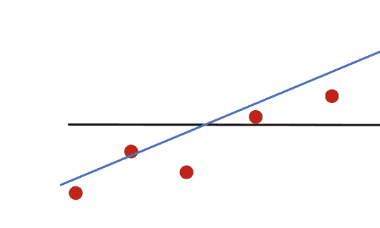

图5.17 计算R2值

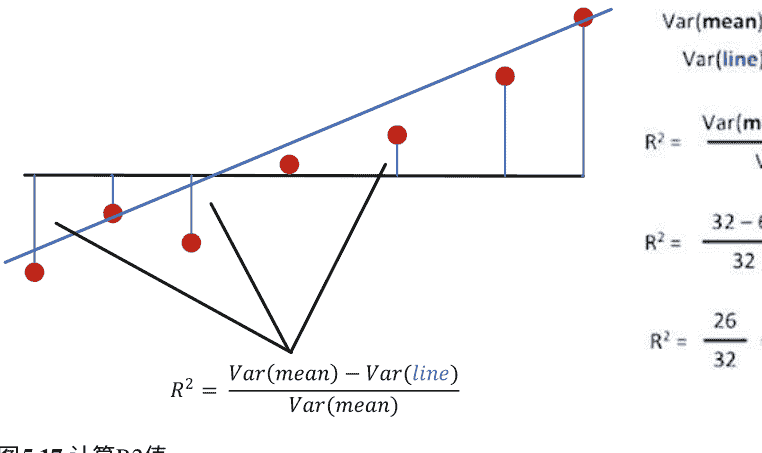

在第二步中，我们对相同的数据进行相应的回归线拟合（最小二乘回归），并计算平方残差，如图5.16所示。我们可以使用两个结果值和图5.17中的公式来计算R2。

总之，R2是识别线性回归模型最佳特征组合的良好指标。

### 5.6 概率评分方法

概率评分方法用于预测概率而不是类别标签。这允许在评估预测可能性时使用更复杂的方法。

#### 5.6.1 对数损失分数

评估预测概率的最常见方法之一是对数损失，也称为对数损失或交叉熵[7]。对数损失通过将预测的概率与预测的类别进行比较来工作。根据与类别输出值的距离，计算得分以惩罚概率。对于小的差异，惩罚较小，而对于较大的差异，得分较高。因此，产生完美预测的模型的对数损失为0.0。对数损失严厉惩罚对错误分类有信心的分类器。图5.18显示，随着预测概率的改善，对数损失逐渐下降，相反，当概率接近0时，对数损失增加，如蓝线所示。

#### 5.6.2 布里尔分数

布里尔分数通过计算预测概率与实际结果之间的均方差来工作[8]。布里尔分数会对预测概率与期望概率之间的差距进行惩罚，但比对数损失函数的惩罚要轻。想象一下，你是一名天气预报员，被要求预测明天下雨的概率。从图5.19可以看出，你可能会说明天下雨的概率是70%。第二天来了，你是对的，下雨了。

为了计算布里尔分数（BS），我们将你的概率值0.70代入y轴，并从观测值（下雨，所以为1.0）中减去，得到0.3。然后将这个值平方，得到最终的BS分数，本例中为0.09。然而，如果我们发现没有下雨，我们可以重新计算BS分数，你的概率值0.7减去观测结果（没有下雨，所以为0），得到0.7。然后将这个值平方，得到最终的BS分数。

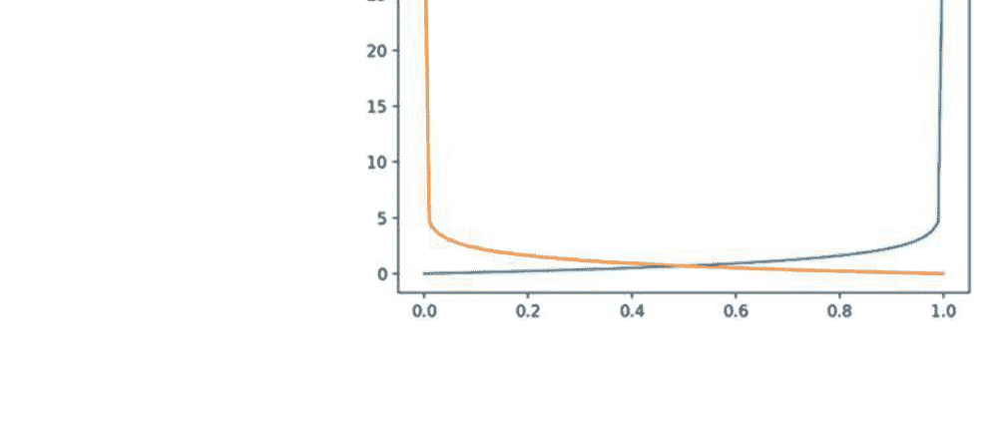

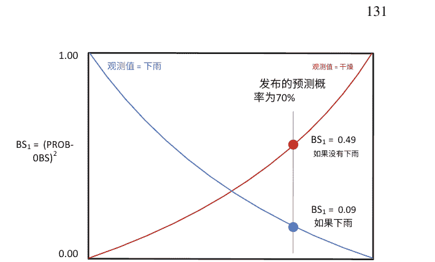

数值为0.7，给出了0.49的BS分数。请注意，BS分数越接近0，结果越好。因此，在这种情况下，0.09的BS值是一个好分数，而0.49的BS分数则较差。

### 5.7 交叉验证

#### 5.7.1 评估分类器的挑战

我们可能没有足够的数据来构建足够大的训练和测试集。通常，更大的测试集可以给我们更可靠的准确度估计。更大的训练集将更好地代表我们用于学习过程的数据量。从数据中删除部分内容以构建验证和测试集可能对较小的数据集特别有问题[9]。

#### 5.7.2 K折交叉验证

K折交叉验证是一种重采样技术，用于评估机器学习模型，对于小数据集特别有用[10]。与我们之前讨论的手动将数据集分割为训练、验证和测试集不同，我们可以指定一个k个分区。关键区别在于模型是在整个数据集上进行训练，因此在训练过程中不会丢失任何观测值。与其他描述的评估指标一样，交叉验证主要用于确定机器学习模型在未见数据上的表现如何。K折交叉验证执行如下步骤，如图5.20所示。

1.  该过程首先通过随机洗牌数据集来开始。
2.  然后，我们将数据集分成若干个分区（例如，如果 k = 5，则分区数为5）

图5.20 K折交叉验证

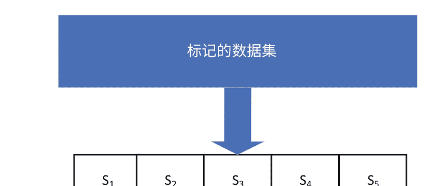

| 迭代 | 训练 | 测试 |
|------|------|------|
| 1 | S2 S3 S4 S5 | S1 |
| 2 | S1 S3 S4 S5 | S2 |
| 3 | S1 S2 S4 S5 | S3 |
| 4 | S1 S2 S3 S5 | S4 |
| 5 | S1 S2 S3 S4 | S5 |

3.  对于每个分组，我们执行以下操作：选择一个分组作为测试数据集，并使用其余的分组进行训练（因此，如果 k=5，则一个分组用于测试，其余四个分组用于训练）。一旦模型在训练数据上训练完成，就会在测试集上进行评估，然后我们保留收集的分数并丢弃模型。
4.  使用存储的评估分数总结模型的结果。

### 5.8 无监督学习评估指标

与监督学习类似，正确评估无监督模型非常重要。与监督学习不同，没有已知的答案或标签来指导优化过程或根据已知数据测量模型的性能。

#### 5.8.1 弯肘法

由于没有依赖变量（类标签），很难确定应该有多少个聚类（例如在K-Means中定义k的值，如前所述）。然而，对于像K-Means这样的算法，有工具可以估计数据集中有多少个聚类。最常用的方法是弯肘法，它多次运行算法来确定最佳聚类数。

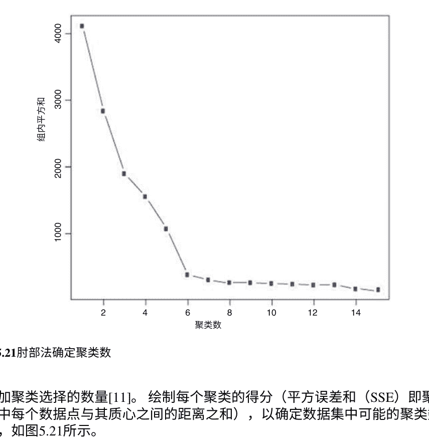

增加聚类选择的数量[11]。绘制每个聚类的得分（平方误差和（SSE）即聚类中每个数据点与其质心之间的距离之和），以确定数据集中可能的聚类数量，如图5.21所示。

如果你绘制k与SSE的关系，你会发现随着k的增大，误差会减小；这是因为当聚类数量增加时，它们应该更小，所以失真也更小。拐点法的思想是选择SSE急剧下降的k值。这在图5.21中产生了一个“拐点效应”。

#### 5.8.2 Davies-Bouldin指数

与肘部法相似，Davies-Bouldin指数（DBI）用于估计数据集中的最佳聚类数。较低的DBI值意味着聚类之间的分离更好，而较高的值则表示聚类之间的分离较差[12]。图5.22显示了给定数据集的DBI。通常选择具有最低DBI的聚类数。

DBI计算通过计算每个聚类及相似聚类的平均相似度度量来进行。相似度被描述为聚类内距离与聚类间距离的比率。距离较远的聚类

图5.22 DBI

DB = MAX [(d(A) + d(B)) / d (AB), (d(B) + d(C)) / d (BC), (d(A) + d(C)) / d (AC)]

d(A) = [|A - Z1| + |A-Z3|]/3

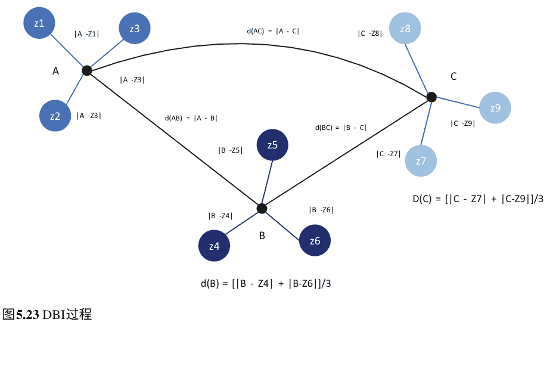

D(C) = [|C - Z7| + |C-Z9|]/3

d(B) = [|B - Z4| + |B-Z6|]/3

图5.23 DBI过程

具有较低的DBI分数。换句话说，DBI值越低，聚类效果越好。例如，如果我们有三个由三个数据点组成的聚类，可以按照图5.23所示的步骤计算DBI分数。

- 步骤1：计算每个聚类的平均簇内距离。
- 步骤2：计算每对质心之间的距离。
- 步骤3：对于一对聚类，将簇内距离求和并除以这两个质心之间的距离。

#### 5.8.3 Dunn指数

Dunn指数（DI）用于确定聚类算法的性能。Dunn指数假设更好的聚类意味着簇紧凑且与其他簇分离[13]。这些可以是任何距离度量，但常见的是欧氏距离。

增加DI值的两种主要方法。第一种是将最近的一对聚类分开，从而增加DI值。相反，如果保持聚类质心之间的距离不变，但缩小聚类的直径（即使聚类更密集），则DI值也会增加。

理想情况下，最佳聚类数将导致最大的DI。最大的DI由两个因素决定：首先，所有聚类之间的最大可能距离，其次，每个聚类最外部点之间的最小可能距离，如图5.24所示。

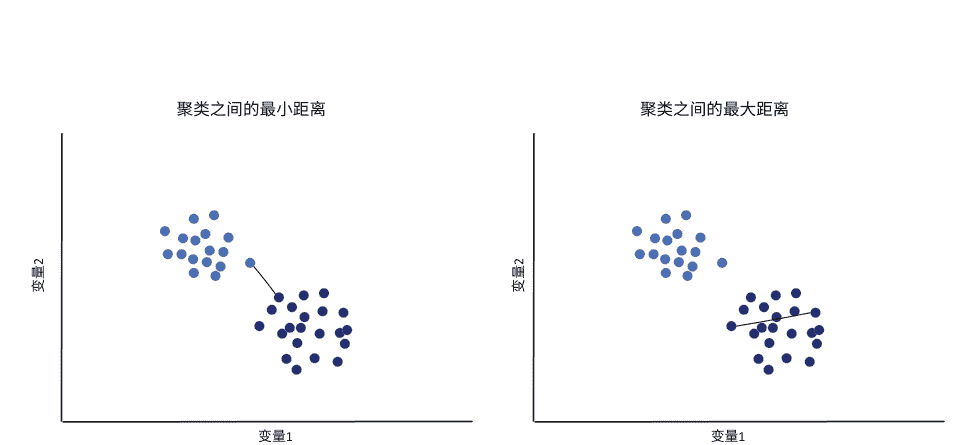

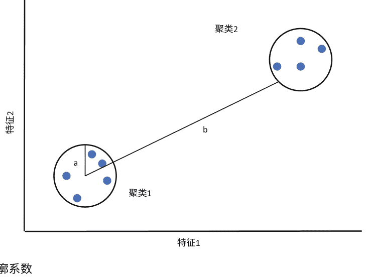

图5.25轮廓系数

#### 5.8.4 Silhouette Coefficient

轮廓分析用于确定不同聚类之间的距离[14]。系数值的范围在-1和1之间。值为1表示聚类之间相互分离且明显区分。值为0表示聚类相同且聚类之间的距离很小。值为-1表示聚类分配错误，暗示聚类过程存在问题。

轮廓方法中的第一阶段是计算特定聚类中每个数据点之间的平均距离（也称为簇内距离）。第二步是计算所有聚类之间的平均距离（也称为簇间距离）。该过程如图5.25所示，在二维空间中计算这两个距离。这两个距离可以用来计算轮廓分数，其中簇间距离减去簇内距离，然后除以簇内/簇间距离的最大值。

### 5.9 总结

本章讨论了模型评估的重要性，包括ML从业者面临的挑战以及在什么情况下使用每个评估指标。讨论指出，并非所有评估指标都是相等的，并强调在选择哪种方法时需要仔细考虑，以便提供关于模型性能的充分指标。

真实世界。在深入讨论指标之前，我们提供了如何将数据分割为训练、验证和测试集以及它们在模型训练和评估中的具体角色的讨论。

本章的其余部分分为不同的评估指标，支持有监督和无监督学习策略。在有监督机器学习中，我们详细讨论了混淆矩阵、准确率、精确率、召回率、特异度、假阳性率和F1得分。这部分讨论了利用这些方法的工具，包括ROC和AUC。在有监督学习范式下，我们讨论了如何使用MSE、MAE和R2评估基于回归的模型。本章介绍了概率评分方法，其中讨论了对数损失和Brier得分。有监督评估部分以交叉验证的讨论结束。

本章的最后部分专注于无监督机器学习的评估指标。这些指标包括弯肘法、 Davies-Bouldin指数、 Dunn指数和轮廓系数。

## 参考文献

1.  M. Hossin和M. N. Sulaiman, “关于数据分类评估指标的综述,” *Int. J. data Min. \& Knowl. Manag. Process*, vol. 5, no. 2, p. 1, 2015.
2.  S. M. McNee, J. Riedl和J. A. Konstan, “准确性不足够：准确性指标对推荐系统的伤害,” in *CHI '06 extended abstracts on Human factors in computing systems*, 2006, pp. 1097–1101.
3.  H. Jabbar 和 R. Z. Khan, “避免过拟合和欠拟合的方法在监督机器学习中的应用（比较研究）,” *Comput. Sci. Commun. Instrum. Devices*, pp. 163–172, 2015.
4.  F. Provost 和 R. Kohavi, “术语词汇表,” *J. Mach. Learn.*, vol. 30, no. 2–3, pp. 271–274, 1998.
5.  J. Rothstein, “概率与信息论及其在雷达中的应用. PM Woodward. McGraw-Hill., 纽约; Pergamon Press, 伦敦, 1953. 128 页. 插图. $4.50. ” 美国科学促进会, 1954.
6.  L. JF, “岭回归和其他回归估计的模拟研究,” *Commun. Stat. Methods*, vol. 5, no. 4, pp. 307–323, 1976.
7.  V. Vovk, “对数损失函数的基本性质,” in *Fields of Logic and Computation II*, Springer, 2015, pp. 307–318.
8.  G. W. Brier 和其他人, “以概率表示的预测的验证,” *Mon. Weather Rev.*, vol. 78, no. 1, pp. 1–3, 1950.
9.  S. Arlot 和 A. Celisse, “用于模型选择的交叉验证程序综述,” *Stat. Surv.*, vol. 4, pp. 40–79, 2010.
10. P. A. Lachenbruch和M. R. Mickey, “判别分析中的错误率估计,” *Technometrics*, vol. 10, no. 1, pp. 1–11, 1968.
11. R. L. Thorndike, “谁属于这个家庭 ?,” *Psychometrika*, vol. 18, no. 4, pp. 267–276, 1953.
12. D. L. Davies和D. W. Bouldin, “一种聚类分离度量,” *IEEE Trans. Pattern Anal. Mach. Intell.*, no. 2, pp. 224–227, 1979.
13. J. C. Dunn, “ISODATA过程的模糊相对关系及其在检测紧凑且分离良好的聚类中的应用,” 1973.
14. P. J. Rousseeuw, “轮廓系数：一种用于聚类解释和验证的图形辅助工具分析, ” *J. Comput. Appl. Math.*, vol. 20, pp. 53–65, 1987.

# 第三部分 深度学习概念和技术

## 第六章 深度学习简介

深度学习是人工智能的一个子集，它使用生物启发的网络来解决给定的问题。神经网络是大多数深度学习架构中的关键组成部分，其模型基于人脑，使计算机能够以类似的方式学习。目前使用深度学习解决的一些常见问题包括模式识别、时间序列预测、信号处理、异常检测、控制和自动化以及计算机视觉[1]。与之前讨论的传统机器学习一样，你会发现大多数常见的工具和技术在深度学习领域也是适用的。例如，你仍然需要进行EDA过程的一些元素，对数据进行预处理和分割为训练、验证和测试集，并使用之前讨论过的一些指标评估模型（在深度学习的特定情况下，我们将介绍适当的附加指标）。

然而，许多相似之处就到此为止了，因为深度学习模型的基本架构与传统机器学习模型不同。

尽管特征工程可以像之前讨论的那样进行，但在本章中，你将看到这个过程如何自动化，即网络本身自动提取特征。这是深度学习中的一个重要进展，简化了训练流程，并且可以消除对领域知识的需求，同时提高了提取特征的质量。

近年来，深度学习在学术界和工业界的研究和应用中有了显著增长，引发了人们常说的AI夏季。深度学习并不是新的，可以追溯到60年代初。然而，有三个基本组成部分推动了深度学习的广泛应用。这些是深度神经网络架构的进展、GPU和大规模且不断增长的高质量数据集的可用性。

这些技术的结合正在推动创新解决方案的显著进步，如无人驾驶汽车、智慧城市和智能设备，如Alexa。尽管你可能没有意识到，深度学习已经在我们的日常生活中发挥着基础性的作用，帮助、支持和增强我们所做的事情。例如，在推荐系统、医疗保健、安全、金融、娱乐和我们拥有的许多设备的许多服务中。在本章和后续章节中，我们将介绍人工神经网络（ANNS）并探讨DL架构及其设计解决的问题的许多方面。

### 6.1 那么DL和ML有什么区别呢？

机器学习和深度学习在某种意义上非常密切相关，它们允许机器从先前的数据中学习。 机器学习这个术语是一个总称，适用于以这种方式学习的任何机器。而深度学习是一组特定的方法和技术，使机器能够使用非常深入和复杂的网络进行学习和决策。 然而，在深度学习中最显著的区别之一是它能够替代人工驱动的特征提取过程，并将这个阶段纳入网络本身以自动决定哪些特征最好地描述数据，如图6.1所示。在某些应用中，例如自然语言处理和计算机视觉，很难应用支持向量机（SVM）和随机森林（RF）等算法来理解和翻译语言或检测和分类图像中的对象。 然而，这些都是深度学习算法相对容易完成的任务。因此，在选择适当的模型之前，了解机器学习和深度学习算法能够做什么和不能做什么是非常重要的。在某些情况下，如果一个机器学习算法，例如

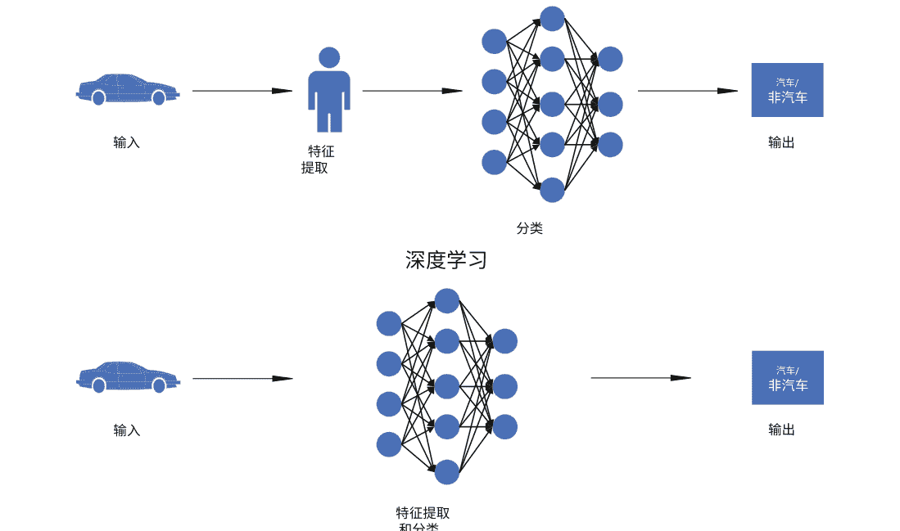

图6.2 DGX1和DGX2

- a) 它们具有计算效率
- b) 模型可以解释
- c) 它们不需要与DL一样多的数据

尽管DL模型已被证明可以解决一些最具挑战性的问题，但它们对数据需求量大且计算成本高。在承诺采用基于DL的解决方案之前，需要仔细考虑训练和托管复杂DL模型的硬件要求。例如，使用高清相机陷阱图像来检测撒哈拉以南非洲最常见的29个物种的应用程序，需要一个带有4个Nvidia Quadro M4000 GPU的单个计算节点（在撰写本文时约合£3000），大约需要4天来训练每个物种1000张图像的模型。请注意，这不是一个特别复杂的模型。实际上，您需要一个更大的数据集和其他硬件来支持此操作，例如DGX1或DGX2，其价格在撰写本文时介于£100,000和£300,000之间。请注意，DGX2具有16个Tesla V100 GPU。图6.2显示了DGX1和DGX2。训练模型后，我们需要托管模型以进行准实时推理。在撰写本文时，Tesla T4和RTX 8000等硬件的价格在£2100和£8000之间。选择采用ML范式时存在几个权衡。这需要仔细考虑，因为时间和成本因素可能会影响您承担项目的预算和可行性。

### 6.2 深度学习简介

DL算法处理数据并开发抽象。使用DL，信息通过每一层传递，前一层的输出为下一层提供输入。网络中的第一层称为输入层，最后一层称为输出层。两者之间的所有层都被称为隐藏层。

隐藏层。DL的历史可以追溯到1943年，当时基于人脑神经网络的第一台计算机模型被创建。从那时起，DL稳步发展，只有两次重大突破，都被称为AI寒冬。
人工神经网络中最重要的突破之一是反向传播算法的开发，该算法于1985年应用[3]，并于1989年在贝尔实验室完全实现[4]。1989年，反向传播与卷积神经网络（CNN）相结合，CNN被训练用于识别手写数字。1999年，GPU技术与DL的集成标志着下一个重大突破，使计算速度在10年内提高了1000%。2009年，发布了一个包含1400万标记图像的数据库[5]。这是图像处理研究的重要里程碑。到2011年，GPU的进步意味着可以训练更大的CNN来解决复杂问题[6]。从那时起，DL领域已经扩展到许多领域，重点是对神经网络架构的调整，以及加速和提高模型准确性的工具和技术。在接下来的章节中，我们将探讨其中一些进展。

深度学习已经显著推动了人工智能领域的发展，并且所产生的结果已经被证明在许多实际应用中能够实现有意义且有用的准确性。虽然机器学习在图像和文本的分类上已经使用了几十年，但在商业应用中，它一直难以达到足够的水平。深度学习使我们能够超越解决实际问题所需的门槛，并提供以传统机器学习算法无法实现的服务。计算机视觉是深度学习的一个显著例子，在诸如医疗保健和制造业等许多应用中，它正在显示出超越人类的早期迹象。

深度学习在象棋和围棋等游戏中是一个更为知名的领域，在这些领域中，它已经变得极其困难，甚至不可能击败AlphaGo等深度学习系统。AlphaGo甚至通过产生以前专家人类选手未曾想到的着法来展示创造力，以获得竞争优势。例如，著名的李世石（曾获得18个世界冠军）与AlphaGo之间的比赛，AlphaGo以4比1的比分获胜。

深度学习的爆发和采用归功于科技巨头如谷歌、Facebook和微软提供的支持框架。这些公司处于应用人工智能和其在许多商业领域中的普及的前沿。深度学习框架简化了模型的训练和托管，并且是由行业主导的。因此，它们越来越常见地集成到现有的业务流程中，以解决现实世界的挑战。目前存在的最常见的深度学习框架包括谷歌的TensorFlow，Facebook的PyTorch和微软的CNTK。

### 6.3 人工神经网络

神经网络是基于生物神经网络建模的，试图使计算机以与人类相当的方式进行学习。在人脑中，大约有860亿个神经元，超过100万亿个突触连接[8]。相比之下，目前最大的人工神经网络包含1600万个神经元（感知器）[9]。然而，你通常会遇到的数量将在几百到几千之间。感知器被认为是人工神经元，可以模仿其生物学对应物的某些部分。这些部分包括树突、细胞体和轴突，如图6.4所示。信号从树突接收，并在足够多的信号接收后通过轴突传输。然后，这个信号被用作其他神经元的输入，并且这个过程不断重复。

一些信号比其他信号更重要，这导致其他连接的神经元更容易激活。连接可以变得更强或更弱，同时新的连接可以形成或完全消失（这也被称为可塑性）[10]。人工神经网络可以通过使用一组加权输入来模拟这个过程的一部分，如果节点的激活阈值达到（即神经元被激活），则会触发神经元的激活。一旦神经元被激活，部分输出会传递给下一个神经元。与之前一样，这个值会乘以连接的权重，并通过连接传播到其他神经元。因此，这个过程会继续，在整个网络中引起激活。给定一组神经元，人工神经网络可以将一组输入映射到相应的输出（称为通用逼近）。图6.3显示了人类神经元的基本结构及其与其他神经元的连接。

#### 6.3.1 感知器

感知器的灵感来自生物神经元的工作方式。感知器由一个或多个输入、一个处理器和一个输出组成。输入表示您希望建模的输入数据。例如，图像中的像素强度，文本中描述单词的热编码，或从语音记录中获取的信号信息流。处理器在输入的总和超过给定阈值时激活，并生成相应的输出。因此，该过程有四个主要步骤：接收输入、加权输入、求和输入和生成输出。

请参考图6.4，其中我们有两个输入1和4。每个输入都必须加权（乘以一个值），通常是一个介于1和1之间的数字（初始权重随机分配）。与我们学习的方式类似，这个简单的网络将通过反馈机制自动调整这些权重，直到找到输入和输出之间的映射关系。权重用于描述该输入的重要性。

一旦我们有了随机分配的权重，我们将输入乘以权重（输入 * 权重）。计算结果传递给激活函数（处理器）。在简单的二进制输出中，激活函数确定感知器（神经元）是否激活，即如果达到阈值，则生成0，否则生成1。有各种不同的激活函数，如Sigmoid和双曲正切，稍后将在本章中讨论。

图6.5显示了加权输入和激活函数之间的关系。

### 最基本的激活函数的工作原理如下：

- 如果总和是正数，则输出为1。
- 如果总和是负数，则输出为0。

图6.6 输入评估

图6.7 带有偏置的激活

图6.8 给加权输入添加偏置

所以，在我们的例子中，6 + -4 = 2，所以我们的激活函数将返回1，如图6.6所示。

这里有一个问题。如果初始输入都是0怎么办？激活函数将永远不会激活。为了解决这个问题，我们给每个输入添加一个偏置项，如图6.7所示。重要的是要注意，直到权重超过偏置值，它才会产生影响。从这个意义上说，当权重较低时，偏置可以起到抑制作用。当权重超过偏置时，它对网络的影响与权重本身的大小相关（权重越小，影响越小；权重越大，影响越大）。如图6.8所示，将偏置添加到每个输入中。

#### 6.3.2 神经网络

可以说，单个感知器本身并不是非常有用，因此通常会扩展成更复杂的网络结构。人工神经网络（ANNs）由三种主要的层类型组成，包括：

- 输入层 – 来自数据的实数值
- 隐藏层 – 位于输入层和输出层之间的层—3个或更多层被分类为“深度网络”
- 输出层 – 输出的最终估计

随着网络层次的增加，抽象程度也增加，这就是模型解释变得更加困难的地方。这些更复杂的配置被称为多层感知器（MLP）网络，如图6.9所示。每一层都向下一层的感知器提供输入，直到在输出层生成输出值。MLP是一个全连接网络，因为每个层中的感知器都与下一层中的每个感知器相连。如图6.9所示，输入与第一个隐藏层中的每个感知器相连，而第一个隐藏层又与下一个隐藏层中的每个感知器相连，最后连接到输出层。

人工神经网络有许多不同的变体，每个变体都能够解决特定的问题—本书将讨论其中一些。

#### 6.3.3 激活函数

我们已经看到输入如何被输入到人工神经网络中，以及如何计算和调整这些输入、权重和偏置，以使网络学习。在本节中，我们将重点关注处理器（感知器）并了解神经元（感知器）的激活过程。这是通过激活函数和一个显著的符号来实现的。

图6.10 阶跃函数

已经进行了大量的研究以了解它们的有效性。输入、权重和偏置值被求和并传递给激活函数。根据值的不同，激活函数要么激活，要么不激活。

图6.10显示了最简单的激活函数，即阶跃函数[11]。如果输入、权重和偏置的总和产生一个负值，则输出为0。大于等于0的值将返回一个输出值为1。这个函数的问题在于它通常过于激进，不考虑小的变化。

图6.11 [12]展示了一种称为Sigmoid函数的替代激活函数。该函数接受加权和偏置值的总和作为输入，并像以前一样返回0或1的值。使用Sigmoid激活函数，我们可以更细粒度地设置阈值，即较小的变化可以改变激活函数的输出（因此，激活不再依赖于负/非负值，而是在0和1之间以0.5为阈值进行激活）。因此，Sigmoid激活函数更加细粒度和敏感于微小的变化（例如，当输入等于0.5时，输出为1，当输入为0.4时，输出为0）。

与Sigmoid激活函数不同，双曲正切（Tanh）激活函数（图6.12）可以是1或-1。范围在1和-1之间允许对权重和偏置进行更大的更新，从而加快训练时间（这克服了Sigmoid激活函数的主要限制）[13]。稍后将更详细地讨论这个问题。

- Sigmoid函数：可以实现更精细的激活

图6.11 Sigmoid激活函数

- 双曲正切：输出可以在-1到1之间

图6.12 双曲正切

最后，图6.13展示了修正线性单元（ReLU），它是人工神经网络中最常见的激活函数之一[14]。对于ReLU，输入、权重和偏置被馈入激活函数中。如果值小于零，激活函数返回0。如果输入为0或更大，则返回输入的真实值。sigmoid和双曲正切的问题是它们遭受着被称为梯度消失效应的问题，这将在本章后面讨论。

修正线性单元（ReLU）：非常常见的激活函数

图6.13 ReLU

#### 6.3.4 多类别分类考虑

在前一节中，我们注意到所有这些激活函数都用于单个输出、连续标签或二分类（0或1）。然而，在多类别情况下，这些函数都无法工作。

多类别场景有两种主要类型：

- 非独占类别
  - 数据点可以被分配多个类别/类别。例如，一张图片可以包含多个对象（例如沙堡、人、风筝和鸟）。
- 互斥类别
  - 数据点可以被分配一个类别/类别。这是指某事物不能同时发生。

以前，我们将最后一个输出层视为单个节点。这个单个节点可以输出连续回归值或二分类0或1，如图6.14所示。

那么，如果你需要多个输出，比如2个、3个或4个输出，会发生什么。在这种情况下，你需要在输出层添加额外的节点，如图6.15所示。你需要每个类别一个神经元。

正如本书前面讨论过的，你会记得输出必须是一个数字，即不能使用诸如“红色”、“猫”或“狗”之类的词语。这些需要是一个正确排序的数值序列（列位置），如图6.16所示。因此，你需要在文本标签和相应的数值输出之间进行映射。这通常被称为独热编码。这种技术用于互斥类别，每次只能有一个值。

对于非独占类，这个过程改变以适应多个输出。例如，一张图片中可以有多个物体（即一辆车和一辆自行车）。如图6.17所示。

一旦我们对数据进行编码，我们需要选择正确的输出层架构和适当的激活函数。

- 非独占
  - Sigmoid激活——每个神经元将输出一个介于0和1之间的值，表示其被分配给该类的概率，如图6.18所示。
- 互斥类别
  - 它允许每个神经元独立地输出一个值，而不受其他类的影响
  - 这意味着它允许将单个数据点输入到网络中，并生成多个输出

图6.19 SoftMax输出

但是当每个数据点只能被分配一个类别时，我们该怎么办呢？我们可以使用SoftMax函数来解决这个问题。SoftMax函数计算k个不同事件的概率分布。因此，该函数将计算每个目标类别在所有目标类别中的概率。

概率最高的类别将是正确的类别。请注意，所有输出的概率范围将在0和1之间，并且所有概率的总和将等于1。模型返回每个类别的概率，选择具有最高概率值的类别。因此，要记住的主要事项是，如果您对多个类别使用SoftMax激活，您将得到如下图6.19所示的输出。在这种情况下，绿色类别被选择为正确的类别，因为它具有最高的概率值。

#### 6.3.5 成本函数和优化器

网络提供了对输出类别的估计。人工神经网络中的一个关键挑战是如何高效地评估模型的预测，并确定模型与正确类别的接近程度（通过将预测输出与真实值进行比较来完成）。在此评估之后，需要更新网络的权重和偏置，以改进模型的输出并减小误差。这被称为学习阶段，并且类似于人类学习的方式，我们在获得更好的理解时研究和更新我们的内部模型。

在人工神经网络中，我们需要将网络的估计输出与标签的真实值进行比较。在这个阶段，我们在模型的拟合/训练过程中使用训练数据集。成本函数（通常称为损失函数）必须进行平均，以输出一个单一的值。在训练阶段，我们需要跟踪损失以监控网络的性能。

成本函数使我们能够通过告诉我们与目标值的差距来评估感知器的性能。有不同的成本函数，但最流行的是交叉熵。交叉熵的好处是它能够实现更快的训练。通常，差异越大，神经元学习得越快。下一步是使用我们的神经元和误差测量（成本函数）来纠正网络的预测（这是过程中的学习部分）。这被称为优化，并由优化算法进行。为了更好地解释这一点，想象一下我们正在烤一块面包，你需要称量380克的面粉。你首先将一些面粉倒入秤上，并读取数字显示器上的重量。与大多数情况一样，添加的面粉的数量要么超过要求的380克，要么不足。为了纠正这个问题，你逐渐添加或移除勺子，直到达到380克的目标（请注意，这可能需要多次迭代（周期）才能达到所需目标）。这种情况是神经网络训练阶段中优化和成本函数的工作方式。为了计算和减少损失，我们使用一组被称为优化算法的算法。最流行的优化算法之一是梯度下降[15]。梯度下降是一种用于寻找函数最小值的优化算法（在我们的情况下是成本函数）。例如，如果你要在一个多雾的山上导航，那么你唯一可用的信息就是向下的方向。当你向下移动时，你可以推断你正在下山。如果突然你开始向上移动，你会推断你又在向上爬，因此会做出适当的调整以向下移动。这正是梯度下降所做的。在梯度下降中，这个过程会一直持续，直到找到全局最小值，如图6.20所示。

图6.20 梯度下降

图6.21 较小的步长到达最小值

梯度下降从给定点计算斜率，并朝斜率的下降方向移动。重复此过程直到收敛于零，表示达到最小值。较小的步长需要更长的时间才能找到最小值，如图6.21所示。步长被称为学习率。梯度下降中的一个关键挑战是设置最优学习率。如果设置得太小，可能需要很长时间才能使网络收敛（达到全局最小值）。如果设置的学习率太小，可能需要很长时间才能使网络收敛（达到全局最小值）。然而，如果学习率设置得太高，学习者会在碗中产生乒乓效应，超过全局最小值并永远无法达到。

传统梯度下降的一个问题是可能陷入局部最小值而不是全局最小值，如图6.22所示。可以通过调整学习率来解决此问题，但是已经开发了几种优化技术来克服此问题。

图6.22 局部和全局最小值

图6.22中显示的学习率是恒定的，每个步长相等。我们可以使用其他优化器，可以自动智能地调整我们的学习率（步长）。我们可以从较大的步长开始，然后随着梯度的平稳变化而减小步长（这被称为自适应梯度下降）。与梯度下降相比，Adam优化器在寻找全局最小值时更加高效[16]。Adam优化器也被证明在克服局部最小值问题方面非常有效，因此是最流行的优化算法之一。许多其他优化器尝试最小化误差，但一般原则保持不变。

#### 6.3.6 反向传播

反向传播允许我们更新整个网络的最优参数。它通过计算输出误差，然后通过网络层进行遍历，进行所需的调整（我们想知道成本函数如何导致这些调整的变化）。

正如在本章前面讨论的那样，每个输入都会得到一个权重和偏差，如图6.23所示。我们已经看到了这个过程如何向前传播，但下一阶段是看错误如何进行反向传播。

这个想法是我们可以利用梯度回溯网络并调整权重和偏差，以最小化最后输出的错误向量。想象一下，一个驾驶教练正在教他的学生倒车入停车位。使用镜子的信息（优化器），他可以告诉学生如果看起来车要超过停车线，就调整方向盘（权重和偏差）。当汽车倒车时，教练不断向学习者提供反馈，并告诉他们如何相应地调整方向盘。当驾驶员成功停车时，这个过程停止。这个过程在图6.24中显示。反向传播是一个独立的章节，因为需要理解复杂的数学构造和理论原理。从本节中你需要理解的是，信息通过网络向前传递，导致预测输出。将此输出与实际输出进行比较，并用优化算法将误差（损失）值向后传播，以更新网络中每个神经元之间的连接权重。所有权重都使用所谓的链式法则进行更新。信息向前流动的一个周期，以及向后传播的误差导数被称为一个时代。图6.25显示了一个简单的链式法则，其中X是输入特征，y是预测输出，a是激活函数。W是分配给特定连接的权重，而底部的方程用于计算损失，该损失向后传播到网络中的每个权重进行更新。

图6.23 前向传播

图6.24 反向传播

图6.25 反向传播的链式法则

#### 6.3.7 梯度消失问题

在ANN的早期阶段，梯度消失问题从未成为问题，因为它们相对较浅（层数较少），这是由于计算能力的不足[17]。随着ANN变得更深，并且硬件改进使得网络架构能够增长，这个问题变得更加明显。

随着ANN添加更多的层，损失函数的梯度接近0，这使得训练深度神经网络变得困难。换句话说，后面的层的权重发生了相当大的变化，而离输入最近的层的权重变化较小。这意味着离输出最近的层比离输入最近的层学习得更好。

一些激活函数，例如sigmoid函数，将输入值转换为0到1之间的输出值。如图6.26所示—输入越大，导数越小。sigmoid激活函数的导数范围在0到0.25之间。因此，输入值为0.9将导致导数为0.018。当从输出层到输入层的每个感知器的导数相乘时，导数的值会大幅度减小。在具有多个层的网络中，这些梯度开始消失，导致梯度消失现象。为了解决这个问题，许多深度学习网络使用ReLU激活函数。这个激活函数不会将小的导数从输出层传播到输入层。ReLU的导数范围在零和一之间，任何大于零的输入都会返回导数为一。相反，小于零的输入将返回零。

然而，主要的限制是在链式法则计算中出现零值可能导致节点和激活函数失效。使用Leaky ReLU可以解决这个问题，它确保小于零的值增加一个小的常数[18]。例如，如图6.27所示，小于零的值将被更改为0.01。

#### 6.3.8 权重初始化

神经网络的性能在很大程度上取决于训练开始时可调参数（权重）的初始化。适当的权重初始化还有一个好处，就是可以防止激活输出的爆炸或消失，正如之前讨论的那样。有几种不同的权重初始化方法，包括常数值或者Xavier权重初始化。如果权重是随机初始化的，结果将无法复现。

仔细初始化权重不仅支持可复现的结果，还有助于ANN的训练。权重初始化通常遵循三个基本规则：

- 不应该使用小值来初始化权重
- 不应该使用相同的值来初始化权重
- 应该初始化权重以提供良好的方差

值得注意的是，在所有情况下，没有一种单一的权重初始化技术可以被认为是最好的。有些技术在特定数据集上效果更好，而其他技术在不同的激活函数上效果更好。一些技术包括：均匀分布：在这种情况下，权重使用从一个均匀分布中取值的方式进行初始化，取值范围在一个特定神经元的输入数量的平方根的倒数和一个上限之间。这种方法对于sigmoid和tanh激活函数效果很好。

Xavier初始化：这里使用了两种关键技术，分别是Xavier normal和Xavier uniform [19]。在Xavier normal中，权重使用正态分布的均值设置为零，标准差设置为输入和输出数量之和的平方根除以2。在Xavier uniform中，权重使用一个均匀分布进行初始化，其中下限计算为负六的平方根除以输入和输出数量之和的平方根，上限计算为六的平方根除以输入和输出数量之和的平方根。这种方法对于sigmoid和tanh激活函数也效果很好。

He初始化：与前面的例子一样，有两种方法即He正态分布和He均匀分布[20]。在He正态分布中，权重使用从均值为零、标准差为输入特征总数的平方根的正态分布中取得的值进行初始化。在He均匀分布中，权重使用从上下限之间的均匀分布中取得的值进行初始化。下限通过将六的负平方除以输入特征总数来计算。上限通过将六的平方根除以输入特征总数来计算。这种方法在ReLU激活函数下效果很好。

#### 6.3.9 正则化

训练ANN模型最重要的一个方面是过拟合的可能性，正如我们在第2章中讨论的那样。避免过拟合可以单独提高我们模型的性能。由于ANN的复杂性（因为可调参数的数量），它们容易过拟合。对抗过拟合最常见的技术之一是dropout[21]。在每次迭代中，dropout随机选择一些节点并删除它们以及它们的所有传入和传出连接，如图6.28所示。

由于每次迭代都有不同的节点集，这导致了不同的输出。它也可以被视为机器学习中的一种集成技术。集成模型通常比单一模型表现更好，因为它们捕捉到更多的随机性。同样，dropout也比普通神经网络模型表现更好。

有几种不同的正则化技术，如L1和L2 [22]。通过这些技术，它们对代价函数应用另一个项来控制权重-这鼓励一个更小且更平衡的模型。

图6.28 丢弃

V1: 边缘检测等
V2: 提取简单的视觉属性（方向、空间频率、颜色等)
V3: 形状检测

图6.29 主要视觉皮层

### 6.4 卷积神经网络

当输入是图像或视频时，人工神经网络的用途有限。相反，对于这个任务，我们可以使用一种称为CNN的网络类型 [23]。CNN是基于大脑皮层中的主视觉皮层建模的 [24]。主视觉皮层包含六层，负责提取各种不同的特征，例如边缘。主视觉皮层如图6.29所示。CNN非常计算密集，并且具有各种不同的架构，包括滤波器、池化和最终的全连接ANN。

卷积层由一定数量的 filters和池化层组成，形成自动特征提取器。全连接层（密集层）形成分类，如图6.30所示。

在本章的其余部分，我们将更深入地讨论CNN的关键组成部分。

#### 6.4.1 图像滤波器和卷积核

滤波器也被称为卷积核，是应用于整个输入空间（如图像）的小矩阵。卷积核允许我们对图像进行变换。图6.31显示了一个灰度图像的示例，矩阵中的值介于 -1和1之间，其中 -1表示白色，1表示黑色，零表示灰色。在这个例子中， filter的大小是一个3 ×3的矩阵，应用于输入图像中。

从左上角开始。当过滤器在图像上移动（步幅）时，像素值会与过滤器权重相乘（这些权重将在学习过程中初始化和调整）。在最后阶段，将结果求和返回最终值。

步幅长度可以根据任务进行调整。默认情况下，步幅长度至少为1，但可以根据问题进行增加。有许多不同的图像卷积核可以从给定的图像中提取不同的特征。例如，如下所示，Sobel算子在图像处理和计算机视觉中用于边缘检测算法，它可以创建表示边缘的图像。图6.32显示了Sobel过滤器应用于边缘检测的图像[25]。

在CNN的背景下，这些特征被称为卷积核。将卷积核应用于图像的过程被称为卷积。卷积核可以超出图像的边缘，这会导致信息的丢失，为了弥补这一点，使用了一种称为填充的技术。在这里，图像的边缘被用零填充，这样整个图像就可以被滤波器处理，如图6.33所示。

#### 6.4.2 卷积层

卷积层描述了我们如何对输入图像应用多个滤波器[26]。卷积层被训练用于确定输入的最佳滤波器权重值（可学习参数）。CNN通过使用局部连接来减少参数的数量（当使用全连接的MLP处理图像时，参数数量较大，计算需求增加是一个问题）。在CNN中，并非所有神经元都是完全连接的。相反，神经元只与下一层的一部分局部神经元连接，即滤波器。图6.34显示了一维空间（1D CNN）上对多个滤波器层进行局部连接的情况。

当配置CNN时，您可以指定所需的filters数量。常见的filters，如Sobel，对于在图像中找到边缘很有用，其中权重已知。然而，如果您正在处理面部识别等任务，您将无法手动确定所需的权重，以提取眉毛或鼻子等特征。因此，CNN将确定一组权重来提取所需的特征。前面的figure显示了一个1D CNN，但在基本图像中，您需要一个2D CNN来处理灰度图像，并在卷积层中保留2D关系信息。图6.35显示了一个映射到三个filters的2D CNN示例，它们作为一个二乘二矩阵，并具有步幅为2。

彩色图像可以被视为三维张量（3D矩阵），其中包含红色、绿色和蓝色（RGB）颜色通道。除了高度和宽度之外，RGB图像的维度将是HxWx3，如图6.36所示。例如，当导入分辨率为1280 x 720的图像时，检查其形状将导致一个(1280,720,3)的三维矩阵（张量）。这些值中的每一个对应于1280像素宽度，720像素高度和3个颜色通道。与灰度图像不同，3D CNN中使用了一组每个通道（即RGB）的特征。图6.37显示了我们输入图像中的层和相应滤波器中的层。就像你将彩色图像视为三维的一样，你可以将你的特征视为三维的。

#### 6.4.3 池化层

尽管CNN使用局部连接，处理大图像、RGB和各种不同的特征仍然会导致许多可调参数。我们可以使用池化以减少这些参数[27]。池化层接受卷积层作为输入，如图6.38所示。

卷积层将包含多个 filters，并且我们可以使用池化来减小每个 filter 的大小。一种常见的池化类型是最大池化，其中在卷积层的每个 filter中，提取每个集合步长内的最大值。图6.39显示了最大池化过程。

尽管图6.40显示了卷积层中一个 filter产生的一个矩阵，但你需要对解决方案中实现的每个 filter都进行此操作，如图6.41所示。请注意，池化是依次对每个 filter进行的，而不是对组合 filters的交叉部分进行的。即使是2 × 2的小型池化核心，步长为2，也会删除75%的输入数据。

图6.41展示了一个名为AlexNet的基本CNN，它参加了2012年的ImageNet大规模视觉识别挑战赛，并被广泛认为是挑战中的第一个CNN [21]。这里的图表显示了卷积层、最大池化层和全连接稠密层之间的详细交互。第一个卷积层包含96个滤波器，后面是一个最大池化层。第一个Conv 1中的滤波器负责寻找边缘和斑点，Conv 3负责分析纹理，而Conv 5负责找到物体的部分。最终最大池化层的输出在进入稠密层之前被展开并进行分类。

#### 6.4.4 迁移学习

从头开始训练卷积神经网络（CNNs）需要调整卷积层中的 filters，这需要大量的图像和计算资源。有各种不同的数据集被用来从头开始训练卷积神经网络（CNN）。最常见的数据集是COCO数据集，其中包含200,000张图像，1.5百万个物体实例和80个物体类别[28]。除了一些科技巨头之外，很少有人拥有成功从头开始训练卷积神经网络（CNN）所需的基础设施（和数据）。幸运的是，许多大型科技组织提供预训练模型，只要感兴趣的图像包含在原始模型中，就可以使用这些模型进行预测。如果你想要一个模型来检测原始模型中没有包含的新对象，你需要扩展这些模型以包含感兴趣的新对象。这是通过一种称为迁移学习的技术实现的[29]。

例如，如果你想检测一个原始模型中不存在的对象，比如长颈鹿和犀牛，你可以从头开始训练一个新的卷积神经网络。然而，为了得到结果，我们需要在成千上万张图像上训练模型。另一种方法是使用迁移学习来训练一个新的模型，但是使用的数据要少得多。迁移学习利用模型之前学到的知识，并将其应用到一个新的领域[30]。卷积神经网络的早期层识别简单的形状。后面的层学习更复杂的形状，而最后一层进行预测。大多数预训练模型的层在新的应用中都是有用的，因为大多数视觉问题涉及相似的低级视觉模式。因此，我们可以重用大部分预训练模型，并替换最后一层以得到我们需要的预测，如图6.42所示。迁移学习在工业界特别受关注，因为它允许从以前获得的知识中构建，而无需从头开始。随着时间的推移，我们开始构建这些模型，更先进的学习和能力将会出现。实际上，这反映了人类学习的过程，我们在其他人的概念和知识基础上构建。我们将在第7章中介绍迁移学习和每种架构的具体细节。

### 6.5 总结

本章介绍了深度学习及其与机器学习的区别。它详细讨论了人工神经网络，包括感知器和不同的神经网络架构。介绍了人工神经网络架构的核心原则，包括激活函数、二分类和多分类、成本函数和优化器。它还着重讨论了神经网络的学习方面，并讨论了反向传播算法及其在消失梯度问题中的一些问题。本章还讨论了权重初始化和正则化的使用来解决过拟合问题。

引入了卷积神经网络，并详细讨论了图像滤波器和卷积层、池化层。迁移学习演示了如何利用预训练的卷积神经网络来开发自定义的图像处理应用程序，以解决自己的实际问题。

## 参考文献

1.  S. Pouyanfar等, “深度学习调查：算法、技术和应用” *ACM计算机调查*, 第51卷, 第5期, 第1-36页, 2018年。
2.  A. Ivakhnenko, 控制论和预测技术。
3.  D. B. Parker, “学习逻辑技术报告tr-47” *Cent. Comput. Res. Econ. Manag. Sci.*, 麻省理工学院剑桥分校, 1985年。
4.  Y. LeCun, D. Touresky, G. Hinton和T. Sejnowski, “反向传播的理论框架” in *1988年连接主义模型暑期学校论文集*, 第1卷, 第21-28页。
5.  J. Deng, W. Dong, R. Socher, L.-J. Li, K. Li, and L. Fei-Fei, “Imagenet: 一个大规模的层次化图像数据库,” 在*2009年IEEE计算机视觉和模式识别会议上*, 2009年, pp. 248-255.
6.  D. Ciresan, U. Meier, J. Masci, and J. Schmidhuber, “一个神经网络委员会用于交通标志分类,”在*2011年国际神经网络联合会议上*, 2011年, pp. 1918–1921.
7.  D. Silver, A. Huang, C. J. Maddison, A. Guez, L. Sifre, and E. Al., “用深度神经网络和树搜索掌握围棋游戏,” *自然*, vol. 529, no. 7587, pp. 484–489, 2016.
8.  S. DeWeerdt, “如何绘制大脑,” *自然*, vol. 571, no. 7766, pp. S6--S6, 2019.
9.  T. B. Brown *et al.*, “语言模型是少样本学习器,” *arXiv Prepr.*, arXiv2005.14165, 2020.
10. J. Chakrabarty and W. J. Drugan, “塑性理论,” 1988.
11. H. Poritsky, “‘海维赛德’的操作微积分——其应用和基础,” *Am. Math. Mon.*, vol. 43, no. 6, pp. 331–344, 1936.
12. D. E. Rumelhart, G. E. Hinton, and R. J. Williams, “通过误差传播学习内部表示,” 1985.
13. D. L. Elliott, “一种更好的人工神经网络激活函数,” 1993年.
14. A. F. Agarap, “使用修正线性单元（ReLU）的深度学习,” arXiv预印本.arXiv1803.08375, 2018年.
15. H. Robbins 和 S. Monro, “一种随机逼近方法,” *Ann. Math. Stat.*, pp. 400–407, 1951年.
16. D. P. Kingma 和 J. Ba, “Adam: 一种用于随机优化的方法,” arXiv预印本,arXiv1412.6980, 2014年.
17. S. Hochreiter, “在学习递归神经网络过程中的梯度消失问题及解决方案,”Int. J. Uncertainty, Fuzziness Knowledge-Based Syst., vol. 6, no. 02, pp.107–116, 1998年.
18. A. L. Maas, A. Y. Hannun, A. Y. Ng, 和其他人, “整流器非线性改善神经网络声学模型,” inProc. icml, 2013, vol. 30, no. 1, p. 3.
19. X. Glorot 和 Y. Bengio, “理解训练深度前馈神经网络的困难,” inProceedings of the thirteenth international conference on artificial intelligence and statistics, 2010, pp. 249–256.
20. K. He, X. Zhang, S. Ren, 和 J. Sun, “深入研究整流器: 在imagenet分类上超越人类性能,” inProceedings of the IEEE international conference on computer vision, 2015, pp. 1026–1034.
21. A. Krizhevsky, I. Sutskever, and G. E. Hinton, “深度卷积神经网络在Imagenet分类中的应用,”Adv. Neural Inf. Process. Syst., vol. 25, pp. 1097–1105, 2012.
22. C. Cortes, M. Mohri, and A. Rostamizadeh, “学习核函数的L2正则化” arXiv Prepr. arXiv1205.2653, 2012.
23. K. Fukushima and S. Miyake, “Neocognitron: 一种自组织神经网络模型用于视觉模式识别的机制” inCompetition and cooperation in neural nets,Springer, 1982, pp. 267–285.
24. K. Grill-Spector和R. Malach, “人类视觉皮层,”年度综述神经科学,第27卷,第649–677页, 2004年.
25. I. Sobel, R. Duda, P. Hart和J. Wiley, “Sobel-Feldman运算符.”
26. S. Albawi, T. A. Mohammed和S. Al-Zawi, “卷积神经网络的理解,”在2017年国际工程与技术会议(ICET), 2017年,第1–6页.
27. D. C. Ciresan, U. Meier, J. Masci, L. M. Gambardella和J. Schmidhuber, “灵活、高性能的卷积神经网络用于图像分类,”2011年.
28. T.-Y. 林等人, “Microsoft coco: Common objects in context,”在欧洲计算机视觉会议上, 2014年, 第740–755页.
29. S. Bozinovski和A. Fulgosi, “The influence of pattern similarity and transfer learning upontraining of a base perceptron b2,”在Symposium Informatica会议上, 1976年, 第3–121页.
30. C. 谭, F. 孙, T. 孔, W. 张, C. 杨和C. 刘, “A survey on deep transfer learning,”在国际人工神经网络会议上, 2018年, 第270–279页.

Sobel 滤波器示例：

**Left Sobel:**

| 1 | 0 | -1 |
|---|---|---|
| 2 | 0 | -2 |
| 1 | 0 | -1 |

**Right Sobel:**

| -1 | 0 | 1 |
|---|---|---|
| -2 | 0 | 2 |
| -1 | 0 | 1 |

**Top Sobel:**

| 1 | 2 | 1 |
|---|---|---|
| 0 | 0 | 0 |
| -1 | -2 | -1 |

**Bottom Sobel:**

| -1 | -2 | -1 |
|---|---|---|
| 0 | 0 | 0 |
| 1 | 2 | 1 |

图6.32 Sobel滤波器# 第7章
图像分类和目标检测

深度学习最常见的应用之一是图像分类和目标检测，旨在模仿人类最重要的感官之一。数据和计算能力的双重影响使得计算机视觉应用的快速增长和采用成为可能。这是一次最具影响力的技术革命之一，已经在制造业、医疗保健、安全和自动驾驶等多个领域展示了影响力。这些视觉系统正在越来越多地融入到许多当前部署的视觉应用中，例如闭路电视，以便理解和情境感知信息。

计算机视觉的许多方面已经成为多年的研究课题。然而，深度学习被认为是一种颠覆性的技术，以至于现在大多数计算机视觉应用程序都包含了深度学习的许多方面。这并不意味着许多传统工具和技术是多余的，相反，我们会看到它们与深度学习和传统计算机视觉工具一起工作，形成应用程序流水线的一部分。深度学习擅长提取显著特征，使其能够检测和区分不同的对象[1]。然而，更复杂的计算机视觉工具通常需要进行详细分析。例如，OpenCV等软件包具有丰富的非深度学习算法集合，以支持图像分析和处理的复杂要求[2]。

在本章中，我们将介绍与图像分类和目标检测相关的主要概念，包括硬件要求、目标识别的不同方面、模型架构、支持框架以及评估工具，以衡量它们的性能。

### 7.1 硬件加速深度学习

虽然你可以使用CPU（大多数框架都支持）来训练和推理（托管）DL模型，但这非常低效和慢。简单的模型架构可以表现良好，但是由数百个层组成的模型需要使用GPU等替代硬件。CPU被设计用于处理各种任务，可以非常快速地处理。然而，任务只能按顺序处理，这意味着在需要进行许多计算时，CPU计算存在固有的瓶颈。GPU通过并行运行这些计算来解决这个限制，如表7.1所示。

在训练DL模型的上下文中，进行前向和反向传播。这个过程是神经网络中计算密集度最高的部分，由多个矩阵乘法组成。使用CPU训练大型DL模型将需要相当长的计算时间。例如，在目标检测架构中，如具有2300万可训练参数的ResNet50，模型收敛可能需要数周甚至数月[3]。为了处理这种复杂性，通常使用GPU来加速DL模型的训练和推理。GPU允许我们并行执行所有操作，而不是按顺序执行，这就是为什么它们用于训练和托管DL模型的原因。

在开发数据密集型应用程序（如目标检测）时，选择合适的硬件非常重要，因为有各种各样的不同GPU可供选择。成本可以从每张卡£800到超过£10,000不等，一些重型模型可能需要多张卡来支持内存和计算需求。

例如，使用迁移学习在GeForce RTX 2080Ti上训练基于ResNet101的模型，批量大小为1，使用1024 ×768分辨率的1000张图像，需要大约两个小时才能达到25,000个时期。此卡在撰写本文时的价格为£1125.00。

再看一个更大更现实的例子，使用迁移学习在两个Quadro RTX 8000 GPU上训练ResNet101模型，批量大小为16，使用1024 x 1024分辨率的24,000张图像，需要大约7小时才能达到20,000个时期。此卡在撰写本文时的价格为£5846.99。

表格 7.1 GPU vs CPU

| GPU | CPU |
| :--- | :--- |
| 数百个简单的核心 | 少数非常复杂的核心 |
| 数千个并发硬件线程 | 单线程性能优化 |
| 最大化浮点运算吞吐量 | 专用于复杂整数线性规划的晶体管空间 |
| 大部分芯片表面用于整数和浮点单元 | 少部分芯片表面用于整数和浮点单元 |

#### 7.1.1 训练和相关硬件

尽管加速硬件是深度学习最重要的组成部分之一，但硬件要求可能会因为您是开发、训练还是推理模型而有很大差异。 每个应用都有特定的硬件要求，需要仔细考虑。

##### 7.1.1.1 开发系统

使用GPU加速器的深度学习工作站可以快速提高开发和调试深度学习和机器学习模型的性能。 在这个开发阶段，您可以识别潜在的候选模型，并在完全训练之前在数据中心解决方案上原型化不同的架构和更改超参数。

- GeForce RTX 2080，8GB内存，2944个CUDA核心
- GeForce RTX 2080 Ti，11GB内存，4352个CUDA核心
- GeForce RTX 3090 Ti，24GB内存，10496个CUDA核心，328个Tensor核心，82个RT核心
- Quadro RTX 6000，24GB内存，4608个CUDA核心，576个Tensor核心，72个RT核心
- Quadro RTX 8000，48GB内存，4608个CUDA核心，576个Tensor核心，72个RT核心
- Quadro GV100，32GB内存，5120个CUDA核心，640个Tensor核心

##### 7.1.1.2 训练系统

一旦完成初始模型测试和选择，将在大规模训练系统上进行全面训练。 在撰写本文时，一些常见的基于GPU的数据中心配置包括：

- NVIDIA DGX-1，8 * Tesla V100s（每个都有5120个CUDA核心，640个张量核心和32GB RAM）
- NVIDIA DGX-2，16 * Tesla V100s（每个都有5120个CUDA核心，640个张量核心和32GB RAM）
- NVIDIA DGX-A100，8 * A100s（每个都有6912个CUDA核心，432个张量核心和40GB RAM）

##### 7.1.1.3 推理系统

一旦模型训练完成，生成的神经网络可以用来对新数据进行分类或进行预测-这被称为推理。根据模型训练的数据，它可以识别和诊断医学图像，识别口语，或预测习惯和日常行为。 推理时的第一步是识别在训练后未激活的神经网络的部分。 这些网络的部分是不需要的，因此在一个称为剪枝的过程中将它们移除是有益的。第二阶段是寻找将神经网络的多个层融合为单个计算步骤的方法。

本书将在后面讨论其他技术，但目标是为了更好的运行时性能而压缩和优化模型。

由于推理的需求与训练不同，建议使用专用的硬件。 根据推理的执行位置不同，需要不同的硬件，例如数据中心或边缘设备，如远程摄像头、无人机或自动驾驶车辆。 目前常见的推理硬件包括：

- Tesla T4，2560个CUDA核心，320个图灵张量核心，16GB内存。
- Jetson AGX Xavier，512个Volta GPU核心，16GB内存。

#### 7.1.2 张量处理单元 (TPU)

TPU提供了训练深度学习模型的GPU替代方案[4]。 谷歌制造的第一代TPU于2016年发布，目前最新版本是第4代TPU。 图7.1展示了谷歌最新版本的TPU。TPU具有许多优势，包括：

- 在机器学习中广泛使用的线性代数计算的加速性能。
- 在训练大型复杂神经网络模型时，最小化收敛。
- 最小化训练时间。
- 在多个节点上进行扩展。

TPU被称为应用特定集成电路（ASIC），专门设计用于DL/ML任务。 在推理方面，TPU比GPU快15到30倍，并且在TOPS/Watt使用方面提供了30到80倍的改进[5]。 在ML训练中，云TPU在性能上更强大（180 vs. 120 TFLOPS），内存容量大四倍（64 GB vs. 16 GB内存）比Nvidia最好的GPU Tesla V100。

TPU的改进性能部分原因是将参数从内存加载到乘法器矩阵中并相加。每次执行乘法时，将结果传递给下一个乘法器，同时进行求和。 因此，输出是数据和参数之间所有乘法结果的总和。 在整个计算过程和数据传递过程中，不需要内存访问。

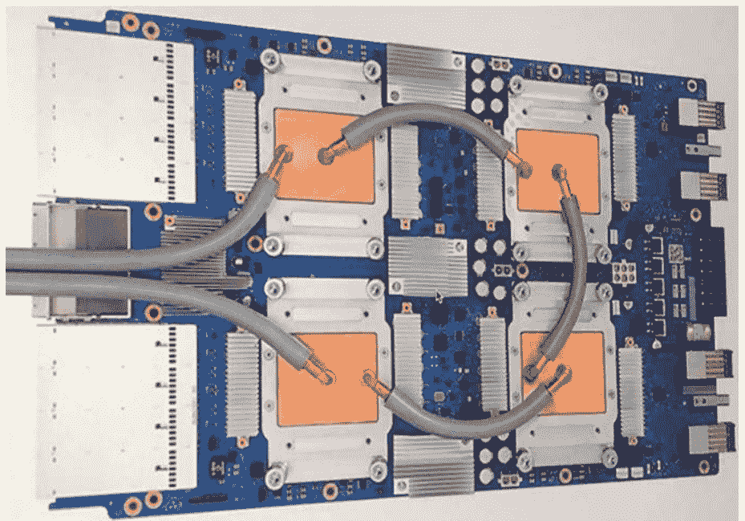

#### 7.1.3 其他硬件考虑因素

还有一些值得注意的其他硬件考虑因素。首先，GPU可能会消耗大量电力，需要满足GPU的电源供应单元（PSU）的要求。低电压可能导致训练失败或影响GPU的性能，因为它可能会受到驱动程序的限制。例如，你不能简单地将NVidia RTX 8000放入工作站而不检查PSU、主板和firmware的兼容性。某些类型的硬件，如Tesla T4，如果冷却效果不好，容易出现热限制。你需要与制造商核实电源和冷却要求。

安装GPU时，随机存取存储器（RAM）应等于或大于最高GPU内存。如果你使用大型数据集，你需要确保有足够的硬盘空间和足够的吞吐量。你可能会遇到的最常见问题之一是GPU内存不足。在这种情况下，你可以用具有更大内存容量的GPU替换你的GPU，或者如果它们是相同的品牌和型号，并且你有足够的PSU能力，可以添加额外的GPU。

### 7.2 物体识别

物体识别涉及到在图像中检测和/或定位物体。 在过去的几年中，深度学习已经成熟，成为图像处理的主要工具。 根据问题和应用需求，可以使用各种不同的模型架构。 大多数架构在准确性和计算时间之间取得平衡。 更复杂和更深的模型将产生更好的结果，但训练和推理可能会更昂贵。

自从图像被数字化并加载到计算机上以来，自动化图像分析一直是一个活跃的研究领域。 在20世纪70年代到90年代，图像分析是使用低级像素处理进行的，通常使用边缘和线条检测器以及区域生长[6]。 一些最早的分割示例是使用基于边缘的分割方法，使用蛇活动轮廓模型。

在20世纪90年代，机器学习首次被用于语义分割、数据拟合和统计分类，这些分类使用从图像中提取的特征。 应用主要集中在医学领域，用于计算机辅助目标检测和诊断，并完全由人类设计。 深度学习改变了这一情况，现在系统通过计算机使用示例数据进行训练，自动提取特征，无需人为干预。 在深度学习中常用的卷积神经网络已成为图像处理的首选技术。

历史方法通常依赖于经典图像处理和传统机器学习技术。 然而，自从AlexNet以来，深度学习已在许多不同领域得到应用。 然而，正如之前讨论的那样，从头开始训练这些模型已经证明存在问题，因为需要大量的数据和计算资源。 这导致了迁移学习的引入，用于训练深度学习模型。 由于深度学习、高性能硬件和数据可用性的进步，计算机视觉的应用大幅增加。 深度学习促进了图像处理的发展，尤其是通过TensorFlow、Microsoft Cognitive Tool Kit (CNTK)、PyTorch和Caffe 2等框架的可用性。 卷积神经网络已成为图像处理任务的黄金标准，特别是目标检测和分割，这些技术现在被认为是分析图像的重要技术。

处理视觉识别问题有四种主要方法，包括图像分类、目标检测、实例分割和语义分割。

#### 7.2.1 图像分类

在图像分类中，模型关注的是将分类类别分配给整个图像（与图像中有多少类别无关）。


图7.2 图像分类
如图7.2所示，这种技术对于自动将图像分组为不同的类别，如人、动物和机械，非常有用。

#### 7.2.2 目标检测

在目标检测中，模型不仅预测类别标签，还使用边界框定位每个对象实例，如图7.3所示。边界框对于计数对象和测量它们之间的距离非常有用。 它在跟踪应用中也变得越来越重要，例如在自动驾驶车辆中的应用和建筑工地的遵守监测以及使用防护设备。

#### 7.2.3 语义分割

在语义分割中，模型试图预测每个像素的分类标签，而不识别不同的物体实例，如图7.4所示。语义分割在自动驾驶、工业检测、地形分类和医学图像分析中被使用。


#### 7.2.4 物体分割

在物体分割中，掩码被用来根据像素位置识别图像中的不同物体实例，如图7.5所示。物体分割已成功应用于医学成像中的计算机断层扫描和磁共振成像等领域。


图7.5 物体分割

它们在定位肿瘤、测量组织体积、研究解剖结构和手术内导航等方面非常有用。

### 7.3 模型架构

模型架构（不同的神经网络配置）和框架可以主要分为两类，包括一阶段检测器（如YOLO）和二阶段检测器（如基于区域的CNN（R-CNN））。一阶段检测器对图像中的对象进行预测，而二阶段检测器使用中间组件在图像中提出候选建议，然后将其分类为不同的类别。一阶段检测器在计算时间方面要快得多。而二阶段检测器通常在产生最先进的结果方面表现更好。

在过去的十年中，已经有几种不同的架构尝试以不同的方式解决同样的问题。自从AlexNet在2012年赢得ILSVRC比赛以来，已经提出了几种额外的复杂架构，这些架构降低了检测的错误率。模型架构的时间线如图7.6所示，从AlexNet开始，以EfficientNet结束（注意还有很多，但最重要的是显示出来的）。

本节的其余部分将介绍一些在TensorFlow、CNTK和PyTorch等框架中实现的更常见的架构。

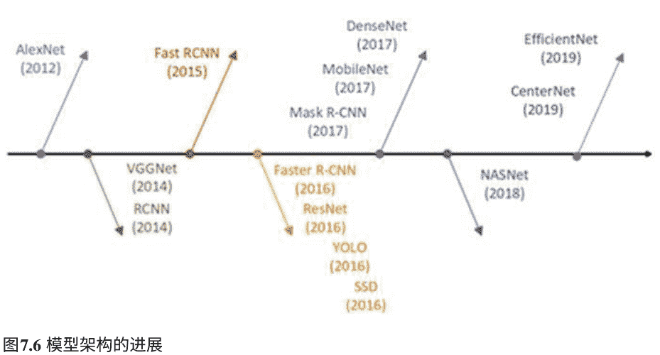

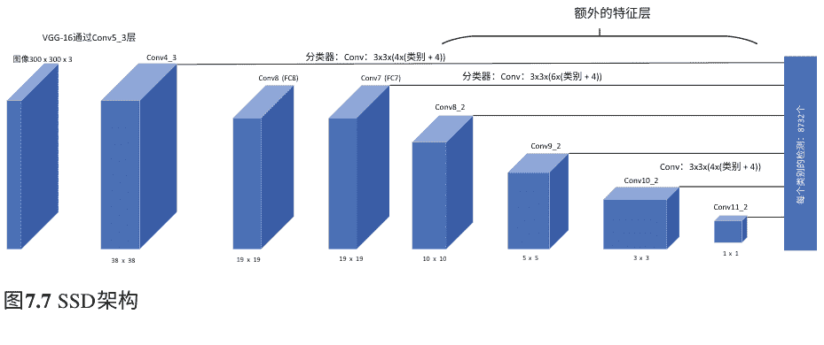

#### 7.3.1 单次检测器（SSD）

SSD架构最早是在2016年提出的[8]。撰写本文时的最新版本是SSD 512。由于SSD是一种单次检测器，因此推理时间比其他架构（如R-CNN）要低得多。因此，它可以用于实时检测。与其他架构不同，图像大小在训练过程中不能增加，必须保持不变。图7.7显示了SSD架构。

SSD目标检测网络执行两个任务。首先，它提取特征图，然后，它应用卷积filters来检测对象。SSD使用VGG16骨干网络（虽然也可以使用其他基础网络，如YOLO或MobileNet）来提取特征图，然后用于分类对象。如图7.8所示，该过程被多次应用以适应不同的尺度。这意味着如果图像中有两只狗，一只在前景，一只在背景，两个对象仍然可以被检测到。对于每个位置，它进行四次预测（我们的框），每个框包括一个边界框和21个类别（一个额外的类别表示无对象）。请注意，这20个对象与PASCAL VOC数据集中的20个类别相关。选择得分最高的类别的框。

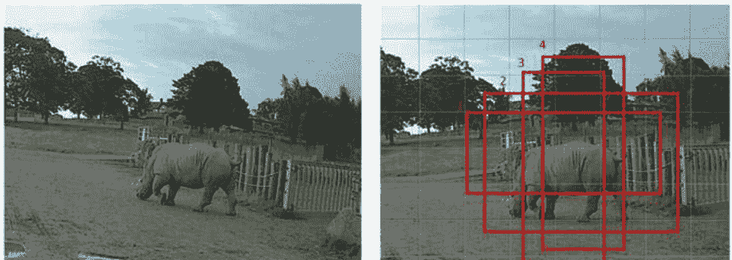

图7.8 物体位置

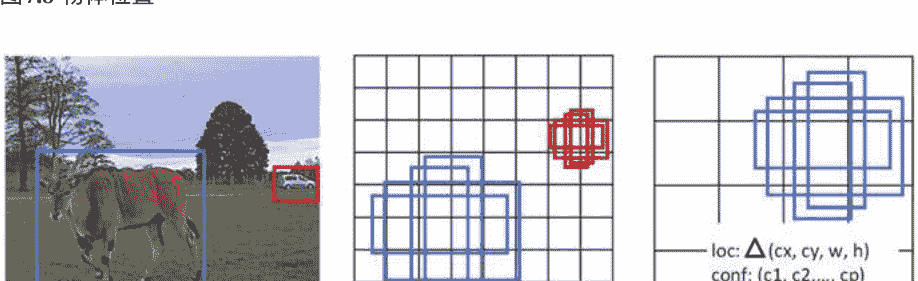

图7.9 基于filter尺寸的默认框，(a) 带有GT框的图像，(b) 8 x 8特征图和(c) 4 x 4特征图

Conv4_3总共有38个 × 38个 ×4个预测：每个单元格四个预测无论特征图的深度如何，如图7.8所示。正如预期的那样，许多预测不包含任何物体。SSD保留一个类“0”表示没有物体。

SSD使用不同大小的filters来预测类别以适应尺度。SSD在VGG16之后添加了6个额外的卷积层来实现这一点。其中五个用于目标检测，第六个用于缩放[8]。在这些层中的三个层中，我们进行了6次预测而不是4次。总共，SSD使用6个层进行8732次预测（8732个默认框分布在整个图像上）。

多尺度特征图显著提高了准确性。每个位置的每个框都使用与每个宽高比相关联的特征图进行评估（SSD网络中的不同卷积层）。

在训练SSD时，默认框与地面实况框匹配，考虑宽高比、位置和尺度。我们选择与地面实况边界框具有最高重叠的框。预测框与地面实况的交并比（IOU）应大于0.5。我们选择与地面实况具有最大重叠的预测框。图7.9显示了这一点。

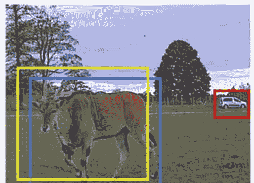

图7.10 基于filter尺寸的默认框

使用两种不同的filter尺寸，将两个默认框与一个Common Eland和一个汽车匹配。 这两个框被视为正样本，其余的被视为负样本。

每个预测由边界框组成，边界框具有形状偏移，表示与默认框中心的偏移和高度和宽度。 此外，图7.10显示了所有类别的所有对象类别的置信度。

该模型使用多框损失函数进行训练，该函数包含置信度损失和定位损失。

更高分辨率的特征图负责检测小物体。 用于目标检测的第一层conv4_3具有38 ×38的空间尺寸，从而导致输入图像的显著减少。 因此，与其他检测方法相比，SSD在小物体上的表现通常较差。 在SSD中，小物体只能在更高分辨率的层（最左边的层）中检测到。 但是，这些层包含低级特征，如边缘或颜色块，对于分类来说信息较少。 多尺度特征图改善了不同尺度物体的检测。SSD的一个关键特点是其速度和低计算需求。 因此，SSD模型可以轻松部署在边缘和移动设备上。 SSD在受控条件下工作良好，其中输入尺寸经过精心管理，并且环境变化最小。 一个可以使用SSD的例子是使用相机陷阱检测靠近的动物。

然而，在自动驾驶汽车等应用中，它们可能不太有用（因为需要更远的拍摄距离和更小物体的识别）。

#### 7.3.2 YOLO家族

YOLO是一种先进的目标检测模型，已经经历了几个迭代。撰写本文时最新的是YOLOv3 [9]。完整的架构可在图7.11中看到。

YOLOv3具有53个卷积层，称为Darknet-53，用于其基础网络。不使用任何形式的池化。卷积层的步幅值为2，用于对特征图进行下采样，如图7.12所示。YOLO对输入图像的大小不变。然而，在实践中，最好坚持使用固定的尺寸。网络根据网络的步幅对图像进行下采样。例如，如果步幅为32，则尺寸为416 x 416的输入图像将生成一个尺寸为13 x 13的输出。通常，任何网络的步幅等于该层输出相对于输入图像到网络的缩小因子（下采样）的倍数。

检测核的输出为 1 × 1 × (B ×(5 + C))。B 是一个细胞在特征图上可以预测的边界框的数量，“5”是指 4 个边界框属性和一个对象置信度，C 是类别的数量。使用 COCO 数据集训练的 YOLO v3 模型将具有 B =3 和 C =80。因此，核的大小将为 1 × 1 ×255。由该核产生的特征图与先前的特征图具有相同的高度和宽度，并且具有检测属性和深度，如图 7.13 所示。

YOLO v3 在通过将输入图像的尺寸缩小32、16 和 8 来进行三个尺度的预测。使用 32 x 32 的步幅将给出一个 13 ×13 的层，足够检测较大的物体。对于小物体，使用 8 ×8 的步幅将给出一个 52 ×52 的层，适合检测较小的物体。预测是在图 7.13 中所示的 82、94 和 106 层进行的。

设计了三个不同的层来帮助检测不同尺度的物体这是YOLO v1和v2的一个限制。通过增加上采样层

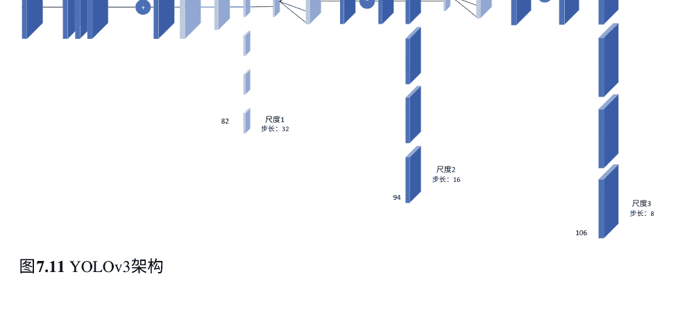

图7.11 YOLOv3架构## 图7.12卷积神经网络层

| Type | Filters | Size | Output |
|------|---------|------|--------|
| Convolutional | 32 | 3 × 3 | 256 × 256 |
| Convolutional | 64 | 3 × 3 / 2 | 128 × 128 |
| Convolutional | 32 | 1 × 1 | |
| Convolutional | 64 | 3 × 3 | |
| Residual | | | 128 × 128 |
| Convolutional | 128 | 3 × 3 / 2 | 64 × 64 |
| Convolutional | 64 | 1 × 1 | |
| Convolutional | 128 | 3 × 3 | |
| Residual | | | 64 × 64 |
| Convolutional | 256 | 3 × 3 / 2 | 32 × 32 |
| Convolutional | 128 | 1 × 1 | |
| Convolutional | 256 | 3 × 3 | |
| Residual | | | 32 × 32 |
| Convolutional | 512 | 3 × 3 / 2 | 16 × 16 |
| Convolutional | 256 | 1 × 1 | |
| Convolutional | 512 | 3 × 3 | |
| Residual | | | 16 × 16 |
| Convolutional | 1024 | 3 × 3 / 2 | 8 × 8 |
| Convolutional | 512 | 1 × 1 | |
| Convolutional | 1024 | 3 × 3 | |
| Residual | | | 8 × 8 |
| Avgpool | | | Global |
| Connected | | | 1000 |
| Softmax | | | |

通过增加步长，我们增加了网格中的单元数，与之前的层级连接这有助于保留细粒度特征。换句话说，您不仅仅依赖于特定宽高比/尺寸的特征图，还包括了其他宽高比/尺寸的特征来帮助识别物体。这在使用非常大的特征来检测小物体时特别有用。

YOLO在三个不同的尺度上预测框。对于图像尺寸为416 × 416，预测的框的数量将为10,647个（13 × 13 × 3 + 26 × 26 × 3 + 52 × 52 × 3）。这些盒子并非都有用，所以YOLO利用非极大值抑制（NMS）来减少同一图像中冗余和多个检测，如图7.14所示。

YOLO对图像中检测到的对象预测多个标签。然而，YOLO不再使用Softmax，因为一个类别只能属于一个对象。然而，当我们有像狗和德国牧羊犬这样的类别时，上述假设就不成立了。这就是为什么YOLOv3不再对类别使用Softmax的原因。相反地，每个类别的得分都是通过逻辑回归进行预测，并使用一个阈值来预测对象的多个标签。得分高于此阈值的类别将被分配给该盒子。

预测特征图

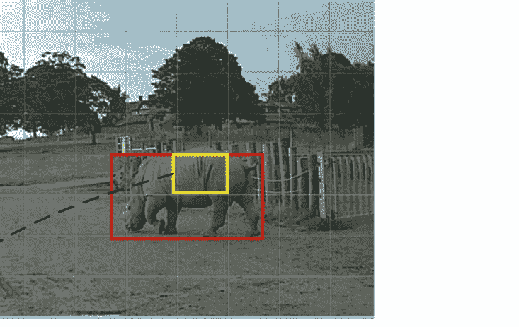

边界框的属性


边界框属性包括：$t_x, t_y, t_w, t_h$（盒子坐标），$p_o$（物体性评分），$p_1, p_2, ..., p_c$（类别得分），乘以 B 个盒子。

## 图7.13 预测特征图

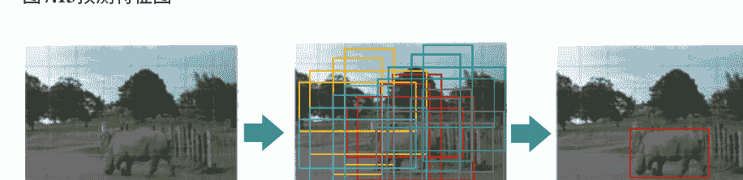

## 图7.14 NMS

YOLOv3快速、高效，并且在使用0.5 IOU时可以与两阶段检测器一样准确。YOLO架构的主要限制之一是在图像中检测小物体时存在困难。例如，它可能难以检测到一群鸟。这是由于架构的空间约束所致。

#### 7.3.3 R-CNN

与其他架构一样，基于区域的CNN（R-CNN）试图在图像中定位物体（目标检测）[10]。R-CNN首先使用滑动窗口的方法，在不同大小的矩形上扫描整个图像，同时使用蛮力方法分析所获得的图像。这种方法的问题在于它会生成许多建议（区域建议只是原始图像的较小部分，我们认为其中包含我们正在搜索的物体），如图7.15所示。有一组预定义的区域建议算法可以直接用于目标检测架构。在R-CNN的情况下，采用了选择性搜索方法来生成区域建议。选择性搜索基于颜色、纹理、大小和形状的相似区域的分层分组。选择性搜索首先根据像素的强度使用Felzenszwalb和Huttenlocher的基于图的分割方法对图像进行过分割，如图7.16所示。

然而，在这个阶段，大多数实际对象包含两个或更多分割部分。靠近的区域被合并成一个单独的段落。由突出的段落描述的不同区域用于推导边界框坐标（区域建议）。请注意，区域建议不能用于被遮挡的对象。

这将创建大量需要查看的区域。这听起来像一个很大的数字，但与蛮力滑动窗口方法相比，它仍然非常小。在下一个阶段，我们将采用每个区域建议，并使用CNN在较小的维度上表示图像，创建一个特征图。

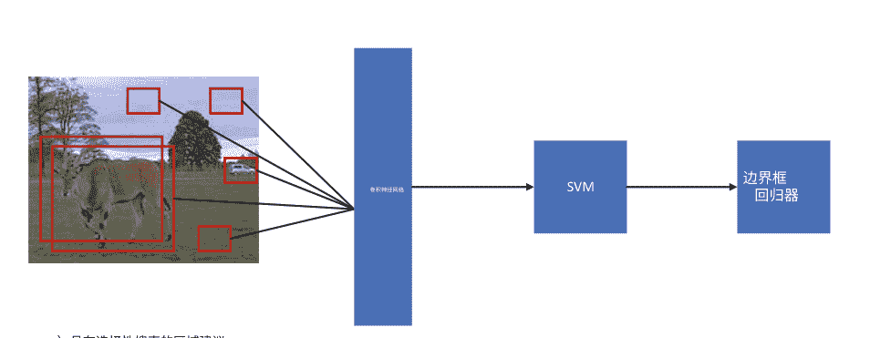

图7.15 R-CNN架构

## 图7.16 选择性搜索

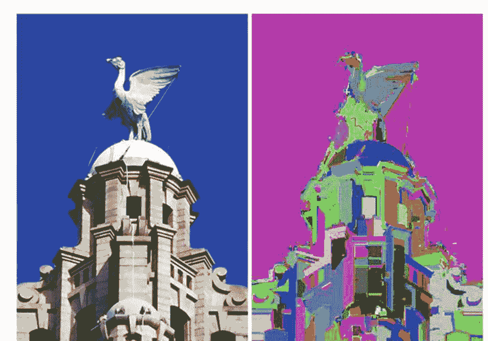

## 图7.17 AlexNet

R-CNN使用AlexNet作为特征提取器。这意味着你不能一次训练整个网络，而是需要先训练AlexNet，然后进行分类任务。在训练AlexNet之后，最后的SoftMax层被移除，如图7.17所示。

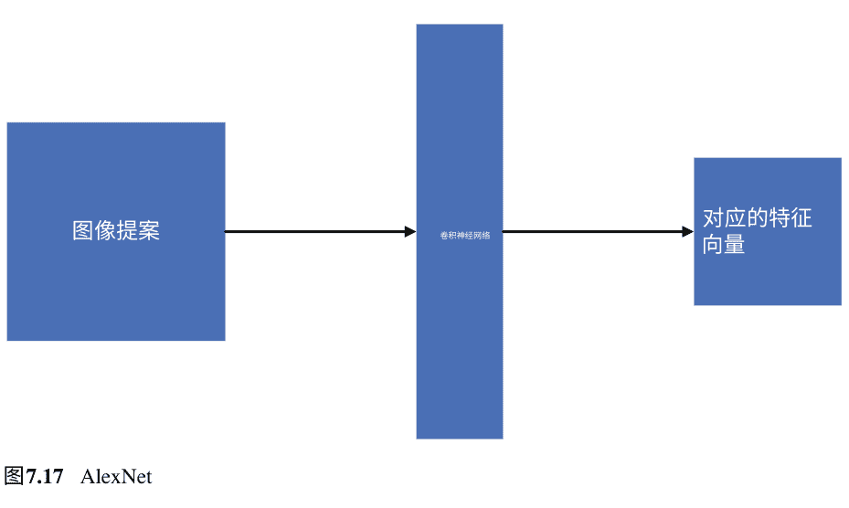

AlexNet的输入始终相同（227，227，3），但图像提案的形状可能不同。其中许多比所需尺寸更小或更大，因此需要调整每个区域提案的大小。从图像提案中创建特征向量，然后对其进行分类。目标是检测这些特征向量所代表的对象类别，这是通过使用SVM分类器来完成的。每个对象类别都有一个SVM。这意味着对于一个特征向量，我们有n个输出，其中n是我们想要检测的不同对象的数量。输出是一个置信度分数，表示预测的置信度。

SVM是使用由AlexNet骨干创建的特征向量进行训练的。这意味着，在训练SVM之前，CNN必须完全训练好才能开始。训练过程不能并行化。网络可以使用监督学习方法来训练SVM，因为每个类别都由给定的特征向量表示。

R-CNN架构在计算机视觉领域取得了突破，它将区域提议与CNN相结合。然而，它也存在一些严重的限制：

- 由于网络必须为每个区域提议计算特征图（一个CNN前向传递），因此速度较慢。
- 由于R-CNN架构有3个不同的部分（CNN、SVM、边界框回归器）需要分别训练，所以训练难度较大。
- 由于架构必须保存每个区域提议的特征图，所以内存需求较大。

#### 7.3.4 快速-RCNN

在快速-RCNN中，解决了R-CNN的一些限制[12]。最显著的改变是整个架构可以端到端地训练。在R-CNN中，CNN、SVM和边界框回归器这三个不同的部分被合并成一个架构，如图7.18所示。

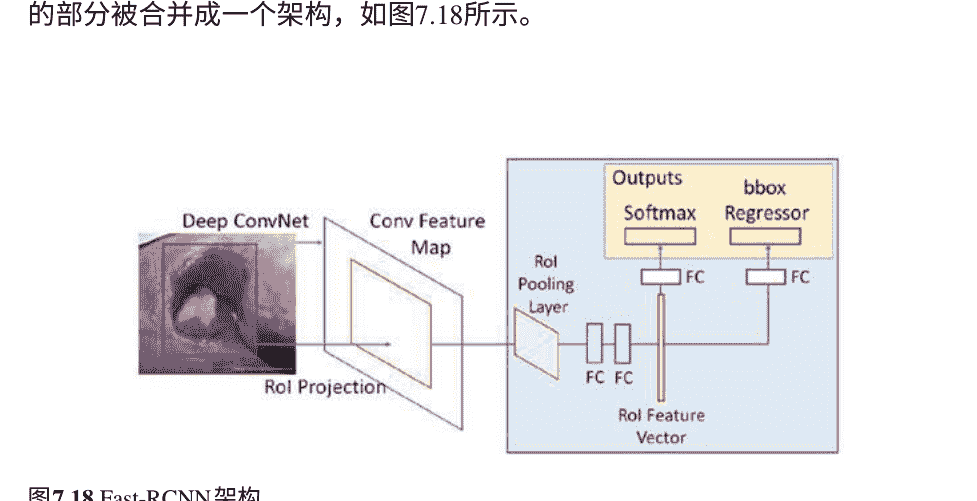

首先，它使用CNN处理整个图像。这将产生一个图像的特征图。对于每个区域提议，网络从特征图中提取相应的部分。这被称为区域提议特征图。区域提议特征图被调整为固定大小，使用池化层。特征图被展平为固定大小的一维特征向量，直接输入到全连接层（MLP）中，该层具有两组输出。第一个是softmax分类层，确定物体属于哪个类别。第二个是边界框回归器，其输出是每个物体类别的边界框坐标。

Fast-RCNN比R-CNN更高效，因为可以将整个网络作为单个单元进行训练。因此，这也显著提高了推理时间。现在，训练过程也可以作为单个单元使用反向传播进行。

#### 7.3.5 Faster-RCNN

Faster R-CNN架构是由微软的研究人员开发的[13]。它基于R-CNN架构，并使用多阶段方法进行目标检测。Faster R-CNN具有区域建议网络（RPN），用于生成一组固定的区域。RPN使用基础网络的卷积特征生成一组区域建议。RPN被实现为一个完全卷积网络，在每个位置预测目标边界和目标得分。Faster-RCNN架构如图7.19所示。

Faster R-CNN架构中的RPN使用基础网络（ResNet/Inception）中先前学习的特征来识别候选区域。RPN取代了早期R-CNN网络中的选择性搜索方法，该方法在像素级别而不是特征图级别输入区域建议。RPN试图在图像中找到边界框，每个框具有不同的大小和长宽比（共九个），如图7.20所示。

锚点（固定边界框）分布在整个图像中。每个锚点使用9个不同大小和长宽比的边界框表示。当RPN首次预测物体位置时，它们被RPN引用。RPN作为CNN实现，使用基础网络提供的卷积特征图。因此，由于我们使用的是大小为conv_{width} * conv_{height} * conv_{depth}的卷积特征图，我们为conv_{width} * conv_{height}中的每个点创建一组锚点。由于我们只有卷积和池化层，特征图的尺寸将与原始图像成比例。从数学上讲，如果图像的尺寸是w * h，特征图的尺寸将变为w/r * h/r，其中r被称为子采样比率。如果我们对特征图的每个空间位置定义一个锚点，最终图像将以r像素分隔出多个锚点。

对于每个锚框，RPN生成两个输出，a)概率目标性得分和b)一组边界框坐标。第一个输出是二进制分类，第二个是边界框回归调整。在训练过程中，所有分类的锚点都被放入两个不同的类别中，a)与交并比(IoU)大于0.5的真实对象重叠的锚点，标记为“foreground”和b)不与任何真实对象重叠或与真实对象的IoU小于0.1的锚点，标记为“background”。然后随机采样锚点，形成一个大小为256的小批量，其中前景和背景锚点之间的比例平衡。这个小批量用于使用二元交叉熵计算分类损失。标记为前景的小批量锚点用于计算回归损失和将锚点转化为对象所需的正确变化。

有可能最终得到零个前景锚点。在这种情况下，使用与地面真实框具有最大IoU的锚点。这远非理想，但从实际角度来看，我们总是有前景样本和目标可供学习。锚点通常会重叠；因此，提议也会重叠。

## 图7.19 更快的R-CNN

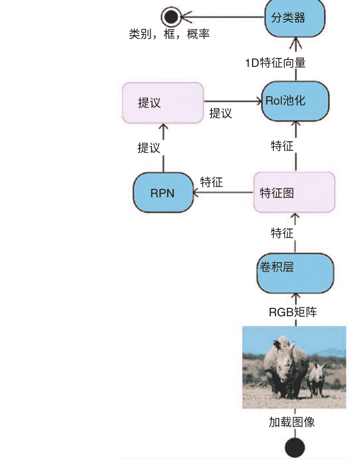

相同的物体。为了减少锚框的数量，执行NMS，如果锚框与地面真实框的IoU值较低，则删除交集锚框。

RPN步骤结束时，得到一组未分配类别的物体提议。现在需要将这些边界框分类为所需的类别。一种简单的方法，广泛用于目标检测实现，包括更快的R-CNN，是使用每个提议裁剪卷积特征图，并使用插值将每个裁剪调整为固定大小的14 * 14 * convdepth。裁剪后，使用2x2核进行最大池化，以获得每个提议的最终7 * 7 * 512特征图（通过感兴趣区域池化）。这些尺寸是Fast R-CNN设置的默认参数。

Fast R-CNN对每个提议的特征图（7 * 7 * 512）进行扁平化处理，得到一个连接到两个具有ReLU激活函数的全连接层的一维向量，大小为4096。还实现了一个具有N + 1个单元的额外全连接层，其中N是类别的总数，额外的一个单元用于识别背景类别。同时，还实现了一个具有4N个单元的第二个全连接层，用于边界框回归预测。这4个参数对应于每个可能类别的变化中心点x、y值，包括框的宽度和高度。

Fast R-CNN的目标的计算方式与RPN的目标类似，但在这种情况下，考虑了不同的可能类别。提议和真实框用于计算它们之间的IoU。与任何真实框的IoU大于0.5的提议被分配为前景。与IoU在0.1和0.5之间的提议被标记为背景。没有任何交集的提议被忽略，因为在这个阶段我们假设只有好的提议，并且更关注解决更难的情况。这些值是超参数，可以调整以更好地适应感兴趣的对象。

对于边界框回归，计算的是建议框与其对应的真实框之间的偏移量，仅针对那些根据IoU阈值分配了类别的建议框。使用ADAM进行反向传播来进行快速R-CNN训练，权重发生变化。

与RPN类似，我们最终得到一堆分配了类别的对象，需要进一步处理后返回。为了应用边界框调整，我们必须考虑哪个类别具有最高的概率。忽略具有背景类别分配的建议框。在获取最终对象并忽略那些预测为背景的对象之后，我们应用基于类别的非极大值抑制（NMS）。这是通过按类别对对象进行分组，按概率对它们进行排序，然后在重新组合之前对每个独立组应用NMS来完成的。对于我们最终的对象列表，我们还设置了概率阈值和每个类别的对象数量限制。

将完整模型组合在一起，我们得到4个不同的损失，两个用于RPN，两个用于R-CNN。在RPN和R-CNN中有可训练的层，还有我们可以训练（或不训练）的基础网络。是否训练基础网络取决于我们想要学习的对象的性质和可用的计算能力。如果我们想要检测与基础网络训练的原始数据集中相似的对象，则不需要。另一方面，训练基础网络可能既耗时又需要必要的硬件，以便能够完整地拟合梯度。这四个不同的损失使用加权和进行组合。这是因为我们可能希望给予分类损失相对于回归损失更高的权重，或者给予R-CNN相对于RPN更大的影响力。

Faster-RCNN的主要优势之一是其能够在给定图像中检测到较小的对象。它还具有不需要固定输入分辨率的附加优势。然而，Faster-RCNN架构的一个最大问题是速度。实时推理需要显著的GPU硬件才能达到合理的帧率。虽然SSD等其他模型速度更快，但无法达到与Faster-CNN相同的性能水平。Faster-RCNN用于检测的低分辨率特征图会严重影响性能。像所有模型一样，图像分辨率对性能有显著影响，而减小图像尺寸既会影响准确性，也会减少推理时间。

## 图7.20 锚点框

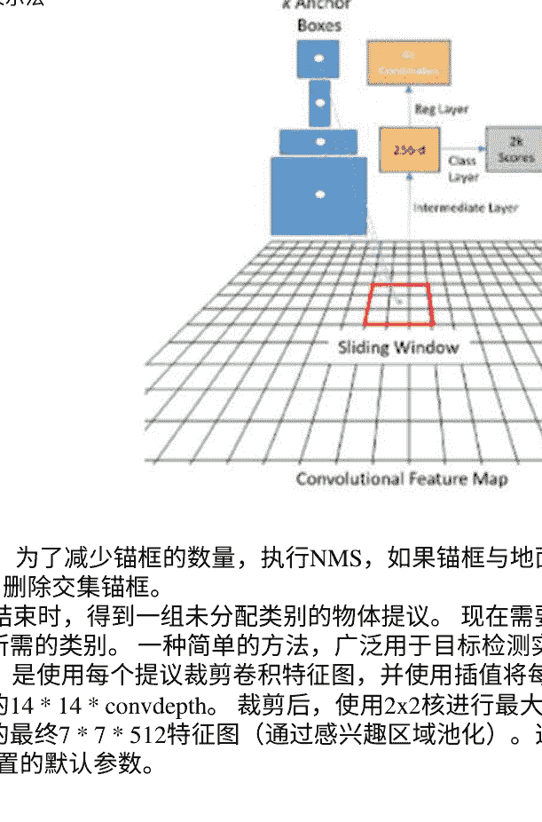

#### 7.3.6 EfficientNet

EfficientNet架构基于模型缩放原理[14]。缩放是为了提高模型在特定任务上的准确性，这通常是一个繁琐的过程。这要求从业者手动尝试不同的模型缩放，直到产生足够准确的模型，并满足资源约束。这个过程既耗时又耗资源，通常会产生次优的准确性和效率模型。

## 图7.21 CNN缩放

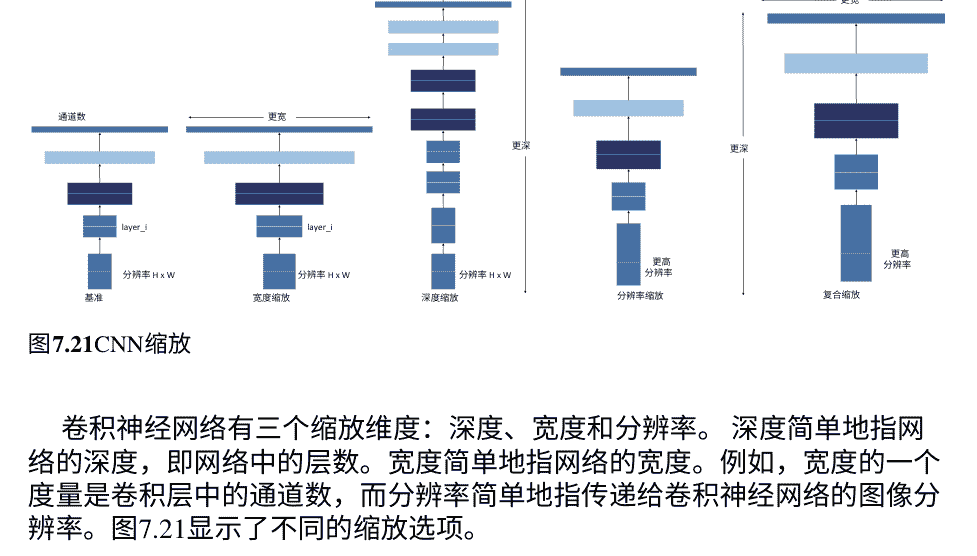

卷积神经网络有三个缩放维度：深度、宽度和分辨率。深度简单地指网络的深度，即网络中的层数。宽度简单地指网络的宽度。例如，宽度的一个度量是卷积层中的通道数，而分辨率简单地指传递给卷积神经网络的图像分辨率。图7.21显示了不同的缩放选项。

在卷积神经网络的缩放过程中，平衡网络的所有维度（宽度、深度和分辨率）对于获得更高的准确性和效率至关重要。EfficientNet架构采用一种缩放技术，使用复合系数来统一缩放网络的宽度、深度和分辨率。缩放不会改变层操作；因此，最好先有一个良好的基准网络，然后使用提出的复合缩放方法在不同的维度上进行缩放。

EfficientNet使用神经架构搜索（NAS）来优化准确性和FLOPS，构建一个基础网络。

EfficientNet基础网络可以与EfficientDet架构一起使用[15]。该架构使用双向特征金字塔网络（BiFPN），类似于YOLO v3中使用的金字塔网络，不同尺度的特征在不同分辨率下聚合。3-7个输入特征，每个特征表示给定分辨率下的输入特征。FPN以自上而下的方式聚合多尺度特征。然而，FPN在信息流动方面存在固有的限制，即信息只能单向传递。BiFPN通过添加一个自下而上的路径来扩展FPN。完整的EfficientDet网络架构使用EfficientNet作为骨干网络。该网络中的BiFPN作为特征网络，从骨干网络的第3到第7层获取特征，并重复应用BiFPN。融合后的特征输入到全连接层，用于预测物体类别和边界框。EfficientDet目标检测的复合缩放方法受到EfficientNet中使用的复合缩放技术的启发。该方法使用一个系数来同时缩放骨干网络、BiFPN网络、类别/框网络和分辨率的所有维度。骨干网络使用与B0-B6中定义的系数相同，以便可以重用ImageNet预训练的权重。在BiFPN中，宽度（通道）呈指数增长，深度（层数）呈线性增加。对于框/类别预测网络，宽度被固定为与BiFPN中的深度相同，但深度线性增加。最后，输入图像的分辨率也线性增加，因为分辨率必须被2^7 = 128整除。使用参数，从EfficientDet-D0到D6，创建了一系列网络，如表7.2所示。

| 模型 | 输入尺寸 R输入 | 主干网络 | BiFPN #通道 W_bifpn | BiFPN #层数 D_bifpn | 框/类别 #层数 D_类别 |
|------|----------------|----------|---------------------|---------------------|---------------------|
| D0 (o = 0) | 512 | B0 | 64 | 2 | 3 |
| D1 (o = 0) | 640 | B1 | 88 | 3 | 3 |
| D2 (o = 0) | 768 | B2 | 112 | 4 | 3 |
| D3 (o = 0) | 896 | B3 | 160 | 5 | 4 |
| D4 (o = 0) | 1024 | B4 | 224 | 6 | 4 |
| D5 (o = 0) | 1280 | B5 | 288 | 7 | 4 |
| D6 (o = 0) | 1408 | B6 | 384 | 8 | 5 |
| D7 | 1536 | B6 | 384 | 8 | 5 |

与其他架构相比，EfficientDet架构在准确性和效率方面一直表现出色。EfficientDet在参数和FLOPS更少的情况下实现了更好的准确性。EfficientNet提供了一种复合缩放机制来管理宽度、深度和分辨率。这样可以基于底层计算约束构建基准网络，同时保持模型的效率。这些EfficientNet模型可以有效地进行扩展，以超越当前的最先进性能，并使用ImageNet和其他迁移学习数据集减少FLOPS。

#### 7.3.7 架构比较

这些架构在技术和结构上有很多相似之处，但是它们的设计目标是解决不同的需求，主要是速度与准确性之间的平衡。本节总结了所有讨论模型的一些关键发现，并对最准确和最快的模型进行了总结。

##### 7.3.7.1 关键发现

- SSD模型通常比Faster R-CNN架构快得多，SSD处理速度约为46 FPS，而Faster-RCNN处理速度为7 FPS。然而，就准确性而言，它们无法与Faster R-CNN相媲美。
- 低分辨率特征图的使用显著影响准确性。
- 需要考虑图像分辨率。降低图像分辨率可能会对准确性产生不利影响（高度和宽度减少50%可能会降低15%的准确性）。
- 基础网络（特征提取器）的选择也会影响Faster-RCNN的检测准确性，但对SSD的影响较小。
- 并非所有的计算都在GPU上执行，例如NMS在CPU上运行。这可能会对训练时间产生不利影响，特别是在处理大图像和更大数据集时。
- 通过减小基础网络的步幅，可以提高整体mAP。例如，将步幅从16减小到8可以提高5%的mAP。然而，这将增加计算时间63%。

##### 7.3.7.2 最准确的

- 到目前为止，最准确的模型是使用Inception ResNet和300个提议的Faster R-CNN。
- EfficientDet是最近表现良好的架构之一，具有较少的可调参数，同时需要较少的FLOPS。

##### 7.3.7.3 最快

- 在使用快速检测器时，SSD与MobileNet提供了最佳的准确性。
- 与其他架构相比，SSD速度快，但在检测小物体方面表现特别差。
- 对于大物体，SSD在准确性方面可以超过Faster R-CNN和R-CNN，并具有更轻、更快的提取器。
- 如果我们将提案数量减少到50，Faster R-CNN可以与SSD在32mAP的速度上匹敌。

### 7.4 评估指标

对于目标检测，有各种不同的评估指标可以用来确定模型的性能[16]。这些指标大多源自各种目标检测竞赛，如COCO目标检测挑战。大多数这些挑战使用相同的指标，尽管还可以使用一些其他指标。在上一章讨论的评估指标的基础上（也可用于评估目标检测模型），下面讨论了更具体的指标。

#### 7.4.1 置信度分数

置信度分数是一个锚框包含目标的概率。通常由分类器预测。置信度分数和交并比 IoU（稍后介绍）都被用作确定检测是真阳性还是假阳性的标准。

只有当检测满足三个条件时，才被认为是真阳性（TP）：置信度分数 > 阈值；预测类别与真实类别匹配；预测边界框与真实边界框的交并比大于阈值（例如，0.5）。违反后两个条件之一会导致假阳性（FP）。通过在不同水平上设置置信度分数的阈值，我们可以得到不同的精确率和召回率值。

#### 7.4.2 交并比

为了评估目标检测模型的性能，我们需要使用不同的指标集。为了衡量图像/帧中识别到的目标的准确性，我们可以使用交并比（IOU）指标。有两个标准：IOU@0.50和IOU@0.75。如图7.22所示，预测框与真实框中的目标越接近，mAP越高。

获得高IOU@0.50意味着至少50%的目标位于预测边界框内，相比之下，至少75%的目标位于预测边界框内的IOU@0.75较难实现。图7.23展示了一个训练过程的示例，突出了mAP在训练过程中的改善。

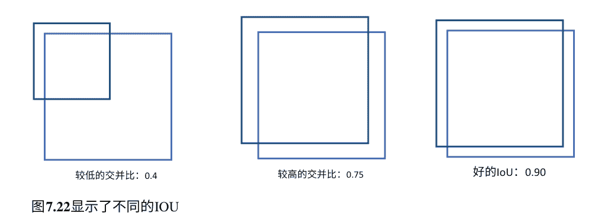

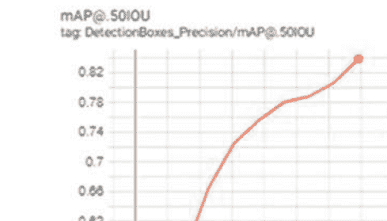

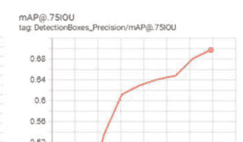

> $$\text{Precision} = \frac{\text{True Positive}}{\text{True Positive} + \text{False Positive}}$$

> $$\text{Recall} = \frac{\text{True Positive}}{\text{True Positive} + \text{False Negative}}$$

您可以设置IoU的阈值来确定目标检测是否有效：

- 如果IoU ≥0.5，则将目标检测分类为真阳性（TP）
- 如果IoU <0.5，则是错误的检测，并将其分类为假阳性（FP）
- 当图像中存在真实值但模型未能检测到目标时，将其分类为假阴性（FN）
- 真阴性（TN）：TN是我们未预测到目标的图像的每个部分。这个指标对目标检测没有用，因此我们忽略TN
- 将IoU阈值设置为0.5或更大。可以将其设置为0.5、0.75、0.9或0.95等。

#### 7.4.3 平均精度均值（mAP）

你可以将精确率和召回率视为评估性能的指标。精确率和召回率的计算使用真正例（TP）、假正例（FP）和假负例（FN），如图7.24所示。请注意，对于图像中存在的所有对象，计算精确率和召回率非常重要。

对于模型在图像中检测到的每个对象，考虑置信度分数非常重要。对于所有置信度分数高于某个阈值的预测边界框，这也是正确的。高于阈值的边界框被视为正例边界框，而所有预测边界框低于阈值的则被视为负例。

## 图7.25 PR图

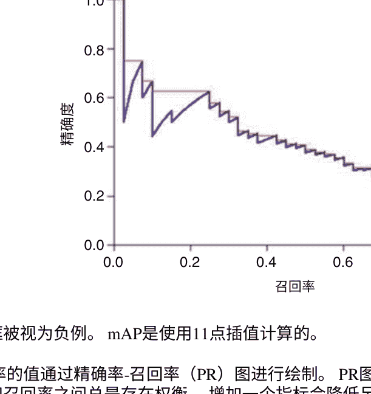

低于阈值的边界框被视为负例。 mAP是使用11点插值计算的。

精确率和召回率的值通过精确率-召回率（PR）图进行绘制。 PR图是单调递减的，精确率和召回率之间总是存在权衡。 增加一个指标会降低另一个指标。 插值精确率是在0.0、0.1、0.2、0.3...0.9、1.0等间隔召回水平上测量的平均精确率，最后在测试集合中的每个召回水平上计算插值精确率的算术平均值。 图7.25显示了一个示例PR图。

### 7.5 总结

在本章中，我们介绍了图像分类和目标检测。 这从讨论硬件加速的深度学习开始，包括CPU、GPU和TPU的讨论。在实现两个流程时，介绍了训练和推理硬件的具体细节以及硬件考虑事项的详细描述。 接下来讨论了目标识别，其中包括图像分类、目标检测、语义分割和目标分割的描述。 介绍了主要的模型架构，包括SSD-MobileNet、YOLO系列、R-CNN、Fast R-CNN、Faster R-CNN和EfficientNet。 提供了每种架构的优势和局限性的总结。 本章以对目标检测的具体评估指标的讨论结束。

## 参考文献

1. S. Albawi, T. A. Mohammed, 和 S. Al-Zawi, “理解卷积神经网络,”在2017年国际工程与技术会议(ICET), 2017,pp. 1–6.
2. G. Bradski 和 A. Kaehler,学习OpenCV: 使用OpenCV库的计算机视觉.“O’Reilly Media, Inc.,” 2008.
3. K. He, X. Zhang, S. Ren, 和 J. Sun, “深度残差学习用于图像识别,”在IEEE计算机视觉与模式识别会议论文集, 2016, pp. 770–778.
4. N. P. Jouppi等., “数据中心张量处理单元性能分析,”在第44届国际计算机体系结构研讨会论文集, 2017, pp. 1–12.
5. Y. E. Wang, G.-Y. Wei, 和 D. Brooks, “用于深度学习的TPU、GPU和CPU平台的基准测试,”arXiv Prepr. arXiv1907.10701, 2019.
6. R. Maini 和 H. Aggarwal, “各种图像边缘检测技术的研究和比较,”Int. J. image Process., vol. 3, no. 1, pp. 1–11, 2009.
7. A. Krizhevsky, I. Sutskever, 和 G. E. Hinton, “使用深度卷积神经网络的Imagenet分类,”Adv. Neural Inf. Process. Syst., vol. 25, pp. 1097–1105, 2012.
8. W. Liu等, “SSD: 单次多框检测器,”在欧洲计算机视觉会议, 2016年, 第21–37页.
9. J. Redmon, S. Divvala, R. Girshick, 和 A. Farhadi, “YOLO: 统一的实时目标检测,”在IEEE计算机视觉和模式识别会议, 2016年, 第779–788页.
10. R. Girshick, J. Donahue, T. Darrell, 和 J. Malik, “基于区域的卷积神经网络用于准确的目标检测和分割,”IEEE模式分析与机器智能, 第38卷, 第1期, 第142–158页, 2015年.
11. P. F. Felzenszwalb 和 D. P. Huttenlocher, “高效基于图像分割,”Int. J. Comput. Vis., vol. 59, no. 2, pp. 167–181, 2004.
12. R. Girshick, “快速 r-cnn,” in Proceedings of the IEEE international conference on computer vision, 2015, pp. 1440–1448.
13. S. Ren, K. He, R. Girshick, 和 J. Sun, “更快的 r-cnn: 用于实时目标检测的区域建议网络,” in Advances in neural information processing systems, 2015,pp. 91–99.
14. M. Tan 和 Q. Le, “Efficientnet: 重新思考卷积神经网络的模型缩放,” in International Conference on Machine Learning, 2019. pp. 6105–6114.
15. M. Tan, R. Pang, 和 Q. V Le, “Efficientdet: 可扩展和高效的目标检测,”在IEEE/CVF计算机视觉和模式识别会议论文集, 2020, pp. 10781–10790.
16. R. Padilla, S. L. Netto, and E. A. B. da Silva, “关于目标检测算法性能度量的调查,”在2020国际系统、信号和图像处理会议(IWSSIP), 2020, pp. 237–242.

# 第8章 用于时间序列建模的深度学习技术


到目前为止，在本书中，我们讨论了传统的机器学习和深度学习概念，主要集中在表格和基于图像的数据上。时间序列数据在我们的日常生活中起着重要的作用。从预测股票和股市中的股票到监测患者的重要统计数据和确定医疗结果。有许多预测问题，它们之间的一个共同组成部分就是时间。其中一些包括电子病历、活动识别和网络安全。近年来，时间数据的可用性迅速增加，这直接受益于深度神经网络的使用。鉴于需要对时间序列数据进行分类和预测，工业界和研究领导者提出了数百种不同的方法，并开发了各种框架和软件包来解决这个问题。从历史上看，技术包括最近邻和距离函数等算法来处理时间数据结构。其他方法包括决策树、随机森林和支持向量机，它们优于一些早期的传统方法。在计算机视觉中，DNNs的成功之后，时间序列的研究现在重新聚焦和重新定位，以解决复杂的时间问题，如自然语言处理和机器翻译。

与计算机视觉和图像处理类似，专门的算法被用于对图像数据进行对象检测和分类建模，时间序列领域也有一套算法用于数据预测。

虽然提出了许多不同的算法，但其中只有很少一部分是深度神经网络（DNNs）。这并不令人意外，因为DNNs已经被用于解决许多复杂的任务，并在近年来取得了显著的成功。深度学习已经通过卷积神经网络（CNNs）彻底改变了计算机视觉领域。然而，文本和音频等序列数据也可以使用DNNs进行处理，我们现在开始在这些领域看到最先进的性能。目前使用的一些算法包括循环神经网络（RNNs）、长短期记忆网络（LSTM）、门控循环单元（GRUs）[1]和一维卷积神经网络（1D-CNNs）。本章的剩余部分将更详细地讨论这些算法。就像CNNs改变了计算机视觉一样，我们现在开始在时间序列建模中看到类似的进展。

### 8.1 时间序列数据简介

在你遇到的众多数据集中，序列或时间序列数据可能是最常见的。例如，你会熟悉心电图（ECG）数据、时间戳销售数据、股票和股份、书面语言和天气预报数据。图8.1展示了一个时间序列数据的例子。

时间序列数据具有自然的时间顺序或序列。例如，在撰写短信时，软件可以预测你正在输入的内容，并根据先前输入的单词提供相关建议，如图8.2所示。保持时间结构是这种数据的关键方面，因为改变任何特征的位置都会改变整个序列的含义。这与我们之前介绍的数据集（不包括具有时间结构的图像数据）形成鲜明对比，移动列到不同位置不会影响观察结果的整体含义。

时间序列数据的另一个关键方面是频率，它决定了数据记录的频率。为了有效地分析时间序列，所有时间段必须相等且明确定义。换句话说，所有观测都必须使用相同的采样频率。频率是一个可以从几个毫秒到几百年的时间测量。

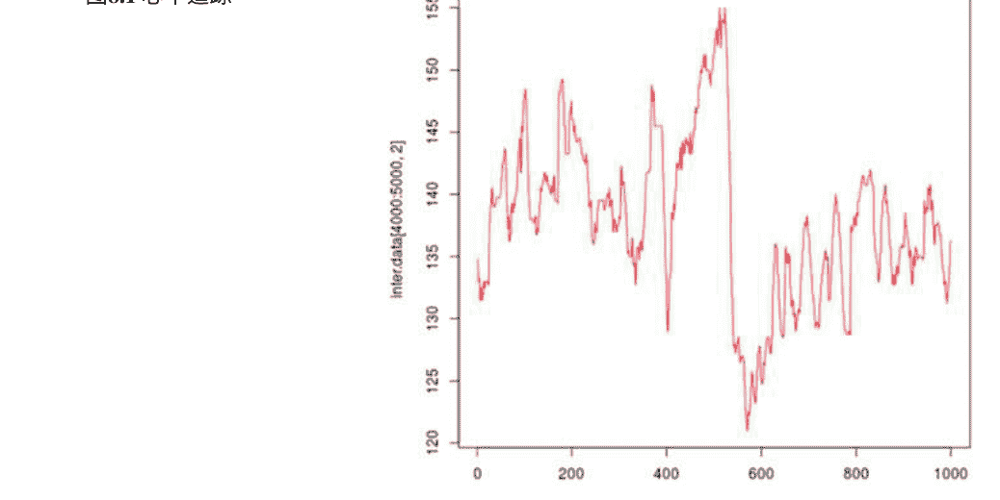

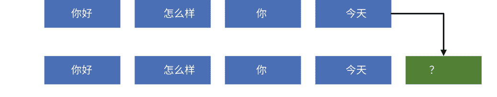

然而，你将遇到的最常见频率包括每日、每月、每季度和每年。通常，我们可以预期我们观察到的时间序列数据中的模式在未来的某个时刻会再次出现。例如，太阳昨天升起，很可能明天、后天甚至几百年后也会升起。因此，我们通过分析过去来预测未来。与我们之前在本书中讨论的分类不同，分类是基于过去的某些东西对现在进行分类，预测是基于先前收集的数据对未来进行预测。与我们之前在本书中讨论的分类不同，分类是基于过去的某些东西对现在进行分类，预测是基于先前收集的数据对未来进行预测。
在本节的其余部分中，将讨论分析时间序列数据的几种DNN类型。

### 8.2 循环神经网络

我们要介绍的第一个用于时间序列的DNN是RNN。RNN建模的关键是使感知器意识到先前输出的历史[2]。这是通过将历史输出反馈到输入聚合和求和过程中来实现的，如图8.3所示。换句话说，图8.3中的神经元是随时间展开的相同神经元。

从先前时间步的输入中得到的神经元也被称为记忆神经元。RNN可以使用不同的输入和输出配置来设置序列和单个向量值。就像对CNN的讨论一样，您可以创建多个层的循环神经元。在图8.3中，我们展示了一个随时间变化的单个感知器。然而，我们可以添加多个神经元，将层的集体输出反馈到每个神经元中，如图8.4所示。

我们现在可以像我们在单个感知器中所做的那样，随着时间的推移展开这个过程，如图8.5所示。

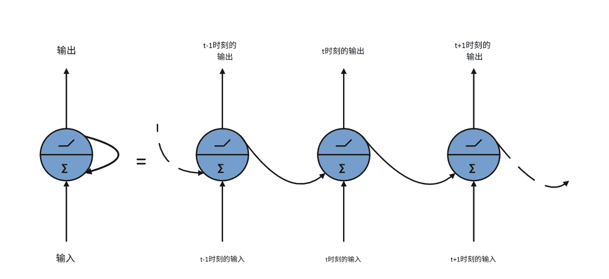

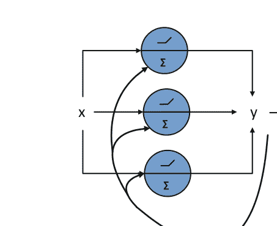

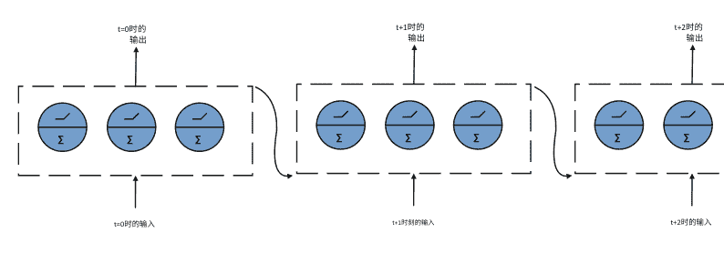

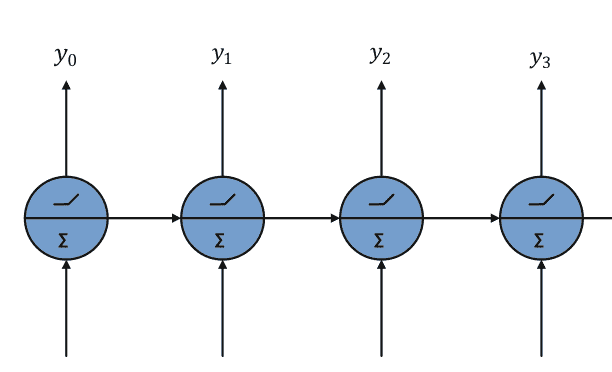

你将遇到的循环神经网络架构之一是序列到序列（多对多）。在这种架构中，通常会传入一个给定的序列，然后返回相同长度的序列。如图8.6所示，例如，如果我们给网络一组 five 个单词，它可以预测序列中的下一个 five 个单词。

另一种配置将是序列到向量（多对一）。在这种情况下，我们传入一系列值并预测下一个值。

例如，在使用预测文本的情况下。图8.7显示了多对一的配置。

最终配置是一个向量到序列的转换（一对多）。在这种情况下，你会给网络一个单词，它会预测下一个五个。例如，给网络一个音频文件的单个音符，它会预测下一个五个音符（图8.8）。

RNN已经证明是强大的神经网络，用于许多预测任务。然而，它们有一个明显的缺点，即历史知识仅限于前一层。这被称为短期记忆，有许多问题需要更长期的记忆。在本章后面讨论LSTMs时，我们将解决这个问题。

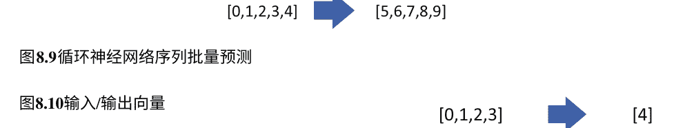

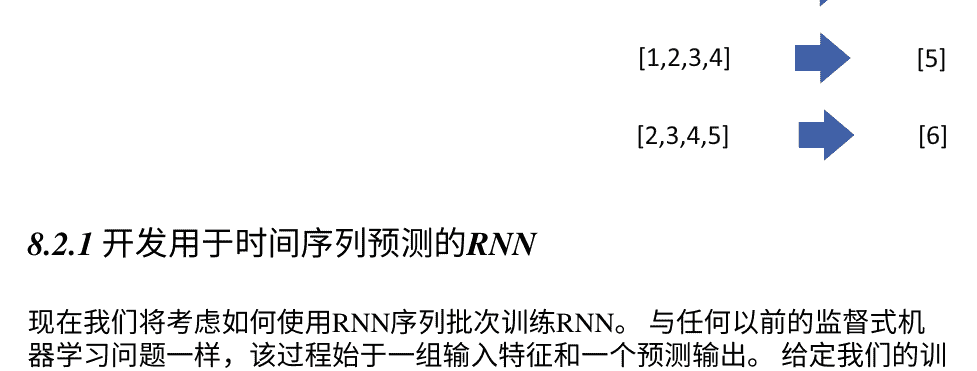

#### 8.2.1 开发用于时间序列预测的RNN

现在我们将考虑如何使用RNN序列批次训练RNN。与任何以前的监督式机器学习问题一样，该过程始于一组输入特征和一个预测输出。给定我们的训练序列（输入特征），目标是预测下一个序列值（y预测输出）。RNN允许我们设置训练序列长度和预测标签的长度。图8.9显示了左侧的训练集和右侧的预测输出。这是在说，给定我们的 five个输入，下一个 five个输出是什么。

在训练过程中，我们以图8.10所示的输入/输出向量批次提供模型。

在这个例子中，我们有三个包含4个值的训练序列。每个序列都有一个相应的下一个序列值（标签），我们试图预测。这三个训练序列及其相应的下一个序列值组成一个批次。请注意，这些可以根据您试图解决的问题进行调整。因此，如果模型输入为[0,1,2,3]，它将预测4；如果输入为[1,2,3,4]，它将预测5。

训练序列和下一个序列值的配置是您试图建模的问题。然而，序列应该足够长，以捕捉任何有用的趋势信息。例如，如果您要建模季节性数据，一个序列必须包含一年的数据。确定训练序列的长度通常取决于领域知识。标签的一个好的起点是使用未来的单个数据点，并随着时间的推移逐渐增加。

循环神经网络的主要目标是基于训练序列来预测未来。这可能只是简单地预测下一个值，但更有可能的是，你希望预测更远未来的值。这是通过将当前预测值纳入下一个用于预测的序列中来实现的。与用于训练模型的训练-测试拆分不同，我们现在有兴趣预测未来的某些东西（请注意，这不是分类），这些东西我们的模型以前从未见过。换句话说，预测值是未知的，无法验证。

## 图8.11预测

+   [7,8,9,10] -> [11.2]
    [8,9,10,11.2] -> [12.4]
    [9,10,11.2,12.4] -> [14]
    [10,11.2,12.4,14] -> 完成的预测

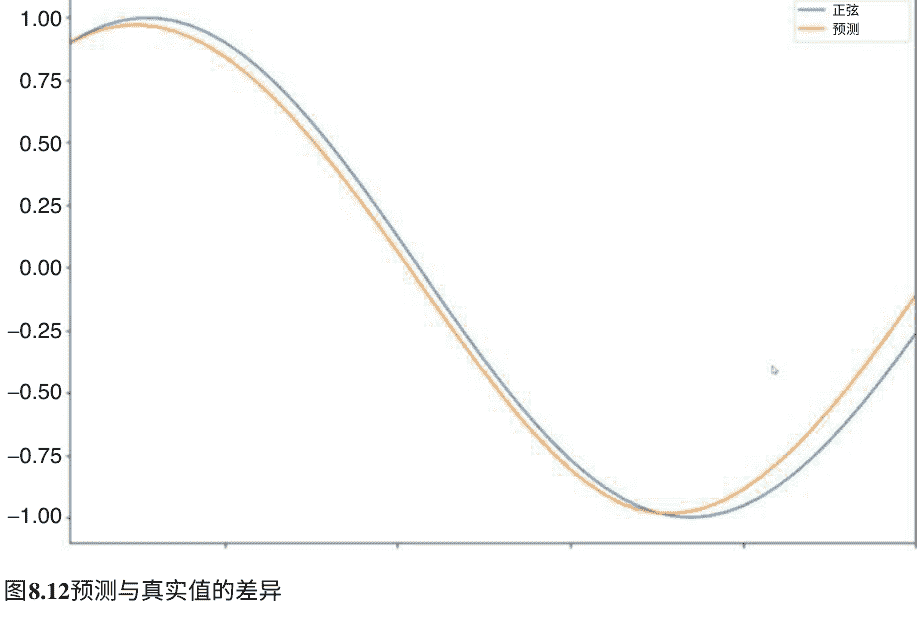

第一步是查看时间序列中的最后一个序列，并使用我们之前训练过的批量进行预测。鉴于这是我们训练序列的最后一个，我们现在要求模型预测输出。因此，我们无法确定返回的预测是否正确，尤其是在数据中没有明显模式的情况下。例如，如果我们的训练-测试数据集中的最后一个序列以[6,7,8,9]结尾，模型将生成一个预测值，可能是10。这是一个相对简单和可预测的例子。然而，使用更复杂的时间序列信号进行建模和预测值可能更加困难。

你可能更想预测未来而不是一个序列。在这种情况下，你只需将预测值添加到输入序列的末尾，并丢弃第一个值（我们已经知道的值）。这个过程会重复进行，直到达到所需的未来点，如图8.11所示。你需要注意的是，你越往未来预测，引入的错误就越多。例如，图8.12所示的时间序列显示，预测值开始偏离真实值。随着你对未来的观察时间越长，真实值和预测值之间的差异会显著增大。

### 8.3 长短期记忆

LSTM网络被设计用来解决RNN网络的缺点[3]。在RNN中，网络在每一步的训练过程中会逐渐忘记先前的输入，导致信息丢失。LSTM通过提供一个长期记忆单元（神经元）和RNN中的短期记忆单元来解决这个问题。

正如之前在RNN的讨论中所看到的，输出会被附加到输入序列的t+1位置上，这个过程会持续进行训练周期。图8.13展示了一个RNN单元的给定时间戳。

LSTM还具有链式结构，以帮助保留重要信息通过LSTM序列。LSTM的短期特性与RNN单元提供的相同。然而，还会生成一个额外的输出，即长期记忆。新的单元在图8.14中显示。


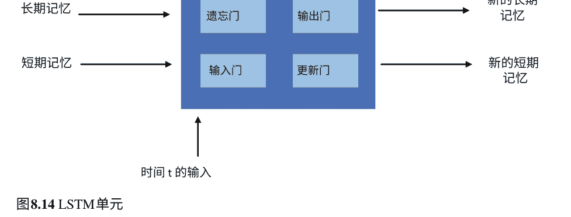

如图8.14所示，LSTM有四个门：遗忘门、输入门、输出门和更新门。遗忘门将决定从前一个记忆单元中遗忘什么。输入门将决定将什么被接受到神经元中。更新门将更新记忆，输出门将输出新的长期记忆。因此，门会让一些信息通过，并且与sigmoid函数相同。值被压缩在0和1之间。如果是0，则该值被丢弃；如果是1，则该值被允许通过。

LSTM中的激活函数，如图8.15所示，本质上起到了确定输入特征的重要性和对单元状态的影响的机制。每个门和相应的激活函数都有自己的权重和偏置，可以通过优化和反向传播算法进行调整。

遗忘门决定了应该丢弃还是保留哪些信息。来自上一个隐藏状态(ht-1)和当前输入(即单词“狗”)的信息通过图8.16中的sigmoid函数传递。返回一个介于0和1之间的值。如果值接近0，则应该被遗忘，而接近1的值应该被保留。

$f_t = \sigma \left( W_f \cdot [h_{t-1}, x_t] + b_f \right)$

## 图8.17 输入门

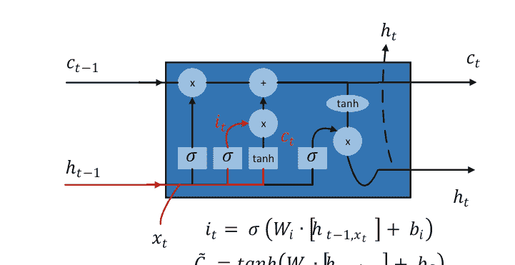

## 图8.18 计算细胞状态

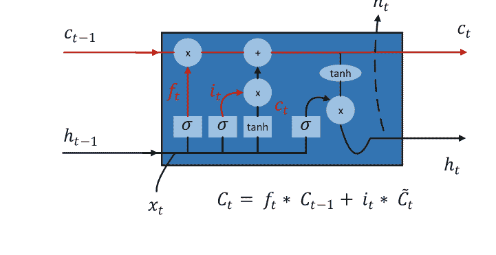

输入门用于更新细胞状态。首先，我们将先前的隐藏状态和当前的输入传递到一个sigmoid函数中。这决定了哪些值将被更新，通过将这些值转换为0和1之间的值（0表示不重要，1表示重要）。您还将隐藏状态和当前输入传递到tanh函数中，以将值压缩在-1和1之间，以帮助调节网络。然后，将tanh输出与sigmoid输出相乘。sigmoid输出将决定从tanh输出中保留哪些信息（图8.17）。现在我们应该有足够的信息来计算细胞状态。首先，细胞状态与遗忘向量进行逐点乘法运算。如果细胞状态与接近0的值相乘，可能会丢弃细胞状态中的值。然后，我们将输入门的输出与细胞状态进行逐点加法运算，从而将细胞状态更新为神经网络认为相关的新值。这给我们带来了新的细胞状态。该过程如图8.18所示。

最后，我们有输出门。输出门决定下一个隐藏状态应该是什么。请记住，隐藏状态包含了先前输入的信息。隐藏状态也用于预测。首先，我们将先前的隐藏状态和当前的输入传入一个sigmoid函数中。然后，我们将新修改后的细胞状态传递给tanh函数。我们将tanh输出与sigmoid输出相乘，以决定隐藏状态应该携带哪些信息。输出就是隐藏状态。新的细胞状态和新的隐藏状态随后传递到下一个时间步骤（图8.19）。

### 8.4 门控循环单元

LSTM和门控循环单元（GRU）之间有几个区别，但它们非常相似[4]。首先，GRU比LSTM少一个门。正如我们之前讨论的，LSTM有一个输入门、一个遗忘门和一个输出门。另一方面，GRU只有两个门，一个重置门和一个更新门。重置门决定如何将新输入与先前的记忆结合在一起，更新门定义了先前记忆的多少（图8.20）。使用GRU的主要优点是由于需要调整的参数较少，训练速度更快。然而，LSTM模型通常比GRU模型更准确。该细胞采用了LSTM设计中隐藏状态的功能。

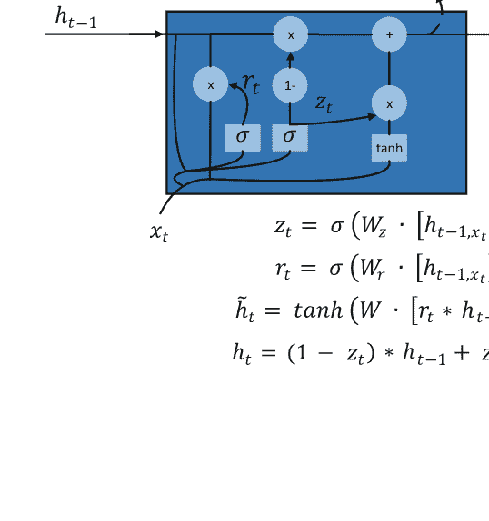

此外，确定细胞遗忘和写入状态的过程被合并为一个门。最终细胞状态作为输出给出。这与LSTM细胞不同，后者选择从细胞状态中读取什么来产生输出。

### 8.5 一维卷积神经网络

在上一章中，我们介绍了用于图像分类的CNN，包括2D和3D图像数据。然而，CNN也广泛应用于1D时间序列数据。图像分析的相同过程可以应用于一维数据序列。与之前一样，模型从序列数据中提取特征并映射序列的内部特征。1D CNN对于从整个数据集的固定长度段中提取特征非常有效，其中特征在段中的位置并不重要。1D-CNN可用于实时心电图监测、振动基础结构损伤检测、机械设备的状态监测和故障检测。

卷积神经网络在具有1、2或3个维度时的工作方式相同。不同之处在于输入数据的结构以及卷积核或特征检测器的移动方式。图8.21显示了信号数据上的filter移动。每列代表一个时间点，而每行中的方块代表一个值。根据图8.21，卷积核每次扫描三个片段。

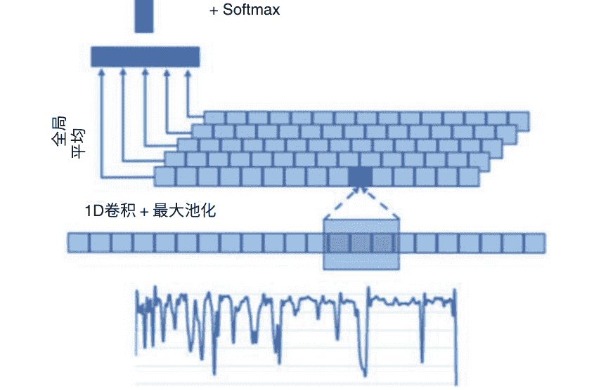

图8.21 1D卷积神经网络

另一个例子是图8.22显示的来自加速度计的时间序列信号，具有三个独立的通道。在这里，每个通道都使用宽度为5的卷积核并行处理。在处理多个通道时，需要注意的一个重要方面是每个通道的采样频率应该相同。

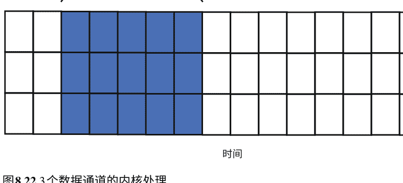

图8.22 3个数据通道的内核处理

有时候会有一些情况，其中单一数据通道就足够了，比如在图8.23中测量CTG。在这种情况下，内核将沿着单一通道滑动以提取相关特征。单一通道可能不足以完全理解您尝试建模的问题的上下文。

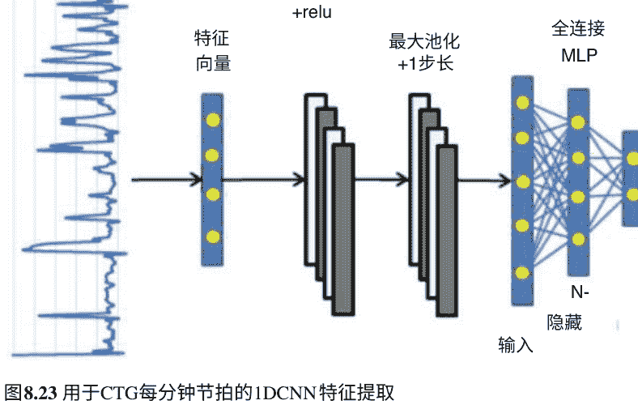

图8.23 用于CTG每分钟节拍的1DCNN特征提取

除了1DCNN的初始输入外，2D和3D CNN中使用的架构结构保持不变（即最大池化，特征图）。鉴于此输入信息是时间序列数据，它比图像复杂得多。1DCNNs往往较简单（即，网络中通常有较少的卷积层）。

### 8.6 总结

在本章中，我们提供了时间序列数据的概述，并讨论了它如何在分类和预测任务中使用。接下来讨论了RNNs及其在时间序列分析中的使用以及它们在短期记忆中存储序列的能力。在讨论了RNNs的局限性及其无法在较长时间内存储信息后，引入了LSTM架构。这主要关注细胞状态和神经元的存储和检索数据的能力，可以在较长时间内存储数据。接下来讨论了基于CNNs的GRU架构，作为简化LSTMs并改善计算时间的手段。基于CNNs的最新架构引入了一个单一维度来建模时间序列数据。

## 参考文献

- 1. K. Cho等，“使用RNN编码器-解码器学习短语表示用于统计机器翻译,”arXiv预印本 arXiv1406.1078, 2014年。
- 2. T. Mikolov, M. Karafiát, L. Burget, J. Cernock\`y, 和 S. Khudanpur, “基于循环神经网络的语言模型,”在Interspeech, 2010年, 第2卷, 第3期, 第1045–1048页。
- 3. K. Greff, R. K. Srivastava, J. Koutn\`ık, B. R. Steunebrink, 和 J. Schmidhuber, “LSTM: 一次搜索空间的奥德赛,” IEEE Trans. neural networks Learn. Syst., 第28卷, 第10期, 第2222–2232页, 2016年。
- 4. J. Chung, C. Gulcehre, K. Cho, and Y. Bengio, “基于序列建模的门控循环神经网络的实证评估,”arXiv Prepr. arXiv1412.3555, 2014。

## 第9章 自然语言处理

人类能够理解口头或书面文字是最令人印象深刻的技能之一。 许多研究人员和实践者认为这是人类智能的基本组成部分。 与AI的许多方面（如图像处理）一样，不足为奇的是出现了一个完整的研究领域、工具和技术，使计算机能够做类似的事情。 在早期，使用符号AI进行语言的构建和解释，使用语法和语义表示语言进行大量研究。 尽管这些早期尝试在当时令人印象深刻，但符号自然语言处理（NLP）未能实现接近人类水平的能力。

然而，随着深度学习的引入，我们已经看到了在自然语言处理（NLP）领域取得的重大进展，并且它已经被广泛应用于许多消费产品，如Alexa、Siri和Google助手[1]。 许多这些进展都是基于前一章讨论的算法，如循环神经网络（RNN）和长短期记忆网络（LSTM）。NLP的许多领域包括文本分类、语音标注、语义和情感分析以及主题建模[2]。 在本章中，我们将在深度学习（DL）的背景下，提供自然语言处理（NLP）的概述以及目前使用的各种技术和框架。

### 9.1 自然语言处理简介

NLP是计算机科学和人工智能的一个子集，旨在构建计算机与人类自然语言之间的成功交互。 总体目标是编程使计算机能够处理大量的自然语言数据，无论是口头交流还是文本输入。 这与传统的机器学习和数据分析不同，传统方法中大部分数据都是以数字形式表示，以便进行数值测量。 计算机非常高效地处理直接的数值信息，但通常不适用于处理文本数据。

人类在书面文本中灌输了大量 的信息和知识，这些信息和知识已经代代相传。 为了使计算机能够访问这些信息，需要专门的处理技术来理解原始文本数据和其中包含的信息。 通常，文本数据是高度非结构化的数据，往往存在多种语言，这进一步加大了挑战。 自然语言处理尝试使用各种工具和技术来从非结构化的文本数据中创建结构。 例如，将电子邮件分类为垃圾邮件或非垃圾邮件，分析电影评论的情感，分析客户反馈，理解文本命令（例如，嘿，谷歌播放这首歌）。 自然语言处理是我们之前讨论的时间序列和循环神经网络主题的延伸。

自然语言处理（NLP）不断进步和演变，正如我们将在本章中看到的那样，深度学习（DL）正在推动许多创新解决方案，您将在已拥有的许多设备中遇到。

#### 9.1.1 分词

分词是将原始文本分解为组成部分（称为标记）的过程[3]。该过程的第一步是根据空格将句子分割，如图9.1所示。接下来，我们根据前缀（第一个引号）进行分割。异常阶段将连接（即，‘We’are’ becomes ‘We’ and “are’）进行分割。后缀将最后的引号进行分割，最后一个异常将感叹号进行分割（即，‘！’）。这结束了分词阶段。生成的标记集合只是原始文本的一部分。标记是文档的基本构建块。帮助我们理解文本含义的一切都来自于标记及其之间的关系。标记类型包括：

- 前缀：开头的字符($ (“)
- 后缀：结尾的字符(km) , . !”
- 中缀：中间的字符(- –/ . . .)
- 异常：在应用标点规则时将字符串分割成多个标记或防止标记被分割。(let’s, U.S.)

#### 9.1.2 词干提取

词干提取是一种返回给定词的相似词的技术[4]。例如，搜索单词car将返回car、cars、car’s、cars’，其中car是词干词。词干提取是一种粗糙的分类相关词的方法。它通过从未尾截取字母直到到达词干来工作。词干提取在大多数情况下工作良好，但不幸的是，英语有很多例外情况，因此需要更复杂的方法。


图9.1 分词

有两种主要类型的词干提取器，它们是 Porter 和 Snowball 词干提取器[5]。 Porter 算法是最常见和有效的词干提取工具之一，由 Martin Porter 在1980年开发。 该算法使用五个单词缩减阶段，每个阶段都有自己的映射规则。 在第一个阶段，定义了简单的后缀映射规则，例如表9.1中所示的规则。

表9.1 后缀fix 映射

| S1 | -> | S2 | 单词 | -> | 词干 |
| :--- | :--- | :--- | :--- | :--- | :--- |
| SSES | -> | SS | caresses | -> | caress |
| IES | -> | I | Ponies | -> | Poni |
| SS | -> | SS | caress | -> | caress |
| S | -> | | 猫 | -> | 猫 |

根据最长的后缀 S1，从给定的词干提取规则中只应用一个规则。 因此，caresses 变为 caress，但不是 cares。 更复杂的阶段在应用规则之前考虑了单词的长度和复杂性，如表9.2所示。

表9.2

| S1 | S2 | 单词 | 词干 |
| :--- | :--- | :--- | :--- |
| (m>0) ATIONAL | -> | 关系国家 | -> 关联国家 |
| (m>0) EED | -> | 同意饲料 | -> 同意饲料 |

Snowball算法是由Martin Porter开发的一种词干提取语言，更准确地称为英语词干提取器或Porter2词干提取器[6]。 它提供了在逻辑和速度上相对于原始的Porter词干提取器有一点改进。Snowball的主要优点之一是它能够跨越不同的语言工作，而不仅仅是英语，这是Porter词干提取器的情况。

#### 9.1.3 词形还原

与词干提取相比，词形还原超越了词汇的缩减，考虑到了语言的全部词汇，以对单词进行形态分析[7]。例如，单词‘was’的词形是‘be’，而单词mice的词形是mouse。此外，单词‘meeting’的词形可能是‘meet’或‘meeting’，具体取决于句子中的使用。词形还原被认为是比简单词干提取更具信息性的方法。词形还原分析周围文本以确定给定单词在句子中的角色。然而，它不对短语进行分类。简而言之，词形还原是将一个词的所有屈折形式分组在一起，以便作为一个单独的项目进行分析，由该词的词形还原形式或词典形式来标识。图9.2显示了左侧为词干提取，右侧为词形还原的差异。

#### 9.1.4 停用词

在处理自然语言文本时，有各种各样的词，例如“a”, “the”, 和“is”经常出现，但并不提供任何关于文本主题或上下文的见解。这些通常被称为停用词，可以被移除。例如，图9.3显示了一个词云（针对你正在阅读的段落）基于停用词的直方图，较大的词显示了数据集中常见词的出现情况。常见的自然语言处理库将包含几个函数，其中包含一系列可以应用于文本以进行删除的停用词。

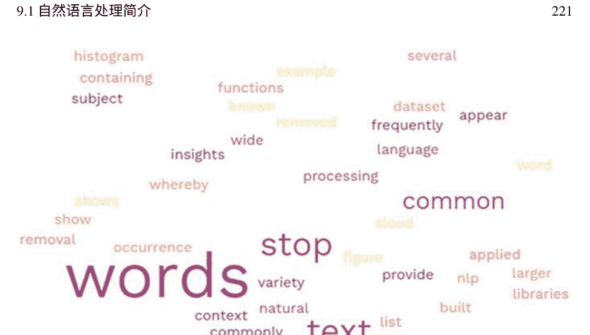

图9.3 停用词的词云

### 9.1.5 短语匹配和词汇

到目前为止，我们已经看到文本数据如何被分割成标记，并且如何解析和标记每个标记的词性、依赖关系和词形。下一阶段是识别和标记与我们自己定义的模式匹配的特定短语。我们可以将其视为正则表达式的强大版本，其中我们考虑词性的部分来进行模式搜索。图9.4展示了一个基于关键词的匹配器的示例，我们对其感兴趣。使用图9.5中概述的短语和图9.4中的匹配器。这将导致图9.6。

```
pattern1 = [{'LOWER': 'unitedstates'}]
pattern2 = [{'LOWER': 'united'}, {'LOWER': 'states'}]
pattern3 = [{'LOWER': 'united'}, {'IS_PUNCT': True}, {'LOWER': 'states'}]

matcher.add('Unitedstates', None, pattern1, pattern2, pattern3)
```

图9.4 短语匹配

```
pattern1 = [{'LOWER': 'unitedstates'}]
pattern2 = [{'LOWER': 'united'}, {'LOWER': 'states'}]
pattern3 = [{'LOWER': 'united'}, {'IS_PUNCT': True}, {'LOWER': 'states'}]

matcher.add('Unitedstates', None, pattern1, pattern2, pattern3)
```

图9.5 句子匹配器

15845173719804281779 UnitedStates 1 2 United States
15845173719804281779 UnitedStates 19 20 UnitedStates
15845173719804281779 UnitedStates 25 28 United-States

图9.6 句子匹配器的结果

### 9.2 文本分类

现在我们了解了自然语言处理的基础知识和生成机器学习模型所需的预处理，我们可以专注于机器学习文本分类所需的任务。文本分类是根据上下文将标签或类别分配给文本的过程[8]。这个阶段是自然语言处理的基本方面之一，已经在广泛的应用中使用，如情感分析、智能助手（如Alexa和Siri）以及最近的假新闻检测。

在自然语言处理中使用机器学习引起了很大的兴趣，因为它允许我们用传统的软件开发过程来替代手工制定的规则。相反，文本分类算法可以建模自己的规则。通过使用预标记的训练数据，机器学习算法可以学习不同的文本之间的关系，并将其映射到不同的输出。

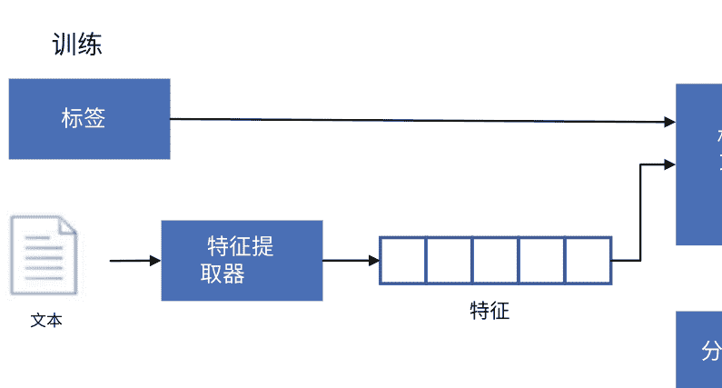

图9.7 文本分类的训练流程

## 图9.8 预测流程

在映射这些文本片段到不同的输出时，机器学习算法可以学习它们之间的关系。图9.7展示了文本分类的典型训练流程。图9.8展示了预测流程，它接收新的文本并通过机器学习模型将提取的特征映射到特定的标签。

在文本分类的流程中，传统的机器学习算法如SVM和朴素贝叶斯一直被使用。然而，最近的方法使用了深度学习算法，如1DCNNs、RCNNs和LSTMs。你会注意到，这类似于之前讨论的图像处理主题中，深度学习取代了用于检测、分割和分类图像中的传统机器学习方法。虽然深度学习算法在自然语言处理任务中表现优于传统机器学习算法，但它们通常需要数百万个标记示例的数据。文本分类是一个关键领域，因为据估计，80%的信息是非结构化的，而文本是最常见的非结构化数据类型之一。通过同时使用机器学习和深度学习方法，公司可以开发出新型的分析流程，自动从法律文件、社交媒体、调查、电子邮件和聊天机器人中推断出有价值的信息。

#### 9.2.1 文本特征提取

训练机器学习NLP分类器的第一步是特征提取。这是一种将文本转化为向量形式的数值表示的方法。最常用的方法之一是词袋模型，其中向量表示了预定义词典中单词的频率。

大多数机器学习算法无法处理原始文本。相反，我们使用特征提取阶段（就像从其他类型的数据（如图像和时间序列信号）中提取特征一样），以便将数值特征作为机器学习算法的输入。主要方法包括计数向量化和词频-逆文档频率（TF-IDF）。

```
messages = ["Hey, lets go to the game today!",
"Call your sister.",
"Want to go walk your dogs?"]
```

## 图9.9 输入消息

## 图9.10 单词特征向量

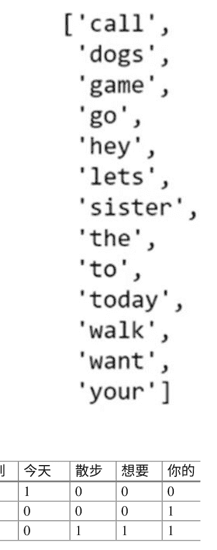

| 呼叫 | 狗 | 游戏 | 去 | 嘿 | 让我们 | 姐妹 | 这 | 到 | 今天 | 散步 | 想要 | 你的 |
|---|---|---|---|---|---|---|---|---|---|---|---|---|
| 0 | 0 | 1 | 1 | 1 | 1 | 0 | 1 | 1 | 1 | 0 | 0 | 0 |
| 1 | 0 | 0 | 0 | 0 | 0 | 1 | 0 | 0 | 0 | 0 | 0 | 1 |
| 0 | 1 | 0 | 1 | 0 | 0 | 0 | 0 | 1 | 0 | 1 | 1 | 1 |

计数向量化使用消息作为输入，如图9.9所示。这里我们有三条包含原始非结构化文本的消息。使用计数向量化算法，我们可以计算所有消息中存在的不同单词的数量。

该算法将每个唯一的单词视为一个特征，如图9.10所示的向量中所示。

这些特征用于计算所有文档中每个唯一特征的出现次数。这被称为文档术语矩阵（DTM）。换句话说，每个消息在DTM中表示为一行零和一的组合，放置在与每个特征相关的列中，如表9.3所示。

因此，从表9.3中我们可以看到单词‘呼叫’只出现在第二个消息中，而出现在第一个或最后一个消息中。对于单词‘狗’也是如此，它只出现在第三个消息中。我们可以看到这种消息的表示更有利于机器学习类型的建模，其中行表示消息，列表示特征。大多数消息不会包含所有的单词 - 如表9.3所示，表示包含稀疏信息（包含许多0）。 随着文档变得更大，稀疏性增加。

对于计数向量化器的另一种方法是TF-IDF向量化器，它也可以从文本中创建文档术语矩阵。 然而，它不是使用标记计数来完成DTM，而是为每个单词计算词频-逆文档频率值。 词频tf(t,d)是文档中一个词的原始计数（该词在文档d中出现的次数）。 然而，仅仅使用词频无法对文本进行全面的特征分析。该算法通过惩罚常见词汇，如‘the’和‘is’，来减少它们的计数，以表明它们的重要性。 然而，它们并不能提供关于文档主题的真正见解。 由于其计数较低，较少常见的词汇，如‘dog’，通常会被弱化。 TF-IDF的逆文档频率部分被纳入其中，以减小在文档中非常频繁出现的词汇的权重，并增加在文档中很少出现的词汇的权重。 因此，将TF-IDF算法的词频权重和逆词频权重计算在一起，形成一个词权重矩阵，如图9.14所示。因此，TF-IDF允许我们理解整个文档语料库中单词的上下文，而不仅仅是在单个文档中的相对重要性。 请注意，对于特定单词，其值越接近1，该单词在整个语料库中被认为越重要（其频率较低）。 或者，对于值越接近零的单词，其重要性越低（其在文档语料库中的频率较高，因此提供的区分能力较小）（表9.4）。

### 9.3 情感分析

情感分析是一种重要的文本分析形式，它使用非结构化数据，如社交媒体、电子邮件和客户服务报告，来理解文本中表达的观点和情绪[11]。情感分析关注于使用文本分析技术对文本中的正面、负面和中性情绪进行分类。情感分析可以使用传统的机器学习方法进行，但最近在深度学习领域得到了广泛应用。

情感分析最常见的用途是将文本输入分类为负面的、中性的或积极的。训练数据通常被映射到特定的领域，如社交媒体、产品评论和客户反馈。因此，存在着各种各样的预标记数据来表示不同的兴趣领域。

与其他文本一样，分析数据在机器学习算法训练之前需要进行预处理。

| | | | |
|---|---|---|---|
| book | 0.15 | -0.27 | 0.04 |
| dads | 0.24 | 0.38 | -0.09 |
| dummies | 0.13 | -0.17 | 0.07 |
| estate | 0.18 | 0.19 | 0.45 |
| guide | 0.22 | 0.09 | -0.46 |
| investing | 0.74 | -0.21 | 0.21 |
| market | 0.18 | -0.3 | -0.28 |
| real | 0.18 | 0.19 | 0.45 |
| rich | 0.36 | 0.59 | -0.34 |
| stock | 0.25 | -0.42 | -0.28 |
| value | 0.12 | -0.14 | 0.23 |

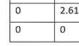

| | | |
|---|---|---|
| 3.91 | 0 | 0 |
| 0 | 2.61 | 0 |
| 0 | 0 | 2 |

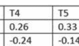

| T1 | T2 | T3 | T4 | T5 | T6 | T7 | T8 | T9 |
|---|---|---|---|---|---|---|---|---|
| 0.35 | 0.22 | 0.34 | 0.26 | 0.33 | 0.49 | 0.28 | 0.29 | 0.44 |
| -0.32 | -0.15 | -0.46 | -0.24 | -0.14 | 0.55 | 0.07 | -0.31 | 0.44 |
| -0.41 | 0.14 | -0.16 | 0.25 | 0.22 | -0.51 | 0.55 | 0 | 0.34 |

## 图9.14 3-D SVD矩阵

传统机器学习中常用的情感分析算法包括支持向量机、决策森林和朴素贝叶斯。然而，存在着各种各样的预处理技术，主要目标是降低特征的维度，以提高分类性能。

常见的技术包括去除数字、词干处理、词性标记、去除标点符号、确保所有文本小写并去除停用词。

### 9.4 主题建模

主题建模允许我们通过将文档聚类成个别主题来分析大量的数据。大量的文本是无标签的，这意味着我们无法应用有监督学习来创建机器学习模型。主题建模的思想是根据文档的共同特征将其聚类[12]。就像我们之前在本书中讨论的无监督学习一样，最终用户就可以确定每个聚类代表什么。

就像我们之前在本书中讨论的无监督学习一样，识别每个聚类代表什么是由最终用户决定的。

通过检测词频和词之间的距离等模式，主题模型可以将相似的文档和常出现的词语和表达式聚类在一起。有了这些信息，你可以快速推断出每组文本在谈论什么。

主题建模是将一组文档划分为以下过程：

- 语料库中文档涵盖的主题列表
- 根据它们所涵盖的主题将语料库中的几组文档分组。

有两种主要算法可以实现这一点：潜在语义分析（LSA）[13]和潜在狄利克雷分配（LDA）。

#### 9.4.1 潜在语义分析（LSA）

LSA允许您分析文档以找到文档中包含的潜在含义和或概念[14]。然而，在英语中，这可能是困难的，因为一个单词可以有多个含义，比如bank可以指金融机构或河边的地方。就自然语言处理而言，如果每个单词只有一个含义，每个概念只用一个单词来描述，那将更容易。从这个意义上说，自然语言处理算法只需要将一个单词映射到一个概念，如图9.11所示。

然而，情况并非如此。在英语中，不同的单词经常可以表示相同的意思，这被称为同义词。这意味着概念很容易变得模糊，使得人们难以理解，更不用说自然语言处理了。这在图9.12中得到了突出。


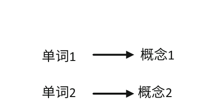


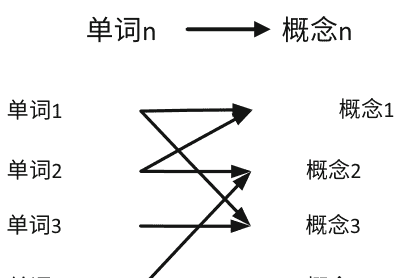

| 索引词 | 标题 | T1 | T2 | T3 | T4 | T5 | T6 | T7 | T8 | T9 |
| :--- | :--- | :--- | :--- | :--- | :--- | :--- | :--- | :--- | :--- | :--- |
| 书籍 | | | | 1 | 1 | | | | | |
| 爸爸们 | | | | | | | 1 | | | 1 |
| 新手 | | | 1 | | | | | | 1 | |
| 房地产 | | | | | | | | 1 | | 1 |
| 指南 | 1 | | | | | | 1 | | | |
| 投资 | 1 | 1 | 1 | 1 | 1 | 1 | 1 | 1 | 1 | 1 |
| 市场 | 1 | 1 | | | | | | | | |
| 真实 | | | | | | | | 1 | | 1 |
| 富有 | | | | | | | 2 | | | 1 |
| 股票 | 1 | | 1 | | | | | | 1 | |
| 价值 | | | | | 1 | 1 | | | | |

在自然语言处理的背景下，挑战在于理解搜索词（可以是键入或口头说出的）并返回相关信息，如文档、网页和口头回答。解决这个挑战的一种方法是使用LSA。比较单词背后的意义或概念有助于我们克服同义词的问题。LSA通过将单词和文档映射到一个概念空间并在该空间中进行比较来解决这个问题。当人们创建文档时，他们可以使用各种各样的单词。正如讨论的那样，由于不同的词选择，潜在的概念可能会变得模糊。LSA通过在执行一种类型的降维时过滤掉一些噪声（单词）来工作。这是通过以下方式实现的：

- (A) 将文档表示为词袋，其中词在文档中的顺序不重要，但词在文档中出现的次数很重要（TF-IDF）。
- (B) 使用词的模式来表示概念，例如在关于烘焙的文档中可能出现“秤”、“面粉”和“勺子”。
- (C) 假设一个词只有一个意思，以便解决问题。

LSA首先创建一个计数矩阵，显示哪些文档包含特定词及其频率。该矩阵显示在表9.5中。

在LSA中，原始计数矩阵被修改，使得罕见的词比常用词更加重要。这是通过使用TF-IDF来实现的，TF-IDF将计数值替换为TF-IDF值，这被称为术语矩阵，如图9.5（表9.6）所示。

一旦我们构建了我们的术语矩阵，我们使用奇异值分解（SVD）来分析矩阵。SVD用于找到我们矩阵的降维表示（类似于本书中讨论的PCA）[15]。这使我们能够找到或强调最强的关系，同时排除任何噪音。然而，挑战在于找到逼近矩阵时要使用多少维度或“概念”。如果使用有限的维度，重要的模式被忽略，太多和重要的概念变得模糊和难以识别，因为噪音。

SVD算法构建了三个独立的矩阵。U矩阵提供了我们概念空间中每个单词的坐标。Vt矩阵提供了每个文档在概念空间中的坐标，而奇异值矩阵S提供了有关需要包含多少维度（概念）的宝贵信息。为了实现这一点，我们可以制作奇异值的平方的直方图，该直方图显示了每个奇异值在逼近我们的矩阵时的重要性和贡献，如图9.13所示。

对于大量的文档集合，维度的数量将增加，以表示更广泛的概念。我们矩阵的完整三维SVD如图9.14所示。每个单词都与三个数字相关联。

| 术语 | 值1 | 值2 | 值3 |
|------|-----|-----|-----|
| 书籍 | 0.15 | -0.27 | 0.04 |
| 爸爸们 | 0.24 | 0.38 | -0.09 |
| 新手 | 0.13 | -0.17 | 0.07 |
| 房地产 | 0.18 | 0.19 | 0.45 |
| 指南 | 0.22 | 0.09 | -0.46 |
| 投资 | 0.74 | -0.21 | 0.21 |
| 市场 | 0.18 | -0.3 | -0.28 |
| 真实 | 0.18 | 0.19 | 0.45 |
| 富有 | 0.36 | 0.59 | -0.34 |
| 股票 | 0.25 | -0.42 | -0.28 |
| 价值 | 0.12 | -0.14 | 0.23 |

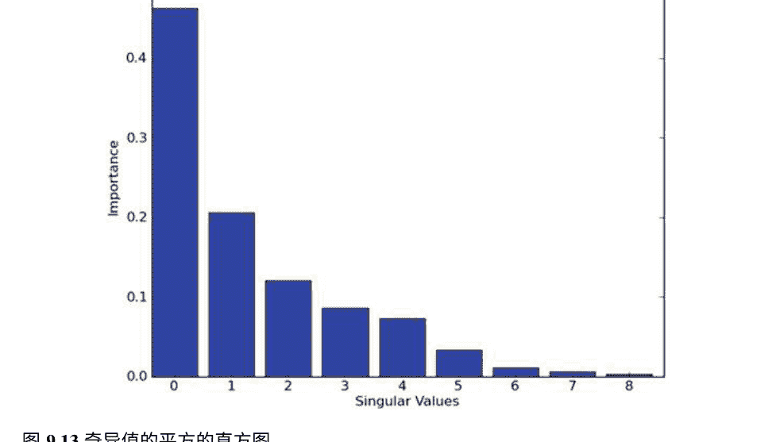

第一个数字对应于所有标题中单词出现的次数，并且不如第二和第三个数字有信息量。在这种情况下，每个维度都有一个。 同样，每个标题也与三个数字相关联，每个维度一个。 同样，第一个维度被移除，因为它对于给定标题中的单词数量并不重要。

现在我们可以使用第二和第三个维度来绘制和创建聚类。 聚类捕捉了单词、文档和它们所属的概念，如图 9.15 所示。

SVD 允许我们在图上绘制单词和文档标题，从而可以识别标题的聚类。 然后，我们可以使用单词来标记每个聚类，通过查看哪些单词位于特定聚类中。 例如，图 9.15 显示较低的聚类具有标题 1 和 3，它们都与股票市场投资有关。 而中间的聚类与标题 2、4、5 和 8 相关联，围绕着“价值”和“投资”这两个词汇进行总结。

#### 9.4.2 潜在狄利克雷分配

潜在狄利克雷分配（LDA）使用狄利克雷分布[16]。该算法于2003年开发，是一种用于主题发现的图形模型。要使用LDA，有两个总体假设：

- 具有相关主题的文档使用相似的词组（文档是潜在主题的概率分布）
- 可以通过搜索在整个语料库中经常一起出现的词组来找到潜在主题（主题本身是词的概率分布）。

因此，例如，任何文档都将具有关于给定数量的潜在主题的概率分布。如图9.16所示，如果在各个文档中存在五个潜在主题，则任何文档都将有属于每个主题的概率。在图中，文档一具有属于主题二的最高概率。

在另一个例子中，文档二具有属于主题4的最高概率，如图9.17所示。

如果我们看一下这些主题本身，它们被建模为包含在语料库中的单词的概率分布，如图9.18所示。在这里，我们可以看到主题一与主题本身中包含的每个单词之间有不同的概率关系。因此，在我们的例子中，它对于“the”、“food”、“read”和“has”具有较低的概率。“家”有很低的属于该主题的概率。相反，“猫”和“狗”有更大的概率（机会）属于主题1。在选择单词时，您将定义一个仅保留概率值高于特定阈值的单词的阈值。因此，在上面的示例中，如果我们的阈值只涵盖“猫”和“狗”，我们可以推断该主题是关于动物或宠物的。

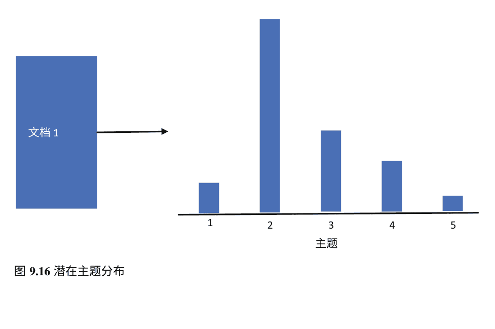

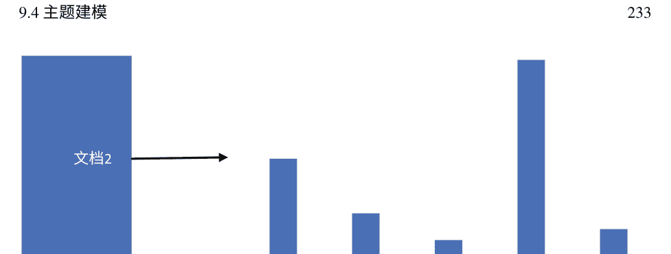

## 图9.17 潜在主题分布

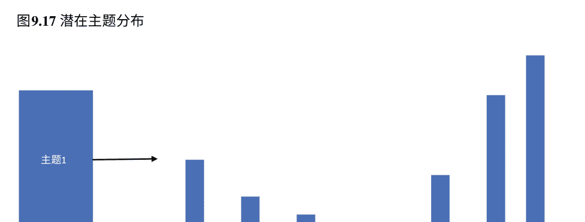

## 图9.18 单词概率分布

LDA 将文档表示为产生具有一定概率的单词的主题混合。它假设文档是使用以下步骤生成的。

- 第1步，指定文档将包含的单词数量(N)。
- 第2步，为文档选择一个主题混合（使用狄利克雷分布在一个固定的主题集合上。例如，60% 的商业主题，20% 的政治主题和 20% 的食品主题）。
- 第3步，通过以下方式生成文档中的每个单词：
    - 首先，根据之前抽样的多项式分布选择一个主题（例如，60% 的商业主题，20% 的政治主题和 20% 的主题）。
    - 其次，使用主题生成单词本身（根据主题的多模态分布）。例如，如果选择了一个食品主题，可能以 60% 的概率生成单词“苹果”，以 30% 的概率生成单词“家”，依此类推。假设这个生成模型适用于一组文档，LDA 然后尝试从文档中回溯，找到一组可能生成该集合的主题。

因此，将所有这些结合在一起，想象一下我们有一组文档，我们已经指定了一个固定数量的k个主题要发现。 我们使用LDA来学习每个文档的主题表示以及与每个主题相关联的单词。该过程从每个文档开始，随机将文档中的每个单词分配给k个主题之一。 这种随机分配已经提供了所有文档的主题表示和所有主题的单词分布。 请注意，这些随机主题最初没有任何意义，因为它们是每个主题的贫乏表示。 该过程需要迭代每个文档中的每个单词，以改进这些主题。

对于每个文档中的每个单词和每个主题t，我们计算以下内容：

-   P(主题 t| 文档 d) = 文档 d中当前分配给主题 t的单词比例
-   P(单词 w| 主题 t) = 来自单词 w的所有分配中分配给主题 t的比例
-   重新分配 w到一个新的主题，其中我们选择主题 t的概率为 P(主题 t| 文档 d) * P(单词 w| 主题 t)，这是主题 t生成单词 w的概率。

这个步骤会重复进行，直到最终达到一个稳定状态，其中分配不再发生或只发生微小变化。

在这个过程结束时，每个文档都被分配到一个主题。 这使我们能够搜索被分配到特定主题的概率最高的单词。 当每个文档被分配到一个主题时，你可以确定该主题中概率最高的常用单词。 这些单词的集合可以用来标记主题。

#### 9.4.3 非负矩阵分解

非负矩阵分解（NMF）是一种无监督算法，同时进行降维和聚类[17]。 通常与TF-IDF一起用于对文档中的主题建模。 与支持负和正输入的奇异值分解（SVD）不同，NMF只处理正值。 给定一个非负矩阵A，通过非负因子W和H找到k维近似。 矩阵A是使用TF-IDF生成的。 我们使用向量（k）来表示。 K是我们选择的主题数量，类似于LDA。 我们使用随机值（例如随机矩阵）初始化W和H。 使用目标函数，我们可以创建一个衡量A和近似WH之间重构误差的指标。 通过期望最大化优化来调整W和H以最小化目标函数。 重复此过程直到模型收敛。 NMF的过程如图9.19所示。

将所有内容整合在一起，我们首先构建一个文档的向量空间模型（在去除停用词后），这将得到一个术语-文档矩阵（A）。在第二步中，我们对 A应用TF-IDF术语权重归一化。在第三步中，我们将TF-IDF向量归一化为单位长度。然后，我们使用 A上的NNDSVD初始化因子。最后一步是将投影梯度NMF应用于 A。完成这些步骤后，我们将得到基向量，它们是数据中的主题（聚类）。我们还有一个包含每个主题（聚类）相对于每个文档的成员权重的系数矩阵。因此，A的形式类似于图9.20中的图像，表示TF-IDF向量化。

此外，图9.21显示了 W和 H矩阵。这里的词与特定主题和文档相关。使用 W，我们根据单词成员资格标记我们的主题。因此，主题1可能是关于电视节目，主题2是关于体育，主题3是关于financial。使用这些标记的主题，我们现在可以将新文档分配给这些主题。因此，文档1将是关于体育，文档2将是关于finance，文档3和4将是关于电视节目，文档5将是关于finance，主题6将是关于体育。

图9.21 W和H矩阵

## 9.5 自然语言处理的深度学习

使用我们在本书前面讨论过的RNNs和LSTMS，我们可以使用文本数据语料库创建新的文本。 在历史上，大多数用于自然语言处理的方法采用浅层机器学习和手工特征。 这经常引入高维数据等问题。 通过使用新技术，如词嵌入（低维分布式表示），人工神经网络在各种自然语言处理任务中可以实现比传统机器学习方法更好的结果。

#### 9.5.1 词嵌入

词嵌入是深度学习在自然语言处理问题中的主要突破之一[18]。 其中一个主要优势是它可以创建一个低维向量，从而提高深度学习模型的泛化能力。 词嵌入是一种学习得到的文本表示，其中具有相似含义的单词具有相似的表示方式。 每个单词都映射到一个向量，并且向量的值是通过神经网络学习得到的。 每个单词都使用一个实值向量表示，通常是几十或几百维。 这与传统方法（如one-hot编码）中使用的数千或数百万维相比形成了鲜明对比。 图9.22展示了一个简单的one-hot编码任务的向量表示。 即使是有限的单词数量也会产生高维度。

|   | 1 | 2 | 3 | 4 | 5 | 6 | 7 | 8 | 9 |
|---|---|---|---|---|---|---|---|---|---|
| 男人 | 1 | 0 | 0 | 0 | 0 | 0 | 0 | 0 | 0 |
| 女人 | 0 | 1 | 0 | 0 | 0 | 0 | 0 | 0 | 0 |
| 男孩 | 0 | 0 | 1 | 0 | 0 | 0 | 0 | 0 | 0 |
| 女孩 | 0 | 0 | 0 | 1 | 0 | 0 | 0 | 0 | 0 |
| 王子 | 0 | 0 | 0 | 0 | 1 | 0 | 0 | 0 | 0 |
| 公主 | 0 | 0 | 0 | 0 | 0 | 1 | 0 | 0 | 0 |
| 女王 | 0 | 0 | 0 | 0 | 0 | 0 | 1 | 0 | 0 |
| 国王 | 0 | 0 | 0 | 0 | 0 | 0 | 0 | 1 | 0 |
| 君主 | 0 | 0 | 0 | 0 | 0 | 0 | 0 | 0 | 1 |

每个单词都有一个1x9的向量表示

图9.22 词嵌入

图9.23 使用词嵌入减少维度空间

|   | 女性气质 | 青春 | 皇室 |
|---|---|---|---|
| 男人 |  |  |  |
| 女人 |  |  |  |
| 男孩 |  |  |  |
| 女孩 |  |  |  |
| 王子 |  |  |  |
| 公主 |  |  |  |
| 女王 |  |  |  |
| 国王 |  |  |  |
| 君主 |  |  |  |

通过使用词嵌入，我们可以显著减少维度空间，对于我们试图表示的单词，如图9.23所示。这种方法允许以类似方式使用的单词具有相似的表示，捕捉它们的含义。这与词袋方法形成鲜明对比，无论单词如何使用，不同的单词具有不同的表示。

#### 9.5.2 词嵌入算法

有各种各样的词嵌入算法，旨在根据它们的相似性将单词放置在一个矢量空间中。这些方法分为两个总体类别，包括概率方法（ANNs）和之前概述的经典方法。

##### 9.5.2.1 嵌入层

嵌入层是通过神经网络模型在特定的自然语言处理任务（如语言建模或文档分类）的训练过程中学习得到的。与传统方法类似，文本需要进行清洗、预处理和独热编码。向量空间的大小是作为模型参数的一部分进行指定的（例如50或100维）。嵌入层形成了ANN的输入，如图9.24所示。学习嵌入层需要大量的训练数据。

##### 9.5.2.2 Word2Vec

Word2Vec是由Tomas Mikolov [19]开发的。Word2Vec旨在使嵌入过程更加高效。它通过对文本语料库进行统计生成独立的词嵌入。Word2Vec采用了一个两层神经网络，用于重构单词的语境。大量的单词语料库作为向量空间输入到网络中，该向量空间可以超过几百维。语料库中的每个单词都被分配一个相应的向量。

词向量在向量空间中的位置是这样的，即共享相同含义的词靠得很近。Word2Vec是一种使用原始文本进行嵌入学习的计算效率高的方法。有两种方法可以实现这一点的方法包括连续词袋模型（CBOW）和Skip-Gram模型。这些方法类似，并且在图9.25中展示。CBOW通过预测周围上下文词（如“猫坐在...”）来预测目标词（如“垫子”）。Skip-Gram预测目标词的周围上下文词，这与CBOW相反。通常，CBOW用于较小的数据集，而Skip-Gram用于较大的数据集。Word2Vec是一个简单的神经网络，它使用一个单独的隐藏层，该隐藏层具有自己的可调节权重。与普通的多层感知机不同，Word2Vec只关注隐藏层权重。这些权重被用作我们的词嵌入。这种架构类似于自编码器，将在后面的章节中介绍。本质上，它是一种压缩技术，将一个大的输入向量压缩成一个较小的稠密向量。然而，与将其解压缩回原始输入向量不同。一旦语料库使用独热编码进行编码，生成的向量将传递到我们的隐藏层，该隐藏层生成一组权重，将输入向量映射到相应的词嵌入表（隐藏层权重的模式被序列化为一个向量，然后映射到一个词），如图9.26所示。

通过使用词编码，网络可以将具有相似含义的单词组织成接近的向量。这在图9.27中展示，相似的单词被分组在一起。

| Unique word | embedding | Word2vec embedding |
|-------------|-----------|--------------------|
| king | [1,0,0,0,0,0] | [1,1] |
| man | [0,0,0,1,0,0] | [1,3] |
| queen | [0,0,0,1,0,0] | [5,5] |
| woman | [0,0,0,0,0,1] | [5,7] |

图9.27最终嵌入

表格 9.7 词-上下文共现矩阵

| the | 猫 | 坐 | 在 | 垫子上 |
|----|----|----|----|------|
| 0 | 1 | 0 | 1 | 1 |
| 1 | 0 | 1 | 0 | 0 |
| 0 | 1 | 0 | 1 | 0 |
| 1 | 0 | 1 | 0 | 0 |
| 1 | 0 | 0 | 0 | 0 |

在特征空间中一起。最终的嵌入可以被冻结并用作NLP问题中较大模型架构中的一层。

##### 9.5.2.3 GloVe

全局向量词表示（GloVe）是对先前讨论的Word2Vec算法[20]的扩展。 GloVe旨在将LSA等技术与Word2Vec中的基于上下文的学习相结合。GloVe不使用窗口来定义局部上下文，而是通过使用整个文本语料库的统计数据构建单词-上下文矩阵。 这使得构建增强的词嵌入成为可能，这些词嵌入反映了整个语料库。

GloVe模型生成一个单词-上下文共现矩阵，其中包含单词和上下文对，以便矩阵中的每个元素反映了一个单词在上下文（单词序列）中出现的频率，如表9.7所示。为了构建这个矩阵，整个语料库只需分析一次。 在这一步之后，使用生成的共现矩阵代替原始语料库。

我们现在可以使用生成的共现矩阵构建模型。 该过程通过确定语料库中每个观察到的单词在连续空间中的向量值来工作。 这使得单词向量能够保留有关每个单词对如何出现的有用信息。 这是一个学习过程，我们通过最小化目标函数来实现。 当函数遇到非常常见的单词对时，它将截断其正常输出并简单地返回1。对于其他所有情况，我们返回一个在0到1范围内的权重，这些权重的分布是使用一个alpha项决定的。单词嵌入的一个示例如图9.28所示。然后，这些嵌入被用作训练流程中的预训练层。

|    | 1       | 2        | 3       | 4       | 5       | 6       | 7       | 8       | 9       | 10      | 11      |
|---|---------|----------|---------|---------|---------|---------|---------|---------|---------|---------|---------|
| so  | 0.60308 | -0.320240| 0.088857| -0.551760| 0.531820| 0.047069| -0.36246| 0.005702| -0.37665| 0.225340| -0.13534|
| them | 0.64642 | -0.556000| 0.470380| -0.820740| 0.795120| 0.287710| -0.56426| 0.146300| -0.52421| 0.021607| -0.11266|
| what | 0.45323 | 0.059811 | -0.105770| -0.333000| 0.723590| -0.087170| -0.61053| -0.037695| -0.30945| 0.218050| -0.43605|
| him  | 0.11964 | -0.045405| 0.051100| -0.828730| 0.976650| 0.111280| -0.54588| 1.156100| -0.68081| 0.060207| -0.28765|
| united | -0.39874| 0.071993 | -0.069773| 0.147060| 0.118500| 0.147700| -0.84431| 0.147600| 0.64804 | -0.559260| 0.50164 |
| during | 0.29784 | -0.018422| -0.718910| -0.465100| -0.456610| -0.004215| -0.74598| 0.346620| -0.51781| -0.587700| 0.18398 |
| before | 0.30806 | -0.296650| -0.257060| -0.587100| 0.095135| -0.152110| -0.91478| 0.757270| -0.30423| -0.290580| -0.13034|
| may  | 0.70480 | 0.222610 | 0.086997| -0.212410| -0.089356| 0.437420| -0.28170| 0.133780| -0.50859| -0.182420| 0.49506 |
| since | 0.15423 | -0.125520| 0.022279| -0.067561| -0.359750| 0.144090| -1.09020| -0.028693| -0.43147| -0.137810| 0.37841 |
| many | 0.69790 | 0.082340 | 0.041526| -0.507040| -0.158010| 0.360480| -1.07450| -0.239270| -0.74704| 0.160070| -0.18420|

图9.28词嵌入

##### 9.5.2.4 自然语言理解和生成

到目前为止，本章大部分内容涵盖了将文本转化为结构化和可处理数据的自然语言处理（NLP）技术。还有两个附加组件，包括自然语言理解（NLU），负责根据语法和上下文理解数据[21]。自然语言生成（NLG）根据结构化数据生成文本[22]。

传统上，统计语言模型被用于NLU和NLG。一些示例技术包括N-gram和隐马尔可夫模型，它们学习单词的概率分布。然而，最近神经语言模型取代了这些模型，因为它们在效果上超过了统计语言模型。在前一章中，您已经遇到了NLU和NLG中使用的两个主要算法，即循环神经网络（RNN）和长短期记忆网络（LSTM）。这些算法捕捉到了序列中标记之间的无限依赖关系，如图9.29所示。

NLU方面使用的网络包括RNN和LSTM，而NLG是由RNN和LSTM生成的预测输出。

### 9.6 实际应用

#### 9.6.1 聊天机器人

DL在NLP中的主要用途之一是聊天机器人应用。聊天机器人是用于自动化通信的对话工具。它们通常是程序，允许用户使用聊天界面与网站或应用进行交互。传统上，聊天机器人使用基于规则的逻辑开发，以基于关键词完成脚本化操作。最近，它们由使用本章讨论的许多技术的人工智能驱动。这使得聊天机器人能够更自然地对话。基于规则的聊天机器人在电子商务中仍然很受欢迎，用于处理常规客户服务请求，因为它们易于实施并且擅长处理常规查询。然而，随着人工智能和机器学习的进步，它们很可能会越来越受欢迎[23]。

聊天机器人在两种主要对话系统中被使用：目标导向型的，如Siri，以及广泛对话型的，如Zoe。前者通过自然语言处理帮助人们解决日常问题，而后者则试图与人们进行更广泛的对话。商业聊天机器人同时兼具这两种方法，它们用于为在线客户提供与实体店相同水平的关注，并通过实时聊天界面整合整个购物体验。目标是使聊天机器人体验无缝，以增强用户体验。

机器学习聊天机器人可以帮助访客找到他们想要的东西，回答常见问题，并引导他们完成结账。

#### 9.6.2 智能音箱

AI智能音箱的引入展示了自然语言处理取得的重大进展。像Echo和Google Nest这样的智能音箱使用最先进的自然语言处理算法来驱动先进的认知助手，能够理解并对口语做出反应。这些系统利用自然语言生成技术，根据输入的数据生成自然语言的书面和口头回应能力。你可以将自然语言生成技术看作是将数据转化为可交流的语言的写手。基于语音的AI系统对许多用户具有吸引力，因为它促进了与人类自然交流的方式（无需打字）。

像Alexa这样的认知助手利用了本章和前几章讨论的许多主题。然而，完全开发的系统是复杂的。例如，Alexa从信号处理开始，通过清理信号尽可能多地理解音频。这包括检测和过滤环境噪音，如电视和其他背景噪音。为了解决这个问题，使用了几个麦克风来确定信号的来源，以便设备可以专注于它。声学回声消除可以减去该信号，使只有重要的信号保留下来。下一个任务是执行唤醒词检测，例如Alexa，以打开设备以减少误报和漏报。这是一个复杂的任务，因为它需要在计算能力有限的设备上识别发音差异。如果检测到唤醒词，信号将被发送到云端的语音识别软件，将信号转换为文本格式。

这是很多自然语言处理元素在本章中发挥作用的地方。

## 9.7 总结

在本章中，我们介绍了自然语言处理，涵盖了词条化、词干提取、词形还原、停用词、短语匹配和词汇等关键概念。接下来讨论了文本分类，引入了文本特征提取。本章还简要介绍了情感分析，然后讨论了主题建模，描述了潜在情感分析和潜在狄利克雷分配。接着介绍了非负矩阵分解，最后讨论了自然语言处理，引入了词嵌入和诸如Word2Vec和Glove的算法。本节最后讨论了自然语言理解和自然语言生成，并介绍了一些现实生活中的自然语言处理示例，包括聊天机器人和智能音箱。

## 参考文献

1.  T. Young, D. Hazarika, S. Poria, and E. Cambria, “基于深度学习的自然语言处理的最新趋势”, IEEE计算智能杂志, 第13卷, 第3期, 第55–75页, 2018年。
2.  P. M. Nadkarni, L. Ohno-Machado, and W. W. Chapman, “自然语言处理: 一个简介, ” J. Am. Med. Informatics Assoc., vol. 18, no. 5, pp. 544–551, 2011.
3.  J. J. Webster and C. Kit, “分词作为自然语言处理的初始阶段,” 1992.
4.  J. B. Lovins, “一个词干提取算法的开发, ” Mech. Transl. Comput. Linguist., vol. 11, no. 1–2, pp. 22–31, 1968.
5.  M. F. Porter, “Snowball: 一种词干提取算法的语言.” 2001.
6.  M. F. Porter, R. Boulton, and A. Macfarlane, “英语 (porter2) 词干提取算法,” 检索, vol. 18, p. 2011, 2002.
7.  J. Plisson, N. Lavrac, D. Mladenic, and others, “基于规则的词形还原方法,” 在IS会议论文集, 2004年, 第3卷, 第83–86页.
8.  C. C. Aggarwal and C. Zhai, “文本分类算法综述,” 在《挖掘文本数据》, Springer, 2012年, 第163–222页.

## 第10章 深度生成模型

在本章中，我们将介绍和讨论生成模型的概念，这是深度学习中一个令人兴奋且快速发展的领域。具体来说，本章将介绍自动编码器（AEs），它们主要用于降维和降噪，并且是信号处理、图像分析和自然语言处理中的强大工具。本章还讨论了生成对抗网络（GANs），它促进了复杂数据的合成生成[1]。这个领域正在迅速发展，并在图像生成方面得到实际应用。

### 10.1 自编码器

自动编码器是机器学习从业者工具箱中一种有用的工具，用于进行维度约简和噪声去除。它们还可以用于其他类型的任务，如异常检测。它们可以与时间序列和图像数据一起使用。自动编码器被认为是一种无监督学习的人工神经网络，它学习如何高效地压缩和编码数据，然后学习如何从减少的编码表示中重新构建数据[2]。这在图10.1中显示，尽可能地模拟原始输入（近似）。

#### 10.1.1 自编码器基础

自动编码器就像你在第6章中遇到的多层感知机。其基本思想是使用一组减少的特征来在输出层上复制输入。自动编码器和多层感知机之间的关键区别在于输入神经元的数量等于输出神经元的数量。在前面关于多层感知机的章节中，输出层的大小等于我们试图分类的类别数量—在回归问题中，使用单个感知器提供单个连续值。

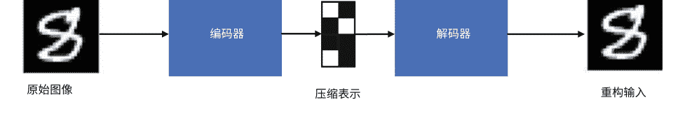

一个示例的自编码器网络如图10.2所示。在这个示例中，我们从5个输入神经元开始，然后逐渐减少数量，直到隐藏层中的特定数量。所以，例如，我们可以从5个减少到三个再到两个。这个过程捕捉了数据中的基本信息同时去除了噪音和不重要的数据。这个 first阶段被称为编码阶段。

中间两个节点右侧的层被称为解码层。这些层通过解码器隐藏层在输出层近似重构编码层中捕获的输入。为了评估性能并确定输出数据与输入数据的接近程度，使用重构损失来衡量解码器的性能。构建自编码器所使用的四个主要组件如下所示。

- 1. 编码器：模型学习如何减少输入维度并将输入数据压缩成编码表示。
- 2. 瓶颈层：包含输入数据的压缩表示的层。这是输入数据的最低可能维度。
- 3. 解码器：模型学习如何从编码表示中重构数据，使其尽可能接近原始输入。
- 4. 重构损失：这是衡量解码器性能和输出与原始输入接近程度的方法。

自编码器使用相同的学习技术来进行编码和解码，包括优化器和损失函数。

#### 10.1.2 用于降维的自编码器

自动编码器的核心思想与主成分分析（PCA）类似，我们试图将输入数据降维为较少的主要成分。在上图中，我们将五个数据压缩为两个。需要注意的是，隐藏层不仅仅是选择某些特征。相反，它通过在降维空间中计算原始数据中表示的原始特征的组合来工作。图10.3展示了一个例子，其中3D表示被投影到2D空间中。这与LDA讨论中所提到的类似。

在降维的情况下，只需将网络分成两半，并使用隐藏层（输入和输出层，包括其他外围隐藏层）即可，而舍弃其他层。中央隐藏层现在成为新的输入层数据。从这个意义上说，降维将原始数据压缩到较低的维度。一旦我们有了一个较低维度的空间，我们可以可视化数据并揭示在更高维度中看不到的隐藏关系。

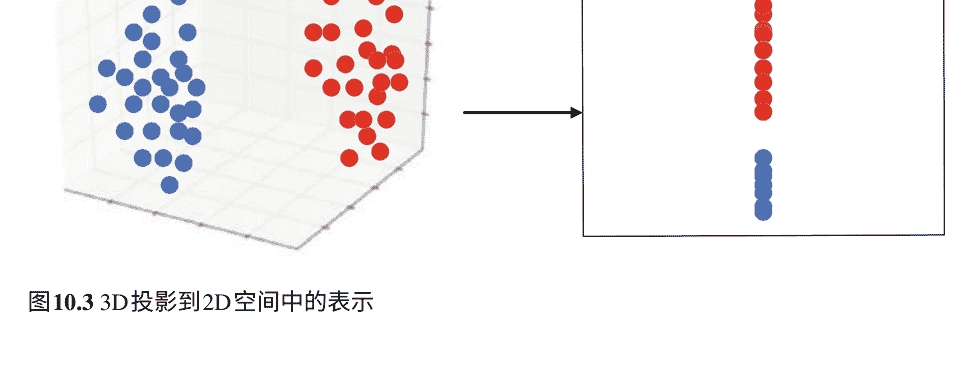

#### 10.1.3 图像自编码器

自编码器在降低图像的维度方面表现出色。例如，一个具有28 ×28像素的图像将导致784个特征或维度。从这个意义上说，减少这种维度可能是有用的，因为会有冗余的像素和信息。将图像传入自编码器，我们可以尝试通过一个更小的维度（一组隐藏层）来重建图像。这使得模型能够确定哪些像素是重要的，因为它的信息被编码在隐藏层中。然后，这些特征将用于将图像重构为原始输入图像的近似。实现这一点的一个示例自编码器架构如图10.4所示。

这将生成一个理解原始784个像素中哪些特征是重要的，哪些不重要的自编码器。例如，它理解上面的图像边缘像素并不重要。我们可以使用相同的逻辑来训练一个去除噪声的自编码器，因为自编码器将知道哪些像素是重要的。通过使用自编码器，我们可以将一个嘈杂的图像输入，如图10.5左侧所示，并使用描述的特征提取过程在右侧再现新图像。

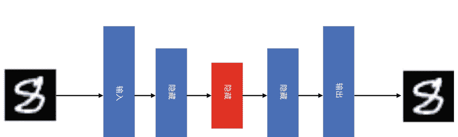

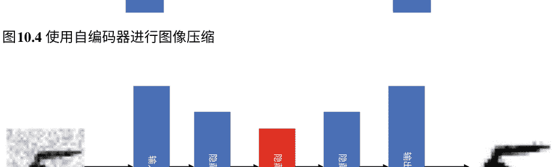

#### 10.1.4 堆叠自编码器

基于先前对自编码器（AE）的定义，使用堆叠自编码器（SAE）来学习数据点之间的关系，并产生一个显著较小的输入特征空间[3]。然后可以使用这个较小的输入空间来初始化MLP分类器的权重。正如我们之前看到的，AE是一个三层神经网络，应用反向传播来学习一个类似于输入数据的输出。如果存在数据中的任何结构，AE会学习它。通过逐层堆叠一系列AE，可以构建一个SAE，如图10.6所示。一旦通过原始AE训练了单个层，第二个AE可以使用第一个AE的隐藏层作为输入，如上图所示。通过重复这个过程，可以创建任意深度的SAE。第一个单层AE将输入映射到第一个隐藏向量。一旦训练了第一层AE，它的重构层被移除，隐藏层成为下一个AE的输入层。通过这种方式，AE被堆叠起来，实现贪婪逐层学习，其中隐藏层被用作下一个后续AE的输入。SAE产生的结果被用于预训练MLP的权重，而不是随机初始化权重为小值来分类不同的输出。贪婪逐层预训练帮助模型将参数初始化到一个良好的局部最小值附近，并将问题空间转化为更好的优化形式。

采用这种方法，预计在分类任务中实现更平滑的收敛和更高的整体性能。需要注意的关键是，随着AE的数量增加，输入的数量也会减少。如果你过快地这样做（大幅减少输入的数量），会产生较差的结果。关键是在几个AE上逐渐减少输入，直到达到所需的性能水平。

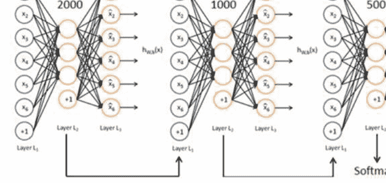

#### 10.1.5 生成对抗网络（GANs）

GAN是在2014年发明的，它使用两个相互竞争的网络来生成数据[4]。 GAN通常被描述为一个造假者对抗一个侦探。网络分为两部分，其中造假者是生成器，接收通常是高斯分布的随机噪声。造假者输出通常是图像。 鉴别器（侦探）接收来自真实数据集的真实图像和生成器生成的假图像的数据集。 它执行二进制分类来对真实和假图像进行分类。

如图10.7所示，该过程从噪声数据开始，将其作为输入馈送到生成器中。生成器的目标是创建欺骗鉴别器的图像。 因此，在训练的最初阶段，生成器会产生噪声。 此外，我们还从真实世界数据集中选择图像，并使用这两个输出出来训练鉴别器。 鉴别器将伪造的生成图像标记为零，将真实图像标记为一。

随着训练过程的进行，生成器改进了其生成的图像，以欺骗鉴别器。 这个过程会持续进行，直到生成器能够生成欺骗鉴别器的图像，如图10.8所示。在这个阶段，鉴别器无法区分真实和伪造的图像。

训练包括两个阶段。 阶段1：训练鉴别器，阶段2：训练生成器。 在第一阶段，真实图像标记为一与生成器生成的伪造图像标记为零相结合。 鉴别器通过反向传播来区分真实和伪造的图像，并仅在鉴别器权重上进行反向传播。 在第二阶段，生成器生成伪造图像，并且所有标签都设置为一。这导致生成器试图生成鉴别器认为是真实的图像。 因为我们只输入标记为一的伪造图像，所以在这一步中只对生成器权重进行反向传播。 生成器实际上从未看到真实图像。 它仅通过鉴别器反向传播的梯度生成令人信服的图像。 此外，鉴别器在训练阶段，生成的图像也需要变得更好以欺骗鉴别器。

GAN架构存在各种困难。首先，它们的训练成本非常高。由于GAN通常使用图像进行训练，因此需要具备足够内存的高端GPU。这尤其是一个问题，因为您同时训练了两个独立的网络。另一个挑战是模式崩溃，即生成器找到了几个图像或一个可以欺骗鉴别器的图像。这意味着生成器最终只会生成那个图像。理论上，最好有多种图像可以欺骗鉴别器。然而，无论输入噪声如何，GAN仍然可能只会崩溃为生成单一数量的人脸。有几种方法可以解决模式崩溃问题，例如使用深度卷积GAN（DCGAN）。此外，研究人员还尝试了小批量区分，对太相似的生成图像批次进行惩罚。

GAN面临的另一个挑战是不稳定性，因为很难确定性能和适当的训练时期，因为生成的图像总是真正的假的。由于GAN的设计，生成器和判别器之间不断发生冲突，导致两者之间的性能振荡。当使用更复杂的图像时，您需要尝试各种超参数，如层数、神经元数量、激活函数和学习率等。

##### 10.1.5.1 GAN网络架构

在最基本的GAN模型中，生成器和判别器都是全连接神经网络。GAN的架构如图10.9所示。GAN有两种不同的风格。第一种基于MLP架构，如上所示。第二种是用于生成更复杂图像的DCGAN。

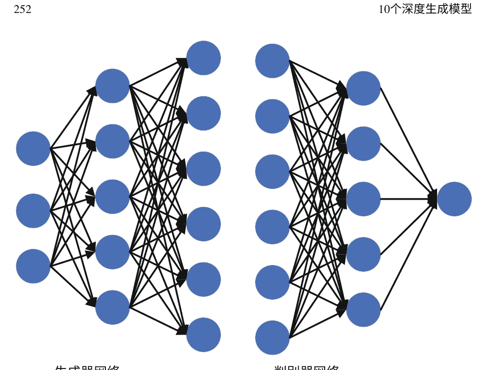

两种架构之间的关键区别在于后者包括一系列CNN层，如图10.10所示。从图10.10的架构来看，鉴别器只是一个CNN，如书中所讨论的。然而，生成器是一个反卷积神经网络DCNN。生成器将一个类向量转换为完整的图像，而CNN将图像转换为类向量。使用DCNN的生成器可以从头开始创建图像。这意味着这些新的网络架构可以生成任何类型的对象，如椅子、汽车、风景和人物。它还允许我们拍摄一个物体的照片，并从一个新的角度生成一个新的图像。它可以生成不存在的人的面孔，甚至改变面部表情、服装和身体姿势。

### 10.2 总结

本章首先讨论了自编码器及其在降维和去噪中的应用。接下来讨论了如何堆叠自编码器以提取更复杂的特征。引入了生成对抗网络，展示了如何人工生成图像。讨论了GANs的两种主要类型：第一种是全连接MLP，第二种是基于CNN的架构。

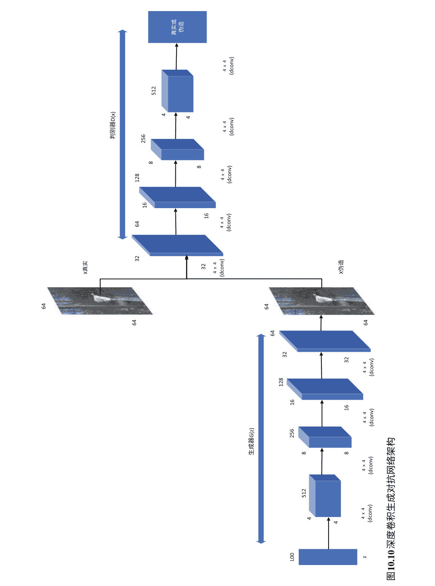

## 第11章 深度强化学习

在本章中，我们将介绍和讨论深度强化学习(DRL)的概念。这是机器学习领域中一个令人兴奋且快速发展的领域[1]。DRL主要用于从环境中采取的行动中学习。这就像人类通过经验学习一样。这个领域正在广泛发展，包括无人驾驶汽车，模拟和游戏等多个学科。

### 11.1 什么是强化学习？

强化学习（RL）是机器学习的一个分支，算法从它们的行为中学习，就像人类从经验中学习一样[2]。在这种机器学习范式中，使用代理的概念，代理根据它们采取的行动受到奖励和惩罚[3]。将代理移动到期望的目标结果的行动会受到奖励（强化），而不会移动到目标结果的行动会受到惩罚。

图11.1展示了一个简单的代理（例如可以是一只狗）与环境（狗主人）进行交互的示例，在环境中代理执行一个动作（例如狗接住并放下一根棍子）时会受到奖励（主人扔棍子）。

这个过程通过一系列的试错行动在允许DRL算法学习的环境中发生。学习实体（代理）不被告知要采取哪些行动，而是必须自己发现哪些行动产生最大的奖励并使其接近目标。这些行动不仅会影响即时奖励，还会影响未来的奖励，因为当前的行动将决定未来的情况（这在现实生活中发生）。“试错”和“延迟奖励”是强化学习的两个显著特征。

强化学习（RL）已经是一个研究课题已有几十年了。然而，它最近才与深度学习（DL）结合，并开始解决一些现实世界的问题。DRL中的“深度”部分指的是神经网络中的深层。DL是最好的之一处理非结构化环境的方法；它们可以从大量的数据中学习并发现独特的模式[4]。但这不是决策问题，而是一个识别问题。强化学习提供了决策组件。将这两种方法结合起来，可以利用两者来学习和推广数据，并在环境中通过几个经过仔细考虑的决策点顺序前进。图11.2显示了深度强化学习模型的示例架构。在这里，代理使用当前状态来预测将导致最高奖励并接近总体目标的动作。

DRL被用于解决各种问题，其中最著名的是DeepMind的AlphaGo，在2016年3月在首尔击败了当时的围棋大师李世石。然而，除了能够下围棋，DRL已经在其他游戏中达到了人类水平的能力，包括国际象棋和扑克，并且现在正在用于解决制造业、医疗保健和工程等其他现实世界的问题。鉴于需要不会造成现实世界损害的真实问题环境，进展缓慢。话虽如此，模拟技术已经帮助为DRL提供了可扩展和安全的试错环境。

### 11.2 强化学习的定义

强化学习使用代理、环境、状态、动作和奖励的概念进行介绍。

- * 一个 代理 接收动作。 例如，无人机可以被设计成接受指令来递送包裹，或者超级马里奥代理可以导航特定的视频游戏。 在这些情况下，算法是代理，在现实生活中，代理就是你。
- * 一个 动作 是一个代理可以执行的所有可能移动。 动作是不言自明的，但值得注意的是代理将从一个离散动作列表中进行选择。 在视频游戏中，列表可能包括奔跑、跳跃、蹲下和站立。 而在股票市场应用中，列表可能包括买入、卖出或持有。
- 折扣因子是代理发现的未来奖励与奖励对代理选择行动的影响之间的衰减因子。 这旨在使未来的奖励比即时奖励更不值钱。 这强制执行了代理的短期高。
- 代理与环境进行交互，环境是代理移动的世界，环境对代理做出响应。 环境以代理的当前状态和动作作为输入，并返回代理的奖励和下一个状态 。 如果你是代理，环境就像是处理你的行动并确定其后果的物理定律和社会规则。
- 状态是代理器所处的具体和即时的情况。
- 奖励是我们用来衡量代理器在每个状态下行动的成功或失败的反馈。
- 策略是代理器用来制定基于当前状态确定下一步行动的策略。 这使得代理器能够将状态映射到行动，并确定能够获得最高奖励的行动。
- 在特定策略下，当前状态的预期长期回报被描述为一个值。

## 参考文献

- 9. Y. Zhang, R. Jin, and Z.-H. Zhou, "理解词袋模型：一个统计框架," 《机器学习与网络安全国际期刊》, 第1卷, 第1–4期, 第43–52页, 2010年。
- 10. J. Ramos and others, "使用tf-idf确定文档查询中的词相关性," 在机器学习首届教学会议论文集, 2003年, 第242卷, 第1期, 第29–48页。
- 11. W. Medhat, A. Hassan, 和 H. Korashy, "情感分析算法和应用：一份调查," *Ain Shams Eng. J.*, vol. 5, no. 4, pp. 1093–1113, 2014.
- 12. H. Zhao, D. Phung, V. Huynh, Y. Jin, L. Du, 和 W. Buntine, "主题建模与深度神经网络相遇：一份调查," *arXiv Prepr. arXiv2103.00498*, 2021.
- 13. T. K. Landauer, P. W. Foltz, 和 D. Laham, "潜在语义分析简介," *Discourse Process.*, vol. 25, no. 2–3, pp. 259–284, 1998.
- 14. J. Boyd-Graber和P. Resnik, "跨语言的整体情感分析：多语言监督潜在狄利克雷分配"在2010年经验方法自然语言处理会议上, 2010年, 第45–55页.
- 15. M. E. Wall、A. Rechtsteiner和L. M. Rocha, "奇异值分解和主成分分析,"在微阵列数据分析的实用方法, Springer, 2003年, 第91–109页.
- 16. D. M. Blei、A. Y. Ng和M. I. Jordan, "潜在狄利克雷分配,"*J. Mach. Learn. Res.*, 第3卷, 第993–1022页, 2003年.
- 17. D. D. Lee和H. S. Seung, "通过非负矩阵分解学习物体的部分," *Nature*, 第401卷, 第6755期, 第788–791页, 1999年.
- 18. M. Kusner, Y. Sun, N. Kolkin, and K. Weinberger, "从词嵌入到文档距离"在机器学习国际会议上, 2015年, 第957–966页.
- 19. T. Mikolov, I. Sutskever, K. Chen, G. S. Corrado, and J. Dean, "词和短语的分布式表示及其组合性,"在神经信息处理进展中, 2013年, 第3111–3119页.
- 20. F. Sakketou and N. Ampazis, "一种用于学习GloVe嵌入和语义词典的约束优化算法,"基于知识的系统, 第195卷, 第105628页, 2020年.
- 21. J. Allen,自然语言理解. Benjamin-Cummings Publishing Co., Inc., 1988年.
- 22. E. Reiter 和 R. Dale, "构建应用自然语言生成系统,"*Nat. Lang. Eng.*, vol. 3, no. 1, pp. 57–87, 1997.
- 23. M. Adam, M. Wessel, 和 A. Benlian, "基于人工智能的客户服务聊天机器人及其对用户遵从性的影响,"*Electron. Mark.*, vol. 31, no. 2, pp. 427–445, 2021.
- 1. A. Oussidi和A. Elhassouny, “深度生成模型：调查”, 在2018年智能系统和计算机视觉国际会议(IJSCV)上, 2018年, 第1-8页。
- 2. A. Ng, “稀疏自编码器”, CS294A讲义, 第72期, 第1-19页, 2011年。
- 3. J. Gehring, Y. Miao, F. Metze, and A. Waibel, “使用堆叠自动编码器提取深度瓶颈特征,” 在2013年IEEE国际会议上的声学、语音和信号处理中, 2013年, 第3377–3381页。
- 4. I. Goodfellow等, “生成对抗网络,” Commun. ACM, 第63卷, 第11期, 第139–144页, 2020年.
- 1. A. Oussidi和A. Elhassouny, “深度生成模型：调查”, 在2018年智能系统和计算机视觉国际会议(IJSCV)上, 2018年, 第1-8页。
- 2. A. Ng, “稀疏自编码器”, CS294A讲义, 第72期, 第1-19页, 2011年。
- 3. J. Gehring, Y. Miao, F. Metze, and A. Waibel, “使用堆叠自动编码器提取深度瓶颈特征,” 在2013年IEEE国际会议上的声学、语音和信号处理中, 2013年, 第3377–3381页。
- 4. I. Goodfellow等, “生成对抗网络,” Commun. ACM, 第63卷, 第11期, 第139–144页, 2020年.

Q值或动作值与值函数类似，但它还需要一个额外的参数，即当前行动。Q将状态-行动对映射到奖励。影响这些状态的状态和行动序列被描述为一个轨迹。请注意，奖励是在每个状态下接收到的即时信号，而值是你可能从该状态预期的所有奖励的总和。

价值是长期期望，而奖励是即时的快乐。

环境是将当前状态下的行动转化为下一个状态和奖励的函数。相反，代理是将新状态和奖励转化为下一个行动的函数。强化学习代表着代理试图近似环境的函数，以便我们可以将行动发送到一个最大化环境输出奖励的黑盒环境中。代理和环境不断互动，以使代理通过行动试图影响环境，而环境则对代理的行动做出反应。环境对特定行动的反应由一个模型定义，该模型可能被代理知道或不知道，这区分了两种情况：

- 当代理知道模型时，我们将这种情况称为基于模型的强化学习。在这种情况下，当我们完全了解环境时，我们可以通过动态规划找到最优解。
- 当代理不知道模型时，它需要在不完整的信息下做出决策；（进行无模型强化学习）或者尝试显式地学习模型作为算法的一部分。

与其他形式的机器学习不同—如监督学习和无监督学习—强化学习只能按照状态-动作对的顺序进行思考，这些状态-动作对一个接一个地发生。环境由与问题相关的一组变量表示（取决于我们想要解决的问题类型）。这组变量及其可能的所有取值被称为状态空间。状态是状态空间的一个实例化。代理无法访问环境的实际完整状态，而只能观察代理可以观察到的部分状态。就像在现实生活中一样，当你在环境中移动时，你只能一次看到一个窗口的环境，而不是一次看到整个环境。

强化学习算法根据其产生的结果来判断行动。它以目标为导向，旨在学习一系列行动的序列，使代理能够实现其目标或最大化其目标函数。在这个意义上，强化学习与监督学习和无监督学习不同，它通过如何解释输入来进行学习。例如，在无监督学习中，算法学习相似性，而监督学习算法学习数据实例和标签之间的相关性。在强化学习中，基于短期和长期奖励的行动，例如你摄入的卡路里数量或你生存的时间长度，可以被看作是在稀疏反馈环境中的监督学习。用于实现这一点的强化学习循环如图11.3所示。

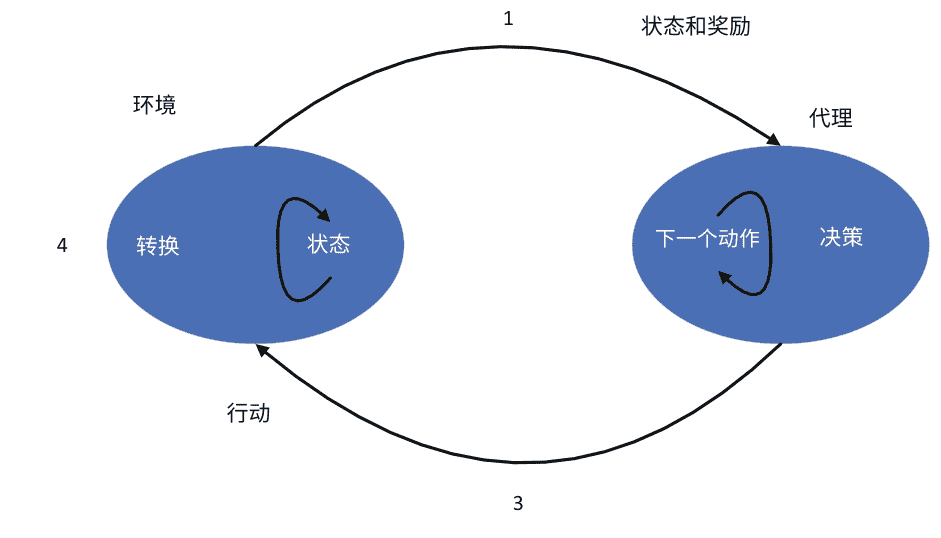

### 11.3 强化学习的领域选择

思考强化学习代理的一种方式是将其视为一个只依靠耳朵和白色手杖来导航世界的盲人。代理有小窗口可以感知其环境，而这些窗口可能不是他们感知周围环境最合适的方式。决定代理应该关注哪种类型的输入和反馈是一个难题。这被称为领域选择。通常，设计用于玩游戏的强化学习算法可以忽略这个问题，因为环境是人造的且有限的。领域选择需要人类决策，通常基于对要解决的问题的知识或理论。例如，在自动驾驶汽车的算法中选择输入领域可能包括选择除了摄像头和GPS数据之外还有雷达传感器。

## 11.4 状态-动作对和复杂概率奖励分布

强化学习的目标是为任何给定的状态选择最佳动作，这意味着动作必须进行排名，并相对于其他动作分配值。动作是依赖于状态的，因此我们需要评估状态-动作对的价值。例如，如果一个动作是结婚，那么在18岁时与一个35岁的人结婚与在90岁时与一个35岁的人结婚是不同的，这两种情况有不同的动机和不同的结果。另一个例子是，如果你的动作是喊叫“火灾”，那么在一个拥挤的剧院旁边执行动作应该与在一群持枪的男人旁边执行动作有所不同。我们无法在不了解上下文的情况下预测动作的结果。图11.4 显示了如何将上下文添加到强化学习解决方案中。

我们将状态-动作对映射到我们期望它们产生的值与Q函数。Q函数以代理的状态和动作作为输入，并将它们映射到可能的奖励。强化学习是通过运行代理程序来观察产生的奖励并根据这些奖励调整Q函数的预测的过程。这将持续进行，直到它准确地预测出代理应该采取的最佳路径。如上所述，预测被称为策略。

强化学习试图对与许多状态-动作对相关的奖励的复杂概率分布进行建模。这是为什么历史上强化学习通常与马尔可夫决策过程配对以推断其属性的一个原因。它与激发斯坦·乌拉姆发明蒙特卡洛方法的问题非常相似，蒙特卡洛方法试图推断给定纸牌游戏手牌成功的机会。

在另一个例子中，如图11.5所示，自动驾驶汽车可以被建模为在汽车行驶缓慢或快速时执行多个结果的情况。

马尔可夫决策过程用于近似概率分布奖励在状态-动作对上。然而，强化学习算法倾向于重复导致奖励的动作并停止测试其他选择。这导致已知奖励的利用和持续探索之间的紧张关系。

- 一辆自动驾驶汽车希望尽可能远且快速地行驶
- 三种状态：酷、温暖、过热
- 两种行动：慢、快
- 加速行驶会获得双倍奖励

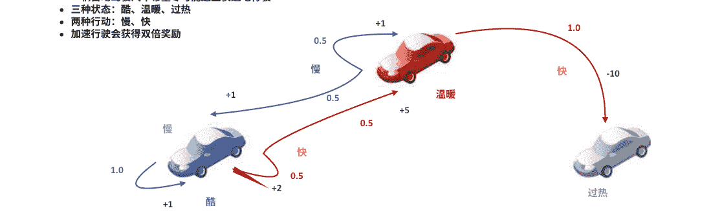

图11.5 使用强化学习的自动驾驶汽车驾驶

发现也导致胜利的新动作。RL算法可以在不同程度上同时利用和探索，以确保它们不会以已知胜者为代价而忽视有奖励的动作。

希望现在你能看到RL是一个迭代过程，算法不会一开始就知道哪些奖励状态-动作对会产生。它通过反复运行状态来学习关系，就像运动员或音乐家通过反复运行状态来改善表现一样。

算法可以快速汇总时间的教训。RL算法与人类对时间有不同的关系。算法可以反复运行相同的状态，采取不同的动作，直到它们可以推断出哪些动作在哪些状态下最好。这意味着RL算法有能力学习比人类更多、更好的东西。在围棋游戏上训练的算法，如AlphaGo，在100个生命周期内可能会玩更多的围棋比赛，而人类无法完成。

### 11.5 神经网络和强化学习

那么深度学习在强化学习框架中的作用是什么？人工神经网络是函数逼近器，当状态空间或动作空间过大无法完全知晓时，它们尤其有用。人工神经网络可以学习将状态映射到值，或将状态-动作对映射到Q值。与使用查找表来存储、索引和更新所有状态及其值相比，这在处理大问题时是一个重大挑战。我们可以通过从状态或动作空间中获取样本来训练人工神经网络，以学习如何相对于强化学习中的目标来预测其价值。换句话说，深度强化学习是将强化学习和深度学习结合起来，创建一个顺序强化学习过程，在其中深度学习确定每个阶段采取的动作。

与所有人工神经网络一样，它们使用系数来逼近将输入与输出相关联的函数。它们的学习过程包括找到正确的系数或权重，通过迭代调整这些权重，使产生的误差更小。强化学习不仅限于人工神经网络，卷积神经网络可以用于识别代理的状态，当输入是视觉时，例如马里奥所在的屏幕或者无人机前面的地形。然而，卷积神经网络在强化学习中对图像有不同的解释，与监督学习不同。在监督学习中，网络将标签应用于图像；也就是说，它将名称与像素匹配，如本书前面讨论过的那样。然而，在强化学习中，给定表示状态的图像，卷积神经网络可以对该状态下可能执行的行动进行排名；例如，它可能预测向右奔跑会得到5分，跳跃得到7分，向左奔跑得不到分数（图11.6）。在强化学习的开始阶段，人工神经网络的系数可以以随机方式初始化，或者如本书前面所述，以随机方式初始化。通过环境的反馈，神经网络可以利用其预期奖励与实际奖励之间的差异来调整其权重并改善对状态-行动对的解释。这种反馈循环类似于监督学习中的反向传播误差。然而，监督学习从试图预测的人工神经网络的真实标签开始。它的目标是创建一个将不同图像映射到它们各自名称的模型。强化学习依赖于环境对每个新动作返回的标量数值。环境返回的奖励可能是多样化的、延迟的或受未知变量影响的，从而引入噪音到反馈循环中。

这将引导我们对Q函数进行更完整的表达，它不仅考虑了动作产生的即时奖励，还考虑了可能在序列深处返回的延迟奖励。就像人类一样，Q函数是递归的。

### 11.6 深度强化学习过程

深度强化学习中有两种学习方法，即基于值的方法和基于策略的方法。

- 基于值的方法：像Deep-Q-Network (DQN)这样的算法使用CNN来帮助代理选择最佳动作。虽然算法很复杂，但通常遵循以下基本步骤。
  - 获取表示状态的图像，将其转换为灰度并裁剪掉不必要的部分。
  - 将图像通过一系列卷积和池化操作提取出有助于代理做出决策的关键特征。
  - 计算每个动作的Q值。
  - 执行反向传播以找到最准确的Q值。

- 基于策略的方法：在现实世界中，行动的数量可能非常高或未知。例如，在开放地形上学习行走的机器人可能在几分钟内有数百万个行动。在这些环境中，计算行动的Q值是不可行的。基于策略的方法直接学习策略函数，而不是为每个行动计算值函数。基于策略的算法的一个例子是策略梯度。该过程遵循以下基本步骤。
  - 接收一个状态并根据先前的经验获取每个行动的概率。
  - 选择最有可能的行动。
  - 重复直到游戏结束并评估总奖励
  - 根据奖励使用反向传播更新网络中的参数。

### 11.7 深度强化学习的实际应用

像OpenAI Gym、DeepMind Lab和Psychlab这样的工具包提供训练环境，以推动DRL的大规模创新和训练DRL代理。随着越来越多的组织将DRL应用于其独特的业务用例，实际应用将出现显著增长。

- 制造业：移动和操作产品的机器人利用DRL根据成功或失败的情况获取知识，然后用于将来更高效地执行任务。
- 汽车：DRL用于自动驾驶汽车，同时也在改变工厂、车辆维护和整体自动化的行业中发挥作用。利用来自客户、经销商和保修的数据，DRL提供了改善质量、节省资金和提高安全性的新途径。
- 金融：DRL被用于评估交易和改进策略，以增加投资回报。
- 医疗保健：DRL在医疗保健领域的应用范围从最佳治疗方案和诊断到临床试验、新药研发和自动治疗。
- 机器人：对话式用户界面现在由DRL提供动力，使机器人能够在许多领域中学习语言的细微差别和语义，实现自动化的语音和自然语言处理。

对于DRL的兴趣非常大，因为它通过与环境的互动来学习，所以可能的应用没有限制。

### 11.8 总结

在本章中，我们介绍了强化学习的概念，它是一套通过行动学习的算法，类似于人类通过经验学习的方式。本章讨论了在映射大型行动状态对时，强化学习的局限性以及如何通过深度学习来克服这些局限性。与其使用索引表来存储、索引和更新所有状态及其值，深度学习被用来建模和确定每个阶段需要采取的行动。本章最后给出了一些使用DRL的示例。

## 参考文献

1. K. Arulkumaran, M. P. Deisenroth, M. Brundage, and A. A. Bharath, “深度强化学习：简要调查,”*IEEE信号处理杂志*, vol. 34, no. 6, pp. 26–38, 2017.
2. R. S. Sutton 和 A. G. Barto, 强化学习导论. MIT出版社, 2018年.
3. L. P. Kaelbling, M. L. Littman, 和 A. W. Moore, “强化学习综述,”*J. 人工智能研究*, 第4卷, 第237–285页, 1996年.
4. P. Henderson, R. Islam, P. Bachman, J. Pineau, D. Precup, 和 D. Meger, “重要的深度强化学习,”*在AAAI人工智能会议论文集*, 2018年, 第32卷, 第1期.

# 第12章 加速机器学习

### 12.1 引言

加速机器学习是人工智能领域的一种令人兴奋的新范式，旨在提高训练机器学习模型的效率。这是通过为用户提供在GPU或大规模CPU集群上执行端到端数据科学流程的能力来实现的。尽管这在DL应用中是一种广泛的做法，但传统机器学习模型（如SVM和RF）的训练历来局限于CPU计算。基于单个CPU的架构在所有类型的计算机硬件（Intel/AMD）中都有，由于制造过程和散热问题的限制，它们的性能开始停滞不前。近年来，CPU的性能改进有限，这与早期几十年每年CPU性能翻倍的情况形成鲜明对比（摩尔定律）[1]。为了应对其中一些限制CPU供应商已经转向开发和制造支持多线程任务的多核CPU。这些处理器能够实现快速性能，并每秒执行十亿次浮点运算（GFLOPS）。

传统上，应用程序被设计成按顺序运行，因此大大减慢了运行过程的执行速度。虽然多线程和多核CPU可以解决其中一些限制，使应用程序的序列可以并行运行和调度在CPU上，但对执行时间的影响有限。直到最近，高性能并行计算（也称为HPC）主要集中在每个计算节点中添加额外的CPU，并通过InfiniBand连接将多个节点连接起来，以便可以规模化地运行大规模并行处理任务。HPC开发人员多年来一直在设计和实现可以在大规模HPC基础设施上运行的并行程序。在数据处理和人工智能领域，存在一些计算需求非常高的应用程序，这引起了对大规模并行计算架构的广泛关注。

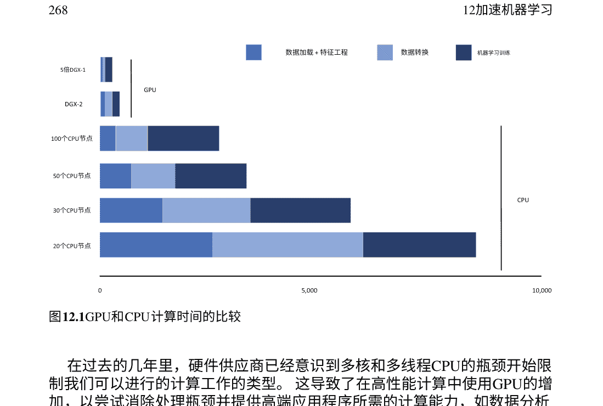

在过去的几年里，硬件供应商已经意识到多核和多线程CPU的瓶颈开始限制我们可以进行的计算工作的类型。这导致了在高性能计算中使用GPU的增加，以尝试消除处理瓶颈并提供高端应用程序所需的计算能力，如数据分析和人工智能。GPU专为高吞吐量并行处理而设计，对于并行代码执行，其速度可以比CPU快10倍以上。

因此，已经开发了新的框架和库（在本章后面讨论），以利用GPU的底层架构，并成为许多数据处理流水线的关键组成部分。

随着数据量的不断增加，传统的机器学习流程引入了从训练到推理的显著瓶颈和延迟。随着GPU加速机器学习的引入，可以处理更多规模的数据，从而更快地提供结果。

传统上，机器学习实践在提取、转换和加载过程（ETL）中的缓慢阶段导致了长时间的浪费。这导致数据科学团队的低效利用，同时延迟了从数据科学流程中提取智能并交付新产品和服务的时间。

然而，通过利用GPU及其相关框架和库，我们现在可以将GPU用于通用数据分析和机器学习任务。这种方法通过GPU加速数据处理提供了更加高效的工作流程，从而使组织具备竞争优势。如图12.1所示，使用GPU运行整个数据处理流程所需的时间明显更快。这还有一个额外的好处，即减少了基础设施占用。例如，一个包含8个Tesla V100 GPU，总共256GB GPU内存的单个3U DGX1的成本低于130,000美元。相比之下，对于本地服务器或云服务提供商来说，占地面积会更昂贵。

从数据中心管理的角度来看，这意味着通常需要管理较少的节点（固件/软件补丁），并且更容易进行规模化而不是扩展。在本章中，我们将向您介绍加速机器学习中使用的概念和技术，从基于CPU的硬件解决方案开始，最后介绍较新的GPU产品。

#### 12.1.1 基于CPU/GPU的集群

如前所述，CPU在体系结构上由少数核心和大量缓存内存组成，可以同时处理几个软件线程。相比之下，GPU由数百个核心组成，可以同时处理数千个线程。根据数据中心动态，自1950年代以来，CPU一直是计算机系统的主要大脑。CPU完全专注于执行线性数据流。相反，GPU最初是为了增强计算机的图形性能，用于游戏或工程设计应用。现在，由于其执行多维处理的能力，GPU被用于机器学习和人工智能。虽然64个核心对于CPU来说已经很多了，但与GPU的核心数量相比，这个数字微不足道。虽然GPU核心更简单，针对更特定的应用，但通用GPU（GPGPU）变得更加灵活。像OpenCL这样的编程平台已经将GPGPU纳入编程主流，它们是AI/机器学习应用崛起的最初工具。

加速计算可以通过多种方式实现。大数据框架是为了利用基础设施配置而设计的，以利用特定的硬件类型。例如，大多数组织的HPC数据中心都有大量的CPU可用性，这导致了像Spark这样的框架的实现。相反，一些组织的硬件混合包含了CPU和GPU。因此，可以利用GPU硬件和并行化提供的优势来加速数据分析的框架，如Apache Arrow和RAPIDS。

### 12.2 CPU加速计算

在撰写本文时，英特尔仍然是数据中心中的主导者，拥有其Xeon系列产品。为了支持大数据分析任务，数据中心由许多个体计算节点组成，可以连接在一起形成一个集群。这个集群的综合计算能力能够及时处理大数据分析任务。像Spark这样的框架可以利用大型计算集群来执行复杂的ETL流水线，并进行机器学习等数据建模任务。在本节中，我们将研究基于CPU的HPC以及一些最流行的加速计算框架。

#### 12.2.1 分布式加速计算框架

加速计算框架与现有的数据存储和处理技术（如SQL Server）相比，有着显著的不同。它们被设计成能够独立处理数据，无论其格式是结构化、半结构化还是非结构化。数据处理方面的处理方式也不同。处理任务被分布在多个节点上，如图12.2所示。

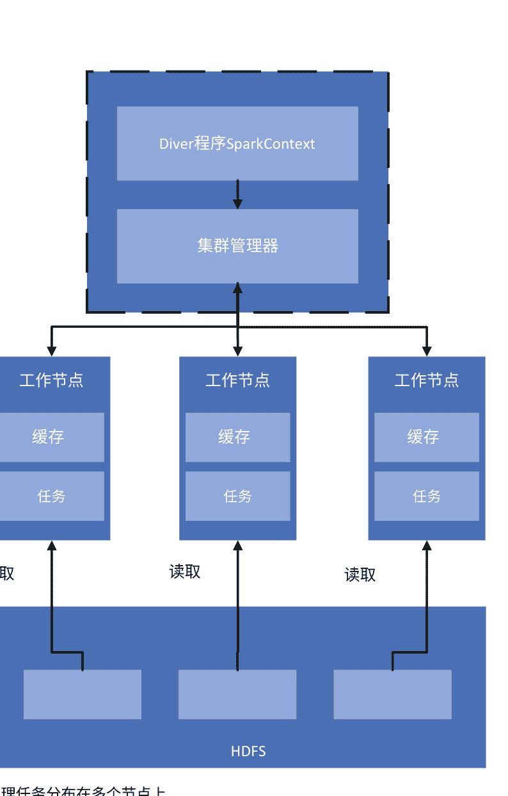

分布式数据和分析需要一个全面的端到端架构。实施加速计算解决方案需要适当的基础设施来支持数据的可扩展性、分布性和管理性，无论是从硬件还是框架的角度来看。解决方案必须包含一个能够支持不断变化和多样化的数据和分析需求的数据管理和分析架构。它必须不仅能够支持传统的数据分析，还能够支持新的高级分析技术。在实施这些解决方案时，需要解决两个基本问题。首先，我们需要管理多少数据，现在和将来，以及如何实时或准实时地管理数据。

##### 12.2.1.1 本地 vs 分布式

本地系统受限于单个节点内的随机存取存储器（RAM）和硬盘驱动器（HDD）空间的数量。分布式系统由多个计算节点组成。主节点用于协调集群内的作业。数据和计算分布在节点（工作节点）之间，如图12.3所示。

分布式系统使我们能够快速扩展计算能力。这对于计算密集型任务非常有益。计算和数据可以分布在多个节点上。集群拥有的工作节点越多，意味着可以包含更多的CPU用于计算工作流。图12.4展示了CPU在多个节点上的可扩展分布。

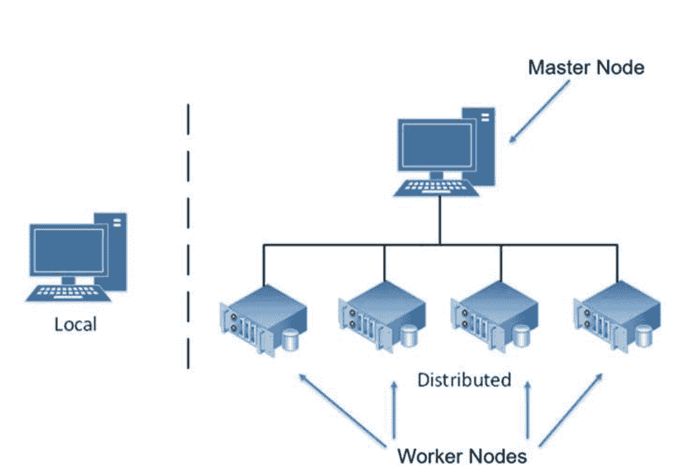

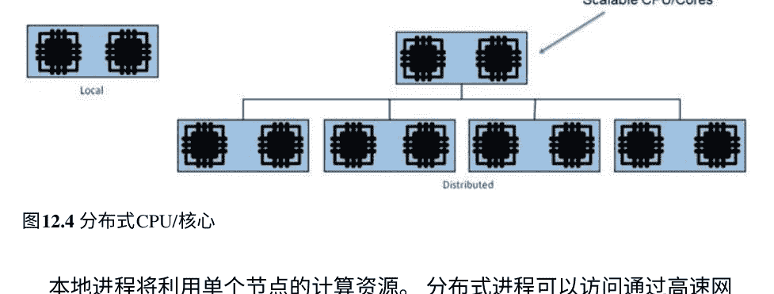

本地进程将利用单个节点的计算资源。分布式进程可以访问通过高速网络（光纤）连接的多个节点的计算资源。这与扩展（更强大的机器）的方式根本不同。相反，分布式计算是关于扩展（更多的机器）。一旦达到限制，使用低功率计算节点扩展基础设施比尝试扩展到具有高规格的单个节点更容易（图12.5）。分布式计算集群还具有易于扩展的优势。一旦达到集群的计算限制，您可以简单地添加更多节点，如图12.5所示。

##### 12.2.1.2 扩展的好处

使用单个节点，你只能将其升级到某个特定点，例如RAM，CPU。分布式计算还引入了容错性。如果一个节点失败，剩余的节点可以继续工作。在处理大型数据集时，具有容错性非常重要。在集群中分发数据时，这一点非常重要。通过扩展，资源升级变得容易实施和管理。

##### 12.2.1.3 Hadoop

大多数集群都有一个集群管理器（主节点）来启动执行器并监视工作节点的进度。每个工作节点被分配一部分计算任务来执行，并将结果返回给集群管理器。该过程如图12.6所示。

有各种各样的加速计算框架，专注于加速数据分析流程。在分布式计算的早期阶段，最常见的框架是Hadoop。

Hadoop框架允许我们将大文件分布在多个节点上。Hadoop使用Hadoop分布式文件系统（HDFS），在许多大数据应用程序中常用[2]。HDFS使我们能够在分布式系统中处理大型数据集，同时通过复制数据块来实现容错性。Hadoop使用MapReduce，允许我们对数据进行计算。

## 扩展

主节点控制数据和计算在工作节点之间的分配过程。HDFS使用默认块大小为128 MB。在这种情况下，每个块被复制三次（但可以根据工作节点的数量进行扩展）。当块在节点之间分布时，始终保持容错性，而较小的块增加了处理过程中的并行性，如图12.7所示。

MapReduce允许我们将复杂的计算任务分割并映射到一组分布式文件，如 HDFS。为了实现这一点，集群使用作业跟踪器和多个任务跟踪器（每个工作节点一个）。作业跟踪器发送代码（指令）发送到每个任务跟踪器，然后执行。任务跟踪器分配所需的CPU和RAM资源，并监视进度，如图12.8所示。

使用MapReduce，而不是将数据发送到应用程序或逻辑所在的位置，逻辑在数据已经存在的服务器上执行，以加快处理速度。数据访问和存储是基于磁盘的。输入通常存储为文件，包含结构化、半结构化或非结构化数据，输出也存储在文件中。MapReduce曾经是从HDFS中检索存储的数据的唯一方法，但现在不再是这样。今天，还有其他基于查询的系统，如Hive和Pig，用于使用类似SQL的语句从HDFS中检索数据。然而，这些通常与使用MapReduce模型编写的作业一起运行。这是因为MapReduce具有独特的优势。该过程如图12.9所示。

从历史上看，对大规模数据集的计算操作速度较慢。这是由于CPU架构和内存的限制。处理和完成操作所需的时间称为延迟，如图12.10所示。在涉及大数据的大多数计算中，延迟主要是由于数据的读取和写入。存储延迟根据底层技术而异，如图12.11所示。

大数据分析提供了一种在最大化速度的同时降低成本的存储和计算方法。这是通过存储局部性实现的。缓存允许我们将慢速和快速存储结合起来以减少延迟。当CPU需要访问特定的内存地址时，首先检查缓存。如果内存位置在缓存中，内容可以快速检索和处理。这被称为缓存命中。如果内存地址不在缓存中，则称为缓存未命中。处理缓存未命中会增加延迟，因为必须清除一部分缓存，以便从RAM中复制数据，如图12.12所示。如果大多数访问都是缓存命中（高缓存命中率），则缓存是有效的。有两种主要的局部性类型。

- 时间局部性：在短时间内多次访问相同的地址
- 空间局部性：在短时间内多次访问接近的地址

内存被分成块。移动一个内存块比逐个字节移动更快。靠近的内存位置倾向于位于同一个块中。这导致更多的缓存命中。访问局部性是软件利用缓存的能力。内存被划分为称为页面的部分。如果软件可以使用相同的页面或相邻的页面，则称为具有良好的访问局部性。硬件专门设计用于支持具有良好访问局部性的软件，如图12.13所示。

##### 12.2.1.4 Apache Spark

Apache Spark改善了我们执行与大数据相关的分布和计算任务的方式[3]。Spark是业界和研究人员用来管理和处理大数据的最新技术之一，完全开源（这也是其受欢迎的主要原因之一）。Spark的五个主要组件如图12.14所示。

- 弹性分布式数据集（RDD）
- 管理基本的I/O
- 任务调度

Spark于2013年首次发布，是一个统一的计算引擎，具有一组用于计算机集群上的并行数据处理的库。Spark比MapReduce更灵活，克服了各种限制。Spark可以处理数据存储在各种不同格式中，包括Amazon S3，HDFS，结构化数据和扁平文件。

使用MapReduce（分布计算），文件必须存储在HDFS中。Spark没有这个要求。Spark可以执行高达100倍于MapReduce的操作，这是大数据范式中的一个重要优势，其中速度是一个关键因素。由于成本原因，Spark是以内存为导向的，这可能是一个限制因素。MapReduce在每个map和reduce函数之后将大部分数据写入HDD，这意味着它是面向磁盘的。Spark在每个转换之后将所有数据保留在内存中，但如果RAM变满，它可以使用HDD。

Spark使用弹性分布式数据集（RDD）的概念。RDD具有多个优点，包括分布式数据集合、容错性、并行操作、分区数据以及使用多个数据源的能力。图12.15显示了Spark上下文及其执行周期。

- 转换操作：它们是惰性评估的。结果在应用需要返回结果给驱动程序的操作之前不会计算。这种设计使得Spark能够更高效地运行。转换操作在RDD上执行，生成另一个RDD（从现有数据集创建新数据集）。
- 动作操作：它们是触发计算并返回值给主节点的操作。

图12.16展示了转换操作和动作操作。当使用Spark开发代码时，可以看到这种哲学。当调用一个方法时，直到调用动作（例如show()）之后才能看到结果。这一点很重要，因为我们不希望每次进行更改时都重新计算转换。在Spark中，核心数据结构是不可变的（不能更改）。只能通过应用转换来更改数据结构。Spark的语言API允许使用各种编程语言运行Spark：

- Scala: Spark主要使用Scala编写（默认语言）
- Java: 可以使用Java编写和执行代码
- Python: 在Spark中使用PySpark普遍支持
- SQL: Spark支持SQL标准的子集。对于数据库管理员来说特别有用
- R: Spark有两个R库，一个是Spark核心的一部分（SparkR），另一个是社区驱动的包（sparklyr）

图12.17显示了Spark执行过程。自Spark 2.0发布以来，该框架已向DataFrame的使用方式转变。尽管使用了DataFrame语法，但文件的分布方式仍然是相同的（RDDs）。使用Spark DataFrames是使用Spark的先决条件。

```
python
In [7]: df.head()

output
Out[7]:
|    | country     | continent   |   year |   lifeExp |      pop |   gdpPercap |
|---:|:------------|:------------|-------:|----------:|---------:|------------:|
|  0 | Afghanistan | Asia        |   1952 |    28.801 |  8425333 |     779.445 |
|  1 | Afghanistan | Asia        |   1957 |    30.332 |  9240934 |     820.853 |
|  2 | Afghanistan | Asia        |   1962 |    31.997 | 10267083 |     853.101 |
|  3 | Afghanistan | Asia        |   1967 |    34.020 | 11537966 |     836.197 |
|  4 | Afghanistan | Asia        |   1972 |    36.088 | 13079460 |     739.981 |
```

机器学习库（MLib）。正如你在本书前面所记得的，DataFrame是一个以命名列组织的数据集。它们在概念上等同于关系数据库中的表格或Excel电子表格。Spark DataFrames以列和行的格式保存数据。每列代表一个特定的特征。每行代表一个单独的数据点（观测）。

Spark DataFrames可以从各种来源输入和输出数据。DataFrames可以对数据进行不同的转换。Spark DataFrame在图12.18中显示。

## 12.3 DASK简介

在单个笔记本电脑或计算机上处理几GB的数据是不切实际的，通常超出了硬件的计算限制。可以使用DASK [4]来解决这个问题。DASK是Python中用于并行计算的灵活库，可以与其他开源项目（如NumPy、Pandas、scikit-learn和RAPIDS）集成。DASK数组相当于NumPy数组，Dask DataFrames相当于Pandas DataFrames。图12.19展示了如何在DASK中使用Pandas DataFrame。DASK-ML是scikit-learn库的等效物。具有这些功能使得将DASK集成到现有工作流程中对组织来说更加容易采用。

使用DASK的优势在于可以将计算扩展到计算机上的多个核心。这使您能够更快地处理大型数据集。它还有助于加快通常需要很长时间的计算。DASK框架附带了专为个人机器和集群使用而设计的调度程序。在加载大型数据集时，DASK会读取数据的样本以推断数据类型。当给定列具有不同的数据类型时，这将导致问题。为了避免类型错误，最好事先声明数据类型。

```
python
data_types = {'column1': str, 'column2': float}
df = dd.read_csv("data.csv", dtype=data_types, blocksize=64000000)
```

DASK可以通过使用块大小参数将巨大的文件切分成块来加载。如图12.20所示。

DASK专为并行计算而设计，允许我们在多个核心和节点上运行计算。DASK提供了一个适用于单个节点的机器调度程序，并提供了一个可以扩展到多个节点的分布式调度程序。使用dask.distributed需要一个客户端，如图12.21所示。dask.distributed包提供了低延迟、数据本地性、工作器之间的数据共享，易于设置。

即使在单个节点上，使用dask.distributed也很有用，因为它通过仪表板提供诊断功能和信息。如果不声明Client，将默认使用单节点调度器。它通过使用进程或线程在单个节点上提供并行性。图12.22显示了具有八个工作节点的Client和相关的Cluster配置。

### 12.3.1 DASK数组

DASK Array、DASK DataFrame和DASK Bag生成任务图，其中图中的每个节点都是一个普通的Python函数。节点之间的边是普通的Python对象，由一个任务作为输出创建，并在另一个任务中用作输入。图12.23显示了NumPy数组和DASK数组之间的关系的示例。

DASK使用集合（包括数组）、任务图和调度器的示例如图12.24所示。

DASK还支持bags。DASK bags经常用于并行化对非结构化或半结构化数据（如文本数据、日志文件、JSON记录和用户定义的Python对象）的简单计算。理想情况下，你不应该将数据加载到Python中，然后再将数据加载到DASK bag中。而是使用DASK Bag来加载数据。

### 12.3.2 Scikit Learn和DASK集成（DASK ML）

DASK提供dask-ml函数，允许使用并行化进行机器学习训练和预测。dask-ml的目标是提供可扩展的机器学习。当你在scikit-learn中声明n_jobs=-1时，可以并行运行计算。DASK利用这个能力使你能够在集群中分布计算。这是通过joblib实现的，joblib是一个允许在Python中进行并行处理和流水线处理的包。使用DASK ML，你可以实现scikit-learn模型以及其他库，如XGBoost。

DASK比Spark更小更轻。这意味着它具有较少的功能，并且通常与其他库一起使用，特别是那些在数值Python生态系统中的库。Spark是用Scala编写的，对Python和R提供了一些支持。DASK是用Python编写的，只支持Python。它与C/C++/Fortran/LLVM以及通过Python链接的其他本地编译代码很好地互操作。Spark MLlib支持易于实现的常见操作。考虑MLlib的人也可能想考虑其他基于JVM的机器学习库，如H2O，可能具有更好的性能。另一方面，DASK依赖于并与现有库（如Scikit-Learn和XGBoost）互操作。

#### 12.3.3 Scikit Learn Joblib

DASK就像Spark，但它明显是Python。这意味着DASK使用现有的Python API和数据结构。使用DASK的好处是可以轻松切换NumPy、Pandas、Scikit-learn及其DASK等效库之间。与Map Reduce类似，DASK将问题映射到一组分布式节点上进行计算和整理结果，如图12.25所示。

许多Scikit-Learn算法都是使用Joblib进行并行执行编写的。Joblib本身提供基于线程和进程的并行性。DASK可以通过提供另一种Joblib后端将Joblib后端算法扩展到机器集群。要使用DASK后端来使用Joblib，您必须创建一个客户端并使用`joblib.parallel_backend('dask')`在客户端中包装您的代码。例如，您可能希望分发一个随机交叉验证参数搜索，如图12.26所示。

```
python
import numpy as np
from dask.distributed import Client
import joblib
from sklearn.datasets import load_digits
from sklearn.model_selection import RandomizedSearchCV
from sklearn.svm import SVC

client = Client(processes=False)  # create local cluster
digits = load_digits()
param_space = {
    'C': np.logspace(-6, 6, 13),
    'gamma': np.logspace(-8, 8, 17),
    'tol': np.logspace(-4, -1, 4),
    'class_weight': [None, 'balanced'],
}
model = SVC(kernel='rbf')
search = RandomizedSearchCV(model, param_space, cv=3, n_iter=50, verbose=10)
with joblib.parallel_backend('dask'):
    search.fit(digits.data, digits.target)
```

请注意，DASK joblib后端对于扩展CPU密集型工作负载非常有用；具有大量单独操作但可以并行执行的数据集的工作负载。

### 12.4 GPU计算

#### 12.4.1 GPU硬件介绍

图12.27显示了GPU的高级概述。如您所见，架构被组织成一组线程化的流多处理器（SMs）。两个或多个SM组成一个构建块，这在不同的GPU型号和架构之间通常会有所不同。每个SM都有几个流处理器（SPs），它们共享逻辑和指令缓存。GPU具有几GB的图形双数据速率（GDDR）和同步DRAM（SDRAM）内存，也被称为全局内存。GPU与CPU之间的主要通信链路是通过PCI-Express进行的，根据代际的不同，速度在4 GB/s（第2代）和8–16 GB/s（第3代）之间。然而，我们可以通过GPU之间的直接连接（称为NVLINK）实现更快的吞吐量，每个通道可达40 GB/s。近年来，GPU的内置GPU内存迅速扩展，这进一步减少了处理时间，因为应用程序可以将更多的数据保留在GPU本地。有时候，GPU可能需要访问全局内存（系统内存），其中的数据不适合GPU内存，或者访问仅为CPU使用编译的库。随着新的芯片组的引入，GPU与CPU之间的带宽预计会随着总线带宽的提高而增加。与CPU支持2–4个线程相比，一个典型的应用程序可以同时运行5000到12000个线程。

GPU最初是为了电脑游戏而开发的。然而，现在它们的使用范围涵盖了更广泛的领域，部分原因是它们在机器学习中的应用，包括金融、仿真、工程和医学。

### 12.4.2 NVIDIA加速计算简介

工业领导者、大型企业和研究人员正在利用GPU上的加速机器学习流程创建新的创新产品，并获得前所未有的洞察力。这种方法使机器学习从业者能够利用先进的框架和硬件。这种组合提供了解决当今最具挑战性的科学和商业问题的能力。

这使得开发人员和数据科学家可以使用流行的编程语言如C、C++和Python来开发、优化和部署应用程序。

图12.28 多核CPU与众核GPU

图12.29 使用GPU加速应用程序的三种主要方法

在撰写本文时，英伟达是全球实施端到端技术部署大规模人工智能应用的领导者之一。自1970年以来，游戏行业一直严重依赖于GPU技术的进步。但它们也占据了现代数据中心中相当大的计算比例。过去几年来，对计算的需求超过了CPU的供应，这在人工智能应用中尤为明显。随着摩尔定律无法满足计算需求，GPU和加速计算的崛起现在支持我们的计算需求。

过去5年中，对额外计算周期的需求增加了300,000倍。在2010年至2020年间，摩尔定律每年只给我们带来了大约1.1×的增长，导致了当前人工智能应用需求的显著缺口。从重量级来看，CPU设计用于复杂的控制逻辑，并且针对顺序程序进行了优化。另一方面，GPU是轻量级的，设计简单的控制逻辑，并且针对数据并行任务进行了优化，重点关注并行程序的吞吐量。图12.28显示了CPU和GPU之间的区别。

有三种方法可以加速应用程序使用GPU的，如图12.29所示。应用程序可以使用这三种方法之一来获得和利用GPU硬件。通常由库编写可以执行常见的计算任务的库。库易于使用应尽可能使用。它们经过优化并提供卓越的性能。库提供：

- 易于使用：使用库可以在不深入了解GPU编程的情况下实现GPU加速
- 插入式：许多GPU加速库遵循标准API，因此可以通过最小的代码更改实现加速
- 质量：库提供了在广泛应用中遇到的函数的高质量实现

| 编程语言 | GPU编程工具 |
| --- | --- |
| 数值分析 | MATLAB, Mathematica, LabVIEW |
| Python | PyCUDA, Numba |
| Fortran | CUDA Fortran, OpenACC |
| C | CUDA C, OpenACC |
| C++ | CUDA C++, Thrust |
| C# | Hybridizer |

图12.30 GPU编程语言

编译器指令允许开发人员对其顺序应用进行注释，使编译器进行并行化，并适用于C、C++和FORTRAN。第三种方法是利用专门设计用于有效利用GPU的编程语言。尽管这种方法提供了最高的性能和灵活性，但它需要开发人员付出大量的努力。

有几个常见的库，其中一些你可能已经熟悉，比如cuDNN，它被TensorFlow和Keras用于深度学习。这些库针对各种计算应用。可以使用几种不同的GPU编程语言来利用GPU计算，如图12.30所示。CUDA C和CUDA C++是CUDA平台的基础语言，但它们不是开发CUDA应用的唯一语言。PyCUDA和

#### 12.4.3 CUDA

计算统一设备体系结构（CUDA）是一种利用GPU进行通用计算的并行计算平台[5]。CUDA于2006年由NVIDIA开发，用于辅助图像生成的开发。然而，如今它在机器学习和深度学习中具有更广泛的应用，特别是在并行计算需求方面。并行计算使我们能够同时执行计算和相关操作。GPU是可以进行大规模并行计算的设备示例。尽管最初设计用于电脑游戏，但它们在加速计算、机器学习和深度学习中得到了广泛应用，通常被称为GPGPU。尽管CUDA开发是用C编程语言进行的，但其功能已通过驱动程序和API框架进行了抽象，如前面所讨论的。

CUDA内核是CUDA开发中最重要的概念之一。从根本上说，内核是一个可以由任意数量的不同CUDA线程并行执行的函数。在执行函数时，调用内核函数时指定线程的数量。注意，CPU和GPU是一起使用的，其中设备代码在GPU上执行，主机代码在CPU上执行。

2007年，NVIDIA正式发布了CUDA，他们改变了GPU以便支持并行编程。这意味着在芯片上进行了软件和硬件的改变。从G80开始，CUDA程序不再通过图形界面执行。相反，硅芯片上的一个新的通用并行编程接口为CUDA程序提供服务。通用编程接口扩展了可以轻松为GPU开发的应用程序的类型。此外，软件框架进行了重新设计，使开发人员可以使用熟悉的编程工具。

#### 12.4.4 CUDA加速计算库

PyCUDA允许你从Python中访问Nvidia的CUDA并行计算API。基于Python的GPU代码可以达到更高的性能水平，并利用GPU硬件的潜力，但开发者的工作量要少得多。这种减少工作量的方式有很多，例如，数据类型和资源由语言本身管理，而不是由开发者管理。此外，闭包和其他高级构造也是可用的。PyCUDA通过Python使整个CUDA运行时框架的功能都可用，

图12.31 PyCUDA的流程和交互

包括纹理、固定主机内存、OpenGL交互和零拷贝主机内存映射。这是通过使用面向对象的方式实现的。诸如纹理、代码模块和计算设备等实体通过面向对象的术语反映到Python中，提供了比低级C接口更好的抽象。

PyCUDA的流程和交互如图12.31所示，Numba使用行业标准的低级虚拟机（LLVM）编译器库[6]，在运行时将Python函数转换为优化的机器代码。Numba主要是Python的即时编译器，它在调用时将你的代码转换为在本地机器上运行的机器代码。Numba允许你加速繁重的计算和计算密集型的Python函数，如循环。Numba支持其他库，如NumPy，以加快计算时间。Numba的一个主要优点是你不需要改变或修改你的底层代码。这可以通过在现有函数周围添加一个装饰器来实现。未来版本还计划添加一个包装类。Numba的工作流程如图12.32所示。

在第一步中，将优化Python函数并转换为Numba的中间表示。推理后，类似于Numpy的类型推断，将其转换为LLVM可解释的代码，然后传递给LLVM的即时编译器以生成机器代码。机器代码可以在运行时或导入时在CPU（默认）或GPU上生成。使用Numba，您可以使用@jit包装器在CUDA/GPU上运行函数，通过从Numba导入CUDA。使用Numba在GPU上编写代码并执行它仍然需要您声明和管理网格、块和线程的层次结构。

```python
@jit
def do_math(a, b):
    ...
>>> do_math(x, y)
```

### 12.5 RAPIDS

RAPIDS是一套开源软件库和API，它们被分组在一起，为机器学习分区器提供了完全在GPU上执行端到端数据科学和分析流水线的能力[7]。与之前讨论的许多库一样，RAPIDS利用NVIDIA CUDA原语进行低级计算优化，并通过Python接口和Jupyter Notebooks暴露GPU并行性和高带宽内存速度。

该套件还专注于数据科学中常见的数据准备任务，包括与各种机器学习算法集成的类似Pandas的DataFrame API，以限制相关的序列化成本。此外，RAPIDS还支持多节点、多GPU部署，可以大大加速处理和训练更大的数据集。图12.33显示了RAPIDS框架的相关组件以及其集API库（cuDF、cuML和cuGraph）。您可以将RAPIDS视为一个数据科学框架，它利用与本书中描述的其他DL框架（如Keras和TensorFlow）相同的计算能力。

RAPIDS加速了现有的Scikit-Learn包，以实现快速建模和包含更大的数据集，这在最近使用传统的CPU计算框架时受到计算限制。迄今为止，已经针对GPU加速计算优化了各种算法，如图12.34所示。

### 易于使用

- cuDF- 类似于pandas的DataFrame操作库
- cuML- 一系列机器学习库，提供了GPU版本的scikit-learn中的算法
- cuGraph- 类似于NetworkX的图形API

图12.33 RAPIDS中使用的组件

图12.34 GPU加速算法

cuDF、cuML和cuGraph模仿着众所周知的库，并且是RAPIDS的基础，如图12.35所示。虽然Pandas、Numpy和scikit-learn包都是高效、直观且广受信任的，但它们并不是为大规模运行而设计的-这个限制通过RAPIDS提供的API得到了解决。为了方便并行化，RAPIDS使用了Dask。Dask可以在同一系统或多节点集群中分布数据和计算，以利用多个GPU。Dask与RAPIDS cuDF、XGBoost和RAPIDS cuML集成，用于GPU加速的数据分析和机器学习。RAPIDS框架直接位于顶层

图12.35 RAPIDS框架

CUDA框架，因此暴露了底层GPU的强大功能。Apache Arrow定义了一种语言无关的列式内存格式，用于在现代硬件（如CPU和GPU）上进行高效的分析操作。Arrow内存格式还支持零拷贝读取，无需序列化开销即可实现快速数据访问。

图12.35显示了自上而下的抽象层，从Python开始通过Cython链接到cuML算法，从而提供了对高级编程语言的访问，避免了对C的需求，简化了机器学习开发。

#### 12.5.1 cuDF分析

大多数包括Pandas在内的软件只能在CPU上运行，由于可用核心数量有限，处理大型数据框可能会有问题。大型数据集可能包含数百万、数十亿甚至数万亿个需要及时处理的数据点。在深度学习技术中，由于GPU加速的成功，许多技术公司已经创建了各种不同的框架来克服这个限制。cuDF是一个基于Python的数据框架库，可以在大规模上执行各种预处理任务，如加载、连接、聚合和过滤数据。

通过使用cuDF，我们可以获得更广泛的图形核心，从而显著加快数据处理任务的速度。cuDF的API与Pandas相似，并且在大多数情况下可以直接替代。因此，它使得数据科学家、分析师和工程师能够轻松地将其集成到现有的工作流中。该框架允许您将现有的Pandas DataFrames转换为cuDF DataFrames，从而立即访问GPU。

cuDF支持大多数与Pandas相同的常见DataFrame操作，这意味着可以轻松加速代码。cuDF提供了类似于pandas的API，对于数据工程师和数据科学家来说是熟悉的，因此他们可以在不涉及CUDA编程细节的情况下轻松加速工作流程。

#### 12.5.2 cuML机器学习

cuML是一套快速的、GPU加速的机器学习算法，专为数据科学和分析任务设计。它的API类似于scikit-learn的API。这意味着你可以使用相同的代码来训练scikit-learn的模型来训练cuML的模型。cuML大大减少了传统机器学习模型训练所需的时间。虽然在许多情况下，您不需要安装cuDF来使用cuML，但cuDF是cuML的一个很好的补充，因为它是一个GPU DataFrame。scikit-learn是一个很棒的库，提供了各种机器学习模型，您可以使用它来训练您的算法。但是，如果您的数据很大，训练模型可能需要很长时间，特别是当您尝试使用不同的超参数来寻找最佳匹配时。

#### 12.5.3 cuGraph图分析

虽然数据工程、统计分析和机器学习是最为人知的领域之一，但在许多情况下，分析的重点是数据元素之间的关系。在这些情况下，数据最好表示为一个图。图分析，也称为网络分析，是一组用于回答针对图数据提出的问题的算法。图分析并不是新鲜事物。图分析的应用涵盖了广泛的领域，包括市场营销、生物学、物理学、计算机科学、社会学和网络安全等。RAPIDS包括了cuGraph的首个正式发布。

RAPIDS cuGraph是一个图算法库，可以无缝集成到RAPIDS数据科学生态系统中，并允许数据科学家轻松调用存储在GPU DataFrame中的图算法。cuGraph的设计目标之一是为数据科学家提供熟悉的API，用于执行图分析。因此，有NetworkX经验的数据科学家将会认识到创建图对象并对该图对象运行分析的过程。

#### 12.5.4 Apache Arrow

Apache Arrow是一个开源的、列式的、内存中的数据表示，可以使分析系统和数据源实时交换和处理数据，简化和加速数据访问，而无需将所有数据复制到一个位置[8]。在过去的几年中，将所有数据物理上整合到一个系统中变得越来越困难，如图12.36所示。Apache Arrow是一个开源项目，由十几个开源社区发起，提供了一个标准的列式内存数据表示和处理框架。Arrow已成为处理内存数据用于分析目的的流行方式。在撰写本文时，Arrow已嵌入到广泛的开源（和商业）技术中，包括GPU数据库、机器学习库和工具、执行引擎和可视化框架。

Arrow是一种列式内存表示，这意味着数据在内存中以列为单位表示，而不是以行为基础的方法，这是大多数系统使用的方法。您可以使用各种不同的语言，如Java、C++和Python，来访问Arrow。

使用Arrow，数据类型是共享的，这意味着您不需要在不同的数据表示之间进行转换。此外，Apache Arrow可以在不序列化甚至复制数据的情况下共享数据，从而提供了对所有这些技术的改进性能和效率。Apache Arrow项目使用通用数据层创建了一个协作和广泛采用的生态系统。

大多数大数据框架使用随机策略将分区分给节点。如果每个计算作业使用一个分区，这种策略会在集群中实现良好的计算负载分配。然而，如果作业需要多个分区，很有可能需要从其他节点获取分区。数据传输总是会带来性能损失。

Apache Arrow消除了序列化的需要，因为数据在每个平台和编程语言中都由相同的字节表示。这种通用格式使得在大数据系统中实现零拷贝数据传输，以最小化数据传输的性能损失。通常，数据传输包括：

- 将数据序列化为一种格式
- 通过网络连接发送序列化的数据
- 在接收端对数据进行反序列化

这里的一个重要优势是，数据可以原样从一个环境传输到另一个环境，无需任何翻译，因为数据在连接的两端都可以被理解为原样。此外，在一个大型数据集中，行数通常可以从数千行到数万亿行不等。这样的数据集可能有数千列。对于这样的数据集，典型的分析查询只涉及几列。例如，想象一个电子商务交易数据集。

你可以想象一下，销售经理想要了解特定地区按项目类别分组的销售总览。他不想看到每个单独的销售记录。平均销售价格就足够了。这样的查询可以分为三个步骤：

- 遍历地区列中的所有值，跟踪请求地区销售的所有行/对象ID
- 根据项目类别列中的相应值对筛选后的ID进行分组
- 为每个分组计算聚合值

实际上，查询处理器在任何给定时间只需要在内存中保存一列数据。通过以列格式存储集合，我们可以单独访问每个字段/列的所有值。在设计良好的格式中，这是以优化单指令多数据（SIMD）指令在CPU上的布局方式完成的。对于这样的分析工作负载，Apache Arrow列式布局比FlatBuffers行式布局更适合。其主要优点包括：

- Arrow为分析应用提供了零拷贝数据传输功能
- Arrow支持内存中的列式数据处理
- Arrow是一个跨平台、跨语言的可互操作数据交换工具
- Arrow是大数据系统的支柱

### 12.6 总结

在本章中，我们介绍了以CPU和GPU为中心的加速机器学习介绍了支持扩展和分布式加速框架的CPU

这些包括Hadoop和Apache Spark。与基于GPU的计算相对应在本节中，我们讨论了CUDA和最近发布的

利用CUDA API的RAPIDS框架。介绍了RAPIDS本身本章以对Apache Arrow及其基于列式数据存储的使用进行了讨论，为大数据系统提供了内存中的数据表示。

## 参考文献

1. R. R. Schaller, “摩尔定律：过去、现在和未来”*IEEE Spectr.*, vol. 34, no. 6, pp. 52–59, 1997.
2. T. White,*Hadoop*：权威指南.“ O'Reilly Media, Inc.” 2012.
3. M. Zaharia等, “Apache Spark：大数据处理的统一引擎”*Commun. ACM*, vol. 59, no. 11, pp. 56–65, 2016.
4. M. Rocklin, “Dask：带有阻塞算法和任务调度的并行计算” in *Proceedings of the 14th python in science conference*, 2015, vol. 130, p. 136.
5. J. Sanders 和 E. Kandrot,*CUDA示例：通用GPU编程入门*. Addison-Wesley Professional, 2010.
6. S. K. Lam, A. Pitrou, 和 S. Seibert, “Numba：基于LLVM的Python即时编译器,” in第二届LLVM编译器基础设施在HPC中的研讨会, 2015, pp. 1–6.
7. J. Zedlewski, “使用\$\${RAPIDS}\$\$在GPU上进行端到端数据科学 ” 2020.
8. G. Lentner, “使用Apache Arrow™进行共享内存高吞吐量计算,” in机器崛起中的高级研究计算实践与经验, 2019, pp. 1–2.

## 第13章 部署和托管机器学习模型

这是本书中最重要的章节之一，因为越来越多的机器学习模型从研究实验室转向实际应用。当然，在你完成实验之后，你需要考虑一个比你的笔记本电脑更适合生产的环境。在广泛的工业支持和投资下，通过各种不同的框架，这变得更加容易。像谷歌、Facebook和微软这样的科技巨头提供免费的综合框架。与工业自动化一致，许多企业正在寻求使用算法来解决复杂和重复的问题，同时简化现有流程[1]。这导致了机器学习算法的广泛应用，这些算法已经整合到我们生活的许多不同方面中。这在许多服务中都很明显，例如社交媒体、家庭娱乐、在线购物甚至我们的医疗保健。我们今天看到的先进机器学习算法相对较新，因此我们部署这些算法的方式还没有完全成熟。直到最近，这只有大型科技巨头才能做到，但正如你在本章中所看到的，现在任何人都可以部署和利用他们开发的机器学习算法来解决他们目前面临的许多挑战。图13.1显示了开发（训练）和模型部署（推理）之间的重叠。

到目前为止，在本书中，我们已经专注于图13.2中概述的训练过程。本节将是我们已经学到的内容的逻辑扩展，以利用机器学习的力量来支持业务决策和新的洞察力生成。

需要注意的一点是，成功的部署策略很可能需要许多不同的机器学习算法和技术来解决复杂的问题。图13.3展示了一个案例研究的示例，其中使用了各种不同的机器学习模型来解决子问题，以共同解决一个更大的问题。例如，在这里我们可以看到市场营销已经通过聊天机器人（NLP）、客户个人化（聚类）、欺诈（异常检测）、图像识别用于自动损坏评估（CNNs）和索赔预测（回归）得到支持。请注意，没有单一的机器学习算法能够## 图13.1 开发和模型部署之间的重叠
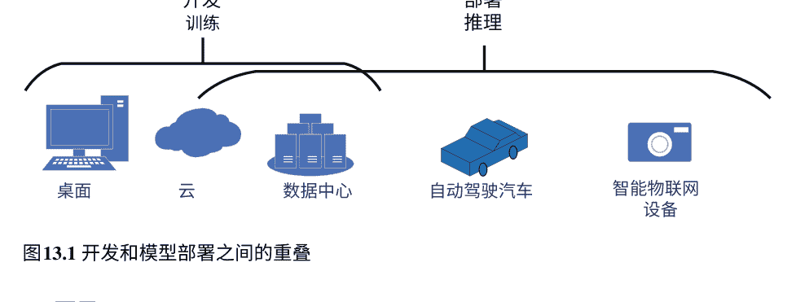

## 图13.2 机器学习和业务决策
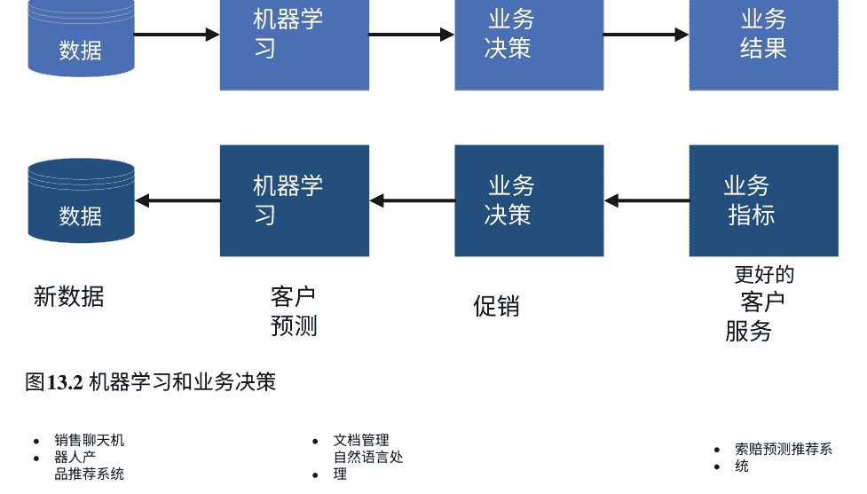

## 图13.3 使用不同的机器学习算法的工作流程
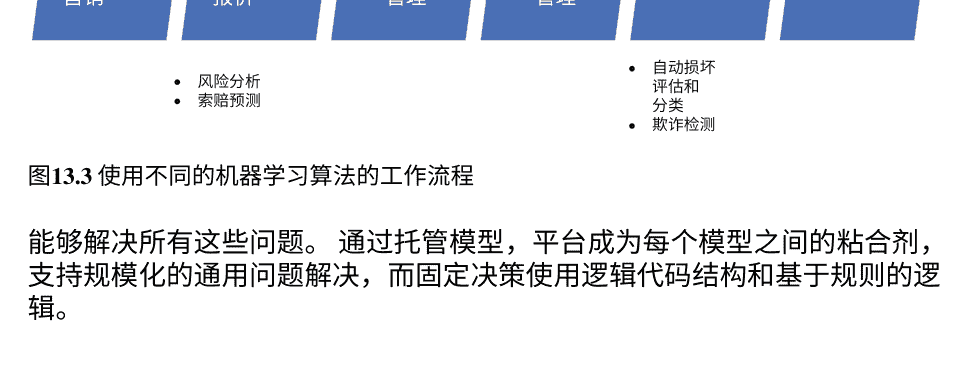

- 销售聊天机器人
- 产品推荐系统
- 文档管理
- 自然语言处理
- 索赔预测推荐系统

- 风险分析
- 索赔预测
- 自动损坏评估和分类
- 欺诈检测

能够解决所有这些问题。通过托管模型，平台成为每个模型之间的粘合剂，支持规模化的通用问题解决，而固定决策使用逻辑代码结构和基于规则的逻辑。

本章的其余部分将帮助您为机器学习应用程序制定托管和部署策略。

### 13.1 部署介绍
现在我们已经完全训练了我们的模型，目标是使它们对更广泛的受众可访问。就像训练模型一样，有几种方式可以托管它。例如，您可以将模型部署和托管在专用服务器上，或者将其部署到边缘设备，如智能手机、家用电器、汽车和建筑物。一旦部署，可以使用容器或服务通过接口（REST API、GRPC 等）访问模型。

部署机器学习算法时需要考虑的一个重要因素是如何评估和改进性能。在传统软件开发中，这是通过根据用户反馈进行版本升级来完成的。在机器学习中，这是通过不断向部署的机器学习算法提供数据进行持续学习来实现的。这不断提高了准确性和机器学习算法解决新问题的能力，这是与传统软件开发相比的一个关键优势。图13.4展示了这个端到端的概念。
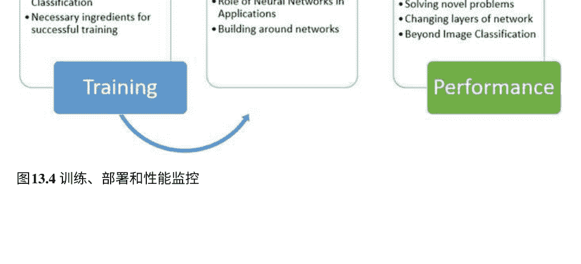

在部署机器学习模型时，一个关键挑战是从用户那里抽象出技术细节，并提供通用接口，使用户和企业系统能够访问和集成核心机器学习功能到业务流程和用户界面（UI）中。

#### 13.1.1 为什么模型部署很重要
我们目前生活在一个大规模信息时代，在这个时代，传输的数据洪流已经变得对人类来说无法处理和理解。我们产生数据的频率以及不断发展的技术进步，旨在将信息从一个地方转移到另一个地方，导致了增加的计算和软件需求。算法已经部署在这些数据高速公路上，可以快速自动生成能够分析更大更复杂数据并在大规模上提供更快更准确结果的模型。这使得我们能够生成时间敏感的预测。例如，Netflix的推荐引擎，Uber的到达时间估计和LinkedIn的连接建议。

尽管这些都属于广域网（WAN）的内部结构，但模型部署在这些基础设施的边缘变得越来越重要。

训练好的模型主要托管在三种不同的环境中。这些环境包括：a）通常用于高吞吐量和高计算需求的云数据中心，b）本地数据中心基础设施，以及c）用于低延迟应用的边缘设备。当从概念验证（POC）转向生产时，思维方式发生了明显的变化。机器学习模型不再是产品；流水线才是。

- **数据中心和云基础设施**：一些大型云服务提供商提供机器学习计算作为服务，并支持常见的机器学习和深度学习框架，如TensorFlow和CNTK。这些通常由专用硬件组成，例如大量的NVidia DGX A100，用户可以以更好的方式聚合GPU，以更好地支持AI应用的数据需求。
- **本地托管**：根据组织的需求和预算的不同，可以具有多样性。通常，硬件和相关框架被提供以支持本地业务流程。这些服务器通常在组织的本地网络和基础设施中托管其模型和支持服务。出于数据隐私和服务敏感性的原因，可能有理由这样做。
- **边缘推理**：有些场景需要在数据生成的地方进行计算和数据存储，以实现更好的数据控制、降低成本、更快的洞察和持续运营的行动。在边缘计算的极端情况下，更多地集中在简单的数据处理任务，如读取和处理传感器数据。在边缘计算和高端数据中心之间存在一系列的能力。

#### 13.1.2 启用MLOps
MLOps与DevOps [2]密切相关。它是一种结合了哲学和实践的组合，旨在使数据科学和IT团队能够快速开发、部署、维护和扩展机器学习模型和流水线。MLOps涉及以下阶段：

- **打包模型**：为了在指定的运行环境中准备模型执行环境。这包括应用集成的准备，评估可扩展性要求和硬件考虑因素。
- **验证模型**：通过测量候选模型的关键绩效指标（KPI）来验证模型。进行部署和应用集成测试。
- **模型部署**：识别、定位和部署模型到生产环境。在部署过程中，实施服务以支持可扩展性和自动化。
- **监控模型**：跟踪模型性能以验证所需的KPI。这可以包括测量准确性和响应时间。记录这些信息基于实验结果进行模型训练（或重新训练）。

完整的MLOps工作流程如图13.5所示，支持自动化持续集成（CI）、持续交付（CD）和持续训练（CT）的机器学习系统。通常，机器学习研究人员和从业者组成团队进行模型训练。然而，将模型暴露和集成到工作流程中是MLOps团队的责任。整个过程如图13.6所示。

#### 13.1.3 MLOps框架
在MLOps中，有各种不同的框架来支持将模型部署到生产环境中。其中许多都是基于常见技术（如Docker和Kubernetes）的。除了企业解决方案外，还有开源的MLOps选项。一些框架专注于机器学习中的某一步骤。
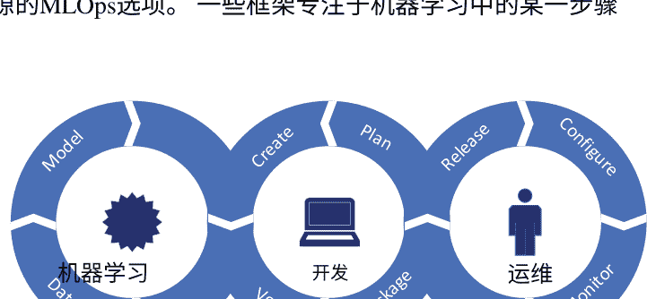
图13.5 MLOps工作流程
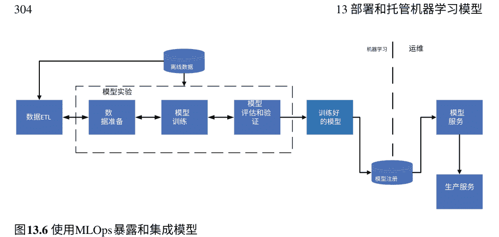

有些框架专注于学习模型部署工作流程的某一步骤，而其他框架可以管理整个过程（包括训练和推理）。你可能会遇到的一些常见的MLOps框架有：

- **MLflow**：允许数据专业人员轻松自动化复杂的模型跟踪。通过MLflow，可以使用跟踪服务器轻松选择最佳模型。参数、属性和性能指标可以记录到该服务器，并用于即时搜索符合特定标准的模型。MLflow迅速成为自动化实现、集成和开发机器学习模型的行业领导者。MLflow支持多种机器学习框架和技术，包括 Azure ML、Fastai、H20、Keras、PyTorch 和 TensorFlow 等等。虽然 MLflow 是一个强大的用于整理记录模型的工具，但它并不能回答哪些模型应该被开发的问题。
- **Pachyderm**：简化了管道、数据集和模型管理的过程。它将端到端管道与 Kubernetes 上的数据血统相结合。该平台可在企业规模上为任何机器学习项目提供基础。该过程从数据版本控制和数据管道开始，提供数据血统，并部署机器学习模型。
- **Kubeflow**：是一个在 Kubernetes 上管理工作流部署的机器学习平台。它具有可扩展性和可移植性，并且适用于在不同环境中进行测试、开发和生产级服务的部署。Kubeflow 最初是由 Google 开发的用于运行 TensorFlow 的开源平台。它最初设计用于通过 Kubernetes 运行 TensorFlow 作业，但后来扩展为一个多云、多架构的框架，可以运行整个机器学习管道。使用 Kubeflow，数据科学家无需学习新的平台或概念来部署他们的应用程序或处理网络证书等问题。
- **DataRobot**：是一种人工智能自动化工具，允许数据科学家自动化部署、维护或构建规模化的人工智能的端到端过程。这个框架由开源算法驱动，可在云端和本地使用。

这些框架中的许多都是基于Docker、Kubernetes和模型服务器（如TensorFlow Serving）构建的，这些将在本章后面介绍。了解这些单独的框架将使您能够转向其他开源或企业MLOps框架。

### 13.1.4 MLOps应用程序编程接口API
MLOps将生成训练模型的数据科学家与将模型作为生产服务提供的工程师分开。模型作为一个工件交给MLOps团队，他们负责在API基础设施上部署模型。部署模型的工程师需要在生产环境中提供所需的功能，以实现低延迟的服务。如果做得不正确，可能会导致训练和服务之间的差异。训练和服务之间的差异称为训练和服务期间性能的差异，可能由以下原因引起：

- 在训练和服务流程中处理数据的差异
- 在训练和服务之间的数据变化
- 模型和算法之间的反馈循环

当模型部署到目标环境以提供预测时，可以使用以下方法之一实现：

- 使用REST API的微服务来提供在线预测
- 将嵌入式模型部署到边缘设备或移动设备
- 作为批处理预测系统的一部分

某些类型的框架适用于特定的处理任务，因此选择正确的API类型以避免生产流程中的任何瓶颈非常重要。大多数软件开发人员知道API设计有两种主要模型，包括gRPC和REST。

- **gRPC**：是由Google开发的远程过程调用平台，提供高性能、低延迟和高吞吐量。gRPC通道提供与指定端口上的gRPC服务器的连接。客户端调用存根上的方法，就像它是一个本地对象一样；服务器会收到客户端的gRPC请求，如图13.7所示。gRPC使用协议缓冲区（PB）在客户端和服务器之间交换消息。使用gRPC有多个好处，包括：
  - gRPC使用二进制有效载荷，创建和解析效率高，因此轻量级。
  - gRPC支持双向流式传输，而REST API不支持。
  - gRPC相比REST API的消息传输速度快10倍，因为gRPC使用序列化的PB和HTTP/2。
  - 客户端和服务器之间松散耦合，易于进行更改。
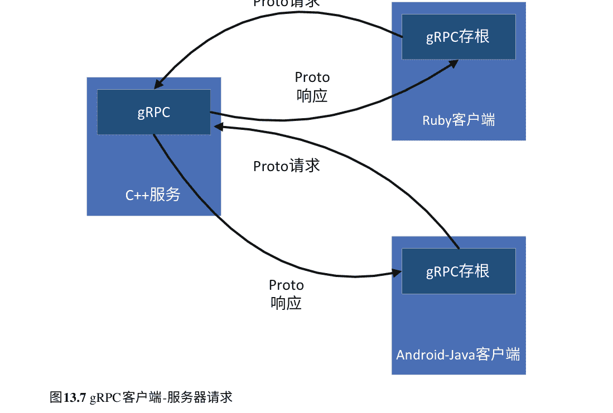
图13.7 gRPC客户端-服务器请求
- gRPC允许集成使用不同语言编写的API。
- REST使用JSON在客户端和服务器之间交换消息，而gRPC使用PB进行更好的压缩，从而使gRPC在网络上传输数据更高效。

- **REST**：基本上是客户端和服务器之间的请求/响应类型关系。有些东西被请求，有些东西被执行，然后返回一些东西。这种交流是一种对话——因此，REST架构通常围绕为给定的用例提供高度模块化的微解决方案的思想进行设计。

流式API与REST原则完全相反。在最基本的状态下，流式API颠倒了REST的对话性质，其中请求被发出并得到响应，而流式服务器则在更新准备好时向客户端发送信息。虽然客户端理论上可以请求更新，但流式服务器应该在可用时预先更新。差异如图13.8所示。
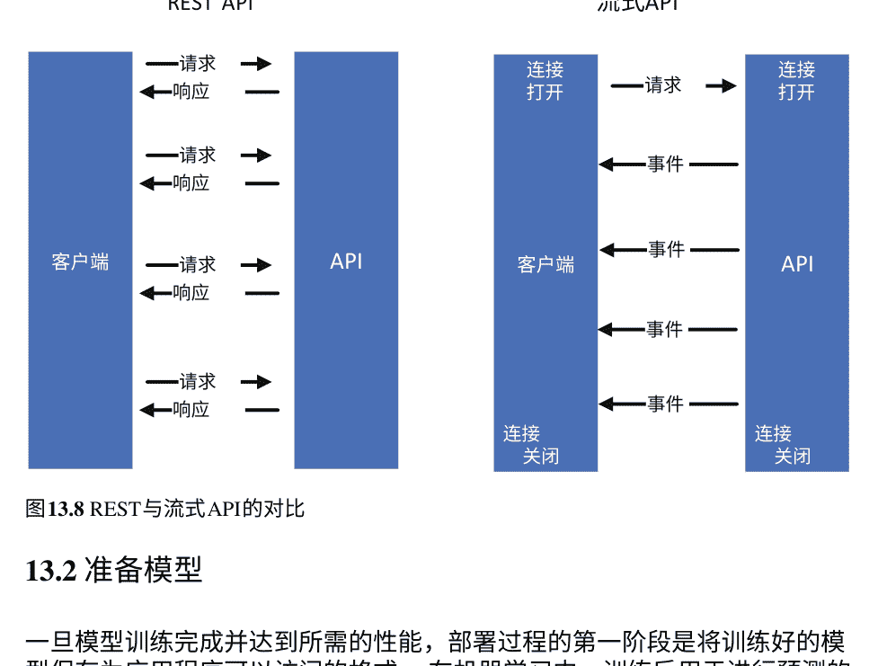
图13.8 REST与流式API的对比

### 13.2 准备模型
一旦模型训练完成并达到所需的性能，部署过程的第一阶段是将训练好的模型保存为应用程序可以访问的格式。在机器学习中，训练后用于进行预测的产物称为模型。以深度学习为例，训练好的模型是一个包含DNN中层和学习权重的文件。模型通常以可压缩的文件格式保存。在这种情况下，模型文件采用二进制文件格式。不同的模型格式通常由进行训练的框架决定。一些常见的文件格式及其关联的框架如表13.1所示。通过将模型托管在适当的服务框架中，如TensorFlow Serving，可以使用模型对新数据进行预测（可能包含多个版本的模型用于测试和版本控制）。还有一些专为移动设备和边缘设备设计的模型格式，这些设备无法访问企业模型服务器。例如，`.mlmodel` 文件格式用于存储嵌入在iOS应用程序中的模型，而TensorFlow使用`.tflite` 模型格式来嵌入Android和边缘设备上的模型。大多数模型可以使用TensorFlow转换器等工具转换为在不同框架上运行的模型。

**表13.1 常见文件格式及相关框架**

| 文件格式 | 文件扩展名 | 文件类型 | 模式 | 量化 | 压缩 | 框架 |
|----------|------------|----------|------|------|------|------|
| Protobuf | .pb | 二进制 | 是 | 是 | Varint / Gzip | TensorFlow |
| Pickled Python | .pkl | 二进制 | 否 | 否 | Gzip | Scikit-Learn |
| Mleap | .zip | 二进制 | 否 | 否 | 压缩 | PySpark |
| 苹果机器学习模型 | .mlmodel | 二进制 | 否 | 是 | 是 | iOS核心ML |
| H5 | .h5 | 二进制 | 否 | 是 | 是 | Keras |
| ONNX | .onnx | 二进制 | 否 | 是 | 是 | PyTorch |
| PMML | .pmml | XML | 是 | 否 | 否 | Scikit-Learn |
| Torch Script | .pt | 二进制 | 是 | 是 | 是 | PyTorch |

#### 13.2.1 模型格式
在本节中，我们将介绍不同的模型格式及其相关的框架。

##### 13.2.1.1 ProtoBuf (pb)
谷歌的Protobuf `.pb` 文件由TensorFlow Serving提供，可以通过REST和gRPC调用访问。在TensorFlow中，protobuf 文件包含了模型的图定义和权重。因此，一个 `.pb` 文件就足以运行给定的训练模型。一旦加载了图，它就可以用于推理和其他任务。图13.9显示了来自 `.pb` 文件的典型图形。PB类似于Apache Thrift（Facebook使用）、Ion（由Amazon创建）或Microsoft Bond协议，它们都提供了一个RPC协议栈。

##### 13.2.1.2 ONNX (.onnx)
ONNX是一个使用独立文件格式的框架。ONNX在微软、Facebook和亚马逊框架中使用。ONNX的理念是在AI工具之间提供更大的互操作性。目前，开发者通常被限制在一个框架中，因此ONNX是实现这些工具通过共享模型空间更好地协同工作的第一步。ONNX提供了访问他们自己的模型库，其中包含了一系列预训练的计算机视觉、语言分析、语音和音频处理模型。
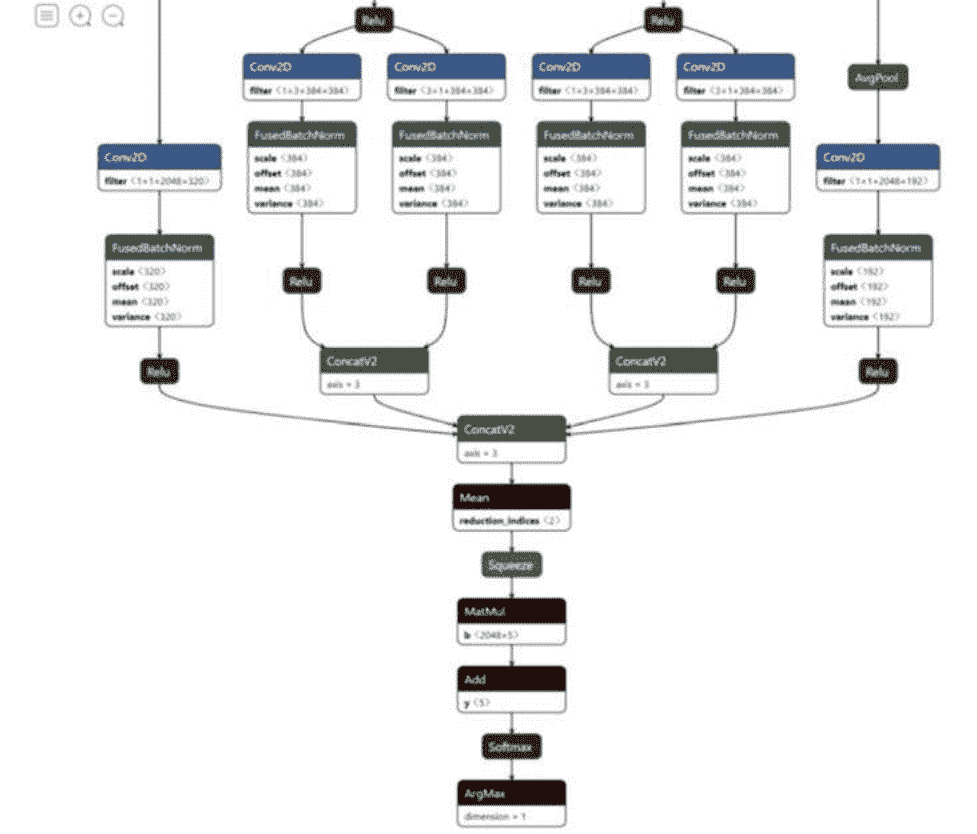

##### 13.2.1.3 Keras h5 (.h5)
Keras将模型本地保存为 `.h5` 文件。模型权重使用HDF5格式保存。这是一种理想的网格格式，适用于存储多维数组的数字。模型结构可以使用两种不同的格式进行描述和保存：JSON和YAML。

##### 13.2.1.4 TensorFlow SavedModel格式
SavedModel是TensorFlow的标准序列化格式，用于保存训练好的模型或模型片段。它将模型的训练权重与执行计算的确切TensorFlow操作一起存储。它可以独立于创建它的代码使用，并且可以在不同的高级模型构建API（如Keras）之间重复使用，因为TensorFlow操作是它们的共同基础。这是用于部署模型到TensorFlow Serving的常见标准，稍后在本章中将进行讨论。

##### 13.2.1.5 Scikit-Learn (.pkl)
`.pkl` 文件通常用于为Scikit-Learn模型提供服务，常用于Flask服务器和应用程序。Pickle是Python中序列化对象的标准方式。您可以使用pickle操作将您的机器学习算法序列化，并将序列化格式保存到一个文件中。稍后，您可以加载此文件以反序列化您的模型，并用它进行新的预测。

##### 13.2.1.6 iOS平台 (.mlmodel)
要在Core ML中使用模型，它需要处于 `.mlmodel` 格式中。您可以使用coremltools Python包将训练好的模型转换为此格式。`.mlmodel` 文件格式基于protobuf。

##### 13.2.1.7 PyTorch (.pt)
`.pt` 文件用于打包可以在 C++应用程序中使用的 PyTorch 模型。使用 `torch.save()` 函数保存模型的 `state_dict`，以便以后恢复模型时具有最大的灵活性。这是保存模型的推荐方法，因为只需要保存训练模型的学习参数。当保存和加载整个模型时，可以使用 Python 的 pickle 模块保存整个模块。使用这种方法可以得到最直观的语法，并且需要的代码量最少。

#### 13.2.2 冻结和导出模型
冻结模型的过程会生成一个包含模型所有所需信息的单个文件。这包括以图形结构的常量形式保存的图形和检查点变量。这与保存模型在每个点的梯度的检查点形成对比，以便可以重新加载模型进行进一步训练。这些梯度在训练完成后不再需要，因此在模型投入生产之前可以被丢弃。通常，冻结的模型被序列化为 `.pb` 文件类型。

SavedModel是一个包含序列化签名和运行所需状态的目录，包括变量值和词汇表。`saved_model.pb` 文件存储了实际的TensorFlow程序或模型，以及一组命名的签名，每个签名都标识一个接受张量输入并产生张量输出的函数。

`variables` 目录包含标准的训练检查点。`assets` 目录包含TensorFlow图使用的文件，例如用于初始化词汇表的文本文件。保存的模型格式如图13.10所示。

#### 13.2.3 模型优化
根据任务的不同，您需要在模型复杂性和大小之间进行权衡。如果您的任务需要高精度，则可能需要一个大而复杂的模型。对于需要较低精度的任务，最好使用较小的模型，因为它们不仅使用更少的磁盘空间和内存，而且通常更快且更节能。

模型优化的用途是：

- 减少云端和边缘设备（例如移动设备、物联网设备）的延迟和推理成本。
- 在处理、内存、功耗、网络使用和模型存储空间方面对边缘设备进行模型部署。
- 在现有硬件或新的专用加速器上执行和优化。

模型优化领域可以涉及各种技术：

- 通过修剪和结构修剪来减少参数数量。
- 通过量化来减少表示精度。
- 将原始模型拓扑结构更新为具有减少参数或更快执行的更高效的结构。例如，张量分解方法和蒸馏。

您开发的解决方案将利用这些优化技术中的任意数量来满足特定的应用需求。在本节的其余部分，我们将详细讨论其中一些技术。

有多种方式可以部署优化模型，包括：

- **为边缘节点和移动设备预先优化的模型**：有各种预优化模型可供使用，在推理过程中提供效率。TensorFlow提供现有的TensorFlow Lite预优化模型，大大降低了计算要求。

| 技术 | 易用性 | 准确性 | 延迟 | 兼容性 |
| --- | --- | --- | --- | --- |
| 减少的浮点数（训练后） | 不需要数据 | 小的准确率损失 | 与float32相同或更快 | 支持Float16或者可以回退到float32 |
| 混合量化（训练后） | 不需要数据 | 小的准确率损失（准确率小于等于float16） | 比float更快 | 需要float和整数支持 |
| 整数量化（训练后） | 未标记的数据 | 准确率小于等于混合量化 | 最快的 | 仅限整数 |
| 整数量化（训练期间） | 标记的训练数据 | 准确率大于等于整数训练后 | 最快的 | 仅限整数 |

* 训练后工具
如果您无法为应用程序使用预训练模型，请尝试在TensorFlow Lite转换期间使用TensorFlow Lite后训练量化工具，这可以优化已经训练好的TensorFlow模型。
TensorFlow Lite是一个可以将预训练的TensorFlow模型转换为优化推理速度和减少存储空间的框架。这主要是为了支持移动和边缘设备。

边缘设备或移动设备上的模型需要轻量化。这将允许以下操作：
* 优化模型减少设备存储需求
* 在低带宽情况下下载新模型时改善延迟
* 更小的内存占用以实现更快的推理
* 量化等技术可以减少模型的延迟而不影响准确性

TensorFlow Lite通过以下方式实现优化：
* 量化：当一个模型被保存时，它的参数（函数和权重）是32位浮点数值。通过量化，我们可以将这些值的精度降低到32位和8位浮点数值或整数[3]之间。更简单的值也使我们能够在更广泛的硬件上部署模型。
表13.2显示了不同的量化技术及其相关的兼容性。

* 权重修剪：权重修剪会删除模型中不增强模型性能的参数（突触和神经元）。权重修剪可以更高效地压缩稀疏模型。图13.11展示了突触和神经元修剪。

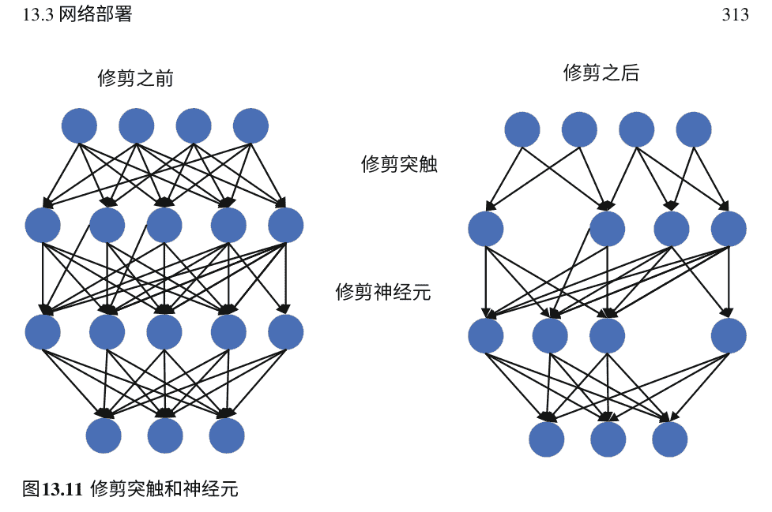

图13.11 修剪突触和神经元

#### 13.2.4 部署TFLite模型和进行推理

TFLite模型主要用于边缘设备（Android，Raspberry PI）上的推理。TensorFlow Lite使用代理来提高TFLite模型在边缘的性能。TFLite代理是将图执行的部分交给其他硬件加速器（如GPU或DSP）的一种方式。TFLite使用多个硬件加速器来提高速度、准确性和优化功耗。尽管后期训练工具提供了适用于低功耗设备的良好解决方案，但它们通常仅适用于轻量级模型，如SSD-MobileNet，并且在撰写本文时与更复杂的模型（如Faster-RCNNs）不兼容。

### 13.3 网络部署

部署训练模型的最简单方法之一是通过网站或网络应用程序。有许多不同的框架可以实现这一点，但这取决于训练模型是直接通过网络应用程序访问还是使用第三方推理机制（如TensorFlow serving）访问。在本节中，我们介绍了一个可扩展的部署流程，可以与训练的TensorFlow模型进行接口交互，并使其对终端用户可访问。Flask是一个动态Web应用程序，使用Python和相关框架进行无缝全栈Web开发，并为机器学习模型提供简单的集成。

#### 13.3.1 Flask

Flask是Python的众多Web框架之一，是一个基于单一任务的微框架[4]。Flask使用其可扩展的Web框架，使用各种Web开发库和工具实现灵活的Web应用程序开发。这为有经验的开发人员提供了插件和播放许多库和数据库的自由。与Django等其他Web框架不同，可以集成许多不同的框架，如图13.12所示。Flask在开发机器学习项目时非常有用。更重要的是，它是教育目的和那些踏上机器学习之旅的人的有用工具。虽然您可以使用Flask（与其他工具）进行企业解决方案，但这可能会耗费时间，您将使用更复杂的解决方案，如与后端机器学习模型相关联的WordPress和ASP.NET。然而，Flask的好处在于它为开发人员提供了更多的灵活性。Flask及其相关的机器学习流程如图13.13所示。

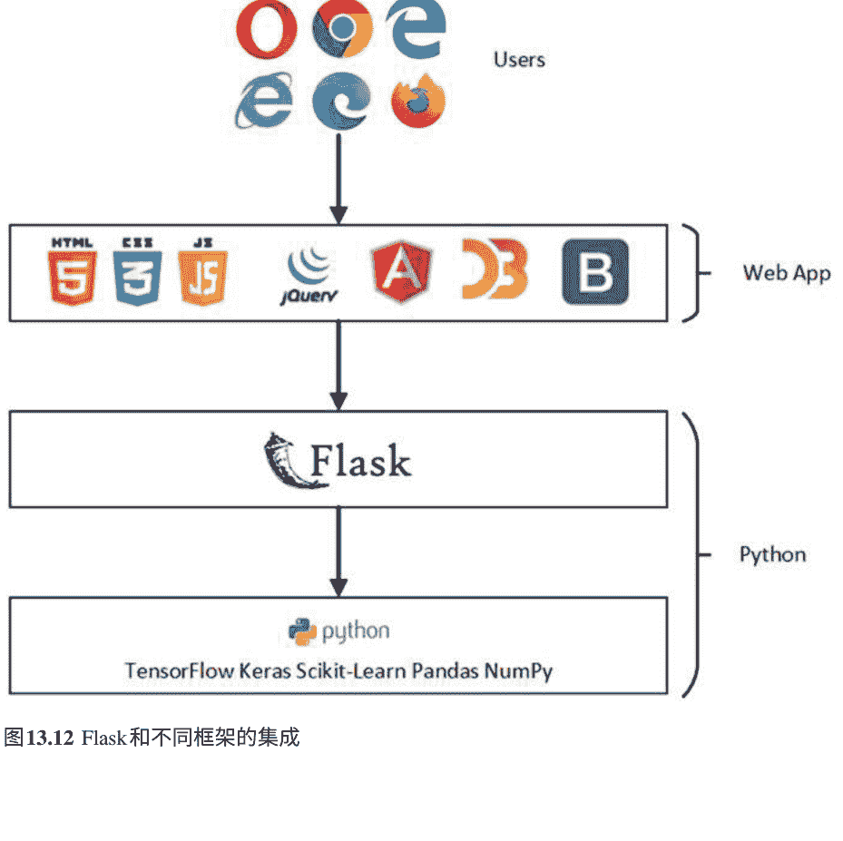

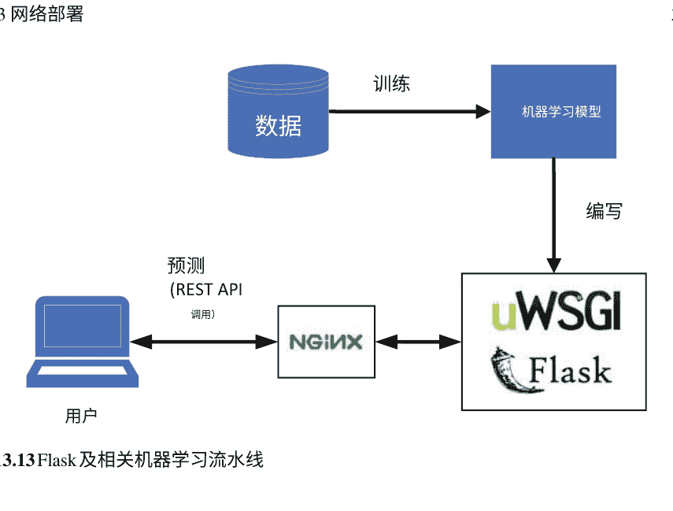

图13.13 Flask及相关机器学习流水线

#### 13.3.2 为什么使用Flask

Flask是一个很好的工具，可以展示前端网页界面如何与后端机器学习模型进行连接以进行推理。其中一个主要优点是，Flask使用Python来处理网页应用程序的后端（我们的模型将在此运行）。这意味着它与TensorFlow提供的Python代码完全兼容。虽然Python代码用于处理网站的编程方面，但我们可以与前端组件（如HTML和CSS）进行接口交互。

#### 13.3.3 在Flask中工作和开发

有几种方式可以发送和接收来自我们训练好的TensorFlow模型的数据。首先，我们可以使用API请求，该请求可以发送和接收JSON等信息到Flask应用程序。这可以用于将数据传输到机器学习模型进行处理并接收响应。例如，我们可以提交一张图片，它会返回一组边界框位置、类别和概率分数。该过程如图13.14所示。另一种实现这一目标的方式是将Flask应用程序与HTML表单结合起来。

在这种方法中，用户与网页前端进行交互，就像与任何其他类型的网页一样。在目标检测示例中，用户可以通过网页表单上传图像，然后将其发送到模型进行推理，模型返回预测结果，如图13.15所示。

本章提供了基本概述，并描述了一个强大的前端框架，可以与机器学习模型进行接口交互。

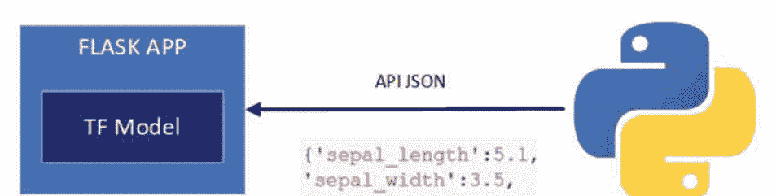

图13.14 通过flask向ML模型提交请求

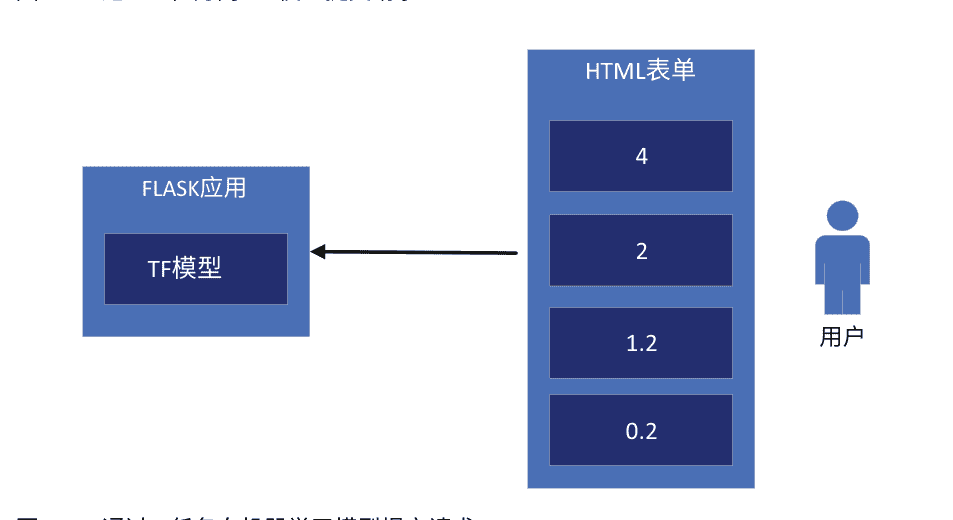

图13.15 通过flask向机器学习模型提交请求

### 13.4 总结

本章介绍了部署和托管机器学习模型进行推理的基本方面。在机器学习流水线中，我们讨论了机器学习的部署方面，以及如何通过REST API和gRPC访问功能。解释了模型部署的重要性，以及如何使用MLOps流水线实现。这包括对一些常见的MLOps框架及其常用API接口的讨论。在MLOps流水线中，我们讨论了使用各种不同的模型格式准备模型的方法。这还包括了如何使用优化工具包冻结、导出和优化模型，主要集中在TFLite和边缘节点上。MLOps流水线中的最后阶段是模型的部署，以及如何通过Web组件访问模型。本节介绍了Flask和访问模型推理以及进行预测所需的基本构造。

## 参考文献

1. M. Treveil 等 ，引入MLOps. “ O'Reilly Media, Inc.,” 2020.
2. S. Alla和S. K. Adari, “什么是MLOps?,”在Beginning MLOps with MLFlow, Springer, 2021, pp. 79–124.
3. D. Lin, S. Talathi和S. Annapureddy, “深度卷积神经网络的定点量化,”在国际机器学习会议, 2016, pp. 2849–2858.
4. M. Grinberg,使用Python开发Flask网络应用. “ O'Reilly Media, Inc.,” 2018.

## 第14章 企业级机器学习服务

在前一章中，我们讨论了训练模型的托管以及如何使用Flask等框架输入和接收可用于业务流程的信息。访问这些模型可以直接进行，也可以通过模型服务器来支持企业解决方案。在前一章中，我们还讨论了如何通过库导入直接访问模型。在本章中，我们将讨论基于组件的MLOps以及如何使用Docker打包模型，并使用Kubernetes进行规模化分发。本章将重点介绍容器化TensorFlow Serving以实现可扩展的模型服务。通常，要使用此配置通过Docker访问GPU，需要使用Linux发行版。然而，借助微软的新进展，可以将Linux内核嵌入并直接在操作系统中使用Windows子系统（WSL2）进行访问。这克服了使用NVidia Docker运行时访问GPU的限制，本章将对此进行介绍。目前，在Windows中访问NVidia Docker运行时和GPU的唯一方法是运行WSL2。

### 14.1 Docker

在本节中，我们将介绍Docker，并讨论为什么它在机器学习中被使用[1]。你已经有安装软件和包的经验在你的机器上。图14.1展示了这通常是如何进行的。你会下载一个安装程序，运行它，在某些情况下，你会收到一个错误消息（这可能是由于缺少依赖项或不正确的版本）。解决这个问题可能既耗时又具有挑战性。这就是Docker试图修复的原因。

Docker旨在使您能够在任何给定的计算机上安装和运行软件变得容易。

通过使用Docker，您可以将所有所需的系统配置和依赖项抽象为一个可运行的命令。Docker使得安装和运行软件变得简单，无需担心设置或依赖关系。这不是唯一的原因。

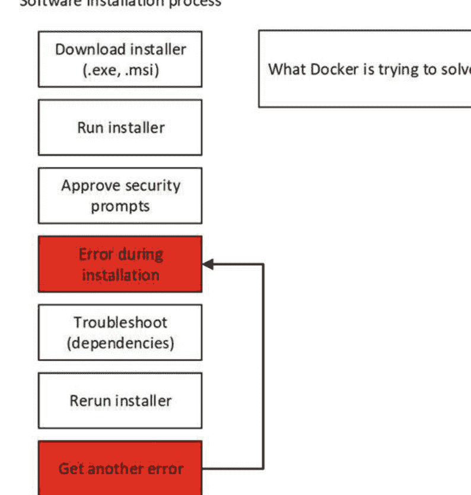

图14.1 传统软件安装与Docker容器化

你可以使用Docker，但它确实是MLOps中的一个基本原因之一。

#### 14.1.1 什么是Docker

Docker更好地描述为创建和运行容器的生态系统。图14.2显示了Docker生态系统及其所使用的工具。总的来说，这些工具使我们能够创建和运行容器。如果我们运行以下命令 `docker run -t tensorflow/serving:latest-gpu`，一系列操作将发生。首先，Docker命令行界面（CLI）连接到Docker Hub并下载一个名为image的单个文件。一个image是一个包含运行该程序所需的所有依赖项和配置的单个文件（例如，TensorFlow serving）。image文件是一个存储在本地硬盘上的单个文件。您可以使用此image创建容器。

```
docker run -t tensorflow/serving:latest-gpu
```

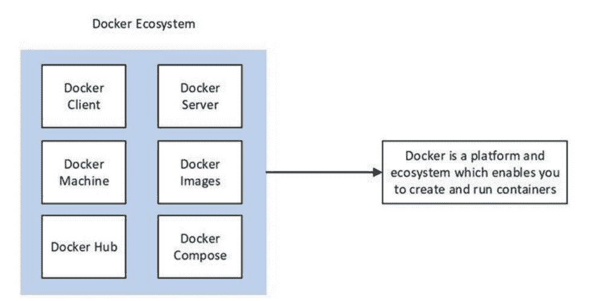

图14.2 Docker生态系统

容器是一个可以看作是运行程序的图像实例，如图14.3所示。从这个figure可以看出，容器是一个具有自己独立硬件资源的程序。这包括自己的内存空间、网络资源和独立的硬盘空间部分。

图像和容器是任何Docker项目的基础。在本章中，我们将深入探讨这个问题。

#### 14.1.2 使用Docker

Docker是一种跨平台技术，可以在Windows、Mac和Linux上运行。在使用Docker之前，主机操作系统上需要一些先决条件。需要安装的两个工具包括Docker客户端（docker cli），它允许我们使用终端命令与Docker进行交互。发给Docker客户端的命令会解释并相应地处理。Docker客户端本身不处理容器或图像。相反，Docker客户端只是一个工具（或门户），帮助我们与软件包中包含的另一个软件交互，该软件称为Docker服务器（Docker守护程序）。Docker服务器是负责创建容器、图像维护容器、上传图像以及与Docker相关的其他所有工作的软件。这两个重要组件如图14.4所示。

您可以直接与Docker交互，因为它作为一个独立的服务运行。通过Docker客户端访问其功能。

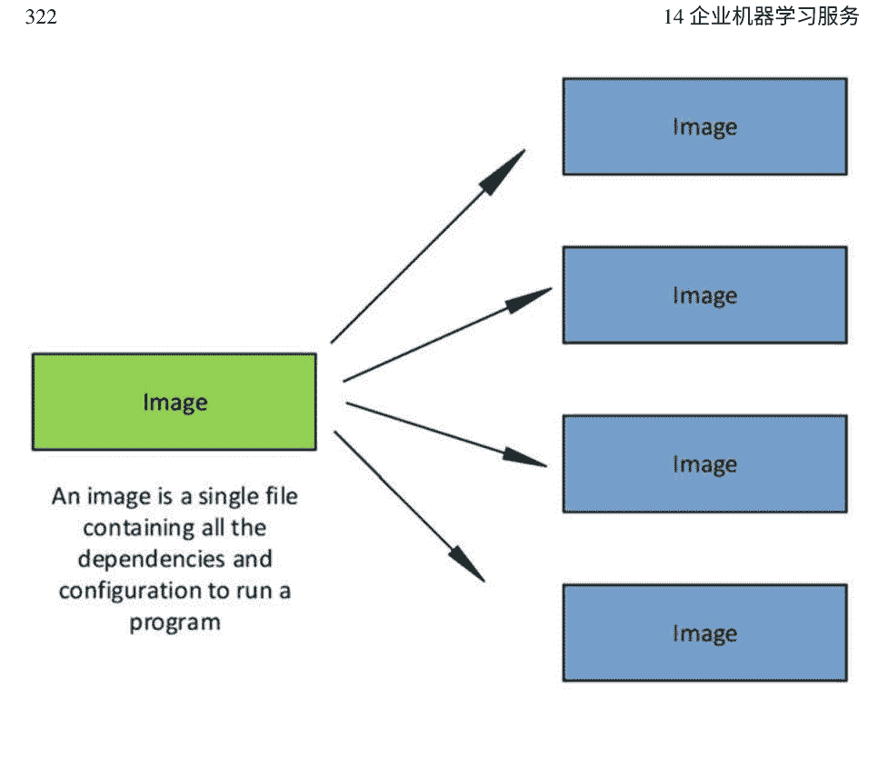

图14.3 运行docker镜像的实例

##### 14.1.2.1 使用Docker

在本节中，我们将重点介绍如何在Windows上安装Docker。重要的注意事项是，在撰写本书时，如果您是Windows Home/Sku用户，则无法安装Docker for Windows桌面版，因为它需要Hyper-V虚拟化，而这仅在Windows Professional和Enterprise版本中受支持（这不影响Windows Server/Sku）。这是一个解决方法，但本书中没有涉及。较新版本的Docker使用WSL 2来支持Linux容器。

现在我们可以运行一个简单的Hello World示例。如果我们运行命令“docker run hello-world”，您将在下图14.5中看到我们无法找到该镜像“hello-world:latest”本地。这意味着我们之前没有下载过这个镜像。在这种情况下，我们将使用下面的命令从Docker Hub获取镜像，如图14.5所示“latest: Pulling from library/hello-world.”这将导致发送“Hello from Docker!”消息之前的几个状态命令。

### 图14.4 Docker客户端和Docker服务器

```

C:\Users\Carl>docker run hello-world
Unable to find image 'hello-world:latest' locally
latest: Pulling from library/hello-world
0e03bdcc26d7: Pull complete
Digest: sha256:e7c70bb24b462baa86c102610182e3efcb12a04854e8c582838d92970a09f323
Status: Downloaded newer image for hello-world:latest

Hello from Docker!
This message shows that your installation appears to be working correctly.

To generate this message, Docker took the following steps:
 1. The Docker client contacted the Docker daemon.
 2. The Docker daemon pulled the "hello-world" image from the Docker Hub.
    (amd64)
 3. The Docker daemon created a new container from that image which runs the
    executable that produces the output you are currently reading.
 4. The Docker daemon streamed that output to the Docker client, which sent it
    to your terminal.

To try something more ambitious, you can run an Ubuntu container with:
 $ docker run -it ubuntu bash

Share images, automate workflows, and more with a free Docker ID:
 https://hub.docker.com/

For more examples and ideas, visit:
 https://docs.docker.com/get-started/
```

### 图14.5 Docker hello world示例

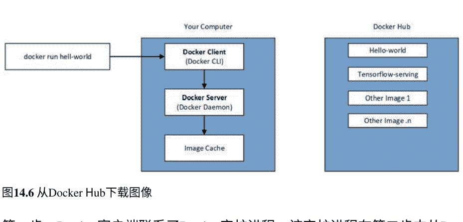

第一步，Docker客户端联系了Docker守护进程，该守护进程在第二步中从Docker Hub拉取了“hello-world”镜像。在第三步中，Docker守护进程从镜像创建了一个新的容器，该容器运行可执行文件并产生输出。
最后，在第四步中，Docker守护进程将该输出流式传输给Docker客户端，后者将其发送到您的终端。
在终端上执行命令“docker run hello-world”时，Docker客户端启动。如上所述，Docker cli接收用户的命令，然后将命令传递给Docker服务器。Docker服务器负责运行和托管包含图像的Docker容器的所有主要方面。当我们运行命令“docker run hello-world”时，它发送一个指令以使用名为hello-world的图像启动一个新的容器。helloworld中包含一个小程序，它打印出图14.5中显示的生成的消息。当Docker服务器接收到命令时，后台会发生一系列操作。Docker服务器意识到我们正在尝试使用hello-world图像启动一个新的容器。服务器首先检查其本地图像缓存，看是否有图像的本地副本。在这种情况下，没有名为hello-world的图像，因此会向Docker Hub发出命令。在这种情况下，hello-world图像从Docker Hub下载并存储在本地图像缓存中。一旦图像存储在缓存中，它们可以快速运行，无需下载。

一旦图像被本地缓存，Docker服务器使用它来创建一个Docker容器的实例。记住，容器是图像的一个实例，用于运行具有自己资源的特定程序，即内存、网络资源和硬盘空间。Docker服务器从服务器图像缓存中获取图像，将其加载到内存中，并使用该图像创建一个容器。在我们的示例中，程序的唯一目的是打印出消息“Hello from Docker。”图14.6显示了从Docker Hub下载新图像的过程，如果它不存在于缓存中。

##### 14.1.2.2 什么是容器

在本节中，我们将讨论容器是什么以及如何在您的计算机上创建容器。为了充分理解，重要的是您了解一些关于操作系统的背景概念。操作系统具有一个基本组件，称为内核，它是一个正在运行的软件进程，管理计算机上运行的所有程序（即可执行的软件片段）与连接到计算机的所有物理硬件之间的访问。在图14.7中，我们可以看到图表的顶部显示了计算机上运行的各个进程，如Chrome、终端或Spotify。重要的是要知道，这些进程中没有一个直接与物理设备通信。相反，进程通过内核直接协商硬件访问。然后，内核通过系统调用请求和促进对底层硬件的受控访问，如CPU、内存或硬盘。进程通过系统调用与内核进行交互，这只是简单的函数调用。

内核提供不同的端点以提供硬件调用功能。
现在，如果我们有两个程序，如图14.8所示，它们想要使用不同版本的Python（v2和v3），会发生什么？在这个例子中，假设您不能在同一台计算机上安装两个独立的Python版本。如图14.8所示，Chrome将成功执行，但NodeJS将无法执行，因为Chrome可以访问Python v2，而NodeJS无法访问Python V3。为了解决这个问题，一种方法是使用命名空间，如图14.9所示，其中安装位于单独的文件夹结构（段）中。为了确保Chrome和NodeJS随时都能访问正确的段，任何一个都会发出系统调用，内核将解释传入的调用，并确定它来自哪个进程，并将其映射到相应的段。使用这个命名空间（段）功能，我们可以确保在同一台机器上的两个程序都可以访问所需的依赖项。

命名空间允许我们隔离进程。当特定进程请求资源时，它将被引导到底层硬件上的特定区域或一组资源。命名空间也可以应用于软件，以限制硬件的某些部分。命名空间允许我们限制资源和与其他进程的通信。此外，控制组也可以用于限制每个进程使用的资源数量。

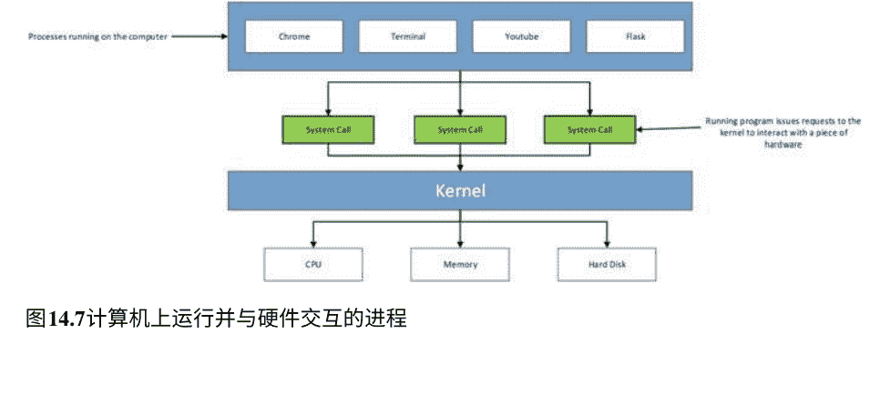图14.8运行不同版本的程序

图14.9使用命名空间来分割进程

图14.10 使用命名空间和控制组来隔离和限制资源

每个进程使用的资源（如CPU和内存）的限制。同时使用这两者可以使我们隔离单个进程并限制其可以访问的资源数量和带宽使用量。图14.10显示了命名空间和控制组机制。

如图14.11所示，虚线突出显示了运行过程和可以访问的资源段。这被称为容器。容器是一个进程或一组进程，它们具有一组专门分配给它们的资源。

如图14.12所示，容器具有一个运行的进程，该进程向内核发送系统调用，内核分析传入的系统调用并将其定向到一组特定的硬件资源（例如RAM、CPU等）。

现在我们了解了容器，我们需要了解它们与镜像的关系。那么一个单独的镜像文件如何创建一个容器呢？当我们谈论一个镜像时，我们指的是一个文件系统快照（Windows或Ubuntu）。这是包含源文件目录的镜像。例如，看图14.13，一个镜像可以包含Flask和Python的快照。每个镜像还包含每个程序的启动命令。将镜像放入容器中的过程如下：

- 首先，内核将硬盘的一部分隔离出来，并使其仅对该容器可用。文件系统快照被传输到指定给该容器的硬盘的部分。
- 其次，执行启动命令（例如Flask）。当调用Flask时，将创建一个新的进程实例，并将该进程隔离到容器内的特定资源集中。

命名空间和控制组都是特定于Linux的，不包括在Windows或Mac中。当您安装Windows或Mac的Docker时，将创建一个Linux虚拟机（除非您的系统正在运行WSL 2），如图14.14所示。在这种情况下，容器是在Linux虚拟机内创建的。

##### 14.1.2.3 Docker运行

使用docker cli和引用docker run命令来执行运行Docker容器。通过引用图14.15中显示的镜像名称来使用此命令。

可以使用run命令执行多个不同的参数。其中一个常用的主要参数允许您覆盖默认的启动命令。图14.16显示了如何扩展上述过程以提供内联命令给我们在容器中运行的镜像。

图14.12 从Docker容器发送系统调用

图14.13 带有关联启动命令的文件系统快照

图14.14 在Linux虚拟机中托管的运行进程

## 14.1.2.4容器生命周期

了解生命周期对于运行docker服务时很重要。 如前所述，使用docker run命令可以创建我们的容器。
创建和运行容器是两个独立的步骤。 除了 docker run之外，还有两个额外的命令可以用来启动新的容器。 Docker run包含两个独立的命令，称为“docker create”和“docker start”，如图14.17所示。

使用镜像创建容器的create命令。 start命令启动新创建的容器，如图14.18所示。

Creating and running a Container from an Image

图14.15 使用CLI运行docker命令

Creating and running a Container from an Image

图14.16 Docker Run命令及其相关参数

图14.17 Docker命令：run、create和start

那么，创建和启动容器有什么区别。当我们创建一个容器时，文件系统快照被配置在硬盘分区中。要启动容器，我们执行给定镜像的启动命令。我们可以创建一个容器而不运行它，如图14.19所示。一旦容器被创建，您可以使用“docker start”调用主要启动命令。(图14.19)

##### 14.1.2.5 构建自定义 Docker

到目前为止，我们一直在使用他人创建并托管在Docker Hub上的镜像。在本节中，我们将概述如何通过Docker服务器构建自定义镜像。该过程很简单，通过创建dockerfiles文件来实现，如图14.20所示。dockerfile是一个包含配置数据的纯文本文件。配置文件定义了容器的行为，或者更具体地说，它将包含哪些程序。它还指定了在容器中运行时启动的程序的入口点。

一旦创建了dockerfile文件，它将被交给docker客户端，然后由docker客户端传递给docker服务器。docker服务器负责处理配置文件，并构建一个可用的镜像，用于启动新的容器。dockerfile是镜像复杂性所在之处。

图14.21显示的流程突出了创建dockerfile所需的关键阶段。首先，我们需要指定一个基础镜像。其次，我们将运行一些命令来安装额外的程序和依赖项。最后一步是指定一个启动命令，在容器启动时自动运行。创建dockerfile后，可以使用以下命令“docker build .”来构建docker镜像。dockerfile必须位于当前工作目录中。

Creating a Dockerfile

图14.21 Docker创建工作流程

图14.22显示了一个dockerfile的示例。每行都以一个称为指令的单词开头，告诉docker服务器要做什么。指令FROM用于指定我们希望作为镜像的docker镜像。指令RUN用于在准备自定义镜像时执行一些命令。最后，指令CMD指定了在容器中使用我们的镜像时应执行的内容。你将添加到dockerfile的每一行配置始终以指令开头。图14.22显示了一些你将遇到的最重要的指令，但还有许多其他指令。在每个指令之后，我们提供一个如下所示的指令，定制指令的执行方式。创建docker镜像的过程与在计算机上安装操作系统的基本方式相同。

#### 14.1.3 Docker Compose

可以在一个容器中运行多个应用程序。然而，这种方法不够灵活，如果应用程序变得流行，就会遇到问题。随着您的应用程序需求的增加，您将不得不复制每个Docker容器及其关联的应用程序，以适应增加的流量，如图14.23所示。这种方法的问题在于每个服务器都完全与其他服务器断开连接。在图14.23的示例中，服务器访问计数将独立于彼此，因此根据访问键值的Flask应用程序不同，会得到不同的结果。

| Instruction telling the server what to do | Argument to the instruction |
|-------------------------------------------|-----------------------------|
| FROM                                      | ubuntu                      |
| RUN                                       | pip install tensorflow      |
| CMD                                       | [“python”, “./app.py”]      |

图14.22 Docker构建指令

图14.23 在单个容器中运行多个应用程序

图14.24将提供一个更好的解决方案，因为我们现在可以将我们的Flask应用程序和Redis应用程序（服务器计数）分开托管在它们各自的容器中。

为了实现上述配置，我们将使用Docker文件生成我们的Docker镜像，但现在我们需要将它们连接起来形成一个完整的应用程序。默认情况下，一旦这两个容器运行起来，它们之间没有直接通信。

图14.25 Docker compose

## Docker Compose

Separate CLI that gets installed along with Docker

Used to start up multiple Docker containers at the same time

Automates some of the long arguments we were passing to 'docker run'

在Flask应用程序和Redis服务器之间。它们都是隔离的、独立的容器。我们需要在它们之间建立网络基础设施。为了做到这一点，我们可以使用Docker的cli网络功能。然而，问题在于我们每次想要运行容器时都需要不断运行这些命令。更好的方法是使用docker compose。这是一个与Docker一起安装的工具。

Docker compose在图14.25中显示，并可以从cli中运行“docker-compose”。Docker-compose的存在是为了最小化需要在cli中运行的命令数量（例如，Docker run、docker exec等）。Docker-compose还允许我们启动和运行多个容器，并将它们连接成一个网络。

#### 14.1.4 Docker卷和挂载

Docker的最后一个方面是在主机系统内部和相关容器之间共享信息的能力。实现这一目标有两种主要方法。首先，使用绑定挂载允许您绑定主机上的绝对路径的file或目录，然后将其挂载到容器中。第二种方法是使用卷，它是在Docker存储中创建的目录

主机上的目录。使用这种方法，Docker管理该目录的内容，并且现在禁止在Docker环境之外进行外部访问。
file或目录不需要在主机上已经存在。如果不存在，可以按需创建。绑定挂载具有良好的性能，但它们依赖于主机机器file系统具有特定的file系统，而卷则不需要。

但是，当容器运行时，特定于操作系统的路径会使用“-v”开关传递进来。

### 14.2 Kubernetes

在本节中，我们将扩展我们对容器的讨论，并引入Kubernetes作为重用它们来扩展您将开发的应用程序的一种方式[2]。图14.26提供了Kubernetes是什么以及为什么我们使用它的高级概述。

某些应用程序需要同时运行多个容器来适应所有功能和服务。图14.27显示了一个示例，其中多个服务作为独立容器运行。这些类型的应用程序本质上很难扩展。因此，例如，如果我们开始接收到大量的流量（即我们系统的用户），其中一个或多个容器可能会超过最大吞吐量。您想要做的是动态生成特定服务的新实例（例如下图中的工作进程）。因此，例如，如果我们有三个用户并行请求服务，我们希望有三个工作进程（容器）。某些解决方案将复制完整的服务集合（容器），而不是单个容器。这意味着诸如Nginx之类的服务将是不必要的

图14.27 缩放单个容器

由于它们可以处理许多用户请求，因此它们会被复制。 我们只想复制那些计算开销大且能够随着用户请求数量增加而扩展的服务。 因此，如果我们的工作容器计算开销大，我们只想复制工作容器而不是Nginx、服务器或客户端容器。

图14.28显示了复制工作容器的过程。 这种方法是Kubernetes提供的一种方法。
图14.29显示了一个典型的Kubernetes集群。 Kubernetes集群由一个控制Kubernetes集群中每个后续节点的主节点组成。 每个节点可以是虚拟机或物理计算机。 这些工作节点托管各个容器。 节点可以运行一个或多个在整个集群中分布的容器。 开发人员通过主节点管理整个Kubernetes集群。 用户向主节点提交指令，指示在整个集群中运行多少个容器。 在Kubernetes集群之外，负载均衡器调节以请求形式传入的流量，这些请求被转发到每个工作节点。

## 14.3  TensorFlow Serving

TensorFlow Serving是一个灵活、高性能的机器学习模型服务系统，专为生产环境设计[3]。 TensorFlow Serving使得部署新算法和实验变得简单，同时保持相同的服务器架构和API。 TensorFlow Serving提供了与TensorFlow模型的即插即用集成，但也可以轻松扩展以服务其他类型的模型和数据。 通常，TensorFlow Serving作为一个可以在本地或云上托管的Docker镜像提供。

图14.28 使用Kubernetes平衡容器

#### 14.3.1 为什么使用TensorFlow Serving

TensorFlow Serving允许您快速在生产环境中托管和提供经过训练的TensorFlow模型。TensorFlow Serving可以管理模型版本，使模型的管理更容易维护。完整的工作流流程如图14.30所示。

### 14.3.2 在CPU和GPU上使用TensorFlow Serving（NVIDIA运行时）

NVIDIA容器工具包允许用户构建和运行GPU加速的Docker容器。该工具包包括一个容器运行时库，以利用

如图14.31所示，使用NVIDIA GPU。在使用GPU之前，除了安装Docker外，还需要为系统更新NVIDIA驱动程序。在撰写本文时，Nvidia容器工具包仅支持Linux。然而，随着WSL2的引入，Nvidia容器工具包现在可以在支持GPU的Windows上运行[4]（图14.31）。

图 14.31 NVIDIA 容器运行时与 Docker

### 14.4 总结

本章介绍了企业服务的概念。本章讨论了Docker以及如何安装、配置和使用它来托管容器中的映像。我们强调了映像和容器之间的区别，以及容器生命周期的工作原理。我们还描述了使用Docker文件构建自定义映像的方法，以及如何使用Docker Compose加入服务。本章还介绍了如何使用Kubernetes负载均衡Docker实例，以便在Kubernetes集群中快速扩展容器。本章以对TensorFlow Serving的讨论结束，介绍了如何在CPU和GPU硬件上托管我们训练好的模型。

## 参考文献

+   1. I. Miell 和 A. Sayers, *Docker 实践* . Simon and Schuster, 2019.
2. B. Burns, J. Beda 和 K. Hightower, *Kubernetes: up and running: 走进基础设施的未来*. O’Reilly Media, 2019.
3. C. Olsten等, “Tensorflow-serving: 灵活、高性能的机器学习服务,” *arXiv Prepr.* arXiv1712.06139, 2017.
4. P. Singh, “探索 WSL2,” 在 *Learn Windows Subsystem for Linux*, Springer, 2020, pp. 75–98.