# 情感分析和深度学习（ICLR21）


# 智能系统与计算进展1408

Subarna Shakya
Valentina Emilia Balas
Sinchai Kamolphiwong
Ke-Lin Du 编辑

ICSADL 2021会议论文集

## 智能系统与计算进展
## 第1408卷

## 系列编辑
Janusz Kacprzyk，波兰科学院系统研究所，华沙，波兰

## 咨询编辑
Nikhil R. Pal，印度统计研究所，加尔各答，印度
Rafael Bello Perez，数学、物理和计算机学院，Universidad Central de Las Villas，圣克拉拉，古巴
Emilio S. Corchado，萨拉曼卡大学，萨拉曼卡，西班牙
Hani Hagras，计算机科学与电子工程学院，University of Essex，科尔切斯特，英国
László T. Kóczy，自动化系，Széchenyi István大学，Gyor，匈牙利
杜克林，德克萨斯大学计算机科学系，埃尔帕索分校，埃尔帕索，德克萨斯州，美国
林金腾，国立交通大学电机工程系，新竹，台湾
吉尔·卢，工程与信息技术学院，悉尼科技大学，悉尼，新南威尔士州，澳大利亚
帕特里夏·梅林，计算机科学研究项目，蒂华纳技术学院，蒂华纳，墨西哥
纳迪亚·内迪亚，电子工程系，里约热内卢大学，里约热内卢，巴西
阮玉清，计算机科学与管理学院，弗罗茨瓦夫理工大学，弗罗茨瓦夫，波兰
王军，机械与自动化工程系，香港中文大学，沙田，香港

“智能系统与计算进展”系列包含智能系统和智能计算的理论、应用和设计方法的出版物。几乎涵盖了所有学科，如工程学、自然科学、计算机和信息科学、信息通信技术、经济学、商业、电子商务、环境、医疗保健、生命科学等。主题列表涵盖了现代智能系统和计算的所有领域，如计算智能、软计算（包括神经网络、模糊系统、进化计算和这些范式的融合）、社会智能、环境智能、计算神经科学、人工生命、虚拟世界和社会、认知科学和系统、感知和视觉、DNA和免疫系统、自组织和自适应系统、电子学习和教学、以人为中心的计算、推荐系统、智能控制、机器人学和机电一体化（包括人机协作）、基于知识的范式、学习范式、机器伦理、智能数据分析、知识管理、智能代理、智能决策和支持、智能网络安全、信任管理、互动娱乐、Web智能和多媒体。

“智能系统与计算进展”中的出版物主要是重要会议、研讨会和大会的论文集。它们涵盖了该领域的重要最新发展，既有基础性的，也有应用性的。该系列的一个重要特征是出版时间短，全球分发。这使得研究成果能够快速广泛地传播。

被DBLP、INSPEC、WTI Frankfurt eG、zbMATH、日本科学技术机构（JST）索引。该系列中的所有图书都提交给Web of Science进行考虑。

有关该系列的更多信息，请访问 http://www.springer.com/series/11156

Subarna Shakya · Valentina Emilia Balas · Sinchai Kamolphiwong · Ke-Lin Du 编辑

## 情感分析和深度学习
## ICSADL 2021会议论文集

编辑
Subarna Shakya
工程学院
尼泊尔普尔乔克校区
拉利特普尔

Valentina Emilia Balas
智能系统研究中心
阿拉德奥雷尔弗拉伊库大学
阿拉德，罗马尼亚

Sinchai Kamolphiwong
宋卡拉大学
泰国宋卡拉

Ke-Lin Du
电气与计算机工程系
康考迪亚大学
加拿大蒙特利尔

ISSN 2194-5357
智能系统与计算进展
ISBN 978-981-16-5156-4
https://doi.org/10.1007/978-981-16-5157-1

ISSN 2194-5365 (电子版)
ISBN 978-981-16-5157-1 (电子书)

© 编辑（如适用）和作者，独家许可给Springer Nature Singapore Pte Ltd. 2022
本作品受版权保护。出版商独家许可所有权利，无论是整体还是部分材料，特别是翻译、重印、重用插图、朗诵、广播、微缩胶片复制或以任何其他物理方式复制，以及传输或信息存储和检索、电子适应、计算机软件或类似或不同的方法学，现在已知或今后开发的方法学。

本出版物中使用的一般描述性名称、注册名称、商标、服务标志等并不意味着，即使在没有明确声明的情况下，这些名称不受相关保护法律和法规的限制，因此可以自由使用。
出版商、作者和编辑可以安全地假设本书中的建议和信息在出版日期时是真实准确的。出版商、作者或编辑对本书中所含材料不提供任何明示或暗示的保证，也不对可能存在的错误或遗漏承担责任。出版商在已发表的地图和机构关系方面保持中立。

这本Springer印记由注册公司Springer Nature Singapore Pte Ltd.出版。注册公司地址为：15 Beach Road, #21-01/04 Gateway East, Singapore 189721, Singapore

我们，组织者，将这个ICSADL 2021会议献给全球的人工智能、信息和通信技术（ICT）研究者社区。我们还将这个会议献给作者和编辑团队，他们对国际研究社区存在的问题的解决方案进行了深入讨论。

## 前言

我代表ICSADL 2021国际计划委员会和组织委员会，非常荣幸地欢迎您参加由尼泊尔特里布文大学和泰国宋卡拉大学于2021年6月18日至19日举办的国际情感分析和深度学习会议（ICSADL 2021）。这个会议已经成为学术界和工业界交流的平台，旨在解决智能信息系统和计算技术当前和未来面临的挑战。本次会议邀请了关于最新人工智能驱动的信息系统和计算智能模型的技术和实施方面的贡献。

在COVID-19大流行的背景下，本次会议已经成为一个非常成功的活动，涵盖了智能信息系统的最新进展。这些会议旨在加强对如何自主地连接人们并处理来自世界各地的大数据资源的理解。这将涵盖一些挑战，例如服务设计和理解信息系统的智能含义。此外，与会者还从代表不同领域的学者和工业家的主题演讲中获得了丰富的研究知识。此外，演讲者还提供了一系列主题的互动会议，涵盖了从当前研究需求到技术解决方案的各个方面。

这些论文集将提供来自世界各地的持续研究工作，以情感分析、深度学习和数据分析模型的令人信服的实现。我也相信这个论文集将成为进一步研究和探索所有这些领域的推动力。

我感谢所有作者和参与者的贡献。

我希望所有作者和其他感兴趣的读者都能从这些论文集中获得技术上的益处，并且它也能激发他们的研究知识。

**技术程序主席—ICSADL 2021**

博士 Subarna Shakya
电子与计算机工程系
工程学院
普尔乔克校园
拉利特普尔，尼泊尔

博士 Valentina Emilia Balas
智能系统研究中心主任
阿拉德奥雷尔弗拉伊库大学
阿拉德，罗马尼亚

博士 Sinchai Kamolphiwong
宋卡大学院长
宋卡，泰国

博士 杜克林
电气与计算机工程系
康考迪亚大学
加拿大蒙特利尔

## 致谢

我们要感谢我们的机构——特里布万大学对本次活动的支持。我们还要感谢所有积极参与会议活动并利用机会相互学习的参与者。

我们感谢会议的特邀演讲嘉宾：Manu Malek博士在各自领域的专业知识上发表主题演讲。此外，我们还要感谢内部和外部审稿人以及咨询委员会成员，他们通过严格遵循国际同行评审标准，不断努力选择论文。

我们要感谢技术程序主席、特邀编辑、会议组织委员会和分会组织者的宝贵帮助。特别感谢Springer的编辑成员接受并包含会议论文集。

“尽管当前全球疫情严峻，但我们要特别感谢学术和非学术教职员工在组织会议方面的努力和贡献。”

“作为组织者，我们要衷心感谢所有代表们的前沿研究，以及会议主席们将高水平的演讲整合到和谐的会议中。”

“感谢所有为ICSADL 2021的成功做出贡献的参与者们。”

## 目录

- ### 利用机器学习分析医疗行业方法：以班加罗尔地区为案例研究
Poornima Taranath, Sweta Das和S. Gowrishankar
1

- ### 高效挖掘的动态文档定位
P. Sijin和H. N. Champa
15

- ### SentiSeries：客户评论、情感分析和时间序列的三部曲
Aishwarya Asesh
31

- ### 使用全卷积残差稠密网络进行视频摘要
Anil Singh Parihar, Ritvik Mittal, Himanshu和Prashuk Jain
47

- ### 一种用于检测肺炎的高效深度学习方法：使用卷积神经网络
Anik Kumar Saha和Md. Muhaimenur Rahman
59

- ### QMCDS：云数据存储的量子存储器
Ankit Sharma, Indra Kumar Sahu和Manisha J. Nene
69

- ### 使用机器学习进行孟加拉语假新闻检测的研究：学习和深度学习
Elias Hossain, Md. Nadim Kaysar, Abu Zahid Md. Jalal Uddin Joy, Md. Mizanur Rahman和Wahidur Rahman
79

- ### 一种用于分析传播的深度学习方法：在美国的大流行中
Paola G. Vinueza-Naranjo, Angel F. Vinueza-Naranjo, 和Hieda A. Nascimento-Silva
97

基于图卷积的谣言联合学习与内容，用户可信度，传播上下文，以及认知和情感信号
Prajna Nagaraj和Bhaskarjyoti Das
113

基于深度学习的实时物体分类和识别使用监督学习方法
J. Harikrishna, Ch. Rupa和R. Gireesh
129

调制域中的单声道语音增强使用粒子群优化
Kalpana Ghorpade和Arti Khaparde
141

使用深度学习算法检测肺炎和糖尿病视网膜病变学习算法
Meera Ghaskadvi, Sakshi Khochare, Rozebud Gonsalves和Prajakta Dhamanskar
155

基于物联网的改进多模式蚁群优化设计实时应用的MM-ACO算法优化
Mohammed Khalid Kaleem, Kassahun Azezew和Smegnew Asemie
177

使用自然语言处理的访谈转录员
G. R. Deeba Lakshmi, Jayavrinda Vrindavanam, Anshika Shukla和Rahul
185

源代码和文本的抄袭检测
Syed Yasmeen, Munjuluri Prathyusha, Malisetty Rajeswari, Padmanabhuni Srujana和K. Ashesh
199

从人体中收集动能的研究使用自由/冲击电磁发电机的运动活动
Athem Aloysius, M. K. A. Ahamed Khan, Wei Hong Lim, Manicam Ramaswamy, Sridevi, Deisy, Abdul Qayyum, Chun Kit Ang和Kalaiselvi Aramugam
209

临界温度的自动确定
Abhishek Deshpande, Jatin Pardhi和Gokul Bisen
223

基于ANN的混合方法用于心脏疾病检测疾病的
N. Shwetha, N. Gangadhar, Mahesh B. Neelagar和K. C. Shilpa
237

增强的K-奇异点聚类的实现本科论文题目分类方法
马尔科姆·安德鲁·马德拉和特斯林·雅各布
255

使用机器学习和神经网络进行垃圾邮件检测网络
Manoj Sethi, Sumesha Chandra, Vinayak Chaudhary和Yash Dahiya
275

使用在线预约管理系统的医院分布式资源分配算法
B. Jency A. Jebamani, R. Murugeswari和P. Nagaraj
289

BeFit—实时锻炼分析器
Richard Joseph, Manoj Ayyappan, Tanvi Shetty, Gurudatt Gaonkar, 和Aashish Nagpal
303

使用CNN分析个人汽车索赔的车辆损坏
Jagadevi N. Kalshetty, B. A. Hrithik Devaiah, K. Rakshith, Ken Koshy, 和N. Advait
317

关于基于属性的访问控制分析问题HGABAC模型
Anh Truong
331

使用物联网和机器进行食品新鲜度检测学习
Snehal Chalke, Sowmya Ganesan, Krishna Gajera, Pooja Reshim, 和Nita Patil
345

预测用户蜂窝信号由于雨水而下降接待
D. Lohith Bhargav, D. Achish, G. Yashwanth, N. Pavan Kalyan, 和K. Ashesh
359

改进视网膜的小波分解方法血管分割
Udayini Dikkala, Kezia Joseph Mosiganti, 和Mukil Alagirisamy
373

探索集成机器学习的性能用于COVID-19推文情感分析的分类器
Md. Mahbubar Rahman和Muhammad Nazrul Islam
387

贝叶斯网络模型（BN信任模型）的实现用于物联网路由
Sridhar Manda, N. Nalini和A. Arun Kumar
401

生物信息学：数据挖掘技术的重要性
Md. Nasfikur R. Khan, Shatabdee Bala, Sarmila Yesmin和Mohammad Zoynul Abedin
415

不同深度学习技术的比较分析用于从生物医学文献中提取关系的
M. Saranya, T. V. Geetha和R. Arockia Xavier Annie
429

使用被动侵略分类器对自杀相关文本数据进行分类侵略分类器
B. V. Kiranmayee, Chalumuru Suresh和S. SreeRakshak
443

Covid-19数据分析预测住院水平
Advet Jadhav, Maheshwari Satpute, Utkarsh Rai, Apeksha Wadibhasme和Usha Verma
451

使用神经网络分析大米粒质量的准确性网络
S. Menaka和K. Sashi Rekha
465

智能食品餐厅：账单和服务自动化
Radha Mothukuri, S. Hrushikesava Raju, S. Adinarayna, Vijaya Chandra Jadala, Saiyed Faiayaz Waris和G. Subba Rao
475

激活函数引入的自动化聚类编程代码合同的生成
S. V. Gayetri Devi和T. Nalini
487

基于声音信号的COVID-19检测使用集成神经网络
A. V. Akshaya和Meril Cyriac
501

Spade、Prefix Span、Fast和Lapin算法的性能度量
T. M. Veeragangadhara Swamy和N. Vani
515

心律失常的预测和分类
Aashuli Gupta, Arnob Banerjee, Disha Babaria, Kunal Lotlikar, 和Hema Raut
527

温度变化对基于PEM燃料电池的影响功率转换器
M. Malathi, Usha Surendra, 和N. Latha
539

Qgen：自动生成试卷器
Ajil Paul, Amal Sabu, Beema Abdulkader, Priya George, 和Sneha Sreedevi
555

使用噪声语音的基频提取加权自相关中的指数增强
Md. Saifur Rahman和Nargis Parvin
565

太阳能多功能农业实用系统
Vipin Bondre, Surabhi Pawar, Shatakshi Dixit, Shefali Thoolkar, 和Trupti Tale
577

监督机器学习的性能分析COVID-19和幸福报告数据集的技术
Syed Abu Farooq和Selvanayaki Kolandapalayam Shanmugam
591

使用深度学习预测电信客户的切换意向机器学习算法
S. N. Vivek Raj和S. Prithiviraj Pallava Rayer
603## 使用受限特征检测CLAMAV病毒签名

Reshma Sri Sai Mangipudi, J. Pranitha, G. Sai Varsha, 和B. Indira Priyadarshini

### ANUGA中网格生成的综述

Shreya Kendhe, Aditi Limkar, Sakshi Doshi, T. S. Murugesh Prabhu, Girishchandra R. Yendargaye, Y. S. Ingle和N. F. Shaikh

## 海啸波浪传播的建模与分析 孟加拉湾海岸的特征

M. Yasmin Regina和E. Syed Mohamed

## 面向大学学术解决危机情况的安卓应用程序 危机情况的解决方案

Md. Nasfikur R. Khan, Asif Khan Shakir, Shantunu Shakhwat Nadi, 和Mohammad Zoynul Abedin

### 永远不要低估具有扩散的替代密码

Md Rasid Ali和Dipanwita Roy Chowdhury

## 使用向量化和机器进行卡纳达语情感分析 学习

M. E. Sunil和S. Vinay

## 使用1D卷积神经网络进行人体活动识别 网络

Khushboo Banjarey, Satya Prakash Sahu和Deepak Kumar Dewangan

## 数字化印度手稿的语言和时代预测 使用卷积神经网络

Anukriti Garg, Laghima Tiwari, Tejsvi Juj, S. Indu和N. Jayanthi

## 连续链斐波那契：知识管理系统 与聊天机器人

S. Pradeep Kumar, R. Murugeswari和P. Nagaraj

## 使用物联网设备安全管理 区块链-综述

Gaurav Pattewar, Nachiket Mahamuni, Hrishikesh Nikam, Omkar Loka和Rachana Patil

## 深度学习程序在提高利润中的作用 在农业部门

阿米特 • 维尔马

**使用深度学习的自动文本摘要和强化学习**
Jency Thomas, Amrutha Sreeraj, Ayswarya Sreeraj, Megha Mary Varghese和Thomas Kuriakose
769

**在工业中分析和应用HRMS工具**
M. R Dileep, A. V Navaneeth, B. M Chaitra和Ajit Danti
779

**云服务器中的资源分配和功率管理使用深度强化学习**
Sushil Shakya和Subarna Shakya
789

**通过挖掘实时数据流分析犯罪新闻的系统保护数据隐私**
Rahul Patil, Pramod D. Patil, Sayali Kanase, Nikita Bhegade, Vaishnavi Chavan和Shreyas Keshetwar
799

**食物浪费管理众包网页门户**
C. S. Manikandababu, M. Jagadeeswari, R. Priyanka, S. Preethi, V. Rithika和J. Ravin Kumar
813

**使用自然语言进行全球总统演讲的广泛分析语言**
S. Nivash, E. N. Ganesh, K. Harisudha和S. Sreeram
829

**具有增强变形模块的逼真虚拟试穿**
Antony Alisha, C. V Amaldev, D. A Aysha Dilna, Sebastian Subin, N. G Resmi和G Sreenu
851

**卷积神经网络超参数优化使用正弦余弦算法**
Nebojša Bacanin, Miodrag Zivkovic, Mohamed Salb, Ivana Strumberger, 和 Amit Chhabra
863

**一种检测低质量Deepfake视频的新方法**
Neeraj Guhagarkar, Sanjana Desai, Swanand Vaishampayan, 和 Ashwini Save
879

**使用深度双向长短期记忆网络进行癫痫发作检测短期记忆网络**
Mahima Thakur, U. Snekhalatha, M. Naveed Shafi, Saumya Raj Gupta, Sourabh Ranjan Roy, 和 S. Vineetha
893

**使用集成方法进行作物管理中的疾病检测机器学习**
J. Vakula Rani, Aishwarya Jakka, 和 Hamsini Kanuru
907

**SVM，CNN和VGG16人工智能分类器用于水稻病害检测的综述**
阿米特·维尔马
917

智能暗模式检测：揭示误导行为通过预期的应用程序模式
S. Hrushikesava Raju, Saiyed Faiayaz Waris, S. Adinarayna, Vijaya Chandra Jadala和G. Subba Rao
933

使用循环神经网络识别垃圾邮件在Twitter上
Rahul A. Patil和Chetana C. Chaudhari
949

胰腺导管腺癌的计算机辅助诊断使用机器学习技术
H. S. Saraswathi, Mohamed Rafi, K. G. Manjunath和Channa Krishna Raju
959

数据挖掘技术在零售行业的应用
Pradnya Abhay Muley
973

在线系统用于识别机器维护需求通过挖掘数据流和处理概念漂移
Rahul Patil, Pramod Patil, Aditya Ghongade, Adriel Dsa, Parth Lokhande和Harsh Munot
983

基于文本和音频数据的情感分析混合模型和音频数据
D. E. Tolstoukhov, D. P. Egorov, Y. V. Verina, 和 O. V. Kravchenko
993

Salesforce云端实时服务疫苗
Monika Mehra, Pradeep Jha, Himanshu Arora, Khushboo Verma, 和 Himalaya Singh
1003

使用指纹分析预测先天才能
Maitreyi Pitale, Riya Kale, Manasi Khamkar, 和 Ujwala Ravale
1009

作者索引. . . . . . . . . . . . . . . . . . . . . . . . . . . . . . . . . . . . . . . . . . 1027

## # 编辑和贡献者

### 关于编辑

Prof. Dr. Subarna Shakya目前是尼泊尔特里布文大学中央校区电子与计算机工程系的计算机工程教授，LEADER项目（欧洲和亚洲的工程、教育、企业和研究交流）协调员，Erasmus Mundus。他于1996年和2000年分别获得乌克兰利沃夫理工大学的计算机工程硕士和博士学位。 他的研究领域包括电子政务系统、计算机系统和模拟、分布式和云计算、软件工程和信息系统、计算机体系结构、电子政务的信息安全、多媒体系统。

博士 Valentina Emilia Balas目前是罗马尼亚阿拉德“Aurel Vlaicu”大学的全职教授。她是300多篇研究论文的作者。她的研究兴趣包括智能系统、模糊控制和软计算。她是《国际高级智能范式杂志》(IJAIP)和《国际计算机科学与工程杂志》的主编。他是EUSFLAT、ACM和SM IEEE的成员，也是TC-EC和TC-FS (IEEE C/S)、TC-SC (IEEE SMCS)的成员，还是FIM的联合秘书。

博士 Sinchai Kamolphiwong是泰国宋卡府王子大学计算机工程系的CNF (网络研究中心)主任。他在澳大利亚新南威尔士大学获得了博士学位。他在知名机构获得了奖项和研究资助。他的研究兴趣包括计算机网络、远程医疗和实时通信。

博士 杜克林（Ke-Lin Du）是康考迪亚大学（Concordia University）电气与计算机工程系信号处理与通信中心的研究科学家，自2001年起担任该职位，并于2011年晋升为副教授。他的研究领域包括信号处理、无线通信和软计算。

### 贡献者

比玛·阿卜杜卡德尔（Beema Abdulkader）印度埃尔纳库兰穆托特技术与科学学院计算机科学与工程系

穆罕默德·佐伊努尔·阿贝丁（Mohammad Zaynul Abedin）孟加拉国迪纳普尔哈吉穆罕默德·达内什科技大学金融与银行系

D. Achish 印度甘特尔科内鲁·拉克什迈亚教育基金会计算机科学与工程系

S. 阿迪纳拉伊纳（Adinarayna）印度安得拉邦维萨卡帕特南拉古工学院计算机科学与工程系

N. Advait Nitte Meenakshi Institute of Technology, Bengaluru, India

A. V. Akshaya LBS Institute of Technology for Women, Kerala, India

Mukil Alagirisamy Lincoln University College, Petaling Jaya, Selangor, Malaysia

Md Rasid Ali Indian Institute of Technology Kharagpur, Kharagpur, India

Antony Alisha Department of Computer Science and Engineering, Muthoot Institute of Technology and Science, Kochi, kerala, India

Athern Aloysius UCSI University, Cheras, Malaysia

C. V Amaldev Department of Computer Science and Engineering, Muthoot Institute of Technology and Science, Kochi, kerala, India

Chun Kit Ang UCSI University, Cheras, Malaysia

R. Anitha Department of Computer Science, S.T.E.T Women's College (Autonomous), Thiruvarur, India

R. Arockia Xavier Annie 计算机科学与工程，CEG，安娜大学-西，金奈，泰米尔纳德邦，印度

Kalaiselvi Aramugam UCSI大学，切拉斯，马来西亚

Himanshu Arora 计算机科学与工程系，阿里亚工程学院及研究中心，斋普尔，拉贾斯坦邦，印度

Smegnew Asemie 计算与信息学院，米赞特皮大学，特皮，埃塞俄比亚

Manoj Ayyappan 计算机工程系VESIT，孟买，印度

Kassahun Azezew 计算与信息学院，米赞特皮大学，特皮，埃塞俄比亚

Disha Babaria 电子与通信系，SIES，孟买大学技术研究生院，印度孟买新孟买

Nebojsa Bacanin Singidunum大学，贝尔格莱德，塞尔维亚

Shatabdee Bala 计算机科学与工程系，达卡，孟加拉国

Arnob Banerjee 电子与通信系，SIES，孟买大学技术研究生院，印度孟买新孟买

Khushboo Banjarey 信息技术系，国家技术研究所，Raipur，印度

D. Lohith Bhargav 计算机科学与工程系，Koneru Lakshmaiah教育基金会，瓦德斯瓦拉姆，印度

Nikita Bhegade Pimpri Chinchwad工程学院，印度浦那

Gokul Bisen Visvesvaraya国家技术研究所，那格浦尔，印度

Vipin Bondre Yeshwantrao Chavan工程学院，那格浦尔，马哈拉施特拉邦，印度

B. M Chaitra 计算机应用硕士，Nitte Meenakshi技术研究所，班加罗尔，卡纳塔克邦，印度

Snehal Chalke BE EXTC SIES GST，孟买，印度

H. N. Champa University Visvesvaraya College of Engineering, Bangalore University, Bengaluru, Karnataka, India

Sumesha Chandra 计算机科学系，德里工业大学，新德里，印度

Chetana C. Chaudhari 计算机工程系，PCCOE，浦那，马哈拉施特拉邦，印度

Vinayak Chaudhary 计算机科学系，德里工业大学，新德里，印度

Vaishnavi Chavan Pimpri Chinchwad College Of Engineering, Pune, India

Amit Chhabra Guru Nanak Dev University, Amritsar, Punjab, India

Meril C yriac LBS Institute of Technology for Women, Kerala, India

Yash Dahiya 计算机科学系，德里工业大学，新德里，印度

Ajit Danti 计算机科学与工程系，基督教大学，班加罗尔，印度

Bhaskarjyoti Das PES大学，班加罗尔，卡纳塔克邦，印度

Sweta Das 计算机科学与工程系，德拉·安贝德卡尔技术学院，班加罗尔，卡纳塔克邦，印度

G. R. Deeba Lakshmi 电子与通信工程系，尼特·米纳克西理工学院，班加罗尔，印度

Deisy Thiagarajar工程学院，马杜赖，印度

Sanjana Desai 计算机工程系，VIVA技术学院，孟买，印度

Abhishek Deshpande 维斯韦斯瓦拉亚国家理工学院，那格浦尔，印度

R. Devi 计算机科学系，VISTAS，金奈，印度

S. V. Gayetri Devi 计算机科学与工程系，巴拉特高等教育与研究学院，金奈，印度

Deepak Kumar Dewangan 信息技术系，国家技术研究所，赖布尔，印度

Prajakta Dhamanskar Fr. Conceicao Rodrigues College of Engineering, Bandra West, Mumbai, India

Udayini Dikkala Lincoln University College, Petaling Jaya, Selangor, Malaysia

M. R Dileep Master of Computer Applications, Nitte Meenakshi Institute of Technology, Bengaluru, Karnataka, India

Shatakshi Dixit Yeshwantrao Chavan College of Engineering, Nagpur, MH, India

Sakshi Doshi Department of Computer Engineering, Modern Education Society’s College of Engineering, Pune, India

Adriel Dsa Department of Computer Engineering, Pimpri Chinchwad College of Engineering, Pune, India

D. P. Egorov Kotel’nikov Institute of Radioengineering and Electronics of Russian Academy of Sciences, Moscow, Russian Federation

Syed Abu Farooq Concordia University Chicago, Chicago, Illinois, USA

Krishna Gajera BE EXTC SIES GST, Mumbai, India

Sowmya Ganesan BE EXTC SIES GST, Mumbai, India

E. N. Ganesh 电子与通信工程系，Vels科学技术与高级研究学院，印度金奈

N. Gangadhar ME系，德拉姆贝克尔技术学院，印度班加罗尔，卡纳塔克邦

Gurudatt Gaonkar 计算机工程系，VESIT，印度孟买

Anukriti Garg 电子与通信工程系，德里技术大学，印度德里

T. V. Geetha UGC-BSR教职员，计算机科学与工程系，CEG，安娜大学，印度金奈，泰米尔纳德邦

Priya George 计算机科学与工程系，Muthoot技术与科学学院，印度埃尔纳库兰

Meera Ghaskadvi Fr. Conceicao Rodrigues工程学院，班德拉西，孟买，印度

Aditya Ghongade 计算机工程系，Pimpri Chinchwad工程学院，印度浦那

Kalpana Ghorpade 印度马哈拉施特拉邦浦那的MKSSS Cummins女子工程学院

R. Gireesh 印度安得拉邦维杰亚瓦达的计算机科学系

Rozebud Gonsalves 印度孟买Bandra West的Fr. Conceicao Rodrigues工程学院

S. Gowrishankar 印度卡纳塔克邦班加罗尔的计算机科学与工程系

Neeraj Guhagarkar 印度孟买的VIVA技术学院计算机工程系

Aashuli Gupta 印度孟买Navi Mumbai的SIES技术研究生院电子与通信系

Saumya Raj Gupta 印度Kattankulathur的SRM科学与技术学院工程与技术系电子与通信工程系

J. 哈里克里希纳计算机科学系，维贾亚瓦达，安得拉邦，印度

K. 哈里苏达SRM科学与技术学院，卡坦库拉图尔，泰米尔纳德邦，印度

Himanshu 计算机科学与工程系，德里工业大学，德里，印度

Elias Hossain 软件工程系，郁金香国际大学，达卡，孟加拉国

**S. Indu** 电子与通信工程系，德里工业大学，德里，新德里，印度

**Y. S. Ingle** 计算机工程系，现代教育学会工程学院，浦那，印度

**Muhammad Nazrul Islam** 计算机科学与工程系，军事科学与技术学院，达卡，孟加拉国

**Teslin Jacob** 果阿工程学院，法尔马古迪，庞达，果阿，印度

**Vijaya Chandra Jadala** 计算机科学与工程系，科内鲁拉克马耶教育基金会，瓦德斯瓦拉姆，贡图尔，安得拉邦，印度

**Advet Jadhav** 电气工程学院，MIT工程学院，Pune，印度

**M. Jagadeeswari** 电子与通信工程系，斯里拉马克里什纳工程学院，泰米尔纳德邦，印度

**Prashuk Jain** 计算机科学与工程系，德里工艺-学大学，德里，印度

**Aishwarya Jakka** 匹兹堡大学，匹兹堡，宾夕法尼亚州，美国

**Abu Zahid Md. Jalal Uddin Joy** 软件工程系，水仙国际大学，达卡，孟加拉国

**N. Jayanthi** 电子与通信工程系，德里工艺大学，德里，新德里，印度

**B. Jency A. Jebamani** 卡拉萨林加姆研究与教育学院，斯里维-利普图尔，维鲁东加，泰米尔纳德邦，印度

**Pradeep Jha** 计算机科学与工程系，阿里亚工程学院与研究中心，斋普尔，拉贾斯坦邦，印度

**Richard Joseph** 计算机工程系VESIT，孟买，印度

**Tejsvi Juj** 电子与通信工程系，德里德里技术大学，德里，印度

**Riya Kale** 计算机工程系，SIES技术研究生院，孟买，印度

**Mohammed Khalid Kaleem** 计算与信息学院，米赞特皮大学，特皮，埃塞俄比亚

**Jagadevi N. Kalshetty** 尼特米纳克西技术学院，班加罗尔，印度

**N. Pavan Kalyan** 计算机科学与工程系，科内鲁拉克什迈亚教育基金会，瓦德斯瓦拉姆，贡德尔，印度

**Sayali Kanase** 彭普里钦奇瓦德工程学院，浦那，印度

**Hamsini Kanuru** 圣雄甘地技术学院，海得拉巴，印度

**Shreyas Kashetwar** 彭普里钦奇瓦德工程学院，浦那，印度

**Shreya Kendhe** 计算机工程系，现代教育社会工程学院，浦那，印度

**Manasi Khamkar** 计算机工程系，SIES研究生院科技，孟买，印度

**M. K. A. Ahamed Khan** UCSI大学，切拉斯，马来西亚

**Md. Nasfikur R. Khan** 自动化，应用和生物医学技术（AABTech）实验室，达卡，孟加拉国；电气与电子工程系，独立大学，达卡，孟加拉国

**Arti Khaparde** Dr. Vishwanath Karad MIT世界和平大学，浦那，马哈拉斯特拉邦，印度

**Sakshi Khochare** Fr. Conceicao Rodrigues工程学院，班德拉西，孟买，印度

**B. V. Kiranmayee** 计算机科学系，VNR VJIET，海得拉巴，印度

**Ken Koshy** Nitte Meenakshi技术学院，班加罗尔，印度

**O. V. Kravchenko** 莫斯科巴曼国立技术大学，莫斯科，俄罗斯联邦；俄罗斯科学院计算机科学与控制研究所，莫斯科，俄罗斯联邦

**A. 阿伦·库马尔** 计算机科学与工程系教授，巴拉吉技术与科学学院，印度瓦兰加尔

**J. 拉文·库马尔** CG VAK软件与出口有限公司，印度泰米尔纳德邦科伊马托尔

**S. Pradeep Kumar** 卡拉萨林格姆研究与教育学院，印度维鲁杜纳加尔，泰米尔纳德邦

**托马斯·库里亚科斯** 计算机科学与工程系，穆图特技术与科学学院，印度科钦

**N. 拉塔** 电气与电子工程系，REVA大学，印度班加罗尔，迈索尔

**林伟宏** UCSI大学，马来西亚切拉斯

**阿迪蒂·林卡尔** 计算机工程系，现代教育学会工程学院，印度浦那

- 奥姆卡尔·洛卡 计算机工程系，彭普里钦奇瓦德工程学院，印度浦那
- Parth Lokhande 计算机工程系，Pimpri Chinchwad工程学院，普纳，印度
- Kunal Lotlikar 电子与通信系，SIES，研究生技术学院，孟买大学，孟买，印度
- Malcolm Andrew Madeira Goa工程学院，Farmagudi，Ponda，Goa，印度
- Nachiket Mahamuni 计算机工程系，Pimpri Chinchwad工程学院，普纳，印度
- M. Malathi 电气与电子工程系，NIE技术学院，Mysuru，印度
- Sridhar Manda 助理教授，Balaji技术与科学学院，Narsampet，Warangal，Telangana，印度
- Reshma Sri Sai Mangipudi ECE系，Matrusri工程学院，海得拉巴，Saidabad，印度
- C. S. Manikandababu 电子与通信工程系，Sri Ramakrishna工程学院，科伊马托尔，泰米尔纳德邦，印度
- K. G. Manjunath CS&E系，Jain技术学院，Davanagere，印度
- Monika Mehra CSE部门，Arya工程学院和研究中心，印度拉贾斯坦邦斋普尔
- S. Menaka 计算机科学与工程系，SRM科学与技术学院，印度金奈
- Ritvik Mittal 计算机科学与工程系，德里工业大学，印度德里
- Md. Mizanur Rahman 计算机科学与工程系，拉杰沙希工程技术大学，孟加拉国拉杰沙希
- E. Syed Mohamed 计算机科学与工程系，B. S. Abdur Rahman Crescent科学与技术学院，印度金奈
- Kezia Joseph Mosiganti Stanley工程技术学院Women，阿比德斯，印度海得拉巴
- Radha Mothukuri 计算机科学与工程系，Koneru Lakshmaiah教育基金会，印度安得拉邦贡特
- Md. Muhaimenur Rahman 计算机科学与工程系，Jahangirnagar大学，孟加拉国达卡

## 编辑和贡献者

Pradnya Abhay Muley PES现代工程学院，印度浦那

Harsh Munot 计算机工程系，Pimpri Chinchwad学院 of Engineering，印度浦那

R. Murugeswari 卡拉萨林格姆研究与教育学院，斯里维利普图尔，Virudhunagar，泰米尔纳德邦，印度

Shantunu Shakhwat Nadi 自动化，应用和生物医学技术实验室，孟加拉国达卡；电气与电子工程系，独立大学，达卡，孟加拉国

Md. Nadim Kaysar 计算机科学与工程系，孟加拉国世界大学，达卡

P. Nagaraj 卡拉萨林格姆研究与教育学院，斯里维利普图尔，Virudhunagar，泰米尔纳德邦，印度

Prajna Nagaraj PES大学，班加罗尔，卡纳塔克邦，印度

Aashish Nagpal 计算机工程系VESIT，孟买，印度

N. Nalini 教授，计算机科学与工程系，Nitte Meenakshi技术学院，Govindapura，Gollahalli，Yelahanka，班加罗尔，印度；计算机科学与工程系，Dr. M.G.R.教育与研究学院，印度金奈

Hieda A. Nascimento-Silva 工程学院，电信，巴西贝伦联邦大学

A. V Navaneeth 计算应用硕士，尼特米纳克西理工学院，印度班加罗尔

Mahesh B. Neelagar VLSI设计与嵌入式系统系，VTU，贝拉加维，印度

Manisha J. Nene 计算机科学与工程系，高级技术国防学院，印度浦那

Hrishikesh Nikam 计算机工程系，Pimpri Chinchwad工程学院，印度浦那

S. Nivash 电子与通信工程系，Vels科学、技术与高级研究学院，印度金奈

Jatin Pardhi Visvesvaraya国家工程学院，印度那格浦尔

Anil Singh Parihar 计算机科学与工程系，德里工业大学，印度德里

Nargis Parvin 孟加拉国陆军国际科学技术大学，库米拉，孟加拉国

Nita Patil BE EXTC SIES GST，孟买，印度

Pramod Patil 计算机工程系，德拉达帕蒂尔技术学院，普纳，印度

Pramod D. Patil 德拉达帕蒂尔技术学院，平普里，普纳，印度

Rachana Patil 计算机工程系，平普里钦奇瓦德工程学院，普纳，印度

Rahul Patil 计算机工程系，平普里钦奇瓦德工程学院，普纳，印度

Rahul A. Patil 计算机工程系，PCCOE，普纳，马哈拉斯特拉邦，印度

Gaurav Pattewar 计算机工程系，平普里钦奇瓦德工程学院，普纳，印度

Ajil Paul 计算机科学与工程系，Muthoot技术与科学学院，印度埃尔纳库兰

Surabhi Pawar Yeshwantrao Chavan工程学院，印度纳格浦尔，马哈拉施特拉邦

Maitreyi Pitale 计算机工程系，SIES研究生院 Technology，印度孟买

L. Poongothai 计算机科学系，Dr. MGR Janaki女子学院，印度金奈

T. S. Murugesh Prabhu 高级计算发展中心（C-DAC），印度浦那

J. Pranitha 电子与通信工程系，Matrusri工程学院，印度海得拉巴，赛德巴德

Munjuluri Prathyusha 计算机科学与工程系，Koneru Lakshmaiah教育基金会，印度甘特尔

S. Preethi 电子与通信工程系，Sri Ramakrishna工程学院，印度科伊马托尔，泰米尔纳德邦

B. Indira Priyadarshini 电子与通信工程系，Matrusri工程学院，印度海得拉巴，赛德巴德

R. Priyanka 电子与通信工程系，斯里拉马克里什纳工程学院，印度泰米尔纳德邦，印度

Abdul Qayyum UMR CNRS 6285 LabSTICC，ENIB，布雷斯特，法国

Mohamed Rafi CS&E系，贾音技术学院，达瓦纳格雷，印度

Md. Mahbubar Rahman 计算机科学与工程系，军事科学与技术学院，达卡，孟加拉国

Md. Saifur Rahman 库米拉大学，库米拉，孟加拉国

Rahul ECE系，尼特米纳克西技术学院，班加罗尔，印度

Utkarsh Rai 计算机工程与技术学院，MIT工程学院，普纳，印度

S. N. Vivek Raj KCT商学院，库马拉古鲁技术学院，科伊姆巴托尔，印度

Malisetty Rajeswari 计算机科学与工程系科纳鲁拉克什迈亚教育基金会，印度甘特尔，瓦德斯瓦拉姆

Channa Krishna Raju CS&E部门，UBDT工程学院，印度达瓦内格雷

S. Hrushikesava Raju 计算机科学与工程系科纳鲁拉克什迈亚教育基金会，印度甘特尔，安得拉邦，印度

K. Rakshith 尼特·米纳克西技术学院，班加罗尔，印度

Manicam Ramaswamy UCSI大学，切拉斯，马来西亚

J. Vakula Rani MCA系，CMR技术学院，班加罗尔，印度

G. Subba Rao 计算机科学与工程系科纳鲁拉克什迈亚教育基金会，印度甘特尔，安得拉邦，印度

Hema Raut 电子与通信系，SIES，研究生技术学院，孟买大学，孟买，印度

Ujwala Ravale 计算机工程系，SIES研究生技术学院，孟买，印度

S. 普里蒂维拉吉·帕拉瓦·雷耶尔 KCT商学院，库马拉古鲁理工学院，印度

M. 亚斯敏·雷吉娜 土木工程系，B. S. 阿卜杜尔·拉赫曼·克雷森特科学技术学院，印度

K. 萨希·瑞卡 计算机科学与工程系，萨维塔工程学院，萨维塔医学与技术科学学院，印度

普贾·雷希姆 BE EXTC SIES GST，孟买，印度

N. G. 雷斯米 计算机科学与工程系，穆托特技术与科学学院，科钦，喀拉拉邦，印度

V. 丽蒂卡 电子与通信工程系，斯里·拉马克里什纳工程学院，泰米尔纳德邦，印度

迪帕尼塔·罗伊·乔杜里 印度理工学院卡拉格普尔，卡拉格普尔，印度

Sourabh Ranjan Roy 电子与通信工程系，工程与技术学院，SRM科学与技术学院，印度钦奈，卡坦库拉图尔

Ch. Rupa 计算机科学与工程系，VR Siddhartha工程学院，印度维贾亚瓦达，安得拉邦

Amal Sabu 计算机科学与工程系，Muthoot技术与科学学院，印度埃尔纳库兰

Anik Kumar Saha 计算机科学与工程系，孟加拉国商业与技术大学，孟加拉国达卡

Indra Kumar Sahu 计算机科学与工程系，国防高级技术学院，印度浦那，马哈拉施特拉邦

Satya Prakash Sahu 信息技术系，国立技术学院，印度赖布尔

Mohamed Salb 辛吉顿大学，贝尔格莱德，塞尔维亚

M. Saranya 计算机科学与工程，CEG，安娜大学，钦奈，泰米尔纳德邦，印度

H. S. Saraswathi CS&E系，贾音技术学院，达瓦纳格雷，印度

Maheshwari Satpute 电气工程学院，MIT工程学院，普纳，印度

Ashwini Save 计算机工程系，VIVA技术学院，孟买，印度

Manoj Sethi 计算机科学系，德里工业大学，新德里，印度

M. Naveed Shafi 电子与通信工程系，工程与技术学院，SRM科学与技术学院，钦奈，卡坦库拉图尔，印度

N. F. Shaikh 计算机工程系，现代教育学会工程学院，普纳，印度

Asif Khan Shakir 软件工程系，郁金香国际大学，达卡，孟加拉国

Subarna Shakya 工程学院，Tribhuvan大学，Lalitpur，尼泊尔

Sushil Shakya 工程学院，Tribhuvan大学，Lalitpur，尼泊尔

Selvanayaki Kolandapalayam Shanmugam 康科迪亚大学芝加哥分校，伊利诺伊州芝加哥，美国

C. Shanthi 计算机科学系，VISTAS，印度金奈

Ankit Sharma 计算机科学与工程系，国防高级技术学院，印度浦那，马哈拉施特拉邦，印度

K. Sharmila 计算机科学系，VISTAS，印度金奈

Tanvi Shetty 计算机工程系，VESIT，孟买，印度

K. C. Shilpa 电子与通信工程系，德拉·安贝德卡尔技术学院，班加罗尔，卡纳塔克邦，印度

Anshika Shukla 电子与通信工程系，Nitte Meenakshi技术学院，班加罗尔，印度

N. Shwetha 印度卡纳塔克邦班加罗尔市德拉·安贝德卡尔技术学院电子与通信工程系

P. Sijin 印度卡纳塔克邦班加罗尔大学维斯韦拉亚学院工程学院

Himalaya Singh 印度拉贾斯坦邦斯坦工程与研究中心阿里亚学院计算机科学与工程系

U. Snekhalatha 印度钦奈卡坦库拉图尔科学与技术学院工程与技术学院生物医学工程系

Sneha Sreedei 印度埃尔纳库兰穆托特技术与科学学院计算机科学与工程系

G Sreenu 印度科钦穆托特技术与科学学院计算机科学与工程系

Amrutha Sreeraj 印度科钦穆托特技术与科学学院计算机科学与工程系

Ayshwarya Sreeraj 计算机科学与工程系，Muthoot技术与科学学院，科钦，印度

S. Sreeram 电气与计算机工程硕士数据科学，加拿大安大略省卡尔顿大学

Sridevi Thiagarajar工程学院，印度马杜赖

**Padmanabhuni Srujana** 计算机科学与工程系 Koneru Lakshmaiah教育基金会，瓦德斯瓦拉姆，古恩图尔，印度

**Ivana Strumberger** Singidunum大学，贝尔格莱德，塞尔维亚

**Sebastian Subin** 计算机科学与工程系，Muthoot技术与科学学院，科钦，喀拉拉邦，印度

**M. E. Sunil** 计算机科学与工程，PESITM，Shivamogga，印度

**Usha Surendra** 电气与电子工程系，基督（被认定为大学），班加罗尔，迈索尔，印度

**Chalumuru Suresh** 计算机科学系，VNR VJIET，海得拉巴，印度

**T. M. Veeragangadhara Swamy** CSE系，RYMEC，V.T.U，巴拉里，卡纳塔克邦，印度

**Trupti Tale** 耶斯万特劳查万工程学院，纳格浦尔，马哈拉施特拉邦，印度

**Poornima Taranath** 计算机科学与工程系，德拉·安贝德卡技术学院，班加罗尔，卡纳塔克邦，印度

**Mahima Thakur** 电子与通信工程系，SRM科学与技术学院，钦奈，卡坦库拉图尔，印度

**Jency Thomas** 计算机科学与工程系，Muthoot技术与科学学院，科钦，印度

**Shefali Thoolkar** 耶斯万特劳查万工程学院，纳格浦尔，马哈拉施特拉邦，印度

**Laghima Tiwari** 电子与通信工程系，德里工业大学，德里，新德里，印度

**D. E. Tolstoukhov** OTP Bank，莫斯科，俄罗斯联邦；Bauman莫斯科国立技术大学，莫斯科，俄罗斯联邦

**Anh Truong** 胡志明市技术大学—胡志明市国家大学，胡志明市，越南

**Swanand Vaishampayan** 计算机工程系，VIVA技术学院，孟买，印度

**N. Vani** CSE系，RYMEC，V.T.U，卡纳塔克邦，印度

**Megha Mary Varghese** 计算机科学与工程系，Muthoot技术与科学学院，科钦，印度

**G. Sai Varsha** ECE系，Matrusri工程学院，海得拉巴，Saidabad，印度

Y. V. Verina 莫斯科巴曼国立技术大学，莫斯科，俄罗斯联邦

Amit Verma 大学研究与发展中心，昌迪加尔大学，莫哈利，旁遮普邦，印度

Khushboo Verma CSE系，Arya工程与研究中心，斋普尔，拉贾斯坦邦，印度

Usha Verma 电气工程学院，MIT工程学院，浦那，印度

S. Vinay 信息科学与工程，PESCE，曼德亚，印度

S. Vineetha 电子与通信工程系，工程与技术学院，SRM科学与技术学院，钦奈，卡坦库拉图尔，印度

Angel F. Vinueza-Naranjo 工程学院，电信，圣加特利娜天主教大学，基多，厄瓜多尔；工程，信息技术和通信学院，钦博拉索国立大学，里奥班巴，厄瓜多尔

Jayavrinda Vrindavanam 工程学院，电子与通信工程系，尼特·米纳克西工学院，班加罗尔，印度

Apeksha Wadibhasme 电气工程学院，MIT工程学院，普纳，印度

Wahidur Rahman 计算机科学与工程系，穆拉纳巴沙尼科学与技术大学，桑托什，孟加拉国

Saiyed Faiayaz Waris 计算机科学与工程系，维尼安科学基金会，技术与研究，瓦德拉穆迪，贡图尔，安得拉邦，印度

G. Yashwanth 计算机科学与工程系，科内鲁·拉克什迈亚教育基金会，瓦德德瓦拉姆，贡图尔，印度

Syed Yasmeen 计算机科学与工程系 Koneru Lakshmaiah教育基金会，Vaddeswaram，Guntur，印度

Girishchandra R. Yendargaye 高级计算发展中心 (C-DAC)，印度浦那

Sarmila Yesmin 自动化、应用和生物医学技术 (AABTech) 实验室，孟加拉国达卡；Chittagong医学院，孟加拉国吉大港

Miodrag Zivkovic Singidunum大学，贝尔格莱德，塞尔维亚

### 使用机器学习方法分析医疗行业：孟加拉地区案例研究

Poornima Taranath， Sweta Das 和 S. Gowrishankar

摘要 在健康信息学领域下的大量数据一直以来都对揭示人类健康及其多种原因至关重要。随着技术的日益发展，这些数据可以以不同的方式进行可视化，本文将对此进行阐述。数据分析是医疗行业面临的挑战的答案，因为它在各种框架和技术中实施其技术的可塑性。本文还讨论了机器学习与大数据的关联。机器学习技术一直以来都使分析变得更好；类似地，本文展示了改善在孟加拉地区寻找医疗设施的患者生活的一瞥。

关键词 数据分析 · 大数据 · 机器学习 · 网络爬虫 · 医疗保健

#### 1 引言

在我们现在的时代，大数据可以被视为大量的数据，随着多样性和速度的不断增长，可以用来解决我们以前无法解决的各种问题。一切始于20世纪70年代，当关系数据库正在开发和经常用于存储时。当潜在客户意识到互联网上的人类足迹的价值时，许多开源框架如Hadoop，NoSQL和Spark被引入市场，以捕获生成的数据并以无数种方式利用它们[1]。在未来的机器年代，物联网(IoT)也将成为收集数据的最大贡献者[2]。数据挖掘也是一种常用的技术，用于根据不同的视角确定隐藏模式，并将其分类为有用的信息[3]。它还缩小了变量之间的系统关系以及它们如何被操纵。数据挖掘的一个重要特征是预测性数据挖掘，即预测或识别能够预测我们感兴趣的响应的模型。机器学习与用于预测和分析大数据的上述技术并驾齐驱[4]。机器根据我们提供的数据寻找模式，无论是基于观察还是经验，都可以从中学习，而无需明确地进行编程。监督、无监督和强化学习算法是机器学习的方法[5]。将上述所有技术的片段融合在一起，我们可以在医疗保健领域实现巨大的增长和发展。

本文的其余部分组织如下。第二部分介绍了文献综述，第三部分讨论了数据获取过程中的挑战，第四部分描述了成功完成该项目所涉及的各个阶段，第五部分提供了结果，最后我们总结了本文。

#### 2 文献综述

在印度，医疗一直存在着不足的问题，缺乏资源和知识。在过去几十年中，我们见证了人工智能和深度学习[6]、卷积神经网络等方面的指数级进展。这种对系统改善的便利性的提升为印度探索全面医疗设备和治疗提供了巨大的推动力。深度学习在可视化和分析扫描和图像方面具有重要意义。它们已经应用于MRI [8]、超声 [9, 10]、X射线 [11]等多种模态。基于用户问题的疾病预测[12]、糖尿病和脑部疾病的识别[13]以及癌细胞[14]是健康信息学领域当前的增长点。正在开发多传感器融合方法来辅助医疗技术。随着物联网模型的增加，从医疗设备中捕获值为实时分析铺平了道路。其他方法，如风险预测算法[17]，尤其是在癌症检测[18]和预后研究领域，也在激增。转到其他主题，如情感和预测分析，据报道，自2004年以来已经有超过7,000篇论文发表，使其成为增长最快的研究主题之一。情感分析有时也被称为意见挖掘，是一种从文本中提取态度的方法。2002年，Bang等人发表了一篇题为“竖起大拇指？使用机器学习技术的情感分类”[20]的论文表明，在电影评论中，机器学习预测优于人类预测。社交媒体平台目前被用来获取关于任何事情的真实信息，例如评论的格式。Tumasjan等人描述了一种通过约10万条推文来总结选举报意的方法，这也显示了关于政治的推文中只有4%的用户贡献了40%的推文。其他技术正在被使用和与机器学习、大数据分析和深度学习技术同时发展[21]。 大数据用于总结输入，而后者在NLP中广泛用于分析文本中的属性和态度。

#### 3 数据采集过程中面临的挑战

根据我们的要求从互联网收集数据并不容易，因为非标准化数据的可用性非常丰富[22]。 数据准备和数据降维是本节的两个组成部分。 数据准备的重点是收集有用的信息，而不是超出范围或无关的信息，数据降维则是将无定形数据集中的相似结果聚合到较小的可靠聚类中。 可以为我们提供医疗保健数据的三个领域是患者在网络平台和医院的临床数据，用于研究和开发的试验数据，以及政府授权的数据集。 这是我们项目中首要且至关重要的步骤，因为它包含特征选择。 这是初始的探索阶段，我们从其他候选预测变量中确定最终的预测变量。 抓取的数据来自提供患者评论、评论、担忧以及与平台上其他患者的问题相关性的网站。 所有这些多样化的数据都需要根据我们的用例进行修整和适应。 在收集的数据中存在无效和空白错误是分析平台中常见的挑战，但是有一些库（如NLTK）可以帮助我们减轻负担，去除动词、介词以及一些自定义词汇。 医疗保健是一项敏感的事务，患者通常将其保密，因此这迫使我们收集符合法律和伦理标准的信息[23]。

#### 4 方法论

下面的论文中实现的系统主要包括两个部分：网络抓取和数据分析。 分析所需的数据是通过上述部分引用的来源获得的。 根据我们的要求，使用Python语言和Jupyter Notebook作为执行环境，对数据应用了许多方程、方法和算法。 获取的结果进一步分析并存储在我们的本地环境中。在图1中，我们描述了项目的各个阶段。 一切都始于对医疗行业的挑战和要求的理解。

## 图1 项目的各个阶段

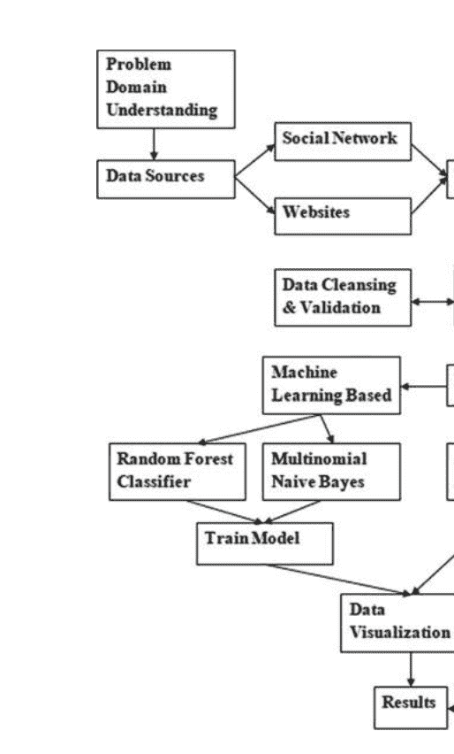

##### 4.1 网络抓取

网络抓取是一种从网站中提取所需信息的技术。在我们的项目中，我们使用Python的BeautifulSoup库来提取和存储获取的数据到一个JSON文件中。 BeautifulSoup可以提取HTML和XML格式的数据，因此更容易分析代码并获取文件中所需数据的区域。 我们在以下项目中使用的网站是mouthshut.com， 此外，还使用了Twitter API来抓取与该地区的所有医院相关的推文。 使用Twitter平台提供的访问令牌，我们可以根据搜索关键字以及地区的纬度和经度值获取推文。 数据集包含了位于班加罗尔各个地区的医院的患者评价和意见。这些数据集以原始格式存在，必须进行清洗才能进行分析，具体内容在下面的主题中描述。

##### 4.2 统计分析

Python的Pandas库提供了一个称为DataFrame的数据结构，用于存储从网络上抓取的二维表格格式数据。Pandas库提供的其他工具帮助我们对数据集进行简单的统计分析。像Numpy、Matplotlib、Seaborn、Cufflinks和Plotly这样的库用于数据可视化。可以回答一些问题，比如基于每家医院的患者评论数量，医院评分的标准差，患者在对医院的意见中使用的最常见的词语等。还可以使用上述方法推断评论与其对应评分之间的相关性。

##### 4.3 自然语言处理

自然语言处理（NLP）也可以称为语言学科学。顾名思义，在这种技术中，我们从文本和语音中推断出自然语言的使用。机器学习和预测语言的使用方式，就像人类一样，根据关键词输入建议搜索短语，自动完成，拼写检查等等。当前业务中最流行的NLP技术之一是使用NLTK和Scikit库进行的WordCloud。

WordCloud是一种显示文本集合中单词频率的图像。频率越高，单词在图像中占据的空间越大。通过使用停用词来清理单词和短语的集合，可以使用Matplotlib或其他可视化库绘制WordCloud。在我们的WordCloud中，图像显示了抓取的医疗数据上的单词分布。通过在评论文本上创建WordCloud，可以推断出医院的前景。

##### 4.4 情感分析

情感分析是一种确定给定文本情感的方法。这是最常见的文本分类器。使用这种方法，我们可以确定患者的意见是积极的、消极的还是中立的。这有助于我们了解医院的整体前景。我们首先使用NLP技术清理文本。Sentiment Analyzer()函数以数字形式表示评论的积极、消极和中立比例。使用NLP提供的Doc2Vec等工具，将意见转换为向量，从而使我们能够找到意见之间的相似性。使用词频逆文档频率（TF-IDF）来分类最重要的特征并显示它们。在密度图中，医院的正面和负面反馈被绘制出来。 我们使用随机森林分类器，一种机器学习算法，来预测评论的积极性和消极性，一旦我们用数据集训练完我们的模型。 还绘制了上述方法的接收者操作特性和精确率-召回率曲线，以检查模型的有效性。 多项式朴素贝叶斯，也是一种用于文本分类的机器学习算法，用于预测意见的评级。 生成混淆矩阵以检查该模型的正确性。

#### 5 结果与讨论

从网站和社交网络获取的数据被准备用于分析。 数据准备方法包括清洗、转换和验证数据。 使用自然语言处理工具对数据集进行词形还原、分词和清洗。 现在，这些数据被分析以获取与业务相关的信息和知识，帮助众多患者做出明智的选择。 这些信息以报告和图表的形式展示。 因此，将数据可视化工具和库纳入其中成为必要。 Matplotlib、Seaborn和Plotly是在这个项目中常用的可视化库。 除此之外，还采用了随机森林分类器和多项式朴素贝叶斯等机器学习算法进行情感分析。 我们的分析结果将在后续详细讨论。

用户应该了解特定位置的医院部分患者或顾客的评论中最常用的20个英语单词（图2）。 患者的意见经过NLP工具处理，以减少意见只包含患者用来描述医院的最重要的词语，并进行绘制。

Bengaluru地区每家医院患者的评论数量如图3所示。这将我们与该地区最受欢迎和最常访问的医院联系起来，并可用于进一步分析，如下所示。

医院好评和差评之间的关系和变化如图4所示。根据评论中的词语和情感分数，可以将其分类为好评或差评。

评论长度和评分之间的关系如图5所示。

在图6中，显示了图3和4之间相关性的热力图图形表示。

## 图3 前20家医院的评论数量


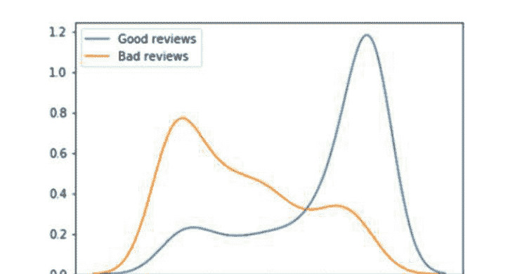

## 图4 好评与差评

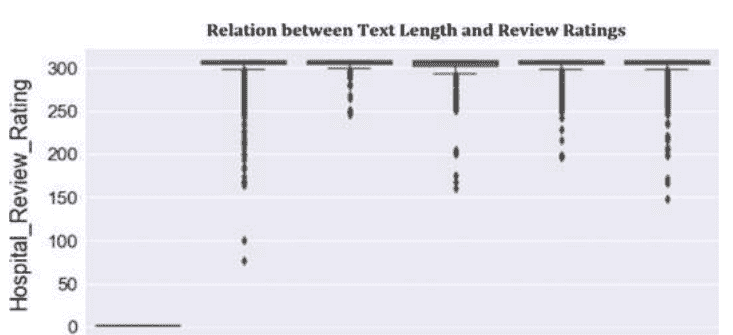

## 图5 文本长度与评论评分之间的关系

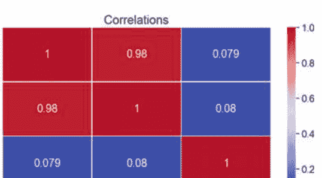

## 图6 相关性热力图

## 图7 词云图展示了患者的痛苦和不满


在图7中，频率较高的词以较大的字体显示，而频率较低的词以较小的字体显示，根据其在收集的数据中的存在情况。它展示了患者的痛苦和不满或满意度。

图8显示了每家医院患者给出的评论评分的平均值的标准差。

图9中显示的曲线下面积（AUC）和平均精度（AP）表示我们使用随机森林分类器训练的模型的技能。如图10所示，输出值预测给定评论在好评或差评范围内的位置，介于1到5之间，其中1是最低评分。这个预测是基于多项式朴素贝叶斯算法。

通过实施随机森林分类器得到的ROC曲线（图11）显示了在0.0和1.0阈值之间的误报率（假阳性率）与命中率（假阴性率）之间的关系。

#### 6 结论

本文介绍了在医院领域中预测和情感分析的应用。随着大数据、机器学习和数据分析等术语在当前趋势中的使用，资本、新技术和技术的增长将毫不奇怪。未来的发展方向是演化的机器学习算法，可以在最少的资源使用情况下进行更好的分析。随着人口的增加，患者数量也在增加。在医疗分析方面取得进展非常重要。 能够对包括诊断、预测、药物和症状在内的各种临床数据进行明确结果的算法是医疗行业面临的挑战的有希望的答案。 制药、健康保险行业和医院之间的合作对于改善患者和护理人员的生活至关重要，因为它们可以提供作为一套服务提供给最终客户。 该项目的未来工作范围可以朝不同的方向发展。 我们可以建立一个平台，为最终用户提供有关国内或全球任何医院的折扣，为了实现上述目标，我们需要更多的数据收集和更多的分析工作。

本文讨论的挑战和技术挑战是改进的障碍，需要加以关注。此外，这个领域对人类的日常生活有着巨大的潜力，因此必须确保它能够实现其所述的目标，并且不被滥用。

## 2-class Precision-Recall curve: AP=0.89

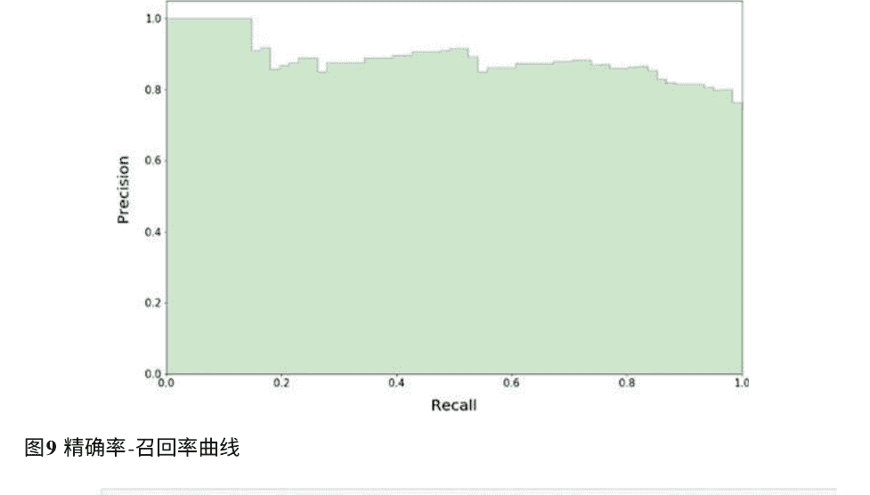

## 图9 精确率-召回率曲线

```
In [78]: review12='Inexperienced Doctors. No sense of kindness. Please never visit this hospital'
In [79]: negative_review_transformed = bow_transformer.transform([review12])
        nb.predict(negative_review_transformed)[0]
Out[79]: 1
```

## 图10 将评论预测为好或坏

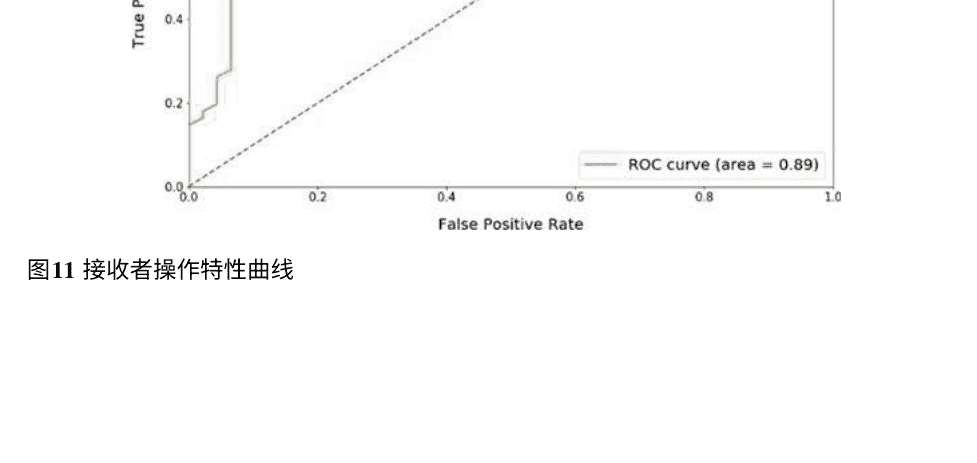

## 图11 接收者操作特性曲线

致谢第三作者要感谢卡纳塔克邦政府的VGST资助，该研究工作部分地得到了RGS/F计划的支持。

#### 参考文献

1.  Benlachmi, Y., & Hasnaoui, M. L. (2020). 大数据和Spark：与Hadoop的比较。在2020年第四届智能系统、安全和可持续发展世界会议(WorldS4)中(pp. 811–817).
2.  Alkhabbas, F., Spalazzese, R., Cerioli, M., Leotta, M., & Reggio, G. (2020). 关于物联网系统的部署：一项工业调查。在2020年IEEE国际软件架构会议附属会议(ICSA-C)(pp. 17–24)中。
3.  Li, Y. (2020). 机器学习算法在数据挖掘领域的实践。在2020年国际环境计算与智能会议(ICAACI)(pp. 56–59)中。
4.  Gupta, R. (2020). 关于机器学习方法及其技术的调查。在2020年IEEE国际学生会议上，电气、电子与计算机科学(SCEES) (pp. 1–6).
5.  Ferdous, M., Debnath, J., & Chakraborty, N. R. (2020). 医疗保健中的机器学习算法：一项文献调查。在2020年第11届计算、通信和网络技术国际会议(ICCCNT)(pp. 1–6)中。
6.  Srivastava, S., Soman, S., Rai, A., & Srivastava, P. K. (2017). 健康信息学中的深度学习：最新趋势和未来方向。在计算、通信和信息学进展国际会议(ICACCI)上,印度乌杜皮,9月13日至17日(第1665-1670页).
7.  Nithya, I. (2017). 使用机器学习工具和技术进行医疗保健的预测分析。在智能计算和控制系统IEEE国际会议上,印度马杜赖,6月15日至16日（第492-499页）。
8.  Golkov, A. D., Sperl, J. I., Menzel, M. I., Czisch, M., Samann, P., Brox, T., & Cremers, D. (2016年5月). q空间深度学习：十二倍更短和无模型扫描的扩散磁共振成像。IEEE医学成像交易，35(5)，1344-1351。
9.  Huynh, B., Drukker, K., & Giger, M. (2016)。使用深度卷积神经网络的乳腺超声图像计算机辅助诊断。国际医学物理与实践杂志，43(6)，3705-3705。
10. Zamfir, M., Florian, V., Stanciu, A., Neagu, G., Preda, S., & Militaru, G. (2016)。走向一个平台，用于原型设计：物联网健康监测服务。斯普林格国际会议探索服务科学，商业信息处理讲义，247，522-533。
11. Mancini, A., Frontoni, E., & Zingaretti, P. (2015)。嵌入式多传感器系统，用于安全点对点导航受损用户。IEEE智能交通系统交易，16(6)，3543-3555。
12. Trave-Massuyesab, L. (2014)。为诊断而架起控制和人工智能理论之桥：一项调查。Elsevier Engineering Applications of Artificial Intelligence, 27(27), 1–16.
13. Sirinukunwattana, K., Raza, S. E. A., Tsang, Y.-W., Snead, D. R., Cree, I. A., & Rajpoot, N.M . (2016)。用于常规结肠癌组织学图像检测和分类的局部敏感深度学习。IEEE Transactions on Medical Imaging, 35(5), 1196–1206.
14. Basole, R. C., Braunstein, M. L., & Sun, J. (2015)。为学习型医疗系统而面临的数据和分析挑战。ACM Journal of Data and Information Quality (JDIQ), 6, 1–4.
15. Nie, L., Wang, M., Zhang, L., Yan, S., Zhang, B., & Chua, T.-S. (2016)。通过稀疏深度学习从健康相关问题推断疾病。IEEE知识与数据工程交易, 27(8), 2107–2119.
16. Pavel, M., Jimision, H. B. et al. (2015). 行为信息学和计算建模支持积极健康管理和护理。IEEE生物医学交易,62(12), 2763–2775.
17. Das, J., Gayvert, K. M., Yu, H. (2014). 使用功能基因组学数据集预测癌症预后。癌症信息学, 13(5), 85–88.
18. Liu, B. (2010). 手册章节: 情感分析和主观性。自然语言处理手册。在自然语言处理手册. Taylor and Francis.
19. Pang, B., Lee, L., & Vaithyanathan, S. (2002). Thumbs up? 使用机器学习技术进行情感分类。在自然语言处理中的经验方法会议, (pp. 79–86).
20. Tumasjan, A., Sprenger, T. O., Sandner, P. G., & Welpe, I. M. (2010). 用推特预测选举：140个字符揭示政治情绪。第四届国际ICWSM, 10(1), 178–185。
21. Holzinger, A. (2016). 机器学习在健康信息学中的应用。在健康信息学中的机器学习, 人工智能讲义(pp. 1–24)。Springer国际出版社。
22. Drukker, C. A. (2014). 通过将70个基因签名与临床风险预测算法相结合，优化乳腺癌预测结果。Springer乳腺癌研究与治疗杂志, 145(3), 697–705。
23. Anavi, Y., Kogan, I., Gelbart, E., Geva, O., & Greenspan, H. (2016). 利用患者年龄和性别增强深度学习框架的可视化和胸部X射线图像检索。在SPIE医学成像。国际光学与光子学学会。

#### 1 引言

注释文档用于生成用户感兴趣的属性值。它可以分为无类型关键字注释（飓风风速=85）、属性值对（飓风风速，85）、具有潜在字段的预定义模式（飓风风速，85）、（飓风类型='热带'）、（降压日期=11月30日）…，（损坏='未知'））、具有基本注释字段的预定义模式（飓风风速，85）、（降压日期=11月30日）、（损坏='未知'））。许多系统没有属性值对组合，因此前两种方法并不总是可行。预定义模式中可能出现许多字段。所以

### 动态文档本地化以实现高效挖掘

P. Sijin和H. N. Champa

摘要注释是向实体（如文档、属性、数据存储库和数据空间）添加注释的过程，以使它们更加可见和表达。在概率数据模型中，它用于为属性生成值，这些值可用于生成与数据库模式匹配的一系列查询。提出的模糊文档本地化模型（FDLM）通过基于查询值Qval和内容值Cval推导出单调模糊排名函数来列出前k个属性。新到达的文档与有条件地建模的带有真实属性的注释文档一起进行处理，以进行动态文档分类过程。通过预处理的概念化框架识别属性的语义匹配，从而增加结果集的基数。系统通过偏置参数 β进行偏置，以便在工作负载查询值和面向数据库的内容值之间保持平衡，并在准确匹配和近似匹配的范围内设置选择边界。

-   自信段
-   查询值
-   内容值
-   数据空间
-   注释
-   工作量第三种方法中的分析和查询很麻烦。第四种方法使用有限的属性集，并显示可行的性能。但是它在回答近似查询和实现查询概念化方面存在滞后。

许多属性插入软件都存在，它们将使用自适应的属性插入表单来收集用户关注的文档属性。表单是一种简单的查询界面，它确定数据库中数据的有用性和可用性。表单界面设计需要对数据内容和用户对查询的兴趣进行仔细分析。由于表单是复杂数据库层次结构的一组查询代理，因此它应该是最优和多样化的，以回答存储库中潜在兴趣领域的问题。表单集应具有广泛的查询范围，并且在基于约束的界面复杂性限制内。表单生成过程可以是静态的或动态的。动态脚本生成过程使用CGI脚本、Cold Fusion、Active Server Pages (ASP)。在自动化电子表单开发过程中，XML DTD可以与支持的软件工具一起使用，用于验证、导航、多语言和计算[1-3]。在为非结构化文档或模糊或简短的文档准备插入表单之前，系统应该注意文档的全局和局部上下文以及其与应用领域的模糊关系[4, 5]。

图1给出了一个关于最近在印度和斯里兰卡登陆的热带气旋Burevi的非结构化文档的图示表示，该文档提供了相关信息。对于信息检索（IR）和数据库查询（DB）来处理这样的文件是一项繁琐的工作。现代查询建模系统使用了DB方法，其中包含了强大的查询语言，如XPath和XQuery，以及IR方法来消除查询中不需要的结构[6-8]。由于非正式的写作风格、长度有限和缩写句子，一个查询分析系统很难从图1中获取信息，这需要平滑方法来获取查询的可能性谓词[9, 10]。

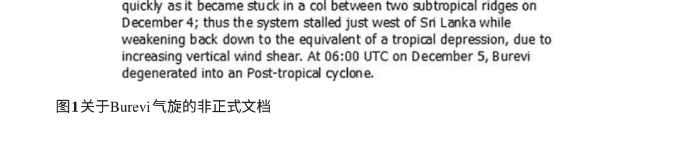

图1 关于Burevi气旋的非正式文档

图2 关于Burevi气旋的文档的适当注释

+   - Cyclone name: Burevi
    - Category: 1
    - Type: tropical

图1. 包含重要属性((气旋风, 85), (降压日期 = 11月30日), (损坏 = '未知')), 这些属性由领域专家预处理为'Burevi', 但由于全局和局部上下文中的歧义, 文档未被检测或未正确分类. 为了避免这个问题, 可以使用描述性、总结性或评估性值的适当注释形式来表达查询的意图. 图2列出了图1的适当注释, 用于图1文档的元数据生成. 注释提高了搜索的质量, 并可以为查询提取出最相关的文档. 在动态环境中, 通过对带有注释文档的查询进行概率建模, 注释有助于将新文档分类到所需的主题中. 以下查询受到图2中指定的注释的益处.

+   1. 问题1: 气旋名称="Burevi"且类型="热带".
    2. 问题2: 气旋等级=1.
    3. 问题3: 气旋名称="Burevi"且日期为"12月4日至12月8日".

每当有新文档上传到数据存储库时，提议的FDLM模型使用贝叶斯和伯努利方法进行分析，并识别重要属性。这些属性用于表示文档，并为原始属性和具有高概率将文档导向数据库模式或数据空间以实现语义集成生成基本模糊属性。使用单调递增函数将Q值和C值组合起来，为属性生成最终值，从而可以相应地对文档进行分类。

#### 2 文献综述

机器学习（ML）是一种数据分析方法，它使用算法、人工智能工具、学习原型和高效的数据表示方法从数据中学习[11, 12]。数据挖掘是通过应用ML和各种数据模型[13–17]以及数据摘要方法[18–20]来制定规则和关联以定位所需模式的过程。ML评估的数据用于工业生产线上生产具有高吞吐量、低成本和更可靠性的产品和零件[21–24]。

查询表单用于表示与数据库中的属性、值名称相关的查询模式。模式可以从数据库或查询工作负载中准备。通过减少查询最佳属性列表的数量，可以在工作负载环境中以最小的工作量建模依赖关系[25, 26]。表单生成过程可以是静态的或动态的。

现有的自动信息提取算法在文档没有目标信息或相关信息的百分比较低时面临问题。在这种情况下，它们必须执行不必要的计算并遇到误报[27–29]。所提出的方法使用预处理的模糊概念模型(FCM)为基本属性生成语义替代品[10, 30, 31]。

在语言模型中，通过查看m个前驱词来预测一个新词，并以线性方式插值n-gram模型和unigram模型，并且还可以确定前驱之间的概率依赖关系[32]。FDLM是一种概率性的方法，它根据条件基础从多个来源获取预测证据，然后遵循正态分布。

根据[33–36]，通过使用单调聚合函数将属性等级相结合，可以计算每个对象的等级。在这种情况下，每个对象都有多个与属性对应的等级，并且属性维护一个排序列表以显示其与各种访问点的关联。FDLM使用了一种称为模糊阈值算法的最优排序算法来排序属性等级[37, 38]。

#### 3 方法论

提出的查询内容推理模型通过遵循贝叶斯和伯努利策略为属性实现了异常值分数，以成为注释框架的一部分。该模型将查询和内容转化为称为工作负载的信息，并形成一个抽象的注释模型。表1列出了本文中使用的符号。

在引言部分提到的预先确定的基本注释模式用于文档注释。有四个文档及其相应的注释列在表2中。文档doc5是新添加到数据库中的。选择的属性是城市和救济。表3列出了称为工作负载的信息需求。

##### 3.1 查询工作负载的概率模型

属性 \( A_j \) 的查询值是根据给定工作负载WL中获取 \( A_j \) 的可能性来计算的，如式(1)所示。属性 \( A_j \) 的模糊集合表示为Afs_j，其中_j的取值范围是0-k。集合Afs_j的成员用变量fuzzyval_j表示。

```
\[ Q_{val} = \frac{P(A_j / WL)}{1 - P(A_j / WL)} \] (1)
```

其中

表1 使用的符号

| 符号 | 含义 |
| :--- | :--- |
| $A_i$ | $WL \cup R$的注释数据中的属性 |
| $A_j$ | $A_i$中的属性，其中 $A_j \subseteq A_i$ |
| $WL$ | 工作负载 |
| $R$ | 存储库 |
| $doc$ | 文档 |
| $doc_t$ | 文档 $D$的文本 |
| $doc_a$ | 文档 $D$的注释 |
| $doc_{result}$ | 文档的完整和最优注释 |
| $w$ | 文档中的单词 |
| $排名_v$ | 排名函数 |
| $数据库管理员$ | 数据库 |
| $数据库管理员_j$ | 带有注释的数据库文档 $A_j$ |
| $数据库管理员_{j, w}$ | 带有注释的数据库文档 $A_j$包含单词 $w$ |
| $Q_{val}$ | 查询值 |
| $C_{val}$ | 内容值 |
| $WLA_j$ | 工作文档包含 $A_j$ |
| $模糊值_j$ | 语义相关属性的FCM值 $A_j$ |

表2 文档及其对应的注释

| 文档ID | 内容 | 注释 |
| :--- | :--- | :--- |
| $doc_1$ | 飓风Burevi降压<br>速度：50英里/小时 | 飓风：Burevi，降压<br>速度：50英里/小时 |
| $doc_2$ | 受损的粮食作物泰米尔<br>纳德邦 | 报告的损害：粮食作物，<br>城市：TN |
| $doc_3$ | 水灾Jafna DM，斯里<br>兰卡 | 救济：水灾区域：Jafna<br>DM，<br><br>学校：Jafna DM，城市：斯里<br>兰卡 |
| $doc_4$ | 受洪水影响的斯里兰卡 | 救济：洪水城市：斯里兰卡 |
| $doc_5$ | 泰米尔纳德邦洪水结果<br>DM | |

表3 工作负载

| 查询 |
| :--- |
| 州：波多切里，地区：泰米尔纳德南DM |
| 地区：瓦武尼亚区，城市：斯里兰卡 |
| 地区：Jaffna高中，救济：水 |
| 学校：开放，学校：Jaffna DM |
| 州：波多切里，损害：5000人流离失所 |
| 地区：北部省地区，救济：水 |

```
$P(A_j/WL) = \frac{WLA_j + 1}{WL + 1}$
```

模糊集合Afsj包含所有语义匹配值的FCM值 A_j和计算如下

```
$Q_{val_i} = \text{fuzzyval}_j * \frac{P(A_j/WL)}{1 - P(A_j/WL)}$ (2)
```

属性'城市'的查询值计算如下

```
$\frac{WLA_j + 1}{WL + 1} = \frac{1+1}{6+1} = \frac{2}{7} = 0.29$

$Q_{val, \text{城市}} = \frac{0.29}{1 - 0.29} = \frac{0.29}{0.71} = 0.40$
```

假设FCM（城市，镇，0.9）显示属性'城市'与给定领域中的属性'镇'相关，有效系数值为0.9，因此Qval,镇的计算结果为fuzzyval_j * Qval = 0.9 * 0.40 = 0.36。这种方法将产生更多的属性，并用于查询近似。

同样，属性'relief'的查询值计算如下

```
$\frac{WLA_j + 1}{WL + 1} = \frac{2+1}{6+1} = \frac{3}{7} = 0.42$

$Q_{val, relief} = \frac{0.43}{1 - 0.43} = \frac{0.43}{0.57} = 0.75$
```

##### 3.2 内容工作负载的概率模型

文档中每个单词与属性的观察共现概率提供了给定单词的文档内容值，如（3）所示。

```
$C_{val} = \Pi_{w \in doc_i} P^{\text{空格}}_{w/A_j} \quad (3)$
```

其中

```
$P^{\text{空格}}_{w/A_j} = \frac{DBA_{j,\text{空格}} + 1}{DBA_j + DB + 1}$
```

新到的文档中属性'City'的内容值与术语'洪水'相关被计算为

```
$P \left( \frac{\text{洪水}}{City} \right) = \frac{DBA_{j,\text{空格}} + 1}{DBA_j + DB + 1} = \frac{2 + 1}{3 + 4 + 1} = \frac{3}{8} = 0.375.$
```

类似于其他词，内容值被计算为结果=0.25, 泰米尔纳德邦=0.25, DM=0.25)。观察到的非共现属性的概率对于文档中的每个单词提供了给定单词的文档内容值，并在（4）中给出。

```
$P \left( \frac{w}{A_j} \right) = \frac{DBA_{j,\text{空格} w} + 1}{DBA_j + DB + 1} \quad (4)$
```

新到的文档中否定属性City与术语'洪水'的内容值被计算为

```
$P \left( \frac{\text{空格} flood}{City} \right) = \frac{DBA_{j,\text{空格} w} + 1}{DBA_j + DB + 1} = \frac{0 + 1}{1 + 4 + 1} = \frac{1}{6} = 0.17$
```

与其他词类似，否定内容值的计算结果为result = 0.17, Tamil Nadu = 0.17, DM = 0.17)。城市的整体内容值为

```
$C_{val, \text{城市}} = \frac{\Pi_{w \in doc_i} P \left( \frac{w}{A_j} \right)}{\Pi_{w \in doc_i} P \left( \frac{w}{A_j} \right)} = \frac{0.375 * 0.25 * 0.25 * 0.25}{0.17 * 0.17 * 0.17 * 0.17} = 7.59. \quad (5)$
```

同样，救济的整体内容值为

```
$C_{val, \text{救济}} = \frac{\Pi_{w \in doc_i} P \left( \frac{w}{A_j} \right)}{\Pi_{w \in doc_i} P \left( \frac{w}{A_j} \right)} = \frac{0.42 * 0.28 * 0.14 * 0.28}{0.14 * 0.14 * 0.28 * 0.14} = 6. \quad (6)$
```

##### 3.3 Rank计算的伯努利模型

根据该模型，每个预测者提供独立的注释观点。假设属性A_j在文档中存在，并且定义了一个具有分布b的变量，用于模拟文档中指定属性存在的事件的伯努利实验，如式（8）所示。

```
b \left( \frac{A_j}{\text{WL}}, \text{doc}_t, \text{Pr} \right) = \beta_1.bw + \beta_2.bd \qquad (8)
```

其中查询值bw的计算方式与(1)相同，内容值bd的计算方式与(3)相同，但有修改，并在(9)中给出。

```
bd(A_j) = P(A_j).\Pi_{w \in \text{doc}_t} P \left( \frac{\text{空格}_w}{A_j} \right) \qquad (9)
```

```
P(A_j) = \frac{\text{DB}A_j + 1}{\text{DB} + 1} \qquad (10)
```

根据(3)，(9)和(10)，City的内容值为0.004，relief的内容值为0.002。根据(8)，属性的伯努利排名如下所示：

```
b \left( \frac{\text{City}}{\text{WL}}, \text{doc}_t, \text{Pr} \right) = \beta * 0.28 + (1 - \beta) * 0.004
```

$b\left(\frac{\text{relief}}{\text{WL}}, \text{doc}_i, \text{Pr}\right) = \beta * 0.43 + (1 - \beta) * 0.002$

当β超过0.6时，属性relief及其模糊属性的排名较高。

#### 4 模糊阈值算法

从前一节可以清楚地看出，每当出现一个新文档时，它都会被注释并允许与查询工作负载一起处理以获得查询值。内容值被测量为共同出现与不共同出现属性-词对的概率比。使用具有或没有预测者证据的模糊单调函数将它们组合起来。FDLM使用流水线方法进行文档定位，因此它需要自信的或种子属性作为输入以进行高效处理。提出的模糊阈值算法定义了一个阈值函数τ来组合Q_val和C_val，并不断向结果集中添加新属性，并在算法1中给出。这个丰富的集合用于文档分类。

算法1从查询的注释形式中读取属性，并准备一个属性和其预处理模糊集的结果集。基于工作负载的查询值和基于数据库的内容值被计算以对属性进行排序。对于它们各自的模糊术语，同样的过程会重复进行。通过调整FDLM系统中的β，排名的顺序可以改变。如果属性的排名超过阈值τ，则将这些属性用于进一步处理，该处理与结果集中旧的顶部值的处理进行流水线处理。这个过程随着越来越多的自信段的出现而继续进行。

**算法1：** 模糊阈值算法计算结果集实例
**数据：** 搜索查询和带注释的关键词或属性、工作负载和词库。
**结果：** 特定时间段的结果集Result_i。
**初始化；**
1. 从带注释的表单中选择属性A_j，其中j=0-n，确定其模糊集。
2. 根据(2)计算Q_val。
3. 根据(3)计算C_val。
4. 根据(8)设置一个名为Result_i的集合。
5. 通过设置β来确定A_j的最佳范围。
6. 如果存在新的属性A_k，其中A_k ≥ τ，则返回Result_i。
7. 否则返回步骤1。

## **5 实验分析**

提出的模型产生了可用于文档注释的最佳属性集。提出的流水线方法通过基于QV和CV的模糊导向算法执行注释，并对新到达的文档进行本地化。在实验分析中，确定了不同查询建议对数据集的精确度和召回率的影响。偏置参数 β在伯努利模型上的作用在CNET和Amazon数据集上进行了迭代。最后，研究了训练数据集大小对近似匹配和实际匹配的影响。实验分析使用了两个数据集，分别是CNET和Amazon。CNET语料库包含从CNET获取的4840个电子产品评论。它包含相机、视频游戏、电视、音频设备和闹钟等不同类型的产品。Amazon产品语料库包含从Amazon下载的19,700个文档。它还包括电子产品、图书和其他在Amazon上销售的物品。

### **5.1 属性建议对精确度和召回率的影响**

对于一个文档的建议属性的质量可以通过与真实属性集进行比较来衡量。精确度和召回率指标用于反映其影响。基于内容价值的方法和模糊文档定位方法在结果上表现较好，前者处理文档工作量，后者考虑查询工作量上的语义匹配。图3和图4展示了CNET数据集的结果，图5和图6展示了Amazon数据集的结果。

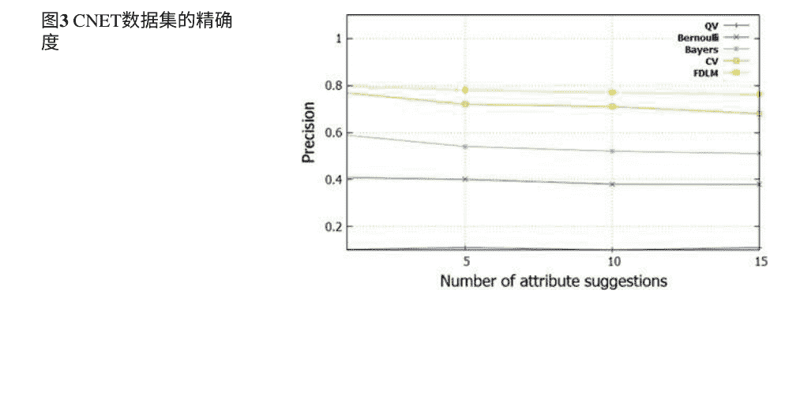

图3 CNET数据集的精确度

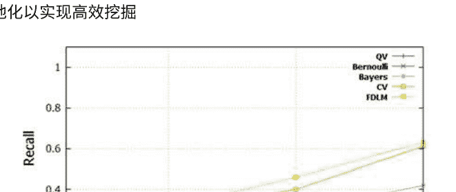

图4 CNET数据集的召回率

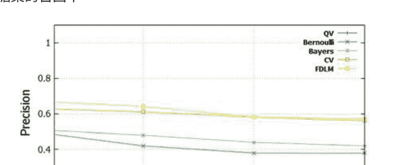

图5 Amazon数据集的精确度

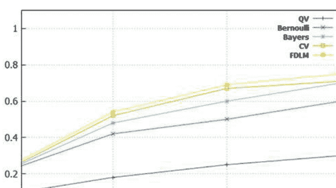

图6 Amazon数据集的召回率

### **5.2 偏置系数对属性匹配的影响**

在伯努利策略 β 中，偏置系数用于稳定部分和完全属性匹配的数量。 在FDLM中，除了基准属性之外，还使用了模糊集，从而增加了最优结果集的大小，并在CNET的图7和Amazon的图8中显示。

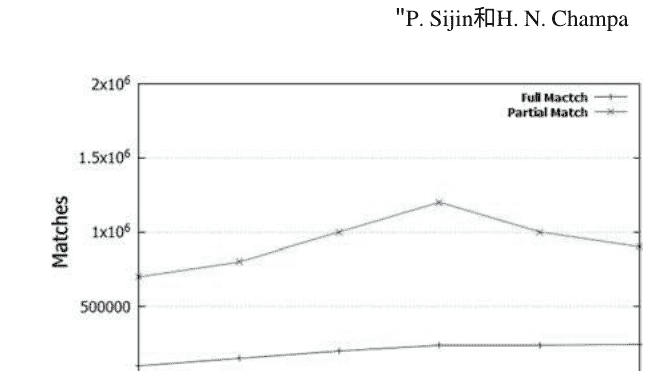

图7 CNET中beta的影响

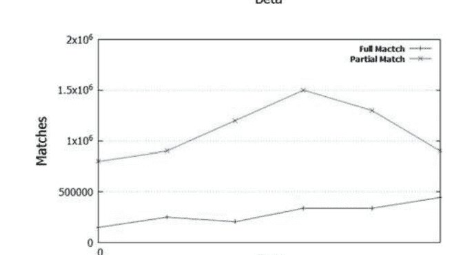

图8 Amazon中beta的影响

### **5.3 确定精度的数据库大小效果**

当训练大小增加时，精度也会增加。 CV方法完全依赖于数据库，影响很大。同样，在FDLM中，近似匹配和语义匹配更多，因此精度增加。图9显示了这一点，适用于CNET，图10显示了这一点，适用于Amazon。

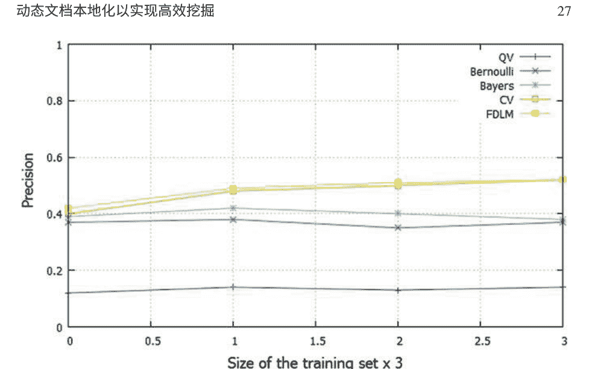

图9 数据库大小对CNET精度的影响

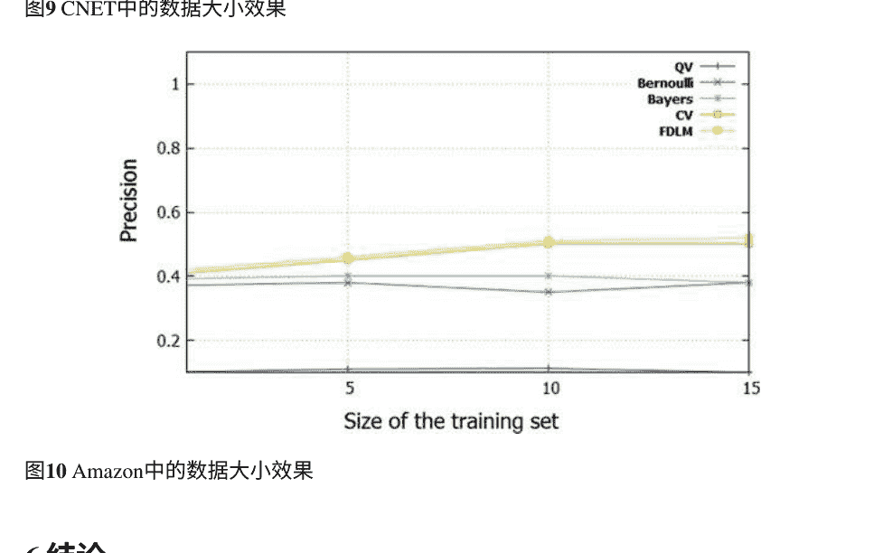

图10 数据库大小对Amazon精度的影响

#### 6 结论

提出的模糊文档定位模型对属性进行了排序，并生成了最佳的属性集，可用于文档注释。注释文档非常表达性，对用户可见。基于FCM的模糊集提供了一个独特的属性集，与基准属性相关且语义匹配。提出的模糊评估函数将基于工作负载的查询值与数据内容值相结合，生成可用于进一步查询建议的前k个属性。预处理的模糊集可以轻松添加到给定模型可以产生一系列带有偏置参数β的值。模糊阈值算法用于限制自信输入段，并实现计算的并行性。为了避免额外的计算开销，使用具有非常有效的评估系数值和选定属性的模糊集。FDLM为其他查询搜索服务提供了数据注释平台。系统可以通过调整β在某些优选情况下有效地改变选择顺序。尽管注释在使用中是高效的，但它会引入一些额外的通信开销，可以通过整合完全自动化的预处理数据集和服务来避免。

#### 参考文献

- 1. Helm, D. J., & Thompson, B. W. (2001). 一种用于基于Web的应用程序中完全动态表单处理的方法。在ICEIS中(pp. 974–977)。
- 2. Tornqvist, N. C., & Johnson, A. M. (1999). XML和对象-电子表单在Web上的未来(pp. 303–308)。
- 3. Jeffery, S. R., Franklin, M. J., & Halevy, A. Y. (2008). 按需付费用户反馈数据空间系统 (pp . 847–860).
- 4. 李, C., 孙, A., 翁, J., & 何, Q. (2015). 推文分割及其在命名实体识别中的应用。IEEE知识与数据工程交易, 27(2), 558–570.
- 5. 于, Z., 王, H., 林, X., & 王, M. (2016). 通过语义丰富和哈希理解短文本。IEEE知识与数据工程交易, 28(2), 566–579.
- 6. Schmidt, A., Kersten, M., & Windhouwer, M. (2001). 查询XML文档变得容易：最近概念查询 (pp. 321–329).
- 7. Fuhr, N., & Grosjohann, K. (2001). XIRQL：一种用于XML文档信息检索的查询语言（第172-180页）。
- 8. Schutze, H., Manning, C. D., & Raghavan, P. (2008). 信息检索导论 39.
- 9. Chen, S. F., & Goodman, J. (1999). 平滑技术在语言建模中的实证研究。计算机语音与语言，13(4), 359-394。
- 10. Ruiz, E. J., Hristidis, V., & Ipeirotis, P. G. (2014). 利用内容和查询价值促进文档注释。IEEE知识与数据工程交易，26(2), 336-349。
- 11. Mikolov, T., Chen, K., Corrado, G., & Dean, J. (2013). 向量空间中词表示的高效估计。康奈尔大学图书馆。
- 12. Sijin, P., Champa, H., & Venugopal, K. (2017). 关于基于意图的多样化的调查模糊关键字搜索。国际计算机科学与信息技术杂志, 8(6), 602–618.
- 13. Liu, J., & Yan, D. (2016). 回答XML数据的近似查询。IEEE模糊系统交易, 24(2), 288–305。
- 14. Li, J., Liu, C., & Yu, J. X. (2015). 基于上下文的关键字查询多样化XML数据。IEEE知识与数据工程交易, 27(3), 660–672.
- 15. Wang, L. (2017). 异构数据和大数据分析。自动控制和信息科学, 3(1), 8–15.
- 16. 蒋伊杰, 刘春春, 蔡宇辉, 库马尔 (2015). 使用模糊聚类在网络文档中发现潜在语义。IEEE模糊系统交易，23(6), 2122–2134.
- 17. Sestakova, E., & Janousek, J. (2018). 自动机方法用于XML数据索引。信息, 9(1), 12.
- 18. Dou, Z., Jiang, Z., Hu, S., Wen, J.-R., & Song, R. (2016). 从搜索结果中自动挖掘查询的方面。IEEE知识与数据工程交易，28(2), 385–397。
- 19. 赵然, 毛凯 (2017). 用于文档表示的模糊词袋模型。IEEE模糊系统交易.
- 20. Kusner, M., Sun, Y., Kolkin, N., & Weinberger, K. (2015). 从词嵌入到文档距离 (pp. 957–966).
- 21. Liu, J., Wang, K., & Fung, B. C. (2016). 一阶段挖掘高效用模式而不生成候选项。IEEE知识与数据工程交易,28(5), 1245–1257.
- 22. Tseng, V. S., Wu, C.-W., Fournier-Viger, P., & Philip, S. Y. (2016). 高效挖掘前k个高效用项集的算法。IEEE知识与数据工程交易,28(1), 54–67.
- 23. Suma, V., & Hills, S. M. (2020). 基于数据挖掘的印度市场翻新电子产品需求预测。软计算范式杂志,2(03), 153–159.
- 24. Raj, J. S. (2020). 在认知无线电网络中使用博弈论技术的机器学习实现。期刊：2020年可持续无线电系统IRO期刊(2), 68–75.
- 25. Koshti, S., Sen, A., & Jadhav, V. (2017). 使用排名模型的动态查询表单(DQF)用于数据库查询(pp. 365–370).
- 26. Jayapandian, M., & Jagadish, H. (2008). 自动创建基于表单的数据库查询界面。VLDB Endowment的论文集, I(1), 695–709.
- 27. Jain, A., & Ipeirotis, P. G. (2009). 用于信息提取的质量感知优化器。ACM数据库系统交易, 34(1), 1–48.
- 28. Rahm, E., & Bernstein, P. A. (2001). 自动模式匹配方法综述。VLDB Journal, 10(4), 334–350.
- 29. Ponte, J. M., & Croft, W. B. (1998). 一种语言建模方法用于信息检索 (pp. 275–281).
- 30. Sijin, P., & Champa, H. (2020). 模糊概念化模型用于文档表示. 在IEEE国际电子、计算和通信技术会议上(pp. 1–4).
- 31. Cohen, W. W., Ravikumar, P., Fienberg, S. E., et al. (2003). 一种字符串距离比较度量方法用于姓名匹配任务, 73–78.
- 32. Ney, H., Essen, U., & Kneser, R. (1994). 关于在随机语言建模中构建概率依赖关系的结构化方法.计算机语音和语言, 8(1), 1–38.
- 33. Fagin, R., Lotem, A., & Naor, M. (2003). 用于中间件的最优聚合算法. 计算机与系统科学杂志, 66(4), 614–656.
- 34. Fagin, R. (1999). 在计算机与系统科学杂志中从多个系统结合模糊信息, 58(1), 83–99.
- 35. Zadeh, L. A. (1965). 模糊集合。信息与控制, 8(3), 338–353.
- 36. Dong, X. L., Halevy, A., & Yu, C. (2009). 带有不确定性的数据集成。VLDB期刊, 18(2), 469–500.
- 37. Clemen, R. T., & Winkler, R. L. (1990). 概率预测者之间的一致性和妥协。管理科学, 36(7), 767–779.
- 38. Chang, K. C.-C., & Hwang, S.-w. (2002). 最小探测：支持昂贵谓词的前k查询（第346–357页）。

### SentiSeries: 客户评论、情感分析和时间序列的三部曲


Aishwarya Asesh

摘要 客户评级是用户反馈知识的重要来源。 尽管在线零售评论数量众多，但人们对零售公司提供的商品和服务的感受了解甚少。 本研究的重点是分析与时间序列分析相一致的评论情感， 揭示出非常有趣和决定性的见解。 用户行为、计数频率和情感的趋势被用来解读极性转变。 使用不同的方法集合进行时间序列分析、情感分析和主题建模。

时间序列分割有助于区分在情感模式中起重要作用的关键时间点。 使用主题建模技术对这些关键时刻之前和之后的时间步长进行研究，有助于正确分析和预测用户行为。 该研究深化了对在线零售消费者行为的了解，并为优化在线零售服务提供了宝贵的战略教训。 最后，深入调查建立了领域内首次的指标，如情感速度和加速度，用于情感监测。 这里呈现的研究结果是迄今为止文献中最好的。

关键词 情感分析 · 时间序列 · 主题建模 · 情感速度 · 情感加速度 · 情感监测 · 客户评论

#### 1 引言

了解消费者各种偏好和意图对于任何零售商来说都是至关重要的，以自适应地优化他们的产品或服务[1]。 通过反馈进行迭代和改进已经得到了许多成功的证明。 最近的一项研究[2]发现，通过正确地根据用户评论内容对用户进行分段并在推荐方面进行工作，可以将客户保留率提高近35%；并将转化率提高超过25%。

现实世界的评论具有不同的决策词和表达不同的情感，这使得行为建模变得困难。尽管他们的意图对系统来说不是直接可见的，但它们是独特的。已经研究了各种活动信号，以不同程度的成功提取有关用户推荐的知识。已经进行了大量的工作来研究有意见的文本数据，以更好地解释用户的关注重点[3,4]。为了确定嵌入式消费者意图，可以统计建模术语的分布及其情感极性。设备记录的行为信息，如意见评级和结果点击，为推断用户潜在偏见提供了明确的监督，但由于数据的多样性，理解个体请求并进行迭代变得非常困难[5]。

情感分析是一项核心的自然语言处理（NLP）任务，旨在检测文本的极性。它是NLP中最常用、直接和实用的技术之一。其目的是预测一篇文章，通常是一个句子或摘要，将如何被接受。人们可以使用情感分析来区分积极和消极的情绪，有效地将挑战转化为二元分类问题。今天在数字世界中几乎所有的东西都经常被赋予星级评价，这表明产品或作品的好坏程度，以及是否有或有意愿进行修改。

这个挑战通常被认为是自然语言处理中最简单的之一，因为简单的机器学习（ML）策略可以提供坚实的基准[6]，有时甚至超过更复杂的方法[7]。在其最基本的形式中，这个任务可以被看作是对积极和消极情感的二元分类。然而，要达到最高水平的准确性，需要克服许多障碍。除了基本的词袋方法会忽略词序细节外，如何表示可变长度的文本还不清楚。高级的机器学习方法，如循环神经网络及其变种[7,8]可以使用，但不清楚它们是否比简单的词袋和词组袋技术[7,9]提供了重大优势。互补模型最青睐集成模型，因此使用多种技术是理想的。文献中提出的大多数模型都是判别性的，其参数是专门为分类而优化的。

人们可以使用数字内容来辩论问题并传播他们的观点。来自数字内容的文本数据量非常庞大。评估情感的方法必须简化，以便获得对特定产品的“整体”观点的洞察。对于许多行业来说，意见分析正在成为一个越来越重要的研究领域。如果一个公司能够弄清楚顾客对其产品的看法，它可以采取措施来改变它们或满足不满的客户。对于情感分析，包括朴素贝叶斯和最大熵在内的许多算法采用概率方法来解决问题。支持向量机（SVM）的使用是另一种流行的方法。训练好的模型可以用于区分新产品发布的正面和负面评论，并可以研究一些关键指标，如情感加速度和速度，以找到有意义的见解。

#### 2 文献综述

听取他人的意见的需求与口头交流一样古老。领导者常常对下属的观点感兴趣，无论是为了应对批评还是提高自己的声望。试图识别内部反对意见的例子可以追溯到古希腊时代[10]。根据《舆情挖掘与情感分析》，2001年似乎标志着对情感分析和意见挖掘研究问题的广泛认识[9]。由于最近科学的蓬勃发展，这个领域正在以惊人的速度前进。在这个领域的早期工作中，包括了来自其他背景的数据，如电影评论[11]和博客文章[12]。分类Twitter数据的困难直到最近才引起研究人员的关注[13–15]。

探索富有意见的文本内容以考虑用户的决策过程已经受到了很多关注[4, 16, 17]。为了区分文本结果中的情感极性，先前的研究使用了基于词典的[18]和基于学习的[19]解决方案。后来，使用主题建模技术，创建了更精细的模型来预测用户的详细方面级别的观点和期望[20, 21]。对用户生成的文本数据的建模已经发展到可以实现个性化推荐和检索的程度。为了提供可解释的建议[22]，将短语级别的情感分析与矩阵分解相结合。在[23]中，作者展示了如何挖掘和整合用户生成的内容，以创建一种现代产品搜索引擎排名方法。

情感分析是机器学习中一种非常特定的文本分类问题，涉及一系列训练记录 X_1, ..., X_N，其中每个记录都标有从1, ..., k索引的一组k个不同离散值中选择的类值。训练数据用于构建将底层记录特征与类标签之一相连接的分类模型。情感分析中分配给文档的类标签表示文档中表达的情绪或观点。舆情挖掘是为了获取关于某个主题的舆论而收集情感的方法，与情感分析密切相关。

在许多先前的研究中，使用了朴素贝叶斯、最大熵和支持向量机分类器。朴素贝叶斯分类器根据训练集中特征的出现次数计算测试集中的示例属于给定类的概率。由于没有迭代机制，这种方法具有线性时间准备的优势，但它假设所有特征都是不同的，而在自然语言中并非如此。支持向量机分类器与最大熵和朴素贝叶斯采取了不同的方法来解决问题，它们也是概率方法。支持向量机分类器旨在使用线性或非线性的划分来分割数据空间中的各个分类器[24]。

"任何文本分类的最关键的方面之一是确定如何表示一个文档以及如何选择符号元素。" 词袋是一组没有明确顺序的字符串，通常用于描述一个文档。有几种成熟的属性选择方法，例如文档频率，它主要指的是至少出现一次的单词在文档中的数量。 文档频率在选择函数时也消除了对类标签的需求。 还有几种选择属性的方法，包括基尼指数、信息增益和卡方²统计量[24]。 在上述研究实验中，使用了逻辑回归、决策树和支持向量机；选择逻辑回归是因为其在其他技术中具有最佳准确性。

尽管有大量的研究作品用于时间序列分析，但是也存在一些问题。 预测情感分析分类与时间序列数据的关系映射以及情感监测的推荐并不常见。 让我们来看看这两个研究领域如何重叠形成一种知识的融合。

#### 3 动态情感跟踪理论

##### 3.1 自然语言处理—情感分析

让我们来看一些用于情感分析的最先进模型。生成模型通过生成模型描述输入的分布。在为每个类别训练生成模型之后，可以使用贝叶斯规则预测测试样本属于哪个类别。更正式地，给定一个数据集，其中包含一对 {x^{(i)}, y^{(i)}}_{i=1,...,N}，其中 x_i^{(i)} 是训练集中的第 i 个文档，y^{(i)} \in {-1, +1}是相应的标签，N 是训练样本的数量，训练了两个模型：p^{+}(x|y=+1)用于 {x^{(i)}满足 y^{(i)}=+1}，p^{-}(x|y=-1)用于 {x满足 y=-1}。然后，在测试时给定输入 x，计算比值 (根据贝叶斯规则推导得到)：r = p^{+}(x|y=+1)/p^{-}(x|y=-1) \times p(y=+1)/p(y=-1)。如果 r >1，则将x分配给正类，否则分配给负类。分布选择的最常见形式是n-gram，一种基于计数的非参数方法，用于计算 p( x_k^{(i)} | x_{k-1}^{(i)}, x_{k-2}^{(i)}, ..., x_{k-N+1}^{(i)} )，其中 x_k^{(i)} 是第i个文档中的第k个词。对于文本的似然度，可以使用马尔可夫假设，简单地将n-gram概率乘以文本中的所有单词的概率：

```
$$p(x^{(i)}) = \prod_{k=1}^{K} p(x_k^{(i)} | x_{k-1}^{(i)}, x_{k-2}^{(i)}, \dots, x_{k-N+1}^{(i)})$$
```

逻辑回归和朴素贝叶斯使用多项式逻辑回归模型 输出模块使用一个完全连接的层和一个softmax函数。损失函数始终为负对数损失。如图所示，一个两组多项式逻辑回归模型被简化为一个简单的二元逻辑回归模型并使用交叉熵损失。两个softmax单元的贡献可以总结如下（假设每个单元的偏差 b 被整合到每个 theta 中并使用一个1的虚拟乘数在 x中）：

```
h_\theta(x) = \frac{1}{\exp(\theta^{(1)\top}x) + \exp(\theta^{(2)\top}x)} \begin{bmatrix} \exp(\theta^{(1)\top}x) \\ \exp(\theta^{(2)\top}x) \end{bmatrix}
```

通过将两个向量分量的分子和分母除以 $\exp(\theta^{(1)\top}x)$ 来计算:

```
h_\theta(x) = \frac{1}{\frac{\exp(\theta^{(1)\top}x)}{\exp(\theta^{(1)\top}x)} + \frac{\exp(\theta^{(2)\top}x)}{\exp(\theta^{(1)\top}x)}} \begin{bmatrix} \frac{\exp(\theta^{(1)\top}x)}{\exp(\theta^{(1)\top}x)} \\ \frac{\exp(\theta^{(2)\top}x)}{\exp(\theta^{(1)\top}x)} \end{bmatrix} \\ = \frac{1}{\exp(\theta^{(1)\top}x - \theta^{(1)\top}x) + \exp(\theta^{(2)\top}x - \theta^{(1)\top}x)} \begin{bmatrix} \exp(\theta^{(1)\top}x - \theta^{(1)\top}x) \\ \exp(\theta^{(2)\top}x - \theta^{(1)\top}x) \end{bmatrix} \\ = \frac{1}{\exp(\mathbf{0}^\top x) + \exp((\theta^{(2)} - \theta^{(1)})^\top x)} \begin{bmatrix} \exp(\mathbf{0}^\top x) \\ \exp((\theta^{(2)} - \theta^{(1)})^\top x) \end{bmatrix} \\ = \begin{bmatrix} \frac{1}{1+\exp((\theta^{(2)}-\theta^{(1)})^\top x)} \\ \frac{\exp((\theta^{(2)}-\theta^{(1)})^\top x)}{1+\exp((\theta^{(2)}-\theta^{(1)})^\top x)} \end{bmatrix} \\ = \begin{bmatrix} \frac{1}{1+\exp((\theta^{(2)}-\theta^{(1)})^\top x)} \\ 1 - \frac{1}{1+\exp((\theta^{(2)}-\theta^{(1)})^\top x)} \end{bmatrix}
```

将表达式中的 $\theta^{(1)} - \theta^{(2)}$ 替换为一个参数向量 $\theta'$，softmax回归将预测标签之一的概率为 $\frac{1}{1+\exp(-(\theta')^\top x)}$，以及另一个标签的概率为 $1 - \frac{1}{1+\exp(-(\theta')^\top x)}$。这建立了与二元逻辑回归的等价性，不同之处在于 $\theta'$ 被过度参数化为 $\theta^{(1)} - \theta^{(2)}$。通过更多的训练步骤迭代可以提高模型的性能。

损失函数取目标 $y$ 与 softmax 输出 $y$ 的对数的点积:

```
\begin{bmatrix} y^{(i)} & 1-y^{(i)} \end{bmatrix} \begin{bmatrix} \frac{1}{1+\exp((\theta^{(1)}-\theta^{(2)})^\top x)} \\ \frac{\exp((\theta^{(1)}-\theta^{(2)})^\top x)}{1+\exp((\theta^{(1)}-\theta^{(2)})^\top x)} \end{bmatrix}
```

在二元逻辑回归中，这与交叉熵损失函数完全相同。执行网格搜索，尝试多个正则化系数的值，如 $\theta^{(2)}, \theta^{(1)}$ 参数（或我们单层全连接softmax网络的权重），并注意下降算法在验证集上的性能何时开始恶化，表明网格搜索可以限制在最后一个使用的改进值上。正则化系数设置为0.0085。逻辑回归模型的学习曲线可以在图1中观察到。

任一类别的向量化softmax输出为:

```
= \begin{bmatrix} \frac{1}{1+\exp((\theta^{(2)}-\theta^{(1)})^\top x)} \\ 1 - \frac{1}{1+\exp((\theta^{(2)}-\theta^{(1)})^\top x)} \end{bmatrix}
```

## 图1 逻辑回归模型的训练和验证准确率

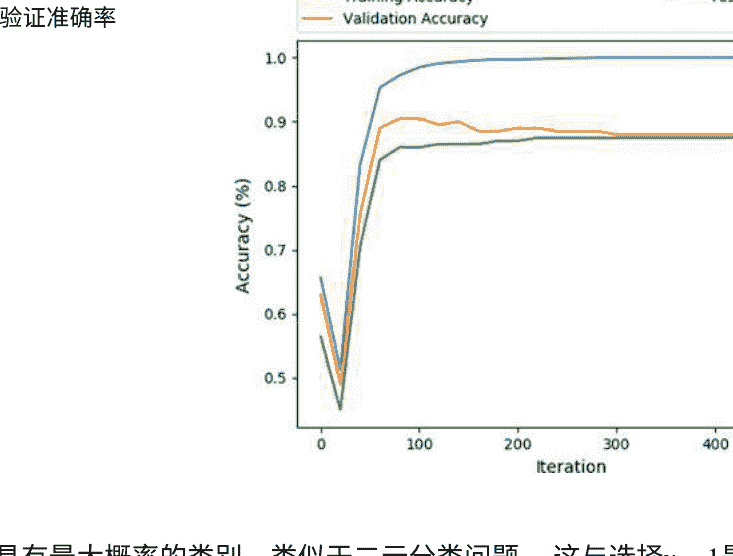

选择具有最大概率的类别，类似于二元分类问题。这与选择 $y = 1$ 是一样的，如果

$$\frac{1}{1 + \exp((\theta^{(2)} - \theta^{(1)})^\top x)} > 0.5 \iff (\theta^{(2)} - \theta^{(1)})x > 0$$

包括在 $\theta$ 中的偏置项

$$(\theta^{(2)} - \theta^{(1)})x + (b^{(2)} - b^{(1)}) > 0$$
$$= (b^{(2)} - b^{(1)}) + (\theta_1^{(2)} - \theta_1^{(1)})x_1 + (\theta_2^{(2)} - \theta_2^{(1)})x_2 + \ldots + (\theta_k^{(2)} - \theta_k^{(1)})x_k > 0$$

对于上述表达式 $\theta_0 + \theta_1 I_1(x) + \theta_2 I_2(x) + \ldots + \theta_k I_k(x) > \text{阈值}$，单个 $I_i(x)$ 表示文本评论 $x$ 中词汇的存在（值为0或1）。词汇的大小为 $k$（训练集中正负类别的唯一词汇总总数）。$\theta_0$ 表示术语的偏差差异 $(b^{(2)} - b^{(1)})$。个体 $I_i(x)$ 的系数 $\theta_i$ 分别为 $(\theta_i^{(2)} - \theta_i^{(1)})$ 在上述表达式中。换句话说，将负类的输出单元（1）与输入单元 $x_i$ 的连接权重减去连接正类的输出单元（2）与输入单元 $x_i$ 的权重。这里 $\theta_i$ 表示第 $i$ 个关键词的极性。如果第 $i$ 个关键词非常负面，$\theta_i$ 非常负面，反之亦然。

当使用朴素贝叶斯对样本进行分析时，选择每个类别（1表示正面，0表示负面）的条件概率的 $\arg\max$ 作为样本评论的特征。这与选择 $y = 1$ 相同，如果

$$\frac{P(\text{类别} = 1 | \text{特征}_1, \ldots, \text{特征}_n)}{P(\text{类别} = 0 | \text{特征}_1, \ldots, \text{特征}_n)} > 1$$

如果在不等式的任一侧加上对数：

$$\log(P(\text{类别}=1|\text{特征}_1, \ldots, \text{特征}_n)) - \log(P(\text{类别}=0|\text{特征}_1, \ldots, \text{特征}_n)) > 0$$

$$\sum_{i} \left( \log(P(\text{特征}_i|\text{类别}=1)) + \log(P(\text{类别}=1)) - \log(P(a_i, \ldots, a_n)) \right) - \sum_{i} \left( \log\left(\frac{P(a_i=1|\text{类别}=0)}{\text{计数}(\text{类别}=0)}\right) - \log(P(\text{类别}=0)) - \left(-\log(P(a_i, \ldots, a_n))\right) \right) > 0$$

$$= \log\left(\frac{P(\text{类别}=1)}{P(\text{类别}=0)}\right) + \sum_{i} \left( \log(P(a_i|\text{类别}=1)) - \log(P(a_i|\text{类别}=0)) \right) > 0$$

$+\theta_k I_k(x) > \text{阈值}$ 显示单个样本文本块的标签，偏置项 $\theta_0$ 是正类和负类先验概率比值的对数。词汇表的大小（训练集中正类和负类的唯一词汇总数）为 $k$。个体 $I_k(x)$ 是一个二进制的0或1值，表示样本文本中词汇表中第 $i$ 个关键词的存在。相应的系数 $\theta_i$ 是单词 $a_i$ 的对数几率观察点。$\theta_i$ 应该描绘第 $i$ 个词的极性值。一个标记相对于另一个标记的偏置由该术语的对数几率值表示。

每个 $\theta_i$ 对应于训练集文本样本中第 $i$ 个词的极性值，可以是正面的或负面的。在这项研究中，选择了100个最积极的 $\theta_s$，这意味着选择了具有最强烈正面情感极性的词语。

### 3.2 时间序列特征

单变量时间序列是在随机时间间隔内进行的一维测量的集合。这些数据不需要独立同分布（IID）。

时间序列分析的目标是描述每个时间序列模式的主要特征。讨论和推导过去如何影响未来，或者两个时间序列如何在这个片段中“相互作用”。作为监控标准，使用时间序列来了解决策点，例如制造组件质量的度量。

模型类型和考虑因素有两种基本类型：自回归综合移动平均（ARIMA）模型将时间序列值与先前值和历史预测误差相关联。单位时间索引作为标准回归模型的x变量。

时间序列可以提供的基本见解：

- 趋势：维度的整体演变被称为趋势。
- 季节性：季节性指的是定期发生的活动，这取决于日历周期，如季节、季度、月份、周等。
- 异常值：异常值是与原始数据不同或已被操纵的数据。
- 长期周期：长期周期是与季节性无关的重复行为。
- 恒定方差：不变的方差被称为恒定方差。
- 突变：在序列或变化中出现显著的干扰等因素被称为突变。

自回归模型：自相关和偏自相关让我们考虑 $\{y_t\}_{t=1}^n$ 是一个以 $t$ 为索引的时间序列。时间序列的值在自回归模型中被回归到先前的值上。例如，一阶自回归模型 AR(1):

$$y_t = \beta_0 + \beta_1 y_{t-1} + \epsilon_t$$

二阶或二阶自回归 AR(2):

$$y_t = \beta_0 + \beta_1 y_{t-1} + \beta_2 y_{t-2} + \epsilon_t.$$

k阶自回归 AR(k) 表示为:

$$y_t = (\beta_0, \beta_1, \ldots, \beta_n, 1) (1, y_{t-1}, \ldots, y_{t-n}, \epsilon_t)^T.$$

通常误差 $\epsilon_t \sim^{iid} N(0, \sigma_\epsilon^2)$ 且独立于 $y$。选择时间序列的阶数可以使用两种方法:

1.  自相关函数（ACF）和
2.  偏自相关函数（PACF）。

时间序列中两个值之间的相关系数，表示为:

$$\text{Corr}(y_t, y_{t+k}) = r_k = \frac{c_k}{c_0} \quad \text{其中} \quad c_k = \frac{1}{n} \sum_{t=1}^{n-k} (y_t - \bar{y})(y_{t+k} - \bar{y})$$

是自相关函数（ACF）。协方差公式用于显示两个变量之间的线性关系。这是在这种情况下滞后值的协方差（或线性关系）。在这种情况下，滞后由 $k$ 给出。

这是一种方法。这种方法考虑了其他滞后对 $y_t$ 的影响。第二种方法消除了中间其他滞后的影响：在这种情况下，PACF由以下给出

$$ f_k = \begin{cases} r_1 = \text{Corr}(y_t, y_{t-1}) & \text{如果 } k = 1; \\ \text{Corr}(y_t - y_t^{t-1}, y_{t+k} - y_{t+k}^{k-1}) & \text{if } k \geq 2 \end{cases} $$

一般来说，这样做的效果是表示 $t$ 和 $t+k$ 之间的线性相关性，但是停止了 $t$ 和 $t+k$ 之间滞后的线性依赖关系，即 $t_i \text{ such that } t < t_i < t+k$。这也可以被看作是从 $y_t$ 上去除 $y_{t+1}, \dots, y_{t+k-1}$ 所张成的线性子空间的投影。

分解可以通过分析初始时间序列中的一些模式活动来进一步简化情况。

### 分解和高阶趋势时间序列的分解

包括：
- 总体趋势，$m_t$
- 季节性，$s_t$，和
- 错误，$\epsilon_t$

$$ y_t = m_t + s_t + \epsilon_t $$

典型的预测从对总体趋势的线性滤波估计开始。根据“窗口”的大小确定的移动平均是一个例子：

$$ \hat{m}_t = \sum_{k=-a}^{a} \left( \frac{1}{1+2a} \right) y_{t+k} $$

为了对整体上的积极主题有所了解，可以尝试调整窗口高度。然后，如果完成了，我们可以根据剩下的内容计算季节性：

$$ \hat{s}_t = y_t - \hat{m}_t $$

这个 $\hat{s}_t$ 取决于窗口高度。要纠正单个 $s_t$，我们可以取窗口大小的季节性数字的平均值。然后我们有一种量化错误的方法：

$$ \epsilon_t = y_t - \hat{m}_t - \hat{s}_t $$

使时间序列模型更复杂的另一种方法是考虑二次模式，不仅考虑线性时间因素，还考虑更高阶因素和交互作用，如 $x^2$, $x^3$ 等等。

#### 4 数据集

数据集中包含书评和评分。信息是从goodreads.com收集的，用户的公共书架被抓取，允许每个人在不登录的情况下查看它们。用户和评论ID已从数据库中删除。尽管大多数术语都依赖于小说，都是模糊的，或者是常见的，但其中一些词仍然清楚地表达了对所讨论的书的情感。例如，来自正面评论的一个样本短语表达了积极的观点，其中值得注意的关键词是‘有趣’，是‘这是本季度最令人令人兴奋的书。’；‘他们没有读到薄弱的对话，肤浅的台词？’是一篇尖锐批评的摘录，其中关键词是‘邪恶’，也许是‘肤浅’。值得记住的是，‘肤浅’这个词的发音是错误的，这使得语义理解具有挑战性。其他缺点包括语义关键词分析无法处理包括否定、讽刺和短语的简洁性或语气在内的语言结构。然而，即使使用简单的关键词识别，仍然需要大量信息来确定研究的极性。在使用逻辑回归训练情感分析模型之后，该模型用于对新发布的产品数据进行分类为积极或消极情感。出于隐私原因，数据是双盲加密的。

#### 5 结果和讨论

数据显示，朴素贝叶斯和逻辑回归在其前100个术语中都使用了一些相同的术语。例如，形容词‘杰出’、‘极好’和‘非常好’都非常积极。两者都包含混乱的表达方式，例如，在逻辑回归中排名第三的‘甚至’和在朴素贝叶斯中排名第五的‘gattaca’。由于正面评价比负面评价更长，像‘甚至’这样的术语可能会出现在更多的正面评价中，这可以通过训练数据的偏差来解释。在表1中，可以看到使用不同技术进行情感分析模型的准确度值。

朴素贝叶斯在其前100个关键词中更频繁地选择具有更强正面情感的关键词，例如，‘振奋人心’、‘忧郁’、‘充满爱意’和‘出色地’都被朴素贝叶斯选择，但逻辑回归没有选择。对于朴素贝叶斯来说，有更多的形容词和副词。在逻辑回归的列表中，可以看到一些不太描述性的术语位于列表的顶部；其他的是名词，有些可以用作强调或赞美的词语，并有更好的解释。

**表1 情感分析的个体模型性能**

| 情感分析方法 | 准确率 (%) |
|--------------|------------|
| 支持向量机 (SVM) | 86.5 |
| 决策树 | 78.6 |
| 逻辑回归 | 88.73 |

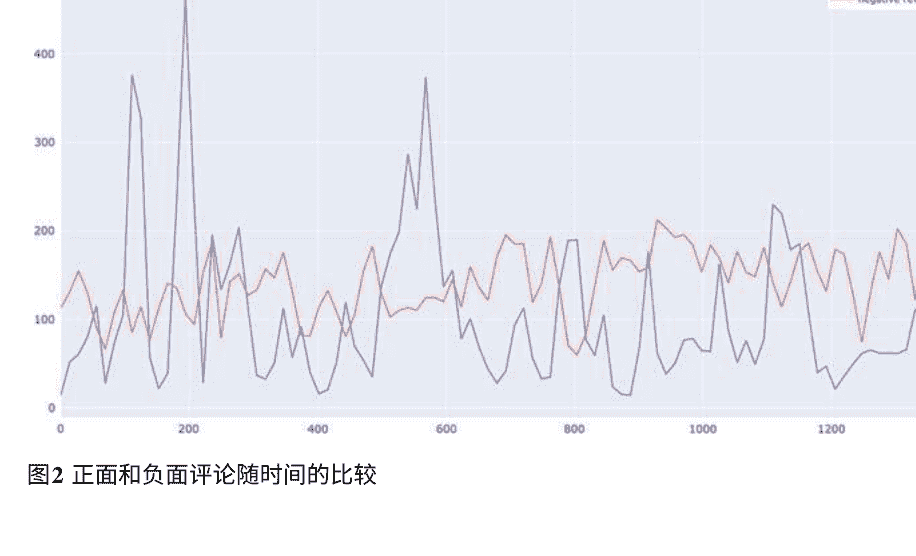

## 图2 正面和负面评论随时间的比较

例如，术语‘生活’、‘最’、‘特别’、‘真实’、‘全部’、‘一起’和‘许多’都是逻辑回归的前100个特定术语。模型中的不一致性可能解释了这些趋势。

使用训练好的模型，在一个新产品上进行实验时，在图2中可以观察到在1372天的时间段内负面和正面评论的数量。图表显示，产品在推出后约在第175天和第200天开始获得高度的流行度，然后在推出后约500天再次出现了大量的正面评论。负面评论以类似的方式持续存在。公司在推出新产品之前会发放免费样品来种植市场。其中一个重要的事情是找到最好的种植目标，如早期采用者、社交中心或随机选择的用户，同时考虑到可能出现的负面口碑。如果是这样的话，可以认为种植早期采用者会带来最大的优势和商业渗透，由社交中心和未知客户带动。

图3是两个产品的比较；产品1（市场上非常稳定的产品）和产品2（新推出的产品）。通过对这两个产品数据进行主题建模，可以发现人们对特定情境变化的反应以及产品再次销售所需的变化。在这里，使用情感监测进行的一个主要比较是正面情感加速率与负面情感加速率。这个比率可以帮助企业建立起由于产品服务问题或竞争加剧而导致的异常客户行为模式。可以使用情感速度比进行进一步的调查。

许多企业已经拥有更短的产品生命周期，需要更准确地预测新推出商品的需求。他们将使用这些预测来帮助他们做出包括收购和库存管理在内的商业决策。如图4所示，时间序列主要关注季节性和趋势组成部分。产品需求的趋势对于决定上市季节非常重要的见解。这些是产品X（例如加湿器）的趋势，其销售根据需求和需求变化。因此，公司可以在发布之前基于该类别中的其他热门产品进行市场调研。由于这些决策是基于预测的，因此全面的销售预测策略对于避免产品发布后的问题至关重要。由于糟糕的预测可能导致缺货或库存过剩的情况发生，这对公司的绩效有重大影响，还可能降低客户忠诚度和市场份额。

在朴素贝叶斯中，每个特征的权重是单独确定的，取决于其与标记的相关性。因此，如果任何特征彼此依赖并经常一起出现（特别是如果特征空间很大），则预测可能会高估它们在整个样本空间中的影响，因为该步骤包括将两个或多个高度相关的特征的概率值相乘，这些特征实际上代表一个单一的特征，并且假设这些特征可能相互阻碍。因此，人们可以看到很多相似的形容词和副词被选择，以及像‘巧妙地’和‘编织’这样的配对，它们可以一起出现在文本中，但通常不是对整个样本空间最具反映性的。分析可能不一定会有像‘巧妙地’或‘编织’这样的词语。

而在逻辑回归中，所有的权重都被组合在一起，使得线性决策函数对于正类别较高，对于负类别较低。因此，逻辑回归能够放松朴素贝叶斯的假设，并通过降低它们的权重来补偿相关特征。最后，逻辑回归的theta值比朴素贝叶斯低。这可能是因为朴素贝叶斯单独匹配特征权重，而逻辑回归允许特征相似性，并在组合时设置较小的权重。

#### 6 结论和未来工作

在时间序列和情感分析领域，还有很大的发展空间。只使用了简单的预处理技术，例如排除28个停用词、文本频率小于一的单词和规范化单词、表情符号。这些简单的预处理和特征选择方法与最大熵分类器结合使用时产生了令人满意的结果。对于复杂的词语文本，未来应进行进一步研究。

分析中的任何短语也可以用来暗示情绪修饰词（例如，#讽刺）甚至原始情感（例如，#耶）。对于某些情感分析功能，可以使用DiMSUM（检测最小语义单元及其含义）[25]。虽然可能不可能记住专有名词的词义，尤其是使用井号，但使用修饰词和带有原始情感的井号可以提高分类准确性。简单的词在句子级别上有意义，而井号在消息级别上也有意义。为了训练和测试，还需要进一步带有井号的注释反馈。

驼峰命名法通常用于创建多词标签（例如，#不好意思不后悔）。在功能发现过程中，将驼峰命名法的井号分解为其组成单词可能是值得的。

几乎每个作者都写了几篇评论。更高级的分类器可以检测用户倾向于通过他们的所有反馈表达单一情感。此外，这样的评论者可以每天以特定的情绪对待。例如，对流行作家的书籍和一般主题的评论更有可能是积极的，而对政治书籍的评论更有可能是混合的。此外，时间元素的存在可能会对这种方法造成问题，因为人们的观点和情绪在评论中会随着时间而改变。当公众对一个人的看法改变时，情绪也会改变。

许多其他词袋模型的实现通过创建由两个词组成的特征来捕捉词序。双词组（二元组）的添加扩展了可用的特征数量，使计划变得更具挑战性。这个描述也适用于n-gram，即n个字母的字符串。当正确使用时，支持向量机的性能优于最大熵解决方案。

致谢我所拥有的一切，或者我所希望的一切，都归功于我的天使母亲。

#### 参考文献

1.  王, W., 冯, F., 何, X., 聂, L., & 蔡, T.-S. (2021年)。去噪隐式反馈用于推荐。在第14届ACM国际网络搜索和数据挖掘会议（第373-381页）中。
2.  Rafieian, O., & Yoganasimhan, H. (2021年)。移动广告中的定位和隐私。Marketing Science, 40 (2) , 193-218。
3.  洪, M., & 王, H. (2021年)。使用主题挖掘和深度神经网络进行客户意见总结研究。数学与计算机模拟, 185, 88-114。
4.  Kumar, R. S., Devaraj, A. F. S., Rajeswari, M., Julie, E. G., Robinson, Y. H., & Shanmuganathan, V. (2021年)。探索情感分析和合法艺术对意见挖掘的影响。多媒体工具和应用, 1-16。
5.  王, X., 和Kadioğlu, S. (2021年)。通过贝叶斯深度学习建模不确定性以改进个性化推荐。国际数据科学与分析杂志, 1-11。
6.  王, S. I., 和Manning, C.D. (2012年)。基线和二元组：简单，良好的情感和主题分类。在计算语言学协会第50届年会论文集（第2卷：短论文，第90-94页）。
7.  Socher, R., Pennington, J., Huang, E. H., Ng, A. Y., 和Manning, C. D. (2011年)。用于预测情感分布的半监督递归自动编码器。在2011年自然语言处理实证方法会议论文集（第151-161页）。
8.  Mikolov, T., Martin, K., Burget, L., Cernocky, J., & Khudanpur, S. (2010)。基于循环神经网络的语言模型。在国际语音交流协会第11届年会上(pp. 1045–1048)。
9.  Bakshi, R. K., Kaur, N., Kaur, R., & Kaur, G. (2016)。观点挖掘和情感分析。在2016年可持续全球发展计算国际会议上(pp. 452–455)。IEEE。
10. Richmond, J. A. (1998)。古希腊的间谍。希腊与罗马, 45(1), 1–18。
11. Pang, B., Lee, L., & Vaithyanathan, S. (2002)。点赞? 使用机器学习技术进行情感分类。arXiv预印本cs/0205070。
12. Melville, P., Gryc, W., & Lawrence, R. D. (2009)。通过将词汇知识与文本分类相结合对博客进行情感分析。在第15届ACM SIGKDD国际知识发现与数据挖掘会议论文集中(pp. 1275–1284)。
13. Si, J., Mukherjee, A., Liu, B., Li, Q., Li, H., & Deng, X. (2013)。利用基于主题的Twitter情感进行股票预测。在第51届计算语言学协会年会论文集中(第2卷：短文, pp. 24–29)。
14. Barbosa, L., & Feng, J. (2010)。从有偏差和噪声的Twitter数据中进行强大的情感检测。在Coing 2010: 海报论文集中(pp. 36–44)。

### 使用全卷积残差稠密网络进行视频摘要

Anil Singh Parihar，Ritvik Mittal，Himanshu和Prashuk Jain

摘要 视频摘要是一种智能的视频压缩技术，它选择一组关键帧或关键镜头来代表原始输入视频的较短和简明摘要，而不丢失相同的上下文语义。先前的研究表明，从输入视频帧中提取丰富的上下文信息对于生成更接近人类对原始输入视频的解释的摘要至关重要。 然而，最近的卷积架构无法考虑到这一点。 在本文中，我们建立了图像超分辨率和视频摘要之间的新关系，并引入了一种新的架构，通过适应残差密集网络（RDN），充分利用了局部和全局结构上下文。 实验结果表明，引入改进的RDN（SUM-RDN）单元显著提高了标准卷积网络的性能。

- 视频
- 摘要
- 残差
- 密集
- 卷积
- 深度学习

#### 1 引言

近年来，随着人口的指数增长和捕捉视频成本的降低，视频内容的数量急剧增加。 视频已成为最重要的视觉知识来源之一。 一个人不可能在短短一个小时内浏览完像YouTube这样的平台上上传的视频。

根据WordStream.com的数据，“每60秒在YouTube上上传72小时的视频。”根据思科的数据，“到2024年，每秒钟将有100万分钟（17,000小时）的视频内容通过全球IP网络传输。”因此，开发能够高效浏览大量视频数据的计算机视觉技术变得越来越重要。 视频摘要成为一个有前景的领域帮助分析庞大的视频内容的方法。视频摘要的目的是从原始输入视频中构建一个简短的视频，而不丢失视频的基本特征。在几个实际应用中，视频摘要非常有帮助。例如，在视频监控中，人们需要滚动查看由监控摄像头记录的几个小时的视频，这对人类来说是无聊且耗时的。如果我们能提供一个从长视频中提取必要数据的简短视频摘要，将极大地减少人类监控所需的工作量。视频摘要还将为视频探索、提取和分析提供更好的用户界面，因为较短的视频在存储、观看和分析方面更经济。

在我们的工作中，我们将视频摘要作为一个关键帧子集选择问题进行研究，我们必须训练我们的模型以选择捕捉输入视频最具定义特征的帧。这个问题也可以被表述为顺序帧标记任务，其中每个帧都被赋予一个二进制标签，表示它是否在摘要子集中。

近年来，基于卷积神经网络（CNN）的模型[1-4]在视频摘要方面取得了巨大成功。然而，大多数基于CNN的模型由于卷积之间的局部性丢失而未能充分利用从每个卷积层提取的时间分层特征，从而实现相对较低的性能。此外，对于视频摘要模型来说，捕捉视频帧之间的长程复杂时间依赖关系是至关重要的，这是通过先前的实证工作所指示的。在[5, 6]中提出的模型通过递归神经网络解决了这个问题。然而，基于递归的模型相对较慢，因为它们以顺序方式逐帧处理，要么从左到右，要么从右到左生成每个帧的二进制标签，并且无法充分利用GPU并行化的优势。目前的最新技术[7, 8]引入了注意机制，可以显著捕捉长程依赖关系，但没有考虑任务的时间性质，这可能导致某些任务的性能下降。

在本文中，我们从[1, 9, 10]中汲取灵感，并引入了完全卷积残差密集网络（FCRDN）用于视频摘要的目的，该网络使用了摘要残差密集网络（SUM-RDN）作为图1所示的上下文提取和完全卷积顺序网络（SUM-FCN）[1]进行帧级映射到二进制输出。RDN [9]已经被用于图像超分辨率的任务，通过该任务可以从低分辨率的退化图像生成视觉上令人愉悦的高分辨率图像。RDN完全利用了所有卷积层的分层特征，这是大多数基于CNN的模型所没有实现的。作为完全卷积，它充分利用了GPU的容量。RDN网络由称为残差密集块（RDB）的构建块组成，其中包含具有用于局部特征融合（LFF）和局部残差学习（LRL）的附加网络结构的密集连接卷积层。RDB还采用了连续内存机制，因为一个RDB中的所有层都可以直接访问前一个RDB的输出。LFF通过融合当前RDB中各个卷积层的输出和前一个RDB的输出来提取局部密集的分层特征，从而有助于保留信息。LRL进一步改善了表示能力增强了整体性能。RDN还执行全局特征融合（GFF）和全局残差学习（GRL），以保留全局分层特征。

我们的洞察力是残差密集网络可以被修改并应用于视频摘要任务。我们的SUM-RDN从输入视频的帧中提取分层特征。此外，连续内存机制有助于捕捉输入视频帧之间的长程复杂时序依赖关系。SUM-FCN [1]然后为摘要生成帧级二进制标签。

总结我们的工作，我们有三个主要贡献：
1. 我们在图像超分辨率和视频摘要这两个看似不同的领域之间建立了新的联系。
2. 我们是第一个将RDB用于视频摘要，并提出了一种新颖的架构，通过调整残差密集网络（RDN）来适应我们的任务。
3. 我们报告了对标准SUM-FCN [1]网络的更高评估结果，强调了我们的SUM-RDB网络的有效性。

#### 2 相关工作

通过视频摘要，我们可以生成输入视频的简短且高度信息化的表示。这些表示可以是各种形式，例如故事板[1, 5, 7, 8, 11]，蒙太奇[12, 13]和时间推移[14, 15]。我们的工作将故事板表示法进行了改进，选择某些关键帧[5, 16]或关键镜头[5]来形成摘要视频。基于关键帧的摘要也称为静态摘要，它是从输入视频中选择的代表性单个帧的集合，而基于关键镜头的摘要也称为动态摘要，它是视频时间轴上连续帧的一组镜头。具体而言，我们的工作使用关键帧来形成视频摘要，突出显示时间顺序。

在深度学习之前，低级特征如颜色直方图、运动矢量、图像对齐等被用来表示视频的特定帧。在这些表示上，应用了各种距离度量来量化帧之间的相似性和特定帧或一组帧的有趣程度。

基于这些启发式方法，某些帧被选为摘要的一部分，如[17-19]所示。这类方法中的大多数都是无监督的，导致了类似帧的聚类形成。最近的进展[1, 5, 7, 8]将视频摘要化视为一个监督问题，模型的目标是通过学习用户理解视频摘要任务的语义来识别关键帧。这类方法的训练数据是与每个视频对应的真实摘要或用户注释摘要。我们的工作基于这些监督方法。监督方法在传统上表现优于以前的无监督工作，这表明学习用户选择摘要的高级语义是必要的。

各种深度学习模型已经被应用于视频摘要问题。张等人[5]利用循环网络的顺序性质来考虑时间结构，并从视频中捕捉长距离的上下文。循环神经网络递归地聚合上下文以产生输出标签。张等人[5]提出了一个双向LSTM网络。一个LSTM用于学习正向方向的上下文，而另一个用于学习反向方向的上下文。学习两个方向可以产生更好的结果。Mahasseni等人[11]通过使用变分自编码器生成相应的摘要，并将其输入到LSTM鉴别器中，以对抗输入视频。

LSTM网络是顺序任务（如视频摘要）的自然选择，但由于顺序处理而计算非常昂贵。最近，注意力网络[7, 8]成为我们任务的最新技术。Ji等人[7]提出了一种基于注意力的编码器-解码器网络，其中编码器是一个双向LSTM网络，解码器是一个基于注意力的LSTM网络。注意机制提供与各个编码器隐藏状态相关联的注意权重。单个实例的解码器输出可以通过这些权重学习将不同的隐藏单元组合起来，从而获得丰富的结构知识，而不是像LSTM那样使用单个隐藏向量。这个网络也因为LSTM而难以训练。Fajtl等人[8]基于评估一个软性的全局注意力层，使用注意权重来评估一个上下文向量。上下文向量和残差求和然后用于帧级得分回归。注意力网络并不本质上考虑视频的时间结构，并将所有帧视为等价，这导致忽视了局部上下文。

Rochan等人[1]提出了一种完全卷积序列网络（SUM-FCN）用于视频摘要，认为卷积也可以捕捉长距离依赖关系，并将此属性用于视频摘要。完全端到端的卷积还可以加快学习速度。然而，SUM-FCN无法完全捕捉全局上下文。堆叠的卷积导致局部和全局信息丢失，因为邻域的分辨率降低。通过我们的工作，我们试图更好地考虑局部和全局上下文。与[9]类似，我们提出了一种完全卷积残差密集架构（FCRDN）用于视频关键帧摘要，并在两个基准数据集上展示了我们的结果。

我们的工作是第一个使用残差密集网络进行视频摘要的工作。

#### 3 我们的方法

在本节中，我们首先介绍问题描述（第3.1节）。然后我们介绍我们的架构并详细说明其主要组成部分（第3.2节）。

##### 3.1 问题描述

从以前的工作中已经确定了两种类型的帧级输出。(1) 硬{0, 1} 二进制标签; (2) 软 (0, 1) 帧级重要性分数。二进制输出也被称为硬输出，直接指示特定帧是否属于摘要。这些标签可以是关键帧或关键镜头，其中关键帧是不连续帧的子集，而关键镜头是连续帧的子集。

帧级重要性分数也被称为软输出，确定在视频摘要中选择该帧的可能性。流行数据集的用户注释以这两种形式提供，并且根据[5]，可以在这两种形式之间进行交换。在我们的方法中，我们使用二进制帧级映射或硬分数。

假设一个输入视频由T表示，T是输入视频中的帧数。每个帧都由基于某种预处理的特征向量表示。对于我们的工作，根据[1]，我们将每个帧传递给预训练的GoogleNet，并从pool5层获取输出。GoogleNet提供了丰富的特征，因为它已经在大量图像上进行了训练。假设特征向量具有K个维度，并且V_i是对应于第i帧的特征向量。那么，输入视频由F个V组成，其中V = {V_1, V_2, ..., V_i, ..., V_T}。用户注释的摘要为每个帧分配了{0, 1}。标记为1的帧形成了摘要。我们的目标是通过有监督训练学习用户如何总结视频的语义，然后为输入视频的每个帧预测二进制标签。

##### 3.2 完全卷积残差密集网络

我们的工作受到RDN [9, 10]提取上下文知识的能力的启发，用于图像超分辨率。图像超分辨率本质上需要保留低分辨率空间中的局部和全局上下文知识，以进行放大。我们的直觉和之前的工作表明，跨视频时间线的上下文知识对于生成高度代表视频本身的摘要至关重要。因此，可以利用RDN来收集更丰富的分层特征，并通过增强局部特征然后聚合它们以获得有效的全局上下文，从而获得对整个视频的更好结构性知识。

在[9]中的一个特殊残差密集块使用卷积函数对输入图像的二维维度进行处理。视频按照时间顺序排列，因此我们修改了残差密集块，使其在视频的单一时间维度上进行卷积。一维卷积在时间范围内和密集的架构有助于提取局部上下文，而网络的残差性质则保留了丰富的全局上下文信息。然后，将这些丰富的特征输入到完全卷积序列网络（SUM-FCN）[1]中，以进行帧级别的二进制映射，如图2所示。SUM-FCN是一个完全卷积网络，其架构类似于编码器解码器网络。编码器部分由一系列卷积层组成，用于形成分层特征，而解码器部分由一系列反卷积层组成，用于放大时间范围以进行帧级别的映射。

我们将整个架构命名为完全卷积残差密集网络（FCRDN）。本节进一步详细描述了我们架构的主要组成部分。

FCRDN：我们采用了[9]中介绍的RDB来进行视频摘要和命名，将其命名为SUM-RDB。我们将多个SUM-RDB堆叠在一起形成SUM-RDN。我们网络的输入维度为1 × T × K。这些特征首先通过SUM-RDN进行增强，然后输入到完全卷积编码器解码器(SUM-FCN)中。Fv是输入到SUM-RDN的GoogleNet特征向量。FNF是从SUM-RDN输出的丰富特征。FNF是SUM-FCN [1]的输入，它生成帧级二进制标签(Y·)，其中二进制标签1表示特定帧在摘要中。抽象地说，我们的模型可以用以下两个方程表示。

```
$F_{NF} = H_{\text{SUM-RDN}}(F_V)$
```

```
$Y = H_{\text{SUM-FCN}}(F_{NF})$
```

其中 $H_{\text{model}}(x)$ 是模型对输入 $x$ 应用的复合变换。在RDN之前，两个卷积层应用于 $F_V$ 形成浅层特征 $F_{-1}$ 和 $F_0$。 $F_{-1}$ 也用于全局残差学习。 $F_0$ 是SUM-RDB块的输入。对于总共 $N$ 个块中的第 $n$ 个块，输出由递归关系给出：

```
$F_n = H_{\text{SUM-RDB},n}(F_{n-1})$
```

对于SUM-RDN的最终输出 ($F_{NF}$)，之前提取的局部分层特征（所有 $F_d$）通过全局特征融合（GFF）和全局残差学习（GRL）进行密集组合。表示为：

```
$F_{NF} = H_{\text{Global}}(F_{-1}, F_0, F_1, \ldots, F_n, \ldots, F_N)$
```

这些丰富的特征被输入到SUM-FCN中进行二元预测，如公式2所示。全局特征融合（GFF）通过获取由RDB生成的所有特征图，将它们连接起来，然后对其进行1*1卷积，以获得所需的输出形状。在这个特征图上应用3*3卷积，进一步提取全局残差学习（GRL）的上下文。GFF的这种机制有助于以全局方式提取和融合来自RDB的分层上下文，以获得视频帧之间更好的时间结构。方程式中的操作可以表示为

```
$F_{GF} = C_{3*3}(C_{1*1}(H_{\text{conc}}(F_1, \ldots, F_n, \ldots, F_N)))$
```

其中，$F_n$是第n个RDB的特征图，$C_{3*3}$和$C_{1*1}$表示卷积操作，$H_{\text{conc}}$表示连接函数。全局残差学习（GRL）通过将跳跃连接添加到来自全局特征融合（$F_{GF}$）和第一个卷积层的特征图（$F_{-1}$）的输出来实现。这种机制有助于传播从浅层学习到鼓励特征重用和控制梯度消失问题。方程形式中的操作可以表示为

```
$F_{DF} = F_{GF} + F_{-1}$
```

SUM-RDB: RDN由密集连接的卷积层、局部特征融合（LFF）和局部残差学习（LRL）组成，有助于保留前面的信息并在模型中进行连续的内存传递。在[9]中，RDB的输入是从两个卷积层提取的特征，它接收具有3个RGB通道的原始低分辨率图像，其中 $k \times l$ 是图像的高度和宽度。RDB中卷积的尺寸选择得以使输出具有相同的尺寸作为输入特征向量。与RDB不同，我们的SUM-RDB采用具有维度1 × T × K 的输入，其中T表示帧数，K表示每帧特征向量的维度。我们在连接每个卷积层和前面的SUM-RDB生成的特征向量之后应用1 × 1卷积，以获得与输入相同维度的输出向量。

图3显示了我们的SUM-RDB的架构。与使用空间卷积的RDB不同，我们在SUM-RDB中使用了时间卷积。每个卷积操作后都会使用ReLU进行非线性处理。

本地特征融合（LFF）通过连接SUM-RDB中每个时间卷积层的特征图和前一个SUM-RDB的输出来实现。方程形式的操作可以表示为

```
$$F_{n,LF} = H_{LFF}^n([F_{n-1}, F_{n,1}, ..., F_{n,c}, ..., F_{n,C}])$$  (7)
```

其中$H_{LFF}^n$表示通过1 * 1卷积来获得所需的维度输出。由于在单个SUM-RDB中使用了较少的时间卷积操作，LFF有助于从当前和前面的SUM-RDB中提取局部上下文。通过引入将前一个SUM-RDB的输出和当前SUM-RDB的LFF的输出相结合的跳过连接，实现了局部残差学习（LRL）在SUM-RDB中。这有助于从更浅的阶段恢复时间信息用于视频摘要。方程形式中的操作可以表示为

```
$$F_n = F_{n-1} + F_{n,LF}$$  (8)
```

SUM-FCN：这是[1]中用于生成帧级二进制标签的相同模型。我们在我们的工作中使用SUM-FCN 8。该模型完全卷积，类似于前面的SUM-RDN单元，由1D卷积、1D池化和1D反卷积层组成。它被巧妙地解释为一个编码器解码器网络，其中一系列1D卷积层形成编码器，一系列1D反卷积层形成解码器，如图所示。编码器提取上下文的长期依赖性，而解码器则将卷积的时间维度放大，以输出逐帧的0/1映射。

15. Gokulakrishnan, B., Priyanthan, P., Ragavan, T., Prasath, N., & Perera, A. (2012). 在新兴地区ICT进展国际会议 (ICTer2012) 上 (第182-188页)。IEEE.
16. Liu, B. (2012). 情感分析和意见挖掘。人类语言技术综合讲座， 5 (1) ， 1-167。
17. Varghese, R., & Jayasree, M. (2013). 情感分析和意见挖掘调查。工程与技术研究国际期刊， 2 (11) ， 312-317。
18. Hu, M., & Liu, B. (2004). 挖掘和总结客户评论。在第十届ACM SIGKDD国际知识发现与数据挖掘会议上 (第168-177页)。
19. 庞, B., & 李, L. (2005). 看见星星: 利用类别关系进行情感分类-与评分尺度相关. arXiv预印本cs/0506075.
20. Titov, I., & McDonald, R. (2008). 一种文本和方面评分的联合模型用于情感摘要. 在ACL-08: HLT会议论文集中(pp. 308–316).
21. 王, H., 卢, Y., & 翟, X. (2011). 无需方面关键词监督的潜在方面评分分析. 在第17届ACM SIGKDD国际知识发现与数据挖掘会议上(pp. 618–626).
22. 张, Y., 赖, G., 张, M., 张, Y., 刘, Y., & 马, S. (2014). 基于短语级情感分析的可解释推荐的显式因子模型. 在第37届国际ACM SIGIR信息检索研究与开发会议上(pp. 83–92).
23. Ghose, A., Ipeirotis, P. G., & Li, B. (2012). 通过挖掘用户生成和众包内容，为旅行搜索引擎上的酒店设计排名系统。Marketing Science, 31(3), 493–520.
24. Tang, X., Yao, H., Sun, Y., Aggarwal, C., Mitra, P., & Wang, S. (2020). 在人工智能AAAI会议论文集(Vol. 34, No. 04, pp. 5956–5963)中。
25. Asesh, A. (2020). 计算语义学: 如何解决超感悬疑。在2020年IEEE第三届人工智能与知识工程国际会议(AIKE)(pp. 120–125)中。IEEE。

由于模型是完全卷积的，对输入视频长度没有限制。对于一个密集连接的神经网络，我们需要明确指定生成帧级输出映射的维度。此外，由于单个卷积操作不是顺序的，该模型充分利用了GPU并行化。SUM-RDN \(F_{NF}\)生成的特征是SUM-FCN的输入，并产生0/1标签作为输出。这由方程2表示。

#### 4 结果

在本节中，我们首先介绍数据集。然后，我们介绍评估指标，并将我们的结果与vanilla SUM-FCN[1]和其他视频摘要技术进行比较。

##### 4.1 数据集

监督训练需要用户生成的训练视频摘要。TVSum[20]和SumMe [21]是两个包含多个用户摘要的注释数据集。这些数据集是测试视频摘要模型的基准。TVSum有50个视频，涵盖新闻、纪录片等各种类别，视频长度为1-5分钟。它提供了用户生成的帧级重要性值作为摘要。SumMe数据集包含25个视频，涵盖假期、体育等各种事件，长度从1.5到6.5分钟不等。用户生成的摘要是基于关键帧的（一组帧间隔）。OVP（开放视频项目）[17, 22]数据集包含50个视频，涵盖历史、教育等各种类型。这些视频长度为1-4分钟。YouTube [17]数据集包含39个视频，分布在新闻、体育、商业等领域。这些视频长度为1-10分钟。OVP和YouTube数据集都提供了多个用户摘要作为关键帧。由于不同的数据集以不同的格式提供用户注释的摘要，我们按照[5]的方法对监督模型的数据进行预处理和评估。

##### 4.2 结果

我们遵循常用的评估指标[5]，并使用\(F\)-Score进行定量比较。这是我们考虑的工作中最常用的指标，因此提供公正的分析。\(F\)分数基于精确度(\(P\))和召回率(\(R\))。
给定地面真实摘要\(G\)和机器生成的摘要\(M\)：

```
$$P = G \cap M / |M| \quad R = G \cap M / |G| \tag{9}$$
```

表1 F分数与基准SUM-FCN [1]的比较

| 模型 | SumMe | TVSum |
| :--- | :--- | :--- |
| Rochan等人[1] | 51.1 | 59.2 |
| FCRDN (我们的) | 50.26 | 61.87 |

表2 F分数与各种视频摘要模型的比较

| 模型 | SumMe | TVSum |
| :--- | :--- | :--- |
| Zhang等人[5] | 42.9 | 59.6 |
| Mahasseni等人[11] | 43.6 | 61.2 |
| Rochan等人[1] | 51.1 | 59.2 |
| Ji等人[7] | 46.1 | 61.8 |
| Fajtl等人[8] | 51.1 | 62.4 |
| FCRDN (我们的) | 50.26 | 61.87 |

```
F = (2P * R)/(P + R) * 100% (10)
```

其中 |.| 表示摘要长度。 F-Score计算如下：

给出了在数据集的增强[5]设置上进行训练的F分数，其中训练是在OVP、YouTube、X1、X2的80%的增强数据上进行的，测试是在X2的20%上进行的。X1和X2可以互换使用，分别代表TVSum和SumMe。表1比较了我们的方法与标准的SUM-FCN。我们的SUM-RDB单元显著提高了原始SUM-FCN的性能。表2比较了我们的方法与其他视频摘要方法。我们在SumMe和TVSum数据集上的表现超过了大多数方法。分数直接来自于相应的工作。与最先进的注意力模型[8]相比，我们的得分较低是因为SUM-FCN的能力较弱。我们假设如果我们将我们的SUM-RDN特征与当前最先进的方法结合使用，我们可以取得良好的结果。结果中的一个关键观察是我们的模型在SumMe和TVSum数据集上表现良好。这一点尤其有趣，因为这两个数据集中的视频长度不同。良好的结果验证了我们的SUM-RDN能够同样有效地提取局部和全局上下文。在总结长视频时，局部上下文尤为重要。

#### 5 结论

我们已经为视频摘要任务适应了残差密集块（RDBs）。我们建立了图像超分辨率和视频摘要之间的新关系，并表明这两个领域都在丰富的上下文特征上表现出色。此外，我们引入了一种称为FCRDN的新型架构用于视频总结。我们的模型优于标准的卷积模型。它还在流行的基准数据集上提供了竞争性能。作为完全卷积的，与基于LSTM的方法相比，它允许最佳的GPU利用率。我们强调我们的SUM-RDN单元也可以与其他视频总结模型一起使用。类似于适应RDBs，我们相信其他超分辨率技术也可以用于视频总结。在未来的工作中，我们期待将我们的SUM-RDN单元与其他视频总结模型结合使用，并探索其他研究领域以获得新的视频总结灵感。

#### 参考文献

1.  Rochan, M., Ye, L., & Wang, Y. (2018). 使用完全卷积序列网络进行视频摘要。 在ECCV中。
2.  Nair, M. S., & Mohan, J. (2019). 使用卷积神经网络和随机森林分类器进行视频摘要。 在TENCON 2019 - 2019 IEEE Region 10 Conference (TENCON), 印度科钦 (pp. 476–480). https://doi.org/10.1109/TENCON.2019.8929724
3.  Rochan, M., & Wang, Y. (2019). 通过学习非配对数据进行视频摘要。 在2019 IEEE/CVF Conference on Computer Vision and Pattern Recognition (CVPR), 2019年6月 (pp. 7894–7903).
4.  Elfeki, M., & Borji, A. (2019). 通过动作性排名进行视频摘要。 在IEEE Winter Conference on Applications of Computer Vision (WACV), 美国夏威夷瓦伊科洛亚村, 2019年1月7–11日, 2019年1月 (pp. 754–763).
5.  Zhang, K., Chao, W. L., Sha, F., & Grauman, K. (2016). 使用长短期记忆的视频摘要。 在ECCV中。
6.  Zhao, B., Li, X., & Lu, X. (2017). 用于视频摘要的分层递归神经网络。 在2017年ACM多媒体会议 (MM'17) 的论文集中 (第863-871页), 纽约, 纽约。 ACM。
7.  Ji, Z., Xiong, K., Pang, Y., & Li, X. (2017). 使用基于注意力的编码器-解码器网络的视频摘要。 arXiv预印本arXiv:1708.09545
8.  Fajtl, J., Sokeh, H. S., Argyriou, V., Monekosso, D., & Remagnino, P. (2018). 使用注意力进行视频摘要。 在ACCW中。
9.  Zhang, Y., Tian, Y., Kong, Y., Zhong, B., & Fu, Y. (2018). 图像超分辨率的残差密集网络。 在2018年IEEE/CVF计算机视觉和模式识别会议上, 盐湖城, 犹他州 (第2472-2481页). https://doi.org/10.1109/CVPR.2018.00262
10. Huang, G., Liu, Z., Van Der Maaten, L., & Weinberger, K. Q. (2017). 密集连接的卷积网络。 在CVPR中。
11. Mahasseni, B., Lam, M., & Todorovic, S. (2017). 无监督视频摘要与对抗LSTM网络。 在CVPR中。
12. Kang, H. W., & Chen, X. Q. (2006). 时空视频蒙太奇。 在IEEE计算机视觉和模式识别会议上。
13. Sun, M., Farhadi, A., Taskar, B., & Seitz, S. (2014). 来自无约束视频的显著蒙太奇。 在欧洲计算机视觉会议上。
14. Kopf, J., Cohen, M. F., & Szeliski, R. (2014). 第一人称超时视频。 ACM图形学交易, 33(4), 78.
15. Poleg, Y., Halperin, T., Arora, C., & Peleg, S. (2015). Egosampling: 快进和立体用于自我中心视频。 在IEEE计算机视觉和模式识别会议中。
16. Gong, B., Chao, W. L., Grauman, K., & Sha, F. (2014). 多样的顺序子集选择用于监督视频摘要。 在神经信息处理系统进展中。
17. De Avila, S. E. F., Lopes, A. P. B., da Luz, A., & de Albuquerque Araújo, A. (2011). VSUMM: 一个旨在生成静态视频摘要和一种新颖的评估方法的机制。 *Pattern Recognition Letters*, 32(1), 56–68.
18. Khosla, A., Hamid, R., Lin, C. J., & Sundaresan, N. (2013). 利用网络图像先验进行大规模视频摘要。 在 *CVPR*中。
19. Ngo, C. W., Ma, Y. F., & Zhang, H. J. (2003). 通过图建模进行自动视频摘要。
20. Song, Y., Vallmitjana, J., Stent, A., & Jaimes, A. (2015). TVSUM: 使用标题进行网络视频摘要。 在 *CVPR*中。
21. Gygli, M., Grabner, H., Riemenschneider, H., & Van Gool, L. (2014). 从用户视频中创建摘要 在*ECCV*中.
22. 开放视频项目. http://www.open-video.org/

# 一种高效的深度学习方法用于使用卷积神经网络检测肺炎

**Anik Kumar Saha和Md. Muhaimenur Rahman**

摘要 近年来，肺炎已成为全球范围内对人类的最大威胁之一，尤其是在亚洲和非洲的发展中国家。这种恶性疾病每年造成大量死亡。 因此，及时检测肺炎以防止不必要的死亡至关重要。 世界卫生组织报告称，每年至少有400万人因与家庭空气污染相关的疾病而过早死亡，其中包括肺炎。 通常情况下，熟练的放射科医生通过分析胸部X射线图像来诊断肺炎患者。 然而，仅依靠放射科医生可能会阻碍诊断过程，因为分析胸部X射线图像以检测疾病需要人类的协助、专业知识和资源。 在这种情况下，计算机辅助诊断（CAD）系统可以在自动检测肺炎患者方面发挥重要作用，这需要较少的时间和人力。 本文提出了一种改进的深度学习方法，采用卷积神经网络（CNN）模型对样本胸部X射线图像进行训练，并从中提取特征以预测肺炎的存在。 我们提出的模型在实验中表现更好，并达到了89%的准确性，相对于现有的基于深度学习的临床图像分类算法而言，效果更好。

关键词肺炎·图像分类·数据增强·数据预处理·卷积神经网络·胸部X光·特征提取

#### 1 引言

肺炎的危险对于一些国家来说是巨大的，特别是那些人们被剥夺基本人权并生活在极度贫困中的国家。

A. K. Saha (✉)
计算机科学与工程系，孟加拉国商业与技术大学，达卡，孟加拉国

Md. Muhaimenur Rahman
计算机科学与工程系，Jahangirmagar大学，达卡，孟加拉国

由于缺乏教育和现代医疗设施，他们无法接受先进的治疗。 根据世界卫生组织（WHO）的数据，每年有多达380万人因家庭污染而过早死亡，而27%的人死于肺炎[1]。 此外，据报道，每年约有1.5亿人，尤其是5岁以下的儿童，患上肺炎[2]。 在这种情况下，如果没有医生和临床人员，这种并发症可能会更加严重。 根据对57个非洲国家的调查，专科医生和医疗人员的短缺超过230万人[3, 4]。 然而，在这个世界的这个地区，准确和及时的诊断可能对大量人口至关重要。

尽管经常开发各种神经网络架构来诊断疾病，但专家放射科医生通过对胸部X射线图像进行手动分析来识别肺炎患者。 处理这个过程需要很多时间，需要大量专家和越来越多的组织来参与。 为了执行最佳分类任务，引入了一种不同寻常但简单的模型，利用基于深度学习的卷积神经网络。 本研究提出了一种改进的CNN架构，可以训练样本图像并识别人体中的肺炎病菌。 所提出的模型可以定期减轻在医学图像库中工作时面临的质量和可靠性方面的挑战。 我们采用了一种新的策略，不依赖传统的手工技术或迁移学习方法，以实现更高的验证率。 我们建立了一个CNN架构，提取选定胸部X射线图像的特征，并在不同的分层中进行分析，以预测肺炎的阳性和阴性。

深度学习的卷积神经网络框架似乎已成为近年来研究人员在图像分类方面最常用的算法之一。 一些最受青睐和广为认可的临床数据分类模型包括U-Net [5], SegNet [6]和CardiacNet [7]。

#### 2 文献综述

近年来，基于深度学习的图像分类任务引起了越来越多的关注。 许多研究人员一直在进行实验，以揭示医学图像分类过程中涉及的研究复杂性。 Kerman y等人[8]提出了一种智能诊断工具，采用基于深度学习的迁移学习方法，通过分析胸部X射线图像，可以预测视网膜疾病和小儿肺炎患者。 他提出的框架在训练过程中使用了一组光学相干断层扫描图像和一组胸部X射线图像。 Antin等人[9]构建了一个算法，使用“121层卷积神经网络对从NHIS数据集中组装的胸部X射线图像进行分类，以识别肺炎患者”。 Rajpurkar等人[10]使用了一个名为Chex Net的算法，可以检测14种病毒。 Park等人[11]通过扫描X射线图像，开发了一种基于Gabor滤波器的算法来检测异常组织上的肋骨缩小。Ragab [12]利用深度学习方法和图像分割方法分析乳腺X射线图像，构建了一个计算机辅助诊断系统来检测致命肿瘤。Livieris等人[13]提出了一种基于半监督学习算法的新型加权投票系统，通过分析X射线图像数据集来检测肺部异常。Choudhari等人[14]提出了一种能够使用卷积神经网络识别皮肤癌的算法。Omar和Babalık [15]提出了一种高效的算法，使用卷积神经网络来检测肺炎的阳性和阴性。研究人员观察到，他们提出的架构可以实现比现有基于深度学习的算法更高的准确率，达到87.5。Abiyev等人[16]开发了一个深度神经网络来检测胸部疾病，背包系统的成功率超过99.19%。Naranjo-Torres等人[17]设计了一个基于CNN的模型，可以通过分析不同水果的图像来检测水果。

韩等人[18]开发了一个图像处理系统，帮助机器人对水下图像进行分类。Alazab等人[19]构建了一个受卷积神经网络启发的新技术，用于从原始数据集中诊断COVID-19。Chakraborty等人[20]建立了一个“卷积神经网络（CNN）模型，用于从胸部X射线数据集中诊断肺炎，可用于实际应用中治疗肺炎”。模型中使用了dropout正则化策略来最小化过拟合问题。Rahman等人[21]使用了各种类型的机器学习技术，并实现了卷积神经网络。Shubho等人[22]分析了NB Tree、REP Tree和Random Tree分类器在德国信用数据集上检测真实世界欺诈交易的性能。Rahman和Basak[23]使用了五种不同类型的算法，其中随机森林的效果比其他算法更好。

#### 3 材料和方法

我们以详细的方式进行了整个实验，以评估我们提出的CNN模型的效率。所需的图像数据集是从Kaggle平台[24]上精心挑选的。本研究使用Keras开源神经网络库与TensorFlow后端集成，构建和训练了提出的CNN架构。

我们在一台配备Intel Core i5-5200 CPU、64位操作系统、8 GB RAM和CUDA Toolkit 9.0的联想笔记本电脑上进行了实验。为了编译这个模型，我们使用了Python版本3.7。

##### 3.1 数据集

收集到的数据集被分成训练、测试和验证文件夹。这些文件夹进一步分成两个名为肺炎（P）和正常（N）的新目录。该数据集包括5840张胸部X射线图像，这些图像是在患者1至5岁期间进行常规医学检查时收集的。美国国立卫生研究院（NIH）承认了从中国广州妇女医疗中心获取的数据集。我们修改了原始数据集，以平衡分配给训练和验证集的各种数据类型的百分比。因此，整个数据集只被分割为训练集和验证集。表1显示了我们在实验中使用的数据集的概述（图1和图2）。

表1 整个数据集

| 胸部X射线图像 | 训练数据 | 测试数据 |
| --- | --- | --- |
| 肺炎 | 3875 | 390 |
| 正常 | 1241 | 231 |
| 总计 | 5216 | 624 |

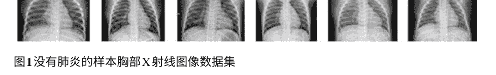

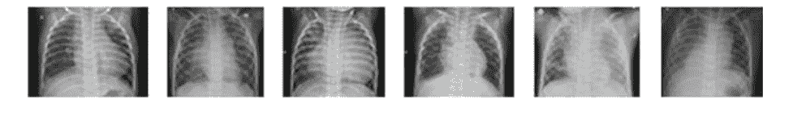

##### 3.2 预处理和数据增强

数据预处理是在训练期间将原始数据转换为所提出的CNN架构之前的阶段。在从不同来源收集各种数据时，它们以原始形式累积。由于原始数据无法在训练过程中进行分析，因此需要对收集到的数据进行预处理以使其可用。作为预处理的一部分，我们使用了各种数据增强算法来增加样本图像的大小和质量。这些过程旨在处理数据的过拟合问题，并提高模型的泛化能力。

首先，我们使用了重新缩放操作，在增强期间负责缩小和放大图像。然后，在训练过程中利用旋转操作将图像样本旋转40°。样本图像水平平移了0.2%。我们还对收集到的图像进行了垂直平移，平移比例为0.2%。数据增强过程中的其他操作包括剪切范围、缩放范围和水平翻转。数据增强过程对样本数据应用不同的操作，以提高模型的验证和分类准确性。

##### 3.3 提出的模型

图3表示建议的CNN模型的一般概述，该模型经过训练用于分类样本图像数据集。提出的卷积神经网络架构被划分为几个层，也被称为密集层。特征提取器和分类器是我们提出的CNN模型最重要的特征之一。

在模型中使用了Softmax激活函数作为分类器。建议的CNN模型包括多个层，如卷积层、各种分类层和最大池化层。

在这里，特征提取器层包括conv3 ×3, 16; conv3 ×3, 32;conv3 ×3, 64; conv3 ×3, 128，大小为2 ×2的最大池化层，并在它们之间使用RELU作为激活函数。

从最大池化和卷积操作中得到的结果在2D平面上累积，也称为特征图。我们从卷积操作中获得了163 × 163 ×16, 79 ×79 ×32, 37 × 37 ×64, 16 × 16 ×128, 3 × 3 ×128大小的特征图，而从池化操作中收集到了81 × 81 ×16, 39 × 39 ×32, 18 × 18 ×64, 8 × 8 ×128, 3 × 3 ×128的特征图。

相比之下，输入图像的尺寸为165 × 165 ×3。分类器Softmax激活函数放置在建议的神经网络模型的远程区域。它也被称为ANN模型，通常被称为压缩函数，因为它具有多个密集层。

Softmax激活函数还将特征向量用于执行与分类过程中的其他分类器类似的计算。因此，在完成特征提取过程后，获得的输出进一步转化为


图3 所提出模型的概述

| Layer (type) | Output Shape | Parameters |
| :--- | :--- | :--- |
| Conv2d (Conv2D) | (None, 163, 163, 16) | 448 |
| Activation (Activation) | (None, 163, 163, 16) | 0 |
| Max_pooling2d (MaxPooling2D) | (None, 81, 81, 16) | 0 |
| Conv2d_1 (Conv2D) | (None, 79, 79, 32) | 4640 |
| Activation_1 (Activation) | (None, 79, 79, 32) | 0 |
| Max_pooling2d_1 (MaxPooling2D) | (None, 39, 39, 32) | 0 |
| Conv2d_2 (Conv2D) | (None, 37, 37, 64) | 18496 |
| Activation_2 (Activation) | (None, 37, 37, 64) | 0 |
| Batch_normalization (Batch Normalization) | (None, 37, 37, 64) | 256 |
| Max_pooling2d_2 (MaxPooling2D) | (None, 18, 18, 64) | 0 |
| Conv2d_3 (Conv2D) | (None, 16, 16, 128) | 73856 |
| Activation_3 (Activation) | (None, 16, 16, 128) | 0 |
| Max_pooling2d_3 (MaxPooling2D) | (None, 8, 8, 128) | 0 |
| Conv2d_4 (Conv2D) | (None, 6, 6, 128) | 147584 |
| Activation_4 (Activation) | (None, 6, 6, 128) | 0 |
| Batch_normalization_1 (Batch normalization) | (None, 6, 6, 128) | 512 |
| Max_pooling2d_4 (MaxPooling2D) | (None, 3, 3, 128) | 0 |
| Dropout (Dropout) | (None, 3, 3, 128) | 0 |
| flatten (Flatten) | (None, 1152) | 0 |

图4 所提出模型的参数

用于分类器的1D特征提取平面，也称为扁平化过程。卷积操作的结果被推广为最终分类过程所需的特征向量平面。此外，分类层包括一个扁平层，两个厚度分别为512和1的全连接层，0.2的丢弃率，ReLU激活器和Softmax激活函数，可用于图像的最终分类任务（图4）。

#### 4 结果分析

我们每3小时进行相同的实验多次，以计算架构的准确性和效果。调整了所提出模型的参数和超参数，以获得相对较高的性能。

一种高效的深度学习方法用于检测...

在训练过程中，在获得不同的测试案例结果时，考虑最有效的结果。总共的迭代次数为3，而丢弃率设置为0.2。图5和图6展示了在数据集训练过程中所提出模型的性能图表视图（表2；图7）。

实验结果显示了我们所提出的CNN架构的效率，它在医学图像分类任务中表现比现有的深度学习算法更好。根据实验结果，我们提出的

| 算法 | 准确率 (%) |
| :--- | :--- |
| SMO | 76.76 |
| C4.5 | 74.83 |
| 3NN | 74.51 |
| 投票 | 76.12 |
| WvEnSL3 | 83.49 |
| CNN模型 | 87.65 |
| 提出的CNN模型 | 89.00 |

该模型的准确率达到了89%，相比于复杂的监督方法，如SMO [25]、C4.5 [26]、3NN [27]、WvEnSL3[13]和CNN [18]，更高。SMO、C4.5、3NN等被认为是最成熟和被广泛认可的深度学习算法，用于进行目标检测任务。

#### 5 讨论

在这项研究中，我们从中国广州妇女医疗中心收集了共5840个胸部X光图像样本。算法通过采用各种数据增强技术进行数据预处理，以提高分类和验证准确性。经过手动注释，我们使用TensorFlow后端的Keras深度学习开源库训练了模型。卷积层将一组固定大小的可学习卷积核扩展到用于生成称为特征图的2D平面的输入图像。这些图包含像素值的提取特征。在后期阶段，最大池化层对特征图执行各种操作，以对输入特征进行下采样并降低计算复杂性。然后，全连接层接受前面层的输出并将其转换为1D特征向量。最后，Softmax激活函数分析特征向量以对正面和负面肺炎进行分类和预测。总体而言，该系统的准确率达到了89%，相对于现有模型而言相对较高。

#### 6 结论

基于深度学习的CNN模型被认为是分析临床图像数据的最受认可的算法[28]。在本文中，我们试图通过分析一组胸部X射线图像数据集来演示一种有效检测肺炎的方法。推荐的CNN模型是从头开始构建的，在训练过程中比其他现有的机器学习算法表现更准确，达到了更好的精确度。将来，我们将尝试通过对受肺癌影响的X射线图像进行分类来扩展这项研究工作。近年来，包含肺癌的X射线图像的分类任务对全球科学家构成了越来越大的关注。我们对我们的下一步方法能够在处理这个复杂问题中发挥重要作用持乐观态度。

#### 参考文献

1. 世界卫生组织 (2018年)。家庭空气污染与健康[事实表]。世界卫生组织。http://www.who.int/news-room/fact-sheets/detail/household-air-pollution-and-health。
2. Rudan, I., Tomaskovic, L., Boschi-Pinto, C., & Campbell, H. (2004). 全球五岁以下儿童临床肺炎发病率的估计。世界卫生组织, 82, 85–90。
3. Narasimhan, V., Brown, H., Pablos-Mendez, A., et al. (2004). 应对全球人力资源危机。柳叶刀, 363(9419), 1469–1472。
4. Naicker, S., Plange-Rhule, J., Tutt, R. C., Eastwood, J. B. (2009). 发展中国家医疗人员短缺。非洲种族与疾病, 19, 60。
5. Ronneberger, O., Fischer, P., Brox, T. (2015). U-Net: 用于生物医学图像分割的卷积网络. 见: Navab, N., Hornegger, J., Wells, W., Frangi, A. (eds) 医学图像计算与计算机辅助干预 - MICCAI 2015. MICCAI 2015. 计算机科学讲座笔记, 第9351卷。Springer, Cham。
6. Badrinarayanan, V., Kendall, A., & Cipolla, R. (2015). Segnet: 用于图像分割的深度卷积编码器-解码器架构。
7. Mortazi, A., Karim, R., Rhode, K., Burt, J., & Bagci, U. (2017). Cardiacnet: 使用多视角CNN从MRI中分割左心房和近端肺静脉. 见 M. Descoteaux, L. Maier-Hein, A. Franz, P. Jannin, D. Collins and S. Duchesne (Eds.)，医学图像计算和计算机辅助干预, MICCAI 2017。Springer。
8. Kermany, D. S., Goldbaum, M., Cai, W., 等 (2018). 通过基于图像的深度学习识别医学诊断和可治疗疾病。Cell, 172(5), 1122–1131。
9. Antin, B., Joshua, K., & Martayan, E. (2017). 通过监督学习在胸部X射线中检测肺炎。Semanticscholar.org。
10. Rajpurkar, P., Irvin, J., Zhu, K., 等 (2017). Chexnet: 基于深度学习的胸部X射线放射科医师级肺炎检测。 arXiv预印本 arXiv: 1711.05225。
11. Park, M., Jin, J. S., & Wilson, L. S. (2004). 通过减少肋骨在胸部X射线中检测异常纹理。见视觉信息处理的悉尼地区研讨会论文集。
12. Ragab, D. A., Sharkas, M., Marshall, S., & Ren, J. (2019). 使用深度卷积神经网络和支持向量机进行乳腺癌检测。PeerJ, 7, e6201。
13. Livieris, I., Kanavos, A., Tampakas, V., et al. (2019). 一种加权投票集成自标记算法用于从X射线中检测肺部异常。Algorithms, 12(3), 64。
14. Choudhari, S., & Seema, B. (2014). 用于皮肤癌检测的人工神经网络。国际计算机科学新趋势与技术杂志(IJETTCS), 3(5), 147–153。
15. Omar, H. S., & Babalik, A. (2019). 使用卷积神经网络从X射线图像中检测肺炎 (p. 183). 会议论文集。
16. Abiyev, R. H., & Ma’aitah, M. K. S. (2018). 深度卷积神经网络用于胸部疾病检测。医疗工程杂志，2018年。
17. Naranjo-Torres, J., Mora, M., Hernández-García, R., Barrientos, R. J., et al. (2020). 对水果图像处理应用卷积神经网络的综述。应用科学，10(10), 3443。
18. Han, F., Yao, J., Zhu, H., & Wang, C. (2020). 基于深度CNN方法的水下图像处理和目标检测。传感器杂志，2020年。
19. Alazab, M., Shalaginov, A., Mesleh, A., et al. (2020). 使用深度学习进行COVID-19预测和检测。国际计算机信息系统和工业管理应用杂志，12, 168–181。
20. Chakraborty, S., Aich, S., Sim, J. S., & Kim, H. C. (2019). 使用卷积神经网络架构从胸部x光片中检测肺炎。国际未来信息与通信工程会议，11(1), 98–102。
21. Rahman, M. M., Faruque Shamim, M. O., & Ismail, S. (2018). 孟加拉国一天国际板球数据的分析：机器学习方法。见2018年科学、工程和技术创新国际会议（ICISET）。
22. Shubho, S. A., Razib, M. R. H., Rudro, N. K., Saha, A. K., Khan, M. S. U., & Ahmed, S. (2019). NB树、REP树和随机树分类器在信用卡欺诈数据上的性能分析。见2019年第22届计算机与信息技术国际会议（ICCIT）。
23. Rahman, M. M., & Basak, S. (2021). 基于鼠标移动数据的用户认证和最常用地区的识别：一种机器学习方法。见2021年IEEE第11届计算与通信研讨会和会议（CCWC）。
24. 美国国立卫生研究院胸部X射线数据集。https://www.kaggle.com/nih-chest-xrays/datasets。2020年8月30日访问。
25. Platt, J. (1998).《支持向量学习：核方法的进展》。麻省理工学院出版社。
26. Quinlan, J. (1993).《C4.5：机器学习程序》。摩根·考夫曼。
27. Aha, D. (1997). 《懒惰学习》。Kluwer学术出版社。
28. Yamashita, R., Nishio, M., Togashi, K., et al. (2018). 卷积神经网络：概述和在放射学中的应用。Insights Into Imaging, 9(4), 611–629.

### QMCDS：云数据存储的量子存储

Ankit Sharma, Indra Kumar Sahu和Manisha J. Nene

摘要云计算作为一种非常突出和有前景的技术，具有低成本、可扩展性、弹性和按需服务等独特特点。另一方面，由于其巨大的计算能力，量子计算也越来越受到研究的关注。未来很快将由这两种技术的综合能力来定义。云计算面临的挑战，如对机密性、完整性、身份验证、可用性和授权的威胁，日益恶化。作为一种服务的云存储也面临着这些威胁和挑战。由于密码分析方法和技术的快速发展，基于传统密码学技术的现有云存储安全解决方案将不再可行。因此，本研究提出了一种基于量子存储的云数据存储解决方案（QMCDS），并在对云存储中的困难和限制进行详细分析后提出。所提出的解决方案基于量子比特，并在此处进行了讨论。所提出的研究工作是为了通过将量子计算置于云量子计算技术的核心位置来为解决方案的开发铺平道路。

关键词 云计算 · 量子计算 · 纠缠 · QMCDS · 不可克隆定理 · 哈达玛门 · 量子存储

#### 1 引言

云计算已成为最有前景的基于网络的技术之一，可以在不考虑位置的情况下共享计算和资源[1]。基础设施即服务（IaaS）、平台即服务（PaaS）和软件即服务（SaaS）是可用的各种服务模型，与按需自助服务、资源池、快速弹性、低成本和按使用量付费等基本特征相关[2]。巨大的数据存储容量，极具可扩展性性能和维护大量服务的技术使其成为一种主导技术。

具有巨大计算能力的量子计算被认为是另一种突出的技术，可以指数级解决最困难的问题[3]。用于加密的传统密码系统可能不再安全。

云计算和量子计算的综合能力将成为未来的发展方向。

云计算还为用户提供存储服务。Google Drive、Jio Cloud、Microsoft OneDrive和Dropbox提供有限的免费存储服务，而IBM云存储、Apple iCloud、SpiderOak One和CertainSafe Deposit Box则通过提供付费数据存储服务来商业化，供个人用户、企业和组织使用。云服务器中存储的数据目前使用传统加密技术进行保护，被认为非常安全。

但是，随着密码分析方法和技术的不断进步，特别是使用量子计算，它们将无法再长时间抵挡。云存储数据面临着机密性、完整性、身份验证、可用性和授权方面的严重威胁。因此，在后量子时代，需要设计一些能够抵御这些风险和攻击的方法/方案/协议。

通过严格的研究和大量的研究工作，提出了量子内存云数据存储（QMCDS）解决方案，用于保护云服务器中的数据安全。所提出的QMCDS能够抵御大多数云存储攻击，并通过经典技术来减轻威胁。

本文的其余部分分为六个部分组织。第二部分是文献调研，第三部分是描述初步情况，第四部分是问题陈述。第五部分提出了解决存储问题的方案。第六部分介绍了实验和观察结果，最后一部分是结论和未来展望。

#### 2 文献综述

##### 2.1 相关工作

云计算为用户和CSP提供了各种好处。用户可以以低成本、按需、按使用量的方式获得服务，而不受地理限制。数据存储是为用户提供方便和足够安全性的服务。在这个领域进行了大量的研究工作。除了经典技术之外，还提出了基于格密码学的解决方案，用于确保机密性、完整性和其他安全和隐私参数。身份基于完整性验证（IBIV）协议用于完整性[4]，基于格密码学的云数据安全全同态加密研究[5]和基于格密码学的访问控制用于保护用户基于格密码学的云环境中的数据和混合安全性[6]是该领域的一些研究工作。

已经提出了基于量子的技术来保护存储和传输中的数据。单个量子无法克隆[7]，量子复制：超越无克隆定理[8]，经典无克隆定理[9]，无克隆定理[10]，测量纠缠对各种量子应用的影响[11]，保留量子比特以供将来参考的量子通信协议[12]，具有生物特征的量子比特一次性密码[13]和使用量子比特的双因素认证[14]是一些基于量子的研究工作，为增强和利用各种应用的安全性和隐私参数铺平了道路，包括云安全。

##### 2.2 贡献

本文提出了一种用于云数据存储的量子存储器（QMCDS）解决方案，利用量子比特来保护云数据存储。该解决方案通过使用固有的量子特性来增强安全性。通过使用固有的量子特性，该解决方案增强了安全性。

#### 3 预备知识

在探索QMCDS解决方案之前，需要熟悉一些预备知识，这在后续部分中给出[15, 16]。

##### 3.1 量子比特

- 在量子比特表示中，状态0或|0>和状态1或|1>由一个2×1矩阵表示，如下所示：
$$|0\rangle = \begin{pmatrix} 1 \\ 0 \end{pmatrix} \quad |1\rangle = \begin{pmatrix} 0 \\ 1 \end{pmatrix}$$
- 对于多个量子比特|00>、|01>、|10>和|11>，可以通过张量积（表示为⊗）来找到值，如下所示：
- 例如，|00>的值可以找到如下：
$$|00\rangle = \begin{pmatrix} 1 \\ 0 \end{pmatrix} \otimes \begin{pmatrix} 1 \\ 0 \end{pmatrix} = \begin{pmatrix} 1 \\ 0 \\ 0 \\ 0 \end{pmatrix}$$
类似地，
$$|01\rangle = \begin{pmatrix} 0 \\ 1 \\ 0 \\ 0 \end{pmatrix}, |10\rangle = \begin{pmatrix} 0 \\ 0 \\ 1 \\ 0 \end{pmatrix}, |11\rangle = \begin{pmatrix} 0 \\ 0 \\ 0 \\ 1 \end{pmatrix}$$

##### 3.2 量子门的表示

- 量子操作的NOT门可以表示为：
$$\text{NOT} = \begin{pmatrix} 0 & 1 \\ 1 & 0 \end{pmatrix}$$
该矩阵可以执行NOT门的操作，即将量子比特|0>翻转为|1>，反之亦然。
类似地，用于量子操作的OR门和AND门的矩阵表示如下：
$$\text{或} = \begin{pmatrix} 1 & 0 & 0 & 0 \\ 0 & 1 & 1 & 1 \end{pmatrix}$$
$$\text{和} = \begin{pmatrix} 1 & 1 & 1 & 0 \\ 0 & 0 & 0 & 1 \end{pmatrix}$$
- OR和AND操作是在|00>、|01>、|10>和|11>上执行的两个量子比特操作。
- 控制非门可以表示为：
$$\text{CNOT} = \begin{pmatrix} 1 & 0 & 0 & 0 \\ 0 & 1 & 0 & 0 \\ 0 & 0 & 0 & 1 \\ 0 & 0 & 1 & 0 \end{pmatrix}$$
- Toffoli或CCNOT（控制控制非门）可以表示为：Toffoli门 = \begin{pmatrix} 1 & 0 & 0 & 0 & 0 & 0 & 0 & 0 \\ 0 & 1 & 0 & 0 & 0 & 0 & 0 & 0 \\ 0 & 0 & 1 & 0 & 0 & 0 & 0 & 0 \\ 0 & 0 & 0 & 1 & 0 & 0 & 0 & 0 \\ 0 & 0 & 0 & 0 & 1 & 0 & 0 & 0 \\ 0 & 0 & 0 & 0 & 0 & 1 & 0 & 0 \\ 0 & 0 & 0 & 0 & 0 & 0 & 0 & 1 \\ 0 & 0 & 0 & 0 & 0 & 0 & 1 & 0 \end{pmatrix}

Toffoli门是一种通用门，可以用来表示其他门。

- Hadamard门

H = \begin{pmatrix} 1/\sqrt{2} & 1/\sqrt{2} \\ 1/\sqrt{2} & -1/\sqrt{2} \end{pmatrix}

Hadamard门可以用来将量子比特置于叠加态。

- Fredkin或Cswap（控制交换）门

Fredkin门 = \begin{pmatrix} 1 & 0 & 0 & 0 & 0 & 0 & 0 & 0 \\ 0 & 1 & 0 & 0 & 0 & 0 & 0 & 0 \\ 0 & 0 & 1 & 0 & 0 & 0 & 0 & 0 \\ 0 & 0 & 0 & 1 & 0 & 0 & 0 & 0 \\ 0 & 0 & 0 & 0 & 1 & 0 & 0 & 0 \\ 0 & 0 & 0 & 0 & 0 & 0 & 1 & 0 \\ 0 & 0 & 0 & 0 & 0 & 0 & 0 & 1 \\ 0 & 0 & 0 & 0 & 0 & 0 & 1 & 0 \end{pmatrix}

- 相位门

Y = \begin{pmatrix} 0 & -i \\ i & 0 \end{pmatrix}, X = \begin{pmatrix} 0 & 1 \\ 1 & 0 \end{pmatrix}

Z = \begin{pmatrix} 1 & 0 \\ 0 & -1 \end{pmatrix}, T = \begin{pmatrix} 1 & 0 \\ 0 & i \end{pmatrix}

矩阵 X、Y 和 Z 也被称为 Pauli 矩阵，其中 Pauli X 矩阵也是实现相位变化 π 的 NOT 门。

##### 3.3 布洛赫球

布洛赫球的几何表示有助于理解单位长度的量子运算[16]。

#### 4 提出的解决方案

传统的加密解决方案被认为容易受到分析高级网络和量子攻击的威胁。各种现有技术，如基于RSA的加密、数字签名、哈希技术等，被用于安全和隐私应用，其中加密将基于数论或因子分解的困难问题。通过使用量子计算，这些问题将不再是困难问题，可以在多项式时间内解决或破解。

因此，在后量子时代，有必要在量子领域中找到云数据的解决方案。

这个解决方案使用了具有存储信息的量子比特的量子存储器。对于基于量子存储器的技术，存储和测量量子比特的值是相关的。在量子力学中，对比特的操作受到波函数坍缩[17]、无克隆定理[7]和可逆操作[18]的影响。这些特性对于测量或复制存储在内存中的量子状态提出了挑战，并且限制了只能使用可逆操作。

通过“无克隆定理”，可以找到一个解决方案，该定理指出无法制作量子态的精确副本，如果制作了量子态的副本，则副本将是相同的或正交的[7-10, 19]。

在布洛赫球上，|0>和|1>是正交的。可以通过计算它们的标量积来验证：

$$|0> = \begin{pmatrix} 1 \\ 0 \end{pmatrix}, \quad |1> = \begin{pmatrix} 0 \\ 1 \end{pmatrix}$$

它们的标量积 |0> . |1> >= (10)。

$$\begin{pmatrix} 0 \\ 1 \end{pmatrix} = (1 \times 0 + 0 \times 1) + (0 \times 0 + 0 \times 1) = 0.$$

同样，|X_+>, |X_->和|Y_+>, |Y_->是正交的态。

Masato Koashi 和 Nobuyuki Imoto [20]给出了两个系统中纠缠态被顺序访问克隆的必要和充分条件。在类似的思路下，我们设计了一个在量子机器中的电路，如图1a所示，为了实验，我们选择了一个由3个量子比特组成的系统，其中量子比特q0、q1和q2的值将被克隆到量子比特q3、q4和q5中。作用于q0的量子函数由NOT门后跟Hadamard门表示。量子比特q1和q2具有由哈达玛门表示的量子操作。在量子操作之后，qubits q0、q1和q2分别与q3、q4和q5通过CNOT门相互纠缠。

#### 5 实验和观察

实验是在IBM量子机器[21]上进行的，电路在量子机器和量子模拟器上运行。然而，讨论的结果是量子模拟器的结果，因为它的误差率较低。

在图1中，qubits q0、q1和q2分别与q3、q4和q5处于纠缠状态。从图2的结果可以看出，纠缠的qubit对q0-q3、q1-q4和q2-q5的两个qubits具有相同的值，要么是0，要么是1，根据应用的量子操作而定。

在量子存储中，需要复制数据或进行多次读取操作。根据波函数坍缩定理[17]，量子态在测量后会坍缩，因此如果在测量之前复制了量子态，那么复制的态可以用于将来。

在测量之前复制了量子态，那么复制的态可以用于将来。

图3显示了电路图，其中qubit q0、q1、q2被克隆到q3、q4、q5，就像图1中所做的那样。对qubit q0、q1、q2进行读取/测量操作会导致qubit状态坍缩为0（用测量和重置操作符表示）。在对qubit q0、q1、q2进行测量后，qubit q3、q4、q5与qubit q0、q1、q2纠缠在一起。这种纠缠导致qubit q0、q1、q2的状态恢复到测量之前的状态，如图4所示（也可以与图2进行比较）。

#### 6 结论和未来展望

云计算和量子计算正在成为计算环境的未来，具有巨大的计算能力；共享、分布和按需计算资源的能力。所提出的QMCDS解决方案是实现相同目标的一步。从进行的实验中可以明显看出，通过纠缠克隆量子比特并利用其来维护和存储数据和其他信息是可能的。在实施过程中，需要按顺序进行操作，以便在每次操作之前当对量子比特进行测量时，它的状态将通过纠缠被克隆到其他量子比特上。测量后，克隆的状态将根据需要的条件被克隆/复制回原始量子比特上。这样可以根据用户的选择以安全的方式多次访问云上存储的数据，并保持所有的安全和隐私参数。

对于QMCDS讨论的量子存储器可以进一步用于多次读取量子存储器以执行多次访问数据，因此可以部署在云环境中。在云环境中进行这样的部署将增强云的安全性，因为它具有固有的量子特性。

未来的工作可以在同一实例上实现多次测量，并通过使用量子锁来增强安全性，以禁止对基于量子位的数据进行任何未经授权的访问，从而构想出云计算作为个人用户、组织和企业最安全的环境。

致谢作者要向IBM量子机器团队和众多匿名审稿人表示衷心的感谢，感谢他们的宝贵指导和真诚的反馈。我们要感谢普纳高级技术研究所的同事们对我们的不断鼓励和技术支持。

#### 参考文献

1. Subramanian, N., & Jeyaraj, A. (2018). 云计算中的最新安全挑战。计算机与电气工程, 71, 28–42.
2. Mell, P., & Grance, T. (2011). NIST对云计算的定义。
3. Caleffi, M., Cacciapuoti, A. S., & Bianchi, G. (2018年9月). 量子互联网：从通信到分布式计算！在第5届ACM国际纳米计算与通信会议(pp. 1–4)中。
4. Sahu, I. K., & Nene, M. J. (2021年2月). 云数据存储的基于身份的完整性验证（IBIV）协议。在2021年国际电气、计算、通信和可持续技术进展会议（ICAECT）(pp. 1–6)中。IEEE.
5. Dadheech, A. (2017). 云数据安全的基于格的全同态加密研究。计算机科学高级研究国际期刊, 8(7).
6. Saravanan, N., & Umamakeswari, A. (2021). 基于格的访问控制以保护混合安全云环境中的用户数据。计算机与安全, 100, 102074.
7. Wootters, W. K., & Zurek, W. H. (1982). 单个量子无法被复制。自然, 299(5886), 802–803. https://doi.org/10.1038/299802a0
8. Lindblad, G. (1999).数学物理学快报, 47(2), 189–196. https://doi.org/10.1023/a:1007581027660
9. Bužek, V., & Hillery, M. (1996). 量子复制：超越无克隆定理。物理评论A, 54(3), 1844–1852. https://doi.org/10.1103/physreva.54.1844
10. Daffertshofer, A., Plastino, A. R., & Plastino, A. (2002). 经典的非克隆定理。Physical Review Letters, 88(21). https://doi.org/10.1103/physrevlett.88.210601
11. Gupta, M., & Nene, M. J. (2020, December). 量子计算：一种纠缠测量-ment. 在2020年IEEE国际会议上，多学科研究和创新的趋势(ICATMRI)(pp. 1–6). IEEE.
12. Nema, P., & Nene, M. J. (2020, December). 基于Pauli矩阵的量子通信协议。在2020年IEEE国际会议上，多学科研究和创新的趋势(ICATMRI)(pp. 1–6). IEEE.
13. Sharma, M. K., & Nene, M. J. (2019, October). 带有生物特征的量子一次性密码. 在创新数据通信技术和应用国际会议上 (第312-318页). 斯普林格。
14. Sharma, M. K., & Nene, M. J. (2020). 基于量子一次性密码的双因素第三方生物识别认证方案. 安全与隐私, 3(6), e129。
15. Yanofsky, N. S., & Mannucci, M. A. (2008). 计算机科学家的量子计算. 剑桥大学出版社。
16. Boyer, M., Liss, R., & Mor, T. (2017). 布洛赫球中纠缠的几何. 物理评论A, 95(3). https://doi.org/10.1103/physreva.95.032308
17. Bassi, A., Lochan, K., Satin, S., Singh, T. P., & Ulbricht, H. (2013). 波函数坍缩模型，基础理论和实验测试. 现代物理评论, 85(2), 471–527. https://doi.org/10.1103/revmodphys.85.471
18. Brandão, F. G. S. L., & Gour, G. (2015). 可逆的量子资源理论框架. 物理评论快报, 115(7)。
19. Wootters, W. K., & Zurek, W. H. (2009). 无克隆定理. 物理学今日, 62(2), 76–77。
20. Koashi, M., & Imoto, N. (1998). 纠缠态的无克隆定理. 物理评论快报, 81(19), 4264–4267. https://doi.org/10.1103/physrevlett.81.4264
21. IBM量子体验（在线）。 https://quantum-computing.ibm.com

### 使用机器学习和深度学习进行孟加拉虚假新闻检测的研究

Elias Hossain, Md. Nadim Kaysar, Abu Zahid Md. Jalal Uddin Joy, Md. Mizanur Rahman和Wahidur Rahman

摘要 验证孟加拉虚假新闻是具有挑战性的，特别是如果有来自社交媒体或在线新闻门户的许多更新。 本研究旨在识别孟加拉虚假新闻文章；因此，我们的语料库是通过训练57,000篇与可信度和伪造相关的孟加拉新闻项目而得到的。 在这项研究中，通过在Bi-LSTM与Glove和FastText模型之上应用K折交叉验证，发现了95%和94%的准确率。 同时，该研究还尝试了最先进的技术，如门控循环单元（GRU），发现准确率为77%。 与此形成鲜明对比的是，我们利用Bi-LSTM追踪到了96%的准确率，这与我们提出的模型完全一致。 本研究利用了对现有工作的比较研究。 此外，本研究还详细展示了基于有限元法的一些实验分析。 然而，所提出的系统可以在孟加拉虚假新闻的实时分类中进行调整。

- 孟加拉虚假新闻
- 文本分类
- 机器学习
- 随机森林
- LSTM
- Bi-LSTM
- CNN
- Glove
- Fasttext
- 门控循环单元（GRU）

E. Hossain · A. Z. Md. Jalal Uddin Joy
达菲尔国际大学软件工程系，孟加拉国达卡

Md. Nadim Kaysar
孟加拉国世界大学计算机科学与工程系，达卡

Md. Mizanur Rahman
拉杰沙希工程与技术大学计算机科学与工程系，孟加拉国拉杰沙希

Wahidur Rahman (✉)
马拉纳巴沙尼科技大学计算机科学与工程系，桑托什，孟加拉国

#### 1 引言

当今世界上的数据和新闻事件信息非常丰富。由于现代通信技术，人们今天可以轻松获取信息。这也意味着数百万人通过互联网，尤其是社交媒体，产生了大量的数据。获取数据并不是问题，但当这些数据包含虚假新闻或故事在全球传播时就很危险。这些虚假新闻可能导致误解甚至政治紧张局势，并对个人和社会生活产生不良影响。最近的一份报告显示，在美国、西班牙、德国、英国、阿根廷和韩国，大约三分之一的公民声称他们在社交媒体上看到与COVID-19相关的虚假或欺骗性数据[1]。

虚假新闻的影响正在全球范围内造成破坏。2012年，在孟加拉国，几座佛塔被纵火，因为一张侮辱古兰经的图片。这张图片被标记为一个佛教青年，但他与这张照片没有任何关系。由于这张图片，许多谣言传播开来，尽管无法验证这张图片的真实身份[2]。2019年，有关Padma桥当局在施工现场牺牲人类生命的虚假谣言在网上流传开来。这个谣言随后导致人们怀疑随机个体是拐子[3]。在孟加拉国，2012年的拉姆事件是一个典型的例子，几乎有2.5万人根据一个假账号的Facebook帖子加入了废除佛教寺庙的行动[4]。

幸运的是，有一些网站来对付假新闻，但是这些网站不能充分应对许多假新闻事件。有一些计算方法用于隔离假新闻，这对我们的日常生活是有破坏性的。现在，我们发现在英语中有很多研究工作。截至目前，全球有超过3.41亿人使用孟加拉语进行交流。但是目前没有资源来检测用孟加拉语编写的假新闻。这项工作的目标是开发一种解决方案来对抗错误信息。这项研究还旨在通过应用传统机器学习和深度学习算法创建一个基于人工智能的有效系统来识别欺诈性新闻文章。通过我们提出的解决方案，我们可以轻松分类不准确的孟加拉新闻。我们的贡献可以总结如下：

- 我们基于众多特征提取方法与传统机器学习和深度学习进行了比较分析。
- 我们开发了一个分类系统来检测用孟加拉语编写的假新闻。此外，我们在这个问题中实现了不同类型的预训练模型。
- 我们为每种方法展示了单独的文本预处理流程，这将对研究社区产生积极影响。

#### 2 相关工作

论文[5]的作者提出了多项式朴素贝叶斯模型，用于通过社交网络检测孟加拉恶意文本内容。所提出的研究根据每个句子与垃圾信息的极端程度来识别垃圾信息，准确率为82.44% [6]。试图检测孟加拉语公共Facebook页面上的仇恨言论。作者们开发了一个基于机器学习的模型，但未能达到令人满意的准确率。因此，考虑了基于神经网络的门控循环单元（GRU）模型。GRU的准确率为70% [7]。对孟加拉文件中的讽刺进行了自动检测的研究。该模型使用了卷积神经网络（CNN），并获得了96.4%的准确率[8]。采用深度卷积网络方法对孟加拉文件进行分类。利用Word2vec进行特征提取，并提出了一个与深度学习相关的神经网络“DCNN”，其准确率为94% [9]。提出了孟加拉词嵌入及其在孟加拉文本分类中的应用。采用Skip n-gram方法进行词嵌入，并结合支持向量机（SVM）[10]。展示了基于Stylo和Word Vector特征的增强方法，以95%的准确率识别假新闻[11]。通过使用卷积神经网络（CNN）来检测假新闻进行了实证研究。该研究在英文数据集上进行，并且性能得分达到了98% [12]。通过使用LSTM方法对假新闻进行分类。作者使用了不同的密集层和不同百分比的过滤器，使用了Conv1D层。使用Glove预训练的词嵌入来发现欺诈新闻[13]。研究了在社交媒体网络上检测假新闻。通过应用各种传统机器学习算法对假新闻进行分类[14]。

解释了基于张量分解的深度神经网络，用于改进假新闻检测。应用BuzzFeed和Poli-tiFact数据集提出了一种deepFake方法。在[15]的研究中，提出了基于CNN的洪水管理系统，利用IOT传感器数据[16]预测储罐的可用空间。使用传统机器学习方法进行了实验，处理了不平衡数据，并使用了多种技术解决了不平衡数据问题。

回顾以上研究表明，在大规模数据集上还没有完成足够的研究。以上研究中存在一些缺点。作者[5]承认他们的工作没有足够的语料库。作者[6]从孟加拉语的公共Facebook页面中检测到仇恨言论，他们只是通过传统机器学习算法进行了实验。然而，数据集的数量相对较少。

在我们提出的研究中，我们应用了深度学习和机器学习算法来分类孟加拉语环境下的假新闻报道。传统方法已经生成了各种特征，例如unigram和bigram。这是孟加拉语中最广泛的数据集，据我们所知，容量为57,000，处理如此庞大的数据集异常具有挑战性。我们为每种方法展示了单独的文本预处理流程，这将对研究社区产生积极影响。虽然在孟加拉语方面的研究并不多，但它将为那些希望从事孟加拉语新闻分类工作的人提供一个基准。

#### 3 提出的研究方法 (PRM)

在这个提出的研究中，将测试几种传统的机器学习和深度学习算法，以便从新闻报道中识别孟加拉语的误导性新闻。提出的研究方法 (PRM) 分为四个部分：实验设置、数据准备流程 (DPP)、特征提取方法 (FEM) 和算法选择过程 (ASP)。通过观察图1，可以看到提出的研究架构图被分类为几个阶段，每个阶段完成一个单独的任务。更重要的是，文本预处理在第一阶段使用预训练和非预训练模型完成；然后，将模型输入到机器学习和深度学习算法中；之后，完成模型评估，最终进行架构实现，对文档进行分类。详细的顺序和结果在图1中可视化。

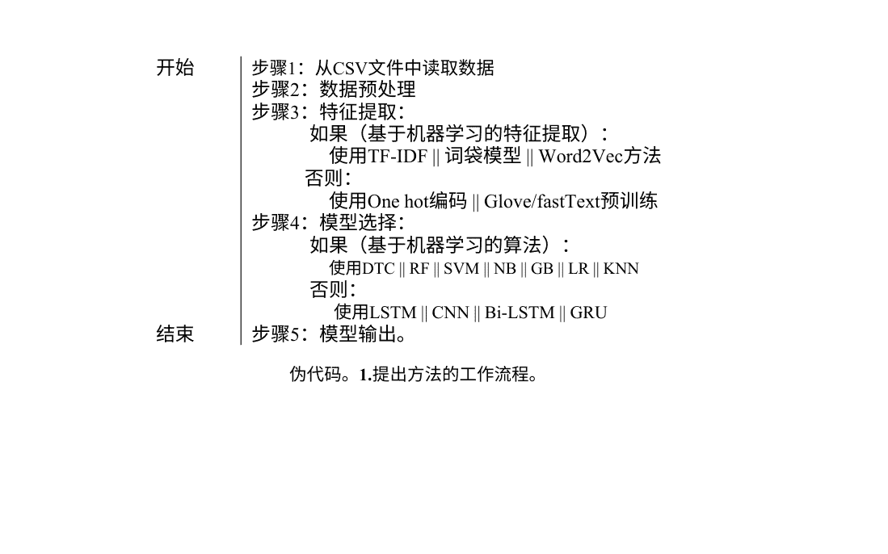

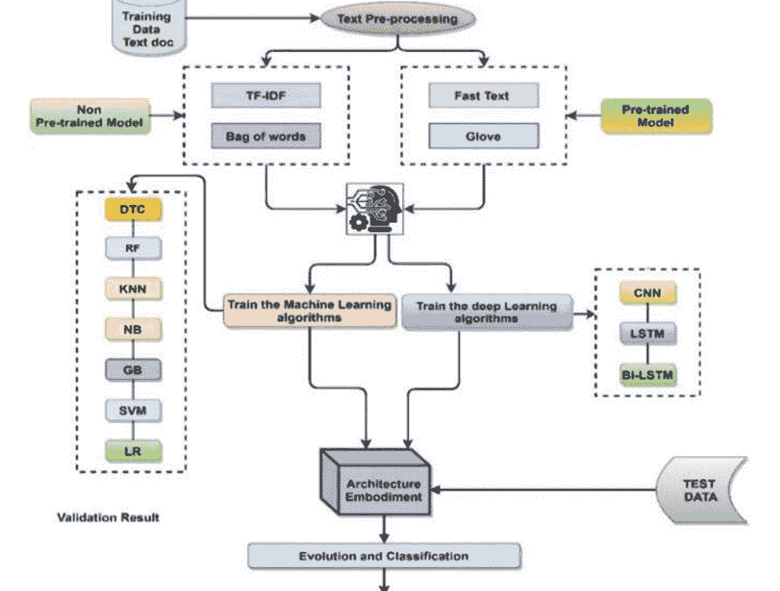

##### 3.1 实验设置

在本节中，我们根据孟加拉新闻文章描述了我们的研究数据集。所提出的研究数据集包含来自孟加拉国各个新闻门户网站的57,000篇新闻文章。我们从[4]收集了数据集。表1显示了数据集描述。

##### 3.2 数据准备流程（DPP）

数据准备是应用每个机器学习算法的重要部分，在处理文本数据时，需要清洗语料库以应用机器学习算法[17]。数据准备以数据预处理结束。文本预处理建议去除文本中没有太多意义的停用词、标点符号、短语等。噪声过滤和文本规范化。 在这项研究中，我们从文本语料库中过滤了噪声，例如删除常量特征，删除重复数据，删除相同的列，删除空值，应用正则表达式和删除停用词。 孟加拉语目前仍然是一个低资源语言，尚未开发出像NLTK那样的大型语料库，但在孟加拉文本数据的情况下，一些停用词是可以找到的，例如

- অবশ্য
- অনেক
- অনেকে
- অনেকেই
- মধ্যভাগে
- যাদের
- যাচ্ছে
- দিয়েছে
- শুধু
- সেটাও
- মধ্যভাগে

等等。我们通过BLTK库[18]删除了停用词。 词干化程序被称为词干化程序。算法将单词“巧克力”，“巧克力味的”，“巧克力”减少到基础词“巧克力”，并将“检索”，“检索到”，“检索”减少到词干“检索”。 我们通过BLTK库[18]努力进行词干化。

##### 3.3 特征提取方法（FEM）

在本节中，描述了特征提取方法，并将其分为非预训练模型直觉（NPMI）和预训练模型直觉（PMI）。

###### 非预训练模型直觉（NPMI）

词频（TF）—逆文档频率（IDF）。 在自然语言处理中，可以找到各种特征提取技术来提取文本文档的特征；例如，词袋模型（BOW），词频-逆文档频率（TF-IDF），计数向量化器等。[19]。 **TF**（词频），用于衡量词在文档中出现的频率。另一方面，逆文档频率（IDF）是一个完整文档中单词的得分。**TF-IDF**特征提取方法的另一个重要参数是**N-gram**，它是N个标记或单词的序列[20]。 我们可以将**TF-IDF**的方程写成如下形式：

```
TF: tf(w, d) = log(1 + f(w, d)), IDF: tf(w, D) = log( N / f(w, D) )  (1)
```

TF IDF:tf - idf(w, d, D) = tf(w, d) * tf(w, D)  
(2)

这里，w是一个词，d是一个文档。F(w,d)是一个词在文档中的频率-词在一组文档中的逆文档频率（IDF）。这里N是文档的数量，f(w,d)是包含该词的文档数量。将这两个数字相乘得到文档中词的TF-IDF分数。

###### 预训练模型直觉（PMI）

###### Word2Vec

Word2Vec是由[21]提出的一种表面词嵌入模型。这意味着Word2Vec用两层浅层神经网络描述了词嵌入。它比词袋模型和TF-IDF方法更方便，可以承载文档中不同单词的语义含义。

尽管CBOW（连续词袋模型）和skip-gram模型[22]中存在两种类型的架构，但我们提出了一种skip-gram模型，skip-gram使用单词信息来预测其邻近单词，定义如下：

1/T Σ (t=1 到 T) Σ (-c ≤ j ≤ c, j≠0) log p(ωt+j|ωt)  
(3)

在上述方程中，c表示训练上下文（c成为中心词ωt的函数）。使用softmax函数的skip-gram的基本公式：

p(wO|wI) = exp(vwO^T vwI) / Σ (w=1 到 W) exp(vw'^T vwI)  
(4)

其中vw是输入，而vw'是向量表示的输出。W是词汇表中的单词数。计算成本∇log(ωo|ωi)与W成正比，因此该公式是不实际的。

##### 3.4 算法选择过程（ASP）

在我们提出的研究中，我们通过监督机器学习算法和深度学习算法进行了实验。我们将这一部分分为两个阶段：机器学习模型（MLM）和神经网络模型（NNM）。

机器学习模型（MLM）。在本节中，我们应用了六种分类算法，如决策树分类器、随机森林分类器（RF）、K最近邻（KNN）、多项式朴素贝叶斯、梯度提升、支持向量机（SVM）和逻辑回归。经过实验，我们观察到决策树分类器（DTC）和随机森林分类器（RF）表现良好，因此本节介绍了DTC。

决策树分类器（DTC）。决策树分类器（DTC）是一种用于文本和数据挖掘的先前分类算法[23]。DTC在各个领域中被有效地用于分类[24]。主要概念是创建一个支持属性的树来对数据点进行分类。然而，DTC的最大挑战是属性或特征可能在父级上，而应该在子级上。应用数学建模[25]解决了树中的特征选择问题以解决这个问题。对于包含p个正例和n个负例的训练集：

```
$$H\left(\frac{p}{n+p}, \frac{n}{n+p}\right) = -\frac{p}{n+p} \log_2 \frac{p}{n+p} - \frac{n}{n+p} \log_2 \frac{n}{n+p} \quad (5)$$
```

选择具有唯一值的属性中的$K$，将训练集$E$分成前缀$\{E_1,E_2,\ldots,E_k\}$。尝试后，属性（分支$i = 1,2,\ldots,k$）的预期熵（EH）将保持不变：

```
$$\mathrm{EH}(A) = \sum_{i=1}^{K} \frac{p_i + n_i}{p + n} H\left( \frac{p_i}{n_i + p_i}, \frac{n_i}{n_i + p_i} \right) \quad (6)$$
```

信息增益（I）或该特征的熵减少为：

```
$$A(I) = H\left(\frac{p}{n+p}, \frac{n}{n+p}\right) - \mathrm{EH}(A) \quad (7)$$
```

选择具有最显著信息增益的属性作为父节点的中心。神经网络模型（NNM）。本节介绍了用于对文本文档进行分类的卷积神经网络（CNN）、长短期记忆（LSTM）和双向LSTM（BI-LSTM）。

卷积神经网络（CNN）。卷积神经网络的基本功能类似于动物大脑的视觉皮层。卷积神经网络在文本分类任务中表现良好。文本分类的标准与图像分类的标准相同，只是我们有一个词向量矩阵而不是像素值。卷积神经网络（CNN）是机器学习中最流行的算法之一。CNN对于分类短文本和长文本具有很好的效果[26]。因此，我们使用CNN的帮助来对孟加拉语进行伪新闻分类。CNN的隐藏层通常包含卷积层、池化层、全连接层和泛化层[27]。

在这里，嵌入表示每个单词的数值向量，并且嵌入创建了一个数据表，其中该表的每一行表示一个单词的嵌入。每个嵌入都有一些参数，如词汇大小和嵌入维度。这里的词汇大小表示文档中唯一单词的数量，而嵌入维度描述了每个术语的维度数[11]。

### 卷积层。

这是卷积神经网络（CNN）的第一层，也是主要组成部分之一。它们以训练图像的原始像素值作为输入，并从中提取特征。该层确保像素在空间上相关，通过从输入数据的小方块中学习图像特征[28]。

数学上，我们可以将其定义为两个函数“f”和“g”的组合：

```
$$(f * g)(i) = \sum_{j=1}^{m} g(j).f\left(i - j + \frac{m}{2}\right)$$ (8)
```

### 汇聚层.

卷积神经网络的另一个重要概念是汇聚，被认为是一种非线性下采样的形式。汇聚层用于从矩阵的指定部分($n \times n$)中提取特定值（最大/平均值）。在这个架构中，最大汇聚层将卷积层的输出合并起来。所有卷积层的结果都被集中并传递到下一层的卷积层[29]。

### 全连接层.

全连接层也被称为密集层。每个神经元从其前一个神经元接收输入，并且它们之间是密集连接的。输出通过优化损失函数和每个神经元的权重初始化结果来计算[30]。假设我们有一个输入层，其中输入为 ×1， ×2和 ×3，以及一个隐藏层 H1。每个神经元的权重初始化为 y1， y2和 y3。在添加偏置后，我们可以看到输出如下 :

```
$$Y = \sum_{i=1}^{n} w_i * x_i + w_n * x_n \cdots + bias$$ (9)
```

可以使用两种传播方式来减少误差，即前向传播和反向传播。考虑到多个隐藏层时，通常通过反向传播来减少误差。在反向传播中，通过链式法则计算导数[31]。

### Dropout.

Dropout有助于避免过拟合，在训练过程中以频率为rate随机将输入单元设置为0。需要注意的是，Dropout仅在训练设置为True时才有效，这意味着在使用模型进行推理时不会降低任何值。

### 激活函数。

我们考虑将ReLu作为CNN架构的激活函数。ReLu函数的主要优点是通过将激活图中的负值标记为零来消除负率。通过这个函数有效地解决了梯度消失问题[31]。

长短期记忆（LSTM）。由于具备捕捉顺序信息的能力，LSTM通常被广泛应用于文本分类相关问题。特别是通过从文本中的两个方向收集顺序信息，双向LSTM（Bi-LSTM）展示了令人印象深刻的效率。此外，当与Bi-LSTM一起使用时，注意机制被认为是一种潜在的汇聚技术，适用于分类任务。在这项研究中，我们通过接近关注前32个元素的双向LSTM（Bi-LSTM）模型进行了实验。然而，Bi-LSTM中使用的以下架构包括：输入包含词汇量、嵌入向量特征和输入形状，值为0.4的Spatial-Dropout1D层，具有356个LSTM单元的双向层，值为0.2的Dropout以避免过拟合，具有2个神经元和softmax激活函数的密集层。

#### 4 结果和分析

本节包括两个阶段，以说明，性能分析（PA），比较分析（CA）。PA进一步细分为两部分，例如，模型结果（CM）和模型评估报告（MER）。

##### 4.1 性能分析（PA）

本节主要分析通过机器学习分类算法获得的性能。然而，本节描述了两种方法：传统机器学习算法的性能和深度学习算法的性能。我们的研究发现，深度学习算法在文本分类中起着重要作用，而不是传统机器学习算法。

模型结果（CM）的后果。正如我们之前提到的，本研究通过七种分类算法进行了实验，因此算法的精确度、召回率和f1-得分在表2中显示。在表3和表4中，精确度被写为“P”，召回率也是如此，“R”，F1-得分是“F1”。我们通过混淆矩阵给出了TP、TN、FP和FN的数量。

表2、3和4显示了传统方法和深度学习方法的分类报告。方程式（10）、（11）、（12）和（13）显示了计算精确度、召回率、F-1分数和准确度的公式。我们在随机森林（集成学习）中获得了更高的准确度，达到了89%。此外，DTC、KNN、NB、GB、SVM和LR在Uni-gram上的准确度分别为86%、78%、67%、73%、88%和73%。表1描述了相同的传统算法在Bi-gram方法中的结果，并从随机森林（RF）中获得了最高的78%准确度。

此外，其他算法的性能并不好。表3中使用了word2vec方法，并在随机森林（RF）中获得了83%的准确度。我们的神经网络模型表现出色。此外，其他算法的性能并不好。表3中使用了word2vec方法，并在随机森林（RF）中获得了83%的准确度。我们的神经网络模型表现出色。出色的性能，并且还使用了两个预训练模型来提高表4中的准确性。在LSTM实验中，我们获得了96%的准确性。另一方面，我们进行了96%的有效性的Bi-LSTM实验。在这里，CNN和GRU模型的准确性分别为95%和78%，而真实新闻的CNN模型F1分数为96%，假新闻的F1分数为95%。此外，我们还进行了带有Bi-LSTM的glove和Fasttext预训练模型的实验，准确性分别为95%和94%。

```
$$\text{精确度} = \frac{\text{TP}}{\text{TP} + \text{FP}}$$ (10)
$$\text{召回率} = \frac{\text{TP}}{\text{真正例 + 假阴性}}$$ (11)
$$\text{F1} = 2 * \frac{\text{精确率 . 召回率}}{\text{精确率 + 召回率}}$$ (12)
$$\text{准确率} = \frac{\text{真正例 + 真反例}}{\text{真正例 + 真反例 + 假正例 + 假阴性}}$$ (13)
```

模型评估报告（MER）。另一种方法是通过ROC-AUC曲线来判断不同分类模型的性能。图2和3显示了在Bi-LSTM与Glove和Fasttext预训练模型之上的ROC-AUC曲线。我们使用了K=5进行交叉验证。在这里，K=1折是测试数据，K=2，K=3，K=4和K=5折数据是训练数据。每个折叠Glove预训练模型的ROC-AUC均值为99%。另一方面，Fasttext预训练模型的ROC-AUC均值为98%。本研究应用于Bi-LSTM与Glove FastText模型上的ROC-AUC曲线。图2和3中的蓝线是ROC，该ROC下方的空间是AUC。ROC值越接近1.0的蓝色标记区域表示训练模型的显著性越高。

然而，交叉验证细节序列和清晰的可视化分别显示在图2和图3中。另一方面，混淆矩阵、准确性评估和损失测量方法分别显示在图4、图5、图6和图7中。

| 特征 | 真实 | 假的 |
|---|---|---|
| 领域 | jagonews24.com | channeldhaka.news |
| 发布时间 | 2018-09-19 22:00:27 | 2019-02-22T14:50:20+00:00 |
| 类别 | 国家 | 技术 |
| 标题 | রোকসানাকে দেখলেই ভাত্কে উঠবেন যে কেউ | যারানো মোবাইল খুঁজে পাবার সহজ উপায় |
| 文章 | ১২ বছর বয়সী রোকসানার জীবন দুর্ভিষহ কারমোবাইল হারিয়ে গতমাত্র কোনো জটিল ব্যাপার নয়। তুলেছে রাজ্যনীর ওয়ারী এলাকার পাওঁও এবংরানো মোবাইল খুঁজে পাবার নিয়মটাও বেশ সহজ। ম... দশপাতী। |
| 标签 | 1 | 0 |

表2是TF-IDF（Uni-gram和Bi-gram）方法的分类报告。

| 算法 | 方法 | 真实 | | | 假的 | | |
|---|---|---|---|---|---|---|---|
| | | P | R | F1 | P | R | F1 |
| DTC | TF-IDF (uni-gram) | 0.88 | 0.83 | 0.86 | 0.84 | 0.89 | 0.86 |
| RF | | 0.91 | 0.87 | 0.89 | 0.87 | 0.91 | 0.89 |
| KNN | | 0.93 | 0.51 | 0.66 | 0.66 | 0.96 | 0.78 |
| NB | | 0.67 | 0.67 | 0.67 | 0.67 | 0.67 | 0.67 |
| GB | | 0.75 | 0.66 | 0.70 | 0.69 | 0.78 | 0.73 |
| SVM | | 0.96 | 0.77 | 0.86 | 0.81 | 0.97 | 0.88 |
| LR | | 0.73 | 0.71 | 0.72 | 0.72 | 0.74 | 0.73 |
| DTC | TF-IDF (bi-gram) | 0.88 | 0.59 | 0.71 | 0.69 | 0.92 | 0.79 |
| RF | | 0.90 | 0.61 | 0.73 | 0.70 | 0.93 | 0.80 |
| KNN | | 0.90 | 0.47 | 0.62 | 0.64 | 0.94 | 0.76 |
| NB | | 0.84 | 0.53 | 0.65 | 0.66 | 0.90 | 0.76 |
| GB | | 0.84 | 0.21 | 0.33 | 0.55 | 0.96 | 0.70 |
| SVM | | 0.93 | 0.54 | 0.68 | 0.67 | 0.96 | 0.79 |
| LR | | 0.84 | 0.58 | 0.68 | 0.68 | 0.89 | 0.77 |

表3 Word2Vec方法的分类报告

| 算法 | 真实 | | | 假的 | | |
|---|---|---|---|---|---|---|
| | P | R | F1 | P | R | F1 |
| DTC | 0.81 | 0.80 | 0.81 | 0.80 | 0.82 | 0.81 |
| RF | 0.84 | 0.80 | 0.83 | 0.82 | 0.84 | 0.83 |
| KNN | 0.84 | 0.75 | 0.79 | 0.77 | 0.86 | 0.81 |
| NB | 0.56 | 0.52 | 0.54 | 0.54 | 0.59 | 0.56 |
| GB | 0.61 | 0.63 | 0.62 | 0.61 | 0.59 | 0.60 |
| SVM | 0.57 | 0.34 | 0.43 | 0.53 | 0.74 | 0.62 |
| LR | 0.56 | 0.53 | 0.54 | 0.55 | 0.57 | 0.56 |

深度学习算法的分类报告（基于特征提取方法）表4

| 算法的 | 特征提取 | P | R | F1 | P | R | F1 |
| :--- | :--- | :-: | :-: | :-: | :-: | :-: | :-: |
| LSTM | 独热编码 | 0.93 | 0.99 | 0.96 | 0.99 | 0.93 | 0.96 |
| 双向LSTM | 独热编码 | 0.93 | 0.99 | 0.96 | 0.99 | 0.93 | 0.96 |
| 卷积神经网络 | 独热编码 | 0.93 | 0.99 | 0.96 | 0.98 | 0.93 | 0.95 |
| GRU | 独热编码 | 0.76 | 0.82 | 0.79 | 0.80 | 0.74 | 0.77 |
| 带有Glove的双向LSTM | Glove | 0.93 | 0.98 | 0.95 | 0.97 | 0.93 | 0.95 |
| 带有Fasttext的双向LSTM | FastText | 0.93 | 0.96 | 0.94 | 0.96 | 0.92 | 0.94 |## 4.2 比较分析（CA）

本节讨论比较分析（CA）。本研究与在孟加拉新闻分类上取得成果的前四篇研究论文进行了比较。表5显示了最近出版物与本研究的比较。

表5中准确性高于本研究的文章被称为“是”；因此，准确度较低的论文称为“否”。如果前一项研究的准确度与提出的研究相等，则称为“等”。

#### 5 结论和未来工作

虚假新闻内容不仅出现在英语中，也出现在其他人的母语中。本研究提出了一种机器学习和深度学习方法，采用不同的特征提取流程，在孟加拉虚假新闻分类领域取得了重要的里程碑。之前的贡献者在有限的数据集上获得了更高的准确度，但这项工作使用了一个包含57千个在线文章的数据集。通过使用Bi-LSTM模型，这项研究追踪到了96%的准确性。通过对机器学习和深度学习算法进行实验，与传统的机器学习算法相比，所提出的模型在深度学习模型方面表现更好。本文还对孟加拉国假新闻检测策略的现有工作进行了比较研究。尽管所提出的工作发现了改进的性能，但也存在一些限制。首先，孟加拉语与其他现有语言相比仍然是一种非常低资源的语言。其次，没有像NLTK这样的足够库可以处理孟加拉语。最后，需要进行更多的数据预处理来提高所提出模型的准确性水平。在未来，我们将提出解决这些限制的方案，以在孟加拉假新闻检测和分类方面获得更好的结果。然而，这项研究的目标已经实现，所提出的模型在现实生活中的孟加拉假新闻识别中是可行的。

## 表5 比较表

| 论文的 | 特征提取 | 算法 | 准确率 (%) | 与提出的准确度匹配（是/否/等） |
|--------|----------|------|------------|------------------------------|
| [4] | MNB | 计数向量化器，TF-IDF | 82.44 | 否 |
| [5] | GRU | TF-IDF | 70.10 | 否 |
| [6] | 卷积神经网络 | Word2Vec, TF-IDF | 96 | 相等 |
| [8] | SVM | Word2Vec | 91 | 否 |
| 我们提出的模型 | 双向LSTM | 独热编码 | 96 |  |

#### 参考文献

- 1. Nielsen, R. K., 等. (2020). 应对'信息疫情': 六个国家的人们如何获取和评价关于冠状病毒的新闻和信息. 路透社研究所.
- 2. Star, T. D. (2012). 一个模糊的画面出现.
- 3. Star, T. D. (2019). 暴民殴打五人致死，原因是'绑架'
- 4. Hossain, M. Z., 等. (2020). BanFakeNews: 用于检测孟加拉语假新闻的数据集. arXiv 预印本 arxiv.org/abs/2004.08789
- 5. Islam, T., Latif, S., & Ahmed, N. (2019). 使用社交网络检测恶意孟加拉语文本内容. 在2019年第一届科学、工程和机器人技术进展国际会议(ICASERT). IEEE.
- 6. Ishmam, A. M., & Sharmin, S. (2019). 孟加拉语公共Facebook页面中的仇恨言论检测. 在2019年第18届IEEE国际机器学习与应用会议(ICMLA)上. IEEE.
- 7. Sharma, A. S., Mridul, M. A., & Islam, M. S. (2019). 基于混合特征提取模型的孟加拉语文档中讽刺的自动检测：一种CNN方法. 在2019年孟加拉语音和语言处理国际会议(ICBSLP)上. IEEE.
- 8. Hossain, M. R., & Hoque, M. M. (2019). 基于深度卷积网络的孟加拉语文档自动分类. 计算机、信息、通信和应用领域的新兴研究(pp. 513–525). Springer.
- 9. Ahmad, A., & Amin, M. R. (2016). 孟加拉语词嵌入及其在解决文档分类问题中的应用. 在2016年第19届国际计算机与信息技术会议(ICCIT)上. IEEE.
- 10. Reddy, H., 等人 (2020). 基于文本挖掘的假新闻检测使用集成方法. 国际自动化与计算期刊, 1–12.
- 11. Kaliyar, R. K., 等人 (2020). FNDNet–一种用于假新闻检测的深度卷积神经网络. 认知系统研究, 61, 32–44.
- 12. Agarwal, A., 等人 (2020). 使用混合神经网络进行假新闻检测: 深度学习的应用. SN计算机科学, 1(3), 1–9.
- 13. Aldwairi, M., & Alwahedi, A. (2018). 在社交媒体网络中检测假新闻. Procedia计算机科学, 141, 215–222.
- 14. Kaliyar, R. K., Goswami, A., & Narang, P. (2021). DeepFakE: 基于张量分解的深度神经网络改进假新闻检测. 超级计算期刊, 77(2), 1015–1037.
- 15. Smys, S., Basar, A., & Wang, H. (2020). 基于CNN的洪水管理系统，配备物联网传感器和云数据. 人工智能杂志，2(04), 194–200.
- 16. Chakrabarty, N., & Biswas, S. (2020). Navo少数民族过采样技术（NMO Te）：在不平衡数据集上的一致性性能提升. 电子学杂志，2(02), 96–136.
- 17. Kalra, V., & Aggarwal, R. (2017). 文本数据预处理和在RapidMiner中的实现的重要性. 在ICITKM.
- 18. Hossain, S. (2012). BLTK：孟加拉语自然语言处理工具包.
- 19. Waykole, R. N., & Thakare, A. D. (2018). 文本特征提取方法的综述用于文本分类. 高级研究与发展国际期刊，5(04).
- 20. Shah, F. P., & Patel, V. (2016). 关于文本分类的特征选择和特征提取的综述. 在2016年国际无线通信、信号处理和网络会议（WiSPNET）中. IEEE.
- 21. Mikolov, T., et al. (2013). 在向量空间中高效估计词表示. arXiv预印本arXiv:1301.3781.
- 22. Naiil, M., Chaibi, A. H., & Ghezala, H. H. B. (2017). 词嵌入方法在主题分割中的比较研究. 计算机科学论文集，112，340–349.
- 23. Morgan, J. N., & Sonquist, J. A. (1963). 在调查数据分析中的问题和一个提案. 美国统计协会杂志，58(302), 415–434.
- 24. Anyanwu Matthew, N., & Shiva Sajjan, G. 串行决策树分类算法的比较分析. 问题.
- 25. De Mámtaras, R. L. (1991). 一种基于距离的决策树属性选择度量方法. 机器学习，6(1)，81–92.
- 26. Shrestha, P., et al. (2017). 卷积神经网络用于短文本的作者归属. 在计算语言学协会欧洲分会第15届会议论文集中(Vol. 2, 短论文).
- 27. PAI, A. (2020). https://www.analyticsvidhya.com/blog/2020/01/首次使用pytorch进行文本分类/
- 28. Zhong, B., et al. (2019). 卷积神经网络：基于深度学习的建筑质量问题分类. Advanced Engineering Informatics, 40, 46–57.
- 29. 尚，L.等 (2020). 基于CNN-BLSTM-Attention的电影评论情感分析. 物理学杂志：会议系列.
- 30. Rakhlin, A. (2016). 卷积神经网络用于句子分类. GitHub.
- 31. Bengio, Y., Courville, A., & Vincent, P. (2013). 表示学习：综述和新视角. IEEE模式分析与机器智能交易，35（8），1798–1828.
- 32. Zhou, P.等 (2016). 基于注意力的双向长短期记忆网络用于关系分类. 在计算语言学协会第54届年会上（第2卷：短论文）.

### 分析美国疫情传播的深度学习方法

Paola G. Vinueza-Naranjo, Angel F. Vinueza-Naranjo, 和 Hieda A. Nascimento-Silva

摘要 新型冠状病毒肺炎（COVID-19）为研究界带来了新的重大挑战。深度学习（DL）模型可以从不断生成的数据中提取重要信息，通过持续监测来检测和预测COVID-19疫情的增长。与下一代雾计算（FC）框架一起，可以设计策略来有效地帮助和管理病毒在特定地区的传播。受未来互联网技术的启发，我们提出了一种应用深度学习的数学模型来预测和分析COVID-19在美国的增长和传播。我们还提出了一个FC平台，用于预测从美国地理位置的患者收集的实时数据。基于DL的预测技术将在远程雾节点（FNs）中使用，以在人类网络中进行更准确的预测。最后，我们勾勒了一些研究机会，以及实际应用的准备基础。模拟结果证实了该模型在美国和受疫情影响最严重的国家的效率和精确性。所提出的模型可以帮助相关政府采取必要措施来控制疫情的传播。

- 深度学习（DL）
- 雾计算（FC）
- 物联网（IoT）
- 大流行
- COVID-19
- 疫情控制

P. G. Vinueza-Naranjo (📧)
工程、信息技术和通信学院，厄瓜多尔国立奇姆博拉索大学，里奥班巴，厄瓜多尔 e-mail: paolag.vinueza@unach.edu.ec

A. F. Vinueza-Naranjo
工程、电信学院，厄瓜多尔天主教大学，基多，厄瓜多尔
e-mail: angelfvn@unach.edu.ec

H. A. Nascimento-Silva
工程、电信学院，巴西帕拉联邦大学，贝伦，巴西
e-mail: hieda@ufpa.br

#### 1 引言

2019年新型冠状病毒病，也被称为COVID-19，由一种新的严重急性呼吸综合征冠状病毒2 (SARS-CoV-2)引起，几乎在短时间内传播到地球的每一个角落，不仅引发了严重的全球公共卫生危机，还引发了社会和经济危机。COVID-19的爆发最早是在2019年12月在中国武汉被发现的，随后于2020年3月11日被世界卫生组织宣布为大流行病。与严重急性呼吸综合征冠状病毒 (SARS-CoV)和中东呼吸综合征冠状病毒 (MERS-CoV)类似，SARS-CoV-2会导致严重的肺部损伤，引发病毒性肺炎和急性呼吸窘迫综合征 (ARDS)。几项临床研究表明，心血管、脑、肾脏、肝脏和免疫系统也因SARS-CoV-2而受到破坏，导致全球范围内的发病率和死亡率达到了前所未有的水平。

在美国，明显的SARS-CoV-2传播首例出现在2020年1月21日。传播速度很快，2020年2月26日，南美洲的第一个病例在巴西圣保罗报告。截至2021年4月，全球已有超过1.33亿人感染了这种病毒，北美、拉丁美洲和加勒比地区的每个国家和地区都受到了这一大流行病的影响。直到2021年3月底，美国报告的COVID-19病例数最多，超过3000万例，而巴西排名第二，确诊病例超过1300万例。根据当前统计数据，美国的COVID-19累计死亡率在所有国家中排名第12，而秘鲁在拉丁美洲报告的COVID-19死亡率最高[3]。COVID-19的这一危险激增在2021年仍在持续，南美洲的多个国家的疫情形势令人恐慌，感染率飙升，给卫生系统带来巨大压力[4]。目前正在从不同来源收集和发布COVID-19数据集，例如：欧洲疾病预防控制中心 (ECDC) [3]，世界卫生组织 (WHO) [5]，约翰斯·霍普金斯大学系统科学与工程中心 (CSSE) [6]等。表1中呈现了关于COVID-19病例预测的一些最新发现以及与提出的工作的比较。

COVID-19疫情导致了全球范围内最严重的健康灾难之一，结束这场危机不仅需要在治疗、预防策略和专门的疫苗计划方面取得进一步的进展，还需要各种研究社区的前所未有的努力，包括利用新兴技术来弥合其与各种医疗系统之间的差距，以便未来进行预防和干预。深度学习[7]、云计算、雾计算以及人工智能 (AI) [8]和机器学习等技术解决方案可以通过设计策略和政策来革命性地改变COVID-19的医疗应对，以便全面和完整地跟踪疾病并预测其增长。我们的研究是朝着在深度学习 (DL) 模型中使用雾计算 (FC) 架构来预测和理解美国COVID-19传播模式的方向迈出的一步，旨在革命性地改变COVID-19的医疗应对。

## 表1 COVID-19预测方法与提出的现有工作的比较

| 参考文献 | 学习算法 | 数据来源 | 准确性 | 算法的提出 |
|----------|----------|----------|--------|------------|
| Kirba,s等[9] | - 自回归积分移动平均 (ARIMA)<br>- 非线性自回归神经网络 (NARNN)<br>- 长短期记忆 (LSTM) | ECDC | LSTM模型的MAPE值优于其他模型 | 对国家的累计确诊病例和总增长率进行了分析和比较LSTM优于其他模型 |
| Linardatos等[10] | - 自回归积分移动平均 (ARIMA)<br>- Holt-Winters加法模型 (HWAAS)<br>- TBAT<br>- Facebook的Prophet<br>- 深度AR | KAGGLE | ARIMA和TBAT在预测疫情方面表现优于其他模型 | 考虑了每个国家的人口，以预测未来的COVID-19确诊病例、死亡和康复情况 |
| Hawas [11] | - 循环神经网络 (RNN) | CSSE | 准确率为60.17% | 预测一个月后的确诊病例并采取预防措施 |
| Car等人[12] | - 多层感知器 (MLP) – 人工神经网络 (ANN) | CSSE | 确诊病例的准确率为0.986 R2值 | 预测全球疫情的传播 |
| Ogundokun等人[13] | 线性回归模型 | NCDC | 95%置信区间 | 预测尼日利亚的COVID-19确诊病例 |

##### 1.1 论文的目标和贡献

在本文中，我们呈现了美国冠状病毒疾病爆发的评估结果。此外，为了清晰地展示疫情传播的动态，为政府和卫生部提供实时估计疫情发展的规模（峰值）。因此，政府和卫生部可以有效地应对和控制这一疫情。

在此基础上，我们提出了一种在FC平台下使用DL模型的FC架构，可以在雾数据中心实时执行（连续执行），以更准确地预测和理解美国COVID-19的传播模式。具体而言，我们的模型帮助我们准确预测COVID-19病例（每日病例-死亡-康复）的数量。数据集（数据来源）来自欧洲疾病预防控制中心（ECDC）[3]（Github存储库），约翰霍普金斯大学系统科学与工程中心（CSSE）大学（JHU）。Dong等人[6]和WHO [5]。下面，我们总结了我们的主要贡献如下：

- 我们生成了一个新的三层架构，展示了物联网（IoT）用户、FN和远程云之间的计算和通信连接；
- 我们提出了一个DL模型，用于预测美洲各国异质人口中的流行病传播；
- 我们使用深度神经网络（DNN）预测模型来分析系统行为，并为学习模型制定我们提出的策略；
- 最后，我们使用从[3]获得的真实数据集来评估我们解决方案的精确性和适用性。

##### 1.2 组织

我们按照以下方式组织本文。下一节2解释了我们提出的架构。第3节详细介绍了我们提出的模型。在第4节中，我们提出了算法。在实验评估之后，详细介绍了仿真的配置和指标，结果在第5节中呈现。在第6节中进行了进一步的讨论，强调了模型的局限性。最后，第7节给出了结论，并讨论了未来的工作前景。

#### 2 框架的架构

图1显示了考虑情景的草图。它指的是网络计算雾架构，用于分布式无线和有线物联网设备。它是特别组成的：

- 几个无线异构设备，如传感器、笔记本电脑、个人电脑、平板电脑、接入点、移动设备等，被空间分布。我们称之为能够在网络边缘运行的物品，并将其形成IoT层作为图1中的底层。
- 每个国家都有一组空间分布和互连的FN。每个FN的角色是通过提供按需计算和网络资源来接近设备。每个FN都充当一个小型数据中心。因此，它在其物理服务器上通过以太网类型的交换机进行互连，覆盖了小型计算和处理空间。FNs在本地处理延迟敏感的需求，而FNs可能将更耐延迟的请求转发给远程（更强大的）云节点。FNs的集合构成了雾层，在图1中作为中间层。
- 第三层包括一组远程云，包括云数据中心（CDC）。远程云是云中的节点，在架构中形成云层；它们处理来自一组FN的延迟容忍计算请求，它们作为用户和远程服务提供者的门户。

图1 提出框架的架构。MC:=监控国家；SMC:=服务器管理国家；PMI:=患者监测隔离

在这种架构中，物联网设备可以将在考虑的场景中最具计算密集型的任务卸载给服务FN。因此，图1中的每个物联网设备都可以支持：

- 像传感器这样的东西，它们位于患者身上作为信息娱乐设备，或者连接到患者的移动设备/个人电脑/笔记本电脑上，可以持续测量患者的生命体征，包括心率、体温、血压、脉搏率、故障检测和呼吸频率-生命体征有助于检测或监测COVID-19。公立和私立医院、家庭（患者监测隔离或患者监测隔离（PMI））、诊所等获取的读数最初由附属物上托管的个人代理捕获和处理（笔记本电脑、个人电脑和智能手机），以检测可能的异常情况；
- 我们通过端到端的UDP-TCP/IP传输层在雾层双向连接中实现了物联网到雾计算和雾计算到物联网的通信。它们依赖于新兴的无线技术，如单跳短距离蓝牙、Zig-Bee或基于WiFi的无线传输链路。如图1所示（绿色光线）[14]。
- 我们将监控国家（MC）中的每个雾节点（FN）分配给收集和监控其FN区域内的数据。FN负责定期将聚合数据发送到相应的更高级别代理服务器管理国家（SMC），负责将接收到的数据组合起来检测其覆盖国家内的可能威胁。雾之间的通信通过中程无线骨干网进行，该骨干网采用宽带传输技术，如IEEE 802.11a/g/n、LTE或WiMax。它有助于保持高性能的雾到雾可靠连接（TCP/IP）（参见图1的蓝光）。为此，将使用多天线技术[15]。FN和SMC可以生成-通常可以在任何分布式计算平台上实现。此外，FC允许扩展框架以支持实时的主动系统，以警告人们可能的威胁、流行病或传染病，做出快速决策，并引导人们到安全地点。根据我们的解释，每个国家可能包含多个感染区域，因此将具有关于同一国家中流行病或感染的最新信息的雾节点（FN）进行分组是至关重要的。

- 云到雾之间通过骨干广域网（WAN）相互连接，并通过TCP/IP连接进行通信。此外，它可能包含依赖于3G/4G长距离蜂窝传输技术的多跳。这将取决于所考虑的应用场景。CDC负责在国内分发FN，并在需要时再次重新分配它们以创建集中的信息区域。CDC对整个监控环境拥有全局知识来进行操作。州医疗中心（SMC）与CDC之间的延迟问题对CDC的工作影响很小。云平台处理不断增长或减少的资源，并提供强大的资源来支持整个框架的可扩展性。

#### 3 提出的SIR模型

在这部分中，我们解释了易感、感染或康复（SIR）模型，我们将其作为参考。SIR模型是流行病学模型之一；它计算了在闭合人群中随时间传染病感染的理论人数。该模型将人群中的个体分为几个不同的组，代表他们关于感染的健康状况。SIR模型使用每日更新的时间序列，输入数据是感染和消除病例（康复和死亡）的比例。

因此，在我们的研究中，美国的输入数据收集自2020年1月21日至2020年6月8日。流行病的动态分析是通过不同组之间的转移率来进行的。作为最基本的分区模型之一，SIR模型构成了传染病建模的重要部分[17]。感染的人越多，康复或死亡的人也越多。在流行病爆发的演化模型中，人们被分为不同的类别，成为基本的组，即易感-感染-康复或SIR（其中S、I和R代表三个组）。构成人群的个体可以处于上述三个组中的任何一个。感染病例目前是确认病例；消除病例是康复和死亡病例。因此，我们有

- 易感人群：未感染但可能会感染的个体。如果他们被感染，这些个体将成为感染病例的一部分。
- 感染者：已感染（疾病）的个体，他们可能会将其传播给易感个体。一段时间后，他们将进入移除病例。
- 移除病例：这些个体可能已感染或未感染该疾病，他们可能会从感染中恢复并对再次感染具有自然免疫力，或者已经死亡。

我们使用 $t$ 作为该模型的自变量表示时间持续。根据[17, 18]，各个隔间的交换率可以表示为

$$
\frac{\mathrm{d}S}{\mathrm{d}t}=-\frac{\mathcal{E}\times\mathcal{F}}{\mathcal{P}}\times S,\qquad (1)
$$

$$
\frac{\mathrm{d}\mathcal{F}}{\mathrm{d}t}=\frac{\mathcal{E}\times\mathcal{F}}{\mathcal{P}}\times S-\theta\times\mathcal{F},\qquad (2)
$$

$$
\frac{\mathrm{d}\mathcal{R}}{\mathrm{d}t}=\theta\times\mathcal{F},\qquad (3)
$$

其中 $\mathcal{P}$ 是总人口数。每天收集病例以应用 $SIR$ 模型。$S(t)$ 是第 $t$ 天易感人群的数量。$\mathcal{F}(t)$ 是第 $t$ 天感染人群的数量。$\mathcal{R}(t)$ 是第 $t$ 天康复人群的数量。$\mathcal{E}$ 表示每天一个感染者感染的人数的期望值。$D$ 是一个感染者患病并能传播的天数。$\theta$ 是每天康复的感染者的比例 ($\theta = 1/D$)。$\mathcal{R}_0$ 是一个感染者感染的总人数 ($\mathcal{R}_0 = \mathcal{E}/\theta$)。在这个模型中，我们将方程看作是指示下一天人口配置的“方向”。例如，如果我们假设 $k$ 人感染了病毒，那么只有 $\theta$ 的比例能够康复，所以下一天康复的人数可以计算为 $\theta \times k$。这种行为将影响其他方程，并使问题复杂化。我们在图2中绘制了从一个隔间到另一个隔间的转换。$\mathcal{R}_0$，基本繁殖数，表示病毒在特定人群中的传播能力。在易感人群中，这表示一个感染者产生的平均新感染数。

在时间依赖 $R_0$ 中，我们实现了一个简单的改变如下。我们在 $L$ 天内实施了严格的封锁，将 $R_0$ 推到了 0.9。在方程中，我们不使用 $R_0$ 而使用 $\mathcal{E}$，因为我们从上面知道 $R_0 = \mathcal{E}/\theta$。因此，$\mathcal{E} = R_0 \times \theta$。形式上，我们定义函数 $\mathrm{def}\ R_0(t):\ \mathrm{其中}\ \mathrm{return}\ 5.0\ \mathrm{如果}\ t < L,\ \mathrm{否则}\ \mathrm{return}\ 0.9$。此外，我们定义另一个调用该函数的函数 $\mathrm{def}\ \mathcal{E}(t):\ \mathrm{其中}\ \mathrm{return}\ R_0(t) \times \theta$。因此，几天后，整体疾病传播将大幅增加。$R_0$ 的值可能从一个值“跳跃”到另一个值。相反，它可以持续变化或波动。如果实施社交隔离措施，这种情况就会发生。

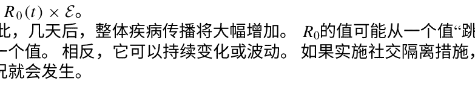

图2 SIR模型

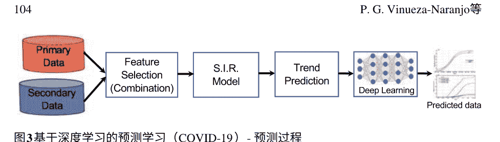

松弛后再次收紧。我们应该强调，我们可以选择任何函数作为 $R_0$；然而，我只能提供一种常见的选择来模拟社交距离的初始影响，基于一个逻辑函数。因此，逻辑函数可以表示为

$$
R_0(t) = \frac{R_{0\text{start}} - R_{0\text{end}}}{1 + e^{-k(-x + x_0)}} + R_{0\text{end}},
$$

其中 $R_{0\text{start}}$ 和 $R_{0\text{end}}$ 是 $R_0$ 在第一天和最后一天的值。而 $x_0$ 是 $R_0$ 的拐点值（即最陡下降的日期，可以被视为主要的“封锁”日期）。此外，$R_0$ 的下降速率取决于变量 $k$ 的值。

#### 4 提出的算法

首先进行简单的分析，以了解疫情的动态，创建迭代的时间滞后地图。在本节中，我们提出了我们的想法，研究了人口 ($PD$) 和 $SD$ 在时间-天 ($D+AD$) 以及所选国家的一些特征之间的关系（对于美洲的每个国家）。因此，最简单的情况是每天建立地图 ($t=1$)。我们按照以下方式创建两组地图。首先，$PD$ 与国家面积 ($A$) 以及累计确诊感染人数 ($C$)、康复人数 ($RC$) 和报告的死亡病例 ($DC$) 相关联，对于美洲的每个国家。我们观察到 $F=C-(RC+DC)$，即感染人数的总数，我们不考虑康复和死亡。其次，$SD$ 与多个医院 ($H$)、机场数量 ($A$)、迁移率 ($MR$) 和老年人口 ($EP$) 相关联，对于组成美洲的每个国家的累计确诊感染人数 ($C$)、康复人数 ($RC$) 和报告的死亡病例 ($DC$)。我们在算法1中总结了提出的方法。

在算法1中，$N$ 是国家的数量，$D$ 是从美国第一个病例开始的一系列天数，$C$ 指的是 $D$ 中每天的病例数，$DC$ 表示 $D$ 中每天的死亡人数，$RC$ 表示 $D$ 中每天的康复病例数，$A$ 指定了每个 $N$ 的区域，$P$ 是每个 $N$ 的人口，$EP$ 是每个 $N$ 的老年人口，$REP$ 是每个 $N$ 的老年人口比率，$H$ 是每个 $N$ 的医院数量，$AS$ 是每个 $N$ 的机场数量，$MR$是每个 $N$的迁移率。此外，上述算法的输出是预测的美国Covid-19数据库；$PDA$。该算法试图根据各个日期及其每天的变化来预测数据库。

```
算法1 美国COVID-19的预测

输入：$N, D, C, DC, RC, A, P, EP, REP, H, AS, MR$
输出：$PDA$

1: $NDB$
2: **for** $t = 1$ **to** $D$ **do**
3:     **for** $t = 1$ **to** $N$ **do** $PD \gets \{D; C; DC; RC; NC; A\}$
4:     $SD \gets \{P; H; AS; MR; EP; REP\}$
5:     **end for**
6: **end for**
7: $NDB \gets PD, SD$
    创建具有主要和次要参数的新数据库
8: $Matlab \gets NDB$
9: **for** $t=1$ **to** $D$ **do**
10:     预测过程
11: **end for**
12: **return** $NDB$
```

#### 5 性能评估

本节详细介绍了收集到的真实数据集，接下来是对比指标、仿真测试平台、测试场景和结果的解释。

**数据集（数据来源）**

数据收集自欧洲疾病预防控制中心（ECDC）[3]（Github存储库），系统科学与工程中心（CSSE），约翰霍普金斯大学（JHU）。Dong等人[6]和世界卫生组织[5]。在本研究中，分析的数据从2020年1月21日到2020年6月8日。

**仿真指标**

COVID-19正在呈指数级扩展。根据对COVID-19病毒大流行（源自SARS-CoV-1）的先前评估，已经显示出新病例对应的数据随时间的推移趋向于大量的异常值（无论它们是否继续遵循标准分布），例如高斯分布或指数分布[19, 20]。新加坡科技与设计大学（SUTD）（数据驱动创新实验室）的最新研究使用SIR模型进行回归曲线[17]，并实施高斯分布来估计与时间相关的病例数量。深度学习模型旨在预测新病例并确定此次大流行的结束日期。因此，我们提出了一个框架，在雾计算数据中心中实现这些模型，如图1所示，以提供故障安全的计算和快速数据分析。在基于雾的环境中，医院（政府卫生设施）和诊所（私人卫生中心）不断向每个美洲国家的卫生部发送阳性患者的数据。人口密度、中位数和中位年龄（>55岁的人口比例（%）），机场数量、净迁移率和卫生设施（医院数量）也将被整合进来，以使预测更准确。我们在一台虚拟机（VM）上进行模拟，该虚拟机是Azure B1s单核心，配备1GB RAM，额外的SSD存储，并且安装了64位的Microsoft Windows Server 2016操作系统。在本文中，我们测试了我们的深度学习方法在真实数据集上的效果。

我们从2020年6月21日（美国疫情开始的第一天）到2020年6月8日收集了数据。截至目前，确诊病例数为3407874例，死亡病例数为186220例，康复病例数为160200例。此外，我们预测数据将持续到2020年9月13日。

##### 5.1 结果

我们的研究基于SIR模型和R0方法。此外，我们还进行了敏感性分析，以找出关键特征。我们通过验证数据上的均方根误差（RMSE）评估了我们模型预测的准确性。我们总结了以下测试场景：

**SIR模型的有效性**

在这种情况下，表2展示了在数据集中应用SIR模型所取得的结果，并列出了拟合方程（1），（2），（3）的误差，给出了98.8-99.5%的RMSE准确度。

表2 活动、死亡和康复病例在流行阶段增长率的比较结果

| 细节 | 活动病例 | 死亡病例 | 康复病例 |
|------|----------|----------|----------|
| 估计的流行规模（病例） | 6493840 | 267478 | 3571340 |
| 估计的流行速率（1/天） | 0.0424 | 0.0518 | 5.180270e-02 |
| 估计的初始状态（病例） | 156042 | 9634 | 55087 |
| 估计的初始翻倍时间（天） | 16.3 | 13.4 | 13.4 |
| 估计的快速增长阶段持续时间（天） | 94 | 77 | 77 |
| 估计的过渡阶段结束时间 | 2020年9月1日 | 2020年7月24日 | 2020年9月1日 |
| 流行阶段 | 4/5<br>快速增长<br>减速阶段 | 4/5<br>缓慢增长<br>过渡阶段 | 3/5<br>快速增长<br>减速阶段 |
| RMSE | 1.19e+05 | 7.23e+03 | 8.75e+04 |
| 调整后的R平方 | 0.995 | 0.992 | 0.988 |

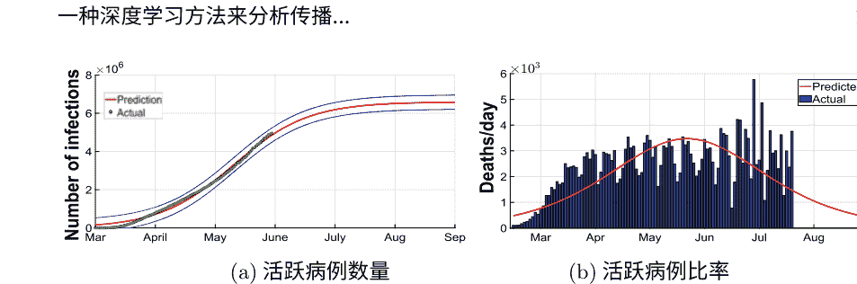

**方案1：** 在这个方案中，目标是预测COVID-19的活跃病例。图4展示了使用针对美国进行优化的网络的预测结果与实际值的比较。值得注意的是，在训练过程中，损失曲线逐渐降低。我们在美国的数据集上进行了网络的训练和测试。长期预测中，美国的RMSE误差为1.19e+05，准确率为99.5%。我们算法的预测结果在图4a中用实线红色表示。图4a显示我们的算法能够以最小的损失捕捉到传播的动态。从图4a中可以看出，自2020年3月12日以来，美国经历了增长，这是在第一个确诊病例出现近两个月后。美国的疫情当前阶段预计将持续到2020年9月1日（见表2）。

**情景2：** 在这种情况下，目标是预测COVID-19病例的死亡情况。图5显示了使用针对美国进行优化的网络的预测结果与实际值的比较。值得注意的是，在训练过程中，损失曲线逐渐降低。我们在美国数据集上进行了网络的训练和测试。长期预测方面，RMSE误差为7.23e+03，准确率为99.2%。我们算法的预测结果如图5a所示，用实线红色表示。这表明我们的算法能够以最小的损失捕捉到传播的动态。在图5a中，我们可以看出自2020年3月5日以来，美国经历了增长，即在第一个确诊死亡病例一周后。预计美国的疫情将持续到2020年7月24日（见表2）。

**场景3：** 在这个场景中，目标是预测恢复的COVID-19病例。图6显示了使用针对美国进行优化的网络的预测结果与实际值的比较。值得注意的是，在训练过程中，损失曲线逐渐降低。我们在美国数据集上训练和测试了我们的网络。长期预测中，RMSE误差为8.75e+04，准确率为98.8%。我们算法的预测结果如图6a所示，用实线红色表示。结果显示，我们的算法能够以最小的损失捕捉到传播的动态。从图6a可以看出，自2020年2月9日起，美国经历了增长，即在第一个确诊恢复病例一个月后。预计美国的疫情将持续到2020年9月1日（见表2）。

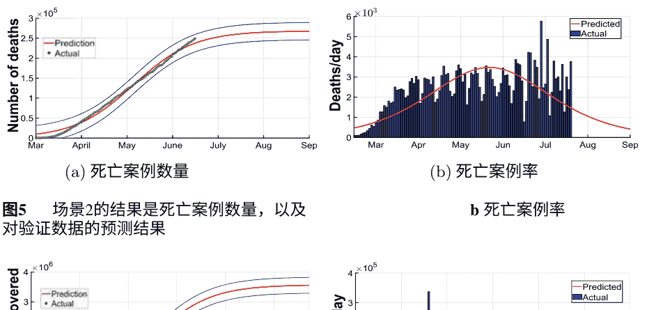
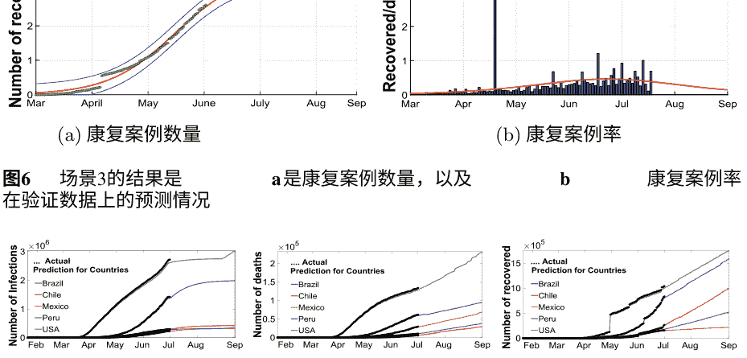
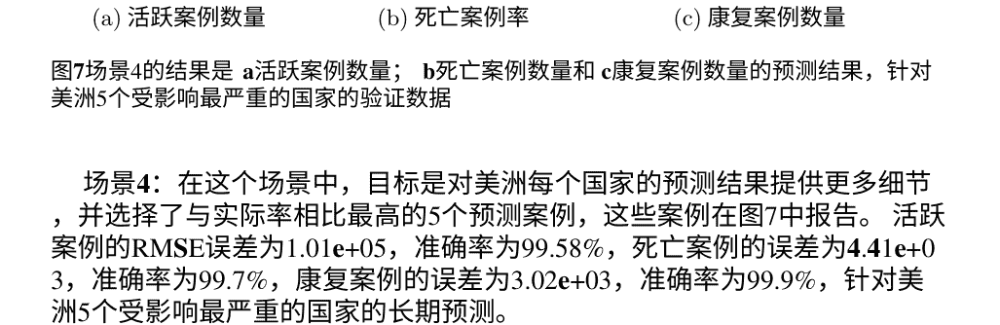

**场景4：** 在这个场景中，目标是对美洲每个国家的预测结果提供更多细节，并选择了与实际率相比最高的5个预测案例，这些案例在图7中报告。活跃案例的RMSE误差为1.01e+05，准确率为99.58%，死亡案例的误差为4.41e+03，准确率为99.7%，康复案例的误差为3.02e+03，准确率为99.9%，针对美洲5个受影响最严重的国家的长期预测。

**场景5：** 在这个场景中，我们的目标是详细说明我们提出的方法的错误率(%)。在表3中，数据集从我们场景的最后日期（2020年6月8日）开始排序（图4、5和6）。关注这个表，它展示了从不同官方来源（WHO、ECDC和CSSE）收集的最新数据。我们在16天后对我们的算法进行了比较，验证了我们的算法的工作情况，得到了0.9%到2.5%之间的错误百分比，最低97.5%到99.1%的准确率。

表3 我们提出的方法与WHO、ECDC和CSSE数据集的预测错误率（%）对比

| 日期 | WHO | ECDC | CSSE | 预测 | 错误率 (%) |
|------|-----|------|------|------|------------|
| 8/06/2020 | c: 3309781 | c: 3367726 | c: 3420760 | c: 3410198 | c: 1.5 |
| | d: 181743 | d: 184078 | d: 186161 | d: 182320 | d: 1.1 |
| 10/06/2020 | c: 3413477 | c: 3487699 | c: 3564333 | c: 3471248 | c: 1.6 |
| | d: 185801 | d: 189270 | d: 192900 | d: 188327 | d: 1.4 |
| 12/06/2020 | c: 3558739 | c: 3638857 | c: 3712321 | c: 3660317 | c: 1.6 |
| | d: 192882 | d: 196039 | d: 198959 | d: 195036 | d: 1.2 |
| 14/06/2020 | c: 3709658 | c: 3788003 | c: 3847618 | c: 3789311 | c: 1.2 |
| | d: 199190 | d: 201844 | d: 203723 | d: 202352 | d: 0.9 |
| 16/06/2020 | c: 3839334 | c: 3907122 | c: 3986999 | c: 3971245 | c: 1.8 |
| | d: 200485 | d: 205555 | d: 208954 | d: 210029 | d: 2.5 |
| 18/06/2020 | c: 4012874 | c: 4048808 | c: 4170662 | c: 4190141 | c: 2.8 |
| | d: 208926 | d: 210780 | d: 215793 | d: 215135 | d: 1.8 |
| 20/06/2020 | c: 4158906 | c: 4224280 | c: 4372986 | c: 4292197 | c: 2.2 |
| | d: 215844 | d: 217650 | d: 221787 | d: 221074 | d: 1.4 |
| 22/06/2020 | c: 4367230 | c: 4381198 | c: 4516638 | c: 4421113 | c: 1.4 |
| | d: 221816 | d: 223456 | d: 226768 | d: 227099 | d: 1.4 |
| 24/06/2020 | c: 4503410 | c: 4544332 | c: 4712916 | c: 4581312 | c: 1.8 |
| | d: 226436 | d: 228799 | d: 233727 | d: 233014 | d: 1.7 |
| 13/09/2020 | - | - | - | c: 6493840 | - |
| | | | | d: 267478 | |

数据集按日期排序（从预测的最后一天到之后的16天），以验证我们的算法是否有效。病例，死亡)

#### 6 讨论

本节总结了提出方法的优点和局限性，以及一些未来的整合。

这项工作有几个好处。首先，由于预测模型位于连接到PMI和患者传感器的雾节点上，它可以帮助医疗团队如何在哪里规划监测和操作相关治疗措施。它还使PMI团队能够更好地了解该地区的感染传播情况，并有效地应用医疗专业知识和其他重要措施，以限制其在美国受影响较大的地区的传播。其次，生成的深度学习模型可以帮助数据分析师在使用类似特征的另一个地区重新建模相同的行为。

以下是作者想要强调的限制。首先，该工作没有考虑到收集到的数据中的异常行为，导致模型生成不准确。其次，由于本文提出了一种局部化的深度学习模型，当受影响人群的数量和症状发生变化时，模型无法根据新添加的特征进行更新。确实，重新训练和重新测试新特征需要一些时间。为了解决这个问题，我们可以设计一些解决方案。首先，我们可以利用5G技术来增强生成的架构在图1中所示的覆盖范围。5G可以帮助我们的模型更好地形成、收集数据，并增加深度学习模型的学习阶段的收敛速度。其次，我们可以通过新的智能交通系统将我们的模型集成到分布在该地区的各个FN（雾节点）上，以加快学习和测试新的缓解记录（受影响案例）。

#### 7 结论和未来研究

本文重点介绍了COVID-19在一些受影响最严重的国家的加速增长和传播，以及雾计算和云计算中的数学模型（例如SRI和DL）如何帮助改善COVID-19预测。我们证明我们的算法能够以最小的误差百分比进行预测。高斯参考模型显示了COVID-19情况的整体乐观态势。

将5G技术与物联网（IoE）和FC平台相结合，将为提出物联网未来平台的雾计算创造空间。由于FC范式通过设计在整个无线接入网络中传播网络和计算资源，因此它将支持延迟敏感的计算密集型数据传输应用。通过添加实时数据处理解决方案，并与移动边缘计算技术相结合，创建稳健的框架。

#### 参考文献

- 1. Kevadiya, B. D., Machhi, J., Herskovitz, J., Oleynikov, M. D., Blomberg, W. R., Bajwa, N., Soni, D., Das, S., Hasan, M., Patel, M., et al. (2021). SARS-COV-2感染的诊断。自然材料，页码1-13。
- 2. Schurink, B., Roos, E., Radonic, T., Barbe, E., Bouman, C. S. C., de Boer, H. H., de Bree, G. J., Bulle, E. B., Aronica, E. M., Florquin, S., 等（2020年）。致命covid-19患者的病毒存在和免疫病理学：一项前瞻性尸检队列研究。《柳叶刀微生物》, 1(7), e290–e299.
- 3. ECDC.欧洲疾病预防控制中心。2019年冠状病毒病（COVID-19）情况报告。2020年4月25日访问。
- 4. Koh, H. K., Geller, A. C., & VanderWeele, T. J. (2021). covid-19死亡人数。JAMA, 325(2), 133–134.
- 5. 世界卫生组织. 世界卫生组织. (2020). 2019冠状病毒病（COVID-19）情况报告。2020年4月25日访问。
- 6. 董, E., 弘如, D., & 加德纳, L. (2020). 一个实时跟踪covid-19的交互式网络仪表板。《柳叶刀传染病学》。
- 7. 陈, J. I. Z., & 斯密斯, S. (2020). 使用混合深度学习技术在SDN中进行社交多媒体安全和可疑活动检测。信息技术杂志, 2(02), 108-115.
- 8. 斯密斯, S., 巴萨尔, A., & 王, H. (2020). 基于人工神经网络的智能路灯系统功率管理。人工智能杂志, 2(01), 42-52.
- 9. Kirbaş, İ., Sözen, A., Tuncer, A. D., & Kazancioğlu, F. (2020). 使用ARIMA、NARNN和LSTM方法对欧洲各国covid-19病例进行比较分析和预测。混沌、孤立子和分形, 138, 11 0015.
- 10. Papastefanopoulos, V., Linardatos, P., & Kotsiantis, S. (2020). Covid-19: 比较时间序列方法来预测每个人口活动病例的百分比。应用科学, 10(11), 3880.
- 11. Hawas, M. (2020). 使用递归神经网络生成巴西每日covid-19感染数据的时间序列预测。数据简介, 32, 106175.
- 12. Car, Z., Baressi Šegota, S., Andelić, N., Lorencin, I., & Mrzljak, V. (2020). 使用多层感知器建模covid-19感染的传播。计算和数学医学方法, 2020.
- 13. Ogundokun, R. O., Lukman, A. F., Kibria, G. B. M., Awotunde, J. B., & Aladeitan, B. B. (2020). 尼日利亚新冠病例的预测建模。传染病建模，5，543-548。
- 14. Vinuueza, P. G., Naranjo, Z. P., Shojafar, M., Conti, M., & Buyya, R. (2019). FOCAN: 一种支持雾计算的智能城市网络架构，用于管理物联网环境中的应用程序。并行与分布式计算杂志，132，274-283。
- 15. Baccarelli, E., & Biagi, M. (2004). 功率分配策略和具有不完美信道估计的多天线系统的优化设计。IEEE Transactions on Vehicular Technology, 53(1), 136-145.
- 16. Shojafar, M., Cordeschi, N., Amendola, D., & Baccarelli, E. (2015). 节能自适应计算和实时服务数据中心的流量工程。在2015年IEEE国际通信会议研讨会(ICCW) (pp. 1800-1806). IEEE.
- 17. Kermack, W. O., & McKendrick, A. G. (1927). 对流行病数学理论的贡献。伦敦皇家学会会议录。A系列，包含数学和物理性质的论文, 115(772), 700-721.
- 18. Harko, T., Lobo, F. S. N., & Mak, M. K. (2014). 易感-感染-康复（SIR）流行病模型和具有相等死亡和出生率的SIR模型的精确解析解应用数学与计算，236，184-194。
- 19. Bai, Y., & Jin, Z. (2005). 基于BP神经网络和在线预测策略的SARS流行预测混沌、孤立子和分形，26(2)，559-569。
- 20. Wang, W., & Ruan, S. (2004). 用有限数据模拟北京的SARS爆发。理论生物学杂志，227(3)，369-379。

### 基于图卷积的谣言内容、用户可信度、传播上下文以及认知和情感信号的联合学习

Prajna Nagaraj和Bhaskarjyoti Das

摘要 为了限制谣言对社交媒体的有害影响，检测谣言的能力很重要，因为随后可以用真实新闻来驳斥虚假谣言。谣言检测任务需要联合学习，因为用户的可信度、社交图上的传播和扩散环境以及谣言内容等因素同样重要。基于双向图卷积的方法是一种可行的联合学习策略实现方式。此外，谣言制造者积极利用情绪和认知词语。尽管情绪已经在虚假信息研究中被使用，但认知方面大多被忽视。本研究通过使用认知和情绪特征改进了谣言检测的联合学习方法。

关键词 谣言检测 · 图卷积 · 双向图卷积 · BERT · 节点分类 · 认知 · 情绪 · 用户可信度 · 传播环境 · Twitter

#### 1 引言

随着社交媒体越来越受欢迎，任何用户在网络上发布的信息可能吸引近十亿用户的注意力，在几秒钟内。由于这些社交媒体平台上没有官方限制内容的规定，因此往往存在大量未经验证的在线信息，也被称为谣言。假新闻和谣言是近亲。谣言是尚未经过验证且没有恶意意图的突发新闻。另一方面，假新闻是有意制造的虚假新闻，背后有恶意的设计。

谣言检测问题的定义如下：谣言 \( r_i \) 被定义为一组相关信息的集合 \( M = m_1, m_2, \dots, m_n \) 其中 \( m_1 \) 是发起该链条的源帖。因此，\( r_i \) 与树结构非常相似，具有根节点和多个分支。 对于每条消息 m_i，它有文本和图像等内容。 每条消息 m_i都与发布它的用户相关联，该用户具有一组属性。 给定一条谣言 r_i及其消息集 M和用户集 U，谣言检测任务旨在确定该消息是真实还是虚假。 有时我们可以有一个额外的标签，即未经证实的。 将该消息检测为谣言与否是谣言检测任务，而谣言是真实还是虚假是谣言真实性分类任务。 一个谣言数据集R通常包含许多这样的谣言对话 r_i。

Marten等人[31]研究了情感和相信假新闻之间的相关性。 研究证实，那些进行更多理性思考且情绪较少的人更不容易相信假新闻。 Russo [44]研究了悲伤和恐惧作为假新闻传播者的两个主要情绪特征。 一项社会语用分析研究[21]证实了同样的事实，即假新闻在某种程度上被认为是一个触动受众情感的好故事，读者倾向于接受它们是真实的，因为它们让人感觉良好。 一项关于假新闻情感吸引力的研究[39]表明，假新闻标题更加负面，文本内容中包含更多的厌恶和愤怒情绪。 还观察到可信用户较为保守，通常不参与传播谣言。

在这项工作中，通过联合学习的方式解决了谣言检测问题，其中利用了双向图卷积网络、文本内容、用户可信度特征和情绪。

#### 2 现有工作

##### 2.1 谣言检测和真实性分类

自从社交媒体成为传播谣言的媒介以来，谣言检测和谣言真实性分类一直是活跃的研究领域。 现有方法可以分为几类，其中最新的是基于图深度学习的方法（本文也采用了相同的方法）：

- 1. 基于内容的方法：这种方法假设谣言与非谣言具有不同的文本风格。 早期的研究使用传统机器学习模型进行特征工程，后来采用了深度学习模型。 文本特征可以基于属性（情感、主观性、通过问号表达的不确定性、文本中的暂定术语、内容的多样性，如独特单词的数量）或基于语法（显示时态的POS标签、基于词典的特征、否定词等）。 此外，还需要一个深度上下文模型[47]来分析内容，因为源推文和回复推文捕捉到更多信息。 一些研究人员将图像和视频的统计和内容特征与文本特征进行了拼接，用于多模态谣言检测。 谣言的原始发布者以及那些质疑或支持谣言的人对谣言话题都有一定的立场。 许多采用基于内容的研究人员将谣言检测作为多任务问题来构建，立场检测作为辅助任务，有时作为分层或混合学习[17, 18, 20, 22, 29]问题。
- 2. 基于用户的方法：用户可信度[7, 27]通常通过某些代理特征来确定，这些特征可以从社交媒体平台获得，例如注册年龄、关注者数量、帖子数量、点赞数量、是否验证、是否列在公共目录中等。
- 3. 基于社交图的方法和其他方法：有一些尝试使用替代手段，例如使用社交图特征[26]，异常检测方法[36]，因为谣言树与其他对话树相比是异常的，使用粒子群优化算法[23]在谣言内容的分类器上进行谣言检测[54]等。然而，这些方法都没有成为主流。
- 4. 基于传播的联合学习方法：谣言树可以被视为社交网络的子图。一条非常成功的谣言会传播得很广。因此，传播（深度）和扩散（宽度）是这种谣言树的两个重要特征。研究人员尝试了各种方法来捕捉这些特征，例如条件随机场[55]或基于LSTM的模型，假设了基于时间的顺序上下文，尝试捕捉传播树的treeLSTM[24, 30]模型，以及最近的图神经网络[50]模型，本文也采用了这些模型。图卷积网络[10, 19]等算法还可以提供节点嵌入，可以捕捉推文-推文图以及捕捉推文属性和发推用户属性。从这个角度来看，当内容、用户或传播网络单独来看都不足以进行谣言检测任务时，这种方法是一种方便的联合学习方法的实现。因此，这里描述的工作采用了这个模型，并通过认知-情感足迹进一步提高了性能。

##### 2.2 情感研究和情感在虚假新闻和谣言研究中的应用

情感可以是文本语义的重要组成部分，并且至少已经成为一个流行的研究领域十年了。然而，它也面临着一系列挑战。主要挑战包括缺乏足够的标记数据集，现有数据集中不同类型的注释，不同类性情感的重叠性，以及任何单一模态（如文本、音频或视频）中不完整的情感信息。各种研究中使用的现有数据集也反映了不同情感标签和导致多样化注释方法的问题。两种流行的情感分类方法是埃克曼的基本情感[12]和普鲁奇克的情感轮[41]。埃克曼定义了六种基本情感，而普鲁奇克则确定了八种基本情感（分为四对对立情感），同时通过不同强度的这些基本情感的组合引入了其他子类型的概念。除了不同类型的离散情绪标签后面跟着不同的数据集[3, 45, 49]，一些数据集[35, 42, 43]还带有情绪强度的注释。因此，从这个角度来看，情绪识别不仅是一个分类问题，而且还是一个回归问题。另一种主要方法可以称为基于知识的方法，它依赖于为每种情绪类型或子类型构建词典[9, 33, 46]。有一些语料库[4, 34]同时采用了词典和强度注释。由于不同情绪类型之间边界的模糊性，另一种方法是将情绪建模为多维连续值的集合，例如愉悦、唤醒、暴力和支配。因此，有一些情绪语料库采用了这种基于维度向量的方法。最近的数据集[6, 32]采用了带有词典或离散情绪标签的维度方法。最近随着神经学习的出现，情绪嵌入已被证明是有效的。在这个领域中，Emo2vec [52]、emoji2vec [11]和deepmoji [14]是最值得一提的。在假新闻检测任务中，张等人[53]精心挖掘了发布者和评论者的情感，得出了一个由三部分组成的情感向量，即发布者情感、评论者情感和情感差距，其中包括平均差距和最大差距。郭等人[16]分析了数据集，并注意到发布的假新闻中更多的是愤怒、悲伤和怀疑，而词语分析（夸张和煽动性词语）也揭示了同样的情况。他们预计用户对假新闻的社交情感会有更多的负面情绪反应。因此，发布者和社交情感都将是非常负面的。最后，将单词级别和句子级别的情感以及文本嵌入结合起来，得到了在发布者和读者两方面的情感增强文本嵌入。这两种类型的向量在最终的假新闻分类中一起使用。Kwon等人[25]分析了谣言数据集，以识别突出的特征，即作为时间特征的周期性峰值、扩散网络的网络参数以及情感特征，如LIWC [40]。Chen等人[8]使用了情感嵌入与粤语推文的字符嵌入的特征串联。Endang Pamungkas等人[38]在SemEval任务中用情感词典作为特征进行谣言立场分类。Ajao等人[2]在谣言推文的嵌入中使用基于词典的正负情感词比率作为特征。

##### 2.3 认知信号在虚假信息研究中的应用

一些研究者[15, 51]已经使用主题分布和内容嵌入来增加模型的区分能力。但仅仅依靠主题可能不够，因为真假新闻在这些方面可能会有相似之处，特别是当虚假新闻以不同的方式报道真实新闻时。对于主题信号的替代方法可以是认知词汇，因为情感和认知密切相关。然而，虚假信息研究并没有充分利用认知信号。Oh等人[37]分析了2008年孟买袭击期间的推文，探讨了焦虑和谣言之间的关系。Abulaish等人[1]在此基础上采用了图论实现的方法，从种子词开始构建。认知是感知、处理、存储和检索信息的能力，导致决策和包含特定情感的回应。认知可能导致情感，情感可能导致认知。因此，导致情感的认知痕迹可能可以用于情感检测。认知过程的一个例子可以是“差异”，可以通过诸如“应该”、“可以”、“会”等动词来捕捉，而在某些情况下，它可能导致负面情绪状态，如“无价值”的词所表达的负面情绪。基于词典的情感检测策略将关注寻找“讨厌”的词，而基于认知痕迹的策略可能会寻找“应该”、“会”、“可以”。Wang等人[48]的研究表明，双字词作为特征在情感检测任务中表现得比大多数其他特征更好。人们可以怀疑这是因为有效地捕捉了认知方面。因此，另一种替代策略可以是采用既寻找词典又寻找认知痕迹的策略。本文描述的工作也采用了这种策略。语言查询和词频统计（LIWC）在情感分析中被广泛使用[40]，除了情感之外，还捕捉到一些认知方面。对于每个类别，LIWC都有一个英文单词或词干列表，工具会手动搜索相同的出现次数。Empath[13]是一个类似的工具，使用向量空间模型构建。它可以分析大约200个主题的文本，包括LIWC涵盖的情感类别。从这个意义上说，Empath比LIWC更广泛，它可以捕捉到主题、认知信号和某些类型的情感。本研究使用Empath [13]捕捉到的主题、情感和认知信号。

#### 3 数据集

在本研究中，使用了两个可用的谣言数据集[30]，即Twitter15和Twitter16，如表1所示。每个数据集都将推文分类为四个标签：“真实”，“假的”，“未经证实”，“非谣言。”对该数据集进行了少量增强:

- 1. 从推特15中提取了1453条推文和从推特16中提取了798条推文，这些推文有效地映射到了用户信息（原始推特15中有1490条，推特16中有808条）。
- 2. 仅考虑了两个标签进行实验。
    - (a) “谣言”推文由标签“真实”、“假的”组成
    - (b) “非谣言”推文由标签“非谣言”组成
    - (c) 标签“未经证实”被丢弃，因为它们可能是“谣言”或“非谣言”。当包括“未经证实”推文时，可预测性结果下降。
- 3. “非谣言”推文被过采样以平衡数据集。
- 4. 使用Twitter API，收集了以下Twitter用户特征:
    - (a) 收藏数：用户自账户创建以来“喜欢”的推文数量。
    - (b) 关注者数：关注该用户的账户数量。
    - (c) 关注数：用户关注的账户数量。
    - (d) 列表数：用户所属的公共列表数量。
    - (e) 推文数：用户发表的推文和转发的数量。
    - (f) 认证状态（布尔值）：指示用户是否已认证（true）或未认证（false）。

上述数据集经过一些预处理，如文本归一化、转换为小写、将Twitter句柄(@userhandle)替换为“user”一词、将URL替换为“url”一词、删除非字母数字字符。哈希标签、表情符号和表情符号被转换为适当的文本。

### 表1 数据集

| 类型 | 推特15 | 推特16 |
| :--- | :--- | :--- |
| 谣言数量 | 1084 | 599 |
| 非谣言数量 | 369 | 199 |
| 过采样前总数 | 1453 | 798 |
| 过采样后谣言数量 | 1084 | 599 |
| 过采样后非谣言数量 | 1084 | 599 |
| 过采样后总数 | 2168 | 1198 |

#### 4 谣言和非谣言中认知和情感模式的分析

除了Twitter15和Twitter16数据集外，还研究了额外的PHEME [22]数据集，以了解谣言和非谣言中认知和情感足迹的差异。PHEME数据集不平衡，即非谣言样本比谣言样本多得多。因此，为了分析的目的，进行了采样，使整个数据集在分析中保持平衡。Empath提供了200个预建类别，其中194个唯一类别在没有归一化的情况下被使用。根据频率，在Twitter15、Twitter16和PHEME数据集中，识别出了谣言和非谣言类别中最常见的前20个类别。随后，进行了如图1、2、3和4所示的比较分析。

研究结果如下：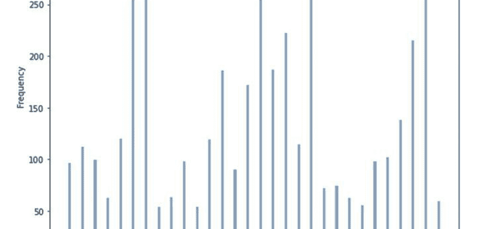

在Twitter15和Twitter16的谣言中，我们可以看到“突发事件”，“犯罪”，“死亡”，“争议”，“伤害”，“杀戮”，“监狱”，“暴力”，“战争”，“武器”以及“负面情绪”等类别的频率较高。这些词本身往往带有负面含义，可能引发负面情绪，通常用于激怒人们，从而传播此类推文。

在Twitter15和Twitter16的非谣言中，我们可以看到“庆祝”，“儿童”，“体育”，“政府”，“领导者”，“党派”，“工作”以及“负面情绪”等类别的频率较高。这些词较少具有煽动性，可能帮助我们得出结论：与谣言推文通常关联的具有侵略性和更负面特质的情绪和感受确实影响了谣言与非谣言推文的传播。

在PHEME数据集中，无论是谣言还是非谣言数据，都具有相对较高的“犯罪”，“杀戮”，“负面情绪”，“战争”，“武器”和“恐怖-”的频率。

## Twitter 15 and Twitter 16 Non-Rumor empath data

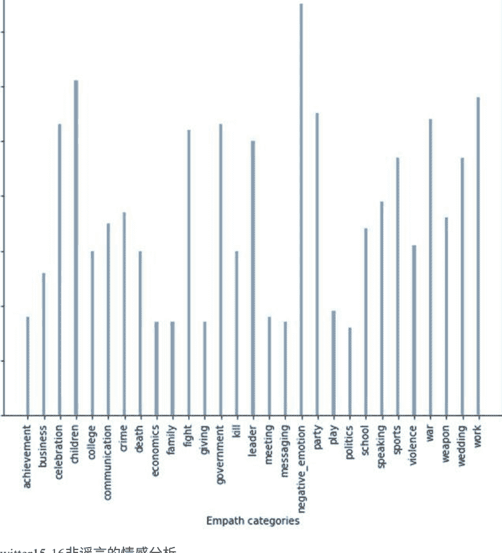

## 图2 Twitter15-16非谣言的情感分析

但可以观察到的是，在非谣言数据集中选择了“积极情绪”类别，并未在谣言数据集中选择。与Twitter非谣言一样，PHEME非谣言相对较高频地出现“航空旅行”和“旅行”等类别，相比之下，这些类别在谣言数据集中不太具有煽动性。

基本上，分析证实了谣言和非谣言在情绪足迹和可能导致负面情绪的认知词方面存在差异。谣言数据集具有煽动性词语、认知动词，并且具有负面情绪。

#### 5 方法论

谣言从源头传播到其他用户，这些用户在社交媒体平台上对其做出反应，如Twitter。这形成了一个传播结构，通常使用现有的关系链，如关注者关系。谣言不仅传播得远，而且传播得广。

当以源节点到子节点的方向进行时，图卷积网络（GCN）算法及其聚合和更新操作非常适合捕捉传播特征到节点嵌入中。当我们从子节点向上走到源节点时，它捕捉到了谣言经历的扩散。当以相反的方向使用相同的GCN算法时，它将能够捕捉到扩散属性。如图5所示，最终的嵌入结合了从两者派生的嵌入，以捕捉传播和扩散的特性。

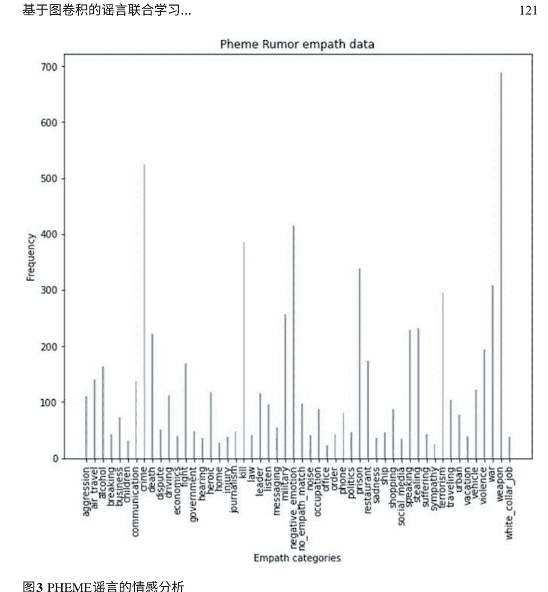

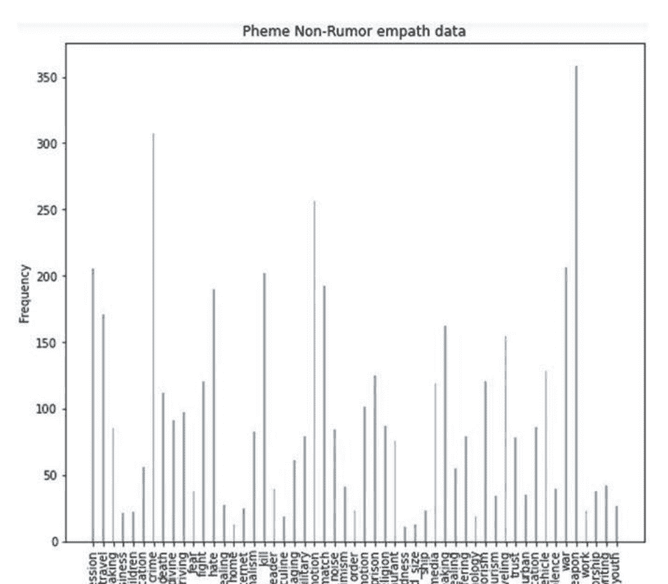

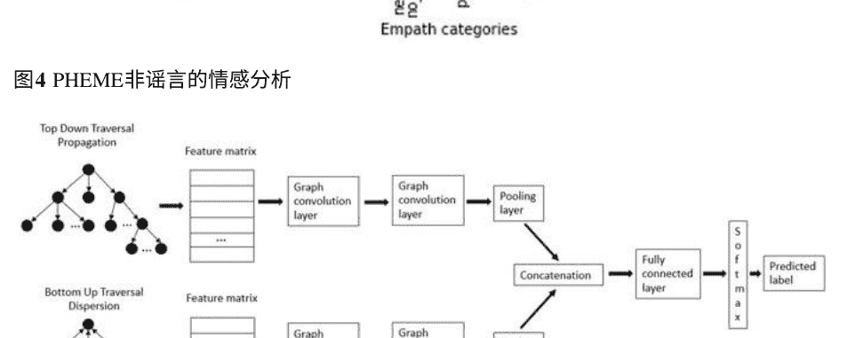

这里的工作扩展了这种方法。此外，就像对话立场一样，对谣言推文的回复在与源推文一起检查时更容易理解。因此，如果将谣言树视为R图的子图，则节点的文本属性应为源推文和回复推文的连接文本的向量表示。

在这项工作中，使用了整体联合学习方法，即考虑了用户可信度特征、基于内容的特征、认知和情感特征以及传播上下文来进行谣言检测。如图6所示。粗体字是携带情感和认知信号的词语。图卷积用于实现联合学习。已经研究了自顶向下的图卷积和双向图卷积以及不同类型的特征集。

从文本内容中提取的特征使用了词频、逆文档频率（TF-IDF）和基于Transformer的RoBERTa模型[28]，为每个推文生成了一个嵌入向量。在这里，最后四个隐藏的嵌入层被连接起来，对每个源推文和回复推文使用它们的平均值。对于RoBERTa，使用了基础模型（1层=768个特征和最后4层=3072个特征）和大型模型（1层=1024个特征和最后4层=4096个特征）进行了实验。所有基准模型都使用相同的配置（2个标签，双折交叉验证，64个隐藏特征，50个epoch并使用early stopping，dropout率为0.2，优化器为Adam，学习率为0.0005）。

#### 6 结果与分析

表2列出了使用表3中定义的各种特征集获得的结果，其中TD表示自顶向下的图卷积，BI表示双向图卷积。训练-测试分割的详细信息列在表4中。从结果可以得出以下结论：

- 1. 在四种情况中，添加基于共情的认知特征在性能上有所提升。
- 2. 基于Transformer的内容特征表现优于基于计数的TF-IDF特征。总体而言，基于Transformer的特征与基于共情的认知-情感特征和用户可信度特征在排名上居于前列。
- 3. 即使在像Twitter15和Twitter16这样的小数据集上，内容特征、认知特征和用户可信度特征的组合策略也表现更好。在两个数据集和四个基准模型中，双向GCN并不总是胜过自顶向下的GCN。我们可以得出结论，结果取决于特定对话树的扩散程度。

表2 结果
| 基准模型 | 模型 | 数据集 | 准确性 | F1 R | F1 NR |
| :--- | :--- | :--- | :--- | :--- | :--- |
| 1 | 自顶向下GCN | 推特15 | 0.9512 | 0.9211 | 0.9667 |
| 1 | 自顶向下GCN | 推特16 | 0.9437 | 0.8889 | 0.9697 |
| 1 | 双向GCN | 推特15 | 0.9160 | 0.8603 | 0.9254 |
| 1 | 双向GCN | 推特16 | 0.8750 | 0.7836 | 0.8940 |
| 2 | 自顶向下GCN | 推特15 | 0.9590 | 0.9453 | 0.9755 |
| 2 | 自顶向下GCN | 推特16 | 0.9062 | 0.8541 | 0.9303 |
| 2 | 双向GCN | 推特15 | 0.9824 | 0.9730 | 0.9828 |
| 2 | 双向GCN | 推特16 | 0.8750 | 0.7895 | 0.9102 |
| 3 | 自顶向下GCN | 推特15 | 0.9680 | 0.9665 | 0.9693 |
| 3 | 自顶向下GCN | 推特16 | 0.9412 | 0.9397 | 0.9426 |
| 3 | 双向GCN | 推特15 | 0.9661 | 0.9660 | 0.9658 |
| 3 | 双向GCN | 推特16 | 0.9706 | 0.9700 | 0.9711 |
| 4 | 自顶向下GCN | 推特15 | 0.9517 | 0.9505 | 0.9524 |
| 4 | 自顶向下GCN | 推特16 | **0.9790** | **0.9785** | **0.9794** |
| 4 | 双向GCN | 推特15 | 0.9624 | 0.9611 | 0.9632 |
| 4 | 双向GCN | 推特16 | 0.9622 | 0.9618 | 0.9627 |
| 5 | 自顶向下GCN | 推特15 | **0.9728** | **0.9727** | **0.9729** |
| 5 | 自顶向下GCN | 推特16 | 0.9747 | 0.9740 | 0.9754 |
| 5 | 双向GCN | 推特15 | 0.9693 | 0.9684 | 0.9696 |
| 5 | 双向GCN | 推特16 | 0.9538 | 0.9524 | 0.9551 |

表3 不同基准模型的特征集
| 特征集 | 基准模型 | 细节 |
| :--- | :--- | :--- |
|  | 基准模型1 | 5000个TF-IDF特征 |
|  | 基准模型2 | 5000个TF-IDF特征 + 共情特征(194) |
|  | 基准线3 | 5000个TF-IDF特征 + 感同身受特征(194) + 用户特征(6) |
|  | 基准线4 | RoBERTa嵌入基础版(768), 四层 (3072) + 感同身受特征(194) + 用户特征(6) |
|  | 基准线5 | RoBERTa嵌入大型版(1024), 四层 (4096) + 感同身受特征(194) + 用户特征(6) |

表4 训练-测试拆分详情
| 训练测试拆分9:1 | 数据集 | 训练 | 测试 | 总计 |
| :--- | :--- | :--- | :--- | :--- |
|  | 推特15 | 1952 | 216 | 2168 |
|  | 推特16 | 1080 | 118 | 1198 |

#### 7 结论与未来工作

谣言等虚假信息以捕捉传播背景的树形式呈现。虽然其中有时间顺序，但纯粹基于序列的深度学习方法在捕捉树的宽度和深度方面有一定的局限性。虽然图卷积作为捕捉传播和扩散方面的机制的效用已经在最近的研究中得到了调查，但本研究还进一步调查了将用户可信度信息和认知情感足迹结合到特征混合中的效果。本研究还成功验证了认知情感特征对于更高性能的贡献的假设。此外，本研究还表明，基于变压器的文本特征对于虚假信息检测任务比基于计数的TF-IDF特征更有效，因为样本量较小。

作为下一步，我们计划通过对虚假信息传播者使用的认知词与情感词进行进一步研究，以及认知特征在虚假信息研究的其他领域中的有效性。到目前为止，在这项工作中只使用了情感和认知知识，并且该方法是基于词典的。

我们计划将情感嵌入与当前采用的基于知识的方法相结合。我们还计划通过对更大的数据集进行研究来扩展这项工作。

#### 参考文献

- 1. Abulaish, M., Kumari, N., Fazil, M., & Singh, B. (2019). 基于图嵌入的谣言检测方法. 在*IEEE*/WIC/ACM国际网络智能会议上(第466-470页).
- 2. Ajao, O., Bhowmik, D., & Zargari, S. (2019). 基于情感的在线社交网络虚假新闻检测. 在*ICASSP* 2019-2019 IEEE国际声学、语音和信号处理会议上(第2507-2511页). IEEE.
- 3. Alm, C. O., Roth, D., & Sproat, R. (2005). 从文本中识别情感：基于文本的情感预测的机器学习。在人类语言技术会议和自然语言处理经验方法会议的论文集中(pp. 579–586) 。
- 4. Araque, O., Gatti, L., Staiano, J., & Guerini, M. (2019). Depechemood++：通过简单而强大的技术构建的双语情感词典。*IEEE*情感计算交易。
- 5. Bian, T., Xiao, X., Xu, T., Zhao, P., Huang, W., Rong, Y., & Huang, J. (2020). 使用双向图卷积网络在社交媒体上检测谣言。*AAAI*人工智能会议论文集，*34*，549–556。
- 6. Busso, C., Bulut, M., Lee, C. C., Kazemzadeh, A., Mower, E., Kim, S., 等 (2008). IEMOCAP: 交互情感二元动作捕捉数据库。语言资源与评估, *42*(4), 335–359.
- 7. Castillo, C., Mendoza, M., & Poblete, B. (2011). 推特上的信息可信度。在第20届万维网国际会议上(pp. 675–684)。
- 8. Chen, X., Ke, L., Lu, Z., Su, H., & Wang, H. (2020). 一种新型的粤语推特谣言检测混合模型。应用科学, *10*(20), 7093.
- 9. De Albornoz, J. C., Plaza, L., & Gervás, P. (2012). SentiSense: 一种易于扩展的基于概念的情感词典用于情感分析。在*LREC*(vol. 12, pp. 3562–3567)。Citeseer。
- 10. Dong, M., Zheng, B., Quoc Viet Hung, N., Su, H., & Li, G. (2019). 基于图卷积网络的多个谣言源检测。在第28届ACM国际信息与知识管理会议上(pp. 569–578)。
- 11. Eisner, B., Rocktäschel, T., Augenstein, I., Bošnjak, M., & Riedel, S. (2016). Emoji2vec: 从描述中学习表情符号的表示。arXiv预印本arXiv:1609.08359
- 12. Ekman, P. (1992). 基本情绪的论证。认知与情绪, *6*(3–4), 169–200。
- 13. Fast, E., Chen, B., & Bernstein, M. S. (2016). Empath: 在大规模文本中理解主题信号。在2016年人机交互计算系统*CHI*会议论文集中的论文(pp. 4647–4657)。
- 14. Felbo, B., Mislove, A., Søgaard, A., Rahwan, I., & Lehmann, S. (2017). 使用数百万个表情符号出现次数来学习用于检测情感、情绪和讽刺的任意领域表示。arXiv预印本arXiv:1708.00524
- 15. Gautam, A., Masud, S., 等. (2021). 使用XLNet模型和主题分布的假新闻检测系统：Constraint @ aaai2021共享任务。arXiv预印本arXiv:2101.11425
- 16. Guo, C., Cao, J., Zhang, X., Shu, K., & Yu, M. (2019). 利用情感在社交媒体上进行假新闻检测。arXiv预印本arXiv:1903.01728
- 17. Hamidian, S., & Diab, M. (2019). GWU NLP在semeval-2019任务7中的混合流水线：社交媒体上的谣言真实性和立场分类。在第13届国际语义评估研讨会上的论文(pp. 1115–1119)。
- 18. Hamidian, S., & Diab, M. T. (2019). 用于Twitter数据的谣言检测和分类。arXiv预印本arXiv:1912.08926
- 19. 黄, Q., 周, C., 吴, J., 王, M., & 王, B. (2019). 深度结构学习用于推特谣言检测。在2019年国际联合神经网络大会(*IJCNN*)(pp. 1–8). IEEE.
- 20. 伊斯兰教, M. R., 穆希亚, S., & 拉马克里希南, N. (2019). RumorSleuth: 谣言真实性和用户立场的联合检测。在2019年IEEE/ACM国际社交网络分析与挖掘会议(*ASONAM*)(pp. 131–136). IEEE.
- 21. Juez, L. A., & Mackenzie, J. L. (2019). 情感，谎言和新闻报道中的“胡说八道”: 假新闻案例。 Ib érica: Revista de la Asociaci ó n Europea de Lenguas para Fines Espec í ficos (AELFE), 38, 17–50.
- 22. Kochkina, E., Liakata, M., & Zubiaga, A. (2018). 全能型：多任务学习用于谣言验证。 arXiv预印本 arXiv:1806.03713
- 23. Kumar, A., Sangwan, S. R., & Nayyar, A. (2019). 使用粒子群优化浅层分类器在Twitter上检测谣言真实性。多媒体工具与应用, 78(17), 24083–24101.
- 24. Kumar, S., & Carley, K. M. (2019). 树形LSTMS与卷积单元用于预测社交媒体对话中的立场和谣言真实性。 在第57届年会上 计算语言学协会(pp. 5047–5058).
- 25. Kwon, S., Cha, M., Jung, K., Chen, W., & Wang, Y. (2013). 在线社交媒体中谣言 传播的显著特征。 在2013 IEEE第13届国际数据 挖掘会议(pp. 1103–1108). IEEE.
- 26. Lathiya, S., Dhobi, J., Zubiaga, A., Liakata, M., & Procter, R. (2020). 物以类聚，检查在一起: 利用同质性进行顺序谣言检测。在线社交网络和媒体, 19, 100097.
- 27. Li, Q., Zhang, Q., & Si, L. (2019). 通过利用用户可信度信息、注意力和多任务学习进行谣言检测。 在计算语言学协会第57届年会论文集中(pp. 1173–1179).
- 28. Liu, Y., Ott, M., Goyal, N., Du, J., Joshi, M., Chen, D., Levy, O., Lewis, M., Zettlemoyer, L., & Stoyanov, V. (2019). Roberta: 一种经过优化的强大的Bert预训练方法。 arXiv预印本 arXiv:1907.11692
- 29. 马, J., 高, W., & 王, K. F. (2018). 通过神经多任务学习共同检测谣言和立场 。 2018年Web会议的同伴论文集, 585–593.
- 30. 马, J., 高, W., & 王, K. F. (2018). 在Twitter上使用树形递归神经网络进行谣言检测 。 计算语言学协会.
- 31. Martel, C., Pennycook, G., & Rand, D. G. (2020). 依赖情绪促进对假新闻的信任。认知研究：原则和影响, 5(1), 1–20.
- 32. Mohammad, S. (2018). 获取20,000个英语单词的情绪价值，唤醒和支配的可靠人类评级 。 在计算语言学协会第56届年会上的 论文集(第1卷：长论文， 第174–184页)
- 33. Mohammad, S., & Turney, P. (2010). 常见词语和短语引发的情绪：使用 机械土耳其人创建情绪词典。 在NAACL HLT 2010研讨会上的 计算方法和情感生成的文本分析(pp. 26–34).
- 34. Mohammad, S. M. (2017). 词汇情感强度。 arXiv预印本 arXiv:1704.08798
- 35. Mohammad, S. M., & Bravo-Marquez, F. (2017). WASSA-2017情感强度共享任务。 arXiv 预印本 arXiv:1708.03700
- 36. Nguyen, T. T. (2019). 基于图的社交媒体谣言检测。 技术报告
- 37. Oh, O., Agrawal, M., Rao, H. R., & Dalziel, G. (2010).焦虑和谣言：孟买恐怖袭击期间推特帖子的探索性分析。 谣言的政治和社会影响， 新加坡南洋理工大学拉惹勒南国际研究学院。
- 38. Pamungkas, E. W., Basile, V., & Patti, V. (2019). 推特中谣言分析的立场分类 : 利用情感信息和对话结构。 arXiv预印本arXiv:1901.01911
- 39. Paschen, J. (2019). 使用人工智能和人类贡献研究假新闻的情感吸引力产品与品牌管理杂志.
- 40. Pennebaker, J. W., Mehl, M. R., & Niederhoffer, K. G. (2003). 自然 语言使用的心理方面：我们的话语，我们的自我。心理学年度评论, 54(1), 547–577.
- 41. Plutchik, R. (2001). 情绪的本质：人类情绪具有深刻的进化根源， 这一事实可能解释它们的复杂性并为临床实践提供工具。 美国 科学家, 89(4), 344–350.
- 42. Quan, C., & Ren, F. (2010). 用于中文情感表达分析的博客情感语料库。计算机语音与语言, 24(4), 726–749.

## 基于深度学习的实时对象分类和识别使用监督学习方法

J. Harikrishna, Ch. Rupa和R. Gireesh

摘要 由于近年来技术的快速发展，人类已经获得了将知识设计和实施到机器中的能力，并且还允许他们执行各种功能，如自主思考能力、理解技能和问题解决能力。此外，机器学习[ML]在开发图像处理模型和应用方面起到了重要作用。在实时应用中，对于那些不熟悉的人来说，对象的标签可能是陌生的，或者可能有几个相同的对象，但标签不同。在本文中，通过利用各种数据集进行试验研究，提出了一种有助于检测和分类各种对象的方法。该方法可以用于提高查找相似对象的分类准确性。在实时对象分类的过程中，该系统使用监督学习技术，将各种数据集进行训练并与查询对象进行比较。在这里，支持向量机（SVM）算法用于在对象分类领域进行分析和决策。该项目的结果是通过计算机视觉读取给定对象，并允许机器对给定对象进行预测或分类。我们的应用程序中实施了来自经过训练的标记类别的标准数据集的800多个图像，用于对对象进行分类。

关键词 机器学习·实时目标检测·对象分类·标记数据·监督学习·支持向量机（SVM）·计算机视觉

#### 1 引言

在当今现代世界中，计算机视觉在各种应用中得到了实施，以满足识别和分类对象、预测市场上可用的类似对象、识别图像中的脚本并将其转换为纯文本或音频、通过图像搜索获取更多信息等要求。图像处理有助于分析各种对象并帮助获取详细信息。在当前世界中，有许多领域，如医疗保健、遥感、颜色处理、模式识别和机器人视觉，需要图像分类。借助无人机和直升机进行空中监视是最新的趋势，他们使用图像分类技术从大量对象中识别目标对象。基于轮廓和外观的对象分类是一个具有挑战性的任务，以获得高精确度的结果[1, 2]。主要目标是基于监督学习训练不同的数据集模型，从而提高结果的准确性。

目前，深度学习、机器学习和数据挖掘是用于处理分析数据的基准机制。一般来说，监督学习技术被分为回归和分类两种类型。回归被用来根据提出的应用程序来拟合数据。回归的主要目标是建模特征和目标组件之间的关系。分类被用来分离数据。例如，文本和图像分类问题被视为分类的示例。这些问题的主要目标是预测分配给一段文本的类别标签。情感分析是文本分类的实时应用示例，它可以预测文本的情感，如产品评论或推文。监督学习的知名应用包括生物信息学、网络犯罪分析[3]、卫星数据分析[4]等。

所提出的应用的主要目标是通过监督学习为用户提供对象的分类，从而以自己的方式为用户提供帮助。在监督学习中，提供了一组经过训练的数据标签，并且可以根据可用数据对查询对象进行分类。这种开发应用的方法将克服需要互联网来对图像进行分类的缺点。由于图像集在我们的应用数据库中定义，因此不需要互联网连接来执行操作，而且可以在任何远程地区操作。

简单分类过程需要基于应用的服务。这种应用架构将提供一个即时的视觉系统，使应用模块能够共享和交换信息[5]。在我们的项目中，使用支持向量机（SVM）的非常简单的方法论来构建图像分类架构[6]。目标检测是一种找到查询图像类别的方法。分类在基于机器学习的领域中起着至关重要的作用[7-9]。所提出的应用采用了监督学习，这被认为是解决实时挑战的一种高效方式。在监督学习中，通过提供已标记的训练数据，模型可以学习如何对新的输入进行分类。在分类过程中，人类专业人员通过模型对象的帮助来决定对象的输出分类。这些已知的对象被称为训练集。这在任何远程地区即时执行对象分类提供了一个平台，而无需互联网连接。

本文的后续部分按照以下方式组织。第2节讨论相关研究工作，第3节描述了提出的方法，第4节涉及性能分析和结果。

#### 2 文献综述

Browatzki等人[1]借助新的传感器技术对其进行了描述，使图像处理可用于各种新应用。该系统可适用于二维和三维信息。这种技术的基本缺点是只训练了少量数据模型。Wang等人[2]描述了基于多摄像头的以人为中心的计算的实际应用。该研究提出了一种基于可用信息的训练数据模型和处理对象分类的架构。Udendhran等人[4]指出，计算机视觉的能力已经提高。这是通过高性能处理器和集成的深度学习算法实现的。借助最新的智能设备，如相机、智能手机、平板电脑，该项目可能不需要高处理能力，但可以执行所需的操作。

龙胜等人[5]设计了一种方法来检测每个水果，即使它们在一条直线上聚集。在我们的项目中，基于线性支持向量机进行了两个类对象的比较，结果这项研究工作确定了属于同一输入图像的类的最近点。

Tzotsos等人[7]将支持向量机描述为一种优越的方法，特别适用于监督分类，并且是一种最佳的机器学习算法。主要缺点是该算法是用C++语言开发的，而当前的设备如智能手机、平板电脑和其他相机不支持提取此文件扩展名。这项研究工作的主要目标是训练分类器并执行验证查询对象的操作，而无需使用互联网。不需要传感器来扫描三维空间中的对象，只需使用对象的简单二维图像即可获得准确的分类结果。Reyad等人[10]描述了计算机视觉和物联网（IoT）；实施了一个非常有效的GPU来加快分析速度。这种方法可以在需要执行高复杂动作的设备中使用，例如用于手术的设备。这可能导致构建设备的成本更高。开发的应用程序不需要任何高性能GPU，因为它只涉及对象预测。塞万提斯等人[11]在他的工作中提到，近年来在支持向量机（SVM）上进行了大量的研究工作。这些SVM算法是占主导地位的且具有挑战性的分类方法，适用于多个应用领域。SVM算法有助于对大型数据集进行分类和回归。SVM的趋势因应用需求而异（表1）。

| 方案 | 挖掘性能 | 鲁棒性 | 隐蔽性 | 质量 |
|------|----------|--------|--------|------|
| [12] | 低       | 部分   | 中等   | 高   |
| [13] | 中等     | 高     | 高     | 低   |
| [14] | 中等     | 高     | 高     | 低   |
| [15] | 高       | 低     | 低     | 低   |
| [16] | 高       | 中等   | 中等   | 高   |
| [17] | 高       | 低     | 中等   | 高   |
| 提出的 | 高     | 高     | 中等   | 高   |

#### 3 提出的系统

为了识别和分类给定的对象，该方法需要经历不同的过程，收集不同的数据模型并将其组织到相应的标记类别中，训练模型，生成训练文件，将训练数据集集成到我们的应用程序中，并使用支持向量机[SVM]算法[18-20]对对象进行分类，如图1所示。

支持向量机（SVM）用于回归和分类问题。由于该算法在进行线性决策以对多个类别进行分类时的限制，SVM通常被用于分类问题。在SVM方法中，它本质上具有二元分类功能。SVM的二元分类器是针对一对类别进行训练的。为了合并结果，决定采用投票特性。提出的系统通过考虑实时图像来对对象进行分类。这些机制更适合处理安全分析，被认为是主要应用之一。提出方法的逐步过程如下所示。

##### 提出方法的阶段：对象分类

- 1. 由于我们的应用基于监督学习，它收集了各种对象图像进行训练。图2显示了一些随机对象图像的示例。

- 2. 在第2阶段中，需要将特定标记类别的所有图像分配到一个单一的模型类中。图3显示了一个随机对象类文件的示例，在这个阶段，使用Python语言训练不同的类模型进行分类。
- 3. 
- 4. 现在，生成了训练模型文件（例如class labels.txt文件，图像数据库文件）。
- 5. 在第5阶段，选择所需的应用开发平台，如Android Studio或Python，将训练模型文件集成到应用程序中。
- 6. 在这个阶段，对象图像及其相应的类标签在提议的应用程序中预定义，并存储在应用程序内存中。
- 7. 当输入对象图像查询时，应用程序开始将输入文件与我们预定义的训练类集进行映射。为了将查询图像与可用数据集进行比较，我们使用了支持向量机算法，下面将对其进行解释。
- 8. 在这个阶段，所有的类别点都与我们的输入进行检查，并且设备根据这些决策来预测给定的对象。
- 9. 在这个最后一步，对象的分类结果将作为输出显示。

### 支持向量机（SVM）：

该算法的目标是在可用的类别之间创建最佳的决策边界，并以高准确率对对象进行分类。当类别之间有明确的间隔时，SVM的功能更加有效。当维度数量大于可用样本数量时，它的工作效果更好。相对而言，SVM具有更高的内存效率机制[4, 6, 23–25]。SVM的功能如下所示。

- a. 根据对象的类别将可用数据分成不同的类别。
- b. 将对象图像作为输入并与可用的图像数据库类别进行比较。
- c. 对象类别根据线性直线进行划分；这条直线被称为超平面或决策边界。
- d. 现在计算离超平面最近的类的点。这些离超平面最近的线被称为支持向量。
- e. 计算可用于超平面的最大点，并将对象分类的类标签分配给它。

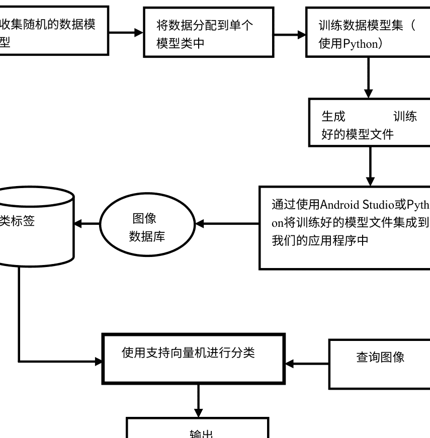

图1 提出的系统架构

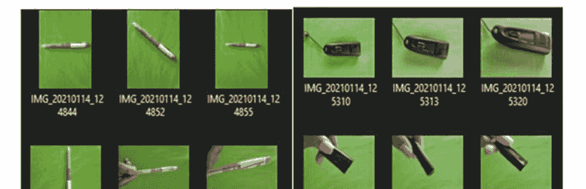

图2 一组随机实时物体图像 a笔对象 bUSB驱动器

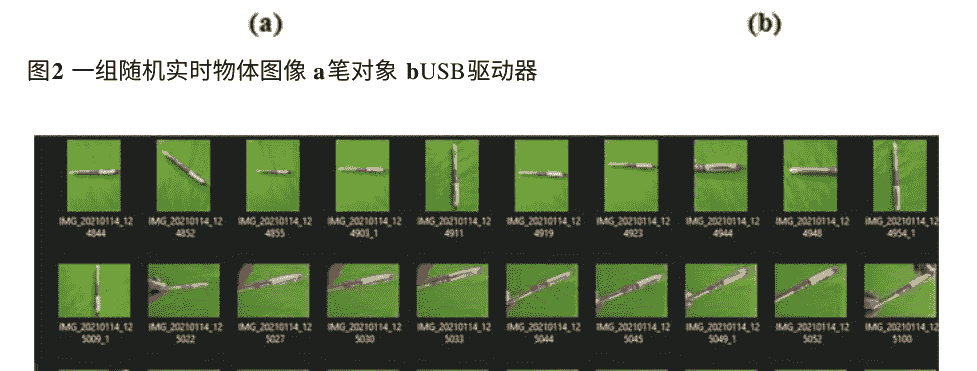

图3 标记为“笔”的样本数据收集

在上面显示的SVM图中，类1的点用圆形表示，类2的点用三角形表示。类2的点更多地位于支持向量S2上，而类1的点位于支持向量S1上。因此，在这种情况下，类2的标签将被分类。该应用程序将直接引导用户浏览任何格式的图像，并根据用户的兴趣应用操作。

图2显示了随机对象图像的样本，这些图像被考虑在提出的系统中。图2a显示了实时对象位置集合（Pen），这些位置通过使用SVM方法进行分类而进行了检查。图2b显示了实时对象（USB驱动器）的各种位置。图3显示了应用了提出的机制的样本数据收集的信息。使用SVM分类方法进行分类，并通过适当地识别它们来分配类别标签。

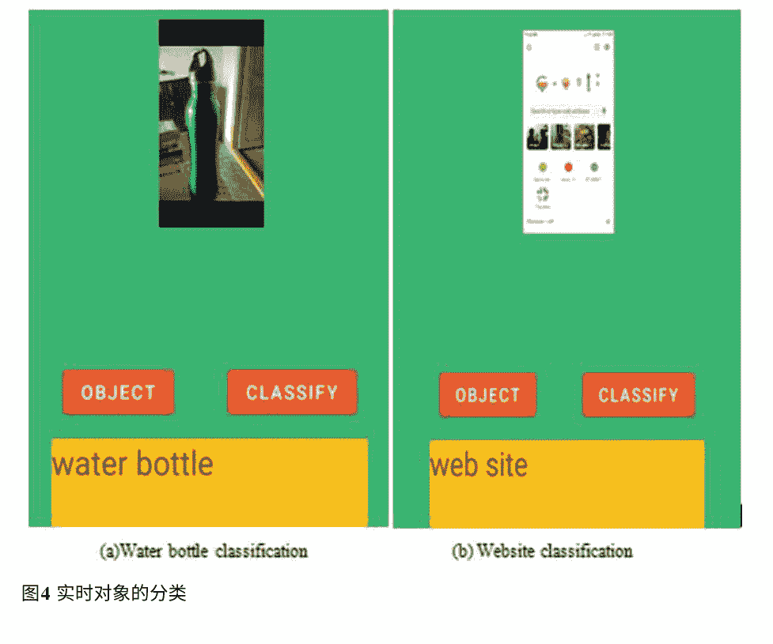

#### 4 结果与分析

图4显示了提出的对象分类方法的结果。该方法在来自各种数据集（如Kaggle、实时数据记录和Google网站图像）的300多个对象上进行了实验。通过考虑水瓶图像，提出的应用程序在预测对象的过程中提供了准确的结果，如图4所示。该提议的应用程序使用Python、Google API软件在64位处理器和8GB RAM系统上实现。

在下一节中描述了所提出方法的性能分析。结果表明所提出方法有效地检测了所选对象。通过考虑对象面积，检测率超过97%。

#### 4.1 性能分析 [15-19]

通过考虑以下特征评估了所提出系统的性能。

- 1. 准确率：计算发现的准确性的总百分比。百分比值越高，所提出应用的性能越好。准确率通过将总正例（TP）和总负例（TN）除以总元素（T）来计算。

```
准确率 = TP + TN/T
```

- 2. 精确度：通过配对真实值以识别可用数据集中最近的对象来表示概率。这是评估分类的最重要模型。它提供了最优先的结果。

```
精确度 = TP/TP + FN
```

其中FN表示假阴性。

- 3. 特异性：该参数用于分析对象并在图像中识别目标对象。它是用下面的公式来衡量的。

```
S = TN/FP + TN
```

下面是表示SVM分析和类别比较的表格和图表。表2是使用SVM进行结果分析以及类别比较的概率。图5和图6展示了SVM的准确性、精确度、特异性以及标记类别的概率比较等多个指标的图形表示。

表2 比较分类为水瓶的类别的概率

| 标记类别 | 概率 |
|----------|------|
| 水壶     | 0.03 |
| 水瓶     | 0.89 |
| 罐子     | 0.08 |

图5 SVM分析的图形表示

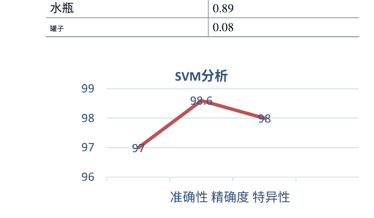

图6 类别比较的图形表示

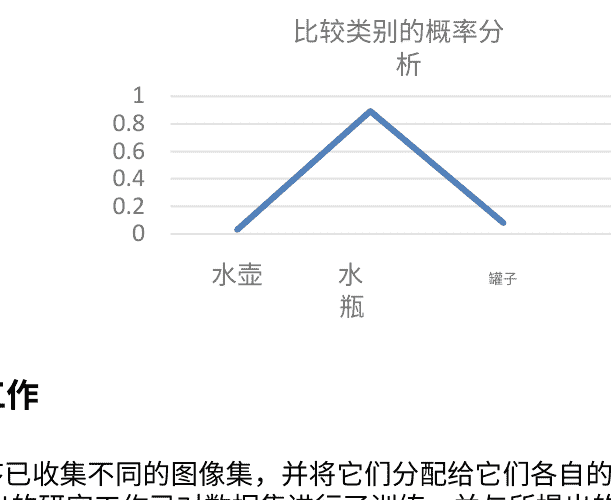

#### 5 结论和未来工作

所提出的应用程序已收集不同的图像集，并将它们分配给它们各自的类别标签。随后，所提出的研究工作已对数据集进行了训练，并与所提出的应用程序集成。通过使用支持向量机算法，这项研究工作获得了将查询图像与应用程序数据库中可用的对象进行比较并对给定图像进行分类的能力。所提出的对象分类应用程序在性能上快速而准确。

扫描可以是一对一图像和多对多图像。本文的未来工作可以使用卷积神经网络[GIF]对GIF进行处理，并同时提高计算时间的效率。

#### 参考文献

+   1. Browatzki, B., Fischer, J., & Graf, B. (2011). “深入研究评估2D和3D线索在一个新的大规模对象数据集上进行对象分类”。计算机视觉国际会议工作坊IEEE。
+   2. 王，G.，陶，L.，迪，H.，叶，X.，& 施，Y. (2012年)。一种可扩展的分布式架构智能视觉系统。IEEE交易，8 (1) , 91-99。
+   3. 鲁帕，Ch.，Thippa Reddy，G.，阿比迪，M.H.，& Alahmari，A. (2020年)。“使用机器学习分类网络犯罪的计算系统”。可持续性杂志，12 (10) , 1-15。
+   4. Udendhran, R.，Suresh, A. (2020年)。“使用深度学习增强嵌入式视觉系统的图像处理架构”，(第76卷)。爱思唯尔。
+   5. Rupa, Ch. (2019年)。多媒体隐蔽数据检测的扩展统计分析。信息系统工程，24 (2) , 161-165。
+   6. 傅，李，托拉 (2019年)。“一种新颖的图像处理算法用于分离线性聚类的猕猴桃”。科学直接，183。
+   7. Argialas, T. (2008年)。“支持向量机分类用于基于对象的图像分析”。斯普林格。
+   8. 鲁帕，Ch.，苏曼特，T. (2019年)。“物理货币完整性检查与模式匹配：应对少量数据和训练样本顺序”。国际工程师学会杂志，100 (3)。斯普林格IEI。
+   9. 波洛尼奥，塔韦拉，扎内拉 (2018年)。“一款用于自动图像分类的安卓应用程序”。L NICST，233。
+   10. Reyad, O., Amin, M. (2019年)。“一种有效的深度卷积神经网络用于视觉图像分类”。 (Vol. 921)。斯普林格。
+   11. Cervantes, J., Garcia, F., Rodríguez-Mazahua, L., (2020). “关于支持向量机分类的综合调查：应用、挑战和趋势”.Science Direct, 408.
+   12. Dubey, S. R., Pulabaigari, V., & Basha, S. H. (2020). “全连接层对卷积神经网络在图像分类中的性能影响”.Science Direct, 378.
+   13. Tammy, J., Gradus, J. L. (2020). “监督机器学习：简要介绍”.Science Direct, 51.
+   14. Ch, R. (2016). 一种使用陀螺仪板和水印技术的安全新方法。Springer IEI, 97(3), 273–279.
+   15. Akbari, V., et al. (2017). “利用C波段雷达极化技术在开放水域和海冰中检测冰山”.IEEE 会议地球科学和遥感研讨会.
+   16. Widyantara, O., 等人 (2016). “基于形态学对比增强的图像增强方法用于基于视频的图像分析”.IEEE国际数据与软件工程会议(ICoDSE), (pp. 1–6).
+   17. Rupa, Ch., Raveendra Babu, P., Rangarao, R. (2018年6月14–16日). “基于变换技术的基于目标的开放海洋冰山识别”。IEEE国际智能计算与控制系统会议。马杜赖。
+   18. Mazur, A. K., 等人 (2017). 一种基于目标的SAR图像冰山检测算法应用于阿蒙森海。环境遥感杂志, Elsevier, 189, 67–83.
+   19. Rupa, Ch., & Devi. (2019年1月19–21日). “基于SPLSB和位平面的水印技术的医学图像ROI的隐私和保护”。ACM国际密码、安全与隐私会议2019。马来亚大学。
+   20. 陶, D., Doulgeris, A. P., & Brekke, C. (2016). 一种基于分割的CFAR检测算法，使用截断统计。IEEE地球科学与遥感交易, 54(5), 2887–3289.
+   21. 范, W., 周, F., 陶, M., 白, X., 石, X., & 徐, H. (2017). “基于K-Wishart分布的PolSAR数据的自动船舶检测方法”。IEEE选定主题杂志应用地球观测遥感, 10(6), 2725–2737.
+   22. Rupa, Ch. (2017). 具有APRQ属性的安全信息框架。Springer IEI, 98(4), 359–364.
+   23. Hameed, M. A., Hassaballah, M., Aly, S., & Awadi, A. I. (2019年12月17日). “一种基于直方图梯度和PVD-LSB技术的自适应图像隐写术方法”.IEEE.
+   24. Duraipandian, M. (2020). 在音乐声音中用于签名小波识别的自适应算法软计算范式杂志 (JSCP), 2 (02), 120-129。
+   25. Manoharan, S. (2020). 基于种群的元启发式算法用于前馈神经网络的性能改进-ment。软计算范式杂志 (JSCP), 2 (01), 36-46。

43. Quan, C., & Ren, F. (2010). 基于情感词的句子情感分析与识别使用ren-cecps.国际高级智能杂志, 2(1), 105–117.
44. Russo, I. (2020). 悲伤和恐惧：推特上虚假新闻传播者内容的分类。在CLEF中。
45. Strapparava, C., & Mihalcea, R. (2007). Semeval-2007任务14：情感文本。在第四届语义评估国际研讨会论文集（SemEval-2007）中(pp. 70–74)。
46. Strapparava, C., Valitutti, A., et al. (2004). Wordnet affect: Wordnet的情感扩展。在LREC中(第4卷, 第40页). Citeseer.
47. Veyseh, A. P. B., Thai, M. T., Nguyen, T. H., & Dou, D. (2019). 通过深度上下文建模在社交网络中检测谣言。在2019年IEEE/ACM国际社交网络分析与挖掘会议论文集中(pp. 113–120)。
48. Wang, S. I., & Manning, C. D. (2012). 基线和二元组：简单而有效的情感和主题分类。在计算语言学协会第50届年会论文集中(第2卷：短论文, pp. 90–94)。
49. Wang, Z., Li, S., Wu, F., Sun, Q., & Zhou, G. (2018). NLPCC 2018共享任务1概述：代码切换文本中的情感检测。在CCF国际自然语言处理和中文计算会议论文集中(pp. 429–433)。Springer.
50. 吴, Z., 皮, D., 陈, J., 谢, M., & 曹, J. (2020年)。基于传播图神经网络的谣言检测具有注意机制。应用专家系统, 158, 113595。
51. 徐, K., 王, F., 王, H., & 杨, B. (2019年)。通过域声誉和内容理解检测在线社交媒体上的假新闻清华科技, 25 (1), 20–27。
52. 徐, P., Madotto, A., 吴, C.S., 朴, J.H., & 冯, P. (2018年)。Emo2vec：通过多任务训练学习广义情感表示。arXiv预印本arXiv: 1809.04505
53. 张, X., 曹, J., 李, X., 盛, Q., 钟, L., & 舒, K. (2019年)。挖掘双重情感假新闻检测。arXiv电子打印pp. arXiv-1903.
54. 周, K., 舒, C., 李, B., & 刘, J.H. (2019)。早期谣言检测。在北美计算语言学协会2019年会议论文集：人类语言技术（第1卷, 长篇和短篇, 第1614-1623页）中。
55. Zubiaga, A., Liakata, M., & Procter, R. (2017)。利用社交媒体上下文进行谣言检测。在社交信息学国际会议上（第109-123页）。Springer。

### 在调制域中使用粒子群优化进行单声道语音增强

Kalpana Ghorpade和Arti Khaparde

摘要 背景噪声影响语音质量和可理解性，降低了语音操作系统的性能。语音增强可以改善嘈杂语音的质量。调制域谱减法用于分离实部和虚部谱，提高了增强语音的可理解性，而不会产生音乐噪声。在本文中，我们建议使用基于粒子群优化的噪声估计进行单声道语音增强。粒子群优化算法找到输入语音中存在的噪声的最优值。

我们通过比较感知语音质量（PESQ）与其他各种算法的结果，来研究该算法在调制域中用于噪声估计的适用性。所提出的算法在给出最优解的同时，收敛速度很快。我们在PESQ和分段信噪比值上取得了改进。增强语音中的音乐噪声得到了减少。

- 语音增强
- 频谱减法
- 调制域实部虚部频谱减法
- 粒子群优化（PSO）
- 噪声估计

#### 1 引言

语音信号受到背景噪声的污染，使其不够清晰可辨。在语音操作系统中，退化的语音会影响系统的性能。车辆、共同发言者、风扇、空气管道产生的噪声会被添加到语音信号中。在真实环境中，完全消除噪声是不可能的，因为跟踪不同类型和随时间变化的噪声特征是困难的[1]。但是减少加性噪声可以使语音更易懂和提高语音相关应用的效率。这是通过语音增强系统完成的。语音增强引起了很多研究兴趣。对于单通道语音增强系统，增强语音是非常具有挑战性的因为没有噪声的参考。有各种各样的语音增强算法可用于改善语音质量[2, 3]。频谱减法是Boll提出的简单语音增强方法[4, 5]。这种方法的主要缺点是令人讨厌的音乐噪声。为了减少这种噪声，Boll建议将频谱减法结果的负频谱分量值设为最小值相邻帧的最小值[2]。Berouti等人建议减去噪声功率谱的过度估计以防止结果频谱分量低于预设的最小值[2]。在频谱减法中，假设语音噪声交叉项为零，而在低信噪比情况下不为零。此外，在重建增强的语音频谱时，使用了嘈杂的语音相位和增强的幅度频谱。对于低信噪比信号，嘈杂的相位角和清晰的语音相位不同[2]。为了减少音乐噪声，Zadeh首先建议调制频率域作为声学频率的时间序列的变换[6]。后来，提出了将时间域嘈杂语音的第一个STFT作为该频率处的声学频谱，将时间序列的第二个STFT作为该频率处的调制频谱[7]。在[8]中评估了调制域的强度与声学域相比，用于频谱减法。在[9]中，分析了交叉项、嘈杂相位角对语音增强的影响。为了减少它们的影响，建议使用调制域的实部虚部频谱减法(MRISS)。在[10–12]中，实现了各种语音增强技术在调制域中，与时域或频域方法相比，它们具有更好的性能结果。研究人员使用基于群体的算法进行语音增强，因为这些算法简单且具有最优性。在[13–15]中，实现了粒子群优化的变体(PSO)和PSO与其他启发式算法的组合用于双通道语音增强。在[16]中实现了单通道语音增强通过使用最小均方误差和PSO的组合(MMSEPSO)。在本文中，我们提出使用粒子群优化进行噪声估计在调制域中进行单通道语音增强。通过使用PSO，我们找到了语音中存在的优化噪声估计。随着客观测量值的增加，音乐噪声显著减少。

本文的其余部分组织如下。第2节简要介绍了光谱减法、调制域光谱减法和调制域实部虚部光谱减法。第3节介绍了标准粒子群优化（PSO）算法，第4节描述了使用PSO进行调制域光谱减法的噪声估计方法，第5节展示了实验结果，第6节给出了结论。

#### 2 光谱减法

光谱减法是一种广泛使用的语音增强方法。如果 y(n)是由干净语音信号 x(n)和附加噪声信号 d(n)组成的噪声污染信号n，则有

```
y(n) = x(n) + d(n)
```

光谱减法的表达式为

```
|X̂(ω)| = |Y(ω)| - |D̂(ω)|  如果|Y(ω)| > |D̂(ω)|，= 0  否则
```

其中 |D̂(ω)|是在非语音活动期间估计的噪声谱的幅度，|Y(ω)|是嘈杂语音的幅度谱，|X̂(ω)|是增强语音的幅度谱。方程(2)描述了谱减法方法，该方法也可以在功率谱域中扩展为方程(3)。

```
|X̂(ω)|² = |Y(ω)|² - |D̂(ω)|²
```

由于谱减法中负值的非线性处理（如方程(2)所示），增强语音中会出现随机变化的频率音调。这被称为音乐噪声[2]。为了减少音乐噪声的影响，Berouti等人建议从嘈杂语音的功率谱中减去噪声功率谱的过估计[2]。

```
|Eₙ(n, k)|² = |Y(n, k)|² - α|D'(n, k)|²  如果|Y(n, k)|² > (α + β)|D'(n, k)|²，= β|D'(n, k)|²  otherwise
```

其中 |Eₙ(n, k)|²是增强语音的功率谱，|Y(n, k)|²是噪声语音的功率谱，而|D'(n, k)|²是估计噪声的功率谱，α(大于等于1)是过减法因子，β(介于0和1之间)是控制剩余噪声量的谱底[2]。

##### 2.1 调制域谱减法

为了克服音乐噪声问题，文献中建议使用调制域谱减法。调制域谱减法在[8]中进行了讨论。下面的流程图给出了调制域谱减法的步骤。

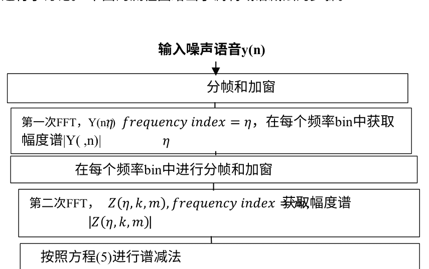

这里，第一次STFT（频率索引=η）将时域语音短帧转换为称为声学频率域的频率域。第二次FFT（频率索引=m）用于执行调制域谱减法，其中k是时间索引。方程(5)给出了调制域谱减法。Υ可以等于1或2，取决于是否进行幅度谱减法或功率谱减法。

```
|E_n(η, k, m)| = 
\begin{cases} 
\left( |Z(η, k, m)|^\Upsilon - \alpha |D'(η, k, m)|^\Upsilon \right)^{1/\Upsilon} & \text{如果 } |Z(η, k, m)|^\Upsilon - \alpha |D'(η, k, m)|^\Upsilon \geq \beta |D'(η, k, m)|^\Upsilon \\
\left( \beta |D'(η, k, m)|^\Upsilon \right)^{1/\Upsilon} & \text{否则}
\end{cases}
```

其中 D'(η,k,m)是调制域中的噪声估计，α是过减法因子，β是频谱底部[2]。在声学频域和调制频域中都存在交叉项误差效应。

此外，在将语音帧从声学频域转换为时域时，还使用了噪声语音相位谱和增强幅度谱。

调制域实部虚部谱减法（MRISS）：为了减小交叉项和噪声相位角的影响，[9]提出了调制域实部虚部谱减法（MRISS）方法。在这种方法中，首先进行短时傅里叶变换，将噪声语音帧从时域转换为声学频域。声学频谱被分离为实部和虚部谱。避免了声学频域中的交叉项误差效应。为了将声学频域帧转换为调制频域，实际和虚拟噪声语音谱中每个频率桶中的样本被分别分帧和加窗。然后，进行第二次FFT。方程（6）描述了将频率为k的声学域实际谱转换为调制频域的过程。对于虚拟谱，每个频率也进行类似的处理。

```
Z_R(k, m, r) = \sum_{n=0}^{M-1} Y_R(n, k) v(m - g) e^{-j 2 \pi n r / M} \quad (6)
```

在这里，r是调制频率索引（r =0到 M - 1），k是声学频率索引，m是时间索引，M是窗口长度，g是窗口移动。通过任何噪声估计算法估计的噪声也被转换为调制域。对于实际调制频谱，遵循方程（7）进行谱减。|MR(k,m,r)|是调制域中估计的噪声实际幅度谱。

```
|Z'_R(k, m, r)| = \begin{cases} |Z_R(k, m, r)| - \alpha(m)|M_R(k, m, r)| & \text{如果 } |Z_R(k, m, r)| > (\alpha(m) + \beta)|M_R(k, m, r)| \\ \beta|M_R(k, m, r)| & \text{否则} \end{cases} \quad (7)
```

其中 α(m) = 2 - (3/20)SNR(m)。α(m) 控制噪声减除的数量，β是频谱底噪。修改后的幅度 |Z'R(k,m,r)| 连同噪声相位一起给出增强的调制谱 Z'R(k,m,r)。同样地，|Z'I(k,m,r)| 连同相应的噪声相位一起给出 Z'I(k,m,r)。在这里，为了转换成调制域，复音频频谱的实部和虚部谱被用来代替使用幅度。交叉项效应只会存在于调制域中。此外，在将音频频谱转换回时域时，不需要使用噪声语音相位角。

#### 3 标准粒子群优化

进化算法可以给出实际多模态问题的满意解决方案。进化算法的主要优点是：（1）这些优化算法独立于系统结构，（2）它们只使用目标函数信息[17, 18]。粒子群优化（PSO）最初由Eberhart和Kennedy于1995年引入[17]。在基于群体的算法中，粒子（代理）之间的局部相互作用提供了一个允许系统解决问题而不使用任何中央控制器的全局结果[19]。在基于群体的启发式算法中，探索和开发是两个重要的方面。探索是扩大搜索空间的能力，而开发是寻找有前途答案周围最佳解的能力。启发式搜索算法在前几次迭代中遍历搜索空间以发现新颖的解决方案。随着迭代的进行，开发变得更加普遍，算法会调整自己到半最优位置[19]。在PSO中，每个候选解都可以被看作是一个在实数空间中移动的粒子[17, 18]。每个个体的信息基于他们个人的经验（迄今为止所做的决策和每个决策的成功）以及他们所在区域其他个体的表现。向量当前位置给出粒子的位置，速度给出粒子的速度。当前位置(t)表示第 t次迭代中的粒子位置。

```
当前位置(t) = 当前位置(t-1) + 速度(t) \quad (8)
速度(t) = W * 速度(t-1) + C1 * (R1 * (局部最佳位置 - 当前位置)) + C2 * (R2 * (全局最佳位置 - 当前位置)) \quad (9)
```

其中C1，C2是正数，R1，R2是在[0,1]范围内均匀分布的随机数。速度更新方程（9）有三个组成部分：（1）惯性，它模拟粒子继续沿着其当前方向运动的趋势；（2）线性吸引力，朝向给定粒子曾经找到的最佳位置：局部最佳位置（对应的适应度值称为粒子的最佳值：pbest），按照随机权重进行缩放；（3）线性吸引力，朝向任何粒子找到的最佳位置：全局最佳位置（对应的适应度值称为全局最佳值：gbest），按照另一个随机权重进行缩放。每次迭代都会对每个粒子评估适应度函数。标准PSO算法涉及的步骤有。

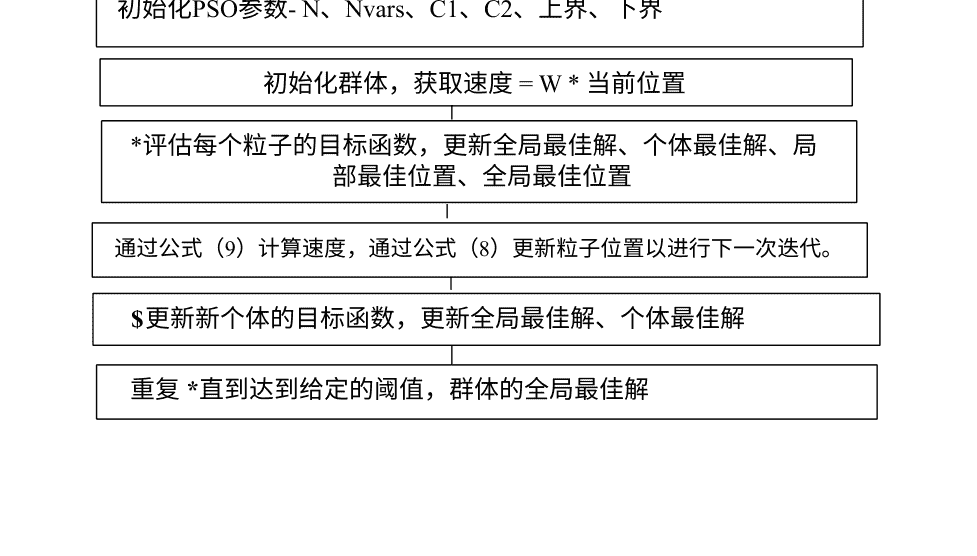

#### 4 使用PSO进行噪声估计的提出

在这里，我们提出使用PSO来估计语音调制域谱减法中的噪声。PSO的粒子实际上就是噪声的实部和虚部声学频谱的幅度。每个粒子对应于1024个系数（声学频率上的噪声幅度），这些粒子的位置在PSO算法开始时由PSO算法初始化。每个粒子的前512个值对应于实部声学频率谱N_R (n, k)，后512个值对应于虚部声学频率谱N_I (n, k)的系数。因此，在每个声学频率上，实部和虚部谱各有一个系数。算法中初始化了30个粒子。因此，PSO的群体大小为30 × 1024。（每个粒子有1024个系数，即每个粒子的位置有1024个系数）表1给出了提出算法中PSO的参数设置。对于每个粒子，在每个频率 kof N_R (n, k)和N_I (n, k)，进行144点FFT以获取调制域噪声谱。M_R-I (k, m, r)给出调制域噪声谱，其中 k是声学频率索引，m是时间索引，r是调制域频率索引。我们使用了[9]中提到的调制域谱减法。按照调制域实部虚部谱减法（MRISS）部分中的步骤，将时域噪声语音信号转换为调制域中的实部和虚部谱。时域噪声语音信号被分帧和加窗，使用汉明窗。

```
M_{R-I}(k, m, r) = \sum_{n=0}^{M-1} (N_R(n,k)N_I(n,k))e^{-j2\pi nr/M} \quad (10)
```

表2给出了将时域语音转换为调制域的帧和FFT大小。如[9]所述，在调制域中获取频谱时，我们分别考虑了声学频率域中的实部和虚部频谱。为了将其转换为调制域，每个声学频率bin中的组成部分再次被汉明窗口加窗。由于时间域帧的帧移为2.5毫秒，因此调制域帧中两个样本之间的时间间隔是连续声学域帧中的样本。

表1 PSO参数
| 参数 | 选择的值 |
|------|----------|
| 种群大小N | 30 |
| 变量数 | 1024 |
| 最大迭代次数 | 100 |
| C1, C2 | 2.05 |
| 惯性W | 开始时为0.9，结束时为0.4 |
| 上界 | 0.35 |
| 下界 | -5 × 10^{-5} |

表2 调制域的帧和FFT大小
| 参数 | 值 |
| :--- | :--- |
| 时域语音的帧大小 | 25毫秒，2.5毫秒的移动 |
| 将时域语音转换为声学频域的FFT大小 | 512点 |
| 转换为调制域的帧大小 | 120毫秒，帧移为15毫秒 |
| 第二个FFT大小 | 144点 |
| 每个调制帧的声学域帧数 | 48 |

频率也是2.5毫秒。因此，调制域中的采样频率为这个间隔的倒数，即400 Hz。由于这个原因，每个调制域帧中有48个声学域帧（即来自给定频率频带的48个分量）。调制域幅度谱通过使用方程(7)进行调制域中的谱减法进行修改。

##### 目标函数

PSO优化粒子位置，使得目标函数值最大。调制域谱信噪比是目标函数。PSO修改噪声幅度（粒子位置），使得目标函数值最大。以下方程给出了目标函数的计算。对于给定的声学频率，对于实际的调制域谱，如果|ZR(k, m, r)|是帧中一个样本的幅度，|MR−I(k, m, r)|是该频率处的噪声幅度，则调制域帧的信噪比估计如(11和12)所示。

```
SNR_R(k, m, 1) = 10 * log( (∑_{r=0}^{M-1} |Z_R(k, m, r)|^2) / (∑_{r=0}^{M-1} |M_{R-I}(k, m, r)|^2) ) (11)

SNR_I(k, m, 1) = 10 * log( (∑_{r=0}^{M-1} |Z_I(k, m, r)|^2) / (∑_{r=0}^{M-1} |M_{R-I}(k, m, r)|^2) ) (12)
```

通过这种方式，在每个声学频率上，对于每个调制帧，在调制域中估计实部和虚部频谱的SNR。虚部频谱的调制帧SNR被命名为(SNR_I)。方程(13和14)给出了实部和虚部频谱中单个声学频率的所有调制帧的平均帧SNR。方程(15)给出了单个声学频率的实部和虚部的平均SNR。计算所有声学频率的SNR的平均值，这是目标函数，由方程(16)给出。如果对于实部和虚部的单个声学频率有Q个调制域帧。

```
snr_R = (1/Q) * ∑_{m=1}^{Q} SNR_R(m, 1) (13)
snr_I = (1/Q) * ∑_{m=1}^{Q} SNR_I(m, 1) (14)
Av_{SNR} = (1/2) * (snr_R + snr_I) (15)
SNR = (1/N) * Av_{SNR} = 目标函数 (16)
```

该算法通过优化每个频率上的噪声值来最大化目标函数的值。SNR值的优化进而决定了方程（7）中每个帧的 α 值，从而得到了频谱减法的增强幅度谱作为输出。在每次迭代中，算法找到具有最大目标函数值的粒子。停止准则基于为目标函数设置的阈值。在这里，我们将8作为阈值保留。目标函数值大于或等于设定值的粒子成为最佳粒子。它在声学领域中提供了最优化的噪声估计。最佳粒子的相应调制域幅度用于方程（7）中的频谱减法。这两个频谱的IFFT与重叠相加得到声学域频谱 En'_R(n,k)和 En'_I(n,k)。这两个频谱被合并，然后通过IFFT与重叠相加得到时域增强语音信号。

#### 5 结果

为了模拟所提出的方法，我们使用了MATLAB2019b。噪声语音数据取自NOIZEUS数据库，该数据库包括由三名男性和三名女性演讲者产生的30个IEEE句子，这些句子被八种不同的真实世界噪声以不同的信噪比[20]破坏。通过男性和女性演讲者提供了五个句子，其中包括嘈杂声、汽车噪声和展览噪声，其总体信噪比为0 dB、5 dB、10 dB和15 dB，作为算法的输入。总共使用了120个句子（10 * 3 * 4）来评估客观指标。在每种情况下估计语音质量的感知估计（PESQ）和分段信噪比（SNR）。将所提出算法的输出PESQ与[16]中的MMSE、bnmf、MMSEPSO的PESQ结果以及Log-MMSE的结果进行比较。表3对上述算法的输出PESQ进行了比较。图1显示了PSO的收敛性，图2和图3显示了嘈杂声和汽车噪声的各种算法的PESQ值的比较。所提出的方法为所有噪声类型和所有输入信噪比水平提供了更好的输出PESQ值。它在3-5次迭代内收敛到目标函数的设定值。

表3 各种算法的输出PESQ比较
| 噪声 | 方法 | 0 dB | 5 dB | 10 dB | 15 dB |
|------|------|------|------|-------|-------|
| 嘈杂声 | bnmf | 1.70 | 2 | 2.25 | 2.4 |
|  | MMSE | 1.72 | 2 | 2.3 | 2.375 |
|  | MMSEPSO | 1.75 | 1.895 | 2.45 | 2.70 |
|  | Log MMSE | 1.8630 | 2.2065 | 2.5973 | 2.8675 |
|  | 提出的方法 | 2.2216 | 2.7922 | 3.0271 | 3.0351 |
| 汽车噪声 | bnmf | 1.625 | 1.85 | 2.20 | 2.375 |
|  | MMSE | 1.6 | 2.15 | 1.9 | 2.4 |
|  | MMSE-PSO | 1.75 | 2.13 | 2.25 | 2.75 |
|  | Log MMSE | 1.9221 | 2.3394 | 2.7090 | 2.8956 |
|  | 提出的方法 | 2.4413 | 2.6855 | 2.9155 | 2.9685 |
| 展览噪声 | bnmf | 1.3 | 1.9 | 2.2 | 2.4 |
|  | MMSE | 1.31 | 1.7 | 2.1 | 2.25 |
|  | MMSE-PSO | 1.75 | 1.95 | 2.4 | 2.75 |
|  | Log MMSE | 1.6712 | 2.1703 | 2.5334 | 2.9012 |
|  | 提出的方法 | 2.525 | 2.675 | 2.775 | 2.98 |

图1 所提算法的收敛性
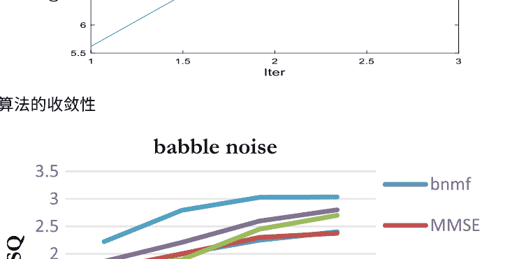

图2 噪声对应的输出PESQ
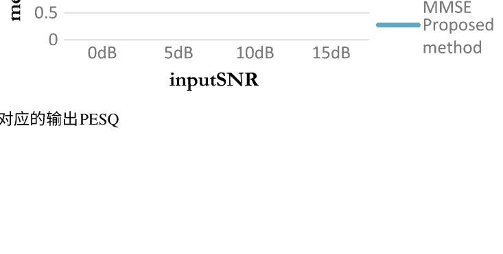图3 汽车噪声对应的输出PESQ

##### 所提算法的伪代码

```
Given a function f(x) (ObjFunction) to minimize on a domain S = [Lowerbound, Upperbound] d ⊆ Rd

1. Parameter settings choose N, Nvars, MaxIter, C1, C2, W
2. Swarm initialization for i=1 to N {
   - Initialize p_i = CurrentPosition_i = rand (Lowerbound, Upperbound)
   - Initialize Velocity_i = W* CurrentPosition_i
   - Set pbest_i = f(p_i)
   Find g such that f(p_g) > f(p_k) for each k ≠ g
   Set gbest = f(p_g)
   FE = N;//number of function evaluations
3. Search process loop
   do {
      for i = 1 to N {
      - recalculate Velocity_i according to (9)
      - adjust CurrentPosition_i according to (8)
         - if (CurrentPosition_i ∈ S) {
         - calculate tmp = f(p_i);
         FE = FE + 1;
         - if (tmp > pbest_i) {
            - p_i = CurrentPosition_i; pbest_i = tmp;
            - if (pbest_i > gbest) {g = i; gbest = pbest_i;}
         }
      }
   } //end for
   } while (FE < MaxIter and gbest < S);
4. Output
   Return p' = p_g and f(x') = gbest
```

#### 6 结论

PSO可以适用于调制域中的噪声估计。 结果显示，使用PSO可以改善噪声对应的PESQ，包括噪声、汽车噪声和展览噪声。 对于0 dB的噪声，我们获得了34.5%的PESQ增加。 在5 dB和10 dB输入SNR的情况下，女性说话者的PESQ增加百分比比男性说话者更高。 除了15 dB的噪声水平外，分段SNR得到了改善。 增强语音中减少了音乐噪音。 PSO在3-5次迭代中收敛到集合目标函数值。 这表明PSO可以为单通道语音增强系统提供良好的噪声估计优化。

#### 参考文献

- 1. Kondaz, A. M. (2004). 数字语音编码用于低比特率通信系统，第2版。 Wiley.
- 2. Loizou P. C. (2013). 语音增强：理论与实践，第2版。 CRC Press.
- 3. Hu, Y., & Loizou, P. C. (2006). 主观比较语音增强算法, 得克萨斯州理查森市达拉斯大学电气工程系。 1-4244-0469-X/06 IEEE.
- 4. Boll, S. (1979). 使用频谱减法抑制语音中的声学噪音。 IEEE声学、语音和信号处理交易，27(2)，113-120。
- 5. Berouti等人 (1979年) 。 声音受到声学噪音干扰的增强，声学，语音和信号处理。 IEEE国际会议ICASSP'79，(第4卷，第208-211页)。
- 6. Zadeh. (1950年) 。 可变网络的频率分析。 IRE，38，291-299。
- 7. Atlas. (2003年) 。 调制谱变换：应用于语音分离和修改。 华盛顿大学。
- 8. Paliwal, K., Wójcicki, K., & Schwerin, B. (2010年) 。 在短时调制域中使用谱减法进行单声道语音增强。语音通信，52 (5)，450-475。
- 9. Zang, Y. (2012年) 。 调制域处理和语音相位谱在语音增强中。在密苏里大学哥伦比亚分校研究生院提交的论文。
- 10. 王, Y. (2015). 调制域语音增强博士论文。伦敦帝国学院。
- 11. Dionelis, N., & Brookes, M. (2017). 调制域语音增强使用卡尔曼滤波器和贝叶斯更新语音和噪声在对数谱域中, 978-1-5090-5925-6/IEEE.
- 12. 王, Y., & Brookes, M. (2018). 基于模型的调制域语音增强 IEEE/ACM音频交易。语音和语言处理,26(3).
- 13. Prajna, K., Rao, S. B., & Reddy, K. V. V. S. (2014). 一种基于加速粒子群优化(APSO)的新型双通道语音增强方法。智能系统和应用.
- 14. Prajna, K., Rao, S. B., Reddy, K. V. V. S., & Maheswari, R. U. (2015). 一种基于混合PSOGS A的新型双通道语音增强方法。国际语音杂志技术,18,45-56.
- 15. Geravanchizadeh, M., & Osgouei, S. G. (2015). 一种新的洗牌子群粒子群优化算法用于语音增强。《计算机工程与技术进展杂志》,1(1).
- 16. Selvi, R., Suresh, G. R. (2015). 光谱滤波与粒子群优化的混合用于语音信号增强。《国际语音技术杂志》。
- 17. Kennedy, J., & Eberhart, R. (1995).粒子群优化. 在IEEE国际神经网络会议论文集, (Vol. 4, pp. 1942–1948).
- 18. Shi, Y., & Eberhart, R. (1999). 粒子群优化的实证研究。《IEEE进化计算大会论文集》, (CEC), (pp. 1945–1950).
- 19. Esmat, R., Hossein, N.-P., & Saeid, S. (2009). GSA: 一个重力搜索算法。信息科学, 179, 2232-2248。
- 20. 胡, Y., & Loizou, P. (2007). 主观评价和语音增强比较算法。语音通信, 49, 588-601。

### 使用深度学习算法进行肺炎和糖尿病视网膜病变检测

Meera Ghaskadvi, Sakshi Khochare, Rozebud Gonsalves和Prajakta Dhamanskar

摘要 疾病总是在人们最不期待的时候找上门来。肺炎就是其中一种疾病。它是由于肺部功能不全引起的，如果不能及时检测出来，不仅对年轻成年人而且对儿童也会造成重大健康威胁。 糖尿病视网膜病变是一种常见于糖尿病患者的疾病，可能导致失明。 为了及时诊断这些疾病，健康与技术的融合是不可避免的。 在我们国家的医疗界，尤其是在这个艰难时期，我们一直承受着巨大的压力。我们制作了一个一站式网站，可以使用名为卷积神经网络的深度学习算法来测试糖尿病视网膜病变和肺炎等不同疾病的存在。 我们希望在整个测试过程中减少努力和人际接触，以便可以在家中舒适地测试疾病的存在，而无需投资金钱和精力，并远离人体接触，从而使自己免受 COVID-19 感染的威胁。 我们以CT扫描图像作为输入，并获得了高准确度、召回率和精确度。 我们分别获得了90.06%的肺炎准确度和92.88%的糖尿病视网膜病变准确度。 因此，我们成功创建了一个一站式网站，可以供医疗专业人员和组织使用。

- 关键词:
- 糖尿病性视网膜病变
- 肺炎
- 深度学习
- 卷积神经网络
- CT扫描
- 过拟合
- 精确度
- F1得分
- 召回率
- 特征提取
- 特征重要性

#### 1 引言

我们在药物方面的进展是当今的需求，需要将药物与技术相结合以实现进一步的增长。 由于全球范围内因疫情而面临的前所未有的情况，医生、医院和医务人员面临着巨大的压力。 由于“无接触”成为新常态，患者害怕去医院进行特定疾病的诊断。这个过程容易出错，而且医生们通常非常忙，尤其是在疫情期间更加忙碌。我们的项目可以解决遇到的所有这些限制。我们提出了一个解决方案，患者可以在家里免费进行几项测试，了解自己的疾病，而不需要出门，从而减轻医疗领域的压力。我们的目标是开发一个成功识别一个人是否患有疾病并打印出这些疾病的全身报告的系统，使用深度学习算法。目前，我们的系统可以用于诊断两种不同类型的疾病，即肺炎（肺部疾病）和糖尿病视网膜病变。肺炎的问题在于早期阶段很难发现。对于微妙症状的早期诊断可以增加患者的生存机会。同样，糖尿病视网膜病变是由于高血糖水平引起的，会导致糖尿病患者眼睛失明，如果症状在早期阶段被诊断出来，可以避免这种情况。

我们随后提出了一个框架，可以在早期预测疾病，从而提高生存几率或完全治愈。然后，程序将继续打印完整的身体报告，立即让个人知道他/她正在经历的不适。

#### 2 相关工作

本研究[1]侧重于使用多层感知器神经网络（MLPNN）通过使用人眼视网膜图片的各种特征来确定糖尿病视网膜病变的存在。这里使用的数据集图片来自库奥皮奥大学医院，总共有130张图片。其中20张是正常（健康）的，另外110张图片显示出糖尿病视网膜病变的迹象。从视网膜图片中提取出的64点DCT等显著特征，以及9个统计学参数，被用作分类器的输入。在这项研究中，当使用10%的模型进行交叉验证（CV），并使用90%的模型进行神经网络训练时，获得了最佳结果。

这项研究[2]旨在提供一个模型，以一次性完成所有病变分类的病变发生。这项研究的实验结果表明，这里使用的方法可以大大提高病变检测的性能，超过了以前使用的方法（更快的RCNN和FPN）。这里的分析师们建立了自己的命名工具，可以有效地标记图像中病变实例的边界框和分类。该数据集包含5198张分辨率为2136 × 3216的图像，涵盖了所有五个严重程度阶段。在图像处理领域，大型医学图像中的小病变检测是一个普遍的问题；因此，这些发现可以自动识别病变区域，从而提高医生的诊断准确性和效率。

这项研究[3]讨论了糖尿病视网膜病变的四个阶段：轻度非增殖性视网膜病变、中度非增殖性视网膜病变、重度非增殖性视网膜病变和增殖性糖尿病视网膜病变。由于所有四个阶段都具有特定的特征，医生可能会做出错误的诊断。这项研究称，通过正确的诊断和治疗，可以减少56%的新病例。这里使用的数据集来自Kaggle糖尿病视网膜病变挑战赛2015年，是向观众提供的最大数据集，包含35,126张眼底图像。在本地数据集上，使用TTA进行集成的效果略差于不使用TTA，然而，在测试数据集上，使用TTA进行集成的效果更好。TTA中的集成在验证数据集和测试数据集上都显示出一致的排名（2943个中的58和54个）。

这里的目标[4]是构建一个设计，可以检查眼底图像中糖尿病视网膜病变的严重程度。在这项研究中使用了各种数据集，包括标准糖尿病视网膜病变数据集、数字视网膜图像、Kaggle糖尿病视网膜病变数据集等。为了进行图像处理和分类，使用了深度卷积神经网络。步骤包括数据收集、数据注释、数据预处理、数据增强、模型设置和评估、模型部署和临床评估。在评估的模型中，Inception-V3的准确率最高，达到了88.35%。

在这篇论文[5]中，研究人员讨论了糖尿病视网膜病变的五个阶段：0、1、2、3、4。从正常图像中，医生无法具体判断各个阶段，每个阶段都有其特定的特征。这项研究中的数据集来自Kaggle第四届APTOS 2019盲人检测。该数据集中的图像提供了糖尿病视网膜病变的彩色眼底图像。使用VGG16（不使用ImageNet）和QWK，以及使用ImageNet和QWK的Dense Net。相比之下，VGG16的精度较低，而Dense Net（使用ImageNet）的精度较高。因此，研究比较了这两种结构- VGG16和Dense Net，VGG16的准确率为73.26%，而Dense Net的准确率为96.11%。

这项研究的基本目标是改善在放射治疗师不易获得的地方的医疗水平。早期诊断肺炎是这项研究的主要方面，以避免不良后果（甚至死亡）。

观察到了不同的预先准备的CNN模型以及不同的分类器，并基于可衡量的结果选择了DenseNet-169作为组件分离阶段和SVM作为分组阶段。使用的数据集是ChestXray-14，该数据集在Kaggle上也是免费可获取的，包含来自患者的30,085张图片。每张图片都标有至少一种不同的胸部疾病。

这项研究在基于迁移学习方法的基础上使用深度神经网络自动检测肺部疾病类型，包括COVID-19肺炎、非COVID-19病毒性肺炎和细菌性肺炎。所有模型都基于两个二元类别和多类别。在这项研究中，模型的评估依据是准确率、敏感度和特异度。一个限制是本文的一个重要观点是作者使用了一个相对较小的COVID-19肺炎数据集，因此很难假设结果适用于所有人群。 互联网上可用的COVID-19肺炎和非COVID-19病毒性肺炎的CT扫描图像数量非常少。 研究人员使用了来自GitHub的153张图像，来自Kaggle的219张图像，来自Kaggle的1341张正常图像和4274张感染图像。

提出的工作[8]对传统基于深度学习的神经网络进行了相对研究。 设计的卷积神经网络（CNN）、竞争神经网络（CpNN）和反向传播神经网络（BPNN）使用携带各种疾病的胸部图片进行训练。 在整个工作过程中，进行了许多不同参数和迭代的组合，并且在模型之间以及与先前的工作进行了比较。

网络效率的分析是基于各种因素如识别率、计算时间、泛化能力和准确性进行的。 观察到CNN具有更高的识别率，优于其他网络。

CNN的结果还与先进的深度学习模型如GIST、VGG16和VGG19进行了进一步对比，这些模型也被证明具有较低的泛化能力和准确性。

本研究旨在确定一种架构，以帮助CAD改善医学图像解读中放射科医生的诊断准确性。 本文实现了两种架构，深度残差网络和掩膜区域CNN，这对CAD的发展可能有所帮助。通过混淆矩阵观察了每个网络的性能。 通过混淆矩阵计算的特异性和敏感性之间的巨大对比图表显示了两个网络之间的差距。 这种差距表明数据集不平衡，网络倾向于预测负类数据。 尽管存在这些缺点，残差网络表现出比掩膜RCNN更好的性能。

本文[10]对深度学习方法进行了详尽的研究，这些方法可以应用于包含肺炎CT扫描的各种类型的数据集。 本研究旨在通过修改来实现比之前使用定制的VGG16更高的准确率，定制的VGG16的准确率为96.2%和93.6%。 最初，Chest Xnet在检测各种疾病方面取得了良好的结果，但最终被CNN超越，CNN的准确率更高。 从后来提出的方法中可以得出结论，VGG16的准确率最高。 还注意到使用各种图像预处理技术可以显著提高该网络的速度和准确性。

| 论文 | 标题 | 出版详细信息 | 论文目标 | 使用的算法 | 准确性 | 未来的研究方向和限制 |
|---|---|---|---|---|---|---|
| Bhatkar和Kharat[1] | 使用MLP分类器在视网膜图像中检测糖尿病视网膜病变的存在 | Amol Prataprao Bhatkar, Dr. G. U. Kharat | 本文重点研究了MLPNN分类器作为典型和非典型的特征来表征视网膜图片 | 多层感知器神经网络 | 100% | 图像的分散性与任何常规人口无关；图片是用少量50°视野的先进眼底相机拍摄的具有模糊相机设置并包含一定量的噪声和光学差异 |
| Chen等人[2] | 通过大规模CNN特征在糖尿病视网膜病变图像上进行微小病变检测 | Qilei Chen, Xinzi Sun, Ning Zhang, Yu Cao, Ben yuanLiu发表于2019年 | 本文分析了病变与图像之间的关系，并提出了一个巨大的特征金字塔网络（LFPN）来不浪费图像细节进行微小/小病变实例检测 | 巨大尺寸特征金字塔网络 | - | 即使IoU比例阈值提高到0.6，召回率仍然偏高 |
| Tymchenok等人[3] | 深度学习用于糖尿病视网膜病变检测 | Borys Tymchenko, Philip Marchenko 和 Dmitry Spodarets | 本文提出了多任务学习用于检测糖尿病视网膜病变。它使用三个解码器，每个解码器根据使用CNN骨干提取的特征训练来解决其任务 | EfficientNet-B4, EfficientNet-B5, SE-ResNext50 | 81% | 未来的工作可以扩展这种方法计算整个集合的SHAPE，而不仅仅是特定网络，并进行更精确的超参数优化。此外，我们可以使用预训练的编码器在其他与眼部疾病相关的任务中进行测试 |
| 高等。[4] | 使用深度神经网络诊断糖尿病视网膜病变 | 高振涛，李杰，郭继祥，陈媛媛，张毅，钟杰 | 本文旨在制造一个能够评估给定眼底图片中糖尿病视网膜病变严重程度的模型 | RESnet-18, ResNet 101, VGG-19, Inception-V3, V4 | 88% | 未来，将整合来自更大设备的数据，并进行更广泛的试点研究收集到的信息将进一步用于提高模型的准确性 |
| Mishra等人[5] | 使用深度学习进行糖尿病视网膜病变检测 | Supriya Mishra, Seema Hanchate, Zia Saquib | 该论文旨在开发自动检测糖尿病视网膜病变的框架 | VGG16, DenseNet121 | 96% | 未提及 |
| Varshni等人[6] | 使用基于CNN的特征提取进行肺炎检测 | Dimpy Varshni, Karthik Thakral, Lucky Agarwal, Rahul Nijhawan, Ankush Mittal | 评估各种预先准备的CNN模型的性能 | ResNet, DenseNet, VGG, SVM核函数 | 80% | 旨在为未来在比较研究领域中提供 |
| Ibrahim等人[7] | 使用深度学习从胸部X射线图像进行肺炎分类 | Abdullah Umar Ibrahim, Mehmet Ozsoz, Sertan Serte, Fadi Al-Turjman, Polycarp Shizawallyi Yakoi | 本文展示了基于TL方法的深度神经网络在自动检测COVID-19肺炎、非COVID-19病毒性肺炎和细菌性肺炎方面的应用 | AlexNet | 94% | 在未来，我们希望获得更多的数据集，并使用预训练的GoogLeNet和ResNet等深度神经网络对图像进行训练，从而将CNN模型与支持向量机(SVM)和支持向量回归(SVR)相结合 || 论文 | 标题 | 出版详细信息 | 论文目标 | 使用的算法 | 准确性 | 未来的研究方向和限制 |
|------|------|---------------|----------|------------|--------|----------------------|
| Abiyev和Ma'aitah[8] | 用于胸部疾病检测的深度卷积神经网络 | Rahib H. Abiyev和Mohammad Khaleel Sallam Ma'aitah | 在这里，我们的目标是使用相同的胸部X射线数据集训练传统网络和深度网络，并根据其得出结论 | 反向传播神经网络（BPNN），卷积神经网络（CNN），竞争神经网络（CpNN） | 92% | 未提及 |
| Al Mubarok等人[9] | 深度卷积架构的肺炎检测 | Abdullah Faqih Al Mubarok, Dominique Jeffrey, Ahmad Habib Thias | 本文旨在了解两种广为人知的深度卷积架构：残差网络和掩膜RCNN在分类和检测肺炎方面的性能 | 残差网络和掩膜-RCNN | 85% | 在不久的将来，我们可以通过超参数调整来提高性能。使用复杂的网络结构和增加不平衡数据集可能也是未来的可能性，这样我们可以得到最佳的肺炎CAD系统架构 |
| Tilve等人[10] | 使用深度学习方法进行肺炎检测 | Ashitosh Tilve, Sharmet Nayak, Saurabh Vernekar, Dhanashi Turi, Pratiksha R. Shetgaonkar, Shailendra Aswale | 在这项调查中，我们还试图熟悉将原始X射线图像转换为常规格式以分析机器学习技术的不同图像预处理方法 | VGG16, 卷积神经网络 | 96% | 有时候，即使不存在某种疾病，也可能发现该疾病，这是由于存在其他不同的疾病，这个错误疾病检测问题必须解决。我们将通过建立一个类似疾病肺炎的模型，并使用更准确的数据集来解决这个问题。 |
| Yadav等人[11] | 使用前馈神经网络进行糖尿病视网膜病变检测 | Jayant Yadav, Manish Sharma, Vikas Saxena | 本文利用计算机视觉来检测这种疾病，并利用神经网络自动化这个过程，从而在规定的时间内为许多患者提供结果。 | OpenCV和Tensorflow | 75% | 通过使用最新的方法，可以增强准确性 |
| Smys等人[12] | 深度学习中的神经网络架构调查 | Smys, S., Joy long, Zong Chen和Subarna Shakya | 本调查主要通过分析深度学习的架构和特性及其缺点，来深入了解深度学习。此外，这项研究通过各种文献分析了深度学习的最新趋势，以探索深度学习模型的当前发展。 | 各种深度学习算法 | - | 未来的研究可以引入CNN中的混合架构，以提高性能。 |

## 3个研究差距

首先，在同时管理这两种疾病时，准确率分别达到了60%和70%。 然后，我们将肺部的年龄设为10岁，糖尿病视网膜病变的年龄设为12岁，分别达到了80%和85%的准确率。 然后，我们采用了图像清理、回忆、垂直压缩、减少层数和减少隐藏层中的元素数量等多种提高准确性的技术。

通过这样做，我们的准确度对于肺部疾病提高到了90.6%，对于糖尿病视网膜病变提高到了92.88%。

## 4问题定义

我们的项目使用深度学习算法检测身体中的两种疾病。我们使用了卷积神经网络（CNN），因此对于肝脏和糖尿病视网膜病变都有CT扫描图像数据。我们期望得到一个二进制答案，即一个人是否患有疾病。 然后，我们打印出一份包含疾病所有细节和进一步行动的全身报告。

## 5方法论

### 5.1使用的算法-卷积神经网络

我们在糖尿病视网膜病变和肺炎中都使用了卷积神经网络（CNN）。CNN是一种适用于图像数据集的深度学习算法。它将图像作为算法的输入，并突出显示图像的几个重要方面。CNN是一种人工神经网络，其神经元之间的关联模式类似于动物大脑的视觉皮层的结构和操作方式。CNN的作用是以一种方式处理图像，使图像以一种简化的形式呈现，并从中得出重要结论（图1）。

计算机使用数字来理解图像。因此，我们将整个图像分成网格，并将图像被检测到的地方赋值为1，未被检测到的地方赋值为-1。形成滤波器，并将输入图像与已有的图像数据集进行比较。

CNN的架构中有4个主要层- 卷积层、池化层、Relu层和全连接层。

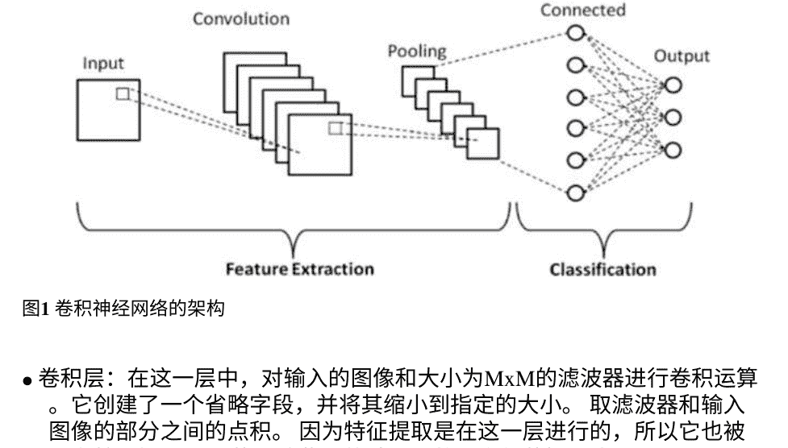

## 图1 卷积神经网络的架构

- 卷积层：在这一层中，对输入的图像和大小为MxM的滤波器进行卷积运算。它创建了一个省略字段，并将其缩小到指定的大小。取滤波器和输入图像的部分之间的点积。因为特征提取是在这一层进行的，所以它也被称为特征提取层。执行这些层的结果是将图像细节排列成场景。
- 以下是卷积层的步骤
    1. 步骤1：将图像的特征排列起来
    2. 步骤2：每个图像与特征像素相乘
    3. 步骤3：相加
    4. 步骤4：除以特征中存在的总像素数。
从输出中，我们可以获得有关角落和边缘的详细信息。它被称为输入到下一层的特征图。

- 池化层：该层的主要目标是减小地图的大小以便图像的处理变得更轻。它减少了在卷积层中生成的信息，只保留那些完全必要的特征。该层从特征图中取出最大的元素关于这一点，我们在卷积层中已经看到了。它是连接卷积层和全连接层的交叉点。有各种类型的池化层，包括：最大池化、平均池化、全局池化。

- Relu层：如果输入超过一定阈值，则触发Rectified Linear Unit变换函数。我们从过滤后的图像中消除非正值，并用零替换它。这样做是为了避免在加法后得到零。根据数学，它的公式为 y = max(0, x)。正如我们所看到的，这个方程非常简单和不复杂，模型需要更少的时间来运行，因此Relu是最广泛使用的激活函数之一。Relu旁边有一个小问题，叫做死亡Relu，所有负值输出为零。可以通过使用其他Relu替代品，如Leaky Relu和ELU，或降低学习速率来解决这个问题。

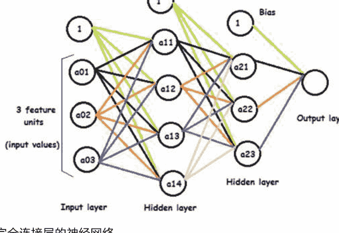

- 完全连接层：这是最终的层，层次化实际上发生在这里。取出过滤和压缩的输入图像，并将其转换为单个单元。它包含权重和偏差。它用于连接两个不同层之间的神经元。它还将图像压缩为单列向量。在卷积层之后，这是第二个时间消耗最多的层。在这里学习非线性组合（图2）。

##### 5.2 数据预处理

输入数据存储在一个目录中，然后按照20%和80%的比例分为训练数据和测试数据。

##### 5.3 模型信息

肺部：调整大小后的图像尺寸为150*150（高度和宽度）。卷积的第一层有16个过滤器和一个大小为（3,3）的核。下一层有32个过滤器和一个大小为（3,3）的核。第三个卷积层有64个过滤器和一个大小为（3,3）的核。为了将特征展平为向量，使用了一个维度为（2,2）的池化层。输出层使用Sigmoid算法来分类判断一个人是否患有肺炎。

糖尿病视网膜病变：调整大小后的图像尺寸为224*224（高度和宽度）。卷积的第一层有8个过滤器和一个大小为（3,3）的核。第二个卷积层有16个过滤器和一个大小为（3,3）的核。第三层有32个过滤器和一个大小为（4,4）的核。为了将特征展平为向量，使用了一个使用维度（2,2） 输出层使用的激活函数是SoftMax算法，用于分类一个人是否患有肺炎。

- 使用的样本：
    1. 肺部：
       训练数据：5126
       测试数据：624
    2. 糖尿病视网膜病变：
       训练数据：2562
       测试数据：548.

##### 5.4 使用的数据集

CNN架构已应用于两个不同的疾病数据集，肺炎和糖尿病视网膜病变。这两个数据集都是基于图像的，包含感兴趣区域的扫描图像。

###### 5.4.1 肺炎

用于肺炎检测模型的数据集由Daniel Kermany、Kang Zhang和Michael Goldblum于2018年发布。这个数据集的最新版本是从Kaggle提取的。这个数据仓库分为训练数据、测试数据和验证数据三个目录，每个目录下都包含每个图像类别（肺炎/正常）的子文件夹。该数据集包含5856个CT扫描图像，全部为JPEG格式，其中1583个图像被标记为正常，4273个图像被标记为感染肺炎。在用于分析之前，这些扫描图像经过专家的仔细扫描和评分，并且所有质量低和不可读的扫描图像都被丢弃了（图3和图4）。

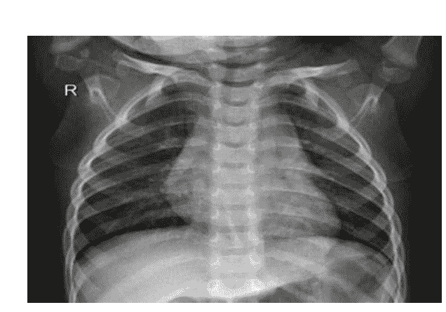

## 图4 受影响肺部CT扫描

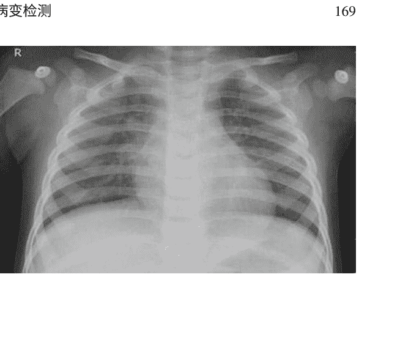

###### 5.4.2 糖尿病视网膜病变

为了检测糖尿病视网膜病变，使用的数据集是从Kaggle下载的，最初由亚太远程眼科学会（APTO）发布。数据集完全平衡，包括3660张视网膜扫描图像，其中1805张标记为无DR，1855张标记为DR。原始数据集根据糖尿病视网膜病变的严重程度分为5个类别，为了本研究的目的进行了合并。发现图像为PNG格式。对图像应用了高斯滤波器以增强特征，并将其调整为224 × 224像素，以便于进行分析（图5和图6）。

## 图5 眼睛不受糖尿病视网膜病变影响

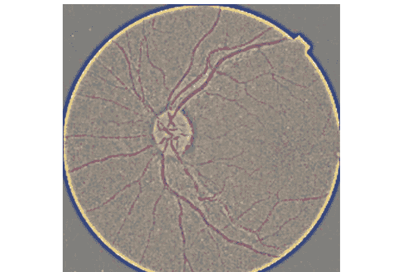

## 图6 眼睛受糖尿病视网膜病变影响

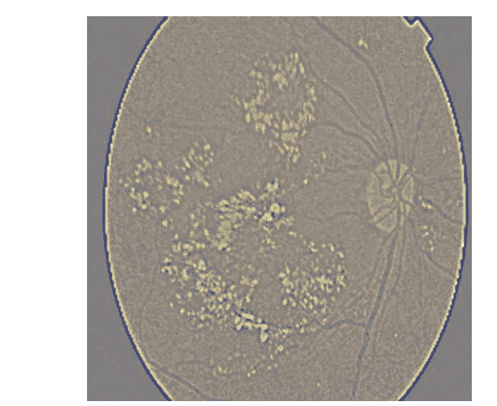

#### 6 结果

##### 6.1 结果的截图

图7和图8的描述：该图显示了研究的迭代次数和准确性之间的关系。准确性高度依赖于迭代次数。采用大量的迭代次数可能导致模型过拟合。我们在肺炎中选择了10个迭代次数，在糖尿病视网膜病变中选择了12个迭代次数。该图对于告诉我们模型中的过拟合非常重要。如果图中的蓝线和黄线不沿着同一方向走，那就是典型的过拟合例子。在我们的模型中，没有过拟合的问题，因为两条曲线都沿着同一条线。

Figs. 9, 10, 11和12的描述：结果表显示了在我们的网站上作为输入的各种图像。这些图像是肺部CT扫描和糖尿病视网膜病变的图像。

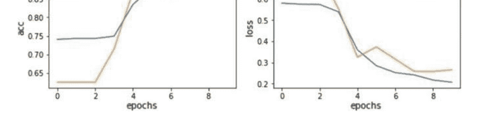

## 图7肺炎模型在不同时期的性能

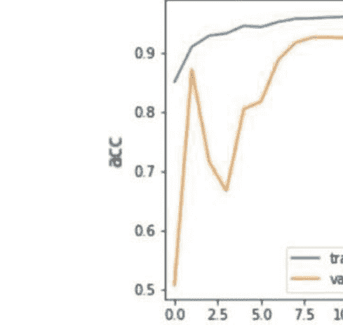

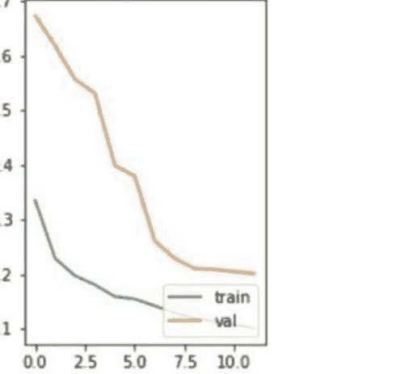

图8 糖尿病视网膜病变模型在不同时期的性能

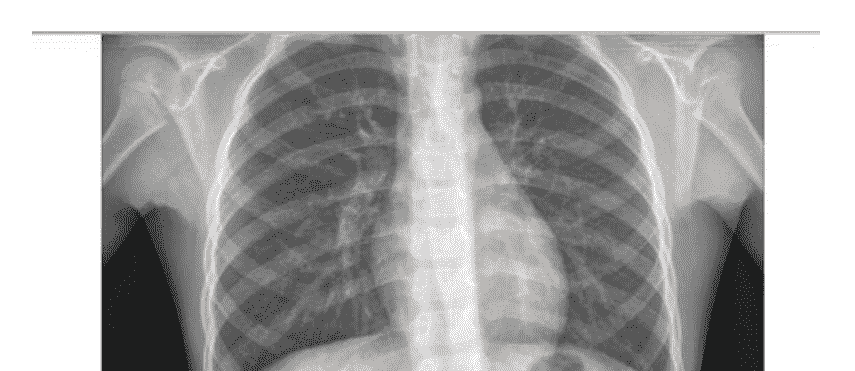

Uploaded Image.

Predict

# Result

0 0

Everything looks fine

图9 肺炎预测-患者没有肺部疾病

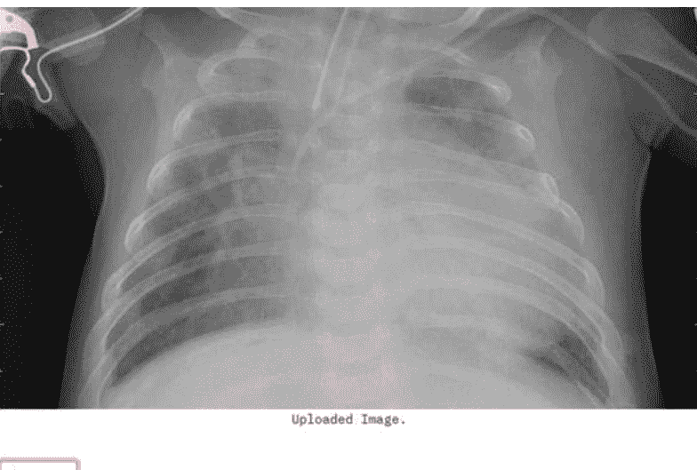

Uploaded Image.

Result

| 0 | 1 |
|---|---|
| 0 | 1 |

Patient Has Pneumonia

## 图10肺炎预测-患者有肺部疾病

## 结果表

准确率 = (TP + TN)/(TP + FP + TN + FN)

精确率 = (TP)/(TP + FP)

召回率 = (TP)/(TP + FN)

F1得分 = (2TP)/(2TP + FP + FN)

其中TP =真正阳性，TN =真正阴性，FP =假阳性，FN =假阴性。

得分之间的差异很大（超过20%）表明过拟合。这里不是这种情况。所有上述术语的平衡和高值使模型成为可靠的模型。

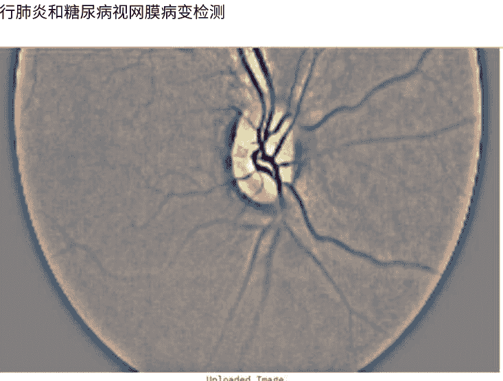

Uploaded Image.

Predict

# Result

0.0

Everything looks fine

图11 糖尿病视网膜病变检测-患者没有肺病

#### 7 结论

创建了一个基于深度学习的健康检测器，可以区分与健康相关的疾病，并相应地打印出全身报告。我们正在为患者准备一个包含两种疾病的完整网站。数据集包括5856个肺炎CT扫描和3660个糖尿病视网膜病变扫描图像。对于肺炎，我们得到了90.06%的准确率，87.61%的精确度，97.43%的召回率和92.45%的F1得分；另一方面，对于糖尿病视网膜病变，我们得到了92.88%的准确率，92.88%的精确度，91%的召回率和92.88%的F1得分。对于这两种疾病，我们使用卷积神经网络作为算法来预测疾病，因为这种算法在图像数据上效果最好。我们成功地预测一个人是否患有疾病，准确率足够高以依赖。这个框架将为许多患者节省时间、精力和金钱，并有效地向患者提供有关他们的健康状况的概念，特别是在整个医疗行业都承受巨大压力的covid时代，我们的研究旨在将医学领域与技术领域结合起来。

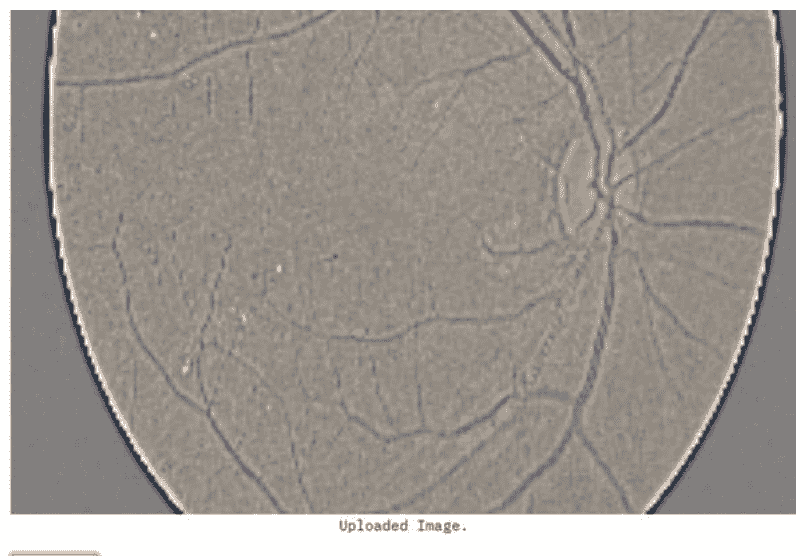

**Predict**

**Result**

1.0

> Patient Has Diabetic Retinopathy

## 图12 糖尿病视网膜病变检测-患者有肺病

| 疾病 | 总病例 | 总正确识别数 | 测试准确率(%) | 精确度(%) | 召回率(%) | F1得分(%) |
| :--- | :--- | :--- | :--- | :--- | :--- | :--- |
| 肺部 | 624 | 562 | 90.06 | 87.61 | 97.43 | 92.45 |
| 糖尿病视网膜病变 | 562 | 550 | 92.88 | 92.88 | 91 | 92.88 |

## 8未来展望

除了糖尿病视网膜病变和肺炎外，该框架还可以通过包括其他身体部位的不同疾病（如糖尿病、肾脏疾病、心脏疾病等）来改进，从而扩大系统的范围。此外，该系统的可移植性将使用户能够在其手机上使用，如Android或iOS应用程序。我们还可以使该系统在没有互联网连接的情况下可用，因此用户无需互联网访问即可从中受益。我们可以添加一个访客查询模块，访客可以在其中发布问题，医疗服务专家可以回答这些问题。

通过医疗服务专家。我们可以添加一个聊天机器人，在网站上为不严重的疾病（如感冒、咳嗽）推荐非处方药物。我们可以添加一个个人咨询模块，患者可以预约专家进行咨询，如果他们有这些疾病的风险。可以将基于OCR的模块引入框架中，该模块将扫描报告中的属性并保存手动输入信息的困难。

#### 参考文献

+   1. Bhatkar, A. P., & Dr. Kharat, G. U. (2015). “使用MLP分类器在视网膜图像中检测糖尿病视网膜病变”。 IEEE国际纳米电子和信息系统研讨会。
2. Chen, Q., Sun, X., Zang, N., Cao, Y., & Liu, B. (2019年11月19日). “通过大规模CNN特征在糖尿病视网膜图像上检测小病变”。 arXiv.
3. Tymchenok, B., Marchenko, P., & Spodarets, D. (2020年3月3日). “用于糖尿病视网膜病变检测的深度学习方法”。 arXiv.
4. 高, Z., 李, J., 郭, J., 陈, Y., 易, Z., 和钟, J. (2018年12月19日)。 “使用深度神经网络诊断糖尿病视网膜病变”。 IEEE Access。
5. Mishra, S., Hanchate, S., 和 Saquib, Z. (2020年)。 “使用深度学习检测糖尿病视网膜病变”。 智能计算、电气和电子技术国际会议。
6. Varshni, D., Thakral, K., Agarwal, L., Nijhawan, R., 和 Mittal, A. (2019年)。 “使用基于CNN的特征提取检测肺炎”。 IEEE探索。
7. Ibrahim, A. U., Ozsoz, M., Serte, S., Al Turjman, F., 和 Yakoi, P. S. (2021年1月4日)。 “COVID-19期间使用深度学习从胸部X射线图像进行肺炎分类”。 Springer。
8. Abiyev, R. H., & Ma'aitah, M. K. S. (2018). “深度卷积神经网络用于胸部疾病检测。” Hindawi医疗保健和工程杂志。
9. Al Mubarok, A. F., Dominique Jeffery A. M., & Thias, A. H. (2019). “使用深度卷积架构进行肺炎检测”。 IEEE。
10. Tilve, A., Nayak, S., Vernekar, S., Turi, D., Shetgonkar, P. R. & Aswale, S. (2020). “使用深度学习方法进行肺炎检测”。 国际信息技术和工程新趋势会议。
11. Yadav, J., Sharma, M., Saxena, V. (2017, August 10–12). “使用前馈神经网络进行糖尿病视网膜病变检测”。 国际当代计算会议(IC3)。 印度诺伊达。
12. Smys, S., Chen, J. I. Z., & Shakya, S. “具有深度学习的神经网络架构调查”。 软计算范式杂志(JSCP), 2.

# # 基于物联网的改进多模式蚁群优化(MM-ACO)算法设计用于实时应用

Mohammed Khalid Kaleem, Kassahun Azezew和Smegnew Asemie

摘要 本文实现了基于物联网的改进多模式蚁群优化(MM-ACO)算法设计，用于实时应用。多模式蚁群优化(MM-ACO)算法的主要目的是为了找到最优遍历路径的良好解决方案。在此过程中，首先初始化数据；然后加载地图并选择目的地。通过使用物联网，位置得到更新。

现在，多模式蚁群优化(MM-ACO)算法将使用获取的数据给出遍历路径。通过使用这些数据，计算交通强度。计算强度后，全局位置得到更新。使用Python设计整个系统。因此，可以观察到与蚁群优化(ACO)算法相比，该算法的准确性和效率较高。

关键词蚁群优化(ACO)·多模态蚁群优化(MM-ACO)·物联网(IOT)·智能交通系统·连接车辆·群体智能·蚁群优化·动态决策·分散管理

#### 1 引言

物联网(IoT)是一种计算理念，描述了常规实际物体与互联网相连的可能性，并提供了与其他设备通信的选项以识别自己的信息。简单来说，物联网是将实际世界与数字世界相连接的系统。物联网的应用非常广泛。这种理念可以应用于任何真实情况，可以收集数据，积累经验，并提出解决问题的建议。

物联网是一种涉及检测和处理信息以改进应用和服务的技术进步。当前的研究重点是将物联网数据传输、分析和存储到云平台[1]。然而，随着物联网设备的快速发展通常会产生大量信息，因此使用分布式和去中心化管理极具吸引力来提高物联网数据处理能力。

物联网 (IoT) 是一个集成和广泛使用新一代信息技术的系统。 它在当前社会和经济事实的基础上发挥着重要作用。 在物联网中，无线传感器网络发挥创新作用，能够快速建立和增强数据。 物联网将以非常快速和有效的方式进行数据处理 [2]。 因此，物联网系统将通过使用人工蜂群 (ABC)、SI-based 计算、蚁群优化 (ACO) 和粒子群优化 (PSO) 来解决强大属性、数据不足和计算能力有限的问题 [3]。

基本上，已经提出了物联网中SI的各种利用方式，例如关联车辆、信息导向和信息发展的分布式计算[4]。 本文介绍了基于SI的计算方法，重点是在物联网中应用SI的计算方法进行交通管理。 特别是，本文提出了一种新的模型，根据彼此之间的提供信息，车辆可以自动和自适应地找到最佳路径到目的地。

图1显示了基于先进车辆技术的交通系统概述，其中实际元素的连接可以用数字实体表示[5]。 可以通过互联网访问来连接车辆从车辆到基础设施（V2I）和车辆到车辆（V2V）以及车辆到基站（V2B）和车辆到传感器（V2S）[6]。

在这方面，本研究的目标是基于车辆的服务类型和交通方式。 管理依赖于自然启发的智能技术。 特别是，一种新颖的交通管理方法

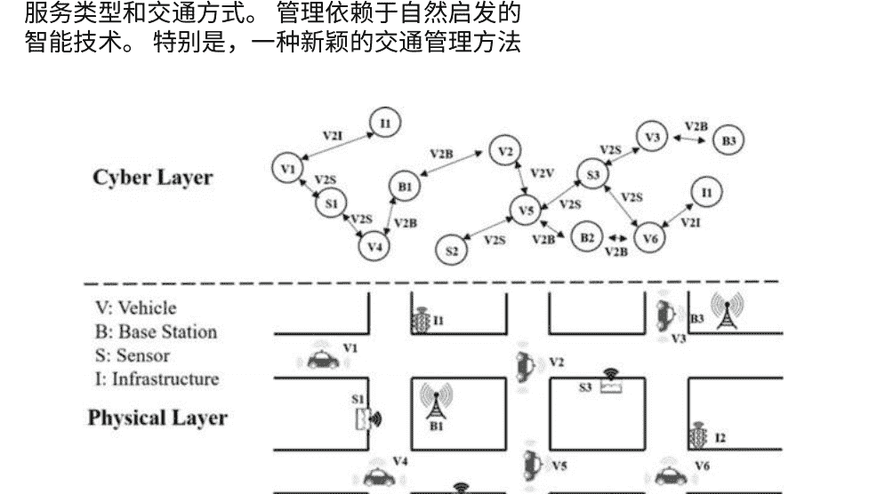

### 图1 智能交通的网络物理架构概述

利用ACO和SI算法的思想，使得连接车辆能够为通过特定区域做出个体决策。

在互联网迅速发展且用户对不同互联网服务的需求将大幅增长的背景下，在互联网规模、应用和规模经济的刺激下，分布式计算和新的计算模型应运而生。通过互联网，分布式计算将大量分散的数据收集到服务器中，然后分布式计算服务提供商提供计算、访问、软件和其他服务。

在服务器中有效地分配和调度大量数据对分布式计算环境的性能和供应商的实际经济利益产生重大影响。研究表明，分布式计算中使用的各种算法可以快速完成大数据操作，并获得解决这些算法的大数据的最佳解决方案，这些算法存在单一、波动和容易陷入局部最优解的问题。

为了推进当前情况，本文从两个角度提出了观点。关于分布式计算的快速处理，它利用MapReduce策略来实现大数据的快速分析。关于对大数据的基准理解，本文利用粒子群优化来改进算法，从而使大数据获得全局最优解。

随着智能交通系统中通信和控制创新的发展，制造商和研究人员开始考虑如何使车辆能够“思考”、运行并共享数据，以寻找解决方案。

因此，SI成为一种有前途的方法，其中车辆可以作为一个集体群体来行动。

在SI的方法中，蚁群算法已经成为解决最短路径问题的一种方法。基本上，ACO是一类优化算法，它模拟了不同的行为。特别是，通过描述现象，它们将相互交流，以在探索当前情况时找到资源。受真实资源行为的启发，在软件工程中，提出了虚拟蚂蚁来记录它们的位置和解决方案的质量。

通过减少计算问题，特别是在复杂框架中，可以找到有希望的方法。在智能交通系统中，利用蚁群优化(ACO)来解决车辆问题，并从系统中获取问题。在当前的交通流中，基于车辆的进展进行记录。然而，主要利用了两种类型的车辆，即车对车(V2V)和车对基础设施(V2I)。这将确定车辆通信的进展。为了改善交通流，基于粒子群优化(PSO)使用ACO。这将增强分散式框架的运作。因此，它将动态有效地调整交通流。

#### 2 现有系统

群体智能(SI)是由物联网系统中的分散式管理支持的复杂术语。边缘人工智能的平等进展使得基于编程的人工智能进入实际世界，在系统级别为相关对象提供实时增强和计算智能。在这方面，边缘分析用于分散式管理成为物联网中的新兴研究趋势。然而，物联网系统是复杂且动态的环境，需要分散式控制。群体智能是计划大量个体技术元素进行合作的重要概念。这是IT领域的一个重要概念，在现代技术发展的过程中非常有用和有趣，但也有一定的威胁性。

以这种方式，在物联网中使用基于SI的计算可以提高信息处理的效率和时间利用率。特别是，利用SI-based计算所获得的智能应用，如连接车辆和智能能源。具体而言，获取大量的物联网数据并改善物联网数据处理可以提高物联网应用和服务的用户体验。

智能交通系统中的连接车辆，最近，车辆技术的进步将使车辆能够与内外环境中的其他车辆（例如，V2V和V2I）进行通信和协作。这个概念被认为是交通状况改善的关键因素。最近的研究集中在连接车辆的概念上，以提供智能交通服务的各种应用。

图2描述了当连接车辆穿越给定区域时的交互过程。基本上，当车辆进入该区域时，它们将加载地图以获取通过该区域的数据。特别是，地图被分成不同的路径

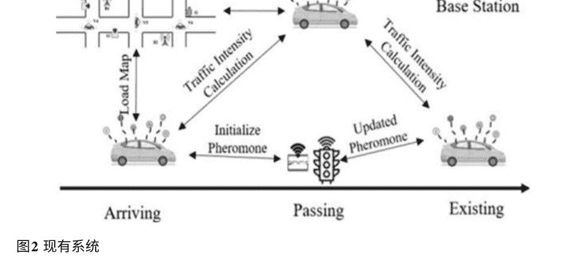

#### 3 提出的算法

图3显示了提出的算法。 在此，首先初始化数据；然后加载地图并选择目的地。 通过使用物联网，位置得到更新。 在应用算法中，多模态增强处理涉及到发现问题的所有或大部分不同解决方案，而不是单一最佳解决方案。 在多模态蚁群优化算法中，一些蚂蚁状态参与寻找优化问题的好解决方案。

在某些时间步骤中，群体交换关于好解决方案的信息。 如果交换的数据量不太大，那么MM-ACO算法可以通过在多个处理器上设置群体来轻松并行化。

因此，多模态蚁群优化（MM-ACO）算法将使用获取的数据给出横向路径。 通过使用这些数据，计算交通强度。 计算强度后，全局更新位置。

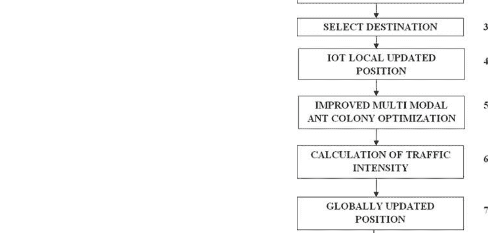

- (1) 当车辆进入特定领域时，它将引导数据并存储在基于V2I通信的分区信息结构中。然后，目标由驾驶员控制以移动并提供与消息附近的其他车辆节点（邻近更新）（图3中的步骤1、2、3、4和5）。
- (2) 当车辆通过交叉点（例如，十字路口）时（图3中的步骤6），它向其他车辆发送需求消息以计算基于V2V通信的交通力（图3中的步骤7）。
- (3) 对于在这次考试中选择目的地，我们期望相关车辆根据有效性计算的最佳估计来做出选择（图3中的第6步）。
- (4) 交互重复直到相关车辆到达目标（图3中的第7步）。具体而言，算法2显示了在每个部门中选择相关车辆的大致草图。当车辆离开区域时，它将发送全局更新消息以更新基于V2I通信的现象。

为了评估所提出方法的可行性，它确定了通过特定区域的车辆。关于问题Q3，我们考虑了三种运输管理系统的情况：

- 单个交叉口：涉及多条道路的情况使得车辆能够在给定的交叉口节点上做出移动的决策。
- 多车道交叉口：这种情况下，以各种方式发送的情况，强调了通过向车辆提供数据来实现连续信息处理的优势。
- 多个交叉口：具有多个交叉口中心的情况下，根据道路组织的庞大规模，展示了我们的方法论。

图4显示了ACO和MM-ACO的准确性比较。与ACO相比，MM-ACO能够以非常有效的方式提高系统的准确性。

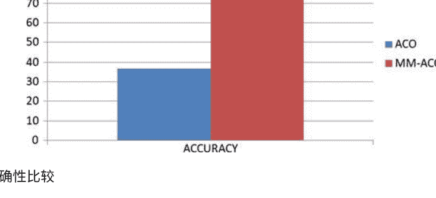

通过采用五个多智能体样本，提高了准确性。每个多智能体都以非常有效的方式执行其操作。

图5显示了ACO和MM-ACO的能量消耗比较。与ACO相比，MM-ACO能够以非常有效的方式减少系统的能量消耗。

图6显示了ACO和MM-ACO的网络寿命比较。与ACO相比，MM-ACO能够以非常有效的方式增加系统的寿命。

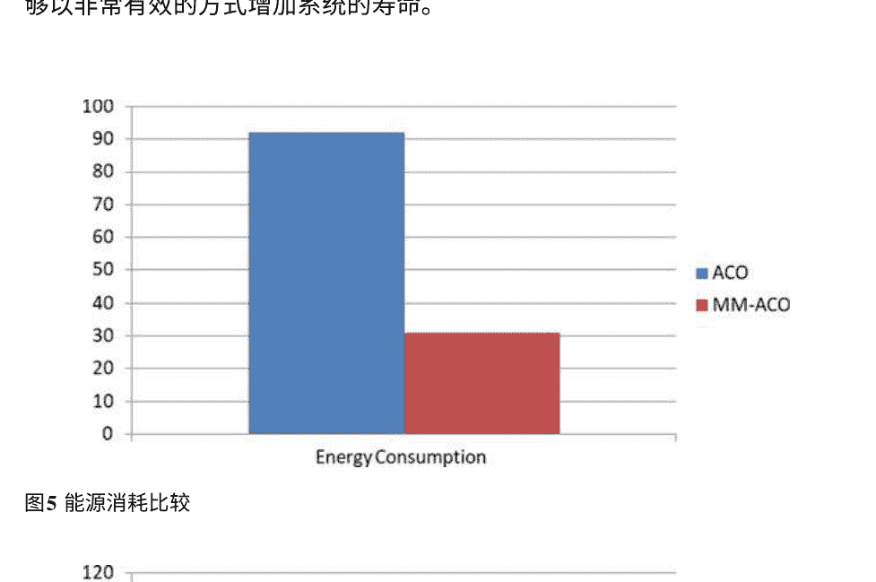

图5 能源消耗比较

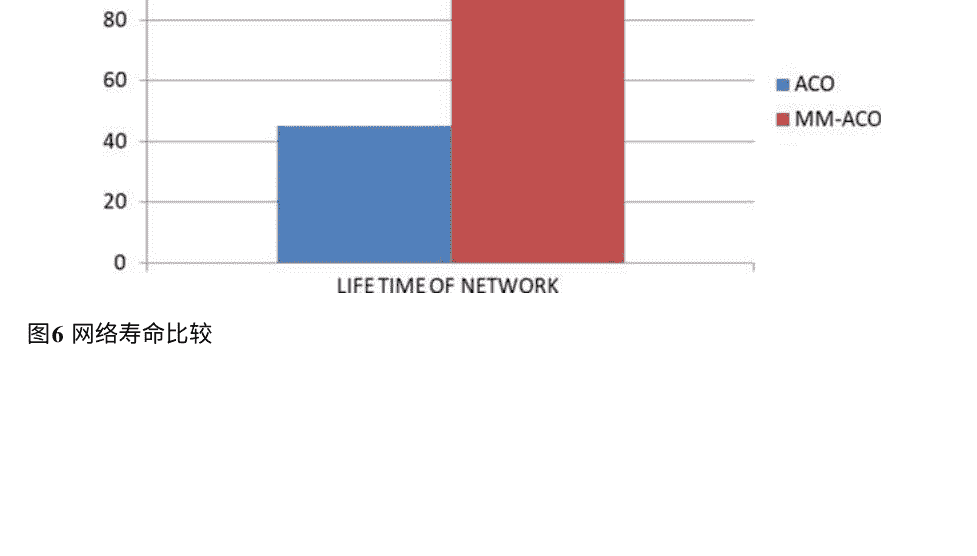

图6 网络寿命比较

#### 4 结论

因此，在本文中，实现了基于物联网的改进多模式蚁群优化（MM-ACO）算法的实时应用设计。从结果中观察到ACO和MM-ACO的准确性、效率和网络寿命。可以得出结论，MM-ACO在实时应用中为系统提供了良好的解决方案。

#### 参考文献

1.  He, W., Yan, G., & Xu, L. D. (2014, May). 在物联网环境中开发车载数据云服务*IEEE工业信息学报*, 10(2):1587–1595.
2.  Tsai, C.-W., Lai, C.-F., & Vasilakos, A. V. (2014, November). 未来物联网：开放问题和挑战 *无线网络*, 20(8):2201–2217.
3.  Zedadra, O., Guerrieri, A., Jouandeau, N., Spezzano, G., Seridi, H., & Fortino, G. (2018). 基于群体智能的算法在物联网系统中的应用:一项综述。*并行与分布式计算杂志.*, 122, 173–187.
4.  方春, 杨., 上光, 王., 静林, 李., 志涵, 李., & 祺波, 史. (2014年11月). 互联网车辆概述。*中国通信*, 11(10):1–15.
5.  Maglaras, L. A., Al-Bayatti, A. H., He, Y., Wagner, I., & Janicke, H. (2016年2月). 智能城市的社交互联网车辆。*传感器和执行器网络杂志.* 5(1):3.
6.  卢, N., 程, N., 张, N., 沈, X., 马克, J. W. (2014年5月) 。连接车辆：解决方案和挑战。*IEEE物联网杂志*, 1（4）：289-299。
7.  阿布尔, B. （2020年）。基于传感器云的架构，用于物联网应用的高效数据计算和安全实施。*ISMAC杂志*, 2（02）, 96-105。
8.  Middendorf, M., Reischle, F., Schmeck, H. （2002年）。多种群蚁算法。*启发式杂志*, 8, 305-320. https://doi.org/10.1023/A:1015057701750

### 使用自然语言处理的访谈转录员

G. R. Deeba Lakshmi，Jayavrinda Vrindavanam，Anshika Shukla和Rahul

摘要在COVID 19的挑战时期，尤其是在教育领域和像研讨会这样的广泛互动平台上，观察到了学习和互动过程的重大转变。在线媒体已经成为当今的主流。在这种情况下，本文探讨了各种机构在进行面试过程或在线或电话交流时面临的新挑战。在评估候选人时，招聘人员可能会错过某些要点，有时候面试的细节会在沟通中丢失，面试官也可能无法在以后的某个时间点回忆起特定面试者的细节。这些都是最终会降低面试过程效果的挑战。我们正在开发一个平台，从候选人在过程中接收到的数据中提取被面试者传递的所有重要信息。本文利用自然语言处理（NLP）从交互中提取关键信息，通过提取某些特征或重要关键点，利用语言依赖性制定适当的算法。本文还讨论了面试的结果，即根据候选人的答案以及与公司提供的数据的相似程度来确定候选人是否被选中，这清楚地表明了他们在雇员中寻找什么。

关键词自然语言处理（NLP）·词袋（Bow）·词频（TF）·逆词频（IT F）·词性（POS）标签·依赖关系·Word2Vec·计算机视觉（CV）

G. R. Deeba Lakshmi (✉) · J. Vrindavanam
ECE系，Nitte Meenakshi Institute of Technology，班加罗尔，印度
e-mail: deebalakshmi.gr@nmit.ac.in

J. Vrindavanam
e-mail: jayavrinda.v@nmit.ac.in

A. Shukla · Rahul
ECE系，Nitte Meenakshi Institute of Technology，班加罗尔，印度

#### 1 引言

尽管自然语言处理（NLP）领域的研究可以追溯到上世纪50年代的第一次图灵测试，但我们观察到直到最近才受到关注。到了20世纪80年代末，随着新的机器学习算法的引入、更强大的计算能力以及对各种语言学理论的依赖减少，自然语言处理发生了革命。在本文中，我们重点关注从文本数据中提取重要特征，这是NLP研究的一个重要领域。早期处理面试记录的方法是手动的，一个人必须坐下来听面试并把一切都写下来，确保没有遗漏。随着NLP的进步，我们现在能够更高效地进行这个过程。本文可以被视为朝着任务特定和详细的信息提取方法迈出的第一步，然后进行进一步的分析，最终得出结果。NLP的第一步是理解各种词性[1]。英语中有8种不同的词性：名词、代词、动词、形容词、副词、介词、连词和感叹词。词性决定了一个特定词在给句子赋予意义方面的作用，例如；以单词“address”为例。在句子“You shall address the teachers”中，address被用作动词。而在句子“What is your address?”中，它被用作名词。为了更好地理解，可以举一个例子，单词“notice”。在句子“Did you notice that car?”中，notice被用作动词，而在句子“The notice is put up on the bulletin word”中，notice被用作名词。这表明一个词的词性标签在理解句子的意义时是重要的，因为在提取句子之前，理解句子是转录员必须执行的关键工作。我们需要记住的另一个方面是，就词性标签而言，它们本身不足以帮助听者理解句子的意义。此外，为了分析候选人是否适合公司，我们使用了自然语言工具包（NLTK）进行文本相似度比较，这有助于比较候选人的思维方式是否与公司相匹配。经过适当的评估，决定是否选择他或她。在这个过程中，值得注意的是，我们使用的数据集是由我们开发的，其中包括对候选人提出的问题和候选人的答案，同时我们还包括了一个预定义的公司数据集，其中包含了公司对候选人提出的问题的可接受答案。对于我们的小规模研究和有限的数据，这个方法效果很好。

#### 2 文献综述

我们开始研究时查找了关于转录员的想法和信息。从事实出发，最初对于信息的转录是手动完成的，而在一些地方仍然如此，这导致了创建一个转录员可以提取出关键信息。 借助文本相似性，我们甚至可以预测访谈的结果，预测候选人是否被拒绝或被选中。 在进一步研究本文的语言领域时，我们发现了斯坦福的类型依赖手册[1]，该手册旨在提供句子中的语法关系的简单描述。 这给了我们一个关于在处理自然语言时需要记住的语法技术的广泛概念。 通过阅读Zang [2]和Bafna和团队[3]的作品，我们了解了诸如词袋（BoW）和词频与逆文档频率（TF-IDF）之类的词嵌入技术。他们使用算术方程来制定某些词的出现和重要性。 他们还解释了当我们进行文本相似性等任务时，这些值如何影响，如果这些出现没有调整，我们可能会得到错误的值。Mikolov [4]的论文展示了当我们创建词向量并通过单词提取信息时，词向量是一种高效的方法，但它也具有上下文的正确性，而TF-IDF或BoW中则没有。为了对有效数据集进行实现的理解，我们从Kaggel [5]获取了一般辩论数据集。

当涉及到设置两个单词序列之间的相似性时，另一个起重要作用的因素是维度，Bengio的论文涉及了这个因素，因为测试单词序列肯定与训练单词序列不同，因此通过学习单词的分布表示来对抗这一点，这种表示可以告诉我们有多少语义上相似的句子存在[6]。Parida的论文关于关键词提取帮助我们更好地理解了这个问题，在论文中详细介绍了各种关键词提取技术[7]。Sara-vana Kumar的论文让我们了解了在人工智能（AI）环境中如何进行决策[8]。Ghahramani得出结论，通过精选的基本加权方法生成的权重的适当聚合可以改善与用户需求相关的相关文档的检索[9]。Siva的论文中提出的提取模块探索了网页类的隐含结构，以高效地提取信息，并有助于进一步理解信息提取[10]。Chiu的论文讨论了共言语手势在面对面对话中的重要性，考虑到话语的概念内容、语音信号的物理特性和手势本身的物理特性[11]。

#### 3 提出的系统方法论

所提出的系统包括在图1中显示的阶段。 作为第一步，系统被输入我们候选人的数据。 在这些数据上，我们进行了信息提取。 提取后，我们对公司数据进行了文本相似度分析。 然后，我们得到了候选人和公司面试数据之间计算的相似度的数值。 我们将我们的值（以%表示）与公司设定的阈值进行比较。

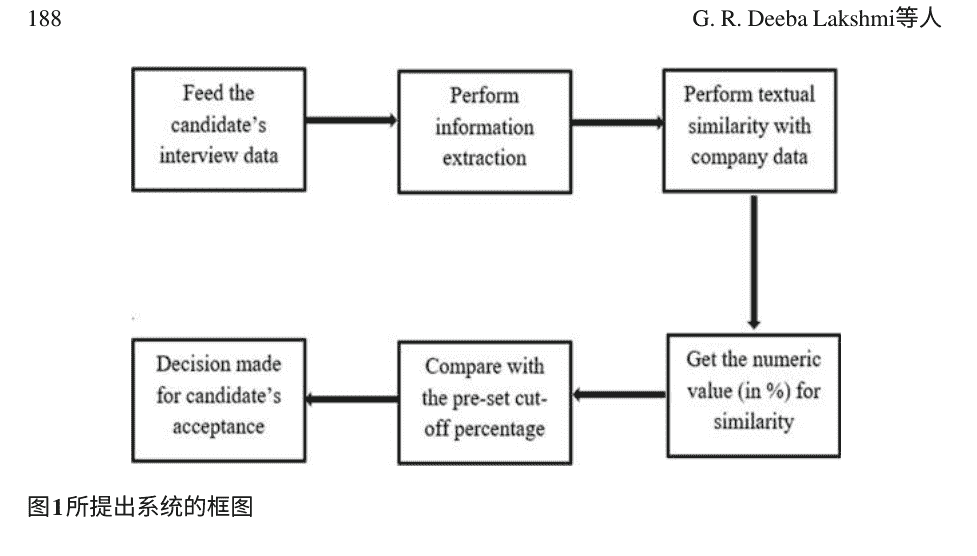

### 图1 所提出系统的框图

与公司设定的阈值百分比进行比较。最后，决定是否选择候选人。这就是模型的整体工作，并为我们提供所需的结果。

#### 4 信息提取

对我们来说重要的信息可能对其他人来说并不重要，在这个无尽的文本数据和信息时代，获取这种选择性信息可能是繁琐和耗时的。因此，能够根据我们的意图获取所需的信息属于信息提取范畴。在这个阶段，理解单词、实体和句子意义之间的具体关系是重要的。我们认为，从长篇详细的文本数据集中自动提取信息的方式非常有益[12]。信息提取的流程图如图2所示，以便更好地理解。

##### 4.1 提取信息的方法

###### 基于关键词的信息提取

当我们提取信息时，我们首先应用简单的规则，类似于关键词。例如，在一个包含100位政治家演讲的数据集中，我们只想提取总统的演讲，我们使用关键词“总统”来获取我们想要的信息。在本文中，我们使用这种方法来提取简单的信息，例如候选人的姓名或资格，借助我们开发的各种POS模式形成[1]。

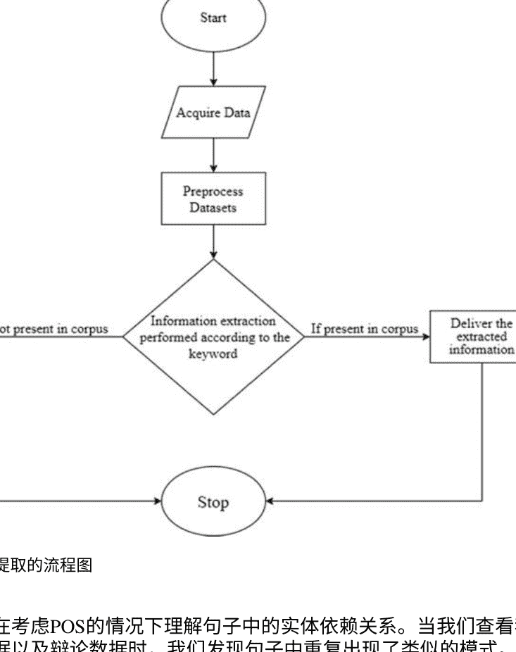

### 图2 信息提取的流程图

目标是在考虑POS的情况下理解句子中的实体依赖关系。当我们查看我们创建的数据以及辩论数据时，我们发现句子中重复出现了类似的模式。

例如，最常见的模式是[noun-auxiliary-proper noun], [noun-preposition-noun], [verb-preposition-proper noun], [noun-verb-noun]等等。这些模式帮助我们提取姓名、以前的职业、专业知识等信息。例如，让我们看一下下面的句子：

我的名字是塔尼娅，我有一个艺术学位。之前，我在Facebook工作，担任内容创作团队的经理。

- 名字（名词）+是（助动词）+塔尼娅（专有名词）
- 学位（名词）+在（介词）+艺术（专有名词）
- 工作（动词）+与（介词）+Facebook（专有名词）
- 角色（名词）+是（动词）+经理（名词）

通过观察上述方法，我们能够从我们的数据集中提取出划线部分的句子片段。

###### 基于相似词汇池的信息提取

我们有时会注意到一些意思几乎相同的相似词汇在句子中被用来传达相同的意思。在这个提取过程中，我们所做的是将相似的词汇分组，并通过它运行我们的数据集，以提取所有包含这些词汇并可能有用的句子。例如，在一次工作面试中，当被问及候选人的优势时，我们可能会寻找像“优势”、“强大”、“强大”、“熟练”、“强项”等词汇。[7]。

正如我们在图2中所看到的，我们获得了所需的候选数据集。我们对数据集进行预处理，使其在我们进一步探索和提取信息的同时变得有用。根据POS模式中存在的关键词进行信息提取[1]。如果我们用于提取信息的关键词在语料库中存在，我们将得到我们所需的内容。否则，该过程将停止。这个过程可以重复多次，以提取全部信息。

#### 5 文本相似性

当两段文本非常接近时，我们称这些文本显示出相似之处。这种相似性分为两类，词汇相似性和语义相似性[10]。词汇相似性有时被称为表面接近，这意味着它不考虑输入的单词的实际含义，只关注单词的相似性。例如，句子一：“公园里有一个漂亮的秋千”，句子二：“公园里的树很漂亮。”这些句子中有3个重叠的单词。对于含义或上下文没有给予太多关注。由于仅仅考虑单词之间的相似性是不够的，我们还必须寻找上下文相似性，以捕捉更多的语义。在计算相似性之前，我们将文本分成一组相关的词语。如果我们再次考虑上面的例子，我们可以观察到即使单词重叠，两个句子的含义完全不同。

##### 5.1 文本预处理方法

在将文本数据集输入到机器学习算法之前，需要对文本进行预处理，以通过过滤掉冗余和无用的数据来加速处理。

###### 词袋模型（BoW）

词袋模型是一种词嵌入方法，通常被描述为从文本中提取特征并在各种模型中使用它们以向量格式表示，使用不同的机器学习算法[2]。

例如，让我们来看两个句子：

**表1 词袋向量表**

| 示例号 | 这个 | 水 | In | 这个 | 是 | 非常 | 清洁 | 出现 | 至 | 是 | 蓝色 | L |
| :--- | :--- | :--- | :--- | :--- | :--- | :--- | :--- | :--- | :--- | :--- | :--- | :--- |
| 1 | 1 | 1 | 1 | 1 | 1 | 1 | 1 | 1 | 0 | 0 | 0 | 8 |
| 2 | 1 | 1 | 0 | 0 | 0 | 0 | 0 | 0 | 1 | 1 | 1 | 6 |

L: 句子长度
句子1的向量: [1 1 1 1 1 1 1 1 0 0 0 0]
句子2的向量: [1 1 0 0 0 0 0 0 1 1 1 1]

1. 河流中流动的水非常清洁。
2. 水看起来非常蓝。

正如我们在这里所看到的，我们已经成功地将单词表示为一串数字（词袋模型）。随着新单词的添加，向量的大小增加，因此向量的长度也增加，这是词袋模型的一个缺点之一。

###### 词频-逆文档频率 (TF-IDF)

###### 词频

词频简单地定义为某个词在文档中出现的次数[3]。

由以下公式给出：

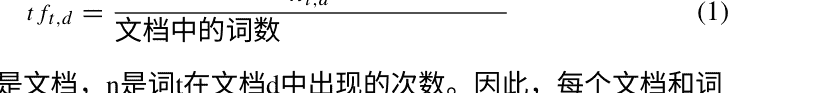

其中，t是词，d是文档，n是词t在文档d中出现的次数。因此，每个文档和词都有自己的词频值。

###### 逆文档频率 (IDF)

逆文档频率简单地衡量了一个词的重要性[3]。

由以下公式给出：


###### TF-IDF得分

现在我们可以计算TF-IDF得分，因为我们已经分别有了TF和IDF的表达式。得分较高的单词与得分较低的单词相比更重要[3]。

由以下公式给出：

从图3中我们可以观察到，我们首先导入所需的库来执行文本相似性任务。我们使用BoW和TF-IDF对数据集进行预处理，以使其在进一步的探索和提取信息时有用。在预处理的数据集上执行相似性查询操作。

相似性百分比作为输出结果。我们取平均值并检查平均值是否大于或小于公司设定的预定义平均值（根据需要可能会有所变化）。如果大于，则选择该候选人；否则，拒绝该候选人。

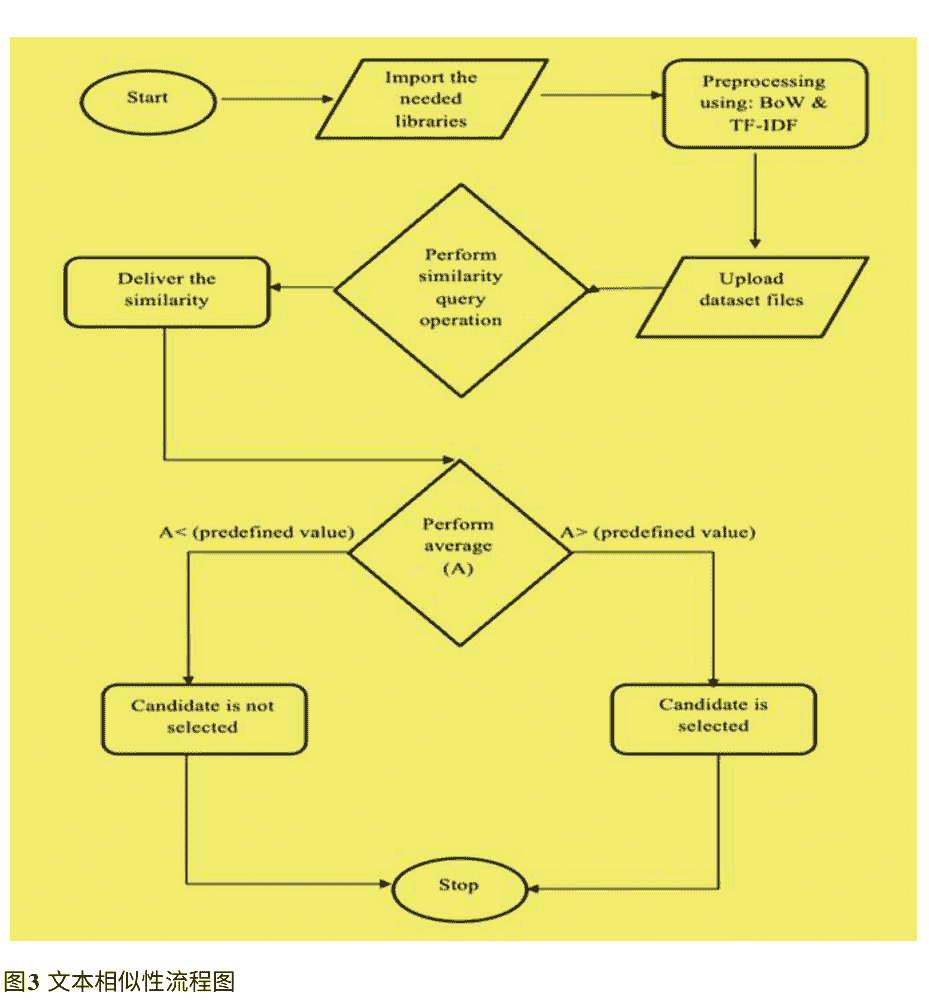

## 图3 文本相似性流程图

## # 6 观察结果

通过这些信息提取技术，我们能够提取所需的具体信息。我们采用了两种不同的方法进行提取，并获得了所需的信息。

### ## 6.1 使用关键词提取信息

在图4中，我们使用了关键词“分支”，因此我们的程序扫描了整个语料库，并提出了具体的信息。

### ## 6.2 基于相似词池提取信息

在这里，我们有一个相似的词池，可以帮助我们提取候选人“力量”的信息。

现在我们转向文本相似性部分。

图4 提取的信息

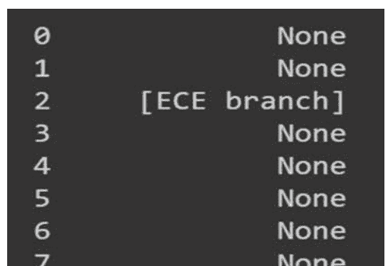

图5 使用相似词池提取的信息

```python
patterns = [r'\b(?i)'+'strength'+r'\b',
            r'\b(?i)'+'strong'+r'\b',
            r'\b(?i)'+'proficient'+r'\b',
            r'\b(?i)'+'proficiency'+r'\b',
            r'\b(?i)'+'initiative'+r'\b',
            r'\b(?i)'+'strong suit'+r'\b']
```

```
My biggest strength is that I’m very efficient at working under pressure.
/usr/local/lib/python3.6/dist-packages/ipykernel_launcher.py:15: Deprecat
```

图6 通过识别语料库中的相似词提取的语句

```
Comparing Result: [0. 0. 0. 0.28425822 0.15472819 0.
0. 0. 0. 0. 0.09047642 0.
0.07758568 0.13158745 0. 0.12629557 0. 0.
0.14580935 0. 0.059579 0.06972386 0. 0.11301239
0. 0.08406068 0. 0. 0.09386118 0.
0. 0. 0.09328903 0.2255122 0. 0.12547147
0.04596384 0. 0.14047825 0. 0.16216022 0.
0. 0. 0.2092411 0. 0.16536853 0.
0.06566749 0. 0. 0. 0.10913052 0.
0. 0.04335916 0.11595044 0.11102612 0.04414285 0.
1. ]
```

图7 相似性概率

```
Average similarity float: 0.46473807096481323
Average similarity percentage: 46.47380709648132
Average similarity rounded percentage: 46
```

图8 计算的平均值

我们能够找到查询文档（即候选人数据集）和语料库（即公司数据集）之间的相似性，如图6所示。我们通过计算平均相似性来决定是否选择候选人，如图7和图8所示。

最后，我们通过设定一个阈值来做出最终判断，低于该阈值的候选人将被公司拒绝。为了结果的目的，我们将60%作为阈值，根据需要可以有所变化[8]。

因此，最终的输出如下图9所示。

下表列出了最终评估结果和我们两组数据集的比较分析。

类似地，我们对另一个数据集（数据集2）执行了相同的操作。

图9最终结果

```
Candidate got rejected
```

## 表2 评估过程的最终结果

| 使用的技术 | 数据集 | 结果 | 候选人的状态 |
|------------|--------|------|--------------|
| 词袋模型和TF-IDF | 数据集1 | 46% | 被拒绝 |
| 词袋模型和TF-IDF | 数据集2 | 67% | 被选中 |
| Word2Vec | 数据集1和2 | 不一致 | NA |

## # 7 词嵌入用于未来更深入的方法，如Word2Vec

词嵌入是文本的表示形式，如果两个词具有相似的含义，则它们的表示形式也可能相似。每个单词在预定义的向量空间中用实值向量表示。例如，“姐姐”和“兄弟”这两个词的含义相似，只是性别不同，所以它们的词嵌入也会相似[4]。

### ## 7.1 Word2Vec

这是Google于2013年开发的一种先进的词嵌入技术。这是一种从文本语料库中高效学习独立词嵌入的有效方法。它使得基于神经网络的嵌入训练更加高效，并被认为是开发预训练词嵌入模型的标准。在2013年的word2vec论文中，他们提出了两种word2vec方法，都涉及神经网络，CBOW和Skip Gram模型[4]。

### ### 常见词袋（CBOW）

在这个模型中，我们试图通过周围的单词（上下文单词）来预测目标单词。在神经网络中，我们将上下文单词作为输入，可以在两个或更多单词的窗口中进行配对，输出中得到我们所需的目标单词的预测[4]。

例子：句子：“我喜欢做晚餐的披萨”在这里，“披萨”是目标单词，“做”，“晚餐”是上下文单词，窗口大小为2。

###### 跳字模型

这与CBOW的工作方式恰好相反，这里我们将目标单词作为输入，输出我们的上下文单词，并在输出层应用SoftMax[4]。

#### 8 结论和未来展望

发表的论文中介绍的方法被发现能够增进我们对自然语言处理的理解。该论文引入了一种创新的方法，具有进一步改进的潜力。本文采用的方法能够成功地从我们使用POS依赖方法创建的数据集中提取信息，并借助于诸如BoW和TF-IDF等各种词嵌入技术，我们能够比较这两个数据集中存在的相似性。

此外，通过一个小型的Python程序，我们只需计算出平均百分比，就能判断候选人是否被选中。

自然语言处理和引入的方法还为进一步研究打开了重要领域。在这项研究中，我们无法找到适用于我们任务的公共数据集，这促使我们创建自己的数据集来测试我们的技术，而这些技术在其容量方面表现良好。拥有更大规模和更多样化的数据集将有助于进一步改进这种技术。另一方面，像word2vec、Glove等算法需要大量结构化数据才能正常工作并显示出期望的结果，我们尝试改进它们以获得更好的结果，但最终得到了不一致且极不可靠的输出。因此，未来我们希望进一步利用数据集，并通过对上述算法和技术进行模型训练，为此提供无缝的解决方案。

借助CV（计算机视觉）和先进的机器学习，我们可以进一步添加交互功能，如面部特征和手势捕捉[11]，这将告诉我们候选人的态度和行为模式。总之，我们能够实现一个小规模版本的大局，这为我们在不久的将来深入研究并进一步完善提供了机会。

#### 参考文献

- 1. 斯坦福依赖手册 https://nlp.stanford.edu/links/statnlp.html
- 2. 张，Y.，金，R.，周，Z. H. (2010)。理解词袋模型：一个统计框架。国际机械学习与网络。1，43-52。
- 3. Bafna, P., Pramod, D., Vaidya, A. (2016)。文档聚类：TF-IDF方法。电气、电子和优化技术国际会议（ICEEOT），（pp. 61-66）。ICEEOT。
- 4. Mikolov, T., Yih, W., & Zweig, G. (2013). 连续空间词语的语言规律性表示。在：NAACL-HLT: 北美计算语言学协会会议：人类语言技术，(pp. 746–751)。
- 5. 联合国大会辩论 www.kaggel.com
- 6. Bengio, Y., Ducharme, R., Vincent, P., & Jauvin, C. (2003). 一种神经概率语言模型。机器学习研究杂志, 3, 1137–1155。
- 7. Parida, U., Nayak, M., & Nayak, A. K. (2021). 从文本文档中了解不同的关键词提取技术。在: D. Mishra, R. Buyya, P. Mohapatra, & S. Patnaik (Eds.)智能和云计算，(Vol. 194)。智能创新、系统和技术。Springer, 新加坡。
- 8. Saravana Kumar, N. M. (2019). 在教育中实施人工智能并评估学生表现。人工智能杂志, 1(1), 1–9.
- 9. Ghahramani, F., Tahayori, H., & Visconti, A. (2021). 中心趋势测量对文本信息检索中的词项加权的影响。软计算, 25, 7341–7378.
- 10. de Morais Sampaio Silva, T., de Freitas, F. L. G., Cobra Teske, R., & Bittencourt, G. (2004). 从分类和信息提取中生成语义信息。在: N. Koch, P. Fraternali, & M. Wirsing (Eds.)Web engineering. ICWE 2004. 计算机科学讲义科学, (Vol. 3140). Springer, Berlin, Heidelberg.
- 11. Chiu, C. C., Morency, L. P., & Marsella, S. (2015). 预测共言手势：一种深度和时间建模方法。在: W. P. Brinkman, J. Broekens和D. Heylen (Eds.) 智能虚拟代理。IVA 2015。计算机科学讲义， (Vol. 9238)。Springer, Cham.
- 12. Taran, M. O., Revunkov, G. I., & Gapanyuk, Y. E. (2020). 混合智能信息系统的文本片段提取模块，用于仲裁法院司法实践分析。在: B. Kryzhanovsky, W. Dunin-Barkowski, V. Redko和Y. Tiumentsev (Eds.) 神经计算，机器学习和认知研究进展IV， (Vol. 925)。NEUROINFORMATICS 2020. 计算智能研究. Springer, Cham.

## # 源代码和文本的抄袭检测

Syed Yasmeen, Munjuluri Prathyusha, Malisetty Rajeswari, Padmanabhuni Srujana和K. Ashesh

摘要 一切都在线上。我们生活在互联网时代。它已经成为我们生活中不可或缺的重要组成部分，我们无法想象没有它的生活。我们使用互联网进行各种不同的需求，从发送消息、打电话、分享图片到在线获取技能。它作为信息来源、娱乐方式，并且使在线购物变得容易。它使我们的生活变得非常方便。但是人们现在倾向于在互联网上花费越来越多的时间而不做任何实际工作。而且它还节省了我们的时间。此外，互联网上提供了每一个大大小小的细节。在这个互联网时代，人们倾向于使用简单的方法来完成他们的工作、任务、项目、演讲、展示，而不是自己付出努力。技术从信件发展到邮件，从书籍发展到PDF，从黑板发展到屏幕。

由于一切都在线上，盗窃或复制他人的作品的可能性很高，这被称为抄袭。抄袭是复制他人的作品或想法的做法。抄袭在在线上已经广泛传播。这是由于懒惰、最后一分钟的恐慌、渴望获得好成绩、害怕失败、缺乏自信造成的。抄袭在计算机语言编码程序、项目和文档/研究论文中很流行。抄袭是有或没有知情的情况下进行的。有时候当你把别人的想法改述为自己的时候，很难检查你是否在抄袭。抄袭不允许个人发展写作技巧，也不能达到作业的目的。抄袭阻止你塑造自己对一个主题的想法和观点。

关键词 数据导入 · Flask · Nltk · 余弦相似度 · Ngrams · Lcs · 百分比计算 · 抄袭检测 · Html · Css


#### 1 引言

在在线领域中，抄袭检测非常有用。由于一切都围绕在线文本、文档等展开，复制他人的工作的可能性很高。在在线环境中，盗窃或复制他人的工作非常容易。很多人倾向于复制/盗窃。如果每个人都继续盗窃工作而不是自己动手，原始工作/内容将毫无价值。因此，有必要确定哪些是原创作品，哪些是复制品。由于大量的文件和数据，以及不同类型的盗窃工作无法以一般的检测方式找到，手动识别原创作品和复制品非常困难。

抄袭是指盗用或复制他人的作品，并将其冠以自己的名义。可以有或没有知情。抄袭是通过完全或部分盗用作品来实现的。有各种各样的抄袭行为。一般来说，有四种抄袭行为，即：

- 1. 直接抄袭：当你故意逐字逐句地复制而没有做任何改动、引用或引述时，就属于这种抄袭行为。这种抄袭的最常见例子是从互联网上复制文章用于作业目的。
- 2. 自我抄袭：当某人未经许可再次提交自己以前的作品或其中的一部分时，就属于自我抄袭。这也适用于在不同情况下提交相同的作品。
- 3. 镶嵌抄袭：镶嵌的基本含义是将小片拼凑在一起。这种抄袭是指某人从原作中提取短语和单词，重新构造句子，保持结构和意义与原作相同。
- 4. 意外抄袭：这种抄袭是无意中发生的。当有人无意中用类似的词语改写原文时，就会发生这种情况。

我们项目的基本思想是检测文本和各种编程语言的源代码中的抄袭。

#### 2 目标

- 1. 研究和探索所需概念，并对抄袭检测的文献调查进行回顾。
- 2. 检查现实世界中抄袭的使用情况。设计一个专门用于选择文件类型并将文件上传进行抄袭检测的网站。
- 3. 研究各种分层方法，探索有助于检测抄袭的算法以预测抄袭。

## # 3 文献综述

抄袭是未经他人同意复制他人作品的行为。它被视为学术不诚实行为。在学术界，这是一种严重的道德犯罪。抄袭不受法律惩罚，而是受到机构的惩罚。

现在有许多检测抄袭的工具和算法可用于帮助限制问题。其中许多是学术研究的产物，而不是商业努力的结果。一些当前的工具基于能够处理各种类型的提交的算法，包括纯文本、结构化文本和音频播客，通过将它们转换为纯文本，然后应用众所周知的Winnowing算法在本地或全局上查找与其他文本的相似之处。对于句子比较，还使用了其他基于自然语言的技术。使用自然语言算法，每对句子都被赋予相似度分数和共同分数。通过使用基于句子的比较，可以增加发现抄袭文本的有效性。

有两种类型的抄袭检测系统：

- 1. 文档中的抄袭是第一种。
- 2. 源代码抄袭。

抄袭检测软件分为两类：

- 1. 可以通过互联网访问的资源。
- 2. 可以单独使用的工具。

### ## 现有工具

1. 网络化抄袭检测工具：网络化抄袭检测器是一种在线平台，它以文本或文档作为输入，与在线发布的各种论文进行比较，并以百分比形式显示抄袭内容的数量，并在最后生成报告供参考。

2. 独立抄袭检测工具：独立工具是一些可以安装和运行在个人电脑上的抄袭检测软件，不同于在线抄袭检测网站，用于检查给定输入文档或文本中的抄袭。它通过使用文章在互联网上进行大量搜索来查找句子之间的匹配。因此，设备必须连接到互联网，以便这些资源能够正常工作。

### ## 文本文档抄袭检测

现有的文档抄袭检测技术的特点是使用相似性技术开发的。这些工具中的大多数是网络化工具。这些工具支持各种语言文档的输入，并以报告形式返回输出。这是一个基于网络的平台。该平台的主要用户是教师、讲师或学生。输入文件格式可以是Word文档或纯文本形式。

由于它是一个基于网络的平台，当给定一个Word文档或文本作为输入时，该平台会将该文档与网络上的许多可用文档进行比较。使用诸如每行的平均长度、文件的总大小、每行中使用的逗号数量等各种因素来检测文本文档中的抄袭。

##### 源代码抄袭检测

未经原始源代码作者允许的情况下复制或复制相同的源代码被称为源代码抄袭。这涉及以最小或中等方式改编作品，或将原始代码片段重新用于自己的作品。它可以分为两种类型：

- i. 词法变化。
- ii. 结构变化。

**i. 词法变化 ：**
最简单的转变形式是词法变化。通过对主代码进行一些基本的修改即可实现。在这种情况下，不需要知道如何编码。

**ii. 结构变化 ：**
对于系统性的变化，需要编程专业知识。改变迭代、条件语句和语句顺序，以及在过程体内部改变过程调用，反之亦然，将过程转换为工作，反之亦然，以及添加不会影响代码输出的语句，都是结构性变化的例子。抄袭检测器采用先进的算法来检测候选人提交的代码重叠部分。从公开可访问的互联网源代码克隆。通过修改变量名称、格式等可以复制的代码。

在阅读了许多研究论文后，我们发现了一些用于检测抄袭的其他算法。

**字符串匹配技术：** 通过逐个字符匹配来检测抄袭。字符串匹配不仅限于字符匹配。该方法还可以使用n-Gram和哈希字符块来匹配文本。在执行n-Gram和哈希之前，文本经过分词、停用词去除、词干提取等预处理，然后使用Rabin-Karp算法进行哈希。

**AST（抽象语法树）：** 该算法通过生成哈希值并进行比较的过程来检测抄袭。AST-CC（代码比较）算法还消除了一些算术运算（如减法、除法、模运算等）的潜在错误。这是因为AST的存储形式有效地起作用。

**SPDS（结构抄袭检测系统）：** 为了分析函数的行为，使用了动态切片技术，该技术将组合决策覆盖结合起来以生成有效的输入。然后，将结果转化为软件依赖图，用于量化行为部分的相似性。然后，使用余弦相似度和筛选算法来计算变量之间的相似性。并且语句是确定的。最后，根据情况，每个相似性的权重由用户更改或由系统确定。

在查阅了所有的研究论文之后，我们发现很少有检测源代码抄袭和文本抄袭的系统。为了检测抄袭的百分比，分别使用了源代码和文本的算法。基于此，本文尝试将算法结合起来并应用于源代码和文本抄袭。

我们还制作了一个检测抄袭的系统，使其不限制用户只能选择单一语言的源代码。

#### 4 提出的工作

##### A. 前端

实施的基本思想是制作用户友好的Web应用程序，通过它可以轻松检查抄袭。该Web应用程序是使用超文本标记语言、级联样式表、JavaScript和Java服务器页面开发的。后端通过Oracle Express Edition和Python与之连接，使用Flask。它包括登录和注册页面。一个人需要通过这个应用程序登录，如果他没有账户，他可以通过注册页面注册。登录后，可以选择是否在文本或源代码中检查抄袭。

通过JavaScript执行各种验证，如验证密码是否包含至少八个字符，以及验证密码和重新输入密码是否相同。

##### B. 后端

- 1. 将本地主机与Python环境连接：我们必须连接到Python的Web，以便导入网页中输入的数据，并在Python语言中应用技术和算法，找到抄袭。我们通过从命令提示符导入flask来实现这一点。我们需要事先安装Anaconda Python。
- 2. 创建HTML网页：我们使用HTML、JSP创建了登录和注册页面。用户登录Web应用程序后，可以输入需要检查抄袭的源代码或文本。我们的Web应用程序不是特定于某种语言的。因此，用户可以输入任何他想要的语言的源代码。
- 3. 在Python中导入包，如flask、math、nltk：Flask用于通过Python开发Web应用程序。 .我们通过这个包连接前端网页。 Math包用于执行数学运算。 使用NLTK（自然语言工具包），我们可以执行分词、词干提取、词形还原、标点符号、字符计数、词数等操作。
- 4. 将网页中输入的数据导入Python环境：将网页中输入的两个数据字段导入Python环境，以便对数据应用各种技术和算法来查找抄袭。
- 5. 使用各种技术和算法比较数据：
  - - 余弦相似度: 余弦相似度用于衡量相似性。通过测量文本之间的余弦角，我们可以判断文本是否相似。
  - - 字符数: 在数据中计算并比较字符数，并计算百分比。
  - - 每个字符重复的次数: 通过计算每个字符的重复次数（包括特殊字符），确定百分比。
  - - 每个单词重复的次数: 通过计算每个字符的重复次数（包括特殊字符），确定百分比。
  - - 最长公共子序列 (LCS): 该方法使用LCS动态规划算法比较原告代码和可疑代码的语义相似性，将简单块作为序列组件，尝试多个方向，并将LCS的代码相似性得分组合起来建模程序语义相似性。
  - - N-Grams: 文本N-Grams常用于文本挖掘和自然语言处理。它们实质上是在给定窗口内共同出现的术语集合，当计算n-grams时，通常向前移动一个词。通过采用这个过程。我们可以使用n-gram重叠方法更好地和高效地比较n-grams，而不是使用单词匹配。
- 6. 使用各种技术和算法比较数据：对于每种技术，计算抄袭的百分比，并从上述五种技术中取平均值，最后将结果呈现在网页上。
- 7. 将输出呈现在网页上，即抄袭的百分比：计算完百分比后，将结果呈现在网页上。

#### 5 实验分析

有两个模块。第一个是文本抄袭。应用程序使用各种输入进行测试，并将输出显示为第二个文档相对于第一个文档的抄袭百分比。这里使用的算法是余弦相似度。通过计算余弦角度来实现。使用以下公式进行测量：

$$\text{相似度}(A, B) = \frac{A \cdot B}{\|A\| \times \|B\|} = \frac{\sum_{i=1}^{n} A_i \times B_i}{\sqrt{\sum_{i=1}^{n} A_i^2} \times \sqrt{\sum_{i=1}^{n} B_i^2}}$$

它通过创建两个列表来计算相似性，这两个列表是给定文本中的相似单词，并使用上述公式来计算相似性。无论文本的大小如何，该算法都可以使用。

第一个输入如下：

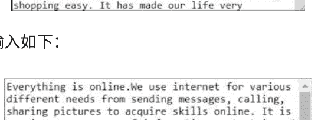

第二个文本输入如下：

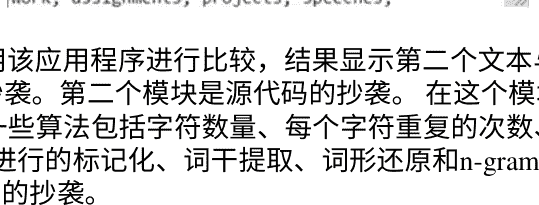

两个文本使用该应用程序进行比较，结果显示第二个文本与第一个文本相比有84.42%的抄袭。第二个模块是源代码的抄袭。在这个模块中使用了各种算法。其中一些算法包括字符数量、每个字符重复的次数、最长公共子序列以及使用nltk进行的标记化、词干提取、词形还原和n-gram。还使用各种输入测试源代码的抄袭。

因此，第一个输入如下：

```
c
#include <stdio.h>
int main() {
    int n, rev = 0, remainder;
    printf("Enter an integer: ");
    scanf("%d", &n);
    while (n != 0) {
        remainder = n % 10;
        rev = rev * 10 + remainder;
```

第二个输入如下：

```
#include <stdio.h>
int main() {
    int n, rev = 0, remainder;
    printf("Enter an integer: ");
    scanf("%d", &n);
    printf("Reversed number = %d", rev);
    return 0;
}
```

这里的两个源代码描述了反转数字的逻辑。当比较这两个源代码时，发现第二个代码相对于第一个代码有78.54%的抄袭。

##### 流程图

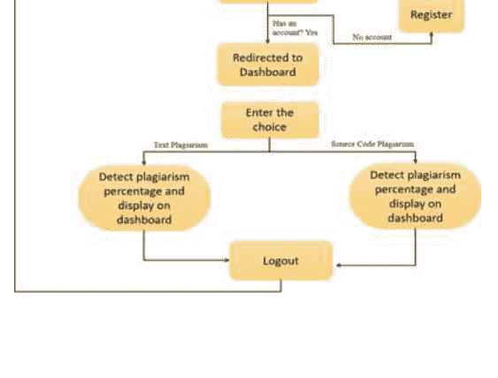

#### 6 结果与讨论

这里使用余弦相似度、字符计数、关键词计数、字符重复、最长公共子序列和N-gram等方法，结合开发了检测源代码抄袭和文本抄袭的算法。我们可以通过比较两个文本并使用余弦相似度算法计算百分比来找出两个文本中的抄袭量，对于源代码，通过考虑包括特殊字符在内的字符计数的平均输出、单词计数和包括空格在内的总字符计数来进行抄袭检查。由于代码包含特殊字符和不同的函数和变量。因此，当给定两个文本作为输入时，将比较这些文本，并在考虑所有这些因素后计算出两个文本中的抄袭量，并在最后显示百分比。

#### 7 结论

抄袭被视为学术不诚实行为。尽管复制他人作品不是犯罪，但可能构成版权侵权。在学术界，这是一种严重的道德犯罪。抄袭不受法律惩罚，而是受到机构的惩罚。教育机构可以对未经许可发布他人作品的作者进行处罚或停职。抄袭被描述为将他人的作品冒充为自己的作品，或者未经许可或许可复制他人的文字或思想。

现在有许多检测抄袭的工具和算法可用于帮助限制这些问题。所有这些都是学术研究而不是商业目的的结果。在这里使用的方法是余弦相似度，这也是实时检查各个领域抄袭的方法。此外，对于使用标记化、词干提取和词形还原的源代码，该项目使用Python和Flask作为服务器和Python脚本之间的连接进行实现。机器学习在现实生活中对于抄袭检测起到了至关重要的作用。

致谢我们衷心感谢指导我们整个项目并教授我们相关方法和帮助我们理解所需概念的K. Ashesh副教授。还要感谢我们的Vege Hari Kiran（系主任）先生为我们提供所需设施和指导。

#### 参考文献

- 1. Al Jarrah, A., Alsmadi, I., & Za'atreh, Z. 基于研究作者、标题和内容之间相关性的抄袭检测。
- 2. Saini, A., Bahl, A., Kumari, S., & Singh, M. || (2016年1月). 抄袭检测器：文本挖掘。 https://doi.org/10.5120/ijca2016907833
- 3. Kenechukwu, A. (2018年10月). 技术写作中的文字处理和抄袭。
- 4. Elhoseny, M., Osman, L., Zaher, M., Shehab, A. 一种检测阿拉伯文档相似性的新模型，在AG 2018中。 https://doi.org/10.1007/978-3-319-64861-3_46
- 5. Higgins, J. R., Lin, F.-C., & Evans, J. P. (2016). 提交稿件中的抄袭：发生率、特征和筛查优化—以一家主要专业医学期刊为例。在Higgins等人的研究诚信和同行评审中，（第1卷，第13页）。 https://doi.org/10.1186/s41073-016-0021-8
- 6. Verco, K. L., & Wise, M. J. (1996年8月). 用于检测疑似抄袭的软件：比较结构和属性计数系统。 https://doi.org/10.1145/369585.369598
- 7. Abid, M., Usman, M., & Ashraf, M. W. (2017年11月4日). 使用数据挖掘技术的抄袭检测过程。 https://doi.org/10.3991/ijes..v5i4.7869
- 8. Shakhovska, N., & Shvorob, I. (2015年11月12日). 检测文档集合中的抄袭的方法。 https://doi.org/10.1109/STC-CSIT.2015.7325453
- 9. Rafieian, S., & Braani Dastjerdi, A. “使用基于哈希树的代表性指纹的波斯语（PCP）文本的抄袭检测器”。 https://doi.org/10.5829/idosi.JAIDM.2016.04.02.01
- 10. Patil, S. S. & Yeole, H. (2019年2月). “抄袭检测器和抄袭检测工具概述：一项研究”。
- 11. Pupovac, V., Bilic-Zulle, L., & Petrovecki, M. (2008年12月). “关于欧洲学术抄袭的分析方法”。 https://doi.org/10.7238/d.v0i10.5071
- 12. Parwita, W. G. S. & Wijaya, N. S. W. “基于字符串匹配的文档抄袭检测（Bahasa Indonesia）”。
- 13. 赵，J.，夏，K.，付，Y.，崔，B. “一种基于AST的代码抄袭检测算法”。
- 14. 郭，J.-Y.，程，H.-K.，王，P.-F. “动态结构下的程序抄袭检测”。
- 15. 万，H.，刘，K.，高，X. “基于标记的实时抄袭检测方法”。
- 16. Vandana“抄袭检测软件的比较研究”。

### 通过自由/冲击电磁发生器从人体运动中收集动能活动的研究

Athern Aloysius, M. K. A. Ahamed Khan, Wei Hong Lim, Manicam Ramaswamy, Sridevi, Deisy, Abdul Qayyum, Chun Kit Ang, 和Kalaiselvi Aramugam

摘要 本研究的主要目的是通过使用微型电磁振动器从人体运动中收集自由/冲击运动发生器（FIMG）的能量。为了获得最佳效率和能量收集，使用鞋垫传感器、微型电磁发生器和伺服电机可以获得输出，并且应该与实际人体运动进行测试。通过研究人体步态可以确定人体的生物力学和能量收集位置。它还具有低频大振幅振动的有效性能输出。通过使用微型电磁传感器将从人体运动中收集的能量转换为电能。这个传感器将被安装在身体的角度、大腿和手腕上以收集能量。通过日常活动收集的能量是人们有意识地在身体中进行运动，无论是行走、快速行走还是慢跑。

- 关键词 生成器 · Qualisys · 收割 · 电压升压器 · 能源 · 生物力学

#### 1 引言

在这个现代化和数字化的时代，每个人都配备了智能手机、电子设备，以及任何可穿戴设备。所有这些设备都受到长时间使用、自动充电和长久电力耐用性的启发。然而，所有智能设备和电池供电设备都需要使用传统电源。A. Aloysius · M. K. A. Khan (✉) · W. H. Lim · M. Ramaswamy · C. K. Ang · K. Aramugam UCSI大学，No. 1 Jalan Menara Gading, UCSI Heights, 56000 Cheras, 马来西亚 e-mail: mohamedkhan@ucsiuniversity.edu.my Sridevi · Deisy 印度马杜赖的Thiagarajar工程学院 A. Qayyum UMR CNRS 6285 LabSTICC, ENIB, 29238 Brest, 法国

需要时间来充电电池以供一定时间使用，直到需要重新充电。为了使用特定的小工具或电子设备，需要考虑重量因素和充电时间以获得更持久的电池[1, 2]。由于像移动电源这样的供电设备通常具有适度的功耗，电池容量和尺寸之间需要取得折衷，以控制电池设备的寿命、尺寸和功能。

#### 2 文献综述

研究表明，计算机技术在过去的二十年里取得了快速发展，但是电池技术的发展速度却没有跟上计算机技术的步伐。尽管能源容量在这些年里有所增加，但似乎阻碍了便携式电子产品在更广泛的市场上的发展。事实证明，计算机的能力已经超过了电池的发展。在这个问题上，通过跟上计算机技术的步伐，可以改进更多的电池设备。例如，电池更换的成本限制了无线传感器网络的更广泛应用。因此，对能源的需求将会增加。作为解决方案，能量收集可以是满足需求的一个选择。数据是在3种不同的自然步态速度下进行研究的，分别是80米/分钟的行走，110米/分钟的快速行走和160米/分钟的慢跑[3, 4]。

研究包括通过体热、呼吸、血压和其他活动（如运动、打字和行走）来收集能量。因此，在这个项目中，分析了以3种不同的速度行走来从人体中收集能量[5]。

此外，牛等人还研究了从关节行走中的生物力学运动分析。研究表明，每个周期将产生2步运动中1 Hz 步态周期的评估[6]。从肘部、膝盖和踝关节来看，有潜力进行能量收集。李等人已经证明，使用膝盖支架仅在肢体减速时产生接近5 W的输出[7, 8]（图1）。

Qualisys运动捕捉公司提供了许多软件功能，根据研究或学习的目的可以进行选择。在这个项目中，该项目的目标是从人体在不同类型的运动中收集动能。将获取数据的系统包括Qualisys Track Manager、MATLAB、LabVIEW和Qualisys交易标记[9, 10]。Qualisys提供了骨架解算、3D视频叠加和自动识别标记[11, 12]的框架。

至于Qualisys Track Manager，它与3D运动相机集成，可以实时流式传输刚体数据或高质量骨骼数据，以便研究生物力学中的人体运动。该系统允许用户以最小延迟实时进行2D、3D和6D数据捕获[13, 14]（图2）。

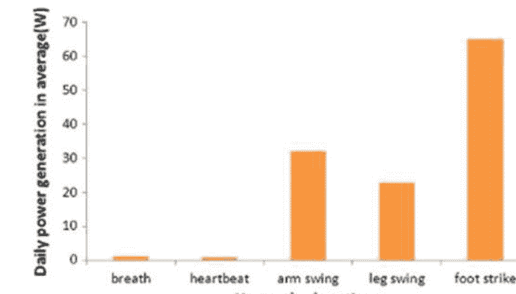

图1 从人体产生的能量

图2 Qualisys骨架视图

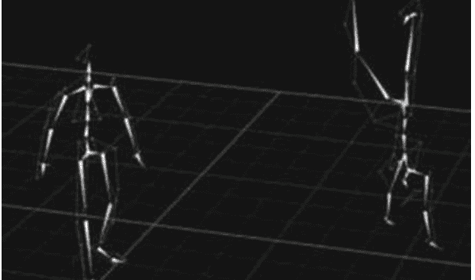

Qualisys框架软件的优点是可以以2D、3D和6D的形式检索跟踪数据。此外，它具有高速实时流传输。恢复时间仅为4毫秒。它可以与Qualisys相机检测骨架视图的标记识别集成。

当速度主要取决于步幅长度或步频时，人体步态被确定。步频是腿部运动速度，而步幅是一定数量步幅所覆盖的总距离。随着步幅长度的增加，腿部附加的频率和振幅也会增加。通过增加步幅长度，行走速度最终会增加，并且通过允许更多的位移来增加收集的能量量。步幅和收集的能量值成正比。关于行走期间的髋部收集，输入振动量主要取决于步数。髋部和收集的能量输出彼此之间是方向性促进的。行走速度下，髋部收集的频率比为2:1（图3）。

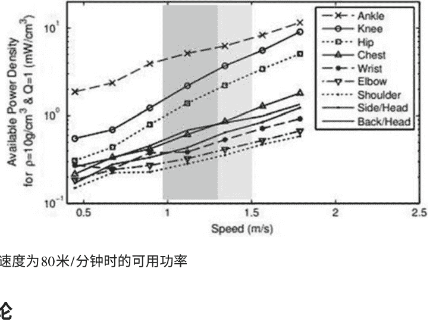

图3 步行速度为80米/分钟时的可用功率

#### 3 方法论

利用电磁发电机从人体运动中收集能量，将选择身体的臀部进行这项实验研究。一旦所有传感器和发电机都安装在人体上，将在跑步机上进行研究，包括80米/分钟的步行、110米/分钟的快速步行和160米/分钟的跑步或慢跑。结果将在仿真软件中显示，以便检测和分析在不同速度下将发电机固定在人体上以实现最大能量收集的最佳位置。

##### 3.1 收集的能量的储存

为了储存收集到的能量，将创建一个原型电路来收集、储存和转换能量。为了储存能量，将使用可充电电池来储存收集到的能量，并设计充电电路用于这个实验。

通过选择十个不同体重指数（BMI）的志愿者来分析人体在不同运动速度下的髋关节步态和步态模式，以实现收获和实验目标的方法。BMI是通过志愿者的体重千克数除以总身高来计算的（Atchka，2015）。正常人的正常BMI范围在18.5-25 kg/m²之间。超过25-29.99 kg/m²的个体的任何BMI都属于超重类别，而30 kg/m²及以上的个体则属于肥胖类别。图4和图5代表了不同的身体形状与BMI类别和等级的关系。为了选择志愿者，BMI值范围为18-30 kg/m²，旨在涵盖不同范围个体的不同结果的数据。

使用3D建模软件使用实体工作进行腰带设计，以便在人体运动时放置在臀部上。机械磁发电机连接在带子上，带有线圈绕组和具有南北极的磁铁。当通管中的挡板切割磁通时，会产生电压。由于发电机的电气输出需要通过电路整流，因此连接了一个平滑电容器的电路，将其输出转换为直流形式。然后将直流输出连接到充电电路，以利用产生的能量进行充电和供电直流设备。

##### 3.2 生物力学臀部能量收集器的设计结构

在设计和构建原型的过程中，需要考虑的最重要的一点是提高从机械设计中收集能量的效率，使其在任何情况下都舒适轻便。然后使用Qualisys软件检查设计，并借助标记确定组件放置的最有效点，以收集能量。以前的研究是使用放置在臀部下方的压电传感器从髋关节处收集能量，该传感器通过施加压力产生能量输出。至于这项实验性研究，将使用放置在腰带设计上的电磁场的发电机来收集能量（图6和7）。

上述电路旨在利用理想的开关MOSFET和PID控制器增加所收集的电压，以增加电压来充电电池并储存所收集的能量。输入电压设置为2V，设计电路的输出约为5V。根据发电机的输出，该电路能够为储存和充电系统提供更高的输出。

调节器的输出电压可用于充电电池。电压升压电路用于支持3至5V之间的电压，以适当地充电12V的电池。随着进展数字的增加，所收集的电压也会增加（图8，表1）。

收集器的原型长度为2.5厘米，直径为8毫米。该原型放置在股骨上方，即髋部区域的大腿骨。（股骨干，2018）由于该研究使用Qualisys软件和标记物，髋部两侧的股骨头是最活动的部位。为了最大化收集的能量，选择最活动的部位是人体生物力学中最高效的部位（Riemer，2011）。通过在髋部周围放置标记物并使用Qualisys软件进行整合，最大的应力强度也会出现在股骨头上，这将是从髋部周长收集能量的最佳位置（图9）。

#### 4 结果与讨论

##### 4.1 髋关节步态周期

Qualisys运动摄像系统收集的所有志愿者的结果都受到不同速度和不同角度运动的影响和被试移动的速度。髋部的步态模式在被试进行运动和静止时都被收集到了(图10)。

##### 4.2 定位收割机的角度

在这个实验中，收割机是一个线圈磁铁，当磁铁自由上下移动时会产生电磁力。对线性进行了一项研究位移和收集能量的最大输出角度。人类行走步态是以不同的速度进行的，以获得最佳的收集器角度。

实验结果表明，发电机的最佳放置角度在设计原型内为30°–45°，以便磁铁在内部自由移动。当磁铁向上放置90°时，慢走时没有发电，快走或跑步时发电量非常少。因此，最佳收集角度的位置在30°–45°之间（图11）。

##### 4.3 步行速度80米/分钟的髋关节步态收集

图12显示了线性位移与线性速度和BMI之间的关系，分别针对男性和女性。通过将每个步态周期内的线性位移范围之间的值除以最大值和最小值，可以得到角速度。收集后的输出值以Excel格式列出并表示，如图13所示。图表还显示，具有最低BMI的人的速度比具有最高BMI值的人产生的速度更高。具有几乎相似BMI的男性和女性产生的线性速度产生类似的输出（图14和表2、3、4）。

# 图5 能量收集流程图

# 图6 髋部收集原型

# 图8 能量收集器电磁概念

# 表1 模型参数和测量

| 参数 | 数值 | 单位 |
|---|---|---|
| 外壳长度 | 21 | 毫米 |
| 磁管长度 | 20 | 毫米 |
| 线圈长度 | 5 | 毫米 |
| 磁铁长度 | 13.5 | 毫米 |
| 移动质量M1 | 1.55 | 克 |
| 移动质量M1 | 0.53 | 克 |
| 移动质量SMH | 1.53 | 克 |
| SMH体积 | 0.835 | 立方厘米 |
| CMH体积 | 0.893 | 立方厘米 |

# 图9 用于收割的股骨位置

# 图10 步态周期平均髋关节角度

# 图11 电磁发电机的位置

# 图12 以80 m/min的速度输出的图形

# 图13 以110 m/min的速度输出的图形

# 图14 以160 m/min的速度输出的图形

# 表2 以80 m/min的速度收获

| 主题 | 年龄 | 性别 | BMI | 线速度 (m/m) | 产生的电压 (V) |
|------|------|------|------|--------------|----------------|
| 1 | 25 | M | 18.2 | 62 | 3.20 |
| 2 | 23 | M | 19.3 | 48 | 3.10 |
| 3 | 21 | M | 24.55 | 51 | 2.60 |
| 4 | 24 | M | 26.1 | 36 | 2.50 |
| 5 | 22 | M | 21 | 52 | 3.00 |
| 6 | 21 | F | 28 | 35 | 2.30 |
| 7 | 20 | F | 22.4 | 48 | 2.80 |
| 8 | 23 | F | 21 | 47 | 3.00 |
| 9 | 27 | F | 16.4 | 65 | 3.50 |
| 10 | 21 | F | 22.68 | 48 | 2.80 |

#### 5 结论

总之，当运动速度增加时，臀部能量收获输出的步态模式更线性和更平滑。收获器的设计可以在任何情况下佩戴进行收获。收获原型已经在相同坡度的路面上尝试了8、110和160 m/min的3种不同运动速度。在结果部分，可以看到最多收获的电压是与运动速度最高的产生的最大电动势成比例的。发电机倾向于以更快的160 m/min的速率提升和储存收获的能量。

此外，BMI因素也被考虑用于能量收集。较低的BMI倾向于产生比较高的BMI更好的输出。人体运动的持续时间也对收集到的能量量有影响。最后，线速度是通过管道内磁铁的运动来计算的。速度也与髋关节收集能量成正比，线速度会在规定时间内产生更多的电磁感应和电压。

致谢我要向导师Mohamed Khan Aftab Ahamed Khan博士和UCSI大学表示感谢，感谢他们在整个项目期间的持续支持、指导和评论。

# 表3 以110 m/min的速度收获

| 主题 | 年龄 | 性别 | BMI | 线速度 (m/m) | 产生的电压 (V) |
|---|---|---|---|---|---|
| 1 | 25 | M | 18.2 | 45 | 3.50 |
| 2 | 23 | M | 19.3 | 34 | 3.40 |
| 3 | 21 | M | 24.55 | 38 | 3.00 |
| 4 | 24 | M | 26.1 | 40 | 2.90 |
| 5 | 22 | M | 21 | 25 | 3.40 |
| 6 | 21 | F | 28 | 40 | 2.70 |
| 7 | 20 | F | 22.4 | 30 | 3.20 |
| 8 | 23 | F | 21 | 39 | 3.50 |
| 9 | 27 | F | 16.4 | 51 | 4.00 |
| 10 | 21 | F | 22.68 | 39 | 3.00 |

# 表4 以160 m/min的速度收获

| 主题 | 年龄 | 性别 | BMI | 线速度 (m/m) | 产生的电压 (V) |
|---|---|---|---|---|---|
| 1 | 25 | M | 18.2 | 49 | 4 |
| 2 | 23 | M | 19.3 | 34 | 4.2 |
| 3 | 21 | M | 24.55 | 37.5 | 3.5 |
| 4 | 24 | M | 26.1 | 27.9 | 3.5 |
| 5 | 22 | M | 21 | 40.5 | 4 |
| 6 | 21 | F | 28 | 27 | 3.5 |
| 7 | 20 | F | 22.4 | 37.5 | 3.8 |
| 8 | 23 | F | 21 | 37.7 | 4.1 |
| 9 | 27 | F | 16.4 | 50 | 4.3 |
| 10 | 21 | F | 22.68 | 39 | 3.6 |

#### 参考文献

1. tchka. (2015年1月15日)。尺寸和偏见。取自Fierce Fatties: https://fiercefatties.wordpress.com/2015/01/23/size-and-prejudice/
2. Choi, Y.-M. (2017年7月12日)。能源。取自可穿戴生物力学能量: www.mdpi.com
3. 戴，D. (2014).从人体运动中收集能量的髋部电磁发电机. 从HEP frontier online检索: https://academic.hep.com.cn/fie/CN/https://doi.org/10.1007/s11708-014-0301-2
4. 股骨干。(2018年5月1日). 从Orthoinfo检索: https://orthoinfo.aaos.org/en/diseases--conditions/femur-shaft-fractures-broken-thighbone/
5. Nedunchalian, I., Elamvazhuthi, N., Parasuraman, S., Ahamed Khan, M.K.A. (2017年9月19–21). 人体下肢步态的生物力学能量收集: 一项比较分析. IEEE ROMA2017. IEEE Xplorer, Scopus indexed. https://doi.org/10.1109/ROMA.2017.8231741
6. Gupta, P. (2019年4月3日).MOSFET是如何工作的?来源于Learn Engineering: https://learnengineering.org/how-does-a-mosfet-work.html
7. Peterson, I. (2021年). Qualisys. 来源于Qualisys Track Manager (QTM).
8. Lange, H. E. (2020年10月22日).IOP科学. 来源于一个用于能量自主仪器化全髋关节置换的压电能量收集概念: https://iopscience.iop.org/article/https://doi.org/10.1088/1361-665X/abba6e
9. Houng, H.O.C., Sarah, S., Parasuraman, S., Ahamed Khan, M.K.A., Elamvazhuthi. (2013). 国际医学和康复机器人与仪器学术研讨会, 12月2日至4日. ‘从人类运动中收集能量: 步态分析, 设计和现状艺术. (2014). 发表于 Procedia 计算机科学 , Elsevier, 42, 327–335.
10. Hesmondjeet Oon Chee Houng, Dr. Parasuraman, M.K.A.Ahamed khan (2013年12月13日)。 IEEE会议INDICON，印度孟买IIT，论文题为“从人类运动中收集能量”的IEEE论文集（第1-6页）。 IEEE会议出版物。 https://doi.org/10.1109/INDICON
11. Lin, J. H. (2015年5月15日)。 Researchgate。 从微软KinectTM测量跑步机行走过程中的步态参数准确性中检索到: https://www.researchgate.net/publication/276299527_Accuracy_of_the_Microsoft_KinectTM_for_measuring_gait_parameters_during_treadmill_walking
12. Liu, Z. (2020年12月23日)。 人类行走诱导能量收集技术概述及其在行走机器人中的可能性。 从能源中检索到: https://www.mdpi.com/1996-1073/13/1/86/htm
13. MARsystem. (2020).世界上第一个完全集成的无线压力传感器鞋垫.从MARsystem获取: https://www.mar-systems.co.uk/
14. Pancharoen, K. (2017年10月). 髋关节植入物能量收集器 (第219页). 从髋关节植入物能量收集器获取.

### 自动确定临界温度

Abhishek Deshpande, Jatin Pardhi和Gokul Bisen

摘要 我们使用包含18,974种化合物的77个物理和化学性质的数据集，分别使用多元线性回归、Lasso回归和SVM回归算法开发了3个机器学习模型，用于预测化合物的临界温度。我们使用多元线性回归和Lasso回归算法的模型分别达到了84.61%的准确率，并使用SVM回归的模型达到了63.47%的准确率。基于这些模型，我们预测了化合物的超导温度。我们还讨论了决定化合物临界温度的主要性质。

关键词 机器学习 · 多元线性回归 · Lasso回归 · SVM回归 · 预测 · 临界温度 · 准确性 · 超导

#### 1 引言

超导体是在非常低温（接近绝对零度）下表现出零电阻的物质。大多数超导体是金属和类金属。水银是第一个观察到表现出超导性质的金属，由“荷兰物理学家海克·卡梅林克·奥内斯”于1911年发现，这里的水银被冷却到4K。在发现水银之后，这个领域引起了世界各地科学家的关注，后来发现了许多其他不同形式的超导体，包括在1930年代发现的第二类超导体。但是在1986年，约翰内斯·贝德诺兹和卡尔·穆勒的发现给超导体领域带来了一场革命性的变革。在这个理论之前，人们认为当某种材料接近绝对零度时，它开始表现出超导性。但是卡尔·穆勒和约翰内斯·贝德诺兹发现，当某些材料与氧化物（铜、镧、钡）混合时，它们开始表现出超导性，温度约为40 °K。超导体具有无阻力地允许电流流过的特性，这种类型的电流流过导体被称为超电流。导体在低于临界温度时开始表现出超导性，这个温度被称为临界温度。临界温度用 $T_c$ 表示。不可能将所有材料转化为超导体，但那些具有超导性质的材料有各自的临界温度 $T_c$ [1]。

超导体根据室温行为分为两种类型：

# I类超导体：

I类超导体包括在室温下表现为导体的材料。当这种材料在临界温度以下冷却时，材料内部的分子运动减少，电流的流动可以无阻碍地进行。

# II类超导体：

这类材料在室温下并不是特别好的导体。这种材料在冷却到某个临界温度以下后也具有超导性质，但是与第一类超导体相比，转变为超导态的过程更加渐进。II类超导体主要包含金属和合金[1]。

##### 1.1 临界温度

任何材料在低于某个温度时都会获得超导性质，这个温度被称为临界温度。临界温度用$T_c$表示。不同的材料具有不同的临界温度。超导体的临界温度范围从20K到低于1K。例如，固态汞的临界温度为4.2K。直到2015年，常规超导体的最高临界温度为203K的H2S。在低温（接近临界温度）下，电子之间的相互作用能量变得非常弱，它们之间的配对可以很容易地被热能破坏。这就是为什么材料在低温下表现为超导体的原因[2]。

##### 1.2 机器学习算法

###### 1.2.1 线性回归

线性回归算法通过将线性方程应用于给定/观察到的数据，给出了两个变量之间的线性关系。该算法给出了两个变量之间的关系（一个被认为是独立变量，另一个是依赖变量）。例如：任何人的体重与其身高成正比。如果身高增加，体重也会增加。这就是我们可以预测一个人的方式。使用线性回归从给定的身高中估算体重。一个变量不一定要依赖于另一个变量，但两个变量之间必须存在某种关系。我们使用散点图来表示变量之间的强度关系。如果两个变量之间没有关系，散点图将不会显示任何增加/减少的模式[3]。

线性回归方程的形式为：

```
Y = a + bX
```

从上述方程中，我们可以看到X不受任何约束（独立变量），而Y依赖于X，因此Y是一个依赖变量。X沿X轴绘制，Y沿Y轴绘制。b是斜率，a是截距。

```
a = \frac{[(\Sigma y)(\Sigma x^2) - (\Sigma x)(\Sigma xy)]}{[n(\Sigma x^2) - (\Sigma x)^2]}  (1)
b = \frac{[n(\Sigma xy) - (\Sigma x)(\Sigma y)]}{[n(\Sigma x^2) - (\Sigma x)^2]}  (2)
```

# 线性回归的类型:

# 简单线性回归:

在简单线性回归中，我们找到一个独立变量和相应的依赖变量之间的关系.

```
Y = \beta0 + \beta1X + \epsilon
```

在这里，Y是一个依赖变量，\beta0和\beta1是未知常数，表示Y截距和斜率，\epsilon（Epsilon）表示误差项（图1）.

例子：我们可以根据学习时间预测学生的分数。在这里，学习时间是独立变量，分数是依赖变量。在这里，我们可以使用简单回归模型来预测学生的分数。

# 多元线性回归:

在多元线性回归中，我们试图找到两个或多个自变量（输入）和一个因变量（输出）之间的关系。

###### 1.2.2 LASSO回归

LASSO代表“最小绝对收缩和选择算子”。LASSO是线性回归的另一种变体；它是一种用于线性回归的收缩和选择方法。当有大量预测变量时，我们使用LASSO回归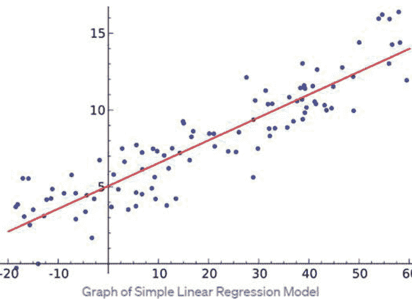

图1简单线性回归

变量选择和收缩方法减小了错误估计系数的值[4]。

###### 1.2.3 SVM回归

SVM代表支持向量机。它用于分类和回归。SVM主要用于分类问题。该算法创建一个将数据分为类别并减少错误概率的超平面/线。SVM在非结构化数据中表现良好。例如：“文本和数据”。该回归模型基于给定数据的几何属性[3]。

##### 1.3 数据集

该数据集是一个Excel文件，包含了18,974个化合物的76个物理和化学性质，以及它们在第77列中的临界温度。倒数第二列和最后一列包含了化合物的分子式和它们的临界温度。热导率、原子半径、价态、电子亲和能和原子质量是对模型精度贡献更大的性质。

下面的直方图显示了数据集中化合物根据临界温度范围的分类（图2）。

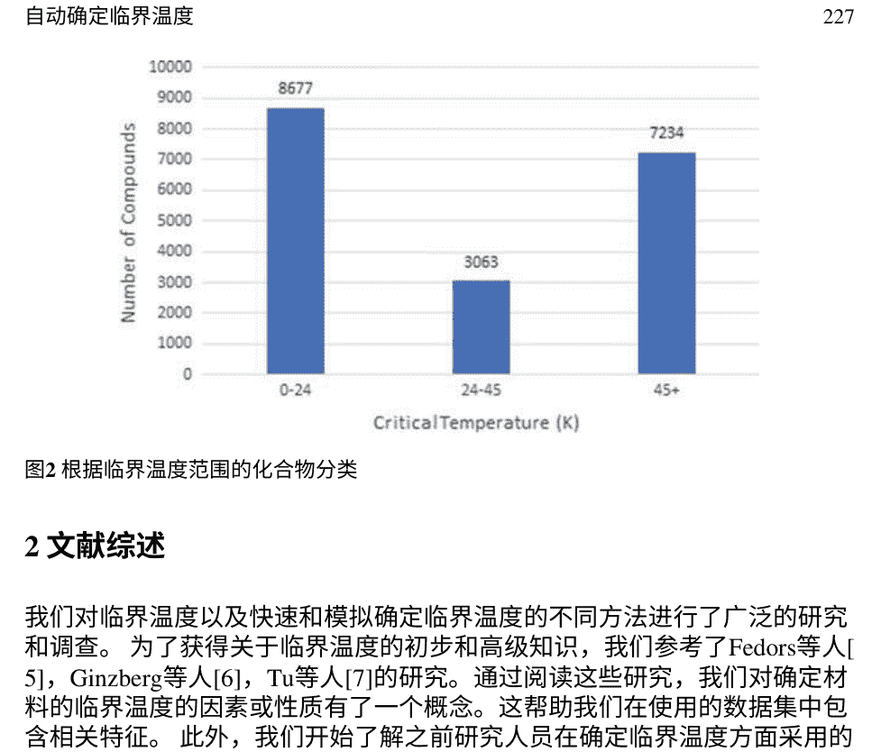

#### 2 文献综述

我们对临界温度以及快速和模拟确定临界温度的不同方法进行了广泛的研究和调查。 为了获得关于临界温度的初步和高级知识，我们参考了Fedors等人[5]，Ginzberg等人[6]，Tu等人[7]的研究。通过阅读这些研究，我们对确定材料的临界温度的因素或性质有了一个概念。这帮助我们在使用的数据集中包含相关特征。 此外，我们开始了解之前研究人员在确定临界温度方面采用的机器学习和深度学习方法。Le等人[8]采用了神经网络方法来开发这样一个模型。 尽管他们在这方面取得了相当不错的结果，但是他们使用的数据集的特征数量比我们的少，因为在大数据集上应用神经网络需要一个能够处理负载的高度复杂的系统。Stanev等人[9]和Xie等人[10]采用机器学习算法进行了这项任务，并使用了大量的数据实体和特征，但是他们的模型的RMSE和MSE都很高。Horide等人[11]开发了一个机器学习搜索模型，用于确定具有高临界温度的材料，只包括那些被怀疑具有临界温度的材料的数据。De Gruyter等人[12]提出了一种有趣的方法，使用机器学习算法预测掺铁超导体的临界温度。

我们的模型受到Hamidieh等人的工作[13]和Roter等人的工作[14]的影响。 这两位研究人员开发的机器学习模型使用了相同的数据集，其中包括35个最相关的特征，这些特征被怀疑会影响材料的临界温度。Li等人[15]采用了一种高度准确但复杂的方法，使用原子向量和深度学习来确定临界温度。 他的模型在实施过程中使用了一种复杂而昂贵的系统，因此取得了很高的准确性。

从上面的讨论可以看出，大多数研究人员为了达到高准确性而使用了较小的数据集，而那些使用较大数据集的人则考虑了较少的特征或者使用了只能在某些复杂系统中实施的深度学习方法。因此，我们开发了一种成本效益高的方法，使用了一个大数据集（18,974个化合物，76个属性）来确定临界温度，而不会降低准确性。

#### 3 方法论

##### 3.1 开发模型的算法

- 1. 导入库：numpy, pandas, matplotlib, sklearn
- 2. 导入并读取csv数据集。
- 3. 显示数据集并检查空值、重复值和不一致的数据。
- 4. 如果发现此类数据，则消除或替换数据。
- 5. 将特征定义为 X（自变量）和 Y（因变量）。
- 6. 将数据分割为训练集和测试集。
- 7. 实例化回归对象或定义模型。
   - LinearRegression()
   - Lasso(Normalize = True)
   - SVR()
- 8. 训练模型。
- 9. 预测测试数据的临界温度。
- 10. 计算模型的准确度和误差。

##### 3.2 数据预处理

在使用机器学习模型之前，对数据集进行了预处理。数据预处理包括以下步骤：

- 1. 消除或替换缺失值
- 2. 消除或替换重复值
- 3. 替换不一致的数据
- 4. 删除不相关的数据字段。

##### 3.3 模型的工作原理

###### 3.3.1 多元线性回归

多元线性回归算法通过将76个独立变量适应线性方程，建立独立变量（即76个物理和化学性质）与化合物的临界温度之间的关系：

```
Y = \beta_0 + \beta_1 x_1 + \beta_2 x_2 + \cdots + \beta_{76} x_{76} + \epsilon \quad (3)
```

- 其中，β0=截距
- β1,β2, ..., β76=系数
- β1x1, β2x2, ..., β76x76=独立变量
- ε=误差。

然后，模型选择对因变量影响最大的自变量的最佳组合，并使用线性方程形成一个超平面。超平面是三维或更高维数据的最佳拟合线。然后，通过在超平面上的自变量的y坐标（x1, x2, ...）获得其余数据的临界温度。图3是具有两个自变量和一个因变量的超平面的图示表示。

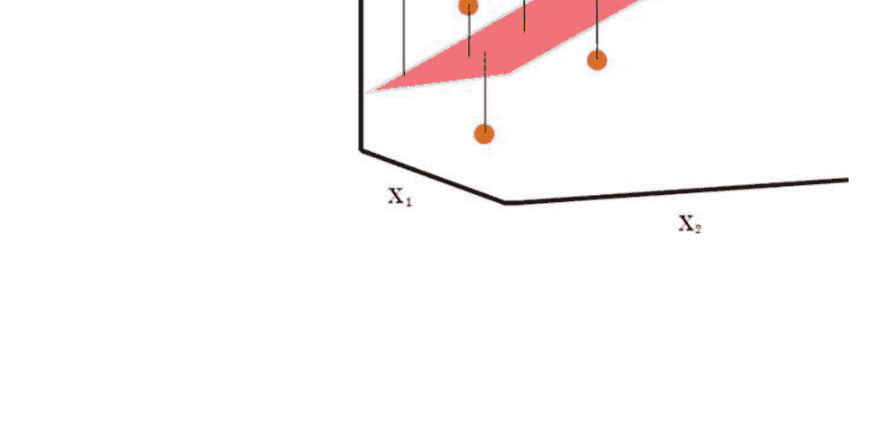

###### 3.3.2 Lasso回归

Lasso回归算法是线性回归的一种扩展，通过一些归一化来提高模型的预测准确性。 就像多元线性回归算法一样，Lasso回归算法也建立了自变量（即76个物理和化学属性）与化合物的临界温度之间的关系。 它与多元线性回归算法唯一不同的是它使用收缩技术，即在我们的情况下图形上将临界温度与自变量（76个物理和化学属性）的映射更接近并朝中心发展，以便为测试数据提供更精确和准确的预测。 它使用以下数学方程来实现这种技术：

最小二乘 + λ * (系数绝对值的和)

```
∑_{i=1}^{n} (y_i - ∑_{j} x_{ij} β_j)^2 + λ ∑_{j=1}^{p} |β_j|     (4)
```

其中，

- λ—收缩量。
- 如果 λ等于0，则考虑所有自变量，Lasso回归模型变为只考虑残差平方和来构建模型的线性回归模型。
- 如果 λ= ∞，则不考虑任何变量，即逐渐消除更多变量。
- λ↑，偏差↑。
- λ↓，方差↑。

我们使用Lasso回归作为我们的数据集包含大量特征。 Lasso回归技术最适合处理这种类型的数据（图4）。

###### 3.3.3 支持向量机回归

支持向量回归（SVR）算法在化合物的性质和临界温度之间创建了一个映射。SVR构建一个包含最大映射的超平面。 SVR算法接下来做的是在超平面上创建距离为‘ε’的决策边界。

例如，如果超平面的方程是， Ax + b = 0. 那么，决策边界的方程为： Ax + b = ε, Ax + b= -ε.

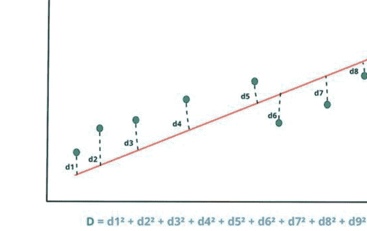

算法选择‘ε’的值，使得所有最接近超平面的映射都落在决策边界内。此外，算法仅使用那些落在决策边界内的映射/点来开发最终的回归平面[10]。然后，该平面用于预测测试数据的临界温度。落在决策边界内的映射也被称为支持向量（图5）。

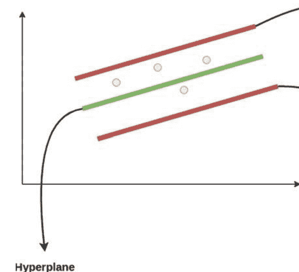

尽管在获得结果后，我们意识到化合物的性质和临界温度之间存在线性关系，但最初我们并不知道这一点。因此，我们使用SVR作为非线性回归也能很好地工作。

##### 3.4 模型训练

模型训练被定义为在数据集上训练机器学习算法的过程。样本输出数据和与输出相关的输入数据集构成了数据集。训练模型用于通过算法处理输入数据，以将处理后的输出与样本输出进行比较。根据这种相关性，模型进行修改。模型的准确性主要取决于数据集的准确性。我们在Google Colab环境中对模型进行了训练和测试。我们使用数据集中的80%数据来训练模型。我们使用这些数据来训练和测试3个不同的机器学习算法的模型。

- (1) 多元线性回归
- (2) Lasso回归
- (3) SVM（支持向量机）回归。

##### 3.5 模型测试

在使用数据集的80%数据对模型进行训练后，它们被用来预测剩余20%数据的独立变量（临界温度），基于它们从训练中获得的知识。这些预测值随后与测试数据中的相应值进行比较，作为模型测试的一部分。

##### 3.6 模型性能确定

我们使用了4个指标来确定模型的性能：

- 1. 调整后的R平方
- 2. MSE（均方误差）
- 3. RMSE（均方根误差）
- 4. MAE（平均绝对误差）

R-Squared—被预测变量描述的结果方差比例被称为R-squared（R²）。相关系数的平方在多元回归模型中，观察到的结果值和模型估计值之间的差异被称为R-二次方。R-二次方值越高，模型越精确。

调整的R平方-调整的R平方是R平方的一种修改形式，如果新的预测变量倾向于改善模型的性能，则其值增加，如果新的预测变量不像预期那样改善性能，则其值减少（图6和7）。

数学上，
yi^是回归线上对应于 yi yi的点。

R-平方：
$$ R^2 = 1 - \frac{SS_{\text{res}}}{SS_{\text{total}}} \quad \text{(5)} $$

调整后的R-平方：
$$ R_{\text{adj}}^2 = 1 - \left[ \frac{(1 - R^2)(n - 1)}{n - k - 1} \right] \quad \text{(6)} $$

k—回归变量的数量，
n—样本大小。

### 图6 R-平方图

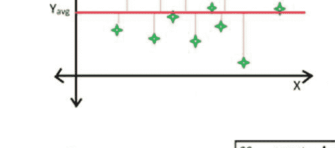

### 图7 调整后的R-平方图

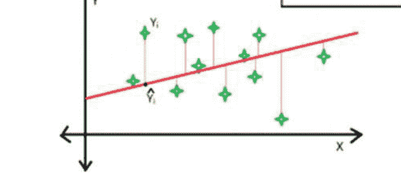

#### 4 结果与讨论

下图显示了使用matplotlib库获得的测试数据的实际临界温度和预测临界温度之间的散点图。

从图8可以清楚地看出，尽管我们无法实现对化合物临界温度的100%准确预测，但我们的大多数预测值都接近实际值。在图中，所有点似乎都聚集在虚拟的x =y线周围。因此，我们对化合物临界温度的预测主要目标在很大程度上得到了实现。

为了实现这个目标，我们使用了3种机器学习算法，其中2种是最有效和准确的。这些算法的准确性和均方误差在表1中提到。

表1的结果表明，多元线性回归和Lasso回归算法的准确性更高，误差更小，而SVM回归算法则不如它们。因此，这两种算法更适合处理这种类型的数据。

虽然我们使用机器学习模型取得了很高的准确性，但在系统的使用上存在一些限制。我们无法使用更好和更复杂的系统来处理更大的数据集并应用更先进的算法，因此这不是一个完全可靠的方法。因此，需要对这种更复杂的模型进行更多的研究，以便在更大的数据集上获得更高的准确性。未来的研究应该集中在这方面。

均方误差—实际值和预测值之间的差异通过对数据集上的平均差异进行平方得到的MSE（均方误差）给出。

```
MSE = \frac{1}{N} \sum_{i=1}^{N} (y_i - \cap y)^2 \quad\quad (7)
```

\cap y=预测值 y.

均方根误差—通过均方误差的平方根得到的误差率称为RMSE（均方根误差）。

```
RMSE = \sqrt{MSE} \quad\quad (8)
```

平均绝对误差——通过对数据集上的绝对差异进行平均提取原始值和预测值之间的差异来表示平均绝对误差。

```
MAE = \frac{1}{N} \sum_{i=1}^{N} |y_i - \cap y| \quad\quad (9)
```

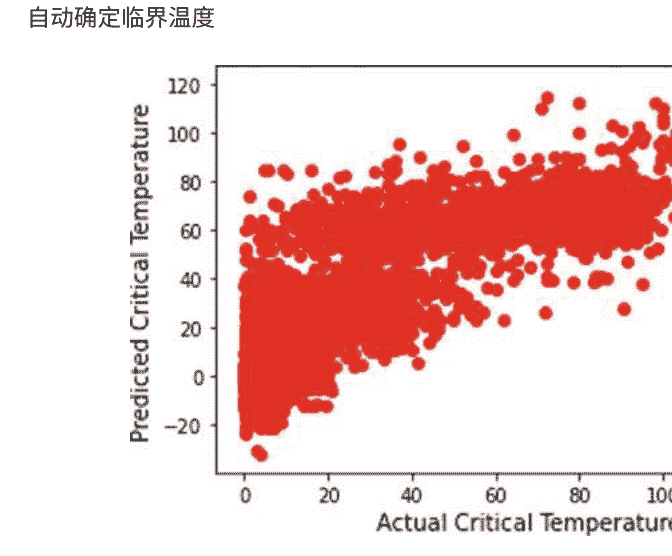

### 表1所有模型的准确性和误差

| 否 | 使用的机器学习算法 | MSE (均方误差) | RMSE (均方根误差) | MAE (平均绝对误差) | 调整 R平方 * 100 (准确率 %) |
| :--- | :--- | :--- | :--- | :--- | :--- |
| 1 | 多元线性回归 | 68.052 | 8.25 | 4.41 | 84.61 |
| 2 | Lasso回归 | 68.052 | 8.25 | 4.41 | 84.61 |
| 3 | SVM (支持向量机)回归 | 101.04 | 10.05 | 7.11 | 63.47 |

对于作为新超导体使用的可能化合物进行了研究。 在真实世界中进行昂贵且耗时的实验之前，提供初步输入以评估替代化合物的正确性和效率将是有利的。

#### 5 结论

材料数据科学，特别是超导体探索，仍处于机器学习适应的初期阶段。 虽然单一应用的数量正在增加，但更智能的模型尚未出现。 我们在本文中开发了一种新的计算方法，使用机器学习方法估计化合物的临界温度。 我们的发现与之前的临界温度预测模型研究一致。 这些初步发现表明机器学习算法可以用于提供理解超导物理的有说服力和有用的证据。这一发现是有希望的，并且应该进一步研究其他先进的预测模型，这可能最终导致未来新超导体的发现。

#### 参考文献

1. https://irds.ieee.org/topics/半导体材料
2. 临界温度和压力, https://www.chem.purdue.edu/gchelp/liquids/critical.html
3. 关于数据科学和机器学习的博客, https://www.datatechnotes.com/2019/01/svr-example-in-python.html
4. Lasso回归介绍: Statology.
5. Fedors, R. F. (1982). 化学结构与临界温度之间的关系. 化学工程通讯, 16(1-6), 149-151. https://doi.org/10.1080/00986448208911092
6. Ginzberg, V. L., & Kirzhnits, D. A. 高温超导.
7. Tu, C.-H. (1995). 仅使用化学结构估计临界温度的群贡献方法化学工程科学, 50(22), 3515–3520. ISSN 0009-2509, https://doi.org/10.1016/0009-2509(95)00191-7.
8. Le, T. D., Noumeir, R., Quach, H. L., Kim, J. H., & Kim, H. M. (2020年6月). 超导体的临界温度预测: 一种变分贝叶斯神经网络方法. IEEE应用超导学交易, 30(4), 1-5, 文章编号8600105. https://doi.org/10.1109/TASC.2020.2971456.
9. Stanev, V., Oses, C., Kusne, A. G.等(2018年). 超导临界温度的机器学习建模. npj计算材料, 4, 29. https://doi.org/10.1038/s41524-018-0085-8.
10. 谢, S. R., 斯图尔特, G. R., 哈姆林, J. J., 赫尔斯菲尔德, P. J., 亨宁, R. G. (2019年11月18日). 机器学习的超导临界温度的功能形式. 物理评论B, 100, 174513。
11. 松本, K., &堀出, T. (2019年). 通过机器学习算法加速搜索更高Tc超导体. 应用物理快报, 12, 073003。
12. 格鲁伊特, D. (2021年2月19日). 使用机器学习从结构和拓扑参数预测掺杂的铁基超导体临界温度. https://doi.org/10.1515/ijmr-2020-7986
13. Hamidieh, K. (2018). 用于预测超导体临界温度的数据驱动统计模型. 计算材料科学, 154, 346–354. ISSN 0927-0256, https://doi.org/10.1016/j.commatsci.2018.07.052. https://www.sciencedirect.com/science/article/pii/S0927025618304877
14. Roter, B., & Dordevic, S. V. (2020). 使用机器学习预测新的超导体及其临界温度. Physica C: 超导性及其应用, 575, 1353689. ISSN 0921-4534, https://doi.org/10.1016/j.physc.2020.1353689. https://www.sciencedirect.com/science/article/pii/S0921453420301374
15. Li, S., Dan, Y., Li, X., Hu, T., Dong, R., Cao, Z., & Hu, J. (2020). 基于原子向量和深度学习的超导体临界温度预测. 对称性, 12(2), 262. https://doi.org/10.3390/sym12020262

### 基于ANN的混合方法用于心脏疾病检测

N. Shwetha, N. Gangadhar, Mahesh B. Neelagar和K. C. Shilpa

摘要心脏疾病是一种高风险低检测的疾病，因为它们是致命的同时也是无声的。它在没有任何早期症状的情况下影响人类生活，使其比其他类型的疾病更加致命。世界上大多数人口都不知道自己患有心脏病，因此它极大地增加了死亡率。心脏病早期检测的缺乏是医学研究领域中需要解决的最重要的研究空白之一，这是无法更准确地完成的。由于任何类型的心脏疾病的手动预测几乎不准确，因此在准确检测心脏疾病方面，整合自动化技术是非常重要的。这可以通过引入混合神经网络遗传算法（HNNGA）来实现。这种新颖的方法旨在开发并整合医疗从业人员的支持系统。此外，本文描述了利用所提出的系统预测心脏疾病的应用。此外，这完全基于神经网络架构和遗传算法以及学习算法。

- 神经网络架构
- 遗传算法
- 心脏病预测
- 混合方法


#### 1 引言

根据世界卫生组织（WHO）提供的信息，心脏病和中风每年夺走1700万人的生命，成为世界上导致死亡和残疾的主要原因[1]。‘无论高科技医疗的推动力是什么，基本信息是，从冠心病和中风导致的死亡和残疾的任何显著减少主要来自预防，而不仅仅是治疗。’我们相信早期心血管体检（筛查）将成为任何预防计划的核心组成部分。世界卫生组织冠心病和中风地图[1, 2]的合著者Judith Mackay博士发表了以下声明。术语“冠心病”包括影响人类心脏的各种疾病。在2007年，冠心病是美国、加拿大、威尔士和英格兰失去人命的主要原因之一，在美国每34秒就夺走一个人的生命。冠心病、心血管疾病和心肌病是心脏疾病的一部分分类。术语“心血管疾病”涵盖了一系列影响心脏和相关血管以及血液流动和循环方式的疾病，但不包括人体外部的部分。各种心血管疾病（CVD）都会导致严重疾病、残疾和死亡。

心脏血管内的发展使其变窄，冠状动脉导致心脏血液和氧气供应减少，从而导致冠心病。心肌坏死区和心绞痛被广泛认为是冠心病的症状，分别是心血管疾病和胸痛。冠状动脉内的血块导致堵塞，引发突发心脏病。当心脏接收到的血液不足时，会引起胸痛[3-7]。

图1显示了描述人工神经网络的输入和输出层，其中输入层是一个被动节点，而隐藏层和输出层是

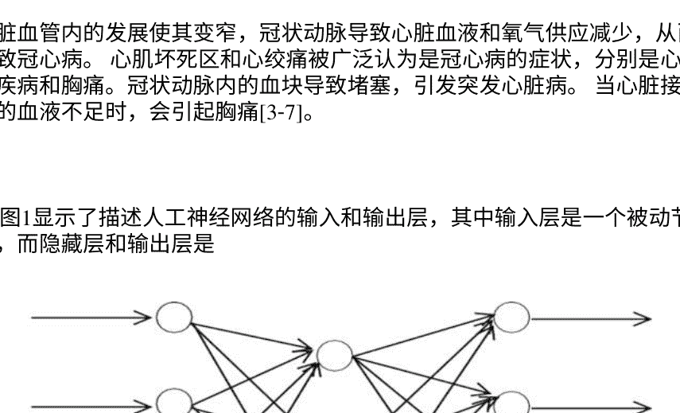

图1 神经网络的架构

活动节点。神经网络的训练是通过误差校正学习来完成的。学习的目的是修改权重以确保最小误差。

##### 1.1 前馈网络（FFN）

FFANNs将符号限制在单向的一种方式中，即从贡献到产出。例如，没有输入（圆圈），任何层的产出都不会影响到等效层。前馈ANNs通常是将输入与输出相关联的直接系统。它们被广泛用于识别模式。这种类型的连接有时被称为自下而上或自上而下的方式来构建。

##### 1.2 反馈网络

反馈网络通过在系统中连接回路来使信号双向传输。输入系统非常强大且可能非常复杂。这些系统处于动态状态；它们的“状态”不断变化，直到达到平衡。它们保持在平衡点上，直到输入发生变化并需要找到新的平衡点[8]。

##### 1.3 ANN学习

学习是一个持续循环，在这个框架中，对环境边界的反应会自行重新排列，以便在世界中发挥作用。ANN学习可以被视为机器学习的一个特殊实例。大多数科学家和应用用户通常使用梯度下降类型的规则，并且它们达到由误差函数定义的超平面的最小值，遗传算法也被用来训练ANN。

#### 2 文献综述

研究了自动选择系统领域的不同论文。作者们研究了神经网络（NN），该网络在从自我应用的调查到搜索重要人群的决策系统方面发挥作用。多层感知（MLP）被训练用于与不同危险因素进行交互，以识别冠心病（CI）。它描述了对神经网络结构的权重值进行修改的过程，其中在输入处添加了一个额外的神经元层，并分配了较小的误差给它们的权重。它提供了关于这些神经元的权重的潜在理解，并展示了如何将它们用作选择输入的标准。该方法与其他统计技术进行了对比，以帮助理解当前方法的优势。

我们继续展示该框架利用神经系统训练技术来识别具有暗示性和无症状的患者的能力[1]。

> [2]的作者讨论了心血管疾病是当今工业化世界死亡的主要原因。在当今世界，改进分析和治疗的可用资源得到了极大的发展。观察的一种策略是从心电图中记录心率变异性超过24小时。这些HRV值位于连续QRS和RR间期的两个R峰之间。有多种多样的滤波器用于改善来自皮肤表面的噪声信号。它也被称为工件。最后，计算功率谱密度（PSD），将值分为三组，分别是非常低频（VLF），高频（HF）和低频（LF）的HRV。该模型结合了重复空间和时间的影响。

> [9]的作者谈到了利用综合神经系统与模糊逻辑框架，并且这种混合技术相当难以理解。这允许评估和描述HRV，并确定正在经历心脏问题的低概率和高概率患者。制备方法、参数和应用细节已经发展起来，以了解心血管问题的原因。结果表明，这种混合网络适用于识别高风险到低风险心血管病患者。仿真环境可以作为生物医学工程中改进策略的有力工具，特别是心脏病学方面[9]。

心血管心律失常的分类系统使用广义前馈神经网络分类器对标准12导联心电图记录数据进行处理。如图所示，GFNN分类器通过使用静态反向传播算法将心律失常案例分为正常和异常类别，被认为是无风险的安排。在这项研究中，主要关注开发高准确性的心律失常分类结果，以在诊断决策辅助系统中应用。在心律失常分析中，个体的某些特征估计值不可避免地会缺失。因此，这些缺失值被最接近的类别的段估计值替代。这种方法更加智能，可以避免人为错误；系统模型是基于UCI心电图心律失常数据集的输入进行训练和测试。数据收集自总共452个病例，本文的结果显示可以获得高达82.35%的测试分类准确率[10]。

此外，还提出了一种称为参考模型方法的新技术的研究。对新方法进行研究的目的是考虑与其他相关模型相比的神经系统模型，因此不同的方法可以积极地用于改进结构需求的方法[8]。

[11, 12]的作者提出了另一个神经系统原型，称为约束最小范数神经网络(CSII NN)，以了解基础追踪(BP)[I] 121 [9]。将高目标与快速实施相结合，C SII NN-BP将极大地促进对各种非固定信号的在线时域分析，包括临床数据，如心电图(ECG)，脑电图(EEG)和胃电图(EGG)，等等，具有高质量。

通过使用梯度下降算法来设计智能系统的对话，在这里，像人工神经网络(ANN)这样的软计算工具和利用共轭梯度(CG)技术来训练ANN。该研究提供了基于CG的ANN训练算法，用于智能系统的设计。

为了更好地执行，当前变体的CG的大部分应用于该目的[13]。

关于人工神经网络的研究很难选择最佳计算-尽管许多计算方法在现有工具的应用中可用于给定的任务或数据集。在这项工作中，选择的计算方法将使用几个数据集值进行测试，并且通常会为不同的负载初始配置和不同数量的隐藏神经元进行多次测试同时为所有前馈人工神经网络保留一个隐藏层[14]。

进一步的讨论与学习有关。然而，这个领域的一个重要问题是通常没有目标值可用于适应人工神经网络的特征学习功能是一个足够灵活的工具以避免这个问题。展示了如何修改ANN的误差函数，使其仅使用目标而不是目标值进行工作。我们确定了具有随机分部的来回系统的平衡原则，并包括有效的考虑因素，必须考虑应用基于对比的学习系统。在三个基准数据集上，我们使用在自动学习的ANN特征上训练的直线SVM优于在原始数据上训练的RBF部分SVM。

这可以在一个元素空间中完成，仅需原始信息测量数量的十分之一。我们在两个进一步的领域中完成了基于距离的ANN训练的两项研究：数据可视化和异常检测[12]。

## 3问题形式化

情感分析和深度学习选择情感支持网络可用于预测心脏病的存在或不存在。糟糕的诊断结论和糟糕的临床决策导致死亡。同样，不是所有的临床医生在预测冠心病方面都是一样合理的，诊断的时机很重要，及时的正确诊断可以避免死亡。该系统帮助心脏病专家做出决策，而人们可能会在复杂的数据中犯错误。智能系统在医学和医疗领域迅速扮演着关键角色，以提高敏感患者护理的质量和改善敏感患者健康的质量。对于评估这些系统的客观方法的需求被广泛认可。在医学和医疗保健领域，健康至关重要，因此如果临床实践中普遍接受临床专家系统和神经系统等程序，这一点非常重要。

#### 4 提出的系统

冠心病的分析在确诊中起着重要作用，几乎所有年龄和性别的人都受到了很大的影响。冠心病对那些需要更有效诊断的人来说，会造成更严重的威胁。及早诊断冠心病是明智的，以确保早期治疗，以避免进一步的健康复杂性。这项研究的主要特点是将能够以自动化方式预测心脏问题的系统与更高的准确性相结合。这项研究通过引入混合神经网络遗传算法（HNNGA）来快速准确地预测冠心病事件[15]。通过改进神经系统的基础权重更新，提出的策略在确诊冠心病方面取得了良好的性能，这是通过引入遗传算法来实现的。遗传算法可以选择神经网络隐藏层的最佳权重值。所提出的研究过程的处理流程如下图所示。在应用之前，先对获取的数据集进行归一化处理。

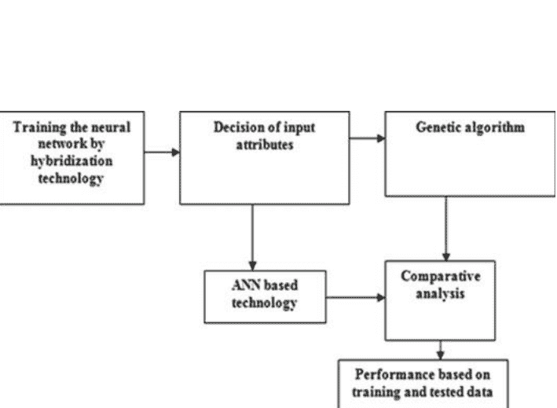

图2提出的模型

计算。然后，将混合神经网络遗传算法（HNNGA）应用于归一化数据集。对所提出的计算进行了分析。

## 5个算法

### 5.1人工神经网络（ANN）

人工神经系统是基于数值模型的计算标准，与传统计算不同，它具有类似于进化良好的动物大脑的结构和活动。人工神经网络或神经系统也被称为连接主义框架或等分布框架或多功能框架；因此，它们由一组相互连接的处理元素组成，可以并行工作。神经网络对于解决大量实时问题非常有用。它们的主要优势是可以解决对于常规技术来说过于复杂的问题；这些问题没有算法解决方案，或者算法解决方案过于复杂而无法定义。在算法方法中，系统按照一部分计算来解决问题。但是，如果系统需要遵循的具体步骤已知，则系统无法解决该问题。这限制了常规系统的危险思考能力，只能解决已经理解的问题，而系统框架管理员知道如何解决。总的来说，神经网络适用于人们擅长理解但计算机通常无法解决的问题。这些问题包括模式识别和预测，需要识别数据中的模式。对于松散的输入，神经网络可以检索到期望的结果或最接近期望数据的信息。考虑到神经网络在许多领域的效率[16-19]。

图3中的块图描述了学习在修改权重以减小误差方面的目的。为了修改权重，需要一种数学保证，这将由一个数学工具称为梯度提供。标量函数的最大增长率给出了方向，即误差必须以最大速率减小，因此改变必须在梯度算子的相反方向进行。范围应该是零和一。如果小于零，而不是在梯度的相反方向上进行改变，将在梯度的方向上进行改变，结果将增加而不是减少。因此，它必须大于零。如果大于一，梯度的保证将无法保持，结果会导致振荡。为了克服这些条件，必须小于1。学习常数的最优值取决于应用程序[20–23]。

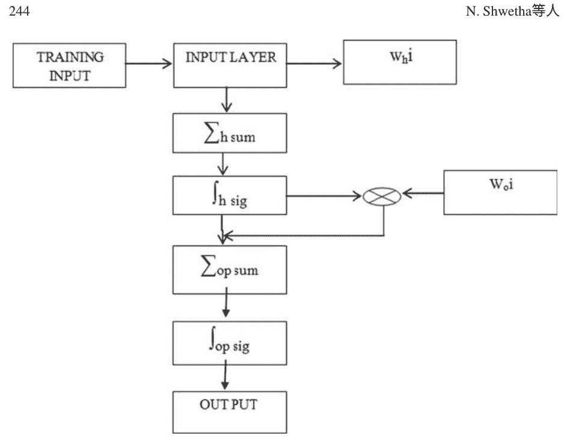

## 图3 ANN架构的块图设计

##### 5.2 梯度下降算法

这也被称为优化算法。为了使用梯度下降找到函数的局部最小值，需要采取一些步骤，与当前点处函数的负梯度相比较。这也被称为“最陡下降算法”[11]。在使用梯度下降规则训练ANN时，有时会陷入局部最小值。

这里，Δ是一个数学运算符。当应用于标量函数时，结果将是一个既有大小又有方向的向量。大小将提供最大增长率，方向指示可以实现这个增长率的方向。学习的原因是为了发现使误差等于零的理想负载排列。如果我们取负工作的梯度，修正应该是斜率的负值。图4描述了梯度下降算法，首先，训练数据将是随机的，以保持数据为零。随机负载被输入到ANN算法中，输出将被输入到下降估计中。依赖于已确定的错误，以限制错误和权重变化的发生。权重调整是通过推导[24]进行讨论的。

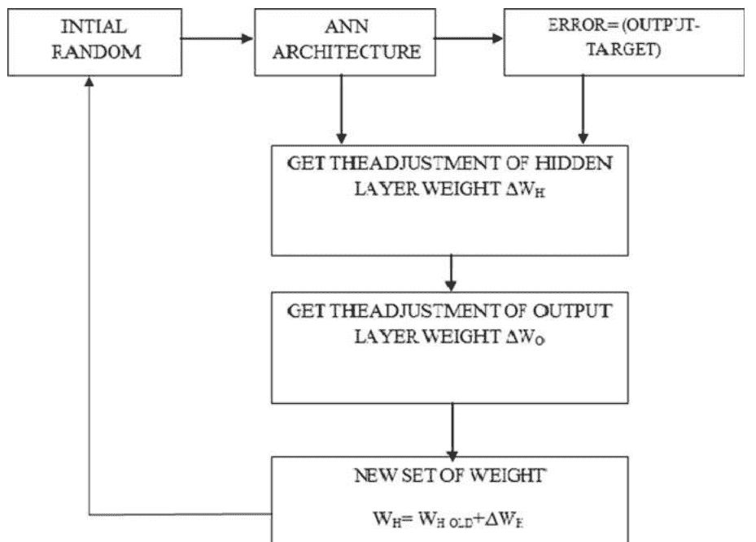

##### 5.3 遗传算法

约翰·霍兰德首次提出了遗传算法的基本思想，这些算法基本上被用作搜索和优化策略。遗传算法依赖于常规决策的知识。正如所见，生物体的特性是确定的。约翰·霍兰德提出了遗传算法的基本思想，这些算法基本上被用作搜索和优化策略。在给定的大规模解空间中，人们希望选择一个既促进文章工作又满足一系列要求的点。遗传算法依赖于其特性。

遗传算法在特定的字符串表示上工作。它们应用了三个基本操作：繁殖、交叉和变异。繁殖过程从现有一代开始，使用与其适应度值不同的概率对字符串进行复制。

下图5表示遗传算法的流程图。遗传算法的工作原理如下：首先通过均匀分布创建一个随机种群。在这里，目的是找到问题的最佳解决方案。最多可以有50%的隐藏节点进行交叉，并随机选择其中的节点数量，可以随机选择哪个节点。应用变异。

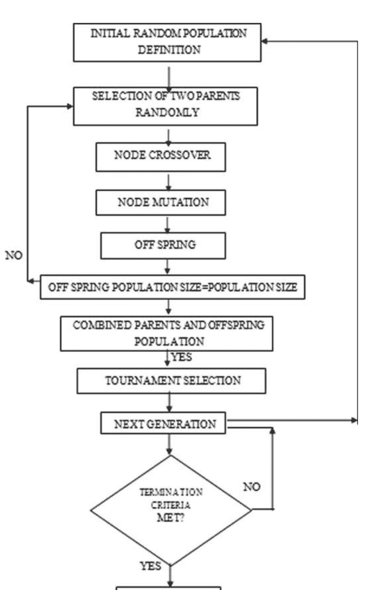

## 图5遗传算法流程图

通过随机添加高斯分布，对每个后代应用变异。为了通过将这些权重传递给神经网络来获得适应度值，将重复该过程以创建与父代人口大小相同的后代人口。

###### 5.3.1 锦标赛选择

图6描述了遗传算法的工作原理中的锦标赛选择。它应用于挑战者人口等于20%。该算法对锦标赛选择分数进行排序，并选择人口的最佳一半样本来定义下一代。一旦过程终止（从上一代到下一代），最佳解决方案被视为最终解决方案。从获得的交配池中，算法随机选择两个父代，并通过随机选择行/列来应用交叉和变异以获得隐藏权重和输出权重。人口的新成员被称为子代。该过程重复，直到产生的子代数量等于原始人口大小。一旦我们获得的子代数量等于总人口数量，就形成了一个新的一代。该过程重复，直到父代具有某个适应度值的95%。

## 6误差反向传播 (EBP)

ANN所谓的Sigmoid函数的执行工作的主要优点是它具有非常简单的子函数，学习＝记忆。通过模型学习的能力使得ANN非常灵活和强大。EBP的目标是利用误差来调整权重，以逐渐减小误差。通过动态学习率调整和输入处的偏置节点，可以加速EBP算法的能力。

## 7机器学习网络

有几个原因可以解释为什么遗传算法对于训练神经网络是有用的。就仅仅针对具有固定网络的权重（和偏置）确定问题而言，遗传算法在有效地搜索庞大而复杂的空间以找到几乎全局最优解方面特别适用。随着搜索空间的复杂性增加，遗传算法成为与基于梯度的方法（如反向传播）相比越来越有吸引力的选择。过度简化是遗传算法的第二个优势。通过仅对算法进行轻微修改，可以使用遗传算法来训练各种不同类型的网络，以建立一个决策稳定的系统。使用受控反向传播学习算法或遗传算法来训练ANN结构。为了提高学习和速度，会应用力量和偏见。总的来说，节点偏见在训练过程中可以被调整，但在系统初始化时可以设置为特定的值。为了避免陷入局部最小值，能量率允许系统可能滑过局部最小值。

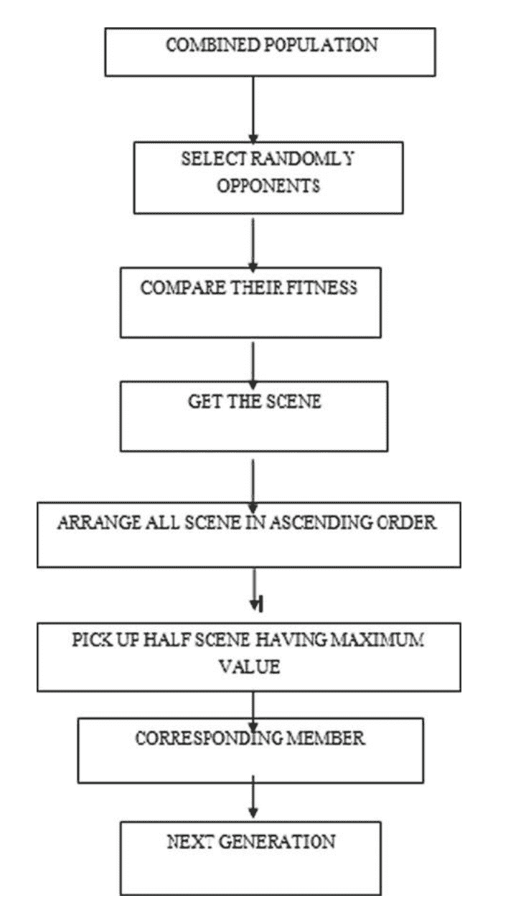

#### 8 遗传算法在神经网络中的优点

有几个原因可以解释为什么遗传算法在准备神经网络方面是有用的。就固定网络的权重（和倾斜度）确定问题而言，遗传算法在有效地搜索庞大而复杂的空间以找到几乎全局最优解方面特别适用。随着搜索空间的复杂性增加，遗传算法成为与基于梯度的方法（如反向传播）相比越来越有吸引力的选择。过度简化是遗传算法的第二个优势。只需对算法进行轻微修改，就可以利用遗传算法来训练各种不同类型的网络，以建立一个决策稳定的系统。监督反向传播学习算法或遗传算法被用来训练人工神经网络架构。

为了提高学习和速度，将应用力量和倾向。总的来说，节点倾向在训练过程中可以被修改，但在系统启动时可以设置为特定的值。为了帮助避免陷入局部最小值，能量率允许系统可能在局部最小值之间滑动。

## 9个测试和结果

输入选择包含13个参数，根据UCI存储库和专家构建的数据集。

图7显示了整体模块，它被创建为GUI菜单。按钮列表已经按顺序排列。心脏训练数据是初始阶段，其中输入数据被获取并归一化为零和一。测试数据被用来测试训练数据，以确定学习是否完成。最初，采用梯度学习进行学习性能。

为了将操作切换到饱和模式，必须对数据集进行归一化。图8显示了带有目标的训练数据集，而图8显示了归一化的带有目标的训练数据集。在这里，行代表被考虑为数据集的患者，即（患者1，患者2等），而列代表个体患者的参数，即年龄（年），性别（一＝男性；零＝女性），胸痛类型（一＝典型型一型心绞痛；二＝典型型心绞痛；三＝非心绞痛疼痛；四＝无症状），空腹血糖（一表示>120 mg/dl；零表示<120 mg/dl），静息心电图结果（零＝正常；值1：存在ST-T波异常；值2＝显示可能或明确的左心室肥大），运动诱发性心绞痛

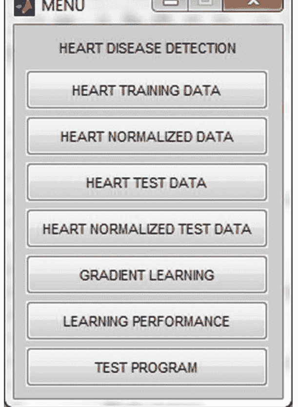

- HEART DISEASE DETECTION
- HEART TRAINING DATA
- HEART NORMALIZED DATA
- HEART TEST DATA
- HEART NORMALIZED TEST DATA
- GRADIENT LEARNING
- LEARNING PERFORMANCE
- TEST PROGRAM

## 图7 所有GUI模块

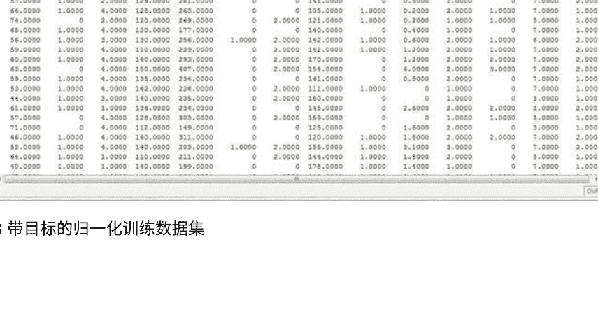

## 图8 带目标的归一化训练数据集

| Col1 | Col2 | Col3 | Col4 | Col5 | Col6 | Col7 | Col8 | Col9 | Col10 | Col11 | Col12 | Col13 | Col14 |
|---|---|---|---|---|---|---|---|---|---|---|---|---|---|
| 70.0000 | 1.0000 | 4.0000 | 130.0000 | 322.0000 | 0 | 2.0000 | 109.0000 | 0 | 2.4000 | 2.0000 | 3.0000 | 3.0000 | 2.0000 |
| 67.0000 | 1.0000 | 3.0000 | 115.0000 | 564.0000 | 0 | 2.0000 | 160.0000 | 0 | 1.6000 | 2.0000 | 0 | 7.0000 | 1.0000 |
| 57.0000 | 1.0000 | 2.0000 | 124.0000 | 261.0000 | 0 | 0 | 141.0000 | 0 | 0.8000 | 1.0000 | 0 | 7.0000 | 2.0000 |
| 64.0000 | 1.0000 | 4.0000 | 128.0000 | 263.0000 | 0 | 0 | 105.0000 | 1.0000 | 0.2000 | 2.0000 | 1.0000 | 7.0000 | 1.0000 |
| 74.0000 | 1.0000 | 2.0000 | 120.0000 | 269.0000 | 0 | 2.0000 | 121.0000 | 0 | 0.2000 | 1.0000 | 1.0000 | 3.0000 | 1.0000 |
| 65.0000 | 1.0000 | 4.0000 | 120.0000 | 177.0000 | 0 | 0 | 140.0000 | 0 | 0.4000 | 1.0000 | 0 | 7.0000 | 1.0000 |
| 54.0000 | 1.0000 | 3.0000 | 110.0000 | 251.0000 | 1.0000 | 2.0000 | 142.0000 | 1.0000 | 0.7000 | 2.0000 | 1.0000 | 6.0000 | 2.0000 |
| 58.0000 | 1.0000 | 4.0000 | 110.0000 | 259.0000 | 0 | 2.0000 | 142.0000 | 1.0000 | 1.2000 | 2.0000 | 1.0000 | 3.0000 | 1.0000 |
| 60.0000 | 1.0000 | 4.0000 | 140.0000 | 293.0000 | 0 | 2.0000 | 170.0000 | 0 | 1.2000 | 2.0000 | 2.0000 | 7.0000 | 2.0000 |
| 63.0000 | 1.0000 | 4.0000 | 150.0000 | 407.0000 | 0 | 2.0000 | 154.0000 | 0 | 4.0000 | 2.0000 | 3.0000 | 7.0000 | 2.0000 |
| 59.0000 | 1.0000 | 4.0000 | 135.0000 | 234.0000 | 0 | 0 | 161.0000 | 0 | 0.5000 | 2.0000 | 0 | 7.0000 | 1.0000 |
| 53.0000 | 1.0000 | 4.0000 | 142.0000 | 226.0000 | 0 | 2.0000 | 111.0000 | 1.0000 | 0 | 1.0000 | 0 | 7.0000 | 1.0000 |
| 44.0000 | 1.0000 | 3.0000 | 140.0000 | 235.0000 | 0 | 2.0000 | 180.0000 | 0 | 0 | 1.0000 | 0 | 3.0000 | 1.0000 |
| 61.0000 | 1.0000 | 1.0000 | 134.0000 | 234.0000 | 0 | 0 | 145.0000 | 0 | 2.6000 | 2.0000 | 2.0000 | 3.0000 | 2.0000 |
| 57.0000 | 1.0000 | 4.0000 | 140.0000 | 192.0000 | 0 | 2.0000 | 139.0000 | 0 | 1.4000 | 1.0000 | 1.0000 | 3.0000 | 1.0000 |
| 58.0000 | 0 | 4.0000 | 112.0000 | 149.0000 | 0 | 0 | 160.0000 | 0 | 1.6000 | 2.0000 | 0 | 3.0000 | 1.0000 |
| 46.0000 | 1.0000 | 4.0000 | 140.0000 | 311.0000 | 0 | 0 | 120.0000 | 1.0000 | 1.8000 | 2.0000 | 2.0000 | 7.0000 | 2.0000 |
| 53.0000 | 1.0000 | 4.0000 | 140.0000 | 203.0000 | 1.0000 | 2.0000 | 155.0000 | 1.0000 | 3.1000 | 3.0000 | 0 | 7.0000 | 2.0000 |
| 64.0000 | 1.0000 | 1.0000 | 110.0000 | 211.0000 | 0 | 2.0000 | 144.0000 | 1.0000 | 1.8000 | 2.0000 | 0 | 3.0000 | 1.0000 |
| 40.0000 | 1.0000 | 1.0000 | 140.0000 | 199.0000 | 0 | 0 | 178.0000 | 1.0000 | 1.4000 | 1.0000 | 0 | 7.0000 | 1.0000 |

图9 带目标的测试数据集

图10 带目标的归一化测试数据集

(one =yes; zero =no)，斜率—峰值运动ST段的斜率 (one =上升; two =平坦; three =下降)，CA—主要血管的数量通过荧光透视染色 (值为零到三)，thal (three =正常; six =固定缺陷; seven =可逆缺陷)， trest血压 (在mmHg上的医院入院时)，血清胆固醇 (mg/dl)， thalach—达到的最高心率，和old peak—运动引起的ST压低。
图9—带目标的测试数据集; 图10—带目标的归一化测试数据集。

#### 10 结论和未来展望

详细讨论了ANN架构和遗传算法。目前没有预测心脏病的标准程序。文献调查必须进行各种已知的重置机制研究。这些研究有助于至少确认疾病。患者不需要面临模棱两可和不准确的决策问题。目前，神经网络权重调整是通过使用梯度下降和遗传算法，并应用于不同患者使用13个参数作为数据集来完成的。因此，可以对每个训练和测试数据进行检查。这两种算法都用于性能分析。未来的行动将是根据模块的要求设计和实施专家系统；可以根据医学诊断数据集的要求设计。

#### 参考文献

- 1. Shen, Z., Dept. of Electr. Eng., Brunel Univ., Uxbridge, UK, Clarke, M., Jones, R., & Alberta, T. (1993). 一种用于检测冠状动脉疾病的神经网络方法。计算机在心脏病学1993年的应用，会议(pp. 221–224).
- 2. 布什拉, M., 电子工程师, 西德工程与技术大学, 卡拉奇, 巴基斯坦汗, 塔米娜, & 阿里, Z. A. (2006). 使用混合神经模糊网络进行心脏突发死亡风险检测。电气与电子工程, 2006年第三届国际会议, 2006年9月6日至8日 (第1-4页).
- 3. 来自网站http://transductions.net/2010/02/04/313/neurons/的神经元图像
- 4. Baluja, S., & Davies, S. (1997). 使用最优依赖树进行组合优化-搜索空间结构学习。在第14届国际会议上机器学习 (第30-38页)。 圣马特奥, 加利福尼亚州: 摩根考夫曼。
- 5. De Jong, K. A. (1975).对一类遗传自适应系统行为的分析。博士论文, 密歇根大学, 安娜堡; Deb, K., & Goldberg, D. E. (1993)分析陷阱函数中的欺骗。在L. D. Whitley (Ed.)的《遗传算法基础》2(pp. 93–108)。 圣马特奥, 加利福尼亚州: 摩根考夫曼。
- 6. De Bonet J. S., Isbell, C., & Viola, P. (1997). 通过估计概率密度来寻找最优解。在M. C. Ozer, M. I. Jordan, & T. Petsche (Eds.)的《神经信息处理系统进展》(Vol. 9, p. 424)。 马萨诸塞州剑桥: 麻省理工学院出版社。
- 7. Eshelman, L. J., & Schaffer, J. D. (1993). 交叉的领域。在S. Forrest (Ed.)的《遗传算法国际会议论文集》(pp. 9–14)。 圣马特奥, 加利福尼亚州: 摩根考夫曼; [9]Goldberg, D. E. (1987). 简单遗传算法和最小的欺骗问题。在L. Davis (Ed.)的《遗传算法和模拟退火》(pp. 74–88)。 圣马特奥, 加利福尼亚州: 摩根考夫曼。
- 8. Kumaravel, N., Anna Univ.工程学院,印度马德拉斯, Sridhar, K.S., & Nithiyanandam, N. (2011). 基于人工神经网络的心脏心律失常疾病诊断。过程自动化、控制和计算 (PACC), 2011年国际会议于2011年7月20日至22日 (第1-6页).
- 9. Jadhav, S. M., Dr. Babasaheb Ambedkar Technol. Univ.信息技术系, 印度洛内雷, Nalbalwar, S. L., & Ghatol, A. A. (2008). 数据融合用于心脏疾病分类的多层前馈神经网络。计算机工程与系统. 2008年。 ICCES 2008国际会议于2008年11月25日至27日 (第67-70页).
- 10. Jadhav, S. M., Inf. Technol.系, Dr. Babasaheb Ambedkar Technol. Univ., Lonere, India, Nalbalwar, S. L., & Ghatol, A. A. (2010). 基于广义前馈神经网络的心律失常分类从ECG信号数据中高级信息管理和服务 (IMS), 2010年第六届国际会议, 2010年11月30日至12月2日2010 (第351-356页).
- 11. 于, X., 中国科学院海洋研究所, 中国北京, 公, D., 顺, X., 李, S., & 徐, Y. (2003). 比较了一个组合小波和一个组合主成分分析BCG信号分析的分类模型。机器人技术、智能系统和信号处理，2003年，2003年IEEE国际会议，2003年10月8日至13日 (pp. 160–165).
- 12. 王志胜，夏克松，李文华，何振宇，陈建东。**东南大学无线电工程系，南京，中国*南京邮电大学数学系，南京，中国**美国俄克拉荷马市浸信会医疗中心医疗研究所。基于神经网络的基础追踪求解器及其在生物医学信号时频分析中的应用。
- 13. Valavanis, I. K., 希腊国家技术大学电气与计算机工程学院，9号Polytechneiou街，1578 0 Zographou, Geece, Mougiakakou, S. G., Grimaldi, K. A., Nikita, K. S. (2008) 利用遗传和临床信息分析餐后血脂作为心血管疾病风险因素：人工神经网络视角。20 08年医学与生物工程学会工程。 EMBS 2008.第30届年度国际IEEE EMBS会议温哥华，不列颠哥伦比亚(pp. 4609–4612)。加拿大，8月20日至24日。
- 14. 乔，H., IEEE会员，彭，J., 徐，Z.-B., & 张，B. (2003年12月)。神经网络稳定性分析的参考模型方法。IEEE系统、人类和控制论—第B部分：控制论，33(6), 925–933。
- 15. Harik, G., Cantú-Paz, E., Goldberg, D.E., & Miller, B. (1997年)。赌徒破产问题，遗传算法和种群大小。在T. Back (Ed.) ，进化计算第四国际会议论文集 (第7-12页) Piscataway, NJ: IEEE出版社。
- 16. Harik, G. (1999年) ECGA中的概率建模链路学习，伊利诺伊大学，厄巴纳-香槟，IlliGAL Rep. 99010.; [12] Hertz, J., Krogh, A. , & Palmer, G. (1993年) 神经计算理论导论。Reading, MA: Addison-Wesley。
- 17. Höhfeld, M., & Rudolph, G. (1997年)。走向基于群体的渐进学习理论。在Back (Ed.)的情况下，进化计算的第四届国际会议论文集(pp. 1–5)。 Piscataway, NJ: IEEE出版社。
- 18. Shyu, M. L., Chen, S. C., Sarinnapakorn, K., & Chang, L. (2003). 一种基于主成分分类器的新颖异常检测方案。在IEEE基础和数据挖掘新方向研讨会论文集中(pp. 172–179)。
- 19. Ryan, J., Lin, M., & Miikkulainen, R. (2003). 神经网络入侵检测。神经信息处理系统进展(第10卷)。Springer。
- 20. Shwetha, N., & Priyatham, M. (2020). 使用EPLMS算法的自适应均衡器性能分析。 在2020年第四届I-SMAC国际会议上(IoT in social, mobile,analytics and cloud) (I-SMAC), 印度P alladam (pp. 872–876)。 https://doi.org/10.1109/I-SMAC49090.2020.9243512
- 21. Shwetha, N., & Priyatham, M. (2021). 自适应均衡器的收敛分析，使用进化编程（EP）和最小均方（LMS）方法。在V.Bindhu, J.M.R.S.Tavares, A. A. A. Boulgeorgos和C. Vuppala pati (Eds.) 的国际通信，计算和电子系统会议中。 电气工程讲义（Vol. 733）。 Springer, 新加坡。 https://doi.org/10.1007/978-981-33-4909-4_48
- 22. Shwetha, N., & Priyatham, M. (2021). 使用自然启发算法的自适应均衡器的性能分析。在 S. Smys, V. E. Balas, K. A. Kamel, P. Lafata (Eds.) 的创新计算和信息技术中。 网络和系统讲义 (Vol. 173)。 Springer, 新加坡。 https://doi.org/10.1007/978-981-33-4305-4_37
- 23. Shwetha, N., Priyatham, M., & Gangadhar, N. (2021). 自适应滤波器均衡器优化-使用混合方法。国际工程与技术高级研究杂志，12（1），473-483。
- 24. Chen, Y.H., Abraham, A., & Yang, B. (2007). 基于混合柔性神经树的入侵检测系统。国际智能系统杂志，22（4），337-352。

### 在分类本科论文题目中实施增强的K-Strange Points聚类方法

马尔科姆·安德鲁·马德拉和特斯林·雅各布

摘要聚类处理的是将数据项归为一组，这些数据项在彼此之间相似，但在与其他组的项之间的接近程度上有较大差异。 问题在于，在大多数机构中，本科论文题目并不是基于相似性进行分组的，对于研究生学生来说，根据相似性或具有相似主题的研究论文来搜索论文报告是耗时的，因为标题只是按顺序存储在数据库中。 使用k-means作为聚类算法的文本聚类的轮廓系数得分较低，这激发了利用增强的K-Strange points聚类算法的潜力来获得更好的结果。 本文的目标是使用增强的K-Strange points聚类算法对本科论文题目进行分组。 轮廓系数用于测试聚类质量。 研究结果是一种可以处理本科论文题目并使用聚类技术将其分组到不同组的方法。

关键词 增强的K奇点聚类 · 文本聚类 · K均值 · 轮廓系数 · 欧氏距离度量 · 分词 · 词干提取

#### 1 引言

在当今的情况下，大学本科论文题目在学院或大学中按顺序或按照他们的专业存储，但学生通常会选择属于另一个专业或领域的论文，增加了研究生在根据自己的需求和研究兴趣寻找论文题目时的负担。

另一个在Goa工程学院发现的问题是自动论文标题聚类过程从未进行过。所有这些年来，论文标题只是按照学生的专业存储，而不是按照论文的领域存储。

因此，论文标题数据只存在于图书馆项目协调员的Excel文件中。如果对本科生的论文标题进行分类，可以潜在地提高学生进行自己选择的研究的效率，而不受分类论文的限制。

文档管理的一种方法是文本挖掘。文本挖掘的范围包括数据集的聚类、分类、维度缩减、主题建模和相似度计算[9]。文本聚类中的主要问题包括特征选择、未知类标签、加权方案、相似度或非相似度度量、文档词矩阵的稀疏性、大量的异常值[1]。提出了一种算法，通过两个阶段的分割和合并来提高k-means算法的效率[12]。在k-means中，基于遗传算法的适应度函数范式执行质心的选择[14]。当使用大量数据时，“二分k-means算法”具有更好的性能[11]。文本聚类算法使用了一个称为向量空间的模型[3]。

##### 1.1 动机

在分类论文标题时，使用K-Means聚类方法，其中使用了轮廓系数来测试聚类质量，如果使用K-Means作为聚类算法，则显示轮廓系数0.5674较低[16]。

使用经典的K-Means算法进行聚类会得到最终的固定点，这些点是数据集中所有点聚类的中心。这表明，如果首先计算出最终的不变中心点，那么任务只剩下将剩余的数据点分配到适当的聚类中，提出了一种名为“K-Strange点聚类方法”的算法，其中从数据集中选择与欧氏距离参数最远的K个点，这些点形成所需聚类数量的聚类，数据集中的剩余点被分配到这些K-Strange点形成的聚类中[7]。

通过将第三个奇怪点的位置放置在离kmin和kmax几乎最大且相等间隔的地方，对上述算法进行了改进，从而得到更准确的聚类[6]。

从现有问题和增强K-奇怪点聚类算法对文本数据进行分类的潜力出发。预计这项研究可以将本科论文题目分类到相应的聚类中。

增强K-奇怪点聚类算法的示意图

改进了K-奇怪点聚类算法，以找到彼此之间最大分离的奇怪点，并解决了从数据集中选择两个最远点对运行时间的影响。

该算法不是通过计算数据集中所有点之间的欧氏距离来选择彼此之间距离最大的两个点，而是首先找到数据集的最小值。这个点被称为 K_min，表示K-Strange点中的第一个点，如图1所示。

然后算法找到一个离 K_min最远的点，称为 K_max，如图2所示。

这两个步骤消除了通过计算数据集中所有点之间的欧氏距离来识别两个奇怪点的需要，从而减少了对聚类方法运行时间的强烈影响，该运行时间为 O(n²)，首先找到最小值，然后识别离最小值最远的点，从而减少了通过计算数据集中所有点之间的欧氏距离来发现两个奇怪点的需要。

这可能显著提高算法的性能，因为找到最小数据点只需要对数据集进行一次遍历，在数据集中有n个点的情况下，可以在O(n)时间内完成，而找到离 K_min最远的第二个奇怪点也只需要对数据集进行一次遍历，在数据集中有n个点的情况下，可以在O(n)时间内完成。

增强算法然后定位到第三个数据项，该数据项与之前步骤中发现的两个奇怪的数据元素进一步分离。 如果第三个奇怪的元素（如图3所示）更接近 K_min，则使用方程（3）进行修正。

图2中的 $K_{\min}$ 和 $K_{\max}$ 数据集

图3中的 $K_{\text{str}}$ 更接近 $K_{\min}$ 而不是 $K_{\max}$

通过找到第三个奇怪元素和 $K_{\max}$ 之间的中心元素，并将该中心元素称为最终第三个奇怪点，从而确定潜在第三个奇怪数据项的位置，该点距离 $k_{\min}$ 和 $k_{\max}$ 最远。

如果，如图4所示，第三个奇怪点更接近Kmax，则使用方程（4）通过找到第三个奇怪元素和Kmin之间的中心元素，并将该中心元素称为最终第三个奇怪（最远）点[5, 6]来修正潜在第三个奇怪元素的位置。

通过上述方法，可以将这三个奇点绘制成图5所示。

如果需要3个簇，可以将剩余的元素分配到由这三个增强的奇点组成的簇中，如图6所示[6]。

图4中，K更接近于Kmax而不是Kmin

图5中，K等于3个奇点

#### 3 研究方法

##### 3.1 研究数据

本研究使用的研究数据是Goa工程学院本科论文题目的数据，共包含250条记录。

图6中，K等于3个奇点

##### 3.2 文本挖掘

文本挖掘包括传统的数据挖掘算法，如聚类和分类。文本挖掘是一个重复的过程，通过使用不同的设置和排除部分要求来进行分析，以获得更好的结果。这一步的结果可以是文档集合、多术语主题列表或解决分类问题的规则[4]。

图7显示了文本挖掘的步骤。

图7提出方法的一般流程图

###### 3.2.1 数据收集

文本挖掘的第一步是收集所需的文本数据，以从文本数据中获取所需的信息。

###### 3.2.2 预处理

准备收集的数据集，以便应用所需的聚类算法。

- 1. 分词和停用词去除
- 2. 词干提取
- 3. TF-IDF。

分词是将一段文本分割成标记的方法。 标记集合用作额外处理的输入，例如过滤或文本挖掘。分词在语言学（作为文本细分的形式）和计算机科学（作为词法分析的组成部分）中都有应用[13]。 停用词是从自然语言数据中提取出来的词，在处理过程中删除。 虽然停用词通常对应于语言中最常见的词，但处理工具没有标准的停用词集合，为了帮助短语查询，一些工具特别防止删除这些停用短语。

将单词缩减为其词干、核心或根形式的方法通常称为词干化。 词干不必与单词的形态学起源相匹配；通常情况下，只要相关的单词在大多数情况下映射到相同的词干即可，即使该词干本身并不是一个真正的词根。

Tf-idf代表“词频-逆文档频率”，是一种确定词对语料库文本的重要性的数值度量[15]。 在信息处理和文本挖掘中，它被广泛用作一个标准。 术语在论中出现的次数增加了tf-idf值，但是由于某些词在一般情况下使用更频繁，这一增加会被文档中单词的频率所抵消。使用方程式(1)[8]解释了术语/单词计数的含义。

```
tf-idf(t_i, d_j) = tf(t_i, d_j) * log(N/(t_i))      (1)
```

其中

- tf-idf(t_i, d_j) = 单词/术语在文档d_j中的计数
- tf(t_i, d_j) = 单词/术语 t_i在文档d_j中出现的次数
- N = 总文档数
- N(t_i) = 含有单词/术语 t_i的文档数。

##### 3.3 增强的K-奇异点聚类算法

输入: 需要的聚类数K = T 和包含n个对象的数据库 D=D1, D2,...Dn
输出: K个聚类的组合。

- 步骤1: 找到数据集的最小值Kmin。
- 步骤2: 找到距离Kmin最远的点Kmax。
- 步骤3: 找到距离Kmin和Kmax最远的第三个点S。
- 步骤4:
    if(D(Kmin, S) == D(Kmax, S))
    $$K_{\text{str}} = S$$
    else if(D(Kmin, S) < D(Kmax, S))
    $$K_{\text{str}} = K_{\text{str}_{\text{prv}}} + X_m \left[ \frac{|K_{\text{max}} - K_{\text{str}_{\text{prv}}}|}{(K - 1)} \right]$$
    else if(D(Kmin, S) > D(Kmax, S))
    $$K_{\text{str}} = K_{\text{min}} + X_m \left[ \frac{|K_{\text{str}_{\text{prv}}} - K_{\text{min}}|}{(K - 1)} \right]$$

    其中
    K = 聚类总数
    Xm 范围从1, 2, 3... K - 2， 即
    Xm = X1, X2, X3 ... Xk-2
    例如， 如果K=5, Xm = 5 - 2 = 3， 所以我们有
    X1 = 1 = 与第一个修正值S
    X2 = 2 = 与S的第二个修正值
    X3 = 3 = 与S的第三个修正值
    Kstrprv = 未修正的S值
    Kstr = 修正后的S值

- 步骤5: 重复上述过程， 直到找到K-奇异点。
- 步骤6: 将数据集中剩余的点分配到由这些非共线的K-奇异点形成的簇中[6]。

上述算法中使用的距离测量是欧氏距离[2]。

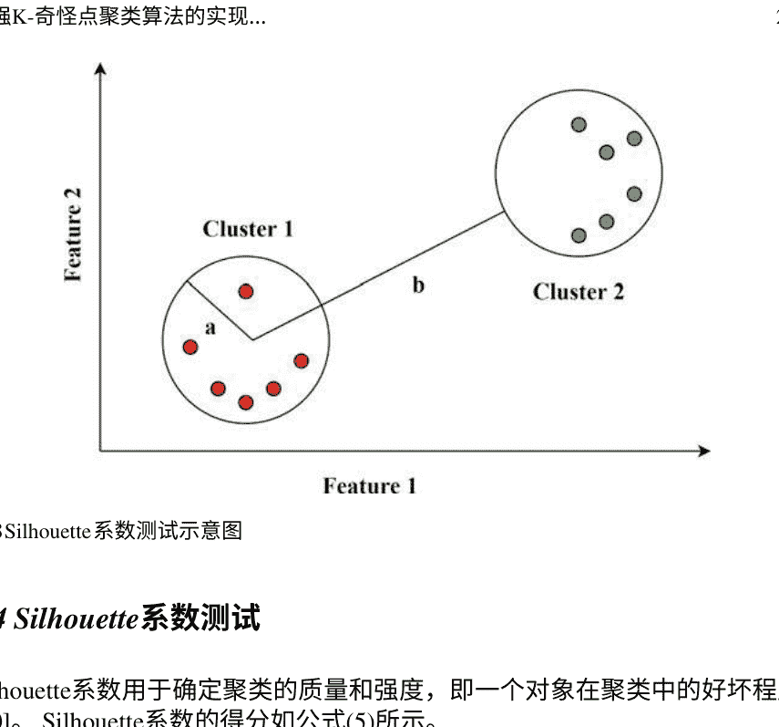

##### 3.4 Silhouette系数测试

Silhouette系数用于确定聚类的质量和强度，即一个对象在聚类中的好坏程度[10]。 Silhouette系数的得分如公式(5)所示。

$$S(i) = \frac{(b(i) - a(i))}{\max\{a(i), b(i)\}}$$

其中
$S(i)$=对象 $i$的轮廓有效性值
$a(i)$=对象 $i$与同一簇中所有对象之间的平均距离（簇内）
$b(i)$=对象 $i$与最近簇中所有对象之间的平均距离（最近簇）
max = 最大值

在图8中，
$a$= 平均簇内距离，即每个簇内点之间的平均距离。
$b$= 平均簇间距离，即所有簇之间的平均距离。

轮廓系数的值介于 $-1$和$1$之间。
1：表示簇之间分离明显且彼此不同。
0：表示簇之间无关联，或者簇之间的距离不显著。
$-1$：簇分配错误。

表1 数据
| 术语 | T1 | T2 | T3 | T4 | T5 |
|------|----|----|----|----|----|
| 公司 | 0 | 5 | 0 | 0 | 0 |
| 印度 | 7 | 0 | 0 | 0 | 0 |
| Plai | 0 | 0 | 2 | 1 | 0 |
| 外国 | 2 | 5 | 0 | 0 | 0 |
| 年份 | 2 | 2 | 3 | 2 | 0 |
| 赢 | 0 | 0 | 1 | 4 | 1 |
| 冠军 | 0 | 0 | 2 | 1 | 0 |
| 第一 | 1 | 0 | 1 | 5 | 0 |
| 税 | 0 | 0 | 0 | 0 | 9 |
| 霍华德 | 0 | 0 | 0 | 0 | 5 |

## 4个数学示例

我们有5个文档论文标题需要进行聚类，以下是在进行分词、去停用词和词干处理后的结果。

- 1. T1: 印度，外国，年份，第一
- 2. T2: 公司，外国，年份
- 3. T3: Plai，年份，赢，冠军，第一
- 4. T4: Plai，年份，赢，冠军，第一
- 5. T5: 赢，税，霍华德。

单词在每个文档中出现的次数如表1所示。在对数据表进行最小-最大归一化以规范化表1中的数据后，结果显示在表2中。

现在，计算归一化数据的Tf-idf，结果显示在表3（表4）中。

将文档向量作为输入传递给聚类算法，即“增强K-奇异点聚类算法”。

##### 4.1 步骤1：找到数据集的最小值（K_min）

使用欧氏距离测量从数据集中计算出的最小值与原点的距离。

最小距离与原点的距离为2.4619，k_min值为（0, 2.321, 0, 0.7346, 0, 0, 0, 0.367, 0, 0）。

### 表2 归一化数据

| 术语 | T1 | T2 | T3 | T4 | T5 |
|---|---|---|---|---|---|
| 公司 | 0 | 1 | 0 | 0 | 0 |
| 印度 | 1 | 0 | 0 | 0 | 0 |
| Plai | 0 | 0 | 1 | 0.5 | 0 |
| 外国 | 0.4 | 1 | 0 | 0 | 0 |
| 年份 | 0 | 2 | 1 | 0 | 0 |
| 赢 | 0 | 0 | 0.25 | 1 | 0.25 |
| 冠军 | 0 | 0 | 1 | 0.5 | 0 |
| 第一 | 0.2 | 0 | 0.2 | 1 | 0 |
| 税 | 0 | 0 | 0 | 0 | 1 |
| 霍华德 | 0 | 0 | 0 | 0 | 1 |

### 表3 Tf-idf数据矩阵

| 术语 | TFI | | | | | DF | D/DF | IDF | 权重 = TFI * IDF | | | | |
|---|---|---|---|---|---|---|---|---|---|---|---|---|---|
| | T1 | T2 | T3 | T4 | T5 | | | | t1 | t2 | t3 | t4 | t5 |
| 从 | 0 | 1 | 0 | 0 | 0 | 1 | 5/1 | 2.2319 | 0 | 2.231 | 0 | 0 | 0 |
| 印度 | 1 | 0 | 0 | 0 | 0 | 1 | 5/1 | 2.2319 | 2.231 | 0 | 0 | 0 | 0 |
| Plai | 0 | 0 | 1 | 0.5 | 0 | 1.5 | 5/1.5 | 1.7369 | 0 | 0 | 1.7369 | 0.8684 | 0 |
| 外国 | 0.4 | 1 | 0 | 0 | 0 | 1.4 | 5/1.4 | 1.8365 | 0.7346 | 1.836 | 0 | 0 | 0 |
| 年份 | 0 | 0 | 1 | 0 | 0 | 1 | 5/1 | 2.2319 | 0 | 0 | 2.3219 | 0 | 0 |
| 赢 | 0 | 0 | 0.25 | 1 | 0.25 | 1.5 | 5/1.5 | 1.7369 | 0 | 0 | 0.4342 | 1.7369 | 0.434 |
| 冠军 | 0 | 0 | 1 | 0.5 | 0 | 1.5 | 5/1.5 | 1.7369 | 0 | 0 | 1.7369 | 0.8684 | 0 |
| 第一 | 0.2 | 0 | 0.2 | 1 | 0 | 1.4 | 5/1.4 | 1.8365 | 0.367 | 0 | 0.3673 | 1.8365 | 0 |
| 税 | 0 | 0 | 0 | 0 | 1 | 1 | 5/1 | 2.2319 | 0 | 0 | 0 | 0 | 2.3219 |
| 霍华德 | 0 | 0 | 0 | 0 | 1 | 1 | 5/1 | 2.2319 | 0 | 0 | 0 | 0 | 2.3219 |

### 表4 文档标题向量

| 术语 | 公司 | 印度 | Plai | 外国 | 年份 | 赢 | 冠军 | 第一 | 税 | 霍华德 |
|---|---|---|---|---|---|---|---|---|---|---|
| t1 | 0 | 2.321 | 0 | 0.7346 | 0 | 0 | 0 | 0.367 | 0 | 0 |
| t2 | 2.321 | 0 | 0 | 1.836 | 0 | 0 | 0 | 0 | 0 | 0 |
| t3 | 0 | 0 | 1.736 | 0 | 2.321 | 0.4342 | 1.7369 | 0.3673 | 0 | 0 |
| t4 | 0 | 0 | 0.8684 | 0 | 0 | 1.7369 | 0.8684 | 1.8365 | 0 | 0 |
| t5 | 0 | 0 | 0 | 0 | 0 | 0 | 0 | 0.434 | 2.3219 | 2.3219 |

##### 4.2 步骤II：找到数据集的最大值 (K_max)

使用欧氏距离测量从数据集中计算出最大值从k_min值。从最小值(k_min)到最大距离为4.1872，k_max值为(0, 0, 1.736, 0, 2.321, 0.4342, 1.7369, 0.3673, 0, 0)。

##### 4.3 第三个奇异点的发现

方程(6)用于计算第三个奇异点，其中max = 4.1872 和 K_min = (0, 2.321, 0, 0.7346, 0, 0, 0, 0.367, 0, 0) K_max= (0, 0, 1.736, 0, 2.321, 0.4342, 1.7369, 0.3673, 0, 0)

距离 = 最大值 + 距离(K最小值数据点) + 距离(K最大值数据点) \quad (6)

离k最小值和k最大值远的最大距离是13.0075，K-奇异点 = (0, 0, 0, 0, 0, 0, 0.434, 2.3219, 2.3219)。

##### 4.4 第四步：修正K-奇异点

为了确保第三个奇异点与k最小值和k最大值之间的距离最大，进行以下测试：

f1 = 距离(K最小值) = 距离(K最小值) = 4.0882
f2 = 距离(K最大值) = 距离(K最大值) = 4.7321

由于 f1 < f2 ，根据公式（3），修正K奇异数据点的值为

K = 聚类总数 =3
由于 K = 3, Xm = 3 - 2 = 1, 所以我们有
X_1 = 1 = 具有第一个矫正值的S
K str_prv = 未校正的S值
Kstr = 校正后的S值。
计算后，校正值为 Kstr = (0, 0, 0.868, 0, 1.1605, 0.2171, 0.86845, 0.46735, 3.48285, 3.48285)。

##### 第4.5步：将点分配给相应的聚类

我们知道   $K_{min} = (0, 2.321, 0, 0.7346, 0, 0, 0, 0.367, 0, 0)$
$K_{max}= (0, 0, 1.736, 0, 2.321, 0.4342, 1.7369, 0.3673, 0, 0)$
$K_{str}  = (0, 0, 0, 0, 0, 0, 0, 0.434, 2.3219, 2.3219)$。
使用欧几里得距离测量，将剩余的数据点分组到各自的簇中。 标题T1和T2被分为C1簇， T3和T4被分为C2簇， T5被分为C3簇。

#### 5 结果与讨论

在这项研究中，从图书馆获得的数据通过文本挖掘阶段进行处理。

##### 5.1 收集数据

通过收集数据进行数据收集。 数据是从本科论文的图书馆协调员那里获得的，并且所获得的数据以Excel格式保存。为了处理文档，将数据输入系统。 Excel格式的数据集显示在图9中，并且使用pandas数据框将数据集加载到Jupiter笔记本中；加载的数据集显示在图10中。 加载的数据具有序列号（no.）表示为ID，论文类型表示为Type，论文标题表示为Titles，发表年份表示为Year的数据集头部。

| ID | Type | Titles | Year |
|---|---|---|---|
| 8019001 | Conference | Analysis models of technical and economic data of | 2018 |
| 8019002 | Conference | Making knowledge discovery services scalable on clouds | 2015 |
| 8019003 | Conference | Spatial and Spatio-temporal Data Mining | 2010 |
| 8019005 | Conference | Domain Driven Data Mining (D3M) | 2018 |
| 8019006 | Conference | Hair data model: A new data model for Spatio-Temporal | 2012 |
| 8019008 | Conference | DD-Rtree: A dynamic distributed data structure for | 2016 |
| 8019009 | Conference | Adaptive Differentially Private Data Release for Data | 2013 |
| 8019010 | Conference | Data Mining Library for Big Data Processing Platforms: | 2018 |
| 8019011 | Journal | An Iterative Data Mining Approach for Mining | 2009 |
| 8019016 | Conference | Research on Intrusion Data Mining Algorithm Based on | 2019 |
| 8019017 | Conference | Civil Engineering Master hands-on challenge to motivate | 2018 |

图9 论文标题数据集的Excel格式

| no | ID | Type | Titles | Year |
|----|----|------|--------|------|
| 0 | 8019001 | Conference | Analysis models of technical and economic data of mining enterprises based on big data analysis | 2018 |
| 1 | 8019002 | Conference | Making knowledge discovery services scalable on clouds for big data mining | 2015 |
| 2 | 8019003 | Conference | Spatial and Spatio-temporal Data Mining | 2010 |
| 3 | 8019005 | Conference | Domain Driven Data Mining (D3M) | 2018 |
| 4 | 8019006 | Conference | Hair data model: A new data model for Spatio-Temporal data mining | 2012 |
| 5 | 8019008 | Conference | DD-Rtree: A dynamic distributed data structure for efficient data distribution among cluster nodes for spatial data mining algorithms | 2016 |
| 6 | 8019009 | Conference | Adaptive Differentially Private Data Release for Data Sharing and Data Mining | 2013 |
| 7 | 8019010 | Conference | Data Mining Library for Big Data Processing Platforms: A Case Study-Sparking Water Platform | 2018 |
| 8 | 8019011 | Journal | An Iterative Data Mining Approach for Mining Overlapping Coexpression Patterns in Noisy Gene Expression Data | 2009 |
| 9 | 8019016 | Conference | Research on Intrusion Data Mining Algorithm Based on Multiple Minimum Support | 2019 |
| 10 | 8019017 | Conference | Civil Engineering Master hands-on challenge to motivate first-year students : CIVILin 2017-2018 | 2018 |
| 11 | 8019018 | Conference | Summary of developments in the civil engineering capstone course in Taiwan | 2015 |
| 12 | 8019020 | Conference | Construction and Realization of Teaching Operating System on Excellent Civil Engineer | 2015 |

图10 加载数据的过程

```
['analysis models of technical and economic data of mining enterprises based on big data analysis', 
'making knowledge discovery services scalable on clouds for big data mining', 
'spatial and spatiotemporal data mining', 
'domain driven data mining d3m']
```

图11 从加载的数据集中提取的标题

##### 5.2 文本解析

文本解析的过程分为两部分，即分词和词干提取。在分词之前，仅选择数据集中的标题，并将其转换为小写字母，并在分词之前删除标点符号，标题存储在Python列表中，结果显示在图11中。

分词用于将数据集中的标题分解为单词。分词使用NLTK库进行，分词后进行词干提取。对于词干提取过程，使用了内置在NLTK库中的Porter词干提取算法，伪代码显示在清单21.1中。

清单21.1 分词和词干提取过程

```
python
import nltk import string from nltk.stem.porter import PorterStemmer

def tokenize(text):
    tokens = nltk.word_tokenize(text)
    stems = []
    for item in tokens:
        temp=PorterStemmer().stem(item)
        stems.append(temp)
    return stems
```

标记化和词干化的结果如图12所示。

## 图12 标记化和词干化的结果

```
['make', 'knowledge']
['make', 'knowledge', 'discovery']
['make', 'knowledge', 'discovery', 'service']
['make', 'knowledge', 'discovery', 'service', 'scalable']
['make', 'knowledge', 'discovery', 'service', 'scalable', 'on']
['make', 'knowledge', 'discovery', 'service', 'scalable', 'on', 'cloud']
['make', 'knowledge', 'discovery', 'service', 'scalable', 'on', 'cloud', 'for']
['make', 'knowledge', 'discovery', 'service', 'scalable', 'on', 'cloud', 'for', 'big']
['make', 'knowledge', 'discovery', 'service', 'scalable', 'on', 'cloud', 'for', 'big', 'data']
['make', 'knowledge', 'discovery', 'service', 'scalable', 'on', 'cloud', 'for', 'big', 'data', 'mining']
['spatial']
['spatial', 'and']
['spatial', 'and', 'spatiotemporal']
['spatial', 'and', 'spatiotemporal', 'data']
['spatial', 'and', 'spatiotemporal', 'data', 'mining']
['domain']
['domain', 'driven']
['domain', 'driven', 'data']
```

##### 5.3 文档聚类的过程

在进行文档聚类之前，给出了标记化和词干化的结果，但在聚类之前，将使用预处理结果中的文档构建TF-IDF矩阵，使用“Scikit-learn”库中的TfidfVectorizer构建TF-IDF矩阵，对于标记器，给出了列表1.1中显示的标记器函数，停用词指定了所使用的语言，本例中为英语，norm指定了所使用的距离度量，在本例中为l2范数，即欧氏距离度量，use_idf设置为true，并将标题列表传递给vec.fit_transform(titles)函数，该过程生成一个TF-IDF矩阵，最后将其转换为数组格式以进行进一步处理。

列表21.2 TF-IDF矩阵生成过程
```
from sklearn.feature_extraction.text import TfidfVectorizer
vec = TfidfVectorizer(tokenizer=tokenize, stop_words='english', norm='l2', use_idf=True)
matrix = vec.fit_transform(titles)
df = pd.DataFrame(matrix.toarray(), columns=vec.get_feature_names())
```

然后进行增强的K-奇点聚类算法。在聚类过程中，值 k =3，即聚类的数量。

- 1. 检查是否可以基于数据集内容的长度创建给定数量的聚类。
- 2. 计算给定数据点的维度。
- 3. 找到最小和最大的k-奇点。将它们分配为质心。
- 4. 找到剩余的 (k−2)个k-奇点，并根据算法调整它们的坐标。将k-奇点分配为额外的质心。
辅助：创建数据集的副本，以删除已经找到并分配为额外质心的点，以防止一个点被找到两次。
- 第5步。创建一个与数据集形状相同的聚类ID数组。根据已建立的k-奇点之间的距离，将其填充为相应的ID。

## 列表21.3 增强的K-奇点聚类伪代码

```
聚类（k, 数据集）：
    '''第1步'''
    if len(数据集) < k:
        raise QuantityError('无法创建给定数量的聚类！数据点太少。')
    '''第2步'''
    维度 = len(数据集[0])
    '''第3步'''
    k_min = find_k_min(数据集, 维度)
    k_max_distance_value, k_max = find_k_max(k_min, 数据集)
    质心 = [k_min, k_max]
    '''第4步'''
    confined_dataset = dataset.copy()
    for 点 in 范围内的点:
        # 寻找额外的k-奇点候选点
        # dist = max + dist(Kmin, datapoint) + (Kmax, datapoint)
        candidate_index, candidate = find_k_str_candidate(k_min, k_max, k_max_distance_value, confined_dataset)
        # 从临时数据集中删除k-奇点的候选点
        confined_dataset = np.delete(dataset, candidate_index, 0)
        # 调整k-奇点的候选点的坐标
        k_str = correct_coordinates(k, k_min, k_max, candidate, dimension)
        dataset[candidate_index] = k_str
        # 将k-奇点的点分配为额外的质心
        centroids.append(k_str)
    '''第5步'''
    clusters = np.empty(len(dataset), dtype=int)
    if len(centroids) == 3:
        for i in range(0, len(dataset)):
            if (euclidean_distance(k_min, dataset[i]) <= euclidean_distance(k_max, dataset[i])) and (euclidean_distance(k_min, dataset[i]) <= euclidean_distance(k_str, dataset[i])):
                clusters[i] = 0
            elif (euclidean_distance(k_str, dataset[i]) <= euclidean_distance(k_min, dataset[i])) and (euclidean_distance(k_str, dataset[i]) <= euclidean_distance(k_max, dataset[i])):
                clusters[i] = 1
            elif (euclidean_distance(k_max, dataset[i]) <= euclidean_distance(k_min, dataset[i])) and (euclidean_distance(k_max, dataset[i]) <= euclidean_distance(k_str, dataset[i])):
                clusters[i] = 2
    return centroids, clusters
```

聚类结果如图13所示。

在聚类结果中，论文标题被分类为3个簇，即0、1和2。对于每个论文标题，对应的簇编号表示其所属的簇。

| Index | Titles | category |
|-------|--------|----------|
| 0 | analysis models of technical and economic data of mining enterprises based on big data analysis | 1 |
| 1 | making knowledge discovery services scalable on clouds for big data mining | 1 |
| 2 | spatial and spatiotemporal data mining | 1 |
| 3 | domain driven data mining d3m | 1 |
| 4 | hair data model a new data model for spatiotemporal data mining | 1 |
| 5 | ddtree a dynamic distributed data structure for efficient data distribution among cluster nodes for spatial data mining algorithms | 1 |
| 6 | adaptive differentially private data release for data sharing and data mining | 1 |
| 7 | data mining library for big data processing platforms a case studysparkling water platform | 1 |
| 8 | an iterative data mining approach for mining overlapping coexpression patterns in noisy gene expression data | 1 |
| 9 | research on intrusion data mining algorithm based on multiple minimum support | 1 |
| 10 | civil engineering master handson challenge to motivate firstyear students civilin 20172018 | 0 |
| 11 | summary of developments in the civil engineering capstone course in taiwan | 0 |
| 12 | construction and realization of teaching operating system on excellent civil engineer | 0 |
| 13 | strength of materials laboratory of the civil engineering department at isep | 0 |
| 14 | virtual and augmented reality gamebased applications to civil engineering education | 0 |
| 15 | evidencebased risk management for civil engineering projects using bayesian belief networks bbn | 0 |
| 16 | understanding of outcomebased education obe implementation by civil engineering students in malaysia | 0 |
| 17 | a pilot study on civil engineering students acceptance to a flipped classrooms pedagogy | 0 |
| 18 | workinprogress integration of inclusivity activity in civil engineering materials course | 0 |
| 19 | role of consulting engineering experiences for civil engineering technology faculty and other engineering educators in the next century | 0 |
| 20 | imaging study of electromagnetic wave travel time in biological tissue | 2 |
| 21 | investigations on the three theoretical models of permittivity measurement for biological tissues | 2 |

图13 聚类结果

```python
from sklearn import metrics
labels = clusters
ks = metrics.silhouette_score(matrix, labels, metric='euclidean')
print("The Silhouette Coefficient (euclidean) for Enhanced K-Strange points algorithm is =", ks)
```

图14 使用“增强的K-奇点聚类方法”的轮廓系数

##### 5.4 测试

在论文之后，使用“增强的K-奇点聚类方法”对标题进行分类，使用轮廓系数测试聚类质量。使用“Scikit-learn”库中的内置函数进行轮廓系数测试。"metrics.silhouette_score(matrix, labels, metric='euclidean')"接受输入参数，包括TF-IDF矩阵、聚类标签和距离矩阵，这里使用欧氏距离度量，并返回轮廓系数值。

在图14中，使用“增强的K-奇点聚类方法”的轮廓系数。轮廓系数的结果为0.9631，共有三个聚类。

同样，数据集也使用了K-Means聚类算法进行测试，在图15中使用“K-Means聚类算法”的轮廓系数，轮廓系数的结果为0.0677，共有三个簇。

使用“增强的K-奇点聚类方法”得到的结果相对较高。通过分析，论文标题的较低分布使得测试分数变高。高测试分数表明这些簇之间相互隔离得很好。

```python
from sklearn import metrics
labels = clusters
scl = metrics.silhouette_score(matrix, labels, metric='euclidean')
print("The Silhouette Coefficient (euclidean) for K-Means algorithm is =", scl)
```
图15使用“K-Means聚类算法”的轮廓系数

| 算法 | 轮廓系数 | 算法运行时间（毫秒） |
| --- | --- | --- |
| K-means聚类算法 | 0.0677 | 26 |
| 增强的K-奇点聚类算法 | 0.9631 | 6 |

与使用K-Means聚类算法相比，使用增强的K-奇点聚类方法对论文标题进行聚类时，它们之间的隔离程度更高。

从表5可以看出，“增强的K-奇点聚类算法”在文本聚类领域中优于K-Means聚类算法。

#### 6 结论

本文在文本聚类领域上实现了“增强的K-奇点聚类方法”。

基于对本科论文文本挖掘实现的研究结果，轮廓系数为0.9631，与K-Means聚类算法相比，轮廓系数为0.06778。

由于真实的聚类标签是不确定和未知的，使用轮廓系数进行评估，增强的K-奇点聚类算法的系数比K-Means更高，这意味着“增强的K-奇点聚类方法”形成的聚类之间有很好的分离。

“增强的K-奇点聚类方法”的运行时间为6毫秒，而K-Means聚类算法的运行时间为26毫秒。尽管K-Means聚类算法的执行速度比K-奇点聚类算法快，但与K-奇点聚类算法相比，它的速度要慢得多，这一点从表5中可以明显看出。

因此，可以得出结论，在文本聚类领域应用增强的K-奇点聚类算法时，它给出了高效的聚类，正如本文所示，聚类质量相对较高，运行时间较短。

与K-Means聚类方法相比，该算法使用“增强的K-奇点聚类方法”要少得多。

这项研究仅关注250条记录的特定文本数据集，这是一个缺点，在未来的范围和研究中，需要对包含超过250条记录的更大数据集进行测试，并且需要测试算法的轮廓系数和运行时间。

致谢
我想借此机会向我的导师特斯林·雅各布教授，Goa工程学院计算机工程系，表达我深深的感激之情和崇高的敬意，感谢他的指导、宝贵的反馈和不断的鼓励。

#### 参考文献

1.  Afzali, M., & Kumar, S. (2019). 文本文档聚类：问题和挑战。在2019年国际机器学习、大数据、云计算和并行计算会议(OMITCon)中 (pp. 263–268). IEEE。
2.  Alfakih, A. Y., Khandani, A., & Wolkowicz, H. (1999). 通过半定规划解决欧几里德距离矩阵补全问题。计算优化和应用, 12(1), 13–30。
3.  Beil, F., Ester, M., & Xu, X. (2002). 基于频繁项的文本聚类。在第八届ACM SIGKDD国际知识发现与数据挖掘会议上 (pp.436–442)。
4.  Chakraborty, G., Pagolu, M., & Garla, S. (2014). 文本挖掘和分析: 使用SAS的实用方法、示例和案例研究。SAS Institute。
5.  Johnson, T., & Lobo, J. Z. (2012). 低维共线聚类算法。IOSR计算机工程杂志, 6(5), 08–11。
6.  Johnson, T., & Singh, S. K. (2015). 增强的k奇点聚类算法。在2015年国际新兴信息技术和工程解决方案会议上 (pp.32–37). IEEE。
7.  Johnson, T., & Singh, S. K. (2015). K奇点聚类算法。在数据挖掘中的计算智能(第1卷, 第415–425页). Springer。
8.  Kao, A., & Poteet, S. R. (2007). 自然语言处理和文本挖掘. Springer Science & Business Media。
9.  Kobayashi, V. B., Mol, S. T., Berkers, H. A., Kismihók, G., & Den Hartog, D. N. (2018). 文本在组织研究中的挖掘。组织研究方法, 21(3), 733–765。
10. Plattel, C. (2014). 使用共享最近邻的分布式和增量聚类。硕士论文。
11. Rohilla, V., Kumar, M. S. S., Chakraborty, S., & Singh, M. S. (2019). 使用双分k均值进行数据聚类。在2019年计算、通信和智能系统国际会议(ICCCIS)(pp. 80–83)中。
12. Rong, Y., et al. (2020). 基于k均值和层次聚类的分阶段文本聚类算法。在IEEE人工智能和计算机应用国际会议(ICAICA)(pp. 124–127)中. IEEE。
13. Schütze, H., Manning, C. D., & Raghavan, P. (2008). 信息检索导论 (第39卷). 剑桥大学出版社剑桥。
14. Sen, A., Pandey, M., & Chakravarty, K. (2020). 随机质心选择用于k-means聚类的算法改进聚类结果.在2020年国际计算机科学、工程和应用会议 (ICCCSEA)(pp. 1–4)中。

15. Vijayarani, S., Ilamathi, M. J., Nithya, M., et al. (2015). 文本挖掘的预处理技术——概述. 国际计算机科学与通信网络, 5(1), 7–16.

16. Zahrotun, L., Putri, N. H., & Khusna, A. N. (2018). k-means聚类方法在本科论文题目分类中的实现. 在2018年第12届国际电信系统、服务和应用会议 (TSSA) (pp. 1–4). IEEE.

### 使用机器学习和神经网络进行垃圾邮件检测

Manoj Sethi, Sumesha Chandra, Vinayak Chaudhary和Yash Dahiya

摘要 垃圾邮件是未经请求的欺骗性邮件，发送或转发给任何个人或公司，可能包含恶意软件并访问任何个人的机密信息。在垃圾邮件检测领域已经进行了大量的研究工作，但仅限于某些特定领域。

机器学习通常用于分类电子邮件是否有效（正常）或不需要的（垃圾邮件）。 引入了两个特征集，即停用词和词频，以基于文本信息和电子邮件文件的字段确定电子邮件是垃圾邮件还是正常邮件。 整个过程涉及对多项式朴素贝叶斯、逻辑回归、线性支持向量机和人工神经网络算法上的两个不同特征集进行比较，以确定一种更可靠的垃圾邮件检测方法。 为此，我们使用基准数据集以及实时评估来实验性地评估所提出的工作。 基于内容、恶意软件和发件人信息的垃圾邮件检测可以大大降低对用户机密信息的威胁。

关键词 电子邮件垃圾检测 · 机器学习 · 神经网络 · 朴素贝叶斯 · 支持向量分类器 · 逻辑回归 · 垃圾邮件 · 电子邮件

#### 1 引言

在今天的时代，技术已经成为生活中不可或缺的一部分。 随着每一天的过去，互联网的使用呈指数增长，随之而来的是用于交换信息和沟通的电子邮件的使用也增加了，对大多数人来说，这已经成为了第二天性。 虽然电子邮件对每个人来说都是必需的，但它们也带来了不必要的、不受欢迎的大量邮件，也被称为垃圾邮件[1]。 任何有互联网访问权限的人都可以在他们的设备上收到垃圾邮件。

大多数垃圾邮件会分散人们对真实和重要邮件的注意力。并将它们引导到有害的情况中。 垃圾邮件能够填满收件箱或存储容量，严重降低互联网速度。 这些电子邮件有能力通过携带病毒来破坏一个人的系统，或者窃取有用信息并欺骗易受骗的人。 识别垃圾邮件是一项非常繁琐的任务，有时会令人沮丧。 虽然垃圾邮件检测可以手动完成，但过滤大量垃圾邮件会花费很长时间，浪费很多时间。因此，垃圾邮件检测软件已成为当务之急。 为了解决这个问题，现在使用各种垃圾邮件检测技术。最常见的垃圾邮件检测技术是利用朴素贝叶斯方法和评估垃圾关键词的特征集的存在。 主要目的是演示一种替代方案，使用神经网络（NN）[2]分类系统，利用多个用户发送的电子邮件集合，是本研究的目标之一。 另一个目的是借助人工神经网络开发垃圾邮件检测，准确率达到近98.8%。

#### 2 文献综述

电子邮件：

电子邮件（email）是一种通过计算机网络电子传输消息的通信系统。 任何人都可以通过Gmail、Yahoo或者注册互联网服务提供商（ISP）来使用电子邮件服务并获得一个电子邮件账户。 只需要互联网连接，否则是免费服务。

垃圾邮件：

随着社交网络的普及，多媒体内容呈现出前所未有的增长[3]。 庞大而充满活力的数据池导致了在获取有用洞察力方面的几个挑战，这是由于社交媒体的面向对象和内容驱动的特性所致。 社交网络中存在着私人和敏感用户数据以及他们的多媒体内容[4]。 这就是身份和个人信息被盗的原因。 垃圾邮件是不必要且不受欢迎的大量邮件，可以被归类为垃圾邮件。这些垃圾邮件有能力通过填满收件箱、降低互联网连接速度来破坏用户的系统。

垃圾邮件检测：

现在使用许多垃圾邮件检测技术。 这些方法使用过滤器，可以防止电子邮件对用户造成任何伤害。 已经确定了贡献及其弱点[5]。 有几种方法可以访问垃圾邮件，例如发送者的位置、内容、检查IP地址或空间名称[6]。垃圾邮件发送者使用精细的变化来避免垃圾邮件识别。

表1 垃圾邮件类别

| 类别 | 描述 |
| --- | --- |
| 健康 | 假药的垃圾邮件 |
| 推广产品 | 假时尚物品的垃圾邮件，如衣服、包和手表 |
| 成人内容 | 色情和卖淫的垃圾邮件 |
| 金融和营销 | 股票操纵、税务解决方案和贷款套餐的垃圾邮件 |
| 钓鱼 | 钓鱼或欺诈的垃圾邮件 |

为了避免垃圾邮件识别，采取了一些措施。与垃圾邮件识别相关的几个措施是：黑名单和白名单、机器学习方法、朴素贝叶斯、支持向量机、神经网络分类[7]。

Mahmoud等人提出了一种移动系统[8]，其目的是阻止和识别垃圾短信。在他们的工作中，他们试图通过过滤包含缩写和习语的短信垃圾来保护智能手机。该系统基于人工免疫系统（AIS）和朴素贝叶斯（NB）算法。通过朴素贝叶斯算法，根据消息的特征对其进行分类。

它使用了一个包含1324条消息的短信数据集。该系统的结果显示检测率为82%，6%的正率和91%的准确率。

Akinyelu和Adewumi提出了一种使用随机森林算法的方法来识别钓鱼或垃圾邮件。它使用了200封电子邮件。研究的主要目标是减少特征并提高效率/准确性。通过提出的算法，可以达到高达99.7%的准确率，并且仅有0.06%的误报率。

该研究仅涵盖了分类方面，没有考虑到可能会影响结果的重要信息，尤其是在电子邮件中文本有限的情况下。

Yüksel等人[8]旨在通过抑制垃圾邮件在电子邮件系统中的传播来解决垃圾邮件问题。为了实现这一目标，他们提出了一个基于云的系统，该系统利用分析和支持向量机、决策树等机器学习算法来识别垃圾邮件。

测试结果显示，支持向量机的准确率高达97.6%，误报率为2.33%。决策树的准确率为82.6%，误报率为17.3%。结果表明，垃圾邮件的增加受到接收邮件数量的影响。Lee等人[10]提出了一种优化的垃圾邮件检测技术。

##### 2.1 现有系统

###### 2.1.1 非机器学习

许多早期的反垃圾邮件方法[11]属于当前类别；其中一些例子是黑名单垃圾邮件发送者、特定来源的白名单，或者人工术语语料库，比如“致富”。然而，这些静态列表可能被垃圾邮件发送者使用，比如更改或伪造发送者的域名或地址。现在，垃圾邮件发送者已经掌握了有意避开或绕过术语或垃圾邮件过滤器的技巧。这使得不断手动更改成为必要，并且存在将真实消息屏蔽的高风险。根据英国计算机学会提供的估计，不完善的反垃圾邮件技术可能会导致用户每年花费高达500万个工作小时进行验证。

启发式算法的好处：启发式邮件过滤器被认为是简单、极其准确和强大的规范性语言工具。

限制：启发式邮件过滤器没有智能学习能力（不适用于新的垃圾邮件特征）；它们允许管理者干预进行2次修改，规则的更改或设置指南的顺序需要不规则更新，此外，当误报率增加时，它们对于虚假阳性的比例也不适用。

好处：一些主要好处包括支持高抗碰撞哈希函数和在签名邮件过滤器中产生低水平的虚假阳性。

限制：签名邮件过滤器不具备智能学习的实用性（在最新的垃圾邮件威胁的情况下不被认可），允许用户刷新垃圾邮件哈希列表或从交付服务器获取列表，该列表定期获取并在更新后，预先知道的垃圾邮件不会被过滤系统确定。修改后的预先知道的垃圾邮件会产生一个与已存在的过滤系统哈希不同的哈希。在此之后，升级后的垃圾邮件会经过过滤系统。

黑名单的好处：黑名单过滤或白名单过滤被认为是快速、简单和不复杂的实施方法。

限制：发件人的电子邮件地址很容易被伪造。这在黑名单或白名单过滤方面是最大的缺点之一。

流量分析的好处：对于流量分析，邮件过滤被认为是复杂的。然而，这个过程相比于真实的电子邮件内容分析，建议改进和快速的邮件过滤，因为它们只评估SMTP日志。

限制：邮件分析的垃圾邮件过滤器缺乏精细的学习技能（不回答新的垃圾邮件特征）。在这一点上，确定最适合精确电子邮件流量收集的属性是不可实现的[2]。

###### 2.1.2 基于机器学习

针对标准技术，机器学习方法动态转录消息的获取输出，然后进一步创建可靠的模型。
因此，我们可以更加额外、无限和卓越地处理垃圾邮件发送者。 许多机器学习过程已经被使用，包括垃圾邮件过滤[12]。

贝叶斯优势：贝叶斯邮件过滤器利用智能建模（在机器学习中）和更好的过滤，内容分析是针对性的。这使得电子邮件用户可以对用户接收到的垃圾邮件表单进行更改。 因此，可靠性可以在贝叶斯邮件过滤器中找到。

限制：贝叶斯过滤器组成单词标记。 通常不会识别作为垃圾邮件过滤器表示的连续术语的价值。 电子邮件内容中的“特别优惠”一词可以被视为一个例子。 此外，每个术语都是独立评估的。 通常在垃圾邮件中可以找到其他短语和各种术语。 如果这些术语是未知的，就会对过滤识别上述垃圾邮件的性能产生限制。 然而，已经有其他算法可用，可以帮助评估单词的排列组合、间隔的词和连续的词。

灰名单的好处：灰名单可以快速、简单和有效地检测垃圾邮件。 这里使用的是标准邮件协议的格式。 因此，不需要实施外部硬件或软件包。 它提供了一种安全的方法来控制垃圾邮件，并拒绝（删除）那些存在于垃圾邮件网站上的消息。 系统成功地防止了垃圾邮件服务器僵尸计算机的出现。

限制：尽管灰名单似乎有效，但不能被视为彻底的反垃圾邮件[11]解决方案。 对于需要及时回复的电子邮件来说，这可能会带来很大的不便。 一个适用于此处的情况是网站通过电子邮件请求用户反馈，以便用户完成他们的域名注册。 在这里可以观察到的另一个限制是，如果一封电子邮件在其等待时间内未被源头接收，那么该电子邮件的会话将结束，导致源邮件服务器被接收邮件服务器阻止[2]。

由于电子邮件用户数量的增加，垃圾邮件的数量也在过去几年中增加。 现在，处理各种电子邮件进行数据挖掘和机器学习变得更加具有挑战性。 因此，许多研究人员进行了比较研究，以查看各种分类算法在准确分类电子邮件方面的性能和结果。 因此，找到一种算法对于任何特定指标都能给出最佳结果，以正确分类电子邮件和垃圾邮件非常重要。

#### 3 提出的方法

数据集来自SpamAssassin [13]，其中2500封非垃圾邮件应该很容易与垃圾邮件区分开来。 与使用复杂和混合模型不同，本研究依赖于相对简单的分类算法来解决这个问题，如逻辑回归、朴素贝叶斯和支持向量机。神经网络的概念也被用来选择最佳的激活函数进行垃圾邮件检测。

数据集以HTML文件的形式存在，在文本预处理过程中被转换为纯文本。本文使用了两个特征集来找到最优的特征集和相应的模型。

为了进行高效的操作，使用了压缩稀疏行（CSR）来向模型提供数据。因此，数据被转换为压缩稀疏行矩阵格式进行建模。

一个完美（或最佳）的模型应该能够减少欠拟合或过拟合。有三种识别实践。 它们是数据集划分、交叉验证和自助法。在提出的工作中，为了防止欠拟合和过拟合，首先通过十折交叉验证评估建模结果，然后通过分类评估指标进行评估（图1）。

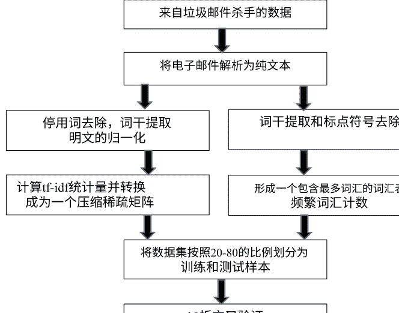


Amount of ham files: 2551
Amount of spam files: 2399
Spam to Ham Ratio: 94.04%
Spam to All Ratio: 48.46%
Ham to All Ratio: 51.54%

##### 3.1 数据集读取和检查

数据集来自Spam Assassin [13]。它包含近5000封电子邮件文件。这些来自Spam Assassin的电子邮件用于创建可以区分垃圾邮件和正常邮件的模型。电子邮件数据包括垃圾邮件和正常邮件。垃圾邮件，也称为垃圾邮件，是通过电子邮件批量发送的未经请求的消息。正常邮件是电子邮件接收者期望的非垃圾邮件。根据现有的内核方法读取和检查数据。数据源中的每个文件代表一封电子邮件消息（图2）。

所有的电子邮件都可以通过Python的电子邮件包来阅读。电子邮件以HTML格式呈现，并且可以在图3中清晰地看到，其中包含2个字段，即标题和消息字段，以及消息内容。Python包使我们能够读取数据集中的电子邮件。所有的电子邮件都可以通过Python的电子邮件包来阅读。

##### 3.2 文本预处理

在本节中，将提取电子邮件的结构，并将电子邮件的内容转换为纯文本进行文本分析。这是通过以下现有内核上的函数来执行的，如下所示：

*   获取电子邮件的结构

该函数用于区分电子邮件中行/单词的结构（图4）。

```
Header Field Names: ['Return-Path', 'Delivered-To', 'Received', 'Received', 'Received', 'X-Egroups-Return', 'Received', 'X-Sender', 
Message Field Values: ['<Steve_Rurt@cursor-system.com>', 'zzzz@localhost.netnoteinc.com', 'from localhost (localhost [127.0.0.1])\t', 
Message Content: Greetings!

You are receiving this letter because you have expressed an interest in
receiving information about online business opportunities. If this is
erroneous then please accept my most sincere apology. This is a one-time
mailing, so no removal is necessary.

If you've been burned, betrayed, and back-stabbed by multi-level marketing,
MLM, then please read this letter. It could be the most important one that
has ever landed in your Inbox.
```


图4 “获取电子邮件结构”的函数流程

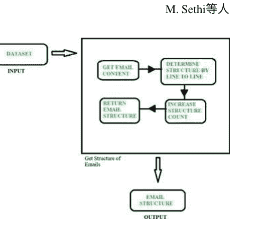

在下面的算法中，使用电子邮件Python包来读取电子邮件，并使用解析器来识别特定电子邮件的结构。这样可以从数据集中获取纯文本内容。

该函数返回如图5所示的输出。这样，可以对输入进行结构化可视化，并且可以在以后提取可能的纯文本内容。

*   HTML转纯文本
*   电子邮件转纯文本

该函数用于获取纯文本电子邮件，因为数据集中的某些电子邮件文件以HTML格式读取，其中包含需要删除的HTML标签，因为我们处理的是纯文本内容（图6）。

该函数是所有函数的驱动程序，并按照下图所示的方式工作。这是最终的函数，调用上述函数将数据集中的电子邮件转换为带有其内容的纯文本电子邮件（图7）。

```
python
[('text/plain', 222),
 ('text/html', 181),
 ('multipart(text/plain, text/html)', 45),
 ('multipart(text/html)', 19),
 ('multipart(text/plain)', 19),
 ('multipart(multipart(text/html))', 5),
 ('multipart(text/plain, image/jpeg)', 3),
 ('multipart(text/html, application/octet-stream)', 2),
 ('multipart(text/plain, application/octet-stream)', 1),
 ('multipart(text/html, text/plain)', 1)]

```

图5 垃圾邮件和正常邮件的结构

Very Best Companies and The Lowest Rates. Life Quote Savings is FAST, EASY and SAVES you money! Let us help you get started with the best values in the country on new coverage. You can SAVE hundreds or even thousands of dollars by requesting a FREE quote from Lifequote Savings. Our service will take you less than 5 minutes to complete. Shop and compare. SAVE up to 70% on all types of Life insurance! Click Here For Your Free Quote! Protecting your family is the best investment you'll ever make!

```
<TR>
  <TD align=middle vAlign=top width="18%">
    <TABLE borderColor=#111111 width="100%">
      <TBODY>
      <TR>
        <TD style="PADDING-LEFT: 5px; PADDING-RIGHT: 5px" width="100%"><FONT face=Verdana size=4><B>Life Quote Savings</B> is FAST, EASY and SAVES you money! Let us help you get started with the best values in the country on new coverage. You can SAVE hundreds or even thousands of dollars by requesting a FREE quote from Lifequote Savings. Our service will take you less than 5 minutes to complete. Shop and compare. SAVE up to 70% on all types of Life insurance!
</FONT></TD></TR>
          <TR><BR><BR>
```

图6 a转换为纯文本。 bHTML文件


图7 电子邮件转纯文本的函数流程

##### 3.3 特征集和向量化

特征提取和选择方法已经通过Python的sklearn和NLTK库得到了简化。 为建模任务准备了两个特征集：

*   特征集1 - 带有N-gram和词频逆文档频率（tf-idf）的停用词。
*   特征集2 - 最常见的词计数与计数向量化。

特征集1

它的创作动机是探索纯文本内容的文本结构并利用上下文特征。 对于这种特征选择，使用了诸如## 特征集2

简单的停用词和n-gram，然后进行了词频（tf-idf）加权。

$$wi,j = tf_{i,j} \times \log\left(\frac{N}{df_i}\right)$$

其中，$tf_{i,j}$是$i$在$j$中出现的次数，$df_i$是包含$i$的文档数，$N$是总文档数。

$N$-grams是单词组合的排列。它们通过组合附近的单词并将它们合并为一个特征来帮助提供文本的上下文（图8）。

它是通过将字符串转换为单词列表，然后使用单词索引增加它们的计数来创建的。它基于从电子邮件内容中计算出现频率最高的单词（图9）。

提取的特征首先被转换为向量，然后转换为压缩稀疏行（CSR）矩阵，然后通过管道输入到不同的分类器中，例如朴素贝叶斯、逻辑回归、线性支持向量机和人工神经网络，以实现更快的效率。

##### 3.4 管道和建模

创建了一个管道，以便轻松比较不同的模型并向它们提供数据和特征集。使用的模型和比较它们的指标如下所示：

-   **朴素贝叶斯**
    朴素贝叶斯算法用于多项式分布数据或多项式朴素贝叶斯算法是经典朴素贝叶斯变体之一，用于文本分类（最好是将数据通常表示为词向量计数或实践中的tf-idf向量）[14]。

-   **逻辑回归**
    逻辑回归模型使用逻辑函数将线性方程的输出压缩在0和1之间。逻辑函数定义如下：
    $$
    \text{logistic}(\eta) = \frac{1}{1 + \exp(-\eta)}
    $$
    逻辑回归[15]技术中包含了依赖变量，表示二进制值（0或1，真或假，是或否），意味着结果只能有两种形式。

-   **支持向量机**
    支持向量机或SVM是最流行的监督学习算法之一[16]，用于分类和回归问题。然而，主要用于机器学习中的分类问题。
    研究中支持向量机规则的目标是找到最简单的线或边界，将n维空间分成不同的类别（垃圾邮件或非垃圾邮件），以便我们可以将新的信息轻松地放入正确的类别中。这个最佳边界被称为超平面[17]。

-   **神经网络**
    所使用的神经网络是MLPClassifier。多层感知器（MLP）是一种前馈人工神经网络模型，将一组输入数据映射到一组适当的输出。层中的节点使用非线性激活函数进行分类，神经网络中使用的激活函数是tanh激活函数[18]。
    MLP由两个隐藏层、一个输入层和一个输出层组成。每一层都与下一层完全连接。隐藏层中有6个节点和2个节点（h1层有6个节点，h2层有2个节点）。使用sklearn进行神经网络的权重偏置和超参数调整，以提供更好的效率和性能（图10）。

评估标准仅基于以下评估指标：

-   准确率
-   精确度
-   召回率
-   F1得分

这四个因素综合考虑了具有特征集的模型的性能。使用这些带有交叉验证分数的数字，我们可以找到最佳性能模型。

#### 4 结果

在图11a，b中，展示了不同模型在这些相应指标上的表现。结果表明，在特征集1中，神经网络在该数据集上具有最佳性能，而SVM的性能略优于逻辑回归分类器。从表2的分数中可以看出同样的情况。

如表3所示，可以看出人工神经网络仍然具有最高的检测率，无论文件是垃圾邮件还是正常邮件。此外，从召回率和F-Score可以看出，神经网络优于其他所有模型。然而，这些结果是在比真实世界邮件数据集相对较小的情况下观察到的，并且由于它们属于easy-ham类别，这些邮件相对容易识别。如果模型使用来自不同领域的各种电子邮件的更多样化数据集进行训练，获得更强大和准确的分类器并非难事。

> 图11 a评估指标图：准确率；精确率。b评估指标图：召回率；F分数

#### 5 结论

由于垃圾邮件数量的增加以及随之而来的问题不断增加，电子邮件垃圾邮件检测的重要性近年来不断增长。区分垃圾邮件和必需邮件是一项至关重要的任务。本研究提出了许多机器学习方法，如逻辑回归、支持向量机、朴素贝叶斯和神经网络，以帮助检测垃圾邮件。神经网络是提供最高准确率的机器学习技术；然而，本研究使用了一种非常基本的特征提取技术，以提取特征并产生最高结果。虽然结果显示出极高的准确性，但可以在此处使用更先进的特征提取算法，例如能够执行情感分析的算法，以改进其特征选择，提供对电子邮件的深入分析手段。另一个问题是，虽然模型分析了电子邮件的其他内容，但图像和其他附件则被忽略。使用计算机视觉技术从电子邮件中提取图像和文档的信息也可以增加特征提取过程，从而改善分析[19]。

最近研究中最重要的观察之一是，尽可能使用真实世界的数据。为了保护其客户的私人信息，许多电子邮件服务提供公司不愿意披露其在各种认证垃圾邮件上的数据，导致邮件的真实世界数据稀缺。已经有迹象表明，当应用于真实世界问题时，使用人工或合成数据训练的模型性能较差[20]，这可能导致垃圾邮件检测准确性下降，与理论结果相比；然而，使用无监督的机器学习方法可以帮助消除这个问题，并提供同样好的结果，同时节省运行时间。

另一种方法是使用自适应学习，通过模型在工作过程中获取的数据来使用更多的真实世界数据。
如图4所示，基于特征集2的所有模型“最常见的词频统计”在准确率和F1得分上都比基于特征集1的模型“停用词 +N-gram +TF-IDF”更高。如果使用情况是引入一个类似于收件箱中的无垃圾邮件的测试版。在这种情况下，模型：神经网络使用tanh激活函数和特征集1“停用词 +N-gram +TF-IDF”来实现这个目的。根据图4中的图表，如果使用情况是引入一个邮件垃圾邮件检测器，以减少在搜索重要邮件时的不良用户体验，并从收件箱中过滤垃圾邮件。在这种情况下，神经网络与特征集2“最常见的词频统计”在一般用户体验方面更好。未来的工作包括使用各种标准数据集对模型进行测试。

就个体特征集而言，在特征集1中，神经网络表现最佳，给出了所有机器学习技术中最高的准确率，而逻辑回归的准确率最低。然而，在特征集2中，逻辑回归并不是表现最差的，朴素贝叶斯的准确率最低，神经网络的准确率最高。尽管整体上看，特征集2中的技术表现比特征集1中的技术更好，对于每种机器学习方法来说，两者之间存在明显的差异。

本研究建议将所得结果与来自各个来源的其他垃圾邮件数据集进行比较。此外，还应该使用电子邮件垃圾邮件数据集对更多的分类和特征算法进行分析。

## 表2 特征集1输出

|   | 特征                     | 模型名称         | 交叉验证得分均值 | 交叉验证得分标准差 | 准确性 | 精确度 | 召回率 | F1     |
|---|--------------------------|------------------|------------------|----------------------|--------|--------|--------|--------|
| 0 | 停用词 + n-gram + tf-idf | 朴素贝叶斯多项式 | 0.9222           | 0.0162               | 0.9394 | 0.9877 | 0.63   | 0.7730 |
| 1 | 停用词 + n-gram + tf-idf | LR               | 0.8849           | 0.0094               | 0.8903 | 0.9933 | 0.33   | 0.4962 |
| 2 | 停用词 + n-gram + tf-idf | SVM              | 0.9509           | 0.0153               | 0.9591 | 0.9877 | 0.75   | 0.8571 |
| 3 | 停用词 + n-gram + tf-idf | NN               | 0.9828           | 0.0085               | 0.9869 | 0.9366 | 0.98   | 0.9608 |

|   | 特征   | 模型名称         | 交叉验证得分均值 | 交叉验证得分标准差 | 准确性 | 精确度 | 召回率 | F1     |
|---|--------|------------------|------------------|----------------------|--------|--------|--------|--------|
| 0 | 词频   | 朴素贝叶斯多项式 | 0.9803           | 0.0073               | 0.9787 | 0.9579 | 0.61   | 0.9333 |
| 1 | 词频   | LR               | 0.9861           | 0.0086               | 0.9885 | 0.9933 | 0.93   | 0.9637 |
| 2 | 词频   | SVM              | 0.9795           | 0.0095               | 0.9853 | 0.9505 | 0.96   | 0.9552 |
| 3 | 词频   | NN               | 0.9873           | 0.0078               | 0.9902 | 0.9608 | 0.98   | 0.9703 |

#### 参考文献

1.  Mohammed, M. A., Mostafa, S. A., & Obaid, O. I. 一种用于多自然语言电子邮件的反垃圾邮件检测模型。
2.  Mallampati, D., & Hegde, N. P. (2020). 基于机器学习的电子邮件垃圾分类框架模型。IJITEE, ISSN, 9(4), 2278–3075.
3.  Cormack, G. V. (2006). 电子邮件垃圾过滤：一项系统性综述。Foundations and Trends® in Information Retrieval, 1(4), 335–455.
4.  Chen, J. I. Z., & Smys, S. (2020). 基于混合深度学习技术的社交多媒体安全和可疑活动检测在SDN中。Journal of Information Technology, 2(02), 108–115.
5.  Siponen, M., & Stucke, C. (2006). 公司中有效的反垃圾邮件策略：一项国际研究。在Proceedings of the 39th Annual Hawaii international conference on system sciences (HICSS’06).
6.  Mallampati, D., Chandra Shekar, K., & Ravikanth, K. 监督机器学习分类器用于电子邮件垃圾过滤，© Springer Nature Singapore Pte Ltd. 2019 and Engineering. https://doi.org/10.1007/978-981-13-7082-341.
7.  Gupta, H., Jamal, M. S., Madisetty, S., & Desarkar, M. S. (2018年1月). 一个框架用于实时推特垃圾检测. 在2018年第10届国际通信会议系统和网络(COMSNETS)(pp. 380–383).
8.  Mahmoud, T. M., & Mahfouz, A. M. (2012). 基于人工免疫系统的短信垃圾过滤技术.国际计算机科学问题杂志(IJCSI), 9(2), 589.
9.  Akinyelu, A. A., & Adewumi, A. O. (2014). 使用随机森林机器学习技术对钓鱼邮件进行分类。应用数学杂志。
10. Yüksel, A. S., Cankaya, S. F., & Ünü, ‘I. S. (2017). 基于机器学习的预测分析系统设计，用于垃圾邮件问题。Acta Physica Polonica, A., 132(3); Goodman,J. (2004, July). IP Addresses in Email Clients. CEAS.
11. Androutsopoulos, J. Koutsias, K. Chandrinos and C. D. Spyropoulos, “An experimental comparison of naive Bayesian and keyword-based anti-spam filtering with personal email messages,” Computation and Language, pp. 160–167, 2000.
12. 黄, L., 贾, J., 英格拉姆, E., 彭, W. 通过智能文本修改检测增强朴素贝叶斯垃圾邮件过滤器。在2018年第17届IEEE国际计算与通信信任、安全和隐私会议上。
13. Apache. (2019). “开源Apache SpamAssassin数据集”, https://spamassassin.apache.org/old/publiccorpus/
14. Vinodhini, M., Prithvi, D., Balaji, S. (2020年3月). 使用ML算法的垃圾邮件检测框架。IJRTE, 8(6). ISSN: 2277-3878.
15. Brownlee, J. (2016年4月1日). 逻辑回归用于机器学习。机器学习精通. https://machinelearningmastery.com/logistic-regression-for-machine-learning/
16. Zavvar, M., Rezaei, M., & Garavand, S. (2016) 使用粒子群优化和人工神经网络和支持向量机的电子邮件垃圾邮件检测。模型教育与计算机科学国际期刊 68–74.
17. 甘地, R. (2018年6月7日). 支持向量机。机器学习掌握. https://towardsdatascience.com/support-vector-machine-introduction-to-machine-learning-algorithms-934a444fca47
18. Smys, S., Basar, A., & Wang, H. (2020). 基于人工神经网络的智能路灯系统功率管理人工智能杂志, 2(01), 42–52.
19. 李, X. M., & 金, U. M. (2012年6月). 用于基于内容的图像垃圾邮件过滤的分层框架。在第8届国际信息科学与数字内容技术会议(ICIDT)(pp. 149–155). 济州岛.
20. Mukherjee, A., Venkataraman, V., Liu, B., & Glance, N. S. (2013). Yelp假评论过滤器可能正在做什么？在ICWSM中.

### 使用分布式资源分配算法的医院在线预约管理系统

B. Jency A. Jebamani， R. Murugeswari和P. Nagaraj

摘要 每天，全世界的人们都在努力通过技术进步来使自己的生活更加舒适。没有人希望在柜台前排队浪费时间、精力和金钱，尤其是在医院就诊期间。因此，本文提出了将网络开发作为解决方案，让患者可以在线预约医院，医生根据自己的时间安排进行批准。该系统旨在根据医生的可用性、医院和专科的时间安排以及患者的预约来管理患者的知识。

该系统已经在ASP中设计，以自动化医院的日常活动，如房间活动、最新患者的入院和医生的就诊。提出的分布式资源分配算法旨在搜索附近医院的可用性以进行预约。同样，一旦用户注册了预约，并且预约被适当的医生接受，用户将收到确认电子邮件。提出的模型使用了Visual Studio.NET 2008环境，ASP.NET用于前端处理，MS-SQL SERVER 2008用于后端处理。

关键词 医疗保健·移动响应式网站·状态跟踪·位置·ASP·分布式资源

#### 1 引言

如今，人们对技术进步有着浓厚的兴趣，以便使生活更加轻松。 与此同时，技术正在成为我们日常生活中不可或缺的一部分。 因此，研究人员努力将新兴技术与实时应用相结合，以使我们的生活更加轻松。 从这个角度来看，所提出的研究工作为医院开发了一个在线预约管理系统。 在今天的世界中，人们不愿意去医院排队等候咨询医生。 这项研究工作开发了一个网站，用于数字化处理医院的患者预约安排。

在线预约系统可以节省时间、精力和成本。 为医院预约挂号开发的网站可以在一个点击中安排预约，无论他们的位置在哪里。 不需要任何人工劳动，患者数据库可以简单地保持和维护很长一段时间。

#### 2 文献综述

Xiao等人[1]提出了一个在线预约修复网站，用于诊断患者，如放射治疗、核医学等。作者使用非线性整数规划模型，根据患者的可用日期安排预约。这种方法是在华西医院开发的，为患者提供方便，节省时间、精力和努力。Liang等人[2]将智能预约系统与普通的线下预约系统进行了比较。作者使用先到先服务（FCFS）最简单的调度算法来安排患者的预约，通过检查医生的可用性。 与此同时，作者还比较了医生和患者的匹配程度，为他们的预约找到合适的医生，进行健康检查。Aburayyya等人[3]提出了迪拜的混合预约系统。作者使用可变邻域下降算法（VNDA）。
它主要用于初级卫生中心。刘等[4]提出了门诊预约系统。 作者使用了潜在狄利克雷分配（LDA）主题模型来安排门诊。 这可能会改善医院的服务。但他们只为门诊提供该系统。李等[5]提出了基于贪婪启发式算法的云健康护理系统。 通过这种方式，患者可以在线接受治疗方法，这可能会减少他们的费用和时间。 这在社区和三级医院之间起到了桥梁的作用。 在这方面，作者面临着云健康系统中规划和安排是主要问题。哈立德等[6]开发了一个具有网络预约系统的移动应用程序。 网络预约系统是一种便捷的预约系统，帮助患者与他们最喜欢的医生安排会诊。 这项工作的主要目标是为患者提供便利和舒适，同时解决患者在预约过程中遇到的问题。

简报。此应用仅用于患者预约。Kumar等人[7]开发了一个基于Web的预约应用程序，患者可以预约相关医生的预约。医生可以使用他们的用户名和密码登录。一旦医生看到患者的预约，他们会批准他们的预约。Akinode等人[8]专注于开发一种系统，以提高基于互联网的预约系统的效率和质量，以减少等待时间。在本文中，患者预约和编程系统旨在利用Angular JS进行前端开发，使用Ajax基础结构进行客户端-服务器请求，以及使用Sqlite3和MYSQL进行后端开发。Odeh等人[9]开发了移动应用程序“Mwa3edk”，通过将手动预约注册转变为数字化在线注册过程，为医院和医疗诊所与医生预约的策略提供了新的思路。

该方法将用户与阿联酋周围的许多医院和诊所连接起来，使我们能够在各种地方找到医生并安排方便的预约。此外，用户可以解释他们的症状，设备将根据他们所绘制的内容提供建议。这可能使用户跳过一个阶段，他们必须预约。Cola等人提出了一个解决方案，用于处理医生预约的在线技术。

如果医生和患者决定，他们可以通过视频咨询而不是传统的就医方式。预约已经在一天中的时间段内创建了支持。这些时间段由医生或指定人员确定。视频预约是在Web浏览器中创建的，不需要额外的软件。Bensbih等人描述了摩洛哥外部专科医生在线预约安排的方面，采用了定性分析方法。提出了在线预约系统，供患者在空闲日期预约，同时在一个医院或诊所中使用。Khan等人开发了一个用于患者预约的安卓应用程序。这是一个可定制和用户友好的应用程序，但在这个应用程序中，我们无法找到医院或诊所的位置。Nazi a等人重点研究了具有架构和优点的在线预约系统，这可能对患者有所帮助。

根据文献综述，他们都可以为初级卫生中心或单个医院或诊所开发网站。然而，我们的研究建议将多个医院编号添加到一个具有完整医院数据的网站上，以及在医院工作的医生以及医院的地图位置。

患者可以在他们有空的日期预约。一旦医生接受了预约，自动发送接受邮件给患者，并提供完整的预约详情。

#### 3 提出的系统

任何医院都可以使用开发的在线预约管理系统来替代传统的纸质系统。新技术将被用于管理患者数据。医生的可访问性、特定的列表安排和患者发票是重要的参数。这些服务可以以高效、经济的方式提供，以减少目前执行此类任务所需的时间和资源。这个过程是将面向用户的输入转换为基于计算机的格式。设计输入数据的目标是尽可能简单和无错误地进行数据输入。

图1描述了网站的架构。在数据库中，医生搜索预约接受、患者查询和重新发送查询都是完全加密的。只有具有完美身份验证的管理员才能访问所有记录。同时，患者的预约会自动安排，并且网站的整个数据库都会被注册到SQL管理服务器中，输入的数据将存储在数据库中，用户还可以轻松地编辑和存储数据在数据库中。

##### 3.1 模块描述

有一些用于预约簿的模块。这些模块帮助我们收集患者的数据并将其存储在数据库中。此外，通过使用这些模块，管理员可以监控前台接待员的活动和患者的记录请求，并为记录生成安全密钥。提出的模型包括以下模块：

- 管理员模块
- 患者模块
- 医生模块
- 预约模块
- 报告模块

###### 3.1.1 管理员模块

管理员将添加有关医院、患者和医生的信息。管理员还可以修改信息。此外，提出的模型还将寻找患者，并通过预约模块为医生安排预约。此外，不同的角色分配给各种员工，类似于前台医院员工可能安排或安排预约。管理员还可以查看医生和患者的信息，以及医生和预约的信息。患者还可以获得即时预约或预先安排的预约。

###### 3.1.2 患者模块

患者模块可以选择查看患者历史/报告，医生历史等。报告将包括处方药物。医院访问报告也可以由医生在检查任何患者之前简单查看。这个模块只对医生和管理员可用。此外，还提供了打印访问报告、药物历史报告等选项。

###### 3.1.3 医生模块

医生还可以查看日程表并与患者会面。医生还可以保存与患者疾病、患者历史、受影响器官的信息相关的信息。为保存这些信息提供了单独的选项。医生还可以阅读与患者相关的访问信息，以报告的形式呈现。医生可以开具药物处方，提供相同药物的选项。如果有的话，医生还可以保存饮食信息。

###### 3.1.4 预约模块

该模块将允许管理员和前台工作人员使用医生登录查看预约。它将允许预约和即时就诊。还将有一个选择医生的选项，用于预约或即时就诊。还提供取消或更改预约的选项，例如更改分配的医生或更改预约日期。

###### 3.1.5 报告模块

报告模块旨在为管理报告提供功能丰富且用户友好的网站。此外，报告模块在该项目中提供了灵活性和可扩展性。管理员还提供了生成用户报告、订单报告和请求报告的选项。所有报告都将提供项目详情的概述。

##### 3.2 分布式资源分配算法

在分布式系统中，资源分配基于搜索资源。例如，如果患者需要关于特定地区的本地医院的信息。该方法有助于从提供给患者的类别部分中定位正确的信息源。它返回给定城市中属于专业、普通和儿童专家类别的医院。

- 步骤1：D0<-随机生成M个个体（初始种群）。
- 步骤2：Dsel-1<-重复步骤3-5，直到满足停止准则为止，对于l =1,2。
- 步骤3：根据选择方法从Dl-1中选择N ≤M个个体。
- 步骤4：pl(x) =p(xlDsel-1)<-估计一个个体在被选中个体中的概率分布。
- 步骤5：从pl(x)中抽取M个个体（新种群）。

##### 3.3 数据流

这解释了管理级别和用户级别的数据流。

###### 3.3.1 管理级别

在管理员模块中，他们可以访问医生和患者注册。一旦患者登录网站，管理员会收集他们的数据并将其存储到数据库中以供将来使用。

###### 3.3.2 用户级别

在用户模块中，一旦登录，他们就可以搜索特定的医院或医生。例如，如果人们想去马杜赖的一家儿科专科医院，他们只需搜索该地区并选择该类别中的儿科专家，这将显示所有马杜赖的儿科专科医院。

#### 4 实验结果

软件要求是Visual Studio.NET 2008，MS-SQL SERVER 2008用于后端，ASP.NET用于前端。网站上有一些添加医院和医生详细信息的选项。

图2显示了医院的注册。它包括医院名称、地址、城市、地标、所属专科医生、联系电话和电子邮件地址。

图3显示了已添加到网站上进行预约的医院数量。对于任何评论，查看选项可帮助查看医院的完整详细信息，如果不需要，还可以删除某些医院数据。使用分布式资源算法，可以搜索附近的医院并输入医生的类别。

选择您想要的城市和医生类别，如心脏病学、骨科学、神经学等，如图4所示。

图5显示了在马杜赖搜索专家的结果。在同一页上，您可以更改城市和类别，无需返回。
图6显示了可以通过搜索同时按专科、儿科专家和普通科医生类别搜索相关医院。

| Id | Name           | Specialist        | City    | Hospitalname | Category    |
|----|----------------|-------------------|---------|--------------|-------------|
| 1  | nikesh Brain   | madurai btm       | specialist |              | Appointment KnowMore! |
| 4  | sara vana      | Sugar madurai     | voda malayan |              | Appointment KnowMore! |

图5 搜索结果

## SEARCH HOSPITAL

图6 搜索医院

| Hospitalname               | Address                                          | City      | Landmark | Specialist Category | Contactno      | Emailid                      |
| :------------------------- | :----------------------------------------------- | :-------- | :------- | :------------------ | :------------- | :--------------------------- |
| Sri Ramakrishna Hospital   | No: 395, Sarojini Naidu Road, Sidhapudur         | coimbatore | Brain    | specialist          | +91 4224500000 | info@srramakrishnahospital.com |

医院选项。搜索结果显示医院的地址、电话号码、电子邮件地址和地标。

如果正确提供医院名称，添加医院选项的位置将即时更新在查看地图部分，如图7所示。当您点击医院详细页面中的查看地图按钮时，您将被发送到一个带有医院位置的谷歌地图。

在管理员模块中计划的患者预约如图8所示，以及预约的状态（接受或拒绝）。

| Id | patientname   | Email Id                     | address       | hospitalname | Date       | Time     | Status |
|---|---------------|------------------------------|---------------|--------------|------------|----------|--------|
| 22 | Jency         | jencychabebenjamin@gmail.com | madurai       | mullaiclinic | 25/04/2021 | 10:00 AM | Accept |
| 21 | Tamil Selvi   | tharumitch34@gmail.com       | Aarupukottai  | usaia        | 20/03/2021 | 11:00 AM | Accept |
| 20 | beulah        | beulahlakshmi@gmail.com      | srovilipathur | btm          | 19/03/2021 | 10:00 AM | Accept |

图8 患者的预约

#### 5 结论

本文的主要目标是开发一个基于网络的医院预约解决方案。通过一次点击，分布式资源算法可以在附近的医院寻找他或她的预约登记。所提出的模型可以在这个网站上添加更多的区域、医院和医生的个人资料，同时还集成了Google地图，因此一旦正确输入了医院名称，医院的位置就会添加到用户的搜索中，这也非常用户友好。未来的发展将包括为患者的处方添加一个在线药品网站，并允许他们简单地购买药物。

#### 参考文献

1.  肖，乔，罗，赵，冉，冯（2018年）。中国医院核医学科室的在线预约计算和数学方法在医学中的应用。
2.  梁，Y.，& 赵，L.（2019年）。基于健康数据的智能医院预约系统银行。计算机科学学报，159，1880-1889。
3.  Aburayya, A., Al Marzouqi, A., Al Ayadeh, I., Albqaeen, A., & Mubarak, S. (2020年)。在迪拜的初级医疗中心中发展混合预约系统患者和医疗保健提供者的看法。国际新兴技术杂志，11（2），251-260。
4.  刘，T.，马，Y.，& 杨，X.（2018年10月）。基于文本情感分析的医院预约系统服务质量改进。在2018年第9届国际医学与教育信息技术会议（ITME）中（pp. 289-293）。IEEE。
5.  李，Y.，王，H.，李，Y.，和李，L.（2019年）。基于Petri网和贪婪启发式的云医疗系统中的患者分配调度。企业信息系统，13（4），515-533。
6.  Khalid, M., Singh, S., Singh, K., Jeevitha, J., 和Anand, P. (2018年)。医生预约系统。国际计算与技术杂志, 5 (4) , 48-52。
7.  Kumar, S., Kiran, J., kumar, V., Saranya, G., 和Ramalakshmi (2019年)。有效的在线医疗预约系统。国际科技研究杂志, 8, 803-808。
8.  Akinode, J.L., 和Oloruntoba, S. A. (2017年)。患者预约和排班系统的设计与实施。尼日利亚伊拉罗联邦理工学院计算机科学系。
9.  Odeh, A., Abdelhadi, R., 和Odeh, H. (2019年12月)。利用智能软件系统在阿联酋进行医疗患者预约管理。在2019年国际阿拉伯信息技术会议 (ACIT) (pp. 97-101)。IEEE。
10. Cola, C., & Valean, H. (2015年11月). 基于网络的电子健康预约解决方案. 2015年电子健康与生物工程会议(EHB)(pp. 1-4), IEEE.
11. Bensbih, S., Bouksour, O., Souadka, A., Majbar, M. A., & Rifai, S. (2020年). 医疗保健中的供应链管理: 促进因素和挑战. 国际管理学杂志, 11(9).
12. Bensbih, S., Bouksour, O., & Rifai, S. (2019年4月). 在以患者为中心的策略中的在线预约系统: 摩洛哥医院案例研究的定性方法. 在2019年第6届控制、决策和信息技术国际会议(CoDIT) (pp. 1735–1739). IEEE.
13. Khan, M. N. R., Mashuk, A. K. E. H., Durdana, W. F., Alam, M., Roy, R., & Razzak, M. A. (2019年7月). “Doctor Who?” - 一款可定制的安卓应用程序, 用于综合健康护理. 在2019年第10届计算、通信和网络技术国际会议(ICCCNT)(pp. 1–6). IEEE.
14. Nazia, S., & Ekta, S. (2014). 医院在线预约系统- 一项分析研究. 国际创新科学、工程和技术研究杂志, 4(1), 21–27.

### BeFit- 一个实时的锻炼分析器

Richard Joseph, Manoj Ayyappan, Tanvi Shetty, Gurudatt Gaonkar, 和Aashish Nagpal

摘要 保持身体健康非常重要。定期锻炼非常重要，因为它有助于提高生活质量。然而，在锻炼过程中姿势不正确可能导致严重的长期损伤，如背痛、肌腱炎甚至是腿筋拉伤。因此，提出了这个名为BeFit的应用程序，通过将用户的锻炼与系统提供的参考图像或视频进行比较，分析用户的姿势。系统将使用余弦定理分析身体肢体之间的角度，并将其与参考视频或图像进行比较。在同步用户和参考图像或视频之后，如果用户的姿势正确，则系统显示绿色骨架，如果用户的姿势不正确，则显示红色骨架。该模型是使用Tensorflow上的PoseNet库实现的。PoseNet模型在所有关键点上的最高得分范围从0.92874到0.98325。借助这个模型，健身爱好者可以在家中准确地进行特定的锻炼，避免受伤并得到适当的指导。

- 姿势检测
- 姿势估计
- PoseNet
- 瑜伽姿势分析
- 锻炼分析
- PoseNet锻炼分析
- 余弦定理
- 骨骼匹配

#### 1 引言

定期锻炼可以改善健康状况，降低肥胖、糖尿病和高血压的风险。为了保持整体健康并增强体力，疾病控制和预防中心（CDC）建议成年人每周至少进行两次力量训练。然而，保持一致并定期锻炼是困难的。

根据Mintel的一项研究，64%的印度人不定期锻炼。该研究还发现，缺乏锻炼时间是最大的障碍，近三分之一（31%）的消费者表示他们没有时间锻炼。他们进一步揭示，大多数印度人倾向于选择非常基本的锻炼方式。大约67%的印度人选择快走作为锻炼方式。选择非常基本的锻炼方式的原因是健身房和健身课程涉及的锻炼方式更加昂贵。然而，那些定期锻炼的36%经常因不正确的姿势（图1）而导致背痛、肌肉拉伤等受伤。

在锻炼时保持正确的姿势非常重要。在锻炼时保持不正确的姿势可能导致长期损伤，如脊柱弯曲、肌腱炎、腿筋拉伤等。除了损伤，如果人们在锻炼过程中继续保持不良姿势，也无法达到预期的效果。

为了解决这个问题，提出了一种名为BeFit的用户友好系统，它将分析一个人在特定锻炼过程中的姿势，并将其与参考视频或图片进行比较，如果有必要，提供改进建议，而且可以在家中舒适地使用。用户只需要一台配备良好摄像头的安卓设备或一台带有摄像头的电脑来使用这个应用程序。使用TensorFlow上的PoseNet，参考图片或视频将被预处理，并将用户的肢体动作与参考视频进行比较，从而检测用户的姿势是否不正确或者不是。该系统使用卷积神经网络（CNN）机器学习算法来识别用户身体上的关键点[3， 4]。

本文分为三个主要部分，首先解释了系统的方法论以及它们如何应用于提出的解决方案，其次讨论了完整的系统概述。最后，展望未来和总结部分讨论了提出方法的结果和未来可能性。

#### 2 相关工作

与这个主题相关的应用程序很少。但开发人员已经开发出可以通过姿势估计和深度学习计算锻炼准确性的应用程序。大多数应用程序是基于瑜伽姿势的。

1. Amit等人[3]开发了一个系统-实时室内锻炼分析，使用机器学习和计算机视觉。他们的系统通过分析肢体之间的角度来检测错误并为用户提供纠正措施[3]。他们使用了时间序列数据对齐技术，如DTW（动态时间规整），以及使用OpenCV进行光流跟踪，以同步用户/参考视频。根据肢体之间角度计算的阈值偏差，他们的系统能够有效地检测用户活动中的错误，即他们的姿势。
2. Yadav等人[4]使用深度学习生成了一个系统-实时瑜伽识别。他们提出的系统是卷积神经网络（CNN）和长短期记忆（LSTM）的混合体，用于实时视频中的瑜伽姿势估计。该系统在单帧上实现了99.04%的测试准确率，并在45帧视频的预测汇总后实现了99.38%的准确率，但他们的系统仅限于瑜伽姿势。
3. Kumar和Sinha [5]创建了一个系统-使用深度学习进行瑜伽姿势检测和分类。他们的系统首先从用户那里获取视频输入，然后将用户的姿势与专家的姿势进行比较，并计算出各个身体关节的角度差异。基于这些角度差异，向用户提供反馈，以便他/她改进姿势。他们使用PoseNet模型提取肢体之间的角度，并使用CNN和LSTM模型比较肢体之间的角度。他们的系统使用这种技术实现了82.84%的准确率。
4. Markolefas等人[6]开发了一种系统——用于个性化训练的虚拟视频合成。他们的系统通过摄像头记录练习者的视频，在会议呼叫中实时在设备屏幕上与教练的视频进行对比。通过比较练习者和教练的视频源，可以实时检测练习者的训练准确性。他们使用了包括以下技术在内的方法来实现这些。一种初始背景重建方法，后跟选择性更新方案。

- 5. Borkar等人[7]匹配姿势-一种用于比较姿势的系统。他们的研究主要关注一般情况下将参考视频与实时视频进行比较。他们提出了一种简单的方法来比较用户实时姿势与任意选择的姿势。对于实时姿势估计，他们的系统还使用了PoseNet。他们的算法允许用户检查他们的姿势是否成功模仿。

- 6. Mehta等人[8] XNect: 使用单个RGB相机进行实时多人3D动作捕捉-该系统使用RGB相机以30帧/秒的速度实时处理多人3D动作。该系统首先使用卷积神经网络（CNN）估计2D和3D姿势特征，并确定可见关节的身份分配。系统的第二阶段使用另一个考虑遮挡的CNN来确定特征。在最后阶段，应用时空骨骼模型拟合来进一步处理预测的2D和3D姿势，以及强制实现时间上的一致性。

- 7. Ding等人[9] 基于多特征和规则学习的人体姿势识别-该系统使用一个219维向量来计算关节的角度和距离特征以及关节的空间位置。该系统利用RIPPER规则学习分类算法。该系统不使用任何传统的CNN方法，能够对各种算法进行分类。

- 8. Vyas [10] 在体育和健身中的姿势估计和动作识别。他们系统的目标是比较两个计算机视觉模型。他们采用了两种方法：轮廓模型和姿势估计。他们使用姿势估计技术和轮廓模型创建了模型，以比较两者并找出提供最佳准确性的模型。他们使用PennAction数据集进行下蹲运动动作识别。他们最好的模型能够达到79%的准确率。

- Xiong等人[11] 使用多样化的深度潜变量模型进行稳健的基于视觉的锻炼分析。他们的主要目标是开发一个3D姿势估计模型，相比传统的2D姿势估计模型更准确。他们提出的系统使用深度潜变量模型从视频和图像中估计3D骨架。为了进一步改进模型，他们在深度潜变量模型中集成了多样性鼓励先验。

- 10. 曹等人[12]提出了一种实时多人2D姿势估计系统，该系统使用了部分亲和力场[PAFs]。该模型采用自下而上的方法，具有很高的准确性。它同时检测和关联部分亲和关节和置信度图。置信度图用于检测不同的部分，而部分亲和力决定不同的人数，因此该模型支持多姿势检测以及CNN。

- 11. Rishan等人[13]——无限瑜伽导师：瑜伽姿势检测和纠正系统——该系统通过用户的移动相机实时工作。以30fps的速率输入。通过使用Open Pose来估计姿势，该系统可以识别人体上的25个关键点。此外，它使用LSTM、CNN和SoftMax回归算法来预测姿势。

- 12. Chao等人[14]从静态图像中预测人体动态-他们提出了一种基于单个RGB图像的3D姿势预测网络作为输入。该系统在2D姿势估计和序列预测方面取得了进展，并将其表示为3D空间。

- 13. Park等人[15]使用卷积神经网络进行3D人体姿势估计，同时进行2D姿势估计。这项研究的目标是使用CNN创建一个有效的3D姿势估计模型。他们通过将2D姿势估计结果与图像特征连接起来，从图像中估计3D姿势。对于第二种技术，在该模型中，他们结合了相对位置的信息，而不仅仅是一个根关节的信息。

- 14. Fani等人[16]通过集成的堆叠沙漏网络进行曲棍球动作识别-他们的系统可以识别曲棍球运动员执行的动作，即曲棍球比赛中的动作。它包含三层动作识别沙漏网络（ARHN）。第一层用于姿势估计，第二层用于将潜在特征转换为公共参考框架，最后一层用于识别曲棍球运动员的动作。

- 15. Sawant [17]使用OpenPose和长短期记忆网络对实时图像进行人体活动识别。在这篇研究论文中，他们使用OpenPose和长短期记忆网络创建了一种系统化的姿势估计方法。在他们的系统中，OpenPose检测到人体部位，如手、脸、腿等，并将身体特征的输出分割成称为窗口的子序列，使用滑动窗口方法。然后，他们使用长短期记忆网络高效地学习关键点特征并返回一个活动类别。该系统可以实时检测人体活动。

#### 3 采用的方法

下面的用例图表示应用程序按顺序发生的动作。该模型依赖于Tensorflow.js的预训练模型。PoseNet模型经过预训练，可以准确估计人体的姿势并确定特定关键身体部位的位置。该模型是根据PoseNet的输出进行训练的，用于确定人体姿势的准确性和正确性（图2）。

Tensorflow.js是一个原始的JavaScript库，它没有提供太多的功能和灵活性来使用所有的函数。所以，该模型与ml5.js库一起工作，后者是Tensorflow.js的扩展，具有更多的功能。这与p5.js结合使用，用于在Web浏览器中实现姿势检测。该模型适用于所有主要浏览器，并已在Google Chrome、Mozilla Firefox和Microsoft Edge浏览器上进行了测试。

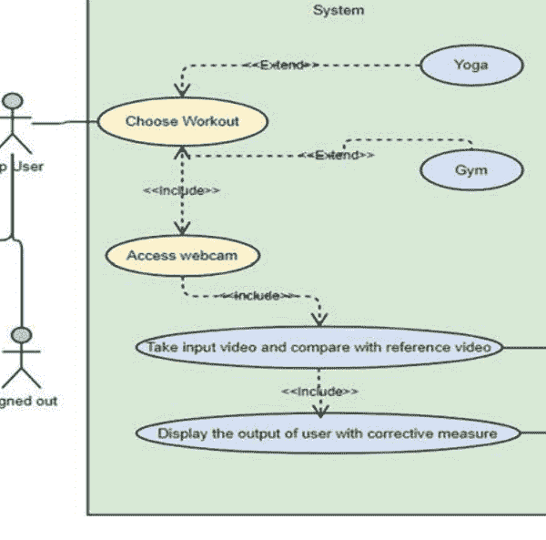

图2用例图显示了我们系统的工作原理。Firefox和Microsoft Edge浏览器。PoseNet模型是从ml5.js库中引入的。

用户首先需要允许网站访问摄像头，以使其正常工作。PoseNet从设备的网络摄像头接收视频作为输入，并输出一个数组。该数组包含了身体关键点的所有x和y坐标，以及所有点的置信度分数。这被称为骨架。它还有一个关键点数组和一个总体置信度分数。图3显示了所有主要关键点的输出。

##### 3.1 PoseNet模型的工作原理

PoseNet库[18]提供了一个接口，它接收来自网络摄像头的处理过的图像，并输出用户的关键身体部位。该方法在处理过的RGB位图上运行TensorFlow.js解释器，并返回一个Person对象[19]。

存在一个Person类，它保存了所有关键身体部位的位置和相关的置信度分数[19]。它包含每个关键点的置信度分数，以及一个整体身体的分数，该分数基本上是每个关键点的置信度分数的平均值。置信度分数表示该位置可能存在的关键点的概率。每个关键点都与身体部位的位置及其置信度分数相关联。下面是所有定义的关键点的列表（表1）。

图3身体骨架的PoseNet估计


表1 所有定义的关键点列表[20]

| ID | 部分 |
|---|---|
| 0 | 鼻子 |
| 1 | 左眼 |
| 2 | 右眼 |
| 3 | 左耳 |
| 4 | 右耳 |
| 5 | 左肩 |
| 6 | 右肩 |
| 7 | 左肘 |
| 8 | 右肘 |
| 9 | 左腕 |
| 10 | 右腕 |
| 11 | 左臀 |
| 12 | 右臀 |
| 13 | 左膝 |
| 14 | 右膝 |
| 15 | 左踝 |
| 16 | 右踝 |

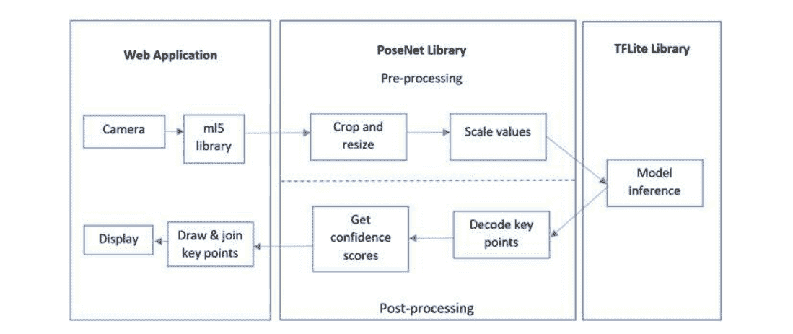

该模型捕捉来自摄像头的输入，并在其上绘制关键点的图像。从摄像头获取的图像数据被转换为ARGB_888格式，并创建位图来保存RGB像素，然后将图像调整大小并发送到模型。该模型从PoseNet库获取Person对象，并将位图缩放到屏幕大小以在画布上绘制。它使用从Person对象获得的关键点在画布上绘制[21]（图4）。

##### 3.2 比较分析

还有另一种广泛使用的人体姿势估计算法——OpenPose。OpenPose是一个开源的人体姿势估计库。它可以检测人体关键点、面部表情和位置，手和脚的关键点提取。OpenPose模型为人体提供了15、18和25个关键描述符。在具有Nvidia GTX 1080 Ti的系统上，它可以以22 FPS运行，在相同设备上，PoseNet只能以10 FPS运行[22]。

OpenPose的性能相对于PoseNet来说更好，但是OpenPose需要高功率的GPU，并且与PoseNet相比，它对移动设备来说是非常重的软件。PoseNet是轻量级软件，可以在低功率的GPU设备上运行，比如手机。

为了测试PoseNet和OpenPose在移动设备上的性能，我们使用了一台具有Nvidia GTX 285的系统，这与平均移动设备中使用的GPU相当。我们在我们的系统上使用OpenPose和PoseNet处理了一个5秒的视频，OpenPose花了1分11秒来处理视频，而PoseNet只花了12秒来处理相同的视频。


由于这个应用程序也设计用于移动设备，所以我们选择了PoseNet库作为我们的系统。

##### 3.3 检测用户的姿势

在sketch.js文件中使用了两个PoseNet实例。

- 1. PoseNet1是用于从用户的网络摄像头视频中检测关键点的实例。
- 2. PoseNet2是用于从给定的参考图像中检测关键点的实例。

我们创建了一个640 ×850的画布，在顶部是来自网络摄像头视频的输出，在底部是放置了参考图像。PoseNet1从网络摄像头视频中检测出所有关键点并给出一个数组和一个骨架。然后绘制连接所有关键点的线条，除了脸部的点。对于系统来说，面部关键点并不重要，因此被忽略了（图5）。

最终的骨架以红色在画布的上半部分叠加在视频中。只有在PoseNet模型检测到姿势并且得分大于0.2时，该骨架才可见。

##### 3.4 从选择的瑜伽/健身锻炼中获取姿势

PoseNet2使用该方法在图像上检测所有已提供的参考图像的关键点。该方法很重要，因为它是一张静态图像，模型只需工作一次，无需持续刷新。

图6 单张图像上的Pose Net


在这个骨架中，面部关键点被忽略，因为它们对项目的工作贡献很少。现在，这个骨架是白色的，并且按比例适当缩放并位于画布顶部的视频中间位置。这将是用户对齐所需/正确姿势的指导工具（图6）。

##### 3.5 骨架比较

- (1) 叠加

比较骨架的一种方法是将它们叠加在一起，但我们也必须记住每个人的身体都不同。有些人的手臂较短，有些人的腿较长等等。因此，这种方法将变得非常具有挑战性。此外，还会出现另一个问题，即这些骨架的方向也必须匹配。如果用户的网络摄像头倾斜，骨架将无法正确叠加，即使用户执行正确的锻炼，系统也会给出错误的结果。通过校正方向来解决这个问题将增加计算负担。这对于以最低计算能力在低端设备上工作的系统来说是不适合的。因此，为了解决这个问题，不是实际比较关键点的长度或坐标，而是比较肢体之间的角度[7]（图7）。

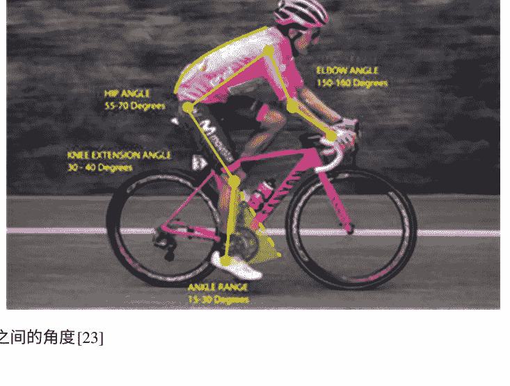

图7肢体之间的角度[23]

- (2) 余弦定理

例如，要计算肩膀的角度，需要从骨架中获取肩膀、肘部和臀部的坐标。这些点形成一个以肩膀点为中间角的虚拟三角形。通过这种方式计算并比较所有关节之间的角度。余弦定理被使用的主要原因是它是唯一一个给出三角形两边求角度的三角函数公式。

计算角度非常简单，并且对处理器的负载或压力很小。对于在轻量级硬件上运行的系统来说，这是一个首要任务。

角度的计算使用以下公式-

```
cos B = (a^2 + b^2 - c^2)/2ac
```

其中a、b和c是边长，B是要计算的角度。为了比较，将参考图像的角度与网络摄像头的角度之间的差值取出。如果差值的绝对值小于5，用户的骨架将从红色变为绿色。通过这种方式，用户可以判断自己的姿势是否正确（图8）。

##### 3.6 数据流处理

从数据库中获取并上传到P5编辑器的参考图像/视频用于健身/瑜伽姿势。然后在屏幕上显示出来基于已选择的锻炼。用户的网络摄像头视频实时处理和分析，以获取用户的骨架。用户数据直接流式传输，并使用PoseNet模型进行处理，骨架在用户屏幕的画布上绘制。

图8 余弦定理[24]


#### 4 最终实现

该项目的最终实现是使用P5编辑器完成的，该编辑器可以免费在线使用。所有内容都显示在根据标准笔记本电脑或移动设备屏幕大小创建的画布上。在屏幕的左半部分绘制网络摄像头视频，右半部分绘制选择的健身/瑜伽姿势图像/视频。网络摄像头视频被反转，因为对于我们的大脑来说，理解镜像图像更容易。扫描选择的姿势，并在网络摄像头视频上绘制白色骨架。根据计算的角度，绘制用户的骨架以红/绿色显示。如果用户正确执行姿势，则骨架变为绿色，并向用户发送通知；如果用户执行错误的姿势，则骨架为红色。这两种情况都经过测试，并在图9中显示。

#### 5 优点

- PoseNet在轻量级设备（如手机/浏览器）上运行良好，而OpenPose需要GPU驱动的机器/系统。
- 经过分析，PoseNet的准确性与OpenPose相当，因此使用PoseNet可以在轻量级设备上使用该系统。
- 该系统处理基于用户进展的多步锻炼/姿势，即只有用户在初始步骤中达到准确性后，参考的健身房/瑜伽姿势才会进入下一步，这使用户能够获得良好的并确保他们以正确的方式执行了特定的锻炼。

图9 系统的实际工作

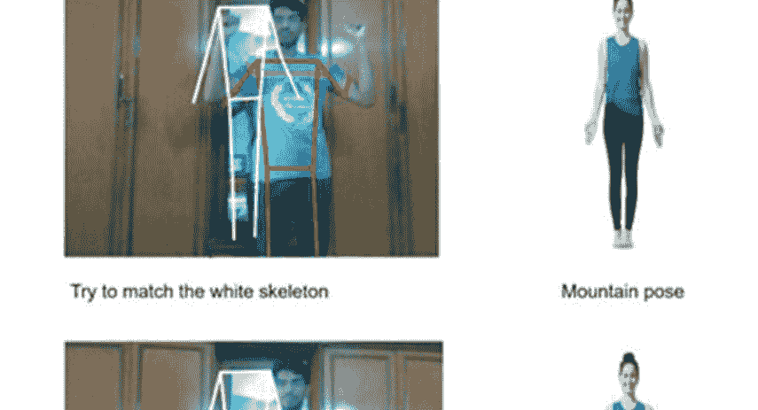


#### 6 未来展望

- 1. 目前提出的模型的锻炼数量有限，可以通过添加更多的健身房锻炼和瑜伽姿势来扩展数据集，以满足各个年龄段的更大受众。
- 2. 通过分析用户数据并相应地推荐锻炼或视频，可以使该系统更加个性化。
- 3. 通过集成语音识别系统，可以进一步增强该系统，这对于播放或暂停特定视频非常有帮助。

| Lighting Conditions | Lowest Accuracy | Highest Accuracy |
|---------------------|-----------------|------------------|
| Bad                 | 0.398           | 0.614            |
| Good                | 0.765           | 0.812            |
| Best                | 0.928           | 0.983            |

| Detection of part | Lowest Accuracy | Highest Accuracy |
|-------------------|-----------------|------------------|
| Elbows            | 0.838           | 0.983            |
| Hips              | 0.685           | 0.988            |
| Ankle             | 0.512           | 0.807            |

图10 在不同条件下计算的准确度

#### 7 结果

该系统将图像和视频作为参考，并将瑜伽和健身操纳入了该模型中。因此，与先前创建的模型相比，我们的模型是独特的。该模型在检测和标记肩膀、肘部、臀部和膝盖等各种关节位置方面取得了可接受的结果。然而，脚踝的检测得分较低，并且没有检测到面部特征，如图9所示。该模型实时跟踪关节运动的能力相对较高。PoseNet模型在所有关键点上的最高得分范围从0.92874到0.98325。

在最佳、良好和糟糕的照明条件下测试模型是必要的，因为房间并不总是明亮的。结果显示，该模型在良好的照明条件下表现令人满意，并且在最佳的照明条件下非常准确。然而，在糟糕的照明条件下，准确度得分下降，不建议使用该模型。

观察到一个有趣的模式，身体部位的准确度从上到下逐渐变差。身体部位，如肘部和肩膀，具有最高的准确度，但脚踝和膝盖的准确度相对较低。这个问题并没有对模型产生太大的影响，大部分时间估计是正确的（图10）。

#### 8 结论

本文提出了一种基于参考视频和图像的用户锻炼监测系统。系统将检测和比较用户姿势骨架，以便用户能够正确地进行锻炼。如果用户在进行锻炼时姿势不正确，系统将实时提供反馈。使用PoseNet库实现了模型。使用这种方法，成功绘制了关键点，并创建了一个骨架来检测姿势。目标是使这个系统适用于所有年龄段的人群。因此，我们的实时室内锻炼分析器为用户提供了专业的瑜伽和健身教练，使他们的生活更简单。

#### 参考文献

- 1. 印度时报。“64%的印度人不锻炼：研究-印度时报。”印度时报，2019年7月3日。 https://timesofindia.indiatimes.com/life-style/health-fitness/health-news/64-per-cent-indians-dont-exercise-study/articleshow/70038656.cms
- 2. CSCS，安德鲁·赫弗南。“你做错的7个常见的锻炼动作-以及如何改正。”Openfit，2020年8月29日。www.openfit.com/common-exercises-wrong-strength3。
- 3. Nagarkoti，A.， Teotia，R.， Mahale，A.， & Das，P. (2019)。使用机器学习和计算机视觉的实时室内锻炼分析会议论文：...IEEE工程医学与生物学学会年度国际会议。IEEE工程医学与生物学学会（第1440-1443页）。 https://doi.org/10.1109/EMBC.2019.8856547
- 4. Yadav，S.， Singh，A.， Gupta，A.， & Ra eja，J. (2019)。使用深度学习的实时瑜伽识别神经计算与应用，31。https://doi.org/10.1007/s00521-019。 https://doi.org/10.1007/s00521-019-04232-7。
- 5. Kumar，D.， & Sinha，A. (2020)。使用深度学习的瑜伽姿势检测和分类。国际科学研究杂志计算机科学工程和信息技术。 https://doi.org/10.32628/CSEIT206623
- 6. Markolefas，F.， Moirogiorgou，K.， Giakos，G.， & Zervakis，M. (2018)。个性化训练的虚拟视频合成(pp. 1–6)。 https://doi.org/10.1109/IST.2018.8577097
- 7. Borkar，P. K.， Pulinthit ha，M. M.， & Mrs. Pansare，A. (2019)。Match pose——一个用于比较姿势的系统，国际工程研究与技术杂志(IJERT)， 08(10) (2019年10月)。
- 8. Mehta，D.， Sotnychenko，O.， Mueller，F.， Xu，W.， Elgharib，M.， Fua，P.， Seidel，H.-P.， Rhodin，H.， Pons-Moll，G.， & Theobalt，C. (2020年7月)。 XNect:实时多人3D动作捕捉与单个RGB相机。ACM图形学交易39.4，82，17页。 https://doi.org/10.1145/3386569.3392410
- 9. 丁，W.，胡，B.，刘，H.，等 (2020年)。基于多特征和规则学习的人体姿势识别国际机器学习与控制学杂志，11，2529-2540。 https://doi.org/10.1007/s13042-020-01138-y
- 10. Vyas，P. (2019)。 “体育和健身中的姿势估计和动作识别”硕士项目。695。 https://doi.org/10.31979/etd.w8ug-4v5c
- 11. H. Xiong，S. Berkovsky，Sharan R. V.，Liu S.，& Coiera，E. (2020) “基于多样化深度潜变量模型的稳健基于视觉的锻炼分析”，2020年第42届IEEE工程医学与生物学学会国际会议(EMBC) (pp. 2155-2158)。 https://doi.org/10.1109/EMBC44109.2020.9175454
- 12. Cao，Z.，Simon，T.，Wei，S.，& Sheikh，Y. (2017)。实时多人2D姿势估计使用部分亲和力场。IEEE计算机视觉和模式识别会议(CVPR)，2017，1302–1310。https://doi.org/10.1109/CVPR.2017.143
- 13. Rishan，F.，de Silva，B.，Alawathugoda，S.，Nijabdeen，S.，Rupasinghe，L.，& Liyanapathirana，C. (2020) “无限瑜伽导师：瑜伽姿势检测和纠正系统。”2020第五届国际信息技术研究会议(ICITR)(pp. 1–6)。 https://doi.org/10.1109/ICITR51448.2020.9310832

### 使用CNN分析个人汽车索赔的车辆损坏情况

Jagadevi N. Kalshetty, B. A. Hrithik Devaiah, K. Rakshith, Ken Koshy和N. Advait

摘要：在车辆保险和租赁行业中，检测车辆损坏是最重要的活动之一。驾驶员和保险公司通过检查来识别和检查这些损坏，以确定适当的经济赔偿，并由车辆租赁公司将责任分配给有罪的客户。由于当前系统耗时，检查员必须在评估之前手动检查损坏，因此可以通过物体识别系统来执行此识别。这些系统的复杂性在于图像特征确定和提取技术。检测损坏严重程度和预测修复成本的一种更新颖的方法是使用2D图像识别。

这样，驾驶员就不必等待保险公司的评估来确定维修费用的大致估计。在将图片上传到框架后，图片会被处理，车辆损坏会被识别出来。然后，图像会被分类到相关的损坏严重程度类别中。随后，检测到图像中的损坏严重程度会被映射到近似的费用值。

最后，用户会得到一份车辆损坏严重程度分类的报告，以及一份平均费用报告，车辆可以从中恢复损坏。

- 卷积神经网络
- 深度学习
- 图像分类
- 图像识别
- 机器学习

#### 1 引言

每天在世界各地发生数千起交通事故[1]。事故发生后，驾驶员浪费了很多时间来估计车辆损坏的费用。在车辆保险和租赁行业中，检测这些损坏是最重要的活动之一。驾驶员和保险公司会识别和检查这些损坏，以确定适当的赔偿金额。赔偿，并由租车机构将责任分配给有责任的客户。通常，驾驶员或保险投保人在事故发生后联系保险公司，并等待相关人员到达。当前系统耗时，检查员在评估之前通过手动检查损坏来遵循传统方法。此外，检查员有时会匆忙忽略较小的损坏或对某些方面持有偏见。在驾驶员频繁更换的情况下，识别此类较小的损坏非常重要，例如在车辆租赁服务中。

#### 2 文献综述

在过去的几年里，已经有无数的作品基于实施自动化车辆损坏检测系统来对抗当前传统技术，其中保险检查员需要花费时间评估损害，这导致个人汽车索赔的评估计算中出现了很多延迟。因此，多年来许多研究人员也关注了这个问题的工业规模。文献中提出了许多解决方案，利用基于深度学习的人工智能来提高所提出系统的效果。

尽管存在针对这个研究问题的比较应用，但没有一个解决方案具备所有上述特点。费用成本和损害严重程度预测是本研究的关键特点。

用户进展以及负责人（车辆保险公司和车辆租赁公司）能够更新严重程度分类和与公司政策相匹配的不断变化的费用规则等亮点也是潜在客户所期望的，但它们将在不久的将来实施。当前系统根据损害仅考虑车辆类型来计算损害类型、严重程度分类和费用成本。因此，系统给出的损害成本预测并不明确适用于单个车辆。我们提出系统的新颖贡献是增加了严重程度分类、报告生成系统以促进用户与保险提供商之间的进一步交流，以及帮助用户解答问题的帮助台聊天机器人。为了改善费用成本的准确性，并使其更不可能遗漏任何一个车辆，可以考虑车辆的制造商、型号和生产年份。此外，作为应用程序的内部操作的一部分，可以添加自动识别上述细节，即车辆制造商、型号和生产年份。

此外，聊天机器人功能可以通过语音识别和其他支持的语言来改进。通过添加上述进展，预期所提出的方法将更加可靠和准确。

#### 3 设计

图1所示的下面的流程图说明了所提出系统的设计。在这个项目中，用户将图片提交给系统。图片经过第一个门，检查图片是否是汽车的图片。如果图片正确则进入下一个门，检查汽车是否损坏。如果任一门失败，用户将被提示上传另一张图片。一旦两个门都通过，图像将通过另外两个门-损坏位置和损坏程度。损坏可能位于汽车的前部、侧部和后部。同样地，损坏程度可以从轻微、中等到严重。基于相应损坏汽车零件的大致价格和损坏程度，生成修复费用的估计报告。

#### 4 提出的方法

机器学习过程可以分为5个基本步骤，首先，数据收集-在这个阶段，使用不同的方法从各种来源收集数据。通常需要收集大量信息来准备模型。数据准备-下一步很重要，因为收集到的数据需要进行清洗、分类、增强等处理，以便为模型做好准备。这样可以获得高质量的数据。选择模型-存在各种各样的模型，用于不同的目的，具有不同的准确度、可训练性和速度。选择适合所需工作的模型是必要的。训练模型-使用在前两个步骤中收集和准备的训练数据对模型进行训练。如果需要，对模型进行调整并评估准确性。部署模型-最终模型准备好在测试数据上进行测试。

所提出系统的架构如图2所示。用户将图片上传到网站。我们使用为Python创建的Web应用程序框架。它帮助我们构建轻量级的Web应用程序，因为它保持了应用程序的核心非常简单。然后将图像发送到TensorFlow平台，发送推理请求。推理是指在设备上执行TensorFlow Lite模型，根据输入信息进行预测的过程。我们有多个模型，每个模型执行特定的任务。这些模型用作推理端点。任务包括车辆验证、损坏存在、损坏位置和最终损坏严重程度。

卷积神经网络（ConvNets或CNNs）是一种用于进行图像识别和分类的神经网络类型（图3）。CNN图像分类接收一张图片，对其进行处理，并将其分类到特定的类别，如汽车、公交车、火车等。计算机将图片视为像素数组，大小取决于图片的分辨率。根据图片的分辨率，高度、宽度和深度得到解决。实际上，深度学习的CNN模型是通过将每个图片通过一系列的卷积层、池化层、全连接层（FC）和应用Softmax函数进行准备和测试的，该函数将识别到的对象向量排列成总和为1的概率分布[1,4]。

图像分类涉及从图像中提取特征以检测数据中的模式。使用普通的神经网络，甚至是基本的机器学习分类模型进行图像分类将在计算方面变得非常昂贵，因为可训练参数变得非常庞大。CNN在减少参数数量的同时不会丢失模型的质量，非常有效。图像具有高维度（因为每个像素都被视为一个特征），这适合CNN的上述描述的能力。CNN允许我们不用担心用于特征提取的滤波器是什么。相反，CNN会自动提取特征，甚至有些特征对人类来说是看不见的，从而降低了训练的复杂性。CNN被训练用于识别任何图像中的对象边缘。我们使用CNN对四个门-汽车验证、损坏验证、位置检测、严重程度检测进行处理。

由于每个门执行图像分类，但使用不同的特征，我们使用相同的算法，即VGG-16。该算法主要涉及提取轮廓、形状、颜色等特征，然后利用这些特征来识别图像上的模式。

这些提出的系统模型在VGG-16架构上运行，用于图像分类。VGG-16是一个卷积神经网络模型，在ImageNet上实现了92.7%的前5个测试准确率，ImageNet是一个用于视觉识别研究的数据集，包含超过1400万张图片和1000个类别。每个层的卷积核大小为3 × 3，池化大小为2 × 2。提供给VGG-16模型的输入是224 × 224 × 3像素的图片。然后将其送入下面两个卷积层，每个卷积层的大小为224 × 224 × 64，然后将该图片送入一个池化层，池化层的宽度和高度为图片缩小到112 × 112 × 64。然后，图片经过两个大小为112 × 112 × 128的conv128层，然后图片进入一个池化层，进一步减小图片的高度和宽度到56 × 56 × 128。此外，还有三个大小为56 × 56 × 256的conv256层，然后再次进行池化层，将图片的大小减小到28 × 28 × 256。然后，还有三个大小为28 × 28 × 512的conv512层，之后又经过一个池化层，将图片的大小减小到14 × 14 × 512。此外，还有三个大小为14 × 14 × 512的conv512层，之后又经过一个池化层，将图片的大小调整为7 × 7 × 512。然后，跟随着两个密集或完全连接的层，每个层都有4096个节点。最后，有一个最终的密集输出层（softmax），有1000个节点，通过将softmax函数应用于来自前一层的网络输入来产生输出[5]。

对于损坏汽车的图像，我们需要从网络上收集它们。网络爬虫是一种从在线来源自动收集数据的方法，通常是从网站上。Selenium是一个开源的基于Web的自动化工具。它主要用于行业中的Web应用程序测试，但也可以用于网络爬虫。使用Selenium，从互联网上下载了损坏汽车的图像。对于未损坏汽车的图像，我们使用斯坦福汽车数据集。这是一个包含16,000张196个汽车类别图像的庞大数据集。我们需要从这个数据集中获取一小部分图像样本。数据预处理包括以下步骤。首先，我们有图像分类，将图像分类为不同的类别，如损坏位置（前部，后部和侧部），严重程度（轻微，中等和严重）。下一步是图像调整大小-神经网络对相同大小的输入进行操作，需要将所有输入图像调整大小为固定大小，然后将其馈送到CNN中。较大的固定大小需要较少的缩小，这意味着图像的模式、细节和特征变形较小。最后，我们有数据增强，通过翻转、改变亮度等方式增加数据集的大小。

#### 5 结果和模拟

以下图表显示了所提出系统的工作情况。图4、5和6显示了上传图像的结果页面，通过验证门，以及上传另一张图像、生成报告和与聊天机器人聊天的选项。图7和8显示了报告生成的工作情况。图9和10显示了聊天机器人的工作情况。在第一个门（车辆验证门）中，模型的准确率达到了87%。其次，在损坏验证门中，模型的准确率达到了85%。最后，在第三个门（损坏位置门）和第四个门（损坏严重程度门）中，模型的准确率分别达到了75%和69%。这些数字是在大约50个时期达到的。随着我们获得更多的数据，我们可以进一步训练模型，从而提高准确性。

如图4所示，上传了一张狮子的图片，汽车验证模型正确地识别出这不是一张汽车的图片。用户需要重新上传正确的图片。

在这个场景中，用户上传了一张汽车的图片，并通过了汽车验证。然而，损坏验证模型没有检测到任何损坏。

如图6所示，用户上传了一张正确的汽车图片，并通过了两个验证门。负责识别位置和严重程度的第三和第四个门显示了正确的结果。由于这辆车的损坏在侧面，保险只覆盖窗户和车门的修理费用。因此，我们的保险摘要提供了零件修理费用的估计。类似地，如果损坏位置在前部或后部，保险摘要将提供相应零件的费用，如保险杠、后备箱、发动机盖和挡风玻璃。

如图7和8所示，打印文档按钮会生成一份带有页面截图的报告，并将文件保存在本地。此外，报告还会通过邮件发送给用户，用户可以使用它来启动进一步的保险处理。

聊天机器人的实现如下所示。点击按钮后，用户将被重定向到最流行的即时通讯应用程序。

如图9所示，聊天机器人根据用户请求的“帮助”提供多个查询选项。

图10显示，聊天机器人还提供推荐保险网站和计划，以及提供汽车零件和价格等功能。

#### 6 结论

通过使用该系统，可以立即识别损坏情况，无需进行现场检查。这将减少从保险公司获得响应的等待时间。它还将减少检查工作量，因为系统完成了所有工作，包括上传损坏图片，评估损坏情况，计算修复成本估计，并提供总结报告。鉴定计算时间可以缩短，因为所有损坏都被分类为相关严重程度，并根据车辆制造和类型等分配相应的成本。系统可以减少人为错误，因为它不断改进。

随着时间的推移，系统不断改进。随着时间的推移，上传的图片越多，模型的训练越多，准确性也在不断提高。与深度学习和图像处理一起工作，帮助我们了解这项技术的巨大潜力。

#### 参考文献

1.  Singh, R., Aiyar, M. P., Sripawan, T. V., Gossain, S., Shah, R. R. (2019). 使用深度学习技术自动化汽车保险理赔。在2019年IEEE第五届多媒体大数据国际会议（BigMM）中，新加坡。
2.  Zhang, Q., Zhang, X., & Bian, S. B. (2020). 基于改进的掩蔽RCNN的车辆损坏检测分割算法。IEEE Access, 8, 6997–7004.
3.  Patil, K., Kulkarni, M., Sriraman, A., & Karande, S. (2017). 基于深度学习的汽车损坏分类。在2017年第16届IEEE国际机器学习和应用会议(ICMLA)，坎昆.
4.  Dhieb, N., Ghazzai, H., Besbes, H., & Massoud, Y. (2019). 用于车辆损坏检测和定位的非常深的迁移学习模型。在2019年第31届国际微电子学会议(ICM)，开罗，埃及.
5.  Qassim, H., Verma, A., & Feinzimer, D. (2018). 用于大数据场所图像识别的压缩残差-VGG16 CNN模型。在2018年IEEE第8年度计算和通信研讨会和会议(CCWC)，拉斯维加斯.
6.  Waqas, U., Akram, N., Kim, S., Lee, D., & Jeon, J. (2020). 使用深度学习进行车辆损坏分类和欺诈图像检测，包括莫尔效应。在2020年IEEE加拿大电气和计算机工程学学会会议（CECE）中，加拿大伦敦。
7.  Zhu, X., Liu, S., Zhang, P., & Duan, Y. (2019). 基于计算机视觉技术的智能车辆损坏评估的统一框架。在2019年IEEE第二届自动化、电子和电气工程国际会议（AUTEEE）中，中国沈阳。
8.  Koch, M., Wang, H., & Bäck, T. (2018). 用于预测低速车辆碰撞损坏部位的机器学习。在2018年第十三届数字信息管理国际会议（ICDIM）中，德国柏林。
9.  Akşehir, Z. D., Oruç, Y., Elibol, A., Akleylek, S., & Kili, E. (2018). 关于使用数据预处理和统计技术分析工作事故数据。在2018年第二届多学科研究与创新技术国际研讨会（ISMSIT）中，土耳其安卡拉。
10. Sharma, S., & Bhagat, A. (2016). 用于网络结构挖掘的数据预处理算法。2016年第五届环保计算与通信系统国际会议（ICECCS），印度博帕尔。
11. Jony, R. I., Mohammed, N., Habib, A., Momen, S., & Rony, R. I. (2015). 考虑预处理和“特殊”特征的数据处理解决方案评估。在2015年第11届信号图像技术与基于互联网的系统国际会议（SITIS）中，泰国曼谷。
12. 卷积神经网络的综合指南。 https://towardsdatascience.com/a-comprehensive-guide-to-convolutional-neural-networks-the-eli5-way-3bd2b1164a53
13. VGG16-用于分类和检测的卷积网络。 https://neurohive.io/en/popular-networks/vgg16
14. 机器学习中图像分类技术的基础。 https://iq.opengenus.org/basics-of-machine-learning-image-classification-techniques/amp/
15. Chao, Y.-W., Yang, J., Price, B., Cohen, S., & Deng, J. (2017). 从静态图像中预测人类动态 (第3643-3651页)。 https://doi.org/10.1109/CVPR.2017.388
16. Park, S., Hwang, J., & Kwak, N. (2016). 使用卷积神经网络和2D姿势信息进行3D人体姿势估计。 https://doi.org/10.1007/978-3-319-49409-8_1
17. Fani, M., Neher, H., Clausi, D. A., Wong, A., & Zelek, J. (2017). 通过集成的堆叠沙漏网络进行曲棍球动作识别。IEEE计算机视觉和模式识别会议(CVPRW), 2017, 85-93. https://doi.org/10.1109/CVPRW.2017.17
18. Sawant, C. (2020年1月2日). 使用openpose和长短期记忆网络对实时图像进行人体活动识别。EasyChair主页。 https://easychair.org/publications/preprint/gmWL
19. PoseNet库。 https://github.com/tensorflow/tfjs-models/tree/master/posenet
20. Tensorflow博客，“使用TensorFlow.js在浏览器中进行实时人体姿势估计”。 https://medium.com/tensorflow/real-time-human-pose-estimation-in-the-browser-with-tensorflow-js-7dd0bc881cd5
21. PoseNet检测到的17个关键点的描述，Tensorflow博客。
22. 使用TensorFlow Lite在Android上实时跟踪人体姿势。TensorFlow博客。 https://blog.tensorflow.org/2019/08/track-human-poses-in-real-time-on-android-tensorflow-lite.html
23. Hidalgo, G., Sheikh, Y., Kitani, K., Bansal, A., Sanabria R., Xiang, D., Li, X., & Idrees, H. (2019). OpenPose: 全身姿势估计。
24. Brown, V. (2021). 与托德一起骑自行车-第二部分。尼古拉斯·布朗。 https://nichollasbrown.wordpress.com/2020/05/26/the-bike-fit-with-todd-part-two/
25. 正弦和余弦规则目标：计算非直角三角形的缺失边和角度。(2021)。Ppt下载。 https://slideplayer.com/slide/6955412/

### 关于属性基于访问控制模型HGABAC的分析问题

Anh Truong

摘要 由于基于角色的访问控制（RBAC）模型的限制，属性基于访问控制（ABAC）模型正在研究中，并有望在不久的将来成为主导的访问模型。与RBAC类似，安全分析问题，即分析策略以验证策略中是否存在任何安全问题，是ABAC中的关键问题之一。在本文中，我们考虑了最近提出的ABAC模型HGABAC及其管理模型GURA_G中的安全分析问题。我们研究了提出的反向过程，并将该过程组装起来，以构建HGABAC和GURA_G policies的分析技术。我们还实现了该技术并进行了一些实验，以展示所提出技术的可扩展性。

关键词 安全分析·访问控制·基于属性的访问控制·基于角色的访问控制·模型检测

#### 1 引言

访问控制[1]是验证对系统资源的受限访问的过程它确定资源是否已被授予或拒绝。自主访问控制（DAC），强制访问控制（MAC）于1970年代初出现[1, 2]。然而，MAC和DAC的缺点导致了基于角色的访问控制（RBAC）的建立和发展[3–6]。RBAC是今天大多数访问控制系统广泛使用的。然而，对于构建更复杂和受限访问模型的需求，鼓励研究人员朝着新的发明模型前进。基于属性的访问控制（ABAC）[7]已被提出和深入研究随着RBAC的限制[8]，基于属性的访问控制（ABAC）很快成为一种有前途的访问控制模型。然而，分析ABAC模型的安全策略的方法-论是必要的，但尚未得到彻底研究。


在ABAC模型中，用户可以在其权限范围内访问系统中的资源。用户权限通过属性进行管理。给用户分配和/或撤销属性值等同于在系统中添加或删除用户权限。这些分配和撤销操作由管理员执行。在大型系统中，通常存在许多不同的管理员。因此，ABAC模型需要一个管理管理员操作的管理模型。

ABAC模型的管理模型用于管理分散的策略。由于系统中的用户数量庞大且策略变得更加复杂，分散化的过程可能使系统容易受到安全威胁。

例如，在大学系统中，考虑两个管理操作的组合（可能由不同的管理员执行）在一个策略中，（i）给已经具有属性值学生的用户分配属性值TA，（ii）给已经具有属性值TA的用户分配属性值教师。执行操作（i）然后紧接着执行操作（ii）可能会引发安全问题，例如，一个用户既具有属性值学生又具有属性值教师。这可能导致系统中的学生访问敏感的教师资源，如考试试卷。类似的漏洞可能导致敏感信息泄露或非法修改。这些错误是由管理操作引起的，它们可能是意外地或故意地组合在一起，导致系统陷入不安全状态。

为了能够检查系统是否存在安全问题，需要构建一种自动分析技术，可以检查所有可能发生的安全漏洞。本文考虑了ABAC模型的安全分析问题，特别是HGABAC及其管理模型GURAG。我们研究了[9-15]中提出的反向过程，并将该过程组装起来，构建了HGABAC和GURAG策略的分析技术。我们使用一阶逻辑来表示ABAC策略的所有组成部分，并研究了自动分析安全策略的反向过程，以确定系统的策略是否会导致安全漏洞。我们使用名为MCMT的模型检查工具来实现我们的技术（即反向过程的实现），并进行实验以展示技术的可扩展性。本文的结构如下：第2节简要介绍HGABAC模型和管理模型GURAG。我们还在第2节中对模型的安全分析问题进行了详细说明。第3节介绍了我们自动分析GURAG模型的技术。第4节展示了实验结果。最后，第5节给出了一些结论和未来的工作。

#### 2 HGABAC：一种ABAC模型及其管理模型GRUAG

ABAC已经在许多不同的方向上得到了发展。已经引入了几种模型，其中2012年引入的ABACα模型成为其他模型开发的基础[7]。分层组和基于属性的访问控制（HGABAC）[7]是从ABACα模型发展而来的模型之一。

这是一个高度先进的ABAC模型。该模型消除了以前ABAC模型的许多缺点，并可能很快在现实中部署。

### HGABAC描述。

在HGABAC中，模型的实体是用户、对象和主体。对象是系统的资源（文件、应用程序等）。用户通过主体访问对象。当用户与系统交互时，主体由用户（进程、部分）创建。主体拥有创建它的用户的属性，这些属性随时间变化，但永远不会超过创建它的用户的属性集。主体和用户具有相同的属性集，而对象具有反映其特性的单独的属性集。操作是系统的操作（读、写），由主体对对象执行。属性是值的集合。概念模型HGABAC如图1所示。

### HGABAC形式化.

在本节中，我们对HGABAC的组成部分进行形式化。

让U，S，O，Au，Ao，OP分别为用户、主题、对象、用户属性、对象属性和操作的有限集合。UA，OA分别为用户属性和对象属性函数的有限集合。我们有UA ⊆ U × Au和OA ⊆ O × Ao。

### 授权函数.

对于每个op ∈ OP，授权op(s:S，o:O)定义如下策略语言，使用ABNF语法[7]返回true或false。True表示主体s可以访问对象o:

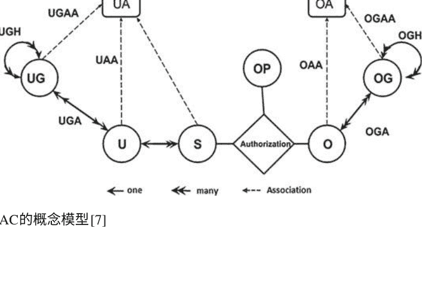

```
Au_func = exp [ bool_op Au_func ] | exp
exp = term op term
      | [ "NOT" ] bool_var
      | [ "NOT" ] "(" Au_func ")"
term = const | att_name
bool_var = boolean | att_name
op = ">" | "=" | "<=" | "!=" | "∈"
bool_op = "∨" | "∧"
att_name = user_att_name | object_att_name |
admin_att_name
user_att_name = "user." att_name
object_att_name = "object." att_name
admin_att_name = "admin." att_name
const = atomic | set
boolean = "TRUE" | "FALSE"
set = "{" "}" | "{" setval "}"
setval = atomic | atomic "," setval
atomic = int | float | string | "NULL"
```

其中user_att_name，admin_att_name是UA集合中用户和管理员的属性名称，object_att_value是OA集合中对象的属性名称。int，float，string是具有相应数据类型int，float，string的值。

例如，让我们考虑以下授权函数：

授权读取(s: S, o: O) = s.用户类型 ∈ o.读者类型
                           ∧ s.Faculty ∈ {医学,物理}
                           ∧ s.年龄 > 18

该函数返回true当且仅当 (i) 主体s的属性用户类型的值包含在对象o的属性读者类型的值集合中；(ii) s的属性faculty的值必须是医学和/或物理（表示主体s在医学或物理学院工作）；以及 (iii) s的年龄超过18岁。

- 让我们考虑一个HGABAC系统的示例如下：
- U = S = {爱丽丝, 鲍勃, 山}
- Au = {用户类型, 位置, 学院}, 其中每个属性的范围为用户类型 = {学生, 教师, 助教}; 位置 = {巴黎, 纽约, 伦敦}; 以及学院 = {化学, 医学, 物理}
- O = {O1, O2}
- Ao = {ReaderType, Location} where the range of each attribute is ReaderType = {student, teacher} and Location = {Paris, New York}
给定一个HGABAC策略如下 (UA和OA)：

| 用户 | 用户类型 | 位置 | 教职工 |
| :--- | :--- | :--- | :--- |
| 爱丽丝 | 学生 | 巴黎 | 化学 |
| 鲍勃 | 教师 | 纽约 | 医学 |
| 山 | 助教 | 伦敦 | 物理 |

| 对象 | 读者类型 | 位置 |
| :--- | :--- | :--- |
| O1 | 学生 | 巴黎 |
| O2 | 教师 | 纽约 |

我们将有（爱丽丝，用户类型.学生） ∈ UA; （鲍勃，用户类型.教师） ∈ UA; （爱丽丝，位置.巴黎） ∈ UA。类似地，（O1，读者类型.学生） ∈ OA; (O1，位置.巴黎) ∈ OA; ... 让我们考虑op ∈ OP = {read}。读操作的授权函数可以描述如下：

授权读取s : S, O1 : O) ≡ s.用户类型 ∈ O1.读者类型 ∧ s.位置 = O1.位置

假设用户Alice请求读取对象O1（见图2）：条件 s.用户类型 ∈ O1.读者类型和s.位置 = O1.位置得到满足，因此Alice被允许读取o1。

只有当授权（s，o）的结果为真时，主体s才被允许访问对象o。由于主体始终可以从用户或用户的全部属性中接收属性，因此在接下来的分析中，我们只分析用户的属性，而不分析每个主体的属性。我们假设如果用户具有足够的属性来对对象执行管理操作，那么该用户也可以创建一个有资格的主体来执行对象上的操作（即，用户集合与主体集合相同）。

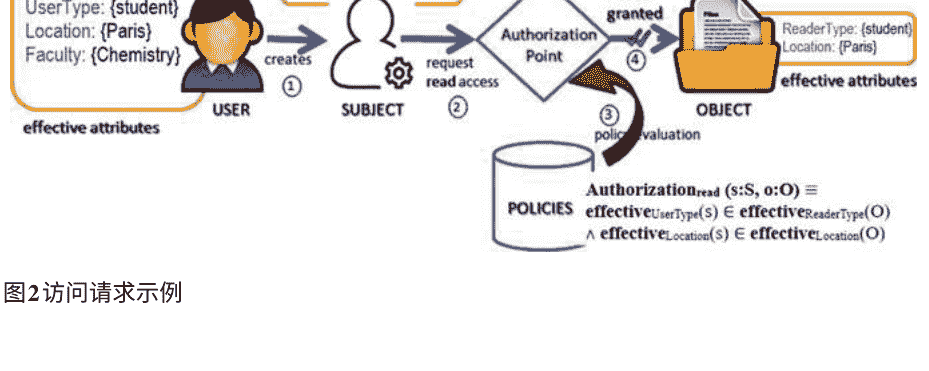

##### 行政模型GURA_G

该模型旨在提供控制HGABAC策略的行政操作。GURA_G行政模型有三个子模型：UAA子模型、UGAA子模型、UGA子模型。UAA子模型处理用户属性值的添加或删除。UGAA子模型控制用户组属性的添加和删除，而UGA子模型控制用户分配到用户组，以及从用户组中删除用户。如上所述，在策略分析中我们不考虑用户组。因此，对于GURA_G行政模型，我们只关注UAA子模型中的行政操作，而将UGAA子模型和UGA子模型作为未来的工作。

### 用户属性分配子模型（UAA）。

UAA模型处理修改用户属性值的问题，例如为用户的属性添加或删除值。该子模型中的两个管理操作如下所示：

```
Can_Add_att/Can_delete_att ({admin_role}, {user_attribute_set}, {target_attribute_set})。
```

其中，admin_role是执行此操作的管理员的角色；由于GURA_G模型使用RABC模型作为基本模型来管理管理员，因此管理员必须具有角色（admin_role）在管理操作中。在ABAC模型中，我们可以将角色视为属性。正如您将在我们的分析技术中看到的那样，我们认为管理员也是拥有属性的用户（角色是管理员的一个属性）；这可以帮助我们在将来轻松灵活地扩展GURA_G模型。user_attribute_set是用户的条件集，要求用户在某些属性上具有某些值。target_attribute_set是用户在执行操作后将被分配或删除的属性及其值的集合。

让我们考虑当执行管理操作Can_Add_att /Can_delete_att时：

- 条件1：存在一个满足admin_role条件的管理员，即管理员必须承担admin_role。在这种情况下，我们说管理操作已启用并准备执行。
- 条件2：如果系统中存在一个具有满足user_attribute_set的属性集的用户（例如，其属性的值包括在user_attribute_set中定义的值），那么我们说该用户满足管理操作的用户条件。

当满足条件2并且管理操作已启用时，管理员现在可以对用户执行管理操作，然后将用户的相应属性集分配/删除到目标属性集。

现在我们考虑一个例子：

```
Can_Add_att (DeptAdmin, {UserType.导师助手}, {User-Type.教师})。
```

如果存在一个角色为DeptAdmin的管理员（条件1），则将启用此管理操作。如果存在一个用户u，其UserType属性的值为Tutor_assistant，那么条件2将被满足。如果这两个条件都满足，管理员可以对用户u执行此操作，从而导致用户u的UserType属性的值添加Teacher（例如，关系UA变为新的关系U A’，其中UA’ =UA U (u.UserType.Teacher)）。同样，考虑以下操作：

```
Can_delete_att (DeptAdmin, {UserType.(Tutor_assitant, Student)}, {UserType. Tutor_assitant})。
```

此操作需要一个角色为DeptAdmin的管理员启用（条件1）。如果存在一个用户u，其UserType属性的值为Tutor_assistant和Student（即用户既是学生又是导师助手），那么条件2将被满足。如果这两个条件都满足，管理员可以对用户u执行此操作，生成一个状态，其中用户u的UserType属性的值中删除Tutor_assistant（UA →UA’，其中UA’ =UA\(u.UserType. Tutor_assitant))。

### GURA_G模型的安全分析问题。

本文的目标是找出系统是否存在安全漏洞。这意味着在执行某些管理操作后，如果用户可以获取其属性的某些特定值，并基于此，他可以访问敏感资源并将系统置于危险之中。在这种情况下，我们说系统是不安全的（或存在安全漏洞），因为存在可以通过管理操作访问敏感资源的用户，尽管根据系统的安全要求，这些用户是不允许这样做的。

为了回答安全分析问题，我们需要分析给定的GURA_G。为了做到这一点，其中一个简单的算法是：我们收集系统的所有管理行为。随后，我们通过执行每个行为来分析它。当执行管理行为时，系统会过渡到一个新的状态（我们可以说初始系统是初始状态），我们需要检查新状态是否满足目标。如果是，我们对安全分析问题返回答案“是”（即系统是不安全的）。否则，我们继续选择行为并执行它们以获得其他状态，并再次检查目标。

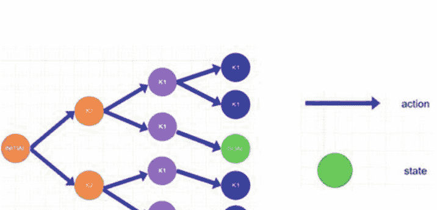

图3 GURAG系统分析的前向算法

这是一个耗时的过程。图3说明了这个前向算法来分析系统。

#### 3 GURAG系统的自动化分析技术

在本节中，我们提出了一种分析技术来分析GURAG系统。直观地说，我们可以将上述前向算法组合到分析技术中。然而，在接下来的内容中，我们将研究[14]中提出的后向可达性算法，并将该算法调整为我们的分析技术。这样做的原因是：(i) 后向可达性算法不是从初始状态开始检查，而是从目标状态开始检查，因此它将限制所有不满足目标的已探索状态；(ii) 我们可以继承实现后向可达性算法的工具MCMT，并且可以调整MCMT中引入的一些启发式方法，以缓解状态爆炸问题，这是GURAG系统等基于转换的系统分析中一个众所周知的问题，从而加快分析速度。

MCMT [10] 试图解决一类具有无限状态转换系统的可达性问题，其状态变量是将索引映射到元素的数组。这样的转换系统可以作为参数化协议、操作数组的顺序程序等的合适抽象。MCMT的基本思想是使用后向可达性算法，该算法反复计算目标状态集的前像，通常通过补充系统应满足的某个安全性属性来获得。系统的后向可达状态集通过取这些前像的并集得到（如图4中的状态K1和K2，后向可达性算法）。在每次迭代过程中，算法检查初始状态集（初始系统）与后向可达状态集的交集是否为空。如果是，则报告系统的不安全性，即存在一条（有限的）转换序列将系统从初始状态引导到满足目标的状态。否则，算法检查后向可达状态集是否包含在计算得到的集合中。

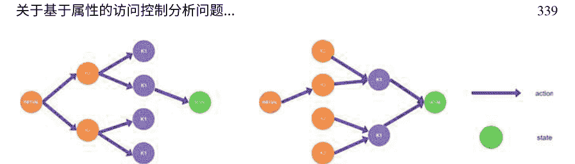

图4 前向和后向可达性算法

在上一次迭代中（固定点测试）是否达到了安全性，即没有（有限的）转换序列将系统从初始状态转移到满足目标的状态；否则，算法将继续进行下一次迭代。

MCMT的特殊之处在于，状态和转换集由一阶公式表示，因此前像的计算归结为逻辑操作，安全性和固定点测试则简化为一阶公式的可满足性检查。由最先进的工具（称为SMT求解器）高效地解决这些可满足性问题。

我们将适应MCMT来解决GURA_G的安全性分析问题。总体上，我们研究了在MCMT中实现的后向可达性算法来分析GURA_G policies。为了做到这一点，我们需要实现一个模块，将GURA_G policies的所有组件（如目标、属性、管理操作等）转换为MCMT语言（注意，MCMT语言基于一阶逻辑（FOL）表示，因此我们将GURA_G policies的组件表示为FOL公式，然后将公式转换为MCMT语言）。

在MCMT中，属性被表示为类型为uat{false, false...-false}的元组。当用户被添加到某个属性值时，相应的属性值将被设置为true。例如，用户被分配到属性值b1（即，用户的属性b将被分配为值1），那么用户的属性b将如下所示：b {true, false, false, ..., false}。

然后，我们必须用MCMT语言表示GURA_G policies的初始状态和目标状态。为简单起见，我们假设初始状态是所有用户和管理员的属性都没有被分配任何值的状态（然而，我们的模块甚至可以处理一些属性已经被分配的初始状态）。目标状态是用户的一组属性值。如果用户拥有所有这些属性值的权限，系统将不安全。例如，一个目标规定“学生不允许访问对象O（reader Type: teacher）”意味着同时拥有学生和教师属性值的用户将导致系统不安全。为此，我们将目标表示为Goal: {student, teacher}。

一般来说，一个目标可以是：

```
目标 = {属性值1,属性值2, ...属性值n}
```

这样的目标可以用一阶逻辑表示如下：

```
∃u． (u, 属性值1) ∈ UA ∧ (u, 属性值2) ∈ UA ∧ (u, 属性值3) ∈ UA ∧ ...∧ (u, 属性值n) ∈ UA ∧.
```

这个一阶逻辑公式在系统的当前状态下返回true，当且仅当存在一个用户u，该用户具有包括所有元组属性值1、属性值2、...、属性值n的元组集合。
例如：考虑一个目标={a2, b1, d5}，如果存在一个用户u，使得 (i) u的属性a设置为值2， (ii) u的属性b设置为值1， (iii) u的属性d设置为值5，则该目标得到满足。

GURA中的操作G包括三个主要部分：管理员角色、用户条件集和目标集。MCMT每次只能分配一个目标。因此，我们必须将目标集拆分为单个目标。例如，考虑以下操作：

```
Can_Add_att (DeptAdmin, {UserType.Tutor_assitant}, {UserType.Teacher, UserType.Secretary}).
```

目标集为{UserType.Teacher, UserType.Secretary}，因此将被拆分为两个目标{UserType.Teacher}和{UserType.Secretary}。原始操作将被拆分为两个操作，管理员和用户条件保持如下：

- 操作 1: Can_Add_att (DeptAdmin, {UserType.Tutor_assitant}, {User-Type.Teacher}).
- 操作 2: Can_Add_att (DeptAdmin, {UserType.Tutor_assitant}, {User-Type.Secretary}).

为了简单起见，我们在下面使用a, b, c等来表示属性，使用1，2，3等来表示属性的值。在GURAG中的管理操作将被概括为以下形式:

```
Can_Add_att/Can_delete_att ad_role_value, user_attribute_value1, user_attribute_value2, ..., user_attribute_valuen; target_value
```

其中，ad_role_value是执行管理操作的管理员的角色。
user_attribute_value1, user_attribute_value2, ..., user_attribute_valuen是某个用户受到影响的一组条件。target_value是用户根据can_add或can_del操作将要添加或删除的属性值。例如：纠正OCR错误：
- 统一操作名称的拼写和标点，如 `Can_Delete_att` 参数列表。
- 修正逻辑符号和等式，如 `⇔UA' = UA ∨ (u, target_value)`。
- 修正表格数据对齐和数字格式。
- 将 `GURA<sub>C</sub>` 等格式修正为 `GURA_C`。
- 修正一些可能的形近字，如“撤销”和“授予”的上下文逻辑。

合并跨页段落，删除分页标记。
识别并转换标题和列表项。
用空行分隔段落。
将表格转换为Markdown格式。

#### 3 评估

在本节中，我们展示了我们进行的评估，以评估我们技术的有效性。据我们所知，一些最近的研究[16]引入了一些新颖的思想来分析ABAC系统，但目前还没有可用的实现分析技术。因此，我们无法对我们的分析技术与类似技术进行实验比较（当有可用的ABAC分析技术时，我们将把这个作为我们的未来工作）。我们使用Python实现了翻译模块，并使用实现的模型检查器MCMT作为我们的反向可达性分析技术。

我们还生成了一组用于基于从医院和大学收集的RBAC模型的真实测试用例进行分析的GURA_C模型的测试用例集[13]。因为管理员集合和用户集合必须分开[8]，因此我们将生成两组管理操作：一组用于管理员，一组用于普通用户。RBAC模型测试用例是一组使用角色的测试用例。GURAG模型使用RBAC模型来管理管理员。因此，我们将RBAC测试用例中的操作保留为管理员的管理操作。然后，我们添加随机操作，这些操作是用户的管理操作。我们将管理员属性角色表示为“a”在一个管理操作中。用户属性将用下一个字母b，c，d... 例如，影响管理员的管理操作将如下所示：

```
Can_Add_att a1, a2, a3; a4
```

其中，角色属性值为a1的管理员可以同时将角色值属性为a2和a3的管理员的角色值属性设置为a4。

类似地，用户的管理操作将如下所示：

```
Can_Add_att a2, b1, c1, d5; c2
```

其中，角色属性值为a2的管理员可以同时将属性值为b1、c1和d5的普通用户的属性值设置为c2。

对于每个测试用例，我们运行十次，使用不同的目标，并测量验证过程的平均时间。所有实验都在一台配备4GB内存的Intel Core i7 CPU上运行，使用Ubuntu 12.04 LTS 32位操作系统。在表1中，我们报告了我们提出的技术在测试套件1上的运行时间，该套件包含了七个常规测试用例。第二列显示了管理员角色的最大值。第三列表示每个测试用例的用户属性数量，而第四列报告了每个属性的最大值。第五列显示了每个测试用例的操作数量，第六列报告了我们技术在测试用例上的平均运行时间。根据结果，我们的分析技术似乎是可扩展的，因为运行时间是可接受的。“复杂”测试用例（参数与实际系统相似）的运行时间约为几秒钟。

在表2中，我们报告了当我们选择一个测试用例时的实验结果：管理员角色的最大值设置为10；用户属性的最大值设置为20；操作数设置为100。然后我们增加用户属性的数量，并运行我们的分析技术，以查看用户属性的数量如何影响分析时间。第2列显示了用户属性的数量，第3列报告了每个测试用例的平均运行时间。根据实验结果，当用户属性的数量增加时，运行时间呈现“线性”增长（表3）。

### 表1 测试套件1的实验结果

| # | 管理员角色的最大值 | 用户属性的数量 | 每个属性的最大值 | 操作的数量 | 平均时间（秒） |
| :--- | :--- | :--- | :--- | :--- | :--- |
| 1 | 5 | 2 | 5 | 15 | 0.53 |
| 2 | 10 | 3 | 10 | 15 | 0.67 |
| 3 | 15 | 5 | 10 | 30 | 2.62 |
| 4 | 20 | 7 | 15 | 40 | 3.70 |
| 5 | 25 | 10 | 25 | 60 | 7.89 |
| 6 | 30 | 15 | 30 | 70 | 11.20 |
| 7 | 35 | 20 | 50 | 100 | 12.45 |

### 表2 实验结果 使用测试套件2

| # | 用户属性数量 | 平均运行时间 (秒) |
|---|--------------|------------------|
| 1 | 2            | 0.60             |
| 2 | 3            | 1.68             |
| 3 | 5            | 3.87             |
| 4 | 7            | 6.76             |
| 5 | 10           | 10.83            |
| 6 | 15           | 11.28            |
| 7 | 20           | 13.69            |

### 表3 实验结果 使用测试套件3

| # | 操作数 | 平均运行时间 (秒) |
|---|--------|------------------|
| 1 | 30     | 3.22             |
| 2 | 50     | 2.68             |
| 3 | 70     | 0.83             |
| 4 | 100    | 310.33           |
| 5 | 150    | 154.12           |
| 6 | 200    | 59.19            |
| 7 | 250    | 146.72           |
| 8 | 300    | 457.10           |

在第三个实验中，我们报告了当我们选择一个测试用例时的实验结果：管理员角色的最大值设置为10；用户属性的数量为7；用户属性的最大值设置为10。我们运行我们提出的分析技术，并增加操作数以查看操作数对分析时间的影响。第2列显示了操作数的数量，第3列报告了每个测试用例的平均运行时间。根据实验结果，操作数对分析时间有很大影响。解释这一现象的一个原因是当操作数爆炸时，会出现众所周知的状态空间爆炸问题。

因此，需要考虑一些试图缓解问题的启发式方法，并将其作为我们的未来工作。

#### 4 评估

在本节中，我们展示了我们进行的评估，以评估我们技术的有效性。据我们所知，一些最近的研究[16]引入了一些新颖的思想来分析ABAC系统，但目前还没有可用的实现分析技术。因此，我们无法对我们的分析技术与类似技术进行实验比较（当有可用的ABAC分析技术时，我们将把这个作为我们的未来工作）。我们使用Python实现了翻译模块，并使用实现的模型检查器MCMT作为我们的反向可达性分析技术。

我们还生成了一组用于基于从医院和大学收集的RBAC模型的真实测试用例进行分析的GURA_C模型的测试用例集[13]。因为管理员集合和用户集合必须分开[8]，因此我们将生成两组管理操作：一组用于管理员，一组用于普通用户。RBAC模型测试用例是一组使用角色的测试用例。GURAG模型使用RBAC模型来管理管理员。因此，我们将RBAC测试用例中的操作保留为管理员的管理操作。然后，我们添加随机操作，这些操作是用户的管理操作。我们将管理员属性角色表示为“a”在一个管理操作中。用户属性将用下一个字母b，c，d... 例如，影响管理员的管理操作将如下所示：

```
Can_Add_att a1, a2, a3; a4
```

其中，角色属性值为a1的管理员可以同时将角色值属性为a2和a3的管理员的角色值属性设置为a4。

类似地，用户的管理操作将如下所示：

```
Can_Add_att a2, b1, c1, d5; c2
```

其中，角色属性值为a2的管理员可以同时将属性值为b1、c1和d5的普通用户的属性值设置为c2。

对于每个测试用例，我们运行十次，使用不同的目标，并测量验证过程的平均时间。所有实验都在一台配备4GB内存的Intel Core i7 CPU上运行，使用Ubuntu 12.04 LTS 32位操作系统。在表1中，我们报告了我们提出的技术在测试套件1上的运行时间，该套件包含了七个常规测试用例。第二列显示了管理员角色的最大值。第三列表示每个测试用例的用户属性数量，而第四列报告了每个属性的最大值。第五列显示了每个测试用例的操作数量，第六列报告了我们技术在测试用例上的平均运行时间。根据结果，我们的分析技术似乎是可扩展的，因为运行时间是可接受的。“复杂”测试用例（参数与实际系统相似）的运行时间约为几秒钟。

在表2中，我们报告了当我们选择一个测试用例时的实验结果：管理员角色的最大值设置为10；用户属性的最大值设置为20；操作数设置为100。然后我们增加用户属性的数量，并运行我们的分析技术，以查看用户属性的数量如何影响分析时间。第2列显示了用户属性的数量，第3列报告了每个测试用例的平均运行时间。根据实验结果，当用户属性的数量增加时，运行时间呈现“线性”增长（表3）。

### 表1 测试套件1的实验结果

| # | 管理员角色的最大值 | 用户属性的数量 | 每个属性的最大值 | 操作的数量 | 平均时间（秒） |
| :--- | :--- | :--- | :--- | :--- | :--- |
| 1 | 5 | 2 | 5 | 15 | 0.53 |
| 2 | 10 | 3 | 10 | 15 | 0.67 |
| 3 | 15 | 5 | 10 | 30 | 2.62 |
| 4 | 20 | 7 | 15 | 40 | 3.70 |
| 5 | 25 | 10 | 25 | 60 | 7.89 |
| 6 | 30 | 15 | 30 | 70 | 11.20 |
| 7 | 35 | 20 | 50 | 100 | 12.45 |

### 表2 实验结果 使用测试套件2

| # | 用户属性数量 | 平均运行时间 (秒) |
|---|--------------|------------------|
| 1 | 2            | 0.60             |
| 2 | 3            | 1.68             |
| 3 | 5            | 3.87             |
| 4 | 7            | 6.76             |
| 5 | 10           | 10.83            |
| 6 | 15           | 11.28            |
| 7 | 20           | 13.69            |

### 表3 实验结果 使用测试套件3

| # | 操作数 | 平均运行时间 (秒) |
|---|--------|------------------|
| 1 | 30     | 3.22             |
| 2 | 50     | 2.68             |
| 3 | 70     | 0.83             |
| 4 | 100    | 310.33           |
| 5 | 150    | 154.12           |
| 6 | 200    | 59.19            |
| 7 | 250    | 146.72           |
| 8 | 300    | 457.10           |

在第三个实验中，我们报告了当我们选择一个测试用例时的实验结果：管理员角色的最大值设置为10；用户属性的数量为7；用户属性的最大值设置为10。我们运行我们提出的分析技术，并增加操作数以查看操作数对分析时间的影响。第2列显示了操作数的数量，第3列报告了每个测试用例的平均运行时间。根据实验结果，操作数对分析时间有很大影响。解释这一现象的一个原因是当操作数爆炸时，会出现众所周知的状态空间爆炸问题。

因此，需要考虑一些试图缓解问题的启发式方法，并将其作为我们的未来工作。

#### 5 结论

在本文中，我们提出了一种使用基于SMT的模型检查器方法来解决HGABAC和GURAGsystem中的安全分析问题的技术。主要思想是研究在MCMT中实现的反向可达性算法来分析GURAGpolicies。为了做到这一点，我们实现了一个模块，将GURAGpolicies的所有组件（如目标、属性、管理操作等）转换为MCMT的语言，然后适应反向可达性算法分析过程。我们还进行了一些实验，以展示我们提出的技术在一些测试案例上的可扩展性。我们还描述了一些因素的有效性，如用户属性数量和操作数量对分析时间的影响。

分析时间是评估分析技术效率的重要因素。如上所示，基于模型检查的分析技术可能受到众所周知的状态空间爆炸问题的影响。因此，缓解这个问题是我们需要进行的下一个未来工作之一。主要思想是设计一些启发式方法，试图在分析过程中减少探索的状态空间。

此外，考虑到对GURAG的另外两个子模型（即UGAA和UGA子模型）的安全分析问题，也是我们未来工作的研究方向之一。

致谢本研究由胡志明市技术大学-VNU-HCM基金资助，资助号为T-KHMT-2019-70

#### 参考文献

1. 国家计算机安全中心（NCSC）。（1987）。理解可自由选择的访问控制在可信系统中的指南，报告NSCD-TG-003 Version1，1987年9月30日。
2. Osborn, S. (1997). 强制访问控制和基于角色的访问控制再探讨。在第2届ACM基于角色的访问控制研讨会（RBAC 1997）中（第31-40页）。ACM。
3. Samarati, P., & Vimercati, S. (2000). 访问控制策略、模型和机制。在FOSAD:安全分析和设计基础国际学校中（第137-196页）。
4. Sandhu, R. S., Coyne, E. J., Feinstein, H. I., & Youman, C. (1996). 基于角色的访问控制模型IEEE计算机, 38-47.
5. Ferraiolo, D., & Kuhn, R. (1992). 基于角色的访问控制. 在第15届全国计算机安全会议上(pp. 554-563).
6. Sandhu, R., & Ferraiolo, D., & Kuhn, R. (2000). 基于角色的访问控制的NIST模型: 迈向统一标准. 在第5届ACM角色访问控制研讨会上(pp. 47-63).
7. Gupta(B), M., & Sandhu, R. (2016). GURAG用户和组属性分配的管理模型.
8. Sandhu, R., Bhamidipati, V., & Munawer, Q. (1999). 基于角色的角色管理的ARBAC97模型.ACM信息和系统安全交易（TISSEC）,105-135.
9. Ranise, S., & Truong, A. (2014). Alessandro Armando: 可扩展和精确的自动化分析管理时间角色访问控制。在第19届ACM访问控制模型和技术研讨会上(pp 103-114) ACM。
10. Ghilardi, S., & Ranise, S. (2010). MCMt模型检查器模块化理论。在IJCAR'10会议论文集中LNCS.
11. Ghilardi, S. (2010). Ranise: 通过SMT求解终止和不变量合成实现基于数组的系统的向后可达性。计算机科学的逻辑方法1-48。
12. Dinh, K., & Truong, A. (2019). 使用上下文信息自动化安全分析授权策略。在大规模数据和知识中心系统交易中XLI(pp. 107-139). Springer.
13. Silvio, A., & Truong, A. (2014). Armando: SACMAT 14 Proceedings of the 19th ACM Symposium on Access Control Models and Technologies (pp. 103-114).
14. Ranise, S. (2013). Symbolic backward reachability with effectively propositional logic. Applications to security policy analysis. *FMSD*, 24–45.
15. Truong, A. (2019). 在FDSE 2019: Future Data and Security Engineering (pp. 467–482)的会议论文中探索访问控制策略分析的冒险。

### 使用物联网和机器学习进行食品新鲜度检测

Snehal Chalke, Sowmya Ganesan, Krishna Gajera, Pooja Reshim, 和Nita Patil

摘要物联网（IoT）描述了嵌入有传感器、软件和其他技术的物理对象的网络，目的是通过互联网与其他设备和系统连接和交换数据。物联网等技术可以随时随地连接任何东西。本文主要讨论了物联网的相关技术。

在这个项目中，我们使用NodeMCU作为微控制器，并使用它来编程传感器，如MQ4传感器、MQ9传感器和DHT11传感器。如果与传感器接触的食物变质，蜂鸣器将被激活，LCD将显示食物是否健康。因此，输出结果将被发送到著名的ThingSpeak平台，并向消费者发出警报。

关键词食品安全·物联网·机器学习·NodeMCU·Arduino IDE·食物检测·ThingSpeak

#### 1 引言

对于食物成分的新鲜度和质量，气体水平、湿度和湿度的测量是重要的。新鲜度描述了食物是否变质。食物新鲜度的检测已经成为食品行业的重要日常工作。它对食物的质量做出了重要贡献。食品产品是否健康，可以根据以下标准进行预测：

- (1) 如果食物被细菌或微生物攻击，氧气水平将低于正常水平。
- (2) 许多蔬菜和水果（香蕉、苹果）在变质或过熟时会释放甲烷气体。

我们使用MQ4和MQ9传感器来检测食物的质量，以避免和减少健康问题。它确定像家庭食品这样的蔬菜、水果、乳制品和肉类。不健康的食物正在被消费者忽视。大多数检查食品质量的过程是由坐在传送带对面的人完成的。因此，为了检查食物的新鲜度和质量，引入了自动化过程。因此，主要优点是减少了人工劳动力。

食物是物理环境之一。为了保持个体的健康、活力和幸福，必须有卫生食品。食品在从生产者到消费者的任何过程中也可能传播疾病，因此必须采取适当的预防措施。当乙烯与空气中的氧气发生反应时，香蕉的成熟过程发生。随着时间的增加，这些气体也增加。食物的质量并不总是得到保证。

#### 2 文献综述

另一种方法[1]是基于检查食物是否健康。这种方法的缺点是只能检测到食物的外部部分。一个传感器是由麻省理工学院的团队确定的，它确定了不健康的肉类产品，但是它会显示错误的输出，因为它只确定了某种气体。为了得到结果，我们正在采集氧气和甲烷传感器的集体结果而不是依赖于一个传感器。通过使用这个，我们可以得到一个实际的输出。我们可以通过结合物联网和机器学习来增加互操作性和应用。最近的研究[2]通过食品供应链实现了连续监测系统。这项研究有助于确定自学习模型的预测准确性以及估计当前供应链的改进。专注于实时自学习模型的改进与以往的研究不同，考虑到整个供应链上的产品级测量活动数据。

论文[3]用于使用电气和生物传感器等各种传感器检测食物的新鲜度。制作了一个智能系统，用于检测食物的质量，各种食物，如水果和肉类。无论食物是否可食用，传感器 (气体，湿度)，选择氢离子浓度装置确保食物的质量食物是否健康。因此，制作了一个应用程序来满足这个需求。这篇论文[4]是关于将细菌分类到不同的食物中。本文的主要目的是开发一种能够使用特定气体传感器检测气体的系统，该系统将确定三种标准类型的细菌。如果在烹饪前和烹饪后阶段都存在特定的细菌，就会进行分类。

在本文[5]中，观察了氧气和二氧化碳气体积累等参数，这些参数用于食品质量管理。食物的新鲜程度取决于氧气和二氧化碳气体的浓度。为了观察气体，我们使用了这个系统，并且它与射频识别（RFID）标签连接。RFID系统更容易监控。为了计算蔬菜的新鲜程度，使用了这个组合系统。

#### 3 方法论

参见图1、2和3。
我们使用了三个传感器。继电器用于切换传感器。 DHT11传感器是数字传感器，所以我们连接到任何引脚，对此我们不需要使用任何额外的电路。使用了LCD，它有16个引脚；我们不能直接连接到NodeMCU，因为它没有那么多引脚，所以我们有一个转换器，名为I2C转换器；这个转换器被添加到LCD的集成电路技术(I2C)中。 它只有4根线： Vcc， Gnd， Clk和Data。 MQ 4和MQ9传感器有6个引脚： A， A'， B， B' (用于感应元件)和h h' (用于加热器)。 加热器需要更多功率， 即更多电流；因此， 我们必须连接5V电源。在我们的项目中， 我们使用了SMPS。

因此， 默认情况下， 我们使用双极单刀(DPST)继电器将MQ4连接到模拟输入， 当我们想要测量MQ9时， 继电器将被操作， MQ9将连接到模拟输入。所以这是我们只使用一个模拟输入的设计。 我们需要测量两个模拟传感器。因此， DHT11传感器将感测湿度和温度， MQ4将感测甲烷气体， MQ9将感测氧气， 它们都连接到NodeMCU。

传感器将感知数据， 并将输出显示在液晶屏上， 以判断食物是否变质， 同时显示相应的传感器数值。 所以如果MQ4 < 270且MQ9 < 190， 食物没有变质， 否则食物已变质。 如果食物变质， 蜂鸣器将会响起。然后， 这些数据将使用ThingSpeak平台存储在云端。 我们正在使用机器学习算法来比较物联网和机器学习中得到的结果。我们的项目旨在使用适当的传感器监测食物释放的气体来检测食物变质， 并将实施机器学习算法来预测食物是否变质。 可以使用以下理论来判断食物是否变质：

- (1) 如果食物被细菌或微生物攻击，氧气水平将低于正常水平。

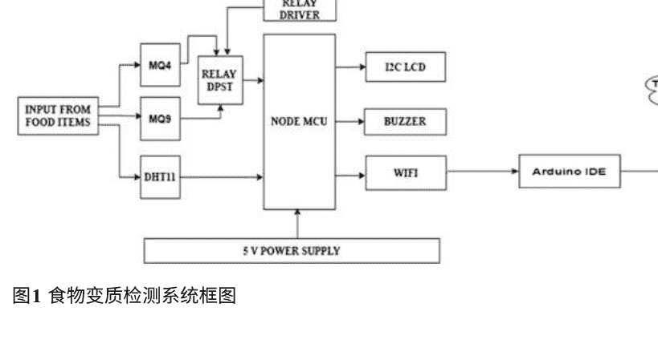

图1 食物变质检测系统框图

给定一个Can_Add_att管理操作:

```
Can_Add_att ad_role_value,u_att_value1, u_att_value2,..., u_att_valuen;target_value
```

这个动作可以用一阶逻辑表示如下:

```
∃u_a, u. (u_a, ad_role_value) ∈ UA .
∧(u, u_att_value1) ∈ UA ∧(u, u_att_value2) ∈ UA.
∧ ... ∧(u, u_att_valuen) ∈ UA.
⇔UA' = UA ∪ (u, target_value).
```

类似地,

```
Can_Delete_att ad_role_value,u_att_value1, u_att_value2,..., u_att_valuen;target_value
```

可以用一阶逻辑表示如下:

```
∃u_a, u. (u_a, ad_role_value) ∈ UA.
∧(u, u_att_value1) ∈ UA ∧(u, u_att_value2) ∈ UA.
∧.. ∧(u, u_att_valuen) ∈ UA.
⇔UA' = UA \ (u, target_value) .
```

例如，动作Can_Add_att a1, b2, b3; c1 将被表达为:

```
∃u_a, u. (u_a, a1) ∈ UA ∧(u, b2) ∈ UA ∧(u, b3) ∈ UA.
⇔UA' = UA ∪ (u, c1) .
```

而动作 Can_Delete_att a2, b1, c1; d5 将被表达为:

```
∃u_a, u. (u_a, a2) ∈ UA ∧(u, b1) ∈ UA ∧(u, c1) ∈ UA.
⇔UA' = UA \ (u, d5) .
```

在用MCMT语言表示GURA G policies的所有组件之后，我们现在将调用MC MC中实现的反向可达性算法来分析GURA G policies。为了简单起见，我们通过以下示例来描述反向可达性算法的基本过程：考虑一个GURA G安全分析问题，目标是{b1}，并且存在以下管理动作:

```
Can_Add_att true , true ; a1 (1)
Can_Add_att a1, c1 ; b1 (2)
Can_Add_att a1, b1 ; b2 (3)
Can_Add_att a1, true ; c1 (4)
```

请注意，我们假设初始状态是用户和管理员的所有属性都没有被赋予任何值的状态。反向可达性算法的过程如下：首先，由于目标是b1，所以算法将选择所有可以指向目标的动作，例如动作(2)将被选择，因为它的目标值是b1。然后，为了使动作(2)可用，需要一个具有属性值a1的管理员。此外，还需要一个具有属性值c1的用户u：(i)为了获得a1，算法继续选择所有目标值为a1的动作。

然后，选择动作(1)，算法将对其进行分析：动作(1)的管理员条件和用户条件都为真，因此可以在任何时候执行动作(1)，而不需要任何条件(例如，不需要分配管理员和用户属性的值)。这意味着可以在初始状态下执行动作(1)。然后，算法停止分析a1的过程。对于具有属性值c1的用户u，算法选择所有目标值为c1的动作。然后，选择并分析动作(4)：该动作需要具有属性值a1的管理员，并且不需要用户u的任何条件(注意用户条件为真)。显然，可以通过使用(i)中的过程获得具有属性值a1的管理员。然后，算法还停止分析c1的过程。现在，算法对于这个安全分析问题返回“不安全”，并输出一个从初始状态到目标的动作序列(1) → (4) → (2)。

许多蔬菜和水果（香蕉、苹果）在变质时释放甲烷气体。

甲烷传感器、氧气传感器、温湿度传感器是使用的传感器。数值将被输入到逻辑回归中，逻辑回归是用于预测给定食品样本是否变质的机器学习方法。

我们正在使用微控制器作为物联网的实际应用，用于存储数据，并在检测到食物变质时发出蜂鸣器声音。

然后将这些数据发送到云平台，以便相关部门可以监控食品质量。

食品项目的数量、一天中食品变质的频率。这将增加零售商之间销售更健康和安全食品的竞争。

##### 3.1 所需组件

- 1. MQ 4、MQ 9、DHT 11 传感器
- 2. ESP8266 NodeMCU
- 3. 继电器
- 4. I2C 1602 串行 LCD
- 5. 蜂鸣器
- 6. 二极管。

##### 3.2 结果

参见图4、5、6、7、8和9。

##### 3.3 机器学习算法

- 机器学习是基于系统可以从数据中学习、识别模式并在最小人为干预下做出决策的人工智能分支。为了提高生产力，我们采用了机器学习作为另一种方法。实时传感器接收到的输入值将用于机器学习算法中。

图4 组件的实现

图5 LCD屏幕上的传感器数值

图6 最终输出

- 我们收集了腐烂/未腐烂食物样品、氧气和甲烷浓度以及每个样品的环境条件，这些将用于训练机器学习算法。
- 逻辑回归：逻辑回归是用于在存在多个解释变量的情况下获得比值比的机器学习算法。在我们的项目中，输出类别是二进制的：“腐烂”、“未腐烂”。因此，对于不同的天数，我们需要获得腐烂的概率。逻辑回归的性能

图7 这些是存储在ThingSpeak网页中的温度读数的图像

图8 这些是存储在ThingSpeak网页中的水果新鲜度读数的图像

回归在均方误差和百分比准确率方面比其他分类算法更好，因此选择了它。

```
a = [[37.7,57,313,190]]
target1 = logmodel.predict(a)
if target1==1:
    print('Food sample is spoilt')
else:
    print('Food sample is not spoilt')
```
Food sample is spoilt

```
b =[[40.9,43,232,121]]
target2 =logmodel.predict(b)
if target2==1:
    print('Food sample is spoilt')
else:
    print('Food sample is not spoilt')
```
Food sample is not spoilt

机器学习输出的快照。

| 传感器读数 |
| :--- |
| Temp: 39.40 Celsius, Humidity: 56.00 %RH, MQ 4 = 352.00 ppm, MQ 9 = 248.00ppm. Send to Thingspeak. |
| Waiting... |
| Temp: 39.20 Celsius, Humidity: 55.00 %RH, MQ 4 = 352.00 ppm, MQ 9 = 248.00ppm. Send to Thingspeak. |
| Waiting... |
| Temp: 39.20 Celsius, Humidity: 55.00 %RH, MQ 4 = 353.00 ppm, MQ 9 = 248.00ppm. Send to Thingspeak. |
| Waiting... |
| Temp: 39.20 Celsius, Humidity: 55.00 %RH, MQ 4 = 353.00 ppm, MQ 9 = 248.00ppm. Send to Thingspeak. |
| Waiting... |
| Temp: 39.20 Celsius, Humidity: 56.00 %RH, MQ 4 = 353.00 ppm, MQ 9 = 248.00ppm. Send to Thingspeak. |
| Waiting... |
| Temp: 39.20 Celsius, Humidity: 55.00 %RH, MQ 4 = 356.00 ppm, MQ 9 = 249.00ppm. Send to Thingspeak. |
| Waiting... |
| Temp: 39.30 Celsius, Humidity: 55.00 %RH, MQ 4 = 356.00 ppm, MQ 9 = 249.00ppm. Send to Thingspeak. |
| Waiting... |
| Temp: 39.30 Celsius, Humidity: 55.00 %RH, MQ 4 = 356.00 ppm, MQ 9 = 249.00ppm. Send to Thingspeak. |
| Waiting... |
| Temp: 39.30 Celsius, Humidity: 56.00 %RH, MQ 4 = 356.00 ppm, MQ 9 = 249.00ppm. Send to Thingspeak. |
| Waiting... |
| Temp: 39.30 Celsius, Humidity: 57.00 %RH, MQ 4 = 357.00 ppm, MQ 9 = 252.00ppm. Send to Thingspeak. |
| Waiting... |
| Temp: 39.30 Celsius, Humidity: 56.00 %RH, MQ 4 = 356.00 ppm, MQ 9 = 248.00ppm. Send to Thingspeak. |
| Waiting... |
| Temp: 39.30 Celsius, Humidity: 56.00 %RH, MQ 4 = 356.00 ppm, MQ 9 = 249.00ppm. Send to Thingspeak. |
| Waiting... |
| Temp: 39.40 Celsius, Humidity: 56.00 %RH, MQ 4 = 357.00 ppm, MQ 9 = 248.00ppm. Send to Thingspeak. |
| Waiting... |
| Temp: 39.30 Celsius, Humidity: 56.00 %RH, MQ 4 = 356.00 ppm, MQ 9 = 249.00ppm. Send to Thingspeak. |
| Waiting... |
| Temp: 39.30 Celsius, Humidity: 55.00 %RH, MQ 4 = 356.00 ppm, MQ 9 = 248.00ppm. Send to Thingspeak. |
| Waiting... |
| Temp: 39.40 Celsius, Humidity: 56.00 %RH, MQ 4 = 355.00 ppm, MQ 9 = 252.00ppm. Send to Thingspeak. |
| Waiting... |
| Temp: 39.40 Celsius, Humidity: 56.00 %RH, MQ 4 = 359.00 ppm, MQ 9 = 249.00ppm. Send to Thingspeak. |
| Waiting... |
| Temp: 39.30 Celsius, Humidity: 56.00 %RH, MQ 4 = 359.00 ppm, MQ 9 = 249.00ppm. Send to Thingspeak. |
| Waiting... |
| Temp: 39.40 Celsius, Humidity: 56.00 %RH, MQ 4 = 359.00 ppm, MQ 9 = 249.00ppm. Send to Thingspeak. |
| Waiting... |
| Temp: 39.30 Celsius, Humidity: 58.00 %RH, MQ 4 = 359.00 ppm, MQ 9 = 248.00ppm. Send to Thingspeak. |
| Waiting... |
| Temp: 39.40 Celsius, Humidity: 57.00 %RH, MQ 4 = 357.00 ppm, MQ 9 = 248.00ppm. Send to Thingspeak. |
| Waiting... |
| Temp: 39.40 Celsius, Humidity: 55.00 %RH, MQ 4 = 359.00 ppm, MQ 9 = 249.00ppm. Send to Thingspeak. |
| Waiting... |
| Temp: 39.40 Celsius, Humidity: 54.00 %RH, MQ 4 = 359.00 ppm, MQ 9 = 249.00ppm. Send to Thingspeak. |
| Waiting... |
| Temp: 39.40 Celsius, Humidity: 55.00 %RH, MQ 4 = 400.00 ppm, MQ 9 = 248.00ppm. Send to Thingspeak. |
| Waiting... |

图9 这些是存储在ThingSpeak网页中的机器学习读数的图像

##### 3.4 云平台集成

我们使用了流行的云平台，如ThingSpeak，它是一个物联网平台，用于存储和恢复所有数据。 因此，通过使用ThingSpeak云平台，我们可以存储大量与食品相关的数据，并且可以在任何地方通过Web页面查看，作为物联网的实际应用。

#### 4 未来的范围和应用

进一步的设计可以通过增加传送带的尺寸来进行修改，以便能够对大型食品进行质量检查，并提高系统的准确性，使其能够区分人工食品和原始食品。由于我们使用了DHT11温度传感器，因此可以利用该传感器预测给定食品的保质期。

- 对于零售店，我们可以将系统实施在货架和容器内，也可以放置在称重机下方。
- 对于食品行业，我们可以将系统放置在传送带上，因为在该行业中，大量食品是沿着传送带加工的。
- 对于家庭使用，我们可以在冰箱内部实施我们的系统。

#### 5 结论

在食品的每个阶段都需要实施安全的食品处理实践和程序，以避免食源性疾病的发生。 食品产品在供应链中的旅程中可能会遇到各种健康风险，因此需要定期监测食品的新鲜度或质量。

在我们的工作中，我们使用NodeMCU实现了信息融合，在各种工作环境中取得了良好的结果。 信息融合不仅减少了存储空间的占用，还大大增加了计算能力。
通过使用传感器、物联网和机器学习的简单组合，可以利用这个项目来自动化食品行业。 它还将鼓励食品制造商通过记录每个阶段的食品样本来销售和购买健康食品。 我们还可以创建销售更多健康食品的竞争机制，从而促进零售商之间的竞争。 因此，通过减少人力资源，可以高效地去除变质食品样本。

#### 参考文献

- 1. 陈，J. I. Z.，& 叶，L.-T. (2020). 机械变形对从农场采摘的草莓的影响分析。期刊：ISM AC杂志(3)，166-172。
- 2. Hebbar，N. (2020). 使用机器学习和物联网进行食品新鲜度检测。在国际会议上Emerging Trends in Information Technology and Engineering (ic-ETITE)中。
- 3. Jain, S. A., & Bharadwaj, A. (2020). 基于MIPS32 CPU平台的汽车Wi-Fi控制器的WDT子系统特性研究基于PVT的普适计算与通信技术（UCCT）杂志，2(04)，187-196。
- 4. Mustafa, F., & Andreescu, S. (2018). 用于食品质量监测和智能的化学和生物传感器。伦敦皇家学会A分会哲学交易，A247, 529-551。
- 5. Alcéo R. G. A. (2016). 草莓供应链中的温度和货架寿命。里斯本大学。

### 预测由于雨水对用户蜂窝信号接收的信号丢失

D. Lohith Bhargav, D. Achish, G. Yashwanth, N. Pavan Kal yan, 和K. Ashesh

摘要对用户的信号可用性是通信中最困难的方面，然而环境的巨大变化导致信号丢失。此外，信号丢失将导致信号接收的可用性降低，在极端情况下，将完全丢失信号而无法与世界其他地方建立任何通信。本文讨论了由于降雨导致的蜂窝信号丢失的预测。蜂窝信号受温度、雨水、雾、风等因素的影响。当无线电信号穿过雨水时，可能会发生反射、折射或散射，导致信号发散或停止通信。由于这被认为是蜂窝通信中最常见的情况，因此需要预测由于雨水而导致的信号丢失/中断，并在各种情况下可视化信号丢失。因此，为了预测未来的信号丢失，这项研究工作通过使用机器学习（ML）技术开发了一个算法，可以预测不同降雨条件下的信号丢失。在预测信号丢失之后，所提出的模型通过分析所得数据，可以推断一些改进技术，以实现更好的用户端蜂窝信号接收。

关键词可用性·信号·接收·丢失·预测·降雨·掉落

#### 1 引言

由运营商传输的移动信号有助于在减少延迟的情况下建立从一个设备到另一个设备的通信。信号强度根据区域和可用性进行设置，信号强度也可能因人口和使用次数而有所变化。此外，信号强度可能因所使用的材料和材料的大小而有所变化。现在，由于新一代的增加，信号速度也在增加；这一新一代需要强大的信号强度和低

##### 影响蜂窝信号的因素

- 1. 雨：当雨滴较大时，蜂窝信号会被散射，比其他天气条件更加削弱蜂窝信号。
- 2. 雾和云：与雨类似，但雨滴较小。雾也会严重散射信号，但不被视为一个重要因素。
- 3. 雪：冰晶比液态水密度小，在降雪形式下，对信号传播没有几乎相同的影响。此外，非常大的雪可能仍然会折射无线电波并降低信号强度。
- 4. 冰雹：根据冰雹的大小和密度，冰比水密度小，冰雹不像雨那样厚，所以它会稍微折射蜂窝信号。
- 5. 闪电：闪电的巨大电荷可以引起电磁干扰，它可能损坏天线和其他传输资源等设备。
- 6. 风：只有风不会影响无线电信号。但与之相关的条件可能会损坏暴露的蜂窝塔、电力线等。
- 7. 水体：无线电信号在水体和冰水温度之间传播时，可能会产生表面反转，导致接收延迟。
- 8. 树林：由树木和水的组合形成的浓密森林会反射和吸收无线电信号。
- 9. 物理障碍：物体的存在会限制接收，因为信号需要在视线范围内传播。山/建筑物上的重金属/车辆会干扰信号，即使传播距离很短。

## 雨对蜂窝信号的影响：

信号的影响取决于含有不同大小水滴的雨水、雨滴的大小和雨滴之间的距离；小雨会吸收信号，而中雨和大雨会使信号散射。大多数情况下，从塔向用户设备传播的无线电信号是一致的，但当环境发生变化时，可能会出现信号丢失，从而干扰无缝通信。手机使用的高频信号无法通过水传播，因为水导电，会反射无线电波，水蒸气会吸收无线电信号的能量并将其转化为热能，这也是微波的原理。我们可以观察到信号强度的下降，信号以dBm计算，我们可以通过将这些值转化为图形表示来获取一段时间内的值。当然，我们可以通过信号的效率和信号的丢失/损失来了解数据，并进行数据清洗，以消除无用数据，使数据更有用，并以逗号分隔值（CSV）格式来预测数据。此外，为了进行数据可视化，我们考虑了许多数据来找到下一个值。

## 雨水浓度:

雨水浓度决定了不同类型的雨水，如小雨和大雨。通常，它是通过计算两个雨滴之间的距离来确定的。

小雨: 如果两个雨滴之间的距离较大，则被认为是小雨，它可能会引起较低的衰减。

大雨: 如果两个雨滴之间的距离较小，则被认为是大雨，它可能会引起较高的衰减。

## 信号强度:

- 信号强度的范围可以从 -30到 -110 dBm。
- 离0更近的数字被认为是最强的信号。
- 信号强度大于 -85 dBm被认为是可用的信号（图1）。

## 增强信号接收的可能方法:

一些策略可以帮助我们增强信号接收，但我们需要知道在哪里以及在什么条件下使用它们。如果我们能预测所有未来的情况，我们将能够选择使用哪种方法来改善接收效果。

- 1. 使用增强器: 增强天线用于实现与最近的蜂窝塔之间的可靠连接。
- 2. 使用中继器: 如果建筑物内的接收信号弱，但在室外很好，信号会因金属等物理物体而丢失。在这些情况下，我们可以使用蜂窝中继器来扩展您的蜂窝网络范围，以实现更好的室内覆盖。
- 3. 扩展到短距离: 由于雨水，信号未能到达目的地区域，我们需要将网络可用性扩展到一个小范围。在这种情况下，可以通过增加发射信号的功率来增加信号强度，以传输到目的地。对于每个+3dB，生成该信号所需的能量是所需能量的两倍。
- 4. 扩展到长距离: 由于意外的大雨，塔被损坏且无法工作，因此该地区的整个通信被停止。在这种情况下，我们可以增加网络的范围通过增加生成信号所需的能量来提高网络可用性，其中该信号的能量是正常能量的四倍，该信号的可达距离是正常信号可用范围的两倍。

## 数据集的重要性:

现实世界中的数据集用于计算两个值之间的差异，这有助于收集数据，并且还可以用于表示。有许多算法可用于了解信号丢失情况，但由于气候变化，操作员没有采取预测措施，但我们尝试从不同来源收集数据，并且还分析了不同的数据源以了解情况，我们应该删除一些不必要和无意义的值，并且我们需要训练一个数据集来预测未来的值。因此，在完成训练数据阶段后，我们采用测试数据集来预测值。还将训练数据与测试数据集进行比较以分析准确性，由于静态值或气候变化的不断变化，可能会出现不同的情况，我们测试不同的数据集并进行比较，然后我们通过这些正确的值来减少信号丢失或信号中断，并且我们还以图形形式评估数据以实现更好的效率理解。

#### 2 动机

在今天快节奏的世界中，技术已经破坏了生活的方方面面的耐心，每一个需求都必须尽快满足。然而，这种沟通的倾向已经存在很长时间了，研究人员可以继续寻找发展更好、更快的沟通技术。

网络运营商使用不同的通信技术。如果网络运营商不能提供客户要求的网络可用性、数据速度等，那么就有可能失去客户支持。

网络运营商在用户信号接收时有信号丢失的感知。他们调查了情况，并发现它是由环境变化引起的。因此，运营商要求对情况进行详细报告，并提出解决方案。

#### 3 方法论

首先要做的是清理数据集，以确保其准确性和完整性，这样我们才能生成出色的预测。

数据清理的工作过程包括以下几个步骤：

- 数据审计
- 工作流程规范## 工作流程执行
- 后处理和控制
- 解析
- 数据转换
- 去重
- 统计方法

要处理的第二件事是数据可视化，它用图形表示数据集，以获得更好的理解、总结和分析。用于该项目的数据可视化模型是散点图，它是一种使用笛卡尔坐标来显示通常两个变量的数据集的图表。

预测算法：使用数据集预测值。支持向量机（SVM）是一种监督算法，用于基于现有值预测任何类型的值。支持向量机（SVM）通过使用回归分析来分析数据。SVM是一种强大的预测方法，已被用于预测数据，该方法可以计算短数据集，但可以处理复杂值。此外，SVM通过使用核技巧在与线性分类相比更高效地运行，并且用于分类、回归和异常检测。当只有干净的数据时，与其他方法相比，SVM的性能表现得非常好。与其他回归模型不同，SVM最小化了真实值和预测值之间的误差。对于大型数据集，使用SVM，它在与其他回归模型相比提供更快的实现，并且它仅依赖于训练数据的子集，因为成本函数不考虑预测接近目标的样本。此外，根据我们的资源，这被认为是基于可用数据集预测信号下降的最佳适用模型。支持向量机的优点如下：

- 在高维空间中有效。
- 在维度数量大于样本数量的情况下有效。
- 它在决策函数中使用训练点的子集，因此也被认为是内存高效的。

##### 支持向量机算法
1. 导入包。
2. 读取数据集。
3. 拆分要预测的列。
4. 创建一个变量并分配需要预测的天数。
5. 创建独立数据集。
6. 将数据框转换为NumPy数组。
7. 创建依赖数据集。
8. 将数据框转换为NumPy数组。
9. 将数据分为80%的训练集和20%的测试集。
10. 创建并训练支持向量机（SVM）。
11. 打印未来n分钟的预测。

#### 4 文献调研

基础论文1：雨量对手机信号强度的影响：在降雨期间用户端智能手机RSSI变化的研究。

概述：气候条件和降雨的变化可能会导致信号丢失，因此我们可以使用信号强度Android应用程序编程接口，也称为API，以帮助减少信号丢失，通过使用接收信号强度指示器（RSSI）和漫游选项，它有助于确保快速稳定的连接。RSSI的用户在使用无线应用协议（WPA2）企业安全时，始终体验到强信号到其接入点使用快速漫游以加快安全连接。当有降雨时，电磁信号会减弱，降雨会吸收信号，当降雨较少时会散射信号，而雨滴越多，信号丢失就越多。由于空气的作用，雨滴的形状会发生变化。因此，当有空气存在时，雨滴的角度会改变，然后数值也会发生变化。微波链路和终端用户之间可能存在差异，我们可以找到传输功率的差异。现在我们可以在智能手机上找到信号强度，因为涉及更多的传感器来检测信号范围，信号强度可以给我们准确的数值。测量是在一个时间段内进行的，以便数值保持静态并且可以准确计算，在这个实验中，我们发现RSSI的低效导致了信号丢失，而RSSI显示了网络信号的质量。

基础论文2：确定雨水对蜂窝信号接收的影响。

概述：我们必须采集不同的场景或不同的条件来收集数据。我们必须收集大量的数据，以使预测尽可能准确。在降雨情况下，既会发生吸收又会发生信号散射，在小雨中会发生吸收，而在中雨和大雨中信号会散射。在这种情况下，他们选择了有限的区域，以确保没有物体或任何物体，从而使计算尽可能简单。无线电信号受到降雨的散射和吸收的影响，这个实验涉及到影响蜂窝网络信号的不同模式。由于运营商的频率，重雨时信号的影响更大，而小雨则不会受到太大影响。在中雨或大雨期间，信号强度会增加，因此在没有雨或小雨时不会出现信号丢失，并且应该预测出重雨发生的具体时间。在三种不同条件下收集了数据，从数据集中删除了重复数据，并将数据集用于进一步处理。

基础论文3：温度对蜂窝信号强度质量的影响的研究。

概述：世界上的无线连接通过智能手机连接，智能手机中有许多传感器，我们可以看到信号的频率。天气是通过一个测量仪器来测量的，我们可以观察到温度或气候的变化。世界正在朝着有效的通信发展，所以为了计算信号强度，我们使用实时信号强度Android API来测量信号，一些终端用户通过查看RSSI用户的读数，可以了解不同大气条件下信号的下降。信号条件取决于无线电信道和链接。温度越高，信号强度可能会受到干扰，读数是从包含不同时间间隔数据的智能手机中获取的。发射器用于在CMOS发射器上提供更多的增益，从而增加加热效应。

基础论文4：在密集植被环境中确定风对接收到的蜂窝信号的影响

概述：信号受到四个主要问题的影响，包括反射、衍射、阻塞和散射，还可能存在一些干扰，如建筑物、墙壁和树木。不同的气候条件包括降雨、雾、湿度等。空气中含有水分子，当信号通过时，水分子会增加重量，增加压力。当信号经过风时，信号会散射到多个方向，可能会丢失给最终用户或附加到另一个信号上。实验数据集在有限的时间内进行，有助于采用静态值计算和找到信号损失或信号下降。数据集已经取平均值以了解平均预测值。

基础论文5：雨水对户外森林部署中链路质量的影响。

概述：无线通信数量增加，与蜂窝信号交互的传感器也增多。数据以大块状态发送，数据量可能达到几百千字节，从用户传输到运营商，再从运营商传输到终端用户；这些庞大的数据应该以最短路径共享，以提高效率；如果数据没有传输成功，数据将会重新传输；这些实验是在户外进行的，存在各种影响信号的障碍物。他们将实验地点固定在森林环境中，以保持区域的静态性，而且森林附近的温度会不断变化，实验时间有限，这告诉我们在给定时间内信号的确切使用下降情况。

#### 5 结果与分析

预测之后，以下是输出结果，如前所述，任何小于或接近 -100 dBm的信号都是无用的，无法建立通信。因此，-100 dBm被视为极端条件。在接近的时间点，该条件被报告并发送给网络运营商。因此，他们可以增加信号并提高信号的可用性。

1. 由于没有雨导致信号丢失（图2和3）
2. 由于小雨导致信号丢失（图4和5）
3. 由于大雨导致信号丢失（图6和7）

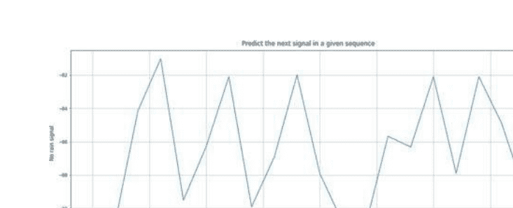

```
NO Rain
[-90.82155847 -90.82155847 -84.1415416 -81.02290489 -89.50598513
 -86.29300754 -82.10003313 -89.90025618 -86.90998053 -81.9915745
 -87.90003286 -90.82155847 -91.11542304 -85.67112045 -86.31907769
 -82.10003313 -87.90003286 -82.10003313 -84.89462572 -88.96479381]
Time where signal is less
```

图3 没有雨，没有发现信号丢失的条件

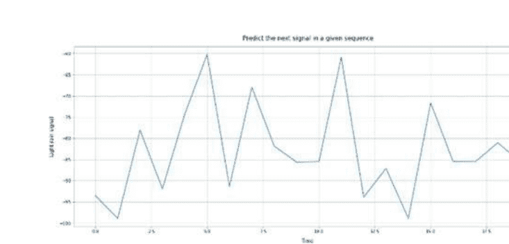

```
Light rain
[-93.52244771 -98.89983359 -78.10026327 -91.89956875 -74.30547392
 -60.23017897 -91.38085553 -67.93059562 -81.8397365  -85.62124559
 -85.51375403 -60.86855055 -93.89958587 -87.0999189  -98.89983359
 -71.68386288 -85.47884699 -85.51375403 -81.05016536 -85.51375403]
Time where signal is less:
```

图5 小雨，发现两个信号丢失的条件，时间为42、44分钟

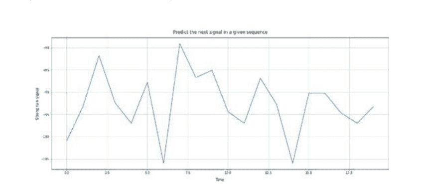

图6 大雨。在大雨条件下，预测值范围为： -78到 -100 dBm

```
Strong Rain
[-100.94930849 -93.27342964 -81.82095075 -92.41270051 -96.98729586
 -87.79068207 -105.98739289 -79.10724359 -86.72399827 -85.10030181
 -94.42191051 -96.98729586 -86.89957401 -92.73556977 -105.98739289
 -90.25416491 -90.25416491 -94.68630962 -96.98729586 -93.27342964]
Time where signal is less: 31, 37, 45
```

图7 大雨，发现五个信号丢失的条件，时间为32、35、37、42和45分钟

##### 性能分析

我们已经收集了使用移动信号强度功能的信号强度数据（这是每个移动设备的标准功能）。在移动设备中，我们可以在设置 > 关于手机 > 状态 > SIM状态 > 信号强度中找到。根据收集的数据，我们预测了信号强度，并将其与收集数据中的实际测量信号强度进行了比较。在基于预测值和实际值计算累积性能后，我们得到了81.80%至92.27%的准确性范围。性能测试基于预测值的数量和用于预测的值的数量。

#### 6 结论

通过使用支持向量机算法，可以基于干净的数据集预测信号的未来丢失。使用预测数据，我们可以估计信号丢失的时间和丢失的时间，根据运营商所经历的信号丢失量和该地区的可用性，并根据情况使用任何提到的增强方法。此外，将向网络运营商发送详细信息以执行所需的任务以增强信号强度。

#### 7 未来范围

- 雨不是唯一影响信号和自然的因素；它有时是不可预测的。在这种情况下，任何预测模型都无法使用过去的数据工作。
- 为了获得更好和最接近的值，时间序列算法被用于获得最准确的结果。
- 它可以创建一个模型，其中连续收集了信号损失中的当前和过去数据，并可以预测未来的信号损失；因此，它将与实际读数进行比较以找到准确性。
- 研究与温度或其他影响信号的因素相关的信号损失预测。
- 研究一个预测模型，以估计可能影响传输信号的所有因素的信号损失。

致谢：我们感谢指导我们整个项目并教授我们相关方法和帮助我们理解所需概念的K. Ashesh副教授先生。感谢我们的Vege Hari Kiran（系主任）先生为我们提供所需的设施和指导。

#### 参考文献

1. Alor, M. O., Abonyi, D., & Okafor, P. U. (2015). 确定雨对蜂窝信号接收的影响。 https://www.researchgate.net/publication/333603272_Determination_Of_The_Effect_Of_Rain_On_Cellular_Signal_Receptions.
2. Alor, M. O., Abonyi, D., & Okafor, P. U. (2015). 确定风对重度植被环境中接收到的蜂窝信号的影响。 https://www.researchgate.net/publication/333603535_Determination_Of_The_Influence_Of_Wind_On_Received_Cellular_Signal_In_A_Heavy_Vegetation_Environment.
3. Markham, A., Trigoni, N., & Ellwood, S. (2010). 雨对室外森林部署中链路质量的影响。 https://ieeexplore.ieee.org/document/5741509.
4. Fong, B., Rapajic, P. B., Fong, A. C. M., & Hong, G. Y. (2003). 在大雨区宽带无线通信中接收信号的极化。 https://ieeexplore.ieee.org/document/1159879.
5. Hendrantoro, G., Bultitude, R. J. C., & Falconer, D. D. (2002). 在毫米波固定蜂窝系统中使用基站多样性来抵抗雨衰减的影响。 https://ieeexplore.ieee.org/document/995519.
6. Sabu, S., Renimol, S., Abhiram, D., & Premlet, B. (2017). 降雨对手机用户端RSSI变化的影响研究。 https://ieeexplore.ieee.org/document/8070024.
7. Sabu, S., Renimol, S., Abhiram, D., & Premlet, B. (2017). 关于温度对细胞信号强度质量的影响的研究。 https://www.researchgate.net/publication/320652473_A_study_on_the_effect_of_temperature_on_cellular_signal_strength_quality.
8. Beritelli, F., Capizzi, G., Sciuto, G. L., Napoli, C., Scaglione, F. (2018). 基于接收信号强度的降雨估计在LTE/4G移动终端中使用概率神经网络。 https://ieeexplore.ieee.org/stamp/stamp.jsp?arnumber=8365880.
9. 无线电信号路径损耗。 https://www.electronics-notes.com/articles/antennas-propagation/propagation-overview/radio-signal-path-loss.php.
10. 支持向量机——机器学习算法介绍。 https://towardsdatascience.com/support-vector-machine-introduction-to-machine-learning-algorithms-934a444fca47.
11. 支持向量机算法。 https://www.javatpoint.com/machine-learning-support-vector-machine-algorithm.
12. 天气如何影响你的手机信号。 https://www.outsideonline.com/2186591/how-weather-affects-your-phones-signal#:~:text=Rain,more%20than%20any%20other%20weather.

### 小波分解方法用于改进视网膜血管分割

Udayini Dikkala, Kezia Joseph Mosiganti, 和Mukil Alagirisamy

摘要：视网膜图像分析需要广泛的研究，特别是在正确检测血管方面，因为这些血管的状况有助于眼科医生识别某些潜在的眼部疾病。提出了一种基于小波变换的方法，其不变矩特征有助于改进血管的检测。这种变换是一种多分辨率方法，可以根据一定的频率范围进行图像质量改进。此外，还减少了斑点噪声，并增强了边缘检测。通过考虑噪声的光谱特性来改善质量，而不是统计特性。所使用的母小波是Daubechies db2或D4。该方法在公开可用的DRIVE数据库上进行了评估，作为基准。该数据库包含非显微的视网膜底部图像。通过这个过程获得的准确度约为88%，在血管检测中的特异性接近98%。用于分割输出增强的预处理和后续处理方法。

关键词：Daubechies · 多分辨率 · 视网膜图像分析 · 分割 · 小波变换

#### 1 引言

自上世纪以来，通过最佳基础的小波分解的多分辨率方法[1-3]已成为图像编码、分形分析和纹理区分的研究重点。近年来，该方法主要集中在医学图像分析领域（如超声、磁共振成像（MRI）和计算机断层血管造影）在压缩和增强方面都用于临床研究和非侵入性治疗。特别是在视网膜图像分析领域中，基于小波的分析应用包括可视化和信息分析。观察到这种方法提供了一次处理少量频谱分量并减少通常在较高频率中看到的噪声的机会。由于其灵活性，该理论已应用于许多应用领域。该方法可以与自适应阈值、数学形态学[4]和监督训练算法相结合，以改善血管结构图像。

视网膜血管结构的异常反映了个体的健康状况。眼科医生在初次就诊时进行的评估可能不会显示出这些异常，尽管这是不可避免的耗时过程。正在进行研究，通过自动化手段在专家就诊之前提供更准确的图像分析[5]。视网膜血管的变化可能是由患者的医疗状况引起的。血管通过各种细胞层[6]连接在一起，如图1所示。

可能导致血管结构变化的条件示例包括某种视网膜病变，从较薄的血管生成非常细的毛细血管。新生血管导致血管宽度异常增长。在高血压发作之前，血管结构可能会发生细微变化。由于血管呈曲折状[7]，在分割过程中有时很难将其识别为独立实体，如图2所示。这导致错过了一种重要的疾病指标。

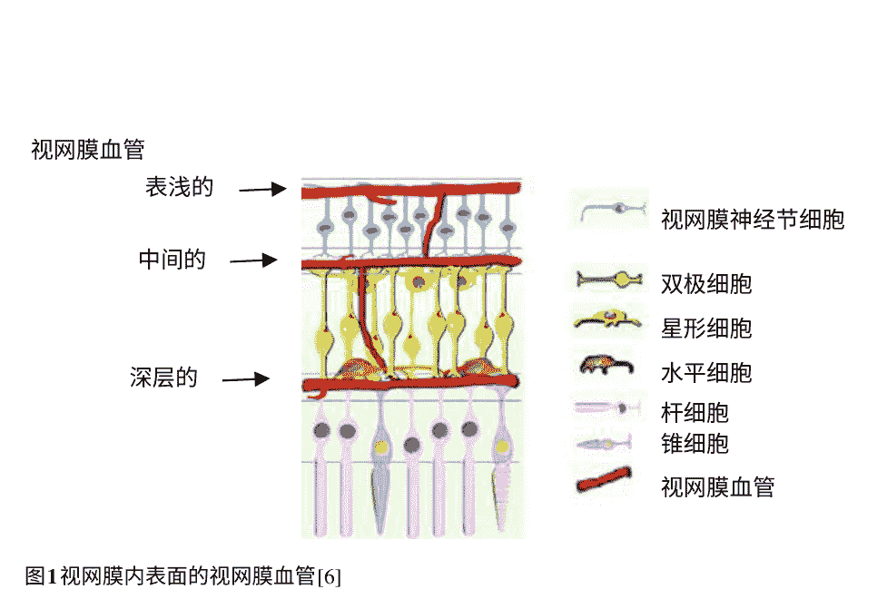

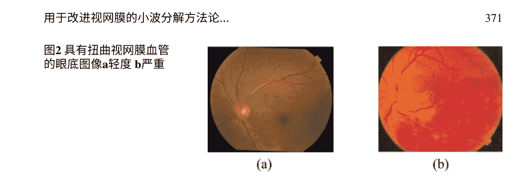

解决上述问题的方法在于精确提取血管树，测量观察到的血管变化，然后连续判断患者的医疗状况。

小波分解方法被扩展到分割形状不均匀且依赖于血液流动压力的视网膜血管。这在确定血管结构和建模以识别与视网膜眼部疾病相关的任何异常时会产生复杂性。观察到各种方法来追踪动态模型，模拟这些血管形状的变化[8]。此外，眼底图像中的噪声被假设为具有加性、零均值、常方差的高斯特性[9]。

小波变换是正交的，有助于图像中的噪声去除和具有高效紧凑特征表示的异常值消除。该变换应用于整个区域，并从不同的尺度中提取其系数。通常进行低通滤波以获得预处理的近似系数，因为它们与小波变换的详细系数相比具有更好的定义特征。其中一个关键原因是使用高通滤波器可能会导致放射学图像中的纹理信息被去除。

#### 从文献综述中得出的两个推论

为了克服无法有效获取视网膜血管分割的问题，已经进行了一些基于不同小波变换的研究。使用非散瞳相机获得的视网膜图像用于开发基于血管图像分割的方法。使用的各种方法包括小波分析、自适应阈值过程、基于形态学的技术和监督分类器概率。

糖尿病导致血管变化，进而有助于识别和测量血管直径的变化。从Morlet变换得到的结构分解像素特征空间中提取特征，降低维度。形态学操作被用作后处理技术，以获得连续的血管轮廓[10]。

重点是利用Haar小波、5/3倍生物正交小波和Daubechies四点正交小波来检测微小动脉瘤[6]。相对均匀性是通过离散小波变换提取纹理特征的参数，具有85.4%的敏感性和79%的特异性[11]。使用二维Gabor小波和锐化滤波器增强图像[12]。更高频率的分量进一步分解，并测量统计指标。通过leave-one-out交叉验证方法和支持向量机进行分类[13]。

使用Haar变换检测硬性渗出物，然后使用K最近邻分类器[14]。通过同态滤波器对光照不均匀性进行校正，然后在离散余弦变换上使用超高斯带通滤波器。在最后阶段使用Otsu的全局方法提取渗出物并分割血管[15]。在应用适当的Gamma校正后，使用离散小波变换与Coye算法相结合进行分割过程[16]。现代概念中，使用深度卷积神经网络和基于决策树和人工神经网络的混合方法[17， 18]来解决反问题，并用于超参数选择和分类。

在图像处理中，小波分析以不同形式的效率取决于所使用的小波族和信号分解的级别。这些技术包括将函数扩展为一组具有不同特性的基函数，其中Haar小波变换是具有高紧凑支持的最佳拟合小波形式。使用现有方法获得血管物理结构的精确测量仍然是一个挑战。

#### 提出的方法

本研究的目标是通过小波分解方法获得去噪和良好分割的视网膜血管结构。这里提出的方法采用预处理技术对眼底图像进行去噪处理[19]。

然后使用Daubechies-2小波族进行血管结构分割的小波变换。与最佳拟合的Haar小波族进行比较。Haar小波是最简单和基本的小波函数，它与自身的膨胀和平移正交。它不是一个连续函数，傅里叶变换随频率的倒数逐渐减小。

Haar小波的使用导致频率分量的无效定位。另一方面，Daubechies小波是一个正交小波，并且具有紧支撑性。这个小波族用于分割视网膜血管。在使用相同的小波对图像进行去噪之后，它与小支撑（在本例中为Daubechies db2或D4）一起用于分离相关特征。小波的支撑越大，识别紧密距离特征的过程就越困难。这可能导致系数## 图3 小波变换分割算法框架

- 数据：眼底图像
- 过程：开始量化方法的参数
- 初始化：
  1. 调整图像大小以进行高效计算
  2. 通过使用亮度平面改善图像质量
     - 获得灰度图像
     - 对比度拉伸
  3. 使用独立阈值的小波变换进行去噪
  4. 通过小波变换进行分割
  5. 特征比较
     - 图像对比增强
     - 平均滤波去除图像背景
     - 得到差异
     - 局部阈值化
     - 得到二值图像
     - 通过数学形态学去除孤立点
  6. 计算度量
- end;

无法区分个体特征。此外，Haar小波用于检测图像中的突变变化，而其他小波类型用于平滑图像边缘和纹理分析。开发了一个框架，以尽可能高效地提取视网膜血管，并通过图3中的算法进行解释。在提出的方法中，Daubechies小波首先用于去噪，然后在后期用于分割。其过程如图4所示。

从去噪图像中提取特征，并计算相关度量。

##### 3.1 数据采集

本研究使用了一个公开可用的视网膜图像数据库，名为数字视网膜图像用于血管提取（DRIVE）。该数据集包含两组各含20张图像，其中一组用于测试，另一组用于训练。图像中包含了不同年龄的正常和异常情况的主题[20]。所使用的相机是一台数字佳能CR5非显影3CCD相机，视野为45°。每个图像的数据以24位数据存储，并以JPEG格式存储。每个图像的尺寸为768 × 584像素，视野（FOV）直径约为540像素。数据库中每个图像的手动分割由专家提供，作为地面真实图像。两个观察者分割了14张和6张图像，分别在训练集中，而两个观察者对测试图像进行了两次分割。结果得到了两组测试图像，A和B。每个图像都提供了一个带有标定视野（FOV）的二进制掩模。图5显示了一个正常和异常的眼底图像样本。

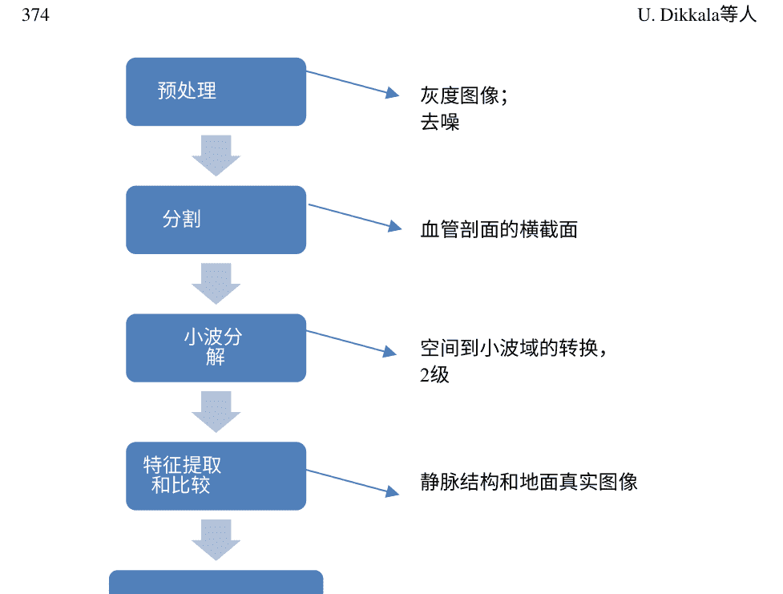

图5 来自视网膜数据库DRIVE database的样本图像。来源DRIVE数据库 a健康（01.tif），b视网膜中央凹处的瘢痕（08.tif），c背景视网膜病变（26.tif）

STARE数据库在研究中也被广泛使用，并且是公开可用的。该数据库包含81张眼底照片，其中31张正常图像和50张异常图像，每个像素24位。使用Topcon TRBV50眼底相机获取分辨率为605X700、视野为35°的图像。预处理。有许多因素会影响视网膜眼底图像，尤其是噪声、非均匀照明和对比度较弱。输入被转换为灰度图像。为了获得更好的分割结果，至少通过小波变换和自适应阈值处理来滤除噪声。

##### 小波分解

离散小波变换可以是非降采样的，如最大重叠离散小波变换（MODWT），也可以是降采样的，如多分辨率分析（MRA）中所见。由于非降采样小波函数不包括下采样，因此它是平移不变的，并且与降采样小波函数相比生成更多的系数。小波变换考虑了一个由空间和尺度域组成的域，并且它限制了信号能量在这个区域内。图像的基本组成部分在多个尺度上表示[21]，并且在非平稳信号的分析（时频）和特征点的表征中非常有用。分析过程涉及将图像分解为近似和详细系数的分层分解。母小波函数经历了膨胀、平移和最后与输入数据进行卷积，以获得最终输出。在每个级别，信号的低频和高频被获取，这导致分辨率减半，表示整个信号的样本数减少了一半。近似系数在第j个级别通过2D离散小波变换在四个不同的分量中获得。

离散小波变换[2, 21]在一个(M X N)图像f(x, y)的操作可以分别由下面的方程(1)和(2)表示。

```
W_{\varphi}(j0, m, n) = \frac{1}{\sqrt{MN}} \sum_{x=0}^{M-1} \sum_{y=0}^{N-1} f(x, y)\varphi_{j0,m,n}(x, y) \quad\quad (1)

W_{\gamma}^{i}(j, m, n) = \frac{1}{\sqrt{MN}} \sum_{x=0}^{M-1} \sum_{y=0}^{N-1} f(x, y)\gamma_{m,n}^{i}(x, y), i=\{H, V, D\} \quad (2)
```

其中j_{0}表示初始尺度，j_{0}处的近似系数由W_{\varphi}(j_{0}, m, n)表示，对于j≥j_{0}，详细系数(水平‘H’，垂直‘V’和对角线‘D’)的加法表示为W_{\gamma}^{i}(j, m, n)。近似系数集中在图像的内部细节上，详细系数集中在水平、垂直和对角线方向上，捕捉到图像边缘的活动。对感兴趣的图像应用Daubechies小波函数，并在图6中显示相应的函数(缩放和小波)。

所选择的分解级别为2，因为在3级之后，原始图像和近似图像之间存在较大的偏差，因此结果获得的结果不显著。对于具有n个消失矩的小波，离散滤波器的最小尺寸为2n。与 n =2相关的系数列在表1中。

特征提取。为了去噪灰度图像，使用线性独立的噪声估计，并对小波系数进行软阈值处理，以保留图像的响应。尺度值为2或3会生成具有最小噪声的输出。通过Daubechies小波从去噪图像中提取特征，并计算相关指标。

后处理。在表示视网膜血管的线段中可能存在一些不连续性。此外，由于任何病理条件的结果，可能会出现一些孤立点。为了克服这些缺点，进行形态学操作以获得连续的血管结构。每个步骤的输出如图7所示。

表1 Daubechies小波的两个消失点的系数[19]

| n | LoD | HiD | LoR | HiR |
| :--- | :--- | :--- | :--- | :--- |
| 0 | -0.129409523 | -0.482962913 | 0.482962913 | -0.129409523 |
| 1 | 0.224143868 | 0.836516304 | 0.836516304 | -0.224143868 |
| 2 | 0.836516304 | -0.224143868 | 0.224143868 | 0.836516304 |
| 3 | 0.482962913 | -0.129409523 | -0.129409523 | -0.482962913 |

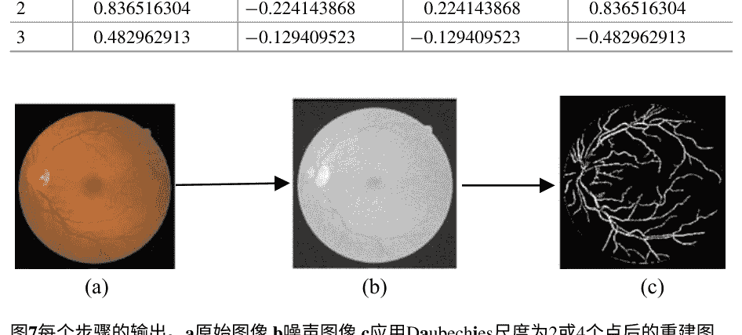

#### 4 模拟结果

观察了用于分割DRIVE数据库中眼底图像的小波变换方法的结果，发现了锐度的改善。锐度是表示图像亮度导数与观察到的空间之间关系的重要参数。由于锐度的积极变化，观察到了特异性的改善。

模拟结果的几个样本列在表2中。列表中包括视网膜的图像，未受疾病影响和受疾病影响的图像。与地面真实值或手动分割注释进行比较，观察到

表2 模拟所提出系统的结果子集

| 序号 | 原始 | 标注图像 | 结果 |
| --- | --- | --- | --- |
| 1 | [图像] | [图像] | [图像] |
| 2 | [图像] | [图像] | [图像] |
| 3 | [图像] | [图像] | [图像] |
| 4 | [图像] | [图像] | [图像] |
| 5 | [图像] | [图像] | [图像] |

当应用于受影响眼睛的图像时，该方法将产生通过静脉结构产生疾病区域的分割产物。这种方法需要改进以产生更明显的血管结构。然而，实施的方法产生了更宽的静脉结构、分支静脉和它们之间的连接。

##### 4.1 性能指标

根据一些能够定义输出质量的指标对输出进行评估。一些常见的测量参数被识别出来，并且它们的值通过表3中的公式进行数学计算。在这里，TP代表真正的阳性，即手动和算法实现中被识别为血管的像素数量；同样，TN被定义为真负，用于手动和算法实现中被识别为非血管的像素数量。沿着同样的线路，FP代表假阳性，即在算法实现时将非血管错误地识别为血管的像素数量。

最后，FN代表算法未能检测到属于血管的像素的假阴性。从上述参数中获得的指标包括敏感性、特异性和准确性，它们分别表示所提出算法在正确检测血管、给定算法在正确检测非血管以及正确识别像素总数与图像视野中像素总数之比的能力。

表4展示了不同作者应用于眼底图像的各种小波变换及其性能指标结果的总结。通过与所提出方法进行比较，展示了实验过程中获得的结果。

从表4中可以看出，与使用小波变换进行分割的其他方法相比，所提出的方法在特异性和准确性方面分别达到了约98%和88%。对于这个目的，Daubechies变换更简单易用。

表3 定义的性能指标

| 度量 | 公式/数学表达式 |
|------|------------------|
| 敏感度（真阳性比率（TPR）） | TP/(TP + FN) |
| 特异性（1-假阳性比率（FPR）） | TN/(TN + FP) |
| 准确性 | (TP + TN)/(TP + FN + TN + FP) |

表4 与提出的方法的先前方法结果比较

| 序号 | 作者姓名 [参考文献] | 特异性（Sp）% | 准确性（Acc）% |
| :--- | :--- | :--- | :--- |
| 1 | 手动评估员 | 97.23 | 94.70 |
| 2 | Quellec等[10] | 96.18 | - |
| 3 | Khademi和Krishnan [11] | 79.00 | 82.20 |
| 4 | Lahmiri [13] | - | 分类中的79.33%改进 |
| 5 | Rokade和Manza [14] | 1 | |
| 6 | Dasha和Senapati [16] | 99.05 | 96.61 |
| 7 | 提出的 | 97.68 | 87.77 |

表5 DRIVE图像分析的指标比较

| 样本图像编号 | 特异性 | 准确性 |
| :--- | :--- | :--- |
| 1 | 0.9745 | 0.8904 |
| 2 | 0.9539 | 0.8761 |
| 3 | 0.9509 | 0.8725 |
| 4 | 0.9534 | 0.8691 |
| 5 | 0.9850 | 0.9103 |

#### 5 设置和相关讨论

在前面提到的研究友好的DRIVE数据库上对所提出的方法进行了验证，其中包括33个健康受试者的视网膜图像和7个有病变问题的图像。使用2.2 GHz速度的Intel-i7 CPU和4 GB RAM执行这些图像处理功能。MATLAB 2019a用于数据可视化目的。

从DRIVE数据库中随机选择的5个图像的度量指标在表5中列出，以便清楚比较图像的准确性和特异性。

DRIVE数据库中图像的读数平均值接近其他作者先前使用的小波变换得到的数值。

#### 6 结论和未来展望

研究工作的重点是使用小波变换进行去噪和分割。根据所进行的分析，可以看出DRIVE数据库中的所有图像的均方误差、准确性和特异性与其他方法相当，但使用了更简单的变换。Daubechies db2或D4产生与基本的Haar变换相比，具有更小的均方误差、更高的准确性和更好的特异性，且级别为2。只观察到峰值信噪比的小幅改善。工作可以扩展到其他母小波，并且还可以对当前过程进行微调，以提高系统的性能指标。这将基于对较细和较小的视网膜血管的检测。作者正在努力进一步扩展这项研究。

致谢作者感谢支持团队在规定时间内实施这项研究工作，并利用系统实验室的资源。

#### 参考文献

1. Mallat, S. G. (1989). 多分辨率信号分解的理论：小波表示。*IEEE模式分析与机器智能交易*, 11(7), 674-693.
2. Lee, D. T. L., & Yamamoto, A. (1994). 小波分析：理论与应用。*惠普杂志*, 44-52.
3. Zhuang, Y., & Baras, J. S. (1994). 信号表示的最优小波基选择。*SPIE国防、安全和感知*, 2242(301), 小波应用, 200-211。
4. Dikkala, U., Joseph, M. K., & Alagirisamy, M. (2021). 基于形态学过程的视网膜血管分割的全面分析。在国际计算、通信和智能系统会议(ICCCIS)上, 第510-516页。
5. Srinidhi, C. L., Aparna, P., & Rajan, J. (2017). 视网膜血管分割的最新进展。*医学系统杂志*, 41(4), 70。
6. Santiago, A. R., Boia, R., Aires, I. D., Ambrosio, A. F., & Fernandes, R. (2018). 甜蜜的压力：应对糖尿病视网膜病变中的血管功能障碍。*生理学前沿*, 9(820), 1-14。
7. 视网膜玻璃体资源中心, http://louisvillediabeticeyedoctor.com
8. Cornforth, D. J., Jelinek, H. J., Leandro, J. J. G., Soares, J. V. B., Cesar, R. M., Cree, M. J., et al. (2005). 使用小波变换评估糖尿病视网膜病变的视网膜血管分割方法的发展。*复杂性国际*, 11, 50-61。
9. Ben Abdallah, M., Malek, J., Tourki, R., Monreal, J. E., & Krissian, K. (2013). 自动估计眼底图像中的噪声模型。在第10届国际多会议系统、信号和设备上, 第1-5页。
10. Quellec, Q., Lamard, M., Josselim, P. M., Cazuguel, G., Cochener, B., & Roux, C. (2006). 基于小波变换的视网膜照片病变检测。在IEEE工程医学与生物学学会国际会议上, 第2618-2621页。
11. Khademi, A., & Krishnan, S. (2007). 用于视网膜图像分类的平移不变离散小波变换分析。*医学与生物工程与计算*, 45(12), 1211-1222。
12. Akram, M. U., Atzaz, A., Aneeque, S. F., & Khan, S. A. (2009). 使用小波变换的血管增强和分割。在IEEE计算机学会数字图像处理国际会议上, 华盛顿, 第34-38页。
13. Lahmiri, S. (2013). 从高频域中提取特征用于视网膜数字图像分类。*信息技术进展杂志*, 4, 194-198。
14. Rokade, P. M., & Manza, R. R. (2015). 使用Haar小波变换在视网膜图像中自动检测硬性渗出物。*国际应用创新工程与管理杂志*, 4, 402-410。
15. Lara-Rodriguez, L. D., & Serrano, G. U. (2016). 使用傅里叶和余弦离散变换在眼底图像中分割渗出物和血管。 计算与系统，20(4), 697–708。
16. Dasha, S., & Senapati, M. R. (2020). 通过DWT、 Tyler Coye和Gamma校正的组合方法增强视网膜血管的检测。 生物医学信号处理和控制，57, 1–12。
17. Vijayakumar, T. (2020). 使用新型深度卷积神经网络矫正姿势逆问题。 创新图像处理杂志（JIIP），2(03), 121–127。
18. Kumar, T. S. (2020). 基于混合机器学习算法的数据挖掘驱动的营销决策支持系统。 人工智能杂志，2(03), 185–193。
19. Tyler, C. (2015). 一种用于眼底图像的新型视网膜血管分割算法。 MATLAB中央文件交换。
20. Fraz, M. M., Remagnino, P., Hoppe, A., et al. (2012). 视网膜图像中的血管分割方法综述。 生物医学计算机方法与程序，108(1), 407–433。
21. Daubechies, I. 小波十讲。 在应用数学中的CMBS-NSF区域会议系列论文集中。 Doi: https://doi.org/10.1137/1.9781611970104

### 探索COVID-19推文的集成机器学习分类器的性能

Md. Mahbubar Rahman和Muhammad Nazrul Islam

摘要 自全球COVID-19大流行开始以来，衡量公众舆论一直被视为决策者在抗击疫情期间最关键的问题之一，例如实施全国封锁，引入隔离程序，提供卫生服务等。 在COVID-19大流行期间，世界各国的决策者针对公众舆论做出了许多关键决策，以应对冠状病毒。 在自然语言处理领域，情感分析已经出现，用于挖掘公众舆论，而机器学习（ML）算法在分析情感方面非常常见。 在这项研究中，来自英国的大约12,000条推文经过三名独立评审员的严格注释，并基于标记的推文，提出了三种不同的集成ML模型，将推文数据分类为三个情感标签：积极，消极和中性。 研究发现，堆叠分类器（SC）显示出最高的F1分数（83.5%），其次是投票分类器（VC）（83.3%）和装袋分类器（BC）（83.2%）。

关键词 COVID-19·机器学习·推文·情感分析·自然语言处理·集成算法

#### 1 引言

现如今，几个社交媒体正在产生大量的文本数据，这引起了对数据处理的浓厚兴趣，以便在更广泛的背景下发现数据的潜在含义。 由于Twitter数据的公开性和透明性，这些数据可以用于探索自然语言处理（NLP）和数据挖掘等领域的新方法，如情感分析[1]。 情感分析提取主观信息、观点或情感在句子或段落中表达。对社交媒体数据（如Twitter）进行情感分析可以成为从原始数据中提取洞察力的强大工具，并能够实时监测和决策，以应对COVID-19大流行。

当前的COVID-19大流行在我们的社会中创造了前所未有的局面，许多国家已经采取了适当的措施，如隔离、检疫、封锁或社交距离等，考虑到社交媒体上大众的关注和表达的关切[2-4]。然而，不同国籍和文化的人们在表达自己的情感和观点上有不同的方式。例如，无论是健康、政治、体育还是娱乐，一个国家的人们可能比另一个国家的人们更情绪化地回应。

机器学习（ML）算法根据一组数据进行智能预测[5, 6]。ML算法从已知数据点中获得洞察力，并可以预测未知数据点的类别标签，因此ML算法在健康信息学[7-11]、疫情预测[2, 12]、自闭症预测[13]等领域得到广泛应用。同样，已经进行了多项关于使用ML算法对Twitter数据进行情感分析的研究。例如，Villavicencio等人[14]在菲律宾进行了一项关于COVID-19疫苗相关推文的情感分析研究，使用了朴素贝叶斯分类器，并获得了81.77%的准确率。该研究考虑了11,974条手动标记的推文用于测试分类器的准确性。在另一项研究中，Khan等人[15]使用朴素贝叶斯分类器对50,000条COVID-19相关推文进行情感评分，发现19%为积极推文，70%为消极推文。在[16]中使用基于深度学习的分类器将600条COVID-19相关推文分类为不同的情感标签。该研究使用了混合异构支持向量机（H-SVM）、循环神经网络（RNN）和支持向量机（SVM）作为分类算法，其中H-SVM在精确度（86%）、召回率（69%）和F1分数（77%）方面表现最好，超过了其他两个模型。

Gupta等人[17]测量了Twitter用户对天气对SARS-CoV-2传播潜力的感知。该研究通过使用11种不同的机器学习算法对相关推文（n = 28,555）进行过滤，并将注释推文（n = 2442）分类为不同的情感标签。研究估计40.4%的推文表明对天气对SARS-CoV-2传播的影响存在不确定性，33.5%的推文表明没有影响，26.1%的推文表明对SARS-CoV-2传播存在一定影响。通过潜在狄利克雷分配（LDA）建模，在[18-20]中对Twitter数据进行了COVID-19相关主题识别，以帮助决策者和医疗组织评估和应对人们的需求。在[21]中，对7528条COVID-19推文的注释数据集进行了各种机器学习分类器的性能评估。该研究使用自动注释对收集到的推文进行了分析，并在其数据集上获得了93%的准确率。然而，这些现有研究表明，机器学习算法被广泛用于COVID-19推文的情感分析和分类。再次强调，由于COVID-19大流行，没有任何研究专门关注探索集成机器学习模型进行情感分析。与现有研究相关，本研究侧重于使用集成机器学习算法对COVID-19相关的Twitter数据进行情感分析。该研究探讨了投票分类器、装袋分类器和堆叠分类器在对来自英国的COVID-19推文进行用户情感分析方面的性能。本文结构如下。下一部分介绍了对COVID-19推文进行情感分析的研究方法。第3节对不同机器学习模型的结果进行了深入分析和讨论。最后一部分总结了本文并强调了其局限性。

#### 2 研究方法

情感分析过程的方法论概述如图1所示。COVID-19相关的推文数据在数据获取步骤中从Twitter中提取出来，然后进行数据预处理和数据标记。数据标记后，进行数据过采样，然后使用通用句子编码器（USE）进行数据嵌入。然后将嵌入的数据输入集成机器学习模型进行训练和分类。下面的小节简要讨论了情感分析的这些步骤。

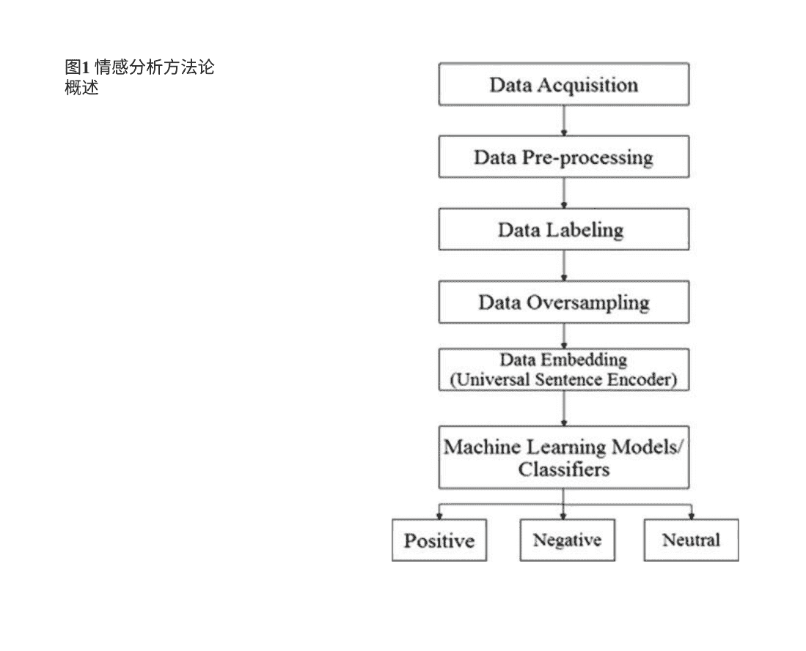

##### 2.1 数据获取

从推特上收集了与冠状病毒相关的地理标记的英文推文，这些推文是从2020年1月1日到2020年12月31日期间从英国发送并发布在推特上的。 选择了提到的国家英国，因为该国自2020年1月底以来受到COVID-19的影响，并且是在疫情时间线上受到高度感染的国家之一[22]。 使用了一组预定义的广泛使用的与新型冠状病毒相关的科学和新闻媒体术语，如“COVID-19”、“冠状病毒”、“封锁”、“隔离”、“检疫”、“大流行”和“2020-nCov”来收集推文。 数据集包含11,960条推文，其中有981,005个唯一词，其中出现最多的词是COVID-19。 表1中呈现了带有手动标记情感的样本推文。

表1 带有手动标记情感的样本推文

| 推文 | 情感 |
| --- | --- |
| 我对一些用于应对#COVID19的疫苗表示担忧，主要是因为我认为它们不安全 | 消极的 |
| 自#COVID19爆发以来，在线零售行业比以往任何时候都更忙碌 | 中立的 |
| 每次回家时都要重要的是要洗手，以杀死任何病毒#COVID19 | 积极的 |
| 阿斯利康期待已久的COVID-19疫苗通过了大规模测试，但还需要确认 | 中立的 |
| 即使年轻和健康，也可能患上严重的疾病#COVID19 | 消极的 |
| 尽管#冠状病毒封锁限制正在放松，但病毒仍然活跃 | 消极的 |
| 一种设计用来征服人类的可怕病毒。 唯一的希望是疫苗，但这是不确定的 | 消极的 |
| 照顾好自己。明智地饮食。#COVID19 | 积极的 |
| 冠状病毒感染的细胞会长出可能传播病毒的纤维#COVID19 | 消极的 |
| 全球大流行病将健康不平等问题凸显出来 | 中立的 |

##### 2.2 数据预处理

数据预处理步骤负责对收集到的数据集进行必要的数据转换和清洗，以使原始数据集以有用和高效的格式适用于机器学习算法。预处理步骤包括将推文转换为小写字符，删除用户名、URL、标点符号、链接、制表符、HTML内容和空格。像“a”、“an”和“the”这样的停用词会被删除，因为它们在句子中没有太多意义。由于该研究是在英文推文上进行的，因此使用推文元数据中的语言字段来识别非英文推文，并将其从考虑的数据集中删除。

##### 2.3 数据标注

数据标注步骤涉及对预处理的单个推文进行手动注释。三个独立的标注者被要求对未标记的Twitter数据进行标注，以准备一个用于机器学习模型的标记数据集。本文的两位作者作为独立的标注者参与其中，第三位标注者是情感分析和机器学习算法方面的专家，他自愿参与。使用三个独立的标注者的目的是获取标注者的无偏情感，并减少标注中的噪音和不准确性。标注者根据推文中表达/观察到的情感将推文分为三类：积极、消极和中性。通过多数投票将三个不同标注者的标注结果结合起来得到平均意见。我们还计算了人-人之间对标注的一致性。使用一些已接受的标注者间可靠性技术[23, 24]来确定标注者间的一致性系数。为此，首先对标注者的标签应用一致性百分比，发现平均一致性为85%。然后，使用Fleiss' kappa和Krippendorff's alpha [25]评估标注者间的一致性。Krippendorff's alpha和Fleiss kappa的平均标注者间一致性系数值分别为83%和81%。由于标注者间一致性系数值超过80%是可以接受的[26]，通过不同的标注者间可靠性技术得到的系数值表明标注过程是一致可靠的。

##### 2.4 数据过采样

在训练数据集中，存在类别不平衡[27]问题，因为积极、消极和中性推文的数量不同（见图2a）。标记推文的类别分布显示负面推文的数量高于积极和中性推文，而积极推文的数量大于中性推文。在将数据分为训练集和测试集之后，采用自适应合成（ADASYN）采样方法。

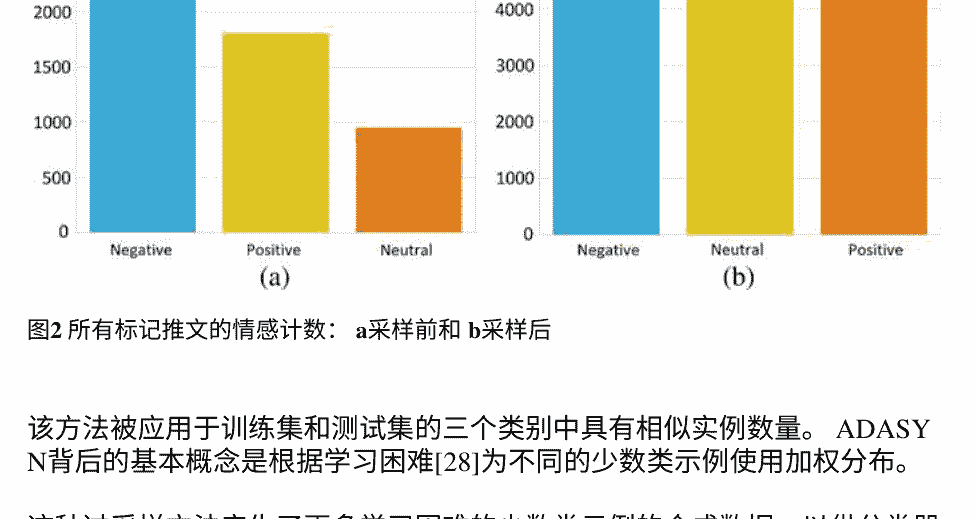

该方法被应用于训练集和测试集的三个类别中具有相似实例数量。ADASYN背后的基本概念是根据学习困难[28]为不同的少数类示例使用加权分布。这种过采样方法产生了更多学习困难的少数类示例的合成数据，以供分类器学习。在应用过采样方法消除类别不平衡问题后，推文的类别分布如图2b所示。

##### 2.5 数据嵌入

数据嵌入步骤负责将原始数据集转换为适合机器读取的格式。机器无法像机器学习模型那样理解文本的语义，因此将这些文本数据转换为数值数据是必不可少的。在自然语言处理中，一些流行的句子嵌入技术包括Doc2Vec [29]、SentenceBERT [30]和通用句子编码器（USE）[31]。在这项研究中，采用了USE来将文本编码为高维向量。这种简单而高效的模型优于其他预训练词嵌入模型。预训练的通用句子编码器（USE）可以在TensorFlow-hub中公开获取。上述讨论的预处理推文数据使用通用句子编码器（USE）转换为数值向量。然后，将这些数值向量输入不同的监督式机器学习模型中，以确定情感并将其分类为不同的情感类别，包括积极、消极和中性。

##### 2.6 开发和分析ML模型

使用预处理的推文开发了三种不同的ML模型。使用训练数据集对ML模型进行训练，同时使用训练和测试数据集评估模型的性能。ML模型将在后续的小节中进行详细分析。

#### 3 分析机器学习模型

本节简要讨论了探索不同的ML集成算法对用户情感进行分类（积极、消极和中性）。使用Python编程语言和scikit-learn [32]库开发和分析ML模型。手动标记的数据集采用80-20的随机训练测试分割。因此，80%的数据被视为训练数据，而20%的数据被视为测试数据。使用网格搜索调参方法[33]调整算法的超参数，以找到适当的超参数。根据精确度、召回率和F1分数分析算法的性能。此外，接收者操作特性（ROC）曲线是一种曲线，通过绘制真正例率与假正例率之间的关系，显示每个潜在分类阈值的特异性和敏感性。此外，ROC曲线下的区域（AUC）表示模型的分类效果。因此，为了评估模型，生成了ROC曲线和混淆矩阵。下面的小节将简要分析应用的ML模型。

##### 3.1 投票分类器

投票分类器是一种集成机器学习模型，根据不同基线模型中类别的最高概率进行分类[34]。它使用简单的聚合方法预测类别的概率，并将其传递给分类器，然后投票分类器根据选择类别的最高概率预测输出。在这项研究中，决策树（DT）、支持向量分类器（SVC）和逻辑回归（LR）之间进行了硬投票，也称为多数投票，以获得最终的预测标签。VC模型在训练数据集上的精确度、召回率和F1分数分别为98.9%、99.5%和99.3%，而测试数据集的精确度、召回率和F1分数分别为83.8%、83.4%和83.3%（见表2）。训练数据上的ROC曲线显示曲线下面积（AUC）的微平均和宏平均分别为100%和99%，而测试数据的微平均和宏平均ROC曲线都为88%（见图3）。

表2 开发模型的性能指标

| 提出的模型 | 训练数据集 (精确度) | 训练数据集 (召回率) | 训练数据集 (F1得分) | 测试数据集 (精确度) | 测试数据集 (召回率) | 测试数据集 (F1得分) |
|---|---|---|---|---|---|---|
| 投票分类器 (VC) | 0.989 | 0.995 | 0.993 | 0.838 | 0.834 | 0.833 |
| 装袋分类器 (BC) | 0.980 | 0.989 | 0.986 | 0.846 | 0.833 | 0.832 |
| 堆叠分类器 (SC) | 0.982 | 0.989 | 0.985 | 0.847 | 0.836 | 0.835 |

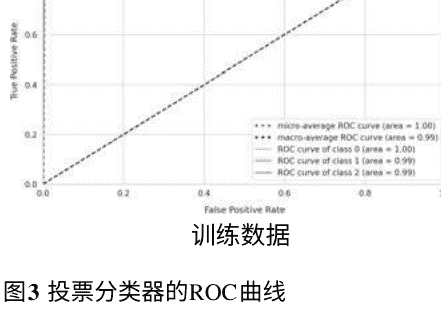

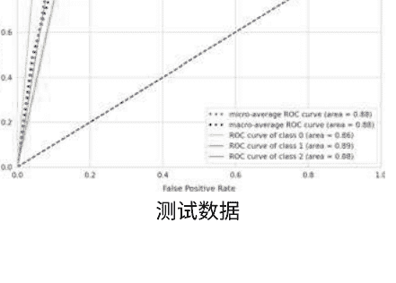

图3 投票分类器的ROC曲线

##### 3.2 装袋分类器

装袋是一种简单且流行的集成机器学习元算法，旨在改善分类和回归问题的稳定性和准确性[35, 36]。该方法通过引导[37]输入训练集的多个副本，然后训练单独的模型来减少方差，从而帮助避免过拟合问题。它被认为是一种模型平均方法，其中使用多个预测器，然后将预测模型的输出应用于投票方案以获得更好的分类。在本研究中，使用10棵树的SVC作为基本估计器来训练BC模型。在训练数据集上，装袋分类器的精确度、召回率和F1得分分别为98%、98.9%和98.6%，而在测试数据集上的精确度、召回率和F1得分分别为84.6%，83.3%和83.2%（见表2）。训练ROC曲线的AUC的微平均和宏平均值为99%，而测试ROC曲线的AUC的微平均和宏平均值分别为88%和87%（见图4）。

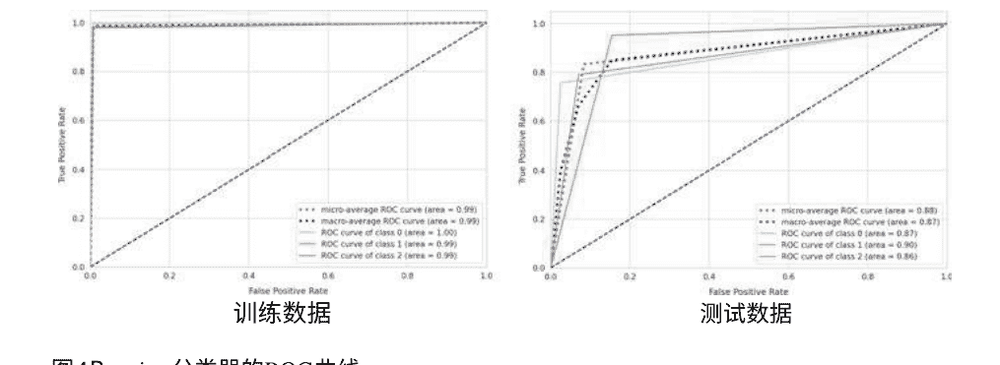

##### 3.3 堆叠分类器

堆叠是一种使用元分类器合并多个分类模型的方法[38]。个别分类模型使用整个训练集进行训练，然后使用集合的个别分类模型的输出（元特征）来拟合元分类器。所提出的SC模型的架构由两层组成。SC模型的第一层由上述VC和BC模型组成，而第二层由逻辑回归模型组成。对于数据集中的每个观察/测试，都从两个单独的模型中得出结论。第二层的LR模型使用从这些算法获得的结论作为输入特征。然后，基于输入特征，第二层模型提供最终的结论。SC模型在训练集上的精确度，召回率和F1分数分别为98.2%，98.9%和98.5%，而在测试数据集上的精确度，召回率和F1分数分别为84.7%，83.6%和83.5%。因此，SC模型在训练集和测试集中取得了最高的结果（见表2）。训练ROC曲线的AUC的微平均和宏平均值为100%，而测试ROC曲线的AUC的微平均和宏平均值为88%（见图5）。

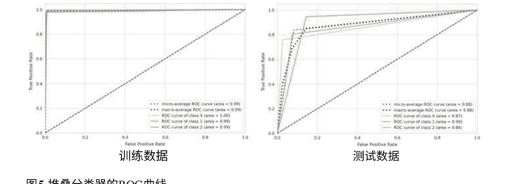

##### 3.4 比较分析

将每个算法应用于数据集会导致基于精确度、召回率和F1分数值的不同性能（见图6）。与测试数据集中的其他两个模型相比（见表2），SC模型实现了最高的精确度（84.7%）、召回率（83.6%）和F1分数（83.5%）。对于测试数据集，VC模型在F1分数（83.3%）和召回率（83.4%）方面提供了第二好的性能，而BC模型的F1分数和召回率分别为83.2%和83.3%。再次，就精确度而言，BC模型达到了84.6%，略高于VC模型（83.3%）。

对于训练数据集，VC模型在精确度（98.9%）、召回率（99.5%）和F1分数（99.3%）方面实现了最高的性能，超过了其他两个模型。然而，对于训练数据集，所有三个模型的精确度、召回率和F1分数值均在98%以上（见表2）。

训练和测试数据集的ROC曲线在图3、4和5中呈现。对于训练数据集，AUC的微平均和宏平均值均为99%以上，适用于所有三个模型（见图3、4和5）。VC和SC模型的微平均值为88%和

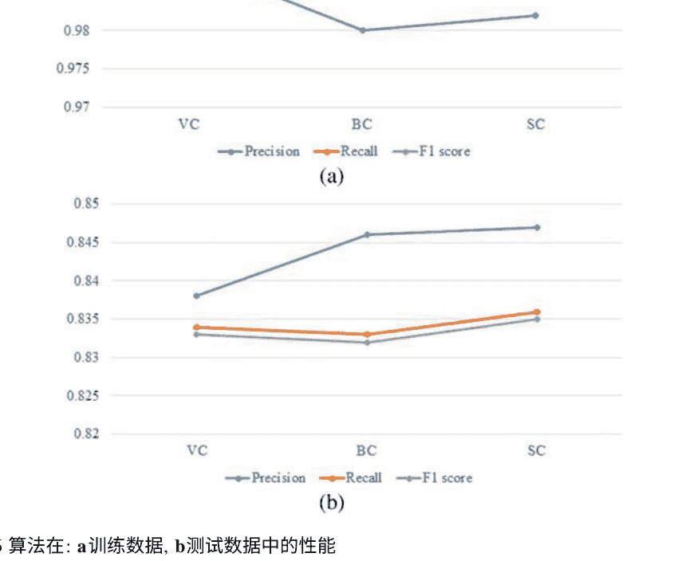

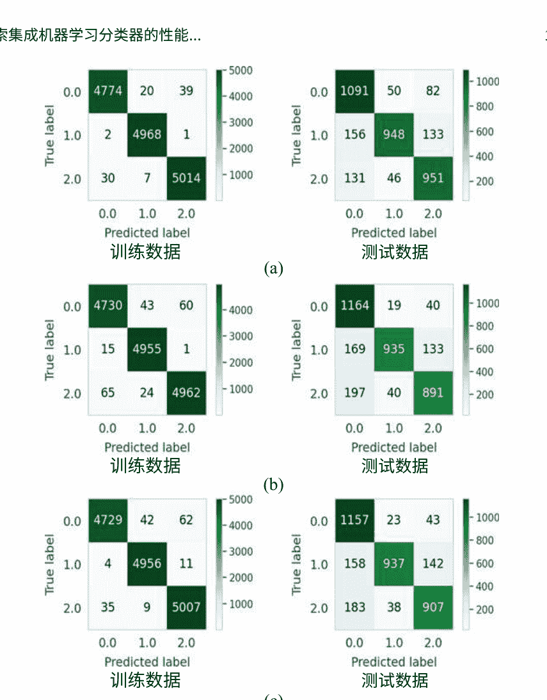

图7 开发模型的混淆矩阵：a VC, b BC和c SC

对于测试数据集，BC模型的AUC的宏平均值为88%，微平均值为87%。

推文情感预测结果的总结也通过图7中的混淆矩阵表示，矩阵的每个条目表示模型进行的预测次数，其中正确或错误地分类了标签。

从VC和BC混淆矩阵的对角线条目之和中，对于这两个模型的2990条推文数据（积极、消极和中性），在3588条测试数据中被正确分类（见图7a、b）。同样，SC模型正确分类了最多的推文数据（3001条），超过了其他两个模型（见图7c）。应用的模型还在训练数据集上对推文进行了98%以上的准确分类。

#### 4 结论

本研究旨在通过集成机器学习模型对COVID-19推文数据进行情感分析，将推文分类为积极、消极和中性情感。提出的SC分类器显示了最高的F1分数为83.5%，而VC和BC模型显示了非常有希望的结果，这表明集成机器学习模型可以用于情感分析。集成机器学习模型在一些现有研究中表现优异。例如，在[14]中，作者使用了朴素贝叶斯分类器，并获得了81.77%的准确率。在另一项研究中[16]，作者应用了SVM、RNN和H-SVM机器学习模型，并获得了召回率和F1分数分别为69%和77%。

然而，对于文本嵌入，采用了通用句子编码器（USE）来生成可训练的输入数据用于机器学习模型。未来的研究可以尝试使用不同的编码器，如BERT、Word2vec等，用于文本嵌入，以找到最适合分类器的编码方式，从而获得更好的结果。此外，该研究仅考虑了11,960条推文数据用于机器学习模型的训练和测试，可以增加样本量以获得更准确的结果。

#### 参考文献

1. Chong, W. Y., Selvaretnam, B., & Soon, L. K. (2014). 自然语言处理用于情感分析：推文的探索性分析。在2014年第四届人工智能国际会议上应用于工程和技术的论文集（第212-217页）。IEEE。
2. Islam, M. N., & Islam, A. N. (2020). 对抗COVID-19的数字干预措施的系统综述：孟加拉国的视角。IEEE Access, 8, 114078–114087.
3. Islam, M. N., Inan, T. T., & Islam, A. N. (2020). 孟加拉国的Covid-19和罗兴亚难民：挑战和建议。亚太公共卫生杂志，32（5），283-284。
4. Laato, S., Islam, A. N., Islam, M. N., & Whelan, E. (2020). 在covid-19大流行期间，是什么推动了未经验证的信息分享和网络病理？欧洲信息系统杂志，29（3），288-305。
5. Islam, M. N., Inan, T. T., Rafi, S., Akter, S. S., Sarker, I. H., & Islam, A. N. (2021). 关于使用人工智能和机器学习应对covid-19大流行的系统性综述。IEEE人工智能交易。
6. Nichols, J. A., Chen, H. W. H., Baker, M. A. (2019). 机器学习：应用于图像和诊断的人工智能。生物物理评论，11（1），111–118。
7. Islam, M. N., Mahmud, T., Khan, N. I., Mustafina, S. N., Islam, A. N. (2020). 探索机器学习算法以找到预测分娩方式的最佳特征。IEEE Access。
8. Khan, N. I., Mahmud, T., Islam, M. N., Mustafina, S. N. (2020). 使用集成机器学习方法预测剖腹产。在第22届国际信息集成和基于Web的应用与服务会议（第331-339页）的论文集中。
9. Aishwarja, A. I., Eva, N. J., Mushtary, S., Tasnim, Z., Khan, N. I., & Islam, M. N. (2020). 探索机器学习算法以找到预测乳腺癌及其复发的最佳特征。在智能计算与优化国际会议上(pp. 546–558). Springer.
10. Khan, N. S., Muaz, M. H., Kabir, A., & Islam, M. N. (2017). 使用机器学习预测糖尿病的mhealth应用。在2017年IEEE国际WIE电气与计算机工程会议上(pp. 237–240). IEEE.
11. Dhaya, R. (2020). 基于ROC分析的基于放射照片的covid-19检测深度网络模型。创新图像处理杂志(JIIP), 2(03), 135–140.
12. Zaman, A., Islam, M. N., Zaki, T., & Hossain, M. S. (2020). ICT干预控制COVID-19疫情传播：一项探索性研究。arXiv:2004.09888
13. Omar, K. S., Mondal, P., Khan, N. S., Rizvi, M. R. K., & Islam, M. N. (2019). 一种预测自闭症谱系障碍的机器学习方法。2019年国际电气、计算机和通信工程会议(ECCE)(pp. 1–6). IEEE.
14. Villavicencio, C., Macrohon, J. J., Inbaraj, X. A., Jeng, J. H., & Hsieh, J. G. (2021). 使用朴素贝叶斯进行菲律宾COVID-19疫苗的Twitter情感分析。Information,12(5), 204.
15. Khan, R., Shrivastava, P., Kapoor, A., Tiwari, A., & Mittal, A. (2020). 社交媒体分析与AI: 用于分析Twitter Covid-19数据的情感分析技术。Critical Review杂志, 7(9), 2761–2774.
16. Kaur, H., Ahsaan, S. U., Alankar, B., & Chang, V. (2021). 提出的情感分析深度学习算法用于分析Covid-19推文。在信息系统前沿（第1-13页）。
17. Gupta, M., Bansal, A., Jain, B., Rochelle, J., Oak, A., & Jalali, M. S. (2021). 天气是否会帮助我们度过Covid-19大流行：使用机器学习来衡量Twitter用户的感知。国际医学信息学杂志, 145, 104340.
18. Garcia, K., & Berton, L. (2021). 关于巴西和美国与covid-19相关的推特内容的主题检测和情感分析。应用软计算, 101, 107057.
19. de Melo, T., & Figueiredo, C. M. (2021). 比较巴西关于covid-19的新闻文章和推文：情感分析和主题建模方法。JMIR公共卫生与监测, 7(2), e24585.
20. Abd-Alrazaq, A., Alhuwail, D., Housh, M., Hamdi, M., & Shah, Z. covid-19大流行期间推特用户的主要关注点：一项监测研究。
21. Rustam, F., Khalid, M., Aslam, W., Rupapara, V., Mehmood, A., & Choi, G. S. (2021). 针对covid-19推文情感分析的监督机器学习模型性能比较。Plos One, 16(2), e0245909.
22. Anderson, R. M., Hollingsworth, T. D., Baggaley, R. F., Maddren, R., & Vegvari, C. (2020). 英国的Covid-19传播：开始的结束？《柳叶刀》, 396 (10251), 587–590.
23. Armstrong, D., Gosling, A., Weinman, J., & Marteau, T. (1997). 定性研究中的互评者可靠性的位置：一项实证研究。社会学, 31 (3), 597–606.
24. Gwet, K. L. (2008). 在高一致性存在的情况下计算互评者可靠性及其方差。《英国数学与统计心理学杂志》, 61 (1), 29–48.
25. Artstein, R., & Poesio, M. (2008). 计算语言学的互码者一致性。计算语言学, 34 (4), 555–596.
26. Hays, R. D., & Revicki, D. (2005). 可靠性和有效性（包括响应性）。评估临床试验中的生活质量, 2, 25–39.
27. Japkowicz, N., & Stephen, S. (2002). 类别不平衡问题：系统研究。智能数据分析, 6 (5), 429–449.
28. He, H., Bai, Y., Garcia, E. A., & Li, S. (2008). Adasyn: 用于不平衡学习的自适应合成采样方法。在2008年IEEE国际联合会议上的神经网络（IEEE世界计算智能大会）（第1322-1328页）。IEEE。
29. Dai, A. M., Olah, C., & Le, Q. V. (2015). 使用段落向量进行文档嵌入。arXiv:1507.07998
30. Reimers, N., & Gurevych, I. (2019). Sentence-bert: 使用Siamese BERT-networks进行句子嵌入。arXiv:1908.10084
31. Cer, D., Yang, Y., Kong, S. Y., Hua, N., Limtiaco, N., John, R. S., Constant, N., Guajardo-Céspedes, M., Yuan, S., Tar, C., 等 (2018). 通用句子编码器。arXiv:1803.11175
32. Pedregosa, F., Varoquaux, G., Gramfort, A., Michel, V., Thirion, B., Grisel, O., Blondel, M., Prettenhofer, P., Weiss, R., Dubourg, V., 等 (2011). Scikit-learn: Python中的机器学习。机器学习研究杂志, 12, 2825–2830。
33. Ghawi, R., & Pfeffer, J. (2019). 使用knn方法和bm25相似度的文本分类的高效超参数调整与网格搜索。开放式计算机科学, 9(1), 160–180.

+   34. Ruta, D., & Gabrys, B. (2005). 用于多数投票的分类器选择。信息融合，6(1)，63–81.
+   35. Breiman, L. (1996). Bagging预测器。机器学习，24(2)，123–140.
+   36. Bühlmann, P., Yu, B., et al. (2002). 分析bagging。统计学年鉴，30(4)，927–961.
+   37. Efron, B., & Tibshirani, R. J. (1994). 引导的介绍。CRC出版社。
+   38. Džeroski, S., & Ženko, B. (2004). 将分类器与堆叠相结合是否比选择最佳分类器更好？机器学习，54(3)，255–273。

### 实施贝叶斯网络模型（BN信任模型）用于物联网路由


Sridhar Manda, N. Nalini和A. Arun Kumar

摘要 本文讨论了提出的贝叶斯网络信任模型（BN信任模型）。针对物联网安全问题的发展，我们从可量化的选择角度提出了一种利用贝叶斯网络模型进行基于信任的访问控制的新方法。我们建立了一个信任模型，BN信任模型，用于识别物联网中的证据组织的信任水平。BN信任模型被实施用于记录在先验条件下未知字符的访问控制的困难情况。根据标准参数和使用贝叶斯决策规则进行判断。为了评估信任模型，我们进行了算术分析，并使用NS2工具进行了模拟，以比较控制使用情况。实验结果表明，BN信任模型的贝叶斯决策理论方法支持灵活性，并且随着设备数量的增加而不影响工作和性能模型的能源产出。在包丢失和吞吐量两个参数的情况下，将BN信任模型与AODV、DSR、DSDV等不同的路由协议进行比较。结果分析表明，与先前的路由算法相比，所提出的BN信任模型提供了更好的准确性。

关键词：
- 物联网
- BN信任模型
- 信任
- AODV
- DSR
- DSDV
- NS2

S. Manda (✉) 助理教授，巴拉吉理工学院，纳萨姆佩特，瓦朗加尔，特伦甘纳邦，印度506 331
N. Nalini 教授，计算机科学与工程系，尼特米纳克西理工学院技术，Govindapura，Gollahalli，Yelahanka，班加罗尔560064，印度
A. A. Kumar 教授，计算机科学与工程系，巴拉吉理工学院科学，瓦朗加尔，印度506 331

#### 1 引言

物联网（IoT）是一种新兴的国际互联网数据设计，促进知识和服务的交流。与其他网络（如P2P和WSN）相比，各种各样的设备正在被创建，并且具有网络功能和传感器，物联网是一个复杂的网络，具有异构互连、智能感知和多个领域应用的特点。在物联网[1]环境中，围绕着各种类型的计算设备，这些设备数量庞大，大小不一，它们之间可以相互通信。然而，由于其开放性，安全威胁正在迅速增长。传统的安全方法，例如访问控制，已经不再适用于处理物联网中的安全问题，因为其具有集中式安全管理和可扩展性差的特点。物联网环境的特点是节点属性和网络拓扑的高度动态性，这是由于无线信道、移动性和有限的能量导致节点失效。不幸的是，每一项新的技术发展通常都伴随着一套新的安全威胁。物联网的安全威胁广泛且可能具有破坏性，因此需要解决物联网网络中的安全威胁问题。信任管理被提出来解决物联网环境中的安全问题。信任是一个实体对另一个实体特定行为的概率预测。信任管理基于统一的机制和本地管理信任关系。信任机制可以应对多变的安全条件和定制的安全请求。

##### 1.1 信任系统

信任和名称管理计划成为物联网中的关键通话工具。这有助于验证物联网中的节点是否应该用于将数据包转发到其他节点，或者接受来自其他节点的数据或服务。这种通话提供了物联网中的安全性，可以防止密码安全无法解决的内部攻击。为路由和信息共享配置专用移动节点网络非常有帮助。这意味着最小的努力来组建系统。信任是至关重要的，因为它有助于决策。信任有助于验证谁信任路由数据包，以及诸如文件下载和文件共享之类的服务。如果节点忽略数据包，延迟数据包重定向，不提供请求的文件或不共享信息，则被视为恶意节点，并对这些行为不太可靠。最可靠的节点如果执行一些优先操作，也会显示出这种行为。在这种情况下，可靠的计算引擎会降低信任度，而最可靠的节点被称为恶意节点。在这种情况下，通过不太诚实的合同建立关联，或者找不到关联路径。为了避免这个问题，在计算信任时考虑节点的状态，这样信任值就不会额外下降。

-   信心计算方案通常是虚假赞美和虚假的受害者批评，最终导致虚假的可信度，以不可靠的方式结束。通常，节点否认对相反节点的赞美或错误批评[2]。在物联网中，没有集中管理机构。网络的极其动态的性质不允许您使用预定义的静态安全策略来引导数据包从一个节点到另一个节点。您需要使节点保持不同的数据包来处理。这种开放网络不能受到由信息所有者确定的任何安全策略的约束[3]。密码学安全机制无法保护通信和合同文件免受数据包丢失、延迟数据包攻击或脉冲攻击，并且无法帮助确定服务的质量。信任和声誉系统已成为选择路由节点和服务的关键决策支持工具。

##### 用户与其代理之间的信任

当个人代理可能是人类用户时，也可能存在代理不按照用户期望行事的情况。用户对其代理的信任程度决定了如何将其功能委托给代理[4]。

##### 对委托供应商的信任

评估您的服务供应商是否能够提供可靠的服务。在这种情况下，服务质量是主要关注点。

##### 对参考的信任

1.  参考指的是代理人，他们提供推荐或共享其信任值以衡量代理是否能够提供可靠的推荐。强调两个客户之间偏好和判断问题策略的相似性。相似性的物联网，确保它们在提供推荐方面是可靠的。
2.  对于代理来说，发展对其他代理作为参考的信心非常重要，因为当代理对服务供应商的可靠性不确定时，他只能向那些信任他的少数代理人提出推荐请求，而不是向大量代理人提出请求，这不仅可以获得可靠的推荐，还可以节省时间和通信成本。

#### 2 提出了使用BN的物联网系统模型

我们提供了一个信任模型[5]来处理大量设置期间的访问管理。在不确定性下，我们提出了一种客观的方法来处理应用数学决策中的信任管理问题。这个问题通常被称为系统的组织。大多数提出的解决方案来处理安全问题是使用判断方法。我们倾向于使用统计策略和概率来预测访问管理的不确定性。我们提出的方法使用基于先前期望的Thomas Bayes决策规则。

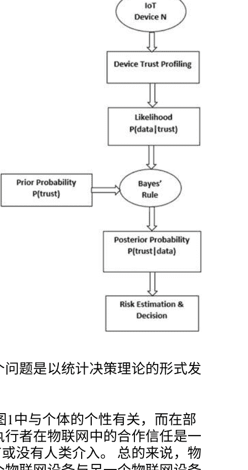

通过应用科学振荡技术找到的期望值。 这个问题是以统计决策理论的形式发展起来的，一般的解决方法是公开的。

首先，信任在基于物联网的框架[6]中的图1中与个体的个性有关，而在部分中，信任考虑的是设备或物品。 因此，执行者在物联网中的合作信任是一种从一个设备到另一个设备的通信形式，有或没有人类介入。 总的来说，物联网包括系统模块、传感器和参与者。 每个物联网设备与另一个物联网设备进行接口和资源共享。 如果物联网需要向另一个设备请求资源，它会在传统安全中创建一个访问控制的验证过程。 在信任策略中，物联网设备通过评估其环境来获取访问控制，例如受保护的网络和可信网络空间的成员。 尽管物联网设备包括许多模块，但我们假设它是一个单元。 每个请求将由物联网系统将其分配给物联网传感器或操作员，以简化物联网问题的复杂性。

##### 2.1 贝叶斯网络（BN）

贝叶斯系统（BN）[7]是一种用于表示大量属性（或因素）之间概率关系的图形结构，并利用这些属性进行概率推导。贝叶斯网络的图形概念非常直观地理解了高维特征之间的关系。例如，贝叶斯网络可以表示病毒和症状之间的潜在关系。根据症状，可以利用该网络计算患各种疾病的概率。贝叶斯网络被用于生物化学和生物物理学（基因调控网络、蛋白质结构和基因表达分析）、药物、文档分类、信息检索、图像处理、数据集成、决策支持网络、工程、游戏和法律等领域的学习。耶胡达·珀尔[8]提出了“贝叶斯网络”这个词来强调三个方面：

1.  输入数据通常具有抽象性。
2.  信任贝叶斯调整作为刷新数据的原因。
3.  认识到合理和清晰的思考。

有许多可用于数据分析的介绍，包括规则规则、决策树和人工神经网络；有许多数据分析技术，例如密度估计、抽样、回归和聚合。那么，贝叶斯网络是什么？

1.  贝叶斯网络可以轻松处理不完整的数据集。
    例如，考虑分类或回归问题，其中两个信息因子或输入因子密切相关。对于标准的监督学习方法来说，这不是一个问题，只要每种情况下的所有输入都被测量。然而，如果其中一个输入源没有被观察到，大多数模型将产生错误的预测，因为它们不编码输入变量之间的条件。贝叶斯网络提供了一种自然的编码这种条件的方法。
2.  贝叶斯系统在发现因果关系方面起到了帮助作用。了解因果关系对于至少两个方面都很重要。在我们试图更好地理解问题领域时，这个过程是有用的，例如在探索性数据分析期间。此外，了解因果关系使我们能够对干预进行预测。例如，市场分析师需要检查是否值得展示特定广告以提高产品销量。为了回答这个问题，分析师需要确定广告是否能够促进销售增长以及程度如何。
3.  贝叶斯网络结合贝叶斯统计方法有助于学习和领域知识的融合。任何进行过可信分析的人都知道先验知识或领域的重要性，特别是当数据稀缺或昂贵时。事实是，一些交换框架（例如专家系统）可以在没有先前知识的情况下运行；这是先前信息强度的唯一声明。贝叶斯系统具有因果关系，使得因果学习的编码特别清晰和直接。此外，贝叶斯系统用概率表示因果关系的强度。因此，学习和过去的信息可以与经过深思熟虑的贝叶斯统计方法相结合。

##### 2.2 贝叶斯网络算法

1.  输入：数据集D；变量集合V = (V₁, V₂, …………., Vₙ)；节点排序P
2.  输出：一个有向无环图G。
3.  从数据集D构建道德图Gᵐ = (V, Eᵐ)。
4.  将道德图 Gᵐ分解为其最大素子图G₁ᵐ, G₂ᵐ, ……, Gₖᵐ。
5.  对于每个子图Gₗᵐ (l = 1, 2, ……, k) of Gᵐ, 使用Gₗᵐ的本地节点排序调用k2算法构建有向无环图Gₗ (l = 1, 2, ……, k)。
6.  将G₁, G₂, …………, Gₖ合并成有向图G = (V, E), 其中V = ∪ V (Gₗ) 和 E = E (G₁) ∪ E (G₂) ∪ .…………………., ∪E (Gₖ)
7.  输出：一个有向无环图G。

贝叶斯网络中节点之间的父子关系表示相应变量之间的因果方向，即子节点表示的变量在因果上依赖于其父节点表示的变量。每个节点对应于它所表示的随机变量的状态，以及在给定其父节点状态的情况下，节点处于给定状态的概率（条件概率）。在贝叶斯事件模型中，事件之间的潜在依赖关系出现了边界，即e₁ → e₂表示事件e₂的概率是有条件的，条件是事件e₁的概率。一般来说，对于事件A和B，如果A依赖于B，假设P(B)≠0

`$P(A|B) = \frac{P(A)P(B|A)}{P(B)}$`

在许多情况下，事件B是恒定的（P(B)=1），我们希望思考一下它对其他可能事件的概率的观察效果。在这种情况下，前面的表达式是固定的，给定B目录的概率是固定的，我们想根据我们对概率A的先前（历史）知识来计算概率A。

#### 3 贝叶斯网络的构建

有两种不同的方法可以创建贝叶斯系统：手动创建或从数据库中进行编程创建（称为“学习”）。 这两种策略都有优点和缺点。

##### 手动开发

贝叶斯手动开发包括对基本领域的先前专业知识。 第一步是构建一个引导波图，然后进行后续步骤来评估每个节点中的条件概率分布。

引导环图：环聚焦图的发展始于识别出重要节点（不规则因素）和它们之间的辅助依赖关系[9]。 不应该观察所有因素；事实上，一些不规则因素可能会揭示未披露的被认为会影响观察结果的数量。 信息、基本因素和参数在图中始终表示为节点。 然而，基本条件概率的分布必须是已知的或者至少是假设的（例如，正态分布）。 虚拟化的假设是每个未知量都是随机因素，因此在图中包括参数、节点以及所有基本因素和可观察数量是很自然的。

##### 自动学习

与手动开发不同，自动学习不需要对基本领域有特定的知识。 贝叶斯系统可以通过基于经验的算法直接从数据库中自动获取，通常集成在适当的程序中。 然而，自动开发的缺点是对数据有更多的要求。 大多数自动化计算算法不需要数据集中的缺失数据，这在实践中往往是一个强假设。 如果数据集中缺少数据，就必须从其他来源导入、计算或估计[10]。 此外，必须有足够的数据来满足计算要求，以可靠地估计条件概率分布。

对于手动开发，可以接受偶然的可能性分布已经知道。 机器学习包括网络结构的创建和约束可能性分布的估计。

##### 精灵环境

精灵编程是一个免费的程序，可以从[http://genie.sis.pit.edu](http://genie.sis.pit.edu)下载。精灵适用于基本的Windows操作系统。 结果应与图2相似。

双击选择的节点以指示节点属性。 一个窗口应该显示如图3所示。 在常规选项卡上，您可以指定名称和节点ID。 在识别选项卡上，您可以指定该节点上的条件概率分布。 使用Thunder图标或网络→更新选项立即更新。

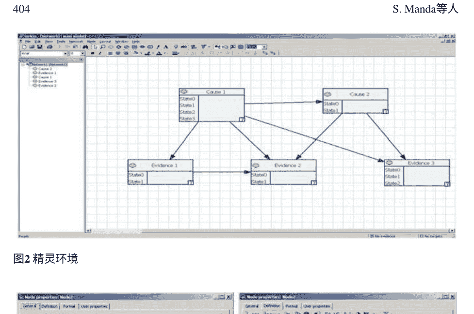

### 图2 精灵环境

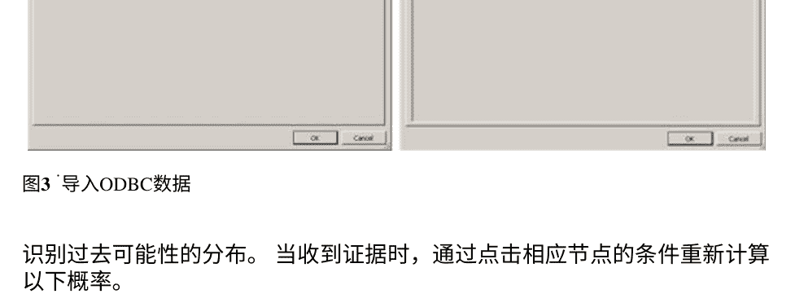

### 图3 导入ODBC数据

识别过去可能性的分布。当收到证据时，通过点击相应节点的条件重新计算以下概率。

对于机器学习，您应该使用文件 →打开数据文件...或者文件 →导入ODBC数据...将基本数据库导入程序中。可以在网络 →计算选项中选择所需的算法。Genie套餐的其他功能包括情感分析，用于描述影响力或计算完全证据的可能性。

#### 4 结果和讨论

GFB代表由于攻击而无丢包传输的数据包，反之亦然。BFB代表由于路由攻击而丢失的数据包。因此，下表比较了由于路由攻击而导致的吞吐量和丢包情况。在表1中，显示了在无攻击环境下使用TRM的BN中的数据包丢失情况。在表2中，显示了在简单注入攻击下使用TRM的BN和安全BN中的数据包丢失情况。类似地，表3显示了在无攻击环境下使用TRM的BN中的吞吐量，表4和表5显示了在使用TRM的BN和安全BN上进行简单注入攻击时的数据包丢失情况，将显示各种算法之间的成本比较。下一页上的图表显示了性能。

### 表1 BN信任模型中非攻击环境下的数据包丢失

| 节点数量 | BN信任模型 | DSDV | DSR | AODV |
|----------|------------|------|-----|------|
| 100      | 4          | 6    | 8   | 10   |
| 200      | 7          | 9    | 11  | 13   |
| 300      | 10         | 12   | 15  | 16   |
| 400      | 18         | 22   | 26  | 27   |
| 500      | 38         | 42   | 50  | 52   |
| 1000     | 78         | 82   | 102 | 107  |

### 表2 BN信任模型中简单注入攻击下的数据包丢失

| 节点数量 | BN信任模型 | DSDV | DSR | AODV |
|----------|------------|------|-----|------|
| 100      | 6          | 7    | 8   | 9    |
| 200      | 9          | 10   | 11  | 12   |
| 300      | 13         | 15   | 17  | 19   |
| 400      | 19         | 23   | 24  | 25   |
| 500      | 39         | 45   | 49  | 53   |

### 表3 BN信任模型中无攻击环境下的吞吐量

| 节点数量 | BN信任模型 | DSDV | DSR | AODV |
|----------|------------|------|-----|------|
| 100      | 35.5       | 34.5 | 32.5 | 29  |
| 200      | 38.3       | 37   | 34   | 32  |
| 300      | 47.2       | 42.7 | 42   | 38.5 |
| 400      | 61.3       | 57   | 53.5 | 48.5 |
| 500      | 79         | 74.5 | 69   | 65  |

### 表4 BN信任模型中简单注入攻击下的吞吐量

| 节点数量 | BN信任模型 | DSDV | DSR | AODV |
|----------|------------|------|-----|------|
| 100      | 35         | 29   | 24  | 19   |
| 200      | 42         | 35   | 27  | 22   |
| 300      | 52         | 43   | 38  | 33   |
| 400      | 65         | 55   | 49  | 44   |
| 500      | 83         | 69   | 65  | 57   |

### 表5 BN信任模型中传输成本的比较

| 流量数量 | BN信任模型 | DSDV | DSR | AODV |
|----------|------------|------|-----|------|
| 10       | 22         | 23   | 24  | 25   |
| 20       | 47         | 64   | 63  | 67   |
| 50       | 112        | 165  | 166 | 167  |
| 100      | 225        | 275  | 276 | 278  |

所提出的路由协议在不同传输范围[11, 12]的节点上的性能范围。 所提出的贝叶斯网络信任模型（BN信任模型）的性能是基于不良转发行（BFB）和良好转发行为（GFB）以及安全信任（ST）进行计算的。GFB和BFB是基于生产力的两个限制。

图4显示了在没有攻击环境的情况下，建议的BN Trust模型的研究结果与DSDV、DSR和AODV等不同算法在丢包情况下的比较。通过研究图表，我们可以发现在提出的BN Trust模型中，当节点数量增加时，丢包率相对于现有算法有所降低。X轴表示节点数量，Y轴表示丢包数量。图5显示了在提出的BN Trust模型中，当节点数量最大化时，丢包数量最小化。通过观察图表，我们可以确定在提出的BN Trust模型中，当节点数量最大化时，丢包数量最小化。

### 图4 节点数量与丢包数量

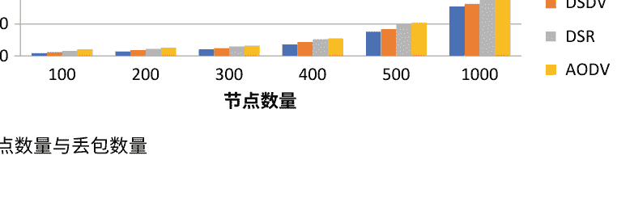## 贝叶斯网络模型（BN信任模型）的实现

与现有算法相比，推荐研究工作的BN信任模型在数据包丢失情况下与DSR、AODV、DSDV等不同算法进行了比较。图6的X轴表示节点数量，Y轴表示吞吐量（kbps）。通过这个分析，我们可以得出一个结论，当节点数量增加时，提出的BN信任模型的吞吐量在没有攻击环境的情况下与DSR、AODV、DSDV等之前的算法进行了比较，结果是正常的。在提出的BN信任模型中，吞吐量比之前的模型有所提高。

图7显示，提出的BN信任模型的吞吐量与当前算法相比有所增加，并且将提出的BN信任模型的吞吐量与其他之前的AODV、DSDV、DSR算法进行了计算和比较，在简单的攻击场景中。X轴表示节点数量，Y轴表示吞吐量。通过对上述图表的分析，我们可以得出结论，当节点数量最大化时，提出的BN信任模型的传输成本与现有算法进行了对比。在图表中，X轴表示流量数量和Y节点代表传输成本。通过图形分析，我们可以看到当流量数量增加时，与现有算法相比，传输成本降低。

#### 5 结论

在本文中，提出的贝叶斯网络信任模型（BN Trust Model）在传统路由方法的物联网环境中被证明是最佳方向。因此，提出的BN Trust模型成为物联网的一个重要研究主题。所提出的BN Trust模型与无攻击和简单注入攻击的情况进行对比。验证的BN信任模型的性能通过两个参数确定：（1）数据包丢失和（2）吞吐量。数据包丢失显示了BFB行为，并代表了从结果和执行的调查中得出的GFB性能，他得出结论，所提出的BN Trust模型在数据包丢失和吞吐量方面提供了更好的结果，并改善了与先前算法相比的BN Trust模型的性能。最后，通过处理和与现有方法进行对比，传输成本降低了。

在未来，我们可以通过添加或修改BN信任模型的参数来修改性能最佳的算法。

#### 参考文献

1.  Ying, B., & Nayak, A. (2019). 公平和社会感知的机会性社交网络消息转发方法，(pp. 720–723).
2.  Manda, S., & Nalini, N. (2018). 物联网路由中的信任机制。 在:2018年第二届智能计算与控制系统国际会议(ICONCCS), 印度马杜赖, pp. 230–234. https://doi.org/10.1109/ICCONS.2018.8662982, IEEE Xplore: 2019年3月11日。
3.  Manda, S., & Nalini, N. (2018). 物联网路由中的拒绝服务或洪水攻击。国际纯粹与应用数学” Scopus (免费期刊), 118(19), 29–42。
4.  Manda, S., & Nalini, N. (2018). 物联网中基于信任的路由协议研究。 《纯粹与应用数学国际期刊》 Scopus (免费期刊) , 118 (16 2018) , 91–104。
5.  Mishra, P. M. (2014). 物联网和贝叶斯网络。可从http://www.analyticbridge.com/profiles/blogs/internet-of-things-andbayesian-networks
6.  Wunder, G. (2016). RECiP: 用于变化的无线信道互易恢复方法, 1–5.
7.  Karakostas, B. (2016). 在物联网环境中使用朴素贝叶斯模型进行事件预测, 12–17.
8.  Heckerman, D. (1995). 关于贝叶斯网络学习的教程. 微软研究报告MSR-TR-95-06.
9.  阿什顿, K. (2009). 那个“物联网”事物. RFID杂志, 4986.
10. 黄, Z., & 许, J. Y. (2014). 在物联网系统中共同定位服务以最小化通信能量成本, 47-57.
11. 陈, D., & 唐, X. (2018). 能源高效安全传输设计用于不受信任的中继物联网, 11862-1870.
12. 胡, J., & 杨, N. (2018). 带有反馈压缩的安全传输设计用于物联网, 1580-1593.
13. Enciso, 'I., & Galan, M. (2013). 在移动自组织网络（MANET）中通过NS2评估吞吐量性能, (pp. 338-343).

### 生物信息学：数据挖掘技术的重要性

Md. Nasfikur R. Khan, Shatabdee Bala, Sarmila Yesmin 和 Mohammad Zoynul Abedin

摘要数据挖掘是一种可以应用于生物信息学研究的有说服力的方法。生物信息学是研究蛋白质、DNA和RNA等生物信息的学科。数据挖掘任务/过程包括特征提取、聚类、相关性分析、异常检测、回归和案例跟踪。数据挖掘可以用于发现重要的关联、链式实例和生物信息学智能数据库信息。除了特殊的发音、共病的定性分析、详细的患者检测识别和蛋白质结构规范以及药物透明度之外，费用和蛋白质构型的集合不仅仅是一种传统的重复表示，已经将数据挖掘列为生物信息学的一种经济实惠的方法。在本文中，我们介绍了数据挖掘技术在生物信息学中的作用。

关键词生物信息学·分类·聚类·数据挖掘·基因·蛋白质

Md. N. R. Khan (✉)
电气与电子工程系，独立大学，达卡，孟加拉国
电子邮件：mnrkhan@iub.edu.bd

Md. N. R. Khan · S. Yesmin
自动化、应用和生物医学技术（AABTech）实验室，达卡，孟加拉国

S. Bala
计算机科学与工程系，Gono Bishwabidyay，达卡，孟加拉国

S. Yesmin
吉大港医学院，吉大港，孟加拉国

M. Z. Abedin
金融与银行学系，Hajee Mohammad Danesh科学与技术大学，Dinajpur，孟加拉国

#### 1 引言

生物信息学是研究、数学、经验、药物、信息技术和计算机软件开发的综合体。生物信息学是处理、修复和分析大量自然信息（如DNA、RNA和蛋白质等）的技术。最近的技术革新使研究人员能够从DNA信息集、蛋白质活动路径、蛋白质结构信息集、表型信息集、基因组信息集等中传输大量数据，如图1所示。生物信息学在基因组学、蛋白质组学、药物发现和改进、蛋白质结构、细胞生物学、核模型、效率表达等领域具有巨大的研究潜力。

人们可以研究和关注质量表达、蛋白质结构、基因数量、标准ID、诊断各种疾病（如感染疾病）等重要案例。数据挖掘可以分析生物信息学数据，对于接受确认、制定计划、预测和内在组织识别至关重要。在当今社会，数据是任何事物的基础，无论它是否经过适当的分析和分离。

图2展示了生物信息学挖掘数据的各种形式。信息挖掘技术可以有效地解释生物信息学数据集中的关联、情境和记录传播。挖掘技术的目标是从大量数据中提取或“挖掘”信息。信息挖掘技术发现了关键事件，从生物信息学数据集中收集到的数据是开放的，有见地的数组。 数据挖掘过程在不同领域中都有有效的关联，包括零售、电子商务、支持、医疗服务、研究等等。生物信息学是生物学领域中的一个热门专业。总体而言，使用丰富的数据模型的领域是数据挖掘的主要竞争者。因此，重新建立数据挖掘策略与生物信息学之间的联系有巨大的机会[7-9]。在生物信息学中，存在许多挑战，如蛋白质序列、一致性等，以及共病之间的相互作用。数据挖掘技术可以适应这些挑战，并在传统数据库中提取数据和案例方面有了新的经验。制造商资源是生物信息学中的统计挖掘系统的一个子集，在本文中进行了讨论。本文的其余部分结构如下。第二部分展示了生物信息学领域的缺点。第三部分讨论了生物信息学中不可避免的数据挖掘任务。第四部分讨论了在感染预测中使用统计挖掘的情况，并在第五部分总结了本文，并展示了未来的研究方向。

#### 2 生物信息学挑战

正常数据库是一个庞大的杂乱数据演化，对数据揭示产生了机遇和挑战。生物信息学用于核苷酸序列、蛋白质序列和大分子序列。以前，生物信息学的一个挑战是创建和维护数据集，以存储DNA、核苷酸、蛋白质发展和群体信息等唯一信息。基因组学和其他亚原子研究进展以及知识发展的最新进展相结合，提供了大量与亚原子研究和计算科学相关的证据。

在生物信息学的水平上评估以下特征：
- DNA、RNA和蛋白质进展相关并进行分析
- DNA进展提供了基因识别的证据
- 微阵列观察和对一致性听觉刺激的理解
- 构建系统发生树以研究进化关系
- 蛋白质结构的估计和表征
- 亚原子对接和分子排列。

1.  如何保护启发性的收集以研究一个观点？
2.  当数据集是异构的，例如图像、内容、单元格等时，如何收集和解释来自各种常见来源的证据？
3.  分类和识别不同数据的最佳方法是什么？
4.  如何改进允许对数据进行分析和集成的设备？
5.  如何使用自然数据和工具来分析和解释特定的系统，以找到和实现未触及的自然视觉？

数据挖掘技术有助于从大型数据库中检索来自自然数据和其他相关生命科学领域的重要数据，以说明医学和神经科学[10-13]。这些教学文件可能对创造性工作有用。许多令人惊叹的功能教育集合是GenBank、蛋白质信息库等。信息挖掘技术被组织起来以理解生物信息学领域的共享需求。

随着普通数据的大幅提升，数据挖掘或KDD（数据库中的知识发现）将在分析记录和解决生物信息学中的问题和困难方面发挥重要作用[14]。

#### 3 生物信息学中的数据挖掘技术

数据挖掘是一种通过从不同数据源挖掘大量数据来选择显著案例、联盟和模式的技术。数据挖掘被定义为数据库中的知识披露（KDD），因为它用于评估数据库中的潜在数据可能性。KDD包括各种成功指标，例如数据选择、数据预处理、数据修改、设计/关系寻找用于类别数据分析以及再次评估和可能是解释图示以便关注被识别为数据的替代选择。图3说明了KDD的方向。

数据挖掘技术允许可靠地将数据存储在一个单一位置，可用于各种格式，如物质、图像等。如果不使用任何数据挖掘技术，将选择敏感数据或特征。数据预处理是一种将原始数据转化为适合的数据挖掘方法形式。数据预处理包括数据检查、数据修改和特征提取。

数据清洗涉及到位置错误和嘈杂的特征。数据修改涉及到标准化、质量保证、离散化等，而数据减少包括计算复杂度的降低、维度的降低和数据高分辨率形式的选择。在预处理之后，数据准备好用于提取框架和数据集中[12]。

如图4所示，有各种数据挖掘努力，如组织、收集、交互、异常检测、追求、跟踪模式和回溯。有几种可用于此任务的计算和方法。这些估计重点关住提供平衡的使用统计数据。由于在效率进化和生成标准统计数据方面有效，数据挖掘技术在生物信息学领域被认为是有价值的[13]。

##### 3.1 分类

聚合可能是众所周知的数据挖掘活动之一，根据触发指令检查将项目分配给相应的项。这取决于系统性地感知目标指令描述当前的位置。

行动过程的基本能力是有效地找出特定的消息指定以突出显示每个选定的特征。例如，配置展示将预测和识别癌症指令内容，如果条件有利或不利，是否存在骨病等。

为了建立一个内容说明的方法，作为一个主要方面，该计划的安排是受到指导的。在规划过程中，通过计算展示了内部数据的特点及其不同的目标路径。这个过程也被称为测试开发过程。

在成功准备演示之后，下一步是协调演示的努力。通过与标准路径标签进行安排，以在分析数据的各个方面中实现整合结构。描述展示的有利证据通常分为两个教育记录：一个用于组织演示（也称为展示概要步骤），另一个用于意图描述。

过滤出这样一个阶段的准确性建立了分类器的标准演示。预测是对地球洞察力的错误数据编制[15]。

决策树、支持向量机、随机森林、K最近邻和朴素贝叶斯是测量展示框架特征的最常见的方法之一。在电子商务中，K最近邻、决策树和支持向量机的计算-方法并不相同，但在生物信息学扩展中，用于客户行为和稳定性。质量解释，蛋白质结构图是一种重要的特征检查方法，通过干预研究方法进行数据挖掘。该过程提供了大量关于属性、蛋白质功能、固有协调等方面的信息，主要用于系统和计算研究[16]。

分类技术在搜索大规模自然数据库中区分令人信服的情况、预期和可能结果。蛋白质结构分析、产量分类、破坏实施框架侧重于基因组证据、功能表达的可验证性、蛋白质相互作用等——这是这种类型的分析的例子。

##### 3.2 聚类

数据挖掘专注于在参考检查不确定的情况下进行无阻碍的识别。它用于对数据聚类进行分类，以便每个聚类具有最牢固的初始数据。聚类类似于排序，但区别在于数据的收集是基于它们的相似性。基于距离的聚类、动态聚类、自我排序映射、模糊聚类、地图聚类、片段聚类和图形聚类都是生物信息学研究中有用的聚类方法。K-Mean（基于分离）和高斯混合模型（GMM）、隐马尔可夫模型（HMM）和期望最大化（EM）是生物信息学研究中使用的一些著名聚类方程的例子。

然而，对于特征收集，常用广义估计方程（GEE）[14]。聚类在微阵列测试中广泛应用于打破分配搜索的限制，因为在实验开始时往往不公开预期的实践标签。例如，假设研究人员需要了解特定组织中的疾病或障碍如何影响不同群体之间的流畅度或认知变化。顶级表达是将科学证据纳入到蛋白质或RNA等重要组分的关联中的过程。为了形成和恢复生物实体细胞，属性是生物体中独特残留的基础。为了处理非均匀实例的功能，将动作一致性表达数据的图示表示相互连接以评估简要的缓解策略。

协作方法的主要目标是减少特征的数量，只保留通过实验动态表达的特征。GeneXPress是一种评估任何聚类过程的有效性的辨别和分析机制，用于高质量输入和类别的重新配置。此外，聚类可以有效地扭曲云的可访问性并揭示策略。最后，收集标准数据对于分析数据并建立各个元素之间的稳定连接至关重要。遗传计算是最受欢迎的聚类应用之一。在质量表达的数据分析中，真实的聚类、有利的编译和神经网络聚类程序非常高效[16]。

##### 3.3 关联

关联是一种数据挖掘项目，研究数据集中变量共同出现的概率。Apriori是一种现代化的计算方法，在确定当前数据集中的测量和建立成员法则方面至关重要。关联规则在研究零售持有人或交易结果时非常重要，并且在特征罐评估（CCE）中常被使用。CCE是对市场交易数据库进行分析，以查看不同时间消费者购买的各种物品之间是否存在差异。此外，在临床生物信息学中，更有可能从一个污染源中预期到相关的共病。Apriori预测通过提取独特的深入洞察系列，为糖尿病患者的共病提供了前瞻性的研究结果。

大多数糖尿病患者的结果表明，他们将来更有可能发生脑卒中和心血管问题。决策的链接主要有助于在临床数据分析、生物临床工作、蛋白质潜在结果、概要数据、关键逆转和失真披露、安排中的客户与收费或支付网关交易官员等方面检测共病。

###### 3.3.1 医疗数据分析

数据挖掘可以帮助专家解决患者问题。 挖掘联盟规则有助于识别由慢性病传递的共同事件与疾病治疗部门的相关问题。 由协会运行的演示支持在这些疾病附近检测此类疾病的可能性。

临床数据是分析形成联盟运行的感染的一种方法。 通过考虑安排疾病及其副作用的步骤，可以预测新兴感染的可能性，使用联盟做出决策。 在这些部分中，可以检测和阻止主要疾病。通过使用特定混合疾病的相同药物，可以复苏用于多种疾病的太多药物。 开放获取、Twitter和Facebook也将用于收集临床审查的信息。

###### 3.3.2 蛋白质序列

蛋白质是每个生物体的重要组成部分。 蛋白质是由肽键加强的多种氨基酸构成的方块。 换句话说，氨基酸以复杂的方式结合折叠在一起，赋予每个蛋白质惊人的三维结构。 错误折叠的形式也可能是由于内部崩溃联盟的轻微错误管理引起的。 这种错误折叠的形式是阿尔茨海默病、帕金森病和镰刀细胞病等神经退行性症状的驱动因素。

由于氨基酸是蛋白质的构建块，追踪一些最重要的氨基酸并检测它们的情况对于研究与蛋白质相关的植物性疾病至关重要。 Apriori算法也广泛用于通过关联函数找到持续的商品集年龄，这对于有效的信息学至关重要[14]。

##### 3.4 异常值检测

特征透明度有助于解释不符合预测行为的预测计划。 关键要素是可能在额外数据方面存在显著差异、卓越或相反的出版物。 在这个切片的半年期间，生物信息统计分裂挖掘领域通过对伟大方向的探究揭示了一个基本思想。 特殊性是明显的主要例子，它无法包含一个一致的、几乎是教育性的列表。 不寻常的案例显著验证是解决统计基础中可识别差异的一种方式。

ODR-ioVFDT与生物信息学推销统计相关，允许寻找和测量环境创新的功能内容的计划，并可能更有效地帮助诊断和解决复杂性。异常值的特殊确认对于检测对尖端医疗解决方案的异常反应很有用[18]。

数据收集可以在属性的性质是直接的情况下使用，如果质量的性质是连续的，可以应用回归模型。

一些关键的分类算法是决策树、朴素贝叶斯、支持向量机、K最近邻等等，前进和后退的展示取决于直线和关键的后退。后退主要用于训练和绘图，以了解在不同元素范围内给定变量的可能性。后退的主要目标是分析元素之间的特定关联。

后退在生物信息学中也经常用于预测特定自然系统下生物相互作用的放弃估计。协调后退模型的重要方面是选择分配给每个特征的后退负载。协调后退根据过程特征表达后退线[19]中的独特性水平，提高了特征选择的准确性。

##### 3.5 追踪模式和预测

数据挖掘技术的关键部分是学习如何在大量数据中发现模式。作为科学理解的数据挖掘试图在海量数据中发现稳定、现代、有利可图和有意义的案例，以分析质量表达微阵列数据中的隐藏模式，用于实用蛋白质组学和基因组学。聚类、分类发现、关联规则等可以应用于识别数据中的模式，发现数据的属性、提取数据和案例，并进行评估和确认。

鉴于它被用于提高这些数据，因此想要的是最大的数据挖掘策略。在生物信息学中，可以从DNA收集和氨基酸策略中预测。通过数据挖掘技术，可以根据主要相似性来预测哪些细胞或药物能够与蛋白质有效结合。

通常对于协调药物非常重要[1-19]。

#### 4 生物信息学和数据挖掘在疾病预测中的应用

数据挖掘为临床应用提供了创新工具，用于有效治疗疾病，并帮助识别病原体和分析药物障碍计划。生物信息学中的数据挖掘任务在多种疾病分类和预测方面非常有价值。联盟分析是数据挖掘中最常用的分析方法之一。数据挖掘在疾病传播和疾病分析研究中非常重要，可以用来确定疾病的起因和追踪疫情。它可以用来分析临床数据，评估健康计划的潜力，并对患有潜在医疗条件的人进行分类。生物信息学应用于整个基因表达谱的研究，以识别基因组水平上的疾病，并提出关于特定恶性肿瘤的新假设，包括肿瘤的形成、维持和发展过程。

蛋白质的发展和合作对于预测蛋白质的分子极限以及构建疾病系统和开发现代疗法来阻止感染非常重要。具有数据挖掘工具和方法的专家正在发展他们在疾病需求和领域中的证据。

理想情况下，数据挖掘任务将具有持续的部分，将生物信息学引入一个更发达的领域，并提供一种在不同领域，包括疾病分析预测中做出准确决策的有效方法。

#### 5 个未来展望

生物信息学正在产生新的基因编辑和合成生物学进展，这些进展正在重塑未来的健康和医药市场，得益于当前的技术进步，如物联网、云计算、人工学习、深度学习和数据挖掘。提供诊断传染病、防御生物恐怖主义和管理疾病爆发的新方案和技术。了解基因组的结构以及它们在病毒复制和细胞进入中的作用对于开发针对现代疾病如 COVID-19 的成功疫苗和药物策略非常重要。

亚原子研究员和临床专家将通过生物信息学进行筛选和支持，以最大限度地发挥计算科学的优势。有一个推动将生物信息学的能力纳入基础设施，以便为严重疾病的研究做出贡献，例如证据和药物报告，以预防未来的痛苦和传播。

#### 6 结论

数据挖掘和数据发现工具的进步是动态生物信息学技术的特点。现代生物技术中可能使用的工具包括分类、相关性、聚类、回归和预测等数据挖掘技术。生物信息学研究非常全面，生物数据库的属性面临许多挑战。数据挖掘方法对于解决生物信息学挑战的效率和精确性非常重要。这就是为什么生物信息学数据挖掘技术的重要性不可避免。数据挖掘技术还可以有效地执行基因分类、蛋白质序列分析和估计、基因组注释和药物发现等任务。

#### 参考文献

- 1. 辛格，P.，和辛格，N. (2021年)。数据挖掘技术在生物信息学中的作用。国际应用生物信息学研究杂志 (IJARB)，11（1），51-60。
- 2. 林，E.，和莱恩，H. Y. (2017年)。机器学习和系统基因组学方法用于多组学数据。生物标志物研究，5，2。
- 3. 弗里德曼，J.，哈斯蒂，T.，和蒂布什拉尼，R. (2010年)。通过坐标下降的广义线性模型的正则化路径。统计软件杂志，33（1），1-22。PMID：20808728；PMCID：PMC2929880。
- 4. 邹，H.，和哈斯蒂，T. (2005年)。通过弹性网正则化和变量选择。皇家统计学会 B系列（统计方法），67（2），301-320。
- 5. 黄立成等人 (2009年)。基于遗传数据预测慢性疲劳综合征的分类方法比较。翻译医学杂志，7（81），22。https://doi.org/10.1186/1479-5876-7-81
- 6. 林恩，陈品胜，李宜华，张宏宏，甘平，杨永康，卢瑞 (2010年)。用人工神经网络建模短期抗抑郁药反应性。开放生物信息学，2，55-60。
- 7. 金武，金克胜，李智恩，罗大英，金世旺，郑英淑，朴明熙，朴瑞文 (2012年)。使用支持向量机开发新型乳腺癌复发预测模型。乳腺癌杂志，15（2），230-238。https://doi.org/10.4048/jbc.2012.15.2.230 Epub 2012 Jun 28。
- 8. 曾，C. J.，卢，C. J.，张，C. C.，等 (2014). 应用机器学习预测宫颈癌复发倾向。神经计算与应用，24，1311–1316。
- 9. 张，S. W.，& 梅里肯，A. F. (2013). 基于临床病理和基因标记的口腔癌预后，使用特征选择和机器学习方法的混合。BMC生物信息学，14，170。
- 10. Ritchie，M.，& Holzinger，E. (2015). Li，R. 整合数据揭示基因型-表型相互作用的方法。自然遗传学评论，16，85–97。
- 11. Kim，D.，Li，R.，Dudek，S. M.，& Ritchie，M. D. (2013). ATHENA：使用语法演化神经网络识别与癌症临床结果相关的不同级别基因组数据之间的相互作用。BioData Mining，6，23。
- 12. Mankoo，P. K.，Shen，R.，Schultz，N.，Levine，D. A.，& Sander，C. (2011). 从综合基因组分析中预测的浆液性卵巢肿瘤的复发时间和生存率。PLoS One，6(11)，e24709。https://doi.org/10.1371/journal.pone.0024709
- 13. Holzinger，E. R.，Dudek，S. M.，Frase，A. T.，Pendergrass，S. A.，& Ritchie，M. D. (2014). ATHENA：可遗传和环境网络关联分析工具。Bioinformatics，30，698–705。
- 14. Bah，S. Y.，Morang’a，C. M.，Kengne-Ouafo，J. A.，Amenga-Etego，L.，& Awandare，G. A.(2018). 在非洲抗击传染病中基因组学和生物信息学应用的亮点：挑战与机遇。Frontiers in Genetics，27(9)，575。
- 15. Stilou，S.，Bamidis，P. D.，Maglaveras，N.，& Pappas，C. (2001). 从临床数据库中挖掘关联规则：医疗保健中的智能诊断过程。健康技术与信息学研究，84（第2部分），1399-1403。PMID：11604957。
- 16. Liu，C.，Zhou，Q.，Li，Y.，Garner，L. V.，Watkins，S. P.，Carter，L. J.，Smoot，J.，Gregg，A. C.，Daniels，A. D.，Jervey，S.，& Albaiu，D. (2020). COVID-19和相关人类冠状病毒疾病的治疗药物和疫苗的研究与开发。ACS Central Science，6(3)，315–331。
- 17. Wahl, S., Vogt, S., Stückler, F., Krumsiek, J., Bartel, J., Kacprowski, T., et al. (2015). 多组学体重变化特征：来自人群基础队列研究的结果。BMC Medicine, 13, 48.
- 18. Rahman Khan, M. N., Yesmin, S., Aktar, M., Quader Chowdhury, K. B., Labeeb, K., & Abedin, M. Z. (2021). 多组学数据结合机器学习和系统基因组学的技术。在：2021年第六届通信与电子系统国际会议(ICCES)，第1524-1528页。 https://doi.org/10.1109/ICCES51350.2021.9489222
- 19. David, S. K., Saeb, A. T., Rafiullah, M., & Rubeaan, K. (2019). 在医学生物信息学中使用的分类技术和数据挖掘工具。在：Strydom, S. K., & Strydom, M. (Eds.) 大数据治理与知识管理的视角 (pp. 105–126). IGI Global. https://doi.org/10.4018/978-1-5225-7077-6.ch005

### 不同深度学习技术在生物医学文献中的关系提取的比较分析

M. Saranya, T. V. Geetha 和 R. Arockia Xavier Annie

**摘要**
开发一个自动化系统来从非结构化文本中提取隐藏的关系是非常具有挑战性和需求的任务。在制造无害药物、为现有药物寻找新候选药物（药物再利用）和改进医疗保健系统方面，关系提取在生物医学领域起着重要的作用。通常，关系提取被设计为信息提取的子任务，即分类问题。由于各种生物医学关系类型缺乏常见的注释语料库以及存在不平衡的类别问题，分类方法不适用，并且会降低分类器的性能。因此，我们引入了深度学习模型，并使用现有的不同类型生物医学关系的语料库来解决上述问题。在设计深度学习模型之前，使用k-means SMOTE方法来平衡数据集，这是最近的过采样方法。

从这些句子中提取出六个不同的特征，并将这些特征的嵌入输入到深度学习模型中。从这些特征中，基于依赖的词序列（上下文）和基于依赖的关系序列（上下文）对系统的准确性贡献更大。利用这种技术，我们提取出了三种类型的关联，分别是药物-药物、药物-疾病和药物-副作用。我们得到的结果表明，用平衡的数据集训练模型比不平衡的数据集产生更好的结果。

- 关键词：关系抽取 · 类别不平衡 · 深度学习模型 · 嵌入 · 最短依赖路径 · 基于依赖的词序列 · 基于依赖的关系序列

M. Saranya (✉) · R. A. X. Annie
计算机科学与工程，CEG，安娜大学，金奈，泰米尔纳德邦，印度

T. V. Geetha
UGC-BSR教职员工，计算机科学与工程，CEG，安娜大学，金奈，泰米尔纳德邦，印度

© 作者（们），在Springer Nature Singapore Pte Ltd. 2022独家许可下。S. Shaky a等人（编），情感分析与深度学习，智能系统与计算进展1408，https://doi.org/10.1007/978-981-16-5157-1_33
423

#### 1 引言

在我们的数字世界中，一个巨大的挑战是处理大量异构且常常摇摆不定的结构化数据和无组织的文本数据[1]。随着互联网上与生物医学相关的文章或出版物的指数增长，发现其中的知识变得越来越困难。生物医学领域的数据的复杂性和规模是从非结构化文本中挖掘异构数据的动力。将非结构化文本转换为结构化的手动工作是一项繁琐的过程[1]。因此，需要一种自动化的方法或技术来提取其中的信息。从文本中确定生物医学关系提取在现代时代引起了极大的关注；由于这种意识，它允许不同类型的生物医学实体之间出现的不同类型的相互作用。不良药物事件是医疗系统中的一个严重问题。在美国，患者尤其是年长患者一次服用五种以上的药物。这种情况下药物之间发生相互作用的可能性很高。美国60岁以上的成年人一次被开具的药物超过5种，约占36.1% [2]。

药物相互作用（DDI）是一种生物医学关系，两种药物之间的相互作用会导致患者产生积极和消极的副作用[3]。DDI是ADE的子集，也是导致不良药物反应（ADE）的重要因素。在大多数国家，每年因不良药物反应导致的死亡人数更多，并且这增加了临床护理系统的投资[4]。因此，为了改善临床护理系统，需要从科学文献中确定药物相互作用和药物副作用之间的关系。当从文章中确定不良药物反应时，区分药物-疾病治疗关系也非常重要。因此，本文处理了三种生物医学关系的提取，包括药物相互作用、药物-疾病和不良药物反应。

对于DDI，已经开发了DrugBank [5]和Stockley's drug interactions [6]来确定结构化数据中的关系。但是，这些数据的访问有限，不能像关系数据库那样直接访问。由于科学文章的快速增长，许多关系仍然隐藏在非结构化的生物医学文本中。因此，需要自动化方法从非结构化文本中提取关系。NLP中的关系提取任务非常典型。有许多基于规则和基于机器学习的算法可用于提取关系。目前，深度学习方法在解决自然语言处理问题方面取得了最先进的结果[7]。深度学习模型比传统模型更强大，因为模型可以自己学习所需的特征。在这项工作中，我们将不同类型的深度学习技术与跨语料库训练进行比较，同时加入更多特征，如词语上下文、实体位置、概念类型、词性标注、块标记和最短依赖路径。在将输入传递给深度学习模型之前，必须使用不同的嵌入方法表示特征，以适应不同类型的特征。

在这里，我们使用了SMOTE和k-means SMOTE [8]来使实例平衡。因为在大多数关系分类问题中，数据集中每个类别的实例数量不相同，这也降低了分类器的性能。因此，在训练模型之前，我们使用了之前提到的随机过采样算法来解决类别不平衡问题。

#### 2 相关工作

互联网上充斥着大量的结构化和非结构化的生物医学数据[9]。尽管有结构化数据可用，但它们没有得到适当的更新，并且与当前信息的可用性相去甚远。越来越多的关系隐藏在生物医学文本中，需要从中识别或提取出来。自然语言处理（NLP）的主要任务之一就是从纯文本中提取信息；这些提取出的信息可以被机器或程序清楚地理解[9]。在以前的几年里，借助于称为基于特征和基于核的监督算法，已经提取出了关系。对于这些方法，需要为训练模型创建特征向量[10]。为了开发特征向量，向量本身需要更多的附加步骤，包括命名实体识别（NER）、关系类型、关系提取、事件提取等[10]。通常，监督学习算法对其分类需要更多的训练数据集。传统方法需要更多的人力来生成特征向量，而且这是一个非常耗时且昂贵的过程[7]。有时，这些手动注释的数据集不足以提取相关信息[11]。这就是自动特征工程方法——深度学习在关系提取中发挥作用的情况。深度神经网络（DNN）可以自动学习必要的特征，并在关系提取中产生良好的效果[12]。

卷积神经网络（CNN）是一种强大的深度学习方法，最初在图像处理领域表现良好，并在当前几年中扩展到NLP问题[12]。生物医学文本和临床记录中存在许多关系和概念。He等人[12]使用深度学习模型提取丰富和绝对的特征来分类这些关系，取得了良好的结果。为了解决传统特征表示中的问题（稀疏、高维和变长向量），采用了一种著名的概念，称为词嵌入。这种方法可以在NLP任务中跟随许多基于深度学习的方法。因为这种词嵌入方法[13]以密集、固定长度的方式表示特征。在NER [14]中，关系抽取问题非常成功地使用了词嵌入。之后，Ghannay等人[15]对不同的嵌入进行了许多实验，以选择在NLP中产生更好结果的嵌入。相比之下，基于依赖的嵌入方法效果更好。

类别不平衡问题是生物医学关系提取的主要缺点，其中数据样本在不同类别之间分布不均匀。这是一个问题，其中一个类别中的样本数量比另一个类别中的样本数量多（多数类）。另一个类别中的样本数量比另一个类别中的样本数量少（少数类）。由于样本或数据集的不均匀类别分布，大多数最先进的方法在分类中无法正确预测样本[8]。而且，在训练过程中开发的模型可能过度拟合或错误的模型，无法取得更好的结果[8]。因此，上述类别不平衡问题可以通过应用常用的过采样和欠采样技术来纠正。 SMOTE和k-means SMOTE是一种过采样方法，它会为少数类生成新的实例，而不仅仅是复制现有的实例。 模型的输入是使用六个特征获得的特征嵌入向量，即单词上下文、实体位置、概念类型、词性标注、解析树和最短依赖路径。

#### 3 生物医学关系抽取

一般来说，生物医学关系抽取任务分为两类：(i) 二元关系抽取和 (ii) 多类二元抽取。二元关系抽取检查实体对是否具有语义关系，即给定的对是否具有真实关系或假关系。而多类关系抽取不仅检测语义关系，还检测关系的类型。例如，DDI关系抽取有四种类型，分别是advice、effect、int和mechanism。因此，关系抽取任务被认为是生物医学关系抽取的主要目标[16]（图1）。

##### 3.1 预处理

注释语料库以不同的格式如.CSV和.XML可用。在将这些数据集作为输入训练模型之前，需要将其转换为适当的格式并删除不必要的信息。在预处理阶段，进行句子拆分和实体提取。然后，使用GENIA标注器[17]将拆分的句子转换为标记。一般来说，在生物医学文档（数据集）中，以整数和浮点数的形式呈现更多的数值。假设文档中的所有数值都被视为原样，词汇量将增加。为了避免这种情况，数值被转换为统一的格式。

##### 3.2 表示学习

为了执行任何机器学习任务，表示学习或特征学习被发现是最合适的表示方式，并且它也在算法的性能中起着重要的作用。[13]。更重要的是，要以对任何模型或算法有意义的方式来表示文本等非结构化数据。在这里，输入句子中每个单词的表示将是不同特征嵌入的串联，这些串联的特征向量嵌入将作为深度学习模型的输入传递。(1) 单词上下文，(2) 词性标记，(3) 块标记，(4) 位置 (p1,p2)，(5) 单词类型，以及 (6) 最短依赖路径 (SDP) 被认为是关系提取或分类的有益特征。通过使用最常见的模型——Skip gram 模型 [13]，可以获得每个单词的嵌入向量。

每个特征都在下面简要描述：

- 1. 单词上下文 (f1): 准确地出现在句子中的单词。
- 2. 词性 (f2): 使用GENIA标注器，确定被检查单词的词性标签。
- 3. 块 (f3): 在这里，也使用GENIA标注器来识别句子中每个单词的块标签。
- 4. 位置(P1, P2) (f4): 分别确定当前单词与实体1和实体2之间的距离。
- 5. 单词类型(T) (f5): 确定单词的类型。例如，对于实体，它将是BI标签，对于其他单词，遵循BIO标记约定。
- 6. 最短依赖路径 (f6):

句子：固定药物性皮疹与许多药物有关，但这是第一次有关奥美拉唑的报告。

关系抽取的主要要求是对复杂句子进行确定的识别和分类关系。数据集不包含统一的内容和从句。 有时，句子可能超过150个单词。 仅仅依靠句子的词汇和句法特征是不足以准确检测关系的。 因此，建议在自然语言处理任务中使用最短依赖路径的出现，这些研究为关系抽取提供了非常有用的句法特征。 为了增加最短依赖路径的使用，我们将其分为依赖词序列和依赖关系序列[18]（图2）。

##### 3.3 嵌入层

上述五个特征，即词-上下文、词性、块、位置、词类型，被连接成每个句子中的单一特征嵌入，并表示为 $w^i$。相同的方程如下所示。

$w_i = f^i_1 + f^i_2 + f^i_3 + f^i_4 + f^i_5$   (1)

$f_{ij}$是句子中第$i$个单词的第$j$个特征嵌入。向量 $w_i$的大小是所有特征向量大小的总和。 而且，它可以写成 $w_i \in R^{(n_1+n_2+\cdots+n_5)}$，其中 $n_j$是第$j$个特征的向量大小。关系提取图3展示了用于生物医学关系提取的深度学习模型

使用不同的深度学习方法的系统在图3中有所说明。句子的嵌入表示为方程1。同样，对于依赖词序列，嵌入也表示为 $d_i = f_1^i + f_2^i + f_3^i + f_4^i + f_5^i$。对于依赖关系序列 $\{ r_1, r_2, ... r_m\}$ 中的关系 $r_k$，依赖关系序列的嵌入是基于关系 $r_k$ 和word2vec模型获得的。

##### 3.4 SMOTE

在训练模型之前，必须正确处理特征向量的不均匀分布。SMOTE是一种过采样技术，用于从少数类中创建新的合成实例。

```
对于每个少数类样本执行
    选择任意一个少数类样本（ m）
    使用KNN算法找到最近邻（ r）在训练样本中找到与考虑样本和最近邻样本之间的差异（d=m-r）
    在0和1之间选择随机数（i）
    计算 m * d + i得到合成的少数类样本
结束循环
```

上述算法将利用较少量的少数类样本生成新的合成样本，以解决不平衡数据集问题。不平衡的数据集将作为输入提供给该算法。选择任意一个属于 S_min（少数类样本）的 i。通过使用KNN，在少数类样本中找到新的邻居。最终，生成新的样本以消除不平衡的数据集问题。

##### 3.5 k-means SMOTE

尽管SMOTE算法通过随机过采样方法消除了过拟合问题，但它在噪声和不平衡数据方面也存在一些问题[19]。因为这个算法无法执行决策边界。因此，实际上远离轮廓的样本会被过采样到与轮廓相近的位置，且概率相等。尽管SMOTE有一些弱点，但由于其简单性，它被广泛使用。为了改进和减少噪声和不平衡数据，已经尝试了许多与SMOTE相关的技术，例如CURE-SMOTE使用分层聚类和自组织映射过采样（SOMO）[19]。最后，基于聚类的SMOTE称为k-means SMOTE已经被用来减少噪声以及类内和类间不平衡[19]。在应用SMOTE之前，这将对少数类进行聚类。聚类方法将相同概率的样本分组到一个聚类中，从而解决了决策边界问题。k-means SMOTE中的步骤如下所示，

步骤1：聚类：使用k-means对整个输入空间进行聚类。

步骤2：过滤：将要生成的样本数量分布到各个簇中：过滤掉具有高数量的多数类样本的簇。

步骤3：过采样：使用SMOTE，对每个经过过滤的簇[步骤2]进行过采样。

##### 3.6 深度学习模型

###### 3.6.1 卷积神经网络

根据不同长度的过滤器或窗口大小，CNN从中提取出显著特征。将相同长度的句子嵌入作为CNN模型的输入进行训练。通过对卷积层、最大池化层和全连接层等不同层进行一些操作，该模型以向量形式输出每个关系的概率值，向量大小等于关系类型的数量（在本工作中，包括负类型的关系数量为七）。图4展示了从文本中提取关系的任务。

#### 卷积层:

为了从整个句子中获取局部特征，我们应用卷积来提取特征，这是卷积神经网络的核心组件。卷积表示不同大小的滤波器[20]。Wi是句子中第i个单词的连接特征嵌入。

长度为$n$的句子的特征向量是$f_1, f_2, ..., f_n$。在图4中，滤波器使用的长度($d$)为3，激活函数使用的是修正线性单元（ReLU）。每个卷积（隐藏层）的输出$hi$计算如下Eq. 2

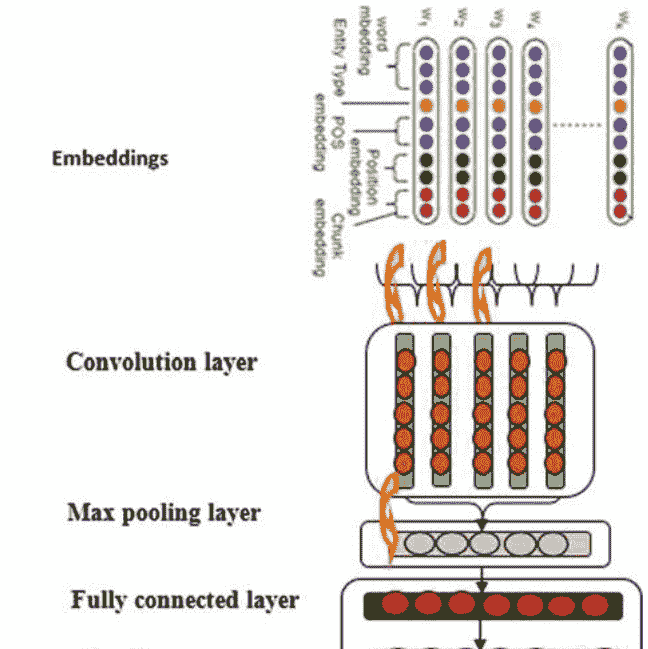

$hi = f(w \cdot Wi_{:i+d-1} + b)$ (2)

其中$i=1,2,3...n-d+1$。

在这里，$w$—权重向量，$b$—偏置项 $\rightarrow$ 学习参数，和$f$—ReLU函数。·—点积，$n$—编号。句子中的单词数量，和$d$—过滤器大小。

#### 最大池化层:

卷积层的输出仅提供不同长度的局部特征。最大池化的用途是从句子中提取必要的全局特征，即用于关系提取的全局特征。应用不同长度的滤波器用于提取句子的全局特征[12]。最大池化的输出如下所示

$Z = [c_1^{\text{max}}, c_2^{\text{max}}, ... c_t^{\text{max}}]$ (3)

其中 $c_k^{\text{max}} = \max(c_j^1, c_j^2, ... c_j^{n-d+1})$。

#### 全连接层:

通过在最大池化层的输出上使用dropout函数和正则化技术，可以避免模型的过拟合。然后，将其传递到全连接层。为了减少第i个句子的损失，使用了softmax分类器，其表示为方程4。softmax分类器也用于检测关系的类型。

$L_i = \log \frac{e^{z_i^{y_i}}}{\sum_{\forall j} e^{z_j^{y_i}}}$ (4)

$y_i$—正确的关系 $i$-th实例或句子。

###### 3.6.2 长短期记忆 (LSTM)

CNN模型的缺点是不适用于最长句子之间的关系提取，即文本块，因为它存在长期依赖问题。有时，数据集中可能包含最长的句子，并且在句子中记住单词之间的依赖关系是低效的。解决上述问题的方法是LSTM，它是一种特殊类型的循环神经网络。LSTM将通过更长时间的记忆来纠正长期依赖关系。所谓的细胞状态是LSTM的主要关键。LSTM具有向细胞状态添加或删除信息的能力，并且由门精确地调节。

图5说明了LSTM的基本步骤。

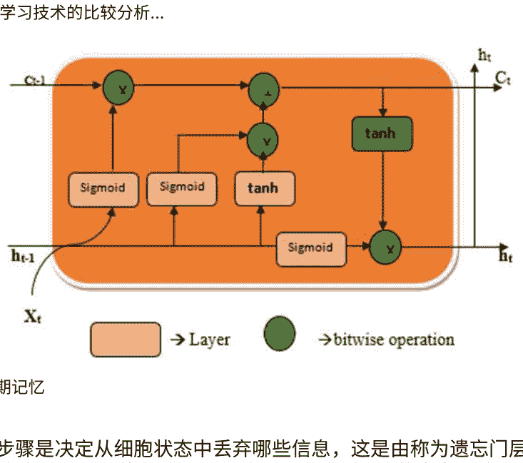

图5 长短期记忆

初始步骤是决定从细胞状态中丢弃哪些信息，这是由称为遗忘门层的sigmoid层完成的。例如，当新的主题到达时，应该从细胞状态中删除前一个主题的代词。该层的输出为“0”表示完全删除信息或“1”表示完全保留此信息。

$$ f_t = \text{sigmoid} \left( W_f \cdot [h_{t-1}, x_t] + b_f \right) $$

其中 $W_f$, $b_f$—遗忘门层的学习参数（权重矩阵，偏置项）。

下一步是决定要存储在细胞状态中的信息，这是通过sigmoid层和tanh层完成的。sigmoid层确定要更新的值（$i_t$），tanh层生成新的候选值（$C_t'$）。

$$ i_t = \text{sigmoid} \left( W_i \cdot [h_{t-1}, x_t] + b_i \right) $$

$$ C_t' = \tanh \left( W_c \cdot [h_{t-1}, x_t] + b_c \right) $$

下一步是通过将先前细胞状态$C_{t-1}$乘以$f_t$来将先前细胞状态的值（$C_{t-1}$）更新为新的细胞状态（$C_t$），以擦除旧值。然后，决定要更新值的范围，由以下公式给出

$$ (i_t * C_t') $$

$$ C_t = C_{t-1} * f_t + i_t * C_t' $$

更新细胞状态值后，最终决定发送哪些值作为输出。输出值是细胞状态值的滤波版本。首先，进行sigmoid层来决定细胞状态值的哪部分被发送为输出。

细胞状态值传递给tanh，这可以与sigmoid层的输出相乘，选择可以输出的值。

$$ 输出 _t = \text{sigmoid} \left( W_{\text{output}} \cdot [h_{t-1}, x_t] + b_{\text{output}} \right) \qquad (9) $$

$$ \text{hidden}_t = \tanh (C_t) * \text{output}_t \qquad (10) $$

通过上述方程式5到10，用于识别长时间存储的信息或要擦除的信息。在以前的RNN模型中，没有解决梯度消失的问题，这是一个巨大的问题，可能导致层次学习不多。

###### 3.6.3 双向长短期记忆（Bi-LSTM）

使用双向LSTM，你将原始数据一次从头到尾，一次从尾到头输入给学习算法。虽然这有争议，但通常它比单向方法学习更快，尽管这取决于任务。为了最大化算法的学习率，使用Bi-LSTM模型将输入从开头到结尾和从结尾到开头输入。这比单向方法更快地学习特征（图6）。

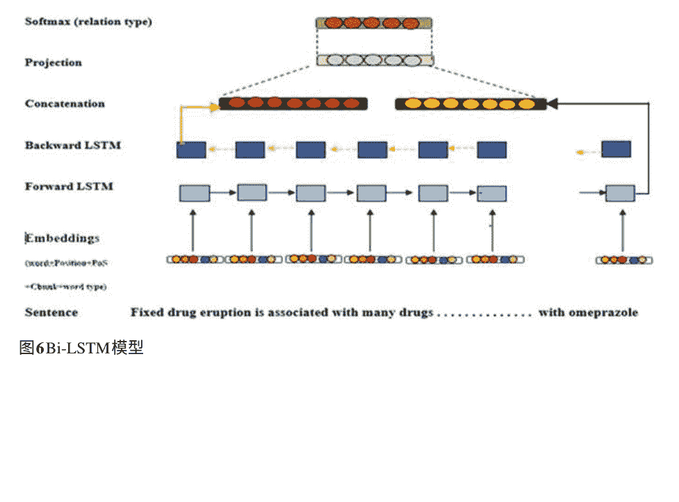

#### 4 结果和分析

在从生物医学文本中提取关系时，精确率、召回率和 F度量是最常用的评估指标。F度量是通过结合精确率和召回率来衡量整体性能的正确指标。上述指标的公式如下：

精确率 = 真正例 / (真正例 + 假正例)
召回率 = 真正例 / (真正例 + 假负例)
F-度量 = (2 * 精确率 * 召回率) / (精确率 + 召回率)

##### 4.1 数据集

在这里，使用DDI抽取挑战2013数据集[17]、ADE语料库[21]和EU-ADR语料库[20]评估了不同的深度学习技术，用于提取药物-药物、药物-副作用和药物-疾病之间的关系。DDI语料库包含233个MEDLINE摘要和792个DrugBank文档。而且，它还有四种类型的关系，分别是(i)机制、(ii)建议、(iii)int和(iv)效果。ADE语料库包含2972个MEDLINE句子，这些句子是不同患者的病例报告。这些句子被标注了药物、剂量和副作用。总共可以生成20967个句子，其中4272个句子是正例，16695个句子是负例。同样，EU-ADR语料库也标注了药物、基因和疾病实体。从中只考虑了标注了药物-疾病的句子。表1包含了数据集的详细描述。

表1 数据集详细描述

| 关系类型 | 正例 | 负例 |
|---|---|---|
| DDI机制 | 1625 | 28,554 |
| DDI建议 | 2069 | |
| DDI int | 1050 | |
| DDI效果 | 284 | |
| 不良药物反应 | 4272 | 16,695 |
| 药物疾病 | 162 | 68 |
| 总计 | 9462 | 45,317 |

##### 4.2 深度学习模型比较

Bi-LSTM模型对所有数据集产生了比其他深度学习技术更好的结果。

##### 4.3 SMOTE和k-means SMOTE

药物-药物、药物-副作用和药物-疾病的正负样本比例分别为1:5.7、1:3.9和1:2.4。总体上，正负样本的比例约为1:4.8。药物-疾病关系和药物-副作用关系之间的比例为1:26.3。通过使用不同的过采样技术（称为SMOTE和k-means SMOTE），数据集中的不平衡得到了消除。尽管有不同种类的SMOTE，但k-means SMOTE相比之下效果更好。表2展示了不同深度学习模型在不同数据集上使用采样技术和不使用采样技术时的性能。表3显示，当使用k-means SMOTE算法平衡数据集时，每个模型的性能都更好。尽管EU-ADR语料库非常不平衡，但与其他语料库相比，它的F-measure达到了8.1%的更好结果。

表2 不同深度学习技术的性能

| 学习模型 | 语料库 | 精确度 | 召回率 | F-度量 |
|---|---|---|---|---|
| 卷积神经网络 | ADE | 0.774 | 0.761 | 0.767 |
| | DDI DrugBank | 0.764 | 0.752 | 0.758 |
| | DDI Medline | 0.771 | 0.762 | 0.766 |
| | EU-ADR | 0.759 | 0.714 | 0.736 |
| LSTM | ADE | 0.817 | 0.754 | 0.784 |
| | DDI DrugBank | 0.807 | 0.761 | 0.783 |
| | DDI Medline | 0.792 | 0.788 | 0.790 |
| | EU-ADR | 0.781 | 0.731 | 0.755 |
| 双向LSTM | ADE | 0.828 | 0.772 | 0.799 |
| | DDI DrugBank | 0.825 | 0.784 | 0.804 |
| | DDI Medline | 0.821 | 0.762 | 0.790 |
| | EU-ADR | 0.804 | 0.763 | 0.783 |

表3 SMOTE和k-means SMOTE的性能

| 学习模型 | 语料库 | F-度量 (不平衡) | F-度量 (使用 SMOTE) | F-度量 (使用 k-means SMOTE) |
| :--- | :--- | :--- | :--- | :--- |
| 卷积神经网络 | ADE | 0.588 | 0.705 | 0.767 |
| | DDI DrugBank | 0.608 | 0.676 | 0.758 |
| | DDI Medline | 0.601 | 0.674 | 0.766 |
| | EU-ADR | 0.579 | 0.622 | 0.736 |
| LSTM | ADE | 0.622 | 0.716 | 0.784 |
| | DDI DrugBank | 0.629 | 0.763 | 0.783 |
| | DDI Medline | 0.616 | 0.682 | 0.790 |
| | EU-ADR | 0.597 | 0.665 | 0.755 |
| 双向LSTM | ADE | 0.652 | 0.736 | 0.781 |
| | DDI DrugBank | 0.621 | 0.712 | 0.784 |
| | DDI Medline | 0.624 | 0.718 | 0.790 |
| | EU-ADR | 0.616 | 0.702 | 0.783 |

#### 5 结论和未来工作

在挖掘文献或生物医学文本中埋藏的有价值信息的初始步骤是生物医学关系提取，这是非常关键和必要的。每个深度学习模型都有其提取关系的优势。在这项研究中，我们比较了不同的深度学习技术和不同类型的特征。SDP在从文献中提取关系方面具有更高的优先级，同时还使用了k-means SMOTE和跨语料库训练。通过这个比较，我们发现Bi-LSTM模型相对于其他两种方法具有良好的性能优势。我们未来的想法是开发用于句间关系提取的模型，这是当前工作的主要限制，也是一个非常具有挑战性的任务。

#### 参考文献

1.  Nagaraj, K., Sharvani, G. S., & Sridhar, A. (2018). 生物信息学中大数据分析的新趋势: 文献综述。国际生物信息学研究与应用杂志, 14(1–2), 144–205.
2.  Qato, D. M., Wilder, J., Schumm, L. P., Gillet, V., & Alexander, G. C. (2016). 美国老年人中处方药、非处方药和膳食补充剂使用的变化, 2005年与2011年对比。JAMA内科学杂志, 176(4), 473–482.
3.  Sutherland, J. J., Daly, T. M., Liu, X., Goldstein, K., Johnston, J. A., & Ryan, T. P. (2015). 大规模受试者联合处方趋势预测了大量药物相互作用。PLoS ONE, 10 (3) , e0118991.
4.  Giardina, C., 等 (2018)。 住院患者的不良药物反应：FORWARD (医院病房报告促进) 研究结果。药理学前沿, 9, 350。
5.  Wishart, D., Djoumbou, Y., Guo, A. C., Lo, E., Marcu, A., Grant, J., Sajed, T., Johnson, D., Li, C., Sayeeda, Z., Assempour, N., Iynkkaran, I., Liu, Y., Maciejewski, A., Gale, N., Wilson, A., Chin, L., Cummings, R., Le, D., & Wilson, M. (2017). DrugBank 5.0: 2018年DrugBank数据库的重大更新。核酸研究, 46。
6.  https://www.wlv.ac.uk/lib/resources/databases-a-z/databases/stockleys-drug-interactions.php
7.  Sharma, R. D., Tripathi, S., Sahu, S. K., Mittal, S., & Anand, A. (2016). 使用卷积神经网络从用户评论中预测在线医生评分。机器学习与计算国际期刊, 6(2), 149。
8.  Chawla, N. V., Bowyer, K. W., Hall, L. O., & Kegelmeyer, W. P. (2002). SMOTE: 合成少数类过采样技术。人工智能研究杂志, 16, 321–357。
9.  Kumar, S. (2017).关系抽取的深度学习方法调查。 arXiv:1705.03645v1 [cs.CL].
10. Mintz, M., Bills, S., Snow, R., & Jurafsky, D. (2009). 无标签数据的远程监督关系提取 在ACL的第47届年会和AFNLP的第4届国际联合会议的自然语言处理中ACL(Vol. 2, pp. 1003–1011)的论文集中.
11. Liu, S., Tang, B., Chen, Q., & Wang, X. (2016). 通过卷积神经网络进行药物相互作用提取。计算和数学方法在医学中.
12. He, B., Guan, Y., & Dai, R. (2019). 通过卷积神经网络对临床文本中的医疗关系进行分类。医学中的人工智能, 93, 43–49.
13. Mikolov, T., Sutskever, I., Chen, K., Corrado, G. S., & Dean, J. (2013). 单词和短语的分布式表示及其组合性。 在神经信息处理系统的进展中(pp. 3111–3119).
14. Habibi, M., Weber, L., Neves, M., Wiegandt, D. L., & Leser, U. (2017). 使用词嵌入的深度学习改进了生物医学命名实体识别。生物信息学, 33(14), i37–i48。
15. Ghannay, S., Favre, B., Esteve, Y., & Camelin, N. (2016). 词嵌入评估和组合。在: LREC(pp. 300–305).
16. Segura-Bedmar, I., Martínez, P., & Zazo, M. H. (2013). Semeval-2013任务9: 从生物医学文本中提取药物间相互作用 (ddiextraction 2013) 。在第二届联合会议词汇和计算语义 (* SEM) （第2卷）：第七届国际语义评估研讨会 (SemEval 2013) 的论文集（第2卷，第341–350页）。
17. Gurulingappa, H., Rajput, A. M., Roberts, A., Fluck, J., Hofmann-Apitius, M., & Toldo, L.(2012). 开发一个基准语料库，以支持从医学病例报告中自动提取与药物相关的不良反应。生物医学信息学杂志, 45(5), 885–892.
18. Zhang, Y., Lin, H., Yang, Z., Wang, J., Zhang, S., Sun, Y., & Yang, L. (2018). 基于神经网络的混合模型用于生物医学关系提取。生物医学信息学杂志, 81, 83–92.
19. Last, F., Douzas, G., & Bacao, F. (2017). 基于K-means和SMOTE的不平衡学习过采样。 arXiv:1711.00837v2 [cs.LG]
20. Collobert, R., & Weston, J. (2008). 自然语言处理的统一架构：深度神经网络与多任务学习。 在第25届国际机器学习大会上，ACM(pp. 160–167).
21. Van Mulligen, E. M., et al. (2012). EU-ADR语料库: 注释的药物、疾病、靶点及其关系。生物医学信息学杂志, 45(5), 879–884。

### 使用被动侵略分类器对自杀相关文本数据进行分类

B. V. Kiranmayee, Chalumuru Suresh 和 S. SreeRakshak

**摘要** 随着技术的日益发展，大多数人都依赖于互联网使用，他们使用社交媒体平台通过各自的个人资料传达自己的状态。由于社交媒体在全球范围内产生了巨大的影响，大多数人使用这些应用程序以多种方式分享他们的观点，如文本、图像或视频等，从而产生了大量的数据。从与他们的帖子相关的数据中可以观察到，大多数人无法摆脱心理压力。根据世界卫生组织（WHO）的报告显示，自杀是全球第二大流行病，我们的目标是分析在Twitter上发布的自杀笔记中的文本（社交媒体平台之一）。对数据进行文本分类，并且我们有许多机器学习算法、神经网络、回归技术等。由于产生了大量的数据流以获得更好的结果，我们使用被动侵略分类器（PAC）算法。除了PAC，我们还使用SVM、朴素贝叶斯、随机森林和决策树，并进行比较研究。由于我们考虑了标记的文本数据集，我们将上述模型应用于数据集并将结果分类为“自杀”或“非自杀”。

**关键词** 文本分类 · 支持向量机 · 随机森林 · 朴素贝叶斯 · 决策树 · Sklearn · 被动侵略分类器 · 自杀相关

#### 1 引言

根据世界卫生组织（WHO）的统计数据，每年有近800,000人自杀，还有更多人尝试自杀。自杀不仅会影响个人，还会影响他们的家庭和附近的社会。每年都有很多自杀案件被登记，根据调查，这个数字逐年增加。在尝试自杀的人中，大多数是15-29岁的人群。

自杀案件不仅发生在高收入国家，根据2016年的一项研究，超过79%的自杀案件发生在中低收入国家。

一项研究表明，大多数自杀案件发生在农村农业地区的中低收入国家，原因是自行服药中毒、上吊和枪支。我们可以通过更多的意识项目和让个人思考自杀发生后的情况来阻止这一全球流行病。自杀被世界卫生组织视为首要问题之一。2014年发布的第一份世界卫生组织自杀报告《预防自杀：全球使命》旨在增加对自杀和自杀企图的认识。世界卫生组织还采取措施减少自杀案件的发生率，并通过采取必要的政策来加强其成员国。到2020年，世界卫生组织希望将自杀率降低10%，这已被纳入2013年《心理健康行动计划》中。

#### 2 文献综述

Shivam等人[1]在他们的工作中提到了关于自杀相关文本数据集的文本分类。首先，我们需要了解文本数据是如何分类的，以及对文本数据进行分类的步骤。我们可以发现，大多数文本分类都采用了收集数据集、准备数据集、特征工程、使用相应技术训练模型，然后使用某些分类器技术的不同机器学习算法来对数据进行分类的标准方法。

Konstantina等人[2]在他的工作中提到了许多机器学习算法被用于对数据进行分类[2]，这些数据可以是文本、图像等任何类型的数据。

Ismiguzel等人[3]向我们解释了可以使用各种技术对文本进行分类，我们还可以应用逻辑回归[3]。数据集准备好之后，将逻辑回归应用于数据集，但我们无法获得高度准确的结果，这可能导致错误预测和错误分类数据。

Emma等人[4]在最近几天的使用中展示了电子设备的使用迅速增加，这导致了大量的数据生成，如图像、动态剪辑、文本、符号等，社交媒体平台上生成了大量的文本数据，因此我们可以生成高度情感化的数据[5, 6]。

文本数据在情感分析中起着重要作用。文本分类也可以使用各种机器学习算法（如SVM）进行，情感分析比分类要困难得多。

Li等人[8]通过使用机器学习算法，可以在数据集上进行多任务学习[7, 8]，从而比使用单一算法和单一标记或多标记数据集获得更好的结果。

同时，Fabrizio等人[9]谈到机器学习也可以用于自动化[9]分类过程，从而无需人力，并在较短时间内获得良好的结果。当我们有连续不断地生成的数据流时，这将非常有帮助。这在没有时间的情况下连续生成数据流时非常有帮助。

Jadzia等人[10]研究了一种名为ID3算法的模型，并开发了一种名为PRISM算法的新模型，该模型比以前的模型产生更好的结果，并在本文中对5种不同模型进行了比较。

Theodore和Haddi [4, 14]的论文向我们展示了机器学习模型和神经网络之间的比较。在这里，我们还可以看到神经网络也可以用于文本分类。在这里使用了SVM、径向基函数（RBF）和反向传播技术，这些技术也可以应用于金融预测[4]。

Xia等人提出了一种使用粒计算[6]方法的工作，文本数据可以被分割成小的组件，称为粒子，每个粒子都被评估并生成一个粒子网络，其中每个粒子与其他粒子相互链接，所得到的网络被认为是所需的结果。

正如我们所见，许多技术和策略被应用于实现文本分类，我们提出了一个线性模型，名为被动侵略算法，以获得结果。我们可以详细了解我们提出的模型[13]，并通过常规示例进行学习。我们还可以详细解释算法，并通过Lavrenko [14]制作的视频帮助我们轻松理解概念。

#### 3 提出的系统

收集与自杀案例相关的文本数据，将其整合成一个数据集，并使用不同的模型对数据进行分类。许多机器学习算法和其他分类技术被使用并取得了良好的结果。其他作者还使用了许多其他技术进行文本分类，如逻辑回归、其他机器学习分类器如SVM、随机森林、朴素贝叶斯、决策树和KNN分类器。神经网络也可以使用。但是这些模型无法对大量数据流提供准确的结果。

为了克服现有模型的缺点，在提出的系统中，我们使用了线性分类器“被动侵略模型”，它比以前使用的模型给出了更准确的结果和更高的准确性。在提出的系统中，与其他四种不同的模型（多项式朴素贝叶斯、决策树、支持向量分类器和随机森林）进行了比较研究，其中被动侵略模型显示出更高的准确性和更好的结果。使用在本地服务器上运行的Web应用程序对数据进行分类。

我们使用Django框架在服务器上运行应用程序，该框架在Web浏览器中生成本地主机运行的链接。在这里，我们的应用程序只有在后台运行服务器时才能工作。当训练数据的分类完成后，剩余的数据将被验证。然后，我们可以通过在Web应用程序的模型页面的复选框中输入文本来测试模型。除了原有的模型，还可以向模型输入新的数据。数据在收集的数据集中。

我们的模型是神经网络中称为感知器分类器的先进技术，它可以对数据集进行分类并获得更好的结果。

在提出的系统中，我们有一个包含从Twitter收集的文本信息的数据集。从这个平台上，只收集与自杀相关的推文。最初，在收集数据集之后，我们需要对数据进行预处理，以克服空白和其他指针等问题。然后，进行特征工程，如向量化和转换（将所有数据转换为单一结构）。现在，我们可以看到所有数据以相同的格式和类似的规格进行展示，然后进行数据分割，即将数据分为训练和测试，并将一些数据分离出来进行验证。

模型将使用已分割的数据进行训练，然后在模型训练后给出结果，并进行验证阶段以检查特定算法的准确性。留给验证的数据将作为输入提供给训练好的模型，然后验证数据并给出结果和模型的准确性。如果我们得到良好的准确性结果，我们可以将模型用于实时应用。从图1可以看出，剩余的20%测试数据使用一些经过验证的机器学习算法进行，并将结果与高准确性的模型进行比较，然后可以使用高准确性的模型。

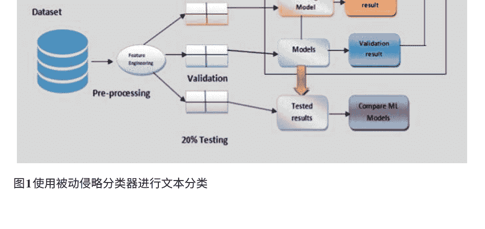

首先，当从社交媒体平台如Twitter收集文本数据时，我们需要识别与自杀背景相关的文本。我们的主要目标是找到一个优雅的模型，通过对社交媒体的文本进行分类，展示高准确性的结果。尽管有许多已实施的模型，但我们实施了比现有模型更好结果的模型。

在第一阶段，收集了文本数据集，即Twitter数据的收集。在收集数据集后，我们需要检查数据集是否具有自杀的上下文，并将数据集上传到模型/系统中进行处理。

在第二阶段，将收集到的数据集上传到系统进行预处理，即在分类之前将数据集清理为单一格式，以便模型更容易处理。对数据进行向量化处理，然后将整个数据集分为三部分，即训练、测试和验证。从整个数据集中，将70-80%的数据划分为训练数据，用于训练开发的模型，并附上相应的标签。训练完成后，将5-10%的数据设置为验证数据，即在此阶段，训练好的模型验证其过程；在此阶段，我们还可以找到模型的准确性；准确性越高，测试结果越好。

最后，剩下的15-20%的数据是测试数据，我们用这些数据测试模型，并检查输出与预期结果是否一致。在第三阶段，我们对数据进行预处理后进行分类。我们可以使用多个分类器或一个分类器。如果我们只有一个分类器，我们将只得到一个结果。如果我们有多个分类器，我们需要将预处理的数据与多个模型进行验证，并能够验证模型在数据集上的准确性。

在第四阶段，完成数据分类后，我们需要检查和分析所使用的模型的结果。如果我们使用多个模型，我们需要分别验证每个模型的结果，然后考虑给出高度准确结果的模型。同时还进行了模型之间的图形分析。

被动侵略算法：被动侵略算法在某种程度上类似于感知器模型，因为它们不需要学习率。尽管如此，它们确实包含了一个正则化边界。

一个很好的例子是在社交媒体网站Twitter上区分虚假信息，在那里每秒都有新信息被添加。要持续有效地从Twitter中读取信息，数据量将会很大，使用在线学习算法是最理想的（图2）。

##### 算法

- **被动**：如果预测是正确的，则保持模型不变，不做任何改变，即示例中的数据不足以引起模型的任何变化。
  - 如果 d^T w > 1，则 OK。 输出分类是正确的。
- **侵略**：如果预测是错误的，则对模型进行更改，即对模型进行一些更改可能会纠正它。
  - 如果 d^T w < 1，则我们必须使用新的权重(w_new)再次进行分类。 输出分类不正确(Fig. 3)

d^T w 有损失 (L) 短缺 y

```
初始化 w = (0,...,0)
监控一个流：
    接收新文档 d = (d₁...dᵥ)
    应用 tf.idf，归一化 ||d|| = 1
    预测正类如果 d^T w > 0
    观察真实类别：y = ±1
想要有：
    d^T w ≥ +1 如果正类（y=+1）
    d^T w ≤ -1 如果负类（y=-1）
等价于：y(d^T w) ≥ 1
损失：L = max (0, 1 - y(d^T w))
更新：w_new = w + yLd
```

图2 被动侵略分类器算法[14]

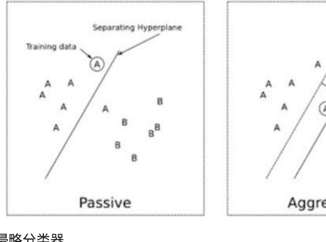

$$d^T w_{new} = d^T (w + yLd) \\ = d^T w + yL d^T d \\ = d^T w + yL \\ = y$$

#### 4 实验结果

实施的系统主要关注实现比现有模型更好的结果和更好的性能。由于文本数据是从社交媒体平台收集的数据集。数据集中的文本数据经过预处理以对文本进行分类。预处理后，数据集被分为训练和测试集，模型将与数据集中给出的标签一起进行训练。训练完成后，剩余数据将被验证以检查模型的准确性。因此，我们使用相同的数据集进行了五种不同的模型，并存储并比较了所有的准确性。我们实施的模型（被动侵略分类器）测试数据并将其结果分为自杀文本或非自杀文本。

我们在Windows环境中实现了当前系统，使用了提到的软件。Django框架用于在服务器上运行应用程序，Tinkter用于创建用户界面，Python的sklearn库。

### 构建系统的详细过程：

1.  收集包含自杀数据的数据集。
2.  开始对数据进行预处理，并将其向量化为正常形式。
3.  将数据集分为训练、验证和测试部分，以应用模型并训练模型。
4.  现在，所有使用的模型都是使用训练数据和数据集中的标签进行训练的。
5.  然后，使用验证数据对模型进行验证，并检查模型的准确性。
6.  验证完成后，我们必须测试经过验证的模型以检查结果。
7.  生成结果并与数据集中的标签进行比较。
8.  高准确性的模型提供准确的结果。在这里，提出的系统被动侵略分类器模型生成高准确性和准确的结果。

下面我们可以看到我们应用程序的主页，在这里我们可以通过点击它们来查看不同算法的结果和准确性。此外，我们还有一个图表，显示了每个使用的算法的准确性的条形图（图4）。


当我们选择了被动侵略算法时，它会显示一个文本框，我们可以在其中输入文本并检查结果（图5）。

根据分类结果，我们添加到文本框中的文本被分类为“自杀推文”或“非自杀推文”（图6）。

我们根据更为流行的评估指标估计了实施模型的结果，以计算机器学习分类问题的准确性。

我们可以看到我们提出的系统的准确性，以及通过测试数据生成的结果（图7）。

当我们点击主页上的图表时，它会显示包含在X轴上使用的算法和Y轴上的准确性的条形图。在五个算法中进行了比较性研究，包括被动侵略分类器、决策树、随机森林、朴素贝叶斯和支持向量机。我们可以看到图表显示了所有模型的准确性（图8）。


```
No. I do not plan to kill myself. I have a planet to secularize. No time to die: Daniel Vragsinn
['Positive']
accuracy: 0.978
[[23  1]
 [ 0 22]]
accuracy: 0.978
```

图7 被动侵略分类器的准确性

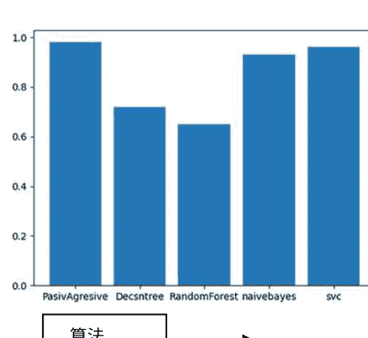

#### 5 结论

我们的模型可以被那些想要了解社交媒体平台上发布的与自杀相关的推文或文本的类别的人使用。在这个项目中，我们根据给定的标签处理了数据集，并且可以对文本数据进行分类。我们在应用程序中使用了五种算法，每种算法都给出了不同的准确性值，通过这些值我们可以判断哪种算法产生了高度准确的结果。

实施的模型生成的结果比其他算法具有更高的准确性，可以在柱状图中看到。与其他算法相比，我们提出的模型可以生成95%的准确率结果。

因此，当在文本字段中输入文本时，使用我们提出的模型会显示相关的输出并能够对我们的数据集进行分类。然而，实施的模型可以对数据集的文本数据进行分类。

#### 参考文献

1.  Shivam (2018) 文本分类中发生了什么。 https://www.analyticsvidhya.com/blog/2018/04/a-comprehensive-guide-to-understand-and-implement-text-classification-in-python/
2.  Kourou, K., Exarchos, T. P., Exarchos, K. P., Karamouzis, M. V., & Fotiadis, D. I. (2015). 机器学习在癌症预后和预测中的应用。 计算和结构生物技术杂志, 13, 8–17。 ISSN 2001-0370.
3.  使用逻辑回归进行文本分类。 https://medium.com/analytics-vidhya/applying-text-classification-using-logistic-regression-a-comparison-between-bow-and-tf-idf-1f1ed1b83640
4.  Haddi, E., Liu, X., & Shi, Y. (2013) 文本预处理在情感分析中的作用。Procedia Computer Science, 17, 26–32. ISSN 1877-0509.
5.  Murphy, K. P. (2012).机器学习的概率视角。一本教材。麻省理工学院出版社。
6.  Zhang, X., Yin, Y., & Yu, H. (2007). 基于粒计算的文本分类应用。Communications of the IIMA, 7(2), Article 1.
7.  Vasundhara, S., Kiranmayee, B. V., Suresh, C. (2019, May). 用于乳腺癌预测的机器学习方法。International Journal of Recent Technology and Engineering (IJRTE), 8(1).
8.  Liu, H., Cocea, M., & Ding, W. (2018). 多任务学习用于智能数据处理在粒计算环境中。 粒计算, 3, 257-273。
9.  Sebastiani, F. (2002).机器学习在自动文本分类中。ACM Computing Surveys, 34(1), 1-47。
10. Cendrowska, J. (1987). PRISM: 一种诱导模块化规则的算法。International Journal of Man-Machine Studies, 27(4), 349-370. ISSN 0020-7373.
11. Murphy, K. P. (2012). Machine Learning: A Probabilistic Perspective. MIT Press. ISBN 978-0-262-01802-9.
12. Kolli, K., & Suresh, C. (2018). 生物信息学数据评估中分析过程的原型评估。International Journal of Pure and Applied Mathematics, 118(20), 839-851.
13. Liu, H., Cocea, M., Mohasseb, A., & Bader, M. (2017). 在机器学习环境中将有区分性的单一任务分类转化为生成性多任务分类。In 2017 9th International Conference on Advanced Computational Intelligence (ICACI) (pp. 66–73). IEEE.
14. PAC算法中实际发生了什么。 https://www.youtube.com/watch?v=TJU8NfDdqNQ&t=3s
15. Ince, H., & Trafalis, T. B. (2008). 使用支持向量机进行短期预测并应用于股票价格预测。International Journal of General Systems, 37(6), 677–687. https://doi.org/10.1080/03081070601068595
16. Liu, Y., Bi, J.-W., & Fan, Z.-P. (2017). 多类情感分类: 特征选择和机器学习算法的实验比较。Expert Systems with Applications, 80. https://doi.org/10.1016/j.eswa.2017.03.042.
17. Suresh, C., Kamakshaiah, K., Thatavarti, S., Kumar, P. S., & Ramasubbareddy, S. (2019). 通过机器学习算法准确和及时地预测稻谷病害。International Journal of Advanced Science and Technology, 28(13), 662-671.
18. Bhavana, A. K., Suresh, C., Kiranmayee, B. V., & Kumar, K. S. (2020). 使用机器学习预测特定地区的疫情爆发。International Journal of Innovative Technology and Exploring Engineering (IJITEE), 9(4).
19. Suresh, C., Ravikanth, M., Srivani, B., & Satish, T. (2021). 基于认知物联网的智能健身诊断和推荐系统，使用三维CNN和分层粒子群优化。Print ISBN: 978-3-030-52623-8, eBook ISBN: 978-3-030-52624-5.
20. Begum, S., Satish, T., Suresh, C., Bhavani, T. & Ramasubbareddy, S. (2021). 使用K-MLR算法预测肺癌类型。 https://doi.org/10.1007/978-981-15-5400-1_39.
21. Maneesha, A., Suresh, C., & Kiranmayee, B. V. (2021). 基于土壤和天气条件的水稻病害预测。In C. K. Mai, B. V. Kiranmayee, M. N. Favorskaya, S. C. Satapathy, K. S. Raju (Eds.), Learning and Analytics in Intelligent Systems (Vol. 20). Springer.

## 22. 苏雷什，C.，钱德拉基兰，C.，普拉桑特，K.，萨加尔，K. V.，和普里扬卡，K. (2020年)。“移动医疗卡”——一款用于医疗数据维护的安卓应用程序。在2020年第二届计算应用创新研究国际会议（ICIRCA）中（第143-149页）。印度科英布托尔，2020年。https://doi.org/10.1109/ICIRCA48905.2020.918330723

苏雷什，C.，基兰梅耶，B. V.，穆贾赫德，S.，坎斯，K.，和拉梅什，R. (2019年)。基于情感和绩效管理系统的图像处理，431-435。https://doi.org/10.1109/ICECA.2019.8821932

### COVID-19数据分析预测住院水平

Advet Jadhav, Maheshwari Satpute, Utkarsh Rai, Apeksha Wadibhasme, 和Usha Verma

摘要 冠状病毒的传播导致了全球大流行。它给全球的医疗设施带来了沉重的负担。本文中呈现的COVID-19数据分析可能有助于医学专家根据患者的年龄、症状和任何先前的医疗史将患者分为四个住院级别。实施了不同的预测分析算法，并呈现了结果以验证实施方法的准确性。朴素贝叶斯算法被发现用于以最高准确率和Rsquare分数对患者进行分类。将其结果与一些传统的机器学习技术进行了比较，如K最近邻算法（KNN），随机森林算法，支持向量机（SVM）。除了准确性之外，数据集还使用不同的比例进行了训练和测试，包括60-40、70-30、80-20和90-10。在80-20的训练和测试数据集比例下，最高准确率达到95%，Rsquare分数为94%。最终结果表明，所提出的算法是一个准确的机器学习模型，用于预测感染患者的住院水平。还设计了一个网页，以便普通人可以访问，从而减少对其他机构的依赖和诊断进展的延迟。

关键词 Covid-19 · 数据分析 · 朴素贝叶斯算法 · K最近邻算法 · 随机森林算法 · 支持向量机 · 机器学习

A. Jadhav (✉) · M. Satpute · A. Wadibhasme · U. Verma
MIT工程学院电气工程学院，印度浦那
电子邮件：advetjadhav@mitaoe.ac.in

M. Satpute
电子邮件：mgsatpute@mitaoe.ac.in

A. Wadibhasme
电子邮件：avwadibhasme@mitaoe.ac.in

U. Verma
电子邮件：uyverma@etx.maepune.ac.in

U. Rai
MIT工程学院计算机工程与技术学院，印度浦那
电子邮件：urrai@mitaoe.ac.in

#### 1 引言

Covid-19是一种传染病，最早在中国湖北省武汉市报告。SARS冠状病毒2从未在人类中被鉴定出来，因为它是一种新的病毒家族。该病毒通过咳嗽时的小呼吸道飞沫传播，或者当人们互相接触时传播[1]。

由于Covid-19导致的死亡也可能是由于其他并发症。追踪总死亡人数可以提供信息[2]，即使Covid-19的死亡率可能没有被正确计算。检测冠状病毒疾病仍然是一个巨大的挑战。截至2021年3月12日，印度的Covid-19大流行已经有1,13,08,646例确诊病例，约有1,58,343例确诊死亡病例[3]。已经考虑了疾病进展需要住院的各种危险因素，但医疗决策仍然是一个挑战[3]。

为了分析Covid-19数据，将使用数据分析技术。其中一种技术是机器学习。机器学习允许计算机在没有人为干预的情况下自我学习[4]。ML主要分为两类：有监督和无监督。有监督的机器学习技术旨在从示例中学习。机器将根据先前的经验预测输出，而无监督机器学习允许模型自行工作以预测结果[5]。

本文使用朴素贝叶斯机器学习算法对Covid-19患者的数据进行分析，根据他们的症状、年龄和病史进一步将患者分为四个住院级别。这将进一步帮助预测住院级别，可以有效利用医疗资源来治疗那些危重病人。为医生和患者创建了一个网页。在这个网页上，患者需要输入他们的年龄、病史和症状，以便准确地得出感染结果。

#### 2 文献综述

一些研究人员一直在增加对当前流行病情况的预测领域。但是很少有人在分析症状或病史方面进行研究。

Remuzzi A.和Remuzzi G.讨论了冠状病毒及其在意大利的迅速传播所造成的严重影响[6]。建立了一个预测模型，以更好地了解患者的情况，这可能进一步帮助医疗机构做出更好的决策。

Hall I.等人还研究了在鸟类中出现的H5N1流感病毒，并预测了在这一流行病期间使用回归分析的情况。在类似的研究中，科学家们验证了不同的模型来预测湖北省的病例传播情况[7]。这里使用的数据来自中国国家卫生健康委员会，以查看从第一天到第十五天每五天的预测情况。

模型表明，中国采取的遏制措施已经降低了病毒的传播，疫情有所减轻。Furqan Rustam等人他们使用监督机器学习开发了一个模型，用于未来预测Covid-19病例。他们根据最近感染病例的数量[8]、死亡和康复人数来预测未来受Covid-19影响的患者数量。预测中使用了LR、SVM、ES和LASSO等学习模型。另一方面，Bastos等人他们使用2020年2月25日至3月30日的南美数据开发了一个预测模型。该模型是围绕社交距离参数构建的。结果表明，社交距离将减少感染的传播[9]。然而，如果社交距离没有得到正确实施，感染的传播将重新开始。

Akib Mohi Ud Din Khanday等提出了一种用于预测Covid-19病例的模型。预测是基于患者的年龄、性别、死亡率、住院率和症状[10]。回归分析方法是使用相应的实时数据进行训练和测试的。

Dehning等人实施了另一个模型.该模型是基于流行病学参数的贝叶斯推断，用于观察德国新传染性Covid-19感染增加的时间依赖性[11]。作者声称该模型完全功能，并可适应世界上任何地区。

刘等提出了一种新的方法，该方法考虑了机械模型的死亡估计以及机器学习算法的痕迹，以预测中国各地区Covid-19的传播[12]。

根据上述文献，可以看出有多种方法来预测Covid-19的传播。大部分工作都集中在预测病例数量方面，较少的研究人员关注Covid-19流行病的其他方面，如住院水平和优化医疗资源的使用。在本文中，基于其他因素，提出了一种使用机器学习算法'朴素贝叶斯'的数据分析方法，进一步将患者分为四个住院类别，并具有最高准确性。上述模型的一些局限性是它们的模型没有考虑年龄组，他们应该指明哪个年龄组会受到更多感染。另一个缺点是他们的模型由于数据量较少而不太准确。

#### 3 机器学习算法

在提出的工作中，实现了不同的机器学习分类算法，以比较朴素贝叶斯算法的结果。它们是：

-   支持向量机。这个算法是一种监督算法，它使用分类技术。SVM通过创建一个超平面将数据分成不同的类别，而支持向量是离超平面最近的数据点[13]。
-   决策树。它是根据给定问题得到所有可能决策的图形表示。决策树包括两个节点：决策节点和叶节点。决策节点用于做出决策，并具有多个分支，而叶节点是这些决策节点的输出节点[13]。
-   K最近邻（KNN）。KNN算法是一种监督机器学习算法，可以用于回归和分类。它考虑了新案例与现有案例之间的相似性，并将新案例放入与现有案例最相似的类别中。算法存储了所有可用的数据。基于相似性，对新数据点进行分类[4]。
-   朴素贝叶斯分类。这是一个用于两个或多个类别的分类算法。它基于贝叶斯定理，并假设特征之间是独立的。为了理解我们工作中贝叶斯定理的使用，让我们来看一个特征向量 $X = (x_1, x_2, x_3, ..., x_n)$ 和一个类变量 $C_k$。在我们的模型中，我们有15个特征向量，所以，$n =15$，我们有4个类别，所以，$k =4$。使用贝叶斯定理，可以通过以下公式(1)计算类别C发生的概率

    $$P(C_k|X) = \frac{P(X|C_k)P(C_k)}{P(X)} \tag{1}$$

    其中 $P(C|X)$ 表示给定预测器（特征）的类别 $C$ 的后验概率，$P(X|C)$ 表示给定类别 $C$ 的数据 $X$ 的似然概率，$P(C)$ 表示类别 $C$ 的先验概率，$P(X)$ 表示预测器的先验概率。

    在朴素贝叶斯分类器中，似然性的计算如式(2)所示。

    $$P(X|C_k) = P(x_1 \ldots x_n|C_k) = P(x_1|C_k) P(x_2|x_1, C_k) \ldots P(x_n|x_1 \ldots x_{n-1}, C_k) \tag{2}$$

    根据条件独立性，我们有式(3)

    $$P(C_k|X) = \frac{P(C_k) \prod_{i=1}^{n} P(x_i|C_k)}{P(X)} \tag{3}$$

    也可以表示为(4)所示

    $$P(C|x_1, \ldots, x_n) \propto P(C) \prod_{i=1}^{n} P(x_i|C) \tag{4}$$

    其中 $\propto$ 表示比例。

    在这项工作中，通过考虑所有输入参数计算了所有四个类别的概率。因此，具有最高概率的类别将成为结果。

与其他方法相比，朴素贝叶斯不需要太多的训练数据，并且具有高度可扩展性。朴素贝叶斯分类器有三种主要类型：高斯、多项式和伯努利。朴素贝叶斯遵循正态分布，并支持连续数据。伯努利朴素贝叶斯用于离散数据，并且基于伯努利分布工作。多项式朴素贝叶斯也适用于具有离散特征的分类。在这项工作中，我们使用了多项式朴素贝叶斯，因为它适用于具有离散特征的分类。与伯努利朴素贝叶斯相比，多项式朴素贝叶斯在数据集中具有二进制或分类输入时更容易使用[14]。

#### 4 方法论

这个算法工作快，可以节省很多时间。朴素贝叶斯适用于解决多类别预测问题。如果其特征独立性的假设成立，它可以比其他模型表现更好，并且需要更少的训练数据。朴素贝叶斯更适合于分类输入变量。我们使用朴素贝叶斯是因为它假设独立性并在解决多类问题上表现出色[15]。

提出的工作包括五个模块。第一个模块是数据收集，第二个模块是数据的精炼。两者同样重要，因为没有正确收集数据和正确提取所需数据，没有算法能够给出好的结果。在分类的下一个模块中，使用朴素贝叶斯算法，并将其结果与其他传统的机器学习技术进行比较。性能分析在第四个模块中展示，使用不同比例的训练-测试数据集。在最后一个模块中，为用户界面创建了网页。

##### 4.1 使用朴素贝叶斯的Covid-19数据分析模型

基于朴素贝叶斯机器学习算法的Covid-19数据分析完整模型，用于预测住院级别，如图1所示。

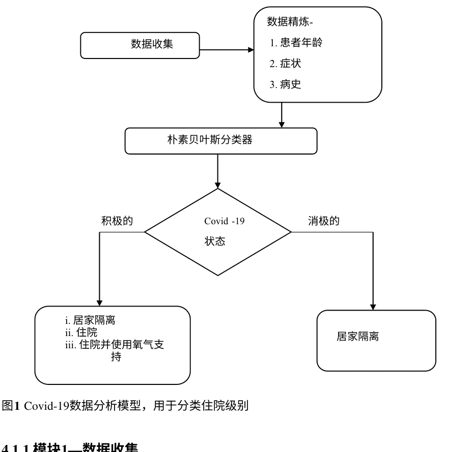

图1 Covid-19数据分析模型，用于分类住院级别

###### 4.1.1 模块1—数据收集

创建了一个虚拟患者数据集，无论年龄如何，都对Covid-19进行了阳性和阴性测试。这包括所有Covid患者，无论他们是否住院。在这个数据集中，根据患者的先前病史和症状，提出的模型进行工作。

###### 4.1.2 模块2—数据精炼

数据精炼在数据集上手动完成。精炼后，输入参数包括15个属性，即年龄、病史、头痛、肌肉疼痛、嗅觉丧失、咳嗽、胸痛、喉咙痛、发热、嗓音嘶哑、腹泻、呼吸困难、疲劳和腹痛。医疗史中考虑了四种主要疾病，即心脏病、糖尿病、呼吸系统疾病和血压，这些疾病可能影响患有Covid的患者的健康。患者分为五个年龄组：15岁以下、15至30岁、30至45岁、45至60岁和60岁以上。患者被分为四类：阴性但居家隔离、阳性且居家隔离、阳性且住院、阳性且住院但无氧气支持。

###### 4.1.3 模块3—分类

朴素贝叶斯算法用于分类目的。该算法被实现用于将患者分为四个住院级别。住院的四个级别分别是负面但居家隔离、阳性但居家隔离、阳性和住院以及阳性和住院并使用氧气支持。同样的数据集也使用其他传统机器学习算法进行分类，以验证朴素贝叶斯算法的准确性。它们是：K最近邻（KNN）、支持向量机（SVM）和随机森林。经过比较，发现朴素贝叶斯算法具有最高的准确性。

###### 4.1.4 模块4—性能分析

首先使用的性能度量是准确性。为了计算准确性，首先确定混淆矩阵。该矩阵将实际值与模型预测的值进行比较。这种分析是在不同的训练和测试数据组合下进行的，以了解哪种组合获得了最高的准确性。训练数据用于训练模型，测试数据用于测试模型是否正常工作[4]。将朴素贝叶斯算法的性能与不同的分类算法进行比较。朴素贝叶斯算法提供了更高的准确性。

使用的第二个性能度量是R平方得分。它是可以从独立变量预测的因变量方差的比例。为了计算R²，从每个实际值中减去平均实际值，然后对结果进行平方，并相加。然后，将第一个误差总和除以第二个总和，并将结果从一中减去。将朴素贝叶斯算法的性能与不同的分类算法进行比较。朴素贝叶斯算法提供了更大的R²。这可以表示为（5）所示：

$$R^2 = \frac{\text{模型的方差}}{\text{总方差}} \tag{5}$$

###### 4.1.5 模块5—网页设计

完成机器学习模型后，创建网页。使用'flask'工具将我们的机器模型集成到Web应用程序中。然后将其呈现给html模板以供flask使用，以便用户可以输入参数并获得其住院水平的准确结果。

##### 4.2 算法

模型的流程由以下算法表示：

-   步骤1-导入库。使用的库包括pandas，numpy，matplotlib.pyplot，seaborn，sklearn.metrics。
-   步骤2-读取数据集。
-   步骤3-为每个输入参数创建频率表。共有15个输入参数。
-   步骤4-计算每个输入参数的每个类别的数量。
-   步骤5-将数据因子化以将其转换为数值形式。
-   步骤6-将数据按训练和测试比例分割。训练-80%，测试-20%。
-   步骤7-应用朴素贝叶斯算法使用式(2)计算每个类别的概率。
-   步骤8-使用测试样本计算混淆矩阵。
-   步骤9-使用混淆矩阵计算模型的准确性。

#### 5 实施和结果

##### 5.1 系统规格和数据集

用于实施的系统配置为8 GB RAM和2.3 GHZ处理器。使用Jupyter笔记本软件和Scikit学习工具对患者进行四个不同级别的分类。使用100个患者的数据集，其中输入参数是患者的年龄、症状和以前的病史[16]。在100名患者中，有14名患者年龄在0到15岁之间，16名患者年龄在15到30岁之间，18名患者年龄在30到45岁之间，20名患者年龄在45到60岁之间，32名患者年龄在60岁以上。图2表示不同年龄组的患者患有不同的疾病。可以观察到年龄超过60岁的大多数患者有糖尿病、心脏病、呼吸系统疾病和高血压等疾病的病史。因此，这些患者可能更有可能住院。

##### 5.2 结果与讨论

根据所述输入参数，朴素贝叶斯算法的结果分为四个住院类别，其中最高概率的类别被选为结果。这四个级别分别是负面、积极但居家隔离、积极并住院以及积极并住院需要氧气支持。图3显示了不同住院级别的患者百分比。

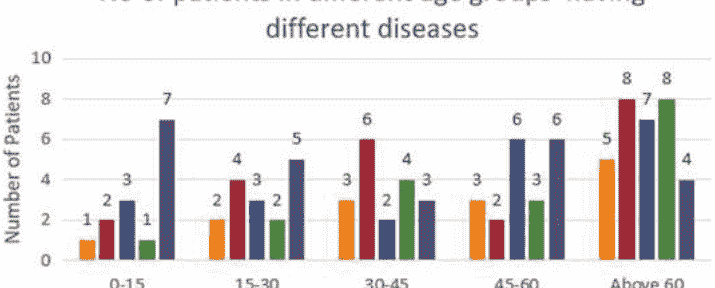

图2 不同疾病患者数量

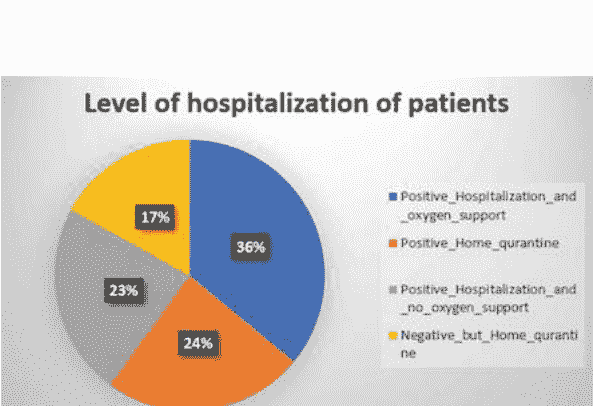

图3 将患者分为4个级别

在100名患者中，有15名患者为阴性，24名患者为阳性并居家隔离，21名患者为阳性并住院，40名患者为阳性并住院需要氧气支持。考虑的症状包括头痛、肌肉疼痛、嗅觉丧失、咳嗽、胸痛、喉咙痛、发热、嗓音嘶哑、腹泻、呼吸急促、疲劳和腹痛。

##### 5.3 性能分析

提出的工作基于两个参数进行评估—准确性和R平方得分。

由于朴素贝叶斯算法基于概率，这里解释了一个病人的案例，以便更清楚地理解。

概率计算—为了展示概率的计算，考虑了一个病人的案例，该病人具有以下症状和疾病：年龄超过50岁，病史有心脏病，症状包括头痛、咳嗽、嗅觉丧失、喉咙痛、发热、胸痛和呼吸急促，以及腹痛。使用公式(1)计算了该案例中所有四个类别的概率。

P (负面) = 0.02
P(积极家庭隔离) = 0.04
P(积极住院) = 0.13
P(住院带氧支持) = 0.82

因此，患者呈阳性，需要住院并接受氧气支持。

准确率（%）

数据集被分为80%的训练集和20%的测试集比例。取了100名患者的数据集，其中80个样本用于训练，20个样本用于测试。在这20个样本中，有19个样本被正确测试。为了计算准确率，得到了如表1所示的混淆矩阵。准确率的计算公式为：

准确率 = (对角线元素之和/样本总数) * 100 = ((1 + 9 + 4 + 5)/20) * 100 = 95%

使用朴素贝叶斯算法的模型在80-20的训练和测试数据比例下的准确率为95%。通过对与朴素贝叶斯使用相同数据集进行训练、测试和分类，将朴素贝叶斯算法的分类结果与其他机器学习算法进行了比较。初始数据集被分为训练和测试子集，以减少过拟合的可能性。所有算法都使用了四种不同比例的训练和测试集，分别是80-20、70-30和60-40。表2提供了所有分类机器学习方法在不同训练和测试集上执行此任务的准确率的比较分析。图4显示了分类算法准确率与训练和测试比例的对比。

从表2和图4可以看出，与其他算法相比，朴素贝叶斯算法在训练和测试数据集比例为80:20时给出了95%的准确率。支持向量机也给出了90%的准确率，但我们没有选择SVM，因为它在某些情况下表现不佳，其中每个数据点的特征数量大于训练数据样本的数量。

表1 测试数据的混淆矩阵

|      | N HQ Hos | P HQ | P Hos | P Hos Os |
| :--- | :------- | :--- | :---- | :------- |
| N HQ | 1        | 2    | 0     | 1        |
| P HQ | 0        | 9    | 0     | 0        |
| P Hos| 0        | 0    | 4     | 0        |
| Pos Os| 0      | 0    | 3     | 3        |

表2 不同训练和测试数据集比例的比较分析

| 机器学习算法 | 90-10 (%) | 80-20 (%) | 70-30 (%) | 60-40 (%) |
| :----------- | :-------- | :-------- | :-------- | :-------- |
| 朴素贝叶斯   | 80        | 95        | 92        | 89        |
| 决策树       | 75        | 85        | 80        | 78        |
| K最近邻      | 77        | 88        | 85        | 80        |
| 支持向量机   | 75        | 90        | 88        | 80        |

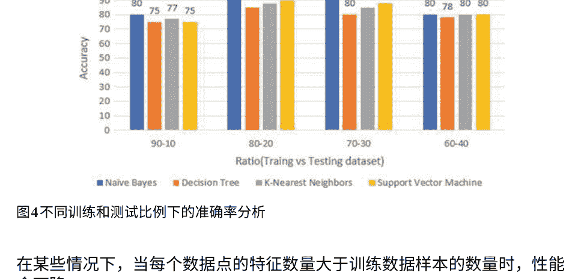

图4 不同训练和测试比例下的准确率分析

在某些情况下，当每个数据点的特征数量大于训练数据样本的数量时，性能会下降。

在第一阶段，使用60%的数据进行训练，但与使用80%的数据进行训练相比，准确率较低。因此，当提供更多的数据比例来训练这些算法时，这些算法的性能提升的机会增加。由于面临着这种致命病毒的许多挑战，这项工作可以帮助社区通过识别住院水平来了解疾病的严重程度，并相应地采取行动。

R平方得分

从表3可以看出，与其他算法相比，朴素贝叶斯算法给出了最好的结果，R平方得分为94.8，训练和测试数据集的比例为80:20。

因此，当提供更多的数据比例来训练这些算法时，这些算法的性能提升的机会增加了。无论是准确性还是R平方得分，由于面临着致命病毒的许多挑战，这项工作可以帮助社区了解疾病的严重程度，通过识别住院水平并相应采取行动。

| 机器学习算法 | 不同训练和测试比例下的R平方 | | | |
| :--- | :---: | :---: | :---: | :---: |
| | 90-10 | 80-20 | 70-30 | 60-40 |
| 朴素贝叶斯 | 90 | 94.8 | 91 | 85.8 |
| 决策树 | 73.4 | 83.2 | 78.2 | 76.4 |
| K最近邻 | 75.2 | 85.4 | 80.2 | 78.5 |
| 支持向量机 | 73.6 | 88.3 | 85.6 | 79.4 |

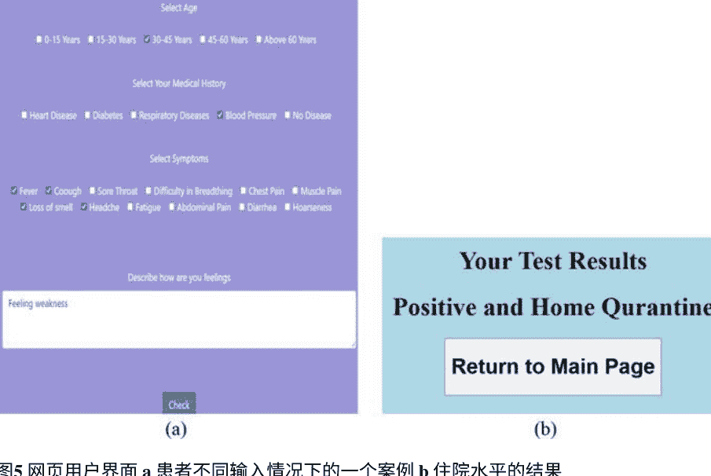

##### 5.4 用户界面的网页设计

我们创建的网页如图5所示。在网页中，我们从用户那里获取输入。用户需要输入他们的年龄、病史和症状，然后点击检查按钮，他们的住院水平将显示在屏幕上。

#### 6 结论

最初，当Covid-19病毒被识别出来并且其严重程度被理解时，医学界在治疗大量患者方面起着重要作用，因为病毒的传播速度非常快。为了优化医疗资源的使用，建议将那些症状轻微且没有医疗需求的患者转诊出去。历史，可以居家隔离。 所提出的工作是朝着这个方向迈出的一步，以有效利用医疗资源。 开发的网站将帮助用户检查他们的住院水平并采取进一步行动 。 本文提出的分析结果表明，使用朴素贝叶斯算法相比其他机器学习算法，在准确率和R²得分方面取得了最佳结果。 此外，在所有情况下，最佳的训练与测试比例为80:20。 普通人可以访问我们的网站并获得结果，而不必依赖其他机构并延误诊断进展。 一旦感染，时间对于解决Covid问题至关重要。 此外，通过增加使用的数据量，可以提高该模型的性能。 此外，对于那些被分类为住院的症状，可以提出进一步的工作来预测治疗患者的药物。

致谢非常荣幸地感谢MIT Academy of Engineering提供的支持，以实施所提出的工作。

#### 参考文献

1. D, L. (2021年3月14日).2019冠状病毒病. 从www.wikipedia.org检索: https://en.wikipedia.org/wiki/COVID-19
2. Rabbat, P. D. (无日期).冠状病毒病（COVID-19）大流行. 从www.who.com检索: https://www.who.int/emergencies/diseases/novel-coronavirus-2019/who-director-general-s-special-envoys-on-covid-19-preparedness-and-response
3. Research., M. F. (无日期).我们的Covid-19患者和访客指南，以及可信赖的健康详细信息. 从https://www.mayoclinic.org检索: https://www.mayoclinic.org/diseases-conditions
4. Srivastava, A., Saini, S., & Gupta, D. (2019). 各种机器学习技术的比较和其在不同领域的应用. 在2019年第三届电子、通信和航空技术国际会议（ICECA）中(pp. 81–86). 印度科伊马托尔。
5. Hesiodus. (2020年12月12日).监督学习和无监督学习. www.geeksforgeeks.org. [在线]. 从https://www.geeksforgeeks.org/supervised-unsupervised-learning/检索
6. Remuzzi, A., & Remuzzi, G. (2020). COVID-19和意大利：下一步是什么？《柳叶刀》（The Lancet），395(10231)，1225–1228。
7. Hall, I., Gani, R., Hughes, H., & Leach, S. (2007). 实时流感大流行预测。流行病学与感染，135(3)，372–385。 https://doi.org/10.1017/S0950268806007084
8. Rustam, F., Reshi, A. A., Mehmood, A., Ullah, S., On, B. W., Aslam, W., & Choi, G. S. (2020). 使用监督机器学习模型进行COVID-19未来预测。
9. Bastos, S. B., & Cajueiro, D. O. (2020).对巴西COVID-19大流行进行建模和预测。arXiv预印本arXiv:2003.14288
10. Khanday, A. M. U. D., Rabani, S. T., Khan, Q. R., Roufl, N., & Din, M. M. U. (2020). 基于机器学习的方法用于检测COVID-19使用临床文本数据。国际信息与技术杂志.
11. Dehning, J., Zierenberg, J., Spitzner, F. P., Wibral, M., Neto, J. P., Wilczek, M., & Priesemann, V. (2020).推断COVID-19传播速率和潜在变化点的案例数量预测. arXiv预印本arXiv:2004.01105
12. Liu, D., Clemente, L., Poirier, C., Ding, X., Chinazzi, M., Davis, J. T., Vespignani, A., & Santillana, M. (2020).一种用于实时预测2019-2020 COVID-19爆发的机器学习方法，使用互联网搜索，新闻提醒和机械模型估计. arXiv预印本arXiv:2004.04019
13. Shafri, H. Z. M., & Ramle, F. S. H (2009).使用兰卡威岛卫星数据的支持向量机和决策树分类的比较. www.scialert.net, [在线]. 从https://scialert.net/fulltext/?doi=itj.2009.64.70检索
14. Qin, Z. (2006). 给定概率估计树的朴素贝叶斯分类 在2006年第五届国际机器学习和应用会议(ICMLA '06)(pp. 34–42). 奥兰多，FL.
15. Roosa, K., Lee, Y., Luo, R., Kirpich, A., Rothenberg, R., Hyman, J. M., Yan, P., & Chowell, G.(2020). 从2月5日到2月24日的中国COVID-19疫情实时预测传染病建模，5, 256–263.
16. Perc, M., Gorišek Mikšić, N., Slavinec, M., & Stožer, A. (2020). 预测COVID-19。 物理前沿，8(127)，1-5。

### 使用神经网络分析大米颗粒质量的准确性

S. Menaka和K. Sashi Rekha

摘要 大米是印度南部的真正食物来源。它是全球超过80%人口的主食。种植和出口了许多种类的稻谷。检测有缺陷的谷物并区分大米品种对于大米精细分析至关重要。可以使用自动化机器来识别大米颗粒类型，并且数字成像被认为是一种可持续的方法以无接触的方式提取大米颗粒的能力。对获取的图像进行图像预处理技术、滤波、分割和形状检测。可以从图像中提取的形态学特征以机器学习技术的形式显示为发光二极管（LED）显示。通过神经网络通过大米颗粒的纹理、大小和颜色处理图像，将结果与现有的多层感知器（MLP）和支持向量机（SVM）进行比较，并使用匹配模式与提取的图像一起生成高准确性和高质量的大米颗粒。所提出的反向传播算法使用前馈神经网络方法在分析大米颗粒质量时具有更高的准确性，约为98.4%，而SVM的准确性为92%。

关键词神经网络·多层感知器·前馈神经网络·机器视觉设备·径向基特征·反向传播

#### 1 引言

设备感知中最重要的功能之一是分析高质量大米。一些研究人员认为物体的形状包含比其特征更多的信息，导致相关物品之间的着色差异更大。它不能保证完美的结果。 然而，它可以发现大米一致性的问题，例如影响大米种子样本的大米真实性技术。 这种方法的首要目的是提出一种管理充足大米并分析优质大米的新方法，这可以减轻所需的工作、价值和时间。 大米质量在农艺和园艺作物的生产中起着至关重要的作用，因此大米类型的识别也起着重要作用。 图像处理是一个庞大而先进的技术领域，在农民的生活中取得了重要的进展。

#### 2 文献综述

对于大米颗粒的估计和分类，完全依赖于其物理和有机特性。 通过测量其边界和长度因素来执行最佳估值。 还考虑了平均费用功能，并在MATLAB中实施。

1. 通过MATLAB实现了对样本颗粒的图像处理算法。根据颜色、形状和大小构建了大米颗粒的第一类[1]。 通过神经网络分类器将准确性和最终结果分为好、差和中等。
2. 使用系统视觉和检测机器进行自动化技术，包括检查员系统和图像处理单元，以确定大米种子的特殊形状。 使用反向传播神经网络成功识别了大米种子。 该设备已足够提供基于种子外观特征的大米种子检查。
3. 通过肉眼分析了最佳评估和大米种子质量，并识别了不同的品种。 近年来，为商业应用开发了机器视觉系统(MVS)，得益于低成本电子设备和处理硬件的可用性。 使用数字图像处理应用的计算机技术的进步为读取食品材料的质量铺平了道路。大米被认为是发展中国家的主要作物。使用软件机器提取大米信息更快、准确、方便、无毒和无破坏性，因此所得结果更准确。 可以开发算法来分析给定样本的优异结果和准确性。 在数字图像处理的支持下，引入了软计算技术来对Krishna Kam od大米进行分级，检查大米颗粒的外观。 应用前馈神经网络技术来找到高质量的程度。 经过训练的多层前馈神经网络可以找到长颗粒、小颗粒以及未知种子质量。
4. 聚类分析主要用于数据挖掘领域。K-means算法主要依赖于聚类中心及其局部最佳解。混合优化算法[2]和聚类算法用于寻找最优的聚类中心。
5. 优化规则是通过三行杂交稻的繁殖过程来激发的。自我过程和杂交化是群体搜索过程中使用的进化方法。它们结合了收敛能力和速度计算，可以作为一个整体来考虑。
6. 机器视觉设备用于进行谷物分类。大米可以根据其RGB直方图、边缘检测测和色调模型进行区分和分析。它有助于根据形状和颜色等特征发现大米颗粒的清晰度[3]。
7. 使用机器学习、预测和数字处理对印度巴斯马蒂大米（Oryza Sativa）进行优质分级和评估的答案[4]。与人工检查员相比，它可以更准确地计算Oryza Sativa（L）的大小，并检测出粉状和受损大米。
8. 使用图像变形技术和适当的缩放完成了食品谷物的归一化处理[5]。反向传播神经网络主要用于识别异常谷物类型。颜色和谷物皮肤将被用于神经网络的训练目的，以识别未知的谷物类型。
9. 针对字符特征集和组合特征集分别提出了独特的模型。准确性的类型是通过纹理特征而不是形态和颜色特征给出的。因此，神经网络架构倾向于为特定的功能集产生不同的准确性。

上述讨论的现有方法显示了对不同参数进行评估的稻谷分析，以分析不同地点的不同稻谷品种。在提出的系统中，使用反向传播算法和前馈神经网络方法评估稻谷的形态特征，其中纹理、大小和形状得到评估。从这种方法中，准确性被测量为98.4%，比具有92%准确性的SVM更准确。

#### 3 大小和外观

稻谷品种在外观、大小和质量上存在差异，如下表所示的品种也存在差异：

| 特征特点 | 卡尔稻 | 库鲁瓦稻 | 纳瓦莱 | 晚熟 |
|---|---|---|---|---|
| 品种 | Adt-43 | Adt-45 | Adt-36 | Adt-36 |
| 谷粒率 | 2.18 | 2.98 | 3.1 | 3.1 |
| 谷粒类型 | 中等细长 | 中等细长 | 中等 | 中等 |
| 习性 | 半矮 | 半矮、直立 | 直立 | 直立 |
| 长度 | 5.46 | 8.00 | 7.8 | 7.8 |
| 宽度 | 1.94 | 2.16 | 2.5 | 2.5 |
| 厚度 | 1.63 | 1.97 | 2 | 2 |

- 蛋白质 (4.98%)
- 脂肪 (0.99%)
- 淀粉 (93.9%)。

#### 4 架构图

实施了一种自动化评估方法，以提高稻谷颗粒的一级率。 高级别的稻谷种子颗粒试验意图通过对称能力来决定。 基于外观能力构建了一个优秀等级测试和识别的版本，其中包括面积、二轴尺寸、部分分数、颜色纹理和色彩伴随着主机图像处理和神经网络 (NN) 的生成。

为神经网络提供了阴影和诊断能力，以解决各种目的，然后用于理解未知的稻谷颗粒类型，效果非常好。 这种未来技术在评估稻米质量方面提供了出色的结果。 机器学习是研究的更广泛范围的一部分


# 图2 架构图

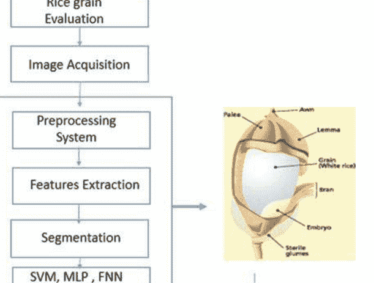

基于学习统计表示的方法，而不是任务特定的算法。学习可以是监督的、非监督的或无监督的（图2）。然而，这种方法引入了许多隐私和效率挑战，因为云操作员可以对可用数据进行二次推断。最近，面向处理方面的进展为更高效、更私密的信息处理铺平了道路，适用于简单任务和轻量级模型，但对于更大、更复杂的模型仍然是一个挑战。

## 5层多层感知器

人工神经网络（ANN）的种类及其用于分类目的。这是一种监督学习方法。MLP包括三层：初始层、中间层和结果层。它使用反向传播算法对研磨大米样本进行分类。它也被称为前馈方法，因为在这种方法中，所有的数据只能按照正向的方向通过节点传递。它通过激活函数计算神经元的权重，这意味着线性函数计算输入到输出的权重。在MLP中，一些神经元可能是非线性的。激活函数包括两个常见的函数。第一个是从 -1到1的双曲正切函数，另一个

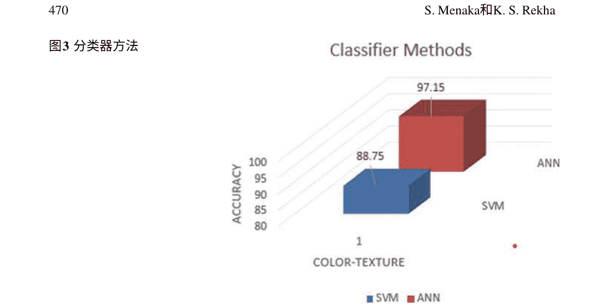

其中一个是逻辑特征范围从0到1。单层中的每个节点与该层中的其他节点相连（图3）。

初始层是可见层。每个节点被视为一个神经元。在这个过程中，输入通过后续层传递。初始层、中间层和输出层彼此连接。中间层被称为隐藏层。输入通过中间层，直接提供给输出结果层。

## 6支持向量机

支持向量机是一种用于分类和回归的监督学习模型，但通常用于分类问题。在这里，样本被表示为点。最确定的边界也被称为超平面。

并且基于训练向量集中的概率分布，独立地获得两个单位在向量空间中的超平面。超平面将边界远离最近的向量。靠近边界的向量被称为支持向量。假设区域不是线性的，那么超平面无法用于区分。核函数用于解决这些问题。核技巧是解决非线性可解问题的方法之一。该技术基于输入数据的内积和正确核函数的定义。

内核特征使得可以在输入区域中进行操作，作为高维特征区域的替代。核函数被称为一类用于样本分析的算法。有四个核函数。它们是多项式、归一化多项式、径向基特征（RBF）和熟悉的Pearson VII。

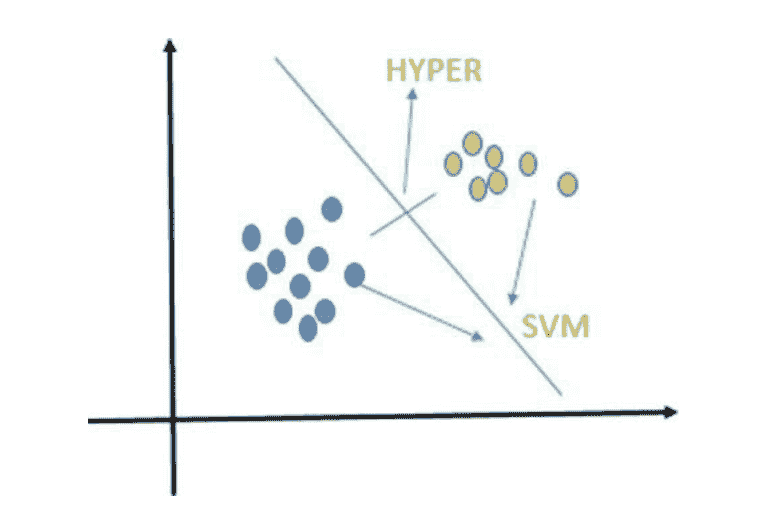

多项式核特征用于表示特征空间中向量的相似性[6]。 与多项式核相比，归一化多项式产生更好的结果。 RBF在许多核化学习算法中使用。 通用的Pearson VII成功地作为通用线性、多项式和RBF核函数的替代。

## 7个工作模型

称为多层感知机（MLP） 的前馈人工神经网络是一种前馈NN。一个MLP中至少有三个节点部分[7]： 一个初始层、一个中间层和一个结果层。 除了输入节点之外，每个节点都具有神经元的不确定函数。 对于训练，MLP采用一种称为反向传播的监督学习技术。

多层感知器（MLP） 与线性感知器的区别在于其具有多个层和非线性激活函数。 它可以区分线性不可分的事实。 (1)激活函数的特点： [5]如果神经网络中的所有神经元都具有线性特性，将输入的加权和映射到每个神经元的输出，那么线性代数表明，可以从任意层数的神经网络中减少到两层输入-输出布局。MLP中的一些神经元使用了为行为神经元活动能力或发射频率开发的非线性激活机制。 最常见的激活函数是sigmoid函数，它们被认为是双曲正切函数，其值介于 -1和1之间。 另一方面，逻辑函数在形式上类似，但其值范围从0到1。 这里显示了第 i 个节点（神经元）的输出，其中 i是输入连接的加权和。

矫正器和温和加法函数被提出作为潜在的响应特征。

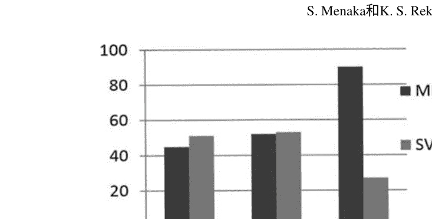

#### 8 计算SVM分类器

通过计算类型表达式实现SVM（软边界）分类器。我们专注于SVM，因为如先前报道的那样，选择足够小的价格直接是可分类的响应数据。传统形式，无论是将情况降低到对称优化问题[8]，都在下面进行了突出。然后可以使用进一步的最新技术，如坐标下降和次梯度下降来解决。

1. 原始：减少您需要完成的任务数量。
2. 可以将其视为具有不同独立任务的特定细化问题（图5）。

主要关注分析稻谷种子照片的视觉特征，如形状、颜色和纹理。可以将不同的类别模型应用于利用这些功能。该研究发现图像处理技术可以与MLP、线性回归、SVM和贝叶斯文化等分类技术结合使用，对混合样本中的稻谷种子进行分类[9]。一些使用基本特征的方法表现出足够的功能和形态准确性；平均而言，它们分别达到了90.27%和90.54%。还可以使用其他类型的特征来提高性能，以及对类别模型进行进一步研究。它试图集中解决稻谷产业的基本问题，以确定稻谷的质量，以及研究人员为了摆脱与优质稻谷分析相关的麻烦所做的努力。

#### 9 结论

本文的主要目标是调查在米质量表征中使用的不同人工神经网络方法。质量在评估大米颗粒的价值中非常重要。因此，需要监测大米质量并找到适当的方法来进行大米质量表征。最基于相关工作的分组过程是神经网络。过去研究的结果通过使用ANN策略已经达到了92%的准确率。使用FFNN过程的精确结果更为优雅，达到了98%的准确率，这是与其他ANN分类器相比最好的表现。各种研究人员使用不同的特征来评估质量。将进行图像处理以获得精确的结果。为了帮助提高性能，SVM在消耗更少时间的情况下显示出最高的准确率。对于大数据集，MLP已被证明是最好的分类器，而KNN不适合处理大数据集。对于分析稻谷质量，提出的反向传播算法使用前馈神经网络方法的准确率为98.4%，而SVM的准确率为92%。

#### 10 未来工作

未来的工作可能对非均匀启示的结果过于精确并观察大米颗粒上的高帽变换，因此将为印度巴斯马蒂大米颗粒的一流评估计算各种参数并将其分类为正常、小型和长型大米种子。使用有限参数的大数据集的不同大米品种可以用于进行更好的质量分析大米颗粒。

#### 参考文献

1. Devi, T. G., Neelamegam, P., & Sudha, S. (2017). 基于机器视觉的大米质量分析。2017年发表的计算机科学。在2017年IEEE国际电力、控制、信号和仪器工程学术会议(ICPCSI)中。
2. Ye, Z., Ma, L., & Chen, H. (2016). 一种混合稻谷优化算法。在第11届国际计算机科学与教育会议(ICCSE)(pp. 169–174)。
3. Herath, H. M. K. K. M. B., & de Mel W. R. E., 机械工程系. (2016). 利用图像处理技术进行稻谷分类(pp. 1–6). 斯里兰卡开放大学.
4. Birla, R., & Chauhan, A. P. S. (2015). 一种利用机器视觉系统进行稻米质量分析的高效方法. 电子与通信工程系.信息技术进展杂志(第6卷, 第3期, 第140-145页).
5. Shantaiya, S., & Ansari, U. (2010). 利用模式分类技术进行食品谷物的识别和质量评估.IJ CCT 2010国际会议特刊/ICCT-2010/(第2卷, 第2、3、4期, 第70-74页).
6. Mohanraj, S., Narenthiran, B., Manivannan, S., & Murugan, R. A. (2021年2月). 基于概率神经网络的大米质量分类。在可持续环境的材料、设计和制造中(pp. 867–886)。
7. Avudaiappan, T., Sangamithra, S., Roselin, A. S., Farhana, S. S., & Visalakshi, K. M. (2019年3月). 使用机器学习算法分析大米种子质量。SSRG国际计算机科学与工程杂志(SSRG—IJCSE)—特刊ICRTCERT。

> 8. Bao, J. S., Wu, Y. R., Hu, B., Wu, P., Cui, H. R., & Shu, Q. Y. (2002). 基于具有相似表观直链淀粉含量的父本的DH群体的水稻粒质量QTL。《作物学报》，128, 317–324。

> 9. Asif, M. J., Shahbaz, T., Rizvi, S. T. H., & Iqbal, S. (2019). 基于主成分分析的图像处理的大米颗粒识别和质量分析。见于《2018年国际电气工程近期进展研讨会论文集》(RAEE)。

> 10. Shatadal, P. (2003). 通过颜色图像分析识别受损大豆。《农业与生物系统工程杂志》，19，65-69。

> 11. Abdullah, M. Z., Fathinul-Syahir, A. S., & MohdAzemi, B. M. N. (2005). 使用机器视觉传感器的水果颜色和形状分级的自动检测系统（以杨桃为例）。《测量与控制学会汇刊》，27（2），65-87。

> 12. Kanungo, T., Mount, D. M., Netanyahu, N. S., et al. (2002). 一种高效的K-means聚类算法：分析和实现。《IEEE模式分析与机器智能汇刊》，24（7），881-892。

> 13. Mahale, B., & Korde, S. (2015). 利用图像处理技术进行大米质量分析。见于《国际技术融合会议-2014年论文集》，IEEE。

> 14. Adu-Kwartenga, E., Ellisb, W. O., Oduro, I., & Manful, J. T. (2003, October). 大米颗粒质量：加纳正在研究的本地品种与新品种的比较。《谷物科学》，14(7), 507–514。

> 15. Armstrong, B. G., Aldred, G. P, Armstrong, T. A., Blakeney, A. B., & Lewin, L. G. (2005). 使用图像分析仪测量大米颗粒尺寸。巴拉瑞特大学食品与作物科学研究所，维多利亚州巴拉瑞特，3353。

> 16. Danying, W., Xiufu, Z., Zhiwei, Z., Neng, C., Jie, M., Qing, Y., Jianli, Y., & Xiyuan, L. (2005, January 01). 大米颗粒质量特性的相关性分析。《作物学报》，31(8), 1086。

> 17. Singh, K. R., & Choudhary, S. (2020). 基于单粒稻谷的级联网络用于稻谷分类。《复杂和智能系统》，6，321–334。

> 18. Komar, Seti, G. K., & Bhava, R. K. (2020). 基于特征的稻谷品种定性分类：一项综述。《科学研究杂志》，64(2)。

> 19. Ocapino, K., Sawangwong, S., Puying, P., & Kusakunniran, W. (2020). 稻谷图像的定位和分类。《自动化与计算国际期刊》，17，233–246。

> 20. Mohan, D., & Raj, M. G. (2020). 使用ANN和SVM进行稻谷质量分析。《评论杂志》，7(1). ISSN 2394-5125。

> 21. Hamzah, A. S., & Mohamed, A. (2020, December). 使用人工神经网络进行白米粒质量分类的综述。见于《IAES国际人工智能期刊》(IJ-AI) 第9卷，第4期，第600-608页。

> 22. Yao, Q., Chen, J., Guan, Z., Sun, C., & Zhu, Z. (2009, May). 使用机器视觉检测大米外观质量。见于《2009年WRI全球智能系统大会论文集》第4卷，第274-279页。https://doi.org/IEEE。

### 智能食品餐厅：账单和服务的自动化

Radha Mothukuri，S. Hrushikesava Raju，S. Adinarayna，Vijaya Chandra Jadala，Saiyed Faiayaz Waris和G. Subba Rao

摘要 现如今，技术以多种方式和维度升级和进步。考虑的实时应用是餐厅账单系统。在传统系统中，用户会在账单柜台上拿取一张静态账单，上面列出了可能需要食用的食物种类。这导致许多用户会遇到一些奇怪的问题，比如有些人会因为食物不好吃而浪费食物，有些用户可能因为自己的能力而不吃太多食物，还有些人可能会拿走比他们应得的更多食物。在这种情况下，为了解决问题，可以使用一种令牌来检查特定食物的味道，价格为该特定食物价格的10%。

避免手动计费，使用借记卡或授权支付网关应用程序通过QR码进行自动计费。食堂中的每个物品都被分配了一个特定的价格和一个扫描器和QR码；在食物物品的轨迹结束后，用户必须选择要吃的物品。这种方式避免了账单的浪费，间接保护了树木，也节省了环境。这种自动计费和高效的优质食品供应将成为未来业务中的需求。这样，有两个部分，一个是试用会话，另一个是真正的食堂会话。两个部分是分开的，但是相互连接。

-   试用会话
-   真正的食堂会话
-   扫描器
-   QR码
-   有效的食品供应和自动计费

R. Mothukuri · S. H. Raju (✉) · V. C. Jadala · G. S. Rao
印度安得拉邦冈纳鲁拉克什迈亚教育基金会计计算机科学与工程系，绿色领域，瓦德斯瓦拉姆，贡图尔

S. Adinarayna
印度安得拉邦维萨卡帕特南拉姆理工学院计算机科学与工程系

S. F. Waris
印度安得拉邦贡图尔维尼安科学技术和研究基金会计计算机科学与工程系

© 作者，独家许可给 Springer Nature Singapore Pte Ltd. 2022 S. Shakya 等人 (编)，《情感分析与深度学习》，智能系统与计算进展1408，https://doi.org/10.1007/978-981-16-5157-1_37

#### 1 引言

如今，人们在酒店、食堂和任何结账处都面临着食品结算问题的许多方式。这种结算不仅适用于食堂，还可以定制其他部门。手动结算系统或半自动结算系统会导致人为干预，例如从商店或仓库获取某些物品时所需的时间，纸张会被浪费，从而间接导致全球变暖，打印账单还会导致墨盒或碳粉的浪费，而这些活动涉及的成本更高。在后一种情况下，即半自动化流程结算中，人力努力在一定程度上参与，它在一定程度上使用手动结算的概念。

与现有方法相比，所提出的系统完全由自动化计费组成，消除了许多导致环境资源不被稀释和保护环境资源的手动操作。在这种情况下自动化的活动包括为每个账单生成QR码，这些码对于从商店或仓库获取所需物品非常有用。在自动化过程中，打印纸张的账单、纸卷的需求、墨盒的需求和维护成本都将尽可能减少，甚至可以降低到零。

所提出的系统的活动如下：

- (1) 商店或仓库只需具有最新的价格标签和QR码。
- (2) 为每个用户的每个物品生成唯一的QR码。
- (3) 前台的每个物品都有一个扫描器，可以读取上次付款获得的QR码。
- (4) 在成功验证QR码后，该物品的队列将分发或释放物品。
- (5) 为每个用户重复这个过程（步骤3和4被整合为一个主代码，可以被扫描器读取，从柜台上分发所选项目）。
- (6) 最后，这些金额都被加总，以了解每天的总收入。

支付和排队发放物品的过程采用了新颖的混合方法，其中结合了两种或三种方法，以完成给定的任务。为所提出的系统指定的步骤按顺序执行。

为了消除人为干预，这个系统不适用于食堂、商店或任何卖家店。这种方法在现代技术中是一场革命。这种自动化的主要好处是减少商店或店主的成本开支。这个系统要求商店商人对技术和技术更新有所了解。

任何受过教育的用户都会对使用这项技术感到舒适。另一个更大的优势是商店商人可以集中精力进行其他活动，而不是把所有时间都花在商品计费和商品交付上。

#### 2 文献综述

在这里，讨论了处理账单和发放物品的方法，以及它们的局限性和缺点。

根据[1]中指定的来源，有许多根据餐厅类型和服务能力开发的现成软件。根据[2]中演示的来源，这是一个满足餐厅、账单、服务等多种需求的现成网站。它是一个多重分类的应用程序，满足用户需求。根据[3]中给出的来源，这是一个预定义的网站，可以进行诸如食谱管理、防止员工欺诈、厨房管理和桌位订单等多种操作。根据[4]中提到的来源，这是一个避免库存浪费和盗窃的网站，通过该网站控制多个门店，并鼓励顾客对交付进行反馈。根据[5]中提供的演示，社区中有许多种类，包括自助餐、美食广场、鸡尾酒晚宴等，旨在减少人工服务的工作量，增加自我纪律。根据[6]中给出的来源，餐厅提供的点菜食物可能会提供服务员，也可能不提供，并且可能不会立即提供额外的食物，这意味着只提供已供应的食物，而餐饮服务则提供新鲜食物和即时食物，如果有短缺，还提供人工设施。根据[7]中指定的来源，最佳实践包括将库存管理与POS相结合，用于食谱成本和菜单工程学，获取库存，利用智能预测工具，并根据库存和会计报告进行分析，以及具有目的和主题导向术语的演示。根据[8]的观点，讨论了许多原则，如分析员工盗窃、销售点、年度库存、员工培训和POS用户访问权限，并演示了它们的好处。根据[9]和[10]的观点，前者指出了关于准备食物、营销、质量、安全等方面的手动演示，与日本和美国有关，后者指出了关于餐厅管理培训和软模板的质量控制、结账程序、关闭桌位、酒精意识等方面的手动描述。根据[11]的观点，对餐厅系统的用户评级进行了两个矩阵的潜在因素协同过滤优化，这些矩阵包括用户特征和商业特征，结果是这些矩阵的乘法错误。为了避免模型过拟合，添加了正则化。根据[12]中指定的来源，使用增强型自然语言处理技术读取关于餐厅的评论，并根据用户搜索特定功能时返回高评级的酒店进行分析和进一步处理。根据[13]和[14]的描述，该模型演示了搜索餐厅并生成结果，其中包括餐厅和该地区著名的食物，使用协同机器学习技术，如KMM、斜率一和多类支持向量机。根据[15]和[16]的观点，前者指出混合方法是朴素贝叶斯和支持向量机的组合，并根据口味、声誉、评级、评论和服务等特定功能输出结果。后者指出，本研究中使用的算法是基于均方误差和平均绝对误差来评估性能的。根据[17]和[18]中展示的资源，前者描述了Yelp用户会搜索餐厅，并根据评分和评论来获取结果，后者描述了根据客人类型和偏好使用协同过滤技术进行推荐。有了这些细节，任何人都可以在群组之间进行快速决策，根据自己的选择订购特定的食物，后者表明推荐是基于客人类型和偏好进行的。精确率、召回率和F-score等属性是基于准确性和响应时间进行比较的方法。根据[19]和[20]，前者表示从Facebook和Yelp获取的社交数据有助于使用朴素贝叶斯和KNN等机器学习方法分析餐厅，并以93%的准确率产生结果，后者表示在线搜索成为用户之间的一项需求任务。根据[21]中提到的来源，演示是关于使用物联网和传感器以及它们之间的交互来进行通信和生成自动报告的应用。

根据[22]中提到的信息，目前的流行病将通过数字口罩来限制，该口罩会报告用户当前所处环境中的病毒。设计的口罩将提供有关当前环境中物体的统计数据。根据[23]中指定的源，物联网被用于检测位置并自动获取货币并将其转换为用户的货币。这种用户灵活性在此情境中提供。

根据[24]中提到的研究，物联网被用于电源银行和便携设备中，以在用户友好的环境中交换充电功率。通过设计的应用程序和物联网技术来实现定制化的充电方式。根据[25]中的描述，物联网被用于将重物传送到其他设备，以便轻轻地接住并将其缓慢送到地面上。

根据[26]中的信息，物联网被用于监测工业中的气体水平，并在气体通过从源到目的地的管道时检测到泄漏。这种检测可以避免对人员造成伤害。

关于[27]中指定的源，物联网在用户身上非常有用，可以监测用户的健康状况并提供饮食指南来保持健康。根据[28]提到的来源，物联网和GSM被用于确定用户想要在世界各地旅行时的热门地点。将提供关于这些城市的热门地点和排名地点的指导，以及路线图。

根据[29]中展示的来源，GSM和物联网被用于监测垃圾箱并提醒最近的市政办公室清理，以避免多次访问该垃圾箱的浪费。根据[30]，在物联网基础上的家庭互联网环境中检测到任何入侵行为都应该被警报并避免未来的不便。

根据[31]中给出的描述，讨论了在与个人健康护理系统特别相关的图像中检测早期乳房不规则性的问题，并且探讨了在处理系统中的角色模态。关于信息的演示[32]，人力工作最大程度地减少，通过基于物联网设备的应用程序实现自动化，并远程检查视力。物联网的重要性得到了明确的描绘，并将在制定的系统中发挥作用。关于[33]的演示，它在设计智能电表时使用了树莓派，追踪使用的电量并监控其管理。在[34]的主要方面，基于有效平台的新技术的支持现在是一项具有挑战性的任务。企业的成功取决于对支持新技术和新设计的采用。

根据他们的选择在可用的网站上搜索餐厅，可以减少了解所需领域的时间和努力。引用参考文献中提到的来源描述了手册、培训员工、软件以及基于评级和评论的内容。但是，我们正在讨论的是餐厅系统，其中计费被视为优先任务，并且应该自动化，从而根据用户选择在付款过程中分发所选项目。

#### 3 提出的方法

在这个过程中，识别出了两个模块，即通过带有QR码的分布式物品卡进行支付和当主码（即独立物品码的集成形式）被扫描器读取时分发物品。在这个过程中，优先级队列的概念被使用，物品被添加到一个主QR码中，以避免维护大量的码，并且使用随机森林等机器学习技术来从物品组中分发正确的物品。

在图1中，有两个模块，即将QR码集成到每个用户的一个主码中，使用优先级队列，并使用随机森林方法分发物品。前一种情况的用例是每个用户的唯一UPI，物品可以被扫描并为该物品生成QR码，将这些物品的QR码添加到一个主码中，使用优先级队列，生成的主码在分发柜台被扫描，根据需要分发物品，然后在每次分发后减少物品数量，在用户选择不可用的特定物品时弹出消息，并生成有关所赚取的金额和物品销售统计的EOD报告。

这两个模块的伪代码定义如下：

| 步骤 | 描述 |
| :--- | :--- |
| **Pseudo_Procedure 优先级 Queue_addition_items_codes(items[], QR_codes[], master_code[], UPI[]):** | |
| 输入: | UPI[], items[], QR_codes[]。 |
| 输出: | 每个用户的主代码，购买物品的成本。 |
| 步骤1: | 导入内置模块优先级队列，并在适当的时候调用其方法。 |
| 步骤2: | 应使用具有有效UPI名称的任何UPI应用程序。 |
| 步骤3: | 扫描所需物品的QR码。在这里，调用将物品添加到优先级队列的函数。 |
| **函数 add(item):** | |
| | `pq.insert(item);` // 其中item是添加到优先级队列实例pq的项。 |
| 步骤4: | 将一个UPI的所有QR码按顺序添加，以获取用户成本并生成主代码。 |
| **函数 Generation_Master_code_cum_cost(QR_Codes[]):** | |
| | `Mcode= " "` |
| | `sum=0` |
| | `for i=0 to n` // 其中n是物品数量 |
| | `    sum=sum+Currency(QRCodes[i])` // 每个用户的账单 |
| | `    Mcode=Mcode+QRCodes[i]` |
| | `return Mcode` |

随机森林的伪过程，这是一种用于从分配器中分发物品的分类技术：

| 步骤 | 描述 |
| :--- | :--- |
| **Pseudo_Procedure 随机森林分发器(MCode, item1Count, item2Count, ……, itemNCount):** | |
| 输入: | 每个用户的Mcode，物品数量。 |
| 输出: | 物品分发和报告生成。 |
| 步骤1: | 对于第一个用户，分配器的扫描器（读取器）将扫描MCode并提供要分发的物品。 |
| **函数 检查分发(Mcode):** | |
| | 对于每个Mcode，都有许多集成的QR码反映物品数量。 |
| | 调用随机森林(dataset[][], MCodes[]) |
| | 对于1到n: |
| | `    如果(item1<=item1count):` |
| | `        item1count--;` |
| | `    else if(item2<=item2count):` |
| | `        item2count--;` |
| | `    .` |
| | `    .` |
| | `    else if(itemN-1<=itemN-1count):` |
| | `        itemN-1count--;` |
| | `    else:` |
| | `        itemNcount--;` |
| 步骤2: | 对于第二个用户，执行步骤1直到最后一个用户。 |
| 步骤3: | 生成一份报告，其中包含每个用户的详细信息和计费情况。 |
| | 对于user1到userN: |
| | `    调用Checking_dispense(Mcode[user1])` // 这里的user1类似于1，user2类似于2，... userN类似于N。 |
| 步骤4: | 生成并生成EOD报告以供进一步分析。 |

随机森林的工作原理如下所述:

| 伪代码_随机森林(Dataset[][]) | |
| :--- | :--- |
| 目标： | 由Tin Kam Ho发明，它考虑多个决策树，对这些树的结果进行平均，并输出更高的准确性以确定属性的类标签 |
| 输入： | 数据集 |
| 输出： | 每个元组的类标签 |
| 算法步骤： | * 在数据集中选择随机的k个数据点 |
| | * 为所选的数据点构建决策树 |
| | * 选择用于构建决策树的数量N |
| | * 重复第一和第二点 |
| | * 对于每个新的数据点，分配从多数投票中获得的类别 |

随机森林算法的工作原理如下图所示(图2)。

#### 4 结果

在此过程中，预期的窗口描述事件流程将依次交互，展示场景的开始到结束。

最后，通过图表展示了所提出方法、传统方法和半传统方法的性能。

事件流程如下图所示，鼓励采用数字交易的方式自动进行账单处理，并采取安全措施（图4）。

智能餐厅结算系统的重要屏幕交互如下所示：

从图5可以看出，高效的在线网站用于为每个人的账单生成QR码，并自动进行支付。研究采取了三种方法，并根据其自动结算的性能进行了记录，并在下图（表1）中进行了描述：

根据性能和准确性绘制的图表如下所示（图6）。

表1 正在分析的方法特征

| 方法 | 性能状态 |
| :--- | :--- |
| 传统的 | 低效且耗时，需要人工支持 |
| 半传统的 | 中等程度，部分过程自动化，部分需要人工驱动 |
| 提出的系统 | 预计时间较短且完全自动化，准确性更高 |

#### 5 结论

在这种情况下，智能服务的计费在读取物品的二维码方面是自动化的，同时通过主代码详细信息进行分发。优先级队列的概念在确定主代码方面非常有用，它通过集成特定用户的选定物品和随机森林方法来确定适当的物品。这两个模块的用例通过ER图和适当的伪代码进行演示。智能餐厅案例研究中提出的系统自动化计费的性能在结果中指定。因此，人力工作大部分被最小化，每天报告的统计数据在工作时间结束后自动生成。

#### 参考文献

1.  2021年最佳餐厅结算软件。 https://www.softwaresuggest.com/restaurant-billing-software
2.  使用Windows POS软件简化您的业务。 https://justbilling.in/
3.  智能食品店的餐厅结算软件。 https://slickpos.com/features/restaurant-billing-software/
4.  使用餐厅POS软件简化餐厅运营。 https://www.gofrugal.com/restaurant/restaurant-pos-software
5.  Mealey, L. (2018, October). 餐厅餐饮食品服务指南。 https://www.thebalancesmb.com/restaurant-catering-events-2888392
6.  餐饮服务与餐厅餐饮：哪个更适合您？ http://brownbrotherscatering.com/catering-service-vs-restaurant-catering-which-is-best-for-you/
7.  Hannon, H. 4家餐厅库存管理技巧和最佳实践。 https://www.restaurant365.com/blog/4-restaurant-inventory-management-tips-and-best-practices/
8.  成功的餐厅库存管理的9种技巧。 https://www.glimpsecorp.com/restaurant-inventory-management/
9.  运营标准手册（餐厅案例）。（2015年3月）。 https://www.jetro.go.jp/ext_images/en/reports/survey/pdf/2015_03_biz4.pdf
10. 餐厅培训手册模板。 https://www.restaurantowner.com/public/Restaurant-Training-Manual-Templates.cfm
11. Theo Jeremiah，如何使用潜在因子协同过滤构建餐厅推荐系统。（2019年11月）。 https://towardsdatascience.com/how-to-build-a-restaurant-recommendation-system-using-latent-factor-collaborative-filtering-ffe08dd57dca/
12. Gomathi, R. M., Ajitha, P., Krishna, G. H. S., & Pranay, I. H. (2019年10月)。基于评分和便利设施的用户偏好和服务的餐厅推荐系统。在ICCIDS中。 https://doi.org/10.1109/ICCIDS.2019.8862048
13. Jiang, R. (2015).一个定制的实时餐厅推荐系统. https://etda.libraries.psu.edu/files/final_submissions/8189
14. Lavanya, B. M., Kumar, K. K., Kayanath, H. S., & Bai, D. P. (2020年5月).基于用户评分的餐厅推荐机器学习模型国际最新技术与工程杂志(IJRTE), 9(1). ISSN: 2277-3878.
15. Jeyabharathi, J., Loheswaran, K., Ramaiah, V. S., & Kumaravel, T. (2020).使用支持向量机和朴素贝叶斯分类器机器学习算法的餐厅推荐系统国际未来通信和网络杂志,13(4), 3710–3714.
16. Sawant, S., & Pai, G.Yelp食品推荐系统. http://cs229.stanford.edu/proj2013/SawantPai-YelpFoodRecommendationSystem.pdf
17. 基于偏好的个人和群体餐厅推荐系统。 https://www.cs.cornell.edu/~rahmtin/Files/YelpClassProject.pdf
18. Ramzan, B., Bajwa, I. S., Jamil, N., Amin, R. U., Ramzan, S., Mirza, F., & Sarwar, N. (2019).使用机器学习的智能数据分析推荐系统。 https://doi.org/10.1155/2019/5941096
19. Joshi, S., Dubey, J.基于k-means和朴素贝叶斯分类器的餐厅推荐系统。在AISC(Vol. 1112). https://link.springer.com/chapter/10.1007%2F978-981-15-2188-1_48
20. Cao, F. F. (2018年5月). Eat-smart: 使用机器学习和yelp数据集的餐厅推荐网络应用程序。 https://scholarworks.calstate.edu/downloads/nv9356056?locale=en
21. Raju, S. H., Ramani, B. L., Warris, S. F., Kavitha, S., & Dorababu, S. (2020年10月).智能眼睛测试。Springer, ISC DA-2020. https://link.springer.com/chapter/10.1007/978-981-33-6176-8_19
22. Tumuluru, P., Raju, S. H., Baba, C. H. M. H. S., Dorababu, S., & Venkateswarlu, B. ECO友好口罩指南，用于冠状病毒预防。在IOP会议系列材料科学与工程(第981卷，第2期)。 https://doi.org/10.1088/1757-899X/981/2/022047
23. Baba, C. H. M. H. S., Raju, S. H., Shanti, M. V. B. T., Dorababu, S., & Waris, S. F. 使用物联网进行购物的国际货币翻译器。在IOP会议系列材料科学与工程(第981卷，第4期)。 https://doi.org/10.1088/1757-899X/981/4/042014
24. Sunanda, N., Raju, S. H., Waris, S. F., & Koulagaji, A. 智能即时充电电源。在IOP会议系列材料科学与工程(第981卷，第2期)。 https://doi.org/10.1088/1757-899X/981/2/022066
25. Mothukuri, R., Raju, S. H., Dorababu, S., & Waris, S. F. 智能重物捕捉器。在IOP会议系列材料科学与工程(第981卷，第2期)。 https://doi.org/10.1088/1757-899X/981/2/022002
26. Kavitha, M., Raju, S. H., Waris, S. F., and Koulagaji, A. 智能家居和工业的智能气体监测系统。 在IOP会议系列材料科学与工程(第981卷，第2期)。 https://doi.org/10.1088/1757-899X/981/2/022003
27. Raju, S. H., Burra, L. R., Waris, S. F., and Kavitha, S. IoT作为健康指南工具。 在IOP会议系列材料科学与工程(第981卷，第4期)。 https://doi.org/10.1088/1757-899X/981/4/042015
28. Raju, S. H., Burra, L. R., Koulagaji, A., and Waris, S. F. 旅游增强应用程序：具有相关功能的地图的用户友好性。 在IOP会议系列材料科学与工程(第981卷，第2期)。 https://doi.org/10.1088/1757-899X/981/2/022067
29. Kavitha, M., Srinivasulu, S., Savitri, K., Afroze, P. S., Akhil, P., Sai, V., & Asrith, S. (2019). 垃圾箱监测和管理系统使用GSM。 国际创新技术和探索工程杂志, 8(7), 2632–2636。
30. Kavitha, M., Anvesh, K., Kumar, P. A., & Sravani, P. (2019). 基于物联网的家庭入侵检测系统。 国际最新技术和工程杂志, 7(6), 694–698。
31. Kavitha, M., Krishna, P. V., & Saritha, V. (2019).成像模态在事物互联网和个性化医疗保健系统中早期检测乳房异常的作用(pp. 81–92). 新加坡斯普林格
32. Raju, S. H., Burra, L. R., Waris, S. F., Kavitha, S., & Dorababu, S. (2021) 智能眼睛测试。 在智能系统和计算进展中, 2021年, ISCDA 2020, 1312 AISC (第173-181页)。 https://doi.org/10.1007/978-981-33-6176-8_19
33. Bhalaji, N. (2020年3月). EL DAPP--一种电表跟踪分散应用。 电子学杂志, 2 (01) , 49–71. https://doi.org/10.36548/jei.2020.1.006
34. Dube, T., Van Eck, R., & Zuva, T. (2020年12月). 对技术采用模型和理论的回顾以及在商业组织中衡量技术准备和可接受使用。 信息技术杂志, 2 (04) , 207–212. https://doi.org/10.36548/jitdw.2020.4.003

### 激活函数引入的自动化生成编程代码合同的聚类

S. V. Gayetri Devi和T. Nalini

摘要：几种面向对象的分析方法需要以编程约束的形式表示规则，以反映具有更高程度的多态性和继承关系的并发软件的广泛验证规则。为了解决在时间受限环境中进行软件验证的需求，所提出的工作以开发人员的最小参与度自动构建这些合同。

提取并发Java软件的行为和结构信息，以决策树的形式导出行为依赖度量，并将其转化为自动化代码合同。然后，使用改进的粒子群优化算法对导出的合同进行优化，以识别可行的合同。为了验证群体优化在合同生成中的有效性，将增强的k均值聚类与神经网络相关的激活函数（如双曲正切和修正线性单元的变体）应用于从行为依赖度量导出的合同，形成相似合同的定义聚类，并比较两种方法的结果。所得到的结果显示了优化和聚类技术生成的合同的效率。该工作还比较了应用的聚类算法的性能，以评估每个聚类生成的合同的正确性。研究结果表明，双曲正切函数引导的k均值聚类能够准确地将编程合同分组，并且使用时间和内存资源高效。

关键词：合同优先级 · K均值聚类 · 激活函数 · 群体优化 · 分类器

S. V. G. Devi (✉) 印度钦奈巴拉特高等教育和研究学院计算机科学与工程系

T. Nalini 印度钦奈Dr. M.G.R.教育和研究学院计算机科学与工程系

#### 1 引言

软件产品开发过程中的关键任务包括验证和验证活动[1]。验证旨在提供软件与软件义务一致的信心，以便满足开发关注点、全面性和功能要求。

验证在开发的每个层面上都制定了软件的严谨性。
验证涉及动态和静态分析。静态分析检查源代码的所有潜在执行路径以及变量值，而不执行应用程序，能够识别在软件发布后可能不会显现的错误。动态分析在运行时测试和评估应用程序代码，并发现静态分析无法发现的线程和内存漏洞。同时实施这两种分析的工具相互补充，以确保软件质量并降低开发成本。

广泛范围内的合同是形式化程序验证的基础，或者可以用于辅助测试或调试过程。
在测试的情况下，合同是指定软件程序所需遵循的目标的基础。在调试方面，它们用于调节软件中的探针的包含。探针代表对合同有效性进行的运行时检查。建立编程合同的概念有助于程序验证和验证。

在面向对象编程中，合同详细说明了供应商类和客户类之间的关系，表达为（i）前提条件，（ii）对函数或方法的后置条件，以及（iii）对类的不变量。起草的合同表示了与类中的数据属性相关的条件，类成员必须保持这些条件。它们与Java语言中的assert语句不同，assert语句表示程序员用来检查断言是否保持不变的构造，而合同是对软件行为的正式约束，以明确的方式陈述重要的应用相关属性。

软件不断演进，无论是为了改进功能还是纠正软件缺陷错误。与其他类相比，某些类的面向对象软件更容易受到变化的影响。预测这种易于变化的特性对于多种原因都是有益的。它帮助开发人员强调预防性活动，如测试、检查和同行评审，使他们能够有效利用资源，并及时交付更高质量的软件产品。尽管复杂的多态性和继承关系在多个面向对象软件应用中被广泛使用，但对软件的动态行为的验证却不太重视。通过测量软件的行为特征并将其起草为编程合同，我们可以获得更好的验证模型。通过使用存在的类和它们之间的关系的结构信息，以及行为依赖性的实现

行为信息以对象之间传递的消息形式呈现。 编程合约通过使用各种形式分析工具进行验证，以确认在方法调用时软件规范的基本条件是否得到验证，并在操作结束后确认是否满足后置条件[1]。

资源和时间限制影响软件验证活动；因此，在开发软件时优化生成的合约对于不影响维护成本至关重要。 目前，编程合约是由程序员手动编写的，这既耗时又费力[2, 3]。

所提出的工作旨在通过自动从源代码中提取行为依赖度量并随后将其转化为合约来自动化合约推导过程。 此外，生成的合约必须经过优化，以确保软件验证的覆盖率和故障识别能力都不会降低。 所提出的工作在合约推导过程中应用粒子群优化（PSO）算法来实现这一目标[4]。 通过在将行为依赖转化为合约时使用聚类算法和数据挖掘技术[2, 5, 6]来验证优化的准确性。 本文提出了使用适当的距离度量（欧氏距离）和改进的k均值聚类算法来识别类似的编程合约簇，该算法使用神经网络的激活函数，如双曲正切（TanH）和修正线性单元（ReLU）的变体。 使用聚类生成的合约与使用PSO算法生成的合约进行比较，以确定准确性。 还将本文中应用不同激活函数的聚类算法变体进行比较，以验证每个变体生成合约的正确性。

#### 2 相关工作

一些作者提出了在相关泛化问题中使用激活函数的不同策略。

Wang等人[7]提出了一种处理学习二层ReLU神经网络的困难的方法，在二元分类背景下，数据是线性可区分的，并且假设使用了铰链损失标准。 本文提出了一种原始的随机梯度下降（SGD）方法，用于训练任何一个具有全局最优性的单隐藏层ReLU，无论是否存在无数个不诚实的局部最大值和最小值，以及普通的鞍点。 泛化保证强调了ReLU网络和泄漏ReLU网络在模型复杂性方面的关键差异。 识别了将新的噪声注入设计推广到多层ReLU网络的范围，并反映了不同的损失函数和多个基于内核的方法的推广。 因此，SGD算法可以逃避局部最小值和鞍点，有效地训练任何一个两层ReLU网络以实现全局最优性。 关于理论和实证的证据

通过在训练神经网络期间注入噪声来支持逃离坏局部最小值和鞍点的方法被实现。 通过新的SGD和紧密的泛化误差界限，实现了ReLU网络的最佳训练。

Li等人[8]通过修改ReLU激活函数为ReLU TanH激活函数的加权和，在某些数据集上进行了一系列实验。观察到TanH函数的输出增强了ReLU单元激活的值，并降低了ReLU单元实际上缩短的值。 观察到仅在每个卷积层中包含两个参数就能显著提高ResNet和inception的精度。

Banerjee等人[9]提出了一种数据驱动模型，通过学习不同输出ReLU激活函数的泛化问题，得到了基于多阶ReLU和激活函数特定参数的多输出变体。因此，本文介绍和研究的多阶ReLU是常规单输出ReLU函数的变体，通过将常规函数推广为具有多输出的参数化变体。通过损失函数优化和常规反向传播学习表达激活函数的参数。与其他激活函数相比，ReLU是一个非饱和函数，具有更快的收敛能力。使用MNIST数据集，通过应用一个两层网络展示了多阶ReLU在典型的单输出ReLU上的准确性。该工作展示了多输出激活函数在减少过拟合方面的良好结果。承认了将该激活函数应用于具有挑战性的数据集和更深的神经网络的进一步可能性。

Kimura [10] 提出了一种使用前馈神经网络实现的新的聚类技术，该方法分为三个部分：将记录映射到聚类的编码器，将聚类映射到相应样本的解码器，以及用于计算记录和样本之间位置接近度的损失函数。为了加快聚类速度，在编码器中使用了增强的激活函数，将一个软最大函数连续迁移到一个最大函数。所提出的工作将聚类总数建立为作为结果获得的独占的独热编码向量的数量。该方法与深度学习神经网络一致，并且还研究了损失函数的局部最小值及其与聚类的关联。

目前传统的合同选择方法是基于其对软件质量的效用，但实际上，选择过程存在一些实时限制。例如，不同的合同可能需要不同的执行时间，并且这些断言所揭示的缺陷具有不同的严重性。因此，合同优先级的有效性取决于具体的优先级和验证所需的时间以及输入规范。

激活函数对神经网络的收敛能力和收敛速度有影响。此外，激活函数有助于将任何输入的输出归一化到0到1或1到-1的范围内。这为使用激活函数的高效率类和分类方法铺平了道路，以选择与所研究问题相关的合同。

#### 3 优化和排名的方法

##### 3.1 编程合同

所提出的工作的主要目标是以自动化的方式生成软件编程合同（也称为断言），并在最小的手动干预下优化生成过程。粒子群优化用于通过仅为包含有效编程条件（合同）的决策列表生成合同，以优化代码合同的生成。为了验证优化结果，将Java源文件的决策列表进行聚类，以确定合同的可行性。该方法涉及将类似的合同分组为簇，然后应用聚类算法进行分组[17]。聚类将“n”个编程合同（观测值）分为“m”个不同的组（簇）。在所提出的方法中，群组的数量预先分配为2个，分别用于“可行”和“不可行”的合同簇。该工作中利用K均值聚类的性能良好且直观，用于初始化聚类的质心值并完成聚类。K均值聚类的基本概念是无监督机器学习。为了在合同分组过程中实现全局最小值，需要对更多合同进行全面的搜索探索，这几乎是不可能的；因此，使用激活函数来加速探索任务。选择适当的初始质心是K均值的主要部分，在这里，必须将初始聚类质心位置理想地尽可能接近最优质心。

图1展示了确定具有激活函数的适应性k均值聚类的算法步骤，如下所示。

激活函数有助于计算质心，并减少聚类迭代和计算时间。合同通过激活函数（即修正线性单元（ReLU）、渗漏ReLU、平滑ReLU和双曲正切函数（TanH））进行聚类。

```
输入：k=2（预先分配的聚类数量），一个包含'n'个编程合同的决策树
输出：合同被分为“可行”和“不可行”两类聚类（k=2个聚类）
方法：
    步骤1：使用激活函数（ReLU、LeakyReLU、SmoothReLU和TanH）计算两个聚类的初始质心
    步骤2：重复直到满足收敛条件 {
    步骤3：根据计算的欧氏距离，将合同分配给它更接近的聚类
    步骤4：在评估每个聚类中的所有合同后，更新聚类的新均值（质心）
    步骤5：将所有合同移动到其最近的聚类 }
```

图1 合同分配到聚类的基本步骤并且在修改后的k均值聚类中使用双曲正切函数（TanH）。ReLU函数是一个线性函数，训练更简单，性能相对较好。如果输入值为正，则该函数立即输出该值，否则输出零。渗漏ReLU函数在输入小于零时允许较小的负值。TanH函数是一种非线性激活函数，使神经元能够学习复杂的数据模式。

聚类的目标函数如下所示，见方程（1）：

```
$$J = \sum_{j=1}^{k} \sum_{i=1}^{n} || x_{i}^{(j)} - \text{激活函数}(c_j) ||^2 \quad \quad (1)$$
```

其中，J是聚类算法的目标或适应度函数，k是预先分配的簇数，n是契约数，x_i是契约 i，而||x_i^{(j)} - \text{激活函数}(c_j)||是距离函数。在计算质心期间，激活函数可以是ReLU/leaky ReLU/smooth ReLU/TanH函数。

提取契约并应用基于激活函数（TanH/ReLU/smooth ReLU/leaky ReLU）的k-means聚类算法的整体方案如图2所示。

总结聚类方法，在本研究中，簇的数量k首先被固定为2，每个簇代表不可行契约和可行契约。契约与相应簇的质心之间的距离通过两个契约之间的欧氏距离计算[19, 20]。质心通过计算链接簇中所有契约的平均值来确定。

随后，将契约分组到等效簇中，一直重复直到找到终止决定因素为止。通过增强粒子群优化算法[21]生成的契约决策列表与聚类生成的契约进行比较，以确认聚类的准确性。

#### 4 结果与讨论

为了优化编程契约的生成，使得在受时间和资源限制的测试环境下可以对被测试软件进行验证活动，并通过构建算法的适应度函数实现了一种改进的粒子群优化算法（PSO），该函数在评估时仅考虑具有有效编程条件（契约）的源文件，从而生成优化的契约。

仅从这些文件中生成契约。改进的PSO算法探索每个源文件的编程规则的有效决策列表，然后将其转换为自动化代码契约的J48决策树[21]。

为了证实和验证使用改进的PSO进行契约优化的有效性，对源代码文件进行静态-动态分析后生成的决策列表的契约被聚类为可行和不可行的。因此，这种聚类方面是本文的主要目标。作为部分

表1 使用激活函数进行契约聚类

| 源文件名称 | 每个源文件的契约 | k-means | k-TanH means | k-ReLU means | k-Leaky ReLU means | k-Smooth ReLU means |
| :--- | :--- | :--- | :--- | :--- | :--- | :--- |
| EmployeeServlet.java | 27 | NF | F | F | F | F |
| MainControllerServlet.java | 33 | NF | F | F | F | F |
| Now.java | 3 | F | F | NF | NF | NF |
| ContextListener.java | 2 | F | F | NF | NF | NF |
| BankDB.java | 8 | F | F | NF | NF | NF |

在演化多线程Java软件验证工具的契约聚类阶段中，基本的k-means聚类和四种激活函数（双曲正切、ReLU、Leaky ReLU、Smooth ReLU）驱动的k-means聚类方法被实现为五个子段，用于聚类以自动方式计算的行为依赖度量生成的契约。

聚类实现是作为Java Web应用程序（版本1.8）开发的，使用Eclipse平台和Windows 10操作系统。要测试的源代码可以在GitHub上获得：https://github.com/nardevar/Banking。聚类的目的是在一个簇内保持最小距离，并且“可行”和“不可行”簇之间的距离更大。

表1显示了使用各种聚类方法进行可行性评估后聚类为可行（F）和不可行（NF）的契约数量。

所提出的工作考虑了26个Java输入文件用于契约生成。行为依赖度量以12个依赖类和3个被依赖类的形式进行了识别。提取这些信息以识别对代码更改敏感的类（如果有的话），从而能够预测由于引入新功能或修复错误而导致软件版本增加时的变更倾向性。自动契约是通过将每个源文件中的条件转化为决策树形式的约束来推导出来的。

在考虑了26个文件后，有5个源文件，即EmployeeServlet.java、MainControllerServlet.java、Now.java、ContextListener.java和BankDB.java，其中包含了这些文件中相关类之间的有效行为依赖关系，并且使用简单的k-means聚类以及激活函数聚类算法将它们分为两个簇（可行和不可行）进行分组。

基于对26个源代码文件的行为依赖度量的手动分析以及从树中提取的决策列表，只有14个文件中有带有条件的决策列表，其中只有表1中列出的5个源文件同时具有行为依赖类和有效约束；因此，只从这5个文件中提取契约，而其他14个文件中的9个文件被丢弃。

在提出的五种聚类方法中，只有k-TanH均值聚类算法能正确地将契约聚类到“可行”组中，基于描述了行为依赖度量的手动分析以及约束条件的提取决策列表。其他聚类方法无论源文件中是否存在有效的行为依赖类和条件，都会错误地将契约分组。使用所提出的聚类方法对5个Java文件的契约进行聚类的结果如表1所示。

使用简单的k-means聚类和激活函数驱动的聚类算法（即k-TanH均值、k-ReLU均值、k-leaky ReLU均值和k-smooth ReLU均值）生成和列出的自动契约的聚类可视化结果分别在下图3、4、5、6和7中呈现。

使用提出的聚类方法在表1中列出的聚类契约可以通过应用于决策树表示中的源文件中提取的行为依赖性测量的PSO算法的结果进行验证。

PSO从包含有效条件的5个有效源文件生成了优化的契约，并且与k-TanH均值聚类算法一致。通过对Java类之间的行为依赖性进行手动分析，验证了修改后的PSO优化的正确性，以确定源文件中存在有效类依赖性以及有效的条件决策列表。

考虑的聚类算法的处理时间、内存以及CPU消耗如表2和图8所示。

通过比较不包含任何激活函数的k-means聚类和包含在聚类技术中的激活函数的聚类的集群形成结果，可以准确地审查契约的可行性，基于行为依赖性将其转化为契约。这可以在源文件EmployeeServlet.java和MainControllerServlet.java中看到，例如，k-means聚类错误地将两个文件中的27个和33个契约进行了聚类。

图3 K均值聚类契约的聚类可视化

图4 K-TanH均值聚类契约的聚类可视化

图5 K-ReLU均值聚类契约的聚类可视化

表2 聚类算法的时间、CPU和内存消耗

| 聚类算法 | 时间(毫秒) | CPU使用率(%) | 内存使用率(%) |
| :--- | :--- | :--- | :--- |
| K均值 | 1175 | 44.31 | 64.03 |
| K-TanH均值 | 1037 | 36.52 | 63.3 |
| K-ReLU均值 | 1062 | 36.55 | 62.91 |
| K-leaky ReLU均值 | 1052 | 37.86 | 62.63 |
| K-smooth ReLU均值 | 1041 | 38.64 | 63.07 |

图8 聚类算法的时间、内存和CPU消耗分析

尽管它们之间存在可行的行为依赖关系和有效条件，但在现实中被认为是不可行的，因此基本上应该被视为可行的。同样，文件Now.java具有有效的条件，可以根据输入规范进行验证，但是算法k-ReLU means、k-leaky ReLU means和k-smooth ReLU means错误地将它们聚类为不可行的。总结一下，从聚类结果来看，只有k-TanH means算法正确地将所有实验中的源文件的契约聚类起来。

#### 5 结论

本文提出的方法通过适当修改使用Rectifier Linear Unit (ReLU)变体和Tangent Hyperbolic (TanH)激活函数的k-means聚类来构建具有计算效率的可行契约。以下是对调查的一些结论性观察。

- 编程契约被聚类为两个簇，“可行”和“不可行”。
- 基于双曲正切函数的k-means聚类（k-TanH means）实现了由5个源文件组成的契约决策列表在“可行”簇下的聚类输出。与本研究中提出的聚类方法相比，k-TanH means聚类是根据有效规范约束的存在和行为依赖度分析准确分组契约的最佳聚类方法。该方法与使用增强型PSO算法[21]（图5）获得的契约生成输出相一致。
- 还建立了使用不同激活函数进行聚类的参数——时间、内存和CPU利用率的实验测量结果。K-TanH均值聚类在参数值方面取得了更好的性能。

未来研究的前景包括对聚类契约进行分类，以建立一个可行和不可行聚类的分类模型，以获得准确的隔离。作为进一步的工作，可以使用现有的元启发式优化方法来验证分类的效能，从而进一步加强软件验证。

#### 参考文献

1. Monteiro, P., Machado, R. J., & Kazman, R. (2009). 在CMMI Level 2中引入软件验证和验证实践。 2009年——第四届国际软件工程进展会议(pp. 536–541). Porto. https://doi.org/10.1109/ICSEA.2009.84
2. Fausett, L. V. (2004). 神经网络基础：架构、算法和应用。
3. Dias, R. J., et al. (2017). 使用契约验证并发程序。 在2017年IEEE国际软件测试、验证和验证会议(ICST)上(pp. 196–206). https://doi.org/10.1109/ICST.2017.25
4. Gayetri, S. V., & Nalini, T. (2021). 通过修改蚁群优化来优化自动化编程契约。印度计算机科学与工程杂志, 12, 226–238. https://doi.org/10.21817/indjcse/2021/v12i1/211201252
5. Parhi, R., & Nowak, R. D. (2020). 神经网络激活函数的作用。IEEE信号处理快报, 27, 1779–1783. https://doi.org/10.1109/LSP.2020.3027517
6. Pang, Y., Xue, X., & Namin, A. S. (2017). 一种基于聚类的测试用例分类技术，用于增强回归测试。软件杂志, 12, 153–164. https://doi.org/10.17706/jsw.12.3.153-164
7. Wang, G., Giannakis, G. B., & Chen, J. (2019年5月1日)。在线性可分数据上学习ReLU网络：算法，最优性和泛化。在IEEE信号处理交易（第67卷，第9期，第2357-2370页）。https://doi.org/10.1109/TSP.2019.2904921
8. Li, X. Hu, Z., & Huang, X. (2020年)。将Relu与Tanh结合。在2020年IEEE第四届信息技术、网络、电子和自动化控制会议（ITNEC）中（第51-55页）。中国重庆。https://doi.org/10.1109/ITNEC48623.2020.9084659
9. Banerjee, C., Mukherjee, T., & Pasiliao, E. (2020年)。多阶段ReLU激活函数。在2020年ACM东南会议论文集（ACM SE'20）中（第239-242页）计算机协会，纽约，纽约，美国。https://doi.org/10.1145/3374135.3385313
10. Kimura, M. (2018年)。AutoClustering：基于前馈神经网络的聚类算法。在2018年IEEE国际数据挖掘研讨会（ICDMW）中（第659-666页）。新加坡，新加坡。https://doi.org/10.1109/ICDMW.2018.00102
11. Devi, S.V.G., & Nalini, C. (2019年7月)。自动化编程契约生成的系统性判断。国际最新技术与工程杂志（IJRTE），8（2）。ISSN: 2277-3878。
12. Devi, S.G., Chidambaram. N., & Narayanan, K. (2018年)。使用多层软件验证工具的高效软件验证。国际工程与技术杂志, 7, 454。https://doi.org/10.14419/ijet.v7i2.21.12465
13. Devi, S. V. G., & Nalini, C. (2020). 基于改进的群体智能算法的契约自动生成优先级。国际高级科学与技术杂志, 29(8s), 2432–2439。检索自http://sersc.org/journals/index.php/IJAST/article/view/14731
14. Devi, S. V. G., & Nalini, C. (2020). 增强的K-means聚类算法用于ACC的可行性评估。在2020年第二届计算应用创新研究国际会议(ICIRCA)(pp. 340–345)。印度科伊马托尔。https://doi.org/10.1109/ICIRCA48905.2020.9182934
15. Devi S. V. G., & Nalini C. (2021). 使用TanH2的决策树分类器对自动化编程契约进行分类。在J. S. Raj, A. M. Iliyasu, R. Bestak, Z. A. Baig (Eds.).的创新的数据通信技术和应用。数据工程和通信技术讲义(第59卷)。新加坡斯普林格出版社。https://doi.org/10.1007/978-981-15-9651-3_60
16. Devi, S. V. G., & Nalini, C. (2020). 基于K均值聚类的超-双曲正切制定的自动编码契约的性能分析。在2020年第三届国际智能可持续系统会议(ICISS)(pp. 489–497)中。印度图图基迪。https://doi.org/10.1109/ICISS49785.2020.9315994
17. Devi, S. V. G., & Nalini, T. (2021). 基于激活函数的自动化软件编码契约聚类的性能。国际网格与分布式计算杂志, 14(1), 757–768。
18. Stursa, D, & Dolezel, P. (2019). ReLU和线性饱和激活函数在神经网络中的通用逼近比较。在2019年第22届国际过程控制会议(PC19)(pp. 146–151)中。斯特布斯克普列索，斯洛伐克。https://doi.org/10.1109/PC.2019.8815057
19. Volkovich, Z., Toledano-Kitai, D., & Weber, G. (2013). 自学习K均值聚类：一种全局优化方法。全球优化杂志, 56, 219–232。 https://doi.org/10.1007/s10898-012-9854-y
20. Devi, S. V. G., & Nalini, C. (2021). 使用K-均值聚类优先处理自动化编程契约。无谈话计算技术, XVI(VI), 2020年6月。
21. Devi, S. V. G., & Nalini, C. (2020). 通过改进的粒子群优化实现自动化软件契约生成的优化。未来一代通信与网络国际期刊, 13(1), 629–637。

### 基于声音信号的COVID-19检测
使用集成神经网络

"A. V. Akshaya和Meril Cyriac"

摘要 需要快速且经济实惠的COVID-19测试方法，以减少感染率并防止医院和医疗设施过度拥挤。本研究证明了通过智能手机从世界各地记录和收集不同的咳嗽音频样本、呼吸音频样本等，可以开发一种基于人工智能算法准确预测COVID-19感染的方法。人工智能算法被用作初步检测COVID-19感染状态的强大工具之一，并已经开发出了能够准确预测基于智能手机咳嗽声音的COVID-19感染的方法。各种来源收集的COVID-19咳嗽录音音频数据集已被用于训练和开发COVID-19检测的机器学习模型。不同的压缩格式用于录音。该系统使用三种算法的组合效果，集成为一个集成架构模型。该模型还使用咳嗽/非咳嗽标签和技术对更大的数据集进行预训练，例如噪声增强、音频分割以及时间和频率掩蔽。可以使用从各种来源收集的呼吸音频样本来创建基于咳嗽分析的机器学习（ML）解决方案，用于COVID-19检测。训练后，通过绘制曲线下面积来评估性能，结果为0.71，然后进行COVID-19预测。

关键词 卷积神经网络 · 长短期记忆 · 卷积递归神经网络 · 递归神经网络 · 集成神经网络 · 梅尔频率倒谱系数 · 梅尔频谱图 · 人工智能

#### 1 引言

在对COVID-19感染者进行广泛的测试和隔离的过程中，控制传播速度是必要的，而医疗资源仍然不足，病例仍在增加，疫苗的批准和分发仍然延迟。对于可访问和可负担的测试方法，至关重要的是限制大流行。目前的COVID-19检测方法要求个人前往测试中心。此外，测试中心数量有限，且中心人满为患。由于大多数国家使用智能手机和互联网，这些设备是广泛收集呼吸音频记录和实施基于音频的COVID-19测试的理想平台。

医学领域中的主要挑战因素是仅通过直接接触诊断患有严重急性呼吸综合征的患者，导致病毒在空气中传播。不仅如此，不足的测试中心和低成本的缺乏也使得这项研究更加相关。Rudraraju等人[1]提出了一种传统的标准临床测试程序，称为肺功能测试，用于检测呼吸问题，但它昂贵且在农村地区不可用。因此，本研究的目标是通过人工智能以非常低的成本实现实时基于声音的呼吸疾病（如COVID-19）检测，并能够为任何人提供低风险的访问。

Meng等人[2]，Thomas等人[3]和Gonzalez-Lopez等人[4]表示，呼吸系统产生的声音揭示了肺部的一些重要信息。通过基于人工智能的实时自动语音处理系统处理这个声音信号，可以诊断严重急性呼吸综合征、哮喘、肺炎、支气管炎、COVID-19等。通过这项研究，有助于避免传统的痛苦和耗时的方法。为了支持这项研究，从健康和非健康患者那里收集了大规模的众包数据。研究表明，人声由6300个参数组成，基于这些参数，通过集成神经模型进行特征提取和分类。集成神经模型包括卷积神经网络（CNN）、长短期记忆（LSTM）和卷积循环神经网络（CRNN）等强大而高效的算法。

最近的研究表明，有很多方法可以提取特征和进行分类，但主要问题是准确性较低，没有预测阶段。Roneel等人[5]提出了不同的咳嗽信号预处理技术。Vinayak等人[6]、Pablo等人[7]、Luis等人[8]和Basu等人[9]在这些论文中展示了咳嗽信号的相关特征和分类器。

Dinh等人[10]、Vinayak等人[11]和Wani等人[12]对基于人工智能和大数据的机器学习算法在与COVID-19相关的语音和图像处理中的应用进行了理论研究。

这项研究基于低成本、低风险的COVID-19实时自动化测试，可以让世界上的任何人都能够使用。由此可见，通过对算法进行小的修改，可能可以预测任何呼吸系统疾病的语音信号。另一方面，这项研究在语音处理领域开辟了广泛的应用，并对后续研究有所帮助。这项研究还可以帮助检测其他呼吸系统疾病，如肺炎、哮喘等。

本文的其余部分组织如下：第2节提供了系统的详细方法论以及基本部分和架构。第3节代表了模型的测试结果。

#### 2 方法论

##### 2.1 数据收集

本研究利用github和其他云存储的全球数据进行收集。 收集了咳嗽、呼吸和元音的音频数据。这里使用的数据集包括2000个语音样本及其一般信息，包括姓名、性别、年龄以及与症状（如发热、干咳、湿咳等）相关的问题。

录制的步骤是将手机放在患者距离15厘米的地方，在安静的环境中。然后，第1步是深呼吸五次，第2步是咳嗽三次，第3步是读元音音素“a”，“e”，“o”。这些语音样本包括呼吸综合征的非语音和语音声音。录制语音后，可以从原始样本中提取所需的音频部分，然后将其转换为每秒44100个样本的WAV格式。这些数据通过github和其他云平台上传和共享。然后，将阳性和阴性COVID-19样本分为训练集和测试集。这里使用的数据集包括浅、深和重声音的呼吸音频样本、咳嗽音频样本和元音音素；第二个是患者的当前和现有健康状况的元数据信息；第三个是来自不同国家的不同语音发音的算法集合。

##### 2.2 音频数据评估

收集到的音频数据是在时间域中的，并包含了一些隐藏在其中的特征。音频数据参数，如音频频率、音频强度、音频模式以及音频的振幅、位数、采样率、功率等，必须被提取出来，以便数据可以被可视化并进一步处理。

咳嗽可以分为爆发阶段、中间咳嗽声和发声阶段。干咳没有痰，并且在中间阶段观察到较低的能量。湿咳通常是由于下呼吸道的异物引起的肿胀和分泌物，其中包含有痰。在中间阶段观察到更多的能量（图1）。

```
功率 干 = 干咳的总功率 / 湿咳的总功率
(1)
```

```
功率 湿 = 湿咳的总功率 / 干咳的总功率
(2)
```

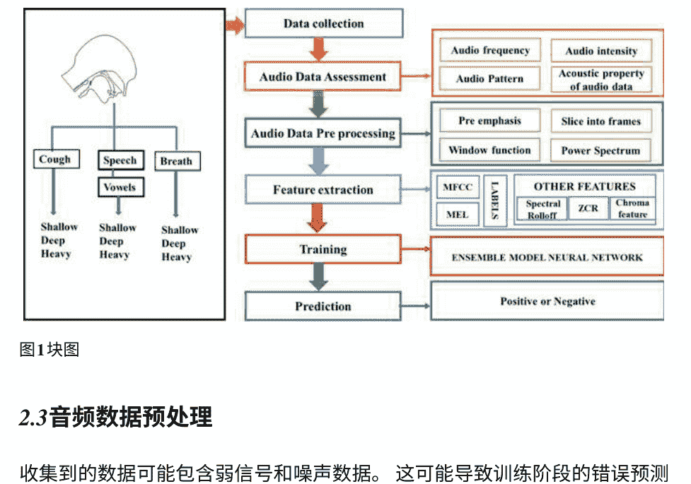

##### 2.3 音频数据预处理

收集到的数据可能包含弱信号和噪声数据。 这可能导致训练阶段的错误预测和不正确的分类。 音频参数可以根据特定要求进行增强。 这个处理过程被称为音频预处理。 因此，根据特定应用，音频数据必须通过改变音频参数（如不同的频率范围、强度、模式、功率等）来增强。 为了解决这个问题，步骤1-预加重

在这里，高频成分相对于低频成分增加了，这对于增强信号也是有用的，并且它增加了信号中的高频成分，改善了信噪比，并平衡了频谱。

预加重滤波器的一阶滤波器的信号 x表示为

$$y(t) = x(t) - \alpha x(t - 1)$$ (3)

其中 α 为0.97或0.95。

第2步-分帧

通常，语音处理在传输级和帧级进行。 传输级意味着处理是在整个样本大小的句子上进行的。 帧级意味着整个语音被分割成小部分，并在每个持续时间上应用算法并获得结果。 因此，从现在开始，信号的预加重被分割成所需的短时间帧。 因为收集到的声音样本，如咳嗽、呼吸和语音，是非平稳的声音信号，所以它们的频率范围在整个时间内变化，但在非常短的时间内，信号的频率被视为平稳的。

短周期内的样本数量可以表示为

```
样本大小 = 持续时间 * 采样频率   (4)
```

### 步骤3-窗口化

将信号切片成帧后，将窗口函数应用于信号。窗口函数用于消除信号中的突变。黑曼窗口、汉明窗口、汉宁窗口、估计窗口等是窗口函数的一些示例。最常用的窗口函数是汉明窗口，窗口长度与帧长度相同。应用窗口函数后，信号变得平滑，可以减少频谱泄漏。

```
w(n) = 0.54 - 0.46cos(2πn / (N - 1))   (5)
```

其中0 ≤ n ≤ (N - 1), N 为窗口长度。

### 步骤4-傅里叶变换和功率谱

短时傅里叶变换/频谱可以使用每个帧的N点FFT来计算。然后，计算功率谱

```
p = |FFT(x_i)|^2 / N   (6)
```

##### 2.4 特征提取

从声音样本中提取的主要相关特征是。

###### 2.4.1 梅尔频率倒谱系数 (MFCC)

它模拟了人声特征并定义了整体的频谱包络形状，通常由10-20个小的特征集组成。 在这种情况下，咳嗽信号通常被转换为感知频率，可以更好地模拟处理听觉。 因此，在预处理和计算傅里叶变换之后，接着计算每个Mel频率帧的谱能量，然后取每个Mel频率的能量的对数和Mel功率列表的离散余弦变换。

```
Mel(f) = 259log(1 + f / 700)   (7)
```

图2 Mel频谱图

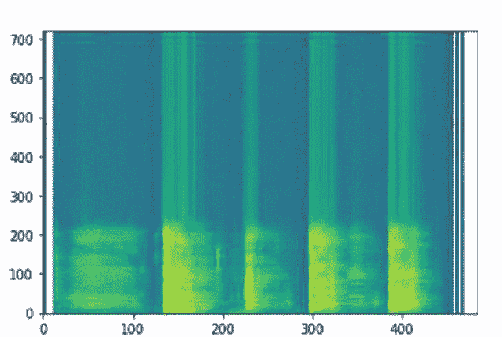

###### 2.4.2 Mel频谱图

Mel频谱图是信号不同能量水平的可视化表示，或者换句话说，它表示了特定波形上不同频率的信号强度随时间的变化。 图2表示Mel频谱图。可以通过以下步骤计算Mel频谱图:

- a. 使用短时傅里叶变换（STFT）计算频谱。
- b. 计算频谱的功率。
- c. 然后，通过在Mel刻度上应用三角滤波器来计算滤波器组。
- d. 将滤波器组应用于信号频谱。

###### 2.4.3 其他特征

例如，频谱衰减测量高频趋近于零的频率，并测量频谱形状，而色度特征描述音频片段之间的相似性。 也就是说，它衡量了信号中每个音高类别（C、D等）的能量量，并在样本段内考虑了过零率，测量了过零点的数量。

##### 2.5 标签

患者的元数据信息，包括csv文件，被称为标签。 收集的信息包括患者的年龄、性别、国家以及现有和当前的健康状况。

表1显示了标签，其中Y表示是，N表示否，通过将这些信息与收集到的声音进行比较，可以提高预测准确性水平。

表1标签
| id | id1 | id2 | id3 | id4 |
|---|---|---|---|---|
| 州 | 印度 | 印度 | 美国 | 印度 |
| 性别 | 女性 | 男性 | 男性 | 女性 |
| 年龄 | 26 | 44 | 33 | 60 |
| 吸烟 | N | 是 | N | N |
| 发烧 | 是 | 是 | 是 | N |
| 感冒 | 是 | 是 | 是 | N |
| 糖尿病 | N | N | N | 是 |
| 哮喘 | N | N | N | 是 |
| 缺血性心脏病 | N | N | N | N |
| 呼吸困难 | N | 是 | N | 是 |
| 喉咙痛 | 是 | 是 | 是 | N |
| 肌肉疼痛 | 是 | 是 | 是 | N |
| 嗅觉和味觉丧失 | N | 是 | 是 | N |
| 慢性肺病 | 是 | 是 | 是 | N |
| 肺炎 | N | N | N | N |
| COVID测试状态 | 是 | 是 | N | N |

##### 2.6 集成神经网络

集成神经网络是将强算法或弱算法结合在一起并预测加权输出的网络。 它具有良好的性能和更高的预测性能，即最终准确性优于单个模型的性能。

它有两种技术，提升和装袋，这使得系统性能更好。装袋减少了预测中的方差，提升增加了系统的性能水平。 集成神经模型学习了几个Wodzinsk etal.[13]，Wirths和Bayer[14]将它们的输出组合起来并产生最终的预测。这里使用的模型是长短期记忆（LSTM），卷积神经网络（CNN）和卷积循环神经网络（CRNN）。

循环神经网络（RNN）是顺序数据的最佳性能模型架构。 RNN的主要优势是能够记住先前计算的结果并在当前计算中使用该信息。 长短期记忆解决了RNN的短期记忆和梯度消失问题。 使用LSTM算法评估模型1，它们是具有不同操作的长期依赖关系，这里使用的机制称为门控。 以下是LSTM的步骤。

LSTM的第一步是识别样本数据中不需要的信息，然后从细胞状态中丢弃该信息。决策由遗忘门决定。

$$f_t = \sigma[w_f(h(t-1), x(t)) + b_f] \quad (8)$$

$w_f$是权重，$h_{(t-1)}$是上一个时间步的输出，$x_t$是新的输入，而$b_{(f)}$是偏置。在第二步中，他们决定存储在细胞状态中的信息。在这一步中，它既有sigmoid层又有tanh层。

$$i_t = \sigma[w_i(h(t-1), x_t) + b_f] \quad (9)$$

$$C_t = \tanh[(h(t-1), x_t) + b_f] \quad (10)$$

下一个状态是更新细胞状态为新状态。之后，运行sigmoid层来决定我们将输出细胞状态的哪一部分。

使用Zhang等人的方法对模型2层进行评估。卷积神经网络（convnet）是一类神经网络。它是一种前馈神经网络结构。它不会记住过去的结果。它具有以下层次，如卷积层，修正线性单元（ReLU）层，池化层和完全连接层。

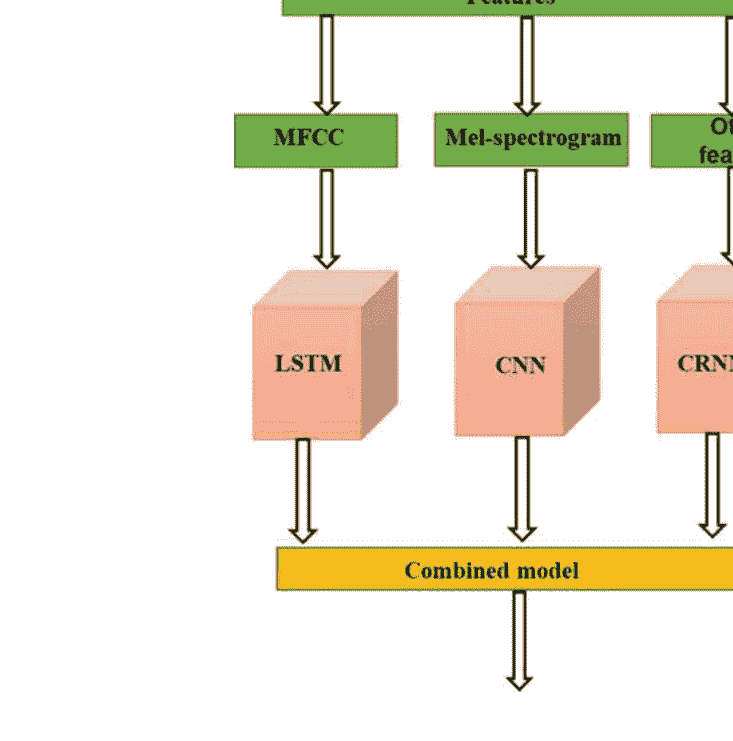

#### 3 测试和讨论

通过GitHub链接页面 (https://github.com/avakshaya1996/COVID19Data.git) 收集了呼吸、咳嗽和元音音频样本的数据。它包括1200个患者的音频和元数据信息。对开发的系统进行了多次测试，使用了各种音频数据。由于数据集是压缩和非压缩文件的混合，而压缩会降低音频质量，因此预计性能会下降。

表2显示了音频特征，其中每一行都提取了音频特征，如MFCC、Mel频谱图、过零率、频谱滚降等，这些特征来自数据集中的每个音频文件。因此，提取了多个特征，并用于训练过程。在从训练数据中提取音频特征之后，下一步是测试数据以评估其性能。通过观察模型在训练增加时的性能，逐渐提高了它们的准确性。图4显示了第一次训练步骤，在这个过程中，它们没有完全学习，曲线通过参考线是没有意义的。图5显示了第二次训练阶段，在这个过程中，它们比训练1学得更好，准确性也提高了，这导致了良好的性能。图6显示了优秀的曲线下面积 (AUC) 为0.71，这与样本相比噪声较大，但在极嘈杂的样本中也显示出了希望。

在最初的几次测试中，使用不同的滤波器对样本音频进行了滤波，并选择了一种有效的滤波算法。在测试过程中，首先在训练阶段创建了多个模型，并对样本进行了准确性测试。当达到所需的准确性时，最佳模型被保存在系统中，并排除了所有其他模型。使用创建的最佳模型，绘制了准确性曲线，包括真阳性和假阳性。作为评估指标，我们同时使用了准确性和接收者操作特征曲线下的面积 (ROC曲线下的面积)。由于数据不平衡，我们认为AUC会更好地展示模型的工作情况。

训练过程结束后，系统使用正负样本进行了测试。然后，计算预测的准确性并验证预测结果。图4、5和6展示了结果的ROC曲线，进一步证明了我们的模型对不同数据集的泛化能力。

| 行/列 | 1 | 2 | 3 | 4 | 5 | 6 | 7 | 8 | 9 |
|-------|---|---|---|---|---|---|---|---|---|
| 0 | -87.028 | -87.028 | -87.028 | -87.028 | -87.028 | -87.028 | -87.028 | -87.028 | -87.028 |
| 1 | -7.525 | -7.41 | -10.349 | -14.588 | -17.028 | -15.602 | -17.780 | -18.137 | -19.849 |
| 2 | -87.028 | -87.028 | -87.028 | -87.028 | -87.028 | -87.028 | -87.028 | -87.028 | -87.028 |
| 3 | -8.409 | -16.163 | -20.357 | -22.281 | -20.357 | -25.602 | -27.780 | -28.137 | -29.849 |
| 4 | -40.940 | -44.948 | -44.990 | -45.786 | -44.990 | -45.530 | -45.968 | -45.102 | -40.111 |
| 5 | -87.028 | -87.028 | -87.028 | -87.665 | -87.028 | -87.028 | -87.028 | -87.028 | -87.028 |
| 6 | -87.028 | -87.028 | -87.028 | -87.028 | -87.028 | -87.028 | -87.028 | -87.028 | -87.028 |
| 7 | -47.342 | -47.195 | -47.658 | -49.032 | -87.028 | 85.530 | -85.968 | -28.510 | -80.934 |
| 8 | -7.525 | -7.525 | -14.588 | 15.026 | -14.588 | 45.530 | -25.968 | -25.102 | -20.999 |
| 9 | -14.588 | -14.588 | -14.588 | -14.588 | -14.588 | 15.530 | -15.968 | -15.101 | -10.932 |
| 10 | -46.097 | -45.987 | -45.098 | -46.031 | -45.098 | 45.530 | -45.968 | -45.102 | -40.943 |

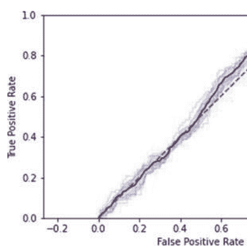

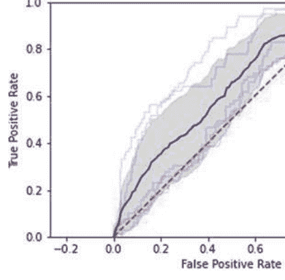

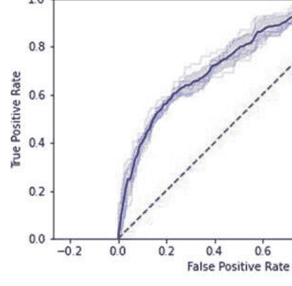

#### 4 结论

使用音频数据特征的新的相关方法，集成深度学习模型，已经被实施并成功地用于识别COVID-19阳性患者。 检测算法在外部和临床数据集上保持其性能，这些数据集是在略有不同的嘈杂环境中收集的，这些环境不太理想，并且在感染的不同阶段。 这个演示支持了COVID-19可以从咳嗽声中可靠地检测的假设，因为病毒的特征似乎是普遍的。 从系统获得的测试结果证明了预测的有效性。

#### 参考文献

- 1. Rudraraju, G., Palreddy, S., Mamidgi, B., Sripada, N. R., Sai, Y. P., Vodnala, N. K., & Harana th,S. P. (2020).咳嗽声分析与肺活量测定和临床诊断的客观相关性. Elsevier Inform. In M ed.
- 2. Meng, F., Shi, Y., Wang, N., Cai, M., & Luo, Z. (2020). 基于小波系数和机器学习的呼吸声检测IEEE Access, 8, 155710–155720.
- 3. Acharya, J., & Basu, A. (2020). 基于深度神经网络的呼吸声分类在可穿戴设备中的应用，通过患者特定模型调整IEEE Transactions on BiomedicalCircuits and Systems, 14(3), 535–544.
- 4. Gonzalez-Lopez, J. A., Gomez-Alanis, A., Martín Doñas, J. M., Pérez-Córdoba, J. L., & Gomez, A. M. (2020). 无声语音界面用于语音恢复：一项综述IEEE Transactions of Biomededical Engineering, 8(3), 995–1021.
- 5. Srivastava, A., Bhateja, V., Shankar, A., & Taquee, A. (2020). 对咳嗽信号处理的适用小波分析家族的分析。在智能计算前沿: 理论和应用中。
- 6. Sharan, R. V., Abeyratne, U. R., Swarnkar, V. R., & Porter, P. (2018). 使用咳嗽声音识别进行自动性喉炎诊断。IEEE生物医学工程学报, 66(2), 485–495.
- 7. Monge-Álvarez, J., Hoyos-Barceló, C., Lesso, P., & Casaseca-De-La-Higuera, P. (2018). 使用局部hu矩鲁棒检测音频咳嗽事件。IEEE生物医学和健康信息学杂志, 6(2), 910–920
- 8. Pham, Q. V., Nguyen, D. C., Huynh-The, T., Hwang, W. J., & Pathirana, P. N. (2020). 人工智能和大数据在冠状病毒（COVID-19）大流行中的应用：对现状的调查。IEEE Access, 77 (3), 366-372。
- 9. Monge-Álvarez, J., Hoyos-Barcelo, C., San-José-Revuelta, L. M., & Casaseca-De-La-Higuera ,P. (2018). 基于高级音频特征的稳健咳嗽检测机器听觉系统。IEEE生物医学与健康信息学杂志, 8 (4), 430-439。
- 10. Sun, L., Zou, B., Fu, S., Chen, J., & Wang, F. (2019). 基于DNN-决策树SVM模型的语音情感识别。在Elsevier关于语音通信的论文中。
- 11. Swarnkar, Vinayak, Abeyratne, Udantha R., Chang, Anne B., Amrulloh, Yusuf A., Setyati,Am alia, & Triasih, Rina. (2013). 自动识别儿科患者呼吸疾病中的湿咳和干咳。生物医学工程学年鉴, 41(5), 1016–1028。
- 12. Wani, T. M., Gunawan, T. S., Qadri, S. A. A., Mansor, H., Kartiwi, M. & Ismail, N. (2020). 使用卷积神经网络和深度步幅卷积神经网络进行语音情感识别。在第6届无线与远程通信国际会议（ICWT）中（第1-6页）。
- 13. Wodzinski, M., Skalski, A., Hemmerling, D., Orozco-Arroyave, J. R., & Nöth, E. (2019). 深度学习方法用于帕金森病的声音记录和卷积神经网络图像分类的检测。在第41届IEEE工程医学与生物学学会年会（EMBC）中（第717-720页）。
- 14. Wirths, O., & Bayer, T. (2018). 阿尔茨海默病和转基因阿尔茨海默病小鼠模型的运动障碍。基因、大脑和行为，7(2), 1–5。
- 15. 张三，张三，黄天，高伟（2018）。使用深度卷积神经网络和判别时间金字塔匹配的语音情感识别。IEEE多媒体交易，20(6), 1576-1590。

### SPADE、PrefixSpan、FAST和LAPIN算法的性能度量估计

T. M. Veeragangadhara Swamy和N. Vani

摘要：顺序模式挖掘从包括Google、Yahoo、Amazon、Flipkart等在内的众多社交媒体平台中提取出核心模式。在DNA分析、股票市场、入侵检测等不同应用中，顺序模式算法在提取智能模式方面非常有益。计算PrefixSpan、SPADE、LAPIN和FAST算法的性能度量。对于DNA分析、股票市场分析、用户行为预测和在线业务扩展的实时应用，应选择最佳算法。与其他算法相比，FAST和LAPIN算法表现最佳。在稀疏数据集上，FAST的性能更好，而LAPIN在稠密数据集上表现更好。

关键词：前缀跨度 · SPADE · GSP · 快速 · Lapin

#### 1 引言

序列模式挖掘主要关注预测未来的兴趣。在许多实时实践中，如决策支持、疾病预测、欺诈检测、学习状态分析、入侵检测、股票市场分析、网络日志分析和客户购物分析中，都会利用顺序算法。基于投资于特定公司的股票是否盈利或亏损，顺序算法在股票市场分析中进行更好的预测。疾病预测是基于患者症状进行识别的。网络日志分析用于检查用户日志的个性化，并进行未来请求的预测。顺序算法在用户进行的银行交易中更有效地检测欺诈活动。学习状态分析意味着对在线教育考试中学生的学习进行预测请求的正确性。在顺序模式挖掘中有几种算法，如GSP、前缀跨度、SPADE、FAST和LAPIN算法，它们从序列数据库中提取模式并预测未来感兴趣的模式，适用于多个实时应用。


#### 2 文献综述

FAST算法中考虑了丰富的离散约束条件[1]。对频繁序列进行了闭合序列和生成器序列的研究。它基于等价类考虑了约束条件。研究了MFC-IC以提高内存效率；检查了结果的时间效率。基于用户频繁输入记录用户兴趣的网络个性化[2]。它使用马尔可夫模型、聚类和关联规则挖掘。

通过使用Apriori技术[3]进行顺序模式挖掘算法的比较分析。通过使用广度优先遍历和深度优先遍历来遍历顺序模式树，以记录回溯过程的路径参考信息。入侵检测[4]通过使用时间戳来保护信息。提出了一种使用Apriori算法的候选生成方法来保护信息的网络入侵检测模型。

基于Apriori的算法[5]包括GSP、SPADE和SPAM算法。模式增长算法包括FreeSpan和PrefixSpan算法。Apriori算法需要连接和剪枝技术，并使用生成-测试方法。Apriori的主要特性是广度优先搜索算法。MR-PrefixSpan[6]通过合并较小元素的过程来减小数据库的大小。使用Hadoop平台进行实验以提高效率。

基于约束的Apriori[7]算法引入了事件内和事件间的约束。该算法提出了基于事件和序列的Apriori属性，对长序列模式具有高效性。GSP[8]算法的线性技术在迭代方法上工作，需要对'n'个数据库进行'n'次迭代。对于大型数据库，会生成大量的候选序列，并且需要更多的扫描次数。与PrefixSpan和SPADE算法相比，GSP算法的时间复杂度和空间复杂度更高。

模式增长算法[9]使用树结构来表示节点，使用深度优先搜索算法。搜索空间的分区表示将数据库分成较小的部分，并且并行进行挖掘，同时生成投影数据库。实施投影树来遍历树并基于深度和广度优先遍历搜索模式。在早期阶段对候选序列进行修剪，小于最小支持阈值的序列被消除，从而提高了内存效率。

#### 3 序列模式挖掘

序列模式挖掘最适用于在线业务交易的扩展，适用于全球业务。必须记录客户行为兴趣，以改善业务，如亚马逊、Flipkart、Zomato、Facebook和Twitter。序列模式挖掘的算法是SPADE、PrefixSpan、FAST和LAPIN。

##### 3.1 PREFIXSPAN

PrefixSpan在数据库中挖掘所有模式，并完全删除候选序列生成的概念。它处理高效，并减小了投影序列中的数据库大小。PrefixSpan[6]扫描数据库，识别长度为1的序列模式、长度为2的序列模式和长度为K的序列模式。

PrefixSpan的工作过程：

-   步骤1：在长度为1的顺序模式中，它将投影数据库进行分区，并将模式的第一个字母识别为长度为1的序列的前缀。
-   步骤2：扫描投影数据库的后缀，并适应长度为1的模式，并将序列的第二个字母识别为前缀。该过程被执行并重复，直到达到数据库的末尾。
-   步骤3：不使用候选序列。只采用投影数据库。

PrefixSpan算法的参数为：

1.  β是顺序模式。
2.  l是顺序模式的长度。
3.  SI β 是 α 是投影数据库。
4.  如果 β = <> ，则它是序列数据库 β。

先前的算法在实时应用程序中实施时存在一些缺点，导致了一些复杂性。

a. 大量的候选序列：
Apriori-like算法包括对序列中的项集进行排列组合的概念。来自数据库的序列列表。
```
< β1, β2, β3, …………… β1000 >
序列的总数 = n * n + n * (n - 1) / 2
对数据库的第一次扫描 < β1, β2 >
< β1, β2 > ………………… < β1, β1000 >
< β1, β1 > < β2, β2 > ………………… < β2, β1000 >
```
b. 大量的多次数据库扫描：
对于大型数据库，每个候选序列都需要多次数据库扫描。
{ (α1 α2 α3) (α1 α2 α3) (α1 α2 α3) (α1 α2 α3) (α1 α2 α3) } 需要进行十次相同的扫描。

c. 在挖掘大型序列模式中的复杂性：
对于每个候选序列，都会生成短模式，并在增长时生成大型序列模式。
例如：第一个序列的长度为1000。

表1描述了PrefixSpan算法的数据库输入，其中SID表示序列ID，EID表示元素ID。根据用户发送的请求记录了模式(RT)，(PQR)(PQT)(PQ)。

在这个算法中，数据库被视为投影数据库，前缀模式被识别为序列中的第一项，与后缀序列相关（表2）。

有两种类型的投影数据库：
(i) 按层级投影
(ii) 双层投影
(iii) 指针指向SQ1，偏移量表示投影到位置2。

PrefixSpan的漏洞：

#### 表1 Prefix Span的数据库1
| SID | 时间(EID) | 项目 |
| :--- | :--- | :--- |
| 1 | 20, 15, 10, 30, 50 | (RT) (PQR) (PQT) (PQ) |
| 2 | 10, 30 | (RT) (PQ) |
| 3 | 50 | (QR) (RT) |
| 4 | 10, 15, 30, 50 | (PQR) (PR) (RT) |

#### 表2 前缀跨度算法
**前缀跨度算法**

输入：序列数据集（SD）

输出：频繁模式（Fp），序列数量（Ns），时间效率（TE）

参数：计数，序列集合，开始时间（ST）=0，结束时间（ET）=0，模式计数（PC），当前前缀，当前频繁前缀，投影数据库，最小支持度（Min_Sup），频繁计数（FC），频繁模式（FP），序列（S1）

步骤1：初始设置计数 = 0
步骤2：查找长度为1的频繁前缀
步骤3：检查当前前缀 > 最小支持度
步骤4：将SeqSet、前缀存储在投影数据库中
步骤5：比较S1和S2的元素
步骤6：从投影数据库和前缀中查找前缀
步骤7：如果找到，则将FP添加到投影数据库
步骤8：重复此过程，直到达到SD的末尾
步骤9：打印Fp，TE，Ns

-   当考虑到大型数据库时，它会扫描整个数据库层级。处理需要更多时间。
-   当数据库很大时，考虑时间复杂度和空间复杂度更多。
-   该算法仅考虑数据库扫描的前缀，而不考虑后缀子序列。

##### 3.2 SPADE

快速发现算法是使用哈希树结构的SPADE算法，仅使用时间连接操作执行三次数据库扫描。该算法由ZAKI于1998年发明。SPADE（使用等价类进行顺序模式发现）（表3）。

SPADE具有以下特点：

a. 使用Id-List进行时间操作。
b. 哈希树结构减少了复杂性。
c. 它将原始问题划分为子问题，并执行等价类操作。

Spade在三次数据库扫描上工作：

a. 频繁1-序列
b. 频繁2-序列
c. 频繁3-序列。

#### 表3 SPADE算法
**SPADE算法**
输入：序列数据集（SD）
输出：频繁模式（Fp），序列数量（Ns），时间效率（TE）
参数：START_TIME(ST) = 0, END_TIME(ET) = 0, MINIMUM_SUPPORT_VALUE (Min_Sup), Frequent_Pattern(FP), IDList = 0, Itemset
步骤1：初始设置PC = 0, TE = 0, F1 = 0, F2 = 0
步骤2：找到F1-Frequent Length Sequence
步骤3：找到F2-Frequent Length Sequence
步骤4：计算等价类(EC)
步骤5：计算长度为1的候选序列
步骤6：如果Cur_Seq > Min-Sup
步骤7：将FP存储在垂直数据库中
步骤8：计算长度为2的候选序列
步骤9：执行时间连接操作
步骤10：重复此过程直到达到SD的末尾
步骤11：找到FP，NS，TE

| SID | 时间 | 项目 |
| :--- | :--- | :--- |
| 1 | 10 | R S |
| 1 | 15 | P Q R |
| 1 | 20 | P Q T |
| 1 | 25 | P R S T |
| 2 | 15 | P Q T |
| 2 | 20 | T U |
| 4 | 10 | S U V |
| 4 | 20 | Q T |
| 4 | 25 | P U V |

SPADE通过最小化I/O成本来减少数据库扫描[10]。它被认为是顺序模式挖掘中的快速模式查找器。Spade利用垂直数据库表示格式。对于大量的数据库和查找频繁序列，需要长度为n的项集big(O (n))。SPADE算法的特点包括：
1.  垂直id列表
2.  格论方法
3.  问题的分解。

让我们考虑序列SQ1和SQ2，其中SQ1包含项集I_S = {si_1, si_2, si_3, …… si_m}。考虑一个序列P和序列Q。如果事件P_i和Q_i。P_i是另一个序列Q_i的子序列，表示为P_i ≤ Q_i。唯一的找到频繁子序列f(P_i) < f(Q_i)（表4）。

现有算法的漏洞和缺陷有：

a. 最小化输入和输出问题。
b. 数据倾斜对性能有影响。
c. 内部数据结构复杂。

这些问题的缺陷可以在SPADE算法中得到解决。Spade将搜索空间划分为较小的片段，并在主内存中独立运行。它采用深度优先搜索和广度优先搜索。它降低了搜索方案的成本和效率。

##### 3.3 FAST算法

FAST（基于稀疏ID列表的FAST序列挖掘）在执行时比PrefixSpan和SPADE算法更快（表5和表6）。
FAST算法[1]最初将开始时间、结束时间和模式计数设置为零。用户插入阈值最大支持值，并找到项集扩展和序列扩展。

#### 表5 FAST算法的序列数据库
| SID | 序列 |
| :--- | :--- |
| 1 | {{a,b,c},{c},{d},{e},{f}} |
| 2 | {{a},{b},{c}} |
| 3 | {{c},{d},{e}} |

#### 表6 FAST算法
**FAST算法:**
输入: 序列数据集 (SD)
输出: 空间和时间的效率
参数: ST = 0, ET = 0, PC, IE(项扩展), SE(序列扩展), SuppTH(支持阈值)
步骤1: 初始设置 ST = 0, ET = 0 和 PC = 0
步骤2: 计算 IE 和 SE
步骤3: 在 ST 和 ET 上找到 FP
步骤4: 找到 PC, M_EFF, S_EFF
步骤5: 计算 Supp_th
步骤6: 显示 FP

##### 3.4 LAPIN算法

LAPIN算法是一种顺序模式挖掘算法，它通过将最后位置引导 (LAST) 用于搜索模式，并与第一个元素进行比较 (表7)。

在Lapin算法中，关键值位置是通过执行附加操作计算频繁(K +1)模式长度的最后位置。Lapin在查找顺序模式时极大地减少了搜索空间。ST和ET是算法的开始时间和结束时间，需要估计时间效率和空间效率 (表8)。

#### 表7 LAPIN数据库
| 客户ID | 客户序列 |
| :--- | :--- |
| 10 | a(abc)bc(d) |
| 20 | b(bcd)ac(bd) |
| 30 | c(bc)ab(cd) |
| 40 | d(bc)(ab)(ad) |

#### 表8 LAPIN算法
| LAPIN算法： | |
| :--- | :--- |
| 输入： | 序列数据库 |
| 输出： | 总时间，频繁序列，最大内存使用量 |
| 参数： | ST = 0，ET = 0，PC = 0，最大支持值，位置 = 0，序列扩展（Seq_E） = 0，项集扩展（IT_E） = 0 |
| 步骤1： | 估计FD扫描 |
| 步骤2： | 记录计数Min_sup，最大项 |
| 步骤3： | 计算SD扫描 |
| 步骤4： | 找到Seq_E和IT_E |
| 步骤5： | 研究回溯过程 |
| 步骤6： | 找到Min_Sup |
| 步骤7： | 计算THD扫描 |
| 步骤8： | 前向跟踪估计 |
| 步骤9： | 显示IT_E，Seq_E，PC |

#### 4 比较分析

##### 4.1 SPADE、PrefixSpan、FAST和LAPIN的比较分析

在表9中描述了PrefixSpan和SPADE算法的比较分析[3]。PrefixSpan中实现了Prefix增长投影。SPADE中实现了数据库垂直投影，而PrefixSpan中实现了水平数据库扫描。在早期阶段，PrefixSpan和SPADE都对候选序列进行修剪以提高空间效率。在树投影过程中，SPADE执行深度优先搜索。PrefixSpan算法执行广度优先搜索。

#### 表9 GSP、SPADE和PrefixSpan的比较研究
| 类别 | SPADE | PrefixSpan |
| :--- | :--- | :--- |
| 静态数据库 | 是的 | 是的 |
| Prefix增长 | | 是的 |
| 自底向上搜索 | 是的 | |
| 自顶向下搜索 | | 是的 |
| 正则表达式约束 | | 是的 |
| 基于BFS的方法 | 是的 | |
| 基于DFS的方法 | 是的 | 是的 |
| 候选序列修剪 | 是的 | 是的 |
| 数据库多次扫描 | 是的 | 是的 |
| 数据库垂直投影 | | 是的 |

#### 表10 基于模式增长方法的比较分析
| 序号 | 方法 | 技术 | FAST | LAPIN |
| :--- | :--- | :--- | :--- | :--- |
| 1 | 模式增长 | 候选序列 | 是的 | 是的 |
| 2 |  | 搜索空间 | 是的 | 是的 |
| 3 |  | 树投影 | 是的 | 是的 |
| 4 |  | 深度优先搜索 | 是的 | 是的 |
| 5 |  | 后缀增长 | 否 | 否 |
| 6 |  | 采样压缩 | 否 | 否 |
| 7 |  | Prefix增长 | 否 | 是的 |
| 8 |  | 内存 | 是的 | 是的 |

##### 4.2 FAST和LAPIN算法的比较分析

(见表10)。

#### 5 结果

使用Python Spyder 3.7软件实现了顺序算法。对于SPADE、PrefixSpan、FAST和LAPIN算法的时间复杂性进行了实验，以便为未来用户行为的序列模式挖掘选择最佳算法。

四个算法的数据集保持不变，但结果根据算法的性能而异。

PrefixSpan算法识别的模式序列为86，时间复杂度为0.120555，而SPADE算法的时间复杂度为0.330757。与SPADE算法相比，PrefixSpan的性能大大提高（表11、表12；图1）。

SPADE算法的时间复杂度根据找到的序列模式数量而异。数据集1识别的模式序列为86，时间复杂度为0.330757，数据集2的时间复杂度为0.124488（图2；表13）。

#### 表11 前缀跨度时间复杂度
**前缀跨度总时间复杂度**
| 数据集 | 序列 | 时间复杂度 |
| :--- | :--- | :--- |
| 数据集1 | 86 | 0.120555 |
| 数据集2 | 30 | 0.005835 |
| 数据集3 | 53 | 0.004604 |
| 数据集4 | 35 | 0.003180 |

#### 表12 SPADE时间复杂度
**SPADE总时间复杂度**
| 数据集 | 序列 | 时间复杂度 |
| :--- | :--- | :--- |
| 数据集1 | 86 | 0.330757 |
| 数据集2 | 30 | 0.124488 |
| 数据集3 | 53 | 0.037398 |
| 数据集4 | 35 | 0.035727 |

图1 前缀跨度时间复杂度图
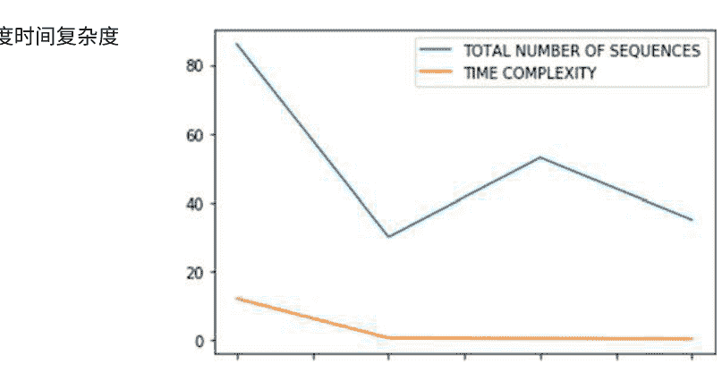

图2 SPADE时间复杂度图
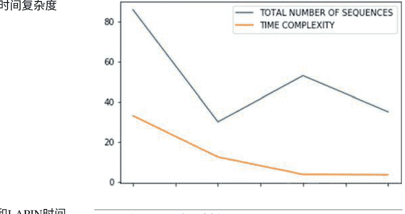

#### 表13 FAST和LAPIN时间复杂度
**FAST和LAPIN时间消耗**
| 最小支持率(%) | LAPIN (毫秒) | FAST (毫秒) |
| :--- | :--- | :--- |
| 最小支持率:20 | 35 | 0.054 |
| 最小支持率 = 50 | 20 | 0.025 |
| 最小支持率 = 70 | 15 | 0.020 |

图3 FAST和LAPIN时间复杂度图
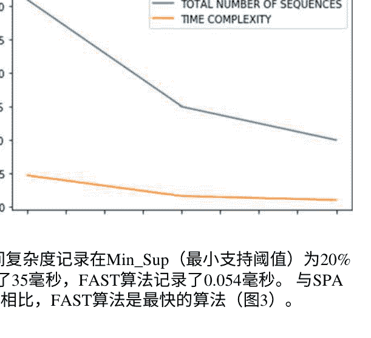

FAST和LAPIN算法的时间复杂度记录在Min_Sup（最小支持阈值）为20%的情况下，LAPIN算法记录了35毫秒，FAST算法记录了0.054毫秒。与SPADE、PrefixSpan和LAPIN算法相比，FAST算法是最快的算法（图3）。

#### 6 结论

顺序模式挖掘研究最常见的模式，记录出现频率最高的模式。现有的算法有GSP、PrefixSpan，使用候选序列生成和最小支持值估计和最大支持值阈值来找到大于min_sup阈值的模式。早期算法观察到内存空间和时间复杂度约束，并使用连接和剪枝技术，因此时间消耗较大。FAST算法执行速度更快，适用于稀疏数据集。LAPIN算法适用于稠密数据集。算法性能与数据库大小有很大关系，复杂性根据数据集长度而变化。

#### 参考文献

1.  Duong, H., Truong, T., & Tran, A. (2019). 从简洁表示中快速生成具有项目约束的顺序模式。Springer Open. Journal of Big Data. https://doi.org/10.1186/s40537-019-0200-9
2.  Doddgowda, B. J., Raju, G. T., & Manvi, S. K. S. (2016年5月20-21日). 从预处理的网络使用数据中提取行为模式以进行网络个性化。在IEEE国际电子信息通信技术近期趋势会议上.
3.  Parikh, M., Chaudhari, B., & Chand, C. (2013). 顺序模式挖掘算法的比较研究。工程与管理创新应用国际期刊(IJAIEM), 2(2). ISSN 2319 – 4847.

### 心律失常的预测和分类

Aashuli Gupta, Arnob Banerjee, Disha Babedia, Kunal Lotlikar, 和 Hema Raut

摘要 由于新一代医疗技术的进步，许多方法已被应用于解决医疗问题，包括机器学习方法。心律失常是一种常见疾病，可以使用各种机器学习方法来解决。已经引入了许多方法来对心律失常和异常检测进行分类。本文提出了一种解决方案，介绍了有监督和无监督模型，其中有监督模型产生了良好的分类结果。然而，在本文中，我们还引入了一个深度神经网络分类器，并根据一些预定义值对心律失常进行预测。在本文中，我们还将其连接到用户界面，以便本地用户可以检查心律失常的程度。

关键词 心律失常 · 心电图 · 分类 · 预测 · 深度神经网络 · 卷积神经网络 · 深度置信网络 · 支持向量机 · 决策树 · 逻辑回归 · MATLAB

#### 1 引言

心律失常是指心脏跳动不规律，要么过慢，要么过快的状况。心电图，也被称为心电图，可以检测患者是否患有心律失常。电极被附着在皮肤上用于记录患者心脏活动的读数。心电图信号是医学领域的重要组成部分，它帮助我们检测心律失常的程度和危险程度。数据的解读是困难的，普通人无法解码，总是需要医学专家，因此我们在这里使用机器学习来读取数据集（心电图）并检测异常情况。它可以更快速、更高效地完成工作。内容数据集来自UCI数据库。在预测和表征心血管心律失常之前，进行了预处理和标准化步骤。在本文中，我们使用深度神经网络技术根据医学标准进行数据分类和预测。

##### 1.1 项目的需求

这些天人们受到各种心血管疾病的感染。心脏疾病是影响大量人群的疾病之一。压力也是许多人心脏衰竭的原因之一。通过早期识别和理想的心律失常治疗，可以阻止这种不良的心血管衰竭和突然死亡，从而减少人们的心脏病发作并防止生命的损失。心律失常是一种心脏状况，心脏的跳动不规律，快速、缓慢或不稳定。有不同类型的心律失常，从危险到正常，其中心房颤动和心室颤动和心房扑动对人类来说是危险的。

这些心脏异常跳动可以通过适时使用适当的健康监测设备（使用机器学习）轻松识别，并可以通过适当的治疗给予急救。这就是机器学习发挥重要作用的方式。

##### 1.2 目标

该项目的主要目标是通过检查患者的心跳和其中的不规则性来检测患者是否患有心律失常。它使用机器学习预测发现的模式和预测数据，并帮助解决健康问题。对于疾病和综合征的预测，它们可以作为一个很好的模型。

#### 2 文献综述

我们研究并阅读了下面列出的研究论文，以便更多地了解和正确理解我们项目的实施。使用随机森林研究了振幅差异。在MIT-BIH数据库中添加振幅差异后获得的特征差异增长从98.51%到98.68%，为了表示增长，广泛使用了Wilcoxon符号秩检验，并在实验之后进行了。确定了添加振幅差异有所帮助。数据库包含48个半小时的心电图记录。因此，基于此，我们的分类器经过训练和测试，并添加了振幅差异。有许多特征，包括PQ、QR和RS振幅。该研究的目的是检查在将振幅差异添加到分类器之后数据的差异。添加了QRS持续时间和RR间隔。添加了P、Q、R和S的振幅差异的新数据。在添加新数据并使用随机森林后，差异不大，但从98.51%增加到98.68%[1]。

ECG信号就是心脏的脉搏读数，可以用来检测和预测心脏疾病。通过使用SVM（支持向量机），第一步是检测患者是否正常，然后第二步将疾病分类为患者可能患有的疾病类型。首先设置一个基本的时间，然后根据模型进行训练，以区分正常人和患病者之间的时间差。数据来自BIOPAC数据采集，并使用了70个受试者的数据。该模型的分类准确率为84.6%，有助于早期诊断不断增长的心脏病情，并在出现任何并发症之前进行治疗[2]。

为了获得DBN在心脏疾病上的准确性，DBN在多阶段模式下用于分类，也可以称为多阶段DBN。DBN的准确率为94.15%，敏感性为92.64%，选择性为93.38%。在这项研究中，使用的数据库是ADB用于心律失常分类。为了清楚地解释DBN，它由两个阶段组成。第一阶段是使用贪婪逐层无监督学习对神经网络进行预训练。对于第二阶段，我们通过对比散度方法中的有监督微调来增加第一阶段得到的分类。

心律失常检测和预测方法被使用。聚类和回归算法被用于这种检测。对于聚类，使用基于密度的空间聚类应用程序噪声（DBSCAN），对于回归分析，使用多类别逻辑回归。当聚类完成后，得到的聚类被传递给多类别逻辑回归。当这两个步骤完成后，我们可以确定心律失常的类型。整个系统的准确率达到80%。在训练阶段，同时使用DBSCAN和逻辑回归。数据集通过DBSCAN分成多个聚类，每个聚类中的实例属于多个类别。这种聚类方法在寻找聚类方面更高效，因此在其他聚类技术之上使用。应用逻辑回归将为每个聚类创建阈值。使用欧氏距离，我们检查测试数据属于哪个低密度聚类，然后选择最近的聚类，在测试阶段。选择最近的聚类后，检查阈值以确认概率大于测试元组的类别，将其归类到该类别[4]。

RNN算法已经被用于自动识别心电图中的正常和异常心跳。来自MIT-BIH数据库的心电图信号直接使用，没有对数据进行任何预处理。本文中使用了二元分类。心跳分类的成功是通过准确性、敏感性和特异性来实现的[5]。

为了分类目的，使用了一个三层反馈传播神经网络。结果显示，通过给分类器平衡的输入进行训练，可以检测出正常心跳和其他五种心律失常。通过训练网络的输入，从每个类别中取相同数量的模式[6]。

使用深度神经网络对心律失常进行分类。从心电图信号中提取了四个特征进行分类。提取的特征是Renyi熵，通过DNN将其分类为心律失常和窦性心律[7]。

为了使用深度学习方法（CNN和MLP）识别不同类型的心血管疾病，开发了一个诊断系统。这些算法在ECG信号上得到实现。多层感知器使用四个隐藏层，准确率为88.7%，CNN使用四个卷积层，准确率为83.5%[8]。

原始ECG时间序列数据与ECG频谱图作为CNN的输入。具体来说，ECG时间序列作为CNN的输入在第一种方法中使用。对于第二种方法，使用从ECG信号转换而来的时频域度量，并将其提供给CNN。在时频域中存在ECG信号的隐藏特征[9]。

研究工作提出了一种混合模型，该模型使用决策树和人工神经网络模型进行开发。本节为提出的混合算法给出了数学公式。基于内部压力、标准、目标和外部压力等标准对混合模型进行了检验。这样做是为了对每个类别根据提出的算法进行评估，然后与基于隐马尔可夫和SVM的决策支持系统进行比较[10]。

情感分析通过使用基于词典的方法和基于机器学习的方法来进行。本文提出了一个基本的信息单元，用于在文档级别上对正面或负面类别进行分类。机器学习算法中使用了SVM、逻辑回归、朴素贝叶斯和自然语言处理[11]。

使用了两个分类器，分别是基于概率方法的朴素贝叶斯分类器和用于识别数据集中的模式和分离的SVM。这篇研究论文提供了比之前的基于声音的数据集更高的准确性，该数据集中存在噪声[12]。

我们在这个系统中采用了一种高准确性的心律失常类型分类方法，结合了分类和预处理技术，并实现了深度信念网络（DBN）的应用。

#### 3 提出的模型

任何机器学习模型主要需要一堆信息来准备或测试模型。用于预测的信息是从UCI ML存储库中收集的，用于准备数据集。包括的参数列表是（年龄、状态、体重、性别、脉搏、心电图），被视为输入用于训练数据集和测试数据集。输入数据集读取并对一些探索性数据进行预处理，需要进行数据质量检查，如空值和缺失值，进一步用平均值替换或从数据集中过滤出来以提高预测效果。

在预处理之后，特征选择和提取方法被用于数据集，因为数据集通常包含大量的测量结果，产生的顺序不准确，特别是在特征的多分类中。使用特征选择包装器技术从数据集中提取重要属性，并使用sci-kit python库。

此外，标准化信息被分成两个部分，例如70%的数据用于训练目的，30%用于测试目的。训练/测试是一种衡量模型准确性的方法。一般原则是在大量数据集上训练算法以预测心律失常。

现在，我们正在使用不同的机器学习分类器来预测心律失常。分类器将帮助我们自动排序数据或将数据分类为一个或多个“类别”。归一化的数据将被输入到不同的分类器中。所有归一化的数据都将在所有分类器中使用。模型中使用的分类器如下：

##### A. 监督学习

监督学习基于带有标签的数据集，其中每个输入向量都有一个相应的目标向量，并可用于评估训练数据的准确性（图1）。

- **逻辑回归**

逻辑回归产生二进制形式的结果，用于预测因变量的结果。它有许多优点，例如可以依赖的特征。它是线性回归的改进，用于分类数据。选择具有最大数量的模型，并对给定的（测试数据）进行分类，进而得到最终输出。

它用于通过在它们之间划线来区分数据，将它们分开。它类似于线性回归，但这里用于区分数据的线是S形线。图上的负数据从零转换为一。逻辑回归在多类分类器中既可以作为二进制分类器，也可以作为多类分类器。

有很多数据可以使用相同的二进制分类逻辑进行分类。将要分类的数据与整个数据集进行比较。这个过程对所有数据都进行，并生成一个单独的模型。

#### 图1 工作流程图

它们在被添加到一起的地方形成。它们的平均值小于一，并且所有数据的平均值的加法等于一。

- **决策树**

它是基于某些条件的决策可能解的图形表示。决策树采用节点和分支的结构。节点的深度是从根节点到达该节点所需的最小步骤数。最终，达到一个最终点，然后进行预测。决策树可以处理数值和分类变量。过拟合是决策树的主要缺点。

在这个算法中，首先取一个数据集。假设这个数据集是D，有'm'行和'd'列。现在取相同数据的一部分，对行进行行采样（RS），对列进行特征采样（FS）。将这个数据的一小部分给决策树（Dt），并在这个小数据上进行训练。类似地，可以使用许多这样的决策树（Dt）。

为了测试，我们使用的所有决策树（Dt's）都是自助采样的，并且采用多数投票进行分类。例如，如果Dt1 →1，Dt2 →1，Dt3 →0，Dt4 →1，Dt5 →0，则多数投票为1。因此，1被认为是。

决策树的两个主要特点是低偏差和高方差。低偏差 → 当我们将决策树完全展开时，它将对我们的训练数据集进行适当的训练。因此，训练误差非常小。高方差 → 每当我们获得新的测试数据时，这些决策树（Dt's）很容易产生大量的方差。简而言之，当我们将决策树（Dt）完全展开时，它会导致一种称为过拟合的问题。

- **支持向量机（SVM）**

SVM是一种监督式机器学习算法，用于两组分类问题。当类别之间有明显的分隔边界时，它的表现相对较好。此外，在维度数大于样本数的情况下，SVM也非常有效。

在这个算法中，我们首先加载数据集，然后将其分成训练数据和测试数据。创建一个SVM分类器，使用线性核函数来提高分类器的复杂度。然后我们使用训练数据集来训练模型，系统将预测测试数据集的响应，并从中评估准确性。

##### B. 无监督学习

无监督学习的输入向量没有与之相关联的目标向量，也没有监督参与。相似类型的输入向量被分组在一起。在这个过程中，神经网络用于预测和分类，从而提供更好的性能。

- a) 第一个RBM被训练得尽可能准确地重构其输入。
- b) 第一个RBM的隐藏层被视为第二个RBM的可见层，并使用第一个RBM的输出来训练第二个RBM。
- c) 重复这个过程，直到网络中的每一层都被训练。

一旦拟合模型，我们将比较得分并检查混淆矩阵。在拟合了所有分类器之后，表现最好的模型将被选择为心律失常预测和分类的候选模型。这个候选模型的结果将显示混淆矩阵的得分。

#### 4 实施和结果

##### A. 监督和无监督模型

为了实施、项目和更好的结果目的，我们找到了一个csv文件的数据集，进一步对其进行了均值处理，并应用了包装特征。在此之后，我们使用谷歌协作平台来实现我们的监督学习机器学习程序。我们使用了逻辑回归、决策树和支持向量机器。

在预处理和清洗数据之后，我们根据这些监督学习分类器对其进行训练和测试，逻辑回归的准确率为57.52%，决策树为95%，SVM为71.43%。

下面是表格表示，以使其更易理解。表格将具有以下列：

- 分类器：分类器是用于训练和测试数据的模型。
- 准确率：它定义为对测试数据的准确预测的百分比。
- 精确度：它表示模型预测的总正结果中实际正结果的百分比。
- 回忆：它是通过将真正的正数据总数除以实际正数据总数来计算的。例如，在所有患有心律失常的患者中，我们正确检测到了多少比例的患者患有心律失常。
- F1得分：它是精确度和召回率的组合。它的值介于0和1之间。该值越接近1，模型的性能越好和准确。计算F1得分、召回率和精确度所需的值来自混淆矩阵。混淆矩阵是一个常用的表格，用于描述一个分类模型在一组已知真实值的测试数据上的性能。

此外，数据集在使用MATLAB进行无监督学习DBN时被使用。神经网络工具箱提供了算法、预训练模型和应用程序，用于创建、训练和可视化神经网络。训练数据集用于对某些规定的输出进行训练。经过542次迭代，它达到了最优梯度值。在生成数据后，从工具箱中检查各种参数。利用MATLAB和深度学习工具箱，可以配置、训练和部署DBN。

MATLAB程序被用于信息处理和特征化。分类器的表现已通过以下措施确定：

```
敏感度 = 真阳性 / (真阳性 + 假阴性) * 100 (%)
特异度 = 真阴性 / (真阴性 + 假阳性) * 100 (%)
准确度 = (真阳性 + 真阴性) / (真阳性 + 假阳性 + 真阴性 + 假阴性) * 100 (%)
```

它的形式为：

|   | 积极 (1) | 消极 (0) |
|---|----------|----------|
| 积极 (1) | TP       | FP       |
| 消极 (0) | FN       | TN       |

在模型的训练和测试之后，我们得出结论，与监督学习算法相比，无监督学习模型具有更高的准确性。因此，无监督学习模型与GUI界面进行了接口连接（图2）。

##### B. 用户界面

Flutter是由Google开发的开源UI编程开发工具，使用Dart语言编写。它还执行了Flutter的核心库、文档和网络I/O、可访问性支持。

- 免费和开源框架，可以在不同的平台上运行。
- 可以使用热重载实时进行更改。
- 允许访问本地功能和SDK。
- 代码量少，并且提供能够开发特定设计的小部件。

#### 图2 混淆矩阵

#### 图3 用户界面

在项目中，后端使用Flutter服务器来托管Web门户和应用程序，集成机器学习代码。Flutter在使用应用程序和Web框架时提供了更流畅和无缝的滚动体验，并且还减少了测试时间，可以准确预测和分类心律失常（图3）。

#### 5 结论

在本文中，我们研究了一种现代化的模型来预测和分类心血管心律失常的信息。在对无监督模型进行了研究之后，提出了一种基于深度学习的模型来预测心律失常。

调查表明，即使在人工智能和机器学习等领域的基本算法上，也可以在这些基本问题上取得良好的结果。因此，这项评估的延迟结果

#### 参考文献

4. Reshamwala, A., & Mahajan, S. (2012). DoS攻击序列的预测。在国际通信、信息和计算技术会议(ICCICT-2012) (pp. 18–20). 孟买.

5. Slimani, T., & Lazzez, A. (2013). 顺序挖掘: 模式和算法分析。国际计算机与电子研究杂志，2(5).

6. Yong-Qing, W., Dong, L., & Lin-Shan, D. (2012). 基于MapReduce的分布式PrefixSpan算法。在医学和教育信息技术国际研讨会上。

7. Gonen, Y., Gal-Oz, N., Yahalom, R., & Gudes, E. (2010). CAMLS: 一种基于约束的Apriori算法用于挖掘长序列。在数据库系统高级应用会议论文集中，第15届国际会议。

8. SPMF: 一种顺序模式挖掘框架。http://www.philippe-fournier-viger.com/spmf

9. Srikant, R., et al. 数据挖掘：概念与技术，在事务数据库中挖掘序列模式。http://www.cs.nyu.edu/courses/spring08/G22.3033-003/8timeseries.ppt

10. Zaki, M. J. (2001). SPADE：一种用于挖掘频繁序列的高效算法。期刊机器学习，42(1–2)，31–60。

11. Swamy, T. M. V., & Raju, G. T. (2015). 一种通过从网络使用数据中提取频繁顺序模式的新型预取技术。COMPUSOFT，高级计算机技术国际期刊，4(6)，第四卷，第四期。

12. Doddegowda, B. J., Swamy T. M. V., & Raju, G. T. (2013). 用于网络个性化和预取应用的网络使用数据预处理。高级计算国际期刊，46(3). ISSN: 2051-0845。

13. Chand, C., Thakkar, A., & Ganatra, A. (2012). 顺序模式挖掘：调查和当前研究挑战。国际软计算与工程期刊（IJSCE），2(1). ISSN: 22312307.

14. 钟, X.-Y. (2011). 基于Weka平台的网络日志挖掘研究与应用。Procedia Engineering, 15, 4073–4078.

15. Srikant, R., & Agrawal, R. (1996). 挖掘序列模式: 泛化和性能改进。在第5届国际EDT数据库技术会议上的论文: 数据库技术的进展(pp. 3–17).

16. Mahajan, S., Reshamwala, A., Sharma, N., Vineet, D., Sharma, A., & Shah, P. (2012). 预测用户音乐口味的Yahoo!音乐序列。在国际信息技术进展会议上的论文(pp. 6–9). 曼谷, 泰国. https://doi.org/10.3850/978-981-07-2683-6AIT-102

17. Pei, J., Han, J., Mortazavi-Asl, B., Wang, J., Pinto, H., Chen, Q., Dayal, U., & Hsu, M.-C. (2004). 通过模式增长挖掘序列模式: PrefixSpan方法。IEEE Transactions on Knowledge and Data Engineering, 16(10).

18. Srivastava, J., Cooley, R., Deshpande, M., & Tan, P.-N. (2000). Web使用挖掘：发现和应用网络数据的使用模式。ACM SIGKDD Explorations, 1(2), 12–23.

19. Agrawal, R., & Srikant, R. 挖掘序列模式。在国际会议数据工程(pp. 3–14).

## 表1 监督学习分类器的比较

| 分类器 | 准确率 (%) | 精确度 | 召回率 | F1得分 |
| --- | --- | --- | --- | --- |
| 逻辑回归 | 57.52 | 0.48 | 0.58 | 0.51 |
| 决策树 | 95 | 0.96 | 0.96 | 0.96 |
| SVM | 71.43 | 0.70 | 0.71 | 0.70 |

提出了更多的观点，认为这样的框架可能会在解决这个基本问题上发挥更大的作用，并且能够有效地使用。

如果不及时进行适当的治疗并且不了解疾病的严重程度，心律失常可能是一个严重的问题。它成功地通过神经网络过程识别了心律失常。这是一个高效快速的过程，而且非常容易维护。这项评估中的数据集预计将用于使用基于人工智能的统计估计方法的安排，例如逻辑回归（LR）、决策树、支持向量机（SVM）和深度置信网络（DBN）等。

基于Flutter的网站使界面非常用户友好。它还指导用户轻松访问疾病预测，尽早进行。在未来，原型的效率和准确性可以提高到一定水平，并且还可以连接到心电图设备，用于预测疾病，并在医疗应用中证明极其有用。

致谢作者们要向内部指导教师Hema Raut教授表示深深的感激和感谢，感谢她的指导、帮助和有益的建议，这些帮助成功完成了项目工作。这次工作经历使他们自我发展并接触到领域知识。

#### 参考文献

- 1. Lee, S., Kang, K., & Park, J. (2015). 基于随机森林的振幅差异特征的心律失常检测. IEEE.
- 2. Tabassum, T., & Islam, M. (2016). 通过分析心电图信号进行心脏疾病预测的方法. IEEE.
- 3. Altan, G., Allahverdi, N., & Kutlu, Y. (2018). 一种用于检测心律失常的多阶段深度学习算法. IEEE.
- 4. Mol, P., Suresh, A., & Suresh, G. (2017). 使用聚类和回归方法（P-CACRA）预测心律失常类型. IEEE.
- 5. Singh, S., Pandey, S. K., Pawar, U., & Janghel, R. R. (2018). 使用循环神经网络对心电图心律失常进行分类. 在计算智能和数据科学国际会议上, Elsevier.
- 6. Dash, S. K., & Rao, G. S. (2016). 使用平衡训练的神经网络进行多类心电图心律失常检测. © IEEE.
- 7. Paul, T., Chakraborty, A., & Kundu, S. (2018). 混合浅层和深度学习特征模型用于心律失常分类. IEEE.
- 8. Savalia, S., & Emamian, V. (2018). 多层感知器和卷积神经网络进行心律失常分类.
- 9. Sen, S. Y., & Özkurt, N. (2020). 使用卷积神经网络和频谱图进行心电图心律失常分类. 在2019年智能系统和应用创新会议(ASYU), IEEE Xplore: 2020年1月2日.
- 10. Kumar, T. S. (2020). 基于混合机器学习算法的数据挖掘营销决策支持系统.人工智能杂志, 2(3), 185–193.
- 11. Mitra, A. (2020). 使用机器学习方法进行情感分析(基于电影评论数据集的词典).普适计算和通信技术杂志(UCCT), 2(3), 145–152.
- 12. 陈, J. I. Z., 和Hengjinda, P. (2021年). 机器学习方法对冠状动脉疾病（CAD）的早期预测-一项比较研究。人工智能杂志, 3 (1), 17-33.

### 温度变化对基于PEM燃料电池的功率转换器的影响

M. Malathi, Usha Surendra, 和N. Latha

摘要在可再生能源系统中，转换器和燃料电池起着至关重要的作用。 便携式应用和独立应用的主要电源之一是燃料电池。 到目前为止，各种燃料电池类型中，PEMFC（质子交换膜燃料电池）是一种重要的燃料电池，具有快速响应、低工作温度、高功率/质量比、低噪音、几乎没有排放或无排放和稳定运行等特性。 温度变化影响燃料电池系统的性能。 本文旨在对PEMFC进行建模，研究不同类型的功率转换器以及温度变化的影响。 使用MATLAB Simulink对基于PEM燃料电池的能源系统进行不同功率转换器的仿真，对操作温度的变化进行结果表格化和讨论。

关键词燃料电池 · PEMFC ·功率转换器 ·MATLAB Simulink ·可再生能源系统

#### 1 引言

经济增长和人类发展主要依赖于清洁、安全、低成本和可靠的能源供应。 在未来几年内，传统能源如化石燃料将会耗尽，这将影响人类的经济增长。 因此，可再生能源在能源发电中起着至关重要的作用。

燃料电池是最受欢迎的绿色能源应用，因为它们提供不间断的能源供应。全年供电。由于氢燃料电池噪音较小且功率质量高，它们的好处更多。它们更适用于移动应用、医院和IT中心。燃料电池在系统中的使用结果是清洁和高效能的能量转换。燃料电池的特点如下：（1）燃料电池具有高能量密度，（2）燃料电池效率约为40-60%，（3）当燃料电池在系统中使用时，几乎没有气体排放，（4）对于低频纹波电流，燃料电池内部损耗更大，（5）单个燃料电池产生的输出约为0.7 V，因此为了增加输出电压，它们连接在串联，（6）对于高输出电流，燃料电池的动态性能较差，具有“输出电压下降和响应缓慢”的特点[1]。由于高功率密度和较低工作温度，更适用于车辆应用[2]。在便携应用中，由于“燃料电池更高的效率和较低的排放”，它们成为可靠的能源选择[3]。在燃料电池系统中采用电力电子技术可以使燃料电池在许多应用中使用。

燃料电池被广泛称为“氢能时代的微芯片”。PEMFC是一种利用氧气和氢产生电力的电化学电池。转换器能够将燃料电池的能量有效地传输给负载。“质子交换膜燃料电池（PEMFC）”被认为是解决现有生态问题的重要方法，因为它“几乎零排放，低温运行，对负载变化响应迅速[4]”。由于“低噪声、快速启动、稳健性、高效率、低工作温度”，PEMFC适用于固定和交通运输应用[5]。由于燃料电池提供低电压输出特性，燃料电池能源系统中需要“高升压DC-DC转换器”。负载增加会降低燃料电池的输出电压。

第2节介绍了燃料电池能源系统中功率转换器的应用，第3节介绍了功率转换器的建模，第4节介绍了PEMFC的建模，第5节介绍了仿真结果，第6节讨论了结论和未来的研究方向。

#### 2 燃料电池能源系统中的功率转换器应用

燃料电池是所有其他类型中最受欢迎的绿色能源来源，因为它们在整年都提供清洁和持续的供应[3]。但是，“燃料电池产生的能量具有低电压输出特性”，因此需要在燃料电池能源系统中使用转换器。由于燃料电池存在电压低、电流密度低和电源不可靠等缺点，DC-DC转换器在燃料电池能源系统中起着重要作用[6]（图1）。

通常，在负载条件下，单个燃料电池可以提供约0.3-0.5 V [7]。可以通过使用DC转换器与燃料电池结合来克服这些限制。为了满足燃料电池能源系统的操作条件，开发了不同的拓扑结构，可以作为“DC-DC转换器或DC-AC转换器”。逆变器。 根据负载是“交流还是直流”，燃料电池的电压将直接转换为交流电压。 对于低功率燃料电池，据称“通过将输入电流纹波保持在名义输入电流的2%以下，DC-DC升压转换器提供了调节的输出电压水平”。 升压转换器拓扑结构比降压拓扑结构更适用于低压燃料电池的应用[7]。

#### 3 功率转换器建模

##### 3.1 升压转换器建模

该转换器用于提升输入电压。 有时被称为“升压转换器”。 二极管和MOSFET的功能在开关过程中互补，即在给定的时间间隔内，当二极管关闭时，MOSFET打开，当MOSFET关闭时，二极管关闭。

在图2中，图表具有诸如电容器和电感器之类的存储元件。 电感器电压和电容器方程如下所示[8]

```
V_L = L \frac{di_l}{dt}  (1)
i_c = C \frac{d V_c}{dt}  (2)
```

在开关过程中，即情况（i）当MOSFET处于“ ON”状态时

```
$$ V_s = V_L $$
```

情况（ii）当MOSFET处于“ OFF”状态时

```
$$ -V_{out} + V_s = V_L $$
```

电感器电流由以下方程给出

```
$$ i_L = \frac{1}{L} \int V_L dt $$
```

通过电容器的电流可以通过以下方程获得

```
$$ i_C = i_L - i_R $$
```

```
$$ V_C = \int i_c dt \frac{1}{C} $$
```

升压变换器占空比由以下公式给出

```
$$ 1 - \frac{V_S}{V_0} = D $$
```

##### 3.2 降压变换器建模

降压变换器是一种将源电压降低的变换器。有时也被称为“降压变换器”。降压变换器的电路建模中具有电感器和电容器两个能量存储元件，其中电感器的电压 $V_L$ 和电容器的电流 $i_c$ 如图3所示。

```
$$ V_L = L \frac{di_l}{dt} $$
```

在开关过程中，即情况（i）当MOSFET处于“ON”状态时

```
$-V_{\text{out}} + V_s = V_L$
```

情况（ii）当MOSFET处于“OFF”状态时

```
$V_L = V_s$
```

```
$i_C = i_L - i_R$
```

```
$V_c = \frac{1}{C} \int i_c dt$
```

降压变换器的占空比由以下公式给出

```
$D = \frac{V_0}{V_S}$
```

##### 3.3 降压升压变换器建模

在降压升压变换器中，输出电压要么大于输入电压，要么小于输入电压[9]（图4）。电感器中的能量由以下公式给出：

```
$E = L I_L^2 \frac{1}{2}$
```

降压变换器电路图

输入输出电压比为：

```
\frac{V0}{V i}=\frac{-D}{1-D}
```

#### 4 PEMFC建模

为了设计燃料电池堆，PEMFC的特性非常重要，其方程如下所示。

$E_{\text{cell}}=E_{\text{Nernst}}-V_{\text{act}}-V_{\text{ohmic}}-V_{\text{con}}$

其中

$\begin{aligned} E_{\text{Nernst}} & =1.229-8.5 \times 10^{-4} \times(T-298.15) \ & +4.3085 \times 10^{-5} \times T \times\left(\ln P_{\text{H} 2}+0.5 \ln P_{\text{O} 2}\right) \end{aligned}$

$V_{\text{act}}=-\left[\xi_{1}+\xi_{2} T+\xi_{3} T \ln \left(C_{\text{O} 2}\right)+\xi_{4} T \ln (I)\right]$

其中

$C_{\text{O} 2}=P_{\text{O} 2} / 5.08 \times 10^{6} \times \exp (-498 / T)$

$V_{\text{ohmic}}=I\left(R_{m}+R_{c}\right)$

其中

$R_{m}=r_{m} X I / A$

其中

$r m=\frac{181.6\left[1+0.03 \frac{I}{A}+0.062\left(\frac{T}{303}\right)^{2}\left(\frac{I}{A}\right)^{2.5}\right]}{\left[\lambda-0.634-3\left(\frac{I}{A}\right)\right] \exp \left[4.18\left(\frac{T-303}{303}\right)\right]}$

$V_{\text{con}}=-B \ln \left(1-\frac{J}{J \max }\right)$

$\frac{I}{A}=J$

具有n个电池的堆栈电压由以下方程给出

| 参数 | 描述 |
|------|------|
| $n$ | 堆栈中的电池数 |
| $T$ | 堆栈的温度/K |
| $A$ | 激活面积/cm$^2$ |
| $l$ | 膜厚度/μm |
| $P_{\text{H}2}$ | 氢气压力/atm |
| $P_{\text{O}2}$ | 氧气压力/atm |
| $B$ | 计算Vcon的系数 |
| $\lambda$ | 膜湿度 |
| $\xi_1, \xi_2, \xi_3, \xi_4$ | 曲线拟合参数 |
| $C_{\text{O}2}$ | 阴极处的氧气浓度（mol/cm$^3$） |

```
$$E_{\text{stack}} = n E_{\text{cell}}$$
```

输出功率由以下方程给出

```
$$P_{\text{stack}} = E_{\text{stack}} I$$
```

效率为

```
$$\eta = \frac{E_{\text{cell}}}{E_{\text{Nernst}}}$$
```

从上述方程可以清楚地看出，随着温度的升高，激活电压损失减小，从而堆电压增加。由于堆电压的增加，功率和效率也增加（表1）。

#### 5 模拟结果

在Simulink中模拟了PEMFC、Boost和Buck变换器，并将结果列成表格。

##### 5.1 Boost变换器在Simulink平台上的电路模型图形计算实现

使用以下参数模拟Boost变换器：输入电压 = 45 V, C = 400μF, R = 4Ω 和 L = 76.8μH。

图5显示，对于输入电压45 V和给定参数，输出电压为74 V，与理论计算(图6)相比是令人满意的。

图5 升压变换器的图形实现

图6 升压变换器的电压图

图7 降压变换器的图形实现

图8 降压变换器的电压图

##### 5.2 Buck变换器在Simulink平台中的电路模型实现

使用以下参数对Buck变换器系统进行模拟：输入电压 = 60 V, C = 3 × 10^{-6}, R = 1Ω 和 L = 50 × 10^{-6} H（图7和图8）。

##### 5.3 Buck-Boost变换器在Simulink平台中的电路模型计算实现

使用以下参数进行模拟：输入电压 =45 V, C = 400 μF, R = 4Ω 和 L = 76.8 μH（图9）。

图9 燃料电池Buck-Boost变换器的图形实现

图10 当 D<0.5时的升降压变换器电压图

图10和图11显示，对于输入电压60V，并使用给定参数，当占空比 D =0.3时，输出电压为24.87，当占空比 D =0.6时，输出电压为83.68V，与理论计算相比，结果令人满意。

##### 5.4 PEMFC在Simulink平台中的电路模型实现

使用Simulink模拟了PEMFC模型，并显示了结果（图12和图13）。

图11 当 D>0.5时的升降压变换器电压图

图12 PEMFC的图形实现

图13 PEMFC的电压图

图14 基于PEMFC的升压变换器的图形实现

图15 温度对DC-DC燃料电池升压变换器的影响

##### 5.5 基于温度变化的PEMFC电路模型基于升压变换器

见图14和15。

##### 5.6 基于温度变化的PEMFC电路模型基于降压变换器

见图16和17。

##### 5.7 基于温度变化的PEMFC电路模型基于升降压变换器

从图15、17、18和19中可以清楚地看出，当燃料电池的DC-DC功率转换器的温度升高时，输出电压也会增加。

图16 基于PEMFC的降压变换器的图形实现

图17 温度对DC-DC燃料电池升压变换器的影响

图18 基于PEMFC的升降压变换器的图形实现

#### 6 结论和未来展望

在DC-DC变换器中使用各种拓扑结构使得在不同应用中可以利用非传统能源。对于PEMFC应用，直流到直流转换通常用于实现巨大的升压比，输入电流的波动小。如果存在输入电流的波动，可能会导致燃料电池堆内不可接受的滞后功率损失[6]。上述模拟结果清楚地表明，随着温度的升高，输出电压增加，从而导致电解质膜脱水[10]。在高温下的质子交换膜燃料电池中，“质子导电性降低和膜脱水”是关键障碍。

膜脱水的后果是“开裂、失去机械稳定性和收缩”[11]。从上述模拟结果可以清楚地看出，当输入参数出现不可取、意外的变化时，输出会发生不可取的变化。因此，为了克服这些问题，可以使用不同的控制器技术来提高系统性能[12]。

致谢我们感谢印度卡纳塔克邦贝拉加维的Visvesvaraya技术大学（JnanaSangama，Belagavi，印度-590018）对这项提议的研究工作的支持。

#### 参考文献

- 1. Daud, W. R. W. (2017). PEM燃料电池系统控制：一项综述。可再生能源，113，pp 620–638.
- 2. Benchouia, N. E., et al. (2015). 用于PEMFC燃料电池的自适应模糊逻辑控制器（AFLC）。国际氢能杂志，40（39），pp 13806–13819.
- 3. Lai, J.-S., et al. (2017). 燃料电池电力系统和应用。IEEE，105（11）
- 4. Runben, D. U., et al. (2019). 燃料电池混合动力系统中的DC/DC建模和电流谐波分析.SAE国际。
- 5. Derbeli, M., et al. (2017). 使用PI控制器控制质子交换膜燃料电池（PEMFC）电力系统。IEEE 2017.
- 6. http://www.eere.energy.gov/hydrogenandfuel cells.
- 7. Shyammohan等人（2018年）。燃料电池的DC-DC变换器拓扑的比较研究。国际电气与电子工程研究工程学报（IJEREEE），4（2）。
- 8. Vishwanatha等人（2017年）。通过MATLAB/SIMULINK进行升压变换器的完整数学建模、仿真和计算实现。国际纯粹与应用数学杂志，114（10），407–419。
- 9. Shringi（2019年）。独立光伏系统中Cuk、Zeta、Buck-Boost、Boost、Buck变换器的比较研究。IJERT，8（9）。ISSN：2278-0181。
- 10. Wu等人（2019年）。使用MATLAB/SIMULINK对NG燃料SOFC-WGS-TSA-PEMFC混合能量转换系统进行动态建模和运行策略，用于燃料电池车辆。能源卷，175，567–579。
- 11. Al-Hadeethi, F. (2017). 提高PEM燃料电池-质子交换膜燃料电池的性能。2017 - books.google.com.
- 12. Javaid, U. (2020). 基于滑模的操作效率改进PEM燃料电池的现代控制方法。IEEE Access, 8.

### Qgen：自动生成试题

Ajil Paul, Amal Sabu, Beema Abdulkader, Priya George和Sneha Sreevi

摘要教育是获取知识的过程，对于所有人来说都很重要，因为它在塑造学生的生活中起着至关重要的作用。我们通过教育获得的知识是通过教师定期进行的考试来评估的。考试成绩是学生在特定学科上的熟练程度的指示。教育课程的课程是通过学习目标来定义的。试题包括不同认知水平的问题。生成高质量的试题是必要的，因为在试题中的表现可以影响学生在生活中做出的职业决策。教师很难保持相同的复杂程度在一套试题中生成。在本文中，我们提出了一个模型，其中问题被自动标记为它们各自的认知水平。它还有助于创建不同的包含独特问题的试题集，并提供了一个图形表示问题中各种认知水平的百分比。图形表示有助于评估小组对试题中认知水平分布的概览。

关键词认知水平·布鲁姆的分类·试卷·标记·词嵌入·LSTM·图示表示

#### 1 引言

考试在学生的生活中起着至关重要的作用。学生在考试中的表现会影响他们在生活中做出的重要决策。因此，生成一份高质量的试题是任何教育课程的重要组成部分。
教师们会生成各种各样的试题，而缺乏经验的教师进一步加剧了这一过程的糟糕程度。一份好的试题是合理的结合简单和具有挑战性的问题。问题纸应与每门课程的学习目标保持一致。根据认知水平，问题的分布也很重要。对于教师来说，从可用的题库中选择一组随机问题以制定考试过程中的问题纸是一个困难的过程。同时，教师还需要根据大学指导方针保持不同认知水平的正确比例。手动生成多套问题纸需要更多的工作量，并对人们施加更大的压力，因为其质量完全依赖于个人的专业知识。因此，考虑到这些困难，我们提出了一种解决方案根据用户输入的规格自动生成问题纸。

根据布鲁姆的认知层次分类法，有六个不同的认知层次。它们是知识、理解、应用、分析、综合、评价（表1）。

表1 布鲁姆认知层次的分析[1]

| 层次 | 预期成就 | 问题示例 |
|------|----------|----------|
| 知识 | 能够背诵，记住之前学过的概念 | 在sethour函数中列出两个参考参数 |
| 理解 | 构建意义 用自己的话解释信息 | 简要比较二叉树和链表的性能 |
| 应用 | 在新场景中应用先前的知识 | 编写C++语句声明一个名为My Tune的musicType类型变量 |
| 分析 | 将系统的概念或架构分解为更小的部分 | 如果程序接收到值2 3 4 5作为输入 在第19行和第20行的语句执行后，time、hours和minutes的值是什么 |
| 综合 | 将元素组合成一个新的整体 | 如果在函数中执行从第22行到第34行的语句，写出函数Output Time的定义 |
| 评估 | 判断思想的价值并为任何立场或观点辩护 | 简要解释Java中传递原始类型和非原始类型作为参数给方法的机制的区别 |

#### 2 相关工作

通过进行书面测试进行评估是一种传统的过程，但它是几乎所有学术机构中的一种普遍评估过程。因此，学生应该根据他们学过的主题来回答问题，以达到他们学到的结果。然而，编写问题的技巧对教师来说是一项非常苛刻的任务[2]。

为了了解自动生成试题的需求，进行了文献调查。 发现所提出的解决方案是从预标记的存储库中选择问题来生成试题[3]。通过这篇论文，对布鲁姆的认知层次有了深入的理解[4]。根据论文[1]，采用了基于规则的方法，只匹配关键词来将问题分类到适当的认知层次。

通过论文[5, 6]，我们了解到在布鲁姆的认知分类中，词性标注的相关性被理解了。根据[7]，NLTK标注器在为单词分配适当的词性标签方面具有相当高的准确性。根据[8]，递归神经网络（RNN）是一种前馈神经网络，其输入取决于先前计算的输出。但是尽管它们具有一些吸引人的特点，由于梯度消失问题，RNN无法训练非常长的序列。根据[9]，LSTM是一种先进的RNN形式，解决了RNN中的梯度消失问题。它在性能上比传统的RNN要好得多。对LSTM和GRU进行了比较研究，发现在大型数据集的情况下，LSTM比GRU具有更高的准确性和F-度量，而GRU更适用于较小的数据集[10]。对于教师来说，手动为问题标记其相应的认知水平是一项非常困难和繁琐的任务。生成的试题纸的质量完全取决于教师的经验和专业知识。经验丰富的教师的短缺进一步复杂化了这个问题。因此，有一个系统自动将问题标记到其相应的认知水平是必要的。除此之外，还可以生成包含独特问题的多套试题，并通过可视化展示试题中各种认知水平的百分比。

#### 3 设计

##### 3.1 系统架构

- 步骤1：用户通过填写必要的详细信息注册，然后登录他们的账户（图1）。
- 步骤2：用户输入问题及其模块。
- 步骤3：问题被分类到相应的认知水平，并存储在数据库中。
- 步骤4：数据库存储问题、它们所属的模块以及它们对应的认知水平。
- 步骤5：用户可以输入生成的试卷的规格，例如按模块的百分比、认知水平的百分比、套数、部分数、各部分的总分、每个部分的分数范围。
- 步骤6：根据所有指定的条件从数据库中查询问题，并生成不同的试卷。生成的试卷不包含重复的问题。
- 第7步：生成各个认知水平在每个问题纸上的百分比的图示表示。

##### 3.2 问题分类

问题分类模块是一个处理自动分析问题并根据布鲁姆分类法将其分配到一组预定义认知水平的模块。该模块通常包括预处理阶段、词嵌入和分类器阶段（图2）。

- **预处理**

预处理是为了对文本进行分类而进行的处理过程。它将文本转换为更适合算法执行的形式。每个问题都必须经过一系列步骤，如规范化、分词、词性标注和词形还原。在规范化中，会删除不需要的数据，如标点符号、非英文字符等。在这个阶段还可以删除停用词。在执行规范化后，将结果传递给分词阶段。在这里，问题根据空格被分割成单个单词[9]。生成的形式被称为标记。然后，标记被传递到词性标注阶段，其中单词被赋予适当的词性标签。输出被送到词形还原阶段，其中后缀被去除，返回单词的基本形式或词典形式。

- **词嵌入**

词嵌入是文档词汇的最流行表示之一。它是特定单词的向量表示。词嵌入格式通常尝试使用字典在向量中映射单词。Word2Vec是学习嵌入的最流行方法之一。它是一种算法，接受文本语料库作为输入，并对每个单词发出一个向量表示[10]。这种方法的一个好处是可以高效地学习具有高质量嵌入的单词。它不是单一的算法，而是两种策略的组合——CBOW（连续钱包）和Skip-gram模型。这两种技术都研究了作为单词表示的权重。

预处理阶段的输出作为词嵌入阶段的输入。具有相似含义的单词在向量空间中以相同的方式表示。这些单词是浮点数的向量表示。

最后，向量化的单词被传递给分类器。

- **LSTM分类器**

LSTM是RNN的高级形式，它克服了RNN中的梯度消失问题[11]。与标准的前馈神经网络不同，LSTM具有反馈连接。它不仅可以处理单个数据点，还可以处理整个数据序列。它在前向传播过程中传递信息来处理数据。LSTM单元内的操作允许它保留或遗忘信息。LSTM单元中的信息通过三个不同的门进行调节，即遗忘门、输入门和输出门。遗忘门用于保留来自先前步骤的信息，输入门确定应该从当前步骤添加哪些信息，输出门用于确定下一个隐藏状态（图3）。

每个术语 Ti 首先使用Word2Vec模型将其转换为兼容的向量 xi输入，并在每个LSTM中进行安装。每次 j，隐藏层 Hj 的输出将分布回到下一个时间 j+1 的隐藏层中，使用以下插入 x j+1 的位置。最后，最终输出 Wn 将放置在输出层中。

在这里，LSTM模型将问题分类到适当的认知水平，如知识、理解、应用、分析、综合、评价。

##### 3.3 图示表示

可以生成一个图示图表，描述不同认知水平在试卷中的贡献。可以用条形图或饼图表示。这可以使用chart.js库来实现。Chart.js是一个用于包含动画和交互式图表的Javascript库。这有助于试卷审查委员会对试卷中不同认知水平及其分布有一个概览。

#### 4 实现

我们使用了Yahya等人（2012年）的数据集。它包含600个问题。数据集中包含问题及其对应的认知水平。数据集中包含的不同认知水平有知识、理解、应用、分析、综合、评价。

在模型训练阶段有几件事要做。首先，将问题传递到预处理阶段。输出被传递给word2vec，将问题中的每个单词转换为相应的浮点数向量。然后，我们填充输入问题，使它们的长度都相同以进行建模。模型将学习到填充时使用的零值不包含任何信息。在Keras中，需要相同长度的向量进行计算，但从内容上看它们的长度并不相同。

我们需要将数据分割为训练集和测试集。使用Yahya等人（2012年）数据集的70%用于训练，剩余的30%用于测试。在这些步骤之后，我们将输出传递给LSTM模型。第一层是嵌入层，使用32长度的向量表示每个单词。下一层是具有100个记忆单元的LSTM层。最后，我们使用具有单个神经元的密集输出层，因为这是一个分类问题，并使用softmax激活函数进行多级预测。预测的是知识、理解、应用、分析、综合和评价等不同的认知水平。在Keras中使用交叉熵作为损失函数。优化算法使用ADAM算法，因为它是最好的优化算法。

除此之外，我们将预处理后的输出传递给GRU模型。它是一个使用更新门和重置门的标准RNN。基本上，这是两个向量，决定应该传递哪些信息到输出。它们的特点是可以被训练以保留长时间以前的信息，而不会通过时间洗掉或删除与预测无关的信息。

#### 5 结果

GRU模型在训练时的准确率为86%，在测试时的准确率为82%。它的损失为0.1992。LSTM模型在训练时的准确率为87%，在测试时的准确率为85%。它的损失为0.1127（图4和图5）。研究发现，在可用的数据集中，LSTM模型的准确率相对较高。

#### 6 结论

现有系统主要倾向于基于规则的方法来对问题进行分类，以确定其适当的认知水平。 其中一些系统使用预标记的存储库来生成试卷。 这些方法只会给教师带来很大的工作量，因为大部分工作都是手动完成的，而且结果可能不准确。

我们提出的解决方案是一个网页应用程序，可以自动生成具有多个特性（如用户输入规范）的试题。它根据这些规范自动设置问题。还考虑了问题的含义。该模型还有助于创建包含独特问题的不同试题集。我们还考虑了试题中各种认知水平的百分比的图示表示的重要性。它减轻了教师生成多个具有独特问题的试题的负担，也减少了他们宝贵时间的消耗。

#### 7 讨论和未来范围

对于教师来说，手动标记每个问题到其适当的认知水平真的很耗时，而我们的模型简化了这个问题。尽管我们的模型运行良好，但仍有改进的空间，可以使其更有用。具有相似专业领域的教师之间可以共享问题库。因此，他们可以轻松地准备不同的试题，因为他们可以获得足够数量的问题。在将问题与数学方程映射到适当的认知水平时也存在困难。可以采用创新方法来解决这些问题。

#### 参考文献

- 1. Haris, S. S., & Omar, N. (2012). 基于规则的布鲁姆分类问题的自然语言处理方法。在2012年第七届计算与融合技术国际会议（ICCCT）中（第410-414页）。
- 2. Gangar, F. K., Gori, H. G., & Dalvi, A. (2017). 自动试卷生成系统。国际计算机应用杂志，166，42-47。
- 3. Nalawade, G., & Ramesh, R. (2016). 使用语义标记的问题库，根据用户输入的规格自动生成试卷。在2016年IEEE第八届国际教育技术会议（T4E）上（第148-151页），孟买。https://doi.org/10.1109/T4E.2016.038。
- 4. Ilango Sivaraman, S., & Krishna, D. (2015). 布鲁姆的分类法在考试试卷评估中的应用。国际多学科科学与工程杂志，6（9）。
- 5. von Konsky, B., Zheng, L., Parkin, E., Huband, S., & Gibson, D. (2018). 布鲁姆的分类法中的词类。
- 6. Kanakaraddi, S. G., & Nandyal, S. S. (2018). 词性标注技术调查。在2018年国际当前趋势融合技术会议(ICCTCT)（第1-6页）。https://doi.org/10.1109/ICCTCT.2018.8550884。
- 7. Tian, Y., & Lo, D. (2015). 关于部分词性标注技术在错误报告上有效性的比较研究。在2015年IEEE第22届软件分析、演化和重构国际会议(SANER)。https://doi.org/10.1109/SANER.2015.7081879。
- 8. Sutskever, I., Martens, J., & Hinton, G. E. (2011). 使用循环神经网络生成文本。 在第28届国际机器学习大会(ICML-11)(第1017-1024页).
- 9. 王，Y. (2017). 使用LSTM神经网络进行动态系统识别的新概念。 在2017年美国控制会议（ACC）中（第5324-5329页）。 https://doi.org/10.23919/ACC.2017.7963782.
- 10. 杨，S. (2020). LSTM和GRU神经网络性能比较研究。 在国际电子通信和人工智能研讨会（IWECAI）中。
- 11. Mohammed, M., & Omar, N. (2020). 基于Bloom的问题分类的分类学认知领域使用改进的TF-IDF和word2vec。 PLoS ONE， 15（3）： e0230442。 https://doi.org/10.1371/journal.pone.0230442.
- 12. 王，J.，刘，T.，罗，X.， & 王，L. (2018). 一种基于LSTM的短文本情感分类方法 ROC LING。

### 使用加权自相关的指数增强提取噪声语音的基频

Md. Saifur Rahman和Nargis Parvin

摘要 本研究提出了一种在嘈杂环境中从语音中提取基频的强大方法，对于语音处理应用更加成功。 本文讨论了一种基于加权自相关函数中指数增强的抗噪声方法来提取基频。 为了证明基频提取的更高准确性，我们关注幅度差异函数的指数。

根据实验结果，当使用适当的指数时，所提出的方法在嘈杂情况下的表现比传统技术更好。

- 基频
- 加权自相关函数
- 自相关
- 幅度差异函数
- 指数

#### 1 引言

声带的振动产生了语音的基频。这个商标特别适用于语音处理领域，例如语音分析合成、语音编码、语音增强和语音信号中的说话人识别。这些框架主要受基频提取的准确性影响。大部分基频提取方法主要基于时域方法、频域方法和两个域的方法。它们在清晰的语音中表现出高效性[1, 2]。

当语音信号被噪声污染时，基频提取是一个挑战。在嘈杂的环境中，嘈杂的语音无法保持周期性结构。因此，更难提取更准确的音高阈值。自相关函数（ACF）[3] 和平均幅度差分函数（AMDF）[4] 是两种最常用的基频提取方法，对抗噪声表现出足够的适应性。ACF利用信号的相似排列方式，通过移动延迟与自身相关。另一方面，AMDF显示原始输入语音与其延迟变体之间的差异，呈现出与ACF几乎相似的行为。在[5]中，通过使用ACF的属性创建correntropy，并考虑了一个转换函数来保护信号中周期性的特性，这对于基本基频提取非常有效。Correntropy还利用高阶统计量来提升基频提取的目标。

在[6]中，进行了加权自相关函数（WAF），它依赖于ACF并通过AMDF的倒数进行加权。WAF的主要基频提取精度优于常规ACF，其中加权增强用于提升在高噪声环境中更准确的峰值。

通常，基于ACF的基频提取策略的表现受到声道特性的影响而降低。

为了减少语音信号中的声道影响，倒谱（CEP）技术[7]在频域中显示出很大的倾向。通过使用信号的对数谱的傅里叶变换，在CEP中恢复了基频。因此，CEP策略减少了声道特性。当CEP用于清晰的语音时，表现良好；然而，当CEP用于噪声时，表现不佳。改进版本的问题在[8]中得到解决，表示为MCEP。基于CEP的技术在嘈杂环境中表现不佳，因为噪声语音的谐波在频域中受到干净语音谐波的影响。

最近，已经提出了两种最先进的方法[9, 10]。[9]中，PEFAC策略被创建，其中使用了一个音高评估通道来减少噪声属性的影响。导致平滑功率范围得到。PEFAC还使用幅度压缩方法来提高噪声鲁棒性。另一方面，BaNa [10]考虑了嘈杂语音峰值，并选择了语音信号幅度谱中的前五个谱峰。为了探索谐波峰值并从候选者中提取音高，BaNa采用了一种混合音高检测算法，计算谐波比。

本文提出了一种更新的加权函数，使用ACF和幅度差分函数在基频提取中进行指数增强。在幅度差分函数中，使用适当的指数值来消除噪声影响，同时获得嘈杂条件下的准确时间周期。因此，提出了更新的加权函数来提高提取精度。在嘈杂环境中，该方法还强调真实峰值，同时抑制噪声效应。

本文的其余部分按照以下方式划分。所提出的方法学在第2节中进行了描述。试验条件和初步实验所提出的技术在第3节中展示。之后，我们通过探索性结果将所提出的技术与传统方法的展示进行了分析。最后，在第4节中，我们结束了本文。

#### 2 提出的方法

令，$s(n)$和$v(n)$分别表示干净语音信号和噪声。然后，噪声语音信号，$y(n)$被定义为
$$y(n) = s(n) + v(n)。 \quad (1)$$

WAF [6]被定义为ACF的乘积和AMDF的倒数。在WAF中，它们分别表示分子和分母部分。在所提出的方法中，我们保持了ACF的特性，并专注于修改WAF中AMDF的功率。所提出的函数如下所示
$$\rho(\zeta) = \frac{R(\zeta)}{A(\zeta) + \delta} \quad (2)$$

为了避免除以零，使用一个微小的正常数$\delta$。右侧的两个函数，$R(\zeta)$和$A(\zeta)$，计算如下：

$$R(\zeta) = \frac{1}{M} \sum_{n=0}^{M-1-\zeta} y(n)y(n+\zeta) \quad (3)$$

$$A(\zeta) = \frac{1}{M} \sum_{n=0}^{M-1-\zeta} |y(n) - y(n+\zeta)|^P, \quad (4)$$

其中，$M$是帧的长度，$P$表示功率因子，$\zeta$是从0到$M-1$的滞后数。ACF根据第二个最高峰的位置与最高峰（在$\zeta = 0$处）的关系计算基本时间周期。对于$P = 1$的情况，(4)中的$A(\zeta)$对应于AMDF [4]，预计在$y(n)$与$y(n+\zeta)$相似时具有较强的最小值。另一方面，为了估计基本时间周期，AMDF技术计算第二个最小位置。

图1显示了不同SNR水平下语音信号的AMDF波形。从图1可以看出，在低SNR情况下，噪声添加的缺口点不太准确。背景噪声对AMDF全局最小值的幅度有显著影响。因此，提取误差显著增加。

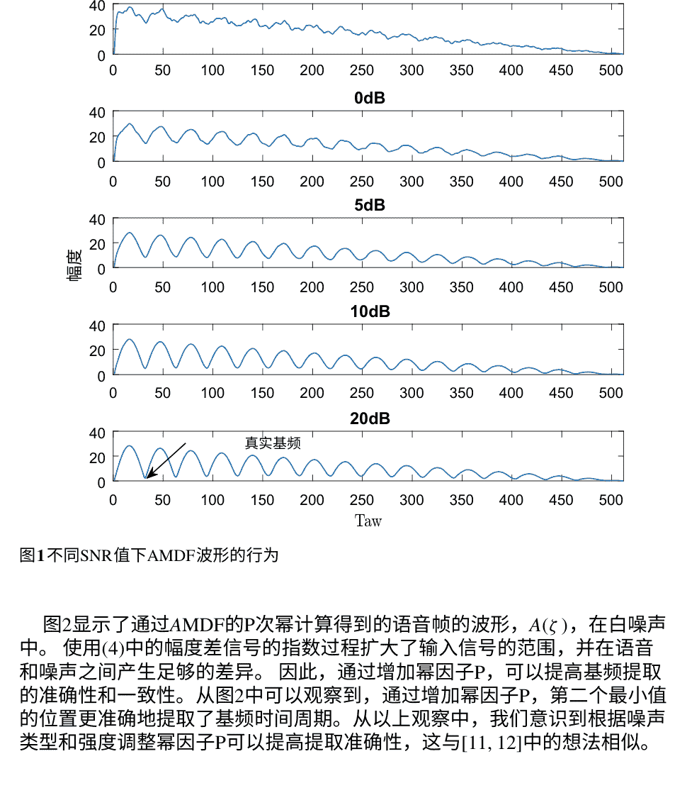

### 图1 不同SNR值下AMDF波形的行为

图2显示了通过AMDF的P次幂计算得到的语音帧的波形，A(ζ)，在白噪声中。使用(4)中的幅度差信号的指数过程扩大了输入信号的范围，并在语音和噪声之间产生足够的差异。因此，通过增加幂因子P，可以提高基频提取的准确性和一致性。从图2中可以观察到，通过增加幂因子P，第二个最小值的位置更准确地提取了基频时间周期。从以上观察中，我们意识到根据噪声类型和强度调整幂因子P可以提高提取准确性，这与[11, 12]中的想法相似。

首先计算所提出函数的分子部分ACF。我们计算分母中幅度差函数的功率，并添加δ以防止除法溢出。我们从初步测试中选择最合适的幂因子P作为分母。预计(2)中的ρ(ζ)将增强真实峰值，同时抑制虚假峰值和噪声成分。

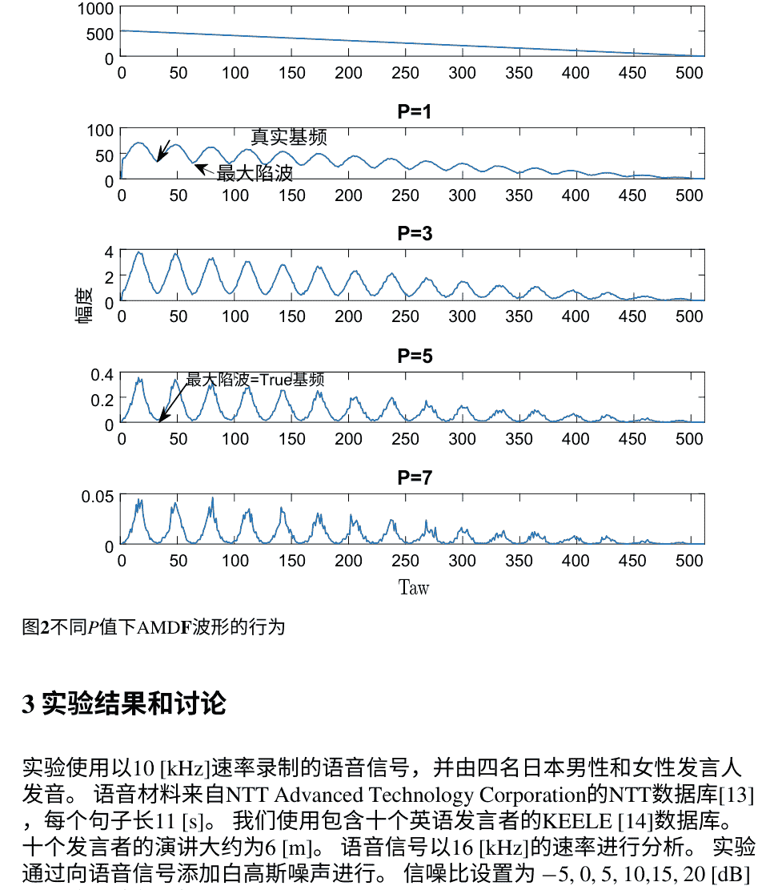

图2不同P值下AMDF波形的行为

#### 3 实验结果和讨论

实验使用以10 [kHz]速率录制的语音信号，并由四名日本男性和女性发言人发音。语音材料来自NTT Advanced Technology Corporation的NTT数据库[13]，每个句子长11 [s]。我们使用包含十个英语发言者的KEELE [14]数据库。十个发言者的演讲大约为6 [m]。语音信号以16 [kHz]的速率进行分析。实验通过向语音信号添加白高斯噪声进行。信噪比设置为 -5, 0, 5, 10, 15, 20 [dB]，具体试验条件如下：

- 除了PEFAC和BaNa之外，帧长度为51.2 [ms]。
- 帧移为10.0 [ms]；
- 矩形是窗函数。
- LPF的带限为3.4 [kHz]；
- 除了PEFAC和BaNa之外，NTT数据库的DFT（IDFT）长度为1024点，KEELE数据库的长度为2048点。

根据Rabiner的方法[2]，以下误差参数 e_r(m)被用来评估基频提取的准确性。

$$e_r(m) = F_1(m) - F_2(m), \quad for \quad m = 1,2, \ldots, k \tag{5}$$

其中 k 表示话语中的帧数，F_1(m) 和 F_2(m) 分别表示从噪声语音中提取的基频和真实基频在第 m 帧的值。因此，在 (5) 中，e_r(m) 表示提取误差。如果 | e_r(m) | > 10[%]，我们将该误差识别为粗略音高误差（GPE）。对于基频的提取，我们只考虑有声语句的部分。为了获得基频，使用搜索范围 f_{\text{max}} = 50 [Hz] 和 f_{\text{min}} = 400 [Hz]，这是大多数人提供的相同范围。

##### 3.1 初步实验

为了提高所提出方法的噪声测量下的更好功率因数的设置是重要的。然后，为了确定最佳功率系数，我们进行了基础试验。在这项工作中，我们仅使用分母部分、仅使用分子部分或两者都使用来提取基频。所提出技术的精度依赖于参数差异与噪声测量之间的关系。在这里，我们选择了从1到7的功率系数值，这更符合噪声的测量。如果分母部分的功率因数为1，则显示为AMDF行为。图3和图4分别显示了分母部分功率因数与男性和女性说话者的平均GPE之间的关系。平均GPE的表现取决于每个部分的功率因数。在图3中，对于男性说话者，功率因数 P 的值为5在低SNR水平上除了高SNR水平（从0 [dB]到20 [dB]）之外，显示出更好的提取精度。在高SNR水平上，功率因数 P = 2 的误差率比其他优势的 P 更低。同样，功率因数值从4到7的平均GPE率在-5 [dB]处几乎相似。图4显示了当功率因数 P 增加时，平均GPE的显著改善。根据测试结果，可以看出在两个说话者的几乎所有低SNR水平上，平均GPE随着功率因数 P 的增加而减小。

##### 3.2 性能比较

图5、6、7和8显示了NTT和KEELE数据库中带有白噪声的男性和女性演讲的平均GPE结果。NTT数据库没有基本频率的真实值。另一方面，在KEELE数据库中，在每个帧中，提供了基频的真实信息。在提出的方法中，我们使用了功率因子 $P =5$ 的最优值，因为随着功率因子的增加，误差率降低。在白噪声中，将提出的方法与传统方法PEFAC [9]、BaNa [10]和WAF [6]进行了比较。

除了帧长度、DFT(IDFT)点数、PEFAC的窗函数和BaNa之外，提出的技术中传统方法的实验是不变的。对于PEFAC，我们采用了Hamming窗函数，帧长度为90 [ms]，如[9]中建议的。DFT (IDFT)点数为 $2^{13}$，源代码使用了它们。PEFAC源代码来自[15]。对于BaNa，我们采用了Hanning窗函数，帧长度为60 [ms]。

根据[10]中的理论，DFT（IDFT）点为 $2^{16}$。BaNa源代码来自[16]。

从图5可以明显看出，在每个SNR设置下，所提出的方法的平均GPE [%]率是其他三种方法中最小的。从图6可以观察到，在所有SNR情况下，所提出的方法的平均GPE [%]明显优于PEFAC和WAF方法，除了在BaNa的SNR水平为 $-5$ [dB]时。在低SNR ($-5$ [dB]) 的女性语音中，BaNa的表现略好于所提出的技术。在低SNR下，噪声峰值对真实峰值有显著影响。因此，峰值提取变得更加困难。在这种情况下，BaNa通过选择前五个频谱峰值获得了优势。然后，通过对嘈杂语音频谱进行后处理，准确提取基频。

在这部分中，我们利用KEELE数据库来验证在嘈杂环境中提出的方法的展示。图7和图8分别显示了男性和女性演讲者的平均GPE率。然而，KEELE数据集的基频的真实值是通过喉音图信号给出的。

我们查看了基频的真实值，并发现了一些差异。在这方面，基频的真实值并不是非常精确。这在高信噪比（20 [dB]）下的GPE率中表现出来。

图7显示了与图5相比，所有方法几乎具有相似的趋势。从性能比较的角度来看，图8也与图6相似。对于每个演讲者，因素P对于提出的技术的成功有重大影响。如果我们考虑(4)中的 $P = 1$，那么提出的方法的行为就像WAF一样。

#### 4 结论

本文提出了一种基于WAF的抗噪声基频提取方法。所提出的方法在嘈杂环境中对语音信号的基频提取是令人满意的，实验证明了较低的GPE。所提出的方法通过在分子部分使用ACF，并改变幅度差信号的功率因子，具有强大的性能。

#### 参考文献

1. Hess, W. (1983).语音信号的音高确定. Springer.
2. Rabiner, L. R., Cheng, M. J., Rosenberg, A. E., & McGonegal, C. A. (1976). 几种音高检测算法的比较性能研究。 *IEEE Transactions on Acoustics, Speech, and Signal Processing*, 24(5), 339–417.
3. Rabiner, L. R. (1977). 关于自相关分析在音高检测中的应用。 *IEEE Transactions on Acoustics, Speech, and Signal Processing*, 25(1), 24–33.
4. Ross, M. J., 等人 (1974). 平均幅度差分函数音高提取器。 *IEEE交易-声学、语音和信号处理*, 22(5), 353–362.
5. Xu, J. W., & Principle, J. C. (2008). 基于广义相关函数的音高检测器。 *IEEE交易-音频、语音和语言处理*, 16(8), 1420–1432.
6. Shimamura, T., & Kobayashi, H. (2001). 加权自相关用于噪声语音的音高提取。 *IEEE交易-语音和音频处理*, 9(7), 727–730.
7. Noll, A. M. (1967). 倒谱音高确定。 美国声学学会杂志, 41(2), 293–309.
8. Kobayashi, H., & Shimamura, T. (1998). 一种改进的倒谱方法用于音高提取。在IEEE亚太国际电路与系统微电子和集成系统会议(APCCAS)论文集中.
9. Gonzalez, S., & Brookes, M. (2014). PEFAC–一种对高噪声水平具有鲁棒性的音高估计算法.*IEEE/ACM音频、语音和语言处理交易*, 22(2),518–530.
10. Yang, N., Ba, H., Cai, W., Demirkol, I., & Heinzelman, W. (2014). BaNa: 一种对语音和音乐具有噪声鲁棒性的基频检测算法.*IEEE/ACM音频、语音和语言处理交易*, 22(12), 1833–1848.
11. Motegi, S., & Shimamura, T. (2012). 使用带限幅的指数化幅度谱进行扩展基频提取.*国际计算机与电气工程杂志*, 4(4), 507–510.
12. 成田, M., & 岛村, T. (2011年) 噪声语音基频提取的指数增强。 *IEEE国际信号处理和信息技术研讨会*（第342-346页）。
13. 20个国家的语言数据库。 (1988年)。 NTT先进技术公司, 日本。
14. 普兰特, F., 迈耶, G., & Ainsworth, W. (1995年)。 基频提取参考数据库。 在*Eurospeech会议论文集*（第837-840页）。
15. Brookes, M. *Voicebox*工具包 [在线]。 可用, [www.ee.ic.ac.uk/hp/staff/dmb/voicebox/voicebox.html](www.ee.ic.ac.uk/hp/staff/dmb/voicebox/voicebox.html)。
16. Wcng, 无线通信网络组, [在线]。 可用[www.ece.rochester.edu/projects/wcng/code.html](www.ece.rochester.edu/projects/wcng/code.html)。

### 太阳能多功能农业实用系统

Vipin Bondre, Surabhi Pawar, Shatakshi Dixit, Shefali Thoolkar, 和Trupti Tale

摘要农业和农业在近几十年来发生了许多变化，特别关注技术改进。对于印度约58%的人口来说，农业是他们的主要收入来源。因此，农业行业需要改变新的想法和应用，以改善。

钻孔、播种、农药喷洒和割草是四个重要的农业过程，在本文中使用一台通过RF-远程系统监控的智能机器来解决这些问题。铁犁工具连接到机器的工具架上，用于松土。一次只播种和犁地一行种子。太阳能喷洒农药不会产生污染。顶部安装的太阳能电池板可以根据太阳的角度进行倾斜。该项目的主要目标是以合理的成本为农民创建机器，以提高作物产量和质量，并优化人力劳动。在我们的工作中，我们对所提出的系统与其他现有系统进行了比较分析。

关键词农业·太阳能·自动化系统·Arduino UNO

#### 1 引言

农业是印度最重要的职业之一。农业对印度经济非常重要。在过去几十年里，印度的农业发展迅速。尽管在这个领域已经做了很多工作，但发现和实施新的想法仍然至关重要。不幸的是，这些概念在现实世界中并没有得到充分实施。这是因为高昂的费用，对于生活在偏远地区的人来说很困难。多功能农业机器，通常被称为农机，是农业中用于最大化产量的基本重要机器。传统的犁地和播种方法是一种耗时的过程，因此存在人力短缺问题。因此，印度许多农民依赖牛、马和公牛进行农业操作。与世界上其他国家相比，这将不会足以满足农业的能源需求。因此，为了解决这些挑战，农作物生产程序已经推迟。我们相信，先进的技术可以替代人类和动物的努力，既具有成本效益，又节省时间，适用于小规模农民。因此，我们建造了一台多功能农业机械，以满足所有这些需求，同时解决劳动力问题。种子播种和孔钻，太阳能杀虫剂和杀虫剂喷雾器，利用射频遥控进行无线操作，除草器和收割机是多功能农业设备执行的五项任务。我们系统中的一切都将远程控制。该过程将逐行进行，一次处理一行。我们的系统将处理整个操作，包括孔钻、种子播种、杀虫剂和杀虫剂喷雾、除草和收割。

#### 2 问题陈述

在当前情况下，大多数国家缺乏足够的熟练劳动力，特别是在农业领域，这对新兴国家的增长产生了负面影响。因此，现在是自动化该领域以解决这个问题的时刻。在农业领域中，创建和构建一个能够同时进行多个操作的农业机器至关重要，以减少人力在繁琐工作中的投入。创建一个智能、高效的决策支持系统/机器，利用无线传感器和自动化方法来管理不同的农业过程相关任务，并向农民提供有关农田的有意义信息，从而减少人力投入、降低总体成本并生产更高效的作物。

#### 3 文献综述

使用自动化机器人进行播种和施肥：利用上述概念，一台机器能够在不需要人工干预的情况下有效地种植和施肥大量土地。该项目使用的技术是机器人技术和人工智能的混合体。作为一个农业经济国家，印度将从一项减轻小农和大规模农民额外负担的发明中获益[1]。

基于智能传感器的农业监测系统：通过监测环境因素并向农民提供适当的信息，已被用于提高植物产量。建议的方法主要是为了惠益农民。与有线网络相比，无线传感器网络的优势包括能够在任何环境中进行监测，以及其灵活性和稳健性[2]。

##### 太阳能多功能农业工具系统

农业机械化在亚达马瓦州小规模农场经济发展中的作用：通过监测环境因素并向农民提供必要的信息，已被用于提高植物产量。所提出的策略主要是为了帮助农民。与有线网络相比，无线传感器网络的优势包括能够在任何类型的监测环境中进行部署，以及其灵活性和稳健性[3]。

在农业系统中，物联网应该以不同的方式考虑，并且在各种作物的生产中应该有不同的方法。为了克服这个问题，作者提出了基于物联网的系统，通过收集环境信息来监测大规模的作物[4]。

在下一篇论文中，作者讨论了农药的持续排放。机械喷雾器设备使用太阳能直流电池来储存自然能源。一旦电池的充电水平达到足够的水平，它就开始喷洒农药。电池中储存的太阳能用于驱动喷雾器的电机[5]。

目前在印度，农民使用传统的方法进行农作物收割。传统的农作物收割方法是手工割草，但这种方法耗时且费力。在他们对特定的矮高作物切割机进行分析时。使用Pro-e和anises软件对切割辊和水平切割刀进行分析[6]。

与传统手动喷洒相比，自主机器人在喷洒农田方面更高效。它也对一些与健康相关的疾病有危害。因此，这种配备齐全的机器人可以在温室中喷洒农田而不会引起任何健康问题[7]。

通过比较植物生长与手动灌溉植物的生长来衡量自动灌溉系统的有效性。发芽、根系和总鲜重和干重都是生长参数。结果表明，自动灌溉系统随着时间的推移表现良好。通过光合作用速率来评估植物的表现，手动灌溉系统是一种选择[8]。

物联网正在改变农业，并赋予农民应对他们面临的巨大困难的能力。新的创新物联网应用正在解决农业问题，提高农业产出的质量、数量、可持续性和成本效益[9]。

最近的技术进步构成了物联网的基础，如射频识别（RFID）、无线传感器网络和云计算，这些技术在共享网络上处理“物”，以及基于云的应用程序是运行在连接到互联网的计算机上的。同样，有几项作品结合了一个或多个物联网技术[10]。

数字农业是利用现代技术，如传感器、机器人和数据分析，自动化以前劳动密集型的任务。本研究考察了农业机器人领域最新的一些进展，重点关注自主杂草管理、田间侦察和收获[11]。

由于当代技术的进步，农业行业引入了机器人系统，以提高生产力和效率。已经进行了多项研究，以提高机器人在农业操作中的能力，从而发展出自主农业机器人[12]。

## 4个目标

- 在同时提高作物质量和数量的同时，最小化所需人力的数量。
- 最小化在不同农业任务上花费的时间，如钻孔、种植、喷洒农药等。
- 大幅减少种子和化肥的浪费，从而防止任何污染。
- 利用太阳能来节省这些操作中使用的电力和能源，降低总成本。
- 使用射频技术和遥控系统，使该系统在不需要视线的情况下工作。
- 通过采用更创新的方法来降低运营成本。

#### 5 方法论

##### 一、播种/钻孔

将种子撒在土壤上，分离种子发芽，并将种子放入土壤中是种植种子的三个主要阶段。后两个阶段需要更长的时间和更多的努力来完成。必须进行检查，因为它是一个令人担忧的来源。因此，目标是设计和制造一种成本较低、独特的机器附件，可以快速使用。

### 基本组件：

以下组件用于构建播种机：

- 直流电机（DC电机）：这些电机用于驱动前轮，进而驱动分配器。
- 料斗：它们容纳将要种植在土壤中的种子。容量越高，在操作过程中就越不频繁地需要重新填充料斗。
- 种子分配器：它由通过皮带和滚轮操作的凹槽滚筒组成。
- 耕作机：耕作机的工作是将土壤倾斜到适当的深度，以便通过分配机构分配种子。
- 皮带和滚轮传动：该机器使用皮带和滚轮传动将动力从发动机传输到车轮，并驱动种子分配器（图1）。

##### 二、太阳能杀虫剂喷雾器

太阳能电池板通过利用来自太阳的光子刺激硅电池中的电子将太阳光转化为能量。然后，这种电力可以用于利用可再生能源充电电池（图2和3）。

##### 三、无线操作-RF遥控器

该项目的主要目标是开发一种使用RF技术来管理多个家电的新系统。基于RF的遥控器最重要的优点之一是它可以在指定范围内有效地操作家电，而无需视线。

发射器由两个主要部分组成：编码器IC HT12E和RF发射模块。编码器IC有四个端口，用于通过四个输入按钮操作电器设备。

在接收端，有一个解码器IC HT12D和一个RF接收模块。当你按下一个按钮时，匹配的输出端口变为活动状态，激活继电器并控制动作。

图3 太阳能安装的农药喷洒机构设计

HT 12E和HT 12D是具有广泛应用于开关和无线操作的编码器和解码器集成电路。 这个Rx/Tx模块有四个专用端口，一个用于每个编码器和解码器，可以配置为输入和输出通道。 每个输入开关都设置为操作一个匹配的继电器，该继电器与负载相连（图4和5）。

##### IV. 除草

图4 射频发射器和接收器

### 图5 发射机模块图

除草是农业过程中最耗时的方面之一。由于劳动力费用、时间和单调乏味，手工除草效率低下。该项目的主要目标是创建一个基本的除草器。

##### V. 农作物收割

在印度，有两种类型的农作物收割机：手动（传统）和机械化。农作物收割是农业行业的关键阶段。目前，印度农民采用传统的农作物收割方式，这是体力劳动，但这种方法非常耗时。如果设计一种自动化的农作物收割机，成本将更低。

## 6个组件

1. **HT 12E和HT 12D集成电路**
   HT12E集成电路只能与HT12D集成电路一起使用。这两个集成电路组成了编码器和解码器对。这是一对12位编码器和解码器。然而，编码器集成电路不应与另一个解码器集成电路连接，因此编码器和解码器集成电路对将共享一个8位数据地址。

2. **Arduino UNO**
   Arduino Uno是一款基于Microchip ATmega328P微处理器的微控制器板，是开源的。该板具有数字和模拟输入/输出 (I/O) 引脚，可用于连接扩展板 (盾牌) 和其他电路。

3. **继电器**
   继电器是一种由电控制的开关。输入端子的集合用于单个或多个控制信号，以及一组功能接触端子，构成了该设备。开关可以具有任意数量的连接以及任何接触形式，包括闭合连接、断开接触和两者的组合。

4. **太阳能电池板**
   太阳能无疑是当今最清洁、最可靠的可再生能源来源。太阳能光伏 (PV) 面板利用来自太阳的光子激发硅电池中的电子，将阳光转化为能量。

5. **电池**
   电能通常是从机械能、太阳能和化学能转换而来的。术语“电池”指的是一种将化学能转化为电能的装置。

6. **泵**
   泵是一种利用机械运动来输送流体的装置。泵使用能量通过装置推动流体来进行机械工作。

7. **底盘框架**
   它由一个结构组成，各种组件都安装在上面。底盘框架是机器的一个组件，包括框架 (上面安装了所有东西)。机器的底盘是最重要的组件之一。它是机器的一部分，用于支撑机器的机身和机头。底盘结构包括轮子、电机、料斗和喷洒系统等零件。

8. **挖掘工具**
   挖掘工具设备，有时也称为钻头，由带有倾斜钩的杆组成，随着机器的前进而钻地。该机制由钻探工具及其机器组成，在这个项目中，我们用机器的前进推动来犁地。

9. **化肥罐**
   它位于底盘背部的电池和电机之间。它连接在机器的喷洒机构上，可以装水或者杀虫剂。

#### 7 工作

我们使用IC HT12E进行通信。HT12E IC只能与HT12D IC一起使用。这些IC经常与RF或IR配对使用。这两个IC组成了一个编码器和解码器对。它们是12位编码器/解码器，意味着它们可以发送和接收12位数据。然而，编码器IC不应与另一个解码器IC连接，因此编码器和解码器IC对将共享一个8位数据地址。因此，在12位中，有8位用于设置地址，剩下的4位用于传输数据。我们可以使用4位数据进行16种不同的组合（24 =16）（图6）。

IC的工作电压范围为2.4至12伏特，尽管Vcc引脚（即引脚号18）通常由+5V供电，并接地于引脚号9。要启动传输，请拉动传输使能引脚（引脚14），该引脚与地相连。该IC需要一个振荡器来解码数据，因此我们使用750k电阻将OSC1和OSC2引脚连接到引脚15和16以激活它。引脚A0到A7用于设置提供给引脚AD8到AD11的4位数据，以及8位地址。编码器和解码器必须具有相同的地址才能相互通信。

Dout引脚（即引脚号17）可用于提取编码的12位数据。这些数据将传递给HT12D解码IC进行解码；可以通过电线直接传输或通过无线媒体传输（图7）。

HT12D的工作是解码输入引脚发送的12位信号。由于它具有内置振荡器，因此使该集成电路运行非常简单。该集成电路由引脚18提供5V电源，并在引脚9接地。

图7 接收器

通过引脚18提供5V电源，并在引脚9接地。该集成电路需要一个振荡器来解码数据。为了调用它，我们使用33K电阻将OSC1和OSC2引脚15和16连接在一起。D8到D11引脚可用于接收4位数据，而A0到A7引脚可用于创建8位地址。解码器和编码器必须具有相同的地址非常重要。从接收器的D8到D11引脚接收到的解码信号被馈入Arduino的输入引脚D2到D5，而Arduino的输出则从引脚D8到D13获取（图8）。

#### 8 结果和讨论

我们的结果是在手动、半自动和我们的完全自动系统上获得的。我们对我们提出的系统与现有的手动系统进行了比较分析。然后我们对我们的系统和市场上现有的各种半自动化工具进行了性能分析。尽管如此，我们还对直接电力和太阳能系统进行了相对比较研究。最后的比较评估报告是关于我们提出的系统及其与所有现有可用系统的有效性进行比较。这些结果是通过调查和与其他现有系统进行对比分析，并通过获取统计数据来评估我们的结果。

图8 Arduino UNO

功耗：如图9所示，我们的分析显示我们的系统与各种现有系统相比更兼容。功耗非常低，因为我们的系统直接使用太阳能电池工作。在传统系统中，它需要直接从电源获取电力，而且功耗也更高。它的功耗仅为电池容量的9%。

劳动：根据我们提出的系统，劳动需求非常少，而且所需时间更加高效。如果我们将我们的系统与现有系统进行比较，我们的系统每公顷所需的人力较少。对于每个公顷，它需要两个劳动力，并且对于每个公顷都是恒定的，而在其他系统中，它会随着每个公顷的增加而增加。对于手动和半自动化系统，随着土地面积的增加，劳动力需求也在不断增加。所得到的评估结果如图10所示。

图9 每公顷的功耗

图10 每公顷的劳动力

时间：我们系统的另一个主要性能参数是小麦作物的时间戳。与手动和半自动化系统相比，我们系统所需的时间相对较少。与传统现有系统相比，它所需的时间较少。它的分析结果显示在图11中，我们可以说我们的系统耗时较少，提高了效率。

总体性能：最终使用现有系统和我们提出的系统对系统的整体综合性能进行评估。比较分析结果显示，我们提出的系统在各个方面表现良好，并且其生产力相对于其他两个系统有可衡量的提高。该性能评估结果显示在图12中。我们提出的系统的性能比较高。

结论：我们提出的技术是一种混合农业系统，将使用太阳能运行。它将是一个半自动化系统，与当前系统相比有一些变化和进步。这项技术将完全自动化农田操作的各个方面，并且将使用太阳能运行。就播种、杂草清除和电力独立性而言，这个系统将更加高效和可靠。

图11 每公顷时间

图12 每公顷性能率

| Type | 1 | 2 | 3 | 4 | 5 | 6 | 7 |
|------|----|----|----|----|----|----|----|
| Manual | 10 | 13 | 17 | 20 | 35 | 44 | 55 |
| Semi | 20 | 29 | 36 | 44 | 47 | 48 | 65 |
| Proposed | 30 | 56 | 65 | 76 | 84 | 94 | 98 |

对于农民来说，这个系统将更加高效和可靠。从更大的规模来看，该系统将提高未来的作物质量和产量。因此，我们的结果显示与其他现有系统相比有改进的结果。未来可以通过各种新技术对这项工作进行扩展，这将带来高性能的结果并可能增加作物产量。

#### 参考文献

1. 李, M., 黄, J., &尧, H. (2013年)。基于物联网的农业生产系统。在2013年IEEE第16届国际计算科学与工程会议（CSE）中（第833-837页）。
2. Chavan, R., Hussain, M., Mahadeokar, S., Nichat, S., & Devasagayam, D. (2015年)。太阳能农业杀虫剂喷雾器的设计与建造。计算机科学创新与进步国际期刊, 4 (4)。
3. Avatade, P. G., Deshmukh, P. V., Sakhare, A. M., Shinde, A. J., Patil, J. M. (2013年)。基于Android的家电控制系统。新兴技术与先进工程国际期刊, 3 (12), 681-683。
4. Chavan, P. B., Patil, D. K., Dhondg, D. S. (2015). 手动操作的设计和开发收割机。机械与土木工程杂志(IOSR-JMCE), 12(3) 版本 I, 15–22. ISSN: 2278-1684, p-ISSN: 2320-334X
5. Celen, I. H., Onler, E., & Kilic A. E. (2015). 设计一种自主农业机器人在行间导航。在国际电气、自动化和机械工程会议(EAME 2015), © 2015: Atlantis Press.
6. Bakker, T., van Asselt, K., Bontsema, J., Muller, J., & van Straten, G. (2010). 系统化设计用于机器人除草的自主平台。地面力学杂志, 47, 63–73.
7. Sammons, P.J., Furukawa, T., & Bulgin, A. (2005). 自主农药喷洒机器人，用于温室。在澳大利亚机器人与自动化会议中，澳大利亚。
8. Boutraa, T., Akhkha, A., Alshuaibi, A., & Atta, R. 评估使用小麦作物的自动化灌溉系统的有效性。在北美农业与生物学杂志。ISSN印刷版: 2151-7517, ISSN在线版: 2151-7525, https://doi.org/10.5251/abjna.2011.2.1.80.88。
9. Satish, T., Bhavani, T., & Begum, S. (2017). 农业生产力增强系统使用物联网。国际理论与应用力学杂志，12(3)，pp 543–554. ISSN 0973-6085.
10. Tzounis, A., Katsoulas, N., Bartzanas, T., & Kittas, C. (2017). 农业物联网，最新进展和未来挑战。在Biosystems Engineering文章中。 https://doi.org/10.1016/j.biosystemsseng.2017.09.007.
11. Shamshiri, R. R., Weltzien, C., Hameed, I. A., Yule, I. A., Grift, T. E., Balasundram, S. K., Pit onakova, L., Ahmad, D., & Chowdhary, G. (2018). 农业机器人技术的研究与发展：数字农业的视角。国际农业与生物工程杂志。
12. Rahmadian, R., & Widyartono, M. (2020). 农业中的自主机器人：一项综述。在2020年第三届职业教育与电气工程国际会议(ICVEE)中。 IEEE, 2020年10月3日至4日。

### 对COVID-19和幸福报告数据集的监督机器学习技术的性能分析

Syed Abu Farooq和Selvanayaki Kolandapalayam Shanmugam

摘要 自从中国武汉爆发严重急性呼吸道疾病冠状病毒病以来，来自世界各地的研究人员和科学家一直在努力寻找治愈方法。世界各国政府正在采取前所未有的措施来减缓由严重急性呼吸综合征冠状病毒2引起的2019年冠状病毒病大流行的传播。许多政策，如学校关闭和人口限制，对社会造成了重大和明显的成本。本报告旨在分析我们合并的两个数据集中的数据，幸福报告数据集显示了公民的自由程度。这里考虑的第二个数据集是COVID-19数据集，其中包含按不同国家分组的确诊病例。该系统应用了不同的机器学习算法，包括线性回归、逻辑回归、支持向量机（SVM）、朴素贝叶斯（NB）和K最近邻（KNN），并分析了它们的性能指标。根据实验结果和讨论，确定了最佳算法，并在研究中得出结论。

关键词 流行病 · 自由 · 回归 · 机器学习 · 限制

#### 1 引言

最近在中国湖北省武汉市发现了一种严重的呼吸道疾病。自2019年12月12日第一位患者入院以来，截至2020年1月25日，已报告至少1975例病例。根据流行病学研究，这次疫情可能与武汉的一个鱼市场有关。世界各国政府正在采取前所未有的措施来减缓由严重急性呼吸综合征冠状病毒2引起的2019冠状病毒病的传播。许多政策，如学校关闭和人口限制，对社会造成了重大和明显的成本。本文重点介绍了与两个数据集合并的数据，一个是幸福报告，显示了公民的自由程度，另一个是COVID-19数据集按国家分组的确诊病例，将帮助我们判断各国是否给予更多自由导致了更多的COVID-19病例，还是更保守和更严格的政策有助于减少病例数[1-4]。根据报告中收集的数据，实施了机器学习算法并分析了它们的准确性，包括SVM，线性回归，逻辑回归，朴素贝叶斯和KNN，以预测未来的病例数。全球实施的主要政策包括关闭教育机构，禁止大型公共聚会，强制佩戴口罩和保持社交距离[5]。COVID-19的频繁传播改变了私人和公共生活方式。然而，这些政策也影响了人们的心理健康，全球范围内经济出现了巨大变化，因此人们不愿意遵循政府的指导方针[6]。这次大流行不仅影响了人们的健康，还对与伴侣和父母与子女之间的个人关系造成了问题。

研究人员发现COVID-19以各种方式影响人们的心理健康，并发现这是导致人们感到压力和抑郁的一个重要原因[7]。在这份文件中，我们研究并发现COVID-19时期的政府政策对全球幸福报告产生了重要因素。此外，通过使用机器学习算法研究发现，全球幸福因素影响COVID-19病例的增加。

#### 2 文献综述

世界于2019年12月12日遭受了一场威胁生命的大流行病，被命名为冠状病毒病（COVID-19）。研究人员发现，这种致命疾病是由严重急性呼吸综合征冠状病毒2引起的；它也被称为（SARS-CoV-2）。过去的研究表明，这种病毒的首次爆发始于中国武汉市的一个当地海鲜市场。COVID-19的最常见症状是发热、干咳，严重情况下呼吸困难导致死亡。此外，研究人员发现，老年人和患有慢性疾病的人更容易受到影响并死亡。

科学家发现有不同的方法来测试和诊断疾病，如RT-PCR和血清学测试。然而，研究表明，这种COVID-19具有类似肺炎的症状，并假设它最初是从蝙蝠传播给人类的。

研究学者在研究武汉中心医院的一名患者时发现，该疾病与呼吸系统疾病有关。对患者的症状进行了详细研究，发现COVID-19是一种损害肺部的急性呼吸系统疾病。自从由SARS-CoV-2引起的疾病爆发以来，全世界的科学家和研究人员都在努力寻找治愈这种方法，并寻找和实施减缓这种高度传染性疾病传播的解决方案。

几乎世界上每个国家的政府都加入了实施规定，以减缓疾病的传播。抗传染政策可以帮助停止或打破频繁传播疾病的链条。研究表明，许多国家已经实施了强制佩戴口罩等规定。一些国家甚至对发现不戴口罩的人进行了处罚。一些国家还包括关闭学校和公共场所，以减少人与人之间的互动。许多国家实施了严格的封锁措施，限制人们在家或国内活动。然而，已经发现这些抗传染政策和规定在减缓疾病传播方面产生了显著影响。另一方面，这些策略对国家经济造成了打击，人们遭受了很多困扰[1-4]。

研究人员发现一种被称为幸福感的方法解释了全世界的人都希望长寿健康[8]。进行了多项研究以寻找治疗这种致命疾病COVID-19的方法。然而，即使在COVID-19爆发一年后，它仍然无法治愈，但研究人员发现实施政策可以显著降低感染人数。另一方面，更严格的政府政策导致人们情绪波动，导致压力和抑郁[9]。许多研究人员实施并发现了不同的方法来衡量情绪，并研究COVID-19对人类健康的影响[10]。为了克服人们的情绪失衡，世界卫生组织和世界幸福报告明确指出，减缓感染的传播是保持身体距离而不是社交距离。人们自己保持社交距离，这导致了孤独和不幸感[11]。所有政府政策都是为了保护人类生命而制定的。相反，心理学研究人员发现这对人们的心理健康产生了影响，高水平的研究旨在找出封锁对人类心理健康的影响[12]。

此外，基于升级的研究，政府政策已经修订，以降低严格政府政策对个人心理健康的影响[13]。此外，研究人员和科学家正在寻找解决方案，为决策者提供准确和最新的数据集。因此，他们可以制定更好的政策和规则，以减缓病毒的传播。由于严格的防传染政策对世界经济造成了严重打击，学者们正在不断努力寻找更好的方法和修订后的政策，这些政策不仅应对疾病的传播，还不应对任何国家的经济造成损害，并保持个人的心理健康。新的修订策略更具针对性和特定性，例如关闭受影响更大的国家地区而不是关闭整个国家[14]。在2020年的疫情期间，已经注意到美国的预期寿命有所下降。感染频繁并在几天内传播到全世界[15]。过去的研究表明，社交距离在疾病传播中起着重要作用。该疾病的症状与季节性流感类似，但过去的研究表明COVID-19不同于季节性流感[16]。

#### 3 提出的系统

在机器学习中，算法被分类为有监督和无监督学习算法。

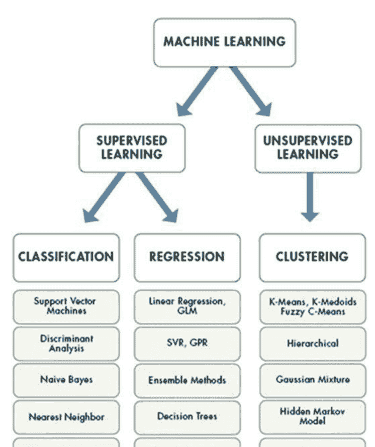

有监督学习技术之一是分类。在我们的系统中，使用了不同的分类算法。它们是

-   线性回归
-   逻辑回归
-   K-最近邻
-   支持向量机
-   朴素贝叶斯

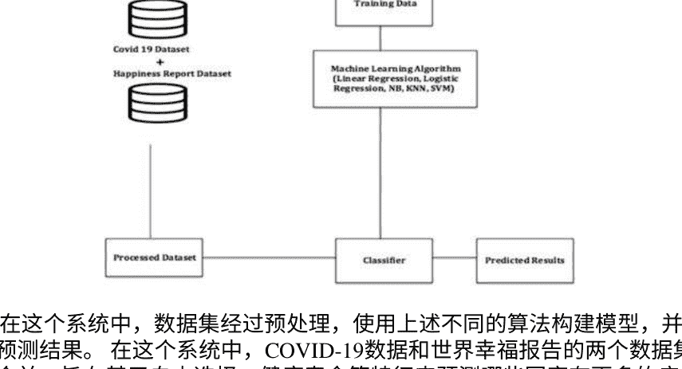

在这个系统中，数据集经过预处理，使用上述不同的算法构建模型，并得到预测结果。在这个系统中，COVID-19数据和世界幸福报告的两个数据集被合并，旨在基于自由选择、健康寿命等特征来预测哪些国家有更多的病例。根据这个数据集训练模型，然后在未来，当系统获得这些参数时，它可以预测这个国家在COVID-19传播方面是否有风险。在分类算法中，它将国家分类为有风险或无风险，并且像回归这样的算法将根据未来的天数预测预期的病例数。然后，通过考虑性能指标来计算算法的性能。性能指标是基于准确性、混淆矩阵等组件来考虑的。

## **4 实验结果和讨论**

##### 4.1 数据可视化

不同类别的数据可视化，如最大感染率、GDP人均和社会率，不同国家的选择自由度，健康预期寿命的最大感染率（图1、2、3、4、5、6、7和8）。

##### 4.2 数据预处理

在这个系统中，COVID-19数据和世界幸福报告数据集被合并，并旨在根据选择自由度、健康预期寿命和其他社会特征来预测哪些国家有更高的病例数。在COVID-19数据集的预处理中，删除了“纬度”和“经度”列，因为它们在这个时候不需要。然后是每个国家的感染计数

## 图1 按国家划分的最大感染率

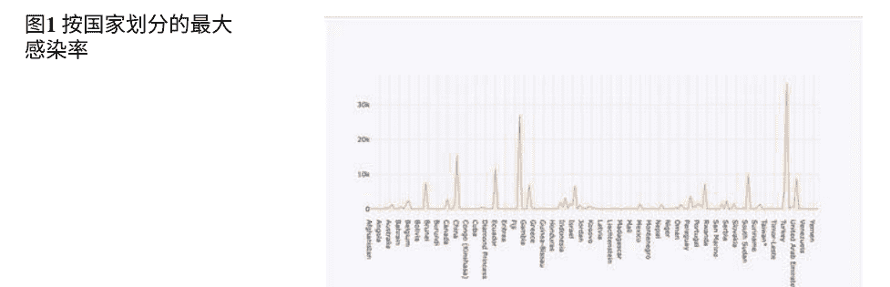

## 图2 按国家和日期划分的最大感染率

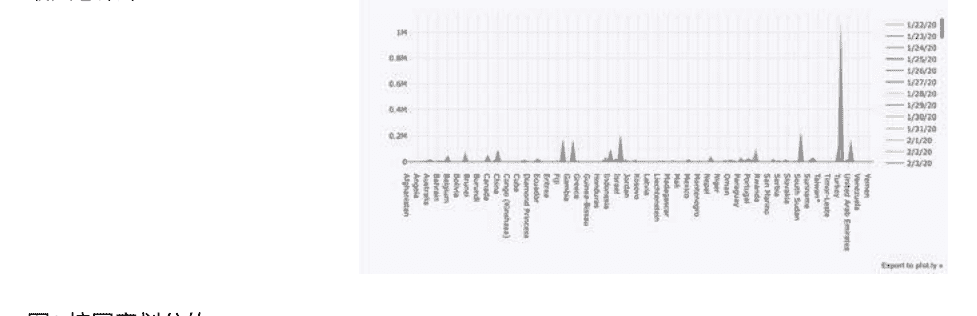

## 图3 按国家划分的数据—选择自由度

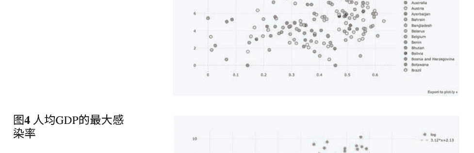

## 图4 人均GDP的最大感染率


## 图5 社会感染率的最大感染率

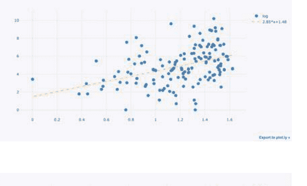

## 图6 健康预期寿命的最大感染率

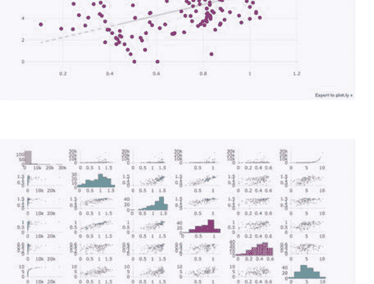

## 图7 散点矩阵

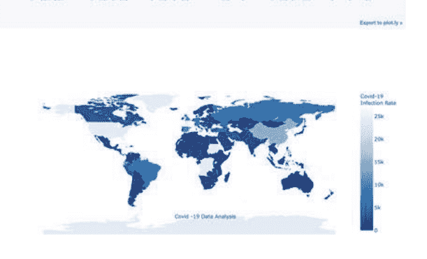

## 图8 按国家划分的Covid-19数据


通过使用group by对国家进行求和。因此，预处理后的数据集按国家划分具有最大感染率。 在幸福报告数据集的预处理中，删除了一些不需要的列，例如“总排名”，“分数”，“慷慨度”，“对腐败的看法”。 然后设置国家索引，并帮助连接我们的数据集与预处理数据一起。 最后，通过国家的内部连接，将两个数据框组合起来，显示了该国家的最大感染率及其自由选择、健康预期和其他社会参数，以确定其幸福感。 最后，创建一个名为“是否有风险”的新列，显示该国家是否有风险。

##### 4.3 机器学习算法

###### 线性回归

在统计学中，线性回归是一种线性建模方法，用于建立标量响应和一个或多个解释变量（也称为因变量和自变量）之间的关系。

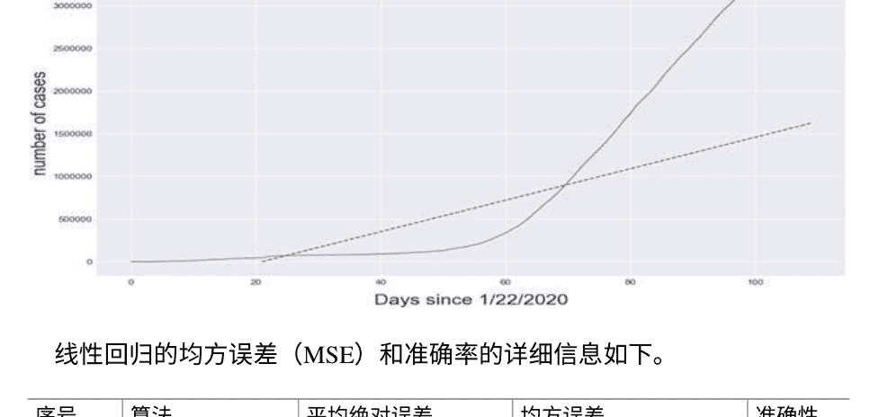

线性回归的均方误差（MSE）和准确率的详细信息如下。

| 序号 | 算法 | 平均绝对误差 | 均方误差 | 准确性 |
|------|------|--------------|----------|--------|
| 1 | 线性回归 | 1,398,193.557592338 | 2,022,186,321,883.8347 | 65.21 |

###### 逻辑回归

逻辑回归是一种统计模型，其基本形式使用逻辑函数来建模二元依赖变量，尽管存在许多更复杂的扩展。在回归分析中，逻辑回归（或对数回归）是估计逻辑模型参数的一种方法（一种二元回归形式）。

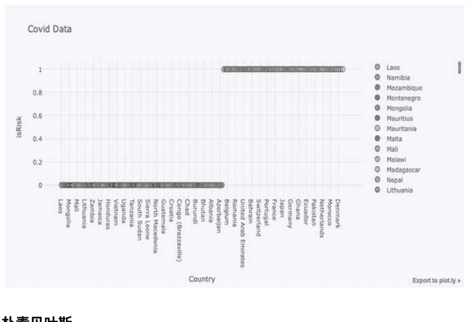

### **朴素贝叶斯**

在统计学中，朴素贝叶斯分类器是一类基于强独立性假设的简单“概率分类器”，其基于贝叶斯定理的应用。它们是最简单的贝叶斯网络模型之一，但结合了核密度估计，可以达到更高的准确性水平。

### *KNN*

K最近邻（KNN）算法是一种简单的有监督机器学习算法，可用于解决分类和回归问题。它易于实现和理解，但在使用的数据规模增大时，速度会变得显著缓慢。

### **支持向量机**

在机器学习中，支持向量机是带有相关学习算法的有监督学习模型，用于分类和回归分析的数据分析。

逻辑回归、K最近邻、朴素贝叶斯和支持向量机的性能指标如下所示：

| 序号 | 算法 | 准确性报告 |
| :--- | :--- | :--- |
| 1 | 逻辑回归 | 0.9767441860465116 |
| 2 | KNN | 0.9767441860465116 |
| 3 | 朴素贝叶斯 | 0.9767441860465116 |
| 4 | 支持向量机 | 0.9767441860465116 |

| 序号 | 算法       | 标签 | 精确度 | 召回率 |
|------|------------|------|--------|--------|
| 1    | 逻辑回归指标 | 0    | 0.96   | 1.00   |
|      |            | 1    | 1.00   | 0.95   |
| 2    | KNN        | 0    | 0.96   | 1.00   |
|      |            | 1    | 1.00   | 0.95   |
| 3    | 朴素贝叶斯 | 0    | 0.96   | 1.00   |
|      |            | 1    | 1.00   | 0.95   |
| 4    | 支持向量机 | 0    | 0.95   | 0.91   |
|      |            | 1    | 0.94   | 0.97   |

根据实验结果，分类算法在我的数据集上表现最佳，我推荐使用支持向量机，因为它具有增强的网格搜索功能，可以找到模型的最佳超参数，从而得到最准确的预测结果。

#### 5 结论

在这项工作中，不同的机器学习算法被应用于COVID-19数据集和幸福报告数据集，并进行了分析。上面的表格显示了算法的性能指标，并且可以推荐支持向量机作为这个组合数据集的适应性技术，因为它增强了网格功能，可以找到模型的最佳超参数，从而得到最准确的预测结果。未来，还可以使用其他机器学习算法，如决策树、随机森林、主成分分析等，深入分析最高效的算法。

#### 参考文献

-   1. 吴, F., 赵, S., 于, B., 陈, Y.M., 王, W., 宋, Z.G., 胡, Y., 陶, Z.W., 田, J.H., 裴, Y.Y., & 袁, M.L. (2020). 一种与中国人呼吸道疾病相关的新型冠状病毒。自然, 579(7798), 265-269。
-   2. 周, P., 杨, X.L., 王, X.G., 胡, B., 张, L., 张, W., 司, H.R., 朱, Y., 李, B., 黄, C.L., & 陈, H.D. (2020). 一起与一种可能源自蝙蝠的新型冠状病毒相关的肺炎爆发。自然, 579(7798), 270-273。
-   3. 程, C., 巴塞罗, J., 哈特内特, A.S., 库比内克, R., & 梅瑟斯密特, L. (2020). COVID-19政府应对事件数据集 (CoronaNet v. 1.0). 自然人类行为, 4(7), 756–768。
-   4. Hsiang, S., Allen, D., Annan-Phan, S., Bell, K., Bolliger, I., Chong, T., Druckenmiller, H., Huang, L.Y., Hultgren, A., Krasovich, E., Lau, P., & Wu, T. (2020). 大规模抗传染政策对COVID-19大流行的影响. 自然, 584(7820), 262–267。
-   5. Hale, T., Petherick, A., Phillips, T., & Webster, S. (2020). COVID-19政府应对措施的变化. 布拉瓦特尼克政府学院工作论文, 31, 2020–11。
-   6. Fetzer, T. R., Witte, M., Hensel, L., Jachimowicz, J., Haushofer, J., Ivchenko, A., Caria, S., Reutskaja, E., Roth, C. P., Fiorin, S., & Gómez, M. (2020). COVID-19大流行开始时的全球行为和感知(No. w27082). 国家经济研究局。
-   7. Banks, J., Fancourt, D., & Xu, X. (2021). 心理健康和COVID-19大流行. 在J.Helliwell, R. Layar, J. D. Sachs, J. E. De Neve (Eds.), 世界幸福报告. 可持续发展解决方案网络(pp. 109–130)。
-   8. Layard, R., & Oparina, E. (2021). 世界幸福报告：长寿和幸福生活. LSE商业评论。
-   9. Kleinberg, B., van der Vegt, I., & Mozes, M. (2020). 在covid-19真实世界担忧数据集中测量情绪. arXiv预印本arXiv:2004.04225。
-   10. Abdul-Mageed, M., & Ungar, L. (2017). EmoNet：使用门控循环神经网络进行细粒度情绪检测. 在第55届年会上的论文集中计算语言学协会（第1卷：长文）（第718-728页）. 温哥华，加拿大。
-   11. Okabe-Miyamoto, K., & Lyubomirsky, S. (2021). COVID-19期间的社交联系和幸福感. 2021年世界幸福报告（第131页）。
-   12. Aknin, L., De Neve, J. E., Dunn, E., Fancourt, D., Goldberg, E., Helliwell, J., Jones, S. P., Karam, E., Layard, R., Lyubomirsky, S., & Rzepa, A. (2021). 对COVID-19大流行的早期心理健康和神经学后果的回顾和回应。
-   13. Duffy, B., & Allington, D. (2020). 接受、遭受和抵抗：对封锁生活的不同反应. 伦敦国王学院。
-   14. Frijters, P., Clark, A., Krekel, C., & Layard, R. (2020). 一个幸福的选择：政府的目标是幸福感. 行为公共政策, 4(2), 126–165. https://doi.org/10.1017/bpp.2019.3915。
-   15. Andrasfay, T., & Goldman, N. (2021). 由于COVID-19导致2020年美国预期寿命减少，对黑人和拉丁裔人口的不成比例影响. 国家科学院会议, 118(5)。
-   16. Koziol, J. A. (2021). 过去的经验教训：比较2009-2010年H1N1流感大流行和2010-2019年美国季节性流感的疾病负担。

# # 使用机器学习算法预测电信客户的转网意向

S. N. Vivek Raj和S. Prithiviraj Pallava Rayer

摘要客户流失是影响全球电信行业的主要问题之一，印度电信行业也不例外。印度电信监管机构TRAI（印度电信监管机构）通过引入MNP（移动号码可携带性）对该行业进行了监管，客户可以轻松转向其他电信运营商而不更换手机号码。本研究针对使用电信网络的订户进行，以找出影响订户转网意向的因素。采用便利抽样和结构化问卷调查的方式，收集了458名电信用户的数据。

机器学习算法已被用于预测客户转换意图，并识别影响客户转换意图的重要特征。在预测客户转换意图的研究中，各种算法中，逻辑回归表现相对较好，准确率较高。从逻辑回归的结果中发现，婚姻状况、客户使用当前移动运营商的年数、网络质量、资费和广告对客户转换意图有显著影响。

-   机器学习
-   逻辑回归
-   特征选择
-   客户流失
-   决策树
-   分类
-   预测
-   电信

#### 1 引言

客户流失分析是机器学习的重要应用之一，预测模型被广泛用于分类哪些客户可能会流失。借助这些洞察，组织可以制定策略和战术计划，以减少客户流失，并更多地关注不会流失的客户，从而使他们变得更忠诚。客户流失分析帮助组织进行有针对性的营销活动和通过不向可能转向另一个组织或产品的客户进行营销，可以节省大量的推广预算。 借助流失分析，组织可以更好地保留客户，从而影响整体盈利能力。 利用客户流失分析的见解，组织可以进行促销活动，如免费流媒体服务、忠诚度福利计划，以更好地满足目标客户。 已经有一些组织使用分析技术大大减少了客户流失，其中一家财富500强电信组织就通过客户生命周期建模的支持成功实现了50%的客户流失减少[1]。 全球电信行业受到不断增长的客户流失率的影响[2]，印度电信行业是受到高客户流失率影响的行业之一，这归因于更低的转换成本[3]。 印度电信部门的管理机构印度电信监管局推出了一项名为移动号码可携带性的政策，客户可以在非常低的转换成本下更换他们的电信服务，并且可以保留相同的手机号码[4]。 我们认为这是客户轻松转向其他电信运营商的原因之一。 Reliance Jio于2016年9月进入印度市场，对定价和用户分布产生了巨大影响[5]。 为了应对竞争和生存，较小的运营商被收购，而像Vodafone和Idea这样的大型运营商进行了合并。 现在，电信运营商被迫以低资费计划运营，并为客户提供额外的附加福利，如免费OTT订阅，以确保他们不会流失并转向其他运营商。 考虑到行业情况，该研究是在Covid-19封锁期间进行的，大多数组织已经转向远程工作，并要求员工在家工作，包括学校和大学开始进行在线课程。 因此，许多员工开始使用电信网络连接到互联网，许多公民由于在家隔离而开始使用OTT。 甚至学生也被迫使用智能手机和其他设备进行在线学习。 我们在Covid-19大流行期间进行的研究重点是了解和分析影响客户转换到新电信运营商意图的因素。 该研究的数据是在2020年7月通过一份结构化问卷收集的，共有458名印度电信用户参与了调查。 流行的机器学习算法逻辑回归被用于揭示影响客户转换到新网络意图的重要特征。 还使用了其他机器学习算法，如决策树和判别分析，根据特征集对显示意图和不显示意图转换的客户进行分类，并根据准确性等指标选择最佳算法。 在选择的机器学习算法中，逻辑回归在整体准确性方面表现更好。 逻辑回归的推论显示，婚姻状况、客户使用当前移动运营商的年数、网络质量、资费和广告对客户转换产生影响。

#### 2 文献综述
从2018年到2023年，全球电信行业预计将以14.3%的复合年增长率增长，减少客户流失的需求是推动全球电信行业增长的重要因素之一[6]。已经进行了大量的研究工作，以了解客户流失过程和影响客户流失的因素。

随后讨论了一些重要的客户流失研究成果。进行了一项研究，评估了客户在第二个生命周期期间的客户流失重复情况，研究发现客户在第一生命周期和第二生命周期期间的流失行为实际上是不同的，营销沟通可以延长组织中客户的第二生命周期[7]。互联网宽带服务提供商必须坚持提供增值服务和附加服务，如Wi-Fi Mesh网络系统，以向订户提供更好的服务质量，从而减少客户流失的威胁[8]。基于过去交易的客户配置可以使用关键输入来了解客户流失过程，这种方法可以用于检测电信行业的客户流失[9]。还有一项重要的研究对知识体系做出了贡献，认识到两个构建的重要性，即企业形象、切换成本及其对客户忠诚度的影响[10]。过去在客户流失数据集上实施了具有治愈率的多变量生存模型，并且发现该模型对数据拟合良好，并且该模型能够识别出客户非流失部分[11]。在另一项有趣的现场研究实验中，发现通过主动建议客户转向降低成本的计划，客户流失反而增加，其中一个原因是主动宣传活动减少了客户改变方案的惯性[12]。一项值得注意的研究作为一项现场研究实验进行，评估了定价结构对客户保留的影响，研究得出结论，与按使用量付费的定价方案相比，两部分定价方案导致年度客户保留率大幅下降[13]。尽管大多数研究都集中在降低客户流失率上，但一项开创性的研究探索了另一个维度，即让客户在激励兑换行为中聚集，从而考虑到客户流失管理的改进[14]。全球电信行业经常进行客户流失研究，其中一项关于电信行业的流失分析研究揭示了客户满意度、计算承诺和先前流失对客户保留的影响[15]。另一项关于印度电信行业的研究揭示了网络、资费、广告、技术、奖励和其他外部因素对印度电信用户的流失行为的影响[4]。进行了一项比较研究，评估了简单和增强的机器学习算法在预测公共电信数据集中的客户流失方面的性能，结果表明，与简单的机器学习算法相比，增强的机器学习算法表现更好[16]，另一项研究工作也推荐使用增强算法进行流失预测，与单个学习器相比，该研究的结果还发现，提升学习者提供了很好的流失数据分割[17]。Bagging算法在预测客户流失方面的能力也得到了高度研究，其中一项研究观察到改进的平衡随机森林算法将采样方法与成本敏感学习相结合，在准确性方面表现更好，与随机森林算法相比[18]。除了Boosting和Bagging机器学习算法，深度学习算法如人工神经网络也被用于预测客户流失，甚至还结合了两种神经网络方法以提供更高的准确性[19]。

从以往研究的评论中可以看出，一些研究应用结构方程模型来分析构建对客户流失的影响。同样，一些研究似乎是在包含客户数据的二次数据集上进行的。这项研究的不同之处在于它采用了流行的机器学习算法来识别影响客户流失的特征，并且该研究是基于在covid-19大流行期间从受访者那里收集的原始数据进行的，因此反映了客户对客户流失在这段时间的态度。

#### 3 研究方法
该研究遵循流行的数据挖掘研究模型CRISP-DM进行。通过向电信客户发送谷歌表单来收集客户转换意向的数据。问卷结构化，包括55个问题，包括人口统计变量和预测变量。CRISP-DM方法的第一步是业务理解，因此需要进行广泛的文献回顾以了解影响客户转换意向的变量，并确定重要特征。选择用于研究的自变量包括网络质量、资费、互联网、客户服务、旅行期间的网络服务、信任、忠诚度、优惠和折扣、品牌关联和广告。

本研究使用的因变量是客户转换意向，它是一个二元分类变量，代码为'意向'和'无意向'。在数据收集和清洗后，将从研究中删除缺失数据。共收集了458个受访者的数据进行最终分析。然后，使用三种流行的机器学习算法（逻辑回归、决策树和判别分析）对收集的数据进行分析。模型是基于训练数据构建的，并使用10折交叉验证方法验证结果。最后，验证的模型被部署用于预测客户的流失意向。

该研究始于2020年6月的第一周，并于2020年7月底完成。

#### 4 数据分析
本研究的主要目标是了解客户流失过程，并找出影响客户转投新电信运营商意图的重要因素。研究中使用了主要的数据收集来源。通过结构化问题进行在线调查，以收集客户的转投意图。为此，采用了经典且有文献支持的机器学习算法逻辑回归。由于研究的因变量被编码为二进制，即客户是否显示转投意图，因此使用了二元逻辑回归。采用似然比的前向逐步回归作为特征选择方法。研究结果如下所述。

第一步是为分类变量创建虚拟变量。根据经验法则，对于具有m个类别的分类变量，创建m-1个虚拟变量（表1）。

因此，上述创建的虚拟变量用于替代分类变量。因此，使用虚拟变量编码的方法，我们可以在逻辑回归方程中使用分类变量。同样，二元的因变量已经根据表2进行了编码。转换意图编码为‘0’，无意图为1。

逐步逻辑回归的分类表格如表3所示。逻辑分类器的分类准确率从第1步到第5步逐渐增加。在最后一步，即第5步，模型具有整体准确率。

## 表1 分类变量编码

| 选项 | | 频率 | 参数编码 |
|---|---|---|---|
| 婚姻状况 | 已婚 | 49 | 1.000 |
| | 未婚 | 409 | 0.000 |
| 连接类型 | 后付费 | 86 | 1.000 |
| | 预付费 | 372 | 0.000 |
| 所有家庭成员是否使用相同的连接？ | 否 | 196 | 1.000 |
| | 是的 | 262 | 0.000 |
| 您经常旅行吗？ | 否 | 189 | 1.000 |
| | 是的 | 269 | 0.000 |
| 对于移动号码可携带性的认知 | 否 | 188 | 1.000 |
| | 是的 | 270 | 0.000 |
| 之前是否切换过其他网络？ | 否 | 217 | 1.000 |
| | 是的 | 241 | 0.000 |
| 性别 | 女性 | 294 | 1.000 |
| | 男性 | 164 | 0.000 |

## 表2 因变量编码

| 原始值 | 内部值 |
|--------|--------|
| 意图   | 0      |
| 无意图 | 1      |

73.4%的准确率是模型性能的良好指标。该模型正确预测了96.7%的案例具有切换意图，这再次证明了我们研究更关注切换流失意图的良好指标。该模型在预测没有切换意图的案例方面表现不佳，因此在这方面还有改进的空间。第一步的准确率为72.1%，没有正确分类为“无意图”的案例。逐步回归在第5步结束，因为算法发现无法通过向最终模型添加新特征来进一步提高模型准确率。

特征选择的主要目的是消除对目标变量没有显著影响的自变量，并仅包含最终模型中的显著变量。本研究采用逐步前向逻辑回归，从仅包含截距的模型开始，不断添加显著变量，直到模型无法再进一步改进为止。表4解释了逐步前向回归的结果。前向逻辑回归算法从第1步到第5步添加了显著变量。

## 表3 逐步逻辑回归分类表

| 步骤 | 类别 | 子类别 | 意图计数 | 无意图计数 | 正确百分比 |
|------|------|--------|----------|------------|------------|
| 第一步 | 意图转换 | 意图 | 330 | 0 | 100.0 |
| 第一步 | 意图转换 | 无意图 | 128 | 0 | 0.0 |
| 第一步 | 总体百分比 | | | | 72.1 |
| 第二步 | 意图转换 | 意图 | 329 | 1 | 99.7 |
| 第二步 | 意图转换 | 无意图 | 127 | 1 | 0.8 |
| 第二步 | 总体百分比 | | | | 72.1 |
| 第三步 | 意图转换 | 意图 | 321 | 9 | 97.3 |
| 第三步 | 意图转换 | 无意图 | 117 | 11 | 8.6 |
| 第三步 | 总体百分比 | | | | 72.5 |
| 第四步 | 意图转换 | 意图 | 316 | 14 | 95.8 |
| 第四步 | 意图转换 | 无意图 | 115 | 13 | 10.2 |
| 第四步 | 总体百分比 | | | | 71.8 |
| 第五步 | 意图转换 | 意图 | 319 | 11 | 96.7 |
| 第五步 | 意图转换 | 无意图 | 111 | 17 | 13.3 |
| 第五步 | 总体百分比 | | | | 73.4 |

## 表4 逐步逻辑回归

| 变量 | B | S.E | Wald | df | Sig | Exp(B) |
|---|---|---|---|---|---|---|
| **第一步a** | | | | | | |
| 婚姻状况（1） | -1.114 | 0.449 | 6.155 | 1 | 0.013 | 0.328 |
| 常数 | -0.855 | 0.108 | 62.650 | 1 | 0.000 | 0.425 |
| **第二步b** | | | | | | |
| 婚姻状况（1） | -1.139 | 0.451 | 6.376 | 1 | 0.012 | 0.320 |
| 广告 | -0.345 | 0.138 | 6.287 | 1 | 0.012 | 0.708 |
| 常数 | 0.420 | 0.516 | 0.664 | 1 | 0.415 | 1.522 |
| **第三步c** | | | | | | |
| 婚姻状况（1） | -1.034 | 0.454 | 5.187 | 1 | 0.023 | 0.356 |
| 网络 | 0.572 | 0.176 | 10.489 | 1 | 0.001 | 1.771 |
| 广告 | -0.632 | 0.166 | 14.486 | 1 | 0.000 | 0.532 |
| 常数 | -0.713 | 0.633 | 1.268 | 1 | 0.260 | 0.490 |
| **第四步d** | | | | | | |
| 婚姻状况（1） | -1.316 | 0.480 | 7.512 | 1 | 0.006 | 0.268 |
| 客户使用当前sim卡的年数 | 0.105 | 0.040 | 7.057 | 1 | 0.008 | 1.111 |
| 网络 | 0.643 | 0.180 | 12.705 | 1 | 0.000 | 1.901 |
| 广告 | -0.649 | 0.168 | 15.002 | 1 | 0.000 | 0.522 |
| 常数 | -1.349 | 0.682 | 3.912 | 1 | 0.048 | 0.259 |
| **第五步e** | | | | | | |
| 婚姻状况（1） | -1.235 | 0.481 | 6.589 | 1 | 0.010 | 0.291 |
| 客户使用当前sim卡的年数 | 0.104 | 0.040 | 6.838 | 1 | 0.009 | 1.110 |
| 网络 | 0.874 | 0.211 | 17.241 | 1 | 0.000 | 2.397 |
| 网络资费 | -0.493 | 0.213 | 5.347 | 1 | 0.021 | 0.611 |
| 广告 | -0.527 | 0.176 | 8.982 | 1 | 0.003 | 0.590 |
| 常数 | -0.889 | 0.712 | 1.560 | 1 | 0.212 | 0.411 |

每个步骤中的变量。在第一步中，算法只有一个独立变量婚姻状况（1）。最后一步和最终模型，即第五步解释了影响流失决策的重要因素，可以确定的是，婚姻状况、客户使用当前电信SIM卡的年数、网络质量、资费和广告是影响客户转投新网络的重要变量。

接下来，我们使用决策树算法分析客户流失意向。我们采用了带有十折交叉验证的CHAID（卡方自动交互检测器）机制部署决策树。决策树的结果如图1所示。

图1解释了如何构建决策树来分类客户转投新电信运营商的意图。在影响客户转投意向方面，被发现具有显著影响的自变量有广告、网络和服务（表5）。

在记录分类算法的性能方面，总体准确率为72.3%，即算法可以正确分类72.3%的案例。

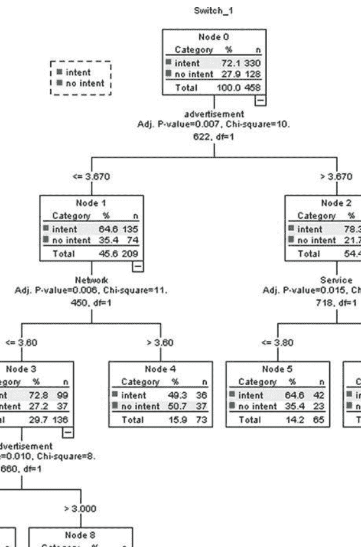

## 表5 决策树分类表

| 观察到的 | 预测的-意图 | 预测的-无意图 | 正确百分比 (%) |
|----------|-------------|---------------|----------------|
| 意图     | 294         | 36            | 89.1           |
| 无意图   | 91          | 37            | 28.9           |
| 总体百分比 | 84.1%       | 15.9%         | 72.3           |

同样，该算法正确分类了89.1%有转投意向的客户。与逻辑回归相比，该算法在以下方面表现更好，因为决策树算法正确预测了28.9%的无转投意向案例，而逻辑回归只预测了该类别的13.3%。用于预测客户流失意向的下一个算法是判别分析，它是一种多元分析技术。与其他两种方法相比，判别分析的一个局限性是判别分析中的自变量只能是连续数据，因此我们可能会错过一些分类变量的统计力量。

表6显示了判别函数和判别函数的Wilk's Lambda，用于预测因变量的显著性。表6还给出了卡方统计量的值，用于评估Wilk's Lambda的显著性。由于P值小于0.01，我们可以得出结论，判别函数很好地描述了组成员资格，但Wilk's Lambda接近1，这不是一个好的指标，因为它可能表示组重叠（表7）。

判别分析的结果似乎与逻辑回归相吻合。网络质量、资费、广告和客户使用当前SIM卡的年数被选择为影响客户转换意图的显著变量。

表8解释了判别分析的分类结果。标签“原始”表示实际数据中找到的类的数量。实际频率表示已编码为意图的330个实例和已编码为无意图的128个实例。预测的组成员表示判别分析所做的组预测。67.3%的案例被正确分类为意图，同样，53.9%的案例被正确分类为无意图。总体而言，判别分析算法正确分类了63.5%的案例，但落后于逻辑回归和决策树。

## 表6 威尔克斯的λ

| 功能测试 | 威尔克斯的λ | 卡方 | 自由度 | Sig |
|----------|-------------|------|--------|-----|
| 1 | 0.937 | 29.595 | 4 | 0.000 |

## 表7 分类函数系数判别分析

| 变量 | 意图 | 无意图 |
|------|------|--------|
| 客户使用当前SIM卡的年数 | 0.837 | 0.915 |
| 网络质量 | 3.268 | 4.181 |
| 资费 | 4.106 | 3.567 |
| 广告 | 3.218 | 2.670 |
| (常数) | -22.238 | -22.086 |

## 表8 分类结果-判别分析

| 切换组 | | 预测的组成员 | | 总计 |
| :--- | :--- | :---: | :---: | :---: |
| | | 意图 | 无意图 | |
| 原始 | 计数 | 意图 | 222 | 108 | 330 |
| | | 无意图 | 59 | 69 | 128 |
| | 百分比 | 意图 | 67.3 | 32.7 | 100.0 |
| | | 无意图 | 46.1 | 53.9 | 100.0 |

原始分组案例的63.5%被正确分类

#### 5 结果比较
表9解释了本研究中使用的三种机器学习算法的性能比较。 相比判别分析，逻辑回归和决策树表现更好的主要原因是判别分析无法将分类变量作为模型的预测因子。 网络质量和广告变量在所有三种机器学习算法中被选为显著变量。 因此，上述变量被认为对客户转换意图具有很大影响。 资费和客户使用当前电信运营商的年数被两个模型判断为显著变量。

表格清楚地解释了逻辑回归和决策树结果在准确性方面是相似的。 表格还给我们提供了对目标变量有影响的重要特征的整体图景。 通过关注影响客户转换意向的特征，组织可以提供数据驱动的干预措施，以减少客户的转换倾向。

## 表9 结果比较

| 序号 | 算法 | 准确率 (%) | 识别的特征 |
| :--- | :--- | :---: | :--- |
| 1 | 逻辑回归 | 73.4 | 婚姻状况，客户使用当前运营商的年数，网络质量，资费和广告 |
| 2 | 决策树 | 72.3 | 广告，网络质量和服务 |
| 3 | 判别分析 | 63.5 | 网络质量，资费，广告和客户使用当前运营商的年数 |

#### 6 结论
该研究旨在分析影响印度2020年6月至7月疫情期间客户流失意向的因素。这是至关重要的，因为许多组织转向了远程办公模式，移动网络在保持联系和远程工作方面起着关键作用。同样，教育机构采用在线教学应对疫情形势。正如预期的那样，研究中使用的机器学习算法，即逻辑回归、决策树和判别分析，能够识别影响客户转换意向的重要变量。与判别分析相比，逻辑回归和决策树表现更好。逻辑回归正确分类了73.4%的客户转换意向，其次是决策树，能够正确分类72.3%的客户转换意向。

#### 7 未来工作和限制
当前研究仅包括三种流行的机器学习算法，即逻辑回归、决策树和判别分析，用于预测客户转向新电信运营商的意图。进一步的研究可以使用更全面的机器学习算法列表进行，可能涉及到装袋、提升和深度学习算法。该研究还可以使用混合机器学习算法来预测客户转向意图，并进行结果比较。当前的研究工作侧重于客户转向意图，可能的一个改进是不仅预测客户转向意图，还可以预测实际客户流失，以提供关于客户流失过程的更好洞察。

#### 参考文献
1. Quantzig. (2020a). 财富500强电信公司通过客户生命周期价值建模减少客户流失。*Bus Wire English*，2020年2月。[在线]。可用：http://search.ebscohost.com/login.aspx?direct=true&db=bwh&AN=bizwire.bw5454736&site=ehost-live。
2. Quantzig. (2020b)。Quantzig的分析专家分析了电信业中增加流失率的影响| 提交全面洞察的RFP。*Bus Wire English*，2020年7月。[在线]。可用：http://search.ebscohost.com/login.aspx?direct=true&db=bwh&AN=bizwire.bw10187429&site=ehost-live。
3. Singh, S., & Sirohi, N. J. (2015)。移动号码可携带性：对消费者和服务提供商的影响。*B VIMR Manage Edge*，8(1)，92-104，2015年1月。
4. Chadha, S. K., & Bhandari, N. (2014)。顾客转向移动号码可携带性的决定因素。范式，18(2)，199-219。https://doi.org/10.1177/0971890714558708。
5. Mazumdar, R. (2019)。Reliance Jio成为印度最大的电信服务提供商。*Bloomberg.com*，第N.PAG-N.PAG页，2019年7月。

- 6. 研究与市场. (2019). “60亿美元的电信分析市场-全球2023年预测：需要减少流失和保留客户以推动市场增长.” Research and Markets. Business Wire English, 2019年3月. [在线]. 可用：http://search.ebscohost.com/login.aspx?direct=true&db=bwh&AN=bizwire.c88507142&site=ehost-live.
- 7. Kumar, V., Leszkiewicz, A., & Herbst, A. (2018). 你是回来了还是还在四处逛街？调查客户的重复流失行为. *Journal of Marketing Research*, 55(2), 208-225.
- 8. PR Newswire. (2016). 宽带服务提供商需要投资家庭Wi-Fi解决方案或面临客户流失风险. [在线]. 可用：http://search.ebscohost.com/login.aspx?direct=true&db=bwh&AN=201606291124PR.NEWS.USPR.NY36448&site=ehost-live.
- 9. Qian, Z., Jiang, W., & Cui, K.-L. (2006). 通过客户配置文件建模进行流失检测. *International Journal of Production Research*, 44(14), 2913-2933. https://doi.org/10.1080/00207540600632240.
- 10. Kaur, H., & Soch, H. (2012). 验证印度手机用户忠诚度的先决条件. *Vikalpa: The Journal for Decision Makers*, 37(4), 47-62. https://doi.org/10.1177/0256090920120404.
- 11. Cancho, V. G., Dey, D. K., & Louzada, F. (2016). 具有存活分数的统一多变量生存模型：巴西客户流失数据的应用. *Journal of Applied Statistics*, 43(3), 572-584. https://doi.org/10.1080/02664763.2015.1071341.
- 12. Ascarza, E., Iyengar, R., & Schleicher, M. (2016). 使用计划建议的积极流失预防的危险：来自一项现场实验的证据. *Journal of Marketing Research*, 53(1), 46-60. https://doi.org/10.1509/jmr.13.0483.
- 13. Iyengar, R., Jedidi, K., Essegaier, S., & Danaher, P. J. (2011). 关税结构对客户保留、使用和接入服务的盈利能力的影响. *Marketing Science*, 30(5), 820–836. https://doi.org/10.1287/mksc.1110.0655.
- 14. Tamaddoni, A., Stakhovych, S., & Ewing, M. (2017). 个性化激励对客户保留活动的盈利能力的影响. *Journal of Marketing Management*, 1–21. https://doi.org/10.1080/0267257X.2017.1295094.
- 15. Gustafsson, A., Johnson, M. D., & Roos, I. (2005). 客户满意度、关系承诺维度和触发因素对客户保留的影响. *Journal of Marketing*, 69(4), 210–218. https://doi.org/10.1509/jmkg.2005.69.4.210.
- 16. Vafeiadis, T., Diamantaras, K. I., Sarigiannidis, G., & Chatzisavvas, K. Ch. (2015). 客户流失预测的机器学习技术比较. *Simulation Modelling Practice and Theory*, 55, 1–9. https://doi.org/10.1016/j.simpat.2015.03.003.
- 17. Lu, N., Lin, H., Lu, J., & Zhang, G. (2014). 电信行业中的客户流失预测模型使用提升技术. *IEEE Transactions on Industrial Informatics*, 10(2), 1659–1665. https://doi.org/10.1109/TII.2012.2224355.
- 18. Xie, Y., Li, X., Ngai, E. W. T., & Ying, W. (2009). 使用改进的平衡随机森林进行客户流失预测. *Expert Systems with Applications*, 36(3), 5445–5449. https://doi.org/10.1016/j.eswa.2008.06.121.
- 19. Tsai, C.-F., & Lu, Y.-H. (2009). 混合神经网络进行客户流失预测. *Expert Systems with Applications*, 36(10), 12547–12553. https://doi.org/10.1016/j.eswa.2009.05.032.
- 20. Vohra, J., & Soni, P. (2015). 逻辑模型分析儿童在零售店中的食品购物行为. *Management Research Review*, 38(8), 840–854. https://doi.org/10.1108/MRR-03-2014-0061.

### 使用受限特征检测CLAMAV病毒签名

Reshma Sri Sai Mangipudi, J. Pranitha, G. Sai Varsha, 和 B. Indira Priyadarshini

#### 摘要

由于大多数设备今天都在互联网上工作，因此需要提供持续的网络安全和恶意文件监控。在本文中，我们对设计一个单芯片硬件标识符来使用信息减少方法扫描病毒表现出兴趣。这个过程依赖于Clam AV病毒信息数据库，该数据库具有88.91K个字符串和9.59K个延长的十六进制类型签名，具有受限的系统声明（regex）属性。与字节相关的比较问题转变为与令牌相关的匹配过程。具有单个或多个部分的正则表达式设计可以进一步分成更多非平凡的令牌。通常，一个令牌与单个或只有少数正则表达式相关。输入字节信息通过决定的硬件部件转换为令牌模型，其中令牌数量远少于字节数量。

#### 关键词

网络入侵检测 · 字符串匹配 · 正则表达式 · 病毒检测 · 基于内存的设计 · 有限状态机

#### 1 引言

随着设备黑客的广泛存在，病毒结合互联网和网络应用的扩散，网络防护的必要性变得更加重要。另一方面，当前网络安全需求需要更有效地审查、理解和使用数据。与安全风险和问题相关的话题变得越来越常见。病毒和蠕虫的威胁、垃圾邮件、伪造发件人电子邮件、有害或不需要的信息都越来越令人恼火，并引发了大量问题。因此，未来一代防火墙应具备深度数据包检查能力，以抵御与病毒相关的各种攻击。这些系统会检查数据包头部，评估使用模式匹配技术来分析数据包有效载荷，并确定与有效载荷材料相关的数据包结构的重要性。深度数据包检查由网络入侵检测系统（NIDS）执行。他们搜索数据包有效载荷中可能暗示安全威胁的趋势。然而，在线速度下，将每个传入字节数信息与数千个模式字符进行匹配是一项困难的工作。根据CLAM防病毒（AV）测量结果[1]，字符串匹配占总体处理的31%；在Web细致流量的部分中，这一比例上升到80%。因此，字符串匹配可以被认为是NIDS中最复杂的部分之一，在本文中，我们专注于有效载荷匹配。不同类型的进程或方法组合已经在通用处理器（GPP）中用于更快地匹配字符串，使用CLAM AV开源NIDS规则集。然而，工作在GPP中的干预识别系统只能提供几百Mbps的输出。因此，寻找与硬件相关的解决方案可以将性能提高到几百Mbps以上。到目前为止，已经设计了一些基于ASIC的面向利润的产品。这些系统可以支持生成相对昂贵的高输出。另一方面，与ASIC性能相比，FPGA相关系统提供更高的灵活性和更大的输出。FPGA（现场可编程门阵列）相关平台可以利用NIDS规则近似变化的事实，并使用重新设计来降低设计过程的成本。此外，它们可以利用对应关系以获得有效的输出。已经提出了一些基于FPGA的NIDS设计，使用类似NFAs/DFAs（非确定性和确定性有限自动机）、离散比较器和近似过滤技术。总体而言，FPGA系统的性能结果是令人期待的，并显示出FPGA可以用于支持网络安全的不断增长的需求。FPGA具有灵活性、可重构性，提供硬件速度，因此更适合设计此类系统。另一方面，可能会遇到一些问题。大型设计更难制定和在高频率下运行。此外，匹配更多的模式占用更大的空间，使共享逻辑变得困难。

#### 2 文献综述

D. Pao, X. Wang, X. Wang, C. Cao and Y. Zhu在[2]中介绍了一种内存高效的字符串搜索方法。提出的快速采样和验证（QSV）方法基于验证可变长度后缀段和快速采样数据段。QSV方法的可扩展性非常好。该论文介绍的方法只处理静态字符串。正则表达式匹配被广泛认为是一个更困难的问题，特别是在追求速度、硬件性能、可扩展性和多功能性方面。作者在[3]中提出了一种成本效益的处理速率方法，并在单台计算机上实现了整个系统。如果我们对识别网络入侵检测在我们的日常生活中，如果我们匆忙，我们将需要硬件加速器。因此，需要一种新的电路设计，可以在每个周期发送更多的输入数据。因此，这种方法只适用于静态字符串。随着病毒数据库中常规信息的数量逐渐增加，标准表达式匹配变得更加复杂。目标方法应该能够处理一个模式。

在[4]中，除了将病毒信息视为数据数组外，他们建议将模式视为一组令牌，每个令牌对应一个数据段，输入字节流被转换为一个令牌分支。然后，检测引擎将处理令牌分支，以查看是否可以检测到任何病毒相关信息。该系统的缺点是只能处理84k个字符串和3.2k个多段模式。

作者在[5]中提出了用于Aho Corasick算法电路设计的P-AC流水线方法。然而，该研究仅限于确定性有限自动机（DFA），其中任何给定的输入只能通过一个方向从一个状态转移到下一个状态。因此，如果给定的输入长度很长，搜索和匹配整个数据需要很长时间。上述作者在[6]中提出了一种与内存相关的设计，以实现NFA，以改善与签名相关的违规检测的一般表达式匹配的访问。作者通过实现NFA提出了一种摆脱DFA方法中状态爆炸问题的概念，但正则表达式匹配仅限于80k个字符串。

T. N. Thinh, T. T. Hieu, H. Ishii和S. Tomiyama在[7]中介绍了一种基于FPGA的病毒签名匹配架构。在这个框架中使用了Bloom和Bloomier过滤器方法，可以容纳简单和正则表达式病毒签名。对Clam AV签名数据库的实验表明，该设备可以容纳1Gbps的吞吐量，并且在芯片内存密度方面比以前的方法更加稳健。这个设计主要基于内存，可以很容易地修改以包含新的病毒签名。该机器是一个高质量系统的一部分，包括电路和编程代码。

使用上述技术，他们在[8]中实现了一种基于DFA的数据包扫描器。根据他们利用真实世界流量和趋势进行的实验结果，我们的实现在性能上超过了广泛使用的基于DFA的扫描器12-42倍。根据他们的实验结果，我们基于DFA的数据包扫描器在性能上超过了最先进的基于NFA的实现50-700倍。根据[9]的研究，对Bloom过滤器的并行查询通常在硬件上实现以提高性能，但顺序查询也可以在软件中高效实现。他们在[10]中构建了一种方法，该方法适用于在我们的项目中使用的执行新颖字符串相关算法的特殊设计。他们解释了如何通过将大量存储设备中的字符串分解为几个小状态图来解决这些问题，这些状态图搜索每个法律的子部分和位。我们通过与新的字符串匹配技术精心协同设计和优化他们的设计，证明我们可以创建一个比当前方法更有效的新系统。

例如，在[11]中，使用了更大规模的字符串匹配，采用了高效的内存和灵活的方法。在NIDS中，字符串设计匹配需要极高的要求。高性能用于将网络堵塞内容与已定义的字符串设计数据库进行对齐。在这个领域，已经做了很多工作。他们提出了一种在不增加模式数量的情况下对数据库进行预处理的方法，称为“叶子附加”。任何树搜索数据结构都可以用来搜索经过后处理的模式集合。他们还提出了一种基于流水线二叉搜索树的可测量、高输出、高效的大规模字符串匹配内存设计（MASM）。所提出的算法和架构的内存效率为0.56。同时也是1.32。因此，他们的风格非常适合较大的字典。对于新的CLAMAV和Snort数据库，设计45纳米ASIC技术和FPGA计算机的过程表明，他们的架构分别达到了24和3.2 Gbps的速度。

深度包检查思想在网络安全应用中起着重要作用，其中正则表达式用于检测模式。多年来，已经考虑了各种字符串匹配方法，并在DFA的内存使用方面略微改进了版本。目前，准确的字符串正在被正则表达式所取代，以在大多数流行软件工具（如Snort, Clam AV）中描述模式，因为它们可以提供标准的数据库供研究使用。

#### 3 现有技术

在现有的工作中，他们提出了一种在FPGA上匹配字符串的高效内存和ASCII方法。这里使用基于FSM的二叉搜索树算法实现了高吞吐量。此外，他们使用片上RAM存储模式。

在以前的匹配单变量字符串的技术中，对于AC指令的电路实现、内存成本和电子元件的使用、访问速度和模式形成有三种不同的想法。为了展示电路设计之间的差异，可以在理解中建立电路设计过程以及存储设备类型设计过程。在FPGA电路设计中使用了大量的类比，我们需要将字符串匹配方法建模为非确定有限自动机，以区分转换边界的计数。状态重新对齐图中的收敛指的是无伴随数据寄存器，状态重新对齐是通过实际电路执行的，该电路将寄存器中呈现的数据位与即时状态和转换边界的下一个状态相关联。

在现有的状态转换中，状态的数量是6，这将占用更多的空间，因此进行转换需要更多的时间，并且延迟也增加了（图1）。这个操作只针对一个模式或病毒进行，所以当考虑更多的模式时，时间和延迟也会增加，这可以在我们提出的系统中克服。

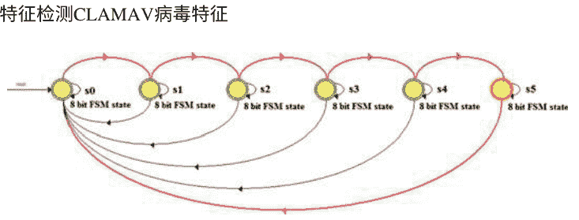

#### 4 提出的系统

在这项工作中，我们引入了基于信息减少方法的高效硬件VLSI架构来检测复杂的NIDS模式。在这里，我们对输入数据字节进行预处理，将字节相关的比较问题转换为基于标记的问题。输入数据分支通过专用核心单元转换为标记分支，这些核心单元可以进行并行计算等操作，以实现高吞吐率。包含一个或多个段的NIDS模式将被分成多个非平凡的标记。最后，标记分支由与NFA相关的聚合单元表示，以检测要找到的病毒。

在提出的系统块图（图2）中，选择的输入模式被给予SRAM单元；输入模式通过SRAM控制器生成的命令进行工作。当SRAM中的函数完成时，该函数的输出存储在内存中，存储在内存中的输出被给予FSM。在FSM中进行状态转换。在NFA系统的情况下，需要更多的状态机（FSM），因此如果我们有更多的FSM，面积增加，延迟增加，因此速度降低。因此，在提出的系统中，状态转换减少到较少的数量，即3个状态。

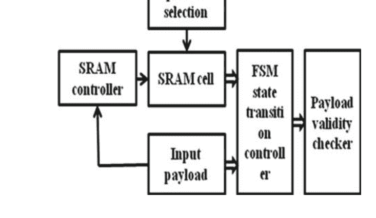

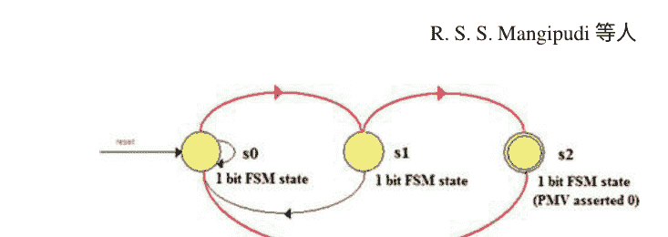

因此，由于空间或面积较小，修改后的状态图在图3中可见，延迟将减少。状态转换的输出存储在内存中，比较器将其与现有的病毒数据库进行比较，并将其给予有效性检查器。

我们在这个系统中使用的内存是SRAM内存，因为它的可靠性和与DRAM相比较低的功耗。在提出的系统中，我们将不再进行逐位操作，而是对十进制数或令牌进行相同的操作，以减少状态的数量。每个状态图都将并行执行其操作，从而提高操作速度。

在这个过程中，我们采用输入模式和客户模式。每个状态（即s0, s1, s2）都执行每个位的操作。在这里，我们可以看到PMV，模式匹配变量将被断言为0或1。如果是1，表示存在病毒，即发生模式匹配。如果是零，表示不存在病毒。

#### 5 实施

与之前每个周期处理单个字节的系统不同，提出的系统采用了一种新的设计，每个时钟周期处理更多字节的输入数据位。这使用了一种直接的并行处理技术，从而提高了吞吐量。通过允许页面-启用并行处理（PEPP），吞吐率显著提高，如图4所示。在异步电路中，握手协议用于时间参考。在同步电路中，时钟将用于时间参考。

通过这种提出的方法，主要的限制是同步电路中出现的同步错误。同步不匹配的三种情况包括ASCII编码期间的不匹配，字符串匹配转换期间的不匹配以及页面之间的不匹配。为了克服这个限制，可以使用PLL（锁相环）时钟技术。这里将使用高度可重构的时钟分频器。通过使用这个模型，可以为多速率时钟域使用单个源时钟。

在这项研究中，基于单个源时钟，使用可重构时钟分频器实现了具有不同操作时钟的五个页面。并且相位信号将成功与PLL匹配。源时钟将被分割成所需范围，以应对用户从不同地理位置（如2G, 3G, 4G速度）的可变速浏览。这个分频时钟将与全局时钟匹配。对于每个正匹配的时钟，将读取并与输入流匹配的数据将被读出。

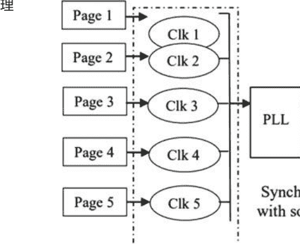

#### 6 结果

采用提出的基于内存的架构实现模式匹配。分析和比较了功耗、吞吐量、寄存器和查找表的结果。现有系统的参数也被作为参考值，以与提出的设计进行比较。使用XILINX ISE 14.7给出的页面启用并行实现的优化结果显示了该方法的效率。在这里，输入入侵被分成页面。仿真结果如下所示。

1.  模式匹配的仿真（图5）
2.  控制输入的仿真（图6）
3.  文本输入和时钟的仿真（图7）

在实施后生成了综合报告，并在表1中显示了所提出系统与现有系统的比较结果。

#### 7 结论和未来工作

基于签名的病毒识别是一项计算密集型任务，特别是对于包含正则表达式（regex）特征的病毒模式的检测。我们的工作涉及设计应用特定硬件，以提高输入数据流与嵌入式病毒集合的匹配速度。

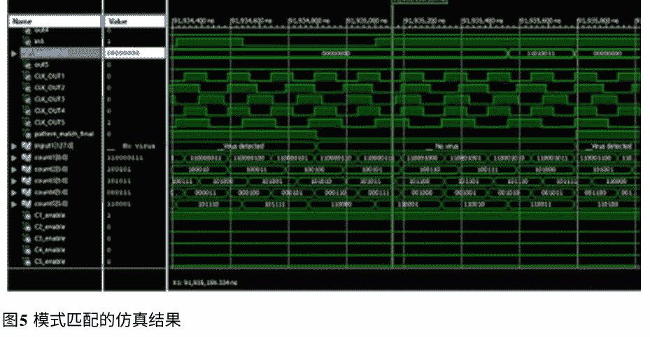

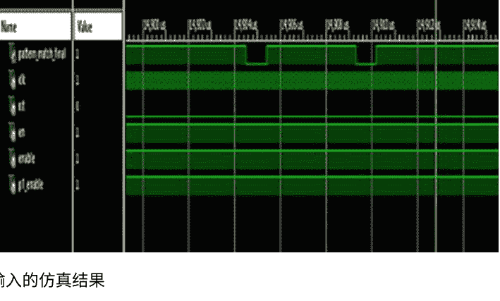

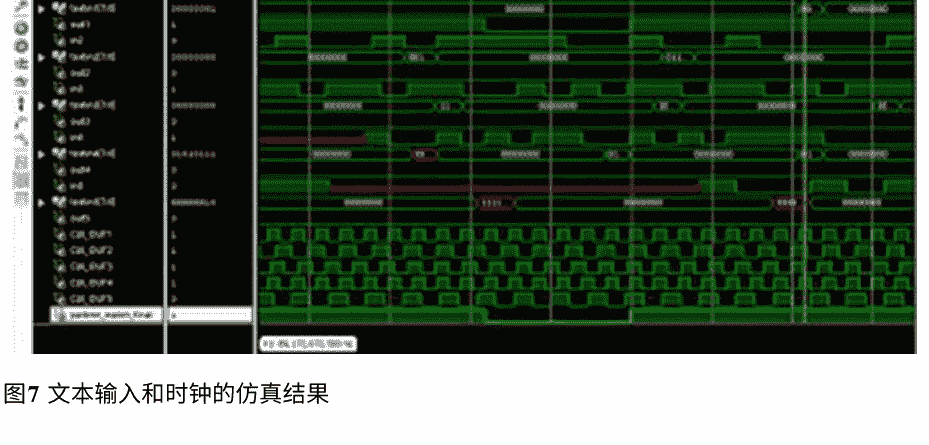

### 表1 可比性结果

| 参数 | 现有的 | 提出的 |
| :--- | :--- | :--- |
| 吞吐量 | 144 MHz | 176 MHz |
| 功率 | 1.4 瓦特 | 0.070 瓦特 |
| 查找表 | 858 | 541 |
| 切片寄存器 | 810 | 655 |
| 实例数量 | 683 | 156 |
| 块内存 | 76 | 10 |

该设备在单次传递中处理输入数据流，并识别是否存在嵌入式病毒签名结构。

验证了基于哈希表的DFA并行字符串比较方法的功能，该方法最小化了病毒数据库的内存使用。提出了用于匹配字符串的高效内存架构，可以减少最终的内存需求。考虑到最终规则集的减少内存需求，可以得出结论，所述匹配方法对于减少并行字符串比较引擎的总内存需求是有用的。最终，这种设计对于速度和内存是重要的应用和设备非常有用。

该项目的未来范围应该集中在证明修改后的FSM在不同模式下的内存效率。此外，可以进行逐位并行字符串匹配，并比较其与先前方法的效率。总体上，必须证明所提出方法的吞吐率和准确性水平具有实时实现。

#### 参考文献

1.  ClamAV防病毒系统, http://www.clamav.net.
2.  Pao, D., Wang, X., Wang, X., Cao, C., & Zhu, Y. (2011). 用于病毒扫描的字符串搜索引擎. *IEEE Transactions on Computers*, 60, 1596-1609.
3.  Pao, D., & Wang, X. (2012). 用于高速内容检查的多步长字符串搜索. *The Computer Journal*, 55, 1216-1231.
4.  Wang, X., Or, N. L., Lu, Z., & Pao, D. (2015). 用于检测多段病毒模式的硬件加速器. *The Computer Journal*.
5.  Pao, D., Lin, W., Liu, B. (2008). 用于多字符串匹配的流水线架构. *IEEE Computer Architecture Letters*, 7, 33–36.
6.  Pao, D., Or, N. L., & Cheung, R. C. C. (2013). 基于内存的NFA正则表达式匹配引擎用于基于签名的入侵检测. *Computer Communications*, 36, 1255–1267.
7.  Thinh, T. N., Hieu, T. T., Ishii, H., & Tomiyama, S. (2014). 用于FPGA上的ClamAV的内存高效签名匹配. 在 *IEEE International Conference on Communication and Electronics* (pp 358–363).
8.  Babu Karuppiah, A., & Rajaram, S. (2011). 用于入侵检测的FPGA中的模式匹配的确定性有限自动机. 在 2011年 International Conference on Computer, Communication and Electrical Technology (ICC CET) (pp. 167–170).

- 林, P.-C., 林, Y.-D., 李, T.-H., & 赖, Y.-C. (2008). 使用字符串匹配进行深度数据包检查. IEEE计算机, 41(4), 23–28.
- 拉希德, M., 伊姆兰, M., & 贾弗里, A. R. (2020). 探索网络入侵检测系统中字符串匹配算法的硬件架构. 计算机协会机构. 文章3, 1–7.
- 谭, L., 布罗瑟顿, B., & 谢伍德, T. (2006). 位分割字符串匹配引擎用于入侵检测和预防. ACM翻译架构和代码优化, 3(1), 3–34.
- 刘, T., 杨, Y., 刘, Y., 孙, Y., & 郭, L. (2011). 一种从新的角度压缩正则表达式的高效算法. 在2011年IEEE INFOCOM会议 (pp 2129–2137).
- 网络安全中可扩展硬件架构的系统性综述. 计算机与电气工程, 92, 2021.
- 基于FPGA的安全系统中并行组合不同方法进行多模式匹配 5(1), 2020.
- Sadredini, E., Rahimi, R., Lenjani, M., Stan, M., & Skadron, K. (2020). Impala: 内存中多步长模式匹配的算法/架构协同设计. 在2020年IEEE高性能计算体系结构国际研讨会 (HPCA) 中.
- Roesch, M. (1999). Snort—轻量级网络入侵检测. 在第13届USENIX系统管理会议论文集 (第229-238页).

### ANUGA中网格生成的综述

Shreya Kendhe, Aditi Limkar, Sakshi Doshi, T. S. Murugesh Prabhu, Girishchandra R. Yendargaye, Y. S. Ingle, and N. F. Shaikh

摘要 ANUGA是由澳大利亚国立大学（ANU）和澳大利亚地球科学局（GA）开发的免费淹没软件。它是一个用于二维水动力学建模的工具，用于模拟海啸、洪水、风暴潮或坝决等现实流问题，并可以模拟它们对环境的影响。它基于用于求解浅水波动方程的有限体积法。它利用三角形单元网格来表示研究区域。该网格是根据Delaunay三角剖分的特性生成的。本文讨论了ANUGA使用的网格生成方法，准确和优化的网格对于良好的预测的重要性，并提出了一种新的网格生成方法。

关键词 ANUGA · 网格生成 · Delaunay三角剖分 · 二维水动力模型 · Voronoi镶嵌 · 域

#### 1 引言

每年，自然灾害夺走数百万人的生命，并造成巨大的经济损失。水文灾害是全球最频繁和最具破坏性的自然灾害之一。准确、可靠和及时的预测在很大程度上可以最小化损害。这些预测是通过各种数值模型实现的，可以预测水的深度、速度和到达时间。

许多软件用于预测水文灾害，并了解其对环境和社区的影响后果。ANUGA就是这样一种软件。它是由Roberts等人开发的开源软件。该软件的大多数组件都是用Python编写的。计算密集部分，网格生成器引擎使用 Triangle。 Triangle 是一个用于二维网格生成、Delaunay 三角剖分、约束 Delaunay 三角剖分和 Voronoi 图的 C 程序，由 Shewchuk [2] 编写。 Python 和 C 的结合确保了软件的灵活性、稳健性和高效性。 与 ANUGA 交互，用户需要编写依赖于 ANUGA 中已有的众多函数的 Python 程序。

在ANUGA中，研究区域或进行预测的区域被称为域。 这个域通过三角形网格来表示。 网格是使用内置网格生成器Triangle [3]生成的。

通过求解每个单元格内的控制浅水波动方程[4]，观察和存储液体的深度或高度以及其水平动量在一定时间内，以预测流体流动。

预测的准确性取决于域的网格表示的质量，因此网格必须准确。 模型生成的洪水信息在提前计算并警告人们即将发生的灾害时非常有价值。 随着网格质量的提高，计算负载也会增加，因此保持最佳网格质量是必要的。 本文将讨论ANUGA的工作原理，当前的网格生成方法，一种新的网格生成方法以及准确和及时预测所需的准确和最佳网格的重要性。

#### 2 ANUGA的工作原理

要与ANUGA进行交互，用户需要编写依赖于ANUGA中已有的众多函数的Python程序。使用这些程序，用户可以指定不同的参数，如深度和时变函数，或者改变床位高度[1]。

该程序用于执行以下步骤：根据用户的规格说明建立域，并为其设置一个三角形单元的网格。设置模型的运行模式的参数，如输出文件的目标位置。输入描述物理测量的各种数量。这包括域中不同点的高程。

根据用户输入，设置不同类型边界的边界条件，如反射、透射、迪里克雷或时间。 通过一系列时间步骤进行模型的演化。 生成一个可以查看的结果文件作为输出。

这些程序也可以用于并行计算。 ANUGA支持使用MPI进行并行编程。 它使用pypar作为MPI和Python之间的接口。 pypar支持OPENMPI和MPICH2 [5]。 并行计算可以以较低的价格实现高性能，并允许系统的可扩展性。

#### 3D网格生成

网格生成是将大型、复杂和连续的区域划分为更简单和更小的单元（称为单元）的过程。网格生成在实际仿真中被用于有限元分析，因为我们可以对简单的几何图形（如三角形）进行数值运算，而不是直接在复杂的几何区域上进行运算。

在实际仿真中，通常使用连续元素。为了表示复杂的连续元素，通常使用带有三角形单元的非结构化网格。这是因为任何随机或不可预测的复杂区域都可以用不规则的三角形元素灵活地填充。网格生成的过程可以手动进行。手动网格生成非常繁琐、耗时且容易出错。因此，需要自动化。可以使用多种技术来自动化网格生成，如前进法、Delaunay三角剖分和扫描线法。Delaunay三角剖分方法是最广泛使用的方法。

##### A. 德洛内三角剖分

德洛内三角剖分是最流行的三角网格生成算法之一，它能够以简单的实现细节生成最优数量的三角形。沃罗诺伊镶嵌和德洛内三角剖分是彼此的对偶。沃罗诺伊镶嵌和德洛内三角剖分的性质为基于德洛内方法的网格生成奠定了基础[6]。

如果平面上有‘p’个点，则沃罗诺伊镶嵌将区域分割成多个区域。这些区域的边界与连接点的线段成直角，每个区域仅包含一个点。所有沃罗诺伊区域的集合被称为该点集的沃罗诺伊图。根据德洛内准则，三角剖分中任何三角形的外接圆不应包含任何三角剖分的节点，这样的剖分被认为是有效的。这个三角形的外接圆心被称为沃罗诺伊顶点。

Delaunay三角剖分中常用的算法是Bowyer Watson的算法。 它采用以下方法。

- 找到一个包含域中所有点的超级三角形。
- 选择一个点，并寻找其外接圆包含该点的三角形。
- 将其边连接到选定点以形成一组新的三角形，仅保留符合Delaunay准则的三角形。
- 重复上述过程，直到覆盖所有给定点。
- 删除由超级三角形的顶点组成的所有三角形，以获得结果。

对于三维域，使用超级四面体来包围所有给定点，并使用外接球来检查新点是删除还是插入多面体[3]（图1）。

尽管这个算法提供了三角网格生成的基础，但是这个网格需要进一步细化，以便形成的三角形不太线性，即最小角度不太小，最大角度不太大。 因此，为了进一步细化，Ruppert的Delaunay细化[2]算法被广泛使用。

##### B. Ruppert的Delaunay细化算法

Ruppert的2D网格生成细化算法是第一个保证实践中网格令人满意的算法[2]。 它是Chew的细化算法的改进。 Chew的细化算法产生均匀的网格，但是Ruppert的算法允许三角形的密度和大小随着距离的变小而改变和适应[7]。 这减少了与Chew方法相比的三角形数量。 Ruppert的细化算法[2]可以总结如下。

- 使用Delaunay的规则对输入顶点进行三角化。
- 找到一个具有直径圆中的输入顶点的线段，并将其中点插入三角化中。 线段的直径圆是围绕它的唯一最小圆。
- 如果质量较差的三角形的外心不在某个线段的直径圆内，则将其插入三角化中。
- 如果在直径圆内，则进一步将被侵占的线段分割为两个子线段。
- 重复这些操作，直到没有线段侵占，即没有质量较差的三角形。
- 形成的所有三角形是所需的三角化（图2）。

ANUGA中网格生成的综述

图2 Ruppert的细化算法中的线段分割

##### ANUGA中的网格生成

ANUGA是一组可以调用的类和函数，用于辅助构建由三角形网格表示的二维水动力模型的过程。该模型用于模拟根据应用于模型域的各种边界条件的水运动。在ANUGA中，使用名为Triangle的内置网格生成器生成网格，它是一个用于二维网格生成、Delaunay约束三角化和Voronoi图的C程序[3]。

ANUGA中的网格生成过程分为几个步骤。最初，用户从Python脚本中输入。输入以平面直线图（PSLG）或边界点的形式给出，具体取决于所使用的域函数（create_domain_from_region或rect_cross_domain）。域的创建由abstract_2D_finite_volumes [8]模块完成。然后，将该域传递给网格引擎，在指定的域内生成网格。

网格是由pmesh.mesh模块中的Mesh类生成的。ANUGA从边界点开始，逐渐向内部工作。它生成内部点，使其符合前一节中提到的Delaunay三角剖分规则，形成整个网格。用户还可以通过使用mesh类的add_hole_from_polygon [1]和add_points_and_segments [1]函数，在多边形边界中添加孔或在网格中添加点或线段。

一旦网格准备好，算法就开始根据给定的代码模拟指定的时间量。同时，ANUGA在终端上显示计算步长时间、运行时间等信息。

一旦模拟完成，ANUGA将这些模型的输出写入指定的文件，如a.sww文件、a.tsh文件或a.csv文件。可以在这里使用geospatial_data等模块。还可以借助export_mesh_file函数导出网格文件[1]。

##### C. 一个简单的例子

图3是ANUGA生成的网格在GIS软件中的图像。该域是矩形且非常简单。它是由ANUGA库的rect_cross_domain函数创建的。生成的网格非常规则。可以观察到所有生成的三角形的大小相同，顶点之间的间距是规则的。这种方法生成的网格适用于矩形区域，对于河流流域或水域等形状不规则的实际问题，该网格生成方法不适用。

##### D. 一个现实的例子

图4是由ANUGA在GIS软件中生成的网格图像。该域具有复杂的几何形状。它是由ANUGA库的create_domain_from_regions函数创建的。生成的网格非常不规则。可以观察到生成的所有三角形的大小变化很大，顶点是随机分布的。目前使用这种不规则方法进行网格生成。该方法需要两个输入。

- 1. 外边界或区域的域
- 2. 形成网格的三角形的最大分辨率（面积）。

内部点由网格生成器自动生成，使生成的三角形不相交，并符合Delaunay三角剖分的要求。在这种方法中，生成的网格是完全随机的。

由于内部生成的点是随机分布的，生成的三角形的大小也会有所不同。因此，在一个小区域内可能会有许多三角形，它们都会选择相同的高程数据，导致重复的值。这些三角形是完全不必要的，会增加计算时间和成本。

另一方面，在某些大区域内可能没有完整的三角形，因此该区域的高程将无法被捕捉到，网格也无法适应不同的坡度，从而导致表面表示不准确和预测不准确。

#### 5 提出的规则网格

规则网格是这样生成的：整个域被划分为相同的正方形。然后，通过连接正方形的对角线将每个正方形划分为两个直角三角形，以获得所需的三角剖分。可以通过将不规则方法中使用的最大分辨率除以二来找出所需的最佳三角形数量。

例如，一个由30米 ×30米的地形数据表示的感兴趣区域。假设使用不规则方法形成的三角形的最大分辨率为30 * 30平方米。因此，三角形的面积不会超过900平方米。现在，为了计算规则方法中三角形的最佳分辨率，我们将900除以2得到450平方米。除以二是因为相同的正方形被分成两个三角形。

在形成规则网格时，不需要明确指定网格内部形成的三角形的面积或最大分辨率，因为所有的三角形都将具有相同的面积。相反，这些三角形将根据规则内部点的存在形成。这样做不仅可以确保考虑到所有点的高程，并准确表示表面，从而得到准确的预测，还可以确保生成的三角形数量是最佳的，从而减少计算时间（图5）。

#### ANUGA生成的不规则网格与提出的规则网格的比较

与提出的规则网格方法相比，不规则方法中网格的形成更简单。但是，与规则方法相比，不规则方法的准确性较低。

图5 由提出的网格方法生成的网格

表1 不规则网格和规则网格的比较

| 网格类型 | 三角形数量 | 差异 |
|---|---|---|
| 不规则 | 3,52,286 | 94,524 |
| 规则 | 2,57,762 | |

一。 提出的规则方法是最佳的，可以减少计算的时间、成本和空间。

为了比较规则和不规则方法，让我们考虑一个90平方公里的区域。当前的不规则网格生成方法将生成3,25,286个三角形，而对于相同的区域，规则直角网格方法将生成2,57,762个三角形。与不规则方法相比，提出的规则网格生成方法减少了约27%的生成三角形数量（表1）。

#### 7 网格表示的重要性

在水文灾害建模的实际场景中，研究区域非常大，模拟水流需要耗费大量时间和资源。可能需要数小时甚至几天的时间。由于计算量巨大，对于网格中的每个单元进行的模拟所需的时间和资源与形成网格的三角形单元的数量成正比。 三角形的数量越多，所需的时间和资源就越多。 因此，必须存在一个最佳的三角形数量。 但是，在减少三角形数量的同时，网格表示的准确性不能受到损害。 研究区域通常具有不同的地形，网格必须能够很好地表示研究区域中不同点的海拔，因为预测的准确性取决于研究区域的特征如何被表示。 因此，研究区域的网格表示的优化性和准确性对于及时和准确的预测非常重要。

#### 8 结论

ANUGA是用于二维水动力学建模的工具，用于模拟实际流动问题。 它利用内置的网格生成器以三角形单元的形式表示研究区域。 网格生成是整个预测过程的重要组成部分，优化和准确的网格表示是及时和准确预测的关键。 在不规则网格生成方法中，网格三角形的分布完全随机，不适应变化的坡度和其他控制水流的参数。 此外，该方法不能生成最优数量的网格三角形。 因此，提出了一种新的网格生成方法。 所提出的方法利用规则三角形。 该方法确保生成的网格准确且最优。 对于一个90平方米的区域，与不规则方法相比，规则方法生成的三角形数量减少了约27%。

#### 参考文献

- 1. Roberts, S., Nielsen, O., Gray, D., & Sexton, J. (2015). ANUGA用户手册澳大利亚联邦（澳大利亚地质调查局）和澳大利亚国立大学.
- 2. Shewchuk, J. R. (2002). Delaunay三角网格生成的改进算法. 计算几何, 22(1–3), 21–74, ISSN 0925-7721.
- 3. Shewchuk, J. R. (1996). Triangle: 2D质量网格生成器和Delaunay三角剖分器. 在M. C. Lin, & D. Manocha (Eds.), 应用计算几何朝向几何工程. WACG 1996. 计算机科学讲义(第1148卷). Springer.
- 4. Mungasi, S., & Roberts, S. G. (2011). 一种用于三角形计算网格的有限体积方法浅水流动. 在2011年国际高级计算机科学和信息系统会议(pp. 79–84).
- 5. Mungasi, S., Darmawan, J. B. B. (2015). 使用工作站集群模拟洪水流动的快速高效并行计算。 在R. Intan, C. H. Chi, H. Palit和L. Santoso (Eds.) 中，大数据时代的智能。ICSIIIT 2015. 计算机和信息科学通信（Vol. 516）。Springer出版社。
- 6. Lee, D. T., & Schachter, B. J. (1980). 构建Delaunay三角剖分的两种算法。 国际计算机与信息科学杂志，9，219-242。
- 7. Ruppert, J. (1994). 用于生成优质二维网格的Delaunay细化算法。
- 8. Vandrie, R., & Rigby, E. H. (2008). ANUGA——一个新的免费开源水动力模型。

### 孟加拉湾海岸海啸波传播特性的建模与分析

M. Yasmin Regina和E. Syed Mohamed

摘要 海啸是自然界最具破坏性和不可预测性的力量之一。建模对于预测海啸波特性并实时防止人类遭受巨大损失非常有用。本文对海啸的传播阶段进行了建模，并分析了计算得到的海啸特性。海啸是非线性、线性频散和浅水波，仅取决于海洋水深。这项分析性研究基于布西内斯克近似，因为对于具有可变底部的均匀海洋来说存在非线性和色散现象。针对9.1级推力断层地震，计算了位于苏门答腊岛西海岸（95.85 E，3.316 N）和印度泰米尔纳德邦马里纳海滩（13.04375 N和80.28542 E）之间的海域的海啸波参数。通过与观测数据的验证和验证，验证了海啸的波高和传播时间。通过深度平均技术，计算了到达泰米尔纳德邦海岸的最短传播时间为2小时21分钟54秒。利用这种技术，对孟加拉湾海岸的其他地区如帕拉迪普、德瓦南帕特南和维兰加尼进行了海啸特性分析。

- 波传播 · 布西内斯克近似 · 非线性 · 浅水波 · 孤立波理论 · 海啸传播时间

#### 1 引言

海啸是自然界中难以察觉的现象之一。为了保护生命和财产免受大规模破坏，预测海啸特征、传播时间、传播方向和可能袭击的区域至关重要。数学和计算技术的进步对预测很有帮助。

M. Y. Regina (✉)
印度尼西亚金庙大学土木工程系

E. S. Mohamed
印度尼西亚金庙大学计算机科学与工程系e-mail: syedmohamed@crescent.education

这些灾难性的波动行为之一。海啸是一系列具有长波长和长波周期的波浪。由于地震引起的海床突然而突然的运动变形会产生海啸。除了地震活动外，还有许多其他因素会导致海啸，如山体滑坡、火山活动和罕见的陨石撞击。这些巨大的波浪可能是自然界中最强大和最具破坏力的力量之一[1]。2004年12月26日，印度洋周边沿岸受到严重影响。由于这次海啸，14个国家的近227,800人丧生。因此，海啸传播模型的建立变得更加重要，以避免由于这种自然现象而造成的破坏。海啸的三个阶段是 (i) 生成，(ii) 传播，(iii) 上涨。海啸的生成取决于地震参数或负责海啸的源参数。之后，基于水深的波浪传播和放大发生。海啸沿着破裂方向正交传播，一部分朝向海岸（局部海啸），另一部分朝向深海（跨洋海啸）[2]。当海啸到达海岸线时，它开始冲向陆地，称为上涨[3]。

大地震的巨大震级，沿着断层或推力突然位移，形成了一个空洞。为了填补这个空洞，海水从四面八方涌入，以可怕的速度相撞，然后以高达900公里/小时的速度形成海浪返回。它们的波长非常长，为100-200公里，但在高海域中，振幅非常小，仅为1-2米。当它们到达浅海岸时，它们的速度减小到20米深的50公里/小时，振幅增加，海浪可能升至超过15米甚至30米的高度。这种破坏可能是巨大的[4]。

海啸波传播的建模使用不同的方程，如浅水方程[5]，布西内斯克方程[6]和纳维-斯托克斯方程[7]。当像海啸一样的波浪传播到很远的距离时，色散是建模中必须考虑的主要现象。海啸传播的波长和速度取决于海洋深度的变化[6, 8]。

本文利用布西内斯克近似和孤立波理论对海啸波的特性进行了计算和分析。详细分析和解释了海啸波的传播阶段及其特性。所选区域被划分为小网格。计算了海啸速度、波周期、波长、振幅、传播时间和波压，并分析了它们之间的关系。

#### 2 方法

##### 2.1 选择建模区域

对2004年12月26日的海啸进行了建模。建模所选区域如图1所示，是从美国地质调查局[9]获得的矩形部分。震中位置和钦奈马里纳海滩如下


图1 建模选择区域（95.85 E，3.316 N和13.04375 N和80.28542 E）[9]

遵循3.316 N，95.85 E和13.04375 N，80.28542 E。在这个区域，海洋中没有扰动，被认为是均匀的条件。海洋地形和沿海地形是海啸波传播建模中的重要参数。海洋地形和地形数据是从海洋的一般海洋地形图（GEBCO）[10]收集的。

##### 2.2 海啸的生成

海啸的生成取决于地震参数。负责海啸生成的地震参数包括地震的震级、断层类型、地震深度、断层面积、断层区域的水深、地震的位置、变形高度和地震释放的能量。

在这项研究中，选择的区域[95.85 E，3.316 N和13.0403 N和80.28 E]被认为是一个均匀的海洋，因为在所选位置之间没有干扰。95.85 E，3.316 N是震中的位置（印度尼西亚苏门答腊岛北部的西海岸），而13.0403 N和80.28 E是目的地（印度泰米尔纳德邦马里纳海滩），在那里测量了海啸高度和到达时间。

海洋地形和沿海地形是海啸波传播建模中的重要参数。海洋地形数据是从GEBCO [10]收集的。2004年12月26日的海啸地震参数是从美国国家海洋和大气管理局（NOAA）[11]收集的，这是历史上记录的最危险的海啸。故障参数，如长度，宽度，深度，倾角和走向角度，是从cahyadi (2014) 获得的，并且海啸生成参数在表1中给出。

由于15米深度的9.1级浅地震，水位上升如下所示。它显示了水位在平均海平面上升的时间为一秒。地震期间抬升的水体体积是海啸模拟中的重要参数之一，它描述了海啸的强度和地震的位置（深水地震或浅水地震），从而确定海啸的大小。岩石在地震期间释放的能量转移到了水中。以上是海啸的起始原因。

地震引起的海底变形表示为$\xi(x, y, t)$，$\eta(x, y, t)$是水的自由表面。

地震前海洋的初始条件，

$$
\left.
\begin{aligned}
z(x,y,t) &= 0 = \xi\,(x,y,t)\quad \text{at time } t = 0\\
z(x,y,t) &= \eta(x,y,t) = 0\quad \text{at time } t = 0\\
z(x,y,t) &= -h(x,y,t)\quad \text{at } t = 0
\end{aligned}
\right\}\quad\quad\quad\quad\quad\quad\quad(1)
$$

表1 2004年12月26日海啸参数[12]

| 序号 | 参数 | 值 |
| :--- | :--- | :--- |
| 1 | 来源 | 印度尼西亚苏门答腊岛西海岸 |
| 2 | 经度 | 95.854 E |
| 3 | 纬度 | 3.316 N |
| 4 | 震级 | 9.1至9.3 |
| 5 | 断层类型 | 逆冲断层 |
| 6 | 震源深度 | 30公里 |
| 7 | 断层长度 | 1200公里 |
| 8 | 断层宽度 | 90公里 |
| 9 | 断层深度 | 15公里 |
| 10 | 释放能量 | 1 × 10<sup>17</sup>焦耳 |
| 11 | 倾角 | 12度 |
| 12 | 滑移 | 90度 |
| 13 | 走向 | 323度 |
| 14 | 破裂速度 | 2.8公里/秒 |
| 15 | 海啸高度 | 15到30米 |

海底的垂直速度为零。地震之前，水的运动不会发生在底部。一旦海啸生成，水粒子的运动会一直到达海底，这就是传播波开始的地方。地震所排挤的水量会向外移动，直达到达海岸或内陆。这将在一定程度上增加全球海平面。由于2004年海啸，全球海平面总体上上升了0.1毫米[12]。

地震后的海洋状况，

$$
\begin{cases}
z(x, y, t) = -h(x, y, t) + \xi (x, y, t) & \text{at } t > 0 \\
z(x, y, t) = \eta(x, y, t) & \text{at } t > 0
\end{cases}
\quad (2)
$$

##### 2.3 海啸的传播

海啸是一种波长(λ)大于水深(h)的浅水波，水粒子的位移发生到海床上。它们的特点与孤立波相似。这些波在椭圆轨道中传播，因为一旦海啸发生，整个区域将被视为浅水深度[13]。它是一种非线性和色散波。它具有不同的波长以不同的相速度传播，这种现象称为频率色散可以通过布西内斯克近似得到。波速仅取决于水深。在浅水中，由于海底的破坏，水粒子的速度减小，不会返回到原来的位置。

考虑‘Ω’是三维空间中代表海洋的域，海啸波正在传播。该域被划分为多个子域作为控制体积。建模的假设如下，

- (i) 水是理想的且不可压缩的
- (ii) 水被认为是无旋转的
- (iii) 忽略表面张力
- (iv) 海床是刚性和不透水的
- (v) 潜流理论适用
- (vi) 自由表面的压力是均匀且恒定的
- (vii) 海床处的垂直速度为零

在浅水条件下，对水波应用Boussinesq近似，考虑色散性质和方程的非线性，可以使用Ursell数来表示方程，方程如下所示：

$$
\frac{\partial^2 \eta}{\partial t^2} - gh \frac{\partial^2 \eta}{\partial x^2} - gh \frac{\partial^2}{\partial x^2} \left( \frac{3}{2} \frac{\eta^2}{h} + \frac{1}{3} h^2 \frac{\partial^2 \eta}{\partial x^2} \right) = 0 \quad (3)
$$

对于孤立波，Ursell数UR > 450, η/H = 1。波特性仅取决于波高(H)和水深(d)，与波长(L)和波周期(T)无关。

以下控制体中满足以下控制体中的控制方程，并插值得到控制面上的值，海啸的产生力是地震、火山喷发等。但海啸的恢复力是重力。因此，其他力如表面张力、粘性力被消除。考虑到科里奥利力对波幅有一定影响，但在传播时间上差异不大[14]。如果海啸生成源的宽度增加，科里奥利效应将增加[15]。

控制体方程：每个控制体满足连续性方程。它保持了守恒性质。

质量守恒定律为，
$$
\frac{\partial \eta}{\partial t} = \frac{\partial}{\partial x}[(\eta + h)u] + \frac{\partial}{\partial y}[(\eta + h)v] = 0 \quad (4)
$$

动量守恒定律: 在x和y方向上的动量守恒如下
$$
\frac{\partial u}{\partial t} + u \frac{\partial u}{\partial x} + v \frac{\partial u}{\partial y} - fv + g \frac{\partial \eta}{\partial x} = 0 \quad (5)
$$
$$
\frac{\partial v}{\partial t} + u \frac{\partial v}{\partial x} + v \frac{\partial v}{\partial y} - fu + g \frac{\partial \eta}{\partial y} = 0 \quad (6)
$$

其中 $f$ =科里奥利参数 = $2\Omega \sin\varphi$, $\Omega$ =地球自转角速度 = $0.73 \times 10^{-4} \, \mathrm{s^{-1}}$, $\Phi$ = 纬度。

边界条件：在表面，垂直速度与 $x, y$ direction无关,
$$
\frac{D\eta}{Dt} = \frac{\partial \eta}{\partial t} + \nabla \eta \cdot \vec{u} = w \quad \text{where, } z = \eta(x, y, t) \quad (7)
$$

基于动力学底部边界条件，垂直速度 ($w$) 在海床处为零， $z= -h(x, y)$
$$
\vec{u} \cdot \nabla (z + h(x, y)) = 0 \quad (8)
$$

基于动态自由表面边界条件，自由表面处的压力为零，即， $P =0$ at $z = \eta$。当波高 ($H$) 远小于水深 ($d$) 和波长 ($L$) 时，以下方程适用，并且对于 $H/d<1$, $H/L<1$成立
$$
\eta = \frac{1}{g} \cdot \frac{\partial \phi}{\partial t} \quad \text{at } z = 0 \quad (9)
$$

海啸波是浅水波和满足拉普拉斯方程的潜在波流，在该区域内 $\nabla^2 \phi = 0$。

速度势 $\phi$ 由以下给出

$$
\phi = -gH \frac{T}{4\pi} \frac{\cosh \{\frac{2\pi}{L}(H+z)\}}{\cosh(\frac{2\pi}{L}H)} \sin(kx - \omega t)
$$

其中 $H$ = 波高, $T$ = 波周期, $z$ = 水深, $L$ = 波长, $k$ = 波数 ($2\pi/L$), $\omega$ = 波频率 ($2\pi/T$), $x$ = 距离, $t$ = 时间和 $g$ = 重力加速度。
海面高度的位移为 $\eta (x, y, t)$, 平均海平面用'z'表示, 底部地形用$-h(x, y)$表示, 整个流体领域的速度为 $u (x, y, z, t)$, 流体颗粒在 $x, y, z$方向的速度为 $u, v, w$.

$$
u = \frac{\partial \varphi}{\partial x}; w = \frac{\partial \varphi}{\partial z}
$$

基于孤立波理论, 海啸的振幅 ($\eta$) 是根据水深增加而增加的。当波进入浅水区时, 波长和波速随着海啸的增幅而减小, 海啸振幅 ($\eta$) 的方程如下所示:

$$
\eta(x, y) = H. \sec^2 h\sqrt{\frac{3}{4} \cdot \frac{H}{d^3}}(x - ct)
$$

其中, $H$为海啸的波高 (从波峰到波谷), $d$为水深, $c$为海啸波的速度, $t$为时间, $x$为空间坐标。
可以使用格林定律计算波高, 如下所示:

$$
H_1 = \left[\frac{D_\text{o}}{D_1}\right]^{\frac{1}{4}} \cdot H_\text{o}
$$

其中 $H$ =海啸波高, $D$ =水深, 下标'0'表示深水, 下标'1'表示浅水。
压力和波高的关系对于海啸预警系统非常重要,

$$
\eta = \frac{N(P + \rho gz)}{\rho gK}
$$

其中$\eta$ =海啸振幅, $P$ =压力, $\rho$ =海洋密度, 海水密度在20℃时为1.024 g/cm³。$K$ =压力响应因子, $1/\cosh kd$, $k$ =波数 ($2\pi/L$), $d$ =水深, $z$ =水深, $g$ =重力加速度, $N$是一个常数。如果 N>1，波是长周期波，N<1 =短周期波，N =1表示线性波。

海啸波与孤立波相似。波速、波高和水粒子压力的变量取决于波高、水深和x、y方向。这些孤立波具有长波长和长波周期。

这些波具有尖峰而无波谷。波的速度（C）取决于水深（d）和波高（H）。海啸在任何方向上的局部传播速度如下。相速度（Cp）和群速度（Cg）相等。

$$
C_p = C_g = \sqrt{gh(x, y)} \quad (16)
$$

根据拉塞尔的经验公式，速度将是

$$
C = \sqrt{g(d + H)} \quad (17)
$$

其中 d =水深， H =海啸高度（相对于平均海平面）， g =重力加速度。

使用布西内斯克方程，方程的线性频率色散特性给出了波的相速度（C），它与波数（k）相关，

$$
C^2 = gh\left(1 - \frac{1}{3}k^2h^2\right) \quad (18)
$$

kh<2π/7 相当于波长λ大于水深的7倍以上的较长波。K =波数， h =海啸波高， g =重力加速度。

海啸的传播时间是通过将选定区域划分为网格来计算的。这些网格在1°的间隔内被均匀划分。在每个网格中，根据平均深度计算海啸振幅、波长、水压、速度和海啸的传播时间等参数，使用上述分析方法。根据观测值[16]，海啸的发生时间是上午06:29，第一波浪于上午08:50到达泰米尔纳德邦海岸，海啸到达泰米尔纳德邦的传播时间为2小时21分钟。海啸于上午09:06到达金奈海岸。

#### 3 结果与讨论

所选区域被分成等间隔的网格。海啸波参数被计算出每个网格点。下图显示苏门答腊的断层边界。点A、B、C、D、E、F、G、H、I、J、K和L被取自断层边界，并被假设为波的起始点。

表2 到达起始点所需时间

| 海啸波 | 起始点 经度 (°E) | 起始点 纬度 (°N) | 点之间的距离 (公里) | 总距离 (x以公里为单位) | 到达点之间断裂所需时间 (t = x/v) t以秒为单位 | 到达点之间断裂所需时间 (t = x/v) t以分钟为单位 | 到达点之间断裂所需时间 (t = x/v) t以小时为单位 |
| :--- | :--- | :--- | :--- | :--- | :--- | :--- | :--- |
| A | 95 | 2.5 | 0 | 0 | 0 | 0 | 0 |
| B | 94 | 3 | 124.2 | 124.2 | 44.357 | 0.7392 | 0.01232 |
| C | 93.2 | 4 | 142.3 | 266.5 | 95.178 | 1.586 | 0.02643 |
| D | 92.9 | 5 | 116.1 | 382.6 | 136.642 | 2.277 | 0.03795 |
| E | 92.8 | 6 | 111.7 | 494.3 | 176.535 | 2.942 | 0.04903 |
| F | 92.5 | 7 | 116 | 610.3 | 217.964 | 3.632 | 0.06054 |
| G | 92.2 | 8 | 116 | 726.3 | 259.392 | 4.323 | 0.07205 |
| H | 91.8 | 9 | 119.6 | 845.9 | 302.107 | 5.035 | 0.08391 |
| I | 91.5 | 10 | 116 | 961.9 | 343.535 | 5.725 | 0.09542 |
| J | 91.6 | 11 | 111.7 | 1073.6 | 383.428 | 6.390 | 0.10650 |
| K | 91.7 | 12 | 111.7 | 1185.3 | 423.321 | 7.055 | 0.11758 |
| L | 91.8 | 13 | 111.7 | 1297 | 463.214 | 7.720 | 0.12867 |

点。断裂速度 (v) 为2.5米/秒。到达这些点所需的时间在表2中给出。
根据观测值[16]，海啸的发生时间是上午06:29，第一波浪于上午08:50到达泰米尔纳德邦海岸，海啸到达泰米尔纳德邦的旅行时间为2小时21分钟。海啸于上午09:06到达金奈海岸（图2）。
一旦海啸开始，可以使用上述方程式推导出波浪特征。根据观测参数，假设深海中的波浪高度为60厘米。孤立波近似的波浪高度（H）和海啸振幅（η）为 η/H = 1。使用公式（3）计算不同深度的波浪高度。假设深海中的海啸波周期为24分钟，海啸振幅为60厘米。在浅水区域，波浪高度增加，波速减小。在18米深度处，波速减小到47.838公里/小时，该点的波浪高度为2.388米，由该模型计算得出。

图3和图4显示随着波从深到浅的传播，振幅增加，波速减小。海啸的速度只取决于水深。在深海中，波速和波长较大，随着水深的减小而减小。海床摩擦减小了波速，随之减小的波长是由于这种阻力。如果波长减小，那么大量的能量会试图在较小的长度中积累，从而导致波高增加。通过使用方程（17），计算出深海的最大波速为750-800公里/小时。计算出在海岸（80.28542 E, 13.04375 N）的海啸波速为25.21285公里/小时。

图2苏门答腊断层边界与起始点（构造观测站）

##### 海啸振幅与水深之间的关系

图3海啸振幅与波高之间的关系

## 图4波速与水深之间的关系

如果波长大于波高的7倍，则海啸波是长波。上述条件在深海中得到证明。

如果不满足这个条件，即λ<7H，那么波浪可能在这个地方发生破碎，由于这个巨大的破碎波或者海脊到达岸边，使用方程（18）计算的结果表明，在深海中满足上述条件，在靠近岸边的非常浅的水深处不满足上述条件，因此可以得出结论，巨大的破碎波可能到达岸边，这也被2004年12月26日海啸到达马里纳海滩时的大规模洪水所证实。计算表明，在水深为160-18米的范围内发生波浪破碎，该区域的计算波高为1.38-2.39米。

当波浪到达附近海岸时，它开始卷曲。这表明波浪以大规模洪水的形式到达海岸。在马里纳海滩的海啸期间，海啸以大规模洪水的形式到达。因此，它满足实时参数。

图5显示海啸以洪水的形式到达海岸[17]。

压力和波高的关系是海啸预警系统中的重要参数。DART浮标测量海水压力的微小差异。使用公式（12），计算以下参数。海啸是开放海洋中的长周期波浪，当它到达较浅的海岸时，波浪的周期会减小到18米水深时，波浪的周期变小或变短，这与公式（18）得到的结果相似，因此，海啸在到达钦奈海岸之前会破裂。

图6显示，在深海中，海啸的振幅几乎没有差异。当海啸进入非常浅的海岸时，振幅增加。靠近海岸时，振幅迅速增加。海啸振幅开始在非常浅的水域增加。在深海中，振幅范围为0.6-0.8米。当海啸进入浅海时，振幅迅速增加。对于钦奈，马里纳海滩计算为2.388米。钦奈的马里纳海滩观测到的海浪高度为2.23米[11]。

## 图5 海啸在马里纳海滩造成了大规模洪水[17]

## 图6 海啸振幅与波传播距离的关系

海啸的传播时间通过将区域划分为网格来计算。定义了波通过的节点以达到目的地。使用波速和节点之间的距离计算到达节点的时间。

对于每个网格，深度取平均深度，速度和海啸振幅值计算每个网格。在这项研究中，从破裂长度的各个起始点取了近12个波。找到了从各个点发起的各种海啸波的路径，并确定了到达印度泰米尔纳德邦马里纳海滩的旅行时间。破裂速度为2.5公里/秒，总破裂长度为1200公里，观测到的地震持续时间为8分钟。使用上述数据计算旅行时间，在苏门答腊的破裂区域板块边界选择了海啸发起点。

图7显示了来自不同起始点的海啸行程时间，这些起始点位于破裂区域，到达印度泰米尔纳德邦的钦奈市。根据这项研究，第一波海啸在行程时间为2小时21分钟54秒时到达钦奈市。观测到的起始时间为上午06:29，然后到达上午08:50:54。这与泰米尔纳德邦海岸观测到的海啸到达时间相符[16]。表3中给出了海啸到达钦奈马里纳海滩目的地的行程时间。

##### 海啸的行程时间来自不同的波浪起始点

图7 来自破裂区域各点的海啸波浪的行程时间

## 表3海啸的行程时间

| 海啸波起始点 | 破裂位置之间的距离 | 破裂时间（秒） | 启动时间（分钟） | 启动时间（秒） | 从源到钦奈的距离（公里） | 总行程时间（小时） | 总行程时间（分钟） | 总行程时间（秒） |
| :--- | :--- | :--- | :--- | :--- | :--- | :--- | :--- | :--- |
| 一个 | 0 | 0 | 0 | 1 | 1999 | 3 | 25 | 53 |
| B | 125.2 | 50.08 | 0 | 50 | 1876 | 3 | 14 | 12 |
| C | 266.5 | 106.6 | 1 | 46 | 1739 | 3 | 12 | 16 |
| D | 382.6 | 153.04 | 2 | 33 | 1648 | 2 | 52 | 58 |
| E | 494.3 | 197.72 | 3 | 17 | 1579 | 2 | 46 | 30 |
| F | 610.3 | 244.12 | 4 | 4 | 1496 | 2 | 39 | 57 |
| G | 726.3 | 290.52 | 4 | 50 | 1418 | 2 | 32 | 14 |
| H | 845.9 | 338.36 | 5 | 38 | 1334 | 2 | 27 | 12 |
| I | 961.9 | 384.76 | 6 | 24 | 1268 | 2 | 22 | 38 |
| J | 1073.6 | 429.44 | 7 | 9 | 1251 | 2 | 21 | 54 |
| K | 1185.3 | 474.12 | 7 | 54 | 1244 | 2 | 22 | 11 |
| L | 1297 | 518.8 | 8 | 38 | 1247 | 2 | 24 | 59 |

图8显示了海啸到达孟加拉湾海岸各个位置的行程时间。它显示了观测到的和计算得到的海啸到达每个位置的行程时间。观测值和计算值之间存在一些小差异。这将在我们未来的工作中得到纠正。

#### 4 限制

这里只讨论了海啸的传播阶段。生成参数在这里没有考虑。海啸的起始和传播取决于生成现象。能量传递是海啸传播长距离的原因。在这项研究中，没有考虑波浪的能量。高能量的波浪传播速度较慢，这是海啸的第二波造成重大破坏的主要因素。水位抬升的高度或水体体积的抬升也是海啸起始和传播的重要参数。

这些参数在这里没有讨论。建模是通过分析方法完成的。数值技术在获取海啸参数的更准确值方面非常有用。

#### 5 结论

在这项研究中，使用布伊-内斯克方程对海啸波传播进行数学建模，因考虑了非线性和色散行为，所以得到了更好的海啸传播建模结果。通过这个模型得到的海啸波特征值与2004年12月26日发生的海啸的观测参数进行了验证。在海岸处，海啸的速度减小到25.21公里/小时，18米水深处的海啸振幅为2.388米，第一波海啸到达Marina海滩的旅行时间为2小时21分钟54秒，这些都是通过使用这个模型计算得到的。从这项研究中可以得知，海啸在深海中的速度为694公里/小时，在5米深的浅海岸处减小到25公里/小时。海岸处的海啸振幅为2.388米，在离岸边附近，海啸开始卷曲(λ< 7H)，因此以巨大的洪水形式到达海岸。使用这个模型得到的数值与观测参数进行了验证。在这项研究中计算得到的参数与观测参数相匹配。

在进一步的研究工作中，将使用数值技术和布西内斯克近似和孤立波理论进行建模工作。将对生成和传播阶段进行建模，并对水梯度高度、生成机制能量转移和海啸参数进行详细分析。

致谢：我们要感谢DST-SERB项目参考号CRG/2018/002022/MS对“海啸波传播的细胞自动机模型”项目的支持。

#### 参考文献

+   1. Yasmin Regina, M., & Syed Mohamed, E. (2020). 研究海啸波传播的分析建模（第479-484页）。在智能系统和计算机技术中。IOS出版社。 https://doi.org/10.3233/APC200188.
2. Syed Mohamed, E., & Rajasekaran, S. (2012). 基于二维细胞自动机的海啸波传播模型。国际计算机应用杂志，0975，8887 57-第20期，2012年11月。SU。
3. Valdiya, K. S.，环境地质学，书籍。
4. 国际地震工程与地震学手册。
5. Altaie, H., & Dreyfuss, P. (2018). 二维深度平均浅水方程的数值解。国际数学论坛, 13(2), 79–90.
6. Ataie-Ashtiani, B., & Najafi Jilani, A. (2007). 具有移动底边界的高阶Boussinesq型模型：应用于海底滑坡海啸波。国际流体数值方法杂志, 53, 1019–1048, https://doi.org/10.1002/fld.1354.
7. Kozelkov, A., Efremov, V., Kurkin, A., Pelinovsky, E., Tarasova, N., & Strelets, D. (2017). 基于Navier-Stokes方程的海啸波三维数值模拟。国际海啸协会杂志，海啸灾害科学, 36 (4).
8. Jawad, A. J. M., Petkovic, M. D., Laketa, P., & Biswas, A. (2013). 浅水动力学 波浪与Boussinesq方程。Scientia Iranica B, 20(1), 179–184. https://doi.org/10.1016/j.scient.2012.12.011
9. https://www.usgs.gov/centers/pcmsc/science/tsunami-generation-2004-m91-sumatra-andaman-earthquake?qt-science_center_objects=0#qtscience_center_objects.
10. GEBCO网站: https://download.gebco.net/#.
11. 可以从以下链接下载有关海啸事件和冲击的信息: https://www.ngdc.noaa.gov/hazard/tsu.shtml.
12. Cahyadi, M. N. (2014). 重新审视震中电离层扰动波形的比较: 走滑断层、正断层和逆断层地震大地水准面. 10(01), 104–110.
13. Yuvaraj, V., Rajasekaran, S., & Mohamed, E. S. (2017). 一种替代的海啸波传播分析模型. 国际纯粹与应用数学杂志, 113(6), 29–37.
14. Dao, M. H., & Tkalich, P. (2007). 海啸传播建模-敏感性研究. 自然灾害与地球系统科学, 7, 741–754.
15. Kirby, J. T., Shi, F., Tehranirad, B., Harris, J. C., & Grilli, S. T. (2013). 海洋中的色散海啸波：模型方程和对色散和科里奥利效应的敏感性. 海洋建模, 62, 39–55. https://doi.org/10.1016/j.ocemod.2012.11.009
16. Sheth, A., Sanyal, S., Jaiswal, A., & Gandhi, P. (2006). 2004年12月印度洋海啸对印度大陆的影响. 地震光谱, 22(S3), S435–S437.
17. https://timesofindia.indiatimes.com/event/2004-Indian-Ocean-tsunami/articleshow/55071172.cms.

### 面向大学的学术解决方案的安卓应用程序用于危机情况

Md. Nasfikur R. Khan, Asif Khan Shakir, Shantunu Shakhwat Nadi, 和 Mohammad Zoynul Abedin

摘要：在本文中，我们设计了一个基于安卓应用程序的框架，用于大学学术解决方案的危机时期。如今，人们在日常活动中更喜欢使用安卓手机，感觉更舒适。此外，在危机时刻，当人们需要在家里待更长时间时，智能手机正在成为娱乐、信息、通信资源等的主要来源。考虑到安卓技术对大学生的影响，我们设计并构建了一个名为“Study-Mate”的安卓应用程序。通过使用该应用程序，学生可以找到注册和课程信息、讲义、教师信息和研究信息，从校外获取更新的成绩，支付注册费用，并通过在应用程序上保存教师和学生的个人资料直接联系教师。另一方面，教师可以用它进行在线考勤、更新课程材料、讲义和与课程和大学相关的信息。最后，它还提供了通过互联网进行短期课程的机会，学生可以通过互联网参加这些课程。结果显示，考虑到孟加拉国其他可用平台，该应用程序非常有前途。

-   安卓应用
-   互联网
-   在线平台
-   手机

Md. N. R. Khan (✉) · S. S. Nadi
自动化、应用和生物医学技术（AABTech）实验室，孟加拉国达卡
e-mail: mnrkhan@iub.edu.bd
孟加拉国达卡独立大学电气与电子工程系
A. K. Shakir
达菲尔国际大学软件工程系，孟加拉国达卡
M. Z. Abedin
金融与银行学系，Hajee Mohammad Danesh科学与技术大学，Dinajpur，孟加拉国

#### 1 引言

在二十一世纪，互联网和先进技术因其滥用而受到许多抨击。可悲的是，人们忽视了它的好方面。用户之间的连接性以及它在点击按钮时提供给我们的大量信息是令人难以置信的。但是媒体和娱乐行业已经掩盖了技术进步改善我们生活的所有积极方式。技术已经进步到了手持设备的程度，比如智能手机和平板电脑，使人们能够在需要的时候随时随地获取信息。学生中的很大一部分利用这种通过更易于访问和用户友好的媒介分享信息的方式来了解他们正在学习的内容。

学术学生通过电子邮件或社交媒体（如Facebook）接收通知或重要公告，以获取课程信息和材料。但是，正如我们所知，它们不是与学校机构与学者/学生互动的正确平台，也无法创造正确的氛围[1]。此外，我们可以通过Android应用程序改变我们的信息共享方法，而不是将学生整合到我们过时的信息共享方法中，学生必须亲自到校园寻找张贴在布告栏上的重要公告，或者访问可能由于更多学校使用同一页来共享信息而具有混乱界面的官方网站。对于学生来说，使用Android应用程序更容易访问和获取信息。像哈佛大学这样的其他知名大学已经使用了这样的Android应用程序，并证明是有益的。反复登录账户也可能令人厌烦和沮丧。

拥有一个安全记住登录信息的应用程序使得访问大学数据库的整个过程更加简单和迅速。这个Android平台还可以使教职员工更快地为学生提供指导、指导和公告。无线传输数据到手持设备的速度和可访问性的突然增加确实在使用这种媒介时起到了巨大的作用。研究人员旨在开发和提供一个通用解决方案，以监控学院进行的各种工作，实现各种任务的自动化。他们提供了系统的最新信息，提高了大学记录管理的效率，并减少了学生和学院之间的距离[2]。另一个应用程序提供了一个通用解决方案，用于监控在不同地质点进行的建筑公司的各种工作。通过使用Web服务，数据存储在远程数据库中。这个移动应用程序需要Wi-Fi技术来访问远程数据库。尽管这个应用程序的几个部分可以在没有互联网的情况下浏览，因为它具有通过火基地数据存储系统保存数据的存储设施。另一个应用程序还允许讲师通过智能手机对学生进行考勤。首先，讲师需要登录手机应用程序，与服务器连接并使用智能手机进行考勤。在通过手机进行考勤后，讲师需要使用互联网将更新的名单发送到服务器。此外，这个应用程序还给讲师提供了灵活性。通过登录到他们的个人资料来编辑出勤情况。它允许学生查看他们的出勤情况以及课程信息。
最后，该应用程序还帮助教师通过Google在线课堂进行实时课程，这将在任何危机时期对社会或环境有所帮助。考虑到所有这些，已经开发了一种基于安卓的应用程序，学生和教职员工可以使用该应用程序与他们的大学登录ID一起使用。首先，学生将选择他们的学校，然后选择他们的系。在系部门下，他们可以选择“课程”，“教师”，“研究”，“出版物”或“成绩”。他们将可以访问一个简单的界面，通过课程更新，教师详细信息，研究小组和他们的信息以及学期成绩来指导他们。目前，该大学安卓应用程序正在为移动设备开发，但将来将扩大其在IOS和其他操作系统设备上的覆盖范围是该应用程序的未来目标。由于该应用程序将用户带到所选选项的网页，因此它需要网络连接和Google帐户才能充分使用。

#### 2 研究分类

该过程始于登录界面和新用户注册选项，帮助用户登录到现有账户或开设新账户，同时，它允许用户访问该应用程序。图1a和b显示了用户登录过程的界面。下一步是用户个人资料页面，有四个不同的选项。第一个选项后是不同学校的布局，用户有机会选择学校和具体的系别。

选择具体系别后，用户可以进入另一个布局，包括课程详情、教师信息、研究更新等列表。

图1 a用户登录和b独立大学孟加拉国的学校信息的初步界面


出版物。通过选择特定选项，用户有机会查看该部分的详细信息[3]。

图2a和b展示了工程学院和计算机科学学院的界面以及电气与电子工程系的界面。进入特定部门的个人资料后，用户有机会选择他/她想浏览的选项卡。图3a和b展示了课程和教师选项卡的界面，帮助用户获取课程和教师成员的最新信息。图4中提到了两位教师的个人资料。

最后，安卓应用程序还可以查看成绩和考勤。图4展示了学生成绩的界面。整体工作流程通过图5中的流程图进行描述。

图2 a工程学院和计算机科学学院的不同部门界面 b电气与电子工程系的各种信息


图3 a课程信息和b教师列表EEE系的IUB


图4 a、bIUB的EEE系两位杰出教授的简介（经许可）和c学生某个学期的成绩

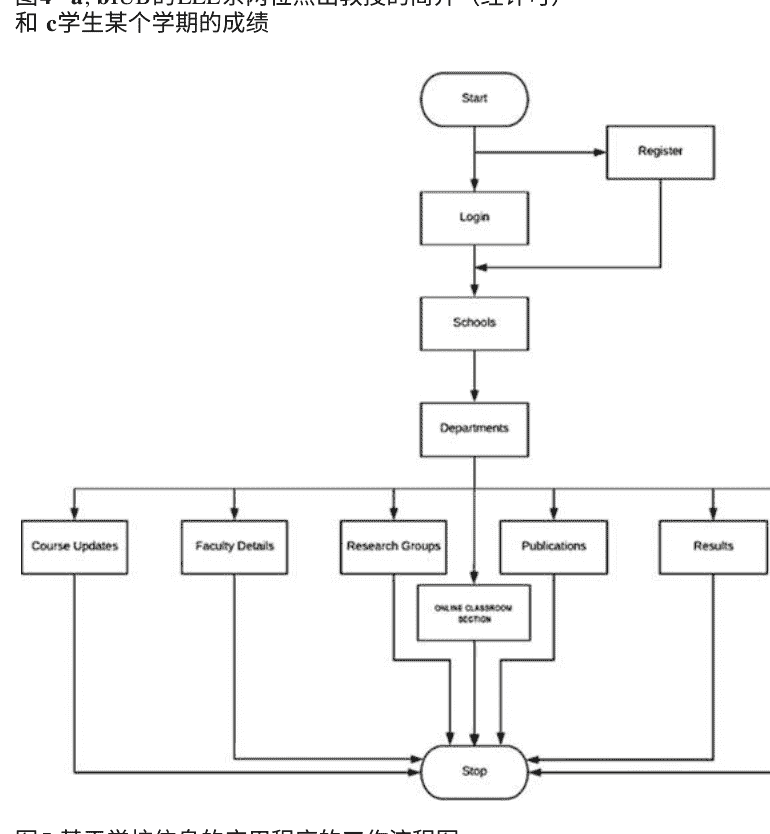

图5 基于学校信息的应用程序的工作流程图

通过这个应用程序，学生可以获取他们学习所需的材料，如书籍的电子版、讲义、样题等。他们还可以通过提供的链接详细了解他们的教师成员的教育背景和研究领域。在紧急情况下，学生可以通过点击“更多详情”选项在他们的个人资料中找到特定课程教师的电子邮件地址，并发送邮件给他们。此外，该应用程序还提供了进行在线课程的机会，学生可以加入并自动计算出勤率。

## 3个案例研究

作为实施我们的“Study-Mate”项目的尝试，我们进行了实验，来自不同背景的52名用户，这帮助我们实现了为所有类型的用户建立应用程序的目标，通过为他们的学术问题提供简单的解决方案。以下是它们的介绍。

##### 3.1 参与者类型一

这个类别属于15名大一学生，他们刚刚开始在达卡的6所不同私立大学攻读本科学位。他们中的大多数来自小城镇到达卡，最近搬迁，他们对Android手机的了解很少。

##### 3.2 参与者类型二

孟加拉独立大学电气与电子工程系的6位不同高级教师。他们被要求对该应用程序提供反馈。他们都在北美的知名大学完成了高等教育。他们中的一些人在没有计算机设施的教室里上课，这就是为什么他们需要通过耗时的纸质方式手动进行考勤。他们还对Android手机和类似的应用程序有更好的理解。此外，在当前不稳定的COVID-19情况下，他们需要在线上进行授课。

##### 3.3 参与者类型三

这个类别中有13个不同大学的大二学生。这些学生大多数在BBA专业学习。他们每天都要花很多时间在路上

上课，因为他们都住在离大学校园很远的地方。特别是因为交通堵塞，他们经常错过早上8点的课。他们对Android设备和应用有足够的了解。

##### 3.4 参与者类型四

这个小组包括12名研究生工程学生，他们被录取到一所特定的大学完成研究生学位。他们还在工作来养家糊口。由于工作原因，他们不能参加所有的课程。他们是使用Android设备和应用的专家。

##### 3.5 参与者类型五

这个类别包括6名不同年龄的女性研究生学生，她们大多数是家庭主妇。她们大多数在家里学习，并通过远程学习来完成课程作业和考试。她们大多数很少使用基于Android的应用程序。

## 4个实验

采用逐步方法来检查五个不同参与者的经验。他们从Android应用程序中得到了怎样的支持，以满足大学需求。具体步骤如下：

首先，将Android设备交给参与者，特别是那些对Android应用程序不太熟悉的人。在开始时，给予他们优先权，以提供足够的培训，以适应Android设备。在使用Android设备进行了四个会话后，我们让他们使用该应用程序进行适应。其次，对那些在启动应用程序时遇到困难的人提供帮助。在为所有参与者提供帮助后，他们都能够在没有外部帮助的情况下安装和使用该应用程序[4-6]。接下来，让他们打开、运行、根据自己的喜好进行自定义，并创建自己的个人资料。了解他们如何根据自己的舒适区域使用该应用程序。但如果他们在使用应用程序时仍然遇到问题和困难，我们会解决他们无法操作的应用程序的任何部分。这样，他们就可以正确地使用它。我们最终的目标是在解决他们关于应用程序的问题后进行评判。他们在大学中如何轻松流畅地使用该应用程序。

我们已经了解到，通过这个应用程序的实施，学生可以记录并获取他们的学习材料[7-9]。

## 5个结果

从对系统的评估中，所有参与者都被要求在相同的时间段内使用该应用程序。尽管时间可能因参与者对应用程序的适应能力和知识的不同而有所变化。对参与者实验的整体结果可以总结如下：第一组参与者可以阅读，但他们对Android应用程序的了解非常有限。因此，起初，他们很难适应这个应用程序。他们发现在开始的阶段相当复杂。然而，他们在每个阶段不断改进。到最后两个阶段（共9个阶段），他们大部分人都能轻松运行该应用程序，并且对使用Android应用程序持积极态度。虽然参与者类型二对Android设备很熟悉，但他们过着忙碌的生活，无法参加所有的阶段。然而，他们中的大多数人总共参加了八个阶段，并在这些阶段结束时顺利运行该应用程序。

他们似乎对在大学里定期使用该应用程序感兴趣[10-13]。第三类参与者对Android和应用程序有足够的了解，比前两类参与者更多地使用了大部分选项，没有任何外部支持。对于他们来说，五个会话足以完全使用应用程序的所有选项。第四类参与者是一群非常快速学习者，并且有使用Android设备的经验。他们只用了四个会话就完全了解了这个应用程序的使用方法。他们对使用这个应用程序非常积极，这对他们获取学习材料和讲座笔记非常有帮助。第五类参与者在开始时与应用程序有完全不同的经验。他们所有人都需要额外的会话（平均总共十一个会话）才能打开和运行该应用程序。但后来他们对它更加投入，并热衷于大部分功能。总体而言，我们试图根据评级捕捉所有相关信息，这些信息已在表1中总结。

简而言之，我们了解到所有五类参与者都对该应用感到满意，并且他们在十一个会话结束时有效地使用了该应用，没有任何外部帮助。由于Android设备非常易于获取，参与者很容易适应该应用。此外，所有四个学生参与组也对这样一个应用给他们节省更多时间和精力来收集更多学习信息和课程材料的事实印象深刻，同时还能访问教师的个人资料和可用性。该提议的应用程序受到了第二类参与者的高度赞赏，他目前在孟加拉独立大学的EEE系担任教职工作。此外，他们中的大多数人希望参与该应用程序的开发，并努力提高该应用程序的可用性。最后，我们研究了孟加拉国其他大学设计的Android应用程序，并列出了所有这些应用程序的特点，然后将其与Study-Mate Android应用程序进行了比较。表2显示了结果。

一种基于大学学术解决方案的安卓应用程序...

661

| 参与者 | 以往经验 | 基于可用性的评级（满分5分） |
| :--- | :--- | :--- | :--- | :--- | :--- | :--- |
| | | L | U | C | I | O |
| 类型一 | 参与者对Android设备和这种类型的应用程序都没有太多经验和了解 | 3 | 5 | 5 | 4 | 4.25 |
| 类型二 | 这个参与者对Android设备有一些经验和熟悉，但对这种类型的应用程序不太熟悉 | 4 | 4 | 5 | 3 | 4.25 |
| 类型三 | 这个用户比前两个参与者更了解， 他对这种类型的应用程序几乎没有概念 | 3 | 5 | 4 | 4 | 4 |
| 类型四 | 这个特定用户是一个快速学习者，也有很多使用Android设备的经验， 他知道如何操作许多其他Android应用程序 | 3 | 4 | 4 | 5 | 4 |
| 类型五 | 这个用户在处理Android设备方面几乎是新手， 因此，她的能力是最低的 | 5 | 3 | 5 | 5 | 4.5 |

| 应用程序名称 | 特征 |
| :--- | :--- | :--- | :--- | :--- | :--- | :--- | :--- | :--- | :--- | :--- | :--- | :--- |
| | ⭡ | Rg | P | At | N | D | Cd | 关于 | 作为 | F | ء | R | 公司 |
| 学习伙伴 | ✓ | ✓ | ✓ | ✓ | ✓ | ✓ | ✓ | ✓ | ✓ | ✓ | ✓ | ✓ | ✗ |
| BUET | ✓ | ✗ | ✗ | ✗ | ✓ | ✗ | ✗ | ✗ | ✗ | ✓ | ✗ | ✗ | ✓ |
| 孟加拉国大学 | ✓ | ✗ | ✗ | ✗ | ✓ | ✗ | ✗ | ✗ | ✗ | ✓ | ✗ | ✓ | ✓ |
| 达卡大学 | ✓ | ✗ | ✗ | ✗ | ✓ | ✗ | ✗ | ✗ | ✗ | ✓ | ✓ | ✓ | ✓ |
| UTUians, Ucam | ✓ | ✓ | ✓ | ✓ | ✓ | ✓ | ✓ | ✗ | ✗ | ✓ | ✗ | ✓ | ✓ |
| AIUB门户 | ✗ | ✗ | ✗ | ✓ | ✗ | ✗ | ✓ | ✗ | ✗ | ✗ | ✓ | ✓ | ✗ |
| EWU NB | ✗ | ✗ | ✗ | ✗ | ✓ | ✗ | ✗ | ✗ | ✗ | ✓ | ✗ | ✗ | ✓ |
| BRACU移动 | ✗ | ✗ | ✗ | ✓ | ✗ | ✗ | ✓ | ✗ | ✗ | ✓ | ✓ | ✓ | ✗ |
| NSU NB | ✗ | ✗ | ✗ | ✗ | ✓ | ✗ | ✗ | ✗ | ✗ | ✗ | ✗ | ✗ | ✗ |
| DIU—S.学生 | ✗ | ✗ | ✗ | ✗ | ✓ | ✓ | ✓ | ✗ | ✗ | ✗ | ✓ | ✓ | ✗ |
| Aust-Hub | ✗ | ✗ | ✗ | ✗ | ✗ | ✗ | ✓ | ✗ | ✗ | ✗ | ✗ | ✗ | ✗ |

A = 入学， Rg = 注册， P = 付款， At = 考勤， N = 公告栏， D =数据库， C =课程详情， O =在线课程， As =作业提交， F = 教师/部门， S =学生资料， R =成绩， C =职业

#### 6 结论

通过使用Android应用程序，为学生和教师成员开发了一种综合的大学管理系统解决方案，其中包括入学、注册、课程材料、课程信息、教师详情、研究更新、出版物、新闻和课程评分信息，供学生用户使用大学提供的学生身份证号码。该应用程序还包括在线考勤、新闻、信息、课程更新功能以及通过个人资料为教师成员提供在线课程进行机会。通过这个应用程序，找到教师的任命比以往更容易，因为这个应用程序允许用户通过电子邮件直接联系教师。此外，该应用程序与大学网站同步，并允许用户直接从网站获取信息。这个提议的Android应用程序的整体性能非常积极，未来还有一些部分需要更新。一个重大的更新将允许学生通过应用程序直接注册和退出不同的课程。

然而，通过考虑所有这些观点和其他不同大学的可用应用，可以说Study-Mate是一个改进和有用的资源，供孟加拉国的学生和教职员工与基于大学的教育程序合作，特别是在线课程进行机会将为学生和教职员工提供从任何情况下、从世界任何地方参加和进行课程的奢侈和舒适。

#### 参考文献

1. Tawheed, P., Shahin, F. B., Mashuk, A. E. H., Al Zabir, K., Poddar, G., Roy, R., & Khan, M. N.R. (2017). 移动学习实施的思考和挑战。 在第14届全球工程与技术会议论文集中(p. 63)。 BIAM基金会，2017年12月29–30日。
2. Oliveira, E. G. D., Oliveira, M. S. F. D., Neto, N. R., Soldati, F. D. P., & Nassur, T. L. C. (2020). 开发和评估一款支持操作系统进程管理教学的移动教育应用程序。在2020年IEEE第20届国际高级学习技术会议(ICALT)上，2020(pp. 19–21)。 https://doi.org/10.1109/ICALT49669.2020.00012.
3. Utesch, M. C., Faizan, N. D., Krcmar, H., & Heininger, R. (2020). Pic2Program——一款教授计算思维的教育性安卓应用程序。IEEE全球工程教育会议（EDUCON），2020，1493-1502。 https://doi.org/10.1109/EDUCON45650.2020.9125087
4. Khan, M. N. R., Khan, M. R., Mashuk, A. K. E. H., Sunny, F. I., Farhan, S. K. A., Shukhon, R. N. S. (2020). 一款用于计算食物中平均化学物质含量的安卓应用程序。在： Dawn, S., Balas, V., Esposito, A., Gope, S. (eds)智能技术和科学技术中的应用。ICI MSAT 2019。智能系统中的学习和分析，卷12。Springer, Cham。 https://doi.org/10.1007/978-3-030-42363-6_16
5. Jahan, N., Ghani, T., Rasheduzzaman, M., Marzan, Y., Ridoy, S. H., 和Khan, M. M. (2021年)。设计和可行性分析NSUGT基于机器学习的移动应用程序教育。在2021年IEEE第11届计算和通信研讨会（CCWC），2021 (pp. 0926–0929)。 https://doi.org/10.1109/CCWC51732.2021.9376040.
6. Konuk, M. S., Akkuş, N., 和Yerden, A. U. (2020年). 基于Android的移动光学测试阅读系统的开发和应用。智能系统和应用创新会议 (ASYU)，2020，1–6. https://doi.org/10.1109/ASYU50717.2020.9259807
7. J.R. Corbeil和M.E. Valdes-Corbeil, “Are You Ready for Android Learning”, EducauseQuarterly, pp. 51–58, No. 2, 2016年。
8. Khan, M. N. R., Sonet, H. H., Yasmin, F., Yesmin, S., Sarker, F., & Mamun, K. A. (2017). ‘B oltechai’—一个面向语言障碍儿童的安卓应用程序。在2017年第四届国际电气工程进展会议 (ICAEE) 上, 2017, 第541-545页。https://doi.org/10.1109/ICAEE.2017.8255415.
9. Diaz, J., Osorio, A., Harari, I., Amadeo, P., & Schiavoni, A. (2020). Mi Universidad移动应用程序: 通往大学教育服务的便捷之门。在2020年第15届伊比利亚信息系统和技术会议 (CISTI) 上, 2020 (第1-6页). https://doi.org/10.23919/CISTI49556.2020.9140988.
10. 宋，F. (2020). 基于安卓的大学思想政治教育移动学习系统2020年第12届国际测量技术与机电自动化会议(ICMTMA), 2020(页码750–754). https://doi.org/10.1109/ICMTMA50254.2020.00163.
11. Khan, M. N. R., Mashuk, A. K. E. H., Durdana, W. F., Alam, M., Roy, R., & Razzak, M. A. (2019). “Doctor Who?” 一款可定制的安卓应用程序，用于综合医疗保健。在2019年第10届计算、通信和网络技术国际会议(ICCCNT), 2019(页码1–6). https://doi.org/10.1109/ICCNT45670.2019.8944501.
12. Jianhong, L., & Xinyue, W. (2020). 基于安卓的移动学习平台设计。在2020年第15届计算机科学与教育国际会议(ICCSE), 2020(页码257–261). https://doi.org/10.1109/ICCSE49874.2020.9201659.
13. Khan, M. N. R., Shahin, F. B., Sunny, F. I., Khan, M. R., Haque Mashuk, A. K. E., & Al Mamun, K. A. (2019). 一种创新的增强型安卓应用程序，用于增强口语残疾人的中介沟通。在2019年第10届国际会议计算、通信和网络技术 (ICCCNT), 2019 (第1-5页). https://doi.org/10.1109/ICCCNT45670.2019.8944655.

永远不要低估具有扩散的替代密码

Md Rasid Ali和Dipanwita Roy Chowdhury

摘要 本研究调查了修改后的替代密码在当今情景中是否具有密码学重要性。经典的替代密码是一种仅混淆的密码。由于缺乏适当的扩散机制，这种密码容易受到频率攻击。我们提出了一种基于替代密码的分组密码模型，在其中引入了扩散机制和多次加密轮。在加密过程中间接使用的密钥被提供给确定性随机比特生成器，使用均匀随机的洗牌算法随机洗牌查找表（LUT）。在研究随机生成的密码学属性之后，我们对假设具有完美扩散特性的扩散函数的虚构分组密码进行了案例研究。

然而，随机生成的排列可能具有较弱的密码学属性，但概率较高。通过调查，我们发现在具有强大扩散机制的情况下，所提出的改进的替代密码可以对几种常见攻击具有足够的潜力。

关键词替代密码·伪随机排列·扩散·完整度

#### 1 引言

替代密码是在现代计算机时代之前开发和使用的。这种密码是密码学的最早形式之一，通常使用纸笔或一些机械设备实现。从安全角度来看，替代密码与现代密码相比并不具备可比性。大多数现代对称密码使用替代密码的概念作为主要构建模块之一。替代置换网络（SPN）和费斯特尔网络是大多数现代对称密码所采用的两种密码设计结构。AES（SPN）和DES（费斯特尔网络）是两种执行的现代密码。

在明文上迭代地进行替代和扩散（在每一轮中）操作，结果是密文。

对称密码中的替代操作引入了密码的混淆。混淆是一种操作，它模糊了密钥与密文之间的关系，并使每个密文位依赖于许多密钥位。

存在多种实现混淆的设计原则。3D [21]，Rijndael [14]，ITUbee [15]使用8位可逆S-box，其中包括两个操作。在 $GF(2)$ 中，使用了一个仿射变换和逆函数，其中零被映射到自身。ARIA [17]中使用了两个不同的8位S盒。两个S盒都由不同的仿射变换组成，但是使用了相同的逆函数 $y = x^{-1}$。Camellia [1]中使用了四个8位S盒。Whirlpool [4]和Crypton [18]使用了8位S盒，由三个4位S盒组成。对于ANUBIS [5]和CLEFIA [31]，尽管最初的S盒设计选择是随机的S盒，最终选择了两种类型的8位S盒。第一个是在 $GF(2^8)$ 中的逆函数，第二个由两个4位S盒组成。对于TWIS [25]和DES，S盒的输入和输出长度不相同。LED [12]，PRESENT [7]，Piccolo [30]，TWINE [32]，RECTANGLE [34]和MIBS [13]为了优化硬件资源使用了单个4位S盒，尽管这个决策牺牲了安全性以换取更多的轮数。为了平衡安全性和硬件资源，LBlock [33]，Midori [2]，Serpent [6]和mCrypton [19]使用了多个4位S盒。Nyberg [22]在他的理论工作中表明AES S盒通过实现最高可能的非线性来抵抗统计攻击。出于相同的原因，许多密码算法接受了相同的AES S盒。密码算法通过一个公开的具有更高非线性和代数度的函数，即置换盒，来实现混淆。为了抵御统计攻击 [26]，GOST [11]，Twofish [28]，PRINTcipher [16]和REDOC II [8]的作者使用了密钥相关的S盒。然而，这些密码算法从未流行起来，因为即时生成密钥相关的S盒是一项昂贵的操作。

替代密码的主要缺陷是它只是一种混淆密码。扩散的缺失限制了明文在密文中的扩散，并且明文属性也保留在密文中。这种现象使得频率攻击和其他类型的攻击成为可能。

在这项工作中，我们将完美扩散属性引入到具有多次加密轮次的替代密码中，并观察其在当今情景中的相关性。我们使用确定性随机比特生成器（DRBG）[3]和类似Fisher-Yates [10]的均匀洗牌算法来随机洗牌查找表（LUT）。共享的秘密对称密钥作为熵源输入到DRBG中。在文献中，我们遇到了许多使用密钥相关S盒的密码。通常，在密钥相关的S盒中，会检查生成的S盒是否满足特定的密码学标准。然而，在我们的工作中，我们选择了从DRBG获得的随机S盒/LUT。在研究了这种LUT的密码学属性之后，我们分析了这种修改后的替代密码对于已知的攻击能力。

本文的其余部分组织如下。第2节简要介绍了各种替代密码及其分析。在第3节中，我们描述了提出的修改的替代密码。第3.1节和第3.2节详细介绍了 $LUT$ 的生成和 $LUT$ 的洗牌，分别。第4节详细介绍了完美扩散属性。第5节描述了随机生成的 $LUT$ 的加密属性。在第6节中，我们进行了一个案例研究。最后，第7节总结了本文。

#### 2 替代密码

在本节中，我们简要讨论替代密码。这是一种经典的加密方法，其中明文单元被替换为密文。根据单元的长度，替代密码分为两种类型，单一字母替代密码和多字母替代密码。

##### 2.1 单字母替代密码

如果密码只对单个字母进行操作，则称为单字母替代密码，在这里单位长度为1。让我们假设，$M$ 是由 $t$ 个符号组成的长度为 $t$ 的字符串集合，符号来自于字母表 $A$。让 $K$ 是字母表 $A$ 上的所有排列的集合。现在，对于每个排列 $E \ e \in K$，有一个加密变换 $E_e$：

其中消息 $m \in M$ 且 $m = (m_1 m_2, \dots, m_t)$。每个符号在 $m$ 中根据某个固定的排列规则 $E_e$ 进行替代。对于解密操作，对于 $c = c_1 c_2, \dots$，计算逆排列 $d = e^{-1}$：$D_d(c) = (d(c_1) d(c_2), \dots, d(c_t)) = m_1 m_2, \dots, m_t = m$。$E_e$ 被称为单字母替代密码。

##### 2.2 多字母替代密码

在多字母替代密码中，单位长度大于一。让我们假设单位长度 $t$ 在字母表 $A$ 上，密钥空间是一个有序集合 $t$ 上的排列 $A$。对于消息 $m \in M \ m = (m_1 m_2, \dots, \dots, \dots, \dots, \dots, \dots, m_t)$ 在密钥 $e = (p_1, p_2, \dots, \dots, \dots, \dots, \dots, \dots, p_t)$ 下的加密是，

$\quad \quad , c_t = c,$

解密密钥 $e = (p_1, p_2, \dots, \dots, \dots, \dots, \dots, \dots, p_t)$ 是 $d = (p_1^{-1}, p_2^{-1}, \dots, p_t^{-1})$，并且

$\quad \quad D_d(c) = (p_1^{-1}(c_1)(c_2), \dots, p_t^{-1}(c_t)) = m_1, \dots, m_t = m$

###### 2.2.1 密码分析

在上述替代密码中，随机字母表 $e(m)$ 或随机字母块 $p(m)$ 替换了明文中的另一个无关字母 $m$ 或字母块。由于缺乏适当的扩散机制，所有明文的基本属性都保留在密文中，这使得频率攻击成为可能。凭借当前的计算能力和足够的数据，替代密码可以立即被破解。扩散是在密码文本中消除统计冗余的属性[29]。也就是说，明文中字母的不均匀性被重新分布到一个很难检测到的大型密文结构的不均匀性中。它被期望具有严格的雪崩准则，即如果 $m \in M$ 的第 $i$ 位被翻转，则密文的第 $j$ 位可能以一半的概率被翻转。

#### 3 提出的模型

本节描述了提出的模型。双方都同意一个秘密种子。在图1中，使用DRBG在各自的端点生成$LUT$和$LUT^{-1}$。明文作为输入，然后通过一定数量的固定轮数进行迭代地执行替代和扩散操作，最终得到密文（图2）。以下是与提出的模型相关的一些要点：

- 在提出的模型中，密钥不直接用于加密过程；它只用于生成$LUT$（第3.1节）。
- 我们使用的扩散函数是一个完全函数，即每个输出位都依赖于每个输入位。
- 当使用$k$位密钥作为熵生成$l$位排列时，如果密钥是均匀随机选择的，则该过程类似于从所有排列中均匀随机选择$2^k$个潜在排列之一（$2^l!$）。

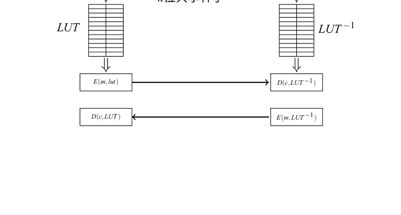

- 所提出的密码实现必须集成一些机制来打破每一轮的自相似性。
- 更大的$LUT$可能具有更好的加密特性，但伴随着更多的成本（$LUT$生成，存储以存储LUT）。在设计密码时，设计者需要平衡安全性，成本和性能。
- 加密轮数（$n$轮）的选择应该在仔细研究各种攻击模型之后进行。这又取决于所选$LUT$的大小。

##### 算法1加密算法

```
1: 过程ENCALGORITHM(明文, 密钥)
2: // 状态是一个占位符，用于获取N位明文，分成 l位的字 ($N = l||l||...||l$)
3: // 循环是加密轮数
4: // GenerateLUT返回具有密钥熵的 l位置换
5: // 替换替换LUT中的每个 l位字
6: // 扩散 操作 ($D_c=1$) 扩散 状态
7: 状态 ← 明文
8: $LUT \leftarrow GenerateLUT(密钥, l)$
9: 对于 $i \in (0, ..., 循环-1)$ 执行
10: 状态 = 替换 (状态, $LUT$)
11: 状态 = 扩散 (状态)
12: 结束循环
13: 返回状态
```

##### 3.1 $LUT$的生成

在提出的密码中，$LUT$（替代表）是秘密的并且作为密钥。首先，取一个包含元素$[0, 1, ..., 2^l-1]$的数组，其中$l$是每个$LUT$元素的位数。现在，在数组元素上执行随机排列。如果$LUT$包含$2^l$个元素，则可能的重新排列数为$2^l!$。在我们提出的情况下，由于我们使用具有秘密$k$位密钥的DRBG作为熵源，可能的不同$LUT$的数量为$2^k$。$LUT$的生成是一次性的预处理任务。

##### 3.2 LUT的洗牌

我们使用众所周知的Fisher-Yates洗牌[10]算法来洗牌LUT。该方法在线性时间内进行洗牌，如算法1所示，并且为l位LUT提供了均匀洗牌，可以产生2^l!种可能的重新排列。尽管在我们提出的情况下，最多可能出现2^k个LUT。

```
算法2洗牌算法
1: 过程       FISHERYATESSHUFFLINGALGORITHM(LUT, l)
2: //LUT是一个包含 [0, 1, ..., 2^l - 1]的数组
3: //rand(p, q)返回一个在p到q之间的随机数
4:    n ← 2^l
5:    对于  i ∈ (0, ..., n - 2) 执行
6:       j = rand(i, n - 1)
7:       交换(LUT[i], LUT[j])
8:    结束循环
9:    返回 LUT
```

###### 3.2.1 均匀洗牌的证明

假设列表的一部分 {a_0, ..., a_{i-1}} 已经被洗牌。 现在，随机选择一个元素 a_j 从 {a_i, ..., a_{n-1}} 并将其替换为 a_i。在位置零出现一个元素的概率是 $\frac{1}{n}$ 和 $\frac{(n-1)}{n}$ 是在剩下的 1, ..., n-1 个位置上着陆的概率。 现在，我们可以假设零位置是均匀洗牌的。$\frac{1}{(n-1)} \cdot \frac{(n-1)}{n}$ 是在位置一上剩余元素中的一个的概率。因此，元素被放置在位置一上的概率是 $\frac{1}{(n-1)}$ 且不放置在位置零上的概率是 $\frac{(n-1)}{n}$。通过数学归纳法计算元素在位置 i 上的概率，
$$\frac{(n - 1)}{(n)} \cdot \frac{(n - 2)}{(n - 1)} \cdot \frac{(n - 3)}{(n - 2)} \cdots \frac{(n - i)}{(n - i - 1)} \cdot \frac{1}{(n - i)} = \frac{1}{n}$$
因此，我们观察到费舍尔-耶茨方法是一种均匀洗牌算法，从算法及其分析中可以看出。

#### 4 完全扩散

在他的工作[29]中，香农提到扩散这个术语，以表示信息的定量传播。输入位对输出位的影响 (n, m)-函数被称为扩散特性。完整度 (D_c) 是一个测量布尔向量函数扩散的一种本能方式，如NESSIE [20, 27]项目中所述。具有 D_c =1 的布尔函数是具有完全扩散特性的完全函数。某些形式的密码攻击是通过找到输入位对特定输出位/位的影响来执行的。如果每个输出位不依赖于所有输入位，则可能存在一些潜在的攻击（即，代数攻击）。攻击者可以在输出位上形成一些多项式方程，并解决它们以获得优势。

完整度 [27]对于一个(n,m)-函数 F = (f_1, f_2, ………………, f_m)的完整度被定义为

```
D_c(F) = 1 - \frac{|\{(i,j)|a_{i,j} = 0, 1 \le i \le n, 1 \le j \le m\}|}{mn}
```

对于一个(^n,m)-函数 F，有 0 \le D_c( \mathcal{F} ) \le 1. D_c(F)是所有 D(f_i) 的平均值，其中, i = 1, 2, ……, m. 当 F 是一个完整函数且 D_c(F) = 1时，以下两个度量是直观的，

```
D_c^{ax}(F) = max_{1 \le i \le m} \{D_c(f_i)\}, D_c^{min}(F) = min_{1 \le i \le m} \{D_c(f_i)\}
```

- （1）几乎平衡的 (n, n) 函数和（2）旋转对称的 (n, n) 函数；两者都是完全扩散的完整函数在每个加密轮中。

#### 5 随机LUT的属性

替代盒在混淆密钥和密文之间的关系中起着重要作用。如今，广为人知的分组密码通常使用具有优越加密特性（高非线性性，高代数度，应满足严格雪崩准则）的公开已知 S 盒。随机生成的 LUT 比具有高概率的已知 S 盒更不强大，尽管它可以抵抗[26]几种密码攻击。本节研究了随机生成的 LUT 的几个密码特性的期望值。

##### 5.1 期望差分特性

差分密码分析是一种基于遵循差分传播的选择明文攻击。给定的特性是从称为差分分布表（DDT）的表中获得的，该表通过分析替代盒进行了丰富。

在提出的模型中使用了随机洗牌的替代盒（LUT），该替代盒使用随机种子作为熵源生成。差分密码分析的复杂性取决于DDT的较大值。在他的理论研究中，O'Connor [24]表明，在非平凡情况下，差分特性的最高概率预计最多为$2^{m}$。 用于均匀随机的$m$位双射映射。

##### 5.2 期望的线性特性

线性密码分析是对分组密码的已知明文攻击中最重要的一种。在最后一轮进行替换后，检查是否存在任何概率线性关系，该关系在明文位的一部分和一部分位之间进行。在某些轮之后，将活动束的数量与线性近似表（LAT）的最大值相结合，以确定密码线性密码分析的复杂性。我们使用[23]中的结果来计算LAT的预期最大值。假设$\pi: Z_2^l \rightarrow Z_2^l$是一个随机排列，$\lambda(\pi)$是$\pi$的线性度。$E(\lambda(\pi, 2k))$表示LAT大小为$2k$的条目的预期数量。由于$E(\lambda(\pi, 2k))$在等式3中随着$k$的增加趋近于零，我们很可能得到$\lambda(\pi)$的上界。

```
E(\lambda(\pi, 2k)) = \frac{2 \times (2^l - 1)^2 \times (2^{l-1}!)^2}{2^l!} \times \left( \begin{array}{c} 2^{l-1} \\ 2^{l-2} + k \end{array} \right)^2 \quad (3)
```

#### 6 案例研究

本节假设一个虚构的分组长度为128位的块密码，分为8位字（总共16个字），密钥长度为128位，$LUT$的长度为$l=8$（$l$位排列）。在将128位密钥作为熵提供给$DRBG$后，生成$LUT$。密码中的扩散机制是最优的（$Dc=1$）。使用来自随机$LUT$的值替换块的16个字中的每个字。

根据[24]的结果，我们可以得出结论，在非平凡情况下，均匀随机的8位双射映射的差分特性的最高概率为$2^{-4}$。由于我们的测试块密码具有$Dc=1$，每一轮的每个输出位都依赖于每个输入位。同样，预计每个16个字都是活跃的。因此，根据[9]的结果，第一轮后预期的活跃字/束的数量为17。再次根据[9]的四轮传播定理，我们可以说预期的束权重为289。由于活跃束权重的数量很大，任何$^4$轮差分特性的概率上限为$2^{-1156}$。显然，随机生成的$LUT$可能具有较弱的加密性。具有高概率的属性。 然而，如果我们排除构建具有完美扩散特性的函数的成本，尽管使用随机LUT，密码仍然具有足够的潜力抵抗差分密码分析。密码对抗差分密码分析的抵抗力使其对反弹攻击具有潜力。

同样，从方程3可以清楚地看出，如果E[A(λ, 2k)]随着k的增加迅速趋近于零，那么我们很可能得到对π(λ)的有用界限。使用方程3，对于8位随机置换，k的值为19。这个期望值并不是很好，但是可以展示出对线性密码分析的足够安全性；这再次归功于扩散的完整函数的使用。

在每一轮中使用相同的替代扩散操作的密码通常容易受到滑动和不变子空间等攻击的威胁。 第3节描述了所提出模型的实际实现必须融合一些机制来打破轮相似性。 打破轮的自相似性确保密码对滑动/不变子空间类型的攻击具有抵抗力。

#### 7 结论

在本文中，我们对替代密码进行了分析研究，以减轻其缺陷。 我们提出了一个块密码模型，通过引入扩散机制和多个迭代轮次来修改替代密码。在每一轮中，进行替代和扩散操作。 随机替代表（LUT）是使用DRBG和均匀洗牌算法生成的置换，将对称密钥作为熵源输入到DRBG中。我们通过假设一个想象中的块密码，进行初步分析，并发现该密码对多种统计攻击具有免疫性。 据我们所知，这是唯一一种通过引入多个修改来减轻经典密码弱点的方法。 我们强烈鼓励对所提出模型进行严格分析。

#### 参考文献

- 1. Aoki, K., Ichikawa, T., Kanda, M. , Matsui, M., Moriai, S., Nakajima, J., & Tokita, T. (2000). Camellia: 适用于多平台的128位分组密码-设计与分析。在密码学中的选定领域国际研讨会 (第39-56页)。斯普林格。
- 2. Banik, S., Bogdanov, Isobe, T., Shibutani, K., Hiwatari, H., Akishita, T., 和Regazzoni, F. (2015)。 Midori: 一种低能耗的分组密码。在密码学与信息安全理论和应用国际会议上 (第411-436页)。斯普林格。
- 3. Barker, E., Feldman, L., 和Witte, G. (2015)。 使用确定性随机比特生成器进行随机数生成的建议，技术。报告，国家标准与技术研究所。
- 4. Barreto, P., Rijmen, V., 等 (2000)。 Whirlpool哈希函数。在第一届开放NESSIE研讨会 (第12卷, 第14页)。比利时鲁汶大学。

Barreto, P. S. (2000). Anubis块密码. NESSIE.

Biham, E., Anderson, R., & Knudsen, L. (1998). Serpent：一个新的块密码提案. 在快速软件加密国际研讨会 (pp. 222–238). Springer.

Bogdanov, A., Knudsen, L. R., Leander, G., Paar, C., Poschmann, A., Robshaw, M. J., Seurin, Y., & Vikkelsoe, C. (2007). Present：一种超轻量级块密码. 在密码硬件和嵌入式系统国际研讨会 (pp. 450–466). Springer.

Cusick, T. W., & Wood, M. C. (1990). Redoc II密码系统. 在密码学理论和应用会议 (pp. 546–563). Springer.

Daemen, J., & Rijmen, V. (2001). 宽路径设计策略. 在密码学和编码国际会议上 (pp. 222–238). Springer.

Fisher, R. A., & Yates, F. (1953). 生物、农业和医学研究的统计表. Hafner Publishing Company.

GOST, G. S. (1989). 28147–89. 苏联标准化委员会：数据处理系统的密码保护.

Guo, J., Peyrin, T., Poschmann, A., & Robshaw, M. (2011). The led block cipher. 在密码硬件和嵌入式系统国际研讨会上 (pp. 326–341). Springer.

Izadi, M., Sadeghiyan, B., Sadeghian, S. S., & Khanooki, H. A. (2009). Mibs：一种新的轻量级分组密码. 在密码学和网络安全国际会议上 (pp. 334–348). Springer.

Joan, D., & Vincent, R. (2002). Rijndael的设计：高级加密标准. 在信息安全和密码学中. Springer.

Karakog, F., Demirci, H., & Harmanci, A. E. (2013). Itubee：面向软件的轻量级分组密码. 在国际轻量级密码学研讨会上，用于安全和隐私 (pp. 16–27). Springer.

Knudsen, L., Leander, G., Poschmann, A., Robshaw, M. J. (2010). Printcipher：一种用于ic-printing的分组密码. 在国际密码硬件和嵌入式系统研讨会上 (pp. 16–32). Springer.

Kwon, D., Kim, J., Park, S., Sung, S. H., Sohn, Y., Song, J. H., Yeom, Y., Yoon, E.-J., Lee, S., Lee, J., et al. (2003). 新的分组密码： Aria. 在国际信息安全和密码学会议上 (pp. 432–445). Springer.

林, C. H. (1998). Crypton：一个新的128位分组密码. NIST AES提案.

林, C. H., & 科尔基什科, T. (2005). Mcrypton一种轻量级的用于低成本RFID标签和传感器安全的分组密码. 在信息安全应用国际研讨会上 (pp. 243–258). Springer.

刘, J., Mesnager, S., & 陈, L. (2015). 关于迭代函数扩散性质. 在IMA国际密码与编码会议上 (pp. 239–253). Springer.

中原, J. (2008). 3d：一个三维分组密码. 在密码学与网络安全国际会议上 (pp. 252–267). Springer.

Nyberg, K. (1993). 用于密码学的差分均匀映射. 在密码技术的理论和应用研讨会上 (pp. 55–64). Springer.

O'Connor, L. (1994). 线性逼近表的性质. 在快速软件加密国际研讨会上 (pp. 131–136). Springer.

O'Connor, L. (1995). 关于双射映射特征分布的研究. 密码学杂志, 8, 67–86.

Ojha, S. K., Kumar, N., Jain, K., et al. (2009). Twis一种轻量级分组密码. 在信息系统安全国际会议上 (pp. 280–291). Springer.

Pradeep, L., & Bhattacharjya, A. (2013). 为AES密码生成随机密钥和密钥相关的S盒，以克服已知攻击. 在计算与通信安全国际研讨会上 (pp. 63–69). Springer.

Preneel, B., Bosselaers, A., Preneel, B., Bosselaers, A., Rijmen, V., Stern, J., Murphy, S., Van Rompay, B., Granboulan, L., Biham, E., 等 (2000). NESSIE项目对AES最终候选者的评论.

Schneier, B., Kelsey, J., Whiting, D., Wagner, D., Hall, C., & Ferguson, N. (1998). Twofish：一个128位块密码. AES提交.

Shannon, C. E. (1949). 通信保密系统的通信理论. 贝尔系统技术期刊, 28, 656–715.

Shibutani, K., Isobe, T., Hiwatari, H., Mitsuda, A., Akishita, T., & Shirai, T. (2011). Piccolo: 一个超轻量级块密码. 在国际密码硬件和嵌入式系统研讨会 (pp. 342–357). Springer.

Shirai, T., Shibutani, K., Akishita, T., Moriai, S., & Iwata, T. (2007). 128位块密码Clefia. 在国际快速软件加密研讨会 (pp. 181–195). Springer.

Suzaki, T., Minematsu, K., Morioka, S., & Kobayashi, E. (2011). Twine: 一个轻量级、多功能块密码. 在ECRYPT轻量级密码学研讨会 (Vol. 2011).

吴, W., & 张, L. (2011). Lblock: 一种轻量级分组密码. 在应用密码学和网络安全国际会议上 (pp. 327–344). Springer.

张, W., 包, Z., 林, D., Rijmen, V., 杨, B., & Verbauwhede, I. (2015). 矩形: 适用于多平台的位切片轻量级分组密码. 中国科学信息科学, 58, 1-15.

### 使用矢量化和机器学习的卡纳达语情感分析

M. E. Sunil和S. Vinay

摘要 情感分析（SA）也称为意见挖掘（OM）是文本挖掘和NLP领域的一个新领域。我们提出了一种方法来分析使用Google翻译器翻译成卡纳达语的IMDB电影评论，以及从Vijayakarnataka、Gadgetloka和filmibeats等各种可靠网站收集的其他评论。在情感分析中，已经对英文文本进行了许多研究。英语的方法和资源可能对其他语言产生不好的结果。在本文中，我们分析了大约50,034条带有正面和负面标签的评论。我们使用各种矢量化技术的集成分类技术实现了89%的准确率。

- 情感分析
- 停用词消除
- 词向量
- 卡纳达语情感
- 分词
- 词频

#### 1 引言

观点挖掘（情感分析）是了解用户文本中人们感受的新方法。在线文本评论中有很多有价值的信息，它在决策过程中起着主导作用。例如，他/她会根据他人发布的有价值的评论来决定他/她想看哪部电影。因此，如何挖掘发布在本地语言中的评论已成为自然语言处理、机器学习和网络挖掘中的重要问题。自然语言处理（NLP）是一个多学科领域。它借鉴了人工智能、语言学和计算机科学的成果。如今，计算机表现得非常聪明、有用，并且它们可以使用自然语言处理来理解、分析和推导人类语言的含义[1]。

情感分析、语音识别、命名实体识别；翻译、关系抽取、自动摘要和主题分割任务可以由开发人员有组织地和结构化地利用自然语言处理[2]来执行。NLP还帮助我们分析文本陈述，并在实际应用中实现人机交互，如关系抽取、词干提取、主题提取、命名实体识别等等。它使计算机能够理解人类的语言。

情感分析是一种计算机化的过程，允许机器识别和提取文本中的情感，例如推特、电子邮件、电影评论、产品评论、各种调查的回应等。我们可以使用可用的技术和情感分析来区分质量较差和质量较高的内容。我们可以找到一部电影为什么比负面反馈更多的原因。

情感分析的研究现在关注社交媒体数据，如Facebook、IMBD、Twitter、亚马逊、Flipkart、Goibio、Quiker等，以及从语言的地区或地区变体（语言地理学）生成的情感，如中文、阿拉伯语、西班牙语和印度语言（如印地语、卡纳达语、泰米尔语、泰卢固语、马拉地语、孟加拉语等）。从地区语言生成的文本情感需要根据不同的方法来满足不断增长的需求。此外，对使用本地语言编写的情感或评论进行分析是一项具有挑战性的任务。

在本文中，我们应用了各种向量化方法来分析卡纳达语的评论。该方法包括机器学习和深度学习方法。所提出的方法包括以下五个主要类别。

(1) 数据爬取（数据收集）
(2) 预处理技术
(3) 特征提取技术
(4) 向量化
(5) 评估。

此外，我们还分析了所使用方法的准确性，并评估了各种深度学习和机器学习技术的性能。

#### 2 背景

在本节中，我们回顾了现有工作，与所提出的系统相关。情感分析的目标是了解评论者对某个主题或对象的感受。态度可以是天真的评价或判断，经验或以语音或文本形式表达的情绪状态。

##### 2.1 不同语言中的情感分析

F. Sağlam、H. Sever和B. Genç为土耳其语在线新闻媒体开发了情感词典[3]。在这项工作中，他们使用GDELT数据库提取的土耳其新闻页面构建了一个大型数据库，并使用Zemberek框架获取了这些文本中单词的词根。他们通过增强现有的10,000个独特单词SWNetTR词典，得到了新的词典SWNetTR-PLUS。最后，他们进行了卡方统计检验来评估模型的性能。结果表明，与SWNetTR相比，SWNetTR-PLUS极性词典具有更好的准确性。

S. Smetanin和M. Komarov使用卷积神经网络分析了用俄语写的产品评论[4]。在这项工作中，模型的输入是Word2Vec模型的预训练向量，并且训练数据集是从俄罗斯的电子商务网站收集的。在训练阶段，他们使用了90k条评论以及两个独立的CNN模型。Ekphrasis工具包的表情符号预处理技术和没有任何模式提取字符的表情符号的常规序列，最后评估了FastText、Word2Vec和glove技术的有效性。

K. S. Sabra、R. N. Zantout和其他人开发了一个模型，使用半监督学习为阿拉伯语生成情感词典[5]。他们使用英语WordNet为单词分配情感分数，并在阿拉伯语意见语料库(OCA)上进行了词典分类的评估。最后，使用多个分类器评估了词典，得到了65%的平均F-measure改进。

##### 2.2 印度语情感分析

我们可以观察到研究人员不断为印度语言做出贡献，Bandopadhya和Amitava Das在印地语和孟加拉语方面做出了很大的工作。他们为孟加拉语开发了SentiwordNet [6]。在这个过程中，他们使用了英孟加拉词典和词汇转换技术，将英语SentiWordNet中的每个词转换为孟加拉语，结果得到了35,805个孟加拉语条目。Das和Bandopadhya进行了孟加拉语词汇的情感标记任务[7]。在这项工作中，他们对句子的高、低和一般强度进行了分类，并对情感类别（如愤怒、恐惧、厌恶、悲伤、快乐和惊讶）进行了Ekmans的级别注释。

##### 2.3 卡纳达语情感分析

Yashawini Hegde和S.K Padma使用随机森林集成分析了用卡纳达语编写的移动产品评论的情感。在这项工作中，他们确定了情感的极性为正面和负面，并在多类别卡纳达语情感分类中实现了大约72%的性能准确度[8]。

K.M. Anil Kumar，N. Rajasimha等人分析了卡纳达语网络文档中的用户情感[9]。在语义和机器学习方法下，一些方法被用来识别用户的情感。在这个实验中，他们使用了包含182个正面评论和105个负面评论的卡纳达语文本语料库作为数据集的算法。在语义方法中，基于句子、Neagtor-Window和基准方法表现良好，在机器学习方法中，朴素贝叶斯方法表现最好。

Rohini等人对卡纳达语的基于领域的情感分析进行了研究。他们使用了特定电影的评论进行基于领域的情感分析，并对英语机器翻译和直接卡纳达语数据集进行了比较研究。

Reddy和Sharoff [11]通过利用Telugu的资源开发了一个Kannada跨语言POS标注器。他们还开发了包括词形分析在内的词法分析器和大型Kannada语料库。实验结果对于使用Telugu构建Kannada的跨语言工具非常鼓舞人心。

Prathibha和Padma [12]开发了词法分析器。通过这个工具，可以识别和分析给定单词的结构，并获得给定单词的语法和词形信息。词法分析器模型由两个模块组成，即词法词干提取器和词法分析器。在他们的工作中，他们使用了三个数据库，如动词后缀表、类别代码表和动词根单语词典。

#### 3 方法论

在印度，有很多人使用他们的本地语言进行交流。但是其中一些语言缺乏有效或最小的语言资源。例如，如果我们考虑南印度语言，相对于泰米尔语、马拉雅拉姆语和泰卢固语，Kannada相对资源匮乏，而泰卢固语相对于印地语也是如此。在印度语言中，存在着形态学和句法行为的高度相似性。Kannada和泰卢固语在形态学上有一些相似之处。但在机器翻译过程中，Kannada中的某些词可能会产生模棱两可的文本，从而产生不可接受的结果。与机器翻译的英语相比，通过在区域语言中进行情感分析可能会获得更好的结果。

所提出的系统包括五个步骤，即数据收集、预处理、预处理技术、特征提取、混合分类算法和评估。

##### 3.1 数据收集

数据集是通过将IMDB电影评论翻译成卡纳达语使用Google翻译器创建的，并且我们还包括了来自各种可信网站如Vijaya Karnataka、Gadgetloka、Filmineats以及调查表的其他电影评论。大约有50,034条带有正面和负面标签的评论被用作模型的输入。正面和负面数据集的示例如下所示。

### 卡纳达语正面评论

ಕಳೆದ 5 ವರ್ಷಗಳಲ್ಲಿ, ನಾನು ನೋಡಿದ ಅತ್ಯುತ್ತಮ ಚಿತ್ರ ಇದು. ನಿಜವಾಗಿ, ಇದು ದಿ ಪ್ಯಾರೇಡ್, ಅಪೋಕ್ಯಾಲಿಪ್ಸ್ ನೌ, ದಿ ಡೋರ್, ದಿ ಡಾಗ್ಸ್ ವಿಲ್ (ರಷ್ಯನ್ ಚಿತ್ರ) ನಂತರದ ಮೊದಲ ಚಿತ್ರಗಳಲ್ಲಿ ಒಂದಾಗಿದೆ. ಇದು ಒಳ್ಳೆಯ ಚಿತ್ರ, ಇದು ಚಿತ್ರದ ಬಗ್ಗೆ ನಾನು ಹೇಳಲು ಬಯಸುವ ಬಹಳಷ್ಟು ವಿಷಯಗಳಿವೆ, ಆದರೆ ನಾನು ಇಂಗ್ಲಿಷ್ ಅನ್ನು ಚೆನ್ನಾಗಿ ತಿಳಿದಿಲ್ಲ. ಆದರೆ ನನಗೆ ವಿಶ್ವಾಸವಿದೆ, ನಾನು ಈ ಚಿತ್ರವನ್ನು ನೋಡಿದವರು ನನ್ನನ್ನು ಅರ್ಥಮಾಡಿಕೊಳ್ಳುತ್ತಾರೆ. ಪ್ರೀತಿಯಿಂದ

### 英语正面评论

这是我过去5年看过的最好的电影。当然，这与杰作如《排长》、《现代启示录》、《门》、《狗的心脏》（俄罗斯电影）是一致的。这是一部好电影，有很多我想说的事情，但我英语不太好。但我相信，看过这部电影的人能理解我。

### 机器翻译积极评价

Kal.eda 5 vars.agal.alli n~anu n~od. 这是一张非常优秀的图片。看得出来，这是地球上的一个平台，有末日的氛围，有门，有旗帜。（化学反应图）随着分子的运动，它们之间发生了一些化学反应。这是一张很有趣的图片，我想告诉你一些关于它的事情，但是我不太擅长用英语表达。但是，对我来说很重要，你们看到了这张动态图片。他们理解了我的意思。希望一切顺利。

### 卡纳达负面评论

ಜೆಲ್ಸನ್‌ಪ್ರೊಡಕ್ಷನ್‌ನ ಸ್ವಾಧೀನದ ನಂತರ ನನ್ನ ಪ್ರಶ್ನೆಗಳು, ಇದು ಯಾವುದೇ ರೀತಿಯ ಪ್ರೊಡಕ್ಷನ್ ಅಲ್ಲ, ಇದು ಸಾಕ್ಷರ್ತೆಯಾಗಿದೆ. ಆದರೆ ಇದು ಅವಾಸ್ತವಿಕ ಪಾತ್ರವಾಗಿದೆ ಮತ್ತು ಅದು ವಾಸ್ತವಿಕವಾಗಿದೆ. ಆಂಧ್ರ-ಬೆಂಗಳೂರು ಸಾಹಿತ್ಯ ಕ್ಷೇತ್ರದಲ್ಲಿ ಸಾಕ್ಷರ್ತೆಯ ಪ್ರಭಾವವನ್ನು ಕಾಣಬಹುದು. ಕರ್ನಾಟಕ ಬೆಳೆದ ಜೆಲ್ಸನ್‌ಪ್ರೊಡಕ್ಷನ್‌ನ ಕುರಿತು ಈ ಪ್ರೊಡಕ್ಷನ್ ಸಾಕ್ಷರ್ತೆಯಾಗಿದೆ.

### 英语负面评论

看完电影后，我脑海中浮现的第一个问题是它是不是一部卡通片。在阅读了一些关于Doc Savage角色和漫画系列的评论之后，我知道这部电影不是一部卡通片。看起来像是一个典型的故事。但是，它给人一种不真实和荒谬的感觉。最后的战斗展示了我所见过的最糟糕的Sahasa艺术表现。这部电影可能成为低预算电影制作人的坏榜样。

### 机器翻译负面评论

观看卡纳达电影。这是我内心产生的第一个问题，这是一个讽刺画面吗？D. Sakavej角色和卡米克萨兰。关于它有一些疑问。在观看了T. Gal之后，我认为这部电影是一个讽刺画面。它是一个特殊故事的反映。但是，它是以真实的方式呈现，并且是有趣的。我观看了最后的场景。这是一个展示了冒险故事的完美例子。卡迪梅预算。这部电影是为了满足电影制作人的需求而制作的一个例子。它是可行的。

##### 3.2 预处理技术

预处理涉及各种数据清理和校正过程。其中，对文本没有任何意义的单词（停用词）被消除，清理数据可以减少数据集的噪音。预处理可以帮助分类器提高性能和分类过程的速度。

- 标准化：从各个来源收集的数据不符合要求的形式。标准化是将原始数据转换为标准数据的过程。在这里，我们将数据存储在带有标题的Excel中，如Kn_review, Label, non_stop_review, processed_review。
- 停用词消除：停用词是自然语言的一部分。这些词不是情感过程的一部分，对分析师来说不太重要，而且使文本变得更重。因此，我们需要从文本中删除停用词。

| review_id | label | processed_review | non_stopwords_review |
| :--- | :--- | :--- | :--- |
| 0 (卡纳达语文本) | str | (处理后的卡纳达语文本) | (去除停用词后的卡纳达语文本) |
| 1 (卡纳达语文本) | str | (处理后的卡纳达语文本) | (去除停用词后的卡纳达语文本) |
| 2 (卡纳达语文本) | str | (处理后的卡纳达语文本) | (去除停用词后的卡纳达语文本) |
| 3 (卡纳达语文本) | str | (处理后的卡纳达语文本) | (去除停用词后的卡纳达语文本) |
| 4 (卡纳达语文本) | str | (处理后的卡纳达语文本) | (去除停用词后的卡纳达语文本) |
| 50029 (卡纳达语文本) | negative | (处理后的卡纳达语文本) | (去除停用词后的卡纳达语文本) |
| 50030 (卡纳达语文本) | negative | (处理后的卡纳达语文本) | (去除停用词后的卡纳达语文本) |
| 50031 (卡纳达语文本) | negative | (处理后的卡纳达语文本) | (去除停用词后的卡纳达语文本) |
| 50032 (卡纳达语文本) | str | (处理后的卡纳达语文本) | (去除停用词后的卡纳达语文本) |
| 50033 (卡纳达语文本) | negative | (处理后的卡纳达语文本) | (去除停用词后的卡纳达语文本) |

术语空间的维度可能会减少。文本文档中最常见的词是冠词、介词和代词等。在卡纳达语中，已经识别出约374个停用词，并从数据中删除，并存储在non_stopwords_review标题下。

Example for stop words are ಅವನು(Her), ಈ(This), ಆದರೆ (But), ಅದು (That is), ಮತ್ತು (And), ಎಂದು (Called), ಇದೆ(There is), ಇದು(It is), ಮಾತ್ರ (Only), ಆದೇ (The Same), ಎಲ್ಲಾ(All).

-   去除标点符号：从数据集（语料库）的所有文本片段（实例或文档）中删除所有标点符号。
-   分词：将文件内容分割成较小的部分，也称为标记。在这项研究中，我们使用了NLTK的word_tokenize方法，并将其添加到标题为processed_review的文件中。示例数据集如图1所示。

##### 3.3 特征提取技术

向量化是将单词以数字形式表示的过程。在自然语言处理中，词汇表中单词或短语的相应实数向量被表示为词向量化或词嵌入。向量化有助于单词预测、计算相似单词、单词相似性/语义。

不同类型的向量化方法有：

-   二进制词频 (BTF)
-   计数向量化器
-   归一化词频
-   Tf-idf向量化器
-   哈希向量化器
-   Word2Vec

| 0 | 0.0 | 0.0 | 0.0 | 0.0 | 0.0 | 1.0 | 0.0 | 0.0 | 0.0 | 0.0 | ... | 0.0 | 0.0 | 0.0 | 0.0 | 0.0 | 0.0 | 0.0 | 0.0 | 0.0 | 0.0 |
|---|-----|-----|-----|-----|-----|-----|-----|-----|-----|-----|-----|-----|-----|-----|-----|-----|-----|-----|-----|-----|-----|
| 1 | 0.0 | 0.0 | 0.0 | 0.0 | 0.0 | 0.0 | 0.0 | 0.0 | 0.0 | 0.0 | ... | 0.0 | 0.0 | 0.0 | 0.0 | 0.0 | 0.0 | 0.0 | 0.0 | 0.0 | 0.0 |
| 2 | 0.0 | 0.0 | 0.0 | 0.0 | 0.0 | 0.0 | 0.0 | 0.0 | 0.0 | 0.0 | ... | 0.0 | 0.0 | 0.0 | 0.0 | 0.0 | 0.0 | 1.0 | 0.0 | 1.0 | 0.0 |
| 3 | 0.0 | 0.0 | 0.0 | 0.0 | 0.0 | 0.0 | 0.0 | 0.0 | 0.0 | 0.0 | ... | 0.0 | 0.0 | 0.0 | 0.0 | 0.0 | 0.0 | 0.0 | 0.0 | 0.0 | 0.0 |
| 4 | 0.0 | 0.0 | 0.0 | 0.0 | 0.0 | 0.0 | 0.0 | 0.0 | 0.0 | 0.0 | ... | 0.0 | 0.0 | 0.0 | 0.0 | 0.0 | 0.0 | 0.0 | 0.0 | 0.0 | 0.0 |
| 5 | 1.0 | 0.0 | 0.0 | 0.0 | 0.0 | 0.0 | 0.0 | 0.0 | 0.0 | 1.0 | ... | 0.0 | 0.0 | 0.0 | 0.0 | 0.0 | 0.0 | 0.0 | 0.0 | 0.0 | 0.0 |
| 6 | 0.0 | 0.0 | 0.0 | 0.0 | 0.0 | 0.0 | 0.0 | 0.0 | 0.0 | 0.0 | ... | 0.0 | 0.0 | 0.0 | 0.0 | 0.0 | 0.0 | 0.0 | 0.0 | 0.0 | 0.0 |
| 7 | 0.0 | 0.0 | 0.0 | 1.0 | 0.0 | 0.0 | 0.0 | 0.0 | 0.0 | 0.0 | ... | 0.0 | 0.0 | 0.0 | 0.0 | 0.0 | 0.0 | 0.0 | 0.0 | 0.0 | 0.0 |

| 0 | 0.0 | 0.0 | 0.0 | 0.0 | 0.0 | 0.0 | 0.0 | 0.0 | 0.0 | 0.0 | ... | 0.0 | 0.0 | 0.0 | 0.0 | 1.0 | 0.0 | 0.0 | 0.0 | 0.0 | 0.0 |
|---|-----|-----|-----|-----|-----|-----|-----|-----|-----|-----|-----|-----|-----|-----|-----|-----|-----|-----|-----|-----|-----|
| 1 | 0.0 | 0.0 | 0.0 | 0.0 | 0.0 | 0.0 | 0.0 | 1.0 | 0.0 | 0.0 | ... | 0.0 | 0.0 | 0.0 | 0.0 | 0.0 | 0.0 | 0.0 | 0.0 | 0.0 | 0.0 |
| 2 | 0.0 | 0.0 | 0.0 | 0.0 | 0.0 | 0.0 | 0.0 | 0.0 | 0.0 | 0.0 | ... | 0.0 | 0.0 | 0.0 | 1.0 | 0.0 | 0.0 | 0.0 | 0.0 | 0.0 | 0.0 |
| 3 | 0.0 | 0.0 | 1.0 | 0.0 | 0.0 | 0.0 | 0.0 | 0.0 | 0.0 | 0.0 | ... | 0.0 | 0.0 | 0.0 | 0.0 | 0.0 | 0.0 | 0.0 | 0.0 | 0.0 | 0.0 |
| 4 | 0.0 | 0.0 | 0.0 | 0.0 | 0.0 | 0.0 | 0.0 | 0.0 | 0.0 | 0.0 | ... | 0.0 | 0.0 | 0.0 | 0.0 | 0.0 | 0.0 | 0.0 | 0.0 | 0.0 | 0.0 |
| 5 | 0.0 | 0.0 | 0.0 | 0.0 | 0.0 | 0.0 | 0.0 | 0.0 | 0.0 | 0.0 | ... | 0.0 | 0.0 | 0.0 | 0.0 | 0.0 | 0.0 | 0.0 | 0.0 | 0.0 | 0.0 |
| 6 | 0.0 | 0.0 | 0.0 | 0.0 | 0.0 | 1.0 | 0.0 | 0.0 | 0.0 | 0.0 | ... | 0.0 | 0.0 | 0.0 | 0.0 | 0.0 | 0.0 | 0.0 | 0.0 | 0.0 | 0.0 |
| 7 | 0.0 | 0.0 | 0.0 | 0.0 | 0.0 | 0.0 | 0.0 | 0.0 | 0.0 | 0.0 | ... | 0.0 | 1.0 | 0.0 | 0.0 | 0.0 | 0.0 | 0.0 | 0.0 | 0.0 | 0.0 |

图2是二进制词频。

从文献中我们观察到，大多数技术在各种出版物中被使用，但其中大部分使用了带有机器学习的Tf-idf。 因此，我们使用相同的方法进行特征提取。

二进制词频（BTF）：如果词在文档中不存在，则用0表示，否则用1表示。 如果一个词出现多次，值仍为1。BTF的结果显示在图2中。

"ಕೇಳಿದ 5 ವರ್ಷಗಳಲ್ಲಿ, ನಾನು ನೋಡಿದ ಅತ್ಯುತ್ತಮ ಚಿತ್ರ ಇದು. ಆದರೆ ನನಗೆ ವಿಶ್ವಾಸವಿದೆ, ಇದನ್ನು ನೋಡಿದವರು, ನನ್ನನ್ನು ಅರ್ಥಮಾಡಿಕೊಳ್ಳುತ್ತಾರೆ. ಇದನ್ನು ನೋಡಿದವರು ನನ್ನನ್ನು ಅರ್ಥಮಾಡಿಕೊಳ್ಳುತ್ತಾರೆ"

### 英文翻译

这是我过去5年看过的最好的电影。 但我相信，看过这部电影的人会理解我。看过这部电影的人都懂我。

Tf-idf: Tf-idf代表统计方法中的词频和逆文档频率。 这两种方法可以使用各种方式确定确切的值。在文本挖掘中，这些被用作加权因子，对于词频 tf（t，d），我们将计算每个单词在文档中出现的次数。

逆文档频率是衡量词语提供多少信息的指标，即与文档中常见的介词相比，很少出现的情感词。 因此，idf减少了出现频率很高的词语，并增加了在所有文档中很少出现的词语的权重。 Tf-idf的结果显示在图3中。

###### 词频

-   词袋模型的词频。
-   一个词出现的频率越高，TF越高。

## 逆文档频率

-   语料库中由N表示的文档数量。
-   语料库中由t表示的词项在N个文档中出现的数量。

```
$$ idf(t) = \frac{\log([1 + N])}{(1 + N_t)} $$
```

Tf-idf是词频和逆文档频率的乘积。

```
$$ TfIdf = tf * idf(t, d) $$
```

我们在深度学习方法中使用的另一种技术是快速文本，它是Word2Vec的一个衍生物。Word2Vec是预训练的Google数据集，包含一组用于生成词嵌入的模型。

FastText是一个用于高效学习词表示和文本分类的开源库，由Facebook研究小组FAIR [13]发布。FastText能够识别超过170种语言，并且可以生成词袋模型的词表示。 事实上，甚至对于拼写错误的单词或单词的连接，文本中包含的子字符串向量被用于生成快速文本词向量。

##### 3.4 混合分类算法

我们使用的分类算法是将两个机器学习算法和两个CNN-LSTM模型组合的集成技术。我们在这里使用的机器学习算法是朴素贝叶斯和逻辑回归[14]。

深度学习是机器学习的一个分支，它使用多层而不是单层来逐步从原始输入中提取更高级别的特征。这里使用的深度学习模型是LSTM和CNN模型的组合。

##### 3.5 评估

进行实验以评估所提出方法的工作性能。首先，将数据集分为两组：训练数据和测试数据。分类器使用将近3/4的数据进行训练，剩余的数据用于测试，我们使用某个分类算法构建了分类模型，深度学习模型也是如此。然后，使用测试数据对模型进行测试，将预测的实例与原始实例进行比较，并根据正确分类的样本数量计算准确率；同时，我们还计算了精确率、召回率和其他参数。

#### 4 实验结果

我们读取的数据集是csv格式，并列出了存储为文本文件的停用词列表。然后从数据集中删除停用词，然后将数据分为训练数据和测试数据。然后，对y属性进行标签编码，并使用Tf-idf和词向量将数据（文章）转换为向量。将向量数据输入到分类算法中，对数据进行拟合，然后使用相同的分类算法对测试数据进行预测。我们使用了两种方法进行分析；然后，使用数据的预测结果计算准确率。详细过程如下所示：

1.  读取停用词列表。
2.  从数据集中删除停用词。
3.  在语料库中找到未转换的英文-卡纳达语单词。将其中的重复项删除，并将其存储在列表中。
4.  将数据分割为训练集和测试集。
5.  为数据集创建Tf-idf转换器，并进行拟合以生成向量。
6.  将Tf-idf向量拟合到朴素贝叶斯和逻辑回归算法中。
7.  从预训练的快速文本词网中创建卡纳达语的词向量。
8.  将词向量拟合到2个不同层布局的CNN-LSTM深度学习模型中。
9.  创建两个CNN-LSTM模型之间的平均预测值列表。
10. 在2个机器学习模型和组合的CNN-LSTM模型之间创建一个主要预测值列表。
11. 创建包含所有结果的分类矩阵。

表1 数据集
| 标签 | 计数 |
| :--- | :--- |
| 积极的 | 25,270 |
| 消极的 | 24,764 |

表2 不同算法的结果
| 算法 | 准确性 | 精确度 | 召回率 |
| :--- | :--- | :--- | :--- |
| 2个CNN-LSTM（带有GRU） | 88.72 | 88 | 89 |
| 朴素贝叶斯 | 88.6 | 85 | 88 |
| 逻辑回归 | 88.3 | 89 | 88 |
| 组合模型 | 89.1 | 89 | 89 |

##### 4.1 结果分析

表1中显示了共有50,034行评论，其中包含标签正面和负面，这些评论被馈送到模型中，该模型由4个模型的混合组合组成，其中2个是LSTM模型，2个是基于机器学习的模型，如讨论所述。深度学习模型平均准确率为88.72%，组合模型准确率为89.1%，如表2和图4、图5所示。

#### 5 结论

卡纳达语评论的情感分析涉及在文档中识别标签正面或负面。这涉及到收集数据，预处理获取的数据，最后基于处理后的数据训练混合模型，一旦模型训练完成，就可以预测评论的情感。所有可用数据被分为测试数据和训练数据。

训练数据占总数据的四分之三，剩余部分分为测试数据。这里使用的混合模型给出了我们选择的数据的最佳准确性。这个实验可以扩展到各种其他分类器。此外，通过添加更多的数据，模型的准确性可以进一步提高。

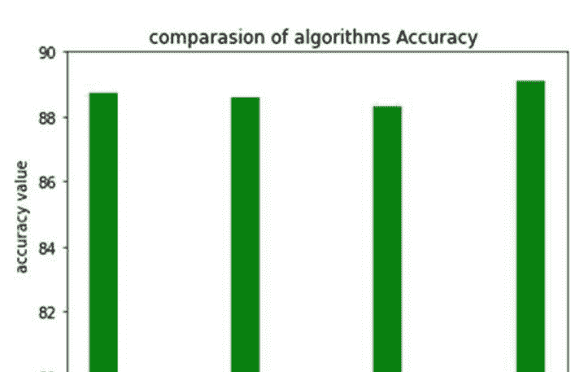

图4算法的准确性

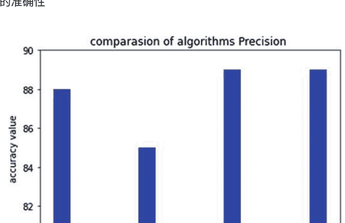

图5算法的精确度

#### 参考文献

1.  王， D.， 苏， J.， 于， H. (2020年)。 自然语言处理的特征提取和分析 用于深度学习英语。*IEEE Access*, 8, 46335-46345。 https://doi.org/10.1109/ACCESS.2020.2974101
2.  Ghani, N.A., Hamid, S., Hashem, I.A.T., & Ahmed, E. (2019年) 社交媒体大数据分析： 一项调查。 人类行为中的计算机, *101*, 417-428。 ISSN 0747-5632。
3.  Sa`glam, F., Sever, H., & Genç, B. (2016). 使用在线新闻媒体开发土耳其情感词典进行情感分析。在2016年IEEE/ACS第13届国际计算机系统和应用会议(AICCSA)上(pp. 1–5)。https://doi.org/10.1109/AICCSA.2016.7945670.
4.  Smetanin, S., & Komarov, M. (2019).使用卷积神经网络对俄语产品评论进行情感分析。在2019年IEEE第21届商业信息学会议(CBI)上(pp 482–486)。 https://doi.org/10.1109/CBI.2019.00062.
5.  Sabra, K. S., Zantout, R. N., Abed, M. A. E., & Hamandi, L. (2017). 情感分析：阿拉伯情感词典。传感器网络智能与新兴技术(SENSET), 2017, 1–4。 https://doi.org/10.1109/SENSET.2017.81250546.
6.  Das, A., & Bandyopadhyay, S. (2010).孟加拉语SentiWordNet
7.  Das, D., & Bandyopadhyay, S. (2010) 在孟加拉语博客语料库中标记情感，细粒度的句子级别标记。在第八届亚洲语言资源研讨会论文集中(pp. 47–55). Coling 2010 组织委员会，2010年8月。
8.  Hegde, Y., & Padma, S. K. (2017). 使用随机森林集成进行移动产品评论的情感分析在2017年IEEE第七届国际先进计算会议(IACC) (pp. 777–782).
9.  Anil Kumar, K. M., Rajasimha, N., Reddy, M., Rajanarayana, A., & Nadgir, K. (2015). 从卡纳达语网络文档中分析用户情感。 Procedia Computer Science, 54, 247–256.
10. Rohini, V., Thomas, M., & Latha, C. (2016). 基于领域的情感分析在区域语言-卡纳达语中的应用。国际工程研究与技术杂志(IJERT), 4(22).
11. Reddy, S., & Sharoff, S. (2011). 跨语言POS标注器（和其他工具）用于印度语言：使用泰卢固语资源的卡纳达语实验。在第5届国际自然语言处理联合会议论文集(pp. 11–19), 2011年11月8日至12日。
12. Padma, M. C., & Prathibha, R. J. (2014). 卡纳达语名词的形态学词干提取器、分析器和生成器的开发。在电子、计算机科学和技术的新兴研究中(pp. 713–723).
13. Xu, J., & Du, Q. (2019). 对fastText进行深入研究。在2019年IEEE第21届国际高性能计算与通信会议；IEEE第17届智能城市国际会议；IEEE第5届数据科学和系统国际会议（HPCC/SmartCity/DSS） (pp. 1714–1719)。 https://doi.org/10.1109/HPCC/SmartCity/DSS.2019.00234.
14. 韩军，裴杰和坎伯 (2011).数据挖掘：概念与技术. Elsevier.

### 使用一维卷积神经网络进行人体活动识别

**Khushboo Banjarey, Satya Prakash Sahu和Deepak Kumar Dewangan**

摘要 人们更加关注创新的研究目标，以识别对象和理解环境，评估时间序列和预测由于人工智能（AI）的快速进步，模式的结果。人体活动识别（HAR）是一个目标在识别、解释和评估人类运动行为的领域。HAR已经从深度学习中获得了显著的好处。尽管深度学习模型具有巨大的潜力，但在现实世界中训练需要大量的数据集。另一方面，当前的研究需要改进以区分静态和动态行为，并取得更显著的成就。我们的主要目标是使用一维卷积神经网络（1D CNN）创建一个系统，可以识别坐、站、走、睡觉、阅读和倾斜等动作，并且我们正在尝试减少训练神经网络的时间优化。

人机交互（HCI）机械化越来越受欢迎，可以使用陀螺仪和加速度计等传感器记录行为，HAR可以使用传感器、图像、智能手机或剪辑来完成。本文介绍了一种使用一维卷积神经网络来预测基于给定数据集的人类行为的技术，我们获得了90.73%的准确率。

- 人工智能
- 人体活动识别
- 深度学习
- 计算机视觉
- 一维卷积神经网络
- 人机交互

K. Banjarey (✉) · S. P. Sahu · D. K. Dewangan
国家技术研究所信息技术部，印度Raipur

S. P. Sahu
电子邮件：spsahu.it@nitrr.ac.in

D. K. Dewangan
电子邮件：dkdewangan.phd2018.it@nitrr.ac.in

#### 1 引言

近年来，人类活动识别已成为一个常见的研究领域。HAR研究的基本类型是基于虚拟视频图像和传感器数据的运动识别。基于计算机视觉的系统通常用于基于捕获的视频数据的HAR检测和识别，它主要使用外部摄像头监视用户，减少其外部干扰。然而，基于传感器的HAR通常被佩戴，并且可以在更开放的环境中跟踪用户。

在医学诊断中，HAR可能非常有帮助。HAR还可以用来跟踪老年人的日常活动。HAR可以用来跟踪犯罪统计数据。通过识别日常活动，可以创建智能家居。可以识别危险驾驶行为，并帮助提高出行安全。使用HAR可以检测军事行为。通过分析多个传感器捕获的运动数据，HAR希望能够识别人类身体活动的模式。HAR具有广泛的应用范围，从人类活动监测（例如，跌倒识别和健康保护）到人类活动意识（图1）。

本文提出了一种基于深度学习的模型。1D CNN被提出，其中通过模型训练期间生成的输入数据识别人类行为。一般来说，HAR模型从收集数据开始，到识别当前操作结束。HAR原则在各种应用或领域中被使用，包括医疗保健、儿童保育和其他需要追踪人类行为的领域。其主要目标是观察和分析人类行为，以成功理解当前事务。在追踪患者健康状况、儿童保育、保护、家庭护理和监控程序的过程中，历史上一直由人工操作完成。

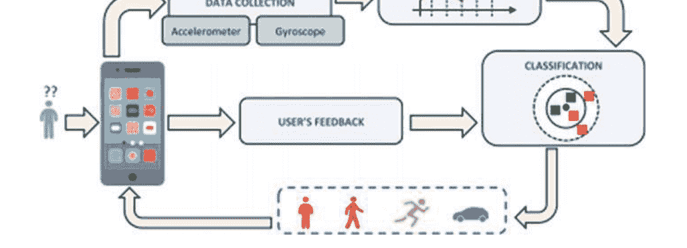

图1 人体活动识别 [1]

由人工操作员完成。当涉及到通过人工操作员辅助追踪人类行为模式时，可能存在诸如先入为主的观念、有偏见的方法、隐性偏见或错误判断等问题，这些都会影响行为模式识别的效率。一个主要的挑战是在最小化计算成本的同时实现高活动识别准确性。为了解决这个问题，HAR社区开始使用深度学习来替代依赖手动特征提取的成熟识别方法。然而，功能提取在各种图像处理[2-9]领域中被使用，并且近年来，计算机视觉和基于预测的图像处理[10, 11]以及卷积神经网络（CNN）的监督学习在智能应用[12-14]中得到广泛应用。图像处理[15-17]、医生诊断、语音识别和自然语言处理只是深度学习最近被使用的一些领域。自那时以来，它已被用于解决各种实际问题。对于人体活动识别任务，我们采用了一维卷积神经网络（1D-CNN）。创建卷积神经网络模型[9, 18]来对图像进行分类，并通过特征学习获得对二维输入的内部印象的理解。这种方法可以从一维数据序列（如加速度和陀螺仪数据）中识别人类行为。系统学习如何从观察序列中提取属性，并将内部特征绘制到不同类型的活动中。

基于输入数据[19]，1D卷积神经网络将识别一个人是站立、行走、跳跃等等。这个数据中有两个维度。时间步骤是第一个组成部分，接下来是三个轴的加速度值。卷积神经网络从原始时间序列分析中学习特征，消除了开发激活函数所需的经验和专业知识。原则上，该系统应该获得时间序列分析的基本结构，并产生与基于特征的数据集变体上配置的机器相当的结果。

#### 2 相关工作

近年来，HAR应用已经成为许多研究的主题，有许多建议的方法。早期的研究主要使用决策树、支持向量机、朴素贝叶斯分类器和浅层传统模型来对传感器收集的数据进行分类，特别是在开发了HAR [20-22]公共领域基准和几种识别方法之后。在各种识别任务中，K最近邻算法被发现比其他先前算法更好，但需要许多特征来构建分类器[23]。为了解决先前KNN算法相关的计算复杂性问题，引入了基于聚类的KNN算法[24]。支持向量机（SVM）[25]比KNN更好地处理异常值，特别是在突出特征和有限训练数据的情况下，它是另一种产生出色结果的优秀算法。

深度神经网络（DNN）在测量复杂输入转换方面优于其他方法[26, 27]。卷积和循环层等DNN被用于可穿戴HAR领域。使用卷积层观察可穿戴传感器的信号，提取特征，然后使用密集层将特征统一，以提供不同人类活动的概率分布。创建了一个“深度残差双向LSTM网络”[28]来增强模型的学习能力。然而，为了达到最佳精度所需的时间使其不适用于实时应用，尽管在训练早期具有良好的准确性，使其方便用于HAR任务。引入了混合网络，通过将卷积层与LSTM结合自动提取特征，并仅使用少量参数对其进行分类[29]。提出了一种模型，可以在一次学习实体中同时结合属性提取和分类，采用CNN，与以前使用手动过滤特征的研究相反。声称混合机器学习系统，将两种非相同模型形式的优势合并，产生比单一系统更好的结果。作者提出了一个比以前方法更好的深度“Conv-LSTM”网络[30]，使用F1分数和准确性进行评估。与LSTM方法不同，这个任务使用一维CNN（1D CNN）实现了两阶段学习模型，并使用分割和征服的分类学习与测试数据锐化相结合[21, 31]。由于速度在这些包中至关重要，作者提出了一种使用手机的“快速而强大的深度卷积神经网络结构（FR-DCNN）”[31]，通过结合一组信号处理算法和信号选择模块，提高了整体执行效果并增加了传感器未经处理的记录细节。

时间序列被Ismail等人[32]描述为一组有序的实数值，其长度与实际值T的种类相同。他继续解释数据集是一组成对的(xi, yi)，其中xi是一个时间序列，yi是与之对应的标记或大小。数据集然后对使用一种将可能的输入xi的距离映射到优雅变量值yi的可能性分布的版本进行了分类，这是任何TSC设备学习模型的基础。由于HAR是一个TSC挑战，提出了一系列深度和非深度学习策略。举几个例子，有Anguita等人提出的多类支持向量机[33]，LSTM[34]和CNN[32, 35]。

#### 3 提出的方法

我们已经应用了1D CNN进行HAR。使用CNN进行序列分类的优势在于它们可以直接从原始时间序列分析中学习，无需主题专业知识来手动开发特征向量。HAR的实施步骤如下：

##### 3.1 数据集收集

我们使用了UCI HAR的HAR数据集，其中包括30个主题，在进行日常活动时佩戴腰部安装的智能手机和嵌入式惯性传感器。这是由30名年龄在19至48岁之间的志愿者组成的小组进行的。每个人在腰部佩戴智能手机时执行了六种活动：行走、上楼、下楼、坐着、站着和躺着。我们使用了这个数据集，因为该数据集中为每个记录提供了来自加速度计的三轴加速度和近似的身体加速度，以及陀螺仪的三维角速度。时间和频域变量包含在这个561维特征向量中。它的分类是一种娱乐活动-实验者的唯一标识符。

##### 3.2 数据预处理

事实首先被归一化以适应所提出的模型的事实布局。之后，标记再次编码，将单词标签转换为数值类型。

##### 3.3 数据训练

我们将数据集分为两个部分：教育统计和试验记录。在我们的数据集中，训练和调查记录的比例为7:3。

##### 3.4 应用模型

CNN利用卷积操作将多个处理层组合在一起，并且并行使用许多组件，利用有机神经系统的形状。由于数据集包含来自加速度传感器的时间序列数据，因此使用1D CNN。通过输入层保存x轴、y轴和z轴的时间间隔，对数据进行重塑。输入层之后是卷积层和最大池化层进行特征提取，然后是用于分类的全连接层（图2）。

为了减少训练时间，我们修改了1D CNN模型[36]的架构。在我们的1D CNN模型结构中，我们包括了三个卷积层、一个dropout层、一个最大池化层；一个flatten层、两个全连接层和一个输出层。按照该方法，输入层上的输出在进入第一个卷积层之前一直保持，直到最后一个卷积层。所有卷积层中使用的激活特征

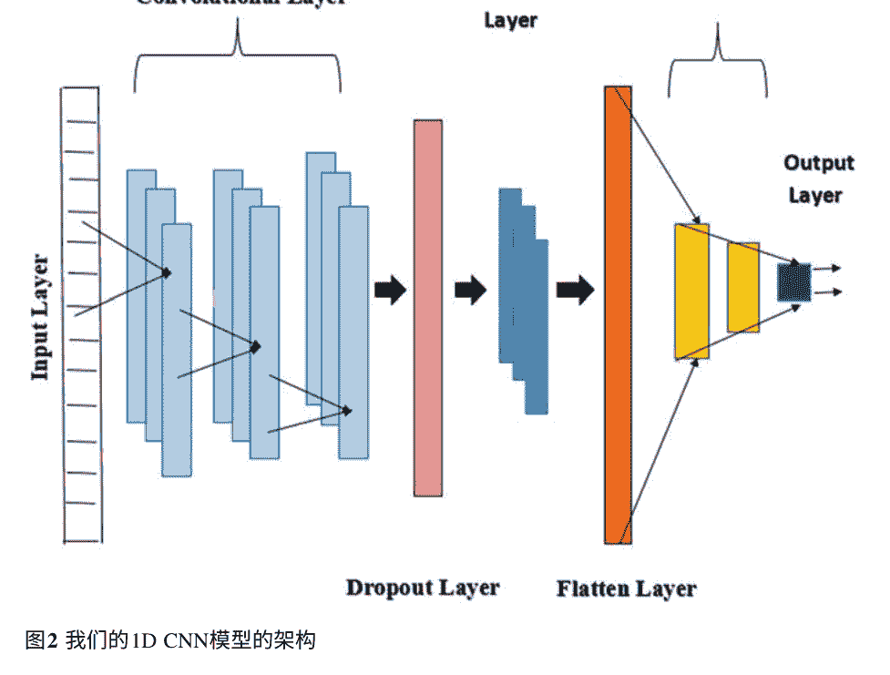

## 图2 我们的1D CNN模型的架构

使用修正线性单元（ReLU） 使用dropout层来避免过拟合和通过删除不再有用的节点来加速学习过程。使用dropout值为0.5。在CNN版本上使用的池化层是最大池化，以减小特征图的维度和节点的数量，从而加快计算过程。

下一步是将获得的池化特征图展平。整个池化特征图矩阵被转换为一列，然后供神经网络进行处理。换句话说，我们将所有像素数据合并成一行，并连接到最后一层。密集层是一个深度连接的神经网络层，这意味着密集层中的每个神经元都从其前一层的所有神经元接收输入。密集层被认为是模型中最常用的层。密集层还对向量进行旋转、缩放和平移等操作。密集层在输入上执行操作并返回输出。密集层的功能是添加连接层。应用的激活函数是softmax，输出为分类结果。

### ## 3.5 适应和评估模型

现在统计数据已经加载到内存中并准备好进行建模，我们可以轮廓化、形状化和比较一个1D CNN模型。我们必须首先用Keras深度学习库为CNN版本提供解释。三维输入对于该版本至关重要。每个时间窗口中有128个步骤，并且每个步骤中包含九个变量或函数，这正是统计数据的加载方式。模型的性能可以是一个包含六个因素的向量，每个因素表示每个六种行为文件的给定窗口的概率。我们可以从给定的训练数据集中提取这些测量的输入和输出，同时训练模型。

如图所示，该模型将包括1D CNN层、正则化的dropout层和池化层。CNN层通常被分成不同的类别，以便让模型有机会从输入数据中学习特征。dropout层旨在减缓学习过程，从而得到更好的最终模型。CNN很容易理解。池化层将发现的特征减少到其原始长度的1/4，只保留最重要的特征。在CNN和池化之后，发现的特征被展平成一个长向量，并通过全连接层传递，然后由输出层进行预测。全连接层用于在发现的特征和输出之间进行缓冲，允许在进行预测之前对发现的特征进行解释。对于该模型，我们将使用常规的64个并行特征映射配置和3的卷积核大小。卷积核大小是在对输入序列进行研究或处理成特征映射时考虑的输入时间步数。特征映射表示输入被处理或解释的次数。

我们正在研究一种多重壮丽型麻烦，我们将优化网络使用特定的移动熵损失函数，使用Adam版本的随机梯度下降。该版本可以适用于预定的多个时期。在这种情况下，使用十个样本，批量大小为32，在权重修改之前，模型暴露于32个窗口的统计数据。成为模型后，它在测试数据集上进行检查，再次检验适合模型的准确性。

## ## 4 结果

我们在UCI HAR数据集上应用了1D CNN来预测人类活动，并获得了90.73%的准确率。

**表1. 性能比较**

| 序号 | 方法 | 准确性 |
|------|------|--------|
| 1 | 深度CNN +统计特征[37] | 95.13% |
| 2 | CNN [38] | 94.66% |
| 3 | Rps与CNN [39] | 90.1% |
| 4 | CNN [40] | 92.22% |
| 5 | CNN + stat.features [41] | 90.42% |
| 6 | LSTM + CNN [42] | 95.75% |
| 7 | 1D CNN (我们的模型) | 90.73% |

## ## 4.1 与以前的研究工作的性能比较

许多研究已经在HAR上进行，并通过他们提出的模型取得了显著的结果。表1显示了我们实现的准确性与以前的工作的比较。

## ## 4.2 讨论和未来的范围

根据我们的调查，智能手机和可穿戴传感器技术在HAR研究中广泛应用。另一方面，基于姿势的技术在开始时并不流行，可能是由于3D空间中的场景和人类动作的限制。另一个限制是需要先进的加工技术来识别和去除图像序列中的人物。因此，当大量数据一次性分析时，实时HAR系统可以获得更好的结果。在普遍环境中，没有确切的迹象或统计数据表明可穿戴传感器在性能上优于智能手机传感器，反之亦然。

根据主题和预期使用情况，两种传感器都预计具有优点和缺点。因此，在部署任何HAR技术之前，研究人员和开发人员必须首先选择受试者和使用方式。我们观察到，尽管结果更好，但基于视觉的方法在过去两个世纪中并不流行，因为它的局限性。然而，在未来的几年中，随着技术的进步，具有高计算能力的机器将更容易获得，能够在更短的时间内处理大量数据，基于视觉的解决方案将成为HAR的一个很好选择[43]。

## ## 4.3 HAR中的挑战

数据收集：如果要通过传感器获取数据，用户必须佩戴许多传感器，传感器的放置是一个问题，因为它会影响结果。

多个人：当传感器被植入家庭环境时，可能会有许多人在场，这使得对多个居住者的行为进行映射变得具有挑战性。

时间复杂度和准确性：各种分类算法导致不同水平的时间复杂度和精度。广泛注意到，当一个分类系统的计算复杂度较低时，其准确性较低，而具有较高准确性但计算复杂度较低的系统则准确性较高。

实时数据：许多结果是使用传统数据集估计的，而使用实时数据集可能会有所不同。
各种行动：如果人们同时进行各种活动，对行动的识别将会很困难。

#### 5 结论

在本文中，我们建议使用一种一维卷积神经网络方法来进行人类兴趣识别，通过利用卷积神经网络在特征提取方面的稳健性来提高兴趣的受欢迎程度。本研究侧重于对一系列体育活动的指导、测试和评估。这种卷积神经网络模型将自动从输入（原始）数据中学习关键特征，以进行准确的预测。可以使用新的数据集或电影，并且可以使用相同的模型轻松、经济地进行适应。对于UCI HAR数据集，准确率为90.73%。我们将继续改进这个系统以进行未来的工作，并在未来的工作中仔细测试它与各种超参数（包括学习率、批量大小和正则化等）的效果。我们希望在多个数据集上测试这个系统，以解决其他深度学习和HAR问题。对于UCI数据集和其他开源数据集，我们将评估该方法对当前情况的影响。

#### 参考文献

1. Concone, F., Gaglio, S., Lo Re, G., & Morana, M. (2017). 智能手机数据分析用于人类活动识别。 在计算机科学讲义中（包括子系列 计算机科学讲义 人工智能和生物信息学讲义）（第10640卷，第58-71页）。LNAI。https://doi.org/10.1007/978-3-319-70169-1_5。

2. Dewangan, D. K., & Rathore, Y. (2011). 使用全参考方法对压缩图像进行图像质量评估。国际技术杂志，I(2), 68-71。

3. Pandey, P., Dewangan, K. K., & Dewangan, D. K. (2017). 通过预处理和对比度增强提高卫星图像的质量。 在：2017年国际通信和信号处理会议（ICCSP）（第0056-0060页）。IEEE。

4. Ali, U., Dewangan, K. K., & Dewangan, D. K. (2018). 在云计算中使用蚂蚁蜜蜂群和人工神经网络进行分布式拒绝服务攻击检测。 在自然启发计算(pp. 165–175). Springer.

5. Bhattacharya, N., Dewangan, D. K., & Dewangan, K. K. (2018). 使用Gabor特征进行指纹关节图像的有效匹配。 在基于ICT的创新(pp. 153–162). 斯普林格。

6. Pandey, P., Dewangan, K. K., & Dewangan, D. K. (2017). 使用模糊推理系统提高卫星图像的质量。 在2017年能源、通信、数据分析和软计算国际会议(ICECDS)中(pp. 3087–3092). IEEE.

7. Pandey, P., Dewangan, K. K., & Dewangan, D. K. (2017). 卫星图像增强技术——一项比较研究。 在2017年能源、通信、数据分析和软计算国际会议(ICECDS)中(pp. 597–602). IEEE.

8. Dewangan, D. K., & Rathore, Y. (2011). 使用全参考和无参考方法对图像质量进行估计。 国际高级计算机科学研究杂志， 2(5).

9. Sahu, S. P., Dewangan, D. K., Agrawal, A., & Priyanka, T. S. (2021). 使用深度强化技术进行交通信号灯周期控制。 在2021年国际人工智能和智能系统会议上(pp. 697–702). IEEE.

10. Dewangan, D. K., & Sahu, S. P. (2021).使用视觉传感器进行智能车辆系统的车道检测的驾驶行为分析。 在IEEE传感器杂志(vol. 21, no. 5, pp. 6367–6375),2021年3月1日。 https://doi.org/10.1109/JSEN.2020.3037340.

11. Dewangan, D. K., & Sahu, S. P. (2020). 智能车辆的实时物体跟踪。 在2020年第一届电力、控制和计算技术国际会议(ICPC2T) (pp. 134–138). IEEE.

12. Dewangan, D. K., & Sahu, S. P. (2021). 基于深度学习的智能车辆系统使用树莓派的减速带检测模型在IEEE传感器期刊(Vol. 21, no. 3, pp. 3570–3578)中。 2021年2月1日。 https://doi.org/10.1109/JSEN.2020.3027097.

13. Dewangan, D. K., & Sahu, S. P. (2021). RCNet:用于智能车辆系统的道路分类卷积神经网络。 智能服务机器人， 14, 199–214。 https://doi.org/10.1007/s11370-020-00343-6

14. Dewangan, D. K., & Sahu, S. P. (2021). PotNet: 使用卷积神经网络进行自动驾驶车辆系统中的坑洞检测电子信件， 57, 53–56。 https://doi.org/10.1049/cell2.12062

15. Dewangan, D. K., & Sahu, S. P. (2021). 针对停车位的智能车辆系统的预测控制策略。 在2021年第5届国际智能计算与控制系统会议(ICICCS)(pp. 10–13). IEEE.

16. Banjarey, K., Sahu, S. P., & Dewangan, D. K. (2021). 使用传感器和深度学习方法进行人体活动识别的调查。 在2021年第5届国际计算方法和通信会议(ICCMC)(pp. 1610–1617). IEEE.

17. Dewangan, D. K., & Sahu, S. P. (2021). 基于语义分割的卷积神经网络的道路检测-智能车辆系统。 在数据工程和通信技术(pp. 629–637). Springer.

18. Pardhi, P., Yadav, K., Shrivastav, S., Sahu, S. P., & Dewangan, D. K. (2021). 使用三维卷积神经网络进行自主导航系统的车辆运动预测。 在2021年第五届计算方法和通信国际会议(ICCMC)(pp. 1322–1329). IEEE.

19. Ragab, M. G., Abdulkadir, S. J., & Aziz, N. (2020). 随机搜索一维CNN用于人体活动识别。 计算智能国际会议(ICCI), 2020, 86–91. https://doi.org/10.1109/ICCI51257.2020.9247810

20. Jalloul, N., Poree, F., Viardot, G., L’Hostis, P., & Car-rault, G. (2017). 使用复杂网络分析进行活动识别IEEE生物医学与健康信息学杂志， 22(4), 989–1000.

21. Gupta, P., & Dallas, T. (2014). 使用单个三轴加速度计的特征选择和活动识别系统IEEE生物医学工程学会刊物， 61(6), 1780–1786.

22. Fullerton, E., Heller, B., & Munoz-Organero, M. (2017). 使用多个佩戴式加速度计识别自由活动IEEE传感器杂志， 17(16), 5290–5297.

### 使用卷积神经网络预测数字化印度手稿的语言和时代

Anukriti Garg，Laghima Tiwari，Tejsvi Juj，S. Indu和N. Jayanthi

摘要 随着印度手稿数字化数量的增加，重新审视了对其时代预测的问题，以解读不同时期的社会经济结构。本文描述了一种新颖的方法，使用卷积神经网络(CNN)从扫描图像中估计印度手稿的时代。该方法主要利用图像处理从小图像块中提取视觉特征，并根据书写风格的差异进行分类，包括笔画和字母形成的差异。我们采用两步方法，先进行语言预测，然后针对每种语言进行单独的时代预测模型，以获得最佳结果。对于本文，我们仅考虑了16世纪至20世纪之间的六种印度语言手稿。总的来说，我们的模型优于其他知名架构，在训练和验证数据上分别达到了90%和80%的准确率。

关键词 卷积神经网络 · 时代预测 · 印度手稿 · 语言预测

#### 1 引言

历史发现可以追溯到各种来源，如考古遗址、手稿、文物和口头传承。在本文中，我们将重点研究手写手稿。大量的历史资料可供研究印度丰富的文化和遗产[1]。这些文件是某种活动（行政、社会、宗教或商业）的必要部分。这增加了准确确定它们所属时代的重要性。

已经采用了许多技术进行定年，包括化学和物理方法[2]。然而，所有这些方法都对手稿的保存提出了重大挑战，特别是在处理和存储过程中，因为它们易碎。通过数字化保存，这个问题已经得到解决，从而产生了使用图像处理和深度学习进行定年的前景。

在本文中，我们采用了一种新颖的方法，使用卷积神经网络（CNN）从扫描图像中估计印度手稿的时代。我们将我们的考虑限制在六种印度语手稿上，即孟加拉语、印地语、普拉克里特语、旁遮普语、梵语和泰米尔语，这些手稿写于16世纪至20世纪之间。请注意，我们提出的模型不仅限于我们在本文中使用的特定数据集，并且也适用于其他数据集。

我们采用了一种基于深度学习的新颖的两步方法，即语言预测模型和单独的时代预测模型。这种分组方法通过关注特定语言的字符集，提供了一个连贯的区分基础。此外，它提供了对手稿的整体视图，并使其能够扩展到其他语言。我们的模型可以准确预测基于书写风格的时代[1, 3-6]，而不需要了解其文本内容。我们假设特定语言的书写风格会随着一个世纪的变化而变化，如图1所示[4]。虽然以前将其建模为分类的基础，但我们考虑到印度手稿的丰富多样性，同时考虑多种语言。为了增加验证，我们将我们的方法与其他知名架构进行了比较[4, 6]。

本文的剩余部分组织如下。第2节包括文献综述。第3节包括问题陈述。在第4节中，我们描述了我们提出的方法。第5节和第6节展示了结果分析和与现有架构的比较。最后，第7节总结了本文。

#### 2 文献综述

理解过去的手稿的重要性是巨大的。虽然已经有很多工作来预测语言或时代，但几乎没有工作同时预测两者。在这里，我们对手稿的语言和时代预测领域的先前研究进行了简要回顾。

##### 2.1 语言预测

在[7]中，使用CNN来识别手写泰米尔字符，[8]中使用CNN来识别印地语和泰卢固语。Kesiman等人[9]通过词检测和翻译专注于解码东南亚的棕榈叶手稿。CNN用于提取视觉特征，而循环神经网络-长短期记忆（RNN-LSTM）用于词识别和翻译。在[2]中，使用基于补丁的系统进行语言识别。我们还训练CNN进行语言识别，但重点是视觉特征，如笔画和边缘，而不是实际字符的书写。

##### 2.2 时代预测

我们遇到了三种主要的时代预测方法：（1）化学定年方法[10]，（2）基于特征向量的方法[3, 11-13]，以及（3）卷积神经网络方法[1, 4-6, 14]。在[10]中，研究了化学定年方法来确定历史纸张样本的元素组成。在我们的模型中，我们专注于古老文献的数字化版本，以保护脆弱的古代文件。

参考文献[3, 11-13]使用基于特征向量的方法进行时代预测。大多数这些提出的模型都是为欧洲和中东亚洲[11]语言而设计的。在[11]中，采用了基于稀疏特征和基于手写特征的方法来对阿拉伯手稿进行定年。在此，增加了图像的大小以提高准确性，从而导致计算成本的激增。在[3，12]中，使用了基于字形的特征、K轮廓和K笔画片段进行定年。

Bannigidad和Gudada [13]提出了一个系统来对卡纳达手稿进行基准测试，通过图像增强、方向梯度直方图（HOG）描述符、K最近邻（KNN）和支持向量机（SVM）分类器。上述基于特征向量的方法无法利用全局特征，而只关注局部特征。为了解决这个问题，我们训练了一个最先进的CNN模型，可以识别出书写风格的差异。

参考文献[1, 4-6, 14]使用CNN估计手稿的时间段。[1]中使用了一个CNN模型来索引数字化手稿。虽然这是为数不多的研究之一，涉及了印度手稿，但它并没有考虑输入特征，而只是简单地将外观相似的图像聚类在一起。在[14]中，设计了基于CNN和光学字符识别（OCR）的文本模型、图像模型和组合模型，用于估计印刷文件的出版日期。在这里，OCR集成增加了模型的复杂性，此外，手写文档可能无法与OCR产生良好的结果。[4, 5]提出了基于ImageNet数据集的几种预训练架构，如GoogLeNet，AlexNet，ResNet和Inception网络，用于历史文档分析。Wilkinson [6]使用了一个修改过的GoogLeNet，将最后的分类替换为一个单神经元层回归。由于数据集的本质不同，这些方法的准确性值得怀疑。表1显示了上述技术的分析结果。

| 贡献 | 提出的方法 | 考虑的语言 | 准确率 (%) |
| :--- | :--- | :--- | :--- |
| 基于书写风格发展的历史手稿日期特征提取方法[12] | 基于字形的特征提取 | 亚拉姆文 | 60.6 |
| 使用HOG特征描述符对历史卡纳达手写文档图像进行年龄类型识别和识别[13] | 使用K-NN和SVM分类器的HOG特征描述符 | 卡纳达语 | 96.70 |
| 使用CNN的印刷历史文档的出版日期估计[14] | 使用CNN的图像模型和文本模型结合OCR | 英语 | 86.7 |
| 基于深度学习的历史手稿日期确定方法[4] | 使用预训练的Alex net、google net等图像网络 | 中世纪荷兰语 | 71.6 |
| 关于历史文档图像分析的图像网络预训练的综合研究[5] | 使用图像网络的预训练google net | 日语、拉丁语 | 37.9 |

#### 3 问题陈述

过去十年间手稿的日期有了显著增长。尽管如此，仍然存在一些未触及的领域和需要解决的挑战：（1）虽然已经进行了大量的工作来对欧洲和中东亚洲[11]语言的手稿进行日期确定，但对印度语言的工作并不多。（2）迄今为止，只为属于一两种语言的手稿提出了日期确定算法[2, 4-8]。我们专注于预测六种印度语手稿的时代。（3）大部分工作只是用来预测手稿的两个特征之一，要么是语言，要么是时代。（4）以前的研究中，大多数采用基于特征向量的方法进行日期确定，这些方法只关注局部特征[3, 11-13]。（5）即使采用了基于CNN的方法，也面临着诸如计算成本增加[11]、文本补丁不集中以及只在考虑到训练数据集时才具有更高准确性[1]等问题。（6）有限的训练数据可用性是另一个主要问题。（7）质量差的图像和无法阅读的文本是一个重大挑战。（8）验证提出的模型以提高其可靠性是一个重要的方面。我们通过使用CNN提供了一种最先进的方法来预测印度手稿的时代，我们已经承认了上述所有问题。

#### 4 方法论

所提出的方法包括两个部分：语言预测模型和时代预测模型。作为第一步，我们将输入图像通过语言预测模型。对于我们数据集中的每种可用语言，我们都训练了一个单独的时代预测模型，以提取书写风格的差异。这使我们能够将数字化手稿分类到不同的时代。在本节中，我们详细介绍了使用的数据集、图像预处理步骤、数据增强、语言预测模型和时代预测模型。

##### 4.1 数据集

数据集是我们提出的模型的基础。我们从各个来源收集了一组真实的印度手稿的扫描图像：(1) 德里工业大学中央图书馆 (2) 宾夕法尼亚大学印度手稿收藏 (3) 印度政府倡议提供的开放可用的印度手稿数据库的网站。

数据集根据语言和时代进行划分。在本文中，我们将研究范围限定在六种印度语手稿上，即孟加拉语、印地语、普拉克里特语、旁遮普语、梵语和泰米尔语。这些手稿是在16世纪至20世纪之间编写的。我们均匀选择了每个类别共2223张图像作为训练集。其余的456张图像用作测试集。表2显示了关键时代和语言的扫描图像数量。

##### 4.2 图像预处理

手稿的图像质量较差，这是一个重大挑战。为了解决这个问题，我们按照图2展示的步骤进行图像预处理：（1）转换为灰度图像（2）图像二值化，以及（3）图像去噪。与其他模型不同，图像预处理是手工设计的，并且具有更高的计算成本[11]，我们采用一种耗时较少且更准确的方法。

1.  转换为灰度图像：首先将RGB图像转换为灰度图像。我们使用平均方法进行转换。对于每个像素，我们取红色、绿色和蓝色像素值的平均值来获得所需的灰度值：(R + G + B)/3。
2.  图像二值化：我们使用Otsu的阈值算法[16]来确定输入图像的全局阈值。它使用以下方程计算：

    `σ_w^2(t) = w_1(t)σ_1^2(t) + w_2(t)σ_2^2(t)    (1)`

    在这里，`w_1(t)`和`w_2(t)`是两个类别的概率除以阈值`t`，其值介于0和255之间。我们得到自动阈值为127。
3.  图像去噪：我们使用中值滤波算法来去除噪声。它使用一个10 * 10的矩阵扫描整个图像。引起偏差的像素值被同一矩阵内像素值的中值替换。

##### 4.3 数据增强

我们使用一种新颖的数据增强方法来解决数据有限的问题。在将输入图像传递给网络进行训练之前，我们将其分成9个大小为256 * 256 * 1像素的部分。这解决了许多问题。（1）它将图像分割以使小文本块清晰可见。这使得个别字母更加清晰。（2）它允许生成丰富的训练数据。（3）它降低了计算成本，因为我们不需要增加图像的大小来提高准确性[11]。图3显示了将输入图像分成9个相等部分。

##### 4.4 卷积神经网络模型

由于其学习复杂关系的能力，CNN在图像处理应用中获得了巨大的流行。在本文中，我们提出了两种架构，一种是语言预测模型，后面是每种语言的单独时代预测模型。图4显示了所提出系统的流程。这种基于语言的分割有助于网络集中关注某些广泛使用的模式。为了促进我们模型的工作，我们还使用图像增强从手稿中提取集中的文本补丁。通过一种新颖的数据增强方法，解决了某些手稿中常见的角落破损或撕裂的问题，并实现了白色背景和黑色手写文本像素之间的有用分离。

该架构由卷积层、最大池化层、全连接层和Softmax层组成。我们选择逐渐减小的滤波器尺寸，深入网络以便关注输入的复杂元素。我们使用Adam优化器[7]来计算网络中每个参数的个别学习率，使用偏差校正估计器进行计算。网络的损失的一阶和二阶矩用于计算偏差校正估计器`m_i`和`v_i`，初始值为0。`β_1`和`β_2`是超参数，分别取值为0.9和0.999。

`m_i=(β_1 m_{i-1}+(1-β_1)g)/ (1-β_1^i)`

`v_i = (β_2 v_{i-1}+(1-β_2)g^2 )/(1-β_2^i)`

`w_i = w_{i-1} - η m_i/(√v_i + ε), η : 步长`

最后的卷积层将其转换为一维特征向量。向量通过一系列具有Relu激活函数的全连接层。最后一个全连接层的输出传递到Softmax层。Softmax层的单元数等于输出类别数`n`。从Softmax函数`s_i`预测的类别概率与实际类别标签`t_i`进行比较，以计算交叉熵损失`L[18]`。交叉熵使用对数函数，对于接近的预测结果产生较小的损失，但对于偏离的预测结果产生较高的损失。

`L(交叉熵) = -Σ t_i log(s_i), i = 1-n for n classes`

从25个epochs和批量大小为10开始，应用三个超参数回调函数来防止过拟合。

1.  基于测试准确率保存最佳权重和偏置。
2.  当连续迭代中没有显著改进时，降低学习率。
3.  一旦模型开始过拟合，停止训练。

**语言预测模型**. 虽然其他作品专注于从可用图像中识别字符，但我们专注于对图像上书写的字符的笔画形成进行分类其语言。可以利用语言中常用字符的视觉特征来进行区分，而不是实际识别它们。该模型由三个卷积层组成，内核大小分别为5*5、3*3和1*1。每个卷积层后面都跟着一个3*3或2*2内核的最大池化层。最后一个池化层后面有一个概率为0.5的dropout层。

卷积层分解为两个全连接层，每个层分别有128个和64个节点。Softmax层使用六个神经元，每个语言对应一个。图5显示了详细的架构。权重梯度计算表明，字符像素是对预测输出类别贡献最大的特征。

#### 参考文献

1.  Hu, Y., Li, Z., Li, G., Yuan, P., Yang, C., & Song, R. (2016). 基于感觉-运动融合的机器人手眼系统的操作和抓握控制的开发IEEE系统、人类和控制论交易：系统，47(7), 1169-1180.
2.  Jobanputra, C., Bavishi, J., & Doshi, N. (2019). 人类活动识别：一项调查。Procedia计算机科学，155, 698-703.
3.  Sunkad, Z. A. et al. (2016). 特征选择和svm的超参数优化人类活动识别。在2016年第三届软计算和机器智能国际会议（ISCMI）(pp. 104–109). IEEE.
4.  LeCun, Y., Bengio, Y., & Hinton, G. (2015). 深度学习。自然，521(7553), 436–444.
5.  Abdulkadir, S. J., Yong, S. -P., & Zakaria, N. (2016). 混合神经网络模型用于气象海洋数据分析。信息学与数学科学杂志，8(4), 245–251.
6.  赵，杨，谢瓦利埃，徐，张（2018年）。深度残差双向lstm用于使用可穿戴传感器的人体活动识别。工程中的数学问题，2018年。
7.  夏，黄，王（2020年）。Lstm-cnn架构用于人体活动识别。IEEE Access，8, 56855-56866。
8.  Ord´o´nez, F. J., Roggen, D. (2016年)。深度卷积和lstm循环神经网络用于多模态可穿戴活动识别。传感器，16（1）, 115
9.  齐，苏，杨，费尔尼奥，德莫米，阿利韦尔蒂（2019年）。一种快速而稳健的深度卷积神经网络用于复杂的智能手机人体活动识别。传感器，19(17), 3731。
10. Ismail Fawaz, H., Forestier, G., Weber, J., Idoumghar, L., & Muller, P. -A. (2018). 时间序列分类的迁移学习。在：IEEE大数据国际会议(pp. 1367–1376)。
11. Anguita, D., Ghio, A., Oneto, L., Parra, X., & Reyes-Ortiz, J. L. (2013). 用智能手机进行人体活动识别的公共领域数据集。在：欧洲人工神经网络、计算智能和机器学习研讨会论文集(pp. 24–26)。布鲁塞尔。2013年4月。
12. Eyobu, S. O., & Han, D. S. (2018). 基于可穿戴IMU传感器数据的人体活动分类的特征表示和数据增强，使用深度LSTM神经网络。传感器，18, 2892.
13. Rueda, F. M., Grzesick, R., Fink, G. A., Feldhorst, S., & Hohmpel, M. (2018). 卷积神经网络用于使用佩戴式传感器的人体活动识别。信息学，5(2), 26.
14. Kusuma, W. A., Minarno, A. E., & Wibowo, M. S. (2020). 基于三轴加速度计的人体活动识别使用一维卷积神经网络。大数据和信息安全国际研讨会(IWBIS), 2020, 53–58. https://doi.org/10.1109/IWBIS50925.2020.9255581
15. Almaslukh, B., Al Muhtadi, J., & Artoli, A. M. (2018). 一个稳健的卷积神经网络用于在线智能手机基于人体活动识别。智能和模糊系统杂志，35(2), 1609–1620.
16. Jeong, C. Y., & Kim, M. (2019). 一种能效方法用于人类活动识别具有分段级别变化检测和深度学习。传感器（瑞士），19（17）, 4-11。
17. Garcia-Ceja, E., Uddin, M. Z. & Torresen, J. (2018). 用于活动识别的复发图距离矩阵的分类与卷积神经网络。计算机科学，130, 157-163。
18. Avilés-Cruz, C., Ferreyra-Ramírez, A., Zúñiga-López, A., & Villegas-Cortéz, J. (2019). 粗粒度-细粒度卷积深度学习策略用于人类活动识别。传感器（瑞士），19（7）。
19. Shakya, S. R., Zhang, C., & Zhou, Z. (2018). 机器学习和深度学习架构的比较使用加速度计数据进行人类活动识别。国际机器学习和计算杂志，8（6）, 577-582。
20. Ignatov, A. (2018). 使用卷积神经网络从加速度计数据实时识别人类活动。应用软计算杂志，62, 915-922.
21. Gupta, A., Gupta, K., Gupta, K., & Gupta, K. (2020). 关于人类活动识别和分类的调查。国际通信与信号处理会议(ICCSP), 2020, 0915–0919. https://doi.org/10.1109/ICCSP48568.2020.9182416
22. Cho, H., & Yoon, S. M. (2018). 基于分治的一维卷积神经网络人类活动识别使用测试数据锐化。传感器, 18(4), 1055.

图5 语言预测模型的架构

最初的三层负责背景分离和识别手写文本。随着网络的深入，计算变得越来越复杂。后面的层识别特定语言中字符的常见笔画和模式，进行最终预测。

时代预测模型。一旦成功识别出语言，将特定语言的手稿分组在一起。在这个分组中，时代预测模型利用属于相似语言的变音符号的笔画差异。我们提出了一种基于语言的分组方法，以扩展我们的模型，包括不同语言，根据适当的数据集的可用性。如果不进行这样的区分，模型将无法学到有用的东西，而只会过度拟合现有的数据集[1]。图6显示了模型的详细架构。该模型由四个卷积层组成，滤波器尺寸分别为7*7、5*5、3*3和1*1。每个卷积层后面都跟着大小为3*3和2*2的最大池化层。最后一个卷积层分解为两个具有256个节点的全连接层，每个层的丢弃概率为0.5。孟加拉语、印地语、普拉克里特语、旁遮普语、梵语和泰米尔语模型的Softmax单元数分别为2、2、4、2、5和3。权重梯度计算表明，笔画形成是对输出类别预测贡献最大的特征。尽管初始层的任务是区分输入手稿中的背景和手写文本，但进一步的层执行更复杂的计算。

最后几层负责识别一段时间内书写风格的变化，以完全评估手稿并预测其时代。

图6 时代预测模型的架构

#### 5 结果

该提议的方法在六种印度语言上进行了测试。每个图像被分成九个部分，以在集中的文本补丁上训练模型。为了测试目的，对手稿的每个部分进行预测，并根据多数投票确定最终的语言和时代。我们在Google Colab上训练、测试和验证我们的模型，以使用快速GPU处理图像数据。在每个类别中可用的图像中，我们使用70%的图像进行训练，剩余的20%的图像用于测试。10%的图像用于验证目的，以对未见过的手稿进行预测，如后面所述。

我们使用四个指标来分析我们模型的性能：准确率、精确率、召回率和F1得分。准确率是最常用的评估指标。精确率是对图像进行标记的准确性，而召回率与检测到的正样本数量成比例。F1得分在精确率和召回率之间取得平衡。

$$精确率 = \frac{真正例}{真正例 + 假正例} \quad (6)$$

$$召回率 = \frac{真正例}{真正例 + 假反例} \quad (7)$$

$$F1得分 = 2 * \frac{精确率 * 召回率}{精确率 + 召回率} \quad (8)$$

由于计算宏观或平均精确率、召回率和F1得分，评估由n个输出类别组成的模型的整体性能，给出如下：

表3 提出的语言预测模型的精确率、召回率和F1得分

| 度量     | 孟加拉语 | 印地语 | 普拉克里特语 | 旁遮普语 | 梵语 | 泰米尔语 |
|----------|----------|--------|--------------|----------|------|----------|
| 精确度   | 96       | 84     | 83           | 80       | 82   | 84       |
| 召回率   | 85       | 94     | 80           | 94       | 80   | 95       |
| F1得分   | 90       | 89     | 80           | 86       | 80   | 89       |

图7 提出的语言预测模型的归一化混淆矩阵

$$X = \sum X_i / n, i = 1-n, X: 精确率,召回率, F1得分 (9)$$

下面的部分介绍了语言和时代预测模型的训练和测试结果，然后验证了提出的架构。

##### 5.1 语言预测模型

我们实现了95%的训练准确率和85%的测试准确率。表3显示了各个语言的精确率、召回率和F1得分值。图7表示模型的归一化混淆矩阵。

##### 5.2 时代预测模型

我们为每种语言训练了六个不同的时代预测模型。表4显示了训练和测试准确率。表5显示了各个语言中各个时代的精确率、召回率和F1得分值。图8表示归一化混淆矩阵。

表4 六个时代预测模型的训练和测试准确率 (%)

| 度量       | 孟加拉语 | 印地语 | 普拉克里特语 | 旁遮普语 | 梵语 | 泰米尔语 |
|------------|----------|--------|--------------|----------|------|----------|
| 训练准确率 | 95       | 84     | 83           | 85       | 82   | 84       |
| 测试准确率 | 85       | 94     | 80           | 94       | 80   | 95       |

表5 提出的时代预测模型的精确率、召回率和F1得分 (%)

| 语言       | 度量   | 十六世纪 | 十七世纪 | 十八世纪 | 十九世纪 | 二十世纪 |
|------------|--------|----------|----------|----------|----------|----------|
| 孟加拉语   | 精确度 | -        | -        | 80       | 90       | -        |
|            | 召回率 |          |          | 92       | 80       |          |
|            | F1得分 |          |          | 82       | 80       |          |
| 印地语     | 精确度 | -        | -        | 100      | 100      | -        |
|            | 召回率 |          |          | 100      | 100      |          |
|            | F1得分 |          |          | 100      | 100      |          |
| 普拉克里特语 | 精确度 | 99       | 89       | 80       | 97       | -        |
|            | 召回率 | 93       | 86       | 88       | 87       |          |
|            | F1得分 | 96       | 87       | 80       | 91       |          |
| 旁遮普语   | 精确度 | -        | 99       | 99       | -        | -        |
|            | 召回率 |          | 99       | 98       |          |          |
|            | F1得分 |          | 98       | 99       |          |          |
| 梵语       | 精确度 | 88       | 87       | 85       | 99       | 100      |
|            | 召回率 | 94       | 88       | 85       | 98       | 92       |
|            | F1得分 | 91       | 88       | 85       | 99       | 95       |
| 泰米尔语   | 精确度 | 95       | 99       | 99       | -        | -        |
|            | 召回率 | 95       | 98       | 96       |          |          |
|            | F1得分 | 97       | 99       | 97       |          |          |

##### 5.3 验证

在本节中，我们对一份未知手稿进行时代预测，并与其他最先进的架构进行比较，以增加所提出方法的有效性。

对一份未知手稿进行时代预测。首先将一份未知手稿分为九个部分，并对输入图像的每个部分进行单独的时代预测。模型的最终结果是占主导地位的时代，即出现在大多数部分中的时代。图9显示了对一份未知手稿的九个部分进行的时代预测。该手稿被确定为使用旁遮普语书写的。九个部分中有八个部分的时代被确定为十七世纪，这也是最终预测的时代。在这里，预测的时代与实际时代相同，从而证实了我们模型的工作。

图8 六个时代预测模型的归一化混淆矩阵

图9 对一份未知手稿的时代预测

图10 提出的模型与其他最先进的架构进行比较（%）

与其他最先进的架构进行比较。我们将我们的最先进模型与AlexNet [4]和GoogleNet [6]架构进行比较，如图10所示。我们使用在ImageNet数据集上预训练的模型来对我们的数据集中的手稿进行基准测试。两种架构的性能指标都低于65%，而我们的模型在所有类别上的性能超过了80%的值，超过了[4]和[6]。

#### 6 讨论

这项研究的主要目标是提出一种算法，以准确地基于手稿的时代进行基准测试。为了进行准确的分类，拥有具有最小误差的语言和时代预测模型是至关重要的。我们观察到在所有类别中都有不错的表现，这通过模型的归一化混淆矩阵进一步验证。因此，我们可以得出结论，我们提出的方法成功地对手稿进行了基准测试，无论其语言或时代如何。同样的系统也可以扩展到其他语言。

性能指标表明该模型在类别不平衡的情况下能够很好地工作。需要综合考虑精确率、召回率和F1分数以及准确度指标来正确评估模型。由于所有值都在80%以上，我们可以确定在结果中没有一个类别占据真正的正例或负例以及假正例或假负例的主导地位。因此，所得到的权重和偏差对数据集的任何变化都具有鲁棒性。

我们将我们的方法与其他预训练的卷积神经网络进行了有效性比较。我们使用在[4]和[6]中研究的AlexNet和GoogleNet架构对我们的数据集进行预测。所描述的方法不考虑手稿的语言，这可能最初是未知的。考虑到语言对于印度手稿来说至关重要，因为它们具有丰富的多样性。我们在这两个网络中使用了ImageNet预训练的权重和偏差。图10中的结果表明，这两个网络的性能指标都低于65%。我们的模型明显优于GoogleNet和AlexNet预训练的卷积神经网络。在这个讨论我们探索背后的原因。较低的性能指标表明卷积神经网络是在一个基本不同的数据集上进行训练的，而不是我们考虑的数据集。这些网络需要调整和从头开始训练。我们通过我们的方法来解决这个问题，并从头开始训练所提出的卷积神经网络。我们在整个过程中使用递减的滤波器尺寸和超参数回调来实现最佳结果。其他架构，当从头开始训练时，由于庞大的数据量而可能导致计算上的昂贵。我们研究了一种计算效率高且准确的方法来解决这个问题。

#### 7 结论

我们开发了一种深度学习方法，根据不同的书写风格来预测六种不同印度语言的手稿时代。我们采用了一个由语言预测和时代预测组成的流水线结构来构建我们的模型。我们采用了各种图像预处理方法和一种新颖的数据增强技术来提高图像的质量和数量。

在所有可用的语言和时代中，我们在训练集上获得了超过90%的准确率，在验证集上获得了超过80%的准确率。我们还将我们的模型与其他预训练的卷积神经网络[4, 6]进行了比较，并观察到低性能指标，所有值都低于65%。对于未来的工作，我们有兴趣根据数据集的可用性添加对更多语言的支持。我们还有兴趣将世纪级别的类别减小到更短的时期。相同的概念还可以进一步发展，以检测给定文档是原始文档还是后来制作的复制品。我们还打算将代码本学习应用于模型，以提高其计算效率并实现更广泛的应用。

致谢：我们衷心感谢印度乔德普尔理工学院院长Santanu Chaudhury教授在整个研究项目期间给予的宝贵建议。

#### 参考文献

1.  Kaur, A., Raj, A., Jayanthi, N., & Indu, S. (2020). 一种指示手稿分组的算法，表明时间段、地区和语言。IJAST, 29(7), 11805–11824.
2.  Rusinol, M., Aldavert, D., Toledo, R., & Llados, J. (2015). 历史文献集合中高效的无分割关键词检测. Pattern Recognition, 48(2), 545–555.
3.  He, S. (2017). 超越OCR：手写手稿属性理解 (pp. 69–87). 荷兰格罗宁根大学.
4.  Hamid, A., Bibi, M., Moetesum, M., & Siddiqi, I. (2019). 基于深度学习的历史手稿日期确定方法. 在2019年国际文件分析和识别会议上 (pp. 967–972). IEEE Press.
5.  Studer, L., Alberti, M., Pondenkandath, V., Goktepe, P., Kolonko, T., Fischer, A., Liwicki, M., & Ingold, R. (2019). 历史文档图像分析的ImageNet预训练综合研究. arXiv预印本，arXiv: 1905.09113v1.
6.  Wilkinson, T. (2019). 基于学习的历史手稿图像的单词搜索和可视化 (pp. 63–69). Acta Universitatis Upsaliensis, Uppsala.
7.  Kavitha, B. R., & Srimathi, C. 使用卷积神经网络对离线手写泰米尔字符识别进行基准测试. Journal of King Saud University—Computer and Information Sciences (即将出版).
8.  Sujatha, P., & Bhaskari, D. L. (2019). 使用深度学习技术进行泰卢固语和印地语脚本识别. IJITEE, 8(11), 2278–3075.
9.  Kesiman, M. W. A., Valy, D., Burie, J.-C., Paulus, E., Suryani, M., Hadi, S., Verleysen, M., Chhun, S., & Ogier, J.-M. (2018). 对东南亚棕榈叶手稿的文件图像分析任务进行基准测试. 成像杂志，4(2), 101–127.
10. Dzinavatonga, K., Medupe, T. R., Prinsloo, L. C., & Ebenso, E. E. (2013). 能量色散X-射线荧光分析南非国家图书馆获得的1850年前和1850年后的历史文献. 亚洲化学杂志，25(16), 9384–9386.
11. Adam, K., Baig, A., Al-Madeed, S., Bouridane, A., & El-Menshawy. (2018). KERTAS: 用于古代阿拉伯手稿自动日期的数据集. IJDAR, 21, 283–290.
12. Dhali, M. A., Jansen, C. N., Wit, J. W. D., & Schomaker, L. (2020). 基于书写风格发展的历史手稿日期特征提取方法. 模式识别Letters, 131, 413–420.
13. Bannigidad, P., & Gudada, C. (2019). 使用HOG特征描述符对历史卡纳达手写文档图像进行年龄类型识别和识别. 智能系统与计算进展. 在Iyer, B., Nalbalwar, S., & Pathak, N. (eds.), 计算,通信和信号处理 (Vol. 810, pp. 1001–1010). Springer, 新加坡.
14. Li, Y., Genzel, D., Fujii, Y., & Popat, A. C. (2015). 使用卷积神经网络估计印刷历史文档的出版日期. 在第3届国际历史文档成像和处理研讨会上 (pp. 99–106). ACM Press.
15. Penn in Hand: 选定手稿. http://dla.library.upenn.edu/dla/medren/index.html. 最后访问日期为2021年1月16日.
16. 大津, N. (1979). 一种基于灰度直方图的阈值选择方法. IEEE交易系统、人类和控制论, 9(1), 62–66.
17. Kingma, D., & Ba, J. (2017). Adam: 一种随机优化方法. 在第三届国际学习表示会议. arXiv: 1412.6980.
18. 张, Z., & Sabuncu, M. (2018). 用于训练深度神经网络的广义交叉熵损失. arXiv预印本, arXiv: 1805.07836v4.

# 连续链斐波那契: 带有聊天机器人的知识管理系统

S. Pradeep Kumar, R. Murugeswari和P. Nagaraj

摘要：当涉及到组织时，知识管理是一件大事。有一些通用信息需要所有员工知道。正常获取信息的过程通常是通过沟通进行的。会有很多冗余和误导性的信息。该项目的主要目标是减少或消除与组织内具有知识的人进行讨论的时间。开发常见问题解答（FAQ）聊天机器人有助于维护问题和答案的记录，当用户使用此机器人提出查询时，它会使用连续链斐波那契算法向用户提供现有的类似问题。该算法是专门设计用于根据数据库预测用户预期问题的，具有最小复杂性和要求。如果用户找不到查询，他/她可以直接将查询发送给组织内的高级人员或特定团队，以获得预期的响应。所有信息都将被存储，以节省寻找相同信息的时间。

-   聊天机器人
-   连续链斐波那契
-   知识管理
-   组织

#### 1 引言

知识管理本质上是关于在正确的时间将正确的知识传递给正确的人。有几个专门为知识管理和学习管理系统构建的应用程序。这类应用程序的主要目标是应用的目的是减少新员工进入公司的时间消耗，或者让现有员工及时了解信息片段。这些工具的基本目标是在不消耗太多人力资源和时间的情况下提供信息片段。

常见问题解答（FAQ）是知识管理系统的一部分。每个组织都以文件形式记录过去的事件和故障排除方法[1]。如果有人寻找特定信息，他/她必须阅读这样的文件以获得启发。为了减少交通和时间，FAQ论坛已成为每个组织的强制性系统。每个组织都将拥有自己独特的平台来维护这些记录。聊天机器人是一种可以自动化对话并通过消息平台与人们互动的软件类型。聊天机器人有两种基于目标的分类。一种是基于智能的，另一种是任务导向的。

基于智能的聊天机器人旨在以更智能的方式进行沟通或完成任务。在这个领域有多种类型的研究和项目正在进行中。这些机器人的智能性已经通过多种方式进行了提升，以与其他机器人竞争。用于比较这些机器人的流行标准是沟通的合理性和特定性。目前的智能聊天机器人是由谷歌开发人员创建的Mena聊天机器人，其得分几乎接近人类智能。此外，由Open AI创建的Generative Pre-trained Transformer 3（GPT-3）是迄今为止最大的人工神经网络。它通过爬取互联网上的约570 GB文本信息进行训练。

以任务为中心的聊天机器人非常受欢迎，主要以助手聊天机器人的形式存在。这些机器人被创建来完成特定的任务。它们已经通过语音转文本和文本转语音的前端进行了发展，这使得用户与机器人的互动更加方便。

连续链斐波那契是一种算法，旨在在机器人后台高效运行，以提供用户所寻求的类似问题。这个算法受到人脑的基本功能期望的启发。这个算法是一个截断版本的树状节点，它使用斐波那契来模拟完整大小的树状结构，并且还支持根据用户的期望对问题进行优先排序。斐波那契模拟了期望的动力，这种期望预计与人类的决策相似。

在这个项目中，一个任务聚焦的聊天机器人被用来协助常见问题。每当用户在组织内有任何疑问时，用户可以自由地向这个聊天机器人发布他/她的问题。如果机器人在其数据库中找到类似的问题，它会提供建议。如果用户对建议不满意，用户可以将该问题发布给相应的人员或同一组织中的某个团队，以获得他们的回复。所有数据将被存储以支持寻求相同信息的人。

#### 2 相关工作

常见问题是管理和电子商务中必需的功能，为客户提供实时聊天。有几种算法可以用于常见问题解答机器人，可以直接集成神经网络算法以获得最佳性能。例如，循环神经网络（RNN）以长短期记忆（LSTM）形式用于文本分类。实验结果表明，聊天机器人可以识别86.36%的问题，并以93.2%的准确率回答[2, 3]。

大部分研究都在教育领域进行，如大学和高校。许多大学提供电子学习来支持课堂教学，促进互联网知识的构建[1]。不仅在教育机构中，即使在公司中，新人在进入公司环境之前也需要接受知识的启蒙。实习项目就是为了这个目的而组织的。在这种情况下使用聊天机器人可以极大地改善知识水平[4]。聊天机器人是支持动态问答系统的好选择。它应该友好且具有一定的个性，以使用户的对话保持简单。用户体验和用户界面方面的主要改进是减少键盘输入，增加点击操作[5]。Sumikawa等人的研究[6]证明了基于时间的问答需要特定的处理方法，这些问题被归类为时间问题。某些问题有限的有效时间。处理这类问题需要更多的智能[7]。使用自然语言理解（NLU）来分类问题类型可能有助于分类此类问题。但是，处理这样的问题很困难，因为多种行动可能需要独特的处理方法[8]。

在当前的词汇和语义特征表示中，先前的研究通常使用词嵌入方法或深度学习方法来表示文本的语义特征[9]。尽管存在像ELIZA和ALICE这样的聊天机器人，它们被设计成直接以随机选择方式回应。潜在语义分析（LSA）是在更准确地分类问题方面更好的选择[10]。

人工智能标记语言（AIML）是一种广泛使用的框架，以XML文本格式构成对话代理的知识库。这为基于刺激-响应模型的对话代理提供了行为。

它使用一个解释器，负责分析用户的消息并从知识库中找到正确的回应[10, 11]。

大多数FAQ聊天机器人的要求是相似的，重用它用于不同领域是受欢迎的概念。FLOSS FAQ聊天机器人[12]项目在巴西的电子政务服务中开发。它包括聊天机器人分发服务。Palasundram等人提出的用于对话式AI聊天机器人的序列到序列算法[13]几乎与我在本文中提出的算法等效。

#### 3 提出的系统

##### 3.1 Cliq平台

Cliq是由Zoho开发的组织团队沟通平台，几乎拥有组织可能需要的所有功能。他们还有一个免费提供给每个用户的自定义扩展开发平台。

这些扩展提供了大量的功能和可能的集成。在他们的市场上有几个预先开发的扩展可供您的组织使用。

使用这个平台也可以轻松开发聊天机器人。他们使用自己的编程语言Deluge。这个语言几乎在Zoho的所有产品中都被广泛使用来开发扩展。通过这种编程语言，您可以轻松地创建自己的聊天机器人，没有问题。他们还提供了一个数据库和几个可以集成到您的自定义聊天机器人中的功能。

在那个平台的帮助下，我开发了一个名为'FAQ?'的聊天机器人。我之所以在Cliq中开发机器人，是因为它具备了组织可能需要的所有其他功能。

##### 3.2 关于FAQ机器人

FAQ机器人旨在存储组织内的查询并将其传递给需要的人。该机器人的基本功能是猜测用户正在寻找的内容并提供所需的信息。如果用户对机器人提供的建议不满意，他/她可以将查询发布给相应的人员、团队或整个组织广播。任何收到查询的人都可以关注它或回复查询。每个回复都将作为消息转发给所有关注者和发布查询的人。

随着数据的增加，这个机器人的可用性也会增加。这个机器人从Cliq平台获得了完全灵活的团队聊天功能。团队、提及、广播消息等等。此外，它还允许在消息中创建按钮以获得更好的用户界面。图1显示了FAQ机器人的基本用户界面。

##### 3.3 发布查询

每当用户有问题时，他/她可以通过对FAQ机器人说'发布问题'来将其发布到该机器人。它会要求您回答，并要求您按照图2中所示的方式输入问题。在您输入问题后，机器人将为您提供最多3个相似的现有问题（如果存在），如图3所示。否则，机器人将提示选择接收者。有三个选项可供选择：团队，特定用户和广播。用户可以根据图4中所示的任何选项进行操作。


图1 FAQ的基本用户界面？ 在Cliq集成和机器人开发平台开发的聊天机器人

发布问题后，所有接收者将在其FAQ机器人中收到一个问题卡片，其中包含两个按钮：回答和关注，如图5所示。


其他用户对该特定问题的回答 关注该问题的用户如果有现有的回答，也会收到这些回答。

##### 3.4 回答查询

收到问题的每个用户都可以回答。当点击回答按钮时，机器人会提供一个文本字段。用户可以在其中输入他对问题的已知回答，并像图6所示一样发布。每个回答都将以消息卡片的形式转发给所有关注者和发布问题的人，如图7所示。每个回答卡片都包含一个赞和踩的表情按钮，用于存储回答的喜欢和不喜欢，这有助于按顺序排列答案。只有发布问题的人会收到带有关闭讨论按钮的回答卡片。当讨论关闭时，没有人可以再回答这个问题了。

##### 3.5 其他功能

这个机器人还可以提出组织中的热门问题。用户可以随时查看他/她的所有问题，以及通过回答问题所做的每一项贡献。用户还可以使用“我的问题”命令查看他/她发布的问题的状态，以及使用“我的贡献”命令查看他/她对组织的贡献，即对问题的回答。所有这些功能都可以通过消息或Cliq中的机器人操作功能来触发。图8显示了FAQ?机器人的机器人操作菜单。

How to write research paper?

# Most Similar Questions For 'How to write research paper?'

+   Question: 1
"I have built my model. Now I want to draw the network architecture diagram for a research paper. How to draw Deep neural network architecture diagram?"
[View Responses]

+   Question: 2
"When writing a research paper or making a presentation about a topic which is about neural networks, one usually visualizes the network architecture diagram. What is a simple way for good visualization in common network architecture?"
[View Responses]

Still do you want to continue posting your question?
[yes] [no]

输入框和操作标签：Actions, Trending, My Questions

图3 FAQ? 机器人会为类似的问题提供建议


#### 4 提出的算法

连续链斐波那契算法专门为这个FAQ聊天机器人设计，用于在现有数据库中查找类似的问题，并将它们作为建议提供给用户。这是FAQ机器人的核心，用于找到用户期望的查询。

这个算法受到神经网络和人脑功能的启发。该算法的基本结构是以一种不断增长的树形式呈现。首先，给定句子中的每个单词逐个进行分割，并将每个单词连接起来，形成一个带有中间节点的树结构。

句子的开头和结尾会有一个点来标识。对于每个n个单词，树中的节点数目为：节点数 = (n+1)(n+2)/2。

从图9可以看出，对于一个完全自动化的响应生成机器人来说，创建这样多的节点可能是有意义的。但在我的情况下，并不需要这么多节点。

Enter Your Answer

FAQ? 06:13PM
Be the first one to post answer for this question.
“When writing a research paper or making a presentation about a topic which is about neural networks, one usually visualizes the network architecture diagram. What is a simple way for good visualization in common network architecture?”

I recently created a tool for drawing NN architectures and exporting SVG, called NN-SVG

图6 常见问题？ 机器人提示用户输入问题的回答。

New Message

FAQ?

@Manojsabareesh responded:

Question : "When writing a research paper or making a presentation about a topic which is about neural networks, one usually visualizes the network architecture diagram. What is a simple way for good visualization in common network architecture?"

Answer : I recently created a tool for drawing NN architectures and exporting SVG, called NN-SVG

图7 答案卡片以这种格式发送给所有关注者和提问者。


图8 FAQ? 机器人的操作菜单

图9 树状节点

形成一个句子的形式，通过单词分割

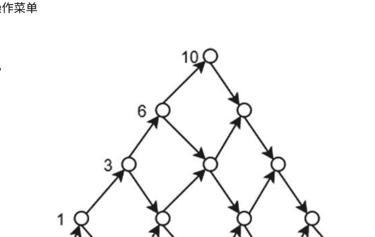

由于我不打算将所有节点映射到相应的响应，所以节点的数量不会增加。相反，每个节点只会映射到它自己的问题。此外，为了减少节点的数量，四分之一的节点被移除，并使用一个公式计算它们的权重。

从图10可以看出，权重遵循求和的数字结构。为了使结构更有意义，权重应该以有意义的方式递增。这就是我引入斐波那契数的地方。对于每个连续的链，斐波那契数会递增，表示节点的权重，如图11所示。

在进入算法之前，应该通过删除特殊字符来清理句子。句子应该逐词分割并存储在一个字符串列表中。字符串列表的两端应该添加点来突出句子的开头和结尾。

连续链斐波那契算法计算并返回具有最相关问题顺序的问题编号作为输出。下面的流程图详细解释了算法的流程和流程（图12）。

首先，存储节点详细信息的数据库应该是一个结构。列是ID-唯一节点ID，QID-唯一问题ID，LEFT-存储当前节点的左侧单词，RIGHT-存储当前节点的右侧单词，EXPECT-存储链中下一个节点的ID。

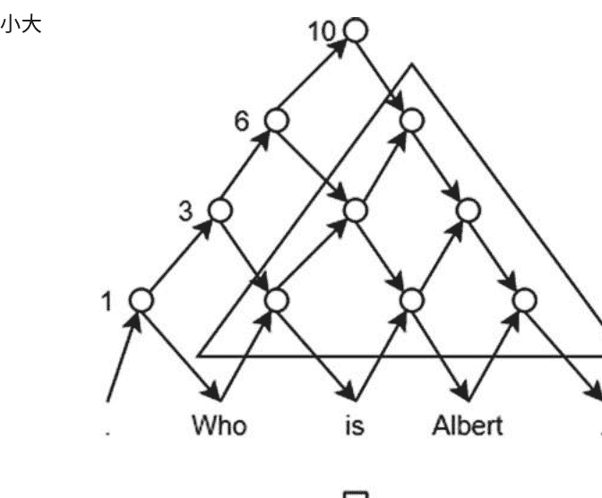

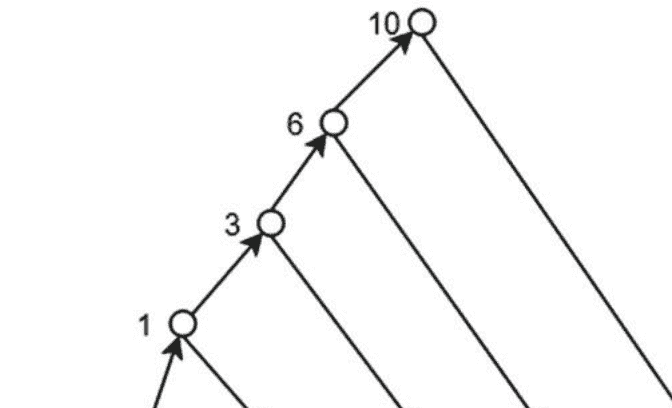

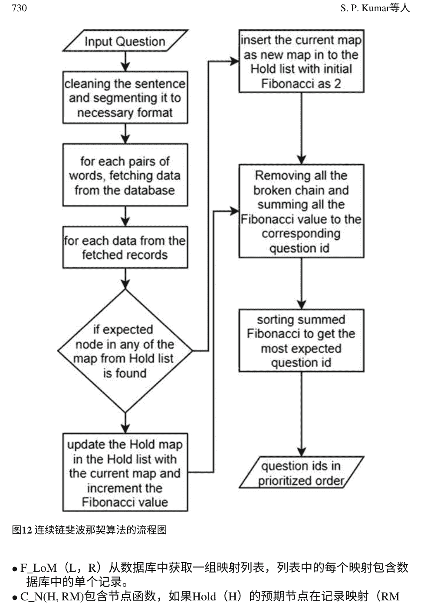

图12 连续链斐波那契算法的流程图

+   - F_LoM (L, R) 从数据库中获取一组映射列表，列表中的每个映射包含数据库中的单个记录。
- C_N(H, RM)包含节点函数，如果Hold（H）的预期节点在记录映射（RM）中存在，则返回布尔值。
- U_H(HM, RM)更新H列表中的hold_map，并使用以下公式增加斐波那契值：next_fib = round(fib*(1+ √5)/2)。
- I_H(H, RM)此函数以所需格式将新映射插入H列表，并将斐波那契值初始化为2。

+   - U_Q_ID(H, Q_ID)此函数从H列表中删除所有断链，并使用Q_ID字典中的总斐波那契数更新它们的问题ID。

以下伪代码解释了连续链斐波那契算法：

```

VAR S_Q: 以清洁格式分割的问题;
VAR L: 左单词;
VAR R: 右单词;
VAR H: 保存当前节点和活动链的映射列表;
VAR R_QID: 以问题ID为键，以斐波那契数之和为值的字典;
VAR
对于S_Q中的每个单词:
    L=R; R=word;
    对于F_LoM(L, R)中的每个record_map:
        如果(C_N(H, record_map.id)):
            U_H(H, record_map);
        否则
            I_H(H,record_map);
U_Q_ID(H,Q_ID);
U_Q_ID(H,Q_ID);
Sort(Q_ID);

```

#### 5 结果

连续链算法将根据在其他问题中可能找到的连续可能链的权重来查找相似的问题。这会产生几个可能的输出。由于一个问题可能有几个分段的小问题

总结起来，所有这些链的重量可能超过其他问题的重量，即使它只有一个最高斐波那契链。

以下是一些示例问题，以演示连续链斐波那契算法在寻找相似问题时的选择：

+   (a) 我最近阅读了Jonathan Long、Evan Shelhamer、Trevor Darrell撰写的斯坦福课程关于语义分割的卷积网络的笔记。我不明白反卷积层是做什么的，以及它们是如何工作的。
(b) 为什么卷积神经网络在层数增加时总是学习到越来越复杂的特征？是什么导致它们创建了这样一堆特征，这对其他类型的深度神经网络也适用吗？
(c) 我理解死亡ReLU的优点，即在反向传播过程中避免神经元死亡。然而，我不明白为什么ReLU被用作激活函数，如果它的输出是线性的话？
(d) 我已经构建了我的模型。现在我想为研究论文绘制网络架构图。如何绘制深度神经网络架构图？
(e) 在撰写关于神经网络的研究论文或进行演示时，通常会可视化网络架构图。在常见的网络架构中，有什么简单的方法可以进行良好的可视化？

以下是一些示例问题和斐波那契计算：

+   1. 参考斯坦福大学关于视觉识别的卷积神经网络课程笔记，神经网络中的死亡ReLU问题是什么？
   
   1:{“questionId”:”a”,”fibonacciValue”:10}.
   3:{“questionId”:”e”,”fibonacciValue”:6}.
   2:{“questionId”:”b”,”fibonacciValue”:10}.
   
2. 卷积神经网络（CNN）最初是为图像分类目的而开发的，是否可能开发出成功的CNN应用或任何其他类型的深度神经网络用于非图像数据？
   
   1:{“questionId”:”b”,”fibonacciValue”:22}.
   2:{“questionId”:”e”,”fibonacciValue”:4}.
   3:{“questionId”:”d”,”fibonacciValue”:2}.
   
3. 我正在准备一个关于神经网络的演示。有没有工具可以用来为研究论文绘制神经网络架构图，以便使其具有良好的可视化效果？
   
   1:{“questionId”:”d”,”fibonacciValue”:25}.
   2:{“questionId”:”e”,”fibonacciValue”:15}.
   3:{“questionId”:”c”,”fibonacciValue”:4}.
   

从上面的例子可以看出，这个算法的优先级方式是独特且更相关的。

#### 6 结论

本文首先介绍了聊天机器人在知识管理系统中的帮助。我在这个项目中开发的机器人被命名为‘FAQ?’。这个机器人通过保持员工之间的良好联系来帮助解决问题。组织可以通过使用这个机器人来帮助他们的员工，而不需要亲自处理问题。这将大大提高生产力，因为这个机器人对每个用户都起到了手册的作用。这个机器人也可以用于大学增加协作。

通过使用连续链斐波那契算法，数据将永远不需要寻找外部应用程序支持来获取类似的问题。由于这个算法受到神经网络的启发。有几种可能的未来改进。
这个算法可能支持多种应用。通过将答案直接从问题映射出来，改进这个算法可能帮助用户得到预期的具体答案本身。相同的算法可以用于处理字符而不是单词，以提供更相关的建议。

#### 参考文献

+   1. Neto, M. A. J., & Fernandes, M. A. (2019). 聊天机器人和对话分析在远程教育中促进协作学习。在2019年IEEE第19届国际高级学习技术会议（ICALT）上发表。https://doi.org/10.1109/icalt.2019.00102
2. Lee, K., Jo, J., Kim, J., & Kang, Y. (2019). 聊天机器人能帮助减轻行政人员的工作量吗？在大学实施和部署FAQ聊天机器人服务。计算机与信息科学通信，348-354。https://doi.org/10.1007/978-3-030-23522-2_45
3. Muangkammuen, P., Intiruk, N., & Saikaew, K. R. (2018). 使用RNN-LSTM的自动泰语FAQ聊天机器人 2018年第22届国际计算机科学与工程会议（ICSEC）。已发表。https://doi.org/10.1109/icssec.2018.8712781
4. Ch'ng, S. I., Yeong, L. S., & Ang, X. Y. (2019). 使用聊天机器人作为课程FAQ工具的初步研究2019年IEEE电子学习、电子管理和电子服务会议（IC3e）。已发表。https://doi.org/10.1109/ic3e47558.2019.8971786
5. Sethi, F. (2020).用于对话的FAQ（常见问题）聊天机器人. 已发表。https://doi.org/10.26438/ijcse/v8i10.710
6. Sumikawa, Y., Fujiyoshi, M., Hatakeyama, H., & Nagai, M. (2019). 支持创建E-learning聊天机器人的FAQ数据集。智能决策技术，2019, 3–13。https://doi.org/10.1007/978-981-13-8311-3_1
7. Pérez, J. Q., Daradoumis, T., & Puig, J. M. M. (2020). 重新发现聊天机器人在教育中的应用：系统文献综述。工程技术中的计算机应用，28(6), 1549–1565。https://doi.org/10.1002/cae.22326
8. Zubani, M., Sigalini, L., Serina, I., & Gerevini, A. E. (2020). 在真实业务案例中评估不同的自然语言理解服务对意大利语的影响。计算机科学论文集，176, 995–1004。https://doi.org/10.1016/j.procs.2020.09.095
9. Su, M. H., Wu, C. H., Huang, K. Y., & Lin, W. H. (2019). 使用语义依赖对检索型问答系统中的响应选择和自动消息-响应扩展进行处理## 使用区块链管理物联网设备安全性—综述

Gaurav Pattewar, Nachiket Mahamuni, Hrishikesh Nikam, Omkar Loka, and Rachana Patil

摘要物联网（IoT）是指通过共同媒介（在本例中为互联网）将网络中的设备相互连接以共享或交换数据的网络。 本文重点关注物联网网络中这些设备的安全管理以及其维护、可访问性等问题。 主要面临的问题包括数据泄露、数据篡改/修改、访问私人数据或重要交易、数据丢失等。 本综述论文提到了通过使用不同的共识算法和技术来改进现有物联网系统的各种方法。 它还涵盖了智能家居和智能城市等系统的安全性和数据隐私，通过改进的区块链系统实现。

关键词安全·物联网·区块链·数据隐私·共识算法·智能合约·超级账本·以太坊

#### 1 引言

随着时间的推移，技术、嵌入式系统、实时信息的大量进步已经发生，导致了一个现代时代，在这个时代，不同的设备/物体通过互联网相互连接。

G. Pattewar (✉) · N. Mahamuni · H. Nikam · O. Loka · R. Patil
计算机工程系，Pimpri Chinchwad工程学院，Pune 411044，
印度
电子邮件：gaurav.pattewar18@pccoepune.org

N. Mahamuni
电子邮件：nachiket.mahamuni18@pccoepune.org

H. Nikam
电子邮件：hrishikesh.nikam18@pccoepune.org

O. Loka
电子邮件：omkar.loka18@pccoepune.org

R. Patil
电子邮件：rachana.patil@pccoepune.org

© 作者，独家许可给Springer Nature Singapore Pte Ltd. 2022
S. Shakya等人，情感分析与深度学习，智能
系统与计算进展1408，https://doi.org/10.1007/978-981-16-5157-1_57

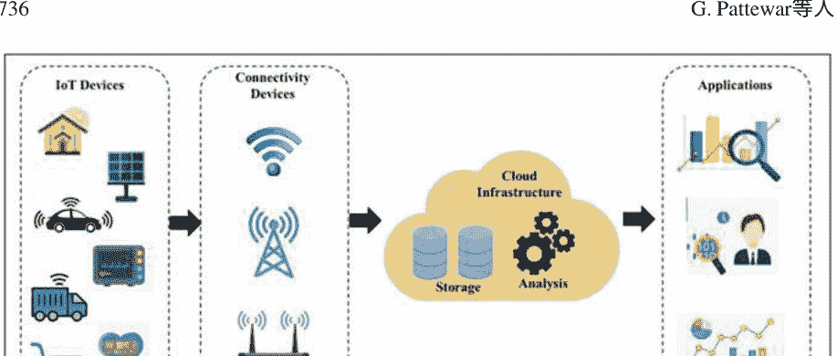

图1 物联网网络中物联网设备的工作

微控制器和微处理器/微型计算机芯片的发明以及表面无线网络技术的发展使得连接不同设备变得更加容易无论其形状、大小、安装/使用区域等，使它们比以往更智能。该系统可以在没有人为干预的情况下工作。这一进步将物理世界和数字世界结合在一起[1, 2]。

物联网的实现得益于嵌入式系统、控制系统、自动化服务（智能家居和城市、工业）等现有领域的共同工作。物联网包括家庭安全系统、家用电器、灌溉自动化等系统。这些系统可以由其他设备远程控制，这些设备与系统有一个或多个共同领域。物联网还涉及到医疗保健系统，使其更加高效和有组织。随着物联网设备在不同领域的使用增加，网络攻击也在增加[3, 4]。解决这些网络安全威胁[5]是物联网网络面临的最大挑战之一。物联网设备的工作，如数据收集、数据存储在云系统上、数据处理以及在物联网网络中的应用，如下图所示。

在第一阶段，传感器/设备从环境中收集数据。然后，传感器收集的数据通过WIFI、蓝牙等方式发送到云存储中。在第三阶段，数据被处理/分析并存储在云数据库中以供进一步使用。来自云存储的处理后的数据用于最终用户应用程序。

##### 1.1 物联网（IoT）的历史

在1980年左右，讨论了通过添加传感器或其他物体和智能来使现有系统更智能和更好的想法。物联网的第一个实现是在卡内基梅隆大学的可口可乐自动售货机上。

1982年的大学。 这是第一个连接到ARPANET的设备。 自动售货机能够检查其库存/库存以及新装饮料的温度。 ‘物联网’一词由凯文·阿什顿定义。 他提到，为了使计算机能够管理所有个体任务，射频识别（RFID）对物联网是必需的。

当时，系统中使用的处理器或芯片更加昂贵和笨重。 设备之间没有适当的通信手段。 只有在处理器/芯片被修改并以可负担的价格提供时，设备在大范围地理区域内才能互联。 正如Kevin Ashton所提到的，RFID标签以及宽带互联网和无线网络使设备能够相互连接。 IPv6的采用增加了在更大规模上扩展物联网的机会。

#### 2 区块链的特点

- 去中心化- 在集中式交易中，每个交易都需要与集中式第三方进行协调。 这会增加成本并影响中心点的性能。 在去中心化处理中，不需要第三方，因此它提高了性能。
- 坚持不懈- 在矿工节点验证交易记录后，该记录的副本会分布在网络上，并且不会从区块链网络中删除。
- 匿名—在区块链中，节点使用公钥与网络进行协作，这给出了节点在区块链中的地址以及安全的数据隐私。
- 安全—在区块链网络中，使用公钥密码学来保护网络。 它有公钥和私钥。 这些密钥的生成基于密码算法，这些算法基于函数的方式。 为了有效的安全性，私钥保持私密，公钥可以公开分发。
- 强大的后端—如果发生任何故障，每个分布式节点都在后端维护整个数据库的副本。
- 更高的效率—交易不包含第三方，同时具有低信任条件，验证交易所需的时间较短，从而提高了效率。
- 透明度—公共区块链对所有参与者都是开放/可查看的。 尽管交易是不可变的。
- 智能合约—智能合约中有定义的规则。 以太坊支持使用不同的语言编写合约，如Solidity。

#### 3 相关工作

为了了解哪种技术或算法能够有效地与区块链一起工作，以提高物联网设备的安全性以及维护、性能等其他参数，我们对不同的方法/修改进行了研究，基于其贡献、优势和缺点。根据上述标准的调查结果在（表1）中进行了解释。

通过对表1中描述的现有方案的分析和评估。 观察到一些攻击，如eclipse和sybil攻击，被证明很难处理。 为了克服这些问题，我们目前正在开发一种基于区块链的解决方案，用于维护物联网设备的安全性数据。

#### 4 物联网设备安全面临的挑战

- 数据隐私- 由于设备的集中式系统，攻击者可以通过破坏系统的节点来获取数据。 这就是为什么攻击者可以在没有任何授权访问的情况下获取数据。
- 数据完整性—攻击者可以访问集中式系统中的数据，可能导致攻击者对数据进行更改或修改。
- 集中式实体—第三方控制和存储的数据可能导致安全和隐私问题。
- 可信数据来源—网络中的数据来源对任何人都不可知，因此数据在传输过程中可能被篡改。
- 访问控制—在物联网网络中很难描述数据可以被节点访问并执行不同的功能。
- 单点故障—中央机构存储和验证网络的所有数据，但如果中央节点发生故障，整个网络将受到干扰。
- 未经授权使用个人数据—传感器和芯片是物联网设备的一部分，它们收集信息并通过互联网发送。 中央数据库存储收集的信息。 公司可以使用这些数据，这会对数据隐私产生影响。

### 表1现有方案的比较分析

| 参考文献 | 年份 | 区块链平台 | 贡献 | 优点 | 缺点 |
| --- | --- | --- | --- | --- | --- |
| Dorn等人[1] | 2017 | 新框架 | 使用分层形式和分布式信任可以实现区块链安全和隐私 | 出站交易的身份验证过程增加了 | 矿工消耗的能量更多 |
| Singh等人[2] | 2019 | 以太坊，权威证明，工作证明 | 存储容量和计算能力增加 | 提高性能，同时降低能耗 | 可以使用另一种分叉解决方案 |
| Lee等人[6] | 2020 | 以太坊平台 | 仅存储必要信息 | 增加异构物联网和集中式网络的机密性、完整性和身份验证 | 它具有额外的计算复杂性 |
| Nadiya等人[7] | 2019 | 以太坊，区块链，智能合约 | 借助哈希函数和加密算法增强物联网设备的安全性 | 哈希函数的雪崩效应大于50% | 系统不能使用哈希配置来开发 |
| Lunardi等人[8] | 2019 | 可附加区块链框架，共识算法 | 改进的系统具有可附加块区块链，支持各种共识算法以克服现有问题 | 通过改进的性能来解决各种攻击，并适应不同的物联网场景 | 系统将容易受到eclipse和sybil攻击 |
| Kanhere等人[9] | 2020 | 智能城市和家庭，供应链，车辆网络 | 区块链的几层模型以及不同的网络架构和共识算法 | 更高的可靠性，更高的可用性，更好的安全性和通信 | 由于P2P网络而继承的问题 |
| de Aruma等人[10] | 2020 | 提出了具有分层对等体架构的网关 | 在可附加区块链中添加了基于分层对等体的网关架构，以及PBFT和POW算法 | 更高的数据完整性和隐私 | 在一个广泛分布的区域内，它提供了较少的安全性和延迟 |
| Alharhy等人[11] | 2020 | 智能城市，智能建筑，可附加区块链 | 基于上下文的共识，一种修改后的区块链共识机制 | 降低延迟，提高事务插入吞吐量 | 实施复杂 |
| Loiata等人[12] | 2016 | 智能电网，需求响应，物联网 | 实施可以与环境进行交互的服务 | 将物联网平台与其他自主智能系统结合使用，提供智能和广泛的应用 | 可以解决该地区公民的隐私权问题 |
| Garrocho等人[13] | 2021 | 智能城市，智能合约 | 添加API网关以提供更好的身份验证和识别 | 提供实时管理信息保护，防止DDOS攻击 | 由于UDP协议的发生，通信问题发生了 |
| Yetis等人[14,15] | 2019 | 加密哈希算法，安全通信，智能家居 | 使用分布式节点结构设置授权系统的区块链系统，并将区块保存在这些节点中。使用维吉尼亚密码加密 | 节点之间的消息传输/通信被加密，从而提供更好的安全性并保护数据隐私 | 使用不安全的UDP协议而不是UDP协议 |
| He等人[16] | 2016 | Hyperledger Fabric, 智能合约 | 使用基于Web的原型与区块链来验证身份验证过程 | 防止单点故障的安全性、验证固件更新权限并提供、防止潜在网络攻击的安全性 | 语法和编译器、应该正常工作，否则系统将无法、给出预期的结果 |
| Dang等人[17] | 2018 | 智能合约 | 基于物联网的智能家居区块链(SHiB)。所提出的架构有三种智能合约，分别是ACC、RC和JC | 所提出的系统提供数据隐私、信任访问控制和高可扩展性 | 该系统仅适用于智能家居、业主主达成智能合约的各方 |
| Ding等人[18] | 2019 | 联盟区块链 | 我们提出了一种新颖的基于属性的物联网系统访问控制方案 | 所提出的方案能够有效抵御多种攻击，避免单点故障和数据篡改 | 交易的计算开销增加 |
| Fakhri等人[19] | 2018 | 具有智能合约的以太坊 | 所提出的系统包括具有通信协议MQTT的区块链 | 智能合约有助于更快地存储和检索数据，而通信协议MQTT更有效地保护两个设备之间的通信 | 应考虑由于同时攻击而引起的雪崩效应 |

#### 5 结论

在这篇综述中，我们调查了改进区块链平台的不同方法/修改，以提供更好的安全性、数据完整性、维护性能等。本文强调了物联网网络设备面临的问题以及解决方案。本综述论文提到了可附加块区块链以及不同的共识算法、加密哈希算法、具有分层对等架构的API网关等不同技术。

在实施所提出的系统时遇到了一些问题，比如实施成本高。此外，从现有结构过渡到新结构有点困难。上述技术已被证明对物联网设备的威胁具有重要意义，例如钓鱼攻击、贿赂攻击、未经授权访问、数据完整性等。此外，它们有助于提高系统的性能，减少维护和能源消耗。缺点是一些攻击，如日食和假冒攻击，被证明很难解决。

此外，由于P2P网络而继承的一些问题需要考虑。

#### 参考文献

1. Dorri, A., Kanhere, S. S., Jurdak, R., & Gauravaram, P. (2017). 三月。物联网安全和隐私的区块链: 智能家居的案例研究。在2017年IEEE国际会议上，关于普适计算和通信研讨会（PerCom workshops）（第618-623页）。IEEE。
2. Singh, P. K., Singh, R., Nandi, S. K., & Nandi, S. (2019). 六月。使用权威证明和区块链管理智能家居设备。在创新社区服务国际会议上（第221-232页）。斯普林格，洪堡。
3. Patil, R. Y., & Devane, S. R. (2019). 网络取证调查协议以确定网络犯罪的真正起源。Journal of King Saud University-Computer and Information Sciences.
4. Yogesh, P. R., & Devane, S. R. (2018, July). 从数字取证需求的角度看原始指纹技术。在2018年第9届计算、通信和网络技术国际会议上（第1-6页）。IEEE。
5. Patil, R. Y., & Devane, S. R. (2017年10月). 揭示源身份，网络取证的一步之遥. 在第10届国际信息安全与网络会议上(第157-164页).
6. 李, Y., Rathore, S., Park, J. H., & Park, J. H. (2020年). 基于区块链的智能家居网关架构, 用于防止数据伪造.人本计算与信息科学,10(1), 1-14.
7. Nadiya, U., Rizqyawan, M. I., & Mahnedra, O. (2019年11月). 基于区块链的安全数据存储，用于门锁系统.在2019年第4届信息技术、信息系统和电气工程国际会议上(第140-144页).IEEE.
8. Lunardi, R. C., Michelin, R. A., Neu, C. V., Nunes, H. C., Zorzo, A. F., & Kanhere, S. S. (2019年11月). 对可附加块区块链在物联网中的共识影响. 在第16届EAI国际会议上的移动和普适系统: 计算(第228-237页). 网络和服务
9. Zorzo, A. F., Nunes, H. C., Lunardi, R. C., Michelin, R. A. & Kanhere, S. S. (2018年10月). 使用基于区块链的技术的可靠物联网。 在2018年第八届拉丁美洲可靠计算研讨会(LADC)(pp. 1-9). IEEE.
10. de Arruda, E. H., Lunardi, R. C., Nunes, H. C., Zorzo, A. F. & Michelin, R. A. (2020年5月). 在地理分布的物联网网络上进行可附加块区块链评估. 在2020年IEEE国际黑海通信和网络会议(BlackSeaCom)(pp. 1–6). IEEE.
11. Lunardi, R. C., Alharby, M., Nunes, H. C., Zorzo, A. F., Dong, C. & Van Moorsel, A. (2020年11月). 基于上下文的可附加块区块链共识. 在2020年IEEE区块链国际会议(Blockchain )(pp. 401–408). IEEE.
12. Arasteh, H., Hosseinnezhad, V., Loia, V., Tommasetti, A., Troisi, O., Shafie-khah, M. & Siano, P. (2016年6月). 基于物联网的智能城市: 一项调查. 在2016年IEEE第16届环境和电气工程国际会议(EEEIC)(pp. 1–6). IEEE.
13. Ferreira, C. M. S., Garrocho, C. T. B., Oliveira, R. A. R., Silva, J. S., & Cavalcanti, C. F. M. D. C. (2021). 物联网在智能城市应用中的注册和身份验证与区块链技术. 传感器, 21(4), 1323.
14. Yetis, R. & Sahingoz, O. K. (2019年4月). 基于区块链的智能城市物联网设备安全通信. 在2019年第7届伊斯坦布尔国际智能电网和城市大会及展览会(ICSG)(pp. 134–138). IEEE.
15. Patil, R. Y., & Devane, S. R. (2020). 基于哈希树的网络取证调查设备指纹技术. 在电气和计算机技术进展中(pp. 201–209). 新加坡斯普林格.
16. He, X., Gamble, R. & Papa, M. (2019年10月). 使用超级账本Fabric保护物联网固件更新的智能合约语法. 在2019年IEEE第10届年度信息技术、电子和移动通信会议(IEMCON)(p p. 0034–0042). IEEE.
17. Dang, T. L. N. & Nguyen, M. S. (2018年11月). 基于区块链技术的智能家居数据隐私保护方法. 在2018年高级计算和应用国际会议(ACOMP)(pp. 58–64). IEEE.
18. 丁, S., 曹, J., 李, C., 范, K., & 李, H. (2019年). 一种基于属性的区块链物联网访问控制方案. IEEE Access, 7, 38431–38441.
19. Fakhri, D. & Mutijarsa, K. (2018年10月). 使用区块链技术进行安全的物联网通信. 在2018年国际电子和智能设备研讨会（ISESD）中（第1-6页）. IEEE.

10. Ranoliya, B. R., Raghuwanshi, N., & Singh, S. (2017). 大学相关常见问题解答聊天机器人。在2017年计算、通信和信息学国际会议 (ICACCI). 发表。https://doi.org/10.1109/icacci.2017.8126057
11. Mikic-Fonte, F. A., Llamas-Nistal, M., & Caeiro-Rodriguez, M. (2018). 在计算机体系结构课程中使用聊天机器人作为常见问题解答助手。 在2018年IEEE教育前沿会议(FIE). 发表。https://doi.org/10.1109/fie.2018.8659174
12. de Lacerda, A. R. T., & Aguiar, C. S. R. (2019). FLOSS FAQ聊天机器人项目重用。 在第15届国际开放协作研讨会上发表。https://doi.org/10.1145/3306446.3340823
13. Palasundram, K., Mohd Sharef, N., Nasharuddin, N. A., Kasmiran, K. A., & Azman, A. (2019). 教育聊天机器人的序列到序列模型性能。 国际学习新兴技术杂志(IJET), 14(24), 56. https://doi.org/10.3991/ijet.v14i24.12187

### 深度学习程序在农业部门中的作用以提高盈利能力

阿米特·维尔马

摘要利用人工智能技术在农业领域已经显而易见。该部门面临各种困难，以提高产量，包括不当的土壤处理，病害和害虫侵扰，大量的信息需求，低产量和农民与技术之间的信息鸿沟。人工智能在农业中的主要概念是其适应性，性能，准确性和成本效益。本文对人工智能和深度学习在作物管理中的应用进行了调查。特别关注了四种方法（CALEX，FARMSYS，ANN和Demeter系统）的使用质量和限制，以及利用人工智能方法提高盈利能力的方法。

**关键词** 农业经营 · Calex · Farmsys · 神经网络 · Demeter系统 · 人工智能 · 深度学习分类器

#### 1 引言

以最低成本实现最大收获是农业生产的目标之一。早期识别和管理与作物产量相关的问题指标可以帮助增加回报和随后的利润[1]。

农业是印度经济的主要支柱和重要组成部分。农学的产量过低。随着食品需求呈指数增长，专家、研究人员、农民、科学家和政府努力加大农业生产的力度和策略，以满足需求[2, 3]。农业生产的目标是实现最大的农作物产量。初步发现和管理作物产量等问题可以帮助增加回报和随后的利润。如果受到气候模式的影响，大规模气候事件可能对农作物产量产生重大影响。产量管理人员可以利用预测来减少关键损失。

条件。此外，如果存在良好发展的潜力，这些测量仪可以用于利用作物产量[4]。

农村化学物质对人们的健康有风险，可能导致生态系统的干扰。因此，应该采用能够最大限度减少使用这些化学物质的农业技术，以及用于环境保护的创新。使用环境友好的生产技术，对植物条件进行检查是至关重要的[5]。

精确培养产生的信息，由于其类型和不可预测性，无法通过传统方法有效地分析。传统上，农民对于他的田地的管理主要基于经验。然而，随着农业机械化的发展，农民与田地的直接联系丧失，管理者依赖于产量和土壤平均特性[6]。

如今，劳动力是现代农场的最大成本因素。超过30%的总生产成本用于支付农民和他的员工的工资[7, 8]。显然，为了应对日益激烈的市场需求和竞争加剧，生产者正在寻找提高生产过程整体效率的方法。提高人力劳动效率或者至少减少人力劳动量是当今的主要议题。

在苗圃中进行体力劳动是一项要求很高的工作，尤其是在恶劣的气候条件下。可用的职位不受重视，利润很低。因此，越来越难以获得足够的员工。这些是多年前研究集中在农业产量生产中最枯燥和乏味任务的自动化的原因[9]。

农业部门正在经历由新技术驱动的转变，这似乎是令人鼓舞的，因为它将使这个重要领域转向下一个农场效率和利润的水平[10]。精确农业，包括在需要的时间和地点应用所需的输入，已成为现代农业革命的第三波（第一波是机械化，第二波是基因改造的绿色革命[11]），如今，由于更多数据的可用性，它正在通过农场数据系统的增加进行改进[12]。

本文的最后动机是展示如何根据当今可以立即获得的数据解决高级农业的决策，以支持人们最大限度地减少对气候的损害[13, 14]。为了评估现代农业如何在可持续的动态循环中发挥作用，本文回顾了数据驱动农业的主要步骤，并重点关注与每个基本步骤相关的信息管理系统的最新应用，从作物田地的信息获取到可变速硬件任务的执行[12]。

本文记录了CALEX、FARMSYS、ANN和Demeter系统的基本概念，包括能力、特征、分类和架构。

以及全球农业前景的应用。此外，它提供了四个程序的表示、问题、搜索机制和未来预测的知识。

#### 2 用于比较的深度学习的两个过程

##### 2.1 CALEX

CALEX项目的目标是开发一个通用的外壳程序，当与特定领域的程序模块结合时，提供一个可以被农民、害虫控制顾问、专家和其他管理人员用于农业管理决策支持的软件包。

CALEX的两个基本子程序是执行和智能系统，以及特定领域的模块。CALEX的第一部分包括其执行和系统部分，使用C语言编写，而项目的特定领域模块则使用C、Pascal或FORTRAN编写。CALEX软件包的关键部分包括执行器、调度器和专家系统。数据库和特定领域的模块被添加到基本的CALEX系统中，形成一个完整的执行环境。CALEX根据最近的描述生成田间文件和气候记录[10]。

基于微型计算机的协调主控选择情感支持网络，用于农业管理。该程序与特定空间模块相关联，由三个基本且独立的子程序组成：日程安排、执行程序和系统的外壳。执行程序作为用户、模型和磁盘的主要接口。

调度程序通过多次启动主控系统生成执行程序的活动序列。专家系统外壳做出实际的管理决策。CALEX包主要与领域无关，可以与任何软件一起使用，并且具有平台独立性。程序的初始改进集中在为加利福尼亚州的棉花和其他水果主要开发模块包。本文描述了基本CALEX程序的架构。通过简要描述一些产品的具体用途，介绍了CALEX包的特点。

产品具体执行的完整描述将在其他地方提供[15]。

CALEX计划的主要元素之一是为客户提供未来服务活动的时间表（例如，灌溉、寻找害虫、培训等）。正如Plant（1989）所描述的那样，最初版本的一个重要缺点是它没有足够先进的机制来处理季节性产品管理的预订[7,16,17]。在第一个系统中，每个活动的数据库基本上是按顺序加载和处理的。人们意识到，在计划活动时，有可能为同一天独立安排两个相互矛盾的活动。对于这种情况，

例如，一个水系统可能会计划在同一天进行，就像在田野中寻找臭虫一样。为了确定这一点，先处理高优先级的任务，然后再处理低优先级的任务，以确保高优先级的任务能够“赢得”任何争论[10]。

##### 2.2 FARMSYS

FARMSYS是一个集成的决策支持网络，是在PROLOG中设计和开发的。FARMSYS由四个部分组成：操作模拟器，信息管理系统，用于结果分析的系统，以及在单一气候条件下实现产量估计的系统，从而实现它们的持续集成[18]。它们利用一个共享的数据库来执行它们的任务。在PROLOG中，农场信息的面向对象描述有助于捕捉启发式规则，例如农民对不同领域、作物种植模式、操作类型和农场管理车辆组合的偏好和需求[19, 20]。FARMSYS目前根据专业考虑建议农场设备和劳动资源的改进。对这些改进进行财务分析，包括初始投资、运营和维护成本以及受影响任务的额外收益或损失，将进一步提高这些建议的质量[21]。

利用预先创建的模型结果来评估不同领域的农作物和农场生产的方法是一个有用的选择。然而，模型链接是FARMSYS的基本组成部分，并且由操作模拟器创建的每个特定情况的直观执行还将提高预测的质量[22]。

FARMSYS假设所有农场资源仅用于农作物生产[23]。将可用资源分配给动物和农作物生产的措施将使FARMSYS成为农场的更灵活工具，特别是对于小规模企业和发展中国家的资产农业，动物生产是其农业系统的重要组成部分[24]。

FARMSYS的经验表明，让专家团队评估并将决策支持系统整合到模型评估中是一种可行和可行的方法，用于评估此类系统的质量[25]。

PROLOG是最广泛使用的专家系统人工智能语言之一，还提供了一种以面向对象方式编写应用程序的环境。最近，还进行了开发模拟程序、模拟和面向对象编程语言，使用PROLOG作为基础语言[22]。

PROLOG程序是关于系统的事实和规则（数据库）的集合。这些事实和规则被收集在程序代码的两个主要部分中

：具体地说，是谓词和条件。谓词与子程序没有区别，而条件类似于在过程性语言中具有明确参数值的子程序要求[26]。从这个集合中，PROLOG推断出问题的答案，并实现其目标，同时也是PROLOG程序的一部分，通过搜索那些为真的条件。它在符号处理、列表操作和递归方面的能力有助于处理启发式问题，以及重建系统行为所需的定量和过程性算法[21]。

除了为一致集成专家系统和仿真提供气候外，本任务中使用的Turbo PROLOG (c)还提供了一个方便的编程环境，并允许用类似自然语言的句子编写代码。它还允许将最终程序集成到可执行文件的配置中，无需运行时版本的PROLOG语言[22]。

##### 2.3 人工神经网络

人工神经网络是一种用于预测提供的输入之间的非线性关系的预测方法。它依赖于生物神经元的循环[27]。神经网络需要训练来预测输出，一旦训练完成，它可以预测包含模式的作物产量，无论之前的输入是否包含任何错误。神经网络以提供准确的结果而闻名，即使提供的输入是复杂的、多变量的和非线性的，然后提取输出。人工神经网络（ANN）有各种应用，如语音识别、计算机视觉、字符识别、签名验证识别、人脸识别[28]。ANN由三个不同的模块组成：网络拓扑、权重或学习、激活函数。网络拓扑包含两种类型的结构：前馈和反馈。前馈层由多个层组成，通过节点相互连接，没有循环，信号只能从输入到输出传递。它包括两种类型的结构：单层前馈结构和多层前馈结构。输入网络包括多个层，通过节点连接，但网络中包含循环，信号在两个方向上流动[29]。它还分为三种类型的周期性结构、全连接网络和Jordan网络。这些节点具有不同的权重，在学习方法中，如果没有确定期望的输出，则调整这些节点的权重。这些节点被称为神经元。它包括三种不同类型的学习：监督学习、无监督学习和强化学习。激活函数用于获得精确的输出[4]。

在编程设计和相关领域中，人工神经网络是计算模型，受到动物中枢感知系统（特别是大脑）的启发，适用于人工智能和模型验证[30]。

图1 前馈和反向传播ANN的连接和层

这些通常被呈现为“神经元”之间相互连接的结构，可以通过处理信息来获取输入的值，并通过连接传递给第三层的输出神经元。与其他人工智能方法一样，神经网络已被用于解决许多难以用传统规则编程理解的任务，包括计算机视觉和语音识别[31]。

在人工神经网络中，网络一词指的是每个结构中不同层之间的神经元之间的连接。一个模型结构有三层。主层具有用于输入节点的神经元，可以通过神经递质向位于第二位置的神经元层发送信息，然后通过更多的神经连接到位于第三层的输出神经元。其他复杂的结构可以有多层神经元，其中一些层扩展了输入神经元和输出神经元。神经网络存储称为“权重”的限制，用于控制计算中的信息。

前馈反向传播神经网络在图1中显示。用于分类过程的层次用于疾病检测图像的分类过程。这种神经网络设计非常流行，因为它可以应用于各种任务。

最初使用的术语“前馈”说明了神经组织如何循环和评估设计。在前馈神经网络组织术语中，应用了神经元的前向连接。神经网络中的每一层都包含使用隐藏层输入的较低层连接，并且没有层之间的反向连接。

术语“反向传播”描述了这种类型的神经组织的训练方式。反向传播是一种受控训练方法。在使用受控训练方法时，组织必须配备模型输入和预测输出。预测的作物产量与实际作物产量的数据进行比较。使用预测的产量，反向传播训练算法根据误差调整各个层的权重，从输出层向输入层反向传播。

反向生成和前馈计算经常一起使用；然而，这绝对不是必需的。完全可以创建一个神经网络，使用前馈计算来确定输出，而不使用反向传播算法。同样，如果选择创建一个神经网络，使用反向传播训练方法，并不一定局限于使用前馈计算来确定神经网络的输出。

尽管这种情况比前馈反向传播神经网络更罕见[4]。

##### 2.4 Demeter系统

Demeter系统由速度调节机器控制，配备了几个摄像头和全球定位传感器用于导航。Demeter能够为整个田地安排收割任务，然后通过切割收割行、按顺序切割行、机器自身在田地中重新定位以及检测意外障碍物来执行任务。1997年8月，Demeter系统自主地连续收割了100英亩的干草（不包括加油停车）。在1998年，Demeter系统已经在苏丹和马饲料田中收割了超过120英亩的庄稼。

农业收割是一个吸引人的机械化领域，原因有几个。人类的执行力是收割效率的关键限制因素：例如，已经设计出了比当前标准的每小时4英里更高速运转的收割机，但人们在这些速度下长时间难以精确地操作机器。此外，与许多其他领域相比，自动化的技术障碍较少：收割机的速度较低，障碍物罕见，环境有序，而且任务本身非常耗时[32]。

Demeter有两个导航系统，一个基于摄像头，一个基于全球定位系统（GPS）。使用两个独立的导航系统有几个原因。每个导航系统都有一些独特的优势：摄像头系统可以在没有先前地图的情况下使用，并且可以作为障碍物定位器，而GPS系统在防止定位错误长时间积累方面更好。

此外，这两个框架具有非常特殊的故障模式，因此大多数故障都会使至少一个系统正常工作。例如，GPS容易受到多路径问题和被阻塞的卫星的影响，而视觉系统在光照不好和作物不足的情况下往往会遇到困难。随着导航系统的更紧密集成，将来利用两者的互补性将显著提高收割操作的整体稳定性[33]。

基于位置的导航系统利用机器控制器的姿势数据来指导机器沿着预定路径在田地中行驶。姿势数据来自差分GPS、轮子编码器（死区补偿）和陀螺仪系统传感器的组合。用于控制收割机的摄像头系统

表1 不同疾病检测方法中使用的分类器比较

|      | CALEX                  | FARMSYS                | ANN                           | Demeter系统                 |
| ---- | ---------------------- | ---------------------- | ----------------------------- | --------------------------- |
| 力量 | 制定了收获作物管理的调度准则 | 从农场中淘汰使用较少的农机设备 | 高效准确地预测作物的产量            | 将农作物收获限制在40公顷以内 |
| 弱点 | 耗时较长               | 特定于地点             | 仅限于天气对作物产量的影响          | 昂贵：技术使用的燃料量较大    |

包括三个从属模块：收获线追踪器、完成线定位器和障碍物检测器。用于跟踪收获线的计算为完成列定位器提供了描述切割和整个收获之间差异的数据。然后，完成线指示器用于驱动收获线追踪器的处理。为了使监测模块能够准确工作，图像预处理器识别并校正由阴影引起的图像扭曲。

Demeter项目的成就表明，经济可行的自动化收割即将实现。同样，对于大多数机器人化技术而言，故障率低和成本低将是将创新推向市场的关键。通过使用两个互补的定位系统，我们使用现成的零部件迈出了朝着真正可行的自动化收割机的目标迈出了重要一步。

#### 3 CALEX、FARMSYS、ANN和Demeter系统的比较

本研究的主要目标是比较使用人工智能、机器学习和深度学习技术进行植物病害检测的分类器，采用图像分类方法。表1显示了用于比较的分类器的优势和劣势。

#### 4 结论

预计到2050年底，全球人口将超过90亿，这需要农业产量增加约70%来满足需求。大约10%的增加产量可能来自土地。

未使用的和使用当前创建加强其余部分可以实现。对于这种特殊情况，使用最新的机械响应来使发展更加成功仍然是一个重要需求。目前的农村生产提升框架需要高燃料信息源和市场对高品质食品的需求。先进的机械和自给自足的系统将改变全球产业。

该研究描述了论文中分析的四种方法的优点和缺点。CALEX分类器制定了收获作物活动管理的调度准则，并且分类过程需要更长时间，而FARMSYS则特定于位置。ANN以高效和准确地预测作物产量，而Demeter系统则更昂贵。

论文中讨论的这些进展对于包括农业（从农场到零售货架的食品生产）在内的大部分经济领域具有巨大影响，但利润率相对较低。

#### 参考文献

1.  Papageorgiou, E. I., Markinos, A. T., & Gemtos, T. A. (2011). 基于模糊认知图的棉花产量预测方法作为决策支持系统在精准农业应用中的基础。应用软计算杂志, 11(4), 3643–3657。
2.  Simonyan, K., & Zisserman, A. (2015). 用于大规模图像识别的深度卷积网络。在第三届国际学习表示会议, ICLR 2015—会议论文集, (pp. 1–14)。
3.  Venugoban, K., & Ramanan, A. (2014). 基于梯度特征的稻田害虫图像分类。机器学习与计算国际期刊, 2015年3月1–5。
4.  Lurstwut, B., & Pornpanomchai, C. (2017). 基于颜色、形状和纹理的水稻种子（Oryza sativa L.）发芽评估的图像分析。农业与自然资源, 51(5), 383–389。
5.  Anitha, P., & Chakravarthy, T. (2018). 利用前馈算法的人工神经网络进行农作物产量预测。国际计算机科学与工程杂志, 6(11), 178–181。
6.  Plant, R. E. (1989). 一种基于人工智能的农作物管理调度方法。农业系统, 31(1), 127–155。
7.  Xiao, M., Ma, Y., Feng, Z., Deng, Z., Hou, S., Shu, L., & Lu, Z. X. (2018). 基于主成分分析和神经网络的稻瘟病识别。计算机与电子农业, 154(April), 482–490。
8.  Shrivastava, V. K., Pradhan, M. K., Minz, S., Thakur, M. P. (2019). 利用深度卷积神经网络的迁移学习进行稻瘟病分类。国际摄影测量遥感与空间信息科学档案—ISPRS档案, 42,631–635。
9.  Hanzlík, P., Kožíšek, F., & Pavlíček, J. (2015). 智能决策支持系统的设计在农业中。国际数学与计算机模拟杂志, 9 (2018年8月), 113–118。
10. Plant, R. E. (1989). 一种用于农业管理的综合专家决策支持系统。农业系统, 29 (1), 49–66。
11. Grandgirard, J., Poinsot, D., Krespi, L., Nénon, J. P., & Cortesero, A. M. (2002). 次级寄生对于偶发性超寄生蜂Pachycrepoideus dubius的成本：寄主大小是否重要？昆虫学实验与应用, 103 (3), 239–248。
12. Yang, C.C., Prasher, S.O., Landry, J.A., Ramaswamy, H.S. (2003). 使用人工神经网络和模糊逻辑开发除草剂应用地图。农业系统, 76 (2), 561-574。
13. Lehmann, C.R., Alko, P.S., Ali, M.E., Iqbal Khan, M.A., Appen, S.H., Norlin, F., Wasif, A. (2020). 使用卷积神经网络识别和识别水稻病虫害。生物系统工程, 194, 112-120。
14. Milosevic, N. (2020). 卷积神经网络介绍。卷积神经网络介绍, 1-31。
15. Plant, R.E., Horocks, R.D., Grimes, D.W., & Zelinski, L.J. (1992). CALEX/Cotton：一个用于灌溉调度的综合专家系统应用。ASAE交易, 35 (6), 1833-1838. https://doi.org/10.13031/2013.28803
16. Zhang, S., Li, X., Zong, M., Zhu, X., & Cheng, D. (2017). 学习k用于kNN分类。 ACM智能系统与技术交易, 8 (3)。
17. Yao, Q., Chen, G., Wang, Z., Zhang, C., Yang, B., Tang, J. (2017). 利用图像处理自动检测和识别稻田中的白背飞虱。综合农业杂志, 16, 1547–1557。
18. Pinki, F.T., Khatun, N., & Islam, S.M.M. (2018). 基于内容的稻叶病害识别和治疗预测使用支持向量机。在第20届国际计算机与信息技术会议, ICCIT 2017年, 2018年1月, (第1-5页)。
19. Rautaray, S.S., Pandey, M., Gourisaria, M.K., & Sharma, R. (2020). 稻谷病害预测—一种迁移学习技术。国际最新技术与工程杂志, 8(6), 1490–1495。
20. Singh, G., Mishra, A., & Sagar, D. (2013). 3 1,2,3, 1, 3–6。
21. Lal, H., Jones, J.W., Peart, R.M., & Shoup, W.D. (1992). FARMSYS-一个整体农场机械管理决策支持系统。农业系统, 38(3), 257–273。
22. Lal, H., Jones, J.W., Peart, R.M., & Shoup, W.D (1992), January. “FARMSYS——一个整体农场机械管理决策支持系统,”农业系统, 38(3), 257–273。 https://doi.org/10.1016/0308-521X(92)90069-Z.
23. Phadikar, S. (2012). 基于形态学变化的水稻叶病分类。国际信息与电子工程杂志, 2(3), 460–463。
24. Naeem, M., Iqbal, M., Parveen, N., Abbas, Q., Rehman, A., & Sad, M. (2016). 稻瘟病概述。& 环境科学, 16(2), 270–277。
25. Patricio, D.I., & Rieder, R. (2018). 精准农业中的计算机视觉和人工智能综述。农业中的计算机与电子技术, 153(April), 69–81。
26. Murase, H. (2000). 农业中的人工智能。农业中的计算机与电子技术, 29(1–2), 1–2。
27. Ji, B., Sun, Y., Yang, S., & Wan, J. (2007). 人工神经网络用于山区水稻产量预测。农业科学杂志, 145(3), 249–261.
28. Zhai, Z., Martínez, J.F., Beltran, V., & Martínez, N.L. (2020). 决策支持系统用于农业4.0: 调查和挑战。农业中的计算机和电子技术, 170(2019年8月), 105256.
29. Saiz-Rubio, V., & Rovira-Más, F. (2020). 从智能农业到农业5.0: 对作物数据管理的综述。农学, 10(2).
30. Mir, S., Qasim, M., Arfaty, Y., Mubarak, T., Bhat, A.Z., Bhat, J., Bangroo, S.A., & Sofi, T. (2015). 全球农业视角下的决策支持系统-综述。国际农业科学杂志, 7(1), 403–415。
31. Dai, X., Hao, Z., & Wang, H. (2011). 利用人工神经网络模拟作物产量对土壤湿度和盐分的响应。田间作物研究, 121(3), 441–449。
32. Priyanka, T., Soni, P., & Malathy, C. (2019). 利用人工智能和卫星图像预测农作物产量 Teresa。欧亚分析化学杂志, 13(SP), 6–12。

-  宋，H., & 何，Y. (2005). 基于人工神经网络的作物营养诊断专家系统。 在信息技术和应用国际会议论文集, ICITA 2005, I, (pp. 357–362)。
-  Mukherjee, M., Pal, T., & Samanta, D. (2012). 利用图像处理检测受损稻叶。全球计算机科学研究杂志, 3(10), 2010–2013。
-  Ezziane, Z. (2006). 人工智能在生物信息学中的应用: 一项综述。应用专家系统, 30(1), 2–10。
-  Patidar, S., Pandey, A., Shirish, B. A., & Sriram, A. (2020). 使用深度残差学习进行水稻病害检测和分类。 在计算机和信息科学通信中, 1240 CCIS (pp. 278–293)。
-  Prajapati, H. B., Shah, J. P., & Dabhi, V. K. (2017). 水稻植物病害的检测和分类。智能决策技术, 11(3), 357–373。
-  Rahman, C. R., Arko, P. S., Ali, M. E., Iqbal Khan, M. A., Apon, S. H., Nowrin, F., & Wasif, A. (2020). 使用卷积神经网络识别和识别水稻病害和害虫。 生物系统工程, 194(十二月), 112–120。
-  Rajmohan, R., Pajany, M., Rajesh, R., Raman, D. R., & Prabu, U. (2018). 智能稻作病害识别和管理使用深度卷积神经网络和SVM分类器。国际纯粹与应用数学杂志, 118(15特刊), 255–264。
-  Ramesh, S., & Vydeki, D. (2020). 使用优化的深度神经网络和Jaya算法识别和分类稻叶病害。 农业信息处理, 7(2), 249–260。
-  Shrivastava, V. K., Pradhan, M. K., Minz, S., & Thakur, M. P. (2019). 使用深度卷积神经网络的稻谷植物病害分类。 国际摄影测量、遥感和空间信息科学档案—ISPRS档案, 42(3/W6), 631–635。
-  Sladojevic, S., Arsenovic, M., Anderla, A., Culibrk, D., & Stefanovic, D. (2016). 基于深度神经网络的植物病害识别与叶片图像分类。 计算智能与神经科学, 2016。
-  Suresha, M., Shreekanth, K. N., & Thirumalesh, B. V. (2017). 使用KNN分类器识别稻谷叶片疾病。 在2017年第二届国际技术融合会议, I2CT 2017-January, 663–666。
-  Verma, T., & Dubey, S. (2019). 基于模糊滤波神经网络的水稻病害诊断与图像分析。 国际创新技术与探索工程学报, 8(8特刊3), 437–446。
-  姚，Q., 陈，G. te., 王，Z., 张，C., 杨，B., 君., & 唐，J. (2017). 利用图像处理自动检测和识别稻田中的白背飞虱。综合农业杂志, 16(7), 1547–1557。
-  辛格，A. K., & 拉贾，B. S. (2015). 利用数字图像处理和SVM分类器对水稻病害进行分类，国际电气与电子工程学报ISSN, 07, 294–299。
-  Pinki, F. T., Khatun, N., Islam, S. M. M. (2017) 基于内容的稻叶病害识别和治疗预测, 使用支持向量机。 在第20届国际计算机信息技术会议ICCIT. 2018年1月 (2018), 1–5。
-  Sethy, P. K., Negi, B., Barpanda, N. K., Behera, S. K., Rath, A. K. (2018) 使用机器学习和计算智能测量水稻作物的疾病严重程度, Springer应用科学技术简报, 1-11。

### 使用Snippet像素的视网膜加密与Huffman顺序编码以增强隐私

L. Poongothai, K. Sharmila, C. Shanthi, R. Devi和R. Anitha

摘要近年来，数字平台的使用不断增加，使用数字平台、网络应用和多媒体文件（如图片、音频和视频数据）触发了对更快机制和具有弹性工作方法的需求。未经认证的违规行为已成为一个常见问题，因此需要频繁进行访问审计。为了实现无可挑剔的安全性，加密是一种解决方案，用于防止未经授权用户对数据的侵犯。个人健康记录（PHR）和电子健康记录（EHR）的增加一直受到持续审查，因为它们的数据泄露问题。以往关于加密的调查主要集中在数据上，尽管图像加密在过去已经涉及了几个特性，但本文侧重于个体视网膜的加密。本研究旨在改善从患者处获取的生物特征模态的安全性，以进一步进行诊断和保护，以实现标准化和无损数据保护。因此，视网膜加密的方法是使用基于分段的XOR加密方法和顺序Huffman编码方法实现的。对称密钥加密方法增强了图像内容对于相应所有者及其分配的授权用户的隐藏性。此研究的模拟是在MATLAB中进行的，并成功获得了结果。MATLAB和结果已成功获得。

L. Poongothai (✉)
计算机科学系，Dr. MGR Janaki女子学院，印度金奈

K. Sharmila · C. Shanthi · R. Devi
计算机科学系，VISTAS，印度金奈
e-mail: sharmila.scs@velsuniv.ac.in

C. Shanthi
e-mail: shanthi.scs@velsuniv.ac.in

R. Devi
e-mail: devi.scs@velsuniv.ac.in

R. Anitha
计算机科学系，S.T.E.T Women’s学院（自主学院），Sundarakkottai, Mannargudi, Thiruvarur, 印度

关键词邻域像素分析·哈夫曼编码·异或·眼底图像·加密·解密

#### 1 引言

加密在最近引起了很多争议，这主要是由于隐私泄露和数据盗窃的数量大大侵蚀了安全机制。图像加密是一个领域，在其中信息安全的认识与数字图像的算法保护相结合。图像的固有特征以及其各种特性使图像的结构发生变化，与文本不同。传统加密方法的复杂性相当复杂，并被用作全球数据泄露的漏洞。图像加密是个人健康记录保护的灵丹妙药，并广泛用于通过随机生成秘密访问来加密图像的技术。许多图像加密算法是选择性的，并且专门针对图像的分段部分工作，然而，选择的保护方法必须满足加密的一般规则。

选择性加密方法的模拟目的是在确保一定程度的保护的同时，压缩所需的选择数据以进行加密。然而，选择性加密模式的问题在于其性能范围和数据剥夺。在医学和现代分析领域的各种技术进展的探索在医疗有害个体的各种诊断治疗模式中起着重要作用。然而，随着技术提升的各种好处，未经授权的数据访问以及与患者详细信息和记录相关的易受攻击的数字内容似乎是非常不安全的[1]。为了保护隐私并使数据库不易受攻击，加密术被更频繁地使用来使用各种加密方法转换像素化数据。高级加密标准（AES），数据加密标准（DES），Rivest，Shamir和Adleman（RSA）[2]是一些常用的算法方法，可能在计算和硬件执行中复杂。由于网络更常用，数字像素化数据在Web应用程序上的通道化产生了多种风险。然而，由于网络的透明分配，图形和其他数字数据在传输过程中的可靠性受到损害。虽然这种通信已成为个人和企业世界中的日常生活方式，但对于中断和恶意内容的弹性和鲁棒性需要增强。来自军队或安全公司的秘密代码涉及的图像和图形数据的像素应使用适当的加密算法和图像拼接技术提供。因此，加密被视为社交媒体、生命科学和军事使用范围等各个领域中必不可少的方法，然而，每个要传输或数字传输的图像将数据分块加密并发送给接收者。 从而使像素信息对于入侵者来说变得繁重，难以获取第一张图片[3, 4]。 加密方法和算法从简单的空间域技术到更复杂可靠的频域技术各不相同。 尽管在加密过程中存在许多挑战，如内容保护、统一全球性、算法的定制应用以及可扩展性，但本文讨论了以高效的方式加密生物特征模态的潜在模式。 本文结构如下：第2节介绍了现有方法学，第3节和第4节阐述了预期研究的结果，最后一节对工作进行了总结，并提供了未来实施的计划。

#### 2 现有方法学

本节重点讨论了图像加密领域中各种经验研究。 像素加密方法主要依赖于像素之间的混乱连接表示，并通过许多模拟方法进行探索。 图像加密被视为一种像素值变形方法。 为了设计非滞后和受保护的操作模式，已经提出了更快的传输方法和算法方法。

然而，大多数用户更喜欢基于加密的算法方法，从未经授权的黑客那里更恰当地定义图像的安全性。 加密机制使像素化数据的加载和读取变得相对复杂[5]。 因此，中间人攻击、黑客或窃听者获取原始内容并滥用通信渠道的可能性几乎是不可能的。 因此，通过加密图像来进行端到端的网络传输更加安全[6, 7]。 凯撒密码或维吉尼亚密码技术是最常见的加密模式，但在考虑图像加密时，它们的使用较少。 因此，相对于图像而言，更适合的加密过程是使用Blowfish算法、混沌映射和遗传算法进行随机连接[8]。

Sakthidasan等人描述了一种加密图像的新方法，详细说明了使用三个动态混沌模型来帮助用户编辑像素位置。 这三种方法分别是Lorenz、Chen和LU混沌系统，用于在像素中生成加密的随机性并获得加密图像。 这种随机性引发了未经授权访问以轻松获取原始内容并确立保护的挑战[2]。

Fu等人详细阐述了一种具有置换扩散框架的对称彩色图像加密方法。 图像的三个颜色元素在置换的初始阶段与Arnold猫映射相结合，以减轻相邻像素之间的轴向关系[9]。

Manoj和Manjula等人强调了一种技术，其中将图形对象的像素信息放入AES加密中以获取加密图像。因此，所获得的加密后的密文作为AES解密的输入，以重新跟踪和解密加密图像到初始图像。本文使用12位AES进行图像加密和解密，然后在FPGA Spartan-6系列（XC6SLX25）上使用Xilinx ISE 12.4工具进行合成和模拟，使用非常高速的计算机电路硬件描述语言（VHDL）进行。

Younes等人[4]引入了一种基于块的转换算法规则，使用图像转换和广为人知的加密和解密算法规则，特别是Blowfish。

Reddy等人[10]详细阐述了RSA和NTRU（“非平凡环单位”或“n次截断多项式环单位”或“数论研究单位”）算法在图形对象输入方面的研究。模拟结果进行评估，并与适用于企业架构工作的合适模型进行比较。

通过网络传输数据和图像会导致安全问题。通过网络传输数据和图像会导致大小的问题。而且，如果大小增加，网络的效率将会降低。以往关于加密的研究主要集中在数据上，尽管图像加密在过去已经涉及了几个特性，但本文侧重于对个体视网膜的加密，以及提高现有系统的效率。通过使用这种方法，接收端得到的最终图像将比以前的方法（如明文格式发送）更安全，并且在加密后的图像中增加了安全性和像素边缘保护。在这项工作中，将XOR与Huffman相结合以增加安全性。

#### 3 提出的方法

为了探索数字图像操作的加密机制，初始过程是审查图像和文本之间的模拟差异data [5]。在变形时，文本数据被加密，同时考虑到数据的长度，解密过程必须保持数据的完整长度，不丢失任何内容。然而，这种加密形式在涉及大量数据时具有挑战性。加密图像的模式也不需要满足这个条件。密码像素可以通过添加或减去一些像素来加密和解密，同时保持与原始图像相同数量的数据。最常见的的情况是将像素表示为2D数组。在关注图像的数据存储时，数据存储库可能需要很大，因此图像压缩被认为是一种有效的解决方法，可以同时进行。减少存储空间和传输时间[5]。本文通过使用片段像素XOR和Huffman编码解码对图像进行加密，明确实现了秘密密钥的加密。下图清楚地描述了所使用的提议技术（图1）。

片段像素XOR技术作为一种非易失性图像加密模式[18]。XOR操作非常容易实现。然而，图像分割的模式非常复杂。本研究采用3 ×3片段像素加密模式对图像进行完全加密。密钥生成通过随机概率事件的位合并来实现，这些事件来自所使用的生物特征模态。Huffman编码机制的代码字典与一个N-by-2的单元数组明显对齐，原始信号波形转换为二进制形式。初始列保存可能的表示形式，第二列保存编码信号波形的可能排列。

##### 3.1 异或 (XOR)

表1显示了异或操作如何转换单个位。设A是来自明文消息的一个位，B是来自密钥的一个位。⊕列显示了结果位。

如果A想向B传输秘密消息，它使用消息的位序列（明文）和只有A和B知道的位序列——密钥。为了加密，A使用异或逐位混合明文和密钥位。A和B必须为他们交换的每条消息使用一组唯一的秘密、随机生成的位。在流密码中，A和B共享一小部分秘密位，并利用它们产生一长串难以猜测的位。流密码使用密码学过程从一个小的、共享的秘密构造出那个长序列。然后，这个生成的序列与消息使用异或合并。

| A | B | ⊕ |
| :---: | :---: | :---: |
| 0 | 0 | 0 |
| 0 | 1 | 1 |
| 1 | 0 | 1 |
| 1 | 1 | 0 |

##### 3.2 算法

1. 在小波交互工具中分析图像。
2. 执行预处理以进行去噪，并实现真彩色尺寸相等以实现增强的压缩机制。
3. 采用具有级联全局阈值的sym小波进行逐层阈值处理结合Huffman编码以实现增强的结果。
   Symlet小波：symN。
   symN小波也被称为Daubechies的最不对称小波。
   symlet小波比极端相位小波更对称。在symN中，N是消失矩的数量。这些滤波器在文献中也被称为滤波器点数，即2N。
4. 选择GBL_MMC_H全局压缩，比特每像素比设置为0.51。
5. 图像压缩后，使用位级XOR方法进行密钥生成并进行逐像素压缩，密钥生成得以实施。
6. 解密采用反向方法。

#### 4 模拟结果

MATLAB中的模拟结果如下所示。从眼底照相术获得的生物特征视网膜模态的真彩色图像用于加密过程。本研究更适合确保参与任何诊断或研究的患者的隐私受到制定的伦理准则的保护。下图是在MATLAB GUI环境中执行的逐步过程（图2、3、4、5和6）。

本研究所采用的视网膜模态是一张尺寸为558 × 481的真彩色图像，是一个8位图像，表示图像可能的颜色范围。原始视网膜图像通过随机像素值进行编码这些值进行异或运算以生成加密图像（随机像素值 ⊕ 秘密密钥）。同样的过程被执行，以解码对图像进行的加密。

#### 5 结论和未来工作

在这项工作中，介绍了一种既具有高安全性又具有高性能的加密算法的设计和实现。这项研究有助于刺激和增强图像的保护机制。这是特别针对中介机构经常违反的伦理框架进行类比的。这项调查有助于潜在地分析秘密密钥和霍夫曼编码的组合，以便患者在将其模态图像传输到网络之前方便地进行加密和解密。

对称密钥加密机制在安全性方面也具有更好的性能，并帮助用户相对容易地执行这种技术。 这项研究的未来工作是将仿射变换与RGB像素变换和洗牌技术结合起来。 当用户选择对具有不同红色、绿色和蓝色像素的真彩图像进行加密时，这可能有助于更高级别的加密，潜在地减轻在霍夫曼加密方法中选择二进制波时可能出现的漏洞暴露。

#### 参考文献

-  戴，Y., & 王，X. (2012年)。基于逻辑映射和切比雪夫映射的医学图像加密。在国际信息与自动化会议 (ICIA) (pp. 210–214)的论文集中。
-  Stallings, W. (2003年)。密码学与网络安全 (第3版)。Prentice Hall。
-  Manoj, B., & Harihar M. N. (2012年6月)。使用AES进行图像加密和解密。
-  Sinha, A., & Singh, K. (2003年)。一种使用数字签名的图像加密技术。光学通信，218 (4-6), 229-234。
-  Amalarethinam, D. I. G. (2015). 基于MR的公钥密码学图像加密和解密 国际计算与通信技术会议 (ICCCT''15)。
-  Reddy, C. S., Sowjanya, C., Praveena, P., & Symmetric, P. S. L. P. A. 使用随机素数的密钥算法国际科学与研究出版物.
-  Stallings, W. (2017). 密码学和网络安全. 在原理和实践(pp. 92–95). Upper Saddle River.
-  Rogers, A., & Loly, P. (2004, November). 正方形和立方体的惯性特性(pp. 1–3).
-  Schneier, B. (2007). 应用密码学：协议、算法和C源代码. 在 Wiley; Stamp, M. (2011). 信息安全：原理与实践. Wiley## 使用深度学习和强化学习的自动文本摘要

Jency Thomas, Amrutha Sreeraj, Ayswarya Sreeraj, Megha Mary Varghese, 和 Thomas Kuriakose

摘要 从在线可用的大量数据源中选择相关信息是一项困难且具有挑战性的任务。自动摘要可以解决这个挑战。摘要是将一段文本压缩成较短版本的任务，同时保留内容的含义。该模型提出了基于强化学习方法的自动文本摘要，并使用深度学习网络估计Q值。

在这里，我们使用rouge来分析我们模型的性能。ROUGE用于评估自动文本摘要。该项目的三个阶段是文本处理、文本形成和文本评估。在文本处理中，使用潜在语义分析选择一组句子，并使用强化和深度Q网络形成摘要。然后，使用rouge评估摘要。

关键词 强化学习 · 深度学习网络 · 潜在语义分析 · Rouge

#### 1 引言

在这个新时代，在网络上可以获得大量的数据，提供改进的机制以快速和高效地提取信息是非常重要的。对于一般人来说，手动提取大量文本的摘要是困难的。因此，需要自动文本摘要。

摘要的类型可以是用户关注的、主题关注的或查询关注的，即摘要的内容应与特定用户或用户组相匹配，否则可能是通用的。目前，已经制定了许多模型，用于抽象摘要和提取式摘要方法。提取式摘要方法尝试从源文档中选择关键词、句子或段落。而抽象方法试图总结文档的整体内容，提供一个有意义的摘要。它们可以采取提取的形式，即一个摘要或一个完全由相同材料组成但不是全部复制自输入的摘要。受传统强化学习和深度神经网络基于提取式摘要方法的启发，我们使用深度Q网络（DQN）开发了一个用于提取式摘要任务的深度强化学习框架。

我们的项目包括三个阶段：
- 文本处理：该阶段将首先对实际文档进行预处理，并应用潜在语义分析来选择一组句子。
- 文本形成或摘要：还将应用强化学习和深度Q网络进行文本摘要。
- 文本评估：我们使用rouge评估获得的摘要。

要摘要的文本作为输入提供给系统。LSA模块将创建输入的抽取式摘要，并作为部分摘要。然后，部分摘要传递给深度Q网络的输入层。人工参考摘要也作为输入提供给DQN。我们实现rouge算法来评估部分摘要与人工参考摘要的比较，因为它被修改，并根据rouge输出计算奖励。

#### 2 文献综述

Kherwa和Bansal [1] 使用潜在语义分析对包含各种自然语言处理应用的研究论文数据集中的术语相关性进行了研究。他们采用了奇异值分解，这在信息检索、自然语言处理等领域已经被广泛应用。这个实验展示了潜在语义分析的能力，并将结果与简单的术语和文档向量空间进行了比较。他们得出结论，使用奇异值分解进行最优维度降低的潜在语义算法为我们提供了在语料库中语义相关的查询结果。

Gong和Liu [2] 提出了两种文本摘要技术。第一种方法是“相关性度量”，它对句子的相关性进行排名，而第二种方法使用LSA方法来识别术语和文档之间的语义关系。作者在本文中描述了用于摘要的句子选择算法。为了进行实验测试，开发了一个为期两个月的CNN Worldview新闻节目数据库，并通过将机器生成的摘要与三个独立用户制作的手动摘要进行比较来测试两个摘要的有效性。尽管这两个摘要器的方法完全不同，但它们的性能得分非常相似。

Christian等人[3] 描述了一种使用TF-IDF算法开发的自动文本摘要，并将其与其他各种在线自动文本摘要器进行了比较。这种方法遵循抽取式摘要。本文解释了使用该方法进行摘要的不同步骤，使用F-Measure作为标准比较值。该研究的结果显示，与其他在线摘要相比，前三个数据样本的准确率为67%。为了产生比其他在线摘要更好的摘要结果，可以将它们用于服务。

Lin [4] 讨论了rouge评估方法及其计算方法。它根据参考摘要和候选摘要之间的重叠部分计算召回率值。该论文还解释了多个参考摘要和评估方法。Rouge-W（加权最长公共子序列）：它考虑了字符串中的空间关系。Rouge-L（最长公共子序列）是rouge软件包中的另一种矩阵，它被用作字符串匹配算法。已经比较了类似rouge和BLEU的自动评估方法[5]。为了验证这些方法，他们使用了手动评估方法。在rouge中，召回率方法比BLEU中的精确率方法更受青睐。

Saziyabegum和Sajia [6] 也对摘要技术的评估方法进行了一些研究。分析自动摘要也很困难。摘要的挑战也有所解释。详细描述了内部和外部的摘要测试方法。本文最后提出了一些关于摘要分析的未来指标的建议。

Esmaeilzadeh和Peh [7] 研究了抽象文本摘要，使用了多种模型，包括带有注意力的LSTM编码器-解码器，指针生成网络，覆盖技术和变压器，在将其文本摘要模型用作虚假新闻检测工作中的特征提取器之前。在这项工作中，他们主要关注抽象文本摘要，这被认为是一种比抽取式摘要更强大的方法，并专注于探索自然语言模型的最新进展。在这项工作中，他们不仅总结了作为输入的文档，输出是几个总结整个文档的句子的组合，这实际上是有意义的，而且他们还将摘要模型用作虚假新闻检测和新闻标题的特征构建模块。Rouge被用作评估指标，它将系统摘要与参考摘要进行比较。将计算精确度和召回率来评估摘要文本。

Manning和Hewitt [8] 进行了一项研究，使用自监督学习来找到数据集中各种自然语言处理应用的术语之间的相关性。他们对自监督的人工神经网络（如BERT）和许多其他语言模型进行了调查。他们研究了通过自监督训练的大型人工神经网络，该模型通过预测在给定上下文中的未知单词来进行训练。

| 方法 | 类别 | 数据集 | 优点 | 缺点 | 准确率 (%) |
| :--- | :--- | :--- | :--- | :--- | :--- |
| 潜在语义分析 | 文本摘要 | 与NLP应用相关的文章 | 易于实施，有助于找到术语之间的关系 | 它不能有效地处理具有多个含义的单词 | 70 |
| Tf-IDF | 文本摘要 | 使用三个不同的文档，这些文档是描述性文本 | 理解单词的重要性的强大方法。比在线摘要工具产生更好的摘要查询句 | 对于大词汇量来说，准确性不高，速度很慢，摘要中存在冗余 | 67 |
| Rouge | 文本评估 | DUC 2001, 2002, 2003 | ROUGE-2, ROUGE-L, ROUGE-W和ROUGE-S在单一文档摘要任务中表现良好 | ROUGE-1, ROUGE-L, ROUGE-W, ROUGE-SU4和ROUGE-SU9适用于评估短摘要 | - |
| 抽象总结 | 文本摘要 | | 它生成新的有意义的文本(更人性化)而且不啰嗦 | 抽象总结很难实现 | - |

表3 词频矩阵

| 术语 | 1 | 2 | 3 |
| :--- | :--- | :--- | :--- |
| 猫 | 1 | 1 | 0 |
| 孩子 | 1 | 1 | 1 |
| 花园 | 0 | 1 | 1 |
| 拿 | 0 | 1 | 0 |
| 谈 | 1 | 0 | 0 |
| 去 | 0 | 0 | 1 |

表4 V^T 矩阵

| 术语 | 1 | 2 | 3 |
| :--- | :--- | :--- | :--- |
| 猫 | 1.584963 | 1.584963 | 0.000000 |
| 孩子 | 1.000000 | 1.000000 | 1.000000 |
| 花园 | 0.000000 | 1.584963 | 1.584963 |
| 拿 | 0.000000 | 2.584963 | 0.000000 |
| 走 | 2.584963 | 0.000000 | 0.000000 |
| 去 | 0.000000 | 0.000000 | 2.584963 |

#### 3 设计

## 3.1 架构

自动文本摘要是将大段文本或文档转换为保留原始文本意义的较小版本的系统。在这项工作中，我们将基于深度Q网络（DQN）的模型应用于自动文本摘要任务，如图1所示。在对文本进行摘要的情况下，状态表示不完整的部分摘要，可以进行补充，而动作表示从该摘要中添加或删除句子。通过使用强化学习方法对文本进行摘要，需要预先定义两个参数。摘要的长度是一个参数。另一个参数是部分摘要的奖励。奖励是通过评估当前状态（部分摘要）来计算的。Rouge是一个用于比较机器生成的摘要与参考摘要的软件包，它计算准确性（得分）。

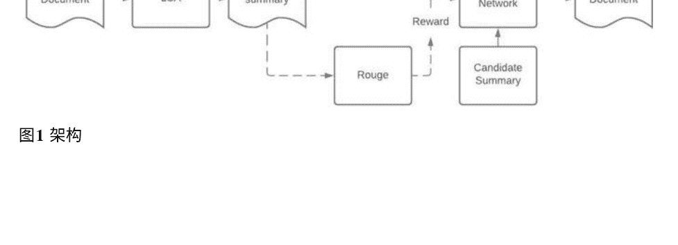

## 3.2 潜在语义分析

文本处理是项目的第一阶段。在这个阶段，我们应用潜在语义分析来选择一组句子。在应用LSA之前，我们必须对语料库进行预处理，从实际文档中删除不需要的单词。

不同的处理步骤包括：
- 分词：分词是将文档分成单词或术语的过程。例如，考虑句子'你好世界'。这个词会被分成两个单词，你好和世界。
- 停用词去除：停用词是指介词、连词、冠词等词，如a、an、the、when、but等。这些词会从文档中删除。
- 词干提取：将一个词减少到其词根的过程。例如，词汇'检索'和'检索'可以缩减为'检索'。

将下面的文本作为输入考虑：
'孩子带着猫走了。孩子把猫带到了花园。孩子去了花园。'
它最初由3个句子和19个术语组成。现在对文档进行预处理。得到的主要术语包括猫、孩子、花园、带走、走和去。

在预处理阶段之后，我们应用LSA。潜在语义分析发现文档中的隐藏关系，以更好地理解术语（文档中的每个单词）与数据集中的文档之间的关系。LSA遵循三个主要步骤。每个步骤都使用上述示例进行讨论。
1. 创建一个术语-文档矩阵，其中每一行代表一个关键词或术语，列代表关键词出现的文档或句子。矩阵中的每个单元格表示特定术语在该文档或句子中出现的次数。
2. 使用TF-IDF（词频-逆文档频率）加权模式将术语-文档矩阵中的词频转换为权重。它告诉我们一个术语对于其语料库中的文档有多重要。这个阶段应用于矩阵中的每个单元格。这一步骤有助于减少最常用单词的影响。词频（TF）和逆文档频率（IDF）的结合被称为TF-IDF。
$$W_{ij} = tf_{ij} * idf_i$$
其中$tf_{ij}$是词项频率，$idf_i$是词项i的逆文档频率。$TF(i)$ = (词项_i在文档_j中出现的次数)/(文档中的总词项数)
$$idf_i = log_2(N/df_i)$$
3. 对获得的矩阵进行奇异值分解（SVD）。它将矩阵‘C’分解为表示类型和文本的正交元素。它可以表示为：
$$C = U\Sigma V^T$$
其中 C是一个 m × n矩阵， U是一个 (m × r) 正交矩阵（左奇异向量）， Σ是一个 (m × n) 非负对角矩阵， V是一个 (r ×n) 正交矩阵。r是矩阵的秩，它应小于或等于min（m， n）。

它减少了获得的词频矩阵的维度。文本处理的主要目标是选择一组语句。因此，我们在从SVD获得的矩阵中应用了Gong和Liu [2]提出的句子选择算法。对于句子选择， Gong Liu摘要算法使用了一个V^T矩阵。 V^T矩阵的行和列分别表示从SVD获得的概念和输入矩阵的句子。第一行显示最重要的概念或术语，行的顺序反映了概念的重要性。该矩阵的单元格提供了句子与给定概念之间的关系细节。与概念相关性更高的句子将具有更高的单元格值。

考虑 r = 2。
在Gong Liu摘要算法中，选择第一个概念，选择与该概念最相关的句子。然后选择第二个概念，并采取相同的步骤。重复选择概念和与该概念密切相关的句子，直到提取出预定数量的句子。从中获得的句子提供给深度Q网络。

从上表可以清楚地看出，第二个句子的值最高，因此被提取出来。
输出：孩子把猫带到了花园里。

## 3.3 深度Q网络

深度Q网络通过结合强化学习和深度神经网络可以解决各种场景的问题。深度Q学习的过程创建了一个长期内工作代理尝试最大化奖励的最优策略。Q学习是通过计算Q值来决定状态下的动作的策略函数。

Q学习依赖于Q函数。 Q网络基于一个基于策略函数的Q网络，系统通过首先采取行动并修改策略函数来测量从状态中获得的折扣因子的预期奖励或价值。我们将最优Q函数定义为所有状态具有最大回报并采取行动并遵循最优策略的策略函数。

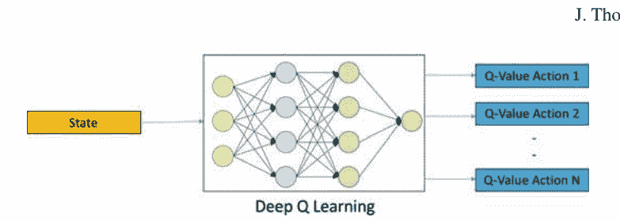

状态具有最大回报并采取行动并遵循最优策略。Q值或q因子是评估摘要的一种度量。作为输入，即深度学习层中的节点将包含在预处理阶段提取的关键字。

如图2所示，部分摘要（状态）和人工摘要作为具有随机权重的DQN的输入。使用Rouge比较两个摘要，并根据Rouge值计算奖励。执行一系列动作将导致最大的总奖励。特定状态的Q值是指在该状态下采取行动所获得的奖励和获得状态的Q值之和。
$$Q(s, a) = r(s, a) + \Gamma \max Q(s', a)$$
$$Q(s, a) \rightarrow \Gamma Q(s', a) + \Gamma Q(s'', a) \ldots \Gamma'' Q(S'', a)$$

## 3.4 Rouge

Rouge召回导向的摘要评估是一种用于将摘要与人工摘要进行比较的评估方法。

Rouge-N. 它计算了我们模型生成的摘要和人工摘要之间的并行'n-grams'的数量，n-gram表示单词的分组。一个1-g（unigram）由一个单词组成，而2-g（bigram）由两个连续的单词组成。同样，3-g（trigram）由三个连续的单词组成。在决定使用哪个N之后，下一步是计算rouge的召回率和精确度。Rouge使用召回率的方法来决定候选摘要要在与人工或参考摘要进行评估时的准确性。rouge中的召回率给出了系统摘要覆盖人工生成摘要的部分的度量。
召回率 = 模型中找到的n-grams数量 / 参考中的n-grams数量。
如果系统摘要捕捉到了人工生成摘要中的所有单词，那么系统摘要可能会非常长。如果是这样，系统摘要中的许多单词将是无意义的，这将导致摘要变得不必要地长和啰嗦。精确度指标可以用来避免这个。在精度方面，我们将能够知道系统摘要的多少是可接受的或必需的。
精度 = 模型和参考中找到的n-gram数量 / 模型中的n-gram数量。

LSA的输出将被传递给Q网络，并获得相应的Q值。使用rouge算法，我们将定义阈值。当我们的系统达到这个阈值时，不需要进一步的摘要。Rouge通过将摘要与基于n-gram的参考摘要进行比较来自动测量摘要。
Rouge = 重叠单词数 / 总单词数。

在参考摘要中，rouge非常易于解释。一个好的候选翻译只会使用召回率进行评估。而且，为了比较，最好使用参考池中的一个可能的参考摘要。

# 4 实验

##### 4.1 数据集

所需的数据集来自Kaggle，并在深度Q网络的训练过程中使用。获得的数据集包含4450个文件，其中包括新闻文章和它们的摘要。数据集类型包括商业、娱乐、体育、政治和技术。70%的数据集用于训练，其余的用于测试和验证。

# 5 讨论和结论

现有的文本摘要模型不太准确，也有可能出现相同的句子多次。与其他分类器模型相比，我们的文本摘要方法基于强化学习和深度Q网络。互联网的快速增长使得大量信息可获得。对于人类来说，总结大量文本是麻烦的。因此，自动文本摘要是必要的。有各种各样的文本摘要方法。在这项研究中，我们尝试使用深度Q网络有效地训练Q网络，以开发基于强化学习的自动文档摘要器。Rouge可以用来评估摘要文本的准确性，其中输入是一个文档。文本摘要的实际应用包括文档摘要、新闻和文章摘要、评论系统、推荐系统、社交媒体监控、调查回应系统。摘要模型将帮助大量人员确定关键思想并整合关键细节。它还有助于聚焦于重要的主题以及值得注意和记住的词语在一篇论文中。该模型包含关于人工文本摘要和多样化语言方法的研究论文。我们的模型承诺即使只使用简单特征也能对文本进行摘要。

#### 参考文献

1. Kherwa, P., & Bansal, P. (2017). 潜在语义分析：理解文本语义的一种方法。在IEEE会议出版物(pp. 870-874)中。
2. Gong, Y., & Liu, X. (2001). 使用相关度度量和潜在语义分析的通用文本摘要。在SIGIR信息检索研究与开发会议中。
3. Christian, H., et al. (2016, December). 使用词项频率-逆文档频率(TF-IDF)进行单文档自动文本摘要。ComTech: 计算机、数学和工程应用, 7.
4. Lin, C. Y. (2004). ROUGE: 一个用于自动摘要评估的软件包。
5. Nenkova, A. (2006). 文本和语音摘要评估：问题和方法。
6. Liu, F. L., Yang (2008). ROUGE和人工评估之间的相关性，提取式摘要，第201-204页。https://doi.org/10.3115/1557690.1557747
7. Anand, D., & Wagh, R. (2018). 有效的深度学习方法用于法律文本摘要。Journal of King Saud University—Computer and Information Sciences.
8. Esmaeilzadeh, S., & Peh, G. X. (2020). 神经生成式文本摘要和假新闻检测. IEEE.

10. Reddy, N., Nayak, R., & Baboo, S. (2012年8月). 使用图像文件的加密系统的分析和性能特征国际计算机应用杂志, *51*(22), 0975–8887.
11. Pfleeger, C. P., & Pfleeger, S. L. (2002年). 计算机安全 在普林斯顿大学出版社专业技术参考书。
6. Kahate, A. (2013年). 密码学和网络安全. 塔塔麦格劳-希尔教育.
12. Karim, M. Z., & Akter, N. (2011年10月). 解决最近点问题的分治算法的最优分区参数国际计算机科学& 信息技术杂志 (*IJCSIT*), *3*(5).
13. Schneier, B. (1996年). 应用密码学. 约翰威利和儿子公司.
14. Singh, A., & Danda, N. (2015年3月-4月). 使用图像加密和XOR运算仿射变换的DIP计算机工程学*IOSR*杂志(*IOSR-JCE*), *17*(2), 07–15. 电子*ISSN*: 2278–0661.

### 在工业中分析和应用HRMS工具

M. R. Dileep, A. V. Navaneeth, B. M. Chaitra 和 Ajit Danti

摘要 HRMS工具是帮助任何组织建立一个能够轻松查看员工、他们的活动和其他与工作相关的信息的应用程序。这个应用程序对每个人都可用，用户可以使用所需的详细信息注册并访问凭据。

然后管理员可以添加他们组织的员工并给予他们角色和责任。管理员还可以将更新的责任分配给人力资源部门，然后进行所需的更改。人力资源部门负责招聘员工，也可以将员工添加到组织中。员工可以在应用程序上查看他们的收件箱、仪表板、招聘和个人详细信息。如果有任何需求，他们还可以获得帮助和支持系统进行联系。

他们可以随时编辑自己的个人资料，搜索任何需求，并从组织中获取新闻动态。这些是应用程序的一些功能。除此之外，他们还可以查看自己的工资单，申请请假，等等。随着计算机发展的进步，人力资源管理系统工具以一种人类可以与之交互的方式进行开发。计算机科学特别是人工智能领域的最新发展为高效的人力资源管理系统工具的开发打开了广阔的大门，从而减少了人力投入。本文对比了基于人工智能开发的人力资源管理系统工具和不使用人工智能的人力资源管理系统工具，并根据适用性绘制了这些人力资源管理系统工具的应用。

关键词 人工智能 · 特征工程 · MongoDB · Sybase · 导航

M. R. Dileep · A. V. Navaneeth (✉) · B. M. Chaitra
计算机应用硕士，尼特梅纳克西技术学院，耶拉哈卡，班加罗尔，卡纳塔克邦，印度
A. Danti
计算机科学与工程系，基督被认为是大学，班加罗尔，印度
电子邮件： ajit.danti@christuniversity.in

#### 1 引言

HRMS是一个使组织流程变得简单的应用程序。这使得管理员和人力资源能够轻松监控员工的工作。此外，员工可以查看和编辑自己的个人资料，查看其他同事的资料，申请请假，查看工资单等等。由于组织是由人组成的，他们的获取、技能发展、激励以及确保他们的承诺水平的维持都是重要的活动。这些活动属于人力资源管理系统的范畴。人力资源管理系统的主要目标是确保为正确的工作提供合适的人员，以便有效地实现组织目标。

每个员工的数据/文件/记录都安全地保存在这个系统中，该系统旨在减少检索员工文件的过程。人力资源还可以招聘员工，并在网站上发布海报，以便所有人都可以查看。员工可以轻松监控由人力资源或管理员更新的角色和责任。这个应用程序可以通过轻松监控员工和他们的工作使组织更加高效。

在大多数人力资源管理系统相关的活动中，人际互动是最受青睐的。但是当人力资源管理系统的工作负载增加时，输出的性能和质量可能会降低，因为人力资源管理系统中的许多活动需要人工操作。在这种情况下，在高工作负载领域提供一些自动化工具可以减少输出的不准确性。在人力资源管理系统应用中，由于各种原因，为所有活动开发自动化工具是困难的。但与此同时，人力资源管理系统工具中存在一些可以开发高效自动化工具的领域。

本文尝试在人力资源管理系统活动的各个阶段提供一些自动化工具，并对这些活动进行分析以开发自动化工具。

#### 2 文献综述

目前在各个领域使用的系统都是基于手动记录系统，如Excel表格或Google表格。它可以正确存储数据，但除此之外，一切都需要手动操作。人力资源部门的重复任务，如手动发送电子邮件和跟进，可能会变得繁琐。可能会出现向同一个人发送电子邮件而错过其他人的情况。所以这一直是一个问题。当涉及到员工详细信息时，处理时间很长，结果不准确的概率很高。这种系统很难维护，因为随着数据的呈指数增长，跟踪每天招聘多少员工或有多少员工离职也是一项繁琐的工作。

Aydogan和Cemil [1]对最近在食品和植物天然产物中的液相色谱-高分辨质谱的进展和应用进行了研究：一项关键综述，展示了HRMS工具的使用。Alygizakis等人[2]展示了对液相色谱-高分辨质谱数据进行非定向时间模式分析以检测泄漏和具有高波动性的化合物。Chaker等人[3]对代谢组学向基于HRMS的暴露组学的转变进行了调查，并适应了MS1嫌疑筛查的峰值拾取和评分方法。Di Ottavio等人[4]研究了基于UHPLC-HRMS的代谢组学和化学信息学方法，以在各种植物性食品中区分“超级食物”，取得了一些有用的结果。Hemmer等人[5]对分析液相色谱-高分辨质谱代谢组学数据的三种非定向数据处理方法进行了比较。Hohrenk等人[6]对使用化学计量学方法改进液相色谱-高分辨质谱中的数据挖掘和优先级排序进行了深入研究，用于复杂水样基质中的非靶标筛查有机微污染物。Hrbek等人[7]描述了一种使用实时离子化-高分辨质谱（DART-HRMS）对牛奶和基于牛奶的物品进行鉴定的技术。

Ivanisevic等人[8]通过从样本到代谢洞察进行了一项调查：揭示了液相色谱-高分辨质谱代谢组学数据中的生物相关信息。Kirwan [9]提出了两种核化学工厂人员可靠性管理方法：HRMS和JHEDI。Liu等人[10]对HRMS方法进行了非靶标物质的发现和表征的研究，该方法用于环境和人体样本中的聚-全氟烷基物质（PFASs）。Matos等人[11]使用综合UPLC-HRMS、化学计量学工具和代谢组学分析来鉴定与胭脂虫（Dactylopius opuntia）易感性相关的生物标志物，研究对象为饲料仙人掌（Opuntia spp.和Nopalea spp.）。Ranjan等人[12]对人力资源管理系统中的数据挖掘策略进行了彻底的研究，以提高决策能力。Ramanathan等人[13]对药物发现生物分析中从SRM到HRMS的范式变革进行了研究。Righetti等人[14]介绍了改进的真菌毒素分析的最新进展和潜在挑战，并解释了为什么HRMS已成为食品污染研究中的重要工具。Zahn等人[15]对从环境（色谱）HRMS非靶标筛查数据中提取信息和化学优先级的方法和策略进行了深入调查，类似于是在大海捞针中寻找目标物质。

本文所进行的研究描述了基于适应性和业务导向因素以及性能问题的人力资源管理系统工具的自动化构建的可能性。然而，本文还提供了一些结合技术构建自动化工具的一般思路，从而努力实现良好的交付成果。

#### 3 提出的方法

所提出的系统除了鼠标点击之外，其他都实现了自动化。已经构建了一个系统，可以帮助任何组织的人力资源部门以简单的方式轻松完成复杂的手动任务，并拥有出色的用户界面。它还使人力资源部门能够轻松监控工作流程，雇主和员工可以在应用程序上编辑或更新他们的记录或个人资料，申请休假，获取工资单，轻松搜索所需内容，查看新闻动态等。通过将文件记录在单个应用程序中并检索它们，这使得整个过程变得简单。人力资源部门或管理员还可以添加新用户，招聘员工，在组织中创建不同的新闻动态，以便员工可以轻松监控新记录，并与他们的社交媒体账户共享。这些主要活动都是通过人工智能系统自动完成的。所提出的方法论已在图1中进行了解释。

在提出的方法中，考虑了与HRMS工具相关的场景，其中执行了一系列招聘、培训、奖励、分配任务等活动。从这个场景中，确定了一些用于开发自动化工具的活动。在“提出的算法”部分中，解释了用于开发自动化工具的活动、方法和算法。

图1表示提出的方法的流程图

#### 4 提出的算法

提出的方法已经总结为下面的算法。

##### 步骤1：数据准备
数据准备过程包括3个阶段。

- **阶段-1：数据收集**—第一阶段包括活动，如明确问题、定义所需数据的结构和组合不同来源以收集必要的数据。
- **阶段-2：数据预处理**—该阶段通过对收集到的数据应用过滤器来提取所需的准确数据。这个过程涉及的技术包括清洗、抽样和格式化。
- **第三阶段：数据转换**—该阶段涉及某些活动，以确定数据之间的不同属性之间的关系并建立数据之间的关系。为了获得数据之间的关系和映射，采用了一些技术，如缩放、分解和聚合。这3个阶段如图2所示。

##### 第2步：HR对数据进行分析
在第二步中，主要关注根据一定的约束条件对数据进行分析。数据的分析通常由HR团队完成，而在这个阶段可以开发适当的机器人来提高工作效率。

##### 第3步：数据访问、更新、操作和删除
在该过程中可以使用有效的数据访问工具，以便轻松快速地访问和操作数据。现代数据库系统如MongoDB、Sybase等就是这个阶段的例子。

##### 步骤4：生成报告
报告可以在流程的不同阶段生成，这份报告可以是以不同的格式呈现。可以开发适用的安卓应用程序，并在此阶段使用。

图3带有附加选项的菜单

#### 5 实验结果
该应用程序允许用户为其组织创建一个环境，并添加用户。用户还可以在导航栏上轻松搜索任何内容。用户可以在导航栏上查看新闻动态，并在遇到困难时获取帮助支持系统。图3展示了导航栏的结构，并显示了带有其他选项的导航栏。

#### 6 结论
从实验结果可以明显看出，该应用程序将帮助每个组织建立自己的环境，以便用户只需点击鼠标即可获取员工的所有详细信息。客户或用户可以访问该网站，并通过提供公司名称和个人信息注册到应用程序中。然后，客户将获得他们的凭证，并成为其组织的管理员。然后，管理员可以为其组织添加成员，并为他们分配角色和责任。管理员可以为其他成员分配角色。

管理员可以访问所有角色。人力资源可以将角色和责任分配给员工。有一个由管理员处理的优先级计量器，只有管理员可以更改其他人的访问权限。人力资源和管理员可以更改员工的访问权限。员工可以编辑他们的个人资料，人力资源和会计负责请假申请和工资单。员工可以查看他们的工资单。人力资源负责招聘新员工并使他们成为组织的一部分。人力资源还可以发送邀请链接给其他人加入应用程序。然后新员工将获得凭据并成为组织的一部分。这将完全减少组织的人力，并有助于跟踪他们组织中的员工。

除了上述活动外，还根据环境和要求自动化了一些附加活动。任务包括数据收集、数据分析、数据访问和以各种形式表示输出。它还指出，在现有的人力资源管理系统工具中，并不是所有的活动都是自动化的，因为这些活动需要人为干预。本文反映了一种开发新型人力资源管理系统工具方法的新方法。

#### 7 未来范围

##### 7.1 批量发送电子邮件
以前用户会编写和发送单独的电子邮件，现在用户可以充分利用Close的批量发送电子邮件功能。用户可以与智能视图和电子邮件模板一起使用，这意味着用户只需点击一个智能视图，然后批量发送预定义模板给整个分段。这真的让我们能够加快我们的流程。

##### 7.2 请假和工资单电子邮件模板
工作将从工资单开始。员工可以通过每月了解自己的工资单并获得请假申请的批准，而无需在组织内四处奔波来获得批准。

##### 7.3 来自领英的个人资料数据
这个模板将通过邀请或鼓励新成员来发布博客或在网站上发表评论，从而使人力资源的工作更加轻松。这样，人力资源部门可以招聘更多的员工到组织中。

##### 7.4 数据压缩
这是一个用户并不真正看到的功能，但用户可以感受到。在服务器和客户端通信时传递压缩数据可以提高系统性能，并减少带宽。

##### 7.5 自动SMTP连接
对于电子邮件服务，应用程序限制用户只能使用Gmail进行电子邮件集成。一旦准备好自动SMTP识别和连接，用户可以使用任何他们想要的电子邮件服务。这非常重要，因为只允许使用Gmail会减少我们潜在的用户，他们使用其他电子邮件服务进行业务。

#### 参考文献
1. Aydogan, C. (2020). 食品和植物天然产物的液相高分辨质谱法（LC-HRMS）的最新进展和应用：一项关键综述。分析与生物分析化学，412(9), 1973–1991.
2. Alysizakis, N. A., Gago-Ferrero, P., Hollender, J., & Thomaidis, N. S. (2019). 无目标的LC-HRMS数据的时间模式分析，以检测泄漏和具有高波动性的化合物在进水废水中。危险物质杂志，361, 19–29.
3. Chaker, J., Gilles, E., Léger, T., Jégou, B., & Arthur, D. (2020). 从代谢组学到基于HRMS的暴露组学：适应峰值拾取并开发MS1可疑筛查的评分方法。分析化学。
4. Di Ottavio, F., Gauglitz, J. M., Ernst, M., Panitchpakdi, M. W., Fanti, F., Compagnone, D., Dorrestein, P. C. & Sergi, M. (2020). 基于UHPLC-HRMS的代谢组学和化学信息学方法，用于从各种植物性食品中区分“超级食物”。食品化学，313, 126071.
5. Hemmer, S., Manier, S. K., Fischmann, S., Westphal, F., Wagmann, L., & Meyer, M. R. (2020). 比较三种无目标数据处理工作流程，用于评估LC-HRMS代谢组学数据。代谢物，10(9), 378.
6. Hohrenk, L. L., Vosough, M., & Schmidt, T. C. (2019). 应用化学计量学工具来改进液相高分辨质谱法在复杂水样基质中的非靶筛查有机微污染物的数据挖掘和优先级排序。分析化学, 91(14), 9213–9220.
7. Hrbek, V., Vaclavik, L., Elich, O., & Hajslova, J. (2014). 通过直接分析实时电离-高分辨质谱法（DART-HRMS）技术对牛奶和基于牛奶的食品进行鉴别：一项关键评估。食品控制, 36(1), 138–145.
8. Ivanisevic, J., & Want, E. J. (2019). 从样本到代谢物组学数据中揭示生物相关信息的洞察力。代谢物, 9(12), 308.
9. Kirwan, B. (1997). 开发核化学厂人员可靠性管理方法的发展：HRMS和JHEDI。可靠性工程与系统安全，56(2), 107–133.
10. Liu, Y., D’Agostino, L. A., Qu, G., Jiang, G., & Martin, J. W. (2019). 高分辨率质谱（HRMS）方法用于非靶发现和环境和人体样品中聚-和全氟烷基物质（PFASs）的表征。TrAC分析化学趋势, 121, 115420.
11. Matos, T. K. B., Guedes, J. A. C., Alves Filho, E. G., Luz, L. R., Lopes, G. S., do Nascimento, R. F., & João A. de Sousa et al. (2021). 综合UPLC-HRMS，化学计量工具和代谢组学分析的饲料棕榈（仙人掌属和仙人球属）以定义与胭脂虫（Dactylopius opuntiae）非易感性相关的生物标志物。
12. Ranjan, J., Goyal, D. P., & Ahson, S. I. (2008). 数据挖掘技术在人力资源管理系统中的更好决策。国际商务信息系统杂志3, 5, 464–481.
13. Ramanathan, R., Jemal, M., Ramagiri, S., Xia, Y. Q., Humphreys, W. G., Olah, T., & Korfmatcher W. A. (2011). 是时候从SRM转向HRMS进行药物发现生物分析的范式转变了。质谱杂志46(6), 595–601.
14. Righetti, L., Paglia, G., Galaverna, G., & Dall’Asta, C. (2016). 近期进展和未来挑战在改进的霉菌毒素分析中：为什么HRMS已成为食品污染物研究中的关键仪器。毒素8(12), 361.
15. Zahn, D., & Frömel, T. (2020). 在环境（色谱）HRMS非靶向筛查数据中，找到一根针-基于分析物的工具和技术进行化学品的信息提取和优先级排序。环境科学与健康的当前观点。

### 使用深度强化学习在云服务器中进行资源分配和功率管理

Sushil Shakya 和 Subarna Shakya

摘要 资源分配和功率管理已成为云计算中具有挑战性的任务。由于工作负载随时间变化，需要动态云资源分配和功率管理解决方案，能够本质上适应资源的需求。本文演示了在模拟的阿里巴巴集群环境中使用深度强化学习算法进行任务调度和功率管理，以实现比传统任务调度算法更好的功率和延迟管理的目标。在本文中，我们提出了一种用于资源分配和功率管理的分层RL模型，其在延迟和功率使用方面比传统任务调度获得更好的结果。

- 动态资源管理
- 强化学习
- 云计算
- 任务调度

#### 1 引言

如今，云计算已经成为现代计算本身的类比，在这里，一切都是可以连接和组合的服务，以满足无尽的应用需求。越来越多的公司将业务转移到云端，从而彻底改变了企业运营和应用构建的方式。云计算受欢迎的主要原因之一是虚拟化技术的进步，它使得数据中心的资源可以按需共享。在云计算中，为这些虚拟机分配资源和管理功耗是两个主要关注点。尽管云计算系统帮助企业增加了收入，但对云计算的过度依赖导致全球能源消耗的增长，并对环境产生了负面影响，特别是碳足迹方面。数据中心的电力消耗是预计到2020年，每年的电费将达到约1400亿千瓦时，耗费130亿美元[1]。

资源分配和功率管理使用传统优化算法是一种可能的方法，许多研究工作已经显示出有希望的结果[2, 3]。但是这些算法无法动态适应时变工作负载，并且需要手动调整。由于时变工作负载在云计算中是固有的，云资源分配和功率管理需要以在线自适应方式进行。因此，在云计算系统中需要一个最优的动态资源分配和功率管理策略来最小化延迟和功耗。设计动态资源分配和功率管理策略可以建模为马尔可夫决策过程（MDP）。强化学习（RL）已经证明是解决这类动态优化问题的有效方法。RL方法非常适合云计算系统，因为它不需要对过渡矩阵、工作负载或底层系统的功率/性能进行任何先前建模[4]。这里的主要目标是减少在复杂计算系统管理中的明确人工指令。尽管传统的RL算法在动态环境中运行良好，但由于云计算系统的大状态和动作空间，传统的RL方法变得无效[5]。深度强化学习算法已经证明在处理具有高维状态和动作空间的复杂控制问题上非常成功，甚至超过了人类在玩Atari游戏[6]和围棋游戏方面的表现。注意，围棋是人类创造的计算上最复杂的游戏。

在[4]中，提出了一种解决资源分配和功率管理问题的分层方法。使用分层强化学习模型，作者能够在云计算资源的功耗方面取得显著改进，但延迟仍然高于基准方法，如轮询。在分层强化学习模型的基础上，本文提出了一种改进版本。使用阿里巴巴集群跟踪[7]的实验结果表明，分层强化学习模型的改进版本在功耗和延迟方面比基准方法表现更好。

#### 2 相关工作

在[1]中，预计到2020年，美国数据中心的年电力消耗将达到约1400亿千瓦时（kWh），大约需要花费30亿美元。研究人员一直在努力寻找更好的优化算法，以改善资源分配和任务调度问题，从而实现更好的功耗管理。提出了一种名为“快速和节能的资源配置和任务调度”（FERPTS）的算法，用于优化任务运行时间并确保云系统的低能耗，与基准方法相比，作者能够实现高达79.94%的运行时间节省。但是这样的算法不能自动适应动态云环境，因此研究人员一直在尝试使用机器学习算法来提出自适应动态算法。

深度学习使得训练端到端的机器学习模型成为可能，无需精选输入特征。许多深度强化学习算法已经被提出，并在游戏领域中通过击败人类玩家展示了它们的有效性。深度Q网络（DQN）是最早成功的深度强化学习之一，能够在一些Atari游戏中取得最先进的结果，甚至超过人类表现[6,9]。

最近，该算法在资源调度和任务分配问题上也取得了比FERPTS更好的性能，显著超过了FERPTS的性能[10]。研究人员一直在尝试在云计算的资源分配和功率管理中使用深度强化学习算法。在[4]中使用了一种分层强化学习方法，作者表明，具有全局层用于虚拟机（VM）资源分配到服务器和本地层用于分布式功率管理的分层框架比轮询和贪婪任务调度算法具有更好的功率管理性能。在一个拥有5000台服务器和200,000个任务的云服务提供商（CSP）设置中，DRL-Cloud [10]实现了218%的能源成本效率提升和144%的运行时间缩短，同时保持较低的拒绝率，但在较小的服务器集群和任务中存在延迟问题。即使对于一个拥有500台服务器和50,000个任务的CSP设置，DRL-Cloud的运行时间也比轮询高出480%。根据[10]的结果，该方法似乎不适用于服务器少于2000台的云数据中心。并非所有数据中心都包含如此多的服务器。在[4]和[10]的基础上，我们提出了一个分层模型，全局层采用轮询算法，本地层采用强化学习模型，适用于小型数据中心。

#### 3 方法论

云服务提供商不断寻求更好的解决方案，通过应用最先进的资源分配和任务调度算法来优化功耗和改善任务执行延迟。这些算法在一定程度上取得了成功。但是主要问题是这些算法不能适应云计算环境的变化，并且并不总是提供最优解。深度强化学习算法在处理这种动态环境下的优化问题方面表现出了很高的效果。所提出解决方案的方法已在以下子章节中进行了描述。

##### 3.1 数据收集与分析

众所周知，深度学习算法对数据需求很大，深度学习模型的整体性能最终取决于可用数据的数量。阿里巴巴已经在阿里巴巴集群追踪计划下发布了其集群工作负载追踪数据，该数据规模较小且易于使用。研究人员一直在使用这个数据集进行服务器工作负载实验。这个数据集的一个精简版本包含了10万个服务器任务的日志，足够进行本项目的实验。阿里巴巴集群数据集由以下五个逗号分隔值（CSV）文件组成。

- 批次实例
- 批次任务
- 容器使用
- 机器元数据
- 机器使用

在这些可用数据中，批次任务包含实际运行在阿里巴巴集群机器上的任务日志，机器元数据包含这些集群机器的元信息。这些是该项目实验的唯一感兴趣的数据。批次任务和机器元数据的模式分别如表1和表2所示。

##### 3.2 实施

优化功耗和任务执行的问题可以建模为马尔可夫决策过程（MDP），因此可以应用强化学习算法来解决。强化学习算法可以适应动态的云计算环境，因此不需要外部手动输入。云集群环境的实验设置如图1所示。整个设置与[4]类似。它包括与云资源分配和功耗管理框架相关的资源类型为N的服务器的数量为R。为了节省能源，服务器可以处于活动模式或睡眠模式。CPU和内存是这里处理的基本服务器资源类型。每当有新任务进来时，全局模型负责选择将该任务发送到哪台机器。然后将任务转发到该特定机器。这里的一台机器包括CPU、内存、本地模型、工作负载预测器以及正在运行和待处理的任务。根据机器的当前状态，本地模型决定是运行这个新任务还是将其放入待处理队列并稍后处理。接下来将讨论全局模型、本地模型和工作负载预测器的工作原理。

###### 3.2.1 全球模型

让我们从CPU资源消耗的角度来看为什么需要在这些机器内做出智能决策。图2展示了一台机器上执行任务的示例。假设任务1、2和3在特定的机器M1上分别在时间t1、t2和t3到达，并在时间t4、t5和t6完成。假设在时间0时，M1处于活动模式。当任务1和2到达时，有足够的资源，所以它们的需求立即得到满足。当任务3到达时，它必须等待任务1完成，等待时间为t4-t3。因此，任务3的延迟时间为t6-t3，这比任务持续时间更长。为了减少任务的延迟时间，全局模型不应过载服务器。因此，需要一个智能调度方案。自动分配任务给机器并在每台机器上分配资源非常重要。前者由全局模型完成。

###### 3.2.2 本地模型

当任务分配给处于睡眠模式的机器时，将需要花费T时间将机器切换到活动模式，并需要花费T时间将机器切换回睡眠模式。假设处于睡眠模式的机器的功耗为零，并且处于活动模式下的机器在时间t的功耗是CPU利用率[11]的函数，如公式1所示。

```
P(x_t) = P(0%) + (P(100%) - P(0%))(2x_t - x_t^{1.4})    (1)
```

其中，x_t是时间t时机器的CPU使用率，P(0%)是空闲模式下机器的功耗，P(100%)是满负荷时机器的功耗。通常，机器在从睡眠模式切换到活动模式时的功耗高于P(0%)[11, 12]。

为了更好地理解如何高效管理功耗，让我们看一下图3。在时间0，机器处于睡眠模式，任务1和任务2在时间1和时间3到达，并分别消耗50%和70%的CPU资源。当任务1到达时，机器从睡眠模式切换到活动模式，并从时间1+ T开始为任务1提供服务，直到时间2。此时，机器需要做出决策，是返回睡眠状态还是保持空闲等待下一个任务到达。在临时技术（如图3a所示）的情况下，机器进入休眠状态需要 T时间，因此当任务2在时间3到达时，机器必须在提供任务之前再次启动。因此，任务2的执行仅从时间2+ T + T开始，并在时间4完成。但是在动态功耗管理（DPM）的情况下（如图3b所示），机器不会立即进入睡眠状态，而是在空闲模式下等待 T超时。在该超时期间，任务2到达，机器可以立即切换到活动模式并开始处理该任务，并在时间4'完成，这比时间4要少。因此，动态功耗管理（DPM）技术显然有助于提高任务延迟并减少总体功耗，因为：

$$ P (\text{闲置}) < P (\text{从活跃到休眠}) + P (\text{从休眠到活跃}) \tag{2} $$

动态电源管理由本地模型执行，该模型在所有机器之间共享。现在可能会出现问题，我们如何为机器设置超时值，这就是工作负载预测器的作用所在。

###### 3.2.3 工作负载预测器

工作负载预测器是DPM框架的重要组成部分，负责获取未来工作负载的预测结果。预测结果连同当前信息（例如队列中待处理任务的数量）一起输入到本地模型中，作为机器当前状态的选择相应动作和学习的观察领域。长短期记忆（LSTM）网络在这个项目中被用作工作负载预测器，但也可以尝试其他递归神经网络（RNN）变体。通过准确的预测和对管理的机器的当前信息，本地模型必须选择最合适的操作（超时值）来帮助减少机器的功耗和任务延迟。

###### 3.2.4 训练过程

在云集群环境中直接训练强化学习算法可能会遇到收敛问题。需要进行大量的超参数调整，而且非常耗时。相反，可以首先在OpenAI Gym环境[13]中对算法进行实验，以获得一组良好的超参数值作为云集群环境训练的起点。训练过程包括以下两个步骤：

1. 在CartPole环境中训练强化学习算法，并找到最佳性能的超参数设置
2. 使用第1步中的超参数作为起点，在阿里巴巴云集群环境中训练算法。

使用一种流行的强化学习策略优化算法，称为异步actor-critic算法（A2C），来训练全局和局部模型。A2C算法的伪代码如算法1所示。

**算法1 N步优势actor-critic**
从策略模型 π_θ 和价值模型 V_ω 开始
重复：
    生成一个序列 S_0, A_0, r_0, ..., S_{T-1}, A_{T-1}, r_{T-1} 按照 π_θ(·)
    对于 t 从 T-1 到 0:
        如果 t+N ≥ T，则 V_end = 0，否则 V_ω(s_{t+N})
        R_t = γ^N V_end + Σ_{k=0}^{N-1} γ^k r_{t+k} 如果 t+k < T，否则
        L(θ) = (1/T) Σ_{t=0}^{T-1} (R_t - V_ω(S_t)) log π_θ(A_t|S_t)
        L(ω) = (1/T) Σ_{t=0}^{T-1} (R_t - V_ω(S_t))^2
        使用 ∇L(θ) 优化 π_θ
        使用 ∇L(ω) 优化 V_ω

在阿里巴巴云集群环境中训练强化学习算法的主要目标是在不牺牲任务延迟的情况下获得比贪婪和轮询等基准方法更好的功耗利用率。值得注意的是，云服务器中的任务延迟和功耗利用率并不完全具有相等的重要性，对于不同的云集群，重要性比例可能会有所不同。

实验结果已在第4节中讨论。

#### 4 结果

使用阿里巴巴集群跟踪数据[7]来训练和比较分层强化学习模型[4]与轮询算法的性能。使用A2C算法训练强化学习模型。从功耗使用角度来看，分层强化学习模型优于基准算法，但存在严重的延迟问题。为了解决这个问题，提出了两种修改后的分层模型，其中全局强化学习模型被贪婪算法和轮询算法替代，而本地模型保持不变。与其他方法相比，这些修改后的分层方法获得了更好的综合性能。在30台服务器上对阿里巴巴集群跟踪数据集的10,000个任务进行的实验结果如图4所示。

实验结果图清楚地显示出，即使在功耗方面有积极改进，但普通的分层模型仍然存在巨大的延迟问题。延迟问题是由于用于分层设置的两个强化学习模型在决定服务器选择时需要一些处理时间。通过将全局模型替换为轮询和贪婪算法，这两个修改后的分层模型将这个时间缩短，而这两个算法相对较快。从轮询强化学习和贪婪强化学习的图表中可以清楚地观察到这种效果。

#### 5 结论

在本文中，我们实现了一种基于强化学习的分层框架[4]，用于解决云计算系统中的资源分配和功耗管理问题。这是一个简单的框架，包括两个主要模型：全局模型用于更好地分配任务，本地模型用于更好地管理功耗。这两个模型都基于深度强化学习算法。这使得它们具有高度可扩展性，并且能够降低在线计算复杂度。本地模型由基于LSTM的工作负载预测器支持，该预测器提供关于未来工作负载的预测，并帮助本地模型决定适当的机器超时值。在性能方面，分层强化学习方法相比轮询法可以减少约30%的功耗，但该模型存在严重的延迟问题。为了解决这个问题，我们提出了两种改进的分层解决方案变体，其中一个使用轮询法，另一个使用贪婪算法作为全局层，同时保留基于强化学习的本地层。结果表明，这些改进的分层解决方案在不牺牲功耗改进的情况下，具有比[4]的原始分层方法更好的延迟。

#### 参考文献

1. Delforge, P. (2014). 美国的数据中心消耗和浪费越来越多的能源。自然资源保护委员会。
2. Liu, X., Qin, Z., & Gao, Y. (2019). 通过强化学习在物联网网络中进行边缘计算的资源分配。 在ICC 2019-2019 IEEE国际通信会议上(pp. 1–6). IEEE。
3. Tesauro, G., et al. (2005). 使用分解强化学习进行在线资源分配。*AAAI*, 5, 886–891。
4. Liu, N., Li, Z., Xu, J., Xu, Z., Lin, S., Qiu, Q., Tang, J., & Wang, Y. (2017). 使用深度强化学习的云资源分配和功耗管理的分层框架。在2017年IEEE第37届国际分布式计算系统会议上 (pp. 372–382). IEEE。
5. 强化学习基础。2021年3月1日检索自https://www.coursera.org/learn/fundamentals-of-reinforcement-learning/home/welcome
6. Mnih, V., Kavukcuoglu, K., Silver, D., Graves, A., Antonoglou, I., Wierstra, D., & Riedmiller, M. (2013). 使用深度强化学习玩Atari游戏。 arXiv:1312.5602
7. 阿里巴巴集群工作负载跟踪。2020年12月20日检索自https://github.com/alibaba/clustered
8. Li, H., Li, J., Yao, W., Nazarian, S., Lin, X., & Wang, Y. (2017). 云系统的快速和节能资源提供和任务调度。 在2017年第18届国际质量电子设计研讨会(ISQED)(pp. 174–179). IEEE。
9. Alpha Go。2021年3月1日检索自https://deepmind.com/research
10. Cheng, M., Li, J., & Nazarian, S. (2018). Drl-cloud: 基于深度强化学习的云服务提供商资源分配和任务调度。在2018年第23届亚洲和南太平洋设计自动化会议(ASP-DAC)上(pp. 129–134). IEEE。
11. Fan, X., Weber, W. D., & Barroso, L. A. (2007). 面向规模仓库的电力供应计算机。*ACM SIGARCH计算机体系结构新闻*, 35(2), 13–23。
12. Meisner, D., Gold, B. T., & Wenisch, T. F. (2009). Powernap: 消除服务器空闲功耗。*ACM SIGARCH计算机体系结构新闻*, 37(1), 205–216。
13. OpenAI Gym。2021年3月2日检索自https://gym.openai.com/

### 通过挖掘实时数据流进行犯罪新闻分析系统以保护数据隐私

Rahul Patil, Pramod D. Patil, Sayali Kanase, Nikita Bhegade, Vaishnavi Chavan和Shreyas Kashetwar

**摘要** 数据流挖掘是数据科学的新兴领域。它是使用增量算法从流数据中提取知识的过程。挖掘流数据面临着不同的挑战[3]，如概念漂移、处理不完整和延迟信息、数据的偏斜和隐私保护。在挖掘和处理流数据的过程中，应该保持流数据的隐私，以保护敏感信息免受攻击者的侵害，并保护用户敏感的个人数据免受恶意用途的侵害。在本文中，我们提出了一个系统，用于挖掘犯罪新闻数据流，并使用K-匿名化和Apache Spark进行隐私保护。通过挖掘流数据的过程获得的知识以实时更新的图表形式呈现，为最终用户提供有关印度热门城市当前犯罪率和统计数据的有用见解。

**关键词** 数据流挖掘·隐私保护·Apache Spark·K-匿名化 ·准标识符 ·多线程

R. Patil (✉) · S. Kanase · N. Bhegade · V. Chavan · S. Kasetwar
印度浦那Pimpri Chinchwad工程学院

S. Kanase
电子邮件：sayali.kanase17@pccoepune.org

N. Bhegade
电子邮件：nikita.bhegade17@pccoepune.org

V. Chavan
电子邮件：vaishnavi.chavan17@pccoepune.org

S. Kasetwar
电子邮件：shreyas.kashetwar17@pccoepune.org

P. D. Patil
Dr. D.Y. Patil技术学院，浦那，印度

#### 1 引言

如今，数据流挖掘是数据科学和知识工程领域中的一个新兴领域，因为越来越多的应用需要挖掘实时流数据。流数据以永不停止的数据激增为特征，没有明确的开始或结束，提供持续的数据源，可以用于各种用途，无需存储或下载。数据源广泛，可以包括电子商务购买、社交媒体动态、实时股票交易、网站活动、物联网设备[1]、交易和服务器日志文件等。处理流数据时需要考虑的主要因素是速度、多样性和容量[2]。数据需要在运动中进行分析，因此需要根据应用的需要解决许多挑战。这些挑战与概念漂移[8]在传入的数据流中引发、内存管理问题、处理连续格式的复杂查询、多级或多维处理、处理不完整或延迟的信息以及在挖掘数据流的不同阶段出现的其他问题有关[3]。其中一个挑战是保护实时流数据中存在的用户敏感或易受攻击的数据的隐私。

隐私保护是挖掘流数据中的关键过程。保护隐私的方法对于安全可靠的数据处理[4, 5]和数据流分析是不断需求的。在流处理过程中，需要对易受攻击的数据进行屏蔽，以防止任何恶意使用。在挖掘包含与犯罪相关的信息和统计数据的流数据时，用户个人信息的隐私保护至关重要。从在线来源收集的流数据包含用户在各种平台上发布的信息。

个人姓名需要对分析师或其他最终用户在处理实时数据以及可视化阶段进行屏蔽或隐藏，以保护敏感数据的隐私并避免其任何形式的滥用。

在本文中，我们提出了一种用于挖掘与犯罪相关的流数据并保护敏感信息隐私的系统。在这个系统中，流数据从Twitter和新闻网站中提取。新的Twitter数据每秒钟更新一次，而新闻数据每天更新一次。使用Twitter API和Python tweepy库提取Twitter流数据。使用Web抓取从新闻网站中提取新闻流数据。

在数据提取后，对其进行预处理。预处理包括删除空值，删除不需要的数据等。数据流处理发生在运行时。所提出的系统使用Apache Spark处理Twitter数据，并使用K-匿名化算法进行隐私保护。

为了实现快速处理速度，使用了多线程。多线程有助于在处理从生成大量流数据的新闻网站提取的数据时实现所需的执行速度。本文提出了系统架构，并实现了我们提出的系统的详细实现细节。实施所提出系统的结果是获得有价值和有意义的见解，为最终用户提供了一个查看仪表板的机会。

并分析实时犯罪统计数据。提供的各种形式的可视化展示了特定城市的犯罪率，不同类型犯罪及其率之间的相关性，以及各种在线平台上实时报道的热门犯罪话题。这些见解将对各种犯罪部门的犯罪分析师非常有帮助，也对普通人了解他们所在城市的犯罪统计数据非常有帮助。

本文的剩余部分如下所述。第2节介绍了我们提出的系统的整体流程，详细阐述了组件和架构细节。本节描述了由所选流数据源引起的两个流程，这些流程处理流数据。第3节描述了从犯罪新闻相关数据源中提取数据的过程，用于提出的系统。第4节总结了数据提取后进行的预处理步骤，以获得进一步处理所需的所需数据格式。

第5节介绍了K-匿名化作为隐私保护技术，用于在整个处理和可视化过程中掩盖用户敏感数据属性，而不影响挖掘过程的性能。第6节和第7节介绍了知识提取和数据可视化作为结果的一部分。此外，第8节讨论了提出系统的局限性。最后，第9节总结了本文。

#### 2 系统流程

完整的系统流程分为两部分，即Twitter流模块和新闻流模块。图1表示系统的详细流程。

##### 2.1 Twitter流模块

Twitter流模块处理流式Twitter数据，包括K-匿名化和Apache Spark。它表示为1-2-3-4-5-6。

- 1. 步骤1 - 在步骤1中，应用程序将向Twitter数据的实时图表发送HTTP请求。实时图表包括关于不同类别犯罪（性侵犯、作弊、金融欺诈、走私和谋杀）的最流行的标签。
- 2. 步骤2 - 在步骤2中，Twitter流模块将使用Twitter流API和Python的tweepy库获取数据。在获取过程中，应用了过滤函数以仅获取tweepy库Python的相关信息。
- 3. 第三步 - 从Twitter获取数据后，对其进行匿名化处理，以使数据在少于k个条目的情况下无法被识别。
- 4. 第四步 - 将匿名化的数据传递给Apache Spark进行进一步处理。Apache Spark将创建一个Spark会话，在该会话中使用流数据框和SQL命令处理流数据。
- 5. 第五步 - 处理后，我们将获得带有热门犯罪标签的数据以及它们的计数，这些数据将在每次新条目时更新。处理后的数据将传递给Flask进行可视化，我们使用ChartJs JavaScript库来绘制流数据的图表。

##### 2.2 新闻流模块

新闻流模块将处理来自新闻网站的流式新闻数据，这些数据每天都会更新。在流式新闻数据上绘制了城市与犯罪率和犯罪类型与犯罪率的图表。该模块的流程用A-B-C-D-E-6表示。

- 第一步 - 应用程序将向新闻流媒体模块发送两个图形的请求。
- 第二步 - 新闻流媒体模块将使用网络爬虫从新闻网站获取数据。为了进行网络爬虫，使用了一个名为beautiful soup的Python库。为了处理和获取数据，使用多线程来减轻机器的负载。
- 第三步 - 在这一步中，数据将被匿名化并以结构化格式进行处理。格式包含有关犯罪新闻、犯罪城市和新闻作者姓名的信息。
- 第四步 - 在这一步中，匿名化和处理后的数据将被推送到机器学习单元。机器学习单元根据犯罪新闻的类型进行识别。它使用自然语言处理。在这里，我们使用了不同的机器学习库，如用于从数据中挖掘频繁模式的Tfidf vectorizer，以及用于将新闻分类为不同犯罪类别的MultinomialNB朴素贝叶斯。上述过程是增量的。每次它都会从最新的数据中学习。
- 第5步 - 在对新闻进行分类后，数据将进入可视化部分，ChartJs将以饼图和柱状图的形式呈现数据。

#### 3 数据提取

数据流挖掘中的数据提取是从各种提供实时流数据的来源中检索数据的过程，以进行进一步处理。这些来源也被称为数据流生成器。这里的任务是从这些生成器中捕获或收集数据，并将其以适当的结构摄入到系统中，以便摄入模块可以高效地消费这些数据进行进一步处理。

对于我们提出的系统，我们有两个主要的数据来源：通过Twitter流API获取的Twitter推文和来自新闻网站的流媒体数据。这两个数据源都被提取、转换并加载到Apache Spark中进行进一步处理。

##### 3.1 Twitter流API

为了提出的系统，选择的第一个数据流生成器是从Twitter流API获取的实时推文数据。它允许我们通过连接到Twitter使用经过身份验证的API端点来获取流数据。它不像传统的批处理数据处理那样需要客户端应用程序进行多次重复请求。相反，它以一种方式运行，使开发人员能够在应用程序和API之间实例化一个单一连接，从而使我们在整个过程中保持持续的连接。Twitter流API的这种特性非常适合提出的系统的要求，因为该系统处理实时流数据。批处理连接与处理流数据的方式不符。通过这个过程，实现的吞吐量也很高，这是系统所期望的。

Twitter流媒体API身份验证模块包含消费者密钥、消费者密钥、访问令牌和访问密钥。这是连接到Twitter数据流的OAuth授权过程的一部分，可以安全地进行身份验证方式[15]。通过Twitter流媒体API消费流媒体数据的基本过程如下：

- 配置数据流。
- 连接到为开发者提供的API。
- 在建立的连接端点上传递数据。
- 当进程断开或中断时重新连接到Twitter API。

使用Python Tweepy库[16]以及Twitter流媒体API提取推文。由于开发应用程序时使用的编程语言是Python，Tweepy库证明非常有帮助，因为它是开源的，也托管在Github上。这使得它可以随时使用，Python可以在使用其API时与Twitter平台进行通信。Tweepy提供了不同的功能，如根据特定主题、位置、语言等过滤推文。犯罪新闻数据流挖掘应用程序使用过滤器函数[17]的跟踪选项来提取特定主题的推文。

##### 3.2 新闻网站

为了提供所需的包含犯罪相关报告和新闻的流数据，我们选择了第二个流数据源，即来自新闻网站的实时新闻数据流。与Twitter流API的Twitter推文相比，这个流生成器的处理方式和行为完全不同。这个数据源通常每小时或每天更新一次，而不是每秒更新。因此，为了处理这个数据源，需要进行不同的处理，以避免系统结果的失真，这在本文的第2节中有详细阐述。

该应用程序使用Web抓取来提取数据，因为这是访问互联网上的数据最高效和方便的方式。对于Web抓取，使用了美丽汤（beautiful soup）Python包。这使我们能够每天访问新闻网站发布的犯罪相关报告和新闻的数据集。美丽汤可以从HTML、XML等标记语言中提取数据。使用urllib2 Python函数获取Web站点的URL。使用urllib2获取HTML页面后，使用美丽汤库创建解析树，用于从解析后的页面中每天提取数据。通过这个Web抓取过程，我们只从源代码中提取特定的元素，通过提供一些自定义过滤器来过滤出所需的犯罪相关信息，以进行进一步的处理和可视化。

#### 4 预处理

在从讨论的来源中提取实时流数据后，进行预处理。数据转换还涉及根据我们应用的需求筛选相关数据。由于我们提出的系统旨在挖掘与犯罪相关的流数据，因此数据被精炼和过滤[13]。预处理中涉及的其他操作包括丢弃空值，删除不必要的数据，并过滤出供进一步处理的数据。数据预处理正在流数据本身上进行。

#### 5 隐私保护

在挖掘数据流时保护隐私是一个主要挑战，还有其他挑战需要注意。相关工作[5-7]描述了在处理挖掘私密数据的应用程序时提出或实施的各种方法。系统从包含敏感信息（如用户位置、用户ID、姓名等）的各种来源中提取数据。为了在挖掘和处理过程中保护这些信息免受外部攻击者的侵害，数据的可视化非常重要。因此，所提出的系统使用K-匿名化技术进行隐私保护[11]。

K-匿名化是一种用于防止隐私攻击的技术，使得一个个体记录至少与k-1个记录不可识别。泛化和抑制是这种技术的两个主要过程。泛化是一种技术，它用一个不太具体或更加泛化的值替换原始记录，而抑制则涉及丢弃数据[12, 14]。

所提出的系统使用K-匿名化对Twitter流中的用户ID、用户名称以及新闻流中的作者名称进行匿名化处理。通过对数据进行基本的Python操作，每个传入的推文和新闻都被匿名化处理，以防止重新识别。匿名化后，数据通过HTTP请求进行处理和可视化。

在所提出的系统中，预测期间匿名化流的准确性等于非匿名化流的准确性。图2显示了在应用K-匿名化之前MultinomialNB的准确性，为88.49557522123894%，而图3显示了在应用K-匿名化之后的准确性，也为88.49557522123894%。因此，我们可以得出结论，K-匿名化算法不会在数据中产生任何噪音或失真。

```
python
#Before applying K-anonymization
print(df.head())
actual = df["Type"]
predicted = model.predict(fitted_vectorizer.transform(df1['News']))
print("Accuracy Before Privacy Preservation : ", accuracy_score(actual, predicted))


City ... Name
0 Mumbai ... Swati Deshpande
1 Mumbai ... Sagarika Choudhary
2 Mumbai ... Swati Deshpande
3 Mumbai ... Mateen Hafeez & Narayan Namboodiri
4 Mumbai ... Rebecca Samervel

[5 rows x 4 columns]
Accuracy Before Privacy Preservation : 0.8849557522123894
```

## 图2 K-匿名化前的准确率

```
python
#After applying K-anonymization
print(df.head())
actual = df["Type"]
predicted = model.predict(fitted_vectorizer.transform(df1['News']))
print("Accuracy After Privacy Preservation : ", accuracy_score(actual, predicted))


City ... Name
0 Mumbai ... Swa***
1 Mumbai ... Sag***
2 Mumbai ... Swa***
3 Mumbai ... Mat***
4 Mumbai ... Reb***

[5 rows x 4 columns]
Accuracy After Privacy Preservation : 0.8849557522123894
```

## 图3 K-匿名化后的准确率

#### 6 知识提取

从流数据中提取知识是从快速数据记录中提取相关信息的过程。所提出的系统从匿名化的Twitter和新闻数据流中提取知识。为了从Twitter流中提取知识，它使用Apache Spark [9]。而对于新闻流，它使用Tfidf vectorizer和一些机器学习算法。

Apache Spark是一个用于分析和处理数据的开源框架。所提出的系统创建一个Spark会话，并接受匿名化Twitter流的输入。然后，它处理流并将流推送到Spark流数据框架中[18]。然后，对每个流应用SQL查询[19]。SQL查询识别出一个带有计数的标签。流数据框架将包含两行，一个标签和一个标签计数。计数最高的标签将被视为犯罪趋势标签。根据此，我们可以计算犯罪的意识。然后，数据框架被转换为Python数据框架。Python数据框架传递到Flask，以实时图形的形式进行可视化。对于数据框架的每个新条目，图形都会得到更新[10]。

从新闻流中提取知识是一个耗时的过程；因此，为了减轻机器负担，使用了多线程。多线程是同时运行多个线程来处理多个任务或子任务的过程。在这个过程中，为每个城市创建一个新线程。除了多线程，还使用了Tfidf-vectorizer。Tfidf vectorizer是一个用于特征提取的Python库。它为每种类型的犯罪提取特征。它的工作原理是根据标记的频率权重来识别新闻中的标记。所提出的系统处理特定类型的犯罪，如性侵犯、金融欺诈、作弊、走私和谋杀。在确定特征后，使用MultinomialNB朴素贝叶斯算法将新闻分类为特定类型的犯罪。MultinomialNB通常用于自然语言处理。它的工作原理是被分类的每个记录与任何其他特征都无关。要使用MultinomialNB，需要导入sklearn Python库。

#### 7 数据可视化

数据可视化是一个阶段，在这个阶段中，所有的流数据以图形的形式展示。这个阶段是系统的输出阶段，也是最后一个阶段。系统执行不同的步骤，包括从主要数据源提取流数据，预处理以获得干净的数据并使其准备好应用K-匿名化作为隐私保护技术，将其发送到Apache Spark和机器学习单元进行处理。现在的最后一步是对结果进行可视化分析。

可视化在数据挖掘或数据流挖掘中起着非常重要的作用，因为用户需要对结果有一个概览，它有助于发现从处理数据中获得的一些有趣的模式和有价值的见解。用户还需要检查和分析预测和统计数据。所提出的系统在仪表板上表示为三个图形，如下所示。

城市VS犯罪率：这个图形是使用新闻网站的新闻流绘制的。图形每天更新一次。这个图形是一个条形图。它帮助我们实时分析哪个城市是犯罪热点，因为犯罪活动被报告。当犯罪行为被披露并在互联网上广播时，它们会从新闻网站中获取，并考虑到特定的城市进行分析（图4）。

犯罪类型与犯罪率：该图是使用新闻流绘制的。这个图是一个饼图。在这里，主要关注的是所选犯罪类型的分析，而不是城市。此分析所选的犯罪类型包括性侵犯、谋杀、抢劫、金融欺诈、走私和作弊。对于饼图，取得并利用处理后的实时新闻数据流，根据上述犯罪类型及其各自的统计数据绘制饼图。该图表具有动态性质，并在从Apache Spark接收到更新的数据时进行刷新（图5）。

实时热门犯罪话题：Twitter数据的实时图表在每次新的推文输入时更新。这是一条线图。它显示了流行犯罪标签的计数及其计数（图6）。

#### 8 系统的限制

该系统接收流数据的输入并在运行时处理数据，而不存储数据。因此，系统需要一些时间来生成结果。正如之前讨论的，该系统致力于保护数据流的隐私。但是数据流挖掘还面临其他一些挑战，如数据的倾斜和延迟信息。因此，这是系统的一个限制。

#### 9 结论和未来工作

在本文中，我们提出了一个用于犯罪数据流挖掘的系统，并保护隐私。隐私保护确保在处理过程中和结果可视化期间，用户敏感数据属性的机密性。这是通过K-匿名化算法实现的，该算法对数据流中的特定数据值进行匿名化或掩码处理。使用Apache Spark和多线程来处理数据流。我们的主要贡献是开发了一个系统，使得流数据处理可以实时进行，而无需将其存储在任何存储系统或数据库中。此外，在实现该系统时，我们还展示了不同的图表作为流数据的结果。可视化部分使用Chart.js将这些结果以图表和图形的形式呈现，该部分是使用Python Flask框架创建的前端。

目前，该系统仅适用于Twitter数据和新闻流数据。因此，未来的工作更关注不同类型犯罪的摄取以及减少编译时间。

#### 参考文献

1. Nandi, A., Xhafa, F., Subirats, L., & Fort, S. (2020). 关于多模态数据流挖掘的调查用于电子学习者情感识别。全球智能系统会议（COINS），2020，1-6。
2. Reddy, P. P., & Sriram, K. (2021). 关于隐私保护数据挖掘算法和流数据挖掘趋势的研究。国际工程研究& 技术杂志（IJERT），10 (02)。
3. Mehmood, E., & Anees, T. (2020). 处理实时大数据流的挑战和解决方案：系统性文献综述。IEEE Access, 8, 119123–119143。
4. Perova, I., ova, B. Y., Miroshnychenko, N., & Bodyanskiy, Y. (2020). 医学数据流挖掘的信息技术2020年IEEE第15届国际高级趋势无线电电信和计算机工程学术会议(TCSET)(pp. 93–97)。
5. Segarra, C., Muntané, E., Lemay, M., Schiavoni, V., & Gonzalo, R. D. (2019). 医学数据的安全流处理. 在2019年IEEE工程医学与生物学学会(EMBC)第41届年会上。
6. Navqvi, S., Endervy, S., Williams, L., Asif, W., Rajarajan, M., Potlog, C., & Florea, M. (2019). 预防性警务的隐私保护社交媒体取证分析. 2019年第10届IFIP国际新技术、移动性和安全性会议（NTMS），IEEE。
7. 王，J.，邓，X.，李，X. X. (2018年)。 发布事务数据流的两种隐私保护方法。 在2018年IEEE翻译和内容挖掘中。
8. Rutkowski, L., 等 (2020年)。 数据流挖掘的基本概念。流数据挖掘：算法和它们的概率特性，大数据研究56。 Springer Nature SwitzerlandAG。
9. Evgenyevich, G. M., Valerievich, B. A., & Alekseevna, B. M. (2018年)。 使用Apache Spark从流数据处理应用程序日志中收集分析数据。2018年第7届地中海嵌入式计算会议 (MECO) ， 1-4。
10. Sirisadiwan, T., Nupairoj, N. (2019年)。 Spark框架用于实时分析多个异构数据流。 在2019年第2届国际通信工程和技术会议中。
11. Sopaoglu, U., & Abul, O. (2017). 一种用于Apache的自顶向下k-匿名化实现 Spark.IEEE国际大数据会议 (Big Data) ，2017， 4513–4521。
12. Mohamed, M. A., Nagi, M. H., Ghanem, S. M. (2016).一种用于匿名化分布式数据流的聚类方法. 978–1–5090–3267–9/16. IEEE。
13. Lal, D. K., & Suman, U. (2019). 实时流处理引擎比较的研究. IEEE信息与通信技术会议, 2019, 1–5。
14. Tortikar, P. (1970年1月1日).使用Apache Spark的K-匿名化实现. 在线可用 https://library.ndsu.edu/ir/handle/10365/29524
15. Z_ai. (2020年4月1日).使用流媒体API从Twitter下载数据, medium. 在线获取 https://medium.com/@z_ai/downloading-data-from-twitter-using-the-streaming-api-3ac6766ba96c
16. Roesslein, J. 使用tweepy进行流媒体传输, tweepy 3.5.0文档 . 在线获取 https://docs.tweepy.org/en/v3.5.0/streaming_how_to.html
17. Shousha, H. M. (2017年5月24日).Apache spark streaming教程: 识别热门Twitter hashtags , toptal工程博客. 在线获取 https://www.toptal.com/apache/apache-spark-streaming-twitter.
18. DataFlair, 初学者的Spark Streaming教程, DataFlair. (2018年11月21日). 在线获取 https://data-flair.training/blogs/apache-spark-streaming-tutorial/
19. Bhadani, N. (2021年3月2日) Apache Spark结构化流 - 第一个流示例 (1 of 6), 中等。 在线提供 https://medium.com/expedia-group-tech/apache-spark-structured-streaming-first-streaming-example-1-of-6-e8f3219748ef

### 众包食物浪费管理的网页门户

C. S. Manikandababu, M. Jagadeeswari, R. Priyanka, S. Preethi, V. Rithika, 和 J. Ravin Kumar

摘要：本文介绍了一个关于食物浪费管理的众包网站，将剩余食物捐赠给需要的人和缺乏或遭受食物困扰的人。需要捐赠是由于食物浪费。在当前情况下，许多地方如餐馆、婚礼、社交聚会、大学食堂和许多其他社交活动中都存在大量食物浪费。有些人通过访问一些组织手动捐赠食物。为了减少食物浪费问题，有一些网站已经努力通过在线方式帮助人们捐赠食物。该系统提供了一种新的方法，将剩余食物捐赠给需要的人或组织，包括政府和非政府人员。该系统是通过互联网向组织、孤儿院等捐赠食物的有效手段。这有潜力避免食物浪费。使用互联网模式捐赠食物对于非政府组织非常有帮助，他们可以提出食物请求。因此，酒店和婚礼的捐赠者可以通过查看网站上给出的请求向需要的人捐赠食物。它提供了提供成功应用的动力的信息，从而描述了现有的捐赠系统，为社会的改善而努力。将在门户网站上创建一个新的捐赠请求，一旦请求被接受，食品捐赠者向食品接收者的食品请求将被处理并更新在网页上。

关键词：SQL数据库 · Visual Studio · ASP.Net · 捐赠者 · 寻找者

C. S. Manikandababu · M. Jagadeeswari · R. Priyanka · S. Preethi · V. Rithika
电子与通信工程系，斯里拉马克里什纳工程学院，印度泰米尔纳德邦科伊马托尔
电子邮件：priyanka.1702138@srec.ac.in

C. S. Manikandababu 电子邮件：manikandababu.shelvaraju@srec.ac.in
M. Jagadeeswari 电子邮件：hod-ece@srec.ac.in
S. Preethi 电子邮件：preethi.1702135@srec.ac.in
V. Rithika 电子邮件：rithika.1702148@srec.ac.in
J. R. Kumar
CG VAK软件与出口有限公司，梅图帕拉亚姆路，库帕科南姆普杜尔，印度泰米尔纳德邦科伊马托尔
电子邮件：ravin@cgvakindia.com

#### 1 引言

根据最近的调查，全球浪费了13亿食物，其中三分之一是剩菜剩饭。这些剩余食物来自餐馆、私人聚会等场所。有许多非政府组织和需要帮助的人们在没有食物的情况下苦苦挣扎，而餐馆、婚礼和一些社交活动中的食物却被故意浪费。为了克服这种食物浪费，我们可以进行一些食品捐赠流程。在最初阶段，食品捐赠流程是手动完成的。为了使这个过程更加方便和简单，在线网站负责将食物捐赠给非政府组织和饥饿的人们。该项目专注于开发一个Web应用门户，用户可以在其中注册为捐赠者或寻找者。捐赠者主要是餐馆和婚礼的餐饮服务商。如果他们的地方的食物被浪费，并且准备将其捐赠给需要的人或非政府组织，他们可以在该网站上注册详细信息。寻找者主要是非政府组织，可以是政府或非政府的。寻找者可以注册详细信息，说明他们组织所需的食物数量。通过这样做，捐赠者将能够看到寻找者提出的请求，并根据他们的需求满足他们的需求。该网站将有所有已注册的寻找者和捐赠者的详细信息，这有助于捐赠者和寻找者之间的沟通。这种沟通过程可能有助于捐赠者将食物捐赠给正确的人，避免混淆。该网站还介绍了分配过程，其中包含已分配和未分配的详细信息，以及捐赠者是否被正确分配给寻找者。Web应用程序使捐赠者能够通知剩余食物的数量、地点和保质期，而寻找者则注册所需食物的数量。这些详细信息被存储在管理员的数据库中。根据要求，用户可以带走食物。因此，该门户网站在两端显示捐赠者和寻找者的详细信息。一旦分配过程完成，请求的信息将从数据库中提取出来，每次都会更新新的记录。该网站在减少食物浪费和满足需求方面非常有帮助和有用。

#### 2 文献综述

印度是世界上营养不良和饥饿人口最多的国家。调查显示，我国15.2%的人口营养不良，1.946亿人每天挨饿，5岁以下儿童中有30.7%体重不足，58%的儿童在2年前就发育迟缓，四分之一的儿童因贫困而营养不良，印度每天有3000名儿童因营养不良而死亡，印度5岁以下儿童死亡的24%是因为饥饿，新生儿死亡的30%发生在印度。主要在印度，每年损失14亿吨食物。为了克服这种食物浪费，他们开始捐赠食物。论文“通过移动应用程序为非政府组织提供食物：为所有人提供食物”[1]是一款基于Java和xml开发的Android应用程序，使用Android Studio软件开发。该应用程序由捐赠者和非政府组织的志愿者作为主要组成部分。捐赠者和非政府组织可以注册/登录到系统中。系统会通知寻找者有关捐赠者的详细信息，并且需要第三方供应商进行交付。非政府组织可以检查食物的供应情况，捐赠者可以输入食物的供应情况。在这个系统中，餐厅、公司或机构每天要么浪费大量食物，要么要寻找需要食物的慈善机构。论文“通过捐赠减少食物浪费”[2]详细介绍了剩余食物捐赠。这需要打电话给各种慈善机构或非政府组织，手动联系他们。论文“可持续发展：消费者食品驱动因素”[3]提出了食品捐赠网络的概念。它通过这种方式对社会产生了影响。本文介绍了餐厅、私人活动和其他活动中的食物浪费统计数据。论文“面向贫困人群的医药分发网站”[4]还向我们介绍了食品捐赠流程。这篇论文的缺点是除了Android应用程序没有其他方式。这意味着系统不允许其他操作系统查看或捐赠食物，因为用户的浏览器不支持应用程序的版本。因此，整个系统不能被所有人查看。论文“设计药店信息管理系统”[6]概述了用于捐赠目的的Web门户的设计。

#### 3 提出的系统

该项目的主要目的是通过捐赠过程满足食物浪费问题，将剩余食物捐赠给有需要的人、孤儿院、贫困人口或非政府组织通过互联网进行捐赠（图1）。

该应用程序包括以下模块：

- 1. 管理员
- 2. 用户注册和登录
- 3. 数据库创建
- 4. 捐赠多余/剩余食物
- 5. 领取多余食物
- 6. 将寻找者分配给捐赠者。

图1 项目流程

#### 4 模块描述

##### 4.1 管理

在该模块中，管理员可以查看所有用户信息。管理员管理数据库中的所有主要信息，如寻找者和捐赠者详细信息。管理员在必要时可以更改Web应用程序的设计、布局和属性。管理员还负责管理NGO的虚假数据并将其更新到数据库中。

##### 4.2 用户注册和登录

该门户网站允许用户注册为捐赠者或寻找者。成功注册后，详细信息将存储在数据库中。然后，用户可以作为寻找者或捐赠者登录。NGO、孤儿院、某个地区的一群人或个人可以在此Web门户网站上注册。寻找者可以提供姓名、电子邮件、联系方式、如适用的组织名称、位置、所需食物的数量和时间等详细信息。而捐赠者提供姓名、联系方式、电子邮件、数量、食物可以供应的人数，食物的保质期和地点细节。这些信息被存储在管理员数据库中。

##### 4.3 数据库创建

数据库允许我们以最有组织的方式存储与特定主题相关的信息。它有助于总结存储数据的信息。最后，用户的信息被存储在数据库中。SQL服务器数据库有助于存储寻找者和捐赠者的详细信息。一旦成功完成捐赠过程，详细信息将自动从寻找者表中提取出来，因此数据库会得到更新。

##### 4.4 多余或剩余食物的捐赠

餐厅或任何私人活动（如婚礼）的多余食物或剩余食物可以通过该门户网站捐赠。注册过程完成后，有多余食物的用户可以作为捐赠者登录并提供所需的详细信息。这些详细信息被存储在数据库中，并以表格形式显示在寻找者端。查看请求页面显示请求食物的寻找者。捐赠者端也以表格形式显示寻找者的详细信息。

##### 4.5 索赔多余食物

由于finder能够查看捐赠者的详细信息，在未分配页面中，finder可以根据自己的需求索赔捐赠者。通过点击接受按钮来启动此操作。一旦finder索赔了一个捐赠者，状态将在数据库中更新，并且未分配表中不再有被分配给特定finder的捐赠者详细信息。通过这种方式，finder可以索赔食物。

##### 4.6 将Finder分配给捐赠者

当finder索赔食物时，捐赠者将被分配给请求的finder。成功捐赠后，服务器端的数据库将获得“已接受”状态。同样，所有捐赠过程都会进行，从而避免大量食物浪费。该应用程序使用HTML、CSS进行前端设计，使用SQL数据库进行服务器端，使用C#进行后端开发（图2）。

图2 块图

#### 5 方法论

##### 5.1 网页应用创建

- 1. 步骤1：第一步是在Visual Studio中创建一个新项目。
- 2. 步骤2：使用HTML和CSS自定义网页的前端设计。 C#代码用于后端接口。
- 3. 步骤3：选择ASP.net核心Web应用程序，提供一个名称和一个目录用于指示项目的路径。
- 4. 步骤4：选择创建文件的Web位置。 这表示项目是否必须以https或ftp格式存储。 该项目使用https扩展构建。
- 5. 步骤5：选择.NET核心版本和Web API。通过从解决方案资源管理器中选择控制器，我们可以添加控制器方法get()，该方法定义了Web API的主要方法。
- 6. 步骤6：定义了Web API的URL，并将其复制到get()方法中。 现在可以将项目部署到Web上。

##### 5.2 数据库创建

- 1. 步骤1：在Visual Studio中创建一个空的数据库项目。在添加 > 新建项目下选择SQL服务器数据库项目。
- 2. 步骤2：在创建的数据库中添加必要的凭据。 这包括用户信息，如姓名、联系方式和其他用户详细信息。
- 3. 步骤3：在SQL服务器中配置数据库。从现有数据库中导入数据库模式。选择导入选项时会提示三个选项：数据层应用程序、数据库和脚本。选择数据库选项。然后需要设置导入设置。
- 4. 步骤4：对创建的数据库进行身份验证。导入后，我们可以在项目窗口中看到表的视图和存储过程。
- 5. 步骤5：通过C#代码将网站与数据库连接起来。可以通过提供连接将SQL服务器中创建的数据库部署到我们的Web应用程序中。

##### 5.3 在Web服务器上部署

- 1. 步骤1：www根文件夹是网站的根目录。该文件夹中包含网站内容，如HTML、CSS文件和库文件。
- 2. 步骤2：在appsettings.json中完成网站的配置。
- 3. 步骤3：在IISExpress窗口中建立隐私政策连接。
- 4. 步骤4：将项目作为解决方案资源管理器窗口构建并发布到Web服务器(IIS)。
- 5. 步骤5：选择部署设置并配置所需设置。

#### 6 结果

上述图是网站的首页。该页面包括寻找者/捐赠者登录数据库，其中包括捐赠者和寻找者的详细信息（图3）。图4表示用户注册。用户可以注册并登录为寻找者或捐赠者。图5和图6分别表示寻找者和捐赠者的登录页面。图7和图8表示在网站中显示的数据库。捐赠者数据库显示在寻找者端，反之亦然。如图9所示，菜单中的查找请求选项提供了对捐赠者数据库的访问。这有助于捐助者根据自己的需求选择捐赠者（图10、11和12）（表1）。在未分配菜单下，存在查看请求页面，可以帮助将捐赠者分配给特定的捐赠者。一旦在此页面中选择了接受选项，捐赠者就会被分配给捐赠者。成功捐赠后，数据库会自动更新。

图5 Finder登录

图6 捐赠者登录

在查看捐赠者菜单中，存在查看捐赠页面，显示了捐赠者和捐赠者之间的捐赠详情。 它还显示了捐赠者是否从捐赠者那里取走食物的状态。还有其他页面，比如关于我们菜单，其中介绍了将浪费食物捐赠给需要的贫困人口的用途。

#### 7 结论

每天都有数百万吨的食物被浪费，而需要食物的贫困人口却没有食物。 为了解决这个问题，开发了一个移动应用程序，可以将浪费的食物捐赠给需要的人和非政府组织。 该产品的主要目标是减少食物浪费并使贫困人口受益。它对于那些没有食物的人来说是有益的。这个网站对人们来说更方便使用，对社会非常有益。当食物浪费时，人们可以使用这个网站告诉非政府组织他们准备捐赠并满足贫困人口的需求。我们还可以使这个应用程序适用于更多的非政府组织、孤儿院、养老院和其他组织。这个网站的优点包括酒店食物浪费的预防，孤儿和贫困人口的饥饿预防，易于访问和食物的流动性。我们网站的缺点是没有实时位置跟踪。这个特性可以包含在项目的未来范围内。

| Id | Type | Name | Password | Mobile | Email | Address | Description |
|----|------|------|----------|--------|-------|---------|-------------|
| 2 | 2 | vasan | 123 | 9946322255 | vasan@gmail.com | cbe | nil |
| 4 | 2 | Imayam Social Welfare Association | Imayam | 9566944922 | imayamsocialwelfare@gmail.com | Imayam Social Welfare Association |  |
| 15 | 2 | Arthi Public Charitable Trust | 1234 | 04222330190 | arthicharity@yahoo.com | Coimbatore |  |
| 16 | 2 | Conso Organisation | cc | 04222316375 | conso.organisation@gmail.com | Ramnathapuram, Coimbatore |  |

图7 Finder数据库

| Id | Type | Name | Password | Mobile | Email | Address | Description |
|----|------|------|----------|--------|-------|---------|-------------|
| 1 | 1 | heartfill | 123 | 9965774455 | heartfill@gmail.com | cbe | nil |
| 3 | 1 | Prasath | 123456 | 9894846629 | prasath170213@gmail.com | SAEC | Paid Donar |

图8 捐赠者数据库

#### 8 未来展望

将来，我们可以展示实时捐赠信息，人们可以追踪食物的来源。通过这样做，如果将食物送到组织时出现问题，捐赠过程可以由另一个捐赠者代替，以满足需要人们的饥饿。

| org_name | Location | No_of_people | Date | Time | Status | Contact_person | Contact_number | Email | Contact_person |
|----------|----------|---------------|------|------|--------|----------------|----------------|-------|----------------|
| Old age home | Peralamdu | 50 | 2023-04-11 | 3:00 pm | Not Accepted | Vasari | 9123448175 | vasari@gmail.com | Vasari |

图9 Finder请求

| org_name | Location | No_of_people | Date | Time | Status | Contact_person | Contact_number | Email | Accepted_by |
|----------|----------|---------------|------|------|--------|----------------|----------------|-------|-------------|
| test1 | test2 | 50 | 2022-02-02 | 5 am | Accepted | test1kk | 9900774455 | test1@gmail.com | vasan |
| Old age home | Peralamdu | 50 | 2023-04-11 | 3:00 pm | Not Accepted | Vasari | 9123448175 | vasari@gmail.com |  |

图10 查看请求

| org_name | Contact_person_name | contact_number | Email | Donor_location | org_location | quantity_food | serve_time | status | taken_by |
| :--- | :--- | :--- | :--- | :--- | :--- | :--- | :--- | :--- | :--- |
| test2 | nj | 9989774455 | nj@gmail.com | 100 feet road | | | 12-03-22 night 10 | Taken | keert01 |
| Old age Home | Priyanka R | 07601960222 | priyanka.17021382@srec.ac.in | Perambalur | | 50 | 11 Pm | Taken | keert04 |

图11 查看捐赠

About Us
GONEHUNGER provides the right channel to begin and manage initiatives, to solve hunger locally. Our aim is to inspire this tiny spark of kindness in everyone and make India hunger free, in line with the vision, "Better food for more people" and "Hunger Free India". We accept non-perishable/unspoiled leftover food, uncooked or cooked, with an aspiration of "Zero hunger" to make the dream of ending hunger a step close to reality.

图12 关于我们## 表1 Finder数据库

| 序号 | 组织名称 | 联系电话 | 地址 |
| :--- | :--- | :--- | :--- |
| 1 | Imayam社会福利协会 | 098659 44910 | 119/2, Lakshmipuram, Ganapathy |
| 2 | Anbu公益信托 | 0422 233 0190 | 59，Kannappa Nagar，第5街，Rathinapuri，Coimbatore，641027 |
| 3 | Coodu组织 | 0422 231 6178 | 15-A，Kongu Nagar East，Trichy Road，Ramanathapuram，Coimbatore，泰米尔纳德邦641045 |
| 4 | Iragugal Coimbatore办公室 | 088447 17793 | Peelamedu，Poonga Nagar，Civil Aerodrome Post，Coimbatore，泰米尔纳德邦641014 |
| 5 | Nizhal Maiyam |  | Giri Nagar，Kuppakonam Pudur，Coimbatore，泰米尔纳德邦641030 |
| 6 | Aishwariam非政府组织 | 0422 264 5101 | Nggo Colony，Thudiyalur，泰米尔纳德邦641022 |
| 7 | 印度卫国基金会 | 099429 92060 | 23，Vilankuruchi Rd，Phase Ii，Cheran Ma Nagar，Coimbatore，泰米尔纳德邦641035 |
| 8 | Sigaram基金会 | 098945 44778 | Skc Building，19-20, 989454478，Sigaram，Third Floor，Mill Rd，Coimbatore，泰米尔纳德邦641001 |
| 9 | Osai | 0422 437 2457 | 70-A，Raju Naidu St，Sivananda Colony，Tatabad，Coimbatore，Tamil Nadu 641012 |
| 10 | 让我们感谢基金会 | 095666 55936 | 18，Rangaswamy Road，Sukrawar Pettai，R S Puram West，Coimbatore，Tamil Nadu 641002 |
| 11 | Coimbatore多功能社会服务协会 | 094431 39152 | 主教府，Coimbatore，Tamil Nadu 641001 |
| 12 | Iconn—本土社区组织为原住民和自然—非政府组织 | 072008 20022 | Ma - 190，1st Block，Ganapathy Maa Nagar，Coimbatore，Tamil Nadu 641006 |
| 13 | Sanjeevani健康护理信托 |  | 106，W Ponnurangam Rd，R S Puram West，Coimbatore，Tamil Nadu 641002 |
| 14 | AA Coimbatore奇迹团队 | 098430 09115 | St. John De Britto教堂，Anaikatti Rd，Vincent Colony，R S Puram West，Coimbatore，Tamil Nadu |
| 15 | 为妇女提供的节奏社会服务协会 |  | 尼尔马拉学院校园，红领地，波，哥印拜陀，泰米尔纳德邦641018 |
| 16 | Esree基金会 |  | 第22号，第4十字路，赛巴巴殖民地，库帕科纳姆普杜尔，哥印拜陀，泰米尔纳德邦641038 |
| 17 | 家庭护理 | 098940 58041 | 110号，Prp Krishna花园，皮拉梅杜，哥印拜陀，泰米尔纳德邦641004 |
| 18 | Swachh哥印拜陀 | 093641 23123 | 维韦卡南达路拉姆那加地标：对面市政公司女子高级中学，哥印拜陀，泰米尔纳德邦641009 |
| 19 | 点基金会 | 072000 40874 | Saravana Nagar, Tvs Nagar, 哥印拜陀-641025 25, Velnivas, Subramaniam Rd, R S Puram West，哥印拜陀，泰米尔纳德邦 |
| 20 | 青年助手 | 097903 76745 | No:16, Papammal Complex, Lakshmipuram, [Near Textool Bridge], Ganapathy, Coimbatore, Tamil Nadu 641006 |

#### 参考文献

- 1. Panchal, V., Kuchekar, K., Tambe, S. (2020, Mar). Availability of food for NGO through mobile application: food for all. *International Research Journal of Engineering and Technology (IRJET)* e-ISSN: 2395–0056 07(03). www.irjet.net p-ISSN: 2395–0072.
- 2. Jethwa, D., Agrawal, A., Kulkarni, R., Raut, L. (2018, March). Food wastage reduction through donation. *2018 International Journal of Recent Trends in Engineering and Research*, 04(03), ISSN: 2455–1457.
- 3. Wasti, Chang, H. H. (2019). 可持续发展：消费者食品驱动因素（第二）。亚洲能源与环境工程会议-ACEEE。 IEEE.
- 4. Dhaka, B., Islam, M. N., Zavin, A., Srabanti, S., Ferdous, C. N., Suha, S. A., Afroze, L., & Shawon, N., Refath, N. S. (2017年12月). 一个用于贫困人群药品分发的网站. 2017 IEEE区域10人道技术会议, 21–23.
- 5. Masrom, S., Rahman, A. S. A., Azahar, F. N., & Omar, N. (2018年). 为你提供食物(F4U)的移动慈善应用程序.国际工程与研究的最新趋势杂志, 7(2018年).
- 6. Zangana, H. M. (2018年10月). 设计一种药店信息管理系统. 2018国际高级计算机与通信工程研究杂志, 7(10).
- 7. Talati, N., Surve, O., Shah, J., & Kyai, K. (2017). 食品捐赠门户网站. 2017 IJSRD—国际科学研究与发展杂志, 4(11).
- 8. Elavarasan, M. S., & Nesakumar, C. D. (2019, 十月). 食物浪费减少移动应用程序. 2019国际计算机科学与移动计算杂志, 8(10).
- 9. Manikandan J., & Kumar, N. (2020, 三月). 通过捐赠减少食物浪费. 2020国际工程与技术研究杂志 (IRJET), (07).
- 10. Mandal, K., Jadhav, S., & Lakhani, K. (2016, 四月). 通过现代技术手段减少食物浪费: 帮助之手. 2016,国际高级计算机工程与技术研究杂志 (IJARCET).
- 11. Freedal, R. A., & Ahamed, M. S. S. (2018年4月). 用于多余食物捐赠和分析的移动应用程序. 2018年， 国际创新研究期刊 (IJIESET) .
- 12. Rajendrakumar, S., More, A. N., & Hatture, S. (2021年). 在线药品捐赠门户网站. 国际高级研究、思想和技术创新杂志， 7(1).
- 13. Akshayapatra. https://www.akshayapatra.org/
- 14. 为麻风病患者捐赠食物. https://www.leprosymission.in
- 15. Feeding America. https://www.feedingamerica.org

### 利用自然语言进行全球总统演讲的广泛分析

S. Nivash, E. N. Ganesh, K. Harisudha和S. Sreeram

摘要 在过去的许多年里，情感分析已经发展起来。工作的重要部分围绕着使用文本挖掘工具对文本情感进行分析。然而，音频情感分析仍然处于探索阶段，以研究社交网络群体。本文提出使用自然语言处理（NLP）来识别1970年至2019年全球总统演讲对公众情绪的影响，提出了积极和消极的陈述。本文通过实时分析全球总统的不同演讲（积极和消极观点），实施不同的分类技术来预测准确性。朴素贝叶斯表现良好，准确率达到86%，没有过拟合和欠拟合。

关键词 情感分析 · 国家联合演讲 · 自然语言处理(NLP) · 随机森林(RF) · 朴素贝叶斯(NB)

#### 1 引言

选举对于治理民主作出了重大承诺。由于在最近的文明中，直接民主制度中的全体有能力的居民是不切实际的，因此建议的政府形式是直接决策政策决策，投票政府必须由代理人执行[1]。选举允许个人选择和保持领导人对他们的表现负责。然而，通过期望领导人遵守定期和间歇性的决策，机会管理它们有助于解决行政进步问题，并增加政府主要规则的持续性[1]。选举加强了政治网络的健康和有效性。像公共事件一样，感知必要的相遇，种族将居民联系在一起，从而坚持国家的合理性。

因此，种族有助于促进社会和政治协调。决策为居民提供政治培训，并确保民主政府对个人的愿望做出响应[2]。预测非常重要，科学上看情感现实是否与客观世界相符。然而，它并不总是一个欢庆的表演游戏。人们有时会问一些关于预测凯特·米德尔顿的各种事情的问题。这不总是想法，对吧？[3]。美国选举有几个可预测的原因。有大量的调查数据：有传统的全国调查，而且与英国不同，每个州都有调查。“如果我们只有公共调查数据，我们仍然会让奥巴马领先，但确定性要小得多。”我们会让他们赢得更多的点而不是2.5个点[来自《纽约时报》的文章]。自然语言处理非常强大，因为它帮助机器用人类的语言与人类交流，并扩展与语言相关的其他任务[4]。例如，自然语言处理使机器能够理解内容并进行翻译，评估情感，并确定哪些部分是重要的。当前的机器通过一种连贯、客观的方式分析比人类更多基于语言的数据，而不感到疲劳[4]。考虑到每天产生的大量非结构化数据，从选举节目到社交媒体推文，自动化对于有效地提取内容和语言数据至关重要[5]。自然语言处理很重要，因为它有助于解决语言的模糊性，并为某些下游应用程序（如语音识别或数据分析）提供了可观的数学结构[6]。

情感分析是识别通过书面或口头在线通信传达的语气和情感的最佳方法，也被称为情感挖掘或情感人工智能[6]。情感分析执行信息挖掘，形成结果，提取文本的流行观点，并得出重要结论。情感分析是研究人们对事件、话题或整体的情感或态度的调查。偏好分析在各个领域中都有应用。在这里，它被用来处理总统每年向公众发表的国情咨文的影响[6]。为了让机器理解总统演讲对人民的影响，它必须了解演讲内容，因此实现了一个网络爬虫框架，通过URL阅读演讲内容，并对之前的过程收集到的信息进行偏好分析。了解总统演讲对公众的影响在许多情况下都是有用的。例如，在选举之前让计算机知道并预测哪位候选人有更好的获胜机会将基于候选人在公众面前的演讲。它可以向用户建议使用独特的词汇、词数、句子长度等。专家机构已经解决了不同类型的音频材料，如歌曲、新闻、政治演讲和文本内容。

随着技术的进步，音频演讲被转换为文本并可在线获取。在[6]中，使用网络爬虫工具（如Python库中的请求和beautiful soup包）从Web源读取和解释演讲的方法论被使用。在从URL源中爬取演讲后，采用自然语言处理工具对获取的数据进行分词、词干处理、词形还原和否定处理。为了理解总统们在演讲中说了什么以及普通人的影响，演讲信号中还加入了情感，这使得引擎能够理解。

情感分析的背景和相关工作在第二部分中讨论。第三部分对提出的框架进行了澄清。第四部分涉及探索性安排的细节，第五部分讨论了不同的结果。从这个项目中得出的结论在第八部分中解释。

#### 2 相关工作和背景

各种写作评论致力于为情感分析的怀旧研究提供新的工具和进展。情感分析感知文本中表达的情感，然后将其与正面或负面情感进行比较。总体而言，情感研究的工作主要集中在朴素贝叶斯、决策树、支持向量机和岭分类器上[1-3]。Mostafa等人[4]对每个文件的信息进行了研究，并将其命名为摘要和目标，然后采用了传统的人工智能方法来处理情感部分，以使极性分类器忽略多余或误导性的术语。由于社交活动和标记的连续性在句子级别上是重复的，因此这种方法很难进行测试。为了进行假设分析，他们使用了以下方法-朴素贝叶斯、线性支持向量机和VADER [5]。此外，还进行了比较，以找到适用于他们目的的有效算法。

在论文[6]中，他们对来自Twitter的数据进行了情感分析。他们使用了先进的一元模型作为基准，并详细介绍了两个分组任务的总体增加率超过4%：一个是并行的，负面对正面的，另一个是三路的正面对负面对中立。他们对这两个任务提出了详尽的调查计划，使用了真实解释的数据，这是推文激增的罕见例子。情感分析器[7]通过消除关于给定主题的观念来工作。假设分析包含一个特定组件术语提取、情感提取和关系分析。评估分析使用了两个语义评估资源：最终词典和意见计划基础。它会审查好的和负面的词语，并尝试评估范围-5到 +5。

自然语言处理（NLP）最近在代表和计算分析人类语言方面引起了很多关注。它已经扩展了它在不同领域中的应用，如机器解释、电子邮件垃圾识别、数据提取、概要、临床、问题回答等[8]。 现在通过讨论自然语言处理的各个阶段和自然语言生成的各个部分，介绍了自然语言处理的历史和发展，以及自然语言处理的各种应用和当前的趋势和挑战[8]。

在这篇论文[9]中，他们提出了许多用于自动分类阿拉伯语印刷文件的新方法。 这些方法基于结合了著名的词袋模型（BOW）和概念词袋模型（BOC）的文本表示方法，并利用维基百科作为知识库。 所提出的文本表示方法被用于生成一个向量空间模型，然后被输入到一个分类器中，用于对各种阿拉伯语文本文档进行分类。 在这项工作中，使用了三种不同的基于人工智能的分类器。 通过与传统的词袋模型和基于概念的文本表示方法进行对比评估，以及最近提出的基于扩展传统词袋模型和概念词袋模型的相似内容表示方法。

晚期的机器和技术进步导致了一个不断扩大的记录集。 需要根据类型来定义文件的集合。 对于动态系统，将相关的论文放在一起是有用的。 跨学科研究分析人员在多个主题上获得了商店。 根据问题对文档进行分类是分析研究论文的真正需求。

在本文[10]中，对各种历史和人工数据集进行了实验，例如NEWS 20、路透社、电子邮件和各种主题的调查报告。 在模糊K-均值和分层估计的基础上，使用词频-逆文档频率计算。 首先，对小数据集进行试验，并实施了聚类分析。 最佳算法应用于全面的数据集。 除了相关记录的各种群集外，还介绍了每个数据集的轮廓系数、熵和F-度量模式，以显示算法的行为。在论文[11]中，他们提出了一种情感分类模型。 使用集成机器学习方法将用户评论分为好评和差评。 所提出的模型也使用了WEKA，但存在一定的局限性。 对于词语去除，他们使用了一元、二元和三元技术。 这种方法提供了更高的准确性和多样化的情感极性。

在这篇论文中[12]，作者将名词表示为情感词，对情感检测产生了积极影响。 一些词汇根据其应用具有双重情感；大多数情况下，这些词汇是名词。 然而，与其他机器学习方法相比，准确性较低。 需要对双重情感分析进行一些改进，以提高模型的性能。

在这篇论文中[13]，他们建立了一个基于历史数据分析情感的系统，以预测未来销售期间的价格，并使用动态定价模型来增加收入。 在这里，来自推特的原始数据被转换为JSON格式，并且数据的解析非常容易，使得预处理更加高效。 模型中开发的评分机制和生成的时间序列无法预测匹配推特的情感。

在这篇论文中[14]，他们使用了RNN算法和NLP来进行情感分析。为了提高模型的能力和准确性，他们引入了斯坦福图书馆。这里使用谷歌翻译来解决语言问题。谷歌翻译存在一个主要缺点；翻译算法的准确性似乎较低，需要一些改进。此外，处理过程可能会有延迟，这可能会影响模型的整体性能。

本文[15]基于加权情感分析的产品评论材料创建了一个评估过程，以更准确、有效地评估电子商务产品的可靠性。在这个过程中，他们评估了每个评论中一定数量的电子商务产品的情感价值和有用性。大量用户数据降低了神经网络的性能和指标参数。仍然需要改进这里使用的计算技术。在可靠性计算中，不考虑和识别图片评论。较少字数的产品可靠性评估不够准确。

在这项研究中，[16]他们利用大数据分析调查了在线视频的评论文本情感分析，以估计用户喜欢的视频类型基于算法参考值。这个算法将帮助分析用户喜欢的类型，并根据分析的数据提供视频建议。但是缺点是需要考虑更多的参数，比如印象、印象的流量来源、印象中的观看次数以及出现次数中的观看时间，以有效预测用户所需的视频。这种方法目前已在YouTube算法中实施。情感极性分类是偏好分析中的一个基本问题，在论文[17]中得到了解决。数据来自于Amazon.com产品评论。情感极性分类和POS标注器被实施以提高性能。为了克服基于POS标注器的观点挖掘所面临的性能问题，采用了更具创新性和高效的机器学习技术。

研究中创建了两种短文本分类模型（即情感上下文术语模型和情感上下文主题模型），并结合了情感上下文[18]。结果表明，情感上下文对情感分类有贡献。该模型在较少的数据上证明了其性能，但基于主题的模型会受到所选主题数量的影响。

在本文[19]中，通过收集来自五家公司（Oracle、Microsoft、Google、Apple和Facebook）的数据，即推特和来自最大的投资者和交易者社区网站Stocktwits的用户评论，计算了情感分析。在这里，作者将情感得分与市场价值输入到人工神经网络中，使用Levenberg-Marquardt算法计算误差并预测未来的市场价值。使用人工神经网络是本文的主要优势。根据使用的神经元数量，效率会有所变化。但我对这种方法在各种数据上的精确性表示怀疑，这可能是其主要缺点。

在这篇论文[20]中，作者采用了概率方法在机器学习技术中，通过使用朴素贝叶斯分类器对亚马逊产品评论数据集进行改进，以提高分析的整体性能。分类器的主要优势在于它主要基于先验概率和后验概率。这种方法主要考虑的是词的出现次数。通过进行适当的预处理和添加各种数据集，可以进一步提高89%的准确性。

为了预测组织的未来极端情况，在这篇论文[21]中，他们利用KNN算法存储所有可用案例，并根据相似度量度对新实例进行分类。这种方法的主要优势是使用了非概率二元线性分类器——支持向量机算法进行分类。对于情感分析，他们使用推文来分类积极和消极的词语。投资者可以利用这三个结果在购买或出售股票之前获取关于下一天趋势的准确结果。缺点是使用了三个额外的参数，必须分别进行市场预测分析。

为了计算情感分析，在本文[22]中，他们使用了Twitter作为输入数据，并使用了斯坦福核心NLP，该工具提供了一套自然语言分析工具来预测情感值。主要的缺点是缺乏预处理和斯坦福库的限制。

在本文[23]中，他们提出了一种新的词语情感相似度计算方法，使用修改后的How Net知识来计算词语的情感值，基于现有的基元，结合了传导学习来判断词语的情感倾向，这是主要的优势。该模型的性能远优于SVM和传统的语义理解。

为了识别中文评论中的八种情感，如喜悦、爱、悲伤、厌恶、惊讶、焦虑、愤怒、憎恨，在本文[24]中，他们使用了基于中文俗句词典的情感代理识别。该句子词典由可以用于计算对话一致性并轻松摆脱没有情感的句子的句子模式组成。该模型依赖于情感句子模式的结构，需要改进。

在这篇论文中[25]，他们使用传统的朴素贝叶斯分类器来获取一组用于反馈的正面、负面和中性句子。然后使用正面和负面反馈进行聚类操作。它确定了收到评论的餐品质量、氛围和服务等一般主题。因此，在这里使用了K-均值聚类。

通过这种策略[26]，Twitter的推文会不断地下载并通过流API传输到Flume接收器。推文是使用Apache的Flume从Twitter收集的，具体取决于用户的关键词。已收集与IPL相关的推文，以找到公众对IPL球员和比赛的评价。在情感分析的延续中，这里进行了主题分类的hashtag分析。它还优化推文并最大化某些术语的可见性。在计数分析之后，分析师了解个体在Twitter上可能做什么。

在这篇论文中[27]，他们采用了一种简单的方法，使用Twitter的推文，并与包含正负词典的文件进行比较。情感分数是通过考虑推文中使用的正负词来计算的，这些计算可以用于进行情感分析。但是有一个主要的缺点，即无法识别讽刺的对话。

通过分析社交媒体的信息，可以预测选举结果。在这篇论文中[28]，他们使用决策树的概念来展示输出，借助树和节点的帮助。这是一个简单的分类器，有助于文本挖掘。这里也使用了朴素贝叶斯算法，并将决策树和朴素贝叶斯分类器的结果进行了比较。在视觉图像识别中，经常使用卷积神经网络（CNN）。对于分析单词来说，它不太适用，因为大多数在线评论都是短文本，并且总是有字符限制。通过无控制的预训练和词级嵌入创建的词嵌入具有高维度和稀疏表示。与RGB图片中的信息不同，词向量中的相邻点没有显著的关联[29, 30]。

#### 3 问题识别

从文献调查中可以看出，所有的论文都只关注意见挖掘，而不是针对多特征分类的情感分析，这是在对总统演讲进行分类时面临的实时问题。在实时场景中，一篇演讲可能有成千上万个段落，而公众的情绪可能对每个句子都有不同的意见。项目的概述已在下图中解释。

此外，从所有这些论文中可以看出，使用的数据集来自Twitter、Facebook等社交媒体网站以及亚马逊等电子商务网站。在这些数据集上实现了自然语言处理模型，以找到特定特征的统计意见分析。但在这里，它是根据国家联合演讲的实时数据实现的情感模型，并基于此进行分析。

#### 4 提出的解决方案

该项目的主要目标是使用自然语言处理算法开发一种高效的情感分析。在这里选择的数据集类型来自维基源和Kaggle等在线资源。提出的解决方案使用Python NLTK作为主要库，对数据集中的不同演讲进行分析（积极和消极情绪）。然后，我们将使用朴素贝叶斯、AdaBoost和随机森林等分类器。一旦模型从数据集中开发出来，我们将根据情感高效地策划和计划演讲。所提出方法的模块图如图1所示。

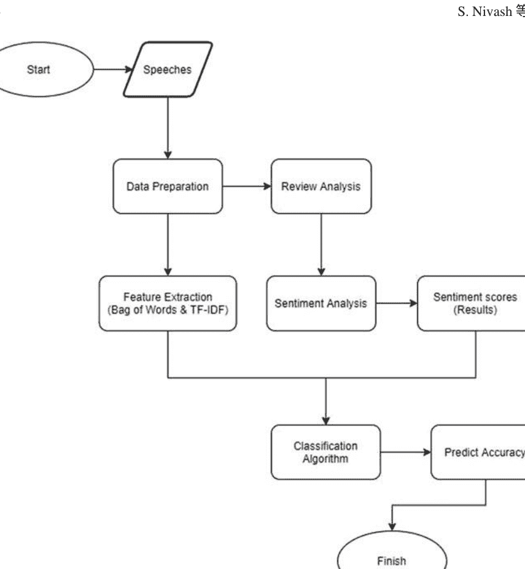

图1所提出方法的模块图

#### 5 科学原因

通过使用机器学习方法改进性能并创建高效的模型，对实时总统演讲数据进行情感分析，从而通过结合多个分类器来改善我们的机器学习结果。我们正在利用这种技术来减少差异的预测模型中。

不同的分类器，如随机森林、AdaBoost和朴素贝叶斯算法，被用于高效地减轻特征分类。在两个特征分类中，朴素贝叶斯可以进行多个特征分类。

随机森林树更合适。在这里，我们将尝试使用两种分类器进行实验，并比较效率以选择我们理想的模型。这些分类器有助于确定总统发表的演讲情感（积极和消极）。

图2情感分析中的自然语言处理方法

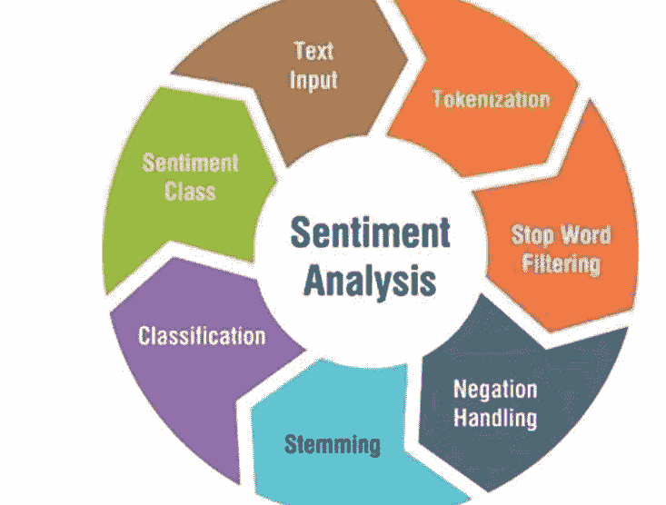

意见）。为了实现这个功能，我们首先使用NLTK库进行文本分类（积极和消极词汇），NLTK库是一个广泛使用的Python库。图2中的图表显示了情感分析中涉及的步骤。

##### 5.1 数据集

本项目选择的数据集来自Kaggle、维基百科和米勒中心的在线资源。总统的国情咨文和年度讯息数据集描述了总统从1970年到2019年的演讲。在对数据集中的不同演讲进行研究后，发现演讲的语气不同，每个演讲的长度也不同。对于这样的数据集，计算各种演讲的意见将是有趣的。一旦数据经过清洗和处理，使用自然语言处理技术。首先，应用情感分析来预测演讲中积极或消极情感的影响，然后使用分类器进行评估。使用词袋模型和TF-IDF来预测准确性。

#### 6 实验和方法

本部分将研究监督式机器学习算法，在本文中我们使用了这些算法。本文将使用三种机器学习算法：随机森林、朴素贝叶斯和AdaBoost。

- (i) 朴素贝叶斯:

在朴素贝叶斯中，所有的信息特征被认为是相互独立的。
贝叶斯定理是朴素贝叶斯分类器的基本概念。它们被称为独立贝叶斯或简单贝叶斯。例如，一个水果之所以被称为橙子，仅仅是因为它是圆形的、橙色的，直径为8厘米。分类器在预测之前独立地考虑圆形、颜色和大小等特征，然后将其预测为橙子。朴素贝叶斯被认为是简单、易于使用且适用于大型数据集的算法。

最简单的解决方案通常是最好的，朴素贝叶斯就是其中之一。尽管机器学习在最近几年取得了巨大的进展，但它不仅是基本的，而且还快速、准确和可靠。它已经被广泛应用于许多领域。

然而，它在自然语言处理（NLP）问题上表现出色。
朴素贝叶斯是一组概率算法，利用概率论和贝叶斯定理来预测书籍标签（如信息位或客户评论）。这些是概率的，意味着对于给定的内容估计每个标签的概率，然后选择具有最高概率的标签。它们如何获得这些概率是通过使用贝叶斯定理，该定理描述了基于与该特征相关的条件的主要数据的元素的可能性。

- (ii) 随机森林 :

随机森林是一种集成监督分类器，它生成多个或不同的决策树，并最终将它们组合起来以获得更稳定和准确的预测。对于训练数据，N个随机森林选择N个随机生成的数据进行适当的替代来进行训练。在生成了一些决策树之后，它进行预测并通过多数投票来找到最佳的预测结果。

- (iii) AdaBoost

AdaBoost是一种迭代算法，每个周期从一系列弱分类器中提取一个无能力的分类器，并根据其重要性分配权重。增强过程在实践中引起了许多专家的关注，以证明其出色的性能和相对免疫过拟合的特点。

#### 7 架构

项目的高级架构图如图1所示。

##### (a) 设计与实现

在这个项目中，数据集来自在线资源，如Miller和Wikisource，其中包含总统国情咨文和年度报告的URL链接。

###### A. 数据准备

数据集中有四个特征变量；如果数据不平衡，可以通过添加数据集来平衡。这也是数据清洗的阶段。我们使用一个名为“urllib request”的库来打开URL链接。Beautiful Soup是由Python 3.x支持的用于网络爬虫的库。它是一个用于读取和浏览URL内容的HTML/XML解析器。一旦我们获得内容，我们对段落进行分词并将其存储在语料库中。我们对语料库中的每个单词进行清洗、词干提取和词形还原/词元化，这是自然语言处理的步骤。我们使用一个名为“正则表达式”的库来替换和替换数据，以删除网络爬取时的不需要的单词。然后我们进行停用词移除。

###### B. 文本处理

文本处理是情感分析的主要步骤。它将文本转换为更易读的数据形式，以便机器学习算法能够更好地执行。使用NLTK Python库实现了自然语言处理技术。在这个项目中，我们使用了特定的自然语言处理技术。它们在下面进行了解释。

- (i) 分词 :

给定一个字符序列和一个定义好的文档单元，分词可以被定义为将其分解成片段，称为标记，同时丢弃某些字符，例如标点符号。这些标记通常被称为术语或单词，但是在时间上对类型-标记进行区分是至关重要的。我们使用NLTK库中的Punkt句子分词器。这个分词器将一个语料库分割成一个句子列表。使用单一算法来构建缩写词、搭配词和句子开头的词的模型。在使用之前，它必须在目标语言的大量特定内容上进行训练。NLTK数据包中包含了一个经过预处理的英文Punkt分词器。

- (ii) 停用词去除 :

为了改进模型并扩展处理时间，必须排除像“the”，“an”，“a”这样的停用词，这些词在过程中占用额外的内存空间。在自然语言处理中，去除停用词并不是一个严格的标准或快速规则。

这依赖于我们所处理的任务。对于像文本分类这样的任务，停用词会被排除或从给定的文本中排除，以便给那些定义文本意义的词。去除停用词可以减小数据集的大小，并进一步减少模型的训练时间。去除停用词可能有助于提高性能，因为剩下的仅仅是少量且有意义的标记。因此，它可以提高分类的准确性。事实上，像谷歌这样的搜索引擎会从数据库中快速且有效地检索信息时去除停用词。

- (iii) 词干提取:

出于句法原因，文档会使用不同类型的词语，例如，形式、弄清楚和编排。同样，还有一些词汇相关的词语组，具有相似的分支。词干提取和词形还原都旨在将有害结构和有时派生相关的词语减少到一个平均的基本结构。例如：am、are、is可以缩减为基本结构“be”。车辆、车辆、汽车、车辆的可以缩减为基本结构“车辆”。这个文本处理的结果将会是像孩子的车辆是不同的音调带来的：孩子的车辆是不同的音调。

然而，这两个词在意义上有所不同。词干提取通常指的是一种粗略的启发式方法，它会截断词的部分以达到精确的目标，并且经常包括派生附加部分的删除。用于英语词干提取的流行度量标准，在实验中取得了成功，由Porter的算法（Porter，1980）提供。总的估计量在这里过于冗长和复杂；然而，我们将展示它的一般性质。

波特的估计包含了词减少的五倍，逐渐应用。在每个阶段内，有各种选择规则的展示，例如确定从每个标准集合到最长后缀的规范。

- (iv) 词形还原 :

词形还原通常意味着使用语言和形态学分析适当地进行操作，通常旨在仅替换屈折词尾并恢复单词的基本形式或词根，这被称为词元。每当使用符号锯进行查找时，可能会恢复词干。同时，词形还原会尝试返回“看”或“锯”，具体取决于令牌的用途是作为动词还是名词。在派生术语中可以区分这两者，但词形还原通常发生在各种类型的词元屈折中。参考方法的另一个模块定期准备停止或进行词形还原，并且有几个商业和免费源领域。

###### C. 评论分析

在文本文件中收集了一系列积极和消极的词语，并将我们的分词与词语列表进行比较，并计算积极和消极词语的数量。每篇演讲都会有大量的积极和消极词语。正确分类具有积极或消极影响的演讲，需要确定积极和消极词语的数量。根据所有演讲中消极词语的整体使用情况，我们将尝试设定一个用于将其分类为消极影响演讲的消极词语阈值。

#### WordNet

WordNet是词汇数据库，例如英语的词汇参考，专门用于自然语言处理。Synset是一种在NLTK中可用于研究WordNet词语的独特简单接口。

Synset示例是表达相同概念的同义词的分组。一些词语只有一个Synset，而其他词语有几个。

###### D. 情感极性

在所有文本处理之后，需要找到评论数据的情感极性。为了确定数据集中正面和负面评论的数量，我们使用Python Vader库。如果需要，还可以进行进一步的词性标注，以提高准确性。VADER（Valence Aware Dictionary and Sentiment Reasoner）是一种基于词汇和规则的情感分析工具，特别适用于社交媒体中表达的情感。VADER利用情感词典，这是一个词汇特征（例如单词）的列表，通常根据它们的语义方向标记为正面或负面。VADER不仅告诉我们正面和负面得分，还告诉我们情感的积极程度。

###### E. 词袋模型

词袋模型（BoW）是一种计算方法，用于计算单词在文档中出现的频率。这是一个计数。这些词控制允许我们研究文档并量化它们的相似性，用于查询、文档分类和主题建模等应用。如果新的句子包含新词，那么我们的词汇量会增加，因此向量的长度也会增加。此外，向量还将包含大量的零值，从而导致稀疏矩阵（这是我们希望避免的）。我们对句子的语法或单词在文本中的顺序不持有任何信息。

###### F. TF-IDF

词频逆文档频率（TF-IDF）是通过文章中包含的单词来判断文章的另一种方法。单词的权重由TF-IDF确定 - TF-IDF评估与重复性不同。这意味着TF-IDF分数用于整个数据集的单词计数。首先，TF-IDF测量单词被记录的情况（即“术语频率”）。

但是由于诸如“和”或“the”之类的术语经常出现在所有记录中，因此它们必须受到有效限制。这是重复报告的反向部分。一个词出现的记录越多，该词对于任何存档的指示性就越不重要。

预计只留下常规和明确的单词作为标记。每个单词的TF-IDF相关性是一个标准化的信息位置，也表示一个。

词袋模型在记录（审计）中生成包含单词事件的许多向量，而TF-IDF模型则包含更重要的单词和较不重要的单词的数据。词袋向量很容易解读。然而，在大多数情况下，TF-IDF在人工智能模型中表现更好。

###### G. 分类

（1）一旦所有预处理工作完成，向量化的单词将被分为训练数据和测试数据。Python库可以通过Scikit learn实现。然后，使用朴素贝叶斯和随机森林分类器对拆分的数据进行模型训练。一旦使用训练数据集和测试数据集完成分类，然后比较每个分类器的准确性，最终选择最佳性能模型。绘制ROC曲线和精确率-召回率曲线。

在图3a中，列出了每位总统演讲的情感分数，用于计算准确性，图3b显示了总统演讲的总数。所有演讲中单词的使用情况表明，总统的50%演讲长度在4800到10000个单词之间，如图5所示，还可以看到一些异常值和极端数据。图7和图8支持图5，显示了每个政党的演讲数量与政党的关系（图4、5和6）。

图5给即将上任的总统提供了前任总统演讲中使用的平均单词数量的想法。图5显示了一位总统的最长和最短演讲，图6显示了单词的箱线图。

图4、5、6和8都是为了更好地理解和可视化总统演讲而存在的。

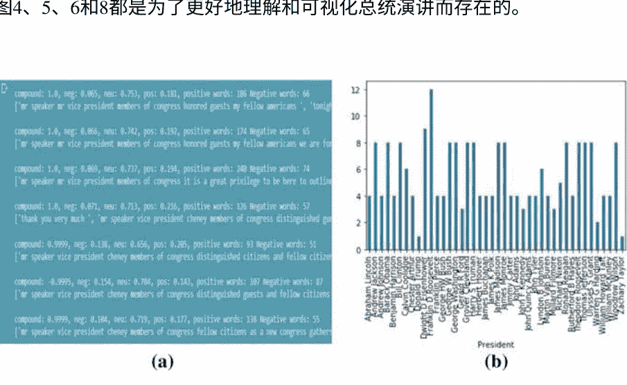

利用全球总统演讲的广泛分析...

图4每个政党的单词使用情况

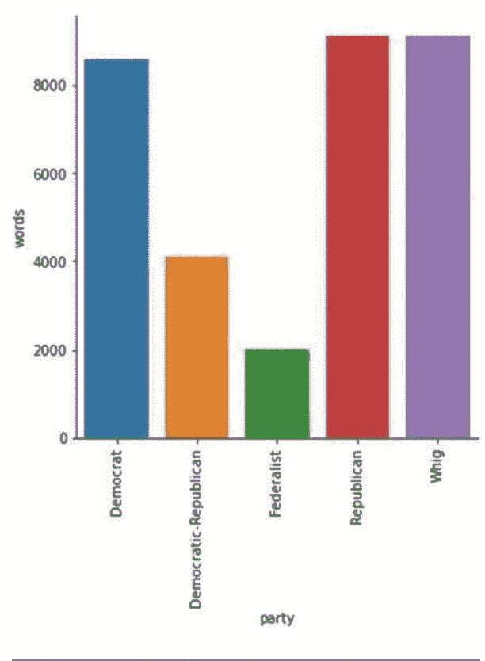

图5最长和最短演讲

| 字段 | 最短演讲 (Smallest Speech) | 最长演讲 (Longest Speech) |
| :--- | :--- | :--- |
| Average number of words per speech | 7949.532467532467 | |
| **Smallest Speech** | | **Longest Speech** |
| President | George Washington | Jimmy Carter |
| Date | January 8, 1790 | January 16, 1981 |
| Format | Spoken | Written |
| URL | https://en.wikisource.org/wiki/George_Washingt... | https://en.wikisource.org/wiki/Jimmy_Carter%22... |
| year | 1790 | 1981 |
| Sentiment | positive | negative |
| text | [i embrace with great satisfaction the opportu... | [to the congress of the united states the stat... |
| unique word ratio | 0.412785 | 0.121764 |
| unique words | 452 | 4097 |
| words | 1095 | 33647 |
| party | Federalist | Democrat |

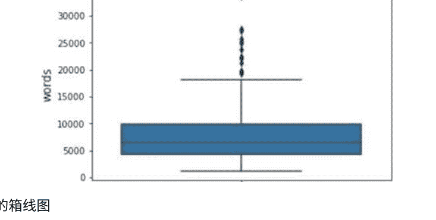

图6单词的箱线图

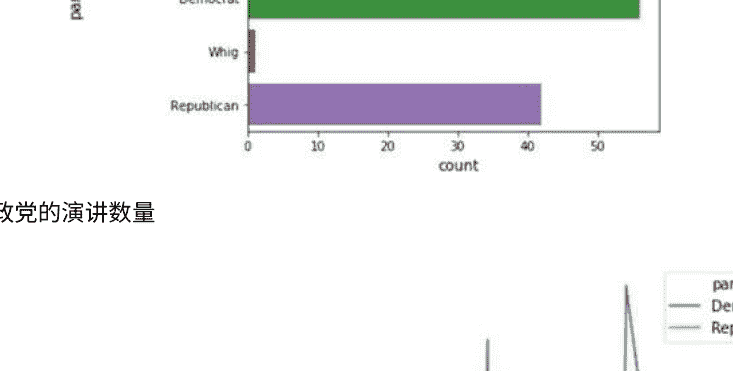

图7每个政党的演讲数量

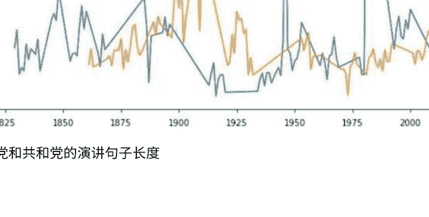

图8民主党和共和党的演讲句子长度

图9 ROC曲线—NB

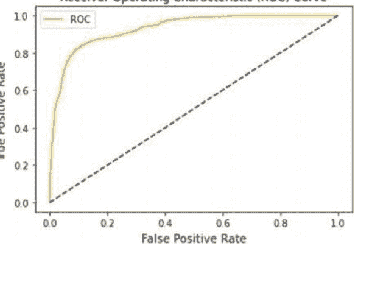

图10 精确率-召回率曲线—NB

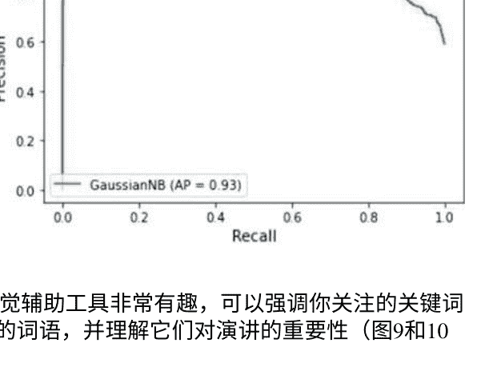

词云在博客文章中作为视觉辅助工具非常有趣，可以强调你关注的关键词。公众将看到更大、更强烈的词语，并理解它们对演讲的重要性（图9和10）。

此外，词云对于演讲者来说非常重要，以确保你在演讲中专注于正确的词语。图7比较了民主党和共和党的演讲句子长度。

在当前，我们正在经历信息过载（尽管这并不意味着更好或更深入的洞察力），公司可能收集了大量的客户反馈。然而，对于普通人来说，用这样的错误或偏见进行手动分析仍然具有挑战性。通常情况下，有着最好意图的公司最终陷入了经验真空。你知道你需要洞察力来指导你的决策。而且，你知道你在这方面存在不足。然而，你不知道如何最好地获取它们。

图3中的情感分析提供了对最重要问题的答案。由于情感分析可以自动化，可以基于它做出决策。

## 表1 分类器性能指标比较

| 性能指标 | 朴素贝叶斯 | 随机森林 | AdaBoost |
| :--- | :--- | :--- | :--- |
| 准确率 (%) | 86 | 94 | 90 |
| 精确度 | 0.86 | 0.95 | 0.91 |
| 召回率 | 0.87 | 0.95 | 0.90 |
| F-分数 | 0.86 | 0.95 | 0.90 |

基于大量信息而不是可理解的直觉。

图9、11和13显示了朴素贝叶斯、随机森林和AdaBoost分类器的接收器操作曲线（ROC）。实验结果显示在表1中。所有三个分类器的精确率-召回率曲线显示在图10、12和14中。表1中比较了准确率、精确率、召回率和F-分数等性能指标。随机森林的性能优于朴素贝叶斯和AdaBoost分类器，分别提高了8%和4%。

#### 8 结论

本研究提出了一个通用模型，该模型接收包含特定总统演讲的网页链接，并通过自动提取网页中的演讲内容将演讲内容存储在语料库中进行研究。目前，我们提出了一个基本框架来完成上述任务。该框架在虚构的数据集上表现良好。我们正在努力收集更大的数据集并扩展框架的适用性。朴素贝叶斯证明更加有效，并击败了随机森林和AdaBoost。

## 图12 精确度曲线-RF

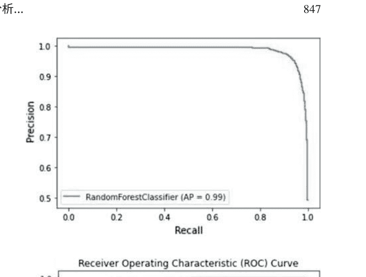

## 图13 ROC曲线—AdaBoost

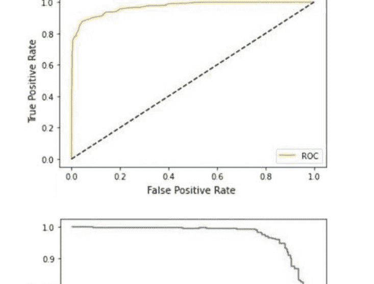

## 图14 精确度曲线—AdaBoost

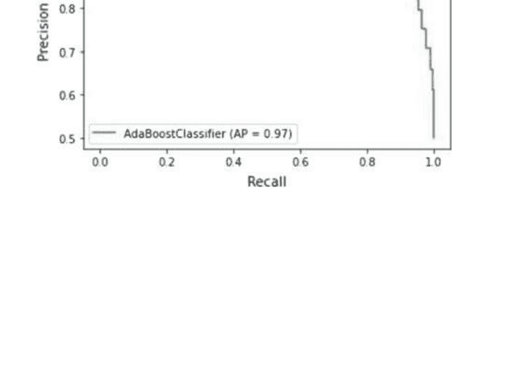

随机森林和AdaBoost都过拟合。在这些算法中过拟合是常见的。必须调整树的大小以减少过拟合。

过拟合是一种错误，当能力过于紧密地适应有限的信息集时出现。大多数过拟合模型似乎是为了解释模型过于复杂而检查的信息特征。

因此，对于自然语言处理，朴素贝叶斯是可取的，因为在朴素贝叶斯下，我们获得了86%的准确率，并且没有看到任何过拟合或欠拟合。相比之下，对于90%准确率的AdaBoost和94%准确率的随机森林，我们发现模型过拟合。此外，必须始终记住最简单的模型将产生最好的结果。尽管该框架在理解演讲数据中的演讲者情感方面非常准确，但它仍然存在一些缺陷。目前，该框架可能由两个演讲者讨论，并且在辩论中只能有一个演讲者发言。它无法理解两个人是否一直在交谈。未来的工作将解决这些困难，并使系统更加准确和多功能。当我们可以预测选举演讲的情感结果时，如果将相同的算法应用于总统辩论或现任总统的演讲，我们可以预测选举结果。

#### 参考文献

- 1. 庞, B., & 李, L. (2004). 情感教育: 基于最小割的主观性总结的情感分析. 在第42届ACL会议上(第271-278页).
- 2. 庞, B., & 李, L. (2005). 看星星: 利用类关系进行情感分类的评级尺度. 在第43届年会上的计算语言学协会会议(第115-124页). https://doi.org/10.3115/1219840.1219855
- 3. 庞, B., 李, L., & Vaithyanathan, S. (2002). 点赞? 情感分类使用机器学习技术. 在ACL-02会议上的ACL-02会议论文集(第10卷, 第79-86页). https://doi.org/10.3115/1118693.1118704
- 4. Shai kh, M., Prendinger, H., & Mitsuru, I. (2007). 通过语义依赖和上下文情感分析来评估文本情感.情感计算和智能交互,191-202页.
- 5. Walker, W., Lamere, P., Kwok, P., Raj, B., & Singh, R., Gouvea (2004). Sphinx-4: 一个灵活的开源语音识别框架. SMLI TR2004-0811 c 2004 SUN MICROSYSTEMS INC.
- 6. Hutto, C. J., & Gilbert, E. (2014). Vader: 一种简洁的基于规则的社交媒体文本情感分析模型. 发表于ICWSM 2014.
- 7. Yi, J., Nasukawa, T., Bunescu, R., & Niblack, W. (2003, November). Sentiment analyzer: 使用自然语言处理技术提取关于给定主题的情感. 在第三届IEEE国际数据挖掘会议, 2003年. ICDM 2003 (pp. 427–434). IEEE. https://doi.org/10.1109/ICDM.2003.1250949
- 8. Khurana1, D., Koli, A., Khatter, K., & Singh, S. (2017). 计算机科学与工程系（2017）自然语言处理：现状、当前趋势和挑战，出版物-319164243。
- 9. Alahmadi, A., Joorabchi, A., & Mahdi, A. E. (2014). 结合词袋和概念袋表示的阿拉伯文本分类. 在第25届爱尔兰信号与系统会议2014年和2014年中爱尔兰国际信息与通信技术会议（ISSC 2014/CIICT 2014）中. https://doi.org/10.1049/cp.2014.0711
- 10. Bafna, P., Pramod, D., & Vaidya, A. (2016). 文档聚类：TF-IDF方法。 在电气、电子和优化技术国际会议（ICEEOT）中。 https://doi.org/10.1109/ICEEOT.2016.7754750
- 11. Alrehili, A., & Albalawi, K. (2019). 使用集成方法对客户评论进行情感分析 . 在国际计算机与信息科学会议（ICCIS）中。 https://doi.org/10.1109/ICCISci.2019.8716454
- 12. Chaki, P. K., Hossain, I., Chanda, P. R., & Anirban, S. (2017). 情感分析的一个方面：带有双重情感词的情感名词分析. INSPEC访问号:18075945. https://doi.org/10.1109/CTCEEC.2017.8455159
- 13. Zhao, L. (2019). 基于情感分析的动态定价机制模型. 在智能交通、大数据和智能城市国际会议（ICITBS）中. https://doi.org/10.1109/ICITBS.2019.00155
- 14. Mahajan, D., & Chaudhary, D. K. (2018). 使用RNN和Google翻译进行情感分析。 在云计算、数据科学和工程的第8届国际会议上(Confluence)。 https://doi.org/10.1109/CONFLUENCE.2018.8442924
- 15. Zhang, X., Xie, G., Li, D., & Kang, R. (2018). 基于在线评论情感分析的可靠性评估。 在可靠性、可维护性和安全性的第12届国际会议上(ICRMS), 2018。 https://doi.org/10.1109/ICRMS.2018.00026
- 16. Liu, Z., Yang, N., & Cao, S. (2016). 对微视频的评论文本进行情感分析。 在计算机和通信的第2届IEEE国际会议上, 2016。 https://doi.org/10.1109/CompCom.2016.7924756
- 17. Pankaj, P. P., & Muskan, N. S. (2019). 客户反馈数据的情感分析：亚马逊产品评论。 在国际机器学习、大数据、云和并行计算会议（Com-IT-Con）中。 https://doi.org/10.1109/COMITCon.2019.8862258
- 18. Zheng, W., Xu, Z., Rao, Y., Xie, H., Wang, F. L., & Kwan, R. (2017). 使用情感上下文对短文本进行情感分类。 在行为、经济、社会文化计算国际会议中。 https://doi.org/10.1109/BESC.2017.8256405
- 19. Khatri, S. K., & Srivastava, A. (2016). 在股票市场投资预测中使用情感分析。 INSPEC访问号：16544223。 https://doi.org/10.1109/ICRITO.2016.7785019
- 20. Surya Prabha, P. M., & Subbulakshmi, B. (2019). 情感分析使用朴素贝叶斯分类器。 在国际会议上，关于通信和网络的新趋势（ViTECoN）。 https://doi.org/10.1109/ViTECoN.2019.8899618
- 21. Khatri, S. K., & Srivastava, A. (2016). 通过情感分析进行资本市场预测。 在第二届国际下一代计算技术会议（NGCT），2016。 https://doi.org/10.1109/NGCT.2016.7877381
- 22. Kisan, H. S., Kisan, H. A., & Suresh, A. P. (2016). 使用StandfordNLP库和软件作为服务（SaaS）的Twitter数据的集体智能和情感分析。 https://doi.org/10.1109/ICCIC.2016.7919697
- 23. Wen, B., Duan, S., Rao, B., & Dai, W. (2015). 基于传导学习的词情感分类研究。 在2015年第八届国际计算智能与设计研讨会（ISCID）2015年。 https://doi.org/10.1109/ISCID.2015.244
- 24. Liu, D., Quan C., Fujiren, P. (2008). 基于情感句子词典的情感和情感代理识别。 在2008年国际自然语言处理和知识工程会议上。 https://doi.org/10.1109/NLPKE.2008.4906802
- 25. Patil, A., Upadhyay, N. S., Bheda, K., & Sawant, R. (2019). 餐厅反馈分析系统使用情感分析和数据挖掘技术。 在国际当前趋势融合技术会议上（ICCTCT）（第21卷，第17号）。
- 26. Kavitha, G., Save, B., & Imtiaz, N. (2018). 通过对实时推特数据进行情感分析来发现公众意见。 在数字企业技术电路和系统国际会议(ICCSDET)上。 https://doi.org/10.1109/ICCSDET.2018.8821105
- 27. Arora, T. B. Saxena, S. (2017). 使用模糊和朴素贝叶斯进行情感分析。在计算方法学和通信国际会议(ICCMC)上。
- 28. Gigi, N., & Kaur, A. (2018). 通过社交媒体上的情感分析来预测选举。在第一届安全网络计算和通信国际会议(ICSCCC), 2018上。 https://doi.org/10.1109/ICSCCC.2018.8703347
- 29. Kuresan, H., Samiappan, D., Ghosh, S., & Gupta, A. (2021). 基于非运动症状的帕金森病早期诊断：描述性和因子分析。环境智能与人性化计算杂志。 1–15。 https://doi.org/10.1007/s12652-021-02944-0
- 30. Masunda, S. et al. (2019, January).在帕金森病诊断中融合WPT和MFCC特征提取(pp. 363–372)。

### 具有增强变形模块的照片逼真虚拟试穿

Antony Alisha, C. V Amaldev, D. A Aysha Dilna, Sebastian Subin, N. G Resmi和G Sreenu

**摘要** 基于图像的虚拟试穿系统专注于将服装项目虚拟转移到给定的人身上。在大多数方法中，目标图像上的服装转移涉及人体解析和姿势估计，生成变形的衣物，然后是修复模块。生成的输出取决于最终和中间阶段的属性。在我们的论文中，我们对不同现有阶段采用的方法进行了相对研究，以提出更好的解决方案。我们的研究参考了一种先进的试穿模型，名为自适应内容生成和保护网络（ACGPN）。ACGPN将参考服装转移到目标人物，并提供逼真的试穿结果，但在参考人物图像和服装图像之间存在较大差异时会失败，这是由于变形模块中的错误引起的。我们提出了一个改进的ACGPN模型，使用基于关键点的变形模块来改善结果。

**关键词** ACGPN · 姿势估计 · 人体解析 · 基于关键点的变形模块

#### 1 引言

在当今的疫情形势下，网上购物蓬勃发展，产品制造商和分销商纷纷采取各种方式来以最有利可图的方式营销和销售他们的产品。纺织品业主发现很难销售他们的物品，因为他们不愿意在没有试穿的情况下购买更多的衣服。虚拟试穿为客户提供了一种虚拟的服装体验，帮助他们想象面料如何适合他们。它将一件服装的图像转移到相应的人物图像的区域。由于其便利性和在线商店提供的大量选择，这已成为电子商务和时尚行业中更受欢迎的应用。它帮助最终用户在不同的服装中进行可视化，并使购物变得更加容易。如今人们对网络购物更感兴趣，虚拟试穿通过提供更个性化的体验来增强他们的购物体验。

然而，通过适当和高效地渲染人体上的3D服装模型，考虑到人体姿势和自我遮挡，生成逼真的照片是具有挑战性的。因此，与3D模型相比，2D服装模型更受青睐。2D服装模型使用生成对抗网络进行人体姿势评估和分析。特定的身体部位和身体部位的位置被识别出来，生成对抗网络（GAN）生成一个扭曲的服装图像，然后应用于图像。

在这项工作中，参考ACGPN模型[1]进行了研究。ACGPN的第一阶段是一个语义布局生成器，确定需要生成的参考人物的区域。在ACGPN中，通过空间变换网络（STN）生成扭曲图像，并应用薄板样条（TPS）变换。

由于仅基于语义生成模块（SGM）的输出，变形阶段可能会产生不正确的结果。在提出的方法中，使用关键点检测策略来有效地根据参考人物图像的预测关键点对布料图像进行变形。首先检测布料图像的关键点，并将其用于预测人物语义掩模上的关键点，然后使用关键点作为控制点，通过TPS变换器获得变形图像。

本文的其余部分组织如下：第2节通过文献调查总结了我们的研究结果，第3节详细解释了提出的系统，第4节包含了结果和讨论，第5节讨论了结论和未来的研究方向。

#### 2 文献综述

受图像合成的快速发展的启发，Zuo等人提出了一种名为ACGPN的虚拟试穿网络，以解决最近试穿网络中的问题。近年来，将目标服装转移到参考人物的基于图像的视觉测试引起了广泛关注。ACGPN预测输入图像的语义格式，决定其图像内容是否必须由计划的语义设计创建或保护，从而促进了逼真的试穿。主要包括三个模块：语义布局生成模块，利用参考轮廓的语义维度预测试穿后的理想语义格式；服装变形模块，根据生成的语义布局扭曲服装图像；内容融合模块，用于自适应和响应性地生成人体每个语义部分的所有信息融合。语义生成模块和内容融合模块中的所有生成器都具有相同的结构。与当前策略相比，ACGPN产生比其他方法更好的结果。非目标身体构成可以在试穿任务中以灵活的方式处理不同的场景。

葛玉英等人[2]提出了一种虚拟图像测试，用于将一件衣服的图像与一个人的图像匹配。该方法生成高度逼真的图像，无需手动分析。它将通过基于分析器的方法获得的伪造图像视为“教师知识”，可以通过考虑从真实人物图像中提取的实际“教师知识”进行纠正。

Davis等人[3]提出了一种无需使用3D数据的虚拟试穿网络（VITON）。VITON通过粗略策略将所需的服装转移到相应区域的人身上。衣服的外观在很大程度上取决于身体形状，因此如何转移目标模式元素取决于不同身体部位和身体形状的位置。该框架在同一姿势的同一人物上生成一个合成图像，该图像上覆盖着目标服装。它还通过一个细化网络改进了底层被遮挡的着装区域。该网络被设计为确定从目标服装中使用多少细节，并在个体上应用到合成图像中，以获得一个与目标物品通常呈现清晰视觉模式的合理图像。它使用人体解析器提取人脸和头发区域的RGB通道，在生成新图像时注入身份信息。

Rosin等人[4]提出了CP-VTON+（保持服装形状和纹理的VITON），在定性和定量上都比VITON表现更好。VITON对于单色连衣裙、短袖和正面姿势效果良好，但对于纹理丰富或长袖或多样化的人体姿势的情况则不适用。

在CP-VTON+中，首先纠正错误的时尚不可知人体表示，然后解决了变形网络中的问题。该模型可以生成高质量的图像，但无法生成复杂形状的结果。

Torr等人[5]提出了一种用于虚拟试穿任务的两阶段服装交互变换器（CIT），这是第一种使用变换器的方法。CIT可以模拟服装和输入人物图像之间的交互关系，这是目前绝大多数技术所忽视的。第一阶段使用基于变换器的匹配块，通过交叉模块变换器编码器可以展示全球连接。因此，变形后的服装更加合适和自然。它还可以更准确地适应人的姿势和形状。第二阶段使用基于变换器的推理块，在输入数据中建立相互交互依赖，以加强重要区域。

Choi等人[6]提出了一种名为VITON-HD的方法，成功合成了1024 × 768的虚拟试穿图像，克服了由于衣物变形和人体之间的错位而导致合成图像分辨率低的限制。它还可以生成高质量的身体部位，并保持衣物的纹理清晰度。不考虑服装的人体表示使用人体的姿势图和分割图来消除输入图像中的服装信息。然后，将衣服图像变形对齐到输入的人体上。在变形衣服图像之后，对齐感知分割(ALIAS)归一化去除误导区域中的误导信息。然后，ALIAS生成器通过使用服装纹理填充错位区域来保持服装细节。

Neuberger等人[7]引入了一种名为O-VITON的服装试穿系统，使客户能够选择多种服装，将其合成成一个实际的外观。训练阶段需要大量不带3D数据的穿着不同服装的人的单张图片。它将不同服装的图片组合成一个连贯的外观。它从多张穿着衣服的人体模型图片中组合出一个完整的外观，并将其适应查询个体的身体形状和姿势。该算法通过迭代调整合成图像来准确地融合细节服装特征，如纹理、标志和绣花。

于等人[8]提出了一种名为VTNFP的虚拟试穿网络，它根据一个穿着衣物的人的照片和目标服装的图片来生成逼真的图像。VTNFP遵循一个三阶段的计划过程，首先生成扭曲的服装，然后生成穿着目标服装的个体的身体分割图，最后通过试穿合成模块将所有数据组合成最后的图片。VTNFP的一个重要进展是身体分割图预测模块，它提供了处理身体部位和服装交叉的图像融合区域的基本数据，对于防止模糊图像和保留服装和身体部位细节非常有益。

拉吉等人[9]引入了一种交换网络，这是一个通过人的图像在任何位置、形状或服装上传递衣物的框架。衣物信息在描述一个人在任何位置或形状的两个图像之间传递，这需要共同确定人体的姿势、形状和服装。由于很难获得显示不同身体上相同服装的图像对，该方法通过扩展数据从同一图像生成训练对。

最新的服装提取和转移方法涉及人体的三维重建和预定组织模型参数的估计。

Mir等人[10]提出了一种将服装图片的纹理（前面和后面）切换到顶部SMPL（皮肤多人线性模型）上的3D服装的方法，实时进行。使用自定义的非弯曲的3D到2D注册方法计算配对的图片与对齐的3D服装。使用这些配对图片，从服装图像轮廓到3D服装表面的2D-UV映射进行密集对应的分析，完全忽略纹理，这有助于推广到大量的网络图片。

Toshev等人[11]提到了一种基于深度神经网络的人体姿势评估策略。姿势评估被形成为基于DNN的关节回归问题。DeepPose通过一系列回归器改进粗略姿势以提高评估效果。当DeepPose中的关节被回归器预测时，图像会围绕该关节进行裁剪，以解决下一步的问题。这使得后续的回归器能够学习更好的特征，以获得更好的精度，因为更高分辨率的图像能够提供更准确的指导。

Simon等人[12]提出了一种使用部分亲和力场（PAFs）连接人体部位的方法。这主要用于实现自下而上的多人姿势估计模型。该模型识别了在图像中找到涉及多个人的个体身体关节的困难，它们之间的相互作用，每个个体的不规则尺度等。使用部分置信度图，确定每个关节，并由PAF确定身体部位的位置和方向。Li等人[13]提出了一种称为自我校正的人体解析方法（SC HP）。从一个准备有错误解释的模型开始，一个持续学习的调度程序通过在线方式迭代地将当前学习的模型与先前的理想模型累积起来，从而产生更可靠的伪掩码。Lu等人[14]建议使用解析R-CNN进行实例级人体分析，考虑到人体部分划分、姿势评估、人体-物体连接等不同情况和外观。模型需要在图像中识别各种各样的人类场景，并学习丰富的特征来解决每种情况的细节。解析R-CNN非常灵活高效，适用于人类事件分析中的许多问题。

Girshick等人[15]提出了一个灵活的目标实例分割框架。这种方法称为Mask R-CNN，通过检测图像中的对象为每个实例生成一个分割掩码。它在当前分支的基础上添加了一个分支，用于预测对象掩码，以并行识别边界框。Mask R-CNN是faster R-CNN的扩展。对于每个感兴趣区域（RoI），mask R-CNN输出一个二进制图。表1展示了文献调研中的比较。

#### 3 基于增强变形的逼真虚拟试穿模块

##### 3.1 架构概述

图1展示了提出的增强版ACGPN模型的架构。

ACGPN模型包括四个模块，分别是语义布局生成器、服装变形模块、非目标身体部分组合和内容融合模块。类似地，这里讨论的方法包含四个模块，并对变形模块进行了修改以提高结果。提出系统的变形模块使用服装上的关键点以及预测的身体部分掩码来获取变形后的服装图像。

### 表1 文献调查总结

| 方法 | 任务 | 数据集 | 准确性 |
|------|------|--------|--------|
| ACGPN [1] | 虚拟试穿 | VITON | 78.3 |
| PF-AFN [2] | 虚拟试穿 | VITON | 64.27 |
| VITON [3] | 虚拟试穿 | VITON | 77.2 |
| CP-VTON + [4] | 虚拟试穿 | CP-VTON + | 84.25 |
| CIT [5] | 虚拟试穿 | VITON | 84.5 |
| VITON-HD [6] | 虚拟试穿 | VITON | 84.4 |
| Outfit-VITON [7] | 虚拟试穿 | O-VITON | 76 |
| VTNFP [8] | 虚拟试穿 | VITON | 67.87 |
| Swapnet [9] | 虚拟试穿 | FASHION IQ | 83 |
| PIX2SURF [10] | 虚拟试穿 | VITON | 66 |
| Deeppose [11] | 姿势估计 | FLIC | 69 |
| PAF [12] | 姿势估计 | COCO | 70.7 |
| SCHP [13] | 分割 | LIP | 59.36 |
| 解析 R-CNN [14] | 分割 | COCO | 64.1 |
| 掩膜 R-CNN [15] | 分割 | COCO | 71.4 |

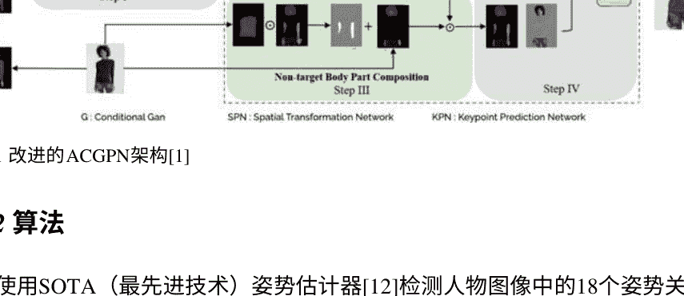

### 图1 改进的ACGPN架构[1]

##### 3.2 算法

- 1. 使用SOTA（最先进技术）姿势估计器[12]检测人物图像中的18个姿势关键点。
- 2. 使用SCHP [13]模型获取解析结果。重新分配标签以获得14个类别标签。手臂和躯干区域融合在一起。
- 3. 使用Retinanet目标检测来检测衣物类型和Mask R-CNN来检测关键点。
- 4. 将步骤1和步骤2的输出传递给语义布局生成器。它包含两个条件GANs—G1预测目标身体部位的掩码和G2预测目标衣物的掩码[1]。
- 5. 将步骤3的输出和步骤4的目标身体掩码传递给KPN（核预测网络）模块，以预测身体掩码中的关键点。
- 6. 将步骤5的输出和衣物图像传递给变形模块，以获得变形后的衣物图像。
- 7. 将变形后的衣物图像传递给CFM（内容融合模块），该模块与ACGPN [1]方法中的模块相同，用于生成试穿结果。

##### 3.3 姿势估计器和解析器

人物图像表示为姿势图、分割掩码和衣物图像，它们一起构成了语义布局生成器的输入。先前的姿势估计器Openpose [12]被用于以Json格式生成姿势图。该方法在身体中检测到18个关键点，是大多数试穿任务中常用的姿势估计器。使用先进的人体解析器[13]的内容融合模块用于获取参考图像的服装分割。在LIP数据集上训练的“自我校正人体解析”算法预测参考图像的20个类标签。将不重要的类标签重新分配，将其转换为14通道表示。将手臂和躯干区域融合在一起，形成语义布局生成器的输入。

##### 3.4 语义布局生成器

我们方法中使用的语义布局生成器与原始的ACGPN论文中的生成器类似。语义布局生成器采用两阶段策略。在第一阶段，解析器生成器GAN G1根据融合的解析图、姿势热图和服装图像生成目标身体掩码。在第二阶段，姿势图、目标掩码和服装图像结合起来，通过GAN G2生成合成的服装掩码。在SGM的两个阶段都使用了条件GAN。所使用的损失函数与原始ACGPN论文中采用的类似。

##### 3.5 增强变形模块

增强变形模块是该方法的一个关键特性。变形模块旨在根据姿势引起的变形将服装适配到目标身体上，同时保留服装中的纹理和文本。ACGPN的变形模块与VITON [3]和CP-VTON [16]中的模块类似，但是几何匹配是通过网络上的二阶差分约束获得的。ACGPN的变形模块接收SGM生成的服装掩码和目标服装图像，并在STN [18]之后应用TPS [17]变换生成变形后的服装图像。变形后的图像通过STN中学习的参数和二阶差分约束进行变换。

由于复杂的姿势和衣物的性质，扭曲的图像可能包含伪影。这主要是因为扭曲模块完全基于SGM生成的衣物掩模。

在这里，使用了一个扭曲模块，不仅考虑了生成的掩模，还考虑了参考人物和衣物图像上的预测关键点。该方法使用了一种最先进的关键点检测器[15]来检测身体上的关键点。在Deepfashion 2 [19]数据集上训练的掩模R-CNN网络检测身体上的关键点。

##### 3.6 关键点检测

在我们的工作中，考虑了3种类型的衣物：长袖、短袖和背心。使用Retinanet目标检测来检测这3种类型的衣物。为了检测图像中的关键点，使用了掩模R-CNN网络。在DeepFashion2 [19]数据集中，短袖上有25个关键点，长袖上有33个关键点，背心上有15个关键点。检测到的关键点用于预测参考人物图像的关键点，并在TPS网络中找到参数。

##### 3.7 关键点预测网络 (KPN)

KP-VTON [20]中提出的方法用于预测由SGM生成的分割掩模中的关键点。关键点预测网络由一系列卷积层组成，用作特征提取器。网络预测由SGM生成的语义掩模的256个参数。从目标服装的关键点提取特征的特征提取器是一个全连接层，其输出大小为256 [20]。两个分支的乘积通过一个全连接层，分别预测长袖上衣、短袖上衣和背心的66、50和30个关键点。目标布料的变形由在分割掩模上预测的关键点与目标布料图像上的关键点之间的匹配来执行变形。变形是通过使用两种算法TPS和IMLS（使用最小二乘法进行图像变形）[21]来执行的。每种类型图像的变形控制点如下所示：

- 短袖为{2至7，12至20，25}
- 长袖为{2至7，16至24，33}
- 背心为{2至15}

对于与手部区域相关的关键点的扭曲，应用IMLS [9]算法。

- 短袖为{8至11，21至24}
- 长袖为{8至15，25至32}

##### 3.8 内容融合模块（CFM）

这里使用的最终试穿模块类似于ACGPN的内容融合模块。它由两个模块组成，即非目标身体部分组合模块和掩膜修复模块。在非目标身体部分组合模块中，采用参考人员的服装区域掩膜与语义布局相结合，得到需要生成的区域的掩膜。将结果与剩余掩膜和目标服装掩膜的补集相结合，得到目标图像的语义布局。从原始用户图像中，通过与补充的服装掩膜相结合，得到要保留的区域。修复模块使用条件GAN生成逼真的试穿结果。将扭曲的服装图像、组合掩膜和保留的身体区域作为输入，通过GAN G3获得目标图像。使用条件GAN将给定的输入融合和修复到目标图像中。

#### 4 结果和讨论

在我们的方法中，使用了一个预训练的开放姿势模型进行姿势估计，并且该模型是在COCO数据集上进行训练的，可以检测出身体的18个关键点。图2显示了开放姿势检测到的参考人物图像的关键点。

对于人体解析，我们采用了之前讨论过的“自我校正人体解析”方法来获得结果，并且还参考了官方的github仓库以获取实现细节。我们使用在LIP数据集上预训练的schp模型来获得解析结果。对类别标签进行重新分配，将其转换为14个类别标签以适应我们的应用。图3展示了原始SCHP方法和在我们系统中重新分配为14个类别标签后的分割掩码。

在本文中，使用了KP-VTON论文中提出的变形模块，并对关键点检测进行了修改。KP-VTON使用CPN [22]进行关键点检测。为此使用了Mask R-CNN。为了进行比较研究，使用了该论文中展示的图像数据集，并进行了变形。

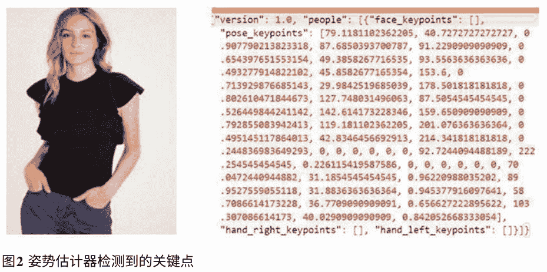

图2 姿势估计器检测到的关键点

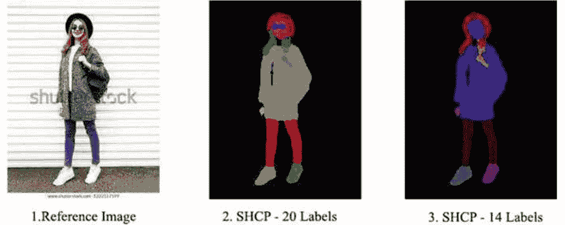

图3 SCHP获得的结果

使用ACGPN的变形模块并观察到KP-VTON获得了更好的结果。图4展示了ACGPN和KP-VTON的变形模块获得的结果，显示了后者方法的优越性。 ACGPN在对相同类型的衣服进行变形时表现良好，即将短袖放在短袖上，但是在将长袖连衣裙放在短袖上时，变形模块会产生更多的伪影。 对于修复，ACGPN的方法更加优越，因此选择了相同的方法用于提出的系统。

整个网络在VITON数据集上进行训练。 该数据集包含16,253对人物和服装图像。 该数据集被分为11,380用于训练和4873用于测试。 使用SOTA姿势估计器和解析器获取姿势图和分割掩模，如上所述。 Retinanet目标检测器检测到服装类型，Mask R-CNN预测关键点。 这些模型是在Deepfashion2数据集上训练的，因为VITON不提供服装图像的关键点。 KPN模块训练了20个时期，变形模块训练了20个时期。 训练设置的批量大小为8。 训练在Google Colab上进行。

| Reference Cloth |  |  |  |  |  |  |
| :--- | :--- | :--- | :--- | :--- | :--- | :--- |
| Target Person |  |  |  |  |  |  |
| Warping by KP_VITON |  |  |  |  |  |  |
| Warping by ACGPN |  |  |  |  |  |  |

图4 ACGPN和KP-VITON的扭曲结果比较

由于GPU限制，训练过程的预计时间为16天。因此，获得最终模型的训练阶段正在进行中，迄今为止的实验和研究表明最终结果将优于原始的ACGPN方法。

#### 5 结论和未来展望

本文介绍了一种虚拟试穿网络，可以将服装图像虚拟转移到目标人物的图像上。这是ACGPN方法的改进，改变了扭曲模块。所提出方法的扭曲流程包括检测衣物的关键点，然后使用KPN网络，最后应用TPS变换来获得扭曲的衣物图像。

所提出的架构将在各种基准测试中取得出色的结果。实际实施工作正在展开阶段。这种项目面临的主要挑战是由于不合适而导致的退货，给电子商务企业带来巨大损失。如果顾客不得不再次等待几天，这也会成为令人失望的经历。在线购物不仅涉及尺码问题，还涉及服装的实际效果、垂感和外观等问题。

#### 参考文献

1. 韩, Y., 张, R., 郭, X., 刘, W., 左, W., & 罗, P. (2020年)。通过自适应生成$\leftrightarrow$保留图像内容实现逼真的虚拟试穿。在计算机视觉和模式识别的IEEE会议上。
2. 葛, Y., 宋, Y., 张, R., 葛, C., 刘, W., & 罗, P. (2021年)。无需解析器的虚拟试穿通过提取外观流。CVPR。
3. 韩, X., 吴, Z., 吴, Z., 于, R., & 戴维斯, L. S. (2018年)。VITON: 基于图像的虚拟试穿网络。在计算机视觉和模式识别的IEEE会议上。
4. Minar, M. R., Tuan, T. T., Ahn, H., Rosin, P. L., & 赖, Y. K. (2020年)。CP-VTON+: 保留服装形状和纹理的基于图像的虚拟试穿。在计算机视觉和模式识别的IEEE会议上。
5. Ren, R., Tang, H., Meng, F., Ding, R., Shao, L., Torr, P. H. S., & Sebe, N. (2021). 布料交互式变压器虚拟试穿。arXiv预印本arXiv:2104.05519。
6. Choi, S., Park, S., Lee, M., & Choo, J. (2021). VITON-HD: 高分辨率虚拟试穿通过误对齐感知归一化。在CVPR中。
7. Neuberger, A., Borenstein, E., Hilleli, B., Oks, E., & Alpert, S. (2020). 基于图像的虚拟试穿网络来自非配对数据。在CVPR中。
8. Yu, R., Wang, X., & Xie, X. (2019). VTNFP: 一种基于图像的虚拟试穿网络，具有身体和服装特征保护。在ICCV计算机视觉基金会中。
9. Raj, A., Sangkloy, P., Chang, H., Hays, J., Ceylan, D., & Lu, J. (2018).SwapNet: 基于图像的服装转移。ECCV计算机视觉基金会。
10. Mir, A., Alldieck, T., Pons-Moll, G. (2020). 学习从服装图像到3D人体的纹理转移。在CVPR中。
11. Toshev, A., & Szegedy, C. (2014). Deep pose: 通过深度神经网络进行人体姿势估计。在IEEE计算机视觉和模式识别会议中。
12. Cao, Z., Simon, T., Wei, X. E., & Sheikh, Y. (2017). 实时多人2D姿势估计使用部分亲和场。在IEEE计算机视觉和模式识别会议中。
13. Li, P., Xu, Y., Wei1, Y., & Yang, Y. (2019). 自我纠正的人体解析。在IEEE计算机视觉和模式识别会议中。
14. 杨, L., 宋, Q., 王, Z., & 江, M. (2019年)。解析R-CNN用于实例级人类分析。在计算机视觉和模式识别的IEEE会议上。
15. 何, K., Gkioxari, G., Dollar, P., & Girshick, R (2017年)。Mask R-CNN。在国际计算机视觉会议上。
16. 王, B., 郑, H., 梁, X., 陈, Y., 林, L., & 杨, M. (2018年)。朝特征-保留基于图像的虚拟试穿网络。ECCV。
17. Duchon, J. (1977年)。在Sobolev空间中最小化旋转不变半范数的样条。多变量函数的构造性理论。
18. Jaderberg, M., Simonyan, K., & Zisserman, A. (2015年)。空间变换网络。神经信息处理系统的进展。
19. Ge, Y., Zhang, R., Wang, X., & Luo, P. (2019). Deep fashion 2: 服装图像的检测、姿态估计、分割和再识别的多功能基准。在计算机视觉和模式识别的IEEE会议记录中(pp. 5337-5344)。
20. Pham, D. L., Nguyen, N. T., & Chung S. T. (2020). 基于关键点的2D虚拟试穿网络系统。韩国多媒体学会杂志。
21. Schaefer, S., McPhail, T., & Warren, J. (2006). 使用移动最小二乘法进行图像变形。ACM图形学交易, 25(3), 533-540。
22. Chen, Y., Wang, Z., Peng, Y., Zhang, Z., Yu, G., & Sun, J. (2018). 级联金字塔网络用于多人姿态估计。在计算机视觉和模式识别的IEEE会议记录中。

### 使用正弦余弦算法进行卷积神经网络超参数优化

Nebojsa Bacanin, Miodrag Zivkovic, Mohamed Salb, Ivana Strumberger和Amit Chhabra

摘要在机器学习领域中，最具挑战性的任务是优化卷积神经网络中的超参数。这个任务代表了NP困难问题，因此不可能在可接受的时间内通过应用标准确定性方法来解决它。此外，卷积神经网络的超参数必须针对每个特定问题进行优化，因为没有适用于所有可能应用的解决方案。群体智能元启发式已被证明是高效的优化器，本文提出了增强的正弦余弦算法来解决超参数优化任务。本研究中进行的实验使用了CIFAR-10基准数据集。实验结果经过分析和验证，与其他经过验证的元启发式方法相比，可以得出结论，所提出的增强正弦余弦方法在本研究中表现优于其他方法。

关键词 机器学习 · 群体智能 · NP难度 · 卷积神经网络 · 神经进化 · 正弦和余弦算法 · 优化

#### 1 引言

机器学习或 ML 是指从一个特定任务中学习并提升性能的计算机系统和程序，在没有额外编程的情况下。机器学习依赖人类参与学习（需要带有标签的数据集），因此机器学习可以理解输入数据之间的变化，也被称为监督学习。另一个重要领域是深度学习，它是机器学习更广泛领域的一个子集，也可以使用带有数据集的标签来指导系统，但它并不总是需要一个带有标签的数据集来训练自己和进化，因为深度学习可以使用无监督学习。深度学习算法需要更多的数据来提高准确性，而机器学习算法由于底层数据结构的原因使用较少的数据。

深度学习由几个“层”基本处理单元组成，这些单元连接在一起形成一个网络，使系统的输入依次传输到每个单元中，就像人脑一样，人脑是已知的最复杂、非线性和并行的系统，能够比任何计算机更快地执行任务，如识别不同的模式、意识和控制运动。此外，学习能力、记忆和泛化能力等其他特征，对于基于生物学启发的复合神经系统的算法模型的发展也起到了推动作用，这些模型也被称为人工神经网络（ANNs）[24]。

在过去的二十年中，人工神经网络经常被应用于各个领域，包括分类、预测问题、回归、模式识别、信号处理和机器人技术。基于输入数据，人工神经网络必须计算网络中每个节点的最佳权重和偏差，这被称为训练过程，以便生成准确的输出数据。因此，人工神经网络的训练过程对网络性能有很大影响。但是，仅仅使用人工神经网络是不够的，因为人工神经网络可能包含解决复杂问题所需的大量参数。可以通过利用卷积神经网络（CNNs）来解决这个问题，CNNs可以减少人工神经网络中的参数数量。

卷积神经网络，也被称为（CNNs或ConvNets），是深度学习模型的一个子集，已经被广泛应用于解决各种不同的数字图像处理任务，并在这方面表现出色。CNNs有许多用途，如图像识别，图像分类，人脸识别，眼动分析，检测不同的异常，发现隐藏的药物，自然语言处理，评估潜在的健康危害和年龄生物标志物，物体跟踪等等应用[19-22]。

尽管这个领域的工作最初是几十年前开始的，但CNNs最近已经成为一个非常流行的领域。一切都始于1959年，当时Hubel和Wiesel [12]发表了他们的工作，这是这个领域最重要的出版物之一。他们进行了各种研究，以更好地理解视觉皮层中的神经元如何工作。他们的实验揭示了大脑的主要视觉皮层以层次结构组织，由基本和复合神经元组合而成，视觉处理始终从观察环境中的基本结构开始，如定向边缘，并且复杂的高阶神经元接收来自较低层次的基本神经元的输入。

在1980年左右的十年时间里，一位名叫福岛的研究者创建了新认知机[11]，这是第一个实用的人工神经网络模型。这个新认知机与Hubel和Wiesel揭示的那个有着相同核心逻辑结构的简单和复合细胞一样。福岛构建了不同层次的简单细胞（称为S细胞）和复杂细胞（称为C细胞）的层次结构，这些细胞具有与大脑视觉皮层中的细胞类似的特性。简单细胞具有可调参数，而复杂细胞在其上方执行汇聚操作。几年后，1989年，LeCun将反向传播机制应用于新认知机，在邮政编码上实现了1%的错误率和9%的拒绝率[16]。

十年后，通过使用基于误差梯度的学习算法，LeCun进一步改进了模型。因此，LeCun方法成为现代计算机视觉的基础。

Alex Krizhevsky在2012年提出了第一个深度卷积网络，被称为AlexNet [15]。它取得了显著的性能，这一成功彻底改变了计算机视觉领域。图形处理单元（GPUs）、ReLU激活函数、数据增强和dropout正则化技术等技术的使用也是AlexNet成功的原因之一。构建卷积神经网络涉及许多与数据无关的配置，必须由机器学习专家手动调整。超参数是网络配置和训练的卷积神经网络中的因素。超参数优化问题通常包括确定一系列超参数范围，在相当长的时间内产生准确的模型。然后，最佳手动配置输出被建模并应用于卷积神经网络。即使如此，不同的数据集实际上需要不同的模型或超参数组合，这可能耗时且令人不愉快。

对于CNN来说，最大的挑战之一是为特定问题定义一个合适的网络结构，需要调整超参数以提高解决方案的准确性。这个特定任务非常耗时，需要大量的工作和当然是这个领域的专家。由于解决方案的搜索空间太大，不可能在多项式时间内尝试所有可能的解决方案，所以这个问题被认为是NP难问题，不能使用常规算法来解决。可以利用元启发式算法如群智能算法来应对NP难问题，并获得一个可能不是精确的解，但足够接近期望结果的解。

##### 1.1 优化卷积神经网络的超参数

卷积神经网络就像任何自然网络一样，包含多个层次，以帮助CNN在训练过程中获得最佳的准确性。 这些层次的定义如下：卷积层、池化层和全连接层。

网络中的第一层接收输入的图像，并通过使用滤波器进行卷积，然后对输出应用激活函数。 通过使用这种模式，图像中的低级特征被去除，而该层的输出结果作为后续层的输入，每个后续层提取更复杂的高级特征。 然后，池化层用于下采样，可以是最大池化或平均池化。 最后，CNN结构包含一个或多个扁平化的稠密层，最后一层的任务是对图像进行分类。 在网络训练的权重学习过程中，已经在最近的文献中提出了许多优化器，包括随机梯度下降、adagrad、rmsprop、adadelta、adamax、momentum和Adam [10, 34]，以优化损失函数。

如果训练和测试的准确率差异显著，CNN将无法预测任何新的输入，这种情况被称为过拟合，可以通过使用不同的正则化技术来避免，例如L1和L2正则化方法、drop connect、批归一化、dropout、数据增强和提前停止。

激活函数在卷积输出上执行，用于将输入集映射到非线性输出。 Sigmoid、tanh和修正线性单元（ReLU）是最常用的三种传递函数。 传递函数选择的最常见选择是ReLU，可以用数学符号表示为 $f(x) = \max(x, 0)$。

以下描述了卷积层的执行和应用激活函数的过程：

$$z_{i,j,k}^{[l]} = a(w_k^{[l]} x_{i,j}^{[l]} + b_k^{[l]})$$  (1)

其中，$z_{i,j,k}^{[l]}$表示激活图，$w_k$是第k个滤波器，$x_{i,j}$表示位置为$i, j$的输入，偏置项由$b$表示。上标$l$表示第$l$层，最后，激活函数表示为$a(.)$构建CNNs需要适当的结构，而这个结构又需要适当的变量，即超参数。这些超参数包括每个卷积层中的卷积层数量和卷积核数量，每个卷积层中的卷积核大小，每个卷积层后的池化大小（如果存在池化），稠密层的数量，激活函数，神经元数量，连接模式，dropout率，权重正则化，学习率，批量大小和学习规则。由于没有确定给定问题的最佳网络结构的通用法则，因此需要建立一个新的设计来每个特定问题和这个问题被现代出版物识别为超参数优化任务。

许多研究人员尝试创建一个系统，可以使用元启发式方法生成、训练和验证各种卷积神经网络结构，以获得最适合特定角色的结构[31]。这导致了神经进化[5]，这是一种使用元启发式算法自动找到适合给定任务的正确卷积神经网络结构的方法。

##### 1.2 目标

本文研究的目标是使用增强的正弦余弦算法（SCA）来提升卷积神经网络的自动学习过程，包括高效的架构结构和最佳的超参数组合，而无需人工干预。当手动完成此过程时，非常耗时，必须针对每个特定问题实例进行，因为没有通用解决方案，并且最终主要基于试验和错误。

##### 1.3 论文结构

本文的其余部分按照以下顺序组织。第2节深入探讨了近期计算机科学领域中存在的卷积神经网络相关工作以及群体智能方法的简要概述，之后介绍了实际实现，第3节系统地描述了提出的方法。第4节解释了进行的研究并提供了实验结果。最后，第5节得出结论并提出了未来的研究。

#### 2 卷积神经网络和相关工作概述

卷积神经网络在高度挑战性的学习过程中表现出了异常的性能。卷积神经网络在处理各种类型的信号和时间序列以及图像、音频和视频处理方面特别有效。实现有效的信号预处理和特征选择系统以生成足够的结构来应对分类挑战是解决这些问题的基本部分。毕竟，由于其自动提取有用特征的能力，卷积神经网络取得了很好的结果在许多应用程序中，预处理是多余的，在以前是分类任务的必要和必需的一部分。

元启发式算法从随机解开始训练循环，并随着时间的推移改进解以最小化错误。这种算法的好处是它们非常有效地避免了局部优化。在人工神经网络的训练阶段，使用了元启发式算法，并提出这些算法在问题更复杂和多维的情况下优于基于梯度的算法。模拟以群体形式智能行动的生物被称为群体智能。群体智能算法是解决许多NP难问题的最常见的元启发式算法。多年来，全球的研究人员开发了许多群体智能算法，其中一些最著名的代表包括蚁群优化（ACO）[9]，粒子群优化（PSO）[14]，人工蜂群（ABC）[13]和蝙蝠算法（BA）[33]。群体智能方法被用于解决各种应用领域的不同问题，包括云计算[3, 6, 8]，无线传感器网络[4, 35, 37, 39]，预测COVID-19病例数量[36, 38]，机器学习[17]，脑肿瘤MRI图像分类[7]和全局优化问题[27]。

这些群体智能算法已成功应用于解决卷积神经网络超参数问题，例如使用最近的树生长方法来优化超参数[25]。所提出的框架在MNIST数据集上进行了鲁棒性、性能和解决方案质量的测试。与其他算法的比较表明，建议的结构在这个领域表现出了可观的结果。

使用萤火虫算法构建卷积神经网络的架构[26]。本文介绍的研究涉及卷积神经网络超参数的优化，这些超参数确定了网络的架构和结构。本文利用MNIST数据集验证了所提出架构的质量、鲁棒性和性能。实验结果表明，所提出的结构在这个领域表现良好。

在[2]中使用了一种自动化系统来优化超参数和设计结构，通过应用改进的元启发式算法。首先，他们提出了修改版本的树生长和萤火虫算法，并在标准的无约束基准集上进行了测试和评估。随后，改进的算法被用于构建网络。研究结果与MNIST数据集进行了验证，并与其他优秀方法在同一问题上进行了比较。实验结果表明，所有提出的改进方法在分类准确度和计算资源使用方面都优于其他算法。

混合化的帝王蝶优化算法用于设计CNN架构以进行特定图像分类任务[1]。建议的混合方法首先在一组标准的无约束基准上进行评估，然后在CNN设计问题上进行修改，并与其他优化算法进行评估。结果表明，他们的方法实现了更高的分类准确性。

#### 3 提出的方法

正弦余弦算法（SCA）方法由Mirjalli [18]开发，提出了一个利用正弦和余弦函数的数学模型。该方法还引入了多个随机和可调节的变量，以突出搜索空间在各个优化阶段的探索和开发。已经证明SCA能够成功地探索搜索空间的各个区域，并在收敛于全局最优解的方向上避免局部最优解，并利用询问空间的有希望的区域。

在探索阶段的优化算法突然将随机解与具有高度随机性的解集合混合在一起，以识别潜在的搜索空间区域。即使如此，在开发过程中，随机解也会有逐步的变化，而随机偏差要比探索阶段低得多。

探索和开发阶段的位置更新方程如下：

$$X_i^{t+1} = X_i^t + r_1 \cdot sin(r_2) \cdot |r_3 P_i^t - X_i^t|  \tag{2}$$

$$X_i^{t+1} = X_i^t + r_1 \cdot cos(r_2) \cdot |r_3 P_i^t - X_i^t|  \tag{3}$$

其中$X_i^t$表示第$i$个维度上的当前解位置，在第$i$次迭代中，$r_1$、$r_2$和$r_3$表示0到1之间的三个随机数，$P_i^t$表示第$i$个维度的位置，同时$||$表示只使用绝对值（正值），仅用于$r_3 P_i^t - X_i^t$。

这两个方程式如下所示：

$$X_i^{t+1} = 
\begin{cases} 
X_i^t + r_1 \cdot sin(r_2) \cdot |r_3 P_i^t - X_i^t|, & r_4 < 0.5 \\
X_i^t + r_1 \cdot cos(r_2) \cdot |r_3 P_i^t - X_i^t|, & r_4 \geq 0.5 
\end{cases}
\tag{4}$$

其中$r_4$表示一个介于0和1之间的随机数。从公式（4）可以看出，SCA使用了四个主要参数，这些参数负责位置或目的地。因此，搜索过程能够在成功协调最佳解决方案的解之间取得平衡。正弦和余弦函数的周期性确保利用了两个观察到的解决方案之间定义的区域。解决方案具有超越其对应目的地之间区域的搜索能力，以便探索搜索空间。这是通过调整正弦和余弦函数的范围来实现的。为了确保搜索区域已经被探索，正弦和余弦的范围修改需要使用解决方案来更新其位置，超出每个解决方案之间的边界。通过在公式（4）中随机选择一个介于0和$2\pi$之间的数来获得随机性。

为了使SCA在探索阶段和利用阶段之间达到平衡，使用以下方程式：

$$r_1 = a - t \frac{a}{T} \tag{5}$$

其中 $a$ 表示一个常数值， $T$ 表示最大回合数，最后 $t$ 表示当前回合。

然而，通过对原始SCA与基本CEC无约束基准测试的执行测试，观察到元启发式算法的探索能力可以得到增强。在算法运行的早期阶段，由于缺乏探索能力，原始SCA可能会陷入搜索空间的次优部分。这个缺点将导致解决方案质量的降低。为了克服这个问题，在基本SCA中引入了一个简单的探索机制：在每一轮中，将种群中最差的解替换为搜索空间范围内的随机个体，使用以下表达式：

$$X_{rnd}^j = L^j + \phi \cdot (U^j - L^j) \tag{6}$$

其中 $X_{rnd}^j$ 是新生成的随机解的第 $j$ 个分量， $\phi$ 是从均匀分布中得到的值，$U^j$ 和 $L^j$ 分别是第 $j$ 个参数的上界和下界。所实施的修改增加了所提算法的计算复杂性，与基本版本相比；然而，所提方法在性能上的改进证明了这一点。

所提出的改进SCA元启发式算法被命名为增强SCA（eSCA）。

伪代码如算法1所示。

算法1 所提出的eSCA的伪代码

初始化。生成初始随机种群 $N$ 个个体 $X$ ，并计算其适应度。
初始化最大迭代次数 $T$ 。
**执行**
对于所有 $x$ 在生成的种群中执行评估
利用适应度函数。
如果 $f(X)$ 优于 $f(P)$ 那么
更新迄今为止最佳解的位置（$P = X^*$）。
**结束如果**
结束循环
使用公式(5) 更新 $r_1$ 参数。
更新 $r_2, r_3$ 和 $r_4$ 参数。
使用公式(4) 更新搜索代理的位置。
使用公式(6) 将最差的解替换为随机解当 $(t < T)$ 返回找到的最佳解。

表1 CIFAR-10数据集描述
| 项目 | 描述 |
| :--- | :--- |
| 训练样本 | 60,000 |
| 测试样本 | 10,000 |
| 类别数量 | 10 |
| 输入图像尺寸（高度×宽度×输入通道） | 28×28×1 |
| 图像 | 彩色 |

#### 4 实验设置和分析

设计CNN的架构和超参数需要研究人员投入大量时间和精力。因此，创建一种自动化方法是一个非常重要的过程，这样在这个领域经验较少的人可以为他们的需求创建最佳的CNN模型。在本文中，随机但同时又受引导的eSCA被用来创建最佳的CNN结构。算法的引导部分是优化过程，因为它依赖于从一开始就确定搜索区域的人的存在。在进行的实验中，eSCA使用彩色图像的CIFAR-10数据集进行了测试。数据集的描述可以在表1中找到。此外，获得的结果已经与其他知名算法一起进行了评估。值得注意的是，为了这项研究的目的，基本SCA以及改进的eSCA都被用于CNN设计。

eSCA-CNN模型是在Python环境中开发的，使用了著名的keras机器学习库和来自scikit-learn的预处理工具。模拟实验使用了6×GPU NVidia 1080，内存为8GB。用于优化配置的超参数范围是手动设置的，如表2所示，而个体运动由表3中的eSCA参数驱动。

首先，可以看到eSCA改善了潜在的CNN配置群体，并在每次迭代中提高了效率。最终，它实现了最佳的设置。该算法在观察到的搜索域和预定的轮数内找到了最佳解决方案。根据计算时间和资源可用性，扩展了配置搜索空间和最大轮数。此外，还展示了在CIFAR-10基准数据集上进行20次独立算法运行所达到的平均准确率，以及使用其他现代方法所得到的结果。

根据表2中显示的超参数，每个种群中的eSCA个体（解决方案）被编码为长度为43的整数数组。前三个分量用于分别编码nC、nP和nF，而剩余的分量则编码卷积层、池化层和全连接层中的超参数值。

表2 设计CNN结构的超参数范围
| 层 | 超参数 | 最小值 | 最大值 |
| :--- | :--- | :--- | :--- |
| 卷积 | 1. 卷积层数量 (nC) | 1 | 5 |
| 池化 | 2. 池化层数量 (nP) | 1 | 5 |
| 全连接 | 3. 全连接层数量 (nF) | 1 | 5 |
| 卷积 | 1. 过滤器数量 (c_nf) | 1 | 64 |
| 卷积 | 2. 过滤器大小 (c_fs) (奇数) | 1 | 13 |
| 卷积 | 3. 填充像素 (c_pp) | 0 (有效) | 1 (相同) p = (c_fs-1)/2 |
| 卷积 | 4. 步长大小 (c_ss) (<c_fs) | 1 | 5 |
| 池化 | 5. 过滤器尺寸 (p_fs)(奇数) | 1 | 13 |
| 池化 | 6. 步幅尺寸 (p_ss) | 1 | 5 |
| 池化 | 7. 填充像素 (p_pp) (<p_fs) | 0 (有效) | 1 (相同) p = (p_fs-1)/2 |
| 全连接 | 8. 神经元数量 (op) | 1 | 1024 |

表3 eSCA参数集及其对应的值
| 参数 | 数值 |
| :--- | :--- |
| 种群中的解决方案数量 | 5 |
| 迭代次数 | 5 |
| 社会系数 (c1) | 2 |
| 认知系数 (c2) | 2 |

表4显示了在CIFAR-10数据集上单个CNN模型中可以训练的平均参数数量，以及在一个孤立运行中评估的CNN数量，该数量由个体数量和轮数确定。它还显示了观察到的CNN模型的平均执行时间以及在执行此随机eSCA-CNN方法的所有阶段后实现的验证准确性。需要强调的是，所有运行都采用128个小批量大小，20%的dropout率和ReLU激活函数。由CNN生成的特征集用于softmax层的图像分类。

观察到eSCA-CNN的孤立运行收敛，该运行在20次运行中达到了中位数准确率，并且还包括了25轮的随机CNN，其中25个CNN在每一步之后都进行了修改，并且在每一轮之后指出了最佳准确率。经过几次可能解的迭代之后，### 表4 在eSCA-CNN的单独独立执行中的参数值，通过20次独立运行的eSCA-CNN达到了中位数准确率

| 数据集 | 一个CNN模型中可训练参数的平均数量 | 这次独立运行中的总CNN评估次数 | 一个CNN模型的平均执行时间（秒） | 达到的验证准确率(%) |
| :--- | :--- | :--- | :--- | :--- |
| CIFAR-10数据集 | 416，356 | 750 | 212，168 | 93.33 |

解决方案开始收敛。分析了所提算法的收敛结构，并且一旦解决方案稳定，算法的执行就会终止。

研究结果表明，群体中个体的建议结构有效地搜索了CNN的超参数，并提高了CIFAR-10数据集的效率。eSCA驱动的搜索将能够探索更大的搜索空间，并找到更好的解决方案。这里呈现的结果来自一个孤立算法的运行，并显示了在20个独立的eSCA-CNN运行中实现的适应度值的平均值。每次运行都以随机生成的一组新超参数开始。为了公平比较结果，随机生成的CNN模型已经通过与此处显示的eSCA-CNN模型相同的任意一组超参数进行初始化。

需要指出的是，搜索过程不是由eSCA驱动的，25个步骤是使用随机生成的CNN进行的。每一步生成了25个CNN，并记录了其中最佳的候选者。总共随机生成了625个CNN，结果表明eSCA驱动的CNN搜索是一种结构化方法，比随机CNN模型搜索产生更高的结果。使用eSCA-CNN的缺点是它需要更多的计算能量，但作为回报，它可以比默认配置环境具有更高的效率，减少人力投入并消除性能差的配置。eSCA-CNN和随机生成的CNN的实验设置是相同的。

在表5中，从eSCA生成的CNN模型的输出与从随机生成的CNN模型的输出进行了比较，并与基本的SCA-CNN和MPSO-CNN的结果进行了比较。MPSO-CNN的结果来自[23]。对于CIFAR-10数据集，eSCA优化的CNN的平均准确率和最佳准确率优于随机生成的CNN和其他方法。

有方向的方法比完全随机的方法效果更好。它自动搜索最佳的CNN配置，这对于在这个领域知识较少的人来说是一项艰巨的任务。提出的eSCA-CNN方法的平均准确率比MPSO-CNN高约3%，比SCA-CNN高近18%。此外，eSCA-CNN方法的最佳准确率结果比参考的MPSO-CNN高近5%。

自动选择和优化过程存在于其他已建立的方法之旁。表2显示了CNN参数的解空间。实验是进行了二十次，而在表6中显示了获得的平均准确率。使用CIFAR-10数据集的eSCA-CNN的整体准确率为90.53%，高于研究中包括的所有其他元启发式方法，并且与最先进的CGP-CNNs（ResSet和ConvSet）的结果相当。eSCA-CNN方法的结果明显优于基本的SCA-CNN和PSO-CNN，并且比所提到的MPSO-CNN高出约3%。

为了更好地可视化所得结果，比较分析中包含的不同方法所达到的准确性的条形图在图1中呈现。

### 表5 通过SCA优化的CNN模型和随机生成的CNN模型（20次运行）的结果评估

| | CIFAR-10数据集 | |
| :--- | :--- | :--- |
| | 平均准确率（%） | 最佳准确率（%） |
| 随机生成的CNN | 42.81 | 58.49 |
| SCA优化的CNN | 73.55 | 81.34 |
| eSCA优化的CNN | **90.53** | **94.29** |
| MPSO优化的CNN | 87.34 | 89.56 |

### 表6 获得的平均准确率的模拟结果

| CIFAR-10数据集 | 平均准确率（%） |
| :--- | :--- |
| eSCA-CNN | 90.53 |
| SCA-CNN | 73.55 |
| CGP-CNN (ResSet) [28] | **94.02** |
| CGP-CNN (ConvSet) [28] | 93.25 |
| ReLU-CNN [30] | 88.8 |
| ReNet [29] | 87.65 |
| MPSO-CNN [23] | 87.34 |
| PSO-CNN [32] | 80.15 |
| Alexnet [32] | 77.75 |

### 图1 不同方法实现的平均准确率的比较分析

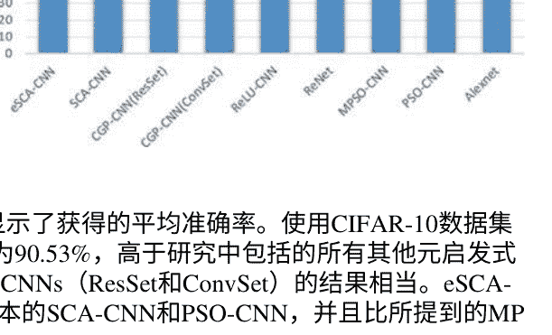

在图2中，展示了SCA-CNN和提出的eSCA-CNN在一个随机选择的运行中的收敛速度图的比较。可以清楚地看到，eSCA-CNN比原始的SCA-CNN方法收敛速度更快。

为了更容易地对比原始SCA和适用于CNN设计的提出的eSCA，我们生成了两种方法的群集图，其中每个点表示在20次完全进行的运行中准确性最佳解的位置。群集图的比较显示在图3中。

从呈现的群集图中，可以轻松地看出在20次运行中最佳解的分布，强调了提出的eSCA-CNN优于SCA-CNN。

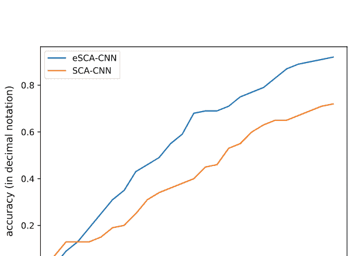

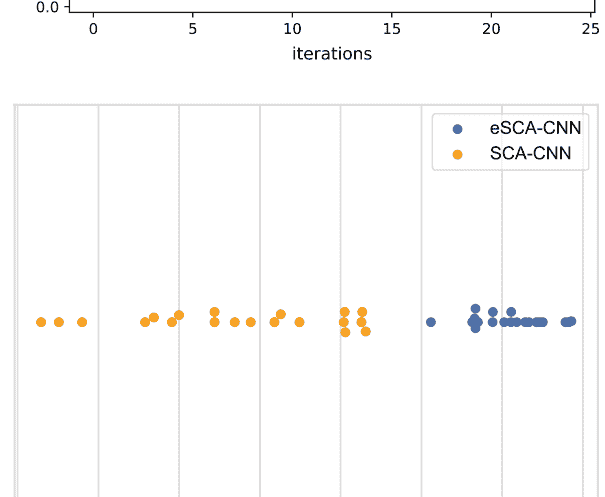

#### 5 结论

本文提出了一种利用eSCA元启发式算法作为优化器来优化CNN超参数的新技术。本文的目标是减少确定适当的架构和超参数的工作量，因为CNN必须针对每个特定的问题实例进行训练。提出的eSCA-CNN方法在实现更有效的CNN结构方面取得了有希望的结果。在CIFAR-10数据集上进行的实验证实，eSCA-CNN可以成功应用于适当的CNN结构的选择过程的自动化，无需人工监督。在这个领域的未来工作将集中在增强和应用其他元启发式方法来优化CNN超参数。提出的SCA方法也将在其他数据集上进行验证。此外，SCA方法还将应用于其他应用领域，包括无线传感器网络和云计算。

#### 参考文献

1. Bacanin, N.， Bezdan, T.， Tuba, E.， Strumberger， I.， & Tuba， M. (2020). 基于蝴蝶优化的卷积神经网络设计。数学， 8(6)， 936.
2. Bacanin, N.， Bezdan, T.， Tuba, E.， Strumberger， I.， & Tuba， M. (2020). 通过增强的群智能元启发式算法优化卷积神经网络超参数。算法， 13(3)， 67.
3. Bacanin, N.， Bezdan, T.， Tuba, E.， Strumberger， I.， Tuba， M.， & Zivkovic， M. (2019). 灰狼优化器在云计算环境中的任务调度。在2019年第27届电信论坛（TELFOR）中（第1-4页）。IEEE.
4. Bacanin, N.， Tuba, E.， Zivkovic， M.， Strumberger， I.， & Tuba， M. (2019). 鲸鱼优化算法用于无线传感器网络定位的探索性移动。在混合智能系统国际会议（pp. 328–338）. Springer.
5. Baldominos, A.， Saez， Y.， & Isasi， P. (2018). 进化卷积神经网络：手写识别的应用。神经计算， 283， 38–52.
6. Bezdan, T.， Zivkovic， M.， Antonijevic， M.， Zivkovic， T.， & Bacanin， N. (2020). 增强云计算环境中任务调度的花粉传粉算法。在机器学习预测分析（pp. 163–171）. Springer.
7. Bezdan, T.， Zivkovic， M.， Tuba， E.， Strumberger， I.， Bacanin， N.， & Tuba， M. (2020). 使用修改后的fa设计的卷积神经网络从MRI中对脑胶质瘤进行等级分类。在智能和模糊系统国际会议（pp. 955–963）. 斯普林格.
8. Bezdan, T.， Zivkovic， M.， Tuba， E.， Strumberger， I.， Bacanin， N.， & Tuba， M. (2020). 云计算环境中的多目标任务调度通过混合蝙蝠算法。在智能和模糊系统国际会议上（pp. 718–725）. Springer.
9. Dorigo, M.， Birattari， M.， & Stutzle， T. (2006). 蚁群优化。IEEE计算智能杂志， 1(4)， 28–39.
10. Duchi, J.， Hazan， E.， & Singer， Y. (2011， July). 自适应次梯度方法用于在线学习和随机优化。机器学习和研究杂志， 12(null)，2121–2159.
11. Fukushima, K. (1980). 一种自组织神经网络模型，用于不受位置偏移影响的模式识别机制。生物控制， 36， 193–202.
12. Hubel, D. H.， & Wiesel， T. N. (1959). 猫的纹状皮层中单个神经元的感受野生理学杂志， 148(3)， 574–591.
13. Karaboga, D.， & Basturk， B. (2008). 关于人工蜜蜂群（ABC） 算法的性能应用软计算，8(1)， 687–697.
14. Kennedy, J.， & Eberhart， R. (1995). 粒子群优化 在ICNN'95国际神经网络会议论文集中（Vol. 4， pp. 1942–1948）， IEEE.
15. Krizhevsky, A.， Sutskever， I.， & Hinton， G. E. (2012). 使用深度卷积神经网络的Imagenet分类神经信息处理系统的进展， 25， 1097–1105.
16. LeCun, Y.， Bottou， L.， Bengio， Y.， & Haffner， P. (1998). 基于梯度的学习应用于文档识别。 IEEE会议录， 86(11)， 2278–2324.
17. Milosevic, S.， Bezdant， T.， Zivkovic， M.， Bacanin， N.， Strumberger， I.， & Tuba， M. (2021). 混合蝙蝠算法训练前馈神经网络。 在智能系统建模和开发方面：第7届国际会议，MDIS 2020。 罗马尼亚锡比乌，2020年10月22日至24日，修订选定论文7（pp. 52–66）. Springer国际出版社.
18. Mirjalili, S. (2016). SCA： 用于解决优化问题的正弦余弦算法。 基于知识的系统， 96， 120–133.
19. Pyrkov, T. V.， Slipensky， K.， Barg， M.， Kondrashin， A.， Zhurov， B.， Zenin， A.， 等 (2018). 通过深度学习从生物医学数据中提取生物年龄：好东西太多了吗？ 科学报告， 8(1)， 1–11.
20. Ranganathan, G. (2020). 使用深度图信息和机器学习在多模态群组通信中实现真实的人类运动。 创新图像处理杂志 (JIIP)， 2(02)， 93–101.
21. Ren, H.， Xu， B.， Wang， Y.， Yi， C.， Huang， C.， Kou， X.， Xing， T.， Yang， M.， Tong， J.， & Zhang， Q. (2019). 微软的时间序列异常检测服务。 在第25届ACM SIGKDD国际会议上的知识发现与数据挖掘（pp. 3009–3017）.
22. Samide, A.， Stoen， C.， & Stoen， R. (2019). 使用卷积神经网络在盐酸溶液中研究聚乙烯醇和银纳米颗粒形成的缓蚀膜的表面应用表面科学， 475， 1–5.
23. Singh, P.， Chaudhury， S.， & Panigrahi， B. K. (2021). 混合MPSO-CNN： 多级粒子优化卷积神经网络的超参数Swarm and EvolutionaryComputation， 63， 100863.
24. Smys, S.， Chen， J. I. Z.， & Shakya， S. (2020). 深度学习中的神经网络架构调查软计算范式杂志(JSCP)， 2(03)， 186–194.
25. Strumberger, I.， Tuba， E.， Bacanin， N.， Jovanovic， R.， & Tuba， M. (2019). 通过树生长算法框架设计卷积神经网络架构 在2019年国际神经网络联合会议(IJCNN)上（pp. 1–8）. IEEE.
26. Strumberger, I.， Tuba， E.， Bacanin， N.， Zivkovic， M.， Beko， M.， & Tuba， M. (2019). 通过萤火虫算法设计卷积神经网络架构。 在2019年国际青年工程师论坛(YEF-ECE)（pp. 59–65）. IEEE.
27. Strumberger, I.， Tuba， E.， Zivkovic， M.， Bacanin， N.， Beko， M.， & Tuba， M. (2019). 全局优化的动态搜索树生长算法。 在计算、电气和工业系统博士会议上（pp. 143–153）. Springer.
28. Suganuma, M.， Shirakawa， S.， & Nagao， T. (2017). 一种基于遗传编程的卷积神经网络架构设计方法。 在遗传和进化计算会议论文集中（pp. 497–504）.
29. Visin, F.， Kastner， K.， Cho， K.， Matteucci， M.， Courville， A.， Bengio， Y.： Renet： 一种基于循环神经网络的卷积网络的替代方法。 arXiv预印本arXiv：1505.00393(2015)
30. Xu, B.， Wang， N.， Chen， T.， Li， M.： 实证评估卷积网络中的修正激活。 arXiv预印本arXiv： 1505.00853 (2015)
31. Yamaguchi, K.， Sakamoto， K.， Akabane， T.， & Fujimoto， Y. (1990). 用于说话人无关的孤立词识别的神经网络。 在第一届国际口语处理会议上.
32. Yamasaki, T.， Honma， T.， & Aizawa， K. (2017). 使用粒子群优化高效优化卷积神经网络。在2017年IEEE第三届多媒体大数据国际会议上（pp. 70–73）. IEEE.
33. 杨， X. S. (2010). 一种新的元启发式蝙蝠算法。在自然启发的合作策略优化中 (NICSO 2010)（pp. 65–74）. Springer.
34. Zeiler, M. D. (2012). Adadelta： 一种自适应学习率方法. arXiv：1212.5701
35. Zivkovic, M.， Bacanin， N.， Tuba， E.， Strumberger， I.， Bezdan， T.， & Tuba， M. (2020). 基于改进的萤火虫算法的无线传感器网络寿命优化。在2020年国际无线通信和移动计算 (IWCMC)（pp. 1176–1181）. IEEE.
36. Zivkovic, M.， Bacanin， N.， Venkatachalam， K.， Nayyar， A.， Djordjevic， A.， Strumberger， I.， & Al-Turjman， F. (2021). 使用混合机器学习和甲虫触角搜索方法预测Covid-19病例.可持续城市与社会， 66， 102669.
37. Zivkovic, M.， Bacanin， N.， Zivkovic， T.， Strumberger， I.， Tuba， E.， & Tuba， M. (2020). 增强的灰狼算法用于能源高效的无线传感器网络。在2020年消费者技术创新会议 (ZINC) 中 (第87-92页)。 IEEE.
38. Zivkovic, M.， Venkatachalam， K.， Bacanin， N.， Djordjevic， A.， Antonijevic， M.， Strumberger，I.， & Rashid， T. A. (2021). 混合遗传算法和机器学习方法用于COVID-19病例预测。在可持续专家系统国际会议论文集ICSES 2020 (第176卷，第169页). Springer.
39. Zivkovic, M.， Zivkovic， T.， Venkatachalam， K.， & Bacanin， N. (2021). 增强的蜻蜓算法用于无线传感器网络寿命优化。在数据智能和认知信息学中 (第803-817页). Springer.

### 一种检测低质量 Deepfake视频的新方法

Neeraj Guhagarkar， Sanjana Desai， Swanand Vaishampayan， 和 Ashwini Save

摘要 深度学习（DL）领域取得了显著的进步，导致高度逼真的人工智能（AI）生成的欺诈性视频激增，通常被称为Deepfakes。尽管这项技术有无限的有用应用，但也存在对其缺点的显著担忧。

制作关于政治家或演员等公众人物的虚假视频，以破坏他们的形象并欺骗公众，就是其中一种应用。 因此，迫切需要开发一种能够检测和减轻这些AI生成视频对社会产生负面影响的系统。 高质量的Deepfake视频很容易被先前创建的模型检测出来。 但是，当测试低质量视频时，系统的效率会逐渐下降。通过各种社交媒体网站传输的视频质量较低，因此对此类视频的检测变得具有挑战性。因此，在这个系统中，使用超分辨率的概念结合卷积神经网络（CNN）和长短期记忆（LSTM），进行低质量Deepfakes的检测。在这个系统中，超分辨率的概念提高了视频的质量，然后CNN架构结合LSTM通过考虑给定的面部特征将视频分类为Deepfake或非Deepfake。 对于这个项目，提出的框架在FaceForensics++数据集上进行了使用。 因此，该系统旨在开发一个能够更准确地检测此类低质量Deepfake视频的模型。

关键词 Deepfake · 深度学习 · 超分辨率 · CNN · LSTM · Softmax函数

N. Guhagarkar · S. Desai · S. Vaishampayan (✉) · A. Save
印度孟买VIVA技术学院计算机工程系
A. Save
电子邮件：ashwini-save@viva-technology.org## 缩写

-   卷积神经网络
-   DL: 深度学习
-   GAN: 生成对抗网络
-   SVM: 支持向量机
-   峰值信噪比
-   结构相似性指数

#### 1 引言

在深度学习领域的显著进展导致了Deepfake视频的兴起。通过先进的人工智能技术创建的操纵视频，其整体质量和声音似乎是真实的，被称为Deepfakes。借助生成对抗网络（GANs）和自编码器等深度学习架构以及大量目标主体的镜头，任何人都可以创建出如此令人信服的Deepfake视频[1]。Deepfake视频有3种主要类型，即(a)头部操纵，(b)换脸和(c)唇同步[2]。这种技术可能对社会造成潜在的伤害。例如，印度记者Rana Ayyub成为了邪恶Deepfake阴谋的受害者。在社交媒体平台如Twitter和WhatsApp上分享了一个虚假的色情内容，显示她在其中。因此，迫切需要开发一个能够识别此类Deepfake视频的系统。

社交媒体的使用量大幅增加，尤其是在这个COVID-19时代。通过社交媒体平台分享Deepfake视频的数量急剧增加。为了解决这个问题，Facebook最近在国际范围内进行了一项竞赛。由于通过社交媒体平台传播的Deepfake视频可能会造成巨大的伤害，因此有必要为了社会福祉而检测此类视频。

为了满足检测Deepfake视频的需求，提出的系统采用了超分辨率、CNN和LSTM的概念，比以前的模型具有更高的准确性。所提出的系统使用了超分辨率的概念，有助于提高视频的质量[3-6]，然后使用CNN的概念来提取面部区域帧级别的特征，最后使用LSTM来检测视频是否是伪造的。使用的数据集是FaceForensics++。Rossler等人的工作[7]被视为基础论文，低质量视频的基准准确率为81%。

提出的系统架构可以分为三个阶段。对于第一阶段，即超分辨率，使用了ESRGAN。对于第二阶段，即特征提取，使用了CNN Resnext50。最后，在第三阶段，LSTM与softmax函数一起给出了系统的输出，即视频的所需分类。在接下来的章节中，将讨论该系统在准确性方面如何胜过其他模型。

#### 2 相关工作

为了解决Deepfakes视频的检测问题，研究人员在过去几年中使用了各种机器学习技术，如支持向量机（SVM）[8-11]，深度学习技术如卷积神经网络（CNN）[3, 12, 13]，CNN与SVM[2]，CNN与LSTM[1, 13-17]以及循环神经网络（RNN）[18]。为了检测，还考虑了各种方法，如考虑背景颜色的变化[10]，暴露不一致的头部姿势[8]。尽管基于深度学习技术开发了许多系统，但当这些模型在低质量的Deepfake视频上进行测试时，它们的准确性下降。它们只对高质量的Deepfakes的检测结果更好。

Lyu [2] 对生成Deepfakes的不同方法进行了深入研究，例如(a)头部操纵，(b)脸部交换，(c)嘴唇同步等。作者发现音频Deepfakes领域有更多的研究空间，而这些技术的局限性在于无法产生准确的面部细节，Deepfake数据集的质量，社交媒体洗钱等。

Younus等人[15]比较了最流行的Deepfake检测技术。背景比较，时间模式分析，眨眼和姿势估计是其中的几种技术。这份调查报告有助于了解目前使用的各种Deepfake检测算法，以及如何发现更多的附加功能以更有效地检测Deepfakes。

Aneja等人[19]提出了基于零和少量样本迁移学习的Deep Distribution Transfer (DDT)。当数据集从Dessa数据集转移到Face-Forensics++时，零样本和少样本迁移的准确性分别提高了4.88%和8.38%。

##### 2.1 支持向量机（SVM）

杨等人[8]提出了一种使用不一致的头部姿势来检测Deepfake的模型。先前模型中使用的算法用于创建不同人的面部，而不改变原始表情，从而创建了不匹配的面部特征点。因此，当使用Deepfake技术创建这些视频时，伪造面部的特征点位置通常与真实面部不同，同时将伪造面部叠加在真实面部的位置上。研究人员注意到使用余弦距离创建的真实头部方向和Deepfake视频之间的差异，以及Deepfake视频。这两个向量值之间的差异可以用于对视频进行分类。实施的系统提取了68个面部特征点，并使用DLib软件包进行面部检测。在此使用OpenFace2模型创建3D面部模型，然后计算它们之间的差异。所提出的系统使用UADFV数据集。使用径向基函数（RBF）核训练SVM分类器。在UADFV数据集上，SVM分类器实现了0.89的ROC曲线下面积（AUROC）。从本文中可以推断出，Deepfakes是通过将合成的面部区域编织到原始图像中，并使用3D姿势估计来检测合成视频的重要点之一。

McCloskey等人[10]提出了一种利用饱和度线索来检测Deepfakes的方法。通过饱和度线索，可以将图像识别为GAN生成的图像或相机图像。借助这个线索，可以检测到两种类型的GAN生成图像。观察到HDR、相机照片通常具有饱和度欠曝光的区域。生成器归一化步骤通常会抑制饱和像素和非曝光像素的规律性。这是在这项研究中解释的假设。研究人员建议使用GAN图像检测器来计算饱和和非曝光像素的频率。这些图像经过MATLAB的fitcsvm函数进行训练，并通过SVM进行特征分类。

Kharbat等人[11]提出利用SVM回归来检测Deepfake电影。他们的策略是通过从视频中提取的特征点来训练AI分类器来检测欺诈视频。HOG、ORB、BRISK、KAZE、SURF和FAST是他们确定的不同特征点提取算法。使用HOG特征点提取方法，达到了95%的准确率。上述系统有助于发现特征检测的替代方案。由于特征检测是该项目的重要组成部分，本研究建议还可以使用上述标准算法进行特征检测。

Matern等人提出了用于检测的基本逻辑回归模型[20]。这项研究展示了在生成的面部和Deepfake中发生的操纵。他们提出了一种用于检测完全生成的面部的算法。他们通过各种视觉线索展示了这一点，重点关注眼睛、牙齿和面部形状。眼睛中有最明显的镜面反射。采用组合特征向量的神经网络实现了最佳性能，AUC为0.851。这表明眼睛和牙齿特征是有意义的，并且结果不是由真实类和假类照片之间的差异引起的。

##### 2.2 卷积神经网络(CNN)

为了利用可能的帧间差异，Amerini等人提出了光学流场技术[21]。CNN分类器进一步从这个线索中学习。观众和场景之间存在运动来提取这个信息。光流场是在连续的两帧图像上计算得到的。为了计算光流场，使用了来自真实视频和Deepfake的另一帧图像。编辑后的视频下巴周围的向量更加平滑，而原始序列中有更多的噪音。他们使用了Faceforensics++数据集。从数据集中使用了720个用于训练，120个用于验证，和120个用于测试的视频。使用了VGG16和ResNet50神经网络。对于Face2Face视频，VGG16网络的检测准确率为81.61%，而ResNet50的检测准确率为75.46%。本文的主要质量在于采用了帧间差异的思想，而不像其他技术只依赖于帧内不一致性，并通过基于光流的CNN方法来克服这些不一致性。

周等人[9]提出了一篇调查论文。极端的姿势、光照、最小分辨率和小尺寸都是人脸检测系统的障碍。本文指出，大多数系统只在高分辨率图像上进行训练，因此在低分辨率的监控系统上测试时表现不佳。作者在低分辨率图像上使用了HoG-SVM和R-CNN以及S3FD算法。使用的数据集是FDDB。当改变模糊、噪声或对比度水平并测试算法时，发现给定模型的性能下降。结论是，当在低分辨率图像上进行测试时，HoG-SVM和R-CNN-S3FD算法的表现非常糟糕。本文提供了洞察力，需要注意R-CNN和S3FD在低分辨率图像的人脸检测中表现非常糟糕。需要注意噪声和对比度水平，因为这些因素也会影响算法的准确性。

Malolan等人[22]使用深度学习方法建立了一种检测这些Deepfake视频的方法。他们使用了从FaceForensics++数据集中提取的人脸数据库来训练CNN架构。他们还使用了可解释的人工智能方法，如层级相关传播（LRP）和局部可解释的模型无关解释（LIME），以提供模型目标区域的清晰可视化。

##### 2.3 卷积神经网络与长短期记忆 (LSTM)

Yadav等人[1]详细阐述了Deepfake技术，以及它如何以高准确性创建操纵的人脸。GAN包含两个相互交织的神经网络，称为生成器和判别器。生成器通过给定的数据集合合成欺诈性图像。另一方面，判别器神经网络评估生成器合成的图像，并检查其真实性。Deepfake的危害在于个人角色诽谤和暗杀、传播虚假新闻以及对执法机构构成威胁等案例。眨眼可以被视为检测Deepfake的一个特征之一。制作Deepfake的几个限制包括大规模数据集的需求、训练和交换的时间消耗，以及个性化面孔和肤色等方面的限制。循环神经网络也可以用于检测Deepfake。组合卷积神经网络（CNN）和长短期记忆（LSTM）有助于有效识别帧中存在的变化，这对于Deepfake检测是有用的。在Face2Face数据集上，Meso-4和Meso inception-4模型的准确率分别达到95%和98%。Guera等人[16]阐述了Deepfake视频的生成方式以及如何使用CNN和LSTM进行检测。生成更高质量的Deepfake视频使用了GAN。目标图像的解码器用于与目标图像进行面部交换，生成过程中使用原始图像的编码器。他们使用了许多不同的技术来准确检测Deepfake视频，并得出结论，当视频每秒分割成80帧，并结合CNN和LSTM时，获得了最佳准确率。最高准确率约为97.1%。但是所获得的准确率是在一组高分辨率图像上获得的。上述论文还详细解释了Deepfake视频的生成方式。

对于人类来说，检测Deepfakes并不是一项容易的任务；这是由Rossler等人[7]所述。除了人类基准，本文还提供了在随机压缩下进行面部操纵检测的基准。CNN模型被用来检测所有这些Deepfakes。他们使用了总共7种方法来检测不同质量的Deepfake视频。其中一种方法是隐写分析方法，它使用了手工制作的特征和SVM分类器。提供给该模型的输入是一个128×128的裁剪面部区域。观察到原始图像的检测效果很好，但是当涉及到低质量视频时，其准确性会降低。首先，使用了一个受限制的卷积层。然后，使用了两个卷积层和两个最大池化层，接着是三个全连接层。使用Xception网络算法时，低质量视频的最高准确率为81%。

Ranjan等人提出了基于CNN和LSTM组合的系统，用于将视频分类为假的还是原始的[23]。作者采用迁移学习来提高系统的准确性。这也是需要记住的一点，因为迁移学习有潜力大幅提高Deepfake检测系统的准确性。DFD模型在单一数据集训练模型的自定义测试集上的准确率为70.57%，是最佳表现者。

为了同时探索空间和时间，Chen等人提出了FSSPOTTER。作者使用了VGG16架构与LSTM，并在UADFV、Celeb-DF、DeepfakeTIMIT HQ和DeepfakeTIMIT LQ数据集上的准确率分别比XcpeitonNet高出2.2%、5.4%、4.4%、2.0%。

##### 2.4 超分辨率

Jagdale等人[3]引入了一种革命性的超分辨率算法，称为NA-VSR。该算法读取低分辨率视频并将其转换为高分辨率视频。首先读取低分辨率视频并将其转换为帧。

#### 3 研究差距

经过仔细研究各个研究人员最近的研究工作后，发现当前的Deepfake检测系统在高质量Deepfake视频的准确性方面表现得更好。当同样的系统用于低质量视频的分类时，当前的模型无法以更高的准确性对Deepfake视频进行分类。这主要是因为CNN算法无法从低分辨率视频中提取重要特征。通过社交媒体平台传播的Deepfake视频是主要关注的对象。这些视频都是低质量的视频。因此，使用当前模型准确检测通过社交媒体传播的Deepfake视频是不可能的。提出的模型旨在弥合当前的差距。

#### 4 提出的系统

##### 4.1 深伪检测模型

为了检测深伪视频，提出的模型使用了超分辨率、CNN和LSTM的组合。增强型超分辨率生成对抗网络（ESRGAN）架构[24]用于提高低质量视频。CNN在帧级别上实现了关键特征提取。CNN是最佳选择，因为可以使用CNN的自动特征提取器进行帧级别的提取。为了使模型给出精确的结果，特征提取步骤是最关键和重要的。CNN必须在帧级别上精确提取特征。在此之后，CNN的结果被传递给LSTM，最后经过应用softmax函数后，我们得到所需的视频分类结果，即深伪或真实。

图1显示了系统的总体架构，进一步分为两个部分，即（a）超分辨率和（b）CNN-LSTM模型。来自FaceForensics++数据集的视频被用作ESRGAN超分辨率模型的输入。在这个过程中，从视频输入中提取帧。在对视频进行超分辨率处理后，将其传递给CNN和LSTM模型进行特征提取和分类，最终得到输出，判断视频是否为Deepfake。

##### 4.2 超分辨率架构

首先，使用ESRGAN架构[24]进行超分辨率处理，将低分辨率视频转换为帧，并通过各种卷积层和ESRGAN生成网络的23个稠密块。每个稠密块包含5个卷积层和Leaky Relu作为激活函数。由于神经网络非常深，使用跳跃连接来解决梯度消失的问题。在稠密块、卷积层和上采样之后，对这些帧进行处理，得到高分辨率视频。首先，将VGA质量的视频作为输入，经过超分辨率处理后，得到全高清质量的视频作为输出（图2）。

##### 4.3 预处理阶段

在视频经过超分辨率处理之后，在将这些视频直接传递给CNN Resnext50模型之前，对这些视频进行预处理。在这个过程中，首先将视频分解成帧，每秒40帧。为了减少计算复杂度的开销，只选择了前150帧然后进行人脸裁剪。由于FaceForensics++数据集只包含裁剪过的Deepfake视频，因此CNN模型准确提取面部区域的特征是必要的。面部区域的特征是关键。因此，面部裁剪步骤是预处理阶段的关键。然后，将受损的帧从序列中删除，因为它们可能会影响训练阶段。

##### 4.4 CNN架构

预处理的帧被传递给CNN Resnext50模型进行帧级特征提取。Resnext50是一个预训练模型，可以使用pytorch库导入。它由五个卷积层组成。第一层的输入尺寸为112 × 112。在第一层之后应用了3 × 3的最大池化。后续层应用了激活函数Relu。在第5层之后，图像尺寸变为7 × 7。Resnext 50架构用于从输入数据中提取最重要的特征。在进行分类目的的特征提取之后，使用softmax和LSTM。

##### 4.5 LSTM

使用LSTM与CNN的主要原因是它具有记忆单元。当生成Deepfake视频时，它们是以帧为单位生成的。自动编码器不知道先前形成帧的亮度、对比度值。因此，当将Deepfake视频分解为帧时，帧级别上的亮度、面部方向等向量值彼此不同。这就是LSTM发挥最佳作用的地方。使用LSTM，我们比较相邻帧的两个向量值，如果方差超过阈值，视频可能是Deepfake。在比较所有这样的150帧之后，softmax函数给出一个概率值，准确检测Deepfake或真实视频（图3）。

#### 5 数据集

在提出的模型上使用了FaceForensics++数据集[7]。该数据集包含2000个视频，在预处理阶段后，损坏的视频被删除。删除损坏的视频后，共使用了1967个视频。所有视频的质量都是VGA。该数据集按照80:20的比例进行了训练和测试的划分。

##### 5.1 训练和测试

用于训练的视频共有1573个，其中778个是真实的，795个是伪造的视频。测试使用了394个视频，其中213个是真实的，181个是伪造的视频。训练是以随机视频为批次进行的。每个批次包含400个视频，迭代次数设置为20。为了计算准确率，在测试数据集上创建了混淆矩阵。真正例和真负例的值分别为170和201，假正例率为11，假负例率为12。

整体准确率通过(TP + TN)/总数来计算。模型给出了94.16%的整体准确率。

#### 6 结果与分析

所提出系统的目的是检测通过社交媒体传递的视频是否为Deepfake或真实视频，在FaceForensics++数据集上实现了94.16%的准确率。为了比较，将所提出的模型与Rossler等人提出的模型[7]进行了比较，下表显示了低质量视频的情况。

表1 结果和分析表
| 序号 | 技术 | 硬件细节 | 数据集 | 准确性 |
| :--- | :--- | :--- | :--- | :--- |
| 1 | CNN (XceptionNet)和 LSTM [7] (2019) | – | FaceForensics++ | 81% (低质量) |
| 2 | 超分辨率, CNN和LSTM (提出的系统) | 系统: Core i5及以上<br>硬盘: 500 GB<br>显示器: 彩色显示器<br>内存: 8 GB及以上<br>显卡: GTX1050 Ti及以上 | FaceForensics++ | 94.16% (低质量) |

如表1所示，使用FaceForensics++数据集的描述模型可以以94.16%的准确率检测到低质量Deepfake，这比[7]的81%准确率更高。

#### 7 结论

所提出的系统基于DL来检测视频是否为Deepfake。根据发现的研究空白，设计了一个用于检测低质量Deepfake视频的模型。模型使用CNN和LSTM进行超分辨率处理。超分辨率可以提高低质量视频的质量。当前的Deepfake检测系统在处理低质量视频时准确率较低，因为CNN无法正确提取低质量帧的特征。通过使用ESRGAN超分辨率，提高了低质量视频的质量，因此，提出的系统能够解决当前Deepfake检测模型的问题。预处理阶段有助于清理损坏的视频，并生成面部裁剪视频以进行更好的特征提取。此外，从视频中裁剪面部区域可以降低计算成本。在CNN提取阶段，提出的系统使用了Resnext50架构。特征提取后，使用了LSTM。LSTM可以存储每个帧的向量值，这些向量值可以进一步用于比较后续帧的向量值。在比较视频的所有帧之后，得到了一个概率值，用于识别Deepfake或真实视频。经过训练和测试，系统的准确率为94.16%，高于81%的基准准确率。

#### 未来工作

所提出的系统专注于检测由换脸生成的低质量Deepfake视频。未来几年还可以进行其他操纵技术生成的低质量Deepfake视频的检测。

未来，研究人员还可以尝试使用不同的超分辨率算法，如ESRGAN+，TecoGAN，MSG-CapsGAN等。除此之外，音频深度伪造检测系统也可以与当前模型结合起来，这些模型仅关注视觉方面。

致谢我们非常感谢计算机工程系的Tatwadarshi Nagarhalli博士对我们的持续指导、支持和深入建议。我们能够完成这项工作，要归功于他的及时指导和鼓励。

#### 参考文献

1.  Yadav, D., & Salmani, S. Deepfake：一项关于使用生成对抗网络的面部伪造技术的调查。智能计算与控制系统国际会议论文集(ICIccS 2019)。IEEE Xplore部分编号：CFP19K34-ART；ISBN：978-1-5386-8113-8。
2.  吕，S. Deepfake检测：当前挑战和下一步。2020年IEEE国际多媒体与博览会研讨会(ICMEW)。
3.  Jagdale，R.，& Shah，S.一种新颖的视频超分辨率算法。ICTIS会议论文集 2018年，智能系统的信息与通信技术(第1卷，第533-544页)。
4.  陶，X.，高，H.，廖，R.，王，J.，& 贾，J.揭示细节的深度视频超分辨率。2017年IEEE国际计算机视觉会议(ICCV)。
5.  于，J.，& Bhanu，B. (2018) 表情变化下的视频中人脸图像超分辨率。IEEE第5届高级视频和信号基础监控会议。
6.  董，C.，Loy，C.C.，何，K.，& 唐，X.使用深度卷积网络进行图像超分辨率。IEEE模式分析和机器智能交易(2016)。

7. Rossler, A., Cozzolino, D., Verdoliva, L., Riess, C., Thies, J., & Nießner, M. (2019) FaceForensics++: 学习检测篡改的面部图像。*IEEE/CVF国际计算机视觉会议论文集*(pp. 1–11).
8. Yang, X., Li, Y., & Lyu, S. 揭示深度伪造的不一致头部姿势。*ICASSP 2019— 2019 IEEE 国际声学、语音和信号处理会议.*
9. Zhou, Y., Liu, D., Huang, T. 低质量图像上的人脸检测综述。*2018第13届IEEE 国际自动人脸和手势识别会议.*
10. McCloskey, S., & Albright, M. 使用饱和度线索检测GAN生成的图像. (2019 IEEE).
11. Kharbat, F. F., Elamsy, T., Mahmoud, A., & Rami. 深度伪造视频检测的图像特征检测器. (IEEE 2019).
12. Yamanaka, J., Kuwashima, S., & Kurita, T. 通过深度卷积神经网络和跳跃连接以及网络内网络实现快速准确的图像超分辨率. (Springer 2017).
13. Luo, M., Xiao, Y., & Zhou, Y. 基于卷积神经网络的多尺度人脸检测. (IEEE 2018).
14. Chen, P., Liu, J., Liang, T., Zhou, G., Gao, H., Dai, J., & Han, J. Fsspotter: 通过空间和时间线索检测换脸视频. (2020 IEEE 国际多媒体与博览会(ICME)).
15. Younus, M. A., & Hasan, T. M. 深度伪造视频检测技术的简要概述. (2020 第六届国际工程会议“可持续技术与发展”(IEC)).
16. Guera, D., & Delp, E. J. 使用循环神经网络进行深度伪造视频检测。 (2018年第15届 IEEE国际高级视频和信号监控会议 (AVSS)).
17. Jafar, M. T., Abanbeh, M., Al-Zoube, M., & Elhassan, A. 数字取证和分析 deepfake视频。 (IEEE 2020).
18. Akandeh, A., & Salem, F. M. Slim LSTM网络：LSTM 6和LSTM C6. (2019年IEEE).
19. Aneja, S., & Nießner, M. 面部伪造检测的广义零和少量样本迁移. arXiv:2006.11863v1 [cs.CV] 2020.
20. Matern, F., Riess, C., & Stamminger, M., & Friedrich-Alexander. 利用视觉伪影揭示深度伪造和面部。 (2019年IEEE冬季计算机视觉应用研讨会).
21. Amerini, I., Galteri, L., Caldelli, R., & Del Bimbo, A. 基于光流的CNN深度伪造视频检测。 (2019年IEEE/CVF国际计算机视觉会议研讨会(ICCVW)).
22. Malolan B. Parekh, A., & Kazi, F. 使用视觉可解释性方法解释深度伪造检测. (2020年第三届信息与计算技术国际会议(ICT)).
23. Ranjan, P., Patil, S., & Kazi, F. 基于迁移学习的CNN框架改进深度伪造检测的泛化能力。 (IEEE 2020).
24. Wang, X., & Yu, K., et al. ESRGAN: 增强型超分辨率生成对抗网络. 未发表.

### 使用深度双向长短期记忆网络进行癫痫发作检测

Mahima Thakur, U. Snekhalatha, M. Naveed Shafi, Saumya Raj Gupta, Sourabh Ranjan Roy, and S. Vineetha

摘要 癫痫发作是我们大脑电信号的干扰。脑电图（EEG）是一种被广泛接受的测试，有助于诊断癫痫发作。在经历这种发作的患者中，脑电图信号的频率发生了重大变化。本研究重点分析这种信号活动，并将这些高频信号与健康人的信号进行分类。提出了一种密集连接的双向长短期记忆（BiLSTM）用于脑电图信号的特征提取和分类。BiLSTM已被证明在分析文本嵌入序列方面非常强大，可以从左右两个方向提供准确的结果。实验结果表明，所提出的方案获得了97-99%的满意分类准确率，表明它可以成为现实世界中适应性诊断和治疗癫痫患者的有用工具。

关键词双向长短期记忆·癫痫发作·时间序列数据·脑电图（EEG）

#### 1 引言

癫痫是一种神经系统疾病，其特征是癫痫发作[1, 2]，这是一种剧烈摇晃的症状。每次摇晃的持续时间可以从短暂到长时间不等，并且可能导致身体受伤。自20世纪70年代以来，癫痫发作的主题已经深入分析。在癫痫病中，癫痫发作往往会无预警地反复发作，没有任何直接的潜在原因；因此，癫痫患者由于自身状况而在社交生活中经历不同程度的不适[3]。由于癫痫发作发生在大脑内部，专家常用的最常见的测试方法是脑电图（EEG）和磁共振成像（MRI）。涉及脑电图记录的测试用于寻找癫痫的原因，并观察癫痫发作期间的脑活动，以找到可预测的模式[4,5]。在过去几年中，机器学习技术也广泛应用于医疗领域。许多机器学习初创公司正在积极研究可能帮助医生诊断疾病、使患者生活更轻松或提供能够挽救生命的医疗解决方案。机器学习模型一般在最近几年中被广泛使用，并且正在不断发展，可以在技术发展中得到确认：只有从新千年开始，我们才拥有所需的计算能力来进行这些技术。本研究的重点是癫痫预测问题，我们将分析不同情况，以便更清楚、更全面地了解深度学习模型在癫痫发作数据上的潜力。癫痫预测问题可以看作是一个分类问题，其目标是预测与每个样本相关联的类别。基于这个想法，使用具有双向长短时记忆（BiLSTM）网络结构的基础层模型来分析德国广泛使用的Bonn数据集中嵌入文本序列数据的脑电信号。数据集的表格描述如下。数据集的每个部分包含整个数据集的20%（表1）。

#### 2 相关工作

自从过去十年以来，深度学习和机器学习方法在癫痫分类和预测方面一直是研究者们追求的目标。本节讨论了与癫痫分类相关的最新研究。

张等人[6]采用经验模态分解方法将间歇期和癫痫脑电图信号提取为多个本征模态函数，并计算相关系数变量特征，然后将其与SVM机器学习模型相结合进行分类。陆等人[7]使用两个基准数据集对癫痫脑电图进行分类，利用具有残差连接的深度卷积神经网络。[8]使用线性和非线性机器学习分类器来检测癫痫，通过首先使用离散小波变换（DWT）和算术编码对脑电图数据进行预处理，从正常健康信号中检测癫痫发作。Mechla等人[9]使用傅里叶分析对脑电图信号进行分解，然后使用支持向量机（SVM）进行分类。[6]利用卷积神经网络检测脑电信号的时不变特征，然后通过全连接层传递，并最终使用softmax函数进行分类。George等人[10]使用可调Q小波变换（TQWT）对TUH-Corpus脑电数据库进行特征区分，然后将数据馈入人工神经网络。

表1 数据集的描述性印象

| 集合 | 记录设置 | 案例 | 类别 |
|------|----------|------|------|
| A | 表面脑电图 | 睁眼 | 健康 |
| B | 表面脑电图 | 闭眼 | 健康 |
| C | 颅内脑电图 | 间隙期 | 癫痫 |
| D | 颅内脑电图 | 间隙期 | 癫痫 |
| E | 颅内脑电图 | 发作 | 癫痫发作 |

#### 3 数据集描述

本研究采用的数据来自德国波恩大学癫痫学系（Andrzejak等人）。这是一个脑电时间序列数据集，样本数据是通过对癫痫患者进行测试而注册的。该数据集分为五个部分（A-E）。每个部分有100个文本文件。每个文本文件都以ASCII格式编码，包含4096个脑电序列（基于时间）的组成样本。脑电信号是使用128通道系统放大器记录的。对于该数据集的所有五组信号，采集方式相同。使用特殊的模数转换器（ADC），将这些数据转换为数字格式。数据的采样率为173.61赫兹，然后连续地记录在磁盘上。最后，使用0.53-40赫兹的范围进行数据处理。在（A-E）集合中，每个片段信号都有100个通道，脑电部分持续23.6秒。A和B集合是健康人的特征。A集合代表睁眼状态，而B集合代表闭眼状态（都是健康人的集合）。

其他三个部分（C、D和E）与脑活动的癫痫病情有关。考虑了五名患有癫痫病情的患者。集合C和D包括无癫痫发作的活动。只有集合E包含了癫痫发作。对于这项研究，只对癫痫发作与非癫痫发作进行了评估和测试。对集合E与集合A、B、C、D的不同特征进行了检查。经过详细分析，发现只有癫痫类数据集（集合E）在频率上明显高于其他类别（图1）。

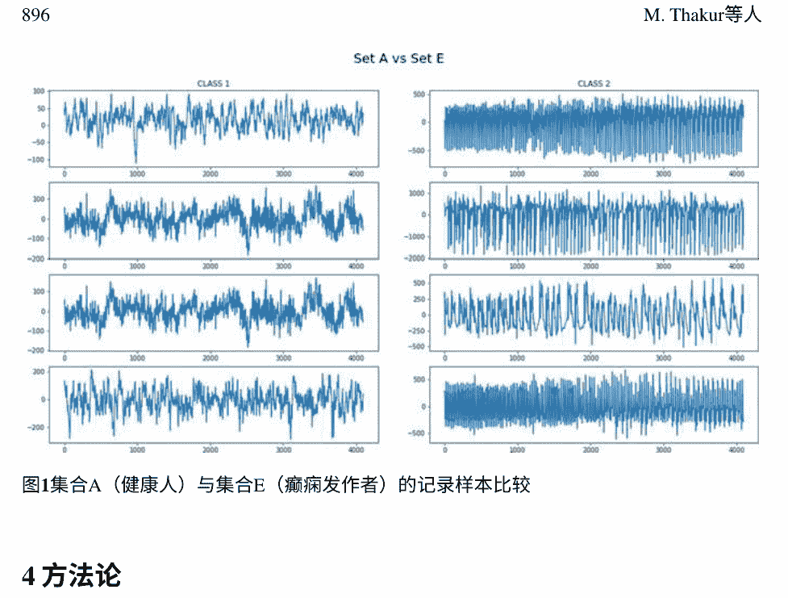

#### 4 方法论

##### 4.1 初始数据预处理

考虑EEG中的一个时间段 $T +1$个离散时间步长：该部分由一系列特征 $[x_t, x_{t+1}, x_{t+2}, ..., x_{t+T}]$ 组成，每个时间步长 $i$表示该时刻的信号幅度。

通过一位热编码技术，将脑电图样本的信息向量（输入数据）转换为二进制格式。这是一种常用的方法，用于将分类特征转换为可以作为深度学习模型输入的格式。 二维和三维数组被转换为适当的类别进行研究。 这意味着癫痫数据被标记为1，非癫痫数据被标记为0。

为了克服手动特征提取的需求，科学家们提出了基于神经网络的方法来进行检测和分类任务，因为这些模型能够从数据中高效地学习无监督的方面和特征。Sergeeva等人[11]提出了一种基于循环神经网络的方法，利用无监督的词嵌入和预先计算的句法特征作为输入。

下面给出了使用双向$LSTM$模型的直觉预览：

循环神经网络：循环神经网络（RNN）是一种用于顺序数据处理的深度神经网络[12]。 通过神经元的连接链路建立了引导图。 RNN使用自己的内部状态来处理输入数据序列，这使得它在基于自然语言处理（NLP）的工作中取得了广泛的成功。通过在系列数据重复模式下对每个样本执行相同的任务函数来评估每个输出。这样，性能评估基于所有先前的评估。这种方式基于所有先前的评估来评估性能。

长短期记忆网络：基于RNN模型结构，长短期记忆网络（LSTM）深度神经网络，在遗忘门的作用下消除梯度爆炸或梯度消失问题。LSTM充分地允许误差通过有限数量的时间步骤进行反向传播。典型的LSTM单元包括三种类型的门，即输入门、输出门和遗忘门。

根据门的开启和关闭功能，单元格在何时保留信息以及何时输入信息的时候建立。

下面是解释方程式：

$$f_t = \sigma_g(W_f x_t + G_f h_{t-1} + b_f) \quad (1)$$

$$i_t = \sigma_g(W_i x_t + G_i h_{t-1} + b_i) \quad (2)$$

$$o_t = \sigma_g(W_o x_t + G_o h_{t-1} + b_o) \quad (3)$$

$$C_t = tanh(W_c x_t + G_c h_{t-1} + b_c) \quad (4)$$

其中权重（W_f，W_i，W_o和W_c）作为输入矩阵用于输入单元的三个门的隐藏层，G_f，G_i，G_o和G_c是连接上一个单元输出和三个门以及输入单元的权重矩阵。四个偏差是b_f，b_i，b_o和b_c。门激活函数为σ_g，tanh指的是双曲正切函数。根据上述四个方程的结果，在每个‘i’迭代t时，可以计算出单元输出状态C_t和层输出H如下：

$$C_t = f_t * C_{t-1} + i_t * C_t \quad (5)$$

$$h_t = o_t * tanh(C_t) \quad (6)$$

LSTM单元的最终输出以y_t的形式呈现。双向长短期记忆网络：双向LSTM模型的原理是同时评估输入数据的左右两个方向，并训练基本模型。该方法捕捉了纵向电子健康记录数据和连续记录的生理信号中的复杂和多变量模式，这些数据通常用于急性病情估计、分类和表型分析。开发的模型（图2）使用双向

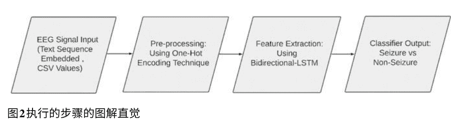

图2 执行的步骤的图解直觉

双向LSTM利用了每个五个状态的EEG信号的基于文本的记录的长期和短期发展和关联的直觉。

$$y_t = \sigma\left(\vec{d}_t, \overleftarrow{d}_t\right) \quad (7)$$

当双向层产生分类输出时，可以用 $y_t$ 来表示上述方程中的每个状态，$\sigma$ 函数用于组合这两个输出分类序列。

由于双向LSTM同时考虑了左侧和右侧的内容，因此在这种类型的预测中，它优于单向深度神经架构。在上述方程中，$d$（指示符）的存在使其在预测方面优于单向深度神经架构。

##### 4.2 双层双向LSTM

结果特征提取过程：基于相关分析，开发了一个两层叠加的双向LSTM架构来处理时间序列EEG数据，其中层数可以不同。由于数据集由4096个组件样本的文本文件组成，在包括索引后，将一个重塑后的输入向量（4097，1）传递给网络进行特征提取分析。

然后，为了获得关于时间序列早期阶段的知识，输入数据以正向方式传递给隐藏层。为了识别分析信息，隐藏层单元被放置在配置架构的较高层次中。用于处理前两个主要双向层的keras库中的‘tanh’标准激活参数。这里采用了非常高效的‘relu’激活层。然后，在双向LSTM层之后，模型稍微扩展了一个额外的密集层（也称为全连接层）。然后，使用‘softmax’激活将最终密集层的输出连接起来，以确定类别归属，即癫痫或非癫痫（表2）。

Relu激活：在具有56个神经元的次要密集层中，使用了relu激活。该激活函数的方程如下：

$$f_{\text{激活函数}}(h_{i,k}) = \max\left(0, h_{i,k}\right) \tag{8}$$

这里的$h_{i,k}$表示函数的给定输入和达到的最大正值。如果函数的值变为负数，则返回零；如果为正数，则返回该值。

Softmax函数：最终稠密层有两个神经元，用于推导输出。这个结果是通过使用Softmax激活函数计算得出的。

$$f_{\text{Softmax}}(x_i) = \frac{\exp(x_i)}{\sum_j \exp(x_j)} \tag{9}$$

其中$x$是输入向量，$\exp(x_i)$和$\exp(x_j)$分别是输入向量和输出向量的指数函数（图3）。

分类交叉熵（CCE）：用于编译模型以解决分类任务的标准损失函数。CCE损失函数旨在最大化N个样本训练集的对数似然，其中$h^{(i)}$是样本i的真实类别的指数分数：

$$\text{损失}_{\text{CCE}} = -\frac{1}{N} \sum_{i=1}^N \log \frac{\exp(w_{y_i}^T h^{(i)})}{\sum_{k=1}^K \exp(w_k^T h^{(i)})} \tag{10}$$

表2 提出的双层堆叠LSTM模型描述

| 层名称   | 节点/丢弃率 | 输出形状        | 参数     | 激活函数   |
| -------- | ---------- | --------------- | -------- | ---------- |
| 双向     | 128        | (无, 4097, 256) | 133,120  | 双曲正切   |
| 丢弃     | 0.25       | (无, 4097, 256) | 0        | 无         |
| 双向     | 128        | (无, 256)       | 394,240  | 双曲正切   |
| 丢弃     | 0.25       | (无, 256)       | 0        | 无         |
| 稠密     | 56         | (无, 56)        | 14,392   | 修正线性单元|
| 丢弃     | 0.35       | (无, 56)        | 0        | 无         |
| 最终稠密 | 2          | (无, 2)         | 114      | Softmax    |

#### 5 结果与讨论

图4显示了基于相同参数-时期的模型准确性和损失。该模型在最少25个时期内迅速达到97%的高准确性和0.2092的损失。

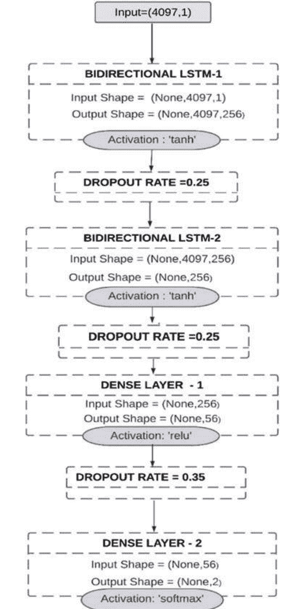

图3 模型流程结构

本节进一步介绍了用于评估模型鲁棒性的统计基准：

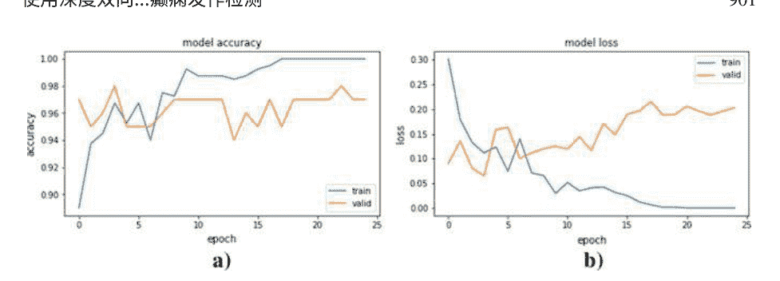

图4 a训练与验证准确率 b训练与验证模型损失（使用堆叠双向LSTM模型）

##### 5.1 混淆矩阵

我们使用系统分析来评估我们提出的架构的可靠性，重点关注不同的度量参数。在图5给出的混淆矩阵中，矩阵包含了癫痫发作（零）和健康（一）两个类别，其中：

+   真正例（TP）：表示模型正确分类为实际健康类别的次数。
+ 假正例（FP）：表示模型错误将癫痫发作患者错误分类为健康人的次数。
+ 真反例（TN）：表示模型正确分类为癫痫发作患者的次数。
+ 假反例（FN）：表示模型错误将健康人错误分类为癫痫发作患者的次数。

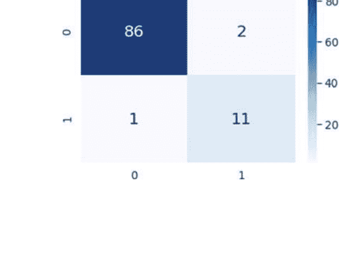

图5 模型的混淆矩阵，其中(0)代表癫痫发作，(1)代表健康类

##### 5.2 统计参数观察

精确度：一种统计指标，用于衡量有多少乐观的结果是准确的。它通过将真正例和假正例的累积计数除以真正例的数量来确定（表3）。

$$精确度 = \frac{真正例}{(真正例 + 假正例)} \quad (11)$$

召回率/敏感度：一种统计指标，用于衡量所有可能的正预测中有多少准确的正预测。它通过将真正例和假反例的总计数除以真正例的总值来确定（例如，它是真正例率）。

$$召回率/敏感度 = \frac{真正例}{(真正例 + 假反例)} \quad (12)$$

F1分数：精确率和召回率的统计测量的调和平均值，并且它提供了比准确度指标更准确的错误评分案例的估计。

$$F1分数 = (2 \times 精确率 \times 召回率)/(精确率 + 召回率) \quad (13)$$

精确率召回率曲线（PR曲线）是对不同概率阈值的精确率和召回率（分别在 y轴和 x轴上）进行图形分析。图中的水平线代表无技能分类器，其精确率与数据集中正例的数量成比例。对于平衡数据集，这个值将为0.5。PR曲线是用于不平衡二分类模型的有效诊断工具，因为它专注于少数类别。

##### 5.3 ROC曲线下面积（AUC）分数

虽然ROC曲线是一个有价值的诊断工具，但比较两个或多个分类器的曲线可能具有挑战性。另一方面，曲线下面积可以用于计算一个分类器模型的单一分数，该分数可以扩展到所有情况。

表3 提出模型的统计结果

| 类属性 | 精确度 | 召回率/敏感度 | F1得分 | 总体准确率 | AUC |
| :--- | :--- | :--- | :--- | :--- | :--- |
| 健康 | 0.99 | 0.98 | 0.98 | 0.97 | 0.98 |
| 癫痫发作 | 0.85 | 0.92 | 0.88 | | 0.98 |图6 ROC-AUC曲线 类别(0)癫痫发作 与类别(1)健康患者

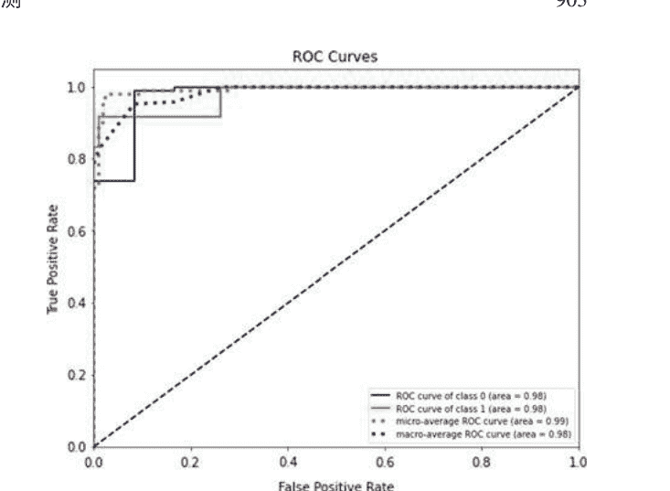

阈值。ROC下的曲线面积，或AUC，是对此的表示。对于完美的分类器，得分是0.0到1.0之间的数字（图6）。

##### 5.4 模型预测

下面给出的图表描述了模型如何正确分类健康人和癫痫发作患者的脑电图值（以频率表示）。绘制的信号值以图表形式表示，其中包括地面真实类别和模型预测输出类别，观察到其所占的百分比精度（图7）。

Golmohammadi等人的一种相关方法[13]研究了两种LSTM架构，分别为三层和四层，使用了softmax分类器，并获得了良好的结果。在类似的特征提取过程中，[14]中部署了一个3层LSTM深度网络。网络最后一层使用了sigmoid分类算法，准确率达到了96.82%。另一个实验使用了两个LSTM和GRU模型层[15]。通过一个用于重塑的层，四层LSTM/GRU与激活器，以及一个具有sigmoid激活器的全连接（FC）层组成了LSTM，GRU模型结构。在另一项研究中，Yao等人[12]使用了一个具有sigmoid激活器的全连接（FC）层，以获得10个不同和改进的独立递归神经网络中最大的准确率，准确率为88.75%。本研究中使用的模型采用了简单的双向LSTM，在仅25个时期内达到了97%的高效准确率。

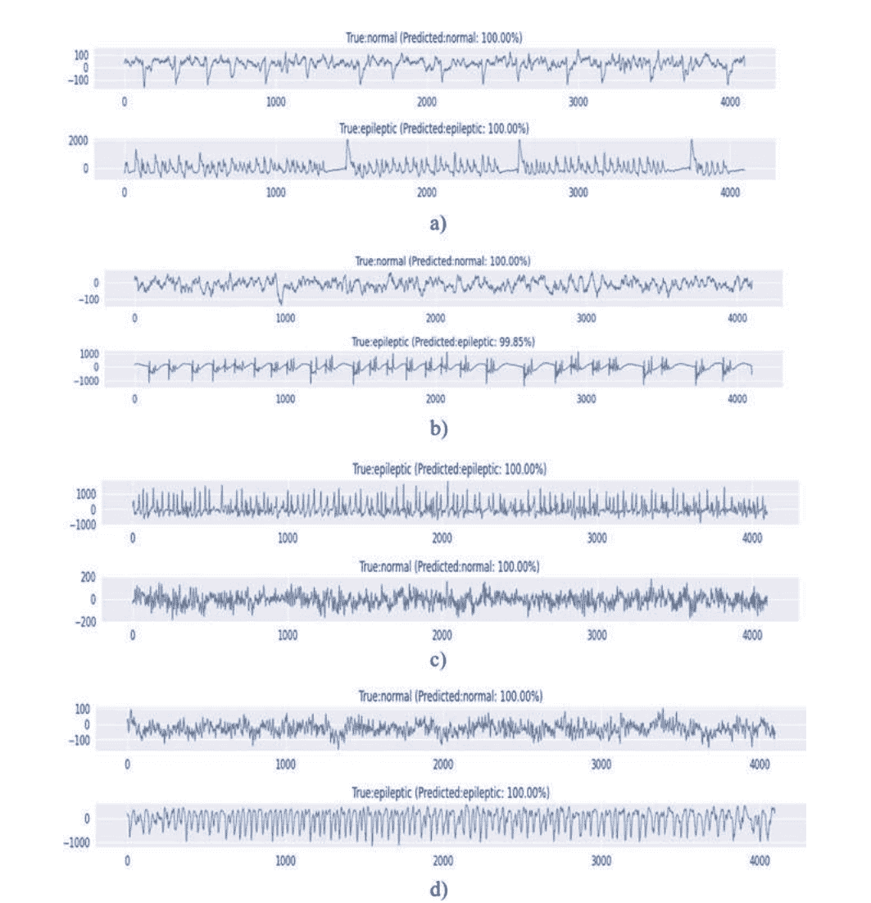

#### 6 结论和未来展望

由于癫痫现在是一种进行性神经疾病，研究人员继续寻找不同的自动诊断模型。过去曾尝试使用卷积神经网络和长短期记忆网络来分析信号值，使用光谱图可视化分析和基于序列文本的癫痫病例检测。本研究的重点是建立双向LSTM模型用于分类癫痫脑电图的深入分析，使用了德国的Bonn EEG数据集，并使用最佳参数进行模型训练，在验证集和测试集上获得了97-99%的准确率。尽管发作仅占给定数据集的20%（少数类），但该模型能够以很高的精度正确预测此类发作。我们未来的工作包括进一步优化我们的模型以在MIT-CHB头皮脑电图数据集上获得类似准确的结果。

#### 参考文献

+   1.  Chang, B. S., & Lowenstein, D. H. (2003年9月). 癫痫. 《新英格兰医学杂志》，349(13), 1257-1266, PMID: 14507951. https://doi.org/10.1056/NEJMra0223082.
    Fisher, R. S., et al. (2014年). ILAE官方报告：癫痫的实用临床定义. 癫痫, 55(4), 475-482. https://doi.org/10.1111/epi.12550 PMID: 24730690.
2.  Andrzejak, R., Lehnertz, K., Mormann, F., Rieke, C., David, P., & Elger, C. (2002年). 脑电活动时间序列中非线性确定性和有限维结构的指示：记录区域和脑状态的依赖性.物理评论E. 统计,非线性和软物质物理学, 64, 061907. https://doi.org/10.1103/PhysRevE.64.061907.
3.  Glory, H. A., Vigneswaran, C., Jagtap, S. S., et al. (2021年). AHW-BGOA-DNN：一种新颖的癫痫发作检测深度学习模型.神经计算与应用, 33, 6065-6093. https://doi.org/10.1007/s00521-020-05384-7
4.  Srivastava, N., Hinton, G., Krizhevsky, A.等（2014年）。Dropout：一种简单的方法来防止神经网络过拟合。机器学习研究杂志, 15, 1929-1958. https://doi.org/10.1214/12-AOS1000
5.  Zhang, Z., Li, Z., Ma, T., & Zhao, J. (2021年)。基于改进的经验模态分解和SVM的EEG信号分类方法。物理学杂志：会议系列, 1846, 012054. https://doi.org/10.1088/1742-6596/1846/1/012054
6.  Lu, D., & Triesch, J. (2019年)。用于癫痫中EEG信号分类的残差深度卷积神经网络。ArXiv, abs/1903.08100.
7.  Amin, H. U., Yusoff, M. Z., & Ahmad, R. F. (2019). 一种基于小波分析和算术编码的新方法，用于机器学习技术中的自动检测和诊断癫痫发作。生物医学信号处理与控制.https://doi.org/10.1016/j.bspc.2019.101707
8.  Mehla, V. K., Singhal, A., Singh, P., & Pachori, R. B. (2021). 一种利用傅里叶分析从脑电图信号中识别癫痫发作的高效方法。物理与工程医学科学, 44(2), 443-456。 https://doi.org/10.1007/s13246-021-00995-3.
10. George, T. S., Subathra, M. S. P, Sairamya, N. J., Susmitha, L., & Premkumar, M. (2020). 使用基于PSO的人工神经网络和可调节的Q小波变换对癫痫脑电信号进行分类。生物控制与生物医学工程, 40。 https://doi.org/10.1016/j.bbe.2020.02.001
11. Sergeeva, E., Zhu, H., Prinsen, P., & Tahmasebi, A. (2019). 在临床笔记和科学摘要中检测否定范围：一种基于特征增强的LSTM方法。AMIA联合峰会转化科学论文集。 AMIA联合峰会转化科学, 2019年, 212-221。 https://europepmc.org/articles/PMC6568093
12. Yao, X., Cheng, Q., & Zhang, G.-Q. (2019).自动分类癫痫发作与非癫痫发作：一种深度学习方法。
13. Golmohammadi, M., Ziyabari, S., Shah, V., de Diego, S. L. Obeid, I., & Picone, J. (2017). 用于自动检测头皮脑电图中癫痫发作的深度架构。 arXiv预印本arXiv:1712.09776
14. Chen, X., Ji, J., Ji, T., & Li, P. (2018).成本敏感的深度主动学习用于癫痫发作检测。226-235。 https://doi.org/10.1145/3233547.3233566;
    Kumar, V., Singhal, A., Singh, P., & Pachori, R. (2021). 一种利用傅里叶分析从脑电图信号中识别癫痫发作的高效方法。物理与工程医学科学。 https://doi.org/10.1007/s13246-021-00995-3.
15. Fukumori, K., Thu Nguyen, H. T., Yoshida, N., & Tanaka, T. (2019). 基于深度学习模型的完全数据驱动的卷积滤波器用于癫痫尖峰检测。ICASSP 2019—2019 IEEE国际声学、语音和信号处理会议(ICASSP)(pp. 2772–2776), IET数字图书馆。 https://doi.org/10.1109/ICASSP.2019.8682196.119-124, https://doi.org/10.1049/ccs.2020.0011

### 使用集成机器学习进行作物管理中的病害检测

J. Vakula Rani, Aishwarya Jakka, 和 Hamsini Kanuru

摘要 农业是一个国家经济的支柱，也是经济增长的主要来源之一。 在印度，大多数农村人口依赖农业谋生。 农民通过保持农产品的数量和质量，发挥着满足不断增长需求的重要作用。 植物病害是影响作物产量的因素之一。 早期检测植物病害可以显著减少作物损失，帮助农民降低风险并最大化利润。 因此，自动植物病害检测对于防止病害传播和减少损失至关重要。 本研究旨在通过图像处理方法和集成机器学习技术，对植物病害的分析和检测方法进行综述。 实验结果表明，与其他基准分类器相比，集成分类器具有更好的预测准确性。

关键词 集成机器学习 · 农作物管理 · 生产 · 农作物质量 · 疾病检测 · 图像处理 · 基准分类器

#### 1 引言

农业可持续性对于确保和满足当前或未来世代的不断增长的食物需求非常重要[1]。 预计到2050年，全球食物产量必须增加60-110%，以满足约90亿人口的需求。 因此，从最近增强的农业产量模式转向更可持续的模式是必要的。 农业部门是最广泛的部门之一，全球经济的经济部门。 农作物生产是一项依赖于各种气候和财务因素的专属业务。 农业主要依赖于天气、灌溉、土壤、耕作、营养、大气温度、降雨和杀虫剂/杂草。 对于公司的供应链运营，过去的农作物产量信息对于了解过去活动的趋势和根本原因分析至关重要。 农作物生产和风险管理的预测支持这些企业规划其供应链决策。 对农业从业者和政府决策有支持作用的两个因素是 (a) 它支持预测。它通过历史农作物产量记录帮助降低风险。 (b) 它协助政府在决策方面，包括农作物保护和保险政策以及供应链活动的策略。 在传统农业中，人们假设所有作物的湿度、土壤、营养和杂草等条件都是均匀的。 这些假设经常导致农药、灌溉、肥料和其他处理的过量或不足。 信息技术的使用使得精确农业成为可能，通过从多个来源获取信息来做出更好的农作物生产相关决策[2]。

机器学习的主要目标是使机器在没有人为干预的情况下自动学习。 学习过程从数据开始，然后寻找模式并在未来做出最优决策。 它涉及计算机程序通过经验学习，系统通过训练输入数据进行参数调整以达到所需的输出。

##### 1.1 农业中的机器学习

在各个生产水平上，农业系统中的机器学习技术将有助于农民高效管理作物。 该系统主要包括四个阶段: (a) 计划或准备阶段 (b) 生产阶段 (c) 处理阶段和 (d) 运输或分销阶段。 首先，计划或准备阶段处理农场的预备条件，如土壤性质、灌溉和作物数据。 接下来，生产阶段处理天气预测、病害检测、作物收获等预测系统。 生产阶段之后是处理阶段，处理需求管理、生产计划、质量管理等。 最后，运输或分销阶段处理库存管理、零售管理、运输管理、冷藏管理和消费者分析。基于时间序列的预测模型非常适合监测和预测天气数据。 它帮助农民根据最佳条件来种植作物做出决策。 表1列举了在作物管理预测中使用的一些机器学习算法的应用。

本文分为5个部分。 第1和第2部分介绍了引言和相关工作。 第3和第4部分描述了方法、结果及其解释。 结论和未来工作在最后一部分中呈现。

表1：用于作物管理预测的机器学习算法应用

| 机器学习算法 | 描述 |
| :--- | :--- |
| 贝叶斯网络 | 该分类器使用贝叶斯定理计算类条件概率和先验概率，并将其分类为输出类别[3]。该模型用于根据传感器收集的天气数据预测作物质量和杂草提取。这是一种基于云决策支持系统支持的根据传感器数据优化事件触发器的最佳算法。灌溉计划取决于土壤湿度和天气预报。 |
| 线性和多元回归 | 预测技术使用输入和输出变量作为数学方程来表达它们之间的关系[2]。该模型用于使用历史数据预测作物产量。降雨量、耕地面积、肥料和作物产量作为预测的参数。 |
| 逻辑回归 | 空气温度和湿度、二氧化碳浓度、水分、土壤湿度和叶片湿度被用来建模和预测作物产量的安全和无风险农田面积[2]。 |
| Apriori算法 | 为了找到柠檬和蔬菜产量之间的关系，大气湿度、温度和土壤湿度。使用关联规则。线性回归模型用于预测适宜的温度、土壤湿度和湿度以获得优质的作物产量[4]。 |
| 支持向量机 (SVM) | 该算法通过使用边界检测算法[4, 5]将数据点分为输出类别，并使用数字图像处理技术来测量枝条上的产量。产量被分为成熟水果、未成熟水果和忽略成熟的水果。枝条上的水果数量近似重量和成熟度的百分比是产量生产的关键参数。这种方法可以用于预测水稻生长阶段。 |
| 朴素贝叶斯算法 | 对于作物病害检测和预测，使用历史数据和实时数据对系统进行建模[6]。温度、湿度、压力、pH值、氮、土壤和湿度参数被用于监测作物质量和病害检测。 |
| 集成学习 | 集成算法如装袋通过聚合多个模型的预测结果来利用群体的知识[7]。 |

#### 2 相关工作

Wolfert等人[1]对作物管理中的机器学习应用进行了综述，如产量预测、病害检测、杂草检测。他们讨论了基于机器学习和人工智能的决策支持系统以及它如何帮助农民做出精确的决策，通过引导他们通过每个决策阶段并呈现不同选择导致的各种结果的概率。Kamilaris等人[8]探索了食品和农业领域的大数据应用，并呈现了各种参与者之间的影响和相互作用以及受益程度。Steve Sonka等人、P. R. Rothe和R. V. Kshirsagar[9]研究了使用模式识别技术识别棉花叶病的方法。他们应用HU矩和主动计数模型来识别叶片上的全局属性和感染区域。使用BPNN分类器处理多类问题，并达到85.52%的准确率。Mekonnen等人[10]使用贝叶斯网络模型根据传感器收集的天气数据预测作物质量和杂草提取。该算法根据传感器数据优化事件触发，并由基于云的决策支持系统支持。灌溉计划取决于土壤湿度和天气预报。黄等人[4]通过历史数据使用线性和多元回归来预测作物产量。降雨量、耕地面积、肥料和作物产量是预测的参数。空气温度和湿度、二氧化碳浓度、土壤湿度和叶片湿度被用来建模和预测作物产量的安全和无风险农田面积。苏等人[11]研究了数字图像处理技术，使用支持向量机来测量枝条上的产量。此外，产量被分为成熟水果、未成熟水果和忽略成熟的水果。枝条上的水果数量、成熟度的百分比是产量生产的关键参数。这种方法可以用于预测水稻的生长阶段。Wani等人[12]研究了作物病害的检测和预测，使用历史数据和实时数据来建模系统。温度、湿度、压力、pH值、氮、土壤和湿度参数被用来监测作物质量和病害检测。

Korkut等人[5]利用DIP和ML方法进行自动叶片病害检测。早期检测可以避免不必要的农药使用，并能降低成本。他们采用深度学习技术提取特征，并实现了94%的准确率。Sharma等人[7]在农业领域中提出了一个SLR（系统性文献综述）关于ML的应用和农业实践，以提高作物的产量和质量。

#### 3 病害检测方法

本研究主要旨在通过识别植物或叶片上的病害来提高准确性。采用集成装袋和提升机器学习技术。集成分类器通过构建一个由简单基学习器线性组合而成的学习模型来提高预测准确性。由于每个训练的集成表示一个单一的假设，集成分类器使得来自不同基学习器的假设混合在一起。与单一模型相比，这可以提高性能。

##### 3.1 数据集描述

本研究使用了棉花植物叶片图像数据集，该数据集来自Kaggle。这些图像被标记为四个类别，即植物健康、叶片健康、植物感染和叶片感染图像。 数据集包含1713张属于四个类别的图像。特征向量的大小为（1713，532）。 图像数据集被随机分为80%的训练数据和20%的测试数据。 因此，大约有1370张图像用于模型训练，剩下的343张图像用于测试模型的性能。 这些病态图像是由真菌、细菌和害虫感染的叶片。数据集图像的尺寸为500×500像素，分辨率为96 dpi，位深度为24。图1a、b显示了病态植物和叶片图像的随机样本，图1c、d显示了健康植物和叶片图像的随机样本。

通过使用图像处理技术，可以通过叶片的感染区域轻松地识别疾病的斑点。RGB是最流行的颜色空间，其颜色分量表示为元组（红色、绿色、蓝色）。数据集图像以BGR（蓝-绿-红）的形式存在，并且需要将其转换为RGB格式以使用OpenCV图像处理库。RGB图像仅表示颜色强度，不能用于将颜色亮度与颜色信息分离。胡氏饱和度值（HSV）用于将图像亮度与颜色信息分离。接下来，使用基于区域的图像分割将图像与背景分离，将背景像素设置为黑色，前景像素设置为白色。根据颜色阈值范围，将颜色范围转换为灰度图像。

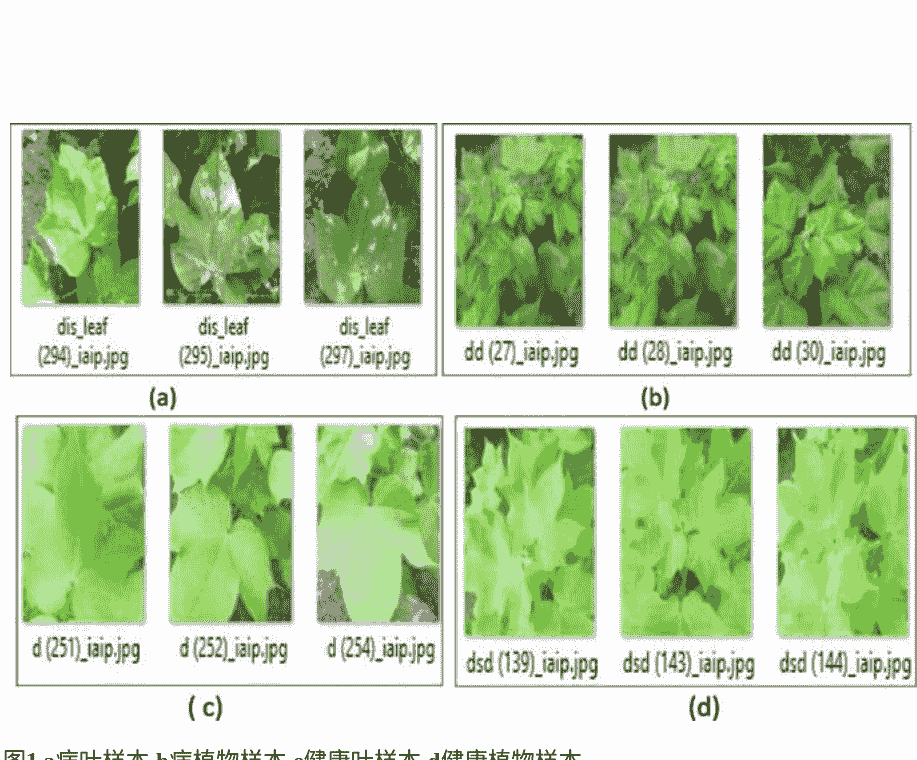

图1 a病叶样本 b病植物样本 c健康叶样本 d健康植物样本

掩码中的1表示在阈值范围内的值，0表示在范围外的值。将二进制掩码叠加在原始图像之上，如果掩码中对应的值为1，则保留给定图像中的每个像素。观察到结果图像有白色条纹。通过添加第二个掩码并将两者结合来克服这个问题。图2(a–e)显示了(a) BGR图像样本，(b) RGB图像样本，(c) HSV图像样本，(d) 第一个掩码后的图像样本，(e) 第二个掩码后的图像样本。使用三个特征描述符形状、纹理和颜色从图像中提取全局特征。色调矩用于描述图像中对象的形状。它执行每个量化bin的像素数量的分布，并为每个分量定义轮廓。Haralick纹理特征提取方法用于测量图像的感知纹理。纹理描述了图像中强度的空间排列。纹理分析描述了像素强度的空间变化函数，从而描述了图像的粗糙、平滑、丝滑或凹凸等特性。颜色直方图用于表示图像中颜色的分布、类型和每种颜色的像素数量。提取的特征被堆叠并以数值格式进行编码，用于建模。现在，数据已准备好进行建模。向量化的数据随机分为80%的训练数据和20%的测试数据。特征缩放用于标准化数据集的独立特征，并将其带入固定范围进行分析。然后，将图像保存为HDF5文件格式，以处理大型异构复杂数据。

机器学习模型——K最近邻（KNN）、决策树（DT）和集成模型——随机森林（RF）、装袋（Bagg）、极端树（ET）、XGBoost（XGB）、ADA Boost（ADAB）和梯度提升（GradB）技术被用于实验中。

#### 4 结果与讨论

KNN、DT、RF、Bagg、XGB、ADAB和GradB模型被实现，进行了10折交叉验证，并分析了性能。基于错误和正确分类实例的预测，进行了模型性能分析，并通过混淆矩阵[13]进行描述。准确率被定义为正确预测实例与总实例数之间的比率。F1-Score指标反映了模型的优劣程度，是精确率和召回率的调和平均值。ML算法的分类准确率和F1-Score在表2中呈现。ML算法的准确率通过箱线图表示，并在图3中展示。XGBoost、随机森林和ADA Boost的预测准确率分别为98.18%、97.33%和97.18%。与基础模型相比，集成模型提高了准确率。

KNN和DT树分类器在棉花病害数据集上的混淆矩阵在图4中呈现。这里，深色方框代表模型从类0到类3预测正确样本数量的模型（图5）。

图2 aBGR图像样本，bRGB图像样本，cHSV图像样本，d第一次掩膜后的图像样本，e第二次掩膜后的图像样本

## 表2性能指标技术

|      | F1得分% | 准确率% |
| :--- | :------ | :------ |
| KNN  | 89      | 90.54   |
| DT   | 94      | 94.96   |
| RF   | 93      | 97.33   |
| Bagg | 96      | 96.16   |
| ET   | 96      | 97.25   |
| XGB  | 97      | 98.18   |
| ADAB | 96      | 97.18   |
| GradB| 94      | 95.45   |

AUC-ROC曲线是模型选择的黄金标准之一。它是一个用于分类的概率曲线，并指定了模型在预测概率方面区分给定类别的好坏程度。曲线绘制在FPR（假阳性率）和TPR（真阳性率）之间。二分类的接收者操作特性（ROC）曲线在4a中呈现。使用一对多（OvR）启发式方法将多类转换为一类来绘制。

图3 机器学习算法的准确性比较

图4 a, b: 模型生成的混淆矩阵

二元分类。RF模型的AUC-ROC曲线见图4b。类别0、类别1、类别2和类别3与其他类别的ROC曲线下面积分别为99%、98%、96%和99%。

#### 5 结论

随着人口的不断增长，对食物的需求也在增加，因此需要从传统的农业方法转变。机器学习的使用可以带来更现代和可持续的作物种植方法，从而提高作物产量。利用机器学习算法进行疾病检测可以提高农业生产力、效率和监测收获时间。

观察发现，在机器学习中，集成方法比基本模型表现更好，预测更准确。通过在农业生态系统中应用机器学习，可以进一步扩展这项工作，用于智能农作物管理应用。

#### 参考文献

1. Wolfert, S., Ge, L., Verdouw, C., & Bogaardt, M.-J. (2017). 智能农业中的大数据——一项综述。农业系统, 153, 69–80.
2. H. Geli, L., & Prihodko, J. (2019, 八月). 未来农业和牧场生产的气候适应智能系统: 农业学院/白皮书/(pp. 13).
3. Tantalaki, N., Souravlas, S., & Roumeliotis, M. (2019). 数据驱动的决策在精准农业中的应用: 大数据在农业系统中的崛起。农业与食品信息学杂志, 20(4), 344–380.
4. Huang, G.-B., Zhou, H., Ding, X., & Zhang, R. (2011). 极限学习机用于回归和多类别分类。IEEE系统交易（第513-529页）。
5. Deepalakshmi, P., Nagarajan, K., & Sumathi, K. (2019). 南部泰米尔纳德邦农民团体的引导分析平台。国际工程与先进技术（IJEAT），9，5512-559。
6. Liakos, K. G., Busato, P., Moshou, D., Pearson, S., & Bochtis, D. (2018). 机器学习在农业中的应用：一项综述。传感器（瑞士），18（8），1-29。
7. Sharma, R., Kamble, S., Gunasekaran, A., & Kumar, A. (2020). 关于可持续农业供应链绩效的机器学习应用的系统文献综述。计算机与运筹学，119.
8. Kamilaris, A., Kartakoullis, A., Francesc, X., & Boldú, P., (2017). 农业大数据分析实践综述。计算机与电子农业，143，23–37.
9. Sonka, S., & Souravlas, S. (2014). 大数据与农业领域：不仅仅是大量数字。国际食品与农业管理评论，17(1).
10. Mekonnen, Y., Namuduri, S., Burton, L., Sarwat, A., & Bhansali, S. (2020). 无线传感器网络基于精准农业的机器学习技术综述。电化学学会杂志，167，037522.
11. Su, Y. X., Huan, et.al. (2017) 基于支持向量机的开放作物模型（sbo cm）：以中国水稻生产为例。沙特生物科学杂志，24(3)，537–547.
12. Wani, H., & Ashtankar, N. (2017). 使用机器学习算法预测作物的病虫害的适当模型。IEEE第四届高级计算与通信系统国际会议（ICACCS）（第1-4页）。
13. Jakka, A., & Vakula Rani, J. (2019). 机器学习模型在糖尿病预测中的性能评估。国际创新技术与工程探索杂志(IJITEE), 8, 1976–1980.

### 用于水稻病害检测的人工智能方法SVM、CNN和VGG16分类器的综述

阿米特·维尔马

摘要 粮食生产对任何国家的经济都起着至关重要的作用。需要准确的智能方法来提高粮食生产的效率。本文重点介绍了人工智能、深度学习和图像处理工具的技术应用。这些方法在利用叶片、种子或收获场景的照片进行疾病检测方面取得了显著的结果。在这种特殊情况下，本文重点介绍了精确农业在全球最重要的作物之一——水稻的高产方面的研究。本文综述了SVM、CNN和VGG16分类器在作物病害检测、幼苗健康和粮食质量方面的应用。

关键词人工智能·支持向量机·卷积神经网络·深度学习

#### 1 引言

培育是任何国家经济可接受性的基石。它对长期经济发展和辅助变革有关键影响[1]。根据联合国粮食及农业组织（FAO）的数据，到2050年，人口将增加20亿[2]。传统策略用于作物病害的管理非常具有挑战性。然而，关键困难在于这些传统方法的实施。不足之处在于培养人们具备执行这些策略所需的基本素质和经验。其他困难在于完成这些评估所需的时间，这阻碍了快速的动态和大规模评估[3]。

稻谷是世界上的主要作物之一，在小麦之后被认为是一种主要作物。对于不发达国家的经济和农民来说，稻谷是基本的主食，经济和农民尤为重要。

A. Verma (邮箱)
印度昌迪加尔大学研究与发展中心，加鲁安，摩哈利，旁遮普邦140413，印度e-mail : amit.e9679@cumail.in

© 作者（们），在Springer Nature Singapore Pte Ltd. 2022独家许可下S. Shakya等人（编），情感分析与深度学习，智能系统与计算进展1408，https://doi.org/10.1007/978-981-16-5157-1_71

依赖于稻谷产量。收获产量受到任何形式的负面影响。收获产量受到机械损伤、健康需求、基因混乱、气候条件等影响。与此相反，困难的问题是由宏观生物和微生物引起的疾病。

疾病仍然是稻谷产量损失和利润降低的主要原因。疾病和害虫每年使产量减少8-10%。化学和社会方法用于疾病控制，也增加了生产成本[4]。总体而言，稻谷种植在土地上约有66百万公顷，年产745.17百万吨稻谷产量，平均产量为4.48吨/公顷，根据FAO的数据。据估计，到2025年，需要生产880百万吨不可预测的稻谷，增长约为70%，以满足不断增长的人口需求，这是Lampe在1995年提出的建议。在印度这样的国家，2013年的稻谷种植面积约为42.41百万公顷，年产104.40百万吨稻谷和3.59吨/公顷是该作物的典型产量。据估计，到2021年，印度每年需要生产113.3百万吨稻谷，以满足该国不断增长的粮食需求。

通过改良的培育品种和组合收集和水系统的进步，必须获得更高的稻谷产量。稻谷作物获得更好收益的巨大限制是其对害虫、疾病和非生物胁迫的脆弱性。然而，由寄生虫、微生物、感染和线虫引起的疾病对于提高产量和产量稳定性[5]是非常严重的风险。专家观察到稻谷的10个重要疾病导致10-15%的常规产量损失。因此，识别适合稻谷的疾病对于确保稻谷的可持续生产至关重要。目前，当某地发生稻谷病害时，不同农业研究中心或农业专家会前往该地，并向农民提供指导。与农民数量相比，各地区缺乏足够的稻谷病害专家。在农村地区，迫切需要利用现有设备进行自动化稻谷病害检测[6]。

稻田中令人毛骨悚然的害虫的确认是具有挑战性的，因为这些害虫在大小和颜色上呈现出丰富的多样性，有些害虫在外观上很难辨认，尽管背部结构明显可见。手动检测水稻病害的方法可能非常复杂，并且需要相当高的技能来进行检测过程。当存在害虫昆虫并且分析师必须从静止图像中察觉过程时，病害检测的整个过程变得更加复杂。使用各种前景、混乱的背景拍摄的害虫图像可能会改变整个过程，例如旋转、噪音等。因此，拍摄的害虫图像将是独特的。因此，开发一种自动化的稻田害虫识别系统具有重要意义。计算机视觉方法在自动识别害虫图像方面具有重要意义[5]。

一般来说，稻谷农民和农业专家通过个人经验来识别感染，并进一步治疗明显的疾病。

使用手动经验来区分疾病的证据存在错误的可能性。无论如何，在传统方法中，时间复杂度很高，很难准确识别疾病并估计其受感染的区域。

及时检测病害和害虫对作物产量非常重要。为此，需要技术和使用技术来更精确、准确地解决问题。

#### 2 自动化方法中使用的分类器

独特的新策略旨在改善疾病和害虫的检测，以提高农民和农业专家的产量和质量。在农业领域，人工智能（AI）机器和技术具有极大的潜力，可以提供有关土壤质量、何时种植、何处喷洒除草剂以及最有可能发生害虫侵扰的信息。全球范围内使用AI技术帮助农民提高作物健康监测的效率，并用于几乎所有作物的疾病管理。AI技术用于制造和开发智能机器，其在作物管理方面的准确性超过人类[7]。农民正在采用人工智能和机器学习的方法，以提高作物管理的效率，包括检测和治疗各种疾病和害虫。智能系统已经准备好成为未来最常用的方法，它根据学习情况对不同情况做出响应，并提高处理这些情况的效率[2]。随着技术的进步和技术的易用性，人们已经推动了我们思维过程的限制，并试图用人工大脑来替代我们的正常大脑。这个过程通过研究产生了一个全新的领域，即人工智能。它是人类创造人工机器的方法。人工智能利用过去的学习，并能够根据这些学习执行管理思想[8]。人工智能、机器学习、计算机视觉、卫星成像和分析进展是新时代的技术，为智能农业的发展提供了最佳环境。这些技术是实现高产量和更好价格控制的扩展。

水稻病害和害虫的发现和缓解可以分为三个阶段，包括预处理和分割阶段、各种疾病或害虫的特征提取阶段，以及疾病或害虫的识别阶段。用作识别步骤实施的智能系统必须具有高度的识别和分类准确性。有许多具有不同效率和用于检测稻病和害虫的识别目的的准确性和精确性[9]。

用于自动化检测和管理水稻作物的主要分类器有：SVM（支持向量机）、CNN（卷积神经网络）和VGG16。

##### 2.1 支持向量机

支持向量机（SVM）用于分类或回归挑战，是一种监督式机器学习算法。然而，它主要用于分类问题。在SVM算法中，通过找到可以用于在n维空间中绘制每个数据的超平面来进行分类处理。使用SVM算法可以很好地区分类别。在图中，使用超平面显示了两个类别的分类（图1）。

对于分组和回归问题，使用支持向量机算法是最常用的机器学习方法之一。该算法是由Vapnik和Cher-vonekis提出的，基于统计学习理论或VC理论。支持向量机是AT&T贝尔实验室的Vapnik与合作者开发的最强大的预测方法之一。作为分类器使用的支持向量机是非线性分类器，可以将特征分为两类。通过引入一个超平面，将部分向量分离成不同的确定类别。支持向量机的主要目标是实现超平面与边界之间的最大分离，并尽量避免向量被错误分类。边界上可用的特征向量，以及超平面与其之间的距离被选择为支持向量[10]。

图1使用超平面显示的两类分类

##### 2.2 卷积神经网络

深度学习或深度神经网络一词暗示了具有不同层次的人工神经网络。在过去几十年中，它一直被视为最重要的资源之一，并在组织中变得特别受欢迎，因为它可以处理大量的数据。最显著的神经网络是卷积神经网络（CNN）。它的名称来自于称为卷积的网格的数值线性运算。卷积神经网络或CNN具有不同类型的层次，包括卷积、非线性、池化和全连接。这些层次之间存在差异，卷积和全连接具有限制，而池化和非线性则没有任何限制[11, 12]。CNN在人工智能问题中有着出色的表现。令人惊讶的是，处理图像数据的应用程序，例如最大图像分类数据集（ImageNet）、计算机视觉和语言处理（NLP），取得了非常惊人的结果。卷积神经网络在过去十年中在与结构识别相关的各个领域取得了重要的成果；从图像处理到语音识别[13, 14]。CNN最有价值的部分是减少人工神经网络中的层数。这一成就促使专家和开发人员提出更大的模型来处理复杂任务，这在传统的人工神经网络中是不可行的。关于CNN所解决的问题的最重要的假设是不应该有空间上的特征。例如，在人脸识别应用中，我们不需要关注面部在照片中的位置。重要的是要记住它们，无论它们在给定的图片中的位置如何。CNN的另一个重要部分是在数据向更高层次传播时获取抽象特征。例如，在图像表示中，边缘可能在初始层中被检测出来，然后在后续层中检测到更简单的形状，最后是更高级的特征[15]（图2）。

上述图表显示了CNN的基本概念，其中输入被视为图像，并且从输入到输出，输入图像通过模型的不同层进行处理[16, 17]。在完全处理输入图像之后，最终输出是基于模型的不同层进行分类得到的结果[18, 19]。深度CNN设计是一种用于学习图像特征的特色策略。它包含了一个基于层的卷积-反卷积模型，用于深度学习图像特征，并且在转换卷积-反卷积层之间具有对称跳跃连接[13, 20]。连续的直接和非直接限制涉及深度CNN。直接函数由卷积操作明确表示，非直接函数传达了不稳定的行为。卷积层理解稻谷作物图像的局部特性，并开始对稻谷病害进行复杂的部分描述。

模型越深入，对图片的印象越重要[21]。

##### 2.3 VGG 16

2014年，牛津大学视觉几何组实验室的两位科学家安德鲁·齐瑟曼和卡伦·西莫尼扬提出了一篇论文，基于这篇论文，提出了一个名为VGG 16的模型。VGG 16模型在2014年ILSVRC挑战赛的分类中获得了第一和第二名[22-24]。该模型在ImageNet数据集上取得了92.7%的准确率，位列前五位（图3）[25]。

#### 3 方法论

本文提出了一项综述，旨在识别与使用人工智能、神经网络和计算机视觉技术相关的工作，用于水稻病虫害的管理，包括疾病和害虫的检测。该综述基于使用人工智能技术进行水稻病害的识别和检测的方法。

在收获期间，及时准确地发现水稻患病情况，以减少损害，并为收获和产量提供更好的保障条件。Phadikar等人（2012）开发了一种机械结构，根据植物的形态学分析结果，对水稻植株的叶斑病和叶枯病进行自动化管理。基于贝叶斯理论和支持向量机（SVM）的分类器被应用于感染图片的描述和展示。将从中心到边界的阴影螺旋分布图像用作特征，通过贝叶斯和SVM分类器对疾病进行分类。系统测试使用了每个数据类别约500个实例。在基本的描述级别（例如未感染的叶片或患病的叶片），发现未感染叶片的成功率约为92%，带有褐斑的叶片为96.4%，带有叶枯病的叶片为84%。

在这项工作中，我们提出了一种用于检测水稻作物中两种特定疾病的电动结构。在第一阶段，根据直方图中的峰值数量，收集未感染和感染的叶子。

由于阴影效应和叶片的遮挡旋转，可能会出现错位。在后续阶段，使用贝叶斯分类器和支持向量机（SVM）来识别叶子的疾病。贝叶斯分类器的时间复杂度为O(N×D^2)，其中D是特征向量的维度，N是训练样本的数量。由于样本数量通常远大于特征向量的维度，因此所提出的方法相对于SVM更加高效。该方法使用从田间收集的1000张受污染水稻叶片的测试图像进行验证，贝叶斯分类器的准确率为79.5%，SVM分类器的准确率为68.1% [26]。

辛格等人（2015年）提出的系统是一种管理水稻植株中普遍发生的病害的方法，特别是利用支持向量机分类器（SVM）来管理叶斑病。随着图像处理和结构识别技术的不断进步，可以开发出一种独立的作物病害诊断系统。这项工作仅限于水稻病害，并且被认为是印度北部地区最常见的病害，特别是叶斑病。本文分为五个部分。第一部分介绍了图像获取，第二部分包括图像预处理，第三部分描述了图像分割，第四部分介绍了特征选择和特征提取，第五部分介绍了用于病害诊断的SVM分类器，第六部分包括结果评估和总结。照片来自国际水稻研究所的数据库。分割过程使用了K均值聚类算法，并得到了受污染的叶片部分。从分割图像中提取的纹理特征向量作为分类器的输入。支持向量机相对于其他分类器和神经网络可以更准确地对所有病害进行分类（82%）[27]。

Chung等人（2016年）提出了一种系统，用于整理三周大的受病害侵害的种子。受污染的植物可能产生空穗或死亡，导致失去的粮食产量。当使用被污染的种子时，污染发生的频率很高。当种子被污染时，微生物Fusarium fujikuroi在田间传播。因此，被污染的植物必须在早期发育阶段进行筛选。使用平板扫描仪拍摄了受污染和对照苗的照片，以量化它们的形态和颜色特征。

引入了支持向量机（SVM）分类器来识别受污染和健康的苗。采用遗传算法选择了关键特征和SVM分类器的最佳模型参数。本文提出的方法在识别受污染和健康苗方面的准确率达到了87.9%，积极的感知评估达到了91.8%[6]。

观察虫害数量是螟群管理系统中的一个基本部分。在这篇论文中，Ding等人（2016）提出了一个基于深度学习的计算机化识别流程，用于识别和记忆田间陷阱中的干扰物。这项工作倾向于应用先进的深度学习技术来进行虫害定位和计数，有效地将人类从循环中排除，实现完全自动化的实时虫害监测系统。应用于商业苹果蠹虫数据集，该方法在情感和数量上显示出有希望的性能。与以往的虫害识别任务相比，该方法不使用特定的虫害结构，可以适应不同的物种和环境，减少人力投入。它适用于相同的硬件，并且可以在需要实时性能的环境中部署。摘要和定量研究表明，该方法在苹果蠹虫数据集上的有效性。与大部分以往的工作相比，该方法更依赖于数据，而不是人工数据[28]。

Prajapati等人（2017年）提出了一个模型系统，用于识别和收集受感染的稻作植株的照片。本文尝试将机器学习和图像处理的思想应用于稻作田地中自动检测和收集病害的问题，这是印度重要的粮食之一。在任何植物上，病害都是由微生物、动物和污染引起的[29-31]。这个模型系统是在对使用的各种方法进行详细测试分析之后创建的。

处理图片任务。该工作考虑了三种水稻病毒，具体是细菌性叶斑病、褐斑病和叶霉病。感染的水稻植株的照片是使用一台专业相机从水稻田中拍摄的[3, 33]。然后，他们实验性地评估了四种基于根除的方法和三种分割技术。为了实现准确的特征提取，他们提出了基于质心处理的基于K-means聚类的疾病包分割方法。他们通过去除疾病区域中的绿色像素来改进了K-means聚类的效果。他们将各种特征分为三类：颜色、形状和纹理。对于多类别分类，他们使用支持向量机（SVM），在训练数据集上达到了93.3%的准确率，在测试数据集上达到了73.3%的精确度，并且进行了5和10折交叉验证，准确率分别为83.80%和88.57%[34]。

Pinki等人（2017）的论文提出了一个计算机化系统，用于发现稻叶的三种常见病害：稻瘟病、褐斑病和细菌性白叶枯病，并且根据病害的严重程度指导农药和肥料的使用。K-均值聚类方法用于从稻叶图像中确定受影响部分。为了对这些病害进行分类，使用了叶子的纹理、叶子的颜色和叶子的形状等视觉内容进行突出处理。稻叶中的病害通过支持向量机分类器进行分类。在确认病害后，提出了治疗病害的方法，帮助人们和农民采取针对病害的重要措施。

该系统有两个阶段和组成部分：训练阶段（使用一些受病害影响的稻叶图像来训练支持向量机）和测试阶段（通过摄像机从稻田获取测试图像。对测试图像进行处理，并使用与训练阶段相似的方法提取特征[35-37]。然后为问题图像创建一个特征向量。将特征向量发送给分类器以识别稻叶病害）。该提出的系统专注于识别稻叶病害，帮助农民进行准确评估并增加稻米产量。该系统的准确率为92.06%，比一些现有方法[38]要高。

对水稻作物中飞虱的人口密度进行概述对于决策和有效措施至关重要[39, 40]。对水稻作物中飞虱的定期手动检查是单调、疲惫和动态的。姚等人（2017）提出了一种三层发现过程，用于识别和感知白背飞虱及其发育阶段的图像处理。在前两个感知层中，他们使用了一个名为AdaBoost的分类器，该分类器是基于直方图的斜率特征和一个基于局部二值模式高亮和Gabor的支持向量机分类器来识别白背飞虱并消除污染影响[41, 42]。该工作实现了约86%的识别率和10%的虚假识别率。在第三个感知层中，使用基于HOG特征的支持向量机分类器来识别白背飞虱的特定发育阶段。

稻飞虱的识别准确率达到73%，假阳性率为23%，没有稻飞虱的照片的假区域率为6% [43, 44]。新的三层区域系统通常需要大约8秒来识别和感知单个稻米图像中的稻飞虱。这极大地缩短了在稻田中的观察时间。因此，该方法对于稻飞虱在稻米植株上的不同发育阶段的识别是可行和成功的 [45]。

Rajmohan等人（2018年）提出了一种基于传感器的移动应用框架，为农民提供关于稻谷产量和环境的重要信息。我们的结构旨在使农业生产更加高效，因为农民可以选择更好的决策，并因此节省时间和资源 [46, 47]。提出的智能稻田害虫管理模型基于传感器类型与可扩展应用程序相结合。所提出的框架的方法包括两个模块：

- 识别影响收成的疾病。
- 管理包括治疗措施的疾病。

疾病的识别与识别稻谷作物中发生的污染有关。疾病管理与选择污染明显的结果有关，这些结果通过移动应用程序传达给农民[48]。在200张病态图片中，真正识别出具有稻瘟病、褐斑病、细菌性叶枯病（BLB）、鞘病、假土壤、根结线虫和白尖病的症状的图片数量仅为175张，属于不同的分类。对于考虑的稻谷作物受影响的图片，发现成功率为87.50% [49]。提出的系统包括深度CNN和SVM分类器，与之前的系统进行了对比，之前的系统是通过结合k-means和模糊逻辑分类器以及KNN和SVM分类器实现的。发现提出的方法已经证明取得了改进的结果[50]。

##### 3.1 比较

| 序号 | 参考文献 | 年份 | 用于疾病检测的技术 | 目标 | 用于 | 准确率% |
|------|----------|------|--------------------|------|------|----------|
| 1 | S. Phadikar等人 | (2012) | 贝叶斯和SVM分类器 | 叶子 | 2种疾病 | 贝叶斯—79% SVM—68% |
| 2 | Amit等人 | (2015) | SVM | 叶子 | 1种疾病 | 达到82%的准确率 |
| 3 | Chung等人 | (2016) | SVM | 幼苗 | 1种疾病 | 准确率—88% 阳性预测值—92% |
| 4 | W. Ding等人 | (2016) | 卷积神经网络 | 昆虫害虫 | 不特定于害虫 | 该方法依赖于数据，而不是知识 |
| 5 | Yang Lu等人 | (2017) | 卷积神经网络 | 叶子 | 10种疾病 | 使用十折交叉验证策略，提出的模型达到96%的准确率 |
| 6 | B. Prajapati等人 | (2017) | SVM | 叶子 | 3种疾病 | 训练数据集准确率—93%，测试数据集准确率—73% |
| 7 | Farhana等人 | (2018) | SVM | 叶子 | 3种疾病 | 平均准确率—92% |
| 8 | 姚清等人 | (2017) | AdaBoost分类器和SVM | 稻田 | 白背飞虱的密度 | 检测率—86%和误检测率—10% |
| 9 | R. Rajmohan等人 | (2018) | 深度卷积神经网络和SVM分类器 | 叶子 | 7种疾病 | 对于考虑的稻作病害受影响图像的检测成功率为87% |
| 10 | P. K. Sethy等人 | (2018) | 模糊逻辑和机器视觉工具和SVM | 叶子 | 4种疾病 | 准确率为86%的估计 |
| 11 | Vimal等人 | (2019) | SVM和CNN | 叶子 | 4种疾病 | 准确率—91% |
| 12 | Rafeed等人 | 2019 | 堆叠卷积神经网络和VGG16 | 叶子 | 9种疾病 | 准确率—99% |
| 13 | Wan-jie等人 | (2019) | CNN, SVM, LBPH和Haar-WT | 叶子 | 1种疾病 | CNN—96% CNN + SVM—96% LBPH + SVM—83% Haar-WT + SVM—84% |
| 14 | S. Rautaray等人 | (2020) | VGG-16的迁移学习架构 | 叶子 | 6种疾病 | 达到90%的准确率 |

#### 4 结论

计算机视觉结构目前在园艺生产和现代食品生产的不同领域中普遍使用。由于水稻植物疾病可能在农业领域造成大量损失，这些系统可以更有效地用于识别水稻作物的不同疾病。通过这些系统，可以以非危险的方式自动化的繁琐的任务，并为未来的分析提供足够的数据。研究发现，在水稻作物领域使用计算机视觉和人工智能进行任务自动化存在一些需要满足的空白。计算机视觉和人工智能技术对于监测疾病的程度非常重要。由于裸眼观察可能导致精度不佳，并且可能因人而异。最后，我们指出，本综述将介绍SVM、CNN和VGG 16分类器以及人工智能、图像和视频处理技术的各种应用，以鼓励更多的研究人员在当前开放的农业问题上应用它们。

#### 参考文献

- Shrivastava, V. K., Pradhan, M. K., Minz, S., & Thakur, M. P. (2019). 水稻植物病害分类使用深度卷积神经网络的迁移学习。国际摄影测量、遥感和空间信息科学档案，42(3/W6), 631–635。
- Simonyan, K., & Zisserman, A. (2015). 非常深的卷积网络用于大规模图像识别。第三届国际学习表示会议，ICLR 2015—会议跟踪会议，1–14。
- Ramesh, S., & Vydeki, D. (2020). 使用优化的深度神经网络和Jaya算法识别和分类稻谷叶病害。农业信息处理, 7(2), 249–260。
- Albawi, S., Mohammed, T. A., & Al-Zawi, S. (2018年4月). 卷积神经网络的理解。2017年国际工程与技术会议论文集, ICET 2017, 2018年-1月 (第1–6页)。
- Atole, R. R., & Park, D. (2018年). 一种多类深度卷积神经网络分类器用于检测常见的水稻植株异常。国际高级计算机科学与应用杂志, 9(1), 67–70。
- Chung, C. L., Huang, K. J., Chen, S. Y., Lai, M. H., Chen, Y. C., & Kuo, Y. F. (2016年). 通过机器视觉检测水稻幼苗的白穗病。农业中的计算机与电子技术, 121, 404–411。
- 辛格, G., 米什拉, A., 和萨加尔, D. (2013年)。3.1.2.3. 1, 3–6。
- Rautaray, S. S., Pandey, M., Gourisaria, M. K., 和Sharma, R. (2020年)。稻谷病害预测—一种迁移学习技术。国际最新技术和工程杂志, 8(6), 1490–1495。
- 卢, Y., 易, S., 曾, N., 刘, Y., 和张, Y. (2017年7月)。使用深度卷积神经网络识别水稻病害。神经计算, 267, 378–384。
- Bashyal, B. M. (2018年)。一种新兴病害的病因: 稻瘟病。印度植物病理学, 71 (4), 485–494。
- 村濑, H. (2000). 农业中的人工智能. 农业中的计算机和电子技术, 29(1–2), 1–2。
- Naeem, M., Iqbal, M., Parveen, N., Abbas, Q., Rehman, A., & Sad, M. (2016). 稻瘟病概述.美欧亚农业与环境科学杂志, 16(2), 270–277。
- Mukherjee, M., Pal, T., & Samanta, D. (2012). 使用图像处理检测受损稻叶.全球计算机科学研究杂志, 3(10), 2010–2013。
- Patidar, S., Pandey, A., Shirish, B. A., & Sriram, A. (2020). 使用深度残差学习进行稻病检测和分类.计算机与信息科学通信, 1240 CCIS, 278–293。
- Verma, T., & Dubey, S. (2019). 使用模糊过滤的神经网络进行水稻病害诊断图像分析。国际创新技术与探索工程学报, 8 (8特刊3) , 437-446。
- Pinki, F. T., Khatun, N., & Islam, S. M. M. (2018年1月). 基于内容的稻叶病害识别和治疗预测使用支持向量机。第20届国际计算机与信息技术会议, ICCIT 2017, 1-5。
- Rahman, C. R., Arko, P. S., Ali, M. E., Iqbal Khan, M. A., Apon, S. H., Nowrin, F., & Wasif, A.(2020年12月). 使用卷积神经网络识别和识别水稻病害和害虫。生物系统工程, 194, 112–120。
- Patricio, D. I., & Rieder, R. (2018年4月). 粮食作物的计算机视觉和人工智能: 一项系统性综述。农业中的计算机与电子技术,153, 69–81。
- Sladojevic, S., Arsenovic, M., Anderla, A., Culibrk, D., & Stefanovic, D. (2016年). 基于深度神经网络的植物疾病识别与叶片图像分类。计算智能与神经科学, 2016年。
- Lurstwut, B., & Pornpanomchai, C. (2017年). 基于颜色、形状和纹理的水稻种子(Oryza sativa L.)发芽评估的图像分析。农业与自然资源,51(5), 383–389。
- Khandelwal, P., Maharaj, R. T., Khandelwal, P. M., & Chavhan, H. (2019年9月). 农业中的人工智能: 一篇新兴的研究文章。Researchgate, 01, 01–08。
- Venugoban, K., & Ramanan, A. (2014). 基于梯度特征的稻田害虫图像分类国际机器学习与计算期刊, 2015年3月, 1–5。
- Xiao, M., Ma, Y., Feng, Z., Deng, Z., Hou, S., Shu, L., & Lu, Z. X. (2018, April). 基于主成分分析和神经网络的稻瘟病识别农业中的计算机与电子学, 154, 482–490。
- Zhang, S., Li, X., Zong, M., Zhu, X., & Cheng, D. (2017). 学习kNN分类中的k值.ACM智能系统与技术交易, 8(3)。
- Yao, Q., Chen, G. T., Wang, Z., Zhang, C., Yang, B. J., & Tang, J. (2017). 基于图像处理的稻田白背飞虱自动检测和识别综合农业杂志, 16(7), 1547–1557。
- Phadikar, S. (2012). 基于形态学变化的水稻叶病分类。国际信息与电子工程杂志, 2(3), 460–463。
- Singh, A. K., & Raja, B. S. (2015). 基于数字图像处理和svm分类器的水稻病分类, 国际电子与电气工程师学会ISSN, 07, 294-299。
- Ding, W., & Taylor, G. (2016). 用于害虫管理的陷阱图像中的自动飞蛾检测。农业中的计算机和电子技术, 123, 17-28。
- Joshi, A. A., & Jadhav, B. D. (2017). 使用图像处理技术监测和控制水稻病害。计算、分析和安全趋势国际会议, CAST, 2016, 471-476。
- Kumar Singh, A., & Raja, Bs. (2015). 基于数字图像处理和SVM分类器的水稻病分类。国际电子与电气工程师学会ISSN, 07(01), 294-299。
- Kumar, P., Negi, B., & Bhoi, N. (2017). 使用K-means聚类技术检测水稻作物的健康和受损叶片。国际计算机应用杂志,157(1), 24–27。
- Jha, K., Doshi, A., Patel, P., & Shah, M. (2019). 关于农业自动化的综合评述, 使用人工智能。农业中的人工智能, 2, 1–12。
- Li, D., Wang, R., Xie, C., Liu, L., Zhang, J., Li, R., Wang, F., Zhou, M., & Liu, W. (2020). 基于深度卷积神经网络的水稻病虫害视频检测的识别方法。传感器（瑞士）, 20(3)。
- Prajapati, H. B., Shah, J. P., & Dabhi, V. K. (2017). 水稻植物疾病的检测和分类。智能决策技术, 11(3), 357–373。
- Gayathri Devi, T., & Neelamegam, P. (2019). 基于图像处理的泰米尔纳德邦Thanjavur水稻植物叶病簇计算, 22, 13415–13428。
- Gupta, A. K., Solanki, I. S., Bashyal, B. M., Singh, Y., & Srivastava, K. (2015). 水稻的白穗病—亚洲的新兴疾病。动物与植物科学杂志, 25(6), 1499–1514。
- Gurumoorthy, S., Rao, B. N. K., & Gao, X. Z. (2018, January). 认知科学和人工智能：进展和应用。认知科学和人工智能：进展和应用, 1+。
- Pinki, F. T., Khatun, N., & Islam, S. M. M. (2018年1月). 使用支持向量机的基于内容的稻叶病害识别和治疗预测.2017年第20届国际计算机与信息技术会议ICCIT 2017, 1–5。
- Eli-Chukwu, N. C. (2019). 人工智能在农业中的应用: 一项综述.工程技术与应用科学研究, 9(4), 4377–4383。
- Islam, R., & Rafiqul, M. (2015). 一种用于计算稻叶病害受影响像素百分比的图像处理技术.国际计算机应用杂志,123(12), 28–34。
- Shrivastava, V. K., Pradhan, M. K., Minz, S., & Thakur, M. P. (2019). 使用深度卷积神经网络的迁移学习进行稻谷植物病害分类.国际摄影测量、遥感与空间信息科学档案—ISPRS Arch., 42, 631–635。
- Rahman, C. R., Arko, P. S., Ali, M. E., Iqbal Khan, M. A., Apon, S. H., Nowrin, F., & Wasif, A. (2020). 利用卷积神经网络识别和识别水稻病害和害虫。生物系统工程, 194, 112–120。
- Sethy, P. K., Negi, B., Barpanda, N. K., Behera, S. K., & Rath, A. K. (2018). 使用机器学习和计算智能测量水稻作物病害严重程度。SpringerBriefs应用科学与技术, 1-11。
- Milosevic, N. (2020).卷积神经网络简介。 1-31。
- Q. Yao, Chen, G. T., Wang, Z., Zhang, C., Yang, B. J., & Tang, J. (2017). 利用图像处理自动检测和识别稻田中的白背飞虱。 综合农业杂志, 161547-1557。
- Bhar, L. M., Ramasubramanian, V., Arora, A., Marwaha, S., & Parsad, R. (2019). 人工智能时代：印度农业的前景。 印度农业, 3(69), 10-13。
- Bhattacharjee, A., Kr, S., Soni, B., Verma, G., & Gao, X. Z. (Eds.) (2020).机器学习，图像处理，网络安全和数据科学。
- Chatterjee, A., & Das, A. (2020, January).智能化研究。 *1109*(pp. 107-112)。
- Ahmed, K., Shahidi, T. R., Irfanul Alam, S. M., & Momen, S. (2019). 使用机器学习技术进行水稻叶病检测。 2019年可持续技术国际会议为工业4.0，STI 2019，2020年5月 (pp.1-5)。
- Rajmohan, R., Pajany, M., Rajesh, R., Raman, D. R., & Prabu, U. (2018). 智能稻田病害识别和管理使用深度卷积神经网络和svm分类器。 国际纯粹与应用数学杂志, *118*(15特刊),255-264。
- Liang, W.-J, Zhang, H., Zhang, G. F., & Cao, H. X. (2019). 水稻稻瘟病识别使用深度卷积神经网络。 科学报告, *9*(1), 1-10。
- Liu, Z., Gao, J., Yang, G., Zhang, H., & He, Y. (2016, March). 水稻田害的定位和分类使用显著性图和深度卷积神经网络。 科学报告, *6*。
- Suresha, M., Shreekanth, K. N., & Thirumalesh, B. V. (2017年1月). 使用knn分类器识别稻叶疾病. 2017年第二届技术融合国际会议, *I2CT 2017*, 663-666。

智能暗模式检测：通过预期的应用程序了解误导性模式

S. Hrushikesava Raju, Saiyed Faiayaz Waris, S. Adinarayana, Vijaya Chandra Jadala和G. Subba Rao

摘要 暗模式的重要性在于当消费者浏览互联网时欺骗他们。在LinkedIn、Facebook等社交网络网站上，用户发现了旨在窃取用户个人信息或让他们点击广告的暗模式。暗模式是通过使用UI/UX等领域创建的。尽管如此，它们有很多种类，可以通过网站上的广告吸引用户的注意力，使用户陷入困境并可能损失金钱。通过智能暗模式检测需要解决一些安全问题。本案例提出的预期主题是通过设计应用程序来进行浏览，以识别任何暗模式广告，并通过对话框进行警示。为了检测，设计了一种新颖的暗模式检测方法，并将其视为内置应用程序活动。性能和准确性是判断预期主题是否按照预期设计的主要因素。

**关键词**
- 黑暗模式
- 应用
- 检测
- 防止误导
- 物联网
- 报告生成

#### 1 引言

最初，网站上的广告是吸引用户点击并导致不同行为的一种方式。这将导致购买某些产品或对预期公司收入有益的某些活动。


哈里·布里格纳尔在他的博士论文“认知科学”中引入了它2010年。下表列出并演示了许多种类的黑暗模式。根据创始人的说法，黑暗模式在darkpatterns .org网站上列出（表1）。

为了吸引用户达到公司的营业额和目标，需要按顺序进行一系列活动（图1）：

下面提供了实现预期主题的步骤：

1.  打开加载了签名的应用程序；它可以定制添加新的签名或删除过时的签名。
2.  在应用程序中打开网站，以阻止点击和警告此类广告，这是一种黑暗模式。
3.  一旦检测到，需要提供预防或阻止此类广告，以便最终用户可以体验正常使用而不是意外体验。
4.  最后，向授权用户发出警报或发布报告。

### 表1 展示了如何行为的黑暗模式列表

| 一种黑暗模式 | 描述及其影响 |
| --- | --- |
| 诱饵和转换 | 当用户即将按照期望的方式执行操作时，它会以意想不到的方式产生结果。它为内容提供价值，并期望得到回报。例子：它允许UX pin通过交换电子邮件地址获取电子书 |
| 伪装广告 | 它们是常规内容的一部分，吸引用户点击。例子：dafont.com网站包含字母，误导用户点击。主要下载比Zip Mac小得多，不太显眼，与之无关 |
| 强制连续性 | 它最初作为免费服务（试用）提供，并在试用期结束后开始收费。例子：Coursera是一个全球学习平台，让新用户对订阅产生困惑 |
| 朋友垃圾邮件 | 它以虚假的信念要求用户提供电子邮件或社交媒体权限，以实现他们的目标。例子：LinkedIn，引起诉讼并罚款 |
| 隐藏成本 | 它涉及一系列步骤，其中最后一步显示出意外的金额，其中包括产品价格加上其他设施，如税费和其他组成部分。示例：在广告中显示特定金额，但在结账时显示不同的金额 |
| 误导 | 它针对特定地点，但不会注意到其他事情正在发生。示例：Skype软件更新导致其他两个应用程序，如必应搜索引擎和MSN作为主页 |
| 价格比较预防 | 它导致零售商无法做出明智决策，使用户难以比较一件商品的价格与另一件商品。示例：LinkedIn提供免费试用，但从不披露其高级订阅费用 |
| 隐私Zuckering | 它在Facebook上发现，抓住用户对某些事物的注意力，并使他们的信息公开可用，而不是特定意图。示例：zappier.com以两种模式发布，其中一种显示每个人都能理解的英文表单，另一种则充满了法律术语，而不阅读它 |
| 蟑螂旅馆 | 它将用户置于一种无法逃脱的情境中。例子：《印度时报》注册了一次工作提醒，但没有办法停止来自工作门户的提醒消息。 |
| 悄悄溜进篮子里 | 它期望购买一件东西，但在购买过程中自动添加了额外的物品。例子：GoDaddy网站显示了三个网站的特定金额，但最终金额还包括隐私订阅，这在购买中并不意味着。 |
| 诡计问题 | 它构造了一个棘手的句子，要求一件事情，但意图做另一件事情。例子：天空对你喜欢的产品和服务负责，除非你点击选择退出。 |
| 大局影响 | 它允许以未来或平行因素的观点给出陈述，但不关注细节。例子：在特朗普参选期间，针对民主制度的信息被滥用，虚假新闻提高了点击率，并帮助特朗普获胜。 |


#### 2 文献综述

根据许多资源提供的信息，为了对黑暗模式有所了解并且如何识别此类模式是一项重要任务，需要提到一些研究。

根据[1,2]提供的演示，有多种方法可以通过巧妙的逻辑吸引和引导购物者或用户进行不同的行为。尽管某些国家对此进行了禁止，但仍然有许多社交媒体网站在没有干预的情况下随机参与其中。此外，它描述了如何根据工作来吸引人们做出决策（JTBD）。

关于[3]中提到的文章，它展示了对黑暗模式的评论，解释了各种黑暗模式的方式，还指出了如何识别此类模式，并且该来源就像黑暗模式的指南。黑暗模式的需求是基于公司的营业额和目标来赚钱。根据[4]的演示，这是一项对研究人员具有激励作用的研究，许多产品，许多网站都参与了黑暗模式，其目的是吸引用户进行不同的行为方式。根据模式的性质，它们被分类为几个类别。本文探讨了许多黑暗模式的目的和细节。关于[5]中提供的信息，这些黑暗模式将采取的诡计需要提前警惕用户。有一些需要了解的功能，如程序分析和一些机器学习方法有助于确定黑暗模式。根据[6]提供的数据，这是对黑暗模式进行的一项调查，旨在误导用户做某事，还将其分类为特定类型并探索此类模式。此外，还对了解这些模式的用户的百分比进行了调查，以及不了解这些模式的用户的百分比。关于[7]提到的来源，主要目标是执行三件事，即易感性，制造受害者以及对用户的影响。有一个相关因素，它确定模式的类型和其影响；讨论了被描绘为受害者的用户。根据[8]中的研究演示，人们将使用的附近空间设备将经历相同的黑暗模式。这种近距离的（社交）互动确定了黑暗面的根本原因，并提供了最小化危险的解决方案。根据[9]的信息，有几种类型的黑暗模式，分类组别属于压力，强制，障碍，潜行和欺骗。这些类别将进一步分解为其他服务。根据[10]中提到的信息的合理性，这也展示了各种黑暗模式，它们对用户的行为以及采取的阻止此类模式的方式。根据[11]中提到的研究，列出了基于用户体验的黑暗模式和基于人工智能和机器学习的算法之间的常见行为差异，如下图所示。重要的区别是前者允许改变行为，而不可能知道你被欺骗了，而后者有助于误导工作以及愤怒的被欺骗（图2）。

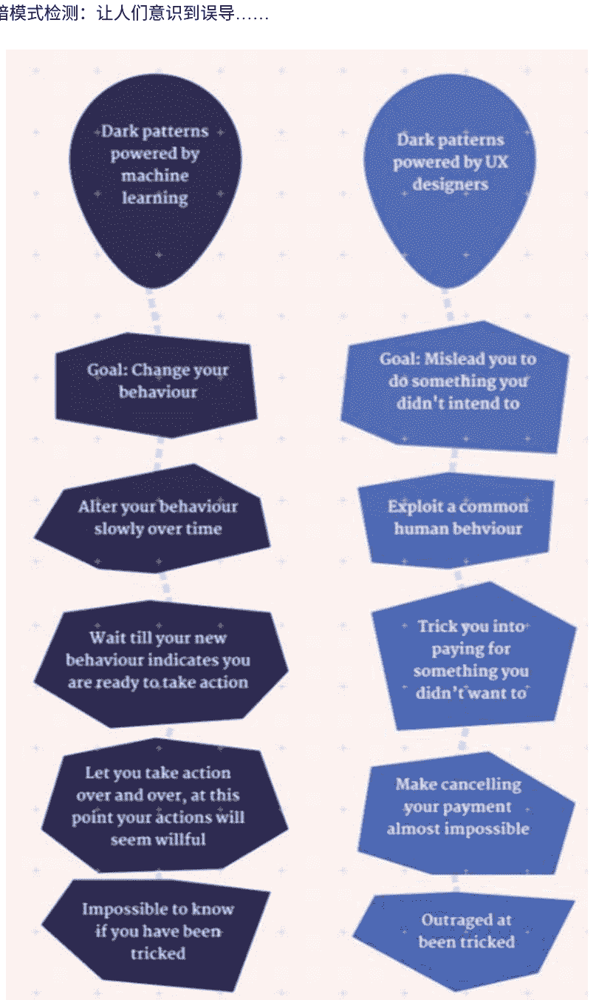

图2 基于人工智能和基于用户体验的活动差异

关于引用的来源[12]，该书展示了关于数字网站上欺骗性结构的各种法律和法律构建，涉及到哈佛法律与技术杂志第34卷。关于引用的来源[13]，黑暗模式包括基于平台的不同设计，其中政策基于技术、政治和安全设置，并相应地进行演示。根据[14]中提到的信息，有特定的机器学习分类器被提出，以确定不仅仅是黑暗模式的模式类型，可能是反模式或其他类型。根据[15]的研究，这显示了关于各种黑暗模式的统计分析，包括频率、欺骗性等。在某些情况下，由于对用户进行误导行为的疏忽，某些国家对某些社交运行网站处以罚款。这些法律和罚款是由欧洲立法数字论坛机构实施的。关于[16]，分析了黑暗模式的影响，它们的意外任务会欺骗用户，并提出了减少此类模式的技术。它们也以系统的方式进行了审查。根据[17]中给出的来源，使用indexOf()方法（也称为一次性查找索引方法）来检查某个文本是否在大量数据中存在。它还允许同时使用多个模式，并报告与给定文本相对应的模式的统计信息。关于[18]中的信息，建立了用于增量数据库的新型树结构，并帮助识别这些数据库中的热门模式。根据[19]的描述，关键标准应用于时间数据库，以确定模式在股票市场、市场篮子等各种应用中的规律性。在[20]方面，所有关于犯罪的投诉在违法行为被警察或自动违法行为设计识别后，都会在法律办公室进行登记。根据[21]中提到的信息，使用聚类、能源利用变化分析等数据挖掘技术评估家庭人类模式。根据[22]的演示，在感染导向的健康环境中使用Apriori算法早期检测疾病。

可以使用映射减少技术来实现可扩展性。可以识别并删除异常数据集。根据[23]中提到的来源，滑动窗口用于保留旧事务并包括新事务。应用的新方法用于从数据库的垂直格式中确定正面和负面模式，无需多次扫描和构建树。根据[24]中提供的信息，挖掘各种面向应用的网站以提取频繁和流行的模式。通过挖掘网络使用模式来避免FP-Growth的限制。

根据[25]中指定的信息，使用基于SVM的方法检测孤岛，并确定使用分布式发电系统的所需位置。根据[26]中提到的来源，在ZNO结构上检测模式，同时进行SAW混合物中插入损失。根据[27]中的信息，图像在视频中被分解以捕获车牌号码，使用连续的ANPR和RNPR框架。

根据[28]中给出的描述，通过将支持计数与早期常规方法计数相同的频繁项集存储在一个合并矩阵中作为二进制内容，实现了效率。关于[29]中的信息，FP-growth和apriori被应用于在多维数据库中找到常规模式。它使用额外的时间和懒惰修剪方法。根据[30]中提到的源，估计中心像素与其邻居之间的差异，并根据所需应用程序上的模式提出不同的方法进行迭代。根据[31]的演示，将提取局部边缘检测与基于颜色特征的相同方法进行比较，并根据考虑的评估指标进行比较。根据[32]中给出的描述，通过开发新的模式发现模型来发现文本数据库中的模式，并减少与现有数据挖掘技术相关的缺点。根据[33]的演示，视频被监视，并根据活动行为分配颜色代码。因此，活动的检测和颜色被标记在进度条上。根据[34]中提到的源，检测动物穿越、减速带，并在行驶过程中发出警报。这个指南帮助司机安全出行。根据[35]中提到的角色，当物体的重量满足截断时，跟踪这些物体，并使用物联网捕捉这些物体。根据[36]中的描述，跟踪特定的物体并生成关于这些情景的报告。

上述任何文章都对使用数据挖掘技术、机器学习技术和深度学习方法确定模式非常有用。因此，重要的是采用能够检测模式的方法论。

#### 3 提出的工作

在此过程中，识别出的模块包括设计应用程序、通过应用程序识别出黑暗模式、在误导性广告上显示图标并进行警示。设计应用程序涉及一系列步骤，如加载网页、扫描网页的源代码，根据广告及其意图进行识别，并在误导性广告上添加警示图标。通过这种方式，可以让人们意识到这些误导性模式。该系统的目标是警示用户，因为大多数浏览网站的用户是无意中陷入陷阱的。因此，通过应用程序检测黑暗模式的ER图表以及模块的伪代码被演示出来。

智能黑暗模式检测的ER图由多个模块组成，每个模块的功能通过活动来实现。在此中，模块以矩形形式指定，活动以椭圆形式指定（图3）。

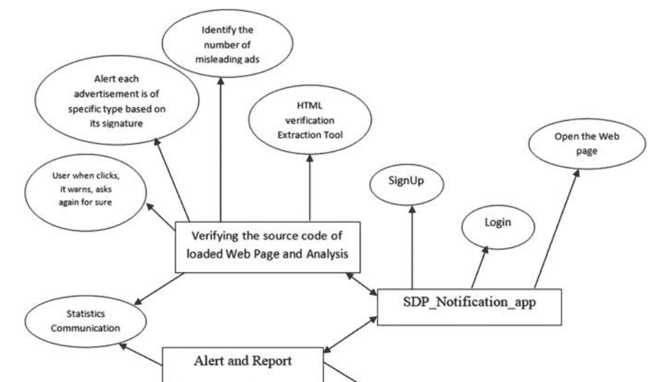

图3 智能黑暗模式检测和报告的ER图

预期的应用程序指定其固有活动，包括使用预定义和高效的提取工具分析加载的网页，并将有关该网页中识别出的模式的统计指南报告给最终用户。该主题的目标是让用户了解黑暗模式，并尝试在类似实际页面但带有警示标签的虚拟页面上公开警示。

智能黑暗模式的伪代码过程如下：

```
Pseudo_Procedure SDP_Notification_app (website, alertdialog[], parser_darkpatterns):
```

步骤1：打开应用程序，首先注册，然后登录
步骤2：加载网页，在虚拟爬虫中打开该页面
步骤3：调用Analysis_page_source_code(code, detecting_signatures_Darkpatt[])
步骤4：调用警报和报告(output_of_Step3)

Analysis_page_source_code(code, detecting_signatures_darkpatt[])的伪代码过程如下所示：

```
伪代码过程Analysis_page_source_code(code, detecting_signatures_darkpatt[]):
```

步骤1：读取任何标签，将其作为值属性的货币分配或作为锚标签值的购物地址或作为锚标签值的社交地址或作为链接（或）settimer()方法（或）bind()方法
步骤2： 如果part_code包含settimer()方法（或）bind()方法，则警报（“这是一个棘手的问题 - 可能是Confirmshaming或Scarcity或CountDowns或Nagging或SocialProof之一”）
步骤3： 如果part_code包含否定的力量行为，如NO、Go Back或停用账户或为了钱而设陷阱alert(“这是强制连续或强制注册”)
步骤4： 如果part_code包含不透露成本或检查会员资格关闭 alert(“这是Roach模型或预选或隐藏信息或点击疲劳”)
步骤5： 如果part_code包含Sports direct杂志或额外产品添加到购物篮中 alert(“这是潜入购物篮或隐藏订阅或隐藏费用”)
步骤6： 如果part_code包含会员身份或华丽的视觉元素或记录异常行为或允许控制的广告 alert(“这是诡计问题或误导或诱饵和转换或伪装广告”)

返回包含检测到的模式和其类型的output_Analysis_page_source_code记录

alert和report(output_Analysis_page_source_code[][])的伪代码过程如下：

```
步骤1： 以字典形式存储output_Analysis_page_source_code实体
步骤2： 找到output_Analysis_page_source_code的长度
步骤3： 对于基于步骤2的第一个实体到最后一个实体，其中1是循环变量重复执行
为检测到的output_Analysis_page_source_code[i]创建警告对话框从output_Analysis_page_source_code(code, detecting_signatures_darkpatt[])中设置
检测到的类型直到达到最后一个实体
步骤4： 记录对暗模式的点击活动
步骤5： 通过邮件向授权用户发送报告
```

在上述伪代码中，app是一个模块，其中进行身份验证并安全地打开和访问网页，第二个模块analysis_web_page_darkpatterns使用内置解析器来识别特定的关键字文本、社交媒体或购物地址部分，将这些标签分成适当的暗模式，并在记录中跟踪这些类别的模式，第三个模块是警报，报告将跟踪此类模式，并将这些模式标记为对话框窗口，并将报告发送给相关人员（图4）。

下面是智能黑暗模式检测的流程图。

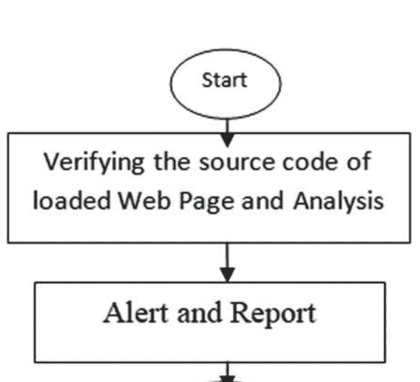

图4 智能黑暗模式检测的流程图

#### 4 结果

所提出系统的预期屏幕序列如下所示（图5）：

在图6的情况下，该页面上的报告将被准备并警报，同时也会发布到相关的邮件中（图7）。

在图8的情况下，该页面上的报告将被准备并警报，同时也会发布到相关的邮件中（图9）。

下面是一些黑暗模式的快照，以便在用户浏览时提醒他们（图10）：

与许多现有方法相比，SDP应用程序的准确性几乎达到百分之百，可以检测出各种可能误导用户行为的黑暗模式（图11）：

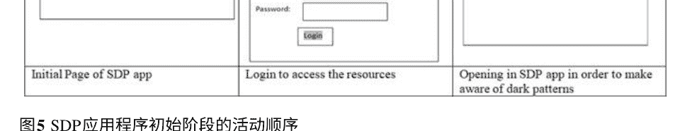

智能暗模式检测：让人们意识到误导……

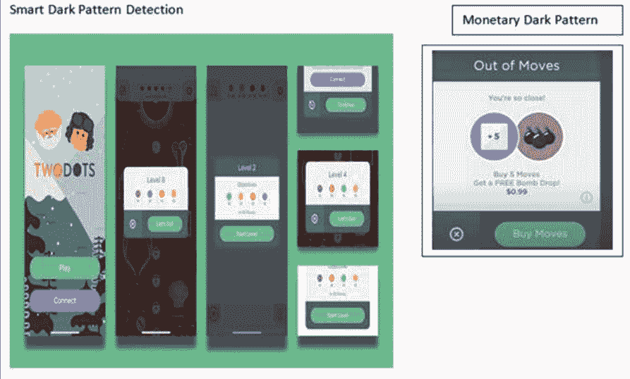

图6 在游戏中识别货币黑暗模式

| Type of application | Gaming |
| --- | --- |
| Kind of Dark Pattern | Monetary |
| Description | Mislead towards grabbing the money |
| Number of Dark patterns in the site | 01 |

图7 相对于图6的报告

在图9中，传统方法通过理论意识或通过训练来读取黑暗模式，现有的应用程序可以检测到但不会意识到具有黑暗模式的广告，而提出的目标SDP应用程序将在打开的网页中创建一个虚拟页面，并标记检测到的任何黑暗模式及其类型，以便用户在点击时提醒。

#### 5 结论

这项研究工作的预计目标是通过使用户意识到他们使用的网页中的黑暗模式来提醒用户。当打开虚拟网页并使用内置网页解析器时，警报将被标记。

Smart Dark Pattern Detection

Roach Motel


Offer valid in U.S. only. thenewletter@gmail.com received this promotional message as a subscriber of the Architectural Digest promotional list. Remove this e-mail address from future Architectural Digest e-mail promotions. To continue receiving e-mails from Architectural Digest, add architecturadigest@email.condenast.com to your address book. View our privacy policy. Condé Nast 1313 North Market Street, Wilmington, DE 19801 Satisfaction Guarantee: If you are ever dissatisfied with your subscription, you can receive a full refund on unmailed issues. Architectural Digest

图8 在《Digest Magazine》中识别Roach Motel

| Type of application | Magazine |
| --- | --- |
| Kind of Dark Pattern | Roach Motel |
| Description | Mislead towards grabbing the money |
| Number of Dark patterns in the site | 01 |

图9 从图8输出的报告


图10 一些黑暗模式的示例快照 (Bait and Switch, Hidden Costs, Misdirection)通过标签或关键词来检测此类模式，还可以将与社交媒体或购物等相关的网页边界分开，这是一种通知用户注意暗模式的方式。 虽然在设计的应用程序中的虚拟页面上发出警报，但记录了用户在这些具有暗模式行为的广告上的活动，并将这些记录的活动存储在单独的文件中，并传送给相关的邮件以供将来分析。 与现有方法相比，准确性是可观的。 通过在虚拟页面中加载相同的页面，检测到预测广告的每个对话框，并避免互联网用户远离这些广告，从而实现了预期意识形态的优势。 页面的访问速度很快，因为页面已经虚拟打开。 如果发现任何新的签名，必须将其添加到当前列表中进行进一步处理。

#### 参考文献

1.  Wintermeier, N. (2020年6月). 电子商务中的黑暗模式示例: 它们是什么以及为什么要避免. https://blog.crobox.com/article/dark-patterns
2.  Wintermeier, N. (2021年3月). 个性化的决策科学和JBTD. https://blog.crobox.com/article/decision-science-ebook
3.  Maier, M., & Harr, R. 黑暗设计模式: 用户视角 *Human Technology*, 16(2), 170–199. https://doi.org/10.17011/ht/urn.202008245641
4.  Mathur, A., et al. (2019年9月). 大规模的黑暗模式: 来自11000个购物网站的发现. 3, No. C SCW, Article 81. https://arxiv.org/pdf/1907.07032.pdf
5.  Chen, C. (2019). 黑暗模式网页检测器. https://supervisorconnect.it.monash.edu/projects/honours/dark-pattern-web-detector
6.  di Geronimo, L., 等。(2020年4月) UI黑暗模式及其发现: 对移动应用和用户感知的研究。 *CHI '20: 人机交互计算系统2020年会议论文集(第1-14页)*, https://doi.org/10.1145/3313831.3376600
7.  Aditi, M., & Bhoot, 等。(2020年11月) 朝着黑暗模式的识别: 基于最终用户反应的分析。 IndiaHCI 2020: 第11届印度人机交互会议论文集(第24-33页), https://doi.org/10.1145/3429290.3429293
8.  Greenberg, S., 等。(2014年6月) 近距离交互中的黑暗模式: 一个批判性视角。 DIS '14: 设计交互系统会议论文(页码523-532)。 https://doi.org/10.1145/2598510.2598541
9.  暗模式检测项目。 https://dapde.de/en/dark-patterns-en/types-and-examples-en/
10. 暗模式: 对用户体验欺骗的新科学观点。 https://www.fyresite.com/dark-patterns-a-new-scientific-look-at-ux-deception/
11. Kinnaird, Z. (2020年10月)。机器学习驱动的暗模式: 智能组合。 https://uxdesign.cc/dark-patterns-powered-by-machine-learning-an-intelligent-combination-f2804ed028ce
12. Willis, L. E. (2020年)。设计中的欺骗。哈佛法律与技术杂志, 34, 第1季秋季。 https://jolt.law.harvard.edu/assets/articlePDFs/v34/3.-Willis-Images-In-Color.pdf
13. Sinders, C. (2020年5月)。暗模式和设计政策。 https://points.datasociety.net/dark-patterns-and-design-policy-75d1a71fbda5
14. Nord, R., & Kurtz, Z. (2020年3月).使用机器学习检测设计模式. https://insights.sei.cmu.edu/blog/using-machine-learning-to-detect-design-patterns/
15. Caruso, F. (2019年11月).暗黑模式: 误导的产物. https://www.europeandatajournalism.eu/eng/News/Data-news/Dark-patterns-born-to-mislead
16. Cara, C. (2020年1月).媒体中的暗黑模式: 系统综述. https://www.researchgate.net/publication/341105338_DARK_PATTERNS_IN_THE_MEDIA_A_SYSTEMATIC_REVIEW
17. Raju, S. H., & Rao, M. N. (2016). 使用数据预处理和一次查找索引方法进行模式匹配国际药学与技术杂志,8(3), 18395–18407, ISSN: 0975–766X, http://www.ijptonline.com/wp-content/uploads/2016/10/18395-18407.pdf
18. Kumar, G. V., Sreedevi, M., Bhargav, K., & Krishna, P. M. (2018). 从事务数据库中增量挖掘流行模式国际工程与技术杂志 (阿联酋) , 7, 636–641。
19. Kumar, G. V., Sravya, S. V., & Satish, G. (2018). 在事务数据库中挖掘高效用途的常规模式, 国际工程与技术杂志 (阿联酋) , 7, 900–902。
20. Kumar, G. V., Sreedevi, M., Krishna, G. V., & Ram, N. S. (2018). 在犯罪数据集上挖掘常规频繁犯罪模式国际工程与技术杂志 (阿联酋) , 7, 972–975。
21. Akhila, G., Madhubhavana, N., Ramareddy, N. V., Hurshitha, M., & Ravinder, N. (2018). 通过智能设备使用人类活动模式进行健康预测的调查。国际工程与技术杂志 (阿联酋) , 7 (1) , 226–229。
22. Bisoyi, S. S., Mishra, P., & Mishra, S. (2018). 从分布式数据源中提取全局异常频繁模式: 一种MapReduce方法。《高级研究杂志》10(2特刊), 1460–1467.
23. Kumar, N. V. S. P., & Rao, K. R. (2018). 使用垂直数据格式在增量数据库中挖掘负面和正面常规模式的滑动窗口方法。《国际工程与技术杂志》7(3.27特刊27), 621–626.
24. Nallamala, S. H., Pathuri, S. K., & Koneru, S. V. (2018). 对网络监视器记录中的重复模式分析算法的评估。《国际工程与技术杂志》7, 542–545.
25. Rao, G. S., & Rao, G. K. (2018). 基于支持向量机的模式识别孤岛检测方法在多个分布式发电系统中。国际工程与技术杂志 (阿联酋) , 7 (1) , 228–231。 https://doi.org/10.14419/ijet.v7i1.9559
26. Santosh, G. S. K., Kumar, K. M., Kumar, K. P. M. S., Sai, K. B., Sravani, P., & Shanmukh, G. (2018). 调查SAW延迟线中的插入损耗与周期性图案化ZnO结构。先进动力学和控制系统研究杂志, 10 (2) , 541–546。
27. Rani, C. M. S., Dheeraj, K., Reddy, P. S. V., & Satyasai, K. (2018). 图像分割用于监控中的模式识别。国际工程与先进技术杂志，7（3），45–49。
28. Sireesha, M., Vemuru, S., & Rao, S. N. T. (2018). 基于合并的二进制表：一种改进的挖掘频繁模式的算法。国际工程与技术杂志（阿联酋），7（1.5特刊），51-55。
29. Sreedevi, M., Harika, V., Anilkumar, N., & Sai Thriveni, G. (2018). 多维数据库上的正则模式挖掘。国际工程与技术杂志（阿联酋），7（2），61-63。 https://doi.org/10.14419/ijet.v7i2.20.11752
30. Sucharitha, G., & Senapati, R. K. (2018). 用于人脸识别和图像检索的本地极端边缘二进制模式。动力与控制系统高级研究杂志，10，644-654。
31. Sucharitha, G., & Senapati, R. K. (2018). 用于颜色纹理图像检索的本地量化边缘二进制模式。理论与应用信息技术杂志，96(2)，291–303。
32. Changala, R., & Rajeswara Rao, D. (2017). 关于文本挖掘中模式发展模型的调查，使用数据挖掘技术进行模式发现。理论与应用信息技术杂志，95(16)，3974–3981。
33. Raju, S. H., Rao, M. N., Sudheer, N., & Kavitharani, P. 通过处理大尺寸视频快速识别特定活动。国际工程与技术杂志，ISSN: 2227–524X。 https://doi.org/10.14419/ijet.v7i2.32.1571
34. Raju, S. H., Dr Rao, M. N. Dr Sudheer, N. & Dr Kavitharani, P. 关于交通和外部条件的可视安全道路旅行应用程序。国际工程与技术杂志，ISSN: 2227–524X， https://doi.org/10.14419/ijet.v7i2.32.1569
35. Mothukuri, R., Raju, S. H., Dorababu, S. & Waris, S. F. 加权物体的智能捕捉器。IOP会议系列材料科学与工程，981(2)。 https://doi.org/10.1088/1757-899X/981/2/022002
36. Lalitha, V. L., Raju, S. H., Sonti, V. K., & Mohan, V. M. (2021). 定制智能物体检测: 使用物联网检测到的对象的统计数据. 人工智能和智能系统国际会议 (ICAIS), 2021, 1397–1405 . https://doi.org/10.1109/ICAIS50930.2021.9395913

### 使用循环神经网络识别Twitter上的垃圾邮件发送者

Rahul A. Patil和Chetana C. Chaudhari

摘要 全球有很多人参与非正式的社交网站。 用户在这样的社交媒体上的经历，比如Twitter，对生活有着重大而常常是不希望的影响。 垃圾邮件发送者已经成为从主要的社交网站传播大量无关紧要和有害信息的目标。 Twitter是有史以来最豪华的网络日志服务之一，通常用于发布无意义的垃圾邮件。 虚假用户向用户发送不请自来的推文，以推广项目或网站，这不仅影响真实用户，还阻止了资源的使用。 此外，通过错误的身份扩展用户向用户提供无效信息的潜力增加，导致恶意材料。 垃圾邮件发送者、虚假用户和虚假推文最近在Twitter上被发现，并成为在线企业中一个相关的研究领域。 本文提出了用于识别Twitter垃圾邮件发送者的方法。 此外，Twitter的垃圾邮件分离方法根据它们对虚假信息、URL和模式垃圾邮件的检测能力进行分类。 由于包括6个最近被确定的功能和2个新定义的功能在内的12-9个功能，已经发现了两个计算机检测解决方案，可以在实时数据集中区分用户和垃圾邮件发送者。

关键词分类·社交网络网站·垃圾邮件检测·机器学习·社交网络安全

#### 1 引言

像Instagram、Facebook和Twitter这样的网络社交网站最近变得非常明显，就像一些在线社交公司一样。 人们在在线社交网络（OSN）上花费大量时间与他们认识或喜欢的人交朋友。 对基于Web的媒体的增加兴趣使用户能够收集丰富的数据和用户信息。 此外，垃圾邮件发送者的焦点是借助这些页面上的大量信息。Twitter立即成为实时用户信息的来源。Twitter是一个OSN，允许用户分享从新闻到观点到状态的任何内容。有几个关于不同问题的讨论，包括经济学、当前事务和重要事件。如果用户发布任何内容，它们会立即传播给他们的关注者，以扩大知识的范围。OSN的发展已经建立了对在网络聚会期间用户行为的研究和分析的需求。许多对OSN了解不多的人可能很容易被骗子欺骗。

还有一种需求是打击和控制那些仅仅使用OSN进行宣传和垃圾邮件的人。

最近，分析师们对社交网站上的垃圾邮件识别产生了兴趣。垃圾邮件识别是一项困难的任务，用于保护社交网络安全，垃圾邮件在OSN领域是必不可少的，用于保护用户免受各种恶意攻击。这些垃圾邮件发送者的恶意行为实际上导致了网络的大规模崩溃。Twitter垃圾邮件发送者有不同的目的，如传播无效、虚假和无控制的信息。垃圾邮件发送者通过广告和其他手段实现他们的恶意目的，他们存储了各种邮件列表，然后随机发送垃圾邮件来传播他们的倾向。这些行为给非垃圾邮件用户带来了困扰。此外，OSN平台的声誉也受到了影响。因此，制定一个垃圾邮件发送者识别计划以抵制他们的恶意行为是至关重要的。

对于学术界和商业界来说，在Twitter上找到存储的想法和模式，能够整理有意义的信息是非常重要的。然而，在Twitter上，垃圾邮件带来了很多噪音。为了有力地追踪垃圾邮件，分析师们使用机器学习算法对垃圾邮件进行分类和发现。垃圾邮件识别是一项困难的任务，用于保护社交网络安全，垃圾邮件在OSN领域中是基本的，用于保护用户免受各种恶意攻击。实际上，将推文广播视为垃圾邮件或非垃圾邮件的Twitter用户更为合理。

#### 2 相关工作

撰写研究是任何研究的第一步。在开始撰写之前，我们需要研究我们所从事的领域的过去论文，并基于研究进行。他们会预测或提供障碍，并继续使用实践测试作为指南进行工作。在本节中，我们将快速回顾与垃圾邮件检测及其各种方法相关的研究。

Sirivianos等人[1]描述了SybilRank，一种有效和高效的虚假账户推断方案，它允许OSN根据其被认为是虚假的概率对账户进行排名。它在与网络的离线数据上工作，因此可以识别、验证和删除虚假账户。

Kruegel等人[2]描述，无论如何，当一个蜜糖账户没有真正回答时，它允许我们区分垃圾邮件发送者的个人资料。客户数据库的不稳定行为被发现，并基于此设计了一个模式来识别垃圾邮件发送者。

Song等人[3]指出，一种用于社交组织的垃圾邮件分离技术利用用户之间的联系信息作为特征，这对垃圾邮件发送者来说很难控制，对于群体垃圾邮件发送者来说是有效的。

Caverlee等人[4]指出，系统分析了针对社交互动网站的垃圾邮件发送者如何收集有关垃圾邮件活动的信息，该逻辑在三个大型社交网络站点上创建了大量的“个人资料”。

根据Nathan Aston等人[5]的说法，在执行特征降维时，我们可以根据环境流中合理的计算构建输入层和分类器。作者提出了促进策略，以便快速而准确地解决Twitter概念在大规模上的问题。

Thomas等人[6]指出，“回顾中的暂停账户：对推特垃圾邮件的分析”通过调查推特上的回复推文，对延迟客户进行了垃圾邮件的实践。一种新兴的作为服务的垃圾邮件，包括可信和不太可信的附属计划，依赖于推特账户交易的广告。

Ma等人[7]指出，“实时URL垃圾邮件过滤的设计与评估”是一个用于分离恶意网站的欺诈URL的实时系统。统治者的设计总结了各种网站服务，URL垃圾邮件是重点，准确的分类依赖于对滥用服务的伪造活动的深入理解。

Lin等人[8]指出，“社交垃圾邮件防护：基于数据挖掘的社交媒体网络垃圾检测系统”通过监控与受欢迎用户群体进行社交的监视器，独立收集假活动。通过引入图片和文本内容特征以及社交网络特征来展示垃圾邮件活动。分类算法用于处理大规模数据。引入一种灵活的动态学习方法来识别当前的假活动，以有限的用户努力，并进行实时分析以连续地识别垃圾邮件。

Ghosh等人[9]指出，“了解和对抗Twitter社交网络中的链接农场”，引擎根据图表度量来排名网站/网页，例如获取最高PageRank，高度有助于PageRank。为了追踪Twitter上的链接农场以识别垃圾邮件发送者和尝试追踪回去。

Benevenuto等人[10]描述了“在基于位置的社交网络中检测小费垃圾邮件”，在巴西主流的LBSN框架中，通过注释器识别小费垃圾邮件。通过注释器跟随命名集合的视图以及关于用户和位置的爬取数据，我们识别出了许多特征垃圾邮件与非垃圾邮件的区别。

Boshmaf等人[12]指出，“通过预测其受害者来阻止假OSN账户”，在这篇文章中，作者提出了关于受害者的预测融合。将模糊的伪造品引入现有保护组件的工作流程中。 特别是，他们研究了这种混合如何导致更强大的虚假记录保护系统。

#### 3 提出的系统

在这个框架中，使用机器学习技术进行垃圾推文识别的交互。在分组之前，包含信息结构的分类器应该经过训练，包括已经分类的推文。随后，分类模型获取训练数据的信息结构，可以用来预测新的即将到来的推文。整个过程包括两个阶段：学习和分类。推文的特征被分离并组织成一个向量。例如，垃圾推文和非垃圾推文通过不同的方法得到。特征和类名被合并作为训练实例。

训练推文可以通过一对现有组件向量来表示，该向量表示一个推文和平均结果，设置向量训练。硬件是进入计算机研究算法的入口，分类设计是在学习阶段之后构建的。在分类过程中，按时间排序的推文使用合格的分类模型进行标记。

集合准备是机器学习技术的贡献，分组模型是在准备措施的基础上工作的。在分组周期中，方便捕获的推文将由准备好的特征模型标记。

##### 3.1 提出的系统优势

- 提取12-14个特征（内容、元数据、互动）及其作为标签和URL相关特征的分类。
- 框架执行一种技术，利用位置通道工具来识别消息是否被滥用。
- 执行使用的平台也可以在线进行便利地使用，并且信息将被存储和从服务器获取。
- 可以阻止平台上滥用最多的用户。
- 通过使用TPR、FPR、精确度、召回率和F-measure对数据集进行执行评估。

##### 3.2 提出的系统架构

本文提出的系统如图1所示，并将在下文中详细解释提出的系统的细节。

1.  特征提取：提取10-12个特征，并将其分类为基于标签的特征和基于URL的特征。基于用户的特征从JSON对象用户中提取，例如账户年龄，可以通过使用日期集合减去记录创建日期来计算。其他基于用户的特征，如关注者数量、关注数量、用户收藏数量、列表数量和推文数量，可以直接从JSON结构中解析。基于推文的特征包括转发数量、标签数量、用户提及数量、URL数量、字符数量和数字数量。

    虽然字符数和数字数需要一点计算，即从推文文本中检查它们，但其他内容也可以直接提取。

2.  特征统计：框架通过使用机器学习技术评估数据集上的垃圾观察执行情况。

3.  推文处理：使用机器学习技术，框架评估数据集上的垃圾识别执行情况。

4.  基于机器学习的垃圾推文检测：包括朴素贝叶斯，垃圾推文主要用于分离和文本分类。朴素贝叶斯分类器通过将标记（通常是单词，或者有时是其他内容）与垃圾和非垃圾推文相关联，然后使用贝叶斯定理计算推文是垃圾还是非垃圾的概率。

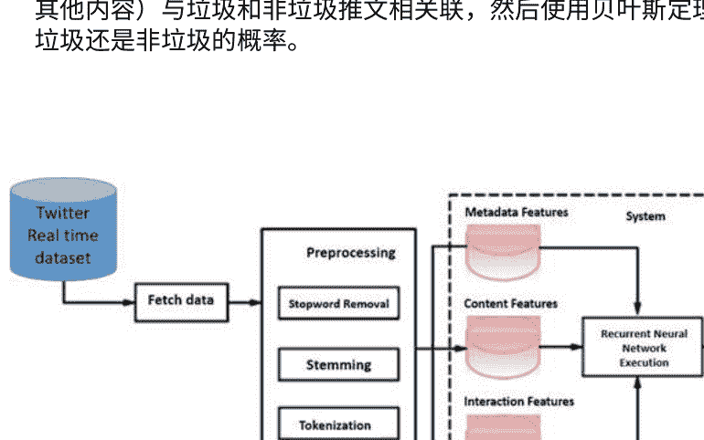

##### 3.3 算法

###### 3.3.1 循环神经网络 (RNN)

如图2 [11]所示，让我们的RNN的输入为具有长度为T的序列和每个对象的特征向量（图2）。在时间 t， 在方程 (1) 和 (2) 中，新的 h_t 即隐藏层状态和 y_t 即输出层状态可以使用前一个隐藏层状态 h_{t-1} 来确定。

```
h_t = \sigma_h(w_h x_t + U_h h_{t-1} + b_h) \quad (1)

y_t = \sigma_y(w_y h_t + b_y) \quad (2)
```

其中， w_h 和 w_y 分别指输入到隐藏层的权重矩阵和隐藏输出的权重矩阵， U_h 是两个相邻时间尺度上的层之间的循环权重矩阵， b_h 和 b_y 是偏置。

在每一步中，默认情况下输入被传播，然后是学习规则。背景单元的反向连接仍然具有先前隐藏单元的副本（因为它们在教育规则应用之前通过连接传播）。网络将保持一种状态并执行诸如序列估计之类的任务，超越传统多层感知的潜力。
方程 (3) 用于确定当前情况：

```
h_t = f(h_{t-1}, x_t) \quad (3)
```

其中，
h_t = 当前状态
h_{t-1} = 上一个状态
x_t = 输入的状态

方程 (4) 用于应用激活函数：

```
h_t = \text{激活函数}(w_{hh} h_{t-1} + w_{xh} x_t) \quad (4)
```

其中，
w_{hh} = 循环神经元的权重
w_{xh} = 输入神经元的权重。

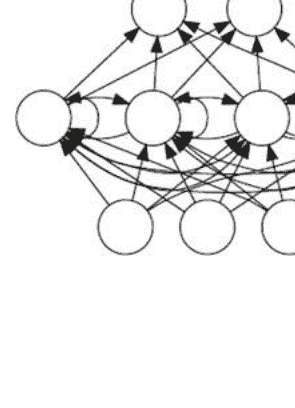

输出方程（5）的公式：
$$y_t = w_{hy} h_t$$ (5)
其中，
y_t = 输出
w_{hy} = 输出层的权重。

#### 4 结果与讨论

1.  正面和负面：假设对于推文，t为垃圾邮件类别的S。是否属于S取决于分类器的输出。真正例（TP），假正例（FP），真反例（TN）和假反例（FN）是影响分类器性能的广泛接受的变量。这些参数如下：
    - S类别的推文TP被准确地命名为属于S类别。
    - 推文FP不属于S类别，被错误地命名为属于S类别。
    - TN推文不属于S类别，被正确地命名为不属于S类别。
    - S类别的FN推文被错误地命名为不属于S类别。

    我们还使用公式(6)和(7)来计算真正阳性率(TPR)和假正阳性率(FPR)来评估检测垃圾邮件的能力。
    - TPR被称为垃圾推文被准确地命名为垃圾邮件的比例与总垃圾推文数量之比，可以使用以下公式计算
    $$TPR = TP/(TP + FN)$$ (6)
    - 将被错误分类为S类别的非垃圾推文与总非垃圾推文数量之比被称为FPR。
    $$FPR = FP/(FP + FN)$$ (7)

2.  精确率、召回率和F-measure：通过使用精确率公式(8)、召回率公式(9)和F-measure公式(10)，评估每个类别的性能。
    - 精确度被称为被分类为S类的推文与被分类为S类的推文的比例。可以使用以下公式计算
    $$精确度 = TP / (TP + FP)$$ (8)
    - 将准确命名为S类的推文的比例与S类用户总数相对应，称为召回率（也称为识别率）。
    $$召回率 = TP / (TP + FN)$$ (9)
    - F-度量是精确度和召回率的结合，是一种广泛采用的评估每个类别性能的度量，可以计算如下
    $$F-度量 = (2 * 精确度 * 召回率) / (精确度 + 召回率)$$ (10)

    因此，如表1所示，由于精确度下降，F-度量（精确度和召回率的混合）显著降低。我们正在尝试找到在线数据集的准确性，但这非常困难。因此，在线数据的准确性为90%。表1显示了实时数据集即在线数据集的结果，图3显示了在线流数据集的结果，该数据来自Twitter的实时数据（图3）。

## 表1 在线结果

| 参数 | 百分比 (%) |
|------|------------|
| 真阳性率 | 84.6 |
| 假阳性率 | 77.8 |
| 精确度 | 61.1 |
| 召回率 | 84.6 |
| F-度量 | 71.0 |
| 准确性 | 90.0 |

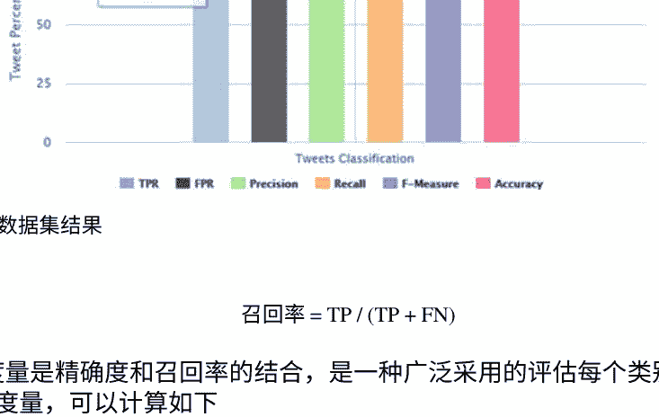

## 图3 在线数据集结果

#### 5 结论

本文对识别Twitter垃圾邮件的方法进行了概述。此外，Twitter还提供了一种科学的垃圾邮件位置策略分类，其中包括错误内容发现、基于URL的垃圾邮件识别、垃圾邮件识别和用户检测等方法。介绍的方法是基于多种特征进行评估的，包括用户属性、内容特征、结构特征和时间特征。此外，这些方法还与引用的目标和数据集进行了对应。本研究将帮助研究人员加强对最先进的Twitter垃圾邮件识别技术的关注。

#### 参考文献

1.  Cao, Q., Sirivianos, M., Yang, X., & Pregueiro, T. (2012). 在大规模社交在线服务中辅助检测假账户。 在：网络系统和设计实施研讨会(NSDI)论文集(第197-210页)。
2.  Stringhini, G., Kruegel, C., & Vigna, G. (2010). 在社交网络上检测垃圾邮件发送者。 在第26届年度计算机安全应用会议论文集(第1-9页)。
3.  宋，李，金（2011年）。 使用发送者接收者关系在Twitter中进行垃圾邮件过滤。 在第14届国际会议上，最近的高级入侵检测（第301-317页）。
4.  李，卡弗利，韦伯（2010年）。 揭示社交垃圾邮件发送者：社交蜜罐+机器学习。 在第33届国际ACM SIGIR会议上，研究和开发信息检索（第435-442页）。
5.  阿斯顿，利德尔，胡（2014年）。 使用感知器在数据流中进行Twitter情感分析。 计算机与通信杂志，2（11）。
6.  托马斯，格里尔，宋，帕克森（2011年）。 回顾中的被停用账户：Twitter垃圾邮件分析。 在ACM SIGCOMM互联网测量会议上（第243-258页）。
7.  Thomas, K., Grier, C., Ma, J., Paxson, V., & Song, D. (2011). 设计和评估一个实时URL垃圾邮件过滤服务。 在IEEE安全与隐私研讨会论文集中 (pp. 447–462)。
8.  Jin, X., Lin, C. X., Luo, J., & Han, J. (2011). Socialspamguard: 一种基于数据挖掘的社交媒体网络垃圾邮件检测系统。 *PVLDB*, *4*(12), 1458–1461。
9.  Ghosh, S., Viswanath, B., Kooti, F., & Sharma, N. K. (2012). 理解和对抗Twitter社交网络中的链接农场。 在第21届国际会议全球网络(pp. 61–70)的论文集中。
10. Costa, H., Benevenuto, F., & Merschmann, L. H. C. (2013). 在基于位置的社交网络中检测小费垃圾邮件。 在第28届年度ACM应用计算学术研讨会(pp. 724–729)的论文集中。
11. https://ai.stackexchange.com/questions/12042/what-is-a-recurrentneural-network
12. Boshmaf, Y., Ripeanu, M., Beznosov, K., & Santos-Neto, E. (2015). “阻止假社交网络账户通过预测他们的受害者来预防” 会议论文(pp. 81–89). AISec.: 丹佛.

### 使用机器学习技术辅助诊断胰腺导管腺癌

H. S. Saraswathi, Mohamed Rafi, K. G. Manjunath 和 Channa Krishna Raju

**摘要** 胰腺导管腺癌（PDAC）是一种最具侵袭性的疾病之一。发病率每天都在增加，与此同时，死亡率也在增加。5年生存率不到10%。大多数患者被晚期诊断。大多数PDAC病例在早期无症状。为了降低死亡率并提高生存率，早期识别疾病非常重要。国家癌症研究所预测，到2030年，胰腺癌有望成为世界第二致命疾病。识别可能从筛查中受益的高风险患者，如胰腺上皮内肿瘤、导管内乳头状黏液性肿瘤和黏液性囊性肿瘤，是至关重要的，但尚未找到一种可接受的miR-217筛查测试。在早期阶段诊断PDAC对于降低死亡率起着至关重要的作用。机器学习和深度学习技术现在在包括医疗保健在内的不同领域中被使用。因此，本研究工作总结了用于早期检测PDAC的可用生物标志物方法，以及我们在这一领域的提出的工作。该提出的系统开发了一种新颖的基于尿液的生物标志物，以及LVYE1（淋巴管）、Trefoil factor 1（TFF1）和Reg家族蛋白，如REG1A和REG1B，以提高在I-II期诊断PDAC的敏感性和特异性。

**关键词** 胰腺导管腺癌·机器学习·深度学习 CA19-9·风险评分·新发糖尿病 ·LVYE1·REG1A·REG1B·TFF1· CEA·ctDNA·miRNA·生物标志物·IPMN

#### 1 引言

胰腺癌-胰腺导管腺癌是一种侵袭性疾病。根据美国国家癌症研究所（NCI）的数据，到2030年，PDAC将成为美国第二致命的疾病[1]。由于该疾病的无症状特性，80-85%的病例在后期被诊断出来。因此，PDAC在疾病的初期阶段很难诊断。早期诊断PDAC在后续治疗中起着至关重要的作用。研究人员仍在努力解决这个问题，但尚未取得有益的结果。PDAC治疗的疗效和结果在很大程度上取决于诊断时的疾病程度。手术切除后接受辅助化疗是目前唯一可能治愈的疗法，但只有10-20%的PDAC患者表现为可切除的PDAC程度，而剩余的80-90%表现为局部晚期、不可切除的程度，或者在大多数人群中表现为远处转移[2]（图1）。

胰腺是一个海绵状的器官，位于腹部深处。它大约有6英寸长。胰腺有助于食物的消化，同时也控制血糖水平。这个器官的头部与十二指肠相连，是器官最宽的部分。尾部位於左侧的脾脏附近。我们将头部和尾部之间的区域称为胰腺的颈部或体部。胰腺中含有外分泌腺和内分泌腺。外分泌腺产生消化酶，而内分泌腺释放激素到血液中。外分泌组织占据了胰腺的大部分。胰腺疾病的范围从轻微的疾病如急性胰腺炎到危及生命的疾病如胰腺癌。胰腺炎是胰腺的炎症。导管内乳头状肿瘤、疼痛性胰腺炎和黏液性囊腺瘤都是癌前疾病，可能会导致癌症。胰管腺癌（PDAC）是胰腺癌的一种常见类型，影响胰腺。

胰腺癌最常见的症状是疼痛和体重减轻，而黄疸是最常见的临床标志。虚弱/疲劳、食欲减退、体重减轻、腹部不适、尿液变暗、黄疸、恶心、背痛、腹泻和呕吐是胰腺导管腺癌患者常见的体征和症状，根据一项研究。然而，我们无法根据这些症状来诊断该疾病。因此，需要一种诊断该疾病的方法。

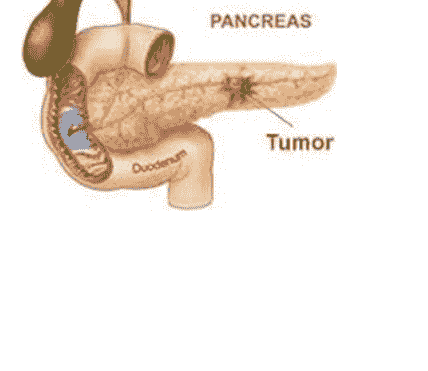

## 图2 存活率与诊断阶段

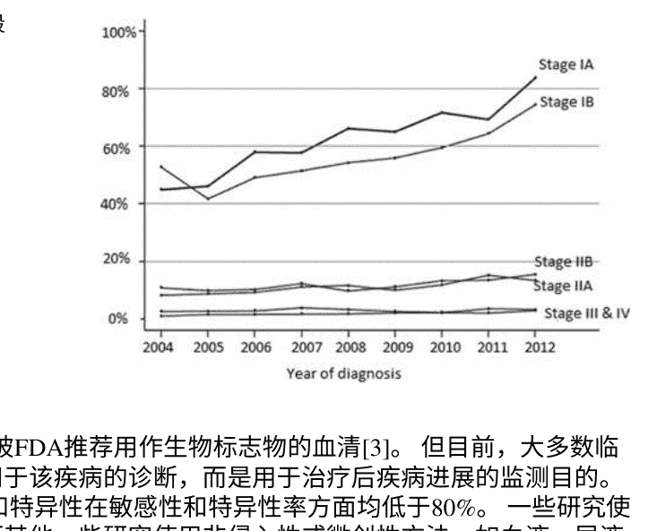

CA19-9是唯一被FDA推荐用作生物标志物的血清[3]。但目前，大多数临床医生并不将其用于该疾病的诊断，而是用于治疗后疾病进展的监测目的。CA19-9的敏感性和特异性在敏感性和特异性率方面均低于80%。一些研究使用侵入性方法，而其他一些研究使用非侵入性或微创性方法，如血液、尿液和胰液来诊断该疾病。通过非侵入性方法实现对胰腺导管腺癌的高敏感性和特异性在区分良性、恶性或慢性胰腺炎方面存在困难。机器学习和深度学习是人工智能的两个子领域，旨在通过训练和测试阶段构建一台能够执行认知功能的机器（图2）。

根据2004年至2012年之间进行的一项调查，早期诊断的患者（如IA期和IB期）的生存率高达80%。而II期B、II期A和III期、IV期的患者的生存率不到20%。因此，及早诊断该疾病至关重要。

在当前时代，机器学习技术已经进入几乎所有领域，包括医疗环境。大部分研究工作表明，利用计算机视觉和数据分析方法可以有效诊断疾病（图3）。

直方图显示了利用机器学习预测癌症风险、复发和预后的文章数量稳步增长。这些信息是通过在PubMed、CiteSeer、Google Scholar、Science Citation Index 和其他互联网数据库进行关键词搜索收集的。每个柱状图反映了两年内发表的论文总数。在这个观点下，总结了关于胰腺癌早期诊断的现有研究，包括生物标志物和机器学习方法。这有助于我们设计和开发一种新的方法来在不久的将来诊断该疾病。

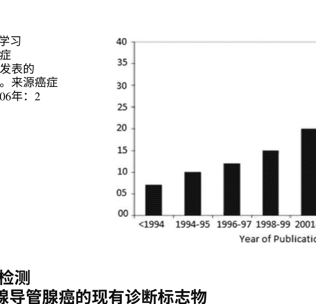

#### 2 早期检测胰腺导管腺癌的现有诊断标志物

##### 2.1 使用不同生物标志物的早期诊断胰腺导管腺癌的不同方法

生物标志物是可以在血液、尿液、组织和胰液中测量的生物标志物或物质。这些可能是身体的蛋白质。CA19-9、HGF、CA125、CA15-3、CEA、TP53、PIK3CA、BRAF、KRAS、EGFR和NRAS标志物被用于早期诊断PDAC。但是，只有CA19-9是经批准的生物标志物。由于缺乏所需的敏感性和特异性，我们不能仅依赖CA19-9。因此，需要进一步研究新的生物标志物。

### CA19-9

升高的碳水化合物抗原19-9水平表明疾病，但对于某些患者，这些水平也可能升高于肝癌、结肠直肠癌和慢性胰腺炎[4]。但在某些个体中，CA19-9水平的升高并不表示患有该疾病。因此，该生物标志物在早期诊断PDAC方面的性能不适合具有敏感性和特异性。

敏感性确定了实际阳性病例中被正确预测的比例。
```
敏感性 = \frac{TP}{TP + FN} * 100 \quad (1)
```
特异性确定了实际阴性病例中被正确预测的比例。
```
特异性 = \frac{TN}{TN + FP} * 100 \quad (2)
```
为了提高系统的敏感性和特异性，可以与其他生物标志物一起使用CA19-9。CA19-9的正常值为0-37u/ml[5]。
第6篇文章的作者指出，血清中的CA19-9浓度为35 ng/ml时，对于检测浸润性IPMN的敏感性分别为52%和88% [6]。当NLR > 2.5时，CA19-9的敏感性达到35.3%，CAR > 0.03时为31.8%，CEA > 5，CA19-9 > 37，以及NLR时为58.5%。当NLR > 2.5时，特异性为87%，CAR > 0.03时为82.8%，CEA > 5，CA19-9 > 37，以及NLR时为58.5% [7]，这表明敏感性最低。第7篇文章的作者指出，在经手术切除的导管内乳头状黏液性肿瘤（IPMN）的浸润性与非浸润性中，血清CA19-9在37 u/ml时的敏感性为74%，特异性为85.9% [6]。第8篇文章的作者指出，在高度异型增生（HGD）和浸润性IPMN的手术病理中，血清CA19-9的敏感性为34.2%，特异性为92.4%。与特异性相比，CA19-9单独给出的敏感性最低。CA19-9蛋白标志物与TSP-1一起使用，得到了0.86的AUC来识别PDAC样本[8]。

在表1中，将几种miRNA与CA19-9在PDAC早期诊断的敏感性和特异性方面进行了比较，发现miR-16、miR-196a和miR-1290的miR组合在敏感性方面表现更好。另一方面，CA19-9在特异性方面表现更好。根据研究，CA19-9不能单独用于早期诊断PDAC。

| 生物标志物 | 来源 | 病例数量 | AUC | 敏感性 | 特异性 |
| --- | --- | --- | --- | --- | --- |
| miR组合 (miR-16, miR-196a) 对比 CA19-9 | 血浆 | 140例PDAC， 68例对照组 | 0.89 对比 0.90 | 87% 对比 81% | 73% 对比 100% |
| miR-1290 对比 CA19-9 | 血清 | 41例PDAC， 19例对照组 | 0.96 对比 0.86 | 88% 对比 71% | 84% 对比 90% |
| miR面板 (miR-885-5p, 22-3p, 642b-3p) 对比 CA19-9 | 血浆 | 11例PDAC， 11例对照组 | 0.97 对比 不清楚 | 91% 对比 73% | 91% 对比 100% |
| miR-483-3p miR-21 对比 CA19-9 | 血浆 | 32例PDAC， 30例对照组 | 0.74 对比 0.86 | 未定义 | 未定义 |
| miR-1290 对比 CA19-9 | 血浆 | 267例PDAC， 167例对照组 | 0.73 对比 0.91 | 56.3% 对比 85% | 89.5% 对比 95.9% |

对于PDAC的诊断，通过CEA分析囊液方法在表2的不同单位水平上进行分析。他们发现CEA > 200 ng/ml的敏感性优于特异性。由于缺乏必要的酶，约有5-10%的人无法产生CA19-9。CA19-9是一种用于评估手术后患者的血液测试。即使将CA19-9与MUC5AC、MUC16、CEA、CEMIP和PC-594结合起来，他们也能够达到70%的敏感性。

CA19-9 +THBS2在敏感性为68%、特异性为95%的情况下，用于高于37u/ml的CA19-9水平。这些研究表明使用CA19-9与其他标志物可以提高性能。循环ncRNA作为诊断工具。

## 表2 早期诊断胰腺导管腺癌的囊液方法，使用不同的生物标志物

| 方法 | 当前临床实践中的生物标志物 | 敏感性 | 特异性 | 描述 |
|------|--------------------------|--------|--------|------|
| 囊液方法（正常血清水平为30至110U/L） | CEA细胞上的糖蛋白 | 75% | 83.6% | CEA > 192 ng/ml |
| | | 90% | 71% | CEA > 200 ng/ml |
| | | 47% | 40% | CEA > 200 ng/ml |
| | | 52.4% | 42.3% | CEA > 200 ng/ml |
| | | 63% | 88% | CEA > 200 ng/ml |
| 囊液方法用于IPMN（正常血清水平为<30u/ml） | CA19-9（碳水化合物抗原19-9） | 74% | 85.9% | 在85%的PDAC患者的血清中，这种糖蛋白增加约5-10%的人由于缺乏所需酶而无法产生CA19-9 |
| | | 40% | 89% | |
| | | 34.2% | 92.4% | |
| | | 60% | 75% | |
| | | 在Meta分析中：52%和89%用于检测侵袭性IPMN | | CA19-9用于术后评估患者 |
| 囊液方法 | CA199 + MUC5AC + MUC16 | 67–80% | 98% | – |
| | CA19-9 + CEA | 70% | 90% | – |
| | CA19-9 + CEMIP | NA | NA | 与健康组相比，区分PDAC |
| | CA19-9 + PC-594 | NA | NA | 与单独的CA19-9相比，好 |
| | CA19-9 + CEMIP + C4BPA + IGFBP2 + IGFBP3 | 不清楚 | 不清楚 | 与健康组相比，区分PDAC，与单独的CA19-9相比，好 |PDAC的生物标志物。但miRNA与CA19-9相比具有类似的敏感性，但在诊断PDAC方面的特异性不利于CA19-9。循环肿瘤DNA作为PDAC的诊断生物标志物，与THBS2 [血栓调节蛋白-2]一起使用，它是一种二硫键连接的同源三聚体糖蛋白，介导细胞与细胞和细胞与基质的相互作用[9]。CA19-9与THBS2的组合的C统计量为0.87。没有Lewis抗原无法检测到CA19-9的PDAC [10]。KRAS癌基因中的突变在大约90%的PDAC病例中被鉴定出[4]。CEA是粘液产生上皮细胞表面的糖蛋白。CEA可用于区分粘液性和非粘液性PCL [9]（表3）。

调查人员在液体活检中与CTC、KRAS和ctDNA合作，在表格4中。这些生物标志物的检测率分别为75%和50%。因此，他们决定将KRAS与CA19-9结合起来，进一步提高性能，他们得到了98%的敏感性，但只有77%的特异性。

在表5中，一些作者通过体液方法解决了这个问题。体液包括唾液、尿液、大便和胰液。其中，

表3 非编码RNA在胰腺导管腺癌早期诊断中的方法，使用各种生物标志物

| 方法 | 调查的生物标志物 | 研究结果 |
| :--- | :--- | :--- |
| 非编码RNA | miRNA | miRNA在血清、血浆、胰液、大便、尿液和唾液中研究PDAC<br>测试了700多个miRNA，但结果不如CA19-9优越 |
| | miR-486-5P, miR-198 | 与健康人相比，良好地区分PDAC |
| | miR-143, miR-145, miR-146, miR-148, miR-150, miR-155, miR-196a, miR-196b | 在PDAC中上调 |
| | miR-216, miR-217 | 在PDAC中下调，非编码RNA在尿液、血液、粪便中作为潜在生物标志物 |

表4 使用各种生物标志物的液体活检方法在早期诊断胰腺导管腺癌中的应用

| 方法 | 调查的生物标志物 | 研究结果 |
| :--- | :--- | :--- |
| 液体活检 | 循环肿瘤细胞（CTC） | 循环肿瘤细胞在PDAC的所有阶段进入血液中 |
| | KRAS [Kirten Sat Sarcoma] | 检测率为75%。但需要进行标准化的大规模验证 |
| | 循环肿瘤DNA（ctDNA） | 早期PDAC的检测率为50% |
| | CA19-9 + KRAS | 敏感性98%和特异性77% |

表5 通过使用不同的生物标志物在早期诊断胰腺导管腺癌中的体液方法

| 方法 | 调查的生物标志物 | 研究结果 |
|------|------------------|----------|
| 体液—唾液、尿液、大便、胰液 | 唾液—miRNA | 由于唾液腺中有强烈的血液流动，唾液中包含与血清相同的颗粒 |
| | 尿液-REG1A、REG1B、TFF1、LYVE1、NGAL、miRNA | 用于将PDAC与健康组区分开来的简便方法 |
| | 大便、胰液-miR-21、miR-155、miR-216 | 但需要内窥镜检查 |

尿液方法非常非侵入性，易于采集样本。与健康对照组相比，许多标志物在PDAC患者中过度表达。但是，即使使用这些生物标志物如REG1A、REG1B、TFF1、LYVE1、NGAL、miRNA，敏感性和特异性也无法保持在90%以上。

#### 3 提出的工作

##### 3.1 引言

到2030年，PDAC预计将成为美国第二致命的疾病[1]。胰腺深藏在体内，因此在体检中无法检测到肿瘤。在后期阶段检测该疾病会导致复杂的情况，因为该疾病将变成转移性疾病。治疗可能无效，从而导致死亡率增加。胰腺癌症状非常模糊。乳腺癌和结肠癌有可用的筛查测试，分别称为乳腺X线摄影术和结肠镜检查。但胰腺癌没有早期检测的筛查测试。为了使切除手术成功，有必要在早期阶段诊断该疾病，从而提高未来的生存率。在这个观点下，我们计划利用尿液为基础的非侵入性方法，使用LYVE1、REG1A、REG1B和TFF1等一系列生物标志物以及一种新的新型生物标志物来诊断PDAC[11]。许多研究人员利用机器学习技术开发了使用生物标志物面板进行早期诊断胰腺癌的方法。

支持向量机（SVM）是一种机器学习方法之一。为了找到最佳的REOs，研究人员采用了一种称为最小冗余最大相关性的特征选择方法。然后比较了多种分类方法对区分PDAC及其邻近正常组织与非PDAC组织的结果。对于发现早期PDAC诊断生物标志物，支持向量机技术是最好的[12]。

##### 3.2 早期胰腺癌检测的挑战和可能性

挑战：胰腺癌的快速进展，可以在几个月内从一个小的难以检测的恶性肿瘤演变为转移性疾病，是早期胰腺癌识别面临的众多障碍之一。在I期和IV期疾病之间，平均经过1.3年。胰腺静脉直接排入肝脏，导致大量肿瘤细胞扩散到肝脏。因此，早期检测PDAC的机会有限。高级别前体病变与低级别导管内乳头状黏液性肿瘤、慢性胰腺炎的区分是第二个关键障碍。对于可能不会转变为癌症的病变，可能需要切除胰腺。

可能性：尽管早期发现胰腺癌存在许多问题，但我们现在有几种方法来诊断早期胰腺癌。首先，粘液性囊性肿瘤和导管内乳头状粘液性肿瘤是可能发现和治疗的癌前病变，可以利用当今的机器学习、深度学习和成像技术进行处理。识别前体病变的能力至关重要。其次，靶向基因组事件（BRCA2突变）可用于识别高风险群体。第三，我们可以了解与胰腺癌发展相关的基因、微小RNA和蛋白质表达的变化。

第四，近年来，已经确定了高风险群体，如新发糖尿病、肥胖、慢性胰腺炎、吸烟以及前体病变的存在，这有助于胰腺癌的检测[2]。由于这些可能性，我们对该疾病的早期诊断在不久的将来将是有益的。

##### 3.3 研究设计过程

由于成本原因，筛查方法无法适用于所有人群，因此需要确定胰腺癌高风险群体。高风险群体可能有患胰腺癌的高概率。新发糖尿病是PDAC的前兆症状，已经发现在新发糖尿病患者中，每100人中有1人被检测出患有PDAC。在当前的研究工作中，已经证明新发糖尿病可能是PDAC的早期症状。近年来的回顾性研究表明，新发糖尿病是未来三年PDAC的高风险因素[5, 13]。我们利用这个机会和专业知识来筛查高风险人群，早期发现胰腺癌。

其他因素，如年龄>50岁、性别、体重减轻、血糖水平变化、黄疸和腹部不适与新发糖尿病有关。使用非传统生物标志物筛查高风险群体，并通过机器学习和深度学习技术（图4）应用于影像学模态，如MRI、CT来确认PDAC的存在。

图4 应用生物标志物和图像模态测试的流程图

##### 3.4 提出的方法论

所提出的系统由五个阶段组成。数据集将从美国胰腺癌研究网络收集。它基于尿液检测有590名患者的文本数据，用于诊断PDAC。预处理，如缺失值管理，准备可分析的数据集，并使用不完美、不平衡的医疗数据构建疾病诊断的预测模型。提取文本内容数据的文本特征提取是一种将文本消息符号化的提取方法，它是大量文本处理的基础。特征的基本单位称为文本特征。从一些有效的方法中选择一组特征来减小特征空间的大小，这个过程被称为特征提取（图5）。

在特征提取过程中，可以去除不相关或多余的特征。作为一种记录预处理方法，特征提取可以提高学习规则集的准确性，并缩短时间。从文档元素中选择可以反映内容词的数据，权重的计算被称为文本特征提取。文本特征提取的常见技术包括过滤、融合、映射和聚类方法。这些技术中的一种是逻辑回归，大多数癌症研究使用人工神经网络（ANNs）、贝叶斯网络（BNs）、支持向量机（SVMs）和决策树（DTs）来开发预测模型，从而实现强大而准确的决策。在最后阶段，通过分析文本数据来识别生物标志物，并利用识别出的基于尿液的生物标志物开发机器学习风险评分模型，用于早期诊断PDAC。

我们正在寻找能够在I期、II期患者与健康对照组相比过度表达的高效尿液生物标志物。 我们研究了微小RNA(miRNA)以及LYVE1、REG1A、REG1B和TFF1。由于它们与肿瘤进展的关联，miRNA引起了很大的兴趣。 肿瘤中至少一半异常表达的miRNA在转录后起着重要的调控作用，通过直接结合其靶向信使RNA，具有致癌或抑癌的作用。可以通过多种方式鉴定在恶性组织与正常组织中表达差异的miRNA。 有必要在PDAC、CP患者和健康人的尿液样本中建立miRNA的表达谱。 我们发现尿液中的miRNA水平不仅可以区分健康人和患病的人，还可以区分早期和晚期癌症。 使用相同的样本和独立的尿液样本队列，我们需要成功验证四种差异表达的miRNA，展示它们在疾病早期的潜在诊断价值。经过大规模验证，将这些miRNA顺利转化为临床背景下的RT-PCR尿液检测方法，对胰腺癌患者的预后和生存率将产生重大影响。

一个复杂的淋巴血管和淋巴结网络收集间质液体，以维持水分和免疫监测，从而导致胰腺淋巴外流。 当胰腺炎或肿瘤等疾病发作时，淋巴系统在身体对抗炎症和恶性肿瘤方面起着关键作用。

研究发现，在PDAC一期和二期患者中，LYVE1（淋巴血管）、Trefoil因子1（TFF1）、Reg家族蛋白REG1A和REG1B等基因的表达水平高于健康对照组。 我们预计通过尿液样本中的miRNAs- miR-30e、miR-143、miR-204、miR-223、LYVE1、REG1A、REG1B和CA19-9，在早期诊断PDAC时的敏感性和特异性将超过90%。

##### 3.5 结果与讨论

我们计划研究的目标是开发一个用于早期诊断PDAC的生物标志物组合，即I期和II期。确定的生物标志物适用于高风险人群，如新发糖尿病、肥胖、黄疸和慢性胰腺炎。 数据集包含600个PDAC和健康对照的尿液样本。

将开发逻辑回归模型来基于风险评分进行疾病诊断。 对模型的分析以不同的方式进行。 首先，单独分析候选生物标志物的敏感性、特异性和ROC。其次，将所有生物标志物组合分析敏感性、特异性和ROC。第三，应用CA19-9来确定其性能。 第四，将一组生物标志物与CA19-9结合分析模型。 最后，比较所有不同的分析结果，得出最佳生物标志物。 从模型中选择阳性病例进行影像学确认。 将模型结果与实际诊断进行比较。

在我们提出的工作中，我们将PDAC样本与健康样本进行比较，并期望在训练和验证阶段下有更高的接收者操作特性曲线下面积（AUCs）。 然后将PDAC I、II期与III、IV期进行比较，以在训练和验证阶段下实现更高的接收者操作特性曲线下面积（AUCs）。 通过尿液样本中的miRNAs—miR-30e、miR-143、miR-204、miR-223、KRAS、LYVE1、REG1A、REG1B和CA19-9，旨在实现模型的敏感性和特异性达到90%以上，以诊断PDAC的早期阶段。 在指定的数据集中，使用基于尿液的生物标志物进行PDAC诊断的提议工作将使用600个样本进行。 使用图像模态进行PDAC诊断的工作将留待未来。

#### 4 结论

尿液基于生物标志物的早期PDAC检测应该为PDAC筛查方案提供解决方案和未来方向，以在早期阶段诊断该疾病。 同时测量不同的尿液基于生物标志物的混合物可能在诊断PDAC时具有更高的准确性，与单独使用相比。 此外，使用由多个标志物组成的多标志物面板如CA19-9的糖蛋白，以及其他科学技术，如成像，可以提高单一标志物的效力。我们开发了一个包含六种蛋白质的生物标志物面板，可以在尿液样本中识别早期胰腺癌患者。

#### 参考文献

1.  Kenner, B. J., Chari, S. T., & Maitra, A. 早期胰腺癌的早期检测-从其他癌症中吸取教训的明确未来。胰腺, 45(8), 1073–1079.
2.  Gillen, S., Schuster, T., Meyer Zum Buschenfelde, C., Friess, H., & Kleeff, J. (2010). 胰腺癌的术前/新辅助治疗：对反应和切除百分比的系统综述和荟萃分析。PLoS Medicine, 7(4), e1000267.
3.  Llop, E., Guerrero, P. E., & Duran, A. (2018). 用于胰腺导管腺癌检测的糖蛋白生物标志物。World Gastroenterology, 24(24), 2537–2554.
4.  Marker, A. V., Carrara, S., & Jamieson, N. B. (2015). 胰管内乳头状黏液性肿瘤的囊液生物标志物：国际专家会议对胰腺分支导管-胰管内乳头状黏液性肿瘤的关键评论。Journal of the American College of Surgeons, 220, 243–253.
5.  Pergolini, I., Jager, C., & Safak, O. (2021). 糖尿病和体重减轻与导管内乳头状黏液性肿瘤患者的恶性肿瘤相关。临床胃肠病学和肝病学, 19, 171–179.
6.  Fritz, S., Hackert, T., & Hinz, U. (2011). 血清糖类抗原19-9和癌胚抗原在区分胰腺导管内乳头状黏液性肿瘤的良性和侵袭性方面的作用。英国外科杂志, 98, 104–110.
7.  Hata, T., & Mizuma, M. (2019). 中性粒细胞与淋巴细胞比值对高级别异型增生和相关侵袭性癌的胰腺导管内乳头状黏液性肿瘤的诊断和预后影响。胰腺, 48, 99–106.
8.  Kim, J. R., Kim, J. Y., & Kang, M. J. (2015). 血清癌胚抗原和糖抗原19-9对胰腺导管内乳头状黏液性肿瘤恶性预测的临床意义。《肝胆胰科学杂志》, 22, 699–707.
9.  Jenkinson, C., Elliott, V. L., Evans, A., & Oldfield, L. (2016). 胰腺癌患者临床诊断前24个月血清血小板蛋白-1水平下降，与糖尿病的关联。《临床癌症研究》, 22(7), 1734–1743.
10. Singhi, A. D., McGrath, K., & Brand, RE. (2018). 术前下一代测序对胰腺囊液的高准确性在囊肿分类和高级肿瘤检测中。《肠道》, 2131–2141.
11. Radon, T. P., Massat, N. J., & Jones, R. (2015). 在尿液中鉴定出一种用于早期检测胰腺癌的三生物标志物面板。临床癌症研究, 21(15).
12. Zhang, Z.-M., & Wang, J.-S. (2020). 通过将相对表达排序与机器学习方法相结合，早期诊断胰腺导管腺癌。PMC, PMCID:PMC7593596.
13. Huang, B. Z., & Pandol, S. J. (2020). 新发糖尿病，代谢标志物的纵向趋势，以及异质人群中胰腺癌的风险。临床胃肠病学和肝病学, 18, 1812–1821.
14. Brugge, W. R., Lauwers, G. Y., & Sahani, D., et al. (2004). 胰腺囊性肿瘤。新英格兰医学杂志, 351, 1218-1226.
15. 王，张，陈（2015年）。血清癌胚抗原19-9对胰腺导管内乳头状黏液性肿瘤的恶性和侵袭性预测的临床意义。肝胆胰科学杂志，3，43-50。
16. 孔，弗里斯（2020年）。基于血液循环的RNA作为胰腺导管腺癌的预防、诊断、预后和可药物治疗的生物标志物。斯普林格自然瑞士AG。

### 数据挖掘技术在零售业的应用

Pradnya Abhay Muley

摘要 本研究工作提出了一个混合模型的实现，用于在线购物业务支持和决策中的消费者细分，采用了无监督学习算法和模糊C均值方法。在这项研究中，通过使用聚类分析方法将客户细分为不同的群体。它将收集关于组分得分、群体模型和客户之间的相似性的信息，并提出一种分组方式。具体而言，所提出的模型使用了K均值聚类，这是一种无监督学习方法。该过程旨在通过一定数量的簇（假设k个簇）对给定数据集进行分类。

关键词 聚类 · K-means ·模糊C-means ·分割 ·在线购物 ·零售业 ·客户分割

#### 1 引言

目前，互联网用户的增加对在线零售业务产生了重要影响。如上所述，零售行业分为有组织和无组织两类，但在服务交付方面都起着关键作用，对客户满意度至关重要。

- 为了提高零售业务利润并增加客户满意度，零售机构必须首先了解客户的需求。通过充分了解客户的需求，零售业务可以增加市场营业额。
- 为了提高组织的市场营业额，应该改进客户分割过程，即以不同的方式对客户进行分割或划分。

客户分割的公司运营的基本观点是每个客户都是独特的，如果能够提供适当的营销服务来满足他们的需求，营销效率将会提高。 有些人认为客户分割只能通过实际理解来完成，这将耗费时间，并且存在人为错误的可能性。 通过利用数据挖掘技术，可以基于多个因素对不同群体的客户进行分割。 现有的数据挖掘方法使用数学公式进行分割，但仍然存在一些挑战，这就需要开发一种高效的数据挖掘方法来进行在线零售业务的客户分割。 通过开发有效的数据挖掘技术进行客户分割，在线零售行业可以实现高业务周转率和增加的客户满意度水平。

#### 2 研究目标

本研究的主要目标是通过使用一些高效的技术来提高零售营销系统的性能。 本研究的目标是：

1. 通过使用数据挖掘技术，识别影响在线顾客购物的各种因素。
2. 通过使用SOM无监督学习和模糊C-均值（自适应共振理论）技术，开发混合模型。
3. 通过使用标准交叉行业过程（CRISP）方法，在线零售购物中实施提出的模型进行客户分割。
4. 使用传统的两阶段k均值算法验证提出的模型。
5. 研究影响有组织零售部门增长的因素。
6. 研究并比较影响印度非组织零售店或结构化零售店顾客购买行为的不同因素。
7. 在购物过程中识别选定的零售点。
8. 为了确定印度零售商的重要性及其范围。

##### 2.1 文献综述

背景. 这里调查的大部分论文与零售营销相关，包括聚类算法、模糊逻辑方法、CRM、关联规则挖掘、市场细分方法、机器学习、频繁项集挖掘和产品评论情感分析技术。 在这里，大部分技术都研究和分析了在零售营销中的方法的功能和处理。

传统的零售营销无疑发挥了重要的经济作用并且是就业的重要来源。 但是，作为一个结果，它遭受了巨大的缺陷。 这些问题目前由印度组织或零售行业面临，这些问题妨碍了印度零售行业的全部潜力。所有传统的研究工作都包含了优点和缺点。 但是大部分工作都存在缺点，如效率低、结果不准确、细分过程少和处理时间长。 为了克服这些缺点，系统的效率将在未来得到改善。 因此，在未来的研究工作中，重点是开发一个适合在线零售行业进行客户细分的数据挖掘模型。 通过清楚了解客户需求，零售行业可以提高为客户提供更好服务的能力，同时也可以提高他们的营销效率（表1）。

##### 2.2 提出的方法论

本研究在在线市场中使用模糊c均值和SOM实现了一个系统，用于市场和客户细分。所提出的研究方法基于从业务角度的细分理论，被视为聚类/分类理论。

##### 2.3 实施流程

在这项研究工作中，总体工作流程如下所述。 首先，收集客户数据，并对这些收集到的数据进行预处理，以去除不需要的数据。 然后，使用聚类技术对预处理的数据进行聚类，以提取所需的模式。 最后，将实验结果与其他指标进行比较。

- 步骤1：客户数据
- 步骤2：数据预处理
- 步骤3：聚类提取模式
- 步骤4：客户识别
- 数据概要和聚类结果分析。

考虑了用于客户细分的独立变量，如金融债券（FB），参考群体（RG），商品吸引力（MA），产品相关因素（PRT），服务相关因素（SF），综合营销沟通（IMC），推荐（RCOM），店内/在线浏览（IOB），积极情绪（PE），消极情绪（NGE），购买冲动（UB），互联网不信任（ID），互联网优惠（IOF），互联网自我无效性（ISIE），互联网物流问题（ILI），互联网享受和便利（IEC）以及影响购买意向的因素（FAPI）作为客户细分的因变量考虑。

## 表1 研究和分析之前的工作

| 序号 | 作者 | 方法 | 结果 | 限制 |
|---|---|---|---|---|
| 1 | Gupta和Pathak (2014) | 机器学习, 数据挖掘和统计方法 | 错误率降低, 确定了更好的价格范围, 适用于客户和组织, | 尚未完全完成的工作进展结果 |
| 2 | Raju等人 (2014年) | DM与CRM | 分析了数据并捕获了信息, 用于整个组织的决策支持 | 不关注决策过程。这将为企业带来巨大的利益, 并获得相当大的竞争优势以抵御竞争 |
| 3 | Surendren和Bhuvaneswari (2014年) | 关联规则挖掘 | 根据研究, 63%的用户避免了购后失调, 11%的用户避免了购前失调 | 需要专注于基于机器学习方法对用户进行认知失调分类 |
| 4 | Cervellon等人[1] | 审查了消费者购物取向的影响 | 强调在消费者选择在线格式时, 负责任的零售实践和道德组合的重要性, 而本地产品导向影响了城市商店和市场的选择 | 结果可能仅限于杂货购物的特定领域; 跨渠道的免费乘车在杂货购物领域中是一种非常有限的行为 |
| 5 | Chelmis等人[2] | 数据聚类方法 | 这种方法适用于大规模、真实世界的场景, 而不对数据做任何假设 | 由于在这个数据集中没有聚类的真实标准, 选择合适的种子变得更加复杂 |
| 6 | Mittal和Jhamb (2016) | 审查了印度背景下购物中心的顾客光顾情况 | 印度消费者的消费能力以及对购物中心的大量投资使得这项研究对零售从业人员、学者和研究人员至关重要 | 需要适应当地口味和偏好，尤其是在店铺、品牌和产品层面上仍然至关重要 |
| 7 | Ariyawansa和Aponso (2016) | 关联规则挖掘 | ARM的目标是从给定的数据库中找出满足预定义的最小支持度和置信度的关联规则 | 通过满足最小置信度的约束条件，从这些大型项集中生成关联规则 |

在这项研究中，研究人员使用了K-means聚类算法，这是一种无监督学习方法。

#### 3 数据收集与分析

为了实现研究目标并回答研究问题，本论文分析了二次数据收集方法（Saunders等，2009）。从学术文章、书籍和报告中获取的信息被用作二次数据。这些数据一旦收到回应就会被更新和记录。结果已经整理在Microsoft Excel电子表格中，并使用开发的代码表对调查结果的数据进行分析。根据海拔得分，数据被组织为不同的行和列。

根据项目，受访者根据1到5的标准进行选择（即，1＝强烈不同意，2＝不同意，3＝中立，4＝同意，5＝强烈同意）。根据这些因素，问卷被制定出来。创建了用于在线调查的Google表单。此调查旨在确定影响购物者冲动购买行为的因素。整个分析过程考虑了550个样本。数据收集后，使用SPSS软件（ANOVA和k-means聚类分析）进行了分析。分析和建模的分割过程基于在线零售行业的客户。需要根据生活方式、态度和观念来绘制目标客户的概况。此外，还将使用方差分析（ANOVA）和MATLAB软件对结果的有效性进行验证，以确保聚类是否相似或不同。

#### 4 结果与讨论

图1代表了所提工作的聚类分析。根据年龄和收入水平，被调查者被分类。

图2显示了聚类的大小。它包含三组数据，每组数据都有不同的大小。从图中可以看出，聚类1包含了25.1%的数据，聚类2包含了34.4%的数据，聚类3包含了40.5%的数据。从中可以得出，聚类1被认为是小规模的聚类，它包含了138个数据。聚类3被认为是最大规模的聚类，它包含了223个数据。从最大聚类到最小聚类的比例为1.62。

##### 4.1 聚类分析

图3a、b代表了聚类分析和聚类分配。在图3a中，x轴表示长度（cm），y轴表示宽度（cm）。在这里，多个输入数据被收集以创建一个单一的聚类。图3b显示了聚类1、聚类2和质心。在这里，聚类1用红色标记，聚类2用蓝色标记，质心用黑色的十字表示。

研究工作得出结论，金融债券、产品相关特征、店内浏览等因素在调节人口统计变量后对冲动购买产生影响，而商品吸引力和推荐则对店内购买产生影响。这项研究得出结论，控制人口统计变量和消费者购买行为后，外部因素会导致冲动购买并促使购买，在线和店内购物模式中。

#### 5 结论和未来工作

提出的研究工作开发了一个基于计算的框架，可以自动提取零售业的输出，以实现快速决策过程。实验结果计算了特定人群的群集和群集品牌的特征。基于行为，通过对客户详细信息进行聚类或分组来挖掘数据。这种数据对于保留好的客户以及对同一用户在群集中进行特征化和分类潜在反应以进行定向营销非常有益。

因此，这项研究帮助商家通过谨慎投资来选择正确的行业。通过分割过程，零售商可以通过持有最重要和最显著的机会来最大化交叉销售的机会。

## 图1 聚类分析

Clusters

Input (Predictor) Importance

| Cluster Label | 3 | 2 | 1 |
|---------------|---|---|---|
| Description | | | |
| Size | 40.5% (223) | 34.4% (189) | 25.1% (138) |
| Inputs | | | |
| Income | 50,001-99,999 (94.2%) | <49,999 (89.9%) | 50,001-99,999 (64.5%) |
| Age | 26-35 (67.7%) | 18-25 (97.9%) | 36-45 (59.4%) |
| UB | 4.55 | 4.04 | 3.15 |
| PE | 4.54 | 4.04 | 3.20 |
| NOE | 4.53 | 4.08 | 3.30 |
| FB | 3.09 | 3.61 | 4.02 |
| ID | 3.09 | 3.61 | 4.02 |
| Occupation | Self employee (60.1%) | Employed (35.4%) | Self employee (65.9%) |
| IB | 3.54 | 3.83 | 4.35 |
| Marital Status | Married (94.2%) | Married (52.9%) | Married (99.3%) |
| PRT | 3.26 | 3.64 | 4.42 |
| FAPI | 3.76 | 3.95 | 4.14 |
| IEC | 3.26 | 3.59 | 4.39 |
| SF | 3.66 | 3.81 | 4.21 |
| Gender | Female (50.7%) | Male (60.3%) | Female (72.5%) |
| ILI | 3.71 | 3.83 | 4.21 |
| IOB | 3.93 | 4.00 | 4.42 |
| MA | 3.85 | 4.20 | 4.32 |
| RCOM | 3.69 | 3.84 | 4.10 |
| RO | 3.87 | 4.22 | 4.07 |
| IOF | 3.89 | 4.21 | 4.07 |
| IMC | 4.03 | 4.12 | 3.84 |
| ISIE | 4.03 | 4.11 | 3.84 |

## Cluster Sizes

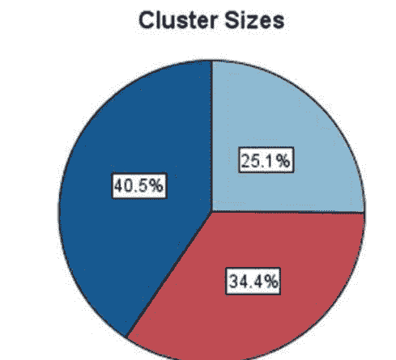

| Size of Smallest Cluster | 138 (25.1%) |
| Size of Largest Cluster | 223 (40.5%) |
| Ratio of Sizes: Largest Cluster to Smallest Cluster | 1.62 |

## 图2 聚类大小

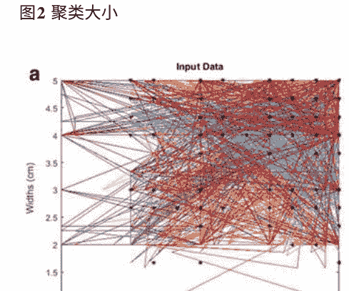

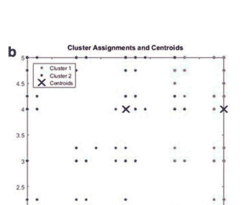

## 图3 a聚类分析 b聚类分配

重要的客户只需与正确的目标群体成功交流，就能识别新的商机。因此，这将扩大潜在利润并最大化市场支出。

提出的研究结果根据一定的限制为专家提供了一些不同的经验。该研究仅限于马哈拉施特拉邦的消费者。因此，该研究未涵盖印度其他地区的潜在客户。通过将潜在的其他客户纳入研究中，可以提高后续研究的普适性。此外，该研究采用了量化方法，采用调查技术收集了客户的数据。如果我们采用主观方法，将获得更多关于目标的数据。

由于这项研究工作的限制，建议未来研究以发展对顾客在线购物行为的研究为目的提出三个建议。该研究需要在印度的其他邦进行。其次，该研究采用了定量方法。此外，建议采用定性方法，以便在在线购物环境中获得关于冲动购买行为的深入信息。因此，未来的研究应该研究在线行为与线下购物行为之间的关系。

#### 参考文献

- 1. Cervellon, M. C., Sylvie, J., & Ngobo, P. V. (2015). 购物取向作为法国杂货多渠道领域渠道选择的先决条件。零售与消费者服务杂志，27(1)，31–51。
- 2. Chelmis, C., Kolte, J., & Prasanna, V. K. (2015). 大数据分析用于需求响应：时空聚类。2015年IEEE大数据国际会议论文集（pp. 2223–2232），2015年10月。IEEE。

### 通过挖掘数据流和处理概念漂移来识别机器维护需求的在线系统

Rahul Patil, Pramod Patil, Aditya Ghongade, Adriel Dsa, Parth Lokhande和Harsh Munot

摘要数据流代表来自不同来源的各种形式的持续数据流。实时数据通常以流的形式传输，并且随着时间的推移而变化。在监督学习中，概念漂移意味着数据正在发生变化。在处理流数据上解决预测性维护任务时，传统模型在发生这种变化时可能变得无效。因此，学习模型需要快速而准确地适应变化。自适应集成模型用于数据流的分类。在本文中，我们实现了自适应装袋方法的修改，该方法使用内部类别加权方案进行模型适应。我们使用集成方法对手动创建的数据流进行了评估，并分析了不同分类器的性能评估。这种性能与传统模型有很大的不同，因此更有效地处理漂移。

关键词 数据流挖掘 · 概念漂移 · 集成学习 · 预防性维护 · OEE分析 · 在线装袋 · Scikit-multiflow

#### 1 引言

流数据挖掘正在大规模增长，并且是研究的重要课题。这种流数据挖掘对于不同类型的分析、研究、报告生成和对大型系统的未来预测非常有用。在处理用户敏感或易受攻击的数据的应用程序中，还需要保留流数据的准确性。对于维护系统的需求不断增加，但是目前没有多少方法可以预测特定系统的故障，这是该系统背后最大的动力。对这个实时处理和分析的需求

通过考虑各种参数来流式处理数据，将帮助分析师研究数据并采取必要的行动。

在静态数据挖掘领域已经做了很多工作，但现在由于技术的进步，动态发生的频率增加了。动态发生的数据还没有像静态发生的数据那样得到充分探索。处理动态发生的各种挑战，如概念漂移[1]、偏斜、隐私保护、处理延迟和不完整数据等。在本文中，我们将看到什么是概念漂移？如何克服它？以及它如何影响系统的性能？

在当今时代，人力资源减少，一切都依赖于机器。机器被大规模使用，由于每天的重度使用，容易发生故障，因此需要维护。如果我们知道故障会在何时发生，我们会在故障之前的第一站进行维护。这将节省大量的时间、金钱和精力。

预防性维护基本上是机器的系统和适当的例行维护，以保持其运行并防止意外的机器故障。它用于了解和防止机器的故障，并将在所有机器上执行，以防止与年龄相关的故障。然后，我们有强制性和非强制性任务。强制性任务应在机器到期时立即完成，并经常包括安全检查。非强制性任务可以延迟而不会导致故障或性能降低。预防性维护的确切需求将根据机器及其执行的操作而异。

在本文中，我们提出了一个系统，它创建了一个流并在其中引入了漂移然后使用集成方法漂移检测算法来处理它。集成学习是一种监督机器学习方法[2,3]。我们使用了scikit-multiflow[4]，这是一个用于Python中流数据的机器学习库。在第2节中，提供了所提出系统的流程。在第3节中，应用了集成方法于第2节中提到的数据集，并提供了结果。在第4节中，对本文进行了总结。本文的主要目标是检查概念漂移对数据的影响以及它如何影响性能以及如何处理。

#### 2 提出的系统

##### 2.1 数据集

使用的数据集是生产数据。该数据集包含了各种不同的特征，将对其进行分析。数据中有一些字段，如电路ID，表示特定电路的ID。数据中的另一个字段是时间戳，解释了记录插入数据库的时间。然后，shift ID给出了读数所在的具体班次。现在来看

接下来我们将关注的主要属性是在那个时间点生产的总批次。被拒绝的批次是在那个时间点被拒绝的批次。数据集中的最后一个属性是特定电路的效率，即该特定电路产生的良好批次比总批次多75%。

##### 2.2 流应用

此应用程序中使用的数据是静态的，即数据的大小是固定的。为了将这些数据转化为流数据，编写了一个Python程序，提取电路ID、当前日期和时间、班次ID以及总批次数和被拒绝的批次数，以及该特定电路是否高效，这取决于前两个字段。然后，从该应用程序生成的数据被插入到MY SQL数据库中。在该应用程序中还引入了一个定时器，以将数据转化为流数据。该定时器每8秒将数据追加到流中。

### 2.3概念漂移

在处理连续数据流时，数据有时可能会变得嘈杂，即模型试图预测的目标变量的属性可能会随时间变化。这种数据称为漂移，可能会影响系统的性能。此类数据的一些实际应用如下[5]:

- * 交通监控，其中交通流量可能随时间变化,
- * 天气预报，气候变化和其他自然异常可能会影响最终预测,
- * 跟踪个人兴趣的系统，例如个性化广告，人们的兴趣可能逐渐改变。

“概念漂移”中的概念指的是输入和输出变量之间的隐藏关系[1]。不同类型的漂移可能包括: 随时间逐渐变化，周期性变化，突然或突发变化。

处理概念漂移的期望属性包括: 尽快适应概念漂移，区分噪声和变化并适应它，识别和响应重复的上下文，适应有限的资源，即时间和金钱。如果概念漂移没有得到适当处理，可能会导致错误的分析或预测，从而影响程序的效率，导致不准确的结果。因此，为了避免这样的问题，我们需要使用能够适应这些变化并提高系统性能的算法。在我们的数据集中，没有这样的漂移，但是为了检查漂移到来时会发生什么，它如何影响性能，如何处理它? 我们通过在数据中添加一些负值来引入概念漂移，一般会导致周期性的概念漂移。

##### 2.4 检测概念漂移

为了检测数据中的概念漂移，系统使用了自适应窗口（AdWin）概念[6, 7]，由scikit-multiflow [4]提供。ADWIN（自适应窗口）是一种灵活的滑动算法，用于发现变化，并保持关于数据分布的更新统计信息。ADWIN允许未计划的漂移数据算法，以应对这种情况。一个常见的想法是在检测漂移概念的同时，保留来自可变大小窗口的统计信息。它使用基于这些窗口中数据的变化率调整的在线滑动窗口。当上下文中没有明显变化时，该算法会大幅扩大窗口（W），并在检测到变化时缩小窗口。如果两种货币之间的差异总值超过先前描述的限制，变化将立即可见，并丢弃该期间的所有数据。该算法试图找到两个不同大小的小窗口。当发生这种情况时，它得出结论认为相应的预期值是不同的，这意味着窗口的旧部分基于与真实值不同的数据分配，因此缩小。窗口的最大长度在数学上与窗口内的正常值没有变化的假设一致。此外，adwin在性能方面提供了实质性的保证，限制了错误的利润和错误的异议数量。

### 2.5处理概念漂移

正如在第2.3节中提到的，系统处理漂移的属性，适应漂移的方式，漂移如何影响系统的性能，实际上，我们无法完全消除漂移，而是可以使用一种算法来适应漂移，最终导致系统性能的提高。Boosting和bagging是用于改善单个分类器性能的经典集成方法。它们通过提高准确性获得了卓越的性能。Bagging将数据集分割成各种分类器，即将其分割成新的训练集。所有这些分类器的输出用于投票，然后我们得到一个集成分类器。集成学习算法通过组合多个基学习器的输出来工作。其目标是通过在不同数据集（原始数据集的子集）上训练多个基分类器并组合结果来提高单个分类器的性能。对几个分类器的输出进行平均有助于减少分类错误的偏差[8]。自适应bagging成功应用于不平衡数据流的分类[9]。此外，通过适应可扩展技术，在线bagging集成成功应用于处理大数据[8]。由于我们的数据是以流的形式存在的，因此没有限制，因此被视为大数据和在线装袋（OzaBagging）[9]被认为是改进性能的最佳选择。这些方法的优点是它们不仅可以用于

处理数据流，还可以用于静态数据，当内存和计算能力不足以在单次迭代中进行处理时，对于计算性能来说，相对较小的数据集上的模型评估和可能的更新要求较低[5]。我们使用KNN作为我们的基本估计器，因为它具有较低的偏差这将为分类问题提供良好的性能。OzaBagging [9]是一种装袋技术，与装袋不同，这里没有训练数据集，但是这里有一系列的样本，我们的分类器将对每个到达的样本进行训练 $K$ 次，这是由泊松分布绘制的。这里的泊松分布有助于在您知道事件发生的频率时预测某些事件发生的概率。它还将为我们提供给定数量的事件的概率在固定时间间隔内发生[4]。

##### 2.6 OEE分析

设备整体效率（OEE）是衡量制造业生产力的标准。通过OEE分析和识别潜在损失，可以获得有用的洞察，以提高制造业生产力[10]。

OEE分析是通过考虑可用性、性能和质量三个因素来计算的。OEE分析还可以识别潜在的损失，并提供有关如何将其最小化的见解。OEE具有以下优点：1. OEE可以通过减少停机时间和维护成本来提高设备的正常运行时间。2. OEE可以通过分析设备的实际性能并相应地提出改变来降低机械成本。3. OEE最重要的优点是可以轻松可视化设备的性能[10]。

根据[11]，导致设备性能大幅降低的损失分为3类。这三类损失分别是（1）可用性损失，（2）性能损失和（3）质量损失。这些损失进一步分为6类，即设备故障和设备调整属于可用性损失，空转和小停机属于性能损失，最后，工艺缺陷和产量降低属于质量损失。

OEE可以基于以下三个因素进行计算：(1) 可用性, (2) 性能和(3) 质量。OEE值可以使用以下公式计算：

```
OEE (%) = 可用性 × 性能 × 质量 × 100%  (1)
```

可用性考虑的是设备可用的时间与计算得到的可用时间之间的差异。可用性可以使用以下公式计算：

```
可用性 = 运行时间 / 负载时间 × 100%  (2)
```设备的性能基本上是设备应该工作的最大速度（理论值）与设备实际工作速度之间的差异。性能可以使用以下公式计算：

```
性能 = 产品总数（工艺数量） × 理想（理论）循环时间 / 操作时间 × 100% (3)
```

设备的质量意味着考虑有多少产品不符合质量标准。质量可以使用以下公式计算：

```
质量 = （净产量（过程数量） - 缺陷数量） / 净产量（过程数量） × 100%
```

##### 2.7 数据可视化

数据可视化是数据素养的工具：“数据可视化是信息和数据的图形表示。”通过使用图表、图形和地图等视觉元素，数据可视化工具提供了一种易于理解和理解数据趋势、异常值和模式的方法 (https://www.tableau.com 2019, 在线) [12]。数据可视化是将信息转化为图形表示（如图表和交互式仪表板），从中轻松获得洞察力的过程。数据可视化的主要目的是识别数据集中的模式、趋势和异常值。Tableau是一种强大的数据可视化工具，用于分析和可视化数据。它可以以非常易于理解的视觉形式简化数据。Tableau帮助以一种任何人都能理解的方式可视化数据 [12]。使用Tableau进行数据分析和可视化非常快速和简单，创建的可视化结果以交互式仪表盘和工作表的形式呈现。

## 3个结果

在实验第一系列（表1）时，我们比较了带漂移和不带漂移系统的性能，并发现漂移突然影响了系统的性能。

表1 带漂移和不带漂移模型的准确率

|          | 带漂移 | 不带漂移 |
|----------|--------|----------|
| 准确性   | 78.30  | 89.54    |

我们还使用ADWIN算法 [6, 7] 发现了数据的变化，即漂移发生。我们发现数据在特定索引处发生了变化。现在，在数据上使用Ozabagging [9] 后，我们发现系统的性能达到了97%，这相当不错，而在线增强只有64%。在进行数据可视化实验时，我们使用了包含以下不同领域的Tableau [12]。

##### 3.1 OEE仪表盘

图1给出了对数据集进行的分析概述。这个仪表板包含各种图表，如气泡图和柱状图。气泡图通过使用不同的颜色阴影，让用户了解特定状态下电路的OEE。按月份显示的OEE图表显示了特定月份各个电路的OEE，从而让用户对整年的性能有一个简要了解。与按月份的OEE类似，仪表板还显示了按月份的可用性、按月份的性能和按月份的质量。

##### 3.2 可用性仪表板

图2详细解释了电路的可用性。这个仪表板包含一个柱状图，显示了各个州的电路可用性。另一个柱状图显示了与中心相关的停机时间，另一个柱状图显示了与中心类型相关的停机时间。由于这个仪表板是交互式的，只需点击中心类型图表会根据点击的中心进行修改。这个仪表板显示了由于特定问题而发生的最多的停机次数。

##### 3.3 性能仪表盘

图3详细解释了电路的性能。该仪表盘包含一个条形图，显示电路的性能按州划分。另一个条形图显示了理论计算和实际性能之间的性能比较。下一个条形图显示了性能与先前条形图的百分比差异，让用户知道应该更加关注哪个州。

##### 3.4 质量仪表盘

图4详细解释了电路的质量方面。该仪表盘包含一个条形图，显示电路的质量按州划分。另一个条形图显示了理论计算和实际质量之间的质量比较。下一个条形图显示了质量与先前条形图的百分比差异，让用户知道应该更加关注哪个州。

#### 4 系统的限制

该系统从实时传感器接收输入，这些传感器以流的形式传输，并且以时间间隔的形式。由于这些数据存储在数据库中，然后进行访问，因此需要时间来生成所需的结果。由于之前的问题，分析Tableau中的数据也需要时间，这是实时进行的。由于该系统专门处理概念漂移，因此不涉及数据流挖掘中的其他挑战，例如数据的偏斜性、延迟信息等。因此，这些挑战是该系统的局限之一。

#### 5 结论和未来工作

在本文中，我们提出了一种用于识别机器维护和处理概念漂移的系统。概念漂移涉及数据中的潜在变化。使用Adwin算法检测到这种概念漂移，并使用oza bagging技术进行处理，性能达到了97%。使用Python应用程序处理数据，还可以生成和转换静态数据为流数据。我们还使用不同的图表对这些数据进行了可视化展示。使用Tableau进行数据可视化，其中包含各种不同的图表，用于描述可用性、性能和质量。我们系统的主要思想是在机器故障发生时通过及时检测来防止故障，从而节省大量时间和金钱。

目前，该系统将概念漂移视为数据流挖掘的挑战，并使用OEE进行机器维护分析。未来的工作更关注处理数据流挖掘过程中面临的不同挑战，并使用不同的技术分析数据，如总有效设备绩效（TEEP）。

#### 参考文献

1.  Minku, L. L., & Yao, X. (2012年4月). DDD: 一种处理概念漂移的新集成方法.IEEE知识与数据工程交易, 24(4), 619-633.
2.  Polikar, R. (2012). 集成学习,集成机器学习(pp. 1–34). Springer.
3.  Lin, C.-C., Deng, D.-J., Kuo, C.-H., & Chen, L. (2019). 使用离线分类器的集成学习方法在大不平衡工业物联网数据中检测和适应概念漂移. IEEE Access, 7, 56198–56207.
4.  scikit-multiflow. https://scikit-multiflow.github.io/
5.  Sarnovsky, M., & Marcinko, J. (2021). 自适应装袋方法用于数据流分类具有概念漂移。Acta Polytechnica Hungarica, 18, 47–63. https://doi.org/10.12700/APH.18.3.2021.3.3
6.  Bifet, A. (2010). 自适应流挖掘：模式学习和挖掘从演化数据流。Frontiers in Artificial Intelligence and Applications, 207.
7.  Bifet, A., & Gavalda, R. (2007). 从时变数据中学习自适应窗口。第七届SIAM国际数据挖掘会议论文集 (pp. 443–448).
8.  王, B., & Pineau, J. (2016年). 在线装袋和增强不平衡数据流。IEEE知识与数据工程交易, 28 (12), 3353-366, https://doi.org/10.1109/tkde.2016.2609424.
9.  Oza, N. C., Russell, S. (2001年). 在线装袋和增强。第八届国际人工智能和统计工作坊论文集 (AISTATS'01, pp. 105112-105112). Morgan Kaufmann.
10. OEE. https://www.oee.com/
11. Pomorski, T. (1997年). 管理整体设备效率[OEE]以优化工厂性能。1997年IEEE国际半导体制造会议论文集 (pp. 33-36).
12. Tableau. https://www.tableau.com

### 基于文本和音频数据的情感分析混合模型

D. E. Tolstoukhov, D. P. Egorov, Y. V. Verina, and O. V. Kravchenko

摘要 考虑了一种用于电话对话音频数据的正/负情感分析模型。使用opensmile Python库检索了六千多个特征，然后选择了最重要的特征。还进行了对话相关文本数据的情感分析。尝试结合从音频和文本中检索的特征，以提高二元情感分类的质量。获得了实际可接受的结果。开发并实施了一种原始算法，包括数据预处理、模型训练和验证。已开发了一个研究软件包来解决银行评分问题。

关键词 机器学习 · 逻辑回归 · 情感分析 · 多模态情感 · 模型融合 · 混合情感模型

D. E. Tolstoukhov (✉)
OTPBank, 圣彼得堡高速公路, 16A, 2号楼, 莫斯科125171, 俄罗斯联邦
e-mail: d.tolstoukhov@otpbank.ru

D. E. Tolstoukhov · Y. V. Verina · O. V. Kravchenko
莫斯科巴曼莫斯科国立技术大学, 巴曼斯卡亚2-ya街, 5/1, 莫斯科, 俄罗斯联邦
e-mail: verinayav@student.bmstu.ru

O. V. Kravchenko
e-mail: ok@bmstu.ru

D. P. Egorov
俄罗斯科学院无线电工程与电子学研究所, 莫斯科125009, 俄罗斯联邦

O. V. Kravchenko
俄罗斯科学院计算机科学与控制研究中心, 莫斯科瓦维洛娃街40号, 119333

#### 1 引言

在 [1] 中讨论了从语音和文本中识别情绪的问题。另一方面，迁移学习模型允许动态检测来自实时视频的一些情绪，如愤怒、厌恶、恐惧、快乐和悲伤。迁移学习是一种利用从其他问题中获得的知识来解决当前问题的方法。在 [2] 中引入了一个包含先验训练的有效信息的迁移学习框架。这一方面支持整体任务，并提供了一些好处，可以减少训练轮数。在 [3] 中还提出了一种基于模糊逻辑的无监督情感分类系统，用于处理短语和极性。对话情感分析仍然是一个活跃的研究领域。目前还没有能够执行这种类型情感分析的参考解决方案。在 [4] 中开发了一种交互式长短期记忆网络，用于估计说话者的音调和程度。本文探讨了如何使用经典机器学习算法对人们之间的文本和音量进行情感分析（二分类），并获得良好的质量。在这个任务中，一个音轨对应一个文本形式的转录。训练数据包括200个语音录音和200个文本（即音频解密）。测试数据包括50个音频录音和50个文本。我们展示了通过文本和音频进行情感分析的结果，并最终展示了混合算法的结果。

#### 2 情感分析

##### 2.1 动机

情感分析是一类计算语言学中的内容分析方法，旨在自动化地处理文本和声音。文献中现有方法的简要比较介绍在表1中。可以从表1中突出几个要点。通常，研究人员只考虑一种类型的数据，例如文本或音频。目前主要的分类算法是神经网络。在某些指标上，准确性的质量不超过90%。声音特征的数量不超过2000个。

主要目标是通过机器学习的经典算法开发和实现情感分析算法，使其在测试数据上的准确性与神经网络相当（性能评估指标F1）。为了实现这个想法，所有步骤，如数据准备、模型构建、模拟等，都是用Python（scikit-learn和opensmile库 [12]）完成的。逻辑回归 [13] 模型（1）被用作分类器。

$$ f(x) = \frac{1}{1 + \exp(-wx)} $$

表1 多模态情感分析出版物的综合分析

| 模型 | 数据 | 特征 | 特征数量 | 分类器 | 质量 | 参考文献 |
|------|------|------|----------|--------|------|----------|
| R-CNN/快速R-CNN | 图像/音频 | MFCC/位置 | - | R-CNN/快速R-CNN | ~86% | [5] |
| Conv-LSTM | 文本 | N-gram | 200维词汇 | CNN和LSTM | ~89% | [6] |
| 多模态情感分析 | 文本/音频 | MFCC/Word2Vec | 300文本/13-65-130音频 | SVM/DNN/GMM | ~78% | [7] |
| 融合mel和gamm atone/deep C-R NN | 音频 | MFCC/M-GFCC/GFCC | 36 (GFCC滤波器) | Deep C-RNN | ~80% | [8] |
| ResNet/UB-BiLSTM | 音频 | MFCC | 矩阵256×3 | CNN/LSTM | ~69% | [9] |
| 声学和词汇情感分析 | 文本/音频 | openSMILE特征/N-gram文本/倒谱 | 988 openSMILE/1450倒谱 | 深度神经网络 | ~85% | [10] |
| 使用相对韵律特征的情感分析 | 音频 | MFCC | - | 支持向量机和隐马尔可夫模型 | ~83% | [11] |

其中 w 是权重特征向量，而 x 是特征。对于每个类别（文本和声音），模型由不同的阶段组成，但使用相同的方法进行重要模型参数的确定。这种方法是随机搜索交叉验证（RandomizedSearchCV）。每个模型都在训练数据上通过随机搜索交叉验证进行拟合。结果是，不同阶段选择的模型参数在测试数据上给出了最佳结果。最后，使用这些参数在训练数据上拟合模型，并将拟合的模型应用于测试数据。逻辑回归不仅返回预测的目标，还返回将对象分配给每个类别的概率。在本研究中，我们处理这些概率。

##### 2.2 文本情感分析

模型由三个阶段组成。第一阶段是使用手动选择的参数进行计数向量化器应用 min_df=1, ngram_range=(1,2), max_df=0.9 和俄语停用词。第二阶段是TF-IDF。第三阶段是逻辑回归，选择的参数为 solver=sag, max_iter=150, C=0.4。最后，模型使用提到的参数在训练数据上进行拟合 [14]，并将拟合的模型应用于测试数据，参见表2、表3和图1。

表2 测试数据结果

| 求解器 | 精确度 | 召回率 | F1得分 | 支持 |
| :--- | :--- | :--- | :--- | :--- |
| 0班 | 0.86 | 0.76 | 0.81 | 25 |
| 一班 | 0.79 | 0.88 | 0.83 | 25 |
| 准确性 | - | - | 0.82 | 50 |
| 宏平均 | 0.82 | 0.82 | 0.82 | 50 |
| 加权平均 | 0.82 | 0.82 | 0.82 | 50 |

表3 混淆矩阵

| | 积极的 | 消极的 |
| :--- | :--- | :--- |
| 积极的 | 19 | 6 |
| 消极的 | 3 | 22 |

##### 2.3 声音情感分析

使用opensmile库从声音中提取特征，例如audspec_lengthL1norm_sma_range, mfcc_sma_de_peakRangeRel等。变量的总数为6343。相关的特征相关系数（皮尔逊相关系数 [15]）大于0.9的被删除。删除高度相关的特征后，它们的总数为3700。模型由两个阶段组成。第一阶段是标准缩放。第二阶段是逻辑回归，具有以下参数 `solver=liblinear, penalty=l1, max_iter=100和C=0.4`。最后，模型使用选择的参数拟合训练数据，并将拟合的模型应用于测试数据，参见表4、5和图2。

表4 测试数据结果 [16]

| 求解器 | 精确度 | 召回率 | F1得分 | 支持 |
|---|---|---|---|---|
| 0班 | 0.83 | 0.80 | 0.82 | 25 |
| 一班 | 0.81 | 0.84 | 0.82 | 25 |
| 准确性 | - | - | 0.82 | 50 |
| 宏平均 | 0.82 | 0.82 | 0.82 | 50 |
| 加权平均 | 0.82 | 0.82 | 0.82 | 50 |

表5 混淆矩阵

| | 积极的 | 消极的 |
|---|---|---|
| 积极的 | 20 | 5 |
| 消极的 | 3 | 21 |

##### 2.4 混合情感分析模型

融合策略是利用线性组合 [17] 将不同类型文本和音频数据的概率合并起来的一个简单思想。两个模型都返回对象归属于“0”和“1”类的概率对。第一个模型训练于文本数据，返回概率 $p_{m_1}(0)$ 和 $p_{m_1}(1)$。因此，为了将一个对象分配给一个类，可以引入以下经验解决方案

$$\begin{cases} p_h(0) = \alpha p_{m_1}(0) + (1 - \alpha) p_{m_2}(0), \\ p_h(1) = \alpha p_{m_1}(1) + (1 - \alpha) p_{m_2}(1). \end{cases} \tag{2}$$

其中 $p_h$ 是混合模型的最终概率， $\alpha \in [0, 1]$ 是校准系数。这个关系式 (2) 校准了每个段（文本和声音）的概率对于每个类别0或1，并返回每个类别在每个对象上的最终校准概率。如果概率的极值在 (0, 1) 替代区间和 $\alpha$ 参数的极值，则 $p_h$ 概率将取值从0到1。为了找到 $\alpha$ 系数，实施了一种特殊的交叉验证过程（通过文本和声音），该过程返回测试块（测试块是分类器未经训练的训练数据的一部分）的预测概率。此外，还开发了一个优化的过程，该过程使用从交叉验证过程返回的输出概率进行操作。

优化过程的逻辑如下。

1.  通过文本和声音的交叉验证过程提供给输入（通过测试块预测概率）。
2.  通过测试块从前一项中编译最终概率，使用 α 系数从0到1的步长为0.01的概率函数，对每个类别0或1。
3.  每个测试块形成 F-度量。
4.  在输出中，我们有数据框（与交叉验证中的测试块数量相同），带有 α 系数和 F-度量（每个数据框中有100个字符串，因为有100个不同的 α 系数值）。
5.  按 F-度量对每个数据框进行排序，并仅保存 F-度量大于0.9的 α 系数值，对每个测试块。
6.  首先，每个测试块的 α 系数被平均得到一个新的 α 系数。其次，新的 α 系数通过数据帧进行平均得到最优的 α 系数。
7.  最终，获得了最优的 α 系数。

在当前的模拟中，最优的 α 系数取值为0.2。此外，最优的 α 系数的概率被用于测试数据。一般的方法包含几个步骤。每个文本和声音的拟合模型被应用于每个测试数据（文本和声音）。我们从声音和文本中得到了每个对象分配到每个类别的概率。进一步地，通过概率 p 进行校准，得到了将对象分配到类别0和类别1的最终概率。最后，比较了两个概率：如果类别0的概率大于类别1的概率，则对象属于类别0。表6中呈现了混淆矩阵。最终的F1分数为0.96。

表6 测试数据的混淆矩阵

| | 积极的 | 消极的 |
| :--- | :---: | :---: |
| 积极的 | 23 | 0 |
| 消极的 | 2 | 25 |

#### 3 结论

情感分类是数据科学中最有趣和最重要的问题之一。情感识别是人工智能技术稳定发展的一部分。情感挖掘在人机交互中起着关键作用。

文本情感分析也引起了很多关注。现在，深度学习经常被用来解决这类问题。这里可能最大的缺点是需要大量标记数据来训练和模型解释的困难。尽管深度学习算法取得了成功，并且我们拥有了以前不可用的大量计算资源，但仍然需要关注传统方法和最具信息量和显著特征提取的能力。经典机器学习方法在本文中，经典机器学习方法被应用于文本和音频数据的情感分析。提到的校准混合模型相比独立进行文本情感分析和声音情感分析，提高了约10%的F1分数。

这项工作的相关性在于确定情感色彩在现代世界中的重要性。原因如下：沟通方式的数量增加了，为了预测客户的愿望，公司需要捕捉客户行为的变化。

在本研究中，给出了不同分类算法、文本算法、音频算法和联合算法的结果。可以看出，与文本算法和音频算法相比，联合算法具有最好的分离能力（F1度量为96%），还给出了不同文章的结果表。

我们的结果表明，可以在没有神经网络的情况下获得高质量的结果（F1度量在90%到100%之间）。与神经网络相比，这种方法最简单，并且对结果有很好的解释。进一步发展目前的方法将研究更相关和一致的数据库。此外，一个可能的研究点是开发内部框架进行情感色彩分析。

#### 参考文献

1. Lingqin, C., Yaxin, H., Jiangong D., & Sitong Z. (2019). 基于改进神经网络的音频文本情感识别工程中的数学问题，2593036.
2. Devamanyu, H., Soujanya, P., Roger, Z., & Rada, M. (2021). 对话式迁移学习用于情感识别信息融合，65, 1–12.
3. Srishti, V., & Seba, S. (2021). 使用情感评分和模糊熵突出关键短语进行无监督情感分析应用专家系统，169, 1–12.
4. Yazhou, Z., Prayag, T., Dawei, S., Xiaoliu, M., Panpan, W., Xiang, L., & Hari, M. P. (2021). 使用交互式LSTM学习交互动态进行对话情感分析。神经网络，133, 40-56.
5. 蔡, M., & 黄, J. (2021年)。在物联网系统中使用深度学习技术对宠物进行情感分析。PPR: PPR301546, 1-16.
6. Ghorbani, M., Bahaghighat, M., Xin, Q., & Ozen, F. (2020年)。ConvLSTM Conv网络：云计算中情感分析的深度学习方法。云计算杂志，9(16), 1-12.
7. Abburi, H., Prasath, R., Shrivastava, M., & Gangashetty, S. V. (2016年)。使用深度神经网络进行多模态情感分析。在第四届国际矿业智能与知识探索会议(pp. 13-19).
8. Kumaran, U., Rammohan, S. R., Nagarajan, S. M., & Prathik, A. (2021). 融合MEL和gammatone频率倒谱系数的深度C-RNN语音情感识别。国际语音技术杂志，24, 303–314.
9. Luo, Z., Xu, H., & Chen, F. (2018). 基于话语的并行神经网络学习的异构信号特征的音频情感分析。EasyChair预印本编号，668, 1–18.
10. Li, B., Dimitriadis, D., & Stolcke, A. (2019, 五月). 客户服务电话的声学和词汇情感分析。在IEEE国际会议论文集上的发言(pp. 5876–5880).
11. Abburi, H., Alluri, K. N. R. K. R., Vuppala, A. K., Shrivastava, M., & Gangashetty, S. V. (2017)第十届国际现代计算会议论文集(pp. 1–5).
12. Sklearn逻辑回归文档。从https://scikit-learn.org/stable/modules/classes.html检索于2021年5月30日
13. James, G., Witten, D., Hastie, T., & Tibshirani, R. (2014).统计学习导论。
14. 俄语开放式语音转文本。从https://azure.microsoft.com/en-us/services/open-datasets/catalog/open-speech-to-text/检索于2021年5月30日
15. Hastie, T., Tibshirani, R., & Friedman, J. (2009).统计学习的要素。
16. 音频特征提取opensmile。从https://www.audeering.com/opensmile/检索于2021年5月30日
17. Vogt, C. C., & Cottrel, G. W. (1999). 通过线性组合得分融合。信息检索，1, 151–173.

### Salesforce实时云服务疫苗

Monika Mehra, Pradeep Jha, Himanshu Arora, Khushboo Verma, 和 Himalaya Singh

摘要 本文分析了Salesforce基于工作流程和优势的基于云的疫苗管理平台。最困难的任务是制造大量疫苗并将其传播给人类。

Salesforce平台非常有利于分发疫苗，而且它以非常高效和简单的方式管理预约、剂量和注册。此外，该平台管理案例的收集和验证，并根据健康状况准备报告。

- 客户关系管理（CRM）
- Salesforce
- 疫苗
- 云
- 健康
- 生物医学

#### 1 引言

在生物医学系统中推出了低功率和低频率的机器，以获得长时间的电池寿命[1]。便携式生物医学系统在实现低截止频率、低功耗和低面积需求方面具有挑战[2]。当我们考虑云系统时，它非常适合解决低功率、低频率和设备长电池寿命的问题。因此，我们可以借助云和Salesforce.com解决所有这些问题，Salesforce.com是Salesforce公司提供的最好的CRM。它是一种软件即服务（SaaS）软件，帮助我们管理销售和售后服务。它有助于从我们的业务中学习，并在最短的时间和精力下管理公司的所有活动。Salesforce提供各种云来管理各种任务。销售云、服务云、营销云和其他云是现有云平台的示例。疫苗云是市场上的新产品。疫苗云帮助我们管理疫苗在全国范围内的分发过程，还帮助我们了解个体的健康状况。它解释了哪个平台适合您的公司以及如何将其与Salesforce结合以实现最佳结果[3]。

我们在疫苗云上有一个流程来管理我们的疫苗分发计划。它提供了一种逐步实施管理系统的方法，以协助疫苗分发到全国各地。Salesforce 提供各种服务，以帮助实施疫苗云系统。用户可以选择任何他们熟悉的平台，并按照流程实施最佳系统，以协助全球的健康状况。

### 政府

疫苗接种活动变得更加复杂，政府需要数据来更高效地进行。疫苗云帮助他们：

- 追踪他们的目标。
- 数据可视化。
- 追踪疫苗分发。

### 1.1 医疗机构

医疗机构需要这个云来管理患者并治愈他们。他们需要一个有效的系统来顺利高效地管理工作。疫苗云使他们能够：

- 培训团队并使其专业化。
- 追踪疫苗剂量。
- 无延迟地扩大努力。
- 帮助管理活动和大规模覆盖。
- 建立更好的沟通。
- 在不同场地组织努力。

### 1.2 商业机构

商业机构需要改进他们的工作模式。他们必须为员工和消费者建立保障措施，以：

- 支持Salesforce的工作场所指挥中心，以帮助他们安全返回工作场所。
- 数字化健身凭证。
- 维护案例和数据收集。
- 进行安全的接触追踪。

### 1.3 非营利组织

我们需要精确计算出需要多少疫苗以及它们在哪里需要。Salesforce.com和体验云可以轻松与非营利云集成，以提供帮助：

- 国际组织的单一门户。
- 实时财务现代化。
- 为供应团队提供疫苗和访问报告。
- 集中存储信息的云。

#### 2 如何实施适合疫苗管理系统的正确解决方案

##### 2.1 准备

现在开始，通过使政府领导人、卫生领导人和合作伙伴成为关键人物来捕捉观点和建立信任。之后，您需要决定哪个云平台符合目标，并为您提供满足要求并加快进程的灵活性。我们的平台应该清晰易学，并部署基于云的数据管理流程。正如我们所知，基于云的平台可以在几天或几周内实施，而其他平台可能需要几个月甚至几年的时间。它以可视化的形式提供数据的视图，如仪表板和报告，有助于在特定情况下采取必要的行动[4]（图1）。

现有系统的主要缺点是安全性，因此应该使用正确的平台。此外，现有平台还可以轻松集成到提出的销售系统中，以提高其效率。

##### 2.2 意识和外展

如果准备工作不失控，对疫苗云的信任可以得到增强。开发模型后，它将准备好与全国各地的人们互动。开发的模型应该通过各种渠道与人们进行沟通，还需要一个代表团队来回答普通人提出的所有问题。为此，模型应该通过短信、电子邮件、网站、社交媒体等各种渠道与人们建立联系，以建立信任，并确保没有问题得不到回答。疫苗管理将要求组织迅速行动，并向人们提供每一条信息，以赢得他们的信任[5]。所选的云管理平台应具备发送自动化电子邮件的能力。

图1 疫苗管理系统的实施

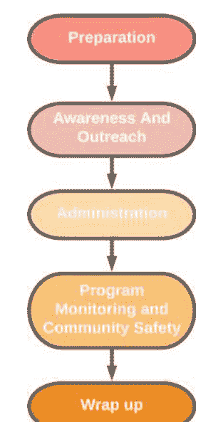

正确的时间和地点，它还能根据用户的规格进行扩展。

##### 2.3 管理

通过技术平台，它将包含完整的数据，以360°视图提供快速的疫苗接种过程。开发人员应该在正确的时间和地点与每个组成部分进行沟通，并管理每剂疫苗，应在正确的时间提供给客户。该平台的覆盖范围应该是每个人，即使他们没有智能手机或者互联网[6]。它还应该是可理解的，开发的网页应该是多语言的，以便不同地区/州的人们能够理解。用户应该完全理解这个过程。此外，如果一个人无法选择参加该活动，请确保他们已经收到了成为该计划一部分的替代方法。

COVID-19剂量在初始阶段可能有限，但该平台可以帮助你确定剂量的需求。这需要保持一定的库存供应，作为安全措施。此外，开发人员还应验证设施是否遵循安全协议。即使预约数量增加，开发的平台也应能根据剂量需求进行扩展。为了获取实时库存信息，它应该能够快速响应。

##### 2.4 程序监控和社区安全

随着越来越多的人接种疫苗，监控以前的时期非常重要。这将对该数据进行研究非常有帮助，它将帮助你解决疫苗的问题和结果。它帮助你建立对你的宪法的信任[7]。该模型可以轻松识别疫苗需求以及接种疫苗的人数。现在，特定组织还可以密切监控疫苗对人体的影响以及该疫苗的效果。该组织可以使用报告和仪表板以可视化形式阅读这些数据。

重新开放学校和大学在建立大规模免疫运动中面临挑战。需要先进的技术来确保通过验证每个人的安全。帮助组织重新开放需要不同的数字工具来跟踪每个人的健康状况。访问服务不仅取决于应用程序，还应该对每个人都可用。例如，如果一个人想了解他/她的COVID报告，他/她应该可以在不输入任何电子邮件或登录任何应用程序的情况下获得。

##### 2.5 总结

管理最大的公共卫生计划之一需要速度和可扩展性。使用单一技术平台可以帮助您管理信息的所有方面，并且可以根据疫苗供应情况快速扩展。向人们分发信息将极大地帮助获得信任，并增加接种疫苗的人数，从而使计划成功（图2）。

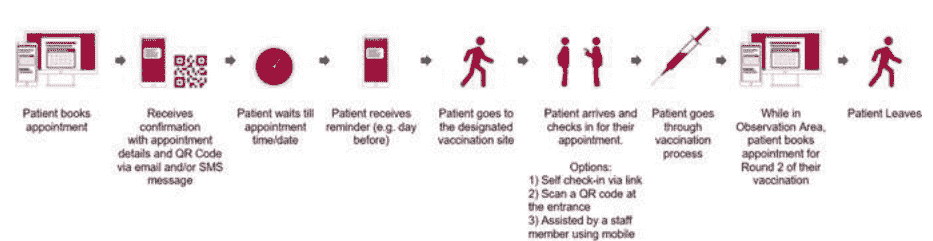

#### 3 结论

从提出的研究工作中可以得出结论，随着技术的快速改进，Salesforce正变得越来越重要。Salesforce刚刚推出了Vaccine云，以帮助公司管理疫苗接种过程并实时收集数据，以解决现有的实时挑战。提出的Vaccine云还有助于显示数据。它提供的解决方案不仅依赖于软件，还使得没有互联网访问权限的人能够参与其中。它帮助您管理大量接种疫苗的人，并告诉您所需的疫苗数量。它通过任何渠道与人们进行沟通，以接触到每个人，并检查每个人的健康状况。因此，本文完全研究了疫苗云如何提供最佳服务，使每个人更健康、更安全。

#### 参考文献

1. Soni, G. K., Singh, H., Arora, H., & Soni, A. (2020) 超低功耗CMOS低通滤波器用于生物医学ECG/EEG应用。在IEEE 2020第四届创新系统与控制国际会议(ICISC)中(pp. 558–561).
2. Soni, G. K., & Arora, H. (2020). 用于心电图应用的低功耗CMOS低传导度OTA。在通信和智能系统的最新趋势中，智能系统的算法（第63-69页）。
3. Manchar, A., & Chouhan, A. (2017). Salesforce CRM: 云环境中管理客户关系的新方式。在2017年第二届电气、计算机和通信技术国际会议（ICECCT）中。
4. Gupta, H., & Vincent, P. M. D. R. (2017). 使用云技术支持印度的卫生保健中心化系统。在2017年智能计算、仪器和控制技术国际会议（ICICICT）中。
5. Karafillakis, E., et al. (2021年2月8日). 与疫苗接种相关的社交媒体监测方法：系统性范围审查。JMIR公共卫生与监测，7（2），e17149。
6. Arefin, M. S., Survoi, T. H., Snigdha, N. N., Mridha, M. F., & Adnan, M. A. (2017年12月).为欠发达国家设计的智能医疗系统。在IEEE国际电信和光子学会议(ICTP)上。
7. Rahmat, S. N, Jamal, A., Alkawaz, M. H., & Sangaran, M. (2019年)。父母提醒和计划儿童疫苗接种。在2019年IEEE第9届系统工程与技术国际会议(ICSET)(pp. 144–149)上。
8. Fernandes, S. M., & Coutinho, C. (2017年)。用于改善CRM实施的关键绩效指标。在2017年国际工程、技术和创新会议(ICEITMC)上。
9. Numnark, S., Ingsriswang, S. & Wichadakul, D. (2014年)。VaccineWatch: 一种监测系统用于社交媒体数据中的疫苗信息。在2014年第8届国际系统生物学会会议(ISB)上。

### 使用指纹分析预测先天天赋

Maitreyi Pitale, Riya Kale, Manasi Khamkar, 和 Ujwala Ravale

摘要 皮纹多元智能测试是对手指上的指纹和坚硬皮肤纹理的科学研究。借助这个测试，可以通过对指纹顶端的图案和脊线进行分类来完成独特、适应性、本能和响应性的完整脑分析。

DMIT通过扫描指纹并手动计算每个个体指纹上的脊线数量，然后计算大脑优势百分比、学习风格、叶片百分比和脊线数量。这种技术是进行DMIT测试的传统方法，需要人工辅助进行手动计算，并要求使用科学方法。该系统旨在使用细节点提取、波恩可雷指数的奇异性检测、轮廓计数和卷积神经网络的模式识别，在几秒钟内为每个检测到的主导模式生成13页的DMIT报告。这有助于通过使用应用程序生成的报告做出更好的职业决策来改善情况。因此，利用技术补偿将这个概念扩展到更广泛的层面。

关键词 DMIT—皮纹多元智能测试 · CNN—卷积神经网络 · 细节提取 · 脊线计数

M. Pitale · R. Kale · M. Khamkar · U. Ravale (✉)
孟买SIES研究生技术学院计算机工程系，印度
e-mail: ujwala.ravale@siesgst.ac.in

M. Pitale
e-mail: maitreyi.pitale17@siesgst.ac.in

R. Kale
e-mail: riya.kale17@siesgst.ac.in

M. Khamkar
e-mail: manasi.arun17@siesgst.ac.in

© 作者，独家许可给 Springer Nature Singapore Pte Ltd. 2022S. Shakya 等人 (编) ，情感分析与深度学习. 智能系统与计算进展1408, https://doi.org/10.1007/978-981-16-5157-1_79

#### 1 引言

指纹是由于表皮组织上的峰和谷而在手指、脚趾和手掌尖端形成的独特图案。即使是相同的生物孪生兄弟也没有相同的指纹。

即使一个人的两个手指也没有相同的图案。指纹的这些特点使其成为全球使用的身份识别系统。它们被用于生物识别安全系统、犯罪现场调查、检测药物使用等等。人类主要有三种指纹图案[1]。

环形图案是指纹向自身回环的图案。涡旋图案是指纹在指尖形成漩涡状图案。这种图案约占人口的35%。最后一种图案是拱形图案，形成一个波浪状图案并带有一个三角洲。

指纹的另一个用途，虽然不广为人知，是用于对人类思维过程和大脑发育与优势的基本理解。该技术由霍华德·加德纳博士开发。通常被称为DMIT[1]或皮纹多元智能测试，有助于理解大脑的叶及其在所有个体中的广泛用途。

每个孩子在自己的方式上都是独特的，无论是学习能力还是对自然刺激的反应。父母每天都在努力找出他们的孩子倾向于什么，最终给孩子施加了很大的压力，使其过度成就。另一方面，了解孩子的个性，如何在困难情况下接触他们的孩子，以及了解他们的兴趣领域，可以帮助双方。

通过多重智力测试，可以获得对个人性格的模糊印象。这些测试有一系列的选择题，你必须诚实地回答。在测试结束时，系统会生成一个报告，显示九个智能位（音乐、身体动觉、人际关系、语言语言、自然、内省和视觉空间）和一个柱状图，显示你的强项。虽然你无法保证结果，因为你不知道后台运行的算法是什么，也不知道你是否诚实地回答了问题。

同样，基础是开源心理测量报告，根据一组36个陈述进行评分，评分范围是最可能和最不可能。在这三种方法中，DMIT被证明是最高效的方法，但这个系统的问题是它耗时，并且在DMIT过程中的计算和分析是手动完成的。因此，我们的系统希望将这个手动操作的系统转变为一个自动化系统，应用程序在几秒钟内完成所有计算。

#### 2 相关工作

在皮纹学部门已经进行了相当多的研究和探索。许多研究人员发现指纹与人类心理行为之间存在相互关系。

2008年，Mil’shtein等人提出了两种新算法，分别是线扫描算法（LSA）和间隔频率变换算法（SFTA），用于比较和识别完整和部分指纹。SFTA使用二维傅里叶变换将图像转换为频域。然后，计算机将每个像素与固定的阈值进行比较。如果超过阈值，则找到匹配，否则被拒绝。LSA首先裁剪图像中的不必要部分。然后在相同图像的行中找到相关曲线。研究得出结论，LSA在处理部分图像时具有更高的准确性。

2012年，Agarwal等人[3]在对印度北部指纹进行广泛研究后得出结论，指纹模式与个性之间存在相关性。这种相关性可以作为一种工具，完全将人引导到特定类型的咨询中。使用墨水技术收集了所有十个手指的数据，并使用显著性水平小于0.5的卡方检验进行比较。

2017年，Dholiya等人[4]在其关于皮纹多重智力测试的论文中指出，ATD角度在推断个体对学习刺激的反应中也起着重要作用。指纹模式受加性等位基因控制，由父母遗传给后代。DMIT报告可能会提出多种才能，但没有经过领域培训的才能无法完善。

2019年，Gupta等人[5]研究了血型、指纹和个性之间的相关性。他们指出，在他们的研究中，美国医生明确指出人类个性与指纹之间存在明确的相关性，因为当人类胎儿没有大脑时，他们没有指纹。2019年，Nguyen和Nguyen[6]使用支持向量机、随机森林和机器学习算法的组合来预测指纹类型。

2019年，Srivastava等人[7]使用直方图均衡化、傅里叶变换和图像二值化来改善指纹图像。改善图像后，下一步是通过边缘减弱和细节点检查进行细节点提取。为了准确提取细节点，将指纹的每个脊线减弱为一个像素长度。

#### 3 数据集

我们的过程始于从各种资源中获取大规模定制指纹数据集。我们项目的需求是找到具有更清晰洞察力的指纹数据，包括其脊线、分叉和可见的识别模式。我们已经使用了Sokoto Coventry指纹数据集[8]，包括来自600个非洲受试者的6000个指纹，其中只有600个指纹用于训练目的，因为其余的指纹被扭曲和不清晰；因此，我们不得不丢弃它们。教育咨询和NLP研究所——古鲁基金会的一个单位——为我们提供了一个包含70个个体的2100个指纹的数据集。在2700个指纹的数据集中，我们使用了1500个指纹作为我们的系统需要清晰的图像。我们的数据集包括两部分——训练集和验证集。因此，我们为训练部分选取了1200个指纹，为验证部分选取了300个指纹。此外，我们将训练集和验证集分为三种模式——拱型、环型和螺旋型——以训练CNN模型。

#### 4 提出的系统

我们的方法是将获取的数据集分为拱型、环型和螺旋型，用于训练和验证目的。一旦数据集训练完成，主要目标是提供一个高效智能的卷积神经网络模型来预测预处理指纹图像的类别。它能准确地对指纹进行分类并提供主导指纹模式。我们的第二个目标是通过考虑每个细节点特征，使用细节点提取和奇点检测算法来确定奇点（核心和三角洲）。核心到三角洲图像被裁剪并存储在后端，然后进行轮廓计数。然后将脊线计数映射到相对公式中，计算脊线百分比、总脊线计数和脑叶优势。由于没有这样的现有应用程序，这个系统将在覆盖更广泛的领域中非常有用。

##### 4.1 使用卷积神经网络进行模式识别

我们系统的第一个目标是从中识别出适当的指纹模式，以便我们可以确定主导指纹，为此我们使用了卷积神经网络[9]。基本的卷积神经网络模型由一个或多个卷积和池化层组成（交替排列），最终提供一个完全连接的神经网络。这两层模拟了哺乳动物视觉皮层中复杂细胞和简单细胞的特性。卷积网络的经典架构如图1所示[9]。

使用CNN架构来寻找指纹的图案-拱门、环形和螺旋，输出层中的每个节点与一个字符类相关联。在训练CNN之后，完全连接层的参数保持不变，以提取最终的特征向量，然后将其输入到BPR分类器中。基于CNN的特征提取器与字符类的数量无关，可以非常紧凑。模式识别应用于所有十个指纹

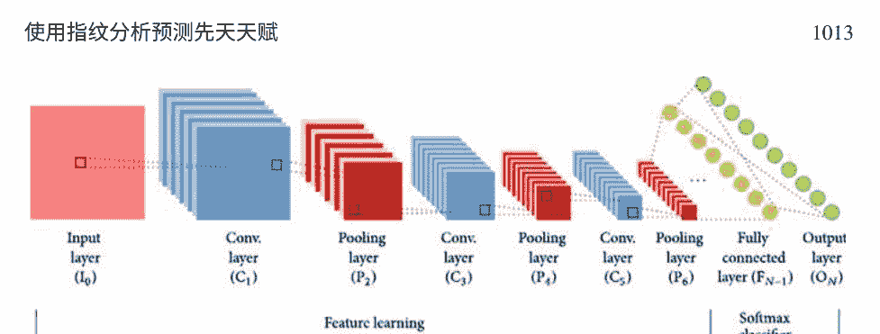

## 图1 典型的卷积神经网络

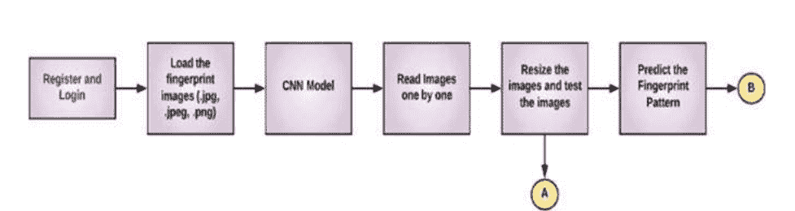

## 图2 指纹图案预测模型

其中出现次数最多的指纹图案是个体的主导指纹图案，这对于描绘个人的个性非常重要（图2）。

##### 4.2 细节点提取和奇点检测

成功识别出主导图案后，我们的下一个目标是将原始指纹处理成骨架化图像，以检测每个指纹的核心和三角奇点。细节点提取方法[10]的步骤如下：

- 1. 灰度转换 - 灰色是RGB值相等的颜色，因此我们只需要为每种颜色提供一个强度值。灰度算法将原始图像转换为只有灰色阴影的图像。通过进行这种转换，每个像素需要提供的信息较少，并且对于大多数任务来说，这些信息已经足够，不再需要复杂和难以处理的彩色图像。
- 2. 图像归一化 — 这是一种广为人知的图像增强技术，用于改善图像的对比度。该系统在本项目中用于通过修改灰度级值的范围来标准化从图像中获得的强度值，从而将其在所需方向上扩展，并改善图像质量的差异。在噪声指纹的情况下，归一化对于获得更好的图像结果以及减少灰度级数量和脊线的差异以便于后续图像处理步骤至关重要。
- 3. 分割 - 分割需要去除图像的边缘和过于嘈杂的区域。这是通过估计可接受的灰度级别来实现的。为此，图像被划分为大小为 (W * W) 的子块，对每个块计算方差。然后，每个块的方差的根与阈值T相关联，如果得到的值小于阈值，则称为图像的上下文块，并将其从进一步处理中删除。通过使用这一步骤，可以减小有价值的指纹部分的大小，并充分利用生物特征数据。使用“开”和“闭”形态学开运算对图像进行平滑处理。“开”操作用于扩展图像并删除背景噪声峰值，而“闭”操作用于收缩图像并去除微小的空洞。
- 4. 方向 - 通过将图像视为有方向的纹理，提供了多种估计指纹图像方向区域的方法。计算主导方向的主要步骤如下（图3）[10]：通过将图像视为有方向的纹理，提供了多种估计指纹图像方向区域的方法。计算主导方向的主要步骤如下：给定一个归一化图像N。计算主导方向的主要步骤如下：
  - (1) 将其切割成 w * w (8 * 8) 的方块。
  - (2) 对于每个像素，计算梯度 (i, j) x ∂和 (i, j) y ∂。简单的Sobel算子是梯度算子。
  - (3) 使用以下方法，估计以像素 (i, j) 为中心的每个方块的局部方向。
- 5. 频率图和Gabor滤波器 — 确定一个频率方块。为了构建Gabor滤波器，除了方向图之外，我们还需要局部频率图。图像的频率图是通过计算每个像素中条纹的局部频率来组成的（图4和图5）[11]。

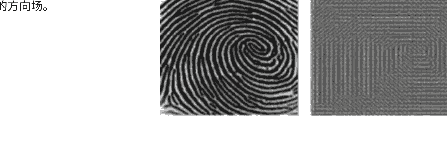

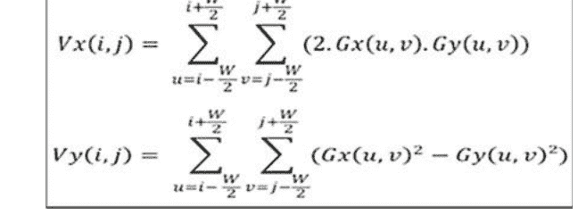

## 图4附近的局部方向

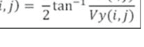

## 图5邻域中的局部方向

- 6. 细化和骨架化 - 图像必须骨架化才能提取细节点：一系列形态学腐蚀操作将减小条纹的厚度，直到它们等于一个像素，同时保持条纹的连通性（即必须保持条纹的连续性，不能插入孔）。一些论文使用Rosenfeld算法，因为它简单。骨架化将二进制伪影减少到只有一个像素宽的表示。通过对图像进行连续的遍历，可以使其骨架化。在每次遍历中，如果边界像素不破坏相应对象的连通性，则将其检测并移除。
- 7. 交叉数 - 交叉数方法是一种非常简单的检测脊线分叉和结束的方法。交叉数算法将检查3×3像素块。使用以下公式确定CN值（图6）[11]：
  > 如果中间的像素（反映脊线的像素）是黑色的：如果边界上的像素穿过脊线一次，我们就找到了脊线的末端：如果边界上的像素穿过脊线三次，我们观察到脊线的分叉。
- 8. 使用Poincare指数进行奇点检测：应用Poincare指数算法[12]计算围绕一个点的方向变化之和，以确定它是否是奇点。在这种情况下，让G表示指纹方向，[i, j]表示元素的位置。结果可以如下估计：曲线 C是一个闭合路径，由 D的一些组件的有序序列和一个内部点[i, j]识别出来，C的相邻元素之间的方向差的代数和得到PG, C(i, j)。在闭合曲线上，Poincaré指数假设只是离散值之一：0°、180°或360°，这是众所周知且容易证明的。在指纹奇异点的情况下，0°不属于任何奇异区域。360°是一个奇异的螺旋区域。180°是一个三角洲类型的奇异区域，而180°是一个环型奇异区域（图7和8）。

## 图6 CN计算

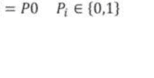

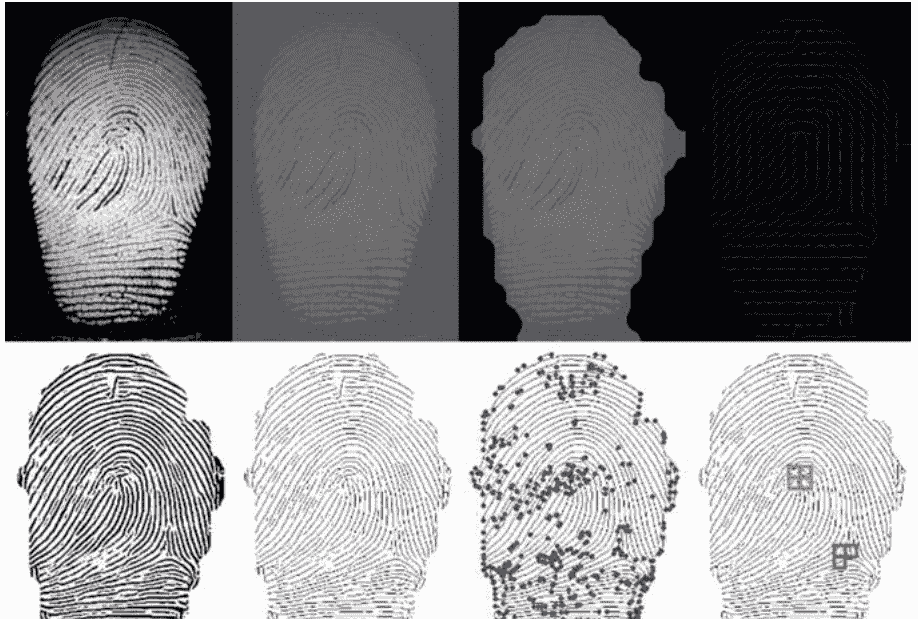

## 图7细节点提取和奇异点检测

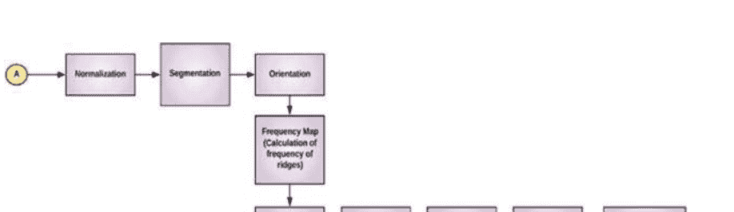

## 图8脊线计数模型

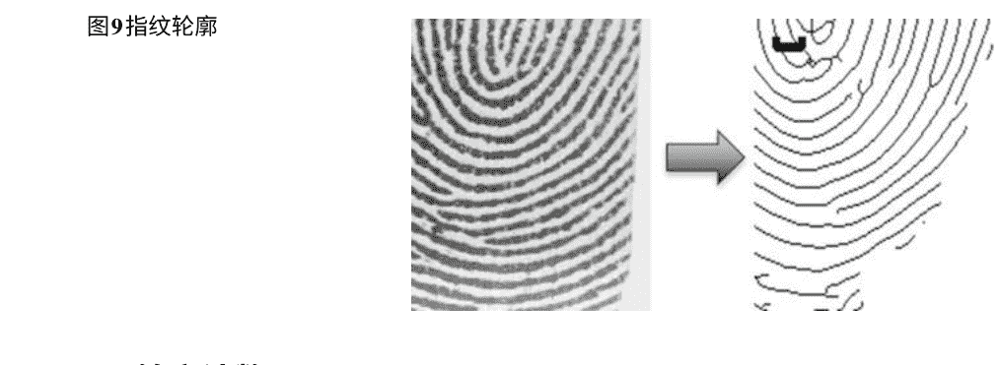

##### 4.3 轮廓计数

通过轮廓像素从背景中识别对象。 基于其局部模式，轮廓跟踪算法[13]对轮廓像素的形式进行分类。然后它使用前一个像素的信息来映射下一个轮廓。 因此，它可以区分直线、内角、外角和内外角，并提取特定轮廓形式的像素。 在本项目中，阈值函数被应用于多通道数组进行固定级别的阈值化。 该特征通常用于将灰度图像转换为二值（二进制）图像（也可以用于比较）或去除噪声，即过滤掉值过小或过大的像素。 该函数支持各种阈值化技术。 类别参数决定了它们是什么。由于轮廓函数以连续的方式考虑相邻像素，所以脊线被视为一条线，并进行轮廓测量（图9）。

##### 4.4 神经元分布和脑优势公式

- 脊线计数百分比 = 100 × 指纹脊线计数 ÷ 总脊线计数
- 脑叶计数百分比:
  ```
  前额叶 = (R1 + R6) * 100/TRC
  额叶 = (R2 + R7) * 100/TRC
  顶叶 = (R3 + R8) * 100/TRC
  颞叶 = (R4 + R9) * 100/TRC
  枕叶 = (R5 + R10) * 100/TRC
  ```

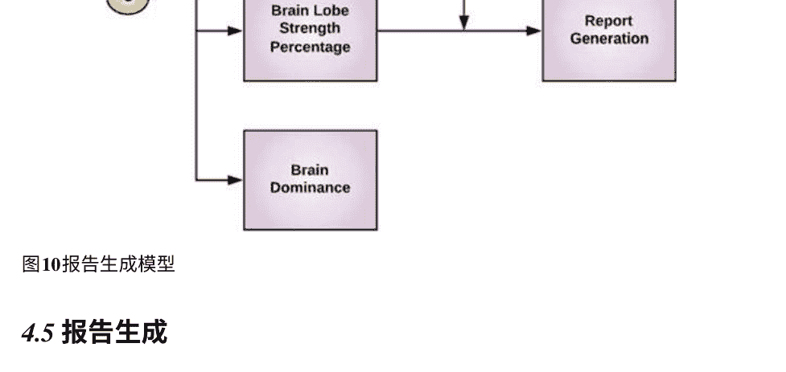

##### 4.5 报告生成

我们系统的主要输出是使用HTML和CSS生成的13页可打印报告。这份报告是根据DMIT专家的指导，参考DMIT中心生成的报告，以尽可能准确。初始页面简要解释了报告的使用方法、各种人格特征和DMIT的描述。报告的最重要部分是神经元分布图。这是在计算脊线计数后动态生成的。通过对每个手指的脊线计数使用简单的公式，显示了一个人的显性和隐性特征的百分比。接下来显示的是从CNN模型获得的主导指纹类型。我们还显示了主导人格的基本特征。最后，报告包含了一个脑优势图表；这也是通过脊线计数计算得出的。它以百分比显示了大脑的活动情况（图10）。

#### 5 结果

我们通过训练一个模型成功地开发了一个系统：使用CNN算法识别指纹的模式，并在生成的报告中反映出来。每个指纹都与其独特的个性特征相关联。通过指纹识别个性特征并不是最近的发现，而是在过去几十年中一直在使用。如前所述，主要的模式类型有环型、螺旋型和拱型。具有环型指纹的人倾向于有强烈的意见，对生活中所拥有的东西感到满足，并尊重他人。由于这种性质，他们成为能够舒适地领导团队并具有良好职业道德的合适伙伴和员工。 他们可能组织得不是很好，但能够迅速适应变化。 拥有螺旋纹指纹的人在智力上高于平均水平，他们是好的追随者并具有支配性的个性类型。 与环型纹样特征不同，他们有组织能力、严谨和控制力。 拇指上有螺旋纹的人可能被认为具有控制欲。 拥有拱型指纹的人具有分析思维，并在他们采取的许多步骤中谨慎地进行分析思考。 以下是输出结果（图11）：

通过细节点提取算法、奇点检测和轮廓计数的帮助，我们能够计算出个体的神经元分布情况，其中9%及以上表示强神经元活动，9%及以下表示弱神经元活动，6-9%表示平均神经元活动。 生成的报告还提供了关于左右脑优势的信息。 以下是输出结果（图12）：

我们的大脑左右半球是分割的。 大脑的每个半球都有其独特的能力。 左脑的功能由右手的手指代表，而右脑的功能由左手的手指代表。 不同的智力由不同的手指代表。 每种智力都有其货币价值。 总百分比为

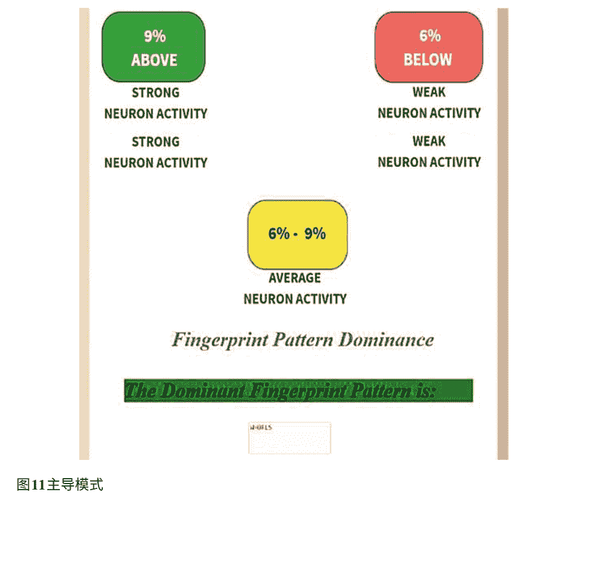

## Neuron Distribution Chart

| Left Brain Functions | Left Percentage | Lobe | Right Percentage | Right Brain Functions |
|----------------------|-----------------|------|------------------|-----------------------|
| Rational Thinking, Executive Planning, Coordinating, Controlling, Self Achievement<br>whorls | 11.64%<br>whorls | PREFRONTAL LOBE | 10.21%<br>whorls | Leadership, Interpersonal Skills, Goal Visualization, Intuition, Self Esteem |
| Logic & Reasoning, Analyzing & Computing Process, Numeric Linguistic, Grammar Concepts<br>whorls | 9.59%<br>whorls | FRONTAL LOBE | 8.22%<br>whorls | Imagination, Ideal Formation, Visualization, 3D Recognition, Visual Spatial Ability |
| Fine Motor Skills, Action Identification, Hand Control Movements, Finger Skills<br>loops | 11.64%<br>loops | PARIETAL LOBE | 6.16%<br>loops | Gross Motor Skills, Body Movements, Coordination, Out-door activities, Sports Activities |
| Language Ability & Understanding, Hearing Identification, Word Formation, Word Memory<br>whorls | 9.59%<br>whorls | TEMPORAL LOBE | 11.64%<br>whorls | Music Sound, Rhythm Tone, Voice Identification, Listening Skills, Emotions & Feelings |
| Visual Identification, Reading, Interpretation, Observation Skills, Nature Lover<br>whorls | 10.96%<br>whorls | OCCIPITAL LOBE | 10.27%<br>whorls | Visualization Art, Visual Appreciation, Drawing, Aesthetic Sense, Visual Interpretation |


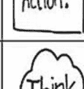


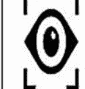

## 图12 神经元分布图

智能分布将达到100%。该值衡量了新皮层神经元的强度，意味着具有较高值的函数将具有较高的RC值。各种模式类型将显示各种值的分布。在典型情况下，大多数人的值将在8到30之间变化。如果值很高，意味着该功能的大脑皮层活动水平很高。如果特定智能的RC值或百分比分布显示为“0”或拱型类型，则该值的最小范围可以为0，最大范围可以为无穷大。RC值的潜力将在0到无穷大的范围内。这仅仅意味着该智能具有很高的适应能力。平均RC值为10%；如果某个智能的RC值分布低于5.99%，则意味着它仅仅是与自己的比较结果，并不一定意味着你在该智能方面很差。左右脑之间的RC百分比差异应该在5-7%左右。这是你处于正常范围中的一个迹象。如果差异大于7%，则大脑的弱侧将影响另一侧。然而，这并不表示严重的担忧。为了平衡它，必须集中注意力在弱势方面（图13）。

基于脑叶的分类，大脑可以被研究为由前额叶、额叶、顶叶、颞叶和枕叶组成。大脑皮层分为四个脑叶，每个脑叶都有其独特的功能。不同的功能与额叶、顶叶、枕叶和颞叶相关，涵盖了从推理到听觉知觉的各个方面[14]：

## 前额叶

它与推理、问题解决、逻辑思维、计算过程、合理化、语言功能、视觉空间想象、思维生成和概念化相关。它位于大脑的前部。

## 额叶

前额叶皮层是额叶的前部区域。它在“高级认知功能”和个性发展中至关重要。它有助于规划、管理、沟通、协调以及情绪和行为控制。它还控制着我们的创造力、领导能力、直觉能力和视觉化能力。

## 枕叶

它位于大脑后部，负责理解视觉刺激和信息。枕叶内含有主要的视觉皮层，接收和处理来自眼睛视网膜的信息。左侧控制视觉识别、观察和阅读理解，而右侧控制视觉和图像的享受。

## 顶叶

它与触觉感知信息（如压力、触摸和疼痛）的处理有关，位于大脑的中部。体感皮层是大脑负责处理身体感觉的一部分，位于这个脑叶。它负责运动区分、身体动作、操作知识和身体活动能力。


## Brain Dominance

| Prefrontal Lobe | Frontal Lobe | Parietal Lobe | Temporal Lobe | Occipital Lobe |
|-----------------|--------------|---------------|---------------|----------------|
| 21              | 17           | 17            | 21            | 21             |

| Left Brain | LTRC |
|------------|------|
| 53%        | 78   |

| Right Brain | RTRC |
|-------------|------|
| 47%         | 68   |

## 图13 大脑优势

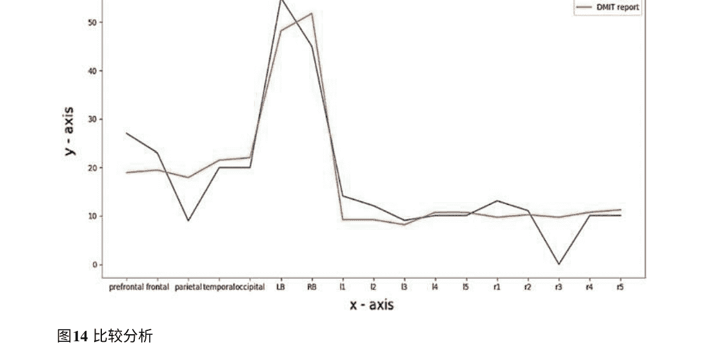

## 颞叶

它位于大脑的下部。主要听觉皮层，负责理解声音和语言，也位于这个脑叶。

为了验证我们应用程序生成的结果的一部分，在我们的报告中，我们将输出与教育咨询和NLP研究所生成的报告进行了比较，准确率为60%。我们报告的新颖之处在于我们正在生成一份以模式为主导的报告，这使得理解和关注特定能力变得容易。

图14将通过该系统生成的结果与通过专业协助从实际DMIT软件获得的结果进行了比较。观察到，所提出系统的结果几乎相等。因此，在顾问的指导下，对结果进行了检查。

#### 6 结论

通过对结果的每个方面进行评估，我们得出结论，我们收集的指纹数据经过了广泛的处理和修剪，以满足我们计算脊线计数的目标。我们联系了一位在过去15年里一直从事这个领域的心理学家，他详细解释了DMIT软件的功能以及我们在构建系统时的主要目标应该是什么。心理学家指导我们如何理解人格特征和指纹图案之间的各种联系。尽管主要问题仍未解答，但我们如何将两者联系起来呢？为此，心理学家帮助我们获得了DMIT专家的联系方式。该专家帮助我们获得了一个有效的数据集和预先制作的报告，以测试我们的结果，还详细解释了DMIT软件的整个机制。

我们在后端使用了卷积神经网络（CNN）模型来预测指纹模式。CNN模型以最小误差20%的输出高效地预测模式。预处理的图像用于计算岭计数，自技术诞生以来一直是手动执行的。

我们的应用程序可以在几秒钟内预测出一份报告，而DMIT软件需要几周的时间。用户必须去最近的DMIT中心提交或提供他/她的指纹，我们的应用程序可以在家中通过上传十个清晰的指纹扫描来使用。DMIT目前不是常见的知识，但我们的应用程序使其易于使用和深入理解大脑的功能，这将有助于该技术的市场化。

我们项目的目标是帮助多重智能知识变得普遍和易于获取，这一目标已经实现。

致谢
我们要感谢In True Talent Services的创始人Deepak Joshi先生，他在提供数据集和帮助我们对数据进行分类方面提供了宝贵的帮助。此外，我们还要感谢治疗师和高级顾问Swati Parab女士提供的与DMIT相关的所有信息。我们要向Ujwala Ravale教授表达我们的无比指导之情，以及我们的学院SIES Graduate School of Technology及其赞助商对我们的直接和间接支持。

#### 参考文献
1. Sharma, A., Sood, V., Singh, P., & Sharma, A. (2018). 皮肤纹理学：关于指纹及其变化趋势的综述。*CHRISMED健康与研究杂志*。
2. Milstein, S., Pillai, A., Shendye, A., Liessner, C., & Baier, M. (2008). 部分和完整指纹的指纹识别算法。在2008年IEEE国际会议上的国土安全技术。
3. Agarwal, K. K., Saxena, A., Dutt, H. K., Dimri, D., Singj, D., & Bhatt, N. (2012, January). 基于指纹模式的心理行为的一般假设。生物学和生命科学杂志，3(1). ISSN 2157-6076.
4. Dholiya, K., & Dholiya, A. (2017年4月). 皮肤纹理多元智能测试。国际记忆与智能杂志，1(1).
5. Gupta, V. P., & Shah, A. H. (2019年). 关于指纹模式和血型与人格的关系的研究—来自尼泊尔的报告。*Acta Scientica Medical Sciences* 3(6).
6. Nguyen, H. T., & Nguyen, L. T. (2019年11月). 通过图像分析和机器学习方法进行指纹分类。*Algorithms* 2019, 12, 241. https://doi.org/10.3390/a12110241.
7. Srivastava, A. P., Awasthi, S., Kaushik, A. K., & Shukla, S. (2019年). 使用MATLAB的指纹识别系统。在2019年自动化、计算和技术管理国际会议(ICACTM)(pp. 213–216).
8. Shehu, Y. I., Ruiz-Garcia, A., Palade, V., & James, A. (2018年7月). *Sokoto coventry指纹数据集*. ResearchGate.
9. Zhou, L., Li, Q., Huo, G., & Zhou, Y. (2017年2月). 使用仿生学模式识别和卷积神经网络特征的图像分类。计算智能和神经科学, 2017, 文章编号3792805.
10. Vaikole, S., Sawarkar, S. D., Hivrale, S., & Sharma, T. (2009年3月). 从指纹图像中提取细节特征。在IEEE国际先进计算会议(IACC2009). Patiala.
11. 指纹算法识别。https://medium.com/%40cuevas1208/指纹算法识别-fd2ac0c6f5fc.
12. 周, J., 陈, F., 顾, J. (2009年7月). 一种从指纹图像中检测奇异点的新算法。IEEE模式分析与机器智能交易, 31 (7).
13. Seo, J., Chae, S., Shim, J., Kim, D., Cheong, C., & Han, T.-D. (2016年). 基于像素跟踪方法的快速轮廓追踪算法用于图像传感器。传感器2016.
14. Sing, M., & Majumdar, O. (2015年4月-9月). 皮肤纹理：指纹上人类认知的蓝图。IJCSC, 6 (2), 124-146.

## 作者索引
### A
- Abdulkader, Beema, 555
- Abedin, Mohammad Zoynul, 411, 653
- Achish, D., 357
- Adinarayna, S., 475, 933
- Advait, N., 319
- Akshaya, A. V., 501
- Alagirisamy, Mukil, 369
- Ali, Md Rasid, 665
- Alisha, Antony, 851
- Aloysius, Athern, 209
- Amaldev, C. V, 851
- Ang, Chun Kit, 209
- Anitha, R., 757
- Annie, R. Arockia Xavier, 423
- Aramugam, Kalaiselvi, 209
- Arora, Himanshu, 1003
- Asemie, Smegnew, 177
- Ashesh, Aishwarya, 31
- Ashesh, K., 199, 357
- Aysha Dilna, D. A., 851
- Ayyappan, Manoj, 303
- Azezew, Kassahun, 177

### B
- Babaria, Disha, 527
- Bacanin, Nebojsa, 863
- Bala, Shatabdee, 411
- Banerjee, Arnob, 527
- Banjarey, Khushboo, 691
- Bhargav, D. Lohith, 357
- Bhegade, Nikita, 799
- Bisen, Gokul, 223
- Bondre, Vipin, 577

### C
- Chaitra, B. M, 779
- Chalke, Snehal, 347
- Champa, H. N., 15
- Chandra, Sumesha, 275
- Chaudhari, Chetana C., 949
- Chaudhary, Vinayak, 275
- Chavan, Vaishnavi, 799
- Chhabra, Amit, 863
- Cyriac, Meril, 501

### D
- Dahiya, Yash, 275
- Danti, Ajit, 779
- Das, Bhaskarjyoti, 113
- Das, Sweta, 1
- Deeba Lakshmi, G. R., 185
- Deisy, 209
- Desai, Sanjana, 879
- Deshpande, Abhishek, 223
- Devi, R., 757
- Devi, S. V. Gayetri, 487
- Dewangan, Deepak Kumar, 691
- Dhamanskark, Prajakta, 155
- Dikkala, Udayini, 369
- Dileep, M. R, 779
- Dixit, Shatakshi, 577
- Doshi, Sakshi, 625
- Dsa, Adriel, 983

### E
- Egorov, D. P., 993

### F
- Farooq, Syed Abu, 591

### G
- Gajera, Krishna, 347
- Ganesan, Sowmya, 347
- Ganesh, E. N., 829
- Gangadhar, N., 237
- Gaonkar, Gurudatt, 303
- Garg, Anukriti, 703
- Geetha, T. V., 423
- George, Priya, 555
- Ghaskadvi, Meera, 155
- Ghongade, Aditya, 983
- Ghorpade, Kalpana, 141
- Gireesh, R., 129
- Gonsalves, Rozebud, 155
- Gowrishankar, S., 1
- Guhagarkar, Neeraj, 879
- Gupta, Aashuli, 527
- Gupta, Saumya Raj, 893

### H
- Harikrishna, J., 129
- Harisudha, K., 829
- Himanshu, 47
- Hossain, Elias, 79
- Hrithik Devaiah, B. A., 319

### I
- Indu, S., 703
- Ingle, Y. S., 625
- Islam, Muhammad Nazrul, 383

### J
- Jacob, Teslin, 255
- Jadala, Vijaya Chandra, 475, 933
- Jadhav, Advet, 451
- Jagadeeswari, M., 813
- Jain, Prashuk, 47
- Jakka, Aishwarya, 907
- Jalal Uddin Joy, Abu Zahid Md., 79
- Jayanthi, N., 703
- Jebamani, B. Jency A., 291
- Jha, Pradeep, 1003
- Joseph, Richard, 303
- Juj, Tejsvi, 703

### K
- Kale, Riya, 1009
- Kaleem, Mohammed Khalid, 177
- Kalshetty, Jagadevi N., 319
- Kalyan, N. Pavan, 357
- Kanase, Sayali, 799
- Kanuru, Hamsini, 907
- Kashetwar, Shreyas, 799
- Kendhe, Shreya, 625
- Khamkar, Manasi, 1009
- Khan, Md. Nasfikur R., 411, 653
- Khan, M. K. A. Ahamed, 209
- Khaparde, Arti, 141
- Khochare, Sakshi, 155
- Kiranmayee, B. V., 439
- Koshy, Ken, 319
- Kravchenko, V., 993
- Kumar, A. Arun, 397
- Kumar, J. Ravin, 813
- Kumar, S. Pradeep, 719
- Kuriakose, Thomas, 769

### L
- Latha, N., 539
- Limkar, Aditi, 625
- Lim, Wei Hong, 209
- Loka, Omkar, 735
- Lokhande, Parth, 983
- Lotlikar, Kunal, 527

### M
- Madeira, Malcolm Andrew, 255
- Mahamuni, Nachiket, 735
- Malathi, M., 539
- Manda, Sridhar, 397
- Mangipudi, Reshma Sri Sai, 615
- Manikandababu, C. S., 813
- Manjunath, K. G., 959
- Mehra, Monika, 1003
- Menaka, S., 465
- Mittal, Ritvik, 47
- Mizanur Rahman, Md., 79
- Mohamed, E. Syed, 637
- Mosiganti, Kezia Joseph, 369
- Mothukuri, Radha, 475
- Muhaimenur Rahman, Md., 59
- Muley, Pradnya Abhay, 973
- Munot, Harsh, 983
- Murugeswari, R., 291, 719

### N
- Nadim Kaysar, Md., 79
- Nadi, Shantunu Shakhwat, 653
- Nagaraj, P., 291, 719
- Nagaraj, Prajna, 113
- Nagpal, Aashish, 303
- Nalini, N., 397
- Nalini, T., 487
- Nascimento-Silva, Hieda A., 97
- Navaneeth, A. V., 779
- Neelagar, Mahesh B., 237
- Nene, Manisha J., 69
- Nikam, Hrishikesh, 735
- Nivash, S., 829

### P
- Pardhi, Jatin, 223
- Parihar, Anil Singh, 47
- Parvin, Nargis, 565
- Patil, Nita, 347
- Patil, Pramod D., 799, 983
- Patil, Rachana, 735
- Patil, Rahul A., 799, 949, 983
- Pattewar, Gaurav, 735
- Paul, Ajil, 555
- Pawar, Surabhi, 577
- Pitale, Maitreyi, 1009
- Poongothai, L., 757
- Prabhu, T. S. Murugesh, 625
- Pranitha, J., 615
- Prathyusha, Munjuluri, 199
- Preethi, S., 813
- Priyadarshini, B. Indira, 615
- Priyanka, R., 813

### Q
- Qayyum, Abdul, 209

### R
- Ravi, Mohamed, 959
- Rahman, Md. Mahbubar, 383
- Rahman, Md. Saifur, 565
- Rahul, 185
- Rai, Utkarsh, 451
- Rajeswari, Malisetty, 199
- Raju, S. N. Vivek, 603
- Raju, Channa Krishna, 959
- Raju, S. Hrushikeshava, 475, 933
- Rakshith, K., 319
- Ramaswamy, Manicam, 209
- Rani, J. Vakula, 907
- Rao, G. Subba, 475, 933
- Raut, Hema, 527
- Ravale, Ujwala, 1009
- Rayer, S. Prithiviraj Pallava, 603
- Regina, M. Yasmin, 637
- Rekha, K. Sashi, 465
- Reshim, Pooja, 347
- Resmi, N. G., 851
- Rithika, V., 813
- Roy Chowdhury, Dipanwita, 665
- Roy, Sourabh Ranjan, 893
- Rupa, Ch., 129

### S
- Sabu, Amal, 555
- Saha, Anik Kumar, 59
- Sahu, Indra Kumar, 69
- Sahu, Satya Prakash, 691
- Salb, Mohamed, 863
- Saranya, M., 423
- Saraswathi, H. S., 959
- Satpute, Maheshwari, 451
- Save, Ashwini, 879
- Sethi, Manoj, 275
- Shafi, M. Naveed, 893
- Shaikh, N. F., 625
- Shakir, Asif Khan, 653
- Shakya, Subarna, 789
- Shakya, Sushil, 789
- Shanmugam, Selvanayaki Kolandapalayam, 591
- Shanthi, C., 757
- Sharma, Ankit, 69
- Sharmila, K., 757
- Shetty, Tanvi, 303
- Shilpa, K. C., 237
- Shukla, Anshika, 185
- Shweta, N., 237
- Sijin, P., 15
- Singh, Himalaya, 1003
- Snehalatha, U., 893
- Sreedevi, Sneha, 555
- Sreenu, G., 851
- Sreeraj, Amrutha, 769
- Sreeraj, Ayswarya, 769
- SreeRakshak, S., 439
- Sreeram, S., 829
- Sridevi, 209
- Srugana, Padmanabhuni, 199
- Strumberger, Ivana, 863
- Subin, Sebastian, 851
- Sunil, M. E., 677
- Surendra, Usha, 539
- Suresh, Chalamuru, 439
- Swamy, T. M. Veeragangadhara, 515### T
- Tale, Trupti, 577
- Taranath, Poornima, 1
- Thakur, Mahima, 893
- Thomas, Jency, 769
- Thoolkar, Shefali, 577
- Tiwari, Laghima, 703
- Tolstoukhov, D. E., 993
- Truong, Anh, 331

### V
- Vaishampayan, Swanand, 879
- Vani, N., 515
- Varghese, Megha Mary, 769
- Varsha, G. Sai, 615
- Verina, Y. V., 993
- Verma, Amit, 745, 917
- Verma, Khushboo, 1003
- Verma, Usha, 451
- Vinay, S., 677
- Vineetha, S., 893
- Vinueza-Naranjo, Angel F., 97
- Vinueza-Naranjo, Paola G., 97
- Vrindavanam, Jayavrinda, 185

### W
- Wadibhasme, Apeksha, 451
- Wahidur Rahman, 79
- Waris, Saiyed Faiayaz, 475, 933

### Y
- Yashwanth, G., 357
- Yasmeen, Syed, 199
- Yendargaye, Girishchandra R., 625
- Yesmin, Sarmila, 411

### Z
- Zivkovic, Miodrag, 863