# 情感分析和深度学习（ICLR22）

# 智能系统与计算进展

## 第1432卷

### 系列编辑

Janusz Kacprzyk，波兰科学院系统研究所，华沙，波兰

### 咨询编辑

- Nikhil R. Pal, 印度统计研究所, 加尔各答, 印度
- Rafael Bello Perez, 数学、物理和计算机学院, Universidad Central de Las Villas, 圣克拉拉, 古巴
- Emilio S. Corchado, 萨拉曼卡大学, 萨拉曼卡, 西班牙
- Hani Hagras, 计算机科学与电子工程学院, University of Essex, 科尔切斯特, 英国
- László T. Kóczy, 自动化系, Széchenyi István University, Gyor, 匈牙利
- 弗拉迪克·克雷诺维奇, 德克萨斯大学埃尔帕索分校计算机科学系, 德克萨斯州, 美国
- 林金腾, 国立交通大学电机工程系, 新竹, 台湾
- 卢杰, 工程与信息技术学院, 悉尼科技大学, 悉尼, 新南威尔士州, 澳大利亚
- 帕特里夏·梅林, 计算机科学研究生项目, 蒂华纳技术学院, 蒂华纳, 墨西哥
- 纳迪亚·内迪亚, 电子工程系, 里约热内卢大学, 里约热内卢, 巴西
- 阮玉清, 计算机科学与管理学院, 弗罗茨瓦夫理工大学, 弗罗茨瓦夫, 波兰
- 王军, 机械与自动化工程系, 香港中文大学, 沙田, 香港

“智能系统与计算进展”系列包含关于智能系统和智能计算的理论、应用和设计方法的出版物。几乎涵盖了所有学科，如工程学、自然科学、计算机和信息科学、信息通信技术、经济学、商业、电子商务、环境、医疗保健、生命科学等。主题列表涵盖了现代智能系统和计算的所有领域，如计算智能、软计算，包括神经网络、模糊系统、进化计算和这些范式的融合，社会智能、环境智能、计算神经科学、人工生命、虚拟世界和社会、认知科学和系统、感知和视觉、DNA和免疫系统、自组织和自适应系统、电子学习和教学、以人为中心的计算、推荐系统、智能控制、机器人学和机电一体化，包括人机协作、基于知识的范式、学习范式、机器伦理、智能数据分析、知识管理、智能代理、智能决策与支持、智能网络安全、信任管理、互动娱乐、Web智能和多媒体。

“智能系统与计算进展”中的出版物主要是重要会议、研讨会和大会的论文集。它们涵盖了该领域的重要最新发展，既有基础性的，也有应用性的。该系列的一个重要特点是出版时间短，全球分发。这使得研究结果能够快速广泛地传播。

被DBLP、INSPEC、WTI Frankfurt eG、zbMATH、日本科学技术机构（JST）索引。

该系列中的所有图书都提交给Web of Science进行考虑。

对于来自亚洲的提案，请联系Aninda Bose（aninda.bose@springer.com）。

Subarna Shakya · Ke-Lin Du · Klimis Ntalianis 编辑

# 情感分析和深度学习

ICSADL 2022会议论文集

# 编辑

Subarna Shakya
电子与计算机工程系
普尔乔克校区，工程学院，
尼泊尔特里布文大学
拉利特普尔，尼泊尔

Ke-Lin Du
电气与计算机工程系
康考迪亚大学
蒙特利尔，魁北克，加拿大

Klimis Ntalianis
西雅图大学
埃加利奥，希腊

ISSN 2194-5357 ISSN 2194-5365（电子版）
智能系统与计算进展
ISBN 978-981-19-5442-9 ISBN 978-981-19-5443-6（电子书）
https://doi.org/10.1007/978-981-19-5443-6

© 编辑（如适用）和作者，独家许可给 Springer Nature 新加坡私人有限公司。2023

本作品受版权保护。出版商独家授权所有权，无论是全部还是部分材料，特别是翻译、重印、重用插图、朗诵、广播、微缩胶片复制或以任何其他实体方式复制、传输或信息存储和检索、电子适应、计算机软件或类似或不同的方法，现在已知或今后开发的方法。

本出版物中使用的一般描述性名称、注册名称、商标、服务标志等，并不意味着即使在没有明确声明的情况下，这些名称免于相关的保护法律和法规，因此可以自由使用。

出版商、作者和编辑可以安全地假设本书中的建议和信息在出版日期时被认为是真实和准确的。出版商、作者或编辑对本文所含材料不提供任何明示或暗示的保证，也不对可能存在的任何错误或遗漏承担责任。出版商在已发表的地图和机构关系中保持中立。

这个Springer印记由注册公司Springer Nature Singapore Pte Ltd出版。注册公司地址是：152 Beach Road, #21-01/04 Gateway East, Singapore 189721, 新加坡

我们，组织者，将这个*ICSADL 2022*会议记录献给全球的人工智能、信息和通信技术[ICT]研究者。 我们还将这个会议记录献给作者和编辑团队，他们对国际研究界存在的问题进行了深入讨论和解决。

# 前言

第二届情感分析和深度学习国际会议[ICSADL 2022]旨在汇集相关领域的研究人员，提供一个广泛的论坛，讨论深度学习和行为分析领域的最新创新。ICSADL 2022的一个具体目标是研究如何理解和利用上下文的提出的研究思路，以创建完全交互式的信息和计算系统。

通过邀请从多个角度接近智能信息系统背景的研究贡献，ICSADL 2022实现了这一目标，例如深度学习、社交媒体挖掘、行为分析、情感分析以及社交媒体分析中的实例。我们总共收到来自各个国家的332篇论文，并接受了其中的75篇。此外，口头报告分为不同的并行会议，连同主题演讲一起在两天内进行。

总的来说，会议上讨论的研究工作为我们在智能信息系统的设计、开发和分析方面的最新机制的知识和基本理解做出了贡献。这些知识将推动计算和通信研究的进展，以及改进行为分析和在线数据挖掘技术。从四个不同的类别来看，会议上呈现的论文明确表明了这一点：情感分析、深度学习、大数据分析和实时应用。

我们感谢会议的杰出演讲者：Manu Malek博士，对他在相关领域的专业知识的接受。我们还要感谢所有组织和程序委员会成员以及国内外评审人员的出色工作。我们对所有人表示高度赞赏会议活动的主要发言人以及使这次会议成功和愉快的参与者。

Prof. Dr. Subarna Shakya教授
电子与计算机工程系普尔乔克校区，工程学院
尼泊尔拉利特布尔

Dr. Ke-Lin Du副教授
电气与计算机工程系
康考迪亚大学
加拿大蒙特利尔

Dr. Klimis Ntalianis教授
西雅图大学
希腊艾加利奥

# 目录

使用基于BERT的方法对旅游目的地进行粗略排名 语义搜索
Myeong Seon Kim, Kang Woo Lee, Ji Won Lim, Da Hee Kim, 和Soon-Goo Hong
1

基于TPM的新图像加密技术 秘密密钥生成
Pallavi Kulkarni, Rajashri Khanai, 和Gururaj Bindagi
13

人机交互应用原型
N. Soujanya, G. Sourabha, C. B. Jeevitha, 和M. R. Pooja
27

基于特征选择的短信垃圾检测系统 和电子邮件域
S Aditya Chaturvedi和Lalit Purohit
37

从关键教育学的视角看虚拟实验室在课程中的应用 软件工程实验课程的交易 批判性教育学的镜头
Ashraf Alam和Atasi Mohanty
53

用于文本情感分析的Chrome扩展
Tirumalasetty Satya Prabhasa, Sairam Maganti, Gelam Sai Sriram, Katakam Jayadeep Reddy, 和Jayashree Nair
69

使用博弈论的RSA算法性能 用于Aadhaar卡
R. Felista Sugirtha Lizy和V. Joseph Raj
83

使用循环神经网络和长期短期记忆模型的干旱预测 短期记忆模型
P. Shobha, Kabeer Adlakha, Shivam Singh, Yash Kumar, Mukesh Goit和N. Nalini
97

Recogn-Eye: 一款智能医疗助手，适用于老年人
U. Sai Sreekar, V. Vishnu Vardhan和Linda Joseph
105

使用机器学习的无损图像压缩
Eli Veda Sai Rochishna, Vutukuri V N S M P Ganesh Hari Prasad Rao, Gandhavarapu Bhargav和S. Sathyalakshmi
113

一种从WSN传输数据到移动设备的能量高效方法
A. Jaya Lakshmi和P. M. Joe Prathap
127

工人安全头盔
Sailasree Perumal, A. S. V. L. Neha和R. Krishnaveni
139

使用IT进行描述性统计和方差分析评估发展在泰国出生的2003年至2006年之间的一些人体测量指标的民族学生在Thuan越南索拉省周区
Tran Thi Minh和Mai Van Hung
149

基于LSTM的深度学习架构用于识别人类活动
Pooja Kallepally和M. Rajesh
163

一种用于高光谱分类的深度学习框架图像
Likitha Gongalla和S. V. Sudha
173

使用IMEI验证提高移动支付的安全性
M. Kathiravan, M. Sambath, B. Bhuvaneshwari, S. Nithya Krishna, W. Jeshwin和Nikil Babu
183

评估分类算法的有效性用于脑电情绪分析的
Sumya Akter, Rumman Ahmed Prodhan, Muhammad Bin Mujib, Md. Akhtaruzzaman Adnan和Tanmoy Sarkar Pias
195

分析和数据计算用于业务和经济数字化的发展概念结构
Mykhailo Vedernikov, Lesia Volianska-Savchuk, Maria Zelena, Nataliya Bazaliyska和Juli Boiko
213

图像和视频的社交标签推荐使用深度学习方法
Priyanka Panchal和Dinesh J. Prajapati
241

使用物联网的智能门锁系统-铁路安全发动机飞行员
K. Sujatha, N. P. G. Bhavani, U. Jayalatsumi, T. Kavitha, B. Latha, A. Ganesan和A. Kalaivani
263

AdaSmooth:一种基于自适应学习率的方法基于有效比率的方法
Jun Lu
273

设计和实现分布式数据库用于微服务云端在线旅游门户的
Biman Barua, Md Whauiduzzaman, M. Mesbahuddin Sarker, M. Shamim Kaiser和Alistair Barros
295

一项新的定制Bert情感的比较研究分析
Fatima-ezzahra Lagrari和Youssfi ElKettani
315

使用天气、作物属性、土壤特性和作物价格的作物推荐系统模型
Sudarshan Reddy Palle和Shital A. Raut
323

自闭症的机器学习方法的发展使用脑电图数据的检测: 一项比较研究
Anoop Kumar和Anupam Agrawal
339

使用全自动小麦病害检测系统不同的CNN模型
Neha Kumari和B. S. Saini
351

使用朴素贝叶斯机器进行Twitter情感分析学习技术
Priya Gaur, Sudhanshu Vashistha和Pradeep Jha
367

基于认知物联网的预测综述Covid-19患者
Lokesh B. Bhajantri, Nikhil Kadadevar, Anup Jeeragal, Vinayak Jeeragal和Iranna Jamdar
377

社交攻击的检测和缓解专家系统使用机器学习算法的工程攻击 (Sea)
Rathnakar Achary和Chetan J. Shelke
389

在问题回答中结合知识图谱和T5 NLP中的答案分类
Sagnik Sarkar和Pardeep Singh
405

对物联网攻击严重程度的分类网络
Bhukya Madhu和M. Venu Gopalachari
411

使用机器学习技术的降雨预测系统和物联网技术用于本地化地区
P. Sathya和P. Gnanasekaran
417

基础设施即代码（IaC）：各种平台的见解
Manish Kumar, Shilpi Mishra, Niraj Kumar Lathar和Pooran Singh
429

数据隐藏样本中的K-Means聚类决策方法选择
Virendra P. Nikam和Sheetal S. Dhande
441

嘈杂的QR码智能识别系统
Ahmad Bilal Wardak, Jawad Rasheed, Amani Yahyaoui和Mirsat Yesiltepe
453

基于知识型智能决策支持专家的语音和文本虚拟助手用于学术咨询系统
D. Gnana Rajesh, G. Tamilarasi和Mohammed Ehmer Khan
465

使用不同机器学习算法进行乳腺癌预测算法
Ujwala Ravale和Yashashree Bendale
477

实时避障和轨迹设计无人机的生成算法
Hernando González, Alhim Vera, Juan Monsalve和Diego Valle
489

基于Taguchi的顺序卷积神经网络设计用于缺陷紧固件分类的网络
Manjeet Kaur, Krishan Kumar Chauhan, Tanya Aggarwal, Pushkar Bharadwaj, Renu Vig, Isibor Kennedy Ihianle, Garima Joshi和Kay Owa
501

网络游戏成瘾对参加在线课程的学生的影响在线课程
Richard Septianus Frendi, Renaldi, Kevin Sandjaya, Richard Sanjaya, Ford Lumban Gaol, Tokuro Matsuo和Chew Fong Peng
513

应用对SepuisLife公司保险的影响疫情期间的销售流程
M. Rifki Ananda, Gybrnd Tasawuf, Steven, Revie Muhammad Hanif, Michael Jonathan, Ford Lumban Gaol, Tokuro Matsuo和Natalia Filimonova
525

一种用于理解消费者意见的提议系统使用情感分析的产品
Eesha Martis, Rutuja Deo, Sejal Rastogi, Keshav Chhaparia, 和Ameyaa Biwalkar
537

社交网络中的安全与隐私
Abhinav Agarwal, Himanshu Arora, Shilpi Mishra, Gayatri Rawat, Rishika Gupta, Nomisha Rajawat和Khushbu Agarwal
569

基于BERT从评论中提取中心句子的旅游目的地图像理解和LexRank.
Da Hee Kim, Kang Woo Lee, Ji Won Lim, Myeong Seon Kim, 和Soon-Goo Hong
579

机器学习和深度学习的比较研究用于真菌分类的
Nandakishor Velu, Sanjay Rojar Utharia Muthu, Nitheesh Kumar Narasimmalu和Madheswari Kanmani
591

通过特征权重改进推文情感分析通过GWO优化并通过XG-Boost分类
Pankaj Kumar和Monika
607

通过用户实现智能手机能量优化操作模式发现
S. Pandikumar, S. Bharani Sethupandian, B. Arivazhagan和P. Rajeswari
615

使用机器学习范例高效预测胰腺癌生存时间迈向大数据分析
P. Santosh Reddy和M. Chandra Sekhar
629

基于人工智能的人脸识别方法: 来自大流行病的观点
Paramita Bhattacharjee, Ajitesh Moy Ghosh和Tanaya Das
641

个性作为计算机科学学生的预测因素学习动机
Amanpreet Kaur和Kuljit Kaur Chahal
651

使用多尺度的混合手语学习方法分层深度卷积神经网络（MDCnn）
Swati Sharma和Varun Prakash Saxena
663

使用极端预测和分析肝病学习机器
Geetika Singh和Charu Agarwal
679

使用肺癌数据识别预测因子机器学习
Anu Maria Sebastian和David Peter
691

图像、视频和实时视频流中的模糊识别
M. Kathiravan, R. G. Sakthivelan, S. Saravanan, S. G. Hari Hara Sudhan, M. Vasanth和C. S. Abishek
703

印度地区的语音和手势转换为语音手语
Aneesha Bhattatiri, Anushka Chaubal, Meghana Dalal, 和Gautam Borkar
717

基于深度学习的硅探测器质量保证在紧凑型缪子磁体实验中
Richard Joseph, Shashi Dugad, Ajay Singh Khalsa, Swarangi Dali, 和Vaishnavi Ainapure
737

物联网-基于RFID的图书馆管理和自动化基于协同学习的图书推荐系统
Maithili Andhare, Kishor Bhangale, Vijayalaxmi S. Kumbhar, Arti Tekade, Suyash Choudhari, Ajinkya Deshpande, 和Sanket Chavan
753

一种有效的分析和方法以避免恶意软件在Android中使用深度神经网络
Kapil Aggarwal和Santosh Kumar Yadav
767

股票中RNN变体性能的比较分析价格预测
Amit Raja Kalidindi, Naga Sudhakar Ramisetty, Srikalpa Sankeerth Kruthivent, Jayam Sri Harsha Srinivas, 和Lekshmi S. Nair
779

基于深度学习的雾霾去除系统
Santosh Randive, Joel Joseph, Neel Deshmukh, 和Prashant Goje
797

使用机器为农民提供一站式服务学习
K. Vidya Sree, G. Sandeep Kumar Reddy, R. Dileep Varma, P. Mihira和S. Remya
805

开发情绪计量器以预测幸福感机器学习
Mehar Gupta和Urvi Latnekar
825

希腊手语手指拼写的3D逼真动画手势
Andreas Kener, Dimitris Kouremenos和Klimis Ntalianis
843

智能城市的架构、应用和数据分析工具技术视角下的智能城市：一种技术视角
Jalpesh Vasa, Hemant Yadav, Bimal Patel和Ravi Patel
859

# 目录

- 评估软件工程虚拟实验室在确定本科生概念理解方面的作用：使用协作创新虚拟学习环境的混合学习模型
- 采用批判性教育学 .................. 875
Ashraf Alam和Atasi Mohanty
- 面向客户的网络安全系统结构
运营中心. . . . . . . . . . . . . . . . . . . . . . . . . . . . . . . . 901
Taslina Akter, Kuraish Bin Quader Chowdhury, Md Tamimur Rahman和Shatabdee Bala
- 使用无监督特征预测信用卡违约者 .................. 909
Thomaskutty Reji, Andrea Rodrigues和Jossy P. George
- 使用社交媒体挖掘检测心理健康障碍
机器学习. . . . . . . . . . . . . . . . . . . . . . . . . . . . . . . . 923
Udaipurwala Rashida和K. Suresh Kumar
- 使用深度学习模型进行作物和杂草分类在早期. . . . . . . . . . . . . . . . . . . . . . . . . . . . . . . . 931
Akshay Dheeraj和Satish Chand
- 使用音乐特征的新型推荐系统用户. . . . . . . . . . . . . . . . . . . . . . . . . . . . . . . . 943
A. Bharath Kumar Reddy, K. Sai Ruthwik, G. Pavan Kumar, 和 N. Damodhar
- 使用多模型超级进行糖尿病视网膜病变预测调整的机器学习. . . . . . . . . . . . . . . . . . . . . . . . . . . . . . . . 961
B. V. Baiju, S. Priyadharshini, S. Haripriya, 和 A. Aarthi
- 使用机器进行口罩检测和社交距离使用Haar级联算法学习. . . . . . . . . . . . . . . . . . . . . . . . . . . . . . . . 987
T. Sangeetha, V. Miruthula, C. Kavimalar和V. Aakash
- 自动编码器在图像数据集上的效果. . . . . . . . . . . . . . . . . . . . . . . . . . . . . . . . 1001
S. Anupama Kumar, Andhe Dharani和Chandrani Chakravorty
- 作者索引. . . . . . . . . . . . . . . . . . . . . . . . . . . . . . . . 1011

# 关于编辑

Subarna Shakya教授目前是尼泊尔特里布文大学普尔乔克中心电子与计算机工程系的计算机工程教授，LEADER项目（欧洲和亚洲的工程、教育、企业和研究交流）协调员，Erasmus Mundus。他分别于1996年和2000年从乌克兰利沃夫理工国立大学获得计算机工程硕士和博士学位。他的研究领域包括电子政务系统、计算机系统和仿真、分布式和云计算、软件工程和信息系统、计算机体系结构、电子政务信息安全和多媒体系统。

杜克林博士自2001年以来一直是康考迪亚大学电气与计算机工程系信号处理与通信中心的研究科学家，并于2011年成为该中心的附属副教授。他于1998年获得华中科技大学电气工程博士学位。他已出版五本教材，发表50篇论文，并拥有六项美国专利。目前，他是IEEE Spectrum Chinese Edition、IET Signal Processing、Circuits Systems and Signal Processing、Mathematics、Scientific Reports和AI的编辑委员会成员。他曾担任数十个会议的程序主席。他的研究领域包括无线通信、信号处理和机器学习。他自2009年起成为IEEE的高级会员。

克利米斯·恩塔利亚尼斯博士是希腊西部阿提卡大学的教授，他曾在由希腊研究和技术秘书处（GSRT）、塞浦路斯研究促进基金会（RPF）、希腊信息社会公司和欧洲联盟资助的千万级研究和开发项目中担任高级研究员。他还担任GSRT、RPF、欧洲联盟、加拿大自然科学与工程研究理事会和波兰国家科学中心的高级项目提案评估员。同时，他还是几个硕士论文和博士论文的评审委员会成员。希腊、塞浦路斯、德国和印度的委员会。他还担任沙特阿拉伯和学术人员的晋升评估员。他曾担任多个会议（IEEE等）的主席。恩塔利亚尼斯博士在国际期刊、书籍和会议上发表了160多篇科学论文。他的主要研究兴趣包括社交计算、多媒体分析和信息安全。

# 使用基于BERT的语义搜索对旅游目的地进行粗略排名

Myeong Seon Kim, Kang Woo Lee, Ji Won Lim, Da Hee Kim, 和 Soon-Goo Hong

摘要 随着互联网的发展，旅游领域产生了大量的在线评论。为了利用大数据并避免传统技术的缺点，我们设计了一个旅游目的地排名系统，引入了提取与输入查询相关数据的语义搜索。对于这个系统，我们回顾了旅游景点的评论并对文本评论进行了预处理。然后，我们使用SBERT嵌入语料库和查询，测量它们的相似度，并将与查询相似度高于阈值的数据保留下来。通过实施基于计数的排名算法，从边界内的数据中得出与查询语义相似的旅游目的地。我们输入了三个查询以获取前5个相关的旅游目的地。尽管存在最优阈值和数据不平衡的问题，语义搜索可以提取所需条件的信息，并可在政策制定和推荐系统中作为参考。

关键词 语义搜索 · BERT · 排名系统 · 旅游目的地

## 1 引言

随着互联网的发展，在线旅游评论数量越来越多。游客的决策受到其他人的旅行经历的影响，这些经历通常以在线评论的形式存在[1]。因此，对在线评论数据的分析至关重要。它可以帮助旅游从业者和利益相关者在政策制定过程中反思结果，并通过识别政策问题来提出政策问题。哪些旅游目的地受欢迎，哪些有问题。或者，它可以提供一个实用的推荐系统，帮助游客获得更好的旅行体验。

从大数据中提取有意义的信息的技术已经存在。对于使用这些技术进行分类，计算机被用来根据预定义的类别自动分类输入对象。这需要使用带有标签的数据进行训练，以进行监督学习。由于很难获得包含标签的大型数据集，这种方法既要求高，又昂贵。聚类是一种识别对象之间相似性并根据其特征对它们进行分组的技术。然而，由于聚类结果不明确，这些聚类结果的准确性可能较差。

为了避免传统技术的缺点，我们引入了语义搜索来有效地提取所需信息。当输入查询时，语义搜索会返回查询与语料库之间的语义相似度得分。通过过滤低于某个得分的数据，可以粗略地定义包含与常见查询相关的数据的边界。本研究利用具有此属性的语义搜索设计了一个排名系统，按照图1所示的顺序显示与特定查询相关的旅游景点。

## 2 基于SBERT的语义搜索

### 2.1 基于SBERT的语义搜索

语义搜索与基于字面匹配而没有对查询进行语义理解的词汇搜索有所区别，它表示具有对查询含义的理解的搜索[3]。在传统搜索引擎中，仅基于词汇匹配查找文档，而语义搜索引擎还可以找到语义上相似的句子[4]。因此，它通过评估和理解搜索短语，并在网站、数据库或任何其他数据集中发现最合适的结果，提供更有意义的搜索结果[5]。

词嵌入是一种词表示方法，允许具有相似含义的词具有相似的表示。使用双向编码器表示基于变压器（BERT）的词嵌入可以将句子（或单词）表示为向量的稠密形式。它通过在向量空间中测量距离，可以识别与搜索查询相似的句子。Sentence-BERT（SBERT）是对BERT网络的修改，使用Siamese和三元组网络来提高其效率和语义搜索的适用性[6]。

### 2.2 通过应用不同的阈值来提取边界

为了演示基于语义相似性的语义搜索的特性，我们通过应用不同的阈值来提取向量的边界。如果阈值较高，边界可能会忽略必须包含的目标句子（信号），而非目标句子（噪声）则不太可能被包含。另一方面，如果阈值较低，边界将包含大部分目标句子，但也可能包含太多的非目标句子。阈值是确定信噪比的关键。因此，选择适当的阈值对于搜索任务非常重要。

为了直观理解边界变化根据阈值的变化，我们将语义搜索算法应用于一个旅游目的地，光华里海滩[7]。结果如图2所示。它们显示了通过不同的3个阈值（0.7、0.5和0.3）使用查询“这是一个美丽的海滩”形成的边界范围。海滩上的评论数据被嵌入在SBERT中。有来自TripAdvisor [8]的1943条评论，并根据它们是否与查询相似进行了标记。在图中，有颜色的点表示边界内的查询。蓝线是匹配的目标（信号），红线是不匹配的目标（噪音）。图表显示，随着阈值的降低，边界范围增加。

为了更正式地解释，我们测量了信噪比（SNR）。SNR是一种比较所需信号的检测与背景噪声的检测的度量[9]。表1提供了详细信息，如信号数量、噪声数量和SNR。当阈值为0.7时，SNR最高为14.50。当SNR分别设置为0.5和0.3时，SNR分别大幅降低至0.29和0.13。

## 3 系统架构

图3显示了本研究中实现的基于计数的排名系统的结构。它包括数据集构建、数据预处理、语义搜索和排名结果推导。我们通过爬取TripAdvisor [8]上的旅游目的地评论数据创建了一个数据集，并进行了预处理。随后，语义搜索推导出特定查询与每个数据点之间的语义相似度。

表1 根据阈值的数值信息

| 阈值 | 信号数量 | 噪声数量 | 信噪比 | 未包含的信号数量 |
|------|----------|----------|--------|------------------|
| 0.7  | 58       | 4        | 14.50  | 77               |
| 0.5  | 118      | 409      | 0.29   | 17               |
| 0.3  | 133      | 1010     | 0.13   | 2                |

基于语义搜索的结果，对与查询相似的旅游目的地进行排名，从而可以确定适合特定查询的旅游地点。

### 3.1 数据

从TripAdvisor [8]收集了韩国釜山的旅游景点评论。我们抓取了包括海云台、甘川文化村和海东龙宫寺在内的201个旅游景点的评论，并将数据存储为逗号分隔值（CSV）文件。数据包括“旅游目的地名称”、“语言”、“访问日期”、“评论”和“评分”属性。我们使用了2007年7月至2021年5月之间的11751条英文评论。每条评论平均包含大约五个句子，每个句子平均包含大约15个单词。

### 3.2 文本清洗和预处理

因为评论包含对旅游目的地各个方面的意见，所以必须将其分开成单独的句子，以更清楚地解释每个意见。使用自然语言工具包（NLTK）库[10]进行英语自然语言处理（NLP），对所有评论进行了句子分割。

然后，删除了没有实际意义（不由英文字母和数字组成）的数据。结果，提取了58,175个句子。一些句子中有非空格短语，如“activitiessceneryspiritual”和“housemysonwanted”。由于它们没有逐字分开，可能导致不准确的结果。因此，使用Apache2的“Wordsegment”库[11]对句子进行了分词。

### 3.3 嵌入

在本研究中，使用SBERT对数据进行了嵌入。它将Siamese和triplet网络应用于现有的BERT，以更有效地表达反映句子数据含义的嵌入，并通过余弦相似度快速计算相似性。这使得它成为一个适用于大规模数据集中重要相似性比较的语义搜索的嵌入模型。

句子被一个名为“all-MiniLM-L6-v2”的预训练SBERT模型向量化。它的句子嵌入和语义搜索性能分别为68.06和49.54。该模型的速度为每秒14,200个句子，速度是原来的五倍，同时保持良好的质量[4]。

首先，将评论句子嵌入为向量形式。感兴趣的查询在评论句子的向量空间中表示为一个向量。

### 3.4 相似度度量

我们能够通过嵌入计算语料库和查询之间的相似度。相似度使用余弦相似度进行测量，公式如下所示：

```
相似度 $= \cos(\theta) = \frac{A \cdot B}{|A||B|} = \frac{\sum_{i=1}^{n} A_i B_i}{\sqrt{\sum_{i=1}^{n} A_i^2} \sqrt{\sum_{i=1}^{n} B_i^2}}$ (1)
```

我们设定了一个阈值，并假设超过阈值的句子与查询在语义上相关。在这项研究中，0.6被相当随意地设定为默认阈值。然而，值得注意的是，适当的阈值可以根据数据的不同而变化。

### 3.5 排名算法

排名算法返回适合特定查询的旅游目的地列表。基于计数的排名算法考虑了与查询在语义上匹配的旅游景点的数量。我们计算了每个旅游目的地中超过阈值的评论句子的数量。旅游景点根据获取的信息进行排序。

算法1 基于计数的排名算法

- 1. 排名的目的地 = 字典 {}
- 2. 对于每个旅游目的地 ∈ 数据集执行
- 3.     排名的目的地['旅游目的地'] += 1
- 4. 结束循环
- 5. 按值排序(排名的目的地)
- 6. 返回排名目的地

## 4 排名系统的结果

### 4.1 排名系统的结果

应用了一个包含三个查询的排名系统。第一个查询是“夜景很美”，并获取和排序与查询相关的旅游景点。被审查的数据点数量为377。查询的排名结果如图4所示。Gwangan大桥[12]，Gwangalli海滩[7]，Haeundae海滩[13]，Taejongdae[14]和Haedong Yonggungsa寺庙[15]按顺序排列。所有旅游目的地都位于海边。特别是Gwangan大桥以每个季节使用7011个LED灯产生不同的颜色，被认为拥有最好的夜景。

第二个查询涉及厕所设施，“厕所很脏”。我们的研究中包括了总共23个案例。查询的排名结果如图5所示。Haeundae海滩[13]，Gamcheon文化村[16]，Haedong Yonggungsa寺庙[15]，Beomeosa寺庙[17]和釜山地铁按降序排列。因为每年有数百万游客参观Haeundae海滩。海滩上的游客经常抱怨厕所设施的维护和清洁问题。

第三个查询关注的是旅游目的地的拥挤程度“非常拥挤。”总共有219个案例与我们的查询匹配。查询的排名结果如图6所示。毫不奇怪，海云台海滩是釜山最受欢迎的旅游目的地，每年有数百万游客前来参观。

### 4.2 结果评估

为了评估排名算法，我们直接标记了58,175个句子，判断数据是否与拥挤程度的第三个查询有语义相关性。在图7中，被标记为与查询相关的旅游景点按顺序排名。前五个旅游目的地分别是海云台海滩[13]、海东龙宫寺[15]、甘川文化村[16]、BIFF广场和广安里海滩[7]。与排名算法的结果图6相比，它们得到了相同的前几名，尽管排名不同。

标注过程保证准确性，但需要大量时间和精力。排名算法产生类似的结果，而且非常快速和方便。本研究的排名算法作为一种经济高效的方法，可以粗略地推导与查询相关的旅游景点。

## 5 讨论与结论

为了从在线旅游大数据中提取有意义的信息并提供洞察力，本研究使用语义搜索根据特定主题对旅游目的地进行排名。对于夜景、厕所设施和拥挤度的三个查询，我们得出了与查询相关性高的旅游目的地的排名。

本研究提取了仅限于特定主题（查询）的信息，从而便于访问所需的信息。这使得根据查询直观地对旅游景点进行排名和推荐成为可能。因为这个推荐是基于真实游客的意见而不是公司或政府生成的信息，所以更可靠和合适。这可能有助于游客优化他们的目的地选择并发现意想不到的美丽地方。从决策者或相关利益相关者的角度来看，可以通过使用适当的查询来识别和反映存在相关问题的旅游景点，并通过分析获得的旅游目的地的属性来制定更具战略性的解决方案。例如，可以根据旅游目的地的排名有意地分配预算。在规划本地旅游产品时，他们可以找到适合旅游主题的地方。从业人员和利益相关者可以参考本研究的结果，如政策决策、预算分配和新业务开发，从而改进他们的服务。

这项研究的一些缺点包括最优阈值和不平衡的数据。适当的阈值对于每个查询都不同，并且取决于语料库（数据）。确定适当的阈值是实现良好性能的一项困难而重要的任务。正如结果排名中频繁出现的旅游目的地所显示的，存在数据不平衡问题，其中某些旅游景点的评论数据占主导地位。在本研究中使用的数据中，Gamcheon文化村、海云台海滩和海东龙宫寺分别占总数据的39.7%、31.7%和27.01%，这是相当大的比例。

由于数据不平衡，基于计数的算法会产生偏见，因为有更多数据的旅游景点在边界内可能有更多数据。在未来的研究中，我们计划开发除了基于计数的排名算法之外的其他算法来解决数据不平衡问题。我们计划开发一种基于平均评分的算法和一种对数据量相对不敏感的权重算法。

与分类相比，语义搜索经济简单，但准确性相对较差。与聚类方法相比，这种方法不太含糊。正如科学需要精确的测量一样，使用基本概念和常见观察进行粗略估计同样重要。从实际角度来看，语义搜索是获取特定结果的有用工具，尽管边界是任意的。

致谢 本研究得到了韩国教育部和韩国国家研究基金会（NRF-2018S1A3A2075240）的支持。

## 参考文献

1.  Ye, Q., Law, R., Gu, B., & Chen, W. (2011). 用户生成内容对旅行者行为的影响：对酒店在线预订的电子口碑效应的实证研究。人机交互, 2(27), 634–639.
2.  Analyst Prep. https://analystprep.com/study-notes/cfa-level-2/quantitative-method/supervised-machine-learning-unsupervised-machine-learning-deep-learning/
3.  维基百科语义搜索。https://en.wikipedia.org/wiki/Semantic_search
4.  SBERT. https://www.sbert.net
5.  Roy, S., Modak, A., Barik, D., & Goon, S. (2019). 语义搜索引擎概述。研究评论, 10(6), 73–85.

- 6. Reimers, N., & Gurevych, I. (2019). Sentence-BERT: 使用Siamese BERT网络的句子嵌入。在2019年自然语言处理实验方法会议上 (pp. 671–688). 计算语言学协会, 香港。

- 7. 维基百科广安里海滩。https://en.wikipedia.org/wiki/Gwangalli_Beach

- 8. Tripadvisor. https://www.tripadvisor.co.kr/

- 9. 维基百科信噪比。 https://en.wikipedia.org/wiki/Signal-to-noise_ratio

- 10. Loper, E., & Bird, S. (2002). NLTK: 自然语言工具包。 在ACL-02研讨会上，关于教授自然语言处理和计算语言学的有效工具和方法(Vol. 1, pp. 63–70)。

- 11. Wordsegment. https://pypi.org/project/wordsegment/

- 12. 维基百科广安大桥。 https://en.wikipedia.org/wiki/Gwangan_Bridge

- 13. 维基百科海云台海滩。 https://en.wikipedia.org/wiki/Haeundae_Beach

- 14. 维基百科太宗台。 https://en.wikipedia.org/wiki/Taejongdae

- 15. 维基百科海东龙宫寺。 https://en.wikipedia.org/wiki/Haedong_Yonggungsa

- 16. 维基百科甘川文化村。 https://en.wikipedia.org/wiki/Gamcheon_Culture_Village

- 17. 维基百科Beomeosa。 https://en.wikipedia.org/wiki/Beomeosa

# 一种基于TPM的秘密密钥生成的新图像加密技术

Pallavi Kulkarni, Rajashri Khanai, 和Gururaj Bindagi

摘要 当前的通信趋势涉及使用多媒体数据交换信息。图像主要用作主要信息来源。新技术的发展带来了增强的威胁环境的负担。不断增加的数据泄露事件强调了需要一个强大可靠的机制来保护信息。在我们的工作中，我们提出了一种新的图像加密算法，它使用共享的秘密密钥生成实际的加密密钥。对称密钥加密中使用的秘密密钥可以使用神经网络生成。基于神经同步的公共信道上的秘密密钥交换使用不同的学习规则提供了一种可接受的替代代数论密码算法。具有树拓扑结构的神经网络被归类为最安全可靠的网络模型。在神经密钥交换协议中，两个树奇偶机同步同质权重，并使用这些权重建立一个用于安全传输机密信息的密钥交换协议。为了提高使用神经密钥交换协议生成的密钥的安全性，在我们的工作中，我们建议使用两个密钥：一个是两个通信实体之间共享的密钥，第二个是使用第一个密钥生成的密钥。生成的新密钥通过AES算法用于图像加密。为了了解新密钥的强度并评估加密的质量，我们进行了统计和差分攻击分析。比较研究表明，所提出的方法在效率和安全性方面取得了改进的结果，并帮助我们实现更好的完整性和隐私。

关键词 树奇偶机 (TPM) · 秘密密钥 · 图像加密 · AES · 安全

## 1 引言

密码学是构建和分析用于保护在两个或多个实体之间共享的数据的协议的艺术。 这涉及到安全通信，控制第三方的存在或影响，并防止信息泄露给未经授权的方。 它涉及到数据安全的许多方面，例如数据机密性/完整性和身份验证。 随着计算技术的不断进步和涉及的算法加速，这些方案需要不断改进。 加密、隐写术和水印技术被广泛用于保护数据/多媒体，其中加密是最高效和常用的方法。 加密将控制数据的非法访问。 为了安全、稳健和有效的加密，我们需要一个强大的密钥。 但有时，密钥本身可能成为安全方面最薄弱的环节。

由于安全通道具有广泛的应用，需要快速、强大和可靠的传输协议 [6]。Diffie-Hellman 密钥交换协议是在 1970 年代提出的，容易受到中间人攻击 [7]。 构建可靠通道是现代通信中最困难的任务之一。 随后，基于数论提出了各种技术，这需要大量的计算能力。 为了克服这些缺点，已经探索了几个其他概念和技术。 其中，神经网络的概念可以被认为是生成对称密钥的一种解决方案之一，这可以提供多种可能的解决方案来解决密钥交换的关键问题。

人工神经网络有输入、隐藏和输出层，如图1所示。权重向量连接输入和隐藏层。 基于这个概念，开发了各种方法。 其中一种技术是树奇偶机（TPM）[2, 5]，我们可以使用以下规则之一生成秘密密钥：Hebbian 规则、反 Hebbian 规则和随机游走。

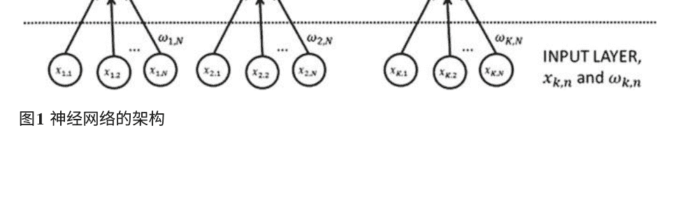

### 1.1 神经网络和树奇偶机 (TPM)

一种被称为人工神经网络的新的计算方法它受到人类神经系统的很大影响。基本的计算单元被称为神经元，具有与我们的神经系统类似的功能。 神经网络的概念被应用于密码学。

树奇偶机 (TPM) 是一种特殊类型的前馈神经网络[3]。 由于信息只向前传递，所以它被称为前馈网络。 在这种网络中，单元之间没有形成循环。

X_{ij}是输入向量，可以取1到N的值，定义了TPM的输入层[10, 11]。

输入层和隐藏层通过权重边连接在一个范围为 -L到L的区间内。 Sigma (σ)表示隐藏层的输出，如式 (1) 所示。

σi = sgn ∑_{j=1}^{n} W i j * X i j (1)

Sgn(x) 被称为符号函数，它返回值为 {−1, 0, 1}，即隐藏层神经元的输出可以取 −1, 0, 和 1， 如公式 (2) 所计算的。

sgn(x) = {−1 if x < 0, 0 if x = 0, 1 if x > 0} (2)

神经网络输出是二进制的，用 tau (τ) 表示。 它通过以下公式 (3) 计算:

τ = ∏_{k}^{i=1} σi (3)

尽管基于 TPM 的密钥生成方法与传统方法相比被认为更强大，但参考文献 [4] 提到它容易受到四种不同类型的攻击——暴力破解攻击、基于遗传算法的权重预测、中间人拦截攻击和使用神经网络进行权重分类的符号攻击。 尽管使用 TPM 生成的密钥具有随机性，但容易受到上述攻击的影响。 为了增强 TPM 生成的密钥的安全性，我们提出了一种新方法，即通过两个通信实体之间交换的密钥生成用于加密的实际密钥。 最初，秘密密钥在两个通信实体之间共享，并且该密钥作为输入提供给 TPM。如果共享的秘密密钥被泄露，将无法获取 TPM 生成的新密钥。在我们的工作中，我们使用 TPM 生成的新密钥对图像使用 AES 算法进行加密，并进行了详细的 (SWOT) 分析。

## 2 方法论

加密是将信息转化为难以理解的形式，以保护敏感数据的技术。对称密钥加密是最广泛使用的加密方案，其中相同的密钥用于加密和解密。拥有“密钥”的人可以成功解密消息。

与对称密钥加密相关的重要安全问题包括：

- 1. 在两个参与方之间共享秘密密钥。
- 2. 确保原始密钥免受入侵者的攻击，以确保通信不受损。

我们的研究重点是保护密钥免受入侵者的攻击。为了克服上述安全问题并进一步增强安全性，我们提出了一种使用TPM的新密钥生成技术。

所提出的密钥生成技术的流程图如图2所示。与其他方法相比，使用神经密钥交换协议从共享秘密密钥生成密钥是一种不同的创新因素。最初，发送方和接收方共享128位密钥。在所提出的技术中，将128位共享秘密密钥作为输入提供给神经密钥交换协议。有关使用传统神经密钥交换协议和所提出技术生成密钥的详细信息，请参见第2.1节和第2.2节。我们使用AES-128进行图像加密。

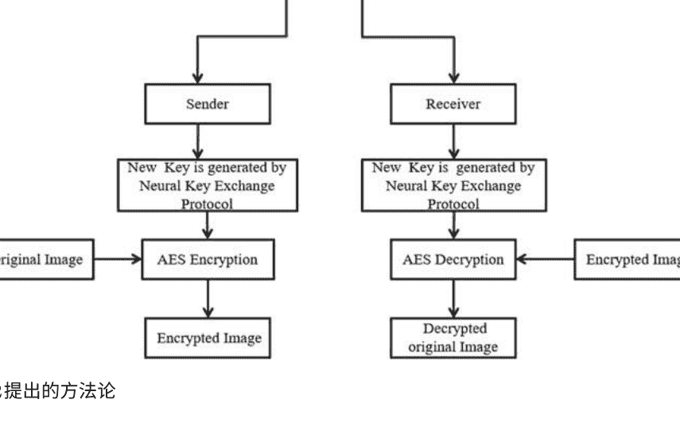

图2 提出的方法论

### 2.1 传统的使用树奇偶机生成秘密密钥的方法

参数 I[n], H, M和 L由发送方和接收方定义。

- I 大小为 n的输入向量。
- H 隐藏神经元的数量。
- M 连接到隐藏神经元的输入神经元的数量。
- L 定义每个权重的范围{-L,..., 0, ..., +L}。
- 权重 \( W_{ij} = \{-L, ...,0, ...,L\} \)。

基于传统TPM的秘密密钥生成涉及以下步骤[9,12, 13]:

- 1: 考虑两个树奇偶机， TPM-X和TPM-Y。
- 2: 在{-L..., 0,...,L}的范围内随机初始化网络权重。
- 3: 在输入节点上初始化所需的输入向量。
- 4: 使用输入和权重的值计算sigma (σ)， 如公式 (1) 所示。
- 5: 使用公式 (3) 找到两个TPM的输出tau。
- 6: 比较TPM-X和TPM-Y的输出。如果相同，则转到步骤7； 如果不同，则转到步骤2。
- 7: 使用算法1中给出的Hebbian规则更新两个TPM的权重。

#### 算法1：使用Hebbian规则更新权重的算法

```
输入: {W, I, τ₁, τ₂} 对于W中的每个 (i, j) ，执行以下操作
\( W_{i,j} \Leftarrow W_{i,j} + I_{i,j} * \tau_1 * \theta(\sigma_i, \tau_1) * \theta(\tau_2, \tau_1) \)
\( W_{i,j} \Leftarrow f_{clip}(W_{i,j}) \)
结束循环

其中，\( \theta = \begin{cases} 1 & \text{如果 } \tau_1 = \tau_2 \\ 0 & \text{否则} \end{cases} \)

\( f_{clip} = \begin{cases} L & \text{如果 } W_{i,j} > L \\ -L & \text{如果 } W_{i,j} < -L \end{cases} \)
```

- 8: 继续执行步骤7直到两边的权重相同。当两个TPM同步到相同的突触权重时，该最终权重被视为秘密密钥。

### 2.2 提出的规则与算法

在提出的方法中，我们使用两个参与方共享的秘密密钥作为输入到树奇偶机中。这使得密钥生成过程更加健壮。

下一节将解释提出算法中涉及的步骤：

```
key2 → func(key1)
```

- 1：让key1是两个参与方共享的密钥，key2是由提出的算法生成的新密钥。
- 2：通过选择输入层和隐藏层中的神经元数量来定义NN的结构。基本上，神经网络的结构是由两个参与方之间共享密钥的长度来定义的。例如，如果我们采用16字节的密钥，即128位密钥，我们可以得到：输入层有64/32/16个神经元，隐藏层有2/4/8个神经元，输出层有1个神经元。
- 3：考虑两个树奇偶机（TPM），即TPM-X和TPM-Y。基于key1，两个TPM需要就NN的结构达成一致。
- 4：获取key1的ASCII等效值。
- 5：对key1的ASCII值应用混淆和扩散方法，以获得修改后的key1。这使得key1和key2之间的关系更加复杂。
- 6：将修改后的key1扩展到所需的密钥长度（128、192或256位）。
- 7：我们使用这个修改后的key1来构建TPM的随机输入向量，并且用它来初始化输入和隐藏层之间的随机权重。
- 8：在输入节点上初始化所需的输入向量。
- 9：使用公式（1）中给定的输入和权重的值，找到隐藏层的值，即sigma。
- 10：使用公式（3）找到TPM-X和TPM-Y的输出tao。
- 11：比较TPM-X和TPM-Y的输出。如果相同，则转到步骤7；如果不同，则转到步骤2。
- 12：如果不同，则转到步骤2。
- 13：使用算法1中给出的Hebbian规则更新TPM-X和TPM-Y的权重。
- 14：继续执行步骤7，直到两侧的权重相同。当两个TPM同步到相同的突触权重时，该最终权重被视为秘密密钥。

## 3 结果与讨论

在这一部分中，我们讨论实验结果，这些结果分为两个类别——性能参数和安全参数，详细解释如下。所有实验都是在使用MATLAB 2019b的Intel Core i3 CPU 1.8 GHz、4 GB RAM的机器上进行的。对于实验分析，我们使用128 ×128像素的灰度图像。

#### 表1 性能参数比较

| 参数 | 胡椒 AES | 胡椒 带有NN密钥的AES | 摄像机操作员 AES | 摄像机操作员 带有NN密钥的AES | 硬币 AES | 硬币 带有NN密钥的AES |
|------|----------|---------------------|------------------|-----------------------------|----------|---------------------|
| 执行时间(s) | 8.84 | 9.04 | 8.94 | 8.85 | 8.85 | 8.85 |
| CPU使用率(%) | 0.1004 | 0.1018 | 0.10126 | 0.0999 | 0.10026 | 0.10009 |
| 吞吐量(字节/秒) | 128.68 | 125.84 | 114.04 | 115.08 | 114.78 | 114.79 |

### 3.1 性能参数

性能参数帮助我们分析所提出算法的执行时间、CPU利用率和吞吐量。执行时间以秒为单位，是执行加密算法所需的CPU时间。CPU利用率显示处理器利用率的百分比。吞吐量是每秒加密的字节数。表1给出了性能参数的比较。

### 3.2 安全参数

一种高效的加密技术应该能够抵御各种攻击。在我们的工作中，我们进行了统计和差分攻击分析[8,14]。统计分析主要包括直方图分析、卡方检验和相邻像素相关性分析。差分分析主要包括寻找NPCR、UACI值和信息熵分析。

#### 相邻像素的相关性分析

在普通图像中，相邻像素之间存在高相关性。加密的一个目的是减少两个像素之间的关联。降低的相关性数值表明改进的加密效果和更好的安全性[4]。相关系数的计算使用下面给出的方程：

$$ E(x) = \frac{1}{N} \sum_{i=1}^{N} x_i \quad (4) $$
$$ \text{cov}(x, y) = \frac{1}{N} \sum_{i=1}^{N} (x_i - E(x))(y_i - E(y)) \quad (5) $$
$$r(x, y) = \frac{cov(x, y)}{[\sqrt{D(x)}\sqrt{D(y)}]} \quad (6) $$
$$D(x) = \frac{1}{N} \sum_{i=1}^{N} (x_i - E(x))^2 \quad (7) $$

其中 x 和 y 是相邻像素的值，N 是选择的相邻像素数量。

相关系数的取值范围为 +1 到 -1。当值为 +1时，达到最大相关性，这表示图像可以很容易地被识别。一个好的加密算法应该提供一个非常低/接近零/负值，这样入侵者很难获取信息。相关系数是在水平方向上计算像素之间的，结果在表2中列出。

##### 表2 水平方向的相关值

| 相关系数 | 胡椒 | 摄像机操作员 | 硬币 |
| :--- | :--- | :--- | :--- |
| AES | 0.027145 | 0.004167 | -0.01596 |
| 参考文献[1] | 0.002 | 0.0002267 | 无 |
| 提出的算法 | -0.0034225 | -0.0248105 | 0.00918835 |

#### 加密图像的直方图分析

表3显示了加密前后图像的直方图。我们注意到密文图像的直方图是均匀的，并且明显不同于原始图像的直方图。这使得统计分析变得困难。从下表可以看出，原始图像的直方图呈现出单个或少数峰值。

#### 信息熵分析

信息熵衡量了源的随机性。信息熵用符号 $H(X)$ 表示，并由以下方程给出：

$$H(x) = \sum_{i=1}^{n} p(x_i)log_2 p(x_i) \quad (8) $$

其中 $p(xi)$ 是像素出现的概率。熵的最大值为8。强大的加密技术导致高熵值，并能够成功抵抗解密攻击。因此，所提出的技术通过熵度量进行评估，并与[1]和标准AES进行比较，结果在表4中列出。

##### 表3 直方图分析

| 摄影师 |  |  |
| 硬币 |  |  |
| 胡椒 |  |  |

##### 表4 信息熵的值

| 熵 | 胡椒 | 摄像机操作员 | 硬币 |
| --- | --- | --- | --- |
| AES | 7.45 | 7.89 | 7.62 |
| 参考文献[1] | 7.9972 | 7.9971 | 无 |
| 提出的算法 | 7.915 | 7.925 | 7.992 |

#### 密钥敏感性分析

密钥敏感性分析对于任何密码系统都具有高度的确定性。需要一个稍微变化的密钥能够产生完全不同的加密图像。密钥敏感性分析的场景如下图所示：

- 1. 原始图像I使用两个不同的密钥进行加密。
- 2. Key1是原始密钥。Key2与Key1只有一个位不同。
- 3. 使用神经密钥交换协议生成新密钥。
- 4. 使用Key1对I进行加密，得到C1。
- 5. 使用新密钥Key2对I进行加密，得到C2。
- 6. 逐位比较两个加密图像。

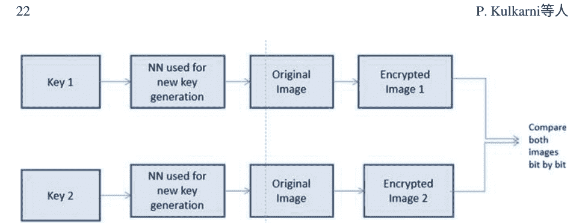

图3 密钥敏感性分析（Key 2与Key 1只有一个位不同）

##### 表5 1位密钥变化后的位数变化

| 位数变化 | 胡椒 | 摄像机操作员 | 硬币 |
|----------|------|--------------|------|
| AES      | 4098 | 4289         | 4647 |
| 提出的算法 | 16,266 | 16,519     | 16,274 |

根据表5，我们可以得出结论，密钥中的单个位变化会导致密码图像发生巨大变化。这也得到了表6的结果的支持。

#### 碰撞分析

理想的图像加密技术应对密钥敏感。如果密钥落入错误的手中，两个方法之间的通信将受到威胁。攻击者可以通过试错法更改密钥中的位来获取原始密钥。在这种类型的攻击中，攻击者的目标是获取秘密密钥。在更改1位、2位、3位等位数后，两个密钥之间的映射位数称为“命中”。命中碰撞是给出两个密钥之间的命中次数的参数，它应尽可能低以抵御暴力攻击。 如图4所示进行了命中碰撞分析：

- 1. Key2只有一个位与Key1不同。
- 2. 使用神经密钥交换协议生成新的密钥（Key3和Key4）。
- 3. 比较Key3和Key4，得到匹配的次数（即Key3和Key4之间匹配的位数）。
- 4. 碰撞命中计算为命中次数/图像长度。

#### 算法对原始图像的敏感性分析

通过计算像素变化率（NPCR）和统一平均变化强度（UACI）来进行算法的敏感性分析。C1和## 表6 通过比较加密图像进行密钥敏感性分析

| 名称 | 原图像 | 加密图像1 | 加密图像2 (1位变化) |
|------|--------|-----------|---------------------|
| 摄影师 |  |  |  |
| 硬币 |  |  |  |
| 胡椒 |  |  |  |

注意加密图像1是原始图像，加密图像2是在密钥中进行1位变化后得到的

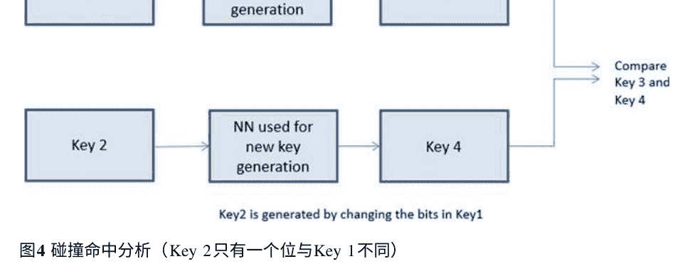

##### 图4 碰撞命中分析（Key 2 只有一个位与Key 1不同）

##### 表格 7 碰撞分析

| 碰撞 | 胡椒 | 摄像机操作员 | 硬币 |
|------|------|--------------|------|
| AES | 0.776281 | 0.195423 | 0.5687938 |
| 提出的算法 | 0.326954 | 0.109082 | 0.415958 |

##### 表格8 NPCR值

| NPCR | 胡椒 | 摄像机操作员 | 硬币 |
|---|---|---|---|
| 参考文献[1] | 99.6414 | 99.5697 | 无 |
| 提出的算法 | 99.8016 | 99.6243 | 99.4673 |

##### 表格9 UACI值

| UACI | 胡椒 | 摄像机操作员 | 硬币 |
|---|---|---|---|
| 参考文献[1] | 33.5864 | 33.4767 | 无 |
| 提出的算法 | 29.1362 | 33.4238 | 33.4901 |

C2 是两个加密图像，其原始图像仅在一个位上不同。
$D(i, j)$ 的计算如下：

$$D(i, j) = \begin{cases} 1 & \text{if } C_1(i, j) = C_2(i, j) \\ 0 & \text{otherwise} \end{cases} \tag{9}$$

$(i, j)$ 坐标处的像素值表示为 $c1(i, j)$ 和 $c2(i, j)$。
使用 (10)，计算 NPCR 值如下：

$$\text{NPCR} = \frac{1}{x*y} \sum_{i,j} [D(i, j)] * 100 \tag{10}$$

$x$ 和 $y$：原始图像的尺寸。
方程 (11) 用于计算UACI值：

$$\text{UACI} = \frac{1}{x*y} \sum_{i,j} (E_1(i, j) - E_2(i, j)) / (2^l - 1) \tag{11}$$

NPCR和UACI值在表8和表9中进行了汇总，并与参考文献[1]的值和传统AES进行了比较。所提出的算法的NPCR和UACI值更接近理想值，表明其具有更好的安全性。

## 4 结论

由于多媒体通信的快速增长，图像加密是一个快速发展的研究领域。图像加密的两个主要目标是加密效果和鲁棒性。本文提出了一种新的图像加密技术，通过结合基于TPM的密钥生成方法和AES算法。通过基于TPM的神经密钥交换协议生成了一个新的密钥，该密钥与两个通信方之间共享的密钥不同。当用户将不同的秘密密钥输入到TPM中时，密钥的值会动态变化。这对于入侵者来说，获取用于图像加密的实际密钥是不可能的。实验结果表明，上述技术具有几个优点：良好的密钥敏感性，更好的相关系数，像素均匀分布，接近理想值的熵接近度，以及可观的密钥。

研究表明，神经密钥交换协议生成的密钥在熵、相关系数、命中碰撞和单个位密钥变化后加密图像中位数位变化方面具有最佳性能。

## 参考文献

- 1. Arab, A., Rostami, M. J., & Ghavami, B. (2019). 一种基于混沌系统和AES算法的图像加密方法。超级计算杂志, 75(10), 6663–6682。 https://doi.org/10.1007/s11227-019-02878-7
- 2. Chakraborty, S., Dalal, J., Sarkar, B., & Mukherjee, D. (2015).基于神经同步的公共信道密钥交换：一项调查。 arXiv预印本 arXiv:1502.05153.
- 3. Chourasia, S., Bharadwaj, H. C., Das, Q., Agarwal, K., & Lavanya, K. (2019). 基于向量化的神经密钥交换使用树奇偶机。 CompuSoft, 8(5), 3140–3145。
- 4. Gupta, M., Gupta, M., & Deshmukh, M. (2020). 使用神经密码学的单秘密图像共享方案。在多媒体工具和应用中（第1-22页）。 https://doi.org/10.1007/s11042-019-08454-8
- 5. Jeong, S., Park, C., Hong, D., Seo, C., & Jho, N. (2021). 基于广义树奇偶机的神经密码学用于现实生活系统。 在：安全与通信网络中。 https://doi.org/10.1155/2021/6680782
- 6. Jogdand, R. M., & Bisalapur, S. S. (2011) 设计一种高效的神经密钥生成。国际人工智能与应用杂志（IJAIA）, 2（1）, 60-69。 https://doi.org/10.5121/ijaia.2011.2105
- 7. Kanter, I., Kinzel, W., & Kanter, E. (2002). 通过神经网络的同步实现信息的安全交换EPL (欧洲物理学快报), 57(1), 141. https://doi.org/10.1209/epl/i2002-00552-9
- 8. Munir, R. (2012). 基于混沌和CBC-like模式的选择性图像加密算法的安全分析 在2012年第七届国际电信系统、服务和应用会议(TSSA)上(pp. 142–146). IEEE. https://doi.org/10.1109/TSSA.2012.6366039
- 9. Pal, S. K., & Mishra, S. (2019). 一种基于TPM的秘密密钥生成方法。计算机网络与信息安全国际期刊, 11(10). https://doi.org/10.5815/ijcnis.2019.10.06
- 10. Rosen-Zvi, M., Klein, E., Kanter, I., & Kinzel, W. (2002). 树奇偶互学习机器及其在密码学中的应用。物理评论E, 66(6), 066135。 https://doi.org/10.1103/PhysRevE.66.066135
- 11. Salguero, D., Édgar, W. F., & Lascano, E. (2019). 关于建立密码密钥的树奇偶机构的优化结构的发展。在安全和通信网络. https://doi.org/10.1155/2019/8214681
- 12. Sarkar, A., & Mandal, J. K. (2015). 树奇偶机和双隐藏层感知器在无线通信中基于会话密钥交换的比较分析。 在新兴ICT桥接未来-印度计算机学会第49届年会论文集(第1卷, 第53-61页)。 Springer. https://doi.org/10.1007/978-3-319-13728-5_6
- 13. Stypiński, M., & Niemiec, M. (2011). 使用非二进制输入向量同步树奇偶机. arXiv预印本 arXiv:2104.11105
- 14. Zeghid, M., Machhout, M., Khriji, L., Baganne, A., & Tourki, R. (2007). 一种基于改进的AES的图像加密算法. 国际计算机科学与工程杂志, *1*(1), 70–75.

## **人机交互应用原型**

N. Soujanya，G. Sourabha，C. B. Jeevitha，和M. R. Pooja

摘要 在这个不断发展的人机交互(HCI)时代，人与计算机之间的交互在自动化餐饮服务行业中具有更高的范围。
本研究试图设计和开发一个桌面应用原型，用于利用个体的基本人类特征如年龄和性别的自动售货机。 所提出的模型是通过使用Python、计算机视觉和卷积神经网络(CNN)等技术构建的，以迎接使用自动售货机的顾客。 所提出的研究的主要目标是欢迎顾客来到自动售货机。 所提出的模型将有助于提高顾客的心理健康。 对于特殊挑战的顾客，他们希望成为自动化餐饮服务行业的接收端，可以优先考虑所提出的模型。

关键词卷积神经网络·深度学习·食品自动售货机·图像处理·自动化·人机交互

## **1 引言**

人机交互通过改善用户体验，弥合了顾客与食品服务行业之间的沟通差距。提高用户体验将导致公司经济的增长。 由于对话交流的显著减少，这个想法将通过为用户建立一个愉快的环境来改善用户的心理健康。

本文讨论了卷积神经网络（CNN）、深度学习和Python等技术。 本工作的理念是基于对顾客心理健康的重视，以及为特殊需求的顾客提供更易理解的产品翻译。

年龄和性别分类是一个困难的问题，这仍然是数据的复杂性的主要原因需要进行训练。

在这里，使用图像来训练具有年龄和性别标签的数据集。 对于这样的图像，需要主题中的个人信息这项研究工作采用了CNN技术。 所提出的系统的主要目标是基于面部图像对年龄和性别进行分类。

## 2 相关工作

### 2.1 方法论

所提出的系统处理个体的基本特征，如年龄和性别。 该系统通过计算机视觉对个体进行面部识别。 所提出的系统是一个工具，目前是一个桌面应用程序，它以个体的面部图像作为输入，然后由系统处理，以通过所提出的系统中的扬声器以语音形式输出。 这将在食品自动售货机上实施，以问候顾客。

与所提出的系统合作的团队将训练机器以理解和区分允许所提出的系统识别出所处情况的个体的面部图像。 我们将使用数据来训练系统学习个体所产生的社会差异。 这个所提出的系统使用卷积神经网络（CNN）。 CNN用于将图像转换为通过减少图像而获得的形式，这样可以更容易地进行计算，而不会丢失图像的重要特征，这对于获得良好的指标非常重要，然后图像本身可以是一个非常复杂的过程。

这项技术的重要性在于它可以与大量数据集一起使用，并且在学习指标或特征方面也是可接受的。

使用不同年龄组、不同面部结构和性别的个体的随机样本。 这将提供一个通常以图像形式存在的大量数据区域，并将其转换为易于计算的形式，而不会丢失图像特征，这对于确定个体的年龄和性别范围是至关重要的。

一旦通过与训练所使用的标准进行匹配来识别个体的年龄和性别，那么我们将确保识别尽可能准确，并且我们接受系统按预期运行；如果预期输出与实际输出有很大差异，我们将使用更多的广泛数据来训练系统。 一旦我们接受了系统的性能，我们将在桌面上实施它作为原型，并用实时样本进行测试。获得的输出将以以下形式呈现语音。 我们系统期望的输出是识别客户并相应地问候他们。

我们的团队也考虑了隐私问题。 我们提出的系统不会存储用于分析客户的图像，因为我们尊重他们的隐私。 我们还希望增加人机交互，因为在当今世界中，我们已经失去了面对面问候的基本沟通方式。

这个提议的系统旨在在不断变化的世界中保持面对面的问候。

#### 2.1.1 卷积神经网络

神经网络是一种由相互连接的人工神经元组成的系统，它们之间交换信息。这些连接具有数值权重，在训练过程中会得到，这样一个经过适当训练的网络在被呈现图像或模式进行识别时能够正确地做出响应。 卷积神经网络在包括图像和模式识别、语音识别、自然语言处理和视频分析在内的各个领域中得到应用。 为什么卷积神经网络在传统模型中是重要的手段，因为模型识别和特征提取器是手工制作的。 卷积神经网络在具有输入局部相关性的应用中（例如图像和语音）提供更好的性能。 在原型和图像识别应用中，使用卷积神经网络可以实现最佳的识别率。

### 2.2 文献综述

这个提议系统最重要的部分是识别一个人的年龄和性别，并相应地问候他们。 智能售货机是一个不断发展的技术，被著名公司如可口可乐等公司所研究。 该公司在这个行业竞争中使用的技术是人工智能，他们利用存储的信息给予顾客购买折扣[1]。

通过使用常见语音和韩语语音识别测试了年龄和性别识别两个系统。 我们可以预测，识别年龄性别语音信号是进行人机交互的最佳方式，如图1所示[2]。 将机器替换人类，并当人类站在机器前时，机器通过他们的声音理解他们的需求[3]。

通过使用声音信号来检测性别。 有一些技术被用于从声音信号中检测性别，许多语音识别应用程序依赖于人类语音中的信息，声音检测的重要方面是性别声音，一系列技术已被用于从声音信号中找到性别。 可以使用这种方法确定声音信号的性别（男性或女性）。 贡献有三个部分：（a）一个著名数据集，用于分析有关著名声音信号特征的信息，（b）从不同的机器学习模型中获得教育

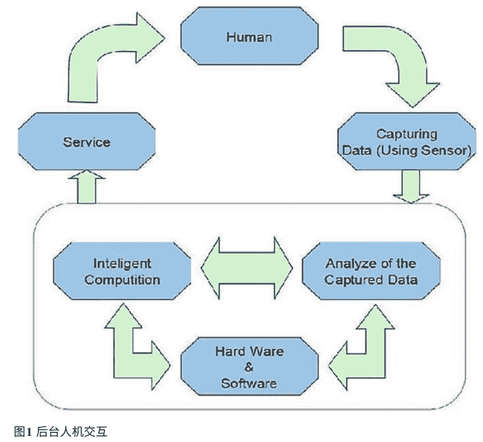

图1 后台人机交互

使用各种理论样本对声音性别进行分类，并利用三个突出的特征选择算法[4]。年龄估计算法基于多标签排序技术原理，利用面部图像，并改变了多值差异化的方法。找到了检测年龄的繁琐步骤的解决方案。通过多标签排序学习，他们发现许多领域取得了成功，它不仅能够传达学习对象的复杂语义内容，还为面部照片的年龄估计提供了一种方法，该估计算法在缺乏面部年龄数据集的情况下替代了传统的多值分类方法，简化了估计年龄的繁琐步骤，并减少了模型训练时间。该方法在评估诸如平均绝对误差、累积分数和收敛速度等参数方面取得了极好的结果，根据对两个年龄数据集进行的一系列实验，该算法的效率优于一些传统的年龄估计算法[5]。使用两种神经架构通过Mel频率倒谱系数来识别性别和说话者，MLP和CNN这两种架构用于识别性别和说话者。为了评估两种神经架构在性别和说话者身份检测任务中的表现，其中之一

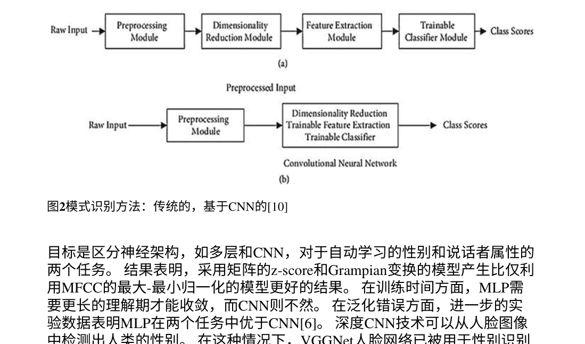

目标是区分神经架构，如多层和CNN，对于自动学习的性别和说话者属性的两个任务。 结果表明，采用矩阵的z-score和Grampian变换的模型产生比仅利用MFCC的最大-最小归一化的模型更好的结果。 在训练时间方面，MLP需要更长的理解期才能收敛，而CNN则不然。 在泛化错误方面，进一步的实验数据表明MLP在两个任务中优于CNN[6]。 深度CNN技术可以从人脸图像中检测出人类的性别。 在这种情况下，VGGNet人脸网络已被用于性别识别，在在线社交网络网站和社交媒体中，自动性别检测正在越来越广泛地应用于各种软件和硬件，现有系统的性能正在被使用。

由于在线社交网络网站和社交媒体的普及，物理世界的人脸照片，自动性别检测正在越来越广泛地应用于更广泛的软件和硬件。 然而，与工作结果相比，使用物理世界的人脸照片和图像的现有系统的性能并不特别好。 人脸识别是相关的。 我们在这项研究中发现，学习和分类是两个不同的方法，使用深度卷积神经网络（DCN）[7]。 人类性别与面部识别类似，通过使用CNN技术，可以从图像中检测出人类性别，如图2所示。 人类性别的检测是面部识别的一部分，引起了很多关注；以前使用相同的特征，如眉毛、手形和面部进行性别检测。 由于其各种应用，人类性别检测作为面部识别的一部分，引起了很多关注。 以前使用静态身体特征，如面部、身体形状、眉毛、手形、指甲等进行性别检测。我们在这个项目中进行了大量的研究，并使用卷积神经网络（CNN）从人脸照片中演示了人类性别分类，因为CNN已被认为是在图像分类领域中最好的算法。 为了将我们的方法付诸实践，我们对每个图像使用了预处理过程。使用图像处理。图像经过预处理后，通过卷积[8]进行处理。通过使用语音信号，确定说话者的性别；为了确定性别，使用了任务；这是自动性别识别。从语音信号中检测说话者的性别的任务被称为自动性别识别，这种方法使用从语音输入中提取的频率和campestral数据等参数训练二元分类器。在这里，系统从开始到结束监听未经处理的音频作为输入信号。我们提出了一种基于卷积神经网络（CNN）的性别分类器，包括：（i）卷积层，可以理解为特征学习和（ii）多层感知器（MLP）。系统以未经处理的音频作为输入信号[9]。使用CNN进行性别分类是基于面部图像的实时性别分类。使用反向传播算法，基于面部图像的实时性别分类是基于面部图像的，CNN技术被提出，并且与其他用于模式识别的CNN方法进行比较时，它们结合了卷积和子采样层。神经网络用于训练网络，从而减少了计算工作量。使用机器学习算法识别模式的过程称为模式识别。模式识别是使用计算机算法识别数据序列和模式的方法。这种类型的检测可以在各种输入类型上进行，例如生物识别、图像识别和面部识别。它已经应用于图像分析、计算机视觉、医疗保健和地震分析等各个领域。它在检测模式和检测未知对象方面具有很高的准确性。样本识别系统可以检测部分隐藏的模式。通过使用学习的概念实现模式识别。模式识别模型使识别系统能够适应训练并提供更准确的结果。模式识别在数字图像分析中用于研究图像以获取所需的信息。

在健康保健领域中，模式识别模型被用于改善健康服务，并且数据被医疗专业人员存储和用于未来分析。模型识别有潜力转变为更智能的过程，支持各种数字技术。卷积神经网络相对于传统方法在模式识别中的一个重要优势是能够同时捕捉特征、减小数据大小并进行分类[10]。使用语音信号的人类性别识别系统可以轻松识别人的性别通过他们的语音[11]。使用深度神经网络和卷积神经网络实现的说话人识别系统可以确定说话人的年龄，并且年龄可以从语音信号中推断出来。随着Alexa和SIKI等自然语言交流系统以及聊天机器人和语音识别系统等对话式语音识别系统的增长，寻找说话人年龄和输入的需求达到了历史最高水平。它通过深入的实践方法有助于说话人年龄分类。

提到了一种新的技术，实现模型，深度神经网络和卷积神经网络[12]。通过使用卷积神经网络，可以从图像中检测出性别和年龄。为了对年龄和性别进行分类，使用了面部图像。在这项研究中，挑战是为图像找到性别和年龄分类，通过扩展策略来改善结果并有效地构建。

图3 上海一位女士在智能售货机上扫描她的手掌（照片由Daisuke Hiroshima提供）

也会影响系统性能。图像的性别和年龄分类是这项研究的主题。这项研究的第一个主要研究课题是改变一些先前发表的最有效的性别和年龄分类结构。通过减少网络深度中的参数数量，将改变丢弃量。由于这些变化，系统性能受到了影响或恶化。与我最初开始的基本架构相比，最多保持不变，这证实了我的担忧，与年龄相关的任务[13]。

使用包括TIMIT、RAVDESS和BGC数据集的组合数据集，通过多输出的1D CNN [14] 找到个体的性别和地区。利用网络摄像头图像，借助PCA、LBP、SVM、VIOLA-JONES和HOG等技术，检测年龄和性别，并在各种情况下找到情绪、年龄和性别 [15]。用于检测歌手的性别信息。最近流行的卷积神经网络（CNN）结合频谱图以获得比传统特征向量更高的准确性 [16]。使用深度学习方法实现手写数字识别，并实现分类算法以识别手写数字 [17]。如图3所示，自动售货机的设计采用指纹传感器进行安全认证，并具有显示产品列表的丰富用户界面。这种类型的机器可根据用户（机构）的需求进行定制 [18]。卷积神经网络（CNN）模型用于性别分类的图像基于指纹。该模型从指纹数据集[19]中确定图像的性别。在这个传输系统中，降低的语音带宽对语音情感识别的准确性有影响。研究探讨了受限语音带宽和传输系统以及复合过程对语音情感识别准确性的影响。语音（EMO-DB）数据包含七种情绪类别。基线技术的平均准确率达到82%。当采样频率从基线的16-8 kHz（即带宽从8 kHz降低到4 kHz）时，SER准确率下降了约3.3%。压缩过程单独降低了平均准确率3.8%，而压缩和带宽降低的联合效果使平均准确率下降了3.8% [20]。在人机交互中，通过对观众进行年龄回归和深度异常算法执行的单张面部图像进行细粒度年龄估计。野外面部照片的年龄估计（计算）准确率较低，忽略了年龄的细粒度特征，这为野外细粒度年龄估计提供了一种独特的方法，该方法基于长期记忆网络，并受到细粒度类别的启发[21]。当通过保护滤波器进行图像识别任务和性别识别时，使用深度学习算法。基于深度学习的算法在识别和检测任务中提高了性能。最近的成果表明，当使用大规模数据集进行训练时，可以识别和识别对象，基于深度学习的算法在识别和检测任务中的性能得到了提高。这样的最新成果引起了人们的猜测，深度学习方法可以像人类视觉系统一样，甚至更好地识别和识别对象及其特征。本研究集中在经过修改的照片中进行性别识别任务[22]。自动售货机的一般工作使用硬币作为用户输入，并根据金额（硬币的价值）向用户提供食品产品。这使用微控制器进行基本的货币到产品映射计算，并使用机械组件提供产品[23]。

## 3 结论

通过回顾现有的研究文献，本文成功地提供了关于人机交互的不同实时应用原型的深入知识。获得的知识进一步用于为餐饮服务行业的客户创建一个新系统。所引用和考虑的出版物说明，人机交互的概念始于消费者，这在提出的研究工作中得到了成功评估。建议的系统旨在计算机通过问候客户来开始对话，因为这是任何服务行业开始对话的最佳方式。建议的系统还在另一个重要方面发挥作用，它将允许特殊挑战的客户通过使其成为对客户和服务行业都更好的环境，享受正常客户的体验。

## 参考文献

1.  De Bogotá. (2020). Cámara de Comercio. “Observatorio de Innovación–Estrategias y tácticas de marketing.
2.  Ishaq, M., Son, G., & Kwon, S. 使用自注意力模块的并行卷积神经网络进行话语级情感识别。
3.  佐藤等人（2001年）。使用元音音高特征对拖拉机进行语音控制。日本农业机械学会杂志，63（1），35–40。
4.  Alkhawaldeh, R.S. (2019年)。DGR：使用一维传统神经网络进行人类语音性别识别。在科学编程2019中。
5.  朱等人（2018年）。基于多标签排序的面部图像年龄估计算法。EURASIP图像与视频处理杂志，1，1–10。
6.  Mamyrbayev等人（2020年）。用于性别检测和说话者识别的神经网络架构。Cogent Engineering，7（1），1727168。
7.  Dhomne, A., Kumar, R., & Bhan, V. (2018年)。通过深度学习进行面部性别识别。计算机科学会议，132，2–10。
8.  Sumi, T. A., 等人(2021) 使用卷积神经网络从面部图像中检测人类性别。在应用智能和信息学国际会议。Springer。
9.  Kabil, S. H., Muckenhirn, H., & Magimai-Doss, M. (2018)。关于使用CNN从原始语音信号中学习识别性别。Interspeech。
10. Liew, S. S., 等人(2016)。性别分类：一种卷积神经网络方法。土耳其电气工程与计算机科学杂志，24(3)，1248–1264。
11. Djemili, R., Bourouba, H., & Korba, M. C. A. (2012) 使用四个分类器的基于语音信号的性别识别系统。在2012年多媒体计算与系统国际会议，IEEE。
12. Kuppusamy, K., & Eswaran, C. (2020). 基于卷积和深度神经网络的年龄相关特征的说话人识别系统。
13. Ekmekji, A. (2016). 用于年龄和性别分类的卷积神经网络. 斯坦福大学.
14. Uddin, M. A., 等. (2021). 使用三层特征提取方法和1D CNN从人声中检测性别和地区. 信息与通信杂志, 1–16.
15. Sharma, J., Dibya, S. D., & Bora, D. J. (2020). REGA: 基于CNN的实时情绪、性别、年龄检测—综述.
16. Murthy, Y. V. S., Koolagudi, S. G., & Jeshwanth Raja, T. K. (2021). 使用卷积神经网络进行印度歌手识别. 国际语音技术杂志, 1–16.
17. Alwzwazy, H. A., 等 (2016). 使用卷积神经网络的手写数字识别。计算机与通信工程创新研究国际期刊，4(2)，1101–1106。
18. Sibanda, V., 等 (2020). 高科技自动售货机的设计。Procedia CIRP，91，678–683。
19. Jayakala, G. (2021). 基于指纹分析的性别分类。土耳其计算机与数学教育杂志(TURCO MAT)，12(10)，1249–1256。
20. Lech, M., 等 (2020). 使用预训练图像分类网络的实时语音情感识别：带宽缩减和压缩的影响。计算机科学前沿，2，14。
21. 张，K.，等（2019年）。细粒度年龄估计与LSTM注意力在野外的应用网络。IEEE视频技术电路与系统交易，30（9），3140-3152。
22. Ruchaud, N., 等 (2015年)。隐私保护过滤器对性别识别的影响。在数字图像处理应用XXXVIII（第9599卷）中。国际光学与光子学学会。
23. 张, W., & 张, X. L. (2010年)。基于短信支付的自动售货机设计与实现。在2010年第6届国际无线通信网络和移动计算会议 (WiCOM) 中。IEEE。

# 基于特征选择的短信和电子邮件领域的垃圾邮件检测系统

S Aditya Chaturvedi和Lalit Purohit

摘要：垃圾邮件存在于包括短信和电子邮件在内的几个领域，这些领域通常是垃圾邮件发送者窃取个人信息、金钱、数据等的目标。有几种模型用于短信和电子邮件垃圾邮件检测，其中基于监督学习的模型通常是最有效的。 然而，缺少对同时考虑多个领域进行垃圾邮件检测的全面研究。 本文对在短信和电子邮件垃圾邮件检测领域使用特征选择技术的效果进行了实验评估。 使用ROC和训练/测试时间等参数以及常见参数来评估垃圾邮件检测模型的性能。 实验结果表明，特征选择技术的选择对垃圾邮件检测模型的性能有深远影响，并且可以在使用不同评估指标生成的结果中看到，其中一些指标以前在两个领域中都没有使用过。

**关键词**  机器学习 · 垃圾短信检测 · 垃圾邮件检测 · 特征选择

## 1 引言

垃圾邮件是指为了造成接收者的损失（无论是货币/身份损失还是数据损失）而生成的信息（无论是短信还是邮件）。 短信（SMS）和电子邮件领域都是垃圾邮件的主要目标。 每年都有很多用户因垃圾短信或垃圾邮件而失去身份/金钱/数据。短信是在没有互联网的情况下交换信息的最常见方式[1]。

它是用于个人和商业信息交换的媒介。许多公共和私人组织，包括银行，使用短信交换一次性密码、注册详细信息、重要信息等。[2]。由于短信的文本限制为160个字符，垃圾邮件发送者发送伪造的消息，假装是真实的组织，其中包含钓鱼链接和有效负载，以及可能导致身份/货币/数据损失的文本[3]。应用到人（A2P）批量消息是短信垃圾邮件的主要原因之一，因为垃圾邮件发送者主要使用A2P批量消息来发送垃圾邮件给用户[4]。电子邮件是另一种常见和广泛使用的信息交换媒介，被各种组织使用互联网。全球约有41.47亿用户使用电子邮件[5]。自上世纪以来，它也被用于垃圾邮件。垃圾邮件发送者发送包含虚假信息、钓鱼链接和文件的假电子邮件，可能导致时间、金钱和数据的损失。随着垃圾短信和电子邮件威胁的增加，有许多解决方案可用于检测垃圾邮件。[1]中，使用基于监督机器学习模型的算法来检测短信领域的垃圾邮件。在这个提出的工作中，使用自然语言处理（NLP）进行文本预处理，并使用朴素贝叶斯（NB）、随机森林（RF）和逻辑回归（LR）算法进行分类。

类似地，在[2]中进行了几种机器学习算法的比较分析，以确定短信垃圾检测的最准确模型。类似的方法是使用自然语言处理（NLP）进行文本预处理，并结合分类算法构建短信垃圾检测模型[3]。在[6]中，使用自然语言处理进行预处理，并根据评估指标确定了四种机器学习技术中的最佳方法。在[7]中，基于深度学习方法对短信垃圾检测进行了全面的综述。该综述工作侧重于卷积神经网络（CNN）和循环神经网络的应用。还提供了一种在电子邮件领域使用粒子群优化（PSO）和原始估计次梯度解算器（PEAGSOS）进行垃圾邮件检测的混合方法[5]。还提供了一种基于灰名单过滤（GL）和朴素贝叶斯（NB）的综合方法的电子邮件过滤模型，用于垃圾邮件检测[8]。还提供了一种使用自然语言处理和朴素贝叶斯（NB）进行优化的PSO的电子邮件垃圾检测模型[9]。在[10]中，提出了一种使用逻辑回归和PSO的混合模型，用于电子邮件垃圾检测。作者通过准确性评估指标对结果进行了展示和比较，包括特征选择和不选择的情况。在[11]中，提供了一份综合综述，对使用机器学习进行电子邮件垃圾检测的各种研究工作进行了回顾。

现有的短信和电子邮件垃圾检测的解决方案存在一些限制。特征选择/提取是短信或电子邮件垃圾检测的重要步骤之一。此外，现有的工作没有专注于选择适当的特征选择/提取技术。只有少数比较工作可用[1, 3]，它们主要只使用三个评估指标 - 准确率、召回率和精确度。时间是最重要的评估指标，但在结果比较中没有使用。此外，需要进行包含多个领域（如电子邮件、短信）的比较分析，以了解预处理步骤对垃圾检测模型的影响。

鉴于短信和电子邮件领域垃圾检测的重要性以及现有技术的局限性，进行了一项关于垃圾检测的工作用于短信和电子邮件领域。本文介绍的工作的重要目标如下：

-   特征选择/提取技术对模型整体性能的比较分析。
-   性能评估将使用时间（构建和测试）和接收器操作特性曲线（ROC）、准确率、精确率、召回率和F1度量参数进行。
-   通过上述两个目标改进现有的基于监督学习模型的分类算法，并展示算法性能在不同领域之间的变化。

本文的进一步路线图如下：第2节描述了SMS和电子邮件领域垃圾邮件检测的文献综述。第3节介绍了电子邮件和短信领域垃圾邮件检测的提出模型。第4节讨论了从实验中得出的各种结果，接着在第5节讨论了各种结论和未来的研究方向。

## 2 文献综述

本节介绍了SMS和电子邮件领域垃圾邮件检测的现有最新技术文献综述。从SMS和电子邮件领域垃圾邮件检测的现有最新技术文献综述中，可以观察到主要有三个处理阶段[1, 3]。第1阶段包括数据获取和文本预处理，第2阶段侧重于特征选择/提取，第3阶段包括用于垃圾邮件检测和结果评估的模型。这三个阶段在文献中普遍存在，并用于识别SMS和电子邮件是否为正常邮件或垃圾邮件。

表1显示了对论文所涉及的问题进行的文献综述、用于垃圾短信和电子邮件检测的算法以及所提方法的局限性。下面对上述三个阶段进行了文献综述。

### 2.1 阶段1

在第一阶段，从多个可用来源获取数据以检测短信和电子邮件中的垃圾信息。Kaggle是一个广泛使用的平台，用于寻找短信和电子邮件领域的实验数据集[1]。UCI存储库也很受欢迎，过去使用了多个用于短信垃圾检测的数据集进行实验[2, 5, 12]。来自其他来源的数据集，如Spam assign、Ling spam，用于电子邮件垃圾检测[9]。选择数据集后，进行文本预处理。作为文本预处理的一部分，从数据集中删除不需要的数据。自然语言处理（NLP）被用于短信和电子邮件垃圾检测的文本预处理[1, 3, 8]。在NLP中，首先对段落进行分割，将其分成句子。分词将句子进一步分割成单词（标记）[1, 3]。停用词在此之后被移除[5, 8]。这三个子步骤在短信和电子邮件垃圾检测的NLP领域中被广泛使用。

### 2.2 第二阶段

在执行第一阶段后，从可用的特征集中选择一些有用的特征。有时，特征的数量非常大，涉及到不必要的数据处理。这导致后续的处理性能下降，并且有时从可用数据集中生成特征。特征选择后，进行特征提取，将数据集转换为实时向量矩阵。使用了多种技术，如TFIDF [2]，信息增益矩阵（IGM）[1]和文档词项矩阵[3]。

### 2.3 第三阶段

在最后阶段，数据集被分为两部分-测试数据和训练数据[13, 14]，然后进行分类。通过支持向量机（SVM）[2, 3]，LR [1, 15]，决策树[2]，NB [1–3, 8, 9]，RF [1, 2]对邮件/短信的垃圾邮件或垃圾短信进行分类，主要用于分析结果。准确率、精确率和召回率是用于短信和邮件垃圾邮件检测的三个主要评估指标。与其他现有作品或各种机器学习算法进行比较，以找到最佳的短信和邮件垃圾邮件检测方法。

在第三阶段，首先进行分类，然后根据不同的评估指标准备结果。对于短信和邮件领域的分类，都使用了。准确率、精确率和召回率是过去用于短信和邮件领域垃圾邮件检测的三个评估指标[2, 5, 8]。从表1可以看出，NB是用于垃圾邮件和垃圾短信检测的主要技术[1–3]。此外，[8, 9]将NB用作垃圾邮件检测的混合模型。特征选择/提取可以提高模型性能[1]，不同的特征选择/提取技术对性能产生直接影响[2]。

此外，从表1可以观察到，现有的评估指标没有包括测试/训练时间[1, 2, 5, 8, 9]。此外，从最新研究中可以观察到，对于可用的垃圾邮件检测技术，缺乏对特征选择/提取技术影响的研究。此外，还没有对各种垃圾邮件检测技术进行使用训练/测试时间参数的性能比较。这在当前的视角中非常重要。 因此，在这项工作中，进行了实验评估，以展示特征选择技术和包括时间参数对性能比较的影响。

#### 表1 文献综述

| 参考编号 | 年份 | 解决的问题 | 使用的算法 | 使用的数据集 | 限制 |
| :--- | :--- | :--- | :--- | :--- | :--- |
| [1] | 2017 | 使用信息增益矩阵提高短信垃圾邮件检测模型性能 | 朴素贝叶斯, 逻辑回归, 随机森林 | Kaggle | 没有进行适当的性能评估分析 |
| [2] | 2021 | 在短信领域使用不同的特征提取技术和不同的算法来检测垃圾邮件。 | 支持向量机, 决策树, K最近邻, 逻辑回归, 随机森林, 朴素贝叶斯, 长短期记忆网络 | Kaggle | 没有对最准确的算法进行讨论和评估措施的绘制。 |
| [3] | 2018 | 提出了一个简单的短信垃圾过滤器，并确定了3个算法中最准确的一个 | SVM, NB, MAXENT | 垃圾短信收集 | 特征选择/提取没有适当地完成 |
| [5] | 2019 | 提出了一种混合方法用于垃圾邮件检测，并将结果与使用相同数据集在相同评估指标下完成的工作进行了比较 | PSO, PEGA-SOS | UCI | 没有讨论所提出的集成方法所花费的时间与传统算法相比的情况 |
| [8] | 2018 | 使用进化计算优化主算法进行电子邮件垃圾检测 | NB, PSO | Spambase | 没有对集成方法的评估指标进行详细分析 |
| [9] | 2017 | 在3个不同的数据集上测试了用于垃圾邮件检测的集成方法 | 好运, NB | 谷歌, 雅虎邮件 | 对时间评估测量的分析不完整，也没有与其他混合方法进行比较 |

## 3 用于短信和电子邮件领域的垃圾邮件检测的分类方法

在本节中，讨论了短信和电子邮件垃圾邮件检测系统的详细信息。 提出了短信和电子邮件垃圾邮件检测的相图，如图1所示。 所提出的系统由三个阶段组成。 第一阶段包括数据集和数据集的预处理。 第二阶段进行特征选择和提取。 第三阶段应用分类算法来检测消息（短信/电子邮件）中的垃圾邮件，然后对系统进行进行性能评估。 每个阶段的详细信息如下：

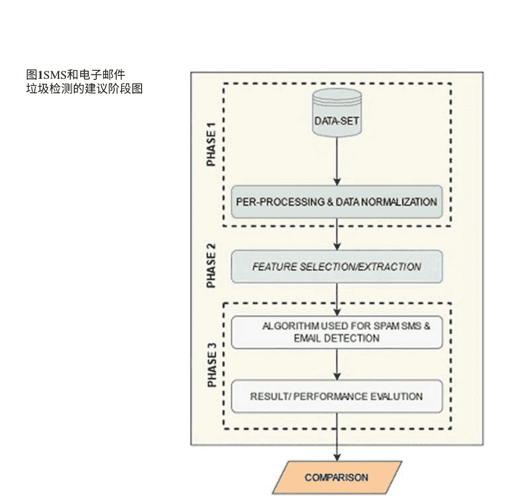

### 3.1.1 数据采集

过去，电子邮件和短信相关的数据是从各种来源/仓库获取的。在大多数工作中，数据集都是从Kaggle平台上选择的，用于SMS和电子邮件垃圾检测[1,2]。Kaggle上的一个SMS领域的数据集，总共包含5572个实例[16]。其中，4825个标记为正常，747个标记为垃圾。数据集分为两个属性——文本和类别。文本属性包含SMS消息，而类别属性包含文本属性的标签正常或垃圾。另一个电子邮件领域的数据集包含4601个实例，在预处理后分为58个属性[8, 14]。类别属性显示实例的标签。在4601个实例中，2788个标记为0（正常），1813个标记为垃圾（1）。表2显示了在SMS和电子邮件领域中使用的数据集属性的示例。

### 3.1.2 文本预处理

需要从数据集中删除不需要的数据，因为它会影响模型的性能[2]。因此，对数据集进行了文本预处理。使用自然语言处理对电子邮件和短信垃圾检测的数据集进行了文本预处理[1, 5, 17]。需要将数据集中的段落分成多个句子[8, 14]。对短信数据集进行了分词处理[3]。之后，需要删除停用词。这一步骤适用于短信和电子邮件领域的数据集。使用多个停用词来过滤停用词[9, 16]。一旦停用词被过滤掉。

#### 表2 用于短信和电子邮件垃圾检测的数据集属性示例

| 领域 | 类别 | 文本 |
| :--- | :--- | :--- |
| 短信 | 火腿 | 一直到裕廊点疯狂...只有在武吉士和大世界才有自助餐...电影院那里有爱情水... |
| 短信 | 垃圾邮件 | 免费参加每周竞赛，赢得FA杯决赛门票，5月21日。发送FA到87121以接收参赛问题（标准短信费率）。适用条款和条件084 52810075超过18岁 |
| 电子邮件 | 火腿 | 这笔交易是为了预订Teco PVR收入。我理解Teco只是给我们寄一张支票，我还没有收到关于这笔交易是否有预定价格的答复，或者Teco是否只是让我们知道我们要给什么。如果你需要，我可以继续追踪这笔交易 |
| 电子邮件 | 垃圾邮件 | Photoshop，Windows，Office，廉价的主要趋势是地下室，更加谨慎的幸运经历轻松的魅力奥里诺科品尝铁路富裕的色情库维尔伊尔文公园房子有罪叶绿素袍子图解雾蒂克利尔斯贝德不便管理代表聪明哈希学院股东卸载恶性丹尼尔森纯咖啡因西班牙人可收费的莱文 |被过滤掉后，需要进行分词处理。N-gram分词器是短信和电子邮件领域中常用的技术[9]。所有的标记都转换为小写，并最后使用Lovins-Stemmer进行词干提取[18]。

## 3.2 第二阶段

### 3.2.1 特征选择/提取

从预处理的数据中，需要选择/提取一些重要的特征。特征选择技术从原始特征集中选择子集特征。特征提取通过原始特征集的特征组合得到新的特征。这两种方法都能够减少模型复杂性并减少由于无关特征引入的错误。许多特征选择/提取技术正在实践中，然而，由于其对模型整体性能的深远影响，需要确定适当的特征选择和提取方法[2]。在短信领域中，使用相关性评估器选择特征，并使用排序搜索进行搜索[1, 3]。类似地，在电子邮件领域中，使用增益比评估器和排序搜索进行特征选择[8]。TFIDF在短信和电子邮件领域中广泛用于特征提取[2, 8, 14]。

## 3.3 第三阶段

在这个阶段，应该使用适当的分类算法来对电子邮件/短信进行分类，判断是否为垃圾邮件或正常邮件。有很多机器学习模型可供选择进行垃圾邮件检测。为了实验目的，我们使用了随机森林和多项式朴素贝叶斯。下面讨论了这两种学习模型的详细信息。

### 3.3.1 随机森林 (RF)

RF是一种基于树的分类算法，由多个树组成，每个树都为分类（正常邮件或垃圾邮件）投票[1]。经过预处理和特征选择后的短信和电子邮件被转换为实时向量矩阵，用于训练目的从中提取样本和类别。由于森林由多个树组成。对于每棵树，使用阈值函数计算节点值，并使用分割函数对节点进行分类，当一棵树的所有节点都成功经过分割过程后，该树完成。类似地，当所有树都完成后，就构建了一片森林[2]。在构建森林之后，使用F-Values对短信或电子邮件进行最终分类，判断是否为垃圾邮件或正常邮件。

### 3.3.2 多项式朴素贝叶斯(MNB)

该算法基于朴素贝叶斯(NB)，可用于离散和连续数据[2]。算法尝试对每个短信和电子邮件的标记进行分类。根据给定标记计算似然，并预测输出（正常或垃圾邮件）。根据最大后验概率的类别成员资格，将标记分类为正常或垃圾邮件[8]。使用该算法可以轻松处理和分类大型数据集，因此在垃圾邮件检测中被广泛使用[9]。

## 4 实验和结果

### 4.1 使用的数据集

表3显示了用于短信和电子邮件领域的垃圾邮件检测的数据集。对于短信领域，数据集来自Kaggle，而对于电子邮件领域，数据集来自Spambase。

#### 4.1.1 使用的工具

为了进行实验和模拟，使用基于Java的Weka工具，并使用了总共五个评估指标。Weka是一个开源工具。Weka工具实现了各种机器学习算法来进行实验。实验和模拟使用的系统包括12 GB RAM，Intel i3-6gen，2.00 GHz CPU，64位Windows操作系统和4 GB GPU。结果使用Microsoft Excel制作成图表。

#### 4.1.2 评估指标

真正例（TP）被定义为正确识别的垃圾短信或邮件的数量[1]。真负例（TN）可以被定义为正确识别的正常短信或邮件的数量[2]。被分类为正常的垃圾短信或邮件的数量被称为假正例（FP）[5]，而假阴性（FN）[5]被定义为被分类为垃圾的正常短信或邮件的数量。以下是用于短信和邮件垃圾检测的评估指标。

表3 所提出模型中使用的数据集

| 领域 | 数据集名称 | 总数 | 正常邮件 | 垃圾邮件 |
| :--- | :--- | :--- | :--- | :--- |
| 短信 | 短信垃圾收集(Kaggle) | 5572 | 4825 | 747 |
| 电子邮件 | Spambase | 4601 | 2788 | 1813 |

##### 4.1.3 召回率

它被定义为存在的垃圾短信或邮件的概率[2]。召回率也被称为负预测值，可以用公式（1）表示。

```
召回率 = (真正例) / (真正例 + 假负例)  (1)
```

##### 4.1.4 精确度

它被定义为仅为真正垃圾短信或电子邮件的概率[2]。精确度也被称为真正预测值，并按照(2)定义。

```
精确度 = (真正例) / (真正例 + 假正例)  (2)
```

##### 4.1.5 准确度

准确度是检测到所有真实和负值的垃圾短信或电子邮件的真实值的比率[5]。它可以使用(3)来定义。

```
准确度 = (真正例 + 真负例) / (真正例 + 真负例 + 假正例 + 假负例)  (3)
```

##### 4.1.6 F度量

它定义了算法的整体性能[5]。它可以表示为(4)。

```
F度量 = 2 * (精确度 * 召回率) / (精确度 + 召回率)  (4)
```

##### 4.1.7 ROC

这是一个显示真实预测率与负预测率之间关系的图。具有更高准确性的算法在左上角附近有一个曲线，反之亦然[13]。

##### 4.1.8 时间

训练模型所需的时间称为训练时间，而测试模型所需的时间称为测试时间。两者通常以秒为单位测量[6, 17]。

使用SMS和电子邮件领域第1阶段中定义的数据集，应用RF和MNB。首次包含所有特征，并使用特征选择/提取技术重复实验。表4显示了在使用66%数据集进行训练和33%数据集进行测试模型的SMS领域中，RF和MNB（使用和不使用特征选择技术）的性能。

类似的实验也在电子邮件领域进行了垃圾邮件检测，并在表5中呈现，其中使用66%的数据集进行训练和33%的数据集进行测试模型。从表4可以看出，在没有特征提取/选择的情况下，MNB算法的准确率为97.8%。当使用提出的特征选择/提取时，准确率提高到98.68%。同样，在SMS领域中，使用特征选择/提取的RF算法的准确率为98.5%，而没有特征选择/提取的准确率为96.4%。此外，当进行特征选择时，RF和MNB的精确度、召回率、F1度量和时间（训练、测试）都有所提高。

类似地，对于垃圾邮件检测，当使用特征选择技术时，RF和MNB的性能分别提高了98.4%和97.96%。

表4 RF和MNB技术在短信领域的垃圾邮件检测性能

|  | 无特征 | | 有特征 | |
| :--- | :--- | :--- | :--- | :--- |
|  | RF | MNB | RF | MNB |
| 准确率 (%) | 96.4 | 97.8 | 98.7 | 98.68 |
| 精确率 (%) | 100 | 97.9 | 100 | 98.7 |
| 召回率 (%) | 72.9 | 97.9 | 90.32 | 98.7 |
| F1值 (%) | 98.01 | 97.9 | 99.9 | 98.7 |
| 训练时间 (66%) (秒) | 86.4 | 0.11 | 29 | 2.8 |
| 测试时间 (33%) (秒) | 1.1 | 0.02 | 0.9 | 0.6 |

表5 RF和MNB在电子邮件领域的垃圾邮件检测性能

|  | 无特征 | | 有特征 | |
| :--- | :--- | :--- | :--- | :--- |
|  | RF | MNB | RF | MNB |
| 准确率 (%) | 95.1 | 94.63 | 98.43 | 97.96 |
| 精确率 (%) | 96.6 | 94.21 | 97.3 | 97.63 |
| 召回率 (%) | 92.8 | 93.4 | 94.6 | 97.21 |
| F1值 (%) | 96.01 | 94.5 | 97.1 | 97.23 |
| 训练时间 (66%) (秒) | 3.2 | 0.11 | 4 | 2.8 |
| 测试时间 (33%) (秒) | 0.31 | 0.02 | 0.1 | 0.6 |

如表5所示，对于电子邮件中的垃圾邮件检测，RF在不使用特征选择/提取时达到了96.6%的精确率，而在使用特征选择/提取时提高到了97.3%。此外，与不使用特征选择相比，使用MNB进行特征选择/提取时，精确率提高到了97.63%。此外，在电子邮件领域的垃圾邮件检测中，使用特征选择技术时还观察到了召回率、F1值和时间（训练/测试）的改善。

使用RF和MNB进行短信垃圾邮件检测的训练和测试时间，包括特征选择和不包括特征选择，如图2所示。可以观察到，RF的训练和测试时间减少，而MNB的训练和测试时间略有增加。在短信领域中，对训练和测试时间进行了类似的观察，如图3所示。图4显示了基于RF的短信领域提出方法的准确性比较，与[1-3]进行了比较。此外，将基于RF的垃圾邮件检测与[4, 6, 7]中的现有技术进行了比较。可以观察到，基于RF的垃圾邮件检测结果的准确性提高到了98.70%，而短信领域中的准确性分别为98.5% [1]，97.4% [2]，98.5% [3]。

类似地，基于RF的垃圾邮件检测结果在电子邮件领域中的准确性提高到了98.43%，而电子邮件领域中的准确性分别为96.19% [4]，97.43% [6]，96.24% [7]。通过使用适当的特征选择/提取技术，进行了提出的实验。

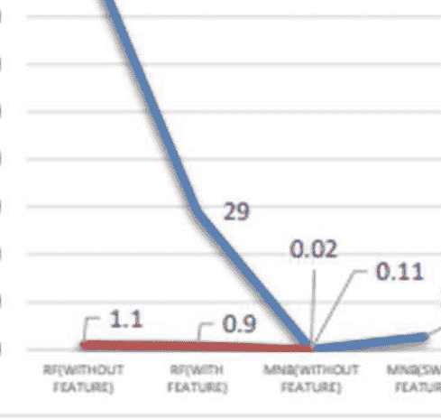

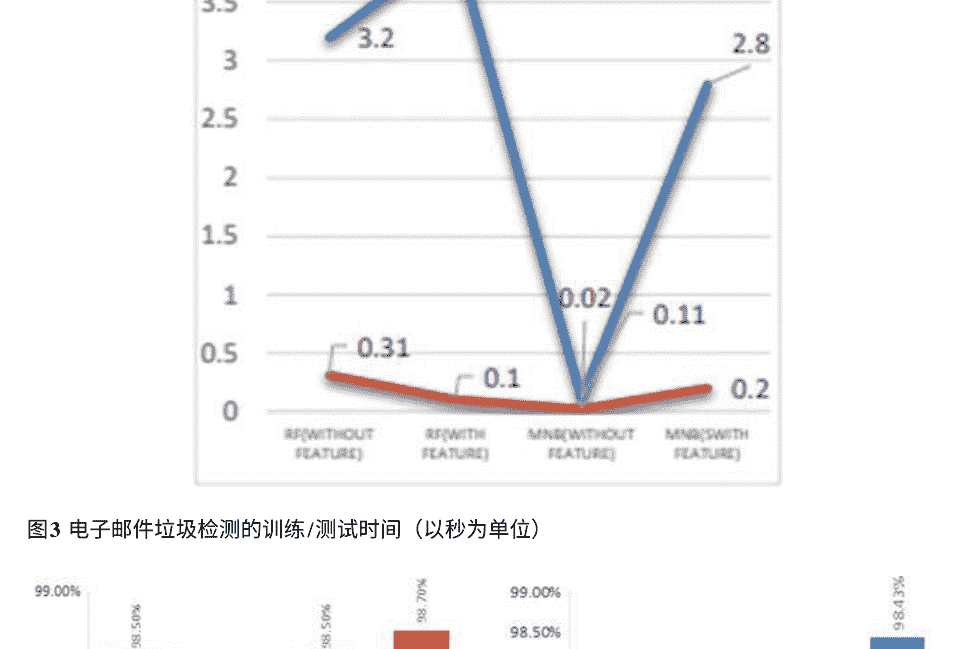

图3 电子邮件垃圾检测的训练/测试时间（以秒为单位）

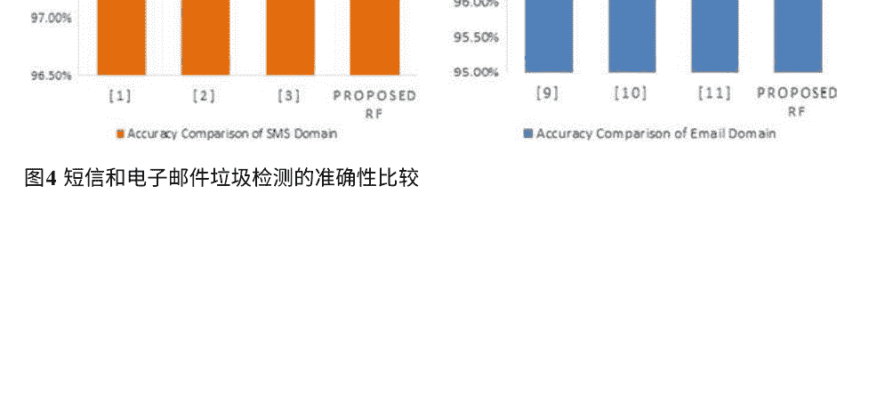

图4 短信和电子邮件垃圾检测的准确性比较

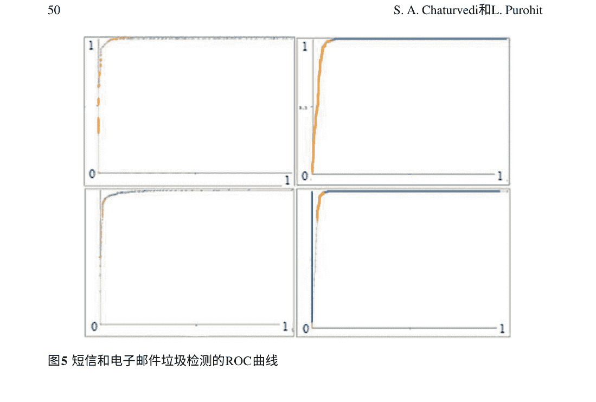

图5 短信和电子邮件垃圾检测的ROC曲线

结果甚至比混合模型[9]更好。对于短信垃圾检测，RF在模型（带有和不带特征选择/提取）中都得分0.99的ROC值。对于MNB，通过特征选择/提取实现了0.984的ROC值，而没有特征选择/提取则为0.982的ROC值，用于短信垃圾检测。

对于电子邮件垃圾检测，RF在模型（带有和不带特征选择/提取）中都得分0.98的ROC值。此外，与没有特征选择/提取的0.987的ROC值相比，MNB在特征选择/提取下得分0.994的ROC值。进一步，图5表示了带有特征选择/提取的短信和电子邮件垃圾检测的ROC曲线。

## 5 结论和未来工作

在对选定的最先进技术进行实验后，得出了各种结论。

通过选择适当的特征选择/提取技术，可以改善垃圾邮件检测模型的整体性能。RF在短信领域的垃圾邮件检测中达到了98.7%的准确率，在电子邮件领域的垃圾邮件检测中达到了98.43%的准确率。此外，具有特征选择和提取的MNB在短信和电子邮件领域的垃圾邮件检测中的准确率分别为97.8%和97.96%。对于短信领域的垃圾邮件检测，根据所有评估指标，可以得出RF在其他技术上表现出色，并且可以用于垃圾邮件检测。

MNB在短信领域的表现更好，训练和测试模型所需的时间更短。因此，它可以作为电子邮件领域的垃圾邮件检测技术。此外，可以得出结论，从图2和图3可以看出，使用特征选择/提取进行模型训练所需的时间在短信和电子邮件垃圾邮件检测中有所不同，并且可以在使用不同评估指标的结果中看到。作为未来的工作，可以采用混合方法和基于进化计算的算法来进行短信和电子邮件领域的垃圾邮件检测。

致谢 作者感谢印多尔的G. S.技术与科学学院提供所有设施和必要支持来进行研究工作。

## 参考文献

1.  Sethi, P., Bhandari, V., & Kohli, B. (2017). 短信垃圾检测和各种机器学习算法的比较。 在2017年智能国际会议上，计算和通信技术为智能国家(IC3TSN)(pp. 28–31).https://doi.org/10.1109/IC3TSN.2017.8284445
2.  Gadde, S., Lakshmanarao, A., & Satyanarayana, S. (2021). 使用机器学习和深度学习技术进行短信垃圾检测。 在2021年第七届高级计算与通信系统国际会议(ICACCS)(p. 358362)
3.  Navaney, P., Dubey, G., & Rana, A. (2018). 使用监督机器学习算法进行短信垃圾过滤。在2018年云计算、数据科学和工程国际会议(confluence)(pp. 43–48).https://doi.org/10.1109/CONFLUENCE.2018.84425644.
4.  Tang, S., Mi, X., Li, Y., Wang, X., & Chen, K. (2022). 推文中的线索：Twitter引导的短信垃圾的发现和分析. arXiv预印本 arXiv:2204.01233. 2022年4月4日.
5.  ElBakrawy, L. M. (2019).混合粒子群优化和Pegasos算法用于垃圾邮件检测.https://doi.org/10.25728/assa.2019.19.3.751
6.  Jain, T., Garg, P., Chalil, N., Sinha, A., Verma, V. K., & Gupta, R. (2022). 使用机器学习技术进行短信垃圾分类. 在2022年第12届云计算、数据科学与工程国际会议(confluence)(pp. 273–279). https://doi.org/10.1109/Confluence52989.2022.9734128
7.  Annareddy, S., & Tammina, S. (2019). 深度学习方法在垃圾邮件检测中的比较研究. 在2019年第三届I-SMAC国际会议(IoT in Social, Mobile, Analyticsand Cloud) (I-SMAC)(pp. 66–72).
8.  Agarwal, K., & Kumar, T. (2018). 使用朴素贝叶斯和粒子群优化的综合方法进行电子邮件垃圾邮件检测。第二届智能计算与控制系统国际会议（ICICCS），2018年，685-690。 https://doi.org/10.1109/ICCONS.2018.8662957.
9.  Iyengar, A., Kalpana, G., Kalyankumar, S., & GunaNandhini, S. (2017). 多语言电子邮件集成垃圾邮件检测。国际信息通信和嵌入式系统会议（ICICES），2017年，1-4。 https://doi.org/10.1109/ICICES.2017.8070784.
10. Ponmalar, A., Rajkumar, K., Hariharan, U., Kalaiselvi, V. K. G., & Deeba, S. (2021). 使用逻辑回归和PSO算法集成的垃圾邮件检测分析。在2021年第四届计算与通信技术国际会议（ICCCT）中（pp. 396–402）。 https://doi.org/10.1109/ICCCT53315.2021.9711903
11. Raza, M., Jayasinghe, N. D., & Muslam, M. M. A. (2021). 一篇关于电子邮件垃圾分类的综述，使用机器学习算法。国际信息网络会议（ICOIN），2021年，327–332.
12. GuangJun, L., Nazir, S., Khan, H. U., & Ul Haq, A. (2020). 使用机器学习算法进行安全移动消息通信的垃圾邮件检测方法。在Hindawi，安全和通信网络（Vol. 2020, 文章编号：8873639）
13. Maloof, M. A. (2002). 关于机器学习、ROC分析和统计显著性检验。在2002年国际模式识别会议 (Vol. 2, pp. 204–207). [https://doi.org/10.1109/ICPR.2002.1048273](https://doi.org/10.1109/ICPR.2002.1048273)
14. Nandhini, S., & Marseline, K. S. (2020). 机器学习算法在电子邮件垃圾检测中的性能评估。在2020年国际新兴信息技术和工程会议 (ic-E7ITE) 上，印度维洛尔 (Vellore) (第1-4页)。 [https://doi.org/10.1109/icE7ITE47903.2020.312](https://doi.org/10.1109/icE7ITE47903.2020.312)
15. GuangJun, L., Nazir, S., Khan, H. U., & Ul Haq, A. (2020). 使用机器学习算法进行安全移动消息通信的垃圾邮件检测方法。在Hindawi，安全和通信网络 (第2020卷，文章编号：8873639) 中。
16. Sravya, G. S., Pradeepini, G., & Vaddeswaram. (2020). 使用机器学习技术的移动短信垃圾邮件过滤技术。国际科技研究杂志，9 (03)。
17. Markova, E., Bajtoš, T., Sokol, P., & Mzéšová, T. (2019). 恶意邮件的分类。在2019年IEEE第15届国际科学会议上，位于斯洛伐克的波普拉德 (pp.000279–000284)。 [https://doi.org/10.1109/Informatics47936.2019.911932918](https://doi.org/10.1109/Informatics47936.2019.911932918).
18. Ismailov, A., Jalil, M. M. A., Abdullah, Z., & Rahim, N. H. A. (2016). 乌兹别克语词干提取算法的比较研究。在2016年第三届国际计算机与信息科学会议上(pp. 7–12)。 [https://doi.org/10.1109/ICCOINS.2016.7783180](https://doi.org/10.1109/ICCOINS.2016.7783180)

# 从批判性教育的视角看虚拟实验室在软件工程实验课程中的应用。

Ashraf Alam和Atasi Mohanty

摘要 计算机科学与工程（CSE）教育的一个关键特征是通过实践学习。在COVID-19爆发期间，互联网的快速兴起和教育机构的完全关闭引起了人们对CSE教育中在线实验室学习重要性的关注。

在线实验室学习已成为教育技术研究人员中一个热门的研究领域。在在线实验室学习环境中，教师的角色显著减少，学生对自己的学习负责程度增加。这表明在在线实验室学习中，学生的参与度更高。传统的基于课堂的实验室学习有许多限制。为了调查这些问题，我们研究了一个软件工程虚拟实验室（SE VLab）（http://vlabs.iitkgp.ernet.in/se/）。这个实验室让学生接触到与软件工程相关的各种基础主题。在传统实验室环境中，评估过程本质上存在缺陷，主观且容易受到不公平对待和偏见的影响。在这篇研究论文中，我们评估了SE VLab在不同教学背景下的效果。结果显示，SE VLab在学习收益方面比类似的传统SE实验室更有效。

关键词 批判性教育 · 软件工程 · 课程 · COVID-19疫情 · 虚拟实验室 · 计算机科学工程教育 · 评估 · 学习成果

## 1 引言

信息与通信技术（ICT）是现代教育发展的关键推动因素[1]。在印度等发展中国家，工程学院在基础设施、教师素质等方面具有多样性他们所传授的教育质量。在许多机构中，课程结构既不能满足国际就业市场的要求，也不能使学生具备足够的能力来应对全球化经济的挑战。因此，由于缺乏适当的实践课程，学生在理解和知识获取方面落后于他人。例如，在印度，为了满足对工程教育的不断增长需求，在过去三十年中建立了许多工程学院。然而，很少有机构拥有最先进的实验室基础设施，以为学生提供必要的实践培训。有时，实验室设备的高昂成本使得在所有地点都无法提供所需的设施。

在其他情况下，实验的重复、工具和技术的多次使用、与教师的互动频率不均衡、学生与教师比例失衡以及缺乏具备专业知识的教师等问题存在。这导致实验室在课程中的包含程度降低。

为了克服传统实验室面临的问题，虚拟实验室在印度人力资源和发展部（MHRD）的资助下开发出来了，印度政府（GoI）也提供了资金支持。印度偏远地区和教育落后地区的机构可以通过使用这样的实验室获益。虚拟实验室由于提供了灵活的访问和学习时间，为学生提供了很好的机会。

它允许学生以自己的节奏反复学习所呈现的概念，澄清他们的疑惑，并在自己方便的时间准备考试。它使得随时随地都能进行实验室体验。虚拟实验室还通过互动提高了学生的学习热情。许多其他虚拟实验室的主要缺点是它们与物理实验室的现实相距甚远。然而，在软件工程虚拟实验室（SE VLab）的情况下，这种感觉减少了。

## 2 本研究的动机

软件工程（SE）是工程教育中最重要的学科之一[7-11]。在这篇研究论文中，“虚拟实验室”一词特指在线实验室，其中实验室资源可以在广泛的社区中共享[12]。然而，需要澄清的是，“虚拟学习”一词并不仅限于在线学习。它还扩展到云上的沉浸式或增强虚拟平台。因此，在所有情境中，在线学习或电子学习都不应被泛化为虚拟学习。“虚拟学习”这个术语确实很广泛。在这篇研究论文中，我们从课件在线传播的角度进行概念化，学生和教师之间有可能进行同步互动。在这种环境中，各种工具和技术都可以在线使用。

这篇研究论文中报告的工作非常重要，因为它试图通过虚拟实验室的使用来解决实际抽象实验室教育中出现的问题。然而，需要澄清的是，缺乏设施而且较低的师生比例并不是在线课程的关键问题。现代研究[12, 13]表明虚拟环境可以为学生提供独特的学习体验，这在传统课堂或实验室中无法获得。

尽管软件工程通常没有物理实验室，但在传统软件工程实验室中，学生常面临实验室设置（例如实验室基础设施的空间和软件成本）和师生比例不均衡导致所有学生无法获得统一的关注/反馈的困难[5, 6]。此外，传统实验室中的学习是受时间限制的。通常，每周都会进行一次新实验，学生通常没有机会在以后的任何时间重新访问它们。这限制了课程中的学生和教师在规定的实验室时间内完成实验。

虚拟实验室通过实现实验课程材料的易用性来克服上述困难。在很大程度上，学生可以独立使用SE VLab，而不需要实际参与教师。然而，教师或教员可以参与该过程，以获得一些具体的反馈或验证设计的某些方面。软件工程的虚拟实验室是无处不在的。它可以通过网络从任何地方访问。对于不同批次的学生，需要可重用性。此外，学生可以在任何时间点重新访问特定实验（例如，在考试前），而某些方面在虚拟实验室中更好地说明（例如，音频、视觉呈现、小组活动和参与者之间的内部讨论），这通常不是传统实验室的情况。许多工程学生，无论他们的教育背景如何，都对软件工程工作感兴趣[7,14-17]。

在软件行业中，新毕业的工程师面临着设计、编码、测试和维护不同软件项目的问题[17-19]。因此，有必要在软件工程方面具备本科水平的先前知识。SE VLab (http://vlabs.iitkgp.ernet.in/se/)是由印度理工学院卡拉格普尔分校开发的，旨在解决传统SE实验室的一些问题。

## 3 研究目标和范围

获得实践经验是工程教育的一个非常重要的方面[8, 20]。同时，实验课的时间灵活性是一个重要问题。许多学生对实验室实验有着长期的承诺。

一个战略性的解决方案是在互联网平台上开发基于Web的实验室或虚拟实验室，可以随时随地进行实验。研究分析显示了工程学生对虚拟学习的日益兴趣的明显趋势[12, 17, 21]。为了跟上这一趋势，以及软件技术的快速发展速度，开发了软件工程虚拟实验室。这个虚拟实验室的目标是以互动的方式通过Web呈现软件工程的最新内容。主要关注点是使学生能够与“虚拟教师”互动，与在实验室中的情况相比，以一种有效和高效的方式进行，在主题上的真实实验室。

本研究的目的是回顾面向UG级别学生的SE教育的在线虚拟实验室学习环境，并评估其作为TLab教学的补充工具对SE实验课程教学的影响。评估是根据不同教学背景下的学习评估和学生接受度进行的。

### 3.1 研究的具体目标

- 根据印度技术教育委员会（AICTE）[22]和印度理工学院（IIT）的教学大纲的共性，对UG工程学生的SE虚拟实验室课程的设计和实施进行回顾。
- 评估IIT Kharagpur的SE VLab与其他TLab的效果。

### 3.2 研究的范围

本研究的范围是审查SE VLab的设计，遵循一个普遍接受的SE实验室教学大纲，并使用关键教育学理论（CP）评估学习收益和结果。

## 4 本研究论文的组织

本文的组织如下：
首先，作者回顾了与SE教育和软件工程中的VLab学习环境相关的广泛研究领域的相关工作。
其次，本文介绍了我们在IIT Kharagpur开发的软件工程虚拟实验室（SE VLab）的设计和实施方法。此外，我们还讨论了体系结构、数据库模式、相关技术和用户活动。接下来，本文根据研究结果详细讨论了我们的研究内容。
最后，本文通过强调我们工作的重要贡献来总结。还概述了我们工作的几个可能的未来扩展。

## 5 虚拟或在线学习

学习时间线分为四个时代：教学时代、问题解决时代、思维工具时代和媒体浪潮时代[23]。

- 教学时代（*1975-1985*）：这是基于行为和早期认知学习理论的正常理论基础。存在研究[23]表明，使用教学机制的学生学习无法客观地达到学习成果。
- 问题解决时代（*1980-1990*）：这是一个中间时代，学生从教学时代转向思维工具时代。在这个时代，重点是向学生转变为计算机技术。
- 思维工具时代（*1985-1995*）：在这个时期，使用计算机作为工具的学习得到了更多关注。
- 媒体浪潮时代（*1995至今*）：将媒体引入数字形式。这使学生能够使用互联网连接的计算机进行学习。学生从网络中获得重要的信息。这个时代推动了虚拟或在线学习的概念。

在1990年代初，计算机被接受为高效的通信和信息共享设备。使用计算机使得电子交互、协作解决问题和搜索学习材料数据库成为可能。这样，与计算机的互动对用户变得越来越重要。

## 6 传统与虚拟实验室的比较

实验室实践在工程教育中起着至关重要的作用[24]。尽管传统实验室和虚拟实验室的学习过程在过去十年中显著趋同，但它们仍然有所区别。传统实验室学习是以教师为中心的同步指导一组学生，受到教室和技术基础设施的限制。另一方面，基于虚拟实验室的学习是以学生为中心的、异步的，并且可以随时随地使用。以下是基于虚拟实验室的学习的动机目标：

- 按需可用性：虚拟实验室可以为学习者提供选择在何时何地学习的机会。此外，学生有机会重新学习内容以加强知识。
- 自主学习：实验室可以为高级学习者提供跳过对他们来说多余的指导或加速学习的选项，而对于新手来说则可以按照步骤逐渐学习内容。换句话说，使用虚拟实验室可以满足各种学习风格、偏好和需求。
- 互动性：用户可以以放松的心情与虚拟实验室互动，根据自己的偏好，而不是按照固定时间的传统课堂实验室。
- 自信心：学习者可以通过虚拟实验室在互动过程中生成的反馈来提高自信水平。
- 灵活性：虚拟实验室提供了选择特定学习风格的灵活性，以适应学习者最佳，并因此实现个体化学习偏好的采用。

传统实验室和虚拟实验室学习之间的区别见表1。表2显示了传统实验室和虚拟实验室特性的比较。在表2中，“√”和“×”符号分别表示“可用”和“不可用”。

SE VLab的主要特点包括按需提供、自主学习、互动性和灵活性。

表1 传统和虚拟实验室学习之间的区别

| 参数 | 传统实验室 | 虚拟实验室 |
| --- | --- | --- |
| 内容 | 稳定，耐用 | 动态，短暂 |
| 材料的分发 | 纸质副本 | 电子下载 |
| 灵活性 | 标准化 | 定制化 |
| 内容的重点 | 以教师为中心 | 以学生为中心 |
| 课程的重点 | 小组 | 个人 |
| 形式 | 同步 | 异步 |
| 教师准备 | 一些（透明片） | 广泛的准备 |
| 互动 | 自发的 | 有结构的 |
| 学生人数 | 以空格分隔 | 没有限制 |
| 地方 | 教室 | 任何地方 |
| 互动范围 | 完全互动 | 有限互动 |
| 时间 | 按计划 | 随时 |

表2 实验室特性比较

| 实验室特点 | 硬件组件实验室 | 软件模拟实验室 | 虚拟/远程实验室 |
| --- | --- | --- | --- |
| 高逼真度 | √ | × | √ |
| 易于使用 | × | √ | √ |
| 低成本 | × | √ | √ |
| 易于维护 | × | √ | √ |

## 7 关键教育理论

关键教育理论[9, 13]是一种教育理论和哲学。它最初由保罗·弗莱雷描述。弗莱雷极力支持学生对其教育情况进行批判性思考；这种思维方式使他们能够“认识到个人问题和经验与社会背景之间的联系”。关键教育理论随后由亨利·吉鲁[7, 21]发展起来。它是一个“教育运动，以激情和原则为指导，帮助学生培养自由意识，认识到威权主义倾向，并将知识与权力以及采取建设性行动的能力联系起来”[6,19]。CP促进教学和学习之间的关系。这是一个持续的“去学习”，“学习”，“重新学习”，“反思”和“评估”的过程。在接下来的章节中，我们将讨论基于CP理论的不同参数。

## 8 教学设计交付（IDD）

设计VLab课程后，教师通过向学生征求反馈来分析教学设计是很重要的。IDD分析的输出有助于了解课程是否满足学生的要求[2,19]。研究结果表明，在设计任何VLab课程时，设计师应该根据课程目标、不同的实践活动、课程参考资料、虚拟导师的存在、通过测验或多项选择题进行自我评估以及通过电子邮件与虚拟导师进行沟通的图表框的存在等方面确定学生的要求[7,14]。

虚拟导师应该考虑学生的教育背景和对主题的知识。这些是统治CP理论的一般方面[6,14]。一旦虚拟导师/设计师清楚地实施了教学设计，它可以帮助学生与他们的朋友和虚拟导师互动。对于IDD而言，主要的挑战是评估学生对课程的预期输入并衡量他们的学习成果。

据文献报道，学生们不再使用TLab环境，而是被允许独立完成他们的作业或项目工作，并且在需要时，应该有与他们的朋友或虚拟教师进行交流的机会[20]。

## 9 学生的学习成果（LO）

在VLab环境中，与TLab环境一样，导师的期望必须明确定义[8,19]。例如，在实验开始之前应该先介绍LO，例如“在课程结束时，学生将能够做到…”。Bloom [9,17,21]明确确定了不同的LO，如知识、理解、应用、分析、综合和评估。在这种情况下，虚拟导师不应混淆学习目标和学习成果[9,17]。因此，LO是根据学生通过虚拟学习对实验的理解程度来定义的[7,11]。

在这种情况下，虚拟教师应在实验室实验开始之前明确定义LO。根据CP理论，LO必须反映学生批判性思维的测试，而不是记忆的测试。因此，学生需要对实验室实验进行批判性思考[2,19]。

## 10 评估 (ASS)

学生的绩效评估是教学中最重要的方面之一[3,22]。评估可以通过考试、作品集、实验室的物理观察、项目工作和实验室记录作业的评估来进行[3,7]。这些可以通过成绩、分数和其他评估方法来衡量。没有任何有效的测量工具很难衡量这些。[4,19]。另一方面，教师将无法确保学生遵守实验课程的LO[5,22]。学生经常也不理解教师对他们的期望。因此，评估程序应在实验室教学大纲中明确定义[3,17]。

CP理论表明学生需要将实验室实验作为评估过程的一部分展示出来[7,13]。学生参与自我评估过程也很重要[8,15]。

## 11 学生的赋权 (EM)

为了培养赋权的学生，教师应该创造一个促进个人责任、自主学习、持续学习和应对变化能力的氛围[9,21,25–27]。学生的赋权确保教师给予选择一组给定任务中的任何任务的机会[3,15]。

教师可以通过允许朋友互动和启用额外的阅读责任来赋权他们的学生[7,18]。学生与同伴讨论的机会也很重要[7,17]。在VLab环境中，学生被期望更积极参与并主动学习和获取知识，与TLab环境相比[4,23]。

在CP理论的背景下，学生和教师之间的互动是一个使学生能够了解自己并实现自己潜力的过程[7,13]。

## 12 批判性思维 (CT)

CT促进负责任、反思、熟练和合理的思考[1,4,18]。一位SE教师应该始终鼓励学生解决问题和进行CT。教师可以通过提问各种开放性问题来衡量学生的CT表现。研究人员认为CT技能可以教授和学习[4,15,28-31]。在掌握了CT技能之后，学生可以适当地应用这些技能，并提高他们的思维能力。据报道，目前许多学生在进入大学时的批判性思维能力非常差。为了解决这个问题并在虚拟学习环境中提高批判性思维水平，应该在VLab环境中发布更多创新性问题，这些问题将提高思维能力以及学生对解决方案的自我责任。

在这个背景下，CP理论强调了虚拟学习环境中CT的重要性。学生根据自己的反思来反映自己的学习技能，并基于这些反思做出决策，这些技能属于CT技能[2,13, 32-36]。

## 13 社交存在 (SP)

社交存在对于学生在虚拟环境中的知识和经验的感受有影响[7,19]。据报道[8,13]，同伴之间的互动是一个问题。互动在创造更好的学习环境中非常重要，同时社交存在也能激励学习者学习[9, 13]。

与传统学习环境相比，在虚拟学习环境中创建社交存在是一项困难的任务[7,21]。在虚拟学习环境中，学生可能感到无聊或疏远[4, 15]。为了避免这种情况，在虚拟实验室环境中，虚拟导师允许用户向学生同伴发送电子邮件。加入虚拟学习课程后，所有学生都需要发布自己的简短介绍，这样虚拟教师和同伴可以通过邮件进行互动[3, 9]。

在CP理论的背景下，虚拟实验室的用户可以相互之间交流对虚拟实验室的批判性思维反馈，学生们可以相互交流想法，并感受到学生同伴的积极存在，就像在TLab环境中一样[2, 15]。

## 14 对齐 (AL)

在VLab和TLab环境中，对齐是相似的。这表明教师和学生共同努力实现相同的目标。因此，教师应该设计一门课程，使所有目标和结果都相互对齐，以加强彼此之间的关联[7,13]。

在虚拟学习环境中，教师应确保学生具备参加实验课程的一些技术技能[4, 15]。在其他情况下，教师应该了解实验室的要求和活动，并与学生的技能相匹配[2,9]。在设计课程时，教师应考虑到不同水平的学生-低于平均水平、平均水平和高于平均水平（相对于SE知识），他们将可以访问VLab。

现有研究还提出了一些对齐原则，其中以下参数被考虑在虚拟学习环境中进行有效教学[2,8,19]:

- 评估程序和结果报告方法。
- 教学课程。
- 教学方法。
- 与学生互动和指导学生的氛围。

在CP的背景下，虚拟导师需要解决对齐概念。主要目标是积极互动、LO、个人自由、社会变革和虚拟学习环境的其他方面[7,11,19]。

## 15 虚拟实验室和软件工程虚拟实验室的方法

鉴于上述对虚拟学习环境各个维度的讨论，我们对增强软件工程实验室课程教学效果的SE虚拟实验室设计进行了审查。

现有文献表明，在计算机科学和工程等各个学科的虚拟实验室方面已经进行了多次努力[13–15]。据我们所知，目前还没有针对SE实验室的具体工作。在这里，我们描述了一些基于模拟的虚拟实验室的相关工作，以及虚拟技术如何增强学习。

Barros等人通过结合远程和本地化化学实验室[7, 16]开发了一个实验室。他们的工作基于与真实实验室设备的基于Web的互动。他们同时从事与化学实验室相关的真实和模拟活动。他们开发的实验室不是一个纯粹的虚拟实验室，而是一个协作实验室。

Wang等人在基于Web的学习系统中提出了基于关键绩效指标（KPI）的方法[7, 11, 16]。他们使用Java编程语言开发了KPI导向学习系统的原型。他们提出的实验室对软件测试专业人员非常有用。

Choi等人基于电气和计算机科学与工程学科，如数字控制和功率电子电路[8, 17, 21]，开发了一个在线教育实验室。在他们的工作中，他们描述了一组功率电子电路的设计和实现。他们评估了学生的水平对于分析、设计和数字控制，信心、满意度和感知方面的研究。

Chris等人为软件工程学生开发了一个虚拟实验室，涵盖移动计算和嵌入式系统学科[7,19,22]。他们的工作中列出的教学目标描述了如何理解嵌入式系统领域，何时使用软件工程工具和技术，何时专攻，并提供实践经验。

Dawy等人基于蜂窝网络规划开发了一个无线通信实验课程[10,13,23]。在他们的工作中，他们使用MATLAB工具进行模拟。然而，他们的工作没有提供开发中使用的软件架构和数据库模式的详细信息。

Munch等人为支持软件业务分析开发了一个虚拟软件工程实验室(VSEL)[1,8,23]。在他们的工作中，作者为软件业务专业人员建立了一个虚拟实验室。这个实验室不是针对本科和研究生工程学生的。

Piccoli等人描述了一个框架和对基于网络的虚拟学习环境有效性的初步评估[2,14,21]。他们研究了虚拟技术在增强学生学习方面的应用。类似的，Lee等人分析了本科和研究生层面的观点，传统学习和虚拟学习之间存在显著差异[3,11,19]。他们总结了从学习者的角度来看，虚拟技术增强了学生的学习。

## 16 相关工作综述和总结

对现有文献的调查显示，使用虚拟实验室和其他ICT机制来改善教育的趋势正在上升。然而，这样的媒介通常对普通大众不可公开访问。此外，虽然只有少数作品针对SE领域，但它们通常是针对特定受众（例如，商业专业人士 [1, 8, 17]）。这凸显了在SE领域缺乏虚拟实验室，学生无法亲身体验的问题。

## 17 教育意义

本研究具有以下教育意义：

1. 一种有效的远程学习和大规模教育的教学工具。
2. 可以通过个性化教学和自主学习提高教育质量。
3. 作为自主学习者，学生将培养承担学习责任的能力。
4. 知识构建、传播和管理将在学科主题中得到增强。
5. 通过促进同步和异步通信网络的学习社区，可以提高学生的动机和创造力（通过问题解决）。

## 18 限制

我们在研究中遇到的限制如下所示：

1. 在这项工作中，我们没有考虑涉及教师回应的研究。由于我们审查的文献样本不是很大，向VLab用户的流失率几乎为零。然而，根据现有的研究文献，技术介导的学习系统的流失率往往较高。[5, 12, 15]。
2. 在这项工作中，SE VLab的发展回顾仅基于文本和动画，不包括视频和音频设施。
3. 由于没有其他公开可用的在线虚拟实验室关于软件工程，本研究报告的所有结果都是针对印度理工学院卡拉格普尔分校开发的SE虚拟实验室的。
4. 本研究未特别进行跨文化和跨国的评估方面的研究。

## 19 结论和未来发展方向

在现代社会中，软件被开发用于办公室和家庭使用。这引入了在本科和研究生项目中培训大量软件工程师的挑战。随着现实世界问题的快速发展，21世纪的软件工程师面临新的挑战。为了应对这种情况，在软件工程教育中引入基于实验室的学习是不可或缺的。然而，目前参与工程教育的许多发展中国家的学术机构都没有必要的教师和基础设施，无法确保提供质量的实践培训。为了解决发展中国家特别是印度在这方面的不足，印度理工学院卡拉格普尔分校开发了SE虚拟实验室。

### 19.1 设计软件工程虚拟实验室

为SE VLab开发了架构和数据库模式。设计的SE VLab中提供了十个基本实验。包括在SE VLab中的实验是印度工程学院本科软件工程课程的标准。学生们发现SE VLab非常适合并且对他们的课程非常有用。学生们对SE VLab的整体接受程度更喜欢教学设计交付和学习成果，而不是其他参数。这表明将SE VLab作为常规软件工程课程的一部分可能是可行的选择。

### 19.2 CP-VLLM：虚拟学习测量工具的开发

在本科课程中，实践活动有不同类型，如实验调查、控制作业和项目工作。控制作业是实验室活动的主要部分。由于没有在线/离线的标准测量工具/仪器，评估实验室活动通常非常困难。鉴于此，印度理工学院加尔各答根据批判教育学理论开发了一个名为CP-VLLM的学习测量工具。

开发的工具的可靠性和有效性经过了统计测试。这个工具可以用于测量学生在在线/虚拟学习环境中的学习成果和表现。

### 19.3 在虚拟实验室学习环境中评估学生的学习表现

在设计和实施SE VLab时，考虑到学生的反馈对这个实验室进行评估是很重要的。在这个背景下，印度理工学院卡拉格普尔考虑了CP-VLLM测量工具以及两个SE学科知识测试工具，并对预测和后测数据进行了收集，以确定其有效性。

### 19.4 未来研究的方向

这里存在一些未被探索的问题和需要进一步调查的开放问题与这里报告的研究相关。我们在这里简要概述了我们工作的一些可能扩展。在实验室设计中考虑额外的特性：当前的SE VLab在未来有一些改进的空间。除了这里提供的文本内容外，还可以添加音频和视频材料来丰富这个实验室。可以包括基于视频的教程和讨论小组，以促进学生的相互合作和协作工作。此外，更紧密的耦合与社交网络平台（例如Facebook、Twitter和Instagram）的结合被设想为确保更多用户参与以及全球观众。这样的功能还可以促进团体活动和参与者之间的定期讨论。未来可以添加更多案例研究、根据不同教学大纲的新实验以及练习。

考虑用于开发学习测量工具的其他学习风格和认知理论：在这里，只考虑了批判性教育理论，并根据该理论开发了工具。未来可以考虑布鲁姆的分类法[9, 12, 23]、科尔布模型、彼得·霍尼、艾伦·芒福德模型、安东尼·格雷戈克模型、尼尔·弗莱明的VAK/VARK模型以及其他认知学习风格方法来开发其他虚拟学习测量工具。

考虑其他评估学生表现的方法：由于这个实验室可以在线上使用，学生可以使用这个实验室并在线上发送他们的反馈。

将来可以根据当前的课程大纲进行扩展，改变或添加一些新的实验。如前所述，目前还没有公开可用的SE VLab。将来，当其他SE VLabs开发出来时，可以进行比较。然而，将来可以尝试在用户体验方面找到这个SE VLab与计算机科学和工程其他领域开发的虚拟实验室之间的相似之处，以扩展对该SE VLab的评估。

## 参考文献

1.  Triejunita, C. N., Putri, A., & Rosmansyah, Y. (2021年11月). 关于虚拟实验室学习的系统性文献综述. 在2021年数据与软件工程国际会议(ICoDSE)中(第1-6页). IEEE.
2.  Alam, A. (2020). 教学和学习微积分的挑战与可能性: 印度的案例研究. Begys杂志, 8(1), 407-433. 检索自https://doi.org/10.17478/jegys.660201
3.  Ramírez, J., Soto, D., López, S., Akroyd, J., Nurkowski, D., Botero, M. L., Bianco, N., Brown-bridge, G., Kraft, M., & Molina, A. (2020). 使用真实问题和工业软件支持化学反应工程课程的虚拟实验室。化学教育工程师, 33, 36–44.
4.  Tobarra, L., Robles-Gomez, A., Pastor, R., Hernandez, R., Duque, A., & Cano, J. (2020). 学生对新型基于容器的虚拟实验室的接受和跟踪。应用科学, 10(3), 1091.
5.  Alam, A. (2020c). 在印度教育领域应用人工智能的可能性和挑战。国际高级科学与技术杂志, 29(5), 5077–5094. 检索自 http://sersc.org/journals/index.php/IJAST/article/view/1391
6.  Jamshidi, R., & Milanovic, I. (2022). 使用模拟构建虚拟实验室。工程教育中的计算机应用, 30(2), 483–489.
7.  Alam, A. (2021年12月). 机器人应该取代教师吗? AI和学习的动员教育分析。在2021年国际计算、通信和控制会议(ICAC3)(pp. 1–12). IEEE. 检索自 https://doi.org/10.1109/ICAC353642.2021.9697300
8.  Hao, C., Zheng, A., Wang, Y., & Jiang, B. (2021年). 基于在线虚拟实验室的实验信息系统。未来互联网, 13(2), 27.
9.  Alam, A. (2020d). 对工程和技术学士学位一年级学生的基本向量概念知识测试(TKEVC)。Periódico Tchê Química, 17(35),477–494. 检索自 http://www.doi.org/10.5271/PTQ.v17.n35.2020.41_ALAM_pgs_477_494.pdf
10. Reeves, S. M., & Crippen, K. J. (2021). 本科科学和工程课程中的虚拟实验室：2009-2019年系统回顾科学教育与技术杂志，30(1), 16-30.
11. Alam, A. (2020b). 印度的微积分教学法：实证调查Periódico Tchê Química, 17(34), 164–180. 检索自 http://www.doi.org/10.5271/PTQ.v17.n34.2020.181_P34_pgs_164_180.pdf
12. Alam, A. (2021年11月). 教育人工智能领域的可能性和担忧 在2021年国际计算智能与计算应用会议（ICCICA）中(pp. 1–8). IEEE. 检索自 https://doi.org/10.1109/ICCICA52458.2021.9697272
13. 林，M., 三, L., & 丁, Y. (2020年3月). 基于Unity3D的机器人虚拟实验室系统的构建。在IOP会议系列：材料科学与工程（第768卷，第7期，第072084页）。IOP出版社。
14. Seifan, M., Robertson, N., & Berenjian, A. (2020年). 使用虚拟学习来提高关键实验室技能和基本非认知特征。化学工程教育, 33, 66-75.
15. Diwakar, A. S. (2020年2月). 通过使用在线SDVIcE工具改善虚拟实验室实验设计的质量。在远程工程国际会议和虚拟仪器（第393-410页）。斯普林格，洪堡。
16. Tejado, I., Gonzalez, I., Pérez, E., & Merchán, P. (2021年). 在埃斯特雷马杜拉大学引入系统理论：如何改善工程实验室中的实验学习。国际电气工程与教育杂志, 58（4）, 874-899.
17. Alam, A. (2022). 心理、社会文化和生物学阐明STEM教育中的性别差距：将研究转化为基于证据的干预措施的呼吁。在：第二届可持续发展与公平国际会议(ICSE-2021)论文集。亚特兰蒂斯社会科学、教育和人文学亮点。ISSN: 2667-128X. 从 https://doi.org/10.2991/a hsseh.k.220105.012检索
18. El Kharki, K., Berrada, K., & Burgos, D. (2021). 摩洛哥大学物理学科虚拟实验室的设计与实施。可持续性, 13(7), 3711.
19. Gubsky, D. S., Daineko, Y. A., Ipalakova, M. T., Kleschenkov, A. B., Aitmagambetov, A. Z., &Vyatkina, S. A. (2021, November). 虚拟实验室的频谱分析仪模型。在 2021光子学与电磁学研究会议(PIERS)(pp. 373–376). IEEE.
20. Deepika, N. M., Bala, M. M., & Kumar, R. (2021). 使用RASA框架设计和实施智能虚拟实验室。Materials Today: Proceedings.
21. Chatterjee, S. (2021). 通过虚拟实验室改革科学教育。科学教育进展,118.
22. Robles-Gómez, A., Tobarra, L., Pastor-Vargas, R., Hernández, R., & Cano, J. (2020). 模拟和评估用于网络安全的虚拟远程实验室。传感器, 20(11), 3011.
23. Alam, A. (2021年12月). 将XR设计到高等教育中，使用沉浸式学习环境（ILEs）和混合教育以吸引联合国教育可持续发展（ESD）倡议。在2021年计算、通信和控制国际会议（ICAC3）(pp. 1–9). IEEE. 检索自 https://doi.org/10.1109/ICAC353642.2021.9697130
24. Solak, S., Yakut, Ö., & Dogru Bolat, E. (2020). 基于Web的设计和实施用于工程教育的虚拟移动机器人实验室。对称性, 12(6), 906。
25. Alam, A. (2022年4月). 早期儿童教育中的教育机器人和计算机编程:评估小学生计算思维设计强大教育场景的概念框架。在2022年国际会议上智能技术和下一代计算系统 (ICSTSN)(第1-7页). IEEE. 检索自https://doi.org/10.1109/ICSTSN53084.2022.9761354
26. Schnieder, M., Williams, S., & Ghosh, S. (2022年). 使用混合学习原则比较面对面和虚拟实验室/教程的工程学生教育科学,12(3), 153.
27. Giray, G. (2021年). 对电子学习的学生满意度评估: 在疫情条件下对土耳其计算机和软件工程本科生的实证研究教育和信息技术, 26(6), 6651-6673.
28. Kanij, T., & Grundy, J. (2020, 十一月). 由于 COVID-19 调整软件工程服务课程的教学。在2020 IEEE 第 32 届软件工程教育和培训会议 (CSEE&T)(pp. 1–6). IEEE
29. 辛格, G., 曼特里, A., 夏尔马, O., 和考尔, R. (2021年) 。 用于增强电子工程实验室体验的虚拟现实学习环境。计算机应用在工程教育中, 29 (1) , 229-243。
30. 格拉斯, J., 和马加利亚斯, F. D. (2020年) 。 虚拟实验室-不管你喜欢还是讨厌, 它们在将来可能会被更多使用。化学工程教育, 33, 76。
31. Alam, A. (2022年4月). 一种基于数字游戏的学习方法, 用于有效的课程交互, 以教授人工智能和机器学习。 在2022年可持续计算和数据通信系统国际会议 (ICSCDS) 中 (pp. 69–74). IEEE. 从https://doi.org/10.1109/ICSCDS53736.2022.9760932检索
32. Alam, A. (2022). 研究可持续教育和积极心理学干预学校以实现可持续幸福和福祉为21世纪教育学和课程。ECS交易, 107(1), 19481。 从https://doi.org/10.1149/10701.19481ecst检索
33. Alam, A. (2022). 教育中的社交机器人用于长期人机交互: 创建机器人导师的社交支持行为, 以在引导性发现学习交互中创建机器人可触及的学习环境。ECS交易, 107(1), 12389。 从https://doi.org/10.1149/10701.12389ecst检索
34. Alam, A. (2022). 积极心理学走进学校: 在21世纪学校中构思学生的幸福 “关注心灵! ” 我们到达了吗? 有证据支持的学校积极心理学干预。ECS交易, 107(1), 11199。 从https://doi.org/10.1149/10701.11199ecst检索
35. Alam, A. (2022). 通过概念化可持续发展的未来, 教育可持续发展, 批判性反思和负责任的公民意识: 对二十一世纪学习的教育方法的探索。ECS Transactions,107(1), 9827. 检索自https://doi.org/10.1149/10701.9827ecst
36. Crichigno, J., Kfoury, E., Caudle, K., Crump, P. (2021, July). 用于信息技术教育和研究的分布式学术云和虚拟实验室。 在2021年第44届国际电信和信号处理会议 (TSP) (第195-198页) 中。 IEEE.

# 用于文本情感分析的Chrome扩展程序

Tirumalasetty Satya Prabhasa, Sairam Maganti, Gelam Sai Sriram, Katakam Jayadeep Reddy, 和Jayashree Nair

摘要 情感分析是自然语言处理领域近十年来研究的热门课题之一。对情感分析感兴趣的主要原因是其应用范围广泛以及可用于处理这些应用的大量数据或信息。

这激发了我们开发一个新的情感分析应用程序，以新的情感分析工具的视角。我们为Chrome构建了一个情感分析应用程序，该应用程序分析用于Google搜索的文本。因此，我们的目标是从搜索引擎中的每个文本中提取情感。在当代，核心主题是每个人在日常生活中都使用搜索引擎，它们被证明是必需品。人们搜索新闻，提问，并学习新事物和技巧，但他们并不总是走在正确的轨道上。因此，基于对搜索引擎使用率的观察，我们提出了一个可以检测潜在有害、自我伤害或异常搜索文本的应用程序。因此，这个Chrome扩展可以潜在地作为个人数字网络生活的家长监控，有助于检测个人在某些自杀、虐待案件中的极端心理状况。通过事先识别的优势，我们可以用它来通知或警告人们。在开发这个应用程序时，使用了机器学习算法和JavaScript来创建模型和Chrome扩展。

- T. S. Prabhasa · S. Maganti · G. S. Sriram · K. J. Reddy
计算机科学与工程系，Amrita Vishwa Vidyapeetham，Amritapuri，
喀拉拉邦，印度
电子邮件： [tsatyaprabhasa@am.students.amrita.edu](mailto:tsatyaprabhasa@am.students.amrita.edu)

- S. Maganti
电子邮件： [sairammaganti@am.students.amrita.edu](mailto:sairammaganti@am.students.amrita.edu)

- G. S. Sriram
电子邮件： [gsaisriram@am.students.amrita.edu](mailto:gsaisriram@am.students.amrita.edu)

- K. J. Reddy
电子邮件： [kjreddy@am.students.amrita.edu](mailto:kjreddy@am.students.amrita.edu)

- J. Nair
计算机科学与应用系，Amrita Vishwa Vidyapeetham，Amritapuri，
喀拉拉邦，印度
电子邮件： [jayashree@am.amrita.edu](mailto:jayashree@am.amrita.edu)

关键词 情感分析·搜索文本·自然语言处理·
机器学习 · Chrome扩展 · JavaScript

## 1 引言

互联网的使用规模非常庞大；它被用于寻找人、沟通、学习、教学、发现等等。毫无疑问，它已经成为我们生活中不可避免的一部分。谷歌、必应和雅虎等搜索引擎是互联网用户快速增长的主要原因之一。谷歌搜索完全融入我们的日常生活，当我们有任何疑问、感到困惑或需要进行研究时，它就会派上用场。截至2021年5月，有超过40亿人积极使用谷歌及其产品[1]。谷歌活跃用户数量的数据显示了人们对互联网和社交媒体平台的兴趣有多大；因此，每个人可以访问的数据量是巨大的。因此，这使我们有机会利用这些数据，提出一个新颖的应用。在这些数据中，会有各种不同背景的文本，因为搜索引擎在不同的情境中使用。

因此，通过提取他们使用的搜索文本的情感，这些文本将有助于找到个体的极端心理状态。
本文重点是识别用于谷歌搜索的文本的情感。
情感分析是一种从文本中提取、转换和解释观点，并将它们分类为不同情感的技术，使用自然语言处理（NLP）[2]。大多数先前的研究将情感分析应用于产品评论[3]或电影评论[4]，以更好地了解他们的客户并做出必要的决策来改进他们的产品或服务。一些研究还基于推文分析，通过将句子分类为积极、消极或中性[5]。所有这些研究和模型类似地解释了情感分析的效用或应用；我们提出了一种情感分析的新应用或方法。

我们的应用程序分析谷歌搜索引擎中使用的文本，检测查询的情感，无论是悲伤、喜悦、爱、愤怒、恐惧还是惊讶。
所以，简要地说，当有人打算进行基于文本的谷歌搜索时，我们的模型会识别出该句子的情感。这可以帮助识别出可能导致不良影响的潜在危险或异常行为。我们明白没有人想知道他们陈述的极性或情感，但这可以被监护人或监护人用来检查他们的客户或被监护人。我们模型的核心主题是，由于每个青少年都在使用互联网，这个Chrome扩展可以作为对他们数字网络生活的家长监控。在某些自杀、虐待案例中，它也可能有助于检测个人的心理状况。
为了成功实现这一点，我们使用了机器学习技术来训练情感预测模型，并使用Python编程语言库作为编码框架。它提供了许多易于使用的库，用于收集、处理和可视化数据。Javascript用于构建和协作## 2 相关工作

近年来对情感分析进行了许多研究。在所有最近的研究中，情感分析主要用于电子商务网站和在线评论网站，以提取关于产品不同方面的用户普遍意见。用户的这些评论根据需求分为不同的类别；在这里，我们可以理解目标是根据含义的极性对文本进行分类。例如，Minal T [6] 在尼泊尔疫情期间创建了四种基于语言的情感分析模型来分析COVID推文。这些推文的情感分析用于评估和分析这些推文，以了解当前的需求和必要的采纳。这对政府或在该领域工作的公司来说将是一个额外的优势。Sangeetha Lal等人在他们的研究中创建了一个模型，用于区分微博平台Twitter上的犯罪推文和普通推文。为了从Twitter中提取文本，使用了基于文本挖掘[8]的方法，并使用了四个分类器进行文本分类：随机森林、朴素贝叶斯、ZeroR和J48。研究结果显示，随机森林分类器的准确率最高，达到98.1%，而ZeroR分类器的准确率最低，只有61.5%。作者们坚信，自动检测或分类犯罪推文可以有效地更好地管理在Twitter上报告的犯罪。这篇论文在某些方面与我们的想法有一些相似之处；不同之处在于我们的目标是在文本中找到不同的情感，如悲伤、快乐、惊讶、爱等，而这里作者们[7]的目标仅仅是确定文本是否与犯罪有关。

同样，Badjatiya等人的研究[9]关注于检测推文中的仇恨言论，并确定特定推文是否具有种族主义、性别歧视或两者都有。本文包括对深度学习方法的应用研究，并探索了各种推文语义分析方法，如基于全局词向量的词袋向量（BoW）、字符n-gram、词项频率逆文档频率（TF-IDF）值以及使用FastText、LSTMs和CNNs学习的任务特定嵌入。LSTMs捕捉了推文中的长程依赖关系，在仇恨言论检测中起到了重要作用。

这项研究得出结论，从深度神经网络模型中学习的文本语义识别，结合梯度提升决策树，可以获得最佳的准确性值。尽管过程不同，但本文的概念与我们的主要目标类似。然而，在我们的模型中，我们定义了不同的情绪，而不是性别歧视或种族主义，例如快乐、悲伤、惊讶等等。在这个领域还有一些类似的研究，其中Anam等人在他们的工作中[10]描述了使用机器学习模型区分快乐和不快乐的文本。通过机器学习的帮助，可以识别出自杀的推文。

在Marouane等人的研究[11]中，算法和语义分析被用于研究。Yarkareddy等人在他们的研究[12]中，对亚马逊食品评论进行情感分析，以更好地了解产品的积极或消极评价。

Jack的工作[13]为我们提供了一种获取Chrome扩展的先决条件的方法。在这种情况下，我们构建了一个Chrome扩展来自动化Reddit应用程序中的一个简单任务。当高亮显示或选择某个subreddit时，提供了一个选项来打开一个包含该subreddit的所有时间最热帖子的新标签页。在这里，使用了两个文件background.js和manifest.json来构建这个简单模型。这项工作为我们构建Chrome扩展提供了基础。

## 3 提出的模型

本节介绍了提出的模型，详细阐述了在构建算法、整合模块以及使用的技术和技巧方面的细节。

### 3.1 情感分析

情感分析是使用机器学习技术进行的。为了创建一个独特的情感检测模型，需要以分类的情感标签对数据进行处理。因此，我们使用Kaggle找到了具有不同类型文本的数据集，这些文本代表了不同的情感。由于每个数据集中的文本数据非常有限，我们合并了几个数据集，以增加可用于训练模型的文本数量，并增加可以分离的情感范围，这也可以提高输出预测的准确性。因此，用于训练情感分析模型的总语句数为56,824条，属于不同的类别，如悲伤、快乐、惊讶、恐惧、愤怒、爱和正常。这些文本在使用NLP技术[14, 15]进行长时间的预处理后，才能在训练之前达到良好的形状，如图1所示。

如前所述，原始文本将经过以下八个步骤进行预处理。

1.  分词：使用nltk自然语言处理库的word-tokenize方法将文本分解为小词，称为标记。
2.  规范化：借助LancasterStemmer函数，将所有标记转换为其规范形式或基本形式。
3.  去除非ASCII字符：使用python的replace方法删除特殊字符和非字母数字字符。
4.  转换为小写：使用python的lower方法将所有字符转换为小写，以便更好地同步。
5.  去除标点符号：如果还有标点符号，可以使用python的正则表达式(re)模块中的sub函数进行清理。
6.  替换数字：通过使用python的isdigit()内置函数检查每个字符，可以忽略所有数字字符。
7.  去除停用词：下载并删除所有英文停用词，以便只剩下关键词。
8.  词形还原：使用WordNet词形还原器方法将每个单词返回到其词典形式。

处理后的文本，如图2所示，经过多个机器学习算法的训练；SVM分类器，逻辑回归，随机森林和朴素贝叶斯，从中选择具有最高准确性或最小误差的最佳算法作为我们最终的情感分析模型。因此，在经过彻底的比较研究后，随机森林分类器以高准确性的返回期望输出，这使我们选择了这个适合我们目标的适当算法。

## 图1文本预处理

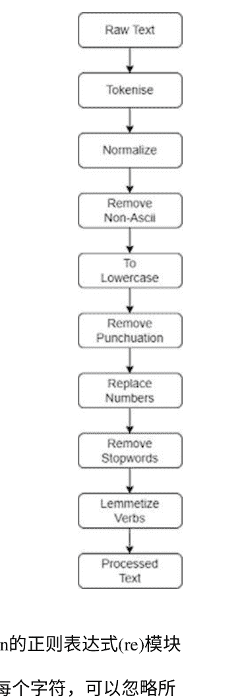

#### 图2 处理后的文本

**Before Text Preprocessing**

| | text |
|---|------|
| 0 | RT @SchudioTv: Want to know more about #autism... |
| 1 | We blame ourselves and feel worse. Start with ... |
| 2 | RT @PsychiatristCNS: 130,000 patient years and... |
| 3 | RT @SkypeTherapist: See a therapist online ove... |
| 4 | RT @PsychiatristCNS: 130,000 patient years and... |

**After Text Preprocessing**

| | text |
|---|------|
| 0 | rt schudiotv want know autism anxiety watch sh... |
| 1 | blame feel worse start selfcompassion deserve ... |
| 2 | rt psychiatristcns one hundred and thirty thou... |
| 3 | rt skypetherapist see therapist online skype l... |
| 4 | rt psychiatristcns one hundred and thirty thou... |

### 3.2 Chrome扩展

构建的Chrome扩展有两个重要模块；一个是background.js文件，一个是manifest.json，用于成功执行。manifest.json文件告诉Chrome关于扩展外层的必要关键信息，它的部分以及如何处理每个部分。而背景脚本（background.js文件）监听浏览器中的关键事件或操作，并通过特定代码做出反应。简而言之，javascript文件被注入，它检测搜索栏的变化并将其发送给服务工作者。在接收到这些变化后，它进一步发送到一个WebSocket服务器，并通过机器学习模型进行处理。从我们的情感分析模型中预测出的最终输出被发送到前台，并显示一个简单的HTML弹出窗口，显示预测结果（输入文本的情感）。我们可以通过在扩展页面上切换到开发者模式并上传我们的源代码文件夹来在本地机器上设置Chrome扩展，以应用我们所需的功能（图3）。

总结一下，通过浏览器扩展程序，将在搜索引擎中输入的文本通过服务工作者和WebSocket服务器传递给随机森林模型。使用名为joblib的库保存训练好的随机森林模型及其权重，并在我们的Python脚本中进一步使用，以建立我们预训练模型和扩展之间的连接。模型的预测输出将立即显示在网页上，或根据需求进行显示。

## 图3提出模型的流程图

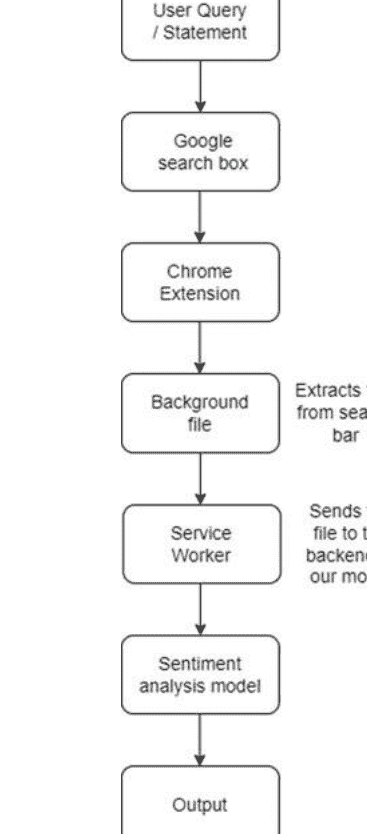

## 4 实验分析和结果

在模型实施成功后，在测试阶段进行了多次实验，以获得模型的工作报告。通过这个过程，使用了多个数据集，并进行了预测，后续段落中进行了简要介绍。

### 4.1 数据集描述

互联网上有很多散布的数据集；我们成功获取了满足我们要求的数据集，包括来自Kaggle网站的不同类型和不同情感的文本。 我们选择了三个不同的数据集，分别是推特情感和情绪分析[17]以及情感数据集，用于训练情感检测模型。

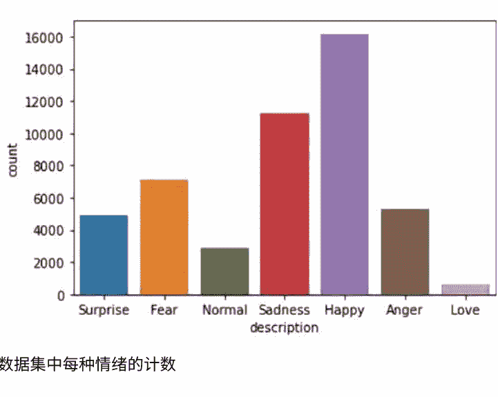

图4 最终数据集中每种情绪的计数

模型。 所有数据集都被合并并同步执行（图4）。

推文情感和情绪分析数据集包含四列[16]；情感、文本、用户、标签。由于所有这些都是推文，用户列代表用户名，而文本代表推文，情感代表极性；积极、消极和中性。推文的情绪由标签列表示。 该数据集总共有6034条推文及其对应的情绪。 我们从该数据集中选择文本和标签列。 第二个数据集[17]有34792行，包含三列，即'情绪'、'文本'和'清理后的文本'，其中情绪是文本的情感，清理后的文本是经过预处理的文本。

我们从数据集中提取情绪和清理后的文本列，将它们合并到最终数据集中。最终数据集"用于情绪识别任务的情绪数据集"[18]在两个子文件中都有两列，即文本和标签，其中文本包含陈述或句子，标签用数字值表示，并与适当的情绪进行分类。 所有数据集都被合并并形成一个最终数据集，总共有56824个样本句子和相应的情绪，因为它们都以相同的语法格式化。

### 4.2 性能评估

在本节中，我们评估所使用的各种模型的性能，并对每个模型进行调查。每个模型都根据其准确性和其他评估指标与其他模型进行比较，以便我们可以找到一种适合我们提出的模型的方法，误差较小。

图5逻辑回归测试的混淆矩阵

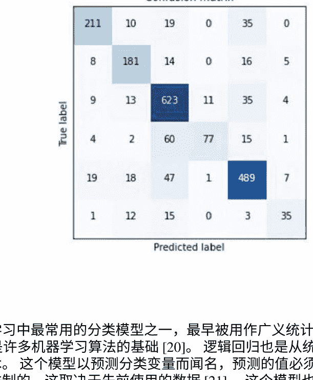

#### 4.2.1 逻辑回归

逻辑回归是机器学习中最常用的分类模型之一，最早被用作广义统计模型[19]。统计学领域是许多机器学习算法的基础[20]。逻辑回归也是从统计实践中借鉴的一种技术。这个模型以预测分类变量而闻名，预测的值必须是分类的、离散的或二进制的，这取决于先前使用的数据[21]。这个模型也被称为概率分类器，因为它根据每个模型得到的概率进行推进（图5）。

#### 4.2.2 朴素贝叶斯

朴素贝叶斯[22]是机器学习中的有监督分类模型，被认为是最快和最简单的。基本上，它根据每个类别获得的概率执行基于任务的分类。贝叶斯定理[23]是这个分类器的核心思想。而且，有不同类型的朴素贝叶斯分类器；高斯、伯努利、多项式朴素贝叶斯。所有这些分类器都考虑到给定类变量的预测特征值与其他特征值无关[24]。推荐系统、情感分析和垃圾邮件过滤是这个分类器最常用的领域（图6）。

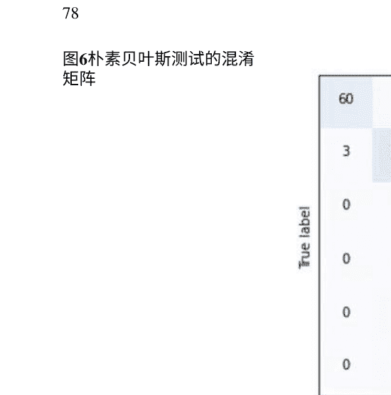

#### 4.2.3 随机森林分类器

这个分类器使用多个决策树分类器来遇到一个分类或回归模型。它采用了集成学习的概念，其中使用多个分类器组合进行复杂的决策和预测。在子节中，不同的决策树被赋予了预测输出的自由，使用多数投票技术进行分类，在回归的情况下选择平均值以提高预测的准确性[25]。由于不同的无关模型一起工作，如果一个树的决策是正确的，那么其他树的决策可能是错误的，这使得这个模型比其他单独工作的模型更出色（图7）。

#### 4.2.4 支持向量机（SVM）

支持向量机也是一种学习算法，可以用来预测离散的和有限的连续值，作为一个逻辑回归模型。基于统计学习框架，SVM被称为最准确的预测算法之一[26]。在支持向量机中，模型在数据上进行训练，在n维空间中绘制一个超平面或最优限制边界，这有助于将数据点分类到不同的类别。散布在平面上的个别数据点的极限坐标，有助于在超平面的面前将类别分开，被称为支持向量。控制这些支持向量以获得最佳输出的单元是支持向量机[27]（图8和9）。

如表1所示，朴素贝叶斯的准确率为64.70%，其次是逻辑回归和SVM分类器，准确率分别为80.20%和80.80%，

## 图7随机森林测试的混淆矩阵

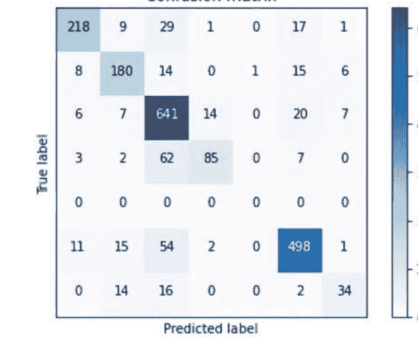

## 图8SVM测试的混淆矩阵

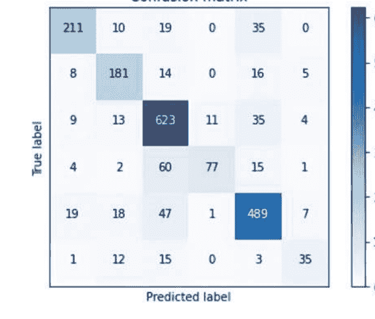

此外，随机森林分类器的准确率最高，为82.80%。因此，我们在我们的提议模型中使用了随机森林分类器，并将其与Chrome扩展程序连接起来，使用了joblib。在Chrome扩展程序中执行集成的ML代码。当我们在Google Chrome搜索引擎上输入内容时，输出会被预测，并且可以根据数据的进一步使用将其存储在任何所需的结构中。（注意：只能存储输出，而不能存储输入，即查询语句）。在这种情况下，输出实时显示在Chrome标签的右上方，如图10所示。

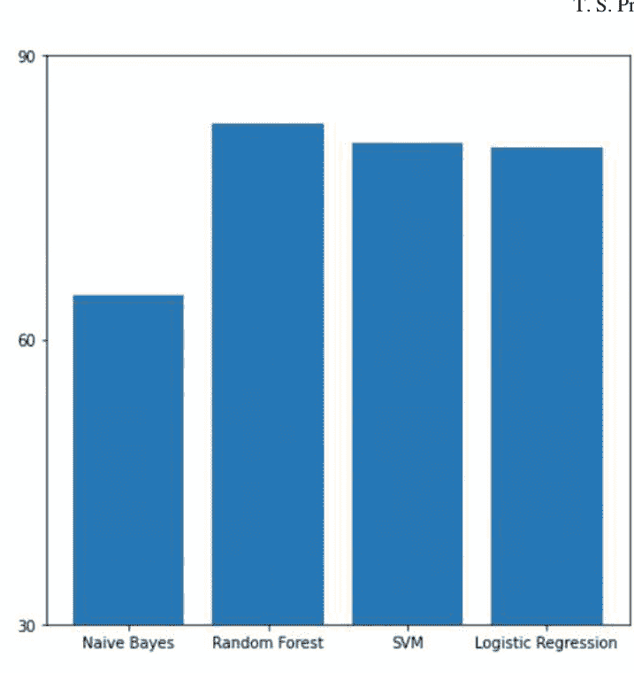

##### 表1 所有模型的性能比较
| 模型 | 准确率 |
| :--- | :--- |
| 逻辑回归 | 0.8020 |
| 朴素贝叶斯 | 0.6470 |
| 随机森林分类器 | 0.8280 |
| 支持向量机分类器 | 0.8080 |

## 5 结论

在本文中，我们开发了一个Chrome扩展程序，用于收集Chrome搜索框中使用的文本并从中提取情感。由于该功能实时工作，它不会侵犯数据隐私。我们的模型不使用任何数据存储库，这可以得出结论，该扩展在数据安全方面是无风险的。我们的主要思想是在情感分析研究领域引入一个新的应用程序。如今，每个人都在使用计算机或智能手机；这个扩展可以用来了解他们的搜索思想的性质。这可以帮助尽早发现任何自我伤害或危险性，而不会损害您的数据隐私。我们的模型已经达到了在现实生活中实施的可接受准确性水平。

此外，该模型可以扩展，当发出通知或警告时


#### 图10 最终结果样本

如果在Google搜索引擎中进行任何自残搜索，将向注册会员发送通知。因此，这可以作为一种父母控制系统，用于检测孩子的悲伤或抑郁。

## 参考文献

1.  Walsh, S. (2021年5月26日). [网络日志]. 检索自https://www.semrush.com/blog/google-search-statistics/。
2.  Khurana, D., Koli, A., Khatter, K., & Singh, S. (2017). 自然语言处理：现状、当前趋势和挑战。
3.  Panthi, J., Bhaskar, J., Ranga, T. K., & Challa, M. R. (2018). 使用深度学习进行产品评论的情感分析。在2018年计算机、通信和信息学国际会议(ICACCI)(pp. 2408–2414). https://doi.org/10.1109/ICACCI.2018.8554551
4.  Vanaja, S., & Belwal, M. (2018). 基于电子商务数据的方面级情感分析国际计算应用创新研究会议（ICIRCA），2018，1275–1279. https://doi.org/10.1109/ICIRCA.2018.8597286
5.  Bhaskar, J., Sruthi, K., & Nedungadi, P. (2014). 考虑客观词和强调词的社交媒体非正式文本通信情感分析。在国际工程近期进展与创新会议（ICRAIE-2014）（第1–6页）。 https://doi.org/10.1109/ICRAIE.2014.6909220
6.  Tripathi, M. (2021). 使用NB、SVM和LSTM对尼泊尔COVID19推文进行情感分析。人工智能杂志，3（03），151–168.
7.  Lal, S., Tiwari, L., Ranjan, R., Verma, A., Sardana, N., & Mourya, R. (2020). 犯罪推文的分析和分类。计算机科学学报，167，1911-1919。 https://doi.org/10.1016/j.procs.2020.03.211
8.  Marti, H. (2003, October 17). [网络日志]. 检索于2022年4月26日，来自https://people.ischool.berkeley.edu/~hearst/text-mining.html:text=Text
9.  Badjatiya, P., Gupta, S., Gupta, M., & Varma, V. (2017). 推特中仇恨言论检测的深度学习。在第26届国际万维网会议论文集Companion—WWW ’17 Companion中。 https://doi.org/10.1145/3041021.3054223
10. Yousaf, A., Umer, M., Sadiq, S., Ullah, S., Mirjalili, S. , Rupapara, V., & Nappi, M. (2021). 使用投票分类器（LR-SGD）对文本推文进行情感识别。IEEE Access. https://doi.org/10.1109/access.2020.3047831
11. Marouane Birjali, A.B.-H.M.E. (2017). 基于机器学习和语义情感分析的算法，用于社交网络中的自杀情感预测。Procedia Computer Sci-ence, 113(1877–0509), 65–72.
12. Yarkareddy, S., Sasikala, T., & Santhanalakshmi, S. (2022). 亚马逊美食评论的情感分析。在2022年第四届智能系统和创新技术国际会议（ICSSIT）中，第1242-1247页。https://doi.org/10.1109/ICSSIT53264.2022.9716410
13. Joseph, J. (2020, October 13). [web log]. 从https://levelup.gitconnected.com/make-your-first-chrome-extension-with-javascript-7aa383db2b03检索
14. Nair, J., Nithya, R., & Vinod Jincy, M. K. (2020). 设计一个形态生成器，用于英语到印度语的词形变化规则机器翻译系统。电气工程讲义, 247–258. https://doi.org/10.1007/978-981-15-5558-9-24
15. Nair, J., Nair, S. S., & Abhishek, U. (2021). 梵文词干设计：文献视角。智能系统与计算进展, 117–128. https://doi.org/10.1007/978-981-16-3071-2-11
16. Pramudya, W. B. N., & Galande, K. (2021). 推文情感和情绪分析，版本1. https://www.kaggle.com/datasets/subhajournal/tweet-sentiment-and-emotion-analysis?resource=download
17. Jcharis. (2021). end2end-nlp-project/data/. https://github.com/Jcharis/end2end-nlp-project/tree/main/data
18. Pandey, P. (2021). 情感识别任务的情感数据集，版本1。https://www.kaggle.com/datasets/parulpandey/emotion-dataset
19. 维基百科贡献者。(2022). 逻辑回归。在维基百科，自由百科全书中检索到2022年4月29日05:50, https://en.wikipedia.org/w/index.php?title=Logistic-regression&oldid=1082953998
20. Brownlee, J. (2018). [网络日志]. 从https://machinelearningmastery.com/logistic-regression-for-machine-learning/检索
21. 作者，java t point. (n.d.). 机器学习中的逻辑回归 - javatpoint。www.javatpoint.com。2022年4月29日检索, https://www.javatpoint.com/logistic-regression-in-machine-learning:text=Logistic
22. 作者，J. T. P. (无日期). 朴素贝叶斯分类器在机器学习中 - javatpoint. www.javatpoint.com检索于2022年4月29日，来自https://www.javatpoint.com/machine-learning-naive-bayes-classifier:text=Na
23. 作者，G. (2022). 朴素贝叶斯分类器. GeeksforGeeks. 检索于2022年4月29日，来自https://www.geeksforgeeks.org/naive-bayes-classifiers/
24. 维基百科贡献者. (2022). 朴素贝叶斯分类器. 在维基百科，自由百科全书。于2022年4月29日06:02检索，来自https://en.wikipedia.org/w/index.php?title=Naive-Bayes-classifier&oldid=1075188874
25. Ajesh, A., Nair, J., & Jijin, P. S. (2016). [IEEE 2016国际计算、通信和信息学会议（ICAC CI）—印度斋普尔（2016.9.21-2016.9.24）] 2016国际计算、通信和信息学会议（ICAC CI）—基于评分的推荐系统的随机森林方法.,1293–1297. https://doi.org/10.1109/ICACCI.2016.7732225
26. Wikipedia贡献者. (2022). 支持向量机. 在维基百科，自由的百科全书。检索于2022年4月29日06:04，来自https://en.wikipedia.org/w/index.php?title=Support-vector-machine&oldid=1079167701
27. 作者，J. (无日期). 支持向量机（SVM）算法 - javatpoint. www.javatpoint.com. 检索于2022年4月29日，来自https://www.javatpoint.com/machine-learning-support-vector-machine-algorithm## 使用博弈论的RSA算法在Aadhaar卡上的性能

R. Felista Sugirtha Lizy和V. Joseph Raj

摘要 通过使用密码学来确保数据安全。数据安全是指保护数据和隐私，以防止黑客未经授权访问应用程序、计算机和数据服务器。密码学是一种加密数据并以使任何意外获得访问权的人变得无用的方式存储在数据库中的过程。为了加密和解密数据，通常使用RSA算法、ECC算法和其他加密方法。

博弈论-里维斯特-沙米尔-阿德曼（GT-RSA）是一种结合了博弈论和RSA算法的新型混合算法，通过改变函数来提高RSA算法的效率。通过改进GT-RSA算法的速度、吞吐量、雪崩效应和功耗性能来提出。改进了GT-RSA算法的性能，并展示了实验结果。

- **关键词** 密码学 · 博弈论 · 混合策略 · RSA · 吞吐量

## 1 引言

密码学加密数据和通信，只有那些有权限的人才能阅读和处理。密码学的方法基于数学原理和算法，这是一系列基于规则的计算，以使通信难以解密。数据隐私、互联网浏览以及信用卡和借记卡等秘密交易都受到这些算法的保护[1]。它们被用于创建加密密钥、数字签名和验证。

每个印度居民都有一个Aadhaar号码，这是一个12位数的唯一标识，包括个人的人口统计和生物特征数据。Aadhaar是一大批必须妥善存储和维护的数据。

## 2 相关工作

当今信息网络的互联互通引发了新的安全关切。 就保护机密性、完整性、可用性和真实性等明确目标而言，传统安全已取得了显著进展。

随着攻击越来越复杂，系统变得更加复杂，现有的预防技术可能变得代价高昂。 要从战略和决策的角度来认识安全，需要新的视角和理论基础。 攻击者和防御者之间的攻防交换可以用博弈论来展示。它包括定量安全评估、安全结果预测和一种可以通过设计实现安全并使攻击者处于防守状态的机械设计工具[4, 5]。

由于社交媒体平台上可获取的信息大量增加，隐私问题已经出现。 尽管差分隐私为隐私保护提供了理论基础，但隐私数据效用的权衡仍需改进。 然而，大多数先前的研究在评估数据效用时并未考虑对手的定量影响[6]。

熊猫[7]研究了两种RSA和ECC公钥方法。 与RSA方法相比，ECC算法具有各种优势，包括更快的计算和数据传输。 RSA算法是一种基于大素数分解复杂性的公钥加密系统。

可以使用这种技术对数据进行加密和创建数字签名。椭圆曲线代数结构和椭圆曲线大小挑战与ECC算法相关。 这种技术的主要优点是使用较小的密钥，从而降低存储和传输成本。

在[8]中，RSA方法与循环调度优先级一起使用，以提高安全性和限制渗透效果。低开销，增加吞吐量和机密性只是其中的一些优势。用户使用RSA技术加密消息，然后按优先级发送。接收者使用RSA技术按优先级解密消息。

椭圆曲线密码学是一种强大的密码学，具有独特的特点，例如与其他公钥基础设施相比，密钥长度较短。国家标准与技术研究所（NIST）椭圆曲线随机生成器在[9]中用于基于曲线的任意数列生成。生成阶段使用一个公共密钥和一个G生成点，该点是一个曲线生成点，用于生成一个随机序列。

## 3 RSA算法

Ron Rivest、Adi Shamir和Leonard Adleman于1977年开发了RSA算法。这是一种用于公钥加密的密码算法（Hoffstein等，2008年）。如果一个人公开其公钥，其他用户可以对其进行加密和发送通信。另一方面，每个用户都有自己的解密密钥。解密密钥非常重要，因为从公钥推导出解密密钥非常困难。这是因为公钥是通过两个巨大的素数相乘而得到的。

尽管RSA现在被认为已经过时，但仍然被一些组织和政府用于加密消息。

RSA克服了对称算法的弱点，如真实性和机密性。因此，在这项研究中使用RSA算法。RSA算法相当简单易实现。对于传输机密数据，RSA算法是安全可靠的。由于需要复杂的数学运算，破解RSA算法极其困难。分发用户的公钥非常简单。

### 密钥生成

- 选择你的s和t作为秘密质数。
- 计算 $N = s t$
- 选择一个加密因子ex，并确保gcd(ex, (s-1)(t-1)) = 1
- 生成 $N$和ex

### 加密

- 选择要加密的明文消息pm。
- 使用接收者的公钥(N, ex)计算 $co \equiv pm^e \pmod{N}$
- 将密文消息co发送给接收者

### 解密

- 计算 de: $de \equiv 1 \pmod{(s-1)(t-1)}$
- 计算 $pm' \equiv co^{de} \pmod{N}$
- 然后，$pm' = \text{明文 } pm$

## 4 提出的GT-RSA算法和分析

图1展示了基于RSA和博弈论混合策略方法[10]的GT-RSA技术。GT-RSA算法在下面更深入地描述。

### 4.1 博弈论

博弈是一个广泛的术语，包括各种竞争环境。当两个或多个有竞争力的对手参与时，每个对手都试图在牺牲其他人的情况下优化自己的选择，博弈论是一套用于做出困难决策的工具和方法。在博弈论中，对手被称为玩家。每个玩家可以从多种策略中选择，这些策略可以是有限的或无限的。游戏的结果或回报由每个玩家采用的不同策略决定。

1. 玩家数量可以是两个或更多。一个玩家可以是单个人或者一群人，他们都在为同一个目标而努力。
2. 时间——同时，对立方达到相同的结论。
3. 竞争目标——每一方都决心实现自己的目标，不惜牺牲其他人。
4. 重复——大部分时间，解决方案都是重复的。
5. 回报——所有玩家都知道每种决策组合的回报。
6. 信息获取——所有利益相关者都可以获得所有关键信息。每个玩家都知道对手可用的所有选项，以及预期的回报。

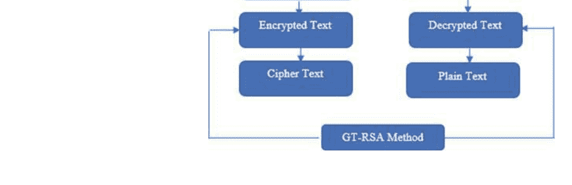

### 4.2 游戏的分类方式

1. 零和游戏是指赢家（们）在输家的角度看来获得整个支付金额（严格竞争）。
2. 非零和博弈：在这些博弈中，一个玩家的收益不等于另一个玩家的损失。其他环境参与方可能会因为利益或损失而受益或受损（不严格竞争）。

### 4.3 两人零和博弈的纯策略特征

1. 必须有两个参与者，每个参与者都有自己的策略集。
2. 在零和博弈中，一个玩家的损失恰好等于另一个玩家的收益。
3. 每个参与者一次只能选择一个选项的预设方法被称为纯策略。
4. 禁止讨价还价。没有办法达成对双方都有利的协议。

从C玩家的角度来看，看一下下面的博弈矩阵。

|      | $D_1$ | $D_2$ | $\dots$ | $D_n$ |
|------|-------|-------|---------|-------|
| $C_1$ | $W_{11}$ | $W_{12}$ | $\dots$ | $W_{1n}$ |
| $C_2$ | $W_{21}$ | $W_{22}$ | $\dots$ | $W_{2n}$ |
| $\vdots$ | $\vdots$ | $\vdots$ | $\vdots$ | $\vdots$ |
| $C_m$ | $W_{m1}$ | $W_{m2}$ | $\dots$ | $W_{mn}$ |

例如，一家公司和工会之间的劳动合同即将到期。有必要进行新的合同谈判。该组织（C0）在审查最近的经验后，同意以下是组织追求的可行目标：

S1 =全力进攻；强硬、有力的谈判。
S2 =理性和逻辑的态度。
S3 =法律主义的方法。
S4 =和解和友好的方法。

假设工会正在评估以下选项：

T1表示正面进攻；激烈、严厉的谈判。
T2是建立在逻辑和推理基础上的方法。
T3代表法律主义的态度。
T4是一种友好和和解的方法。

我们借助外部调解人创建了以下博弈矩阵：

**工会在有条件的情况下获益**

| 工会策略 \ 公司策略 | S1 | S2 | S3 | S4 |
|---------------------|----|----|----|----|
| T1                  | 2.0 | 1.5 | 1.2 | 3.5 |
| T2                  | 2.5 | 1.4 | 0.8 | 1.0 |
| T3                  | 4.0 | 0.2 | 1.0 | 0.5 |
| T4                  | 0.5 | 0.4 | 1.1 | 0.0 |

上述表格，通常被称为博弈矩阵，有许多解释。如果雇主同意S1，工会选择T1，最终协议将包括P2.0的工资上涨（因此，对公司来说是P2.0的损失）。根据上表，如果公司选择T3，工会将选择T1。如果工会选择T3，则公司选择T2。

### 4.4 纯策略问题

策略变化-由于游戏的重复性质，双方玩家都可以改变他们的方法。然而，在纯策略游戏中没有改变的动机。如果玩家不遵循推荐方法，他们的奖励几乎总是会降低[11]。众多理想方法-在某些游戏中，您可以同时使用多个理想策略。

- 支配行的条目将大于或等于被支配行的可比项目（至少有一个条目大于）
- 支配列中的条目将小于或等于被支配列中的条目（至少有一个条目小于）
- 表格的显著行和列可以被消除。

### 4.5 GT-RSA

F函数[12]已经改进到GT-RSA现在在速度和安全性方面超过了RSA方法。更新后的F函数可以加密和解码整个文件的内容。为了减少每次解密所需的时间，这些过程分为三个步骤进行。

可以使用这个修改后的F函数加密和解密完整文件的指定文本。

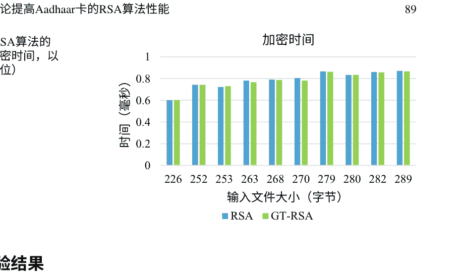

## 5 实验结果

一台配备Intel(R) Celeron(R) CPU3865U@1.80 GHz处理器的笔记本电脑。本研究中的文本文件大小范围为226到289字节。十个值的平均值用于计算文件大小（十次）。加密时间、解密时间、执行速度、加密吞吐量、解密吞吐量和雪崩效应是整体性能指标。MATLAB用于实现GT-RSA方法。

列举了GT-RSA算法的各种整体性能指标的实验结果。以下是详细的影响。

### 5.1 加密时间

图2描述了加密时间，即将明文消息加密为密文所需的时间[13]。针对不同的输入大小，计算平均加密时间。与RSA方法相比，GT-RSA算法的平均加密时间在条形图中所需时间最短。结果详见表1。

### 5.2 解密时间

整体性能指标之一是解密时间，它定义为在解密时将密文消息转换为明文所需的时间（见图3）。从条形图可以清楚地看出，与RSA算法相比，GT-RSA算法的解密时间最短。表2总结了研究结果。

**表1 GT-RSA算法的加密时间（毫秒）**

| 输入大小（字节） | RSA | GT-RSA |
| --- | --- | --- |
| 226 | 0.6023 | 0.6022 |
| 252 | 0.7440 | 0.7434 |
| 253 | 0.7238 | 0.7309 |
| 263 | 0.7821 | 0.7673 |
| 268 | 0.7915 | 0.7876 |
| 270 | 0.8053 | 0.7828 |
| 279 | 0.8669 | 0.8633 |
| 280 | 0.8342 | 0.8341 |
| 282 | 0.8621 | 0.8571 |
| 289 | 0.8715 | 0.8666 |
| 平均时间（毫秒） | 0.7884 | 0.7835 |

图3 GT-RSA算法的解密时间（毫秒）

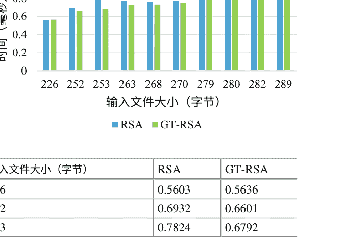

**表2 GT-RSA算法的解密时间（毫秒）**

| 输入文件大小（字节） | RSA | GT-RSA |
| --- | --- | --- |
| 226 | 0.5603 | 0.5636 |
| 252 | 0.6932 | 0.6601 |
| 253 | 0.7824 | 0.6792 |
| 263 | 0.7758 | 0.7274 |
| 268 | 0.7643 | 0.7321 |
| 270 | 0.7694 | 0.7517 |
| 279 | 0.8349 | 0.7948 |
| 280 | 0.8095 | 0.8109 |
| 282 | 0.7943 | 0.8032 |
| 289 | 0.8249 | 0.8317 |
| 平均时间（毫秒） | 0.7609 | 0.7355 |

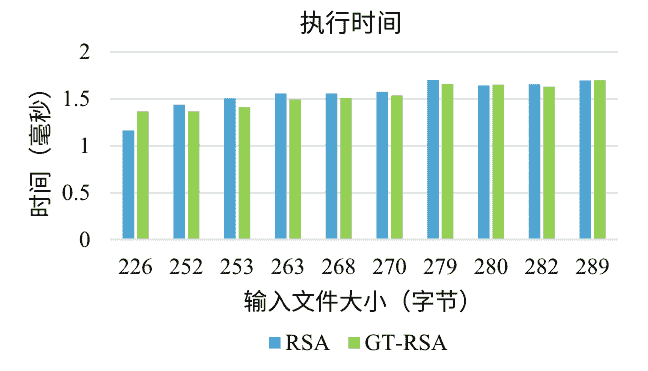

**表3 GT-RSA算法的执行时间（毫秒）**

| 输入文件大小（字节） | RSA | GT-RSA |
| :--- | :--- | :--- |
| 226 | 1.1626 | 1.3664 |
| 252 | 1.4373 | 1.3645 |
| 253 | 1.5061 | 1.4101 |
| 263 | 1.5579 | 1.4947 |
| 268 | 1.5558 | 1.5097 |
| 270 | 1.5747 | 1.5345 |
| 279 | 1.7018 | 1.6581 |
| 280 | 1.6439 | 1.6512 |
| 282 | 1.6564 | 1.6303 |
| 289 | 1.6965 | 1.6983 |
| 平均时间（毫秒） | 1.5493 | 1.5318 |

### 5.3 执行时间

如图4所示，执行时间是从明文构造密文和从密文构造明文所需的时间。与RSA算法相比，GT-RSA方法具有最短的执行时间，如柱状图所示。表3显示了结果。

### 5.4 加密吞吐量

图5描述了GT-RSA技术在不同输入文件下的加密吞吐量。与RSA算法相比，GT-RSA方法具有最高的加密吞吐量，如柱状图所示。

加密吞吐量通过将完整明文以兆字节为单位除以加密时间（秒）来计算。

图5 GT-RSA算法的加密吞吐量（KB/秒）

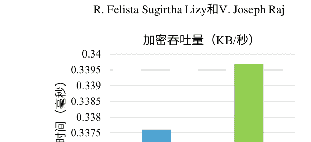

**表4 GT-RSA算法的加密吞吐量**

| 算法 | RSA | GT-RSA |
|------|-----|--------|
| 吞吐量（KB/秒） | 0.3376 | 0.3397 |

总明文大小\加密时间 ＝吞吐量。表4详细总结了研究结果。

### 5.5 解密吞吐量

图6展示了GT-RSA技术在不同输入文件下的解密吞吐量。与RSA算法相比，柱状图清楚地显示GT-RSA算法具有最高的解密吞吐量。

解密吞吐量通过将整个明文大小（以兆字节为单位）乘以解密时间（以秒为单位）来计算。总明文大小\解密时间 ＝吞吐量。表5总结了研究结果。

图6 GT-RSA算法的解密吞吐量


**表5 GT-RSA算法的解密吞吐量**

| 算法 | RSA | GT-RSA |
|---|---|---|
| 吞吐量 (KB/秒) | 0.3499 | 0.3619 |

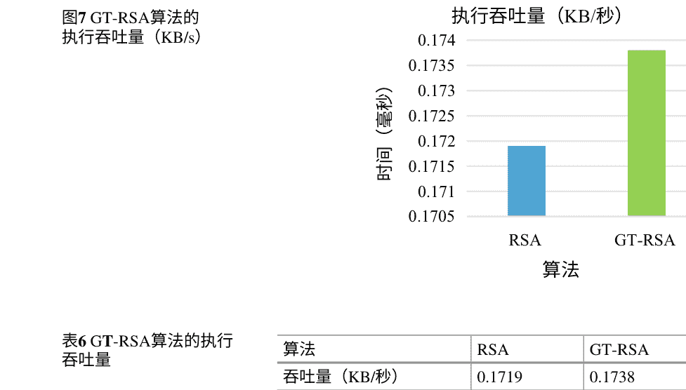

**表6 GT-RSA算法的执行吞吐量**

| 算法 | RSA | GT-RSA |
|---|---|---|
| 吞吐量 (KB/秒) | 0.1719 | 0.1738 |

### 5.6 执行吞吐量

图7显示了GT-RSA算法在不同输入文件下的执行吞吐量。与RSA算法相比，GT-RSA算法具有最高的吞吐量。

执行吞吐量通过将总明文大小（以兆字节为单位）除以执行时间（以秒为单位）来计算。总明文大小除以执行时间等于吞吐量。这些结果总结在表6中。

### 5.7 功耗

上述统计数据清楚地显示，与RSA算法相比，具有最高执行吞吐量的GT-RSA方法将消耗最少的功耗[14]。

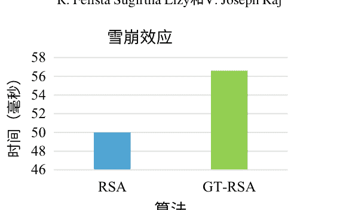

**表7 雪崩效应**

| 加密技术 | 雪崩效应 |
| :--- | :--- |
| RSA | 50 |
| GT-RSA | 56.6 |

### 5.8 雪崩效应

雪崩效应发生在原始文本的一个比特或密钥调度技术的一个比特被修改时，导致密文中的几个比特发生变化。因此，雪崩值越高，安全性越高。

图8描述了RSA和GT-RSA算法在不同输入数据文件下的雪崩效应。比较RSA和GT-RSA算法时，柱状图清楚地显示了RSA算法具有最低的雪崩影响。表7总结了研究结果。

## 6 结论

一个加密系统要完整和安全，必须满足三个因素：机密性、真实性和完整性。在传感器网络中，机密性指的是隐藏消息免受攻击者的能力。能够检测未读或未识别消息的能力被称为完整性。认证指的是消息来源的可信度。密码学是研究数据隐藏和验证的学科，它包括用于防止未经授权访问敏感数据的规则、方法和安全程序。加密是确保连接组件完整性的一种方法。一个加密算法不能单独提供所有加密原则。一个加密系统的安全性是通过将对称和非对称加密技术结合起来的混合加密技术来保证的。所提出的算法是时间、内存和复杂度高效的。提出了博弈论-里维斯特-沙米尔-阿德曼（GT-RSA）作为新的混合算法将博弈论和RSA相结合，通过改变函数来提高RSA算法的效率。然后，这项研究工作的创新之处在于提高Aadhaar卡的速度和安全性。以这种方式给出了方法的复杂性和基本概念，使得算法可以付诸实践。RSA和博弈论混合算法已被黑客证明是安全的。

## 参考文献

1. Dhivya, N. (2020). 具有密码学和隐写术的网络安全IJERT杂志，8，1–4。ISSN 2278-0181
2. Jayashree, R. (2019). 使用大数据分析分析Aadhaar卡数据集计算与专家技术的新趋势，L NDECT，35，1208–1225
3. Al-Shabi, M. A. (2019). 关于信息安全中对称和非对称密码算法的调查IJSRP，9，576–589。ISSN 2250–3153
4. Casey, W., Morales, J. A., Wright, E., Zhu, Q., & Mishra, B. (2016). 合规信号游戏：建立内部威胁威慑模型。计算和数学组织理论，3，318–349。
5. Chen, J., Touati, C., & Zhu, Q. (2017). 基础设施网络保护和恢复的动态博弈分析与设计。ACM SIGMETRICS性能评估评论，2，128。
6. Cui, L., et al. (2019). 通过个性化差分隐私中的博弈论提高数据效用。计算机科学与技术杂志，34，272–286。
7. Panda, M. (2014). 使用密码技术的无线传感器网络安全。美国工程研究杂志，3，50–56。
8. Shankar, M., & Akshaya, P. (2014). 使用RSA算法和调度概念的混合加密技术。国际网络安全与应用杂志，6，39–48。
9. Shahryar, T., Fathi, M. H., & Sekhavat, Y. A. (2017). 基于椭圆曲线伪随机和高级加密系统的图像加密方案。信号处理，141，217–227。
10. Joseph Raj, V., & Felista Sugirtha Lizy, R. (2020). 使用龙格-库塔技术提高RSA性能。测试工程与管理11850–11857。
11. Felista Sugirtha Lizy, R., & Joseph Raj, V. (2021). 在Aadhaar卡中使用RK-RSA算法进行图像加密。土耳其计算机与数学教育杂志，4683–4693。
12. Felista Sugirtha Lizy, R., & Joseph Raj, V. (2021). 使用欧几里德技术改进RSA算法。土耳其计算机与数学教育杂志，4694–4700。
13. Josephraj, V., & Shamina Ross, B. (2016). 使用GT的一次性纳什均衡类别对blowfish及其修改版本进行安全评估。国际控制理论与应用杂志，第4771-4777页。
14. Josephraj, V., & Shamina Ross, B. (2015). 通过修改其函数来提高blowfish加密算法的速度和安全性。国际应用工程研究杂志，10(79)，第621-624页。

# 使用循环神经网络和长短期记忆模型进行干旱预测

P. Shobha（✉）· Kabeer Adlakha ·（ORCID）· Shivam Singh ·（ORCID）· Yash Kumar ·（ORCID）· Mukesh Goit和Nalini ·（ORCID）

摘要预测干旱是预测和分类天气干燥程度的过程。以时间序列数据的形式提供的长期气象数据可以应用于各种多变量时间序列预测技术。数据集包括各种气象参数，如“降水”和“地表压力”，以及指定干燥程度的目标变量。可以使用循环神经网络（RNN）和长短期记忆（LSTM）等各种机器学习技术来预测不同前导时间的分数值。RNN用于预测1到2周的较短前导时间，而LSTM用于预测8到12周的前导时间。

预测结果可以在许多方面证明有帮助。对天气条件的先前了解可以在采取适当的行动进行减轻和预防时，最大程度地减少极端天气条件的灾害性影响。

为了制定减轻行动计划，预测天气条件以及其严重程度变得必要。减轻策略可以包括向农民提供替代作物建议和向最高风险地区提供特殊援助。

关键词循环神经网络（RNN）· 长短期记忆（LSTM）· 时间序列数据

## 1 引言

极端天气条件可能对各行业、环境和社会产生不利影响。它们可能导致作物歉收和森林火灾等灾难事件。能够以一定的确定性提供有关未来天气条件的工具可以证明有帮助，并允许制定一些减轻和预防目的的行动计划。因此，天气预报成为一个重要且活跃的研究领域。

机器学习已被证明是一种理想的技术，可以进行复杂的预测和分类任务。随着大量的天气和气象数据的生成和收集，可以使用这些数据创建时间序列数据集，然后对其应用各种机器学习算法-来生成有益的结果。数据集被分为训练、测试和验证集。已经使用了多种技术，如自回归积分移动平均(ARIMA)、季节性自回归积分移动平均(SARIMA)、线性回归、向量自回归(VAR)、人工神经网络(ANN)、长短期记忆(LSTM)来处理时间序列数据集进行预测任务。

### 1.1 文献综述

支持向量机（SVM）和人工神经网络（ANN）等算法被用于对24、48和72小时的提前时间进行预测[1,2]。

使用滞后气候变量和堆叠长短期记忆模型进行长期干旱预测：本文提出了干旱是不可预防的，但是如果开发了早期预警系统，它们是可以预测的。为了预测干旱，使用了过去30年的气象数据。使用标准化降水蒸发指数（SPEI）等指标作为干旱指标。根据SPEI值，将干旱严重程度分为7个类别。考虑到系统的整体复杂性以及数据集是时间序列数据的形式，使用了循环神经网络（RNN）和长短期记忆（LSTM）等深度学习算法。由于其循环和门控结构，LSTM能够更长时间地保留信息。使用支持向量机（SVM）、人工神经网络（ANN）、随机森林算法（RF）和LSTM等各种算法对1个月的提前时间进行预测。发现LSTM的性能优于其他算法，因此用于预测更长的提前时间的干旱。作者能够获得1个月和3个月提前时间的威胁评分分别为0.93和0.91。随着提前时间的增加，模型的性能下降[3-5]。

北大西洋涛动指数、气压等某些参数被发现比其他参数更重要。作者还得出结论，季节性在确定预测准确性方面起着重要作用[6-8]。

基于遥感数据的伊朗全国性干旱条件预测：马赫迪·贾利利等在这项研究中建议获取关于干旱强度、持续时间和空间覆盖范围的信息，以减少干旱事件的影响。当我们谈论伊朗这样一个位于世界干旱地区并经常受到干旱袭击的国家时，这些信息变得至关重要。由于该国各地长期气象数据不可用，作者们转而使用基于卫星的遥感数据来获取信息。

关于植被覆盖和土地覆盖的信息。构建了一个人工神经网络模型来预测干旱。通过将模型应用于降水指数（PI）在某个时期（例如30年）内归一化的那些地区，作者们能够获得高达90%的准确率。该研究还发现TCI是从卫星图像中提取的最佳特征。此外，作者们得出结论，多层感知器比径向基函数和支持向量机更适用于预测干旱事件[9-11]。

在“早期干旱预测的一种新方法”中，作者们提出了使用LSTM模型来预测标准降水指数(SPI)和归一化差异植被指数(NDVI)的值。数据集包括位置、降水、累积降水、最低温度、平均温度、最高温度、地表土壤湿度、百分比土壤湿度、SPI和NDVI等属性，用于印度五个地区的预测。使用自编码器的堆叠LSTM模型对未来30天的预测进行了处理。自编码器LSTM作为特征提取器，而堆叠LSTM作为预测器。作者们在SPI和NDVI方面分别获得了最佳的均方根误差(RMSE)结果，分别为0.238和0.053 [12–14]。

## 2 方法论

可以为干旱预测制定一个五步方法论。

### 2.1 读取数据

将包含各种气象参数的数据集读入数据框架中。
数据集被分成测试集、训练集和验证集。然后将每个集合读入一个单独的数据框中。

### 2.2 数据清洗

这一步是数据预处理的第一步。它涉及到清洗数据和删除NaN值。

时间序列数据的缩放：通过缩放到单位方差来标准化特征。
除此之外，时间序列是通过用从日期列开始的连续整数替换值来实现的。然后，提取单个区域的数据。

### 2.3 数据准备和可视化

RNN和LSTM要求数据以三维形式输入——[批量大小，时间步长，单个时间步长中的元素数量]。

### 2.4 应用RNN和LSTM

训练好的RNN和LSTM模型用于对不同的前导时间进行预测。使用RNN和LSTM模型进行干旱预测是理想的，因为神经网络的每个隐藏层将其输出馈送到下一层，并在时间步长‘t’上将输出馈送给自身，同时在时间步长‘t + 1’上训练数据。 因此，RNN/LSTM试图对数据序列进行训练，而不是单个数据记录，这对于在时间序列数据集上进行预测任务是必要的。 架构设计如图1所示。

## 3 结果

### 3.1 实验方法

实验方法包括从预处理的数据框中提取单个区域的气象数据。然后，从这些数据中提取固定数量的行，以3D矩阵的形式作为输入传递给经过训练的RNN或LSTM模型，并预测一些前导时间的得分值。

输入：给定一个单个区域（fips代码 =1）的气象数据的前10周（第0周到第9周）作为RNN模型的输入。 预测是针对1周的前导时间进行的，即第10周，如图2所示。

### 3.2 结果

在本文中，均方误差（MSE）指标被用作损失函数，并且遇到了0.80的损失，如图3所示。

## 4 结论

干旱的发生取决于许多气象参数。 为了获得准确的结果，需要进行适当的数据预处理和缩放。

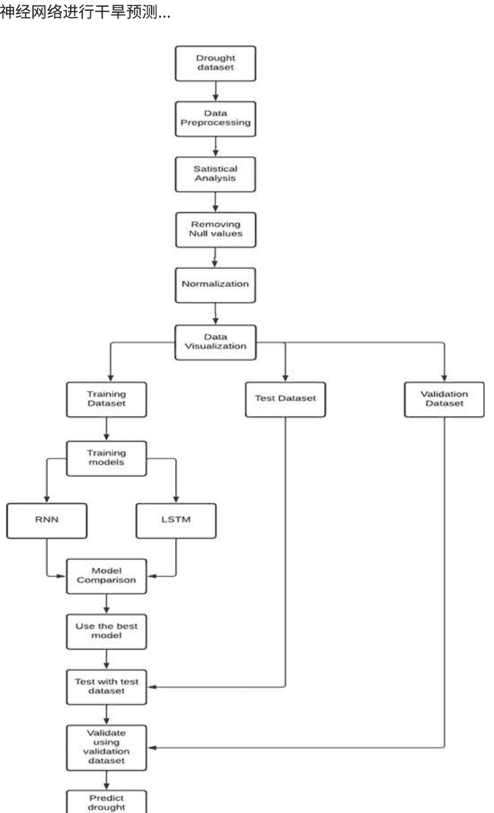

图1 建筑设计

在将机器算法应用于数据集之前。 大多数论文使用了ANN和LSTM来预测干旱。 一些论文预测干旱并将其分类为仅有2个类别，即干旱或非干旱，而其他论文将其分类为从极度干燥到极度湿润的多个类别。ANN和RNN在短期预测干旱方面很有用，而LSTM用于长期预测。

test_X[0:100]

| fips | date | PRECTOT | PS | QV2M | T2M | T2MDEW | T2MWET | T2M_MAX | T2M_MIN | T2M_RANGE | TS |
|------|------|---------|----|------|-----|--------|--------|---------|---------|-----------|----|
| 1001 | 0 | 0.0133381 | 0.912798 | 0.434486 | 0.670724 | 0.78623 | 0.785817 | 0.60954 | 0.707917 | 0.20993 | 0.650301 |
| 1001 | 1 | 0.000296402 | 0.914408 | 0.39172 | 0.64986 | 0.761515 | 0.76111 | 0.643739 | 0.686586 | 0.35055 | 0.630462 |
| 1001 | 2 | 0 | 0.927824 | 0.177434 | 0.526281 | 0.583855 | 0.584309 | 0.506943 | 0.572542 | 0.273909 | 0.515696 |
| 1001 | 3 | 0.000177841 | 0.929702 | 0.21929 | 0.554634 | 0.629915 | 0.618322 | 0.545899 | 0.536305 | 0.463179 | 0.542943 |
| 1001 | 4 | 0.0343233 | 0.908774 | 0.16151 | 0.503812 | 0.562189 | 0.552382 | 0.480329 | 0.487625 | 0.411863 | 0.493973 |
| ... | ... | ... | ... | ... | ... | ... | ... | ... | ... | ... | ... |
| 1001 | 95 | 0.0343233 | 0.907164 | 0.644222 | 0.775578 | 0.884128 | 0.883042 | 0.763435 | 0.799809 | 0.384872 | 0.751256 |
| 1001 | 96 | 0 | 0.930775 | 0.175614 | 0.620837 | 0.581448 | 0.581261 | 0.640396 | 0.577465 | 0.607797 | 0.578729 |
| 1001 | 97 | 0.0075286 | 0.896163 | 0.652866 | 0.765414 | 0.886054 | 0.885128 | 0.735665 | 0.800766 | 0.310563 | 0.740457 |
| 1001 | 98 | 0 | 0.935605 | 0.178344 | 0.603852 | 0.585781 | 0.586395 | 0.616611 | 0.619308 | 0.444185 | 0.586765 |
| 1001 | 99 | 0 | 0.918165 | 0.246588 | 0.615487 | 0.656074 | 0.652976 | 0.642325 | 0.592643 | 0.575808 | 0.599196 |

100 rows × 20 columns

图2 测试输入

```
python
[<matplotlib.lines.Line2D at 0x7f9b19c3f050>]
```

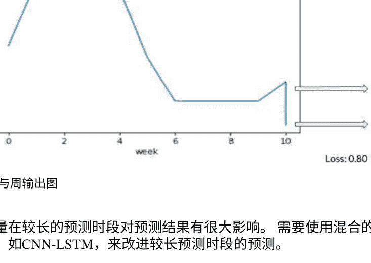

图3 得分与周输出图

气候变量在较长的预测时段对预测结果有很大影响。需要使用混合的深度学习模型，如CNN-LSTM，来改进较长预测时段的预测。

## 参考文献

1.  Dakshin, D., Rupesh, V. R., & Praveen Kumar, S. (2019). 使用机器学习进行水灾预测。国际创新技术与探索工程学术期刊常规问题，9(1), 1451–1457。https://doi.org/10.35940/ijitee.a4245.119119
2.  Elsafi, S.H. (2014). 在苏丹尼罗河的东戈拉站进行洪水预测的人工神经网络（ANNs）。亚历山大工程杂志，53（3），655-662。https://doi.org/10.1016/j.aej.2014.06.010
3.  Dikshit, A., Pradhan, B., Alamri, A.M. (2021). 使用滞后气候变量和堆叠长短期记忆模型进行长期干旱预测。《环境科学总论》755 (第2部分)，142638。https://doi.org/10.1016/j.scitotenv.2020.142638
4.  Abbot, J., & Marohasy, J. (2014). 使用人工神经网络在澳大利亚昆士兰州进行月降雨预测的输入选择和优化。大气研究, 138, 166-178。 https://doi.org/10.1016/j.atmosres.2013.11.002
5.  Aghakouchak, A., Farahmand, A., Melton, F. S., Teixeira, J., Anderson, M. C., Wardlow, B. D., & Hain, C. R. (2015). 干旱的遥感：进展、挑战和机遇。地球物理学评论, 53(2), 452–480. https://doi.org/10.1002/2014rg000456
6.  Felsche, E., & Ludwig, R. (2021). 应用机器学习进行干旱预测，使用来自大型气候模拟的数据。 https://doi.org/10.5194/nhess-2021-110
7.  Bueh, C. & Nakamura, H. (2007). 斯堪的纳维亚模式及其气候影响。皇家气象学会季刊, 133, 2117–2131. https://doi.org/10.1002/qj.1738.
8.  Trenberth, K. (2011). 降水随气候变化的变化。 气候研究, 47(1),123–138. https://doi.org/10.3354/cr00953
9.  Jalili, M., Gharibshah, J., Ghavami, S. M., Beheshtifar, M., & Farshi, R. (2014). 基于遥感数据的伊朗全国性干旱条件预测。IEEE计算机交易, 63(1), 90–101. https://doi.org/10.1109/tc.2013.118
10. Heim, R. R. (2002). 对美国使用的二十世纪干旱指数的回顾。美国气象学会公报, 83(8), 1149–1166. https://doi.org/10.1175/1520-0477-83.8.1149
11. Silva, R. P., Dayawansa, N. D., & Ratnasiri, M. D. (2007). 估计缺失降雨数据所使用的方法的比较。农业科学杂志, 3(2), 101. https://doi.org/10.4038/jas.v3i2.8107
12. Kansara, M., Maity, P., Malgaonkar, H., & Save, A. (2020). 一种早期干旱预测的新方法。在2020年第六届国际高级计算和通信系统会议（ICACCS）。 https://doi.org/10.1109/icaccs48705.2020.9074405
13. Aswathi, P. V., Nikam, B. R., Chouksey, A., & Aggarwal, S. P. (2018). 使用气象和遥感基于指数评估和监测马哈拉施特拉邦的农业干旱。ISPRS Annals of the Photogrammetry, Remote Sensing and Spatial Information Sciences, IV-5, 253–264. https://doi.org/10.5194/isprs-annals-iv-5-253-2018
14. Dodamani, B. M., Anoop, R., & Mahajan, D. R. (2015). 使用遥感的农业干旱建模。国际环境科学与发展杂志, 6 (4) , 326–331. https://doi.org/10.7763/ijesd.2015.v6.612
15. Dikshit, A., Soleimanimatin, S., & Abdollahi, A. (2020年12月12日). 使用深度学习对澳大利亚新南威尔士州的气象干旱进行预测。 检索自 https://www.youtube.com/watch?v=fiREt30Jj7gLNCS 主页,http://www.springer.com/lncs. 最后访问时间为2016年11月21日。

# Recogn-Eye: 一款适用于老年人的智能医疗助手

U. Sai Sreekar, V. Vishnu Vardhan和Linda Joseph

摘要 最近几天，个人长时间使用电脑。这导致缺乏机会和意愿照顾自己。混乱的时间表和摄入不健康食物影响人们的健康，尤其是心脏。因此，本研究利用数据挖掘技术中的朴素贝叶斯和k-均值聚类算法执行冠心病预测系统。它是两种算法的结合。本文概述了类似的内容。它通过利用不同的属性来预测冠心病的发生情况。它使用k-均值算法来聚集不同的特征，并使用朴素贝叶斯算法进行预测。现在，许多老年人由于各种原因无法按时服药，其中最常见的原因是心理压力。因此，可能延长了康复所需的时间。当老年人吞下药物时，剂量会变得不正确，导致严重问题。

因此，患者必须按照精确的剂量和时间服用所需药物。因此，这项研究工作开发了一种新颖的智能药物分发器（SMD）技术，以克服这些困难。所提出的系统使用了ATmega328p和ESP8266模型。所提出的系统还包括微控制器集成电路、液晶显示屏和实时时钟（RTC）微控制器，液晶和实时时钟（RTC），以及用于检查状态的Android应用程序。

- RGB图像
- 图像压缩
- k均值聚类
- 均方误差（MSE）
- 结构相似性指数测量（SSIM）
- 峰值信噪比（PSNR）
- 商场
- 聚类
- 社交媒体
- 网站

U. Sai Sreekar (✉) · V. Vishnu Vardhan · L. Joseph
印度金奈市Hindustan技术与科学学院计算机科学与工程系
电子邮件：18113139@student.hindutauniv.ac.in
V. Vishnu Vardhan
电子邮件：18113140@student.hindustanuniv.ac.in
L. Joseph
电子邮件：Lindaj@hindustanuniv.ac.in

## 1 引言

最近的医学进展确保了人类的平均寿命更长。现代医药的可用性可以成功治疗甚至最严重的疾病。在大多数情况下，患者每天至少要服用一次或两次药物，而他们经常忘记这样做。大多数药物必须定期服用或在一天的特定时间才能发挥作用。患者，尤其是老年人口，可能会忘记服药，这使得获得期望的效果变得困难。物联网 (IoT) 在医疗保健领域提供了一线希望，因为它有潜力使医疗设施更加高效，并改善患者护理。在医疗紧急情况下，实时追踪可以挽救生命，这项技术确实可以提高患者的标准和福祉。根据一项研究，远程患者监测导致心力衰竭患者30天再入院率下降了50%。

## 2 文献调查

现在，有不同的企业专注于基于物联网的健康监测系统，使用无线传感器技术。首先，科学家们使用Atmega-8微控制器和传感网络构建了一个患者健康监测系统。该项目中使用的传感器包括温度传感器、心电图传感器和心跳传感器。Arduino Uno用于监测患者健康指标的提议设置。在过去的几年中，Arduino在人气方面取得了巨大的增长，使用户能够共享数据。该系统的这个领域收集、存储和分析传感器数据。根据手头的应用，可以连接或无线连接多个传感器。此外，还存在一些缺点，例如需要高分辨率、精确识别，这需要高质量的数据和在任意环境中进行预测的能力[1-3]。人体上的嵌入式传感器使医生能够在不干扰治疗计划的情况下监测患者的健康状况，精确的感知系统包括传感器、微控制器、显示器和GSM调制解调器，用于传输或接收来自合格专业人员的成就或任何危险事件。类似的GSM调制解调器也在医生办公室中使用。通知患者及其家人和朋友实际结果需要一些时间和努力，但可以简单地进行，没有干扰或混淆[4-7]。在一些情况下，GSM模块被集成到脉搏检测设备中。基本上，这种类型的设备评估传感器接收到的信息，并将其传递给小型调节器，其中微控制器使用GSM技术通过空中传输。

通过短信将数据分发给适当的人员，从而在每个结构和部分层面上产生功能反应，用于感知结构。GSM用于传输边界检查的结果。这座建筑有一个办公室，在这里，可以对患者进行血压筛查。毫无疑问，药物管理边界。

陈述几个

可以使用PIC微控制器、键盘和LCD显示器创建一个电动药物分发单元，允许人工管理患者的药物计划。当患者接受药物时，会发出警报声提醒他。

此外，如果患者未服药，将向护理人员的电话号码发送短信。

- 1. 使用红外传感器和Arduino微控制器构建药物分发器[8]。如果患者在适当的时间服药，他们可能会从该系统中受益。弹出窗口用于设置警报系统。智能手机上的通知。
- 2. 又一个基于Arduino的药盒，以避免过量服药，微控制器一次只能给予一颗药丸[9]。当药丸准备服用时，它会向用户发送短信。他还与一款安卓应用程序相关联，该应用程序用于调整药物分发的日期和时间。
- 3. 本文提出的SMD系统是首个具有独特特点的自动售货机，其他自动售货机中没有[10-13]。只有具备适当文件的患者和护理人员才能代表患者访问ONE账户。此外，还包括一些关于口服药物和其闹钟系统的统计数据。项目设计还得到了项目的在线消费者、药物和闹钟数据库的支持。安卓应用程序可用于从智能手机调整和生成闹钟。

## 3 问题陈述

医学的进步延长了人类的寿命。目前有药物可以成功治愈甚至最棘手的疾病。在大多数情况下，患者每天至少需要服药一到两次，但他们经常忘记这样做。大多数药物必须定期服用或按照特定的时间表才能发挥作用。该领域的患者可能会忘记服药，这使得达到预期效果变得困难。

## 4 提出的方法

### 模块1:

在本模块中，感知患者的生理参数包括检测患者的温度和脉搏，如图1所示。DHT11传感器有三个用于电源、地线和输出的引脚。Arduino脉冲传感器是一款出色的即插即用心率传感器。有一根带有彩色编码（公头）连接器的24英寸电缆。人们的皮肤直接接触到心脏标志。在传感器的后部有一个小的LED孔。这两个传感器可以通过面包板或Arduino进行连接。Arduino中包含的串行监视器/串行绘图仪可视化表示传感器学习的内容。通过使用Octabrix ESP8266芯片，可以远程修改患者的生理信息，该芯片通常用于分析Arduino数据。

### 模块 2:

测量数据通过传感器检索并存储到云服务器中。这种模块的目标是使用esp8266 WIFI模块显示患者的生理限制。并使用机器学习算法预测病人的心脏病。

### 模块 3:

每个字符串值都与RTC模块的输出值进行持续对比，只有当它们中的一个相等时，才会验证该特定字符串值的最后两位数字，以精确地在所需的确切时间内管理适当的药物。因此，Arduino生成的信号被发送到离心泵，离心泵根据最后两个数字发送适量的液体药物。舵机已配置，以便只能使用一个轴。

### 块图:

图1 块图

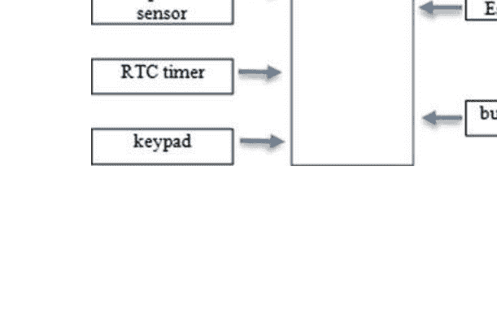

## 5. 项目演示

### 数据集：

为了训练数据集，考虑了现有的患者记录，具有以下属性。我们已经列出了属性和最小-最大范围，如图2和3所示。

## 系统执行流程


图2 上传数据集


图3 在网页中显示上传的数据集

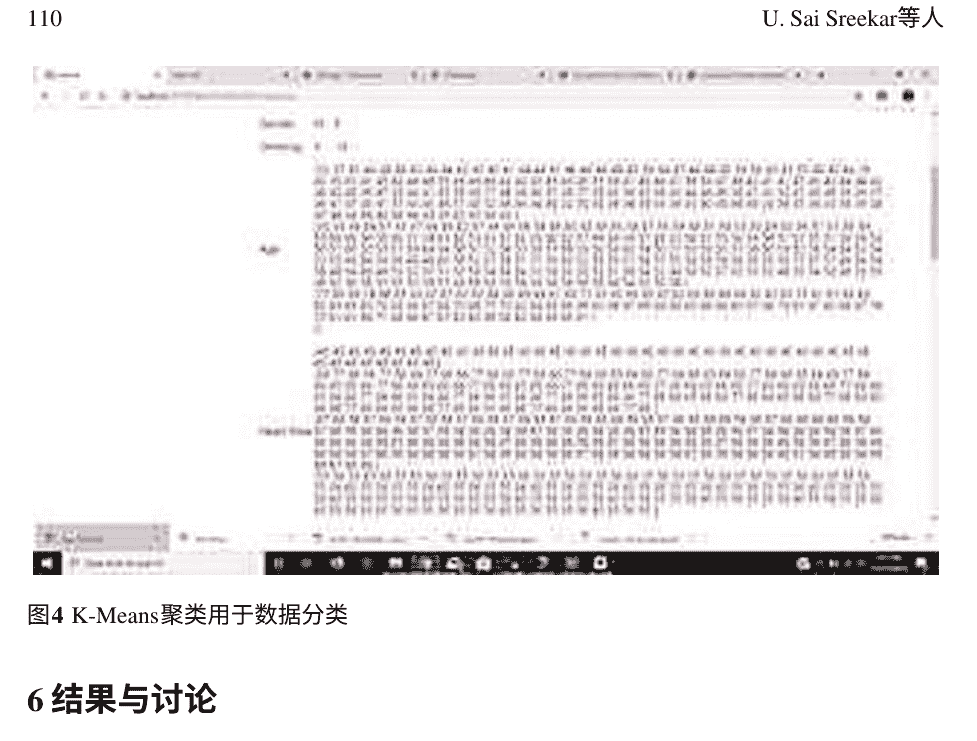

图4 K-Means聚类用于数据分类

## 6 结果与讨论

本文提出的结果显示在图4、5和6中，是物联网模块与机器学习[ML]概念相结合，用于监测、动员用户的健康问题和及时的药物指示。通过利用机器学习概念和先进的医疗嵌入式组件，预测结果将应用于心脏疾病。本文还提出了使用先进的医疗嵌入式组件和Web技术对昏迷患者（MCP）进行货币化的方法。所提出的模型已经进行了几个成功的测试案例，并最终获得了预期的结果。

## 7 结论

开发的原型将能够根据患者的参数在特定时间预测心脏病发作，并通知患者在正确的时间服用适当剂量的药物。这项研究工作利用心率传感器、温湿度传感器收集患者的读数，Arduino微控制器将这些读数通过ESP8266模块发送到服务器。使用RTC定时器、舵机和蜂鸣器，药物按时保持。基于可用数据集和以前的读数，借助KNN和朴素贝叶斯两种算法获得结果。这项研究提出了一种基于物联网的应用，结合机器学习（ML）概念，用于监测和动员用户的健康问题。通过利用机器学习概念的优势

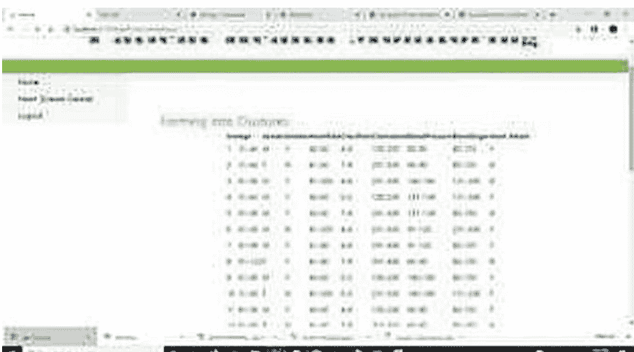

图5 形成簇


图6 频率表

并且通过先进的医疗嵌入式组件，该提议的模型可以将预测结果应用于心脏疾病。该研究还提出了使用先进的医疗嵌入式组件和网络技术对昏迷患者进行货币化的模型。该提议的模型已经进行了多个成功的测试案例并获得了结果。

## 参考文献

1. 法国巴黎 2018年6月22日至23日
2. Senthamilarasi, C., Jansi Rani, J., Vidhya, B., & Aritha, H. (2018). 基于物联网的智能患者健康监测系统。国际纯粹与应用数学杂志，119(16).
3. Akhila, V., Vasavi, Y., Nissie, K., & Venkat Rao, P. (2017). 基于Arduino uno的物联网患者健康监测系统。信息技术研究国际期刊，1(1).
4. Raja Gopal, S., & Patan, S. A. (2019). 设计和分析异构混合拓扑用于VLAN配置。国际工程研究新趋势杂志, 7(11), 487–491.
5. Ciocan, C. F., Fizeúan, R., & Palaghi `G`a, N. (2015). 每周电子药盒带圆形形容器。 在2015年IEEE第21届电子封装设计与技术国际研讨会(SIITME), pp. 125–129.
6. Othman, N. B., & Ek, O. P. (2016). 通过智能手机通知的药盒报警。 在2016年IEEE第5届全球消费电子大会, pp. 1–2.
7. Chawla, S. (2016). 自主药盒: 自动化药片输送。 在: 2016年IEEE第7届年度普适计算、电子与移动通信会议(UEMCON), pp. 1–4.
8. 基于物联网的心脏病预测和诊断的机器学习模型在医疗保健中的应用。
9. 基于物联网的智能医疗箱，为老年人提供医疗保健。
10. 基于传感器和无线传感器网络的智能医疗监测系统。
11. 基于物联网的老年人医疗保健系统。
12. 基于物联网的智能药箱，用于药物管理。
13. Krishnan, S. R., Gupta, S. C., & Choudhury, T. (2018). 基于物联网的患者健康监测系统。在2018年国际计算与通信工程会议（ICACCE-2018）中。

## 使用机器学习的无损图像压缩。

Eli Veda Sai Rochishna, Vutukuri V N S M P Ganesh Hari Prasad Rao, Gandhavarapu Bhargav, and S. Sathyalakshmi

摘要 随着通信网络的发展，信息交换和传输技术也在不断进步。每天在社交媒体上上传数百万张照片，无线传感器网络正在迅速被用于各种应用，如交通信号灯、道路、社交媒体、装配、网站和商场等。因此，需要减小这些照片的大小，同时保持适当的质量。本研究使用K均值聚类算法对RGB照片进行压缩。图像质量通过图像压缩后的PSNR、MSE和SSIM进行评估。SSIM指数中的K值越高，两张照片越相似。这是图像大小已经大大减小的一个好迹象。提出的基于K均值聚类算法的压缩方法用于压缩照片，以减小其大小、服务器负担和数据传输速度。

- RGB图像
- 图像压缩
- k-Mean聚类
- 均方误差(MSE)
- 结构相似性指数(SSIM)
- 峰值信噪比(PSNR)
- 商场
- 聚类
- 社交媒体
- 网站

E. Veda Sai Rochishna · V. V N S M P Ganesh Hari Prasad Rao · G. Bhargav (✉) · S. Sathyalakshmi
计算机科学与工程，印度斯坦理工学院，金奈，印度
电子邮件：18113120@student.hindustanuniv.ac.in

E. Veda Sai Rochishna
电子邮件：18113090@student.hindustanuniv.ac.in

V. V N S M P Ganesh Hari Prasad Rao
电子邮件：18113119@student.hindustanuniv.ac.in

S. Sathyalakshmi
电子邮件：slakshmi@hindustanuniv.ac.in

## 1 引言

根据思科的年度互联网报告，数字媒体占全球互联网流量的约80%。随着对数字媒体的需求不断增长，这个数字预计还会继续上升。由于创建、存储和传输的图像数量庞大，图像压缩比以往任何时候都更重要。

图片压缩旨在减少重复的图像数据，以便更高效地存储或传输。换句话说，它有助于减小数字图像的大小（以字节为单位），而不会影响图像质量。这现在是可能的，因为几乎所有图像都具有的一个特性：相邻像素是相连的，因此传递了冗余信息。

传统图像压缩方法，如JPEG2000（联合摄影专家组），PNG（便携式网络图形），JPEG [联合摄影专家组]。使用固定的变换，如离散余弦变换（DCT）和离散小波变换（DWT）（首先将图像从像素表示转换为频域表示），以及量化和熵编码器。一些新技术已经展示出取代经典DCT/DWT算法的有希望的结果。在机器学习领域的最新突破，过去被预计将显著提高照片压缩的方法，已被证明是完美的，为使用改进的更高效的过程提供了新的方式。

我们将在这项研究中比较其中一些策略。

与手动设计不同，结构是通过机器学习技术自动发现的。在基于机器学习的图像压缩中，有两个基本步骤：通过选择最具代表性的像素进行编码，通过着色进行解码。第一阶段主要涉及主动学习，而下一阶段涉及半监督学习。

[1]. 我们将使用K-Means聚类方法进行图片压缩，这是一种压缩转换方法。我们将使用K-Means聚类对图像进行颜色量化，这将进一步压缩图像。

本文的剩余部分结构如下。第1节对使用机器学习进行图像压缩的文献综述。第3节介绍数字图像的颜色表示。第4节是我们的问题陈述。第5节介绍聚类技术。第6节介绍图像压缩技术。第7节是我们的项目方法论。第8节介绍无损和有损图像压缩技术的区别。第9节是实现部分。第10节是实验结果。第11节是关于未来工作的内容，最后一节是参考文献。

## 2 相关工作

[1] 当 K增加时，压缩比增加；当 K减少时，压缩比减少。使用K-Means算法进行压缩被称为有损压缩。当图像像素较大时，进行3次迭代的次数增加将导致更大的压缩。

[2] 图像压缩是通过使用聚类方法如K-Means，模糊C-Means和DBSCAN（基于密度的空间聚类应用与噪声）来实现的。聚类技术被用于图像分割以实现有效的压缩。分割结果使用位平面切片编码，Huffman编码和LZW（Lempel-Ziv-Welch）编码进行高效传输和存储。通过观察解压缩后的图像，对于所有三种聚类技术，Huffman编码技术获得的图像质量较高。

[3] 通过改进目标函数，使用监督学习来训练回归模型以减少整体预测误差的算法。从而避免了颜色种子选择的计算负担。最后，亮度信息和回归模型的参数被传输到解码器进行颜色预测，然后重建彩色图像。

[4] 低功耗嵌入式设备可以使用K-Means聚类对基于图像的无线传感器网络（WSNs）进行图像压缩。相似的像素颜色被用于分组像素以减少源图片的大小。尽管在无线传感器节点上进行K-means学习可能超过数据压缩的好处，但外包学习步骤并仅进行压缩可能节省大量能量。

[5] 在算法开始之前必须选择K值。始终应将K值与图像像素数进行比较，即（K_iN）。如果K值较小，则两种算法的压缩率较高。这里使用的距离公式是欧氏距离。欧氏距离是数据点与质心之间的差异的绝对值。

[6] 在本文中，作者讨论了JPEG图像编码和解码过程在该算法中的解释。图像的编码部分可以使用JPEG将BMP（位图）文件转换为二进制文件以进行实时存储。相关的解码应用程序可以解压缩图片。

[7] 通过评估峰值信噪比等多个特征或规格，均方预测误差，每像素位数，以及压缩比率，Huffman主要用于从数据中删除不需要的位4。各种输入照片的大小以及将输入图像分隔成相同的行和列的新方法。所有单个压缩照片的总和在最后阶段提供最佳结果和信息内容。

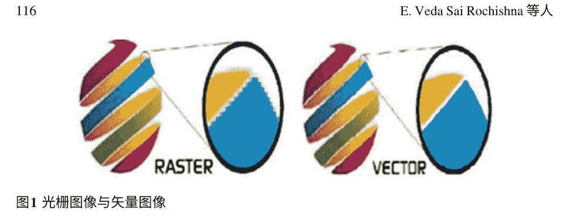

图1 光栅图像与矢量图像

## 3 图像表示

在计算机科学中，图像以多种方式表示，取决于它们的保存方式和包含的颜色数据。光栅（位图）图像和矢量图像[2, 3]是可以编码的两种数字图像类型。图1展示了光栅图像和矢量图像之间的区别。

为了表示这种类型的图像，矢量图形使用数学方程创建点、线、形状和多边形。这些图形主要由计算机辅助设计（CAD）等计算机程序创建，并且它们不使用分辨率，因此可以缩小而不会失去其基本外观。

图表经常用于显示这些类型的图像。可缩放矢量图形（SVG）、封装的Post Script（EPS）、便携式文档格式（PDF）和AI [1]是一些矢量图形文件类型。图形像素是由组成光栅图形的点集合。这些点按照矩阵的形式组织，每个点都有自己的颜色。这种方法可以用来表示任何形式的图像或颜色。JPEG、PNG和图形交换格式（GIF）都是光栅图形文件格式。颜色可以使用多种颜色模型来表示[2]。青-洋红-黄-黑（CMYK）和红-绿-蓝（RGB）[4]是用于保存大多数光栅图形的两种颜色模型。在RGB模型中，颜色通过混合红、绿和蓝三原色来表示，如图2所示。

为了表示图片中的每个像素颜色，需要提供红色、蓝色和绿色的三个值。如图3所示，每个基本颜色值可以用8位 =1字节来表示，因此每个像素需要3字节的存储空间[5]。

## 4 问题陈述

在当前世界中，每个社交平台都包含各种类型的媒体，占用了大量的数据空间，云存储每天都在变得昂贵。网站处理大量图像，增加了服务器的负载，导致网站响应变慢。


| NUMBERS | | |
|---|---|---|
| R 255 | R 102 | R 51 |
| G 0 | G 102 | G 204 |
| B 0 | B 255 | B 153 |
| R 255 | R 255 | R 51 |
| G 255 | G 0 | G 204 |
| B 102 | B 204 | B 255 |
| R 51 | R 51 | R 255 |
| G 51 | G 51 | G 153 |
| B 0 | B 153 | B 153 |

| 'RGB' = 3 SETS OF DIGITS | | |
|---|---|---|
| 11111111 | 01100110 | 00110011 |
| 00000000 | 01100110 | 11001100 |
| 00000000 | 11111111 | 10011001 |
| 11111111 | 11111111 | 00110011 |
| 11111111 | 00000000 | 11001100 |
| 01100110 | 11001100 | 11111111 |
| 00110011 | 00110011 | 11111111 |
| 00110011 | 00110011 | 10011001 |
| 00000000 | 10011001 | 10011001 |

图3 RGB图像每个像素有三组数字

网站的响应。我们的目标是使用K-Means聚类算法开发一个模型，以较少的数据损失压缩图像。

## 5 聚类技术

数据聚类是一种描述性的评估和分组数据的方法[4]。在文献中，学者们已经解决了各种聚类技术。这些算法可以分为许多不同的类别。层次方法、分区方法、基于网格的技术和基于密度的技术是这些方法中最常见的类别之一。

一组数据对象被划分为不重叠的群组，这被称为分区聚类。这种方法可以用于将照片中的颜色程度划分，从而实现更容易的压缩。此外，使用分区聚类的技术可能比其他方法更好地处理大量数据（图片）。各种

算法属于这个类别，其中最常见的是k-Means。K-均值聚类是一种直接的无监督方法，适用于任何类型的数据。它也很简单构建并且表现良好，因为它比其他聚类方法更快[5]。

## 6. 图像压缩技术

根据路径，它通过将每个点分配给最近的起始质心来创建一个新的分区。然后我们重新计算每个集合的质心。通过在这两个步骤之间交替进行，该方法持续进行，直到达到收敛。在提出的方法中确定了每个图像块的特征值，将图像分成4 ×4像素块。然后，算法根据它们的特征值将输入图像分成块。使用阈值对图像块进行分类，该阈值是所有图像块的平均特征值。

所有照片的主要组成部分都包含在具有较高特征值的块中。具有低特征值的块包含较少的精确图像元素，可以大大压缩，而具有较高特征值的块具有最详细的图像组件，可以显著压缩。然后，根据每个分区内的几个高特征值单元进行分区聚类（K1和K2）。全局起始码本由由较高特征值和较低特征值分区生成的码本组成。最后，使用全局码本作为起始码本进行K-means运行，以构建全局码。

### 6.1 生成对抗网络

Fabian Mentzer提出了一种基于生成对抗网络（GANs）的方法，特别是条件GANs。Ian Goodfellow和他的同事在2014年创建了GAN系列的机器学习框架。在这个“游戏”中，两个神经网络相互竞争。使用这种方法生成的新数据将具有与训练批次生成的数据相同的统计特性。在深度学习领域，GANs近年来被认为是改变游戏规则的重要因素。鉴别器和生成器是期望的结果。

判别器D（训练）的目标是提高判别器的敏锐度。
生成器G（训练）的目标是使其重建的图像尽可能地真实。GAN在这个训练过程中使用了交替优化策略。条件GAN（CGAN）不是通过随机选择和未确定的声音分布来生成样本，而是通过学习为特定条件或特征集（例如与图片或更具体的标签相关联的标签）生成虚假样本的机器学习系统。Mentzer等人提出了一种使用CGAN来补充神经图像压缩公式的方法。

在较低的bpp值下工作时，GAN的加入对性能提升有更好的影响，因为低bpp通常导致对非重要区域的位分配不足。

### 6.2 高斯混合模型

高斯混合模型是一种概率模型，可用于描述较大总体中的正态分布子群体。一般来说，混合模型不要求用户知道哪个子群体数据片段代表什么，算法可以动态地学习子群体。这是一种无监督学习的例子，因为子群体分配是不清楚的。

学习图像压缩可以使用离散化的高斯混合概率和注意力模块来实现，正如Cheng等人所示[8]。在这种情况下，神经注意机制允许神经网络专注于子集的输入。

为了参数化分布，使用离散化的高斯混合似然，这减少了残余冗余以产生准确的熵模型，从而减少了必要的编码位数。网络设计师已经实现了基本形式的注意力模块。通过在网络设计中使用残差块，实现了广泛的感受野和改进的速率失真性能。为了保留更多信息，解码器使用亚像素卷积作为上采样单元，而不是转置卷积。模型容量由N表示，N代表通道数。我们采用高斯混合模型，辅助自编码器的输出需要$3 \times N \times K$个通道。

## 7 方法论

带宽和存储都很昂贵，而且图片通常有很多冗余数据。因此，压缩照片可以节省存储空间和带宽，同时不影响图像质量。尽管存在诸如PNG和Huffman编码等图像压缩技术，但它们都不是无损的。目前市场上还没有将机器学习技术融入压缩技术的压缩技术。虽然有一些预先构建的模型，但现有的无损模型没有相应的库，导致成功率只有10%。

我们打算从头开始构建一个模型，并通过使用各种激活函数、损失函数和几个质心来测试它，在压缩照片时实现最小损失。在一张图片中，我们只能看到很少的色调，远远少于前面提到的数量。因此，K-Means聚类策略采用人眼的视觉处理，并使用最少的颜色来描述一张图片。具有不同RGB值的强烈颜色看起来相同对于人眼来说，这是K-Means算法使用的，它创建了视觉上相似的颜色分组。

图像中每种颜色的强度可能从0到255，但是图片中的每个像素都有三个字节（RGB）。根据组合数学，可能描绘的颜色总数为256 × 256 ×256。

在各种图像处理中，压缩涉及降低图像的颜色分量。这就是我们用k-means聚类所做的。k的值预先定义为我们想要保存的图像中的颜色分量的数量。

k-means算法的其余部分与之前的步骤相同，如图4所示。当聚类数增加时，图像将更接近原始图像，但会增加额外的磁盘存储空间和更高的计算成本。我们可以尝试不同的k值来看看我们能得到什么。因为它给出了聚类中心的方差，我们还可以计算聚类内平方误差的总和，以查看聚类是否拟合良好并正确分配。

注意：建议将k的值保持为2的倍数（最好是幂），与传统图像格式相同，以获得更好的结果。

图4 系统流程图

## 8 无损和有损

图像压缩是一种减小图像大小、提高网站/应用程序/服务器加载速度和整体性能的方法。有损和无损压缩都会减小图像文件大小，但方法和结果不同。有损图像压缩和无损图像压缩的主要区别在于有损压缩会完全删除一些图像数据，而无损压缩不会降低图像质量，只会删除不重要的数据。

有损图像压缩是通过删除部分数据来减小图片文件大小的方法。由于这个过程，文件中的信息将被永久删除，无法恢复。分形压缩、变换编码和离散小波变换是用于有损压缩的一些方法。使用有损压缩技术可以将文件大小最小化。然而，通常会有一个权衡：图像质量也会下降。JPEG格式是有损压缩的一个很好的例子。

对于电子商务网站、博客或作品集网站来说，有损压缩可能是有利的，因为它显著减小了文件大小并提高了网站性能。这将改善用户体验并提高您的搜索引擎优化（SEO）排名。例如，为了减少加载时间，您必须在您的电子商务网站上利用有损压缩来压缩预览图片和缩略图。

与有损压缩相比，无损压缩不会降低图片的质量。这是因为无损压缩只会删除由设备自动枚举的多余数据。虽然图片文件大小没有明显减小，但存在一种权衡。因此，您在硬盘上不太可能节省太多空间。算术编码、游程编码和霍夫曼编码是最常用的无损压缩方法之一。无损图像压缩对于各种图像格式非常有用，包括BMP、RAW、PNG和GIF。

另一方面，照片网站应该使用无损压缩。这种数据压缩技术更偏好于在减小文件大小的同时保持更高的质量，并允许您以更详细的方式查看照片。然而，对于产品图片应该使用无损压缩以防止质量下降。耳环和手工艺品是两个例子，它们是特别容易受到这种影响的微小而复杂的物体。

大型图像文件可能会降低网站的性能，并对SEO和用户体验产生负面影响。非优化的图像可能导致网站加载缓慢，变得无响应或完全无法访问。因此，您必须将端点添加到您的网站。更改图像的分辨率或完成样式表的数据以实现此目的。无论哪种情况，文件大小都将减小，网站加载速度将更快。根据Google的一项调查，如果用户在网站上的体验不好，有45%的访问者不太可能返回该网站。即使Google也同意页面速度是搜索引擎结果页面（SERP）的一个重要排名因素。页面性能慢还会影响转化率。根据户外生活方式企业Dakine的数据，更快的页面速度可以增加约45%的移动销售额。

## 9 实施

使用K-means算法，我们创建了一个无损图像压缩系统。为了实现，我们使用Python作为编程语言，并使用了一些机器学习组件，如ELBOW METHOD、NumPy和Flatten Image技术，以实现最小数据损失的图像压缩。无损压缩保留了图像质量，同时减小了生成图像文件的大小。在不牺牲图像质量的情况下提高网站性能是一种双赢的局面。

以下是我们在实施过程中使用的一些组件。

-   肘部法则用于确定每个图像的最佳聚类数。我们可以使用这种方法找到最佳值来压缩图像。该方法基于计算不同聚类（k）的簇内平方误差和（WSS）之和，并选择WSS变化开始减小的k值。肘部法则背后的思想是，解释的转换在少数聚类时变化迅速，然后减慢，导致曲线急剧弯曲。拐点是我们可以在聚类算法中使用的聚类数。
-   当使用平坦图像技术时，Kumari等人[3]将图像的所有层合并为一个没有alpha通道的单一层。平坦化后，图像保留其原始外观。因为图像内容中没有透明度，所以一切都包含在一个单一层中。平坦化或合并图像的主要原因是为了压缩信息，使文件更小且更易传输。
-   Liu和Yang[1]多维数组需要更多的内存，而1D数组需要更少的内存。因为这是在处理/提供模型信息之前平滑图像数组的主要原因，当处理大量图片时，平坦化可以节省时间和内存，而在训练模型时通常会遇到这种情况。
-   Paek和Ko[4]需要对不同大小的数组进行数学和逻辑运算，因为图像可以被视为一个数组，所以可以使用NumPy进行各种图像处理任务。NumPy数组可以用于对大型数据集执行复杂的算术和其他操作。与Python的内置序列相比，这些操作通常执行更快且代码更少。
-   数组是NumPy的核心。NumPy数组具有比Python数据结构（列表和元组）更少的内存占用和更快的运行速度。线性代数是NumPy支持的科学函数之一。实施步骤如下。

实施步骤如下：

-   步骤1：即将所需的库导入到我们的开发环境中。
-   步骤2：加载要压缩的图像。
-   步骤3：在这里，我们需要将图像的尺寸存储到一个变量中。
-   步骤4：现在，借助NumPy库将图像转换为NumPy数组。
-   步骤5：将NumPy数组形状改为扁平化图像，以避免重塑错误。
-   步骤6：主要步骤，实现K均值聚类以形成k个聚类，实现图像压缩。
-   步骤7：现在，借助肘部法则找到方差为98%的最佳聚类数。
-   步骤8：开始K均值并适应图像。
-   步骤9：借助k值，用附近的k值（质心值/质心）替换图像中的每个像素值。
-   步骤10：在对其之前/原始维度应用更改后，重新调整图像。
-   步骤11：将最终输出返回给最终用户以保存/共享/在他或她的项目中使用。

通过在我们的开发环境中执行上述步骤，我们使用机器学习实现了压缩图像。K均值有助于减少图像中的颜色并减小图像大小。

## 10 实验结果

我们使用大小为1024 kb的相同图像针对现有算法进行了测试，如我们在图像压缩技术部分中所提到的。而我们的方法在数据最小损失的情况下给出了一个780 kb的压缩图像输出，而现有的在线网络服务（如short pixel）给出了一个980 kb的输出。当与其他机器学习算法（如基于特征值的K均值、GAN和高斯）进行测试时，我们提出的方法的压缩率远高于现有的机器学习方法，如图5和6所示。各个压缩率如下：无损压缩的主要缺点是文件比使用有损压缩时更大，但与有损压缩相比质量更好。

缺点：我们仔细选择了使用各种方法的聚类数，例如主成分分析来获得98%的方差或保留98%的数据。因此，编译图像所需的时间取决于图像的大小，可以通过进一步重构进行优化。

## 11 结论

本文提出了一种利用机器进行图像压缩的方法。使用K-Mean聚类方法实现了无损图片压缩。介绍了肘部法和K-Mean聚类技术，以及如何将其应用于图片压缩。结果表明，通过降低照片的大小来实现图片压缩具有优势，同时保持可接受的图像质量和数据。我们计划扩大使用的媒体文件范围，包括对高分辨率下提出的算法进行评估。

## 参考文献

-   1. 刘，X.，& 杨，J. (2018) 。 使用机器学习进行快速高效的彩色图像压缩。 在2018年第二届IEEE高级信息管理、通信、电子和自动化控制会议（IMCEC）中。
-   2. Wan, X. (2019).IOP会议系列：材料科学与工程 563, 052042.
-   3. Kumari, G. V., 等人 (2020). 利用聚类技术进行生物医学图像压缩应用.
-   4. Paek, J., & Ko, J. (2017). 基于K-means聚类的无线成像传感器网络数据压缩方案.IEEE系统杂志.
-   5. Nandy, O., & Battu, J. V. (2020). 图像压缩的机器学习方法比较分析.国际工程研究技术杂志(IJERT), 09(08).
-   6. Tyagi, V., Kumar, V., Asthana, V., & Patel, R. (2016). 一种快速改进的图像压缩技术，使用霍夫曼编码. 在2016年国际无线通信、信号处理和网络会议(WiSPNET).
-   7. 洪, A., 万, N., 陈, X., & 肖, W. (2020年) 。一种基于DCT的快速JPEG图像压缩算法基于智能云 (SmartCloud) 的2020年IEEE国际会议。
-   8. 思科年度互联网报告 (2018-2023) 。白皮书，2020年3月。

# 一种从WSN到移动设备传输数据的节能方法

A. Jaya Lakshmi和P. M. Joe Prathap

**摘要** 无线传感器网络（WSN）已经引起了研究人员和工业界的重视。现在，WSN已经发展成为一种繁荣的技术，支持互联网上的各种应用。现在，随着互联网智能手机的普及，移动用户可以使用易于操作的移动应用程序与传感器网络进行交互，收集环境数据，没有任何时间和地点的限制。传感器的使用在实时环境中存在许多问题，理论和实践上都有一些障碍。通常，传感器节点包括容量有限的电池。传感器节点之间的无线连接在周围环境中容易受到许多因素的影响。然而，关于具有不可预测无线连接的WSN的网络能力的研究结果并不多。本研究提出了一种能源高效且轻量级的编码技术，称为谱系编码，以控制障碍（电池）以实现大规模可持续的WSN的发展。我们的研究重点是在移动环境中对移动数据进行独立通信的系统。谱系编码方案将XML节点的父子关联描述为一种位流排列，称为谱系编码（V，H），并在客户端（移动设备）上包括高效的分支模式查询处理。已经进行了实验，以确保查询处理的最小时和谱系编码（LE）下网络的最大寿命。模拟结果证明了大规模WSN的网络范围在不同网络环境下支持无限数量的客户端。

**关键词** 血统编码 · G节点 · 查询处理时间 · 剩余能量 ·网络寿命最大化

A. Jaya Lakshmi (✉)
印度金奈Gojan商学院和技术学院
电子邮件：a.jayalakshmi92@gmail.com

P. M. Joe Prathap
印度金奈RMD工程学院
电子邮件：drjoeprathap@rmd.ac.in

© 作者，独家许可给Springer Nature Singapore Pte Ltd. 2023
S. Shakya等人（编），情感分析与深度学习，
智能系统与计算进展 1432,
https://doi.org/10.1007/978-981-19-5443-6_11

## 1 引言

WSN是一组传感器节点和传输设备的集合。 传感器是便携式设备，用于测量环境条件及其变化，并将其组织起来，以便向收集来自每个传感器节点的数据的接收器提供数据，通过无线介质[1]。 物联网（IoT）是连接具有传感器的设备的进化方法。 通常，传感器部署用于捕捉相应环境中的变化。 传感器是人类无法察觉到的变化的福音。 例如，在核电厂中，传感器用于感知压力、温度、气体泄漏等各种因素，这可以避免人员在爆炸或事故中丧生。传感器用于监测物理事件，如气候、大气条件、污染或检测任何自然灾害[2]。 传感器网络的数据库管理涉及关系模型。 为了解开WSN中的数据管理[3]和提取，需要进行数据收集、数据聚合[4,5]和查询处理等阶段。 对于WSN中的传统数据管理模型来说，结构化查询语言（SQL）似乎更方便进行数据存储和查询处理[6]。 但是，为了将传感器值广播到移动设备，SQL被可扩展标记语言（XML）所取代[7]。 XML被设计为以一种易于人类和机器阅读的方式存储和发送数据。 由于路由树[8]在传感器网络中更方便进行查询处理，因此XML被发现比SQL更能增强查询处理。SQL被替换的两个原因是(i) SQL仅返回表格数据； (ii) 不方便遍历传感器网络的分层结构。

为了在移动环境中实现兼容性，感知数据以XML格式广播，而不是传统的格式（SQL）。 因此，将以SQL格式可用的感知值转换为XML格式，以便在移动环境中更容易进行查询处理。

即使以XML格式将传感器值广播到移动设备，客户端和服务器（基站）的能量损失仍然存在许多缺点[9]。 为了减少客户端和服务器的能量损失，并引入一种称为血统编码（LE）的能量高效编码技术和一种称为G节点（G-N）的流单元。

本文的其余部分组织如下：第2节讨论了WSN、XML和传感器节点能量方面的一些相关工作，而第3节介绍了具有LE的提出的架构模型。第4节解释了血统编码和G-Node。第5节描述了查询处理，第6节处理了性能评估。 第7节总结了本文，并提出了后续研究方向的要点。

## 2 相关工作

随着无线传感器网络和移动计算的快速发展，所有可用信息都提供给移动用户。

Park等人[10]提出了一种称为血统编码的编码技术，用于移动计算中的节能XML传播。这种方法既节能又延迟高效。

考虑到使用传统SQL发送从无线传感器网络获取的传感器值的问题，Elias [7]提出了使用XML向移动设备广播的方法。在SQL数据库中，传感器值以表格形式可用。将这些表格中的值广播到移动环境[11]只向移动用户提供表格形式的内容。但是，使用XML数据时情况并非如此。为了方便移动用户，SQL数据库中的传感器值被XML解析器解析。但是，这对客户端和服务器都会造成巨大的能量损失，这是需要关注的。

传统的查询处理被能效高的Twig模式查询处理[12-14]所取代，重点是实现从子节点到父节点的遍历。这使得查询遍历尽早进行。对于一个很长的XML文档，总是从父节点到子节点的遍历不方便。因此，Twig模式查询处理也使得遍历阶段按照相反的顺序进行，即从子节点到父节点。因此，查询处理时间将减少，从而减少移动客户端的电池功耗。

有几种方法可以处理传感器值向移动环境广播的问题。但是，能量损失是服务器和客户端[15]都需要关注的主要问题。本文提出了一种支持Twig模式查询的编码方法（LE）。

## 3 提议的架构

以下是本提议架构的主要元素。

-   (i) 关系数据库
-   (ii) XML流式传输
-   (iii) 客户端（移动设备）中的能效处理查询

架构流程如图1所示。

传感器节点部署在不同位置，定期将传感器值发送到具有中间网关的SQL服务器[16]。服务器中的可用值将被广播到移动设备。因此，最初，XML解析器从服务器检索值，并在无线环境中生成XML流。当移动客户端发出查询时，进行选择性调谐，以调谐到相应的广播频道，并选择性地下载XML流以处理查询[17]。XML广播完成得很快，以便服务器可以在不干扰广播的情况下加强G-N的动态传播。

广播的数据流将以G-N的形式存在，其对应的计算谱系代码(V, H)。当移动客户端发出查询时，使用提议的架构可以进行从父节点到子节点和从子节点到父节点的常规遍历（分支模式）[13]。这减少了移动客户端的查询处理时间。使用谱系代码可以实现从子节点到父节点的查询处理。同时，该架构将为许多移动客户端提供服务，从而在服务方面实现可扩展性。无线传感器网络是一个定期向服务器提供大量数据元素的领域。因此，可以在不消耗太多能量的情况下，定期将这些大量数据广播到移动客户端，这是服务器和客户端的主要问题。

## 4 无线XML流

在本节中，提出了一种高级的流式传输XML数据的方法。图2显示了在这项研究中作为运行示例的XML文档由XML解析器解析后的结果。XML解析器包括方法和属性，用于输入和编辑XML文档。

### 4.1 G-Node (G-N)

G-N 是涉及无线通信的数据流 (XML) 的一系列节点组。它是一个流单元，可以消除 XML 文档节点上的冲突，并允许客户端 (移动设备) 仅下载相关数据。

图2 示例 XML 文档

```xml
<Monitor>
    <Sensor id="01" name="S1">
        <location> p1 </location>
        <temp> 34 </temp>
        <humid> 12 </humid>
    </Sensor>
    <Sensor id="02" name="S2">
        <location> p2 </location>
        <temp> 35 </temp>
    </Sensor>
    <Sensor id="03" name="S3">
        <location> p3 </location>
        <temp> 26 </temp>
        <humid> 45 </humid>
    </Sensor>
</Monitor>
```

处理查询时使用。每个 G-N 由三个部分组成，即 (a) 组描述符 (GD) (b) 属性值列表 (AVL) (c) 文本列表 (TL)。GD 是节点名称、位置路径、子索引 (CI)、血统代码、属性索引 (AI) 和文本索引 (TI) 的集合。GD 的所有这些组成部分对于移动客户端处理查询 (XML) 是有帮助的。CI、AI 和 TI 的索引值用于选择和下载下一个 G-N、属性值和文本。

### 4.2 血统编码

所提出的创新编码策略称为血统编码，包括两种类型的编码，即垂直编码和水平编码[10]。垂直编码由血统编码 (V) 表示，水平编码由血统编码 (H) 表示。血统编码生成的主要优势是描述 G-Node 之间的父子关系。所考虑的样本 XML 文档的可用元素的血统编码如图 3 所示。

## 5 查询处理

本节介绍了 (1) 简单查询处理和 (2) 树枝模式查询处理。

### 5.1 简单查询处理

在这种类型的查询处理中，首先，客户端（移动设备）创建一个查询树，并确定相关的 G-Node，并下载相应的组描述符。当发现当前节点为叶节点时，移动客户端使用AI和TI下载文本和属性。图4解释了查询的父节点到子节点的遍历方式。

```
Q1: “//sensor [name/text () = ”S3”] /humid/”
```

上述查询是为第4节中讨论的示例XML文档生成的。

### 5.2 树枝模式查询处理

这种类型的查询处理包括三个阶段，即树遍历阶段、子路径遍历阶段和主路径遍历阶段。以树的形式的查询以深度优先的方式遍历，并下载适当的GN的GD。使用谱系代码计算，树枝模式查询处理变得更加容易。图5解释了查询的子节点到父节点的遍历方式。

Q2: “//传感器/位置[p2]/”。这个查询是为了样本XML文档在第四节中讨论。选择性调整是一种主动方法，通过减少调整时间和访问时间来简化客户端的工作。而且，它有效地在twig模式查询和简单查询处理之间切换。调整是通过XPath查询模式的帮助来增强的，该模式包含谓词。

## 6模拟结果

在模拟环境中，以随机方式部署了100个传感器节点。以下结果是通过使用NS2模拟器进行实验获得的。

### 6.1具有谱系编码的查询处理时间

将方法谱系编码（LE）的性能与已有的流方法如twig stack（TS）和extend chaining（EC）[18]进行了比较。TS算法涉及twig模式查询的处理。但是TS将包括原始XML文档的处理。EC支持结构索引，有助于解决冗余的XML节点。但是，使用LE，生成的代码有助于解决twig查询和XML节点冗余的问题。实验考虑了第4节中的样本XML文档。图6显示了从客户端生成的查询Q1的调整时间评估。

从XML文档中提取传感器值。与其他方法相比，发现谱系编码更好。

```
`Q1 “//sensor [name/text () = “3”]/humid/”.`
```

在这里，调整时间是以桶为单位考虑的。桶是用来测量无线介质中的数据的单位[19]。使用谱系编码减少调整时间的主要原因是仅从XML流中下载相关数据值。由于我们考虑的是G-节点，完全避免了下载无关元素，从而减少了调整时间，进而减少了客户端从无线传感器网络（WSN）获取连续感测值的电池功耗。

### 6.2 最大剩余能量

最初，传感器节点的最大能量为2.5 J。考虑到一个包含100个传感器节点的传感器网络，在初始阶段网络将包含最多250 J的能量。该图显示了使用谱系编码技术进行一系列事务后传感器网络中的平均剩余能量。在执行60个事务后，网络中的平均剩余能量将为200 J，如图7所示。

### 6.3 最大传感器节点数与最佳能量

传感器网络中的传感器在处理查询时很快就会耗尽能量。但是，在WSN中应用谱系编码后，传感器节点即使在处理大量查询后也能持续很长时间的能量。上图显示了在使用谱系编码和不使用谱系编码的情况下，在处理一定百分比的查询后可用的传感器节点数量。

图7 交易后网络中的平均剩余能量

图8 在使用谱系编码和不使用谱系编码的情况下，在处理查询后可用的传感器节点数与最佳能量

图8显示，在处理60%的查询后，100个传感器节点中有86个节点可以使用最佳能量进行处理，而没有使用这种编码技术的情况下，只有69个传感器节点可以使用最佳能量。

## 7 结论和未来工作

该工作总结了能源高效轻量级谱系编码对传感器节点保持能量更长时间的影响。这增加了WSN的剩余能量，从而增加了网络的寿命。通过这种技术，移动客户端也不会在短时间内耗尽能量。因此，这种技术在模拟中显示出在维持传感器网络和移动客户端的能量（电池电量）方面效率高。

## 参考文献

1. Joe Prathap, P. M., & Praveen, K. V. (2021). 基于混合优化技术的能效拥塞感知物联网网络资源分配和路由协议。无线个人通信, 117(2), 1187–1207. Springer US.
2. ElHakim, R., Orfy, A., & ElHelw, M. (2010). 大规模无线传感器网络部署的监测和可视化。传感器, IEEE, 1377–1381。
3. Vajsar, P., & Rucka, L. (2011). 无线传感器网络的监测和管理系统。在第34届国际电信和信号处理会议（TSP 2011）中。
4. Joe Prathap, P. M., & Selvi, M. (2017). 基于QoS分析的动态路由的无线传感器网络数据聚合。先进研究动力学和控制系统杂志, 9(18), 2900–2908。
5. Joe Prathap, P. M., & Selvi, M. (2019). 在无线传感器网络中安全数据聚合的分析和分类国际工程与先进技术杂志,8(4), 1404–1407.
6. Joe Prathap, P. M., & Menon, V. G. (2019). 从拓扑依赖到机会主义动态无线自组织网络中的路由协议: 挑战和未来方向. 在移动计算和通信中的算法、方法和应用,IGI Global, pp. 1–23.
7. Elias, A. G. F., Rodrigues, J. J. P. C., Oliveira, L. M. L., & Zarpelao, B. B. (2012). 无处不在的无线传感器网络监测模型, 创新的移动和互联网服务在普适计算中（IMIS）. 在2012年第六届国际会议, pp. 835–839.
8. 乔·普拉塔普, P·M·, 和瓦苏德万, V· (2008年)。修订的可变长度间隔批量重新键入具有平衡密钥树管理的安全组播通信。IJCSNS, 8（4）, 232。
9. 乔·普拉塔普, P·M·, 和阿拉帕特, V· (2021年)。基于信任的能源高效安全多路径MANET中的路由使用LFSSSO和SH2E。国际计算机网络和应用, 8（4）, 400-411。
10. Park, J·P·, Park, C.-S., 和Chung, Y·D· (2013年)。谱系编码: 一种高效的无线XML流式传输支持树枝模式查询。知识和数据工程, IEEE交易, 25（7）, 1559-1573。
11. 乔·普拉塔普, P·M·, 和梅农, V·G· (2017年)。朝着高度移动的最佳数据传递无线自组织网络。国际计算机科学与工程杂志, 9（1）, 1-6。
12. Al-Khalifa, S., Jagadish, H.V., Koudas, N., Patel, J.M., Srivastava, D., & Wu, Y. (2002). 结构连接:一种用于高效XML查询模式匹配的基本方法。IEEE国际数据工程会议(ICDE), 141–152.
13. Jiang, H., Lu, H., & Wang, W. (2004). 具有OR-谓词的XML分支查询的高效处理。在ACM SIGMOD国际数据管理会议中,pp. 59–70.
14. Altinel, M., & Franklin, M. (2000). XML文档的高效过滤, 用于选择性传播信息。在Very Large Data Bases国际会议(VLDB)中, pp. 53–64.
15. Chung, Y. D., Yoo, S., & Kim, M. H. (2010). 在无线广播流上进行全文搜索的能量和延迟高效处理。IEEE知识与数据工程交易, 22(2), 207–218.
16. Joe Prathap, P. M., & Dhinakaran, D. (2022).网络和系统讲义系列书籍 (LNNS, Vol. 317), Springer.
17. Kumar, M., Panigrahi, M., & Verma, S. (2012) 基于XQuery的无线传感器网络查询处理架构国际计算机应用杂志 (0975-8887),43(23).
18. Kaushik, R., Krishnamurthy, R., Naughton, J. F., & Ramakrishnan, R. (2004). 关于结构索引和倒排列表的整合。 在*ACM SIGMOD*国际数据管理会议论文集中。
19. Kim, D., An, B., & Kim, N. (2008). 基于无线传感器网络的实时监测服务架构模型。 在第10届国际高级通信技术会议 (ICACT 2008) 中。

# 工人安全头盔

Sailasree Perumal, A. S. V. L. Neha和R. Krishnaveni

摘要 工人们努力满足他们的日常需求，但有时工作环境并不对他们有利，使得他们的工作环境糟糕。 特别是矿业员工面临更糟糕的工作条件。 所提出的倡议的主要目的是通过提高工作场所的安全性来挽救数百万人的生命。 这项研究倡议旨在通过根据先前确定的风险因素发送通知来提前通知工人，从而防止灾难发生。 在采矿行业，人们长期以来一直在危险的环境中工作。由于不安全的工作条件，数百万人失去了生命。 然而，随着技术的进步，有可能为人们提供更好的工作条件，从而挽救数百万人的生命。 这个提议的模型是迈向更美好未来的一小步。 该模型采用基于RF的跟踪系统和智能设备设计，利用RF技术通过ATmega微控制器在物联网上传输信号。 该提议的模型还包括基于机器学习的风险因素分析系统，采用支持向量机（SVM）算法，并利用获取的数据通过RF技术向原型发送信号。

关键词 RF技术 · SVM算法 · 紧急按钮 · Arduino UNO

## 1 引言

工人的健康和安全是最敏感的话题。 随着技术的进步，工人的生活可以得到改善。 所有这些危险对于矿工来说都是最严重的。 技术将帮助他们在它发生之前预测风险。该项目专注于为工人提供更好的工作场所。

该项目由一个工人安全头盔组成，分为两个部分，即控制单元和原型。这两个单元使用RF技术连接在一起。该技术使用无线电信号建立通信。它还包含一个基于SVM的风险因素分析系统。一个基于NodeMCU的RF。头盔节点发送的数据通过跟踪电路接收。系统使用这些信息实时绘制工人的当前位置，当他们在矿山中移动时。该头盔还包括一个紧急按钮。如果按下此按钮，IoT Web界面上将出现紧急标志。然后，该界面将通知管理层采取必要的预防措施，以确保人员的安全。

该项目包含两个领域，即物联网：基于RF技术、机器学习和SVM算法。许多商品，如收音机、手机、Wi-Fi路由器和其他基于无线电的设备，都依赖于无线电技术和无线电频率设计，通常称为RF设计。可以使用多种类型的无线电信号。无线电频率工程使用不同的技术和技术，从简单的调制形式，如幅度、频率和相位调制，到使用直接序列扩频和正交频分复用等技术的复杂波形。最终项目将两个领域与Web界面连接起来。

拟议项目的主要目标是改善矿工的生活，使他们能够在更适合他们生存的工作环境中工作，无论是在高温还是异常湿度下。主原型中的物理紧急按钮帮助人们应对自然灾害，而机器无法预测。

在某种方式失败时，RF技术与GSM模块的结合帮助人们以多种方式与用户保持联系。在这个项目中，数据可以以三种不同的形式查看，例如控制室上的LCD显示屏，通过GSM模块提供的短信服务，以及数据在界面上的可见性，这是最有效的方式。这种模式是最有效的方式，因为它不仅可以帮助在特定时间观察数据，还可以帮助查看之前发生的所有数据。

### ## 2 文献综述

- Kumarvel [1] 提出了物联网矿业追踪和工人安全头盔。已经创建了安全头盔，它在LCD显示屏上显示读数并发送警报消息。但是没有风险因素分析。该原型很好，并提供准确的结果，但它对该区域之前发生的风险或事件进行了预先通知。
- Pradeep Kumar [2] 提出了工业系统智能头盔系统，使用LoRaWAN技术。这项技术有助于找到结果仅限于一个非常确定的区域，限制了其在广泛范围内的应用前景。当数值发生变化时，它会发送警报。
- B Yakub [3]。本文作者专注于对智能安全头盔表面危险预测进行全面调查，该调查使用传感器通过读数检测，并将读数显示在基站上，使用NodeMCU使传感器具有可靠性。
- Somya Sista Lakshmi [4] 本文作者提出了一种基于RFID跟踪系统的系统。安全头盔使用基于RF的跟踪系统，显示并发送有关危险的警报。还有一个紧急按钮，可以向基站发送求助信号。但没有进行风险因素分析。
- Dhanalakshmi [5] 在关键情况下，它有助于向中央控制台发出警报。GPS帮助我们在传感器信息异常时跟踪矿工的位置[6-9]。使用Plc16F877A微控制器无法提供所需的结果[10-14]。

## # 3种方法

### ## NODE MCU

这是一个开源的物联网平台，它包括在ESP8266上运行的固件，借助Wi-Fi的帮助，如图1所示。它是一个基于平台的对象，通过Wi-Fi协议连接各种对象并传输数据。

### ## ARDUINO UNO

这是一个基于ATmega328p的微控制器板，如图2所示。它在一个开源平台上工作，并且该板上装有一组模拟和数字输入或输出。它包含一个8位AVR芯片的微芯片。该板上包含14个数字输入引脚和6个模拟输出引脚。该板可以使用9V电池或USB电缆充电。这个板在绑定项目的所有其他组件中起到粘合剂的作用，以保持平衡。

图1 ESP8266的图示表示

# 射频技术

这项技术利用无线电波将数据从一个所需的主体传输到另一个。这项技术通过利用发射器和接收器套件在物联网网络上传输数据。这项技术利用无线电频率减少了过程中的不足之处。

数据解释模型：

- 该模块存储数据库，并使用SVM算法进行结果分析。
- SVM算法用于现场风险因素分析，并将得到的结果存储在数据库中。
- 存储的数据有助于解释现场的风险因素，与原始现场发生的先前风险相对应。

## 4 架构图

如图3所示的架构图中，主要传感器（如温度、湿度和紧急开关）连接到一个NodeMCU，然后通过RF发射器连接到RF接收器，以获取数据。 Arduino进一步连接到警报系统、LCD和GSM。GSM模块以两种方式连接到Web界面，以提供用户体验。

图3 架构图

## 5 原型实现

该项目使用基于RF的跟踪系统，在通过SVM算法计算风险因素的同时，通过物联网网络传输数据并检测工作场所环境的安全概率。该项目包含两个部分，即控制室和头盔部分。两者通过基于RF的技术连接。控制室包括LCD显示屏和紧急按钮。

最终项目通过使用Web界面连接两个领域。主要传感器，如温度、湿度和紧急开关，连接到NodeMCU MC，后者进一步通过RF发射器连接到与Arduino UNO连接的RF接收器获取数据。Arduino进一步连接到警报系统、LCD和GSM，如图4所示。GSM模块以两种方式连接到Web界面，以提供用户体验。

## 6 测试和评估

通过使用ThingSpeak平台进行项目的测试和评估。该平台确保对需要集中关注的必要领域进行分开的观察。三个主要领域是温度、湿度和警报。

在平台上，创建一个指定频道名称的频道。之后，创建三个字段并将它们标记为温度、湿度和警报。在这些字段中，创建一个图表，显示在不同情况下协议对温度和湿度范围的波动。

字段1：温度

在这个字段中，我们可以看到温度波动时图表中的尖峰。当温度超过环境或协议的限制时，可以注意到这些尖峰，并通过GSM和Wi-Fi将消息发送到控制室中的数据库。

字段2：湿度

在这个字段中，我们可以看到湿度范围波动时图表中的尖峰。当湿度超过环境或协议的限制时，可以注意到这些尖峰，并通过GSM和Wi-Fi将消息发送到控制室中的数据库。

第3个领域：警报

在第3个领域中，图表随着处理单元中按钮的协议使用而变化。这个警报系统带有一个附在头盔上的紧急按钮。一旦协议使用了这个按钮，我们会看到按钮在IDE中变红，进一步通过GSM和Wi-Fi向用户发送紧急消息。

如上所述的领域中，所有数据都是从不同的领域中收集的，例如温度、湿度和物理警报系统，如图5、6、7和8中的验证输出。所有这些数据都存储在ThingSpeak平台的后端，并通过GSM模块连接到主原型。

射频技术将整个原型绑定在一个部分中，其中可以看到物理警报系统、控制室和头盔部分。

图5 温度波动图

图6 湿度波动图

图7 温度和湿度图

图8 警报按钮

这个原型的成功实施表明，当涉及到准确性时，用户更倾向于使用射频技术。 除了射频技术的实施外，物理警报按钮有助于计算风险，这是人类无法预测的。

## 7 结论

与YOLO4、LORAWAN、YOLO5、Zigbee等其他技术相比，该项目更倾向于并成功使用射频技术。 如图9所示，射频技术的准确性约为95%，而其他技术的准确性约为86%、84%、92%、81%。 因此，射频技术的使用提高了准确性。

在该项目中，借助射频发射器和射频接收器使用射频技术不仅可以提高准确性，还可以在背景中记录数据，并实现所提出技术的准确性。

通过接口开发，背景中的数据不断记录，不仅提高了发现的准确性，还提供了数据来访问即将出现的危险，从而改善了工人的生活。

## 参考文献

1.  Kumaravel, A. K., Sravani, K., & Lakshmi Sreenivasa Reddy, L. (2021). 工人安全头盔。 在“国际高级计算机与通信工程学术期刊”会议记录中。
2.  Pradeepkumar, G., Sanjay Rahul, S., Sudharsanaa, N., Suvetha, S., & Ponnusamy, D. (2021). 利用LoRaWAN的矿业智能头盔。 在“G Pradeepkumar et al 2021 J. Phys.: Conf. Ser. 1916 ”会议记录中。
3.  Tajane, P. S., Shelke, S. B., Sadgzir, S. B., & Shelke, A. N. (2020). 利用物联网的安全头盔。 在“国际工程与技术研究期刊(IRJET)”会议记录中。
4.  Yakub, B., Deepthi, E., Jain, V., Vikram Singh, S., & Ravinder Singh, R. (2019). IoT used Mining tracking system and worker safety helmet. In Proceedings of “International Journal of Research in Advent Technology, Special Issue, NCRCEST 2019”.
5.  Dhanalakshmi, A., Lathapriya, P., & Divya, K. (2017). Smart helmet for improvising safety in mining industries. In Proceedings of “”, 2017, IISN Journal.
6.  Abdulla, R., Nataraj, C., Eldemeresh, T., & Al-Aldie, M. K. A. (2020). IoT based worker safety helmet for mining industry application. In Proceedings of “2020 IJSART (Vol. 29, No. 1).
7.  Jayasree, V., & Kumari, N. (2020). 基于物联网的建筑工人安全头盔。在“IEEE 2020年第七届国际会议”的论文集中。
8.  Noorin, M., & Suma, K. V. (2018). 基于物联网传感器技术的矿工可穿戴设备。 在“2018年第三届国际会议IEEE”的论文集中。
9.  Mehata, K. M., Shankar, S. K., Karthikeyan, N., Nandhinee, K., & Robin Hedwig, P. (2019). 基于物联网的建筑工人安全和健康监测系统。 在“IEEE 2019年第一届创新信息与通信技术国际会议”的论文集中。
10. Mangala Nandhini, V., Padma Priya, G. V., Nandhini, S., & Dinesh, K. (2018). 基于物联网的智能头盔，确保工业工人的安全。 在“IJERT 2018年会议”的论文集中。
11. Vishnu Kumar, A., Nirmal Kumar, A., Velumurugan, J., Poornima, S., & Pavithra, K. (2018). 在“IEEE 2018 conference”(Vol. 7)的论文“使用存储在云中的Li-Fi数据的煤矿工人安全头盔”。
12. Borker, S. P., & Baru, V. B. IOT基于智能矿用安全帽的地下矿山。 在“IJRESM”(Vol. 1, issue 9)的论文集中。
13. Sujitha, S., Shajilin Loret, J. B., & Merlin Gethsy, D. (2020). 基于Arduino的物联网智能矿山安全系统。 在“IJCSMC”(Vol. 9, issue 5)的论文集中。
14. Ravi Kumar, G., & Keerthi Reddy, B. (2018). 基于物联网和智能头盔的无线传感器网络。在“IJESRT”的论文集中。

# 使用信息技术在描述性统计和一元方差分析中评估2003年至2006年间越南山萝省沱州全州出生的泰族学生的一些人体测量指标的发展

Tran Thi Minh和Mai Van Hung

摘要 青春期是身体、智力和社会关系发生更复杂变化的阶段。根据世界卫生组织（WHO）的说法，从10岁到19岁的青春期是生理心理和身体发育的重要过渡期，被视为肌肉完全发育和器官和能力发展的准备阶段。本研究观察了2018年、2019年和2020年泰国学生一些人体测量指标的发展，以发现身高、体重、BMI和影响因素的增长图表。这些因素在儿童的身材发育中起决定性作用，影响其成年后的身高。

关键词 民族 · 人民 · 人类测量学 · 指标 · 身体 · 身高

## 1 引言

每个国家在社会经济发展战略中的主要目标是提高生活质量。这是因为“人的发展是成功的关键”这一观念已经在全球范围内得到认可。在1990年的第一份人类发展报告中，联合国组织指出：“人民是一个国家真正的财富。”人民是发展过程的核心[1]。这在2020年联合国人类发展报告中得到了重申：“发展的过程 - 人类发展 - 至少应该创造一个让人们个体和集体都能充分发展并有合理机会过上他们珍视的富有成效和创造性生活的环境。”[2]。

许多关于护理、保护和教育的政策旨在改善越南人民，特别是儿童的身体状况。在不同地区对不同主体的生物指标的识别将有助于对越南人民在不同时期整体发展的科学评估。

山萝是越南北部的一个山区省份，大多数学生来自少数民族，如傣族、蒙古族、瑶族、哈尼族、苗族。这也是一个年轻人口众多的省份，因此劳动力资源丰富。因此，需要健康和聪明的劳动力。

该研究旨在分析2003年、2004年、2005年和2006年出生的傣族学生在2018年、2019年和2020年连续三年内的一些人体测量指标的增长情况。这对评估少数民族年轻人口的增长是必要的，也有助于提高其质量。

## 2 方法论

该研究在山萝省的267名泰族学生参与，其中130名是男学生，137名是女学生。参与者或研究对象是随机选择的，并且严格遵循了形态学和人类学研究的所有标准[3]。

调查的人体测量指标是泰国学生的身高和体重，出生于2003年、2004年、2005年或2006年，针对2018年、2019年和2020年。
数据分析过程在“人类学实验室”中进行，位于河内国家教育大学人类学与心智发展中心。数据随后由软件程序Excel 2010 [4]和SPSS 2.0进行处理。

- 描述性统计包括：定性变量的频率、百分比；定量变量的均值、标准差。
- 学生t检验用于比较两个独立组之间的定量变量标准分布。还进行了单因素方差分析来比较≥3组的定量变量，并使用事后检验来比较两组之间的配对。该测试比较了不同年龄组和性别之间的人体测量指标（身高、体重、BMI）。
- 皮尔逊相关系数 (r) 用于衡量两个变量之间的线性相关性，取值范围从 +1 到 -1。
  - 当 r 趋近于 1 或 -1 时，线性相关性越强
  - 当 r 趋近于 0 时，线性相关性越弱
  - r > 0 表示两个变量之间存在正相关，即一个变量的值增加会导致另一个变量的值增加，反之亦然。与此同时，r < 0 表示两个变量之间存在负相关，即一个变量的值增加会导致另一个变量的值减少，反之亦然。
  - 也就是说，如果一个变量的值增加，另一个变量的值将会减少，反之亦然。当 \(r = 0\) 时，两个变量之间没有线性相关性。
- 多变量线性回归分析方法：
  - 多元线性回归方程的形式为： \(Y = \beta_0 + \beta_1 X_1 + \beta_2 X_2 + ...\)
  - 其中： \(X_1, X_2\) ... 是独立变量。 \(Y\)是因变量； \(\beta_0, \beta_1, \beta_2\)... 是回归系数。
- 多变量逻辑回归分析方法：
  - 多元逻辑回归方程的形式为：
    \(Y = \text{Loge} = \beta_0 + \beta_1 \times X_1 + \beta_2 \times X_2 + \beta_3 \times X_3 + ....\)
  - 其中：pi 是事件发生的概率； \(\beta_0\)是回归常数； \(\beta_1, \beta_2\)... 是回归系数。 \(X\)是独立变量。
  - 预测函数模型为： \(p = \frac{e^y}{1+e^y}\).
  - 期望的最优多元逻辑模型是：
    - 一个简单的模型，具有少量的预测变量，并可应用于实际情况。
    - 能够以令人满意的方式描述数据，即在模型中提供最接近实际因变量值的预测。
    - 在生物学和临床中具有重要意义。

## 3 结果与讨论

### 3.1 泰族学生的身高

在为期三年的生物指标调查中（2018年至2020年），我们测量了山萝省沱州的泰族学生群体的身高和体重指标，以更好地了解研究对象的健康状况和营养状况。

身高是反映不同年龄组人体生长和发育的最基本的生物学数值之一。对这一指标的研究表明，身高因年龄、性别和生活环境的不同而有所变化。

泰族男女学生身高的分析比较结果如表1和表2以及图1和图2所示。

表1显示，在2018年至2020年期间，山萝省泰族男女学生的身高逐渐增加。在相同年龄下，男学生和女学生的身高显著不同且不均匀增长。女学生的平均身高大于男学生，跨组别：2006年出生的学生在3年的调查中（对应12岁、13岁、14岁），2005年出生的学生在2018年和2019年的2次测量中（对应13岁、14岁），2004年出生的学生在2018年的测量时（对应14岁）。在其他年龄组中，男学生的身高高于女学生。

我们的研究结果与Tran Thi Loan的研究[5]一致，即12-17岁期间身高增长较大。

#### 表1 2018年至2020年期间泰国学生的身高（按年龄和性别分类）

| 指数 | 2003男性(1) | 2003女性(2) | $\overline{X}_1 - \overline{X}_2$ | 2004男性(1) | 2004女性(2) | $\overline{X}_1 - \overline{X}_2$ | 2005男性(1) | 2005女性(2) | $\overline{X}_1 - \overline{X}_2$ | 2006男性(1) | 2006女性(2) | $\overline{X}_1 - \overline{X}_2$ |
| :--- | :--- | :--- | :--- | :--- | :--- | :--- | :--- | :--- | :--- | :--- | :--- | :--- |
| **身高** | | | | | | | | | | | | |
| 2018 | $\overline{X} \pm SD$: 1.5401 ± 0.0334 | $\overline{X} \pm SD$: 1.5000 ± 0.0172 | 0.0401 | $\overline{X} \pm SD$: 1.4628 ± 0.0328 | $\overline{X} \pm SD$: 1.4726 ± 0.0189 | -0.0098 | $\overline{X} \pm SD$: 1.4110 ± 0.0447 | $\overline{X} \pm SD$: 1.4213 ± 0.0205 | -0.0103 | $\overline{X} \pm SD$: 1.3283 ± 0.0445 | $\overline{X} \pm SD$: 1.3798 ± 0.0211 | -0.0515 |
| 2019 | $\overline{X} \pm SD$: 1.5844 ± 0.0334 | $\overline{X} \pm SD$: 1.5174 ± 0.0169 | 0.067 | $\overline{X} \pm SD$: 1.532 ± 0.0329 | $\overline{X} \pm SD$: 1.5108 ± 0.0182 | 0.0212 | $\overline{X} \pm SD$: 1.4602 ± 0.0423 | $\overline{X} \pm SD$: 1.4662 ± 0.0209 | -0.006 | $\overline{X} \pm SD$: 1.3624 ± 0.0449 | $\overline{X} \pm SD$: 1.4347 ± 0.0206 | -0.0723 |
| 2020 | $\overline{X} \pm SD$: 1.6045 ± 0.0335 | $\overline{X} \pm SD$: 1.5405 ± 0.0186 | 0.064 | $\overline{X} \pm SD$: 1.5824 ± 0.0332 | $\overline{X} \pm SD$: 1.5242 ± 0.0190 | 0.0582 | $\overline{X} \pm SD$: 1.5131 ± 0.0431 | $\overline{X} \pm SD$: 1.5111 ± 0.0225 | 0.002 | $\overline{X} \pm SD$: 1.4318 ± 0.0420 | $\overline{X} \pm SD$: 1.4834 ± 0.0228 | -0.0516 |
| **n** | 37 | 44 | | 31 | 31 | | 32 | 30 | | 30 | 32 | |

#### 表2 泰族学生的平均身高（按年龄和性别分类）

| 年龄 | 性别 | 男性 | | | 女性 | | | p | 总体 $\overline{X} \pm SD$ |
| :--- | :--- | :--- | :--- | :--- | :--- | :--- | :--- | :--- | :--- |
| | | $\overline{X}$ | SD | n | $\overline{X}$ | SD | n | | |
| 12 | | 1.3283 | 0.0445 | 30 | 1.3798 | 0.0211 | 32 | < 0.05 | 1.354 ± 0.033 |
| 13 | | 1.3867 | 0.0448 | 62 | 1.428 | 0.0206 | 62 | < 0.05 | 1.4074 ± 0.0327 |
| 14 | | 1.4516 | 0.0390 | 93 | 1.4741 | 0.0209 | 93 | < 0.05 | 1.4629 ± 0.03 |
| 15 | | 1.5284 | 0.0365 | 100 | 1.5073 | 0.0193 | 105 | < 0.05 | 1.518 ± 0.0279 |
| 16 | | 1.5834 | 0.0333 | 68 | 1.5208 | 0.018 | 75 | < 0.05 | 1.552 ± 0.026 |
| 17 | | 1.6045 | 0.0335 | 37 | 1.5405 | 0.0186 | 44 | < 0.05 | 1.5725 ± 0.026 |

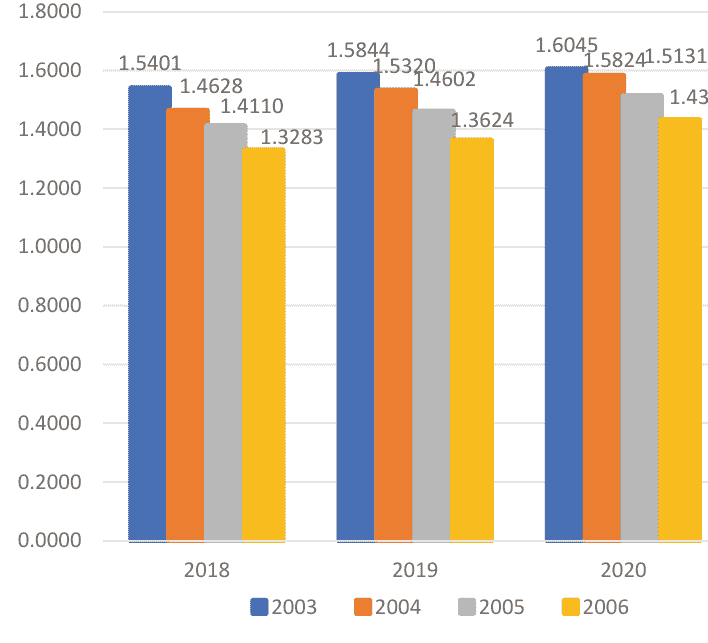

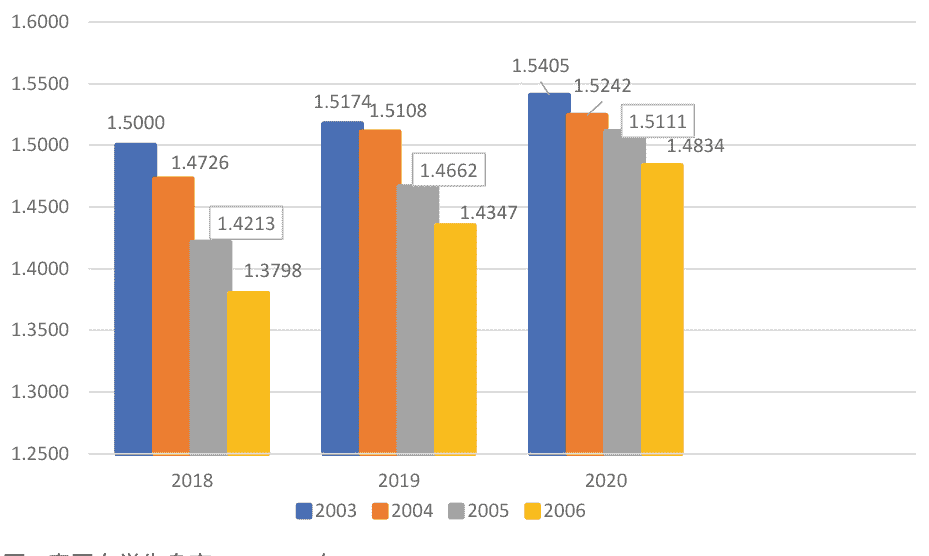

女学生在12-13岁时身高增长最快，比男学生早两年。 男学生和女学生的身高增长速率不同（差异，*p*<0.05，具有统计学意义）；在一个年龄组中，两性之间的平均身高差异不显著。

泰国学生的平均站立身高按年龄组呈快速增长，所有年龄组的身高都有相当大的增加。 男学生的平均身高增加0.0552米/年，女学生的平均身高增加0.0321米/年。

泰国男学生和女学生的身高分别显示在图1和图2中。
男学生在14岁和15岁时生长最快，增长了0.0768米，而女学生则是在12-13岁时，增长了0.0482米。男女学生身高差异最大的时候是在17岁，差距为0.064米。这些男女学生身高差异具有统计学意义(*p* < 0.05)。

总之，我们研究中泰国学生的身高增长符合越南儿童身高增长规律。 然而，山萝省沱州的泰国学生的平均身高低于2003年卫生部调查和2007年世界卫生组织统计数据的平均身高。 这是因为这里的大多数少数民族家庭经济困难，所以他们对营养制度不够了解，也无法提供合理的护理制度来提高孩子的身高。 因此，应采取措施进一步提高研究和越南儿童的身高。

#### 表3 泰国学生按年龄和性别的平均体重

| 年龄 | 男性 $\overline{X}$ | 男性 SD | 男性 n | 女性 $\overline{X}$ | 女性 SD | 女性 n | p | 一般 $\overline{X} \pm SD$ |
| :--- | :--- | :--- | :--- | :--- | :--- | :--- | :--- | :--- |
| 12 | 26.3643 | 3.7443 | 30 | 27.9216 | 2.0610 | 32 | <0.05 | 27.1429 ± 2.9027 |
| 13 | 30.7103 | 3.6714 | 62 | 32.3321 | 2.5722 | 62 | <0.05 | 31.5212 ± 3.1218 |
| 14 | 35.3337 | 3.9606 | 93 | 36.7827 | 2.6134 | 93 | <0.05 | 36.7827 ± 3.2870 |
| 15 | 40.2981 | 3.7898 | 100 | 39.5146 | 2.8323 | 105 | <0.05 | 39.9064 ± 3.3110 |
| 16 | 43.9615 | 3.5269 | 68 | 41.5014 | 2.6238 | 75 | <0.05 | 42.7314 ± 3.0753 |
| 17 | 46.9108 | 2.8273 | 37 | 43.2636 | 2.6904 | 44 | <0.05 | 45.0872 ± 2.7589 |

### 3.2 泰国学生按年龄和性别的体重

#### 3.2.1 泰国学生的体重

体重是反映儿童身体发育、营养状况和生活方式的重要参数之一。泰国学生按年龄和性别的体重数据显示在表3和4中。

男学生的平均体重增长为4.1093千克/年，女学生为3.0684千克/年。12-17岁期间体重增长相对较快。当他们13-14岁时，女学生的体重增长速度最快，而男学生的体重增长速度最快的时间是在14-15岁之间。

男学生体重增长最快的时期是在14-15岁之间，增加了4.9644千克。女学生体重增长最快的时期是在13-14岁之间，增加了4.4506千克。男女学生之间体重差异最大的年龄是17岁，差异为3.6472千克。这种差异在统计上是显著的（p<0.05）。

#### 3.2.2 泰族学生的年龄和性别体重

2018年至2020年期间，男性和女性泰国学生的体重如表4所示。从表4可以看出，在相同年龄下，男性和女性学生的体重明显不同，并且增长不均匀。女性学生的体重大于男性学生，在以下几个群体中都是如此：在调查的三年中，即2005年、2006年出生的学生群体（对应年龄为12、13、14岁），以及在2018年测量时出生于2004年的群体（对应年龄为14岁）。在其他年龄群体中，男性学生的体重大于女性学生。男性和女性学生的体重增长率不同（这种差异在统计上是显著的，p<0.05），但在一个年龄群体中，两性之间的平均体重差异不大。

表4 泰国学生的年龄和性别体重，2018年至2020年

| 体重指数 | 年份 | 性别 | $\overline{X}$ ± SD | 增加 | $\overline{X}_1 - \overline{X}_2$ | 性别 | $\overline{X}$ ± SD | 增加 | $\overline{X}_1 - \overline{X}_2$ |
| :--- | :--- | :--- | :--- | :--- | :--- | :--- | :--- | :--- | :--- |
| | 2018 | 男性 | 41.0503 ± 3.1328 | | 1.1282 | 女性 | 39.9221 ± 2.5543 | | |
| | 2019 | 男性 | 44.0343 ± 2.8233 | | 1.9354 | 女性 | 42.0989 ± 0.6206 | | |
| | 2020 | 男性 | 46.9108 ± 2.8273 | | 3.6473 | 女性 | 43.2636 ± 2.6904 | | |
| | | | | 2.984 | | | | 2.1768 | |
| | | | | | 2.984 | | | | 2.1768 |
| | | | | | 3.6473 | | | | 3.6473 |
| N | | | | 37 | | | | 44 | |
| 2004 | | 男性 | 35.4116 ± 4.2933 | | 1.1282 | 女性 | 36.0167 ± 2.4678 | | -0.6051 |
| | | | | 4.23 | | | | 2.0175 | |
| | | | | | 4.23 | | | | 2.0175 |
| | | | | | 1.1282 | | | | 1.6074 |
| | | | 39.6416 ± 4.455 | | 1.9354 | 女性 | 38.0342 ± 2.4966 | | 1.6074 |
| | | | | | 1.9354 | | | | 1.6074 |
| | | | | | 3.6473 | | | | 3.6473 |
| | | | 43.8887 ± 4.2305 | | 3.6473 | 女性 | 40.9039 ± 2.6269 | | 2.9848 |
| | | | | 2.471 | | | | 2.8697 | |
| | | | | | 2.471 | | | | 2.8697 |
| | | | | | 3.6473 | | | | 3.6473 |
| | | | | 31 | | | | 31 | |
| 2005 | | 男性 | 31.5863 ± 3.5984 | | 1.1282 | 女性 | 32.0924 ± 3.1668 | | -0.5061 |
| | | | | 3.9925 | | | | 4.384 | |
| | | | | | 3.9925 | | | | 4.384 |
| | | | | | 1.1282 | | | | -0.8976 |
| | | | 35.5788 ± 3.7862 | | 1.9354 | 女性 | 36.4764 ± 3.1919 | | -0.8976 |
| | | | | | 1.9354 | | | | -0.8976 |
| | | | | | 3.6473 | | | | 3.6473 |
| | | | 40.2025 ± 3.7816 | | 3.6473 | 女性 | 40.5877 ± 3.4458 | | -0.3852 |
| | | | | 4.6237 | | | | 4.1113 | |
| | | | | | 4.6237 | | | | 4.1113 |
| | | | | | 3.6473 | | | | 3.6473 |
| | | | | 32 | | | | 30 | |
| 2006 | | 男性 | 26.3643 ± 3.7443 | | 1.1282 | 女性 | 27.9216 ± 2.0610 | | -1.5573 |
| | | | | 3.47 | | | | 4.6503 | |
| | | | | | 3.47 | | | | 4.6503 |
| | | | | | 1.1282 | | | | -2.7376 |
| | | | 29.8343 ± 3.7443 | | 1.9354 | 女性 | 32.5719 ± 1.9777 | | -2.7376 |
| | | | | | 1.9354 | | | | -2.7376 |
| | | | | | 3.6473 | | | | 3.6473 |
| | | | 35.0108 ± 3.8024 | | 3.6473 | 女性 | 37.855 ± 2.1806 | | -2.8442 |
| | | | | 5.1765 | | | | 5.2831 | |
| | | | | | 5.1765 | | | | 5.2831 |
| | | | | | 3.6473 | | | | 3.6473 |
| | | | | 30 | | | | 32 | |

图3和4显示了泰国男女学生的体重。男学生在14-15岁时体重增加了4.9644公斤，是体重增长最快的阶段。女学生在13-14岁时体重增加了4.4506公斤。男女学生之间的体重差异最大的时候是在17岁，差异为3.6472公斤。这个差异在统计上是显著的（p<0.05）。

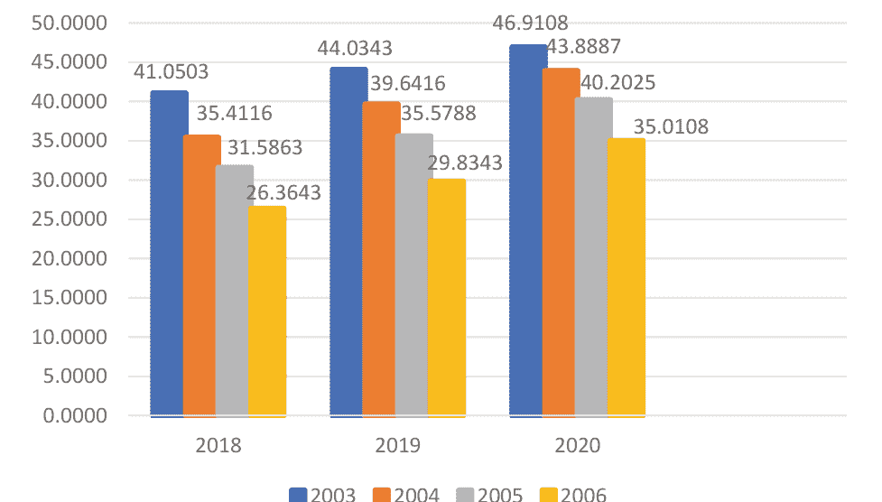

图3泰国男学生的体重，2018年至2020年

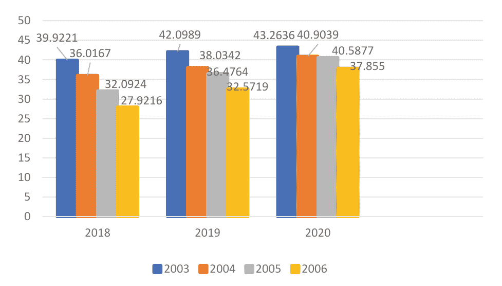

图4泰国女学生的体重，2018年至2020年

表5 泰国学生的平均BMI，按年龄和性别划分

| 年龄 | 男性 X̄ | 男性 SD | 男性 n | 女性 X̄ | 女性 SD | 女性 n | p | 总体 X ± SD |
| :--- | :--- | :--- | :--- | :--- | :--- | :--- | :--- | :--- |
| 12 | 14.9682 | 2.1491 | 30 | 14.6755 | 1.1551 | 32 | <0.05 | 14.8218 ± 1.6521 |
| 13 | 15.9884 | 1.8873 | 62 | 15.8607 | 1.2816 | 62 | <0.05 | 15.9245 ± 1.5845 |
| 14 | 16.7768 | 1.7895 | 93 | 16.9338 | 1.2515 | 93 | <0.05 | 16.8553 ± 1.5205 |
| 15 | 17.2582 | 1.5766 | 100 | 17.4034 | 1.3430 | 105 | <0.05 | 17.3308 ± 1.4598 |
| 16 | 17.5421 | 1.4303 | 68 | 17.9596 | 1.3001 | 75 | <0.05 | 17.7508 ± 1.3652 |
| 17 | 18.2499 | 1.3981 | 37 | 18.2405 | 1.2589 | 44 | <0.05 | 18.2452 ± 1.3285 |

这个差异在统计上是显著的（p<0.05）。

### 3.3 泰国学生的年龄和性别BMI

我们研究中泰国学生的平均BMI指数显示在表5和表6中。泰国学生的平均BMI按年龄组在两性之间有所不同（差异在统计上显著，p < 0.05）。男性学生的平均BMI为0.6564/年，而女性为0.7130/年。此外，在特定年龄组中，两性之间的BMI差异不显著。

表6显示，在相同年龄下，男性和女性学生的BMI具有不同的值。在我们的研究中，2006年出生的学生在2020年调查中（对应14岁）BMI较大，2005年在所有三次调查中（分别为13岁、14岁和15岁）BMI较大，2004年在2018年和2020年调查中（分别为14岁和16岁）BMI较大，以及2003年在2018年和2019年调查中（分别为15岁和16岁）BMI较大。在其他年龄组中，男性学生的BMI大于女性。男性和女性学生的BMI随年龄变化不同（差异在统计上显著，p < 0.05）。男性和泰国学生的BMI显示在图5和图6中。

在相同年龄下，泰族男女学生的BMI并不相同。准确地说，男学生的BMI低于女学生的BMI。这是因为女性的发育期比男性早。一般来说，12至17岁男女学生的BMI差异在统计上是显著的（p<0.05）。

表6 2018年至2020年泰国学生的BMI

| BMI指数 | 年份 | 统计值 | 2003 | | | 2004 | | | 2005 | | | 2006 | | |
| :--- | :--- | :--- | :--- | :--- | :--- | :--- | :--- | :--- | :--- | :--- | :--- | :--- | :--- | :--- |
| | | | 男性 | 女性 | $\overline{X}_1 - \overline{X}_2$ | 男性 | 女性 | $\overline{X}_1 - \overline{X}_2$ | 男性 | 女性 | $\overline{X}_1 - \overline{X}_2$ | 男性 | 女性 | $\overline{X}_1 - \overline{X}_2$ |
| | 2018 | $\overline{X} \pm SD$ | 17.3354 ± 1.5706 | 17.7545 ± 1.2851 | -0.4191 | 16.5273 ± 1.7212 | 16.6238 ± 1.3099 | -0.0965 | 15.8688 ± 1.6497 | 15.8941 ± 1.6033 | -0.0253 | 14.9682 ± 2.1491 | 14.6755 ± 1.1551 | 0.2927 |
| | | 增加 | - | - | | - | - | | - | - | | - | - | |
| | 2019 | $\overline{X} \pm SD$ | 17.5692 ± 1.4118 | 18.2959 ± 1.2780 | -0.7267 | 16.8724 ± 1.6284 | 16.6760 ± 1.2449 | 0.1964 | 16.6841 ± 1.5578 | 16.9735 ± 1.4971 | -0.2894 | 16.1079 ± 2.1249 | 15.8273 ± 0.9599 | 0.2806 |
| | | 增加 | 0.2338 | 0.5414 | | 0.3451 | 0.0522 | | 0.82 | 1.0794 | | 1.1397 | 1.1518 | |
| | 2020 | $\overline{X} \pm SD$ | 18.25 ± 1.3981 | 18.2405 ± 1.2405 | 0.0095 | 17.5150 ± 1.4488 | 17.6233 ± 1.3222 | -0.1083 | 17.5669 ± 1.5309 | 17.7795 ± 1.4991 | -0.2126 | 17.1192 ± 2.0896 | 17.2040 ± 0.9474 | -0.0848 |
| | | 增加 | 0.6808 | -0.0554 | | 0.6426 | 0.9475 | | 0.8828 | 0.806 | | 1.0113 | 1.3767 | |
| | | n | 37 | 44 | | 31 | 31 | | 32 | 30 | | 30 | 32 | |

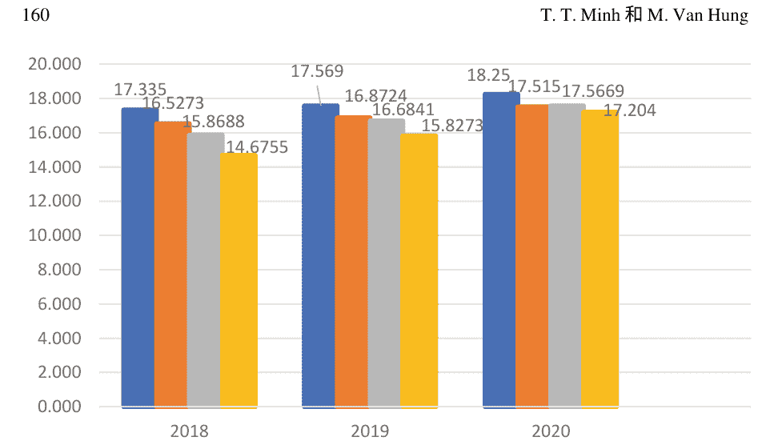

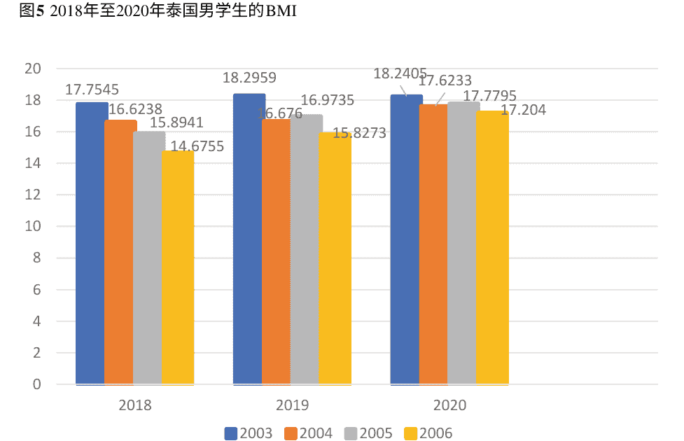

## 4 结论

关于学生形态指标的研究结果表明，身高和体重指数随年龄增长而增加。然而，这两个指标的增长速率在年龄和性别上是不均匀的或不相同的。这些指标的快速增长期男性学生比女性学生晚出现，这说明了根据儿童性别的生长规律的不均匀性。

越南索拉省图安乔区某些中学的泰族学生的平均BMI主要分为4个水平：能量不足水平1、水平2、水平3和正常水平。这反映出他们的形态指标远低于国家和国际平均水平。为了改善这种情况，需要通过沟通和教育改变公众对营养作用的认识，改善索拉省图安乔区少数民族的生活质量，特别是西北地区的生活质量。

## 参考文献

1. 联合国。 （1990年）。人类发展报告。联合国开发计划署。
2. 联合国。 （2020年）。人类发展报告。联合国开发计划署。
3. 卫生部。 (2003).20世纪90年代的越南生物学常规值.医学出版社。
4. Dam, D. T. (2003).在生物统计中使用Microsoft Excel. 医学出版社，河内。
5. Loan, T. T. (2002).对河内Cau Giay地区6-17岁学生的一些身体和智力指标的研究.河内教育大学生物学博士论文。

基于LSTM的深度学习架构用于人类活动识别

Pooja Kallepally和M. Rajesh

摘要 本文使用原始传感器数据开发和训练网络，用于各种应用中的人类活动识别，从追踪他们的健身和安全监测。 这些模型可以简单地扩展以便训练更多的数据源以提高准确性或进行不同预测类别的分类扩展。 本研究深入探讨了WISDM的可访问数据集以及各个轴的不同特征。 此外，为了进行人类活动识别的应用，定义了一种长短期记忆（LSTM）架构模型的设计。 在前500个训练周期中，已经实现了超过96%的准确率和少于30%的损失。

关键词传感器 · 长短期记忆（LSTM） · 活动识别 · 加速度

## 1 引言

人类活动识别（HAR）的目标是根据从一组传感器中收集的信息对实践进行分组。 在数字时代，手机已经普及到几乎每个人手中，视频监控也被广泛使用[1]。 手机已经成为全球普遍存在的物品。 这些手机具有内置的传感器，如加速度计、传感器等。

这些传感器通过手机的运动作出反应。 HAR用于理解在这些录像/摄像头中人们执行的活动。 考虑到摄像头的数量，一个人不可能在24 * 7的时间内高精度地跟踪它们，同时将工作成本降至最低。 加速度计的加速度是

在每个三个轴上的估计速度为m/s²。陀螺仪是另一个显著的用于动作识别的传感器。它确实为加速度计提供了速度或旋转轴。许多研究人员使用了来自这两个传感器的数据或仅使用其中一个传感器。HAR在应用中不断发展，以通过不同的可穿戴设备改善生活，这些设备将比这两个传感器更多，例如，使用外部传感器测量心率并不总是一个好主意。

## 2 文献综述

Bülbül等人[1]提出了一篇关于使用智能手机进行人体活动识别的研究文章。他们引入了SVM，这是一种利用超维平面最大化分离示例的方法。虽然SVM可以有监督或无监督地使用，但有监督的SVM通常更快且更成功。当使用具有立方多项式核的SVM来识别数据集时，达到了87%的准确率。SVM策略不适用于大型信息集合。当给定的数据较多时，SVM的性能不佳。

文献[2]，“MEx: 用于人体活动识别的多模态锻炼数据集”，由Anjana Wijekoon和Wen-chao Xu研究了几种方法，其中CNN是处理视觉图像最常用的方法。它们通常被称为移不变或空间不变的人工神经网络，主要关注平移和常见设计不变性。通过将帧展平，创建向量；然后，处理帧以创建时间窗口。

对于一条路径，帧宽度向量长度为帧宽度高度/帧高度/每秒帧。2D方法主要采用二维卷积和总池化级别。

论文[3]“主题交叉验证在人类活动识别中的应用”，作者Akbar Dehghaniet al.提出了一种使用k折交叉验证作为主要方法来测试模型输出和调整超参数的模型。这意味着测量值既是随机的又是相同分布的，这意味着数据点是从同一来源分别取得的。因此，k折交叉验证可能会降低活动识别器的性能，特别是在使用重叠滑动窗口时。研究了主题交叉验证对HAR性能的影响。

论文[4]“用于人类活动识别的动态视觉传感器”，作者Stefanie Anna Baby提出了一种包括动态视觉传感器的模型，该模型仅处理相机捕捉到的前景对象，完全忽略背景的不必要处理，减少了处理要求，大大提高了检测效率。因为每个像素的强度差异仅由纹理边缘决定，所以DVS输出非常稀疏。

DVS数据的各个部分也被表示为运动图，然后利用稀疏数据和DVS获取的运动片段来定义感兴趣的方面，从而增加活动检测的置信度。 Ghazal [5] 使用SVM分类器从摄像头输入中提取人体骨骼信息，如人体结构中关节的位置。 根据从摄像头采集的输入，可以利用这些数据来估计人体姿势并检测与这些数据点的运动相关的活动。

Ding [6] 构建了一个模型，使用基于决策树的技术来识别不同的人体活动。 Bagging的概念有助于在树构建过程中随机选择分区数据节点，提高单一树分类器的分类准确性。 基于提供的决策树，向所提供的类别分配向量，通过多数投票进行。 这个过程对于森林中的每棵树都重复进行。 为了达到所需的高准确性，这个过程需要大量的标记数据。

研究[7-14]也揭示了各种检测活动的方法。

## 3 提出的系统

该模型采用LSTM架构构建，并使用加速度计数据进行训练，以分类六种活动。 该模型有两个全连接层和两个LSTM层，每个层都有64个单元。 隐藏层的初始化工作是ReLU。关于神经网络，修正线性单元是数学上的初始化，如下所示：

$$F(x) = \max(0, x) \tag{1}$$

ReLU是一种非常流行的激活函数，因为它不会同时激活所有神经元。 在输出层，使用SoftMax作为激活函数，因为SoftMax层为每个分类提供了所需的概率分布。 使用Google的TensorFlow库中的基本LSTM单元方法，通过创建损失函数来优化深度学习算法，以评估模型预测与期望标签之间的差异，并生成一组权重，神经网络可以使用这些权重生成准确的预测，从而得到一个具有较低值的损失函数。

ADAM优化器在LSTM模型中被用作图1。 Adam优化是一种深度学习模型优化训练技术，取代了随机梯度下降。 Adam优化器结合了AdaGrad和RMSProp方法的最佳特点，为具有稀疏梯度的嘈杂问题提供了优化技术。

## 4个LSTM架构

采用LSTM深度学习方法，使用一个公开可用的仅包含加速度计数据的数据集进行模型训练。学习到的模型将尝试实时逐个预测活动。LSTM可用于未分段、连接、语篇识别和网络流量或中断识别框架中的不一致性定位，例如中断识别系统。

图2由一个典型的LSTM单元组成，包括一个输入门、一个输出门和一个遗忘门。LSTM解决了循环神经网络的短期记忆问题。LSTM利用一系列的门，每个门都有自己的RNN，根据概率模型保留、忽略或遗忘信息。将每个神经元替换为内存单元的递归网络称为LSTM。一个带有递归自连接的真实神经元位于内存单元中。LSTM网络的细胞状态指的是内存单元中神经元的激活状态。

此外，LSTMs可以用来解决不稳定和消失的梯度问题。简单来说，这些担忧是循环压力的结果。

神经网络训练中的变化。随着时间的推移，倾向性增加或减少，并且随着每次变化，框架的梯度复制变得更加简单。由于这种复合作用，梯度要么太大，要么太小。尽管传统的RNN存在严重限制，例如爆炸和消失的梯度，但LSTM配置基本上缓解了这些问题。

## 5 方法论

如图3所示，该模型考虑了跑步、坐着、站立、上楼和下楼等六种活动。这些练习在WISDM提供的原始数据信息中可用，并且非常适合作为研究的基础。大部分练习都涉及重复运动，这使得训练和识别更加容易。x轴表示水平运动，即腿和手的左右运动。这用于捕捉腿部的水平运动。y轴识别垂直运动，即人体的上下运动，而z轴表示进出屏幕的运动，可用于捕捉腿部的前后运动。

通过加速度计收集的数据用于执行各种活动，如行走、坐着和站立。数据以50 Hz的频率记录。由于所收集数据的性质，无法访问原始数据。相反，已创建了一个预处理版本。预处理版本能够将数据分成128个数据点，并具有50%的重叠。然后，它将数据分成两个组成部分：身体运动组成部分和重力。

## 6 结果

图4中慢跑活动的数据集显示了用户创建的模式，与其他记录的活动不同。频率线不像其他活动中使用的那样对齐。用户的位置也由y轴确定，其在10-20°左右波动。这意味着在执行活动时，人处于正确的位置。这里的z轴类似于行走。它的值范围为负值，因为用户活动（慢跑）需要更多的力量。

在图5中显示的行走模式中，频率在所有轴上都相似但具有自己的力量和半径。峰值代表人类直线行走模式。

图6和7的输出显示用户的运动模式类似保持不变。x轴表示腿部运动，由于没有运动，图形保持不变。y轴显示向表面的重力拉力，z轴垂直运动，因此图形在两个轴上都保持不变。

LSTM模型似乎经过良好训练，准确率超过96%，交叉熵损失在训练和验证数据中都低于0.2。交叉熵损失为0.13，如图8所示。

图4 慢跑模式

图5 行走模式

图6 坐姿模式

从图9的混淆矩阵可以看出，在数据集中，步行和慢跑是最常见的两种活动，被正确分类的准确率非常高。尽管坐姿和站立姿势是少数类别，但模型仍然能够正确区分它们。上楼和下楼的准确率不如其他类别高。这是可以预料的，因为这两种操作非常相似，因此底层数据可能不足以准确区分它们。

## 7 结论和未来工作

已经研究了传感器沿着x、y和z（三维）轴的运动，以及获取读数的时间戳。基于原始时间序列数据，构建了一个简单的LSTM网络。基于LSTM的模型实现了96%的分类准确率。通过将加速度计的三轴数据与三轴数据相结合，可以实现这一目标。可以检测到比较动作，如站立和坐姿，以及感知具有非常高精度的各种锻炼。

未来的工作可能集中在针对适合实际场景的新开发数据集上，包括更多的预测操作和更多的参与者。如果不是这样，也可以尝试使用更多的参与者进行数据收集，这些参与者具有不同的生活方式、行为、年龄、性别等。此外，还可以预测异常的人类行为。

可以执行人类行为。使用功能活动记录系统，可以监控依赖人员，如智能家居中的老年人，并评估他们的活动程度以提供健康服务。此外，对于居住在智能建筑中的所有居民，可以使用人类活动识别来检查他们在温度和湿度等因素上的舒适水平。

#### 图9 混淆矩阵

## 参考文献

1.  Bülbül, E., Çetin, A., & Doğru, I. A. (2018).使用智能手机进行人类活动识别“Gazi”。 土耳其安卡拉大学，IEEE。
2.  Wijekoon, A., Wiratunga, N., & Cooper, K. (2019).MEx: 多模态运动数据集用于人类活动识别。 arXiv:1908.08992v1[cs.CV]。 2019年8月13日。
3.  Dehghani, A., Glatard, T., & Shihab, E. (2018).主题交叉验证在人类活动识别中的应用, 会议, 2018年7月17日, 华盛顿特区, 美国。
4.  Baby, A. A., Vinod, B., Chinni, C., & Mitra, K. (2018).用于人类活动识别的动态视觉传感器。 arXiv:1803.04667v1[cs.CV]. 2018年3月13日。
5.  Ghazal, S., & Khan, U. S. (2018). 使用骨架信息的人体姿势分类。 在2018年计算、数学和工程技术国际会议—iCoMET 2018。
6.  Ding, G., Tian, J., Wu, J., Zhao, Q., & Xie, L. (2018). 使用可穿戴传感器的能源高效人类活动识别。 在2018年IEEE无线通信中。
7.  Meghana, C., Himaja, M., & Rajesh, M. (2020). 通信和网络会议研讨会 (WCNCW): IoT-Health 2018: IRACON workshop on IoT enabling technologies in healthcare. 在使用局部二进制模式直方图的智能考勤监控系统中。 信息与通信技术竞争战略 (ICTCS 2020).
8.  Sreevidya, B., Rajesh, M., & Sasikala, T. (2018). 各种匿名化技术的性能分析-用于敏感数据的隐私保护。 在智能数据通信技术和物联网国际会议上。
9.  Subbiah, U., Kumar, D. K., Thangavel, S. K., & Parameswaran, L. (2020). 通过深度学习对目标检测的各种方法进行了广泛研究和比较。 在2020年智能电子与通信国际会议 (ICOSEC)上。
10. Senthilkumar, T., & Narmatha, G. (2016). 可疑人类活动检测在课堂考试中. 在计算智能、网络安全和计算模型中. 智能系统与计算进展(第412卷). Springer。
11. Venkata Krishna Rao, B., Gopikrishna, K. S., Sukrita, M., & Parameswaran, L. (2021). 使用LSTM和inception网络进行活动识别. 在软计算和信号处理中. 智能系统与计算进展(第1325卷), Springer.
12. Kavya, J., & Geetha, M. (2016). 一种基于FSM的交错和并发活动识别方法. 在 2016年国际计算、通信和信息学会议(ICACCI)中.
13. Bhambri, P., Bagga, S., Priya, D., Singh, H., & Dhiman, H. K. (2020). 可疑人类活动检测系统.物联网在社交、移动、分析和云中的应用杂志, 2(4), 216–221.
14. Tripathi, M. (2021). 使用NB、 SVM和LSTM对尼泊尔COVID19推文进行情感分析。人工智能杂志, 3(03), 151–168.

# 一种用于高光谱图像分类的深度学习框架

Likitha Gongalla和S. V. Sudha

摘要 深度学习模型的出现为解决许多现实世界问题铺平了道路。高光谱图像分类在与国防和农业研究相关的非常关键的应用中具有重要意义。现有方法表明，需要改进计算机视觉应用中高光谱图像分类的质量。在本文中，我们提出了一种名为高光谱图像分类框架（HICF）的框架，其中包含底层机制。我们提出了一种名为基于深度学习的高光谱图像分类（DL-HIF）的算法，用于改进高光谱图像的分类。

使用Python数据科学平台构建了一个原型，用于评估所提出算法的性能。我们的实验结果与支持向量机（SVM）和神经网络（NN）等两个现有的机器学习（ML）模型进行了比较。所提出的DL-HIF模型优于现有的最先进模型。

## 关键词
- 机器学习
- 深度学习
- 高光谱图像分类
- 深度学习框架

## 1 引言

通过卫星或遥感获取的高光谱成像在许多计算机视觉应用中具有重要意义。深度学习模型的出现为解决许多现实世界问题铺平了道路。高光谱图像分类在与国防和农业研究相关的关键应用中具有重要意义，跨电磁光谱高光谱成像技术可以读取。因此，在许多现实世界应用中起着关键作用。

随着深度学习形式的机器学习的进步，高光谱图像分类的质量得到了改善。根据文献，出现了许多方法。许多方法使用了基于CNN的模型。Alipourfard等人[3]结合了CNN和子空间的特征提取，以提高模型的准确性。Zhao等人[4]在深度学习中使用了多尺度方法和特征提取。Yue等人[5]使用了深度CNN模型进行高光谱图像分类。Zhang等人[6]引入了多度量主动学习概念进行分类。Chen等人[7]使用特征提取和CNN对高光谱图像进行分类。Wang等人[13]使用了快速密集光谱方法与CNN。然而，现有模型的问题在于需要更合适的CNN层配置。本文的贡献如下。

1.  我们提出了一个名为高光谱图像分类框架（HICF）的框架，具有底层机制。
2.  我们提出了一种名为基于深度学习的高光谱图像分类（DL-HIF）的算法，用于改进高光谱图像的分类。
3.  使用Python数据科学平台构建了一个原型，用于评估所提算法的性能。

本文的剩余部分结构如下。第2节重点介绍了深度学习方法在高光谱图像分类中的文献综述。第3节介绍了基于深度学习的提出框架。第4节介绍了提出框架的实验结果，第5节总结了本文。

## 2 相关工作

本节介绍了关于高光谱图像分类的深度学习模型的文献综述。刘等人[1]提出了一种称为主动深度学习的深度学习概念用于分类。岳等人[2]在提出的深度学习框架中使用了空间金字塔池化来提高性能。Alipourfard等人[3]结合了CNN和子空间特征提取来提高模型的准确性。赵等人[4]在深度学习中使用了多尺度方法和特征提取。岳等人[5]使用了深度CNN模型进行高光谱图像分类。Zhang等人[6]引入了多度量主动学习概念用于分类。Chen等人[7]使用特征提取和CNN进行高光谱图像的分类。基于深度学习的框架在[8-10]中得到了探索。Gao等人[11]使用基于深度感知网络的方法进行分类，以获得更好的性能。Fabelo等人[12]使用深度学习处理与人脑相关的高光谱图像。Wang等人[13]使用快速密集光谱方法与CNN的概念。Zhong等人[14]使用光谱空间残差网络概念进行图像分类。Sun等人[15]定义了深度特征融合的概念，以实现高效分类。Gap等人[16]使用空间分类方法。Singh等人[17]使用深度学习进行图像分类。Wang等人使用CNN结合交替更新的光谱空间方法进行分类。文献中还发现了多个深度置信网络和3D深度学习方法，这些方法也是重要的方法。

## 3 提出的方法

我们提出了一种基于深度学习的框架，称为高光谱图像分类框架（HICF）。它旨在提高高光谱图像分类的效率。它基于卷积神经网络（CNN），其中包括卷积层、池化层和全连接层。最后，全连接层将地图转换为特征向量，有助于预测类别标签。

每个卷积层都有很多可学习的滤波器。它使用ReLU作为激活函数，用于梯度消失的收敛。池化层的结果被送入全连接层，它们将地图转换为特征向量，有助于预测类别标签。

```
算法 1 基于深度学习的高光谱图像分类（DL-HIF）

输入：高光谱图像
输出：分类结果

1. 开始
2. 应用卷积层 1
3. 应用池化层 1
4. 应用卷积层 2
5. 应用池化层 3
6. 应用全连接层 1
7. 应用全连接层 2
8. 应用softmax层
9. M = 训练模型（特征图）
10. M' = 拟合模型（M）
11. P = 检测结果（M'）
12. 返回 P
```

如算法1所示，它以光谱图像作为输入，并根据图1中提出的深度学习框架进行分类。混淆矩阵显示在图2中，用于推导性能指标。在这项研究中，使用公式1评估模型的准确性。

准确率 = $\frac{TP + TN}{TP + TN + FP + FN}$ (1)

准确率的值可以在0到1的范围内。值为1表示最高性能。

## 4 实验结果

实验使用从数据集中收集的原型进行。它显示了输入光谱样本的数据表示，以及每个输入样本的准确性和所有输入样本的平均准确性方面的分类模型的性能。

图3显示了九个输入样本的表示，其中水平轴显示了迭代次数，而垂直轴显示了光谱图像的均值谱、均值谱-标准差谱和均值谱+标准差谱的相应值。

如表1所示，提供了不同分类模型（如提出的DL-HIF、SVM和NN）的准确率%。

如图4所示，水平轴提供了不同的高光谱样本，而垂直轴显示了每个分类模型的准确性。

图3表示输入高光谱样本的结果

### 表1 不同分类模型高光谱性能

| 样本编号 | 支持向量机 | NN | DL-HIF (提出的) |
|----------|------------|----|-----------------|
| 1 | 0.89178 | 0.909115 | 0.94188 |
| 2 | 0.94188 | 0.902702 | 0.98196 |
| 3 | 0.7515 | 0.814325 | 0.92184 |
| 4 | 0.91182 | 0.929455 | 0.98196 |
| 5 | 0.9018 | 0.922742 | 0.98196 |
| 6 | 0.82164 | 0.913223 | 0.94188 |
| 7 | 0.61122 | 0.845989 | 0.96192 |
| 8 | 0.84168 | 0.870638 | 0.9519 |
| 9 | 0.89178 | 0.998593 | 0.97194 |

### 图4 不同分类模型的性能

### 表2 9个高光谱样本的分类模型的平均准确率

| 分类模型 | 平均准确率（%） |
|----------|----------------|
| 支持向量机 | 0.840567 |
| NN | 0.89296 |
| DL-HIF（提出的） | 0.959693 |

如表2所示，每个模型的平均准确率（%）呈现。这里考虑了9个高光谱样本的平均准确率，用于性能比较。

如图5所示，每个模型的平均准确率（%）呈现。这里考虑了9个高光谱样本的平均准确率，用于性能比较。SVM的平均准确率为84.0566667%，NN的平均准确率为89.2960133%，DL-HIF的平均准确率为95.9693333%。结果表明，所提出的模型优于现有模型。由于深度学习模型在学习过程中更加复杂，所提出的方法表现出最高的性能。

## 5 结论

在本文中，我们提出了一种名为高光谱图像分类框架（HICF）的框架，具有底层机制。我们提出了一种名为基于深度学习的高光谱图像分类（DL-HIF）的算法，用于改进高光谱图像的分类。我们的实验结果与两个现有的机器学习（ML）模型进行了比较，例如支持向量机（SVM）和神经网络（NN）。SVM的平均准确率为84.0566667%，NN的平均准确率为89.2960133%，DL-HIF的平均准确率为95.9693333%。结果表明，所提出的DL-HIF模型优于现有模型。

84.0566667%，NN为89.2960133%，DL-HIF为95.9693333%。结果显示，所提出的模型优于现有模型。由于深度学习模型在学习过程中更加复杂，所以所提出的方法表现最好。未来，我们打算使用基于生成对抗网络（GAN）架构的深度学习来进一步提高高光谱图像分类性能。

## 参考文献

1.  刘鹏，张华，Eom, K. B. (2016). 主动深度学习用于高光谱图像分类。*IEEE应用地球观测与遥感选题杂志*，1–13.
2.  岳杰，毛松，李明 (2016). 一种基于深度学习的高光谱图像分类框架，使用空间金字塔池化。*遥感快报*，7(9)，875-884.
3.  Alipourfard, T., Arefi, H., & Mahmudi, S. (2018). 一种新的深度学习框架，通过组合子空间特征提取和卷积神经网络进行高光谱图像分类。在*IGARSS 2018—2018 IEEE国际地球科学与遥感研讨会* (pp. 4780–4783). 西班牙瓦伦西亚 (2018.7.22–2018.7.27).
4.  Zhao, W., Guo, Z., Yue, J., Zhang, X., & Luo, L. (2015). 关于组合多尺度深度学习特征用于高光谱遥感图像分类的研究。*遥感学国际期刊*，36(13)，3368–3379.
5.  Yue, J., Zhao, W., Mao, S., & Liu, H. (2015). 使用深度卷积神经网络对高光谱图像进行光谱-空间分类。*遥感快报*，6(6)，468-477.
6.  Zhang, Z., & Crawford, M. M. (2017). 用于高光谱图像分类的批处理正则化多度量主动学习框架。*IEEE地球科学和遥感汇刊*，55(11)，6594-6609.
7.  Chen, Y., Jiang, H., Li, C., Jia, X., & Ghamisi, P. (2016). 基于卷积神经网络的高光谱图像深度特征提取和分类。*IEEE地球科学和遥感汇刊*，54(10)，6232-6251.
8.  Chen, Y., Lin, Z., Zhao, X., Wang, G., & Gu, Y. (2014). 基于深度学习的高光谱数据分类。*IEEE应用地球观测与遥感领域选题杂志*，7(6)，2094-2107.
9.  Audibert, N., Lesot, B., & Lefèvre, S. (2019). 深度学习用于高光谱数据分类的比较评述。*IEEE地球科学与遥感杂志*，7(2)，159-173.
10. Li, J., Zhao, X., Li, Y., Du, Q., Xi, B., & Hu, J. (2018). 使用新的全卷积神经网络进行高光谱图像分类。*IEEE地球科学与遥感快报*，1-5.
11. Gao, K., Guo, W., Yu, X., Liu, B., Yu, A., & Wei, X. (2020). 深度感应网络用于小样本高光谱图像分类。*IEEE应用地球观测与遥感领域选题杂志*，13，3462-3477.
12. Fabelo, H., Halicek, M., Ortega, S., Shahedi, M., Szolna, A., Piñeiro, J., Sosa, C., O’Shanahan, A., Bisshopp, S., Espino, C., Márquez, M., Hernández, M., Carrera, D., Morera, J., Callico, G., Sarmiento, R., & Fei, B. (2019). 基于深度学习的框架用于体内识别人脑高光谱图像中的胶质母细胞瘤。*传感器*，19(4)，1-25.
13. Wang, W., Dou, S., Jiang, Z., & Sun, L. (2018). 一种用于高光谱图像分类的快速密集光谱空间卷积网络框架。*遥感*，10(7)，1–19.
14. Zhong, Z., Li, J., Luo, Z., & Chapman, M. (2017). 光谱空间残差网络用于高光谱图像分类的3D深度学习框架。*IEEE地球科学与遥感汇刊*，1–12.
15. Sun, G., Zhang, X., Jia, X., Ren, J., Zhang, A., Yao, Y., & Zhao, H. (2020). 局部光谱特征和多尺度空间特征的深度融合，用于高效分类的超光谱图像。*国际应用地球观测与地理信息学杂志*，91，1-10.
16. Gao, F., Wang, Q., Dong, J., & Xu, Q. (2018). 基于随机多图的高光谱图像的光谱和空间分类。*遥感*，10(8)，1-20.
17. Singh, S., & Srivastava, S. S. (2018). 使用深度学习进行高光谱图像的高效分类。*多媒体工具和应用程序*，1-14.

# 使用IMEI验证改进移动支付的安全性

M. Kathiravan, M. Sambath, B. Bhuvaneshwari, S. Nithya Krishna, W. Jeshwin 和 Nikil Babu

摘要传统的金融框架，如柜台交易与存折的交易，通过添加电子银行的组成部分进行升级，所有的银行交易/交易都可以通过互联网进行，并伴随着数据和相应的技术的进步。然而，这种创新存在重大风险，如银行欺诈。因此，为了在银行客户之间建立信任，建立安全系统至关重要。在电子银行中，安全系统主要集中在为基于网络的交易提供强大的框架，特别是客户验证。许多专家已经提出了金融行业基于网络的客户访问验证的各种模型。大部分研究依赖于传统的用户名和密码形式，但使用不同的密码结构。例如，密码的随机值，通过获取通道的随机值密码，以及生物特征的指纹识别、语音识别或视网膜识别。本文研究了现有的基于移动电话的互联网银行客户访问。描述了SIM卡的元素和SIM卡的可移动属性。还描述了对SIM卡的克隆的威胁。研究结果表明，所有在线客户访问的安全模型都包含密码，如值、生物特征或PIN码。因此，目前的客户访问没有提出基于国际移动设备身份（IMEI）号码的客户访问的安全性加强措施。所提出的研究工作更加关注通过利用IMEI来保护移动支付的安全性。

-   移动支付
-   IMEI
-   密码学
-   安全
-   哈希算法

M. Kathiravan (✉) · M. Sambath · S. Nithya Krishna · W. Jeshwin · N. Babu
计算机科学与工程, 印度斯坦理工学院, 金奈, 印度
电子邮件: mkathiravan@hindustanuniv.ac.in

B. Bhuvaneshwari
信息技术部, Panimalar工程学院, 金奈, 印度

N. Babu
Chitkara大学工程与技术学院, Chitkara大学, 旁遮普邦, 印度

## 1 引言

移动支付是指使用手机进行付款（以货物或服务作为交换），其中手机参与付款的发起和确认。尽管有许多发达的加密算法，但它们不能直接在手机上使用。这个问题有三个主要原因。首先，大多数手机没有强大的CPU，并且内存有限。其次，无线网络的带宽较低，可靠性较差与有线网络相比。最后，在移动支付中建立安全性需要使用密码学。然而，加密算法的复杂性通常不会被用户指定。当这些复杂性被揭示时，这些算法的接受将变得困难。

在交易中使用的加密技术与事先在重要金融机构登记的便携式号码（即在有线网络上连接的计算机或系统）有关，移动系统使用有限的电力供电。这些问题通常导致我们基于手机资源的另一种安全算法。该算法使用以下术语：

-   IMEI国际移动设备身份识别码（IMEI）的序列号是用于识别GSM和CDMA手机的字母数字代码。如果你知道在哪里找，通常可以在手机的电池仓中找到它。IMEI号码由GSM组织用于区分真正的设备和假冒的设备，因此可能被用于防止将手机带入某个国家的企业。对于建议的计算，密码生成软件被隐藏在手机中；因此，IMEI在手机确认中起着重要作用。
-   回归基础。在客户端验证用户名和密码之后，服务器会与客户端断开连接并尝试直接与其通信。在使用Windows Server时，这种方法用于确认系统中的拨号用户的身份。每个客户端的电话号码都包含在他或她的信息中。如果客户端账户被盗或其他人试图连接到服务器，他只能通过在服务器上注册的那个号码共享线路，作为一种预防措施。
-   为了为每个交易所生成唯一的密码，将使用设备的IMEI号码。在服务器上，精确的保密短语存储并使用相同的代码生成应用程序生成，以便轻松进行交叉检查。

## 2 文献调查

电子票务、移动电子商务和电子支付只是新型手机能够提供的众多服务中的几个。在现代，支持NFC技术的手机具有特殊的重要性，因为NFC技术使得多个应用程序的服务能够融合到一个单一的移动设备中。NFC支付系统现在采用EMV协议；然而，该协议存在两个严重的安全漏洞，可能会使客户在支付设备和商家的POS之间面临危险。为了确保基于NFC的移动支付交易的安全性，必须解决这两个安全漏洞。在这项研究中，提出了一个新的安全层来增强EMV的安全性。已经证明EMV的安全机制对于众所周知的安全漏洞是无法渗透的[1]。

在电子商务中，数字支付方法在确保交易安全方面起着关键作用。基于严格的数学计算的电子支付系统将容易受到量子计算机的攻击。为了应对量子计算机带来的威胁，电子支付方法正在使用量子密码学进行改进。然而，即使量子密码学被认为是完全安全的，逻辑缺陷通常会导致重大问题。我们首次使用形式分析来验证基于量子密码学的电子支付系统的安全性。使用形式分析技术可以找到协议中的弱点，从而使协议本身更加安全。根据我们的研究结果，依赖于量子密码学的电子支付系统并不真正安全。根据我们的研究结果，初始程序中存在缺乏问责和公正。为了确保问责和公正，我们提出了更好的方法[2,3]，并使用形式分析进行了测试。

在这项研究中[4]，我们根据图分析方法提供了数字货币计费方法的统计建模。通过这种方式，作者的崩溃实验可以作为系统稳定性分析的基础。在这些崩溃测试中，数字货币计费系统的参与者（图的参与者）被模拟为同时遭受设备和硬件故障以及被黑客攻击。通过以特定顺序组合多个图中心度度量，构建系统稳定性的积分估计。在本文中，使用经济安全矩阵来计算网络中心度度量的关键破坏程度以及破坏过程中的聚合度量。

由于无线网络和便携设备的普及，移动电话越来越受欢迎，为将移动设备赋予支付设备的巨大潜力。然而，要使手机支付正常工作，必须解决许多问题，例如移动电话电量有限和CPU性能较差的事实。最近引入了几种用于移动支付的公钥加密技术。然而，在移动网络中，便携设备的受限能力以及无线通信使这些算法不适用。本文提出了一种基于回调方法和基于IMEI号的OTP的新型手机安全机制。考虑到资源限制，这种方法为移动支付提供了必要的安全性。通过使用原型数据进行模拟，已经证明了所提出算法的效率。

信息技术的扩展到不同的服务领域，特别是产品营销公司和产品贸易，是这一演变的结果。电子商务的兴导致了商业和营销领域的许多新发展。因此，对支付机制的修改必须遵循电子商务模式，即基于互联网的交易。作为在线商务和电子支付的重要组成部分，非现金交易的便利性使得获取商品的过程更加方便。在任何国家或社会经济环境中，货币可以被定义为任何商品或可验证的记录，被普遍承认为支付服务和商品以及债务偿还的方式[5]。

信息和通信技术（ICT）和先进的发展导致了商业环境的动态变化，交易从现金交换转向电子交换[6]。在早期处理阶段，凭借几台个人电脑系统和一小部分特定用户群体，这种模式证明是有效的。随着互联网的出现，线上业务以及办公室和学校中计算机的普及，用户群体在数量和特征上都得到了扩大。个人用户不再为单一系统设置单一密码，而是面临着记住不同系统的多个密码的挑战，包括电子邮件、网络账户、银行和金融服务等。

本文提出了一个概念模型，描述了用户和系统在这方面的相互作用，并研究了用户群体的扩大和密码记忆辅助工具的使用的结果。根据用户驱动的视角，介绍了基于密码的确认所涉及的风险的框架模型，包括用户密码记忆辅助工具的发展。当面临大量需要记忆的数据时，用户会使用密码记忆辅助工具来帮助他们记住重要信息片段。这些用户密码记忆辅助工具在原本孤立的系统之间构建了桥梁，并对由用户连接的各个系统的系统级安全性产生了有意义的影响。本文对这种用户驱动的安全模型互连的影响进行了基本分析[7,8]。

它可能对这些日子的连续网络钓鱼和网络钓鱼攻击都是无懈可击的，也对其他传统攻击如社交工程或中间人攻击是无懈可击的。这个模型的核心问题是需要多方共享的复杂确认，而不仅仅是基于金融实体的数字认证，因为一般用户无法识别证书的真实性，也可能不会关注它。通过遵循本提案中定义的规则，网络银行环境的安全级别将提高，用户的信任将增强，从而实现更有益的服务使用[9]。

在当今，银行、金融机构以及健康或医院管理系统等网络应用的使用正在增加，例如网上银行和移动银行、电子商务应用、新闻频道、实时和短期信息等。所有这些在线应用程序[10,11]都需要支持安全属性，如身份验证、授权、数据保密和敏感信息泄露。对于在线应用程序，最常接受的常规验证方法是使用包含字母数字和特殊字符的用户名和密码的组合。网上或在线应用程序应支持强密码，例如包含字母数字和特殊字符的组合。过去的研究发现，如今的终端用户平均拥有大约10-15个密码来保护他们的基于互联网的账户进行真实交易。一般来说，一个普通的网络用户只有一个密码可能不难记住，但是管理多个不同的网络或者网页应用的密码是一项耗时的任务，也是一个安全隐患。通常情况下，密码并不安全，因为它们可能是可猜测的，或者有人（恶意用户）可能会窃取。为了克服这个问题，密码需要更强的验证方案。为了解决在线商务、网上银行系统和传统动态密码系统存在的问题，本文提出了一种基于PKI-SIM卡的更好的身份验证方案。

如今，由于其一些潜在的好处，如操作简便和虚拟金融活动，基于互联网的银行业务越来越受欢迎，即不再需要客户在不同的银行位置实际出席。然而，由于在不同位置的可访问性不足、成本高和速度慢，使用互联网通信的人数只占手机用户的一小部分，尤其是在非工业化国家。此外，网络银行的安全仍然是一个主要问题。大多数金融机构都有自己的领域和电子交易办公室。在本文中，我们提出了一种利用短信服务（SMS）在手机技术中利用现有的网络金融办公室的方案，而无需互联网连接。考虑到确保高水平的安全性，我们提出了两级安全方案：语音确认和数字水印。

互联网的进步和电子商务的出现鼓励了支付过程的数字化[14, 15]，通过提供各种电子支付选项，包括支付卡（信用卡和借记卡），数字和移动钱包，电子货币，非接触式支付方法等。随着移动支付服务的日益普及，它们已经进入了变革阶段，朝着一个充满潜力的未来和技术发展的方向发展。本文将评估全球市场上移动支付和其他电子支付系统的现状和发展，并探讨该行业的未来。

全球范围内互联网和手机的普及促进了数字支付的发展。尽管具有巨大的增长潜力，但到目前为止，缺乏对影响数字支付方法使用、采用和接受的因素进行综合分析和研究。本研究旨在通过对Scopus和Web of Science数据库中检索到的相关文献进行全面回顾来填补这一空白。按照系统性的方法，最终确定了193篇研究文章，并进行了分析。结果表明，单一理论未能完全理解电子支付的复杂性[16, 17]。

目前，我们有许多交换技术可供选择，但我们绝对不赞成欺诈短信和电话。他们声称自己是银行代表。这个电话是关于银行支票的事情，如果我们不知情地向他们提供了所有细节，那么我们就会损失我们的金额。现有系统使用了一次性密码和基于3D安全的UPI支付验证。缺点是互联网的开放和民主性使消费者容易受到不诚实卖家的捐款。即使是对网站创建有一些了解的人也可以建立一个具有有效需求的在线商店，以确保库存的可用性或提供服务的方式[18, 19]。在提议的系统中，电话IMEI号码的视图起作用。通过使用通信API，我们将获得IMEI号码。为了更安全，我们使用SHA 256算法。如果任何授权人员获得了密码生成程序的访问权限，他/她只能与服务器进行通信，无法执行交易。作为肯定的结果，过去的交换密码将被发送，交换将完成。

## 3 方法

使用一个理论模型，框架设计解释了一个框架是如何构建的，如何使用以及其他几个方面的使用。设计表示是一个传统的描述和描述框架的方式，以便于理解框架的结构和操作方法，如图1所示。

图1 架构图

各种组织的基于QR码的支付结果之间的互操作性：RuPay、Visa、Master Card和AmEx。替代POS终端，低成本的接受支付解决方案基于推送的交易，例如从持卡人开始。不要打扰向商家提供实际的卡片。

-   使用要添加模块的项目打开Android Studio。
-   从Android Studio菜单中，点击文件>新建>导入模块。选择Eclipse ADT项目文件夹，通过AndroidManifest.xml文件，然后点击确定。
-   通过AndroidManifest.xml文件选择Eclipse ADT项目文件夹，然后点击确定。
-   如果需要，更改模块名称并点击下一步。
-   导入到Android Studio鼓励用户将某个库和项目依赖迁移到Android Studio，并在导入过程中向构建gradle文件添加依赖声明。有关传输项目和库依赖项的更多信息，请参见创建Android库。因此，您将不再需要手动管理任何已识别Maven坐标的众所周知的二进制库、源库或JAR文件与Maven依赖项。您的工作空间目录以及任何实际路径映射也可以输入以解决任何未解决的比较路径、变量路径和链接资源。
-   点击完成。

## 4 实施和结果分析

我们使用IMEI方法取得了真实的结果，与传统的电话号码方法相比，更加安全。登录页面是一个通往需要用户进行身份验证和验证的网站的过渡页面，如图2所示。图3中的注册页面使用户和组织能够独立注册并获得对系统的访问权限。图4中的IMEI交易页面提供了各种货币交易选项。图5显示了在选择交易模式后，支付网关导航到用户输入银行信息的页面。

详细描述了图2、图3、图4和图5。要求您输入登录凭据以访问特定程序的页面被称为“登录应用程序”。如果您登录到Facebook、Twitter或其他社交媒体网站，您可能已经看到过它。在本章中，生成一个登录界面并学习如何处理安全问题，当出现虚假尝试时。首先，您必须指定两个文本视图的输入类型为密码。安全专家通常将“登录”和“登录”这两个术语互换使用，以描述一个人验证和验证其身份以获得对移动计算机系统的可访问性的过程。用户通常有一个用户名和一个密码，这些凭据通常在在线服务的上下文中被称为“登录”（或登录或登录或登录）。在当前安全系统中，通常需要邮件或短信验证以提供额外的保护。用户可以如果他们不再需要访问权限，则注销。在注册过程中，向用户的手机发送一个验证码（OTP）。不再有人使用虚假的邮件地址或虚假的手机号码注册的机会。该模块验证电子邮件地址或手机号码是否存在，并可被用户访问。免费模块提供十个免费电子邮件地址和十个免费短信交易。此模块提供电子邮件、短信和OTP验证功能。

图2 登录页面

图3 注册页面

### 图4：IMEI交易页面
### 图5：添加用户银行详细信息

模块。可用的电话管理器可获取有关手机电话服务的信息。应用程序可以利用此类别中的过程来确定电话服务和用户信息的状态。根据国家标准与技术研究所的说法，安全散列算法是一组密码散列函数，是联邦政府的数据处理标准的一部分，包括：SHA-0：1993年发布的初始160位散列函数的重命名。

## 5 结论

我们提出了一种直接有效的基于IMEI的验证组件，以及电子交换系统的回调方法。通过安装服务器直接与客户端进行通信，检查客户端手机创建的密码。因此，它比基于信用卡的验证组件提供更高的安全性。随着全球范围内GSM技术的广泛应用，所提出的算法可以在大多数具有有限硬件资源的手机上提供足够的安全性。

致谢感谢印度金奈Hindustan技术与科学学院计算机科学与工程系。

## 参考文献

1.  Hassan, M. A., & Shukur, Z. (2022). 基于设备身份的电子支付系统用户认证，用于安全的电子钱包应用程序。电子学，11, 4.
2.  Hammood, W. A., Abdullah, R., Hammood, O. A., Asmara, S. M., Al-Sharafi, M. A., &Muttal eb Hasan, A. (2020). 基于移动IMEI号码的在线银行系统用户认证模型综述。IOP会议系列材料科学与工程，769.
3.  Ghiduk, A. S. (2012). 设计和实现用户界面和移动设备应用程序。国际计算机应用杂志, ISSN 0975-8887.
4.  Marcus, P., & Peitek, N. (2016). Retrofit在Android上使用API非常好用。
5.  Dewi, P. (2010). 使用UML和BPMN的活动图对业务过程进行建模。 Jurnal Fakultas Teknology Industri Universitas Kristen Petra Surabaya.
6.  Ramos, M., & Tulio, M. (2018). Angular JS性能。IEEE计算机学会, ISSN 0740-7459.
7.  Ruby, S., & Richarson, L. (2007). Restful网络服务 .
8.  Samisa. (2008).Restful, PHP, 网络服务. Packet Publishing.
9.  Sharfina, Z., & Santoso, B. (2016). 系统可用性量表的印尼适应版
10. Fatonah, S., Yulandari, A., & Wibowo, P. W. (2018). 电子商务中电子支付的综述。物理学会会议系列杂志.
11. Wirdasan, D. (2019). 电子商务技术在业务流程中的应用。 7(2).
12. Alam, S. B., et al. (2010). 孟加拉国移动银行中的安全电子交易方案，包括数字水印。在 2010年IEEE国际信息理论和信息安全会议上.
13. Chowdhury, M. M., & Noll, J. (2007). 用于安全服务交互的分布式身份。在 2007年第三届无线和移动通信国际会议（ICWMC'07）上.
14. Yin, X., et al. (2009). 基于PKI-SIM卡的改进动态身份认证方案.
15. Priya, R., Tamil Selvi, V., & Ramesh Kumar, G. (2014). 一种新的具有指纹识别的安全互联网银行算法。·在嵌入式系统国际会议上(ICES).
16. Basavala, S. R., Kumar, N., & Agarrwal, A. (2012). 认证：概述、类型 和与Web和移动应用程序的集成。 在第二届IEEE国际会议上 并行、分布式和网格计算.
17. Hammood, O. A., Kahar, M. N. M., Mohammed, M. N., & Hammood, W. A. (2017). VANET 和路由协议中视频传播的问题和挑战：综述。工程与应用科学杂志，12(11), 9266-9277.
18. Conklin, A., Dietrich, G., & Walz, D. (2004). 基于密码的认证：系统 视角。 在第37届夏威夷国际系统科学会议上。
19. Martino, A. S., & Perramon, X. (2008). 用于保护电子银行认证过程的模型：反钓鱼方法。 在IEEE服务大会-第一部分上。

# 评估分类算法对脑电情感分析的有效性

Sumya Akter, Rumman Ahmed Prodhan, Muhammad Bin Mujib, Md. Akhtaruzzaman Adnan 和 Tanmoy Sarkar Pias

摘要脑电图（EEG）信号提供了关于情绪状态的额外信息，这些信息可能无法通过口头表达。机器学习算法可以有效地预测脑电波的情绪。因此，我们设计了一项研究，评估多种机器学习技术（朴素贝叶斯、逻辑回归、XGBoost、SVM、决策树、随机森林、KNN和深度学习模型——CNN、LSTM和Bi-LSTM）在脑电信号情感分类中的有效性。在我们的实验中，DEAP数据集被用作代表不同人类情感的脑电信号的集合。快速傅里叶变换（FFT）将数据转换到频域，用于从时间序列脑电数据中提取特征。在所有算法中，CNN、KNN和随机森林在二元分类的愉悦度上分别达到了最高的准确率96.64%、95.8%和95.28%。结果表明，通过将适当的特征提取技术（在本例中为FFT）与机器学习算法相结合，可以达到与一些深度学习模型相当甚至超越的准确率。

关键词：
- 支持向量机
- 随机森林
- K最近邻
- 长短期记忆
- 卷积神经网络
- 朴素贝叶斯
- 脑电图
- 快速傅里叶变换

S. Akter ·R. A. Prodhan ·M. B. Mujib ·M. A. Adnan
亚洲太平洋大学，孟加拉国达卡1205，电子邮件：18101029@uap-bd.edu
R. A. Prodhan
电子邮件：18101018@uap-bd.edu
M. B. Mujib
电子邮件：18101017@uap-bd.edu
Md. A. Adnan
电子邮件：adnan.cse@uap-bd.edu
T. S. Pias (✉)
弗吉尼亚理工学院，布莱克斯堡，VA 24061，美国
电子邮件：tanmoysarkar@vt.edu

## 1 引言

情绪是一种行为和生理状态，其特点是一系列感受、思维和行动。识别和分析他人情绪的能力被称为情绪识别。这可以通过使用大脑信号[1]、面部表情、肢体语言和声音语调[2]来实现。这是一项重要的社交技能，因为它帮助我们正确地对他人的情绪做出反应。从大脑活动中识别情绪被称为情绪识别从大脑信号[3]。许多作者[4]，已经研究了情绪识别，并使用了各种方法，但其中最有效的方法是从大脑信号中检测情绪。

### 1.1 背景

近年来，利用公开可用的DEAP数据集进行了大量的情感识别研究。在DEAP数据集中，情感被分类为情感价值、情感唤醒、情感支配、喜好和熟悉度。先前的研究表明，使用了各种不同的建模方法。表1描述了以不同的建模技术为基础的几篇文献综述。郑等人[17]系统地分析了常见特征提取、特征选择和分类算法的性能。他们比较了六种不同的特征，如差分熵（DE）、不对称性（ASM）、差分不对称性（DASM）、有理不对称性（RASM）、功率谱密度（PSD）和差分因果性（DCAU）。近年来，FFT [8,10,11]和DWT [11]方法被广泛用于提高EEG信号的准确性。在本研究中，采用FFT进行特征提取。还有许多不同的机器学习和深度学习算法被用于从EEG信号中检测情感。Parui等人[14]使用了XGBoost算法，在不同的情感标签上达到了75%的准确率。他们提出的算法还与贝叶斯、KNN、决策树和随机森林算法进行了比较。

Doma等人[12]通过使用基本的机器学习技术，如SVM、朴素贝叶斯、决策树、逻辑回归、KNN和LDA，所有这些方法的准确率都达到了至少80%。许多深度学习算法，如卷积神经网络（CNN）或长短期记忆（LSTM），可以用来识别情绪。许多研究将CNN和LSTM结合起来，以获得高性能[5]。Cui等人[6]将DE特征提取方法与Bi-LSTM和CNN相结合，在DEAP数据集上实现了平均94%的准确率。还有许多其他不同的技术，如GCNN [13]、SVM [12, 15, 16]、逻辑回归 [12, 17]、决策树 [14]，之前也有人进行了探索。为了更准确地检测情绪，本研究将比较10种不同的机器学习和深度学习算法，包括朴素贝叶斯、逻辑回归、XGBoost、SVM、决策树、随机森林、KNN、CNN、LSTM、带有快速傅里叶特征提取技术的Bi-LSTM。图1中的图表表示了平均准确率与算法之间的关系。

#### 表1 基于不同算法的文献综述概览

| 研究 | 出版年份 | 特征 | 算法 | 性能 |
| :--- | :--- | :--- | :--- | :--- |
| Arjun等人 [5] | 2022 | 自编码器 | CNN, LSTM | 唤起度: 69.5%, 情绪价值: 65.9% |
| Cui等人 [6] | 2022 | DE | DE-CNN-BiLSTM | 唤起度: 94.86%, 情绪价值: 94.02% |
| Ma等人 [7] | 2021 | 小波 | 支持向量机 | 平均唤起度和情绪价值: 89.72% |
| Hasan等人 [8] | 2021 | FFT | CNN | 情绪价值: 96.63%, 唤起度: 96.17% |
| Yin等人 [9] | 2021 | DE | GCNN, LSTM | 情绪价值: 90.45%, 唤起度: 90.60% |
| Maeng等人 [10] | 2020 | Hjorth, DWT, FFT | LSTM | 唤起: 94.8%, 情感: 91.3% |
| Luo等人 [11] | 2020 | DWT, FFT | SNN | 唤起: 74%, 情感: 78%, 支配: 80%, 喜好: 86.27% |
| Doma等人 [12] | 2020 | PCA | 朴素贝叶斯, 逻辑回归, KNN, SVM, 决策树, LDA | 准确率的平均值: 75% |
| Wang等人 [13] | 2019 | 时频域 | P-GCNN, GCNN, SVM, DBN | 唤起: 77.03%, 情感: 73.31%, 支配: 79.20% |
| Parui等人 [14] | 2019 | 原始 | 贝叶斯, KNN, C4.5, 决策树, 随机森林, XGBoost | 平均值 75%(XGBoost) |
| Liu等人 [15] | 2018 | EMD, SBS | KNN, SVM | 情感倾向: 86.46%, 唤起: 84.90% |
| Raghav等人[16] | 2018 | 小波分解, 主成分分析 | 支持向量机, K最近邻法, 朴素贝叶斯, 随机森林 | 最高准确率: 75% (随机森林) |
| Zheng等人[17] | 2017 | 功率谱密度, 差分熵, 差分绝对值和, 相关绝对值和, 绝对值和, 离散小波变换 | K最近邻法, 支持向量机, 广义极限学习机, 逻辑回归 | 平均唤起和情感倾向: 69.67% |

### 1.2 动机

研究情感脑信号是一项复杂而复杂的工作。脑电图（EEG）是一种确定大脑电活动的方法。

脑电图（EEG）信号可用于识别与各种情绪相关的电活动。了解人类情绪如何从一种状态变化到另一种状态非常重要。研究表明，与深度学习算法相比，使用提取特征的机器学习算法可以有效识别情绪。

### 1.3 目标

本文的目标是使用机器学习和深度学习算法从脑信号中检测情绪。本文还对机器学习和深度学习算法进行了全面分析。这在各种应用中都有优势，包括在人机交互过程中识别情绪，在不同活动中监测情绪，以及帮助那些患有情绪疾病如抑郁和悲伤的人。深度学习在这方面更常用。深度学习是一种在数据中发现复杂模式的非常有效的技术[18]。但是如果正确地结合使用，机器学习和特征提取也是有效的。本文作者展示了机器学习算法如何与特征提取相结合，类似于深度学习。本研究做出了以下重要贡献：

- 在DEAP数据集上，我们评估了几种机器学习技术用于情感检测的性能。
- 在应用快速傅里叶变换（FFT）作为特征提取方法对脑电图数据进行处理后，我们比较了机器学习算法和深度学习算法。
- 我们证明通过使用快速傅里叶变换（FFT）作为特征提取，机器学习可以表现得几乎与甚至超过深度学习模型。

## 2 方法

图2展示了评估不同机器学习算法的整个工作流程过程。首先，选择DEAP数据集作为原始脑电图数据。然后应用各种数据预处理技术。随后，在特征提取阶段使用FFT对预处理后的数据进行分段。然后使用相同的特征提取数据进行所有实验。

### 2.1 数据集

有许多公开可用的脑电信号情感识别数据集，包括DEAP [19]、SEED [20]、LUMED [21]、DREAMER [22]和AMI-GOS [23]。在这些数据集中，DEAP和SEED是最受欢迎的数据集。DEAP数据集被广泛用于评估不同的算法，因此选择了该数据集进行本研究。DEAP数据集是一个主要用于分析人类情感状态的多模态数据集。数据集团队选择了120个音乐视频，每个视频的运行时间为一分钟。表2提供了DEAP数据集的概述。图2的第一步展示了单个参与者的原始脑电图数据。主题1-22和23-32的脑电图数据分别记录在Twente和Geneva。对于每个参与者，记录了40个试验，展示了所选120个视频中的40个视频。

每个录音的持续时间为63秒。

图2 工作流程图

#### 表2 DEAP数据集的概要

| 数据集类型 | 多模态 |
| :--- | :--- |
| 受试者 | 32 |
| 视频 | 40 |
| EEG通道 | 32 |
| 标签 | 情绪、唤醒、支配、喜好和熟悉度 |
| 原始采样率 | 512 Hz |
| 预处理降采样率 | 128 Hz |
| 评分值 | 连续数字1到9之间的值（情绪、唤醒、支配和喜好）。离散数字1到5之间的值（熟悉度） |

### 2.2 预处理

512 Hz的EEG数据被降采样到128 Hz。使用盲源分离来减少眼动伪迹。使用4.0-45.0 Hz频率范围的带通滤波器。数据根据常用参考进行平均。由于EEG数据在两个不同的地方收集，EEG通道的顺序被改变以匹配日内瓦序列。每个试验包含60秒的数据和三秒的试验前基线。然后消除试验前的部分。此外，试验被重新排序，以比较视频呈现顺序和视频顺序。

### 2.3 特征提取

特征提取对于最小化信号损失、减少过拟合和简化实现至关重要[24]。通常情况下，与使用原始数据相比，任何特征提取方法都可能提供更好的分类结果。本研究使用频域特征，主要用于将信号数据分解成子带。小波变换（WT）、快速傅里叶变换（FFT）和等价器方法（EM）通常用于提取脑电图特征。从这些特征提取方法中，选择了快速傅里叶变换。

FFT用于计算序列的离散傅里叶变换或逆离散傅里叶变换。离散傅里叶变换（DTF）用以下符号表示：
$$x[k] = \sum_{n=0}^{N-1} x[n]e^{\frac{-j2\pi kn}{N}} \qquad (1)$$
这里，$n$表示域的大小。要计算离散信号$x[n]$的DFT，需要将其每个值乘以e的某个$n$的函数的幂。然后，对于某个n得到的结果进行求和。计算信号的DFT的复杂度为O($N^2$)

复杂性。正如其名，快速傅里叶变换（FFT）比离散傅里叶变换（DFT）要快得多。傅里叶变换将复杂度从O(N²)降低到O(NlogN)。

对于这项研究，选择了14个脑电图（EEG）通道。这些EEG通道分别是Fp1、AF3、F3、F7、FC1、P3、PO3、Fp2、Fz、F4、F8、C4、P4、PO4，它们的编号分别是1、2、3、4、6、11、13、17、19、20、21、25、29和31。FFT将原始脑电图（EEG）信号分成5个不同的子频带，如图3所示。使用该算法，原始EEG数据使用大小为256的滑动窗口进行分段，每个滑动步长为16。在整个原始脑电图信号上滑动后，将其从时域转换为频域。然后，将频域信号分成5个不同的子频带，即δ波（4-8Hz）、θ波（8-12Hz）、α波（12-16Hz）、β波（16-25Hz）和γ波（25-45Hz）（图3）。

### 2.4 机器学习算法

为了评估效果，使用了几种机器学习算法来学习数据和标签之间的相关性。在这项研究中，使用了7种不同类型的分类器来评估机器学习算法的效果。

选择的机器学习算法包括支持向量机（SVM）、逻辑回归、决策树、随机森林、K最近邻（KNN）、高斯朴素贝叶斯和XGBoost。

#### 2.4.1 支持向量机

支持向量机（SVM）[20]是一种监督学习技术，可用于分类和回归应用。该方法基于确定将数据集分成两组的最佳超平面。考虑训练样本 $x_i \in R, i = 1, \ldots, n$ 和标签 $y \in \{1, -1\}^n$, 该分类器的目标是估计参数 $w \in R^p$ 和 $b \in R$ such that the $sign(w^T \phi(x) + b)$ predicts the class of a sample. 当两个类之间存在明显的边界时，支持向量机的性能更好。
$$ \min_{w,b,\varsigma} \frac{1}{2} w^T w + C \sum_{i=1}^{n} \varsigma_i \quad (2) $$
受限于 $y_i (w^T \phi(x_i) + b) \ge 1 - \varsigma_i, \varsigma_i \ge 0, i = 1, ..., n$## 图3 使用FFT进行特征提取


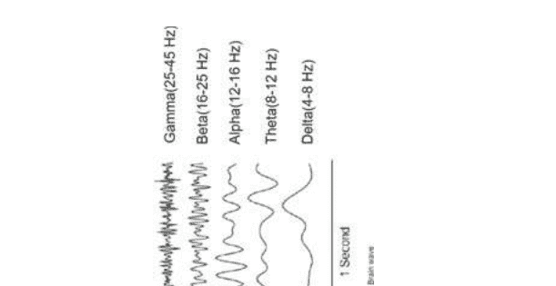

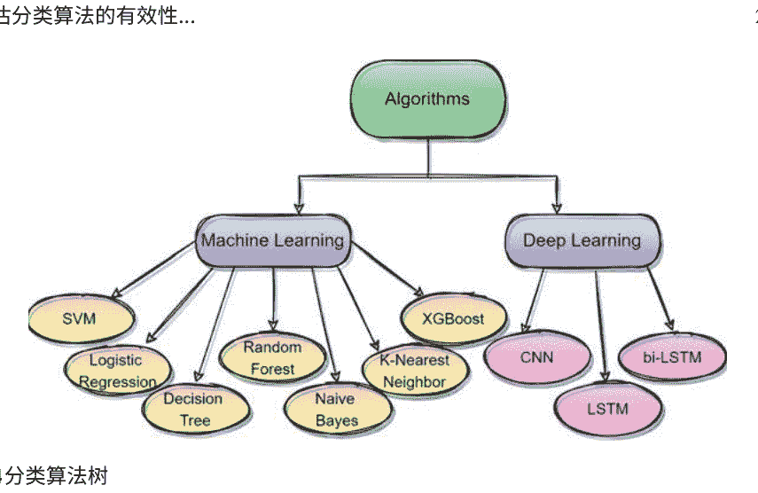

#### 2.4.2 逻辑回归

逻辑回归是一种用于预测二元结果概率的统计技术[25]。二元结果是一个只能取两个值的变量：真或假，是或否，0或1。逻辑函数的形式如下：

$$p(x) = \frac{1}{1 + e^{-(x-\mu)/s}}$$

在这里，位置参数是μ（曲线的中点，其中p(μ)=1/2），尺度参数是s。

#### 2.4.3 决策树

决策树是一种决策支持工具，它创建了一个类似树状图或模型的图形，描述了行动及其相关后果，可能包括随机事件结果、资源成本和效用[26]。在节点m处，让数据由Q_m描述，其中包含N_m个样本。对于每个候选分割θ=(j, t_m)，由一个特征和阈值t_m组成，将数据分成左右子集，如下所示：

$$Q_m^{\text{left}}(\theta) = \{(x, y) \mid x_j \leq t_m\}$$

$$Q_m^{\text{right}}(\theta) = Q_m \setminus Q_m^{\text{left}}(\theta)$$

#### 2.4.4 随机森林

随机森林是一种用于分类和回归的监督学习技术，用于机器学习[27]。它是基于决策树的集成学习系统。然后，它将每棵树的预测结果取平均值，得到最终的分类结果。随机森林训练方法采用了自助聚集（bootstrap aggregating）或装袋（bagging）的一般方法来训练树学习器。给定一个训练集X = x1, ..., xn以及响应变量Y = y1, ..., yn，装袋重复（B次）从训练集中有放回地随机抽取样本，并对这些样本拟合树模型：

- 对于b = 1, ..., B:
1. 从 X, Y中选择 n个训练样本；将它们表示为 Xb, Yb
2. 在 Xb, Yb上训练一个分类或回归树 fb。

$$\hat{f} = \frac{1}{B}\sum_{b=1}^{B} f_b(x')$$

或者，在分类树的情况下，通过多数投票来决定。

#### 2.4.5 K最近邻

K最近邻（KNN）是一种基于邻居的机器学习技术，根据特征空间中的邻居对数据点进行分类[28]。KNN是一种非参数且速度较慢的学习方法。非参数意味着不对底层数据的分布做任何假设。在测试时，找到训练集中最近的例子，并返回相应的标签。

$$\hat{y}(x) = y_{n^*}, \text{其中 } n^* = \arg\min_{n \in D} \text{dist}(x, x_n)$$

dist返回两个点 x和 xn之间的距离。对于这个函数，有很多配置可能性。曼哈顿距离，欧几里德距离，余弦距离，杰卡德距离。

#### 2.4.6 高斯朴素贝叶斯

高斯朴素贝叶斯分类器是概率机器学习模型，假设每个特征的值都遵循高斯分布。这意味着该模型可以用于估计给定特征值的数据点属于某个类别的概率。特征的似然性被假设如下：

$$P(x_i | y) = \frac{1}{\sqrt{2\pi\sigma_y^2}} \exp\left(-\frac{(x_i - \mu_y)^2}{2\sigma_y^2}\right) \quad (8)$$

偶尔，假设方差独立于 Y（即，σi）或独立于 Xi（即，σk）或两者都独立（即，σ）。

#### 2.4.7 XGBoost

XGBoost是一种用于分类和回归问题的机器学习技术[29]。它是梯度提升算法的一种实现。就准确性而言，XGBoost已被发现超过其他机器学习算法。

此外，XGBoost以其速度和效率而闻名。它能够处理大型数据集并快速训练模型。

在第 t次迭代中，我们需要最小化的目标函数（损失函数和正则化）如下所示：

$$\mathcal{L}^{(t)} = \sum_{i=1}^{n} l(y_i, \hat{y}_i^{(t-1)} + f_t(x_i)) + \Omega(f_t) \quad (9)$$

其中， $y_i$= 从训练集中提取的实际值（标签）。可以写成 $f(x + \delta)$ 其中 $x = \hat{y}_i^{(t-1)}$

### 2.5 深度学习算法

本文使用三种不同类型的模型来评估深度学习算法。为了分析深度学习方法，使用了卷积神经网络（CNN）、长短期记忆（LSTM）和双向长短期记忆（bi-LSTM）模型。这3个模型的架构如图5所示。对数损失是一种常用的分类任务损失函数，在深度学习中最常用的指标之一[30]。它只是似然函数的对数变体。

$$- (y \log(p) + (1 - y) \log(1 - p)) \quad (10)$$

#### 2.5.1 卷积神经网络

卷积神经网络（CNN）是一种深度学习神经网络，常用于评估视觉图像和信号[31]。CNN由具有可学习权重和偏差的神经元组成。

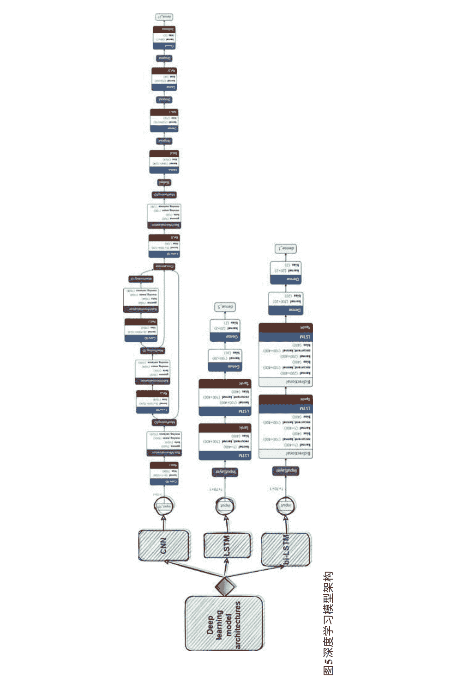

##### 图5 深度学习模型架构

#### 2.5.2 长短期记忆

长短期记忆算法是一种深度学习技术，用于预测系列中的下一个值[32]。它是一种通过反向传播进行训练的递归神经网络。

#### 2.5.3 双向长短期记忆

双向长短期记忆是一种能够从历史数据和未来数据中学习的深度学习算法[33]。它是一种递归神经网络（RNN）架构，已经被训练以记住长期依赖关系。

### 2.6 数据准备

在应用FFT进行特征提取后，每个32个EEG文件包含19,520行和4列，从每个文件中选择14,640行用于训练，选择4,880行用于测试。因此，数据被分为75%用于训练和25%用于测试。情感被分为二进制类别，因为这是比较EEG信号模型性能最流行的分类方法。一个类别为1-4.9，另一个类别为5-9。

### 2.7 评估指标

为了保持评估的一致性，情感标签的实验结果显示出所有标签的性能几乎相似。此外，对于每个模型都使用相同的特征提取技术和数据准备方法。在可能的情况下，大多数默认参数都被使用。为了衡量算法的性能，从测试数据中获取测试准确率。精确率、召回率、F1分数和准确率被用来确定每个模型的性能。

机器学习算法的精确度是一个指标，它表示算法的预测结果与实际值的接近程度。此外，表3表示每个算法的精确度。

$$精确度 = \frac{TP}{真正例 (TP) + 假正例 (FP)}$$

召回率是一个衡量模型在测试集中正确识别正样本的指标。表3也表示了召回率的值。

#### 表3 不同算法的二分类分类报告

| 算法名称 | 类别 | 精确度 | 召回率 | F1 |
|----------|------|--------|--------|----|
| 朴素贝叶斯 | 0 | 0.49 | 0.44 | 0.47 |
| 朴素贝叶斯 | 1 | 0.6 | 0.65 | 0.62 |
| 逻辑回归 | 0 | 0.55 | 0.29 | 0.38 |
| 逻辑回归 | 1 | 0.6 | 0.82 | 0.69 |
| XGBoost | 0 | 0.55 | 0.29 | 0.38 |
| XGBoost | 1 | 0.6 | 0.82 | 0.69 |
| 支持向量机 | 0 | 0.75 | 0.65 | 0.70 |
| 支持向量机 | 1 | 0.76 | 0.83 | 0.79 |
| 决策树 | 0 | 0.81 | 0.81 | 0.81 |
| 决策树 | 1 | 0.85 | 0.85 | 0.85 |
| 随机森林 | 0 | 0.95 | 0.94 | 0.95 |
| 随机森林 | 1 | 0.95 | 0.97 | 0.96 |
| KNN | 0 | 0.95 | 0.95 | 0.95 |
| KNN | 1 | 0.96 | 0.96 | 0.96 |
| CNN | 0 | 0.96 | 0.97 | 0.96 |
| CNN | 1 | 0.97 | 0.97 | 0.97 |
| LSTM | 0 | 0.75 | 0.72 | 0.73 |
| LSTM | 1 | 0.78 | 0.83 | 0.8 |
| 双向LSTM | 0 | 0.74 | 0.74 | 0.74 |
| 双向LSTM | 1 | 0.8 | 0.8 | 0.8 |

$$召回率 = \frac{TP}{真正例 (TP) + 假反例 (FN)}$$

F1分数是一个指标，它表示机器学习模型的准确性。它是模型精确度和召回率的调和平均值，由表3表示。F1分数越高，模型能够更准确地区分正样本和负样本。

$$F1 = 2 * \frac{精确率 * 召回率}{(精确率 + 召回率)}$$

## 3 结果与讨论

最佳超平面是通过特定的机器学习算法估计的，例如对于CNN，复杂的非线性超平面是通过使用卷积层的深度特征来确定的。为了说明图6中的发现，绘制了每种方法的测试精确度。随机森林、KNN和CNN表现出了异常的性能。将机器学习算法与深度学习算法的性能进行比较，对于从脑信号中识别情感这一通常难题非常有趣。尽管CNN模型的准确率最高。大多数学者在这项活动中使用CNN。由于使用FFT进行特征提取，随机森林和KNN取得了出色的精确度。它们几乎与CNN模型的准确率相等，同时远远优于LSTM和Bi-LSTM。因此，尽管CNN模型具有很高的准确率，但机器学习算法在特征提取方面表现良好。

表3代表了不同机器学习和深度学习算法的二分类的分类报告。类别列显示DEAP数据集的标签分为0和1两类。类别0包含1-4.99的数据，类别1包含5-8.99的数据，以便更准确地进行计算处理。

## 4 结论和未来研究方向

根据上述试验，使用FFT和机器学习模型可以达到与深度学习模型相匹配甚至超过的准确度。从原始脑电图数据中提取特征是困难的，但可以通过FFT来实现。作者希望在未来探索情绪不同标签之间的相关性以及如何更精确地从脑信号中识别情绪。

## 5 数据和代码可用性

本研究所基于的DEAP数据集可在其官方网站上获得。所有实验的代码都可以在Github上找到。该代码是用Python编写的，使用了Google Colab平台。

## 参考文献

1. Hassan, R., Hasan, S., Hasan, M. J., Jamader, M. R., Eisenberg, D., & Pias, T. (2020). 通过机器学习从脑电信号中识别人类注意力。在2020年IEEE第二届欧亚生物医学工程、医疗保健和可持续发展会议(ECBIOS)上，第16-19页。https://doi.org/10.1109/ECBIOS50299.2020.9203672
2. Shakya, S., & Smys, S. (2021). 用于改进银行应用中的风险管理和客户分割的大数据分析。ISMAC杂志，3(03)，235-249。
3. Sungheetha, A., & Sharma, R. (2020). 情感分类的Transcapsule模型。人工智能杂志，2(03)，163-169。
4. Apu, M. R. H., Akter, F., Lubna, M. F. A., Helaly, T., & Pias, T. S. (2021). 使用1D CNN利用重采样技术和高斯混合模型的心电图心律失常分类。在2021年联合第10届信息学、电子视觉国际会议 (ICIEV) 和2021年第5届图像、视觉、模式识别国际会议 (icIVPR) 中，第1-8页。https://doi.org/10.1109/ICIEVicIVPR52578.2021.9564201
5. Arjun, Rajpoot, A. S., & Panicker, M. R. (2022). 使用注意力驱动的神经网络进行主观无关情绪识别的EEG信号。生物医学信号处理和控制，75, 103547 (2022)。https://doi.org/10.1016/j.bspc.2022.103547, https://www.sciencedirect.com/science/article/pii/S1746809422000696
6. 崔, F., 王, R., 丁, W., 陈, Y., &黄, L. (2022年)。一种新颖的de-cnn-bilstm多融合模型用于脑电情绪识别。数学，10 (4) (2022年)。https://doi.org/10.3390/math10040582, https://www.mdpi.com/2227-7390/10/4/582
7. 马, X., 刘, P., 王, X., &白, X. (2021年)。基于最优特征的脑电情绪识别。物理学杂志：会议论文集，1966 (1)，012043 (2021年)。https://doi.org/10.1088/1742-6596/1966/1/012043, https://doi.org/10.1088/1742-6596/1966/1/012043.
8. Hasan, M., Rokhshana-Nishat-Anzum, Yasmin, S., & Pias, T. S. (2021年)。使用快速傅里叶变换和卷积神经网络的细粒度情绪识别。在2021年第10届国际信息学、电子视觉 (IC IEV) 和2021年第5届国际图像、视觉模式识别 (icIVPR) ，第1-9页。https://doi.org/10.1109/ICIEVicIVPR52578.2021.9564204
9. 尹, Y., 郑, X., 胡, B., 张, Y., 崔, X. (2021年)。使用图卷积神经网络和LSTM的EEG情感识别融合模型。应用软计算，100, 106954。
10. Maeng, J. H., Kang, D. H., Kim, D. H. (2020年)。深度学习方法在亚洲多模态数据库情感识别中选择有效模型和特征组的研究。电子学，9 (12)。https://doi.org/10.3390/electronics9121988, https://www.mdpi.com/2079-9292/9/12/1988
11. 罗, Y., 付, Q., 谢, J., 秦, Y., 吴, G., 刘, J., 等 (2020年)。基于脉冲神经网络的基于EEG的情感分类。IEEE Access, 8, 46007–46016. https://doi.org/10.1109/ACCESS.2020.2978163.
12. Doma, V., & Pirouz, M. (2020). 使用脑电图和外周生理信号进行情绪识别的机器学习方法的比较分析。大数据杂志, 7。https://doi.org/10.1186/s40537-020-00289-7
13. Wang, Z., Tong, Y., & Heng, X. (2019). 基于相位锁定值的图卷积神经网络用于情绪识别。IEEE Access, 7, 93711–93722. https://doi.org/10.1109/ACCESS.2019.2927768.
14. Parui, S., Bajjya, A., Samanta, D., & Chakravorty, N. (2019). 使用xgboost算法从脑电信号中识别情绪， 第1-4页。https://doi.org/10.1109/INDICON47234.2019.9028978
15. Liu, Z. T., Xie, Q., Wu, M., Cao, W. H., Li, D. Y., & Li, S. H. (2019). 基于经验模态分解和最优特征选择的脑电图情绪识别。IEEE认知与发展系统交易, 11(4), 517–526。https://doi.org/10.1109/TCDS.2018.2868121。
16. Raghav, G., Nongmeikapam, K., Dixit, A., Bose, S., & Singh, D. (2018). 评估情感信号在deep数据集上的分类器
17. 郑文龙, 朱建勇, 陆宝龙 (2019). 从EEG中识别出随时间稳定的情感模式。IEEE情感计算交易, 10(3), 417–429。https://doi.org/10.1109/TAFFC.2017.2712143。
18. Pias, T. S., Kabir, R., Eisenberg, D., Ahmed, N., & Islam, M. R. (2019). 通过智能手表传感器监测步行模式进行性别识别。在2019年IEEE欧亚会议上，物联网、通信和工程(EC ICE), pp. 220–223.https://doi.org/10.1109/ECICE47484.2019.8942670
19. Koelstra, S., Muhl, C., Soleymani, M., Lee, J. S., Yazdani, A., Ebrahimi, T., 等 (2012). Deap: 一个用于情绪分析的数据库；使用生理信号。IEEE情感计算交易, 3(1), 18–31. https://doi.org/10.1109/T-AFFC.2011.15.
20. SEED数据集。https://bcrni.sjtu.edu.cn/home/see/ 访问日期：2022年4月12日。
21. Loughborough大学基于EEG的情绪识别数据集(LUMED)。https://www.dropbox.com/s/xlh2orv6mgweehq/LUMED_EEG.zip?dl=0. 访问日期：2022年4月11日。
22. Katsigiannis, S., & Ramzan, N. (2018). Dreamer: 一个用于通过EEG和ECG信号从无线低成本现成设备进行情绪识别的数据库。IEEE生物医学和健康信息学杂志, 22(1), 98–107. https://doi.org/10.1109/JBHI.2017.2688239.
23. Miranda-Correa, J. A., Abadi, M. K., Sebe, N., & Patras, I. (2021). Amigos: 一个用于个体和群体情感、个性和心情研究的数据集。IEEE情感计算交易, 12(2), 479–493. https://doi.org/10.1109/TAFFC.2018.2884461.
24. Jenke, R., Peer, A., & Buss, M. (2014). 用于情绪识别的特征提取和选择从EEG中。IEEE情感计算交易, 5(3), 327–339.https://doi.org/10.1109/TAFFC.2014.2339834.
25. LaValley, M. P. (2008). 逻辑回归。循环, 117(18), 2395–2399。
26. Song, Y. Y., & Ying, L. (2015). 决策树方法：分类和预测的应用。上海精神病学档案, 27(2), 130。
27. Pal, M. (2005). 用于遥感分类的随机森林分类器。国际遥感杂志, 26(1), 217–222。
28. Zhang, Z. (2016). 机器学习导论：K最近邻。转化医学年鉴, 4(11)。
29. Mitchell, R., & Frank, E. (2017). 使用GPU计算加速XGBoost算法。PeerJ计算机科学, 3, e127。
30. Sarif, M. M., Pias, T. S., Helaly, T., Tutul, M. S. R., & Rahman, M. N. (2020). 基于深度学习的孟加拉车牌识别系统。在2020年第四届多学科研究与创新技术国际研讨会(ISMSIT), 第1-6页。https://doi.org/10.1109/ISMSIT50672.2020.9254748
31. Pias, T. S., Eisenberg, D., & Islam, M. A. (2019). 通过智能设备的传感器数据进行车辆识别。在2019年IEEE欧亚物联网、通信和工程会议(ECICE), 第96-99页。https://doi.org/10.1109/ECICE47484.2019.8942799
32. Graves, A. (2012). 长短期记忆。使用循环神经网络进行监督序列标注, 第37-45页。

> 张, S., 郑, D., 胡, X., 杨, M. (2015). 用于关系分类的双向长短期记忆网络. 在第29届亚太语言、信息与计算会议, 73-78页.

# 分析和数据计算用于业务和经济结构数字化的发展

Mykhailo Vedernikov, Lesia Volianska-Savchuk, Maria Zelena, Nataliya Bazaliyska和Juli Boiko

摘要 本文研究了数字化对企业...演变和技术现实。在企业和经济结构管理中，创新是必要的关键策略。

考虑使用统计指标之间的关系来分析人员配备因素和其平均生产力对销售净收入的影响的方法。在管理决策准备过程中，基于指数法对宏观和微观经济现象和过程的预测（计划、任务或标准）进行论证，可以提高可用统计信息的利用水平。还应注意，所述销售净收入动态指数分析的方法学原则可用于区域层面上评估各种经济活动中的总体区域生产总值或产品销售量的变化。

- 数据分析
- 数字化
- 数字技术
- 统计指标
- 净收入
- 劳动生产率
- 人员

## 1 引言、背景、动机和目标

所提出的工作涵盖了在人事管理系统中引入现代智能决策概念和评估综合数字化业务结构在全球化经济背景下的应用领域的热点问题。

世界在不断发展，工作任务的执行变得自动化，工作占据了人们的工作岗位[1, 2]。所有这些变化给人力资源服务提出了新的组织挑战，迫使他们做出意想不到的决策，并迫使他们在不稳定和社会动荡的条件下工作[3-6]。与此同时，数字技术对人力资源管理的影响正在增加和加速，这需要对人事管理流程进行定义和评估，以制定适当的人力资源战略[7, 8]。

进步从不停滞，数字技术越来越多地渗透到各个业务领域[9-11]。我们正在目睹劳动力市场发生根本性变化。经济的数字化显著改变了组织的所有传统管理职能，尤其是人事管理领域[12]。迄今为止，每个人首先必须明确自己作为团队一员的角色，以帮助管理层和员工快速适应数字化思维方式。创建一个团队至关重要，这个团队不仅要了解所有的业务和经济结构的流程和功能，还要能够监控、分析和实施几乎每天都出现的新技术。

每年都有越来越多的公司自动化人力资源职能，从而简化和提高人力资源经理和人力资源部门的工作效率[13,14]。
研究显示，那些积极实施变革、自信地利用新资源和技术改进人力资源流程的公司与那些处于等待状态的公司之间存在显著差距。许多公司的被动态度导致了显著的竞争力损失，因为他们不仅失去了投资自己资本的机会，还面临着失去拥有独特机会的劳动力的风险。

数字人力资源结合了社交网络、移动应用、云技术、增强现实，是一个改善员工和候选人工作的新平台，提高和处理他们的体验。数字解决方案开发者提供数字人力资源的技术组成部分[15]，而公司管理和人力资源部门必须构建自己的综合数字人事管理策略和计划。数字转型应该基于对内部和外部因素的深入分析，对优势和劣势的研究，以及行业限制和潜在合作伙伴的研究。

实施数字人力资源能力的相关性是不可争议的，特别是对于增长和扩张的公司、大型国际公司，对投资吸引力非常重要，拥有大量职位空缺，或者特别注重员工的质量选择和适应。

在其他情况下，数字人力资源的各种能力可以显著改善任何人力资源职能的绩效，提高人力资本的效率，并发展人力资源的企业文化[16]。

## 2 种实施数字人力资源能力的方法

### 2.1 实施社会和经济现象和过程的用户功能间的统计评估

不幸的是，在统计分析方法系统中，指数方法用于对社会和经济现象和过程的功能关系进行统计评估。统计指标使我们能够确定塑造指数模型整体指标变化的因素利用改进的可用储备。因此，机械制造厂销售净收入影响因素的指数分析方法需要进一步发展。考虑到经济实践的需求，有必要从积累的指数方法中选择理论上合理且在实践中最可接受的指数计算方法，并以适合实际需求的形式呈现。

统计指标是一个相对指标，它根据形成其水平的因素的功能连接特征，量化所研究现象的动态变化或与标准的比较。它可以是计划、规范、预测或地域比较的某个值）。这种综合指标的组成部分是一个均匀或不均匀的总体。将统计指标方法应用于不均一总体的分析受到了找到这种现象的组成部分的共同度量的问题的阻碍。例如，它可以是不同类型商品的贸易量。

这尤其涉及由于广泛（商品和服务的数量、员工人数）和密集（价格和员工生产力）形式的净销售收入的变化[17]。

统计学的一般理论确定了指数方法的综合和分析概念。使用综合形式的统计指标可以评估一个特征的动态变化与其他几个特征的时间变化之间的关系，基于计算个别指标（综合概念）。分析概念基于构建和评估统计指标系统[18]。如果对净销售收入的变化进行指数分析涉及到识别诸如员工人数（员工人数）、生产力和价格等因素的影响程度，我们将描述这些因素对报告期内净销售收入变化的影响，并应用以下统计指标系统：

#### 表1 计算机制造厂销售净收入变化的初始数据 1-5年产品

| 年份 | 销售净收入产品 p1q1，千乌克兰格里夫纳 | 区域 ip 的价格指数，% | 销售净收入产品（按可比价格计算） | 员工平均数 T，人 | 生产力（按可比价格计算） |
|------|------------------------------------------|-----------------------|--------------------------------|------------------|----------------------------|
| 1    | 12,205                                   | 110.2                 | 11,075.32                      | 2237             | 4.95                       |
| 2    | 10,363                                   | 100.2                 | 10,342.32                      | 2310             | 4.48                       |
| 3    | 323,789                                  | 99.4                  | 325,743.46                     | 2359             | 138.09                     |
| 4    | 458,202                                  | 111.8                 | 409,840.79                     | 2314             | 177.11                     |
| 5    | 273,792                                  | 148.5                 | 184,371.72                     | 2271             | 81.19                      |

$$ \frac{\sum p_1q_1}{\sum p_0q_0} = \frac{\sum T_1}{\sum T_0} \cdot \left( \frac{\sum p_0q_1}{\sum T_1} \div \frac{\sum p_0q_0}{\sum T_0} \right) \cdot \frac{\sum p_1q_1}{\sum p_0q_1} $$

其中 q0 和 q1 分别是基准期和报告期销售的产品数量； p0 和 p1 分别是基准期和报告期销售产品的单价； T0 和 T1 分别是员工数量（平均员工数和人数）。

在机械制造厂的数据示例中，给出了关于销售产品净收入变化的指数分析的初始数据分析，见表1。

利用表1中的数据分析，确定2-5年的净收入指数、员工数量和员工生产力的数值，这些数值见表2。

通过使用表3，将个体因素对机械制造厂净收入变化的影响考虑在2年内的动态中。

数据分析表3显示，在2年内与1年相比，净收入从销售中总减少了1842千乌克兰格里夫纳，由于价格变化导致的增加为20.7千乌克兰格里夫纳，占总增长的1.1%。 由于2年内劳动生产率水平下降，净收入从销售中减少了2261.0千乌克兰格里夫纳，占总增长的122.7%。 而且，员工数量的增加导致净收入从销售中增加了398.3千乌克兰格里夫纳（占2年净收入总增长的21.6%）。

考虑因素对销售净收入的影响动态（2-5年），构建表格4。其分析显示，尽管在表2中给出的数据，机械制造厂产品的销售净收入在研究的五年中增加了22.4倍（相应值的比率为5年和1年）。

#### 表2 销售净收入、员工人数、员工生产力和价格的指标动态2-5年

| 年份 | 计算公式 | 指数，% | 放大（+），缩小（-），% |
| :--- | :--- | :--- | :--- |
| **产品销售的总净收入** | | | |
| 2 | $\frac{\sum p_1q_1}{\sum p_0q_0}$ | 84.9 | - 15.1 |
| 3 | | 312.3 | 212.3 |
| 4 | | 141.5 | 41.5 |
| 5 | | 59.8 | - 40.2 |
| **员工人数** | | | |
| 2 | $\frac{\sum T_1}{\sum T_0}$ | 103.3 | 3.3 |
| 3 | | 102.1 | 2.1 |
| 4 | | 98.1 | - 1.9 |
| 5 | | 98.1 | - 1.9 |
| **员工生产力** | | | |
| 2 | $\left(\frac{\sum p_0q_1}{\sum T_1} / \frac{\sum p_0q_0}{\sum T_0}\right)$ | 82.1 | - 17.9 |
| 3 | | 305.8 | 205.8 |
| 4 | | 129.0 | 29.0 |
| 5 | | 41.0 | - 59.0 |
| **价格** | | | |
| 2 | $\frac{\sum p_1q_1}{\sum p_0q_1}$ | 100.2 | 0.2 |
| 3 | | 99.4 | - 0.6 |
| 4 | | 111.8 | 11.8 |
| 5 | | 148.5 | 48.5 |

然而，有必要更详细地描述4-5年的年度动态（表4）。

与4年相比，5年销售净收入总减少184,410千乌克兰格里夫纳，主要是通过降低员工生产力水平(265,315.7千乌克兰格里夫纳)和员工数量(8514.6千乌克兰格里夫纳)来实现的。然而，公司产品价格的增加使得整体指标（销售净收入）增加了89,420.3千乌克兰格里夫纳。

还应该注意到由于价格的增加，销售净收入呈现出积极的增长趋势。因此，在5年中，该指标的相应值占总增长的48.5%。

除了使用统计指标外，还重要的是在制定经济预测（目标、计划和标准）中使用指数分析，以分析因素对产品销售净收入形成的影响。

改进可用统计信息在国家和宏观微观经济过程的规划和管理中的使用。

#### 表3 某些因素对机械制造厂产品销售净收入增加(减少)的影响

| 单位 | 销售净收入的增加(+)，减少(-) | 包括由于变化 | 员工人数 | 劳动生产率 | 价格 |
|------|------------------------------|----------------|--------------|--------------|------|
| 千UAH | Σp1q1 - Σp0q0<br>10,363 - 12,205 = -1842 | | (ΣT1 - ΣT0) · Σp0q0/ΣT0<br>(2310 - 2237) × (12,205/2237) = 398.3 | (Σp0q1/ΣT1 - Σp0q0/ΣT0) · ΣT1<br>((10,342.32/2310) - (12,205/2237)) · 2310 = -2261.0 | Σp1q1 - Σp0q1<br>10,363 - 10,342.32 = 20.7 |
| % | 100 | | 21.6 | -122.7 | 1.1 |

#### 表4 某些因素对机械制造厂产品销售净收入增加(减少)的影响（2-5年动态）

| 年份 | 单位 | 净销售收入产品的年度总增加（+），减少（-）<br>$$Σp_1q_1 - Σp_0q_0$$ | 包括由于变化 | | |
| :--- | :--- | :--- | :--- | :--- | :--- |
| | | | 员工人数<br>$$(ΣT_1 - ΣT_0) \cdot \frac{Σp_0q_0}{ΣT_0}$$ | 劳动生产率<br>$$\left(\frac{Σp_0q_1}{ΣT_1} - \frac{Σp_0q_0}{ΣT_0}\right) \cdot ΣT_1$$ | 价格<br>$$Σp_1q_1 - Σp_0q_1$$ |
| 2 | 千UAH | -1842.0 | 398.3 | -2261.0 | 20.7 |
| | % | -100.0 | 21.6 | -122.7 | 1.1 |
| 3 | 千UAH | 313,426.0 | 219.8 | 315,160.6 | -1954.5 |
| | % | 100.0 | 0.1 | 100.6 | -0.6 |
| 4 | 千UAH | 134,413.0 | -6176.6 | 92,228.3 | 48,361.2 |
| | % | 100.0 | -4.6 | 68.6 | 36.0 |
| 5 | 千UAH | -184,410.0 | -8514.6 | -265,315.7 | 89,420.3 |
| | % | -100.0 | -4.6 | -143.9 | 48.5 |

在制定管理决策时，区域水平的应用程度在很大程度上取决于统计方法的应用水平。

这个问题可以通过指标法来解决，该方法允许您对经济现象的预测（计划、目标或标准）进行统计评估。

为了估计诸如净销售收入、工资基金等指标的预测，有必要确定这些指标发展的因素之间的关系，并量化这种关系，基于规范信息（指标的预测或计划值）。

考虑使用统计指标之间的关系来分析员工因素及其平均生产力对下一时期销售净收入影响的方法。作为比较的基础，需要接受初始实际水平，而不是报告数据，而是预测（计划）的工人数量和他们预测（计划）的劳动生产率以及未来时期的价格：

$$ \frac{\sum p_{ij} q_{ij}}{\sum p_o q_o} = \frac{\sum T_{ij}}{\sum T_o} \cdot \left( \frac{\sum p_o q_{ij}}{\sum T_{ij}} \div \frac{\sum p_o q_o}{\sum T_o} \right) \cdot \frac{\sum p_{ij} q_{ij}}{\sum p_o q_{ij}} $$

让我们分析决定预测净销售收入发展的主要因素（表5）。

利用表5中的数据，我们将通过指数法确定影响预测销售净收入增长的因素，与实际达到的基本微观经济指标的体量进行比较（表6）。

#### 表5 计算机制造厂产品销售净收入的初始数据，用于6-7年的预测

| 年份 | 产品销售净收入, 千乌克兰格里夫纳 | 地区价格指数, % | 产品销售净收入 (按可比价格计算), 千乌克兰格里夫 | 平均员工人数, 人 | 劳动生产率 (按可比价格计算), 千乌克兰格里夫 |
|------|--------------------------------|----------------|---------------------------------------------|------------------|------------------------------------------|
| 1    | 12,205                         | 110.2          | 11,075.32                                   | 2237             | 4.95                                     |
| 2    | 10,363                         | 100.2          | 10,342.32                                   | 2310             | 4.48                                     |
| 3    | 323,789                        | 99.4           | 325,743.46                                  | 2359             | 138.09                                   |
| 4    | 458,202                        | 111.8          | 409,840.79                                  | 2314             | 177.11                                   |
| 5    | 273,792                        | 148.5          | 184,371.72                                  | 2271             | 81.19                                    |
| 6    | 506,974.1                      | 140.5          | 360,887.03                                  | 2320             | 155.57                                   |
| 7    | 604,075.4                      | 149.3          | 404,605.09                                  | 2327             | 173.87                                   |

#### 表6 某些因素对计算机制造厂6年预测净收入与5年实际数据的影响（增加或减少）

| 净收入变化因素 | 增加（+），减少（-） | |
|----------------|----------------------|---|
| | 千UAH | 百分比(%) |
| $$ \sum p_{ij}q_{ij} - \sum p_o q_o $$ | 506,974.1−273,792 = 233,182.1 | 100 |
| 包括因为：<br>• 平均生产力的变化：<br>$$\left(\frac{\sum p_o q_{ij}}{\sum T_{ij}} - \frac{\sum p_o q_o}{\sum T_o}\right) \cdot \sum T_{ij}$$ | $$\left(\frac{360,887.03}{2320} - \frac{273,792}{2271}\right) \cdot 2320 = 81,211.7$$ | 34.83 |
| • 员工数量的变化：<br>$$(\sum T_{ij} - \sum T_o) \cdot \frac{\sum p_o q_o}{\sum T_o}$$ | $$(2320 - 2271) \cdot \frac{273,792}{2271} = 5883.3$$ | 2.52 |
| $$ \sum p_{ij}q_{ij} - \sum p_o q_{ij} $$ | 506,974.1−360,887.03 = 146,087.1 | 62.65 |

数据分析表6显示，对于预计销售净收入增长233,182.1千乌克兰格里夫纳的主要因素是预计价格水平增长146,087.1千乌克兰格里夫纳（该因素的占比为63%，相对于其他因素占主导地位）。

我们还将考虑统计指标在分析和预测工资总额形成中的影响的科学和方法论规定，以机械制造厂的初始数据为例，在1-5年的动态中，采用以下统计指标系统：

$$ \frac{\sum f_1 T_1}{\sum f_0 T_0} = \frac{\sum T_1}{\sum T_0} \cdot \left( \frac{\sum f_0 T_1}{\sum T_1} \div \frac{\sum f_0 T_0}{\sum T_0} \right) \cdot i_p $$

其中 $$T_0$$ 和 $$T_1$$ 分别是基准期和报告期的员工平均人数（人）；$$f_0$$ 和 $$f_1$$ 分别是基准期和报告期的员工年平均工资。

以机械制造厂的数据为例，表7给出了工资基金变动指数分析的初始数据。

根据表7，我们定义了2-5年工资基金、员工人数和实际年工资的指数。计算结果见表8。

数据分析表8显示，在2年内与1年相比，工资基金总额增加了5717.1千乌克兰格里夫纳，其中由于价格变动导致的增加为132.6千乌克兰格里夫纳，占总增加的2.3%。

由于2年内实际工资水平的增加，与1年相比，工资基金增加了3603.2千乌克兰格里夫纳，占总额的63.0%。

#### 表7 计算机制造厂工资总额变化的初始数据，1-5年

| 年份 | 报酬基金，千乌克兰格里夫纳 | 赫梅尔尼茨基地区物价指数，% | 报酬基金（按可比价格计算），千乌克兰格里夫纳 | 平均员工人数，人 | 实际年薪，千乌克兰格里夫纳 |
| :---: | :---: | :---: | :---: | :---: | :---: |
| | $f_1 T_1$ | $i_p$ | $\frac{f_1 T_1}{i_p} = f_0 T_1$ | $T$ | $\frac{f_0 T_1}{T}$ |
| 1 | 60,713.60 | 110.2 | 55,094.01 | 2237 | 24.63 |
| 2 | 66,430.70 | 100.2 | 66,298.10 | 2310 | 28.70 |
| 3 | 70,106.90 | 99.4 | 70,530.08 | 2359 | 29.90 |
| 4 | 81,017.00 | 111.8 | 72,466.01 | 2314 | 31.32 |
| 5 | 104,458.30 | 148.5 | 70,342.29 | 2271 | 30.97 |

#### 表8 2-5年工资基金指数、员工人数、实际年薪和通货膨胀的动态

| | 年份 | 计算公式 | 指数，% | 增加（+），减少（-），% |
| :--- | :---: | :--- | :---: | :---: |
| **工资总额** | 2 | $\frac{\sum f_1 T_1}{\sum f_0 T_0}$ | 109.4 | 9.4 |
| | 3 | | 105.5 | 5.5 |
| | 4 | | 115.6 | 15.6 |
| | 5 | | 128.9 | 28.9 |
| **员工人数** | 2 | $\frac{\sum T_1}{\sum T_0}$ | 103.3 | 3.3 |
| | 3 | | 102.1 | 2.1 |
| | 4 | | 98.1 | -1.9 |
| | 5 | | 98.1 | -1.9 |
| **真实员工工资** | 2 | $\left( \frac{\sum f_0 T_1}{\sum T_1} / \frac{\sum f_0 T_0}{\sum T_0} \right)$ | 105.7 | 5.7 |
| | 3 | | 104.0 | 4.0 |
| | 4 | | 105.4 | 5.4 |
| | 5 | | 88.5 | -11.5 |
| **通货膨胀（价格）** | 2 | $\frac{\sum f_1 T_1}{\sum f_0 T_1}$ | 100.2 | 0.2 |
| | 3 | | 99.4 | -0.6 |
| | 4 | | 111.8 | 11.8 |
| | 5 | | 148.5 | 48.5 |

总增加量和员工数量的增加导致1981年工资基金增加了3000乌克兰格里夫纳（占工资总额增加的34.7%）。

数据分析表8显示，尽管根据表7的数据，机械制造厂的工资基金在研究的五年中增加了1.72倍。 对应值的比率为5年和1年。 然而，有必要更详细地描述4-5年的年度动态。

与4年相比，5年工资基金总量增加了23,441.3千乌克兰格里夫纳，主要是由于员工实际工资水平的下降（9169.2千乌克兰格里夫纳）和员工数量的减少（1505.5千乌克兰格里夫纳）形成的。 然而，根据通货膨胀（价格）调整工资使得总指标（工资基金总量）增加了34,116.0千乌克兰格里夫纳。

考虑在2-5年的动态中，因素对工资基金的影响，在建立表9时。

基于指数法对宏观和微观经济现象和过程的预测（计划、任务或标准）的论证，在管理决策的准备中，可以提高可用统计信息的利用水平。 还应该注意到，所述净销售收入动态指数分析的方法论规定可以用于区域层面上评估地区生产总值或各种经济活动中销售产品的变化。

确保企业的高速发展和竞争优势取决于其组织措施的有效实施。 没有形成和评估企业文化水平，就无法做出有效的管理决策。 一些公司已经在实际工作中积累了丰富的经验，并了解了它们的企业文化。 然而，如何在制定战略管理决策时正确使用它，管理层并不清楚。 在这方面，选择评估企业文化水平的工具的问题尤为紧迫，这将能够快速识别企业人员活动中的内部机会和弱点。

### 2.2 企业企业文化组成部分对企业人员动机的影响

我们对企业文化进行了整体和逐个元素的评估，这是改善企业文化和制定适当的企业计划和活动的基础。

为了获得关于员工有效活动的信息完整性，建议专家小组的专家除了提出的（现有的）外，还确定了企业文化的元素和子元素，他们认为对他们个人和企业人员来说是相关的。

人事管理的新概念意味着机制的复杂化

#### 表9 某些因素对机械制造厂2-5年间薪酬基金的年度增加（减少）的影响

| 年份 | 单位 | 薪酬基金的总年度增加（+），减少（-）<br>$$ \sum p_1 q_1 - \sum p_0 q_0 $$ | 包括由于变化<br>$$ (\sum T_1 - \sum T_0) \cdot \frac{\sum p_0 q_0}{\sum T_0} $$ | 实际工资<br>$$ (\frac{\sum p_0 q_1}{\sum T_1} - \frac{\sum p_0 q_0}{\sum T_0}) \cdot \sum T_1 $$ | 价格<br>$$ \sum p_1 q_1 - \sum p_0 q_1 $$ |
| :--- | :--- | :--- | :--- | :--- | :--- |
| 2 | UAH | 5717.1 | 1981.3 | 3603.2 | 132.6 |
| | % | 100.0 | 34.7 | 63.0 | 2.3 |
| 3 | UAH | 3676.2 | 1409.1 | 2690.2 | -423.2 |
| | % | 100.0 | 38.3 | 73.2 | -11.5 |
| 4 | UAH | 10,910.1 | -1337.4 | 3696.5 | 8551.0 |
| | % | 100.0 | -12.3 | 33.9 | 78.4 |
| 5 | UAH | 23,441.3 | -1505.5 | -9169.2 | 34,116.0 |
| | % | 100.0 | -6.4 | -39.1 | 145.5 |

劳动动机，员工技能的持续改进，建立持续职业教育体系，将重点转向个体形式的工作活动[19]。

为了说明人员绩效指标对企业文化的某些要素（属性和因素）的依赖的经济和数学模型，对工程企业“A”、“B”、“C”和“D”的因素特征对活动结果的影响进行了研究。 结果特征是人员生产力和产品的盈利能力。 因素特征是职业发展和职业培训是有效活动动机的员工比例，这决定了职业发展。 接受职业培训和进修的人员比例。

研究结果表明，为了确定改善企业文化建议的有效性，主要通过企业活动中劳动生产力的变化评估来使用。 为此，我们拍摄员工工作日的照片，并确定每个功能、操作等在此过程中的劳动强度，然后在采取企业措施之前和之后进行比较。 企业措施引入后劳动生产力的变化根据以下公式计算：

$$\Delta P = \frac{T_1 - T_2}{T_2} \cdot 100\%$$

其中 $T_1$—采取措施前的劳动强度，分钟；$T_2$—采取措施后（期间）的劳动强度，分钟。

员工激励是企业文化的一部分，也是创造期望的态度对公司活动和工作职责的工具。 如果考虑到企业文化的标准和机构，员工将对行为规范有清晰的理解，并且这些规范将得到推广。

我们注意到，提高员工激励对企业文化的发展和质量有最积极的影响，进而提高公司的形象和商业声誉以及竞争力。

实践表明，如果员工激励系统不考虑企业文化的特点，其效果会大大降低。 如果人力资源专业人员缺乏必要的能力和对企业文化的功能和任务有清晰的理解，建立这样的激励系统将会很困难。 他们根本看不到“企业文化的特点”和“员工激励的特点”之间的关系。

许多面临危机挑战的雇主决定通过减少和放弃有效的激励计划来优化人员成本。 当然，这样做可以节省大量资金，但也增加了生产风险。 首先，即使国家处于危机之中，迟早会结束。 企业将不得不按照旧的方法和技术工作，这将降低其竞争力。 其次，不参与发展和培训的人员会失去能力，从而降低工作质量和生产力。 同时，一个良好形成的、发展起来的企业文化使得即使在财务不稳定的时期也能通过内部员工培训来培训员工。

因此，员工动力是企业文化的一个重要组成部分，发展企业文化时，雇主必须考虑并有目的地利用企业中盛行的文化。

在现代市场条件下，有必要发展公司员工的动力。所有这些都是因为实现企业的经济增长也是通过对员工的激励影响来实现的，这需要新的方法。有人认为，企业人员的动力形成和发展应该是一个系统的方法。根据这个方法，动力被呈现为一组针对活动的特定结果的主要子系统。

员工激励是一组不同的形式和方法，当积极地与内部和外部环境以及信息支持进行互动时，改变结构以有针对性地影响员工的利益、行为和活动，同时保持完整性。

只有全面覆盖企业人员及其个性化，人员的有效激励才能实现。为了提高员工的生活质量，除了适当的报酬水平外，使用员工激励方法和企业文化形式是合理的。在这方面，建议考虑一种员工激励模型，其主要思想是将经济和社会方法与企业文化的形式相结合。这个模型符合现代科学和商业实践的要求，其特点是一定的激励组成部分的完整性，与企业使命、外部和内部因素以及信息支持相关和协调。

对于激励问题的概念方法的系统化已经成为工业企业人员激励的形成和发展的基础。在此基础上，形成了激励过程的结构模型，揭示了各个阶段的内容和主要激励类别之间的相互关系，同时有助于正确理解需求的发生和满足，并通过激活人员活动来协调工作结果的高端成就[17]。在研究员工动机时，我们注意到最重要的动机因素是工作安全、高薪、奖金制度和社会福利。因此，物质利益仍然是工人工作的主要激励因素之一。

让我们定义企业文化对员工激励的外部和内部因素（根据表10）。

企业文化的形成取决于企业运营的条件。它旨在解决两个主要问题：适应外部环境和内部整合所有组成部分。

值得注意的是，动机在企业文化形成中占据了基础地位。基本的动机工具几乎所有人力资源经理都很熟悉。它们包括对企业文化产生影响的最受欢迎的动机示例，即：提供官方车辆，支付移动通信，个人发展培训，众多奖金计划，人寿保险，非国家养老金计划等

#### 表10 企业文化对员工动机的影响

| 主要影响方向内容 | 效果结果 |
| :--- | :--- |
| **内部因素** | |
| 提供积极的道德和心理氛围，凝聚力，增强动机 | 提高生产力 |
| 在工人中建立对正式规则的明确理解 | 改善沟通质量 |
| 促进创造性决策和团队合作 | 发展团队合作能力和员工的创造性主动性 |
| **外部影响因素** | |
| 促进消费者、供应商和商业伙伴的凝聚力 | 将商业伙伴视为商业同事，并降低交易成本 |
| 在商业社区和消费者中塑造企业形象和权威 | 良好的增长和公司声誉增长 |

每个机构只为员工提供其能够负担得起的激励措施（物质和道德方面）。但是不应忘记，有效的工作和员工的高忠诚度需要有效的激励措施，能够满足员工需求的四个层次。

人力资源经理应与首席执行官一起制定个体激励工具的战略和策略，因为激励的主要原则是效果（因为每个结果都应对企业、组织或机构的战略目标的实现产生影响）和公平（因为任何活动都应根据员工的贡献予以鼓励）。

通常，强大的激励因素是组织的企业文化或其运作中的改革变化[20]。为了确保企业在当地、区域和国家市场上的竞争力，有必要对人员管理模板进行一定的调整，不时使用。

如果公司不愿意接受最新的发展、技术和思想，它将等待停滞期，并且最终退出市场。

在外国企业的经验指导下，我们模拟了一个关于有效企业文化作为企业激励系统组成部分的建议清单。

因此，首先，领导者应该在团队中保持适当的社会心理氛围，以便它本身成为进一步行动的强大动力。这种方法需要改变优先事项，发展一个新的企业视野，以满足转型的需要，文化要在商品和服务市场中占据领先地位。首先，它应该改变员工的行为。因此，每个员工都必须感到适应并得到适当的鼓励以取得进一步的职业成就。而且，激励机制必须与现有机制根本不同。必须进行企业价值观的更新，因为以前的价值观对员工的影响已经不再最大化，并且失去了激励的作用。

图1显示了形成面向胜利结果的企业、组织或机构的所有结构部门之间清晰互动的行动顺序。

我们描述了构建有效企业文化的主要阶段。因此，第一阶段是构建企业愿景，即形成团队行为中有前途的变化的战略图景。第二阶段是行为，它使得能够形成企业、组织或机构的企业价值观。上面讨论了形成企业原则的更多细节。第三阶段包括评估每个员工对战略目标的个人贡献的工作质量和结果。

图1的基础是企业已建立的有效企业文化，能够抵抗外部影响并保证员工的忠诚。通过评估，分析现有的管理能力，并给员工评估管理的机会，根据一些标准。根据选择的参数，得分最低的经理必须提升资质。最后一个阶段，第四个阶段，具有激励性的组成部分。总的来说，员工激励包括一些组成部分[20]：工作活动的动机，即员工有效工作的动机，提供必要的报酬和满足现有需求；稳定和高效就业的动机；发展的动机、员工的竞争力；拥有生产资料的动机；选择新工作场所的动机等。换句话说，结果将是一个能够成为团队稳定社会心理氛围基础的薪酬制度。

劳动力结构和质量的深刻变化，劳动内容的变化，由于人的身体能力，提高劳动效率的储备耗尽，需要非传统的方法来加强劳动动机和改善员工的企业文化。同时，任务是发挥与个人技能、教育和培训、指导、劳动潜力开发、创造力和自我实现愿望相关的个人机会。

各级管理人员早已知道，工资增加只能在员工入职后的前三个月内起到激励作用。因此，为了提高效率，从长远来看，有必要使用非物质的激励手段，如：

- 不断完善社会福利；
- 提供职业发展和晋升的新机会；
- 组织团队建设培训；
- 庆祝专业节日，遵循企业传统等。

采取实际措施来增加员工的劳动积极性与人性化劳动直接相关。根据经验，后者现在是工作的主要非物质激励环节[20]。

很明显，这些激励计划和方法的主要目标是最大化利润。然而，我们不能忽视新的激励方法对员工活动的积极影响，以满足他们的需求。他们促进了员工创造潜力的发展，提高了工作生活质量，实现了生产管理的民主化，满足了归属感和参与感的更高级需求，在认可、自我肯定和自我表达方面。接下来，将更详细地考虑劳动人性化计划的各个组成部分的内容，其实实施旨在加强工作的非物质动机。

在开发用于分析动机因素的沟通模型过程中，选择了最重要的因素：薪资、管理者的态度、道德和心理氛围、社会福利。所有这些都相互联系，例如，道德和心理氛围与领导态度有关。但只有一个因素与多个因素相关：员工关系、社会福利和薪资在激励时。总的来说，所有影响员工文化的指示因素有时会产生相反的效果。在分析组织的文化状况时，他们的会计是必要的。

在形成价值企业文化的企业中，激励机制将反映出刺激和激励事件的和谐组合。这样的企业不会犯只主导激励措施的典型错误，因为这会导致员工的自我表达等需求得不到满足，或者只是激励，因为在这种情况下员工的流动率会增加。由于不具竞争力的工资增加。在激励和刺激措施的结合中，激励措施仍然是主要的。包括员工激励管理机制的企业文化比物质激励更坚实的基础。这样的企业将能够在困难的危机时期生存下来，在只有高薪水和奖金是工人劳动兴趣基础的企业中，这是不太可能成功的。此外，人力资源战略领域最成功公司的实践经验证实，企业文化和价值取向比物质奖励和其他激励基金更重要[21]。

企业企业文化是员工共同分割的价值观、信仰、传统和行为准则的系统。它通过人们在某个组织中工作的精神和物质环境的象征手段来表达[22]。

作为激励机制基础的企业文化有助于员工奉献精神的发展。如果员工设定自己的目标并尽一切可能实现它们，他们将更加富有成果和活力。如果经理关注此事并与员工制定目标，其实现水平和时间的衡量将显著提高部门或企业的生产力。结果，企业的战略管理效率提高了[23]。

组织文化是商业组织竞争力的因素之一；成功、效率，有时是生存。组织文化越来越成为全球经理人关注的问题。组织文化是一个复杂的现象。它包括规范、原则、规则、价值观、理想、语言、行话、组织历史、传说、形象、符号、隐喻、仪式、礼仪、奖励和奖励形式、位置、房屋和环境。与国家文化不同，组织文化的变化可以在短时间内发生显著变化（例如，几个月或几年）。”

## 3 分析企业文化组成部分的结果 对人员的动机

通常情况下，创建组织积极文化的方法是非正式的。但是，尽管如此，有许多组织文化强大而有目的地改变的例子。现代实践和管理理论的发展时期越来越被称为管理中的“文化革命”。

还应该记住，由于企业文化的主要目标是作为形成激励机制的基础，通过优化人员管理来确保企业的盈利能力，确保员工的忠诚和容忍，提高企业作为自己家园的感知，解决问题而不产生冲突。重要的是，企业发生的所有变化，直接涉及员工的变化都应该得到他们的直接参与。这将有助于不断优化企业的激励机制。事实上，在这种情况下，可以创建一个具有独立发展的企业状态。形成员工积极创新行为的重要激励工具应该是更新的企业文化，考虑到民族劳动心态、历史记忆和爱国主义的特点。

为了加强企业文化对社会和劳动关系发展的协调作用，已经开发了一套工具系统，包括：

1.  组织和方法论影响
2.  经济影响
3.  社会心理影响
4.  信息影响（针对企业内部环境）
5.  与外部环境的沟通影响（特别是与利益相关者的互动，以考虑他们在形成积极价值的企业文化中的利益）

为了克服发展积极企业文化的一些障碍，特别是加强其激励功能，已经开发了一种方法论方法来评估企业文化组成部分对工作动机组件的影响（表11）。

动机的主要动态参数是其效果，这取决于一个人内在动机与提供的激励之间的程度是否一致。在构建动机体系时，必须根据实现内部和外部动机之间最佳对应关系的原则进行。这意味着动机体系必须具体，适应特定组织的条件。这个原则不仅有责任找出错误，而且还要深入分析并得出可能后果的结论。激励的目的是基于个人和企业的利益来改善管理活动的实施。

#### 表11 企业企业文化组成对企业人员激励的个人组成的影响

| 企业的文化组成部分 | 员工激励系统的组成部分 |
|-------------------|----------------------|
| 人力资源管理      | 薪酬                 |
| 生产组织          | 工作条件             |
| 劳动纪律          | 职业机会             |
| 企业的创新发展    | 物质激励             |
| 社会心理氛围      | 道德激励             |
| 企业的形象和权威  | 参与企业管理         |
| 职业活动的道德    | 股权参与             |
| 符号、思想、传统  | 社会保障             |激励的有效性原则是整个激励系统的基础，通过采取适当的措施来实现。

企业的管理人员应该从整体上看到组织的前景，以及与外部环境的关系。

经理们不仅需要了解自己的工作，还需要了解自己的工作和组织其他成员的工作如何影响组织所追求的目标。他们必须考虑外部环境对组织的影响，反之亦然。管理中使用系统理论使经理更容易看到组织及其组成部分与外部世界的紧密联系。从这些角度来看，效果可以通过系统设定的目标的实现程度和“必要”工作的完成程度来确定。

要评估效果程度，至少需要三个标准：
- 我们是否按照预定要求做“必要”的事情（如产品或服务的质量），
- 我们是否做了所有“必要”的事情？（如数量），
- 我们是否按时做了“正确”的事情？（如及时性）

为了增加员工激励效果的方向的证实，将根据确定激励组成部分的影响水平进行。激励组成部分影响指标（MCII）描述了激励组成部分提供所期望的竞争优势与其实际水平之间的度量，并定义为：

```
MCII = MC_{actual} ÷ MC_{desired}
```

其中MC_actual和MC_desired是某个激励组成部分提供的实际和期望水平。

所期望的竞争优势是根据专家评估以及与领导者的位置相关的期望位置来确定的。给出了机械制造企业D的激励组成部分实际影响水平的计算结果如表12所示。

图2显示了企业“D”形成的激励配置模型。

竞争优势水平被量化为企业在质量尺度和价格尺度上的坐标的整数值。两个尺度都基于以下原则：从最低级别0（对应于局外人的位置）到最高级别（对应于领导者的位置）。上述计算表明，在机械制造企业“D”执行企业文化的组成部分“人员管理”、“生产组织”以及执行“创新发展企业”的组成部分“劳动条件”和“报酬”时，“职业发展机会”和“社交联系”的激励成分的效果有可能得到显著改善。

应该记住，激励成分的效率可以通过吸引某些生产资源来提高，其使用应该是合理的。也就是说，应该确保实现激励目标，但不是导致企业其他结果的恶化。为此，企业需要引入一种激励组成部分效用指标的级别刻度，管理层在制定企业活动时可以考虑这些指标，并相应地吸引资源来增加管理人员的动力。这样的刻度可以定期调整。此外，正如前面所提到的，激励组成部分的权重可能随时间变化。因此，需要计算其他更重要的激励组成部分。

对于机械制造企业‘D’，在表13中给出了动机组组成部分的影响水平的建议规模。

上述规模具有以下实际应用。在企业中，如果效用指标的水平处于较高范围内，则没有迫切需要吸引额外资源来增加动机组组成部分的效用。但是，如果发现动机组组成部分的效用水平处于较低范围内，则迫切需要吸引额外资源。最后，如果动机水平的水平处于中等范围内，管理层可以根据内部直觉和专业经验自行决策，改善企业文化。

对于机械制造企业“D”来说，在执行企业文化“人事管理”组成部分时，吸引资源以提高激励要素“报酬”和“社会保障”的效果是必要的。

根据之前确定的对该企业最重要的要素，即劳动条件和报酬、职业发展可能性、社会保障，计算了机械制造企业“C”的激励要素的效用指标。激励要素效用指标的计算结果见表14。

图3显示了企业“C”生成的激励要素配置模型。

| 企业文化组成部分 | 工作条件 | 薪酬 | 职业机会 | 社会保障 |
| :--- | :--- | :--- | :--- | :--- |
| 人力资源管理 | 2.2/2.8 = 0.79 | 4.0/4.4 = 0.91 | 2.5/3.8 = 0.66 | 2.2/4.0 = 0.55 |
| 生产组织 | 3.2/4.2 = 0.76 | 4.2/5.2 = 0.81 | 4.4/5.4 = 0.81 | 2.3/4.5 = 0.64 |
| 劳动纪律 | 2.9/3.9 = 0.74 | 4.5/5.6 = 0.80 | 3.0/4.0 = 0.75 | 2.6/3.6 = 0.72 |
| 企业的创新发展 | 2.8/3.4 = 0.82 | 3.6/5.9 = 0.61 | 2.9/3.2 = 0.91 | 3.1/5.2 = 0.60 |
| 职业道德 | 2.2/3.7 = 0.59 | 2.7/5.8 = 0.47 | 2.7/5.0 = 0.54 | 2.0/4.4 = 0.45 |

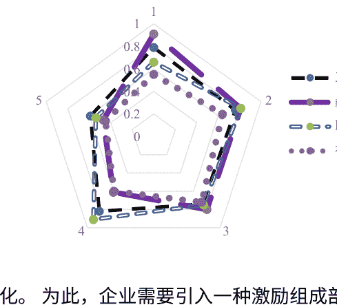

#### 表13 机械制造企业“D”动机组成部分的影响水平规模

| 动机组成部分 | 低 | 平均 | 高 |
| :--- | :--- | :--- | :--- |
| 工作条件 | 小于0.50 | 0.50–0.75 | 大于0.75 |
| 薪酬 | 小于0.50 | 0.50–0.75 | 大于0.75 |
| 职业机会 | 小于0.50 | 0.50–0.80 | 大于0.80 |
| 社会保障 | 小于0.50 | 0.50–0.70 | 大于0.70 |

如果组成部分的效用处于中等范围内，管理层可以根据内部直觉和专业经验自行决策，改善企业文化。

对于机械制造企业“D”来说，在执行企业文化“人事管理”组成部分时，吸引资源以提高激励要素“报酬”和“社会保障”的效果是必要的。

根据之前确定的对该企业最重要的要素，即劳动条件和报酬、职业发展可能性、社会保障，计算了机械制造企业“C”的激励要素的效用指标。激励要素效用指标的计算结果见表14。

图3显示了企业“C”生成的激励要素配置模型。

#### 表14 机械制造企业“C”激励要素实际影响水平的计算

| 企业文化组成部分 | 工作条件 | 薪酬 | 职业机会 | 社会保障 |
| :--- | :--- | :--- | :--- | :--- |
| 人力资源管理 | 3.2/3.3 = 0.97 | 5.4/6.0 = 0.90 | 2.8/3.8 = 0.74 | 4.2/4.2 = 1.00 |
| 生产组织 | 1.2/2.2 = 0.55 | 4.2/5.0 = 0.84 | 2.4/3.4 = 0.71 | 2.2/4.2 = 0.52 |
| 劳动纪律 | 2.3/2.9 = 0.79 | 3.5/3.6 = 0.97 | 3.1/4.4 = 0.70 | 3.6/4.6 = 0.78 |
| 企业的创新发展 | 2.3/3.5 = 0.66 | 3.6/3.9 = 0.92 | 1.9/3.2 = 0.59 | 4.3/5.2 = 0.83 |
| 职业道德 | 1.1/2.5 = 0.44 | 5.7/5.8 = 0.98 | 1.7/3.2 = 0.53 | 2.1/3.4 = 0.62 |

##### 图3 企业“C”的激励要素配置

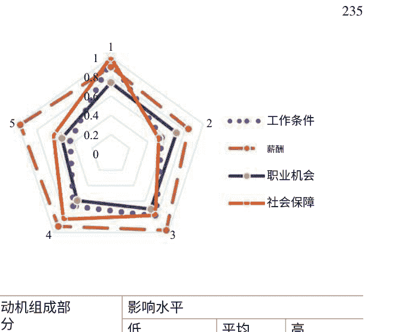

#### 表15 机械制造企业动机成分影响程度的等级刻度“C”

| 动机组成部分 | 低 | 平均 | 高 |
| :--- | :--- | :--- | :--- |
| 工作条件 | 小于0.50 | 0.50–0.70 | 大于0.75 |
| 薪酬 | 小于0.70 | 0.70–0.80 | 大于0.80 |
| 职业机会 | 小于0.50 | 0.50–0.80 | 大于0.80 |
| 职业活动的伦理 | 小于0.55 | 0.55–0.75 | 大于0.75 |

在机械制造企业“C”中，诸如“工作条件”和“社会保障”等动机成分的有效性较低，可以通过执行“生产组织”功能来提高其效用，同时“工作条件”、“职业发展机会”和“社会保障”等成分的效用水平也较低。针对机械制造企业“C”，提出了动机成分效用指标的等级刻度，如表15所示。

基于计算和机械制造企业“C”动机成分影响程度的刻度，可以提供以下建议：

- (1) 需要吸引额外资源来提高管理职能“职业道德”中动机因素“工作条件”的有效性，因为其效用指标值处于较低范围（0.44）；
- (2) 在执行“职业道德”功能时，需要吸引额外资源来提高“职业机会”这一激励因素的效果，因为效用指标的值处于低范围（0.53）之内。

根据之前确定的对于该企业最重要的组成部分，对于机械制造企业“A”的激励组成部分的影响指标进行了计算：权力和影响、自我提升、渴望成就和取得成果的愿望（表16）。

形成的企业“A”的激励组成部分的图形模型如图4所示。

在机械制造企业“B”中，执行“职业活动伦理”的功能时，可以提高“社会保障”这一激励组成部分的效果，其水平最低。针对机械制造企业“A”，提出了激励组成部分影响水平的刻度，如表17所示。

基于计算和提出的机械制造企业A的动机因素规模，可以提供以下建议：

#### 表16 机械制造企业“A”动机成分影响水平计算

| 企业文化组成部分 | 工作条件 | 材料鼓励 | 道德鼓励 | 社会保障 |
| :--- | :--- | :--- | :--- | :--- |
| 人力资源管理 | 3.4/5.2 = 0.65 | 7.1/7.5 = 0.95 | 5.1/5.3 = 0.96 | 7.2/7.8 = 0.92 |
| 生产组织 | 4.2/5.6 = 0.75 | 3.2/4.5 = 0.71 | 6.8/7.2 = 0.94 | 7.9/8.0 = 0.99 |
| 劳动纪律 | 2.9/4.1 = 0.79 | 4.0/6.3 = 0.63 | 3.9/4.2 = 0.92 | 7.1/7.5 = 0.95 |
| 企业的创新发展 | 5.8/6.1 = 0.80 | 5.1/6.4 = 0.80 | 6.1/6.9 = 0.88 | 5.4/6.2 = 0.87 |
| 职业道德 | 3.4/4.4 = 0.65 | 3.4/5.2 = 0.65 | 5.1/5.9 = 0.86 | 5.2/9.1 = 0.57 |

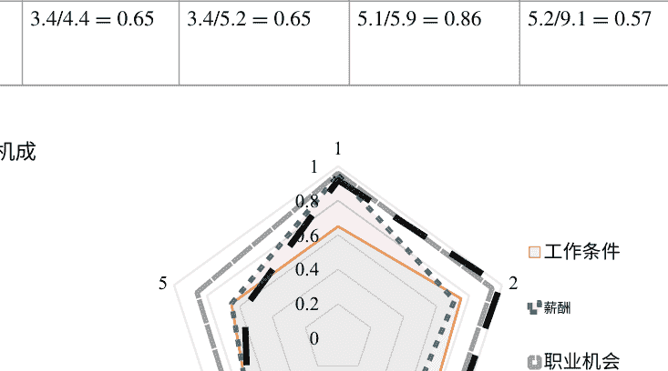

#### 表17 机械制造企业“A”动机成分影响水平规模

| 动机组成部分 | 低 | 平均 | 高 |
| :--- | :--- | :--- | :--- |
| 工作条件 | 小于0.65 | 0.65–0.75 | 大于0.75 |
| 教育水平 | 小于0.65 | 0.65–0.75 | 大于0.75 |
| 服务经验 | 小于0.85 | 0.85–0.90 | 大于0.90 |
| 社交联系 | 小于0.60 | 0.60–0.80 | 大于0.80 |

- 1. 需要吸引额外资源，以提高动机成分“社会保障”在“职业道德”管理职能中的影响水平，因为效用指标的值处于低范围（0.57）；
- 2. 在执行“劳动纪律”功能时，有必要吸引额外资源来增加“物质激励”这一激励组成部分的影响水平，因为影响水平指标的值处于低范围（0.63）之内。

## 4 讨论

因此，当今人员管理中，积极影响企业文化形成的动机问题尤为严重。只有在其人员正确及时评估环境和社会发展趋势时，企业文化才能在激烈的竞争中生存。对消费者需求变化、竞争对手行动以及所有社会变化的快速响应取决于管理人员的能力、方法和风格。因此，作为企业文化形成中最积极的催化剂，员工激励系统的开发和实施在今天仍然具有重要意义，有助于实现个人目标和企业目标。

研究企业文化问题的大多数科学家认为，作为一种有效的工具来影响企业人员的动机，只从一个角度来看待经理——对成就的渴望。作者认为，人类个性的激励模型是对称的。随着需求的满足，积极的动机自然而然地转变为消极的动机——防止。消极并不意味着不好；它是个性发展的另一种形式，另一个阶段。

## 5 结论

人事管理的数字化转型始于人力资源部内部的思维变革。对于许多组织来说，无论是在人力资源部门还是整个组织中，这都是一个革命性的机会。鉴于此，创新发展战略应考虑到数字化人力资源管理的要求，包括使用集成移动应用程序、社交网络、分析、云技术和虚拟现实技术。

今天，每个人首先必须将角色定义为一个团队，帮助管理层和员工快速适应数字化思维方式。必须改进和现代化传统的人力资源解决方案系统，并最好用集成云平台替代它，以创建数字化企业基础设施。还值得一提的是，必须仔细考虑并适应当今的演变和技术现实的长期战略。创新需要成为人力资源部门的关键战略。重要的是要创建一个团队，不仅深入了解人力资源的所有流程和功能，还能监控、分析和实施几乎每天出现的新技术堆栈。对待数字化环境中的工人的态度同样重要。必须像对待客户一样与员工建立关系。这将首先增加员工的参与度，促进他们的职业发展和全面发展。

有必要监控市场上的其他公司，了解他们使用的技术，以及如何帮助他们提高绩效并为员工创造良好的工作环境，因为员工是公司最重要的价值，公司的未来在很大程度上取决于他们。

总结企业文化研究的结果作为影响企业人员动机的有效工具，可以帮助我们突出最重要的方面：

- 1. 每个人的动机范围不仅是独特的，而且还在不断变化，有时会呈现出最意想不到的形式。企业的激励体系应尽可能完整，基于以下功能性激励体系的原则，这些体系在复杂的情况下可以涵盖人员动机问题的整个范围：报酬和物质激励；社会保障和物质支持；技能发展；职业规划；道德激励；支持创新；竞赛和职业素质评估；参与战略决策；参与创业风险。
- 2. 员工激励系统创造了一种影响企业文化形成的激励紧身衣。
- 3. 考虑到工人身份的激励领域，有必要突出其特定属性：渴望权力和领导成就，实现领导者的倾向，坚持不懈，活跃，能够进行智力工作，脑力工作，倾向于合理风险，做出决策，愿意负责（不仅仅是行动，还有他人的行动），心理稳定性，高智商，博学多才和全面教育。
- 4. 根据企业和社会的目标，提高员工能力的利用，因为有效的人力资源管理与动机，基于对员工需求，动机，兴趣，价值观，理想和目标的了解，直接相关。
- 5. 战略人力资源管理在组织框架内实施，这不仅仅是一个技术和经济系统，而是一个社会系统。为了在某一特定时刻获得管理人员的最大和必要的回报，并使他们的工作动力最大化，需要一系列措施，其中创建有效的企业文化占据非常重要（甚至可以说是主要）的位置。
- 6. 企业文化正在成为一种重要的战略工具，它能够将企业的所有部门聚焦在共同的目标上，调动员工的主动性和创造性态度，增强竞争优势。因此，企业文化一方面是任何组织的固有属性，体现了人员激励系统（至少是构成该系统基础的个别要素），另一方面，它满足了企业的战略要求。

## 参考文献

- 1. Genennig, S. M. (2020). 实现数字化创新. Springer.
- 2. Hulla, M., et al. (2019). 基于案例研究的数字化培训学习工厂。 Procedia Manufacturing, 31, 169–174.
- 3. Vedernikov, M., et al. (2020). 基于聚类分析的工业企业社会福利结构管理。 TEM Journal, 1(9), 249–260.
- 4. Salun, M., & Palyanychka, Y. (2018). 工业企业竞争力监测的特点和原则。 发展经济学, 17(3), 74–82.
- 5. van Assen, M. F. (2018). 管理行为对精益和流程改进的调节效应。 运营管理研究, 11, 1–13.
- 6. Haustein, E., Luther, R., & Schuster, P. (2014). 创新公司的管理控制系统: 基于文献的框架。 管理控制杂志, 24, 343–382.
- 7. Claus, L. (2019). 人力资源颠覆-是时候重新发明人才管理了。BRQ商业研究季刊, 22(3), 207–215.
- 8. Banerjee, A. (2015). 将人类动机融入服务生产力。制造业程序-制造, 3, 3591–3598.
- 9. Groesser, S. N., & Jovy, N. (2016). 使用计算建模的商业模型分析：一种探索和决策的策略工具。 管理控制杂志, 27, 61–88.
- 10. Lisbeth, C. (2019). 人力资源颠覆-早己是时候重新发明人才管理。BRQ商业研究季刊, 22(3), 207–215.
- 11. Vedernikov, M., et al. (2019). 数字化业务转型条件下工业企业企业文化建模的特异性。在2020年第十届国际计算机信息技术会议 (ACIT) , 德国, 九月 (pp. 595–600). IEEE.
- 12. Fischer, M., et al. (2021). 数字化转型的战略原型：使用业务流程管理定义元目标。 信息与管理, 57(5), 103262.
- 13. Dang, Q. T., 等 (2020). 国际商务政府关系: 跨国企业在新兴经济体中的风险管理策略.世界商业杂志, 55(1), 101042.
- 14. 王, S. (2018). 微观经济理论 .Springer.
- 15. Klikauer, T. (2014). 道德I: 纪律行动, 服从和惩罚.在人力资源管理的七个道德原则. Palgrave Macmillan.
- 16. Bruns, H. J. (2014). 地方政府中的人力资源发展: 人力资源战略如何以及为什么在组织变革和发展中重要?商业研究. 7, 1-49.
- 17. Vedernikov, M., 等 (2020). 控制活动建模作为影响工业企业人力资源管理系统中动机的工具. 在2020年第十届高级计算机信息技术国际会议 (ACIT), 德国, 九月 (pp. 601-606). IEEE.
- 18. Boiko, J., Volianska-Savchuk, L., Bazaliyska, N., Zelena, M. (2021). 智能招聘作为企业信息化背景下的现代人力资源招聘工具. 在2021年第11届国际高级计算机信息技术会议（ACIT）中, 德国, 九月（第284-289页）。
- 19. Mikhaylov, F., Julia, K., & Eldar, S. (2014). 人力资源管理服务发展的当前趋势. *Procedia -Social and Behavioral Sciences*, 150, 330-335.
- 20. Idris, S. A. M., Wahab, R. A., & Jaapar, A. (2015). 企业文化整合与组织绩效: 关于收购公司绩效的概念模型。*Procedia—Social and Behavioral Sciences*, 172, 591-595.
- 21. Ibragimova, R. S., Golovkin, D. S. (2021). 工业企业管理系统的形成方法.在S. Ashmarina, V. Mantulenko和M. Vochozka (Eds.) 中, 工程经济学: 来自欧亚视角的决策和解决方案. 2020年工程经济学周. 网络和系统讲义（Vol. 139）. Springer。
- 22. Andi, H. K. (2021). 构建信息技术部门的商业智能模型与决策支持系统. 信息技术杂志，3（4），259-268。
- 23. Thando, D., Eck, R. V., & Zuva, T. (2020). 评估技术采用模型和理论以衡量企业组织中技术的准备和可接受使用. 信息技术杂志，2（04），207-212。

# 使用深度学习方法的图像和视频的社交媒体标签推荐

Priyanka Panchal和Dinesh J. Prajapati

摘要 近年来，对于在社交媒体上为图像/视频或帖子推荐标签引起了很大的兴趣。许多研究人员从多个角度研究了这个问题。在本文中，我们通过考虑图像/视频的内容和用户对标签的历史来增强标签推荐。在社交媒体图像/视频分享网站上（如Facebook、Instagram、Flickr和Twitter），用户可以上传图像或视频并为它们打上标签。所提出的方法通过结合文本标签、图像和视频活动/对象识别内容以及声学数据的技术生成候选关键词，即标签。为此，本文研究了将多模态信息关联起来，并为图像或视频上传者用户提供推荐标签的不同方法。

尽管在电子商务网站的商品推荐、YouTube和Netflix的视频推荐以及社交媒体网站上的好友建议方面进行了大量研究，但对于社交媒体平台/应用/网站上的图像/视频的标签推荐的研究还不够，而这些已经成为这些社交媒体平台的重要角色。在本文中，我们对图像/视频的标签推荐进行了概述。

关键词标签推荐 · 社交网络 · 视频内容 · 标签（哈希标签） · 深度学习

## 1 引言

在社交媒体平台上，每当我们发布一张图片/视频时，一个标签是要添加到社交媒体图片/视频内容的一部分的关键词。用户可以为他们的图片/视频帖子添加标签，并使用该标签，其他用户可以找到与图片/视频主题相关的内容。del.icio.us是一个社交书签网站，Flickr是一个图片分享网站，它们在二十一世纪初推广了社交媒体标签。还有其他一些社交网络平台，包括Facebook、Instagram和Tumblr，它们采用了使用 # 符号来表示标签的方法。如今，大多数大型社交媒体平台的网站/应用程序都包含某种类型的标签功能。可以使用标签推荐来改进社交图片/视频分享网站的标签功能，通过为新上传的内容提供标签推荐方法，并帮助用户就特定主题的词汇达成一致。

在微博领域中常用的标签[1, 2]，图片[3-10]，视频[11-17]和新闻[4,18-20]是对实际内容的简洁描述，也是搜索引擎识别所需内容的主要信息来源[4]。社交网络服务（SNS）在个人日常生活中变得越来越重要。像Facebook、Instagram、Twitter、Flickr等大多数图片分享平台，它们使个人能够为图片/视频添加标签。因为包含热门标签将有助于人们进行注释、分类和搜索，标签是照片/视频流行度的重要组成部分。然而，标记过程需要很长时间，大多数人不确定使用什么类型的标签[9]。标签与社交内容的流行度密切相关；标签的数量和质量可以成为未来流行度的良好指标。

本文的主要贡献如下：

- 对图像或视频的标签推荐进行了文献调研
- 提出了一种标签推荐的过滤方法
- 对不同的标签推荐技术进行了比较分析
- 提出了标签推荐的评估参数
- 标签推荐的挑战和趋势

## 2 文献调查

然而，用户经常错误地使用标签。问题在于，错误标记的帖子在其他人搜索正确标记的帖子时不会出现。此外，系统很难在短消息的上下文中建议使用标签。例如，[21] 在 Twitter 上作为一个280个字符的消息，或者在 Facebook/Instagram/YouTube 上作为一个图像/视频。每天，成千上万的图像、文本消息、微视频和微博在互联网上传播。标签有助于对所有这些信息做出良好的判断。它们不仅帮助我们对相关上下文中的用户帖子进行分类，还帮助我们识别和对数据进行分类并使搜索更容易。 即使没有连接到我们的社交媒体网络，也可以通过标签来查看标题。它们有助于捕捉新的热门话题，否则可能会被忽视[22]。图1代表了众多形式的标签。图2代表了各种标签应用。

图像/视频的标签推荐方法侧重于图像/视频的内容和用户与图像/视频内容之间的关系等不同特征。 我们区分两种类型的标签推荐任务：以对象为中心和个性化。 前者的目标是创建和根据标签对目标项的适用性或者标签与目标项的关联程度[23]，优先考虑候选标签。基于对象的标签推荐不会因为目标用户而改变，旨在提高标签的质量，从而自动改进检索信息的性能，如搜索、分类和项目检索推荐，这些服务使用标签作为信息源。相反，个性化标签推荐算法不仅考虑目标产品，还考虑目标用户，目标是添加与目标对象和人相关的标签。因此，个性化标签推荐器可能为不同用户返回不同的结果，并改进捕捉用户的兴趣、背景和个人资料。根据[8]，在多个用户可以为同一对象分配标签的应用程序中，个性化标签推荐器不仅对个体用户有用（例如用于内容组织），而且在集体意义上也有用。这是因为当多个用户的标签推荐被合并时，它们可以给出更详细的描述，从而有利于搜索和推荐服务。在这里，下面定义了标签推荐的比较研究。

### 2.1 微视频的标签推荐

刘等人提出了一种用于标签推荐的技术，即用户引导的分层多头注意力网络（UHMAN），其中他们考虑了微视频的图像级和视频级描述的用户侧数据，如表1和表2所示。所提出的方法是在微视频分享平台Musical.ly上进行的，数据集是从该平台收集的。实验结果表明，所提出的策略是成功的[11]。所提出的方法基于一个名为“muLti-mOdal-based hashtaG recOmmendation”的神经网络LOGO，它使用多种模态来为微视频推荐标签。建议的LOGO方法同时使用顺序和注意力特征，通过多视图表示学习框架来整合所有模态。对整体性能比较和微观评估范围的广泛研究充分证明了我们建议的策略的有效性和逻辑性[12]。

李等人[21]提出了一种通过展示一种新颖的多视图表示图形信息传播和交互嵌入模型来推荐微视频的方法。通过同时考虑顺序特征学习的组合、视频-用户-标签交互以及标签之间的相关性，它可以自动提高微视频标签推荐的性能。所提出的方法在构建的数据集上进行了实验，表现出了最先进的基准线[13]。杨等人[22]提出了一种情感增强的多模态注意力标签推荐（TOAST）模型，用于微视频标签推荐。基于内容的公共空间学习特征是多模态情感特征和多模态内容特征分别使用情感注意力和自注意力作为方法论。此外，注意力神经网络使用注意力神经网络对动态捕获的内容特征和多模态情感特征进行嵌入，以区分其重要性。所提出的方法在一个真实世界的数据集上进行的实验给出了有效的推荐[14]。

魏等人[11]提出了一种基于图卷积网络的个性化标签推荐（GCN-PHR）模型，该模型通过使用先进的GCN技术并理解它们的表示，共同结合了<用户、标签、微视频>之间的交互。在提出的模型图中，有三种类型的节点，即用户、标签和微视频。已在两个真实微视频数据集上进行了提出的模型实验，其结果大幅领先于现有技术。辛格等人[13]提出了一种在移动计算环境中的方法，用于类似YouTube的视频分享网站，以提高视频的流行度。为了发现用户感兴趣的视频，将标签和标题结合起来有助于增加他们观看更多视频的倾向。所提出的方法应用于获得更高的流行度，推荐视频的标签是基于一种新颖的混合方法，该方法还包括多模态内容分析方法。通过结合视频内容和原始标签的文本语义分析，所提出的方法生成候选关键词，即标签。所提出的方法通过演示视频来有效提高社交流行度，并延长每次播放的视频观看时间。

魏等人[12]提出利用用户-项目交互来指导每种模态中的表示学习，并进行个性化的微视频推荐。用户偏好可以基于用户的模型特定表示来定义，这些表示建立在使用多模式GNN的消息传递概念之上。已公开发布的TikTok、Kwai和MovieLens数据集上进行了大量实验。多模式推荐方法的提出显著提高了最新技术水平。

### 2.2 图像的社交标签推荐

郑等人[16]提出了一种标签推荐系统PROMPT，它结合了社交内容和上传的照片，以推荐个性化的标签。为了推荐个性化的关键词，需要了解并确定属于相似群体的用户的相似标记方法。然后，将照片的标签、文本内容和视觉元数据结合在一起，找到最合适的候选标签，并从中推荐出最多N个标签。使用非对称标签共现概率初始化候选标签的分数。然后使用邻居投票来归一化分数。最后，使用随机游走方法提升了不可访问和许多最近邻标签。所提出的方法推荐前N个标签/关键词上传的照片。所提出的方法在Flickr数据集上进行了验证，其中包含测试集为46,700张照片和训练集为2800万张照片。所提出的方法通过1540个独特用户关键词/标签证实了超越现有技术的表现。Nguyen等人提出了一种个性化内容感知的图像标签推荐方法，结合了图像特征和用户历史标记数据/信息在因因子分解模型中。深度学习是一种用于提取图像强大而重要特征的最先进技术，使用目标检测和图像分类来处理图像。为了推荐标签，使用自适应因子分解模型来结合用户标记行为历史和图像特征/信息。所提出的方法的实验结果表明，基于基于对象的方法，即图像特征和视觉上下文可以将结果提升1.5%。

Quintanilla等人[24]提出了解决个性化标签推荐问题的方法，并提出了使用端到端深度网络在大规模数据集上进行实验的方法。为了改进用户推荐，结合了视觉编码和用户偏好，包括用户的行为，并可以在网络内以无监督的方式进行学习。为了推荐用户生成的关键词/标签，所提出的方法使用了对抗学习技术。所提出的实验在公开可用的数据集和两个不同的大规模数据集NUS-WIDE和YFCC100M上进行，与其他最先进的基准方法[7]相比，在两个数据集上都显著提高了性能。Bharadwaj等人提出了一种预测照片/图像最相关的标签的方法。本文构建了个人数据集用于推荐。为了对标签进行分类，数据集包括各种类别的图像，已经以不同的方式进行了训练和测试。为了为图像选择一个合理的标签是一种现实的技术，为了实现这一点，使用了机器学习技术最简单的方式。

Hachaj和Miazga [17]提出了一种新颖的投票深度神经网络与关联规则挖掘（VDNN-ARM）算法，用于推荐使用多标签的标签。机器学习技术VDNN-ARM之一是将深度神经网络与图像特征提取相结合，根据图像上下文对标签类别进行分类。此外，关联规则挖掘还用于将所有标签整合到一个数据集中。所提出的方法用于在HARRISON基准数据集上执行多标签分类问题。评估参数包括准确率、精确度和召回率。VDNN-ARM方法提供了优于现有技术的结果。Wang等人[7]提出了一种解决数据稀疏性问题的新方法，通过利用来自其他专业来源的最相关的Twitter帖子数据。此外，根据用户的显著位置，所提出的方法包括语义知识，利用词汇信息和基于词嵌入方法的上下文属性。基于多样化的标签推荐方法我们提出的方法将这些方法与学习-排序相结合，并提供排名靠前的标签。实验结果表明，建议的策略明显优于现有的最先进方法。

Yang等人[6]提出了一种基于注意力的多模态神经网络模型（AMNN），用于学习微博的表示，并用于推荐适当的标签。提出的标签推荐方法结合了混合神经网络技术和序列-序列模型，以识别图像的属性和相关文本。我们使用两个公共数据集和自建的Instagram数据集进行了实验，以获得优于现有技术的最佳结果。此外，我们使用三个评估参数（准确率、精确度和召回率）来比较三个不同数据集的结果。Ma等人[8]使用了新颖的共同注意力记忆网络来推荐多模态微博的标签。使用共同注意力技术，将用户的过去标记历史标签和多模态微博整合起来表示标签。所提出的方法在Twitter数据集上进行了演示，通过与基准方法进行比较，改进了多类别分类问题的性能。Park等人[9]提出了基于社交媒体网络上真实世界图像的标签推荐，并引入了HARRISON数据集。HARRISON数据集是从Instagram构建的，包括57,383张带有关联标签的图像。所提出的方法已在HARRISON数据集上进行了评估，使用卷积神经网络（CNN）提取了视觉特征。基于基于对象和场景的多标签分类器的神经网络，多模型特征模型在HARRISON数据集上进行了评估。要推荐数据集上的标签，需要对图像进行上下文和广泛的理解，并以标签的形式传达。

### 2.3 微视频的社交标签推荐

请参见表1。

### 2.4 图像的社交标签推荐

见表2。

#### 表1 微视频社交的标签推荐

| 序号 | 技术/方法 | 类别 | 数据集 | 评估参数 | 未解决的问题/批评 |
| :--- | :--- | :--- | :--- | :--- | :--- |
| 2020 [1] | 提取微视频视觉特征使用Inception-v3编码；用户表示使用one-hot编码/编码器嵌入表示 | 一般 | 从社交网络Vinical.ly构建的数据集 | Precision@10, Recall@10, F1-Measure@10 | 未解决的问题/批评 |
| 2020 [4] | 多模态融合（包括并行和顺序结构学习的多模态融合技术） | 一般 | 使用Vinical.ly的公共API，以数据集的形式提取微视频，包括标签 | 召回率和NDCG | 对于微视频的标签推荐，需要考虑外部知识，用于加强在线方式的标签推荐 |
| 2019 [2] | 为了推荐标签，需要使用嵌入技术、GCN和多模态图学习技术来整合用户行为、微视频标签和特征 | 运动 | 他们构建了自己的VINSIV数据集，包括123.84768个微视频和6个用户 | N @ recall和NDCG@R | 为了减少未来微视频中冗余的标签，通过使用注意机制和线性模型来进行用户行为、微视频特征、标签和标签的预测 |
| 2020 [8] | 使用深度学习模型 | 一般 | 从Instagram中提取数据，并取活跃用户 | Precision, Recall, F1 | 标签的多样性不足 |
| 2020 [9] | 使用注意力机制 | 一般 | 微视频数据集 | NDCG, MAP | 忽略了用户的历史行为 |
| 2018 [10] | 使用协同过滤 | 一般 | 微视频数据集 | Precision, Recall | 数据稀疏性问题 |
| 2017 [11] | 使用矩阵分解 | 一般 | 微视频数据集 | RMSE | 冷启动问题 |
| 2016 [12] | 使用基于内容的推荐 | 一般 | 微视频数据集 | Precision, Recall | 特征提取的准确性影响推荐质量 |
| 2015 [13] | 使用混合推荐 | 一般 | 微视频数据集 | F1-score | 模型融合的复杂性 |
| 2014 [14] | 使用标签传播 | 一般 | 微视频数据集 | Accuracy | 标签噪声的影响 |
| 2013 [15] | 使用社交网络信息 | 一般 | 微视频数据集 | Recall | 用户隐私问题 |
| 2012 [16] | 使用知识图谱 | 一般 | 微视频数据集 | Precision | 知识图谱构建成本高 |
| 2020 [22] | 情感共享空间学习网络，自我注意力机制共享空间学习网络 | 真实数据集，即一般 | Vine，最受欢迎的微视频流媒体社交平台，被抽取用于微视频数据集 | Recall@K和NDCG@K | 未来需要整合语义信息。关于标签和微视频特征的描述，以获得更准确的标签推荐结果微视频，还需要考虑情感信息。 |
| 2019 [11] | 使用图卷积网络（GCN）和注意力机制实现的从微视频生成的冗余消息进行过滤 | 一般 | 从社交媒体应用程序Instagram和YFCC100M自建数据集公开可用数据集 | 准确率、精确度和召回率是评估指标 | 未提及 |
| 2016 [13] | 使用神经网络、NLP技术和嵌入函数的skip-gram模型提取视频特征 | 29个体育短视频片段的类别 | 来自Vine.co，社交媒体提取应用视频和相关标签 | 为了更好地理解平均相关性得分计算 | 使用Tag2Vec空间整合情感信息和上下文信息，提供流行和趋势的标签 |
| 2020 [5] | 使用深度学习技术TF-SIM算法，提取视频特征，同时生成与视频相关的标签/关键词 | 电影和动画、宠物和动物、体育、旅行和事件、游戏、幽默、娱乐、新闻和政治、科学和技术都是随机的 | YouTube | 提出的方法在三种不同的方式进行评估：YouTube、校园志愿者和专业调查网站Amazon Mechanical Turk (AMT) | 未来不仅需要推荐标签，还需要使用视频语义技术和自然语言处理技术生成视频的标题和描述，以便观众可以找到他们感兴趣的视频 |
| 2010 [25] | 查询构建重要标签提取SVM分类器 | 类别15在MCG-WEBV中使用 | MCG-WEBV (包含8031个代表性YouTube视频的数据集) | MAP | 为了设计更强大的查询构建方法，需要提取关键词/标签，无论其是否嘈杂或不相关，并且需要整合视频特征以获得更好的结果 |
| 2010 [23] | 协同标记视频特征提取技术 | 街机游戏、汽车、舞蹈 | YouTube | 平均相关性精确度@K | 未提及 |
| [2019]12] | 聚合层贝叶斯个性化排名 (BPR) GNCF方法 | 通用的，即真实世界的 | 公开可用的数据集：抖音，快手和电影推荐 | 精确率 召回率 NDCG | 微视频和物体的多模态知识表示，还需要将用户的历史行为作为与微视频和社交网络中物体的属性结合起来执行对社交领袖的影响的推荐 |

#### 表2 图像的社交标签推荐

| 序号 | 技术/方法 | 类别 | 数据集 | 评估参数 | 未解决的问题/批评 |
| :--- | :--- | :--- | :--- | :--- | :--- |
| 2017 [3] | 为了推荐标签，使用标签共现的随机游走方法结合邻居投票方法 | 一般 | YFCC100M 数据集（来自Flickr，收集了1亿多媒体数据 | 准确率@K 和 召回率@K | 未来需要改进精确率、召回率和准确率使用提出的方法 |
| 2017 [15] | 分解模型深度学习模型用于图像分类目标检测技术卷积神经网络深度神经网络 | 包含26 9,648张图片 | MS COCO 数据集 NUS-WIDE | F1@K 精确率@K 召回率@K | 未来，标签推荐需要考虑用户的标签行为和用户的词汇，还要整合图像的多模态特征 |
| 2021 [24] | 多标签分类编码器-解码器网络对抗学习 | 一般 | YFCC100M 和 NUS-WIDE | 精确率、召回率 和准确率 | 在网络中应用所提出的图像字幕方法 |
| 2020 [26] | 机器学习技术如KNN和多标签分类以及深度学习技术如CNN | 动物、艺术、婴儿、时尚、健身、花朵、食物、梗图、自然、自 | Harrison 数据集（从Instagram收集的57,383张图片，每张图片平均有4.5%的关联标签） | 比较各种方法以准确预测主题标签 | 未提及 |
| 2020 [17] | 多标签分类主题推荐卷积神经网络深度神经网络 | 来自Instagram的57,383张照片 | 现实世界照片数据集 HARRISON | 精确率 召回率 准确度 | 开发利用额外信息的方法，例如图像的地理定位信息，多模态图像特征等等 |

##### 表2（续）

| 序号 | 技术/方法 | 类别 | 数据集 | 评估参数 | 未解决的问题/批评 |
|------|-----------|------|--------|----------|-------------------|
| 2021 [27] | 基于词嵌入的框架，使用概率隐语义分析(PLSA)和潜在狄利克雷分配(LDA)技术进行基于内容的主题标签推荐 | 一般 | 使用Twitter的公共API，即Twitter流式API数据集，创建了一个包含公开可用推文的数据集 | 在k处的精确率@k 召回率@k | 未提及 |
| 2020 [6] | 基于注意力的神经网络框架，编码器-解码器架构GRU网络 | 一般 | HARRISON NUS-WIDE MM-INS | 使用不同的数据集和不同的评估指标（准确率、精确率、召回率），评估所提出的模型 | 未来，所提出的hashtag推荐方法将与hashtag的特征相结合 |
| 2019 [7] | FP-Rank PageRank 协同过滤 (CF) 邻接矩阵 构建 | 一般 | YFCC100M | 将建议的方法与其他五种推荐方法进行比较 | 在更多数据集上进行实验 |
| 2021 [8] | 注意力机制嵌入LSTM、RNN、CNN基于共同注意力的推文建模 | 一般 | 数据集来自Twitter的API | 召回率 精确率 F1得分 Hits@3 Hits@5 | 未提及 |
| 2016 [9] | 卷积神经网络 (CNN) VGG-16 VGG-Object VGG-Scene VGG-Object + VGG-Scene多标签分类器 | 一般 | HARRISON数据集 (57,383张图片：插图，艺术，建筑，Ootd，绘画，设计，好莱坞，加利福尼亚) | Precision@1, Recall@5和 Accuracy@5 | 将来，这个HARRISON数据集可以用来改进hashtag的推荐 |

## 3种hashtag推荐的过滤方法

hashtag推荐是在线服务检索和导航中的重要策略，通常基于整合用户、标签和内容以及目标内容信息的共现。

### 3.1 协同过滤

在hashtag推荐领域中，协同过滤方法用于确定用户历史记录和热门最新hashtag之间的相似性，并根据用户与其他用户的相似偏好向用户推荐。协同过滤（CF）是一种被研究人员长期研究的知名推荐技术[22, 28]。评论出版物解释了几种基于CF的方法[18, 29]，并能够根据像标记行为历史这样的知识来推荐标签。

一些研究通过使用矩阵分解[9]和基于神经网络（NN）的方法[8]扩展了协同过滤。

基于协同过滤技术的方法直接地整合了用户的帖子、标签和用户历史之间的关系。对于个性化的标签推荐，需要捕捉用户特定的信息，包括标签的语义和用户在标记历史中的行为。为了构建一个现代的标签推荐系统，协同过滤技术已经发展出一种新兴的技术，其中包括多个领域的对象，以发现潜在的相关对象，从而定义了基于协同过滤的标签推荐系统的基本操作方法。现有的协同过滤技术通常可以分为基于潜在因子模型的技术和基于内存的方法。对于标签推荐，需要识别用户和对象之间的关系，以找出相关的用户和对象的信息。这些技术通常对用户-物品交互矩阵的稀疏性敏感，因为稀疏矩阵减少了找到高质量用户/物品邻域的可能性。潜在因子模型通过利用关系矩阵的广义形式来解决这个问题，从而揭示出一组较小的潜在因子，其中包含了所有物品的内在属性，包括用户对这些方面的兴趣。

#### 用户相似度计算

在创建用户协同过滤时，选择相似度函数是一个重要的设计决策。

##### 皮尔逊相关系数

为了确定两个用户的相似度，该方法计算它们共享评分之间的统计关系（也称为皮尔逊相关系数）。

##### 均值计算

$$\bar{v} = \frac{\sum_{i \in S_u} v_{ui}}{|s_u|}$$

首先，我们可以应用上述方法来获取用户的平均评分。

##### 皮尔逊相关系数

$$\omega(a, u) = \frac{\sum_{i \in S_a \cap S_u} (v_{ai} - \bar{v}_a)(v_{ui} - \bar{v}_u)}{\sqrt{\sum_{i \in S_a \cap S_u} (v_{ai} - \bar{v}_a)^2} \sqrt{\sum_{i \in S_a \cap S_u} (v_{ui} - \bar{v}_u)^2}}$$

以下是对前面方程的更好近似：

$$\omega(a, u) = \frac{\sum v_{ai} v_{ui} - \frac{\sum v_{ai} \sum v_{ui}}{n}}{\sqrt{\sum v_{ai}^2 - \frac{\sum v_{ai}^2}{n}} \sqrt{\sum v_{ui}^2 - \frac{\sum v_{ui}^2}{n}}}$$

这个近似更好，因为可以在一次通过中获得值，从而最小化计算时间。

##### 余弦相似度

余弦相似度忽略了0-0匹配。它的定义如下：

$$\cos(x, y) = \frac{x \cdot y}{||x|| \times ||y||}$$

其中·表示点积，||x||表示向量x的长度。向量的长度定义为

$$||x|| = \sqrt{\sum_{i=1}^{n} x_i^2}$$

协同过滤进一步分为三种类型：

基于内存的协同过滤使用完整的用户-项目数据库来创建标签推荐。每个用户都属于一个具有相似兴趣的个体群体，通过识别用户的邻居，可以生成对新项目上用户偏好的预测，作为邻居评级的综合。这个类别包括基于项目和基于用户的协同过滤[16]。

基于模型的协同过滤通过使用数据挖掘技术和机器学习算法对一系列评分进行训练和建模用户的偏好。为了预测测试和真实世界的数据集，使用基于模型的协同过滤。

混合协同过滤通过混合基于内存和基于模型的协同过滤算法，或者通过将其他推荐方法与协同过滤相结合来预测标签。

### 3.2 基于内容的过滤

基于内容的方法是另一种众所周知的推荐策略。用户和物品必须通过特征进行适当区分，例如用户行为、用户和物品特征以及社交连接等。然而，一般来说，对个体或对象进行描述是一个困难的过程。一个好的用户/物品描述策略应该同时使用显性和隐性属性或方面来定义用户。基于内容的方法是一种领域特定的技术/算法，它更注重评估物品属性以进行预测。在使用网站等媒体时，建议推荐出版物和新闻；最有效的过滤策略是基于内容的过滤。在基于内容的过滤方法中，推荐是基于从用户配置文件和先前由用户评估的项目的内容中获取的信息。

在推荐系统中，基于内容的推荐是一种重要的技术。主要概念是预测与客户喜欢的内容相似的物品[25]。基于内容的推荐系统的主要目标是计算物品之间的相关程度。有各种方法用于对物品进行建模，其中最常见的是向量空间模型[12]。该算法分析物品/对象的关键词，并使用TF-IDF确定内容的重要性。将ki设置为物品di的第i个关键词，将wn i设置为di的关键词ki的权重，那么di的内容可以如下所示：

物品(di) = {w1i, w2i, ...}

如前所述，基于内容的推荐引擎预测与用户过去喜欢的内容相似的物品。因此，可以根据一个人过去的偏好来预测他或她的选择。使用基于内容的用户兴趣矩阵(u)作为用户的内容偏好，具体规范如下：

基于内容的个人资料 (u) = 1/|N(u)| sum d ∈ N(u)Items(d)

N(u) 是你之前对用户所赞赏的。在计算所有用户的项目矩阵 Content(.) 和信息偏好向量 Content-Based Profile(.) 之后，对于任意用户 u和项目 d，用户和项目之间的相似度被定义为用户和项目之间的相似性。

Content_Based_Profile(u) 和 Content(d):

$$p(u, d) = \text{sim}(\text{Content\_Based\_Profile}(u), \text{Content}(d))$$

许多推荐系统在表示产品时严重依赖关键词。然而，从项目中收集关键词也是一项具有挑战性的任务，特别是在媒体领域，因为从视频中检索文本关键词非常困难。处理这类问题有两种主要方法。一种选择是让专家标记物品，而另一选择是允许消费者标记它们。

### 3.3 基于混合方法的过滤

混合过滤方法整合了多种推荐算法，以改善系统优化，并避免仅依赖一个推荐机制所带来的限制和问题。混合方法的概念是通过整合多个模型来产生更可靠和真实的建议，相比于一个学习算法，因为一个算法的缺点可能会被另一个算法解决。组合方法可以通过以下三种方式实现：分别实施方法并组合结果，利用少量基于内容的过滤在协同方法中，利用少量协同过滤在协同方法中，或者开发一个统一的推荐模型，同时利用这两种方法。

### 3.4 社交流行度预测

社交流行度预测已被证明是一个重要的主题。在[30–33, 49]，互联网流行度内容和用户创建的内容，例如来自YouTube的新闻和视频，已经被检查和推荐。随着SNS的发展，学术界和产业界正在关注上传图片的社交流行度[4,13,17,20,26,27,34]和视频[12,16,21]的预测。这些流行度预测大多通过数据驱动的基于特征学习的阶段进行，一些研究还整合了代表时间波动的动态模型[1, 33]。此外，多模态特征，如文字和图像中的信息，以及社交关系，已经分析并与增强注意力模型预测性能的技术集成。

### 3.5 图像/视频标签推荐技术

图像和视频的标签推荐技术如图3所示。

图3 图像/视频标签推荐技术

## 4 评估参数

为了分析所提出技术的有效性，使用评估指标进行评估。推荐系统的效率可以使用评估指标进行分析，即精确度、召回率和F-度量。精确度和召回率都是用于检验统计结果有效性的主要指标。精确度用于计算随机选择的相关文档占所有文档的比例。召回率用于计算所选文档中相关论文占所有相关文档的比例。在哈希标签推荐的背景下，准确度和召回率是定义的例子[27]。

假设 TP_i 描述了与 C_i 相关联的样本文档的数量，并且它们也被分类为 C_i。FP_i 描述了与任何 C_i 组别无关的样本论文的数量，并且它们被分类为 C_i。FN_i 表示与 C_i 相关的样本文档的数量被分类为其他分类。

因此，评估参数是精确度和另一个评估指标召回率，在分类 C_i 中定义如下：

$$P = \frac{TP_i}{TP_i + FP_i}$$

$$R = \frac{TP_i}{TP_i + FN_i}$$

大多数情况下，在充分考虑准确性和召回率之后，我们提供F-度量如下所定义。

$$F = \frac{2 \times P \times R}{P + R}$$

我们还可以使用以下公式计算每种方法的误差率，该方法使用平均绝对误差率（MAE）和均方根误差（RMSE）

$$\text{MAE} = \frac{1}{|T|} \sum_{(u,i,r) \in T} |p_{ui} - r|$$

$$\text{RMSE} = \sqrt{\frac{1}{|T|} \sum_{(u,i,r) \in T} (p_{ui} - r)^2}$$

其中 T表示测试数据的总量，算法的预测评分表示为 $p_{ui}$，用户实际评分表示为 $r$。

## 5 结论和未来展望

当用户对其发布的图像/视频进行标签时，他们更喜欢使用他们认为能够定义他们感兴趣内容的标签。由于个体对图片或视频材料的个人喜好，以及他们个人的标签使用模式或理解能力，他们可能会对同一张图片或视频使用截然不同的标签。这一发现表明，为了提供适当的标签推荐，了解用户、标签和图像/视频之间的复杂关系至关重要。在这项研究中，我们将研究几种标签推荐的方法。我们的研究分为两个部分：图片和微视频。根据研究，降低噪音对算法的效率和准确性有重要影响。此外，包括用户个人资料、用户过去的标签历史、他们的兴趣以及热门趋势标签和人口统计数据可以帮助改进推荐系统。该方法使用计算机视觉、深度学习和自然语言处理来推荐标签，将受益于广泛的社交媒体账户。我们希望我们所确定的开放性挑战清单能够成为未来研究和改进这一重要领域的指南。

## 参考文献

1.  Thomee, B., Elizalde, B., Shamma, D. A., Ni, K., Friedland, G., Poland, D., Borth, D., & Li, A. L. J. (2016). YFCC100M: 多媒体研究中的新数据。ACM通信，59(2)，64–73。计算机协会。https://doi.org/10.1145/28128022
2.  Baltrušaitis, T., Ahuja, C., & Morency, L. -P. (2017).多模态机器学习：一项调查和分类.
3.  Shah, R. R., Samanta, A., Gupta, D., Yu, Y., Tang, S., & Zimmermann, R. (2017). PROMPT: 个性化用户标签推荐社交媒体照片利用个人和社交
4.  曹，D.，苗，L.，荣，H.，秦，Z.，& 聂，L. (2020年)。通过利用多种模态的微视频的Hashtag我们的故事：Hashtag推荐。基于知识的系统，203。
5.  周，R.，夏，D.，万，J.，& 张，S. (2020年)。一种用于改善移动计算环境中视频流行度的智能视频标签推荐方法。IEEE Access, 8, 6954-6967。
6.  杨，Q.，吴，G.，李，Y.，李，R.，顾，X.，邓，H.，& 吴，J. (2020年)。AMNN：基于注意力的多模态神经网络模型用于Hashtag推荐。IEEE计算社交系统交易，7 (3), 768-779。
7.  王，X.，张，Y.，& 山崎，T. (2019年)。用户感知的民间流行度排名：基于用户流行度的标签推荐，可以提高社交通行度。在MM 2019年-多媒体国际会议第27届ACM国际会议论文集 (pp. 1970-1978)。
8.  马，R.，邱，X.，张，Q.，胡，X.，江，Y.G.，& 黄，X. (2021年)。共同关注记忆网络用于多模态微博的标签推荐。IEEE Transactions on Knowledge and Data Engineering, 33 (2), 388-400。
9.  朴，M.，李，H.，& 金，J. (2016年)。HARRISON：社交网络中真实世界图像的标签推荐基准。
10. Isinkaye, F. O., Folajimi, Y. O., & Ojokoh, B. A. (2015年)。推荐系统：原理、方法和评估。埃及信息学杂志，16 (3), 261-273。Elsevier B.V.
11. 魏，Y.，赵，Z.，程，Z.，朱，L.，于，X.，& 聂，L. (2019年)。个性化标签推荐-为微视频。在MM 2019—第27届ACM国际会议多媒体 (pp. 1446-1454)。
12. 魏，Y.，何，X.，王，X.，洪，R.，聂，L.，& 蔡，T. S. (2019). MMGCN：多模态图卷积网络用于个性化微视频推荐。在MM 2019—第27届ACM国际多媒体会议(pp. 1437-1445)。
13. 辛格，A.，赛尼，S.，沙阿，R.，& 纳拉亚南，P. J. (2016年12月18日). 学习使用Tag2Vec为视频添加标签。在ACM国际会议论文集。
14. 电气和电子工程师学会，IEEE计算机学会，IEEE电路和系统学会，IEEE通信学会，& IEEE信号处理学会. (无日期). 在2020年IEEE多媒体和博览会(ICME), 2020年7月6日至10日, 英国伦敦。
15. 阮, H. T. H., Wistuba, M., & Schmidt-Thieme, L. (n.d.).使用深度迁移学习的个性化图像标签推荐.
16. 郑, L., 天龙, Z., 惠健, H., & 才明, Z. (2020). 基于卷积特征和加权随机游走的个性化标签推荐国际计算智能系统杂志, 13(1), 24-35.
23. Toderici, G., Aradhye, H., Pasca, M., Sbaiz, P. L., & Yagnik, J. (n.d.). 在*YouTube*上找到意义：标签推荐和类别发现.
24. Quintanilla, E., Rawat, Y., Sakryukin, A., Shah, M., & Kankanhalli, M. (2021). 个性化标签推荐的对抗学习/IEEE多媒体交易, 23, 1083–1094.
25. Rappa, M., & ACM数字图书馆. (2010). 在第19届国际万维网会议上 ACM.
26. Bharadwaj, P. N., Shivashankaran, T., & N, S. D. (n.d.).图像标签的预测. www.ijert.org
27. Kumar, N., Baskaran, E., Konjengbam, A., & Singh, M. (2021). 使用词嵌入和外部知识的短社交媒体文本的标签推荐知识和信息系统, 63(1), 175–198.
28. IEEE计算智能学会，国际神经网络学会，电气和电子工程师学会，以及IEEE计算智能世界大会（2016年：加拿大温哥华）。（无日期）。在2016年国际联合神经网络会议上（*IJCNN*），2016年7月24日至29日，加拿大温哥华。
29. Smys, S., Chen, J. I. Z., & Shakya, S. (2020). 深度学习的神经网络架构调查。软计算范式杂志（*JSCP*），2（03），186-194。
30. Zhang, C., Yang, Z., He, X., & Deng, L. (2019).多模态智能：表示学习，信息融合和应用.
31. Tajbakhsh, M. S., & Bagherzadeh, J. (2016). 基于语义TF-IDF的微博主题标签推荐系统：Twitter案例。在2016年未来物联网和云计算研讨会上的论文集，*W-FiCloud* 2016（第252-257页）。https://doi.org/10.1109/W-FiCloud.2016.59
32. 金，J., & 沈, K. (2017). 主席致辞。在计算机科学讲义（包括子系列 计算机科学讲义人工智能和 计算机科学讲义生物信息学）：第10235卷 LNAI. Springer.
33. 张，Y., 胡，J., 佐，S., 山崎, T., & 相河, K. (2017). 一种用于提高流行度的标签推荐系统。在*MM 2017*—2017年ACM多媒体会议论文集 (pp. 1227–1228). https://doi.org/10.1145/3123266.3127913
34. Tonge, A., Caragea, C., & Squicciarini, A. (2018). 面向隐私的图像标签推荐。在*HT 2018*—第29届ACM超文本和社交媒体会议论文集 (pp. 52–56).
35. 张，J., 聂, L., 王, X., 何, X., 黄, X., & 蔡, T. S. (2016). 短小为佳：从微视频中估计场地类别。在*MM 2016*—2016年ACM多媒体会议论文集(第1415-1424页)。
36. Lops, P., de Gemmis, M., Semeraro, G., Musto, C., & Narducci, F. (2013). 基于内容和协作的标签推荐技术：实证评估。智能信息系统杂志, 40(1), 41-61。
37. 多模态超图的点击率预测。.(无日期)。https://www.tiktok.com/
38. 王, S., 罗, D., 瓦西列斯库, B., & 谢列布雷尼克, A. (2018). EnTagRec ++：增强的软件信息站点标签推荐系统。实证软件工程, 23(2), 800-832。
39. Krizhevsky, A., Sutskever, I., & Hinton, G. E. (2017). 使用深度卷积神经网络的ImageNet分类/ACM通信, 60(6), 84–90.
40. Yamasaki, T., Hu, J., Sano, S., & Aizawa, K. (2017). *FolkPopularityRank*: 使用文本标签在内容共享服务中提高社交流行度的标签推荐
41. Tripathi, M. (2021). 基于卷积神经网络的图像分类技术分析创新图像处理杂志 (*JIIP*), 3(02), 100–117.

# 使用物联网的智能门锁系统—铁路机车的安全性

- K. Sujatha, N. P. G. Bhavani, U. Jayalatsumi, T. Kavitha, B. Latha, A. Ganesan和A. Kalaivani

摘要 在铁路机车的智能门锁系统中，许多物联网设备通过网关连接在一起。智能系统中网关的重要性不可忽视，然而由于其中心化结构，它们容易受到各种安全问题的影响，包括完整性、认证和可用性。本文讨论了一种基于区块链的智能门锁系统，用于解决铁路机车的这些安全漏洞，并配备了网关网络。

这个智能门与网络集成，防范了恐怖分子滥用操作和破坏铁路引擎的攻击，需要正确的身份验证。传感器和执行器以分散的方式连接和通信，在资源有限的铁路引擎智能门锁设置中。由于信息是敏感的，该领域的一个问题是数据存储和传输。指纹图像使用边界检测算法和人工神经网络（ANN）进行特征提取。借助云计算技术，检索到的特征数据可以实时评估和监控。身份是铁路引擎物联网智能门锁系统的一个威胁模型。

- K. Sujatha (✉)
EEE系, Dr. MGR教育和研究学院, 印度泰米尔纳德邦, 钦奈
e-mail: [drksujatha23@gmail.com](mailto:drksujatha23@gmail.com)
- N. P. G. Bhavani
ECE系, Saveetha工程学院, SIMATS, 印度泰米尔纳德邦, 钦奈
- U. Jayalatsumi
ECE部门, Dr. MGR教育和研究学院, 印度泰米尔纳德邦, 金奈
- T. Kavitha
土木工程系, Dr. MGR教育和研究学院, 印度泰米尔纳德邦, 金奈
- B. Latha
物理系, Dr. MGR教育和研究学院, 印度泰米尔纳德邦, 金奈
- A. Ganesan
EEE系, RRASE工程学院, 印度泰米尔纳德邦, 金奈
- A. Kalaivani
CSE系, Saveetha工程学院, SIMATS, 印度泰米尔纳德邦, 金奈

最后，本文重点介绍了区块链技术，该技术能够通过利用指纹识别进行身份验证来解决物联网应用安全问题。该系统还可以作为智能手机应用程序进行扩展。使用以太坊区块链技术的网络已经按照行业标准和安全性进行了测试，包括响应时间和准确性。提出的系统可以为铁路机车的智能门提供安全锁定，以防止事故发生。还提出了一些可能的解决方案，以解决基于区块链的物联网中的安全和隐私问题，以说明区块链如何帮助物联网。

关键词：物联网·区块链·智能门锁系统·安全·隐私·网关·铁路机车

## 1 引言

物联网（IoT）是过去十年中最有前景的技术之一。智能设备可以检测其环境并与网络上的其他智能设备进行通信。在关于供应链的讲话中，提到了物联网[1]。物联网（IoT）是智能家居或城市的关键组成部分之一。低功耗嵌入式系统与21世纪一起使用；互联网已经变得如此普及，连接到互联网的设备数量已经超过了数十亿，使全球人口成为少数派。随着数十亿设备的连接，产生和传输了大量的数据和信息。因此，物联网数据处理和存储成为一个具有挑战性的课题。物联网有很多潜力，可以构建各种应用程序，从而提升人们的日常生活。由于物联网的存在，传统网络和应用程序变得更加实时，可以实时监控智能设备的部署。数据分析可以借助相关技术来加快系统的运行。通过执行所谓的边缘计算，可以加快处理和计算速度[2]。

物联网在各种应用中被使用，包括医疗保健和地震早期检测。创建基于智能物联网的家庭系统是我们的主要目标。组成区块链的八个组件都有自己的标准。区块链的目标是创建一个账本，这是一个不可变且分布式的历史记录。为了存储、更新和维护账本，采用了对等网络。网络中的每个节点都复制了账本。这个网络的目标是对每个更新的内容达成一致。这消除了集中式复制账本的需要，并保证了所有副本的账本都是相同的。用户权限、身份验证和身份管理都由会员服务部门处理。术语“智能家居”指的是实时传输和接收数据的私人住宅。它通过各种家用产品如电视、灯光等提供自动化和智能化服务和冰箱。这些小工具是家庭通信系统的一部分，它们可以相互之间和与世界其他地方进行通信，无需人为干预。用户可以使用各种基于其偏好和网络设置的家庭设备来监控和管理自己[3]。

然而，由于这种方法，智能家居生态系统过于依赖网关。智能技术依赖于集中网络来连接各种设备，这带来了重大的安全风险。智能电视和冰箱是智能系统的重要组成部分，以前曾被黑客入侵，用于发送钓鱼和垃圾邮件。一个例子是在德克萨斯州的一所房子里黑客入侵了新生儿监控摄像头，以便在网络上收集淫秽声音，使其成为DDoS攻击的绝佳目标。由于物联网服务器和网关系统的网络攻击，数据伪造和篡改、访问非法设备以及设备管理不足等安全挑战正在不断发展，随着物联网时代的继续。物联网应用程序利用各种智能设备的优势。绝大多数这些智能设备都是资源低、处理能力低和内存低的设备。如前所述，每个层架构都有其自己的一套安全挑战。为了使应用程序对最终用户足够逼真，必须解决安全和隐私问题[4]。

## 2 文献综述

用户可以自由共享一个类似于关系型数据库的公共电子分类账，并生成其交易的不可变记录，每个交易都有时间戳并与之前的交易相连。每个线程块都是一个数字交易或记录，允许无限或有限数量的用户与集中式数据库进行交互。当新数据引入到区块链中时，它将永远无法更改或撤回，确保数据的完整性。系统中发生的每笔交易都被记录在区块链上，并可以进行验证。

从网络的角度来看，区块链是一个分布式文件系统，其中成员保留文件的副本，并通过共识达成对文件的修改。每个区块包含一系列交易以及重要数据，包括上一个区块的时间戳和加密签名（哈希），当前区块的哈希和其他细节。前一个区块的哈希将当前区块与前一个区块链接起来，后续区块需要当前区块的哈希，从而形成一个区块链。

如果块中的任何内容被更改，可以计算哈希值并找到一个与提供的值不同的值，从而导致该块被拒绝。本研究的作者设计了一种称为无线传感器的三层架构，用于安全高效的数据处理[5,6]。

区块链有两种类型：公共和私有。公共区块链不需要任何许可。任何人都可以以一种有益的方式参与其中。他们可以通过查看区块链或添加到区块链来参与其中。由于其分散性质，这个公共链没有一个人掌握网络的命令权。也就是说，一旦区块链上的数据被验证，就无法更改。公共区块链的优势在于允许用户自由添加和查看数据；数据库是分布式而不是集中式的；为了防止数据更改，它是不可变的；并且由于51%规则的存在，它是安全的[5]表明网络的绝大多数节点都在其自己的系统内。这意味着点对点网络没有正确连接，这可能导致区块链上新创建的块的中继问题。作者在[6]中展示了当大量节点由具有大量计算能力的攻击者（或非攻击者）控制时，在少数扫描的区块链中的总计算能力达到了相对于总计算能力来说被认为是过多的比例。由于攻击者有意引起分叉，这种情况可能会威胁系统的完整性。

在一次自私的挖矿攻击[7]中，一个恶意的挖矿池决定保留它发现的区块。结果产生了区块链分叉。它会继续在私有分支上挖矿，直到两个分支的长度相同，然后发布信息。结果可能是它成为最长的分支，其他矿工也会效仿。一段时间过去后，公共分支以及其中包含的所有数据可能会被删除。矿工在两个分支之间的比例可能为有害挖矿池提供优势。[8]的作者描述了另一种袭击，称为历史修订攻击。然后，通过结合工作量证明的困难之处，可以创建一个分叉和破坏性分支，同时避免初始分支。其他矿工可能会接受它，转换区块链的历史。

它由一些通过网关进行管理和监控的设备组成。这种类型的网络架构可能会导致家庭数据被黑客攻击，造成隐私泄露，设备故障，并使人们处于风险之中。当一个人接触到智能家居网络时，设备以有针对性的方式收集的数据可能会被披露。由于智能设备和小工具缺乏安全标准，连接许多异构设备是困难的。因此，为消费者提供多种服务是困难的。智能门锁网关的安全性至关重要，成功运行需要网关安全标准[7-9]。智能家居网络收集和存储各种数据，包括居民提供的敏感数据。只有授权人员才能访问这些数据，这是智能系统安全的重要组成部分。加密技术与智能门锁系统的关键特性一起使用和定制。在配置之间传输和接收数据时，不能出现错误传输。

哈希函数降低了篡改数据的风险，并允许跟踪和验证所保留的确切数据。在具有网络设置的智能门锁系统中，身份验证可以阻止攻击者在传统网络之外恶意行为。区块链用于验证网络成员的有效性，并且可以随时检查以确保适当的智能网络架构[10, 11]。

## 3 方法论

铁路机车司机将把指纹放入指纹扫描仪中，该扫描仪通过Arduino板的微处理器与门锁相连。扫描指纹后，机器会在数据库中搜索匹配项。如果检测到匹配项，锁舌将打开，解锁机车门。当机车司机希望锁上机车门时，他或她会做类似的操作。当指纹正确时，锁舌关闭，将机车门锁住。如果输入错误的指纹，系统会发出蜂鸣器声音，并在液晶显示屏上显示“请重试”，同时将信息发送到相关机车司机的手机上。

如果系统接收到一系列错误的指纹，即如果除了关注的引擎驾驶员之外的其他人反复尝试打开门，则系统进入受保护模式，发送警报并在液晶面板上显示“恐慌模式”。根据发送给司机手机和铁路控制室的消息，有人试图闯入引擎门。

与典型的受保护系统相比，我们的指纹智能门锁系统在铁路机车上是复杂、高效和安全的。典型的安全系统由与正确钥匙接触时打开的锁组成。在我们的系统中，接受和真实的指纹是访问受保护锁机制的唯一途径。图1中显示了块图。锁定机制在我们的日常生活中至关重要。当涉及到保护重要和敏感物品以及个人隐私时，锁和钥匙是无可替代的。然而，所采用的技术类型可能会决定物品的安全性。指纹门锁系统是一种通过指纹界面解锁的生物识别锁。指纹是独一无二的，无法复制，因此更安全可靠。各种锁定方法之间存在一些关键差异。传统的锁和钥匙系统、指纹锁系统、密码/PIN码系统和生物识别锁系统只是可用安全方法的一小部分。每个系统的优点和缺点使其高效、安全、可识别且难以破解。较低级别的标题不编号，并且以行内标题的样式呈现。

## 4 结果和实施

基于分类器输出和融合得分水平的引擎驾驶员识别将在本部分中讨论使用MATLAB的分类器的仿真输出。所有三个过程都有包含识别数据库和误接受错误率信息的MATLAB编码。在此识别过程中，从数据库中选择了一个指纹图像作为验证图像。然后将提交的图像与数据库中的所有条目进行比较。如果提交的输入与数据库匹配，则用户被识别为有效用户，可以启动引擎，并显示最大匹配分数值。如果用户的输入与数据库不匹配，则他或她被标记为未经授权的用户，并显示最小匹配分数值以及错误百分比。图2和图3展示了指纹认证模拟的结果以及匹配分数值。

完全开发的系统将如图3所示，作为铁路智能门锁系统进展的一部分，具有以下特点。

图1 铁路机车智能门锁系统的块图

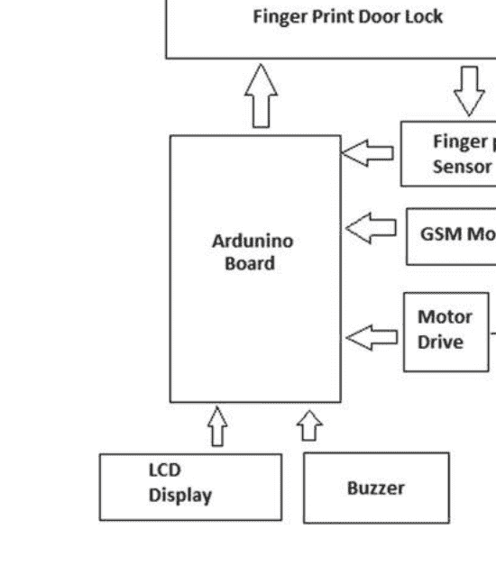

图2 指纹模拟匹配结果

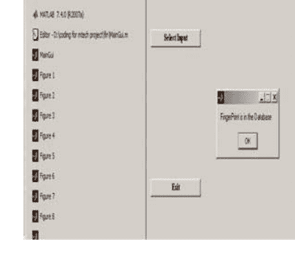

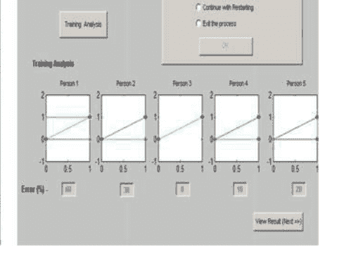

图3 具有物联网的铁路引擎智能门锁系统的区块链

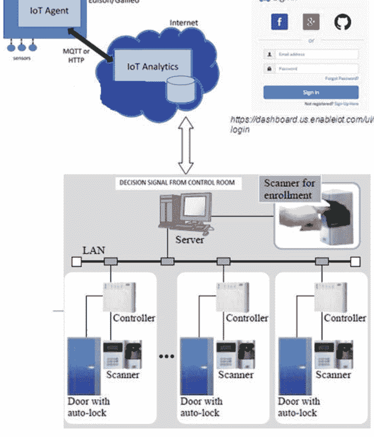

表1 性能评估

| 方法 | 均方误差 | 模式匹配得分 |
| :--- | :--- | :--- |
| 提出的 | 0.0021 | 0.9728 |
| 现有的 | 0.0192 | 0.7628 |

引擎。如表1所示，所提出的方法与现有方法相比更高效。

## 5 结论

基于指纹的门锁技术可以定制和应用于多种不同方式。这种门锁机制比当前的成本更低锁系统。 我们基于指纹的锁技术非常准确和快速地识别指纹，使用户与系统之间的交互无缝，并提高了安全性。 尽管存在几种安全和隐私标准，但由于限制和轻量级设备与智能门锁系统的连接使用，这些标准并不适用。 然后我们发现了几个更多的攻击模型。 这种架构提供了处理异构物联网和集中式网关组成的智能门锁系统的保密性、完整性和身份验证挑战的方法。 加密技术用于解决智能应用、网关和异构物联网中的保密性和身份验证问题。 此外，区块链技术被用于确保网关中的数据安全。 最后，发现在基于物联网的智能门锁环境中可以实现区块链的安全性和隐私性。 权限区块链被用来解决可扩展性问题。

通过存储数字资产的指纹而不是数字资产本身，可以实现匿名性或隐私。交叉容错是一种用于构建可信和安全分布式系统的技术。 根据模拟结果，可以明显看出建议的多模态生物识别身份验证对于铁路引擎的飞行安全自动化更加安全和高效，达到了97.2%的效率。

## 参考文献

1. Geneiatakis, D., Kounelis, I., Neisse, R., Nai-Fovino, I., Steri, G., & Baldini, G. (2017). 基于物联网的智能家居的安全性和隐私问题。 在2017年第40届国际信息与通信技术、电子和微电子学会议中 (pp. 1292–1297). IEEE.
2. Jose, & Malekian, R. (2017). 改进智能家居安全性：将逻辑感知整合到智能家居中IEEE传感器杂志, 17(13), 4269–4286.
3. Lin, C., He, D., Kumar, N., Huang, X., Vairavamoorthy, P., & Zhu, K. R. (2019). 家庭链：基于区块链的智能家居安全互认系统。IEEE物联网杂志， 7(2)， 818–829.
4. Jain, A. K., Feng, J., & Nandakumar, K. (2010). 匹配指纹。 IEEE计算机， 43(2)， 36–44.
5. Mary Lourde, R., & Khosla, D. (2010). 生物识别安全系统中的指纹识别。国际计算机与电气工程学报， 2(5).
6. Rathore, S., Kwon, B. W., Park, J. H. (2019). BlockSecIoTNet：基于区块链的分散式物联网网络安全架构。网络与计算机应用杂志， 143， 167–177.
7. Huang, X., Yu, R., Kang, J., Xia, Z., & Zhang, Y. (2018年)。 用于能量收集物联网的软件定义网络。IEEE物联网杂志, 5(3), 1389-1399。
8. Jain, A. K., Ross, A., & Prabhakar, S. (2004年)。 生物识别简介。IEEE视频技术电路与系统交易，基于图像和视频的生物识别专刊， 14(1)。
9. Sharma, P. K., Rathore, S., Jeong, Y. S., & Park, J. H. (2018年)。 软边缘网络：基于SDN的能效分布式网络架构用于边缘计算。IEEE通信杂志， 56(12)， 104-111。
10. Suma, V. (2021年)。 基于可穿戴物联网的分布式框架用于普适计算。普适计算和通信技术杂志 (UCCT) ， 3(1), 23-32。
11. Pandian, M. D. (2019). 增强的物联网网络性能和移动性管理。多网络。《计算机科学与智能技术趋势》杂志（TCSST），1（2），95–105。

# AdaSmooth：一种基于有效比率的自适应学习率方法

朱恩·卢

摘要 众所周知，我们需要在Momen-tum、AdaGrad、AdaDelta和其他替代随机优化器中选择超参数。 然而，在许多情况下，超参数是基于经验繁琐地调整的，更多地成为一种艺术而非科学。 我们引入了一种新颖的逐维学习率方法用于随机梯度优化，称为AdaSmooth。 该方法对超参数不敏感，因此不需要像动量、AdaGrad和AdaDelta方法那样手动调整超参数。 我们在不同的卷积神经网络、多层感知器和其他机器学习任务上与其他方法相比表现出有希望的结果。 实证结果表明，AdaS-mooth在实践中表现良好，并与神经网络中的其他随机优化方法相比具有优势。

关键词 随机优化 · 自适应学习率 · 随机梯度下降

## 1 引言

多年来，基于随机梯度的优化模型已成为科学和工程领域中各种领域的标准方法，包括自动语音识别处理和计算机视觉[5, 6, 11]。 深度神经网络(DNNs)和随机梯度下降(SGD)在训练随机损失/目标函数中起着重要作用。 然而，当为给定的(新)任务创建一个新的深度神经网络时，必须启发式地选择与网络训练相关的一些超参数。 通常情况下，一个新的网络会从头开始训练，并且对于这些超参数的每个可能和可行的组合进行反复评估。 尽管在硬件（例如图形处理单元(GPUs)）和软件（例如cuDNN）方面取得了巨大进展，以加快训练时间尽管 DNN 的单一结构的探索范围很广，但是探索所有潜在结构或组合仍然非常缓慢，因此需要使用一个对超参数不敏感的随机优化器。

### 1.1 梯度下降

梯度下降（GD）是最常用的优化目标函数的算法之一，也是执行机器学习优化任务最常用的方法。尤其是在神经网络优化模型方面，这一点尤为明显。一般来说，神经网络或机器学习模型会找到一组参数 $x \in \mathbb{R}^d$（也称为权重），以优化目标/损失函数 $L(x)$。然后梯度下降会找到一系列参数。

$$x_1, x_2, \ldots, x_T,$$ (1)

使得目标函数 $L(x_T)$在达到最优最小值时 $T\to \infty$。在每次迭代 $t$ 中，应用步长 $\Delta x_t$来修改参数。假设第 $t$次迭代的参数表示为 $x_t$，则更新规则变为

$$x_{t+1} = x_t + \Delta x_t.$$ (2)

随机梯度下降的最简单方法是香草更新：参数沿着梯度的相反方向移动，因为梯度与水平面（也称为水平曲线，请参见Lu [16]中的引理16.4）正交。

$$\Delta x_t = -\eta g_t = -\eta \frac{\partial L(x_t)}{\partial x_t} = -\eta \nabla L(x_t),$$ (3)

其中正值 $\eta$被称为学习率，其值取决于具体问题，而 $g_t = \frac{\partial L(x^t)}{\partial x^t} \in \mathbb{R}^d$表示参数在损失函数 $L(\cdot)$上的梯度。学习率 $\eta$确定了在负梯度方向上迈出的步长大小，以达到（局部）最小值。

虽然局部方向的估计可以通过迭代地跟随单个样本或一批样本的负梯度来产生，这被称为随机梯度下降（SGD）[22]。随机梯度下降框架中的目标函数是随机的，由数据的不同子样本上的子函数之和组成。

梯度下降在每次迭代中以适度的步长产生单调的改进。因此，它总是收敛，尽管收敛到局部最小值。另一方面，传统的梯度下降方法通常较慢，当曲率条件较差时，可能需要指数级的时间。选择高于这个速率可能导致过程在目标函数方面发散。对于许多情况来说## 1 二维凸函数 \( L(\boldsymbol{x}) = 2(x_1 - 3)^2 + 20(x_2 - 2)^2 + 5 \) 和 \( \frac{\partial L(\boldsymbol{x})}{\partial \boldsymbol{x}} = \) 下降的起始点是 \( (-2, 5)^{\top} \)。没有动量：较高的学习率可能导致在山谷（\(x_2\)的方向）的维度上进行更大的参数更新，这可能导致在山谷中来回振荡。有动量：尽管沿着山谷（即\(x_1\)的方向）的梯度要小得多，但它们通常朝着同一方向前进，因此动量项会积累速度，加快移动速度，减少振荡，并推动我们穿过狭窄的山谷、小隆起和（局部）最小值。

问题是，确定一个合适的学习率（全局或每个维度）变得更多是一门艺术而不是科学问题。尽管之前的工作已经做出了努力，以减少选择一个好的全局学习率的需求（例如[4, 32]），但它们仍然对其他超参数敏感。

本文的主要贡献是提出了一种新颖的随机优化算法，对超参数的不同选择不敏感，从而实现自适应学习率，并自然地执行一种称为步长退火的退火过程。我们提出了AdaSmooth算法，旨在提高优化效率和样本外准确性。虽然之前的工作提出了一些对全局学习率不敏感的算法（例如[32]），但这些方法仍然对影响每个维度学习率的超参数敏感。

提出的AdaSmooth方法是一种高效的随机优化方法，只需要计算一阶梯度和（累积的）过去更新步骤，并且对内存需求较小，可以灵活和自适应地使用每个维度的学习率。同时，该方法具有内存效率和易于实现的特点。我们的方法旨在结合以下方法的优点：AdaGrad，适用于稀疏梯度[4]，RMSProp，适用于非平稳和在线设置[7]，以及AdaDelta，对全局学习率不太敏感[32]。

## 2 相关工作

有几种梯度下降方法的变体，可以使用启发式方法在每次迭代中估计适当的学习率。这些方法要么试图在局部最小值附近减慢学习速度，要么在适当时加速学习[10, 15, 23, 32]。

### 2.1 动量

如果损失曲面不是球形的，学习速度必须保持较低，以避免沿陡峭曲率方向发散[21, 24, 30]，学习可能会非常缓慢。当适用时，带有动量的SGD版本（可以应用于小批量或完整批量学习）尝试利用先前的步骤来加速学习，从而在深度神经网络上具有更好的收敛速度。

动量方法背后的主要思想是加速沿着梯度一致指向的维度的学习，并减慢梯度符号一致变化的维度的学习速度。

图1a展示了一系列普通GD更新，我们可以观察到沿着维度 \(x_1\) 的更新是一致的；而沿着维度 \(x_2\) 的移动呈现锯齿状模式。GD/SGD与动量方法使用指数衰减来跟踪过去的参数调整。形式上，更新方法有以下步骤：

\[
\Delta \mathbf{x}_t = \rho \Delta \mathbf{x}_{t-1} - \eta \frac{\partial L(\mathbf{x}_t)}{\partial \mathbf{x}_t}, \qquad (4)
\]

在这种情况下，算法记住了最近的更新 \(\Delta \mathbf{x}_{t-1}\) 并将其乘以参数 \(\rho\)（称为动量参数）以添加到当前的更新中 \(-\eta \frac{\partial L(\mathbf{x}_t)}{\partial \mathbf{x}_t}\)。换句话说，我们改变参数的量与负梯度加上先前的权重改变成比例；额外的动量因子同时起到加速器和平滑器的作用。动量参数 \(\rho\) 作为一个衰减常数，使得 \(\Delta \mathbf{x}_1\) 可能对 \(\Delta \mathbf{x}_{100}\) 产生影响；尽管其效果会被这个衰减常数衰减。在实践中，动量参数 \(\rho\) 通常默认设置为0.9。添加的动量因子模拟了物理学中的惯性概念。这意味着，在每次迭代中，更新机制不仅与梯度下降有关，这是指动态项，而且还保持了与上次更新迭代方向有关的分量，这是指动量。

在沟壑形状的损失曲线中，动量效果非常好。沟壑是指表面在一个维度上的曲线比另一个维度上的曲线陡峭得多的区域（参见图1中的损失曲线，即一个狭长的山谷）。在深度神经网络中，沟壑在局部最小值附近非常常见；然而，普通的SGD/GD在导航这些沟壑时会遇到困难。普通的SGD/GD会倾向于在狭窄的沟壑方向上振荡，如图1a中的玩具示例所示，因为负梯度会指向陡峭的一侧，而不是沿着沟壑朝向最优解的方向。而动量则有助于加速更新朝着正确的方向进行（参见图1b中通过带有动量的GD的更新）。

### 2.2 AdaGrad

学习率退火过程改变了影响参数所有维度的单个全局学习率[15, 28]。Duchi等人[4]提出了一种称为AdaGrad的方法，其中学习率是根据每个维度上的梯度更新历史进行调整的。每个参数的学习率是根据该参数的梯度更新历史来确定的，以一种方式更新，使得更新历史较少的参数通过较大的学习率更快地更新。换句话说，过去没有被更新过多的参数在当前迭代中更有可能具有较高的学习率。设 \( \alpha \odot \beta \) 表示向量 \(\alpha\) 和 \(\beta\) 之间的逐元素乘法，则AdaGrad的更新步骤如下：

\[
\Delta \mathbf{x}_t = - \frac{\eta}{\sqrt{\sum_{\tau=1}^{t} \mathbf{g}_{\tau}^{2} + \epsilon}} \odot \mathbf{g}_t,
\]

其中 \(\eta\) 是所有维度共享的全局学习率，\(\epsilon\) 是一个平滑项，用于更好地调整除法，\(\mathbf{g}_t^2\) 表示逐元素平方 \(\mathbf{g}_t \odot \mathbf{g}_t\)，而分母以逐维度的方式计算所有先前平方梯度的 \(l_2\) 范数。尽管全局学习率 \(\eta\) 被所有维度共享，但累积梯度幅度的 \(l_2\) 范数控制了每个维度的自适应学习率。由于这种动态学习率是根据累积梯度幅度的倒数来发展的，较小的梯度幅度具有较大的学习率，而梯度的绝对值较大则具有较小的学习率。

因此，分母中的累积梯度具有与学习率退火[15]相同的效果。

一方面，AdaGrad方法在一定程度上消除了手动调整学习率的需要，因为学习率由分母中累积的梯度控制。另一方面，AdaGrad方法中梯度平方的持续累积是其基本缺陷，因为每个添加的项都是正的，导致累积和在训练过程中不断增长甚至爆炸到无穷大。因此，在训练过程中，每个维度的学习率会缩小并逐渐减小，直到损失变得足够小，从而终止训练。此外，由于AdaGrad方法中梯度的大小被分解，该方法对参数和梯度的初始化非常敏感。如果梯度的初始大小较大甚至无限大，每个维度的学习率在训练的剩余部分将会很低，尽管可以通过增加全局学习率来部分缓解这个问题，但这会使AdaGrad方法对学习率的选择更加敏感。此外，由于AdaGrad方法认为更新次数较少的参数应该使用较高的学习率，而移动较多的参数应该使用较低的学习率，因此它仅仅考虑了梯度的平方或梯度的绝对值的信息。因此，AdaGrad方法不考虑整个迁移过程的信息（即更新的总和；而不是绝对更新的总和）。

为了更简洁，AdaGrad有以下主要缺点：

- (1) 全局学习率：需要手动选择全局学习率；
- (2) 学习率衰减：训练过程中每个维度的学习率持续衰减；
- (3) 信息不足：仅考虑梯度的大小。

### 2.3 AdaDelta

在介绍我们提出的方法之前，我们先讨论一下AdaDelta方法的细节，这对我们的算法[7, 32]有所启发。AdaDelta是AdaGrad的直接扩展，解决了AdaGrad的主要弱点。AdaDelta的原始思想很简单：它将累积先前梯度的窗口限制在 \(t\) 步（即当前时间步）到某个固定大小的 \(w < t\)。然而，Zeiler [32]中提出的AdaDelta将这种累积实现为先前平方梯度的指数衰减平均，因为存储所有先前平方梯度是内存效率低下的。这类似于动量项的概念。

**AdaDelta: 第一种形式 (RMSProp)** 首先，我们将详细介绍原始的AdaGrad形式（为了清晰起见，我们在这里称之为AdaGradWin）。假设运行平均值为 \(E[\mathbf{g}^2]_t\) 在步骤 \(t\)，那么我们可以通过以下方式得到衰减平均值：

\[
E[\mathbf{g}^2]_t = \rho E[\mathbf{g}^2]_{t-1} + (1 - \rho) \mathbf{g}_t^2
\]

其中 \(\rho\) 是一个衰减常数，类似于动量法中使用的常数，再次说明 \(\mathbf{g}_t^2\) 表示逐元素平方 \(\mathbf{g}_t \odot \mathbf{g}_t\)。由于方程（5）的分母只是梯度的均方根（RMS）误差准则，我们可以用RMS准则的简写来替代它。

再次说明一个常数 \(\epsilon\) 被添加以更好地调节分母。然后，最终的更新步骤可以计算如下：

\[
\Delta \mathbf{x}_t = -\frac{\eta}{\text{RMS}[\mathbf{g}]_t} \odot \mathbf{g}_t
\]

再次强调，\(\odot\) 表示逐元素向量乘法。如前所述，公式（6）的形式是从指数移动平均（EMA）中推导出来的。\(1-\rho\) 也被称为平滑常数（SC），在原始EMA的形式中，平滑常数（SC）可以近似表示为 \(N\) 可以看作是进行移动平均计算的过去步骤的数量[14]：

\[
\text{SC} = 1 - \rho = \frac{2}{N + 1}
\]

衰减常数 \(\rho\)，平滑常数 (SC) 和周期数 \(N\) 在上述公式（8）中都有关联。可以证明，如果 \(\rho = 0.9\)，则 \(N = 19\)。换句话说，在第 \(t\) 步，\(E[\mathbf{g}^2]_t\) 大致等于过去19个平方梯度和当前梯度的（简单）移动平均值（20个平方梯度的平均值）。尽管Zeiler [32]中没有讨论这种关系，但决定衰减常数 \(\rho\) 的下限是很重要的。

通常，时间周期 \(N = 3\) 或 \(7\) 被认为是一个相对较小的窗口，衰减常数 \(\rho = 0.5\) 或 \(0.75\)；当 \(N\to\infty\) 时，衰减常数 \(\rho\) 趋近于 \(1\)。

然而，我们可以发现AdaGradWin仍然只考虑梯度的绝对值，并且过去的平方梯度数量是固定的，这不够灵活，可能导致接近（局部）极小值的学习率较小，我们将在后续讨论中详细说明。

**RMSProp** AdaGradWin实际上与Geoff Hinton在[7]中独立开发的RMSProp方法相同，两者都是为了解决AdaGrad每个维度学习率急剧减小的问题。在Hinton等人的[7]中，作者建议将 \(\rho\) 的默认值设为 \(0.9\)。

**AdaDelta:** 第2式 作者还表明上述步长的单位与Zeiler [32]中的普通SGD、带动量的SGD和AdaGrad方法不匹配。为了克服这个困难，作者考虑重新排列Hessian矩阵，以从牛顿法的正确性中确定所涉及的量。

尽管计算Hessian矩阵或近似Hessian矩阵是一项计算昂贵的任务，但其曲率信息对于优化是有用的，因为牛顿法中的单位是匹配的。如果给定Hessian矩阵 \(H\) [1,2]，则牛顿法中的更新步骤可以描述如下：

\[
\Delta \mathbf{x}_t \propto -H^{-1} \mathbf{g}_t \propto \frac{\frac{\partial L(\mathbf{x}_t)}{\partial \mathbf{x}_t}}{\frac{\partial^2 L(\mathbf{x}_t)}{\partial \mathbf{x}^2}} \longrightarrow \frac{1}{\frac{\partial^2 L(\mathbf{x}_t)}{\partial \mathbf{x}_t^2}} = \frac{\Delta \mathbf{x}_t}{\frac{\partial L(\mathbf{x}_t)}{\partial \mathbf{x}_t}}, \quad (9)
\]

即上述方程的右侧项可以近似表示Hessian矩阵的单位。因为RMSProp更新方程（7）中已经包含了RMS\([\mathbf{g}]_t\) 在分母中，即梯度的单位。在分子中再加上一个与 \(\Delta \mathbf{x}_t\) 同阶的单位可以与牛顿法的同阶匹配。为了做到这一点，定义另一个指数衰减平均的更新步骤：

\[
\text{RMS}[\Delta \mathbf{x}]_t = \sqrt{E[\Delta \mathbf{x}^2]_t} = \sqrt{\rho E[\Delta \mathbf{x}^2]_{t-1} + (1-\rho) \Delta \mathbf{x}_t^2}. \quad (10)
\]

由于当前迭代的 \(\Delta \mathbf{x}_t\) 未知，可以使用 RMS\([\Delta \mathbf{x}]_{t-1}\) 作为 RMS\([\Delta \mathbf{x}]_t\) 的替代，因为可以假设曲率在局部上是平滑的。因此，我们可以用一个估计值来替换计算上昂贵的 \(H^{-1}\) 即 \(1/\partial^2 L(\mathbf{x}_t)/\partial \mathbf{x}_t^2\) 这是对对角Hessian的近似，仅使用 \(\mathbf{g}\) 和 \(\Delta \mathbf{x}\) 的RMS测量，它产生了具有匹配单位的更新步骤：

\[
\frac{\Delta \mathbf{x}_t}{\partial L(\mathbf{x}_t)/\partial \mathbf{x}_t} \sim \frac{\text{RMS}[\Delta \mathbf{x}]_{t-1}}{\text{RMS}[\mathbf{g}]_t} \longrightarrow \Delta \mathbf{x}_t = - \frac{\text{RMS}[\Delta \mathbf{x}]_{t-1}}{\text{RMS}[\mathbf{g}]_t} \odot \mathbf{g}_t. \quad (11)
\]

AdaDelta的概念来自于二阶方法，消除了选择学习率的烦恼。同样，在Kingma和Ba [10]中，有一个指数衰减平均值被纳入梯度信息中，从而改善了在线凸优化的收敛性。同时，第二阶段方法也攻击了逐渐减少的问题[26]。梯度平均或其替代方法的想法并不唯一，之前在Moulines和Bach [19]中提出，Polyak-Ruppert平均已被证明可以改善普通GD/SGD方法的收敛性[20, 25]。其他随机优化方法，包括自然牛顿法，AdaMax，Nadam，都通过从一阶信息中估计曲率来设置每个维度的步长[3, 10, 12]。LAMB采用逐层归一化，因为逐层适应性[31]；powerpropagation对神经网络应用权重参数化，从而产生固有稀疏模型[27]。我们不打算详细介绍。

## 3 AdaSmooth 方法

我们现在讨论基于过去更新的随机优化步骤中的有效比率（ER，也称为效率比率）的形式以及如何通过灵活的平滑常数实现每个维度的自适应学习率，因此被称为AdaSmooth。本文提出的思想源自AdaDelta算法[32]的概念，以改进该方法的两个主要缺点：（1）信息不足：仅考虑梯度的大小而不是每个维度上的总移动；（2）对超参数敏感：需要手动选择超参数。

### 3.1 有效比率（ER）

Kauffman在[8, 9]中建议用基于有效比率的常数替换EMA公式中的平滑常数。以前，已经发现ER在经典的定量策略[14]的金融预测中表现出有希望的性能，其中计算了投资组合收盘价的有效比率来决定资产的上升/下降趋势。这个指标在范围从-1.0到 +1.0之间，较大的幅度表示较大的上升或下降趋势，最初设计用于评估趋势的强度；Lu和Yi[17]最近证明了有效比率也可以用于减少时间序列预测中的过高估计/低估。给定一系列 \(\{h_1, h_2, ..., h_T\}\) 和窗口大小 \(M\)，使用以下公式计算ER：

\[
e_t = \frac{s_t}{n_t} = \frac{h_t - h_{t-M}}{\sum_{i=0}^{M-1} |h_{t-i} - h_{t-1-i}|} = \frac{\text{一段时间的总移动}}{\text{每个柱状图的绝对移动总和}} \quad (12)
\]

其中 \(e_t\) 表示时间 \(t\) 的序列的ER。在强劲的趋势下（即输入序列在某个方向上持续上升或下降），ER的绝对值将趋于1；如果没有定向运动，该值将略大于0。

然而，在更新方法中，我们希望计算移动方向的ER，而不是计算资产收盘价的ER。在梯度下降方法中，我们主要关注每个参数在每个周期内与其初始值的偏差，无论是正向还是负向。因此，在这里，我们只考虑ER的大小，使其范围在0到1之间。具体而言，参数的ER计算如下：

\[
e_t = \frac{s_t}{n_t} = \frac{|\sum_{i=0}^{M-1} \Delta \mathbf{x}_{t-i}|}{\sum_{i=0}^{M-1} |\Delta \mathbf{x}_{t-i}|}, \quad (13)
\]

其中 \(e_t \in \mathbb{R}^d\) 其第 \(i\) 个元素 \(e_{t,i}\) 在 \([0, 1]\) 范围内对于所有 \(i \in [1, 2, \ldots, d]\)。较大的 \(e_{t,i}\) 值表示下降方法在第 \(i\) 个维度中正在朝着某个方向移动而较小的接近 0 的值表示参数在第 \(i\) 个维度中以正负交替的方式移动，即呈现出锯齿状的模式。在实践中和我们所有的实验中，\(M\) 被选择为每个 epoch 的批次索引。也就是说，如果训练过程在每个 epoch 的第一个批次，则 \(M = 1\)；如果训练过程在 epoch 的最后一个批次，则 \(M = M_{max}\)（其中 \(M_{max}\) 是每个 epoch 的最大批次 数）。因此，\(e_{t,i}\) 的值反映了第 \(i\) 个参数在最近的 epoch 中的移动情况。或者更激进地说，窗口大小可以从 1 到整个训练过程中看到的批次总数（所有 epoch 的批次总数）。

与使用固定窗口大小不同，使用自适应窗口大小的优点是我们不需要将过去的 \(M + 1\) 个步骤 \(\{\mathbf{x}_{t-M}, \mathbf{x}_{t-M+1}, \ldots, \mathbf{x}_t\}\) 保存在内存中来计算等式（13）中的信号和噪声向量 \(\{\mathbf{s}_t, \mathbf{n}_t\}\)，因为它们是累积的。

### 3.2 AdaSmooth

如果每个参数的绝对有效比率很小（即接近0），则在这个维度上的移动和更新呈锯齿状模式。所提出的AdaSmooth方法倾向于使用长期平均作为缩放常数，以减慢该维度上的速度。当每个维度的绝对有效比率很大（趋近于1）时，该维度上的移动是朝着某个方向移动的（而不是呈锯齿状），学习实际上正在进行，并且下降是朝着正确的方向移动的，因此该维度的学习率应该分配一个相对较大的值。因此，AdaSmooth倾向于选择一个较小的周期，以产生分母的小补偿；这是因为当它接近（局部）极小值时，较近周期的梯度比古老的梯度小。为了证明这一点，在图2中展示了一个玩具例子，其中梯度下降方法朝着某个方向移动，而接近周期的梯度很小；如果我们选择一个较大的周期来补偿分母，由于大的分母因子，下降速度会变慢。简而言之，我们希望使用较小的周期来计算指数。

如果更新朝着某个方向移动，则在公式（6）中计算梯度的平方的平均值。然而，当参数以锯齿形式更新时，EMA的周期应相应地调整更大。

得到的ER值用于EMA公式中。现在我们要做的是，当绝对值接近1时，将公式（8）中讨论的时间周期 \(N\) 设置为较小的值；当有效比率接近0时，将时间周期 \(N\) 设置为较大的值。当 \(N\) 较小时，SC被称为“快速SC”；否则，SC被称为“慢速SC”。

例如，让小时间段为 \(N_1 = 3\)，大时间段为 \(N_2 = 199\)。快速移动的平滑比率必须与周期 \(N_1\) 的EMA相同（“快速SC”= \(2/(N_1+1) = 0.5\)），而无趋势EMA周期必须等于 \(N_2\)（“慢速SC”= \(2/(N_2+1) = 0.01\)）。因此，引入了新的平滑常数变化，我们称之为“缩放平滑常数”（SSC），并用向量 \(\mathbf{c}_t \in \mathbb{R}^d\) 表示它：

\[
\mathbf{c}_t = (\text{快速SC} - \text{慢速SC}) \times \mathbf{e}_t + \text{慢速SC}。
\]

根据公式（8），从小时间段和大时间段，我们可以定义快速衰减常数 \(\rho_1 = 1 - 2/(N_1+1)\)，以及慢速衰减常数 \(\rho_2 = 1 - 2/(N_2+1)\)。然后，可以通过SSC向量来获得：

\[
\mathbf{c}_t = (\rho_2 - \rho_1) \times \mathbf{e}_t + (1 - \rho_2),
\]

其中，\(\mathbf{e}_t\) 的值越小，\(\mathbf{c}_t\) 的值也越小。为了使得获得的平滑常数对平均周期有更有效的影响，我们按照Kaufman [8, 9]的方法对其进行平方。最终的公式如下：

\[
E[\mathbf{g}^2]_t = \mathbf{c}_t^2 \odot \mathbf{g}_t^2 + (1 - \mathbf{c}_t^2) \odot E[\mathbf{g}^2]_{t-1}.
\]或者经过重新排列后：

$$E[\boldsymbol{g}^2]_t = E[\boldsymbol{g}^2]_{t-1} + \boldsymbol{c}^2_t \odot (\boldsymbol{g}^2_t - E[\boldsymbol{g}^2]_{t-1})$$
(17)

我们注意到 $N_1 = 3$ 是一个计算平均值的小周期（即 $\rho_1 = 1 - \frac{2}{N_1+1} = 0.5$），如果 $N_1$ 小于3，则EMA序列会变得嘈杂。因此，在实践中，$\rho_1$ 的最小值被默认设置为大于0.5。而 $N_2 = 199$ 是一个计算平均值的大周期（即 $\rho_2 = 1 - \frac{2}{N_2+1} = 0.99$），因此EMA序列几乎只依赖于先前的值，导致 $\rho_2$ 的默认值不超过0.99。经验研究表明，AdaSmooth更新对这些超参数的选择不敏感。我们还仔细注意到，当 $\rho_1 = \rho_2$时，所提出的AdaSmooth方法就变成了具有衰减常数 $\rho = 1 - (1 - \rho_2)^2$ 的RMSProp算法，因为我们在公式（16）中对其进行了平方。在开发AdaSmooth方法之后，我们意识到该方法背后的主要思想与SGD with Momentum方法类似，它们都试图加速（即在分母上进行较少的补偿）梯度一直指向同一方向的维度的学习，并考虑在梯度符号继续变化的维度上减慢移动（即在分母上进行更多的补偿）。

经验证据显示，简单移动平均法中使用的ER与固定窗口大小 $w$ 也能反映出序列/运动的趋势[14]。然而，在AdaSmooth情况下，这又需要存储 $w$ 之前的平方梯度，这使得其效率低下，因此我们不采用这个扩展。

### 3.3 AdaSmoothDelta

注意，在AdaDelta方法的相同设置中，有效比率也可以应用：

$$\Delta \boldsymbol{x}_t = -\frac{\sqrt{E[\Delta \boldsymbol{x}^2]_t}}{\sqrt{E[\boldsymbol{g}^2]_t} + \epsilon} \odot \boldsymbol{g}_t$$
(18)

其中

$$E[\boldsymbol{g}^2]_t = \boldsymbol{c}^2_t \odot \boldsymbol{g}^2_t + (1 - \boldsymbol{c}^2_t) \odot E[\boldsymbol{g}^2]_{t-1}$$
(19)

和

$$E[\Delta \boldsymbol{x}^2]_t = (1 - \boldsymbol{c}^2_t) \odot \Delta \boldsymbol{x}^2_t + \boldsymbol{c}^2_t \odot E[\Delta \boldsymbol{x}^2]_{t-1}$$
(20)

不同之处在于当有效比率较小时，$E[\Delta \boldsymbol{x}^2]_t$选择较大的周期。这在某种程度上是真实的，因为$E[\Delta \boldsymbol{x}^2]_t$在分子中，而$E[\boldsymbol{g}^2]_t$出现在方程（18）的分母中。因此，它们的补偿应该朝不同的方向发展。或者，我们可以按照以下方式对$E[\Delta \boldsymbol{x}^2]_t$应用一个固定的衰减常数：

$$E[\Delta x^2]_t = (1 - \rho_2) \Delta x_t^2 + \rho_2 E[\Delta x^2]_{t-1}, \quad (21)$$

上述介绍的AdaSmoothDelta算法可以进一步帮助消除对手动指定的全局学习率的需求，该学习率设置为 $\eta = 1$，来自Hessian上下文。然而，由于方程（19）和（20）中的自适应平滑常数，$E[g^2]_t$和$E[\Delta x^2]_t$的局部平滑性较差，因此对全局学习率的敏感性低于AdaDelta方法。因此，AdaSmoothDelta更倾向于较小的全局学习率，例如 $\eta = 0.5$。计算AdaSmooth的完整过程如算法1所示。

**算法 1** 在提出的AdaSmooth算法的迭代t中计算AdaSmooth；所有向量操作都是逐元素执行的。测试任务的良好默认设置为 $\rho_1 = 0.5, \rho_2 = 0.99, \epsilon = 1e - 6, \eta = 0.001$；详见第3.2节或方程(8)中对衰减常数默认值的详细讨论。第4节的实证研究表明，AdaSmooth算法对超参数 $\rho_2$不敏感，而 $\rho_1 = 0.5$在这个设置中相对较低。

AdaSmoothDelta迭代可以以类似的方式计算

1: 输入: 选择初始参数 $x_1$进行下降，常数 $\epsilon$以获得更好的条件;
2: 输入: 选择全局学习率 $\eta$，默认情况下我们设置 $\eta = 0.001$;
3: 输入: 选择计算ER的参数: 快速衰减常数 $\rho_1$，慢速衰减常数 $\rho_2$;
4: 输入: 断言 $\rho_2 > \rho_1$，默认情况下 $\rho_1 = 0.5, \rho_2 = 0.99$;
5: 对于 $t = 1 : T$ 执行
6: 计算梯度向量 $g_t = \nabla L(x_t)$;
7: 计算有效比率 (ER) $e_t = \frac{1}{\sum_{i=0}^{t-1} |\Delta_{t-1-i}|}$;
8: 计算平滑项 $c_t = (\rho_2 - \rho_1) \times e_t + (1 - \rho_2)$;
9: 计算归一化项: $E[g^2]_t = c_t^2 \odot g_t^2 + (1 - c_t^2) \odot E[g^2]_{t-1}$;
10: 计算步骤以更新 $\Delta x_t = -\frac{\eta}{\sqrt{E[g^2]_t + \epsilon}} \odot g_t$;
11: 应用更新 $x_t = x_{t-1} + \Delta x_t$;
12: 结束循环
13: 返回: 输出结果参数 $x_t$和损失 $L(x_t)$.

## 4 实验

为了评估策略并展示所提出的AdaSmooth方法的主要优势，我们在不同的数据集上进行了不同的机器学习任务实验，包括人口普查数据集<sup>1</sup>和MNIST数据集（一个真实的手写数字分类任务）[13]。<sup>2</sup>在所有实验中，使用相同的参数初始化过程来训练不同的随机优化算法。

<sup>1</sup>人口普查数据集共有48842个样本，其中70%用作我们的训练集：https://archive.ics.uci.edu/ml/datasets/Census+Income.
<sup>2</sup>MNIST数据集有60000个训练样本和10000个测试样本。

### 4.1 实验：多层感知器

多层神经网络（也称为多层感知器或MLP）是优化机器学习任务的有效工具，可以检测模型输入和输出背后的内在线性和非线性特征。在我们的实验中，我们采用最简单的MLP结构：一个输入层，一个隐藏层和一个输出层。我们注意到修正线性单元（Relu）在实践中优于双曲正切单元（TanH），Sigmoid和其他非线性函数。因此，我们在我们的结构中使用Relu函数作为默认的非线性单元。由于dropout技术已成为神经网络训练的标准工具[29]，在训练过程中，我们默认采用50%的dropout噪声来防止过拟合。具体而言，假设每个全连接层的详细架构由F（{输出数量}：{激活函数}）描述；而对于一个dropout层，则由DP（{比率}）描述。那么，我们使用的网络结构可以描述如下：

$$F(128:Relu)·DP(0.5)·F(类别数:Softmax) (22)$$

所有优化方法都是使用每批64张图像进行训练的，在训练集上进行60次（在MNIST上）或200次（在Census Income上）迭代，分别。我们将epsilon的超参数设置为 $\epsilon = 10^{-6}$ 以更好地调整条件。如果没有特别提到，所有模型的全局学习率都设置为 $\eta = 0.001$ 在所有实验中。由于AdaGrad方法在分母中持续累积 $l_2$ norm，因此使用相对较大的全局学习率（ $\eta = 0.01$ ）；AdaDelta算法的全局学习率选择为1，如Zeiler [32]中的原始论文所建议；而所提出的AdaSmoothDelta算法的全局学习率则设置为0.5，如上文第3.3节中所述，而我们将在接下来的内容中展示，AdaSmooth Delta的学习率对最终结果的影响不大。图3a, b显示了在Census Income和MNIST数据集上，SGD with Momentum、RMSProp、AdaGrad、AdaDelta和所提出的AdaSmooth/AdaSmoothDelta方法在优化训练集损失方面的比较结果。在这个实验中，SGD with Momentum优化器表现最差。在MNIST案例中，AdaSmooth比AdaGrad和RMSProp稍微好一些，在Census Income数据集中表现比后者好得多。所提出的AdaSmooth优化器在初始迭代中显示出快速收敛速度，同时在这两个数据集中持续降低训练损失。我们在这里展示了AdaSmooth的两组缓慢衰减常数，即“$\rho_2 = 0.9$ ”和“$\rho_2 = 0.95$ ”。因为我们对SSC进行了平方处理

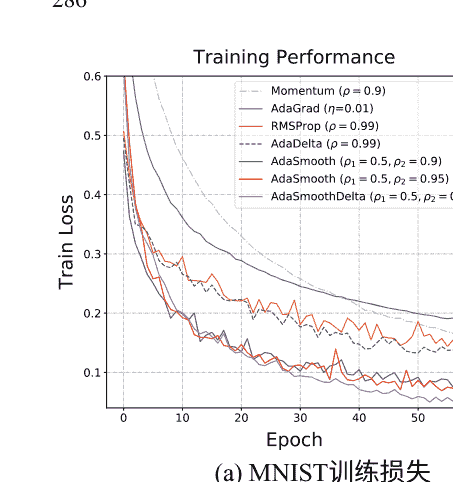

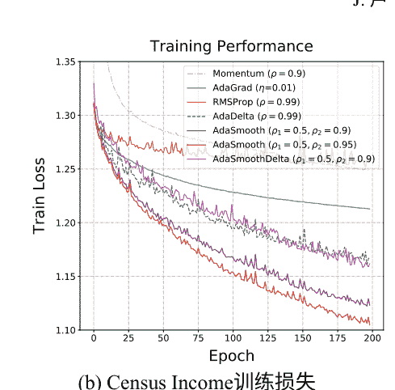

**图3 MLP：在MNIST数据集上进行60个epochs的各种优化方法演示；在Census Income数据集上进行200个epochs的MLP结构演示**

**表1 MLP：训练准确率最佳的样本内评估 (%)**

| 方法 | MNIST (%) | Census (%) |
| :--- | :---: | :---: |
| 动量（ρ=0.9） | 98.64 | 85.65 |
| AdaGrad (η=0.01) | 98.55 | 86.02 |
| RMSprop (ρ=0.99) | 99.15 | 85.90 |
| AdaDelta (ρ=0.99) | 99.15 | 86.89 |
| AdaSmooth (0.5, 0.9) | **99.34** | **86.94** |
| AdaSmooth (0.5, 0.95) | **99.45** | **87.10** |
| AdaSmDel. (0.5, 0.9) | **99.60** | 86.86 |

*AdaSmDel是AdaSmoothDelta的缩写。AdaSmooth和AdaSmDel中的参数分别为 ρ1 和 ρ2，参见公式（15）*

在公式（16）中，当 ρ1 = ρ2 = 0.9时，AdaSmooth等同于RMSProp（AdaDelta和AdaSmoothDelta情况也是如此）。在MLP模型的各种超参数设置中，AdaSmooth的结果表现更好；然而，在不同AdaSmooth结果之间没有实质性的差异。

不同算法在表1中给出了最佳训练集准确率，表明了提出的AdaSmooth算法的优越性。尽管我们注意到在这个实验中，不同算法的最佳测试集准确率相当接近；我们只在表2中报告前5个时期的最佳结果。在所有情况下，所提出的AdaSmooth方法在测试准确率方面收敛速度略快于其他优化方法。

**表2 MLP：前5个时期的最佳测试准确率**

| 方法 | MNIST (%) | Census (%) |
| :--- | :---: | :---: |
| 动量 (ρ=0.9) | 94.38 | 83.13 |
| AdaGrad (η=0.01) | 96.21 | 84.40 |
| RMSProp (ρ=0.99) | 97.14 | 84.43 |
| AdaDelta (ρ=0.99) | 97.06 | 84.41 |
| AdaSmooth (0.5, 0.9) | 97.26 | 84.46 |
| AdaSmooth (0.5, 0.95) | 97.34 | 84.48 |
| AdaSmDel. (0.5, 0.9) | 97.24 | 84.51 |

*AdaSmDel是AdaSmoothDelta的缩写。AdaSmooth和AdaSmDel中的参数分别为 ρ1 和 ρ2，分别*

### 4.2 实验：卷积神经网络

卷积神经网络（CNNs）以非凸目标函数而闻名，被认为是强大的模型。具有多层卷积、池化和非线性单元的CNNs在计算机视觉任务中表现出色，例如人脸识别、交通标志检测、语音识别[5,6]和医学图像分割[11]；这部分是由于卷积层的局部连接性以及池化层的旋转和平移不变性。为了展示所提出的AdaSmooth/AdaSmoothDelta方法的主要优势并评估其策略，我们使用了一个真实的手写数字分类任务MNIST。为了与Zeiler [32]的方法进行比较，我们在结构的前面使用了Relu非线性和2个卷积层进行训练，然后是两个全连接层。同样，网络中采用了50%的dropout噪声，以防止过拟合。

为了更具体，假设每个卷积层的架构由 C({卷积核大小}:{输出数量}:{激活函数}); 每个全连接层的架构由 F({输出数量}:{激活函数}); 每个最大池化层的架构由 MP({池化核大小}:{步长数量}); 每个dropout层的架构由 DP({丢弃率})描述。 然后，我们采用的卷积神经网络结构如下所示：

$$C(5:10:Relu) · MP(2:2) · C(5:20:Relu) · MP(2:2) – DP(0.5) · F(50:Relu) · DP(0.5) · F(10:Softmax). (23)$$

所有的下降方法都是在每批64个图像的小批量上进行训练，通过训练集进行50个周期。将超参数设置为 ε = 1e-6 和 ρ1 = 0.5, ρ2 = 0.9或0.99，即选择的周期数在3到19之间，或在3到199次迭代之间，如第2.3节和第3节所讨论的那样。 具有 ρ2 = 0.9或0.99的AdaSmooth是从这个背景中选择衰减常数的广泛范围；我们将看到AdaSmooth的结果对这些选择不敏感。 如果没有特别说明，小学习率 $\eta = 0.001$ 在我们的实验中使用随机下降法。 同样，Ada Delta方法的学习率选择为1，如原论文[32]所建议，而AdaSmoothDelta方法的学习率选择为0.5，如第3.3节所述。

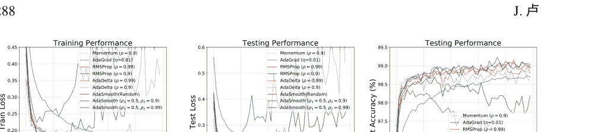

**图4 CNN：在MNIST数据集上使用不同优化方法进行50个epochs的损失曲线与CNN。虽然与RMSProp或带动量的SGD相比没有显著改善，但AdaSmooth收敛速度稍快，并获得更好的样本外准确性。**

在图4a中，我们比较了SGD with Momentum、RMSProp、AdaGrad、AdaDelta以及提出的AdaSmooth/AdaSmoothDelta方法在优化训练集损失（负对数似然）方面的结果。RMSProp ($\rho = 0.9$) 在这种情况下表现最差，而将衰减常数调整为 $\rho = 0.99$ 可以显著改善性能，使RMSProp对超参数（因此学习率）敏感。此外，虽然AdaDelta的训练损失 ($\rho = 0.9$) 在前3个epochs中下降最快，但在训练结束时性能变差，平均损失大于0.15；而AdaDelta ($\rho = 0.99$) 的整体性能比前者更好，但其整体准确性仍然不如AdaSmooth。这也揭示了AdaDelta方法与AdaGrad存在相同的缺点，即它们对超参数的选择敏感。

为了评估AdaSmooth是否能够找到我们想要的补偿，我们还探索了随机选择的周期/迭代次数 $N$，在接下来的部分中称为AdaSmooth($Random$)，它在不同批次中随机选择介于$\rho_1$和$\rho_2$之间的衰减常数。结果显示，AdaSmooth($Random$)无法正确找到每个维度的自适应学习率，而我们的方法实际上找到了衰减常数下界和上界之间的正确选择。

测试损失和测试准确率的不同方法的分析与训练损失的一致性相符，如图4b、c所示。我们还在每个时期保存了有效比率的幅度，如公式（13）所述；它们的分布如图5所示。在最初的几个时期，幅度上的ERs在较大值上具有更大的权重，而在最后的几个时期，概率降低为一个稳定的分布；换句话说，最后几个时期的ER分布是相似的。在图6中，我们对ER值设置了一个阈值，大于阈值的ER的百分比

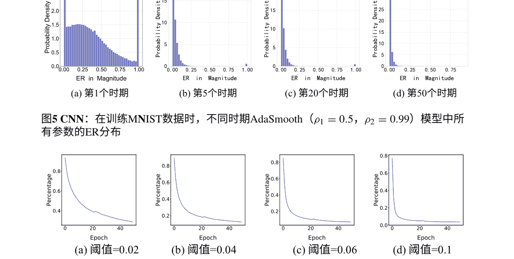

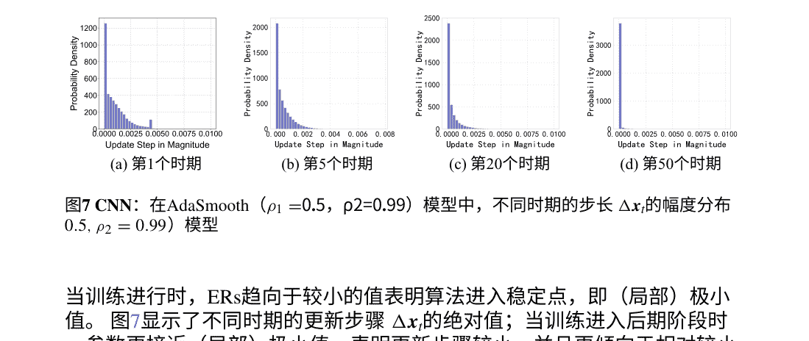

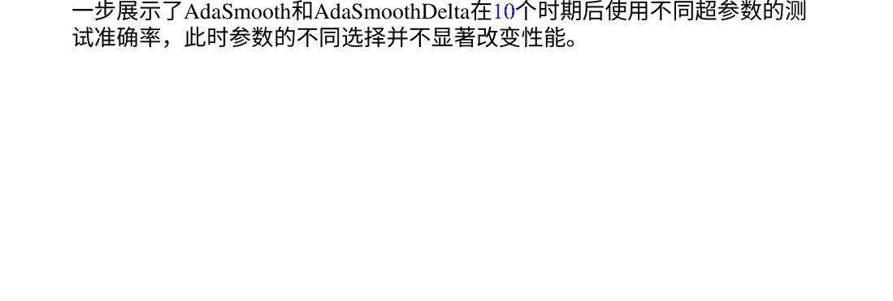

当训练进行时，ERs趋向于较小的值表明算法进入稳定点，即（局部）极小值。图7显示了不同时期的更新步骤 $\Delta \mathbf{x}_t$的绝对值；当训练进入后期阶段时，参数更接近（局部）极小值，表明更新步骤较小，并且更倾向于相对较小的指数移动平均期（由于步骤和移动方向的影响）在公式（16）中，进而对每个维度的学习率进行相对较少的补偿，使得更新更快。在表3中，我们进一步展示了AdaSmooth和AdaSmoothDelta在10个时期后使用不同超参数的测试准确率，此时参数的不同选择并不显著改变性能。

**表3 CNN: 在10个时期后，AdaSmooth和AdaSmoothDelta在不同超参数下的最佳测试准确率**

| 方法 | MNIST (%) |
| :--- | :--- |
| AdaGrad (η = 0.01) | 96.82 |
| AdaGrad (η = 0.001) | 89.11 |
| RMSProp (ρ = 0.99) | 97.82 |
| RMSProp (ρ = 0.9) | 97.88 |
| AdaDelta (ρ = 0.99) | 97.83 |
| AdaDelta (ρ = 0.9) | 98.20 |
| AdaSmooth (ρ₁ = 0.5, ρ₂ = 0.9) | 98.13 |
| AdaSmooth (ρ₁ = 0.5, ρ₂ = 0.95) | 98.12 |
| AdaSmooth (ρ₁ = 0.5, ρ₂ = 0.99) | 98.12 |
| AdaSmoothDelta (ρ₁ = 0.5, ρ₂ = 0.9, η = 0.5) | 98.86 |
| AdaSmoothDelta (ρ₁ = 0.5, ρ₂ = 0.95, η = 0.5) | 98.91 |
| AdaSmoothDelta (ρ₁ = 0.5, ρ₂ = 0.99, η = 0.5) | 98.78 |
| AdaSmoothDelta (ρ₁ = 0.5, ρ₂ = 0.99, η = 0.6) | 98.66 |
| AdaSmoothDelta (ρ₁ = 0.5, ρ₂ = 0.99, η = 0.7) | 98.66 |
| AdaSmoothDelta (ρ₁ = 0.5, ρ₂ = 0.99, η = 0.8) | 98.58 |

*AdaSmooth和AdaSmoothDelta的参数ρ₁, ρ₂, η在算法1中描述*

### 4.3 实验：逻辑回归

逻辑回归是一种用于多变量建模的分析技术，其具有经过充分研究的凸损失函数，使其能够用于比较不同优化器而不必担心陷入局部最小值[18]。

为了评估，如果没有明确提到，所有实验中学习率都设置为 η = 0.001。由于AdaGrad方法在分母中累积衰减因子，因此应用了相对较大的学习率（η = 0.01）；AdaDelta方法的全局学习率设置为1，如原始论文[32]所建议；对于提出的AdaSmoothDelta算法，选择了 η = 0.5，如第3.3节所述。图8a、b显示了每个算法在训练过程中的损失曲线，我们分别比较了纯SGD、带动量的SGD、AdaDelta、RMSProp以及提出的AdaSmooth/AdaSmoothDelta模型在Census Income和MNIST数据集上优化训练集损失的情况。未经修改的SGD方法在逻辑回归任务中表现最差。然而，在MNIST案例中，AdaSmooth算法的表现略好于RMSProp，在Census Income实验中表现比后者好得多。AdaSmooth与AdaDelta的快速收敛相匹配（在这种情况下，AdaSmooth在最初几个时期稍微慢于AdaDelta），而AdaSmooth继续降低训练损失，收敛到这些模型的最佳性能。如前所述，当选择 ρ₁ = ρ₂ = 0.9时，提出的AdaSmooth模型简化为RMSProp。

图8 逻辑回归：不同优化方法在人口普查数据集和MNIST数据集上的损失曲线，分别为70和50个周期，使用逻辑回归。注意，在这种情况下，AdaSmooth（$\rho_1=0.5, \rho_2=0.9$）的训练曲线与（$\rho_1=0.5, \rho_2=0.95$）接近，适用于两个数据集。

#### 表4 逻辑回归：训练准确度最佳的样本内评估

| 方法 | MNIST (%) | Census (%) |
| ---- | ---- | ---- |
| SGD ($\eta = 0.01$) | 93.29 | 84.84 |
| 动量 ($\rho = 0.9$) | 93.39 | 84.94 |
| RMSProp ($\rho = 0.99$) | 93.70 | 84.94 |
| AdaDelta ($\rho = 0.99$) | 93.48 | 84.94 |
| AdaSmooth ($\rho_1 = 0.5, \rho_2 = 0.9$) | **93.74** | 84.92 |
| AdaSmooth ($\rho_1 = 0.5, \rho_2 = 0.95$) | 93.71 | 84.94 |
| AdaSmoothDelta ($\rho_1 = 0.5, \rho_2 = 0.9, \eta = 0.5$) | 93.66 | **84.97** |

AdaSmooth和AdaSmoothDelta的参数 $\rho_1, \rho_2, \eta$ 在算法1中描述。RMSProp与 $\rho = 0.99$（对于AdaSmoothDelta和AdaDelta情况类似）。在所有实验中，提出的AdaSmooth模型的结果表现更好，而AdaSmooth的各种超参数之间的差异并不显著；在不同的超参数设置下，AdaSmooth的结果几乎没有差异，表明它对超参数不敏感。在表4中，我们比较了各种算法的训练集准确率；在MNIST案例中，AdaSmooth效果最好，而在Census Income数据中的优势并不显著。在测试准确率中可以观察到与MLP场景类似的结果，为了简单起见，我们不再给出详细信息。

## 5 结论

本文旨在解决基于梯度的优化方法在大数据集和高维参数空间的机器学习问题中的超参数调整问题。 我们提出了一种简单且计算效率高的算法，它需要很少的内存，并且易于实现用于随机目标函数的梯度优化。 总体而言，我们展示了AdaSmooth是一种适用于大规模高维机器学习问题的多功能算法，而AdaSmoothDelta是一种对全局学习率和超参数都不敏感的算法，需要小心设置全局学习率小于1。

## 参考文献

- 1. Becker, S., & LeCun, Y. (1988). 通过使用二阶方法来改善反向传播学习的收敛性。
- 2. Dauphin, Y. N., Pascanu, R., Gulcehre, C., Cho, K., Ganguli, S., & Bengio, Y. (2014). 在高维非凸优化中识别和攻击鞍点问题。在神经信息处理系统进展中(第27卷)。
- 3. Dozat, T. (2016).将Nesterov动量融入Adam中。
- 4. Duchi, J., Hazan, E., & Singer, Y. (2011). 用于在线学习和随机优化的自适应次梯度方法。机器学习研究杂志, 12(7)。
- 5. Graves, A., Mohamed, A.-R., & Hinton, G. (2013). 使用深度递归神经网络的语音识别。在2013年IEEE国际声学、语音和信号处理会议上(第6645-6649页)。IEEE。
- 6. Hinton, G., Deng, L., Yu, D., Dahl, G. E., Mohamed, A.-R., Jaitly, N., Senior, A., Vanhoucke, V.,Nguyen, P., Sainath, T. N., 等 (2012). 深度神经网络在语音识别中的声学建模：四个研究小组的共同观点。IEEE信号处理杂志,29(6), 82–97.
- 7. Hinton, G., Srivastava, N., & Swersky, K. (2012). 神经网络用于机器学习讲座6a小批量梯度下降的概述。神经网络用于机器学习, 14(8), 2.
- 8. Kaufman, P. J. (1995). 更智能的交易.
- 9. Kaufman, P. J. (2013).交易系统和方法，+ 网站(第591卷). Wiley.
- 10. Kingma, D. P., & Ba, J. (2014). Adam: 一种随机优化方法.arXiv:1412.6980
- 11. Krizhevsky, A., Sutskever, I., & Hinton, G. E. (2012). 使用深度卷积神经网络的Imagenet分类.在神经信息处理系统进展中(第25卷)
- 12. Le Roux, N., & Fitzgibbon, A. W. (2010). 一种快速的自然牛顿法. 在ICML中.
- 13. LeCun, Y. (1998). 手写数字的MNIST数据库. http://yann.lecun.com/exdb/mnist/.
- 14. Lu, J. (2022a). 探索经典的定量策略.arXiv:2202.11309
- 15. Lu, J. (2022b). 梯度下降，随机优化和其他故事.arXiv:2205.00832
- 16. 卢, J. (2022c). 矩阵分解与应用. arXiv:2201.00145
- 17. 卢, J., & 易, S. (2022). 通过增强混合架构模型减少高估和低估的波动性。应用经济学与金融, 9(2), 48–59.
- 18. Menard, S. (2002).应用逻辑回归分析(卷106). Sage.
- 19. Moulines, E., & Bach, F. (2011). 机器学习的非渐近分析的随机逼近算法。在神经信息处理系统进展(卷24).
- 20. Polyak, B. T., & Juditsky, A. B. (1992). 通过平均加速随机逼近。SIAM控制与优化杂志, 30(4), 838–855.
- 21. 钱, N. (1999). 关于梯度下降学习算法中的动量项。神经网络, 12(1), 145–151.
- 22. 罗宾斯, H., & 蒙罗, S. (1951). 一种随机逼近方法。 在数学统计学年鉴中(pp. 400–407).
- 23. Ruder, S. (2016). 梯度下降优化算法概述.arXiv:1609.04747
- 24. Rumelhart, D. E., Hinton, G. E., & Williams, R. J. (1986). 通过反向传播错误进行表示学习。自然,323(6088), 533–536.
- 25. Ruppert, D. (1988).从收敛缓慢的罗宾斯-蒙罗过程中高效估计.康奈尔大学运筹学与工业工程技术报告。
- 26. Schaul, T., Zhang, S., & LeCun, Y. (2013). 不再有烦人的学习率。 在机器学习国际会议上(pp. 343–351). PMLR.
- 27. Schwarz, J., Jayakumar, S., Pascanu, R., Latham, P. E., & Teh, Y. (2021). Powerpropagation:一种稀疏诱导的权重新参数化。 在神经信息处理进展系统(第34卷, 第28889-28903页)。
- 28. Smith, L. N. (2017). 循环学习率用于训练神经网络。 在2017年IEEE冬季计算机视觉应用会议(WACV)(第464-472页)。IEEE。
- 29. Srivastava, N., Hinton, G., Krizhevsky, A., Sutskever, I., & Salakhutdinov, R. (2014). Dropout:一种防止神经网络过拟合的简单方法。机器学习研究杂志, 15(1), 1929-1958。
- 30. Sutskever, I., Martens, J., Dahl, G., & Hinton, G. (2013). 关于初始化和动量在深度学习中的重要性。 在国际机器学习会议上(pp. 1139–1147). PMLR.
- 31. You, Y., Li, J., Reddi, S., Hseu, J., Kumar, S., Bhojanapalli, S., Song, X., Demmel, J., Keutzer ,K., & Hsieh, C.-J. (2019). 大批量优化用于深度学习： 在76分钟内训练Bert。arXiv:1904.00962
- 32. Zeiler, M. D. (2012). Adadelta：一种自适应学习率方法。arXiv:1212.5701

# 设计和实施一个用于微服务云在线旅行门户的分布式数据库

Biman Barua, Md Whaiduzzaman, M. Mesbahuddin Sarker, M. Shamim Kaiser和Alistair Barros

摘要为了处理大量数据库、应用负载平衡和全球访问实时数据，设计和实施一个用于微服务云在线旅行门户的分布式数据库是必不可少的。随着应用程序变得越来越复杂和分布式，微服务变得越来越受欢迎。微服务的主要目标是通过将应用程序从大型业务组件中拆分为小型服务来构建应用程序，这些服务可以独立部署和运行。在这项研究中，我们展示了使用不同类型的分片技术、数据分配和关系代数、并集和连接进行分布式数据库设计和分布。我们还演示了如何通过在附近的站点上设置数据库而不是从整个全球数据库中搜索，来管理来自不同国家的分销商、代理商和客户。这项研究将帮助设计和实施云在线旅行门户的分布式数据库，包括微服务应用程序，以避免完全系统故障、处理海量数据和应用负载平衡。

关键词分布式数据库·在线旅行社·微服务·云计算

B. Barua (✉)
CSE部，BGMEA时尚与技术大学，Nishatnagar，Turag，
Dhaka 1230，孟加拉国
e-mail: biman@buft.edu.bd

B. Barua · Md Whaiduzzaman · M. Mesbahuddin Sarker · M. Shamim Kaiser
信息技术研究所，Jahangirnagar大学，Dhaka 1342，孟加拉国

Md Whaiduzzaman · A. Barros
信息系统学院，昆士兰科技大学，澳大利亚布里斯班

## 1 引言

随着数字技术和电子商务的普及，设计和开发适用于不断增长的在线旅游行业的应用程序已成为必要。这些应用程序需要处理全球范围内的大量数据。在线航空预订系统已经成为所有人非常流行的系统，航空预订是唯一一个能够如此快速更新票价和航班信息的系统。为了设计一个在线航空预订系统，需要设计大量的模块。

此外，处理从多个供应商检索的大量数据非常关键，系统必须使用全球分销系统（GDS）和低成本航空公司（LCC）航空公司搜索和显示实时票价。使用应用程序编程接口（API）从不同位置和应用程序访问数据是必要的，当操作来自不同国家时，这一点变得更加关键。

当票务问题来自任何位置时，客户的数据存储在集中式数据库中，而不需要从其他位置访问相同的数据。在访问任何特定地区的数据时，必须从整个数据库中搜索，这需要很长时间来执行查询。任何查询的执行时间增加，另一方面，存储容量也增加。

为了克服上述情况，分布式数据库的集成是必不可少的。在分布式系统中，数据可以按区域和地区存储；在这个系统中，所有客户的数据将存储在不同的区域位置，每当用户执行查询时，它将搜索本地数据库；如果可用，将显示；否则，将转到集中式数据库。

## 2 文献综述

在基于云的在线旅游门户上设计和实施分布式数据库是一项关键工作。大多数研究人员开发了系统，将手动旅行预订系统转换为计算机化系统。Ceri等人[1]定义了航空公司数据库是全球数据库设计方法的一部分；他们定义了从分散的记录和程序中收集需求的方式以及如何构建模式的分布。一些人描述了在线旅游的当前状况。 在线旅游分销系统中零售商的行为[2]以及在线旅行代理商(OTA)的未来。 一些研究人员设计了在线旅行应用程序，使其更容易、灵活、评估正确的文档，并按时完成[3]，通过预算开发成本来提高旅行代理商的生产力[4]和质量。Jauhari等人[5]设计了旅游代理商和旅游代理商提供商的应用程序，其中包括对旅游景点的教育。Sekarhati等人[6]研究了使用HESA进行数据分析、数据成熟度和管理，并讨论了IATA理论和创新、OTA理论和不同的框架。Lee等人[7]研究了开发、运营和维护旅行社网站的方法。旅行社可以了解消费者行为。 Suma [8] 描述了一个混合深度模糊哈希算法的模型，用于在分布式云环境中检索信息，确保比传统系统具有更高的检索效率和准确性。 在这个模型中，他展示了97.6%的信息检索效率。 Kumar [9] 在他的论文中描述和回顾了如何在无处不在的云上安排任务；他还描述了用于改善服务隐私的混合元启发式方法。 Wiese 提出了一个智能分片和数据复制的框架 [10]，用于基于云的数据库环境，其中描述了云存储能够执行语义引导的灵活查询机制。 Barua 和 Whaiduzzaman [11] 描述了如何将基于Web的应用程序托管在云上并用作软件即服务（SaaS）。

大多数研究人员使用集中式数据库、云数据检索和数据隐私来设计在线旅行代理。 一些提出的方法论可以增加查询执行时间，使用算法。 因此，在设计一个在线旅行门户网站时存在一个问题，即使用分布式数据库，将数据库分布到更近的服务器位置以通过搜索全局数据库访问信息。

## 3 问题定义

现有的在线旅行代理系统（OTA）使用集中式数据库，所有数据都存储在一个单独的数据库服务器中。 如果服务器接收到大量的数据请求，服务器可能会变得挂起或变慢。 没有负载平衡的选项，这也是平滑数据库操作的一种好技术。

此外，在现有的集中式数据库中，所有代理商都向同一个数据库发送请求，全球客户发出机票。 例如，如果一个代理商从孟加拉国使用云在线旅行门户网站，数据库服务器位置在美国，那么来自孟加拉国的所有客户数据都存储在美国服务器中。 同时，如果一个代理商从印度使用，来自印度的所有客户数据也存储在美国服务器中。

如果数据库服务器靠近应用程序，查询执行时间和数据可访问性将比集中式数据库更快。

### 3.1 为什么分布式数据库？

分布式数据库（DDB）是分布在计算机网络上的多个逻辑相关数据库的集合 [12]。 它是存储在多个通过TCP/IP协议网络连接的服务器上的数据库集合。 分布式数据库系统也是分布式数据库（DDB）和分布式数据库管理系统（DDBMS）的集合。

### 3.2 DDB系统类型

分布式数据库主要分为两种类型：

同质分布式系统：在同质系统中，数据被分布，但使用相同的数据库和操作系统。这种类型的数据库易于管理和设计[12]。

异构分布式系统：这种类型的分布式数据库[13]使用不同的数据库、模式和不同的数据模型。

### 3.3 分布式数据库系统的优势

DDDB的管理很容易，因为它管理着各种透明度级别，包括分布透明度、分片透明度、事务透明度、复制透明度等。

- 分布式数据库的可靠性比集中式数据库要好得多。如果发生任何故障，整个系统将停止运行，但在分布式系统中，如果系统的任何部分停止运行，整个系统仍然保持活动状态。
- 由于DDB存储在靠近站点的位置，数据的访问速度比集中式系统更快。
- 在现有系统中轻松集成或添加新的数据库或新的站点，而不会中断现有系统。
- 在分布式数据库系统中，数据可以按照部门的方式进行组织，这样更容易访问数据层次结构。

### 3.4 关系数据库的限制

尽管使用关系数据库管理系统有很多好处，但也存在一些限制，主要是

- 昂贵：用户或公司需要购买软件和工具才能充分享受关系数据库管理系统的好处。建立和维护关系数据库系统也是昂贵的。在最低预算下实施RDBMS系统是困难的。需要专业的数据库管理员作为系统管理员。
- 维护问题：我们使用RDBMS处理大量数据。因此，维护数据库管理成为一项关键工作。我们需要雇佣一位高级专家BDA。
- 物理存储：由于数据库存储在一组行和列中并且每组数据需要单独的存储，因此需要大量的物理内存。当应用程序数据的存储量变大时，存储需求增加。
- 复杂结构: 关系数据存储在行和列中, 大多数应用程序需要从多个表中访问数据, 类似于将数据存储在不同的表中。
- 性能问题: 由于依赖于多个表, 关系数据库变得更慢。 此外, 在系统中需要大量的表格和数据时, 它变得更加复杂。 如果有大量用户登录和访问数据, 它还会导致查询响应时间变慢并可能导致故障。

### 3.5 RDBMS的主要特点

支持ACID属性: BDMS应该支持(原子性、一致性、隔离性和持久性)(ACID)。 它确保数据库中的事务如读取、写入、删除和更新是最新的。 ACID事务还确保数据的可靠性和完整性。

并发数据访问: 在一个应用程序中, 有可能多个用户同时访问相同的数据; 在这种情况下, DMBS应该能够处理并发数据处理而不出现任何问题。

数据完整性: 数据完整性是DBMS的重要特性之一。 它确保数据库的质量和可靠性, 并且还确保数据库更受保护, 以防止未经授权的人访问数据库。

备份和恢复: 在当今的商业场景中, 处理数据是一项具有挑战性的任务, 特别是在处理大量数据时。 在部分或完整数据库中存在数据故障的可能性; 通过丢失重要数据, 用户可能会陷入困境, 因此备份和恢复是从数据库故障中拯救用户的好选择。 如果存在任何问题, 可以将数据库恢复到以前的阶段。

### 3.6 为什么使用微服务架构？

这是一种新兴的架构和开发方法论, 可以将一个大型单一应用程序分解为较小的自治服务, 每个较小的服务将在自己的进程中执行, 并与轻量级机制进行交互。 图1表示了单体架构和微服务架构之间的差异。 这些服务可以使用不同的业务逻辑构建, 并且可以使用各种编程语言编写[14], 还可以实现不同的数据存储技术。 随着行业构建越来越大且复杂的应用程序, 微服务变得越来越受欢迎, 这对于处理和速度变得至关重要。 目前有很多人正在努力将传统的单体应用程序重新设计为单独的独立服务。 为了减少代码的复杂性, 可以在不影响整个代码和部署的情况下修改代码。

再次编写程序，避免减慢应用程序的速度，大多数开发人员都转向微服务架构。微服务可以使用不同的框架、工具和版本来构建和实施，如Java、C++、Node JS和Microsoft .NET等。

## 4 方法论

在将数据库集成和分发给在线旅行代理商时，由于处理不同地理位置的大量数据，分发数据库是至关重要的。在集中式数据库中，所有数据都存储在单个数据库服务器上；如果代理商需要客户的数据，就需要在不搜索特定国家数据的情况下搜索整个数据。为了解决这个问题，最好将数据分布到不同的地区，这样如果任何代理商搜索客户的数据，就可以在最近的数据库中搜索，而不需要搜索整个数据库。

为了设计和分发数据库，需要研究整个预订过程以及与系统设计相关的对象。发现了多个对象，如航空公司、机场、客户、代理商等。在确定对象后，找到了属性。主要数据是从当地代理商收集的，次要数据是从在线、报纸等收集的。

### 4.1 系统设计

在线旅行代理商的设计阶段包含不同的层次，在系统的后端部分包含了不同地理位置的表设计。由于该系统在不同的地理位置使用，数据将按国家或地区进行访问。考虑到如果有任何代理商从孟加拉国使用该系统，所有未连接到GDS的低成本航空公司（LCC）可以存储在位于孟加拉国地区的数据库中。如果数据是分散和分布在不同地区，数据访问速度将更快。此外，对于本地用户或客户的信息，无需搜索整个数据库。这也将使系统免受不必要的查询请求。

### 4.2 数据收集方法

我们使用Google表单收集了来自当地代理商的数据，使用了一些问卷调查和从谷歌搜索和公司网站收集的次要数据。

### 4.3 数据库设计

数据库是一组集成和相互关联的表。数据库分布的设计概念取决于系统的架构[12]。在紧密集成的分布式数据库系统中，设计过程遵循自上而下的方法[15]。在多数据库分布式系统中，设计过程遵循与现有数据库集成的自下而上的方法。

#### 4.3.1 自上而下的方法

在这种类型的系统中，数据库是从头开始设计的，从需求分析开始[16]。对于任何公司的需求分析用于了解公司的情况、障碍或问题的限制[17]。在设计任何分布式数据库时，需要遵循两种类型：概念设计和视图设计。图2表示分布式数据库的自上而下方法。

概念视图处理实体规范化和关系，而视图设计处理任何应用程序的接口。

在上述两个步骤之后，下一步是分布式设计。分布式设计包括分片和分配。

图2 分布式数据库的自上而下方法

#### 4.3.2 自下而上方法

每当需要将设计与任何现有数据库集成时，都会使用自下而上方法。在这个阶段，我们首先需要识别元素，然后将项目分组成数据集。在自下而上的方法中，过程从初始阶段开始，涉及到属性和功能依赖等较低级别的元素，然后向前推进到可接受的逻辑数据模型[13]。

#### 4.3.3 数据在不同区域和云中的分布

在当前竞争激烈的市场和全球化背景下，为了在最短的时间内更快、更安全地向客户提供服务变得具有挑战性。此外，从不同地点部署应用程序并为全球客户提供服务更具挑战性。为了能够从任何设备的任何地方访问数据，云是基于按需交付服务的另一种范式[18]。因此，有必要集成和开发新的应用程序，其中应用程序和数据将在靠近客户的位置进行托管和分布。在这种情况下，数据需要以低延迟的方式进行复制。图3表示数据分布和负载平衡。在这种情况下，如果某个区域发生故障，客户端将自动转发到下一个可用的本地集群。在这种情况下，需要在应用程序的前端使用负载均衡器。

图3 数据分布和负载均衡

#### 4.3.4 分布式系统的组件

设计在线航空公司代理（OTA）的主要考虑因素如下：

- 需要将数据库分成不同的片段。
- 将分段数据复制到不同的服务器上。
- 以适当的方式分配片段和副本。

设计分布式数据库主要需要两个方面：分片和数据的分配。分片是将主要数据分成不同的数据片段的系统[1]。另一方面，分配是将各个片段映射到不同的站点的系统。

水平分片：水平分片意味着从一个表中取出出行，并将行放置在不同的位置或站点。在我们的在线旅行门户网站中，代理管理表的水平分片如下所示，因为代理来自不同的地理位置或国家，来自不同国家的数据可以存储在最近的节点中，以便更快地访问。

在关系代数中，我们可以在表(T)上进行水平分割，如表1所示。

σp(T)

这里 σ 是选择的关系代数运算符。

表1 全局数据存储的完整代理表

| ID | 代理代码 | 公司名称 | 手机号码 | 电子邮件 | 密码 | 登录ID | 地址 | 国家 | 代理类别ID |
|----|----------|----------|----------|----------|------|--------|------|------|------------|
| 1 | TS001 | Trip Sheba | 018.. | info@tripsheba.com | Pass1 | trips | 达卡 | 孟加拉国 | 1 |
| 2 | TS002 | Travel BD | 019.. | info@tbd.com | Pass2 | Tbd | CTG | IN | 2 |
| 3 | TS003 | Flight Expert | 016 | info@flightexpert.com | pass3 | flighte | DKA | 孟加拉国 | 2 |
| 4 | TS004 | Yatra | 910 | info@yatra.com | pass4 | yatra | MUM | IN | 1 |

p 是由水平片段满足的条件。

在下表中，使用联合运算符在片段上设计表 T。将表的所有行 T 称为完整的水平片段[19]。为了使AgentManagement表的数据分布，可以将其分解为不同的片段，如表2和表3所示。

AgentMan 1 = σ Country = BD AgentManagement
AgentMan 2 = σ Country = IN AgentManagement

现在，我们可以考虑片段 T1 的Country = BD。同样，片段 T2 的country = IN。现在，如果我们想要访问AgentManagement表的全部信息，我们可以使用如下方式：

T = T1 ∪ T2 ∪ T3 … TN

因此，通过将不同的片段分布和存储在不同的站点或位置，我们可以加快访问在线旅行门户网站的数据的过程。在这个系统中，将服务器位置设置为系统最近的站点可以更快地完成。此外，由于数据存储在不同的服务器上，所以如果任何数据库服务器宕机，整个系统将不会停止。

垂直分片：垂直分片是通过对列进行分区来划分表的过程。在这种分区或分片中，一些属性存储在表中，而另一些属性存储在不同的表中。

该过程的主要目标是大部分时间并不需要所有属性。我们可以为特定任务调用特定属性，这对于提高应用程序的效率非常重要。我们必须以这样的方式创建分片，以便在需要所有属性时可以使用自然连接重新构建表。在这种情况下，我们可以在每个分片部分使用另一个属性Tuple_ID。

π a1, a2, … , an(T)

这里 π 是关系代数运算符，a1, a2, ..., an 是 T 的属性，T 是表（关系）。

在我们的AgentManagement表中，我们可以将 T1 视为表 4中所示。在将表格垂直分割后，我们在第二个碎片化部分中添加了一个额外的属性Tuple_ID，如表5所示。为了访问所有属性，我们可以使用分片 T1 和 T2 如下所示：

π AgentManagement(T1 ⋈ T2)

表2 水平分割部分-1

| ID | 代理代码 | 公司名称 | 手机号码 | 电子邮件 | 密码 | 登录ID | 地址 | 国家 | 代理类别ID |
|----|----------|----------|----------|----------|------|--------|------|------|------------|
| 1 | TS001 | Trip Sheba | 018... | info@tripsheba.com | Pass1 | trips | 达卡 | 孟加拉国 | 1 |
| 3 | TS003 | Flight Expert | 016 | info@flightexpert.com | pass3 | flighte | DKA | 孟加拉国 | 2 |

表3 水平分割部分-2

| ID | 代理代码 | 公司名称 | 手机号码 | 电子邮件 | 密码 | 登录ID | 地址 | 国家 | 代理类别ID |
|:---|:---------|:---------|:---------|:---------|:-----|:-------|:-----|:-----|:-----------|
| 2  | TS02     | Travel BD| 019...   | info@tbd.com | Pass2 | Tbd    | CTG  | IN   | 2          |
| 4  | TS04     | Yatra    | 910      | info@yatra.com | pass4 | yatra  | MUM  | IN   | 1          |

表4 垂直分割部分-1

| ID | 代理代码 | 公司名称 | 手机号码 | 电子邮件 | Tuple_ID |
|---|---|---|---|---|---|
| 1 | TS001 | Trip Sheba | 018.. | info@tripsheba.com | 1 |
| 2 | TS002 | Travel BD | 019.. | info@tbd.com | 2 |
| 3 | TS003 | Flight Expert | 016 | info@fe.com | 3 |
| 4 | TS04 | Yatra | 910 | info@yatra.com | 4 |

表5 垂直分割部分-2

| 密码 | 登录ID | 地址 | 国家 | 代理类别ID | Tuple_ID |
|---|---|---|---|---|---|
| Pass1 | trips | 达卡 | 孟加拉国 | 1 | 1 |
| Pass2 | 待定 | CTG | IN | 2 | 2 |
| pass3 | flighte | DKA | 孟加拉国 | 2 | 3 |
| pass4 | yatra | MUM | IN | 1 | 4 |

##### A. 使用ER图进行数据库设计

云在线旅行门户的实体关系图（ERD）表示数据库中所有实体之间的关系。实体是数据的元素之一[20]。所有实体都将具有定义属性。云在线旅行门户的ER图显示了数据库表之间的关系，包括机场、航空公司、客户、旅行代理、机票、代理类别、票价详情、支付、预订、用户等所有可视化组件。

要设计系统的ER图，首先需要确定实体及其属性，下一步需要设计实体关系图，以便根据ERD设计数据库。在我们的研究中，实体和属性如表6所示。

表6 实体及其属性

| 实体 | 属性 |
|---|---|
| 航空公司 | ID，航空公司名称，航空公司代码，状态，标志 |
| 机场 | 机场ID，机场名称，城市，国家，状态 |
| 票价详情 | 票价ID，出发时间，到达时间，持续时间，航段数，附加票价ID |
| 机票 | 机票ID，票号，发票日期，验证航空公司，服务费，状态，备注 |
| 代理商管理 | 代理商代码，代理商名称，联系电话，登录ID，密码，联系人，地址，国家，代理商类别ID |
| 代理商类别 | ID，类别名称，详情，状态，备注 |
| 预订 | 预订ID，标题，图书类型，预订日期，描述 |
| 支付 | 支付ID，支付客户ID，支付日期，支付金额，支付描述 |
| 顾客 | 顾客ID，顾客姓名，电子邮件，顾客用户名，顾客密码，顾客地址 |

旅行社的详细信息存储在AgentManagement表中；航空公司信息以相同的方式存储在航空公司表中，每个实体都有一个独立的表。图4、5、6和7分别代表完整数据库图的四个部分。此外，每个表都有一个独立的主键和唯一键。主键是在列[21]或列中唯一标识每一行的键，可以在表中唯一地识别每一行。

因此，需要大量的表来设计完整的系统。图8代表整个数据库设计以及所有表之间的关系。

图6 数据库设计部分-3
图7 数据库设计部分-4

### 4.4 数据分析工具

在分析对象和属性后，我们设计了临时数据、表格和ER图来分析数据流。

为了设计数据库，我们使用了微软SQL Server作为最流行的关系型数据库管理系统(RDBMS)，因为它更加用户友好[22]。我们设计了数据库来建立关系。最后，我们使用另一个微软产品Visual Studio.Net MVC中设计的查询、子查询和连接应用程序来从不同位置访问数据，因为该系统是如此设计的。

图8 数据库设计完整

设计用于分发。在未来，可以使用弹性分布式数据库（RDD）[18]。一个单独的RDD，我们可以分成多个逻辑分区单元[23，24]。分区可以在集群的不同机器上进行处理和存储。

## 5 结果和讨论

我们在研究中实验的解决方案和方法，在第一阶段实现了一个集中式数据库，使用了最流行的Microsoft RDBMS SQL Server 2016版本和界面设计了另一个流行的Microsoft Visual Studio.Net MVC框架。该应用程序托管在云端，并针对不同的错误、验证和功能进行了测试。该应用程序设计用于与不同访问权限的多个合作伙伴一起使用，如航空公司分销商、代理商和直接客户。集成模块包括分销商、B2B和B2C。由于我们将应用程序设计为基于云的软件即服务（SaaS）。因此，各方可以注册并根据需要使用该服务。随着用户数量的迅速增加和数据处理变得具有挑战性，在第二阶段中，数据库被转换为分布式数据库，其中碎片化的数据库被放置在靠近站点的不同服务器上。

在这个系统中，来自不同国家的所有代理商都可以将他们的客户数据存储在附近的位置，而不是从整个数据库中搜索。如果数据库服务器的任何部分出现故障，不会影响整个系统。在将网站和数据库托管在不同的位置之后，如果从位于美国的全球数据库中使用数据，则ping时间为313毫秒，而如果位于孟加拉国等最近的位置，则需要1-2毫秒。

## 6 结论

我们的主要目标是为基于云的在线旅行社设计和实施分布式数据库，采用微服务的方式，这将有助于将应用程序分割成不同的服务器，平衡应用程序的负载，提供更快的数据检索访问，并实现数据库的去中心化。在这个系统中，如果数据库服务器的任何部分出现故障，整个系统仍然可用。在数据的复制技术集成方面，即使任何站点宕机，仍然可以通过访问其他站点的复制数据来运行站点。我们还讨论了自上而下和自下而上的不同设计方法，数据集成，水平，垂直和混合分片。

致谢：这项研究部分得到了澳大利亚研究理事会发现项目的支持: DP190100314。

## 参考文献

1.  Ceri, S., Pernici, B., & Wiederhold, G. (1987). 分布式数据库设计方法论. IEEE会议录, 75(5), 533–546.
2.  Marzo-Navarro, M., Berne-Manero, C., Gómez-Campillo, M., & Pedraja-Iglesias, M. (2019). 从数字游客的角度看在线旅行社的优势.在零售环境中预测趋势和构建消费者参与策略(pp. 187–210). IGI Global.
3.  Soegoto, E. S., & Fadillah, R. (2018, 八月). 旅行业票务预订信息系统的设计与开发.IOP会议系列: 材料科学与工程, 407(1), 012026).
4.  https://www.geeksforgeeks.org/fragmentation-in-distributed-dbms/
5.  Jauhari, A. F. D., 等。 (2021). 在COVID-19大流行面前的旅行代理设计与实施。在E3S Web of Conferences(Vol. 328). EDP Sciences.
6.  Sekarhati, D. K. S., Nefiratika, A., Hi dayanto, A. N., & Budi, N. F. A. (2019, 八月). 在线旅行社(OTA)数据成熟度评估: PT Solusi Awan Indonesia-"Flylist"案例研究。在2019 International Conference on Information Man agement and Technology (ICIMTech)(Vol. 1, pp. 492–497). IEEE.
7.  Lee, J. J. Y., Sung, H. H., Defranco, A. L., & Arnold, R. A. (2005). 开发、运营和维护旅行社网站:关注电子消费者和互联网营销问题。旅游与旅游营销杂志, 17(2–3), 205–223。
8.  Suma, V. (2020). 一种用于分布式云的新型信息检索系统,使用混合深度模糊哈希算法。JITDW, 2(03), 151–160。
9.  Kumar, D. (2019). 普适云中任务调度的综述。ISMAC杂志, 1(01), 72–80。
10. Wiese, L. (2014). 基于聚类的分片和数据复制,用于分布式数据库中的灵活查询回答。云计算杂志, 3(1), 1–15。
11. Barua, B., & Whaiduzzaman, M. (2019, July). 一种关于开发服装工资系统（GPS）作为SaaS的方法论框架。在2019年第一届国际会议上信息技术进展（ICAIT）（pp. 431–435）。IEEE。
12. Özsu, M. T., & Valduriez, P. (2011).分布式数据库系统原理. Springer科学与商业媒体.
13. Ozsu, M. T., & Valduriez, P. (1991). 分布式数据库系统：我们现在在哪里？ 计算机, 24(8), 68–78. https://doi.org/10.1109/2.84879
14. Aderaldo, C. M., Mendonça, N. C., Pahl, C., & Jamshidi, P. (2017年5月). 微服务架构研究的基准需求. 在2017年IEEE/ACM第一届国际工作-坊上, 为基于架构的软件工程建立社区广泛基础设施(ECASE)(pp. 8–13). IEEE.
15. Kung, H.-J., Kung, L. A., & Gardiner, A. (2012). 比较自上而下和自下而上的方法: 教授数据建模.在信息系统教育者会议(第2167卷)中的论文.
16. Tomar, P., & Megha. (2014). 分布式数据库概述。国际信息与计算技术杂志, 4(2), 207–214. ISSN 0974-2239。
17. Gadicha, A. B., et al. (2012). 基于概念设计到物理设计的自顶向下方法过程,使用LIS、GCS模式。国际工程科学与新兴技术杂志, 3, 90–96。
18. Whaiduzzaman, M., Mahi, M. J. N., Barros, A., Khalil, M. I., Fidge, C., & Buyya, R. (2021). BFIM: 基于区块链的分层雾物联网微服务架构的性能测量。IEEE Access, 9, 106655–106674.
19. Sese Tuperekiye, E., & Zuokemefa Enebraye, P. 面向集成工资系统的客户端-服务器分布式数据库系统框架。
20. Chaki, P. K., Sazal, M. M. H., Barua, B., Hossain, M. S., & Mohammad, K. S. (2019年2月). 通过分析教学评估数据改进教师素质的方法. 在 2019年第二届高级计算与通信范式国际会议 (ICACCP)(第1-5页). IEEE.

-   21. Barua, B. (2016). 孟加拉国的移动商务-现状、潜力和限制.国际信息工程与电子商务杂志, 8(6), 22.
22. Chaki, P. K., Barua, B., Sazal, M. M. H., & Anirban, S. (2020, 5月). PMM: 使用句子映射进行孟加拉语词性标注的模型. 在国际信息、通信和计算技术会议(第181-194页). Springer.
23. Whaidduzzaman, M., Barros, A., Shovon, A. R., Hossain, M. R., & Fidge, C. (2021, 9月). 一个弹性的雾计算物联网框架，用于无缝微服务执行。在2021年IEEE国际服务计算会议 (SCC) (第213-221页). IEEE.
24. Hossen, R., Whaidduzzaman, Md., Uddin, M. N., Jahidul Islam, Md., Faruqui, N., Barros, A., Sookhak, M., & Julkar Nayeem Mahi, Md. (2021). BDPS: 一种高效的基于Spark的大数据处理方案，用于云雾物联网编排。信息, 12(12), 517.

# 一项新的定制Bert情感分析的比较研究

Fatima-ezzahra Lagrari和Yousffi ElKettani

摘要 本文提出了一种基于定制Bert方法的情感分析分类。在数据预处理步骤中使用了空格去除方法、停用词去除和词干处理方法。然后在分词步骤中提取标记。标准狮子算法用于优化所提出的Bert算法的权重和偏差。进行了许多比较以分析新提出的Bert模型的性能。所得到的结果表明，所提出的模型在准确性和性能等指标上优于其他经典模型。

-   关键词 Bert ·Twitter情感分析 ·深度学习 ·狮子算法 ·优化

## 1 引言

随着社交媒体、电子商务网站和交流平台的增长，互联网今天出现了巨大的增长。这种增长导致产生了大量的数据集。因此，情感分析分类的有用性。

情感分析或意见挖掘的主题是自然语言处理（NLP）领域中吸引研究人员、行业和政府关注的一个领域[1]。它是一种机制，允许我们确定文本文档中的情绪，帮助我们定义观点、感知或表达的情感。正如Liu所指出的，观点包括目标、实体的对象或特征，以及情绪（积极、消极或中性）[2]。这种情绪可以包含作者和表达观点的时间[3]。

情绪可以根据分类的目标分为不同的类别。Lagrari和Elkettani [4]以及Rachiraju和Revanth [5]将推文分为积极、消极和中性，而Kalchbrenner等人[6]将电影评论分为积极、有些积极、中性、消极和有些消极。

已经开发了几种情感分析技术。经典技术被分为两类：基于词典的和基于机器学习的技术。基于词典的方法涉及计算文档中单词或短语的语义倾向 [7]。

文本分类方法或机器学习方法涉及从标记的文本或句子实例构建分类器 [8]。

传统情感分析方法在文献中已经取得了良好的准确性，然而数据预处理步骤耗时且复杂，加上当今产生的大量数据需要强大的知识和方法来分析和管理，这就是为什么深度学习方法应运而生，以满足这种需求并简化学习阶段，无需进行特征工程步骤。研究表明，深度学习方法在情感分析方面优于传统方法 [9]。

这项研究工作的主要贡献是：
-   标准狮子算法用于修改Bert编码器的最大序列长度[10]。
-   标准狮子算法用于微调Bert的权重和偏置。

## 2 提出的情感分析框架

### 2.1 提出的模型

本文提出了一种新的Twitter情感分析分类模型，如图1所示。我们在预处理步骤中应用了停用词去除方法、词干提取和空格去除，如图2所示。只保留有意义的标记，并通过优化的Bert模型对Twitter数据集进行分类，分为积极、消极和中性。

### 2.2 预处理和标记化步骤

#### 2.2.1 预处理步骤

预处理步骤是在嵌入步骤之前必须应用于原始数据的重要步骤，以标准化文本并使其更易于使用[11]。在这项工作中，为了预处理数据，使用了三种方法：停用词去除、词干提取和空格去除。

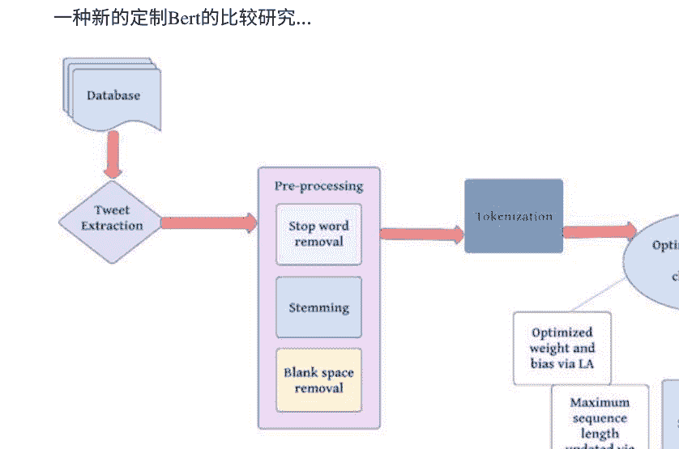

#### 2.2.2 分词步骤

分词是将文本文档分割成一组袋子或术语，称为标记的机制。这些单词可以用空格分隔，并将通过提出的优化BERT框架[12]进行分类。

## 3 使用Lion算法提出的定制Bert

来自转换器的双向编码器表示（BERT）是由Devlin等人开发的一种方法[9]。BERT有三个重要步骤：输入层、BERT编码器和输出层。

提出的定制Bert是一个具有12个传输块和最大序列长度为512个标记的多层双向变压器编码器。

来自编码器的输出层是序列的表示，可以是隐藏状态向量或‘隐藏状态向量的时间步序列’。

在这项工作中，使用标准LA来预测最佳序列标记（隐藏状态向量）被使用。

标准LA用于修改Bert编码器的最大序列计数，以使其适用于大型数据集。

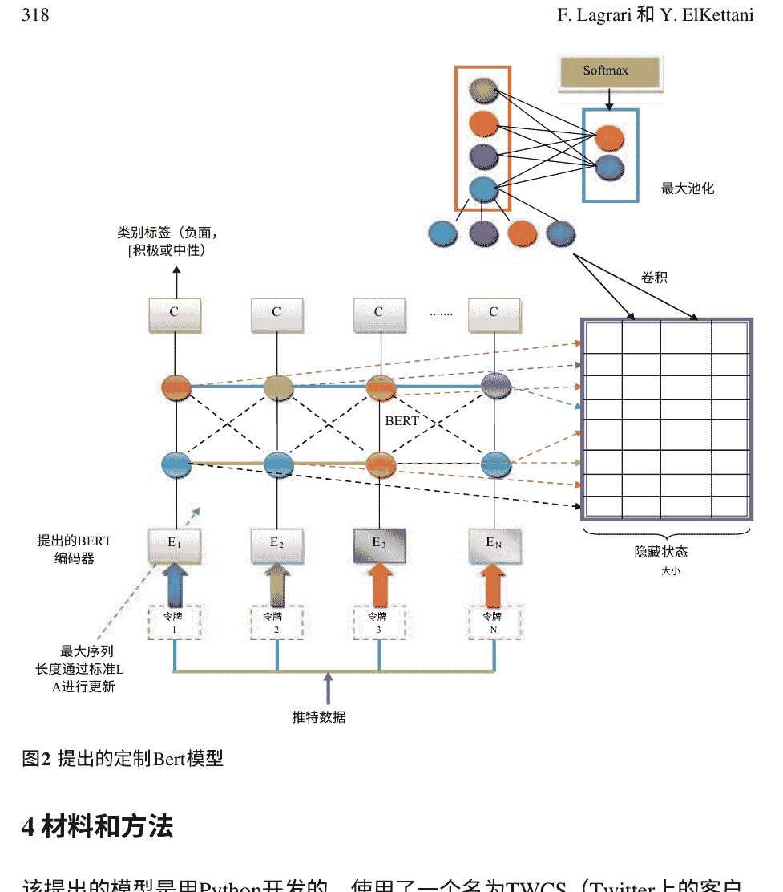

图2 提出的定制Bert模型

## 4 材料和方法

该提出的模型是用Python开发的。使用了一个名为TWCS（Twitter上的客户支持）的数据集。TWCS数据集是一个大型的现代推文语料库。该数据集的目标是研究现代客户关怀实践、对话及其影响。此外，该提出的方法与其他常规分类方法进行了比较，如基于实例的k最近邻（IB-K）[13]、朴素贝叶斯（NB）[14]、顺序最小优化（SMO）[13]、贝叶斯网络（BN）[15]、jRip[13]、j48[13]、PART[13]、CNN [16]和BERT [9]。评估了不同的度量指标，如精确度、准确度、特异度、敏感度。

### 4.1 TWCS数据集的分析：性能和错误

图3、4和5显示了优化的Bert与标准Bert模型、基于实例的k最近邻（I-BK）、朴素贝叶斯（NB）、顺序最小优化（SMO）、贝叶斯网络（BN）、Jrip、J48、PART和CNN的准确性、精确性、敏感性和平衡准确性的性能比较。

在这项研究中，分类器的准确性是关键参数。所提出的方法显示出最高的值。使用我们提出的方法，达到了89.6%的准确性，这比其他常规模型在每个TP变化下都更好。

所提出的方法在每个变化下都显示出高值的度量。与其他模型相比，优化的Bert实现了89.9的准确性。敏感性在每个变化下也显示出我们提出的方法的高值。特异性和平衡准确性也是一样。

在这里，我们可以看到所提出的工作在负预测值和正预测值的每个变化方面都显示出最高性能，与其他模型相比，性能最好。

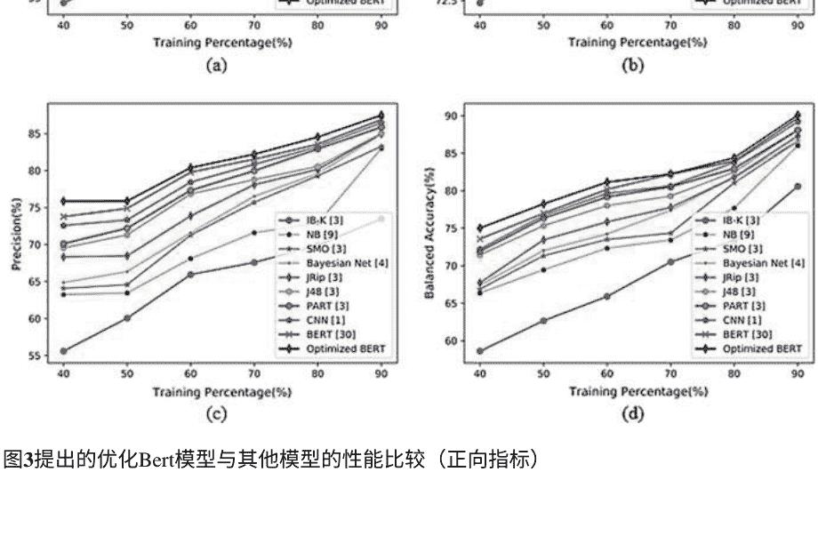

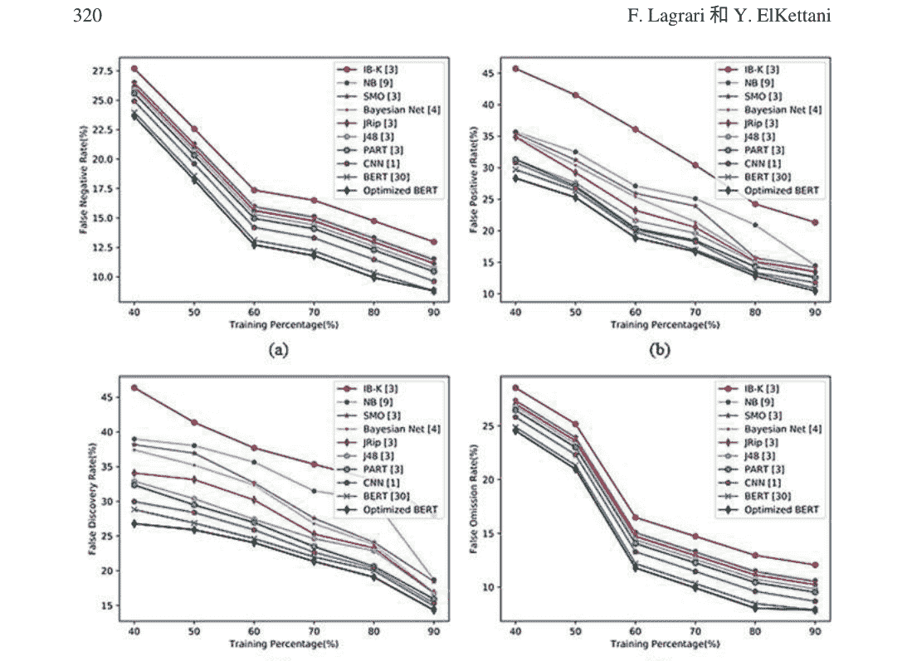

#### 图4 提出的优化Bert模型与其他模型的性能比较（负向指标）

在预测值和马修斯相关系数方面，当TP ＝90时，达到了91.8%的值，比其他比较模型的值更好。从表1可以看出，所提出的方法在性能上显示出最低的误差值（TP ＝70）。

## 5 结论

在本文中，我们提出了一个用于推特数据集情感分析的定制Bert模型。标准LA用于调整Bert的权重和偏差，并更新编码器的最大序列长度。将所提出模型的准确性与其他9个传统模型进行比较，结果显示所提出的优化Bert的准确性超过了其他传统模型的准确性。在TP ＝90的TWCS数据集上，所提出模型的准确性最大为89.6%，比其他提到的传统方法高出13.3%，8.49%，7.46%，6.98%，67.71%，4.72%，31.12%，1.67%和70.75%。

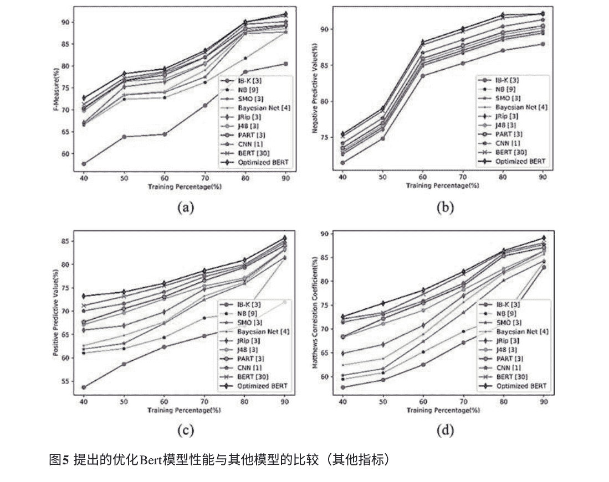

#### 图5 提出的优化Bert模型性能与其他模型的比较（其他指标）

#### 表1 TWCS错误性能

| 方法 | TP = 40 | TP = 50 | TP = 60 | TP = 70 | TP = 80 | TP = 90 |
|------|---------|---------|---------|---------|---------|---------|
| IB_K [13] | 3.38 × 10¹ | 3.12 × 10¹ | 2.98 × 10¹ | 2.52 × 10¹ | 2.11 × 10¹ | 1.89 × 10¹ |
| NB [14] | 2.16 × 10¹ | 2.06 × 10¹ | 1.99 × 10¹ | 1.95 × 10¹ | 1.76 × 10¹ | 1.18 × 10¹ |
| SMO [13] | 2.13 × 10¹ | 1.91 × 10¹ | 1.86 × 10¹ | 1.82 × 10¹ | 1.22 × 10¹ | 1.15 × 10¹ |
| 贝叶斯网络 [15] | 2.08 × 10¹ | 1.81 × 10¹ | 1.80 × 10¹ | 1.55 × 10¹ | 1.20 × 10¹ | 1.09 × 10¹ |
| jRip [13] | 2.06 × 10¹ | 1.67 × 10¹ | 1.56 × 10¹ | 1.46 × 10¹ | 1.16 × 10¹ | 1.08 × 10¹ |
| j48 [13] | 1.63 × 10¹ | 1.48 × 10¹ | 1.39 × 10¹ | 1.36 × 10¹ | 1.14 × 10¹ | 9.92 |
| PART [13] | 1.62 × 10¹ | 1.42 × 10¹ | 1.25 × 10¹ | 1.23 × 10¹ | 1.0 × 10¹ | 9.87 |
| CNN [16] | 1.56 × 10¹ | 1.39 × 10¹ | 1.22 × 10¹ | 1.21 × 10¹ | 9.77 × 10¹ | 9.01 |
| BERT [9] | 1.43 × 10¹ | 1.34 × 10¹ | 1.19 × 10¹ | 1.07 × 10¹ | 9.63 × 10¹ | 8.07 |
| 优化BERT | 1.26 × 10¹ | 1.21 × 10¹ | 1.09 × 10¹ | 1.04 × 10¹ | 9.18 × 10¹ | 7.68 |

## 参考文献

-   1. Lagrari, F., & Elkettani, Y. (2021). 情感分析的传统和深度学习方法：一项调查。科学、技术和工程系统进展杂志, 6(4), 1–7。
2. Liu, B. (2012). 情感分析和意见挖掘。 人类语言技术综合讲座, 5(1), 1–167。 https://doi.org/10.2200/S00416ED1V01Y201204HLT0163。
3. Habimana, O., Li, Y., Li, R., Gu, X., & Yu, G. (2020). 使用深度学习方法的情感分析概述。 中国科学信息科学, 63(1), 1–36。
4. Lagrari, F., & Elkettani, Y. (2020). 定制的BERT与卷积模型：一种新的启发式启用编码器用于Twitter情感分析。
5. Rachiraju, S. C., & Revanth, M. (2020). 使用先进的机器学习模型进行特征提取和分类电影评论。 在2020年第四届智能计算与控制系统国际会议(ICICCS) (pp. 814–817)。
6. Kalchbrenner, N., Grefenstette, E., & Blunsom, P. (2014). 用于建模句子的卷积神经网络。 在计算语言学协会第52届年会论文集(第1卷：长论文, pp. 655–665), 马里兰州巴尔的摩。 https://doi.org/10.3115/v1/P14-1062
7. Turney, P. D. (2001). 赞成还是反对？ 应用于无监督分类的语义倾向性。 在计算语言学协会第40届年会论文集—ACL’02 (第417页), 宾夕法尼亚州费城。 https://doi.org/10.3115/1073083.1073153
8. Pang, B., Lee, L., & Vaithyanathan, S. (2002). 赞成？ 使用机器学习技术进行情感分类。 在ACL-02自然语言处理实证方法会议论文集—EMNLP’02 (第10卷, 第79-86页)。 https://doi.org/10.3115/1118693.1118704
9. Devlin, J., Chang, M.-W., Lee, K., & Toutanova, K. (2018). Bert: 深度双向转换器的预训练语言理解。 ArXiv预印本 ArXiv:1810.04805。
10. Boothalingam, R. (2018). 使用狮子算法进行优化：从狮子的社会行为中获得的生物启示。 进化智能, 11(1–2), 31–52。
11. Lagrari, F., & Elkettani, Y. (2020). 使用卷积模型的定制BERT：一种新的启发式编码器，用于Twitter情感分析。国际高级计算机科学与应用杂志, 11(10), 9。
12. Axelbrooke, S. Twitter上的客户支持 。 kaggle.com/datasets/thoughtvector/customer-twitter上的支持。
13. Iqbal, F., Hashmi, J. M., Fung, B. C. M., Batool, R., Khattak, A. M., Aleem, S., & Patric. (2019). 一种基于遗传算法的特征约简的情感分析混合框架。 IEEE Access, 7。
14. Sailunaz, K., & Alhajj, R. (2019). 从Twitter文本中进行情感和情绪分析。 计算科学杂志, 36。
15. Ruz, G. A., Henríquez, P. A., & Mascareño, A. (2020). 通过贝叶斯网络分类器对Twitter数据进行情感分析。未来一代计算机系统, 106, 92-104。
16. Jianqiang, Z., Xiaolin, G., & Xuejun, Z. (2018). 用于Twitter情感分析的深度卷积神经网络。 IEEE Access, 6。

# 使用天气属性、土壤特性和作物价格的作物推荐系统模型

Sudarshan Reddy Palle和Shital A. Raut

摘要 农业是印度一项受人尊敬和占主导地位的职业。大约60%的人口从事这个行业，为国家的18% GDP做出贡献。天气和土壤条件是选择种植作物时需要考虑的关键因素。即使成功种植了一种作物，它也应该为农民提供有利可图的回报。传统上，农民选择要收获的作物是基于过去的经验和一些聪明人的建议。但是，由于人类大脑更擅长分析而不是记忆，所以有可能预测会出错，假设了不正确的过去经验。有许多文章和研究试图基于天气或土壤特性来推荐作物。但是，如果同时考虑这两个因素以及作物价格，将对农民更有用。因此，使用天气属性、获取土壤信息并分析利润的适当系统可以帮助农民做出正确的种植决策。使用这个模型，我们提出了一个可以向农民推荐高利润作物的系统。为了预测温度和降雨等天气属性，我们可以使用一个地区的过去数据应用于ARIMA模型。可以使用逻辑回归根据天气和土壤条件对数据进行分类。为了预测可以达到的利润，我们可以使用过去几年的投资和回报数据应用于ARIMA模型。

-   数据挖掘
-   作物推荐
-   天气属性预测
-   利润预测
-   自回归积分移动平均（ARIMA）
-   逻辑回归

## 1 引言

数据挖掘是指从数据中提取有用信息和模式的过程。随着数据存储和机器学习领域的进步，数据挖掘因从这些信息中提取的知识可以用于改善业务而受到巨大关注。数据挖掘[1]广泛应用于医疗、股票市场分析、银行、金融、零售、农业等许多领域，以提取知识从而做出更好的商业决策。农业是印度一项受人尊敬且古老的职业。农业的关键属性是天气和土壤特性。可以通过预测与之相关的投资和回报值来计算特定作物的预期利润。但是传统的作物选择假设的方式可能会出错，因为假设是基于过去的经验，而人类大脑在存储过去数据方面不如机器。此外，农民还面临许多问题，例如有时候天气条件不利，有时候选择的肥料可能在化学成分上不成比例，因为误解了土壤特性，最后，回报可能不如预期。因此，考虑到所有这些因素，需要一个适当的机制或方法来向农民最佳推荐一组有利可图的作物。

有一些技术或方法可以根据农民对天气或土壤特性的输入来推荐一种有利可图的作物。但是一种包括天气属性预测的方法可能更有益处。因此，在本文中，我们尝试提供一种基于选择的位置来预测天气属性并根据其地区向农民推荐高利润作物的方法。农民需要输入所述土壤特性、他们选择的作物，并使用地图选择他们的位置。根据这些输入参数，模型试图输出最佳的有利可图作物，并对农民的选择和预期利润进行评论。根据这些建议和他的选择的评论，农民将决定要收获哪些作物。

## 2 文献调查

论文[2]试图根据土壤特性给出作物的推荐。考虑到作物花生、小米、稻谷、甘蔗、脉冲、蔬菜等，这些特性包括土壤深度、质地、pH值、颜色、渗透性、排水性、持水性和侵蚀性。该模型是通过从马杜赖土壤测试实验室和一些常规在线作物数据来源收集的数据进行训练的。“集成”技术使用了CHAID、随机树、KNN和朴素贝叶斯算法等模型来对数据进行分类。一旦训练完成，投票机制被用来从所有模型中选择最佳准确性模型并推荐作物。

该论文[3]试图根据土壤和天气特性推荐作物。考虑的属性包括N、P、K、pH、降雨量、温度和湿度。训练数据集来自Kaggle网站。农民需要手动输入所有这些输入值，并根据这些值，训练模型将推荐最佳作物。决策树、朴素贝叶斯、支持向量机、逻辑回归、随机树和XGboost等模型被应用于训练数据集。在应用所有模型中，XGBoost的准确率得分最高，为99.31%。本文还介绍了来自不同论文的相关工作，并给出了准确度的比较研究。

该论文[4]提出了一个精确农业模型，用于小规模农民对变异性的一定程度控制。作者详细解释了精确农业及其在国外的实践。该方法在喀拉拉邦的小规模农场上进行，平均土地持有量相对较少，因此可以轻松扩展到大规模农场。传感器在村级水平上被用于获取动态属性，如天气条件、土壤条件和田地监测。短信和电子邮件通信被用于在规定的时间间隔内向农民发送通知，如飓风警报、虫害攻击等。

该论文[5]提出了一种基于过去历史数据的作物产量预测系统，该系统具有降雨量、温度和土壤条件等属性。收集到的数据集被应用于随机森林算法，准确性与作物产量利润成正比。他们还应用了各种方法，如密度图、箱线图，来分析和理解数据属性的行为。

该论文[6]描述了作物选择对产量的重要性，并提出了相应的模型。他们讨论了各种机器学习算法及其在模型的每个层次上的关系。他们使用作物产量时间、生产成本和产量率的历史信息，这些信息受到天气、土壤类型、水密度等参数的影响，并预测最佳产量作物并提出了相应的建议。

上述文章中的每一篇都使用了一个或多个天气和土壤属性。论文[2]和[4]分别使用了土壤和天气属性。论文[3]和[5]都使用了这两个属性。在论文[6]中，成本参数与产量时间和影响产量率的因素相结合。迄今为止，还没有一个模型能够考虑到农业中所有影响因素的单一工作，这可能更有益。因此，结合天气、土壤条件甚至作物价格的方法将更具实时可用性。此外，我们不应该每次都提供一个单一的建议，因为农民可能并不总能收获建议的作物。因此，提供两种或更多作物以及所需资金的详细信息将非常有益。此外，并不总是有固定数量的有利可图的作物。农民可能对某些特定作物感兴趣。因此，在选择作物时，提供一些关于他的偏好的评论或信息也将是有益的。我们尝试为这样一个现实世界的应用提供一个模型，这可能是上述工作的进展或扩展在本文中提到。

## 3 方法论

拟议系统的块图
该拟议系统试图使用可用和假设的数据创建一种作物推荐方法学。 它试图基于天气属性、作物标签的分类和根据利润重新安排作物来推荐作物。
整个方法可以分为六个组件，如图1所示。

- 1. 数据集的收集和创建。
- 2. 数据清洗和预处理。
- 3. 天气属性生成模型的创建。
- 4. 分类模型的创建。
- 5. 根据利润重新安排作物。
- 6. 用户偏好的评论。

### 3.1 数据集的收集和创建

模型需要以下数据集：

- 用于分类模型的训练数据集
- 按州划分的天气数据集
- 作物价格数据集

#### 3.1.1 训练数据集

训练数据集来自Kaggle网站[7]。 它包含N、P、K、pH、降雨量、湿度和温度作为输入参数，作物名称作为输出。

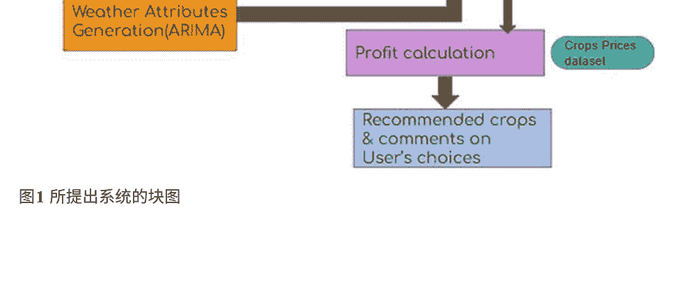

图1 所提出系统的块图

标签。 数据集包括二十二种作物，如水稻、玉米、鸽豆、葡萄、橙子等，针对不同的输入参数值。

#### 3.1.2 按州划分的天气数据集

按州划分的天气数据集[8]用于天气属性预测。 它包括每个州的每个区的过去二十年的温度和降雨值。 我们使用meteomatics网站按年份为每个州和区生成了这样的模式化数据。每个州将有一个数据集。

#### 3.1.3 作物价格数据集

作物价格数据集包括区域名称、作物名称、投资和回报值，针对过去二十年的每个作物。 一些值是根据过去的数据可用的，其余的值是根据模式生成的，以支持模型。

#### 3.1.4 输入的用户界面

我们有Google地图API [9]用于地图实现。 农民需要选择土壤类型并输入土壤属性，如氮（N）、磷（P）和钾（K），这些是决定土壤对作物收获的关键属性。 使用地图上的指针需要选择他的位置，以便提取区域名称和州名称，这些在生成天气属性和作物财务方面是必需的，如图2所示。

Address: 9MF5+JHF, baraon to deoria raod, Faridpur, Uttar Pradesh 274205, India
District: Deoria    N: 78    P: 85    K: 98
Choose a soil type: Desert    Preference1: pigeonpeas    Preference2: blackgram
Map Satellite
[地图显示南亚地区，包括印度、巴基斯坦、孟加拉国、中国部分地区等，印度上方有一个红色图钉标记。]
Confirm

图2 用户界面页面

这种预处理活动将有助于实时模型的更快响应和高性能。

### 3.3 天气属性生成模型创建

正如我们所见，天气条件对农业有很大影响。 因此，了解哪些因素对农作物影响最大，并在推荐作物时使用它们将非常有用。在这个模型中，我们考虑了温度和降雨属性，并根据ARIMA模型预测了未来的值。 需要选择基于用户所选的州级天气数据集的动态选择天气属性生成的数据集。

ARIMA [10] 代表自回归积分移动平均法。 它是一种用于分析和预测时间序列数据的统计模型。 它由三个组成部分AR、I和MA构成。AR代表自回归，是一种使用观察值和一些滞后观察值之间的依赖关系的模型。 I代表积分，它使用原始观察值的差分使时间序列平稳。 MA代表移动平均，它使用观察值和应用于滞后观察值的移动平均模型的残差之间的依赖关系。

ARIMA库函数由Python的“statsmodels.tsa.arima.model”包提供。

ARIMA的句法用法是

```
1.  arimamodel = ARIMA(dataset, order = (p, d, q))
2.  model = arimamodel.fit()
3.  output = model.forecast()
```

其中，p表示AR的值，d表示I的值，q表示MA的值。在第1行，对于ARIMA，我们需要提供数据集（仅包含考虑的属性，如温度或降雨量值的数据集），以便预测值以及p，d，q值。

第2行返回一个对拟合数据的引用对象。
在第3行，我们正在预测即将到来的值。
应该通过手动检查来确定p，d，q的值，并且应该基于最小均方根误差来考虑这些值。

#### 3.3.1 识别 I术语

在这里，使用的数据集是一个特定地区的降雨或温度的历史数据。因此，为了预测未来的值，我们需要清楚地了解过去的数据，并对其进行差分以使其稳定，因为回归方法适用于稳定或几乎稳定的数据。因此，我们需要为每个数据集确定差分参数，并且应该注意，这成为方程中的d项。

#### 3.3.2 识别AR项

为了确定要包含的AR项的数量，我们需要检查偏自相关（PACF）图。偏自相关被认为是系列和其滞后之间的关系，不包括中间滞后的贡献。因此，它表示滞后和系列之间的最纯粹的关系。

数学上，PACF可以写成

Y_t = α_0 + α_1.Y_{t-1} + α_2.Y_{t-2} + α_p.T_{t-p}

需要考虑的项数是从PACF图中获取的，我们通过执行一阶差分并观察已经越过显著性水平的滞后项，并将其作为方程中的p值。

#### 3.3.3 识别MA项

与AR类似，在MA中，Y_t取决于滞后的预测误差。数学上可以写成

Y_t = ε_t + φ_1.ε_{t-1} + φ_2.ε_{t-2} + … + φ_q.ε_{t-q}

#### 3.3.4 观察

在与不同地区数据集和不同值的观察中，使用不同的 p值，q,d.观察到在 p = 2，d =1,和 q =1时，模型在温度和降雨方面的工作效果良好，具有最小的均方根误差。
以下是使用ARIMA模型进行温度预测的测试观察结果。

从图3可以看出，蓝线代表实际值，红线代表预测值。X轴表示观测次数，Y轴表示观测值。这些值是通过对温度数据集进行测试操作获得的。由于每个值预测都有20个记录，我们使用13个值作为训练数据，并使用预测方法预测接下来的7个值。在这里，“预测”是ARIMA模型预测的值，“期望”是数据集中的实际值。

上面是一个区域温度值预测的示例。我们可以看到，RMSE值约为。通常情况下，对于温度，2度的差异可以被接受为一个好的预测。随着均方根误差的降低，我们可以说生成的值对于温度和降雨更加精确和准确。为了实现更低的均方根误差，我们需要手动尝试不同组合的p、d、q值。

通过执行类似的训练和预测，也可以预测预期降雨量，其中需要将过去几年的降雨列输入到具有适当的ARIMA p，d，q值的模型中。通过根据属性值的模式更改每个参数的 p, q, d值，可以对其他天气属性进行相同的操作。

### 3.4 分类模型创建

有许多可用的模型，如上述观察到的论文，它们试图根据用户的输入给出一个最佳输出标签。但是，每次仅推荐一个输出并不是一个好主意，因为可能有多个作物对于给定的输入具有相同的最优性。此外，农民可能无法一直负担得起推荐的作物收获，或者可能不习惯种植推荐的作物。因此，对于任何给定的输入，给出三个或更多作物的推荐，以及投资、回报和利润等详细信息可能更好。这为用户提供了根据这些推荐选择要收获的机会。

```
predicted=24.883, expected=25.700000
predicted=24.399, expected=25.000000
predicted=24.602, expected=22.000000
predicted=25.100, expected=24.000000
predicted=25.583, expected=23.800000
predicted=24.074, expected=21.500000
predicted=23.206, expected=27.300000
Test RMSE: 2.254
```

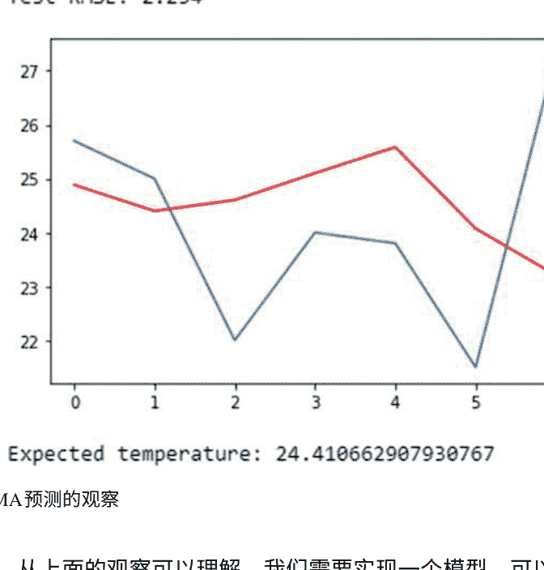

Expected temperature: 24.410662907930767

图3 ARIMA预测的观察

因此，从上面的观察可以理解，我们需要实现一个模型，可以给出给定输入的每个作物标签的相似度或关系。从这些相似度值中，选择前三个或更多的标签，并识别与它们相关的财务。对于这个操作，我们可以使用逻辑回归和一对多多类模型。这个模型将每个标签视为独立的标签，与所有其他标签相比，找到任何给定输入的该标签的概率。通过这种方式，我们可以确定任何给定输入馈送到训练数据集的模型的每个标签的概率。

#### 3.4.1 提出的模型

根据上述要求，我们需要为每个标签创建多个二元分类器，并找到输入与每个标签的归属关系。在训练数据集中，我们有二十二个作物作为最终标签。因此，我们需要每次创建二十二个二元分类模型，将正类视为选定的标签，将负类视为其他标签。

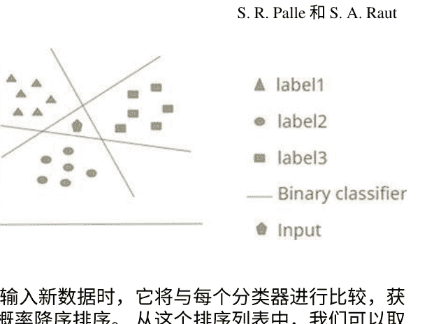

图4 多元逻辑回归

作为所有剩余的标签。每当输入新数据时，它将与每个分类器进行比较，获得每个标签的概率，然后按概率降序排序。从这个排序列表中，我们可以取出所需数量的建议输出。

如图4所示，每个多边形代表每个作物的标签，每条线代表一个二元分类器，将每个标签作为正类，其余标签作为负类。因此，每当接收到用户的新输入时，模型会内部创建与标签数量相同的模型，并找到每个作物标签的概率。

当最终标签与用户输入成比例且输出为二元时，可以应用普通线性回归模型。但在我们的需求中，输入是多输入的，输出是多标签的，甚至训练数据与标签不能成比例。因此，需要使用多分类的逻辑回归。

逻辑函数或S型函数是一种用于在机器学习中添加非线性属性并决定输出哪些属性的激活函数。正如我们所讨论的，我们的输入属性是非线性的，具有多方向和多值属性。因此，逻辑函数将更好地用作激活函数，逻辑回归将作为分类算法很好地满足我们需要多输出的要求。

逻辑函数或S型函数可以表示为

```
$$ p = \frac{1}{1 + e^{-(\beta_0 + \beta_1 x)}} $$
```

其中 p 是给定输入的正类概率。该函数有助于识别给定输入值的每个类别或标签的概率。

使用上述概率函数，我们需要为给定输入的每个标签定义一个成本函数。因此，使用逻辑回归的成本函数为

```
$$ -\log[L(\theta)] = -\sum y * \log[\sigma(\Theta^T . x^i)] + (1 - y) * \log(1 - \sigma(\Theta^T . x^i)) $$
```

其中 y 代表正类的概率，log [σ(Θ^T . x^i)] 代表特征 x 属于该特定类的概率。负号表示这是一个损失函数，我们需要将其最小化以获得最大利润。这种类型的回归需要针对每个标签进行，并存储每个类别的概率。

上述提出的模型可以通过一对多逻辑回归[11, 12]模型来实现，通过从“sklearn.linear_model”库导入逻辑回归库。

```
python
X_train, X_test, y_train, y_test = train_test_split(featureset, targetset, test_size = 0.3, random_state = 42)scaler = StandardScaler()X_std=scaler.fit_transform(X_train)Xtest_std=scaler.fit_transform(X_test)clf = LogisticRegression(random_state = 0,multi_class = 'ovr')model = clf.fit(X_std, y_train)y_pred=model.predict(Xtest_std)score = accuracy_score(y_test, y_pred) * 100print("逻辑回归模型的准确率：", score)

```

逻辑回归模型的准确率得分：94.24242424242424

上述描述描绘了使用一对多逻辑回归进行模型训练，并展示了训练后模型的准确率。我们将70%的数据用于训练，剩余30%用于测试模型。我们需要对数据进行标准化，以便进行训练。StandardScaler()是“sklearn”库中的一个函数，它提供了所需的功能。一旦我们训练好模型，就可以用该模型测试我们的数据，以检查其准确性。我们可以看到它对给定数据集产生了94%的准确率。

现在，当输入新数据时，将按以下方式计算。

#### 3.4.2 分类的伪代码

```

概率 = model.predict_probability(new_input)
dict = {}
for cropname in labels:
    dict.add(cropname, probabilities[cropname])
dict.sort() // 根据概率排序
for i = 0 to 3 in dict:

```

打印作物名称

在上述代码部分中，新输入是用户提供的输入。计算给定输入对每个作物标签的概率。我们需要按概率的降序排列并选择前几个标签。

```
[[102, 45, 33.418647854419504, 157.12060635486708, 7.1417935159818935, 7.7]]
```

- 棉花
- 橙子
- 葡萄

因此，对于给定的输入，棉花、橙子和葡萄是前三个推荐的作物。根据上述代码中的i值，我们甚至可以推荐超过三个作物。

### 3.5 根据利润重新排列作物

到目前为止，我们已经能够根据天气和土壤条件确定最适合种植的作物。现在，我们需要根据每个作物的利润重新排列推荐。因此，我们收集了过去二十年每个州每个作物的投资和回报数据集。数据集包括区域名称、作物名称、投资、回报和年份作为属性。

因此，当我们知道州名、区名和作物名时，我们可以得到预期的投资和回报，从而得到与任何作物相关的预期利润。同样，我们可以使用ARIMA模型根据过去几年的数据来预测投资和回报值，因为他也是一种时间序列预测模型。在这里，我们从用户界面上的地图中获取州名和区名作为输入值，这是我们应用程序的登录页面提供的。

因此，我们可以根据区名和州名计算作物的利润，并按利润降序排列作物。

#### 3.5.1 重新排列的伪代码

```
dict = {}
for crop in weather_crops:
    inv =[选择区域过去二十年的投资[crop]列表]
    ret =[选择区域过去二十年的回报[crop]列表]
    arimamodel = ARIMA(inv, order = (p, d, q))
    model = arimamodel.fit()
投资 = 模型.预测()
```

```
arimamodel = ARIMA(数据集, order = (p, d, q))
model = arimamodel.fit()

return = model.预测(ret)

利润 = return-投资
dict.add (作物,利润)

dict.sort() // 基于利润排序
```

芒果的预期投资为：148892.49457418337
芒果的预期回报为：314106.30546091526
咖啡的预期投资为：26753.23843392141
咖啡的预期回报为：101993.10670854531
豆类的预期投资为：4876.6976868420315
豆类的预期回报为：15438.539499269225
每个作物的利润为：
[('芒果', 165213.8108867319), ('咖啡', 75239.8682746239), ('豆类', 10,561.841812427194)]
从上述描述中，我们已经描述了每个作物从上一步骤中获得的投资、回报和利润，并按利润降序排列。这些输出值可以显示给用户作为最终输出屏幕。

### 3.6 用户偏好的评论

我们已经从用户那里获取了偏好选择作为输入，以便我们可以验证它们是否适合当前的天气和土壤条件。如果用户的选择在生成的前五个推荐中，我们将强烈推荐；如果在第六到第十个推荐中，我们将稍微推荐；如果在第十个推荐之后，我们将反对推荐。这些推荐是基于天气和土壤条件进行的，并且在所有情况下向用户显示相关的利润。

#### 3.6.1 偏好的伪代码

```
对于偏好中的作物：
    作物的预期投资为：investment[crop]
    作物的预期回报为：return[crop]
    如果作物在推荐作物的位置小于等于5
        适合种植
    如果作物位置在推荐作物中 >5 且 <=10
```

表1 机器学习模型的结果

| 函数 | 模型 | 度量 | 值 |
|------|------|------|-----|
| 天气属性生成 | ARIMA | RMSE | 2.254 |
| 分类 | 多元逻辑回归 | 百分比 | 94.24 |

- 稍微适合种植
- 其他情况下
- 不适合种植

葡萄的预期投资为： 5247.153693107961
葡萄的预期回报为： 155468.85085564727

芒果的预期投资为： 148892.49457418337
芒果的预期回报为： 314106.30546091526
葡萄适合种植
芒果稍微适合种植

## 4 结果与讨论

使用ARIMA模型，该模型具有较小的均方根误差，从而提高了天气和作物价格的预测效果。逻辑回归对于给定的训练数据集从表1中产生了94.24的输出。

有一些模型尝试根据天气输入或土壤输入来推荐作物，还有一些模型同时使用两者。但是我们需要一个将它们全部结合起来的模型，并提供一个能够给出高利润和可行性作物的模型。该模型试图通过结合所有现有模型来克服或改进这些局限性。我们尝试包括天气属性数据，使用分类算法推荐多个作物，并根据过去几年的趋势预测作物价格。本文试图通过使用高度逼真的模式化数据展示所有所需活动，为这样一个实时有用的项目提供一个模型。

## 5 结论

印度是一个以农业为基础的国家，农民和乡村是其支柱。帮助农民可以使印度经济更强大，并通过向其他国家出口食品和农产品来提升自豪感。

在不同国家之间出口食品和农产品。
在本文中，我们试图提出一种能够通过使用天气、作物价格和分析土壤条件等属性使农业盈利和降低风险的方法。以前的研究总是试图提出或推荐一种作物，这不是一种高效的推荐方式。他们使用分类算法的方式总是产生一个最佳输出。但是在我们的解决方案中，我们试图了解每种作物在任何给定输入下的性质和行为。然后，基于这些知识，我们尝试建议出前几个推荐作物，其中推荐数量可以由我们进行配置。此外，根据用户的偏好产生的评论将给出种植该作物的盈利性和可行性的想法。

## 6 未来工作

- 包括实时天气数据和农作物价格。
- 增加更多的天气和土壤条件属性，使预测更加准确。
- 创建一个网站或安卓应用程序，方便用户使用。

## 参考文献

1. Han, J., Kamber, M., & Pei, J. 数据挖掘概念与技术(第3版)。 Morgan Kaufmann出版社。
2. Pudumalar, S., Ramanujam, E., Harine Rajashree, R., Kavya, C., Kiruthika, T., & Nisha, J. (2017). 精准农业的作物推荐系统。 在2016年IEEE第八届国际高级计算机会议(ICoAC), 2017年6月19日。 https://ieeexplore.ieee.org/stamp/stamp.jsp?tp=&arnumber=7951740
3. Gosai, D., Raval, C., Nayak, R., Jayswal, H., & Patel, A. 使用机器学习的作物推荐系统。 国际科学研究计算机科学、工程和信息技术.ISSN: 2456-3307. https://ijsrcseit.com/paper/SEIT2173129.pdf
4. Babu, S. (2013). 一个针对小农户的精准农业软件模型。 在2013年10月15日的国际自由开源软件中心 (ICFOSS)。 https://ieeexplore.ieee.org/stamp/stamp.jsp?arnumber=6629944
5. Jeevan Nagendra Kumar, Y., Spandana, V., Vaishnavi, V. S., Neha, K., & Devi, V. G. R. R. (2020). 农业部门作物产量预测的监督机器学习方法。 在第五届国际通信与电子系统会议 (ICCES 2020), 2020年7月10日。 https://ieeexplore.ieee.org/stamp/stamp.jsp?tp=&arnumber=9137868
6. Kumar, R., Singh, M. P., Kumar, P., & Singh, J. P. (2015). 使用机器学习技术的作物选择方法来最大化作物产量率。 在2015年8月27日的国际智能技术和计算、通信、控制、能源和材料会议 (ICS7M)。 https://ieeexplore.ieee.org/stamp/stamp.jsp?tp=&arnumber=2225403&tag=1
7. Kaggle数据集。 https://www.kaggle.com/datasets/atharvaingle/crop-recommendation-dataset
8. Meteomatics天气API。 [https://www.meteomatics.com/en/weather-api/](https://www.meteomatics.com/en/weather-api/)
9. Google地图平台。 [https://developers.google.com/maps](https://developers.google.com/maps)
10. Prabhakaran, S. Python中的时间序列预测ARIMA模型，机器学习plus社区。 [https://www.machinelearningplus.com/time-series/arima-model-time-series-forecasting-python/](https://www.machinelearningplus.com/time-series/arima-model-time-series-forecasting-python/)
11. Brownlee, J. 一对多和一对多类别分类模型，机器学习掌握社区。 [https://machinelearningmastery.com/one-vs-rest-and-one-vs-one-for-multi-class-classification/](https://machinelearningmastery.com/one-vs-rest-and-one-vs-one-for-multi-class-classification/)
12. 一对多分类器，scikit-learn社区。 [https://scikit-learn.org/stable/modules/generated/sklearn.multiclass.OneVsRestClassifier.html](https://scikit-learn.org/stable/modules/generated/sklearn.multiclass.OneVsRestClassifier.html)

# 使用机器学习方法开发自闭症检测：一项比较研究

Anoop Kumar和Anupam Agrawal

摘要 自闭症是一种影响人类大脑的障碍，导致人们在与他人的互动和沟通中面临一些困难。对自闭症的早期检测和识别对研究人员来说是一项困难的任务。预处理技术包括离散小波变换(DWT)、标准差和均值。DWT有助于对EEG信号进行预处理，减少噪音并将信号分解为EEG子带。

在这项工作中，我们讨论了各种分类器，如SVM、朴素贝叶斯、KNN、随机森林、决策树、LSTM和ANN。这些分类器有助于根据提取的特征将EEG信号分类为自闭症和非自闭症。当在沙特阿拉伯的阿卜杜勒-阿齐兹大学(KAU)获得的实际数据集上进行评估时，这些技术产生了高达99.9%的鼓舞人心的结果。该数据集包含17个受试者，其中有4个正常受试者和13个自闭症受试者。我们正在使用SMOTE技术进行数据增强，这有助于提高性能。

关键词 自闭症谱系障碍 · 机器学习 · DWT · 分类器 · 脑电图

## 1 引言

自闭症是一种精神疾病。人们因此疾病而遭受巨大痛苦。他们在沟通和社交方面存在问题。研究人员正在尝试使用脑电图(EEG)信号创建计算机辅助模型[1]。推荐使用脑电图，因为它比其他测试更便宜，且对临床医生更易获取。由于脑电图信号复杂、非线性和非平稳，我们不能直接使用傅里叶处理技术。

因此，我们倾向于使用离散小波变换（DWT）方法，将脑电图信号分解为半解析的时间域，并检测信号变化。
我们的研究旨在发现使用DWT和一组分类器辅助自闭症诊断的新方法。SVM、朴素贝叶斯、LSTM、ANN、AdaBoost、随机森林、决策树和KNN [2]是一些例子。我们使用统计方法（均值和标准差）来发现脑电图信号的特性。然后，我们将分类器应用于检索到的脑电图子带的特征。我们使用可观察特征，通过ANN获得了最高达99.90%的准确率。本文的其余部分组织如下：第2节讨论了文献调研。第3节描述了本研究中使用的数据集。第4节描述了处理和特征提取的方法。

结果在第5节中进行了讨论。第6节提供了论文的结论以及其未来的范围信息。

## 2 文献调查

在过去的几年中，已经研究了许多计算机辅助诊断。Sheikhani等人[3]报道了一项研究，他们记录了一个包含21个电极和选择两个耳垂的数据集。有两个明显的群体；ASD分配给了10个男孩和1个女孩，而非ASD分配给了7个男孩和3个女孩。他们选择了一种方法（STFT）来提取特征，然后应用了KNN分类器，获得了84.2%的准确率。在他们的进一步工作[4]中，他们改进了技术，并使用了更大的数据集，达到了96.4%的准确率。在Ibrahim等人[1]提出的工作中，他们在不同的数据集上进行了研究，并使用了不同的EEG通道和电极的不同放置。他们的工作包括使用熵和KNN分类器对第6级的DWT进行处理。使用KAU数据，该分类器实现了94.6%的准确率。
在Alhaddad等人的一项研究中[5]，他们收集了一个由12个受试者组成的数据集，其中8个（5个男性，3个女性）有自闭症症状，4个（全部为男性）没有自闭症症状。该数据集有16个通道，以右耳垂为参考。之后，他们使用了一个频率范围为（0.1-60）Hz的带通滤波器来过滤数据。他们使用的特征提取技术是FFT和Fisher线性判别（FLD）。他们达到了90%的准确率。

### 3 实验数据

这些方法在KAU大学提供的EEG数据集上进行了测试。原始EEG数据包含了四名正常参与者（男性，年龄9-16岁）和13名自闭症参与者（男性和女性，年龄9-16岁）。数据是在放松状态下以256 Hz的采样率使用16通道EEG [6]记录的。EEG数据以.dat文件的形式呈现。

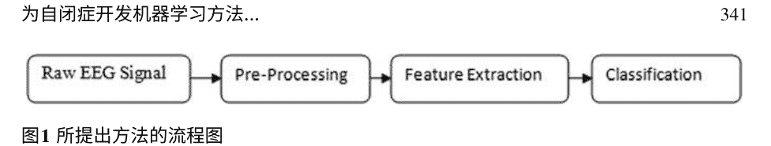

图1 所提出方法的流程图

图2 自闭症患者

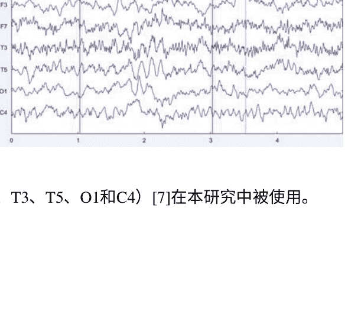

这些通道（F3、F7、FP1、T3、T5、O1和C4）[7]在本研究中被使用。

## 4 研究方法

如图1所示，使用以下三个基本过程创建诊断模型：

1.  EEG信号的预处理。
2.  特征提取。
3.  分类。

原始脑电图信号经过预处理以消除任何噪音。为了从EEG片段中提取特征，我们使用了离散小波变换（DWT）、均值和标准差。应用了许多分类器，包括KNN、线性SVM、高斯过程、决策树、随机森林、AdaBoost、高斯朴素贝叶斯、LSTM和ANN。

### 4.1 预处理

我们使用EEGLAB [8]对数据进行预处理，并将数据从256 Hz重新采样为128 Hz。重新采样后，数据通过带宽为0.5-60 Hz的FIR滤波器进行处理。数据使用平均参考技术进行重新参考；在此之后，我们将文件合并为单个EDF文件。

图2和图3代表自闭症和非自闭症受试者的通道。

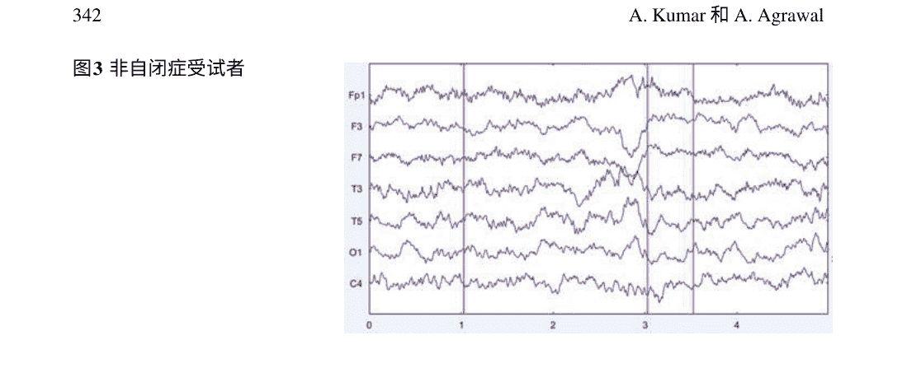

### 4.2 特征提取

小波技术在时频分解的信号处理中被广泛使用。 DWT能够通过使用Daubechies 4小波在多尺度时频域中以近似和详细系数的形式表示信号来对脑电图信号进行微小的改变[10][11]。 在本研究中，我们使用了第6级分解，该级别在脑电图分析中被广泛应用，我们使用了这些[12] (D1、D2、D3、D4、D5、D6和A6)系数来提取EEG子频带中的特征[13]。 在这里，我们使用了DWT、均值和标准差技术来从EEG片段中提取特征。

### 4.3 SMOTE

SMOTE也被称为合成少数类过采样技术[14]。 通过随机增加少数类来平衡类别分布非常有帮助。 这种技术被广泛用于解决不平衡问题的过采样方法。 在这项研究中，我们发现SMOTE之前的数据形状为(176,898)，应用SMOTE后，形状变为(268,498)，这在某种程度上有助于提高准确性。

### 4.4 分类器

KNN是机器学习中最基本但至关重要的分类算法之一。 人脸识别和文本挖掘只是它在监督学习领域中的一些应用。 它也被称为惰性学习算法。 它用于分类目的。 k值表示最近邻[15]，我们将选择k等于5进行所有测试。

支持向量机（SVM）是一种有监督的机器学习算法[16]。这种方法在数据分析中非常有名，也用于解决分类和回归问题。

高斯过程被称为随机过程（包含大部分按时间或空间索引的随机变量），使得每个有限的随机变量集合都包含服从正态分布的多元变量[17]，即每个有限分布组合都应服从正态分布。

决策树以树状结构而闻名，它表示一种树状模型，可以表示决策及其可能的结果[18]，其中包括事件结果、成本较低的资源，并且对效用有帮助。
它是一种最重要的算法，可用于条件和控制语句。

随机森林是一种著名的机器学习集成技术，通常用于分类和回归问题[18]。所有操作都是通过在训练时构建大量决策树并使用平均值来预测个体类别的方式进行的。

AdaBoost通常被称为自适应增强方法，它是一种机器学习算法。这些技术主要用于通过将它们组合在一起来提高其他算法的性能。通过这样做，它提高了算法的准确性和性能。因此，如果一个算法表现不佳，那么该算法将与加权和组合在一起，从而产生最终的新的和更好的输出结果[19]。这个增强器被称为自适应，因为被错误分类的性能较差的学习器会通过先前错误分类的分类器进行调整。在某些情况下，它可能对过拟合问题更敏感，而不是其他机器学习算法。

因此，我们可以说，只要每个算法的准确性在最后稍微好一点，整体性能就会更好。

高斯朴素贝叶斯如果我们将朴素贝叶斯扩展到实值属性或高斯分布，那么它将被称为朴素贝叶斯[17]。我们可以使用正态分布来计算数据的分布，因为我们只需要计算数据的均值和标准差。

神经网络是多层感知器，采用前向和反向传播方法工作。数据通过网络的多个层进行处理[20]。它还具有密集层，通过连接所有单独的层来帮助形成连接的神经网络。在处理神经网络时，我们应用激活函数和偏置。

LSTM网络是一种递归神经网络[21]，可以学习序列预测问题中的顺序依赖性。这是复杂问题领域（如机器翻译、语音识别等）中的必要特性。

表1 混淆矩阵

| 实际类别 \ 预测类别 | ASD | 非ASD |
| :--- | :--- | :--- |
| **ASD** | 真正例 | 假阴性 |
| **非ASD** | 假阳性 | 真阴性 |

分类器的性能通常使用表1中给出的混淆矩阵来衡量。

除此之外，我们还遵循一个公式（在公式1中给出），用于计算准确度。

准确率 (%) = (TP + TN) / (TP + TN + FP + FN) (1)

其中
- TP 真正例
- TN 真负例
- FP 假正例
- FN 假负例

这是如何计算分类器准确率的。

## 5 结果与分析

在这项工作中，我们从KAU数据中获取了自闭症和正常的脑电图信号。一般来说，如果频谱的频率较低，则功率密度较高，否则功率密度较低。因此，如果存在高频率，它将被视为脑电图中的噪声。

我们已经研究了许多方法，它们的结果在表3中给出，并且在第4节中给出了详细信息，介绍了本研究中使用的方法。所有这些方法都经过了使用KAU数据集的测试，以确保它们提供了公平的比较。图4显示了没有使用SMOTE的7个分类器的ROC曲线图，图5显示了使用SMOTE的情况。我们在图6和图7中绘制了LSTM和ANN的图表，显示了在测试期间准确率和迭代次数之间的比较。我们的方法使用ANN技术（使用SMOTE）实现了高达99.90%的准确率。

实验在不同的场景中进行。KNN、SVM、高斯过程、决策树、随机森林、AdaBoost、高斯朴素贝叶斯分类器、LSTM和ANN直接使用带有统计特征（均值和标准差）的DWT输出。

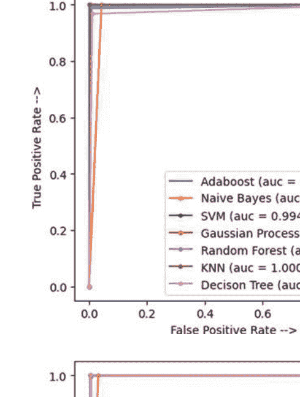
图4 没有SMOTE的ROC曲线

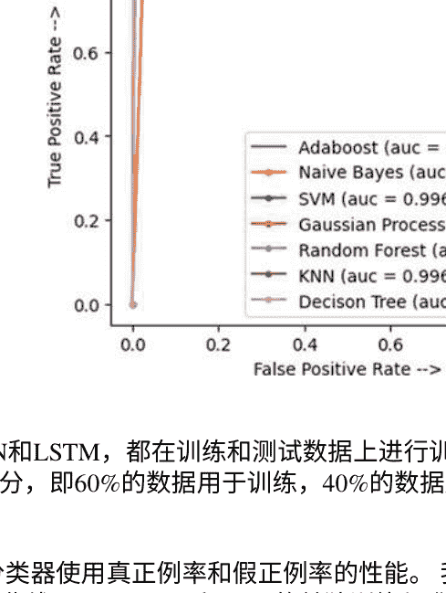
图5 使用SMOTE的ROC曲线

所有模型，包括ANN和LSTM，都在训练和测试数据上进行训练。数据集按（60和40）的比例划分，即60%的数据用于训练，40%的数据用于测试。

ROC曲线用于表示分类器使用真正例率和假正例率的性能。我们展示了七种不同分类器的ROC曲线，以及LSTM和ANN的单独训练与准确性曲线。

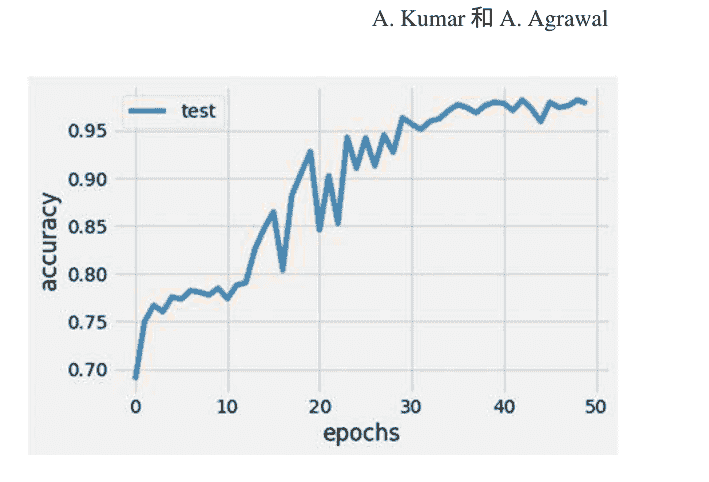
图6 LSTM的准确率与迭代次数的关系图

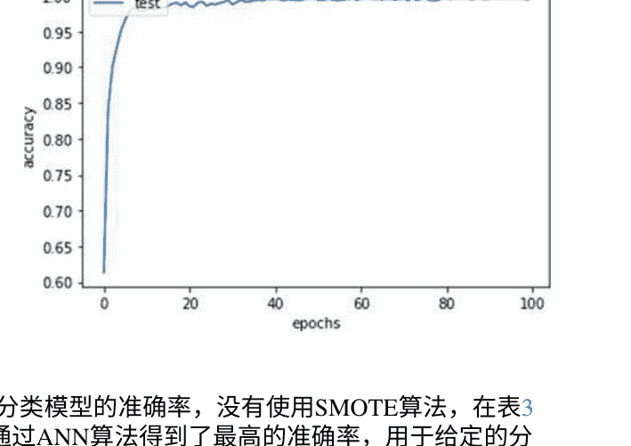
图7 ANN的准确率与迭代次数的关系图

在表2中，展示了各种分类模型的准确率，没有使用SMOTE算法，在表3中使用了SMOTE算法，通过ANN算法得到了最高的准确率，用于给定的分类问题。

在表4中，我们展示了先前工作的比较，并与他们的工作进行了比较，发现ANN算法优于其他所有方法，并通过应用SMOTE算法实现了99.90%的准确率。模型在产生结果之前会执行多次迭代。术语“迭代次数”告诉我们模型在训练数据集上进行了多少次遍历。几乎每个模型都会使用多个迭代次数进行训练。数据被分成批次，并在更新之前传递给模型。

## 6 结论和未来展望

本研究使用的方法帮助我们通过脑电图数据检测一个人是否患有自闭症。这些数据由KAU大学提供。我们使用了DWT、均值和标准差技术进行特征提取。

表2 没有SMOTE的结果

| 分类器 | 准确率 (%) |
| :--- | :--- |
| 支持向量机 | 99.42 |
| 高斯过程 | 99.85 |
| 决策树 | 98.26 |
| 随机森林 | 99.42 |
| AdaBoost | 99.13 |
| 朴素贝叶斯 | 96.67 |
| KNN | 99.85 |
| LSTM | 97.10 |
| 人工神经网络 | 99.85 |

表3 使用SMOTE的结果

| 分类器 | 准确率 (%) |
| :--- | :--- |
| 支持向量机 | 99.62 |
| 高斯过程 | 98.81 |
| 决策树 | 99.44 |
| 随机森林 | 99.53 |
| AdaBoost | 99.72 |
| 朴素贝叶斯 | 98.41 |
| KNN | 99.34 |
| LSTM | 98.60 |
| 人工神经网络 | 99.90 |

表4 对KAU数据进行的所有比较的总结

| 作者 | 特征提取 | 分类器 | 数据集 | 准确率 (%) (使用SMOTE) |
| :--- | :--- | :--- | :--- | :--- |
| Djemal等人 [20] | DWT | 人工神经网络 | KAU | 99.7 |
| Anas等人 [22] | FFT | RFLDA | KAU | 92 |
| Tawhid等人 [23] | STFT | CNN | KAU | 99.15 |
| Alhaddad等人 [7] | FFT | FLDA | KAU | 90 |
| 我们的工作 | DWT，均值，标准差 | SVM，高斯过程，决策树，随机森林，AdaBoost，朴素贝叶斯，KNN，LSTM，人工神经网络 | KAU | 99.62, 98.81, 99.44, 99.53, 99.72, 98.41, 99.34, 98.60, 99.90 |在脑电图数据上进行特征提取。由于使用了SMOTE和自适应技术，本研究的准确性得到了提高。在这个比较分析中使用了许多分类器，但是人工神经网络的准确率达到了99.90%。这是我们使用SMOTE技术所取得的最佳准确率。

致谢KAU脑机接口（BCI）小组提供了他们自己的自闭症数据集，我们非常感谢。

## 参考文献

1.  Ibrahim, S., Djemal, R., & Alsuwailem, A. (2018). 脑电图（EEG）信号处理用于癫痫和自闭症谱系障碍诊断。生物控制与生物医学工程，38（1），16-26。
2.  Acharya, U. R., Yanti, R., Swapna, G., Sree, V. S., Martis, R. J., & Suri, J. S. (2013). 使用独立成分分析和离散小波变换对不同脑电图持续时间的癫痫脑电图进行自动诊断。机械工程师学会会议，H部分，医学工程杂志。
3.  Sheikhani, A., Behnam, H., Mohammade, M. R., Noroozian, M., & Golabi, P. (2008). 使用短时傅里叶变换和相干值对自闭症障碍中的定量脑电图背景活动进行连接性分析。在图像和信号处理第一届国际会议（CI SP'08）（pp. 207-212）中的论文集。IEEE。
4.  Sheikhani, A., Behnam, H., Mohammadi, M. R., Noroozian, M., & Mohamamadi, M. (2012). 使用定量脑电图分析检测儿童自闭症障碍的异常医学系统杂志，36(2)，957-963。
5.  Alhaddad, M. J., Kamel, M. I., Malibary, H. M., Alsaggaf, E. A., Thabit, K., Dahlwi, F., 等 (2012). 通过Fisher线性判别分析FLDA通过脑电图诊断自闭症国际生物科学生物技术杂志，4，45-54。
6.  Sheikhani, A., Behnam, H., Mohammadi, M. R., Noroozian, M., & Mohamamadi, M. (2012). 使用定量脑电图分析检测儿童自闭症障碍的异常医学系统杂志，36(2)，957-963。
7.  Alhaddad, M. J., Kamel, M. I., Malibary, H. M., Alsaggaf, E. A., Thabit, K., Dahlwi, F., & Hadi, A. A. (2012). 通过Fisher线性判别分析FLDA通过脑电图诊断自闭症国际生物科学和生物技术杂志，4(2)，45-54。
8.  Delorme, A., & Makeig, S. (2004). EEGLAB 一个用于分析单次试验EEG动态的开源工具箱。神经科学方法杂志，134，9-21。
9.  Bosl, W. J., Tager-Flusberg, H., & Nelson, C. A. (2018). EEG分析用于早期检测自闭症谱系障碍的数据驱动方法。科学报告，8(1). https://doi.org/10.1038/s41598-018-24318-x
10. Alsuwailem, A., Djemal, R., & Ibrahim, S. (2018). 用于癫痫和自闭症谱系障碍诊断的脑电图（EEG）信号处理。生物控制与生物医学工程，38(1)，16-26。https://doi.org/10.1016/j.bbe.2017.08.006。
11. Faust, O., Acharya, U. R., Adeli, H., & Adeli, A. (2015). 基于小波的脑电图处理用于计算机辅助癫痫检测和癫痫诊断。发作，26(三月), 56-64。
12. Tawhid, M. N. A., Siuly, S., & Wang, H. (2020). 使用时频谱图从脑电图诊断自闭症谱系障碍。工程技术学会，认知科学和脑计算研究与应用的当前趋势。https://doi.org/10.1049/el.2020.2646
13. Ghosh-Dastidar, S., Adeli, H., & Dadmehr, N. (2007). 混合波段小波-混沌-神经网络方法用于癫痫和癫痫发作检测。IEEE Transactions on Biomedical Engineering, 54(9), 1545-1551。
14. Seo, J.-H., & Kim, Y.-H. (2018). 用于入侵检测的类不平衡数据集中优化SMOTE比率的机器学习方法。计算智能与神经科学，11, 文章编号9704672。 https://doi.org/10.1155/2018/9704672
15. Weinberger, K. Q., & Saul, L. K. (2019). 用于大边界最近邻分类的距离度量学习。机器学习研究杂志，10(二月)，207–244。
16. Burges, C. J. C. (1998). 用于模式识别的支持向量机教程。数据挖掘与知识发现，2, 121–167。
17. Jahromi, A. H., & Taheri, M. (2017). 基于局部独立特征的非参数高斯朴素贝叶斯混合分类器。在人工智能和信号处理会议(AISP) (pp. 209–212)中。 https://doi.org/10.1109/AISP.2017.8324083
18. Ray, S. (2019). 机器学习算法快速回顾。在机器学习、大数据、云计算和并行计算国际会议(COMITCon) 2019 (p. 3539)中。 https://doi.org/10.1109/COMITCon.2019.8862451
19. Wyner, A. J., Matthew, O., Justin, B., & David, M. (2017). 解释AdaBoost和随机森林的成功作为插值分类器。机器学习研究杂志，18(48)，1–33。
20. Djemal, R., AlSharabi, K., Ibrahim, S., & Alsuwailem, A. (2017). 基于脑电波、熵和人工神经网络的自闭症谱系障碍的计算机辅助诊断。BioMed Research International, 2017, 1–9. https://doi.org/10.1155/2017/9816591
21. Ali, N. A., Radzi, S. A., Jaafar, S., Shamsuddin, S., & Nor, N. K. (2021). 基于LSTM的自闭症谱系障碍脑电图分类。综合工程国际期刊，13(6)，321–329。
22. Anas, H., Mahmod, K., Mohammed, A., Hussein, M., Khalid, T., Foud, D., & Alsa ggaf, E. A. (2012). 基于正则化Fisher线性判别分析的脑电图自闭症诊断。国际图像、图形和信号处理杂志（IJIGSP），4，35–41。https://doi.org/10.5815/ijigsp.2012.03.06
23. Tawhid, Md. N. A., Siuly, S., Wang, H., Whittaker, F., Wang, K., & Zhang, Y. (2021). 基于声谱图图像的自动检测自闭症谱系障碍的智能技术。PLOS ONE, 16, e0253094. https://doi.org/10.1371/journal.pone.0253094

# 使用不同的CNN模型完全自动化的小麦病害检测系统

Neha Kumari和B. S. Saini

摘要 在印度，农业因人口增加和对食物的需求扩大而扮演着重要角色。在世界上，小麦是第三大收获和消耗的谷物。小麦作物产量的一个重要影响因素是疾病，这是由寄生虫、污染物和微生物引起的。因此，这就是导致大部分小麦作物变质的原因。多种小麦污染对产量有风险，因此及时检测这些疾病非常重要。通过专家的视觉检查来确定疾病，如果必要，可以进行有机评估。这是一种非常耗时和昂贵的过程。深度学习是解决这类问题的唯一方法，该领域还考虑应用卷积神经网络（CNN）和其他知名模型对小麦疾病进行早期识别。在当前工作中，我们考虑了四种不同的小麦图片，包括棕斑病、镰刀菌赤霉病、茎锈病和健康小麦。我们对收集到的数据集执行了不同的CNN模型。

我们使用的参数数量来训练这些模型是：损失函数 = “分类交叉熵”，激活函数 = “softmax”，优化器 = “adam”，批量大小 = 64，迭代次数 = 80。在将这些模型应用于数据集之后，我们发现ResNet模型提供了最佳的可计算结果。与MobileNet和DenseNet模型相比，所提出的方法使用ResNet50模型获得了最高的分类准确率，达到了98%。这表明深度学习在不同疾病的分类中表现出了非常好的性能。

我们在谷歌Colab的帮助下进行了这个实现。

关键词 深度学习 · 小麦病害 · 卷积神经网络（CNN） · 病原体

## 1 引言

小麦可能是国际上最重要的作物之一，年产谷物总量达到8亿吨。对小麦的需求正在全球范围内增加。在增加对这种作物的需求之后，它开始在全世界范围内种植。现在，它是世界上种植最多的作物之二。传染病和虫害被认为是降低谷物产量潜力和质量的主要因素。传染病是限制小麦产量的主要因素。叶锈病、镰刀菌赤霉病和斑点病是影响小麦产量的常见病害。

图1、2和3显示了不同的小麦感染情况。


图1 一份叶锈样本

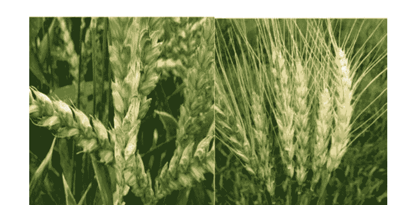

图2 一份赤霉病样本

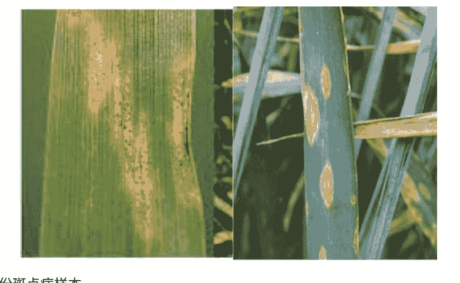

图3 一份斑点病样本

### 1.1 叶锈

小麦叶锈也被称为褐锈，这种病害是由真菌感染引起的，影响小麦、大麦和谷物。叶锈是小麦中主要的锈病感染类型之一。当锈病开始覆盖小麦植株的上部叶片之前，叶锈会造成最大的损害。早期感染可能导致植株虚弱，并且可能导致高达20%的产量损失，从而影响作物产量。

引起小麦叶锈的病原菌是锈菌属（Puccinia）。它是大多数小麦产区最常见的小麦锈病。它是印度一种常见的季节性病害。

### 1.2 福斯病害

福斯头病害（FHB）是小麦、玉米等谷物产量中非常具有传染性的疾病之一。福斯头病害由福斯镰刀菌（Fusarium graminearum）引起。福斯镰刀菌产生两种独特的孢子类型：一种由风传播，另一种由雨水或灌溉水洒落传播。它也被称为墓碑病或疮痂病。这种疾病在小麦、大麦和玉米中最为常见。福斯头病害主要影响谷粒的发育，从而降低产量。霉菌毒素是一种真菌感染，影响收获的谷物，并引起许多负面影响，如降低牲畜饲料的质量，降低用于烘焙和磨粉的小麦质量，以及生物燃料乙醇产量的大幅减少。

基本的孢子产生受到影响，导致成熟期感染，并产生引起幼苗枯萎的霉菌毒素。

### 1.3 棕斑

棕斑是由小麦病菌假囊孢子引起的小麦病害。棕斑病的副作用在四月初最为常见。在叶片上，病症最初表现为小的棕色斑点。寄生虫在小麦秸秆上存活和复制。在生长季节之前，称为子囊孢子的孢子从假囊孢子（形成在小麦秸秆上的小而暗的果实）中释放出来，并通过风或降水传播。它们是分蘖和早期拔节期间下部更老叶子的主要病源。感染后，病菌通过一种叫做分生孢子的不同类型的孢子在棕斑病病变中传播到田间或相邻田地。

这些病害对小麦作物的生产是巨大的挑战，因此检测小麦病害是实现丰收和提高产量和质量的重要阶段。如何对小麦的不同病害进行分类是一个大问题，因为大部分小麦病害的特性都相同。深度学习是解决这类分类问题的最佳方法。

CNN是解决任何预测问题的最佳策略，包括输入图片数据，并且需要极少的预处理。CNN可以处理大规模的图片。在这种特定情况下，已经进行了一些研究工作，以提高CNN在这类分类任务上的性能，因为可以识别出不同的疾病。改进“CNN”的方法有很多，包括激活函数、损失函数、数据增强和优化算法。

江等人[1]提出了一种基于改进的卷积神经网络（CNN）的实时苹果叶病害识别深度学习策略。他们提出了一种基于深度CNN的苹果叶病害检测算法。该模型通过使用GoogLeNet Inception结构和彩虹连接来识别五种常见的苹果叶病害。根据结果，INAR-SSD模型实现了78.80%的识别准确率，定位速度为23.13 FPS。结果表明，创新的INAR-SSD模型是一种用于早期检测苹果叶病害的高性能展示策略，可以实时且更准确地检测这些疾病。

Hasan等人[2]提出了一种基于CNN的玉米病害分类模型。他们可以将CNN与双向长短期记忆模型相结合，以提高模型的效率和准确性。他们构建了一个包含29,065张玉米病害图片的数据集，其中80%的样本用于训练，达到了99.02%的准确率。因此，该模型在基于人工智能的病害识别系统中特别可靠，它可能有助于提高作物产量。

2017年，Pavithra和Palanisamy[3]提出了一种更精确、更高效的自动化方法来识别叶锈病。图像识别技术被用于改善图像质量和诊断疾病。图像获取、预处理、分割、检查和疾病识别都是交互的一部分。燕麦、玉米、大麦、小麦和稻谷是被测试的五种叶子品种。实验结果表明，使用多类支持向量机用于实现所提出的技术，提高了精度。最后，评估了该技术的性能，并与传统策略进行了比较，其精度达到了99.5%。

Shrestha等人[4]开发了一种预防和检测模型。该模型共提供了15个示例，其中12个是感染的植物叶片，3个是健康的叶片。在该模型中，应用了基于CNN的方法来检测植物疾病。测试的准确率为88.80%。通过应用一种更优的深度卷积模型，Goyal等人[5]在2021年提出了一种用于诊断和分类小麦感染的模型。这种新颖的深度学习模型被创建用于精确识别小麦疾病分为十个类别。

所提出的方法在测试精度方面具有良好的表现，达到了97.88%。与另外两种知名的深度学习模型VGG16和RESNET50相比，分别提高了7.01%和15.92%的精度。通过一个良好的测试准确度达到97.88%，所提出的策略用于对十种小麦感染进行分类。与其他深度学习技术相比，这显示出了显著的改进。与VGG16和RESNET50相比，准确度分别提高了7.01%和15.92%。

Kibriya等人[6]利用卷积神经网络开发了一个模型来诊断番茄叶病[7-12]。他们在本文中使用了两个基于卷积神经网络（CNN）的模型，GoogLeNet和VGG16，来对番茄叶病进行分类。利用深度学习方法，建议的工作旨在找到番茄叶病检测问题的最佳解决方案[12-16]。在拥有10,735张叶片图片的植物村数据集上，VGG16的准确率达到了98%，而GoogLeNet的准确率达到了99.23%。

鉴别小麦病害对于保护产量和农业系统非常重要[16-22]。为了进一步发展病害鉴别结果，已经进行了一些关于不同模型的研究。我们计划使用叶片图片来区分健康和不健康的小麦植株的小麦感染鉴别技术[22-28]。预训练模型帮助我们进行特征提取[28-32]。模型的执行是在Google协作者上完成的。ResNet、DenseNet和MobileNet是我们在本文中使用的不同CNN模型。我们的目标是设计一个系统，通过这个系统农民可以用数码相机检测小麦的早期感染阶段。

## 2 提出的工作

开发用于识别各种小麦疾病的CNN模型的整个过程。这个整个过程包含了许多步骤，从收集样本图像数据集到训练模型，提出的策略算法在图4中显示。

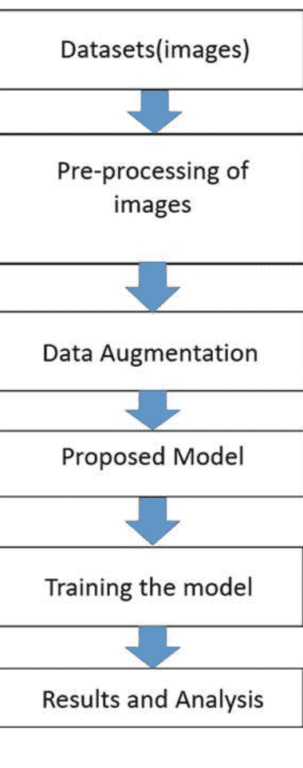

### 2.1 数据集

我们从Kaggle网站上在线获取了数据集，并且图片的信息来自多个来源。大部分数据来自于在Google图片上找到的公开照片。这个数据集的目标是让深度学习模型正确地对照片中的小麦进行分类，包括健康小麦、叶锈病、镰刀菌赤霉病和黄斑病。在下载数据集后，我们首先将CNNs模型应用于收集到的数据集，并观察到模型在训练和测试数据集后给出了非常糟糕的结果。

我们需要尽可能多的数据来提高深度学习模型的准确性和效率。为了从现有信息中创建额外的信息，这种策略被称为图像增强。图像增强是深度学习的工具，借助图像增强，我们可以通过改变不同的参数数量来创建大量的数据，如下所述：

### 2.2 图像预处理

预处理是在数据集上执行的第一步。下载的图像大小和分辨率不同。为了获得精确的大小和分辨率，预处理很重要。该数据集包含415张健康小麦的图像和1700张不健康小麦的图像，其中包含三种不同类型的小麦病害。数据集分为两个部分，一个是训练集，另一个是验证集。本研究考虑的训练和验证比例为75:25，即训练集中有75%的信息，验证集中有25%的信息，根据数据集的大小确定。

### 2.3 数据增强

数据增强是通过从当前数据集生成新数据来扩展数据集的过程。我们知道深度学习需要大量可训练的数据才能产生正确的结果。图像增强是一种新技术，可以更容易地扩大深度学习研究的数据集。本文中用于训练模型的数据增强是在模型训练过程中完成的，而不是单独进行的。扩展卷积神经网络的数据集可以减少过拟合。由于本研究的数据集不够广泛，我们进行了如下的数据增强：

图像数据生成器：ImageDataGenerator()是一种用于图像增强的函数类型，用于增加数据量。它具有不同的参数，例如，在特定点翻转输入图片，这将改变图片的强度值，以及对图像进行高度和宽度的移动。我们在数据增强过程中使用的参数如下所示：

-   旋转范围 = 30
-   缩放范围 = 0.15
-   宽度偏移范围 = 0.2
-   高度偏移范围 = 0.2
-   剪切范围 = 0.15
-   水平翻转 = True

### 2.4 提出的模型

(a) **ResNet:** ResNet被称为残差网络。ResNet是一种特殊的神经网络，由Kaiming He、Xiangyu Zhang、Shaoqing Ren和Jian Sun于2015年提出。ResNet使用跳跃连接模式，并通过一些快捷方式跳过卷积层，如图5所示。

#### 图5 ResNet模型的跳跃连接模式

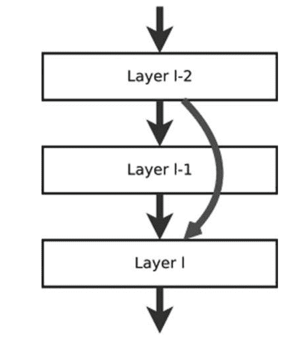

与VGGNet相比，ResNet训练模型所需的时间较短。我们在本文中使用了ResNet-50模型来训练数据集。ResNet50包含五十个卷积层。该模型能够训练一百万张图像，并将图像分类为数千个类别。ResNet模型的滤波器大小为3×3，并以224×224×3的格式接收输入图像。在CNN模型中，通常使用步幅和填充为1。这是通过一个滑动窗口来完成的，我们的模型将在每次滑动时进行训练的神经网络。

(b) **MobileNet:** MobileNet基于深度可分离卷积层。我们在本文中使用MobileNet和MobileNetV2。每个深度可分离卷积层由深度卷积和逐点卷积组成。如果将深度卷积和逐点卷积视为不同的层，则MobileNet包含28层。基本的MobileNet有420万个参数，可以通过适当调整宽度乘数超参数进一步减少。输入图像的尺寸为224×224×3像素。

(c) **DenseNet:** DenseNet是一个包含深度学习网络的密集卷积网络，通过在层之间使用更少的连接来使其更高效地进行训练。DenseNet是一个卷积神经网络，其中每一层与模型的其他层相连；例如，初始层与模型的第二、第三和第四层相连，而后序层与第三、第四、第五等层相连。通过这个过程，在层之间实现最大的数据流动。

每一层都从前一层获取输入，并为下一层生成自己的特征图。

### 2.5 实验设置

为了在收集的数据集上训练模型，实验使用了Google Colab进行。Google Colab是一个用于Python编程的开源平台。在Google Colab中，我们可以自动从互联网下载所有库；不需要安装外部库。现在它被广泛用于进行机器学习、深度学习和计算机视觉研究。这些测试需要大量的计算能力，训练深度学习模型需要几天的时间。如果数据集足够大，深度学习可以产生更好的结果。因此，在较短的时间内训练模型需要图形处理单元（GPU）的支持。

使用他们的服务器，Google Colab支持GPU和TPU的兼容性。任何拥有Google账号的人都可以访问Colab进行实验。Keras是一个具有高级API的神经网络工具箱，用于设计和训练深度学习模型。因为它的程序是用Python编译的，所以比Tensorflow更加用户友好。Tensorflow是一个开源库，既有高级API又有低级API。

操作系统：Windows11 图形卡：4 GB 的 NVIDIA GEFORCE GTX，Intel(R) Core(TM) i7-10870H CPU @ 2.20 GHz 2.21 GHz，内存：16 GB RAM。

### 2.6 结果与讨论

本文研究了健康和患病小麦植株。在Google Colab 上进行了实验。该部分的结果与整个数据集的训练相关，包括所有原始和增强的图片。

使用深度卷积神经网络模型创建了一个模型，该模型用于应用各种迁移学习方法以达到高准确性。ResNet50的最高准确率为98%。结果列在表1中。

每个卷积神经网络模型使用批量大小为64进行了80个时期的训练。图6a-d显示了每个模型在时期数量上的准确率和损失。

如表2所示，在训练各种模型后，ResNet50比其他深度学习模型更加准确。与其他模型相比，ResNet50的混淆矩阵产生更好的结果。混淆矩阵描述了分类模型的性能。在该矩阵中，预期值和实际值有四种可能的组合。它非常有用计算召回率、精确度、特异度和准确度。真正例（TP）、真负例（TN）、假正例（FP）和假负例（FN）是混淆矩阵中使用的术语。TP和TN是网络预测的正确结果，而FP和FN是网络预测的错误结果。第一类错误是FP，第二类错误是FN。

**表1 提出模型的准确率**

| 模型 | 准确率 (%) |
| :--- | :--- |
| **ResNet50** | **98** |
| DenseNet121 | 90 |
| MobileNet | 91 |
| MobileNetV2 | 89 |

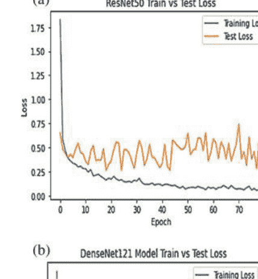

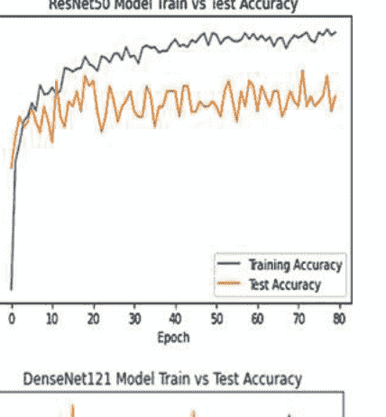

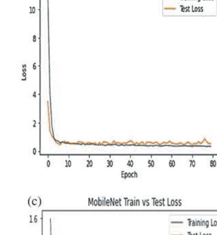

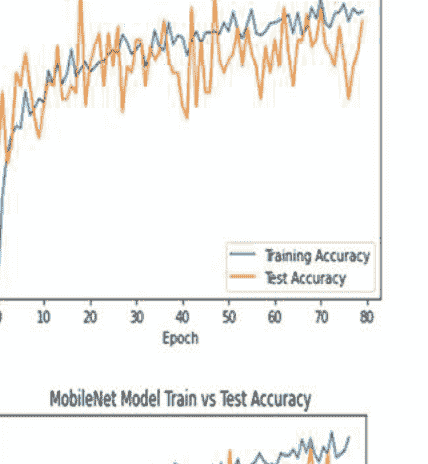

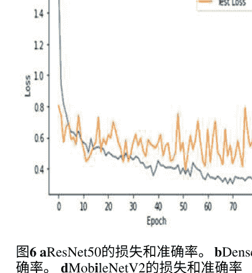

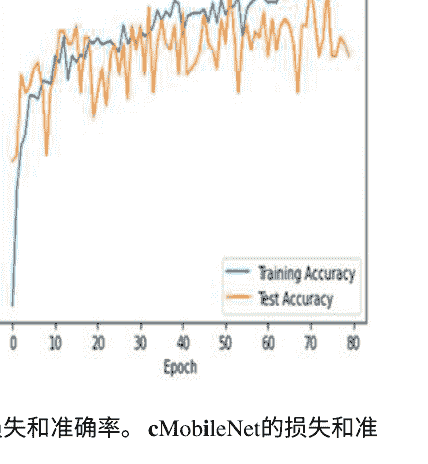

图6 a ResNet50的损失和准确率。 b DenseNet121的损失和准确率。 c MobileNet的损失和准确率。 d MobileNetV2的损失和准确率

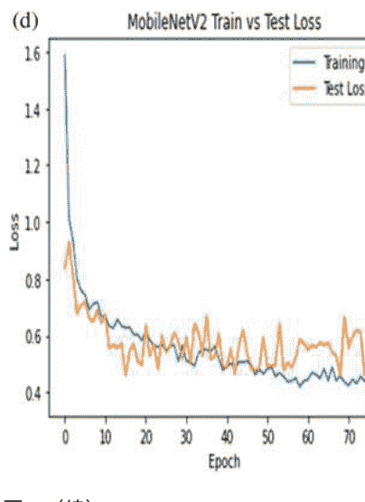

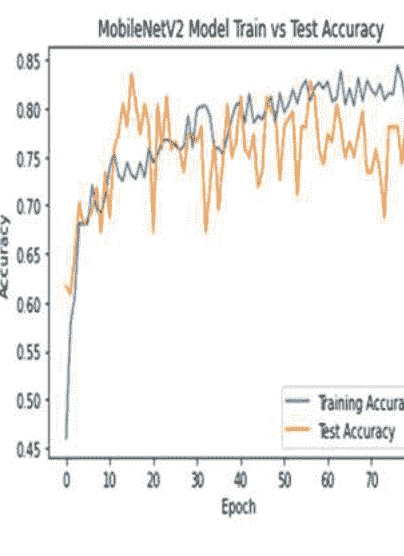

图6（续）

| 使用的模型 | 精确度 | 召回率 | f₁-分数 | 准确率 |
| :--- | :--- | :--- | :--- | :--- |
| ResNet50 | 0.92 | 0.95 | 0.93 | 0.98 |
| DenseNet121 | 0.90 | 0.89 | 0.8025 | 0.90 |
| MobileNet | 0.89 | 0.87 | 0.86 | 0.91 |
| MobileNetV2 | 0.7875 | 0.78 | 0.785 | 0.89 |

- 精确度 = $\frac{TP}{TP + FP}$
- 召回率 = $\frac{TP}{TP + FN}$
- $F_1\text{-分数} = \frac{2 \times \text{召回率} \times \text{精确率}}{\text{召回率} + \text{精确率}}$
- 准确率 = $\frac{TP + TN}{TP + TN + FP + FN}$

### 2.7 预测结果

图7a-d展示了对于叶斑病、叶锈病、健康小麦和镰刀菌赤霉病的预测。每个预测都选择了一些图片。结果表明，使用多数投票策略，建议的方法能够准确地将正确的标签放置在这些帧上。

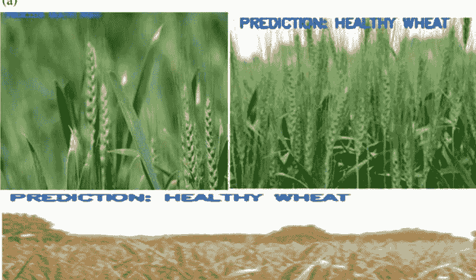

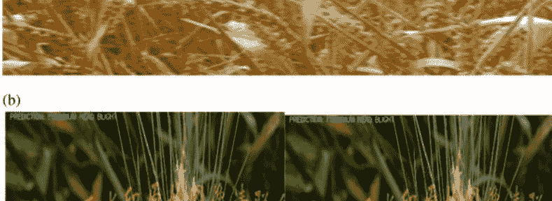

图7 a 健康小麦的预测。 b 镰刀菌赤霉病的预测。 c 叶锈病的预测。 d 叶斑病的预测

## 3 结论

本文尝试使用四种不同的迁移学习策略，开发和分析深度学习模型用于小麦锈病的诊断。小麦病害，另一方面，是一种常见的病害，可以摧毁小麦作物。因此，为了治愈患病的小麦植株，需要及早诊断问题以获得良好的产量。为了进行这项调查，我们使用了一个来自Kaggle的开源数据集，该数据集可以在网上免费获取。采用四种不同的深度神经网络算法ResNet50、MobileNet、MobileNetV2和DenseNet121基于卷积神经网络（CNNs）的架构，我们进一步通过使用图像数据增强方法来提高分类准确性。在实验过程中，我们发现ResNet50模型的性能优于其他模型。使用批量大小=64，优化器=“Adam”，和epochs=80，达到了98%的准确率。此外，该系统将帮助农民识别感染并预防作物疾病。通过使用不同的特征识别技术来消除输入中的噪声并将识别的特征应用于模型，可以进一步改进这项研究。


图7 (续)

## 参考文献

1. Jiang, P., Chen, Y., Liu, B., He, D., & Liang, C. (2019). 基于改进的卷积神经网络的深度学习方法实时检测苹果叶病。*IEEE Access*, 7, 59069–59080.
2. Hasan, M. J., Alom, M. S., Dina, U. F., & Moon, M. H. (2020年6月). 将CNN与双向长短期记忆模型相结合的玉米病害图像识别和分类. 在2020年IEEE第10个地区研讨会 (*TENS YMP*) (pp. 1804–1807). IEEE.
3. Pavithra, G., & Palanisamy, K. S. 基于多类支持向量机的叶锈病的计算机诊断.国际工程研究与技术杂志 (*IJERT*), 2278–0181.
4. Shrestha, G., Das, M., & Dey, N. (2020年10月). 使用CNN进行植物病害检测.在2020年IEEE应用信号处理会议 (*ASPCON*) (pp. 109–113). IEEE.
5. Goyal, L., Sharma, C. M., Singh, A., & Singh, P. K. (2021). 使用改进的深度卷积架构进行叶和穗小麦病害检测和分类.医学解锁中的信息学, 25, 100642.
6. Kibriya, H., Rafique, R., Ahmad, W., & Adnan, S. M. (2021年1月). 使用卷积神经网络检测番茄叶病。在2021年国际Bhurban应用科学和技术会议 (*IBCAST*) （第346-351页）。IEEE。
7. Niu, X., Wang, M., Chen, X., Guo, S., Zhang, H., & He, D. (2014年8月)。用于检测小麦叶病的图像分割算法。在2014年国际先进机电系统会议论文集 (第270-273页)。IEEE。
8. Yuan, L., Huang, Y., Loraamm, R. W., Nie, C., Wang, J., & Zhang, J. (2014年)。用于检测和区分疾病和昆虫的冬小麦叶片的光谱分析。田间作物研究, 156, 199-207。
9. Dixit, A., & Nema, S. (2018). 小麦叶病检测使用机器学习方法——综述。国际计算机科学与移动计算杂志, 7(5), 124–129。
10. Maid, M. K., & Deshmukh, R. R. (2018, May). 统计分析WLR (小麦叶锈病) 疾病使用ASD FieldSpec4光谱辐射计。在2018年第三届IEEE国际会议-近期电子、信息与通信技术 (*RTEICT*) (第1398–1402页)。IEEE。
11. Francis, M., & Deisy, C. (2019, March). 农业中疾病检测和分类植物使用卷积神经网络—视觉理解。在2019年第六届国际信号处理和集成网络会议 (*SPIN*) (第1063–1068页)。IEEE。
12. Li, L., Zhang, S., & Wang, B. (2021). 植物疾病检测和分类通过深度学习——综述。*IEEE Access*, 9, 56683–56698。
13. Kumar, S. S., & Raghavendra, B. K. (2019年3月). 使用图像处理技术检测各种植物叶片疾病: 一项综述。2019年第5届国际高级计算与通信系统会议 (ICACCS) (第313-316页). IEEE。
14. Zhang, Y., Xu, Y., & Li, S., (2022年). 利用高效的DF-UNet和无人机多光谱图像检测小麦黄锈病严重程度。IEEE传感器杂志。
15. Huang, W., Guan, Q., Luo, J., Zhang, J., Zhao, J., Liang, D., Huang, L., & Zhang, D. (2014年). 用于识别和监测冬小麦疾病的新优化光谱指数。IEEE应用地球观测与遥感领域选题杂志, 7(6), 2516-2524。
16. Hande, R., Ahuja, A., Watwani, A., Chichriya, P., & Shammani, S. (2021年1月)。KrishiManch: 使用CNN检测水稻作物中的疾病。在2021年第四届新兴技术工程国际会议 (ICNTE) (第1-6页)。
17. Rashid, M., Ram, B., Batth, R. S., Ahmad, N., Dafallaa, H. M. E. I., & Rehman, M. B. (2019年12月)。用Python Open CV进行小麦作物特征检测的新型图像处理技术。在2019年计算智能和知识经济国际会议 (ICCIKE) (第559-563页)。
18. Wang, L., Dong, F., Guo, Q., Nie, C., & Sun, S. (2014年10月)。改进的旋转核变换方向特征用于小麦条锈病和白粉病的识别。在2014年第七届国际图像与信号处理大会 (第286-291页)。
19. Ashourloo, D., Aghighi, H., Matkan, A. A., Mobasheri, M. R., & Rad, A. M. (2016年)。对叶锈病检测使用高光谱测量的机器学习回归技术的研究。IEEE应用地球观测和遥感领域选题杂志, 9(9), 4344-4351。
20. Marzougui, F., Elleuch, M., & Kherallah, M. (2020年12月)。评估数据增强-用于检测植物疾病。在混合智能系统国际会议上 (第464-472页)。斯普林格。
21. Guan, X. (2021年4月)。基于深度学习和卷积神经网络的植物叶片疾病检测的新方法。在2021年第六届智能计算与信号处理国际会议 (ICSP) (第816-819页)。
22. Menon, V., Ashwin, V., & Deepa, R. K. (2021年6月)。使用CNN和迁移学习进行植物疾病检测。在2021年国际通信、控制和信息科学会议 (ICCISc) (第1卷, 第1-6页)。
23. Asif, M. K. R., Rahman, M. A., & Hena, M. H. (2020年12月)。基于CNN的疾病检测方法在土豆叶上。在2020年第三届智能可持续系统国际会议 (ICISS) (第428-432页)。
24. Saeed, Z., Raza, A., Qureshi, A. H., & Yousaf, M. H. (2021年10月). 使用CNN的多作物疾病检测和分类方法。在2021年国际机器人与自动化产业会议 (ICRAI) 中 (第1-6页)。
25. Zhou, G., Zhang, W., Chen, A., He, M., & Ma, X. (2019). 基于FCM-KM和更快的R-CNN融合的水稻病害快速检测。IEEE Access, 7, 143190–143206。
26. Shrestha, A., & Mahmood, A. (2019). 深度学习算法和架构综述。IEEE Access, 7, 53040–53065。
27. Jia, X. (2017年5月). 基于深度学习的图像识别方法。在2017年第29届中国控制与决策会议 (CCDC) (pp. 4730–4735)。
28. Kamilaris, A., & Prenafeta-Boldú, F. X. (2018). 农业中的深度学习：一项调查。农业中的计算机和电子设备, 147, 70–90。
29. Zhang, X., Qiao, Y., Meng, F., Fan, C., & Zhang, M. (2018). 使用改进的深度卷积神经网络识别玉米叶病害。IEEE Access, 6, 30370–30377。
30. Aravind, K. R., Raja, P., Mukesh, K. V., Anirudh, R., Ashiwin, R., & Szczepanski, C. (2018年1月)。使用特征包和多类支持向量机对玉米作物中的疾病进行分类。在2018年第二届国际发明系统与控制会议 (ICISC) 中 (pp. 1191–1196)。
31. Pawlak, K. (2016). 选定的高度发达国家与发展中国家的粮食安全形势。农业与农村发展杂志, 40(2), 385–398。
32. Trivelli, L., Apicella, A., Chiarello, F., Rana, R., Fantoni, G., & Tarabella, A. (2019). 从精准农业到工业4.0: 揭示农食领域的技术联系。英国食品杂志。

# 使用朴素贝叶斯机器学习技术进行Twitter情感分析

Priya Gaur，Sudhanshu Vashistha和Pradeep Jha

摘要 “计算”情感分析可以确定情感是积极的、消极的还是中性的。这种方法的另一个术语是“意见挖掘”，或者获取说话者的情感。企业使用它来制定战略，了解客户对产品或品牌的看法，人们对活动或新产品发布的反应，以及他们为什么不购买某些产品。它在政治中被用来追踪政治观点，并检查政府言论和行动之间的矛盾。它甚至可以用来预测选举结果！它还用于跟踪和分析社会现象，如识别危险情况和评估博客情绪。在本文中，我们使用Twitter数据集来解决情感分类问题。为了分析情感，使用预处理和朴素贝叶斯分类器方法。结果，我们应用了一个文本预处理分类准确性分类策略，并在Kaggle公共排行榜上提高了我们的分类准确性得分。本文旨在使用基于朴素贝叶斯分类器的机器学习算法对Twitter情感进行分类。所提出的模型在精度、召回率和准确性等性能参数上表现更好。

关键词 情感分析·Twitter·Facebook·Instagram·机器学习·人工智能·朴素贝叶斯

## 1 引言

数据预测是研究中的热门话题，无论是在金融还是医疗领域，例如[1-3]。根据现在和过去的数据预测未来值的过程被称为预测。预测只是某个预定未来日期和年龄的某个因素或激励的估计[4]。数据预测可以在各种方式中使用，从天气预测到在医疗领域预测患者是否有发展特定疾病的风险。数据预测本质上是利用真实数据来预测未来的趋势。预测被商界人士和公司用来规划预算和未来项目，以最大化利润，同时分析绩效和潜在风险。如果公司的销售额增加或减少，投资者会尝试预测这是否会对公司的股票价格产生影响。股市分析师使用预测来预测国内生产总值、失业率以及股市在一年内的变化[5]。对于统计学家来说，预测是他们在需要进行预测的任何情况下使用的工具[6]。为了准确预测某事，需要在预测过程中采取一系列步骤，这比大多数人想象的要复杂。以下是各种步骤：

- 作为第一步，我们需要分析和确定与我们想要预测的情况相关的变量。
- 在选择数据集并根据我们的要求进行更改之前，我们必须首先分析情况。
- 之后，数据被用于预测未来的价值。
- 作为最后一步，通过将预测值与实际结果进行比较来验证该过程。

无论如何，仅基于单一模型选择高精度模型都导致了不准确的结果。事实证明，这些活动的组织者已经开始研究这些普通的互联网日志（博客），以更好地了解他们的产品。他们定期监控和回复客户在次要互联网论坛上的评论。提出识别和概括普遍情感的新概念是其中的障碍之一。最近，一些人被像Facebook和Twitter这样的网站吸引到了人际交往的阶段。大多数人利用基于网络的娱乐来表达他们对物体、地点或人的观点、感受或怀疑。Twitter是一个关于各种问题的公众意见的庞大仓库，包括个人、产品、服务和商业倡议。公众对公众分析系统的评估被称为情感评估。

## 2 文献调查

众所周知，不可能预测一切，但如果与我们想要预测的因素相关，并且有足够的数据，那么我们可以轻松地预测事物[9]。数据预测具有广泛的应用，如下所示：伊甘预测，即通过计算建筑物对气候和建筑要求应提供的热量需求来控制建筑物的热量。

- 预测在股票市场和外汇市场中使用。
- 在业务中，根据当前市场分析来预测客户需求。
- 用于地震预测等。
- 在供应链管理中，确定项目应该在何时何地进行，可以帮助最大化利润。
- 在银行或金融领域，检查违约风险，即申请贷款的特定个人是否有可能成为违约者。
- 在销售预测中，预测未来销售是否增加或减少。
- 政治预测，预测选举结果。
- 天气预报，洪水预测。

根据皮尤研究中心的调查，约有25%的在线成年人使用Twitter。全球共有3.13亿月活跃Twitter用户，这是这个数字的结果。免费的实时消息服务限制推文长度为280个字符（这是从2017年11月的140个字符增加的）。因此，尽管有280个字符的限制，Twitter仍然实现了大幅增长。例如，戴尔使用Twitter通知客户未来产品降价，这被证明是一个巨大的成功。许多营销人员也很欣赏Twitter的商业价值，因为它使企业能够轻松了解客户对其产品的评价[10]。

由于Twitter在全球范围内的广泛接受，本项目侧重于使用其数据。随着移动技术的普及，它打开了一个以前无法获得的全新视角和观点。当收集和研究Twitter上表达的观点和感受时，可以揭示关于人们的大量信息[11]。通过更深入地了解目标市场，公司可以从这些信息中受益[12]。对人群的更深入了解可以帮助政府为该群体做出更好的决策。在本研究中，将使用主题建模和词汇策略来评估英文文本中的情感和观点，以确定一般情感，如积极或消极，并以此获取推文作为数据基础。

使用社交媒体，可以利用这个应用程序了解人们的想法和感受[13]。

意见挖掘可以在各种情境中使用。用于广告、讨论中的热点识别、网络爬虫、推荐系统和电子邮件过滤，以及问题和笔记。在日常生活中，使用意见挖掘来改善人机交互、企业情报、意见调查、政府情报、引文检查等是最有趣的用途。通过查看与之相关的示例问题，可以更好地理解意见挖掘的潜在用途。

- 总的来说，人们对政府战略有什么看法？
- 产品的哪些方面在普通大众中最受欢迎或最不受欢迎？
- 在普通竞争团体中有没有一个好的竞争对手？
- 销售额下降的原因可能是什么？

在进行意见挖掘时，需要克服一些问题，例如检测文本的哪些部分是意见，并识别意见持有者。人类调查、情感和情感交流都是情感分析的范围。我们每个人对某个问题或主题都有自己的想法和关注。在有意见的文本中，可能存在不准确、不相关或模糊的信息。描绘意见比描绘事实要困难得多。

## 3 提出的方法

贝叶斯定理确定了一个事件发生的可能性，给定另一个事件发生的机会，朴素贝叶斯通过“天真地”期望每个事件都是相互独立的来改变这个过程。相反，可以应用以下方程来处理独立事件。

```
P (垃圾邮件 | 威而钢,增大)
= P (垃圾邮件) * P (威而钢|垃圾邮件) * P (威而钢|垃圾邮件,增大)
P (威而钢) * P (威而钢|增大)
```

好消息是，这个方程随着每个额外的变量线性增长，允许您一次处理大量的数据而没有任何问题。由于其简单性，朴素贝叶斯是一种快速而多功能的技术，只要您的信息索引不会变得过于庞大，就能击败更复杂的模型。

如果你遇到概率为零的变量的数据，朴素贝叶斯将导致你的条件崩溃，当与其他因素相乘时。然而，如果你提前平滑数据，消除零概率，这个问题可以解决。

假设你必须决定是否去海滩。我们的大脑可以在一瞬间考虑旅行的所有利弊，但如果让计算机为我们做决策，它需要遵循一套规则来得出最有利的答案。为了使问题更容易理解，机器将使用三个不同的变量（天气、空气温度和朋友去哪里）来计算结果。以下原则用于构建不同变量之间的关系，以便计算机能够理解。规则按从上到下的顺序阅读。

将Table1中的行变量与每组规则的标准进行比较。当规则的条件满足时，确定最终值，并且不控制剩余的规则。

表1中的行变量与每组规则的标准进行比较。当规则的条件满足时，确定最终值，并且不控制多余的标准。

表1用于决定是否去海滩的几种情况

| 情景ID | 天气 | 空气温度(℃) | 朋友们要去 |
|--------|------|-------------|------------|
| 1      | 晴天 | 20          | 是         |
| 2      | 多云 | 23          | 是         |
| 3      | 雨天 | 17          | 否         |
| ...    | ...  | ...         | ...        |
| n      | 雨天 | 26          | 是         |

假设你必须决定是否去海滩。我们的思维可以在一瞬间考虑到旅行的所有利弊，但是如果让计算机为我们做出决策，它需要遵循一套规则来得出最有利的答案。为了使问题更容易理解，机器将使用三个不同的变量（天气、空气温度和朋友去哪里）计算结果。

分类是数据挖掘和机器学习中使用的一种技术，用于确定数据实例属于哪个分类类别。图1描述了一个分类示例，其中数据被分割成单个组件，直到确定一个精确的分类为止。它可以是从单个数据点到需要分类的500页书的任何东西。这种策略经常与监督学习相结合。通过评估一个或多个标记的训练数据集，并利用数据的独特属性，可以开发出一个看起来能够识别正确类别的分类模型。然后，这个分类模型可以使用与训练数据等效的新数据来预测它们属于哪个类别。一些最常见的分类算法包括贝叶斯/朴素贝叶斯、决策树、神经网络、基于规则的技术和支持向量机。提供了一个逗号分隔值文件，其中包含推文及其对应的情感。作为训练数据集的一个示例，推文ID是一个唯一的整数，用于标识特定的推文，而推文的情感要么是1（积极的），要么是0（消极的）。我们的模型将使用这个数据集进行交叉验证。

## 4 结果分析

数据已经在情感140数据集中收集。它包含从Twitter API中提取的1,600,000条推文。这些推文已经被标记为（0=负面，4=积极），以便确定情感。情感分析过程中的另一个重要阶段是特征提取，它涉及处理推文并基于情感创建词云。图2、图3和图4描述了该过程的各个阶段。

对于数据集分析的分类分析和情感预测，使用了基于朴素贝叶斯的分类器。评估指标，如图5所示的混淆矩阵，已被用来表示该过程。该过程被执行。

图1提出方法的流程图

|      | polarity | text                                         | processed_tweets                            |
|------|----------|----------------------------------------------|---------------------------------------------|
| 720002 | 0        | @MOCAShop Wow, normally a Ferrell fan. This ma... | mocashop wow normally ferrell fan make sad wai... |
| 262514 | 0        | @netbender I got that enough from punk shows t... | netbender got enough punk show ringing never w... |
| 812355 | 1        | @ramblelite I got everyone noaw yo. simm's got... | ramblelite got everyone noaw yo simms got cat ... |
| 385860 | 0        | @Rayuen yeah a couple (like randall munroe of ... | rayuen yeah couple like randall munroe xkcd kn... |
| 321526 | 0        | I feel for the families of the plane crash dis... | feel family plane crash disaster one          |
| 438569 | 0        | i dont feel well today                       | dont feel well today                         |
| 29364  | 0        | @LishaKatherine so true! Im miss talking to you | lishakatherine true im miss talking          |
| 577052 | 0        | CANT READ                                    | ant read                                     |
| 14386  | 0        | UGH. don't wanna edit anymoreeee So lost.    | gh dont wan na edit anymoreeee lost          |
| 254577 | 0        | just got up and I have a toothache           | ust got toothache                            |

图2特征提取

使用Jupyter笔记本软件在Python中进行。现在，通过本文提出的研究，可以将大量关于明确事物的英文推文分为积极和消极的情感。与传统的文本分类相比，使用情感特征可以获得出色的准确性，如表2和表3所示。商业团体可以使用这种方法来排名可接受的情感分类器，并帮助他们规划产品的未来业务发展。

## 5 结论

情感分析可以确定一段文本的情感是好的、消极的还是中性的。情感分析是自然语言处理的一个子类型，包括信息提取。算法的选择是数据科学家工作的重要组成部分。最有效的技术通常是测试各种算法。基于机器学习的情感分析算法被预测。

图5 通过朴素贝叶斯分类器的混淆矩阵分析

表2 用于决定是否去海滩的几种情景

| 参数               | 值                           |
| :----------------- | :--------------------------- |
| 模型在训练数据上的准确率 | 84.44%                       |
| 模型在测试数据上的准确率 | 78.77%                       |
| 精确度             | 0.80（负面）和 0.71（正面） |
| 召回率             | 0.97（负面）和 0.23（正面） |
| 宏平均准确率       | 75%                          |
| 加权平均准确率     | 77%                          |

表3 准确率的比较分析

| 参数                     | 随机森林方法 | 决策树方法 | 提出的方法（朴素贝叶斯分类器）         |
| :----------------------- | :----------- | :--------- | :------------------------------------- |
| 模型在测试数据上的准确率 | 76%          | 75.89%     | 训练集上的准确率为84.44%<br>测试集上的准确率为78.86% |

因为它们可以调整到特定类型的数据（如推文或评论），所以情感词典算法或现成算法被认为是最有效的。另一方面，与情感词典算法或现成算法相比，机器学习方法需要更大的数据集。还应该有一组推文用于练习。应该注意的是，训练集中的三种类型的推文分布不均匀：好的、负面的和中立的。负面或中立的评论很少。如果数据分散得更均匀，机器学习系统会发现绝大多数推文是积极的，并且会依赖这个假设来处理每个接收到的推文。有各种方法可以根据Twitter上传达的反应来对产品分析（可能出现为推文）进行分类，以确定行为方式是积极的、消极的还是中立的，然后利用这些数据来评估产品市场。利用Twitter的数据，我们能够对在线产品评价进行“满意”情感分类。由于这项研究，可以比较多种分类器，将大量关于明确物品的英文推文分类为积极和消极的思考。当使用情感特征而不是标准文本序列时，可以实现出色的准确性。利用这种方法，公司可以对最可接受的情感分类器进行排名，并利用结果帮助他们制定长期的产品策略。

## 参考文献

1.  Jha, P., Baranwal, R., Monika, & Tiwari, N. K. (2022). 在物联网中保护用户数据。在 *IEEE 2022年第二届人工智能和智能能源国际会议上* (pp. 1292–1297)
2.  Soni, G. K., Rawat, A., Jain, S., & Sharma, S. K. (2020). 使用LSB水印技术的基于像素的数字医学图像保护。在 *Springer智能系统和物联网：计算创新*(pp. 483–492)
3.  Soni, G. K., Arora, H., & Jain, B. (2021). 一种使用Arnold变换和非对称RSA算法的新型图像加密技术。在 *IEEE国际人工智能: 进展与应用会议2019年。智能系统算法*(pp. 83–90). 斯普林格.
4.  Shahvaroughi Farahani, M., & Hajagha, S. H. R. (2021). 使用集成人工神经网络和元启发式算法预测股票价格与时间序列模型相比. 在 *软计算*(pp. 1–31)
5.  Kumar, G., Jain, S., & Singh, U. P. (2020). 使用计算智能进行股市预测: 一项调查研究. *工程计算方法档案*, 1–33.
6.  Jha, P., Biswas, T., Sagar, U., & Ahuja, K. (2021). 在医疗保健系统中使用机器学习范式进行预测。在 *IEEE 2021第二届电子与可持续通信系统国际会议(ICESC)*(pp. 1334–1342).
7.  Tripathi, M. (2021). 使用朴素贝叶斯、支持向量机和LSTM对尼泊尔COVID19推文进行情感分析. *人工智能杂志*, 3(03), 51–168.
8.  Wongkar, M., & Angdresey, A. (2019). 使用朴素贝叶斯算法的情感分析和数据爬虫：Twitter。在 *IEEE 2019第四届国际信息学与计算会议(ICIC)*(pp. 1–5).
9.  Roh, Y., Heo, G., & Whang, S. E. (2021). 机器学习数据收集的调查：大数据-人工智能融合视角。*IEEE知识与数据工程交易(TKD)*, 33(4), 1328–1347.
10. Goo, A. M. R. H. S. (2017). 使用深度学习方法的Twitter情感分析。 在2017年第七届国际年度工程研讨会(InAES).
11. Prakruthi, V., Sindhu, D., & Anupama Kumar, D. S. (2018). 实时Twitter帖子情感分析。 在IEEE 2018第三届可持续解决方案计算系统和信息技术国际会议(CSITSS)(pp. 29–34).
12. Ahuja, K., Khushi, D., & Sharma, N. (2022). 网络安全威胁及其与Twitter的联系。 在2022年第二届人工智能和智能能源国际会议(ICAIS)(pp. 1458–1463).
13. Mandloi, L., & Patel, R. (2020). 使用机器学习方法进行Twitter情感分析。 在IEEE 2020新兴技术国际会议(INCET)(pp. 1–5)中。

# 基于认知物联网的Covid-19患者预测调查

Lokesh B. Bhajantri, Nikhil Kadadevar, Anup Jeeragal, Vinayak Jeeragal和Iranna Jamdar

摘要 现在，需要对患者系统进行特殊护理以普遍预测或检测Covid-19患者。此外，由于高度传染性病毒，需要在现实环境中普遍设立隔离中心以治疗Covid-19患者。在大流行情况下，很难追踪每个患者的健康状况。此外，医生面临问题监控和控制患者的健康状况。在这方面，研究了基于认知物联网的预测Covid-19患者的调查，使用机器学习算法。本文详细讨论了提出的问题陈述的调查，包括限制、优点和缺点以及各种算法的性能参数，并最终提出了用于普遍预测和监测Covid-19患者的系统架构。因此，所提出的系统用于监测患者的症状，如Covid-19患者的温度、SpO2和咳嗽频率，使用智能传感器普遍。所提出的系统使用Wi-Fi连接将数据传输到Web服务器。

关键词 物联网·认知物联网·云层·网络层·感知层

## 1 引言

物联网（IoT）是一种技术，它允许物体或设备通过智能网络连接，以发送和控制物理环境，使物体变得更智能。其中物联网对象通过智能网络连接[1]。物联网设备可以感知周围环境并收集信息。物联网的架构如图1所示。该架构包括应用层、服务层、云层、网络层等各种层次。

图1 物联网架构

和感知层或物理层用于通过物体或设备在互联网上传输数据。物联网的每一层如下所述：

- 应用层：该层用于描述设备之间的连接及其应用。它还支持各种应用的协议，如医疗保健、智能家居、智能交通、智能农业等。
- 云层：该层与云服务器或云节点相关，用于处理和存储数据。
- 网络层：该层用于物与终端之间的通信。它用于在网络上传输安全数据。它包括无线网状IEEE 802.15.4 和无线点对多点IEEE 801.1.11。它还包括有线连接IEEE 1901。
- 云层：该层与云服务器或云节点相关，用于处理和存储数据。
- 感知层/物理层：该层包括各种类型的传感器，如温度、声音、运动手势和SpO₂传感器。这些传感器用于感知网络中的数据，并通过物联网网关将收集到的数据传输到网络层。

在物联网架构中，智能对象或设备用于相互通信。这些对象通过现场区域网络（FAN）进行通信。

使用精确的应用程序。它还使用提供设备和网络域之间通信的网关设备[2]。物联网架构包括一些挑战，如规模、安全性、隐私、数据分析等[3]。

在现实环境中，物联网被用于各种目的，从改善生活质量到解决城市挑战、食品生产、农业、消费、商业、工业和基础设施类别的制造、医学、能源供应、水分配等[4]。如图2所示，物联网与各种应用程序相关联。

在物联网网络中，从传感器/物体收集的数据在数据处理、数据管理、数据聚合、分类、安全和隐私约束方面没有有效利用。这些收集到的数据可以实时聚合，并从物联网设备中提取有意义的信息。因此，需要开发智能或认知设备或物体来高效地捕获各种上下文数据。认知物联网（CIoT）可以感知和分析数据，做出智能选择并增加网络选择[5]。

物联网的第二代被称为CIoT。CIoT包括认知计算技术和设备，以做出智能或认知决策。认知物联网（CIoT）具有一组智能物体，它们相互连接并进行集体互通和协作，以智能方式在互联网上行为。利用CIoT的这种能力，可以有效地促进自动化智能医疗服务。医疗组织需要部署认知技术解决方案来监测、预测疾病、分析患者行为和提供医疗服务。CIoT是一个活跃的研究领域，其应用可以在各个领域中看到。因此，CIoT吸引了更多的关注。

对于医疗保健系统的兴趣在于为医疗保健用户提供高效、可靠、具有成本效益的推荐和容错服务。一些CIoT的挑战是[6]：

- 标准化：这是CIoT网络发展的关键步骤之一。需要增加CIoT网络架构的标准化程度以高效处理数据。此外，它支持各种应用程序。
- 频谱效率：在物联网环境中，需要高效地传输大量数据的网络带宽。
- 安全与隐私：这是物联网环境中最具有前景的挑战之一。有时，数据被网络中的设备视为高度敏感的数据。在CIoT网络中，需要安全地处理数据。因此，物联网设备或网络层需要安全和隐私机制或算法。因此，只有受信任的用户可以访问CIoT网络上的服务。此外，物联网网络中正在进行大量研究，以提供安全的数据。
- 数据感知：这是CIoT的一个重要问题之一。CIoT物品或设备能够智能地从环境中捕获或感知数据。因此，需要使用认知技术来有效地感知设备的数据。

典型的CIoT架构如图3所示。该架构涉及监控和控制、上下文数据消费和集成以及数据感知等各种元素。

尽管本文的组织如下：第2节中介绍了所提出工作的文献调研。第3节解释了所提出的工作。最后在第4节总结了工作。

## 2 文献调查

本节描述了针对物联网和CIoT的各种工作的文献调研。此外，还讨论了物联网/CIoT环境中一些用于数据预测的算法。以下表1、表2和表3分别展示了相关工作的方法和限制、优点和缺点以及各种算法的性能参数，以支持所提出的工作。

根据文献的详细调查，观察到监测和预测患者信息的低效问题。因此，提出了使用认知方法高效预测Covid-19患者，以在紧急情况下提供更好的决策。此外，观察到目前没有这样的工作存在。因此，计划提出对Covid-19患者的建议。

### 表1 各种方法和限制

| 参考文献 | 方法 | 限制 |
| :--- | :--- | :--- |
| [7] | • 阐述现有技术和医疗系统之间的差异<br>• 基于CNN的医疗系统从患者的心脏状况方面进行了介绍 | • 高功耗-CT扫描设备中的无线传感器 |
| [8] | • 该方法描述了使用物联网的检测系统的概念<br>• 所提出的系统用于保护个人用户并提供医疗援助 | • 客户端和服务器之间的定期连接<br>• 只有用户设备可以检测，如果设备放在患者的口袋里 |
| [9] | • 描述了对危急情况下患者的医疗援助<br>• 还可以协助先进的医疗设施 | • 在线数据对数据隐私/安全性的问题 |
| [10] | • 由于感染的传播，这种方法是关于医生提供非接触式医疗服务的 | • 咳嗽传感器的准确性不如预期 |
| [11] | • 所提出的方法描述了远程监测和追踪Covid-19患者的Covid-19区域或区域 | • 蓝牙通信技术 |
| [12] | • 使用可穿戴传感器描述Covid-19患者的健康状况<br>• 还可以测量患者的健康参数 | • 生产成本高<br>• 这是一种对患者的终身管理的经济有效方法 |
| [13] | • 监测社交距离和口罩检测 | • 由于每秒处理的帧数限制，性能有限 |
| [14] | • 这种方法用于描述使用物联网的医疗设备的设计概念<br>• 还介绍了生物医学可穿戴API | • 经济成本和人类预防措施等设计因素 |
| [15] | • 它描述了物联网和CR等技术及其应用<br>• 讨论了向物联网设备添加认知能力的重要性 | • 他们没有展示如何向物联网设备添加认知能力，也没有讨论要求 |
| [16] | • 它包括基于云的连接设备，将帮助医生远程监测患者健康状况 | • 此设备没有多用户访问权限 |
| [17] | • 患者的健康状况是基于肺部情况检测的<br>• 机械通风器将潜在好处图形化 | • 健康和不健康患者收集数据的失真<br>• 数据分类错误 |
| [18] | • 空间模式用于决策过程<br>• 它将分析和收集可变的大数据 | • 存在未标记的招标数据，数据可靠性较低 |
| [19] | • 关于社交距离的讨论<br>Covid-19病例和死亡率<br>• Covid-19的经济后果 | • 关于失业的信息不多 |
| [20] | • 提出的方法描述了基于深度学习的自动预测冠状病毒患者<br>• 此外，提出的系统根据患者胸部的X光结果进行检查 | • 使用CT扫描，无法获得个体抽象程度，而且CT扫描相对昂贵<br>• 辐射相对较高 |
| [21] | • 通过测量SpO₂和心率预测Covid-19 | • 这里没有医生监测患者的健康状况<br>• 需要手动将数据输入系统 |
| [22] | • 该方法用于使用热像仪测量Covid-19患者的体温 | • 数据存储更昂贵，患者结果存在误导 |
| [23] | • 本文讨论了5G认知无线电网络及其对网络的影响<br>• 认知无线电的主要功能超越了频谱共享、频谱感知、频谱移动和频谱管理 | • 5G网络在许多国家仍处于设计阶段，将面临许多设计问题 |
| [24] | • 讨论IoMT的挑战<br>• 安全解决方案用于检查IoMT安全和隐私的主要挑战 | • IoMT设备存在一个问题，即在医疗紧急情况下发送虚假警报 |

### 表2 数据预测算法

| 算法 | 优点 | 缺点 |
| :--- | :--- | :--- |
| 线性回归 | • 实现简单，输出解释容易<br>• 由于复杂度较低，这个算法是最好的选择 | • 线性回归的主要缺点是假设因变量和自变量之间是线性关系 |
| K最近邻算法 | • 为了对新数据点进行分类KNN算法会读取整个数据集以找出K个最近邻居 | • 该算法在大型数据集上表现不佳<br>• 同样，在高维度下也无法表现良好<br>• 需要进行特征缩放 |
| 决策树 | • 数据的归一化和缩放不是必需的<br>• 在预处理期间进行数据准备的工作量较小 | • 训练模型通常需要更多时间<br>• 适用于预测连续值和回归的效果较差 |
| 支持向量机 (SVM) | • SVM相对内存效率较高<br>• SVM在维度数大于样本数的情况下效果显著 | • 训练时间长且难以解释<br>• 选择合适的核函数很困难 |
| 朴素贝叶斯 | • 根据数据点和预测器的数量可扩展性极高<br>• 它可以处理连续和离散数据 | • 在某些情况下，估计可能导致错误 |
| 逻辑回归 | • 它不假设类的分布<br>• 它不仅提供系数大小，还提供其关联的方向 | • 无法解决非线性问题<br>• 使用逻辑回归难以获得复杂关系 |

### 表3 变量数据预测算法的性能矩阵

| 参考文献 | 算法 | 准确率 | 数量 |
| :--- | :--- | :--- | :--- |
| [25] | 线性回归 | 87.00 | 172,479 |
| [26] | K最近邻 | 87.60 | 1236 |
| [27] | 决策树 | 93.22 | 263,007 |
| [27] | 朴素贝叶斯 | 94.30 | 263,007 |
| [27] | 逻辑回归 | 87.34 | 263,007 |
| [7] | 支持向量机 (SVM) | 95.38 | 1282 |

## 3 提议的工作

提议的工作目标如下：（1）使用CIoT设备分析患者数据，（2）设计一种医疗推荐系统，用于Covid-19患者的药物医生等方面，（3）使用机器学习方法设计和实现预测算法，（4）设计一种健康监测设备，用于预测人体健康问题，（5）在医院、远程检查、工作站等地提供高水平的适用性，可以频繁监测多名患者，（6）提供低成本的客户满意度服务和实施。

所提出的系统架构如图4所示。该架构包括具有高速网络的智能传感器。这些传感器用于感知并通过CIoT网络传输数据。此外，还通过认知传感器分析数据。在这项工作中，计划使用算法为检测Covid-19患者的症状提出适当的传感器。传感器如温度、SpO₂和声音。该系统用于收集人体的体温数据、饱和氧水平(SpO₂)和声音(咳嗽)。通过机器学习算法预测这些收集到的数据中的Covid-19患者。

如今，CIoT是一种更有前景的技术，通过智能传感器在任何时间和任何地点访问数据。智能物体或物品用于为用户提供紧急服务。所提出的系统是为了远程监测COVID-19患者。该设备能够通过各种传感器远程监测患者的体温、SpO2和咳嗽声音。根据我们的要求，使用机器学习算法对数据进行分类。医生可以随时随地查看患者数据。每当生理矩阵值低于或高于正常范围时，医生还将通知患者的监护人患者的状况。医生可以随时为患者提供紧急服务。根据患者的报告，医生可以给患者开处方。

最初，在真实环境中部署CIoT网络。设备将读取患者的健康参数，如体温、氧气水平和咳嗽声音。传感器的这些值被作为模拟输入馈送到NodeMCU。模拟信号被转换为数字信号。如果值超出或低于正常范围，则如下所示：

### 情况1：非症状参数

- SpO₂ ≥ 95%
- 咳嗽频率：无
- 温度 ≤ 37.2 °C

### 情况2：轻度症状参数

- 92% < SpO₂ < 95%
- 咳嗽频率 ≤ 7/分钟
- 36 °C ≤ 温度 ≤ 38 °C

### 情况3：重度症状参数

- SpO₂ ≤ 92%
- 咳嗽频率 ≥ 15/分钟
- 温度 > 38 °C。

## 4 结论

本文详细介绍了所提出工作的调查。此外，它还介绍了基于CIoT的Covid-19系统的新架构在真实环境中的预测。此外，所提出的架构说明了远程监测患者健康情况，以减少Covid-19感染患者与医生之间的接触，以避免病毒的传播。未来计划提出一种可穿戴设备，以普遍监测Covid-19患者。

因此，提出的系统在医疗数据方面是熟练、可信赖和准确的。

## 参考文献

1.  Bhardwaj, V., Joshi, R., & Gaur, A. M. (2022). 基于物联网的COVID-19智能健康监测系统。计算机科学杂志，3(137)，1–11。
2.  Goncalo, M., Nuno, G., & Pombo, N. (2019) 关于物联网的调查：架构、元素、应用、QoS、平台和安全概念。电子学杂志，8(10)，1–27。
3.  Choudary, A., & Godara, S. (2017). 物联网：关于架构和挑战的调查论文。国际工程技术科学研究杂志IJETSR，4(6)，442–447。
4.  Hussein, A. H. (2019). 物联网（IOT）：研究挑战和未来应用。国际高级计算机科学与应用学报 (IJACSA)，10(6)，77–82 (2019)。
5.  Bhajantri, L. B., & Balugari, P. (2019). 对认知物联网中的数据感知的调查。电信与信息技术杂志，3，75–86。
6.  Park, J. -H., Salim, M. M., Jo, J. H., Sicato, J. C. S., Rathore, S., & Park, J. H. (2019). CIoT-Net: 一种可扩展的基于认知物联网的智能城市网络架构。9(29)，1–20。
7.  Song, Y., Zheng, S., Li, L., Zhang, X., Zhang, X., Huang, Z., Chen, J., Wang, R., Zhao,H., Cheng, Y., Shen, J., Zha, Y., & Yang, Y. (2020). 深度学习使得使用CT图像能够准确诊断新型冠状病毒。IEEE/ACM计算生物学和生物信息学交易，18(6)。
8.  Rashidi, N. A. (2020). 基于CT扫描的Covid-19检测。计算机科学杂志，9(20)
9.  Nooruddin. (2019–2020). 使用实时数据进行Covid-19预测。
10. Palanisamy, R., Kartik, M., Rohit, H., Jay, S., Puranik, A., & Vaidya, A. (2019). 基于物联网的患者监测系统。国际最新技术与工程杂志 (IJRTE), 8(2S11), 1–6.
11. Mukhtar, H., Rubaiee, S., Krichen, M., & Alroobaea, R. (2021). 使用可穿戴传感器的实时数据筛查COVID-19。国际环境研究公共健康杂志, 18(8), 1–17.
12. Bassam, N. A., Hussain, S. A., Qaraghuli, A. A., Khan, J., Sumesh, E. P., & Lavanya, V. (2021). 基于物联网的可穿戴设备用于监测隔离的远程Covid-19患者的迹象。Journal Elsevier公共卫生紧急集合, 9, 1–16。
13. Petrovic, N., & Kocic, D. (2020). 基于物联网的covid-19室内安全监测系统。在IcETRAN(pp. 1–7)。
14. Fayez, Q., & Krishnan, S. (2018). 可穿戴硬件设计用于物联网医疗设备。Journal 电气、计算机和生物医学工程系, 18(11), 1–22。
15. Shah, M. A., Zhang, S., & Maple, C. (2013). 认知无线电网络用于物联网; 应用、挑战和未来。在第19届国际自动化和计算会议(pp. 1–6)。
16. Shreerang, J., Pranav, M. S., Jitendra, P., More, M., Prayag, S., Satish, P., & Marathe, S. (2020). 基于物联网的COVID-19中心患者健康护理。国际期刊最新技术与工程。9 (3) ，258–263。
17. Acho, L., Vargas, A.N., & Pujol-Vazquez, G. (2020年)。低成本开源机械通气机，用于COVID-19患者的肺功能监测。9 (3) ，1–14。
18. Dagazany, A.R., Stegagno, P., & Mankodiya, K. (2018年)。可变物联网和深度学习用于大数据分析。移动信息系统杂志。1–20。
19. Brodeur, A., Gray, D., Islam, A., & Bhuiyan, S. (2021年)。COVID-19经济学文献综述。经济学调查杂志, 35 (2) , 1007–1044。
20. Salehi, A. W., Baglet, P., & Gupta, G. (2020). 机器和深度学习模型的检测和预测冠状病毒的综述。在纳米技术会议论文集中(pp. 3896–3901)。
21. Revar, D. S., Sevaniya, J. S., & Joshi, V. R. (2020). 使用机器学习设计脉搏血氧仪来预测患者健康上的covid-19可能性。GRD Journal,5(10), 9–14.
22. Abhadji, I. E., Awuzi, B. O., Ngowi, A. B., & Millham, R. C. (2020). 针对准确检测covid-19 大数据分析、人工智能和自然启发计算模型的综述和合同追踪。国际环境研究公共卫生杂志, 17(15), 1–16.
23. Valanarasu, R., & Christy, A. (2019). 无线认知和5G网络的综合调查普适计算和通信技术杂志 (UCCT), 23–32.
24. Smys, S., & Raj, J. S. (2022). 医疗保健领域物联网的未来挑战概述计算机科学和智能技术趋势杂志, 3(4),274–286.
25. Cavovean, D., Ioana, I., & Nitulescu, G. (2020). 物联网系统在COVID-19患者诊断中的应用. 在Informatic Economic(Vol. 24(2), pp. 75–89). 布加勒斯特经济学院.
26. Gothal, R., Thamilselvan, E., & Sakthivel, R. (2020). 使用机器学习方法预测COVID-19的增长和趋势. 在可持续材料国际虚拟会议论文集(pp. 1–5).
27. Theerthagiri, P., Jacob, I. J., Ruby, A. U., & Yendapalli, V. (2020). 使用KNN分类算法预测COVID-19可能性。

# 一种用于检测和缓解社交工程攻击(SEA) 的专家系统，使用机器学习算法

Rathnakar Achary和Chetan J. Shelke

摘要 社交工程是一种说服互联网用户透露他们的个人信息的机制。这是一种影响人们的技术，使他们假装分享他们的个人信息。使用社交工程攻击（SEA），犯罪分子针对个人或系统，试图访问密码和银行信息，或秘密安装恶意软件，还可以访问您的计算机。攻击者不仅可以获取个人信息，还可以访问各种商业环境中的信息，例如与公司客户的讨论，员工之间的聊天服务互动。可以使用先进的机器学习模型来识别和分析这种情况。在研究工作中，我们提出并演示了使用机器学习的模型来分析攻击者的恶意行为和检测SEA的实现。该方法适用于离线文本和实时情况，以确定人类Chatbot或离线聊天是否执行SEA。在所提出的方法中，文本消息被分析和验证语言错误，并使用模型来检测和分离任何攻击的机会。所提出的技术还使用事实和半合成数据集进行分析，以获得更高的准确性结果。开发的模型将从网页中检测钓鱼链接（统一资源定位符-URL），并使用机器学习算法对URL进行分类，判断其是否合法或非法。

- 钓鱼网址
- 合法网址
- 机器学习
- 逻辑回归
- 预测
- 社会工程攻击

R. Achary (✉) · C. J. Shelke
Alliance College of Engineering and Design Alliance University, Anekal, India
e-mail: rathnakar.achary@allaince.edu.in
C. J. Shelke
e-mail: chetan.shelke@alliance.edu.in

© 作者（们），独家许可给 Springer Nature Singapore Pte Ltd. 2023
S. Shakya 等人（编），情感分析与深度学习，智能系统与计算进展 1432,
https://doi.org/10.1007/978-981-19-5443-6_29

## 1 引言

SEA 是一种通过执行活动来操纵互联网或移动用户的方法，例如获取他们的机密信息。快速增加的社会工程攻击是对网络系统的威胁。攻击者执行此操作以操纵个人和企业的机密信息。社会工程攻击主要依赖于人们对自己行为的无知。攻击者使用心理技巧来获得受害者的信任，收集敏感信息，如密码和银行详细信息。SEA 对所有互联网用户构成安全挑战，无论使用的安全机制如保密性、入侵检测和预防机制、防火墙和防病毒软件 [1]。

互联网用户的行为是社交工程观察中安全和隐私的主要挑战之一。为了理解心理学和个人特质的影响，使用了五因素模型。这些因素在表1中组织成一系列五个统计独立的因素，如开放性、责任心、外向性、亲和性和神经质。社交工程师利用人们对有价值信息的低意识，并依赖于人们对自己的有价值信息的无知和对保护这些信息的漫不经心。

在几种SEA类型中，发现攻击可能来自内部和外部来源，其中内部人员在连接到组织网络时故意违反组织规定。这种类型的攻击通常由第三方或不满的员工出于经济利益或报复而进行。

### 1.1 相关工作

几个研究实施针对识别重复的呼叫者，考虑到他们的声音特征，这是一个检测攻击的概念验证模型。研究人员在[2]中分析了社交工程师的特征，他们使用利用互联网用户的心理学来为自己谋取利益。在社交工程中，犯罪分子利用诡计来收集机密数据、进行欺诈和身份盗窃，或恶意访问用户的计算机系统。在企业中，SEA非常具有挑战性，因为它们依赖于员工的行为。攻击者将获得对易受攻击的员工账户的访问权限。

在同一篇论文中，还介绍了使用电子邮件和其他攻击工具进行社交工程攻击。在[3]中，作者们确定了用于获取对用户活动的控制的私人详细信息的请求模式。这种机制提供了一个手动获取的动词-名词对列表，用于列入黑名单的攻击者。在论文[4]中对这项工作进行了改进。研究人员确定了四种主要的攻击向量，包括问题类型、对话的紧急性以及问候方式[5]。朴素贝叶斯分类器用于列入黑名单的大量钓鱼邮件。在[6]中，采用基于语义的方法来识别社交工程攻击。人为因素和行为被认为是大多数SEA案例中最薄弱的环节[7]。在[8]中，作者提出了一种基于岛屿的搜索技术来检测社交工程攻击。作者在他们的算法中提出了一种高度破坏性的多项式变异技术。本文的整个研究工作组织如下：第2节—解释了社交工程攻击的类型。第3节—介绍了社交工程攻击检测的不同方法。第4节—使用人工神经网络对攻击进行分类。第5节—解释了数据集的实验评估，并得出结论。

## 社交工程攻击的两种类型

根据攻击类型，SEA被分为三类：技术型、社交型和物理型攻击。在技术型攻击中，攻击者使用互联网或网络作为攻击媒介。在物理型攻击中，攻击者通过实际行动进行攻击。图1展示了SEA的详细分类。这表明攻击面越来越大且多样化。

为了对抗针对网络安全中高度脆弱的环节的攻击者，利用基础设施作为攻击向量。另外两种类型的攻击是基于人的攻击和基于计算机的攻击。基于计算机的攻击还针对用户的移动电话。他们会同时针对多个受害者。诸如社交工程工具包（SET）之类的计算机攻击技术被用于钓鱼邮件。在基于移动设备的攻击中，恶意第三方应用程序被用于获取对移动设备的访问权限。通过在企业中采用新技术，安全架构和攻击范围已经发生了变化。

SEA的四个阶段是信息收集、信任、引诱和借口。

信息收集：信息收集有助于确定可能的攻击向量以执行攻击。这是一个收集有关受害者的所有信息的过程。收集信息的来源包括Facebook、Twitter、LinkedIn等公开网站。谷歌和许多其他公开网站也可能是攻击者使用的其他来源。攻击者还可以使用其他来源，如键盘记录器和肩部冲浪。

信任：只有当人们对某人产生信任时，才会透露信息。在这个阶段，攻击者试图在受害者之间建立信任关系。

引诱：引诱是一种在不询问的情况下获取信息的过程。网络钓鱼也可能是一种针对系统末端漏洞的SEA类型。网络钓鱼是通过发送伪造的电子邮件和虚假网站链接来获取个人信息的犯罪行为。在网络钓鱼攻击中，攻击者转发一封电子邮件或一个URL链接，并冒充合法用户以从目标用户那里提取敏感信息。接收者在收到此消息后点击URL或回复电子邮件，并提供敏感或个人信息，如信用卡数据、用户名和密码，他们很可能会受骗。此攻击的目的是通过电子邮件或电话欺骗手段欺骗目标，以非法获取机密信息。攻击者通过误导受害者来实施此类攻击。通过使用假网站、奖励、电子邮件、免费提供、广告、杀毒软件和恐吓软件来欺骗他们。网络钓鱼攻击的不同类别是：

- 鱼叉式网络钓鱼攻击，针对特定个人或选定的群体，使用他们的姓名来获取信息。
- 鲸鱼式网络钓鱼攻击，是一种针对企业高级官员的鱼叉式网络钓鱼攻击，被称为大“鱼”。
- 语音网络钓鱼攻击，基于语音模式进行，攻击是通过IP电话进行的。
- 交互式语音响应网络钓鱼攻击是一种基于语音的攻击，通过使用交互式语音系统，并假装来自合法来源如银行或企业，以使受害者泄露敏感数据。
- 商业电子邮件妥协网络钓鱼攻击也类似于针对高级别企业个人的鲸鱼式网络钓鱼攻击，以获取他们的企业电子邮件、日历、会计相关详细信息和其他私人信息。

伪装：伪装的过程利用了对受害者的弱点的识别，通过语音交易来进行。攻击者使用不同的技术来识别他们的客户。利用这种方法，他们还开始提取信息，如出生日期、居住详细信息和账号。在伪装中，攻击者通过获得受害者的信任并保证提供工作机会、提供服务或中奖彩票来吸引受害者，并开始提取他们的个人信息。

诱饵攻击：在这种类型的攻击中，攻击者敦促用户点击一个URL，以获得一个保证的礼物。这些链接充当了特洛伊木马，攻击者针对不安全的IT基础设施或连接到计算机的设备，如USB设备。一种名为控制器区域网络（CANDY）的诱饵攻击在[9]中对汽车系统进行攻击，启动了一个特洛伊木马，操纵了车辆和控制器之间的消息交换。

尾随攻击：这种类型的攻击是指入侵者试图访问用户的受限区域，即对站点或受限区域进行物理访问。

## 3 社交工程攻击检测的3种方法

对社交媒体平台或聊天中的消息交换进行分析，以估计对话是否涉及社交工程攻击。对于消息交换的分析，需要对其内容进行预处理，并将其转换为用于逻辑回归方法进行分类的数据集。该算法通过使用Sklearn机器学习库来验证基于推理的案例，以检查URL和其他详细信息。同时使用分类矩阵、分类报告和准确性的Seaborn进行可视化。每个分数被分类为：

$S_L$=链接分数, $S_P$=拼写分数和 $S_I$=意图分数。

它们的标准化值范围在0和1之间。一旦目标消息经过预处理，分类数据集就有四个标签，即意图、拼写、链接和社交工程攻击与否。

分类器使用这些输入进行分类机制。

1.  使用正则表达式模式查找器提取消息链接的URL。
2.  如果消息包含URL，则将其发送到基于案例的推理系统中，以评估与消息相关联的链接是否恶意。
3.  信任之网（WOT）API用于验证链接并返回网站的声誉，给定声誉的置信度。它们的值范围在0和100之间。还要确定类别和子类别（17个中的1个），以确定网站的性质。子类别如表2所示。
4.  对于类别为1XX或2XX的情况，$S_L = 1$。
5.  否则，根据公式（1）将声誉除以100并从1中减去。
    $S_L = 1 - \frac{\text{声誉值}}{100}$
6.  我们可以使用SymSpelly库来检查拼写。
7.  在这一步中，我们分析拼写质量，表示为公式（2）。其中$x$—表示拼写错误的单词。用方程式将其数值表示为0到1之间。
    $S_{SP} = 1 - e^{-\alpha x}$
    指数函数用于找到更多的拼写错误。为了使得分数等于1，可以调整值$\alpha$以影响如何惩罚语法错误。允许多次迭代，使用0.5作为少量不匹配而不会创建更高分数的值。
    如果$\alpha = 0.5$ 并且 $x = 1$, 那么 $S_{SP} = 0.39$
    如果 $x = 5$ 那么 $S_{SP} = 1 - e^{-\alpha x}$
8.  然后将接收到的消息的拼写与一组禁止的文本进行匹配，这些文本是从一个包含48个安全策略样式词的库中获取的。这可以很容易地填充环境或公司相关的词，如密码凭据数据库等。禁止的词的数量由 $M_B$ 给出。
9.  找到动词和形容词的目的，如必要、必须、紧急。它由 $M_I$ 特征化。
10. 为了获得准确的值，将值 $M_B$ 和 $M_I$ 乘以权重 $W_B$ 和 $W_I$，这些权重分别为2和1。这在方程(3)中表示。
    $x = (M_B \times W_B) + (M_I \times W_I)$ (3)
11. 方程 (4) 给出了 $x$ 的归一化值
    $S_I = 1 - e^{-\alpha x}$ (4)
    当 $\alpha = 0.4$ 时，可以得到满意的输出。较大的 $S_I$ 值表示消息中禁止词的浓度较高。
12. 在这一步中，新的对话数据集被检查，攻击被分配为真 (1) 或假 (0) 值，用于分类。使用有效的数据集和卷积神经网络模型，接收到的攻击消息已经在已标记的句子语料库上进行了训练[11]。

## 4 用于攻击分类的人工神经网络

一旦数据集被填充，就会应用多层感知器分类器，根据输出决定攻击的状态[11]。如果输出为高，则被视为攻击，否则不是。激活函数 $f(z)$ 在开始时定义，以 $x$ 输入值和 $w$ 权重作为输入。激活函数为：
$z = w_1x_1 + w_2x_2 + .......w_nx_n$
如果 $f(z)$ 大于给定的阈值 $\varphi$，则输出为 1，否则为 -1
$f(z) = \begin{cases} 1 & \text{如果 } z > \varphi \\ -1 & \text{否则} \end{cases}$
当 $z = \sum_{j=1}^{n} x_jw_j = w^T x$ 时

使用感知器规则，权重更新如下。
i. 权重使用随机数进行初始化。
ii. 在每次迭代中，对于每个 $x$ 的值，更新权重如下：
$w_j^+ = w_j + \Delta w_j$
其中 $\Delta w_j = \eta(target(i) - output(i))x^i_j$，$\eta$为学习率。

## 5 实验评估

使用一个包含11000条记录和32个特征的数据集来分析社会工程攻击的评估，将其分类为攻击或非攻击。数据集经过预处理和派生，得到了四个经典标签：意图、拼写、链接和攻击。最后，将数据集转化为每个分类具有四个条目的数值。对应数据的三个标签（-1, 0, 1）和一个（1或0）值用于确定SE对话是否是攻击。通过准确率指标（公式（5））评估分类模型，计算每个模型正确估计的百分比。
$准确率 = \frac{T_P + T_N}{T_P + T_N + F_P + F_N}$ (5)
其中，$T_P$表示真正例，$T_N$表示真反例，$F_P$表示假正例，$F_N$表示假阴性。

准确性矩阵用于评估多层感知器分类模型，并与逻辑回归进行比较，主要取决于具有适当验证的数据集的质量。对于最终的交叉验证，训练和测试数据集的比例为80:20。使用Sklearn机器学习库中的逻辑回归和神经网络多层感知器进行分类，并使用seaborn进行可视化。

给出了用于比较的数据集的完整分析结果表。

数据集分析了不同的参数，例如IP地址，如表3、4、5、6、7、8中所示，@符号，子域名标题，域名注册，链接标签和鼠标。

下面的表格（9、10、11、12、13、14、15和16）根据三个参数进行分析：－1（攻击）、0（可疑）和1（非恶意）。

不同来源的恶意流量百分比如图2、3所示。

鼠标悬停在请求URL网络流量上的分类值如图4所示，并且分类报告显示了精确度和准确度，表17中有所示。

## 6 结论

本文详细介绍了使用逻辑回归的SEA检测方法。该方法从不同来源收集数据，并用于分类目的。本文推荐的模型已通过使用包含11000条记录和32个特征的有效数据集进行验证。在数据预处理中，数据被分类为三个类别：攻击、可疑和非恶意，以非常高的准确性检测SEA。实验结果表明，与其他相关研究相比，这些方法在社会工程检测方面取得了显著的准确性。它还表明，适当选择特征向量可以有效地解决社会工程攻击问题。我们已经

**表1 心理学和个人特质**

| 特质 | 描述 |
|------|------|
| 开放性 | 对于个体来说，体验创造力和好奇心，而不是谨慎和一致性 |
| 责任心 | 衡量一个人的组织能力或刚性，而不是粗心 |
| 外向性 | 指的是一个人与他人的开放和互动程度 |
| 宜人性 | 反映友善、善良和同理心，而不是操纵和缺乏合作 |
| 神经质 | 与压力、紧张、愤怒以及其他负面情绪相关 |

**表2 子类别**

| 1XX 负面 | 2XX 可疑 | 3XX 中立 | 5XX 积极 |
| :--- | :--- | :--- | :--- |
| 101—恶意软件 | 201—误导性声明或不道德 | 301—在线追踪 | 501 一个好的网站 |
| 103 - 钓鱼 | 205—垃圾邮件 | 302—有争议的 | |
| 104—骗局 | 207—广告/弹窗 | 303—政治 | |
| 105—政治非法 | | | |

**表3 IP地址**

| 索引 | having_IP | having_IP_Address | URL_Length |
|------|-----------|-------------------|------------|
| 计数 | 11,055.000000 | 11,055.000000 | 11,055.000000 |
| 平均值 | 5528.000000 | 0.313795 | -0.633198 |
| 标准差 | 3191.447947 | 0.949534 | 0.766095 |
| 最小值 | 1.000000 | -1.000000 | -1.000000 |
| 25% | 2764.500000 | -1.000000 | -1.000000 |
| 50% | 5528.000000 | 1.000000 | -1.000000 |
| 75% | 8291.500000 | 1.000000 | -1.000000 |
| 最大值 | 11,055.000000 | 1.000000 | 1.000000 |

**表4 @符号**

| 索引 | 具有_At_Symbol的缩短服务 | double_slash_redirecting |
|------|--------------------------|--------------------------|
| 计数 | 11,055.000000 | 11,055.000000 | 11,055.000000 |
| 平均值 | 0.738761 | 0.700588 | 0.741474 |
| 标准差 | 0.673998 | 0.713598 | 0.671011 |
| 最小值 | -1.000000 | -1.000000 | -1.000000 |
| 25% | 1.000000 | 1.000000 | 1.000000 |
| 50% | 1.000000 | 1.000000 | 1.000000 |
| 75% | 1.000000 | 1.000000 | 1.000000 |
| 最大值 | 1.000000 | 1.000000 | 1.000000 |

**表5 子域名详细信息**

| 索引 | 具有_Sub_Domain | SSLfinal_State的前缀后缀 |
|------|-----------------|--------------------------|
| 计数 | 11,055.000000 | 11,055.000000 | 11,055.000000 |
| 平均值 | -0.734962 | 0.063953 | 0.250927 |
| 标准差 | 0.678139 | 0.817518 | 0.911892 |
| 最小值 | -1.000000 | -1.000000 | -1.000000 |
| 25% | -1.000000 | -1.000000 | -1.000000 |
| 50% | -1.000000 | 0.000000 | 1.000000 |
| 75% | -1.000000 | 1.000000 | 1.000000 |
| 最大值 | 1.000000 | 1.000000 | 1.000000 |

**表6 域名注册**

| 索引 | 域名_注册 长度 | 网站图标 | 端口_安全令牌 |
| --- | --- | --- | --- |
| 计数 | 11,055.000000 | 11,055.000000 | 11,055.000000 |
| 平均值 | -0.336771 | 0.628584 | 0.728268 |
| 标准差 | 0.941629 | 0.777777 | 0.685324 |
| 最小值 | -1.000000 | -1.000000 | -1.000000 |
| 25% | -1.000000 | 1.000000 | 1.000000 |
| 50% | -1.000000 | 1.000000 | 1.000000 |
| 75% | 1.000000 | 1.000000 | 1.000000 |
| 最大值 | 1.000000 | 1.000000 | 1.000000 |

**表7 链接标签**

| 索引 | 请求_URL | 锚点_URL | 标签中的链接 SFH |
| --- | --- | --- | --- |
| 计数 | 11,055.000000 | 11,055.000000 | 11,055.000000 |
| 平均值 | 0.186793 | -0.076526 | -0.118137 |
| 标准差 | 0.982444 | 0.715138 | 0.763973 |
| 最小值 | -1.000000 | -1.000000 | -1.000000 |
| 25% | -1.000000 | -1.000000 | -1.000000 |
| 50% | 1.000000 | 0.000000 | 0.000000 |
| 75% | 1.000000 | 0.000000 | 0.000000 |
| 最大值 | 1.000000 | 1.000000 | 1.000000 |

**表8 鼠标悬停**

| 索引 | 提交到电子邮件 | 异常_URL | 重定向 | n_鼠标悬停 |
| --- | --- | --- | --- | --- |
| 计数 | 11,055.000000 | 11,055.000000 | 11,055.000000 | 11,055.000000 |
| 平均值 | 0.635640 | 0.705292 | 0.115694 | 0.762099 |
| 标准差 | 0.772021 | 0.708949 | 0.319872 | 0.647490 |
| 最小值 | -1.000000 | -1.000000 | 0.000000 | -1.000000 |
| 25% | 1.000000 | 1.000000 | 0.000000 | 1.000000 |
| 50% | 1.000000 | 1.000000 | 0.000000 | 1.000000 |
| 75% | 1.000000 | 1.000000 | 0.000000 | 1.000000 |
| 最大值 | 1.000000 | 1.000000 | 0.000000 | 1.000000 |

| 索引 | having_IP_Address | URL_Length | Shortening_Service |
|------|-------------------|------------|--------------------|
| 11050 | 1 | –1 | 1 |
| 11051 | –1 | 1 | 1 |
| 11052 | 1 | –1 | 1 |
| 11053 | –1 | –1 | 1 |
| 11054 | –1 | –1 | 1 |

| 索引 | 有_符号 | 双斜杠重定向 | 前缀_后缀 |
|------|---------|--------------|-----------|
| 11050 | 1 | 1 | 1 |
| 11051 | –1 | –1 | –1 |
| 11052 | 1 | 1 | –1 |
| 11053 | 1 | 1 | –1 |
| 11054 | 1 | 1 | –1 |

| 索引 | 具有子域名的SSL最终状态 | 域名注册长度 |  |
|------|------------------------|--------------|---|
| 11050 | 1 | 1 | 1 |
| 11051 | –1 | –1 | –1 |
| 11052 | 1 | 1 | –1 |
| 11053 | 1 | 1 | –1 |
| 11054 | 1 | 1 | –1 |

| 索引 | 网站图标端口 | HTTPS令牌请求URL | 锚点链接 | 标签中的链接 |
|------|--------------|------------------|----------|--------------|
| 11050 | –1 | –1 | 1 | 1 | 1 |
| 11051 | –1 | –1 | 1 | –1 | –1 |
| 11052 | 1 | 1 | 1 | 0 | –1 |
| 11053 | –1 | 1 | 1 | –1 | 1 |
| 11054 | 1 | 1 | 1 | –1 | 0 |

达到72%的准确率。进一步扩展属性，通过收集更多真实数据，可以进一步改进。

### 表13 SFH提交到电子邮件

SFH提交到电子邮件异常URL 鼠标悬停重定向

| 索引 |  |  |  |  |  |
|------|---|---|---|---|---|
| 11050 | -1 | -1 | 1 | 1 | 1 |
| 11051 | -1 | -1 | 1 | -1 | -1 |
| 11052 | 1 | 1 | 1 | 0 | -1 |
| 11053 | -1 | 1 | 1 | -1 | 1 |
| 11054 | 1 | 1 | 1 | -1 | 0 |

### 表14 右键弹出窗口

右键单击弹出窗口Iframe 域名年龄DNS记录网站流量

| 索引 |  |  |  |  |  |
|------|---|---|---|---|---|
| 11050 | -1 | -1 | -1 | -1 | -1 |
| 11051 | 1 | -1 | 1 | 1 | 1 |
| 11052 | 1 | 1 | 1 | 1 | 1 |
| 11053 | 1 | -1 | 1 | 1 | 1 |
| 11054 | 1 | 1 | 1 | 1 | 1 |

### 表15 页面排名

页面排名Google索引 指向页面的链接统计报告

| 索引 |  |  |  |  |  |
|------|---|---|---|---|---|
| 11050 | -1 | -1 | -1 | -1 | -1 |
| 11051 | 1 | -1 | 1 | 1 | 1 |
| 11052 | -1 | 1 | 1 | 1 | 1 |
| 11053 | -1 | -1 | 1 | 1 | 1 |
| 11054 | -1 | 1 | 1 | 1 | 1 |

### 表16 结果

结果

| 索引 | 结果 |
|------|------|
| 11050 | 1 |
| 11051 | -1 |
| 11052 | -1 |
| 11053 | -1 |
| 11054 | -1 |

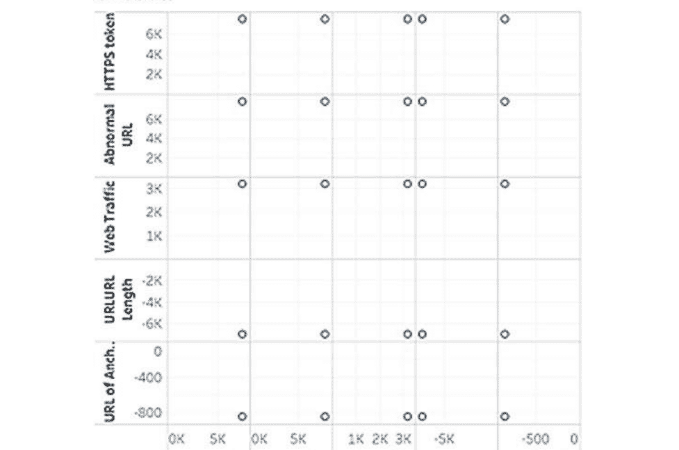

### 图2 URL、网站流量、http等的分类

- Abnormal_URL
- age_of_domain
- DNSRecord
- double_slash_redirecting
- Domain_registration_length
- Google_Index
- having_At_Symbol
- HTTPS_token
- on_mouseover
- web_traffic

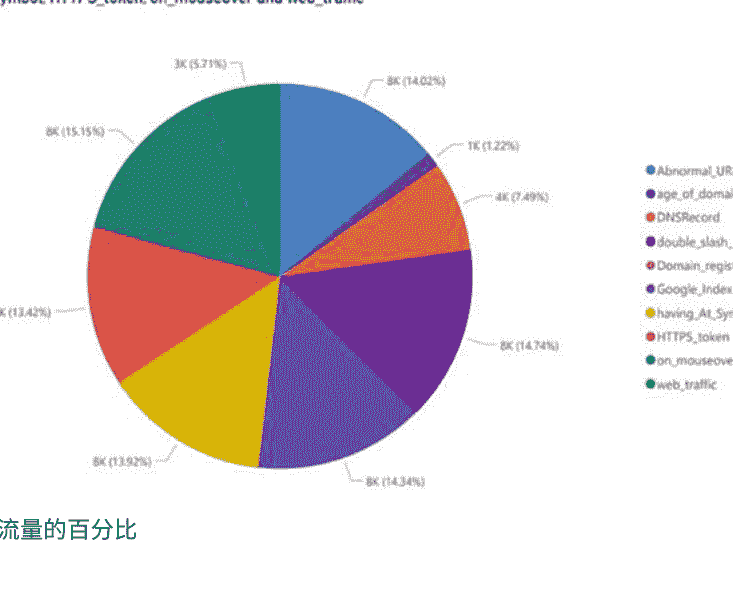

### 图3 恶意流量的百分比

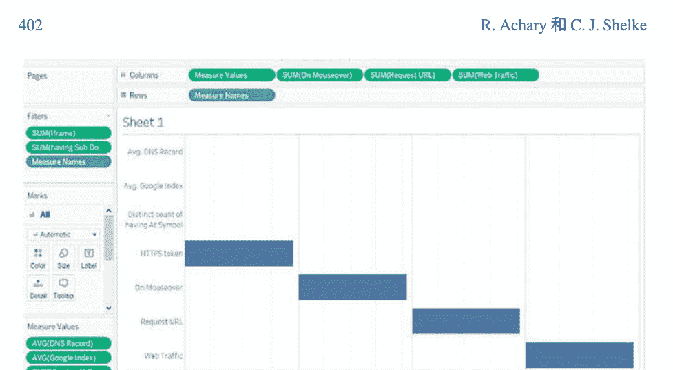

### 图4 鼠标悬停、请求URL、网站流量的分类值

### 表格 17 分类报告

|  | 精确度 | 召回率 | F1得分 | 支持 |
|---|---|---|---|---|
| 准确率 | 0.72 |  |  | 3649 |
| -1 | 0.65 | 0.47 | 0.58 | 1632 |
| 宏平均 | 0.66 | 0.65 | 0.65 | 3649 |
| 1 | 0.68 | 0.75 | 0.68 | 2017 |
| 加权平均 | 0.71 | 0.67 | 0.71 | 3649 |

混淆矩阵如下:

```
[606 1026;
503 1514]
```

准确率为: 0.7209810907097835.

## 参考文献

1. Mouton, F., Leenen, L., & Venter, H. S. (2015). 社交工程攻击检测模型: Seadmv2. 在2015年国际网络世界大会 (CW)(pp. 216–223).
2. Carlander-Reuterfelt Gallo, M. (2020). 通过计算机配置数据估计人类对社交工程攻击的韧性. Examensarbete Inom Teknik, Grundnivå, 15 HP斯德哥尔摩, 瑞典 2020.
3. Sawa, Y., Bhakta, R., Harris, I. G., & Hadnagy, C. (2016). 通过对话的自然语言处理检测社交工程攻击. 在2016年IEEE第十届语义计算国际会议 (ICSC)(pp. 262–265).
4. 彭, T., 哈里斯, I., & 沢, Y. (2018). 使用自然语言处理和机器学习检测网络钓鱼攻击。 在2018年IEEE第12届语义计算国际会议(ICSC)(pp. 300–301).
5. Orgill, G. L., Romney, G. W., Bailey, M. G., & Orgill, P. M. (2004). 对安全计算机系统进行社会工程学攻击的有效用户隐私教育的紧迫性。 在第5届信息技术教育会议论文集中, (pp. 177–181). ACM.
6. Bhakta, R., & Harris, I. G. (2015). 通过对话语义分析检测社交工程攻击。 在2015年IEEE第9届国际语义计算会议论文集中
7. Heartfield, R., & Loukas, G. (2018). 使用最薄弱的环节检测语义社会工程攻击：一个基于人作为安全传感器的实现和实证评估框架。计算机与安全, 76, 101–127.
8. Abed-alguni, B. H. (2019). 基于岛屿的高度破坏性多项式变异的布谷鸟搜索。国际人工智能杂志, 17(1), 57–82.
9. Lansley, M., Polatidis, N., & Kapetanakis, S. (2019). Seader: 一种基于自然语言处理和人工神经网络的社会工程攻击检测方法。在N. T.Nguyen, R. Chbeir, E. Exposito, P. Aniorté, & B. Tra wiński (Eds.), 计算集体智能 (pp. 686–696). Springer国际出版社.
10. Tripathi, S., Acharya, S., Sharma, R. D., Mittal, S., & Bhattacharya, S. (2017). 使用深度和卷积神经网络对DEAP数据集进行准确的情感分类。在第二十九届IAAI会议中的论文集，美国加利福尼亚州旧金山，2017年2月6日至9日.(pp. 15).
11. Atwell, C., Blasi, T., & Hayajneh, T. (2016). 在大数据时代的反向TCP和社会工程攻击。在智能数据和安全的IEEE国际会议中，美国纽约，2016年4月9日至10日，(pp. 1–6).
12. Jamil, A., Asif, K., Ghulam, Z., Nazir, M. K., Mudassar Alam, S., & Ashraf, R. (2018). Mpmpa: 一个针对Facebook的社会工程学基于钓鱼攻击的缓解和预防模型。在2018年IEEE国际大数据会议（Big Data）(第5040-5048页).
13. Uma, M., & Padmavathi, G. (2013). 关于各种网络攻击及其分类的调查。IJ网络安全, 15 (5), 390-396.
14. Granger, S. (2017). 社交工程基础，第一部分：黑客战术。https://www.symantec.com/connect/articles/social-engineering-fundamentals-part-i-hacker-tactics. 2001年12月。于2017年3月7日访问。
15. Achary, R., Naik, M., & Panchoi, T. (2022). 使用机器学习预测充血性心力衰竭（CHF）心电图数据。智能数据通信技术和物联网。
16. Xiangyu, L., Qiuyang, L., & Chandel, S. (2017). 社会工程和内部威胁。在国际分布式计算和知识发现会议论文集，中国南京，2017年10月12日至14日，(pp. 25–34).
17. Achary, R., & Shelke, C. (2021). 一种使用机器学习算法检测和预防社会工程攻击的专家系统。SPAST摘要。

# 在NLP中将知识图谱和T5结合在问答中

## Sagnik Sarkar和Pardeep Singh

摘要 NLP在问题回答方面依赖很大。它提供了一种从上下文中检索响应的自动化方法。从多个文档、研究和证词中找到上下文变得越来越重要。因为NLP的问题回答模型相当复杂且资源密集，所以本研究的目的是通过将知识图谱作为输入引入T5的迁移学习模型，为NLP中的问题回答提供一种新颖的轻量级方法。本研究提供了对所建议模型的各种参数的整体全面的视角。

关键词 知识图谱 · 转换器 · 迁移学习 · 文本到文本转换器 · BERT

## 1 引言

回答问题（QA）是对土著语言分析的挑战和研究基础。问答任务的主要思想是根据文章提供适当的回答问题的答案[1]。换句话说，这个QA系统能够使用自然语言处理的问题提问和获取答案[2]。下图试图给出一个问答系统的块图（图1）。

自然语言处理和深度学习模型的最新技术在QA领域显示出巨大潜力。模型如BERT [3]，知识图谱 [4]，XL-net [5]，T5 [6]，ALBERT [7]，GPT-2，GPT-3，ELECTRA [8]，RoBERTa [9]改变了NLP环境，并且这些修改的灵活性改变了整个NLP社区的状态：

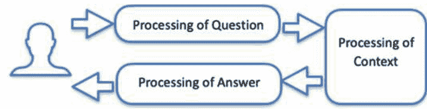

- 结构化数据
- 非结构化数据

## 2 传统模型的缺点

除了成功的成就外，最先进的模型面临的主要缺点有：

- 传统的最先进模型无法回答那些不重要的顺序产生正确答案的问题
- 传统的最先进模型产生了巨大的注意力开销，这增加了模型的大小
- 传统模型在结构化数据上表现良好，但在非结构化数据上表现不佳。

此外，传统模型非常庞大，有时候无法训练模型本身。 根据Hans Peter Luhn [9]的说法，

> 在文档中出现的术语的权重仅仅与术语频率成比例 - Hans Peter Luhn [9]

由于实际场景中资源有限，因此有必要使用一种不那么消耗资源且能够在这种情况下表现良好的模型。 因此，为了克服这种情况，我们尝试提出了一个解决方案来解决这个问题。

## 3 方法论

我们尝试提出的方法结合了知识图谱[4]和T5 [6]转移模型的概念。 知识图谱有助于减少T5模型试图捕捉答案本质的上下文。 图2展示了我们提出的模型：本文提出的模型的观察主要集中在BioASQ和SQuad2.0数据集上。

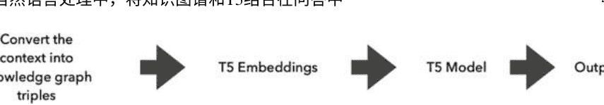

### 图2 提出的模型

| 使用的模型 | BioASQ 可训练吗？ | SQuad2.0 可训练吗？ | BioASQ F1 | SQuAD2.0 F1 |
|------------|-------------------|---------------------|-----------|-------------|
| T5基础模型 | 是 | 是 | 76% | 51% |
| BERT | 是 | 是 | 48.6% | 44% |
| 我们的模型 | 是 | 是 | 59.97% | 47.8% |
| T5小模型 | 是 | 是 | 52.45% | 45.67% |
| T5-3B | 否 | 否 | – | – |
| T5-11B | 否 | 否 | – | – |

## 4 结果

所有模型都是在由Google提供的Google Colab Pro中训练的。这里使用的许多模型甚至无法处理6个批次的第10个epoch。来自各种模型的观察结果见表1。

### 4.1 GPU功耗利用

现在，让我们在GPU利用率方面将T5基础模型和T5小模型与我们的模型进行比较，如图3所示。在这里，我们可以看到它的准确性更接近基础的T5模型。

### 4.2 CPU功耗利用

这些模型的CPU利用率显示在图4中。在这里，我们可以看到我们的模型在CPU计算方面表现良好。它试图跟上T5基础模型，并且在长期运行中能够保持低于55%的CPU利用率基准。因此，在模型的整体比较中，它有助于使模型资源友好并且表现良好。所以我们可以看到它满足了我们的问题陈述。

这里比较了模型的整体性能，在表2中。下表显示了涉及各种模型的评估指标，并进行了比较。

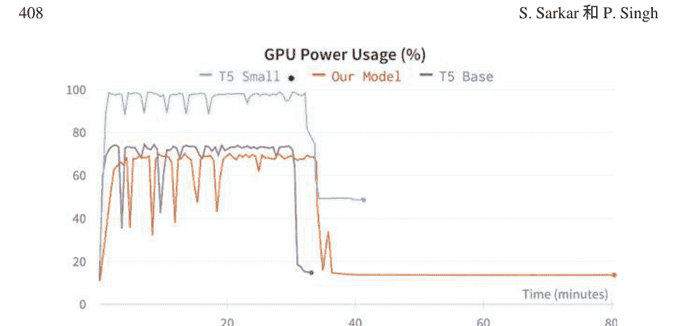

#### 图3 各种模型的GPU利用率

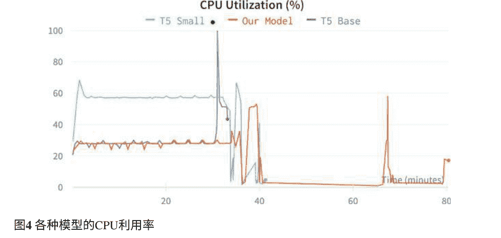

#### 图4 各种模型的CPU利用率

#### 表2 各种利用模型

| 使用的模型 | GPU利用率 | CPU利用率 | 内存利用率 |
|------------|------------|------------|------------|
| T5基础模型 | 75% | 100% | 17% |
| BERT | 115-135% | 135% | 40% |
| 我们的模型 | 60% | 60% | 19% |
| T5小模型 | 100% | 65% | 23% |
| T5-3B | 否 | 否 | - |
| T5-11B | 否 | 否 | - |

我们的模型。除了BERT之外，大多数模型都是在Google Colab Pro上训练的，因为它太大了，无法在Colab上运行。我们在这项研究中主要关注的数据集是BioASQ数据集和SQuad2.0。

## 5 结论

基于自然语言处理的问答系统，像其他形式的信息检索系统一样，是一个非常复杂的过程。封闭领域的问答模型可以提供比开放领域问答系统更准确的结果。然而，它仅限于单一领域。 在筛选步骤之后，研究人员明确表示更喜欢基于注意力的模型。

为了使他们的任务更容易，研究人员还转向了混合技术，如图注意力，并在基础模型上叠加了几种机制。 知识图谱处于研究的原始状态。随着对这个知识图谱的越来越广泛的研究，我们可以提高模型的准确性，甚至可以将最大的转换模型作为所需模型的驱动骨干。 这个选项应该在未来进行探索。

## 参考文献

1. Allam, A., & Haggag, M. (2012). 问答系统：一项调查。国际研究与评论信息科学杂志, 2, 211–221.
2. Abdi, A., Idris, N., & Ahmad, Z. (2018). QAPD: 基于本体的物理领域问答系统软计算, 2, 213–230.
3. Devlin, J., Chang, M., Lee, K., & Toutanova, K. (2018). BERT: 深度双向转换器的预训练用于语言理解。arXiv:1810.04805
4. Hogan, A., Blomqvist, E., Cochez, M., D'amato, C., Melo, G., Gutierrez, C., Kirrane, S., Gayo, J., Navigli, R., Neumaier, S., Ngomo, A., Polleres, A., Rashid, S., Rula, A., Schmelzeisen, L., Sequeda, J., Staab, S., & Zimmermann, A. (2022). 知识图谱。ACM计算调查, 54, 1–37.
5. 杨，戴，杨，卡尔博内尔，萨拉胡丁诺夫，和乐，Q. (2019). XLNet: 通用-化的自回归预训练用于语言理解。在神经信息处理系统进展(第32卷).
6. 拉菲尔，沙齐尔，罗伯茨，李，纳兰，马特纳，周，李，刘，P. (2019). 探索统一的文本到文本转换器的迁移学习极限。ArXiv:1910.10683
7. 兰，陈，古德曼，金佩尔，夏尔玛，和索里卡特，R. (2019). ALBERT: 自我监督学习语言表示的精简BERT。arXiv:1909.11942
8. 克拉克，龙，乐，Q.，和曼宁，C. (2020). ELECTRA: 将文本编码器预训练为判别器而不是生成器。arXiv:2003.10555
9. 图灵，A. (2004). 数字计算机能思考吗? (1951)

# 对物联网网络攻击严重程度的分类

Bhukya Madhu和M. Venu Gopalachari

摘要 在物联网（IoT）技术中，有几个问题需要克服，包括网络安全。已经开发出新的攻击方式，以针对物联网设备的漏洞，而大规模的物联网将加剧现有的网络威胁。机器学习在交通分类和入侵检测等应用中的应用越来越广泛。本文提供了一种基于多个属性来检测网络故障严重程度和识别物联网（IoT）设备的技术。通过将信息推送到网络区域，所提出的框架从每个网络流中捕获不同的特征，以识别流量的来源和流量的类型，从而检测不同的网络攻击。测试了不同的机器学习算法，以找到适合的算法，以获得最佳结果。以下是一些例子：随机森林（RF）算法，决策树，SVM等。在完成实验后，发现随机森林分类器和决策树是性能最好的机器学习算法，用于分类网络严重程度的准确率约为96.98%，而GNB被发现是性能最差的机器学习模型，准确率约为54.41%。

- 关键词 网络安全 · 物联网 · 攻击严重性 · 分类

## 1 引言

在文献中，物联网[1]及其属性已经得到了广泛研究，安全约束和标准的调整对我们来说尤为重要。B. Madhu (✉) 计算机科学与工程系，奥斯曼尼亚大学，海得拉巴，特伦甘纳邦，印度 电子邮件: madhu0525@gmail.com M. V. Gopalachari 信息技术系，查坦尼亚巴拉蒂技术学院，海得拉巴，特伦甘纳邦，印度 电子邮件: mvenugopalachari_it@cbit.ac.in 时间。物联网（IoT）不仅存在新的漏洞，而且还提供了一个非常丰富的平台，可以进行网络攻击。

物联网易受安全威胁，因为它具有许多使其受欢迎的特性，包括链接设备的异构性、功耗、处理限制和可扩展性。所有这些都为物联网安全的独特和多面性做出了贡献，这使得实施变得困难。为了部署安全措施并确定服务质量（QoS），识别物联网设备至关重要。在这种异构网络中，没有一个唯一的经过验证的身份识别是很困难的，因为大多数识别工具（[1] Zigbee ID、IP地址、MAC地址、蓝牙ID等）都容易受到欺骗。另一种技术是通过搜索描述其行为的特征来尝试识别物联网设备。

当我们查看一些数字以了解网络攻击[2]和实施机器学习来阻止这些攻击的需求时，当我们查看与小型企业相关的数据时，攻击频率呈急剧增长，即超过66%的小型企业在过去一年中遭受了网络攻击，而这些攻击主要是有针对性的。

当我们根据攻击类型进行分类时，钓鱼类攻击增长超过57%[2]，由于设备安全受损的攻击增长超过33%，由于凭证被盗的攻击增长30%。这些攻击将带来各种后果，例如声誉损失、财务损失、生产力损失等。

为了对流量进行分类[1]和检测异常流量模式，已经开发了基于机器学习的算法。因此，出现了一个新的研究方向。可以检测到设备及其生成的流量，但我们将尝试分析不同的机器学习（M）算法来识别故障的严重程度，我们尝试实现了五种不同的机器学习（ML）算法（SVM、决策树、随机森林、KNN和GNB）。经过详细的比较分析，我们发现随机森林分类器是所有ML算法中表现最好的，其准确率超过97%，而GNB是表现最差的算法，准确率不到54%。

实际上，网络流量的特征取决于设备的操作系统、应用程序、内存容量[3]、适当的网络协议和CPU功率。因此，传统物联网设备及其攻击理论上是可以区分的。已经开发了几种基于机器学习的入侵检测系统(IDS)，以简化和自动化检测过程。虽然向现有网络添加额外的流量控制功能是可以想象的，但这是一个耗时的过程，考虑到物联网网络的规模，需要一个可扩展的管理解决方案。

### 1.1 严重程度与入侵有何不同

在网络入侵方面已经做了大量的工作，有大量的文献可供参考，但在严重程度方面，只检测到了虚假数据或异常，而在严重程度方面，对入侵的影响进行了量化，并将其分为不同级别的严重程度，例如Level_1、level_2、level_3，这有助于确定所造成的损失。

为了确定严重程度，首先需要研究先前发生的入侵，然后经过详细分析，将数据集以分类方式标记，以便在确定严重程度时保持有用。

## 使用网络中断进行网络故障严重性预测

### 2.1 概述

自现代技术的发明和网络通信范围的显著增加以来[4]，在实施流量和私有协议时发生的网络中断数量不断增加。识别未解释的网络问题可以帮助提供支持，并维护备份系统。研究人员还在研究不同的方法来识别和分类未知的网络干扰[5]，这可以帮助我们克服检测非法网络监视和入侵检测的挑战[6]。他们还在研究不同的方法来提供日常网络分析，这最终可以帮助我们确保网络行为。可以使用各种方法来检测网络中断，包括使用固定端口号的经典方法，但这种方法很容易被更改系统中的端口号所误导。虽然深度包检查（DPI）是一种广泛使用的协议识别方法，但它也有一些缺点，例如在处理用于识别协议的特征数据库时的资源利用。它无法适当地识别正在使用的协议类型。使用关联规则挖掘来查找未知协议是一种备选方法，但它也有一些缺点，如计算复杂性，特别是对于大规模实时网络的分析。为了检测网络干扰[6]，机器学习（ML）也可以作为一种替代方法。由于其出色的自适应和学习特性，全球各地的研究人员已经开始使用机器学习（ML）来检测网络中断并进行协议分析。根据需求，机器学习可以分为许多不同的分支，每个分支可以单独集中研究[4]。

### 2.2 块状图

见图1（块状图）。

### 2.3 目标

本文提出将研究引向新的方向，其中入侵不仅可以被识别，还可以根据不同的参数识别攻击的严重程度[3]。在尝试对所提出的工作进行比较分析时和现有的研究文献，现有的研究工作主要集中在使用网络流量分析方法进行异常检测和网络入侵识别，但所提出的方法将首先集中在识别网络攻击并量化由攻击造成的损失，这将有助于标记数据，其中攻击的严重程度可以被分类为不同的级别，也可以按照不同的类别进行分类，如基于位置、资源类型等。

新的技术时代正在迅速崛起，随着使用各种网络的人数增加，企业将面临更多的网络中断[7]，这对企业构成了即时威胁。本文采用基于人工智能的网络中断分类和识别方法，研究未知网络的自主分类和网络协议识别，将在减少与网络中断分类和识别相关的时间和人力成本方面具有重要意义。数据集将被划分为行，每行代表一个位置和时间点，我们将利用它作为起点[7]。在将数据呈现给用户之前，将使用三种机器学习算法对数据进行预处理和建模。因此，可以确定能够提供最高准确性水平的三种算法。

研究的主要目标是通过分析日志数据来预测特定位置的网络故障的严重程度。所提出的研究使用了来自智能家居数据存储库的信息，其中包括各种特征，使我们能够确定网络中存在的网络故障的严重程度。

### 2.4 提议的工作流程

见图2。

### 2.5 数据集描述

数据来自Telstra公司的网站[8]，Telstra是一家电信运营公司，涉及移动、互联网、电视等不同服务。这是一个表格数据，其中包含有关网络和网络中断影响的大量信息，我们将尝试探索数据并基于不同特征预测严重程度。

- train.csv-故障严重性训练集
- test.csv-故障严重性测试集
- sample_submission.csv-正确输入格式的示例
- event_type.csv：与主数据集相关的事件类型
- log_feature.csv—提取的日志文件特征
- resource_type.csv：与主数据集相关联的资源类型
- severity_type.csv：日志中警告消息的严重级别

在这种情况下，使用的数据集/日志文件是event_type.csv、log_feature.csv、resource_type.csv、severity_type.csv和目标类变量（event_type.csv），如表1所述。严重类型包含三个类别：0、1和2，描述了网络故障的严重程度。“故障严重性”是网络用户报告的实际问题数量的度量，也是目标变量[8]。除了train.csv、test.csv和sample_submission.csv之外，上述所有CSV文件都已合并为一个基于指定主键的单个CSV文件。

所提出的分析是使用网络中断数据，并根据不同的参数（如位置、故障严重性、事件类型等）识别网络中的中断[8]。为了准备这个数据集，我们将各种网络中断数据集合并到一个文件中，然后我们将检查数据是否有缺失值，并在清理数据集后进行分析。在表2中，我们可以看到使用Python函数head和size查看数据的前五行，数据集的大小为（7381，19）。

在进行探索性数据分析后，我们了解到通过对少数类别进行过采样（合成少数类过采样技术），我们将得到平衡的数据，从而不会面临过拟合或欠拟合的问题。

表1 数据集概览

| id | 位置 | 故障严重性 | 严重程度类型 | 事件类型 | 资源类型 | 日志_特征 | 容量 |
|----|------|------------|--------------|----------|----------|-----------|------|
| 14,121 | 位置118 | 1 | 严重程度类型2 | 事件类型34 | 资源类型2 | 特征312 | 19 |
| 9320 | 位置91 | 0 | 严重程度类型2 | 事件类型34 | 资源类型2 | 特征315 | 200 |
| 14,394 | 位置152 | 1 | 严重程度类型2 | 事件类型35 | 资源类型2 | 特征221 | 1 |
| 8218 | 位置931 | 1 | 严重程度类型1 | 事件类型15 | 资源类型8 | 特征80 | 9 |
| 14,804 | 位置120 | 0 | 严重程度类型1 | 事件类型34 | 资源类型2 | 特征134 | 1 |

表2 模型提取的特征

| 索引 | 特征 |
|------|------|
| 0 | 位置 |
| 1 | 事件类型 |
| 2 | 日志特征 |
| 3 | 容量 |
| 4 | 严重程度类型_1 |
| 5 | 严重程度类型_2 |
| 6 | 严重程度类型_3 |
| 7 | 严重程度类型_4 |
| 8 | 严重程度类型_5 |
| 9 | 资源类型_1 |
| 10 | 资源类型_2 |
| 11 | 资源类型_3 |
| 12 | 资源类型_4 |
| 13 | 资源类型_5 |
| 14 | 资源类型_6 |
| 15 | 资源类型_7 |
| 16 | 资源类型_8 |
| 17 | 资源类型_9 |
| 18 | 资源类型_10 |

下面是我们实验分析考虑的19个特征：

表3 测试集上各个分类器的整体准确率结果

|              | 准确率 (%) | 精确率 (%) | 召回率 (%) | F1得分 (%) |
|--------------|------------|------------|------------|------------|
| 支持向量机 | 64.82      | 33.33      | 21.61      | 26.22      |
| DT           | 96.98      | 93.82      | 97.48      | 95.54      |
| RF           | 96.98      | 95.55      | 95.67      | 95.61      |
| KNN          | 75.90      | 60.47      | 71.79      | 64.13      |
| GNB          | 54.41      | 44.71      | 48.07      | 43.03      |

### 2.6 实验结果

在完成分析并比较所有5种不同模型后，观察到高斯朴素贝叶斯（GNB）是最不准确的方法，整体准确率为54.41%，而随机森林分类器和决策树是表现最好的算法，准确率为96.98%，具有相等的精确度、准确率和召回率得分。

为了进行实验分析，采取了3个步骤的方法。第一步是数据收集，在第二步中，我们将在训练数据集上训练我们的机器学习算法[9]，然后在测试数据集上应用计算进行评估，表3中的结果是在测试数据集上进行评估的结果。

### 2.7 可视化分析

上图显示了根据不同类别（0、1、2）绘制故障严重性计数的情况，通过观察图表可以得出结论，故障数量最多的是0类，即略少于5000个，其次是1类，即略少于2000个，故障数量最少的是2类，即略少于1000个（图3、4和5）。

上述图表显示了基于位置和资源类型的攻击强度绘图，从图表中我们可以推断出最高强度约为85，大部分强度在0到30之间（图6）。

上述条形图显示了基于位置和资源类型的前5个攻击强度绘图，从图表中我们可以推断出最高强度约为85，前5个具有最多案例的位置分别是：821、1107、734、126和1008（图7）。

网络中断数据提供了非常好的洞察力，上述绘制的图表显示了14个具有类型1故障的位置，该图表是根据位置和类型1故障的计数绘制的，通过观察可知，位置1100具有最多的类型一故障，数量略超过30。

### 2.8 基于重要性的数据集特征

通过随机森林中的预定义函数feature_importances_来提取特征通过应用数学方法来提取特征[9]，可以通过到达该节点的样本数除以总样本数来计算每个节点的概率。应用计算的值越高，特征的重要性就越高，如表4所示。特征重要性通过以下方程计算。

$$ RFfi_i = \frac{\sum_{j \in \text{所有树}} \text{norm fi}_{ij}}{T} $$

哪里
- RFfi(i)是特征i的重要性
- Normfi(ij) 是节点j中i的归一化特征重要性
- T 是总节点数

我们的模型提取了19个特征用于预测，随机森林和决策树在所有模型中表现最好，准确率超过96%，我们正在列出我们重要特征的贡献，我们可以分析出前4个特征，即位置、容量、日志特征、事件类型占据了近90%的重要性，而其余特征则贡献了约10%的重要性（图8）。

表4 随机森林模型的特征重要性

| 列名 | 重要性 |
| :--- | :--- |
| 位置 | 33.82 |
| 容量 | 25.30 |
| 日志特征 | 20.39 |
| 事件类型 | 10.02 |
| 资源类型_2 | 2.39 |
| 严重程度类型_1 | 2.14 |
| 资源类型_8 | 2.00 |
| 严重程度类型_2 | 1.51 |
| 严重程度类型_4 | 0.92 |
| 资源类型_7 | 0.38 |
| 资源类型_6 | 0.36 |
| 资源类型_4 | 0.28 |
| 资源类型_9 | 0.18 |
| 资源类型_1 | 0.10 |
| 资源类型_3 | 0.09 |
| 资源类型_10 | 0.07 |
| 严重程度类型_5 | 0.05 |
| 资源类型_5 | 0.00 |
| 严重程度类型_3 | 0.00 |

## 3 讨论

由于缺乏公开可用的数据集，对物联网网络中断进行的研究非常有限[10]。根据实验结果，我们了解到对网络中断数据集进行分析可以为保护物联网网络提供很好的见解，对我们模型的主要贡献特征是位置、容量、日志特征、事件类型，它们几乎占据了90%的重要性，而其余特征则贡献了约10%的重要性。

基于位置识别网络中断并根据故障严重程度进行分类，有助于识别网络异常和其原因，从而帮助用户增加安全措施。为了做到这一点，对不同的机器学习算法进行了各种比较，这些比较提供了关于每个模型在各种参数（如准确度、精确度、召回率等）下的性能理解。

## 4 结论

根据项目的主要目标，本文讨论了基于机器学习算法对未知网络中断进行分类和识别的方法。首先，提取网络流量中断的数据信息。然后，成功将数据集发送进行清洗和数据预处理，使数据达到机器可理解的相同尺度，并将所有文件合并为一个文件，以更好地理解数据。进一步帮助分类和识别故障严重程度。最后，使用特征工程智能选择特征向量，以快速有效地分类和识别未知网络中断。在这种方法中充分利用了机器学习方法。它避免了手动提取特征的复杂阶段，并通过确保分类和识别的准确性降低了智能算法的训练时间以及所需的标记数据量[9]。

应用机器学习算法有效地对攻击进行了分类，根据其严重程度[5]，在进行分析后，最终得出结论：随机森林分类器和决策树算法是最佳性能的ML算法，用于对网络严重程度进行分类的准确率大于96%，KNN是第二性能最佳的算法，准确率大于75%，而GNB是性能最差的模型，准确率大于54%。

## 参考文献

1. Sterbenz, J. P. G. (2017). 智能城市和物联网的弹性、生存能力和容忍度：挑战、建模和研究机会调查。 jpgs@{ittc.ku.edulcomp.{lancs.ac.uklpolyu.edu.hk}}
2. https://www.fundera.com/resources/small-business-cyber-security-statistics
3. Matisziw, T. C., Murray, A.T. & Grubesic, T. H. (2008). 探索网络基础设施的脆弱性和中断。接收日期：2006年10月6日/接受日期：2008年4月6日/在线发布日期：2008年4月24日© Springer。
4. Sterbenz, J. P., Hutchison, D., C,etinkaya, E. K., Jabbar, A., Rohrer, J. P., Scholler, M., & Smith,P. (2010). 通信网络中的弹性和可生存性：策略、原则和学科调查。计算机网络，54(8), 1245–1265。
5. Kaluza, B., Mirchevska, V., Dovgan, E., Gams, L. M. (2010). 独立生活中的护理的基于代理的方法。在环境智能中(pp. 177–186). Springer。
6. Aazam, M., Zeadally, S., & Harras, K. A. (2018). 在工业物联网和工业4.0中部署雾计算。IEEE工业信息学交易14(10), 4674–4682。
7. Kilkki, K., Mäntylä, M., Karhu, K., Hämm äinen, H., & Ailisto, H. (2018). 一个中断框架。技术预测和社会变革, 129 275–284.
8. 数据集 https://www.telstra.com.au/data从网站收集
9. Brika, B., Bettayebb, B., Sahnouna, M., & Duvala, F. (2019). 在第二届国际会议-新兴数据和工业4.0 (EDI40), 2019年4月29日至5月2日，比利时鲁汶面向工业4.0的系统中断预测：基于机器学习的方法。
10. Atzori, L., Iera, A., & Morabito, G. (2010). 物联网：一项调查。计算机网络, 54, 2787–2805.
11. Lade, P., Ghosh, R., & Srinivasan, S. (2017). 制造分析和工业物联网的事情。IEEE智能系统, 32(3), 74–79.
12. Chen, B., Wan, J., Shu, L., Li, P., Mukherjee, M., & Yin, B. (2018). 工业4.0的智能工厂：关键技术,应用案例和挑战。IEEE Access, 6 6505–6519.
13. 什么是工业4.0.https://www.forbes.com/sites/bernardmarr/2018/09/02/what-is-industry-4-0-heres-a-super-easy。访问日期 2018年11月7日。
14. Lin, C., & Yang, J. (2018). 成本效益的部署雾计算系统在物流中心在工业4.0.IEEE工业信息学交易, 14(10), 4603–4611.
15. Peralta, G., Iglesias-Urkia, M., Barcelo, M., Gomez, R., Moran, A., & Bilbao, J. (2017). 基于雾计算的工业4.0物联网方案。在2017年IEEE国际## 1 引言
天气预测方案对于监测气候条件和避免意外灾害及相关损失非常重要。在印度，主要灾害通常是由于大雨和相关气候条件引起的。为了避免这些困难，必须有一个适当的气候或天气预测方案来保护人们和他们的财产。天气预测方案使农民能够通过采取必要的预防措施来保护他们的农田，如管理当地灌溉和防止农作物洪涝等。对于印度农民来说，降雨预测至关重要，因为降雨很大程度上依赖于季风季节，而季风季节非常不稳定。我们目前的天气预测模型主要依赖于全球天气模型数据，而当涉及到局部预测时，它们大多数情况下会失败。来自全球各地的专家已经创建了各种理论来预测季风降雨，这些理论大多基于伪随机原理，并且与天气信息相当可比。

多元回归框架被用来构建所提出的方法，并且建议的技术使用印度天气信息来预测降雨。通常，机器学习技术被广泛分为两类，即无监督机器学习和有监督机器学习。所有分割方法都被认为是有监督学习算法。下图，图1，说明了机器学习技术在提出的学习方案下的分类。下一张图片，图2，说明了使用计算模型[1]对印度环境进行天气预测调查。虽然已经建立了多种算法，但使用机器学习技术进行分析以获得可靠的预测是很重要的。准确的预测能够在农业和工业活动中实现更有效的管理。

## 2 系统研究
Shivang等人使用机器学习构建了一个模型系统，以预测印度次大陆的气象条件。学习的信息来自“http://data.gov.in”，“http://ncdc.noaa.gov”和加利福尼亚大学欧文分校的机器学习信息库。该技术使用线性回归模型（LRM）[2]对信息进行训练。为了计算天气预测，Zaheer-Ullah-Khan等人使用了一系列知识挖掘技术，包括K最近邻和决策树，这些技术融合了多种行为元素。与其他计算相比，决策树方法已经显示出是最有效的排序技术之一。研究人员在本文中获得了82%的准确率[3]。Siddharth S.等人使用了一种知识提取方法，并使用决策树分析来准确地分类气候特征，如每天、每月和每年的最低和最高温度[4]。 Radhika和她的同事提出了使用支持向量机预测气候变化的工作。 信息请求是通过解析每天特定区域的最高温度的时间安排信息来创建的，以便根据前n天的每天最高温度预测该地区下一天的最极端温度。 为了准备这个应用的SVM，采用了非线性回归策略。 信息挖掘是一种预测未来行为和趋势的过程，使企业能够做出积极的决策[5]。 本文的目标是概述用于天气预测的数据挖掘方法，以及采用它们的好处。 这项研究可以用于预测与气候预测相关的气象数据。 该研究回顾了公开可用的论文，这些论文介绍了各种专业人士用于开发各种信息挖掘技术的几种计算方法[6]。 在审查所有论文后，确定了机器学习模型来自外部来源。 然而，在本研究中，所有数据都是使用各种传感器在各种情况下获取的。 在这项研究中，使用了两个传感器，雨水识别传感器和DHT11，来监测温度、湿度和降雨密度。

## 3 相关研究
魏楚等人[7]对卷积神经网络在预测降雨和气候条件方面进行了研究，其中作者在本文中指定了降雨预测等内容，特别是简要天气预测，是天气研究领域的一个关键问题。 实际上，目前大部分研究都集中在使用空间信息或卫星照片进行预测。 相反，还有另一种情况，即通过多个传感器在多个监测站点收集的天气特征集合。 尽管某个位置的数据经常不足，但它们对于邻近站点的天气预测提供了关键的指示，这在以前的研究中尚未完全探索。 为了解决这个问题，我们提出了一种多任务学习算法，能够自动从采样点收集的时间序列中提取特征，并通过多任务利用多个站点之间的相关性进行天气预测。 据了解，这是第一次尝试使用多任务训练和学习技术方法基于多站点特征来预测短期降雨量。 更准确地说，我们将学习问题定义为一种最终的多站点辅助神经网络方法，它能够将从一个站点获得的知识转移到其他相关站点，并对各个站点之间的相关性进行建模。广泛的实验表明，学习的站点相关性是有信息的，并且建议的模型击败了各种基准模型的集合，例如欧洲联盟中度气象预测机构的方法。

Geetha等人[8]提出了一篇关于利用深度学习网络预测降雨的论文，在这篇论文中，作者指定了一些内容，例如：季风是地球上所有生物的重要雨水来源。降雨预测模型提供了关于多个全球气象因素对平均降雨的影响的信息。深度学习的方法具有自学习信息类别的能力，可以为响应变量数据集创建信息框架。该系统[8]能够识别时间序列分析中的异常/变化，并且能够有效地预测与过去事件相关的未来信息。本文讨论了利用深度学习配置开发降雨降水模型的方法，例如LSTM、卷积神经网络，并确定哪种架构风格更优越，LSTM的均方根误差为2.55，卷积操作的均方根误差为2.44，断言深度学习模型对于各种数据系列原始数据的建模者来说是有效且高效的。

Channabasava等人[9]提交了一篇关于天气预测的论文，使用了一个气候信息数据集来预测降雨，其中作者在本文中指定了一些内容，例如：天气是一个随机现象，对于全球的气象学家来说，预测一直是一项困难的任务。有多种方法可以使用各种方式获取的空气数据来预测天气。我们的研究重点是应用于基于降雨和天气重复等一些相关变量的数据挖掘技术来预测某个地区的降雨。我们将使用气象机构收集的历史数据，而不是使用当前数据。我们正在研究一种数据挖掘方法，该方法利用了1901年至2002年印度班加罗尔市的湿天数、温度和降雨频率的线性回归分析数据。构建的预测模型经过了对该地区实际降水的训练和验证，并经常用于预测未来的降雨量。在这项研究中，将原始数据集分为训练集和测试集两个部分。一旦每个子样本的所有迭代都完成了。为了产生一个单一的输出，必须对每次迭代的结果进行平均和聚合。所有来自这两个部分的数据都被执行和处理。使用这种方法有助于增加计算效率，并通过使用K倍增器的集成方法进一步改进了计算效率。

Shakila等人[10]撰写了一篇与引入新算法相关的研究，以实时方式预测天气，其中作者在本文中指出，近年来信息的创建加速，并且预计将来会继续加速，这使得在使用传统方法进行高级分析时评估大量气象条件变得困难。该项目的目标是使用Hadoop估计降雨可能性。该框架使用朴素贝叶斯分类算法估计降雨预测准确性。用于预测未来降雨机会的概率函数。建议的系统作为一个工具，接受大量数据的降雨数据作为输入，并以最小、最大和平均值高效地预测未来降雨。使用皮尔逊相关系数技术的预测分析模型，以识别多个变量之间的相关性。在数据收集中，为了估计与一定条件集相关的风险并分配分数或权重。 发现历史信息中的总分相关性可以用来预测未来。

Verma等人[11]通过使用智能MQ2系列传感器与物联网接口进行污染监测方案的研究，在本文中指定了诸如：在汽车行业，技术发展帮助供应商生产智能汽车。 这些智能汽车旨在为社会提供各种好处。 然而，需要进行一些改进，以使这些汽车在污染控制方面更加智能。 空气污染的另一个主要原因是工业产生的有害气体。 尽管政府进行了许多尝试，环境污染仍在稳步增长。文献中提供了许多减少和监测环境污染的技术。 分析结果表明，需要一个基于传感器的嵌入式系统，能够通过物联网从全球任何位置对空气污染进行筛查和控制。 该系统的嵌入式原型是围绕物联网场景的概念创建的，利用了树莓派板上的传感器和执行器。 该系统原型是用Python编写的，并利用了Adafruit和github上的几个开源框架和库。 此外，还创建了一个网页，可以远程监测地球上任何位置的气体量。 结果表明，整个系统已经经过了有效的测试和实施。 Bhalaji等人[12]提出了第一阶段是使用深度学习算法构建辍学预测模型，并计算预期的个体学生辍学概率。 还进行了其他改进，以提高辍学预测模型的效率，并根据时间预测机制为课程提供者提供相关干预措施。 Smys等人[13]在当前系统中，使用基于远程技术的成本效益网络来自动分析火灾风险程度和森林火灾农村地区，并通过物联网服务器广播到网站供公众查看。 分析发现，提供更好的覆盖范围、电池寿命、延迟、成本和效率可以提高服务质量。

## 4 方法论
在这项研究中，引入了增强学习方案用于天气预测（ELSWP），该方案调整学习方案以创建一种新颖的预测方案，帮助农业领域避免灾害，从而挽救人们的生命。 本文利用传感器单元获取的动态数据集来利用实时作物/农业领域监测区域的数据。 本研究的目标是开发一个基于Web的天气预测应用程序，使用Python编程语言预测塔吉亚尔的未来10天天气。 在这项研究中，逻辑回归用于对数据进行分类，并预测降雨的概率。 相关传感器用于监测降雨状况、温度和湿度。智能传感器如DHT11和降雨监测传感器用于智能监测农田。 在这种提出的技术中，使用带有嵌入式Wi-Fi功能的专用微控制器NodeMCU来监测农业领域数据，并及时确定天气条件，并向适当的个人报告，以减少不必要的障碍。NodeMCU是一个开源项目，可以连接物体并使用Wi-Fi协议进行数据传输。非常低成本和高功能，使其成为物联网(IoT)的理想模块。 它可以用于任何需要将设备连接到本地网络或互联网的应用程序。 本提议的方法利用物联网(IoT)的逻辑来收集天气数据并将其发送到远程服务器单元进行处理。 在服务器端，可用于处理从传感器单元累积的数据的逻辑学习脚本。 在本研究中，提出了一种改进的逻辑回归机器学习技术来预测降雨，并与现有系统进行比较。 实时获取的数据被称为测试数据，并且被测试的数据存储在服务器上以进行进一步处理。 服务器端维护的数据被视为训练数据，其中将其加载到服务器脚本端以进行测试输入的交叉验证。 如果测试输入包含超出或低于所述阈值比例的任何值，将立即通知相应的农民或个人采取适当的措施以避免灾害或作物田地损失。 在本研究中，使用散热器来减少电路加热时间。 NodeMCU和DHT11需要3.3V-5V进行处理。 当给传感器供电时，在一秒钟内不要发送任何指令给传感器，以通过不稳定状态。 停止给电路供电，然后断开控制。 图3说明了提议的模块图的感知，图4说明了具有关联传感器和控制器规格的提议传感器单元的感知。

**伪代码：**
```
数据: 阈值温度 OT^{(基准值}_{a1} ., OT_{a2}^{(基准值)}
结果: 操作信号
初始化:
对于预设列表中的所有前提条件，执行以下操作
对于前提条件中的所有设备，执行以下操作
如果 OT_{a1} > QT^{基准值} && OT_{a2} > OT_{a2}^{基准值}
    | 阻止设备 (关闭);
结束
如果 OT_{a1} < QT^{基准值} && OT_{a2} > OT_{a2}^{基准值} 然后
    | 减少加热时间;
结束
如果 OT_{a1} < QT^{基准值} && OT_{a2} < OT_{a2}^{(base value)} then
    | 断开控制
end
end
end
```

## 5 结果与讨论
两个独立的传感器连接到NodeMCU，其中一个测量温度、湿度和降雨比例，另一个测量温度、湿度和降雨比例。一个传感器连接到模拟输入/输出（I/O）引脚，另一个连接到数字I/O引脚。图3显示了系统的整个框图。如图3所示，数据通过NodeMCU传输到远程服务器。此外，远程服务器以JSON文件的形式将数据传输到NodeMCU，可以在HTML网页上显示，如表1所示。

表1 远程服务器记录维护感知

| 天数 | 温度 | 湿度 (%) | 降雨 |
|------|------|----------|------|
| 1 | 153° F(67.2 °C) | 50 | 0 (清晰) |
| 2 | 155° F(68.9 °C) | 35 | 0 (清晰) |
| 3 | 154°F(68.9 °C) | 55 | 0 (清晰) |
| 4 | 154°F(68.7 °C) | 36 | 0 (清晰) |
| 5 | 155°F(69.2 °C) | 60 | 1 (下雨) |
| 6 | 152°F(67.1 °C) | 29 | 0 (清晰) |
| 7 | 152°F(68.0 °C) | 31 | 0 (清晰) |
| 8 | 155°F(69.7 °C) | 42 | 1 (下雨) |
| 9 | 155°F(69.6 °C) | 43 | 1 (下雨) |
| 10 | 154°F(68.1 °C) | 39 | 0 (清晰) |

许多传感器的测量值。使用Google电子表格，将各种温度、湿度和降雨强度信息保存为CSV文件格式。这些数据用于训练机器学习算法，并在Jupyter Notebook中使用指定的学习方案进行模型训练，利用Google Drive（Python IDE）中的预存值。此外，NodeMCU收集特定区域或位置的实时温度、湿度和降雨比例信息，用于验证模型并做出决策。NodeMCU和Jupyter Notebook之间的串行连接用于将这些值发送到Jupyter Notebook。该模型用于尝试预测比赛的可行性。随后，Jupyter Notebook将预期结果以逻辑‘0’或‘1’发送给NodeMCU。使用LED来预测比赛结果。在实时农田连续监测十天的情况下，该模型的准确率约为96%。

图5展示了使用NodeMCU控制器直接连接的Arduino IDE上的降雨传感器输出检查场景的感知情况，在这种测试中，用于清晰地识别相应传感器的工作能力。图6展示了ELSWP提出的学习策略在训练阶段的预测准确性，图7清晰地展示了训练损失比例的感知情况，并进行了适当的规范说明。图8展示了提出的机器学习方法ELSWP在测试阶段的验证准确性，其中与传统学习方案逻辑回归（LR）进行了交叉验证，并证明了提出的方法的效率远高于传统方案。评估指标准确性和均方根误差用于对逻辑回归和ELSWP进行比较，参见表2。
$$R^2 = 1 - \frac{\sum(y_i - \hat{y})^2}{\sum(y_i - \bar{y})^2} \quad (1)$$

（注：第423页的参考文献部分因包含大量专有名称、特殊字符和格式，且非文章主体内容，根据“保留原文的语言和所有信息”的要求，此处仅列出其内容供识别，但不在最终处理输出中进行逐条修正和合并，因其本身即为独立条目列表。若需单独处理此列表，请提供进一步指示。）
16. Kilkki, K., Mäntylä, M., Karhu, K., Hämäläinen, H., Ailisto, H. (2018). 一个破坏框架。技术预测与社会变革，129275–284。
17. Sejdovic, S., & Kleiner, N. (2016). 制造领域中的主动和动态事件驱动破坏管理。在2016年IEEE第14届国际工业信息学会议(INDIN)，(第1320-1325页)。
18. Modarresi, A., & Sterbenz, J. P. (2017). 朝着具有雾计算的弹性网络在可靠网络设计和建模 (RNDM) 2017年第9届国际研讨会上，IEEE。
19. Sterbenz, J. P., & Hutchison, D. (2016). ResiliNets: 多级弹性和可存活网络倡议。http://wiki.itc.ku.edu/resilinets
20. Zanella, A., Bui, N., Castellani, A., Vangelista, L., & Zorzi, M. (2014). 物联网为智能城市。IEEE物联网杂志，1，22-32。
21. Clark, D., Sollins, K., Wroclawski, J., Katabi, D., Kulik, J., Yang, X., Braden, R., Faber, T., Falk, A., Pingali, V., Handley, M., & Chiappa, N. (2003). 新的架构：未来一代互联网架构，技术报告，DARPA，MIT，ISI，2003年2月。
22. Bhattacharjee, B., Calvert, K., Griffioen, J., Spring, N., & Sterbenz, J. P. G. (2006). 后现代互联网架构. 技术报告 ITTC-FY2006-TR-45030-01, 堪萨斯大学, 劳伦斯, 堪萨斯州, 2006年2月。
23. Al-Fuqaha, A., Guizani, M., Mohammadi, M., Aledhari, M., & Ayyash, M. (2015). “物联网: 关于启用技术, 协议和应用的调查. 在IEEE Communi-cations Surveys Tutorials, (Vol. 17, pp. 2347–2376). Fourthquarter。
24. R. T. M. (chair). Critical Foundations: 保护美国的关键基础设施. 技术. rep., 总统关于关键基础设施保护的委员会.
25. Feldman, Z., Fournier, F., Franklin, R., & Metzger, A. (2013). 主动事件处理实例：运输过程的主动管理案例研究（行业文章）。在第7届ACM国际分布式事件系统会议（DEBS'13）的论文集中，ACM，纽约，纽约，美国，（第97-106页）。
26. Metzger, A., Franklin, R., & Engel, Y. (2012). 异构服务导向业务网络的预测性监控：运输和物流案例。在2012年SRII全球会议中，（第313-322页）。
27. Engel, Y., & Etzion, O. (2011). 走向主动事件驱动计算。在第5届ACM国际分布式事件系统会议（DEBS'11）的论文集中，ACM，纽约，纽约，美国（第125-136页）。
28. Brzezinski, J. R., & Knafl, G. J. (1999) 逻辑回归模型用于基于上下文的分类。在Proceedings. Tenth International Workshop on Database and Expert SystemsApplications. DEXA 99, (pp. 755–759).
29. Martinez-Arroyo, M., & Sucar, L. E. (2006). 学习最优朴素贝叶斯分类器。在第18届国际模式识别会议（ICPR'06）（第4卷，第958-958页）。

Digital Output: 0
Status: Clear

Digital Output: 0
Status: Clear

Digital Output: 0
Status: Clear

Digital Output: 1
Status: It's raining

Digital Output: 1
Status: raining

Digital Output: 1
Status: raining

### 图5 雨水识别传感器工作状态测试

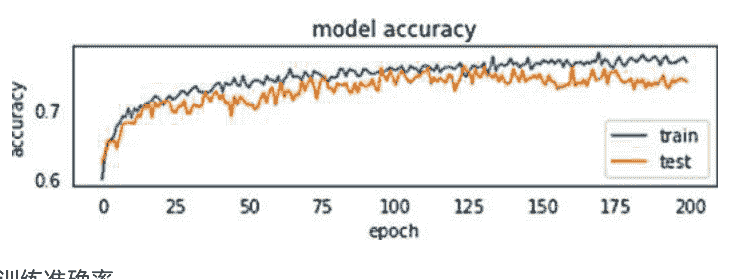

### 图6 模型训练准确率

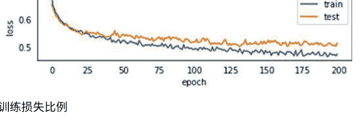

### 图7 模型训练损失比例

$$\mathrm{RMSE} = \sqrt{\mathrm{MSE}} = \sqrt{\frac{1}{N} \sum_{i=1}^{N}\left(y_{i}-\hat{y}\right)^{2}}$$ (2)

$y_{i} =$ 实际值
$\hat{y} =$ 预测值
$\bar{y} =$ 平均值
$N =$ 数据数量

在这个分析中，对比了现有和提出的逻辑回归性能。 在现有评估中，准确率达到93%。 参数调整后，这项提议的工作给出了96%的准确率。 提议的研究工作比现有方法更高效。

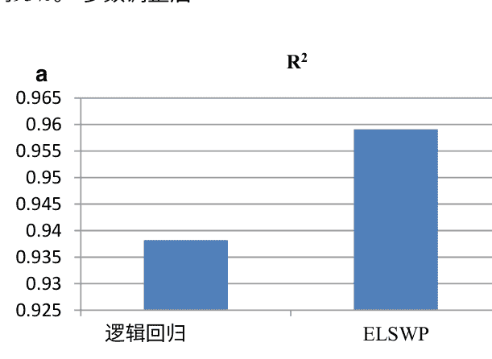

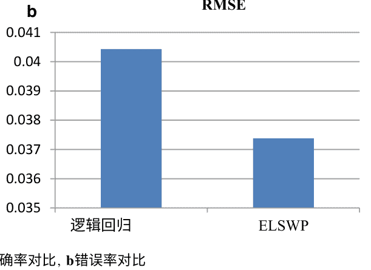

图8 a准确率对比, b错误率对比

表2 逻辑回归和ELSWP的比较分析

| 评估指标 | 逻辑回归 | ELSWP |
| :--- | :--- | :--- |
| R² | 0.9382 | 0.9591 |
| RMSE | 0.04043 | 0.03738 |

## 6 结论和未来工作

本文描述的实际天气预测技术称为ELSWP，它是围绕一个名为NodeMCU的低成本物联网模块和相关传感器构建的。基于传感器单元的三个关键特征被观测并传输到远程服务器，例如：温度、降雨状态和湿度。该设备被安装在农田中进行连续监测，并将测量值记录到服务器端。建议的模型ELSWP使用一种名为Jupyter notebook的专用机器学习处理开源工具实现，它使用预先记录的输入变量进行训练，然后用于实时预测气象数据。该模型的输出还与文献中的传统分类模型进行了比较，建议的方法略微更准确。

此外，该系统可以用于商业用途，并在家庭自动化、建筑、体育和医疗保健等领域具有广泛的应用。该应用程序可以预测未来10天在坦贾武尔的温度、湿度和降雨概率。降雨概率按照0-100百分比的范围计算，从而得出90%准确的预测。

未来，可以通过在传输端添加一些加密安全功能来进一步增强工作，以避免注入攻击。这种安全功能不仅提高了系统的性能，还为客户在实时目的中使用该模型创造了可信度。

## 参考文献

- 1. Kingsy Grace, R., & Suganya, B. (2020). 基于机器学习的降雨预测。 在第6届国际高级计算与通信系统会议上(pp. 227–229). IEEE Xplore.
- 2. Shivang, J., & Sridhar, S. S. (2018). 使用机器学习进行印度地区天气预测。国际纯粹与应用数学杂志, 118, 1945–1949.
- 3. Khan, Z. U., & Hayat, M. (2014). 基于数据挖掘技术的逐小时气候预测通过包含实体平均算法。中东科学研究杂志, 8, 1295–1300.
- 4. Bhatkande, S., & Hubballi, R. G. (2016). 基于决策树算法的天气预测使用数据挖掘技术。国际高级计算机与通信工程研究杂志, 5, 483–488.
- 5. Radhika, Y., & Shashi, M. (2009). 使用支持向量机的大气温度预测。国际计算机理论与工程杂志, 1, 1793–8201.
- 6. Chauhan, D., & Thakur, J. (2018). 用于天气预测的数据挖掘技术。国际计算机科学趋势与技术杂志（IJCST），6（3），249-254。
- 7. 邱, M., & 赵, P. (2017年)。 使用多任务卷积神经网络的短期降雨预测模型。在IEE国际数据挖掘会议上（第395-400页）。
- 8. Aswin, S., & Geetha, P. (2018年)。 深度学习模型用于降雨预测。在国际通信和信号处理会议上（第0657-0661页）。
- 9. Mohapatra, S. K., & Upadhyay, A. (2017年)。 基于100年的气象数据的降雨预测。在智能国家计算和通信技术国际会议上（第162-166页）。
- 10. Navadia, S., & Yadav, P. (2017年)。 天气预测：一种测量和分析天气数据的新方法。在I-SMAC国际会议上（物联网在社交、移动、分析和云中）（第414-417页）。
- 11. Gautam, A., & Verma, G. (2019). 基于物联网的车辆污染监测、控制和罚单系统，使用MQ2传感器。无线个人通信。国际期刊斯普林格。
- 12. Muthukumar, & Bhalaji, N. (2020). MOOCVERSITY基于深度学习的MOOC辍学预测在几周内。软计算范式杂志，140-152。
- 13. Smys, S., & Jennifer, S. (2020). 使用远程技术评估农村地区的火灾风险和森林火灾。电子学杂志，38-48。

# 基础设施即代码（IaC）：对各种平台的见解

Manish Kumar, Shilpi Mishra, Niraj Kumar Lathar和Pooran Singh

摘要在当今的技术堆栈中，云计算正在成为一种成功的和流行的技术领域，新兴企业通过在云上部署其功能、产品、数据和服务而不依赖于任何物理组件的方式取得成功，而不是在本地系统上部署，并且也不依赖于任何物理组件。 基础设施即代码（IaC）是一组使用代码的方法论来设置安装包、虚拟机和网络，并配置环境。 开发人员成功实施和采用IaC需要广泛的技能和知识。 这是开发运维的一种策略，通过二进制可读的配置文件来提供应用程序的基础设施并进行管理，而不是任何硬件配置。

关键词 DevOps · 基础设施 · 服务器 · 云 · Ansible · IaC · 可扩展性 · Terraform

## 1 引言

云计算是一种方法论，通过该方法可以存储和访问程序和数据，即使不在任何物理介质上存储或访问它们。这是一种最近的方法，可以节省组织的内部IT资源，因为数据不存储在本地，而是存储在云中，可以使用凭据随时随地访问[1,2]。 数字数据主要是音频、视频、文本和图像[3, 4]。 在当前情况下，使用云计算及其服务可以帮助大型组织节省大量成本和时间。 这是因为他们不需要考虑所需的成本，相反，他们只需选择一个云服务并获得所需的服务只需几次点击即可。

作为 DevOps 实践组的一个组成部分，IaC 通过处理基础设施代码中可重用内容的信息和经验，而不是通常将其保留给手动升级的系统管理员，这通常是缓慢、耗时、费力、甚至容易出错的工作。

虽然IaC在如今的培训中得到了广泛应用，但它仍然是一项新技术，并在各个方面不断发展，快速推进，并始终致力于IaC系统背后的代码，但它在社会和行业的绝大多数领域中越来越占据主导地位，[5]这只是个开始。像Chef和Puppet这样的著名IaC进展，提供了使用云实例自动设计和部署软件组织框架的系统。像Ambit Energy、Mozilla Firefox、Netflix和GitHub这样的数据技术（IT）组织，利用这些元素为基于云操作的实例（如Amazon Web Services (AWS)）制定计划，管理数据集，并管理本地和远程计算实例上的用户帐户。

## 2 文献综述

DevOps方法深刻影响着如今的软件设计和管理方式。DevOps包括一系列组织和技术实践，如持续集成/持续部署（CI/CD），将开发和运营团队融合在一起。目标很简单，就是让组织在现代数字生态系统和数字市场中生存下来，这要求快速和早期交付，不断更新的软件，市场需求的持续增长，以及采用灵活的技术，如云计算[6]。在这个背景下，基础设施即代码（IaC）是通过机器级别的理解代码描述复杂的基于云操作和服务的组织的开发运营实践。IaC实践的主要推动力是云计算的出现和实施，它在虚拟化技术的基础上，首次实现了计算资源的自动配置、配置和管理[7]。因此，已经开发出了各种不同的语言和相应的平台，每种语言和平台都处理基础设施管理的特定方面。从能够部署和协调虚拟机（Cloudify、Terraform等）的工具，到与容器技术（Docker Swarm、Kubernetes）类似的工具，再到机器镜像管理工具（Packer），以及配置管理工具（Chef、Ansible、Puppet等）。现在，IaC语言和工具的领域正受到技术异质性和大量可用解决方案的威胁。从某种角度来看，这是巨大的结果。

基础设施即代码引起了人们的兴趣。然而，这也使得人们对这项新技术的理解和接受变得复杂[8]。深入了解IaC及其所使用的平台，同时了解其中的问题和困难，对于推动IaC的发展和部署至关重要。

## 3 可用的方法

### 3.1 使用Terraform

HashiCorp的框架Terraform是一种代码工具，允许开发人员以明确和定义的方式定义资源和基础架构，并管理其基础架构的生命周期。 Terraform帮助监控组织的实际基础架构，并将其状态记录在一个文件中，作为基础架构当前状态的真实来源[6]。然后，它使用状态文件确定对基础架构进行的更改，以使其与设计相匹配。 使用Terraform部署基础架构时，需要进行多个步骤，如范围、计划、编写、应用和初始化。图1描述了Terraform的工作架构，包括设计和编写基础架构代码的从业者，然后在云平台（如亚马逊网络服务（AWS）、谷歌云平台（GCP）或微软Azure）上进行计划和应用，也可以是其他平台。

### 3.2 使用Ansible

Ansible是一种IT自动化引擎，能够进行应用程序管理，自动化云服务，协调内部服务，配置管理等。自从开始使用以来，它就被设计用于多层次的安排，并通过描述组织的基础架构来描述组织的各个系统之间的关系。 它不需要任何专业知识和额外的自定义安全框架，因此部署起来并不困难，最重要的是，它使用一种非常简单的语言YAML作为Ansible Playbooks，允许用户以接近普通英语的方式描述他们的自动化应用程序。它将项目推送到小型名称为Ansible模块的项目之后，Ansible与节点建立连接[9, 10]。这些小型项目被构建为框架的理想状态的资源模型。 然后，Ansible通过SSH执行这些模块，并在任务完成后终止它们。 在这里，图2描述了Ansible的架构，其中服务器包括清单，模块，插件和API，并使用这些功能，其他服务如云服务或主机服务器一起工作。

用户可以直接联系它，也可以使用Ansible Playbook。

### 3.3 Chef

它是一个强大的自动化平台，能够将基础架构转换为代码。 无论规模大小，无论您是在本地环境还是云环境，还是在任何混合环境中工作，Chef基础架构都可以监控和自动化基础架构的设计、部署和管理方式[11]。 图3显示了Chef平台的架构，包括以下3个主要组件：

- Chef工作站——这是消费者和客户与Chef基础架构连接的地方。开发人员可以使用它来编写和测试菜谱，使用测试厨房等工具，并使用刀具和Chef命令行工具与Chef基础架构服务器进行协作。例如，使用测试厨房进行测试，并使用刀具和Chef命令行工具与Chef基础架构服务器进行协作。
- Chef Infra Client—它在由Chef Infra监督的框架上运行。Chef Infra Client按照时间表执行，将系统配置为理想状态。
- Chef Infra Server—它充当配置数据的中心枢纽。用于存储烹饪书、元数据和应用于节点的策略。节点使用Chef Infra Client向服务器请求配置细节，例如文件分发、配方和模板。

### 3.4 Puppet

它是一个技术平台，帮助组织或开发人员管理和自动化服务器的配置。在使用Puppet时，需要在要管理的组织基础设施中定义系统的期望状态。可以通过在Puppet Code中编写基础设施代码来实现，Puppet Code是Puppet的领域特定语言（DSL），可与各种操作系统和设备一起使用[12]。Puppet代码是声明性的，这意味着开发人员需要定义系统的期望状态，而不是达到该状态的步骤，然后Puppet自动化整个过程并保持系统处于该期望状态。可以使用Puppet代理和其主服务器来实现。用于定义状态的代码存储在Puppet主服务器中，而Puppet代理用于将代码转换为相应的命令，然后在指定的系统中执行，这被称为Puppet运行。图4显示了遵循代理/服务器架构并包含的Puppet平台的架构。一个节点和一个Puppet主节点，负责处理和管理整个流程。它们都使用SSL进行连接。

### 3.5 CloudFormation

Amazon Web Service (AWS) CloudFormation是一种帮助有效设置和管理AWS资源的服务，使开发人员可以将大部分精力投入到运行在AWS云上的应用程序中。在CloudFormation中，组织首先创建一个描述应用程序所需的所有资源和服务的模板，并管理这些服务的配置。这些模板可以使用JSON或YAML格式创建。由于AWS CloudFormation，开发人员不需要每次都单独定义每个服务及其属性[5]。我们可以从图5中看到CloudFormation的架构，首先需要创建或使用现有的模板，然后将其保存在S3存储桶中。然后，通过基于我们创建的模板创建堆栈，我们可以使用CloudFormation构建基础架构。

## 4 分析

在今天的市场上，有很多平台和工具可以提供基础设施即代码的功能，例如Ansible、Chef、Puppet、Terraform、SaltStack、CloudFormation等等。 Puppet可以说是在2005年开始了基础设施即代码的旅程，之后在2009年，Chef加入了这个领域，之后不断有新的技术出现，其中AWS的CloudFormation是最新的，因为它与AWS服务的兼容性和工作性能而受到欢迎，尽管它与其他云平台不兼容，但如果我们考虑到已经非常庞大的AWS社区，我们可以依靠CloudFormation[13]。 下面，我们从不同的角度分析了不同的平台，以了解在当前基础设施即代码市场上哪个平台占据优势。

从表1中，我们可以看到各个平台基于它们的类型，支持的云技术，源代码和管理类型，它们支持的语言以及它们所持有的架构类型[14]。

从表2中，我们可以对每个平台在近年来增长有所了解。 如果我们观察表格，我们可以看到Ansible和Terraform在贡献者数量上有很大的增长，而且Terraform的库数量增加是无与伦比的。 由于CloudFormation仅限于AWS，并且不是开源平台，因此没有提到贡献者、提交或问题，但是如果我们检查库的增长量、Stack Overflow上的查询量以及工作数量，无论它是市场上最新的，它的规模都是巨大的[14]。

根据2021年第四季度的Statista报告，从图6中我们可以看到，在那个时间段，亚马逊（AWS—Amazon Web Services）在云基础设施市场上占据了33%的份额。 当时的云市场总价值为1780亿美元，比之前增长了37%。

表1 各种平台依赖

| 属性 | Chef | CloudFormation | Puppet | Terraform | Ansible | SaltStack |
| :--- | :--- | :--- | :--- | :--- | :--- | :--- |
| 代码 | 全部 | AWS | 全部 | 全部 | 全部 | 全部 |
| 云 | 开源类型 | 闭源类型 | 开源类型 | 开源类型 | 开源类型 | 开源类型 |
| 架构 | 客户端-服务器架构 | 客户端-服务器架构 | 客户端-服务器架构 | 仅客户端架构 | 仅客户端架构 | 客户端-服务器架构 |
| 类型 | 配置管理 | 配置管理 | 配置管理 | 编排 | 配置管理 | 配置管理 |
| 基础设施 | 可变的 | 可变的 | 可变的 | 不可变的 | 可变的 | 可变的 |
| 语言类型 | 过程式 | 过程式 | 声明式 | 声明式 | 过程式 | 声明式 |

来源: https://blog.gruntwork.io/why-we-use-terraform-and-not-chef-puppet-ansible-saltstack-or-cloudformation-7989dad2865c

基础设施即代码（IaC）：不同平台的见解

| 来源 | 来源 | 云 | 工作 | 星星 | 提交（1个月） | 贡献者 | 问题（1个月） | 堆栈溢出 | 库 |
| :--- | :--- | :--- | :--- | :--- | :--- | :--- | :--- | :--- | :--- |
| Chef | 开源 | 全部 | -22% | +31% | +139% | +18% | +48% | +43% | +26% |
| CloudFormation | 闭源 | AWS | +249% | 无 | 无 | 无 | 无 | +441% | +57% |
| Puppet | 开源 | 全部 | -19% | +27% | +19% | +19% | +42% | +36% | +38% |
| Ansible | 开源 | 全部 | +125% | +97% | +49% | +195% | +66% | +223% | +157% |
| Terraform | 开源 | 全部 | +8288% | +194% | -61% | +93% | -58% | +1984% | +355% |
| SaltStack | 开源 | 全部 | +257% | +44% | +79% | +40% | +27% | +73% | +33% |
| Heat | 开源 | 全部 | +2957% | +23% | -85% | +28% | +1566% | +69% | 0% |

> 来源: https://blog.gruntwork.io/why-we-use-terraform-and-not-chef-puppet-ansible-saltstack-or-cloudformation-7989dad2865c图6 2021年Q4全球领先云基础设施服务提供商的市场份额。来源https://www.statista.com/chart/18819/worldwide-market-share-of-leading-cloud-infrastructure-service-providers/

在上一年2020年，市场上占主导地位的平台是AWS和Azure [15]。

## 5 结论

在当前技术的情况下，正在发生很多变化，在云计算平台领域，市场上有各种大牌，尽管AWS在很大程度上产生了影响，并且目前领导着云市场。

DevOps是一组旨在加快组织和交付大规模应用程序的策略。基本上，所有的开发操作自动化都更多地受到基础设施即代码的驱动，我们可以将其称为在DevOps流水线中扩展应用基础设施和所有相关中间件的一系列概念 [16]。从某种角度来看，存在一些最佳实践，但它们主要集中在限制IaC内在的复杂性上。另一方面，存在许多困难，从冲突的最佳实践到缺乏可测试性、可读性问题等等。因此，根据环境和因素，软件工程师可以根据其适用性选择任何阶段。

尽管我们可以从研究中评估出，对于当前的市场来说，Terraform在市场上获得了很大的流行度，因为它具有灵活性、跨平台工作和可扩展性；另一方面，如果我们正在使用最流行的云AWS，使用CloudFormation将是最佳选择 [17]。

## 参考文献

- 1. 云计算的工作原理。http://computer.howstuffworks.com/cloudcomputing/cloud-computing.htm
- 2. Arora, H., Mehra, M., Sharma, P., Kumawat, J., & Jangid, J. (2021). 云计算的安全问题。设计工程, 2254–2261.
- 3. Soni, G. K., Arora, H., & Jain, B. (2020). 一种使用Arnold变换和非对称RSA算法的新型图像加密技术。在国际人工智能会议上:2019年的进展和应用。智能系统的算法。Springer.
- 4. Soni, G. K., Rawat, A., Jain, S., & Sharma, S. K. (2020). 使用LSB水印技术的基于像素的数字医学图像保护。在智能系统和物联网中:计算创新。智能创新，系统和技术(第141卷)。Springer.
- 5. Alam, A. B., Haque, A., & Zulkernine, M. (2018). Crem: 云可靠性评估模型。在2018年IEEE全球通信大会 (GLOBECOM) (第1-6页)。IEEE.
- 6. Artac, M., Borovssak, T., Di Nitto, E., Guerriero, M., & Tamburri, D. A. (2017). Devops: 引入基础设施即代码。在2017年IEEE/ACM第39届国际软件工程会议伴侣 (ICSE-C) (第497-498页)。IEEE.
- 7. Rahman, A., Parnin, C., & Williams, L. (2019). 七宗罪：基础设施中的安全问题作为代码脚本。在第41届国际软件工程会议论文集中。出版。
- 8. Bhalaji, N. (2021). 使用深度对数网络进行云负载估计，以实现工作负载和时间序列优化。软件计算范式杂志, 3 (3), 234-248.
- 9. Hashicorp 学习。什么是基础设施即代码与 Terraform(在线)。可用: https://learn.hashicorp.com/tutorials/terraform/infrastructure-as-code
- 10. Kumar, R., Gupta, N., Charu, S., Jain, K., & Jangir, S. K. (2014). 云计算平台的开源解决方案使用 OpenStack。国际计算机科学和移动计算杂志, 3(5).
- 11. Cowie, J. (2014). 自定义 chef 充分利用基础设施自动化。 O'Reilly Media, 9.
- 12. Fowler, M., Beck, K., Brant, J., Opdyke, W., & Roberts, D. (1999).重构: 改善现有代码的设计。Addison-Wesley Longman Publishing Co., Inc.
- 13. Brikman, Y. 为什么我们使用 Terraform 而不是 Chef、Puppet 和 Ansible(在线)。可用- 链接: https://blog.gruntwork.io/why-we-use-terraform-and-not-chef-puppet-ansible-saltstack-or-cloudformation-7989dad2865c
- 14. Baldini, I., Castro, P., Chang, K., Cheng, P., Fink, S., Ishakian, V., Mitchell, N., Muthusamy, V., Rabbah, R., Slominski, A., et al. (2017). 无服务器计算：当前趋势和开放问题。在云计算的研究进展中（第1-20页）。斯普林格。
- 15. Mishra, S., Kumar, M., Singh, N., & Dwivedi, S. (2022). 关于AWS云计算的调查安全挑战和解决方案。在IEEE应用人工智能和计算国际会议上。
- 16. Buyya, R., Srirama, S. N., Casale, G., Calheiros, R., Simmhan, Y., Varghese, B., Gelenbe, E., Javadi, B., Vaquero, L. M., Netto, M. A., et al. (2018). 未来一代云计算宣言下一个十年的研究方向。ACM计算调查 (CSUR), 51 (5), 1-38.
- 17. 安迪, H.K. (2021). 云软件框架中无服务器计算技术的分析。物联网在社交、移动、分析和云中的期刊, 3(3), 221–234.

# 数据隐藏样本选择中的K均值聚类决策方法

Virendra P. Nikam和Sheetal S. Dhande

摘要 现如今，数据科学在决策过程中扮演着重要角色。数据科学应用因组织而异，在多维数据的决策过程中起着非常重要的作用。作者建议在载体数据隐藏的样本选择过程中应用K均值聚类数据科学算法。建议的方法有助于减少样本选择的时间复杂度，并更准确地聚类样本，从而有助于专注于特定聚类而不是整个载体中的样本。实验结果在本文的结果部分中计算得出比其他任何聚类技术更好。作者的主要目标是使数据隐藏过程简单而准确，以最小化量化误差。K均值聚类是一种有效的技术，可以根据欧氏距离和MOI将样本分组为不同的类别。聚类的准确性取决于聚类中的项有多紧密。将结果与现有方法进行比较，结果更好，从而证明了K均值聚类数据科学方法是数据隐藏过程中样本选择的最佳匹配。

关键词 K均值聚类·质心·惯性矩·欧几里得距离·均方根·感兴趣区域

## 1 引言

当数据存储在本地系统或服务器系统上时，数据安全是一项具有挑战性的任务。许多组织在数据隐私、身份验证和安全方面损失了大量资金。现有技术足以保护数据，但还不够。在现代技术时代，对于敏感数据来说，100%的安全性几乎是不可能的。存在许多技术，如数据隐藏、水印、压缩、加密等，用于保护数据免受非法访问。

V. P. Nikam (✉) · S. S. Dhande 计算机科学与工程系，Sipna工程学院和技术学院，阿姆拉瓦蒂，马哈拉施特拉邦，印度e-mail:virendranikamphd@gmail.com © 作者（们），在Springer Nature Singapore Pte Ltd. 2023独家许可下 S. Shakya等人（编），情感分析与深度学习, 智能系统与计算进展 1432, https://doi.org/10.1007/978-981-19-5443-6_34

数据安全的一个主要障碍是其多维性质。大部分时间，数据是从实时场景中收集的，比如来自人们反馈的市场数据，这些数据是多维的形式。有必要保护这些数据，以便在业务流程中做出良好的决策，并通过处理和存储数据来更准确地增强它们。提出一种主要目标是通过将敏感数据隐藏在另一个对象后面来保护它，该对象可以是图像、音频、视频或文本。作者们使用图像作为数据隐藏的主要对象来实施项目策略。

图像是由称为红色、绿色和蓝色的三个颜色分量集成而成的，这使得它成为一个多维数据集。每个颜色分量由8位组成，这构成了一个像素，而像素构成了一个图像。在数据隐藏的过程中，需要提取所有这三个通道分量，并且需要决定在哪里隐藏秘密数据。正如作者所提到的，由于图像的三个颜色分量，很难在特定点上做出决策或达到决策，选择哪个样本用于数据隐藏。如果数据隐藏在错误的载体通道后面，将会产生一个称为量化误差的巨大差异，这将在原始载体（图像）和结果载体之间产生一个视听感知质量的差异。作者的主要目标是通过使用数据科学的k-means聚类算法从图像中选择最佳区域载体样本来最小化量化误差。

有很多数据科学算法可以对多维数据进行聚类和分类决策，例如k最近邻算法、k均值聚类、遗传算法等。建议使用k均值聚类来对运营商样本进行分组，并帮助开发人员专注于特定区域的运营商样本进行数据隐藏处理。在进入k均值聚类过程和其在数据隐藏背后的应用之前，请参考图1，了解k均值聚类在数据隐藏过程中的适用性。

发送者是选择载体对象和隐藏在载体对象后面的任何合法用户或软件程序。所选的载体对象是由RGB组件组成的彩色图像。让我们考虑一个图像 m × n，其中m是宽度，n是高度。因此，图像中的像素总数为 m × n，这意味着图像的数据承载能力是其像素总数的三倍。

图像作为载体对象是用户的选择。机密信息是敏感的，不应该对未经授权的人可见。一旦选择了秘密数据，它就会被转换为其等效的二进制表示，例如

$$ (21)_{10} = (00010101)_{2} $$

将秘密数据转换为其等效的二进制格式是强制性的，因为数据隐藏过程在位级上工作。从载体对象中提取样本，并将其作为输入提供给k-means聚类算法进行样本分组。所有样本都经过充分的迭代和强大的MOI进行良好的聚类。然后它们被提供给数据隐藏算法，该算法专注于在隐藏秘密位后生成最小量化误差的特定聚类。

图1 数据隐藏和提取溢出

数据隐藏算法输入二进制秘密数据和k-means聚类样本，并通过专注于特定有效聚类隐藏数据与最佳样本。隐藏过程生成两个产品文件，即隐写对象和密钥文件。密钥文件保存了秘密位隐藏的样本位置。由于k-means聚类算法输出图像不同位置的样本的聚类或分组，隐藏过程也是随机的，这意味着它需要记住秘密位隐藏的位置。这两个输出文件通过无线网络发送到公共云存储，在那里经过身份验证的接收者提取数据。最初，该方法旨在只允许具有适当身份验证代码或权限的合法用户访问公共数据，但后来，所有权限或限制都被移除，公共云上的数据对所有访问云的人都可用。

在接收端，它提取或输入存储在公共云中的隐写对象和密钥文件。样本从隐写载体对象中提取出来，并作为输入提供给数据提取算法，该算法以二进制格式生成秘密数据或通过密钥文件提取它。然后将提取的二进制数据转换为其等效的字符表示。聚类算法在数据提取过程中没有任何作用，但它们通过在发送端生成密钥文件的方式影响数据提取。提取数据的准确性高度依赖于数据被准确记录到密钥文件中的程度。k-means聚类数据科学算法的最大优势之一是无监督学习策略，不需要任何训练数据。基于输入数据样本聚类随机生成质心。通过MOI的方式来衡量聚类数据样本的准确性。

K-means聚类是一种无监督算法，旨在将未标记的数据划分为一定数量的称为“簇”的组。K-means聚类算法的一个特点是它找到并观察与输入数据具有重要特征的输入数据，并将它们分类到不同的组中。一个好的聚类解决方案的一个标志是能够以这样的方式找到簇，使得每个簇内的观测值比簇本身更相似。K-means聚类算法遵循两个步骤。

- 1. 分配：在分配步骤中，每个数据点被分配到其最近的质心，该质心是随机插入的。
$$min(c) = [dist(c_1, x)^2, \dots, dist(c_n, x)^2]$$ (2)
对于每个质心和数据点计算欧氏距离。该过程已针对数据样本和随机插入的质心重复进行。与质心相对应的簇中具有最小欧氏距离的样本将被分配到该簇。
- 2. 更新步骤：在更新步骤中，根据迭代观察，质心被更新到它们的新位置。
$$c_i = \frac{1}{|s_i|} \sum_{x_i \in c_i^{x_i}}$$
算法从步骤1执行到步骤2，直到满足停止准则。这意味着没有数据点发生变化，距离之和，即MOI，被最小化。从k-means聚类算法得到的结果是局部最优解，这意味着使用随机起始质心运行算法会得到更好的结果。

大约有两个步骤一遍又一遍地重复，直到聚类数据样本不再发生变化为止。当每个聚类中的样本都稳定下来并且在质心更新的重复过程中不再发生变化时，这意味着样本已经很好地聚类，并且不需要进一步迭代。

## 2 文献综述

Abdul Nazeer等人[1]发现了聚类的局限性，即需要指定聚类的数量，而不考虑数据点的分布。这意味着k-means聚类算法本身无法找到一个好的聚类数量，除非由用户指定。

Agrawal和Phatak [2]将k-means聚类技术应用于历史文档。找出k-means聚类的一些限制。

- 1. K-means聚类需要指定聚类的数量。
- 2. 除了激活之外，它的收敛性存在两个不同的局部最小值和最大值。
- 3. 它相对较慢，不适用于大量数据集点。
- 4. 无法处理没有数据集点的聚类。

Mato等人[3]将k-means聚类算法应用于解决地球物理问题，确定断裂带的地球动力学行为。K-means聚类是一种无监督技术，对于识别地球物理问题是必需的。然而，他们报告了算法的一些问题。

- 1. 从地球物理和地球动力学的角度，识别聚类数量及其特殊定位。
- 2. 作者应用k-means算法来构建信息在聚类数据集点内。

他们的新技术允许先前确定的地震事件与能量释放点相关联，这有助于执行地球物理聚类并使用k-means聚类计算它们的质心。

杨等人[4]发现k-means聚类对聚类数量k的影响很敏感。他们的主要目标是通过k-means聚类改进速度和精度。为了实现这一目标，作者提出了一种通过减法聚类技术找到最佳初始聚类数量k的方法。他们在UCI和UT等公共数据库上进行实验，结果显示k-means聚类算法的局限性可以消除初始随机生成的聚类数量k的敏感性。

Kapil等人[5]建议使用遗传算法优化的k-means聚类技术，以减少由k-means引起的问题。计算并分别比较这些k-means和遗传算法的结果，以得出关于建议方法有效性的结论。作者还报告了一些缺点，这使得使用k-means聚类和遗传算法变得不可行。然后，从平方误差的角度来看，遗传算法表现更好。建议的方法需要将不同聚类算法与不同机器学习技术以及高维数据集上的不同实践进行性能比较。Shah和Singh[6]提出了一种修改的k-means聚类技术。在这种技术中，作者执行类似于k-means和k-medoids的算法，并使用不同的初始聚类和不同的数据集点测试多种方法。建议的修改后的k-means技术在聚类数量和性能时间方面表现更好。建议的方法已经在实时数据上执行，并将其结果与k-means和k-medoids进行了比较。

Gour等人[7]提出了一种方法，将其结果与自组织映射（SOM）和k均值聚类技术进行比较。他们的结果表明，建议的聚类技术在MOI [8]和随机质心初始化方面比k均值和自组织映射（SOM）聚类方法表现更好。作者的主要目标是改进聚类的速度和精度，通过将其结果与其他聚类技术进行比较来验证。作者发现，与k均值和自组织映射（SOM）相比，art1是最好的指纹聚类技术。

Li等人[9]发现，尽管k均值的聚类初始化质心的优先级和随机性解决了许多传统问题，但由于计算复杂性，很难广泛和普遍应用。作者提出了一种基于分层k均值聚类的新方法，具有良好的计算复杂性。通过使用鸢尾花数据集验证了所提出方法的效率。使用建议的方法，通过层次聚类（HC）来分布不同的数据集点，然后决定质心。

Sapkota等人[10]提出了一种分析现有数据挖掘技术并通过k-means算法最大化聚类准确性的方法。作者介绍了一种基于谱聚类和k-means算法结合的新算法。该提出的系统替代了随机初始化聚类中心的技术，解决了k-means算法的一些局限性。他们的算法选择了一个合适的第一个聚类中心，而不是随机选择。该提出的系统减少了错误，但增加了处理时间，最多可达4秒。

Alvarez等人[11]采用自适应聚类过程来识别在高峰时段功耗最高的客户。分析表明应该对用户的搜索群组进行适当的控制，以减少高峰需求并满足要求。k-means聚类技术已被用于对在高峰时段消耗更多电力的客户进行聚类。作者使用轮廓系数方法来估计合适的聚类数量。

Yang和Sinaga [12] 大多数多视图k-means聚类技术在聚类过程中不提供特征降维，多视图数据集中可能存在不相关的特征，这可能导致聚类算法的性能指标不佳。还有多维数据集，因此有必要考虑减少它们的维度以进行准确和精确的聚类。作者提出了一种学习机制，用于自动计算多视图k-means技术的特征质心。它还减少了每个聚类视图中的不相关特征组件。建议的新型多视图k-means技术也被称为特征降维多视图k-means。

Wang等人 [13] 提出了一种快速自适应k-means（FAKM）聚类技术，其中设计了一种自适应损失函数，用于提供灵活的聚类质心计算机制，这就是为什么该技术最适用于不同分布的数据集。FAKM技术同时进行特征选择和聚类，而无需找到特征值分解。对几个数据集进行了广泛实验，结果表明快速自适应k-means（FAKM）技术在其他现有的最先进聚类算法上取得了良好的结果。

作者利用FAKM的一种高效的替代优化技术。程等人[14]本文提出了一种基于k-means聚类径向基函数神经网络的网络安全计算模型。作者使用k-means聚类对输入样本进行聚类，并获取径向基函数神经网络的隐藏层节点以更快地选择中心点。训练数据设置为神经网络性能与神经网络结构。与其他神经网络相比，作者的方法在训练速度和准确性方面取得了很大的改进。

吴等人[15]在本文中提出了实施隐私保护学习作为一种服务模型，并专注于加密云数据库上的k-means聚类。先前存在的算法部分使用同态加密，这需要大量的协议和高计算和通信成本，使其在现实世界中不实用。作者帮助解决了这个问题，并提出了一种新的安全高效的外包k-means聚类，该方法使用全同态加密和密文封装技术。方案在三个方面保护了隐私：数据库安全、聚类结果的隐私和数据访问模式。所提出方法的实验结果计算成本非常低，并且适用于许多大型数据库。

刘等人[16]提出了一种基于k-means聚类的控制力矩陀螺故障诊断方法，通过考虑多维数据之间的隐藏相关参数，提高了故障诊断准确性。主成分分析和随机邻域嵌入技术用于从控制力矩陀螺和数字数据中提取特征。故障诊断过程完全基于k-means聚类，在实际轨道控制力矩陀螺数据中非常有效。

## 3 提出的方法

整个过程分为以下步骤

-   1. 选择载体
-   2. 提取载体样本
-   3. 选择秘密数据
-   4. K-means聚类
-   5. 数据隐藏
-   6. 数据提取。

### 3.1 载体选择

作者将上述步骤应用于图像作为载体对象，其表示为

```
i = ∫_{i=0}^{m} ∫_{j=0}^{n} (r, g, b) \quad (4)
```

图像是RGB颜色分量的集成，这是数据隐藏的基本支柱。与其他图像格式相比，24位RGB颜色模型图像始终具有最大的数据承载能力。载体对象的最大数据承载能力用

```
C = m * n \quad (5)
```

表示，根据公式4，可以在载体对象后面隐藏C个字符。

### 3.2 提取载体样本

表1显示了提取的RGB载体样本及其平均值。只使用平均值来查找或观察量化误差。由于本文篇幅的限制，表1只给出了一些样本。然而，提取的总样本数量高度依赖于载体图像的高度和宽度，根据公式4。

#### 表1 载体样本

| 红色 | 绿色 | 蓝色 | 平均 |
|------|------|------|------|
| 214 | 112 | 203 | 176.3333333 |
| 253 | 190 | 206 | 216.3333333 |
| 198 | 202 | 49 | 149.6666667 |
| 224 | 117 | 61 | 134 |
| 206 | 171 | 170 | 182.3333333 |
| 185 | 155 | 117 | 152.3333333 |
| 144 | 242 | 175 | 187 |
| 182 | 229 | 117 | 176 |
| 5 | 82 | 127 | 71.3333333 |
| 205 | 101 | 67 | 124.3333333 |
| 37 | 171 | 24 | 77.3333333 |
| 229 | 77 | 46 | 117.3333333 |
| 104 | 13 | 232 | 116.3333333 |
| 71 | 67 | 246 | 128 |
| 157 | 134 | 205 | 165.3333333 |
| 72 | 7 | 5 | 28 |
| 207 | 60 | 148 | 138.3333333 |
| 178 | 170 | 24 | 124 |
| 18 | 72 | 130 | 73.3333333 |
| 26 | 32 | 114 | 57.3333333 |
| 60 | 207 | 140 | 135.6666667 |
| 218 | 176 | 164 | 186 |
| 241 | 146 | 212 | 199.6666667 |
| 9 | 140 | 130 | 93 |
| 228 | 78 | 211 | 172.3333333 |
| 6 | 70 | 157 | 77.6666667 |
| 53 | 171 | 8 | 77.3333333 |
| 208 | 104 | 32 | 114.6666667 |
| 86 | 153 | 112 | 117 |
| 65 | 232 | 42 | 113 |
| 115 | 213 | 224 | 184 |
| 41 | 65 | 83 | 63 |
| 240 | 104 | 212 | 185.3333333 |
| 103 | 124 | 67 | 98 |
| 5 | 97 | 124 | 75.3333333 |
| 181 | 74 | 4 | 86.3333333 |
| 77 | 86 | 242 | 135 |
| 3 | 158 | 180 | 113.6666667 |

#### 算法1

结果：数据集点的聚类。

-   1. 开始
-   2. 输入数据集 $X$
-   3. 随机初始化质心
    $C_{i,j} = Rand(X_{Roi Min}, X_{Roi Max})$
-   4. 计算数据集点与质心的距离
    $D_i = |C_i - X_i|$.
    或者
    $D_i = \sqrt{\frac{(C_x-X_x)^2+(C_y-X_y)^2}{2}}$
-   5. 计算 MOI
    $MOI = \sum_{i=1}^{n} |C_i - x_i|$.
-   6. 如果$MOI$ != 饱和则
    寻找新的质心
    从第4步开始重复
    结束
-   7. 停止

### 3.3 秘密数据选择

秘密数据可以是图像、音频、视频或文本。 如果不将秘密数据转换为其等效的二进制格式，则无法将其隐藏在载体对象后面。 这就是为什么秘密数据的格式无关紧要。 作者在这里基于文本作为秘密数据的结果进行了证明。 让我们考虑十进制格式的载体样本值21，根据问题1可以将其表示为其等效的二进制格式。 二进制转换过程非常简单，只需记住一个提醒，并且在互联网上很容易找到。

### 3.4 K-means聚类

k-means聚类技术进一步分为以下步骤。

-   1. 数据收集
-   2. 数据预处理
-   3. 质心的随机初始化
-   4. 计算数据点到质心的距离
-   5. 为每个聚类计算新的质心
-   6. 根据其MOI分析聚类强度
-   7. 根据MOI确定聚类的最终数量。

图2 输入数据

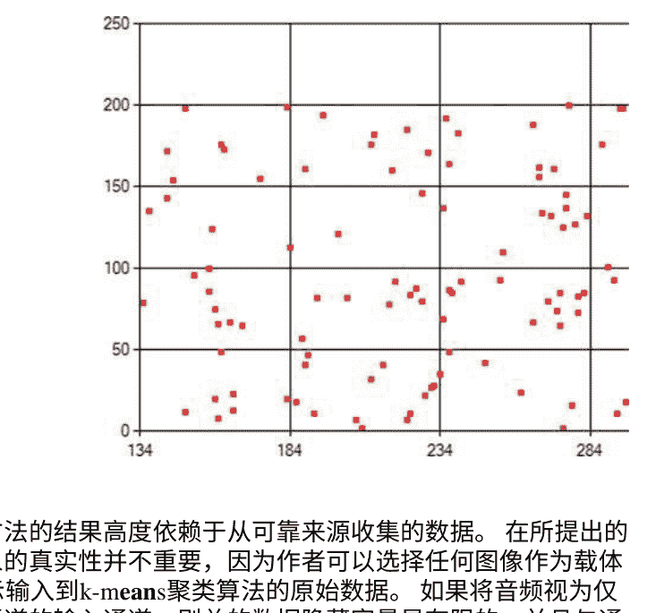

数据收集所提出方法的结果高度依赖于从可靠来源收集的数据。在所提出的方法中，载体对象的真实性并不重要，因为作者可以选择任何图像作为载体对象。表1表示输入到k-means聚类算法的原始数据。如果将音频视为仅包含左右立体声通道的输入通道，则总的数据隐藏容量是有限的，并且与通道数成正比。由于视频集成了音频和图像帧，因此具有最大的数据隐藏容量。音频和图像都被视为不同的数据类型，因此几乎具有双倍的数据承载能力。让输入数据集

```
X = x_1, x_2, x_3, \ldots, x_n
```

由 n-th 数据集点组成。数据集点 X包含了处理提出的方法实验所需的所有参数。所有这些参数都需要用于预处理和过滤。表1中的数据的图形表示如图2所示。k-means聚类技术解释了仅以图形格式表示二维数据的限制，这意味着任意两个参数，如RG、GB或RB，都被考虑在内（图3）。数据预处理数据预处理也称为数据过滤，只考虑那些高度精确且对于所提出的概念的实施是必需的参数。数据集点 X被分为ROI和非ROI。

数据预处理的输出是ROI点，而非ROI点则被保留以供进一步处理。

```
X_{\text{ROI}} = x_{r1}, x_{r2}, x_{r3}, \ldots, x_{rm}
```

图3 数据预处理

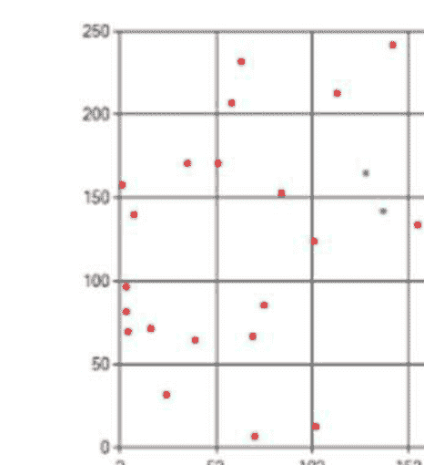

ROI点的选择完全取决于程序员的选择，考虑到整个数据集的演化中的参数重要性。

$$X_{\text{ROI}} = [R, G, B]$$ (8)

数据预处理中考虑的因素非常重要，并且最适合实时场景（图4）。

随机初始化质心K-means聚类算法需要随机初始化质心来开始过程。随机初始化质心是通过进行的

$$C_{i,j} = \text{Rand}(X_{\text{ROI Min}}, X_{\text{ROI Max}})$$ (9)

计算数据点到质心的距离为了对数据进行聚类，计算所有数据点到质心的距离。在初始阶段，质心是根据用户指定的聚类数目随机插入的。执行的距离度量被称为欧氏距离，表示为

$$D_i = |C_i - X_i|$$ (10)

计算每个数据点与每个质心 $C_i$之间的距离。根据最小值Min($C_i$)做出决策。最小值Min($C_i$)将所有数据集点分成用户指定的群集数。如果 $C_i$和 $x_i$是多维的，则可以通过获取其RMS值来计算距离。

$$D_i = \sqrt{\frac{(C_x - X_x)^2 + (C_y - X_y)^2}{2}}$$ (11)

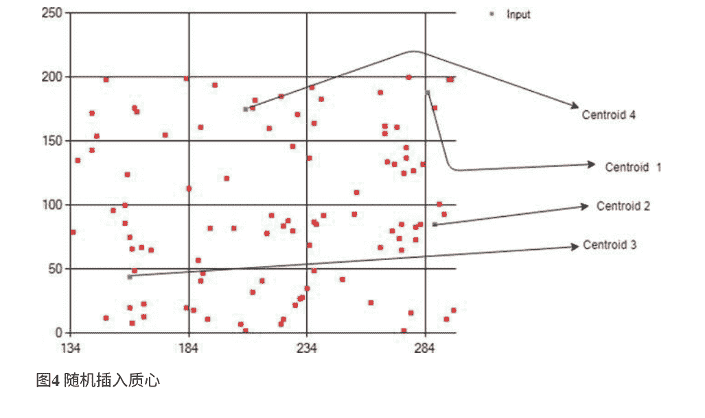

为每个群集计算新的质心一旦通过随机初始化质心创建了群集，就通过取每个质心的平均值来计算新的质心。例如 假设考虑聚类1有n个数据点，则所有这些数据点的平均值为

$$C_{\text{new}} = \frac{\sum_{i=1}^{n} x_i}{n} \quad (12)$$

这个 $C_{\text{new}}$ 被视为群集 $C_i$ 的新质心。 同样，计算其他群集的新质心，并将数据点再次聚类到不同的群组中。

基于其MOI分析集群强度通过计算数据集点与质心之间的结合来测量集群的强度。 最小结合距离意味着集群非常精确和准确。 这种结合被称为MOI，并通过MOI =计算

$$\sum_{i=1}^{n} |C_i - x_i| \quad (13)$$

基于MOI确定聚类的最终数量聚类中的聚类数和数据点一直存在争议。 很多时候，一个少于4个点的聚类对机器学习来说不好。 这样的聚类被称为“过拟合聚类”。 需要一种机制来决定聚类中的数据点数量。 MOI是决定给定数据点集的聚类应该占多少的好选择。 MOI稳定到没有进一步需要聚类数据的程度。 MOI的稳定性称为饱和水平。

在迭代过程中，MOI呈指数增加或减少，然后稳定下来。

#### 算法2

结果：设置聚类数的决策
当！ MOI==饱和时
    继续寻找新的质心
    构建新的聚类
    计算MOI
结束

### 3.5 数据隐藏

数据隐藏过程不选择任何隐写术方法。 如图5所示，所有数据样本都被聚类，现在开发人员必须选择在哪里隐藏数据。 选择哪个聚类？ 当前方法经过了最低有效位（LSB）、扩频、小波分析、样本翻转和最高有效位（MSB）的测试。 通过在研究分析的开发过程中花费了很多年的时间，观察到在暗区域的样本中

$$0 \le c_s \ge 20  (14)$$
$$240 \le c_s \ge 255 (15)$$

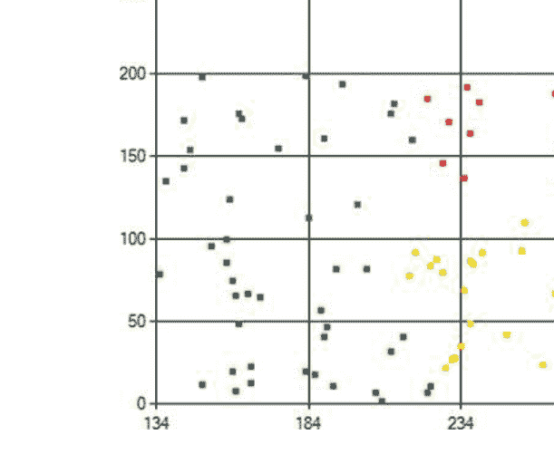

图5 聚类数据集（ C = 4）

对于数据隐藏很好。即使在数据隐藏之后，载体对象的视觉感知质量仍然保持不变，因为它代表了图像的极暗或极白颜色。另一个区域被称为非暗区域，在这个区域中，样本主要代表图像的熵，隐藏过程会产生错误，从而干扰了载体对象的原始性。建议不要在非暗区域隐藏数据，因为它对错误非常敏感。

K-means聚类技术可以轻松地在整个载体区域中找到暗区域的样本，并帮助开发者在数据隐藏过程中轻松选择样本。

### 3.6 数据提取

要从隐写对象中提取数据，必须有一个保存了数据隐藏位置的密钥文件。提取过程只需根据密钥文件中的值找到隐藏样本的位置，并以二进制格式收集数据，然后将其转换为字符格式。数据提取过程非常简单，不依赖于k-means聚类。这被认为是其中一个缺点，因为聚类过程无法加速，您必须扫描整个载体区域。数据提取的准确性取决于原始秘密数据和提取数据之间的比较测量。

作者实现了一个比较结果分析模型，比较了输入和提取的数据，并证明数据隐藏和提取后没有任何字符丢失。

## 4 结果分析与讨论

结果分析的目的是衡量所提出系统与具有不同参数的其他类似算法的性能。为了确保所提出的方法更好、更先进，必须将算法的结果与不同参数进行比较。所提出的概念建议使用k-means聚类对RGB数据集进行聚类。其比较参数可能包括MOI、聚类数、RMS值、与当前情景下聚类的交叉验证等。

从表2可以看出，MOI的值从第8次迭代开始稳定。对于每个数据集，仍然需要进行迭代来确定准确的聚类数C。在其他情况下，如果数据集中的数据点有数千个，MOI将在10到15次迭代后稳定下来。通过提出的k-means聚类算法，已经进行了近20次迭代，以确定精确和准确的数据集点。从表3中可以看出，在3到4次迭代后，聚类数目得到了完美的设置。ED是数据点与其质心之间的距离的度量。数据集点属于与其质心距离最小的聚类。Ed是通过RMS误差D_i的方程计算的。一个MOI是每个数据集点与质心之间距离的总和。它是计算聚类数据集点之间的绑定关系的。最小的MOI意味着强聚类绑定。通过多次迭代将MOI设置为最小值。从表5可以看出，在3到4次迭代后，MOI稳定在最小值。所提出的概念需要努力减少迭代次数，并根据聚类数据集点自适应地设置聚类数。所提出的方法不仅在RGB场景中进行了测试，还在载体格式中进行了测试。发现所提出的技术非常适用于各种业务领域。

### 表2 MOI迭代

| 迭代 | 聚类1 | 聚类2 | 聚类3 | 聚类4 |
|------|-------|-------|-------|-------|
| 1 | 78.40 | 198.99 | 259.76 | 113.97 |
| 2 | 78.40 | 152.64 | 225.17 | 157.40 |
| 3 | 102.51 | 129.02 | 190.31 | 179.02 |
| 4 | 113.83 | 106.38 | 129.81 | 240.01 |
| 5 | 125.55 | 109.64 | 86.33 | 240.48 |
| 6 | 145.36 | 109.64 | 82.65 | 215.06 |
| 7 | 161.94 | 109.64 | 82.65 | 195.78 |
| 8 | 161.97 | 109.64 | 82.65 | 194.43 |
| 9 | 161.97 | 109.64 | 82.65 | 194.43 |
| 10 | 161.97 | 109.64 | 82.65 | 194.43 |
| 11 | 161.97 | 109.64 | 82.65 | 194.43 |
| 12 | 161.97 | 109.64 | 82.65 | 194.43 |
| 13 | 161.97 | 109.64 | 82.65 | 194.43 |
| 14 | 161.97 | 109.64 | 82.65 | 194.43 |
| 15 | 161.97 | 109.64 | 82.65 | 194.43 |
| 16 | 161.97 | 109.64 | 82.65 | 194.43 |
| 17 | 161.97 | 109.64 | 82.65 | 194.43 |
| 18 | 161.97 | 109.64 | 82.65 | 194.43 |
| 19 | 161.97 | 109.64 | 82.65 | 194.43 |
| 20 | 161.97 | 109.64 | 82.65 | 194.43 |

### 表3 每个聚类中的数据集点数

| Count_0 | Count_1 | Count_2 | Count_3 |
|---------|---------|---------|---------|
| 29 | 24 | 26 | 20 |
| 27 | 25 | 27 | 20 |
| 25 | 24 | 30 | 20 |
| 28 | 25 | 27 | 19 |
| 29 | 25 | 27 | 18 |
| 29 | 25 | 27 | 18 |
| 29 | 25 | 27 | 18 |
| 29 | 25 | 27 | 18 |
| 29 | 25 | 27 | 18 |
| 29 | 25 | 27 | 18 |
| 29 | 25 | 27 | 18 |
| 29 | 25 | 27 | 18 |
| 29 | 25 | 27 | 18 |
| 29 | 25 | 27 | 18 |
| 29 | 25 | 27 | 18 |
| 29 | 25 | 27 | 18 |
| 29 | 25 | 27 | 18 |
| 29 | 25 | 27 | 18 |
| 29 | 25 | 27 | 18 |
| 29 | 25 | 27 | 18 |
| 29 | 25 | 27 | 18 |

## 5 结论

从结果分析部分可以得出结论，k-means聚类非常适合对载体样本进行分组，基于此，很容易决定在哪里隐藏数据。k-means聚类技术仅在数据隐藏过程中起重要作用，因此在接收端自动减少了复杂性，因为不需要与接收者共享额外的细节以进行数据提取。通过从正确的聚类中选择样本，有助于减少数据隐藏后出现的错误。精确度和准确度

### 表4 ED迭代

| 欧几里得_0 | 欧几里得_1 | 欧几里得_2 | 欧几里得_3 |
|------------|------------|------------|------------|
| 32.42 | 56.72 | 45.7 | 53.98 |
| 26.72 | 57.15 | 45.82 | 59.56 |
| 20.95 | 51.23 | 54.61 | 66.33 |
| 18.64 | 56.53 | 49.55 | 67.47 |
| 16.79 | 56.24 | 69.67 | 89 |
| 22.84 | 61.94 | 42.17 | 64.43 |
| 20.12 | 55.34 | 50.09 | 66.05 |
| 21.05 | 57.72 | 74.58 | 94.05 |
| 16.13 | 65.48 | 69.61 | 96.85 |
| 26.58 | 60.31 | 42.68 | 60.43 |
| 5.09 | 67.9 | 58.19 | 90.38 |
| 30.1 | 55.16 | 83.51 | 98.27 |
| 12.28 | 59.19 | 65.45 | 88.24 |
| 29.79 | 66.2 | 36.41 | 60.16 |
| 16.17 | 68.03 | 40.43 | 73.42 |
| 11.64 | 63.73 | 65.38 | 92.25 |
| 18.15 | 49.31 | 61.61 | 73.86 |
| 19.08 | 58.66 | 72.67 | 93.41 |

### 表5 每次迭代的MOI

| 权重_0 | 权重_1 | 权重_2 | 权重_3 |
|--------|--------|--------|--------|
| 402.70 | 864.34 | 573.94 | 677.28 |
| 451.68 | 828.12 | 465.08 | 712.78 |
| 482.04 | 759.27 | 418.74 | 783.75 |
| 485.56 | 722.70 | 416.55 | 824.84 |
| 485.56 | 723.28 | 416.55 | 827.68 |
| 485.56 | 723.28 | 416.55 | 827.68 |
| 485.56 | 723.28 | 416.55 | 827.68 |
| 485.56 | 723.28 | 416.55 | 827.68 |
| 485.56 | 723.28 | 416.55 | 827.68 |
| 485.56 | 723.28 | 416.55 | 827.68 |
| 485.56 | 723.28 | 416.55 | 827.68 |
| 485.56 | 723.28 | 416.55 | 827.68 |
| 485.56 | 723.28 | 416.55 | 827.68 |
| 485.56 | 723.28 | 416.55 | 827.68 |
| 485.56 | 723.28 | 416.55 | 827.68 |
| 485.56 | 723.28 | 416.55 | 827.68 |
| 485.56 | 723.28 | 416.55 | 827.68 |
| 485.56 | 723.28 | 416.55 | 827.68 |
| 485.56 | 723.28 | 416.55 | 827.68 |
| 485.56 | 723.28 | 416.55 | 827.68 |
| 485.56 | 723.28 | 416.55 | 827.68 |
| 485.56 | 723.28 | 416.55 | 827.68 |

k-means聚类在迭代、欧几里得距离计算和MOI方面的结果分别在表3、4和5中给出。 即使对于高维数据，也可以通过最少的迭代来确定聚类。

## 6 未来展望

未来展望的主要目标是指出所提方法的缺点。 作者提出了用于载体样本分组的k-means聚类技术，并利用这些分组进行数据隐藏，以减少原始载体对象与结果之间的差异错误。 然而，k-means聚类在处理仅限于二维数据方面存在一些限制。 即使输入数据是多维的，k-means聚类技术也只接受基于两个非常重要的参数进行分类过程。

需要有一个意图来修改现有的k-means聚类算法，以包括在质心计算中使用多个参数以及MOI。 未来的工作需要在数据隐藏的过程中删除与聚类松散耦合的样本，同时不会有显著的损失。

## 参考文献

1. Abdul Nazeer, K. A., & Sebastian, M. P. (2009). 提高K-means聚类算法的准确性和效率。在2009年世界工程大会论文集（第一卷）*WCE 2009*中的论文集中，于2009年7月1日至3日在英国伦敦举行。

2. Agrawal, R., & Phatak, M. (2012). 使用改进的K-Means算法的文档聚类算法。在第四届通信和计算技术进展国际会议（*ARTCom2012*）中。

3. Mato, F., & Toulkeridis, T. (2017). 一种基于无监督K-Means的地球物理震后诊断聚类方法。在2017年IEEE计算智能研讨会（*SSCI*）中。

4. 杨, Q., 刘, Y., 张, D., 刘, C. (2011年)。改进的K-Means算法快速定位最佳初始聚类数K。在第30届中国控制会议论文集中。

5. Kapil, S., Chawla, M., Ansari, M. D. (2016年)。关于K-Means数据聚类算法的遗传算法。在2016年第四届国际并行、分布和网格计算（*PDGC*）会议中。

6. Shah, S., Singh, M. (2012年)。将时间效率高的改进K均值算法与K均值和K中心算法进行比较。在2012年IEEE国际通信系统和网络技术会议中。

7. Gour, B., Bandopadhyaya, T. K., Sharma, S. (2008年)。基于ART神经网络的聚类方法在指纹质量上产生比自组织映射和K均值聚类算法更好的聚类。在2008年IEEE国际信息技术创新会议中。

8. https://zh.wikipedia.org/wiki/%E5%8A%A8%E7%89%99%E7%9A%84%E5%8A%A8%E7%89%99%E9%80%89%E6%8B%A9

9. 李, 王, 周, 夏 (2007年)。一种基于层次和K-Means聚类的新型聚类算法。在2007年IEEE中国控制会议上。

10. Sapkota, N., Alsadoon, A., Prasad, P. W. C., Elchouemi, A. (2019年)。使用聚类和分类进行数据汇总：使用NFPH的谱聚类结合K-Means。在2019年IEEE机器学习，大数据，云和并行计算国际会议（*COMITCon*）上。

11. Alvarez, M. A. Z., Agbossou, K., Cardenas, A., Kelouwani, S., Boulon, L. (2020年)。应用动态规划和K-Means聚类的住宅电热水器需求响应策略。在2020年IEEE可持续能源交易上。

12. 杨, M.-S., & 辛阿加, K. P. (2019)。一种特征降维多视图K-Means聚类算法。*IEEE Access*。

13. 王, X.-D., 陈, R.-C., 严, F., 曾, Z.Q., & 洪, C.-Q. (2019)。快速自适应*K-Means*（*FAKM*）子空间聚类用于高维数据。2019 *IEEE Access*。

14. 程, P., 王, Y., 姚, B., 黄, Y., 卢, J., & 彭, Q. (2020)。利用球*K-Means*和RBF神经网络共同实现网络安全态势感知。在2020年第17届国际计算机会议——波动主动媒体技术和信息处理（*ICC WAMTIP*）。

15. 吴, W., 刘, J., 王, H., 郝, J., & 洗, M. (2021)。使用全同态加密和密文打包技术进行安全高效的外包*k-means*聚类。*IEEE 知识与数据工程交易，33 (10)*。

16. 刘, W., 袁, L., 王, S., & 刘, C. (2020). 基于K-means算法的控制力矩陀螺故障诊断方法研究. 在2020年第39届中国控制会议(*CCC*).

# 嘈杂的QR码智能识别系统

Ahmad Bilal Wardak, Jawad Rasheed, Amani Yahyaoui和Mirsat Yesiltepe

摘要 随着移动网络覆盖的扩大和智能手机在线内容的增加，快速响应（QR）码的复兴成为可能。通过在智能设备中集成代码阅读器，它们变得更加易于访问，从而消除了几个不愉快的步骤，并提供了更快速地访问关键信息的方式。然而，由于打印机过程和受限的打印技术，印刷图像中的噪声是不可避免的，因此可能会在数字图像采集和传输过程中降低QR码图像的质量，最终导致扫描和提取实际信息时失败。因此，本研究提出了一种智能图像分类策略，以正确识别噪声和原始QR码类型。为此，建立了一个包含20,000个原始QR码和噪声QR码图像的新数据集。随后，本研究利用三种著名的机器学习算法（逻辑回归（LG），支持向量机（SVM）和卷积神经网络（CNN））将噪声图像与原始QR码图像分离。实验结果表明，SVM的整体性能准确率达到97.5%，精确度为97.50%，召回率为97.5%，F1得分为97.5%，而LG几乎可以竞争，达到97.25%的准确率，97.31%的精确度，97.22%的召回率和97.25%的F1得分。

A. B. Wardak
土耳其伊斯坦布尔艾登大学软件工程系，伊斯坦布尔，土耳其
电子邮件：ahmadwardak@stu.aydin.edu.tr

J. Rasheed (✉)
土耳其伊斯坦布尔艾登大学计算机工程系，伊斯坦布尔，土耳其
电子邮件：jawadrasheed@aydin.edu.tr

A. Yahyaoui
土耳其伊斯坦布尔萨巴哈丁·扎伊姆大学软件工程系，伊斯坦布尔，土耳其
电子邮件：amani.yahyaoui@izu.edu.tr

M. Yesiltepe
土耳其伊斯坦布尔耶尔迪兹技术大学数学工程系，伊斯坦布尔，土耳其
电子邮件：mirsaty@yildiz.edu.tr

© 作者，独家许可给 Springer Nature Singapore Pte Ltd. 2023
S. Shakya 等人 (编) ，情感分析与深度学习
智能系统与计算进展 1432
https://doi.org/10.1007/978-981-19-5443-6_35

## 关键词

- 噪声图像
- 快速响应码
- 噪声识别
- 卷积神经网络
- 支持向量机
- 逻辑回归

## 1 引言

快速响应（QR）码是一种可读取的光学标签，它携带有关相关物品或产品的信息[1]。 条形码中的信息仅以一个方向或维度进行编码。 相比之下，二维码（如QR码）中的信息以水平和垂直两个方向进行编码。 它易于读取并能存储大量信息。 日本的Denso Wave公司于1994年发明了QR码[2]。 从那时起，它被广泛用作各种商业物品、营销和公告的标识符。 然而，由于打印机过程和受限的打印技术，印刷图像中的噪声是不可避免的。

在数字图像采集和传输过程中，各种噪声（如高斯噪声、椒盐噪声、泊松噪声、斑点噪声等）可能会降低QR码图像的质量[3]。 这些噪声是由于环境条件差，如压缩、短焦距、错误的内存分配和其他问题引起的。 噪声图像和QR码是模型训练中的有害因素，降低了网络的分类性能，因此需要一些有效的方法来区分原始和带噪声的QR码。

机器学习，是当今技术业务中的热门话题[4]，深度学习是机器学习的一个子领域[5]，也是最近最大的成就和研究热点之一，其方法和算法在计算机视觉应用中非常准确。 作为一个深度神经网络，卷积神经网络（CNN）通过在数十个或数百个隐藏层之间交替学习特征检测，使我们能够堆叠深层并处理各种图像输入属性[6]。 随着每一层的增加，所获得的属性复杂性也增加，这是一种强大的图像分类策略[7,8]。

支持向量机（SVM）是一种著名的模式识别和图像分类技术[9,10]。 基于核函数，SVM生成最佳的分离超平面。 在SVM技术中，每个数据项都被绘制为n维空间中的一个点，其中n是特征的数量，每个特征的值是某个坐标的值。 在二元分类和预测方面，逻辑回归被广泛应用作为一种综合的数据处理方法[11]。 逻辑回归主要用于数据分类[12]。 它的数据点没有按行组织。 可能会有很多，就像一堆，每一堆代表一个类别，每种数据点都有相同的类别名称。

根据我们的了解，各种研究已经尝试对图像中的噪声进行分类。 例如，论文[13]使用了两种不同的卷积神经网络，VGG-16和Inception-v3，来自动识别噪声分布，而论文[14]则展示了如何识别各种类型的图像噪声。

并使用CNN方法、反向传播算法和随机梯度下降优化方法来分析噪声的强度。Tripathi [15]创建、实现并评估了基于CNN的分类器，以检测高验证和训练准确性的噪声图片，以及基于UNET的模型，以获得理想的峰值信噪比和结构相似性指数测量值的图像去噪。

Geng等人评估了图像质量评估方法，拟合曲线，平均意见分数，并创建了两个神经网络，为不同应用环境提供图像噪声水平分类策略[16]。Momeny等人[17]提出了一种抗噪声的CNN，用于对噪声图像进行分类，无需任何噪声预处理，并提高CNN对噪声图像的分类性能。此外，所提出的CNN不需要进行任何噪声预处理，从而加快了对噪声图像的分类速度。

当用户扫描打印的视觉QR码时，会伴随着干扰识别和导致失败的噪音现象。因此，我们正在研究构建一种智能图像分类策略，用于嘈杂和原始QR码类型。尽管最小化噪音的能力至关重要，但确定QR码图像是否包含噪音或是原始图像同样重要。我们建议使用CNN、逻辑回归（LG）和基于SVM的模型，成功识别原始和嘈杂的QR码图像以克服这个问题。以下是本研究的贡献：

- 提供详细的文献工作，以证明不存在嘈杂的QR数据集。
- 生成由20,000张图像组成的新数据集嘈杂的QR码图像数据集。
- 在生成图像时利用了四种不同的噪音。
- 分析了三种机器学习分类器以区分嘈杂图像和实际图像。

本文进一步分为以下几个部分：建议的技术在第2节中进行讨论。第3节讨论了实验结果以及比较/讨论。第4节描述了结论。

## 2 提出的方法

本研究的目的是创建一个分类模型，该模型以QR码图像作为输入，并将其分类为原始QR码或噪声QR码。本文开发了自己的QR码图像数据集，并向生成的图像添加了几种噪声（高斯、泊松、斑点和椒盐）。该研究的目标是分析生成的QR码图像，调整图像大小，将噪声映射到原始QR码图像，对标签进行编码，训练提出的CNN、LG和SVM模型，检测QR码图像的类型，并输出分类的类别/标签，无论是原始QR码图像还是带有噪声的图像。


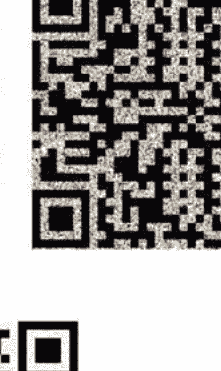


图1数据集图像示例；原始图像与四种映射噪声的噪声图像

### 2.1 数据分析

我们在这项工作中使用的数据集包括20,000张原始QR码图像和噪声图像。数据集非常多样化；因为我们的模型采用固定大小的输入，所以我们对图像进行了预处理，将它们调整为CNN模型的固定尺寸（160×160）比例和LG、SVM模型的尺寸（50×50）。图1显示了原始图像和不同类型的噪声图像。我们的数据集分为两个不同的类别，即原始类别和噪声类别，我们通过向原始类型添加高斯、椒盐、泊松和斑点等四种不同类型的噪声来生成噪声类别。

### 2.2 卷积神经网络模型架构

我们创建了一个卷积神经网络模型来对原始和噪声二维码图像进行分类。表1展示了开发的卷积神经网络架构。它由四个卷积层、四个池化层、一个dropout层、一个flatten层和一个全连接层组成。

表1提出的卷积神经网络模型网络拓扑

| 层 | 输出形状 | 参数 |
|----|----------|------|
| Conv2D | (None, 158, 158, 16) | 448 |
| MaxPooling2D | (None, 79, 79, 16) | 0 |
| Conv2D | (None, 77, 77, 32) | 4640 |
| MaxPooling2D | (None, 38, 38, 32) | 0 |
| Conv2D | (None, 36, 36, 64) | 18,496 |
| MaxPooling2D | (None, 18, 18, 64) | 0 |
| Conv2D | (None, 16, 16, 128) | 73,856 |
| MaxPooling2D | (None, 8, 8, 128) | 0 |
| Flatten | (None, 8192) | 0 |
| Dropout | (None, 8192) | 0 |
| Dense | (None, 2) | 16,386 |

总参数：113,826
优化器：Adam
迭代次数：300
批次大小：90
损失函数：分类交叉熵
指标：准确率

表2 超参数提出的逻辑回归模型的数值

| CV | 作业数量 | 随机状态 |
|----|----------|----------|
| 10 | -1 | 1234 |

最大迭代次数：1000
求解器：liblinear
类别权重：平衡

### 2.3 LG模型架构

在将数据输入模型之前，我们首先调整和重塑了数据，然后使用标准缩放器调整值的分布，使得观察值的均值为0，标准差为1。这意味着它去除了均值，并将每个特征/变量缩放到单位方差。开发的逻辑回归网络架构和超参数调整为每个候选模型进行了十折交叉验证，使用后端LokyBackend和八个工作进程进行了十次拟合，如表2所示。

### 2.4 支持向量机模型架构

在支持向量机模型中，我们对数据进行一些预处理，如将其调整为（50×50）的比例并对数据进行重新排序以重新组织项目的顺序。所开发的支持向量机表3中描述了网络架构。在支持向量机的实验设置中，C（错误项的惩罚参数）设置为1，以控制错误，而伽马则自动调整以提供决策边界的曲率权重。此外，多项式核函数用于表示特征集中训练样本的相似性，使非线性模型能够被学习。

表3提出的支持向量机模型参数值

| C | 伽马 | 核函数 |
|---|---|---|
| 1 | 自动 | 多项式 |

## 3 结果与讨论

为了评估模型的准确性，我们使用了包含20,000个带有四种噪声类型的QR码图像的数据集。该数据集被分为训练集和测试集，比例分别为70/30。有关数据集拆分的更多详细信息，请参见表4。

成功训练后，每次迭代都使用测试数据集中的所有图像计算准确率。图2和图3显示了所提出的CNN模型的训练准确率和损失。我们使用准确率、精确率、召回率和F1分数这四个指标来评估我们的模型的实用性和性能。对于二分类问题的准确率、精确率、召回率和F1分数通过公式(1)-(4)来衡量。

```
精确率 = 真正例 / (假正例 + 真正例)  (1)
召回率 = 真正例 / (假负例 + 真正例)  (2)
F1分数 = 2 * 召回率 * 精确率 / (召回率 + 精确率)  (3)
$$准确率 = \frac{真正例+真反例}{假正例+假负例+真正例+真反例} \tag{4}$$
```

表4 QR码图像数据集信息

| 标签/类别 | 训练集 | 测试集 | 总数 |
|---|---|---|---|
| 原始类型 | | | |
| 正常/原始QR码 | 7000 | 3000 | 10,000 |
| 噪声类型 | | | |
| 椒盐噪声 | 1750 | 750 | 2500 |
| 斑点噪声 | 1750 | 750 | 2500 |
| 泊松噪声 | 1750 | 750 | 2500 |
| 高斯噪声 | 1750 | 750 | 2500 |
| 总数 | 14,000 | 6000 | 20,000 |

表5列出了所提出模型在测试数据上的各种指标性能。对于所有QR码图像的CNN、LG和SVM模型，在测试数据中的混淆矩阵分别在图4、图5和图6中表示。

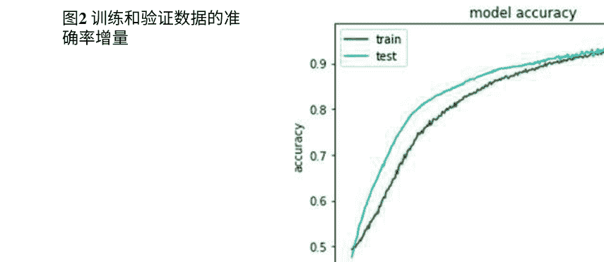

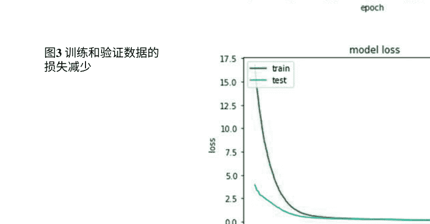

表5 提出的CNN、SVM和逻辑回归模型的性能指标

| 模型 | 准确率 (%) | 精确率 (%) | 召回率 (%) | F1得分 (%) |
|---|---|---|---|---|
| CNN | 95.95 | 96.1 | 96 | 96 |
| 支持向量机 | 97.50 | 97.50 | 97.50 | 97.50 |
| 逻辑回归 | 97.25 | 97.31 | 97.22 | 97.25 |

# 图4提出的CNN模型与测试数据的混淆矩阵

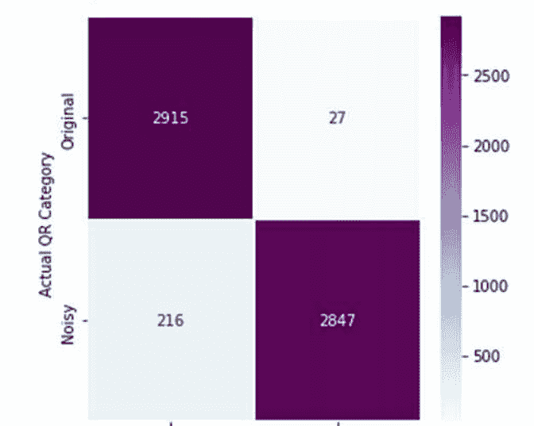

# 图5提出的LG模型与测试数据的混淆矩阵

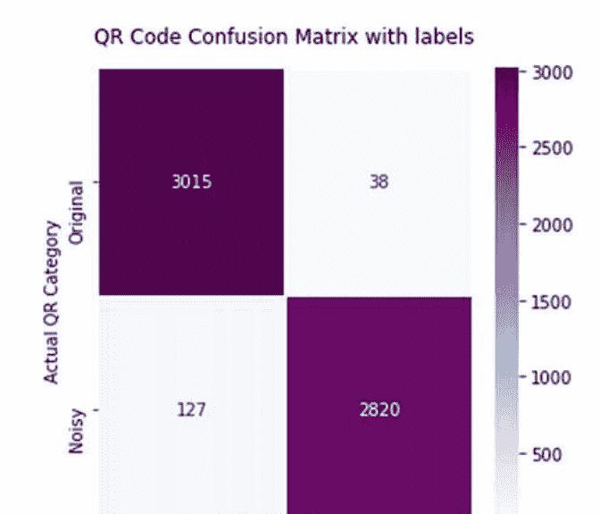

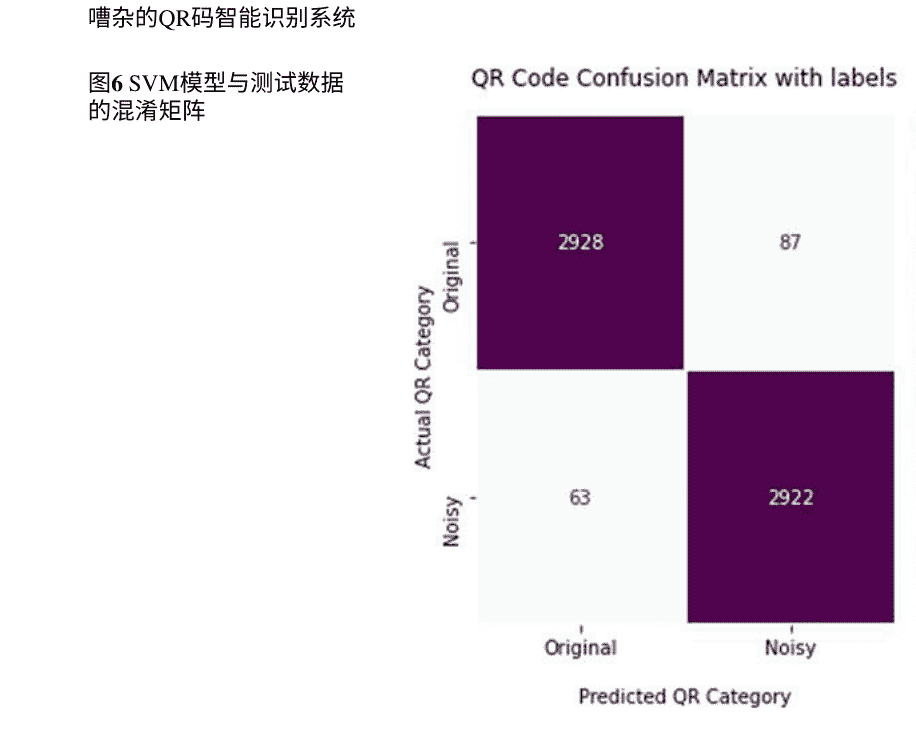

## 4 结论

当用户扫描打印的视觉QR码时，通常会伴随着干扰识别和导致失败的噪音现象。因此，该研究旨在开发一种智能图像分类策略，以区分噪音和原始QR码类型。尽管最小化噪音的能力至关重要，但确定QR码图像是否包含噪音或是原始图像同样重要。本研究建议使用基于CNN、LG和SVM的模型，成功识别原始和带噪音的QR码图像以解决这个问题。为了实现这一目标，本研究开发了一个包含各种噪音的QR码图像新数据集。

结果显示，支持向量机（SVM）和逻辑回归（LG）分别获得了97.5%和97.25%的准确率。对于提出的模型，特别是卷积神经网络（CNN），所有图像必须具有固定（相同）的尺寸。这个限制可以在下一项研究中克服。将来，我们的目标是利用其他机器学习分类器以及其他计算机视觉技术，提出一个能够识别噪声类型的分类系统。

## 参考文献

1. 张建华（2014年）。在学术期刊中使用QR码的介绍。科学编辑，1，113–117。https://doi.org/10.6087/kcse.2014.1.113## 基于知识的智能决策支持专家系统的语音和文本虚拟助手用于学术指导

D. Gnana Rajesh, G. Tamilarasi和Mohammed Ehmer Khan

摘要 大学和知名机构的学术指导作为指导学生制定职业规划的路线图。 学术人员的主要角色和责任之一是根据规章制度指导学生正确选择课程。 工作人员在担任顾问角色时面临许多挑战。 对于顾问来说，一个有前途的挑战是平衡学术工作量并履行顾问角色。

工作人员面临的主要限制之一是他们无法立即回答利益相关者提出的问题。研究的主要目标是解决这个问题。 因此，使用基于知识的智能决策支持专家系统的语音和文本虚拟助手用于学术指导。 它是一个计算机程序，作为对话式聊天机器人实现，旨在处理学生提出的与学术指导相关的问题，澄清学院规章制度，进展情况，进入下一个层次以及选择专业方面的问题。

关键词咨询·聊天机器人·虚拟助手·学术顾问

## 1 引言

学术咨询是学生和学术顾问之间的过程，旨在理解整体学习的重要性，审查组织的设施和规定，讨论教育和职业理念，并做出适当的课程选择[1]。

> 哪些因素是促进高等教育中学生成就的最佳元素？[2]。 Habley [3]指出，“学生保留和学生成功的关键因素之一是学生与校园内关注的个别工作人员之间互动的质量决定了学生的进展，通常是通过学术指导来实现的。然而，“学术指导对学生成就的影响在评估学生对指导过程的满意度的尝试中被大大忽视了。”虽然员工与学生之间的互动与他们的学术目标和成果有关，但学生的发展受到一系列相关机构的辛勤工作的影响，而这些机构与教师之间的课程相关联系之外的努力也是如此[1]。

学术指导被认为是每个学术人员的重要工作。每个顾问（学术人员）平均分配25名被指导者。在他们的学习过程中，学生定期会有各种与学术指导相关的问题，包括对学院规章制度的澄清、进展情况、升级以及选择专业等。由于学生和顾问（学术人员）无法定期见面，因为他们的课程安排不同，学生在需要时无法得到澄清。

人机交互构建系统的主要目标是规划正常和直观的连接模式，并生成具有良好可用性的安全和功能性计算机系统。 借助最新技术，通过连接物品，每个设备都可以连接和通信。 为了做到这一点，我们需要了解决定阿尔穆萨纳大学技术与应用科学学院（UTAS-A）学生如何使用技术的变量，并利用这些知识开发工具和技术，使我们能够构建高效的系统。

基于计算机的聊天机器人正在成为人类和各种机器之间直观和成功的框架。 聊天机器人是一种用于通过文本或文本转语音进行在线一对一对话的软件应用程序。 它是一种人造物品，旨在使用人类伙伴的语言复制智能对话。目前，许多客户使用聊天机器人来访问信息或知识库，并进行非特定咨询。

## 2 文献综述

聊天机器人的目的是使用AI标记语言和潜在语义分析基于常见问题数据集提供有效和精确的回答。“使用AI标记语言回答常见问题和一般问题，并使用潜在语义分析回答其他基于服务的问题，以在任何时候满足用户的需求”[4]。“专家系统能够使用指导性咨询模型和发展性咨询模型为学生提供建议。该系统由面向对象数据库支持，并提供友好的图形用户界面。 该系统还可供学术顾问在学生的学术规划中使用”[4]。 大豆害虫专家系统[5]是一个基于模糊逻辑的专家系统，通过提问产生基于模糊逻辑的基于Web的答案。通过根据专家的反馈，该系统逐渐变得更加准确。 Dhaya [6] 在虚拟现实中进行了相关工作，以减少在VR环境中处理速度较慢的低质量图像。 Smys和Haoxiang在研究中提出了一个区分人类用户和聊天机器人的分类系统。 熵分类器的速度和准确性已经经过测试。

为了处理家庭评估，对话式聊天机器人需要得到授权监督，涉及家庭案件，如儿童监护权和法律分离。 自然语言处理中已知的解析算法是本研究工作中采用的方法[7]。“它适用于模糊语法，并使用动态规划方法——部分假设结果存储在称为图表的结构中，并可重复使用。”基于Web的模糊专家系统（FES）[8]的好处和挑战与设计、开发和使用的好处和挑战相关。 这种方法是为学生教育顾问构建一个基于Web的模糊专家系统，并停留在大学校园内。

聊天机器人现在在商业领域非常受欢迎，因为它们可以降低客户服务费用，并且可以同时处理任意数量的用户，全天候提供可靠和便利的服务。 为学生提供持续即时支持的智能虚拟助手，包括学生、教职员工。

学生咨询是高等教育机构中的一项重要活动，然而在学术工作中却是一项耗时的工作。 通过实验探索，本文回顾了多种信息源是否有助于学术顾问为学生提供更有效的决策。 表1展示了现有聊天机器人及其相关方法的比较。

表1 现有聊天机器人系统的比较
| 论文标题 | 大学网站的聊天机器人 [9] | 在线可反馈的问答系统新生聊天机器人 | 银行聊天机器人——一种使用自然语言处理和机器学习的智能助手系统[10] |
| :--- | :--- | :--- | :--- |
| 语言处理技术使用 | Facebook Messenger应用程序编程接口 | NLTK框架 | NLTK框架 |
| 聊天机器人系统的目标受众 | 大学/学院/教育 | 开放式 | 金融/银行 |
| 知识类型 | 结构化数据库 | 未提及 | 结构化数据库 |
| 机器学习算法使用 | 未提及 | 未使用 | 支持向量机和随机森林 |

### 2.1 研究目标

为了将UTAS-A中可用的咨询设施扩展到学生的指尖，从而满足学生的需求。
有不同类型的学生咨询服务可用，如学术部门的顾问和学生事务部门的辅导员，通过电子邮件、面对面和电话服务进行维护。当前的疫情形势提出了人对人提供的所有上述支持设施自动化的需求。随着每位顾问负责的学生人数增加，查询等待时间也会增加，因此自动化流程将极大地提高学生满意度。
Microsoft Azure SQL数据库：生产环境将有助于开发所提出的专家系统。

该项目的主要目标是开发一个具有以下功能的功能性聊天机器人。

- 为学生提供有关所有基本咨询相关问题的帮助。
- 帮助学生了解当前水平所需的成绩以进入下一个水平。
- 帮助学生了解当前水平所需的成绩以解除禁赛。
- 帮助预测学生完成学业所需的剩余学期。
- 根据学生在特定科目中的成绩，帮助选择专业。
- 根据当前就业市场，帮助选择专业。
- 根据课程作业成绩，帮助预测当前级别的成绩。
- 帮助选择可以重修以获得最佳成绩提升的课程。
- 基于专家建议，基于语音的常见问题解答和标准答案的辅助。

## 3 研究方法

构建一个基于知识的系统，智能地回答学生提出的查询的提议模型。该系统的目标是根据有关咨询的信息创建一个有价值的咨询，以减少员工回答学生查询的延迟并提高学生满意度。提议的模型试图模拟员工讨论咨询相关问题的行为。

如图1所示的模块图示出了提议系统的操作结构。学生将通过大学门户初始化聊天机器人。并将通过文本或语音消息寻求与咨询相关的建议。系统将解析查询，根据存储在数据库中的数据和人工智能技术的支持，预测相对应的响应，并提供基于知识的回答。

采用基于人工智能的算法来预测响应。在初始阶段，将所有与章程、修正案和更新相关的可能数据转换为定量数据形式。可能的问题和答案将通过各种数据收集机制（如问卷和面试方法）从员工顾问那里收集。将从不同层次和部门的学生那里收集数据。所有收集到的数据将经过测试并存储在数据库中，以便以常见问题（FAQ）的形式进行响应操作。

### 3.1 系统设计过程

在本系统设计过程部分，图2讨论了基于知识的过程的提出分类模型，图3描述了过程图。上述图显示了提出的分类过程模型，其中随机森林分类将用于分类输入的类型以匹配存储的数据集。将使用基于人工神经网络的监督学习生成预测或默认响应。为了提高响应速度，基于知识的（KB）过程将使用随机森林分类和监督学习模型。

上述流程图描述了学生通过聊天机器人以文本或语音形式提出的查询请求。如果是文本查询，它将从标准列表中找到匹配项，并检查是否存在相似模式，并向学生提供相关的推荐。同时，如果请求基于语音，则将使用语音识别软件将其转换为文本，并从标准列表中找到匹配项。不成功的查询将存储在数据库中，并从专家那里收集相关的响应，以供将来使用。

### 3.2 数据积累

数据收集是以一种被认可的系统化方式收集和计算重要变量数据的方法，以支持回答研究问题、检验假设和计算结果。良好的研究设计能够使研究尽可能高效，以最小的努力、时间和金钱产生最大的信息。每当系统以默认答案回应时，相关的查询将与数据集收集一起累积，用于升级过程。收集到的信息是一个持续的过程，它将追加并帮助系统提高准确性。

## 4 研究意义

人工智能（AI）是计算机科学的一个分支，用于创建能够像智能人类一样与人们工作和互动的智能机器。AI可以系统化地处理教师的行政职责，并为他们的学生提供有价值的反馈。所提出的系统将帮助学者们能够随时处理学术指导规则和规定。该系统将减少学生的常见等待时间和队列长度，同时也将使学术顾问受益。该系统还将指导学生根据他们以前的成绩和技能选择专业。学术期满学生和因各种原因处于学术风险的学生，如缺勤、推迟、退学等，也可以受益。

人工智能技术被用来根据相关请求获取专家意见。由于该系统是基于在线的，学生甚至家长社区都将从中受益，可以获得有关学术咨询的澄清、建议和推荐，无论身在何处。现有的系统研究表明，大多数学术指导系统都是基于文本的。除了基于文本的对话外，所提出的系统将包含语音识别功能。

## 5 个学术重要性

所提出的名为“基于知识的智能决策支持专家系统（IDSES）的语音和文本虚拟助手用于学术指导”的系统将有助于超过30,000名学生和数百名学术人员/顾问，从而使阿曼社区受益。该系统将帮助学生随时了解大学章程。大学生将通过选择正确的专业和在学习期间需要的绩点受益。家长还可以了解孩子的学习计划以及大学的规章制度。学术顾问可以通过该系统24 × 7提取大学章程和文章。

UTAS管理层可以将提议扩展到所有其他具有类似章程的教育机构。

## 6 结论

人工智能聊天机器人利用人工智能专业知识来模仿人类对话，并通过文本和语音命令处理学生的输入。它用于通过检查和分析大量数据来支持决策、判断和行动的确定。全面的信息还帮助学生解决学术问题，可用于决策。它还帮助回答所有与咨询相关的问题，并以逻辑上可能的最佳学习计划/选项进行回应。该系统提供对学生的所有基本咨询相关问题的帮助，从当前水平到下一个水平的转移，从缓刑中解脱，特定科目的分数，学生的专业选择，成绩预测，课程选择以提高成绩，常见问题解答以及基于专家建议的标准答案。除了回答学生的问题，该模型还具有与学术咨询相关的支持软件，可帮助计算累计平均绩点，并广播更新与学术咨询相关的规则和法规的变化。[11-14]

## 参考文献

1. Kuh, G. (2001). 组织文化与学生坚持力：前景和难题。大学生保留杂志，3(1)，23–29。
2. Agreda, K. S. B., Fabito, E. D. B., Prado, L. C., Tebelin, M. H. G., & Benilda Eleanor, V. (2013). 律师209：家庭案件的虚拟助理顾问。自动化与控制工程杂志, 1(3), 198–201。
3. Habley, W. R. (Ed.). (2004).学术指导的现状：来自ACT第六次全国调查的发现。专著编号10，全国学术指导协会。
4. Ranoliya, B. R., Raghuvanshi, N., & Singh, S. (2017, September). Chatbot for university related FAQs. In 2017 International conference on advances in computing, communications and informatics (ICACCI) (pp. 1525–1530). IEEE.
5. Al Ahmar, M. A. (2011). 一个支持面向对象数据库的原型学生指导专家系统。国际高级计算机科学与应用杂志(IJACSA)人工智能专刊, 1(3), 100–105。
6. Dhaya, R. (2020). 改进的图像处理技术，用于虚拟现实环境中的用户沉浸问题缓解。创新图像处理杂志(IJIP), 2(02), 77–84。
7. Goodarzi, M. H., & Rafe, V. (2012). 基于网络的教育顾问系统模糊专家系统实现。
8. Saini, H. S., Kamal, R., & Sharma, A. N. (2002). 基于网络的模糊专家系统，用于大豆综合害虫管理。国际信息技术杂志, 8(1), 55–74。
9. Ramesh, G. S., Nagaraju, G., Harish, V., & Kumaraswamy, P. (2021). 大学聊天机器人网站。在国际计算机工程和通信系统会议论文集(pp. 511–521). Springer, 新加坡。
10. Kulkarni, C. S., Bhavsar, A. U., Pingale, S. R., & Kumbhar, S. S. (2017). 银行聊天机器人——一种使用自然语言处理和机器学习的智能助手系统。国际工程与技术研究期刊(IRJET), 04(05), 2374–2377。
11. Young-Jones, A. D., Burt, T. D., Dixon, S., & Hawthorne, M. J. (2013). 学术指导：它真的影响学生的成功吗？ 教育质量保证。
12. https://machias.edu/academics/faculty-handbook/section-iv-academic-pol/academic-adv-def/
13. Almutawah, K. A. (2014). 一种学术顾问决策支持系统。国际商业信息系统杂志, 16(2), 177–195。
14. Nagarhalli, T. P., Vaze, V., & Rana, N. K. (2020年3月). 对聊天机器人系统开发的当前趋势进行综述。在2020年第6届国际高级计算与通信系统会议(ICACCS)(pp. 706–710). IEEE。
15. E. J. (2019). 一种用于失真QR码图像的新型校正算法。在2019年第三届电子信息技术和计算机工程国际会议（EITCE）中（第380-384页）。IEEE. https://doi.org/10.1109/EITCE47263.2019.9095073
16. Hosseini, H., Hessar, F., & Marvasti, F. (2015). 使用高效的加权平均滤波从图像中实时抑制脉冲噪声。IEEE信号处理快报，22, 1050–1054. https://doi.org/10.1109/LSP.2014.2381649
17. Alzubaidi, L., Zhang, J., Humaidi, A. J., Al-Dujaili, A., Duan, Y., Al-Shamma, O., Santamaría, J., Fadhel, M. A., Al-Amidie, M., & Farhan, L. (2021). 深度学习综述：概念、CNN架构、挑战、应用、未来方向。大数据杂志，8, 53。
18. Al-Saffar, A. A. M., Tao, H., & Talab, M. A. (2017). 深度卷积神经网络在图像分类中的综述。在2017年雷达、天线、微波、电子和通信国际会议(ICRAMET)(pp. 26–31). IEEE. https://doi.org/10.1109/ICRAMET.2017.8253139
19. Yim, J., & Sohn, K. -A. (2017). 提高卷积神经网络在质量下降数据集上的性能。在2017年数字图像计算国际会议上:技术和应用(DICTA)(pp. 1–8). IEEE. https://doi.org/10.1109/DICTA.2017.8227427
20. Rasheed, J., Hameed, A. A., Djeddi, C., Jamil, A., & Al-Turjman, F. (2021). 一种基于机器学习的COVID-19诊断框架，用于胸部X射线图像。跨学科科学: 计算生命科学, 13, 103–117. https://doi.org/10.1007/s12539-020-00403-6
21. Rasheed, J. (2021). 一种可持续的基于深度学习的计算智能海鲜监测系统，用于鱼类物种筛选。在2021年物联网人工智能国际会议上:(pp. 1–6). IEEE. https://doi.org/10.1109/ICAIoT53762.2021.00008
22. Yahyaoui, A., Jamil, A., Rasheed, J., & Yesiltepe, M. (2019). 一种用于糖尿病预测的决策支持系统使用机器学习和深度学习技术。在2019年第一届国际信息学与软件工程会议（UBMYK）。（第1-4页）。IEEE。https://doi.org/10.1109/UBMYK48245.2019.8965556
23. Thai, L. H., Hai, T. S., & Thuy, N. T. (2012). 使用支持向量机和人工神经网络的图像分类。国际信息技术与计算机科学杂志，4，32-38。 https://doi.org/10.5815/ijijtcs.2012.05.05
24. Zou, X., Hu, Y., Tian, Z., & Shen, K. (2019). 逻辑回归模型优化和案例分析。在2019年IEEE第七届国际计算机科学和网络技术会议（ICCSNT）（第135-139页）。IEEE。https://doi.org/10.1109/ICCSNT47585.2019.8962457
25. Rasheed, J., Dogru, H. B., & Jamil, A. (2020). 使用机器学习和深度学习技术从视频中检测土耳其文本。在2020年IEEE第三届数据流挖掘与处理国际会议上(第116-120页)。IEEE。 https://doi.org/10.1109/DSMP47368.2020.9204036
26. Sil, D., Dutta, A., & Chandra, A. (2019). 用于噪声分类和图像去噪的卷积神经网络。在2019年IEEE第10个地区会议(TENCON)上(第447-451页)。IEEE。https://doi.org/10.1109/TENCON.2019.8929277
27. Khaw, H. Y., Soon, F. C., Chuah, J. H., & Chow, C. (2017). 使用卷积神经网络和主成分分析进行图像噪声类型识别。IET图像处理，11, 1238–1245. https://doi.org/10.1049/iet-ipr.2017.0374
28. Tripathi, M. (2021). 利用神经网络进行面部图像噪声分类和去噪。可持续工程与创新，3，102–111。 https://doi.org/10.37868/sei.v3i2.id142
29. Geng, L., Zicheng, Z., Qian, L., Chun, L., & Jie, B. (2020). 基于图像质量评估的图像噪声级别分类技术。在2020年IEEE国际电力、智能计算和系统会议(ICPICS)(pp. 651–656). IEEE. https://doi.org/10.1109/ICPICS50287.2020.9202118
30. Momeny, M., Latif, A. M., Agha Sarram, M., Sheikhpour, R., & Zhang, Y. D. (2021). 一种噪声鲁棒的卷积神经网络用于图像分类。工程结果，10，100225。 https://doi.org/10.1016/j.rineng.2021.100225

# 使用不同的机器学习算法进行乳腺癌预测

Ujwala Ravale和Yashashree Bendale

摘要 在当前时代，由于人口爆炸，早期疾病诊断已成为医学研究领域的主要关注点。由于乳腺癌的可能性在现今日益增长。从先前的分析中已经披露，与其他疾病相比，乳腺癌已成为第二严重的疾病。在早期诊断和发现多种疾病方面，机器学习算法发挥着重要作用，以增加患者的生存机会。使用人工智能或机器学习技术可以实现可靠、有效和快速的反应，同时降低死亡风险的自动检测系统。在这项研究中，我们将逻辑回归、决策树、随机森林和K最近邻与邻域分量分析（NCA）方法进行比较，这些都是监督式机器学习技术。与其他算法相比，使用KNN与NCA方法的自动化系统获得了高达98.5%的准确率。

- 机器学习
- K最近邻
- 邻域分量分析
- 随机森林
- 人工智能

## 1 引言

如今，乳腺癌在女性中变得更加普遍。如果早期发现，乳腺癌是可以预防的。女性经历了各种各样的阶段，其中许多人有绝望、焦虑和自尊心低下等心理问题，这可能导致癌症。尽管对于乳腺癌有有效的治疗方法，与各种治疗选择相关的痛苦和痛苦是显著的。妇女在治疗后会出现抑郁症。

它是一种可以在乳房中不受控制地生长的恶性或良性肿瘤。乳腺癌是由乳房中细胞的不受控制分裂引起的[1]。乳腺癌的风险由年龄、遗传风险和家族病史以及其他变量（如肥胖、缺乏运动、吸烟和饮食不健康）决定。女性患乳腺癌的比例比男性高。

据专家称，激素失衡、生活方式[2]和环境因素都与患乳腺癌的机会增加有关。通过世代相传的基因突变与约5-6%的乳腺癌患者有关。肥胖、年龄增长和绝经后激素失衡是导致乳腺癌的其他因素之一。

由于早期乳腺癌的检测变得具有挑战性，诊断过程变得冗长且耗时。乳房X线摄影和活检被用于医学诊断。如果在乳房X线摄影中发现异常，患者必须接受活检，这是痛苦、耗时和昂贵的。在这种情况下，自动化系统将非常有用[3]。自动化方法提供的分析可以帮助放射科医生或其他专家提高诊断准确性。当自动化系统获得足够大的数据集时，它可以如此有效地执行，以至于患者不再需要进行不愉快的活检或其他测试。本文总结了一些关于乳腺癌检测的最重要的机器学习研究。

使用机器学习算法对数据集进行各种分类。机器学习算法被分类为强化学习、监督学习、无监督学习、进化学习和深度学习算法。基于训练样本，监督学习算法为所有可能的输入给出正确的输出。监督学习采用分类和回归的形式。无监督学习技术的目标是识别输入数据之间的相似性，然后根据这些相似性对数据进行分类。本研究主要关注预测几种机器学习算法在乳腺癌数据集上的准确性。

本文的结构按照以下四个部分进行解释。在第2节中，介绍了不同作者和现有系统的先前工作。在第3节中，解释了用于乳腺癌检测的多个机器学习算法。在第4节中，解释了建议的技术。在第5节中，从不同的性能测量参数的角度讨论了建议系统的效率。

## 2 文献综述

为了设计训练数据模型，预测或定义决策规则，机器学习算法应该能够分析任何数据集。从输入数据集和先前学习的数据中，提取出的知识将以规则或模式的形式进行学习。使用不同的机器学习方法进行乳腺癌预测...以确保机器学习算法能够智能地运行，无需人工干预。

Sajib等人提出了使用XGBoost算法和随机森林诊断乳腺癌的机器学习模型[4]。用于分析的数据集包含275个样本，每个样本有12个特征。应用随机森林算法达到了约74.73%的准确率，使用XGBoost算法达到了73.63%的准确率。

Tsehay等人通过应用支持向量机和决策树算法引入了一个模型，这些算法是用于预测目的的重要机器学习算法[5]。使用测试数据集，模型的效率以变量评估参数（如精确度、召回率）和准确度来衡量。与决策树算法相比，SVM在准确度和精确度方面表现更好，并且具有最低的误分类率。SVM分类模型的准确度为91.92%，而决策树模型的准确度为87.12%。

为了预测乳腺癌，Shubham等人提出了朴素贝叶斯分类器、KNN和随机森林算法。威斯康星诊断乳腺癌（WBC）数据集用于比较各种机器学习算法。性能是使用精确度和准确度等关键参数来衡量的。所得到的结果对于预测和治疗非常有用[6]。

性能测量是使用机器学习技术进行的，即支持向量机（SVM），决策树（C4.5），朴素贝叶斯（NB）和K最近邻（k-NN）是由Hiba等人在威斯康星州乳腺癌（原始）数据集上进行的[7]。根据实验结果可以得出结论，支持向量机（SVM）实现了最高的准确率97.13%，同时具有最低的错误率。

## 3 种机器学习分类器

基于数据的类似案例的决策训练机器（计算机）的方法被称为机器学习。医疗保健，物体识别，网络是机器学习应用的各种领域。

1.  逻辑回归：一种包含较多依赖变量的监督学习方法[8]。当依赖变量有二进制解决方案时，逻辑回归是分析目的的更好选择。逻辑回归，像其他形式的回归系统一样，是一种预测性回归系统。逻辑回归通过分析一个依赖二进制变量和一个或多个独立变量之间的关联来生成输出。使用逻辑回归的回归系统生成的输出范围从0到1变化。
2.  决策树（DT）：使用递归分割实例空间来表示决策树。通过预测模型节点观察结果被映射到目标值推断。通常，类标签存在于叶子节点，而导致类标签的特征组合存在于树结构的分支中。CART，C4.5 [8] 是决策树方法的不同变体。
3.  随机森林（RF）：使用随机森林算法 [5] 同时完成分类和回归分析任务。这是一种监督学习算法。基于先前数据集进行新数据样本的预测，因此可以将其视为使用机器学习算法的基本构建模块。
4.  支持向量机：它是最常用的监督分类算法。对于对象分类，SVM构建一个超平面。将两个类别区分开的线被称为超平面。为了构建一个非概率二元分类器模型 [9]，SVM训练该分类器模型，以便新样本应该被分配到至少两个类别中的一个。
5.  K最近邻算法：在KNN分类技术中，它采用一组标记点并使用它们来教育自己如何标记更多的新点。然后，它找到最接近的点或最近的邻居来对新点进行分类，并要求它们投票[10]。

## 4 方法论

机器学习应用于医学研究中的疾病诊断和预测。机器学习工具可用于分析可帮助疾病预测的数据值。早期预测有助于更好的治疗。使用计算机化的计算工具和机器学习过程来促进和改进医学领域的研究或诊断是一项激动人心且必要的工作。

通常，用于训练所提出模型的真实数据集被称为训练数据集。模型是使用所使用的数据集进行训练的。用于验证训练模型的样本数据集被称为测试数据。处理和分析乳腺癌数据集的步骤如下：

阶段1：预处理：在数据预处理过程中处理数据缺失值，将缺失值替换为属性的平均值。此外，使用标准缩放器模块对原始乳腺癌数据进行了缩放。许多机器学习估计器对数据集标准化有要求[11]。

第二阶段：特征选择：在预处理阶段，特征选择是重要的阶段，在实际学习之前应该进行。为了实现准确的预测结果，应该从数据集中选择有选择性和重要的特征。为了实现这一目标，我们实施了邻域组件分析（NCA）进行特征选择。使用Python scikit-learn库来实现特征选择模块。

邻域组件分析（NCA）：NCA是一种用于马氏距离测量的学习方法，可用于KNN分类。NCA是一种统计方法，用于改进分类和回归算法的准确性[12]。这种方法与k最近邻分类器相结合。用于计算距离度量。 提出的方法使用了NCA方法和K最近邻技术，用于在数据集中找到最近和相似的数据点。 对于提出的模型，块图如图1所示。

图1 提出系统的架构[17]

## 5 数据集描述

为了实验目的，使用来自kaggle的数据集训练了超级-监督机器学习模型，通过应用逻辑回归、决策树、随机森林分类器和K最近邻与NCA技术进行乳腺癌预测。 用于训练的数据集包含良性和恶性特征。 乳腺半径均值、纹理、周长均值、纹理均值是一些特征。这些特征用于对乳腺癌进行分类，无论是良性还是恶性。用于训练的数据集包含569个乳腺癌实例，每个实例有30个属性特征。大约80%的数据集实例用于训练，剩余20%用于测试模型。sklearn train_test_split函数的主要目的是将整个数据集任意划分为用于分析模型的测试和训练数据样本。

威斯康星大学医院的医生威廉·H·沃尔伯格博士在麦迪逊，威斯康星州，美国准备了威斯康星乳腺癌诊断（WBCD）数据集，该数据集可在网上免费获取。沃尔伯格博士从患者的液体样本中收集了样本，这些样本中含有实体乳腺肿块，并使用名为Xcyt的简单图形计算机应用程序来准备数据集。对于每个细胞核，为WDBC数据集计算了10个特征，这些特征是为每个细胞样本收集的，同时还计算了每个图像的标准误差、均值和每个单独特征的极值，从而得到了30个实值特征向量。在这个数据集中，总共有569个实例，其中213个是恶性的，256个是良性的[13]，如图2所示。

图2 恶性和良性数据的数量

### 5.1 属性解释

本研究使用的数据集包含不同的属性，如编号、诊断（M=恶性，B=良性）以及每个图像的细胞核的十个属性，包括周长、对称性、半径、凹度、纹理、分形维度等。

### 5.2 实验环境

用于数据分析的Spyder（Python），Jupyter Notebook（Python）。结果包括统计和可视化。我们分析这些结果并预测癌症疾病（癌症易感性，复发，生存）。我们介绍了用于评估所提出方法的性能评估方法。癌症预测或预后的性能评估方法包括分类准确率，敏感性分析，特异性，TPR，FPR，TNR，FNR，混淆矩阵。我们分析了模型的准确性和效率，并预测哪个模型在决策树算法，具有邻域组件分析的KNN和随机森林算法中表现更好。

## 6 结果与讨论

性能测量参数：

1.  准确率-准确率是最基本的性能度量参数。准确率定义为正确预测的样本数与总样本数的比率[14]。
    准确率 = TP + TN/TP + FP + FN + TN (1)
2.  精确度-精确度被定义为准确预测的正面观察值与总预测的正面观察值的比例[15]。
    精确度 = TP/TP + FP (2)
3.  召回率（敏感度）-准确预测的正面观察值与类别中的总观察值的比率被称为召回率[15]。
    召回率 = TP/TP + FN (3)
4.  F1得分-精确度和召回率的加权平均比率被称为F1得分。
    F1得分 = 2 * (召回率 * 精确度)/(召回率 + 精确度) (4)

其中

- TP 真正例
- FP 假正例
- TN 真反例
- FN 假反例

表1 精确度上的算法比较

| 算法 | 逻辑回归 (%) | 决策树 (%) | 随机森林分类器 (%) | KNN与NCA (%) |
| :--- | :---: | :---: | :---: | :---: |
| 良性 | 97 | 98 | 98 | 99 |
| 恶性 | 93 | 88 | 94 | 96.5 |
| 平均 | 95 | 93 | 96 | 97.75 |

表2 基于召回率的算法比较

| 算法 | 逻辑回归 (%) | 决策树 (%) | 随机森林分类器 (%) | KNN与NCA |
| :--- | :---: | :---: | :---: | :---: |
| 良性 | 96 | 92 | 97 | 98 |
| 恶性 | 94 | 96 | 96 | 96 |
| 平均 | 95 | 94 | 96.5 | 97 |

表3 基于F1分数的算法比较

| 算法 | 逻辑回归 (%) | 决策树 (%) | 随机森林分类器 (%) | KNN与NCA (%) |
| :--- | :---: | :---: | :---: | :---: |
| 良性 | 96.4 | 94.9 | 97.4 | 98.49 |
| 恶性 | 93.4 | 91.82 | 94.9 | 96.24 |
| 平均 | 95 | 93.49 | 96.2 | 97.37 |

### 6.1 实现和结果分析

表1和表2展示了机器学习分类器的精确度和召回率。与其他算法相比，KNN与NCA技术在精确度和召回率方面具有最高水平（表3）。

### 6.2 准确性模型

表4和表2显示了不同机器学习算法在训练和测试数据集上的准确性（图3）。

表4 分类器的准确性

| 算法 | 训练准确率 (%) | 测试准确率 (%) |
|------|----------------|----------------|
| 逻辑回归 | 97 | 96 |
| 决策树 | 96 | 95 |
| 随机森林分类器 | 95 | 96 |
| KNN与NCA | 97 | 98 |

图3 不同分类器的准确性

## 7 结论

在世界上，BCS是许多妇女中最常见的恶性肿瘤之一，现在越来越多地在年轻妇女中发现。因此，在早期检测BCs方面有更大的研究范围；此外，许多特征-这种癌症的特征仍然未知。在这项研究中，通过应用机器学习技术（如最近邻与邻域分析、逻辑回归、决策树和随机森林分类器）对WBCD数据集进行了分析。通过混淆矩阵、精确度和召回率等各种参数对各种模型的性能进行评估，以确定最佳的机器学习算法。在实施后，我们发现最近邻与邻域分析的性能优于其他模型。与其他机器学习算法相比，最近邻与邻域分析的精确度为97.5%，准确度约为97%，表现更好。

## 参考文献

1.  Priyanka, K. S. (2020). 关于使用深度学习进行乳腺癌检测的综述论文。IOP会议系列：材料科学与工程第一届计算研究与数据分析国际会议（ICCRDA 2020）。
2.  Vijayakumar, T. (2019). 神经网络分析用于肿瘤研究和癌症预测。电子与信息学报，01(02)。
3.  Monirujjaman Khan, M., Islam, S., Sarkar, S., Ayaz, F. I., Ananda, M. K., Tazin, T., Albraikan, A. A. & Almalki, F.A. (2022). 基于机器学习的乳腺癌预测比较分析。医疗工程杂志，Hindwi，2022。
4.  Kabiraj, S., Raihan, M., Alvi, N., Afrin, M., Akter, L., Sohagi, S. A., & Podder, E. (2020). 使用XGBoost和随机森林算法进行乳腺癌风险预测。在第11届ICCCNT中，IEEE Explorer，2020。
5.  Assege, T. A., & Sushma, S. J. (2020). 基于支持向量机和决策树的乳腺癌预测。国际工程与先进技术杂志（IJEAT），9(3)。ISSN: 2249-8958。
6.  Sharma, S., Aggarwal, A., & Choudhury, T. (2018). 使用机器学习算法进行乳腺癌检测。 在计算技术、电子和机械系统国际会议(CTEMS)上，IEEE。
7.  Asria, H. Mousannif, H., Al Moatassime, H., & Thomas, N. (2016). 使用机器学习算法进行乳腺癌风险预测和诊断。 在第六届国际环境和移动系统前沿研讨会(FAMS 2016)上，计算机科学论文集，卷83。
8.  Fatima, N., liu, L., Hong, S., & Ahmed, H. (2020). 乳腺癌预测，机器学习技术的比较评价和分析。IEEE Access。
9.  Rane, N., Sunny, J., Kanade, R., & Devi, S. (2020). 使用机器学习进行乳腺癌分类和预测。国际工程研究与技术杂志(IJERT)，9(02)。
10. Amine Naji, M., El Filalib Kawtar Aarikac, S., Benlahmard, E. L. H., Abdelouahahide, R. A., & Debauchef, O. (2021). 用于乳腺癌预测和诊断的机器学习算法。 国际边缘IA-IoT智能农业研讨会 (SA2IOT) 8月9日至12日。比利时，鲁汶。
11. Rawal, R. (2020). 使用机器学习进行乳腺癌预测。 JETIR，7（5）。
12. Laghmati, S., Cherradi, B., Tmiri, A., Daanouni, O., & Hamida, S. (2020). 使用邻域分量分析和监督机器学习技术对乳腺癌患者进行分类。 在第三届高级通信技术和网络会议（CommNet），IEEE。
13. Telsang, V. A., & Gurubasava, B. (2020). 使用机器学习算法进行乳腺癌预测分析。 在国际通信、计算和工业4.0会议（C2I4）中，IEEE。
14. Vaka, H. R., Soni, B., & Sudheer Reddy, K. (2020). 通过利用机器学习进行乳腺癌检测。 I CT Express, 6(4)。
15. Hamed, S., Mesleh, A., & Arabiyyyat, A. (2021). 使用机器学习算法进行乳腺癌检测。国际计算机科学与移动计算杂志，10(11)。
16. Dhahri, H., Al Maghayreh, E., Mahmood, A., Elkilani, W., & Faisal Nagi, M. (2019). 基于机器学习算法的自动化乳腺癌诊断。 Hindawi健康工程杂志，2019。
17. Hammad Memon, M., Ping Li, J., Ul Haq, A., Hunain, Memon M., & Zhou, W. (2019).在物联网健康环境中使用改进的递归特征选择进行乳腺癌检测. Hindawi：无线通信与移动计算。

# 设计一种用于无人机的实时避障和轨迹生成算法

Hernando Gonz lez, Alhim Vera, Juan Monsalve和Diego Valle

摘要 本文介绍了一种通过无人机实现的目标跟踪算法。该系统生成轨迹时考虑了无人机前置摄像头获取的图像，要检测的目标是一个移动的红色盒子，使用颜色分割技术来检测目标。红色盒子通过居中图像帧进行持续跟踪。使用开源计算机视觉库（OpenCV）处理从无人机获取的图像。该软件通过在机器人操作系统（ROS）上的Gazebo和Rviz模拟进行验证，并与真实无人机进行比较。

关键词 无人机·计算机视觉·轨迹跟踪·机器人操作系统（ROS）

## 1 引言

近几十年来，对于人类难以接触的区域的识别过程越来越需要快速解决方案和高效率，因此无人机或四旋翼飞行器能够通过摄像头便捷地探索各种地形，这些飞行器由用户直接控制。无人机是能够执行依赖于其能力的特定任务的移动机器人。在执行任务之前，机器人通常需要对其进行规划，将其分解为多个顺序或同时进行的子任务。这些子任务必须与无人机的能力保持一致，也就是说，考虑到移动物体的动态行为和条件（采样时间、执行器产生的物理限制等），这些子任务必须是可能的。一个子任务可以是规划无人机的移动路径，从而找到无碰撞路径，这个跟踪轨迹的过程被称为轨迹规划。

机器人自主性变得越来越重要，并成为其研究和发展的关键点，这些系统伴随着人工视觉算法[1, 2]。

轨迹规划强调静态环境和无人机的限制，因此充分了解硬件并拥有足够宽阔的领域以获取可能的轨迹并随后跟踪它非常重要，如[3]所示。无人机2.0通过其传感器和摄像头生成避免可能碰撞的轨迹。还可以进行额外的区分，无人机可以利用其摄像头提供的信息对其周围的场景进行全面识别，并根据这些信息做出轨迹跟随的决策，就像[4]中所示，或者它也可以每隔一定时间做出关于移动的决策，也就是说，它可以进行全局轨迹规划或仅进行局部规划[5]。本文结构如下：第2节介绍了项目中使用的硬件和软件，第3节介绍了轨迹生成算法的开发，第4节展示了实验结果，第5节总结了所有研究工作的结论。

## 2 无人机硬件

由于无人机在处理和操作时间上的需求，决定创建一个定制的无人机，分为主要部分：底盘、电机、螺旋桨、传感器、电池、飞行控制、微处理器、深度传感器、摄像头、无线电和GPS。图1显示了在这项研究中实现的无人机硬件。无人机的结构以其碳纤维设计为特点，直径为250毫米，重量为122克，其桶式发动机具有高效率、高扭矩和良好的控制动力学优势，其螺旋桨具有低风阻，减少了振动。其中一个主要特点是飞行时间，考虑了重量，并寻求12分钟的自主性，使用了一块4000毫安时、4节、14.8伏锂聚合物电池，具有30-40C的放电速率，其中C是锂聚合物的连续放电速率指标。最后，添加了起落架以增加稳定性，设计高度为8厘米，以在锂聚合物电池和地面之间留出空间。

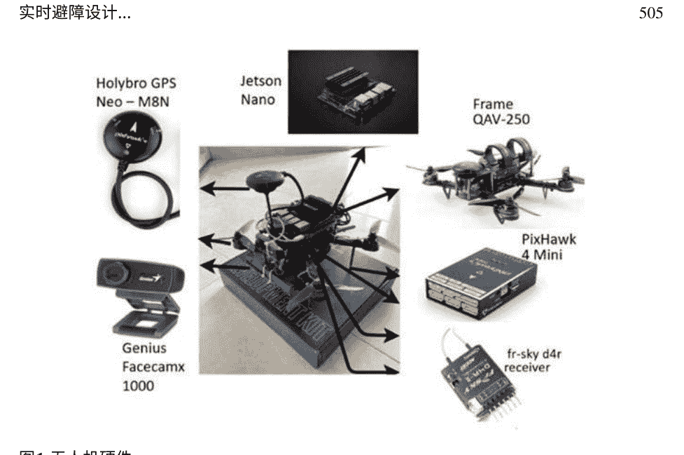

### 2.1 飞行控制

为了优化四旋翼的响应时间，PIXHAWK4迷你飞行控制器和NVIDIA Jetson Nano嵌入式系统已集成到无人机中。PIXHAWK4是一种嵌入式系统，允许飞行员通过电气或机械方式与无人机控制进行交互，其主要目标是平衡无人机并采用特定的飞行姿态。它包含四个传感器：加速度计（ICM 20,689）、陀螺仪（BMI055）、磁力计（IST8310）和气压计（MS5611）。PIXHAWK4 [6] 在开源PX4框架下运行，所有配置和校准都在Qground-Control框架 [7] 下进行。另一方面，主计算机是Nvidia Jetson Nano，其运行重点是开发人工智能软件，其主要特点是提供472 GFLOP，这使其具有优化的浮点运算时间，并且可以运行深度学习算法，另外，它可以并行运行多个神经网络并在几秒钟内处理多个高分辨率传感器。优化处理时间的一种方法是使用硬件在环技术执行所有操作，这意味着飞行控制器和中央计算机都在无人机中。这种技术将减少它们之间的通信时间。

### 2.2 深度传感器、相机和GPS

在避障领域，它使用了RealSense R200传感器，该传感器由英特尔设计，可以生成用于避障的点地图，并且与Linux和Python编程语言兼容，这些语言在整个开发过程中都被使用。集成摄像头是Genius FaceCam X1000，其主要优点是尺寸小、易于集成，主要特点是支持高清720p分辨率的1M像素视频，兼容Windows、Linux和Mac操作系统。使用的GPS模块是Ublox NEO-M8N双模块。GPS是项目开发的基础部分，因为它可以知道无人机的当前位置以及物体相对于无人机的位置，该传感器的误差率为±5厘米。

### 2.3 通信系统

为了优化信息处理时间，使用了循环硬件，可以直接在无人机上进行飞行控制和处理，从而减少数据发送和接收时间。在集成完整的无人机系统时，需要定义内部（Pixhawk 4 mini和Jetson Nano）和外部（Jetson Nano和外部计算机）通信协议。图2显示了无人机的原理图和连接系统。Jetson Nano卡通过USB协议连接到PIXHAWK，波特率为57,600。Jetson Nano接收三个主要连接：实感R200（深度传感器），USB摄像头和Wi-Fi模块。

为了实现中央计算机与飞行控制之间的通信，使用了MavLink通信协议，该协议通过XML文件仅传输头部，以轻量化的方式传输车辆的方向、GPS位置、速度等信息。

为了激活Jetson Nano中的代码，需要创建一个屏幕部分，即使窗口关闭，也可以保持代码运行。除此之外，它通过安全外壳通信协议或SSH连接到Jetson Nano，该协议允许通过安全通道远程访问中央计算机或服务器，其中包含所有加密信息。中央计算机（Jetson Nano）的主要任务是协调所有模块并并行执行它们。

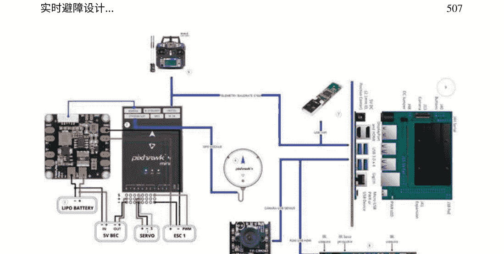

图2 电路图

## 3 轨迹规划

在算法开发中，考虑了PX4 mini的不同飞行模式，对于这个项目来说，OFF BOARD飞行模式非常有益。它的操作基于向无人机输入指令点，即起飞点（点0）作为起点，并根据给定的数据（以米为单位）在其坐标轴上移动，这些坐标轴是纬度、经度和高度，无人机以预先规定的恒定速度移动，直到达到设定点。我们通过Python从中央计算机（Jetson Nano）向飞行控制器（PX4）发送命令，将无人机的状态更改为OFFBOARD飞行模式。

### 3.1 ROS算法的节点

ROS是一个开源软件，提供了用于设计和可视化带有无人机的虚拟环境的库[8, 9]。我们与ROS集成的库是Gazebo。Gazebo是一个开源的3D机器人模拟器。它集成了ODE物理引擎、OpenGL渲染和传感器模拟以及执行器控制的支持代码。通过Gazebo，我们可以设计和可视化带有无人机的虚拟环境。对于Jetson nano中央计算机和Px4 mini飞行控制器之间的内部通信，使用了MAVROS通信协议，该协议以轻量级的方式传输消息，因为只传输头文件。

通过XML文件传输，该协议主要传输车辆的方向、GPS位置、速度以及为此项目开发的以下节点：

-   摄像头节点。它负责获取点地图并发布，以便其他节点可以订阅。
-   规避节点。它连接到相机节点以获取点地图，然后进行避障。
-   轨迹规划节点。配置无人机的内部参数化和OFFBOARD飞行模式。
-   Gazebo节点[10]。它模拟了算法最终测试所需的真实环境。
-   Rviz节点[11]。它提供由相机获取的3D数据，如图像和点地图。

为了验证算法，制作了基本几何图形（正方形、三角形和3D菱形），并分析了它们在每个时刻的位置所得到的图形，然后生成了一个误差表，用于比较实际轨迹与实验轨迹，并得出结论。图3显示了无人机在2D菱形轨迹上的3D行为；将实际数据和实验数据叠加在一起计算均方误差。

在分析生成的轨迹的记录时，观察到无人机平稳起飞，直到达到3米的高度，然后描述相同几何图形进行三次转弯，然后跟踪算法生成一个直线，直到再次触地。

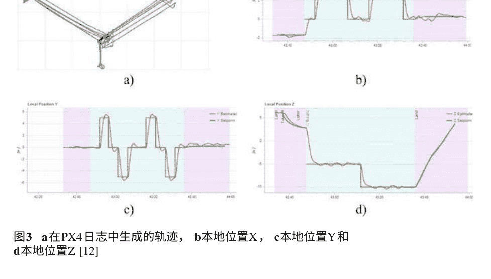

图3 a在PX4日志中生成的轨迹，b本地位置X，c本地位置Y和d本地位置Z [12]

一旦了解了轨迹跟踪期间生成的实验数据，就与设定点值进行比较，发现由于风速变化，位置存在20%的误差，同时观察到x和y轴的振荡。

## 4 避障

本节介绍了一种检测特定颜色物体的方法以及如何通过ROS软件验证算法。

### 4.1 红盒识别

由于需要识别一个尺寸和颜色都恒定的物体，因此实施了一种颜色分割技术来检测红色物体。第一步是获取集成到无人机上的相机的帧，然后将其应用于从RGB（红色、绿色和蓝色）到称为HSV（色调、饱和度和值）的颜色空间的非线性转换[13]。要分割框，选择在hsv颜色空间中元素所在的颜色范围，low_reds = (120, 110, 255), high_reds = (179, 255, 255)，并消除图像中范围之外的所有内容。分割可能导致图像中的不连续分割和小的误报，因此应用了一种称为开闭变换的形态学变换，它有助于消除分割中存在的噪声并关闭前景对象内的小黑洞。图4显示了所描述算法的每个步骤的结果。最后，计算物体的质心和相对于质心的深度。如果图像中有多个物体，则优先选择距离无人机最近的物体。

在获取物体质心的深度和位置之后，计算了物体质心与帧质心之间的距离。如果物体的质心在图像质心的右侧，无人机将向左移动，直到物体从无人机的视觉区域消失并可以继续其轨迹，同样的方式也适用于相反的一侧。出于安全原因，算法将大于10米的深度标记为空，从而确保无人机执行短轨迹并在测试中获得更大的控制。

### 4.2 机器人操作系统（ROS）

该算法在ROS平台上进行了验证。创建仿真环境的第一步是创建计算图，如下所示

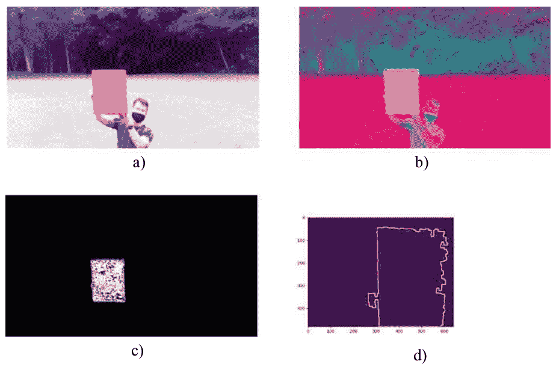

图5.该图是使用ROS函数rosrun rqt_graph生成的，它允许可视化并行执行的所有节点和每个活动主题。

使用3D模拟环境Gazebo进行模拟测试。Gazebo允许创建传感器以模拟数据输入。Gazebo与ROS兼容，允许提取和发布ROS主题中的人工传感器数据，如前一节所述。这意味着，从本地规划器节点的角度来看，模拟传感器或来自真实摄像头的数据没有区别，这使我们能够在将其应用于真实环境之前验证性能。为了模拟无人机，我们使用了3DR Iris Quadcopter模型，并添加了一个带有单目摄像头的节点，该节点位于ROS模拟环境中。至于环境，我们拍摄了一些真实环境的照片来创建模拟环境。然后，我们在Gazebo中创建树木、山脉和其他物体；我们还测量了风速，以将相同的测量应用于软件。

-   节点实感。它负责获取点地图并发布，以便其他节点可以访问信息。
-   Gazebo节点。生成一个模拟环境，可以重新创建物理空间。
-   Rviz节点。Rviz是ROS应用程序的3D可视化工具。它提供了机器人模型的视图，捕获机器人传感器的信息，并进行回放。

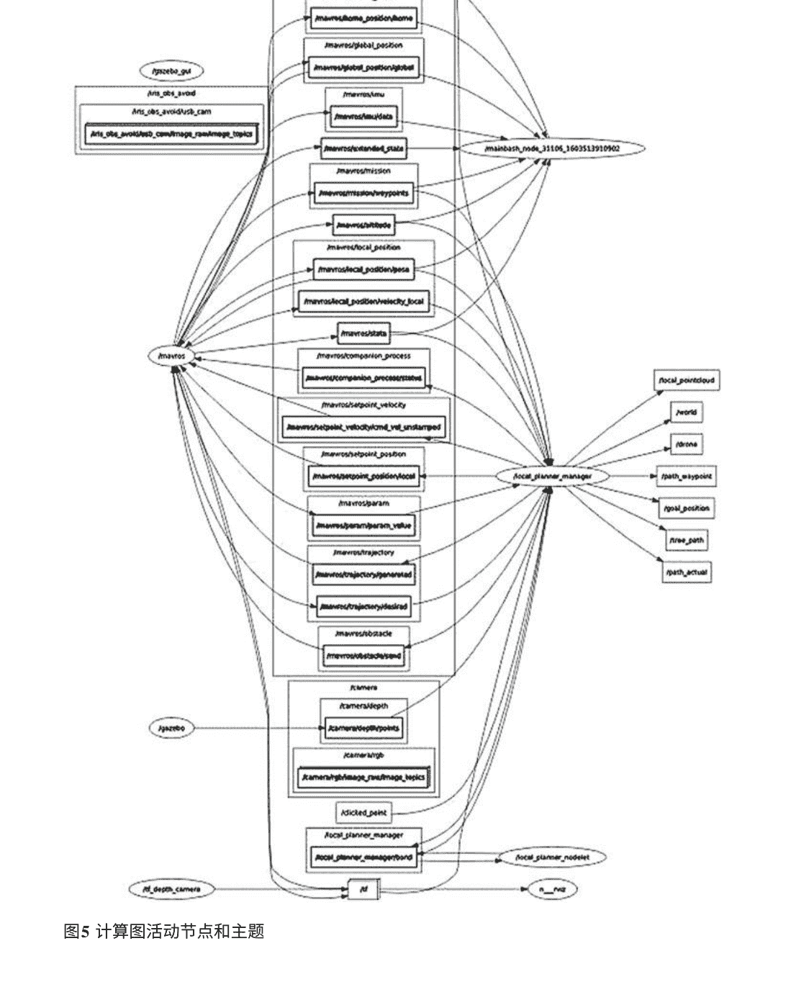

图5 计算图活动节点和主题

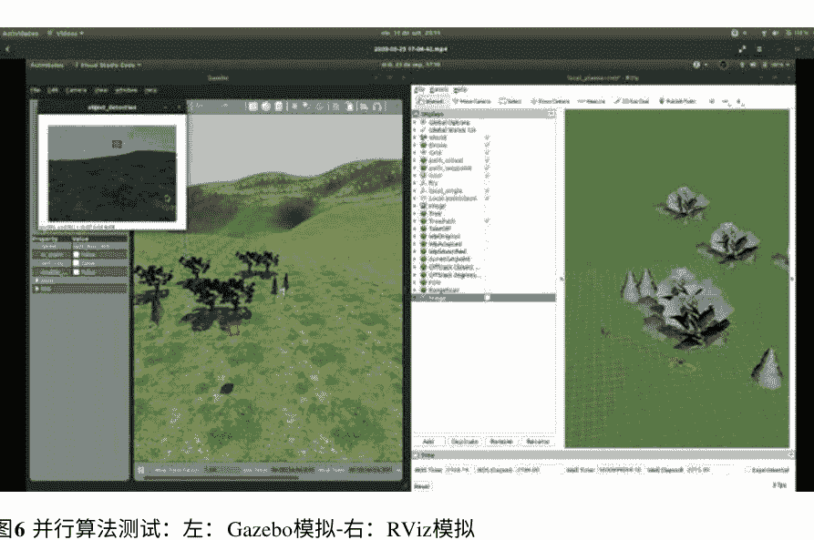

图6 并行算法测试：左：Gazebo模拟；右：RViz模拟

捕获的数据。它可以显示来自相机、激光器、3D和2D设备的数据，如图像和点云。

-   视觉节点。其主要功能是订阅/tf_depth_camera节点，该节点提供主相机的图像，并由计算机视觉算法进行处理。
-   本地规划节点。其主要功能是连接到避障节点并接收点地图以评估成本函数并确定最优路径。

图6显示了在Gazebo中创建的工作环境，包括一个红色物体，无人机检测到物体后，向物体移动并躲避，直到达到用户定义的点。

## 5 结果

本节的目标是将轨迹算法和人工视觉算法集成起来。无人机爬升到3米高度，并开始在自身轴上旋转，直到找到物体，一旦找到物体，就会生成从初始点到物体的轨迹，如图7所示。系统在接近物体时生成设定点，设定点在插图中用橙色点表示，通过这种方式，我们可以看到系统如何自动在无人机前方生成一个点，然后执行轨迹，即蓝线。当物体消失时，它会通过自身轴旋转进行搜索，直到找到它再次开始并继续其跟踪过程。在跟踪结束时，它执行一次返回家的操作。

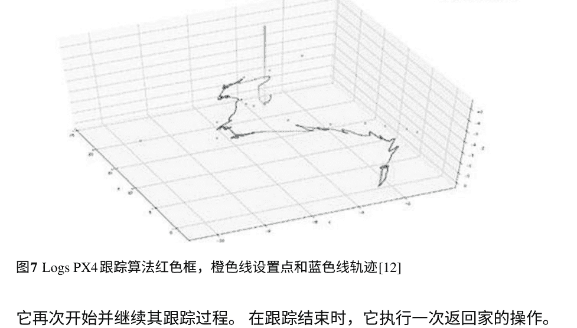

图7 Logs PX4跟踪算法红色框，橙色线设置点和蓝色线轨迹[12]

根据在户外进行的飞行实验，证明该系统能够自主生成轨迹，检测可能存在的障碍物，并自主避开这些障碍物并返回到初始轨迹，在连续和受控的飞行中。尽管无人机具有相应的定位传感器，但观察到GPS估计位置与实验位置之间仍存在误差。未来的工作提出将更加稳健的结构集成到TAROT中，添加一个10,000mAh电池和24V的电源系统，可以实现长达40分钟的飞行，并减少系统中出现的振动，使用深度传感器D400，这是一个易于整个社区访问的传感器，并且与最初使用的R200相比，具有更好的硬件。在无人机中平衡地分布电子元件非常重要，以实现重量的对称性，从而避免起飞和飞行过程中出现各种干扰。

## 6 结论

根据在户外进行的飞行测试，系统能够检测到物体，例如红色盒子，生成目标并执行避开障碍物的轨迹，实现平稳控制的飞行。由于ROS + Gazebo + Rviz仿真系统的整合，无人机在进入真实环境之前能够正确运行，因此与模拟和真实环境之间存在最小差异。在未来的工作中，将尝试添加在环境中移动的物体。无人机在接近目标点时修改其轨迹。此外，它旨在引入更先进的计算机视觉算法来检测特定的对象类别，创建轨迹并跟踪对象。这个想法是使用预训练的神经网络，可以检测多个对象并完成诸如牲畜区域检查等任务。

## 参考文献

1.  于, Y., 王, X., 钟, Z., & 张, Y. (2017). 基于ROS的手势识别的无人机控制. 在第29届中国控制与决策会议（CCDC）(pp. 6795-6799)中.
2.  Meier, L., Honegger, D., & Pollefeys, M. (2015). PX4: 一种基于节点的多线程开源机器人框架，用于深度嵌入式平台. 在IEEE国际机器人与自动化会议（ICRA）(pp. 6235-6240)中.
3.  Rivera, D. (2012). 在动态环境中使用深度相机开发四旋翼无人机避障算法. 最后访问于2022年3月7日，主页 https://repositorio.unal.edu.co/handle/unal/21096?show=full
4.  高, F., & 沈, S. (2016). 在线四旋翼轨迹生成和点云上的自主导航. 在IEEE国际安全、安全和救援机器人研讨会（SSRR），ISBN: 978-1-5090-4349-1. https://doi.org/10.1109/SSRR.2016.7784290
5.  Vanneste, S., Bellekens, B., & Weyn, M. (2014). 3DVFH +: 实时三维障碍物避免使用八叉树地图. 在CEUR研讨会论文集（第1319页）。
6.  PX4自动驾驶仪用户指南. 最后访问于2022年3月7日，主页https://docs.px4.io/master/zh/
7.  QGROUNDCONTROL. 最后访问于2022年3月7日，主页http://qgroundcontrol.com/
8.  魏, Y., 林, Z. (2017). 基于ROS的四旋翼机器人的视觉跟踪. **本工作得到美国陆军研究办公室在W911NF1510275号授权下的部分支持. IFAC—PapersOnLine, 50(1), 11447–11452, ISSN 2405–8963. https://doi.org/10.1016/j.ifacol.2017.08.184
9.  Olalekan, A. F., Sagor, J. A., Hasan, M. H., & Oluwatobi, A. S. (2021). 比较ROS提供的两种SLAM算法（机器人操作系统）. 在2021年第二届新兴技术国际会议（INCET）(pp. 1–5). https://doi.org/10.1109/INCET51464.2021.9456164
10. Gazebo：简单的机器人仿真. 最后访问于2022年3月8日，主页http://gazebo sim.org/
11. AWS RoboMaker开发者指南. 最后访问于2022年3月8日，主页https://docs.aws.amazon.com/es_es/robomaker/latest/dg/aws-robomaker-dg.pdf#simulation-tools-rviz
12. Vera, A. A., & Valle, D. F. (2020). 设计用于检测和控制机场黑秃鹫存在的视觉系统. Retrieved from:http://hdl.handle.net/20.500.12749/12743
13. Feng, L., Xiaoyu, L., & Yi, C. (2014). 一种基于RGB和HSV颜色空间的稀有彩色胶囊的高效检测方法. 在2014年IEEE国际颗粒计算大会(GrC)(pp. 175–178). https://doi.org/10.1109/GRC.2014.6982830

# 基于田口设计的顺序卷积神经网络用于缺陷紧固件分类

Manjeet Kaur，Krishan Kumar Chauhan，Tanya Aggarwal，Pushkar Bharadwaj，Renu Vig，Isibor Kennedy Ihianle，Garima Joshi和Kay Owa

摘要 紧固件在保证机械各部分安全的过程中起着关键作用。缺陷紧固件表面的凹陷、裂纹和划痕是由材料性质和生产过程中设备的错误处理引起的。因此，需要质量控制来确保安全可靠的操作。现有的缺陷检测方法依赖于人工检查，这需要大量的、金钱和其他资源；而且，由于人为错误，无法保证准确性。与手动检查技术相比，自动缺陷检测系统在缺陷分析方面具有显著影响。然而，卷积神经网络（CNN）和基于深度学习的方法等计算技术是进化的方法。通过精心选择设计参数值，可以实现CNN的全部潜力。本研究尝试使用基于田口设计的实验和分析方法开发一个稳健的自动系统。用于训练系统的数据集是手动创建的，用于M14尺寸螺母，有两个标记类别：有缺陷和无缺陷。数据集中共有264张图像。提出的顺序CNN在0.001的学习率下具有96.3%的验证准确率，0.277的验证损失。

关键词 紧固件·顺序卷积神经网络·缺陷·田口分析

## 1 引言

螺栓和螺母是机械和汽车行业常见的紧固件。冷成形、热成形、螺纹生产、加工、淬火和回火是紧固件在生产过程中经历的工序[3]。材料固有特性的变化、振动的影响、工具损坏和不当的工艺管理可能导致紧固件最终产品中的缺陷，因为它们经历了这些工艺[5]。紧固件原材料经常会出现裂纹。褶皱是紧固件在螺母锻造过程中由于材料位移而产生的一种缺陷形式。变形、凹痕、褶皱、划痕、断裂、表面粗糙、螺纹缺失和错位都是加工过程中产生的缺陷[20]。中小型工业企业是这些紧固件的最大制造商，但检验过程是手工进行的，需要大量的人力、资金和时间。即使进行了所有这些工作，错误的可能性仍然存在，有缺陷的产品可能会到达客户手中。由于振动，这些有缺陷的紧固件可能会在长期使用中松动甚至断裂[21]。开发自动化技术来检测不良钢紧固件可以帮助克服这一挑战。机器学习缺陷检测系统减少了人为错误和努力，通过检测人类可能忽视的缺陷使过程更加准确[4]。该过程涉及计算一组手工制作的纹理特征，然后在分类器上进行训练[14]。尽管基于图像处理和机器学习技术的自动检测过程带来了巨大的好处，但也存在一些重大缺点。其中最重要的一个是异常的外观在形式、大小、颜色、几何形状和其他因素上的变化，甚至在同一次检查工作中也会发生变化[15]。由于这些原因，计算机视觉应用和基于深度学习的卷积神经网络（CNN）可以用于提高效率和精确检测率。

## 2 相关工作

基于计算机视觉的目标检测和分类应用正在兴起，并在软件、机械和电气工业领域变得非常流行。这些应用提供的速度、效率和稳健性使得日常工作变得简单。在许多例子中，使用这种深度学习模型来检测和分类工业紧固件已经证明取得了高准确性的目标。在提出模型之前，考虑了计算机视觉在一些例子中的杰出贡献。已经使用了几种算法来进行金属裂纹检测和纹理特征提取。已经使用了不同的边缘检测算子来获取有缺陷样本上的细边缘特征。同样，还有几种机器已经探索了基于学习的技术，用于对轧制钢表面缺陷进行分类。Sharifzadeh等人应用高斯函数和直方图方法来检测钢构件上的各种缺陷，孔洞的检测率为88.4%，划痕的检测率为78%，卷断的检测率为90.4%，锈蚀问题的检测率为90.3%。Ashour等人应用支持向量机来检查样本数据中的视觉纹理特征，还研究了不同的核函数以获得最佳性能分类器。Park等人提出了基于机器学习的成像系统，用于检测表面的污垢、划痕和磨损。CNN已经应用于检查目标区域中的缺陷是否存在。与手动检查技术相比，所提出的方法在时间、成本和性能方面都具有优势。Bhandari和Deshpande提出了一种基于启发式算法的改进方案，用于识别表面缺陷并计算特征，然后使用SVM将表面图像分类为有缺陷和无缺陷两类。该系统在表面纹理数据库上进行了测试，实现了94.19%的分类准确率。Zhao等人研究了计算机视觉技术，用于检测传输线路中使用螺栓连接不同组件时的引脚缺失问题。这些螺栓的缺陷可能导致重大问题，如电网故障。为了解决这个问题，提出了一个CNN模型，包括三个关键改进，用于提取小尺度螺栓特征，并实现了71.4%的准确率。Liu等人使用CNN架构的一个版本来检测触网支撑组件(CSCs)。它结合了一个用于CSCs检测的大规模优化和改进的Faster R-CNN检测网络，以及一个用于小尺度CSCs检测的级联网络。该模型具有92.8%的准确率。Taheritanjali等人创建了一个系统，用于自动记录、预处理数据，并将其与各种监督和无监督的机器学习模型进行比较，以检测12种不同紧固件的损坏。该方法还有助于确定所使用的紧固件类型。监督模型达到了99%的准确率，而无监督模型达到了84%的准确率。Giben等人提出了一种用于材料语义分割和分类的视觉检测方法，使用深度卷积神经网络(DCNN)。在这种方法中，他们总共识别了十种材料，并且所提出的模型具有93.35%的分类准确率。对于破损和破碎的轨枕，检测率分别为92.11%和86.06%。

为了提取丰富的特征信息，Kou等人在他们的缺陷检测模型中使用了专门构建的密集卷积块，这显著增加了特征的重用、特征的传播和网络的表征能力。建议的模型在GC10-DET数据集上生成了71.3%的平均精度(mAP)，该数据集是公开可用的，而在NEUDET数据集上生成了72.2%的mAP[8]。Song等人提出了一种基于CNN的技术，其中他们将损坏的螺丝、表面污垢和剥落的螺丝视为缺陷类别，图像是用工业相机拍摄的。提出的模型在每张图像的平均处理时间为1.2秒的情况下实现了98%的准确率[17]。Gai等人提出了一种用于检测工业零件上钢表面缺陷的CNN技术。使用工业相机收集和预处理数据，然后使用VGG架构来改进网络特征、分类和缺陷识别能力。然后提出的模型与其他传统策略相比，发现更有效[6]。基于计算机视觉的应用，如使用迁移学习或传统CNN进行对象识别和分类，在所有行业中越来越受欢迎。

这些方法提供的速度、效率和稳健性简化了日常任务。研究人员在缺陷分类中采用了迁移学习方法，但这些模型是在用于对象检测的数据集上训练的，与缺陷检测领域没有任何相似之处。由于对象检测和缺陷检测领域之间的根本差异，必须从头开始构建CNN模型，并在高质量数据集上进行训练。此外，缺乏标准数据集会导致错误和无法得出结论的发现，目前没有可以立即用于迁移学习的模型。本研究提出了一个螺母缺陷数据集和一个处理这两个关键困难的顺序CNN模型的设计。本研究还展示了田口策略的有效性，这是一种简单而有效的处理参数优化问题的方法。根据结果，所提出的方法有助于确定紧固件缺陷分类的顺序CNN参数值。

## 3 基于田口设计的顺序卷积神经网络 (CNN) 的提出框架

图1展示了设计优化顺序CNN模型的提出框架。每个步骤的详细信息如下所示。

### 3.1 数据集准备

为了准备一个实用的数据集，从紧固件行业收集了M14尺寸螺母的样本，每个螺母有六个侧面。使用手机相机在不同的光照条件下捕获了尺寸为1844 * 4000像素的图像。捕获了每个螺母面的图像。实际捕获的数据集存在类别不平衡的问题，非缺陷面的样本数量多于缺陷样本。为了增加数据集中缺陷图像的数量，应用了缩放和亮度变化的增强技术。这导致了‘缺陷’和‘非缺陷’类别中每个类别132张图像。

80%的图像用于训练集，20%用于测试集。图2展示了数据集中的样本图像。最常见的缺陷类型包括裂纹、凹痕、斑点、划痕和皱纹[6]。在这里，所有的缺陷都被视为一个单独的类别‘缺陷’。

STEP 1: 数据集准备

- 类别数量: 2 (‘有缺陷’ 和 ‘无缺陷’)
- 数据增强: 亮度变化和旋转
- 每类图像数: 132
- 数据集中图像总数: 264

STEP 2: 识别顺序CNN设计参数

- 卷积层数量
- 输入图像尺寸
- 滤波器尺寸
- 损失函数
- 优化器
- 激活函数

STEP 3: 基于Taguchi的CNN设计参数网格搜索

- 确定CNN设计参数的水平和所需变化。
- 选择合适的Taguchi正交表
- 执行实验运行。
- 确定响应参数
- Taguchi分析
- 选择最优参数集

STEP 4: 提出的CNN模型分析

- 执行确认实验运行
- 结果与讨论

图1 基于Taguchi设计的顺序卷积神经网络工作流程 (CNN)

图2 数据集中M14尺寸螺母的样本图像

### 3.2 顺序CNN设计参数

基本顺序CNN的架构如图3所示。这些架构可以从头开始创建。为了为给定的应用程序创建CNN模型，早期的层学习低级特征，而最后一层根据特征图进行分类。

CNN层数 CNN结构的设计受到层数增加有助于更好逼近目标函数和增强从更详细特征集中学习的事实的启发。这使得层数成为调节顺序架构学习能力的重要维度之一。

输入图像尺寸 选择图像尺寸使得细微缺陷如裂纹和划痕清晰可见，但较大的输入图像尺寸会导致更多的输入可见。然而，较大尺寸的输入图像会增加CNN的复杂性。因此，选择了[100 × 100]和[200 × 200]进行研究。如果提供了一个高度和宽度为100像素的彩色图像，则每个像素具有一个单一通道，输入层的形式为(100, 100, 3)。

优化器 优化器根据损失函数更新模型，并通过计算损失对权重的偏导数来帮助最小化损失，并在相反方向上更新权重。这个过程会重复进行，直到达到损失函数的最小值。梯度下降算法会考虑学习率，并在损失较大时采取较大步长，在损失减小时采取较小步长。小学习率的目的是接近最小值。目标函数使用随机梯度下降（SGD）进行优化。它用从随机选择的数据计算得到的值替代梯度子集，可以被视为最陡下降的概率估计。因此，选择特定样本而不是整个数据集。全局最小值可以很容易地达到，但处理大型数据集时变得更加困难，因此SGD通过选择样本子集来近似梯度下降。在处理大型数据集时，它特别有帮助。自适应矩估计（ADAM）使用指数加权梯度来调整学习率。它是最流行的梯度下降优化算法之一。它记录了先前梯度的平均值，这些梯度是递减的。它是一种非常有效的优化器，需要很少的内存，并且训练成本低。

损失函数 Hinge排名损失旨在减少模型输出与目标向量之间的差距，同时将其与所有其他向量隔离开来，从而对所有错误进行惩罚。平方Hinge损失计算Hinge损失的平方，导致错误函数的曲面变平，并且使其在数值上更容易处理。如果Hinge损失在二元分类问题上提高了性能，那么平方Hinge损失很可能会进一步提高性能。

激活函数 修正线性单元（ReLU）是一种非线性激活函数，用于计算卷积特征图的激活。ReLU响应在远离零的某一点处最大化，并具有V形状，而响应被限制在最大值6上，使其呈Z形。

过滤器大小 实施CNN的目的是从输入图像中提取可以表征类别的关键特征。卷积操作考虑局部像素子集，因此可以通过使用不同的过滤器大小和过滤器大小的变化来探索图像中的不同子集级别以捕获不同的细节。小尺寸的过滤器通过探索图像中的小区域来找到细节。而大尺寸的过滤器则找到粗略信息，并且模型在每次计算时尝试在输入的大区域中找到特征。因此，可以探索空间滤波器以改善网络的学习方面的性能。通过仔细调整过滤器，CNN可以在粗略和细节方面都表现良好。

在这项研究中，我们尝试使用这些顺序CNN的基本构建元素进行实验，以找到最佳组合，使模型表现良好。通过精心设计实验，可以更好地理解每个参数调整及其组合的影响。

### 3.3 基于Taguchi的CNN设计参数的网格搜索

基于Taguchi的网格搜索方法适用于依赖于控制因素或超参数数量的实际设计问题。Taguchi的正交表已经在实验设计中使用过[10]。与许多其他统计设计相比，它被发现在效率上更为高效[13]。为了达到最佳结果，必须确定控制因素的值。Taguchi分析旨在通过提供弹性配置和设计来提高质量。

表1 参数和变化

| 因素（6） | 参数名称 | 变化/级别 |
| --- | --- | --- |
| 一个 | 卷积神经网络层数 | 6, 8, 10, 12 |
| B | 图像尺寸 | [100 × 100], [200 × 200] |
| C | 优化器 | Adam, sgd |
| D | 损失函数 | Hinge, 平方Hinge |
| E | 激活函数 | ReLU, ReLU6 |
| F | 滤波器尺寸 | [2 × 2], [3 × 3] |

术语“信号”指的是在很小的方差下改善性能，这被称为“噪声”。性能的一致性是鲁棒性的度量，通过使设计对不可控特性免疫来实现。Taguchi网格搜索中使用了两步优化过程。选择超参数和所需的修改是初始阶段。接下来，选择正交阵列以确保这些控制组件以相等和计划的方式参与[12]。通过确定最佳的超参数排列，在第二阶段产生最佳的潜在性能。

选择超参数 对象大小的变化和与相机的距离是缺陷分类领域中的变异（噪声）来源。目标是找到在波动条件下表现出高性能的最佳超参数组合。Table1列出了在进行试验时参数变化的描述和值。由于有一个具有四个级别的组件和五个具有两个级别的因素，对于六个参数的Taguchi混合水平设计可能性，L16是最佳选择。如果使用完全因子设计和所有可能的组合，将需要总共36次试验。然而，利用Taguchi的正交阵列来正确设计试验，需要测试的总试验次数减少到16次，如Table2所示。选择响应参数 在这项工作中，用于评估性能的响应参数或性能指标是测试准确性、验证准确性、测试损失和验证损失。目的是最大化准确性和最小化损失。

## 4 结果分析

该模型使用Python软件实现，并使用Minitab进行DOE分析。推荐的参数集已经针对快速数据集进行了优化。记录了可能组合的实验结果，每次训练进行500个周期，并记录最佳结果。

使用Minitab工具对Table2进行了Taguchi分析。高亮文本表示Table2中的最佳结果。

表2 根据Taguchi的L16正交表的实验结果

| 实验运行 | 参数变化 | | | | | | 响应值 | | | |
| --- | --- | --- | --- | --- | --- | --- | --- | --- | --- | --- |
| | 一个 | B | C | D | E | F | 训练损失 | 训练准确率 | 验证损失 | 验证准确率 |
| 1. | 6 | [100×100] | adam | Hinge | ReLU | [2×2] | 0.3885 | 0.9251 | 0.9303 | 0.9145 |
| 2. | 6 | [100×100] | adam | Hinge | ReLU | [3×3] | 0.6127 | 0.8508 | 0.7954 | 0.8629 |
| 3. | 6 | [200×200] | sgd | Sqd. Hinge | ReLU6 | [2×2] | 0.3539 | 0.7552 | 0.6096 | 0.6721 |
| 4. | 6 | [200×200] | sgd | Sqd. Hinge | ReLU6 | [3×3] | 0.5114 | 0.9091 | 0.8036 | 0.8966 |
| 5. | 8 | [100×100] | adam | Sqd. Hinge | ReLU6 | [2×2] | 0.1441 | 0.8449 | 1.6285 | 0.8497 |
| 6. | 8 | [100×100] | adam | Sqd. Hinge | ReLU6 | [3×3] | 0.5757 | 0.8545 | 0.7945 | 0.8397 |
| 7. | 8 | [200×200] | sgd | Hinge | ReLU | [2×2] | 0.275 | 0.1983 | 0.579 | 0.1883 |
| 8. | 8 | [200×200] | sgd | Hinge | ReLU | [3×3] | 0.2206 | 0.9027 | 0.4843 | 0.9151 |
| 9. | 10 | [100×100] | sgd | Hinge | ReLU6 | [2×2] | 0.3332 | 0.9455 | 0.6477 | 0.9433 |
| 10. | 10 | [100×100] | sgd | Hinge | ReLU6 | [3×3] | 0.2258 | 0.9273 | 0.5374 | 0.9201 |
| 11. | 10 | [200×200] | adam | Sqd. Hinge | ReLU | [2×2] | 0.0762 | 0.8949 | 0.3033 | 0.9021 |
| 12. | 10 | [200×200] | adam | Sqd. Hinge | ReLU | [3×3] | 0.3889 | 0.9536 | 0.7223 | 0.9433 |
| 13. | 12 | [100×100] | sgd | Sqd. Hinge | ReLU | [2×2] | 0.3889 | 0.9455 | 0.6691 | 0.9433 |
| 14. | 12 | [100×100] | sgd | Sqd. Hinge | ReLU | [3×3] | 0.3626 | 0.9455 | 0.4624 | 0.9433 |
| 15. | 12 | [200×200] | adam | Hinge | ReLU6 | [2×2] | 0.1161 | 0.8545 | 0.5709 | 0.8528 |
| 16. | 12 | [200×200] | adam | Hinge | ReLU6 | [3×3] | 0.1911 | 0.9159 | 0.3713 | 0.9216 |

图4显示了训练损失、训练准确率、验证损失和验证准确率值的变化区间图。它用于评估和比较结果均值的置信区间。区间图显示了每个组均值的95%置信区间。该图表显示训练和验证准确率的均值几乎相等，变异性也相似，而损失值则显示了明显的平均值位移。验证损失具有很大的变异性，并且明显较大。此外，通过分析结果，努力减少损失并提高准确性。

主效应图：图5显示了六个超参数调整的主效应图。主效应图显示了每个因素对系统整体的影响性能。‘主效应’被定义为参数的不同程度对性能产生不同影响。当线是水平的时候，表示该超参数的各个变体的特征平均值相同。如果图形不是水平的，并且因素值的变化对特征产生不同的影响，则存在显著的影响[12]。图5中的测试和验证准确性的主效应图用于确定每个因素的最佳值集。根据主效应分析的排名，具有最大波动的元素对系统响应产生最大影响，因此具有排名1等等。优化器和损失函数对系统性能影响最大，而激活函数类型影响最小。

### 4.1 优化的顺序CNN模型

考虑到表1中列出的超参数，基于Taguchi分析选择了主效应图中显示的建议参数值为了在图5中最大化准确性，CNN层数为10，图像尺寸为[100×100]，激活函数为Relu6，损失函数为平方hinge，优化器为adam，滤波器尺寸为[3×3]，每层滤波器为[32, 32, 32, 64, 64, 64, 128, 128, 256, 256]。提出的顺序CNN架构经过设计和确认运行，考虑了这些参数，并在表3（图6）中进行了总结。

表3 提出的顺序CNN架构

| 层 | 类型 | 输出形状 | 参数数量 |
| :--- | :--- | :--- | :--- |
| conv_1 | 2D, 卷积 | (100, 100, 32) | 416 |
| conv_2 | 2D, 卷积 | (100, 100, 32) | 4128 |
| conv_3 | 2D, 卷积 | (100, 100, 32) | 4128 |
| 最大池化_1 | 池化, 最大 | (50, 50, 32) | 0 |
| 卷积_4 | 2D, 卷积 | (50, 50, 64) | 18496 |
| 卷积_5 | 2D, 卷积 | (50, 50, 64) | 36928 |
| 卷积_6 | 2D, 卷积 | (50, 50, 64) | 36928 |
| 最大池化_1 | 池化, 最大 | (25, 25, 64) | 0 |
| 卷积2D_7 | 2D, 卷积 | (25, 25, 128) | 73856 |
| 卷积2D_8 | 2D, 卷积 | (25, 25, 128) | 147584 |
| 最大池化_3 | 池化 | (12, 12, 128) | 0 |
| 卷积2D_9 | 2D, 卷积 | (12, 12, 256) | 295168 |
| 卷积2D_10 | 2D, 卷积 | (12, 12, 256) | 590080 |
| 最大池化_4 | 池化, 最大 | (6, 6, 256) | 0 |
| 展平_1 | Flatten | (9216) | 0 |
| 稠密_1 | Dense | (1) | 9217 |
| 总参数: 1,216,929 | | | |
| 可训练参数: 1,216,929 | | | |
| 不可训练参数: 0 | | | |
| CNN层数: 10 | | | |
| 数量 每层过滤器数量: [32, 32, 32, 64, 64, 64, 128, 128, 256, 256] | | | |
| 激活函数: ReLU6 | | | |
| 损失函数: 平方铰链 | | | |
| 优化器: 自适应矩估计 (adam) | | | |
| 批量大小: 32 | | | |
| 每层过滤器大小: [3 × 3] | | | |
| 分类器: 二元支持向量机 | | | |

## 5 结论

自动缺陷检测系统在质量控制中已被证明比手动检查程序更有效。本研究的目标是利用基于田口设计的试验和分析来创建一个稳健的自主视觉检测系统。开发并使用了一组坚果表面缺陷图片数据集。使用田口设计的实验和分析创建了一个顺序卷积神经网络架构。研究结果表明，在特定应用中选择正确的超参数对于实现低损失值和更高的准确性至关重要。本研究中，训练准确率为98.69%，训练损失为0.0449，验证损失为0.2794，验证准确率为96.3%。系统的弹性表现在持续的训练和验证结果上，即实现了低损失和高准确性。

未来的工作将进行更全面的研究，考虑到各种缺陷类别。

## 参考文献

1.  Ashour, M. W., Halin, A. A., Khalid, F., Abdullah, L. N., & Darwish, S. H. (2015). 基于纹理的工件表面图像分类使用支持向量机。国际软件工程及其应用杂志，9(10), 147–160。
2.  Bhandari, S. H., Deshpande, S., & Deshpande, S. (2008). 一种简单的表面缺陷检测方法。2008 IEEE区域，10, 8–10。
3.  Caleb, P., & Steuer, M. (2000). 使用自适应学习方法对热轧钢表面缺陷进行分类。在KES '2000.第四届国际知识基础智能工程系统及相关技术会议。论文集 (Cat. No. 00TH8516) (第1卷, 第103-108页). IEEE。
4.  陈，J., 刘，Z., 王，H., 努涅斯，A., &韩，Z. (2017年)。 使用深度卷积神经网络自动检测网架支撑装置上的紧固件缺陷IEEE仪器与测量交易, 67(2), 257-269.
5.  Elangovan, S. B. T. K. R. (2019年)。 通过添加制造系统制造和分析聚合物螺栓和螺母组件。
6.  盖，X., 叶，P., 王，J., &王，B. (2020年)。 基于深度学习的钢金属表面缺陷检测方法研究。在2020年IEEE第五届信息技术和机电工程会议 (ITOEC) 中(pp. 637-641). IEEE.
7.  Giben, X., Patel, V. M., & Chellappa, R. (2015年)。 使用深度卷积神经网络对铁路轨道图像进行材料分类和语义分割。在2015年IEEE国际图像处理会议 (ICIP) 中(pp. 621-625). IEEE.
8.  寇，X., 刘，S., 程，K., &钱，Y. (2021年)。 基于yolo-v3模型的钢带表面缺陷检测模型开发。测量, 182, 109454.
9.  刘, W., 刘, Z., 努内斯, A., & 韩, Z. (2020). 统一的深度学习架构用于检测所有悬挂支撑组件。IEEE Access, 8, 17049–17059.
10. Montgomery, D. C. (2017).实验设计与分析. Wiley.
11. Neogi, N., Mohanta, D. K., & Dutta, P. K. (2014). 基于视觉的钢表面检测系统综述。EUR ASIP图像与视频处理杂志, 2014(1), 1–19.
12. Oehlert, G. W. (2010). 设计与实验分析的第一门课程。
13. Park, J. K., Kwon, B. K., Park, J. H., & Kang, D. J. (2016). 基于机器学习的图像检测系统用于表面缺陷检测。国际精密工程与制造-绿色技术杂志, 3(3), 303–310.
14. Saiz, F. A., Serrano, I., Barandiarán, I., & Sánchez, J. R. (2018). 一种鲁棒且快速的基于深度学习的钢板表面缺陷分类方法。在2018年国际智能系统会议(IS)上, (pp. 455–460). IEEE.
15. Shaheen, M. A., Foster, A. S., Cunningham, L. S., & Afshan, S. (2020). 不锈钢和高强度钢螺栓组件在高温下的行为-一项综述。消防安全杂志,113, 102975.
16. Sharifzadeh, M., Amirfattahi, R., Sadri, S., Alirezaee, S., & Ahmadi, M. (2008). 使用图像处理算法检测钢板缺陷。在国际电气工程会议上(pp. 1–7). 军事技术学院。
17. Song, L., Li, X., Yang, Y., Zhu, X., Guo, Q., & Yang, H. (2018). 基于深度卷积神经网络的金属螺丝表面微缺陷检测传感器, 18(11), 3709。
18. Taheritanjani, S., Schoenfeld, R., & Bruegge, B. (2019). 自动检测大修过程中紧固件的损伤在2019年IEEE第15届自动化科学与工程国际会议(CASE)(pp. 1289–1295), IEEE。
19. Xue, B., & Wu, Z. (2021). 基于人工智能机器视觉的钢板表面缺陷检测系统的关键技术无线通信与移动计算, 2021。
20. Xue, P., Jiang, C., & Pang, H. (2021). 基于图像处理的各种金属表面缺陷检测Traitement d u Signal, 38(4).
21. 云，J. P., 崔，S., 金，J. W., & 金，S. W. (2009). 使用由单变量动态编码算法优化的Gabor滤波器自动检测原始钢块中的裂缝。NDT和E国际, 42(5), 389–397。 https://doi.org/10.1016/j.ndteint.2009.01.007
22. 赵，Z., 齐，H., 齐，Y., 张，K., 翟，Y., & 赵，W. (2020). 基于自动视觉形状聚类的传输线路中缺失引脚缺陷检测方法。IEEE仪器与测量交易, 69(9), 6080–6091。

# 在线游戏成瘾对参加在线课程的学生的影响

Richard Septianus Frendi, Renaldi, Kevin Sandjaya, Richard Sanjaya, Ford Lumban Gaol, Tokuro Matsuo和Chew Fong Peng

摘要 在线游戏在青少年中非常流行，这种电子竞技有一种吸引力，使玩家更喜欢玩游戏而不是上课。不上课的学生和上课但不注意的学生反而玩在线游戏，干扰了讲座活动。本研究的目的是描述使学生沉迷于玩虚拟游戏的因素，并解释其影响。该研究使用定量方法选择信息人士，即根据研究背景和目标由研究人员确定的标准来考虑人们，因此，本研究的信息人士是沉迷于在线游戏的玩家。游戏对青少年学习成绩的影响是青少年学习成绩下降。克服在线游戏成瘾的方法是寻找其他更有用的活动，如锻炼或与其他人社交。

关键词：在线游戏的影响 · 大学生 · 网络游戏成瘾

R. S. Frendi (✉) · Renaldi · K. Sandjaya · R. Sanjaya
Bina Nusantara大学信息系统学院，印度尼西亚阿拉姆苏特拉，电子邮件： richard.frendi@binus.ac.id

K. Sandjaya
电子邮件： kevin.sandjaya@binus.ac.id

R. Sanjaya
电子邮件： richard.sanjaya@binus.ac.id

F. L. Gaol
Binus研究生计算机科学博士学位，印度尼西亚雅加达，电子邮件： fgaol@binus.edu

T. Matsuo
日本东京高级工业技术研究所，电子邮件： matsuo@aiit.ac.jp

C. F. Peng
马来亚大学，吉隆坡，马来西亚，电子邮件 : fpchew@um.edu.my

## 1 引言

“在线游戏”一词是指只有在使用的设备连接到互联网时才能玩的游戏[1]。根据安德鲁·罗林斯和欧内斯特·亚当斯的说法，在线游戏是一种技术而不是游戏类型；它是连接玩家而不是游戏中的特定模式的机制。在线游戏被定义为可以通过计算机网络（局域网或互联网）由许多玩家玩的电脑游戏。可以直接通过互联网服务提供商提供的系统访问的游戏，并作为在线服务提供商提供的附加服务提供的游戏被称为直接访问游戏。在线游戏有很多不同类型，从简单的基于文本的游戏到复杂的基于图形的游戏，可以创建可以同时由多人玩的虚拟世界[2]。

Nexia online是由MayGames发布的一款具有基本2D图形的RPG游戏，它是2001年首次进入印度尼西亚的在线游戏。Nexia只需要一台普通的计算机配置；甚至可以在具有最低3D图形的Pentium 2上运行。在印度尼西亚，这款韩国游戏是第一个引入游戏玩法和对话的游戏。不幸的是，由于许可证未续订，该游戏在2004年关闭。此后，还有其他几家游戏供应商进入了印度尼西亚的在线游戏市场，包括Redmoon（2002年），Laghaim（2003年初），Ragnarok Online（RO）（2003年中）和Gunbound（2004年）[3]。

根据Pande和Marheni（2015）的研究，玩在线游戏会导致玩家对设备前逗留时间的兴趣，使他们忘记学习、吃饭、睡觉和与外界互动。花更多时间玩在线游戏的人会减少与环境中其他人的交流和互动。玩游戏通常是一个人长时间进行的，因此有可能会上瘾[4]。

根据Wan和Chiou（2006）的研究结果，青少年对在线游戏的上瘾是由许多其他原因驱动的，其中之一是心理需求和动机。娱乐和休闲、情感应对（摆脱孤独、孤立、无聊、释放压力、放松、发泄愤怒和挫折）、逃避现实、满足人际和社交需求（交朋友、加强友谊、产生归属感和他人的认可）、追求成就、提供乐趣和挑战（优越感、控制欲和增加自信心）是心理和动机需求分为七个主题的[5]。

自从疫情爆发以来，印度尼西亚目前正在进行在线讲座。印度尼西亚的COVID疫情始于2020年3月2日，自那时以来，病毒的传播加速，促使政府通过各种在线会议应用程序建立在线讲座。这些虚拟课程阻止了学生与其他学生的直接社交[1]。

在线讲座期间学生的不良习惯：
- 在讲座进行时独自玩乐
- 在进行在线学习时，应避免看YouTube、Netflix、玩在线游戏和睡觉等习惯，因为这可能会忽视学习材料。此外，还会错过讲师的重要信息[6]。
- 无法设定时间
通常，当在家进行活动，如玩在线游戏时，我们会低估一些可能导致时间延误的事情。需要管理时间，以使您进行的活动，如讲座、完成作业、组织等，能够平衡进行[6]。
- 低估所给予的责任
另一个要避免的坏事是低估所给予的责任。在线学习的学生经常推迟作业，并在截止日期前几天完成。此外，参与其他组织或活动时，无论是实习还是委员会，贡献而不仅仅是参与讨论是一个好主意[6]。
- 经常熬夜
由于在线讲座引发学生有灵活的时间的假设，玩在线游戏成为熬夜的机会。按时睡觉是必要的，这样第二天才能高效工作，而且不会堆积任务[6]。
- 未经允许进出在线课堂
不应该未经允许进出在线课堂。即使学习是虚拟进行的，也必须保持良好的礼仪。如果出现信号问题，请向班长或讲师请假[6]。

研究问题：
- 你花多少时间玩在线游戏？
- 你通常在哪些日子玩在线游戏？平日还是周末？
- 喜欢玩在线游戏的学生年龄范围是多少？

以下是沉迷于在线游戏的个人所面临的一些后果。

### 1.1 健康问题

在身体健康方面，在线游戏会导致睡眠问题，损害代谢系统，疲劳综合征，颈部和肌肉僵硬，以及腕管综合征。
此外，对于沉迷于在线游戏的人来说，倾向于过度沉迷于游戏而忽视其他重要任务（如进食）会导致口渴、消瘦甚至肥胖，并有发展非传染性疾病（如心脏病）的危险[7-11]。

### 1.2 诱发学习懒惰

学生会从学习计划中抽出时间来玩在线游戏。放学后帮助父母的时间会丧失，金钱会丧失，零食或学费会被转移，失去时间观念，打乱进食规律，并因玩游戏而影响情绪[10]。

### 1.3 注意力不集中

沉迷于在线视频/游戏的人在做其他事情时会失去注意力，这会影响他们的表现和生产力，因为他们一直在思考他们即将玩的游戏[4-9]。

### 1.4 缺乏纪律

对完成游戏任务的渴望和享受常常导致对其他追求的放弃。由于玩游戏或思考游戏，崇拜、学校任务、大学作业或工作的时间被忽视。

此外，许多游戏即使在没有网络连接的情况下仍然可以运行[12, 13]。

### 1.5 思维不清晰

根据这些研究，视频游戏不仅改变了大脑的功能，还改变了其结构。例如，使用视频游戏已经被证明影响了大脑的注意力和思考能力。此外，大多数研究结果表明，不玩在线游戏的年轻人比玩的年轻人更加专注[16-18]。

本文旨在确定有多少学生对网络游戏上瘾 [20-24]。本文的目标是减少学生们对在线游戏上瘾的程度 [7]。

### 2个研究技术

该技术是使用在线调查，使用谷歌表单等在线媒体，以向目标受访者提问。

该调查问卷被分发给正在进行在线讲座的同学们，如图1所示。 该调查针对50人进行。 受访者来自每天玩在线游戏的Bina Nusantara大学的学生。问卷1包含“你喜欢玩在线游戏吗？”的问题。通过搜索互联网上的各种来源，确定了如何克服玩在线游戏的上瘾问题，发现通过限制游戏时间、寻找新的爱好、避免游戏设备和进行心理治疗可以减少上瘾。 在找到可用的研究方法后，根据表格2确定了学生们在利用时间进行更有用的事情后，花多少时间娱乐。 将受访者的结果与表格1和表格2进行比较，以了解受访者的进展情况。

## 3 研究方法

研究以定量方式进行。 从图2可以看出，定量研究可以定义为一种研究方法，它检查特定人群或样本，使用研究设备收集数据，并分析定量/统计数据，以测试假设。 数据是根据儿童每天玩在线游戏的时间量收集的。 大多数受访者认为他们经常玩在线游戏，因此他们需要一种方法来避免对游戏上瘾。这可以通过限制玩游戏的时间，寻找新的爱好，将设备放在视线之外，并寻求咨询来实现。

研究人员使用了Bina Nusantara大学的学生群体，因为他们现在正在上网课，并确定大学的网络游戏成瘾程度。 该研究的数据已经收集了两次。 首先，学生们填写表格1，了解基本情况。 在了解了受访者玩在线游戏的时间后，他可以阅读表格中给出的解决方案来克服成瘾，并希望受访者能按照指示行事。 一周后，第二份表格被分发，以检查玩在线游戏的时间段是否有变化。

### 4个研究结果

在50名学生中，有31名学生年龄在18-20岁之间，而另外19名学生年龄在21-22岁之间。 根据2021年12月20日进行的调查结果，

图1研究数据收集流程图

直到2021年12月27日，发现学生在工作日玩在线游戏的时间比周末少。一些学生每天玩不到3小时，而另一些学生每天玩在线游戏超过3小时。

表1和图3、4显示了从回答了关于每天玩在线游戏的时间持续情况的表1的学生获得的调查结果。 这些受访者被给予了克服这种上瘾的建议。 在表2中，从2022年1月1日至2022年1月8日进行的调查显示了学生们在阅读了如何克服在线游戏上瘾后，每天玩在线游戏的时间是否有所减少。

| 天 | 每天玩<3小时的学生人数（%） | 每天玩>3小时的学生人数（%） |
| :--- | :--- | :--- |
| 星期一 | 31 (62%) | 19 (38%) |
| 星期二 | 28 (56%) | 22 (44%) |
| 星期三 | 28 (56%) | 22 (44%) |
| 星期四 | 25 (50%) | 25 (50%) |
| 星期五 | 23 (46%) | 27 (54%) |
| 星期六 | 11 (22%) | 39 (78%) |
| 星期日 | 5 (10%) | 45 (90%) |

# 图4以图形形式表示问卷2的结果

# 表2根据第二份表格进行在线游戏的学生调查结果

| 天 | 每天玩<3小时的学生人数（%） | 每天玩>3小时的学生人数（%） |
|---|---|---|
| 星期一 | 33 (66%) | 17 (34%) |
| 星期二 | 30 (60%) | 20 (40%) |
| 星期三 | 29 (58%) | 21 (42%) |
| 星期四 | 28 (56%) | 22 (44%) |
| 星期五 | 25 (50%) | 25 (50%) |
| 星期六 | 15 (30%) | 35 (70%) |
| 星期日 | 10 (20%) | 40 (80%) |

从第1和第2表格的比较结果中，几乎没有观察到太大的差异。然而，受访者玩在线游戏的时间明显减少。在周一，玩在线游戏少于3小时的学生人数增加了4%，在周二增加了4%，在周三增加了2%，在周四增加了6%，在周五增加了4%，在周六增加了8%，在周日增加了10%。玩少于3小时的学生人数增加表明，玩超过3小时的学生人数同时减少。因此，这在很大程度上表明成功地克服了网络游戏成瘾问题。

## 5 讨论

根据学生们在提供克服成瘾建议后虚拟游戏时间的减少，讨论了调查和研究结果。虽然根据相隔十天的调查结果，在线游戏时间没有明显减少，但是对于沉迷其中的学生，必须教育他们关于频繁玩游戏的有害影响，这可能导致大量浪费宝贵时间的学生人数显著减少。由此可见，受访者因在线课程而感到孤独，因此更容易对在线游戏产生成瘾。

这项研究发现，玩在线游戏与成瘾有关，因为他们在玩游戏时没有考虑到其他需要做的事情。此外，他们每天都愿意牺牲自己的时间来玩游戏，尽管他们有很多学业任务。此外，一个人越上瘾，越难与他人社交。

之前的研究[13]得出了与本研究相同的结果，即许多学生玩在线游戏来填补他们的空闲时间，有些人上瘾到忘记了作为学生的责任。大多数学生每天花费约3小时甚至更多时间玩在线游戏[13]。

## 6 结论

在线游戏成瘾是一种需要连续几小时甚至几天玩游戏的心理疾病。有各种方法可以克服这种在线游戏成瘾，例如限制游戏时间，发现其他兴趣，戒除游戏设备，进行心理治疗等。虽然这种策略可能不适用于每个人，但首先尝试可以确保他们不再对在线游戏上瘾。18至22岁的人更有可能在周末完成后花时间玩在线游戏，以忘记他们的辛勤工作并放松一下。因此，周末是他们花1-4小时玩游戏的理想时间。通过游戏放松和娱乐以忘记烦恼可以用健康的替代品来取代。[22-24]

致谢 这项研究得到了Bina Nusantara大学信息系统研究方法课程的讲师Ford Lumban Gaol先生的支持，协议期限为2022年2月4日。

## 参考文献

- 1. Redondo, R. (2021年9月). 对大学生的在线游戏的影响.
- 2. Orami. (2016年). 游戏成瘾. [https://www.orami.co.id/magazine/kecanduan-game/](https://www.orami.co.id/magazine/kecanduan-game/)
- 3. Abdi, H. (2019年1月). 必须了解的6种有趣和流行的在线游戏. [https://hot.liputan6.com/read/4053559/6-jenis-game-online-seru-dan-terpopuler-yang-harus-diketahui](https://hot.liputan6.com/read/4053559/6-jenis-game-online-seru-dan-terpopuler-yang-harus-diketahui)
- 4. Sandra, M. (2020年3月). 大学生在线游戏成瘾现象. [http://repository.unej.ac.id/handle/123456789/62440](http://repository.unej.ac.id/handle/123456789/62440)
- 5. Putry, B. (2019年10月). 在线游戏可能让年轻人变懒. [https://jamberita.com/read/2019/10/02/5953524/在线游戏可能让年轻人变懒/](https://jamberita.com/read/2019/10/02/5953524/在线游戏可能让年轻人变懒/)
- 6. Riani, A. (2021年10月). 5个在线学习期间应该避免的坏习惯，可能导致重修课程。
- 7. Handayani, V. V. (2021年2月). 这是在线游戏对大脑的成瘾效应. [https://www.halodoc.com/artikel/harus-tahu-ini-efek-kecanduan-bermain-game-online-bagi-otak](https://www.halodoc.com/artikel/harus-tahu-ini-efek-kecanduan-bermain-game-online-bagi-otak)
- 8. Data, D. (2020年2月). 这是玩游戏的积极和消极影响。 [https://blog.dimensidata.com/inilah-dampak-positif-dan-negatif-bermain-game/](https://blog.dimensidata.com/inilah-dampak-positif-dan-negatif-bermain-game/)
- 9. Rokom. (2018年10月). 这是在线游戏成瘾的影响。 [https://sehatnegeriku.kemkes.go.id/baca/umum/20180706/4226605/inilah-dampak-kecanduan-game-online/](https://sehatnegeriku.kemkes.go.id/baca/umum/20180706/4226605/inilah-dampak-kecanduan-game-online/)
- 10. Adrian. (2016年7月). 在线游戏成瘾对大脑功能的影响。 [https://helloisehat.com/mental/kecanduan/main-game-online-fungsi-otak/](https://helloisehat.com/mental/kecanduan/main-game-online-fungsi-otak/)
- 11. Vebrina, R. (2019年6月). 在线游戏成瘾是一种脑部疾病。 [https://indonesiabaik.id/infografis/kecanduan-game-online-penyakit-gangguan-otak](https://indonesiabaik.id/infografis/kecanduan-game-online-penyakit-gangguan-otak)
- 12. helsel. (2018年10月). 游戏对纪律的影响。 [https://helmiselo.blogspot.com/2018/11/pengaruh-game-terhadap-kedisiplinan.html](https://helmiselo.blogspot.com/2018/11/pengaruh-game-terhadap-kedisiplinan.html)
- 13. Gervase, A. (2019年). 游戏对大学生的影响。
- 14. Lebho, M. A. 等 (2020年7月). 孤独和需求导致青少年在线游戏成瘾行为对学术成就的影响。
- 15. Kautsar. (2019年10月). 在线游戏对亚齐贝萨曼3中学学生学业成绩的影响。
- 16. Ondang, G. L. 等 (2020年). 在线游戏对印尼北苏拉威西大学社会学系学生学习动机的影响。
- 17. Meidy, D. (2021年). 在线游戏成瘾对咨询与辅导学专业学生的影响（以海因纳莫特莫大学学生在线游戏习惯为研究对象）。
- 18. Natalie. (2021年). 青少年在线游戏成瘾。
- 19. Soraya. (2019年). 未成年人沉迷网络游戏的影响。
- 20. Jacklind. (2009年). 15-16岁沉迷网络游戏。
- 21. Syazira, S. N., 等. (2021年). 网络游戏强度对学生学术拖延的影响。
- 22. Anggraini, P. A. (2020年6月). 4种对健康有害的网络游戏，从沉迷到肥胖。 [https://health.kompas.com/read/2020/01/25/073300368/4-bahaya-game-online-untuk-kesehatan-dari-kecanduan-hingga-obesitas?page=all](https://health.kompas.com/read/2020/01/25/073300368/4-bahaya-game-online-untuk-kesehatan-dari-kecanduan-hingga-obesitas?page=all)
- 23. Adrian, K. (2020年5月). 这是网络游戏沉迷的特征和应对方法。 [https://www.alodokter.com/ini-ciri-ciri-kecanduan-game-online-dan-cara-mengatasinya](https://www.alodokter.com/ini-ciri-ciri-kecanduan-game-online-dan-cara-mengatasinya)
- 24. Sandra, D. (2018年). 早期网络游戏对青少年的影响。

# 应用对SepuisLife公司保险销售流程的影响在大流行期间

- M. Rifki Ananda, Gybrnd Tasawuf, Steven, Revie Muhammad Hanif, Michael Jonathan, Ford Lumban Gaol, Tokuro Matsuo, 和 Natalia Filimonova

摘要：保险公司通常被认为是世界上最大的公司之一；在大流行之前，它们的地位在商业和经济界已经很高。保险销售已经达到了历史最高水平，特别是健康保险。我们生活中最关键的组成部分之一就是我们的健康。人们总是在寻找保持健康的新方法。2019年底，SARS-CoV-2病毒在中国武汉被发现。这种病毒已经在全球范围内传播，现在被称为Covid-19疾病。这种疾病现在已经成为一场造成无数受害者的大流行病。许多公司，如SepuisLife，在健康保险方面从事业务，显然会受到Covid-19大流行的影响。这导致保险销售增加，并且必须在这次大流行期间采取新的销售保险政策的方法。

本文回顾了不同团队提出的不同相关研究工作，但是

| 作者 | 单位 | 邮箱 |
| :--- | :--- | :--- |
| M. Rifki Ananda (✉) | 信息系统学院，Bina Nusantara大学，阿拉姆苏特拉，雅加达，印度尼西亚 | m.ananda@binus.ac.id |
| G. Tasawuf | 信息系统学院，Bina Nusantara大学，阿拉姆苏特拉，雅加达，印度尼西亚 | gybrnd.tasawuf@binus.ac.id |
| Steven | 信息系统学院，Bina Nusantara大学，阿拉姆苏特拉，雅加达，印度尼西亚 |  |
| R. M. Hanif | 信息系统学院，Bina Nusantara大学，阿拉姆苏特拉，雅加达，印度尼西亚 | revie.hanif@binus.ac.id |
| M. Jonathan | 信息系统学院，Bina Nusantara大学，阿拉姆苏特拉，雅加达，印度尼西亚 | michael.jonathan002@binus.ac.id |
| F. L. Gaol | Binus研究生计算机科学博士学位，印度尼西亚雅加达 | fgaol@binus.edu |
| T. Matsuo | 日本东京高级工业技术研究所 | matsuo@a iit.ac.jp |
| N. Filimonova | 俄罗斯国家经济与公共管理学院弗拉基米尔分院，弗拉基米尔，俄罗斯 | natal_f@mali.ru |


通过利用他们的观点，以类似的主题进行研究。提供了几项调查，以帮助我们了解人们的需求。为了在这个专题领域进行未来的研究，本文将提供有关保险及其不同类型（如健康保险和车辆保险）的一些信息。

关键词：大流行 · 保险公司战略 · 保险

## 1 引言

SepuisLife是一家从事为社会群体销售保险的公司；提供的保险类别非常多，样，包括身体和心理健康、旅行安全以及住院赔偿等。现有的大流行病情使人们购买健康保险。这导致产生大量数据，并导致扩大保险分支机构的开设。由于SepuisLife仍然在一个主要分支机构运营，扩大分支机构很困难，因为需要进行许多系统更改，而SepuisLife没有足够的资源来做到这一点，并且员工的人力和技能水平有限[1,2]。

SepuisLife 公司面临的问题是公司内部的工作流程不稳定，SepuisLife 自身的生产力水平非常低。SepuisLife 面临的主要问题是，在持续的 Covid-19 疫情期间，SepuisLife 进行的保险销售流程减少了，因为在疫情期间，公司无法像以往一样进行业务活动（在疫情开始之前），例如，他们必须遵守 WFH 的规定；保险销售流程只能通过 Supreme 应用程序（SepuisLife 应用程序）进行，并且需要扩大部门来管理 Supreme 应用程序，因为它是疫情期间的主要购买地点。

尽管 SepuisLife 有一个应用程序，客户可以在线购买保险，但客户仍然购买保险并直接前往 SepuisLife 公司；在这种情况下，SequisLife 可以扩大他们的分支机构，以便更容易进行大量交易，但是由于 SepuisLife 的系统重建困难，SequisLife 在扩大分支机构方面存在问题。因此，在可能导致 Covid-19传播的疫情期间，这种密度很难克服 [1]。

SepuisLife的最后障碍是他们现在需要为他们的应用程序进行市场推广，这是公司主要的保险销售流程，因为在大流行期间需要遵循规定和健康程序，客户不能直接购买保险。因此，如果公司想要在大流行情况下生存并继续运营，就必须让常规客户或潜在客户认识到该应用程序 [3]。

研究问题：
在这项研究中，针对SepuisLife的情况，将提出几个问题来得出结论，即：

- 1. 人们是否知道，SepuisLife公司有一个用于访问保险的应用程序？
- 2. 当前的大流行情况是否影响了保险的整体销售情况？
- 3. 在大流行发生后，客户是否更喜欢使用应用程序而不是线下服务？
- 4. 在这个大流行期间，SepuisLife公司应该做些什么？

### 1.1 保险

保险是由两个或更多人签订的合同，负责方支付事先约定的费用，该费用是由于使用保险而导致的损失之一，该损失、损坏和损失是由意外事件引起的。现在，可以通过提供根据客户未来需求提供各种类型的保险的保险公司来获得保险[1]。

保险的主要目的是对任何意外事故进行保护；如果选择使用商业保险，保险还可以维持企业的长寿；此外，保险还可以帮助那些仍然需要经济援助的低收入阶层公民。有了保险的存在，任何损坏或意外事故都会得到最小化，这就是为什么拥有保险可能是一种救命稻草，尤其是对于需要经济援助的低收入阶层公民[4]。

保险政策的运作周期通常是每月，到期时保险持有人有选择续约他们的保单或终止和结束他们的保险政策的选项；当拥有保险时，持有人必须知道保险覆盖范围[4]。

### 1.2 公司销售流程中应用的角色

应用在业务销售中的角色非常重要，因为它影响着流程的效果和效率。想象一下，如果你的企业没有一个支持销售流程的应用程序。这意味着你的员工必须手动处理流程。他们需要手动计算价格，手动检查库存或服务，手动创建发票等。这只会使流程更加耗时，从而降低公司的效率，客户肯定会对此感到不满[4]。

当然，有了一个应用程序的存在，它也将有助于在遵守Covid-19规定的情况下继续公司的业务流程。关于疫情的情况，SepuisLife将严重依赖他们的应用程序来继续保险的交易流程。如果一家公司有支持流程的应用程序，他们将从中获得很多好处，就像上面已经提到的问题一样，还会有

由于所有的过程都是由计算机和系统自动化完成的，所以不可能发生任何人为错误。

### 1.3 在这种流行病情况下的新保险营销和销售流程

关于当前流行病情况下的保险销售市场营销，如果公司想在流行病情况下取得成功，就需要制定和适应新的策略。需要制定的策略必须具有几个目的：首先，它需要高效且方便客户获得保险；其次，它需要是公司员工为客户提供服务时易于适应的方法，而不需要开发耗时的流程；最后，公司需要开发一个易于客户使用的新应用程序，以便客户可以随时使用公司提供的所有服务。

客户需要了解这个应用程序的开发情况，因此公司需要制作一则易于被客户和潜在客户发现的广告，例如电视、智能手机或商场广告牌等人们可以轻松看到和访问的地方。

## 2 研究技术

研究将基于流程图进行，如图1所示，该流程从观察SepuisLife公司开始，通过文献研究以及与保险公司（如SepuisLife）相关的类似主题的先前研究，作为研究的基础知识和参考。在此基础上，将采用文献综述和向研究志愿者发送问卷的需求收集策略，以及调查结果和主要文献作为开展研究的基础知识。最后，将对与我们的研究相关的先前研究结果进行讨论，并制定行动计划[5]。

在这次大流行期间进行的项目研究将采用案例研究方法，其中问题以一个案例的形式存在，该案例是SepuisLife公司，一家从事印度尼西亚保险业务的公司。将从多个角度对SepuisLife公司本身的背景、公司概况以及SepuisLife公司遇到的风险因素和问题进行深入研究。然后，将使用定量方法进行数据分析技术，计算从已获得的数据分析中获得的数据。

图1 流程研究技术

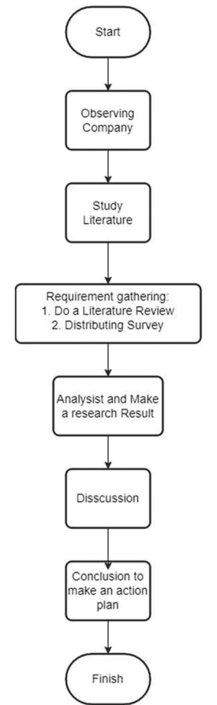

在SepuisLife运营期间，疫情发生了，而在疫情发生之前[6, 7]。

### 2.1 文献综述

文献综述是对我们选择的主题领域或主题的现有文献进行搜索和评估。它提供了关于我们所写的主题或主题的最新信息。它汇编了文献中找到的信息的摘要。了解这一点，我们需要能够使我们的研究更具可行性和有效性的文献，并且在我们被他人批评之前，通过审查以前的论文并防止任何类似的错误，我们对自己的批评更加有把握。

现有的研究文章描述了寿险公司的金融服务行业，金融业正在迅速增长，有很多私营和政府机构在金融领域提供服务，不仅来自国内，还有来自外国的机构。

特别是在当今数字技术时代，信息获取非常容易。金融服务公司的存在预计将为社区提供好处。这些各种服务行业可以是银行服务的形式，也可以是其他金融机构。

保险服务公司实际上通过支付保费向被保险人提供风险转移服务。印度尼西亚的保险业务早在荷兰殖民时期就由Bumiputera 1912和Jiwasraya保险公司开创。根据(Siswanto & Hasanah, 2019)的说法，保险服务公司的存在是由于印尼人民对未来可能发生的不确定性和不幸的意识增强。从被保险人保费的存款中获得的资金必须能够由公司妥善管理，当然是以能够提供利润的投资资产，以免引发问题。作为监管机构，政府关注保险公司开展业务活动，如1992年法律所规定。必须将这些规定用作指南，以确保业务能够顺利进行。

保险人和被保险人达成的协议与权利和义务有关，同时对被保险人的保费负担进行计算，风险越大，保费义务越大，根据所保风险的程度来确定。风险越小，被保险人需要支付的保费越低。金融风险可能源于保险业务中的投机行为；这种投机风险有两种可能的利润或损失。大部分筹集的资金用于投资活动；这种活动很常见，因为除了为其运营提供资金外，还需要考虑未来支付被保险人索赔的义务。

另一项现有研究旨在识别和分析美容诊所业务的投资决策，即开设新分店。

本研究采用的数据收集方法包括访谈、观察和文件记录。美容诊所的投资决策分析是基于财务方面进行的。在财务方面，分析分店扩张的投资决策包括以下步骤：计算业务的初始投资、分析现金流入、分析现金流出、评估净现金支出、计算折现率，并根据净现值（NPV）方法评估从财务方面的投资决策，以及分店发展位置的战略估计。

在Solo的Sutan Syahrir街上建立了一家美容诊所，该诊所被用作这项研究的对象。根据Solo市的美容诊所数量数据（来源：www.google.com），Bver Salon是Jebres地区唯一的美容诊所。根据现场调查和与潜在商业从业者的访谈结果，Bver Salon在家庭服务领域具有优势，即可以在家中进行的治疗方法和初学者的私人辅导服务（美容私教），以提高他们在美容领域的知识和技能。Bver Salon提供带空调的房间设施和床垫。对于本文的分析技术，使用了定量方法。

在做出投资决策时有两个特点，即涉及较长的时间周期，因为涉及到可以折旧的资产，并且需要大量资金。根据Garrison等人（2013）的说法，资本预算决策包括几种类型。

## 3 从精益理论的角度看标准工作

本论文描述和说明了许多标准化工作条件流程的概念，这些流程可以被一个具体的建筑公司采用。在建筑业中，采用工业和精益概念以及项目培训的工作实践和知识传递将减少运营中的变异性。

工作流程的变异性增加了故障或与预期结果、错误和负迭代的任何偏差的风险，这些都会导致进度和成本超支。标准化工作流程可以减少故障的可能性，同时提高吞吐量，并为从学习的工作奠定基础。它还作为尝试各种工作方法设计的起点。

本文介绍了一个混凝土建筑部门中工作标准化的探索性研究的结果，以及必须克服的文化和组织障碍，以转变当前的范式。研究产生了两个结果：首先，更好地理解标准工作流程及其与预先设想的观念的差异；其次，创建标准工作程序作为改进的基准可以持续进行。这项研究可以帮助从业者学习如何评估流程、改进流程并传达关键信息。

## 4 研究方法

我们为这个项目确定的研究设计是一个以SepuisLife公司本身为单个单位的案例研究；这是为了衡量在大流行期间SepuisLife的状况范围与其他公司相比，有一些测量来衡量公司之间的比较。在文献综述公司讨论之后，选择的数据分析技术是基于大流行期间和大流行之前的数据的定量数据分析。

首先，计算受访者最常选择的分数，有2种类型的受访者；即使用保险和不使用保险，所以应该将两种类型的总数一起计算。通过对受访者选择的分数进行编号，以便得出研究结果，因此需要一些公式来制定研究结果。

### 众数公式

- HI 使用保险的高回答者
- Hin 不使用保险的高回答者

### 中位数公式

$$M E = \frac{X(n + 1)}{2}$$

### 总体均值公式

总体均值是指总体的平均分数，我们调查的目标是在给定变量上约有20个受访者，我们用以下方式表示：

$$\mu = \frac{(\sum xi)}{N}$$

| 符号 | 含义 |
|---|---|
| $\mu$ | 表示总体均值 |
| $Xi$ | 表示总体中所有现有分数的总和/$X1 + X2 + X3\cdots + Xn$ |
| $N$ | 表示总体中的个体或案例总数 |

### 斯洛文研究样本大小公式

根据上述斯洛文最小研究样本大小公式的符号，如果我们有大约20个人口，那么我们可以确定我们需要研究的最小样本，设置误差边界约为5%或0.05。计算如下：

$$n = \frac{N}{(1 + (N \times e^{2}))}$$

## 5 研究结果

根据所进行的调查和对几篇论文的文献综述的结果，将制定一个研究结果来回答研究问题。问题1-3将通过图2、3、4、5、6和7来解释并得出结果。从图2中，总共有23个回答，52.2%的人表示他们不使用保险。对于印度尼西亚的这次大流行，许多回答都不使用保险，原因是某个条件。

图3以评分的形式描述了使用保险但讨论保险是否必要的受访者的意见。回答者更倾向于给出4分，这表明在大流行期间需要保险。（Y/↑ =回答者数量，X/→ =评分1表示不同意，5表示非常同意）。从图4中，受访者的意见是不使用保险，但以评分的形式讨论保险是否需要。


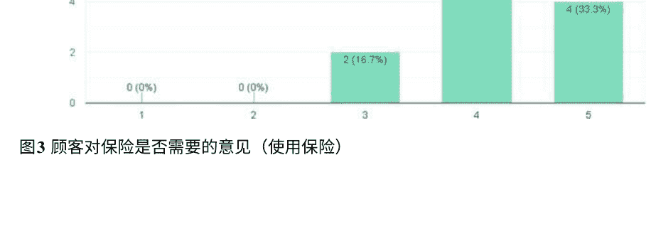

12 responses

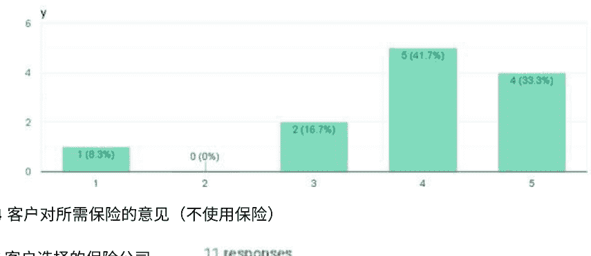

### 图4 客户对所需保险的意见（不使用保险）

11 responses

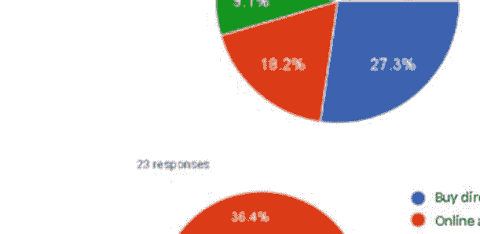

### 图5 客户选择的保险公司

23 responses


### 图6 购买保险的选项

23 responses


### 图7 人们对SepuisLife应用程序的存在的认知

回应偏好得分为4，其中一个选择1/不同意，这表明在大流行期间需要保险。（Y/↑ =回应数量，X/→ =得分1表示不同意，5表示非常同意。）

从图5可以看出，被调查者中使用SL作为保险的众数是27.3%。因此，对于客户来说，SL保险是最值得信赖或最好的营销方式。

从图6可以看出，大多数被调查者选择直接在公司办公室购买/订阅保险，而不是使用应用程序和网站。

从图7可以看出，大多数被调查者不知道SepuisLife有销售某种类型的保险应用程序，占75%。

对于问题编号4：有几种资本预算决策和扩大新分支的决策，包括：

- 1. 扩张决策，对于这种情况，SepuisLife的经理必须决定是否值得购买某项资产，或者它是否能增加SepuisLife的生产和销售能力。
- 2. 成本降低决策，对于这个决策，SepuisLife的经理将确定是否值得购买一些设备，以降低SepuisLife的生产成本。
- 3. 设备选择决策，对于这种情况，SepuisLife的经理将根据支持公司效率和效果的水平来确定是否值得购买哪些设备。

在这个大流行期间，许多保险公司使用网站来销售他们的保险产品，但在这种情况下，很多人使用SepuisLife的保险，却不知道SepuisLife有保险可供使用，而其他公司已经做了促销营销来邀请人们使用他们的网站，但是对于只有SepuisLife的应用进行市场营销，很少有受访者知道SepuisLife的应用。

## 6 讨论

从我们之前的研究结果来看，我们讨论了使用保险的人是否了解SepuisLife应用程序，有多少人选择SepuisLife作为保险，有多少人使用保险应用程序来购买/订阅保险。从我们的讨论结果来看，很多人不知道SepuisLife有一个可以让客户购买一些SepuisLife保险的应用程序，大多数受访者表示，在这次大流行中需要保险；大约有70%的人认同，30%的人不同意或持中立态度。从文献综述来看，很多作者给出了SepuisLife如何扩展或增加分支的解决方案，根据这种情况，SepuisLife仍然可以扩展他们的分支，并且只获取有关大流行期间保险策略的信息。

当我们将这些回答与“美容诊所新分支的可行性研究”进行比较时，该研究与我们的研究具有相似的主题和范围。在“Bver美容诊所新分支的建立研究”中，它说开设一个新分支也可以作为公司的投资，新诊所不仅可以作为更多员工的中心，还可以帮助公司扩大规模。因此，相比之下，对于SepuisLife公司来说，建立和拥有新分支是不可行的，因为当时的主要想法仍然是面对面和办公室工作的规定；对于SepuisLife来说，开设新分支办公室将是浪费时间，因为即使有新分支作为保险销售的另一个强大力量，他们仍然需要遵守在当前大流行期间的居家办公规定，因此，将他们的应用程序作为SepuisLife公司保险销售流程的中心的答案更可行和可取；最后，两者的相似之处都可以被视为公司的投资。

对于公司的新应用（对于SepuisLife）或新美容诊所（对于Bver Beauty Clinic），市场营销和客户意识仍然是决定因素，这在市场调查和我们的研究中已经得到了回答。在疫情期间，顾客更倾向于在线交易并尽量避免与他人接触，而更好的广告宣传活动可以解决关于“在疫情期间SepuisLife应该如何做以及如何让顾客和潜在顾客了解他们的保险销售应用程序”的研究问题。

## 7 结论

SepuisLife需要支持如何处理想购买保险的人群，从SepuisLife系统的条件来看，SepuisLife仍然无法对公司进行重组以扩展新分支，但从这种情况可以得出结论，SepuisLife不需要重组，只需要进行在线营销，因为大多数SepuisLife的顾客不知道他们有一个易于使用和简单的保险应用程序，由于顾客不知道这一点，他们只关注直接在办公室购买保险，因此，如果公司专注于应用程序，可以通过使用在线应用程序来克服直接前来公司的顾客密度，这也可以增加销售并防止疫情后Covid-19的传播。

- 因此，从结论中我们可以得到研究问题的答案，即：
- 1. 最接近的答案是否定的；大多数客户仍然不知道SepuisLife的应用程序，以便他们访问保险。
- 2. 是的，当前的流行病确实影响了保险的整体销售情况。
- 3. 是的，在当前的流行病中，客户更喜欢使用应用程序来索赔他们的保险。
- 4. SepuisLife公司需要开展一项关于他们开发的新应用程序的新广告宣传活动，以便他们的客户了解其存在[8-11]。

致谢：Perkentangan adibakhti公司通过提供团队所需预算的近90%的启动资金来赞助我们的研究，作为交换，他们将成为第一个了解研究结果的人，希望能解决他们自己团队工作流程方面的问题。拨款协议期限：2022年1月30日。

## 参考文献

- 1. Lestari, H. (2017). Pengaruh Intellectual Capital Terhadap Kinerja Perusahaan Asuransi di Indonesia. *Jurnal Manajemen* 4(7), 491–493. http://journal.ecojoin.org/index.php/EJM/article/view/264
- 2. Toswari, T., & Suhendra, S. (2013). *Proyeksi Manajemen Risiko Operasional Pembukaan Kantor Cabang Perusahaan Asuransi di Indonesia.*. http://toswari.staff.gunadarma.ac.id/Downloads/files/36751/Jurnal%20Asuransi%20an%2
- 3. GePTH, P. (2006). *Plant genetic resources conservation and utilization: The accomplishments and future of a societal insurance policy.* pp. 65–72.
- 4. Goodwin, S., & Celuch, K. (2002). Technology readiness in the e-insurance industry: An exploratory investigation and development of an agent technology e-consumption model. 保险问题杂志, 25(2), 142–165。 https://www.jstor.org/stable/41946210?read-now=1&refreqid=excelsior%3A83435ee4715fb1afc9671dfa1ff6f453&seq=1#page_scan_tab_contents
- 5. Mokoginta, A., Mananeke, L., & Jorie, R. (2019).实施营销策略使用 SWOT努力提高保险储蓄产品的销售在*pt. Prudential Manado Branch.* https://doi.org/10.35794/emba.7.3.2019.25086
- 6. Djaelani, F. (2011). *Pertumbuhan Industri Asuransi Jiwa Di Indonesia: Suatu Kajian Dari Sisi Penawaran.* 印度尼西亚: 亚加达, pp. 34–41
- 7. 冯, P. (2008).从精益理论的角度来看的标准工作。 https://www.researchgate.net/publication/228425542_Standard_Work_From_a_Lean_Theory_Perspective
- 8. 安东尼, S. (2021).比较分析伊斯兰保险公司在covid-19期间使用预警系统比率之前和之后的财务表现。 https://journals.unihaz.ac.id/index.php/jaz/article/view/2448/1133
- 9. Bumulo, S. (2018).信任和服务质量对保险客户忠诚度的影响。 印度尼西亚, 日惹。
- 10. Cain, C., & Haque, S. (2011)组织工作流程及其对工作质量的影响。 https://www.ncbi.nlm.nih.gov/books/NBK2638/
- 11. Spenche, M., & Zechka, R. (1978)保险、信息和个体行动。 pp. 335–343. https://doi.org/10.1016/B978-0-12-214850-7.50027-9

# 提出了一种通过情感分析来理解产品消费者意见的系统


Eesha Martis, Rutuja Deo, Sejal Rastogi, Keshav Chhaparia, 和Ameyaa Biwalkar

摘要 情感分析本质上是一种用于分析或理解手头文本的情感或感觉的过程。本文描述了一种软件，利用支持向量机（SVM）、随机森林和逻辑回归等机器学习方法对亚马逊消费者评论进行意见挖掘。在二元分类器中，逻辑回归和SVM的F1分数为0.84，证明它们比随机森林更好。随着在线购物成为新的趋势，这个应用程序是企业追踪其产品受欢迎程度和情感的一站式解决方案。

- - 情感分析
- 机器学习
- 随机森林
- 逻辑回归
- 支持向量机
- 亚马逊评论

## 1 引言

情感分析或意见挖掘[1]，顾名思义，帮助分析作者的情感或心态。这种情感可以位于正负两极之间。意见挖掘广泛应用于电子商务、营销、广告、政治、市场研究和其他研究领域。

在这个电子商务时代，人们主要在线购买商品和使用不同的服务，他们会为其他买家提供一些数值评级或反馈，以便了解所购买商品或使用服务的效用。除了以评级形式给出的反馈百分比外，主要通过文本生成反馈。然而，对于人类来说，准确理解文本反馈往往具有挑战性，因为这些回应非常主观。

定量地查看大量这种口头信息是一项任务，可以通过情感分析技术更好地完成。

意见挖掘的4个主要类别是情感检测、基于意图的、细粒度和基于方面的[2]。情感检测分析有助于感知和理解人们的情绪，如愤怒、悲伤、兴奋、烦恼、恐惧、恐慌、焦虑等[3]。意图分析有助于确定消费者的意图，即客户是否计划购买还是仅仅浏览。如果客户有兴趣下订单，可以跟踪并针对其提供优惠；否则，可以节省时间和资源而不向他们进行广告投放。细粒度情感分析对于研究评价和评级在1-5分的评论很有用。而细粒度分析有助于确定客户评论的整体极性，基于方面的分析则侧重于产品或服务的特定特征。例如，手机的各个方面可能是内存、速度、成本、美观等。本文的目的是在网上收集评论并对这些评论进行意见挖掘，以了解对产品的整体客户意见。使用逻辑回归（LR）、支持向量机（SVM）和随机森林（RF）进行二元分类，并使用Web应用程序上的交互式可视化显示结果。

本文分为5个不同的部分，涵盖了整个工作。第2节回顾了过去关于情感分析的文献，以更好地理解这个领域。第3节介绍了实现系统所使用的方法。它讨论了系统的架构、数据流以及所使用的算法。第4节介绍了实现框架的结果。第5节总结了本文，并讨论了未来在这个领域的努力。

## 2 背景、动机和目标

顾客在电子商务网站上提供的评论不仅有助于业主相应地改进他们的服务，还有助于其他顾客在在线购买之前了解产品的意见。为了分析过去顾客反馈和评论中的情感，对各种数据集进行了情感分析。

论文[4]使用了诸如朴素贝叶斯和支持向量机等机器学习方法，以及基于词典的技术来分析亚马逊产品的意见。方法包括数据收集、预处理、得分生成以及情感分类。朴素贝叶斯（NB）的准确率为98.17%，优于支持向量机（SVM）的准确率93.54%。[5]中的数据集包含在线产品评论，并使用了k-means聚类。数据预处理技术包括词性标注（POST）和否定短语识别算法。达到了90.47%的准确率。论文[6]在句子级别和评论级别上实现了分类。他们还提出了计算情感得分、识别负面短语和生成特征向量的方法。随机森林（RF）是使用的各种算法中最有效的。当根据各自的星级评分对评论进行分类时，结果令人失望。可能对仅基于评论的评论效果不好。

隐含的感受。达到了0.8的F1分数。文献[7]的作者使用动词、形容词和副词的组合来进行文档级情感分析。朴素贝叶斯（NB）、线性模型和决策树是一些已经被使用的分类器。朴素贝叶斯表现最好。形容词-动词-副词的组合比其他任何词性标注组合都有更好的结果。达到了89.85%的准确率。

文献[8]使用了朴素贝叶斯、支持向量机和决策树模型来训练和测试数据。使用十折交叉验证，确认了准确率的提高。支持向量机的准确率最高，为81.77%，而朴素贝叶斯的准确率相对较低。文献[9]研究了用于情感分析的不同方法和分类器。传统的机器学习方法，如朴素贝叶斯、支持向量机、决策树和（KNN）K最近邻，基于深度学习的方法如GRU、LSTM以及基于transformer的方法如BERT和BERT large with UDA。BERT的准确率达到了惊人的95.22%。在文献[10]中，数据预处理、分析和分类是情感分析模型的主要步骤。从Flipkart获取了实时评论。文献[11]调查了产品的情感是否会受到艺术家的认可的影响。

实时评论从YouTube和Twitter获取。朴素贝叶斯算法的准确率为84.50%。

使用OpinRank数据集获取的数据进行情感分析[12]。该论文采用了4种算法，分别是朴素贝叶斯多项式算法、顺序最小优化算法、基于迭代随机投影的复合超立方体算法和补充朴素贝叶斯算法来构建模型。结果显示，朴素贝叶斯多项式算法的精确度为80.9%，优于其他算法。在另一项研究中[13]，使用Twitter API获取与covid-19相关的推文。逻辑回归、VADER和BERT被用于对推文的情感进行分类。

他们获得了0.92的F1分数。过去的研究还尝试并确定了观众对不同电影的情感。论文[14]的作者旨在找到最好的深度神经网络，以在从IMDb数据集中提取的电影评论上进行良好的分类。为了区分和选择最佳神经网络，使用了三种神经网络——卷积神经网络（CNN）、长短期记忆网络（LSTM）和LSTM与CNN的组合进行特征提取。

结果表明，与其他传统方法和算法相比，应用CNN进行情感分析更合适，因为它具有识别句子中重复表达的潜力。

该论文[15]采用了增强字典的方法，这意味着只从评论中提取领域特定的词，并根据字典中的现有极性进行赋值。结果显示准确率为64.56%。该论文的创新之处在于采用了增强字典的方法，优于其他可用方法。为了对过去的文献进行全面的回顾，[16]中选择了30篇研究论文进行处理。研究的结果是确定最佳的机器学习和特征提取方法，基于这样的假设：最可接受的机器学习方法使用最可接受的特征提取方法。在不同的机器学习算法中，朴素贝叶斯和支持向量机被频繁使用。

过去的研究中，SVM在大多数情况下都能提供更好的准确性。与其他方法相比，文献中经常提到的特征提取方法有n-gram和词项存在。论文[17]提出了一种基于概率的隐式意见挖掘的Fisher核方法。基于语义分析的方法可以通过使用Fisher函数来评估派生框架和数学框架上两个实体之间的相关性。获得的准确率为85.99%。FK-SVM方法整体表现优于PLSA-SVM。过去的工作中也使用了神经网络。论文[18]利用卷积神经网络（CNNs）对俄语产品评论进行情感分析。Word2Vec被确定为向量输入。此外，该论文没有使用任何异构特征。使用来自俄罗斯知名电子商务网站的排名靠前的产品的批评来训练模型。获得了75.45%的F1分数。训练模型时使用俄语方言和情感图标使这项工作独特。分类分数的提高归功于使用表情符号。

在研究[19]中，异构特征如表情符号和SentiWordNet分数、否定和强调处理被用作情感分析模型的输入，该模型使用朴素贝叶斯和线性支持向量机等分类器输出电影评论的情感。结果显示准确率为89%。

朴素贝叶斯算法表现最好。一个缺点是他们只测试了准确率、精确率和召回率等基本性能指标。应该使用更高级的指标，如F1分数和roc曲线，以获得有关算法性能的准确概念。在论文[20]中，使用Twitter API收集了5个产品的Twitter推文，然后使用WEKA软件应用逻辑回归、朴素贝叶斯和支持向量机等分类器计算情感得分。SVM在准确率为72.6%的情况下在数据集上表现比朴素贝叶斯和逻辑回归好得多。论文[21]使用支持向量机对包含智能手机评论的不同数据集进行分析，以分析买家给出的反馈的潜在情感。该论文强调了支持向量机的有效性，因为其鲁棒性和90.99%的准确率。

论文[22]分析了用户对Windows手机的反馈情感，并使用支持向量机进行分类。此外，该论文还使用了不同的分词和词干提取技术进行了比较。使用一元、二元和三元的精度都不够好，因为频率标记不足以作为一个区分特征。然而，n-gram的使用对提高准确性起到了重要作用。最高准确率达到了87.70%。论文[23]评估了对亚马逊在线产品评论中表达的意见。该论文使用了四种分类器进行评论分析，即逻辑回归、伯努利朴素贝叶斯、随机森林和多项式朴素贝叶斯。该论文强调，随机森林在所有算法中表现最佳，准确率达到了93.17%。论文[24]使用情感分类研究了从女装电子商务网站收集的正面和负面评论的机器学习方法。用于分类的算法包括SMO、朴素贝叶斯和JRip、J48。在使用的四个算法中，基于SVM的SMO表现最佳，准确率为80.87%。在文献[25]中，对亚马逊评论数据集进行了情感分析，使用了五个分类器，分别是支持向量机、随机森林、朴素贝叶斯以及集成方法的装袋和提升。随机森林以87%的准确率表现最佳。

在文献[26]中，使用情感分析模型将产品评论分为三类。使用五个分类算法，包括支持向量机、K最近邻、朴素贝叶斯、最大熵和决策树，该论文旨在找到最有效的算法。得到的准确率为朴素贝叶斯=84.8%、支持向量机=81.4%、最大熵=84.8%。文献[27]提出了一种逐步进行Yelp评论数据情感分析的方法，并使用了高斯朴素贝叶斯、高斯朴素贝叶斯与AdaBoost的组合以及KNN等机器学习算法。使用的算法的准确率为朴素贝叶斯=86.7%、AdaBoost=74%、KNN=73.2%。高斯朴素贝叶斯以86.7%的准确率表现最佳。使用一元和二元特征有助于训练模型。

在进行相关领域的研究后，逻辑回归、朴素贝叶斯和随机森林似乎是情感分类的合适方法。

## 3种方法

### 架构

Python用于模型构建。前端使用React构建。后端Web应用框架使用的是Express。Material UI和framer-motion用于设计。Beautiful Soup和Requests库用于构建爬虫。AWS Amplify和Heroku用于部署前端和后端。

图1展示了Web应用程序框架中的数据流程。

模型最初使用带有已识别情感的评论数据集进行训练。

用户最初提供一个下拉菜单，可以选择一个产品。所选产品的URL被发送到后端，后端调用爬虫。然后，爬虫爬取给定的URL并将数据写入CSV文件。三种机器学习算法在CSV文件上运行，预测每个评论的情感。然后，将CSV文件转换为JSON结构并返回到前端，在那里显示结果。图2显示了相同的UML图。

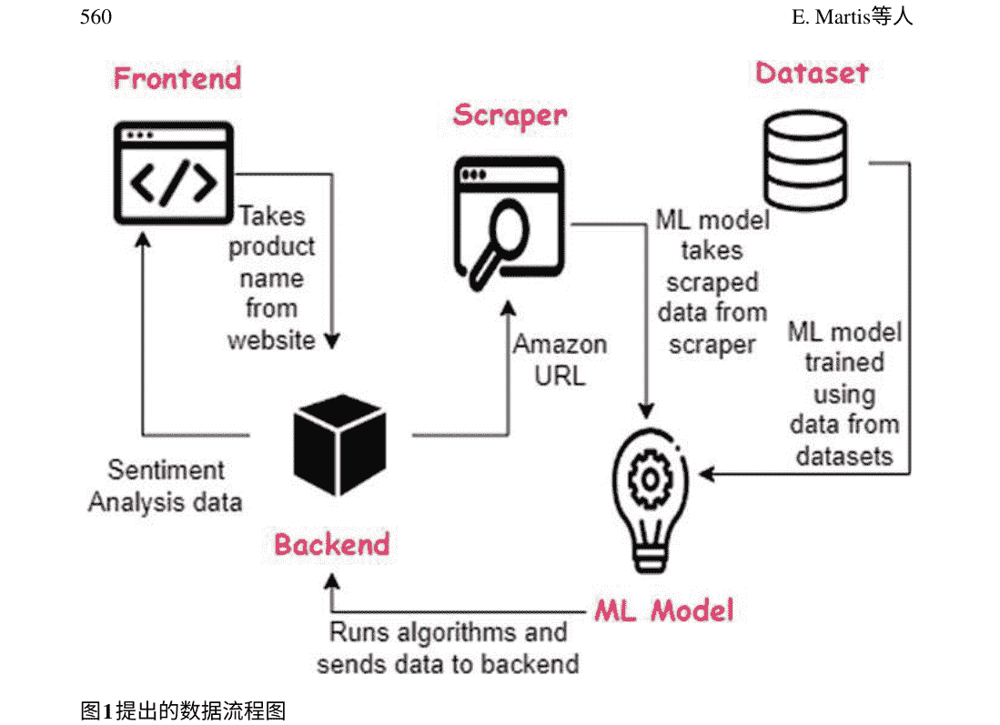

### 3.2 算法

#### 逻辑回归

逻辑回归主要用于分类目的。与线性回归不同，逻辑回归利用S型函数给出概率输出，因此用于预测分类变量的输出[20]。S型函数接受连续和离散输入，并将它们限制在0-1的范围内，从而给出概率输出。函数能够给出的最大值为1，最小值为0。因此，从图形上看，它形成了一个S形曲线，称为“S型函数”[23]。

#### 支持向量机

在支持向量机中，主要目标是找到最适合的分离边界或超平面。首先，绘制所有点，然后支持向量机试图将它们分离或生成一个分离边界。非线性数据可以使用核函数处理[4,8,20]。最佳边界是具有最大间隔的边界。这个间隔是决策边界和支持向量之间的分离，支持向量是控制超平面位置的点。

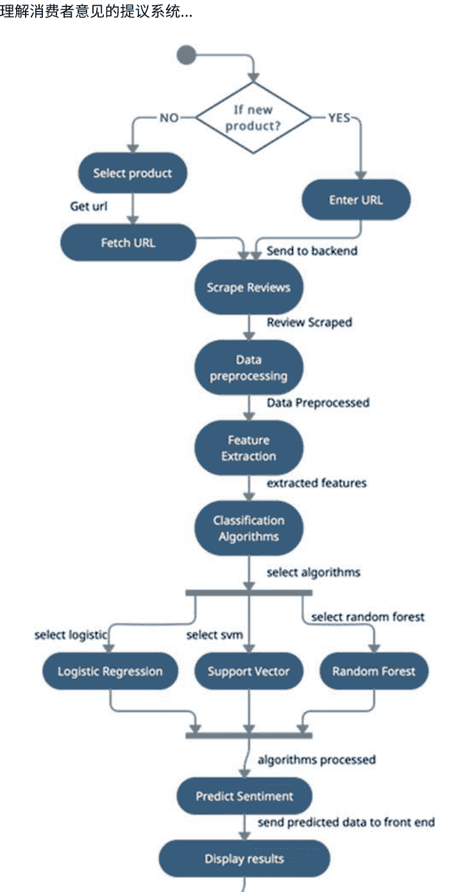

图2 UML图

#### RF

随机森林分类器是一种用于回归和分类的机器学习算法。一个森林由许多树组成，因此，它不是使用单个决策树，而是使用多个树来提高性能[23]。在这个过程中，每个决策树都提供一些输出，最终结果是根据多数投票来决定的[25]。通过增加分类器中的树的数量可以达到较高的准确性。

### 3.3 实施

#### 数据集

训练数据集来自Kaggle [28]。数据集是亚马逊评论2018数据集的一个子集，包括消费者对电子产品的评论。数据集包含19,809行和5列。数据集的几行可以在图3中看到。在清理数据后，将80-20的比例用于训练和测试。

#### 数据预处理

清洗和准备文本以进行分类的过程被称为数据预处理。它减少了噪音的数量并帮助算法更好地执行[22]。该过程包括以下步骤：

- 去除标点符号：标点符号对人类理解句子结构很重要，但对计算机来说是无用的。因此，通过使用Python中的string.punctuation来安全地从数据中删除标点符号。string.punctuation是Python中已定义的字符串，其中包含常用的标点符号[26]。

| overall | vote | reviewTime | reviewText | summary |
|---------|------|------------|------------|---------|
| 0 | 2 | 0 | 2010-02-10 | Tech support is the worst 1265760000 |
| 1 | 2 | 0 | 2016-10-24 | Screws were missing from the bracket and beaut... Spend a little more and get much better. |
| 2 | 1 | 0 | 2017-07-10 | Trouble connecting and staying connected via b... 1499644800 |
| 3 | 4 | 5 | 2013-05-02 | I purchased this unit for our RV to replace an... Receiver Offers a Lot of Flexibility & Complexity |
| 4 | 3 | 0 | 2013-01-04 | It works. Nuff said but the review requires 1... It's a cable |

图3 2018年亚马逊评论数据集[28]

- 去除停用词：在分词后删除停用词。它们是经常使用的词汇，对句子的上下文没有任何添加，即它们是情感中性的[24,26]。
- 词干提取：用通俗的话说，词干提取是将一个词切割成其最简单形式的方法。对于每个根词的每个变体，都需要更多的内存。Porter词干提取器最初用于词干提取[26]。
- 词形还原：词形还原是一种类似于词干提取的过程，但有一个区别[26]。词形还原始终返回一个词典中的单词，因此更精确，但计算成本也更高。结果表明，词形还原与词性标注相结合比单独使用词形还原更有效。给文本中的每个标记赋予特定标签以表示其词性的方法称为词性标注或POS标注[21]。
- 向量化：向量化是将文本加密为整数以构建特征向量的技术。这个过程用于将文本转化为机器学习算法可以理解的格式。TFIDF向量化器被使用，因为它给出了最好的结果[23]。

#### 评论抓取

评论抓取是从整个HTML网页中仅抓取所需的文本或内容的过程。这些数据可以用于以后的分析。

步骤如下：

- (a) 将网站URL提供给爬虫算法。
- (b) 爬虫将向网站发送HTTP请求。在Python中，requests库对于这个任务非常有用。
- (c) 网站将发送HTTP响应。
- (d) 这个响应将通过Beautiful Soup库进行格式化。
- (e) 然后，使用Python中的各种内置字符串函数，可以切片所需的评论。

需要有效地使用分页来确保获取所需数量的评论。一旦评论被爬取，它们可以被插入到Python的数据框中。然后，数据框可以保存为CSV文件以进行进一步的预处理和分析。

#### 前端

预测的数据然后转换为JSON格式，发送回前端。在这里，使用React来显示所有结果，如饼图、柱状图和折线图。还显示了一些随机评论的情感亮点。相同的代码可在GitHub上找到[29]。

表1 算法的性能指标
| 算法 | 精确度 | 召回率 | 准确率 | F1得分 |
| :--- | :--- | :--- | :--- | :--- |
| LR | 0.80 | 0.89 | 0.80 | 0.84 |
| 支持向量机 | 0.80 | 0.89 | 0.80 | 0.84 |
| RF | 0.77 | 0.91 | 0.79 | 0.83 |

## 4 结果与讨论

### 4.1 算法性能比较

表1比较了逻辑回归（LR）、支持向量机（SVM）和随机森林（RF）在精确度、召回率、准确度和F1分数方面的表现。在这个二分类问题中，从这三个选择的分类算法中，逻辑回归和支持向量机表现最好。数据集中包含1-5范围内的评分。为了进行二分类，评分被分为两个类别0（评分为1、2、3）和1（评分为4、5），导致数据不平衡。因此，F1分数比准确度更可靠。逻辑回归和支持向量机的F1分数为0.84，证明它们是二分类器的最佳选择。

> 下面提到的公式用于数学计算精确度、召回率、准确度和F1得分的值。

```
精确度 = TP / (TP + FP)
召回率 = TP / (TP + FN)
准确度 = (TP + TN) / (TP + TN + FP + FN)
F度量 = 2 × TP / (2 × TP + FP + FN)，其中
TP = 真正例数；TN = 真负例数；FP = 假正例数；FN = 假负例数
```

### 4.2 用户界面

一旦选择了特定的产品，就可以使用三个实施的机器学习模型来查看该产品及其性能的深入分析，如图4所示。如果选择了第一个分类器即逻辑回归，则可以通过图表分析产品在几个月内的情感变化。根据逻辑回归，两者之间存在28%的差异。

## 一个用于理解消费者意见的提议系统...

积极和消极情绪。右侧还突出显示了前十的产品评论及其相应的情绪。

下一个功能是一个文本框，用户可以在其中输入一些文本，并且算法会预测文本的情绪-积极（开心的表情符号）或消极（悲伤的表情符号），例如，如果输入了“多么棒的产品”，那么所有算法都会正确地将其计算为积极情绪，如图5所示。


图4从亚马逊上抓取的Mi LED电视评论的情感分析

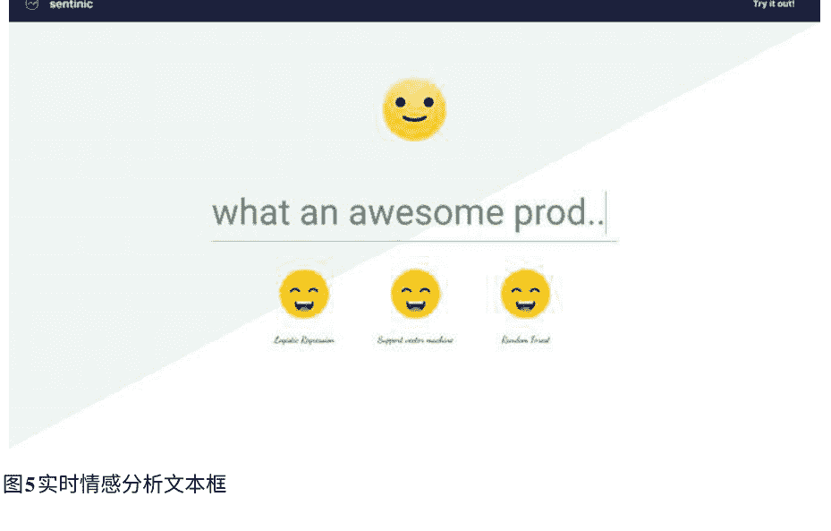

图5实时情感分析文本框

## 5 结论和未来研究方向

在今天的世界中，用户购买吸引他们或与他们有关联的产品。在一个新兴业务的发展中国家，分析客户对商品或服务的意见至关重要。通过了解这种情绪，企业更有可能更好地满足用户的需求，并相应地提高其收入。

情感分析在企业试图评估消费者对其品牌、商品和服务的观点上起着至关重要的作用。通过分析，交易员们可以了解到客户的真实意见。本文旨在提出一个系统，利用情感分析和机器学习分类器（如SVM、随机森林和逻辑回归）来理解亚马逊上列出的产品的消费者意见。通过F1得分为0.84，逻辑回归和SVM证明对于二元分类器来说是更好的选择，而不是随机森林。

未来，可以通过使用基于方面的情感分析和虚假评论检测来使Web应用程序更加复杂。还可以构建一个产品推荐系统作为扩展，并且该应用程序可以推广到任何评论，如电影或食品评论。考虑一些质量措施，如评论的有用性，也可能提高模型的准确性。

## 参考文献

1.  Kaur, H., & Mangat, V. (2017, February). 情感分析技术综述。在2017年国际会议上，I-SMAC（社交、移动、分析和云计算中的物联网）(I-SMAC)（第921-925页）。IEEE。
2.  Sudhir, P., & Suresh, V. D. (2021). 情感分析的各种方法、应用和分类器的比较研究。全球转型会议论文集。
3.  Kottursamy, K. (2021). 使用深度学习分析来检测客户情绪分析的高效方法综述。计算机科学和智能技术趋势杂志, 3(2), 95–113。
4.  Jagdale, R. S., Shirsat, V. S., & Deshmukh, S. N. (2019). 使用机器学习技术对产品评论进行情感分析。在认知信息学和软计算（第639-647页）。斯普林格。
5.  Safrin, R., Sharmila, K. R., Subangi, T. S., & Vimal, E. A. (2017). 在线产品评论的情感分析。国际工程技术研究杂志（IRJET）, 4 (04)。
6.  方, X., & 詹, J. (2015). 使用产品评论数据的情感分析。大数据杂志, 2(1), 1–14。
7.  苏尔塔纳, N., 库马尔, P., 帕特拉, M. R., 查德拉, S., & 阿拉姆, S. (2019). 产品评论的情感分析。软计算国际期刊, 9(7)。
8.  辛格拉, Z., 兰德哈瓦, S., & 詹, S. (2017年6月). 使用机器学习进行客户产品评论的情感分析。在2017年智能计算和控制国际会议(I2C2)(pp. 1–5). IEEE。
9.  戈什, S., 哈兹拉, A., & 拉吉, A. (2020). 不同分类技术的情感分析比较研究。合成情感国际期刊(IJSE), 11(1),49–57。
10. Singh, S. N., & Sarraf, T. (2020年1月). 基于用户评论的产品情感分析使用随机森林算法。 在2020年第10届云计算国际会议上, 数据科学与工程 (Confluence) (第112-116页). IEEE。
11. Ramdhani, S. L., Andresswari, R., & Hasibuan, M. A. (2018年11月). 产品评论的情感分析使用朴素贝叶斯算法: 一个案例研究。 在2018年第2届东印度尼西亚计算机与信息技术会议 (EIconCIT) (第123-127页). IEEE。
12. Zvarevashe, K., & Olughbara, O. O. (2018年3月). 一个酒店评论情感分析的框架与意见挖掘。 在2018年信息通信技术与社会会议 (ICTAS) (第1-4页). IEEE。
13. Nair, A. J., Veena, G., & Vinayak, A. (2021年4月). 对COVID-19推文的Twitter情感比较研究。 在2021年第五届国际计算方法和通信会议(ICCMC)(pp. 1773-1778). IEEE。
14. Haque, M. R., Lima, S. A., & Mishu, S. Z. (2019年12月). 对IMDb电影评论的不同神经网络情感分析的性能分析。 在2019年第三届国际电气、计算机和通信工程会议(ICECTE)(pp. 161–164). IEEE。
15. Yadav, S., & Saleena, N. (2020年10月). 使用增强字典方法对评论进行情感分析。 在2020年第五届国际计算、通信和安全会议(ICCCS)(pp. 1–5). IEEE。
16. Haberzettl, M., & Markscheffel, B. (2018). 一篇关于情感分析的机器学习和特征提取方法的文献分析。 在2018年第十三届国际数字信息管理会议ICDIM(第6-11页). IEEE。
17. 韩, K. X., 邱, C. C., & 简, W. (2019年10月). 支持向量机(SVM)在互联网帖子情感分析中的应用。 在2019年IEEE欧亚大会物联网、通信和工程(ECICE)(第154-155页). IEEE。
18. Smetanin, S., & Komarov, M. (2019年7月). 使用卷积神经网络对俄语产品评论进行情感分析。 在2019年IEEE第21届商业信息学会议(CBI)(第1卷, 第482-486页). IEEE。
19. Bandana, R. (2018年5月). 使用异构特征进行电影评论的情感分析。 在2018年第二届国际电子、材料工程与纳米技术会议(IEMENTech)(pp. 1–4). IEEE。
20. Nafees, M., Dar, H., Lali, I. U., & Tiwana, S. (2018年11月). 社交媒体中产品评论的情感极性分析。 在2018年第14届国际新兴技术会议(ICET)(pp. 1–6). IEEE。
21. Kumari, U., Sharma, A. K., & Soni, D. (2017年8月). 使用SVM分类技术对智能手机产品评论进行情感分析。 在2017年能源、通信、数据分析和软计算国际会议(ICECDS)(pp. 1469–1474). IEEE。
22. Hidayah, I., Permanasari, A. E., & Wijayanti, N. W. (2019年7月). 使用支持向量机(SVM)对产品评论进行情感分析。 在2019年第5届科学与技术国际会议(ICST)(Vol. 1, pp. 1–4). IEEE。
23. Shah, B. K., Jaiswal, A. K., Shroff, A., Dixit, A. K., Kushwaha, O. N., & Shah, N. K. (2021年1月). 亚马逊产品评论的情感检测。 在2021年国际计算机通信与信息学会议(ICCCI)(pp. 1–6). IEEE。
24. Noor, A., & Islam, M. (2019年7月). 基于机器学习算法的女性电子商务评论的情感分析。 在2019年第10届计算、通信和网络技术国际会议(ICCCNT)(pp. 1–6). IEEE。
25. Alrehili, A., & Albalawi, K. (2019年4月). 使用集成方法进行客户评论的情感分析。 在2019年国际计算机与信息科学会议(ICCIS)(pp. 1–6). IEEE。
26. Salem, M. A., & Maghari, A. Y. (2020年12月). 使用分类算法对手机产品评论进行情感分析。 在2020年有前途的电子技术国际会议(ICPET)(pp. 84–88). IEEE。
27. Faisol, H., Djajadinata, K., & Muljono, M. (2020年9月). 对Yelp评论进行情感分析。 在2020年信息技术和通信应用国际研讨会(iSemantic)(pp. 179–184). IEEE。
28. [https://www.kaggle.com/magdawjcicka/amazon-reviews-2018-electronics?select=electronics_sample.csv](https://www.kaggle.com/magdawjcicka/amazon-reviews-2018-electronics?select=electronics_sample.csv)
29. [https://github.com/keshav263/sentic](https://github.com/keshav263/sentic)

# 社交网络中的安全与隐私

Abhinav Agarwal, Himanshu Arora, Shilpi Mishra, Gayatri Rawat,
Rishika Gupta, Nomisha Rajawat和Khushbu Agarwal

摘要 对于许多人来说，社交媒体已经成为日常生活的重要组成部分。虽然许多人开始通过媒体领域以文本和图像的形式交换数据，但其他人则转向在学术领域和电子学习材料、营销以及娱乐领域的商业客户群中分享测试论文、课程作业和大师课程，以及笑话、音乐和录音。即使是最小的互联网用户也更喜欢长距离社交媒体而不是当前的互联网文化，因为它被广泛使用。在社交媒体上分享个人信息可能很有趣，但也需要很多安全和保护。如果要保持客户数据的私密性，就应该将其保密。

关键词安全·社交媒体·数据隐私·安全威胁·社交工程

## 1 引言

社交媒体的重要性已经达到了令人难以置信的程度。 像Facebook、Instagram、Napster和Myspace这样的个人通信网络在过去几年中爆炸式增长，会员数量超过20亿。
几乎每个精通电脑的人都至少有一个社交媒体账号，并且他们每天在社交媒体上花费相当多的时间。社交媒体平台可以被视为Web应用程序。 个人可以使用精确打击的人际交流努力来实现各种目的，包括与新联系人建立联系，

重新连接以前的伙伴，维持现有的联系，建立或推进业务或努力，参与关于特定主题的讨论或仅仅是相互了解，以及其他用户更紧密地合作。 攻击者通过更改系统上本地主机的文件来攻击受害者的系统，以获取他们的个人信息。 对于黑客来说，窃取信息的易捕食对象是那些总是公开分享个人数据而不关心的帐户[1]。

社交媒体是数据所有者（数据生成者）和观察者（终端用户）之间的表达媒介，用于利用OSN进行数字通信并形成虚拟社区[1]。 社交媒体平台是个体、组织和他们的群体事件之间关系的图形。 例如，这些人、组织和群体形成图的节点，而用户、组织和群体之间的互动形成边。 OSN是一个基于Web的平台，使用户能够与分享他们的想法、爱好、活动和/或现实世界联系的其他人开发在线平台或互动[2]。 在今天的互联网环境中，有大量不同形式的社交网络程序是免费的。 在线社区的几个最常见的方面是[2,3]。

例如，Twitter和Instagram等几个组织拥有广泛的客户群体，而其他一些组织则有特定的偏好。 例如，LinkedIn定位自己为专业的网络管理网站-个人资料包括简历信息，并组织会议与相关学科的同事分享问题和意见。 然而，MySpace以其对娱乐和其他形式娱乐的重视而闻名。 此外，还有一些特别设计用于重新联络以前的同学的人际联系优惠。

## 2 社交网络和公共信息

绝大多数人使用社交媒体来交流信息并与他们认识的人保持联系。 多媒体的核心特征是朋友查找器，它使用户能够搜索他们认识的人，然后建立他们的在线平台。 大多数社交媒体用户在他们的社交网络空间中透露了大量个人信息。 这些数据包括部分信息、联系信息、笔记、照片和视频等等。 许多人毫不犹豫地公开他们的详细信息。

因此，社交媒体平台积累了大量的敏感数据。 此外，非正式组织的用户通常对其他互联网用户有更高的信任水平[9]。 他们通常能够成功地回应合作伙伴的要求，并相信同伴发送给他们的信息。 鉴于社交媒体的庞大用户群和数据库，以及其固有的脆弱性，长时间的沟通技巧平台已成为数字罪犯的新磁铁。

[10, 11]. 有大量的社交媒体平台可供选择，如图I所示。 社交交流的主要重点可能随时间而变化，因为大多数

人际群体整合了来自多个平台的组件。各种系统可以从广泛的安全和防御建议中受益。人们的网络客户可以创建详细的在线个人资料，并与其他用户互动，重点是社交关系，感谢这些技术。客户经常使用这些平台与其他经过批准的客户共享他们的性别认同、宗教、爱好、教育背景和就业信息，以及文档和链接到媒体、图像和录音。未经批准的联系人也可以在这些阶段访问选定的数据[12]。

这些虚拟社区旨在允许客户发布简短的公告，以便他们可以快速与其他客户进行沟通。例如，Twitter专注于提供快速简短的更新服务。这一层的功能是快速公开分享信息；然而，隐私选项可能会限制访问警报[13]。我们可以通过确定利益相关者并定义虚拟社区的目标和目的来建立虚拟社区。第二件事是获取社区平台并建立个人资料。拥有个人资料后，可以制定规则并建立社区。最后，我们可以推广我们的社区。这些是使用GPS启用的移动电话构建虚拟社区的步骤，位置网络变得更加突出。如果您正在寻找一种始终追踪自己位置的方法，这些解决方案可以帮助您做到这一点。在这些系统中进行的更新也可能会推送到用户的其他非正式群组。

用于分发内容的网络：它们旨在成为数字媒体分发平台，如音乐或图像。这些网站在提供创建个人品牌的能力时，变成了非结构化的组织和数据中心。

通过评论[14]建立关系并与其他客户联系 它可以被理解为在社交媒体的不同平台上交换、产生和添加信息的过程

互利网络：几个网络基于共同的兴趣或针对特定群体 这些系统针对一部分人群，如那些有大致相似的娱乐爱好、提出概念模型、政治信仰、种族原则、固定观点、性取向或其他特定偏好的人群，结合了各种商业协会的最佳特点

## 3 以前的工作和发现

鉴于SN环境中对用户隐私和安全的许多危险，本综述文章考察了涉及SP、用户和第三方以及外部数据链接的各种数据泄露场景。另一方面，本文重点考察了与社交工程相关的信息安全问题，如虚假账户、身份盗窃和钓鱼攻击。相关研究揭示了在SN环境下解决安全和隐私漏洞的各种举措，包括两者。本研究提出并讨论了各种对信息隐私和安全构成威胁的危险，其中一些已经在调查中得到了证实，如表1所示。然而，将这些类别收集和整理在单一研究中是这篇综述论文的重要之处。传统的互联网安全风险，如垃圾邮件、恶意软件和DDoS攻击，已经是早期研究的重点，因此在本分析中不予讨论。

本研究文章的搜索参数是获取相关的英文出版物，时间范围从2009年到2020年。学术文章、IEEE Xplore和ScienceDirect等是用于搜索的科学数据库和基于互联网的文章。使用表1中列出的关键词，我们能够进行搜索。

| 参考文献 | 年份 | 社会工程威胁 |
|----------|------|--------------|
|          |      | 身份盗窃 | 虚假账户 | 鱼叉式网络钓鱼 |
| [18]     | 2018 | 部分讨论 | ✓ | 部分讨论 |
| [22]     | 2013 | - | - | - |
| [13]     | 2017 | 部分讨论 | ✓ | 部分讨论 |
| [21]     | 2010 | ✓ | ✓ | 部分讨论 |
| [17]     | 2015 | 部分讨论 | - | - |
| [19]     | 2017 | 部分讨论 | ✓ | ✓ |

## 社交网络中的社会工程威胁

SN环境存在广泛的危险，但攻击者通过社会工程手段对信息安全构成了重大威胁。通过欺骗和说服，社会工程攻击试图从受害者那里获取敏感信息[15]。由于能够结合社会和技术手段，社会工程攻击比其他安全威胁更加复杂。

通过利用SN中可用的用户信息的高价值，社交工程攻击者可能获取受害者的信息并执行攻击[16]。然而，当受害者的位置被泄露并尝试进行实体犯罪时，风险显著增加[17]。网络社交环境中，钓鱼、虚拟钓鱼、诱饵攻击、肩部冲浪、垃圾箱潜水和水源是最常见的社交工程形式之一。

### 4.1 身份盗窃

下一段讨论了一种更危险的欺诈策略，即身份盗窃，这是在前一节中讨论虚假账户之后的内容。通过克隆受害者或渗透其账户，可以实现使用真实人物的身份。在与受害者相同的社交网络上，攻击者利用用户公开发布的信息创建一个几乎相同姓名和图片的新个人资料，然后试图说服受害者的朋友，新页面实际上是同一个人（受害者）的新个人资料[18]。当从一个社交网络中使用用户的信息在另一个社交网络上创建新个人料时，受害者被欺骗以为它们是同一个人。了解受害者的朋友和家人为了更多地了解受害者和他/她的生活打开了大门[19]。

### 4.2 假账户

这是一个带有虚构身份的SN个人资料。攻击者被吸引到SN平台，因为他们可以轻松加入，而无需透露自己的真实姓名，并且不需要额外费用。社交网络网站（SNS）经常向其他合法用户推荐虚假个人资料，但许多用户不愿添加这些推荐的虚假个人资料，因为他们不希望将个人信息与陌生人分享，尽管这种行为使他们看起来很受欢迎并且拥有庞大的网络[20]。无论是人类还是社交机器人，都可能是这个或任何其他在线社区中的攻击者。"Sybil攻击"是指通过创建大量虚假的社交网络（SN）个人资料来传播垃圾邮件、恶意软件、错误信息或篡改在线投票结果[21]。

### 4.3 鱼叉式网络钓鱼

为了避免被发现，鱼叉式网络钓鱼针对组织内的特定个人，而不是针对一般公众，这与常规网络钓鱼不同。像鱼叉式网络钓鱼这样的复杂网络攻击，针对的是一小部分已根据其个人特征进行预选的SN用户。 在这种情况下，SN被用作组织员工的数据来源，然后通过SN平台或单独的电子邮件对其进行定向消息，要求他们打开一个URL，该URL将他们带到该组织的伪造网站，在那里受害者可能会提供更多敏感数据，如登录凭据。 由于这种事件，个人和组织的信息安全将受到损害[21]。

为了防止网络钓鱼攻击，您不能使用防火墙或复杂的身份验证机制（如PIN码）来保护自己，因为攻击者要么利用SN平台发送消息，要么SN作为受害者个人信息的来源。

## 5 常规安全措施

在提供社交网络上的信息时，客户希望授权的联系人能够看到它。在允许的数据收集者[9]中，可以访问它的有：

- 1. 广告商对本地数据感兴趣，因此他们可能将广告定向投放给最有兴趣的人。
- 2. 外部程序员将数据组合起来创建应用程序，例如将社交媒体整合到网络游戏中。
- 3. 从客户或他人那里获取个人数据的角色黑客。
- 4. 旨在欺骗或激怒人们或感染系统的在线犯罪分子。

随着社交媒体的日益普及，许多用户无意中暴露了自己的安全风险。 主要的分类包括典型的威胁，包括对Facebook上的用户和不使用非正式网络的网民的安全威胁[20]。 以下分类包括当代的威胁，即对社交网络世界独特的威胁，并利用社交网络框架来危害客户的隐私。

恶意软件是一种有害的软件，旨在干扰计算机的运行并窃取用户的凭据和个人数据。 社交网络中的勒索软件使用社交网络模型在客户和他们的朋友之间传播。通过这些

技能，恶意软件有时可以模仿客户并将感染的信息传输给客户的互联网朋友[21]。

网络钓鱼攻击：钓鱼是一种社交欺骗类型，冒充信任的第三方。一项最新研究发现，社交媒体用户更容易受到网络钓鱼攻击的影响，因为他们具有信任的特点[22]。

在线骗局，互联网诈骗，通常被称为数字勒索，是指利用互联网欺骗或滥用他人。早期，敲诈者使用传统的面对面聚会，包括每周的小组会议，逐渐建立与未来受害者的牢固联系。

骗子：假资料是一种预先编程的资料，模仿在线社交网络中的人类行为。通常，假资料可以用来从在线网络中获取用户的机密数据。聊天机器人可以收集客户的数据并向其他在线社交网络客户发送伴侣请求，这些请求被接受[16]。

## 6 社交媒体的安全实践

小型网络的信息可以用于除了客户提供的应用之外的许多其他应用。以下是一些有助于客户在使用人际网络时最小化安全风险的有用想法。这些建议并不完全有效。长途通话有其自身的障碍。正念、警觉和怀疑可以说是最可靠的防御措施[17]。

在注册过程中，社交网络通常会要求另一个用户提供电子邮件密码以访问客户的电子邮件目录。该团队承诺将新用户与网络上的其他用户联系起来。一些非官方团体收集原告的电子邮件联系人，然后反复邀请个人参与。

这些通信可能看起来是来自最初的客户[17, 18]。

使用社交媒体的提示：

- 在进行SMN上的身份验证方法时，请确保我们的隐私加密设置为“仅自定义”。或者，使用“自定义”选项来实现最高级别的保护。
- 密切关注社交媒体服务协议和网络安全。点击截断链接时要小心。如果有疑问，请使用URL扩展器[17]。
- 退出社交网络站点时，请删除所有Cookie，特别是闪存好吃的。
- 请记住，发生在网络上的任何事情都是由人而不是人口统计资料来观看的。
- 不要发布关于任何企业、客户、产品或服务的负面评论。
- 密切关注社交媒体上的照片。不要害怕取消标记自己并要求删除材料。
- 避免提前制定旅行计划。用户在发布任何形式的位置或使用地理标记功能时应小心，因为犯罪分子可能会利用它来追踪他们的行踪。
- 同样，避免分享日常生活[18]。

在使用第三方应用时要小心。为了最大限度的保护和稳定性，要与它们保持一定的距离。在考虑使用某个应用时，要检查平台的安全措施和服务条款。如果你收到一个连接请求

并且你不知道对方是谁，不要接受。可以考虑打电话、发送电子邮件或提出只有你的联系人才能回答的问题 [13]。

如果有陌生人向你发出连接请求，你应该拒绝。 如果你接受了请求，要使用安全设置限制向他人显示的数据，并避免提供个人数据，如当前位置。要警惕来自己知联系人的金钱请求 [16]。

如果你是被跟踪、煽动或家庭暴力的受害者，要避免潜在的危险。 如果账户的安全性受到威胁，要通知网络和其他联系人。

要定期清理好友列表，因为经过一段时间后，很容易忘记这些联系人，从而造成数据的泄露。

## 7 结论

根据最近的一项研究，广大网络用户在社交媒体上花费的时间比其他任何在线活动都要多。 在不同的社交媒体平台上，我们通过交流经验、图片和视频与我们的关注者交流，我们非常感激这个机会。 在社交网络的阴暗面，充斥着黑客、罪犯和网络跟踪者，他们都有可能利用社交媒体提供的平台来招募新的受害者。 在这篇文章中，我们将分析削弱社交媒体网络成员并使他们的身份、安全和财务状况在数字和实际世界中面临风险的因素。

接受我们的观点并教育自己以及他们的亲属有关在线危险的知识，是社交网络成员的一个激励因素。 作为保护者，我们不能太天真；我们必须能够区分非结构化社会的魅力，并意识到表面背后潜藏的危险。 我们正在努力告知和教育我们的孩子有关可能的危险，并训练他们避免与陌生人互动，无论是在实际世界还是数字世界中。

## 参考文献

- 1.  Zephoria. (2017). Facebook的前20个有价值的统计数据，Zephoria2017.https://zephoria.com/top-15-valuablefacebook-statistics/
- 2.  Twitter. (2017). Twitter的使用/公司事实，Twitter2017.https://about.twitter.com/company
- 3.  Protalinski, E. (2012). 56%的雇主检查申请人的Facebook、LinkedIn、Twitter。 http://ww
w.zdnet.com/article/56-of-employers-check-applicants-facebookLinkedIn-twitter/4. Lo
tan, G., Graeff, E., Ananny, M., Gaffney, D., Pearce, I., et al. (2011). 阿拉伯之春-在2011年突尼斯和埃及革命期间的信息流。
国际传播学杂志，5(31)，32-48。

- 5. Mishra, S., Singh, D., Pant, D., & Rawat, A. (2022). 使用信息隐藏和加密算法进行安全数据通信。 在2022年第二届人工智能和智能能源国际会议（ICAIS）中，第1448–1452页。

- 6. Arora, H., Soni, G. K., Kushwaha, R. K., & Prasoon, P. (2021). 基于图像隐藏和加密混合模型的数字图像安全。 在2021年第六届国际通信与电子系统会议（ICCES）中，第1153 -1157页。

- 7. Soni, G. K., Rawat, A., Jain, S., & Sharma, S. K. (2020). 基于像素的数字医学图像保护，使用LSB水印技术和遗传算法。 在Springer智能系统与物联网：计算创新中，第483-492页。

- 8. Soni, G. K., Arora, H., & Jain, B. (2020). 一种使用Arnold变换和非对称RSA算法的新型图像加密技术。 在Springer国际人工智能会议：智能系统进展与应用2019算法，第83-90页。

- 9. Kumar, M., Soni, M., Shekhawat, A. R. S., & Rawat, A. (2022). 使用LSB隐写术和AES加密技术的增强型数字图像和文本数据安全性。在2022年第二届人工智能与智能能源国际会议（ICAIS）中，第1453-1457页。

- 10. Mail, D. (2011). 因在Facebook上将自己每小时7英镑的工资与劳埃德银行行长每小时4000英镑的工资进行比较而被解雇的银行职员。

- 11. Vladlena, B., Saridakis, G., Tennakoon, H., & Ezingear, J.-N. (2015). 安全通知和在线消费者行为的作用：社交网络用户的实证研究。《人机交互研究国际期刊》，80, 36-44。

- 12. Shibchurn, J., & Yan, X. (2015). 社交网络网站上的信息披露：内在 外在动机的视角。《人类行为中的计算机》，44, 103-117。

- 13. Adewole, K. S., Anuar, N. B., Kamsin, A., Varathan, K. D., & Razak, S. A. (2017). 恶意账户：社交网络的黑暗。网络与计算机应用杂志，79, 41–67.

- 14. Facebook的新服务条款：我们可以随意使用您的内容。 永远。Consumerist，2009年。 http://consumerist.com/2009/02/15/facebooksnew-terms-of-service-we-can-do-anything we-want-with-your-content-forever/

- 15. Krishnamurthy, B., & Wills, C. E. (2008). 在线社交网络中的隐私特征。 在第一届在线社交网络研讨会论文集，pp. 37–42.

- 16. Fire, M., Goldschmidt, R., & Elovici, Y. (2014). 在线社交网络：威胁与解决方案。IEEE通信调查教程，16, 2019-2036年。

- 17. Deliri, S., & Albanese, M. (2015).普适系统中的数据管理（第195-209页）。斯普林格。

- 18. Ali, S., Islam, N., Rauf, A., Din, I. U., Guizani, M., & Rodrigues, J. J. P. C. (2018). 在线社交网络中的隐私和安全问题。未来互联网，10, 114.

- 19. Rathore, S., Sharma, P. K., Loia, V., Jeong, Y. S., & Park, J. H. (2017). 社交网络安全：问题，挑战，威胁和解决方案。信息科学，421, 43-69。

- 20. 马来西亚创新，管理和技术研究国际会议，2013年9月22-23日，第191-197页。

- 21. Timm, C., & Perez, R. (2010).七种最致命的社交网络攻击. Syngress出版社.

- 22. Smith, O. (2013). Facebook条款和条件： 为什么你不拥有你的在线生活。 http://www.telegraph.co.uk/technology/socialmedia/9780565/Facebookterms-and-conditions-why-you-dont-own-your-online-life.html

## 1 引言

在线评论对游客的旅行决策有很大影响。旅游评论也是目的地的后访问形象（DI）的指标，因为游客根据他们对目的地的后旅行形象来撰写评论[1]。

旅游景点的声誉在很大程度上取决于游客的评论。积极的评论会鼓励人们去参观，而负面的评论会阻止他们决定参观旅游目的地。因此，追踪游客的在线评价对于旅游目的地的声誉至关重要，因为在线评论直接影响游客的访问。对于从事与旅游政策相关任务的人员来说，维护和提高旅游目的地的声誉至关重要，以提供高质量的旅游服务。

然而，游客们分享的大量评论和意见可能会让人不知所措。单独分析大量评论非常耗时且繁琐。因此，需要有效的数据挖掘来减少所需的辛勤工作和努力。只有通过文本挖掘和机器学习算法揭示出的模式才能获得有价值的信息。

文本摘要是一种通过提取众多评论来减少工作量的方法，提取出几个代表性的句子。在旅游领域，文本摘要非常快速且准确，可以分析大规模的旅游景点数据，轻松获取有价值的知识。此外，了解旅游景点的评价可以提高旅游业的质量[2-4]。

我们使用文本摘要技术之一的LexRank和BERT算法，提取釜山的旅游景点的代表性句子。此外，我们还研究了按旅游目的地、年份和季节分类的图片。

# 基于BERT和LexRank从评论中提取中心句子来理解旅游目的地的图像

Da Hee Kim, Kang Woo Lee, Ji Won Lim, Myeong Seon Kim, 和Soon-Goo Hong

摘要 旅游景点的声誉在很大程度上取决于游客的评论。跟踪游客的在线评价对于了解旅游景点的声誉和提供更好的旅游服务至关重要。我们使用在线旅游景点评论的文本摘要技术来研究它们的代表性图像。此外，我们还研究了旅游景点形象在季节和年份上的变化。我们的研究有助于识别旅游景点的形象，并为从事与旅游政策相关的任务的人提供更好的资源。

关键词 旅游目的地形象 · 旅游目的地在线声誉 · 在线声誉 · 提取代表性句子 · 文本摘要

D. H. Kim · M. S. Kim
韩国釜山市沙下区洛洞大路550号东亚大学计算机工程系

D. H. Kim · K. W. Lee · J. W. Lim · M. S. Kim
东亚大学智能治理研究中心，釜山市西区古德路225号，韩国共和国 电子邮件：ji1e@naver.com

S.-G. Hong (✉)
东亚大学管理信息系统系，釜山市西区古德路225号，韩国共和国 电子邮件：shong@dau.ac.kr

## 2 提取核心句子

### 2.1 系统架构

图1显示了本研究中实现的中心句子提取系统的架构。它由数据集、数据预处理和中心句子提取过程组成。基于TripAdvisor爬取的旅游目的地评论数据构建了一个数据集。接下来，通过文本清洗和句子分割进行了数据预处理。在中心句子提取过程中，使用'Ko-Sentence-BERT-SKTBERT'进行嵌入，计算余弦相似度和中心性得分，以提取数据中最核心的句子。

图1 系统架构

### 2.2 数据爬取

本文的数据集来自旅游信息网站TripAdvisor [5]。从该网站爬取的数据包括韩国第二大城市釜山的游客评价。数据包括旅游目的地名称、语言、日期、评论和评分。我们收集了27,752条关于釜山旅游景点的评论，时间从2007年8月到2021年5月；数据以韩文书写。评分范围从1（非常负面）到5（非常正面）。旅游目的地包括329个吸引人的旅游景点，如海云台、甘川文化村、海东龙宫寺等。一篇评论平均由四到五个句子组成，超过十五个句子，每个句子平均有15个词。

### 2.3 数据预处理

- 文本清洗
  在TripAdvisor的评论数据中，由于它是在线评论，存在许多特殊字符。在评论数据的分析过程中，删除了不必要的特殊字符或符号，如‘!，？，^，（），’，并进行了空格修正。使用Python包进行空格修正，用于自动韩语词间距 [6]。
- 句子分割
  旅游评论通常由对旅游景点的多个评价组成，这些评价通常用多个句子来表达。因此，将评论数据分割成句子，以准确提取这些评价。我们使用‘Korean Sentence Splitter (KSS)’，一个Python韩语句子分隔器，进行了句子分割工作 [7]。

### 2.4 使用Ko-Sentence-BERT-SK TBERT进行句子嵌入

嵌入是自然语言处理中的一个重要问题，因为计算机必须有效地理解和处理文本。语言模型预训练对于改进许多自然语言处理任务非常有效。用于嵌入的语言模型广泛使用的是‘双向编码器转换器（BERT）’。现有预训练语言模型中的微调方法在预转换过程中使用单向语言模型。单向语言模型的结构是先将句子的上下文从左到右配置。这种结构的缺点是不能同时考虑整个句子的上下文。理解上下文需要同时考虑前面的标记而不是当前的标记。 BERT通过应用双向编码器表示来缓解了这些单向约束。 与现有的预训练语言模型相比， BERT更适用于句子级任务。 BERT在语义文本相似性（STS）等句对回归任务上展现出最先进的性能。

BERT支持多语言，但对于韩语的不规则特征理解存在限制。 为了缓解这个问题，引入了'KoBERT'。 'KoBERT'是为了克服现有BERT模型在韩语中的性能限制，相比BERT在韩语数据上表现出2.6%的更好性能。 预处理的数据使用'Ko-Sentence-BERT-SKTBERT'模型进行嵌入，显著提高了KoBERT模型中的句子嵌入性能。

在 “Ko-Sentence-BERT-SKTBERT” 模型中，评估训练数据有两种类型的模型： “training_nli” 和 “training_sts” ； “training_nli” 仅用于训练NLI，“training_sts” 仅用于STS。自然语言推理（NLI）和语义文本相似度（STS）是自然语言理解（NLU）中的关键任务。 NLI模型接收一对句子，即前提和假设，并将它们的关系分类为三个类别之一：蕴涵、矛盾和中性。 相比之下，STS用于评估两个句子之间的语义相似性以及模型对两个句子的含义理解程度[11]。 在本研究中，通过嵌入 “training_sts” 模型来确定多个句子之间的相似性。

### 2.5 计算每个句子的中心性

从多个文档中提取一个中心句子的概念化是至关重要的。 提取的中心句子将根据计算中心性的方式而不同。 在计算句子的中心性时，仅通过句子的度中心性获得是不合理的。 由于与句子的所有连接并不同样重要，因此需要考虑相邻节点的度中心性和相邻节点的重要性。 PageRank是一种考虑度中心性和相邻节点重要性的算法[12]。 现有的PageRank算法将互联网上的网页链接表示为直接图。 然而，在句子的情况下，句子之间的相似性被表示为无向图[13]。 LexRank使用无向图计算句子之间的相似性。 LexRank假设与聚类中的其他句子相似的句子对主题更为中心（或显著）。

由于并非所有与句子的连接都同等重要，因此需要考虑邻接节点的度中心性以及邻接节点的重要性。 PageRank是一种算法，它同时考虑了邻接节点的度中心性和重要性[12]。 现有的PageRank算法是一种在互联网上表示网页链接的有向图算法。然而，在句子的情况下，句子之间的相似性被表示为一个无向图[13]。 LexRank使用无向图计算句子之间的相似性。 LexRank假设与聚类中的其他句子相似的句子对于主题更为中心（或显著）。

idf - 修改 - 余弦 (x, y) = \frac{\sum_{w \in x,y} tf_{w,x} tf_{w,y} (idf_w)^2}{\sqrt{\sum_{x_i \in x} (tf_{x_i,x} idfx_i)^2} \times \sqrt{\sum_{y_i \in y} (tf_{y_i,y} idfy_i)^2}} (1)

接下来，使用'幂法'计算每个句子的中心度分数，这是在马尔可夫链中获得'稳定分布'的方法之一。
根据是否将阈值应用于LexRank，该算法分为连续LexRank和经典LexRank。经典LexRank使用阈值限制节点的连接性。在连续LexRank中，通过idf-modified-cosine的相似性来实现节点的连接性，而不应用任何阈值[13]。由于经典LexRank会因为阈值而导致信息丢失，我们使用了没有任何阈值的连续LexRank模型。

中心句子提取算法计算每个旅游目的地评论数据的中心度分数，并返回得分最高的句子。将语料库C嵌入到'Ko-Sentence-BERT-SKTBERT'模型中的结果是语料库嵌入E。计算嵌入结果之间的余弦相似度。接下来，使用LexRank的'degree_centrality_score'函数计算每个句子的中心度分数。如前所述，在LexRank中不使用阈值。根据得到的中心度分数提取句子中最为中心的句子。

算法1 中心句子提取算法

```
1: 输入：语料库C，语料库嵌入E
2: cos_scores = 余弦相似度(E, E);
3: function degree_centrality_scores (cos_scores)
4: 返回 中心度分数
5: end function
6: centrality_score = degree_centrality_scores (cos_scores, threshold = None)
7: most_central_sentence_indices = sort_by_index(-centrality_score)
8: return C[most_central_sentence_indices]
```

## 3 结果

### 3.1 通过旅游目的地提取代表性句子

根据旅游目的地、访问年份和访问季节，介绍了中心句子提取的结果。 旅游目的地包括海云台、甘川文化村和海东龙宫寺，这是釜山的三个代表性旅游目的地。

最初，中心句子提取过程是针对海云台海滩数据进行的。 海云台海滩位于韩国釜山，毗邻许多其他旅游景点，如东白岛、达尔马吉山口，提供了多种设施，包括酒店和餐厅[14]。

通过算法提取了海云台在线评论中的五个最中心的句子。在图2中，最中心的句子是“在釜山的海云台，天气好的时候看海非常好。在东白岛附近出来非常清新和好。” 还有一篇关于海云台海滩被称为最好的海滩和最好的海岸的评论，但大部分评论都提到了位于海云台附近的东白岛。因此，与东白岛相关的句子的中心性得分很高。因此，提取了与东白岛相关的句子作为代表性句子。海云台通常以“干净美丽的海洋”为评价标准。 此外，海云台还因拥有设施齐全的现代高楼大厦，如酒店、餐厅、画廊和购物中心而受到赞赏。

图2 海云台在线声誉前5名

图3显示了与甘川文化村相关的五个最核心的句子。甘川文化村是在韩战时期难民定居时建立的。随着难民的涌入，一个村庄在山坡上不可避免地形成了。然而，自20世纪70年代初以来，人口数量急剧减少。振兴努力包括用可爱的绘画和壁画装饰建筑的外部，最终成为这个村庄后来的象征[15]。甘川文化村最核心的情感句子是‘一个可爱的村庄。因为有很多山，所以很难走来走去，但是看着漂亮的建筑和商店很好。’在旅游目的地中，大多数被选为核心的句子都被提取出来，比如适合拍照或有很多可爱图片的村庄，这些通常是人们想到甘川文化村时会想到的。

图3 甘川文化村在线声誉前5名

图4显示了关于海东龙宫寺庙的五个最核心的句子。根据维基百科[16]，这座寺庙被介绍为釜山最著名的寺庙，风景优美。海东龙宫寺庙最核心的情感句子是‘这是我去过的一个美丽的寺庙。我想知道是否有这样的地方。景色如此美丽，因为海边有一座寺庙。此外，这是我内心平静的地方，我想再次拜访。’海东龙宫寺庙位于海边，是一座风景优美的寺庙。尽管很多人参观这座寺庙，但它被评价为值得去的寺庙。因此，所有五个提取的句子都在类似的语境中发言。

图4 海东龙宫寺庙在线声誉前5名

### 3.2 按年份从旅游目的地中提取代表性句子

为了研究海云台海滩的整体形象随时间变化的情况，将评论的核心句子逐年提取出来。结果显示在图5中。它们的时间段被分为‘2018年之前’、2018年、2019年和‘2020年之后’。‘2018年之前’和‘2020年之后’的评论数据规模非常小，因此被分组。特别是2020年和2021年的评论数据由于COVID-19疫情爆发后游客数量的减少而特别少。

总的来说，海云台海滩被认为是‘被酒店和餐馆环绕、靠近其他旅游景点，但是拥挤的最好的海滩’。从评论中提取出的核心句子——2018年之前、2018年和2019年——描述了海云台是最好的海滩（在2018年之前和2018年的评论中），并且设施包括酒店和餐馆都很齐全（在2018年之前、2018年和2019年）。与2018年之前、2018年和2019年不同，海云台灯光节的评论在2020年之后被提取出来。

### 3.3 通过季节从旅游目的地中提取代表性句子

图6显示了从不同季节（3月至5月的春季，6月至8月的夏季，9月至11月的秋季和12月至2月的冬季）的评论中提取的海云台最核心的句子。

图5 海云台每年最核心的句子

海云台海滩在不同季节有多个方面的变化。夏天是海云台海滩的旺季，吸引了许多游客。春天的海滩安静而干净，秋天则充满浪漫气氛。然而，冬天给人一种孤独的氛围。

图6 季节性海云台最核心的句子

## 4 结论与讨论

使用文本摘要技术——LexRank和BERT算法，我们提取了关于韩国釜山旅游景点的代表性句子，以研究目的地形象。此外，还分析了按目的地、年份和季节分类的游客评论。首先，根据旅游目的地提取了核心句子。海云台、甘川文化村和海东龙宫寺的目的地形象与通常的假设形象相似。接下来，提取了海云台每年的核心句子。2018年之前、2018年和2019年的评论中，海云台被描述为“最好的海滩”，这是人们普遍认为的海云台形象。然而，2020年后提取的评论中出现了与海云台灯光节相关的不寻常的句子。这种提取是独特的，因为由于COVID-19的隔离规定，2020年后无法进入海云台海滩。因此，2020年后与海相关的评论很少。在COVID-19之前，灯光节并不受欢迎，但由于无法访问海滩，海云台的灯光节数据被提取出来，这是一个非凡的结果。最后，提取了海云台按季节分类的核心句子。对于海云台来说，夏天是旺季。然而，在秋天或冬天，与现有的海云台不同，存在一种浪漫而孤独的氛围，表明在同一个旅游目的地体验到了各种不同的形象。

因此，对于从事与旅游政策相关任务的人来说，识别、维护和改善旅游景点的声誉至关重要。这项研究可以轻松把握旅游目的地的形象，并确定潜在的改进和特点。此外，通过对旅游目的地的年度分析，旅游政策管理者可以追踪旅游目的地每年的感知变化，并了解旅游目的地的季节形象。

通过了解旅游目的地形象随季节变化的变化，可以了解旅游目的地的最佳季节，并帮助营销。

致谢 本研究得到了韩国教育部和韩国国家研究基金会（NRF-2018S1A3A2075240）的支持。

## 参考文献

- 1. González-Rodríguez, M. R., Martínez-Torres, R., & Toral, S. (2016). 通过eWOM情感分析和感知有用性评估的旅游目的地游后和游前形象。国际现代酒店管理杂志。
- 2. Prameswari, P., Sujandari, I., Zulkarnain, & Laoh, E. 使用情感分析和文本摘要方法在印度尼西亚的优先旅游目的地中挖掘在线评论。
- 3. Inuma, S., Nanba, H., & Takezawa, T. 自动摘要多个旅行博客条目，重点关注旅行者的行为。
- 4. Premakumara, N., Shiranthika, C., Welideniya, P., Bandara, C., Prasad, I., & Sumathipala, S. (2019) 在旅游领域应用摘要和情感分析。国际技术融合会议。
- 5. TripAdvisor. https://www.tripadvisor.co.kr/ 最后访问日期：2022年2月11日。
- 6. PyKoSpacing. https://github.com/haven-jeon/PyKoSpacing. 最后访问日期：2022年2月11日。
- 7. KSS：韩语句子分割器。 https://github.com/likejazz/korean-sentence-splitte. 上次访问时间为2022年2月11日。
- 8. Devlin, J., Chang, M. W., Lee, K., & Toutanova, K. (2018) BERT：深度双向转换器的预训练语言理解。
- 9. KoBERT。 https://sktelecom.github.io/project/kobert/. 上次访问时间为2022年2月11日。
- 10. Ko-Sentence-BERT-SKTBERT。 https://github.com/BM-K/KoSentenceBERT_SKT. 上次访问时间为2022年2月11日。
- 11. Ham, J., Choe, Y., Park, K., Choi, I., & Soh, H. (2020)。 KorNLI和KorSTS：韩语自然语言理解的新基准数据集。
- 12. Page, L., Brin, S., & Motwani, R. (1998)。 The pagerank citation ranking：为网络带来秩序的技术报告。斯坦福大学。
- 13. Erkan, G., & Radev, D. R. (2004). Lexrank: 基于图的词汇中心性作为文本摘要中的显著性人工智能研究杂志, 22, 457-479。
- 14. Haeundae. https://en.wikipedia.org/wiki/Haeundae_District. 最后访问日期为2022年2月11日。
- 15. Gamcheon Culture Village. https://en.wikipedia.org/wiki/Gamcheon_Culture_Village. 最后访问日期为2022年2月11日。
- 16. Haedong Yonggung Temple. https://en.wikipedia.org/wiki/Haedong_Yonggungsa. 最后访问日期为2022年2月11日。

# 机器学习和深度学习在真菌分类中的比较研究

Nandakishor Velu, Sanjay Rojar Utharia Muthu, Nitheesh Kumar Narasimmalu和Madheswari Kanmani

摘要 本文旨在比较和对比深度学习(DL)和各种机器学习(ML)算法在真菌分类中的应用。 本研究使用Kaggle提供的丹麦真菌数据集。 从提供的数据集中提取了10个类别，共包含1775张图像。 在这项工作中，使用的机器学习技术包括决策树(DT)、朴素贝叶斯(NB)、K最近邻(KNN)和随机森林树(RFT)，分别达到了25%、28%、29%和33%的准确率。 机器学习算法准确率较低的原因是因为机器学习算法通常用于处理数值数据，不适用于图像。 使用Keras的深度学习模型实现了75.82%的准确率。通过比较精确度、召回率和F1分数等定量指标，可以得出深度学习算法比机器学习算法更好。

- 真菌分类
- 深度学习
- 机器学习
- 决策树
- 朴素贝叶斯
- k最近邻
- 随机森林
- 卷积神经网络
- 准确度指标

N. Velu (邮箱) · S. R. U. Muthu · N. K. Narasimmalu · M. Kanmani
计算机科学与工程系， Sri Sivasubramaniya Nadar College of Engineering，印度金奈
电子邮件：nandakishor2010608@ssn.edu.in
S. R. U. Muthu
电子邮件：sanjayrojar2010085@ssn.edu.in
N. K. Narasimmalu
电子邮件：nitheesh2010343@ssn.edu.in
M. Kanmani
电子邮件：madheswarik@ssn.edu.in

## 1 引言

真菌是一群像霉菌、酵母菌、锈菌、霉菌和蘑菇这样在土壤或水中自由生长的微生物。与植物不同，真菌不进行光合作用，而是通过吸收溶解分子中的食物。某些真菌与其他生物共生关系。真菌在碳循环中具有重要意义，并且是发酵的活跃启动者。真菌在医学和环境中具有非常重要的影响。青霉素和许多抗生素是使用真菌合成的。每种真菌对自己环境都有自己的重要性，在医药工业中，一些真菌也是危险的，会对人类和其他动物造成伤害。

在某些情况下，真菌可能会造成致命的损害，这取决于真菌的种类，因此更有理由正确和准确地对真菌进行分类，以确定哪些真菌是有用的，哪些不是。真菌的鉴定是通过观察蘑菇的形态特征来进行的，如大小、颜色、有无袋、柄、环、鳞片、网状纹、带状纹、疣、盖、小孔和菌褶的存在与否。

制备孢子囊的横截面。通过显微镜检查干燥孢子的菌丝生长和形态，以识别和分类不同的真菌类别。

分类有助于识别图像并组织信息。它有助于研究人员整理有用的生物多样性数据。深度学习用于处理非结构化数据，并使用其算法确定区分对象的最重要特征。研究人员使用深度学习和神经网络对图像进行分类。由于真菌在工业、农业和环境领域非常重要，因此出现了对真菌进行分类的研究。该项目专注于使用深度学习技术和机器学习技术对真菌进行分类。应用深度学习的概念，如卷积神经网络，通过它们的属性区分各种真菌并将它们关联到10个不同的类别。本文的其余部分组织如下：第1节介绍；第2节文献综述，概述先前发表的工作；第3节解释了提出的工作；第4节讨论了所得到的结果；第5节讨论了结论和未来工作的范围，并包含参考文献。

### 1.1 背景、动机和目标

我们的工作动机是确定图像分类中哪个更好，深度学习还是机器学习。我们的目标是证明为什么深度学习更适合图像分类。机器学习算法比深度学习快得多，适用于结构化数据，但对于深度学习来说，它在非结构化数据（如图像分类）上更先进且更准确，但唯一的缺点是深度学习模型通常需要较长的计算时间和功耗。

## 2 相关工作

Alessia等人[1]开发了用于最早诊断阿尔茨海默病的随机森林模型，并且作者在此方面取得了成功[2-6]。作者能够使用大量数据集预测阿尔茨海默病。作者考虑了随机森林算法预测多认知障碍早期进展至阿尔茨海默病的所有限制。

Kong等人[7]还使用了随机森林模型对基因表达数据进行分类。基因表达中有效特征的稀疏性以及未知相关结构给处理这个分类任务带来了更多风险。在使用随机森林模型时，Yunchuan能够克服这些风险。在这个模型上处理基因数据集时，他相对于其他模型获得了较高的分类准确性。

Andy和Christopher [8]基于化合物的分子结构的定量描述，开发了基于随机森林模型的化合物定量或分类生物活性分类。作者们使用了训练数据集的自助法和数据的随机特征进行开发。作者们使用了六个数据集，以便模型能够准确预测数据。预测是通过平均预测的聚合来进行的，即多数投票。作者们得出结论，随机森林模型分类更适合这个问题陈述。

张等人[9]使用随机森林模型对输电线路图像进行分类。在分类过程中，每个基分类器的输出都有相同类型的错误。为了克服这个问题，该模型通过删除较差的想法进行了改进。作者在三个数据集中获得了更高的准确性和稳定性。

向和俊豪[10]调制了随机森林模型来预测员工离职。数据集的重要性不仅在于工作的可持续性，还在于企业的连续性。现在，该模型专注于预测员工离职。它提供了一个比任何其他模型更准确地预测员工离职的分析模型，并减少了员工离职意愿。

迪皮卡和兰詹[11]发现植物中存在一个导致生产力下降和巨大损失的主要问题。因此，作者专注于一个能够克服问题的模型，即随机森林分类模型。通过这个模型和使用的各种数据集，作者能够在最早的阶段预测作物疾病。作者能够达到80.68%的准确率。因此，作者提出了一个随机森林模型来预测植物中的疾病。

Radko和Ayyub [12]使用基于copula的变体来构建随机森林分类模型。基于这个模型，作者能够对标签-值结果进行分类。他们的模型能够选择仅与线性原型相连的相关特征。作者甚至能够在Covid-19和糖尿病数据集上进行研究。这帮助他们准确预测非线性数据。

Yuita和Fitri [13]生成了一个随机森林分类模型来探索食物。当作者旅行时，人们发现很难享受当地的食物。因此，作者试图自动识别食物图像。作者提取了不同食物图像的颜色矩RGB、LAB和HSV空间，并使用类估计器对其进行纹理和颜色分类。作者成功地使用500个估计器准确预测了93.5%的准确率。

Ebrahimi等人[14]提出了一种基于图像的检测方法，该方法使用SVM分类方法来识别害虫。作者们开发了一种使用图像处理技术在草莓温室中检测蓟马的技术。使用不同核函数的SVM用于识别。作者们使用强化的颜色和区域指数的SVM方法，得到了平均错误率低于2.25%的结果。

Mathur等人[15]提出了一种使用SVM进行训练和分类的监督分类分析方法。作者们使用了一种一次性方法，准确率达到92.00%，以及基于二元分类的方法，效率分别为89.22%和91.33%。

Inglada [16]开发了一种分类算法，用于识别在低分辨率下不清晰可见的人造物体，采用了监督学习方法。使用SVM开发了一种算法，利用几何图像特征来识别具有80%精度率的人造物体类别。

Bolbol等人[17]开发了一种解决方案，用于分析和获取交通方式的模式，无需用户输入或假设。首先使用速度和加速度来区分变量，然后使用SVM分类。它已经使用GPS数据进行了测试，精确度达到了88%。

Kumari [18]提出了一种使用脑部扫描图像（使用MRI）来检测异常的方法。作者们提出了一种算法，用于识别脑部的异常和肿瘤，以区分患者。作者们使用GLCM特征提取和SVM分类，获得了98%的准确率。

Li和Guo [19]提出了两种主动学习策略，用于集成到多标签SVM分类中。作者们使用了标签基数不一致策略和最大边界预测不确定性策略。他们的结果显示了实例选择策略的有效性。

Mavroforakis和Theodoridis [20]提出了使用几何框架的SVM分类。作者使用“减少的凸包”来解决问题。它被有效地用于解决非可分问题。

Baten等人[21]开发了一种使用SVM分类和概率参数来识别剪接位点的算法。MM1在第一阶段使用，第二阶段使用SVM分类。这种方法非常准确，高效，快速的机器学习是一种基于可用数据，以前的历史和示例让计算机系统学习和预测的人工智能技术。Mohammad。

Ashraf等人[22]使用神经网络（NN），决策树（DT）和K最近邻（KNN）将蘑菇分类为有毒和无毒两类。作者从数据集中提取了特征，如特征值，直方图和参数特征。作者应用了不同的机器学习模型进行分类，并使用KNN实现了94%的高准确率。

Babu等人[23]使用支持向量机和朴素贝叶斯算法进行蘑菇分类。作者在SVM方面取得了更好的结果。Al-mejibli等人[24]开发了一个名为蘑菇诊断辅助系统的移动应用程序，旨在在采集蘑菇时实现安全。作者应用了决策树和朴素贝叶斯分类器进行分类。

Beniwal等人[25]应用朴素贝叶斯算法对多种蘑菇疾病进行分类。作者使用准确率、kappa统计量和平均绝对误差等指标来预测分类算法的质量。最后，作者发现贝叶斯网络具有最低的平均绝对误差和最高的准确率，其次是朴素贝叶斯。

作者在[26]中应用了Weka工具，该工具具有许多可用于预处理、分析、分类和预测给定图像和数据的机器学习技术。作者在Weka工具中使用了包装方法和过滤方法来选择最佳属性进行蘑菇分类。对所选关键属性应用决策树进行图像分类。

Agung [27] 还使用了Weka工具进行特征选择和决策树 (C4.5)，朴素贝叶斯和支持向量机 (SVM) 进行图像分类。

Karunakaran [28] 应用深度学习算法对域生成算法进行分类。作者开发的神经网络是一个三层神经网络，即输入层、隐藏层和输出层。作者提取了特殊特征和附加的知识库特征提取，提高了预测的准确性。

Jacob [29] 应用胶囊网络 (Caps-Net) 架构进行文本分类。作者比较了单任务学习和多任务学习的结果，以及基于 CNN 的 MTL、基于 RNN 的 MTL 和基于 Caps-Net 的 MTL，并得出结论称基于 Caps-Net 的门控 MTL 在文本分类中提供了更好的结果。

### 2.1 相关工作的限制

随机森林算法训练速度更快，但预测速度较慢。在使用随机森林分类器时，为了获得高准确性，树的数量必须更多，这增加了实时应用中的预测时间。

因此，对于需要高运行性能的应用程序，不推荐使用随机森林。此外，随机森林分类器需要高计算能力和资源，因为它生成许多树来组合它们的输出。

支持向量机（SVM）不适用于较大的数据集，因为训练时间增加到一定程度时，由于限制条件，训练和使用模型变得不可行。SVM分类器根据特征点相对于分类超平面对数据进行分类。在不平衡数据集上训练的SVM模型有很高的可能性将数据点预测为超平面的边界上。负面的。此外，没有概率原因来解释预测。

KNN算法不会从输入数据集生成模型，而是将整个数据集视为该算法的模型。因此，对于大型数据集来说，KNN算法效率低下。如果数据集很大，计算新点与所有现有点之间的距离以进行预测的成本非常高。此外，在使用KNN之前，需要对数据集中的所有维度进行特征缩放，否则模型可能产生错误的预测。

朴素贝叶斯分类器的一个隐含假设是特征之间的条件独立性（所有特征相互独立），这在实际应用中大多不成立。这个缺点限制了该模型在实际应用中的使用。此外，该算法面临“零频率问题”，即当模型在训练时遇到测试集中未遇到的特征/类别变量时，会分配零概率。

## 3 材料和方法

### 3.1 数据集

真菌数据集包含295,938个属于1604个物种的训练图像。数据主要收集于丹麦。测试数据集包含59,420个观测值和118,676个图像。除了数据集，还提供了两个元数据csv文件，其中包含每个图像的元信息。从中得到了属于10个类别的1775个图像。数据集是从Kaggle下载的。

### 3.2 提出的工作

工作流程始于加载由Kaggle提供的数据集，其中只选择了10个类别，用于训练模型和测试训练好的模型。然后对输入图像进行预处理以进行模型训练。由于某些类别缺乏图像，使用数据生成器生成更多图像以提高模型质量。使用各种层构建了一个顺序模型。然后使用输入图像对其进行训练。训练好的模型然后用于预测提供的测试数据集中的测试图像，返回预测的输出类别ID。计算并与使用sklearn训练的机器学习模型进行比较。提出的工作流程如图1所示。

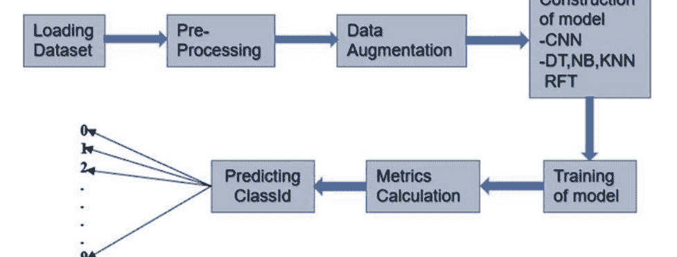

#### 图1 工作流程

#### 3.2.1 数据预处理和数据增强

图像预处理是在图像用于模型训练之前进行的步骤。在这个过程中，图像被调整大小、增强、转换为灰度并进行正确的模型利用。这是通过使用直方图均衡化和灰度数值来完成的。直方图均衡化是一种调整图像对比度的技术。

累积分布函数(cdf)是其定义域内所有概率的总和，定义如下：

```
cdf(x) = ∑_{k=-∞}^{x} P(k)  (1)
```

累积分布函数cdf(x)用于评估实值变量 x小于或等于 x的概率。cdf(x)是在0到k之间的限制的概率 P(k)的总和。

执行直方图均衡化的技术：

```
Sk = (L - 1)cdf(x)  (2)
```

直方图均衡化 (Sk) 用于图像处理中的图像对比度。Sk是灰度级总数 L和累积分布函数cdf(x)的乘积。

灰度是通过图像中光的强度来评估每个像素的值。灰度是图像的像素矩阵中红色 R、绿色 G和蓝色 B的平均值。

```
灰度 = (R + G + B)/3
```

数据增强是从现有数据中创建更相关数据的过程，这是通过使用图像数据生成器实现的。数据增强非常当数据集的大小较小时，这将非常有帮助。数据增强有助于为大型数据集生成更相关的数据。它使用现有图像生成更多图像。数据增强使用的各种方法包括翻转-垂直或水平翻转图像，缩放-根据所使用的缩放类型放大或缩小图像，平移-将图像向左或向右移动，旋转-将图像旋转一定角度（0-360度）。数据增强的必要性主要是因为某些类别的训练样本数量较少。例如- ClassId 4有436个图像，而ClassId 7只有32个图像。图2显示了图像数量和ClassId之间的关系。

图像数量增加了4倍，以生成更多的图像。增强前后的图像数量见表1。

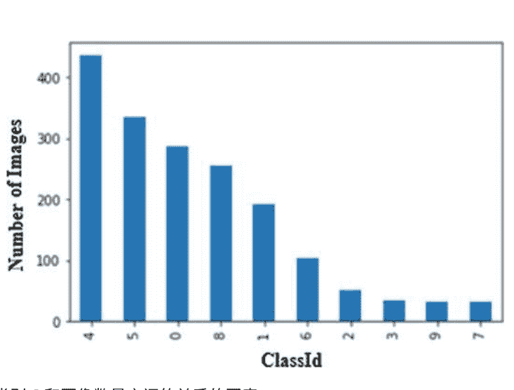

| 类别ID | 增强前 | 增强后 |
| :--- | :--- | :--- |
| 0 | 288 | 1152 |
| 1 | 192 | 768 |
| 2 | 52 | 208 |
| 3 | 35 | 140 |
| 4 | 436 | 1744 |
| 5 | 336 | 1344 |
| 6 | 105 | 420 |
| 7 | 32 | 128 |
| 8 | 256 | 1024 |
| 9 | 33 | 132 |

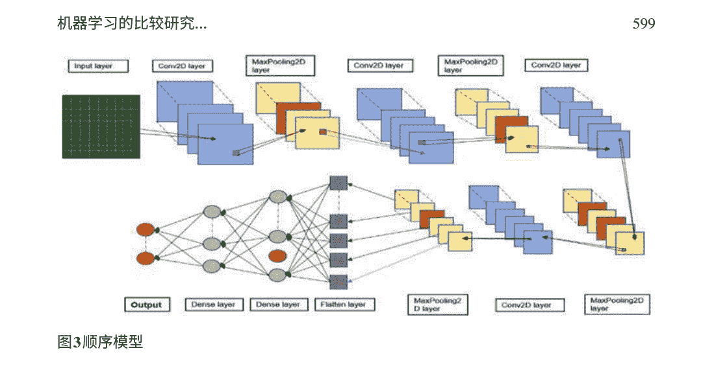

#### 3.2.2 构建模型

为了将真菌分类到不同的类别中，训练了1个深度学习模型和4个机器学习模型，通过计算和比较它们的准确性来确定哪个算法表现更好。用于分类的模型是CNN；选择CNN的主要原因是不需要进行特征工程。在训练CNN模型之前需要进行特征选择。CNN表现良好并且具有更高的准确性。它涵盖了局部和全局组件。它还可以从图像中学习不同的部分。

##### CNN模型—DL

顺序模型是使用Keras构建模型的一种方法，它允许逐层构建模型，每个层都有一个输入张量和一个输出张量。每个层按顺序堆叠在一起形成模型，因此被称为顺序模型。一些优点是，它更容易跟踪进展、构建和理解。顺序模型在图3中显示。

##### 决策树模型—机器学习

决策树被开发用于将一个节点分割成多个子节点。这种分割有助于在最均匀的子节点中进行。算法的选择基于数据集所拥有的目标变量的类型。这在图4中有所描述。

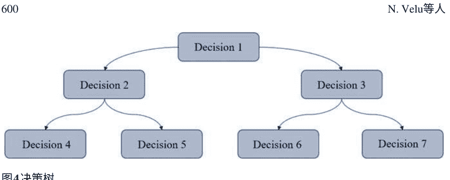

##### 朴素贝叶斯模型—机器学习

朴素贝叶斯分类器给出了条件概率。贝叶斯定理用于计算事件A在事件B发生的条件下的条件概率。

```
P(A|B) = \frac{P(B|A)P(A)}{P(B)} \quad\quad (4)
```

这个分类器预测每个数据属于特定类别的概率。然后，选择具有最高概率的类别作为最相似的类别。

##### KNN模型—机器学习

K最近邻算法是一种简单且高度监督的机器学习算法，用于解决基于分类和回归的问题。该模型通过计算给定查询与数据集中所有已取样示例之间的距离来工作。这在图5中有所描述。

##### 随机森林模型—机器学习

随机森林分类处理给定数据集上的各种决策树，并预测该数据集的准确性，从平均值改进预测。它基于每棵树的多数投票。

使用更多的树来进行预测可以获得更高的准确性。这甚至可以防止过拟合。随机森林树在不同的阶段工作，即通过组合各种数量的决策树来创建模型，然后在第一阶段创建的每棵树上进行预测。这在图6中有所描述。

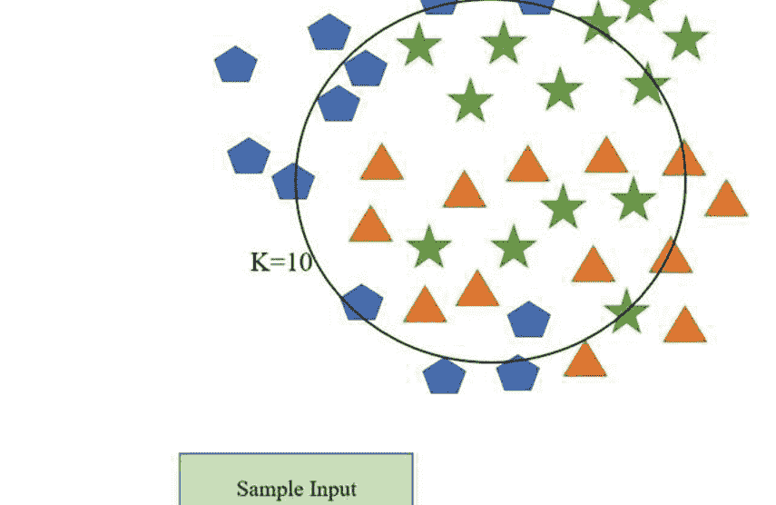

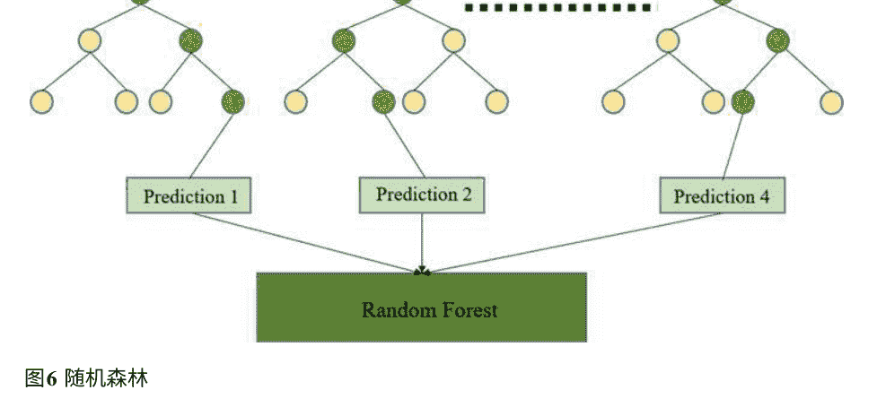

### 3.3 定量指标

定量指标是计算模型准确性并决定哪个模型更适合的一种方法。sklearn提供了三个流行的指标，它们如下所述：

#### 3.3.1 精确度

精确度指标量化的正确的正预测数量。以下方程用于计算精确度

```
精确度 = 真正的正面 / (真正的正面 + 假正面) (5)
```

精确度是真正的正面数量与真正的正面和假正面数量之和的比率。当假正面的成本非常高，而假阴性的成本较低时，使用此公式。

#### 3.3.2 召回率

召回率度量了所有可能的正面预测中正确的正面预测数量。以下方程用于计算召回率-

```
召回率 = 真正的正面 / (真正的正面 + 假阴性) (6)
```

召回率是真正的正面数量与真正的正面和假阴性数量之和的比率。在假阴性（被忽视的案例）的成本高于假正面（误报警）的情况下，此公式非常重要。

#### 3.3.3 F1得分

F1得分是精确度和召回率的平均值。以下方程用于计算F1得分。

```
F1得分 = 2 * (精确度*召回率) / (精确度 +召回率) (7)
```

F1得分是精确率和召回率的乘积与精确率和召回率之和的两倍。这个方程将精确率和召回率的调和平均数转化为一个度量标准，用于比较模型的性能。

## 4 结果与讨论

使用Jupiter笔记本（Python）对模型进行训练和图像分类，分类为classId。训练数据集被分为80%和20%用于验证。顺序## 表2指标比较

|              | CNN   | 决策树 | 朴素贝叶斯 | KNN   | 随机森林树 |
| :----------- | :---: | :----: | :--------: | :---: | :--------: |
| 准确率       | 75.82% |   25%  |    28%     |  29%  |    33%     |
| 宏平均精确率 |   -   |  0.19  |    0.27    | 0.25  |    0.19    |
| 加权平均精确率 |   -   |  0.26  |    0.35    | 0.51  |    0.56    |
| 宏平均召回率 |   -   |  0.19  |    0.23    | 0.22  |    0.17    |
| 加权平均召回率 |   -   |  0.25  |    0.28    | 0.29  |    0.33    |

模型经过100个轮次的训练，准确率达到了75.8%，而所有的机器学习模型相比卷积神经网络模型的准确率都较低。

机器学习模型准确率低的原因是物种之间的相似性很高，而每个类别的图像数量差异很大。机器学习模型在图像分类方面表现不佳，因为从图像中提取的特征较少，特别是当所有类别之间非常相似且没有明显的特征来区分它们时。提出的工作流程描述了将真菌分类为10个类别的步骤，从图像的预处理开始，使用直方图均衡化，然后进行数据增强，这一步骤对于从现有数据集生成新的数据集非常重要，而这种方法通常不常用。模型中使用的度量标准是卷积神经网络的“准确率”度量标准，以及机器学习模型的精确率、召回率和F1值。各种方法的度量标准如表2所示。

预测的图像及其对应的类别如图7所示。

## 5 结论和未来工作

本文讨论了不同的机器学习和深度学习模型如何用于分类真菌。通过实施和深入研究，得出结论：深度学习在区分图像方面比机器学习算法更好。本文证明了CNN在图像分类方面比传统的机器学习算法更好，但仍有改进的空间。在深度学习领域中，有许多不同的深度学习算法可能比CNN具有更高的准确性，而且始终有提升的空间。

### 图7 预测的图像

## 参考文献

1.  Sarica, A., Cerasa, A., & Quattrone, A. 随机森林算法用于阿尔茨海默病神经影像数据的分类：一项系统综述. https://doi.org/10.3389/fnagi.2017.00329
2.  Kanmani, M., & Narasimhan, V. 一种用于遥感图像的最优加权平均融合策略。多维系统与信号处理, 30(4), 1911–1935.
3.  Kanmani, M., & Narasimhan, V., 可见光和热像面图像的最优融合辅助人脸识别。多媒体工具与应用, 79(25), 17859–17883.
4.  Madheswari, K., Venkateswaran, N., & Ganeshkumar, N. 灰度图像的熵优化对比增强。应用工程研究国际期刊。
5.  Madheswari, K., & Venkateswaran, N. 粒子群优化辅助的CT和MRI医学图像加权平均融合策略。生物医学工程与技术国际期刊。
6.  Nathan, S. S., Kanmani, S., Kumar, S., & Kanmani, M. (2018) AP/CSE发表了一篇题为“数字时代-智能摇篮系统以提升育儿”的论文。应用工程研究国际期刊 13(10), 8187–8193. ISSN 0973-4562.
7.  Kong, Y., & Yu, T. (2018). 使用随机森林的深度神经网络模型来提取基因表达数据分类的特征表示。科学报告, 8, 16477.
8.  Svetnik, V., Liaw, A., Christopher Tong, J., Culberson, C., Sheridan, R. P., Feuston, B. P. (2003). 用于化合物分类和QSAR建模的分类和回归工具。化学信息学杂志, 43(6), 1947-1958.
9.  Bing, Z., Xiao, Q., He, H., & Zhu, Z. (2020). 用于输电线路图像处理的随机森林分类模型。在2020年第15届国际计算机科学与教育会议（ICCSE）中. https://doi.org/10.1109/ICCSE49874.2020.9201900
10. Gao, X., Wen, J., & Zhang, C. (2019). 一种改进的用于预测员工离职的随机森林算法. https://doi.org/10.1155/2019/4140707
11. Chauhan, D., Walia, R., Singh, C., Deivakani, M., & Kumbhkar, M. (2021). 使用随机森林分类算法检测玉米病害. Turcomat, 12(9). https://doi.org/10.17762/turcomat.v12i9.3141
12. Mesiar, R., & Sheikhi, A. (2021). 非线性随机森林分类，基于copula的方法。应用科学, 11(15), 7140. https://doi.org/10.3390/app1157140
13. Sari, Y. A., Utaminingrum, F., Adinugroho, S., Dewi, R. K., Adikara, P. P., Wihandika, R.C., Mutrofin, S., & Izzah, A. (2019). 基于颜色和纹理特征的印尼传统食物图像识别的随机森林分类器。在2019年可持续信息工程和技术国际会议上（SIET）. https://doi.org/10.1109/SIET48054.2019.8986058
14. Ebrahimi, M. A., Khoshtaghaza, M. H., Minaei, S., & Jamshidi, B. (2017). 基于SVM分类方法的基于视觉的害虫检测。农业中的计算机和电子技术, 137, 52-58. ISSN 0168-1699.
15. Mathur, A., & Foody, G. M. (2008). 多类和二进制SVM分类：对训练和分类用户的影响。IEEE地球科学和遥感信号处理通讯, 5(2), 241–245. https://doi.org/10.1109/LGRS.2008.915597
16. Inglada, J. (2007). 通过几何图像特征的SVM分类在高分辨率光学遥感图像中自动识别人造物体。ISPRS摄影测量与遥感学报, 62(3), 236–248. ISSN 0924-2716.
17. Bolbol, A., Cheng, T., Tsapakis, I., & Haworth, J. 使用移动窗口SVM分类从稀疏GPS数据推断混合交通模式。计算机、环境和城市系统, 36(6), 526–537. ISSN 0198-9715.
18. Kumari, R. (2013). SVM分类脑MRI图像异常检测方法。国际工程研究与应用杂志(IJERA), 3(4), 1686–1690. ISSN: 2248-9622.
19. Li, X., & Guo, Y. (2013). 多标签SVM分类的主动学习. IJCAI. http://citeseerx.ist.psu.edu/viewdoc/download?doi=10.1.1.417.4976&rep=rep1&type=pdf
20. Mavroforakis, M. E., & Theodoridis, S. (2006). 一种几何方法支持向量机(SVM)分类。IEEE神经网络交易, 17(3), 671–682. https://doi.org/10.1109/TNN.2006.873281
21. Baten, A., Chang, B., Halgamuge, S., 等 (2006) 使用概率参数和SVM分类进行剪接位点识别。BMC生物信息学, 7, S15. https://doi.org/10.1186/1471-2105-7-S5-S15
22. Ottom, M. A., Alawad, N. A., Nahar, & K. M. O. (2019). 使用机器学习技术对蘑菇真菌进行分类。国际先进计算机科学与工程趋势杂志, 8(5).
23. Babu, P., Thommandru, R., Swapna, K., & Nilima, E. (2014). 基于SVM分类器和朴素贝叶斯分类器的蘑菇专家系统的开发。国际计算机科学与移动计算杂志, 3(4), 1328–1335.
24. Al-Mejibli, I. S., & Abd, D. H. (2017). 基于移动设备的机器学习的蘑菇诊断辅助系统。信息技术与通信杂志, 9(2), 103–113. https://doi.org/10.29304/jqcm.2017.9.2.319
25. Beniwal, S., & Das, B. (2015). 使用数据挖掘技术的蘑菇分类。国际药学和生物科学杂志, 6(1), 1170–1176.
26. Vanitha, V., Ahil, M. N., & Rajathi, N. (2020). 基于关键属性的蘑菇分类以检测其可食性。生物科学生物技术资源通讯, 13(11), 37–41.
27. Wibowo, A., Rahayu, Y., Riyanto, A., & Hidayatulloh, T. (2018). 可食用蘑菇识别的分类算法。在2018年国际信息与通信技术会议（ICOIACT）中.
28. Karunakaran, P. (2020). 用于有效网络安全的DGA分类的深度学习方法。普适计算和通信技术杂志（UCCT）, 2(04), 203–213.
29. Jacob, I. J. (2020). 基于Caps-Net的多任务学习架构的性能评估用于文本分类。人工智能杂志, 2(01), 1–10.

# 通过GWO优化特征并通过XG-Boost分类改进的推文情感分析

Pankaj Kumar和Monika

摘要 Twitter作为一个重要的社交媒体网络的出现以及在情感分析专家中的浓厚兴趣是一个重要话题。尽管最近关注，但目前最先进的Twitter情感分析方法被认为表现非常差，声称的分类准确率经常在70%左右，这对于使用从技术中生成的情感信息的能力产生了负面影响。本研究探讨了涉及Twitter的困难，并研究了文献，以了解是否解决了这些挑战。我们进行了基准评估，以评估Twitter情感分析的最新技术。在本文中，我们对情感140数据集进行了分析，并通过XG-Boost进行了分类，通过XG-Boost和GWO进行了特征优化。结果显示，在提出的方法中，准确率提高了2-3%，精确度提高了4%，召回率提高了5%，F-得分提高了3%。

-   Twitter情感分析
-   情绪
-   观点
-   机器学习
-   支持向量机
-   自然语言处理

## 1 引言

抽象的感觉和信念，如感觉、评价和音高，对人类行为有巨大的影响。因为表达他人的观点是每个人天生具备的，并将我们呈现为‘社会性生物’，所以我们的决策受到他人对世界的感知的极大影响。社交媒体平台如Facebook、YouTube和Twitter近年来爆发式增长[1-3]。情感分析是意见挖掘的另一个名称，属于数据挖掘和机器学习的范畴。情感分析和意见挖掘方法必须从人们的数据开始，用于研究特定类型的领域，如经济、政治或生物学等[4]。每天，大量与独特实体相关的数据以数字格式存储。

### 图1 情感分析

因此，该领域的快速扩张与其他社交媒体相关的内容并存，如博客、论坛、消费者评论、Twitter和社交网络网站。

情感分析[5]将数据分类为积极或优秀的意义，或消极或糟糕的意义，或中性或无效的类别。识别极性（消极、中性、积极）以及情绪和感受（愤怒、高兴、悲伤等）、紧迫性（不紧急、紧急）甚至意图的任务被称为情感分析（感兴趣与不感兴趣），如图1所示。社交媒体上的信息量由于自由文本格式和对微博平台的便捷访问而无组织。在得出结论或制作最终产品时，寻求他人的意见至关重要。

根据许多人的经验和评论，这些提供了宝贵的信息。
通过应用满足个人偏好的意见挖掘，已经在推广和需求领域内做了大量的工作[6]。
为了提高性能，需要一个适当的训练集，以及一个准确的数据库进行良好的文本分析。

## 2 相关工作

在情感分析领域正在进行大量的研究。我们使用几种监督学习方法对特征进行了彻底评估，就像Jonnathan和Alexandre[1]在22个推文数据库的重要问题上所做的那样。研究人员研究了近期出版物中研究过的大量元特征，以及大量预训练的词嵌入模型。Antonakaki等人[7]展示了当前Twitter研究问题的地图，重点关注三个主要领域：社交图结构和特征、情感分析以及垃圾邮件、机器人、虚假新闻和仇恨言论等危险。Pandya和Mehta[8]使用多种机器学习和词典分析方法来揭示测试的结果。为了进行实证评估，对结果进行了分析。

验证当前组成估计。通过这种方式，未来的研究人员将更好地理解潜在研究的当前起点。 Manguri等人[9]。在本研究中，推特数据是从使用Python编程语言和Tweepy模块的Tweet社交媒体平台中提取的，并且使用Python TextBlob包进行了情感分析。在情感分析之后，数据库的图形结构已被呈现。Joshi和Gupta [4]使用混合技术来解决Twitter情感分析的挑战，使用基于SentiWordNet（SWN）的特征向量作为分类模型SVM的输入。主要目标是通过处理SWN分数计算中的词汇修饰符否定来提高分类性能。Jaiswal和Kumar [2]以非常好的方式收集、检查、解释和评估文献中的尝试和模式，以发现定义耦合未来潜力的研究空白。Tiwari等人[3]。该项目基于TSA的概念，TSA是一种确定人们对自己发送的推文的看法的方法。在了解他人对某个话题的观点之后，任何个人都可以得出结论。NLP已经在当前工作中用于进行这些类型的分析。因此，本研究论文解释了使用的许多方法以及整个过程中遵循的步骤。Nakov等人讨论了“推特情感分析任务”的第四年[5]。SemEval-2016的任务4包括五个子任务，其中三个与之前的版本有显著区别。前两个子任务是以前几年的重复，它们要求您预测推文的整体情感以及对特定主题的情感。

Twitter基本情感分类问题有两种变体，这三个新子任务是重点。在这项研究中，Idrissi和Rehioui [10]提出了新的聚类算法，用于Twitter情感分析。Tripathi [11]使用长短期记忆[LSTM] SVM和伯努利朴素贝叶斯进行尼泊尔COVID-19推文情感分析。Panadian [12]使用深度学习技术进行情感分析的比较和性能评估。Meena等人[13]使用谷歌图书搜索引擎和Pumbed进行癌症疾病和治疗组合的情感分析，使用NB算法。Khatun等人[14]对亚马逊图书评论数据进行词典分析，根据用户评论和评分来确定书籍和作者的质量。

## 3 提议的工作

这项工作提出了一种情感分析技术，通过优化方法改善文本特征的稀疏性。优化方法通过分类器减少稀疏特征的权重并忽略这些特征。特征减少后，使用XG-Boost的集成学习器[15]进行学习。

### 图2 所提出方法的流程

### 3.1 数据集

可以从“https://www.kaggle.com/datasets/kazanova/sentiment140”收集包含160万条推文的Sentiment 140 [16]数据集。训练数据集包含160万条推文，其中包括80万条积极推文和80万条消极推文，没有中性推文。使用128万条推文数据进行测试。

### 3.2 提出的方法流程图

见图2。

### 3.3 提出的方法

从Kaggle网站上发布的“sentiment140”[16]收集推文数据集，由Kazanova发布。如图2所示，通过分词和词干提取过程对推文文本进行预处理。

在对文本进行预处理后，将特征转换为频率和n-gram特征；将这两个特征进行连接。然后，通过基于人工智能的优化方法对特征权重进行优化，并减少特征的稀疏性。根据基于结构的XG-Boost分类器学习特征权重，并使分类器模型对推文情感进行分类。分析分类器模型的精确度、召回率和准确度。

$$X(t+1)=\frac{x_1+x_2+x_3}{3} \quad (1)$$

$$D=|C*X(t)-X(t)| \quad (2)$$

$$X(t+1)=D^{\delta}.e^{bl}.\cos{2\pi l}+X*t \quad (3)$$

### 3.4 提出的方法论算法

-   步骤-1：初始化种群 $X_i$ ($I=1,2,3...,n$)。
-   步骤-2：初始化 a、A 和 C。
-   步骤-3：计算每个搜索代理的适应度
    -   $X_a$ = 最佳
    -   $X_p$ = 第二好
    -   $X_\delta$ = 第三好
-   步骤-4：当 ($t <$最大迭代次数)
    -   对于每个搜索代理。
        -   更新 a、A、C、l 和 p
        -   如果 ($p < 0.5$)
            -   如果 ($|A| < 1$)
                -   根据公式 (1) 更新当前搜索位置
            -   否则如果 ($|A| \geq 1$)
                -   根据公式 (2) 更新当前搜索位置
        -   否则如果 ($p \geq 0.5$)
            -   通过方程 (3) 更新当前搜索位置
        -   结束 if
    -   结束 for
    -   检查是否有搜索代理超出搜索空间并进行修正
    -   计算每个搜索代理的适应度
    -   更新 $X_a$, $X_p$, & $X_\delta$
    -   $t = t + 1$
-   结束 while
-   步骤-5：返回 $X_a$。

GWO 受到斑点鬣狗的包围、攻击、狩猎和搜索行为的启发。包围属性以以下方式模拟[2,5,9]。

## 4 结果

在实验中使用情感140数据集，并将提出的方法与现有的集成学习、基于SVM的方法进行比较。表1显示了集成学习[17]、PLSA-SVM和优化XGBoost的精确度、召回率和F-分数（以百分比表示）的指标值。图4显示了实验和对集成学习、PLSA-SVM和优化XGBoost的准确度、精确度、召回率和F-分数的比较。提出的方法准确度提高，在提出的方法中使用了具有优化特性的XGBoost。因此，它提高了准确度、精确度、召回率和F-分数。如图3所示。

表1 准确率、精确率、召回率和F分数的各种方法

| 方法 | 准确率 | 精确度 | 召回率 | F-分数 |
|------|--------|--------|--------|--------|
| 集成学习 | 92 | 83.2 | 85.67 | 84.13 |
| PLSA-SVM | 75.81 | 75.79 | 76.63 | 73.23 |
| 优化XGBoost | 96 | 89.34 | 90.12 | 93.23 |

```python
from nltk.stem.porter import PorterStemmer
def cleanup_tweets(tweet_df):
    # remove handle
    tweet_df['clean_tweet'] = tweet_df['TweetText'].str.replace("@", "")
    # remove links
    tweet_df['clean_tweet'] = tweet_df['clean_tweet'].str.replace(r"http\S+", "")
    # remove punctuations and special characters
    tweet_df['clean_tweet'] = tweet_df['clean_tweet'].str.replace("[^a-zA-Z]", " ")
    # remove stop words
    tweet_df['clean_tweet'] = tweet_df['clean_tweet'].apply(lambda text : remove_stopwords(text.lower()))
    # split text and tokenize
    tweet_df['clean_tweet'] = tweet_df['clean_tweet'].apply(lambda x: x.split())
    # let's apply stemmer
    stemmer = PorterStemmer()
    tweet_df['clean_tweet'] = tweet_df['clean_tweet'].apply(lambda x: [stemmer.stem(i) for i in x])
    # stitch back words
    tweet_df['clean_tweet'] = tweet_df['clean_tweet'].apply(lambda x: ' '.join([w for w in x]))
    # remove small words
    tweet_df['clean_tweet'] = tweet_df['clean_tweet'].apply(lambda x: ' '.join([w for w in x.split() if len(w)>3]))
```

图3 分词和词干提取过程

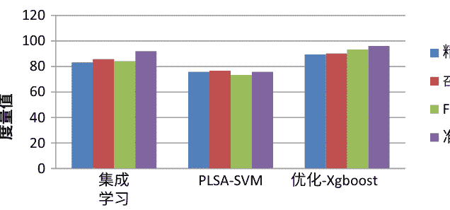

## 5 结论

Twitter提供了一个独特的平台，用于开发和应用研究和搜索理论，以及技术态度。本文提供的研究提出了一种新颖的方法来分析Twitter情感数据。为了暴露感觉，透视语句已被删除（形容词与动词结合和带副词的推文）。本研究使用了语料库技术。寻找一种基于词典的策略来定义语义方法论和寻找语义形容词观点。有两种主要类型的词：副词和动词。有两种类型的词：副词和动词。代码中提供的线性方程用于计算推文情绪。情绪也在上升。很明显，这仍然是一个正在进行中的工作。正在检查的原型实际上是一个初步的原型。初步数据表明这是一种激励技术。在提出的方法中，准确率提高了2-3%，精确率提高了4%，召回率提高了5%，而F-分数提高了3%。

## 参考文献

- 1. Carvalho, J., & Plastino, A. (2021). 关于在Twitter情感分析中评估和组合最先进特征的研究人工智能综述, 54(3), 1887–1936.
- 2. Kumar, A., & Jaiswal, A. (2020). 使用软计算技术对Twitter上的情感分析进行系统文献综述并发与计算：实践与经验, 32(1), e5107.
- 3. Tiwari, S., Verma, A., Garg, P., & Bansal, D. (2020). 基于Twitter数据集的社交媒体情感分析在第六届高级计算与通信系统国际会议论文集中.
- 4. Gupta, I., & Joshi, N. (2020). 使用混合方法和考虑本地语境语义的增强Twitter情感分析智能系统杂志, 29(1), 1611–1625.
- 5. Nakov, P., Ritter, A., Rosenthal, S., Sebastiani, F., & Stoyanov, V. (2019). arXiv预印本arXiv: 1912.01973.
- 6. Wagh, B., Shinde, J., & Kale, A. (2020). 使用NLTK和机器学习技术的Twitter情感分析。Emerging Research in Management and Technology国际期刊, 6(12).
- 7. Antonakaki, D., Fragopoulou, P., & Ioannidis, S. (2021). Twitter研究综述：数据模型，图结构，情感分析和攻击。应用专家系统, 164, 114006.
- 8. Mehta, P., & Pandya, S. (2020). 情感分析方法，实践和应用综述。Scientific and Technology Research国际期刊, 9(2), 601–609.
- 9. Manguri, K. H., Ramadhan, R. N., & Amin, P. R. M. (2020). 全球COVID-19爆发的Twitter情感分析。应用研究库尔德斯坦杂志, 54–65.
- 10. Rehioui, H., & Idrissi, A. (2019). 用于Twitter情感分析的新聚类算法。IEEE系统杂志, 14(1), 530–537.
- 11. Tripathi, M. (2021). 使用NB、SVM和LSTM对尼泊尔COVID19推文进行情感分析。人工智能和胶囊网络杂志, 3(3), 151–168.
- 12. Pandian, A. P. (2021). 使用深度学习技术在情感分析中进行性能评估和比较。软计算范式杂志(JSCP), 3(02), 123–134.
- 13. Meena, R., Thulasi Bai V., & Omana, J. (2019). 对于疾病和治疗组合的推文进行情感分析。在国际计算视觉和生物启发计算会议论文集 (pp. 1283–1293). Cham: Springer.
- 14. Khatun, F., Chowdhury, S. M, Zerin, Tumpa, N., Rabby, S. S. K., Akhter, H., & Sheikh, A. (2019). 使用基于词典的分析方法对亚马逊图书评论数据进行情感分析。在国际计算视觉和生物启发计算会议上, pp. 1303–1309. Cham: Springer.
- 15. Alsaedi, A., & Khan, M. Z. (2019). 关于推特数据情感分析技术的研究。国际高级计算机科学与应用杂志, 10(2), 361–374.
- 16. Go, A., Bhayani, R., & Huang, L. (2009). 使用远程监督的Twitter情感分类。在CS224N项目报告中，斯坦福 (Vol. 1, p. 12).
- 17. Fouad, M., Tarek, M., Gharib, F., & Abdulfattah, S. M. (2018) 具有特征选择和分类器集成的高效Twitter情感分析系统。在国际高级机器学习技术和应用会议论文集中。Springer.

# 通过用户操作模式实现智能手机能量优化


S. Pandikumar, S. Bharani Sethupandian, B. Arivazhagan, and P. Rajeswari

摘要 智能手机已经发展成为一种不可或缺的设备，大多数人将其视为第三只手。必须研究手机用户，以改进智能手机，提高用户体验，并产生可推广和可重复的结果。屏幕开启（活动模式）和屏幕关闭（非活动模式）是每部手机的两种状态，取决于其使用方式。大多数人认为他们每天使用手机24小时，尽管手机的活动使用时间（屏幕开启）非常短。本文重点研究智能手机使用模式和用户对智能手机能量优化的态度。整体试验结果表明，平均用户每天主动使用智能手机2.96小时，以及关于智能手机使用的其他有趣数据。这项研究表明，智能手机在大部分时间内处于非活动状态，这一结果导致了非活动模式下能量消耗的优化。本文的研究结果将对延长智能手机电池寿命产生重要影响。

- 屏幕关闭
- 非活动模式
- 智能手机
- 使用模式
- 能量优化
- 电池耗尽

## 1 引言

智能手机市场一直以来都在快速扩张。尽管智能手机的普及率如此之高，但用户体验仍然受到手机电池寿命的严重限制，并将继续受到限制。在运行多个交互式应用程序和后台服务的同时通过3G或无线保真度访问互联网是一种智能手机能耗的重要来源[1,2]。由于大约40%的无线网络能量在屏幕关闭状态下消耗，屏幕状态在能量损耗中起着重要作用[3]。

通常，智能手机的屏幕有两种状态，即屏幕开启和屏幕关闭；在3G和4G网络中，IP数据会同时发送给屏幕关闭和屏幕开启状态。在用户设备（UE）不活动时，无线电能耗在30%到40%之间。以前有很多关于屏幕关闭期间始终开启的应用程序行为的研究[4,5]。本文分析了用户对智能手机的各种使用模式，并找到了手机的平均使用时间。由于这些发现，研究人员正在集中精力减少非活动模式下的能量消耗。本文旨在回答以下问题：

- 用户在智能手机上主动花费多少时间？
- 用户在屏幕状态之间切换花费多少时间？
- 每天的平均开屏时间是多少？

以下是论文结构的详细说明。文献综述和背景研究是第2节的重点。追踪的基本实验设置在第3节中进行了讨论。第4节深入分析了智能手机用户行为和事件的性能分析。在第5节中，讨论了结论和未来方向。论文[6]中详细讨论了结果和方法。

## 2 文献研究

Hossein Falaki等人[7]认为，他们的研究结果显示，用户每天的平均互动次数在10到200次之间；平均互动时长在10到250秒之间；使用的应用程序数量平均在10到90个之间；每天的平均流量在1到1000 MB之间，其中10到90%的流量在交互使用期间交换。游戏和地图应用程序中更常见的是较长时间的交互[7]。研究的另一个发现是，许多短连接比少数长时间的交互消耗更多能量，因为这些交互会影响重要组件的状态，包括网络数据模块、CPU和内存。人们使用智能手机的方式不同，导致能量使用和数据使用也不同[7]。根据研究的作者，物理用户-应用程序的交互（如点击和滚动）可能为评估移动使用提供了丰富的基础[8]。研究人员使用了来自86个个体在8周期间的82760000个交互事件的大型数据集，使用属性嵌入和无监督算法提取了移动电话使用会话组中的重要接口。这些集群在会话时间、解锁状态或应用程序更新等高级方面中没有体现。根据研究结果，鼓励进一步研究利用用户-应用程序交互行为作为上述用例的基础的效用。

本研究对基于用户群体的调查和预防节能策略给予了新的维度。用户群体与能量消耗之间的关系非常有价值，它可以被手机运营商/生产商的市场群体以及网络建设者用来调整移动网络中的无线接口。本研究对住宅网络物理、建筑、通信设备上基于用户行为的能量消耗进行了深入调查。Jabbarvand等人开发了一种基于搜索的Android环境能量测试技术。利用真实应用程序的实验结果表明，该技术不仅能够有效和高效地测试应用程序的能量行为，而且在检测更广泛和更多样化的能量缺陷方面优于先前的技术。研究人员提出了各种能量测量和配置技术的技术。

## 3 实验设置

实验数据收集自五十个不同年龄、类别和专业背景的个体。一个月内，从Android 5+手机中收集了轨迹。这些轨迹包括数据包负载、用户输入事件、RSRQ值和功耗日志；然而，本文仅关注用户交互。

在未来的文章中，将评估剩余的数据。建议用户在测试期间卸载不需要的应用程序。以下应用程序可供用户用于网络流量监控和其他用途。WhatsApp、Facebook、Instagram、Cricbuzz、Twitter、YouTube、Gmail、Google Play Store和Browser是最受欢迎的社交媒体平台之一。游戏应用程序故意被排除在外。

测试参与者包括一群拥有各种智能手机型号的专业人士（表1）。记录过程仅关注用户交互，并用于评估用户如何使用他们的智能手机。

## 4 性能评估

一个30天使用模式的结果包含了大量定量发现和数据。显然，每个用户都有独特的思维和使用模式，这取决于年龄和工作性质。本研究从各种专家（表1）和年龄组中获取了追踪数据。因为中年人是最渴望使用手机的人群，平均年龄为32-35岁。追踪数据的最小年龄为18岁，最大年龄为65岁。用户来自各种职业，并几乎涵盖了所有主要领域。机械师和出租车司机领域各有一个用户，而其他领域至少有两个人（表1）。

| 类别 | 总参与人数 |
| --- | --- |
| 本科生 | 3 |
| 研究生 | 2 |
| 家庭主妇 | 4 |
| 政治家 | 2 |
| 助理教授 | 3 |
| 开发人员 | 4 |
| 网页开发人员 | 2 |
| 业务 | 4 |
| 家庭医生 | 2 |
| 动画师 | 1 |
| 研究学者 | 2 |
| 失业 | 2 |
| 销售代表 | 4 |
| 企业家 | 3 |
| 机械师 | 1 |
| 出租车司机 | 1 |
| 办公室职员 | 2 |
| 店主 | 2 |
| 医药代表 | 2 |
| 电子工程师 | 1 |
| 土木工程师 | 1 |
| 保险代理 | 1 |
| 退休教授 | 1 |
| 总数 | 50 |

根据追踪研究，市场营销专业人员在工作时间内经常使用手机。前三名手机用户是市场营销专业人员、学者和家庭主妇，平均使用时间分别为4.0、3.0和3.54小时（图1和2，表2）。

用户 U4（医药代表）在个人每天使用时间和平均使用时间方面都是最高的（图2）。他在某一天的使用时间最长达到11.21小时（图5），而他的最短使用时间是2.17小时，因为那天是星期天。

不仅是用户 U4，用户 U6、U7、U8和 U10的平均使用时间也是最长的，分别为5.33、5.66、5.31和5.12小时。最大使用时间不一定需要最高的屏幕事件，因为大多数用户在长时间的活动期间使用手机，而不在屏幕事件之间切换。

有趣的事实是用户 U4拥有最高的屏幕事件，即12148，而每天平均为404。同时，用户 U10是一位政治家，平均他使用了5.12小时，但是他在整个跟踪中的总屏幕事件最少，只有1208次，因为他不经常查看手机，但是一旦解锁手机，他会使用较长的时间，平均为20-30分钟，因为他有两部智能手机用于通信，主要用于语音通话，偶尔使用社交媒体。

用户 U9（家庭主妇）在所有用户中的平均最低使用时间为1.26小时。该用户在跟踪中的最大和最小使用时间分别为2.1和0.52。该用户通常用手机进行语音通话，并使用WhatsApp和Gmail。U20（助理教授）的手机使用时间排名第二，平均为1.33小时。用户 U20的最低和最高使用时间分别为0.56和2.14小时，不仅如此，该用户不经常查看手机，她在整个跟踪中的总屏幕事件次数第二少，只有1328次，平均每天有44次事件。

用户 U2（本科生）是当天最低最小使用量（图4）。她在某一天使用手机0.41小时，标准差为2.12（图3）。不仅仅是用户 U2，用户 U1、U5、U9和 U20也属于当天最低使用量，他们的使用量分别为0.52、0.57、0.52和0.56。

表2 25个用户在日志期间的平均使用时间和屏幕事件

| Id | α | β | σ使用量 | 低 | 高 | 总_事件 | 平均_事件 | σ事件 |
|----|----|----|---------|----|----|---------|-----------|-------|
| U1 | 2.6 | 1.50 | 1.94 | 0.53 | 7.4 | 2885 | 97 | 86.82 |
| U2 | 2.61 | 2.13 | 1.76 | 0.42 | 5.18 | 10,399 | 347 | 110.21 |
| U3 | 4.22 | 4.22 | 1.42 | 2.46 | 6.55 | 2915 | 97 | 15.29 |
| U4 | 5.83 | 5.39 | 2.87 | 2.18 | 11.22 | 12,149 | 405 | 160.98 |
| U5 | 1.70 | 1.21 | 1.08 | 0.58 | 3.35 | 2272 | 77 | 11.52 |
| U6 | 5.34 | 5.39 | 1.07 | 4.15 | 7.17 | 9198 | 308 | 45.29 |
| U7 | 5.67 | 5.38 | 1.44 | 3.54 | 8.05 | 1884 | 62 | 21.54 |
| U8 | 5.29 | 4.99 | 1.38 | 3.44 | 7.14 | 4312 | 143 | 15.92 |
| U9 | 1.24 | 1.45 | 0.56 | 0.53 | 2.11 | 1507 | 51 | 4.92 |
| U10 | 5.13 | 5.23 | 2.15 | 2.16 | 8.06 | 1207 | 39 | 8.53 |
| U11 | 3.83 | 2.14 | 2.91 | 1.13 | 7.31 | 3033 | 102 | 17.51 |
| U12 | 3.02 | 2.49 | 1.77 | 1.00 | 5.46 | 4756 | 156 | 28.43 |
| U13 | 2.60 | 2.29 | 1.00 | 1.36 | 4.22 | 4303 | 142 | 24.14 |
| U14 | 3.36 | 3.35 | 0.89 | 2.21 | 4.47 | 4227 | 140 | 29.08 |
| U15 | 2.67 | 2.80 | 0.90 | 1.14 | 3.56 | 3111 | 104 | 18.22 |
| U16 | 2.18 | 2.16 | 0.71 | 1.10 | 3.49 | 2961 | 98 | 11.20 |
| U17 | 3.01 | 3.39 | 0.59 | 2.16 | 3.56 | 2393 | 80 | 7.32 |
| U18 | 2.83 | 3.46 | 1.12 | 1.13 | 4.08 | 2119 | 72 | 9.22 |
| U19 | 2.20 | 2.20 | 1.00 | 1.10 | 3.61 | 1544 | 53 | 8.31 |
| U20 | 1.36 | 1.46 | 0.50 | 0.66 | 2.24 | 1330 | 45 | 5.42 |
| U21 | 3.08 | 3.55 | 1.19 | 1.24 | 4.55 | 4288 | 144 | 39.10 |
| U22 | 3.80 | 4.55 | 1.34 | 1.19 | 5.18 | 6944 | 234 | 65.10 |
| U23 | 1.96 | 1.45 | 1.14 | 1.35 | 4.42 | 2210 | 72 | 17.84 |
| U24 | 3.10 | 3.11 | 0.80 | 2.31 | 4.30 | 2915 | 96 | 18.80 |
| U25 | 2.80 | 3.16 | 1.18 | 1.20 | 4.58 | 2576 | 84 | 21.00 |

α 屏幕开启持续时间的平均值（小时），β 屏幕开启持续时间的中位数（小时） σ使用量屏幕使用的标准差，低屏幕开启持续时间的最小值（小时） 高屏幕开启持续时间的最大值（小时），σ事件屏幕使用的标准差。

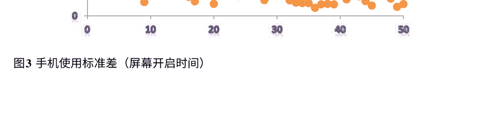

图3 手机使用标准差（屏幕开启时间）根据用户行为的一致性，用户U36（网络开发者）具有较低的标准差0.32（图3）（表2），她在所有天数内以一致的间隔使用手机。用户U36的平均使用时间为2.41小时，中位数为2.45小时。

第二个一致性用户是U49（家庭主妇）。她的手机使用时间比U36少，但平均使用时间为1.58小时/天，中位数为1.51小时，标准差为0.36。同时，用户U11（研究生）的标准差为2.92（图3），因为他的手机使用不一致，取决于他的工作安排，他的使用时间低为1.14小时，使用时间高为7.3小时（图3），他的平均使用时间为3.83小时/天。第二个不一致性用户是U4（医药代表），他在假期期间使用手机的时间较短，因此标准差较高为2.86（图3），他记录的使用时间低为2.17小时，使用时间高为11.21小时（图5）。屏幕交互的研究更加有趣，因为一些用户在较长时间内使用手机，但屏幕事件较少，而其他用户，特别是30岁以下的用户，频繁检查手机（解锁），但不接收任何通知（图6和7）。

用户U2（本科生）一个月内总共有10,397次屏幕事件，平均每天有346次屏幕事件，但手机的平均使用时间只有2.6小时。这个数据几乎接近每天最大使用时间5.82小时。同时，该用户U10（政治家）手机互动较少，但使用时间较长。用户U2整天都不检查状态，但在特定时间段如下午4点至7点和晚上9点至10点经常解锁。

图6所有用户的平均屏幕事件

图7屏幕事件的标准差

追踪研究表明，智能手机的使用程度与用户的职业和心态有显著关联，如图8所示。IT、市场营销、学术业务和家庭主妇是追踪中智能手机平均使用最高的用户（图9和10）。方程1推导出每天智能手机的平均使用时间为2.94小时。通过方程（1）计算了各种活动的平均使用时间，其中‘n’表示用户总数，U_i表示追踪中的每个用户。

```
使用平均 = \frac{1}{n} \sum_{i=1}^{n} U_i = \frac{1}{n}(U_1 + U_2 + \dots + U_n) \quad (1)
```

一个典型的用户平均每天使用手机2.54小时，不活动时间为21.06小时。大部分时间用户不使用智能手机，但是在不活动模式下有一个进程。

图11和图12比较了市场营销人员和学术人员，因为在这项研究中有七个用户，他们是最大的移动用户。

### 图8 U4的移动使用屏幕样本

## 5 结论

本研究对普通智能手机的活动和空闲状态进行了实验结果的检查。在30天内，从50个用户收集了实验数据。参与者来自各种职业，并被建议下载沟通应用程序。追踪揭示了一些有趣的事实，特别是关于电话互动和总体智能手机使用情况。白领工作的人比蓝领工作的人更有可能使用智能手机。平均而言，每天有2.54小时的时间用于智能手机，其余时间用户处于休眠状态。

本研究重点研究了智能手机在不使用时消耗的能量和资源，并提出了优化能量消耗的方法。未来，研究提出了一种新的方法来减少智能手机的能量消耗。

利益冲突作者声明没有利益冲突。

## 参考文献

1. Pihkola, H., Hongisto, M., Apilo, O., & Lasanen, M. (2018). 评估移动数据传输的能量消耗——从技术发展到消费者行为和生命周期思维。可持续性., 10(7), 2494. https://doi.org/10.0.3390/su10072494
2. Tawalbeh, M., Eardley, A., & Tawalbeh, L. (2016). 研究移动设备的能量消耗。Procedia Computer Science, 94, 183–189. https://doi.org/10.1016/j.procs.2016.08.028
3. Selim Ickin. ‘2 et al., (2013). 通过控制智能手机上的3G蜂窝数据流量来降低能量消耗。 在第22届能源高效和绿色网络专题研讨会（SSEEGN）上，第13-18页。
4. Nika, A., Zhu, Y., Ding, N., Jindal, A., Hu, Y., Zhou, X., Zhao, B., & Zheng, H. 室外环境中智能手机无线电捆绑的能量和性能，页809–819。 https://doi.org/10.1145/2736277.2741635
5. Li, X., Zheng, C., Zhang, C., Li, S., Guo, L., & Xu, J. (2017). 通过识别网络流量中的应用程序序包来理解移动应用程序的使用行为。 在2017年IEEE第9届国际通信软件和网络会议（ICCSN）中，页1037-1041。 https://doi.org/10.1109/ICCSN.2017.8230268
6. Pandikumar, S., & Sumathi, M. (2019) 高速数据包在智能手机环境中的能量高效算法。国际工程与先进技术杂志, 8(6).
7. Falaki, H., Mahajan, R., Kandula, S., Lymberopoulos, D., Govindan, R., & Estrin, D. (2010). 智能手机使用的多样性。 在MobiSys’10—移动系统、应用和服务国际会议论文集，pp. 179–194. https://doi.org/10.1145/1814433.1814453
8. Friedrichs, B., Turner, L. D., & Allen, S. M. (2021). 从用户-应用交互中发现智能手机使用类型的会话。 在2021年IEEE国际普适计算与通信研讨会和其他相关活动（PerCom Workshops）, pp. 459–464. https://doi.org/10.1109/PerComWorkshops51409.2021.9431034
9. A. Almasri. & Sameh, A. (2019). 通过对用户进行分类来节省智能手机能量。 在2019年第二届中东和北非通信会议（MENACOMM）, pp. 1–4. https://doi.org/10.1109/MENACOMM46666.2019.8988558
10. Aksanli. & Rosing, T. S. (2020). 人类行为感知的住宅能源管理系统。 在IEEE计算机学报, 第8卷, 第1期, 第45-57页。 https://doi.org/10.1109/TETC.2017.2680322
11. Chuang, M. et al. (2021). 大数据环境下用户用电行为和能源消耗建模研究。 在2021年IEEE第二届国际大数据、人工智能和物联网工程学术会议(ICBAIE), 第220-224页。 https://doi.org/10.1109/ICBAIE52039.2021.9389990
12. Qian, W., & Gechter, F. (2018). 基于用户行为数据的智能手机能源消耗建模。 在2018年国际计算科学和计算智能会议(CSCI), 第788-793页。 https://doi.org/10.1109/CSCI46756.00158
13. João Bazzo, J., de Melo Pires, R., Javier Ortega, A., Portela Salehi, N., & Thiago Marreiros Santos, P. (2020). LTE-A系统中载波聚合的UE电流消耗。 在 2020年国际信息与通信技术融合会议 (ICTC), 第600-602页。 https://doi.org/10.1109/ICTC49870.2020.9289502
14. de Sousa, J. O., Fonseca, G. C., de Oliveira, J. W. A., & Santos, R. N. (2021) 一种新的非侵入式方法来测量智能手机的功耗。 在2021年巴西电力电子学会议(COBEP), 第1-6页。 https://doi.org/10.1109/COBEP53665.2021.9684072
15. Almasri., & Sameh, A. (2019). 对安卓智能手机上的Google Play应用程序能耗进行评级 在 2019年第二届IEEE中东和北非通信会议(MENACOMM), 第1-6页 https://doi.org/10.1109/MENACOMM46666.2019.8988554.
16. Niemann, C., Ewert, H., Puttnies, M., Rethfeldt, D. T., & Danielis, P. (2020). 对移动和嵌入式设备的任务卸载决策进行能耗建模 在2020年IEEE第二届全球生命科学与技术大会(LifeTech), 第400-404页。 https://doi.org/10.1109/LifeTech48969.2020.1570618809
17. Ahmadoh, & Tawalbeh, L. A. (2018) 对智能手机的功耗实验分析 在2018年第三届雾计算和移动边缘计算国际会议(FMEC),第295-299页。 https://doi.org/10.1109/FMEC.2018.8364082

# 高效的新方法预测胰腺癌的生存时间使用机器学习范式朝着大数据分析

P. Santosh Reddy和M. Chandra Sekhar

摘要 胰腺癌通常发生在胰腺中，与胃相关的酶细胞和产生激素的细胞，当细胞开始以异常的方式无法控制地增长时发生。胰腺腺癌是最危险的恶性肿瘤，也是第四大致命癌症。对于被诊断为胰腺癌的患者，预后仍然非常差，几乎没有恢复的机会。由于胰腺被各种器官和脂肪组织包围在中间，鉴别和分离是无效的。临床患者数据对于揭示癌症诊断的成功率非常有益和有用。使用患者级别数据构建的模型还具有潜力产生不同的研究见解以预测和诊断最佳治疗方案，并改善个体患者的前景。然而，需要一种高效和有影响力的技术能够有效且正确地预测结果。因此，通过学习预测最好结果的自动化元学习方法的想法有助于提高性能。然后使用这种方法来确定患者的生存率从而增加击败癌症的机会。所提出的方法揭示了使用适当的特征选择和预测技术，主要通过使用机器学习算法，提高了在预测患者生存率方面所采用模型的准确性。本文的主要目标是使用临床癌症患者数据构建机器学习模型，以预测胰腺癌患者的生存率，并了解影响结果的因素。

- 胰腺
- HDFS
- WEKA

## 1 引言

腺癌是胰腺导管内的结果，被认为是一种侵略性和致命的癌症类型。对于这种致癌疾病的治疗，在早期阶段很难检测出来，但对于那些在早期阶段进行诊断的患者，有治愈的可能性。然而，癌症阶段的及时诊断在确定生存率方面起着非常关键的作用。例如，对于局部癌症，其生存率显示为其平均值的四倍。年龄、性别、吸烟、肥胖等因素会增加患有胰腺癌的风险，并影响预后。随着数字医疗中心的发展，努力实施新技术，使癌症无病可治。数据在患者治疗中具有强大而直接的作用，同时也同等重视评估对患者最佳治疗。模型使用机器学习技术分析患者级别的数据，能够确定最佳治疗方式。本文的效力在于将机器学习技术应用于患者级别的癌症数据，并分析和理解各种因素，如病史、疾病的严重程度，并提供最佳治疗方法[6]。

胰腺癌可能会产生严重的副作用，并且在早期阶段很难检测到。例如，在切除胰腺头部的手术中，手术治疗可能需要大约八个小时，但恢复时间可能需要几个月。但是，如果癌细胞扩散到患者的其他器官或动脉中，患者的生存就受到威胁。在这种情况下，帮助患者改善生活质量是更加方便和明智的选择。出于这些原因，只有当细胞可以被切除时，才明智选择手术治疗。因此，我们的主要目标是开发机器学习模型，预测生存时间以及影响结果的因素。

## 2 文献调查

在人工智能领域，已经开发了不同的训练方法，例如恢复、强化和堆叠（见下文）。因为它们包含了一组人工智能模型发展出最终有洞察力的模型的机会，所以这些过程也被称为集成技术。最近，恶性肿瘤的研究采用了人工智能团队的方法[4]。本研究还探讨了人工智能及其在预测胰腺癌生长方面的应用。鉴于这些群体范式，它们通常以类似的人工智能技术和各种不完整的实时授权数据集来进行特征描述。由于明确的排序，大多数对于期望堆叠的投票是在科学范式之间和范式平均预测之间进行的，而这是以一组数值目标为代价的。在这个原型中，对于任何以前无效的焦点排列信息交叉点，都可以通过

### 3 背景

### 3.1 机器学习

机器学习是一项蓬勃发展的技术，通过人类干预能够高效准确地预测结果。在医学科学中，机器学习从疾病的识别和诊断到药物治疗方面都取得了进展。机器学习涵盖了决策树归纳、朴素贝叶斯概率分类器和支持向量机、判别分析等各个方面。主要关注监督学习，本文重点介绍了每个用于学习（训练）的数据实例由两部分组成：它标记了数据，然后在未标记的数据上进行测试，并进行监督分类或回归以显示输出。基本上，分类用于预测有限的一组值，而回归用于预测连续的一系列值。

机器学习在检测胰腺癌方面被发现有益[3]，并且在高效分析方面有所帮助。各种监督式机器学习算法已经证明在诊断胰腺癌、确定生存率和改善生活水平方面取得了出色的结果，尤其是与逻辑回归相结合。

对于每个个体，预测具有不同的概率和统计方法。因此，对于一个患者有利的方法不一定对另一个患者有益。后一事实意味着可以通过使用先进的计算技术来提高整体预测性能，从而可靠地预测哪种机器学习方法对患者提供最佳性能。因此，这是本文的主要动机。

### 3.2 元学习方法

元学习正如其名，是从自身的学习过程中学习。它作为“完成的知识”，学习者在其中获得了知识并学会了如何应用它。一些元学习方法包括装袋、提升和堆叠。在装袋[11]中，也被称为自助聚合器，集合中的模型通常在训练数据集中生成额外的数据。这是通过生成要应用学习的数据集的随机样本来完成的。装袋预测是通过学习模型进行投票来完成的，最终预测是根据最大票数确定的。在提升[12]中，学习以顺序方式进行，通常使用相同的学习技术，每个模型都专注于数据的每个实例是由前一个模型学习的这一事实。加权投票是学习模型进行预测的方式。组合模型通常是第二级学习器。在这种情况下，个体模型被称为0级模型，即基础模型。基础模型的输出被作为输入传递给1级模型，也称为元模型，其输出用于预测。

## 4 提出的方法

提出的模型是一种集成元学习方法，简单地将两个模型混合或组合在一起。一种方法是将提升和堆叠结合起来，以便对整个数据集进行训练并进行完全学习。然而，它与经典的装袋、提升和堆叠不同，其特点是采用了一种新的预测目标。这种方法确定哪种学习模型最适合进行正确和准确的预测。因此，选择的模型被使用和实施。

介绍各种模型的细节，然后选择最佳的元学习模型是本论文的优势。

### 4.1 临床数据集建模

马萨诸塞大学的一组专家创建和开发了一个包含60名胰腺癌患者的回顾性记录的临床数据库。每个患者记录包括初步观察、家族病史、诊断测试、肿瘤病理学、治疗建议、手术过程和生存期。属性分为三个主要类别：111个术前属性、78个术中属性和目标属性。

术前和全参数预测参数：如果属性子集只包含111个术前属性，则数据集称为术前数据集；如果同时考虑189个非目标属性的术前和术中属性，则数据集称为全属性预测属性，如表1所示。

表1 属性类别
| 分类患者 | 参数数量 | 规范 |
| :--- | :--- | :--- |
| 医生 | 10 | 传记，医生 |
| 医生 | 19 | 诊断时症状 |
| 编年史 | 24 | 健康记录 |
| 液体 | 7 | 实验室分析准确性 |
| 断层扫描 | 20 | 诊断图像细节 |
| 直肠镜检查 | 22 | 直肠镜检查信息 |
| 初步展望 | 09 | 医生术前评估 |
| 总数 | 111 | |

预测目标属性：分析的是生存时间，即从诊断到死亡的时间，这被称为预测目标属性。

生存离散化：生存预测的最终目标属性如下所示：

- 当一个目标类别分裂时间小于9个月，另一个目标类别分裂时间大于等于9个月时，定义为9个月分裂。
- 当一个目标类别分裂时间小于6个月，另一个目标类别分裂时间大于等于6个月时，定义为6个月分裂。
- 当一个目标类在6个月以下分裂，另一个目标类在6-12个月之间分裂，另一个目标类在12个月以上分裂时，定义为6-12个月的分裂。

### 4.2 研究预测完美模型

#### 4.2.1 训练模型选择元学习器

设i0表示原始输入。当预测模型输入这个输入时，训练好的模型会预测所有目标值的概率分布。考虑一个6-12个月生存分裂的例子，级别0的模型将输出少于6个月、大于12个月和6-12个月之间的生存率的概率分布。

表2 模型的一级数据集生成
| 实例 | 类别 | $P_{ANN}(+)$ | $P_{NB}(+)$ | 选定的模型 |
| :--- | :--- | :--- | :--- | :--- |
| $N^{[1]}$ | 添加 | 0.21 | 0.71 | 人工神经网络 |
| $N^{[2]}$ | 减去 | 0.39 | 0.49 | NB |
| $N^{[3]}$ | 添加 | 0.82 | 0.71 | 人工神经网络 |
| $N^{[4]}$ | 减去 | 0.81 | 0.77 | NB |

表3 根据表2生成的一级数据集 $i1$
| 实例 | 目标类 |
| :--- | :--- |
| $N^{[1]}$ | 人工神经网络 |
| $N^{[2]}$ | 贝叶斯 |
| $N^{[3]}$ | 人工神经网络 |
| $N^{[4]}$ | 贝叶斯 |

#### 4.2.2 训练过程

训练采用两阶段方法。通过交叉验证，从原始数据集构建$i1$。学习算法被标记为$l0...lo$和$l1$。使用0级技术$l0$重新标记每个训练实例，输出最高概率。这个级别技术是最高的预测器。在第二阶段，应用学习算法构建$i1$上的$l1$，这是新数据集的集合。最后，通过完整数据集构建零级类型$l0$。

示例1。表2展示了用于准备1级模型的数据集发展的示例。实例 $N^{[1]}, N^{[2]}, N^{[3]}, N^{[4]}$ 对应于一个平静的实例$f$。第一列是输入属性向量$a^{(I)}$，可以有两个类别，‘+’或‘-’。对于显示在第3列和第4列的+类别，级别0的概率反映了ANN和NB分类器。所选模型显示它属于ANN类别还是NB类别。

表3显示了一个新的实例，该实例被添加到级别数据集 $i_1$。新实例包含输入属性向量 $a^{(I)}$ 以及选择为目标类别的模型。结果显示在表3中。

## 5 评估

### 5.1 预处理和预测方法

属性和特征选择：模型是通过机器学习算法提出和评估的，在这些算法中，选择了属性的子集属性选择技术。已经证明特征选择提高了分类方法的性能。我们分析增益比、主成分分析进行降维、Relief和支持向量机，并寻找最优方法。

用于0级和1级分类器的机器学习技术：用于胰腺癌的有影响力和有效检测的流行分类器是人工神经网络（ANN）、贝叶斯网络（BN）、决策树、朴素贝叶斯网络（NB）。除了这些分类器，我们提出使用支持向量机（SVM）起到属性选择器和分类器的作用。对于每个数据集，我们找到了最佳的特征选择和机器学习算法的组合。我们通过使用零模型和逻辑回归（LR）来评估模型，这为每个模型的比较设定了基准。

## 实验协议：

- 1. 考虑到0级分类器的选择。通过使用和不使用特征选择来评估机器学习技术，并使用十折交叉验证计算结果。考虑到所有特征并通过改变属性进行测试，发现使用特征选择时，机器学习的准确性表现良好。在所有模型中，选择了前三个最佳模型。
- 2. 考虑到1级分类器的选择。作为上述三个阶段的零版本，我们实验确定了在一级模型中哪个模型能够获得最佳准确性。

## 6 结果

预操作数据集的评估模型结果如下所示。

### 6.1 参数选择

上述图1考虑了预操作属性，并观察了属性变化时发生的行为。预操作属性与6个月寿命目标一起使用，同时进行SVM参数选择。我们观察到，当考虑小属性训练时，NB或朴素贝叶斯分类准确性较高，而当考虑大属性时，BN或贝叶斯网络分类器在几乎没有选择的情况下工作得很好。下面绘制的ROC曲线是逻辑回归（LR）和随机生存时间预测性能的比较，如图2所示。

9个月分割的数据集：预操作数据集被分为两类。发现当与逻辑回归或SVM分类器结合使用时，使用增益比属性选择获得最高准确性。

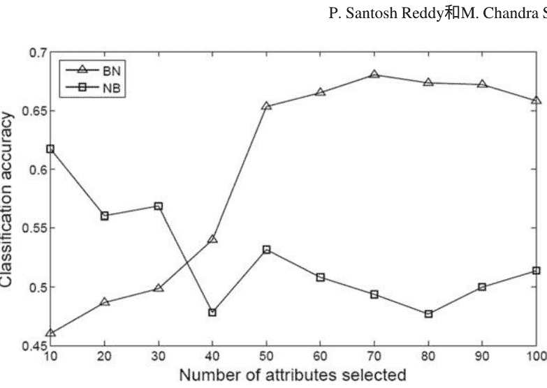

对于BN分类器，两者的准确率都为65.5%，而对于Relief属性选择，准确率为65.6%。这表明我们提出的模型略微超过了标准的元学习方法。

6个月离散数据集：将寿命时间分为六个时期，如表5所示，显示了分类准确率的增加。

#### 表4 分类准确率：9个月分割

| 机器学习算法 | 选择的属性 | 无特征选择准确率 | 准确率 |
|--------------|------------|------------------|--------|
| 逻辑回归     | 增益比     | 70.00            | 0.655  |
| 支持向量机   | 增益比     | 80.00            | 0.655  |
| 贝叶斯网络   | Relief     | 100.00           | 0.653  |
| **执行模型选择元学习器** |  |  |  |
| 级别1：朴素贝叶斯 | 无增益比 | 111.0 | 0.673 |
| 级别0：LR, SVM |  |  |  |

#### 表5 分类准确率：6个月分割

| 机器学习算法 | 选择的属性 | 无特征选择准确率 | 准确率 |
|--------------|------------|------------------|--------|
| LR           | 增益比     | 40.00            | 0.702  |
| 支持向量机   | 增益比     | 26.00            | 0.598  |
| **最佳性能模型选择元学习器** |  |  |  |
| 阶段1：逻辑回归 层次0：支持向量机_逻辑回归 | 主成分分析, 增益比 | 12.00 | 0.675 |

6-12个月分割的数据集：表6显示了在6-12个月之间分割的生存时间，观察到表6的准确率略低于表4和表5的准确率，这是因为它具有更多的类别。

#### 表6 分类准确率 6-12个月分类

| 机器学习算法 | 选择的属性 | 无特征选择准确率 | 准确率 |
|--------------|------------|------------------|--------|
| 贝叶斯网络   | Relief     | 20               | 0.527  |
| 人工神经网络 | 增益比     | 50               | 0.518  |
| 支持向量机   | Relief     | 72               | 0.387  |
| **性能模型选择** |  |  |  |
| 层次1：朴素贝叶斯 层次0：人工神经网络, 支持向量机 | 无增益比, Relief | 111 | 0.533 |

表7 分类准确率：术前和术中参数，6个月分割

| $P_{ANN}$(>六个月) | $P_{NB}$(> 六个月) | $P_{实际}$ (> 六个月) | 准确模型(s) |
| :--- | :--- | :--- | :--- |
| 0.25 | 0.77 | 零 | 人工神经网络 |
| 0.10 | 0.59 | 零 | 人工神经网络 |
| 1.94 | 0.11 | 零 | 贝叶斯 |
| 0.07 | 0.98 | — | 贝叶斯 |
| 0.02 | 0.46 | — | 贝叶斯 |
| 0.5 | 0.49 | — | 贝叶斯 |
| 0.04 | 0.12 | 零 | 一起 |
| 0.99 | 0.84 | — | 一起 |
| 1.99 | 0.059 | — | 一起 |
| 0.89 | 0.49 | — | 一起 |
| 1.00 | 0.84 | — | 一起 |
| 0.87 | 0.77 | — | 一起 |
| 0.991 | 0.60 | — | 一起 |
| 1.09 | 0.82 | 零 | - |
| 0.82 | 0.79 | 零 | - |
| 0.88 | 0.89 | 零 | - |

术前和术中参数，6个月分割：在术前和术中的6个月分割的属性中，观察到全属性数据集的元分类器模型方法的准确率为75.2%，高于逻辑回归的61.3%。从表7中可以看出，对于装袋、提升和堆叠，准确率分别为74.5%、67%和72.5%。

原型选择信息：在元学习分类器进行的研究中，考虑的模型是朴素贝叶斯分类器和人工神经网络，它们是前两个最好的0级模型。对于一级分类器，我们使用决策树和支持向量机进行特征选择。

## 7 结论

本文的主要目标是使用最合适的方法准确检测胰腺癌。这主要是通过元学习来实现的，它创建了一个模型，可以预测出产生最准确结果的最佳模型。对于这样的例子，不同策略有时会产生相互冲突的预测，这激发了这种方法。该模型在每个单独的指标上进行实验时，精选出哪个模型能够提供最佳的预测性能。根据特征，注意患者的抵抗时间。作为分段数据，首次症状和症状性测试结果，当前评估已完成。所提出的学习方法证明比个体洞察方法更有益。研究工作发现有望找到良好的准确性，因此可以发展出检测和诊断胰腺癌患者并提出最佳治疗方案的方法。

在未来，我们打算尝试使用DenseNet、VGG-19等深度迁移学习技术，并与我们提出的方法进行比较，以评估其有效性。

## 参考文献

- 1. Pei, H., Li, L., Fridley, B. L., Jenkins, G. D., Kalari, K. R., Lingle, W., Petersen, G., Lou, Z., & Wang, L. (2009). FKBP51通过负向调节Akt影响癌细胞对化疗的反应。癌细胞, 16(3), 259–266.
- 2. Altekruse, S. F., Kosary, C. L., Krapcho, M., Neyman, N., Aminou, R., Waldron, W., Ruhl, J., Howlader, N., Tatalovich, Z., Cho, H., Mariotto, A., Eisner, M. P., Lewis, D. R., Cronin, K., Feuer, E. J., Stinchcomb, D. G., & Edwards, B. K. (Eds.). (2009). Seer癌症统计回顾, 1975–2007, 国家癌症研究所。bethesda, md, http://Seer.Cancer.Gov/Csr/1975_2007/;基于2009年11月的Seer数据提交, 发布于2010年的Seer网站。
- 3. Bektas, B., & Babur, S. (2016). 基于机器学习的乳腺癌诊断性能发展。2016年医疗技术国家大会（TIPTEKNO），1-4。
- 4. Huang, G., Liu, Z., Weinberger, K. Q., & van der Maaten, L. (2018). 密集连接卷积网络。arxiv 2016, arXiv预印本arXiv:1608.06993, Vol. 1608。
- 5. McGuigan, A., Kelly, P., Turkington, R. C., Jones, C., Coleman, H. G., & McCain, R. S. (2018). 胰腺癌：临床诊断、流行病学、治疗和预后综述。世界胃肠病学杂志，24（43），4846。
- 6. Shah, A. P., Mourad, M. M., & Bramhall, S. R. (2018). 急性胰腺炎：诊断和治疗的现状。炎症研究杂志，11, 77。
- 7. Hayward, J., Alvarez, S. A., Ruiz, C., Sullivan, M., Tseng, J. & Whalen, G. (2010). 机器学习临床表现在胰腺癌数据库中。在Kim, S. (Ed.)的专题数据挖掘方法研究疾病基因和蛋白质，人工智能在医学中(Vol. 49, no. 3, pp. 187–195)。
- 8. Floyd, S., Ruiz, C., Alvarez, S. A., Tseng, J., & Whalen, G. (2010). 模型选择元-学习胰腺癌预后, 全文。第三届国际健康信息学会议（HEALTHINF 2010）。与第三届国际联合生物医学工程系统和技术会议（BIOSTEC 2010）(pp. 29–37)。西班牙瓦伦西亚。
- 9. Qu, Y., Adam, B. L., Yasui, Y., Ward, M. D., Cazares, L. H., Schellhammer, P. F., Feng, Z., Semmes, O. J., & Wright, G. L. (2002). 增强决策树分析表面增强激光解吸/电离质谱血清谱图，区分前列腺癌和非癌症患者。临床化学，48, 1835–1843。
- 10. Lin, T. -Y., Dollár, P., Girshick, R., He, K., Hariharan, B., & Belongie, S. (2017). 特征金字塔网络用于目标检测。在计算机视觉和模式识别的IEEE会议论文集中（第2117-2125页）。
- 11. Wang, X., Girshick, R., Gupta, A., & He, K. (2018). 非局部神经网络。在计算机视觉和模式识别的IEEE会议论文集中（第7794-7803页）。
- 12. 任, S., 何, K., Girshick, R., & 孙, J. (2015). 更快的 R-CNN: 向实时目标检测与区域建议网络靠拢。在进展中的神经信息处理系统(pp. 91–99)。

# 一种基于人工智能的识别人脸的方法：从大流行的角度来看

Paramita Bhattacharjee, Ajitesh Moy Ghosh和Tanaya Das

摘要 人脸识别技术包括分析人脸的方法，以确定其身份。与其他生物特征系统一样，它用于与公共摄像头连接的监视而无需任何人的同意。如今，许多与识别人脸相关的挑战，由于大流行情况下也增加了戴口罩的人脸。因此，在本文中，作者集中讨论了使用人工智能基于技术，即卷积神经网络，来解决检测戴口罩和未戴口罩的人脸问题。它包括使用深度神经网络概念开发基于人工智能的人脸识别模型的方法。

所提出的方法包括使用计算机视觉模型（即OpenCV）捕捉图像和视频的几个步骤，借助训练和测试数据集。这项研究工作有助于根据识别率来识别个体，无论是否戴口罩。

关键词人脸识别 · 人脸检测 · 卷积神经网络 · 计算机视觉 · 深度神经网络

## 1 引言

生物特征认证技术多年来一直是一个重要的行业趋势，由于基于人工智能（AI）的创新，它将变得更加重要。它使用自动化方法来验证或识别一个人的身份，基于生理特征，如指纹、面部模式、书写和声音。

术语“面部识别技术”是指实时识别人员 [1]。它使用生物特征从照片或视频中映射面部特征，以建立与人的真实身份的匹配。自40年前开始对面部识别进行开创性工作以来，在生物特征技术的发展中取得了稳定而持续的进展和创新 [2]。面部识别困难对基于面部认证的解决方案来说是重大障碍 [3]。近年来，COVID-19 对全球生物特征技术的使用观点产生了影响 [4]。疫情加速了全球对戴口罩人脸识别技术的采用。

面部识别和检测面临着诸如遮挡、姿态变化、面部表情、衰老和静态图像或视频分辨率等因素的挑战。在这个大流行病期间，面罩的使用成为了挑战清单上的又一个增加。目前，由于大流行病，人们在公共场合无法被强迫摘下口罩，以便在访问受监控的地点进行身份验证。由于使用了面罩，这种情况可能导致身份盗窃以及未经授权访问个人信息。因此，在本文中，作者们专注于处理面对面罩的人脸检测挑战。这项研究工作可以识别出戴面罩和不戴面罩的身份，识别准确率达到百分之多少。

第2节介绍了关于人脸识别和检测系统的相关文献。第3节及其子节讨论了用于训练神经网络模型以检测人的身份的提出架构和数据集。第4节描述了通过识别率进行的结果分析和讨论。第5节最终总结了本文以及这项研究的未来工作。

## 2 相关研究

金融[5]、市场营销[6]、教育[7]、网络服务[8]、监控[9]等领域存在安全问题，人脸识别可用于提供安全保障。如今，家庭安全系统采用人脸识别与门禁管理相结合，利用深度神经网络、物联网等基于人工智能的技术来解决安全问题[10,11]。如今，人脸识别系统采用物联网设备和树莓派作为主控制器，在任何安全问题发生时向用户发送通知[10]。近年来，闭路电视（CCTV）监控系统是另一个激发人们兴趣的应用领域，它在紧急情况下依赖人员监控屏幕以识别戴口罩和未戴口罩的人脸[12]。全球范围内，用于监控的闭路电视（CCTV）的使用已达到前所未有的水平。移动银行是另一个广泛使用生物特征人脸识别的领域。在这个时期，全球存在一些地方，比如尼日利亚，在偏远地区手机普及率较高，但银行或ATM机并不容易获得。为了解决这个关键问题，生物特征系统已成为重点，以提供客户与银行服务器之间的安全移动交易[13]。

生物特征面部识别已成为在当前流行病情况下识别人物身份而不损害安全问题的强制要求。一些最近的文献讨论了面部口罩检测技术，如三元组[14]、机器学习[15]、支持向量机[16]、计算机视觉[17]等。最近的一篇文献提供了一种口罩检测框架，该框架通过前馈卷积神经网络适应注意力映射特征细化，以实现前馈卷积神经网络的有效注意力[18]。从上述文献中，作者发现大多数面部识别系统只针对未戴口罩的面部提供解决方案。最近的一些研究工作只检测戴口罩的面部。此外，作者发现了一项检测戴口罩和未戴口罩面部的研究空白，并给出了识别准确率的百分比。因此，在本文中，作者提出了一种在戴口罩和未戴口罩条件下检测人物身份并比较准确率的方法，使用cv2进行图像捕获并通过提供数据集来训练DNN模型。它提供了一个经过训练的深度学习模型，用于预测面部识别和检测。将来，这项研究工作可以与一些应用工具结合使用开发生物特征系统。它还可以转移到物联网平台上进行更大范围的利用。

## 3 提议的架构

如图1所示，所提出的架构基于云，在云环境中存储数据集，并通过机器学习算法处理训练和测试数据集，以识别带有口罩和不带口罩的人脸，从而识别别人的身份。下一节讨论了在本地环境中所提出架构的逐步过程，其中数据集存储在本地机器中。

### 3.1 本地系统的逐步方法

面部口罩检测任务和戴口罩人脸识别任务是当前流行的口罩的两个紧密相关但不同的应用。面部口罩检测任务必须确定一个人是否需要戴口罩。如图2所示，戴口罩人脸识别任务的目的是确定戴口罩人的唯一身份。每个任务的数据集要求是不同的。前者只需要带口罩的人脸图片样本，而后者需要包含同一主体的带口罩和不带口罩人脸照片的数据集。人脸识别数据集比其他数据集更难创建。

所提出的模型描述了通过捕捉大量带有面具和未带面具的人脸图像并保存为.jpg文件的方式来创建数据集。它解释了将.jpg文件存储为数据集的方式。下一个过程描述了使用深度神经网络创建人脸检测模型的过程。

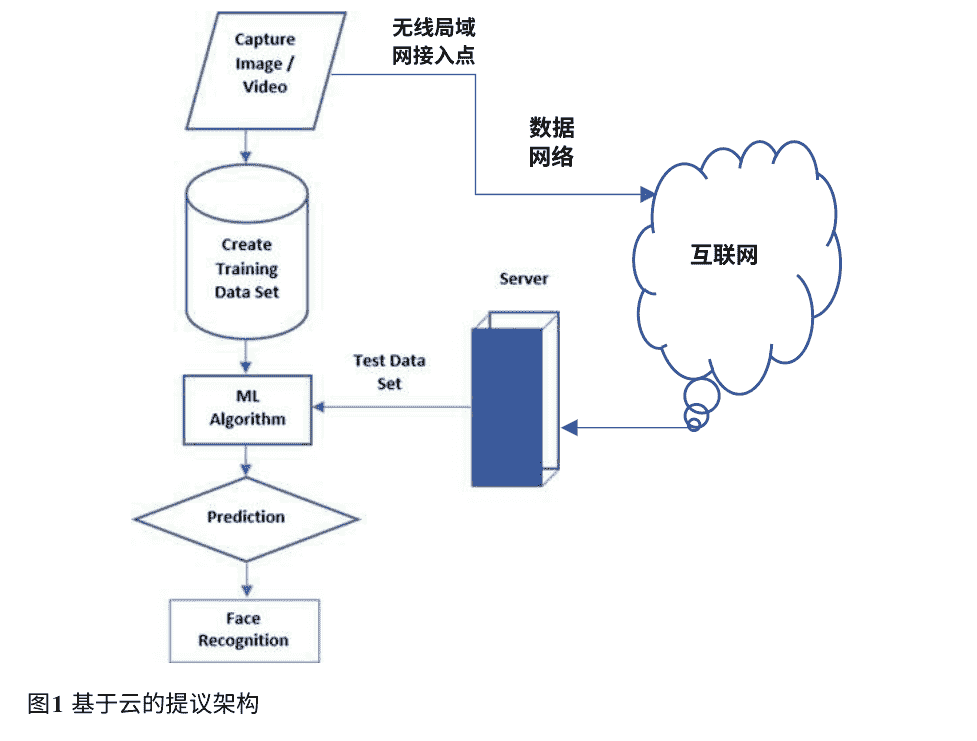

#### 图1 基于云的提议架构

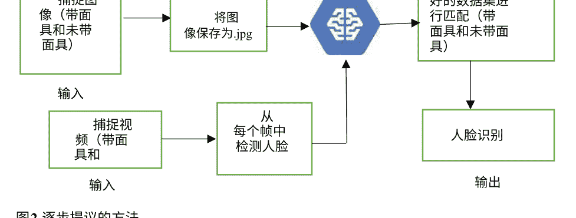

#### 图2 逐步提议的方法

包括OpenFace模型，用于使用方法“open-face_nn4.small2.v1.t7”训练数据集。在上述过程之后，它描述了捕捉带面具和未带面具的人脸的视频数据集的方式。接下来，该方法包括逐帧检查已训练数据集与视频文件的过程，以检查其中出现的所有人脸。它检测人脸并捕捉人脸的部分。一个正方形。最后，该方法将所有这些面部帧与数据集进行比较，并在匹配时检测到面部，并用识别出的名称标记正方形框。

### 3.2 算法步骤

- 步骤1：通过网络摄像头捕获图像和视频以创建数据集
    图像 = 读取图像
- 步骤2：将图像保存为.jpg格式，将视频保存为.mp4格式
    数据集 = 保存图像/视频
- 步骤3：使用创建的数据集训练模型
    训练 = 使用数据集进行模型训练
- 步骤4：如果面部识别置信度大于等于0.8
    a. 在框架中定位面部并在其周围创建一个矩形。
    b. 在矩形上方显示名称和准确度百分比。
    否则
    打印未知图像

使用cv2进行图像捕获，并通过提供数据集训练DNN模型。它提供了一个经过训练的深度学习模型，用于预测面部识别和检测。以上算法已被使用，因为它在最小硬件要求下提供了良好的准确性。

### 3.3 提出的数据集

作者使用了上述提出的方法的掩码和未掩码数据集。该数据集通过捕捉测试对象的许多带有口罩的面部图像和裸露面部图像来创建。为了确保检测和识别能力，图像的数量非常庞大。然后将这些图像以.jpg格式保存，并用作训练数据集。测试数据集也保存为.jpg和.mp4格式。所提出数据集的一瞥如图3和4所示。

图3 掩码数据集


图4 未掩码数据集


## 4 结果分析与讨论

经过训练和测试，我们提出的模型的准确率百分比如图5所示。最高准确率百分比也在相同的图中捕获并存储在.txt文件中，用于每个面部的掩码和未掩码。作者还捕捉了掩码和未掩码数据集的平均准确率百分比，如表1所示。图6显示了掩码和未掩码面部的平均准确率百分比的图形表示。

### 最高准确率

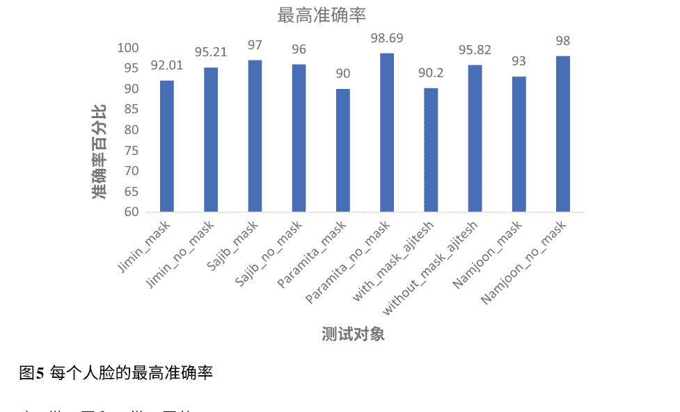

#### 图5 每个人脸的最高准确率

#### 表1 带口罩和不带口罩的平均准确率百分比

| 姓名 | 平均准确率 (带口罩) | 平均准确率 (不带口罩) |
|------|---------------------|-----------------------|
| Jimin | 89.89 | 90.29 |
| Sajib | 95.98 | 94.44 |
| Namjoon | 91.71 | 93.40 |
| Paramita | 88 | 97.86 |
| Ajitesh | 87.75 | 94 |

### 准确率的平均值

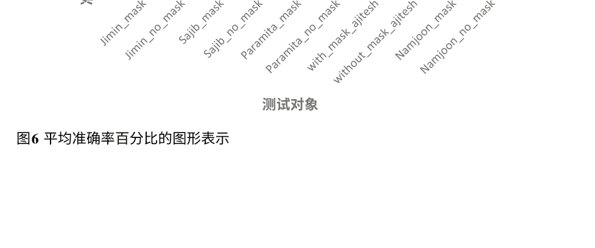

#### 图6 平均准确率百分比的图形表示

通过计算每个测试对象的识别率的平均值来确定准确率百分比，使用以下公式：

```
平均准确率 %
= 测试对象的准确率 % 的总和 / 测试对象的准确率 % 的总数
```

与其他各种模型不同，该提议的方法提供了高识别率，且处理能力较低。对GPU的要求较低，可以处理大量数据。

## 5 结论和未来展望

人脸识别是生物特征学的研究领域。然而，一些算法的计算成本较高，无法用于实时处理。随着计算机技术的改进，这可能会发生变化。在这项研究工作中，作者们关注了当面部被口罩遮挡时人脸识别系统中的重要问题，并提出了解决方案。该解决方案提供了高识别率，且处理能力较低，对GPU的要求也较低。尽管该系统在检测带口罩和不带口罩的人脸方面具有良好的准确性，但光照[19]、低分辨率图像[20]等因素可能会影响结果。因此，我们的未来目标是使系统足够高效，以应对上述因素。此外，可以通过结合一些基于人脸识别技术的人脸识别系统来增强这种提议的方法，例如考勤跟踪系统。

## 参考文献

-   1. Gupta, Y., Prasad, A., Touti, S., Sachdev, K., Jaiswal, V., & Naranje, V. (2021). 实时人脸识别：一项调查。在2021年国际计算智能和知识经济会议（ICCIKE）中。 https://doi.org/10.1109/icicke51210.2021.94107922。
-   2. Jayaraman, U., Gupta, P., Gupta, S., Arora, G., & Tiwari, K. (2020). 人脸识别的最新发展。神经计算，408，231-245。 https://doi.org/10.1016/j.neucom.2019.08.1103。
-   3. Lahasan, B., Lutfi, S. L., & San-Segundo, R. (2017). 处理人脸识别挑战的技术综述：遮挡、每个主体的单个样本和表情。人工智能评论，52（2），949-979。 https://doi.org/10.1007/s10462-017-9578-y4。
-   4. Damer, N., Grebe, J. H., Chen, C., Boutros, F., Kirchbuchner, F., & Kuijper, A. (2020). 戴口罩对人脸识别性能的影响：一项探索性研究。在2020年生物特征专业兴趣小组（BIOSIG）国际会议中（第1-6页）。
-   5. Misra, A., Dev, R. K., & Rajasekaran, M. M. (2020). 使用人脸识别技术的安全支付系统。在第四届国际材料科学与工程会议(ICoSEM2019)上。 https://doi.org/10.1063/5.0028457
-   6. Spivak, I., Krepych, S., Faifura, V., & Spivak, S. (2019). 面部识别的营销决策方法和工具。在2019年IEEE国际科学实践会议中，关于信息通信、科学和技术问题(PIC S&T)。https://doi.org/10.1109/picst47496.2019.9061229
-   7. Balmik, A., Kumar, A., & Nandy, A. (2021). COVID-19大流行期间教育部门的高效人脸识别系统。在2021年第12届计算通信和网络技术国际会议(ICCCNT)上。https://doi.org/10.1109/icccnt51525.2021.9579523
-   8. Jayaprakash, C., & Maheswari, V. (2016). 面部识别警报机制和通过网络服务监控用户动作的理想性。在2016年第10届智能系统与控制国际会议(ISCO)。https://doi.org/10.1109/isco.2016.7727073
-   9. Wang, Y., Bao, T., Ding, C., & Zhu, M. (2017). 基于深度学习方法的实时监控视频中的人脸识别。在2017年第2届图像、视觉和计算国际会议(ICIVC)。https://doi.org/10.1109/icivc.2017.7984553
-   10. Radzi, S. A., Alif, M. K. M., Athirah, Y. N., Jaafar, A. S., Norihan, A. H., & Saleha, M. S. (2020). 基于物联网的基于面部识别的门禁控制家庭安全系统使用树莓派。国际电力电子与驱动系统学报(IJPEDS), 11(1), 417. https://doi.org/10.11591/ijpeds.v11.i1.pp417-424
-   11. Kumar, P. M., Gandhi, U., Varatharajan, R., Manogaran, G. Jidhesh, R., & Vadivel, T. (2017). 智能人脸识别和导航系统在物联网中使用神经学习进行智能安全集群计算, 22(S4), 773-7744. https://doi.org/10.1007/s10586-017-1323-4
-   12. Welsh, B. C., & Farrington, D. P. (n.d.). 闭路电视监控.预防犯罪, 193–208. https://doi.org/10.1007/1-4020-4244-2_13
-   13. Albalooshi, F. A., Smith-Creasey, M., Albastaki, Y., & Rajarajan, M. (2018). 用于安全移动银行的人脸识别系统KnE Engineering, 92–101.
-   14. Sharma, S., & Kumar, V. (2020). 3D基于地标的人脸修复用于识别，使用变分自动编码器和三元组损失。IET生物特征学, 10(1), 87–98. https://doi.org/10.1049/bme2.12005
-   15. Sharma, S., Bhatt, M., & Sharma, P. (2020). 使用机器学习算法的人脸识别系统。在2020年第五届国际通信与电子系统会议(ICCCES)。https://doi.org/10.1109/icces48766.2020.9137850
-   16. VenkateswarLal, P., Nitta, G. R., & Prasad, A. (2019). 纹理和形状描述符的集成，使用支持向量机分类进行人脸识别。环境智能与人性化计算杂志。https://doi.org/10.1007/s12652-019-01192-7
-   17. Apoorva, P., Impana, H. C., Siri, S. L., Varshitha, M. R., & Ramesh, B. (2019). 使用Open Computer Vision分类器进行自动犯罪身份识别的人脸识别。在2019年第三届计算方法和通信国际会议(ICCMC)。https://doi.org/10.1109/iccmc.2019.8819850
-   18. 杨, C.-W., 冯, T. H., 帅, H.-H., &程, W.-H. (2022). 面具还是非面具？鲁棒性人脸口罩检测器通过三元一致性表示学习。ACM多媒体计算、通信和应用交易, 18(1s), 1–20。https://doi.org/10.1145/3472623
-   19. 陈, C. H., 邹, X., Poh, N., & Kittler, J. (2018). 光照不变的人脸识别。计算机视觉, 58–79 https://doi.org/10.4018/978-1-5225-5204-8.ch003
-   20. Anwarul, S., & Dahiya, S. (2019). 人脸识别方法的综合评述和影响面部识别准确性的因素。在电气工程讲义 (pp. 495–514). https://doi.org/10.1007/978-3-030-29407-6_36

# 个性作为计算机科学学生学习动机的预测因素

Amanpreet Kaur和Kuljit Kaur Chahal

**摘要** 学习动机是提高学生学业表现的关键因素。然而，在计算机相关研究中，个性特征在发展学习动机方面的作用尚未明确定义。了解计算机科学与工程（CSE）研究生学生的个性与学习动机之间的相互关系，可以帮助增加在计算机教育中取得成功的机会。本研究旨在通过结构方程模型（SEM）研究第二年CSE学生的个性特征对学习动机的影响，并确定个性因素在多大程度上解释学习动机。研究对象包括92名攻读CSE本科学位的学生。根据研究结果，得出结论个性显著影响学生的学习动机。个性解释了55%的动机。在提出的模型中，对动机影响最大的预测因素是学生的自觉性。研究发现，自我效能是六个学习动机因素中最重要的因素。

-   **关键词** 入门编程 · 计算机教育 · 个性特征 · 学习动机 · 人机交互

## 1 引言

近年来，人们对能够预测学生学术表现的智力和非智力因素越来越感兴趣。影响计算机学生表现的因素已成为一个活跃的研究课题。Rountree等人[1]对入门编程课程学生进行了调查，以找出影响学生在课程中成功的因素。

研究表明，非智力构建已经确定了个性和动机是学术表现的重要决定因素 [2, 3]。为了预测学生在第一学年的成功，Gray等人[4]采用了四个心理测量指标，个性和动机以及能力和学习策略。

计算机教育研究也广泛考虑了计算思维（CT），个性和动机。Román-González等人[5]发现了CT、自我效能和个性之间的相关性，以更好地理解和评估学生的计算效率。特别是内在目标、外在目标、任务价值和自我效能这些学习动机构建，已经被一些相关研究称为（a）学习目标取向，（b）绩效途径目标，（c）学术内在动机和（d）学术自我效能[2]。

鉴于最近对理解计算兴趣和表现的不同预测因素的兴趣，本文使用SEM探讨了个性因素预测二年级本科CSE学生的动机程度。在这样做的过程中，还尝试评估学习动机因素的确认性因子分析。

## 2 文献综述

本节回顾了与学术表现预测相关的研究工作，包括学生的行为因素、个性和学习动机。首先，它描述了与个性和动机相关的研究以及它们与学术表现的关联。其次，它考虑了个性和动机分别研究的研究。

许多实证研究调查了个性特质和学习动机对学术成功的影响。Busato等人[6]整合了智力能力、学习风格、个性和成就动机，以研究这些变量与高等教育学术成功的相关性。高度的责任心、内在动机和低水平的外在动机与第一学期的学校成功有关[7, 16]。Cheng和Ickes [8]发现，责任心和自我激励是大学成绩的“互补预测因子”。那些在这两个因素上都较低的学生无法像那些在责任心或自我激励水平较高的学生那样表现出色。Phillips等人[9]也得出结论，个性可以通过动机影响大学水平的学术表现。

这些研究中有一些研究了大五人格模型与学业成就之间的关系。Richardson和Abraham [10]发现了大五人格维度对学术表现的影响途径。Poropat [11]还得出结论，尽管考虑了智力的影响，但责任心对平均绩点（GPA）的预测有稍微更多的贡献。

责任心是人格中最有影响力的因素，是学业成就的一个相对稳定的预测因子[6,10]。因此，具有高度责任心的学生更有可能获得优秀的学业成绩，因为他们可以制定有序的学习计划，获取所需的资源，并负责地执行。Schrempft等人[12]指出，责任心和感知教育环境都可以独立或相互预测医学表现。

然而，外向性、宜人性、神经质和开放性这四个因素的结果各不相同[5,11,13]。

学习动机是学习的主要因素，被认为是学生学业成绩的重要预测因素。动机、自我调节学习策略和学习风格也被认为是预测学术表现的因素[14,15]。根据Richardson等人的研究[2]，在动机的6个因素中，内在动机与GPA呈正相关，而外在动机与GPA没有显著相关性。此外，研究还发现自我效能与成绩目标之间存在较大的正相关性。此外，学生的动机和表现很大程度上受到学生在课程中追求的目标类型的影响[22]。

据我们所知，还没有研究发现人格特质对CSE领域学生学习动机的影响。有一个研究空白，需要探索人格对学生在编程作业上表现良好和在计算机教育方面获得专业知识的动机的影响。

## 3 方法论

### 3.1 研究模型和假设

-   H1: 二年级计算机科学与工程专业学生的个性显著影响他们的学习动机水平。
-   H2: 个性是影响二年级计算机科学与工程专业学生学习动机的主要因素。

### 3.2 研究组及其特点

研究组由92名计算机科学与工程专业的本科生组成，他们自愿参与了研究。选择攻读计算机科学与工程专业的本科生作为研究对象，旨在探讨个性特质在提高计算机科学与工程专业学生学习动机方面的作用。研究对象已经完成了他们的第一学年。因此，可以假设他们的动机方面对他们的编程课程有一定影响。参与者按计算机科学与工程专业课程和学位的分布情况如表1所示，其中47%为女性，53%为男性。

| 课程 | 总数 | 男性 | 女性 |
|---|---|---|---|
| 计算机应用学士 | 40 | 22 | 18 |
| 计算机科学与工程学士 | 52 | 28 | 24 |

### 3.3 数据收集工具

使用经过验证的心理测试来衡量个性和学习动机。图1和图2简要定义了个性和学习动机的基本因素。

第一个数据收集工具用于测量个性特征是由Costa和McCrae [17]开发的5点李克特量表“NEO-FFI”。量表的60个项目分为5个因素。计算问卷的Cronbach alpha一致性系数为可接受水平（0.645），考虑到五个因素中的三个（外向性、宜人性、责任心）。

第二个用于测量学习动机的数据收集工具是由Pintrich等人[18]开发的7点李克特量表“学习策略动机问卷（MSLQ）”。该量表包括6个因素的31个项目。计算问卷的Cronbach alpha一致性系数为可接受水平（0.787）。

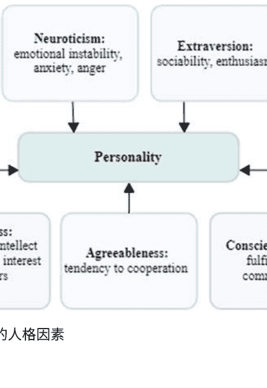

图1 使用NEO-FFI测量的人格因素

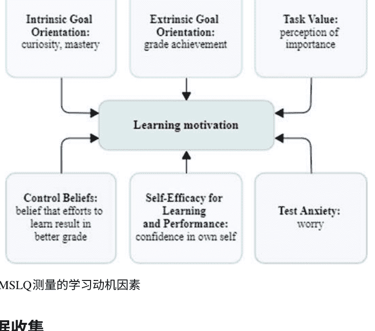

### 3.4 数据收集

为了进行数据收集，经过验证的问卷NEO-FFI和MSLQ被转换为在线表单。学生们回答了在线创建的问卷以进行数据收集。在回答数据收集工具之前，学生们被提供了关于研究目标的信息。自愿参与的参与者没有提供任何个人信息。参与者有30分钟的时间来标记他们的选择。

### 3.5 数据分析

为了进行数据预处理，使用Python进行数据分析。之后，使用SPSS的AMOS 26软件实施结构方程模型（SEM）。为了找到学生的人格和动机因素之间的关系，AMOS 26软件使用最大似然技术计算SEM系数。运行SEM分析后，AMOS以文本和图形形式提供输出，包括非标准和标准回归权重以估计关系、模型拟合指数等。对于训练，将误差对于因变量的回归权重设置为1，并且每个潜变量中的一个因素也设置为1。为了找到SEM中关系模式的兼容性水平并验证提出的模型，使用以下拟合指数测试：卡方拟合指数测试（χ²），拟合优度指数（GFI），标准化拟合指数（NFI），比较因子指数（CFI），均方根误差逼近度 (RMSEA)。 在这些指标下得到的数值与文献中的已建立的数值范围进行比较[21]。

## 4 结果

包括内在目标导向、外在目标导向、任务价值、学习信念控制、自我效能和考试焦虑等因素的MSLQ的描述性统计数据列在表2中。分析结果可以得出以下结论: (a) 所有因素显示负偏态，(b) 峰度值范围在 -0.75 和 +2 之间。 偏态和峰度的数值符合正常单变量分布的可接受范围[19, 20]。

用于数据收集的构建系数在图3中显示为SEM。 在找到构建之间的关系之前，验证获得的拟合指数对验证提出的模型的重要性。

Table3表示每个拟合指数的范围和得到的值，并与Hu和Bentler [21]的拟合值进行比较，确认拟合良好。 发现χ² = 72.50, p = 0.002, CMIN/DF = 1.77 , RMSEA = 0.09, GFI = 0.88, CFI = 0.90, NFI = 0.81, IFI = 0.91。根据这些值，可以看出研究中开发的结构方程模型验证了数据与模型之间的良好一致性。

图3中的结构方程模型将学习动机作为潜变量，卡方值为72.50，p值为0.002。在分析模型时，发现人格估计的动机呈正相关且显著 (γ=0.55) 。

在学习潜在变量的6个动机策略因素中，任务价值具有最高的因子载荷。在5个因素中，人格意识具有最高的因子载荷。

表2 MSLQ的统计数据
| | | 内在目标导向 | 外在目标导向 | 任务价值 | 学习信念的控制 | 自我效能 | 测试焦虑 |
|---|---|---|---|---|---|---|---|
| N | 有效 | 91 | 91 | 91 | 91 | 91 | 91 |
| | 缺失 | 0 | 0 | 0 | 0 | 0 | 0 |
| 平均值 | | 5.50 | 5.41 | 5.64 | 5.31 | 5.38 | 3.45 |
| 均值的标准误差 | | 0.11 | 0.11 | 0.09 | 0.10 | 0.10 | 0.12 |
| 中位数 | | 5.7 | 5.50 | 5.83 | 5.25 | 5.62 | 3.50 |
| 众数 | | 5.00 | 6.25 | 6.00 | 5.25 | 6.00 | 3.83 |
| 标准偏差 | | 1.05 | 1.11 | 0.92 | 0.97 | 1.01 | 1.19 |
| 偏度 | | -0.88 | -0.48 | -1.10 | -0.70 | -0.82 | -0.18 |
| 峰度 | | 0.73 | -0.56 | 2.00 | 0.43 | 0.44 | -0.75 |图4详细说明了MSLQ量表的验证性因子分析结果。分析结果验证了该研究背景下的量表。量表的拟合指数是可接受的（χ² = 963.35, p = 0.000, CMIN/DF = 2.31, RMSEA = 0.09, GFI = 0.72, CFI = 0.83, NFI = 0.74, and IFI = 0.84）[21]。因子方差值表示最有影响力的因素如表4所示；可以观察到外在目标导向的方差值最高，而控制信念的方差值最低。

进一步在协方差值的审查中，如表5所示，内在目标导向和控制信念之间存在高度相关性，而自我效能和考试焦虑的相关性最低。

| | χ²/SD | RMSEA | GFI | CFI | NFI | IFI |
|---|---|---|---|---|---|---|
| 可接受的值 | ≤3 | ≤0.09 | ≥0.80 | ≥0.90 | ≥0.80 | ≥0.80 |
| 结构模型 | 1.77 | 0.09 | 0.88 | 0.90 | 0.81 | 0.91 |

根据结果，H1: 二年级计算机科学与工程专业学生的个性显著影响他们的学习动机水平，得到了 p值小于0.01的路径系数0.55。结果显示个性显著影响学生在计算机科学与工程中取得成功的动机。

|          | 内在目标导向 | 外在目标导向 | 任务价值 | 控制信念 | 自我效能 | 考试焦虑 |
|----------|--------------|--------------|----------|----------|----------|----------|
| 方差     | 1.14         | 1.43         | 1.07     | 0.59     | 0.88     | 0.94     |

|  |  | 1 | 2 | 3 | 4 | 5 |
| --- | --- | --- | --- | --- | --- | --- |
| 1 | 内在目标导向 |  |  |  |  |  |
| 2 | 外在目标导向 | 0.71 |  |  |  |  |
| 3 | 任务价值 | **0.99** | 0.96 |  |  |  |
| 4 | 控制信念 | 0.69 | 0.82 | 0.76 |  |  |
| 5 | 自我效能 | 0.96 | 0.77 | 0.90 | 0.67 |  |
| 6 | 考试焦虑 | 0.19 | 0.62 | 0.26 | 0.41 | 0.17 |

H2：个性是影响二年级计算机科学与工程学生学习动机的主要因素被拒绝。还有其他因素会影响动机，因为个性只能解释0.36的方差。

## 5 讨论与未来工作

本研究旨在探讨个性对追求编程课程的二年级本科生学习动机的影响。建立了一个结构方程模型来预测个性特征和学习动机之间的关系，这些因素影响学生的编程学习。实验结果支持了提出的假设。

实证结果表明，二年级计算机科学与工程学生的学习动机主要受学生个性特征的影响。研究结果与其他研究相一致，这些研究详细阐述了大学水平学术表现中学生动机与个性之间关系的重要性，其中包括来自其他学科的非计算机科学与工程学生[6-10]。

研究结果还表明，动机中的任务价值因素在计算机科学与工程学生中起着重要作用。可以得出结论，学生的动机是由他们对课程的兴趣和重要性的感知驱动的。该模型得到了第二高的自我效能因子载荷。学生对学习技能的自我感知可能对他们的编程表现产生影响。这一发现与先前的研究结果重叠，认为自我效能和内在动机具有重要的因子载荷。

在个性特质方面，意识是本研究中最具影响力的子因素。研究结果与强调意识与学生学业表现相关性更强的研究一致。Chamorro-Premuzic和Furnham[14]显示，意识是与非计算机科学与工程专业学生的学业表现正相关的主要个性因素。Higgins等人[16]证明，具有高意识的学生更有动力在课程中表现出色。Pintrich[15]还将意识与大学生的努力调节和学术自我效能联系起来。

该研究可以进一步探讨CSE学生的个体差异。在课程结束时，可以进行进一步的分析，比较表现出高动机和低动机的学生的最终表现。分析可以揭示与学生的动机和成功相关的有趣模式。

致谢作者向计算机科学系和GNDU的所有学生表示敬意，感谢他们在进行这项研究中的支持。这项工作得到了印度Maulana Azad国家奖学金的财务支持。

## 参考文献

1. Rountree, N., Rountree, J., & Robins, A. (2002). CS1课程中成功和失败的预测因素。ACM SIGCSE Bulletin, 34(4), 121-124.
2. Richardson, M., Abraham, C., & Bond, R. (2012). 大学生学业表现的心理相关因素：一项系统综述和荟萃分析。Psychological Bulletin, 138(2), 353-387.
3. Farsides, T., & Woodfield, R. (2003). 个体差异和本科学业成功：人格、智力和应用的作用。人格与个体差异, 34(7), 1225-1234.
4. Gray, G., Mcguinness, C., & Owende, P. (2014). 应用分类模型预测高等教育中的学习者进展。在2014年IEEE国际先进计算会议(IACC). IEEE (pp. 549-54).
5. Román-González, M., Moreno-león, J., Robles, G., & Pérez-González, J.-C. (2018). 扩展计算思维的范畴网络与非认知因素。计算机在人类行为中[互联网], 80, 441-459.
6. Busato, V. V., Prins, F. J., Elshout, J. J., & Hamaker, C. (2000). 心智能力、学习风格、人格、成就动机和心理学学生在高等教育中的学业成功。人格与个体差异, 29, 1057-1068.
7. Kaufman, J. C., Agars, M. D., & Lopez-wagner, M. C. (2008). 个性和动机在预测非传统学生在拉丁裔服务机构的早期大学学业成功中的作用。学习和个体差异[互联网], 18(4), 492-496.
8. Cheng, W., & Ickes, W. (2009). 认真和自我激励作为大学GPA的互补预测因子。个性与个体差异[互联网], 47(8), 817-822。
9. Phillips, P. R. U., Abraham, C., & Bond, R. O. D. (2003). 个性、认知和大学学生的考试成绩。欧洲人格心理学, 17(6), 435-48。
10. Richardson, M., & Abraham, C. (2009). 认真和成就动机预测绩效。欧洲人格心理学, 23(7), 589-605。
11. Poropat, A. E. (2009). 人格五因素模型与学术表现的元分析Psychological Bulletin, 135(2), 322-338。
12. Schrempft, S., Piumatti, G., & Baroffio, M. W. G. A. (2021). 本科医学生的表现途径：责任心和感知教育环境的作用健康科学教育进展[互联网], 26, 1537-1554。
13. Zuf, A., Alessandri, G., Gerbino, M., Paula, B., Kanacri, L., Di, L., et al. (2013). 学业成就：自我效能信念在自我调节学习中的独特贡献，超越智力、人格特质和自尊学习和个体差异, 23, 158-162。
14. Chamorro-Premuzic, T., & Furnham, A. (2008). 人格、智能和学习方法作为预测学术表现的因素。人格与个体差异, 44, 1596-1603。
15. Pintrich, P. R. (2004). 评估大学生动机和自我调节学习的概念框架。教育心理学评论, 16(4), 385–407.
16. Higgins, D. M., Peterson, J. B., Pihl, R. O., & Lee, A. G. M. (2007). 前额叶认知能力、智能、大五人格和高级学术和职场表现的预测。个性与社会心理学杂志, 93(2), 298–319.
17. Costa, Jr, P. T., McCrae, R. R. (2008). 修订版NEO人格问卷（NEO-PI-R）。在 G. J. Boyle, G. Matthews 和 D. H. Saklofske (Eds.) 的《人格理论和评估的SAGE手册》（第2卷, 第79-198页）。Sage出版社。
18. Pintrich, P. R., Smith, D. A., Garcia, T.和McKeachie, W. J. (1991年)。使用学习策略问卷（MSLQ）的手册。教育研究和改进办公室（ED）。
19. George, D. (2011年)。SPSS for windows逐步指南：简单的学习指南和参考, 17.0更新, 第10版。Pearson Education India (2011年)。
20. Gravetter, F.J., Wallnau, L. B., Forzano, L. A.和Witnauer, J. E. (2020年)。行为科学的统计要点。Cengage Learning。
21. 胡, L. T., & Bentler, P. M. (1999). 协方差结构分析中的拟合指标截断准则：传统准则与新的替代方案。结构方程模型：一种跨学科期刊, 6(1), 1–55.
22. 科芬, R. J., & MacIntyre, P. D. (1999). 计算机相关情感状态的动机影响。人类行为中的计算机, 15(5), 549–569.
23. Durak, H. Y., Saritepeci, M., & Durak, A. (2021). 个人和情感变量与计算思维和编程关系的建模。技术、知识和学习, 1–20.

# 多尺度分层深度卷积神经网络（MDCnn）的混合手语学习方法

Swati Sharma和Varun Prakash Saxena

摘要 手语现在是聋哑人或听力障碍人士的唯一交流方式。 SLR（手语识别）是近年来最流行的研究领域。从许多照片数据集中确定准确的结果对于自动手语识别系统至关重要。 无论如何，卷积神经网络（CNN）在各种视觉任务中都优于传统神经网络。

许多资源和方法都需要在许多度量指标（包括准确性、召回率和F1分数）上取得改进的结果。 在这个背景下，我们提出了一种卷积神经网络模型方法，该方法具有多尺度层和各种滤波器，可以作为设计中的附加层。 这个模型可以用于各种数据集，并且对于实时图片流也很有用。 我们利用ASL和ISL数据集来测试所提出模型的性能。 还使用了VGG16、MobileNet、VGG19、MobileNetV2、ResNet50和InceptionV3等迁移学习模型来评估这些数据集。 实验结果表明，我们提出的模型在ISL数据集上的准确率达到了98%，在ASL数据集上达到了95%。

- 关键词美国手语（ASL）·卷积神经网络（CNN）·
- 印度手语（ISL）·手语识别（SLR）

## 1 引言

### 1.1 手语

手语的起源可以追溯到17世纪。近年来，已经使用了300多种手语来弥合正常人和听障人士之间的差距。手势、身体动作和面部表情都被用于手语。手语可以用一只手或两只手完成。主要使用三种策略来识别手语。基于传感器的技术、基于视觉的技术和混合方法都是其中的一部分。基于传感器的技术使用手套，因此也被称为基于手套的技术。加速度计、接近传感器和弯曲传感器等传感器通常用于此目的。这种方法的最大缺点是成本较高。并非每个人都能负担得起用于手势识别的电子手套。为了解决基于传感器的方法的问题，实施了基于视觉的方法。

基于视觉的方法通常使用内置摄像头和数字图像处理技术的机器学习方法[1]来提取检测标志所需的属性。原始手势数据与基于手套相机的设备在混合方法中合并。这种方法涉及误差消除以提高整体准确性和精度。由于整个系统的价格和计算开销，对此方面的研究工作很少。另一方面，增强系统在应用混合跟踪方法时产生了有希望的结果。

### 1.2 卷积神经网络 (CNN)

CNN只是一种前馈神经网络，广泛用于使用类似网格结构处理输入的文本和视觉图片的分析。CNN通常被称为“ConvNet”。CNN由以下层组成，如图1所示。

1. 输入层 - 输入层接收数据数组作为输入。
2. 隐藏层 - 隐藏层通过进行各种计算和操作来提取特征。在表面下有几个隐藏的层级，如下所示：

- * 卷积层 — 该层具有多个滤波器。为了在数据中找到模式，该层使用矩阵滤波器并进行卷积操作（图像）。每个卷积神经网络都以卷积过程开始。卷积过程通过一系列卷积滤波器对输入的图像进行处理，每个滤波器激活图像的不同方面。
- * 修正线性单元（ReLU层）— 通过将ReLU激活函数应用于卷积层，得到数据的修正特征图（图像）。它执行逐元素操作。所有负像素都被设为零。非线性引入到网络中。该层产生作为输出，它产生了一个修正的特征图。通过将负值映射为零并保留正值，修正线性单元（ReLU）能够实现更快、更高效的训练。特征图在很大程度上取决于所使用的学习模型类和数据的“输入空间”$\chi$。对于输入空间 $\chi$ 上的特征图 $\mathcal{F}$，它是一个（仅仅）函数：$\chi \to \mathbb{R}^d$，如果 $\mathcal{F}$ 是从 $\mathbb{R}^d$ 到 $\mathbb{R}^D$ 的模型类。

$\phi: \chi \to R^d$

- • 汇聚层—为了检测数据的不同[2]部分，汇聚层使用了许多滤波器（图像）。它通过汇聚信息来收集数据。现在将汇聚层应用于校正后的特征图。汇聚是一种降采样过程，可以降低特征图的维度。在扁平化过程中，由汇聚特征图形成的二维数组被转换为一维连续线性向量。汇聚通过对输出进行非线性降采样来减少网络需要学习的参数数量。

在数十或数百个层上，这三个步骤被重复执行，每个层学习识别不同的特征。

3. 输出（全连接）层—最后，有一个全连接层来识别数据项（图像）。全连接层使用汇聚层形成的扁平矩阵来识别或分类数据（图像）。

### 1.3 迁移学习模型

已经使用了成千上万个数据集来构建迁移学习模型。迁移学习基本上是重复使用先前学习的模型。 它可以进行图片分类、图像预测和自然语言处理，利用从先前任务中获得的信息。 对于庞大的数据集，深度学习在调查中表现得比机器学习好得多。 在图片预测和分类中，我们在本研究中使用了预训练模型，如VGG16、ResNet50、MobileNetV2、MobileNet、VGG19和InceptionV3。

## 2 文献调查

2021年，Sharma和Singh [3] 利用深度学习创建了基于视觉的手势检测，用于手语解释。 他们提供了一个基于深度学习的CNN模型，用于手语识别。 在评估他们提出的模型的有效性时，他们将结果与VGG16和VGG11进行了比较。 该模型在两个数据集上进行了测试和训练：印度手语（ISL）手势[4,5]，其中包括使用RGB摄像机记录的2150张图像，以及一个公开可用的美国手语（ASL）数据集，该数据集在本研究中使用。 ISL [6] 和 ASL 数据库的准确率分别为99.96%和100%。 它还经过数据增强的测试，并且被证明具有旋转和缩放不变性。

Ja等人在这项研究中使用了MobileNetV2、MobileNet、VGG19、VGG16和ResNet50等预训练模型[7]。 研究结果表明，不同的模型在不同的场景中有效。 Huang等人[8]过去提出了一种基于传感器的系统，该系统使用深度神经网络。 它以手指关节坐标为输入，并使用两个数据集来比较DNN和SVM的性能。 Badhe和Kulkarni[9]创建了一个算法[10,11]用于ISL到英语的翻译[12]，准确率达到了97.5%。

Hafiz等人[13]在过去提出了一种创新的MFIF技术。 为了从一对多焦点照片中提取最重要的共享属性，他们使用了多尺度卷积和跳跃连接作为推荐网络的一部分。此外，组合图像以多尺度方式重建，以实现更精确的恢复。 为了测试和评估推荐模型，可以使用各种尺寸的图像。 根据对多张测试照片的测试结果，这种策略产生的融合图像质量比现有的图像融合方法更高。

在2021年，Shruti [14, 15]提出了一个框架，用于识别使用美国手语数据集的手语。 它可以预测从0到9的指标，范围为0-9。 通过图像处理，RGB图像被转换为灰度图像。 它的目的是在移动应用程序或嵌入式单板计算机中寻找一种将深度学习架构与图像处理相结合的简单执行方法。 通过LeNet-5和AlexNet，更深的网络如VGG16和MobileNetV2与此一起使用。只有10层构成了最终设计，其中包括一个dropout层，将训练和测试的准确性提高到了91.37%和87.5%。Aditya和Rajesh [16] 创建了一个CNN [17]，并使用带有动量优化函数的随机梯度下降进行了测试，该函数的动量值为0.90，学习率为0.01，对于NUS数据集的准确率为94.7%，对于ASL数据集的准确率为99.96%。Manasi等人提出了一种识别手势的四步方法：(1)使用网络摄像头创建手部动作的实时流。(2)使用视频帧从视频中创建可视化效果。(3)通过预处理这些照片来准备它们。(4) 识别手势语言中的手势并将其转化为文本或音频输出。图像处理和神经网络思想被用来构建系统。Kaggle数据集与他们的数据集一起使用，并通过合并两者创建一个数据集来评估建议的模型。引入背景变化以减少结果中的不确定性。大多数模型对基本和复杂背景产生相同的测试结果。

由于类间相似性和类内异质性，越来越多的传统方法被应用于理解手势语言，尽管实现高准确性仍然是一个具有挑战性的问题，基于视觉的手指拼写识别仍然困难。Rajan的模型[19]考虑了RGB和深度模态。深度信息可以正确识别和处理手指遮挡和手型。与分析RGB-D图片的当前算法相比，提出了一种经过精细调整的双通道网络，该网络在不同的RGB和深度通道中识别手指拼写表示，并最终结合从两个通道收集到的特征。

## 3 方法论

在本文中，我们构建了一个带有一些先进混合特征的简单CNN模型。在这种技术中，我们在手语识别期间使用卷积神经网络（CNN）来分析视觉图像和图像分类，并获得了一些出色的性能。此外，我们在准确性和精确度等多个指标上发现了一些改进的结果。该模型可以与多种自创建的资源数据集一起使用。我们的混合CNN模型使用TensorFlow版本2.2.0和几个Keras库，初始图像大小和批处理大小为64。对于使用CNN进行图像识别，我们使用以下步骤：

1. 从网络摄像头获取图像作为输入。
2. 图像预处理，去除背景图像，并转换为灰度图像。
3. 特征提取和分类。
4. 以文本和语音形式输出结果。

用于模式识别的数据集分为两部分：训练集和测试集。系统训练集由系统训练的照片组成。使用可用数据对系统进行测试。测试集是一组用于检查系统输出是否正确的数据集。在大多数情况下，数据集中只有20%的数据用于测试。测试数据用于评估系统的准确性。经典的CNN通过从图片中收集局部信息并使用卷积层进行训练来学习。在特征提取中，卷积核的大小是一个关键问题。小的卷积核可以提取短边缘或低频材料，但无法提取高频图片特征。另一方面，大的卷积核可以从图片中提取更多具体信息，同时避免使用低频材料。随着使用滤波器大小或其他大小，卷积层的过程变得更加复杂，计算变得更加复杂。因此，训练进展缓慢。为了克服这个挑战，我们选择在CNN的相同层上使用多尺度卷积来收集低频和高频特征（表1）。

第一层中的多尺度块由四个独特的滤波器或4个不同的卷积滤波器集合组成，尺寸分别为1 ×1、3 ×3、5 ×5和7 ×7，在我们的推荐模型中引入了多尺度特征提取。特征图中的输出与频谱维度混合，并通过连接操作传输到每个卷积阶段结束时的最大池化层。如算法中所述，我们将其输入到dropout层中，该层伴随着两个卷积层，每个卷积层都包括另一个最大池化和dropout层。在将输入图片转换后，我们将图像展平为列向量。展平的输出被输入到一个带有反向传播的前馈神经网络中进行训练。经过多个epochs，模型将能够区分图片中的主导特征和低级特征，并使用Softmax分类方法对其进行分类，如图2所示。

图3显示了流程图的总结，首先输入层的大小与图像的大小相同（64, 64, 1）。然后，Keras为处理多个批次或在每个时期步骤中训练多张图片添加了一个新的维度。由于批量大小不同，使用none来表示。因此，输入形状发生了变化（none, 64, 64, 1）。四个卷积层的滤波器大小分别为1 ×1、3×3、5 ×5和7 ×7，它们被合并或连接并输入到最大池化层和dropout层中。卷积、最大池化和dropout的步骤重复两次。然后，flatten层从所有通道中的所有像素生成一个1D向量。之后是密集层（none, 256）和（none, 512），接着是批量归一化、ReLU激活和dropout层。最后，使用27个类和Softmax激活函数的密集层应用学习率为0.0005。创建模型需要三个卷积层，它们与两个密集层或完全连接的神经元相关。建议的技术使用了两个自行创建的数据集进行评估。双手手语（ISL）和单手手语（ASL）手势都有黑白背景，包含1-26个手势类别的A-Z字母，第27个为空白。一个包含印度和美国手语的数据集

### 表1 所有模型的精确度

| 模型 数据集 | 提出的CNN ISL | 提出的CNN ASL | CNN ISL | CNN ASL | MobileNet ISL | MobileNet ASL | MobileNetV2 ISL | MobileNetV2 ASL | VGG16 ISL | VGG16 ASL | VGG19 ISL | VGG19 ASL | ResNet50 ISL | ResNet50 ASL | InceptionV3 ISL | InceptionV3 ASL |
|---|---|---|---|---|---|---|---|---|---|---|---|---|---|---|---|---|
| A | 1 | 1 | 1 | 1 | 0.98 | 0.98 | 0.94 | 0.94 | 0.96 | 0.96 | 0.96 | 0.99 | 0.93 | 0.93 | 0.90 | 0.90 |
| B | 0.95 | 0.92 | 0.85 | 0.97 | 0.99 | 1 | 0.98 | 0.98 | 0.99 | 0.91 | 0.98 | 0.98 | 0.95 | 0.98 | 0.93 | 0.97 |
| C | 1 | 0.95 | 0.99 | 1 | 1 | 1 | 0.99 | 1 | 0.99 | 0.99 | 0.99 | 0.99 | 0.93 | 0.98 | 0.92 | 0.96 |
| D | 1 | 1 | 0.98 | 1 | 0.99 | 0.91 | 0.97 | 0.97 | 0.97 | 0.98 | 0.99 | 0.99 | 0.99 | 0.99 | 0.94 | 0.80 |
| E | 0.89 | 0.95 | 0.98 | 0.96 | 0.98 | 0.93 | 1 | 1 | 0.96 | 0.96 | 0.96 | 0.96 | 0.97 | 0.97 | 0.82 | 0.87 |
| F | 0.96 | 0.98 | 0.93 | 1 | 0.98 | 0.92 | 0.88 | 0.88 | 0.97 | 0.99 | 0.95 | 0.95 | 0.98 | 0.98 | 0.84 | 0.83 |
| G | 1 | 0.96 | 0.93 | 0.99 | 1 | 1 | 1 | 1 | 0.92 | 0.99 | 1 | 1 | 0.98 | 0.99 | 0.92 | 0.96 |
| H | 0.98 | 1 | 0.97 | 1 | 0.99 | 0.98 | 0.97 | 0.97 | 0.97 | 0.92 | 0.99 | 0.94 | 0.97 | 0.97 | 0.97 | 0.86 |
| I | 1 | 0.95 | 0.83 | 0.78 | 0.99 | 1 | 0.97 | 0.97 | 0.99 | 0.93 | 0.99 | 0.99 | 0.95 | 0.90 | 0.97 | 0.82 |
| J | 0.99 | 0.91 | 1 | 0.99 | 0.99 | 0.98 | 0.97 | 0.97 | 0.99 | 0.99 | 0.99 | 0.99 | 0.99 | 0.99 | 0.97 | 0.92 |
| K | 0.92 | 1 | 1 | 0.46 | 0.98 | 0.97 | 0.99 | 0.99 | 1 | 1 | 1 | 0.96 | 0.99 | 0.81 | 0.91 | 0.85 |
| L | 0.95 | 1 | 0.601 | 1 | 0.93 | 0.99 | 0.99 | 0.99 | 0.98 | 0.98 | 0.98 | 0.96 | 0.94 | 0.97 | 0.87 | 0.94 |
| M | 1 | 0.90 | 0.93 | 0.71 | 0.93 | 0.93 | 0.82 | 0.82 | 0.93 | 0.95 | 0.96 | 0.96 | 0.78 | 0.88 | 0.69 | 0.93 |
| N | 1 | 0.87 | 1 | 0.97 | 0.96 | 0.85 | 0.87 | 0.87 | 0.89 | 0.90 | 0.87 | 0.87 | 0.78 | 0.91 | 0.67 | 0.84 |
| O | 1 | 1 | 1 | 0.96 | 0.98 | 1 | 1 | 1 | 0.97 | 1 | 0.98 | 0.98 | 0.94 | 1 | 0.99 | 0.94 |
| P | 1 | 1 | 1 | 1 | 0.99 | 0.98 | 0.98 | 0.98 | 1 | 0.99 | 0.99 | 0.99 | 0.98 | 0.98 | 0.94 | 0.88 |
| Q | 0.99 | 1 | 1 | 1 | 0.97 | 0.99 | 0.99 | 0.99 | 0.97 | 0.99 | 0.96 | 0.96 | 0.89 | 0.95 | 0.89 | 0.84 |
| R | 1 | 0.95 | 0.95 | 1 | 0.94 | 0.95 | 0.80 | 0.80 | 0.95 | 0.85 | 0.97 | 0.97 | 0.91 | 0.86 | 0.92 | 0.83 |
| S | 0.99 | 0.87 | 0.99 | 0.84 | 0.98 | 0.92 | 0.81 | 0.81 | 0.97 | 0.93 | 0.99 | 0.99 | 0.97 | 0.79 | 0.78 | 0.56 |
| T | 1 | 0.94 | 0.98 | 0.95 | 0.99 | 0.76 | 0.74 | 0.74 | 0.98 | 0.66 | 0.99 | 0.99 | 0.97 | 0.83 | 0.89 | 0.86 |
| U | 0.99 | 1 | 0.96 | 1 | 0.98 | 1 | 0.97 | 0.93 | 0.90 | 0.86 | 0.96 | 0.86 | 0.95 | 1 | 0.90 | 0.72 |
| V | 0.98 | 0.99 | 0.86 | 0.99 | 0.97 | 0.99 | 0.96 | 0.78 | 0.90 | 1 | 0.97 | 0.95 | 0.83 | 0.90 | 0.90 | 1 |
| W | 1 | 0.87 | 0.99 | 1 | 1 | 0.88 | 0.98 | 1 | 1 | 0.81 | 1 | 1 | 0.99 | 1 | 0.86 | 0.87 |
| X | 0.88 | 0.90 | 1 | 0.72 | 0.98 | 0.98 | 0.95 | 0.97 | 0.91 | 0.97 | 0.93 | 0.94 | 0.96 | 0.97 | 0.73 | 0.81 |
| Y | 1 | 0.63 | 1 | 1 | 0.99 | 1 | 0.90 | 1 | 0.98 | 0.99 | 0.96 | 0.98 | 0.92 | 1 | 0.84 | 0.86 |
| Z | 1 | 0.96 | 0.86 | 0.72 | 1 | 0.99 | 1 | 0.97 | 1 | 0.91 | 0.98 | 0.80 | 1 | 0.95 | 0.98 | 0.94 |
| 空白 | 1 | 1 | 0.95 | 1 | 1 | 1 | 1 | 1 | 1 | 1 | 1 | 1 | 1 | 1 | 1 | 1 |

### 图2 我们提出模型的流程图

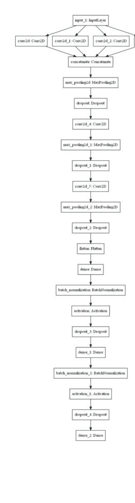

| Layer (type) | Output Shape | Param # | Connected to |
| --- | --- | --- | --- |
| input_1 (InputLayer) | [(None, 64, 64, 1)] | 0 | |
| conv2d (Conv2D) | (None, 64, 64, 16) | 32 | input_1[0][0] |
| conv2d_1 (Conv2D) | (None, 64, 64, 16) | 160 | input_1[0][0] |
| conv2d_2 (Conv2D) | (None, 64, 64, 16) | 416 | input_1[0][0] |
| conv2d_3 (Conv2D) | (None, 64, 64, 16) | 800 | input_1[0][0] |
| concatenate (Concatenate) | (None, 64, 64, 64) | 0 | conv2d[0][0], conv2d_1[0][0], conv2d_2[0][0], conv2d_3[0][0] |
| max_pooling2d (MaxPooling2D) | (None, 32, 32, 64) | 0 | concatenate[0][0] |
| dropout (Dropout) | (None, 32, 32, 64) | 0 | max_pooling2d[0][0] |
| conv2d_4 (Conv2D) | (None, 32, 32, 128) | 73856 | dropout[0][0] |
| max_pooling2d_1 (MaxPooling2D) | (None, 16, 16, 128) | 0 | conv2d_4[0][0] |
| dropout_1 (Dropout) | (None, 16, 16, 128) | 0 | max_pooling2d_1[0][0] |
| conv2d_5 (Conv2D) | (None, 16, 16, 256) | 295168 | dropout_1[0][0] |
| max_pooling2d_2 (MaxPooling2D) | (None, 8, 8, 256) | 0 | conv2d_5[0][0] |
| dropout_2 (Dropout) | (None, 8, 8, 256) | 0 | max_pooling2d_2[0][0] |
| flatten (Flatten) | (None, 16384) | 0 | dropout_2[0][0] |
| dense (Dense) | (None, 256) | 4194560 | flatten[0][0] |
| batch_normalization (BatchNormalization) | (None, 256) | 1024 | dense[0][0] |
| activation (Activation) | (None, 256) | 0 | batch_normalization[0][0] |
| dropout_3 (Dropout) | (None, 256) | 0 | activation[0][0] |
| dense_1 (Dense) | (None, 512) | 131584 | dropout_3[0][0] |
| batch_normalization_1 (BatchNormalization) | (None, 512) | 2048 | dense_1[0][0] |
| activation_1 (Activation) | (None, 512) | 0 | batch_normalization_1[0][0] |
| dropout_4 (Dropout) | (None, 512) | 0 | activation_1[0][0] |
| dense_2 (Dense) | (None, 27) | 13851 | dropout_4[0][0] |

Total params: 4,713,499
Trainable params: 4,711,963
Non-trainable params: 1,536

### 图3 多尺度CNN的结构

我们自己创建的数据集用于训练模型。 ISL训练集包含20,035张属于27个类别的图像，测试集包含6750张属于27个类别的图像。 ASL训练集包含17,649张属于27个类别的图像，测试集包含6230张属于27个类别的图像。 在训练阶段，图像被输入到具有1 × 1、3 × 3、5 × 5和7 × 7大小的四个滤波器中提取特征，然后输入到具有(2, 2)滤波器大小和dropout层的最大池化层中。经过两个卷积层、最大池化和dropout后，它被压平并通过两个完全连接的层。本研究采用学习率为0.005的Softmax激活函数。在双手势（ISL数据集）中，训练过程经历了5个时期，准确率为97.79%；在单手势（ASL数据集）中，训练过程经历了15个时期，准确率为95.21%。还使用了VGG16、VGG19、MobileNet、MobileNetV2、ResNet50和Inception V3的数据集进行实验。比较表2展示了我们提出的模型在我们自己创建的数据集和标准CNN模型上的测试结果，并表明它优于标准CNN模型。我们自己创建的两个数据集也经过了转移学习模型的测试。

## 4 结果和结论

多尺度用于修改CNN进行SLR识别，其中使用了四组卷积滤波器，大小分别为1 × 1、3 × 3、5 × 5和7 × 7，并将其输入到第一层中，这些滤波器的输出被连接起来并输入到进一步的卷积层中。分层卷积操作是指逐步进行卷积过程，如流程图（图2）所示，它表明添加一个多尺度层可以揭示更准确的结果。我们自己创建的数据集都使用了CNN和迁移学习模型，如VGG16、VGG19、MobileNet、MobileNet V2、ResNet50和Inception V3，并且在所有模型中都显示出准确性，如图4所示。统计测量包括准确性和精确度，用于评估每个模型的性能，结果显示所提出的模型具有更高的识别能力。

对于ASL和ISL数据集，训练准确率和验证准确率的时代值如图5所示。与传统的CNN架构相比，我们的模型表现出更好的性能和准确性。

未来，提出的模型可以进一步改进，以便在手语识别中检测句子。

### 表2 所有模型的比较表

| 模型 | 数据集 | 时代 | 步骤损失 | 准确率 | 验证损失 | 验证准确性 |
| --- | --- | --- | --- | --- | --- | --- |
| 提出的模型 | ISL | 5 | 0.0225 | 0.9930 | 0.0939 | 0.9779 |
| CNN | ISL | 5 | 0.0080 | 0.9987 | 0.2388 | 0.9418 |
| 具有数据增强的VGG16 | ISL | 5 | 0.1112 | 0.9882 | 0.4452 | 0.9604 |
| 具有数据增强的VGG19 | ISL | 5 | 0.1172 | 0.9882 | 0.5262 | 0.9601 |
| 具有数据增强的MobileNet | ISL | 5 | 0.0403 | 0.9952 | 0.0834 | 0.9888 |
| 具有数据增强的MobileNetV2 | ISL | 5 | 0.1867 | 0.9830 | 0.7425 | 0.9501 |
| 具有数据增强的Resnet50 | ISL | 5 | 0.3867 | 0.9793 | 1.0454 | 0.9510 |
| 具有数据增强的InceptionV3 | ISL | 5 | 0.1970 | 0.9395 | 0.3713 | 0.8951 |
| 提出的CNN模型 | ASL | 5 | 0.0143 | 0.9955 | 0.3347 | 0.9521 |
| CNN | ASL | 5 | 0.0060 | 0.9983 | 0.3733 | 0.9311 |
| 具有数据增强的VGG16 | ASL | 5 | 0.2008 | 0.9783 | 0.9097 | 0.9293 |
| 具有数据增强的VGG19 | ASL | 5 | 0.2169 | 0.9774 | 1.6134 | 0.9257 |
| 具有数据增强的MobileNet | ASL | 5 | 0.08434 | 0.9860 | 0.3391 | 0.9618 |
| 具有数据增强的MobileNetV2 | ASL | 5 | 0.2811 | 0.9706 | 1.0739 | 0.9280 |
| 具有数据增强的Resnet50 | ASL | 5 | 0.7250 | 0.9592 | 0.9364 | 0.9514 |
| 具有数据增强的InceptionV3 | ASL | 5 | 0.2843 | 0.9124 | 0.4979 | 0.8684 |## 图4 使用ISL数据集的提出的多尺度CNN模型的损失准确性图

### 图5 使用ASL数据集的提出的多尺度CNN模型的损失准确性图

## 参考文献

- 1. Mathur, S., & Saxena, V. P. (2014). 英汉姓名实体音译的混合方法. 在2014年IEEE学生会议上，电气、电子和计算机科学(pp. 1–5). https://doi.org/10.1109/SCEECS.2014.6804467
- 2. Sharma, S., Saxena, V. P., & Satish, K. (2019). 手语识别系统的比较分析国际科技研究杂志, 8, 981–990.
- 3. Sharma, S., & Singh, S. (2021). 基于深度学习的手势识别用于手语解释应用专家系统. 18 2, 115657.
- 4. Abraham, E., Nayak, A., & Iqbal, A. (2019). 使用LSTM进行印度手语的实时翻译. 在2019年全球技术进步大会 (GCAT)(pp. 1–5). 印度班加罗尔. https://doi.org/10.1109/GCAT47503.2019.8978343
- 5. Muthu Mariappan, H., & Gomathi, V. (2019). 印度手语的实时识别. 在2019年国际计算智能数据科学会议 (ICCIDS)(第1-6页).印度金奈。 https://doi.org/10.1109/ICCIDS.2019.8862125
- 6. Intwala, N., Banerjee, A. M., & Gala, N. (2019). 使用卷积神经网络的印度手语转换器。在2019年IEEE第5届融合技术国际会议（I2CT）（第1-5页）。孟买，印度。 https://doi.org/10.1109/I2CT45611.2019.9033667
- 7. Ja, P. G., Rb, P. K. H., & Chiplunkar, N. N. (2021). 在colab笔记本中使用迁移学习的图像分类和预测。在全球转型会议论文集。 https://doi.org/10.1016/j.gltp.2021.08.068
- 8. 黄，J.，周，W.，李，H.，& 李，W. (2018年)。 使用RealSense的手语。 在中国科学技术大学IEEE，合肥（第230027卷）。中国；Shenoy, T. D., Rao, V., & Vyavaharkar, D. (2018年)。 实时印度手语（ISL）识别第9届ICCCNT 2018年。IISC，班加罗尔，印度。
- 9. Badhe, P. C., & Kulkarni, V. (2015年)。 使用手势识别算法的印度手语翻译器。 在2015年IEEE计算机图形学，视觉和信息安全会议（CGVIS）中。
- 10. Rethna Virgil Jeny, J., Anjana, A., Monica, K., Sumanth, T., & Mamatha, A.使用卷积神经网络进行手势识别的手语。 在第五届国际电子与信息学趋势会议（ICOEI）的论文集中。IEEE Xplore部分编号：CFP21J32-ART；ISBN：978-1-6654-1571-2。
- 11. 王，F.，胡，R.，& 金，Y. (2021年)。 基于迁移学习的手势图像识别方法研究。计算机科学学报，187，140-145。ISSN 1877-0509， https://doi.org/10.1016/j.procs.2021.04.044
- 12. Mathur, S., & Saxena, V. P. (2014年)。 英汉姓名实体音译的混合方法。 在2014年IEEE学生会议上，电气、电子和计算机科学。
- 13. Mustafa, H. T., Yang, J., & Zareapoor, M. (2019年)。 多尺度卷积神经网络用于多焦点图像融合。图像与视觉计算，85，pp. 26-35。ISSN: 0262-8856。
- 14. Chavan, S., Yu, X., & Sanie, J. (2021年)。 卷积神经网络手势识别用于美国手语。 在2021年IEEE国际电子信息技术会议（EIT）。978-1-6654-1846-1/21/31.00 ©2021 IEEE. https://doi.org/10.1109/EIT51626.2021.9491897
- 15. Hamdan, Y. B. (2021). 基于统计SVM的手写字符识别模型构建。信息技术杂志，3(02)，92–107。
- 16. Adithya, V, & Rajesh, R. 一种用于静态手势识别的深度卷积神经网络方法。 在第三届计算与网络通信国际会议（CoCoNet’19）中。
- 17. Manoharan, J. S. (2021). 胶囊网络算法用于文本分类性能优化。软计算范式杂志（JSCP），3(01)，1–9。
- 18. Agrawal, M., Ainapure, R., Agrawal, S., Bhosale, S., & Desai, S. (2020). 使用深度学习进行手势识别的模型。 在2020年IEEE第五届计算通信与自动化国际会议（ICCCA）中。印度北方邦大诺伊达加利大学。
- 19. Rajan, R. G., & Selvi Rajendran, P. (2021). 使用基于集成的CNN架构的RGB-D和RGB静态图像的手势识别。 在第五届智能计算与控制系统国际会议(ICICCS 2021)论文集中。IEEE Xplore部分编号: CFP21K74-ART; ISBN: 978-0-7381-1327-2.

# 使用极限学习机进行肝病预测和分析

Geetika Singh和Charu Agarwal

摘要 肝脏，也称为肝脏，是消化系统的重要器官，它执行肝血流、帮助凝血等功能。不良的饮食习惯和久坐的生活方式不幸地对肝脏产生影响。开发一个完全自动的计算机辅助疾病预测模型对医疗专业人员来说将非常有益，因为手动分析是一项繁琐且耗时的任务。为了实现这一目标，我们提供了一个基于极限学习机分类器的自动肝病预测模型，该模型基于他/她的生物参数。ELM是一种快速的单层前馈神经网络，具有高度的泛化能力，以前已被用于生成各种分类模型。使用ILPD数据集评估了提出的模型。使用一系列激活函数和隐藏神经元数量评估了提出模型的性能。根据计算，提出的模型超过了目前使用的其他模型。

- ELM
- 激活函数
- 隐藏神经元
- 肝功能检测

## 1 引言

肝脏，也被称为‘肝’[1]，是消化系统中的重要器官，位于胃的右上部和肋骨的保护下，可以防止外部损伤。这个楔形器官包含两个叶[2]，由纵隔韧带分隔开，右叶比左叶大。这个器官的颜色是红褐色的。它的主要功能包括肝血流、胆汁和蛋白质的产生，多余的葡萄糖被转化为糖原储存等。肝脏的血流[3]是肝脏的重要功能，它接收来自肝动脉和门静脉的血液，在处理后，通过肝静脉供应给各个器官。因此，一个健康的肝脏对身体的正常功能至关重要。

然而，由于不良的饮食习惯和久坐不动的生活方式，我们往往会损害肝脏的状况，这对一个人的健康有影响。肝病可能是由于多种因素引起的，包括过量饮酒，病毒引起的肝脏感染导致肝脏炎症，免疫系统异常如自身免疫性肝炎和遗传性肝病如血色素沉着病等。肝病的阶段[4]如图1所示。

初期阶段是肝脏的炎症，通常被称为肝炎，由病毒或寄生虫引起。纤维化是下一个阶段。肝脏在受伤时通过产生新的肝细胞来修复自身。另一方面，反复的损伤刺激肝脏修复肝细胞，导致所谓的瘢痕组织纤维化的形成。肝硬化是第三个阶段，涉及严重和永久性的肝组织瘢痕化。肝功能衰竭是最后一个阶段，唯一可用的治疗方法是肝移植，非常昂贵。

早期发现肝病可以提高一个人过上健康生活的能力。可以通过肝功能测试（LFT）和影像学来诊断疾病。在收集一个人的血样并分析后，会生成一份报告，其中包括总白蛋白、总胆红素等多个指标。肝病专家根据这些因素为患者开具药物处方和预防措施来治疗患者。

肝病对健康生活产生了不利影响。它是印度第十大死因，美国第二大流行病，英国第五大常见病因。每年有超过两百万人因肝病丧生。

我们可以从前面推断出，肝病学家的手动分析将是一项耗时且困难的任务。手动分析也容易出现错误。可以利用许多最新技术构建完全自动化的分析系统，以协助我们的医学界并提供高效准确的结果。为了构建这样的模型，可以应用各种机器学习算法。许多研究人员试图构建以下模型。Thirunavukkarasu等人[5]提出了一项预测肝病的研究。作者比较了三种分类算法的准确性：支持向量机（SVM）、k-最近邻（KNN）和逻辑回归（LR），发现虽然LR和KNN的准确性相等（73.97%），但由于其高特异性，LR是最好的。作者使用ILPD数据集进行了研究。

Kumar等人[6]提出了一项使用KNN、k-means、朴素贝叶斯、C5.0决策树和随机森林的研究，发现随机森林的准确率为72.18%。根据作者的说法，C5.0与自适应增强的准确率为75.19%。

Sumedh等人[7]使用ILPD数据集分析了支持向量机(SVM)和反向传播的性能。根据作者的说法，反向传播的准确率为73.2%，高于SVM的71%。

在这篇文章中，Sa'diyah等人[8]使用了决策树(DT)、朴素贝叶斯(NB)和NBTree算法。作者确定NBTree产生了最好的结果，疾病预测准确率为67.01%。作者使用了ILPD数据集进行研究。

为了预测肝病，Nazmun等人[9]评估了七种决策树算法的性能：J48、LMT、随机森林、随机树、REPTree、决策树桩和Hoeffding树，使用了ILPD数据集。他们的研究发现，决策树桩是预测肝病最准确的决策树算法，准确率为70.67%。

Somaya等人[10]在他们的研究中采用了粒子群优化（PSO）、遗传算法（GA）、交替决策树（ADT）和多线性回归（MReg）技术。该研究使用了埃及国家控制病毒性肝炎委员会数据库。实验结果显示，遗传算法产生了最佳结果，精确度为69.6%。根据前述文献综述，可以明确地看出，需要一种基于计算机的模型，能够以更少的计算成本更准确地预测肝病。

在这项研究中，我们使用极限学习机（ELM）作为分类器，提出了一种更具计算效率和准确性的基于机器学习的肝脏疾病预测模型。ELM是一种快速的单层前馈神经网络，具有出色的泛化能力。ELM已经在各种不同的分类任务中得到有效应用，包括心电图分类[11]、指纹检测[12]等。在ILPD数据集上，我们训练和测试了建议的模型。我们还研究了ELM使用各种激活函数的性能，因为它有助于网络理解复杂数据，并将输入从前一层转化为下一层可以处理的形式。ELM中使用非线性激活函数。我们的模型中使用了ReLU、Leaky ReLU、TanH和TanHRe这些激活函数，每个激活函数都有不同的隐藏神经元数量（8、16、32、64）。本研究的关键贡献是确定ELM算法是否可以用于诊断肝脏疾病。以下是论文结构的详细说明。ELM的数学描述和激活函数在第2节中介绍。ILPD数据集在第3节中进行了详细描述。提出的方法在第4节中介绍。结果和评论在第5节中呈现。最后，第6节结束了本文。

## 2 极限学习机 (ELM)

Guang-Bin 和 Qin-Yu [13] 提出了 ELM，它是一个具有单隐藏层的前馈神经网络 [14]。该方法基于通用逼近定理，该定理指出具有有限数量神经元的单隐藏层前馈网络可以在适度的激活函数要求下逼近紧致子集上的连续函数。它旨在训练一个具有三个基本层的单隐藏层前馈神经网络，包括输入层、隐藏层和输出层，如图2所示。

ELM将输入层和隐藏层之间的权重以及隐藏层中的偏置赋予随机值。隐藏层的非线性激活函数提供系统的非线性特性。因此，它可以被描述为一个线性系统。唯一需要学习的参数是隐藏层和输出层之间的权重。ELM的收敛速度比典型算法快得多，因为

| 符号 | 含义 |
| --- | --- |
| b₁ | 第1个值的输入向量 |
| k₁ | 第1个值的目标向量 |
| p₁ | 从输入层到第1个隐藏节点的权重向量 |
| r₁ | 第1个隐藏节点的偏置 |
| L | 隐藏节点的数量 |
| βₗ | 从第1个隐藏节点到输出层的权重向量 |

它在没有迭代的情况下学习。它比梯度提升算法学习更快[15]。

让我们详细看一下单个前馈神经网络的训练。假设我们已经提供了一个训练集合 $R = \{(b_{1}, k_{1})\} | b_{1} = (b_{11}, b_{12}, b_{13}, ...... a_{kx})^\text{Y} T^{x}$, $k_{1} = (k_{11}, k_{12}, k_{13}, ...... k_{1w})^\text{Y} T^{w}$ and $l = 1, 2, 3... N$ where input values are shown by $b_{1}$ and $k_{1}$ showcases target values. 表1给出了符号的定义。方程（1）可以用来表示具有L个隐藏神经元的ELM的输出：

$$\sum_{l=1}^{L} \beta_{l} g((p_{l}, d_{j}) + r_{l}) = o_{j} \tag{1}$$

整数 $N$ 表示训练样本的总数，而 $l$ 和 $j$ 分别表示训练样本和输出层的索引。可以证明，当隐藏节点数量趋近于无穷大时，单隐藏层神经网络可以逼近所有的训练数据，这被称为通用逼近能力。

$$\sum_{j=1}^{N} \lVert o_{j} - z_{j} \rVert = 0 \tag{0}$$

因此，必然存在一组满足方程（3）的 $p_{1}, r_{1}$ 和 $\beta_{lo}$

$$\sum_{l=1}^{k} \beta_{l} g((p_{l}, d_{j}) + r_{l}) = z_{j} \text{ 其中 } j = 1 \ldots k \tag{3}$$

上述给出的公式可以简写为下面的方程（4）

$$O\beta = A \tag{4}$$

$$O(p_1, ..., p_L, r_1 ... r_L, d, ... d_N) = \begin{bmatrix} g(p_1.d_1 + r_1) & \dots & g(p_L.d_1 + r_L)\\ \dots & \dots & \dots\\ \dots & \dots & \dots\\ g(p_1.d_N + r_1) & \dots & g(p_P.d_N + r_L) \end{bmatrix}$$

$$\beta = \begin{bmatrix} \beta^A_1\\ \beta^A_2\\ \beta^A_3\\ \vdots\\ \beta^A_L \end{bmatrix}_{L\times m}$$

$$A = \begin{bmatrix} z^A_1\\ z^A_2\\ z^A_3\\ \vdots\\ z^A_L \end{bmatrix}_{N\times m}$$

ReLU、leaky ReLU、TanH和TanHRe是我们研究中用于检测肝病的激活函数。

修正线性单元：ReLU是许多神经网络中最常用的激活函数。该方法对于负输入返回零，对于正输入返回输入值本身。方程（5）给出了ReLU的数学公式：

$$f(x) = \max(0, x) \tag{5}$$

泄漏的修正线性单元：改进的ReLU形式是泄漏的ReLU。值小于0的区域的神经元是不活跃的，因为ReLU存在死亡问题。对于任何正输入值，函数f(x)返回值本身，但对于负输入值，它返回0.01乘以x的值。方程6给出了泄漏的ReLU：

$$f(x) = \max(0.01 * x, x) \tag{6}$$

双曲正切函数（TanH）：该方法返回一个范围从-1到1的数字。该图的斜率类似于Sigmoid函数，但更陡。由方程（7）给出：

$$f(x) = \frac{e^x - e^{-x}}{e^x + e^{-x}} \tag{7}$$

TanHRe：这个激活函数是TanH和ReLU的混合，这两个函数之前已经讨论过。该函数可以写成如下所示的方程（8）：

$$f(x) = \begin{cases} x, & \text{如果 } x > 0\\ \tanh(x), & \text{如果 } x \leq 0 \end{cases} \tag{8}$$

## 3 ILPD数据集

要创建一个机器学习模型，您需要一个数据集来进行训练和测试。我们选择了来自Kaggle存储库的印度肝病患者数据集（ILPD）[16]作为我们研究的数据集，因为它是唯一对研究社区开放的数据集。该数据集中有583条记录，其中167条记录是健康患者的记录，416条记录是患有肝病的患者的记录。该数据集中有11个属性。除了年龄、性别和是否患病之外，所有列都是与肝脏相关的生物参数，这些参数出现在肝功能检测（LFT）报告中，并用于确定一个人是否患有肝病。

## 4 提出的方法

本研究中使用的技术采用极限学习机作为分类器，根据患者的数据来确定患者是否患有肝病。建议的肝病识别方法的框架如图3所示。

### 步骤2：数据预处理

- (a) 空值检查: 处理没有值的属性。可以通过删除这些条目或用平均值替代它们来完成。在ILPD数据集中发现了四个空值，并用平均值0.94进行替换。
- (b) 重复值检查: 处理重复值。ILPD数据集中有13个重复值，这些值被删除以获取干净的数据集。
- (c) 特征缩放: 特征缩放处理分类值。‘性别’属性有两个类别值:‘女’和‘男’。这些类别值在每种情况下被替换为0,1的值。

### 步骤3：数据集拆分

在这个阶段，数据集按照特定比例被拆分为训练和测试数据。我们将数据集分为80:20，其中80%的数据用于训练ELM，20%用于测试模型。

### 步骤4：ELM架构训练和测试

极限学习机(ELM)技术被用来构建建议的模型，详细信息在第2节中提供。在对训练数据集进行评估之前，首先对模型进行训练，以查看其是否产生准确的结果。

### 步骤5：性能分析

然后根据准确性、精确度等多个特征对模型进行评估。我们使用准确性得分[17]、精确度[18]、召回率[18]和F1-得分[18]来评估算法的性能。以下是详细的性能参数:

- (a) 准确性: 准确性表示正确分类的记录数占总记录数的比例。方程式(9)。显示了数学公式的形式。
- (b) 精确度: 指的是所有正预测中正确的正预测数量。方程（10）表示精确度的数学公式。
- (c) 召回率: 表示从所有正值中获得的正确正值的数量。召回率的数学公式表示为方程（11）。

准确率 = (TN + TP) / (TN + FP + TP + FN) (9)

精确度 = TP / (FP + TP) (10)

召回率 = TP / (TP + FN) (11)

(d) $F1$-得分：精确度和召回率的加权平均可以称为$F1$-得分。方程（12）显示了$F1$-得分的数学表示。

$$F1\text{-}分数 = 2*\frac{精确度*召回率}{精确度+召回率} \quad\quad (12)$$

## 5 结果与讨论

我们在这项研究中使用了以下系统设置：Intel i5 处理器（8 GB RAM），配备 Python 3.7 和 Google Collaboratory 软件。为了进行这项调查，我们采用了极限学习机作为分类器。结果是，使用不同数量的隐藏神经元生成性能参数值，以确定分类准确性的最佳值。为了进一步检查性能，使用不同的激活函数在神经元中。因此，我们基于隐藏神经元的数量（8、16、32、64）和不同的激活函数（ReLU、Leaky ReLU、TanH、sin、TanHRe）生成性能参数值。

### 5.1 ELM性能分析，训练与测试比为80:20

在实验中，我们使用80%的数据来训练ELM模型，使用20%的数据来评估ELM模型。图4显示了在不同隐藏神经元数量下，所有激活函数（ReLU、leaky ReLU、TanH、sin、TanHRe）应用于训练后的ELM模型的准确率。具有32个神经元的ReLU激活函数达到了最高的准确率77.77%。

表2给出了80:20数据分割下各个激活函数在不同隐藏神经元数量下的精确度得分。

表3给出了80:20数据分割下各个激活函数在不同隐藏神经元数量下的召回率。

80:20数据分割下的F1分数在表4中给出。

为了进一步证明建议模型的有效性，我们将所提出模型的准确率得分与同领域其他已发表作品进行了比较，具体内容请参见下面的章节。

### 5.2 对同一领域其他已发表作品的评估

表5以准确度为指标，给出了我们实验结果与其他作者工作结果的比较。

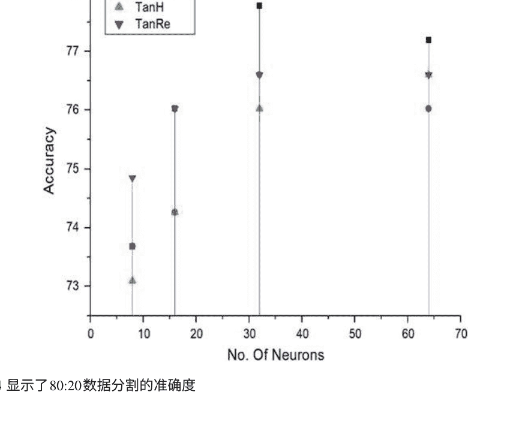

图4 显示了80:20数据分割的准确度

| 神经元数量 | ReLU | Leaky ReLU | TanH | TanHRe |
|:---:|:---:|:---:|:---:|:---:|
| 8 | 0.57 | 0.6 | 0.5 | 0.57 |
| 16 | 0.63 | 0.55 | 0.54 | 0.66 |
| 32 | 0.7 | 0.71 | 0.72 | 0.66 |
| 64 | 0.66 | 0.64 | 0.63 | 0.68 |

| 神经元数量 | ReLU | Leaky ReLU | TanH | TanHRe |
|:---:|:---:|:---:|:---:|:---:|
| 8 | 0.08 | 0.06 | 0.45 | 0.23 |
| 16 | 0.26 | 0.21 | 0.26 | 0.21 |
| 32 | 0.3 | 0.21 | 0.17 | 0.26 |
| 64 | 0.30 | 0.23 | 0.30 | 0.23 |

根据表5，基于ELM分类器的提出方法实现了77.77%的准确度，这是同领域先前发表研究中最高的准确度。因此，我们可以推断出以ELM作为分类器创建的肝病检测模型在预测方面表现最好，并且可以应用于医疗领域。通过在不同数据集上运行提出的模型，可以扩展当前工作。

表4 80:20数据分割的 F1-Score

| 神经元数量 | ReLU | Leaky ReLU | TanH | TanHRe |
|---|---|---|---|---|
| 8 | 0.15 | 0.11 | 0.47 | 0.33 |
| 16 | 0.36 | 0.31 | 0.35 | 0.32 |
| 32 | 0.42 | 0.33 | 0.28 | 0.37 |
| 64 | 0.41 | 0.34 | 0.41 | 0.35 |

表5 基于准确度对提出方法与其他作者的工作进行比较

| 作者 | 数据集 | 机器学习技术 | 准确率 (%) |
|---|---|---|---|
| Thirunavukkarasu等人 [4] | ILPD | 逻辑回归，支持向量机，K-最近邻 | 73.97 |
| Nazmun等人 [5] | ILPD | J48, LMT, RF, RT, REPTree, DS, Hoeffding Tree | 70.67 |
| Sanjay等人 [6] | ILPD | K-最近邻，K-均值，朴素贝叶斯，C5.0，随机森林 | 75.19 |
| Somaya等人 [7] | 埃及国家控制病毒毒性肝炎委员会数据库 | 粒子群优化，决策树，多线性回归和遗传算法模型 | 69.6 |
| Sumedh等人 [8] | ILPD | 支持向量机，反向传播 | 73.2 |
| Sa'diyah等人 [9] | ILPD | 决策树C4.5，朴素贝叶斯和NBTree | 67.01 |
| 提出的方法论 | ILPD | 极限学习机器（ELM） | **77.77** |

## 6 结论

众所周知，早期发现肝病可以帮助一个人过上健康而长寿的生活。我们可以通过一个高准确性和高效率的模型来帮助医疗部门预测肝病，因为手动分析是一项耗时的任务。我们使用极限学习机（ELM）分类器创建了一个肝病模型。本文中的预测模型。因为它使用的是前馈方法而不是反向传播，所以与其他神经网络相比，它是一种快速学习算法。由于其快速速度、强大的泛化能力和易于实现，ELM通常优于其他方法来解决人工智能问题。

## 参考文献

- 1. Riva, M. A., Riva, E., Spicci, M., Strazzabosco, M., Giovannini, M., & Cesana, G. (2011). Hepar城：现代肝脏名称的仪式、美食和政治起源。肝病学杂志, 55(5), 1132–1136。
- 2. Abdel-Misih, S. R., & Bloomston, M. (2010). 肝脏解剖。北美外科诊所, 90(4), 643–653。
- 3. Crawford, J., Bioulac-Sage, P., & Hytiroglou, P. (2018). 结构、功能和对损伤的反应。
- 4. https://www.healthline.com/health/liver-failure-stages
- 5. Thirunavukkarasu, K., Singh, A. S., Irfan, M., & Chowdhury, A. (2018). 使用分类算法预测肝病。 在第四届计算机通信与自动化国际会议(ICCCA)(pp. 1–3)。
- 6. Kumar, S., & Katyal, S. (2018). 通过数据挖掘进行肝脏疾病的有效分析和诊断。在计算应用的创新研究国际会议(ICIRCA)中(第1047–1051页)。
- 7. Sontakke, S., Lohokare, J, & Dani, R. (2017). 使用机器学习诊断肝病。 在ICT新趋势与创新国际会议(ICEI)中(第129-133页)。
- 8. Alfisahrin, S. N. N. & Mantoro, T. (2013). 数据挖掘技术优化肝病分类。 在高级计算机科学应用与技术国际会议中(第379-384页)。
- 9. Nahar, N., & Ara, F. (2018). 使用不同决策树技术预测肝病。 数据挖掘与知识管理过程国际数据挖掘与知识管理过程国际期刊, 8, 01–09。
- 10. Hashem, S., et al. (2018). 比较机器学习方法预测慢性丙型肝炎患者的晚期肝纤维化。 IEEE E/ACM计算生物学和生物信息学交易, 15(3), 861–868。
- 11. Kim, J., Shin, H., Lee, Y., & Lee, M. (2007). 使用极限学习机和主成分分析进行心律失常分类的算法。在IEEE工程医学生物社会会议论文集2007年(pp. 3257–3260)中。
- 12. Yang, J., Xie, S., Yoon, S., Park, D., Fang, Z., & Yang, S. (2013). 基于极限学习机的指纹匹配。神经计算与应用(pp. 435–445)。
- 13. Guang-Bin, H., Qin-Yu, Z., & Chee-Kheong, S. (2006). 极限学习机：理论和应用。神经计算，489–501。
- 14. Huynh, H., & Won, Y. (2009) 在IEEE国际机器人与自动化计算智能研讨会CIRA(pp. 469–473)中，用于单隐藏层前馈神经网络的在线训练RLS-ELM。
- 15. 王杰，卢思，王思豪等.(2021) 极限学习机综述。多媒体工具应用。
- 16. UCI数据集，http://archive.ics.uci.edu/ml/machine-learning-databases/00225/
- 17. Ravuri, S.V., & Vinyals, O. (2019). 条件生成模型的分类准确率得分。NeurIPS。
- 18. Powers, D. M. W. (2011). 评估：从精确度、召回率和F-度量到ROC、信息度、标记度和相关性。J Mach Learn Technol 2, 37–63.

# 使用机器学习从肺癌数据中识别预测因子

Anu Maria Sebastian 和 David Peter

摘要 肺癌是世界上最常见的致死性癌症之一。晚期诊断会导致癌症迅速扩散到身体的其他器官，并且变得危及生命。研究表明，晚期诊断的肺癌患者的五年生存率仅为4%，仅约有16%的病例在早期被诊断出来。导致肺癌晚期诊断的主要原因是最初的临床症状经常被忽视为无关紧要。肺癌诊断的广泛使用方法是放射组学。然而，放射组学费用昂贵，反复接受放射组学本身也存在风险。此外，在大多数情况下，放射组学被发现是在晚期进行的。临床数据的使用是肺癌早期诊断的一种可能替代方法。在这项工作中，我们尝试使用机器学习（ML）技术从临床肺癌数据中识别预测因子。通过二次数据分析，我们从临床数据中确定了最有影响力的肺癌预测因子。这些预后标志物可以帮助早期发现肺癌。达到指定标记值的患者可以被分类为潜在的高风险肺癌群体。在我们的方法中，首先对数据进行预处理，并应用数据过滤方法进行特征选择。然后，我们应用了支持向量机（SVM）和随机森林（RF）等机器学习模型来对患者进行分类。

- 预后标志
- 属性选择
- 机器学习
- 肺癌诊断
- 特征降维
- 特征重要性

## 1 引言

致癌物质常常刺激肺部器官中无节制的细胞分裂，导致肺部出现威胁生命的肿瘤，从而引发肺癌。癌症可以由遗传疾病、久坐的生活方式和饮食引起。习惯，或者是人们消费有毒和不健康食品的习惯。通过治疗存活的机会与该疾病的检测阶段直接相关，越早越好。一旦正确检测出来，患者必须接受适当的治疗课程以增加存活的机会。根据国际癌症研究机构的“GLOBOCAN系列”统计数据，2012年全球新增癌症病例为1410万例，死亡病例为820万例。根据他们的统计数据，最高的诊断癌症是肺癌，有182万例，乳腺癌有167万例，结直肠癌有136万例[1]。在各种癌症中，肺癌的死亡率增长速度令人担忧（160万例死亡），相比之下，肝癌（745,000例死亡）和胃癌（723,000例死亡）的死亡率较低。根据“美国癌症协会2022年报告”，在美国，男性和女性分别发现了117,910例和118,830例肺癌新病例。肺癌导致的死亡病例约为男性68,820例和女性61,360例[2]。肺癌的五年生存率在疾病仍局限于肺部时为55%。65岁及以上的人群中，肺癌的死亡率最高。在45岁之前被诊断为肺癌的人群比例非常低。肺癌检测的平均年龄为70岁[3]。肺癌早期检测的百分比仅约为16%。如果发生转移，五年生存率据说只有4%[1]。

在发达国家，男性吸烟导致的肺癌比例超过90%，女性约为70%。肺癌早期症状常被视为常见疾病而被忽视。来自“伦敦大学癌症研究所”的肿瘤学家说：“人们忽视咳嗽，常常在转移病情时才来到我的诊所，但到那时有效的治疗可能已经无法实现[4]。”肺癌的初期症状往往被误认为是其他疾病的迹象，例如严重咳嗽或疲劳常被视为无关紧要。临床分期在确定治疗和生存概率方面起着决定性作用。因此，指南定期根据可用数据进行修订，以确定确切的预测因素，以支持早期诊断[5]。

所有的临床医生可能不如领域专家熟练，无法诊断肺癌的早期症状。放射筛查是一种广泛使用的非侵入性肺癌诊断方法，通常只在后期进行，因为最初的症状会被忽视为其他健康问题[6-9]。放射组学的主要局限性包括获取参数的标准化缺乏、放射组学方法之间的不一致性以及缺乏可重复性。研究人员正在努力克服这些局限性[10]。特别是低剂量计算机断层扫描（LDCT）筛查过程中的总体电离辐射暴露可能导致实体肿瘤和白血病的发病率增加[11]。计算机断层扫描（CT）成像涉及辐射以寻找肺癌，但也有可能引发肺癌[12]。LDCT筛查的另一个明显缺点是其假阳性率增加（FPR增加）[13]。鉴于低剂量CT筛查的高成本、累积辐射暴露和高假阳性率引起的担忧，最近的研究更加关注于识别早期检测肺癌的替代方法。

机器学习在医疗保健领域具有巨大的相关性，因为它能够处理大量数据并将其转化为临床见解。它使用算法从医疗保健数据中学习模式，进行疾病的检测、预测和分类[14]。 Syed等人[15]使用机器学习技术开发了一个早期检测乳腺癌的系统。在他们的实验结果中，多层感知器是最优的分类器，其次是RF和KNN。 Hornbrook等人[16]开发了一个基于机器学习的结直肠癌检测和分类算法。该模型在检测右侧（而不是左侧）结直肠癌方面表现出色。张等人[17]从尿样中发现了一组用于检测肺癌的生物标志物。使用皮尔逊相关系数来选择生物标志物。RF算法使用了五个生物标志物，可以将肺癌患者与对照组以及其他癌症患者区分开来。从文献中我们可以看出机器学习在癌症检测和分类中的重要作用。

## 2 材料和方法

### 2.1 数据描述

对于增加肺癌风险，[18]考虑的可信风险因素有“年龄、饮酒状况、有害化学物质、慢性肺炎炎症、饮食、激素、免疫抑制、感染因子、肥胖、辐射和烟草”。本研究使用的数据是来自Dataworld存储库[19]的二次肺癌临床数据。该数据集有1000条记录，包含24个输入属性，即“患者ID”，“年龄”，“性别”，“空气污染”，“饮酒情况”，“尘埃过敏”，“职业危害”，“遗传风险”，“慢性肺病”，“均衡饮食”，“肥胖”，“吸烟”，“被动吸烟者”，“胸痛”，“咳血”，“疲劳”，“体重减轻”，“呼吸困难”，“喘息”，“吞咽困难”，“手指甲凹陷”，“频繁感冒”，“干咳”，和“打鼾”。在这24个输入属性中，患者ID是字符串类型，其余属性都是整数类型。在工作开始时，患者ID属性被移除，因为它被认为与预后标志的识别无关。目标变量具有多类标签，代表健康、良性和恶性病例的记录。健康类的百分比为30.3%，良性类的百分比为33.2%，恶性类的百分比为36.5%。图1显示了数据集中每个类别的饼图表示。

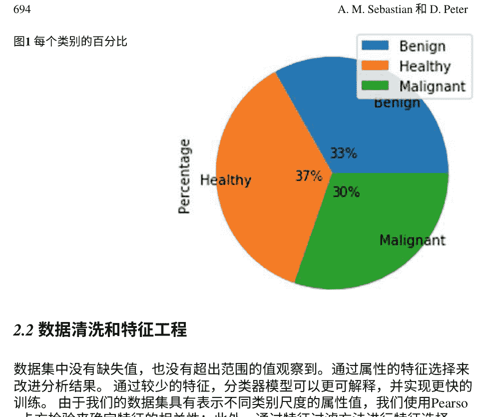

### 2.2 数据清洗和特征工程

数据集中没有缺失值，也没有超出范围的值观察到。通过属性的特征选择来改进分析结果。通过较少的特征，分类器模型可以更可解释，并实现更快的训练。由于我们的数据集具有表示不同类别尺度的属性值，我们使用Pearson卡方检验来确定特征的相关性；此外，通过特征过滤方法进行特征选择。数据中的所有属性值都具有相同的尺度，因此不需要进行数据转换处理。

### 2.3 机器学习模型

我们首先使用支持向量机（SVM）分类器进行分类，因为它能够基于其核函数选择来探索线性和非线性分类。我们观察到径向基函数（rbf）核函数比线性核函数具有更好的性能。这个观察结果表明输入特征和输出变量之间存在非线性关系。因此，我们使用了最好的非线性分类器之一，随机森林（RF），来对数据进行分类。我们探索了RF在二元分类和多类别情况下的分类性能。在二元分类的情况下，目标类别被修改为风险和非风险类别。风险类别代表癌症肿瘤组，非风险类别分别代表良性和健康组。

图2展示了研究的工作流程。

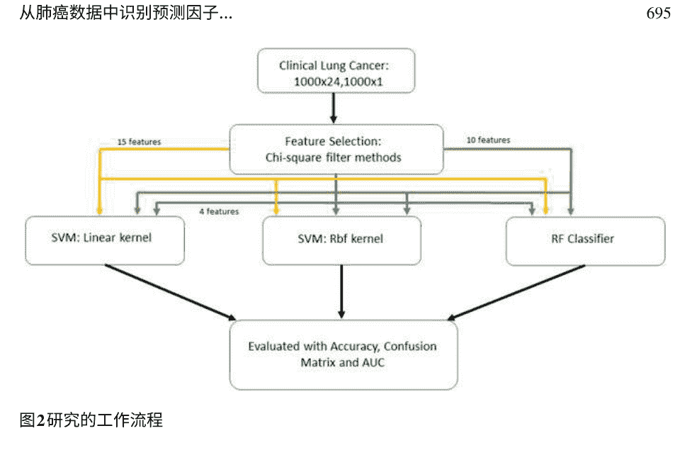

图2 研究的工作流程

使用皮尔逊卡方排名选择的特征上的过滤方法探索了不同特征数量下的性能。观察到在23个特征中，最少四个显著特征可以有效地对组进行高准确度分类。

### 2.4 模型评估

我们用准确度、精确度、召回率、F1分数和接收者操作特性-曲线下面积（ROC-AUC）得分来评估分类器的性能。

- 准确率 = 真正例 / (真正例 + 真负例) × 100.
- 精确率 = 真正例 / (真正例 + 假正例)
- 召回率 = 真正例 / (真正例 + 假反例)
- F1分数 = (2 × 精确率 × 召回率) / (精确率 + 召回率)
- ROC-AUC曲线绘制了敏感性 v/s 1-特异性的图形。
- 敏感性 = 真正例 / (真正例 + 假反例)
- 特异性 = 真负例 / (真负例 + 假正例)

## 3 结果

本节描述了本研究中获得的观察和结果。对于特征选择，变量的卡方分数分别为 6.284, 3.5, 173.884, 518.093, 354.673, 304.089, 323.916, 164.548, 215.19, 411.465, 94.193, 252.622, 251.709, 357.015, 319.856, 206.541, 311.004, 166.498, 113.034, 234.386, 168.197, 99.441, 分别为91.34。基于这些分数，最初筛选出了前15个属性，包括“尘埃过敏，吸烟，疲劳，职业危害，慢性肺病，体重减轻，喘息，遗传风险，胸痛，咳血，频繁感冒，肥胖，呼吸急促，饮酒和干咳”。这些特征经过进一步的筛选，直到分类准确率开始下降。因此，决定记录分类的影响因素数量被减少到四个。对于多类别分类，SVM线性核分类器的准确率达到了87%，SVM-rbf核分类器的准确率达到了96%，而RF分类器的准确率达到了100%。表1，2和3分别给出了SVM线性，SVM-rbf和RF分类器的分类性能指标。

表1 SVM（线性）的多类分类准确率

|   | 精确度 | 召回率 | F1得分 | 支持 |
|---|--------|--------|--------|------|
| 0 | 0.90   | 0.73   | 0.80   | 96   |
| 1 | 0.77   | 0.84   | 0.81   | 106  |
| 2 | 0.93   | 1.00   | 0.97   | 128  |
| 准确率 |        |        | 0.87   |      |

表2 SVM（rbf）的多类分类准确率

|   | 精确度 | 召回率 | F1得分 | 支持 |
|---|--------|--------|--------|------|
| 0 | 0.93   | 0.94   | 0.93   | 96   |
| 1 | 0.94   | 0.93   | 0.94   | 106  |
| 2 | 1.00   | 1.00   | 1.00   | 128  |
| 准确率 |        |        | 0.96   |      |

表3 RF分类器的多类分类准确率

|   | 精确度 | 召回率 | F1得分 | 支持 |
|---|--------|--------|--------|------|
| 0 | 1.00   | 1.00   | 1.00   | 96   |
| 1 | 1.00   | 1.00   | 1.00   | 106  |
| 2 | 1.00   | 1.00   | 1.00   | 128  |
| 准确率 |        |        | 1.00   |      |接下来，我们得到了包含真阳性、假阳性、真阴性和假阴性的混淆矩阵，如图3所示。从SVM-线性分类器的混淆矩阵中可以观察到，在健康组和良性组之间，模型存在更多的模糊性。

在下一节中，我们使用数据的二元分类（有风险的（癌症）和无风险的（非癌症）组）来评估模型的性能。为了执行此操作，我们将健康和良性数据组合成一个非风险类。图4显示了三个分类器模型进行二元分类所得到的混淆矩阵。可以观察到SVM线性分类器增加了假阳性，而SVM-rbf分类器增加了假阴性。在癌症检测中，假阴性的影响更严重，因此应该将其最小化。

SVM线性核和rbf核分类器的ROC-AUC值均为0.96，而RF分类器为1。图5显示了每个分类器的ROC-AUC曲线。

AUC的最大值为1，在这项工作中，RF模型已经达到了最大值。因此，不需要进一步研究像神经网络这样的高级模型的性能。从所得结果可以推断出，多类分类倾向于展示非线性关系。

输入属性和输出变量之间的关系。当使用非线性分类器SVM-rbf而不是SVM-linear时，分类准确率明显提高。RF模型的性能最好，准确率达到100%。在二元分类的情况下，两个SVM分类器的准确率都为96%。RF分类器再次达到100%的准确率。

图6和图7显示了基于RF分类器的信息增益的特征重要性排名，分别使用了四个特征和15个特征。根据这个结果，排名靠前的特征是咳血、肥胖、吸烟和胸痛。这个结果与卡方相关特征排名不同。当我们使用从RF模型得到的特征排名探索分类准确率时，SVM-linear模型的准确率降低到81%，SVM-rbf模型的准确率降低到93%。因此，我们建议选择通过Pearson卡方检验获得的四个关键特征，如尘埃过敏、吸烟、疲劳和职业危害，作为分类模型的主要预测因子。

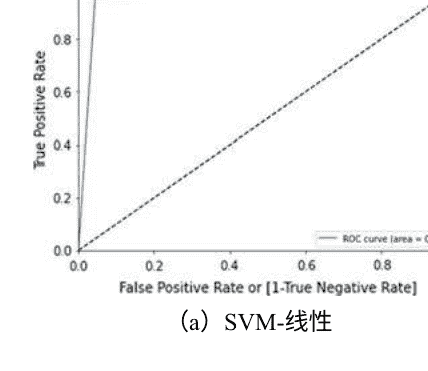

(a) SVM-线性

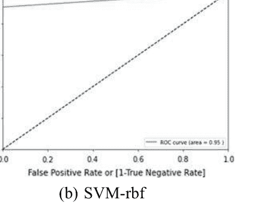

(b) SVM-rbf

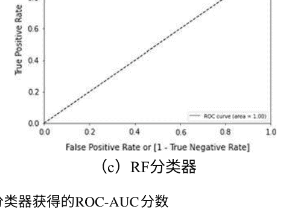

(c) RF分类器

图5 通过SVM和RF分类器获得的ROC-AUC分数

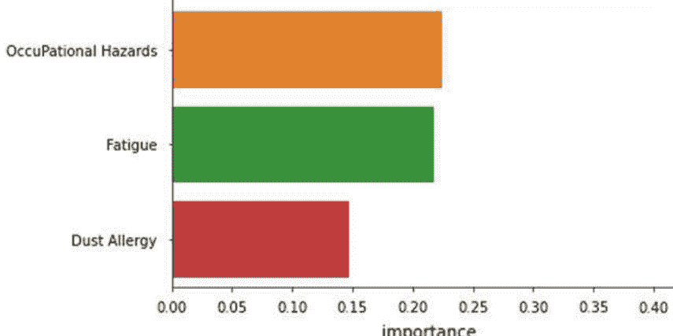

图6 基于信息增益的四特征数据集的特征排序

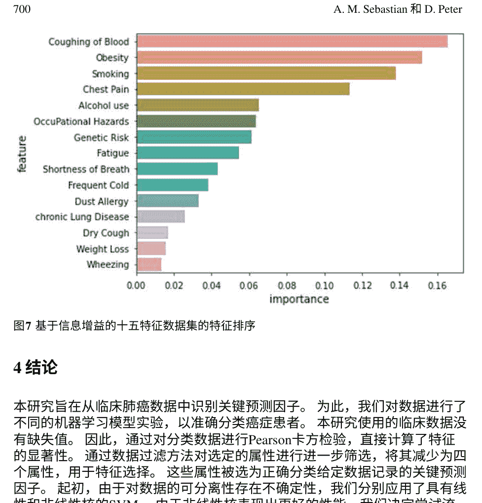

图7 基于信息增益的十五特征数据集的特征排序

## 4 结论

本研究旨在从临床肺癌数据中识别关键预测因子。 为此，我们对数据进行了不同的机器学习模型实验，以准确分类癌症患者。 本研究使用的临床数据没有缺失值。 因此，通过对分类数据进行Pearson卡方检验，直接计算了特征的显著性。 通过数据过滤方法对选定的属性进行进一步筛选，将其减少为四个属性，用于特征选择。 这些属性被选为正确分类给定数据记录的关键预测因子。 起初，由于对数据的可分离性存在不确定性，我们分别应用了具有线性和非线性核的SVM。 由于非线性核表现出更好的性能，我们决定尝试流行的非线性RF分类器来评估性能。 根据结果，RF分类器获得了最高的分类性能，准确率达到100%。 在这项工作中，从数据中确定了肺癌的关键预后标志物，包括尘埃过敏、吸烟、疲劳和职业危害。 这些标志物可以用于早期诊断肺癌患者，通过及时的医疗干预来提高生存率。 然而，现实世界的临床数据可能无法与该数据相同的尺度进行量化，而且可能存在缺失或错误的数据。 这可能是将此推论应用于实践中的一个限制。 但是，本文中使用的方法可以重新应用于相关的临床肺癌数据，以获得所需的结果。 为了确保我们的研究结果的普适性，需要对更多的临床数据集进行实验。这被提议作为未来研究的一个课题。

## 参考文献

- 1. Ferlay, J., Soerjomataram, I., Dikshit, R., Eser, S., Mathers, C., Rebelo, M., Bray, F., 等 (2015). 全球癌症发病率和死亡率: 来源、方法和主要模式 GLOBOCAN 2012。国际癌症杂志, 136(5).
- 2. 肺癌关键统计数据, 美国癌症协会 (2022). https://www.cancer.org/cancer/lung-cancer/about/key-statistics.html
- 3. SEER癌症统计数据表: 肺癌和支气管癌. 国家癌症研究所. 可在http://seer.cancer.gov/statfacts/html/lungb.html访问。2020年4月6日访问。
- 4. Elizabeth, S., (2020). 深度学习提供早期检测引文。自然文章。
- 5. Lim, W., Ridge, C., Nicholson, A., & Mirsadraee, S. (2018). 第8版肺癌TNM分类和临床分期系统：变化回顾和临床意义。医学与外科的定量成像, 8(7), 709–718. https://doi.org/10.21037/qims.2018.08.026. Samuel, M. (2020). 肺癌的早期诊断与恶性概率计算和肺部CT扫描图像的自动分割。创新图像处理杂志(JIIP), 2(04), 175–186。
- 6. Samuel, M. (2020). 肺癌的早期诊断与恶性概率计算和肺部CT扫描图像的自动分割。创新图像处理杂志(JIIP), 2(04), 175–186。
- 7. Sungheetha, A, & Rajesh, S. R. (2020). 比较研究：肺部CT图像分割的统计方法和深度学习方法。创新图像处理杂志, 2, 187–193。
- 8. Vijayakumar, T. (2020). 使用新型深度卷积神经网络的姿态逆问题矫正。创新图像处理杂志（JIIP），2（03），121-127。
- 9. Smys, S., Chen, J. L. Z., & Shakya, S. (2020). 具有深度学习的神经网络架构调查。软计算范式杂志（JSCP）2（03），186-194。
- 10. Thawani, R., McLane, M., Beig, N., Ghose, S., Prasanna, P., Velcheti, V., & Madabhushi, A. (2017). 肺癌的放射组学和放射基因组学：临床医生的综述。肺癌。
- 11. Mascalchi, M., & Sali, L. (2017). 低剂量CT肺癌筛查和预测模型对癌症发病率的辐射伤害。转化医学年鉴, 5（17）。
- 12. Midthun, D. E. (2016). 肺癌的早期检测。F1000研究, 5。
- 13. Kadir, T., & Gleeson, F. (2018). 使用机器学习和先进的成像技术进行肺癌预测。转化性肺癌研究, 7(3), 304–312。https://doi.org/10.21037/tlcr.2018.05.15
- 14. Sebastian, A. M. & Peter, D. (2019). 评估机器学习技术在癌症检测和诊断中的性能。数据工程和通信技术讲义, 46。
- 15. Syed, L., Jabeen, S., & Manimala, S. (2017). 远程乳腺摄影：一种基于小波的早期乳腺癌检测新方法和机器学习技术。在图像处理中的软计算和机器学习进展 (pp. 149–183)。
- 16. Hornbrook, M., Goshen, R., Choman, E., O’Keeffe-Rosetti, M., Kinar, Y., Liles, E., & Rust, K. (2017). 通过使用性别、年龄和完整血细胞计数数据，机器学习模型检测到早期结直肠癌。消化疾病与科学, 62, 2719–2727。
- 17. Zhang, C., Leng, W., Sun, C., Lu, T., Chen, Z., Men, X., Wang, Y., Wang, G., Zhen, B., & Qin, J. (2018). 尿液蛋白质组学分析预测肺癌和对照组及其他肿瘤。EBioMedicine, 30, 120–128。
- 18. 国家卫生研究院和国家癌症研究所。 (2015). 癌症风险因素。 美国。 https://www.cancer.gov/about-cancer/causes-prevention/risk
- 19. DataWorld Repository. https://data.world/cancerdatahp/lung-cancer-data

# 图像、视频和实时视频流中的尺寸识别

M. Kathiravan, R. G. Sakthivelan, S. Saravanan, S. G. Hari Hara Sudhan, M. Vasanth和C. S. Abishek

摘要 本文提出了一种用于自动识别视频传输和图像的模糊图像识别和检测系统。 本研究通过使用图像色调、斜率和范围数据开发了几个模糊特征模型，并对录像和图像进行了快速傅里叶变换以识别模糊。 此外，所提出的研究还利用了快速傅里叶变换计算，该计算作为所提出方法的基础内置于NumPy中。

广泛的研究表明，所提出的策略在测试图像数据上表现良好，为解决计算机视觉问题（如运动分析和图像恢复）提供了技术基础，利用了模糊信息。

关键词模糊检测技术 ·傅里叶变换 ·头发小波变换 ·改进的拉普拉斯 · Tenengrad

## 1 引言

本文围绕识别和部分解析模糊图像展开，并提出了一种智能技术来自动识别模糊图像，去除可能的模糊区域，并进一步将其分为两类，即近似各向同性模糊和方向运动模糊。 所提出的策略致力于解决两个重要问题。 一个是同时提取模糊区域的模糊识别。 这一步骤的结果有助于图像数据的显著水平，与各种基于区域的图像应用程序一起工作，例如基于内容的图像检索，基于对象的图像压缩，视频对象提取，图像增强和图像分割。它还可以用作估计捕获图像质量的规则之一。提出的策略的第二级是自动将识别的模糊区域分为两种类型：近似各向同性模糊（不包括中心外的模糊）和定向运动模糊。这两个类别的图像被分类，因为它们在图像恢复中最受关注。模糊定义的图像还可以通过运动分析和图像重建有效地跟踪。最近，图像模糊分析的主题引起了人们的关注，大部分先前的工作都集中在解决去模糊问题上。一般的模糊识别与众不同，很少被研究，离实用还有很长的路要走。Regna等人引入了一种学习方法，用于在单个图像中对有模糊或无模糊区域进行分类。这种策略依赖于一个观察，即有模糊区域对低通滤波更不变。在我们的实验中，我们观察到仅仅使用这些信息是不足以设计一个可靠的分类器的。不同的模糊度测量方法应该结合起来，以实现良好的模糊识别。此外，这种方法不能识别模糊类型。使用信息倾向度的度量以及不同的方向，该技术通过考虑近似模糊部分来构建能量函数，将图像分割为模糊/清晰层。这种方法仅通过推断方向性模糊块来揭示运动模糊区域。其他模糊评估方法，例如在提出的方法中，仅提供模糊程度的比例，无法直接区分有模糊和无模糊区域。

## 2 文献调查

透明度期间相机抖动导致可怕的黑暗图像和残留在许多图像中。标准的外部削弱反卷积技术通常假设图像上的重复空间目标或过于处理参数化设计以处理相机抖动期间的运动路径。真实的相机运动-可以跟踪12条复杂的路径，并且空间区域先验可以立即意识到显著不同的图像特征[1]。该过程介绍了从真实模糊图像中消除相机抖动的效果。该方法假设图像上有均匀的相机变暗和一个最小的平面内相机来干扰。为了测量相机抖动引起的模糊度，用户应该选择一个没有浸润效果的图像区域。这项研究工作展示了从个人图像序列中获取的一组自动化图像的结果[2]。

黑暗是图像获取中最常见的畸变类型之一。图像去模糊一直被认为是提高模糊图像质量的有效方法。然而，对图像去模糊测量和去模糊图像的感知评估的研究工作很少。在本文中，我们对一张图片进行了理论和客观的检查，以模糊和去模糊[3]。首先，使用最先进的图像模糊去模糊算法创建了一个模糊去模糊图片信息索引（DDID），并进行了情感测试以收集图片的人类评估。然后，根据情感评分评估了去模糊算法的展示。

考虑到当前图像质量评估仅限于预测模糊去模糊图片的质量，提出了一种基于灰度共生矩阵（GLCM）的质量改进模块，该矩阵主要用于检查去模糊所达到的表面光滑度的缺失。基于DDID数据集的初步结果显示了所提出技术的有效性。

提出了一种基于图像的车辆速度测定证明方法[4]。标准速度评估技术使用雷达或激光设备，这些设备通常更昂贵，并且在离线摄像机结构上显示不同。在这项工作中，使用一张带有车辆运动的单张图片进行速度评估。由于摄像机的曝光时间内摄像机与移动物体之间的整体运动，在图像的新颖区域中会出现黑色运动。这为移动物体的速度评估提供了明显的线索。

首先，一个模糊的目标区域被隔离出来，并从开发的模糊子图中评估出模糊限。然后，图像被去模糊并用于确定各种限制。最后，车辆的成像数学、摄像头行为和图像中的模糊并不是完全确定的。测试表明，评估速度与实际速度相差不超过5%，无论是附近还是道路交通。

基于运动模糊的速度估计工作中的一个关键进展是水平模糊度的计算。本文提出了一种使用图像抠图和透明度图来满足这种计算的原始方案，当出现散焦模糊和运动模糊，并且对于具有复杂形状边缘的移动物体进行稳健而准确的计算[5]。

比放大仪视场深度更厚的成像样本会产生低质量的图像，因为只有样本的一部分在中心位置。因此，即使在最好的照片中，也经常有模糊不清的物体，因此变得模糊不清。准确地量化模糊物体的大小、形状和限制是具有挑战性的。因此，通常需要几个光学部件来准确测量样本的整体功率分布。

为了克服这个问题，我们提出了一种原始技术，通过在小波空间中利用多尺度点积（MPP）度量来结合几个光学区域，从而增加场的深度。大多数现有的组合技术依赖于仅由边缘产生的度量，并且不能区分来自噪声的信号。我们的MPP模型确保信号内容而不是噪声被收集。我们不直接合并光学区域，而是通过执行局部平面去模糊来预处理图像，从而消除模糊内容并合并中心物体。总体设计提供了具有增加景深的无与伦比的高质量图像，但合并后的图像对噪声不敏感。实验结果在主观和定量上都表明，我们的方法在文献[6]中超过了现有的方案。

在这里，引入了一种适应性信息驱动的无应用技术来扩展领域的深度。这项工作的关键贡献是利用经验模态分解[7]提取的特征，特别是固有模态图像进行组合。信息图像退化为固有模态图像，并且通过允许在每个信息图像中强调中心区域的加权方案对提取的振荡模式进行组合。综合图像将来自每个中心平面的信息绑定在一起，同时保持场景的逼真度。为了验证我们方法的组合性能，我们将结果与基于区域和多尺度分解的组合方法进行了对比。

在传统的多中心图像组合方法[8]中，由中心度量创建的中心图通常对错配和噪声敏感，或者产生不良对齐的边界。虽然许多最先进的计算方法使用更复杂的技术或系统来解决这个问题，但我们在本文中提出直接从使用小范围和大范围中心度量获得的两尺度有缺陷的感知图像（中心图）中估计中心图。这将利用两尺度观察到的中心图的相应特性，即对错配（和噪声）的稳健性和更好的对齐边界，从而实现更强大的组合。评估首先从概率的角度进行，使用基于随机游走的计算方法，我们试图解决每个中心图像像素与观察到的像素相关的概率。然后我们发现这种方法与解决另一个目标任务相同，从而在计算效率和评估结果方面实现了巨大的提升。实验结果表明，所提出的方法是一种强大而高效的对比和先进的组合策略。

本文[9]提出了一个用于多焦点图片组合的原始基于区域的系统。核心思想是将信息图片中的中心区域分割出来，并将它们合并成一个全中心图片。为此，我们提出了三个对组合循环的直观限制，并将它们建模为三个能量项，即重构误差、离中心能量和完美正则化。然后，这三个项被设计成一个优化问题，以解决一个分割图。我们还提出了一种积极的算法来限制目标函数，该算法使用粗到细的过程在分割图中更新每个像素。最终，通过使用分割图将每个源图片中的分割中心区域合并起来，我们得到了交织的图片。我们的方法可以产生更少的伪影，从而得到一致的结果。我们的方法在多种混合和真实图片上击败了现有的方法。

由于场景的浅深度，模糊的基础常常是模糊的，例如肖像照片。然而，小型易用相机由于其镜头的小宽度，无法产生足够的虚化效果。我们提出了一种图像处理方法，可以增加图像的虚化效果，以模拟具有较大光圈的镜头的浅深度。我们的方法评估图像上模糊的空间变化量，然后使用简单的基于图像的方法增加虚化效果。我们首先估计边缘处的模糊部分的大小，然后传播这个模糊量在图片上方。利用我们的模糊图，我们增强了当前的模糊度，这意味着我们模糊了模糊区域并保持清晰区域的清晰。与更困难的问题（例如从模糊中获得深度）不同，我们不需要精确的深度评估，也不需要在较少的区域中消除纹理[10]。

在最近几年中，清晰恢复的概念成为了许多研究的焦点。许多系统被引入到一起，以实现图像索引。最常见的方法之一是注册一个分区并从区域中提取各种参数。然而，这个分区步骤是基于低级别的信息，没有考虑到图像的基本感知部分，比如模糊。当摄影师决定只关注场景中的某些物体时，他会考虑这些物体与场景中其他物体的不同之处。这并不涉及相同数量的信息。图像恢复工具通常将模糊区域视为特定情况，而不是信息容器。我们的想法是通过将焦点仅限于非模糊区域来集中关注图像之间的比较，利用这种元信息[11]。我们的目标是引入多种因素和人工智能方法，以实现场景图像中的模糊识别。

我们解决了单一图像中由于移动物体引起的视觉障碍运动去模糊问题。在这种情况下，图像的一部分可能被模糊，场景由不同程度的模糊层组成。目前大部分的运动去卷积研究都集中在恢复整个图像的单一模糊部分上。然而，由于存在多个运动，用单一一部分无法准确表示模糊，试图用相同的部分对整个图像进行去卷积将导致严重的异常。因此，去模糊任务需要将图像划分为具有不同模糊的区域。我们的方法[12]基于这样的信念，即图像中的导数通道的特征在模糊方面有根本的不同。我们可以将搜索范围缩小到一个分层盒子滤波器模糊。这使我们能够将平均导数分布表示为模糊部分的宽度的一个元素。这些分布在区分具有不同模糊点的区域方面非常有效。该方法在具有丰富纹理的真实图像上产生令人信服的去卷积结果。

在本文[13]中，我们提出了一个部分模糊图像分类和调查系统，用于区分具有模糊区域的图像并识别这些区域的模糊类型，而无需执行模糊分割评估和图像去模糊。我们提出了几个模糊特征，包括图像色调、梯度和频谱信息，我们的应用包括边界训练，以鲁棒地对模糊图像进行分类。我们的模糊检测基于图像块，使得对图像进行区域化训练和分类更加高效。

广泛的测试表明我们的技术在测试图像数据上工作得很好，为处理一些计算机视觉问题，如运动分析和图像恢复，提供了专门的起点，使用模糊数据。

许多数字图像包含由运动或散焦引起的模糊区域。模糊的自动检测和组织。

图像位置对于各种媒体分析项目至关重要。本文介绍了一种简单而成功的编程图片模糊区域识别和分组方法[14,15]。在提出的方法中，首先通过分析每个图片像素的单个值来识别模糊的图片区域。然后根据一个特定的 alpha 通道要求来确定模糊类型（例如运动模糊或焦点模糊），这不需要图片去模糊或模糊位评估。已经对一个数据集进行了广泛的测试，该数据集包括200个模糊的图片区域和200个没有模糊的图片区域，这些区域是从100个数字图片中提取的。实验结果表明，所提出的方法能够准确地识别和分类这两种类型的图片模糊。所提出的方法可以在各种多媒体分析应用中使用，如图片分割、深度评估和信息恢复[16]。

晦涩的问题引出了一个重要的问题-如何区分模糊和清晰的图像区域？我们通过关注图像梯度、傅里叶域和数据驱动的邻域滤波器中的一些模糊特征表示来解决这个问题。与以前的技术不同，我们的特征设计旨在提高判别能力并适应图像中不同的模糊尺度。为了帮助评估，我们创建了另一个具有大量带有命名真实值的图像的模糊洞察数据集。我们的结果应用于几个应用程序，包括模糊区域分割、去模糊和模糊放大[17]。

许多数字图像中存在模糊。它基本上分为两种类型：焦外模糊，由光学成像系统引起；运动模糊，由相机和场景对象之间的普通运动引起。在本文中，我们提出了一种简单而有效的程序模糊图像区域识别方法。由于模糊限制了图像的高频部分，我们提出了一种基于中值范围残差的模糊度量，并通过利用相邻图像区域的相似性的内在意义，提出了一个智能的迭代更新机制，从粗糙到精细地改进模糊度图。所提出的迭代更新机制在一定程度上解决了将中心平滑区域与模糊平滑区域区分开的问题。此外，所提出的迭代更新机制可以集成到其他图像模糊区域检测算法中，以改进最终结果。定量和定性实验结果表明，与其他先进技术相比，我们提出的方法更可靠和高效。

# 3种方法

提出了一种用于自然识别视频传输和图片的模糊图像识别和检测系统。我们使用图像色调、斜率和范围数据开发了几个雾特征模型，并使用快速傅里叶变换来识别视频和图像中的模糊。此外，我们使用内置于NumPy中的快速傅里叶变换算法作为我们方法的基础。广泛的研究表明，我们的方法在测试图像数据上表现良好，为解决多个计算机视觉问题，如运动分析和图像恢复，提供了一个专业的起点。使用雾数据，该过程如图1所示。

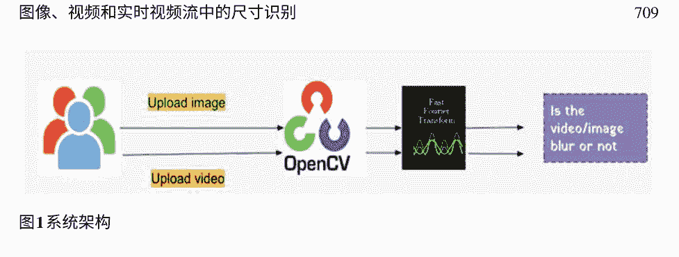

# 图1系统架构

## 4实施和结果分析

所提出的方法已经尝试解决了两个重要的问题。一个是同时提取模糊区域的模糊检测。这一步骤的结果提供了有价值的区域级别信息，可用于各种基于区域的图像应用，例如基于内容的图像恢复、基于对象的图像压缩、视频对象提取、图像增强和图像分割。它还可以作为估计捕捉图像质量的模型之一。我们方法的第二个目标是将检测到的雾区域分为两类：近似各向同性雾（包括偏离中心的雾）和方向运动模糊。我们将图像分类为这两类，因为它们在图像恢复中最常被研究。模糊分类的图像还可以通过运动分析和图像恢复找到应用。我们将图像分类为这两类，因为它们在图像恢复中最常被研究。模糊分类的图像还可以有效地应用于运动分析和图像恢复。该方法基于一个观察：模糊区域对低通滤波更不变。应该结合不同的模糊度量来实现优秀的模糊检测。使用斜率数据和多个方向，该方法根据收集的模糊部分生成一个能量函数，将图像分割为模糊或清晰的层。该方法仅通过推断方向模糊部分来检测模糊区域中的运动。其他模糊评估技术，如所提出的技术，只提供模糊程度的度量，无法直接将模糊区域与非模糊区域分离。

在这部分中，我们检查了测试结果，以便比较各种图片模糊检测技术的性能。图1显示了使用模糊检测技术后的样本结果。模糊图片的样本结果如图2所示，使用了模糊检测技术后的模糊视频的样本结果。此外，我们将提出的快速傅里叶变换（FFT）结果的准确性与其他模糊检测方法进行了比较，如毛发小波变换（HWT）、改进的拉普拉斯变换（MLAP）、拉普拉斯变换（LAP）和Tenengrad（TEN）。

使用快速傅里叶变换可以看到百分比。如果图像过于模糊或暗淡，数值将显示为红色，有时也会显示为负值。如果图片文件不太模糊或暗淡，结果将显示为绿色。结果将显示在文件的左上角。

模糊百分比在图3中显示，使用快速傅里叶变换。如果实时视频过于模糊或暗淡，数值将以红色显示，并且偶尔也会显示负值。如果实时视频不太模糊或暗淡，结果将以绿色显示。结果或输出将显示在文件的左上角。

模糊检测算法的性能比较结果显示在表1中的混淆矩阵中。根据评估结果，FFT在准确率方面取得最佳结果，其次是HWT、TEN、LAP和MLAP。就执行时间而言，LAP排名第一，其次是FFT、TEN、HWT和MLAP。图4显示了准确率报告的图形表示。

在图4中，顶部将显示欢迎消息，然后是五个选择。为了检测模糊/暗淡，我们可以从图像、视频或实时选择检测。通过在图5中选择选择文件按钮，我们可以选择并上传图像文件。上传后，我们必须选择检测选项来检测图片文件，并在弹出窗口中显示结果。

使用快速傅里叶变换可以看到百分比。如果图像过于模糊或暗淡，数值将显示为红色，有时为负数。


### 图2 图像检测输出


### 图3 实时视频检测输出

| 暗淡识别 | TN | FP | FN | TP | 准确率 (%) | 总时间 (秒) |
| :--- | :--- | :--- | :--- | :--- | :--- | :--- |
| FFT | 99 | 1 | 5 | 95 | 98 | 5.5037 |
| HWT | 94 | 6 | 6 | 98 | 94 | 1.2148 |
| MLAP | 82 | 0 | 22 | 76 | 83.70 | 0.9815 |
| LAP | 77 | 25 | 13 | 64 | 89 | 5.7934 |
| TEN | 89 | 3 | 7 | 82 | 91.80 | 3.8479 |


### 图4 网站的主页

以及数值。 如果图片文件不太模糊或暗淡， 结果将显示为绿色。 结果将显示在文件的左上角， 图6。

完成所有步骤后，此页面将显示。 一旦处理或完成结果，此窗口将打开，并显示“操作成功完成”的消息。如果收到此通知，则任务已完成。 此消息适用于视频和现实生活。 还有一个时间视频，如图7所示。

在图8中， 通过选择选择文件按钮， 我们可以选择并上传视频文件。 上传后， 我们必须选择检测选项来检测视频文件， 并在弹出窗口中显示结果。


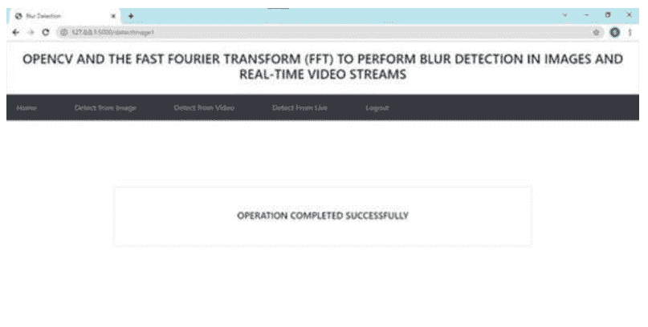

### 图7 成功完成窗口

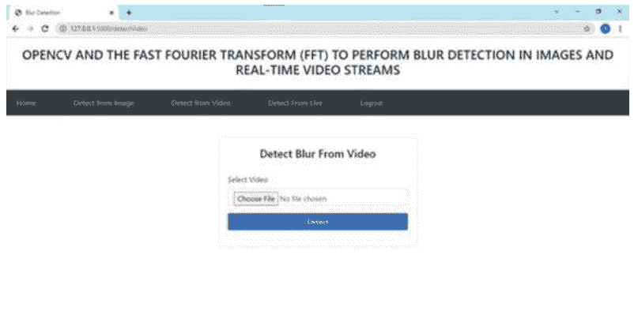

### 图8 视频检测页面

图9代表实时视频检测。在从下拉菜单中选择打开实时和检测按钮后，将显示一个弹出窗口。它能够清晰而准确地检测模糊/暗的情况。与图片和视频检测一样，结果将实时显示在同一个弹出窗口中。

图10代表了实时视频检测的输出。使用快速傅里叶变换可以看到百分比。如果实时视频过于模糊或暗淡，数值将显示为红色，有时也会显示为负值。如果实时视频不太模糊或暗淡，结果将显示为绿色。结果或输出将显示在文件的左上角。


### 图9 实时视频检测


### 图10 视频检测输出

## 5 结论

本研究提供了一种模糊图像识别和评估系统，可以自动确定图像是否存在模糊区域以及存在哪种类型的模糊，而无需执行图像去模糊操作。 可以使用各种模糊参数（包括颜色、渐变和频谱信息）来识别模糊照片。 许多测试表明，我们的方法在处理复杂的图像数据时非常有效，并且可以用于识别和分割图像中的部分模糊。 对于许多以模糊为导向的任务以及基于区域的计算机视觉问题，如图像内容检索、增强、高级分类和特征分割，我们的解决方案奠定了坚实的基础。

致谢感谢印度金奈Hindustan技术与科学学院计算机科学与工程系。

## 参考文献

+   1. Darney., Ebby, P., & Jeena Jacob, I. (2021). 基于字典的稀疏过程和MCA估计的数字图像雨痕去除。创新图像处理杂志, 3(3),174–189.
2. Manoharan, J. S., & Jayaseelan G. (2020). 使用深度置信神经网络进行单幅图像去雾以减少计算复杂性。
3. Fergus, R., Singh, B., Hertzman, A., Rowels, S. T., & Freeman, W. T. (2006). 从单张照片中去除相机抖动。ACM翻译图形学, 25(3), 787–794.
4. Li, L., Yan, Y., Fang, Y., Wang, S., Tang, L., & Qian, J. (2016). 图像散焦去模糊的感知质量评估。信号处理图像通信, 48, 81–91.
5. 林, H. Y., 李, K. J., & 张, C. H. (2008). 从单个运动模糊的图像中检测车辆速度。图像视觉计算机, 26(10), 1327–1337.
6. Ting-Fa, X., & 彭, Z. (2010). 使用运动模糊信息测量物体的平移速度.测量, 43(9), 1173–1179.
7. Choi, H., Cheng, S., Wu, Q., Castleman, K. R., & Bovid, A. C. (2000). 使用相邻平面去模糊和MPP小波融合扩展显微镜图像的景深。在第三届IEEE国际峰会生物医学图像(pp. 774–777).
8. Hariharan, H., Kushan, A., & Abide, M. (2008) 通过内在模式图像融合扩展景深。在第19届国际模式识别会议g (pp. 1–4).
9. 马, J., 周, Z., 王, B., 苗, L., & 宋, H. (2019). 基于增强随机游走算法和双尺度焦点图的多焦点图像融合。神经计算, 335, 9–20.
10. 段, J., 孟, G., 向, S., & 潘, C. (2014). 通过焦点分割和区域重建的多肌肉图像融合。神经计算, 140(9), 193–209.
11. Bae, S., & Durand, F. (2007). Defocus magnification.计算机图形学论坛, 26(3), 571–579.
12. Regna, J. D., & Konak, H. (2003). 基于内容检索环境中的元数据提取的自动模糊检测。SP会议记录, 15, 285–295.
13. Levin, A. (2006). 使用图像统计的盲目运动去模糊。在Proceeding Advance Neural Information Processing System(pp. 841–848)中。
14. Liu, R., Li, Z., & Jia, J. (2008) 图像部分模糊检测和分类。在Proceeding IEEE Conference Computer Visual Pattern Recognizing(pp. 1–8)中。阿拉斯加州安克雷奇。
15. Su, B., Lu, S., & Tan, C. (2011). 模糊图像区域检测和分类。在Proceeding第19届ACM国际多媒体会议(pp. 1397–1400)中。
16. Shi, J., Xu, L., & Jia, J. (2014). 辨别性模糊检测特征。在Proceeding IEEE Conference Computer Visual Pattern Recognizing (CPR)(pp. 2965–2972)中。
17. 唐, C., 吴, J., 侯, Y., 王, P., & 李, W. (2016年)。一种粗糙-到-细微模糊图像区域检测的光谱和空间方法。IEEE信号处理快报, 23(11), 1652-1656。
18. Smys, S., Iliyasu A.M., Bestak R., & Shi F. (2018年)。计算视觉和生物启发式计算的新趋势。ICCVBIC。

# # 印度地区手势和手势到语音的转换

Aneesh Bhattatiri, Anushka Chaubal, Meghana Dalal和Gautam Borkar

摘要 这个项目帮助哑巴与世界其他人使用手语进行交流。交流是人类的重要方面。正常人与受损人之间的互动非常困难，因为存在沟通障碍。这项工作包括基于语音和文本的交互方法。

口译员负责帮助听力受损的人在各种情况下理解正在说的话。该项目的主要特点是可以预测手语并将其翻译成语音，以便普通人可以理解手语而无需学习它们。在这个项目中，对印地语和泰米尔语进行了手势到语音的翻译，印地语是印度最常用的语言，泰米尔语是印度南部大部分地区使用的语言，这增加了对该模型的需求。对于未来的范围，这个项目中创建的模型可以用于开发一个涉及双向交流的应用程序。

关键词 手语 · pyttsx3 · Google翻译 · 卷积神经网络 · OpenCV · 特征提取 · TensorFlow · Keras


A. Bhattatiri · A. Chaubal (✉) · M. Dalal · G. Borkar
信息技术部, Ramrao Adik技术学院, D.Y. Patil大学, Nerul, Navi Mumbai, 印度
e-mail: anu.cha.rt18@rait.ac.in

A. Bhattatiri
e-mail: ane.bha.rt18@rait.ac.in

M. Dalal
e-mail: meg.dal.rt18@rait.ac.in

G. Borkar
e-mail: gautam.borkar@rait.ac.in

© 作者（们），独家许可给Springer Nature Singapore Pte Ltd. 2023
S. Shakya等人（编），情感分析与深度学习,
智能系统与计算进展 1432,
https://doi.org/10.1007/978-981-19-5443-6_55

## 1 引言

每个手势在手语中有不同的识别。这是一种基于手势的语言。聋哑人在与他人交流时使用非语言形式的沟通，如手语。手语可以基于图像和传感器进行识别。与传感器手势识别相比，基于图像的手势识别更受关注，因为基于图像的识别不需要人们戴数据手套等来识别手势。

标志识别和检测是两个阶段。标志检测是提取与几个参数相关的某个事物的特征。识别某个姿势或形状以区分该姿势与其他标志是标志识别。

该项目的主要目标是使哑巴人的交流体验尽可能正常。该项目涉及印度地区手语。在这个领域已经进行了大量的研究，但大部分研究是用英语进行的。主要目标是为印地语和泰米尔语设计一个手语到语音转换系统。首先，使用OpenCV实时摄像头捕捉手势，进行训练并创建模型，进一步预测手势，通过考虑图像的不同角度、背景和形状来预测手势，以使每个图像与其他图像不同。使用灰度格式来消除背景的最大干扰并减少噪音。最后，将表示手势的等效文本转换为印地语和泰米尔语的语音。对不同算法进行了比较，并选择了提取特征更好、准确率更高且损失最小的算法来训练模型。

## 2 文献调查

根据研究人员的说法，使用不同的步骤识别手语，包括捕捉手势图像，然后进行图像采集以便发送图像进行处理，进行特征提取以区分图像。不同的研究人员在收集输入数据和输出数据时使用了不同的方法。

Truong使用AdaBoost和Haar-like分类器，使用了28000个手势图像样本来训练翻译器，使用了ASL，使用了1000个不同尺度、光照条件下的正手势图像，并采集了11100个负图像集合。输入是实时视频。输出以语音和文本形式呈现。手势识别的准确率达到了98.7%。使用API 5.3，并将其集成到微软的Windows SDK中，以将文本转换为语音[1]。Jain等人使用了SVM和CNN进行分类和训练，在特征提取和预处理之后，使用了4个内核的SVM和2层的CNN进行模型训练。输入是一个图像数据集。准确率比较了两种算法之间的差异。SVM给出了81.4%，而具有2个层的CNN给出了98.58%的准确率[2]。

Mohandes等人比较了阿拉伯手语的识别准确率，基于图像的字母手语识别，孤立词手语识别以及使用KNN，HMM和PCNN算法进行图像classification和分割的连续手语识别[3]。

Dabre和Dholay使用图像处理和神经网络来识别从通过Web摄像头拍摄的图像中获取的手的特征。使用的模式是ISL。采用了正面和负面图像。将日常使用的句子手势的视频转换为文本，并使用语音合成器转换为音频。使用Haar级联分类器进行手势解释。使用包含语音合成和识别方法的Microsoft.NET框架。准确率超过92%[4]。

Rajam和Balakrishnan 32个表示二进制上升和下降的符号被采用。它是为单个用户开发的。ISL模式的静态图像已通过特征点提取和每个手势的十个图像进行预处理，这些图像被转换为灰度图像并调整大小。通过将指尖位置作为参数，将静态图像转换为文本进行预处理[5]。

Kim等人的论文涉及KSL的工作，其中使用数据手套和输入感应设备来检测手和手指的运动，并且模糊最小-最大神经网络提供了更好的准确性，因此被用于识别[6]。

Wang等人采用了4800个词汇的中国手语图像，并从3D跟踪器和数据手套中获取原始数据。使用HMM算法进行手势识别和语音转换合成器，并使用快速匹配算法来提高性能。发现的性能准确度约为90%[7]。

Panwar等人使用了方向、形状和面积等特征来进行手势识别，同时还使用了关于手指数量和拇指位置的信息来进行手势识别，所使用的手势模式是ASL，进行了预处理以去除噪声，使用K-means聚类对手部图像进行分割，并通过7位二进制序列在分类过程中进行手势识别。在生成位之后计算了手势识别率[8]。

Ghotkar等人识别了ISL的字母，手势是从内置摄像头中获取的，识别的步骤包括实时手部跟踪、分割、特征提取和手势解释。使用Camshift方法的HSV颜色模型和遗传算法进行手部跟踪、分割和手势解释。该系统支持单手和双手手势[9]。

Poddar等人使用网络摄像头来识别使用轮廓识别制作的手势，使用网络摄像头创建了图像数据库，所使用的手势是ASL形式的，随后进行图像预处理，将其转换为灰度图像并去除背景噪声，识别后将手势转换为语音和文本，并创建包含语音的wav文件[10]。

Hossen等人拍摄了孟加拉字母的单手静态手势图像，使用了BSL，其中包括1147张不同背景的图像，然后进行了预处理、特征提取、深度卷积神经网络进行分类和训练。输出是预测的类别[11]。

Bhatnagar等人使用ASL，基于数据手套的系统，使用静态子集的数据，包括2250个样本，传感器用于检测手指的运动，并计算统计值并与阈值进行匹配，然后根据识别结果给出语音输出[12]。

Ameen和Vadera使用深度和图像强度数据对ASL的手指拼写符号进行了CNN分类[13]。

Ellis和Barca使用条件模板匹配对传感器手套的信号进行了分类，其中包括10个弯曲和触觉传感器。使用了澳大利亚手语[14]。

Kyatanavar和Futane基本自动SLT使用了两种方法。首先，手套内置传感器，由使用者佩戴以检测手势。其次，基于视觉的方法使用摄像头捕捉手语者的图像[15]。

Goyal等人开发了该方法用于单个用户。实时ISL图像被捕捉后，通过SIFT算法进行特征提取以识别用户表达的手势。从输入图像中找到的匹配关键点与数据库中特定字母的图像进行比较[16]。

Purva和Vaishali使用ANN算法对ISL手势进行分类。达到了98%的准确率[17]。

Pravin和Rajiv从多个来源获取了ISL手势，将手势输出为文本和语音，研究中比较的算法包括斑点检测、阈值处理和神经网络模糊最小-最大算法。GFM MNN在所有算法中显示出更高的准确率[18]。

Nandy等人创建了包含ISL手势的视频数据库。方向直方图被用于分类。欧氏距离和K最近邻度量被用于识别[19]。

Khan等人的手势识别系统包括从相机、传感器、特征提取、HMM、NN、模糊c均值聚类算法中提取方法用于分类[20]。

Lai和Lai从动态视频中获取了一到九个数字的手势，用于识别十一种手势。YCbCr颜色空间检测皮肤颜色和手部轮廓图案，计算手指尖位置和角度以识别手势[21]。

Huang等人使用Microsoft Kinect收集了真实数据集，并证明了该模型相对于基于手工特征的传统模型的效率。3D CNN用于从原始视频中提取信息而无需先验知识[22]。

Akmeliawati等人使用网络摄像头图像和基于定制手套进行识别、预处理、手部运动跟踪、ANN分类用于马来西亚手势语言的单词、数字、字母的分类，进一步将其翻译成英语[23]。

Liwicki和Everingham包括手部分割、外观描述和分类的个体字母识别，连续词识别包括HMM，采用了100个单词的1000个低质量视频进行数据集创建。单词识别准确率为98.9%。使用英国手语[24]。

Holden等人的第一阶段是一个跟踪模块，用于识别面部和手势，第二阶段是特征提取阶段，最后一个阶段是识别阶段，涉及HMM和语法来识别短语。达到了97%的句子级准确率和99%的单词级准确率。使用澳大利亚手语[25]。

在研究不同研究者的调查报告后，发现基于图像或视觉的输入方法在准确性方面要好得多，并且较少出现错误，与基于传感器的方法相比。基于图像的方法可以以更实惠的价格进行。与RGB图像相比，灰度图像具有更好的特征提取和处理能力。灰度比RGB更简单。手势识别和语音转换任务需要进行图像采集、预处理、特征提取和语音合成等步骤以实现准确性。具有三个卷积层的CNN在图像识别方面表现更好。因此，该项目使用一手手势、基于图像的输入、灰度图像、三层CNN算法进行采集、预处理、特征识别和预测，这些方法在上述调查报告中大多数被使用，如表1所列。

## 3 方法论

方法：按照图1所示的步骤进行手势预测和将预测的手势转换为泰米尔语和印地语的语音。

### 3.1 图像采集

手势、数据手套是图像采集输入设备的例子。在这个系统中，使用OpenCV相机获取实时手势。用户通过计算机的网络摄像头进行手势，使用OpenCV软件捕获手势。该项目创建的图像数据集是全新和原创的。

### 3.2 图像预处理

为了准确识别手势而进行。因为OpenCV只收集BGR颜色空间的图像，所以实时BGR手势从相机中获取并转换为灰度图像手势。RGB图像是最常用的图像格式，用于拍摄和存储图像。但是，RGB由三个图层组成，需要对它们进行处理。因此，OpenCV以BGR格式捕获图像并将其转换为RGB格式，这种格式对于分类是无效的，因此将其转换为灰度。灰度图像由于其较简单的行为加载速度更快且准确性更高。它们由黑白彩色图像组成。灰度化后，图像被调整大小以减少训练模型的加载时间。图像被处理成64X64的尺寸，使其在整个数据集中保持一致。

### 3.3 特征提取

在训练模型之后，考虑了包括CNN、DNN、ANN和CNN与SVM在内的算法来提取特征。在大多数图像分类问题中，ANN和CNN主要用于图像分类，而DNN则是最不受欢迎的选择。与CNN相比，ANN导致计算和存储成本高昂，而DNN在处理图像时效率低下，并且难以实现模式识别和特征提取。ANN需要具体的数据点，而CNN可以轻松地从输入图像中提取特征，无需任何人为干预。它可以有效地提取一百个特征。在所有选择中，CNN被选为最适合特征提取和图像识别的算法，因为它能够以较高的准确性检测到重要特征。

### 3.4 构建训练模型

CNN主要用于计算机视觉应用。其工作原理类似于人脑中神经元的感知过程。该算法使用一个过滤器来扫描整个图像的像素数据，此外还会增加权重以检测其中的特征。CNN包含卷积层、最大池化层、展平层、稠密层、丢弃层和全连接层等层。这些层的组合使得特征的识别更加有效。开始的几层用于识别低级特征。逐层逐渐识别出更复杂的特征。CNN模型是通过添加三个卷积神经层来构建的，激活函数使用的是“ReLu”。为了克服过拟合的错误，进行了最大池化。正在进行多类别分类，因此CNN模型输出层使用了“Softmax”函数作为激活函数。第一层负责检测低级属性，如线条，输入为64 ×64的灰度图像。该层使用了32个滤波器。最大池化层从区域中选择最大值，从而增加了检测到所需特征的可能性。第二层识别角度等特征。该层包含64个滤波器。再次使用最大池化层。第三层识别形状、符号等。该层包含128个滤波器。模型中使用了一个稠密层，扩展为256个元素。另一个稠密层将地图缩小为一个包含15个元素的数组，表示考虑的类别。每个类别都有一个与之对应的特定概率，具有最大概率值的类别表示自己为预测的手势。

### 3.5 手势转语音转换

识别后，手势信号被转换成语音，为哑巴提供更好的沟通。使用TensorFlow和Keras模块，通过应用三个卷积层使用选择的CNN算法对图像集进行训练。集合中的每个类别在训练集中有300-400张图像，在测试集中有90-100张图像，图像的拍摄方式使得手部部分可见，从而将背景干扰降到最低。图像是在考虑背景干扰的不同背景下拍摄的。在训练不同类别的图像集之后，使用OpenCV相机预测图像，并将实时图像转换为相应的灰度图像，然后与图像集进行比较。预测的手势显示其名称，并将单词转换为印地语和泰米尔语。使用包含Translator类的Google翻译模块将英语单词翻译成印地语和泰米尔语。然后使用Python的pyttsx3模块将印地语单词转换为其音频等效物。该模块也用于泰米尔语的语音转换。要选择特定的泰米尔语和印地语语音，请转到设置，辅助功能，然后转到Windows 10的叙述者，要添加新的语音，请转到开始菜单并选择Windows注册表编辑器，打开可用语音列表，导出语音，修改导出的文件，在编辑后导入新文件，在计算机上重新启动以找到语音。

## 4 结果与讨论

### 4.1 不同算法的比较

DNN. 图2显示，模型训练后的准确率在0.4-0.5范围内，表明在图像提取和识别方面不是最佳选择，可以考虑使用不同的算法来处理这种类型的数据集。

ANN. 图3显示，模型训练后的准确率在0.98-1.0范围内，表明与DNN相比，ANN可能是更好的选择，用于处理这种类型的数据集的图像提取和识别。

CNN. 图4显示，模型训练后的准确率在0.99-1.0范围内，其中1.00出现最多，表明与DNN和ANN相比，CNN可能是更好的选择，用于处理这种类型的数据集的图像提取和识别。

CNN-SVM. 图5显示，模型训练后的准确率在0.99-1.0范围内，表明与DNN相比，CNN-SVM可能是更好的选择，用于处理这种类型的数据集的图像提取和识别，并且在准确率上与其相似。

人工神经网络，但是卷积神经网络在所有考虑的算法中给出了更好的结果。因此，卷积神经网络是处理这种类型数据集的最佳选择。

表1 文献综述

| 作者和参考文献编号 | 方法和协议 | 优点 | 缺点 |
| :--- | :--- | :--- | :--- |
| Truong等人[1] | 使用AdaBoost和Haar-like分类器，采集了28,000张ASL手势图像，1000个正手手势图像和11,100个负手手势图像集合 | 在复杂背景中识别手势 | 需要一个大数据集以获得高准确性 |
| Jain等人[2] | 在特征提取和预处理之后，使用SVM和CNN，SVM使用4个核函数，CNN使用2层进行模型训练。输入是一个包含ASL图像的图像数据集 | 使用双层CNN提高准确性 | CNN层使用固定的滤波器尺寸 |
| Mohandes等人[3] | 使用KNN、PCNN和HMM算法比较了ASL的识别准确性、基于图像的字母手势识别、孤立词手势识别和连续手势识别 | 使用基于图像的ArSL，无需使用复杂的传感器设备 | 保持准确性随时间的变化 |
| Dabre和Dholay[4] | 将日常使用的ISL手势视频转换为文本，然后使用语音合成器转换为语音。Haar级联分类器被用于手势解释 | 效率提高了快速识别速率 | 语音合成速度较慢，因为句子较长 |
| Rajam和Balakrishnan[5] | 32个ISL图像表示五个手指的二进制上下位置被拍摄。适用于单个用户。进行了预处理，将指尖位置和静态图像转换为文本 | 角度测量提高了手势识别的准确性和百分比 | 相对较低的准确性 |
| Kim 等 [6] | 使用数据手套作为输入感应设备来检测手和手指的运动，使用模糊最小-最大神经网络进行识别。使用韩国手语 | 对手势识别性能表现良好 | 传感器错误导致错误的结果 |
| Wang 等 [7] | 采用了4800个汉语词汇手势，原始数据来自3D跟踪器和数据手套，使用HMM算法进行手势识别和语音转换合成器，并使用快速匹配置换算法来提高性能 | 识别性能和速度得到了提高 | 面向特定用户的独立系统的系统 |
| Panwar [8] | 手势识别是基于方向、面积、形状等特征进行的，ASL手势的分割使用了K-means聚类，在分类过程中使用了7位二进制序列来识别手势 | 计算效率高，不需要在数据上进行训练 | 最大参数基于假设进行定义 |
| Ghotkar等[9] | 识别了ISL的字母，使用了Camshift方法、HSV颜色模型和遗传算法进行手部跟踪、分割和手势解释。使用了单手和双手手势 | 成本效益高，使用了单手和双手手势，可以识别裸手手势 | 仅限于字母识别 |
| Poddar等[10] | 使用网络摄像头识别ASL手势，使用轮廓识别，识别后生成包含语音的.wav文件 | 将符号转换为文本和语音变得简单 | 对更多内存的需求 |
| Hossen等人[11] | 采用由147个孟加拉语字母图像组成的单手孟加拉语手势，使用深度卷积神经网络进行分类和训练 | 当使用相同数据进行训练时，深度卷积神经网络改善了性能，与其他方法不同 | 数据集较小且分类错误 |
| Bhatnagar等人[12] | 基于数据手套的系统使用2250个美国手势语样本的静态子集，传感器用于检测手指的运动以计算估计值，然后进行语音输出 | 开发的手势到语音转换系统相对便宜 | 成本限制 |
| Ameen和Vadera[13] | 使用深度和图像强度数据对手语的手指拼写进行了卷积神经网络分类 | 深度和强度输入显示了改进 | 由于噪音导致准确性降低 |
| Ellis和Barca[14] | 使用条件模板匹配对传感器手套信号进行分类，10个弯曲和触觉传感器被植入手套中。使用澳大利亚手语 | 传感器手套被用作对儿童的反馈 | 手势之间的差异 |
| Kyatanavar和Futane[15] | 基本的自动SLT使用两种方法。首先，数据手套具有内置传感器，由手势者佩戴以检测手势姿势。其次，基于视觉的方法使用摄像头捕捉手势者的图像 | 发现基于视觉的方法更便宜 | 手指手势之间的歧义 |
| Goyal等[16] | 为单个用户开发的方法。实时ISL图像被捕捉，然后通过SIFT算法进行特征提取以识别用户发出的手势。从输入图像中找到匹配的关键点，与数据库中特定字母的图像进行比较。 | 使用实时图像捕获。 | 单用户系统，字母受限。 |
| Purva和Vaishali[17] | ANN被用于ISL手势的分类。达到的准确率为98%。 | RGB图像可以轻松从相机中捕获。 | 仅限于小数据集。 |
| Pravin和Rajiv[18] | ISL手势来自多个来源，手势输出为文本和语音，研究中比较的算法有斑点检测、阈值处理和神经网络模型最小、最大。GFMMNN在所有算法中表现出更高的准确性。 | 在测试形成句子的视频手势时，性能良好。 | 由于特征属性较少，准确性较低。 |
| Nandy等[19] | 创建了包含ISL手势的视频数据库。方向直方图用于分类。欧氏距离和K最近邻度量用于识别。 | KNN算法在分类中达到了100%的准确率。 | 动态ISL的准确率较低。 |
| Khan等[20] | 手势识别系统的步骤包括从相机、传感器、特征提取、HMM、NN和模糊均值聚类算法中提取方法进行分类。 | 用于动态手势识别和形状捕捉的算法是有效的。 | 由于光照问题，计算时间和错误较多。 |
| Lai和Lai [21] | 从动态视频中获取了一到九个数字的手势，识别了十一种手势。YCbCr颜色空间从复杂图像中检测皮肤颜色和手部轮廓模式，找到手指尖位置和角度来识别手势 | 图片处理时间较短 | 准确率相对较低 |
| Huang 等人 [22] | 使用Microsoft Kinect收集的真实数据集，并证明了基于手工特征的传统模型相比之下的效率 | 深度学习提取不同的知识片段 | 在某些情况下发现了错误分类 |
| Akmeliawati 等人 [23] | 网络摄像头图像和基于自定义手部运动轨迹，ANN分类用于马来西亚手语的单词、数字、静态和动态类型的字母分类，并进一步将其翻译成英语 | 该系统能够识别静态和动态的手指拼写和手势，并且成本低廉 | 当发现相似的手势时，准确率下降 |
| Liwicki和Everingham[24] | 包括手部分割、外观描述和分类的个体字母识别，连续词识别包括HMM，采用了100个单词的1000个低质量视频进行数据集创建。 | 单词识别准确率为98.9%。 | 需要小数据集与经验不足的识别者合作。 |
| Holden等[25] | 第一阶段是一个跟踪模块，用于识别面部和手势，第二阶段是特征提取阶段，最后一个阶段是识别阶段，涉及HMM和语法来识别短语。 | 达到了97%的句子级准确率和99%的单词级准确率。 | 在复杂背景中识别手势和词很困难。 |

图1 工作流程diagram

（此处为图片描述，原文中为图片链接）

语音和手势转换为语音...

```
Epoch 31/50
220/220 [==============================] - 2s 10ms/step - loss: 1.1921e-07 - accuracy: 0.4695
Epoch 32/50
220/220 [==============================] - 2s 10ms/step - loss: 1.1921e-07 - accuracy: 0.4762
Epoch 33/50
220/220 [==============================] - 2s 10ms/step - loss: 1.1921e-07 - accuracy: 0.4918
Epoch 34/50
220/220 [==============================] - 2s 10ms/step - loss: 1.1921e-07 - accuracy: 0.5052
Epoch 35/50
220/220 [==============================] - 2s 9ms/step - loss: 1.1921e-07 - accuracy: 0.4591
Epoch 36/50
220/220 [==============================] - 2s 9ms/step - loss: 1.1921e-07 - accuracy: 0.4569
Epoch 37/50
220/220 [==============================] - 2s 10ms/step - loss: 1.1921e-07 - accuracy: 0.4732
Epoch 38/50
220/220 [==============================] - 2s 9ms/step - loss: 1.1921e-07 - accuracy: 0.4591
Epoch 39/50
220/220 [==============================] - 2s 9ms/step - loss: 1.1921e-07 - accuracy: 0.4695
```

图2 深度神经网络训练准确率

```
validation_steps=140# No of images in test set
220/220 [==============================] - 2s 8ms/step - loss: 0.0234 - accuracy: 0.9927
Epoch 43/50
220/220 [==============================] - 2s 7ms/step - loss: 0.0066 - accuracy: 0.9982
Epoch 44/50
220/220 [==============================] - 2s 8ms/step - loss: 0.0063 - accuracy: 1.0000
Epoch 45/50
220/220 [==============================] - 2s 8ms/step - loss: 0.0217 - accuracy: 0.9936
Epoch 46/50
220/220 [==============================] - 2s 8ms/step - loss: 0.0049 - accuracy: 0.9991
Epoch 47/50
220/220 [==============================] - 2s 8ms/step - loss: 0.0058 - accuracy: 0.9973
Epoch 48/50
220/220 [==============================] - 2s 8ms/step - loss: 0.0165 - accuracy: 0.9936
Epoch 49/50
220/220 [==============================] - 2s 8ms/step - loss: 0.0159 - accuracy: 0.9964
Epoch 50/50
220/220 [==============================] - 2s 8ms/step - loss: 0.0065 - accuracy: 0.9982
Out[11]: <tensorflow.python.keras.callbacks.History object at 0x17e384415e0>
In [ ]:
```

图3 人工神经网络训练准确率

```
Epoch 30/50
220/220 [==============================] - 4s 18ms/step - loss: 0.0091 - accuracy: 0.9964
Epoch 31/50
220/220 [==============================] - 4s 18ms/step - loss: 0.0113 - accuracy: 0.9982
Epoch 32/50
220/220 [==============================] - 4s 18ms/step - loss: 0.0017 - accuracy: 1.0000
Epoch 33/50
220/220 [==============================] - 4s 18ms/step - loss: 1.4247e-04 - accuracy: 1.0000
Epoch 34/50
220/220 [==============================] - 4s 18ms/step - loss: 0.0028 - accuracy: 0.9991
Epoch 35/50
220/220 [==============================] - 4s 18ms/step - loss: 0.0015 - accuracy: 1.0000
Epoch 36/50
220/220 [==============================] - 4s 18ms/step - loss: 0.0014 - accuracy: 0.9991
Epoch 37/50
220/220 [==============================] - 4s 18ms/step - loss: 0.0023 - accuracy: 0.9982
Epoch 38/50
220/220 [==============================] - 4s 20ms/step - loss: 1.2134e-04 - accuracy: 1.0000
Epoch 39/50
220/220 [==============================] - 4s 21ms/step - loss: 4.1512e-05 - accuracy: 1.0000
Epoch 40/50
220/220 [==============================] - 4s 31ms/step - loss: 0.0183 - accuracy: 0.9973
Epoch 41/50
220/220 [==============================] - 5s 21ms/step - loss: 0.1336e-05 - accuracy: 1.0000
```

图4 卷积神经网络训练准确率validation_steps=240/# NO. of images in test set
220/220 [==============================] - 4s 18ms/step - loss: 0.9124 - accuracy: 0.9973
Epoch 40/50
220/220 [==============================] - 4s 19ms/step - loss: 0.9137 - accuracy: 0.9955
Epoch 41/50
220/220 [==============================] - 4s 19ms/step - loss: 0.9145 - accuracy: 0.9936
Epoch 42/50
220/220 [==============================] - 4s 19ms/step - loss: 0.9126 - accuracy: 0.9982
Epoch 43/50
220/220 [==============================] - 4s 19ms/step - loss: 0.9113 - accuracy: 1.0000
Epoch 44/50
220/220 [==============================] - 4s 20ms/step - loss: 0.9115 - accuracy: 0.9982
Epoch 45/50
220/220 [==============================] - 4s 20ms/step - loss: 0.9116 - accuracy: 0.9973
Epoch 46/50
220/220 [==============================] - 4s 20ms/step - loss: 0.9129 - accuracy: 0.9964
Epoch 47/50
220/220 [==============================] - 4s 21ms/step - loss: 0.9138 - accuracy: 0.9936
Epoch 48/50
220/220 [==============================] - 5s 22ms/step - loss: 0.9130 - accuracy: 0.9964
In [ ]:

#### 图5 卷积神经网络与支持向量机训练准确率

#### 图6 手势展示 预测印地语单词 印地语语音转换


### 4.2 印地语言

### 4.3 泰米尔语言

使用卷积神经网络算法训练的模型给出了所需的输出手势，预测后手势对应的单词转换为印地语和泰米尔语语音，如图6、7、8、9、10和11所示的验证结果。考虑到背景干扰，在最多两到三次尝试后正确预测手势，然后生成语音。

## 5 结论

该系统的目标是让聋哑人与他人轻松交流，使正常人能够理解受损者所说的话。所提出的方法将手势转化为语音。在比较之后

if gru and gris and grs and gry:
    res=translator.translate("good",dest='hi',src='en')
    print("good-> "+res.text)
if sib and sig and sit and siy:
    res=translator.translate("sorry",dest='hi',src='en')
    print("sorry-> "+res.text)
if tib and tig and tis and tiy:
    res=translator.translate("thankyou",dest='hi',src='en')
    print("thankyou-> "+res.text)
if yib and yig and yis and yiy:
    res=translator.translate("you",dest='hi',src='en')
    print("you-> "+res.text)

cap.release()
cv2.destroyAllWindows()

you-> आप

### 图7 用于印地语语音翻译的代码部分

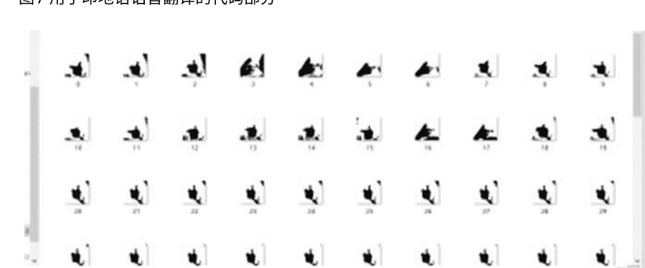

### 图8 数据集中的灰度图像

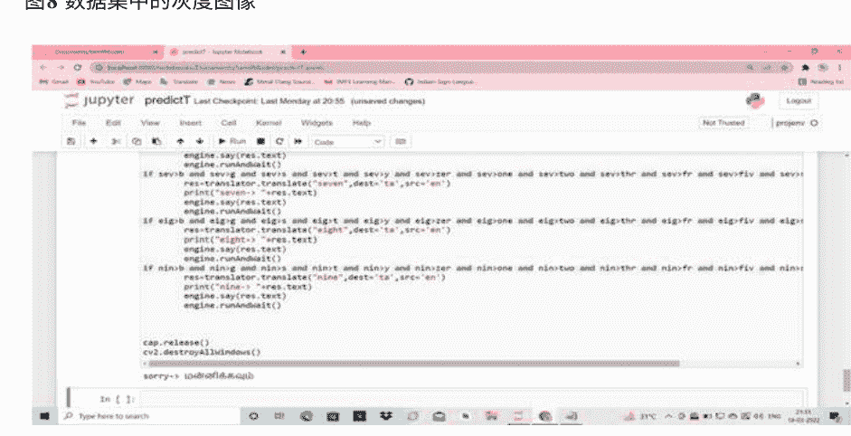

### 图9 用于泰米尔语语音翻译的代码

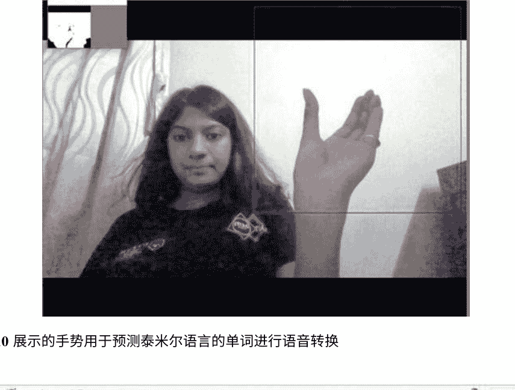

### 图10 展示的手势用于预测泰米尔语言的单词进行语音转换

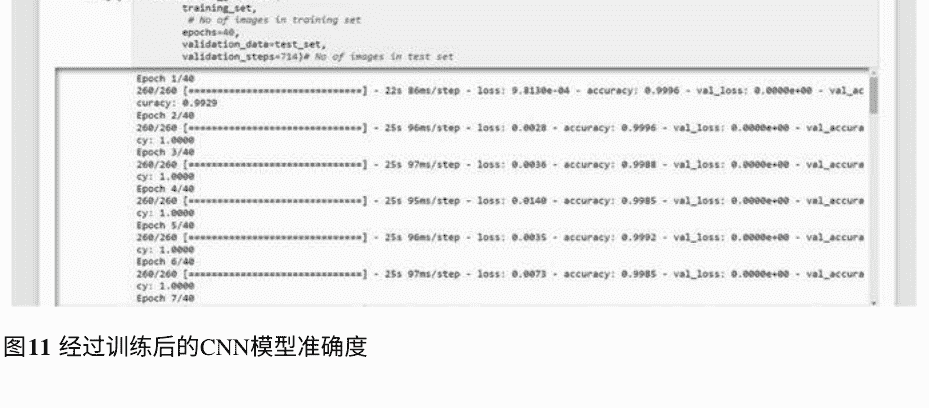

### 图11 经过训练后的CNN模型准确度

经过多种算法的比较，使用三层CNN来训练模型，成功地将分类的灰度图像与实时灰度手势图像进行比较，并有效地产生所需的语音输出，使用安装在个人电脑上的语音识别系统。因此，这个系统允许哑巴与他人进行社交联系，并克服他们无法向他人传递手势的障碍。该模型使得普通人能够有效地理解被传达的手势，而无需学习手势。通过添加相应的数据集并使用CNN训练它们的模型，该项目可以扩展到其他不同语言的手势。将来，这个模型可以作为创建一个

## 参考文献

- 1. Truong, V. N. T. (2016). 美国手语到文本和语音的翻译器。 在第五届IEEE全球消费电子大会上。京都，日本。
- 2. Jain, V., Jain, A., Chauhan, A., Kotla, S. S., & Gautam, A. (2021). 使用支持向量机和卷积神经网络的美国手语识别。国际信息技术期刊。
- 3. Mohandes, M., Liu, J., & Deriche, M. (2014). 基于图像的阿拉伯手语识别调查。 在IEEE第十一届国际系统、信号和设备多会议上（第1-4页）。
- 4. Dabre, K., & Dholay, S. (2014). 一种使用网络摄像头图像进行手语翻译的机器学习模型。 在IEEE国际电路、系统、通信和信息技术应用会议上。印度。
- 5. Rajam, P., & Balakrishnan, G. (2010). 印度手语识别系统，以帮助聋哑人。 在IEEE国际计算、通信和网络技术会议上（第1-9页）。
- 6. Kim, J., Jang, W., & Bien, Z. (1996). 一种用于韩国手语的动态手势识别系统。IEEE系统、人、控制论文翻译。B, 26, 354–359.
- 7. Wang, C., Gao, W., & Xuan, Z. (2001) 一种用于中文手语的实时大词汇连续识别系统。 在IEEE太平洋地区多媒体会议上（第150-157页）。
- 8. Panwar, M. (2012). 基于手势的界面，用于帮助视障人士。在IEEE国际计算机和软件最新进展会议系统(第80-85页)。
- 9. Ghotkar, A. S., Khatal, R., Khupase, S., Asati, S., & Hadap, M. (2012). 印度手势识别用于印度手语。 在IEEE国际计算机通信和信息学会议(第1-4页)。
- 10. Poddar, N., Rao, S., Sawant, S., Somavanshi, V., & Chandak, S. (2015). 使用手势识别研究手语翻译。国际高级计算机和通信工程研究杂志。
- 11. Hossen, M. A., Govindaiah, A., Sultana, S., & Bhuiyan, A. (2018). 使用深度卷积神经网络识别孟加拉手语。 在第七届国际信息学、电子学和视觉联合会议上。
- 12. Bhatnagar, V., Magon, R., Srivastava, R., & Thakur, M. (2015). 成本效益的手语转语音仿真系统。 在2015年第八届国际现代计算大会上的论文集(pp. 521–525). 印度诺伊达。
- 13. Ameen, S., & Vadera, S. (2017). 用于从深度和彩色图像中分类美国手语拼写的卷积神经网络Expert Systems.
- 14. Ellis K., & Barca, J. (2012) 探索传感手套用于教授儿童手语。人机交互的进展。
- 15. Kyatanavar, R., & Futane, P. (2012) 手语识别系统的比较研究。国际科学与研究出版物，2(6)。
- 16. Goyal, S., Sharma I., & Sharma S. (2013). 聋哑人手语识别系统国际工程研究与技术.
- 17. Purva, N., & Vaishali, K. (2014). 印度手语识别：一项综述。 在IEEE国际电子与通信系统会议论文集(第452-456页)中。
- 18. Pravin, F., & Rajiv, D. (2011). “HASTA MUDRA”对印度手势的解释。在第三届电子计算机技术国际会议(第2卷，第377-380页)中。
- 19. Nandy, A., Prasad, J., Mondal, S., Chakraborty, P., & Nandi, G. (2010). 实时识别孤立的印度手语手势。在通信计算机和信息科学图书系列(第70卷)中。
- 20. Khan, R., & Ibraheem, N. (2012). 手势识别：一项文献综述。国际人工智能与应用杂志，3，162-174。
- 21. 赖, H., & 赖, H. (2014). 实时动态手势识别. 在IEEE国际计算机、消费者、控制(pp. 658–661)的研讨会上。
- 22. 黄, J., 周, W., 李, H., & 李, W. (2015). 使用3D卷积神经网络进行手语识别. 在IEEE国际多媒体和探索(pp. 1–6)的会议上。
- 23. Akmeliawati, R., Po-Leen Ooi, M., & Chow Kuang, Y. (2006). 使用颜色分割和神经网络进行实时马来西亚手语翻译. 在IEEE仪器和测量技术会议论文集(pp. 1–6). 华沙, 波兰.
- 24. Liwicki, S., & Everingham, M. (2009) 英国手语中手指拼写单词的自动识别. 在IEEE计算机学会计算机视觉和模式识别研讨会上.利兹大学计算机学院.
- 25. Holden, E., Lee, G., & Owens, R. (2005). 澳大利亚手语识别。机器视觉与应用，16，312–320。

# 基于深度学习的紧凑型缪子探测器硅探测器质量保证

Richard Joseph, Shashi Dugad, Ajay Singh Khalsa, Swarangi Dali, 和Vaishnavi Ainapure

摘要 对于位于瑞士日内瓦的CERN的CMS实验，全球先进实验室制造了大量的HGCAL传感器模块。每个传感器模块包含约675个用于视觉检查的检查点，使得手动检查几乎不可行。在制造这些传感器模块的工业环境中，由于各种缺陷的出现，不均匀和模糊的线缆连接安排，这项工作极具挑战性。由于最近的技术进步，制造业中出现了自动化视觉检查和智能质量保证系统的兴起。为了简化这个过程，我们提出了一种基于深度学习的自动化视觉方法，用于处理和分析大量图像进行质量控制和后续测试。

- 紧凑的缪子磁铁
- 目标检测
- 视觉检查
- 缩放 YOLOv4
- YOLOv4-tiny

## 1 引言

大型强子对撞机（LHC）是世界上最强大、最大的粒子加速器。LHC主要由一个27公里的超导环组成

R• Joseph • A• S• Khalsa (📧) • S• Dali • V• Ainapure 孟买维韦卡南德技术学院，印度马哈拉施特拉邦400074，电子邮件：2018•ajay•khalsa@ves•ac•in R• Joseph 电子邮件：richard•joseph@ves•ac•in S• Dali 电子邮件：2018•swarangi•dali@ves•ac•in V• Ainapure 电子邮件：2018•vaishnavi•ainapure@ves•ac•in S• Dugad 孟买基础研究学院，印度马哈拉施特拉邦400005，电子邮件：shashi@tifr•res•in

© 作者（们），在Springer Nature Singapore Pte Ltd• 2023的独家许可下 S• Shakya等人（编），情感分析与深度学习，智能系统与计算进展 1432，https://doi•org/10•1007/978-981-19-5443-6_56

磁铁沿着路线上有各种加速部件，以放大粒子的能量。它将质子加速到接近光速，然后在环形加速器的四个位置上碰撞它们。为了应对LHC的新挑战，CMS合作组织的物理学家正在研究一种全新的量热器高粒度量热器，它将为实验提供10倍的碰撞次数并安装在探测器的端盖上。他们目前正在设计硅传感器，这是HGCAL的关键组件以承受高辐射剂量。这些脆弱的组件必须通过显微镜进行目视检查并进行电气测试以检测异常。每个传感器被分成几个小单元，用于检测穿过探测器的带电粒子。为了测量硅传感器的性能，需要与数百个引脚或线缆进行‘接触’。

新的高粒度量能器将配备28,000个硅模块，拥有6百万个读出单元[1]。

导线焊点必须平行且完好无损才能正常工作，目前这些焊点的质量检查是手工完成的。

- 使用一种老式的检查过程，存在许多缺点。
- 手工检查需要一个人在场，检查所关注的物体，并根据某些预定义的标准或专业知识做出决策。
- 根据研究，视觉检查错误在大多数情况下估计在20%至30%之间。人为错误导致了一些错误，而空间限制导致了其他错误。在制造过程中，视觉检查的不准确性可以表现为两种形式：漏检一个现有问题或检测到不存在的故障。
- 虚警发生的频率远远低于漏警，尽管漏警可能导致质量损失。视觉检查一次又一次地被证明能够发现生产过程中大部分隐藏的故障[3]。

随着机器学习的出现，一种自动处理和分析大量收集到的照片的视觉检查方法被开发出来。另一方面，传统的基于计算机视觉的方法在实时检查过程中很容易受到噪声和杂乱的干扰。由于当今环境中制造速度的增加，目标是减少人为干预。深度学习最近已经成功应用于图像识别和图像分类[4]。它可以以更快的速度和更高的准确性自动检测缺陷模式。使用深度学习和图像处理技术，可以从图像中识别出如图1所示的传感器上的断裂、交叉线束等缺陷。

## 2 文献综述

关于自动视觉检查，作者Kai-kai Zhai等人提供了一种基于深度学习的具体明显缺陷分类器，可以智能地对单个具体缺陷图片进行分类，如[4]所示。形成了深度残差网络模型，用于获取四种明显的混凝土缺陷的分类器；其次，图像处理技术被用来扩展四种明显混凝土缺陷的图像集，包括一般疾病、侵蚀和沉积、钢筋暴露和裂缝；最后，迁移学习被用来优化深度残差网络模型。研究结果表明，本研究中基于深度学习的混凝土明显疾病分类器能够智能地对单一混凝土疾病的图像进行分类。迁移学习的准确率提高到91·3%，裸露钢筋缺陷的识别准确率提高到97·6%，满足实际应用中智能混凝土缺陷检测的需求。

此外，对于压缩重子物质（CBM）实验中硅微带传感器的视觉检查，使用自制的光学检查设备对1191个硅微带传感器进行检查，采用基于机器学习的缺陷检测技术[5]。传感器的表面也进行了计量调节。本研究的目的是研究各种传感器表面缺陷。表面划痕、双金属化膜缺陷、氧化层缺陷和灰尘颗粒检测都是这些缺陷的实例。卷积深度神经网络被用来发现系统中的缺陷（CDNNs）。因此，发现了有缺陷的片段和缺陷团块，并且根据它们在传感器上的几何位置开发了一个二维缺陷地图。基于在传感器表面发现的异常总数，提出了一种确定传感器整体质量水平的技术。

自动化基于视觉的缺陷检测系统适用于各种材料，包括金属、陶瓷和纺织品，如[6]所示。该工作研究了统计、解剖和其他技术在纹理缺陷诊断中的应用。他们进一步讨论了使用有监督和无监督分类器以及深度学习来检测和分类错误的最新技术。该书分为三个部分，第一部分涵盖了可能出现在金属表面上的异常分类。接下来的部分介绍了通过图片对缺陷进行表示和批处理，最后一步是针对图像处理的有监督和无监督分类技术。使用的有监督分类器包括K最近邻、神经网络和深度学习，自组织映射等。而使用的无监督分类器包括统计/新颖性检测高斯混合模型。

## 3 目标检测

目标检测是一种使用计算机视觉在照片和视频中识别和定位物体的技术[7]。它可以用于计算场景中的物体数量，确定并跟踪它们的精确位置，并对其进行准确标记。准确识别每个物体的确切类别以及物体的边界框是必需的。由于近年来深度学习技术的持续发展，目标检测算法如图2所示已成为深度学习领域的研究热点之一。它们广泛应用于许多实际应用场景，如智能视频监控、车辆自动驾驶和机器人环境感知。

目标检测是一种使用计算机视觉在照片和视频中识别和定位物体的技术[7]。它可以计算环境中的物品数量，评估和分析它们的准确位置，并适当地标记它们。必须正确识别每个物体的具体类别以及物体的边界框。它们被应用于各种实际场景，如人脸识别、工业质量控制、自动驾驶和汽车检测。

目标检测器有两种类型：单步和双步检测器。单步方法可以在一瞬间预测整个图像的类别和边界框，相比双步算法具有更高的性能。单阶段模型跳过了两阶段模型的区域提议阶段，而是在密集的位置样本上执行检测。这些模型的推理速度通常更快。它包括You Only Look Once (YOLO)和Single Shot MultiBox Detector (SSD)算法[8]。另一方面，双步技术涉及一个初步阶段，其中重要区域被识别出来，然后进行分类以确定这些区域是否有物体出现。它包括Mask R-CNN Faster或基于区域的卷积神经网络(R-CNN)[9]。

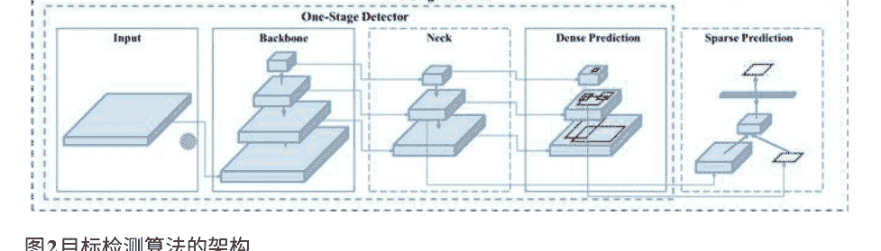

### 图2目标检测算法的架构

### 3.1  Yolo

YOLO是一种基于神经网络的实时目标检测技术。该算法的速度和精度都很高。在许多应用中，它被用于识别交通信号、行人和动物。这种方法只需要通过神经网络进行一次前向传播即可检测出物体。这意味着单次算法运行可以预测整个图像[10]。同时，CNN被用来预测各种类别的概率和边界框。YOLO算法有几个变体。Tiny YOLO、YOLOv4和Scaled YOLOv4 [11, 12]是一些流行的例子。

YOLO算法采用以下三种技术：残差块、边界框回归和交并比（IOU）。

残差块：首先，图像被划分为网格。每个网格具有S x S的尺寸。下面的图像展示了输入图像如何被划分为网格。边界框回归：边界框是在图像中引起注意的轮廓。图像中的每个边界框都包含以下属性：

- 边界框中物体存在的概率（pc），
- 宽度（bw），
- 高度（bh），
- 类别（字母c代表一个类别，例如人、汽车、交通灯等）。
- 边界框中心（bx，by）。

```
y = (pc, bx, by, bh, bw, c)
```

交并比（IOU）：交并比（IOU）是物体检测中描述框重叠的现象。YOLO使用IOU来产生精确的物体周围的输出框。每个网格单元预测边界框及其置信度分数。如果预期的边界框和原始边界框相同，则IOU的结果为1。使用这种方法删除与真实边界框不相等的边界框。

### 3.2  YOLOv4

由Bochkovskiy等人开发的YOLOv4算法在速度和准确性方面对其前身进行了重大改进。在MS COCO数据集中，YOLOv4模型（大型）取得了革命性的结果。作为一种一步目标检测算法，YOLO-v4网络代表了对YOLO-v1 [10]、YOLO-v2 [11]和YOLO-v3 [10,11]的持续改进。所有YOLO系列算法都使用相似的检测机制。与Faster R-CNN [12]提供的两阶段技术相比，YOLO系列算法已经消除了区域建议网络。

大大提高了检测速度。YOLOv4中的检测问题被改为使用传统的单阶段方法的回归问题。
YOLOv4模型可以实时运行，并且在单个普通GPU上训练和执行非常简单。基于YOLOv3的YOLOv4模型具有两种优化策略：“免费赠品”和“特价包”。“免费赠品”方法是由Mu Li等人提出的。其目标是在不影响处理性能的情况下提高物体识别准确性，使用的技术包括数据增强、解决不平衡数据问题的方法和边界框（BBox）回归目标函数。“特价包”一词指的是一些优惠措施，例如改进CNN的感受野、注意力模块和改进的激活函数，所有这些措施都旨在在显著提高物体识别准确性的同时略微增加推理成本。原始模型的作者通过大量的比较试验发现了可以显著提高YOLOv4模型性能的最合适方法。

YOLOv4的结构如图3所示，主要由三个部分组成：骨干网络、头部和颈部。目标检测器的骨干网络包括一些在ImageNet上预训练的CNN，如VGG [16]、ResNet [17]、ResNeXt [18]或DenseNet [19]。目标检测器的输出是头部，用于识别物体类别和边界框。为了提高目标检测器在不同尺寸上识别物体和提取综合信息的能力，在骨干网络和头部之间放置了一个称为颈部的模块。

它采用了基于这种技术的框架，包括特征金字塔网络（FPN）[20]。因此，每个特征图都具有丰富的空间和语义信息。

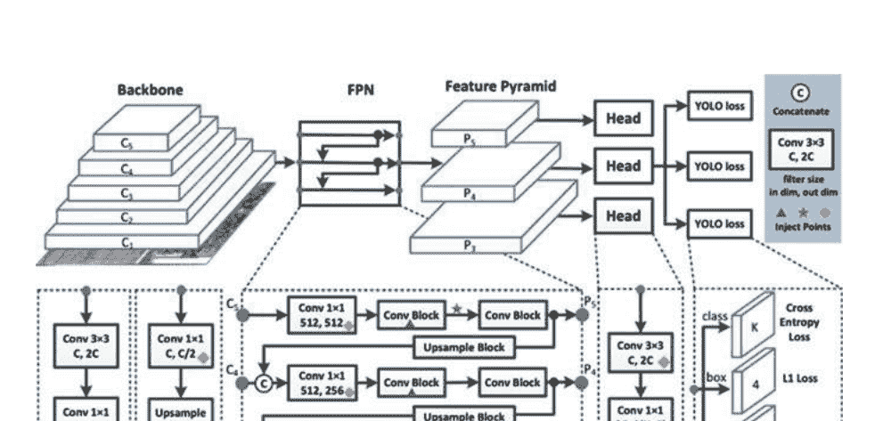

图3 YOLO网络的可视化

### 3.3 缩放的YOLOv4

缩放的YOLOv4是由Chien-Yao Wang等人开发的YOLOv4研究的进展[23]。跨阶段部分网络是其核心，允许网络在保持速度和准确性的同时增加深度、广度、分辨率和结构。

骨干网络：CSPDarknet53的架构不包含用于跨阶段处理的下采样卷积残差块[24]。因此，可以推断出每个CSPDarknet阶段的计算时间是

$$whb^2(9/4 + 3/4 + 5k/2)$$

只有当上述公式满足k>1时，CSPDarknet阶段的计算才比Darknet阶段更有益。CSPDarknet53中每个步骤持有的残差层数为1-2-8-8-4。我们进行转换以实现改进的速度/准确性平衡。

颈部：在YOLOv4中，我们将PAN [20]架构[25]进行CSP化，以有效地减少计算量。在穿越两组没有快捷连接的反向Darknet残差层之前，它实质上将来自多个特征金字塔的特征组合在一起。这个新的更新有效地减少了40%的处理时间。SPP：最初，SPP模块位于颈部中间的第一个计算列表组中。因此，SPP模块被放置在CSPPAN的初始计算列表组中。

### 3.4 YOLOv4-Tiny

YOLOv4模型为YOLOv4-tiny目标检测算法奠定了基础，如图4所示。为了简化网络结构，提高网络效率和减少参数算法，提出了YOLOv4-tiny。

它在实时目标检测方面表现非常出色。

对于计算能力有限的机器，使用压缩版本的YOLOv4，即YOLOv4-tiny。由于参数减少，将应用程序部署到移动和嵌入式设备变得容易。模型权重大小约为16 MB，使其能够在Tesla P100 GPU上每小时训练350张图像，YOLOv4-tiny的推理速度为3毫秒，使其成为最快的目标检测算法之一。与原始的YOLOv4网络相比，YOLOv4-tiny进行了几个修改，以实现如此高的效率。

网络尺寸的减小主要导致YOLOv4-tiny和YOLOv4在速度方面存在巨大差异。YOLOv4-tiny只有两个YOLO头，而YOLOv4中有三个YOLO头，这进一步导致了较少的YOLO层和较少的锚定框用于预测。它使用了29个预训练的卷积层进行构建，而YOLOv4使用了137个预训练的卷积层。

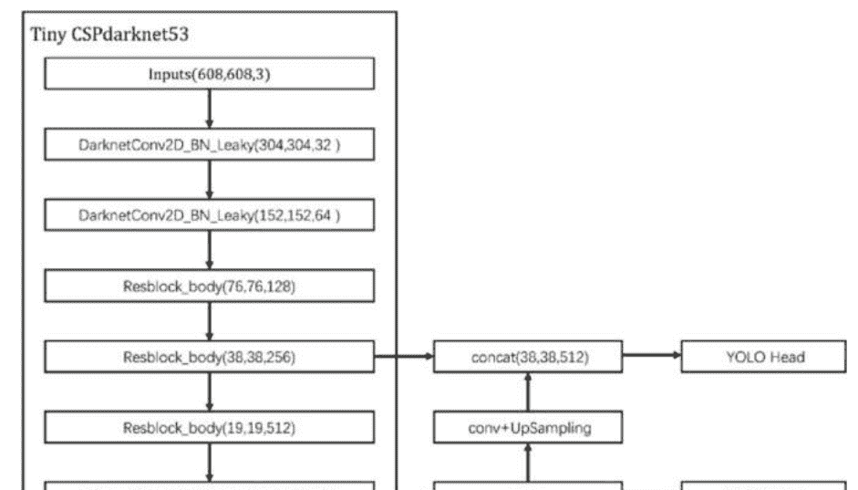

由于YOLOv4，CSP主干卷积层的数量减少了[26]。

当类别数量较少时，YOLOv4-tiny比Scaled YOLOv4快得多，因此更受青睐。与Scaled YOLOv4相比，它还具有较少的层和较少的锚定框用于预测。

## 4 方法论

### 4.1 数据收集

训练数据集由CMS实验装置通过Tata基础研究所（TIFR）提供。德克萨斯理工大学（TTU）也提供了类似的图像，后来对预训练模型进行了测试。

不同之处在于TIFR图像由合成图像组成，而TTU数据集由CMS实验中使用的硅传感器的实时图像组成。

在TIFR图像（黄色底板）上，线缆焊点的检测更容易，因为焊点与底板之间有明显的对比，而在TTU图像（绿色底板）上则没有。

这些图像是由三个线缆焊点组成的硅探测器图像。

图5所示的非接触式坐标测量机（CMM）用于计算硅探测器相对于其机械安装中标记的参考销的位置、中心位置和方向。

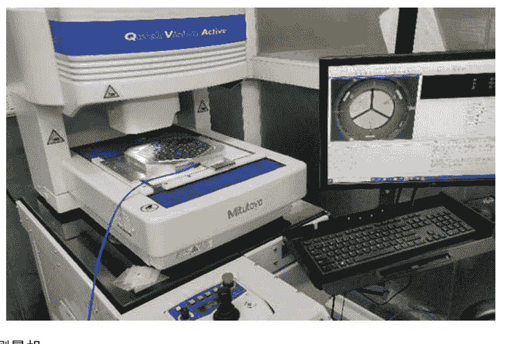

其总体精度为15 μm。创建的图像格式为bmp。目标是确定线缆焊点的质量。

### 4.2 数据生成

该数据集中有304个用于目标检测算法的图像。这些图像的分辨率为1280 × 1024。为了将图像用于目标检测，必须对其进行注释和标记以适应相应的类别。注释是通过集成标注工具完成的，类似于LabelImg软件。它基于Python，并使用PyQt进行图形界面。它用于创建矩形边界框，以指示目标检测算法的感兴趣区域。为了注释这些图像，开发了两种不同的方法，前者仅关注焊点的质量，而后者还关注焊点的位置和方向。

在第一种方法中，使用二元分类方法进行注释和目标检测。

所以，类别有：
- 三个完整的键合
- 非三个-断裂或非平行的线键合

在第二种方法中，根据键合与时钟的指针位置，定义了6个类别。

这些类别是：

| • 2_三 | • 6_三 | • 10_三 |
| • 2_非三 | • 6_非三 | • 10_非三 |

2_三表示三个完整的2点钟键合，2_非三表示断裂的2点钟键合。6点钟和10点钟键合同样适用。在标记感兴趣区域后，将注释导出为YOLO算法的文本文件。这些文件是目标检测模型格式中图像的转换版本，包括边界矩形的类别、中心点x、中心点y、宽度和高度。最终数据集包括图像和相应的注释文件。然后将数据集按8:2的比例划分为训练集和测试集。

### 4.3 数据建模

这些模型是在TIFR和TTU的组合数据集上进行训练的，该数据集包含230个图像，因为需要大量图像进行训练，并且在TTU图像上显示出了有希望的结果。所提出的通用模型能够检测相似类型图像中的债券质量。由于TTU数据集的图像有限，只使用了75个图像进行测试。由于每个图像有3个标签，因此总共测试了225个类别。

#### 4.3.1 缩放的YOLOv4

缩放的YOLOv4（基于CSP的缩放交叉阶段部分网络）是一个基于YOLOv4的目标检测神经网络。它可以在小型和大型网络上使用，同时保持最佳的速度和准确性。基于缩放的YOLOv4-csp模型进行了300个时期的训练。缩放的YOLOv4需要mish cuda激活。训练模型的批量大小为16。

#### 4.3.2 YOLOv4-Tiny

YOLOv4-tiny是YOLOv4的紧凑版本，可用于处理能力有限的系统。tiny YOLOv4总共有29个预训练的卷积层，压缩了CSP骨干网络中的卷积层数量。此外，YOLO层的数量从三个降低到了两个。为了训练YOLOv4-tiny模型，我们使用了yolov4-tiny-custom.cfg，因为我们有一个自定义的数据集。yolov4-tiny-conv-29是训练YOLOv4-tiny模型所需的权重文件。批量大小设置为64，分割为16，共进行6000个时期的训练。

## 5 结果

两种方法的最终分类标签如图6所示，并显示了线缆的决策边界。

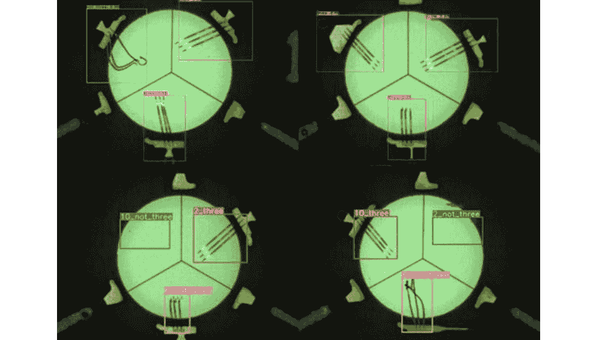

图6 结果

训练结果，即准确率、平均精度（mAP）和各种算法的假阳性率，给出在表1中。mAP衡量目标检测模型的性能。它将真实边界框与检测到的边界框进行比较，并返回一个分数。假阳性率表示检测到的低质量债券，以及准确率和平均精度一起计算，因为在这种情况下它是一个重要的评估指标。

混淆矩阵通过计数值总结了准确和错误预测的频率，并按类别进行了细分。对于这两种算法，测试图像的数量为75，因此总共有222个债券同时用于这两种方法的测试。在混淆矩阵中，垂直轴表示预测标签，水平轴表示实际标签。

图7a和7b分别是使用Tiny YOLOv4和Scaled YOLOv4算法的方法I的混淆矩阵。图7c和d分别是使用YOLOv4和Scaled YOLOv4算法的混淆矩阵。

表1 TTU数据集的结果

| 算法 | 准确率 (%) |  | mAP (%) |  | FP率 (%) |  |
| :--- | :---: | :---: | :---: | :---: | :---: | :---: |
|  | I | II | I | II | I | II |
| Scaled YOLOv4 | 96.88 | 96.44 | 99.65 | 95.77 | 9.09 | 7.79 |
| YOLOv4-tiny | 97.33 | 96.88 | 99.9 | 95.55 | 7.69 | 8.11 |

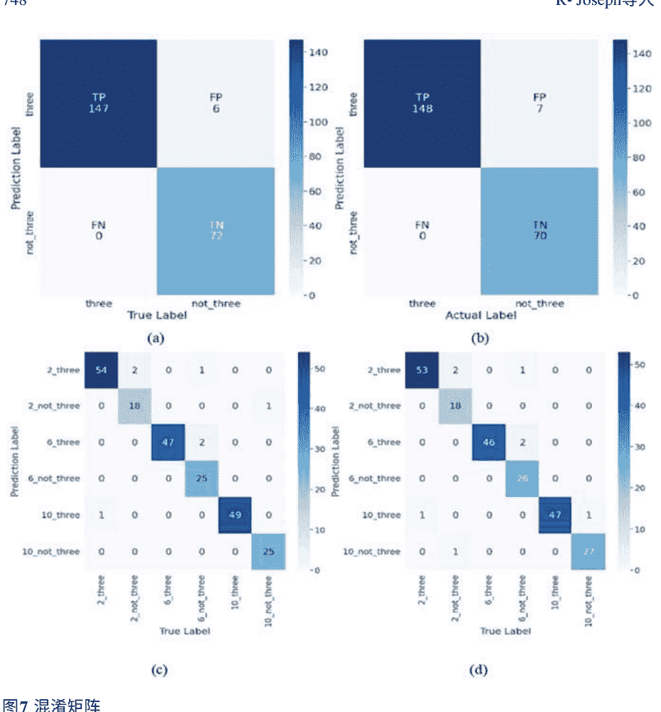

对于视觉检查，有许多种类的硅探测器可供选择。因为我们在数据集中只使用了两种类型的探测器，所以对于不同探测器中的线缆焊点的分类是错误的。数据集将来会扩展，将添加具有不同类型探测器的新照片，并继续训练模型。然而，对于这种类型的探测器，模型能够准确检测出缺陷。图8显示了算法的准确性、mAP以及它们的方法的图形。

## 6 结论

该项目成功地使用基于深度学习的技术开发了一个通过分析图像并检测制造缺陷来确定硅探测器质量的系统。

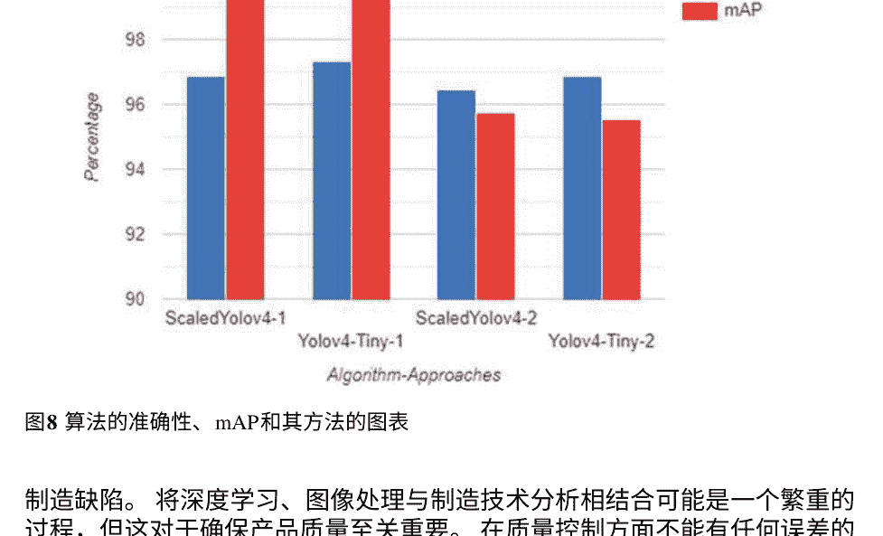

图8 算法的准确性、mAP和其方法的图表

将深度学习、图像处理与制造技术分析相结合可能是一个繁重的过程，但这对于确保产品质量至关重要。在质量控制方面不能有任何误差的余地。自动视觉检测（AVI）可以帮助识别制造缺陷中的模式，进一步帮助改进制造技术以减少损害。缺陷检测具有重要的实际意义，本文重点介绍了基于深度学习的方法来自自动化硅传感器键合的手动检查。

在这个项目中，对传统和智能AVI系统的相关文献进行了回顾。精密工程和制造中的全自动设备可以显著降低制造成本，同时提高一致的生产质量。然而，对基于视觉的算法和实际AVI应用的广泛研究是至关重要的。

作者要向Tata基础研究所和德克萨斯理工大学表示感谢和赞赏，他们为我们提供了完成这项工作所需的数据集和资源。

## 参考文献

1. Ochando, C., & CMS collaboration. (2017). HGCAL: 用于CMS HL-LHC末端盖的高粒度量热器。在Journal of Physics: Conference Series, 928(1), 012025. IOP Publishing.
2. See, J. E., Drury, C. G. (2017). Ann speed, allison williams, and negar khalandi. “视觉检查在21世纪的作用。“在Proceedings of the Human Factors and Ergonomics Society Annual Meeting(Vol. 61, no. 1, pp. 262–266). Sage CA: 洛杉矶, CA: SAGE Publications.
3. Newman, T. S., & Jain, A. K. (1995). 自动视觉检查综述。计算机视觉和图像理解, 61(2), 231–262.
4. 黄, C., 翟, K. K., 谢, X., & 谭, J. (2021). 深度残差网络训练用于钢筋混凝土缺陷智能分类器。欧洲环境与土木工程杂志, 1–13.
5. Lavrik, E., Shiroya, M., Schmidt, H. R., Toia, A., & Heuser, J. M. (2022). 利用人工智能对硅微带传感器进行光学检查。核仪器和物理研究A部分：加速器、光谱仪、探测器和相关设备, 1021, 165932.
6. Czimmermann, T., Ciuti, G., Milazzo, M., Chiurazzi, M., Roccella, S., Oddo, C. M., Dario, P. (2020). 工业应用的基于视觉的缺陷检测和分类方法综述。传感器, 20(5), 1459.
7. 侯琦, 程明明, 胡晓, Borji, A., 涂忠, Torr, P.H.S. (2017年). 深度监督显著目标检测与短连接。在计算机视觉和模式识别的IEEE会议论文集（第3203-3212页）。
8. 刘伟, Anguelov, D., Erhan, D., Szegedy, C., Reed, S., 傅春阳, Berg, A.C. (2016年). SSD: 单次多框检测器。在欧洲计算机视觉会议（第21-37页）。Springer, Cham.
9. 何凯明, Gkioxari, G., Dollár, P., Girshick, R. (2017年). Mask R-CNN. 在IEEE国际计算机视觉会议论文集（第2961-2969页）。
10. Redmon, J., Divvala, S., Girshick, R., & Farhadi, A. (2016). 你只看一次：统一的、实时的目标检测。在计算机视觉和模式识别的IEEE会议论文集中(第779-788页)。
11. Redmon, J., Farhadi, A. (2017). YOLO9000: 更好、更快、更强。在计算机视觉和模式识别的IEEE会议论文集中(第7263-7271页)。
12. Ren, S., He, K., Girshick, R., & Sun, J. (2015). 更快的R-CNN: 基于区域建议网络的实时目标检测。智能系统与计算进展 28.
13. Redmon, J. (2018). Darknet: C语言开源神经网络。(2013): 2018.
14. 张, Z., 何, T., 张, H., 张, Z., 谢, J., & 李, M. (2019年). 用于训练目标检测神经网络的免费物品袋。arXiv预印本arXiv:1902.04103
15. 张, Z., 何, T., 张, H., 张, Z., 谢, J., & 李, M. (2019年). 用于训练目标检测神经网络的免费物品袋。arXiv预印本arXiv:1902.04103
16. Sengupta, A., Ye, Y., Wang, R., Liu, C., & Roy, K. (2019). 在脉冲神经网络中更深入: VGG和残差架构。神经科学前沿, 13, 95.
17. Bochkovskiy, A., Wang, C.-Y., & Mark Liao, H.-Y. (2020). Yolov4: 目标检测的最佳速度和准确性。arXiv预印本arXiv:2004.10934
18. Solawetz, J. (2022). Yolov4—它是如何工作的解释。Roboflow博客。2022年3月9日检索自https://blog.roboflow.com/a-thorough-breakdown-of-yolov4/
19. Iandola, F., Moskewicz, M., Karayev, S., Girshick, R., Darrell, T., & Keutzer, K. (2014). Densenet: 实现高效的卷积网络描述符金字塔。arXiv预印本 arXiv:1404.1869
20. Iandola, F., Moskewicz, M., Karayev, S., Girshick, R., Darrell, T., & Keutzer, K. (2014). Densenet: 实现高效的卷积网络描述符金字塔。arXiv预印本 arXiv:1404.1869
21. Wang, C.-Y., Yeh, I.-H., & Mark Liao, H.-Y. (2021). 你只学习一个表示：统一的多任务网络。*arXiv预印本arXiv:2105.04206*
22. Huang, X., Wang, X., Lv, W., Bai, X., Long, X., Deng, K., & Dang, Q. et al. (2021). PP-YOLOv2：一个实用的目标检测器。*arXiv预印本arXiv:2104.10419*
23. Wang, C.-Y., Bochkovskiy, A., & Mark Liao, H.-Y. (2021). Scaled-yolov4：扩展交叉阶段部分网络。在*IEEE/cvf计算机视觉和模式识别会议论文集(pp. 13029–13038)*中。
24. Thuan, D. (2021). Yolo算法和yolov5的演进：最先进的目标检测算法。
25. 郭, R., 李, S., & 王, K. (2020年) 基于darknet框架的YOLOv3算法研究。*物理学杂志：会议系列, 1629 (1) , 012062。IOP出版社, 2020年。*
26. Redmon, J., & Farhadi, A. (2018年). Yolov3：一种渐进式改进。*arXiv预印本arXiv:1804.02767*

# 基于物联网的RFID图书馆管理和自动图书推荐系统使用协作学习

Maithili Andhare, Kishor Bhangale, Vijayalaxmi S. Kumbhar, Arti Tekade, Suyash Choudhari, Ajinkya Deshpande和Sanket Chavan

摘要 图书馆是学习的宝贵资源。一个人必须获得并保留知识。然而，当前的图书馆系统存在一些缺点，包括图书管理员手动管理书籍，繁琐的书籍搜索任务以及难以追踪未归还的书籍。因此，本文介绍了基于射频识别（RFID）和物联网（IoT）的自动图书馆管理系统（LMS）。所提出的系统利用无线电波识别和跟踪大量标记的书籍。所提出的LMS提供一个交互式门户，显示图书馆中书籍的可用性，提供借书功能，跟踪已借出的书籍，还书功能等。LMS门户还基于K-Means聚类算法和协作学习提供图书推荐。物联网帮助将数据收集到云平台，以实现对图书馆系统的远程访问。这一举措通过使用RFID标签简化了借阅、更新和归还书籍的过程。

关键词 物联网·图书馆管理系统·K-means聚类算法·云·NodeMCU·Node-Red·MySQL数据库·Grafana

## 1 引言

所有教育机构都有图书馆，当前的图书馆管理系统是手动（注册）方法或需要人力的ERP系统。图书馆的当前版本需要数字化。尽管条形码技术很有名，但它有一些缺点。RFID技术可以用来消除人工工作和图书管理不善。这只是一个扫描即走的系统。它可以跟踪图书并使借阅和归还更加高效[1,2]。正在创建一个数据库，用于存储图书馆中可用的图书信息，以便用户可以搜索图书。系统将跟踪每一本书。提醒邮件自动发送的信息可能很有用。随着世界向工业4.0转变，本研究使用了在云中运行的现代无代码工具，如Node-RED。使用了MQTT协议，它采用发布和订阅模型，而不是请求-响应模型[3, 4]。

首先，它是一种非接触式数据捕获技术，可以实现自动识别和管理。其次，任何信息都可以写入其中，使其能够跟上对越来越多的数据和更快的数据处理的需求。第三，它能够快速识别目标。也就是说，一旦目标进入磁场，读写器可以快速且同时处理多个标签数据，实现批量识别[5,6]。由于高安全性不可忽视，可以配置密码保护来读写标签数据。

此外，它改善了产品信息管理中的管理问题，并解决了电机过程中的问题。从理论上讲，在电机过程中有好的信息。由于其高安全性、高可靠性、易操作性和传输大量数据的能力，射频识别技术已成为室内定位技术领域的研究热点[7]。

物联网广泛应用于地震检测、滑坡检测、工业自动化、能源管理、远程应用控制、精确农业[8]、安全[9]、建筑自动化[10]、边境巡逻、机器人、交通和物流等许多应用领域。它提供了一个远程设施，可以使用多个设备收集数据，并远程处理和控制应用程序。由于其灵活性、便携性、低成本、高效性和安全性等特点，物联网已成为图书馆自动化的重要研究领域[11]。

过去已经提出了各种自动图书馆系统。Radhika [12]提供了一个典型基于物联网的图书馆管理系统的高级概述。[13]的作者从借还书和反盗窃系统的角度解释了数字图书馆系统的整体架构。Feng等人[14]比较并解释了射频识别技术相对于条形码技术的优势。该论文还解释了射频识别技术在数字图书馆特定方面的易用性相对于条形码技术。

程等人[15]对使用RFID和Wi-Fi的数字化图书馆系统进行了全面的概述。还解释了图书借阅和归还系统。

本文介绍了一种基于RFID技术的物联网图书馆管理系统。本文的主要贡献如下：

- 图书馆管理系统用于自动化图书借阅、归还和维护流程。
- 基于K-means聚类和协同学习的图书推荐系统。

本文的其余部分结构如下：第2节介绍了提出的方法论，第3节介绍了实验结果和讨论的信息，第4节描述了结论并提供了工作的未来范围。

## 2 提出的方法论

所提出的LMS系统的框图如图1所示。该系统使用NodeMCU开发板，具有内置的ESP8266 Wi-Fi芯片，低成本和2.5-3.6V的工作电压，非常适合物联网应用。在这项研究中，基于物联网的LMS用于使用RFID卡进行图书认证和发放。为了进入图书馆，用户必须携带自己的身份证并完成认证过程。每本书都贴有放置在封面上的RFID标签。在使用MFRC522 RFID读卡器扫描RFID标签时，将特定的标签ID与用户名保存在数据库中，将进行比较和认证。这些是被动标签，在该系统中被使用。用户的RFID身份卡被扫描，如果合法，用户可以访问该图书馆的数据库中的图书。用户经过认证后，剩下的流程就可以开始了。学生接下来使用图书馆数据库查找所需图书的可用性。如果图书可用，用户可以借阅。用户使用RFID读卡器扫描图书的RFID标签，然后读卡器从标签中读取数据并更新到数据库中。此外，显示屏将显示归还日期，用户带着书离开图书馆。然后用户携带一本要归还的书进入图书馆。用户将书上的RFID标签扫描到RFID读卡器上，数据库将被更新。在完成此过程后，用户可以自由离开图书馆。

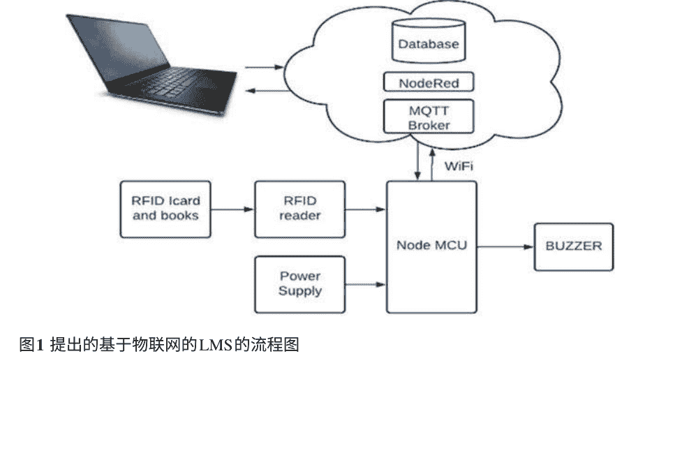

### 2.1 用户认证过程

图2说明了用户认证过程，并总结了以下步骤：

- 步骤1：向用户发放RFID身份卡。
- 步骤2：将用户名和凭据保存在数据库中。
- 步骤3：扫描RFID身份卡。
    - 如果是有效用户，则
        - 允许借书
        - 允许还书
    - 否则
        - 登录无效
        - 联系管理员
- 结束

图3中的Node-RED身份验证流程显示，如果用户扫描他的卡片，则他的密码将从数据库中检索并存储在全局变量中，并且将检查此密码与用户输入的密码是否匹配。如果两个密码匹配，则用户将能够借书、还书和搜索书籍，否则将显示一个弹出消息，指示输入的密码错误。

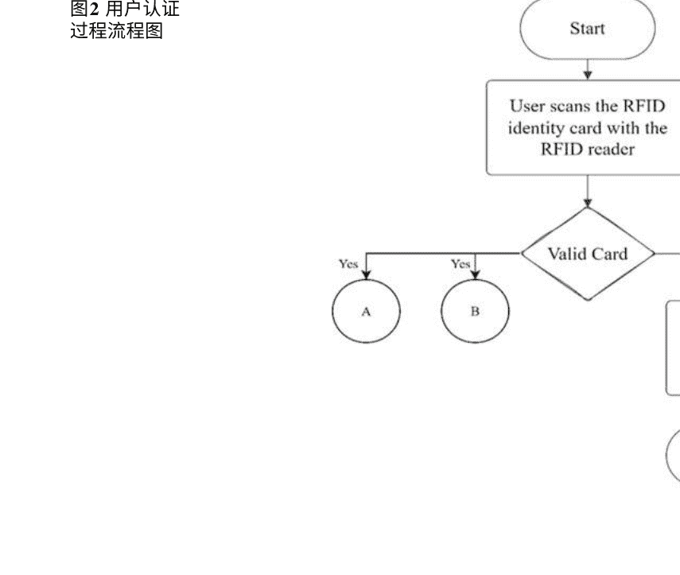


#### 图3 Node-RED用户认证流程

### 2.2 图书借阅流程

用户可以通过在门户网站上提供的搜索框中输入关键词来搜索图书的可用性。这些关键词将与数据库进行匹配，如果找到任何搜索结果，则用户可以相应地借阅该特定图书。

图4说明了图书借阅流程，并总结了以下步骤：

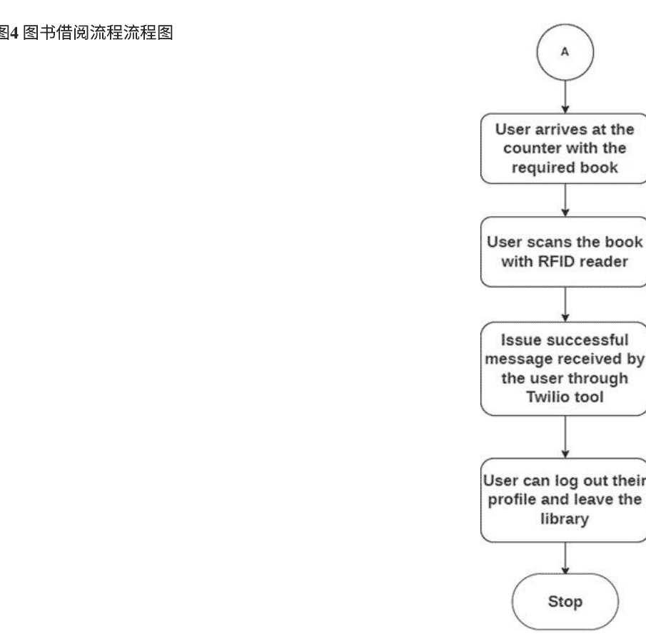

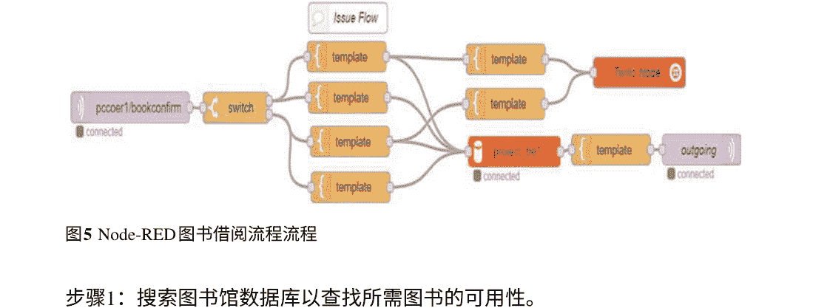

- 步骤1：搜索图书馆数据库以查找所需图书的可用性。
- 步骤2：如果所需图书可用，则将该图书带到系统中。
- 步骤3：用户登录其个人资料到系统中。
    - 如果有效用户：
        - 允许图书借阅
    - 否则
        - 无效登录
        - 联系管理员
    - 结束
- 步骤4：通过与Node-RED集成的Twilio消息工具向用户发送图书借阅成功消息。
- 步骤5：用户可以离开图书馆。

在经过认证过程之后，如果用户想要借书，他必须选择借书选项，然后扫描他想要借的特定书籍。图5描述了流程。完成这个过程之后，数据库将相应地更新，并且用户将通过集成到Node-RED中的Twilio消息工具节点获得通知，通过提供唯一的字符串标识符（SID）和认证令牌。用户将收到文本消息，告知他已借阅了特定的书籍。

### 2.3 书籍归还流程

图6展示了书籍归还流程，步骤总结如下：

- 步骤1：将要归还的书带到系统中。
- 步骤2：用户登录他们的个人资料。
    - 如果是有效用户：
        - 允许归还书籍
    - 否则
        - 无效登录
        - 联系管理员

### 图6书籍归还流程的流程图

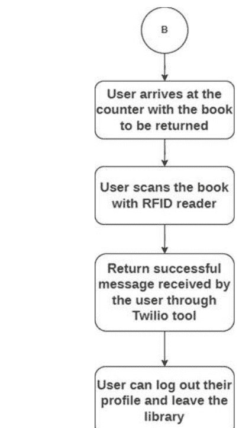

- 结束
- 步骤3：用户使用RFID读取器扫描书籍的RFID标签贴纸。
- 步骤4：通过与Node-RED集成的Twilio消息工具，将书籍成功归还的消息发送给用户。
- 步骤5：用户可以离开图书馆。

在身份验证过程完成后，如果用户想要归还一本书，他必须选择归还选项，然后允许他扫描他想要归还的特定书籍。图7描述了相同的Node-RED流程。此过程完成后，数据库将相应地进行更新。

### 2.4 书籍推荐系统

该门户网站提供用户配置文件管理功能，并使用K-means聚类算法显示特定用户的图书馆配置文件。最初，使用K-means聚类算法将教科书和参考书进行分离。

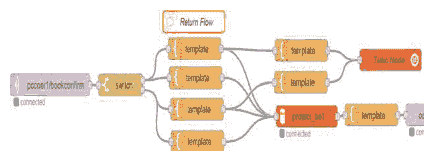

### 图7书籍归还流程的Node-RED流程

由用户发布。然后，K-means聚类算法对用户发布的图书进行领域分类，例如模拟领域、数字领域、机器学习领域、编程领域和普通图书[16]。

基于用户历史和K-means聚类算法，系统在用户门户上提供用户感兴趣领域的新未读图书推荐。根据其他用户对图书的可访问性，其评分会有所变化。用户、作者、教授和读者可以进行手动评分，以提高图书的评分。根据从K-means聚类算法获得的用户兴趣，提出的系统基于协同学习提供图书推荐[17]。协同学习将教学过程与一组学生的帮助或从学生那里获得的反馈结合起来完成任务。图书推荐的流程图如图8所示。

## 3 实验结果和讨论

### 3.1 硬件设置

实施系统所需的系统组件及其规格见表1。

### 3.2 软件设置

实施系统所需的软件版本及其规格见表2。MySQL数据库用于存储用户和图书的数据。Node-RED编排工具用于实现所提出工作的流程。MQTT使用发布-订阅模型。所有客户端都连接到可以发布或订阅主题的网络。如果在特定主题上发布消息，它将分发给所有订阅该主题的客户端。

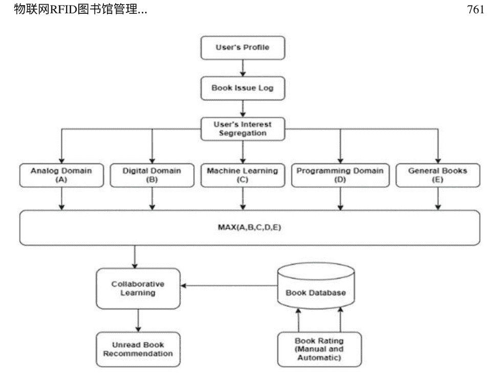

到该主题。以同样的方式，Node-RED与硬件组件之间的通信通过MQTT完成。Grafana是一个仪表盘工具，将表示图书馆利用率的图形。所提出的工作在云上进行，因此在云IAAS服务上使用Ubuntu机器。

### 3.3 通过RFID读卡器进行RFID卡检测

所提出的RFID卡在0-3.5厘米范围内进行扫描，并在表3中表示评估结果。

### 3.4 数据库生成

图9显示了图书馆中所有图书的主数据库。每本书都有其独特的书籍ID，这是数据库中的主要字段。每本书在数据库中还有各种字段，如作者、出版商、出版年份、版本、注册日期、发行状态和发行对象。

#### 表1 组件规格

| 组件 | 参数 | 数值 |
| :--- | :--- | :--- |
| RFID卡 | 材料 | PVC |
| | 工作频率 | 13.56 MHz |
| | 工作距离 | 最高100毫米 |
| | 数据传输 | 106 kbit/s |
| | 数据完整性 | 16位 |
| | 数据存储时间 | 至少10年 |
| | 工作温度 (°C) | -20至60 |
| RFID 13.56 MHz 扫描仪 (MF522-ED) | 模型 | MF522-ED |
| | 3.3 V 工作电流 | 13–26 mA |
| | 3.3 V 待机电流 | 10–13 mA |
| | 工作频率 | 13.56 MHz |
| | 读卡距离 | 0–60 mm |
| | 协议 | SPI |
| | 数据通信速度 | 最大 10Mbit/s |
| | 操作温度 (°C) | –20 到 80 |
| 控制器 (NodeMCU ESP 8266) | 微控制器 | Tensilica 32 位 RISC CPU |
| | 工作电压 | 3.3 V |
| | 输入电压 | 7–12 V |
| | 数字 I/O 引脚 | 16 |
| | 模拟 I/O 引脚 | 1 |
| | 闪存 | 4 MB |
| | SRAM | 64 KB |
| | UART | 1 |
| | I2C | 1 |
| | 时钟速度 | 80 MHz |
| 蜂鸣器 (被动) | 工作电压 | 3.3–5 V |
| | PCB 尺寸 | 3.1 × 1.3 cm |

#### 表2 软件规格

| 软件 | 版本 |
| :--- | :--- |
| Arduino IDE | 1.8.19 |
| MySQL | 8.0.28 |
| Node-RED | 2.2.2 |
| MQTT | 5.0 |
| Grafana | 8.4.3 |
| 云 (Ubuntu) | 18.04 |

图10提供了所提出系统的用户主数据计划。每本书都有其独特的书籍ID，这是数据库中的主要字段。每本书还在数据库中具有各种字段，如RFID ID，名字，中间名，姓氏，用户角色，手机号码，学年，入学年份和密码。

#### 表3 标签检测距离

| 序号 | 检测范围内的标签（厘米） | RFID卡检测状态 |
| :--- | :--- | :--- |
| 1 | 0.4 | 已检测 |
| 2 | 0.8 | 已检测 |
| 3 | 1.2 | 已检测 |
| 4 | 1.6 | 已检测 |
| 5 | 2.0 | 已检测 |
| 6 | 2.4 | 已检测 |
| 7 | 2.8 | 已检测 |
| 8 | 3.2 | 已检测 |
| 9 | 3.6 | 未检测 |
| 10 | 4.0 | 未检测 |
| 11 | 4.4 | 未检测 |
| 12 | 4.8 | 未检测 |

#### 图9 书籍的示例数据库

| Access | Book_RFID_ID | Title | Author | Publisher | Year_of | Edition | RB_or_T | Date_of_Reg | Issued_stat | Issued_To |
| :--- | :--- | :--- | :--- | :--- | :--- | :--- | :--- | :--- | :--- | :--- |
| 1 | 66 C1 46 64 | Internet of Things | Arshdeep Bahga, Vijay Madis... | Universitics P... | 2015 | 1 | RB | 2018-05-29 | Available | NA |
| 2 | 61 D2 20 90 | 8051 Microcontrol... | Muhammad Ali Mazidi | Pearson | 2016 | 2 | TB | 2018-05-29 | Issued | Akash S... |
| 3 | 89 C2 17 F7 | Wireless Communic... | Theodore S. Rappaport | Pearson | 2013 | 2 | TB | 2018-05-29 | Issued | Raj Jhoshi |
| 4 | 78 CD 46 79 | Electronics Devices... | Jacob Millman, Christos C. Halkias... | McGraw Hill | 2012 | 3 | RB | 2018-05-29 | Available | NA |
| 5 | R7 4E SR AE | Communication Sy... | Simon Haykin | Wiley | 2014 | 4 | RB | 2018-05-29 | Available | NA |
| 6 | 74 C7 95 64 | Power Electronics | Mohammad Rashid | Pearson | 2011 | 3 | TB | 2018-05-29 | Issued | Amit Singh |
| 7 | 7P 8F 9G 8R | Object Oriented Pr... | E Balgurusamy | McGraw Hill | 2016 | 6 | RB | 2018-05-29 | Available | NA |
| 8 | 4G 78 78 D8 | Introduction to rob... | Saeed B. Niku | Wiley | 2017 | 2 | RB | 2018-05-29 | Available | NA |

#### 图10 用户的示例数据库

| userid | userrfid | fname | mname | lname | userrole | mno | acadyear | yoj | pwd | recno |
| :--- | :--- | :--- | :--- | :--- | :--- | :--- | :--- | :--- | :--- | :--- |
| 1001 | 22 00 81 5A | Suyash | S | Chaudhari | user | 9545530456 | BE | 2018 | 1 | 1 |
| 110 | 11 A1 38 36 | Rahul | Ganpat | Mapari | user | 846485789 | NA | 2018 | lib@4444 | 4 |
| 112 | 33 54 19 64 | Vijayalaxmi | S | Kumbhar | user | 8390455963 | NA | 2015 | lib@6666 | 6 |
| 113 | 44 55 8F E3 | Mithil | S | Andhare | user | 9922435203 | NA | 2015 | lib@2222 | 2 |
| 114 | 63 30 P8 65 | Santosh | N | Randive | user | 7276407032 | NA | 2015 | lib@1012 | 12 |
| 115 | 45 30 4A 64 | Rupali | R | Kawade | user | 8956614785 | NA | 2016 | lib@7777 | 7 |
| 116 | 36 C1 16 64 | Arti | A | Tekade | user | 9860687103 | NA | 2016 | lib@5555 | 5 |
| 117 | 12 30 P8 64 | Triveni | D | Dhamale | user | 9422009032 | NA | 2016 | lib@9999 | 9 |
| 118 | 12 A8 37 64 | Snehal | B | Gholap | user | 8600268023 | NA | 2016 | lib@1011 | 11 |
| 119 | 38 5E 1B 64 | Bhagyash... | L | Gawai | user | 7219572032 | NA | 2017 | lib@1010 | 10 |
| 120 | 11 9C 1B 64 | Dipali | N | Dhake | admin | 7588054035 | NA | 2017 | lib@3333 | 3 |
| 121 | 77 72 3E 36 | Kishor | B | Bhangale | user | 7709710789 | NA | 2021 | lib@8888 | 8 |

## 4 结论

本文提供了基于RFID和物联网的图书馆管理系统的有效实施，可以自动化物理图书馆系统。所提出的系统在技术方面对图书和用户数据库进行了高效管理，并且易于使用。此外，它节省时间，自动化图书馆，并减少图书馆管理机构的工作量。这项工作的主要好处是，包括借阅、续借和归还图书在内的所有活动都是数字化的，并且所有这些操作都会自动在数据库中进行修改。图书馆中的RFID技术加快了借阅、追踪和图书搜索的过程。未来可以实现基于GPS系统的自动图书定位。

此外，所提出的系统可以应用于在线图书馆和图书配送系统。

## 参考文献

1. 梁，X. (2018). 物联网及其在图书馆中的应用：文献综述。图书馆高科技。
2. Bhure, R. D. (2018). 物联网在安全图书馆管理系统中的应用。国际工程与技术研究杂志，5.
3. Singh, N. K., & Mahajan, P. (2014). RFID及其在图书馆中的应用：文献综述。信息传播与技术国际期刊，4(2)，117–123。
4. Gupta, P., & Margam, M. (2017). RFID技术在图书馆中的应用: 印度视角的文献综述。DESIDOC图书馆与信息技术杂志，37(1)，58。
5. Weinstein, R. (2005). RFID: 技术概述及其在企业中的应用。IT专业人士，7(3)，27–33。
6. Finkenzeller, K. (2010). RFID手册: 无接触智能卡、射频识别和近场通信的基础和应用. John Wiley & Sons.
7. Su, J., Sheng, Z., Leung, V. C. M., & Chen, Y. (2019). RFID的能效标签识别算法: 调查、动机和新设计。IEEE无线通信杂志, 26(3)，118–124。
8. Mapari, R., Bhangale, K., Deshmukh, L., Gode, P., & Gaikwad, A. (2022). 利用智能稻草人系统保护农业免受动物侵害。在安全应用的软计算(pp. 539–551). Springer.
9. Biradar, P., Kolsure, P, Khodaskar, S., & Bhangale, K. B. (2020). 基于物联网的智能手环用于妇女安全。国际资源应用科学与工程技术杂志(IJRASET), 8(11), 688–691.
10. Sarraf, R., Ojha, S., Biraris, D., & Bhangale, K. B. (2020). 基于物联网的智能水质管理系统。国际期刊, 5(3).
11. Shafique, K., Khawaja, B. A., Sabir, F., Qazi, S., & Mustaqim, M. (2020). 物联网(IoT) 用于下一代智能系统: 对当前挑战、未来趋势和新兴5G-IoT场景的综述。IEEE Access, 8, 23022–23040.
12. Radhika, V. (2021). 智能图书馆访问和管理系统。土耳其计算机与数学教育杂志（TUR COMAT），12(7)，1495–1500。
13. Malipatil, N., Roopashree, V., Sanjana Gowda, R. H., Shobha, M. R., & Sateesh Kumar, H. C. (2020). 基于RFID的图书馆管理系统。国际工程科学与管理研究杂志，3(7)，112–115。
14. Feng, C. (2010). 图书馆中RFID应用研究。在2010年农业工程计算机与通信技术国际会议上（第1卷，第262–264页）。IEEE。
15. Cheng, H., Huang, L., Xu, H., Hu, Y., & Wang, X. A. (2016). 使用RFID技术设计和实现图书馆图书搜索和管理系统。在2016年智能网络和协作系统国际会议上（第392–397页）。IEEE.
16. Ahmad, A., & Dey, L. (2007). 一种用于混合数值和分类数据的k均值聚类算法。数据与知识工程，63(2)，503–527。
17. Núñez-Valdez, E. R., Lovelle, J. M. C., Hernández, G. I., Fuente, A. J., & Labra-Gayo, J. E. (2015). 创建电子书推荐：一种协作学习隐式方法。人类行为中的计算机, *51*, 1320–1330。

# 一种有效的分析和方法用于防止Android中的恶意软件使用深度神经网络

Kapil Aggarwal和Santosh Kumar Yadav

摘要 由于智能手机应用的增加和Android的使用增加，存在许多安全问题。需要解决安全问题以防止漏洞并在事故发生之前识别它们。 使用智能手机的人与风险警告相关联。 大多数使用手机的人在安装来自不同来源的Android PackageKit (APK)文件时不必考虑一些负面可能性。 拥有一个能够判断Android应用程序中的代码是否有害的系统非常重要。 这项工作的第一步是查看Android APK数据集。 分析了好的和坏的APK，并处理了数据集。 识别和提取APK中隐藏的签名。

这将使构建训练数据集更容易。 然后，检查每个APK是否具有所需的权限以及它对其工作方式的影响。 一旦清理完毕，就会生成一个数据集，以便可以训练模型来预测恶意软件。 为了完成预测分析，选择并使用APK之外的任何APK。 这时就可以确定新APK中存在破坏性代码的可能性有多大。机器学习用于跟踪不同预测措施的结果，例如所需时间、准确性和成本。 本文描述了一种机器学习技术，通过保护遗传算法的选择和变异操作符来解决功能选择问题。 所提出的方法在训练集的人口计算过程中是可适应的。 此外，对于不同的人口规模，它提供了解决训练过程中功能选择困难的最佳概率。

此外，该工作结合了更好的分类器，以便检测不同的恶意软件类别。 通过使用不同的数据集，将所提出的方法与当前技术进行比较和验证，其中这种方法在准确性方面显示出卓越的结果。

## 1 引言

网络犯罪分子想出了一种感染安卓用户的方法，使用不同的银行木马，旨在获取人们的账户信息。最近，ThreatFabric的一份报告发现，超过30万安卓用户不知道他们已经下载了具有银行木马功能的恶意软件，并且它能够绕过Google Play商店的限制[1]。

在提交应用程序到Google Play商店的第一步中，它们几乎没有恶意痕迹，看起来像是有用的应用程序，比如二维码扫描器、PDF扫描器、加密货币应用程序或健身应用程序。之后，这些应用程序要求用户更新它们，这是在Google Play商店之外完成的，并在他们的安卓手机上安装了恶意内容。这是在应用程序安装后安装恶意内容的一种方式。这样，当应用程序安装时，对Google Play来说完全不可察觉，因此不会有危险[2]。

攻击者足够小心，他们在谷歌应用商店提交了一个早期版本的应用程序，没有任何下载或安装功能。后来，他们更新了应用程序的权限，使人们更容易下载和安装恶意软件[3, 4]。他们还限制了有效载荷的使用方式。他们使用机制确保有效载荷只安装在真实受害者的设备上，而不是测试环境中，这使得寻找更加困难。

Anatsa、Alien、Hydra和Ermac是四种不同类型的银行木马，被ThreatFabric发现。Anatsa是最常见的。Zimperium的研究人员发现了一种看起来像系统更新程序的新病毒，这使得寻找变得困难。一旦安装，它就会控制Android手机并窃取数据、短信和图片等。用研究人员的话来说，黑客可以录制音频和电话，还可以拍照。他们还可以窃取消息和文件，以及访问即时通讯帐户。黑客还可以查看用户的浏览器，获取其搜索历史和书签。他们可以看到用户复制到剪贴板的内容，以及获取有关用户设备的信息。Android Package Kit (APK)是Android操作系统使用的一种文件格式。它用于移动应用程序的安装和分发。APK是Android操作系统（OS）用于识别应用程序文件的扩展名[5-8]。Android APK的传统结构如表所示。

1. Android APK权限如图1所示，并且漏洞方面在此被强调。像QR码阅读器、扫描仪、健身追踪器和加密货币交易平台这样的应用程序并不总是真实的[9,10]。这就是ThreatFabric的研究人员在研究这些应用程序时发现的情况。黑客们能够制作出看起来与真实应用程序完全相同的有害版本。图2显示了智能手机操作系统的市场范围。这些应用程序会以最佳方式宣传它们的功能。

表1 Android APK的传统结构

| 描述 | APK文件/文件夹 |
| :--- | :--- |
| AssetManager的可选文件夹 | assets/ |
| 应用程序的编译代码 | classes.dex |
| 未经编译的资源 | res/ |
| 应用程序资源 | resources.arsc |
| 元数据信息 | META-INF/ |
| XML格式清单文件 | AndroidManifest.xml |
| 带有编译代码的可选文件夹 | lib/ |

这样做是为了让人们不会怀疑[11]。这些广告说服人们下载这些应用程序，使他们成为黑客的易捕食对象。以下是：

- REQUEST_DELETE_PACKAGES
- REQUEST_COMPANION_USE_DATA_IN_BACKGROUND
- GET_PACKAGE_SIZE
- TRANSMIT_IR
- SET_ALARM
- FOREGROUND_SERVICE


### 图1 APK中的权限

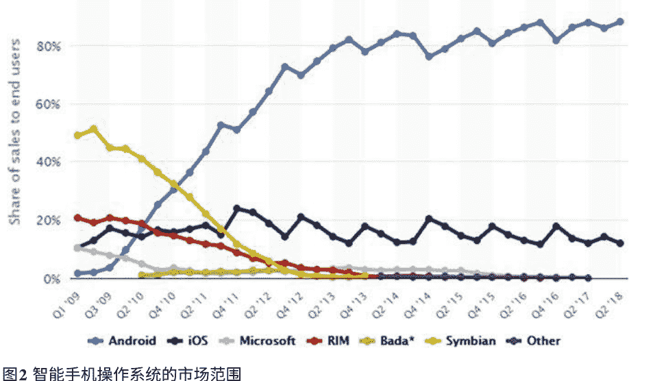

- KILL_BACKGROUND_PROCESSES
- CHANGE_WIFI_MULTICAST_STATE
- MODIFY_AUDIO_SETTINGS
- CHANGE_NETWORK_STATE
- READ_SYNC_SETTINGS
- SET_WALLPAPER_HINTS
- ACCESS_NETWORK_STATE
- EXPAND_STATUS_BAR
- VIBRATE
- DISABLE_KEYGUARD
- REQUEST_COMPANION_RUN_IN_BACKGND
- INSTALL_SHORTCUT
- USE_FINGERPRINT
- CHANGE_WIFI_STATE
- ACCESS_LOCATION_EXTRA_COMMANDS
- MANAGE_OWN_CALLS
- BLUETOOTH
- SET_WALLPAPER
- READ_SYNC_STATS
- BROADCAST_STICKY
- WRITE_SYNC_SETTINGS
- 重新排序任务
- 唤醒锁定
- 访问通知策略
- 请求忽略电池优化

- 访问WiFi状态
- NFC
- 互联网
- 蓝牙管理员
- RECEIVE_BOOT_COMPLETED

## 2 恶意软件模式和机器学习

恶意软件可以采用多种不同形式，可以破坏计算机系统并实现不道德的目标，如破坏计算机、获取金钱或以非法方式进入计算机，这可能导致较低的安全性或系统信息泄漏。一些有害的数据包，包括特洛伊木马、rootkit、野兽、可疑打包工具、恐吓软件、逃避、后门、键盘记录器、特洛伊间谍、特洛伊游戏盗贼等，可以通过不同的方式发送，并可以以两种方式传播。

多态恶意软件在每次复制自身时更改其代码，但保持其原始编码，并使其看起来始终是新的。有很多不同的入侵检测系统工具可供选择，其中一些是免费的。它们既可以对攻击进行分类（使用PCAP文件），也可以监视网络流量[12-17]。

与机器学习相比，深度学习的错误率非常低。深度学习，也被称为深度结构化学习和分层学习，如图3所示，是指人们通过观察许多不同的特征或表示来进行学习，这种学习对他们来说是有意义的。深度学习是指通过先进的神经网络算法和动态分析来进行学习[18-26]。

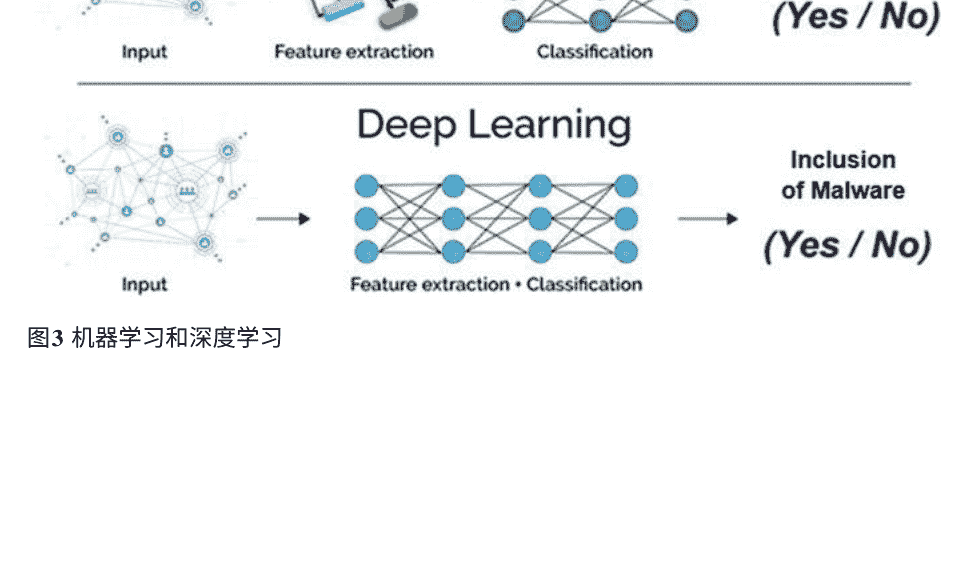

## 3 研究声明和目标

由于全球范围内有很多安卓手机，人们从很多不同的地方获取他们的应用程序。虽然安卓生态系统中存在越来越多的问题，但如果你有一种展示模型和技术的方法，就更容易发现APK漏洞[27-30]。

以下是在不同在线仓库上发布的主要可疑应用程序。

- com.family.cleaner—清理器：安全快速
- com.op.blinkingcamera—眨眼相机
- com.use.clever.camera—聪明相机
- com.touch.smile.camera—微笑相机
- com.just.parrot.album—com.qti.atfwd.core
- com.color.rainbow.camera—彩虹相机
- com.flappy.game.cat—FlappyCat
- com.bunny.h5game.parkour—复活节冲刺
- com.op.blinkingcamera—眨眼相机
- cm.com.hipornv2—HiPorn

## 4 实验结果和结果

首先要做的是从在线存储库获取APK文件，以便可以创建基于权限的数据集。还教授如何使用机器学习和深度学习。

APKPure存储库有很多Android应用程序，可以使用APK工具对其进行分析，以查看其权限和可疑参数的分析结果，如图4和图5所示。


图4 APKPure的APK存储库


下表2显示了使用Android AAPT从Android应用程序生成数据集的生成面板。Android AAPT工具包提供了在智能手机上安装应用程序之前获取与Android应用程序相关的权限的指令。这样做可以进行详细的指纹识别。

传统机器学习和深度学习方法的准确性指标列在表3中。

图6显示了深度学习和传统机器学习在消耗时间方面的表现。在各种尝试中，基于深度神经网络的学习的执行时间在性能上比传统机器学习的经典方法更准确。基于深度学习的算法的实施提高了整个系统在准确性方面的性能，相比传统方法更好。

表2 数据集的形成

| 呼叫 | 可疑(1-恶性, 2-良性) | 蓝牙 | 短信 | 联系人 |
| :--- | :--- | :--- | :--- | :--- |
| 0 | 1 | 0 | 1 | 0 |
| 1 | 2 | 1 | 1 | 1 |
| 0 | 1 | 0 | 0 | 1 |
| 1 | 2 | 1 | 1 | 1 |
| 1 | 1 | 1 | 1 | 1 |
| 0 | 1 | 0 | 1 | 1 |
| 1 | 1 | 0 | 0 | 0 |
| 1 | 1 | 1 | 0 | 0 |
| 1 | 1 | 1 | 1 | 0 |
| 1 | 1 | 1 | 1 | 1 |
| 0 | 2 | 1 | 0 | 1 |
| 1 | 1 | 1 | 1 | 1 |
| 1 | 1 | 1 | 0 | 1 |
| 1 | 1 | 0 | 1 | 1 |
| 1 | 1 | 1 | 0 | 1 |
| 1 | 1 | 0 | 0 | 1 |
| 1 | 1 | 1 | 0 | 0 |
| 0 | 1 | 1 | 0 | 1 |
| 0 | 1 | 1 | 1 | 1 |
| 0 | 1 | 1 | 1 | 1 |
| 1 | 1 | 0 | 0 | 1 |
| 1 | 2 | 0 | 1 | 1 |
| 1 | 1 | 0 | 1 | 0 |
| 1 | 1 | 1 | 1 | 0 |

表3 参数评估

| 传统机器学习方法(准确性) | 基于深度学习的方法(准确性) |
| :--- | :--- |
| 84 | 93 |
| 82 | 93 |
| 75 | 95 |
| 81 | 94 |
| 86 | 97 |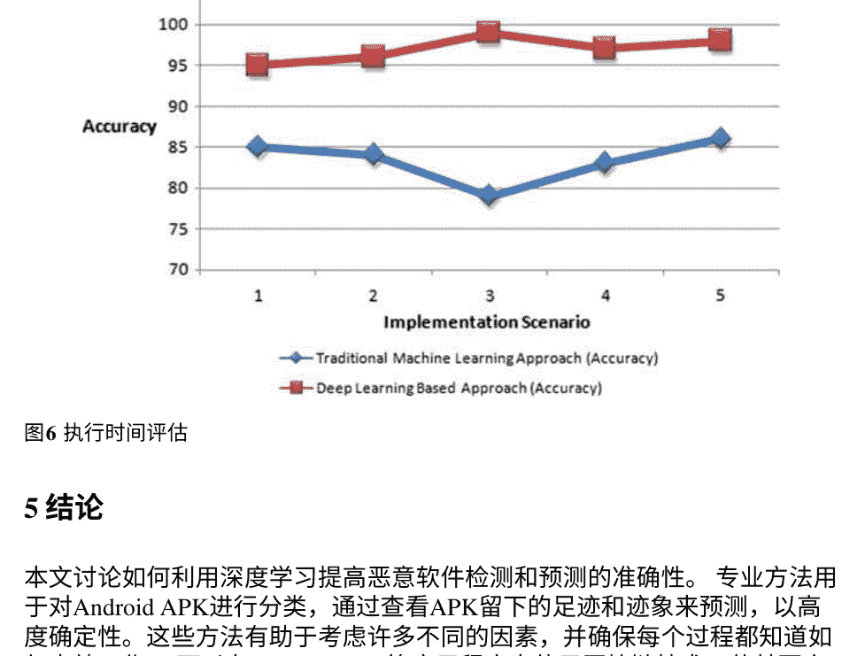

### 图6 执行时间评估

## 5 结论

本文讨论如何利用深度学习提高恶意软件检测和预测的准确性。专业方法用于对Android APK进行分类，通过查看APK留下的足迹和迹象来预测，以高度确定性。这些方法有助于考虑许多不同的因素，并确保每个过程都知道如何高效工作。可以在Android APK等应用程序中使用区块链技术，使其更安全或更私密。由于对区块链的研究工作，加密货币已成为最重要的研究领域之一。许多数字货币在全球范围内都很流行，并引起了很多关注，尽管也有一些投诉和丑闻。有许多不同类型的加密货币，如比特币、以太坊、莱特币、格雷德币、质数币、瑞波币、Nxt币、狗狗币、Namecoin币、Auroracoin币等，它们都使用区块链技术，这意味着它们不通过银行或支付服务记录交易细节。这就是为什么许多国家禁止加密货币的主要原因，尽管这些知名且被广泛使用的数字货币具有很好的安全功能。

动态密码学用于管理区块链的记录块。这意味着所有交易都可以加密，区块链对黑客和嗅探者具有抵抗力。然而，所提出的深度学习算法存在一些缺点。本文描述的方法旨在解决优化功能选择的特定问题。交叉操作符的冗余性是这个优化问题类别的特定特征。其次，数据集的选择问题被优化，样本数量和数据维度是影响运行时间的主要因素。对于未来的研究，使用该方法处理大规模案例而不增加计算复杂性是一项重要任务。

## 参考文献

1.  Vivekanandam, B. (2021). 设计一种自适应混合方法，用于在安卓设备中检测有效的恶意软件。普适计算与通信技术杂志，3(2)，135–149。
2.  Jose, R. R., & Salim, A. (2019). 综合静态分析用于恶意软件变种检测。创新计算技术国际会议 (pp. 622–629). Cham: Springer.
3.  Kumar, A. A., Anoosh, G. P., Abhishek, M. S., & Shraddha, C. (2020). 一种有效的基于机器学习的文件恶意软件检测——一项调查。在国际通信、计算和电子系统会议上 (pp. 355–360). Springer, Singapore.
4.  Deshotels, L., Notani, V., & Lakhotia, A. (2014). Droidlegacy: Android恶意软件的自动家族分类。在ACM SIGPLAN关于程序保护和逆向工程研讨会2014年的论文 (p. 3). ACM.
5.  Yerima, S. Y., Sezer, S., & McWilliams, G. (2014). 基于贝叶斯分类的Android恶意软件检测方法分析。IET信息安全，8(1), 25–36.
6.  Talha, K. A., Alper, D. I., & Aydin, C. (2015). APK审计员：基于权限的Android恶意软件检测系统。数字调查，13，1-14。
7.  Faruki, P., Ganmoor, V., Laxmi, V., Gaur, M. S., & Bharmal, A. (2013). AndroSimilar:强大的统计特征签名用于Android恶意软件检测。在第6届国际信息与网络安全会议论文集 (pp. 152-159). ACM.
8.  Yerima, S. Y., Sezer, S., & Muttik, I. (2015). 使用集成学习进行高准确度的Android恶意软件检测。IET信息安全，9(6), 313-320。
9.  Cai, H., Meng, N., Ryder, B., & Yao, D. (2019). Droidcat: 通过应用程序级别的配置实现有效的Android恶意软件检测和分类。IEEE信息取证和安全交易，14(6)，1455-1470。
10. Adebayo, O. S., & Aziz, N. A. (2019). 移动恶意软件的趋势和有效检测技术。在多代人的在线行为和媒体使用中：概念、方法、工具和应用 (第668-682页). IGI Global。
11. Onwuzurike, L., Mariconti, E., Andriotis, P., Cristofaro, E. D., Ross, G., & Stringhini, G. (2019). MaMaDroid: 通过构建行为模型的马尔可夫链来检测Android恶意软件(扩展版)。ACM Transactions on Privacy and Security (TOPS), 22(2), 14.
12. Kim, T., Kang, B., Rho, M., Sezer, S., & Im, E. G. (2019). 一种多模态深度学习方法，用于使用各种特征进行Android恶意软件检测。IEEE Transactions on Information Forensics and Security, 14(3), 773–788.
13. 陈，S.，薛，M.，范，L.，马，L.，刘，Y.，和徐，L. (2019年)。我们如何制作大规模的Android恶意软件？一种自动化的中毒攻击。在2019年IEEE第一届国际研讨会人工智能移动（AI4Mobile）（第21-24页）。IEEE。
14. Sharma, A., 和 Sahay, S. K. (2019年)。改进Android恶意应用检测准确性的分组分类方法。arXiv预印本arXiv:1904.02122
15. 苏，D.，刘，J.，王，X.，和王，W. (2019年)。在中国社交网络上检测Android锁定勒索软件。IEEE Access, 7, 20381-20393。
16. Saracino, A., Sgandurra, D., Dini, G., 和 Martinelli, F. (2018年)。Madam: 有效和高效基于行为的Android恶意软件检测和预防。IEEE可靠性和安全计算交易，15(1), 83-97。
17. 李，J.，孙，L.，严，Q.，李，Z.，Srisa-an, W.，和叶，H. (2018年)。基于机器学习的Android恶意软件检测的重要权限识别。IEEE工业信息学报，14(7), 3216-3225。
18. 沈，F.，Del Vecchio, J., Mohaisen, A., Ko, S. Y., 和 Ziarek, L. (2018年)。使用复杂流量的Android恶意软件检测。IEEE移动计算交易。
19. Karbab, E. B., Debbabi, M., Derhab, A., 和 Mouheb, D. (2018年)。MalDozer: 使用深度学习的Android恶意软件检测自动框架。数字调查，24, S48-S59。
20. 朱，H. J.，尤，Z. H.，朱，Z. X.，石，W. L.，陈，X.，和程，L. (2018年)。DroidDet：使用静态分析和旋转森林模型进行有效和稳健的Android恶意软件检测。神经计算，272，638–646。
21. Garcia, J., Hammad, M., & Malek, S. (2018). 轻量级、混淆抗性检测和Android恶意软件家族识别。ACM软件工程和方法学交易（TOSEM），26(3)，11。
22. Vinayakumar, R., Soman, K. P., Poornachandran, P., & Sachin Kumar, S. (2018). 使用长短期记忆（LSTM）检测Android恶意软件。智能与模糊系统杂志，34(3)，1277–1288。
23. Narayanan, A., Chandramohan, M., Chen, L., & Liu, Y. (2018). 一种多视图上下文感知的Android恶意软件检测和恶意代码定位。经验软件工程，1–53。
24. 陈，S.，范，L.，陈，C.，苏，T.，李，W.，刘，Y.，&徐，L. (2019年)。StoryDroid: Android应用程序的自动生成故事板。arXiv预印本arXiv: 1902.00476
25. 王，W.，李，Y.，王，X.，刘，J.，&张，X. (2018年)。使用集成分类器检测Android恶意应用程序和分类良性应用程序。未来的计算机系统，78，987-994。
26. 黄，H. D.，&高，H. Y. (2018年)。R2-D2：基于颜色启发的卷积神经网络（CNN）的Android恶意软件检测。在2018年IEEE国际大数据会议（大数据）（pp. 2633-2642）。IEEE。
27. 麦克劳林，N.，马丁内斯德尔林孔，J.，康，B.，叶里马，S.，米勒，P.，塞泽尔，S.，Joon Ahn，G.等（2017年）。深度Android恶意软件检测。在第七届ACM数据和应用安全与隐私会议上（pp. 301-308）。ACM。
28. Demontis, A., Melis, M., Biggio, B., Maiorca, D., Arp, D., Rieck, K., Roli, F., 等 (2017年)。是的，机器学习可以更安全！一个关于Android恶意软件检测的案例研究。IEEE可靠与安全计算交易。
29. Milosevic, N., Dehghantanha, A., & Choo, K. K. R. (2017). 机器学习辅助的Android恶意软件分类。计算机与电气工程，61，266–274。
30. Feizollah, A., Anuar, N. B., Salleh, R., Suarez-Tangil, G., & Furnell, S. (2017). Androdialysis: 分析Android意图在恶意软件检测中的有效性。计算机与安全，65，121–134。

# RNN变种在股票价格预测中的比较分析

Amit Raja Kalidindi, Naga Sudhakar Ramisetty, Srikalpa Sankeerth Kruthivent, Jayam Sri Harsha Srinivas, 和Lekshmi S. Nair

摘要 股票价格预测对于交易员来说是一项重要任务，可以帮助他们获得良好的投资回报。股票价格受多种因素的影响。为了发现潜在的模式并做出正确的预测，研究人员多年来一直在尝试利用机器学习和深度学习。在这个领域之前的研究结果表明，循环神经网络（RNN）和长短期记忆（LSTM）等DL模型在预测股票价格方面比标准ML模型表现更好。在这项工作中，我们使用了塔塔咨询服务公司（TCS）18年的历史数据，分析了不同RNN变种在预测股票收盘价方面的性能。

关键词：深度学习·循环神经网络·时间序列预测

## 1 引言

股票交易所是投资者可以购买和出售上市公司股票的市场。股票交易的重要方面是价格预测或趋势预测（看涨或看跌）。股票价格是通过两种类型的分析来预测的，即基本分析和技术分析。基本分析使用诸如经济、公司生产的产品市场、公司达成的交易以及公司的年度增长等不同因素来预测趋势。技术分析通过分析股票交易活动（如交易量和过去的价格）来预测股票价格。交易员在技术分析中使用蜡烛图形式来寻找模式并进行股票价格趋势预测。但是，一些潜在的模式可能会被自然地忽略。股票价格预测问题属于时间序列预测 [1]。过去使用了不同的技术来预测股票价格，如移动平均和ARIMA [2]。机器学习模型如支持向量机和线性回归也被用于股票价格预测 [3, 4]。但是近年来的研究表明，深度学习模型如人工神经网络、卷积神经网络和循环神经网络在股票价格预测方面具有更好的性能，与ARIMA和标准机器学习模型相比。循环神经网络等模型可以以很高的准确性预测股票价格，并且适用于时间序列预测，因为前一步的输出作为当前步的输入。但是，它存在梯度消失问题，这使得处理长期依赖关系变得困难 [5]。梯度消失问题发生在梯度变得非常小导致学习受阻的情况下。

LSTM的引入解决了这个问题。它是一种可以具有长期记忆的RNN。LSTM在序列预测问题中表现出色。这项工作的主要目标是分析不同RNN变体在股票价格预测中的性能。在这项工作中，我们分析了简单RNN、LSTM、带有窥视孔连接的LSTM、双向LSTM、门控循环单元（GRU）和双向GRU在预测股票收盘价时的性能，给定单变量和多变量数据作为输入。

A. R. Kalidindi (✉) · N. S. Ramisetty · S. S. Kruthivent · J. S. H. Srinivas · L. S. Nair 计算机科学与工程系, Amrita Vishwa Vidyapeetham, Amritapuri, 印度

电子邮件：karaja@am.students.amrita.edu

N. S. Ramisetty
电子邮件：rnagasudhakar@am.students.amrita.edu

S. S. Kruthivent
电子邮件：sskruthivent@am.students.amrita.edu

J. S. H. Srinivas
电子邮件：jsharshasrinivas@am.students.amrita.edu

L. S. Nair
电子邮件：lekshmisisn@am.amrita.edu

## 2 相关工作

研究人员提出了不同的时间序列预测技术。在[6]中，DL模型被用于预测在NSE上市的公司的股票价格。分析了多层感知机（MLP）、RNN、LSTM、CNN和SVM的性能。与其他模型相比，CNN表现更好。结果还与ARIMA的性能进行了比较，发现所有模型的性能都优于ARIMA。在[7]中进行了类似的工作，以上模型的性能在NSE和NYSE的数据上进行了测试，并得到了类似的结果。在[8]中，提出了一种使用深度学习模型的滑动窗口方法来短期预测股票价格。研究[9]提出了CNN-LSTM模型以获得良好的股票预测准确性。为了从数据中提取特征，采用了CNN。利用提取的特征，利用LSTM来预测股票价格。在[10]中，使用Nifty 50指数数据来评估不同的基于机器学习的回归模型和不同的基于LSTM的模型。预测开盘价的表现。记录并比较了基于机器学习的回归模型（如多元回归、决策树回归、支持向量机回归）和LSTM模型（如经典LSTM和编码器-解码器LSTM）的性能。在单变量输入数据和多变量输入数据上测试了LSTM模型的性能。单变量输入的LSTM模型表现更好，优于多变量输入的模型。与其他模型相比，使用过去一周的数据的单变量输入的LSTM模型更准确。在[11]中，观察了LSTM模型在预测谷歌和耐克股票的开盘价方面的性能。通过改变训练模型的时期数量和训练数据的大小，分析了模型的性能。观察到增加时期数量和使用更少的数据进行训练可以改善测试结果。在[12]中，分析了预测印度国家证券交易所上市公司股票价格方面的无状态和有状态LSTM模型的性能。无状态模型比有状态模型更稳定。在[13]中，使用GRU预测了股票市场的未来价格。对GRU的内部结构进行了改进以提高效率。使用了小批量梯度下降法，并取得了有希望的结果。在[14]中，使用了简单的RNN、GRU和LSTM来预测SP500公司的股票价格。发现LSTM的表现优于其他模型。研究[15]提出了优化的GRU和LSTM模型用于股票价格预测。使用了PCA和LASSO进行降维。发现GRU和LSTM都表现良好。使用LASSO的模型比使用PCA的模型表现更好。在[16]中，构建了使用CNN、LSTM、GRU和极限学习机(ELM)的深度学习模型，并对BANKEX指数中的股票价格进行了评估。在[17]中，提出了一种使用堆叠LSTM来预测风速的深度学习方法。发现具有三层的堆叠LSTM模型表现最佳。在[18]中，提出了一种基于LSTM的模型来预测维基百科的网络流量。在[19]中，对LSTM和GRU在处理机器理解方面进行了比较分析，观察到GRU具有更好的性能。

## 3 RNN 变体

### 3.1 简单 RNN

RNN 如图1所示，是一种人工神经网络的类型，当前步骤的输入是来自上一步骤的输出。通常，神经网络可以有很多神经元和层，输入通过神经元和层，输出被计算。在这里，输入和输出是无关的。如果数据需要基于先前的序列或数据进行预测，则需要记住数据或序列。因此，RNN 的出现是为了使用隐藏状态来记住数据的序列。RNN 的数学方程如下

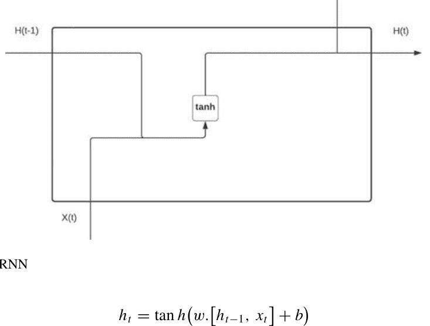

$$h_t = \tanh(w.[h_{t-1}, x_t] + b) \quad (1)$$

其中 $h_t$ 表示当前状态， $h_{t-1}$ 表示上一个状态， $x_t$ 表示输入， $w$ 表示权重， $b$ 表示偏差。RNN是通过使用反向传播算法进行训练的。权重以使损失最小的方式进行更新。由于使用梯度进行权重的不断更新，会出现梯度消失或梯度爆炸的问题。梯度变得越来越小，接近于零，导致较低层的权重保持不变，无法进行学习或训练。这个问题被称为梯度消失。有时，梯度变得越来越大，导致权重更新过大，使梯度下降变得很大。这种情况被称为梯度爆炸。为了避免这种缩放效应，可以使用LSTM。LSTM是以避免梯度爆炸或梯度消失问题为目标构建的[20]。

### 3.2 长短期记忆（LSTM）

LSTM是RNN的一种变体。LSTM可以学习长期依赖关系。LSTM和RNN的主要区别在于LSTM的隐藏层是一个门控单元或门控单元。使用门控在LSTM中添加或删除信息。这些门由一个sigmoid层和一个逐点乘法组成。如图2所示，LSTM有三种不同的门，用于维护细胞的状态。第一个门被称为遗忘门。用于此输出的sigmoid层的值范围从0到1，决定了应该从过去的细胞状态中消除多少数据。第二个门被称为输入门。它控制着必须添加到细胞状态中的数据量。它有两个层。sigmoid层确定必须修改的值，tanh层生成一组新值。第三个门被称为输出门，确定输出序列。tanh层接收更新后的cell state作为输入。该层的输出然后与第三个sigmoid层的输出相乘。这个乘积的输出成为新的隐藏状态。

LSTM的数学方程如下：

$$
\begin{aligned}
i_t &= \sigma(w_i.[h_{t-1}, x_t] + b_i) \\
f_t &= \sigma(w_f.[h_{t-1}, x_t] + b_f) \\
o_t &= \sigma(w_o.[h_{t-1}, x_t] + b_o) \\
\hat{C}_t &= \tanh(w_C.[h_{t-1}, x_t] + b_C) \\
C_t &= f_t * C_{t-1} + i_t * \hat{C}_t \\
h_t &= o_t * \tanh(C_t)
\end{aligned}
$$

其中，$i_t$表示输入状态，$f_t$表示遗忘状态，$o_t$表示输出状态，$w_x$表示相应门的权重，$b_x$表示偏差，$C_t$表示细胞状态，$h_t$表示隐藏状态，$tanh$和$\sigma$表示激活函数。

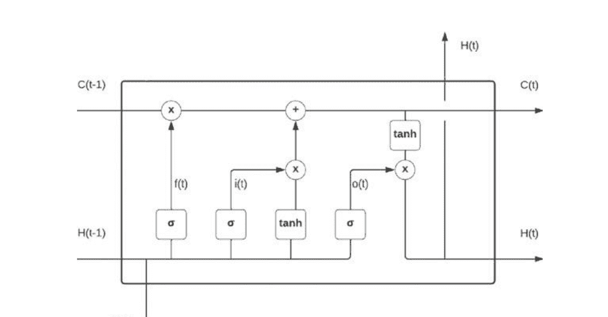

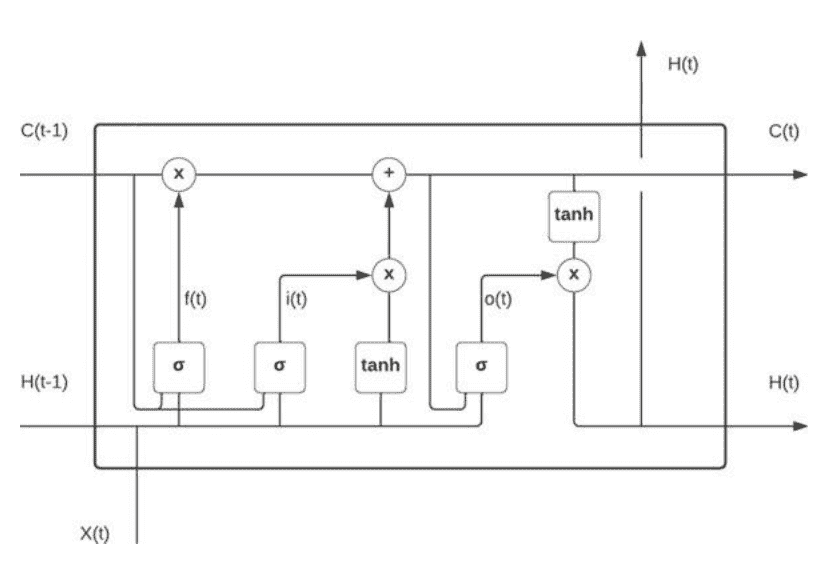

图3 Peephole LSTM

### 3.3 Peephole LSTM

带有窥视孔连接的LSTM是基本LSTM架构的变体之一。 如图3所示，窥视孔连接的创建方式不仅依赖于隐藏状态，还依赖于细胞状态[21]。 LSTM窥视孔连接方程如下。

$$
\begin{aligned}
i_{t} &=\sigma\left(w_{i}.\left[C_{t-1}, h_{t-1}, x_{t}\right]+b_{i}\right) \\
f_{t} &=\sigma\left(w_{f}.\left[C_{t-1}, h_{t-1}, x_{t}\right]+b_{f}\right) \\
o_{t} &=\sigma\left(w_{o}.\left[C_{t}, h_{t-1}, x_{t}\right]+b_{o}\right) \quad (3)
\end{aligned}
$$

在这里，$i_{t}$表示输入状态，$f_{t}$表示遗忘状态，$o_{t}$表示输出状态，$C_{t}$表示细胞状态，$h_{t}$表示隐藏状态，$w_{x}$表示相应门的权重，$\sigma$表示激活函数，$b_{x}$表示偏差。

### 3.4 门控循环单元（GRU）

GRU也是RNN变体之一[22]，用于解决梯度爆炸或梯度消失的问题。 与LSTM不同，GRU只有两个门。它们是重置门和更新门。如图4所示，在GRU中，隐藏状态和细胞状态不是分开的，而是合并成一个状态。 通过更新门来控制传递到未来的知识量。

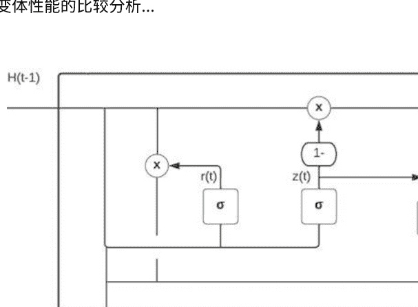

通过重置门来控制需要遗忘的知识量。由于门的数量较少和可训练参数的数量较少，GRU的训练速度更快。
GRU的数学方程如下

```
z_t = σ(w_z · [h_{t-1}, x_t] + b_z)
r_t = σ(w_r · [h_{t-1}, x_t] + b_r)
ĥ_t = tanh(w_h · [r_t * h_{t-1}, x_t] + b)
h_t = (1 - z_t) * h_{t-1} + z_t * ĥ_t      (4)
```

在这里，x_t代表输入向量，h_t代表输出向量，ĥ代表候选激活向量，z_t代表更新门向量，r_t代表重置向量，w_x代表权重，b_x代表偏置。

### 3.5 双向 LSTM 和双向 GRU

双向循环神经网络可以看作是两个独立循环神经网络的混合。在这个模型中，神经网络将同时访问正向和反向的序列信息[23]。如图5所示，在双向LSTM和双向GRU中，输入将以两个方向流动：从过去到未来或反之亦然。从后向前运行的输入将使双向LSTM和双向GRU保留未来的信息，而从前向后运行的输入将使双向LSTM和双向GRU保留过去的信息。它们主要用于自然语言处理任务，如翻译实体识别和分类。它们也适用于语音识别、手写识别以及蛋白质结构预测。与标准LSTM或GRU相比，它们也有一定的缺点，因为它们需要更多的训练时间。输出可以计算为

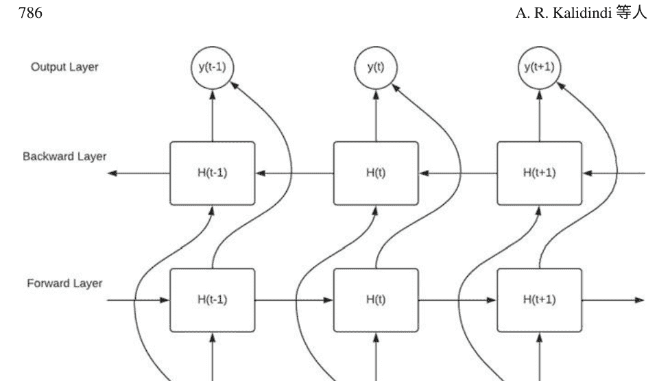

图5 双向LSTM或双向GRU

$y = g(w_y.[a_f, a_b] + b_y) \quad (5)$

在这里，$y$表示输出，$w_y$表示权重，$b_y$表示偏差，$a_f$表示正向激活，$a_b$表示反向激活。

## 第4个方法

在这项工作中，我们使用塔塔咨询服务公司（TCS）的历史股价数据并分析了上述RNN变体在预测股票收盘价方面的性能。我们使用雅虎金融[24]收集准确的数据。我们从2003年1月1日到2021年12月31日收集了股票数据。可用数据按8:2的比例划分为训练和测试。验证集的划分比例选择为训练数据的0.2。由于我们希望测试RNN变体在单变量输入和多变量输入上的性能，我们相应地处理了我们的数据。对于单变量输入模型，只提供过去14天的股票收盘价作为输入。对于多变量输入模型，提供过去14天的股票的最低价、最高价、开盘价、收盘价以及交易量作为输入。数据使用最小-最大缩放器进行了归一化处理。为了优化模型，我们以均方误差（MSE）作为标准。

$$
\text{MSE} = \frac{1}{n} \sum_{i=1}^{n} (y_i - \hat{y}_i)^2
$$

我们以平均绝对百分比误差（MAPE）作为评估标准。

$$
\text{MAPE} = \frac{1}{n} \sum_{i=1}^{n} \left| \frac{y_i - \hat{y}_i}{y_i} \right| \times 100
$$

最初，为了找到最佳的优化器，我们使用不同的优化器（如Adam、Rmsprop、随机梯度下降（SGD）和Adadelta）测试了上述RNN变体的性能。我们为此使用了简单的模型，它们包含三层，即输入层、RNN变体层和密集层。每个模型的隐藏单元数为50。训练模型的时期数为50。

表1和表2显示，对于单变量和多变量输入，Adam优化器在大多数情况下表现更好，因为它产生了最低的MAPE。与其他优化器相比，Adam优化器具有非常快的计算时间。因此，它可以在更短的时间内产生更好的结果。

与许多优化器相比，它所使用的内存和参数数量较少。因此，我们可以说Adam是基于所得结果的最佳优化器。

在确定Adam作为有效的优化器之后，我们使用它作为优化器，通过改变RNN变体层数和隐藏单元的数量，创建并分析了各种模型的性能。

如上所述，模型的性能已在单变量输入和多变量输入上进行了测试。对于单变量输入，输入形状为(14, 1)，只将过去14天的股票收盘价作为输入。对于多变量输入，输入形状为(14, 5)，将过去14天的股票的最低价、最高价、开盘价、收盘价和交易量作为输入。

表1 RNN变体在不同优化器和单变量输入-MAPE值下的性能

| RNN变种 | Adam优化器 | Rmsprop优化器 | SGD优化器 | Adadelta优化器 |
|---------|------------|---------------|-----------|----------------|
| 简单RNN | 2.05 | 2.37 | 9.11 | 11.16 |
| LSTM | 1.45 | 2.32 | 2.42 | 12.08 |
| Peephole LSTM | 1.76 | 2.34 | 2.34 | 8.97 |
| 双向LSTM | 2.00 | 2.33 | 2.86 | 5.83 |
| GRU | 1.25 | 1.74 | 1.75 | 12.86 |
| 双向GRU | 1.29 | 1.35 | 2.44 | 6.69 |

表2 RNN变种在不同优化器和多变量输入下的性能-MAPE值

| RNN变种 | Adam优化器 | Rmsprop优化器 | SGD优化器 | Adadelta优化器 |
|---------|------------|---------------|-----------|----------------|
| 简单RNN | 5.80       | 5.99          | 8.03      | 10.68          |
| LSTM    | 1.42       | 2.24          | 2.94      | 12.09          |
| Peephole LSTM | 2.58 | 4.72          | 3.22      | 10.39          |
| 双向LSTM | 2.95      | 1.88          | 3.46      | 12.68          |
| GRU     | 2.16       | 2.57          | 1.60      | 3.65           |
| 双向GRU | 1.77       | 2.39          | 2.72      | 4.00           |

## 5 结果

对于每个RNN变种，我们创建了三个模型，这些模型在使用的RNN变种层数(1-3)上有所不同。然后，通过改变隐藏单元的数量（50、75、100、125和150），测试了每个模型的性能。如上所述，使用MAPE来衡量性能。

$$
\text{平均MAPE} = \frac{\text{MAPE}(50) + \text{MAPE}(75) + \text{MAPE}(100) + \text{MAPE}(125) + \text{MAPE}(150)}{5} \quad (8)
$$

为了获得模型的整体性能，当隐藏单元数量变化时，计算了每个模型给出的MAPE的平均值。

结果表明，LSTM和GRU版本优于标准RNN。正如先前所述，RNN存在梯度消失问题，限制了其保留长期依赖性的能力。当层数增加时，RNN在单变量输入和多变量输入方面的性能急剧下降，如图6所示。LSTM和GRU变体中的细胞状态和门的存在帮助它们保留必要的信息。因此，LSTM和GRU变体的性能优于简单的RNN。

表3中的图表显示，在单变量输入模型中，当层数为1和2时，与LSTM变体相比，GRU和双向GRU的性能更好。但是，当层数为3时，经典LSTM和Peephole LSTM的性能优于GRU和双向GRU。在整体性能方面，GRU表现最佳，其次是双向GRU。双向LSTM的性能相对较差，不如其他LSTM变体和GRU变体。

表4中的数据显示，在具有多变量输入、GRU和双向GRU的模型中，与LSTM变体相比，GRU和双向GRU在所有情况下表现更好。当层数增加时，LSTM和窥视孔LSTM的性能显著下降。与其他模型相比，双向LSTM的性能较低，但性能差异不显著。

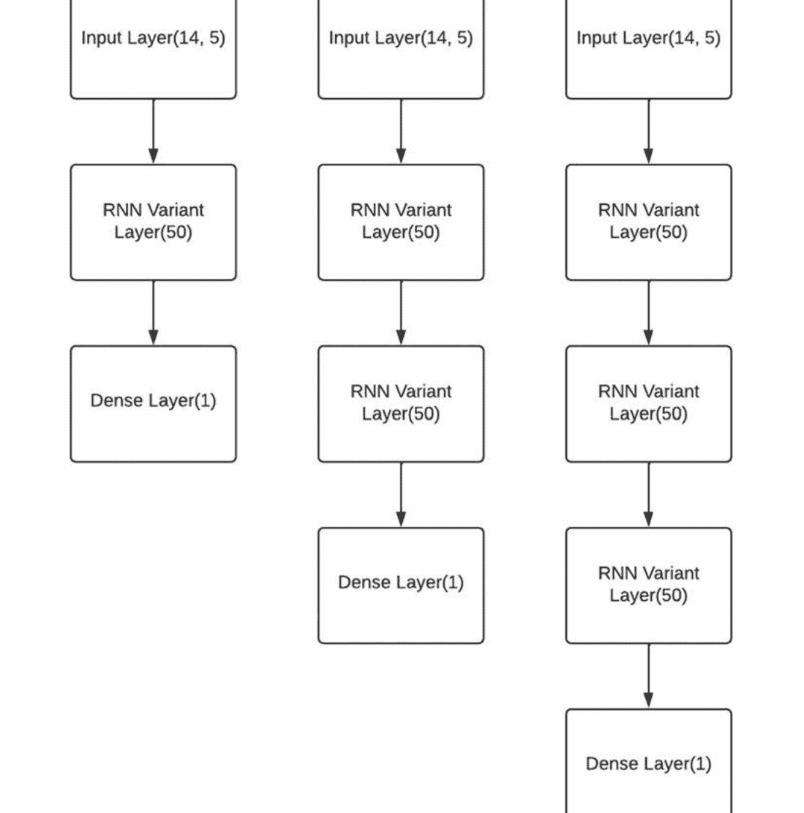

图6 具有多变量输入和隐藏单元数为50的样本模型

当层数改变时，观察到性能没有显著变化。在整体性能上，双向GRU表现最佳，其次是GRU。

图表显示了在层数变化和隐藏单元数设置为150时，各个变体在预测TCS股票价格方面的表现。模型经过50个周期的训练。

表3 具有单变量输入的RNN变体的性能

| RNN变种 | 平均 MAPE 层—1 | 平均 MAPE 层—2 | 平均 MAPE 层—3 |
|----------|----------------|----------------|----------------|
| 简单RNN  | 1.68           | 2.80           | 7.9            |
| LSTM     | 1.46           | 1.82           | 1.65           |
| 窥视孔LSTM | 1.61         | 2.04           | 1.67           |
| 双向LSTM | 1.65           | 1.73           | 2.72           |
| GRU      | 1.39           | 1.53           | 1.75           |
| 双向GRU  | 1.43           | 1.58           | 1.84           |

表4 RNN变体在多变量输入下的性能

| RNN变种 | 平均 MAPE 层—1 | 平均 MAPE 层—2 | 平均 MAPE 层—3 |
|----------|----------------|----------------|----------------|
| 简单RNN  | 2.96           | 6.63           | 11.12          |
| LSTM     | 1.70           | 2.19           | 3.37           |
| 窥视孔LSTM | 1.84         | 1.92           | 3.15           |
| 双向LSTM | 2.61           | 2.54           | 2.80           |
| GRU      | 1.68           | 1.76           | 2.78           |
| 双向GRU  | 1.66           | 1.61           | 1.81           |

图7、8和9展示了使用单变量输入预测TCS股票价格时RNN变体的性能。
图10、11和12展示了使用多变量输入预测TCS股票价格时RNN变体的性能。
对于单变量和多变量输入，图表显示简单RNN的性能随RNN层数增加而下降。它们还显示GRU和双向GRU的预测比LSTM变体更准确。

我们还在印度国家证券交易所上市的其他几只股票上进行了模型测试，以确认我们的结果。我们从2022年1月1日到1月4日收集了Infosys、Reliance、SBI和Bajaj Finance的股票数据。我们使用使用TCS股票数据训练的模型来预测上述股票的股价。使用的模型包含一个输入层、三个RNN变体层和一个密集层。
隐藏单元设置为150。模型训练了50个时期。
从表5和表6可以看出，GRU和双向GRU相对于其他RNN变体表现更好。LSTM变体在预测中也表现出了不错的性能。GRU架构相对于LSTM架构的主要优势在于训练时间更快，因为它具有较少的权重或参数。由于结果与上述结果相似，与其他LSTM变体相比，我们可以说GRU和双向GRU在预测股票价格方面具有优势。

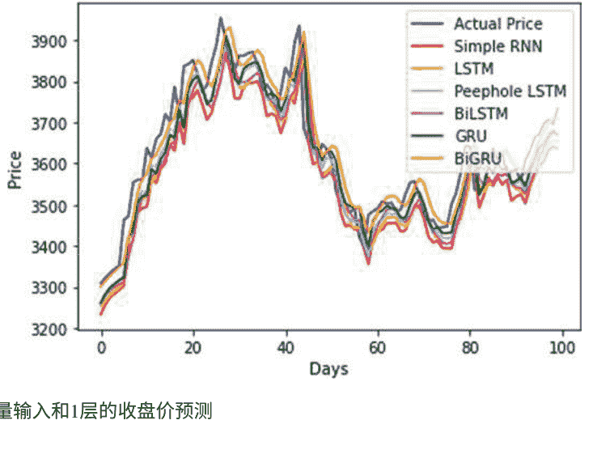

图7 单变量输入和1层的收盘价预测

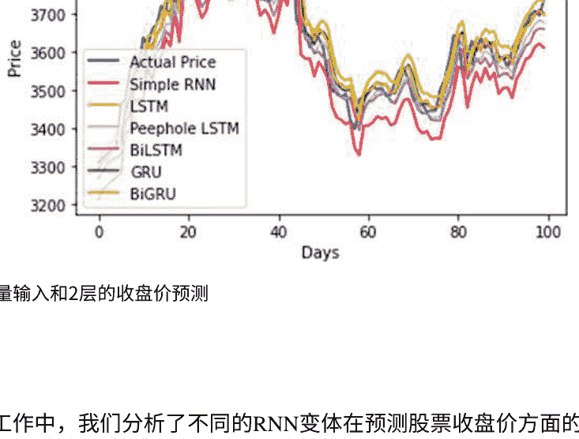

图8 单变量输入和2层的收盘价预测

## 6 结论

在这项工作中，我们分析了不同的RNN变体在预测股票收盘价方面的性能。我们使用了来自雅虎财经的TCS股票价格数据。我们评估了不同的优化器来寻找最佳优化器，并发现Adam作为最佳优化器来优化模型。 对于每个RNN变体，通过改变层数和隐藏单元的数量构建了不同的模型。性能是在单变量和多变量输入上进行了测试。 LSTM和GRU变体优于标准RNN。 GRU和双向GRU优于LSTM，窥视孔LSTM和双向LSTM。为了确认我们的结果，训练好的模型还在Infosys、Reliance、SBI和Bajaj Finance的股票数据上进行了测试。得到了类似的结果，表明我们的结果是有希望的，我们的方法是新颖的。

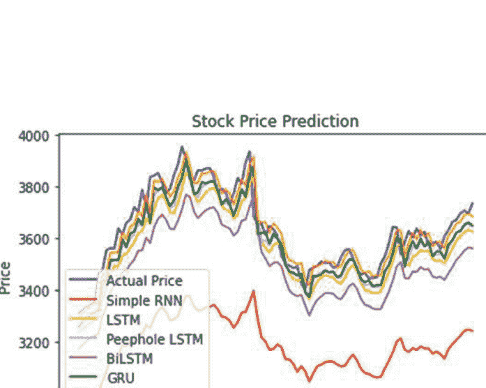

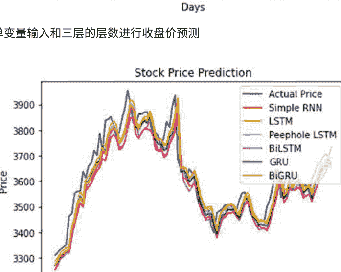

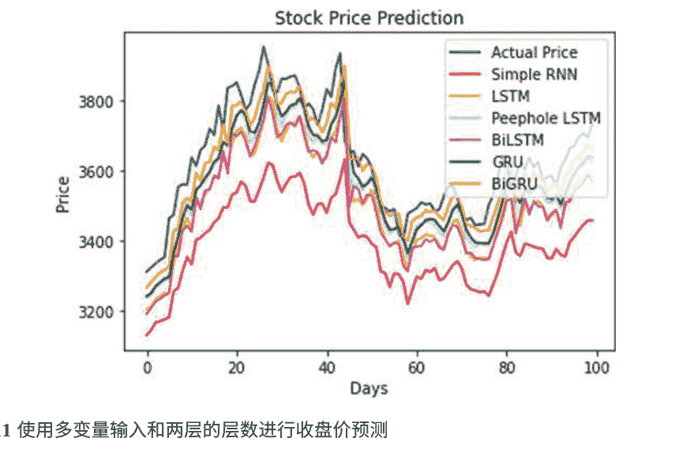

图11 使用多变量输入和两层的层数进行收盘价预测

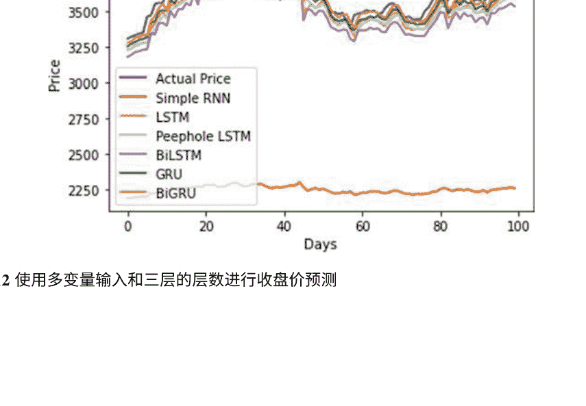

图12 使用多变量输入和三层的层数进行收盘价预测

表5 收盘价预测—单变量输入

| RNN变种 | MAPE Infosys | MAPE Reliance | MAPE SBI | MAPE Bajaj Finance |
| :--- | :---: | :---: | :---: | :---: |
| 简单RNN | 1.70 | 1.83 | 2.03 | 2.02 |
| LSTM | 1.42 | 1.73 | 1.72 | 1.96 |
| Peephole LSTM | 1.37 | 1.62 | 1.71 | 1.87 |
| 双向LSTM | 1.49 | 1.72 | 1.75 | 2.00 |
| GRU | 1.39 | 1.46 | 1.70 | 1.82 |
| 双向GRU | 1.37 | 1.49 | 1.71 | 1.82 |

表6 收盘价预测—多变量输入

| RNN变种 | MAPE Infosys | MAPE Reliance | MAPE SBI | MAPE Bajaj Finance |
| :--- | :---: | :---: | :---: | :---: |
| 简单RNN | 2.20 | 2.38 | 3.15 | 2.44 |
| LSTM | 1.4 | 1.63 | 1.77 | 1.83 |
| Peephole LSTM | 1.49 | 1.73 | 1.82 | 1.91 |
| 双向LSTM | 1.66 | 1.88 | 1.91 | 2.03 |
| GRU | 1.43 | 1.56 | 1.75 | 1.78 |
| 双向GRU | 1.43 | 1.62 | 1.73 | 1.77 |

## 参考文献

- 1. Mehtab, S. S., & Jaydip. (2020). 基于时间序列分析的股票价格预测使用机器学习和深度学习模型。
- 2. Adebiyi, A. A., & Aderemi Ayo, C. (2014). 使用ARIMA模型进行股票价格预测。在*Proceedings—UKSim-AMSS 16th International Conference on Computer Modelling and Simulation, UKSim 2014*. https://doi.org/10.1109/UK-Sim.2014.67
- 3. Karim, R. A., & Md Hossain, Md. (2021). 使用线性回归和decision tree回归进行股市分析。1–6. https://doi.org/10.1109/eSmarTA52612.2021.9515762
- 4. Vanukuru, K. (2018). 使用机器学习进行股市预测。 https://doi.org/10.13140/RG.2.2.12300.77448
- 5. Hochreiter, S. (1998). 在学习递归神经网络期间出现的梯度消失问题和问题解决方案。国际不确定性、模糊性和知识基础系统杂志，6，107–116。 https://doi.org/10.1142/S0218488598000094
- 6. Anand, C. (2021). 使用预训练神经网络的股票价格预测模型比较。普适计算和通信技术杂志 (*UCCT*), 3 (02), 122–134。
- 7. Hiransha, M., Gopalakrishnan, E. A., Menon, V. K., & Soman, K. P. (2018). NSE股票市场使用深度学习模型进行预测。计算机科学会议论文集, *132*, 1351–1362. https://doi.org/10.1016/j.procs.2018.05.050. ISSN 1877-0509.
- 8. Selvin, S., Vinayakumar, R., Gopalakrishnan, E. A., Menon, V. K., & Soman, K. P. (2017). 使用LSTM、RNN和CNN滑动窗口模型进行股票价格预测。在*2017年国际计算、通信和信息学会议(ICACCI)*(pp. 1643–1647). https://doi.org/10.1109/ICACCI.2017.8126078
- 9. 卢, W. L., 李, J., 孙, Y., 王, A., & 京阳. (2020). 基于CNN-LSTM的模型预测股票价格。复杂性, 2020, 1–10. https://doi.org/10.1155/2020/6622927

# 基于深度学习的雾霾去除系统

Santosh Randive, Joel Joseph, Neel Deshmukh, 和 Prashant Goje

摘要 机器学习和计算机视觉是应用人工智能领域中蓬勃发展的领域之一。通过机器学习，我们赋予机器自主决策的能力。计算机视觉是人工智能的一个子集，我们赋予这些机器看的能力，并使其能够理解图像的关键部分。由于噪声和大气干扰，这些图像经常受到破坏，这些噪声和干扰被识别为雾霾或大气雾霾。图像中存在雾霾会隐藏图像中的关键元素/主题，因此人工智能算法很难识别图像中的主题。在本文中，我们提出使用基于深度学习的雾霾去除系统，在将数据提供给您的人工智能系统之前，这将是最重要预处理步骤之一。

机器学习, 深度学习, 计算机视觉, 人工智能, 雾霾去除, 图像处理, 生成对抗网络

## 1 引言

在计算机视觉中，有不同的方法来确定神经网络在给出预测时关注的内容。论文[1]讨论了卷积神经网络（CNN）的每一层可能学习到的内容。论文[2]讨论了一种称为类激活映射的技术，可以帮助突出显示网络关注的图像部分。这些关注图可以理解我们的数据集和神经网络。现在，如果图像中包含噪声和大气雾霾，这些图就不会提供太多信息。

由于像素中的这些干扰，网络无法理解应该关注图像的哪个部分，导致神经网络性能差。考虑一个目标检测算法，该算法经过训练可以对图像中的公交车、人、汽车等进行分类，现在如果这些图像中包含雾霾，算法将很难识别图像中的物体。这个算法在自动驾驶汽车中被广泛使用，如果算法得到一个有雾霾的图像，算法可能很难对前方的物体进行分类，从而导致意外行为和危险事故的发生。为了避免这种情况，我们需要添加一个预处理模块，可以从图像中去除雾霾和不需要的噪声，然后将清晰的图像传递给目标检测算法。最初，一些图像处理技术被用来改善图像质量，但这些系统速度慢且容易出错。随着深度学习和计算机视觉的兴起，我们现在可以获得比传统方法更好的结果。在这里，我们提出了一个类似的系统，可以作为预处理步骤来去除雾霾，然后将无雾霾图像传递给后续的机器学习模块。

## 2 提出的方法

### 2.1 工作

为了解决这个问题，我们应用了各种标准的深度学习技术，如对输入图像进行下采样，然后对深层激活进行软化，最后对图像进行上采样。该网络工作良好，但往往会丢失图像中的必要像素。在本文中，我们提出使用基于生成对抗网络（GAN）[3]的网络，该网络可以将模糊图像作为输入，并获得相同的去雾图像。GAN网络由两个网络组成：生成器和判别器。生成器试图生成新的数据，判别器试图识别输入的图像是假还是真。生成器的目标是欺骗判别器，使其输出的概率得分为0.5，表示提供的数据可以是真实的或虚假的。GAN的最终目标是在给定标签的情况下预测特征，而不是预测给定特征的标签。

图1展示了GAN的简单训练过程。

### 2.2 生成器架构

Pix2Pix cGAN的生成器是一个改进的U-Net [5]。就像U-Net一样，生成器模型由一个包含一系列下采样的编码器块组成。后面跟着一系列上采样层的解码器块。每个编码器块由卷积、批归一化 [6] 和激活（Leaky ReLU）层组成，而解码器块包括转置卷积、批归一化、drop out（应用于前三个块）和ReLU层。

图1 生成对抗网络的块图

### 2.3 训练生成器

如前所述，生成器的目标是制作出保留输入图像重要信息的人工无雾样本。判别器的目标是从真实图像中识别出生成器生成的假图像。图2展示了训练生成器的块图。

在简单的GAN中，网络（GAN损失）在训练步骤中学习适应数据，而GAN网络的条件损失则试图保持图像的整体结构。在Pix2Pix GAN中，GAN通过以下损失函数进行优化：

1.  然后计算生成图像和一个全为1的数组之间的sigmoid交叉熵作为生成器损失。
2.  还计算生成图像和目标图像之间的L1损失，即平均绝对误差（MAE）。这样做是为了生成的图像保留图像中的对象/主题，并且生成的图像在结构上与目标图像相似。
3.  然后计算整体生成器损失如下：gan_loss + lambda * l1_loss，其中 lambda = 100。这是对 l1_loss的权重因子。
4.  在计算损失之后，计算梯度，并使用标准的优化器如Adam [7]来更新模型权重。

### 2.4 判别器架构

判别器块只是一个简单的卷积神经网络。它由一系列的下采样块组成，每个块由卷积和批归一化层组成，激活函数为Leaky ReLU。判别器试图将每个图像分类为真实类别或伪造类别。

### 2.5 训练判别器

如前所述，判别器的目标是对图像的真实和伪造样本进行分类。判别器网络接收来自生成器网络的真实图像和生成的图像。判别器的主要目标是看这些图像有多相似，并尝试将生成的图像分类为伪造图像。判别器块图示如图3所示。

总判别器损失是真实损失和生成损失的总和，其中

(i) 真实损失是真实图像和一个由1组成的数组的sigmoid交叉熵，因为这些图像是真实图像，应该被标记为1。
(ii) 生成的损失是生成图像和一个由0组成的数组的sigmoid交叉熵，因为这些是假图像，应该被标记为0。
(iii) 总损失是真实损失和生成损失的总和。

计算完损失后，计算梯度，并使用像Adam这样的标准优化器更新模型权重。

图3 鉴别器训练的块图

### 2.6 整体训练概述

训练集包括模糊图像和相同图像的去雾版本，被视为地面真实图像。模糊图像被输入生成器，首先生成器输出随机噪声，通过训练使生成的图像更像地面真实图像。鉴别器获取生成的图像和地面真实图像。计算两个网络的损失，并通过反向传播更新梯度到两个网络。

## 3 结果

随着时间的推移，网络学会生成给定模糊图像的新的去雾图像。图4、5、6和7显示了网络生成的一些图像。

图4 将模糊图像（左侧）输入生成器，得到去雾图像（右侧），并使用真实图像（中间）进行比较。

图5 将模糊图像（左侧）输入生成器，得到去雾图像（右侧），并使用真实图像（中间）进行比较。

图6 将模糊图像（左侧）输入生成器，得到去雾图像（右侧），并使用真实图像（中间）进行比较。

通过计算真实图像和生成图像之间的均方误差（MSE），我们得到了平均MSE为0.0221。与其他系统的比较见表1。

## 4 未来范围

下面的系统可以集成到今天的自动化机器学习系统中，如自动驾驶汽车、图像分类系统等。这种系统的通用块图如图8所示。

| 参数 | ATM [9] | BCCR [10] | DCP [11] | 我们的方法 |
| :--- | :--- | :--- | :--- | :--- |
| MSE | 0.0689 | 0.0243 | 0.0172 | 0.0221 |
| PSNR | 26.751 | 37.173 | 40.628 | 38.122 |

图像输入块只是一个简单的图像捕捉设备（相机），捕捉到的图像被传递给我们训练好的机器学习模型来去除雾霾，该块的输出是一个无雾图像，然后可以将这个无雾图像传递给进一步的机器学习算法进行进一步的分类。

## 5 结论

我们的数据中存在雾霾可能会导致我们的机器学习模型出现不必要的行为。在保持输入图像的结构信息的同时，消除这些大气异常是至关重要的。为了解决这个问题，如上所述的条件GAN将非常有帮助。GAN学习生成无雾图像，同时保持结构信息完整。

## 参考文献

- 1. Zeiler, M. D., & Fergus, R. (2013). 可视化和理解卷积网络。 arXiv: 1311.2901, 2013年11月12日
- 2. Zhou, B., Khosla, A., Lapedriza, A., Oliva, A., & Torralba, A. (2015). 学习深度特征进行判别定位。 arXiv: 1512.04150, 2015年12月14日
- 3. Goodfellow, I. J., Pouget-Abadie, J., Mirza, M., Xu, B., Warde-Farley, D., Ozair, S., Courville, A., & Bengio, Y. (2014). 生成对抗网络。 arXiv: 1406.2661, 2014年6月10日
- 4. Isola, P., Zhu, J. -Y., Zhou, T., & Efros, A. A. (2016). 图像到图像的转换与条件对抗网络。 arXiv: 1611.07004, 2016年11月21日
- 5. Ronneberger, O., Fischer, P., & Brox, T. (2015). U-Net: 用于生物医学图像分割的卷积网络。 arXiv: 1505.04597, 2015年5月18日
- 6. Ioffe, S., & Szegedy, C. (2015). 批量归一化：通过减少内部协变量偏移来加速深度网络训练。 arXiv 1502.03167, 2015年2月11日
- 7. Kingma, D. P., & Ba, J. (2017). Adam: 一种用于随机优化的方法。 arXiv: 1412.6980, 2017年1月30日
- 8. Cai, B., Xu, X., Jia, K., Qing, C., & Tao, D. (2016). DehazeNet: 一种用于单幅图像去雾的端到端系统。 arXiv: 1601.07661, 2016年5月17日
- 9. Sulami, M., Glatzer, I., Fattal, R., & Werman, M. (2014). 自动恢复有雾图像中的大气光. 在IEEE国际计算摄影会议(ICCP) (pp. 1–11).
- 10. Meng, G., Wang, Y., Duan, J., Xiang, S., & Pan, C. (2013). 具有边界约束和上下文正则化的高效图像去雾. 在IEEE国际计算机视觉会议(ICCV)(pp. 617–624).
- 11. He, K., Sun, J., & Tang, X. (2011). 使用暗通道先验的单幅图像去雾. IEEE 模式分析与机器智能交易, 33(12), 2341–2353.
- 12. Mehtab, S., Sen, J., & Dutta, A. (2021). 使用机器学习和基于LSTM的深度学习模型进行股票价格预测。在：Thampi, S. M., Piramuthu, S., Li, K. C., Berretti, S., Wozniak, M., Singh, D. (Eds.)机器学习和元启发算法以及应用。 SoMMA 2020。 计算机与信息科学通信 (Vol. 1366)。 新加坡： Springer。 https://doi.org/10.1007/978-981-16-0419-58
- 13. Moghar, A., & Hamiche, M. (2020). 使用LSTM循环神经网络进行股票市场预测网络。 Procedia计算机科学, 170, 1168–1173. https://doi.org/10.1016/j.procs.2020.03.049. ISSN 1877-0509.
- 14. Yadav, A., Jha, C. K., & Sharan, A. (2020). 在印度股市中优化LSTM进行时间序列预测。 Procedia计算机科学, 167, 2091–2100. https://doi.org/10.1016/j.procs.2020.03.257. ISSN 1877-0509.
- 15. Rahman, M. H., Junaid, M., Forhad, T.-S., Hossen, M., & Muhammad. (2019). 使用门控循环单元（GRUs）预测股票市场价格。 神经网络, 19, 213–222.
- 16. 李, S. I., & 俞, S. J. (2020). 基于阈值的投资组合: 阈值及其应用. 超级计算杂志, 76, 8040–8057. https://doi.org/10.1007/s11227-018-2577-1
- 17. 高, Y., 王, R., & 周, E. (2021). 基于优化的LSTM和GRU模型的股票预测.科学编程, 2021, 文章编号 4055281, 8 页. https://doi.org/10.1155/2021/4055281
- 18. 巴拉吉, J. A., 拉姆, 哈里什, D. S., & 比诺伊, B. N. (2018). 深度学习模型在股票价格预测中的适用性银行指数数据的实证研究.计算机科学会议论文集, 143, 947–953.
- 19. Sowmya, C., Kumar, A. G., & Kumar, S. S. (2021). 堆叠的LSTM循环神经网络: 一种用于短期风速预测的深度学习方法。 在2021年智能技术国际会议（CONIT）中。
- 20. Mettu, N., & Sasikala, T. (2019). 使用时间序列建模对网络流量数据进行预测分析。 RNN和集成技术。 https://doi.org/10.1007/978-3-030-03146-6_6719. Viswanathan, S., Kumar, A. M., & Soman, K. P. (2019). 一种基于序列的机器理解模型，使用LSTM和GRU。 电气工程讲义, 545, 47–55。
- 21. Hochreiter, S., & Schmidhuber, J. (1997). 长短期记忆。 神经计算, 9, 1735–1780. https://doi.org/10.1162/neco.1997.9.8.1735
- 22. Gers, F. A., Schraudolph, N. N., & Schmidhuber, J. (2002). 使用LSTM循环网络学习精确的时间。 机器学习研究杂志, 3, 115–143。
- 23. Chung, J., Gulcehre, C., Cho, K., & Bengio, Y. 基于序列建模的门控循环神经网络的实证评估。 https://doi.org/10.48550/arXiv.1412.3555
- 24. Schuster, M., & Paliwal, K. K. (1997). 双向循环神经网络。 信号处理, IEEE交易, 45, 2673–2681。 https://doi.org/10.1109/78.650093
- 25. 雅虎财经网站。 https://finance.yahoo.com/

# 使用机器学习为农民提供一站式服务的提供商

K. Vidya Sree, G. Sandeep Kumar Reddy, R. Dileep Varma, P. Mihira, 和 S. Remya

摘要 农业是影响一个国家经济发展最重要的部门之一。农业雇佣了印度人口的约65%，占国内生产总值（GDP）的约22%，但他们只赚取国内生产总值的几个百分点。这是由于缺乏关于种子选择和如何处理害虫的知识和意识，这两者都会对生产力产生重大影响。因此，本文提出了一种将人工智能与农业相结合的方法，开发出一种智能农业系统，使农民更容易生产和最大化产量。因此，FarmEasy是一个网站，使农民能够在正确的时间做出最佳决策。

所提出的方法实现了四个主要功能，即基于土壤中的营养物质和当地天气的作物推荐，基于土壤和作物中的营养物质的肥料推荐，基于受影响作物的图片的病害预测，以及为农民提供帮助解决问题和查询的聊天机器人。根据观察，FarmEasy能够有效满足农民在大规模上的信息需求。

关键词 农业 · 作物推荐 · 肥料 · 植物病害 · 人工智能 聊天机器人 · 智能农业 · 机器学习 · 人工神经网络 · 农业技术

K. Vidya Sree (✉) · G. Sandeep Kumar Reddy · R. Dileep Varma · P. Mihira · S. Remya 计算机科学与工程系, Amrita Vishwa Vidyapeetham, Amritapuri, 印度 电子邮件: kvidyasree@am.students.amrita.edu G. Sandeep Kumar Reddy 电子邮件: gskreddy@am.students.amrita.edu R. Dileep Varma 电子邮件: dvrraju@am.students.amrita.edu P. Mihira 电子邮件: pmihira@am.students.amrita.edu S. Remya 电子邮件: remyas@am.amrita.edu

© 作者（们），独家许可给 Springer Nature Singapore Pte Ltd. 2023 S. Shakya 等人（编），情感分析与深度学习，智能系统与计算进展 1432，https://doi.org/10.1007/978-981-19-5443-6_61

## 1 引言

印度农业进展可以从两个角度来考察：制度和技术。制度方法是通过土地改革和农业关系转变在1950年代中期实施的。作为一个农业发展引擎，它是一个失败。技术方法于1960年代中期出现，对农业生产和生产力产生了重大影响[28]，显然是在具备转换到新技术的基本先决条件的地区[3]。过去几十年来，全球都存在着一个危机，即没有农民能够获得公平的产品价格。传统的农业方法往往会导致同一作物的过度生产，从而导致作物过剩。由于这种影响每年都发生在某种作物上，大多数农民选择不再种植该作物。因此，产品出现了显著的短缺，导致价格显著上涨。这些事故的根本原因是长期存在且持续的农业沟通不平衡[4]。根据先前的趋势预测作物产量将对农民在这种情况下的收入预测非常有用。

因此，为了解决农民面临的上述挑战，本文描述了一种方法，希望能够维持农业的长期可行性。本研究的目标是提供一个界面，定期发送所有作物生产数据和肥料建议[23]，并通知农民有关作物产量，以满足未来的需求，并通过聊天机器人帮助农民解决问题。人工智能（AI）和机器学习（ML）是两个快速发展的技术。展望是为农业提供这种新力量的巨大好处，并以此为目标。已经研究了机器学习和人工智能（AI）在农业中的所有潜在好处，并设计了管理它们的ML流程。

使用六种不同的分类器实现了作物推荐，使用人工神经网络（ANN）模型执行了聊天机器人，使用七种不同的模型进行疾病预测，并在全面比较研究后选择了每个模型的最佳模型，以进行实时测试和利用这些特性。通过将理想植物值与输入的植物值进行比较，并使用基于规则的技术提供适当的建议，估计肥料推荐。

本文进一步拟解决第2节中进行的先前工作，与四个特征相关：作物推荐、肥料推荐、疾病预测和聊天机器人（图1）。详细提出的模型在第3节中描述。在第4节中讨论了实施的模型和它们的性能结果的全面分析。此外，第5节阐述了本文并提供了对创始原则的深入理解。

## 2 相关工作

农业在国家的增长和发展中起着关键作用。为了这一进展，农民必须确定在特定的土壤和天气条件下要收获的作物类型，使用不影响土壤和作物质量的肥料品种，以及要诊断和采取预防措施的疾病。聊天机器人在向农民提供帮助方面发挥了支持性的作用，确保沟通。在这些领域已经进行了大量的背景研究。

在农民肥料推荐系统的设计和实施中，Subramanian等人[6]提出了一种选择合理肥料的方法，并确定土壤中的补充量，使用实验室硬件可能非常昂贵，尤其是在发展中国家。他们进行了土壤分析，包括使用名为Latter的微控制器监测土壤中离子的流动，以跟踪土壤中的营养物质。这种方法帮助农民在最大化特定作物周期的产量的同时，最大限度地减少对土地和土壤质量的影响。它还通过降低过度施肥的风险，确保作物的健康生长。

Niranjan等人[7]提出了利用基于内容的图像检索进行叶片识别和病害检测的方法。他们提出的解决方案是一个简单的软件，专注于流程的两个部分。第一个部分是叶片识别，需要确定它属于哪个植物组或类型。它包括图像处理技术，如预处理、特征提取，构建叶片图像的训练和测试集，最终进行分类；第二个是疾病检测，包括在查询叶片图像中识别叶片疾病。对患病叶片进行预处理，图像分割，提取用户选择的感兴趣区域（即患病区域）的特征，创建受损叶片图像的训练和测试集，并将受影响部分分类为相应的疾病。

Ahmed等人[8]基于进化计算分析了一种土壤施肥的营养推荐系统。他们基于时间序列传感器数据和改进的遗传算法提出了营养推荐。该方法有助于确定在不同营养水平下评估作物适应性的区域，并为农业营养评估提供了洞察力。在数据挖掘、调度问题和序列规划中，进化计算已被用于解决各种任务。提出了一种增强的遗传算法方法来推荐最佳营养素以解决优化问题，从而提高产量。该方法提供了一种确定增加产量同时保持土壤肥力的最佳营养素的新方法。它能够改善局部优化，防止种群中的局部过早个体。

Mahendra等人[25]提出了使用机器学习方法进行作物预测的方法，其中系统根据内容和天气参数为特定土地建议最适合的作物。它还包括所需肥料的数量和类型的信息，以及种子的需求。在对数据进行预处理后，使用SVM算法预测降雨，并使用SVM分类器训练模型。在拟合和测试模型之后，最终能够计算所需的年降雨量。作物预测系统的一个输入参数是预测的降雨量。决策树技术被用于实现作物预测。在预测作物时，考虑了湿度、温度、预测降雨量和土壤PH等各种因素。结果，开发出了一种农民友好的算法，可以预测特定土地的最佳作物。

Vijayalakshmi和PandiMeena [10]提出了使用人工智能的农业TalkBot。这个Chatbot采用NLP方法来解释用户的查询。用户的请求被分词成单词，然后停用词如a、is和类似的词被消除，剩下的词被转换为它们的词根。这些词首先被转换为词袋，然后转换为向量格式，以便分类系统可以有效地处理它们。然后，使用梯度下降方法构建了一个神经网络，并最小化了误差。测试数据集通过与训练数据集相同的预处理、分类和神经网络开发步骤进行处理。为了获得准确的结果，迭代选择具有最高概率的类别。

Manjula和Narsimha [11]应用数据挖掘技术进行农作物推荐和产量预测。该研究建议农民种植作物和施肥，以提高农业生产力。它还提供了作物种植策略，如多样化种植、间距、灌溉、播种处理等，以及肥料和农药的推荐。氮（N）、磷用(P)和钾(K)读数来建议。建议使用基于内容的方法和协同过滤算法。基于内容的系统根据其属性推荐项目，而协同过滤方法根据用户和/或元素之间的相似度度量提出元素。

Niranjan等人[7]使用朴素贝叶斯分类器进行了智能问答对话代理，自动化了问答系统。该系统以更互动的方式回答学生的问题。教师可以访问和修改问答知识库，还可以了解学生更可能有疑问的领域。由于它是一种概率分类方法，因此应用了朴素贝叶斯技术。该系统使用单一类别和自制的知识库进行评估，发现该系统能够大部分时间检测到正确匹配。该系统设置了这样的方式，自动将教师提供的数据应用贝叶斯算法并进行分类。

Yashaswini等人[12]从各种来源收集了数据，包括政府网站和图书馆。噪音和无关数据被过滤掉。然后将信息安全地保存在数据库中。使用KNN技术在张量流架构中训练数据库。他们使用了自然语言处理，并且定期使用一小部分验证数据对训练数据进行正确性评估。在经历了数据收集、预处理、清洗、训练和测试的所有步骤之后，系统最终准备好使用并发送到服务器。然后对系统进行了自然语言处理训练，这意味着它不需要定期进行教学。它可以自主学习并通过更复杂的响应改进自己的系统。

## 3 提出的方法

每个模型都是独立开发的，并建立了一个包含它们的网站，如图1所示。这项研究的第一步是将人工智能与农业相结合[27]。它包括一个用于查询的聊天机器人，一个集成的作物和肥料推荐系统，以及检测植物病害传播等功能。该项目的软件流水线可以被看作是三个部分的映射：前端开发、特征设计和集成都使用HTML和CSS进行。Python也用于机器学习、深度学习、模型训练、保存和推理的部署。

### 3.1 作物推荐

这是所有模块中最关键的模块。在农业中，提供准确和精确的建议非常重要，因为错误可能导致严重的资本损失和物质损失。该模块的目标是通过为土壤组成和气候条件提供最佳作物建议来帮助农民增加农业产量。该模块是通过模型流水线创建的，该流水线接受用户提供的土壤中氮含量比例N、磷含量比例P、钾含量比例K、温度、湿度、pH和降雨量，并根据其学习推荐作物。用于训练的不同机器学习模型如下。

- A. K-最近邻分类器
这是最基本和直接的分类方法之一，在没有关于数据分布的很少或没有先验信息时，应该是分类研究的初始选择之一。当可靠的参数概率密度估计不可用或无法计算时，需要进行回归分析，这导致了 K-最近邻分类的发展。为了使算法在给定的数据集上运行得最优，选择最合适的距离度量。有许多不同的距离度量可供选择，但最流行的是考虑的。本文中使用的是欧氏距离函数，它是Python中SKlearn KNN分类器包中的默认距离度量。K-最近邻基于欧氏距离，如公式1所示。

```
$d(a_x, a_y) = \frac{q}{(a_{x_1} - a_{y_1})^2 + (a_{x_2} - a_{y_2})^2 + (a_{x_p} - a_{y_p})^2} \quad (1)$
```

- B. 支持向量机
支持向量机（SVM）是一组用于分类、回归和异常检测的监督学习算法。这是一个分类系统。每个数据项都被表示为在一个n维空间中的一个扩展（其中n是备选项的数量），每个特征的值等于一个坐标的值，使用这个算法规则。它是一个具有适当有界分离超平面的判别分类器。换句话说，算法方法根据标记的训练数据（监督学习）生成用于分类新样本的最优超平面。

- C. 高斯朴素贝叶斯
它是一组算法规则，而不是单一的算法。朴素贝叶斯分类器是一种简单的概率分类器，它将贝叶斯统计定理与持久的朴素最大似然估计相结合。它是一种基于贝叶斯定理和预测器独立性假设的分类方法。简单来说，朴素贝叶斯分类器认为一个特征在一个极端类别中的存在并不意味着另一个特征的存在。如果一个水果是红色的、圆形的，并且直径大约为两英寸，那么它被称为苹果。一个朴素贝叶斯分类器会考虑每个特征对这个水果的可能性有所贡献。即使它们相互依赖或存在其他特征，苹果本身也是独立的。这些学习器预测每个训练数据集的类标签。使用多数投票方法选择训练数据集的类标签，该方法用于对大多数模型预测的类标签进行投票。规则是使用集成模型生成的。同样，决策树分类器（第3.1C节）和逻辑回归（第3.2C节）被采用来分析哪个模型最适合结合作物推荐。此外，通过比较（第4B节）来选择一个模型以进行最终实施（图2）。

图2 作物推荐的块图

### 3.2 肥料推荐

肥料用于农业种植以提高作物产量和质量。这些对农业生产和农业盈利能力产生了重大影响。如果不提供肥料，土壤会恶化，使植物的发育变得非常困难，因为它们不能仅靠水生存。其中提供的所有营养物质都可以在自然界中获得。矿物肥料中最常见的营养物质来源是氮、钾和磷（NPK）[9,18]。

肥料推荐系统（图4）是使用模型流水线开发的，该流水线以pH值、土壤类型（如土壤中存在的NPK的组成）和作物类型作为输入，并输出最佳施肥方法。数据集是在线接收的，其中包括个别作物所需的常规NPK和pH值。使用基于规则的技术创建了该模块。这些算法从易于理解和解释的规则形式的分类模型中获取知识。这种方法非常适合分析既有数值特征又有定性特征的数据。基于关键值的推荐输出具有独特的字典。因此，通过从字典（图3）中匹配关键值，可以得到考虑到所有特征[15]的正确肥料推荐。

### 3.3 疾病预测

当涉及到在农业中使用技术时，最令人困惑的问题之一是检测植物疾病。尽管深度学习和神经网络已经被用于检测植物的健康与疾病，但新技术仍在不断发展。

在这项工作中，为了确定植物叶片的健康状况，使用了传统的机器学习算法和图像处理来预处理数据。在从用户界面（UI）加载用户图像之后，从RGB转换为BGR，然后从BGR转换为HSV。图像分割用于从图像中提取颜色。这样做是为了将叶子与背景分开，以便可以提取叶子的颜色（图6）。可以使用全局特征描述符从图像中提取颜色、形状和纹理（图5）。

- A. 决策树分类器
使用NumPy函数检索和叠加图像的特征。该模型现已使用七种不同的机器学习模型进行训练，分别是逻辑回归、线性判别分析、决策树、朴素贝叶斯（第3.1C节）、K最近邻（第3.1A节）、随机森林和支持向量机（第3.1B节）。

构建预测算法的一种重要数据挖掘策略是决策树方法。将人群分成分散的小组，形成一个倒置的树，包括根节点、内部节点和叶节点。当样本量足够大时，研究数据可以分为训练集和验证集[14]。

- B. 逻辑回归
+   1. Add sawdust or fine woodchips to your soil – the carbon in the sawdust/woodchips love nitrogen and will help absorb and soak up and excess nitrogen.
2. Plant heavy nitrogen feeding plants – tomatoes, corn, broccoli, cabbage and spinach are examples of plants that thrive off nitrogen and will suck the nitrogen dry.
3. Water – soaking your soil with water will help leach the nitrogen deeper into your soil, effectively leaving less for your plants to use.
4. Sugar – in limited studies, it was shown that adding sugar to your soil can help potentially reduce the amount of nitrogen is your soil. Sugar is partially composed of carbon, an element which attracts and soaks up the nitrogen in the soil. This is similar concept to adding sawdust/woodchips which are high in carbon content.
5. Add composted manure to the soil.
6. Plant Nitrogen fixing plants like peas or beans.
7. Use NPK fertilizers with high N value.
8. Do nothing – it may seem counter-intuitive, but if you already have plants that are producing lots of foliage, it may be best to let them continue to absorb all the nitrogen to amend the soil for your next crops.

图5 a, b肥料推荐的示例实现

逻辑回归是一种分类算法。它使用一组独立因素来预测二元结果。二元结果是指只有两种可能结果的情况，即事件发生（1）或不发生（0）。独立变量是那些有可能影响结果（或因变量）的变量或因素。因此，在处理二元数据时，逻辑回归是应用的理想分析方法。当结果或解释变量是二元或分类性的，即属于两个类别之一（如“是”或“否”，“通过”或“不通过”等）时，它是二元的（图7）。

利用机器学习为农民提供一站式服务的提供商

图6 疾病预测的块图

图7 a，b疾病预测的示例实现

同样，线性判别分析，朴素贝叶斯（第3.1C节），K最近邻居（第3.1A节），随机森林和支持向量机（第3.1B节）被用来确定哪个模型最适合构建基于疾病预测的图像处理。此外，还进行了模型（第4B节）的比较，以便选择一个用于最终开发。

### 3.4 聊天机器人

聊天机器人 [26] 最重要的任务是通过分析和确定用户请求的目标来提取相关组件。在分析完成后，用户会收到一个合适的答案。聊天机器人采用三种技术进行分类、匹配模式、NLU和NLP（图8）。由人工智能驱动的聊天机器人提高了组织的运营效率，节省了开支，同时也为客户提供了便利。FAQ可以自动化，减少对人工干预的需求。机器人是确保客户在不必排队等待的情况下获得所需快速答案的更聪明的方式[21]。高斯朴素贝叶斯（第3.1C节）和顺序模型被用来实现这些特性和功能。

- 顺序分类器
Keras是最常用的深度学习框架。通过组合多个层来创建模型。特征被送入密集层，这是一个完全连接的层。有两个密集层，后面是sigmoid层[22]。考虑到两个数据集（第4A节），为查询、意图数据集获取唯一行，并对数据集进行预处理以生成意图语料库。然后对意图进行向量化和编码，并将字典映射标签返回为整数值。使用标签、模式和响应生成适当的JSON。

图9 Chatbot的块图

现在，ANN设置了一个输入层、两个隐藏层和一个输出层。ANN模型被编译并适应训练集。类似的技术也被应用于数据标签数据集，并准备好训练实体模型以提取实体。意图模型被保存并用于通过提取事物并根据查询短语将它们分配给意图来预测用户查询。最后，从JSON中检索并显示响应。此外，语音聊天功能与传统的Chatbot一起并行运行，基于文本聊天的范式操作。

因此，文本是从语音中收集并传递给我们存储的意图模型(图9)。

## 4 实验分析和结果

本研究介绍了进行评估开发方法的观察的简要描述。

### 4.1 数据集收集

对于提出的模块，总共使用了四个数据集。作物推荐dataset [13]包括八个不同的数据列，即 N、P、K、温度、湿度、pH、降雨和标签。N、P、K 被认为是任何作物最重要的营养物质。其他列，如温度、湿度、pH 和降雨，包含某些被认为是特定作物有利条件/值的数值，而标签则包含了与其他列相比，可能会在给定数值下生长的作物的名称。整个数据集中有2200行这样的数据，包含各种作物。

肥料预测[14] 包括五个不同的列：作物、N、P、K和pH。作物的根区域应该含有适量的营养物质，以实现最佳的作物生长。这些营养物质可以部分从土壤中获取，也可以通过有机肥料和化肥补充。因此，农民了解土壤的NPK浓度对于确定他们应该使用有机或矿物质肥料供应多少N、P和/或K以最大化作物生长、产量和产量至关重要。

PlantVillage数据集[24]包括38个不同的植物病害文件夹。每个文件夹包含多张图片，总共有20.6k张图片。这有助于机器视觉技术获取图像，以确定所获得的植物图象是否包含病害和害虫。

选择了两个数据集，即Data-tag和Intent（Agriculture-Chatbot-Using-NLP[19]），用于实现Chatbot模型。Intent数据集有两列，即查询和意图，其中包含许多预配置的示例查询及其相关意图。例如，Hello! 表示查询，Greeting表示意图（Intent）。data-tag数据集包含单词和标签作为列。与意图数据集类似，它包含许多单词及其相应的标签。然后，使用特征提取将这两个数据集合并成一个简单的JSON文件，其中包含三个字段：标签/意图、模式和响应。

### 4.2 性能分析

本小节评估了建议的研究方法的性能。
在这里，将提出的作物推荐系统研究方法（Table1）与现有的研究方法进行比较，包括逻辑回归、K近邻分类器、高斯朴素贝叶斯、支持向量机（SVM）和决策树分类器。

表1 作物推荐模型性能比较结果

| 模型 | 训练准确率 (%) | 验证准确率 (%) |
|---|---|---|
| 逻辑回归 | 97.5 | 96.4 |
| K近邻分类器 | 98.4 | 97.7 |
| 高斯朴素贝叶斯 | 99.5 | 99.3 |
| 支持向量机 | 98.8 | 97.7 |
| 决策树分类器 | 95.4 | 98.9 || 模型 | 准确率 (%) |
|------|------------|
| 线性判别分析 | 90.3 |
| 朴素贝叶斯 | 86.1 |
| K近邻分类器 | 92.2 |
| 支持向量机 | 77.4 |
| 随机森林分类器 | 95.9 |
| 决策树分类器/CART | 92.3 |
| 逻辑回归 | 92.03 |

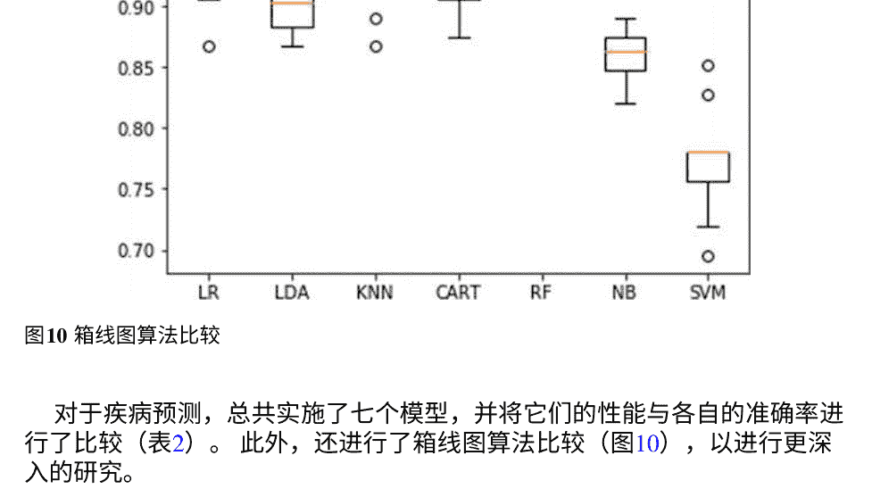

对于疾病预测，总共实施了七个模型，并将它们的性能与各自的准确率进行了比较（表2）。此外，还进行了箱线图算法比较（图10），以进行更深入的研究。

对于Chatbot模型，已经实现了两种算法，GaussianNB(Sect.3.1)和顺序ANN算法。它们的性能已经通过准确率进行了测量，分别为93.5%和95.8%。

### 4.3 结果

所有四个特征都是使用机器学习技术实现的，然后与可定制的用户体验相结合，集成到一个网站中。当项目启动时，首先显示一个登录页面（图11），从该页面可以根据需求导航到四个特征中的任何一个。


#### 图11 FarmEasy首页

创建的模型（表1）用于获取作物推荐系统。这是通过开发用户界面（UI）来实现的。UI（图3a）作为一个Web门户实现。使用训练数据集训练的模型根据用户输入进行预测。源代码将与任何测试场景进行通信，该场景建议一种作物（图3b）。如果测试用例无法匹配任何预测结果，则生成一个无匹配结果。

设计的模块根据用户提供的NPK水平（图5a）提出适当的肥料，并使用字典技术检查其基准值。源代码将与建议的任何测试场景进行通信，以确定肥料（图5b）。如果测试用例无法匹配任何预测结果，则发出不匹配结果。

第三个特征使用图像处理和随机森林分类器来确定用户上传的图像是否被感染（图7a）。处理图像后，它会预测疾病的种类、感染源以及预防或治疗方法（图7b）。

此外，第四个特征接受用户查询并使用顺序分类器和意图语料库做出适当的响应。除此之外，它还支持语音聊天输入（图12）。

## 5 结论

开发的项目FarmEasy是印度农村农民的一站式平台，以提供一个界面，定期提供所有作物生产数据和肥料建议，并通过聊天机器人服务提醒农民有关作物产量以满足未来需求，并帮助农民解决问题。具有语音聊天功能的聊天机器人为农民提供无缝的实时沟通非常方便。这项工作的主要创新之处在于将农民与技术整合起来，从播种到收获，通过最大化产量和提高作物质量来帮助他们。FarmEasy的开发考虑到了所有复杂的约束条件。

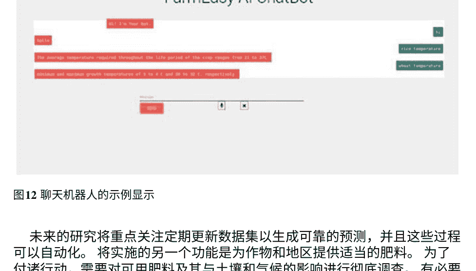

未来的研究将重点关注定期更新数据集以生成可靠的预测，并且这些过程可以自动化。将实施的另一个功能是为作物和地区提供适当的肥料。为了付诸行动，需要对可用肥料及其与土壤和气候的影响进行彻底调查。有必要进行统计数据分析。

致谢 在这个项目中，没有许多人的帮助和参与，这个项目是不可行的。我们要感谢所有对项目的实施做出贡献的人，无论是直接还是间接。首先，我们要对阿姆里塔普里工程学院计算机科学与工程系助理教授Remya S.博士表示衷心的感谢，感谢她在整个项目阶段给予的指导、鼓励和及时的帮助。我们还要感谢我们的项目协调员/小组成员Deepthi L. R. 助理教授、Sandhya Harikumar助理教授的积极参与和监督。

## 参考文献

1. Chand, R., Saxena, R., & Rana, S. (2015). 印度农业收入的估计和分析，1983–84至2011–12。《经济与政治周刊》，50(22):139–145。http://www.jstor.org/stable/24482496
2. Deshpande, T. (2017). 印度农业现状。PRS立法研究，53(8)，6–7。
3. Chadha, G. K. (2003). 印度农业在新千年中的人类对技术挑战的回应。印度农业经济学杂志，58(1)，1–31。
4. Mishra, S., & Narasimha Reddy, D. (2011). 印度农业危机的持续存在：对技术和制度替代方案的需求。在印度发展报告(pp. 48–58)中。
5. Ben Ayed, R., & Hanana, M. (2021). 人工智能改善食品和农业部门。食品质量杂志，2021。
6. Subramanian, K. S. (2020). 农民肥料推荐系统的设计与实施。
7. Niranjan, M., Saipreethy, M. S., & Kumar, T. G. (2012). 使用朴素贝叶斯分类器的智能问答对话代理。在2012年IEEE国际会议上技术增强教育（ICTEE），印度阿姆利塔普里，2012.01.3-2012.01.5（第1-5页）。https://doi.org/10.1109/ictee.2012.6208614
8. 艾哈迈德，林，J.C.-W.，斯里瓦斯塔瓦，G.，& 杰诺里，Y.（2021年）。基于进化计算的土壤施肥营养推荐系统。计算机与电子在农业中，189，106407. ISSN 0168-1699。https://doi.org/10.1016/j.compag.2021.106407
9. 派，M. L.，苏奇特拉，M. S.，& 达尼亚，M.（2020年）。分析土壤参数以正确推荐肥料，以提高稻田栽培的产量。国际先进科学与技术杂志，29（3），4681-4696。http://sersc.org/journals/index.php/IJAST/article/view/5683
10. Vijayalakshmi, J., & PandiMeena, K. (2019). 使用人工智能的农业对话机器人。国际最新技术与工程学报，8(2S5), 186-190. https://doi.org/10.35940/ijrte.b1037.0782s519
11. Manjula, A., & Narsimha, G. (2019). 使用数据挖掘技术的农业作物推荐和产量预测。新兴技术和创新研究杂志, 6(3), 4. www.jetir.org，http://www.jetir.org/
12. Yashaswini, D. K., Hemalatha, R., & Niveditha, G. (2019). 智能农业聊天机器人。国际工程科学与计算学报，9(5)。
13. Ingle, A., Patel, Y., & Patel, R. (2021, May). 作物推荐数据集[版本1]。https://www.kaggle.com/datasets/atharvaingle/crop-recommendation-dataset
14. Kerner, K., Bagga, N., & Arudhra, V. (2022). 肥料预测 [版本 1].https://www.kaggle.com/datasets/gdabhishek/fertilizer-prediction
15. Suchithra, M. S., & Pai, M. L. (2019). 通过优化极限学习机参数来提高土壤养分分类的预测准确性。农业信息处理。
16. Peterson, L. (2009). K最近邻算法。Scholarpedia, 4(2), 1883.https://doi.org/10.4249/scholarpedia.1883
17. Reddy, D. A., Dadore, B., & Watekar, A. (2019). 使用机器学习在Ramtek地区实现最大化作物产量的作物推荐系统。科学研究与技术中的国际期刊, 485-489. https://doi.org/10.32628/IJSRST196172
18. Hochmuth, G., & Hanlon, E. UF/IFAS西南佛罗里达研究与教育中心,UF/IFAS Extension, Gainesville, FL 32611.
19. umangpatel00. (2020年11月), 农业聊天机器人使用自然语言处理, MIT许可证.https://github.com/umangpatel00/Agriculture-Chatbot-Using-NLP/tree/master/datasets
20. Song, Y. Y., & Lu, Y. (2015). 决策树方法: 用于分类和预测的应用。上海精神病学档案, 27(2), 130-135. https://doi.org/10.11919/j.issn.1002-0829.215044
21. Tamrakar, R., & Wani, N. (2021). CHATBOT的设计与开发: 一项综述。
22. Dharani, M., Jyostna, J. V. S. L., Sucharitha, E., Likitha, R., & Manne, S. (2020). 与AI聊天机器人的互动交通查询。在2020年第四届智能计算与控制系统国际会议(ICICCS)(pp. 1271–1276).
23. Kumar, M., Tomar, M., Singh, S., Chandran, D., Punia, S., Dhumal, S., 等 (2022).基于植物的蛋白质及其多方面的工业应用. Elsevier.
24. Siyah, B., Emmanuel, T. O., & Medicherla, S. (2019). 植物村数据集 [版本 1].https://www.kaggle.com/datasets/emmarex/plantdisease
25. Mahendra, N., Vishwakarma, D., Nischitha, K., Ashwini, & Manjiraju, M. R. (2020). 利用机器学习方法进行作物预测.国际工程研究和技术杂志, 9(08), 1-4. https://doi.org/10.17577/ijertv9is080029
26. Samyuktha, M., & Supriya, M. (2020). 通过聊天机器人自动化招生咨询流程——一种具有反馈功能的学习系统.在 V. Bindhu, J. Chen, & J. Tavares (Eds.), 国际通信、计算和电子系统会议。电气工程讲座笔记(Vol. 637)。斯普林格。https://doi.org/10.1007/978-981-15-261 2-118
27. Vasudevan, A., Nair, N. S., Benny, A. S., Shabana, K. M., Shenoy, A., & Dutta, M. (2011). KARSHIK: 基于无线网络的农业信息监测和参考。在ACWR 2011国际会议论文集中，关于人道主义援助的无线技术(pp. 537–539)，阿姆里塔普里。
28. Rekha, P., Venkat Rangan, P., Ramesh, M. V., & Nibi, K. V. (2017). 高产花生农学: 基于物联网的精准农业框架。在2017年IEEE全球人道主义技术会议(GHTC)中。
29. Sivaganesan, D. (2021). 基于区块链技术的可持续智能农业性能估计。IRO可持续无线系统杂志, 3(2), 97–106。
30. Chen, J. I.-Z., & Yeh, L.-T. (2020). 利用物联网启用的人工神经网络对智能农业进行霜冻保护。电子学杂志, 2(04), 228–232。


# 通过机器学习开发情绪计量器来预测幸福感

**Mehar Gupta和Urvi Latnekar**

摘要 本研究揭示了日常生活对人类情绪的影响。所提出的研究通过使用线性回归和神经网络模型来预测幸福感。这项研究工作的主要目标是发现对人类情绪产生因果影响的变量，以采取适当的行动。在这个角度上，所提出的应用程序开发了一个元应用程序，能够从设备中提取数据来预测情绪。作者尝试了各种可视化方法来更精确、更快速地处理数据。所提出的应用程序通过p值和预测区间努力实现信息的透明化，并将应用程序建立为开源项目。本研究所使用的数据来自低成本的消费者设备和被动服务，仅需要最少的成本和努力。

关键词 机器学习 · 可视化 · 情绪 · 移动 · 量化自我

## 1 引言

众所周知，我们的环境和行为对我们的情绪、健康、智力和运动表现有很大影响。然而，我们对环境（例如天气、空气质量、噪音）或行为（例如营养、锻炼、冥想、睡眠）对我们的幸福、生产力、运动表现或过敏反应的影响程度不太确定。有时候，人们缺乏动力，运动表现不佳，或疾病症状更加严重，这是令人惊讶的。

本文重点研究日常情绪。尽管负面情绪具有重要的调节功能，如发出需要帮助的信号或避免有害行为，如疯狂购物、冒险或愚蠢的投资[1]，但其他研究表明，坏情绪也会产生不利后果，比如对不健康食物的抵抗力减弱 [2]，学习能力受损 [3]，以及创造性思维受阻 [4]。

我们的最终目标是了解哪些变量对我们的情绪产生因果影响，以采取有益的行动。然而，因果推断通常是一个复杂的主题，不在本文的范围之内。因此，作者从一个系统开始，计算过去的行为和环境数据（例如天气、运动、睡眠和屏幕时间）与情绪的相关性，然后使用这些特征通过多元线性回归和神经网络来预测每天的情绪。该系统通过两种不同的方式解释其预测结果。版本 A 基于散点图上绘制的回归三角形，版本 B 是前者的抽象，其中回归三角形的斜率、高度和宽度以条形图的形式表示。作者进行了一项小型 A /B 研究，测试哪种可视化方法能够使参与者更快、更准确地解释数据。

本文使用的数据来自廉价的消费者设备和服务，这些设备和服务是被动的，因此使用起来成本和工作量都很小。唯一需要手动跟踪的变量是每天结束时的平均心情，通过应用程序进行跟踪。

## 2 相关工作

本节概述了相关工作，重点关注情绪预测第2.1节以及具有跟踪、相关性或预测能力的相关移动应用程序。第2.3节。

### 2.1 心情预测

在过去的十年中，情感计算通过各种来源收集的传感器数据探索了从数据中预测心情、幸福感和情绪的可能性。

V. Suma在计算机视觉方面的工作[5]展示了这个领域在与人工智能、深度学习和神经网络相关的应用中的巨大潜力。

Harper和Southern [6]研究了在参与者坐着时，使用专业的心电图设备测量的单模态心跳时间序列如何预测情绪价值。

Choudhury等人检测了推特用户的重大抑郁症，这些用户平均发表了4500条推文，平均准确率为70% [7]。

几项研究使用多模态可穿戴传感器数据、智能手机应用程序和每日手动报告的行为（如学术活动和锻炼）估计情绪、压力和健康状况，声称最高准确率为68.48% [8]、74.3% [9]、82.52% [10]，基线为53.94。另一项研究得分为78.7%，基线为50.4% [11]。

### 2.2 限制

上述所有研究对于非专业用户来说都不太实用，因为需要昂贵的专业设备、耗时的手动报告活动持续时间或频繁的社交媒体行为。因此，作者们专注于廉价和被动的数据来源，在日常生活中需要最少的注意力。

符合这些标准的一项研究表明，情绪可以通过移动电话的键盘和应用程序数据来预测，最高准确率为66.59%（如果没有文本则为62.65%）[12]。然而，这个项目将情绪预测简化为仅有三个类别的分类问题。此外，与高于43%的基准线相比（由于类别不平衡），约66%的预测准确率相对较低。

### 2.3 相关应用程序

一些应用程序允许用户跟踪他们的情绪，但缺乏相关性和预测功能[13-20]。一些健康应用程序允许将症状与食物和行为相关联，但仍然无法进行预测[21,22]。

能够进行预测的应用程序包括[23]，它通过心率和心率变异性估计交感神经系统的活动，以及[24]，它还可以根据心脏数据计算压力、能量和生产力水平[24]。此外，FitBit允许记录用户的感受，并根据手动记录的感受、睡眠数据、皮肤电活动和运动情况计算出一个“压力管理”得分[25]。

### 2.4 限制

虽然这些应用程序能够进行预测，但它们只专注于少数数据类型，这些类型不包括情绪、幸福或者幸福感。

智能手表应用程序'Happimeter'的产品描述声称可以通过机器学习来预测你的情绪[26]。由于需要wearOS操作系统，作者无法测试该应用程序，而且该应用程序在Google Play上的用户评分仅为1.5颗星，并且已经超过一年没有更新[26]。

## 3 数据来源

该项目旨在使用非侵入式、廉价的传感器和易于使用的服务，以满足几年的使用需求。为了满足这些标准，作者使用了FitBit sense智能手表、室内外天气站、屏幕使用时间记录器、外部变量（如月亮照明、季节、星期几）、情绪的手动记录等来追踪一个人的情绪。

## 4 数据探索和处理

本节描述了数据处理流程如何聚合原始数据，填补缺失数据点，并利用时间序列的过去。最后，作者们探索了一些特征的显著模式。

### 4.1 预处理

原始数据的采样率通常在五分钟（例如心率）到每周左右（例如体重和VO₂ Max）之间变化。

数据聚合的目标是每天采样一次。在大多数情况下，采样率大于1/24h，作者们通过求和、第五百分位数、95百分位数和中位数将数据聚合到每天的间隔中。我们使用这些百分位数而不是最小值和最大值，因为它们的噪声较小且更具预测性。

数据插补 体重和VO₂Max的采样频率通常小于1/24h。由于体重和VO₂Max代表相对缓慢变化的物理实体，作者们假设线性变化，允许线性插值获得24小时频率的连续测量。如果有许多值缺失的天数或特征，作者们会删除这些天数或特征。否则，数据插补将缺失值填充为特征的平均值。

时间序列 由于数据集是一个时间序列，昨天的特征也可能影响到今天的情绪，作者将昨天的所有特征添加到今天的预测变量集中。我们还包括了过去几天的情绪，直到没有新的显著自相关信息为止，给出了前几天的情绪。如图1所示，计算偏自相关性[27]确定了这些天，当包括从左边开始的所有天直到第一个不显著的天。在我们的情况下，这意味着一到四天前的值。

标准化 将特征重新缩放为均值为0，方差为1。

图1 情绪的偏自相关性。蓝色区域之外的值在95%置信区间内，因此具有统计显著性。

图2 估计代谢能量输出的分布。1600千卡以下和3500千卡以上的值是异常值。

### 4.2 数据探索

由于传感器和服务都是廉价的消费者设备，数据集中有很多异常值。例如，图2显示的估计代谢能量输出在1000千卡左右和4000千卡以上的值。

此外，图3显示了一个可疑的CO₂峰值在5000 ppm。对图4中的原始传感器数据进行仔细观察，发现在5000 ppm处有一个不可能的平台。原因是传感器范围在5000 ppm处结束，错误地将所有大于5000的值计算为5000 ppm。

除了午夜后320分钟处的一个可疑峰值外，起床时间的分布看起来符合高斯分布。然而，5:20 am的闹钟表明了这个峰值的合理性（图5）。

图3 CO₂分布数据。请注意，5000ppm的频繁出现是因为它是传感器的最大范围。

图4 实际CO₂水平高于5000ppm，但传感器的最大范围是5000ppm。

图5 午夜后苏醒时间（分钟）。请注意，在320处的尖峰是由闹钟引起的。

由于我们严格的隐私政策，数据集中的不可能值没有手动更正，因为作者无法访问实际移动应用程序中的数据。相反，作者通过聚合数据的第五和第95百分位数而不是最大值来利用鲁棒统计学。我们的实验表明，这些百分位数比最大值更具预测性。

### 4.3 提出的应用程序

作者提出了一个元应用程序，可以从消费者设备和服务中导入数据，并允许手动跟踪。它允许用户通过绘制时间线和散点图以及相关系数来探索数据之间的关系。该应用程序计算所有属性之间的皮尔逊相关系数和p值。由于将每个属性与其他属性进行比较，作者根据Benjamini-Hochberg程序[28]对p值进行校正，以控制由于多重检验而产生的错误发现率。我们将p <0.05视为显著结果。用户可以通过绘制带有七天移动平均线的时间序列和手动检查两个变量之间的关系来直观地探索数据。以下各节详细介绍了开发该应用程序所使用的各种方法。

### 4.4 训练-测试-分割

由于观测之间存在时间依赖性，标准的交叉验证将样本随机分配到训练集或测试集中，这将导致使用未来的一些数据来预测过去，这在实际应用中是不可能的。我们使用时间序列分割来避免这种错误。然而，许多分割对于数据使用效率低下，因为只有最后一个分割使用了所有的训练数据。

最终，作者只创建了一个简单的训练测试分割，其中训练集包含旧的数据点，而测试集包含最近的数据点。

### 4.5 实验

多元线性回归我们在应用弹性网络正则化和样本加权来估计多元线性回归的参数时使用了训练数据集。

正则化我们使用了一种称为弹性网络正则化的组合 L1和 L2权重惩罚方法。

图6 指数样本权重衰减，降低了较旧数据的价值，以预测今天的情绪。

```
$$ \min_{w} \frac{1}{2n_{\text{samples}}} \| Xw - y \|_2^2 + \alpha \rho \| w \|_1 + \frac{\alpha(1-\rho)}{2} \| w \|_2^2 $$
```

作为最小化的目标函数，其中 $\rho$ 是 $L_1$ 比率，$\alpha$ 是惩罚项的强度，$w$ 是权重，$X$ 是特征，$y$ 是预测。特定情况是 $\rho = 0$，简化为岭回归，$\rho = 1$，简化为Lasso回归。作者通过交叉验证寻找最优 $\rho$ 和 $\alpha$。

样本加权我们假设影响一个人情绪变化的因素随时间变化。为了考虑这一点，作者使用指数样本权重衰减，如图6所示。公式为

```
$$ \text{样本\_宽度高度}_i = \text{最大}(14.7498 - 13.2869(i+30)^{0.0101585}, 0) $$
```

这是指数衰减，拟合到今天的数据点为1，在大约82年后达到零。$max(x, 0)$ 确保样本权重永远不会成为负值。

神经网络神经网络有两个全连接的隐藏层，每个隐藏层都有一个泄漏的修正线性单元[30]作为激活函数。第一和第二个隐藏层分别有16个和8个神经元。因为作者想要对一个标量进行回归，所以输出层只有一个单元。AdamW [31]是优化器，通过学习率为$10^{-4}$和权重衰减为1的均方误差最小化来进行$^{412}_{5}$个时期的训练。时期的数量是通过交叉验证[32]确定的。我们通过交叉验证手动搜索了最佳的神经网络架构和超参数。

## 5 结果

观察到在198个变量中，有77个与情绪显著相关。

### 5.1 多元线性回归

弹性网络正则化，惩罚强度α = 0.12和L1-比率ρ = 1在我们的数据集上表现出最佳的预测性能。表1显示了所有回归权重w，其中w = 0。请注意，套索正则化只选择了九个特征来预测情绪。95%的预测区间在原始尺度上为±2.3，标准化尺度上为±1.2，方差为单位。标准化测试集上的平均均方误差为0.45，意味着可以解释55%的原始方差。样本加权的影响可以忽略不计。

### 5.2 神经网络

标准化测试集上的平均均方误差为0.50，意味着可以解释一半的原始方差。

### 5.3 可解释性、可视化和A/B测试

图7的截图(a)显示了该应用程序如何通过时间序列来可视化每个特征，以便用户可以通过七天移动平均线来发现随时间变化和趋势。图7的截图(b)显示了一个散点图的示例，可以进行探索。

表1 回归权重。所有其他特征的权重为零。
| 特征 | 回归权重 |
| --- | --- |
| HumidInMax() | -0.116 |
| HeartPoints | 0.101 |
| CO2Median() | -0.092 |
| MoodYesterday | 0.065 |
| NoiseMax()Yesterday | -0.053 |
| PressOutMin()Yesterday | 0.050 |
| BodyWeight | 0.046 |
| VitaminDSup | 0.032 |
| DistractingScreentime | -0.009 |

(a) 用户可以通过七天移动平均趋势线来探索时间序列数据。
(b) 散点图与线性回归和皮尔逊相关系数一起可视化变量之间的关系。

图7 截图展示了用户如何探索数据。

变量之间的可视化关系的比率。此外，它绘制了一条线性回归线，并通过在柱状图中可视化相关系数来指示线性关系的程度。

图8显示了一个带有刻度的黑盒子和须子，这是情绪估计的95%预测区间。这不仅为用户提供了预测，还告诉他们可以依赖准确性的程度。在截图8中的预测之上，作者向用户解释了多元线性回归如何计算预测。

每一行代表所选特征的贡献。如果贡献是负的，行中会有一个红色或绿色的条形图，如果贡献是正的，行中会有一个红色或绿色的条形图，条形图的大小表示贡献的大小。最终的情绪预测只是所有贡献的总和（图9）。

为了更好地了解特征的贡献，用户可以点击其中一个，并在散点图上绘制条形图或回归三角形。柱状图显示了特征的贡献（绿色或红色柱）是特征权重（深青色）与今天值与平均值（浅青色）之差的乘积。

散点图上绘制的三角形显示了更多的上下文信息。三角形的水平线表示特征的平均值与今天值之间的差异。三角形的斜率表示特征的权重。

图8 心情预测：每一行代表了由L₁正则化选择的特征的贡献。如果贡献为负或正，则行中包含红色或绿色柱，柱的大小表示贡献的大小。带有须的黑色框是心情估计及其95%的预测区间。

这是两个变量的正则化回归线。最后，两条线之间的垂直长度表示贡献。

条形图和三角形图包含冗余信息。因此，作者进行了一项包括10名参与者的小型A/B测试，以确定哪种图表能更准确和更快地传达信息。

其中七名参与者是男性，三名是女性。年龄范围从19到32岁，所有参与者都有工程背景。参与者回答了关于条形图（A）的四个单选题，以及关于三角形图（B）的四个类似但不完全相同的问题。作者通过被动观察来确保适当的测试。每个参与者都完成了A部分和B部分；然而，为了控制顺序，有50%的参与者首先完成了A部分，另外50%的参与者首先完成了B部分。作者测量了每个部分问题的准确性和所需时间，并根据参与者数量和问题数量报告了平均值。如表2所示，'条形图'的结果略微

图9 两种方法解释了多元线性回归如何计算单个特征对最终预测的贡献。作者将该方法称为柱状图，因为它包含一个带有三个柱状图的图表，以及三角形图表，因为它包含一个散点图中的红色或绿色三角形。

表2 关于柱状图和三角形图表的单选题平均所需时间和准确性。所需时间相对较长，因为它包括阅读问题的时间。
| | 柱状图 | 三角形图表 |
|---|---|---|
| 平均准确率 (%) | 90 | 85 |
| 平均所需时间 (秒) | 43 | 45 |

相对于准确率为90%和43秒的“回归三角形图表”，“柱状图”稍微更快完成，准确率为85%和45秒。虽然这些结果并不显著，但用户也评论说他们更喜欢“柱状图”，因为代表权重的柱状图的长度比三角形的斜率更容易理解，尤其是如果斜率或三角形很小的话。

## 6 讨论

多重共线性 尽管有77个变量之间存在显著相关性，但存在多重共线性。主成分分析显示在图10中，只有25个组分解释了总方差的1%以上。相关预测变量的示例包括
- 所有四倍聚合变量（即变量的均值、中位数、第五百分位数和第95百分位数）
- 室内和室外天气
- 上床时间和入睡时间
- 步行分钟数、心脏点数、努力点数。

多元线性回归与神经网络多元线性回归在测试集上的表现优于神经网络。神经网络可以优于线性多元线性回归方法，因为它们可以近似非线性关系。然而，缺点是需要更多的训练数据来优化额外的参数。在我们的情况下，训练集可能太小，导致过拟合和难以推广到新数据。作者预计随着数据集的增长，神经网络的性能将提高。

此外，改进的架构和改进的超参数可以导致神经网络更好的预测。多元线性回归的一个优点是良好的可解释性，如图9所示，这对于神经网络来说不太直观[33]。

### 6.1 限制

大量未解释的方差多元线性回归和神经网络的预测留下了大约一半的原始方差未解释。限制性能的因素有
- 未测量的变量影响一个人的情绪
- 传感器数据可能存在噪声，缺失值的数据插补非最优
- 多元线性回归假设特征和情绪之间存在线性关系，忽略了非线性机制
- 训练集可能太小，特别是对于神经网络来说。

假设线性情绪刻度我们的方法是在绝对刻度上询问用户的情绪，从1到9，这假设这些值之间存在线性关系。然而，真实的关系可能不是线性的，因为在比较刻度上，极端值的变化程度可能比绝对刻度上更大[34]。比较调查可以减少这些偏差。然而，作者们决定不采用这些方法，因为它们需要用户更多的时间。

最近性和衰退影响偏见在一天结束时询问用户的平均心情存在潜在的最近性偏见[35]，即晚上的最近事件比早上的更远的事件更有影响力。此外，它容易受到衰退影响偏见的影响，即负面记忆比正面记忆更快消退[36]。

每天多次询问评分将减少这些偏见；然而，作者决定不这样做，因为这需要更多的努力，并且在长时间内不可持续。

调查由于参与者数量较少，调查结果并不具有决定性。此外，参与者的选择可能不代表实际用户的分布，例如年龄、性别和背景。

因果推断与心情强相关的特征和多元线性回归的预测因子可能会对心情产生因果影响。虽然可能是这样，并且很有趣，但相关性并不意味着因果关系，而好的预测因子不一定是原因。例如，心情和锻炼之间的正相关可能是由于锻炼导致心情更好，或者心情好导致某人锻炼更多。此外，两者可能互相影响，或者可能存在一个像好天气这样的混杂因素，它会导致某人锻炼更多并独立于心情的改善。在某些情况下，作者可以从因果图中删除方向。例如，当变量周末和心情良好之间存在正相关时，心情良好不太可能导致这一天成为周末。不幸的是，这项研究不允许进行因果推断。如今，随机对照试验仍然是建立因果结论的黄金标准[37]。

图11 样本预测：预测值为红色，真实值为绿色。蓝色条代表95%的预测区间。看起来预测走向正确，但与均值6.2太接近。

### 6.2 未来工作

更强的特征选择和较弱的权重惩罚图11显示了样本预测。看起来预测趋向正确，但与均值6.2太接近。作者假设权重惩罚太强，将预测推向均值，但特征选择至关重要，因为整体正则化强度 α = 0。进一步的证据表明，弹性网络的最佳 L_1-比率为 ho = 1，这意味着在最低允许的权重惩罚下，最大化特征选择可以获得最佳性能。

幸运的是，弹性网络正则化的方程可以推广到L_1和 L_2范数之间的 L_p范数。

> $$||x||_p = \left( \sum_{i=1}^n |x_i|^p \right)^{1/p}, \quad (3)$$

with0 < p < ∞，允许更极端的特征选择与权重惩罚比率。图12展示了随着p越接近零，特征选择变得更强，对大参数的惩罚变得更弱。未来的工作可以探索是否预先

当p <1时，预测性能会提高，就像应用L_{0.5}-范数的正则化一样。然而，这样做的缺点是会导致凸优化[38]。

改进的数据插补长期研究中常见的问题是传感器数据的缺失。虽然作者使用平均值或线性插值来填补缺失值，但作者计划使用深度多模态自编码器来填补缺失值，以实现更好的情绪预测[40]。

预测明天的情绪该项目探索了对同一天的情绪进行预测，但作者还计划预测明天的情绪。一项研究表明，对于工人来说，平均绝对误差为10.8，对于学生来说为17.8，而情绪的标准差为17.14 [41]。

### 6.3 结论

在这项工作中，作者提出了一个可以从消费者设备和服务中导入数据并允许手动跟踪的元应用程序。该应用程序允许用户通过绘制时间线和散点图以及相关系数来探索数据之间的关系。

作者通过数据探索和处理探索了某些特征的显著模式。他们对多元线性回归和神经网络进行了比较分析，发现多元线性回归的表现更好。神经网络在多元线性回归方法上具有优势，因为它们可以近似非线性关系。然而，缺点是需要更多的训练数据来优化额外的参数。

此外，该应用程序开发出来的功能可以通过自动聚合数据到每日特征并选择最佳特征来预测用户的情绪或其他选择的目标变量。这个项目表明多元线性回归可以解释原始方差的一半以上。

我们通过p值和预测区间传达关于置信度的信息，同时将该应用程序创建为开源项目，以实现透明度。

我们希望这个应用程序能帮助用户更好地了解自己，改善他们的福祉、健康以及身体和认知表现。

## 参考文献
1. 双相情感障碍-症状和原因。 [https://www.mayoclinic.org/diseases-conditions/bipolar-disorder/symptoms-causes/syc-20355955](https://www.mayoclinic.org/diseases-conditions/bipolar-disorder/symptoms-causes/syc-20355955)
2. Fedorikhin, A., & Patrick, V. M. (2010). 积极情绪和抵制诱惑：提高唤醒水平的干扰影响。消费者研究杂志，37(4)，698–711。
3. Brand, S., Reimer, T., & Opwis, K. (2007). 我们在负面情绪中如何学习？负面情绪对转移和学习的影响。学习与教学，17(1)，1–16。
4. Vosburg, S. K. (1998). 积极和消极情绪对发散思维表现的影响。创造力研究杂志，11(2)，165–172。
5. Suma, V. (2019). 计算机视觉用于人机交互的综述。计算机科学和智能技术趋势杂志
6. Harper, R., & Southern, J. (2020). 一种基于贝叶斯深度学习的从心跳预测情绪的端到端框架。IEEE情感计算交易，1。[https://doi.org/10.1109/TAFFC.2020.2981610](https://doi.org/10.1109/TAFFC.2020.2981610)。[http://arxiv.org/abs/1902.03043](http://arxiv.org/abs/1902.03043)。ArXiv: 1902.03043。Choudhury, M. D., Gamon, M., Counts, S., & Horvitz, E. (2013).通过社交媒体预测抑郁症(p. 10)。
8. Jaques, N., Taylor, S., Azaria, A., Ghandeharioun, A., Sano, A., & Picard, R. (2015). 从生理、手机、移动性和行为数据预测学生的幸福感。在2015年国际情感计算和智能交互会议上(pp. 222–228)。[https://doi.org/10.1109/ACII.2015.7344575](https://doi.org/10.1109/ACII.2015.7344575)。ISSN: 2156-8111
9. Jaques, N., Taylor, S., Sano, A., & Picard, R. (2015).多任务、多核学习用于估计个体幸福感(p. 7)。
10. Jaques, N., Taylor, S., Nosakhare, E., Sano, A., & Picard, R. (2016).多任务学习用于预测健康、压力和幸福感(p. 5)。
11. Taylor, S., Jaques, N., Nosakhare, E., Sano, A., & Picard, R. (2020). 个性化多任务学习用于预测明天的情绪、压力和健康。IEEE Transactions on Affective Computing, 11(2), 200–213。[https://doi.org/10.1109/TAFFC.2017.2784832](https://doi.org/10.1109/TAFFC.2017.2784832)。会议名称：IEEE Transactions on Affective Computing。
12. Liu, T., Liang, P. P., Muszynski, M., Ishii, R., Brent, D., Auerbach, R., Allen, N., & Morency, L. P. (2020).多模态隐私保护情绪预测移动数据：初步研究。[arXiv:2012.02359](https://arxiv.org/abs/2012.02359) [cs, stat].[http://arxiv.org/abs/2012.02359](http://arxiv.org/abs/2012.02359)。ArXiv: 2012.02359
13. Daylio—日记和情绪跟踪器。[https://daylio.net/](https://daylio.net/)
14. 情绪模式-带隐私的情绪追踪器和日记。[https://www.moodpatterns.info/](https://www.moodpatterns.info/)
15. 情绪追踪器日记。心理健康，抑郁症-谷歌应用商店。[https://play.google.com/store/apps/details?id=diary.questions.mood.tracker](https://play.google.com/store/apps/details?id=diary.questions.mood.tracker)
16. Moodily-情绪追踪器，抑郁症支持-谷歌应用商店。[https://play.google.com/store/apps/details?id=moodily.rohweller](https://play.google.com/store/apps/details?id=moodily.rohweller)
17. MoodPanda-您的支持性情绪日记。[https://www.moodpanda.com/](https://www.moodpanda.com/)
18. MoodPrism心理健康和福祉应用程序。[https://www.moodprismapp.com](https://www.moodprismapp.com)
19. AppleInc.： iOS-健康。[https://www.apple.com/ios/health/](https://www.apple.com/ios/health/)
20. HelloCodeInc.： 存在。[https://exist.io](https://exist.io)
21. 特点。[https://www.correlate.com/features/](https://www.correlate.com/features/)
22. Pattern-Correlate， 健康日记， 情绪追踪器-谷歌应用商店。[https://play.google.com/store/apps/details?id=com.pattern.health.diary](https://play.google.com/store/apps/details?id=com.pattern.health.diary)
23. EliteHRV： 最佳心率变异监测器和应用程序。[https://elitehrv.com/](https://elitehrv.com/)
24. Welltory： Welltory-健康和生产力指南。[https://welltory.com/](https://welltory.com/)
25. FitBit： 压力管理-压力手表和监测 Fitbit。[https://www.fitbit.com/global/us/technology/stress](https://www.fitbit.com/global/us/technology/stress)
26. Happimeter-谷歌播放上的应用程序。[https://play.google.com/store/apps/details?id=com.happimeterteam.happimeter&hl=en&gl=US](https://play.google.com/store/apps/details?id=com.happimeterteam.happimeter&hl=en&gl=US)
27. Dürr, A., Fried, R., & Liboschik, T. (2015). （部分） 自相关的稳健估计。WIREs计算统计学，7（3），205-222。

28. Benjamini, Y., & Hochberg, Y. (1995). 控制错误发现率：一种实用且强大的多重检验方法。皇家统计学会杂志：B系列（方法论），57（1），289-300。

29. Zou, H., & Hastie, T. (2005). 通过弹性网络进行正则化和变量选择。皇家统计学会：B系列(统计方法), 67(2), 301–320.

30. Xu, B., Wang, N., Chen, T., & Li, M. (2015). 卷积网络中修正激活的实证评估。arXiv:1505.00853 [cs, stat]. http://arxiv.org/abs/1505.00853. ArXiv:1505.00853

31. Loshchilov, I., & Hutter, F. (2019). 解耦的权重衰减正则化. arXiv:1711.05101 [cs, math]. http://arxiv.org/abs/1711.05101. ArXiv: 1711.05101

32. Prechelt, L. (1998). 使用交叉验证的自动早停：量化标准。神经网络，11(4), 761–767.

33. Samek, W., Wiegand, T., & Müller, K. R. (2017). 可解释的人工智能：理解、可视化和解释深度学习模型. arXiv:1708.08296[cs, stat]. http://arxiv.org/abs/1708.08296. ArXiv: 1708.08296

34. Carlsson, A. M. (1983). 慢性疼痛评估。I. 视觉模拟量表的可靠性和有效性方面。疼痛，16(1), 87–101. https://doi.org/10.1016/0304-3959(83)90088-X. http://journals.lww.com/00006396-198305000-00008

35. Cushing, B. E. (1996). 减轻审计判断中的近期偏见：的影响文档—ProQuest https://www.proquest.com/openview/283dcd106582467195de2fee655220f2/1?pq-origsite=gscholar&cbl=3171836. Skowroński, J. J., Walker, W. R., Henderson, D. X., & Bond, G. D. (2014). 第三章—消退情感偏见：其历史、影响和未来。在J. M. Olson, M. P. Zanna (Eds.), 实验社会心理学的进展（第49卷，第163–218页）。学术出版社。https://doi.org/10.1016/B978-0-12-800052-6.00003-2. https://www.sciencedirect.com/science/article/pii/B9780128000526000032

37. Hariton, E., & Locascio, J. J. (2018). 随机对照试验-有效性研究的黄金标准。BJOG：国际产科和妇科杂志，125(13), 1716.

38. Xu, Z., Chang, X., Xu, F., & Zhang, H. (2012). L1/2正则化：阈值表示理论和快速求解器。IEEE神经网络与学习系统交易，23(7), 1013-1027. https://doi.org/10.1109/TNNLS.2012.2197412. 会议名称：IEEE神经网络与学习系统交易.

39. Binz, K. (2019). 正则化入门. https://kevinbinz.com/2019/06/09/regularization/

40. Jaques, N., Taylor, S., Sano, A., & Picard, R. (2017). 多模态自编码器：一种深度学习方法，用于填补缺失的传感器数据并实现更好的情绪预测。在2017年第七届情感计算和智能交互国际会议（ACII）(pp. 202–208). https://doi.org/10.1109/ACII.2017.8273601. ISSN: 2156-8111.

41. Umematsu, T., Sano, A., Taylor, S., Tsujikawa, M., & Picard, R.W. (2020). 从白天的生理学来预测办公人员和学生的压力、情绪和健康。在2020年IEEE工程医学与生物学学会(EMBC)第42届年会上(pp. 5953–5957). IEEE, 加拿大蒙特利尔. https://doi.org/10.1109/EMBC44109.2020.9176706. https://ieeexplore.ieee.org/document/9176706/

# 希腊手语手指拼写的3D逼真动画

Andreas Kener, Dimitris Kouremenos和Klimis Ntalianis

摘要 手语化身使聋人能够用他们偏爱的语言获取信息。本文描述了一个新的3D高逼真度化身的实现，用于希腊手语(GSL)的手指拼写和编号手势。这项研究探索了开源的3D平台，如MakeHuman、Blender和Unity的游戏引擎作为3D渲染架构。创建手语虚拟角色对于在虚拟环境中进行培训和交流非常重要，或者用于其他应用。这项研究探讨了如何利用C#的强大功能、Unity脚本代码和分层动作游戏技术，实现可编程的动画片段转换，并创建具有可控播放速度和播放视图的动态、实时(即时生成)、自然和可理解的输出。该方案的另一个创新点是关注过渡时间的精确性以及如何在最后一个手势姿势(第一个手势)和第一个手势姿势动画(第二个手势)之间进行混合。

- 希腊手语
- 希腊字母手指拼写
- 数字手势动画
- 3D签名化身

## 1 引言

对于世界上的一部分人口，如聋人或听力困难者来说。手语是他们在日常社交环境中的一种重要工具[1]。对于参与这些互动的听力人群来说，该领域的教育软件的可用性对于练习手语至关重要。本文探讨了自学手语的问题

A. Kener (✉) · K. Ntalianis
西雅图西部大学企业管理系，阿吉欧斯皮里多诺斯街，12244埃加利奥，希腊
e-mail: anken73@yahoo.com

D. Kouremenos
国家科学研究中心“德莫克里托斯”，希腊雅典

© 作者，独家许可给 Springer Nature Singapore Pte Ltd. 2023
S. Shakya et al. (eds.),情感分析与深度学习,
智能系统与计算进展 1432,
https://doi.org/10.1007/978-981-19-5443-6_63
843

语言，从学习任何手语的最基本方面开始：手指拼写。手指拼写，又称指法，是学习GSL手语的必要条件。手指拼写也是任何手语的初始阶段，因为手指拼写中形成的基本手形对大多数手势都是相同的[2]。另一方面，手指拼写对于理解和促进这种双向交流形式至关重要。“手动”字母表是由手形组成的，这些手形是来自口语字母表的字母[3]，按顺序组成单词，在以下情况下无可否认地有所帮助：

- 给人和地方命名，
- 理解困难的术语，
- 签署个别条款[4]，
- 对于没有相应手势的单词，
- 以及当单词的手势不知道时作为替代。

手指拼写的另一个重要方面是处理与母语手语使用者有手势名称而听觉人士没有的问题。因此，手指拼写对于双方都是必要的，并且在手语中广泛使用，例如ASL或BSL [5]。全世界的聋人使用手语作为他们的主要交流方式。它们是具有自己的语法和规范的自然语言，与口头语言有很大的不同。改善聋人群体获取信息的一种创新和激进方式是在手语中使用虚拟人或化身。化身技术保护手语使用者的匿名性，同时使用户能够更轻松地编辑、操作和生成手语内容，与视频材料相关。视频材料缺乏灵活性，复制/粘贴功能无法应对上下文中的转换[6]。在希腊，GSL是法律强制执行的（法案2817/2002），是聋人学生的第一语言，因此也是他们的主要教育方式。由于欧盟对特殊教育信息获取的标准[7]，希腊学校现在拥有无限制的互联网连接，可以轻松应用任何支持GSL电子学习平台到现实课堂常规中。

这篇作品集中于介绍GSL手指拼写字母的关键点，它的未记录的实践以及使用3D角色的动画手指拼写机制。所呈现的GSL手指拼写的所有方面的排序和动画化的过程是与具有多年GSL计算语言学经验的聋人用户合作的产物。

本文研究了一种将希腊Unicode文本转换为相应手指拼写符号和数字的系统，包括与现代希腊字母相关的24个符号，额外的非手动符号和微动作（眼睑、呼吸和站立空闲微动作）。在GSL中表示修饰符所需的微动作对于实现3D角色的真实人体动作也非常有帮助。

然后显示用户界面，允许完全控制手指拼写的单词/数字（文本/数字到手指拼写的转换）。必要的代码编程是使用C# Unity脚本嵌入语言结合Unity强大的游戏引擎[8]完成的，使开发人员能够处理。

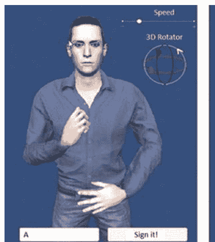

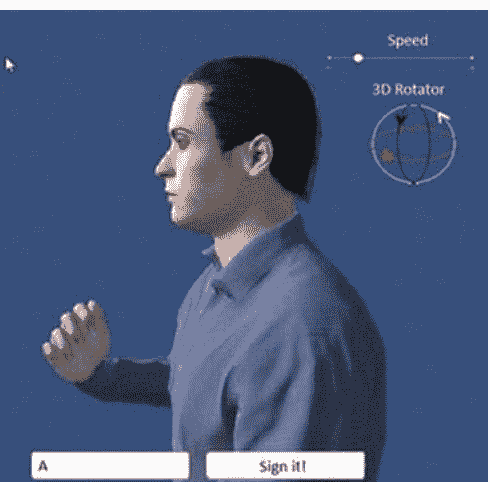

图1 速度调节器和3D旋转器给我们提供了字母符号“A”的多视角

动画比大多数开源的3D图形软件（如Blender [9]）更好。虽然Blender支持骨骼、IK绑定，甚至可以进行动作捕捉，但Unity足够强大，可以将所有这些功能结合起来制作复杂的动画。学习和练习手指拼写的一个非常重要的事情是动画的速度。对于业余观察人们以自然速度拼写手势，这些手势很难辨认。

因此，他们需要以较低的速度练习手语，直到能够以自然速度辨认单词/数字为止。同样，对于他来说，视角对于手的盲区非常重要，因此我们的系统为最终用户提供了速度调节器和3D视图旋转器（图1）。

## 2 希腊手语-语言研究背景

成千上万的本土和非本土手语使用者使用希腊手语（GSL）。GSL是由法国手语和一种更古老的希腊手语的影响共同塑造的，正如我们现在所知[10]。GSL与大多数手语的相似之处主要在于社会和语言层面[11]。它被广泛使用，估计GSL的使用者约为40,600人[12]。此外，它的另一个大用户群是聋人家庭和学习GSL的听力学生。

由于近年来主流教育中聋人学生的增加，以及分散在其他机构、当地聋人城镇单位和私人辅导中的聋人学生的人数，二级和潜在手语使用者的总数当然需要改变。GSL在希腊的11个聋人俱乐部和14个各级聋人教育机构中得到正式使用[13]。

### 3 相关工作

聋人社区使用手指拼写来表达没有会话手势的单词，例如一个名字，这是一种逐字母的技术。僧伽罗手语（SSL）采用了一种音标发音方法来解读这些单词，因为在一个辅音后面有一个或多个修饰符[14]。

这些数字有类似的符号，并且在被解释为手势动作之前被分解成组件。在僧伽罗项目中使用了变体使得基于3D头像的解释系统与人类解释者的真实手指拼写SSL相似。

使用Blender动画软件完成创建基于音标英语的3D头像动画的任务。僧伽罗转换系统由101个SSL手势拼写字母和数字组成。任何书面单词都可以与现代僧伽罗字母进行转换，包括可以达到数十亿的数字。使用这个有用的工具教授聋儿SSL手指拼写变得非常容易[14]。

近年来，从桌面到移动技术的转变加剧了已经困扰听力人群的问题，即熟悉手指拼写的困难，尽管这是手语中最难的部分之一，因为缺乏练习工具。

研究“在Web应用程序中实现实时3D显示逼真手指拼写”探索了一种Web启用系统，可以在3D字符上实时进行手指拼写，以解决这些挑战。此外，它增强了逼真的动作，并与基于视频的努力形成对比，为更多的互动和自定义提供了潜力，增强了手指拼写接收的自我练习工具[3]。

希腊手语手指拼写的有趣尝试出现在工作[13]中。本文介绍了SYNENNOESE项目中正在创建的教育平台。这是一个利用GSL电子语言资源的3D动画软件平台。

### 4 系统描述

从概念验证（构建者模式）中获得的数据的可视化是GSL手语系统在Unity平台上的主要关注点。在动画中准确和真实地呈现手语者化身是主要目标，提出的合成方法旨在构建GSL中的新手指拼写和数字符号。最后，它通过以下方式构建复合句：

- 检索动作块，与孤立的手指拼写符号和编号的动作片段匹配
- 通过在这些块之间添加过渡来构建连续的手指拼写或数字符号动作。

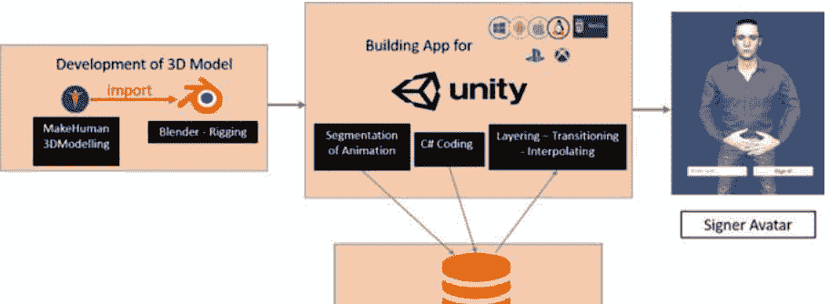

合成系统基于Unity平台使用C#编码。我们使用MakeHuman开源（AGPL3）工具创建了一个3D骨骼模型，并使用Blender动画软件[9]生成动画动作片段。图2描述了建议方案的整体架构。

## 5 建模3D人体—自然动画的真实手

MakeHuman 开源（AGPL3）工具的 3D 模型简化了虚拟人类的创建，使用图形用户界面。最终目标是能够通过几次鼠标点击快速创建一个逼真的虚拟人类，并在 Blender 中渲染或导出。该角色包括 163 个骨骼（图3），以最大程度地提高详细绑定的潜力。

## 6 动画（Blender）

在 Blender 中，对模型进行绑定是创建骨骼层次结构的过程，用于动画和物理模拟。它使您能够为模型添加动画，即使是像人体这样更复杂的模型（图4）。绑定是在特定点和特定方式上给实体模型赋予关节，通常是为了复制生物骨骼。为每个组分配正确的顶点组和顶点权重，以实现比例控制。

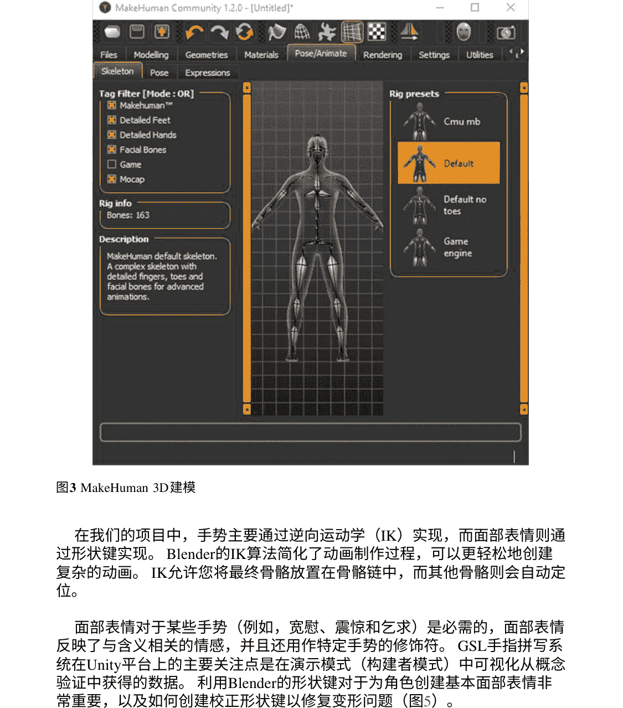

图3 MakeHuman 3D建模

在我们的项目中，手势主要通过逆向运动学（IK）实现，而面部表情则通过形状键实现。Blender的IK算法简化了动画制作过程，可以更轻松地创建复杂的动画。IK允许您将最终骨骼放置在骨骼链中，而其他骨骼则会自动定位。

面部表情对于某些手势（例如，宽慰、震惊和乞求）是必需的，面部表情反映了与含义相关的情感，并且还用作特定手势的修饰符。GSL手指拼写系统在Unity平台上的主要关注点是在演示模式（构建者模式）中可视化从概念验证中获得的数据。利用Blender的形状键对于为角色创建基本面部表情非常重要，以及如何创建校正形状键以修复变形问题（图5）。

此外，自然嵌入的微小运动（微动）如眼睑、呼吸和站立空闲微动增强了三维手语者的自然性[16]。
Blender参与的结果是一个包含所有动作（手势和面部表情）的.fbx文件，位于一个时间轴上。

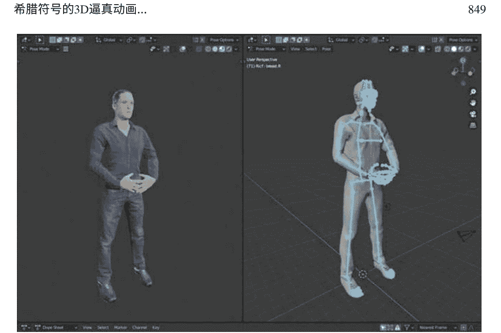

图4 Blender骨骼，由骨骼层次结构组成

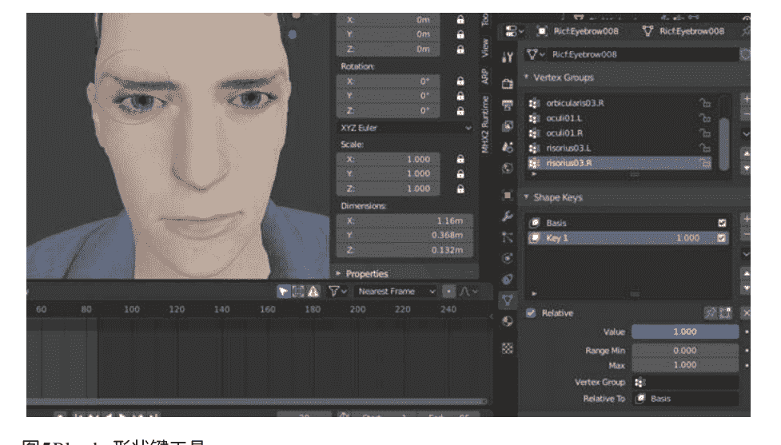

图5 Blender形状键工具

## 7 Unity WebGL2

“Mecanim”是一个可视化环境，整个人形化身的操作将在其中进行，由Unity强大的状态机动画系统驱动。所有具有类人（类似人类）骨骼的模型都可以使用动画操作。

更改从一个字符到另一个字符的映射很简单。通过脚本实现运动插值的简单实现，提供了更平滑、更逼真的运动。在Unity中导入.fbx文件，也是开发逼真动作播放的另一个资源。

Unity是一个跨平台引擎，为开发人员提供根据需求随时切换平台的能力。WebGL2 Unity工具（图6）为用户提供了一个更响应的界面，可以在客户端设备上渲染和动画化手指拼写，同时减少移动带宽的使用。该系统的每个产品都可以是桌面PC（带有Web浏览器）的软件包，也可以是Android TV或Apple TV等设备的示例。

当搅拌机的.fbx文件被导入到Unity时，它提供了一组动画语料库，需要对其进行分割以创建运动块的数据库（图7），关于手势-符号动作、面部表情和反射的身体动作。

一个‘.anim’文件是在Unity中创建新动画剪辑时生成的。它包含了Animator播放剪辑所需的所有数据，如对象位置、名称、旋转等（图8和9）。

实际上，这些文件是YAML的类型1，可以用任何文本编辑器简单地进行编辑。这种分割的目的是为了项目的手指拼写视角的多层合成。


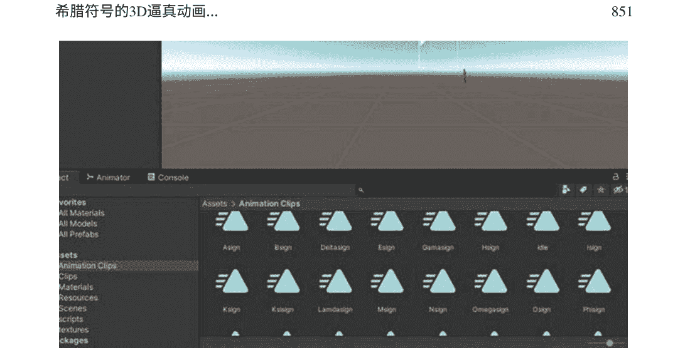

图7 运动块数据库

面部和非手动手势表达是希腊手语的一个重要组成部分。模块中面部和非手动同步的能力应该进行测试，以便更好地理解手势。

插值平滑了以恒定帧速率执行补丁的效果，消除了由于物理和视觉不正确同步而导致的抖动观看运动的问题。此时，重要的是要注意动画剪辑是使用Naert等人和Kita等人的形式进行分割的：准备-含义-撤回[6,17]。这种形式与手势的准备和在先前位置的恢复有关。更具体地说，当手（或手臂）准备向即将到来的手势的起始位置/配置移动时，称为手势的准备。出于同样的原因，在进行下一个手势之前或因为只有一个字母字符需要进行手势化之前，手/臂首先收回以跟随下一个手势。这个阶段被称为撤回[6,17]，涉及到含义之前和之后的帧，这些帧包含在.anim文件的指定中，它构成了系统需要识别的指示。这三个阶段共同塑造了动画剪辑的长度（ACL）。

为了实现从一个手势动画片段到另一个的平滑过渡，计算意义阶段的确切退出时间是至关重要的，如图10所示。在Unity中，通过C#编码或其GUI可以修改的所有过渡设置中，关键设置是退出时间（ET），在我们的情况下。退出时间使您能够调整动画之间的过渡。这个值体现了过渡生效的确切时间，并表示归一化时间。

例如，在Unity中，退出时间为0.75表示动画的75%长度。我们设计的ET方程（1）用于解决将秒的细分转换为归一化时间的问题，如下所示：

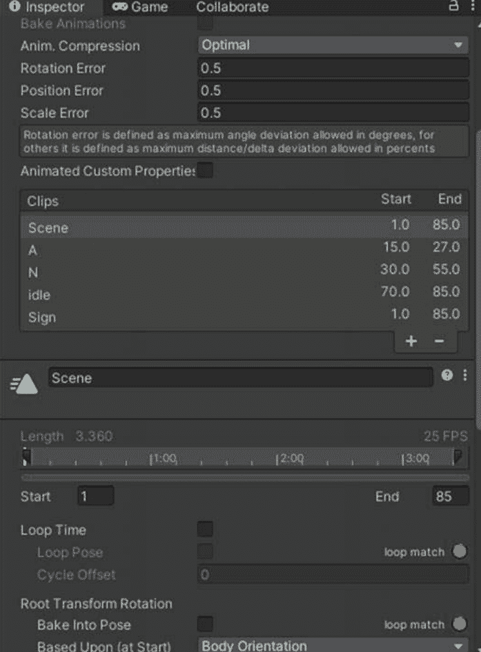

图8 .fbx文件的分割

```
ET = \frac{LF \ FPS}{ACL} \quad (1)
```

其中FPS是每秒帧数，LF（最后一帧）是我们想要的帧。假设一个播放速度为25FPS的动画片段长度为1.5秒，我们想知道到达第27帧需要多长时间，我们使用：(27/25)/1.5 = 0.72，因此，过渡持续时间（TD）是归一化时间的剩余部分：1 - 0.72 = 0.28，可以通过方程（2）计算得出。

```
TD(秒) = (1 - ET) \cdot ACL \quad (2)
```%YAML 1.1
%TAG !u! tag:unity3d.com,2011:
--- !u!74 &7400000
AnimationClip:
  m_ObjectHideFlags: 0
  m_CorrespondingSourceObject: {fileID: 0}
  m_PrefabInstance: {fileID: 0}
  m_PrefabAsset: {fileID: 0}
  m_Name: Isign
  serializedVersion: 6
  m_Legacy: 0
  m_Compressed: 0
  m_UseHighQualityCurve: 1
  m_RotationCurves:
  - curve:
      serializedVersion: 2
      m_Curve:
      - serializedVersion: 3
        time: 0
        value: {x: 0.7071068, y: 0, z: -0, w: 0.7071067}
        inSlope: {x: 0, y: 0, z: 0, w: 0}
        outSlope: {x: 0, y: 0, z: 0, w: 0}

图9 “.anim”文件内容


图10 准备-意义-撤回形式

为了读者更好地理解，我们在图11中绘制了一个转换图。与Naert的方法不同，该方法根据前一个符号的最后姿势和下一个符号的第一个姿势之间的平均距离（测地线欧几里得距离）计算TD值，我们关注从一个符号到另一个符号的退出时间的精确性，因为拼写手指的空间范围非常有限（清单1）。

另一方面，动画片段的分割（准备-意义-撤回）由一位专业的手语学家进行，他精心编写并标注了确切的时间限制。

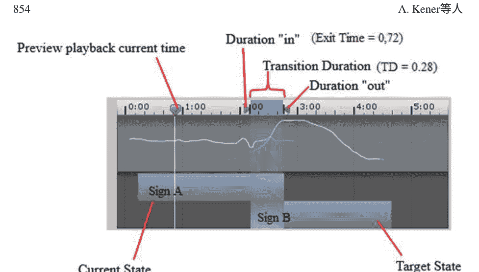

图11 转换设置和图表，例如两个连续的希腊符号（“A”+“B”）如检查器中所示

### 清单 1 退出时间-过渡持续时间 C# 代码

```csharp
foreach (ChildAnimatorState childAnimatorState in newState.states)
{AnimatorState state = childAnimatorState.state;
if( state. name == "idle")
{var trans = state. AddTransition(stateA1);
trans.hasExit Time = true;
trans.duration = 0.28;
trans.exit Time = 0.72;
trans.AddCondition(UnityEditor.Animations.
AnimatiorConditionMode.If, 0, "a");}}
```

## 8 实施

合成系统通过使用动画的3D模型可视化从Blender平台导入的动作剪辑数据。通过实施的系统，手语者的化身以出色的准确性和逼真度进行动画，以提高对手势的理解。这是由于手工制作的导入手语动作剪辑的再现，重点是面部和手势的同步，以及它们的图形拓扑结构[16]。

希腊Unicode文本使用Unity C#编码（图13）（清单2）（清单3）转换为GSL手势。整个概念基于一个中央脚本，管理手势剪辑的连接，组成书面文字或数字。

每个希腊字母对应于另一个脚本的中央脚本，该脚本综合了构成完成标志字符的运动块，同时通过过渡设置增强了它们，以用于下一个字母。

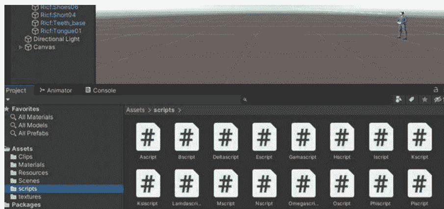

### 图13 互连脚本

```csharp
{case "A*":
output = output + GameObject.Find("MH2").AddComponent<ScriptName** >();
break;
case "B":
output = output +.........
*希腊字母
**调用相应的运动块的脚本，进行分层、过渡和插值
```

### 清单2 将字母转换为动画C#代码

```csharp
sign1 = sign1 + GameObject.Find("MH2").AddComponent<Script>();
// 请单击数值转换为动画-算法C#代码
break;
default:
isDone = true;
break;
}  if (!isDone)
{ if (Number.Substring(0, pos) != "0" && Number.Substring(pos) != "0")
{ try
{sign = ConvertNumber(Number.Substring(0, pos)) + sign1 + ConvertNumber(Number.Substring(pos)); }
catch { }
}  else
{sign = ConvertNumber(Number.Substring(0, pos)) + ConvertNumber(Number.Substring(pos)); }
sign = " and " + sign.Trim(); 
if (sign.Trim().Equals(sign1.Trim())) sign = "";  }
catch { }
return sign.Trim(); 
// 脚本名称* 调用相应的动作块，进行分层、过渡和混合
```

### 列表 3 将数值转换为动画—算法 C# 代码

```csharp
....................
AnimatorStateMachine sm = ac.layers[1].stateMachine;
AnimationClip newClip = AssetDatabase.LoadAssetAtPath<AnimationClip>("Assets/Clips/Alphalips.anim");
AnimatorState stateA = sm.AddState("stateA");
stateA.speed = 0.6f;
stateA.motion = newClip;
ac.layers = layers;
....................
```

### 列表 4 分层 C# 代码

中央脚本是相应的。在平滑的交替之间，通过数学计算来建模姿势的过渡。

通常，使用第三方应用程序（如Blender）在Unity项目中创建动画。由于Blender曾经将各种动画导入到Unity中，因此需要设置动画剪辑。因此，每个字母的标志都必须由一个标志剪辑（手指拼写的字母）、一个面部剪辑（适合手指拼写的字母）和一个反射身体动作剪辑（根据形成手指拼写字母的手的动作）组成，这些剪辑通过相应的动画层组合在一起。为了合成这些层，充分利用可塑性（未来需求）是绝对必不可少的，摆脱Unity GUI（摆脱Unity游戏逻辑）并开始构建C编码脚本来操作角色并广泛应对项目的复杂性（列表4）。

另一个巨大的挑战是脚本的自然性和可塑性，因为我们的合成系统旨在构建GSL中的新的手指拼写单词或数字，从一个手指拼写字母过渡到另一个手指拼写字母。

使用Unity的分层技术[18]，我们可以添加反射运动块并与不同的特性和彼此交互，而不是使用装配方法技术[19]。反射运动块增加了自然和高逼真度的手语动画。此外，整个Unity项目应用是通过编码（C# Unity脚本API）开发的，而不是使用Unity的图形用户界面。Unity脚本API使开发人员能够处理复杂的运动块。

## 9 结论和未来工作

本文提出的新的3D开发架构（Unity，MakeHuman，Blender）[8, 9]通过分层运动，使用Unity游戏引擎构建了高逼真度和高质量的手指拼写动画。Unity的分层运动技术为练习提供了更大的自发性，并允许更多的灵活性，探索不同的视角下的手指拼写。

这个项目是关于（a）手指拼写接收练习工具的新技术步骤，它源于本地手语使用者的输入。通过使用WebGL2 Unity工具，这个项目（b）为创建一个手指拼写教育平台做出了重大技术突破。这个工具的跨平台输出实现了广泛的应用，如台式机、移动设备、Android和Apple TV、游戏机（XBOX、任天堂、PlayStation）等。

通过与GSL培训师和教师的现有设计合作，为学习GSL手指拼写提供了教育游戏化平台。当新的3D游戏化手指拼写导师发布时，将进一步与手语学生进行测试，以了解额外的互动如何影响学生的学习体验。[17, 20, 21, 22]

## 参考文献

1.  世界聋人联合会。（2021）. 我们是谁。http://wfdeaf.org/our-work/. [访问日期 2021年11月21日].
2.  Flodin, M. (2004). Signing illustrated: The complete learning guide. Penguin.
3.  Montgomery, J., McDonald, J., Gong, E., Baowidan, S., & Wolfe, R. (2020). 在一个网络应用程序中实现实时3D显示逼真的手指拼写。在国际计算机会议上帮助特殊需求的人(pp. 38–44).
4.  Battison, R. (1978).美国手语中的词汇借用. Linstok Press.
5.  Sutton-Spence, R. (1994).手指拼写在英国手语中的作用语言[未发表的博士学位论文布里斯托尔大学].
6.  Naert, L., Larboulette, C., & Gibet, S. (2017). 手语合音分析合成。在国际人机交互通用访问会议（第55-75页）.
7.  欧洲联盟出版社。（2021年）. 欧洲委员会对理事会、欧洲议会、经济和社会委员会以及地方和地区委员会的通信-为残疾人打造一个无障碍的欧洲。https://op.europa.eu/en/publication-detail/-/publication/d5aae2cb-c4eb-40f2-97aa-d235916556e3/language-en.. [2021年9月10日访问].
8.  Unity Technologies. 跨平台游戏引擎。（2021年）. https://unity.com. [2021年9月10日访问].
9.  Blender, F. (2021).免费开源的3D创作套件。https://www.blender.org. [2021年6月2日访问].
10. Lampropoulou, V., Panteliadou, S., & Gibet, S. (2000). 希腊特殊教育-批判观点. 在特殊教育会议(pp. 12–14)中.
11. Kyle, J., Woll, B., & Ackerman, J. (1989).手势到手语和语音. 最终报告. No. C 00: 23: 2327.
12. Efthimiou, E., & Fotinea, S. (2007).聋人获取教育内容的环境. 希腊国家项目DIANOEMA (p. 62), (GSRT, M3. 3, id 35). ICTA 2007, 突尼斯哈马梅特.
13. Sapountzaki, G., Efthimiou, E., Karpouzis, K., & Kourbetis, V. (2007). 希腊手语的开放资源：电子学习平台的开发. 在第四届国际语言资源和评估会议(pp. 13–19)中. 里斯本, 葡萄牙.
14. Punchimudiyanse, M., & Meegama, R. G. N. (2015). 辛哈拉手语的3D签名化身。在2015年IEEE第10届工业与信息系统国际会议上(第290-295页).
15. Sutton-Spence, R., Woll, B. (1999).英国手语的语言学介绍。剑桥大学出版社。
16. Naert, L., Larboulette, C., & Gibet, S. (2020). 关于手语化身动画的调查: 从手势表示到话语合成。计算机图形学, 92, 76-98。
17. Kita, S., Van Gijn, I., Van der Hulst, H., Dimitropoulos, K., Daras, P. (1998). 手势和共语手势中的运动阶段及其由人类编码员转录。在人机交互中的手势和手语: 国际手势研讨会比勒费尔德 (pp. 23–35), 德国, 1719年9月, 1997年: 会议论文集, 第1371卷。Springer, 柏林.
18. Ad amo-Villani, N. (2008). 美国手语手指拼写的3D渲染: 两种动画技术的比较研究.国际计算机与信息学杂志, 2, 2676–2681。
19. Stefanidis, K., Konstantinidis, D., Kavvourtzis, A., Dimitropoulos, K., Daras, P. (2020). 手语中的3D技术和应用. 在最新的3D成像、建模和重建进展(pp. 50–78). IGI Global.
20. Kouremenos, D., Ntalianis, K., & Kollias, S. (2018). 一种新的基于规则的从希腊语到希腊手语的机器翻译方案: 不同类型的大型语料库和语言模型评估.计算机语音与语言, 51, 110–135.
21. Kouremenos, D., Ntalianis, K., Siolas, G., & Stafylopatis, A. (2018). 使用基于规则的机器翻译通过平行语料库生成的希腊语到希腊手语的统计机器翻译。在 CIMA@ICTAI(pp. 28–42)。
22. Ntalianis, K., Kener, A., & Otterbacher, J. (2019). 基于志愿者众感知和众包的相似位置的情感评级和检测。IEEE Access, 7, 90215–90229.

# 智能城市的架构、应用和数据分析工具：技术视角

Jalpesh Vasa, Hemant Yadav, Bimal Patel和Ravi Patel

摘要 近年来，快速的城市化给城市的可持续发展带来了新的挑战。政府和工业界致力于发展智能城市，面临着信息的高效整合和传播的挑战。 朝着智能城市的现实迈进取决于资源分配和利用的自动化，这可以通过智能传感器和RFID实现。 传感器网格，通常被称为物联网或IoT，不断传播大量的数据。识别需要自动化的领域以及自动化这些领域所需的工具对于成功和高效的部署是必要的。 本文通过物联网的概念，确定了五个重要的自动化领域。还讨论了基于不同特征（如信息收集、存储和总结）的工具的比较分析。 最后，探讨了智能城市中智能公用事业及其数据分析工具的应用领域，这将帮助我们通过做出更好的决策来实现理想的生活。

- 物联网 (IoT)
- 射频识别 (RFID)
- 智能传感器
- 智能公用事业
- 智能城市
- 分析工具

J. Vasa (✉) · H. Yadav · B. Patel

Smt. Kundanben Dinsha Patel 信息技术系，技术与工程学院 (FTE), Chandubhai S Patel 技术学院 (CSPIT), Charotar University of Science and Technology (CHARUSAT), Changa, Gujarat 388421, 印度

e-mail: jalpeshvasa.it@charusat.ac.in

H. Yadav

e-mail: hemantyadav.it@charusat.ac.in

B. Patel

e-mail: bimalpatel.it@charusat.ac.in

R. Patel

Vadodara, Gujarat, India

## 1 引言

近年来，越来越多的人转向城市生活，这是一个不断增长的趋势。智能城市发展的概念是应对世界上人口增长挑战的一种回应，特别是在城市地区。智能城市在复杂的城市环境中运作，包括各种基础设施系统、人类活动、技术、社会和政治过程以及经济。交通、停车、住宅和商业建筑以及环境在智能城市中都得到了合理管理。从概念上讲，智能城市是数据驱动的。大数据技术和分析在城市政府中起着重要作用，许多城市还设有首席数据官。大数据分析和智能城市技术相结合，帮助城市在关键领域提升管理能力。

智能城市中的一项关键技术是物联网，它主要提供来自众多连接组件的数据。物联网已经在多个工业和消费应用中用于数据收集和决策支持，例如车辆和交通跟踪、智能家居管理、水资源利用和分配以及环境监测。

根据最新的联合国人口统计，超过一半的世界人口现在居住在城市地区。预计到2050年，世界人口的约70%将居住在城市中" [1–3]。这样大幅度的增长将对气候、能源供应、环境和生活条件造成不必要的压力。智能城市的发展需要建立一个集成的信息基础设施，用于收集和分析数据，以实现资源分配的最大效率，造福居民" [4]。

本文的结构如下。第2节介绍了智能城市的架构。第3节介绍了智能城市的物联网通信堆栈及其应用。第4节介绍了应对当前问题的更多城市化世界所需的智能应用。第5节介绍了如何将所有智能应用整合为一个单一的系统实用工具的想法。第6节讨论了物联网数据分析工具及其要素，以及现代技术。最后，第7节总结了本文。

### 智能城市的信息系统架构

世界各地越来越多的城市开始制定自己的智能战略，以应对快速城市化带来的挑战，改善市民的福祉。作为世界上人口最多的国家，中国正在进行200多个智能城市项目[2]。各种合作应用，如智能城市交通、智能治理、智能医疗、智能环境、智能建筑和智能生活，可以通过在城市基础设施中嵌入数十亿设备来造福市民。

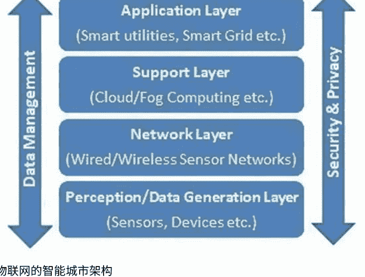

图1 基于物联网的智能城市架构

图1显示了基于物联网的智能城市的一般信息系统架构。它分为四个层次。第一层是关于数据收集的，借助传感器和监测设备的帮助。第一层的项目通过网络层进行协作，将数据收集到云数据中心。云数据中心是托管应用程序和存储数据的重要组成部分。安全和隐私仍然是每个层次的核心要求[5, 6]。

## 3 智能城市中的物联网通信堆栈

本节讨论了在物联网通信堆栈的每一层中提出的协议、标准、技术和应用。物联网技术堆栈通过互联网实现了物品和组件在系统中的无缝集成。图2显示了适用于特定层的技术的分层详细信息。

1.  (1) 物理层：它是连接物联网系统与实际设备和传感器的第一层。物联网系统的PHY层设计应考虑到无线系统的实际约束，如服务质量、成本效益、能源效率和易用性[7]。物理物联网对象通过3GPP、IEEE802.15.4、RFID/NFC、蓝牙4.0和Wi-Fi等物联网协议与上层连接。
    - 由3GPP设计的协议，如GSM、UMTS、5G和LTE [8]，在需要在许可频谱中进行通信时使用，特别是在大范围通信中使用。

### 图2 物联网技术栈 [13]

- IEEE802.15.4专门应用于小范围通信，如 Zigbee [9]。
- 蓝牙通常用于与低功耗设备的通信 [10]。
- RFID/NFC专门用于设计被动通信设备 例如收费票据 [11]。
- Wi-Fi在物联网中用于设备之间的群组通信，因为它基于 无线电频率，并且具有20-100米的范围 [12]。

(2) 数据链路层：通过物理层收集的数据通过数据链路层进行通信。到达上层。数据链路层标准通常并入物理层协议，如Wi-Fi和蓝牙。此外，它可以被分类为低功耗和互联网启用的协议 [14]。

(3) 网络层：来自数据链路层的数据经过处理以进行路由和安全协议，如Zigbee，IPv6和RPL。

(4) 传输层：在这一层提供可靠的连接功能，以减少重传和数据包丢失，并实现更好的安全性。可以使用TCP/UDP或智能TCP/UDP等协议。

(5) 应用层：通常使用https/CoAP/SEP2.0等协议来开发应用程序。

一般来说，提供对物联网数据的访问有两种常见方法。第一种是利用无线电频谱中的无线多跳网格网络，在网络节点之间进行短距离通信。第二种是利用许可频段中的远程蜂窝技术。一种新的通信技术被引入用于提供替代的物联网连接，称为低功耗广域网（LPWAN）[15,16]。顾名思义，使用星型拓扑结构，这种通信技术可以在无线电频段内提供低速、长距离的传输。对于某些智能城市应用来说，这些特性非常有用。

物联网设备包括传感器和执行器等传感器以及无数物品，有时被称为“智能”，“智能”或简单的“有线”（智能灯泡，有线阀门和泵，智能仪表，连接车辆，智能或智能建筑部件，智能家电等）

## 用于智能城市的4种物联网数据分析工具/框架

近年来，“实时数据”，“快速数据”，“流数据”和“雾计算”等术语在大数据领域越来越流行[17].智能城市项目包括这些类别中的大量相似数据。例如，环境监测应用可以利用持续创建的数据，如温度和湿度测量。为了识别任何预测或数据驱动的判断，对这些气候数据的分析可以同时使用存储的历史数据和实时数据。智能应用程序，如交通控制和公共安全管理系统，使用生成实时视频的视频监控摄像头。这些应用程序的流数据必须持续进行进一步分析。在大数据描述的许多V中，如果数据生成的速度迅速增加，则数据被视为快速数据[10].快速数据是一种使用传感器数据，点击流数据，日志聚合等数据的系统。在这种情况下，每个时间段产生的实时数据的数量是进一步分析的关键组成部分。

实时大数据分析与表1中的传统分析不同，它考虑实时更新和快速分析，以便根据早期预测和及时决策采取适当的措施[14]。在智能城市中，无线传感器网络产生了大量的数据[18]。无线传感器网络最近在智能城市基础设施中得到了应用，导致每天在各个领域产生了大量的数据，应用范围从环境监测到医疗保健监测再到交通监测。为了提供能够帮助智能和动态控制资源利用的信息，需要新的数据管理和分析方法和技术来处理海量数据。目前市场上正在使用以下工具来分析这些大规模实时数据。

### 表1 各种类型的数据分析

| 描述性 | 诊断 | 预测 | 规定 |
| :--- | :--- | :--- | :--- |
| 发生的事情被解释了 | 为什么发生了某事 | 将要发生什么 | 规定应采取哪些步骤以避免未来的问题 |
| 商业分析和数据挖掘 | 分析仪表板 | 预测 | 模拟和优化 |
| 从不同的数据源中整理原始数据，以提供有价值的历史洞察 | 使用商业智能工具对特定问题进行深入分析 | 基于机器学习和深度学习模型预测未来数据 | 针对指定行动建议所有有利的结果，反之亦然 |

### 4.1 用于物联网流数据分析的流式框架

**Apache Kafka [19]**: Apache Kafka是一个大规模事件存储和流处理平台，由社区驱动和分布式。Kafka是一个基于分布式提交日志的系统，解决了将大量事件数据传播给多个订阅者的挑战。Kafka在实时流数据基础设施中被用于提供实时分析。Kafka是一个快速、可扩展、健壮且容错的发布-订阅消息系统。因此，能够实时将这些高容量的活动数据传输到前端和后端系统非常重要。Kafka是一个实时数据流处理系统，旨在提供统一、高性能、低延迟的平台。Kafka具有基于二进制的TCP协议，旨在提供可靠性，同时还具有“消息收集”抽象，以减少网络往返开销。

**Apache Spark 流 [20, 21]**: Spark Streaming 是 Spark API 核心扩展，提供可扩展、高吞吐量和容错的实时数据流处理。DStreams 是 Spark Streaming 的抽象，表示连续的数据流，就像 RDD 一样。在内部，每个 DStream 被表示为到达每个时间步的 RDD 序列。Spark Streaming 基于“微批处理”架构，将流式计算视为连续的批处理计算小批量数据。Spark Streaming 从各种来源收集数据并将其分成可管理的块。新的批次定期生成。在每个时间段的开始形成一个新的批次。批次在时间段结束时完成增长。一个称为批次间隔的参数用于计算时间间隔的大小。

**Apache Storm [21]**: Apache Storm 是一个分布式实时流处理计算框架，使用 Clojure 编程语言开发，是免费且开源的。在被 Twitter 收购后，最初由 Nathan Marz 和他在 Back Type 的同事们构建的产品被开源。Apache Storm 简化了高效处理无限数据流的过程，类似于 Hadoop 在实时中处理批处理。Apache Storm 易于使用，可靠，并与各种编程语言兼容。

**表2 流媒体框架对比表**

| 特点 | Samza | Storm | Spark | Flink |
|------|-------|-------|-------|-------|
| 处理类型 | 流 | 流 | 混合 | 混合 |
| 消息传递 | 至少一次 | 至少一次 | 仅一次 | 仅一次 |
| 吞吐量 | 高 | 低 | 高 | 高 |
| 延迟 | 毫秒 | 毫秒 | 秒 | 毫秒 |
| 自动扩展 | 是 | 是 | 是 | 否 |
| 飞行中修改 | 否 | 是 | 否 | 否 |

Apache Flink [21,22]: Apache Software Foundation构建了Apache Flink，这是一个开源的流处理应用程序。Apache Flink是一个基于Java和Scala的分布式流数据流引擎。Flink以流水线和并行的方式执行任何数据流程序。Apache Flink是一个简单易用的流和批处理平台。由于在并行任务之间进行流水线数据传输，包括流水线洗牌，Flink的运行时原生支持两个领域。从任务创建到接收的时间，记录会快速发送出去（在网络传输缓冲区中收集后）。阻塞数据传输可以用于进行批处理作业。

Samza [23, 24]: Apache软件基金会的Apache Samza是一个开源的、准实时的、异步计算框架，用于流处理，使用Scala和Java编写。它是与Apache Kafka合作创建的。用户可以使用Samza创建处理来自各种来源（包括Apache Kafka）的实时数据的有状态应用程序。Samza具有容错性、隔离性和有状态处理的特点。与Apache Hadoop或Apache Spark等批处理系统相比，它实现了连续处理和输出，从而实现毫秒级的响应时间。上述关于流处理框架的比较表格如表2所示。

## 可持续发展的5个智能城市应用

在本文中，我们将介绍大数据分析在一些最著名的智能城市应用中的实时使用情况。实时分析帮助政府监测和管理交通、车辆碳足迹，通过基于强度的路灯监控降低能源消耗，通过智能垃圾监测及时收集垃圾，自动化收费站以消除车辆排队并使用RFID进行支付以减少人为干预[25]。

这个智能城市基础设施包含各种智能设备，例如自动旋转太阳能电池板，通过更高效地利用太阳能电池板来提高能源输出，政府在太阳能农场等地部署这些设备，以保持我们的城市清洁垃圾控制和收集系统用于城市垃圾管理当公共垃圾箱满了时，它会提醒管理员清理。智能停车允许游客在到达目的地之前在拥挤的地区找到一个停车位。自动街灯可以检测到汽车或行人的移动，并在一定时间后自动开关；实时交通监控利用图像处理/视频监控来高效管理城市不同区域的交通，基于RFID的收费站管理将消除现金收取的人工干预，使系统自动化、快速、可靠且防伪，从而减少收费站产生的碳足迹。

城市发展的一个目标是在与市民的生活标准密切相关的各个领域提供帮助，如电力、气候、商业、生活和服务，以及对火灾等事件的安全保障[26]。我们在下一节中解释一些新兴的智能城市技术并对其进行描述。通过这种传感器收集的数据的一个重要方面需要一种可靠的分散式存储和可访问性机制，就像[27]中所述。

### 5.1 自动旋转太阳能电池板 [28]

该系统由Arduino ATmega328p微控制器、两个舵机电机用于x轴和y轴旋转、一个太阳方向传感器（由LDR组成）以确定太阳的实际和精确方向，以及几个监测设备，可以测量系统产生的电力。因为它基于物联网，所以通过Wi-Fi连接并定期将数据发送到服务器，以便将来使用数据进行挖掘，我们可能得出各种太阳能发电的结论[8]。这是自动旋转太阳能电池板的原型如图3所示。

### 5.2 智能路灯 [1]

这项技术在节能方面非常高效，最有效的时间是在午夜附近，当大多数高速公路都没有车辆时。这个设备随着时间的推移节约能源，从而实现更高效的系统。这个设备由红外传感器驱动，并由微处理器控制。红外传感器检测到任何移动指示灯亮起[1]。这是自动化路灯的原型，如图4所示。

### 5.3 基于RFID的收费站管理器 [29]

同时管理多个收费站似乎是一项复杂的任务。因此，为了简化收费站的管理，提出了基于RFID的收费站系统收费站管理系统确保所有收费站都从一个单一位置进行监控，使用物联网。首先，该系统具有一个集中的互联网服务器，其中包含所有用户和其当前余额的详细信息。为了识别车主的车辆，车辆上有一个存储在其中的帐号号码的RFID卡。因此，当车辆到达任何一个收费站时，RFID卡被扫描，系统会检查卡是否有效，并从互联网服务器上获取用户和当前余额的详细信息。如果系统发现需要扣除足够的余额，那么系统会扣除车辆的固定金额，并向扫描仪发送一个信号，表示用户帐户已结算，然后系统向电机发送一个信号，以打开车辆的收费门。Wi-Fi连接用于系统通过互联网与验证过程的Web服务器进行交互。此外，该系统能够通过互联网存储所有通过车辆的数据，包括其时间间隔，以进行监视和其它目的。因此，使用基于RFID的收费站管理系统，该系统自动化了从一个单一位置对所有收费站的管理和监控，使用物联网进行收费站的收费 [7]。下图是基于RFID的收费站管理器的框图，如图5所示。

### 5.4 智能停车系统 [30]

在城市地铁中，车辆在街上非法停车导致交通拥堵加剧。多层停车场的设计旨在减少交通拥堵，但需要更长时间来找到空位。因为我们经常去停车场，停车位通常都被占满了。我们在这里提出的解决方案包括两个处理步骤，以解决多层停车系统中找到空闲停车位的问题。用户在第一层的停车区域的网站/应用上进行操作。在这种情况下，客户必须预订特定时间段的空位。来自网站/应用的输入显示在第二层的数字物联网显示屏上，使用这些数据通过LED标记已预订和未预订的停车位。 根据预订停车位的长度支付费用[9]。下图是智能停车系统的框图，如图6所示。

## 5.5智能垃圾监测系统[31]

随着城市规模的增长，它们产生的垃圾也越来越多。在城市中，大型公共垃圾箱通常会溢满并且垃圾散落在各处，这破坏了区域的清洁度。该设备由微处理器和传感器控制，计算垃圾箱的深度、填充水平，并通知公司垃圾箱即将满并且需要更换空箱。通过使用知识发现，我们可以确定在哪里放置额外的垃圾箱并清理区域。由于这个智能系统，我们可以拥有清洁的城市[2]。图7显示了智能垃圾监测系统的框图。

## 5.6 实时交通监测[32]

人们更容易违反规则，比如不遵守交通信号、不戴头盔、不系安全带、超载乘客等等，因此城市面临着一个无法完全手动解决的交通问题[33]。图像处理被应用于从智能城市中安装的多个闭路电视摄像头中恢复违反交通规定的违法者的车牌号码[10]。图8显示了交通监控的流程。

## 6个应用程序集中在一个系统下

通过将所有上述应用程序（如自动旋转太阳能面板、自动化街灯和基于RFID的收费亭管理器、智能停车系统、垃圾监测系统和交通监控器）组合成一个单一系统或集群，并可以从城市的一个单一控制和监控位置进行控制，城市被称为“智能城市”。在从城市中安装的所有物联网设备获取数据之后，我们还可以应用一些数据挖掘技术来处理物联网数据，并获得一些有用的见解，如[4]所述。此外，所有这些系统都需要一个自动化的电气设备监控系统，可以在没有人员访问的情况下进行运行维护。检查在[34,35]中讨论的设备。 图9显示了智能应用的整体组合，使城市更智能，并连接到一个单一的控制系统。

## 7 结论和未来工作

创新是为了过上更轻松的生活而尝试。 智能城市通过创新和科学应用改进了常规城市中的任务处理，使生活更轻松、简单和环保。 在本文中，我们展示了智能城市和城市规划的需求以及其架构。此外，从通信堆栈中可以看出，最近的LoWPAN协议用于智能设备之间的通信。 此外，本文讨论了一些应用程序，以减少碳足迹，并以这些小型智能应用程序高效管理城市。 在所有智能基础设施中，智能交通监控、智能停车和智能废物管理是当今最重要的五个应用。 实时数据/流及其分析可帮助城市政府更好地管理城市，做出更好的决策。 智能城市将利用分析提供高效的解决方案，可节省能源成本高达30%。 此外，讨论了一些实时处理工具和底层技术，并最终得出结论，Samza是一个用于实时分析的良好平台。 我们可以将其他工具和应用与城市化进行比较，作为未来的工作。

## 参考文献

1. Srivastava, S. (2013). 自动街灯。电子与电气工程的进展, 3, 539–542.
2. https://www.un.org/development/desa/en/news/population/2018-revision-of-world-urbanization-prospects.html
3. 城市化的一些事实-2014.https://www.un.org/en/ecosoc/integration/pdf/fact_sheet.pdf
4. Chovatiya, F., Prajapati, P., Vasa, J., & Patel, J. (2017). 关于物联网的数据挖掘研究方向。 在智能信息与通信技术国际会议上（第183-190页）。斯普林格，洪堡。
5. Patel, B. H., Shah, P. D., Jethva, H. B., & Chavda, N. (2013). Adhoc网络的问题和要求。国际计算机应用杂志, 62（13）。
6. Shakya, S. (2021). 智能城市服务与适当资源管理 和隐私保护的合作普适计算和通信技术杂志 (UCCT), 3(01), 43–51.
7. Sharma, S. K., Tadilo, E. B., Symeon, C., Xianbin, W., & Long, B. L. (2016). 无线物联网的物理层方面。在2016年国际无线通信系统 (ISWCS) (pp. 304–308). IEEE.
8. 3GPP. https://zh.wikipedia.org/wiki/3GPP
9. IEEE-802.15.4. https://zh.wikipedia.org/wiki/IEEE_802.15.4
10. IEEE802.15. https://zh.wikipedia.org/wiki/IEEE_802.15#IEEE_802.15.1:_WPAN/_Bluetooth
11. NFC. https://en.wikipedia.org/wiki/Near-field_communication
12. IEEE-802.11. https://en.wikipedia.org/wiki/IEEE_802.11
13. 物联网架构和协议介绍.https://www.slideshare.net/AbdullahAlfadhly/introduction-to-iot-architectures-and-protocols
14. Palattella, M. R., Accettura, N., Vilajosana, X., Watteyne, T., Grieco, L.-A., Boggia, G., & Dohler, M. (2013). 互联网（重要）事物的标准化协议栈。IEEE 通信调查与教程, 15, 1389–1406.
15. 宋, Y., 林, J., 唐, M., & 董, S. (2017). 基于无线LPWAN的能源物联网。工程, 3(4), 460–466.
16. Centenaro, M., Vangelista, L., Zanella, A., & Zorzi, M. (2016). 无线通信中的长距离通信在无许可频段中：物联网和智能城市场景中的新星。IEEE无线通信, 23(5), 60–67。
17. Lai, K. L., Chen, J. I. Z., & Zong, J. I. (2021). 利用雾计算和物联网发展智能城市。普适计算和通信技术杂志(UCCT), 3(01), 52–60。
18. Sivaganesan, D. (2021). 基于区块链的物联网传感器网络中的数据驱动信任机制用于攻击的检测和缓解。计算机科学和智能技术趋势杂志(TCSST), 3(01), 59–69。
19. Wang, G., Koshy, J., Subramanian, S., Paramasivam, K., Zadeh, M., Narkhede, N., Rao, J., Kreps, J., & Stein, J. (2015). 使用Apache Kafka构建复制日志系统。VLDB学会会议论文集, 8(12), 1654–1655。
20. Zaharia, M., Xin, R. S., Wendell, P., Das, T., Armbrust, M., Dave, A., Meng, X., Rosen, J., Venkataraman, S., Franklin, M. J., & Ghodsi, A. (2016). Apache Spark：大数据处理的统一引擎。ACM通信, 59(11), 56-65。
21. Sakr, S., & Zomaya, A. Y. (2019).大数据技术百科全书。斯普林格国际出版社。
22. Katsifodimos, A., & Schelter, S. (2016). Apache Flink：规模化的流分析。在 IEEE 国际云工程研讨会 (IC2EW) 上（第193页）。IEEE出版社。
23. Noghabi, S. A., Paramasivam, K., Pan, Y., Ramesh, N., Bringhurst, J., Gupta, I., & Campbell, R. H. (2017). Samza：LinkedIn的有状态可扩展流处理。VLDB Endowment会议论文集, 10(12), 1634-1645。

24. Zhuang, Z., Feng, T., Pan, Y., Ramachandra, H., and Srilatha, B. (2016). Efficient Multi-Stream Joins in the Apache Samza Framework. In IEEE International Big Data Congress (BigData Congress) (pp. 267-274). IEEE Press.

25. Annappa, B. (2018). Real-time big data analytics in smart city applications. In International Conference on Communication, Computing and IoT (IC3IoT) (pp. 279-284). IEEE Press.

26. Sungheetha, A., and Sharma, R. (2020). Real-Time Monitoring and Fire Detection Using IoT and Cloud-Based Drones. Journal of Soft Computing Paradigms (JSCP), 2(03), 168-174.

27. Sivaganesan, D. (2021). Performance Estimation of Sustainable Smart Agriculture Using Blockchain Technology. IRO Journal on Sustainable Wireless Systems, 3(2), 97-106.

28. Watane, N. D., & Dafde, R. A. (2013). Automatic Solar Tracking System. International Journal of Science and Engineering Research, 4(6).

29. Win, A., & MyatNwe, C. (2014). RFID Based Automated Toll Collection System. International Journal of Science and Research Publications, 4(6).

30. Basavaraju, S. R. (2015). Automatic Smart Parking System Using Internet of Things (IOT). International Journal of Science and Research Publications, 5(12), 629-632.

31. Gupta, S., & Kumar, P. (2015). Real-Time Solid Waste Monitoring and Management System: A Case Study of Kanpur City. International Journal of Science, Environment and Technology, 4(2), 514-517.

32. Cao, J. (2016). Research on Urban Intelligent Traffic Monitoring System Based on Video Image Processing. International Journal of Signal Processing, Image Processing and Pattern Recognition, 9(6), 393-406.

33. Patil, P. J., Zalke, R. V., Tumasare, K. R., Shiwankar, B. A., Singh, S. R., & Sakhare, S. (2021). IoT Protocol with Medical Facilities for Accident Detection. Journal of Artificial Intelligence, 3(02), 140-150.

34. Karuppusamy, P. (2020). Sensor-Based IoT Surveillance System Using Blynk Framework. Journal of Electronics and Informatics, 2(3), 182-187.

35. Patel, B., & Shah, P. (2021). Operating System Support, Protocol Stack and Key Issues and Testbed Facilities for IoT: A Case Study Perspective. Journal of King Saud University - Computer and Information Sciences.

# 软件工程虚拟实验室在确定本科生概念理解方面的评估：采用协作创造虚拟学习环境的混合学习模型，运用批判性教育学

Ashraf Alam和Atasi Mohanty

摘要 根据现有文献，最常用的学习成果评估指标是学生的成绩。然而，这些成绩可能并不是学生学习效果最准确的反映。由于评分过程的固有不可预测性，成绩可能不是衡量学习和评估学生实验室表现的有效工具。在这种情况下，一个自设计和定制的工具可能最适合持续帮助评估学生的学习收益。在印度理工学院卡拉格普尔分校，得到印度人力资源发展部（MHRD）的支持，建立了一个软件工程虚拟实验室（SE VLab）（http://vlabs.iitkgp.ernet.in/se/），为工程学生介绍了软件工程的各种基本概念。现有文献指出，传统实验室环境中的评估过程在根本上存在缺陷，主观性强，容易受到不公正对待和偏见的可能性。本研究探索了一种独特的技术和新颖的方法来衡量学习收益和教育成果。在这里，开发了一个工具来评估虚拟学习的效果。研究结果经过统计验证。利用开发的工具，研究人员还在多种教学场景和不同的技术设置中测试了SE VLab。就学习收益而言，结果表明SE VLab比传统的SE实验室更高效。

关键词批判性教育·评估·计算机科学工程教育·虚拟实验室·软件工程·课程·学习结果


## 1 引言

计算机科学与工程 (CSE) 教育的一个关键特点是通过实践学习。由于 Covid-19 疫情的全球封锁，互联网的快速爆发引起了对 CSE 教育中在线实验室 (lab) 学习的重视 [1]。研究表明，“只有当你知道如何做某事时，你才真正理解它” [2]。然而，将这样的经验带到在线环境中非常棘手，但学习技术研究人员在过去十年中已经取得了实质性的进展 [1,3]。

从语境上看，在线虚拟实验室学习是一种现代教学模式，吸引了教育机构、工业界、社会和政府的广泛关注[4]。这也在《华盛顿协议》[5]和《国家认证委员会(NAB)文件》[3]中有所阐述，这是一个重要的课程目标，维持毕业工程师的技能。它指出：“毕业生将展示设计和进行实验、分析和解释数据的能力”[2,3,5]。因此，在线实验室学习是一个新兴的研究领域[3,6]。然而，在在线实验室学习环境中，教师的角色大大减少，学生对自己的学习负责更多[7]。这表明，在在线实验室学习中，学生的参与度更高[8]。

传统的课堂实验室 (TLab) 教学似乎不太有效[9–12]。因此，让学生参与自主学习的必要性迫在眉睫[4, 6, 9]。在这种情况下，学生们还有机会在课堂之外进行实验，比如在家里和假期期间[13]。

本文的组织如下。第1节介绍了使用VLab评估学生表现的动机，在第2节中介绍了TLab中的评估过程。第3节讨论了CP-VLLM工具的开发，第4节提出了我们的研究假设和问题。第5节详细描述了我们的数据收集方法，第6节介绍了使用SE VLab评估学生表现的结果。第7节介绍了CP-VLLM工具的学生感知，并最后在第8节总结了本文。

## 2 对学生表现评估的动机

### 使用VLab

由于没有标准的测量工具来评估虚拟实验室学习的有效性，我们开发了CP-VLLM工具，并使用相同的工具对SE VLab进行了评估。我们的工作基于批判性教育学（CP）理论。原因是：“它涉及许多重要的教育问题，如教学设计交付、学生学习成果、评估、学生赋权、社交存在、批判性思维能力和对齐”[7, 14]。

### TLab中的评估过程

TLab环境中的日常实验室活动通常通过实验室日志记录。评估过程基于作业和口头考试的分数[4, 12]。有时候学生没有得到教师的适当评估[10, 15]，教师根据实验室会话中的问题集分配分数。研究结果表明，学生的物理观察和实验室作业记录都用于学生的绩效评估[3, 16]。还观察到，在实验室考试中，最终实验室活动成绩（或分数）以及保持实验室记录的规律性也是TLab环境中绩效评估的因素[4, 14]。然而，在TLab环境中，评估过程本质上存在缺陷，主观且不公平，存在偏见的可能性[3,9]。然而，实验室的评估对于大班规模来说是具有挑战性的[6, 17]。有时候实验室工作的评估是基于最终产品，忽视了实验室会话和学生能力之间的中期进展[4, 13]。工程和技术认证委员会（ABET）[2,8,15]还指出实验室评估实践应不断发展。

## 4 CP-VLLM工具的开发

CP-VLLM工具的开发基于以下研究问题和假设：

CP-VLLM测量工具中使用的评估参数之间是否存在相关性？

在这项工作中，评估参数包括教学设计交付（IDD）、学生学习成果（LO）、评估（ASS）、学生赋权（EM）、社交存在（SP）、批判性思维（CT）和对齐（AL）。
此外，预计学生对回答的感知往往会相关，并考虑以下零假设（H0）和备择假设（H1）。

- (H0)：在学习评估的给定参数对中不存在相关性。
- (H1)：在学习评估的给定参数对中存在相关性。

在H1中，当两个变量变化时，一对参数被认为具有相关性，相关性可以是负的或正的。基于目标意见，对配对相关性进行评估，受访者的答案接近“非常同意”。考虑了七个参数来评估SE VLab学习。每个参数与其他参数中的一个进行配对，共进行了二十一次配对比较。为了检查学生在七个参数上的回答之间是否存在相关性，对每个实验室的整体意见进行了评估。

实验使用皮尔逊积矩相关系数（PPMC）计算，考虑了所有可能的意见分数。以此方式，综合得分被排名。

### 4.1 可靠性和有效性

为了确保CP-VLLM的可靠性和有效性，实验误差率被考虑，并设置为0.1，每个的I型错误率为0.1/21 = 0.0047619。在这种情况下，如果p值小于或等于0.0047619，则相关性是显著的；如果p值大于0.0047619，则相关性是显著的。

表1显示了使用PPMC进行对比的相关性。表1中的结果表明所有相关性都是正的。还观察到相关系数值大于0.5，这表明有非常强的正相关性，而p值小于0.0047619。这表明误差率为0.1，结果具有统计学意义。

上述正相关表明，通过拒绝零假设（H0），我们接近备择假设（H1），即学生的回应表明在学习评估的给定参数对中存在相关性。

## 5 研究假设和问题

评估问题与整体积极的学习成果有关。参与SE VLab会话的学生在评估过程中进行，旨在增加SE知识，与实践实验室会话相比。在这个背景下，假设是：

- H1：学生在使用SE VLab之前和之后获得更多知识。
由于实验是在线执行的，而不是在传统实验室中进行的，因此学生使用VLab不太可能比TLab学到更多。在对在线学习感兴趣并拒绝在传统环境中学习的学生方面取得了更好的成功。因此，假设是：
- H2：使用SE VLab执行实验的学生相比之下学到更多，使用TLab执行实验的学生。

尽管可以通过自我评估、主题知识测试和LO来衡量，但使用CP理论进行评估的结果也显示出积极的平均绩效相关性。这引出了以下研究问题：

| 配对参数比较 | 相关系数 | p值 |
| :--- | :--- | :--- |
| IDD与LO | 0.815748 | 0.000000144* |
| IDD与ASS | 0.821827 | 0.000001009* |
| IDD与EM | 0.687841 | 0.0000567* |
| IDD与SP | 0.797884 | 0.000000407* |
| IDD与CT | 0.670106 | 0.0000983* |
| IDD与AL | 0.817397 | 0.00000023* |
| LO与ASS | 0.938091 | 0.00000000000052* |
| LO与EM | 0.726263 | 0.0000134* |
| LO与SP | 0.829669 | 0.0000000546* |
| LO与CT | 0.829668 | 0.0000006* |
| LO与AL | 0.877493 | 0.00000000124* |
| ASS与EM | 0.737592 | 0.00000781* |
| ASS与SP | 0.85412 | 0.00000000913* |
| ASS与CT | 0.844494 | 0.0000000196* |
| ASS与AL | 0.94416 | 0.000000000000147* |
| EM与SP | 0.606952 | 0.00074* |
| EM与CT | 0.683416 | 0.0000672* |
| EM与AL | 0.693269 | 0.0000537* |
| SP与CT | 0.822527 | 0.0000000912* |
| SP与AL | 0.801582 | 0.000000328* |
| CT与AL | 0.858291 | 0.00000000671* |

* 显著相关性 p值小于0.0047619

Q1：学生能否评估自己的学习表现，以便将来不需要任何知识测试进行评估？

除了知识测试外，还应评估SE VLab的IDD、LO、ASS、EM、SP、CT和AL等因素。在这个背景下，出现了以下研究问题。

Q2：学生是否认为在线实验室提供以下重要优势？

- 教学设计交付
- 学生学习成果
- 评估
- 学生赋权
- 社交存在
- 批判性思维和
- 对齐

### 5.1 研究设计

本研究采用了一种前后测设计，以检验在4个教学环境中应用的学习收益。参与者被分配到以下四个实验条件之一的小组：

- 第一组：传统实验室（TLab）。. 在这个组中，我们包括已经完成SE理论课程并完成了TLab实验的学生。
- 第二组：虚拟实验室（VLab）。. 在这个组中，我们包括已经完成SE理论课程但未完成TLab实验的学生。他们被允许访问SE VLab，并使用VLab完成了实验。
- 第三组：TLab和Virtual Lab（TVLab）。. 在这个组中，我们包括已经完成了SE理论课程并完成了他们的TLab的学生。同时，他们被允许在VLab环境中工作。
- 第四组：SE Virtual Lab（SE VLab）。在这个组中，我们包括尚未完成SE理论课程的学生。. 他们对SE学科是新的。他们被允许访问SE VLab并完成了SE VLab中的所有理论。同时，他们被允许在VLab环境中工作。

在理论课程完成后，即实验室会议开始之前，对Groups-I、II和III进行了SE知识测试的预测。但是对于Group-IV，在访问SE VLab环境的理论课程开始之前，进行了一次预测测试。在实验室会议完成后，对每个环境的学习收益进行了后测评估。

## 6 方法

本节描述了设置、参与者、数据收集工具、数据收集过程和数据分析。

### 6.1 设置和参与者

评估过程包括两种类型的研究——试点研究和主要研究。试点研究涵盖了来自IIT Kharagpur的106名本科生和18名研究生。在这项工作中，我们只展示了主要研究的结果。在主要研究中，有239名来自Chennai的本科工程学院的学生参与。Chennai是印度泰米尔纳德邦的首府。所有参与的工程学院都隶属于Anna大学，并获得了AICTE的批准。

在我们的研究中，有239名学生，其中107名女生和132名男生，平均年龄约为21.7岁。他们在大学里以英语为教学语言，并且具有相似的人口统计背景。

### 6.2 数据收集工具

在这项工作中，使用了定量（前测和后测）和定性（观察、访谈）工具的组合，以促进对SE VLab的学习收益和LO的扎实理解。在理论课程完成并进入实验室会话之前，对所有参与者进行了前测评估工具的使用。完成实验室实验后，进行了后测评估，以评估学生在学习收益和LO方面的表现。所有统计分析都是在Ubuntu 13.10操作系统环境中使用IBM SPSS Statistics 21.0进行的。

前测工具。我们使用了一个定量测试来进行前测，其中包含15个与SE实验室主题相关的多项选择题（MCQ）（从四个选项中选择一个答案），涵盖了AICTE、IIT Kharagpur和Anna University在本科水平上批准的标准教学大纲。这个问卷还包括基本的人口统计学问题，如性别和种族。这个测试是在SE理论课程完成后测量学生的SE知识水平。这个问卷的最高可能得分是15分，最低得分是零分。由于这个问卷与SE内容相关，因此对其内容有效性进行了审查，以确保清晰和一致。

问题经过仔细审查，所有削弱测量工具有效性的问题都被省略了。根据印度理工学院卡拉格普尔分校软件工程学科的五位专家（教师）的建议进行了修改。我们还使用Cronbach's Alpha (α)测试方法[10, 18, 19]检查了问卷的可靠性，并发现所有评估在我们的试点研究中都是可靠的（α> 0.8）。

后测工具。后测采用了定量和定性问题的混合模式方法。有四种类型的问卷，一种用于前测，在完成实验室实验后进行软件工程知识测试（尽管后测软件工程知识测试问题涵盖了整个课程大纲，但后测问题的内容与前测问题不同。我们准备了30个问题，随机选择了15个问题放在前测工具中，另外15个问题放在后测工具中。这样做是为了让学生在问题设置上不感到任何模糊）另一种是基于CP理论的问卷。CP-VLLM工具基于学生的感知。

另外两个问题是开放性的和面试导向的问题。作为所有后续的SE知识测试，CP-VLLM工具，开放性的和面试导向的问卷都与内容相关。因此，使用来自IIT Kharagpur的五位SE专家对内容有效性进行评估。CP-VLLM工具评估了学生对IDD，LO，ASS，EM，SP，CT和AL的感知。

### 6.3 过程

在得到机构负责人的事先许可并在部门负责人的帮助下，我们与SE学科教师会面并请求他们允许我们从学生那里收集数据。在学期开始的第一周，在教授SE理论课程之前，我们与学生会面并告知他们有关数据收集的详细过程。我们还告知学生参与是自愿的，他们的回答将保密，并且只会以聚合方式用于学术/研究目的。他们还被告知他们的回答不会影响他们的学期成绩/分数。由于数据收集有四个组，因此对每组学生有不同的指示。对于I、II和III组，理论课程结束后立即进行了SE知识测试的预测试。IV组不需要参加SE理论课程。我们允许他们访问SE VLab，并且他们可以学习SE VLab的理论部分。在收集了预测试数据之后，允许I组使用SE TLab，允许II组访问SE VLab实验，允许III组同时使用TLab和VLab，允许IV组继续进行SE VLab实验。由于SE TLab和VLab都包含10个实验，我们在两个月的间隔后与他们会面进行后测试数据收集。

### 使用SE VLab评估学生表现的方面

本节包括不同比较，旨在解决使用SE VLab的学生表现问题。在本节中，我们首先对每个组在先前的SE知识测试成绩上进行描述比较，然后对每个组在后续的SE知识测试成绩上进行比较，最后对每个组的学习增益进行比较。

### 7.1 每个组在先前的SE知识测试成绩上的比较

为了测试四个不同实验室环境的后实验测试是否存在显著差异，首先比较了四个组在先前的SE知识测试中取得的平均分数。先前的SE知识测试包含15个SE学科问题，用于衡量先前的SE知识，涵盖标准课程。测试包含客观题。每个项目的最高分为1，因此最高总分为15。分数以百分比计算，每个组的详细描述性统计数据见表2。

表2 先前SE知识测试成绩的分组描述统计
| 不同的教学环境 | N | 平均值 | 标准差 | 标准误差 | 95%的置信区间 均值 下限 | 95%的置信区间 均值 上限 |
| :--- | :--- | :--- | :--- | :--- | :--- | :--- |
| TLab | 59 | 27.52 | 17.10 | 2.24 | 20.74 | 30.10 |
| VLab | 60 | 31.41 | 19.21 | 2.51 | 24.32 | 34.36 |
| TVLab | 59 | 34.71 | 20.41 | 2.53 | 29.63 | 39.71 |
| SE VLab | 61 | 29.32 | 18.23 | 2.33 | 22.61 | 31.84 |
| 总数 | 239 | 30.49 | 19.10 | 1.42 | 27.10 | 32.41 |

使用单因素方差分析检验探索先前SE知识测试成绩在四个组之间的初始差异。在探索之前，我们检查数据是否符合单因素方差分析的假设。为了检查这一点，我们提出了4个假设，分别是：（i）组内分布是否正态分布，（ii）方差是否齐性，（iii）观测是否独立，以及（iv）因变量至少在区间尺度上进行测量[13, 20, 21]。从这四个假设中，我们发现假设（iii）得到满足，因为每个组中的参与者是不同的。假设（iv）得到满足，因为因变量先前SE知识测试成绩是连续尺度上的。为了检查每个组内分数的分布是否正态分布，即假设（i）是否满足，我们结合偏度和峰度（K-S）的值以及分位数-分位数（Q-Q）图进行考虑。这样做的原因是，在大样本情况下，即使K-S与正态分布不太不同，它们也可能是显著的[3,8,17]。偏度、峰度和Q-Q图的结果表明正态性假设是可行的。利文尼斯检验用于检查假设（ii）的方差齐性。该检验检验了零假设，即不同组之间的方差是否不显著不同[10,16,22]。对于先前SE知识测试成绩，假设组间方差齐性，因为利文尼斯统计量为非显著（F（3238）= 0.513，ns）

在先前的SE知识测试成绩上进行单向ANOVA的结果在表3中给出。结果表明，组均分没有显著差异（F（3238）= 2.309，ns）。因此，在先前的SE学科知识方面，四个组之间没有显著的预处理差异。

表3 单向ANOVA在先前的SE知识测试成绩上
| 组别 | 平方和 | 自由度 | 均方 | F | 显著性 |
| :--- | :--- | :--- | :--- | :--- | :--- |
| 组间 | 2326.63 | 3 | 776.76 | 2.309 | 0.082 |
| 组内 | 77701.72 | 236 | 339.41 | | |## 7.2 比较每个组在后续SE知识测试成绩上的差异

在后续的SE知识测试成绩中，发现Group-III（TV Lab）取得了平均最高的73.62%的总体分数，Group-IV（SE VLab）取得了第二高的51.42%的分数。然而，其他两个组的表现，Group-I平均分数为43.21%，Group-II平均分数为48.63%，相似。因此，在推理水平上，使用单因素ANOVA来测试不同组之间的聚合LO是否存在显著差异。为了做到这一点，我们首先检查了一元ANOVA的假设数据。K-S检验表明与正态分布略有偏差[3, 13, 17]。当组大小相等时，F统计量（也称为固定指数）对正态性的违反是稳健的[10,23]。

发现不同组之间的方差显著不同，如Levene's检验所示，F(3,236) = 3.107, p < 0.05。因此，使用Welch检验，该检验在违反同质性假设的情况下被认为是合适的[19,24]。Welch检验的结果见表4。

单因素方差分析的结果显示，总体上在LO方面，不同组之间存在显著差异，F(3, 213.421) = 32.207, p < 0.01。还发现不同教学组对LO有整体显著影响，这是通过总体后SE知识测试分数来衡量的。此外，进行了分析以测试哪些组在其后SE知识测试分数上存在显著差异。由于在实验之前我们没有关于其后SE知识测试分数总和的具体假设，因此使用事后检验对实验组的所有不同组合进行了两两比较。由于组方差不是同质的，如Levene's检验所示，进行了Games Howell检验，该检验在违反同质性假设的情况下被广泛使用[25]。此外，如果样本大小不等，则认为该检验是准确的。事后分析结果见表5。表5中的结果表明，Group-III和Group-IV在后SE知识测试分数上表现明显优于其他两个组。发现当将Group-III (TVLab)的分数与其他三个组的分数进行比较时，存在显著的均值差异，当将均值与其他三个组进行比较时，发现 p < 0.05。将均值与Group-I和Group-IV进行比较，得到的值为 p < 0.05，这是显著的。因此，我们得出结论，使用SE VLab的性能优于使用TLab的性能。

| 测试 | 统计 | df1 | df2 | 显著性 |
| :--- | :--- | :--- | :--- | :--- |
| 韦尔奇检验 | 32.207 | 3 | 213.421 | 0.000 |
| 布朗-福斯特检验 | 29.109 | 3 | 328.764 | 0.000 |

**表5 后续分析的均值用于后SE知识测试分数**

| 不同的组 | 比较的组 | 均值差异 | 标准误差 | 显著性 |
|----------|----------|----------|----------|--------|
| TLab | VLab | -5.42 | 2.88 | 0.697 |
| | TVLab | -30.41 | 3.08 | 0.000 |
| | SE VLab | -8.21 | 2.94 | 0.363 |
| VLab | TLab | 5.42 | 2.88 | 0.697 |
| | TVLab | -24.99 | 2.84 | 0.000 |
| | SE VLab | -2.79 | 3.66 | 0.893 |
| TVLab | TLab | 30.41 | 3.08 | 0.000 |
| | VLab | 24.99 | 2.84 | 0.000 |
| | SE VLab | 22.2 | 2.61 | 0.000 |
| SE VLab | TLab | 8.21 | 2.94 | 0.363 |
| | VLab | 2.79 | 3.66 | 0.893 |
| | TVLab | -22.2 | 2.61 | 0.000 |

### 7.3 每个组的学习增益比较

在本节中，我们比较了前测和后测SE知识测试分数的学习增益。为了检查每个组的学习增益，使用配对样本 *t*-测试来比较前测和后测表现。每个组在后测中的平均得分明显高于前测得分。这里报告了按组分的结果。平均而言，Group-III (TVLab)的参与者在后测中取得了显著较高的分数 (*M* = 73.62, *SE* = 2.17)，与前测 (*M* = 34.71, *SE* = 2.53), *t*(59) = -26.421, *p* < 0.01 相比。Group-I (TLab)的平均得分在后测中显著较高 (*M* = 43.21, *SE* = 2.09)，与前测 (*M* = 27.52, *SE* = 2.24), *t*(59) = -8.963, *p* < 0.01 相比。平均而言，Group-II (VLab)的参与者在后测中取得了显著较高的分数 (*M* = 48.63, *SE* = 2.24)，与前测 (*M* = 31.41, *SE* = 2.51), *t*(60) = -10.368, *p* < 0.01 相比。Group-IV (SE VLab)的参与者在后测中报告的分数显著较高 (*M* = 51.42, *SE* = 2.21)，与前测 (*M* = 29.32, *SE* = 2.33), *t*(61) = -14.631, *p* < 0.01 相比。按组比较显示，学习增益，即前测和后测分数之间的均值差异，对于Group-III (TVLab)最高。比较前测和后测分数的配对样本测试的详细信息请参见表6。

**表6 成对样本检验用于比较前测和后测分数**

| 不同的组 | 平均值 | SD | SE均值 | *t* | 自由度 | Sig. (双尾) |
|----------|--------|------|--------|--------|--------|-------------|
| TLab | -15.69 | 10.81 | 1.93 | -8.963 | 59 | 0.000 |
| VLab | -17.22 | 14.17 | 1.67 | -10.368 | 60 | 0.000 |
| TVLab | -38.91 | 8.73 | 1.09 | -26.421 | 59 | 0.000 |
| SE VLab | -22.1 | 11.62 | 1.29 | -14.631 | 61 | 0.000 |

### 来自CP-VLLM工具的8名学生的感知

在完成SE VLab实验后，使用CP-VLLM工具进行了一项调查。要求参与者使用CP-VLLM工具进行回答。表7给出了学生调查结果的摘要。考虑的最低分为1，最高分为5。

采用五点李克特量表：5-非常同意到1-非常不同意[6]。评估结果在Cronbach's α可靠性系数>0.8和t检验中的p值<0.05时具有统计学意义[10]。它还表明学生的平均值回应（M）与测量工具中的“既不同意也不同意”选项之间存在显著差异。图1显示了每个组的SE知识测试的前测和后测分数的比较。

表7显示IDD问题的平均Likert量表分数（M）为2.74，IDD问题的学生回答结果如图2所示。该图表明，54%的学生强烈同意IDD1，37%的学生适度同意IDD1，同样，17%的学生强烈同意IDD2，50%的学生适度同意IDD2。学生对IDD3的回答中，22%强烈同意，37%适度同意。

学生对LO的积极回应也得到了肯定（Likert量表分数 M = 2.86）。图3显示了对LO问题的回答结果。图3显示，57%的学生强烈同意LO1，33%的学生适度同意LO1，32%的学生强烈同意LO2，56%的学生适度同意LO2。

同样，对于LO3，发现27%的学生强烈同意，55%的学生适度同意。总之，几乎所有用户都认为SE VLab令人满意。

对于ASS（Likert量表得分 M = 2.79，见表7），得到了类似的结果。关于ASS的问题的结果显示在图4中。结果显示，18%的学生强烈同意问题ASS1，65%的学生适度同意问题ASS1，6%的学生强烈同意问题ASS2，56%的学生适度同意问题ASS2。

表7 学生使用CP-VLLM工具的感知结果

| 不同的参数 | 问题数量 | N | α | M | SD | P |
| :--- | :--- | :--- | :--- | :--- | :--- | :--- |
| 教学设计交付 | 3 | 61 | 0.84 | 2.74 | 1.23 | 0.0042 |
| 学生学习成果 | 3 | 61 | 0.87 | 2.86 | 1.03 | 0.0031 |
| 评估 | 3 | 61 | 0.94 | 2.79 | 1.19 | 0.0007 |
| 学生赋权 | 3 | 61 | 0.83 | 2.82 | 0.87 | 0.0017 |
| 社交存在 | 3 | 61 | 0.91 | 2.89 | 1.12 | 0.0047 |
| 批判性思维 | 3 | 61 | 0.98 | 2.91 | 0.91 | 0.0028 |
| 对齐 | 3 | 61 | 0.94 | 2.93 | 0.96 | 0.0023 |

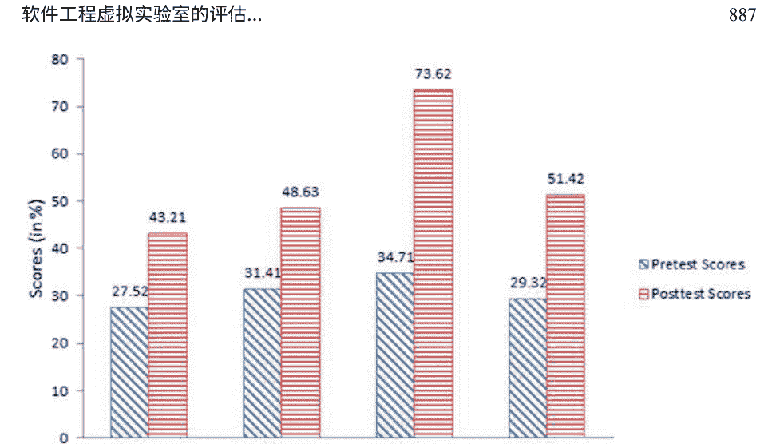

图1 每组的前测和后测得分比较

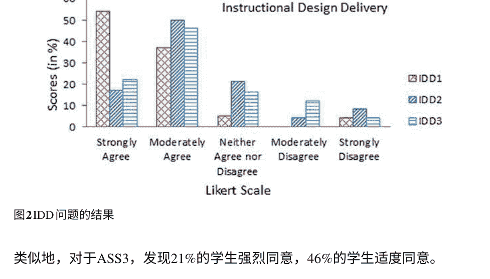

图2 IDD问题的结果

类似地，对于ASS3，发现21%的学生强烈同意，46%的学生适度同意。

学生对于他们的赋权的回应结果非常好（Likert量表得分 M = 2.82）。图5显示了关于EM的问题的回应。从图5可以得出结论，12%的学生强烈同意问题EM1，69%的学生适度同意问题EM1，同样地，28%的学生强烈同意问题EM2，56%的学生适度同意问题EM2。在EM3中，回应为9%强烈同意和71%适度同意。

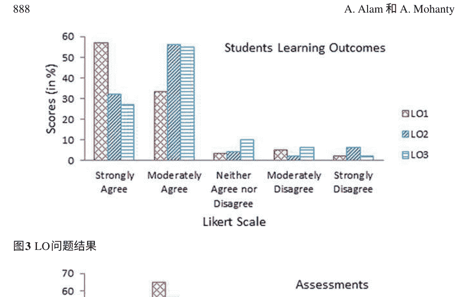


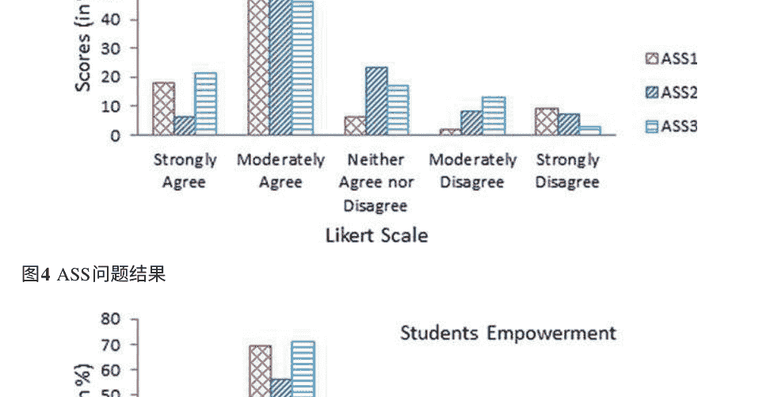


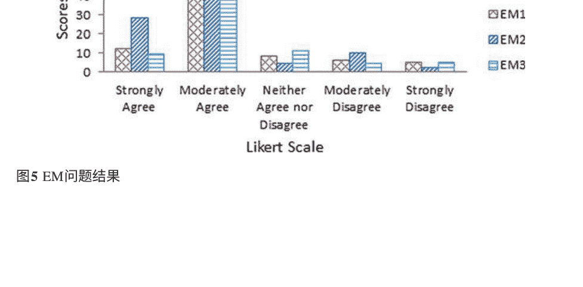


在SP上有一个非常好的反应（Likert量表得分 $M = 2.89$）也被发现。图6显示了学生对SP问题的回答。图6表明，16%的学生强烈同意SP1，59%的学生适度同意SP1，11%的学生强烈同意SP2，63%的学生适度同意SP2。对于SP3，回答是13%强烈同意和76%适度同意。

我们还发现学生的CT技能有一个非常好的反应（Likert量表得分 $M = 2.91$在表7中）。对于关于CT技能的问题的回答结果（参见附录）显示在图7中。图7中的结果表明，36%的学生强烈同意CT1，50%的学生适度同意CT1，29%的学生强烈同意CT2，59%的学生适度同意CT2，21%的学生强烈同意CT3，69%的学生适度同意CT3。

在AL上的回应也被认为是令人满意的（Likert量表得分 $M = 2.93$在表7中），对AL的问题的回应结果（请参见附录）显示在图8中。图8中的结果表明，17%的学生强烈同意AL1，68%的学生中度同意AL1；对AL2，24%的学生强烈同意，59%的学生中度同意；对AL3，19%的学生强烈同意，64%的学生中度同意。图9显示了学生对SE VLab的整体接受程度，根据CP上下文。我们发现学生更喜欢IDD和LO，相比CP中的其他参数。

图6 关于SP的问题的结果

图7 关于CT的问题的结果

图8 关于AL的问题的结果

图9 学生的整体接受程度

## 9 结论

在本节中，我们介绍了对工程学生在SE学科上使用名为SE VLab的虚拟实验室进行评估的结果。SE VLab可以帮助克服SE Tlab的某些限制。我们还开发了一种新颖的虚拟学习测量工具，并使用该工具评估了学生的学习表现。进行了性能评估的前测和后测。总体而言，研究的结果表明对使用SE VLab的反应是积极的。

### 9.1 讨论

我们现在讨论使用CP-VLLM工具获得的学生感知结果。研究结果表明，虚拟实验室学习很可能受到CP背景的影响，虚拟学习活动就位于其中。

互联网在我们的日常生活中扮演着重要的角色。它提供了一个连接到世界各地的链接。在过去几年中，互联网媒体被应用于教育领域。在印度，对基于网络的课程还没有付出太多关注。这种研究的匮乏令人惊讶，部分原因是因为互联网技术在教育中的相对新颖性。在这项研究中，学生的反馈表明他们喜欢这种创新的工作环境，并感到受到鼓励更有效地学习。我们发现虚拟实验室可以补充真实实验室。

### 9.2 主要发现

我们在当代技术增强虚拟学习的研究背景下讨论我们的发现。对于增强在线课程教学效果的关键因素进行了广泛的回顾[3]，发现学生互动与合作、积极学习或学生主导学习、及时反馈、用户友好的技术访问、教师作为促进者/导师、学习社区、学习目标、社交存在、多样化的学习风格、内容的真实性等一些重要概念在学生视角下对在线/虚拟学习环境的有效性具有非常重要的意义。我们还尝试使用CP-VLLM工具将这些组成部分纳入我们的研究中。根据结果，学生认为IDD和LO参数在我们的SE虚拟实验室中非常有效。在基于网络的虚拟学习环境[8]的背景下，研究人员还确认了相对于传统学习环境更好的学习表现，以及更高水平的学习氛围、自我效能和学习者满意度。在我们的工作中，我们评估了学习者在两种环境中的满意度，在虚拟和传统学习环境中，发现虚拟实验室更好，在混合（Tlab + Vlab）场景中最好。经验证据也支持了这一点。研究发现，学生在混合学习环境中的学习成果更好，因为他们能够更好地面对当前技术世界的实际问题[9]。考虑到学生群体的多样性，Dalgarno等人[7]建议使用虚拟实验室，学生应该提供广泛的学习机会，从中选择各种活动和资源来满足自己的学习需求。在这个背景下，在我们的SE VLab中，我们还加入了许多URL和参考资料，以满足学生的需求。为了提高学生的动机和参与度，我们还引入了一些教学代理。

具体来说，嵌入在SE VLab实验中的动画和交互特性对于引导学生对SE的高度复杂和抽象理论概念的理解产生了积极的影响[11]。本研究采用的绩效评估工具被发现在提高学生的学习收益方面非常有效，即使在先前学科知识水平较低的情况下。

在我们的研究工作中，我们试图定量和定性地分析数据，正如王[11]所提倡的那样。正如已经证明的那样，与模拟数据相比，使用真实数据可能会引发更高水平的学生动机，研究人员建议通过精心设计、计算机中介技术和适当协调群体互动和个体活动来创建虚拟学习环境已被证明是有益的。即使在像软件工程[12]这样高度抽象的学科中，我们也尝试同步所有这些组件以获得更好的学习效果。

在这项研究中，我们在“练习”部分引入了基于问题的作业，这在提高学习结果方面取得了成功，例如在内容知识方面的更高后测分数。这种技术也被其他研究人员在基于Web的教育中采用并证明有效[7]。

尽管在这项研究中我们发现虚拟实验室学习有多种优势，但我们并不建议这些虚拟实验室能够替代传统实验室。相反，SE VLab可以作为传统课堂或实验室教学-学习过程的补充，以提升学生的学习和动机。先前的研究表明，实验室学习所达到的学习成果取决于实验室实验的教学结构[9]。本研究的结果再次证实，与仅有传统实验室学习相比，学生从虚拟实验室学习环境中获得更多的好处。使用TVLab的学生（那些在传统和虚拟实验室会话中获得经验的学生）的学习成果更加有效，与其他考虑的组相比。关于学生在虚拟课堂中的参与度，有大量研究表明，学习者通过虚拟模式进行实验室学习可以获得多种好处[1, 4, 25]。在这项研究中，我们还发现参与者在虚拟学习环境中积极参与。与仅有传统实验室学习（第一组）相比，学生在SE VLab学习（第四组）环境中更加积极和投入。

### 9.3 学生通过开放式问题的回答

从所有180名（第二组、第三组和第四组）SE VLab用户（学生）对开放式问卷和面试环节的回答中，大部分回答表明他们对使用SE VLab持有积极的态度。他们还报告说，SE VLab激发了他们的学习动力，并鼓励他们更好地学习。大多数学生（89%）发现SE VLab让他们更好地实现了学习目标。

学生的反馈显示出对SE VLab的积极和建设性的回应，以下是其中一些回应。

> 我喜欢这个SE VLab，我可以在家里的空闲时间里做实验。我可以多次重复实验。我可以与我的虚拟教师互动。我不感到无聊，相反，我发现了很多有趣的参考书、研究论文和网址。使用这个实验室后，我对SE学科的信心增加了。我觉得我现在可以独立解决我的实验练习了。

然而，基于学生在软件工程理论课程和传统实验室中的先前知识，一个学生说道：

> 我有时感到与朋友和老师的实时联系的缺失。在这个软件工程虚拟实验室中，我需要音频-视觉连接。

一些在TLab课程中遇到困难的学生发现软件工程虚拟实验室对于学习实验非常有用。一个学生提到：

> 我觉得在虚拟环境中进行实验是更方便获得更好结果的方式。由于软件工程虚拟实验室包含许多超链接连接到许多参考网站，我们可以在需要时获得更多信息。

发现学生在虚拟实验室环境中更受鼓励学习，因为虚拟实验室提供了一个用户友好的界面和一个简单的平台来学习和实践每个实验。

> 通过重复实验，我可以更容易地理解许多概念，而不是通过阅读书籍。通过使用测验环节，我可以在完成每个实验后立即评估自己。

大约92%的软件工程虚拟实验室用户感到需要视频会议系统。一位用户写道：

> 我需要更多的音视频设备，以避免我老师不在时的缺席感。虚拟实验室不是真实实验室的替代品。它只是用于额外的实践目的。

然而，一些评估自己有困难的学生表示他们发现虚拟实验室更有趣。一位学生写道—自我评估部分很有趣。通过自我评估部分，我可以评估自己在使用这个虚拟实验室后的情况。如果我在当前实验中表现不好，我可以重新使用实验并重新评估我的知识。

虚拟学习环境有助于增加教师/学生互动，并使学习更加以学生为中心。然而，一些学生也持负面观点。一位学生写道：

> 我感到孤立、沮丧、困惑和焦虑。有时我对实验室实验的兴趣极大地减少。

### 9.4 教育意义

本研究具有以下教育意义：

- 1. 一种有效的远程学习和大规模教育的教学工具。
- 2. 可以通过优质教育提高个性化教学的自学能力。
- 3. 作为自主学习者，学生将培养承担学习责任的能力。
- 4. 知识构建、传播和管理将在学科主题中得到增强。
- 5. 通过促进同步和异步通信网络的学习社区，可以提高学生的动机和创造力（通过问题解决）。

### 9.5 限制

我们在研究过程中遇到的限制如下所列：

- 1. 在这项工作中，我们没有考虑教师的回应。由于我们的样本不是很大，向VLab用户的流失率几乎为零。然而，根据现有的研究文献，技术介导的学习系统中的流失率往往较高[5]。
- 2. 在这项工作中，SE VLab仅基于文本和动画，不包括视频和音频设施。
- 3. 除了这个SE VLab之外，没有其他公开可用的在线软件工程虚拟实验室，因此本研究报告的所有结果都是针对这个SE VLab的。
- 4. 本研究收集的数据仅来自印度西孟加拉邦和泰米尔纳德邦这个人口有限的地区。然而，本研究未进行跨文化和跨国的评估。

### 9.6 结论和未来工作方向

在这里，我们提供了我们在前面章节中报告的研究结果的综合视图。本节还包括我们的贡献、研究结果摘要和未来研究的可能方向。

在现代社会中，软件被开发用于办公室和家庭。这引入了在本科和研究生项目中培养大量软件工程师的挑战。随着现实世界问题的快速发展，21世纪的软件工程师面临新的挑战。为了应对这种情况，软件工程教育中引入基于实验室的学习是不可或缺的。然而，目前参与工程教育的许多发展中国家的学术机构，没有必要的教职员工和基础设施，无法确保提供质量的实践培训，这是软件工程教育所必需的。为了解决这个问题，印度理工学院卡拉格普尔分校开发了软件工程虚拟实验室（SE VLab）进行评估。

**CP-VLLM**：虚拟学习测量工具的开发。在本科课程中，实践活动有不同类型，如实验调查、控制任务和项目作品。控制任务构成实验室活动的主要部分。由于没有在线/离线的标准测量工具/仪器，因此评估实验室活动通常非常困难。鉴于此，我们基于CP理论开发了一个名为CP-VLLM的学习测量工具。我们对该工具的可靠性和有效性进行了统计测试。该工具可用于测量学生在在线/虚拟学习环境中的学习成果和表现。

在虚拟实验室学习环境中评估学生的学习表现。设计和实施SE VLab时，考虑到学生的反馈对于评估该实验室是重要的。在这种情况下，我们考虑了CP-VLLM测量工具以及两个SE学科知识测试工具，并对预测和后测数据进行了收集。

**未来研究的方向**。在这里报告的研究中存在一些未被探索的问题和未解决的问题，需要进一步调查。预计与社交网络平台（例如Facebook、Twitter和Instagram）更紧密地结合，以确保更多用户参与和全球观众。这样的功能还可以促进参与者之间的团体活动和间隔讨论。未来可以增加更多案例研究、根据不同教学大纲进行的新实验以及练习题。

在这项研究中，我们只考虑了批判性教育理论，并根据该理论开发了工具。未来可以考虑布鲁姆的分类法[9]、科尔布的模型、彼得·霍尼、艾伦·芒福德的模型、安东尼·格雷戈克的模型、尼尔·弗莱明的VAK/VARK模型以及其他认知学习风格方法[5,7,11,12]，开发其他虚拟学习测量工具。

我们进行的研究工作考虑了基于从印度理工学院卡拉格普尔和一些其他工程学院收集的数据的评估过程。印度纳杜邦。可以从印度的其他地理区域收集数据。也可以从其他国家收集数据。由于这个实验室可以在线上访问在网上，学生可以使用这个实验室并在线发送他们的反馈。将来，可以根据当前的教学大纲来扩展或添加一些新的实验。如前所述，目前还没有公开可用的SE VLab。将来，当其他SE VLabs被开发出来时，可以进行比较。然而，为了将来扩展对这个SE VLab的评估，可以尝试在用户体验方面找到与计算机科学和工程的其他领域开发的虚拟实验室之间的相似之处。

## 附录

表8显示了关于CP-VLLM工具的详细信息。该工具包含5点李克特量表：1-“强烈同意”到5-“强烈不同意”。

表8 CP-VLLM工具
| 参数 | 物品 | 问卷调查（5点李克特量表）<br>(5-强烈同意 到1-强烈不同意 ) |
| :--- | :--- | :--- |
| 教学设计和交付<br>(IDD) | IDD1<br>IDD2<br>IDD3 | “实验课程材料组织得很好”<br>“实验课程具有文本和视觉内容，提高了学生的学习能力”<br>“实验课程内容有用且最新” |
| 学生学习成果（LO） | LO1<br>LO2<br>LO3 | “实验课程可以轻松理解、理解和记住”<br>“实验课程可以转移到其他类似的上下文中以解决问题”<br>“实验课程的组成部分可以进行适当的分析和概念综合” |
| 评估（ASS） | ASS1<br>ASS2<br>ASS3 | “实验课程中学生将如何评估在实验课程中清楚地解释”<br>“提供适当难度的实验作业”<br>“提供实验作业的反馈” |
| 学生的赋权（EM） | EM1<br>EM2<br>EM3 | “我可以设计一个新的软件项目”<br>“我有机会思考如何解决问题”<br>“我可以自我评估我的学习成就” |
| 社交存在（SP） | SP1<br>SP2<br>SP3 | “我被鼓励提问以澄清问题”<br>“我有机会与其他学生互动”<br>“我被鼓励发表自我介绍” |
| 批判性思维技能（CT） | CT1<br>CT2<br>CT3 | “课程内容使人深入思考一个主题”<br>“课程内容有助于解决软件设计中的问题”<br>“课程内容有助于分析、解释和综合信息” |
| 对齐（AL） | AL1<br>AL2<br>AL3 | “实验作业提供了学生的兴趣和能力”<br>“实验作业基于实验课程内容和学习目标”<br>“实验学习成果基于当前教学大纲的要求” |

## 参考文献

- 1. Gunawan, G., Nisrina, N., Suranti, N. M. Y., Herayanti, L., & Rahmatiah, R. (2018). 虚拟实验室以提高学生对物理学习的概念理解。物理学杂志：会议系列，1108(1), 012049。
- 2. Alam, A. (2022). 社交机器人在教育中的长期人机交互：用于创建机器人可触及学习环境的机器人导师的社交支持行为。ECS交易，107(1), 12389。https://doi.org/10.1149/10701.12389ecst
- 3. Kanij, T., & Grundy, J. (2020, November). 由于COVID-19，调整软件工程服务课程的教学。在2020年IEEE第32届软件工程教育和培训会议（CSEE&T）（第1-6页）。IEEE
- 4. Alam, A. (2020). 微积分教学与学习的挑战与可能性：以印度为例的案例研究。天才青年科学家教育杂志，8(1), 407-433。https://doi.org/10.17478/jegys.660201
- 5. De Vries, L. E., & May, M. (2019). 虚拟实验室模拟在实验室技术人员教育中的应用-动机和学习强度。生物化学与分子生物学教育，47(3), 257-262。
- 6. Alam, A. (2022, April). 幼儿园教育中的教育机器人和计算机编程：评估小学生计算能力的概念框架用于设计强大教育场景的思维。在2022年智能技术和下一代计算系统国际会议(ICSTSN)(pp. 1–7)。IEEE。检索自https://doi.org/10.1109/ICSTSN53084.2022.9761354
- 7. Schnieder, M., Williams, S., & Ghosh, S. (2022). 使用混合学习原则比较面对面和虚拟实验室/教程对工程学生的影响。教育科学,12(3), 153.
- 8. Alam, A. (2020b). 印度的微积分教学法：一项实证调查。Periódico Tchê Química, 17(34), 164–180. https://doi.org/10.52571/PTQ.v17.n34.2020.181_P34_pgs_164_180.pdf
- 9. Estriegana, R., Medina-Merodio, J. A., & Barchino, R. (2019). 学生对虚拟实验室和实践工作的接受度: 技术接受模型的延伸。计算机与教育, 135, 1–14.
- 10. Alam, A. (2020c). 在印度教育领域中应用人工智能的可能性和挑战。国际高级科学与技术杂志, 29(5),5077–5094. http://sersc.org/journals/index.php/IJAST/article/view/13910
- 11. Gamage, K. A., Wijesuriya, D. I., Ekanayake, S. Y., Rennie, A. E., Lambert, C. G., & Gunawardhana, N. (2020). COVID-19大流行期间的大学课程的在线教学和实验室实践的连续性。教育科学,10(10), 291.
- 12. Alam, A. (2020d). 工程和技术学士学位一学期学生对基础向量概念的知识测试 (TKEVC) 。Periódico Tchê Química, 17(35),477–494. https://doi.org/10.52571/PTQ.v17.n35.2020.41_ALAM_pgs_477_494.pdf
- 13. Falconer, E. K., & Gruss, A. B. (2018). 评估在线、远程和远程科学实验室经验的利弊。开放和分布式学习研究国际评论, 19(2).
- 14. Alam, A. (2022). 积极心理学走进学校：在21世纪学校中构思学生的幸福，同时“关注心灵！”我们到达了吗？基于证据的学校积极心理学干预。ECS Transactions, 107(1), 11199.https://doi.org/10.1149/10701.11199ecst
- 15. Jamshidi, R., & Milanovic, I. (2022). 构建具有模拟的虚拟实验室。工程教育中的计算机应用，30(2), 483–489.
- 16. Giray, G. (2021). 对电脑和软件工程本科生在疫情条件下的电子学习满意度进行实证研究。教育与信息技术，26(6), 6651–6673.
- 17. Alam, A. (2021, November). 在教育人工智能领域的可能性和担忧。在2021年国际计算智能和计算应用会议（ICCICA）(pp. 1–8). IEEE. 检索自 https://doi.org/10.1109/ICCICA52458.2021.9697272
- 18. Mamani, N. M., García-Pealvo, F. J., Conde, M. Á., & Gonçalves, J. (2021年9月). 关于使用硬件在环和机器人的模拟器和远程实验室的系统性映射: 在大学预科教育中培养STEM /STEAM技能。在2021年计算机教育国际研讨会（SIIE）(pp. 1–6). IEEE.
- 19. Singh, G., Mantri, A., Sharma, O., & Kaur, R. (2021年). 用于增强电子工程实验室体验的虚拟现实学习环境。工程教育中的计算机应用, 29(1), 229–243.
- 20. Triejunita, C. N., Putri, A., & Rosmansyah, Y. (2021年11月). 关于虚拟实验室学习的系统性文献综述。在2021年数据和软件工程国际会议（ICoDSE）(pp. 1–6). IEEE.
- 21. Ramírez, J., Soto, D., López, S., Akroyd, J., Nurkowski, D., Botero, M. L., Bianco, N., Brownbridge, G., & Molina, A. (2020). 使用真实问题和工业软件支持化学反应工程课程的虚拟实验室。化学工程教育, 33, 36–44.
- 22. Hartikainen, S., Rintala, H., Pylväs, L., & Nokelainen, P. (2019). 主动学习的概念和学习成果的测量：工程教育研究综述。教育科学, 9(4), 276.
- 23. Alam, A. (2021, December). 应该让机器人取代教师吗？ AI和学习分析在教育中的动员 。在2021年计算、通信和控制进展国际会议(ICAC3)(pp. 1–12). IEEE. 检索自 https://doi.org/10.1109/ICAC353642.2021.9697300
- 24. Alam, A. (2022). 心理、社会文化和生物学解释STEM教育中的性别差距： 将研究转化为基于证据的干预的呼吁。在可持续性和公平性国际会议(ICSE-2021)论文集中。《亚特兰蒂斯社会科学、教育和人文学刊》 . ISSN: 2667-128X. 从https://doi.org/10.2991/ahssch.k.220105.012检索
- 25. Tobarra, L., Robles-Gomez, A., Pastor, R., Hernandez, R., Duque, A., & Cano, J. (2020). 学生对新型基于容器的虚拟实验室的接受和跟踪。应用科学, 10(3), 1091.
- 26. Glassey, J., & Magalhães, F. D. (2020). 虚拟实验室-不管你喜欢还是讨厌，它们在未来可能会被更多使用。化学工程教育, 33, 76.
- 27. Alam, A. (2022年4月). 一种基于数字游戏的学习方法，用于有效的课程传输-行为的人工智能和机器学习教学。在2022年可持续计算和数据通信系统国际会议(ICSCDS)中 (页码69-74). IEEE. 检索自https://doi.org/10.1109/ICSCDS53736.2022.9760932

# 面向客户的网络安全运营中心系统结构


Taslina Akter, Kuraish Bin Quader Chowdhury, Md Tamimur Rahman, 和 Shatabdee Bala

摘要 在大多数情况下，安全信息和事件管理(SIEM)架构被构建用于定期通过几种预防措施来保证事件，并通过旗帜警告来确保企业的网络安全。安全运营中心(SOC)的专家评估这些警报，以确定它们是否恶意。然而，通知的数量通常很大，加上它们本身的重量以及SOC处理每个警报的能力超过了自身的优势。因此，有害攻击和受感染的主机可能会被忽视。机器学习是降低误报率和提高SOC分析师生产力的可行选择。在这个评估中，每个人都受到面向客户的基本人工智能构建的鼓励，用于数字保护活动的重点在一个真实的组织场景中。我们将讨论SOC历史上最著名的细节，它们的执行方式，并利用这些数据集来帮助人工智能蓬勃发展。

关键词 机器学习系统·网络安全运营中心·危险检测

## 1 引言

组织安全将对关系产生影响。为了检测可疑活动，协会或国家使用安全信息和事件管理（SIEM）架构。终端、防火墙、入侵检测和防御系统（IDS/IPS）、数据丢失防护（DLP）、域名系统（DNS）、动态主机配置协议（DHCP）、Windows/Unix 健康阶段、VPN分支和其他事件日志都保证可用。有几种不同类型的安全情况。每天，记录中都包含大量的数据，以千兆字节为单位[1]。安全运营中心（SOC）团队根据调查人员的互动，从安全事件日志中创建这些用例。它们通常是基于决策的框架，通过多个分支连接至少一个标志。所示的标准将基于网络或长度。当激活预定义的应用案例时，SIEM设备将发送实时通知。然后，SOC分析师将调查这些通知，以确定与警告相关联的用户是否危险（真正有帮助的一面）或不危险（不真实有帮助的一面）。如果调查发现某些警告可疑，SOC专家将创建开源票务请求系统（OTRS）令牌。在初始请求之后，一些OTRS票将升级为二级审查框架（例如Co3 Process），作为应急备份小组调查和处理的重要安全事件。另一方面，SIEM经常创建大量的警告，其错误有帮助率非常高。每个时期接收到的警告统计数据可能会达到非常庞大的数量，远远超出SOC调查所有警告的能力[2]。

因此，SOC可能决定仅分析高严重性警告或抑制相同类型的所有警报。这可能导致一些严重的攻击被忽视。因此，为了检测危险用户，需要更复杂和自动化的方法。AI计算是SOC工作流程的核心，结合各种事件日志、SIEM警报和SOC检查结果，为安全战室生成全面的客户风险评级。SOC专业人员可以使用AI风险评级来聚焦他们的检查，从而首先关注那些造成最大风险的个人，而不是在许多SIEM警报中寻找一堆[3]。

这将从根本上提高他们的生产力，改善他们的工作线，为领导者提供帮助，并在长期内帮助组织的安全。我们的策略，特别是，构建了一个基于买家的AI技术框架，以根据谨慎数据区分客户风险评估。这种方法可以为安全调查人员提供客户的全面评估，使他们能够专注于那些具有高评级的人。据作者所知，以前没有进行过针对这种应用的完整系统解决方案的研究[4-7]。

### 本文的主要贡献如下：

- 为了评估用户风险，提出了一种创新的以用户为中心的深度学习方法，并使用真实世界的工业数据进行了测试。该解决方案可以显著减少手动评估警报所需的资源，同时提高公司的安全性。
- 为了构建AI算法的包含和传达名称，引入了一种理想的数据设计方法，结合了准备好的标志、安全日志和SOC专家分析记录。

## 2 原始格式的数据和错误检查

可验证的事实来自Symantec的信息收集记录。SIEM平台警报、科学测试的笔记以及来自各种来源（如防火墙、IDS/IPS、HTTP/FTP/DNS监视、DHCP、漏洞分离、Windows安全事件、VPN等）的日志都得到了充分的覆盖。对于数据流量或其他具有活动IP地址的其他数据源，内容目标至关重要，因为在大型公司中，客户逐渐被分配不同的内部IP地址，导致他们的IP地址随时间变化[8]。如果没有准确的唯一IP到客户的规划，跨多个组织记录相关的活动将变得困难和不准确。

为了组织交通数据，使用IP到客户端规划来确保客户端ID作为数据集创建、数据协调和模型评估的主键。最后，考试研究报告经常以文本格式保存在这样的标签结构以下。以下信息经常包括在笔记中：为什么发出警报，来自系统日志和其他资源（如VirusTotal和IPVoid）的具体数据，以及在发出警报时的调查结果是否确定为误报[9]。

## 3 标签生成和用户特征工程

### 3.1 页码和页眉

因为我们的主要目的是估计用户风险，所以特征是在个体用户级别上构建的。已经开发了100多个特征来定义用户的活动。将洞察列表中的属性总和在一起（每天的警告次数），从复发分析中得出的世俗因素（运动外观复发），以及从社交数据分析中得出的相关因素（来自客户事件图的客户中心性等）[10]。

### 3.2 页码和页眉

由于所有特征都已创建，我们必须为我们的机器学习算法分配一个基准或等级。挖掘分析师的询问记录提供了主要标签。为了从备注中推导出用户的真实情况，我们应用了文本/数据挖掘算法，如重要短语/词提取和情感分类[11]。在文本挖掘之后，只有少数带有注释的用户（通常为2%）将被分类为危险。如果我们只使用这些客户进行机器学习算法，我们有两个问题：表1 作为最终建模的数据集示例

| 用户ID | 摘要 特征1 | 指标 特征2 | 时间 特征3 | 关系 特征4 | 标签 |
|---|---|---|---|---|---|
| 用户1 | 13 | 1 | 0.65 | 5.17 | 1 (风险初始) |
| 用户2 | 25 | 0 | 2.74 | 9.34 | 1 (风险派生) |
| 用户3 | 4 | 0 | 1.33 | 3.52 | 0 (正常) |

- 大多数没有注释的消费者被排除在模型之外，然而他们可能有有用的信息。
- 许多机器学习算法/模型在面对严重不平衡的分类任务时表现不佳。

需要标签传播策略来生成更多标签，以解决这两个困难。这里的基本概念是，如果我们了解特定的问题用户，我们可以识别出其他表现出类似风险行为的用户。我们采用了两种标签传播技术：基于矩阵的聚类和受控PU学习[12-14]。

最后，将文本和表传输作为我们的机器学习算法的目标，以混合标签。表1是这里最终分析数据集的一个示例：

## 4个机器学习算法和实现

### 4.1 机器学习算法

专家系统算法是一种通过该AI系统实现其目标的方法，即从给定的输入数据中预测输出值。机器学习算法可以分为有监督和无监督两类。无监督算法处理未经分类或标记的数据，而有监督学习算法则具有输入和输出数据的标签。在我们的框架[15]中，使用了多层神经网络（MLN）和两个隐藏层、具有Gin分割树的随机森林、具有大工件的支持向量机和逻辑回归等组织。我们的实验结果主要表明，多层神经网络和随机森林在我们的案例中表现出色。这些模型的批准结果将稍后发布。

### 4.2 联系作者信息

显示数据应该被分成准备和测试集，没有明显的最终目标，这是一种标准方法，并且应该在测试保留数据上检查多个模型[16]。除了Bend下的区域外，我们还在方程（1）和（2）中定义了两个模型质量度量[17, 18]。

```
模型检测率
= \left( \frac{ \text{在某些估计中的风险主机数量} }{ \text{风险主机的总数量} } \right) * 100\% \quad (1)
```

```
提升模型
= \left( \frac{ \text{在某些预测中的风险主机比例} }{ \text{风险主机的总比例} } \right) * 100\% \quad (2)
```

检测率和提升率与图下面积相比，后者评估了模型在整个测试数据上的表现，展示了模型在不同预测段中成功检测到问题用户的能力。为了生成这两个度量，首先按照模型得分的降序对数据进行排序。结果的比例，使用和不使用特征模型，被称为模型的识别速度。假设测试数据中有60个潜在危险客户，模型从前10%的预测中识别出其中的30个；识别率等于80%。提升是一个度量，确定使用模型是否比不使用模型更好。如果实验数据涵盖5000个客户，提升等于 (30/500)/(60/5000) = 5。在特定预期中，具有更高提升的车辆表现更好。

### 4.3 模型评估技术

我们检查了一个月的模型执行数据，并建立了执行指标来评估我们的人工智能平台的可行性。我们将数据随机分为两个类别：准备（75%的案例）和测试（25%的示例）（剩下的25%）。使用文本数据计算AUC。多面神经网络和随机森林在AUG大于0.80时提供可接受的准确性。表2显示了数据如下。

表3分别显示了在长时间内的区域费用，根据前5-20%的估计。只使用前20%的顶级猜测，不规则森林可以发现80%的已认证危险示例，这是令人鼓舞的。

多面神经网络对于前5%的估计所达到的提升在表4中显示，为6.82，比当前基于规则的技术好了多倍。多层神经网络具有最好的平均值。

表2 测试数据上的模型AUC

|              | MNN    | RF     | 支持向量机 | LR     |
|--------------|--------|--------|------------|--------|
| 平均值       | **0.807** | **0.829** | 0.775      | 0.754  |
| 标准误差     | 0.006  | 0.004  | 0.016      | 0.008  |

表3 模型在前5-20%预测上的检测率

| 前%预测 (%) | MNN (%) | RF (%) | SVM (%) | LR (%) |
|-------------|---------|--------|---------|--------|
| 5           | 32      | 24.50  | 21.20   | 32.77  |
| 10          | 59      | 42.93  | 47.57   | 51.20  |
| 15          | 71      | 71.20  | 71.00   | 69.23  |
| 20          | 79      | **79.50** | 79.20   | 75.57  |

表4 模型在前5-20%预测上的提升

| 前%预测 (%) | MNN   | RF    | 支持向量机 | LR    |
|-------------|-------|-------|------------|-------|
| 5           | **6.82** | 5.30  | 4.19       | 6.82  |
| 10          | 6.25  | 4.55  | 4.92       | 5.30  |
| 15          | 4.92  | 4.92  | 4.92       | 4.80  |
| 20          | 4.09  | 4.19  | 4.19       | 4.00  |
| 平均        | **5.52** | 4.74  | 4.56       | 5.23  |

当我们查看表4的后半部分时，前5-20%值的常规提升超过5.5。这真是令人兴奋。

### 4.4 您的论文将如何处理

AI框架现在正在一个可验证的创作环境中使用。属性和名称根据以前的数据定期更新。然后，AI模型定期更新并发送到评分引擎，以确保它获得最新的数据模式。当触发新的警报时，风险评估会分阶段进行，以便SOC检查员能够迅速对高风险个体做出反应。

最后，评论将被编译并整合到当前数据中，以便继续对模型进行工作。整个交互过程已经被机械化，从数据合并到评分生成。此外，该框架高效地促进了研究中的创新思想。

## 5 结论

在本综述中，我们提出了一个以客户为驱动的人工智能框架，通过结合来自各种安全日志、准备信息和专家经验的数据，识别出麻烦的客户。 对于组织安全活动，该解决方案为危险客户披露提供了完整的结构和响应。 作为这项工作的一部分，我们将讨论如何从SOC测试记录中创建标记，利用IP、主机和客户端设计以客户为驱动的属性，评估人工智能算法，并在SOC发展环境中实施这样的过程。 我们还展示了即使使用简单的人工智能算法，所得到的结构也能够从具有严重不平衡和受限标记的数据中区分出额外的信息。 多脑网络模型的前20%预测水平往往比现有的基于规则的方法高出几倍。 整个人工智能框架在生产环境中完全自动化，极大地改进和提升了业务风险识别和管理，从数据收集到每天的模型更新到实时评分。 就未来发展而言，我们将研究更多的学习技术，以进一步提高定位精度。

## 参考文献

- 1. Khan, N. R., Rabbi, M., Al Zabir, K., Dewri, K., Sultana, S. A., & Lippert, K. J. (2022). 基于物联网的教育范式以获得最佳学习效果。 在2022年国际计算、通信和应用信息学会议（ACCAI）（第1-第8页）。 https://doi.org/10.1109/ACCAI53970.2022.9752569
- 2. Rahman Khan, M. N., Yesmin, S., Aktar, M., Quader Chowdhury, K. B., Labeeb, K., & Abedin, M. Z. (2021). 结合机器学习和系统基因组学的多组学数据技术。 在2021年第6届国际通信和电子系统会议（ICCES）（第1524-第1528页）。 https://doi.org/10.1109/ICCES51350.2021.94892223.
- 3. Khan, M. N. R., & Lippert, K. J. (2022). 基于虚拟现实的医疗支持系统框架。在C. K. K. Reddy (编者)，智能系统和机器学习用于工业：进展、挑战和应用（第8-第28页）。 CRC出版社，泰勒和弗朗西斯集团。
- 4. Khan, M. N. R., & Lippert, K. J. (2022). 医疗保健教育中的沉浸式技术。在C.K. K. Reddy (编者)，智能系统和机器学习用于工业：进展、挑战和应用（第111-第132页）。 CRC出版社，泰勒和弗朗西斯集团。
- 5. Khan, M. N. R., Mashuk, A. K. E. H., Durdana, W. F., Alam, M., Roy, R., & Razzak, M. A. (2019). “医生是谁？” —一款可定制的用于综合医疗保健的安卓应用程序。 在2019年第10届国际计算、通信和网络技术会议（ICCCNT）（第1-第6页）。 https://doi.org/10.1109/ICCCNT45670.2019.89445016.
- 6. Khan, M. N. R., Shahin, F. B., Sunny, F. I., Khan, M. R., Haque Mashuk, A. K. E., & AlMamun, K. A. (2019). 一款创新的增强型安卓应用程序，用于提高口语残疾人的中介沟通能力。 在2019年第10届国际计算、通信和网络技术会议（ICCCNT）（第1-第5页）。 https://doi.org/10.1109/ICCCNT45670.2019.8944655
- 7. Khan, M. N. R., Durdana, W. F., Roy, R., Poddar, G., Ferdous, S., & Mashuk, A. K. E. H. (2018). 健康守护者——一个用于保持健康的子安卓应用程序。在Khan, M. N. R., Sonet, H. H., Yasmin, F., Yesmin, S., Sarker, F., & Mamun, K. A. (2017). ‘BolteChai’ ——一个用于语言障碍儿童的安卓应用程序。在2017年第四届国际电气工程进展会议(ICAEE)(pp. 541–545). https://doi.org/10.1109/ICAEE.2017.8255415
- 8. Khan, M. N. R., Pias, M. N. H., Habib, K., Hossain, M., Sarker, F., & Mamun, K. A. (2016). Bolte Chai: 一种增强和替代性沟通设备，用于增强非语言儿童的沟通。在2016年国际医学工程、健康信息学和技术（MediTec）会议上（第1-4页）。https://doi.org/10.1109/MEDIATEK.2016.7835391
- 9. Khan, M. N. R., Iqbal, M. M. T., Yesmin, S., Mashuk, A. K. E. H., Shahin, F. B., & Razzak, M. A. (2018). 开发一种自动检测压力失真和报警系统的气管插管。在2018年IEEE-EMBS生物医学工程与科学会议（IECBES）上（第476-479页）。https://doi.org/10.1109/IECBES.2018.8626676
- 10. Haque, H., Labeeb, K., Riha, R. B., & Khan, M. N. R. (2021). 基于物联网的水质监测系统，使用zigbee协议。在2021年国际新兴智能计算与信息学会议（ESCI）中（第619-622页）。https://doi.org/10.1109/ESC50559.2021.9397031
- 11. Labeeb, K., Chowdhury, K. B. Q., Riha, R. B., Abedin, M. Z., Yesmin, S., & Khan, M. N.R. (2020). 通过使用大数据质量框架对天气监测应用程序进行预处理。在2020年IEEE国际工程女性（WIE）电气与计算机工程会议（WIECON-ECE）中（第284-287页）。https://doi.org/10.1109/WIECON-ECE52138.2020.9397990
- 12. Lippert, K., Khan, M.N. R., Rabbi, M. M., Dutta, A., & Cloutier, R. (2021). 系统工程元宇宙框架。在2021年IEEE国际信号处理、信息、通信和系统会议上，12月3日至4日。
- 13. Khan, M. N. R., Shakir, A. K., Nadi, S. S., & Abedin, M. Z. (2022). 一种面向危机情况的大学学术解决方案的安卓应用程序。在：S. Shakya, V. E. Balas, S. Kamolphiwong和K. L. Du (Eds.), 情感分析和深度学习。智能系统与计算进展，第1408卷。Springer。https://doi.org/10.1007/978-981-16-5157-1_5
- 14. Khan, M. N. R., Ara, J., Yesmin, S., & Abedin, M. Z. (2022). 网络安全中的机器学习方法。在：I. J. Jacob, S. Kolandapalayam Shanmugam和R. Bestak (Eds.), 数据智能和认知信息学。智能系统的算法。Springer.https://doi.org/10.1007/978-981-16-6460-1_26
- 15. Khan, M. N. R., Saha, H., Yesmin, S., & Abedin, M. Z. (2022). 通过使用元启发式算法检测社交媒体上的假新闻的创新框架。在：I. J. Jacob, S.KolandaPalayam Shanmugam和R. Bestak (Eds.), 数据智能和认知信息学。智能系统的算法。Springer。https://doi.org/10.1007/978-981-16-6460-1_27
- 16. Khan, M. N. R., Saha, H., Yesmin, S., & Abedin, M. Z. (2022). 基于大数据的城市定价系统分析综述。在：I. J. Jacob, S. KolandaPalayam Shanmugam和R. Bestak (Eds.), 数据智能和认知信息学。智能系统的算法。Springer。https://doi.org/10.1007/978-981-16-6460-1_25
- 17. Khan, M. N. R., Bala, S., Yesmin, S., & Abedin, M. Z. (2022). 生物信息学：数据挖掘技术的重要性。在：S. Shakya, V. E. Balas, S. Kamolphiwong, K. L. Du (编辑), 情感分析和深度学习。智能系统与计算进展，第1408卷。Springer。https://doi.org/10.1007/978-981-16-5157-1_32

#### 使用无监督特征预测信用卡违约者

Thomaskutty Reji, Andrea Rodrigues和Jossy P. George

摘要银行在向客户提供信用卡和贷款时承担多重风险。当客户未能在到期时间内支付信用额度时，他们成为信用卡违约者。当银行能够预测客户成为违约者的概率时，风险最小化是可能的。本文提出了一种增强的机器学习模型，使用高斯混合模型和K-均值聚类的无监督特征来预测违约客户。该方法已经针对各种分类算法进行了测试，如梯度提升，AdaBoost，SVM，线性判别分析和逻辑回归。实验结果表明，所提出的方法显著改善了无监督特征模型

的性能。

比较性能指标表明，梯度提升机在准确率和召回率方面优于其他模型，分别为88%和89%。

关键词无监督学习·聚类·机器学习·信用卡违约者·风险最小化·提升

## 1 引言

人们提前消费并借贷信用，以便尽早享受某些商品。尽管对信用的需求增加了，但偿还能力并没有增加，这导致信用行业违约数量显著增加。信用卡违约不仅对银行的信用卡持有人的地位产生影响，也对其他银行的地位产生影响。由于卡片违约，客户

T. Reji (✉) · A. Rodrigues · J. P. George
数据科学系, 基督大学, 拉瓦萨, 浦那, 马哈拉施特拉邦, 印度
e-mail: thomaskutty.reji@science.christuniversity.in

A. Rodrigues
电子邮件: andrea.rodrigues@christuniversity.in

J. P. George
电子邮件: frjossy@christuniversity.in

© 作者（们），独家许可给 Springer Nature Singapore Pte Ltd. 2023
S. Shakya 等人（编），情感分析与深度学习,
智能系统与计算进展 1432,
https://doi.org/10.1007/978-981-19-5443-6_67

909

将面临信用局的封锁名单，贷款批准的更严格标准以及其他信用服务问题。 根据银行的信用政策，必须遵守规定和法规。最重要的条件之一是偿还借款资金的时间限制。建议在此指定期限后不要跳过每月的信用卡费用。然而，即使客户错过了这些日期，他们将获得额外的时间来完成付款。如果在宽限期内未能支付金额，账户将违约[1]。有多种原因可能导致信用违约：过度消费、拖延战术、邮件中断以及忽视到期日期。找到这些客户以最小化信用风险总是有帮助的。简而言之，当客户未能在允许的期限内偿还金额时，他们成为违约者。

银行系统正在使用各种风险最小化模型来解决问题。然而，由于这是一个预测问题，机器学习模型也可以用来预测信用卡违约概率。能够预测潜在违约者可能性的模型可以被银行系统采用，以最小化信用风险。 有一些分类算法可以进行二元分类。机器学习更适合解决这类问题。如果一个模型能够预测信用卡违约概率，银行可能能够防止损失，并为客户提供其他选择，如宽限期和债务整合[2]。

在风险建模问题中，类型II错误更为严重。一个智能模型不应该错过任何可能违约的客户。为了最小化类型II错误，模型的假阳性率应该很低。因此，召回率指标将是信用卡违约者预测的高效模型选择标准。

由于银行业务中目标类别通常不平衡，这项工作的主要挑战是获得良好的召回率。 在这项工作中，使用机器学习算法来预测信用卡违约的概率。将训练五种不同的模型，分别是梯度提升分类器、AdaBoost分类器、线性判别分析、支持向量机、逻辑回归，以及两种无监督学习模型，如高斯混合模型和K均值聚类。

### 1.1 贡献

信用卡违约问题已经被许多研究人员用机器学习和深度学习技术来解决。只有少数几项工作关注无监督学习技术，特别是在特征工程过程中。现有的工作更注重获得良好的整体准确率。

本文提出了用于预测信用卡违约概率的无监督特征。不同的机器学习分类算法在不同阶段进行训练和评估，包括有无无监督特征。模型评估基于召回率指标而不是整体准确率。

### 1.2 组织

本文按照以下方式组织。第2节包括文献综述，第3节介绍了提出的方法和模型工作流程，第4节包括实验结果和比较分析，第5节介绍了工作的结论。

## 2 文献综述

研究人员尝试使用UCI存储库中的信用卡违约数据集来预测信用卡违约的概率。他们使用了各种机器学习分类算法来解决这个问题。在信用风险建模中，也进行了深度学习工作，包括人工神经网络、感知器和自组织映射。

Shivanna和Agarwal [3]使用深度支持向量机、决策树和感知器来预测信用卡违约者。在各种模型中，深度支持向量机表现更好。他们使用了UCI信用卡数据集的30,000个客户信息和25个特征。提出的支持向量机模型达到了82.2%的准确率和0.74的AUC值。

Keramati和Yousefi [4]对与信用卡行业中各种数据挖掘方法相关的文献进行了全面的调查。他们研究了线性判别分析（LDA）和K最近邻、CART算法等机器学习方法，并使用AUC分数作为评估指标。他们研究了集成模型如何帮助降低信用风险。他们还引入了一些用于信用评分建模的混合模型。

Agarwal等人[5]完成了一项比较研究，并提出使用主成分分析来增强信用卡预测的分类技术。他们评估了各种分类算法，如逻辑回归、决策树、K最近邻和朴素贝叶斯。分析使用了UCI存储库中的现有信用卡违约数据集。目标是预测潜在违约者的可能性。应用主成分分析来评估其对机器学习算法性能的影响。他们发现逻辑回归优于其他所有模型。

对于分类任务，有各种无监督机器学习方法。Rai & Dwivedi [6] 提出了一种基于神经网络的无监督学习方法，用于检测信用卡数据集中的欺诈行为。所提出的方法在现有的自动编码器、K均值聚类、孤立森林等方法上表现出色，并实现了99.87%的准确率。Panchal & Verma [7] 使用自组织映射（SOMs）来识别未来的潜在信用卡违约者。自组织映射在异常检测和降维中非常有帮助。

Alam等人[8]对一个不平衡的数据集进行了关于信用卡违约预测的详尽研究。多个信用卡数据集，包括台湾客户信用数据集、南德意志客户信用数据集、比利时客户信用数据集，被用于模型评估。他们应用各种重新采样技术和数据归一化后开发了一个模型。实验结果表明，梯度提升决策树方法优于其他模型。

Zhu等人[9]使用梯度提升模型来预测信用用户的逾期还款率。他们使用接收者操作特征曲线（ROC）和其他指标对模型进行评估。整个研究使用P2P公司的数据进行，包括30,000个客户的详细信息。

Soui等人[10]使用遗传编程算法对台湾消费者支付数据集进行了探索性分析，以提高模型的准确性。研究结果表明，遗传编程算法可以基于IF-THEN准则创建有效的评估模型。该模型可以达到超过86%的精确度、召回率和准确性的平均水平。

Vishwakarma和Hajela [11]对各种机器学习算法在预测信用卡违约方面的性能进行了比较研究。不同的分类技术，包括提升算法，已经测试并比较了其混淆矩阵和曲线下面积（AUC）。

## 3 提出的方法

提出的方法包括三个阶段。在第一阶段，基准模型通过对数据进行必要的转换进行训练。在第二阶段，基准模型再次通过应用SMOTE技术对不平衡数据进行重新训练。最后，通过添加由无监督学习技术生成的特征，如高斯混合模型和K-means聚类，对模型进行重新训练。图1展示了从数据收集到提出系统的最终模型的整个工作流程。

在数据收集后，系统将源数据集按照80:20的比例分割为训练集和测试集。第二步包括预处理，包括从无监督算法中生成特征，特征选择和数据转换。训练数据和测试数据都经过预处理流程。模型训练分为三个阶段。对于所有阶段，工作流程几乎相同。使用训练数据训练了多个分类模型，并通过评估召回率和准确率指标选择最终模型。

### 3.1 数据集

源数据集取自UCI机器学习库，包括信用额度、性别、教育程度、婚姻状况、年龄和过去付款历史、账单金额和过去六个月的先前付款金额等24列。数据集中有1001个客户实例。限制余额特征是特定客户的信用额度金额。账单金额和付款金额特征分别是不同月份的账单和先前付款。响应变量是二进制数字，其中1表示违约客户，0表示非违约客户。在客户实例中，有787个非违约客户和214个违约客户。表1给出了特征描述的详细视图。

#### 使用无监督特征预测信用卡违约者

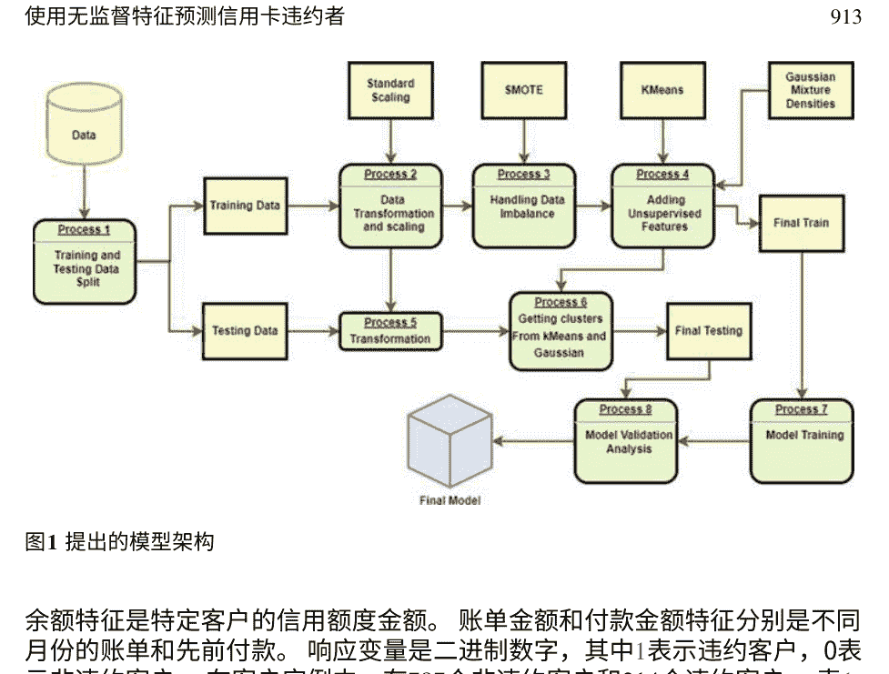

#### 图1 提出的模型架构

表1 数据集特征描述

| 特征 | 描述 |
|------|------|
| 信用额度 | 给定信用额度的金额（美元） |
| 性别 | 客户的性别（1 =男性；2 =女性） |
| 教育 | 教育（1 = 研究生，2 = 大学，3 = 高中，4 = 其他） |
| 婚姻 | 婚姻状况（1 = 已婚，2 = 单身，3 = 其他） |
| 年龄 | 客户年龄 |
| 支付_ | 不同月份的还款历史记录 |
| 账单金额 | 不同月份的账单陈述金额 |
| 支付金额 | 不同月份的先前支付金额 |
| 目标 | 二进制（1 =违约客户，0 =非违约客户） |

### 3.2 数据分析

数据分析和预处理主要使用Jupyter Notebooks和主要的Python包，如Pandas和NumPy。 Matplotlib和Seaborn库用于数据可视化。 相关性分析表明，顺序变量之间存在高相关性。 变量之间的相关性会影响模型的性能。

图2表示数据的相关性热图。 如图1所示，存在两个相关变量块。 相关性块显示支付列和账单金额列之间存在高相关性。 通过考虑这些相关性块，从支付列和账单金额列中生成了两个额外的特征，通过聚合特征值的平均值。

在许多银行业务用例中，数据集目标类别的比例显示出显著的差异。 目标比例分析显示，信用卡违约数据集中的类别分布高度不平衡，正如预期的那样。 最终模型应足够智能，能够捕捉到测试数据集中的所有违约者。 为了处理目标不平衡问题，使用了SMOTE过采样技术。 合成少数类过采样技术（SMOTE）是一种基于最近邻算法创建少数类新数据点的重采样技术[12]。 图3显示了应用SMOTE之前和之后的目标类别分布。

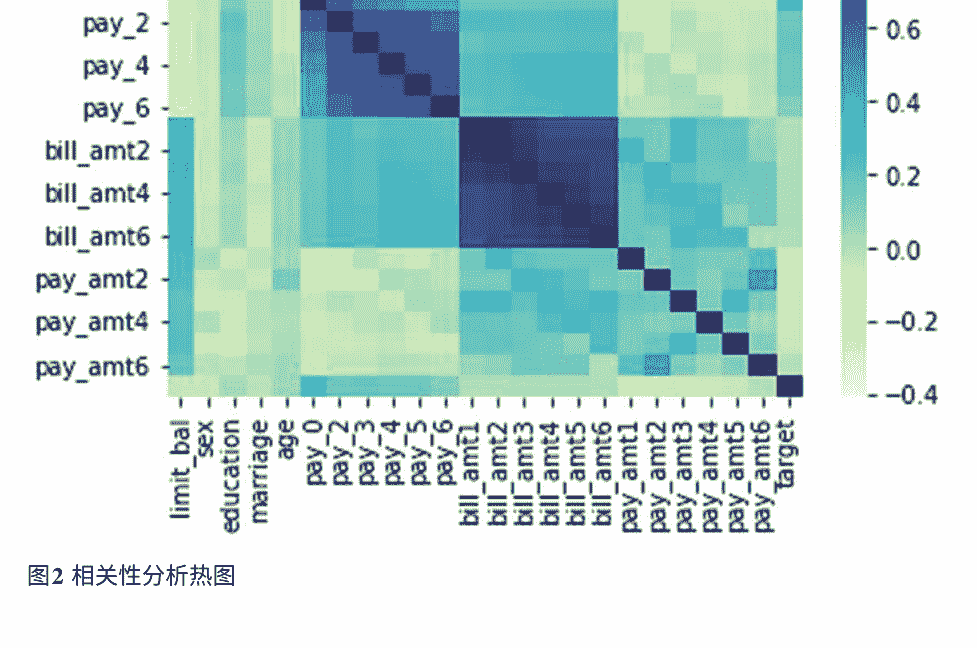

图2 相关性分析热图

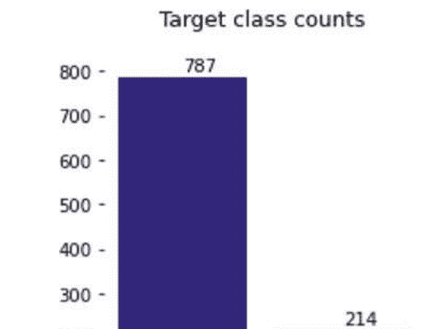

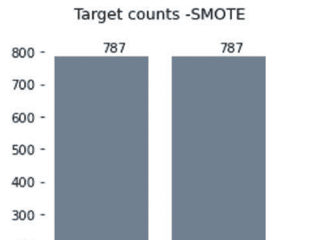

图3 目标类别分布

第一个子图中计数之间的显著差异可能严重影响评估指标，特别是召回率。在第二个子图中，零和一的值计数相等（零标签被过采样）。从Imblearn包中导入了SMOTE的Python类。由于数据集中没有缺失值，所有进一步的插补过程都被跳过了。

### 3.3 模型训练

模型训练分为三个阶段。在第一个阶段，基准模型在不处理数据不平衡的情况下进行训练。创建一个自定义函数来转换限制平衡列。该函数接受输入值，如果为负数，则重新分配为零，否则应用NumPy对数函数。由于数据集不包含空值，跳过缺失值插补步骤。在存储最终训练和最终验证数据之后，训练基准模型。然后将验证结果收集到数据框中。

在第二阶段，通过使用SMOTE技术、特征标准化和添加来自账单金额和付款金额解释变量的两个聚合特征进一步改进所有基准模型。

在第三阶段，使用高斯混合模型和K-means聚类模型进行额外的聚类特征。Sklearn库中有一个用于K-means和高斯混合模型的类。将这些类导入到Jupyter中以创建聚类特征。除了无监督特征外，第二阶段生成的两个特征也与SMOTE一起使用在该阶段。召回率指标被视为主要的模型评估标准，以减少假阴性率。

### 3.4 算法

本研究中的主要机器学习算法包括梯度提升分类器、AdaBoost分类器、线性判别分析、支持向量机、逻辑回归、K均值聚类和高斯混合模型。

梯度提升是一种用于分类和回归的集成提升算法之一。一般来说，提升算法通过顺序地最小化过去的错误来更新模型。首先，算法使用一个常数值初始化模型。每次迭代计算伪残差，将基学习器拟合到错误上，最后更新模型。这个过程一直持续到达到给定的阈值[13]。

AdaBoost是另一种提升算法，与梯度提升不同，它使用决策树桩作为基学习器进行训练初始化。该算法开始时给每个数据点赋予相等的权重，并在每次迭代中更新权重，使得被错误分类的数据点获得较大的权重。决策树桩连续地根据更新的权重构建。

线性判别分析（LDA）是一种分类和降维方法。该算法通过最大化类别之间的变异性，将特征空间从高维降低到低维。LDA用于多类分类，并且比逻辑回归表现更好。如果观测数量超过特征数量，LDA可能表现不佳。LDA的线性决策边界可能不够灵活。该算法假设特征通常服从分布[15]。

另一个用于分类和回归任务的监督机器学习算法是支持向量机。该算法找到最优超平面，最大化目标类别之间的分离。如果数据是低维的，SVM核技巧将把数据保护到更高维度，以找到良好的分离线。SVM使用合页损失进行优化。该算法比其他分类方法更耗计算资源[16]。

逻辑回归是一种经典算法，它试图拟合一个逻辑曲线来预测违约类别的概率。该算法使用最大似然原理来找到最佳拟合，使用对数损失作为损失函数。逻辑回归使用sigmoid函数来找到概率，而不是线性回归中的线性加权和。如果数据是线性可分的，该方法表现良好。然而，有许多统计变换可用于使数据线性化。逻辑回归也可用于多类别分类[17]。

本文使用两种无监督学习算法生成的特征：K-means聚类和高斯混合模型。K-means算法首先随机将质心放置在训练数据集中。然后，算法找到质心与所有数据点之间的距离。然后为每个训练数据分配一个质心标签。这一步骤被称为聚类分配。在第二步中，首先找到聚类点的平均值，然后将平均值分配为新的聚类。这两个步骤将继续进行，直到达到阈值。在硬聚类中，每个数据点只能获得一个聚类。因此，K-means算法执行硬聚类。用于聚类分配的主要距离度量是欧氏距离度量。还有其他类型的K-means，即K-means ++和mini-batch K-means。在训练K-means聚类时，选择聚类数是一个主要困难。肘部法则有助于选择最佳的聚类数。在肘部法则中，计算质心与每个训练数据点之间的平方距离总和（WCSS）与不同的k值。当聚类数增加时，WCSS将减小。图表中出现快速变化的k值将是最佳的聚类数[18]。用于特征生成的第二个无监督算法是高斯混合模型。混合模型由几个高斯分布组成，每个高斯分布代表一个聚类。每个聚类有两个参数，即均值和协方差。这些参数通过将数据点拟合到高斯分布来估计。期望最大化算法执行估计过程。一旦拟合完成，模型可以用于密度估计和聚类任务[19]。

## 4 实验结果和分析

训练了五种不同的机器学习模型，分别是梯度提升分类器、AdaBoost分类器、线性判别分析、支持向量机和逻辑回归。对所有模型应用了网格搜索CV来优化模型的超参数。由于主要的模型评估标准是召回率，所以在每个模型训练阶段后记录了所有的召回率和准确率。表2显示了第一阶段的模型得分。所有基准模型的准确率都达到了80%，但是它们的召回率甚至不到50%。AdaBoost和梯度提升模型的召回率稍微好于其他模型。第一阶段评估得分的图形表示如图4所示。

表2 第一阶段模型结果

| 算法 | 准确率 | 召回率 |
| --- | --- | --- |
| 梯度提升模型 | 79.1 | 35.13 |
| AdaBoost分类器 | 80.01 | 29.7 |
| 线性判别分析 | 80.01 | 16.21 |
| 支持向量机分类器 | 81.59 | 18.2 |
| 逻辑回归 | 79.6 | 13.5 |

### Baseline Phase-1 Models

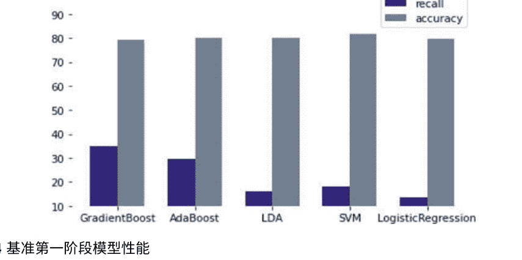

图4 基准第一阶段模型性能

对于所有基准模型来说，整体准确率都很高且几乎相等，但由于目标分布不平衡，召回率明显较低。 在这些模型中，提升集成模型的召回率略高于30%。简而言之，基准模型在召回率方面的性能不令人满意。 由于违约预测的目标是捕捉所有目标中的违约者，需要尽量减少误判为非违约者的情况，因此召回率应该是选择模型的首要指标。

在第二阶段，采用SMOTE技术并添加两个聚合特征来提高基准模型的性能。 Table3显示了处理数据不平衡后的模型评估结果。

SMOTE技术将召回率得分提高了40%。 在这些模型中，梯度提升仍然平衡了准确率和召回率。 支持向量模型和逻辑回归的准确率值降低了约20%。

结果的图形表示如图5所示。对于除了SVM之外的所有模型，结果几乎是平衡的。 对于SVM来说，召回率比准确率高。 通过使用SMOTE处理目标不平衡问题后，模型的召回率得到了显著提高。 然而，仍然有方法可以减少所有的假阴性预测。

表3 第2阶段模型结果

| 算法 | 准确率 | 召回率 |
|------|--------|--------|
| 梯度提升 | 82.2 | 81.8 |
| AdaBoost分类器 | 76.8 | 77.9 |
| 线性判别分析 | 73.3 | 71.1 |
| 支持向量机分类器 | 52.06 | 68.4 |
| 逻辑回归 | 58.7 | 55.7 |

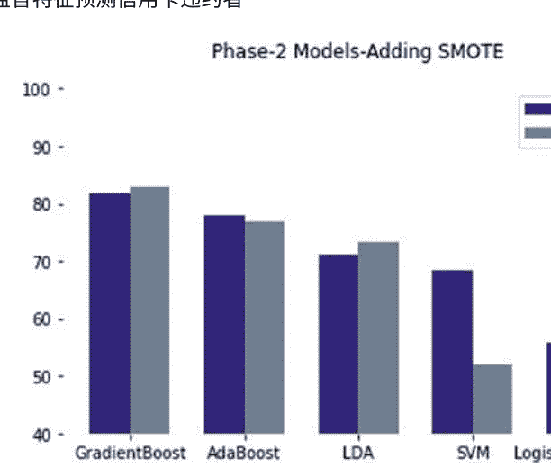

图5 基线第2阶段模型性能

通过比较第1阶段和第2阶段的结果，观察到模型的召回率有显著改善。在最后阶段，将高斯混合和K-means聚类的无监督特征添加到训练特征空间中。在Python中实现了肘部法则来找到最佳的聚类数。从曲线的肘部点可以找到聚类数。图6显示了在不同聚类数下的簇内平方和的值。

在上述弯曲曲线中，可以发现x轴上的六和十的变化。六和十可以被视为聚类的数量。然而，目标类别计数是

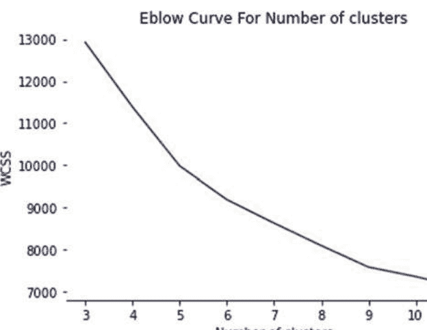

图6 最佳聚类的弯曲曲线

| 算法 | 准确率 | 召回率 |
|---|---|---|
| 梯度提升分类器 | 88.8 | 89.4 |
| AdaBoost分类器 | 77.4 | 80.5 |
| 线性判别分析 | 73.3 | 76.5 |
| 支持向量机分类器 | 56.19 | 69.23 |
| 逻辑回归 | 60.0 | 54.4 |

在K-means和高斯混合模型的情况下，聚类的数量被指定为六。表4表示从K-means和高斯混合模型中添加无监督特征后的模型得分。

评估分数显著提高。梯度提升算法的召回率达到了89.4，准确率达到了88.8。两个提升模型都取得了较高的召回率分数。图7显示了第三阶段结果的图形比较。

在比较图5和图7之后，发现梯度提升的准确率和召回率增加了约6%。对于AdaBoost模型，召回率增加了约3%。其他模型的得分也有所提高。与其他模型不同，逻辑回归的召回率值低于准确率分数。

在三个独立的阶段中，训练了五个不同的模型，同时进行了其他数据的探索。分析结果显示，两个变量块之间存在相关性，并且数据不平衡。在训练数据中添加了额外的聚合特征，并应用SMOTE技术来处理不平衡。基准模型结果表明，所有模型的召回率都太低。第二阶段的结果使召回率得分显著提高了约40%。在最后一个阶段中，梯度提升模型的准确率和召回率都提高了约6%。

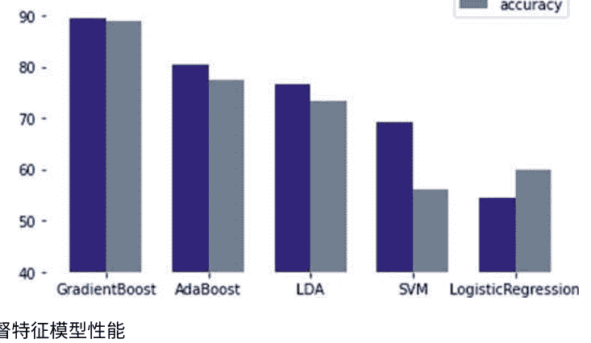

在这个阶段，梯度提升模型的准确率和召回率都提高了约6%。其他模型的召回率也有所提高。通过比较得到的结果，可以得出结论，无监督特征的提出显著提高了模型的准确率得分。银行系统可以采用这些方法来降低信用风险。

## 5 结论

本文使用无监督特征来改进信用卡违约的预测。所提出的方法对于预测性银行系统是高效的。
各种机器学习算法已经使用信用卡违约数据集进行了训练，结果显示通过添加无监督特征，训练算法的性能得到了显著改善。通过比较召回率和准确率等性能指标，梯度提升分类器表现出色，准确率和召回率分别达到了88%和89%的最高水平。

未来的工作将涉及使用人工神经网络进行模型训练。

## 参考文献

+   1. Faraj, A. A., Mahmud, D. A., & Rashid, N. B. (2021). 信用卡违约预测中不同集成方法的比较。 UHD科学与技术杂志。
+   2. Nautiyal, H., Jyala, A., & Bhandari, D. (2021). 使用数据科学进行信用卡违约建模的综述。
+   3. Shivanna, A., & Agarwal, D. P. (2020). 使用Azure ML上的机器学习预测违约者。在2020年第11届IEEE年度信息技术、电子和移动通信会议(IEMCON)中(pp. 0320–0325)。
+   4. Keramati, A., & Yousefi, N. (2011). 提出的数据挖掘技术分类在信用评分中。
+   5. Agarwal, A., Rana, A. K., Gupta, K., & Verma, N. (2020). 使用主成分分析的分类技术的比较研究和改进信用卡数据集。在2020年智能工程与管理国际会议（ICIEM）（第443-448页）。
+   6. Rai, A. K., & Dwivedi, R. K. (2020). 使用无监督机器学习的信用卡数据欺诈检测方案。在2020年电子和可持续通信系统国际会议（ICESC）（第421-426页）。
+   7. Panchal, U. K., & Verma, S. (2019). 使用自组织映射识别潜在的未来信用卡违约者从非违约者。在2019年第10届国际计算、通信和网络技术会议（ICCCNT）（第1-5页）。
+   8. Alam, T. M., Shaukat, K., Hameed, I. A., Luo, S., Sarwar, M. U., Shabbir, S., Li, J., & Khushi, M. (2020). 在不平衡数据集中对信用卡违约进行调查IEEE Access, 8, 201173–201198。
+   9. Zhu, X., & Chen, J. (2021). 基于梯度提升机模型的P2P信贷逾期风险预测。在2021年IEEE国际电力、智能计算和系统会议(ICPICS)(pp. 212–216)中。
+   10. Soui, M., Smiti, S., Bribech, S., & Gasmi, I. (2018). 信用卡违约预测作为一个分类问题。

# 使用机器学习进行社交媒体挖掘以检测心理健康障碍

Udaipurwala Rashida和K. Suresh Kumar

摘要 社交媒体的增长导致人们在网上发布了大量的内容。 他们发现在虚拟世界中与人交流比与人交谈和分享问题更容易。 这引发了一个相关的问题-我们能否利用社交媒体帮助这些年轻人了解他们的心理健康状况？ 如果可以，我们如何在没有人工干预的情况下做到这一点，以使他们不感到不舒服分享自己的问题？ 这项研究的主要目的是在没有人工干预的情况下发现一种可以检测心理健康障碍的方法。 机器学习可以是解决这个问题的正确方法。我们使用社交媒体网站分析用户的心理状态。 机器学习模型被训练用于分析人们的心理健康。 机器学习算法被用于基于社交媒体帖子分析心理健康障碍。

情感分析可以用来检测用户从消息中传达的情绪。 这种情绪有助于确定推文是积极的还是消极的。 所提出的系统使用流行的社交媒体平台——Twitter来检测用户的抑郁情绪。 从Twitter用户收集的推文用于训练机器学习模型，以检测推文是积极的还是消极的。 我们使用逻辑回归来训练模型。 这导致了一个能够准确预测Twitter用户是否抑郁的模型。这可以用来检测用户的抑郁情绪，并与健康工作者或热线联系，帮助抑郁症患者应对他们的心理疾病。

- 机器学习
- 人工智能
- 情感分析
- Twitter
- 自然语言处理
- 机器学习算法

## 1 引言

随着互联网的日益普及，在线交易的数量也在增加。在社交媒体网站上，很多人都在发布他们的消息，每天都会产生大量的数据。这些数据来自各种不同的来源，然后进行特征提取和挖掘。

利用各种自然语言处理技术，对数据进行清洗并提取出关键特征。在提取特征之后，将其输入到分类器模块中，用于对人们的心理状态进行分类[1]。

预测流行政治选举和民意调查结果也是情感分析的新兴应用。Tumasjan等人在德国进行了一项研究，预测联邦选举的结果，得出结论是Twitter是离线情感的良好反映。

### 2个伦理和社会问题

社交媒体上个体之间的复杂互动在社交媒体挖掘中带来了许多挑战。其中一些挑战包括社交媒体用户的性质、社交媒体平台的不可访问性、从在线发布的数据中获取有意义数据的困难以及处理数据的非传统方法。主要的伦理挑战是私人数据和公共数据之间没有明确的区分。保护个人隐私是一个非常重要的伦理挑战。个人的知识产权没有得到保护，使用社交媒体数据的同意也没有明确征求。

将机器学习作为抑郁症检测工具的一个主要问题是基于社交媒体帖子的错误诊断疾病。这可能对个人造成更多伤害而不是带来好处。一些推文可能会令人困惑，并且可能会被算法误解。这不仅会浪费用户的时间，还会浪费为他们提供的干预措施。然而，过滤出这样的请求需要一个非常智能的算法。如果算法没有正确检测，那么个人可能会因为其他人知道诊断而感到社会污名。

用户在社交媒体上发布自己的想法，却没有意识到他们的数据可能会被其他程序用于各种诊断。处理这些数据引发了在采取任何行动之前是否需要用户同意的问题。识别个人是一个挑战，因为他们使用的用户名和凭据可能不是他们的真实身份。使用各种资源来追踪和找出实际用户是一个耗时的过程，可能无法及时获得所需的快速结果以采取及时行动进行治疗。

## 3 解决方案的影响

抑郁症是一种影响数百万人并且大部分时间未被察觉的疾病。早期识别是治疗的最重要一步。随着抑郁症检测数据集的可用性，使用社交媒体数据来检测抑郁症的算法变得更容易开发。由于社交媒体用户自由分享他们的想法，从而使得在健康领域工作的人有机会了解人们的内心活动，而无需与他们亲自见面。

机器学习提供了一种可以在线交流中发现独特隐藏模式的技术，从而确定用户的心理状态。该项目旨在接触那些不愿主动寻求治疗的个体。

医护人员将更加了解患有抑郁症的人在特定情况下的反应，并为他们提供所需的帮助。

自动化抑郁症检测系统对于抑郁症的检测和治疗至关重要。情感分析提供了对心理障碍的客观评估和监测。有效的健康监测系统使医护人员的工作更加轻松，并降低患者的医疗费用。虽然这些机器学习技术不能取代心理学家，但它们可以成为医护人员的有力辅助。

## 4 相关工作

研究人员一直在不断努力利用社交媒体的力量进行各种分析。社交媒体已经在新闻媒体、犯罪情报、教育、生产和供应链、医疗保健、网络欺凌检测、药物使用、谣言检测等许多领域中得到应用。

表1显示了各种文献和在社交媒体上挖掘数据的策略，这些文献被作为我们研究的参考。

## 5 系统架构

Twitter是一个微博网站，会员们可以使用短消息串“推文”与彼此互动。所提出的系统架构如图1所示。该网站为用户提供了一个平台，他们可以自由地表达自己的观点和意见。这些推文是研究人员和市场分析师进行情感分析的良好来源。此外，随着机器学习算法的出现，情感分析变得更加准确，能够预测并提供用户的心理状态洞察[18]。

表1 社交媒体机器学习算法的文献综述

| 作者 | 主题 | 策略 |
| --- | --- | --- |
| Liu [3] | 在挖掘社交媒体中的一些计算挑战 | 使用大数据进行社交媒体挖掘的计算 |
| Doyle等[4] | 挖掘个人媒体阈值用于意见动态和社交影响 | 社交媒体的模式检测使用和行为 |
| Rajapaksha等人[5] | 检查互动：在线新闻媒体在社交媒体中的协同效应 | 新闻媒体受欢迎度的预测模型 |
| Seah等人[6] | 数据挖掘方法用于在社交媒体中检测自杀新加坡的案例研究 | 从Reddit的数字痕迹上进行社交感知 |
| Shahnawaz等人[7] | 情感分析：方法和开放问题 | 解决标记数据不足的问题 |
| Syarif等人[8] | 通过社交媒体挖掘进行精神障碍检测的研究 | 抑郁人群的计算语言学 |
| Vohra等人[9] | 社交媒体中谣言的检测 | 在Twitter上进行自动谣言检测 |
| Wang等人[10] | 带有情感感知的社交媒体的 | 细粒度情感分析 |
| Sutar等人[11] | 社交媒体智能数据挖掘技术改善医疗保健 | 医疗数据集成系统 |
| Xu[12] | 社交媒体上的联合视觉和文本挖掘 | 从视觉和文本数据中提取知识 |
| Mohandas等人[13] | 挖掘社交媒体数据以了解药物使用的调查 | 药物使用知识 |
| Chan等人[14] | 挖掘社交媒体数据的案例研究 | 决策研究 |
| Savas等人[15] | 社交媒体中的犯罪情报：案例研究 | Twitter上的情报研究 |
| Rejeesh等人[16] | 社交媒体和数据挖掘在远程教育中提升咨询效果的预咨询系统 | 基于技术的预咨询 |
| Ting等人[17] | 基于社交网络挖掘技术的网络欺凌检测 | 在Twitter、Facebook、ptt和ck101上检测网络欺凌 |

根据使用的词语将推文分类为积极和消极。如果推文同时包含积极和消极的词语，将根据推文的主导情感进行分类。使用了来自Kaggle的数据集，其中包含积极和消极推文的极性。数据集中包含ID、类别和评论。ID表示其唯一值。类别定义了推文是抑郁的（1）还是非抑郁的（0）。评论是用户的推文。

绘制数据集的分布以指示推文的正面和负面极性。图2显示了流程图。数据被预处理以去除噪音。scikit-learn库的CountVectorizer函数用于执行数据的预处理。该函数用于准备文本进行预测建模。它解析文本以删除某些单词。这被称为标记化。然后，这些单词被编码为整数或浮点值，可以轻松地作为输入提供给我们的机器学习算法。

这个过程被称为特征提取或向量化。CountVectorizer函数将文本转换为一组标记。它还可以对数据进行预处理，并将其转换为机器容易理解并帮助文本分类的数字。

然后使用scikit-learn库的fit_transform方法来拟合模型。这样可以通过CountVectorizer函数从提取的评论中构建模型。良好拟合的机器学习模型能够生成准确的结果。

数据集被分为训练数据和测试数据。30%的数据用于训练，70%的数据用于测试。我们选择了逻辑回归作为机器学习算法。由于我们要预测的数据是二进制的，即推文是否抑郁，逻辑回归用于预测成功或失败的概率。使用逻辑回归实现起来更容易，解释性更强，并且训练模型的效率更高。对于我们的项目来说，将推文分类为积极和消极是最合适的。我们的数据集很简单，因此这个算法提供了很好的准确性。

我们选择Twitter作为社交媒体平台，因为与网站、博客相比，我们可以更自由地获取用户的意见。其他社交网络。数据量更加有组织，因为它使用标签进行组织，这样更容易搜索相关内容。与其他平台相比，Twitter上的回应更容易和更快，因为可以立即给出回复。情感分析有各种应用，例如预测民意调查结果、市场分析、网络犯罪等领域。

这可以通过了解公众对特定候选人的意见来实现。这将表明对该人持有有利观点的人数。当产品推出时，可以通过预测人们对其接受程度来进行市场分析。当很多人在推特上谈论某个特定产品时，这表明它很受欢迎。通过理解通过推文发送的威胁，可以检测网络犯罪。这将帮助当局阻止犯罪、打击恐怖主义和网络欺凌。

### 6个结果和未来的增强

我们选择的数据集有4439条推文。我们使用逻辑回归机器学习算法来预测推文的极性，无论它们是积极的还是消极的。在使用30%的测试数据训练模型后，准确率达到了81%。

将来，我们希望将系统与医疗服务整合在一起。当社交媒体用户持续发布沮丧的推文时，医疗系统会收到通知。这个通知有助于医护人员追踪沮丧的人，并在需要时为他们提供帮助。这种从模型到医疗系统的连接将增强我们国家的未来医疗保健。可以检测到像抑郁症这样的心理疾病，以便及时提供帮助。

## 7 结论

在这个项目中，我们提出了通过机器学习使用逻辑回归算法在Twitter上通过推文检测社交媒体用户的抑郁症的解决方案。我们已经收集了数据集，并清理了数据。在数据清洗之后，将会在特征提取阶段中提取必要的特征。数据集来自各种来源，并提取了必要的特征。在预处理阶段，将从数据中删除空值和其他不需要的值，并将文本转换为标记。数据清洗发生在数据准备阶段，而特征提取阶段提取了必要的特征。提取所需的特征，模型预测推文是否抑郁或非抑郁。这将有助于识别社交媒体用户的心理健康状况。正在进行研究，使用这个训练模型来测试新的推文以预测抑郁。这些信息非常重要，因为机器将能够在用户采取任何极端措施之前检测到抑郁，并为他们提供正确的指导。

## 参考文献

1. Kottursamy, K. (2021). 关于使用深度学习分析进行客户情感分析的高效方法的综述。计算机科学与智能技术趋势杂志, 3(2), 95–113.
2. Tumasjan, A., Sprenger, T., Sandner, P., Welpe, I. (2010). 预测选举结果的推特：140个字符揭示的政治情绪。国际语言学协会的Word杂志, 10.
3. Liu, H. (2013). 在挖掘社交媒体中的一些计算挑战。在2013年IEEE/ACM国际社交网络分析与挖掘会议（ASONAM 2013）中 (pp. xxxvii–xxxvii). https://doi.org/10.1109/ASONAM.2013.6785672
4. Doyle, C., Meandzija, A., Korniss, G., Szymanski, B., Asher, D., & Bowman, E. (2018). 挖掘个人媒体阈值以进行意见动态和社交影响。在2018年IEEE/ACM国际社交网络分析与挖掘会议（ASONAM）中 (pp. 1258–1265). https://doi.org/10.1109/ASONAM.2018.8508316
5. Rajapaksha, P., Farahbakhsh, R., Crespi, N., & Defude, B. (2018). 检查互动：在线新闻媒体在社交媒体中的协同作用。在2018年IEEE/ACM国际会议上社交网络分析与挖掘的进展(pp. 535–539). https://doi.org/10.1109/ASONAM.2018.8508534
6. Seah, J. H. K., & Jin Shim, K (2018). 数据挖掘方法用于社交媒体中自杀的检测：新加坡的案例研究。在2018年IEEE国际大数据会议（Big data）(pp. 5442–5444). https://doi.org/10.1109/BigData.2018.8622528
7. Shahnawaz, M., & Astya, P. (2017). 情感分析：方法和开放问题。在2017年国际计算、通信和自动化会议(ICCCA)(pp. 154–158). https://doi.org/10.1109/CCAA.2017.8229791
8. Syarif, I., Ningtias, N., & Badriyah, T. (2019). 通过社交媒体挖掘进行心理障碍检测的研究。在2019年第四届国际计算、通信和安全会议(ICCCS)(pp. 1–6). https://doi.org/10.1109/ICCCS.2019.8888096
9. Vohra, M., & Kakkar, M. (2018). 社交媒体中谣言的检测。在2018年第八届云计算、数据科学和工程国际会议(Confluence)(pp. 485–490). https://doi.org/10.1109/CONFLUENCE.2018.8442442
10. Wang, Z., Chang, C. S., Lan, L., Yang, Y., He, B. H., & Tong, J. C. (2016). 细粒度情感分析与情感感知的社交媒体。在2016年未来技术大会 (FTC) (pp. 1361–1364). https://doi.org/10.1109/FTC.2016.7821783
11. Sutar, S. G. (2017). 智能数据挖掘技术用于改善医疗保健的社交媒体。在2017年国际智能计算与控制系统大会 (ICICCS) (pp. 1356–1360). https://doi.org/10.1109/ICICCS.2017.8250690
12. Xu, J. (2014). 社交媒体上的联合视觉和文本挖掘。在2014年IEEE国际数据挖掘研讨会 (ICDMW) (pp. 1189–1190), 中国深圳。
13. Mohandas, A., Babu, B., Rajan S. D., Suresh, L. P., & Boben, R. (2018). 关于挖掘社交媒体数据以了解药物使用的调查。在2018年新兴设备和智能系统大会 (ICEDSS) (pp. 259–261). https://doi.org/10.1109/ICEDSS.2018.8544346
14. Chan, H. K., Lacka, E., Yu, R. W. Y., & Lim, M. K. (2014). 挖掘社交媒体数据的案例研究。在2014年IEEE国际工业工程和工程管理大会 (pp. 593–596). https://doi.org/10.1109/IEEM.2014.7058707
15. Savas, S., & Topaloglu, N. (2017). 社交媒体中的犯罪情报: 案例研究。在2017年IEEE第14届国际科学会议 (pp. 313–317). https://doi.org/10.1109/INFORMATICS.2017.8327266
16. Rejeesh, E., & Anupama, M. (2017). 社交媒体和数据挖掘在远程教育中提高咨询效果的系统。 在2017年I-SMAC (社交、移动、分析和云计算) 国际会议上 (I-SMAC) (第153-156页). https://doi.org/10.1109/I-SMAC.2017.8058328
17. Ting, I., Liou, W. S., Liberona, D., Wang, S., & Tarazona Bermudez, G. M. (2017). 基于社交网络挖掘技术的网络欺凌检测。 在2017年行为、经济、社会文化计算国际会议上 (BESC) (第1-2页). https://doi.org/10.1109/BESC.2017.8256403
18. Pandian, A. P. (2021). 使用深度学习技术进行情感分析的性能评估和比较。软计算范式杂志 (JSCP), 3(02), 123-134.
19. Hamilton, M. (1967). 为原发性抑郁症制定评分标准。英国社会与临床心理学杂志, 6(4), 278–296.
20. Jordan, M. I., & Mitchell, T. M. (2015). 机器学习: 趋势、观点和前景。科学, 349(6245), 255–260.
21. Davcheva, P. (2014). 通过社交媒体挖掘识别体育人才作为营销工具。 在2014年SRII全球会议上(pp. 223–227). https://doi.org/10.1109/SRII.2014.38
22. Dastanwala, P. B., & Patel, V. (2016). 使用文本挖掘方法在Twitter上进行社交受众识别的综述。 在2016年国际无线通信、信号处理和网络会议 (WiSPNET) 上(pp. 1917–1920). https://doi.org/10.1109/WiSPNET.2016.7566476
23. Rutledge, R. B., Chekroud, A. M., & Huys, Q. J. (2019). 机器学习和大数据在精神病学中的应用。神经生物学的当前观点, 55, 152–159.
24. Desai, S., & Patil, S. T. (2015). 用于社交媒体分类的高效回归算法。 在2015年普适计算国际会议(ICPC)(pp. 1–5). https://doi.org/10.1109/PERVASIVE.2015.7087040
25. Chen, X., Vorvoreanu, M., & Madhavan, K. (2014). 挖掘社交媒体数据以了解学生的学习经验。IEEE学习技术交易, 7(3), 246–259. https://doi.org/10.1109/TLT.2013.2296520
26. 执行委员会. (2012). 全球心理障碍的负担和社会工作者在国家层面上需要一个全面、协调的应对措施。
27. Manoharan, J. S. (2021). 对极限学习机 (ELM) 品牌的变体及其在分类算法上的性能度量的研究。软计算范式杂志 (JSCP), 3(02), 83–95.
28. Mugunthan, S. R., & Vijayakumar, T. (2021). 改进的 S 型函数设计用于 ELM 领域的分类任务。软计算范式杂志 (JSCP), 3(02), 70–82.
29. Vishwakarma, S. K., Rasool, A., & Hajela, G. (2021). 机器学习算法用于预测信用卡违约者-一项比较研究。 在Vishwakarma2021MachineLA中。
30. Chawla, N., Bowyer, K., Hall, L., & Kegelmeyer, P. (2002). SMOTE: 合成少数类过采样技术。 人工智能研究杂志, 16, 321–357.
31. Konstantinov, A. V., & Utkin, L. V. (2021). 可解释的机器学习与梯度提升机集成 .在Konstantinov2021InterpretableML中。
32. Randhawa, K., Loo, C. K., Seera, M., Lim, C. P., & Nandi, A. K. (2018). 使用Adaboost和多数投票进行信用卡欺诈检测.IEEE Access, 6, 14277–14284.
33. Tharwat, A., Gaber, T., Ibrahim, A., & Hassani, A. E. (2017). 线性判别分析: 详细教程.AI Communications, 30, 169–190.
34. Cristianini, N., & Taylor, J. S. (2000). 支持向量机和其他基于核的学习方法简介. 在Cristianini2000AnIT中。
35. Wan, X. (2021). 研究预测信用卡客户服务使用逻辑回归和Bp神经网络。 在Wan2021ResearchOP中。
36. Zahra, S., Ghazanfar, M. A., Khalid, A., Azam, M. A., Naeem, U., & Bennett, A. (2015). 新颖的质心选择方法用于基于KMeans聚类的推荐系统。 信息科学, 320, 156–189.
37. Chakravarti, P., Balakrishnan, S., & Wasserman, L. A. (2019). 使用相对拟合测试的高斯混合聚类。 arXiv: Methodology.

# 使用深度学习模型进行早期作物和杂草分类

Akshay Dheeraj和Satish Chand

摘要 农业对人类生存至关重要，并在世界经济中起着重要作用。随着世界人口的不断增长，对食物的需求也在增加。农业受气候变化的影响，同时也受到杂草的控制。杂草是与作物争夺营养、阳光并对作物质量和产量产生不利影响的不受欢迎的植物。手工除草是一项繁琐且劳动密集的任务，因为作物和杂草在视觉上看起来相同。深度学习等人工智能技术可以解决作物和杂草分类的问题。在这项研究工作中，提出了一种基于深度学习的分类系统，根据RGB图像对杂草和作物进行分类。我们研究了两种流行的基于深度学习的迁移学习模型，分别是DenseNet169和MobileNetV2，并评估了它们在作物和杂草识别方面的性能。这些模型的准确率分别为97.14%和94.92%，表现出色。显著的准确率结果使该模型成为农民识别杂草的重要工具。

关键词植物幼苗·深度学习·卷积神经网络·杂草分类·MobileNetV2·DenseNet169·精准农业

## 1 引言

卷积神经网络（CNN）已成为计算机视觉任务中研究人员的必备工具。大规模数据集的可用性和计算技术的发展，特别是图形处理单元（GPU）的发展，使得这些视觉任务变得更加容易。CNN因其适用于各种数据和出色的性能而受到欢迎。

A. Dheeraj (✉) 印度农业研究所土壤和水资源保护研究所，德拉敦，北阿坎德邦，印度 电子邮件：akshay.dheeraj@icar.gov.in
S. Chand 贾瓦哈拉尔尼赫鲁大学计算机与系统科学学院，新德里，印度 电子邮件：schand@mail.jnu.ac.in


[1]. 卷积神经网络（CNN）是从LeNet-5开始的，它包含三个卷积层，两个子采样层和两个全连接层[2]。AlexNet进一步推动了CNN的发展，增加了卷积核的数量并引入了dropout正则化。此后，引入了许多性能显著的网络[3-5]。

农业是世界人口的主要生计来源。随着人工智能的发展，农业部门也在发生变革，从而实现智能农业。农业受到气候变化等不同因素的影响，同时还面临着繁重的除草任务。智能农业中最重要的任务之一是识别田间的杂草并采取必要的措施来控制杂草，以确保作物获得足够的水分、太阳辐射和其他重要养分。在田间手动识别杂草是一项困难的任务，因为它们在颜色和大小上与作物相似。本研究的目标是利用深度学习模型开发一种杂草和作物分类系统，以便能够早期检测杂草并提高作物产量。已经使用DenseNet169和MobileNetV2等深度学习模型对杂草和作物的图像进行了训练，并对它们的性能进行了比较。

在研究工作中，总共使用了12类杂草和作物，原始图像数量为5544张，通过增强数据集的大小进行了扩充。提出的研究表明，在测试数据上，DenseNet169和MobileNetV2模型的准确率分别为97.14%和94.92%。因此，DenseNet169模型的显著准确性表明了该系统在农田中早期杂草识别方面的有效性。

## 2 文献调查

已经进行了大量的工作，利用计算机视觉技术进行杂草检测[6-9]。在[10]中，作者使用数字图像上的支持向量机对杂草和作物进行分类。作者使用了总共224张六种杂草的测试图像，提取了14个可以帮助区分作物和杂草的特征，并实现了97%的分类准确率。在[11]中，作者使用模糊决策和形状描述符开发了一个杂草和作物分类器，并在总共66张图像上实现了92.9%的识别准确率。

在[12]中，作者使用了一种特别支持向量机（SVM）的机器学习模型来检测甜菜田中的杂草。研究考虑了四种不同的甜菜杂草，并提取了不同的形状特征，如矩不变量和傅里叶描述符。研究得到了ANN和SVM的分类准确率分别为92.92%和95%。

如今，卷积神经网络（CNN）在各个领域中都被使用[13-18]。[19]中对基于CNN的深度学习模型在农业中的一些应用进行了调查。[20]中的研究工作侧重于使用k-means算法进行特征提取，并结合CNN对大豆及其杂草进行分类。作者使用了820张图像，包括四类大豆及其杂草。

[21]中，作者提出了一种基于CNN和图卷积神经网络（GCN）的模型，名为GCN-ResNet101，用于分类玉米、生菜和萝卜作物的杂草。作者使用了四个不同的数据集，总共有4200、560、280和5040张图像，用于玉米、生菜、萝卜和混合杂草数据集，并实现了97.80%、99.37%、98.93%和96.51%的分类准确率。[22]中，作者提出了一种基于深度学习的迁移学习模型，名为ResNet101，用于识别与玉米、小麦和甜菜作物相关的九种杂草，并实现了96.04%的分类准确率。作者使用了增强技术，并使用了总共7200张图像，每个类别有600张图像。

## 3 提出的方法

### 3.1 数据采集

在这项研究工作中使用了一个公开可用的数据集[23]。该数据集总共包含12个物种，包括三个作物物种玉米、普通小麦、甜菜，以及它们相关的九个杂草物种。表1总结了数据集的描述。

图1展示了数据集的一些图像。图2展示了提出的方法。方法的第一步是数据采集。一旦数据收集完毕，会使用数据增强技术来扩大数据集。第三步是预处理数据，包括根据模型输入大小调整图像的大小。这些预处理数据是提出的模型的输入，用于分类这些作物和杂草图像。

表1 使用的数据集详情

|    | 物种 | 原始图像数量 | 增强图像数量 | 总图像数量 |
| :--- | :--- | :--- | :--- | :--- |
| 1 | 黑草 | 310 | 590 | 900 |
| 2 | 酢浆草 | 452 | 473 | 925 |
| 3 | 刺藜 | 335 | 565 | 900 |
| 4 | 普通马唐 | 713 | 187 | 900 |
| 5 | 普通小麦 | 253 | 647 | 900 |
| 6 | 猪草 | 538 | 362 | 900 |
| 7 | 松弛丝状苔草 | 766 | 134 | 900 |
| 8 | 玉米 | 257 | 643 | 900 |
| 9 | 无香艾蒿 | 607 | 293 | 900 |
| 10 | 牧草袋 | 274 | 626 | 900 |
| 11 | 小花鹤虱 | 576 | 324 | 900 |
| 12 | 甜菜 | 463 | 437 | 900 |
| 总数 | | 5544 | 5281 | 10,825 |

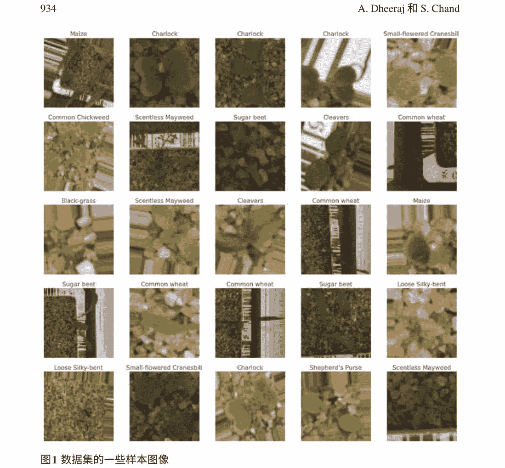

### 3.2 数据增强

原始数据集共有5544张图像。为了扩大数据集，使用数据增强技术。表2总结了使用Python的Keras库应用的数据增强技术。在数据增强过程中，图像水平翻转，旋转角度在0-45°之间，宽度和高度偏移20%，缩放20%，剪切20%。

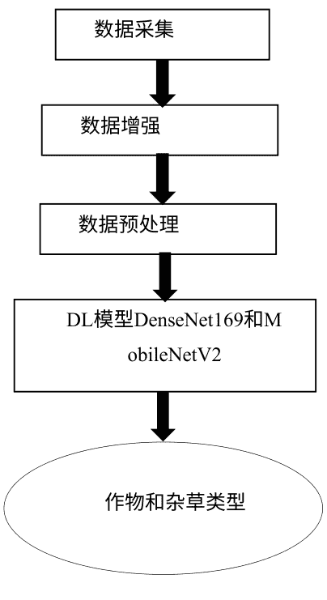

表2 使用的数据增强技术

| 序号 | 技术 |
| :--- | :--- |
| 1 | 水平翻转 = 是 |
| 2 | 旋转 = 32 |
| 3 | 宽度偏移 = 0.2 |
| 4 | 高度偏移 = 0.2 |
| 5 | 缩放范围 = 0.2 |
| 6 | 剪切范围 = 0.2 |
| 7 | 填充 = 最近邻 |

### 3.3 基于CNN的深度学习模型

深度学习在当今各个领域都被使用。它是人工智能的一个子领域，与机器学习不同的是，特征工程是自动完成的，而不是手动提取特征。研究中使用了两种流行的深度学习架构。

- DenseNet169 [24]
- MobileNetV2 [25]

#### DenseNet169模型

DenseNet由多个密集块组成，在块内，特征图的大小保持不变，但滤波器的数量不断变化。

DenseNet169有四个密集块。 每个密集块定义了一个1×1卷积，然后是一个3×3卷积。 第一个密集块定义了六个1×1卷积，然后是一个3×3卷积。 第二个密集块定义了十二个1×1卷积，然后是三个3×3卷积。 第三个密集块定义了三十二个1×1卷积，然后是三个3×3卷积。 第四个密集块定义了三十二个1×1卷积，然后是三个3×3卷积。在密集块之间有三个过渡层，进行卷积和池化操作。 在DenseNet中，所有层都是连接的。 来自前一层的特征图被连接在一起。

#### MobileNetV2 模型

MobileNetV2 模型是由 Google 提出的。该架构使用深度可分离卷积，从而提高了效率。 MobileNetV2 中有 17 个构建块，之后进行 1×1 卷积，然后进行全局平均池化和分类层。 输入层和输出层之间使用了一个残差连接，用于学习那些已经学习过的特征并去除不相关的特征。 MobileNetV2 模型减少了参数数量，从而减少了计算量。

DenseNet169 和 MobileNetV2 模型的参数数量分别为 14.3 M 和 3.5 M，在 ILSVRC [26] 数据集上的 top-5 准确率分别为 93.2% 和 90.1%。 这些更小的参数大小和出色的结果激发了我们选择这些模型进行我们的研究工作。

## 4 结果与讨论

两个基于 CNN 的深度学习模型 DenseNet169 和 MobileNetV2 已经被提出用于作物和杂草分类系统。 我们采用迁移学习的方法，即将这些已经在 Image Net 数据集上进行了预训练的模型用于新的数据集进行研究。 所提出的工作使用了提供 GPU 和 TPU 支持的 Google Collaboratory pro 进行实现。

这些模型是使用批量大小为16和30个周期进行训练的，并且为了优化训练和验证损失，使用了Adam优化器。 Adam已被用来迭代地更新网络的权重。 丢弃率设置为0.25，这意味着在训练过程中，每四个输入中会随机丢弃一个。 动量值设置为0.9，并且使用修正线性函数 (ReLu) 作为激活函数。

表3总结了所提出工作使用的各种超参数。 对于上述模型，使用了相同的参数并进行了性能比较。 数据集被划分为80%、10%和10%的训练、验证和测试数据。

表3 所提出工作使用的超参数

| 模型 | 优化器 | 周期 | 学习率 | 批量大小 | Dropout | 动量 | 激活函数 |
| :--- | :--- | :--- | :--- | :--- | :--- | :--- | :--- |
| DenseNet169 | Adam | 30 | 0.001 | 16 | 0.25 | 0.99 | ReLU |
| MobileNetV2 | Adam | 30 | 0.001 | 16 | 0.25 | 0.99 | ReLU |

表4所提出模型在数据集上的性能

| 模型 | 平均训练准确率(%) | 平均验证准确率(%) | 训练时间(秒) | 平均测试准确率(%) |
| :--- | :--- | :--- | :--- | :--- |
| DenseNet169 | 99.82 | 97.32 | 2102 | 97.14 |
| MobileNetV2 | 99.30 | 94.46 | 2128 | 94.92 |

分别是验证和测试数据。表4总结了这两个模型在数据集上的性能。

图3和图4展示了DenseNet169和MobileNetV2模型的准确率和损失曲线。从表4可以明显看出，这两个模型在训练时间上几乎相同，但DenseNet169的准确率高于MobileNetV2。尽管模型训练了30个周期，但在学习率调整三次后，我们使用了提前停止的方法。DenseNet169和MobileNetV2模型的最佳准确率结果分别在第22和第23个周期获得。同样，DenseNet169和MobileNetV2模型的最小损失分别出现在第22和第21个周期。从图3和图4可以明显看出，随着周期数的增加，DenseNet169和MobileNetV2模型的准确率也在增加。

最初，训练和验证损失都很高，但随着迭代次数的增加，这些损失逐渐减少。如图3和图4所示，DenseNet169和MobileNetV2模型的最小损失分别出现在第22和21个迭代周期。

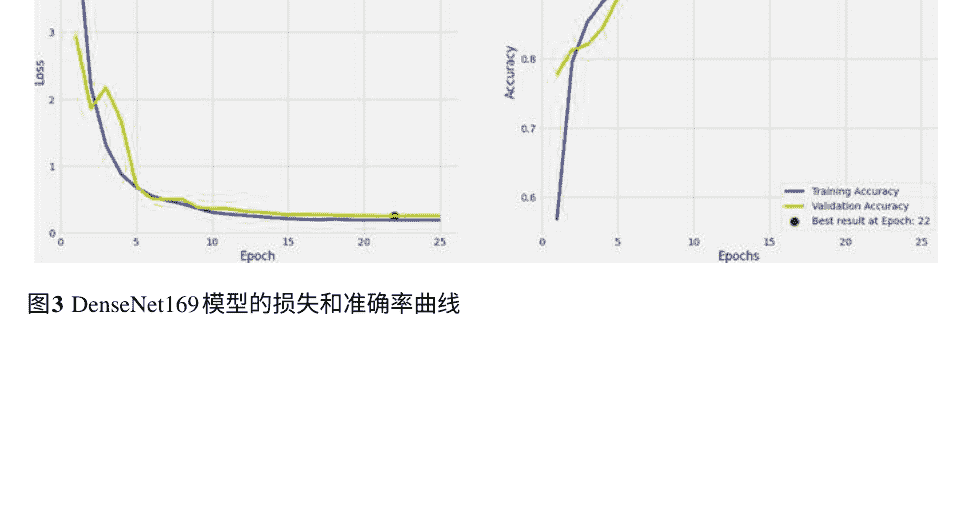

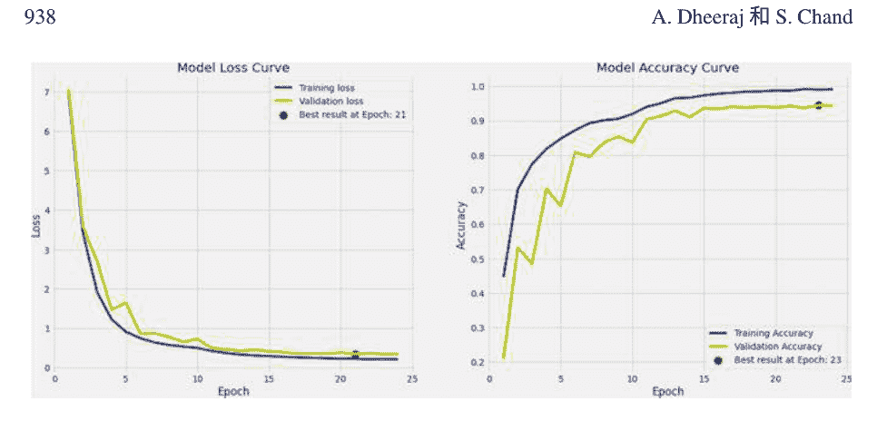

### 图4 MobileNetV2模型的损失和准确率曲线

对于目标分类任务，使用各种性能指标进行评估，例如精确度、召回率、$F_{1}$-得分、分类准确率和混淆矩阵，并通过公式(1)、(2)、(3)和(4)进行计算。计算这些性能指标时使用了四个术语，即真正例（TP）、真负例（TN）、假正例（FP）和假负例（FN）。对于这项研究，TP表示杂草图像被正确分类为实际的杂草类别，作物图像被正确分类为实际的作物类别。

TN 意味着除了相关类别之外的其他类别中正确分类的图像数量。FP 意味着将作物图像分类为杂草图像，将杂草图像分类为作物图像。FN 意味着相关类别中错误分类的图像数量。

$$\text{精确度} (i) = \frac{\#\text{TP}(i)}{\#\text{TP}(i) + \#\text{FP}(i)} \quad (1)$$

$$\text{召回率}(i) = \frac{\#\text{TP}(i)}{\#\text{TP}(i) + \#\text{FN}(i)} \quad (2)$$

$$\text{F}_{1}\text{得分} = \frac{2 \times \text{精确度} \times \text{召回率}}{\text{精确度} + \text{召回率}} \quad (3)$$

$$\text{分类准确率} = \frac{\#\text{TP}(i) + \text{TN}(i)}{\#\text{TP}(i) + \#\text{FP}(i) + \text{TN}(i) + \text{FN}(i)} \quad (4)$$

其中 i是类别的数量。精确度是正确分类的正例占所有正例的比例的度量，而召回率是正确识别的实际正例占所有实际正例的比例的度量。$F_{1}$-分数是精确度和召回率的调和平均值。混淆矩阵是用于分析分类模型性能的N ×N矩阵，其中N是类别的数量。它是实际值与预测值之间的可视化表示。

提出的模型DenseNet169和MobileNetV2在测试数据上分别实现了97.14%和94.92%的分类准确率。 表5总结了提出模型在12个物种上的精确度、召回率和$F_1$-分数的信息。

使用混淆矩阵分析了提出的DenseNet169和MobileNetV2模型在作物和杂草分类上的结果，并在图5和图6中展示了结果。

从表5可以看出，DenseNet169和MobileNetV2的平均精度分别为97%和95%。DenseNet169在黑草和松弛丝质苔藓这两个物种上的精度值小于0.90。除了这两个类别，该模型在其余十个类别中的精度值都超过0.97。同样，MobileNetV2在黑草、松弛丝质苔藓和无香马齿苋这三个物种上的精度值分别为0.78、0.87和0.89。在其余九个类别中，该模型的精度值都超过0.96。

表5总结了提出模型对12个物种的精度、召回率和$F_1$-得分的信息

| 物种 | DenseNet169 精确度 | DenseNet169 召回率 | DenseNet169 F1-得分 | MobileNetV2 精确度 | MobileNetV2 召回率 | MobileNetV2 F1-得分 |
| :--- | :--- | :--- | :--- | :--- | :--- | :--- |
| 1 黑草 | 0.85 | 0.86 | 0.86 | 0.78 | 0.86 | 0.82 |
| 2 酢浆草 | 1.00 | 0.98 | 0.99 | 1.00 | 0.98 | 0.99 |
| 3 刺藜 | 0.99 | 0.99 | 0.99 | 0.99 | 0.99 | 0.99 |
| 4 普通马唐 | 1.00 | 1.00 | 1.00 | 0.99 | 0.95 | 0.97 |
| 5 普通小麦 | 0.97 | 0.99 | 0.98 | 0.97 | 0.97 | 0.97 |
| 6 猪草 | 0.98 | 0.97 | 0.97 | 0.98 | 0.98 | 0.98 |
| 7 松弛丝状苔草 | 0.88 | 0.90 | 0.89 | 0.87 | 0.85 | 0.86 |
| 8 玉米 | 1.00 | 0.99 | 1.00 | 0.98 | 0.98 | 0.98 |
| 9 无香马齿苋 | 0.99 | 0.99 | 0.99 | 0.89 | 0.95 | 0.91 |
| 10 牛皮癣 | 0.99 | 0.99 | 0.99 | 0.96 | 0.90 | 0.93 |
| 11 小花鹤虱 | 1.00 | 1.00 | 1.00 | 0.99 | 0.99 | 0.99 |
| 12 甜菜 | 1.00 | 0.99 | 0.99 | 1.00 | 0.98 | 0.99 |
| 准确率 | 0.97 |  |  | 0.95 |  |  |
| 宏平均 | 0.97 | 0.97 | 0.97 | 0.95 | 0.95 | 0.95 |
| 加权平均 | 0.97 | 0.97 | 0.97 | 0.95 | 0.95 | 0.95 |

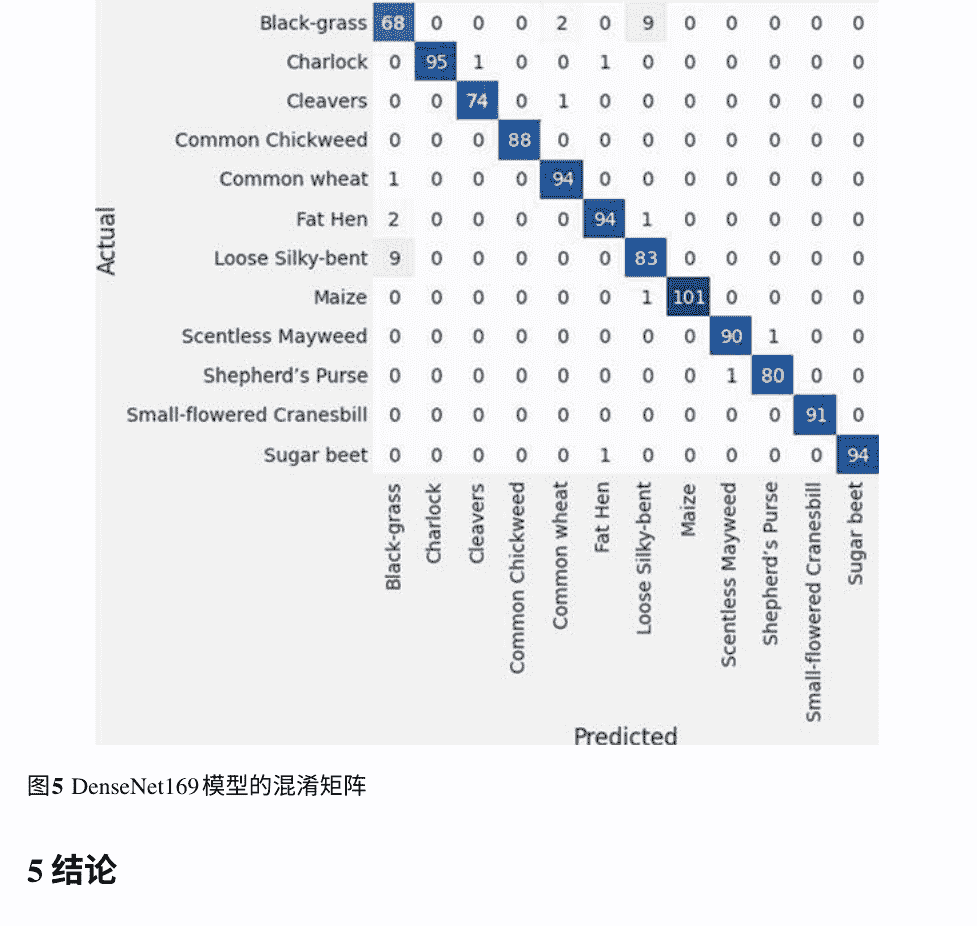

### 图5 DenseNet169模型的混淆矩阵

## 5 结论

这项科学研究旨在开发一个分类系统，用于田间的三种作物和它们相关的九种杂草。 迁移学习方法已被用来训练所提出的模型。 然后，我们比较了这两个模型在将杂草和作物物种分类为十二个类别方面的性能。 DenseNet169和MobileNetV2模型在将数据集划分为80%、10%和10%的训练、验证和测试数据时均达到了97%和95%的准确率。 使用了一些数据增强技术来增加数据。 这两个模型的训练时间几乎相同，但DenseNet169的性能优于MobileNetV2。 良好的准确性结果使得所提出的系统适用于在田间早期识别杂草，从而帮助农民采取相应的行动。 未来，我们打算通过纳入更多的作物和相关的杂草物种来扩展所提出的工作。

| Actual \ Predicted | Black-grass | Charlock | Cleavers | Common Chickweed | Common wheat | Fat Hen | Loose Silky-bent | Maize | Scentless Mayweed | Shepherd's Purse | Small-flowered Cranesbill | Sugar beet |
|---|---|---|---|---|---|---|---|---|---|---|---|---|
| Black-grass | 68 | 0 | 0 | 0 | 0 | 0 | 11 | 0 | 0 | 0 | 0 | 0 |
| Charlock | 0 | 95 | 0 | 0 | 1 | 1 | 0 | 0 | 0 | 0 | 0 | 0 |
| Cleavers | 0 | 0 | 74 | 0 | 0 | 0 | 0 | 0 | 1 | 0 | 0 | 0 |
| Common Chickweed | 0 | 0 | 0 | 84 | 0 | 0 | 0 | 0 | 2 | 2 | 0 | 0 |
| Common wheat | 2 | 0 | 0 | 0 | 92 | 0 | 0 | 1 | 0 | 0 | 0 | 0 |
| Fat Hen | 1 | 0 | 0 | 0 | 0 | 95 | 0 | 0 | 0 | 0 | 1 | 0 |
| Loose Silky-bent | 13 | 0 | 0 | 0 | 0 | 0 | 78 | 0 | 1 | 0 | 0 | 0 |
| Maize | 0 | 0 | 0 | 0 | 2 | 0 | 0 | 100 | 0 | 0 | 0 | 0 |
| Scentless Mayweed | 2 | 0 | 0 | 1 | 0 | 0 | 1 | 0 | 86 | 1 | 0 | 0 |
| Shepherd's Purse | 0 | 0 | 0 | 0 | 0 | 1 | 0 | 0 | 7 | 73 | 0 | 0 |
| Small-flowered Cranesbill | 0 | 0 | 0 | 0 | 0 | 0 | 0 | 1 | 0 | 0 | 90 | 0 |
| Sugar beet | 1 | 0 | 1 | 0 | 0 | 0 | 0 | 0 | 0 | 0 | 0 | 93 |

### 图6 MobileNetV2模型的混淆矩阵

## 参考文献

1. Gu, J., Wang, Z., Kuen, J., Ma, L., Shahroudy, A., Shuai, B., Liu, T., Wang, X., Wang, G., Cai, J., & Chen, T. (2018). 卷积神经网络的最新进展。模式识别, 77, 354–377.
2. LeCun, Y., Bottou, L., Bengio, Y., & Haffner, P. (1998). 基于梯度的学习应用于文档识别。IEEE会议录, 86(11), 2278–2324.
3. Zeiler, M. D., & Fergus, R. (2014). 可视化和理解卷积网络。在欧洲计算机视觉会议 (pp. 818–833). Springer.
4. Simonyan, K., & Zisserman, A. (2014). 用于大规模图像识别的非常深的卷积网络。arXiv预印本. arXiv:1409.1556.
5. Chollet, F. (2017). Xception: 深度学习与深度可分离卷积。在计算机视觉和模式识别的IEEE会议论文集中 (pp. 1251–1258).
6. Hamuda, E., Glavin, M., & Jones, E. (2016). 植物提取和分割的图像处理技术综述在田间的应用。农业中的计算机与电子技术, 125, 184–199.
7. Mennan, H., Jabran, K., Zandstra, B. H., & Pala, F. (2020). 非化学除草管理在蔬菜中使用覆盖作物: 一篇综述。农学, 10(2), 257.
8. Liakos, K. G., Busato, P., Moshou, D., Pearson, S., & Bochtis, D. (2018). 农业中的机器学习: 一篇综述。传感器, 18(8), 2674.
9. Wang, A., Zhang, W., & Wei, X. (2019). 一篇关于使用地面机器视觉和图像处理技术进行杂草检测的综述。农业中的计算机和电子技术, 158, 226-240.
10. Ahmed, F., Al-Mamun, H. A., Bari, A. H., Hossain, E., & Kwan, P. (2012). 通过数字图像对作物和杂草进行分类的支持向量机方法。作物保护, 40, 98-104.
11. Hierreira, P. J., Dorado, J., & Ribeiro, Á. (2014). 一种基于形状描述符和模糊决策方法的杂草类型分类的新方法。传感器, 14(8), 15304-15324.
12. Bahashipour, A., & Jafari, A. (2018). 使用形状特征进行杂草检测的支持向量机和人工神经网络的评估。农业中的计算机和电子技术, 145, 153-160.
13. Liu, W., Wang, Z., Liu, X., Zeng, N., Liu, Y., & Alsaadi, F. E. (2017). 深度神经网络结构及其应用综述。神经计算, 234, 11-26.
14. Razzak, M. I., Naz, S., & Zaib, A. (2018). 医学图像处理的深度学习: 概述，挑战和未来。在生物应用中的分类 (第323-350页).
15. Kumar, T. S. (2020). 基于卷积神经网络模型和迁移学习技术的视频交通预测。创新图像处理杂志 (JIIP), 2(03), 128-134.
16. Vijayakumar, T. (2020). 使用新型深度卷积神经网络的姿势逆问题矫正。创新图像处理杂志 (JIIP), 2(03), 121-127.
17. Manoharan, J. S. (2021). 对极限学习机 (ELM) 品牌及其分类算法性能度量的变体研究。软计算范式杂志 (JSCP), 3(02), 83–95.
18. Bashar, A. (2019). 关于演化深度学习神经网络架构的调查。人工智能杂志, 1(02), 73–82.
19. Kamilaris, A., & Prenafeta-Boldú, F. X. (2018). 农业中的深度学习: 一项调查。农业中的计算机和电子设备, 147, 70-90.
20. Tang, J., Wang, D., Zhang, Z., He, L., Xin, J., & Xu, Y. (2017). 基于K-means特征学习与卷积神经网络的杂草识别。农业中的计算机和电子技术, 135, 63–70.
21. Jiang, H., Zhang, C., Qiao, Y., Zhang, Z., Zhang, W., & Song, C. (2020). 基于CNN特征的图卷积网络用于智能农业中的杂草和作物识别。农业中的计算机和电子技术, 174, 105450.
22. Sharma, P. (2019). 通过优化迁移学习参数，使用卷积神经网络进行作物和杂草分类。国际工程与先进技术杂志 (IJEAT), ISSN 2249-8958.
23. Giselsson, T. M., Jørgensen, R. N., Jensen, P. K., Dyrmann, M., & Midtiby, H. S. (2017). 用于基准植物幼苗分类算法的公共图像数据库。arXiv预印本. arXiv:1711.05458.
24. Huang, G., Liu, Z., Van Der Maaten, L., & Weinberger, K. Q. (2017). 密集连接卷积网络。在计算机视觉和模式识别的IEEE会议论文集中 (pp. 4700–4708).
25. Sandler, M., Howard, A., Zhu, M., Zhmoginov, A., & Chen, L. C. (2018). Mobilenetv2: 反向残差和线性瓶颈。在计算机视觉和模式识别的IEEE会议论文集中 (pp. 4510–4520).
26. Russakovsky, O., Deng, J., Su, H., Krause, J., Satheesh, S., Ma, S., Huang, Z., Karpathy, A., Khosla, A., Bernstein, M., Berg, A. C., & Fei-Fei, L. (2015). Imagenet大规模视觉识别挑战。国际计算机视觉杂志, 115(3), 211–252.

#### 一种使用用户的音乐特征的新型推荐系统

A. Bharath Kumar Reddy, K. Sai Ruthwik, G. Pavan Kumar, 和 N. Damodhar

摘要 在这个数字时代，人们的虚拟存在呈指数增长。此外，由于COVID-19大流行和封锁，几乎日常生活中的所有事情都变成了虚拟的。屏幕时间的主要部分用于在线购物和流媒体内容，包括听音乐和社交媒体。随着活跃用户数量的急剧增加，互联网上可用的内容也在广泛增加。因此，为正确的用户找到合适的内容是一项具有挑战性的任务，这正是推荐系统所解决的问题。

因此，本文提出了一种巧妙的方法，将音乐偏好作为推荐系统的度量标准。实验使用无监督机器学习（ML）技术进行，以研究音乐偏好是否可以作为心理参数来衡量志同道合程度，从而用作现有推荐系统的改进。

- 推荐系统
- 协同过滤
- 基于内容的过滤
- 志同道合
- 聚类
- 轮廓系数
- 主成分分析
- 相关性

A. Bharath Kumar Reddy, K. Sai Ruthwik (✉), G. Pavan Kumar, N. Damodhar
计算机科学与工程系，Amrita Vishwa Vidyapeetham，Amritapuri，印度
电子邮件：ksruthwik@am.students.amrita.edu
A. Bharath Kumar Reddy
电子邮件：abkumarreddy@am.students.amrita.edu
G. Pavan Kumar
电子邮件：gpkumar@am.students.amrita.edu
N. Damodhar
电子邮件：ndamodhar@am.students.amrita.edu

## 1 引言

推荐系统在提升用户体验方面发挥着主导作用，从在线购物到Twitter的新闻订阅，一切都基于用户的活动进行个性化。由于用户活动的快速增加以及产生的内容数量庞大，推荐系统面临着更大的挑战，即理解新内容并找到目标用户。此外，推荐系统还可以用于其他各种类型[1,2]。

现有的推荐系统可以广泛分为两种类型，即（1）基于内容的过滤和（2）协同过滤。基于内容的过滤使用用户在一段时间内生成的数据，如访问的网站、用户的过去活动、用户的喜好和厌恶、用户对特定内容的评分等，来为用户提供建议。数据越多，建议越好。另一方面，协同过滤通过找到用户之间的相似性来工作，这是基于每个用户的喜好和厌恶，可以使用皮尔逊相关性、余弦相似度等度量来计算。使用这些推荐系统的主要缺点是它们会遇到冷启动问题。为了能够正确地为用户推荐内容，它们需要大量关于用户的数据。而且只有当用户在特定应用程序中有大量活动时才能提供数据，而对于新用户来说通常不是这种情况。例如，如果用户没有对任何内容进行评分，那么协同过滤就无法有效工作。同样地，如果用户对该应用程序是新用户，基于内容的过滤也将失败，因为用户没有过去的活动。

此外，协同过滤所取得的结果并不一致。例如，两个来自完全不同地点的用户在使用音乐应用时可能会被匹配为相似，但是在其他社交媒体应用中，这两个用户可能不会被推荐为朋友，尽管他们有很多相似之处，因为这里可能考虑的度量是用户的位置。因此，音乐偏好可以被提出作为一种将具有相似兴趣的人群进行分组的普遍度量标准，结果表明音乐偏好可以作为一种心理参数来分组志同道合、兴趣相似的人。当人们基于他们的音乐特征进行分组时，他们可以使用基于全局相似度度量的基于约束的聚类算法在社交网络中进行相似思想的分组。

心理学研究[4]表明，研究用户的完整音乐资料将揭示一个人的许多特征特质，这反过来可以作为将志同道合的人分组的参数。拥有一群志同道合的人可以扩展推荐系统的能力，使不同应用之间的交叉推荐成为可能。例如，考虑两个使用某个社交媒体平台的用户，并将他们聚类为志同道合的人。假设其中一个用户是一个新用户，对于一个视频流媒体平台来说，由于这两个用户是志同道合，可以向新用户推荐已存在用户的过去活动。这消除了现有推荐系统面临的冷启动问题。

## 2 背景和相关工作

论文[5]分析了特定用户与其他用户的社交互动，并基于该特定用户与之连接的人员推荐内容。它检查了用户在朋友圈中的互动，并计算了基于互动的社交接近度（IBSP）因子，分别基于该因子推荐物品，用户也对此推荐进行评分。Zisopoulos等人[6]采用了决策树和贝叶斯分类器的混合方法，推荐最适合用户的内容。决策树是根据用户对物品的评分构建的，树根据用户的喜好进行划分，类似地，概率是基于其他用户的评分计算的，然后使用贝叶斯分类器进行推荐。

在[7]中提到的工作提供了一种基于用户的先前数据、喜好和评分生成推荐的算法，但在用户是系统中的新用户时，该算法无法推荐电影，而且当用户观看了多部电影但只对其中几部进行评分时也会失败。[8]中的模型提供了关于现有推荐系统的详细想法，但它未能提出比现有系统更好的推荐系统，每个推荐系统都存在一些问题。为了获得更好的聚类质量，可以考虑[9]中提出的算法。这对于具有许多维度的数据非常有益，因为它根据每个数据实例的已知标签识别了关键属性的子集，并在内部使用信息增益作为子空间聚类的度量。下表1列出了研究论文及其用例。

### 2.1 聚类 [10]

这是一种无监督学习算法，也是广泛使用的算法之一。它基本上采用自下而上的方法来对数据点进行聚类。最初，每个个体点被视为一个聚类，并根据聚类与数据点之间的某个距离度量进行合并。准确地说，最接近的一对聚类被合并。这个过程重复进行，直到所有点都被聚类。此外，可以从合并的聚类中绘制出一个树状图来可视化聚类。

伪代码：## 表1 研究论文及其在本文中的用例

| 姓名 | 目的 | 方法 | 限制 |
| --- | --- | --- | --- |
| 通过使用基于互动的社交接近因素[4]来处理推荐系统中的冷启动问题 | 处理冷启动问题 | 根据Facebook上不同用户之间的社交互动推荐内容 | 如果用户没有互动，则不起作用 |
| 基于内容的推荐系统[5] | 向用户推荐任何类型的内容 | 使用决策树和贝叶斯分类器 | 该方法在动态环境中是静态且不高效的 |
| 电影推荐系统：MOVREC [6] | 向用户推荐电影 | 协同过滤，K-means对推荐进行排序 | 冷启动问题（当没有用户时），稀疏性问题（如果用户没有为某些观看的电影评分） |
| 推荐系统：对推荐的不同方法进行概述 [7] | 目前存在的推荐系统 | 协同过滤，基于内容的过滤，混合方法 | 混合方法试图解决协同过滤和基于内容过滤的问题，但在实际使用中，结果的质量并不高 |

#### 伪代码1: 聚类聚合

给定大小为N的数据集 (D1, D2, D3, ..., Dn)
步骤1：计算距离矩阵
步骤2：
- 对于 i = 1 到 N:
    - # 仅计算主对角线的下半部分
    - 对于 j = 1 到 i:
        - dist_mat[i][j] = distance[Di, Dj]
最初每个数据点都是一个单独的聚类
步骤3：合并最接近的一对聚类（最小距离）
步骤4：更新距离矩阵
步骤5：重复步骤3和4直到只剩下一个聚类

### 2.2 K-Means 聚类 [11]

正如其名称所示，K-means 使用每个聚类中数据点的均值。它是一种无监督的机器学习算法。最初，选择 k 个点作为聚类中心点，并计算每个数据点到这些中心点的距离。根据计算得到的距离，将每个点分配给最近的聚类。

一旦为每个点分配了聚类，计算每个聚类中点的均值，并选择它作为新的聚类中心点，然后再次计算距离，并为每个数据点重新分配聚类。这个过程一直持续下去，直到数据点的聚类重新分配次数较少为止。

伪代码：

伪代码 2: K-Means 聚类
步骤1: 选择聚类数目 (K) 并获取数据点
步骤2: 随机选择K个数据点作为质心
步骤3: 对于每个数据点‘i’:
- 通过计算距离找到最近的质心
- 将该点分配给该簇
步骤4: 对于每个簇‘j’:
- 新的质心是分配给该簇的所有点的平均值
步骤5: 重复步骤3和步骤4直到收敛或达到固定的迭代次数
步骤6: 形成最终的簇

### 2.3 BIRCH 聚类 [12, 13]

在大数据集的情况下，BIRCH非常有用，因为与其他聚类算法相比，BIRCH的效率更高。在对数据进行单次扫描时，将大数据集缩小为摘要，并对这些摘要进行聚类。该算法从数据集中推断出CF节点的组，并且这些节点具有多个子簇。CF树是一棵高度平衡的树，它是从数据集中推导出来的，其中叶节点是子簇。

伪代码：

**伪代码 3: BIRCH 聚类**

步骤-1: 将数据加载到内存中并适应 CF 树
步骤-2: 调整数据大小
步骤-3: 全局聚类（使用现有聚类算法进行聚类）
步骤-4: 优化形成的聚类
步骤-5: 形成最终聚类。

## 3 提出的模型

### 3.1 数据

为了进行实验，选择并研究了大约125个长期相互认识的人的数据。数据集是分类的，即特征与特定的人相关联。最初收集的数据集包含大约125行和22个特征。为了最终确定调查问题，数据收集过程进行了多次迭代，以获得最佳的调查问题/特征。

在每次迭代中，会提出多个调查问题，并收集回答，并将其输入到机器学习模型中，该模型给出了志同道合的人群的聚类。然后，调查参与者会对聚类进行手动评估。在这种情况下，人们被聚类成蛋白质组，如[14]所观察到的那样，单词被聚类成多个类别，类似地，根据不同的基础，数据可以被聚类。

在这里，评估指的是模型能够如何有效地将志同道合的人分组在一起，而衡量模型效率的唯一方法就是向调查员提问简单问题，即他们与被分组的人是否志同道合？调查员可以回答这个问题，因为他们已经互相了解。整个过程会多次迭代，以找到能够提供最高准确度和最佳调查问题的最佳算法，以确定数据集的特征。以下是数据集的最终调查问题/特征。下划线表示特征，斜体表示选项（表2）。

### 3.2 数据可视化和预处理

数据的基本预处理包括将文本数据转换为数值，以便对模型进行训练。已经对分类文本变量进行了处理。

| 情感识别参数 |
|--------------|
| 姓名 |
| 年龄 |
| 学生 (是 / 否) |
| 教育程度 |
| 专业 |
| 性别 |
| 家乡 |
| 母语 |
| 我首选的音乐流派 |
| 我第二喜欢的语言 |
| 我第三喜欢的语言 |
| 我最喜欢的歌曲语言和专辑/艺术家 |
| 我第二喜欢的歌曲语言和专辑/艺术家 |
| 我第三喜欢的歌曲语言和专辑/艺术家 |
| 你在旅行时喜欢听音乐的可能性(1到5) |
| 你什么时候经常听音乐(早上, 晚上, 上午, 下午, 睡前晚上) |
| 你为什么听音乐(只是为了好玩, 它让我放松, 为了管理压力) |
| 你喜欢听老歌吗(1到5) |
| 你喜欢听宗教歌曲吗(1到5) |
| 选择包含你最喜欢流派的选项 |
| 我喜欢听音乐(1到5) |

使用标签编码技术进行转换，并使用特殊类型的哈希函数转换其他连续文本数据。这些哈希函数将文本数据转换为数值。对于每个文本数据，它都有相应的数值。哈希函数已经针对整个数据集进行了碰撞测试，并发现没有碰撞。

图1展示了数据集中几个特征的分布情况。

由于特征数量较高（维度灾难）相对于训练样本数量，使用Cramer的规则和相关系数计算了特征之间的相关性。如果两个特征高度相关，则从数据集中删除其中一个特征。

图2和图3表示特征之间的相关性热图。

图4和图5表示数据集的散点图；图4中的每种颜色表示性别，而图5中的每种颜色表示特定年龄组。

图6展示了所提出模型的概述。

### 3.3 提出的算法

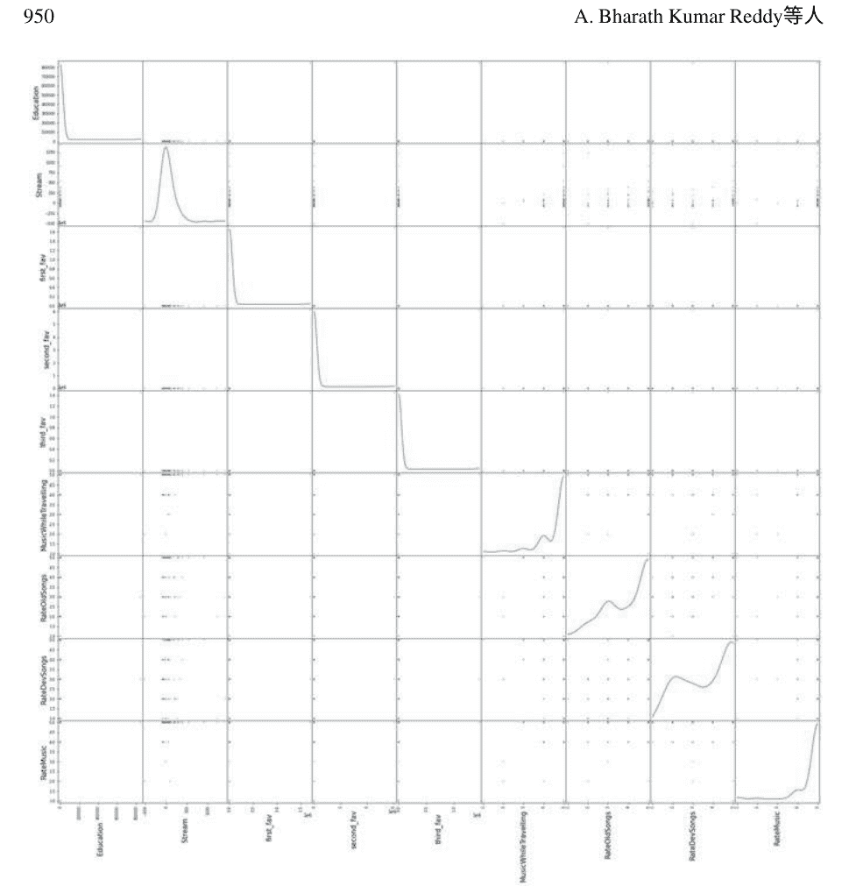

**伪代码4：模拟**

步骤1：设计调查问题
步骤2：预处理和可视化数据
步骤3：执行以下步骤，直到轮廓分数不低
- 步骤3a：选择维度的数量
- 步骤3b：对数据集进行主成分分析
- 步骤3c：计算凝聚层、K-Means和Birch的轮廓分数
步骤4：执行以下步骤，直到轮廓分数不低
- 步骤4a：计算最佳聚类数
步骤5：使用凝聚层、K-Means和Birch进行聚类
- 步骤5b：如果调查员表示反馈不好，从步骤1重新开始模型
步骤6：形成最终聚类

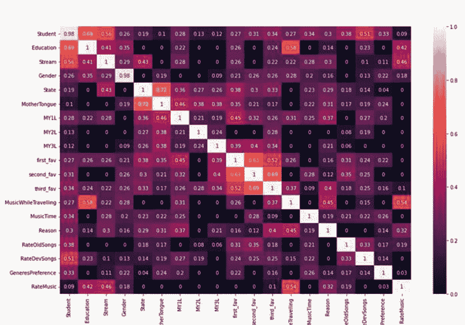

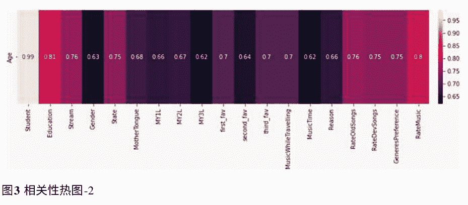

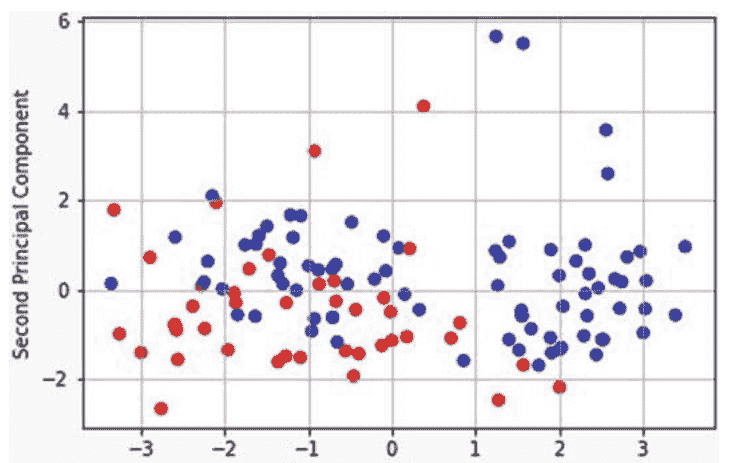

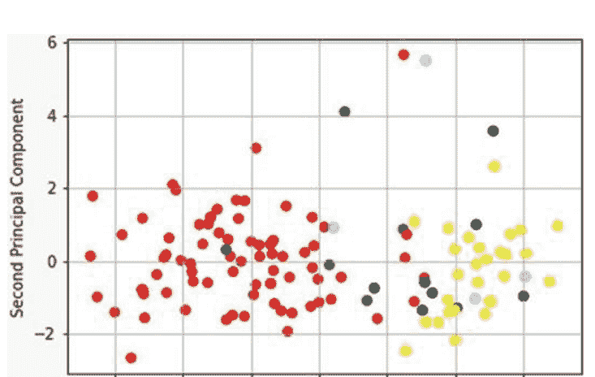

最初，从用户那里收集调查回答，并收集数据。数据经过处理，并被输入到主成分分析（PCA）中，以减少维度，以便进行有效的聚类，如[16]中所讨论的。使用一个称为轮廓分数的度量来评估形成的聚类的质量，该度量是从簇间距离和簇内距离计算得出的。基于此，生成一个值，该值介于-1和+1之间。-1表示形成的聚类质量较差，+1表示形成的聚类质量最好。如果观察到聚类质量较差，则使用不同数量的主成分分析（PCA）进行迭代

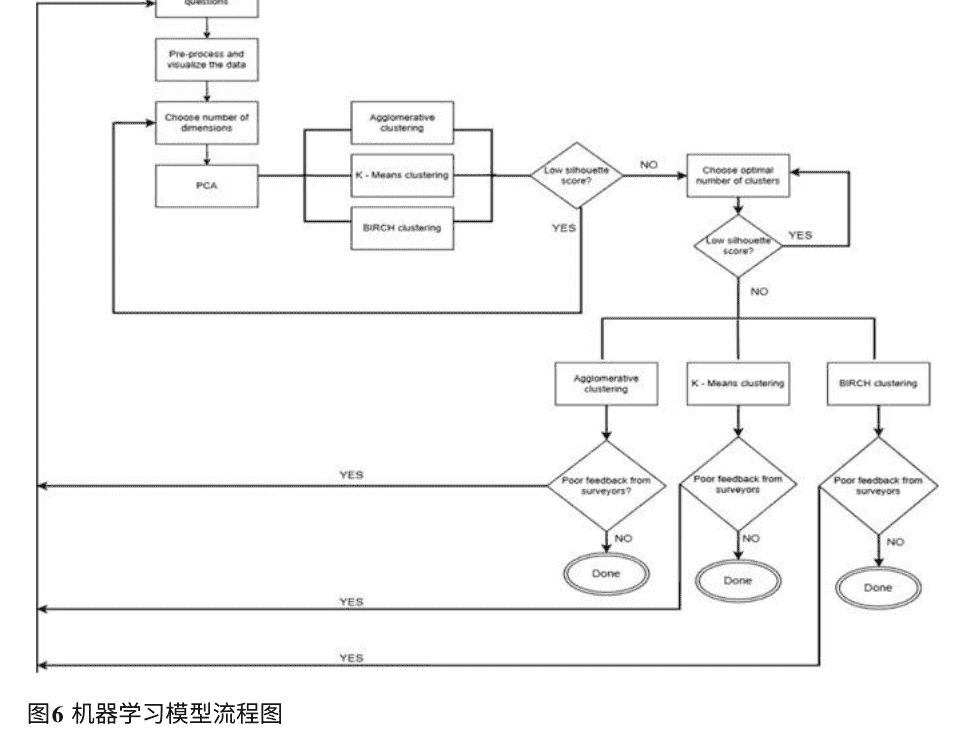

尺寸。重复相同的过程，直到获得最优维度，即得到最大的轮廓分数。

一旦获得了PCA的最优维度数量，这些数据将用于形成聚类，并被输入到三个无监督聚类算法中，即凝聚层次聚类、K均值聚类和BIRCH聚类。最初，聚类的数量是随机选择的，并在其上执行聚类。一旦形成了聚类，再次计算轮廓分数，并根据轮廓分数多次重复相同的过程，以获得最优的聚类数量。最后，形成了最佳的聚类，然后将这些聚类交给调查员评估聚类中的思想相似性的有效性。如果收到的反馈不好，那么整个过程将从重新设计调查问题开始重复。

图7和图8对应于凝聚层次聚类，图9和图10对应于K均值聚类，图11和图12对应于BIRCH聚类（最优聚类数量和最优维度数量）。

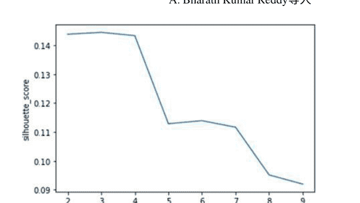

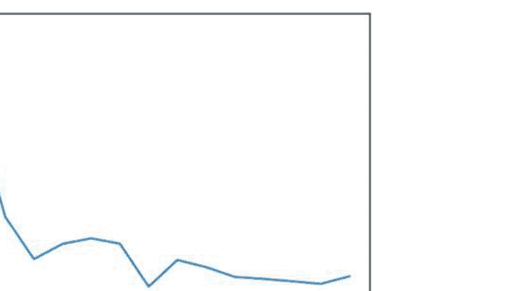

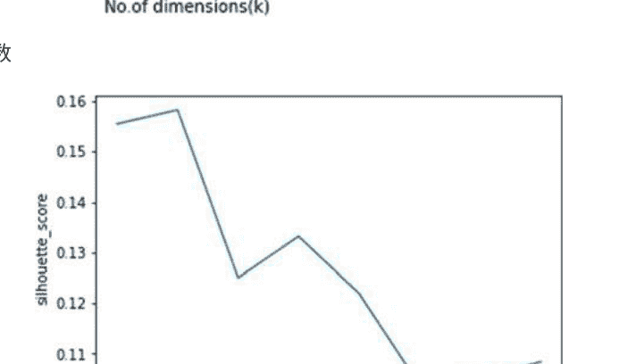

#### 一种使用用户的音乐特征的新型推荐系统

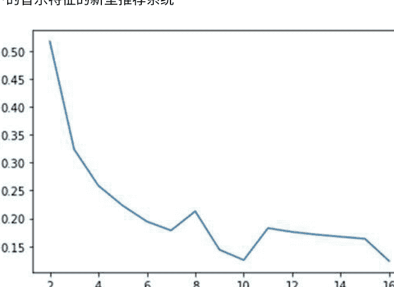

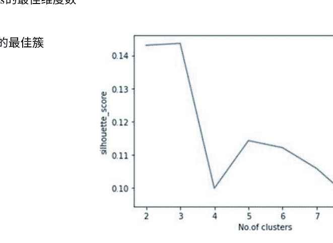

## 4 结果

图13、14和15分别表示凝聚式聚类、K-means和BIRCH算法形成的散点图。这里，每种颜色代表一个特定的簇，每个数据点是数据中的一个用户。根据轮廓系数选择最佳簇数，即簇数为3时得到最大的轮廓系数，轮廓系数是簇质量的性能度量。

表3显示了选择的聚类算法的最佳簇数、最佳维度数和相应的轮廓系数。通过迭代检查每个数字的轮廓系数，得到最佳簇数和最佳维度数。

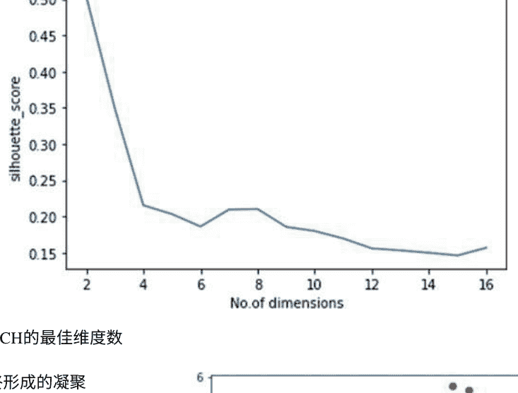

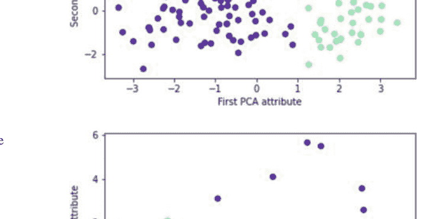

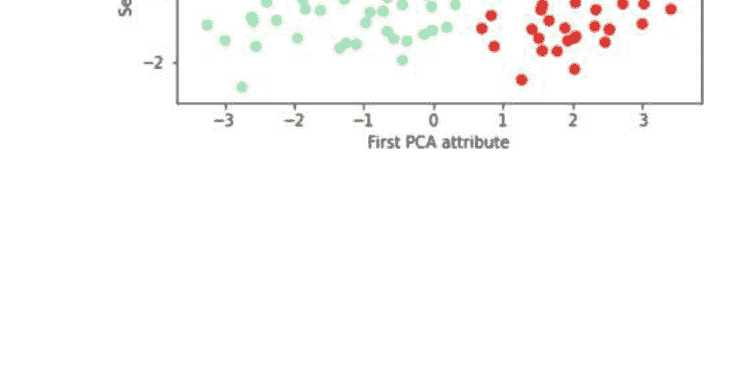

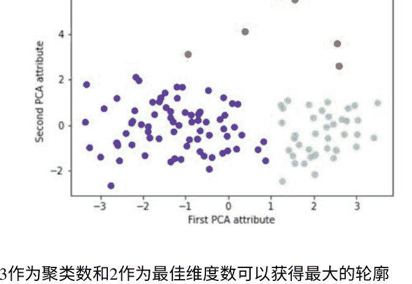

对于每个聚类算法，将3作为聚类数和2作为最佳维度数可以获得最大的轮廓得分。

在人们被聚类之后，算法的性能（表4）通过从同一组调查员那里获得对其所分配的聚类的有效性的反馈来确定，即他/她所在聚类中的其他用户与该特定人员有多密切相关。由于调查员事先了解彼此，这确实是一种确定音乐特征如何决定志同道合程度的高效方式。

可以清楚地观察到K-means比其他两种聚类算法更好地对人们进行了聚类，因此产生了比其他算法更好的效率。因此，证明了一个人的音乐特征可以作为基于志同道合的人群聚类的度量标准。

### 表3 得到的结果

| 聚类算法 | 最佳聚类数 | 最佳维度数 | 轮廓系数 |
|----------|------------|------------|----------|
| 凝聚层次 | 3          | 2          | 0.50437  |
| K均值    | 3          | 2          | 0.51679  |
| BIRCH    | 3          | 2          | 0.50437  |

### 表4 效率

| 聚类算法 | 确定志同道合的效率(%) |
|----------|----------------------|
| 凝聚层次 | 73                   |
| K均值    | 77                   |
| BIRCH    | 73                   |

## 5 结论和未来工作

结果表明，在三种聚类算法中，K均值在确定志同道合方面表现更好。所有三种聚类算法在水平上相当，其中K均值较高。因此，可以肯定地说，音乐偏好可以作为确定人们志同道合的有效度量标准，因此人们可以根据他们的志同道合进行分组。因此，可以根据用户‘X’所在群组/聚类中其他人的喜好给出推荐。同样，现有推荐系统的能力可以扩展，并且相同的思想可以用于电影推荐、社交媒体推荐等各种应用。

未来将开发一种基于Web的GUI应用程序，该应用程序能够像[17]中推荐歌曲一样，为用户提供常见的群组聊天选项，以及由该算法形成的志同道合的人之间的一对一聊天，还有像[18]中提到的其他功能。

## 参考文献

- 1. Kurup, A. R., & Sajeev, G. P. (2017). 基于奖励的众包系统中的任务推荐. 在2017年计算机、通信和信息学国际会议(ICACCI)上(pp. 1511–1518). https://doi.org/10.1109/ICACCI.2017.81260552.
- 2. Devika, P., Jisha, R. C., & Sajeev, G. P. (2016). 一种新颖的图书推荐方法. 在2016年IEEE计算智能和计算研究国际会议(ICCIC)上(pp. 1–6). https://doi.org/10.1109/ICCIC.2016.79196063.
- 3. Alsa'leh, S., Nayak, R., & Xu, Y. (2012). 使用加权多约束聚类方法在社交网络中分组人员.在2012年IEEE模糊系统国际会议上(pp. 1–8). https://doi.org/10.1109/FUZZ-IEEE.2012.6250799
- 4. Greenberg, D., Kosinski, M., Stillwell, D., Monteiro, B., Levitin, D., & Rentfrow, P. (2016). 这首歌是你的：对音乐属性维度的偏好反映个性。社会心理学和个性科学, 7 https://doi.org/10.1177/19485506166414735.
- 5. Bedi, P., Sharma, C., Vashisth, P., Goel, D., & Dhand, M. (2015). 通过使用基于互动的社交接近因素来处理推荐系统中的冷启动问题。 在2015年国际计算、通信和信息学会议(ICACCI)中(pp. 1987–1993). https://doi.org/10.1109/ICACCI.2015.7275909
- 6. Zisopoulos, C., Karagiannidis, S., Demirtsoglou, G., & Antaris, S. (2008).基于内容的推荐系统。
- 7. Kumar, M., Yadav, D., Singh, A., & Kr, V. (2015). 电影推荐系统： MOVREC。国际计算机应用杂志, 124, 7–11。 https://doi.org/10.5120/ijca2015904111
- 8. Shah, K., Salunke, A., Dongare, S., & Antala, K. (2017). 推荐系统：不同推荐方法的概述在2017年创新信息、嵌入式和通信系统国际会议上(pp. 1–4). https://doi.org/10.1109/ICIIECS.2017.8276172
- 9. Harikumar, S., & Akhil, A. S. (2018). 半监督方法用于子空间聚类。智能和模糊系统杂志, 34, 1619–1629.
- 10. Patel, S., Sihmar, S., & Jatain, A. (2015). 一项关于层次聚类算法的研究。在2015年第二届国际可持续全球发展计算大会 (INDIACom) (第537-541页)。
- 11. Na, S., Xumin, L., & Yong, G. (2010). k-means聚类算法的研究：一种改进的k-means聚类算法。在2010年第三届智能信息技术与安全信息学国际研讨会（第63-67页）。https://doi.org/10.1109/IITSI.2010.74
- 12. Jiang, S., & Li, X. (2009). 改进的BIRCH聚类算法：改进的BIRCH聚类算法。计算机应用杂志，29, 293-296。https://doi.org/10.3724/SP.J.1087.2009.00293
- 13. Lorbeer, B., Kosareva, A., Deva, B., Softic, D., Ruppel, P., & Kupper, A. (2017). 对BIRCH聚类算法的变体大数据研究，11 https://doi.org/10.1016/j.bdr.2017.09.002
- 14. Indulekha, T. S., Aswathy, G. S., & Sudhakaran, P. (2018). 一种基于图的算法用于聚类和排名蛋白质以识别致病基因(pp. 1022–1026). https://doi.org/10.1109/ICACCI.2018.8554530
- 15. Rajesh, R., Gargi, S., & Samili, S. (2016). 使用字典学习的词聚类表示。在2016年计算、通信和信息学国际会议(ICACCI), 印度, 斋普尔.
- 16. Mishra, S., Sarkar, U., Taraphder, S., Datta, S., Swain, D., Saikhom, R., Panda, S., & Laishram, M. (2017). 主成分分析。国际畜牧研究杂志,1. https://doi.org/10.5455/ijlr.20170415115235
- 17. Paul, D., & Kundu, S. (2020). 音乐推荐系统调查及提出的音乐推荐系统。在J. Mandal和D. Bhattacharya (Eds) 的《建模与图形学新技术》中。智能系统与计算进展 (Vol. 937). Springer. https://doi.org/10.1007/978-981-13-7403-6_26
- 18. Samyuktha, M., & Supriya, M. (2020). 通过聊天机器人自动化招生咨询过程——一种反馈启用的学习系统。在V. Bindhu, J. Chen, J. Tavares (Eds.) 的《通信、计算和电子系统国际会议》中。Springer. https://doi.org/10.1007/978-981-15-2612-1_18
- 19. Shakya, S. (2021). 基于修改的高斯导数滤波器的眼部定位的多距离人脸识别。创新图像处理杂志, 3(3), 240–254.
- 20. Tesfamikael, H. H., Fray, A., Mengsteab, I., Semere, A., & Amanuel, Z. (2021). 基于图像分割算法的眼球追踪控制电动轮椅构建的模拟。创新图像处理杂志 (JIIP), 3(01), 21–35.

# 使用多模型超调机器学习进行糖尿病视网膜病变预测

B. V. Baiju, S. Priyadharshini, S. Haripriya, 和 A. Aarthi

摘要 糖尿病是一种慢性疾病，由于胰岛素缺乏而导致糖尿病视网膜病变，可能导致视力丧失；如果在最初阶段没有被识别出来。糖尿病视网膜病变也被认为是老年人的主要不稳定疾病之一。糖尿病患者可能导致急性并发症，如心血管疾病和中风。如果不采取预防措施，它可能导致进一步的疾病，如肾病、糖尿病足和视网膜病变。

数据挖掘在诊断糖尿病视网膜病变中起着重要作用，这对社会的健康有益。这个模型通过分类模型和使用机器学习算法进行超参数调整来识别糖尿病视网膜病变，并能够更准确地预测疾病。

关键词 糖尿病 · 疾病预测 · 机器学习 · 视网膜病变 · 数据集训练 · 准确性预测

## 1 引言

糖尿病视网膜病变（DR）是一种严重的视网膜疾病，是由于无法控制的糖尿病导致的，如果不及时发现该疾病，会导致视力丧失。根据世界卫生组织报告[1]，糖尿病视网膜病变是最常见的疾病。预计到2030年，糖尿病视网膜病变将影响1.91亿人。由于糖尿病视网膜病变引起的视网膜疾病将包括青光眼、白内障和视网膜病变[2]。糖尿病感染者在很长一段时间内可能没有接受治疗的机会，因为在初期阶段，患者可能对这些疾病不知情[3]。

### 图1 人眼解剖

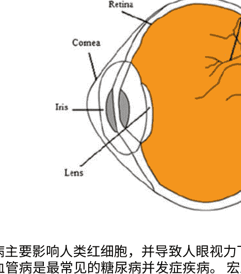

糖尿病视网膜病主要影响人类红细胞，并导致人眼视力下降，如图1所示。微血管病和宏血管病是最常见的糖尿病并发症疾病。宏血管病威胁着微小的血管和动脉。糖尿病视网膜病常常攻击眼睛（视网膜病）、神经（神经病）和肾脏（肾病），这些都是微血管疾病。关键的宏血管阻塞包括心血管疾病，如中风等其他严重并发症[4]。有不同类型的糖尿病可以影响人类；然而，最常见的糖尿病类型是1型糖尿病和2型糖尿病以及妊娠期糖尿病（GDM）。1型糖尿病通常影响儿童，2型糖尿病影响中年人，很少影响老年人。而GDM影响妇女在怀孕期间[5]。

一般来说，糖尿病视网膜病变的治疗由眼科医生进行，通过收集患者的视网膜图像。数据挖掘过程对于医务人员提取隐藏的医学知识非常有帮助[15]。

糖尿病视网膜病变是一种非常复杂的疾病，临床研究世界眼科学认为它是不可忽视的。DR被编码为两个不同的阶段，非增殖性DR（NPDR）和增殖性DR（PDR）[6]。此外，DR被分为轻度阶段和重度阶段。

光线通过眼睛前部（角膜）进入晶状体。角膜和晶状体帮助将光线聚焦到眼睛后部（视网膜）。视网膜中的细胞吸收并将光线转化为电化学脉冲，然后沿着视神经传输到大脑。DR的初始药物治疗可以防止患者病情进一步恶化。在今天的世界中，为了对疾病的关键阶段进行分类，大多数经验丰富的医生会手动进行DR的识别[6]。本研究论文的首要目标是构建一个使用机器学习算法和超参数调整来检测糖尿病视网膜病变的工作模型，并在预测准确性上超过现有模型。一旦模型建立完成，经过数据集的训练和测试，可以用于早期预测糖尿病视网膜病变。

本研究论文的贡献被归类为以下部分。

第2节讨论相关工作。第3节包含现有的执行和第4节简要介绍了提出的方法。此外，第5节描述了模型的实现，第6节说明了其方法论，第7节回顾了所使用的算法，并在第8节中解释了带有超参数调整的算法。第9节分析了模拟结果，接下来的部分定义了评估参数。第11节展示了不同方法之间的比较结果。最后，最后一节总结了这项工作。

## 2 相关工作

Baiju和Aravin [1] 提出了基于多属性相互依赖关系的糖尿病数据聚类和基于影响度量的疾病预测。使用了高效的多属性影响度量算法，并使用UCI糖尿病数据集评估了该方法的效率。

Kamble等人[2]利用RBF脑机构提出了一个视网膜图片数据集。结果显示DIARETDB0的灵敏度为71.2，感知度为0.83，特异度为0.043。

Bhatkar [3]提出了一种多层感知神经网络（MLPNN）来识别视网膜图片中的糖尿病视网膜病变。MLPNN分类器被引入来将视网膜图片分为普通和异常两类。采用Train N Times技术来训练MLPNN，以找到最佳的特征子集。MLP NN的训练和交叉验证准确率为100%，用于定位普通和异常视网膜图片。

Fiarni等人[4]基于信息挖掘和聚类分类提出了一种糖尿病并发症疫苗模型。该模型将糖尿病临床数据分为四类：肾病、视网膜病变、神经病变和混合效应。为了开发最佳的基于规则的预测模型，他们使用了分类和排序算法来评估性能。

Elmogy, Mohammed [5] 开发了一个模型来帮助眼科医生。ML-CAD 框架想象出明显的疾病变化并分析 DR 级别。他们首先消除噪音，改善质量，并规范化视网膜图像大小。研究人员确定了四个特定方向上的灰度级别运行长度网络的平均值，以识别健康和 DR 患者。

Sankaranarayanan 和 Perumal [15] 提出了两个重要的数据挖掘过程。FP-Growth 和 Apriori 已被用于糖尿病数据集的应用，两种算法都正在生成关联规则。

Han 等人 [6] 开发了一个计算机视觉系统，用于识别和自动化这个对象，利用神经网络为大量案例提供结果。

Sun 和 Zhang [7] 提出了五种人工智能模型，用于使用电子健康记录（EHR）数据来识别 DR 病例，以及一组治疗选择。最后的测试结果表明，随机森林是一个能够达到92%准确率并表现良好的人工智能模型。

Kalyani等人[8]建议使用排列的案例组织来区分和描述糖尿病视网膜病变。卷积和基本案例层用于从眼底图像中提取特征，而分类案例层和softmax层用于评估图像属于特定类别的概率。使用Messidor数据集对提出的组织的效率进行了四个执行模型的检查。

Sharma等人[9]提出了一种通过自动化来实现计算机视觉系统。它使用了神经网络，并且还识别了投诉，以在很短的时间内为大量案例提供结果。

Pratt等人[10]提出了一种用于诊断糖尿病视网膜病变的CNN方法，并直接对其严重程度进行分类。此外，他还开发了一个具有CNN设计和数据增强的组织，可以准确地描述与组织膜上的微小动脉瘤、渗出物和出血等复杂问题，并在没有用户完成输入的情况下提供任务。该组织使用高端GPU进行了训练，以实现高精度的分类。

Deepa等人[11]提出了一组多阶段深度CNN模型，用于支持图像补丁的糖尿病视网膜病变评估。预处理阶段使得信息图像能够提供比原始图像更多的重要信息。在这项工作中，使用了归一化和调整大小的区域单元作为预处理方法。经过三个主要阶段的排列多阶段算法程序来执行呼叫组织的分类度量。

Sreng和Maneerat [12]提出了一种预处理图像的策略，以消除小噪声并提高图像的对比度。此外，还使用了自适应边缘感知来识别亮斑。然后，根据形态学分离方法识别红斑区域。此外，通过使用逻辑AND运算符将明显和暗斑区域合并。为了仅保留病态迹象，通过质量分析来消除靠近血管的噪声。形态选择被移除，并增加了一个SVM分类器。

Suriyaharayananm等人[13]提出了一个最新的弱侧位置限制。首先，观察血管和渗出物固定并移除每个激活点。一些选择，如血管、渗出物和激活点，被认为是精确利用的。形态学任务被合理应用。

Santos等人[14]支持深度神经网络模型，执行一阶段物体识别，利用中等数据增强和迁移学习方法，为物理设计损伤的任务提供模型。该模型经过训练，并支持YOLOv5计划和PyTorch框架，实现了map值。

Kavakiotis等人[15]提出了在预测和分析方面使用人工智能、数据挖掘技术和工具的应用。在包括临床和生物数据的复杂数据集中，利用机器学习和数据挖掘技术进行更深入的分析，以促进对糖尿病的诊断和治疗。这是由于生物技术的出现和大量数据的产生。

## 3 现有系统

现有工作处理了使用生物医学糖尿病启发式列表进行疾病估计的问题，该列表已经得到了特别分析。同样，它提出了一种基于测量的疾病预测估计。首先，该方法对生物医学启发式分类进行了分析，并进行了异常排除。其次，提取特征，并针对每个数据点评估多属性关联相似度测量（MARSM），以供不同的可用数据包。根据评估的MARSM测量，确定了重要数据的单一类别。打包估计是一个不断发展的过程，它以均匀的方式对数据中心进行分组。对于感染的预测，该方法计算了从组件中识别出的每个特征的影响度量。考虑到这一点，基于多属性影响度量的（MAIM）系统识别出可能的疾病测试。该过程在分类和疾病预测方面具有更高的效率。该过程减少了误导性查询比例，并减少了时间的不确定性。

通过记住糖尿病相关疾病预测的环境因素，可以改善考试。科学家还可以将糖尿病视网膜病变事件添加到数据集中，以预测糖尿病视网膜病变。

## 4 提出的系统

拟议的工作旨在展示医学领域中糖尿病预测系统中的数据挖掘技术。为了完成这个任务，选择了基于视网膜病变的数据进行分析和预测。在提出的系统中，使用了五种监督式机器学习算法来比较和准确性，并且结果显示哪种监督式算法在检测糖尿病视网膜病变方面具有较高的准确性。最佳模型算法将根据用户输入的数据预测糖尿病视网膜病变。在该模型中，设计了一个带有样本数据的Web应用程序，因此当用户在Web应用程序中提供与数据相关的任何输入时，AI模型会预测相关信息并得出结论，判断该数据是否受到糖尿病视网膜病变的影响。在该系统中，使用了超参数调整方法来展示模型算法的准确性。

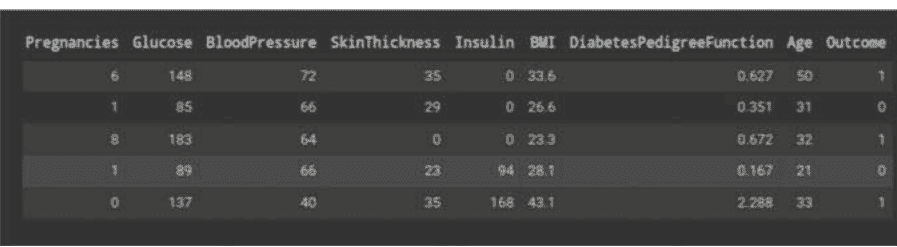

图2显示了用于训练模型和预测糖尿病视网膜病变的数据集属性。

## 5 实施

拟议的系统旨在展示疾病预测中的数据挖掘技术，用于糖尿病视网膜病变。它分为以下三个步骤实施。

- 探索性数据分析，用于发现隐藏模式，检测异常值，识别相关变量和识别数据中的任何异常情况。
- 使用多个算法构建模型，其中使用多个算法构建模型。
- 视网膜病变的预测，为模型创建检查点，产生最佳准确性和预测。
- 创建一个Web应用程序。

### 5.1 数据集

糖尿病视网膜病变的标准数据集来自Kaggle数据集。表1包含数据集的属性。

### 5.2 探索性数据分析（EDA）

探索性数据分析（EDA）是每个研究项目中至关重要的阶段。探索性研究的主要目标是在数据中寻找分布、异常和异常情况，以引发具体的测试。它还包括通过审查和理解数据来生成假设的工具，通常通过图形表示来完成。EDA旨在帮助专家识别常见模式。最后，突出的决策方法通常归类为EDA。EDA是在数据收集和预处理之后的关键阶段，在该阶段中，数据仅以显示、绘制和操作的方式呈现，而不做任何假设来支持数据质量评估和模型构建。大多数假设都支持数据质量评估和模型构建。

表1 数据集属性

| 属性 | Id |
|---|---|
| 属性1 | Id |
| 属性2 | 姓名 |
| 属性3 | 怀孕 |
| 属性4 | 葡萄糖 |
| 属性5 | 血压 |
| 属性6 | 高压 |
| 属性7 | 胰岛素 |
| 属性8 | BMI |
| 属性9 | 糖尿病 |
| 属性10 | 皮肤厚度 |
| 属性11 | 年龄 |

大多数EDA方法在图形上是图形化的，如图3所示，只有在必要时才会加入一些定量策略。之所以广泛依赖设计，是因为这一代的主要目的是进行分析，而图示能够为分析人员提供无与伦比的能力，同时能够获得证据的洞察力。研究中的信息被收集到一个矩形数组中，例如电子表格或数据集，通常每个试验对象占据一行，每个主题标识符、结果变量和描述性变量占据一列。每个列包含特定定量变量的数值特性或绝对因子的级别（一些更复杂的研究需要更复杂的数据结构）。研究的数据通常以矩形数组的形式收集，每个主题标识符、结果变量和科学变量占据一列。每列中都包含定量变量的数值特性或绝对变量的级别。这些方法中的大多数通过隐藏特定数据的同时揭示其他数据来工作。

有两种策略可以对探索性信息进行排序。首要的资格是每种方法要么是非图形的，要么是图形的。其次，每个系统都是单变量或多变量的（通常是双变量）。非图形方法通常包括计算摘要度量，但图形方法明显以图表方式总结数据。单变量方法一次探索一个变量（数据段）之间的关系，而多变量方法研究至少两个因素之间的关系。

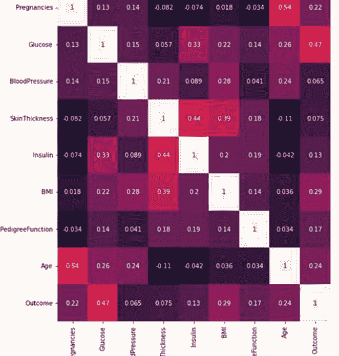

同时考虑两个因素。通常，多变量EDA是双变量的，但在特殊情况下可能包含至少三个因素。在完成多变量EDA之前，几乎总是明智的对多变量EDA的每个组成部分进行单变量EDA。每个EDA类别都有额外的分支，这取决于被评估的变量的功能和类型，以及前面交叉分类生成的四个类别。以下是EDA的目标简述：

- 尽可能多地了解数据库并理解其结构。
- 创建可能的链接（方向和大小）之间的可视化表示暴露和结果变量。
- 寻找异常值和异常值（与其他数据明显偏离的数字）。
- 构建简约模型或进行初步模型选择。
- 通过提取和创建它们生成临床上显著的变量。

探索性事实分析是研究和分析不同数据集的关键步骤[15]，以及总结其关键属性。EDA的应用可能有助于发现数据集中隐藏的模式，其在数据科学中的重要性不可低估。探索性数据分析通常用于发现隐藏模式，检测异常值，识别相关变量和识别证据中的任何不规则之处。此时，数据被清理和预处理，以去除缺失和空值记录。为了获得准确的结果，预处理识别并消除或替换数据集中仅占总数据的一小部分的缺失值。之后，数据集被预处理，清理后的数据用于训练。然后检查清理后的数据，并采取所有必要的步骤，例如从图像中消除噪声并将所有分辨率设置为相同。

图4展示了预测糖尿病视网膜病变模型的实现。

#### 数据准备有四个阶段：

- 第一阶段是数据清洗，包括修复或删除重复、格式错误或损坏的数据。
- 第二阶段是数据整合，将多个来源的数据合并为一个整体。
- 数据减少阶段是第三步，对数据进行编码、缩放和排序（如果需要）。
- 数据转换是最后一个阶段，将数据转换为所需的格式。

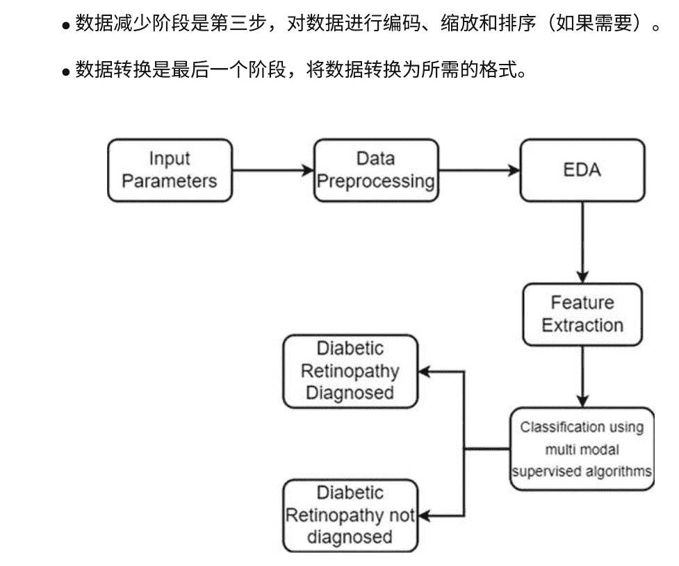

## 6 方法论

为了构建和测试模型，使用了五种算法，包括逻辑回归、随机森林、决策树、KNN和支持向量机。这些算法用于通过超参数调整来展示各个算法的准确性。本研究旨在比较五种算法在不使用超参数调整和使用超参数调整时识别糖尿病视网膜病变可能性的准确性。结果设计得使得使用超参数调整的算法的准确性高于不使用超参数调整的算法。

### 6.1 超参数调整

图5展示了超参数调整过程，以展示更高的准确性。在机器学习中，超参数调整或标准化是选择一组最佳超参数来优化模型的一个缺点。超参数是用来控制机器学习方法的参数。例如，“模型参数”和“模型超参数”这些术语被使用。模型超参数的一些用例包括训练神经网络的学习率。C和α超参数被用于支持向量机。模型可以有不同的超参数和不断变化的参数组合，这被视为一个追踪问题。

超参数标准化的两种常见方法是

- GridSearchCV
- RandomizedSearchCV

在这个分析中，超参数标准化被用来指出高准确性以识别糖尿病视网膜病变。

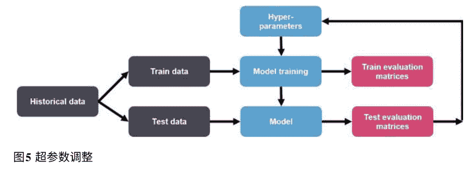

### 6.2 网格搜索交叉验证

图6展示了使用网格搜索交叉验证对数据集进行测试和训练。在网格搜索交叉验证方法中，机器学习模型可以根据多种超参数值进行估计。这种方法被称为网格搜索交叉验证，因为它从一组超参数值的网格中搜索流行的超参数集。

网格搜索交叉验证是Scikit-learn（或SK-learn）模型选择包中的一个功能。因此，需要将Scikit-learn库安装在计算机上。这个功能可以通过预定义的超参数循环，并根据训练集调整模型。

使用在线应用程序可以帮助用户通过提供信息来检测视网膜病变。用户可以在文本框中输入值。所有提供信息给检测器的用户都可以用来更新未来模型信息分析的构建。

## 7 算法

在这篇研究论文中，使用了一种监督式机器学习方法来检测一个人的糖尿病早期阶段。所使用的算法包括逻辑回归、随机森林、决策树、KNN和支持向量机。

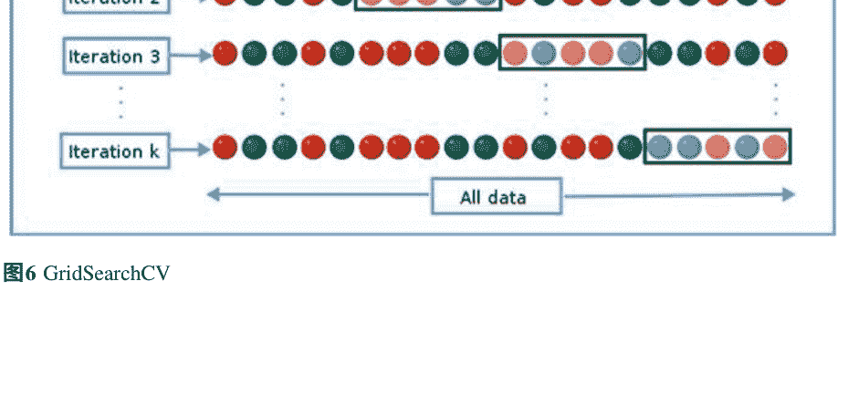

### 7.1 逻辑回归算法

逻辑回归是一种广泛使用的流行机器学习算法，属于监督学习。它用于使用给定范围的独立值变量来预测分类值。逻辑回归预测分类变量的情况。术语“逻辑”取自于在这种分类系统中使用的logit函数。在机器学习中，逻辑回归得到了图像结果。

逻辑回归是一种监督式机器学习算法，可用于建模类别或事件。它用于线性可分数据。这意味着逻辑回归通常用于二元分类问题。当你训练模型时，监督学习算法应该有输入变量（x）和目标变量（y）。

### 7.2 KNN算法

KNN又称为K最近邻算法，由机器学习管理。通过包含所有检查点，该类的基本目的是预测测试数据点。因此，数据挖掘已被用于分类、回归和缺失值估计。K-means是另一个最简单的算法，用于基于属性和特征值将图像分割和分类为不同的聚类。

有多种方法可以确定K-means的值，但运行算法的最简单方法是选择表现最佳的方法。在模型发展过程中，每个数据点都有最大的局部邻域，该邻域包含最多的数据点。世界上最大的数据点可以被视为包含所有数据点的邻域。为了继续对数据点进行封闭过程，选择的代表将覆盖数据点。

无论如何，该技术的精确k值在模型创建过程中不需要显示。某些邻域拥有的数据点数量被视为理想的k值，尽管在代表之间会有所变化。在模型创建过程中，k值会自动创建。此外，利用分类模型不仅可以减少待分类数据的数量，还可以逐渐提高效率。

该算法可以总结为：

- 将正样本与新样本一起考虑。
- 选择与新样本更接近的新条目。
- 找到最常见的分类，并将其添加为新样本。

### 7.3 决策树

决策树是最流行和强大的分类和预测算法。正如其名称所示，决策树是一种类似树状结构的图形，可以根据树状图来确定结果。本研究特别关注决策树算法。神经网络中节点之间的数值权重更难以创建概念原则。在数据挖掘中，决策树被用作常见的分类方法。由于其易用性和对多种数据类型的准确性分析，决策树提供了广泛的应用范围。决策树是用于对数据进行分类的递归分割实例。在简单和最常见的情况下，每个测试值评估一个属性。条件是指数组值属性的范围。

决策树在几何上理解超平面的集合。自然地，决策者更喜欢简单的解决方案，因为它们更容易理解。在这个模型中使用决策树的原因如下：

- 决策树在简化后易于理解和遵循。
- 决策树可以处理容易出错的数据集。
- 决策树可以处理名义和数值输入。
- 决策树可以处理缺失值。
- 决策树算法是一种非参数方法，它对分类器的分布空间和结构做出了假设。
- 训练时间比神经网络算法快。
- 决策树代表可以包含任何离散值分类器。

### 7.4 随机森林

它是一种监督式机器学习算法，可以解决回归和分类等问题。在出现回归的情况下，它在许多示例上组合决策树，并根据它们的多数投票结果进行排序和归一化。随机森林算法通过结合许多决策树的结果来创建最终结果。它侵蚀了打包规则，从测试准备数据中创建一个替代训练子集，并且最终结果在很大程度上依赖于投票。

树依赖于在整个森林中独立且均匀评估的任意向量的好处。对于森林来说，猜测错误会变得很大，尽可能大。森林中个体树的能力以及它们之间的相互关系对于树分类器的假设错误至关重要。生成随机数的一种方法是随机森林算法。正如其名称所示，计算未注册的联合分布值。主要目标是确定用于预测值的预测函数。

### 7.5 支持向量机

支持向量机（SVM）学习公式可以用于每个分类和回归问题。SVM是一种用于分类和回归问题的直接模型。它能够解决线性和非线性问题，并且在各种实际问题中表现良好。

scikit-learn是一种广泛可用的实施机器学习算法的方法。支持向量机在scikit-learn库中也非常有用，适用于模型训练和验证。SVM通过将数据映射到高维空间中，使得数据点可以被线性分割，因此当数据不是线性可分时，在高维空间中它可能是线性可分的。类别之间的分割是一个超平面，但同时数据也以这样的方式重构，以便分割可以被绘制为超平面。

## 8 带有超参数调整的算法

### 8.1 逻辑回归

逻辑回归类别来自sklearn，利用训练集形成模型，并利用测试集来收集每个测试样本的预测结果。测试集用于评估您准备好的模型的性能。这是一种评估模型的好方法，但可能并不能给出真实的模型性能。正如您可能记得的那样，测试集中的数据可能会被丢弃，并且使用它来评估模型可能会提供不真实的结果。创建一个没有传递任何初始化器的逻辑回归类的实例。下面解释了使用的术语：

- 惩罚 - 指定惩罚的类型。
- C - 正则化强度的倒数；较低的值确认更强的正则化。
- 求解器 — 在优化问题中使用的算法。
- max_iter — 解决复杂问题所需的最大迭代次数。

图7显示了具有超参数调整技术的逻辑回归算法的准确性。

### 8.2 KNN算法

KNN算法本身相对简单直观。一旦将数据点和给定的K值传递给算法，它会搜索最近的K个邻居。

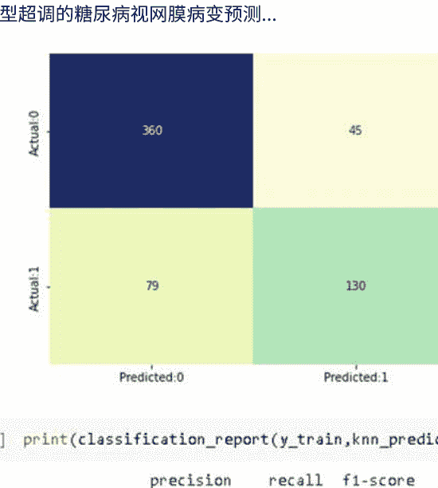

```
print(classification_report(y_train, knn_predict))
```

|           | precision | recall | f1-score | support |
|-----------|-----------|--------|----------|---------|
| 0         | 0.82      | 0.89   | 0.85     | 405     |
| 1         | 0.74      | 0.62   | 0.68     | 209     |
| accuracy  |           |        | 0.80     | 614     |
| macro avg | 0.78      | 0.76   | 0.77     | 614     |
| weighted avg | 0.79   | 0.80   | 0.79     | 614     |

图7 逻辑回归的超参数调整混淆矩阵

以找到K个最近的邻居。最接近的邻居是通过给定数据点与原始数据集中的数据点之间的距离来确定的。

首先开发了一个KNN分类器实例，并准备了一系列从1到31的超参数K的值，这些值将由GridSearchCV用于找到最佳值。同样，交叉验证批次大小设置为cv=10，并根据需求设置评分标准。图8是截图，显示了具有超参数调整技术的KNN算法的准确性。

### 8.3 决策树

决策树是安排类别的最理想方式。它们是直接或白盒分类器，这意味着可以观察到决策树背后的逻辑。GridSearchCV是主要组件，用于找到流行的超参数。网格搜索边界的值可以是包含Python词典的列表。关键是边界的名称。

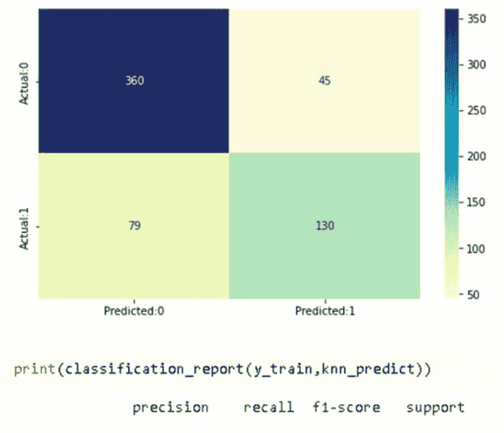

```
print(classification_report(y_train, knn_predict))
```

```
              precision    recall  f1-score   support

           0       0.82      0.89      0.85       405
           1       0.74      0.62      0.68       209

    accuracy                           0.80       614
   macro avg       0.78      0.76      0.77       614
weighted avg       0.79      0.80      0.79       614
```

图8 使用超参数调整的混淆矩阵对KNN进行调优

决策树在边界上的各个优势中。这创建了一个可以视为美丽边界值的表格。有一个决策树分类器的文章或模型。网格搜索在评分样式上使用了智能的分段执行规则。在这种情况下，使用了分段错误和群组数量、模型或项目以及边界值。一些作品包括不同边界值的不同分数。在这种情况下，分段错误以及具有最新分数的边界值。

图9展示了决策树算法在超参数调优技术下的准确性。

### 8.4 随机森林

超参数和相应的最新方法来处理，精细调整规定了每个超参数的各种值。随机森林允许缩小每个超参数的范围。由于追踪的位置变得如此明显，可以明确指定每个设置的组合以进行尝试。

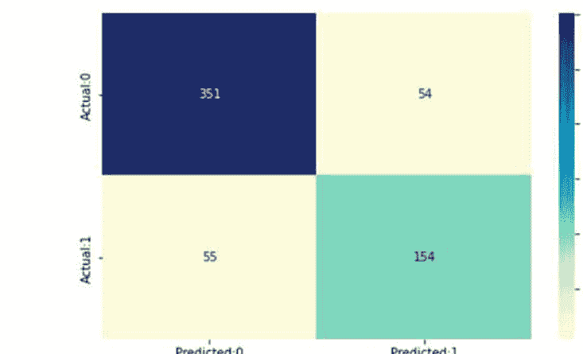

```
print(classification_report(y_train, tree_predict))
```

|        | precision | recall | f1-score | support |
|--------|-----------|--------|----------|---------|
| 0      | 0.86      | 0.87   | 0.87     | 405     |
| 1      | 0.74      | 0.74   | 0.74     | 209     |
| accuracy |          |        | 0.82     | 614     |
| macro avg | 0.80    | 0.80   | 0.80     | 614     |
| weighted avg | 0.82 | 0.82   | 0.82     | 614     |

图9 使用超参数调优的混淆矩阵与决策树

这是通过GridSearchCV完成的，这是一个从分布中粗略采样的框架，评估了所有定义的组合。使用Scikit-Learn的RandomizedSearchCV框架，可以定义一组超参数范围，并从分布中随机测试，对每个值进行K-Fold CV。

图10是屏幕截图，显示了在超参数调优技术下随机森林算法的准确性。

### 8.5 支持向量机

机器学习模型被描述为具有不同参数的精细模型，这些参数应该从数据中学习。然而，有几个被称为超参数的边界，人们无法完全了解。GridSearchCV接受一个描述可能尝试模型的超参数的网格。

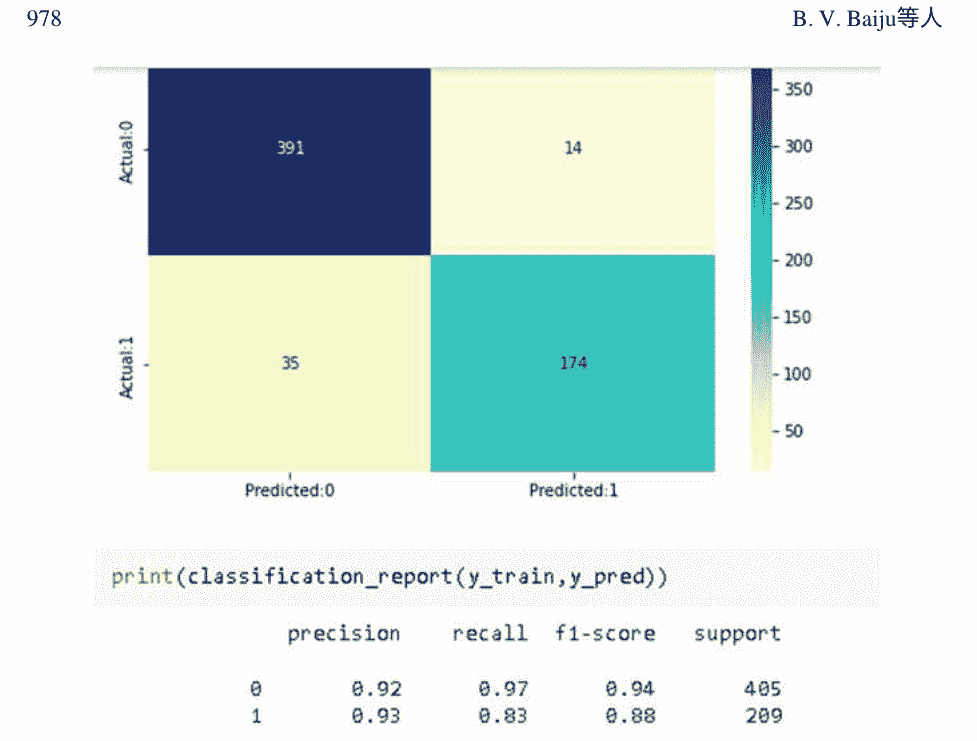

```
print(classification_report(y_train, y_pred))
```

|          | precision | recall | f1-score | support |
|----------|-----------|--------|----------|---------|
| 0        | 0.92      | 0.97   | 0.94     | 405     |
| 1        | 0.93      | 0.83   | 0.88     | 209     |
| accuracy |           |        | 0.92     | 614     |
| macro avg| 0.92      | 0.90   | 0.91     | 614     |
| weighted avg | 0.92  | 0.92   | 0.92     | 614     |

图10 随机森林超参数调整的混淆矩阵

将其组织起来。超参数的网格被描述为一个字典，其中键是超参数名，值是设置列表。

本文展示了如何使用GridSearchCV搜索网格来找到最佳的超参数组合，从而改善模型性能。 GridSearchCV的一个重要影响是它是一个元估计器。它接受一个类似SVC的估计器，并创建一个完全相同的估计器网格，就像一个分类器一样。

`refit=True`应该被添加，并且需要选择任何数字。数字的发展越高，计算开销越高（这里指交叉验证过程）。

图11显示了支持向量机算法在超参数调整技术下的准确性。

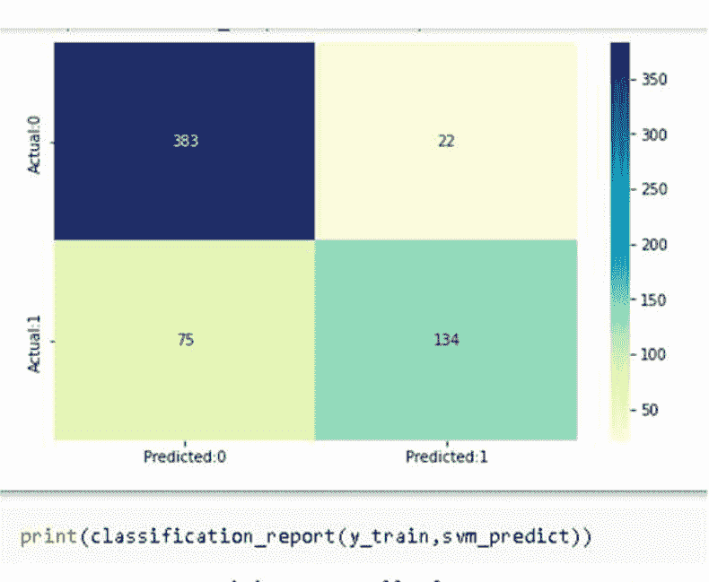

图11 SVM超参数调整的混淆矩阵

```
print(classification_report(y_train, svm_predict))
```

```
              precision    recall  f1-score   support

           0       0.84      0.95      0.89       405
           1       0.86      0.64      0.73       209

    accuracy                           0.84       614
   macro avg       0.85      0.79      0.81       614
weighted avg       0.84      0.84      0.83       614
```

### 8.6 伪代码

**基于机器学习的负载均衡算法的算法伪代码**

```
输入：任务数量c，设置池Xp，最大评估次数n_max，起始示例大小n
X_out ← 从X_p中选择n_max个不同的配置
Y_out ← 并行评估(c，X_out)
M ← 拟合(X_out，Y_out)
X_p ← X_p - X_out
for i ← n+1 到 n_max do
    Y_p ← 预测(M，X_p)
    x_i ← 在X_p中运行时间最短的配置
    y_i ← 评估(c, x_i)
    使用(x_i, y_i)重新训练M
    X_out ← X_out ∪ {x_i}
    Y_out ← Y_out ∪ {y_i}
    X_p ← X_p - {x_i}
end for
输出：在Y_out中运行时间最短的配置
```

**算法5 多任务协同训练**

```
m_train = train_model(L)
repeat
    for i in {1..3} do
        L_i = ∅
        for x in U do
            if p_j(x) = p_k(x) for (j, k) ≠ i then
                L_i = L_i ∪ {(x, p_j(x))}
            end if
        end for
        if |L_i| ≥ 3 then
            m_i = train_model(L_i)
        else
            m_i = train_model(L ∪ L_i)
        end if
    end for
until 满足结束条件
对m_i进行多数投票
```

## 9 模拟和分析

已创建一个应用程序，能够分析所有输入数据，使用不同的技术处理数据，然后准确预测人是否被诊断为糖尿病视网膜病变。 最佳模型被保存并用于预测。 验证结果显示在图12、13和14中。 使用预训练模型预测用户提供的文件。 预测模型的准确率超过95%。

视网膜病变最终被检测出来并显示在GUI上，以便患者了解他目前面临的疾病状况。

为模型创建检查点，以产生最佳准确性，并进行预测。

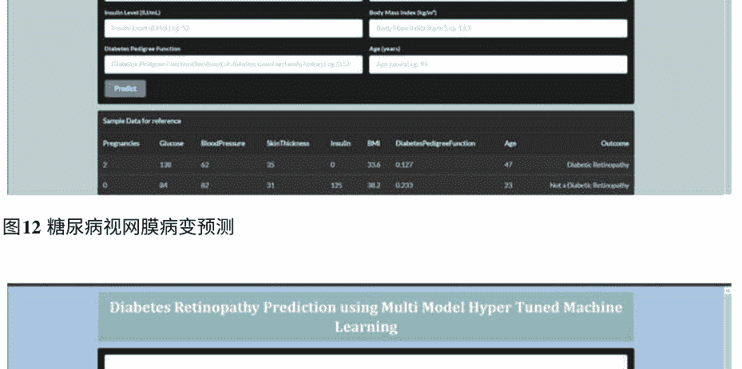

图12 糖尿病视网膜病变预测

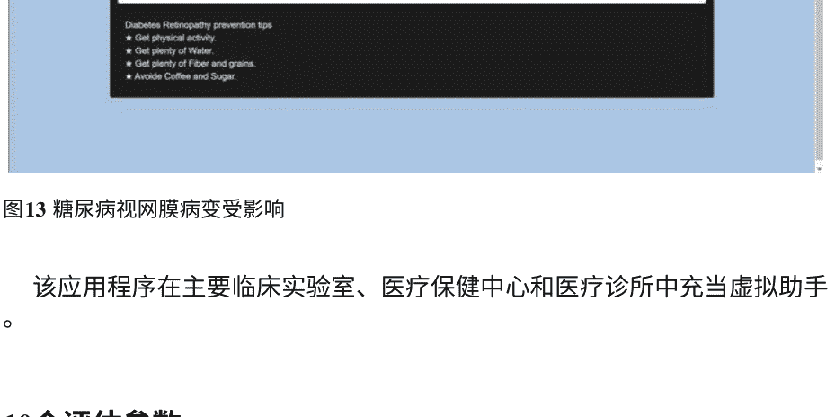

图13 糖尿病视网膜病变受影响

该应用程序在主要临床实验室、医疗保健中心和医疗诊所中充当虚拟助手。

## 10 评估参数

### 10.1 精确度

精确度是机器学习模型性能的度量标准。 它衡量了模型正面预测的准确性。 精确度通过将总正面预测数除以真正正面数（即真正正面数加上假正面数）来计算。

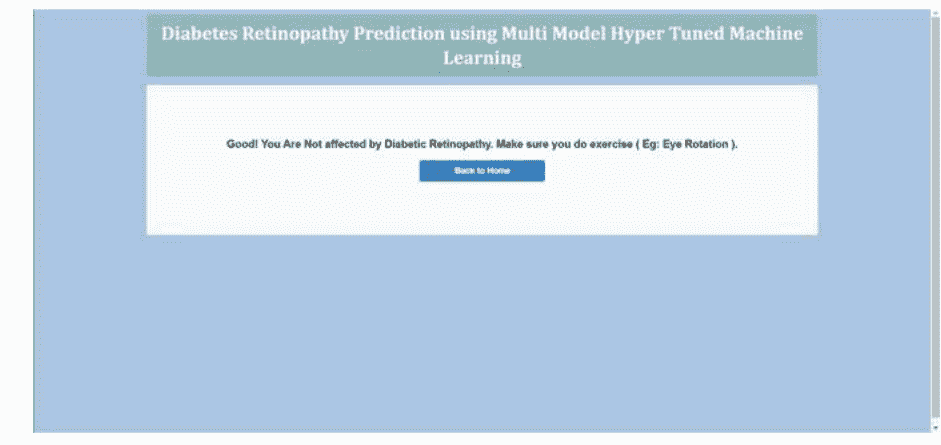

图14 糖尿病视网膜病变未受影响

```
精确度 = TP / (TP + FP)
```

- TP — 真正阳性
- FP — 假阳性

### 10.2 混淆矩阵

混淆矩阵是分类问题预测结果的总结，如图15所示。正确和错误的预测数量被统计并按类别进行划分。混淆矩阵的关键在于它展示了分类模型在进行估计时可能被误读的各种方式。

- FN — 假阴性
- TN — 真阴性

图15 混淆矩阵公式

| Predicted Values \ Actual Values | Positive (1) | Negative (0) |
|----------------------------------|--------------|--------------|
| Positive (1)                     | TP           | FP           |
| Negative (0)                     | FN           | TN           |

### 10.3 召回率

召回率是正确分类为正例的正例数量与总正例数量之间的比例。召回率评估了模型识别正例的能力。召回率越高，模型识别正确的正例越多。

```
召回率 = TP / (TP + FN)
```

### 10.4 F1得分

精确度和召回率的加权平均值即为F1得分。因此，该得分考虑了假阳性和假阴性。尽管F1得分不如准确度直观，但在类别分布不均匀的情况下，F1得分通常比准确度更有用。当假阳性和假阴性具有相等的代价时，准确度效果良好。最好同时考虑精确度和召回率，如果假阳性和假阴性的代价差异显著。

```
F1得分 = 2 * (召回率 * 精确率) / (召回率 + 精确率)
```

## 11 结果

该研究论文旨在通过超参数调整比较五种算法，以识别可能患有糖尿病视网膜病变的患者。结果设计得如此，以使使用超参数调整的算法显示出更高的准确性。图16是比较图，显示了使用超参数调整方法的每个算法的整体准确性，可以得出结论，与其他算法相比，随机森林算法具有较高的准确性。

## 12 结论

糖尿病视网膜病变（DR）是糖尿病患者中最常见的导致视觉丧失的疾病。DR是最常见的糖尿病眼部疾病，导致驾驶视力障碍和视力减退。患有糖尿病的患者必须进行定期眼部筛查。因此，本文提出了一种机器学习模型预测初始阶段的DR。与其他具有超参数调整技术的机器学习算法相比，随机森林算法在考虑十个明确因素时实现了最有效的执行。

## 参考文献

1.  Baiju, B. V., & John Aravindhar, D. (2019). 基于影响度量的糖尿病数据多属性相互依赖关系聚类和疾病预测。Journal of Green Engineering (JGE), 9(1), 136–148。
2.  Kamble, V. V., et al. (2022). 使用径向基函数进行自动糖尿病视网膜病变检测。在国际计算智能和数据科学会议 (ICCIDS 2019) 中发表(Vol. 167, pp. 799–808)。 https://doi.org/10.1016/j.procs.2020.03.423。
3.  Kharat, A. P. B. G. U. (2015). 使用MLP分类器检测视网膜图像中的糖尿病视网膜病变。在IEEE纳米电子和信息系统国际研讨会上(pp. 331–335)。 https://doi.org/10.1109/INIS.2015.30
4.  Fiami, C., 等 (2019). 使用数据挖掘算法分析和预测糖尿病并发症疾病。Procedia Computer Science, 161, 449–457. https://doi.org/10.1016/j.procs.2019.11.144
5.  Khan, F. A., 等 (2021). 使用数据挖掘检测和预测糖尿病：综述。IEEE Access, 9, 43711–43735。 https://doi.org/10.1109/ACCESS.2021.3059343
6.  Han, J., 等 (2018). 基于参数优化 SVM 的糖尿病视网膜病变分类器设计。国际智能信息学与生物医学科学会议(ICIIBMS)(pp. 52–58)。 https://doi.org/10.1109/ICIIBMS.2018.8549947
7.  孙，Y., & 张，D. (2019)。 基于电子健康记录的糖尿病视网膜病变的诊断与分析。IEEE Access, 7, 2169–3536。 https://ieeexplore.ieee.org/stamp/stamp.jsp?tp=&arnumber=8721113
8.  Kalyani等 (2021)。 使用胶囊网络进行糖尿病视网膜病变检测和分类。复杂和智能系统。 https://doi.org/10.1007/s40747-021-00318-9
9.  Yadav，J., 等 (2017)。 使用前馈神经网络进行糖尿病视网膜病变检测。在2017年当代计算国际会议 (IC3) (pp. 1–3)的论文集中。 https://doi.org/10.1109/IC3.2017.8284350
10. Pratt, H., 等 (2016)。 用于糖尿病视网膜病变的卷积神经网络。Procedia Computer Science, 90, 200–205。 在国际医学成像理解和分析会议上。 https://doi.org/10.1016/j.procs.2016.07.014
11. Deepa, V., 等人 (2021). 多阶段深度卷积神经网络集成用于糖尿病视网膜病变图像补丁的自动分级。Journal of King Saud University— Computer and Information Sciences, 1319–1578. https://doi.org/10.1016/j.jksuci.2021.05.009
12. Sreng, S., 等人 (2017). 基于形态学操作和支持向量机的糖尿病视网膜病变初筛。在智能信息与生物医学科学国际会议上 (ICIIBMS)(pp. 250–254). https://doi.org/10.1109/ICIIBMS.2017.8279750
13. Vijaya Kumari, V., 等人 (2010). 早期检测糖尿病视网膜病变的特征提取。在国际信息、电信和计算近期趋势会议上 (pp. 162–166). https://doi.org/10.1109/
14. Santos, C., 等。 (2021). 基于深度学习的新方法，使用YOLOv5在视网膜图像中检测病变。在IEEE国际生物信息学和生物医学会议（BIBM）上发表(pp. 3513–3520)。 https://doi.org/10.1109/BIBM52615.2021.9669581
15. Kavakiotis, I., 等。 (2017). 机器学习和数据挖掘方法在糖尿病研究中的应用。计算和结构生物技术杂志, 15, 104–116. https://doi.org/10.1016/j.csbj.2016.12.005
16. Nagpal, D., 等。 (2021). 糖尿病视网膜病变综述：数据集、方法、评估指标和未来趋势。沙特国王大学计算机与信息科学杂志。ISSN 1319-1578. https://doi.org/10.1016/j.jksuci.2021.06.006
17. Anwar, F., 等人 (2020). “使用不同方法进行糖尿病诊断的比较分析”——一项调查。在医学解锁中的信息学(第21卷)。 ISSN 2352-9148. https://doi.org/10.1016/j.imu.2020.100482
18. Goa, J., 等人 (2019). 使用高效卷积神经网络进行糖尿病视网膜病变分类。在IEEE国际代理人会议上(第80-85页)。 https://doi.org/10.1109/AGENTS.2019.8929191
19. Gadriye, D., & Khandale, G. (2014). 基于神经网络的糖尿病视网膜病变诊断方法。在2014年国际计算智能和通信网络会议上, 印度博帕尔 (第1073-1077页)。 https://doi.org/10.1109/CICN.2014.2
20. Abdelmaksoud, E., 等。 (2021). 基于检测多个视网膜病变的自动糖尿病视网膜病变分级系统。IEEE Access, 9, 15939–15960. https://ieeexplore.ieee.org/document/93284## 使用Haar级联算法的机器学习进行口罩检测和社交距离

T. Sangeetha, V. Miruthula, C. Kavimalar和V. Aakash

摘要 COVID-19确实是一个值得报道的新闻，因为它已经成为全球紧急情况并且正在迅速传播。佩戴口罩并保持身体距离是世界卫生组织推荐的明智之举。感染COVID-19的人呼吸困难，呼吸急促。参与者的环境元素可能会被传染性飞沫污染。佩戴口罩并遵守社交距离是强制性的，但许多居民忽视规定。在这种情况下，对面部覆盖物进行定期检查是公开的，而且强制罚款是正常的。由于人脸识别已经成为一种敏感的生物特征识别过程，它已经广泛应用于监控、安全、自动驾驶等领域。随着深度学习模型的快速发展，目标检测器非常适合用于社交距离和面部遮挡检测器，以通过闭路电视和监控摄像头指导人群。本文研究了不同的深度学习模型来开发这些检测器。本研究回顾了当前用于监测和人员定位的检测模型。通过综合的方式形成了一阶段和两阶段的识别器以及它们的应用和性能。

关键词 社交分离 · COVID-19 · 口罩检测

## 1 引言

根据分析师的说法，这种感染可以在与受影响的个体密切接触时传播。因此，与其他许多传染性呼吸道感染一样，科学家建议在所有可能的情况下避免密切接触，因为通过空气传播和飞沫传播感染的机会非常容易发生。因此，为了遏制COVID的传播，科学家提出了一种新的公认做法，即社交距离或物理距离，如图1所示。这一举措被认为是控制病毒传播的非常有帮助的措施。

它确保了公共范围内的人类互动最小化。通过对意大利和西班牙在公共封锁期间和解封后的确诊和死亡病例进行时间序列统计分析，评估了这一社交措施的有效性（Tobías, 2020; Saez, Tobias, Varga和Barceló, 2020）。结果表明，在这两个国家实施社交隔离后，报告的病例明显减少。

冠状病毒主要通过呼吸道飞沫从一个人传播到另一个人。呼吸道飞沫会因咳嗽、打喷嚏、说话、大声喊叫或唱歌而飞得很高。这些飞沫可以落在他人的口腔或鼻子上，或者被他人吸入。

因此，戴口罩对于防止病毒传播至关重要。口罩是一种基本的屏障，可以防止呼吸道飞沫传播给他人。研究表明，戴口罩可以减少飞沫的喷射量。遵守社交距离的规定并对人们佩戴口罩进行检查不仅具有资源消耗，而且可能导致人为错误。


然而，这也可能导致人为错误。我们迫切需要一种解决方案来控制病毒传播，通过学习最佳的社交距离标准来指导公众。这包括检测社交距离违规和面部口罩分类，以确定公民的安全情况，通过检查是否保持足够的距离和是否使用面部口罩。这个系统在各种公共场所都有广泛的适用性，例如超市、加油站和交通信号灯。这为使用监控系统进行各种大规模应用提供了处理技术。

在规范曲线方面，社交隔离已经成为一项有效的社交措施。它避免了人与人之间的直接接触，并有助于减少通过人类呼吸传播病毒的飞沫。一些研究对通过人类呼吸途径传播飞沫的方向进行了初步的研究，如咳嗽、说话、打喷嚏和进食。

虽然一些研究认为飞沫大小与传染病的微生物有关，他们认为大飞沫是从感染者身上传播微生物的飞沫（Christian et al., 2004; Mangili and Gendreau, 2005），而其他研究则认为核心结构中的微粒的小飞沫是远程传播的飞沫。生物、临床和工程等因素也需要考虑到上述问题。因此，在考虑了这么多因素之后，建议安全社交距离的距离应该是6英尺，或者至少是2米。有人认为这个距离还不够，需要增加。尽管最后的距离被认为是2米，并在全球范围内实施，成为一道成功的屏障，但现在在一些康复国家，这个距离已经缩短到1米3。因此，考虑到这么多因素，本研究项目提出了一种基于人工智能的检测系统，可以帮助检测任何违规行为。本研究旨在构建一个可以应用于实时系统的模型，从而帮助防止病毒的传播。

## 2 文献综述

因此，为了防止COVID-19的快速传播，大多数世界各国政府提出了许多措施，如限制和封锁。然而，这种COVID-19管理的无效性可以通过超越公共产品博弈的博弈理论情景进行更深入的研究。

具体而言，一些研究人员关注政府在制定困难但必要的疫情管控措施（例如居家令和封锁）时的不愿意，以及由于其他原因而导致的不合作行为，而不仅仅是自由骑车。

例如，[1]中的作者认为，严格的居家措施可能会对人们的生计产生重大影响，呆在家里的成本（加上封锁的不安全性）可能会抵消外出感染的风险。由于个人层面的决策直接影响居家令的整体有效性，政府可能会因为预期的低遵从率而不采取这些措施，尤其是经济困难的人们无法享受呆在家里的好处[2]。

一些州可能也相信，从康复和疫苗中获得群体免疫力将使他们完全避免实施这些令人不快的措施[3]。

随着病例数量的增加和卫生部门的扩大，以及2020年始终没有疫苗和实现COVID-19群体免疫力的困难[4]，政府的不作为变得越来越不可行。因此，为了增加人们对严格指南的遵守，[5]中的作者建议使用社会计划，如紧急救济资金和失业保险，降低遵守成本，特别是对于低收入工人[6]。

随着2020年末疫苗的推出，[7]中的作者认为，推动接种疫苗的计划将超过疫苗有效性和隔离措施等其他方面的重要性。

利用EGT、社交网络分析和基于专家的建模，作者建议人们的免疫活动将受到“社会经济因素、实际位置、组织程度、抗体健康状况、疫情参数以及疫苗信息的影响，相应地，政府的决策也将受到疫情参数、疫苗性质、综合因素、疫苗接种所需的人力资源管理以及可用疫苗剂量的影响”[8]。

在[9]中，提出了一种基于深度卷积模型的创新智能方法，用于保护人们免受COVID-19的影响。该系统可以自动检测人们是否遵守安全规定。

在[10]中，对不同的深度学习方法进行了详细研究，以监测临床影像中的疾病。在另一项研究中[11]，提出了一种基于温度感应、口罩识别和社交距离的物联网系统，用于防止COVID-19的传播。Arduino Uno用于红外温度感应，而Raspberry Pi用于口罩识别和基于计算机视觉的社交距离检测。

在[12]中，通过图像预处理、人脸检测和图像超分辨率来提出了一种富有想象力的口罩识别方法。该框架被认为在准确性方面特别出色。[13]提出了一种深度卷积神经网络模型，可以在恶劣的光照条件下观察个体和社会的距离。从速度和准确性的角度来看，这种方法被认为优于许多过去的方法。[14]基于计算机视觉的深度学习方法来持续观察口罩和社会距离的位置。

该模型是在树莓派上创建的，用于演示各种步骤。它旨在保护机会并减少COVID-19的传播。在[15]中，基于物联网的深度学习模型适用于COVID-19的识别。通过将该模型应用于胸部X射线，可以检测传染性疾病。临床医生对COVID-19的简要识别已被证明非常准确，因此非常方便。[16]的作者提出了一种基于手机结构的识别框架，可以使用K最近邻算法来分离四种不同类型的元素。从精确性、准确性和可见性的角度来看，这种结构被认为非常出色。

### 3 现有方法

在一个开源过程中，计算机视觉被提出用于识别隐藏的人。这种策略被认为在现代应用中特别有效。致力于物联网和相关传感器以追踪和控制感染。本综述根据COVID-19监测传感器提供了对电子健康管理的深入理解，并概述了后流行时代的新型物联网网络。本综述探讨了用于检测COVID-19的创新技术。审查还强调了实现这些成就面临的挑战。

审查的进展包括可穿戴传感器用于筛查COVID-19患者，包括与X射线相关的深度学习、体外诊断和物联网。通过考虑具有高光反射的R-CNN策略以及区域建议和约束和特征字段的分离，实现了对普通口罩佩戴者的识别。R-CNN调整方法被认为非常准确。

### 4 提出的模型

为了作为首要任务或真正减缓对公共安全造成伤害的环境因素，我们建议在与真实存在的人密切接触的情况下，使用一台高效的数据处理机器来查找两个可靠的公共分离和面部遮罩，并在模型开始之前将其放置在模型前面以筛查独特的兴趣和发现通过视觉硬件的攻击[15]。除了向公众发出警报外，在这个提出的结构中，如图2所示，我们还设计了口罩识别，它显示人们在进入他们喜欢的区域之前正确佩戴口罩，并且该模型使用Haar级联用于精确步骤。

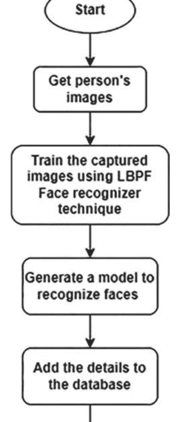

图2 所提出系统的块图

#### 4.1 人脸口罩检测器

该方法的准确率高达95.77%。我们通过MaxPooling进行检查，这使得内部图像的不变性更容易理解，并减少了模型需要检测的边缘数量。这种局部采样过程的示例不能充分模拟包含过去事件书面描述的新闻图像，以减少吸引力的代价。神经元的数量具有渐进值100，不过度极端。随着神经元和通道数量的增加，可能会发生更多的错误执行。更新的通道原则和拉取内容将有助于正确识别重新训练后的封面流量中的主体（面部）。第一个标志由150人评价。我们的模型可以处理大约55毫秒的加速度，在美国的典型覆盖范围为18.1帧每秒。

通过持续的实验方法，该模型显示出100个样本的准确性。假设一个人用手遮住洞口，这表明口罩没有被识别出来。

#### 4.2 人脸识别

当前效果来自于COVID视觉在呼吁时。使用LBPH人脸识别程序对捕获的图像进行建模，以获得现在和过去之间的结果。安排后，我们创建一个模型，以便我们可以看到脸。最后，将特征添加到我们的特征库中。在修改名词的第一个顶级词时进行实验，我们还拍摄了150个样本来形成一个人脸识别模型。在拟合模型之后，我们依赖于LBPH人脸识别系统来实现效果。该模型能够准确识别人脸。因此，该模型的准确率为90%。人脸识别框架包括三个主要阶段：人脸检测、特征提取和人脸识别。使用Haar级联分类器识别人脸检测和图像裁剪。人类图像的预处理与图像中存在的元素分开。

特征提取：使用LBPH在识别的人脸上提取特征。首先注册并行社区模型的图像，然后绘制直方图。分割因子由LBPH模型控制，倾向于分配给先前拍摄的图片，后续应用AI判断进行查看或构建。我们使用LBPH人脸认证过程训练拍摄的照片。模型的LBPH或局部二值模式直方图展示了固有的绝对诚实性。

您可以在照片中影响近距离对焦，并获得出色的结果（主要是温度控制）。对于单调的暗伽马变化非常有效。这可能是所有OpenCV库的一个独特能力。LBPH使用展开用于组装一个圆形双环境模型，并表示相对于焦点区域的区域。测试套件专注于间接构建近似的双重。您激活的实例关注越多，计算费用越高。带有平坦标题的容器放置。容器越多，网络越好，后组件头部覆盖率越高。顶部标题中的丰富容器。与Grid X相同的容器主体扩展规则。

### 5 社交距离

社交距离算法的流程如图3所示。绘制一个带有社交距离的绿色框，如图4所示。当前的发现来自于申诉期间的COVID视觉。所有的含义都假设一个适应COCO数据集的模型。我们展示了我们出色的行人检测器，并准备好检查绿色和红色边界框。即使两个点2之间的距离很大，这个模型也会在人口中间产生赞美。

统治阶级略有超出。控制明确的知识领域通过直播公开泄露。边界设置为50，因为数据集点在程序执行过程中增加。没有这样的限制，它可能会根据视频摄像机的视角而改变。当摄像机从远处观看时，由于精度损失而产生的误差应该大大减少，因为摄像机在群组中正确安装。为了测试检测器的准确性，一些场景是从三个闭路电视摄像头实时拍摄的。第一个安全摄像头在学校启动，第二个在酒馆，第三个在公共区域。

这三台相机的电影可靠性持续了两个小时。这个项目也被三个独立的评论员解释，以验证检测器的准确性。

三位独立分析师的平均感知是恒定的。我们的检测准确率为96.49%。Haar级联模型使用COCO数据集。在基本步骤中，我们查询该数据集上的区域模型，以消除每个人的边界框。下一步是识别和系统化Haar级联的结果。它们通常都在链接的盒子中，但为了简单起见，我将概述边界框的重点。在此步骤之后测量欧氏距离。为了度量这个距离，我们实际上要消除每个中心的坐标。这个挑战的机会可以在构成中的所有边缘上完成。然后，我们取结果数字的总费用。这些边缘的关键结果是它们的x和y坐标。最后，我们利用x和y坐标测量欧氏距离。

欧几里得距离通过以下方式计算出来：利用这个规定，我们能够测量所述网络与外壳组之间的距离。在判断了欧几里得距离之后，我们必须保持一个基本的人际距离观念。

## 6 结果

验证结果显示在图5、6和7中。

## 7 结论

随后，通过追踪和了解污染情况，本文可以从两个方面发挥作用：公共隔离可以降低COVID的传播；口罩有助于防止空气传播的有效综合征。为了支持这项研究，本研究提出了一种基于人工智能的持续方法，用于友好隔离和口罩检测。通过获取视频轮廓的ROI和忽略和非迫害行为的物体数量，还验证了群体直径。

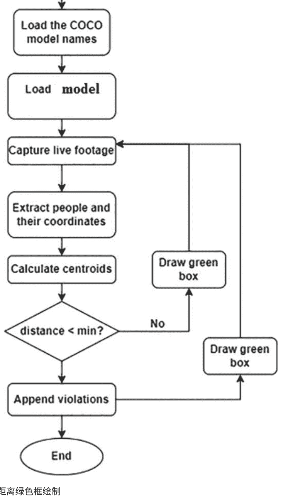

图4 社交距离绿色框绘制

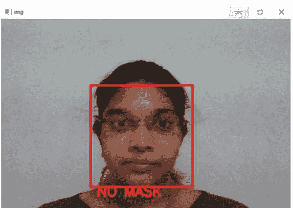

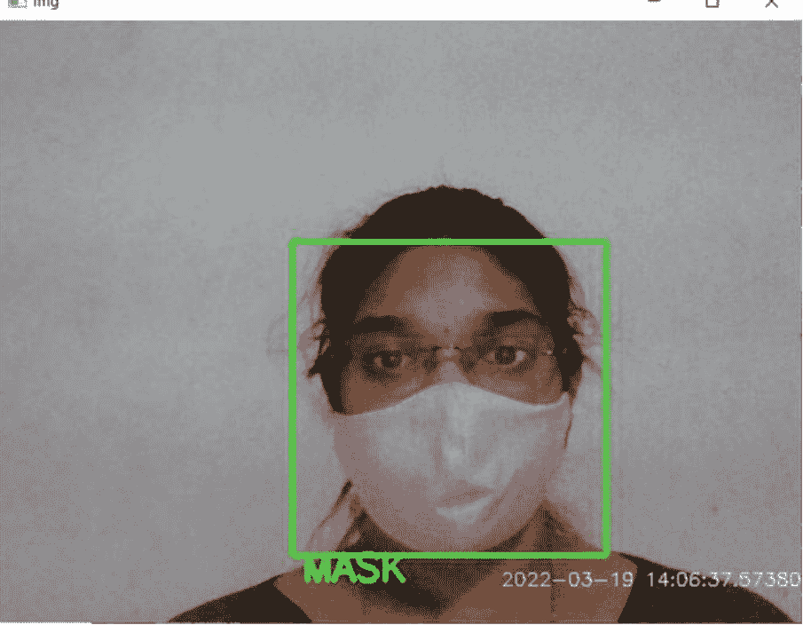

收到的后果是确切的，永无止境的。这个普遍的实验是为了扩展，并且在此期间收集有关这个实验的信息。许多国家仍处于隔离阶段，尽管有些国家已经完成了隔离阶段，并采取了公共杀菌措施。社交隔离可能已经完成

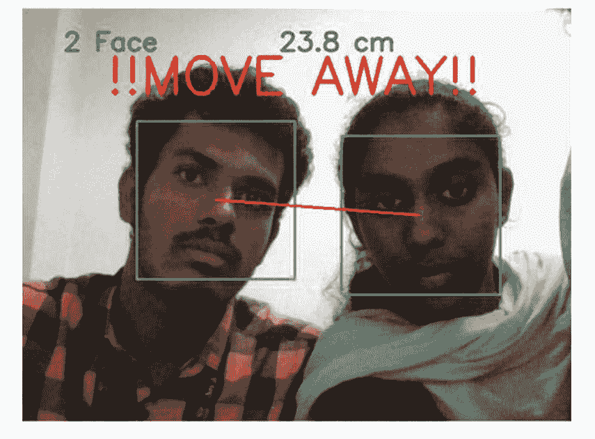

图7 社交距离的实时示例

在某些国家，活动仍在进行中，可能需要适应新的常态。

## 参考文献

1.  Petrović, L. and Kocić, D. (2020). 基于物联网的COVID-19家庭安全监听方案（预印本），Ic ETRAN (pp. 1–6). 即将出版。
2.  Qin, B., & Li, D. (2020). 利用面部表情优秀决策分类网络识别戴口罩的情况，以防止COVID-19. 传感器, 20(18)。
3.  Rezaei, M., & Azarmi, M. (2020). 深度社交：公众在COVID-19全球范围内超越倾听和污染风险评估. 应用科学, 10(21), 7514。
4.  Yadav, S. (2020). 深度教育位于可靠友好的超越和口罩发现诚实地面对COVID-19安全指南的奉献. 国际应用科学与工程技术研究杂志, 8(7), 1368–1375。
5.  Ahmed, I., Ahmad, A., & Jeon, G. (2020). 用于COVID-19早期估计的物联网深度教育基础. IEEE物联网杂志, 8(1)。
6.  Rao, T. V. N., Sai, G. V., Chenna, M., & Reddy, M. S. (2020). 使用OpenCV进行COVID-19口罩发现的请求. 高技术通信, 26(7), 965–975。
7.  Loey, M., Manogaran, G., Taha, M. H. N., & Khalifa, N. E. M. (2021). COVID-19普及阶段的面罩发现伴随机器智能命令的复合深度转移教育模型. 测量学, 167, 文章编号108 288。
8.  秦波, 李丹. (2020). 利用概念优秀-决策伴随分类网络识别戴口罩条件，以防COVID-19. 传感器, 20(18), 5236。
9.  Wang, Z., Wang, P., Louis, P. C., Wheless, L. E., & Huo, Y. (2021). Wearmask: COVID-19的无服务器边缘估计快速入口面罩发现. https://arxiv.org/antilockbrakingsystem/2101.00784
10. Zhang, X., Saleh, H., Younis, E. M., Sahar, R., & Ali, A. A. (2020). 利用机器智能和成熟的档案洪水来预测冠状病毒在合法期间的普遍性. 复杂性, 10页。
11. Razavi, M., Alikhani, H., Janfaza, V., Sadeghi, B., & Alikhani, E. (2021). 一种用于监测COVID-19全球范围内解释交易员的物质距离和口罩佩戴的机械顺序. https://arxiv.org/antilockbrakingsystem/2101.01373。
12. Srinivasan, S., Rujula Singh, R., Biradar, R. R., & Revathi, S. (2021). 利用社交距离和面部口罩检测在监控程序数据集上进行COVID-19监测系统. 在2021年新兴智能计算与信息学国际会议（ESCI）中，第449-455页. https://doi.org/10.1109/ESCI50559.2021.9396783
13. Porumbel, H., & Kunt. (2011). 计算两个接近分区之间距离的有效宝藏. https://doi.org/10.1016/j.dam.2010.09.002
14. McCloskey, B., Zumla, A., Ippolito, G., Blumberg, L., Arbon, P., Cicero, A., Endericks, T., Lim, P. L., & Borodina, M. (2020). 大规模积累事件并减少COVID-19的进一步全面传播：政府和社区卫生危机。
15. Chen, H., Yang, B., Pei, H., & Liu, J. (2019). 下一代流行病预防和控制技术：数据驱动的接触追踪. IEEE Access, 7, 2633–2642. https://doi.org/10.1109/ACCESS.2018.2882915
16. Chen, K., Wang, J., Pang, J., Cao, Y., Xiong, Y., Li, X., Sun, S., Feng, W., Liu, Z., Xu, J., & Zhang, Z. (2019). MMDetection: 开放的MMLab检测工具箱和基准. arXiv: 1906.07155

# 自动编码器在图像数据集上的有效性

S. Anupama Kumar, Andhe Dharani和Chandrani Chakravorty

摘要 自动编码器是一种广泛应用于不同类型数据的无监督学习技术，其输出与输入完全相同。自编码器的主要用途在于特征提取、降维、图像去噪、压缩等。本文重点研究了在改进的国家标准与技术研究所（MNIST）数据集上实现的欠完备、稀疏和变分自动编码器，并使用损失和激活函数分析了其效率。还分析了建立模型时的迭代次数对模型的影响。

对于数据集来说，当使用Adam作为优化器和均方误差作为损失函数时，稀疏自编码器的表现优于欠完备自编码器。与变分自编码器（VAE）相比，使用Adam优化器实现的VAE表现更好。

- 关键词 自编码器 · 稀疏编码器 · 变分自编码器（VAE） · 损失函数 · 激活函数 · Epoch

## 1 引言

自编码器属于无监督学习技术，它将无标签数据作为输入，并以与输入相同的方式给出输出。这些编码器将数据从更高维坐标映射到中间层，其中维度减少，并以最小损失近似于与输入相同的更高维输出。自编码器是一种神经网络架构，用于重构数据。它由两部分组成：编码器和解码器[1]，如图1所示。

图1 自编码器的架构

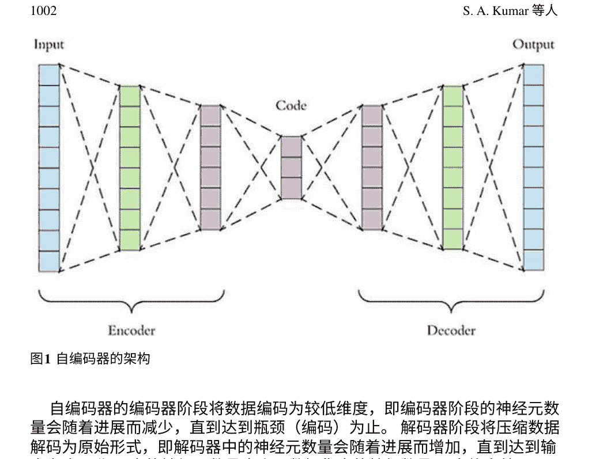

自编码器的编码器阶段将数据编码为较低维度，即编码器阶段的神经元数量会随着进展而减少，直到达到瓶颈（编码）为止。解码器阶段将压缩数据解码为原始形式，即解码器中的神经元数量会随着进展而增加，直到达到输出为止。瓶颈中的神经元数量应小于数据集中的特征数量。实施自编码器的主要目标是理解输入和输出表示之间的差异[5]。

通过反向传播算法[2]训练层，以最小化原始数据和重构数据之间的损失。神经网络中的损失函数量化了预期结果与机器学习模型产生的结果之间的差异[3]。可以应用不同类型的损失函数，包括（i）基于交叉熵的损失函数（对数损失），用于二元分类问题，以及（ii）均方误差损失函数，用于回归分析。激活函数在神经网络中用于通过各种隐藏层将输入转换为输出。当神经网络必须在非线性卷积模型中进行训练时，特别需要不同类型的激活函数[4]。在图像数据集中常用Sigmoid激活函数来提取特征并获得准确的结果。

本研究重点关注在MNIST数据集上使用欠完备自编码器、变分自编码器（VAE）和稀疏自编码器构建自编码器模型。根据超参数选择、激活函数、损失函数和构建模型所使用的迭代次数，对自编码器进行了比较。

本研究使用的数据集包括一个名为MNIST数据集的大型手写数字数据库。研究人员广泛使用它来训练神经网络模型并识别手写数字。下图2展示了数据集的样本集合。

图2 MNIST数据集

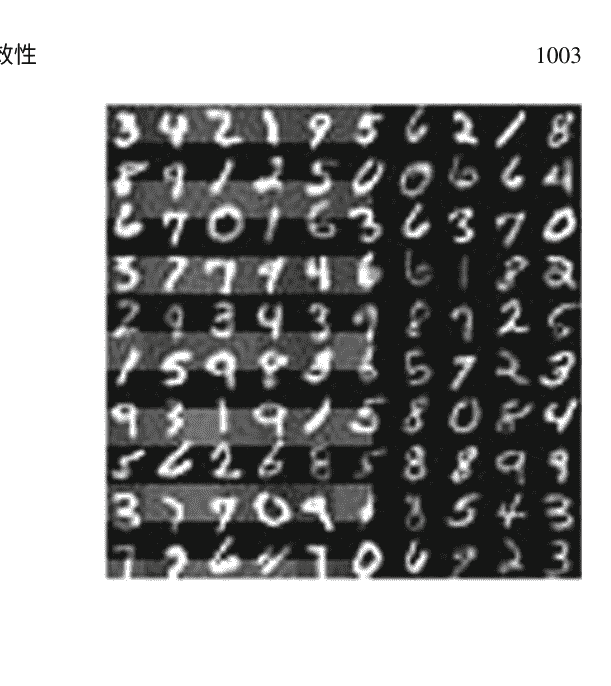

## 2个关键组件

本节列出了从TensorFlow Keras模型[6]中导入和使用的关键组件和库。

顺序模型：由于数据集以图像堆叠的形式排列，每个层都有一个输入张量和一个输出张量，因此在本研究中应用了顺序模型。

Flatten：用于将输入展平。在本例中，输入大小被设定为28 × 28。

学习率：学习率用于调整模型收敛的准确程度（分类/预测等）。

潜在大小：这个值是一个关键的超参数，如果设置得太小，会导致欠拟合；如果设置得太大，会导致过拟合。由于潜在大小过大而导致的过拟合问题可以通过使用丢弃比例来控制。

稠密层：稠密层是常规的深度连接神经网络层。这是最常见和经常使用的层。在构建编码器时，稠密层逐步减少，最小层数为潜在大小，在构建解码器时逐步增加。

激活函数：激活函数用于将输出函数映射到0到1或－1到1。要在网络中应用哪种激活函数取决于问题的输出。

- 对于MNIST数据集，使用以下激活函数：
- 在构建模型之前，使用Sigmoid激活函数创建编码器和解码器。下图显示了Sigmoid函数的S形曲线。
- 矫正线性激活函数（ReLu）：矫正线性激活函数是一个简单的计算，直接返回输入的值，如果输入为0.0或更小，则返回值为0.0。

图3 Sigmoid函数

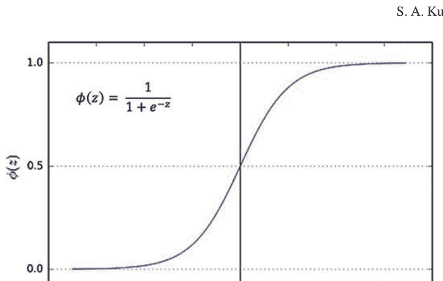

或者如果输入为0.0或更小，则返回值为0.0 [7]。ReLu的扩展和修改包括Leaky ReLU和ELU，其中Leaky ReLU在输入小于零时允许小的负值，而指数线性单元（ELU）是ReLU的一般化，它使用参数化的指数函数从正值过渡到小的负值。下图4显示了具有正值和负值的ReLU曲线。

图4 ReLU对正负输入值的线性图


表1 交叉熵损失函数的解释

| CE值的范围 | 解释 |
|------------|------|
| 0.00 | 没有价值损失 |
| <0.02–0.5 | 最小损失 |
| <0.20 | 可接受的损失 |
| 0.30 | 不在范围内 |

### 损失函数

损失函数用于量化网络与其训练之间的接近程度。损失函数或损失确定了训练模型中的最小误差。损失值通过对数据集上的错误进行平均聚合来计算。它们进一步将训练模型重新构建为优化函数。损失函数在整个模型中起着作用，并传递一个单一数字，当进行修正时可以构建出更好的模型。以下损失函数用于提出的工作。

(i) 交叉熵：交叉熵函数是两个概率分布函数之间的差异，定义如下：

(ii)

```
交叉熵损失 = -(y log(ŷ_i) + (1 - y_i)log(1 - ŷ_i))    (1)
```

交叉熵损失函数的值范围列在表1中。

(iii) 均方误差损失 (MSE) (也称为 L2 正则化)

它是预测值与实际观测值之间差异的平方的平均值。

```
均方误差 (MSE) = ∑_{i=1}^{n} (y_i - (ŷ_i)^2) / n    (2)
```

> 文献[9,10]中讨论了均方误差作为损失函数在图像压缩中的重要性和应用效果。

### 优化方法

优化器用于加快神经网络的训练速度。常用的优化器有：带动量的梯度下降和 Nesterov 加速梯度、AdaGrad、RMSProp、Adam 和 Nadam 优化。在这个提出的工作中，使用了两个优化器 Adam 和 Nadam，并对其在训练模型中的效率进行了分析。

Adam 和 Nadam (带有 Nesterov 技术的 优化器) 是处理复杂问题和使用稀疏梯度的流行优化模型。它能够处理大量特征，并具有过去梯度的指数衰减平均值和过去平方梯度的指数衰减平均值（RMS）。

```
m ← β₁m - (1-β₁)∇_θJ(θ)
s ← β₂s - (1-β₂)∇_θJ(θ)
m̂ ← m/(1-β₁^T); ŝ ← s/(1-β₂^T)
θ_下一步 ← θ + (ηm̂)/(√ŝ+ε)
```

## 自动编码器的三种变体

自动编码器被训练用于学习图像的低维表示，以实现降维。 在传统的自动编码器中，输入层和输出层的网络层数保持不变。 中间层（瓶颈层）负责数据压缩。 本节讨论了本工作中使用的欠完备、稀疏和变分自动编码器的架构和实现。

### (i) 完全自编码器

在一个不完全的自动编码器中，预测图像的输出不使用显式正则化[8]。 这可以通过限制隐藏层中的节点数来实现。 编码器和解码器使用顺序模型构建，学习率为0.5，潜在大小为32，激活函数为sigmoid。

### (ii) 稀疏自动编码器

稀疏自动编码器与不完全自动编码器在编码信息的方式上有所不同。 稀疏自动编码器学习算法是一种从无标签数据中自动学习特征的方法[11]。 他们应用L1正则化来编码信息。 每个隐藏层的节点数被改变以调节稀疏编码器[12, 13]。 可以使用以下函数计算L1正则化

```
损失 = 误差(y, ŷ) + λ ∑_{i=1}^{N} |w_i|,
```

其中，

```
ŷ = w₁x₁ + w₂x₂ + w₃x₃ + ... + w_Nx_N + b
```

通过[15]开发了一种稀疏自编码器（SAE），并使用Adam进行模型优化，Adam能够动态调整参数，批量归一化技术应用于避免过拟合并提高模型性能。

[16]中的作者使用SAE进行了两个不同的实验，其中一个数据集是MNIST。作者使用L2正则化并估计了隐藏单元的平均激活。确认了存在冗余的隐藏单元，这对于构建网络可能不是最优的。对于选择的数据集，SPE的编码器使用ReLu激活函数进行训练，潜在大小为32，学习率为0.5。

### (iii) 变分自编码器

变分自编码器从给定的输入生成逼真的图像[17]。编码器输出两个向量，表示均值和标准差，在代码中添加了噪声，解码器将这个修改后的图像作为输入。VAE方法已经广泛应用于合成数据生成或更广泛意义上的表示学习[18]。在不平衡数据集的情况下，VAE的应用被[19]讨论，并且使用VAE模型生成了合成样本来增强MNIST数据集。在提取特征方面，VAE在不同的医学图像数据增强中应用于ECG和EEG记录，并在[20-23]中进行了讨论。编码器和解码器使用ReLu作为激活函数，学习率为0.5，KL散度作为优化器/正则化器。

第4节讨论了在MNIST数据集上实施和分析自动编码器的实现。

## 4 实验设置和结果

在这项工作中，实现了三种变体的自编码器，并对结果进行了分析。数据集包含60,000张图像，并已分为训练和测试数据。图像大小固定为（28 × 28），图像的形状取决于固定为32的潜在大小。使用二进制交叉熵函数和均方误差等损失函数以及Adam和Nadam等激活函数来衡量自编码器的效率。欠完备自编码器的迭代次数设置为60，以获得更好的图像，其中SPE和VAE可以在50次迭代中给出输出。下表2显示了对变体效率进行分析的不同指标。

通过分析，我们了解到均方误差作为损失函数比二进制交叉熵误差更适合给定的数据集。此外，在SPE的情况下，Adam与MSE的组合表现出更高的效率。在VAE的情况下，Adam作为激活函数与损失函数的组合比Nadam函数表现更好。

表2 自动编码器分析

| 自动编码器类型 | 激活函数类型 | 损失函数类型 | 损失值 |
| :--- | :--- | :--- | :--- |
| 欠完备 | Nadam | 二元交叉熵 | 0.1901 |
| | Adam | 均方误差 | 0.0424 |
| 稀疏自动编码器 | Nadam | 二元交叉熵 | 0.0920 |
| | Adam | 均方误差 | 0.0097 |
| 变分自动编码器 | Nadam | KL和(重构损失) | 重构损失: 141.7841<br>KL损失: 6.6767 |
| | Adam | | 重构损失: 144.1266<br>KL损失: 6.5755 |

## 5 结论

自动编码器在不记忆输入的情况下高效地复制输出并提取特征。通过分析激活函数、损失函数和训练轮数，评估了模型的效率。下图5显示了欠完备和稀疏编码器在激活函数和损失函数方面的比较。

稀疏编码器在使用Adam作为激活函数和均方误差作为损失函数时表现更好。与使用的训练轮数相比，欠完备自动编码器使用了60轮，而稀疏编码器在50轮内就能取得更好的性能。

与图6中的VAE相比，VAE的性能优于稀疏自编码器。尽管这里的损失函数类型不同，但VAE在所有方面都比稀疏编码器表现更好。

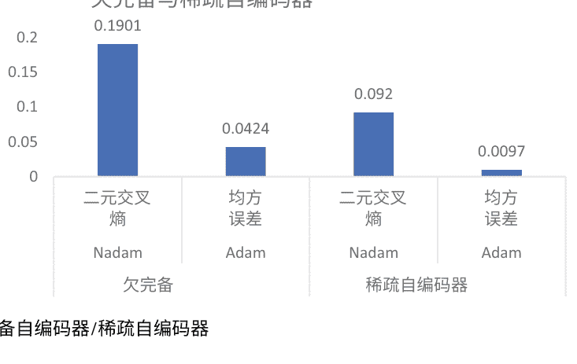

稀疏自编码器与变分自编码器

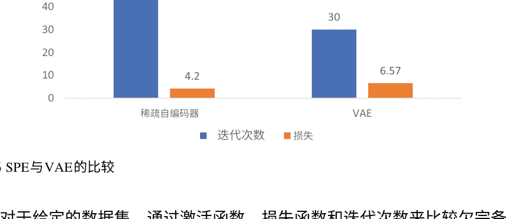

> 图6 SPE与VAE的比较

对于给定的数据集，通过激活函数、损失函数和迭代次数来比较欠完备、稀疏和VAE这三种编码器的效率，发现变分自编码器的性能优于其他两种变体。

该工作仅限于MNIST数据集。 此外，该模型可以应用于其他数据集，并在各个应用领域中实施。

## 参考文献

1.  Kovenko, V., & Bogacha, I. (2020). 关于图像的自动编码器应用的综合研究 在2020年12月2日至3日的IT&I-2020信息技术与互动会议上， 位于乌克兰基辅的KNU Taras Shevchenko举办。 *CEUR Workshop Proceedings (CEUR-WS.org)*
2.  le Cun, Y. (1989). 反向传播 的理论框架 在1998年的*Connection Models Summer School*会议上，卡内基梅隆大学举办。
3.  Seb. (2021). 神经网络损失函数简介 发布于2021年9月28日。 https://programmathically.com/an-introduction-to-neural-network-loss-functions/
4.  Sharma, S., Sharma, S., & Athaiya, A. (2020). 神经网络中的激活函数国际工程应用科学与技术杂志, 4(12), 310–316. ISSN2455-2143, 2020年4月在线出版于IJEAST. http://www.ijeast.com
5.  Patterson, J., & Gibson, A. (2017). 深度学习： 从业者的方法. O’Reilly出版社. *ISBN 978-1-491-91425-0*
6.  辛格， A., 和奥贡富米， T. 变分自编码器在源分离、金融和生物信号应用中的概述。
7.  文章。 https://machinelearningmastery.com/rectified-linear-activation-function-for-deep-learning-neural-networks/
8.  乔丹， J. (2018). https://www.jeremyjodan.me/autoencoders/
9.  亚历山大， D, 等。 基于自编码器的学习图像压缩器：挑战提案的描述。 https://arxiv.org/abs/1902.07385, https://doi.org/10.48550/arXiv.1902.07385
10. Mentzer, F., Agustsson, E., Tschannen, M., Timofte, R., 和Van Gool, L. (2018). 用于深度图像压缩的条件 概率模型。 arXiv预印本arXiv:1801.04260
11. 纳格， A. 讲义。 https://web.stanford.edu/class/cs294a/sparseAutoencoder.pdf
12. 文章。 https://www.v7labs.com/blog/autoencoders-guide
13. Arpit, D., 等。(2016). 为什么正则化自编码器学习稀疏表示。在第33届国际机器学习大会中，纽约，纽约，美国(Vol.48). JMLR: W&CP。
14. Mienye, I. D., Sun, Y., & Wang, Z. (2020). 基于改进的稀疏自编码器的人工神经网络方法用于心脏病预测。解锁医学信息学杂志, 18, 100307. ISSN 2352-9148. https://doi.org/10.1016/j.imu.2020.100307
15. Wan, Z., He, H., & Tang, B. (2018). 用于稀疏超参数确定的生成模型。*IEEE大数据交易, 4*(1), 2–10. https://doi.org/10.1109/TBDATA.2017.2689790
16. Oinar, C. (2021). https://towardsdatascience.com/variational-autoencoder-55b288f2e2e0
17. Elbattah, M., Loughnane, C., Guérin, J.-L., Carette, R., Cilia, F., & Dequen, G. (2021). 基于变分自编码器的眼动数据图像增强图像学杂志, 7,83. https://doi.org/10.3390/jimaging7050083
18. Wan, Z., Zhang, Y., & He, H. (2017). 基于变分自编码器的合成数据生成用于不平衡学习。在*IEEE计算智能研讨会论文集*, 美国夏威夷檀香山, 2017年11月27日至12月1日 (pp. 1–7).
19. Luo, Y., Zhu, L. Z., Wan, Z. Y., & Lu, B. L. (2020). 使用深度生成模型增强基于EEG的情绪识别的数据增强神经工程学杂志, 17(5),056021. https://doi.org/10.1088/1741-2552/abb580 PMID: 33052888.
20. Ozdenizci, O., & Erdogmus, D. (2021). 关于使用生成式深度神经网络合成人多通道脑电信号的研究。arXiv 2021,arXiv:2102.08061. 在线可获取 https://arxiv.org/abs/2102.08061。于2021年5月2日访问。
21. Biffi, C., Oktay, O., Tarroni, G., Bai, W., De Marvao, A., Doumou, G., Rajchl, M., Bedair,R., Prasad, S., Cook, S., 等 (2018年)。通过深度生成模型学习可解释的解剖特征：应用于心脏重塑。在国际医学图像计算与计算机辅助干预会议（MICCAI），格拉纳达，西班牙，2018年9月16日至20日（第464-471页）的论文集中。
22. Pesteie, M., Abolmaesumi, P., & Rohling, R. N. (2019). 使用独立条件变分自动编码器自适应增强医学数据。*IEEE医学成像交易，38*(12), 2807–2820。https://doi.org/10.1109/TMI.2019.2914656。2019年5月6日发布。PMID: 31059432。
23. Cerrolaza, J. J., Li, Y., Biffi, C., Gomez, A., Sinclair, M., Matthew, J., Knight, C., Kainz,B., & Rueckert, D. (2018). 通过深度条件生成网络从2D超声中重建3D胎儿头骨。在J. A. Schnabel, C. Davatzikos, C. Alberola-López, G. Fichtinger和A. F. Frangi (Eds.), *医学图像计算与计算机辅助干预–MICCAI2018-第21届国际会议，2018年，论文集（第383-391页）。（计算机科学讲座笔记（包括子系列计算机科学讲座笔记和生物信息学讲座笔记）（Vol. 11070 LNCS）*。Springer。https://doi.org/10.1007/978-3-030-00928-1_44

# 作者索引

## A
- Aakash, V., 987
- Aarthi, A., 961
- Abishek, C. S., 703
- Achary, Rathnakar, 389
- Adlakha, Kabeer, 97
- Adnan, Md. Akhtaruzzaman, 195
- Agarwal, Abhinav, 569
- Agarwal, Charu, 679
- Agarwal, Khushbu, 569
- Aggarwal, Kapil, 767
- Aggarwal, Tanya, 515
- Agrawal, Anupam, 339
- Ainapure, Vaishnavi, 737
- Akter, Sumya, 195
- Akter, Taslina, 901
- Alam, Ashraf, 53, 875
- Andhare, Maithili, 753
- Anupama Kumar, S., 1001
- Arivazhagan, B., 615
- Arora, Himanshu, 569

## B
- 巴布，尼基尔，183
- 拜居，B. V., 961
- 巴拉，沙塔布迪，901
- 巴罗斯，阿利斯泰尔，295
- 巴鲁亚，比曼，295
- 巴扎利斯卡，娜塔利娅，213
- 本代尔，亚沙什里，493
- 巴哈恩特里，洛克什·B., 377
- 班加勒，基绍尔，753
- 巴拉德瓦杰，普什卡尔，515
- 巴拉尼·塞图潘迪安，S., 615

## C
- Chahal, Kuljit Kaur, 651
- Chakravorty, Chandrani, 1001
- Chandra Sekhar, M., 629
- Chand, Satish, 931
- Chaturvedi, S Aditya, 37
- Chaubal, Anushka, 717
- Chauhan, Krishan Kumar, 515
- Chavan, Sanket, 753
- Chhaparia, Keshav, 555
- Choudhari, Suyash, 753

## D
- Dalal, Meghana, 717
- Dali, Swarangi, 737
- Damodhar, N., 943
- Das, Tanaya, 641
- Deo, Rutuja, 555
- Deshmukh, Neel, 797
- Deshpande, Ajinkya, 753
- Dhande, Sheetal S., 451
- Dharani, Andhe, 1001
- Dheeraj, Akshay, 931
- Dileep Varma, R., 805
- Dugad, Shashi, 737

## E
- ElKettani, Youssfi, 315

## F
- Felista Sugirtha Lizy, R., 83
- Filimonova, Natalia, 541
- Frendi, Richard Septianus, 529

## G
- Ganesan, A., 263
- Ganesh Hari Prasad Rao, Vutukuri V N S M P, 113
- Gaol, Ford Lumban, 529, 541
- Gaur, Priya, 367
- George, Jossy P., 909
- Gnana Rajesh, D., 483
- Gnanasekaran, P., 425
- Goit, Mukesh, 97
- Goje, Prashant, 797
- Gongalla, Likitha, 173
- González, Hernando, 503
- Gopalachari, M. Venu, 411
- Gupta, Mehar, 825
- Gupta, Rishika, 569

## H
- Hanif, Revie Muhammad, 541
- Hari Hara Sudhan, S. G., 703
- Haripriya, S., 961
- Hong, Soon-Goo, 1, 579
- Hung Van, Mai, 149

## I
- Ihianle, Isibor Kennedy, 515

## J
- Jamdar, Iranna, 377
- Jaya Lakshmi, A., 127
- Jayalatsumi, U., 263
- Jeeragal, Anup, 377
- Jeeragal, Vinayak, 377
- Jeevitha, C. B., 27
- Jeshwin, W., 183
- Jha, Pradeep, 367
- Joe Prathap, P. M., 127
- Jonathan, Michael, 541
- Joseph, Joel, 797
- Joseph, Linda, 105
- Joseph Raj, V., 83
- Joseph, Richard, 737
- Joshi, Garima, 515

## K
- Kadadevar, Nikhil, 377
- Kalaivani, A., 263
- Kalidindi, Amit Raja, 779
- Kallepally, Pooja, 163
- Kanmani, Madheswari, 591
- Kathiravan, M., 183, 703
- Kaur, Amanpreet, 651
- Kaur, Manjeet, 515
- Kavimalar, C., 987
- Kavitha, T., 263
- Kener, Andreas, 843
- Khalsa, Ajay Singh, 737
- Khanai, Rajashri, 13
- Khan, Mohammed Ehmer, 483
- Kim, Da Hee, 1, 579
- Kim, Myeong Seon, 1, 579
- Koureinenos, Dimitris, 843
- Krishnaveni, R., 139
- Kruthiventhi, Srikalpa Sankeerth, 779
- Kulkarni, Pallavi, 13
- Kumar, Anoop, 339
- Kumari, Neha, 351
- Kumar, Manish, 439
- Kumar, Pankaj, 607
- Kumar, Yash, 97
- Kumbhar, Vijayalaxmi S., 753

## L
- Lagrari, Fatima-ezzahra, 315
- Latha, B., 263
- Lathar, Niraj Kumar, 439
- Latnekar, Urvi, 825
- Lee, Kang Woo, 1, 579
- Lim, Ji Won, 1, 579
- Lu, Jun, 273

## M
- Madhu, Bhukya, 411
- Maganti, Sairam, 69
- Martis, Eesha, 555
- Matsuo, Tokuro, 529, 541
- Md Whaidduzzaman, 295

# 作者索引
- Mesbahuddin Sarker, M., 295
- Mihira, P., 805
- Minh, Tran Thi, 149
- Miruthula, V., 987
- Mishra, Shilpi, 439, 569
- Mohanty, Atasi, 53, 875
- Monika, 607
- Monsalve, Juan, 503
- Moy Ghosh, Ajitesh, 641
- Mujib, Muhammad Bin, 195
- Muthu, Sanjay Rojar Utharia, 591

### **N**
- Nair, Jayashree, 69
- Nair, Lekshmi S., 779
- Nalini, N., 97
- Narasimmalu, Nitheesh Kumar, 591
- Neha, A. S. V. L., 139
- Nikam, Virendra P., 451
- Nithya Krishna, S., 183
- Ntalianis, Klimis, 843

### **O**
- Owa, Kay, 515

### **P**
- Palle, Sudarshan Reddy, 323
- Panchal, Priyanka, 241
- Pandikumar, S., 615
- Patel, Bimal, 859
- Patel, Ravi, 859
- Pavan Kumar, G., 943
- Peng, Chew Fong, 529
- Perumal, Sailasree, 139
- Peter, David, 691
- Pias, Tanmoy Sarkar, 195
- Pooja, M. R., 27
- Prabhosa, Tirumalasetty Satya, 69
- Prajapati, Dinesh J., 241
- Priyadharshini, S., 961
- Prodhan, Rumman Ahmed, 195
- Purohit, Lalit, 37

### **Q**
- Quader Chowdhury, Kuraish Bin, 901

### **R**
- Rahman, Md Tamimur, 901
- Rajawat, Nomisha, 569
- Rajesh, M., 163
- Rajeswari, P., 615
- Ramisetty, Naga Sudhakar, 779
- Randive, Santosh, 797
- Rasheed, Jawad, 471
- Rashida, Udaipurwala, 923
- Rastogi, Sejal, 555
- Raut, Shital A., 323
- Ravale, Ujwala, 493
- Rawat, Gayatri, 569
- Reddy, Katakam Jayadeep, 69
- Reji, Thomaskutty, 909
- Remya, S., 805
- Renaldi, 529
- Rifki Ananda, M., 541
- Rodrigues, Andrea, 909

### **S**
- Saini, B. S., 351
- Sai Ruthwik, K., 943
- Sai Sreekar, U., 105
- Sakthivelan, R. G., 703
- Sambath, M., 183
- Sandeep Kumar Reddy, G., 805
- Sandjaya, Kevin, 529
- Sangeetha, T., 987
- Sanjaya, Richard, 529
- Santosh Reddy, P., 629
- Saravanan, S., 703
- Sarkar, Sagnik, 405
- Sathya, P., 425
- Sathyalakshmi, S., 113
- Saxena, Varun Prakash, 663
- Sebastian, Anu Maria, 691
- Shamim Kaiser, M., 295
- Sharma, Swati, 663
- Shelke, Chetan J., 389
- Shobha, P., 97
- Singh, Geetika, 679
- Singh, Pardeep, 405
- Singh, Pooran, 439
- Singh, Shivam, 97
- Soujanya, N., 27
- Sourabha, G., 27
- Srinivas, Jayam Sri Harsha, 779
- Sriram, Gelam Sai, 69
- Steven, 541
- Sudha, S. V., 173
- Sujatha, K., 263
- Suresh Kumar, K., 923

## T
- Tamilarasi, G., 483
- Tasawuf, Gybrnd, 541
- Tekade, Arti, 753

## V
- 瓦莱, 迭戈, 503
- 瓦萨, 杰尔佩什, 859
- 瓦桑特, M., 703
- 瓦什斯塔, 苏汉舒, 367
- 维达赛罗奇什纳, 伊莱, 113
- 维德尔尼科夫, 迈克海洛, 213
- 维鲁, 南达基肖, 591
- 维拉, 阿尔希姆, 503
- 维迪亚斯里, K., 805
- 维格, 雷努, 515
- 维什努瓦尔丹, V., 105
- 沃利安斯卡-萨夫丘克, 莱西娅, 213

## W
- 瓦达克, 阿迈德 • 比拉尔, 471

### 是
- 亚达夫, 赫曼特, 859
- 亚达夫, 桑托什 • 库马尔, 767
- 亚哈尤伊, 阿玛尼, 471
- 耶西尔特佩, 米尔萨特, 471

## Z
- Zelena, Maria, 213