# 数据分析中的深度学习


Debi Prasanna Acharjya
Anirban Mitra
Noor Zaman 编辑

最新技术、实践和应用

## 大数据研究

### 第91卷

### 系列编辑

Janusz Kacprzyk，波兰科学院，华沙，波兰

《大数据研究》系列（SBD）以高质量、快速地出版大数据领域的新发展和进展为目标。其目的是涵盖大数据在工程、计算机科学、物理学、经济学和生命科学等领域中的理论、研究、开发和应用。该系列的书籍涉及对来自传感器或其他物理仪器、模拟、众包、社交网络或其他互联网交易（如电子邮件或视频点击流等）产生的大规模、复杂和/或分布式数据集的分析和理解。该系列包括大数据领域的专著、讲义和编辑的卷册，涵盖了计算智能（包括神经网络、进化计算、软计算、模糊系统）、人工智能、数据挖掘、现代统计学和运筹学以及自组织系统等领域。对于投稿者和读者来说，短时间的出版周期和全球范围的分发都具有特殊的价值，可以广泛而迅速地传播研究成果。

该系列的书籍经过单盲同行评审过程进行审查。

被SCOPUS、SCIMAGO和zbMATH索引。

该系列中的所有书籍都提交给Web of Science进行考虑。

有关该系列的更多信息，请访问[http://www.springer.com/series/11970](http://www.springer.com/series/11970)

Debi Prasanna Acharjya · Anirban Mitra · Noor Zaman
编辑

# 数据分析中的深度学习

最新技术、实践和应用

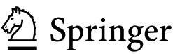

## 编辑

Debi Prasanna Acharjya
计算科学与工程学院 VIT 大学
印度维洛尔

Noor Zaman 计算机科学与工程学院
泰勒大学 马来西亚梳邦再也

Anirban Mitra 计算机科学工程系
Amity University Kolkata
印度加尔各答

ISSN 2197-6503
ISSN 2197-6511（电子版）
大数据研究
ISBN 978-3-030-75854-7
ISBN 978-3-030-75855-4（电子书）
[https://doi.org/10.1007/978-3-030-75855-4](https://doi.org/10.1007/978-3-030-75855-4)
© Springer Nature Switzerland AG 2022
本作品受版权保护。出版商保留全部或部分材料的权利，包括翻译、复制、插图重印、朗诵、广播、微缩胶片复制或以任何其他实体方式复制、传输或存储和检索信息、电子适应、计算机软件或类似或不同的方法，无论是现在已知还是今后开发的。

本出版物中使用的一般描述性名称、注册名称、商标、服务标志等，并不意味着即使在没有明确声明的情况下，这些名称不受相关保护法律和法规的限制，因此可以自由使用。

出版商、作者和编辑可以安全地假设本书中的建议和信息在出版日期时是真实准确的。出版商、作者或编辑对本书中所含材料不提供任何明示或暗示的保证，也不对可能存在的任何错误或遗漏负责。出版商在发表的地图和机构关系方面保持中立。

这个Springer印记由注册公司Springer Nature Switzerland AG出版
注册公司地址是：Gewerbestrasse 11, 6330 Cham, Switzerland

## 献给

我亲爱的孩子Aditi和Aditya
D. P. Acharjya

我关心的父母Amitava、Anushila和妻子Sudeepta
Anirban Mitra

我所有的家庭成员
Noor Zaman

## 前言

今天在各个领域收集到的数据量远远超过了我们能够通过自动化分析技术来减少和分析的能力。 在这些积累的大量数据中隐藏着很多信息。 获取这些信息是困难的。 因此，对于新一代的计算理论和工具来帮助人类从海量数据中提取知识、自学习和生成规则是至关重要的。 由于与智能分析大数据的智能解决方案的发现相关的理论挑战，深度学习已经发展成为一个重要且活跃的研究领域。

深度学习是一种机器学习的形式，使计算机能够从经验中学习并以概念的层次结构理解世界。 由于计算机从经验中获取知识，因此不需要人机操作员正式指定计算机所需的所有知识。 概念的层次结构使计算机能够通过将其构建成更简单的概念来学习复杂的概念；这些层次结构的图表将有很多层。

从各个领域的各种应用程序收集的数据量预计每两年翻一番。 除非对这些数据分析以获得有用的信息，否则它没有任何用处。 这需要开发可以用于促进基于机器的规则生成和数据分析的技术。 强大计算机的发展是实施这些技术的福音，从而实现自动化系统。 将数据转化为知识对于高性能大规模数据处理来说绝非易事，包括利用当前和即将到来的计算机体系结构的并行性进行数据挖掘。 此外，这些数据可能涉及一些一致性、大小或维度方面的挑战。

包括深度学习概念的先进计算和学习技术在表示数据和生成规则和知识方面是富有成果的。 此外，这些模型对于分析也非常有成果。 新的挑战通常包括，有时甚至会恶化，专用数据密集型计算系统的性能、效率和可扩展性。 深度学习方法可以防止信息丢失，从而提高数据分析和学习技术的性能。 这在行业和研究界引起了许多研究问题，以有效地捕获和访问数据。 此外，实现快速处理、高性能和高吞吐量，并以高效方式存储数据以供将来使用也是一个问题。

另一个问题。此外，使用深度学习概念进行数据分析的编程是一个重要且具有挑战性的问题。表达应用程序的数据访问要求并设计利用并行性的编程语言抽象是一个迫切的需求。

本书以精确而清晰的方式向研究界介绍了深度学习的概念和技术。在编辑本书时，我们尽力提供深度学习在数据分析中的前沿进展和应用，以及实现计算机科学和信息技术深入知识所需的概念基础。本卷将帮助对此领域感兴趣的研究人员深入了解不同概念及其在工业、研究和管理领域中的重要性。此外，本编辑书旨在为计算机科学和信息技术研究人员提供深度学习的最新进展，以实现计算机科学的深入知识。

我们相信我们的努力将使这本编辑的专著在学生和研究界中变得有趣和吸引人。这本书由四个部分组成。第一部分是关于深度学习的理论基础。第二部分是关于与深度学习技术相关的计算系统和机器学习。第三部分讨论了一些深度学习算法，第四部分则专注于深度学习技术的应用。这样做是为了使编辑的书更加灵活，并激发对这些主题的进一步研究兴趣。

深度学习的理论基础包括四个章节。章节“使用深度情感智能研究离散动作序列”讨论了使用深度情感智能研究离散动作序列。从人类中识别情绪在我们的日常生活中起着至关重要的作用，并且对社交交流至关重要。自动情绪识别正在成为人工智能的最新研究重点。本章提出了一种机器学习方法，并讨论了使用深度学习模型实现情感智能的方法。此外，它还提供了关于使用DCNN模型实现情感智能的简要研究。本章还讨论了一种受深度卷积自编码器影响的新型噪声去除技术，用于乳腺X线摄影术中的数据分析。本章解释了在结构化和非结构化数据上进行生物医学图像数据分析的深度学习算法的概念和实现，例如CT图像、MRI和X射线，以检测一些致命疾病。

章节“通过人脑使用算法混合模型深度学习算法构建高安全框架”侧重于通过深度学习算法构建安全框架，利用人脑。本章旨在分析人脑模式的独特性，并基于大小、心态和波动速率等各种因素提供高级安全性。章节“深度学习的知识框架：先天性心脏病”是关于深度学习的知识框架，并在先天性心脏病上进行实施。本章讨论了一种自动化策略，用于分析、检测和诊断心脏疾病，并具有初始有效参数。

本编辑卷的第二部分是与深度学习技术相关的计算系统和机器学习。本节包括接下来的四章。

章节“基于排名的支持向量机在卷积神经网络中的自动图像分割”讨论了在糖尿病视网膜图像上使用基于排名的支持向量机在卷积神经网络中进行自动图像分割。本章提出了一种两阶段的深度学习方法，包括使用深度排名支持向量机来定义一致的特征标签，并将SVM的输出约束层添加到CNN中，以获得更好的结果可接受性。

章节“医疗保健中的深度学习”关注深度学习在医疗保健应用中的问题。除了诊断外，深度学习还可以研究疾病的进展，制定个性化治疗方案，并进行整体患者管理。本章讨论了深度神经网络的架构和工作原理，并重点介绍了它们在检测和治疗癌症、糖尿病、阿尔茨海默病和帕金森病等各种疾病中的应用。章节“关于机器学习算法在医疗保健应用中的研究”讨论了机器学习算法在医疗保健应用中的应用。机器学习算法可以高效处理复杂的自动多模态生物医学数据模型。本章描述了在各种医疗保健应用中实施和使用机器学习技术。

本章“预测性数据分析方法用于从先天性心脏数据库中获取洞察”旨在使用聚类技术发现先天性心脏数据库中的隐藏模式，以进行未来的医学诊断。对引用技术的验证已在基于2006年至2016年印度不同年龄组先天性心脏缺陷的死亡率数据上进行。

本编辑卷的第三部分专注于深度学习算法。本节包括接下来的四章。章节“最近应用的深度学习方法调查”介绍了深度学习方法的调查。

本章详细阐述了深度学习方法在处理计算机视觉和模式识别、自动驾驶汽车、声音生成、艺术创作和计算预测等应用方面的关键进展。本章讨论了使用协同过滤的隐私保护推荐系统的研究。随着技术的进步，推荐系统被认为是最基于信息过滤的系统之一，它通过根据用户的选择、兴趣或项目行为从大量动态收集的信息中过滤出重要信息来处理信息过载。本章总结了用于为用户对特定项目的评级提供安全性和隐私性的各种隐私保护方法。

本章讨论了基于自然启发算法的混合神经网络训练算法的比较研究，标题为“基于自然启发算法的混合神经网络训练算法在数据分类中的比较研究”。详细阐述了自然启发算法和标准神经网络训练算法的整个混合过程的算法和流程图，并对萤火虫和粒子群优化算法进行了简要讨论以进行分析。章节“使用深度学习进行异常信用卡欺诈检测”

介绍了一种用于金融交易中信用卡欺诈异常检测的深度学习模型，并将其与一些现有的机器学习算法进行了比较。对提出的模型进行了在2013年9月欧洲收集的为期两天的数据集上的验证。使用准确性评估指标来评估提出的模型对于检测信用卡欺诈的能力。

本编辑卷的第四部分是关于深度学习技术的应用。本节包括接下来的三章。章节“深度学习在智能电网能源管理中的应用”基于深度学习在智能电网能源管理中的应用。文献关注智能电网中的负荷预测和能源管理概念。已详细阐述了基于智能电网和智能车辆应用的不同深度学习技术，如深度神经网络、RBM、DBF等。

章节“软件质量保证的成本优化”聚焦于软件质量保证的成本优化。引用的概念被用于对方法效率的原型和资助的认识做出有益的回应。章节“敏感业务云安全的分析方法”讨论了敏感业务云安全的分析方法。它还讨论了对敏感数据的安全性、四级认证授权、数据安全、网络安全和云安全。由于云计算的不断增长需求中安全威胁的日益严重成为一个主要问题，本章提出了分析和限制云计算危险安全威胁的路径。

全球许多研究人员正在积极研究深度学习概念，并将这些概念与计算智能、数据分析、云计算和许多其他领域相结合。深度学习技术与最新进展领域的融合将使其进入一个新的维度。为了以一种连贯的方式跟上这一发展，我们努力使本书易于读者理解。主要目标是准确记录深度学习领域的主要发展，为许多研究人员提供手册。我们相信这本编辑的专著将帮助在深度学习领域工作的研究人员了解概念的最新进展，并有效地理解深度学习技术在处理实际应用中的重要性和用途。

印度维洛尔
印度加尔各答
马来西亚雪邦再也

德比·普拉萨纳·阿查尔杰
阿尼尔班·米特拉
努尔·扎曼

## 致谢

我们非常满意地呈现了我们的编辑书籍《数据分析中的深度学习：最新技术、实践和应用》，并希望向所有在直接和间接方式上帮助我们完成这个项目的人表达我们的观点。 首先，我们赞美并衷心感谢全能的上帝，在完成这个项目时，他一直是我们的力量、安慰和灵感的可靠来源。

在写作过程中，贡献者参考了几本书籍和期刊，我们借此机会感谢所有这些作者和出版商。 我们非常感谢评审人员在评估过程中的持续支持。

特别要提到在项目工作期间给予帮助的不同人员，这里没有提到他们的名字。 最后但并非最不重要的，我们感谢系列编辑“Kacprzyk, Janusz”和Springer-Verlag, USA的制作团队，他们鼓励我们并为及时完成这本编辑书籍提供了合作和帮助。 我们相信并希望它会得到许多读者的赞赏。

## 目录

### 深度学习理论和分析的理论基础

使用深度情感进行离散动作序列的研究
智能. . . 3
R. Santhoshkumar和M. Kalaiselvi Geetha

受深度影响的一种新型噪声去除技术
乳腺X光图像上的卷积自编码器. . . . 25
Swarup Kr Ghosh, Biswajit Biswas和Anupam Ghosh

通过算法利用人脑进行高安全性框架
混合模型深度学习算法. . . 45
S. Balakrishnan, J. P. Ananth, L. Ramanathan, R. Sachinkanith kar和S. Rajkumar

深度学习的知识框架：先天性心脏病
疾病61
Ritu Chauhan和Harleen Kaur

### 计算系统和机器学习

基于排名的SVM自动图像分割
在糖尿病视网膜图像上的卷积神经网络中. . 77
Biswajit Biswas, Swarup Kr Ghosh和Anupam Ghosh

医疗保健中的深度学习. . . 97
Deeksha Kaul, Harika Raju和B. K. Tripathy

关于机器学习算法的研究
医疗保健应用. . . . 117
Shanmuganathan Harinee和Anand Mahendran

一种预测性数据分析方法来获取医疗洞察
数据库. . . 131
Ritu Chauhan和Harleen Kaur

# 深度学习算法

近期应用的深度学习方法调查 ................. 145
Amit Adate和B. K. Tripathy

隐私保护推荐系统的广泛研究
使用协同过滤的系统 ................. 171
Abhaya Kumar Sahoo, Chittaranjan Pradhan, Brojo Kishore Mishra, 和Bhabani Shankar Prasad Mishra

基于自然启发算法的混合方法的比较研究
数据分类中的神经网络训练算法 ................. 191
Sudarshan Nandy和Anirban Mitra

使用深度学习的异常信用卡欺诈检测 ................. 207
Ezz El-Din Hemdan和D. H. Manjaiah

# 深度学习技术的应用

深度学习在智能能源管理中的应用
网格 ................. 221
Sourasekhar Banerjee，Soumitra Ghosh和Brojo Kishore Mishra

软件质量保证的成本优化 ................. 241
Soobia Saeed, N. Z. Jhanjhi, Syed Mehmood Raza Naqvi和Azeem Khan

敏感商业云安全的分析方法 ................. 257
Soobia Saeed, N. Z. Jhanjhi, Syed Mehmood Raza Naqvi和Azeem Khan

## 贡献者

**Amit Adate** McCormick School of Engineering and Applied Science, Northwestern University, Evanston, IL, 美国

**J. P. Ananth** Sri Krishna College of Engineering and Technology, Coimbatore, Tamilnadu, 印度

**S. Balakrishnan** Sri Krishna College of Engineering and Technology, Coimbatore, Tamilnadu, 印度

**Sourasekhar Banerjee** Umea University计算科学系, Umeå, 瑞典

**Biswajit Biswas** 加尔各答大学, 加尔各答, 西孟加拉邦, 印度

**Ritu Chauhan** 计算生物学与生物信息学中心, Amity University, Noida, Uttar Pradesh, 印度

**M. Kalaiselvi Geetha** 计算机科学与工程系, 安纳马莱大学, 泰米尔纳德邦, 印度

**Anupam Ghosh** Netaji Subhash工程学院, 加尔各答, 西孟加拉邦, 印度

**Soumitra Ghosh** 计算科学与工程系, 印度理工学院, 巴特那, 印度

**Swarup Kr Ghosh** Sister Nivedita大学, 加尔各答, 西孟加拉邦, 印度

**Shanmuganathan Harinee** 维洛尔理工学院, 维洛尔, 印度

**Ezz El-Din Hemand** 计算机科学与工程系, 电子工程学院, 梅努菲亚大学, 梅努菲亚, 埃及

**N. Z. Jhanjhi** 计算与信息技术学院, 泰勒大学, 苏邦加亚, 马来西亚

**Deeksha Kaul** SCOPE, VIT, 维洛尔, 泰米尔纳德邦, 印度

**Harleen Kaur** 计算机科学与工程系, 工程科学与技术学院, Jamia Hamdard, 印度新德里## 首字母缩略词
- ABF: 自适应双边滤波器
- AD: 阿尔茨海默病
- AE: 自编码器
- AI: 人工智能
- ALE: 街机学习环境
- AMR: 人工神经网络误聚类率
- ANN: 人工神经网络
- API: 应用程序接口
- BBIV: 基于块的强度值
- BICC: 块强度比较码
- BM: 玻尔兹曼机
- BN: 批量归一化
- BP: 信念传播
- CAD: 计算机辅助检测
- CAE: 卷积自编码器
- CANFIS: 协同神经模糊推理系统
- CART: 分类和回归树
- CDA: 卷积去噪自编码器
- CDAEM: 传统去噪自编码器方法
- CDC: 疾病控制中心
- CF: 协同过滤
- CHAID: 卡方自动交互检测
- CHD: 冠心病
- CI: 置信区间
- CNN: 卷积神经网络
- COHD: 先天性心脏缺陷
- CV: 交叉验证
- CVD: 心血管疾病
- DAE: 去噪自编码器
- DAEM: 去噪自编码器方法
- DBL: 不同的箱级别
- DBM: 深度玻尔兹曼机
- DBN: 深度置信网络
- DCNN: 深度卷积神经网络
- DES: 数据加密标准
- DGM: 深度生成模型
- DL: 深度学习
- DM: 数据挖掘
- DNN: 深度神经网络
- DP: 动态规划
- DR: 降维
- DRIVE: 数字视网膜图像用于血管提取
- DSC: Dice相似性系数
- DSM: 需求侧管理
- DSOR: 决策支持与运营研究
- DT: 决策树
- DWT: 离散小波变换
- EEG: 脑电图
- EV: 电动汽车
- FDCNN: 特征差异卷积神经网络
- FEL: 特征和集成学习
- FFBPNN: 基于萤火虫的反向传播神经网络
- FMRI: 功能性磁共振成像
- FNN: 前馈神经网络
- GA: 遗传算法
- GABNN: 基于遗传算法的神经网络
- GAN: 生成对抗网络
- GEMEP: 日内瓦多模态情感描绘
- GO: 基因本体论
- GRNN: 通用回归神经网络
- GRU: 门控循环单元
- HCI: 人机交互
- HE: 同态加密
- HER: 人类情绪识别
- HFEN: 高频误差范数
- HOG: 方向梯度直方图
- HRBVS: 分层视网膜血管分割
- IBEF: 印度品牌资产基金
- IDE: 集成开发环境
- IT: 信息技术
- ITBN: 区间时间贝叶斯网络
- JLT: Johnson-Lindenstrauss变换
- JSC: Jaccards相似系数
- KDD: 数据库知识发现
- KLD: Kullback-Leibler散度
- KNN: k最近邻算法
- KPCA: 核主成分分析
- LDA: 线性判别分析
- LDL: 低密度脂蛋白
- LIDAR: 光探测与测距
- LIF: 线性模糊指数
- LLC: 局部约束线性编码
- LMS: 局部运动特征
- LR: 逻辑回归
- LSTM: 长短期记忆
- LTLF: 长期负载预测
- MAE: 平均绝对误差
- MAPE: 平均绝对百分比误差
- MCI: 轻度认知障碍
- MD: 医疗设备
- MDP: 马尔可夫决策过程
- MEBN: 多实体贝叶斯网络
- MI: 机器智能
- ML: 机器学习
- MLP: 多层感知器
- MMDML: 改进的多流形深度度量学习
- MPP: 运动投影轮廓
- MRI: 磁共振成像
- MRP: 改进的随机扰动
- MSE: 均方误差
- MTLF: 中期负荷预测
- MTTF: 平均故障时间
- NAS: 神经艺术风格
- NC: 正常对照
- NI: 自然启发
- NIN: 网络中的网络
- NLM: 非局部均值
- NMF: 非负矩阵分解
- NPDR: 非增殖性糖尿病视网膜病变
- NRI: 未收到的问题
- PAC: 大致正确
- PC: 个人电脑
- PCA: 主成分分析
- PD: 帕金森病
- PDR: 增殖性糖尿病视网膜病变
- PET: 正电子发射断层扫描
- PGNN: 并行粒度神经网络
- PIN: 个人识别号码
- PNN: 概率神经网络
- PPGN: 即插即用生成网络
- PPNBC: 隐私保护朴素贝叶斯分类
- PPV: 阳性预测值
- PQS: 图像质量评分
- PSAR: 预测情境感知
- PSNR: 峰值信噪比
- PSO: 粒子群优化
- QA: 质量保证
- RBF: 径向基函数
- RBM: 受限玻尔兹曼机
- RBVS: 视网膜血管分割
- ReLU: 修正线性单元
- RF: 随机森林
- RGB: 红绿蓝
- RMSE: 均方根误差
- RNN: 循环神经网络
- ROC: 接收者操作特征曲线
- ROI: 感兴趣区域
- RPT: 随机扰动技术
- RRT: 随机响应技术
- RSVM: 排名支持向量机
- SBP: 收缩压
- SDAE: 堆叠去噪自动编码器
- SDBP: 最陡下降反向传播
- SIFT: 尺度不变特征变换
- SMOTE: 合成少数类过采样技术
- SOM: 自组织映射
- SQA: 软件质量保证
- SSA: 软件优越性肯定
- SSIM: 结构相似性指标
- SSL: 安全套接字层
- STLF: 短期负荷预测
- SVD: 奇异值分解
- SVM: 支持向量机
- SVR: 支持向量回归
- TLS: 传输层安全
- UM: 均匀性度量
- UQI: 通用质量指数
- VFD: 可变频驱动器
- VMM: 虚拟机监视器

# 深度学习的理论基础
## 理论与分析

### 关于离散动作序列的研究
使用深度情感智能

R. Santhoshkumar和M. Kaliselvi Geetha

摘要 从人类中识别情绪在我们的日常生活中起着重要作用，对于社交交流至关重要。自动情绪识别成为人工智能的最新研究重点。人类智能的一个方面是识别情绪，被认为是情感智能的属性之一。尽管基于面部表情或语音的研究蓬勃发展，但从身体姿势中识别情绪仍然是一个较少探索的主题。本章提出了一种机器学习方法，并讨论了深度学习模型来实现情感智能。从人体运动中提取基于块的强度值（BBIV）特征和不同的bin级别HoG特征（DBL HoG），并将其输入到监督学习算法中。本章使用支持向量机（SVM）、k最近邻（KNN）和随机森林分类器作为监督学习算法。最后，使用预训练的深度卷积神经网络（DCNN）模型。实验使用Geneva多模态情感描绘（GEMEP）语料库数据集进行。在这个数据集中，人体运动表达了五种典型的情绪（愤怒、恐惧、喜悦、自豪和悲伤）。在这个情绪识别系统中，随机森林分类器的表现优于SVM和kNN分类器。最后，DCNN模型的识别效果优于随机森林分类器。本章简要介绍了使用DCNN模型实现情感智能的研究。

## 1 引言

理解人类情绪的能力在人类社会行为和互动中起着核心作用。情绪在决策和比例中很重要，是最近研究领域中关于实验心理学的新思考。多年来，情绪识别的研究主要集中在面部表情、声音分析、全身运动和手势上。人类以不同的方式表达不同类型的情绪，用于日常交流。理解人类情绪是研究的一个关键领域，因为识别情绪可能为人机交互提供了大量机会和应用，通过提炼情感智能来增强人与人之间的沟通。人类的交流包括口头和非口头交流。

非语言交流是通过眼睛、手、头部、手指和身体动作等无言的线索或信息的共享。这包括身体语言和外貌等视觉线索。人类情绪可以通过身体语言和姿势来识别。姿势提供了言语和面部表情中不存在的信息。例如，可以通过人体姿势识别远距离的人的情绪状态。因此，通过捕捉身体动作可以实现通过非语言交流识别人类情绪。

本章旨在研究表明不同情绪之间的运动线索。使用运动和手势作为个体状态的指标的可能性为在生态环境中定量监测和估计用户并对其做出自适应反应提供了一种新颖的方法。这种方法基于身体运动分析识别情绪状态，如愤怒、喜悦、悲伤、恐惧等。

从最近的文献可以看出，不同的情绪常常与各种身体动作相关。运动的速度、幅度和流畅性表达了人体运动中的特定情绪。情绪行为的分析通过使用静态动作提供描述表达动作动态的指标。通过理解和知道如何对人们的表情做出反应，沟通大大改善。人类沟通不仅包括口头语言，还包括手、头和身体姿势的非语言提示。在心理研究领域中，重要的角色是发展可能支持人机交互技术和理解人类情绪的概念[1, 2]。像愤怒、中性、快乐、恐惧、厌恶、悲伤、惊讶等基本情绪与特定的人体动作相关。例如：喜悦会使前臂向上加速，并使身体变得开放，恐惧则给身体带来对比，恐惧和悲伤会使身体转向远离。身体转向表示幸福、愤怒、惊讶。最近的一项调查回顾了有关从身体姿势和动作中识别情绪的文献，并讨论了收集适当数据集和地面真实标签的主要挑战。情绪的自动识别和情感表达动作的生成都是通过计算模型开发的。情绪识别系统在几个激励领域提供应用：在监控领域，估计智能辅导系统中学生的情绪状态，用于社交互动的社交机器人，监测玩家在游戏中的动机和兴趣，在医疗领域监测患者的抑郁水平，并为自闭症和痴呆症患者提供应用。其他应用领域包括教育软件、电信、汽车安全、视频游戏、动画、精神病学、机器人学、情感敏感的人机交互[1, 3]。

Ashwini等人描述了不同类型的方法，并开发了一个实时情感识别系统，用于识别人类情绪[1]。Stefano等人提出了一种从身体动作实时识别情绪的方法。通过先进的视频捕获系统，捕获和转换实时视频为3D骨架帧。从3D骨架序列中提取运动学、几何和姿势特征，并将其提供给多类支持向量机分类器以对人类情绪进行分类[3]。文献中还介绍了生成此类身体动作和自动识别情绪的最新研究[2]。讨论了表达情感状态的重要特征、分析的身体动作以及信息系统的使用。文献中提出了一种从人体上半身动作识别行为的框架[4]。利用较少的视觉信息来分析身体动作的情感行为。该工作的目标是根据非语言手势特征确定情感展示的表示。此外，还介绍了一种先进的实时人体动作识别情绪系统[5]。将高级运动学特征、几何特征和统一的3D姿势特征作为输入提供给随机森林分类器。此外，一种基于不同动作、不同情绪表达和人体动作的低级线索的情绪识别系统也被提出。为了从这些方面识别情绪，从各个部分提取特征并将其输入随机森林分类器[6]。

此外，还开发了一种身体姿势和身体动作编码系统，用于对不同身体部位的解剖水平上的身体运动、运动方向和方向进行编码[7]。类似地，还进行了一项关于识别人类情绪的调查，包括手部、手臂、手势和身体运动[8]。此外，还开发了一种基于运动特征的评估人体表情的稳健技术，包括正面和负面情绪[9]。在文献中，还讨论了运动捕捉数据的空间和时间信息结构的研究和分析，并提取与情感状态描述符相关的特征[10]。

同样，还介绍了一项关于从身体运动中开发稳健技术和模态的自动人类情绪识别系统的最新进展的调查[11]。在这里，讨论了身体运动分割的重要性，并描述了先进的应用领域。同样，还提出了一种基于时间序列分类和表达运动动力学的情绪行为系统分析[12]。类似地，还提出了一种基于块强度比较代码（BICC）和无监督镜头检测的视频检索应用程序，用于镜头检测和视频分类[13]。它使用了一种新颖的人工神经网络错误聚类率（AMR）算法来检测镜头转换。同样，还开发了一种从人类手势和上半身表情中自动分析抑郁症的系统[14]。开发了词袋和时空兴趣点用于分析面部和上半身动作。

此外，提出了一种使用学习局部运动特征（LMS）的鲁棒手势识别系统[15]。同样，文献中讨论了使用线性SVM进行人体检测和鲁棒视觉目标识别[16]。它展示了使用直方图特征集进行人体检测的性能。

梯度（HOG）描述符。此外，提出了一种用于跟踪特征的量化轨迹片段方法[17]。这是一种简单的特征跟踪方法，对于运动检测而言计算效率高。Arunnehru和Kalaiselvi [18]开发了一种基于感兴趣区域（ROI）的运动投影轮廓（MPP）特征，用于自动活动识别。此外，提出了用于视频分析的实时视觉系统，描述了尺度不变特征变换（SIFT）特征提取算法和KLT特征跟踪的新实现[19]。为了进一步发展，开发了一种用于实时行为识别的运动强度方法，该方法使用差异图像中的感兴趣区域（ROI）[20]。此外，还开发了一种基于手势动态特征的监控视频中自动人类情绪识别方法，并通过SVM、朴素贝叶斯和动态时间规整进行特征评估[21]。

在本章中，提出了一种基于BBIV特征和HOG特征的情感识别系统，其中包含不同的bin级别。最后，将监督学习模型与DCNN模型进行比较。首先，将视频转换为RGB，然后将其转换为灰色帧。其次，使用（x，y）坐标和帧的中心绘制人体在帧中的边界框。对于BBIV特征提取，减去两个连续帧。将差分帧进一步分为三个块，并将最大运动块进一步分为（6 × 6）块。

使用不同的bin级别提取奇数帧的HOG特征。然后，将特征点存储为训练样本，并提取相同的特征点作为测试集，并将其存储为测试样本。最后，使用随机森林、SVM和kNN分类器识别情感。实验使用GEMEP数据库进行。

本章的其余部分按照以下方式组织：在引言之后，将介绍从静态动作序列中识别情绪的第2节。接下来是第3节的特征描述。第4节介绍了性能评估，然后是第5节的深度情感智能。本章在第6节中总结。

#### 2. 从静态动作序列中识别情绪

情绪识别方法通常基于从视频序列中识别运动。以下讨论简要解释了运动检测和图像特征表示的方法。这有助于区分不同粒度级别的人类情绪。情绪指的是以受限风格执行的复杂动作序列。例如，短语“生气”的情绪表示了前倾头、前臂和前手等动作序列。同样，识别人类情绪实际上涉及对基本情绪（如愤怒、恐惧、喜悦、自豪和悲伤）进行分类。因此，情绪识别方法自然地遵循一种分层模式。下图1概述了情绪识别的研究提出。

在提出的模型中，输入视频被转换为RGB帧，然后转换为灰色帧。为了检测帧中的人体，灰色帧被转换为二进制帧，然后在人体周围放置边界框。这些过程被称为预处理。从灰色帧序列中提取并分别存储不同的二进制级HoG（DBLHoG）特征和基于块的强度值（BBIV）特征。采用k最近邻和随机森林来对训练和测试视频进行分类，以识别人类情绪。预处理模块将视频转换为RGB帧，并将RGB帧转换为所有输入视频的灰色帧。图2显示了从灰色帧中使用边界框进行人体检测的愤怒情绪。

#### 3 特征描述

本节描述与人类情绪相关的特征。本实验从GEMEP语料库数据集中选择了愤怒、喜悦、恐惧、悲伤和自豪等人类基本情绪。提出工作的整体结构如图3所示。

##### 3.1 基于块的强度值特征提取

最初，输入视频在BBIV特征提取中进行预处理并转换为帧。帧差法是视频序列中连续帧的差值。它用于变化检测。差异图像由时间t和（t+1）的两个输入帧产生。差异图像中显示的高幅度区域被视为运动区域，并在公式1中定义。

```
D_k = |I_{nt_k}(i, j) - I_{nt_{k+1}}(i, j)|; 1 ≤ i ≤ w; 1 ≤ j ≤ h (1)
```

在公式1中，D_k(i, j)表示差异图像，I_{nt_k}(i, j)是第k帧中像素(i, j)的强度，w和h分别是图像的宽度和高度。运动区域被视为感兴趣区域（ROI）。图4显示了GEMEP数据集的两个连续帧，并显示了帧差分图像。使用公式2计算运动信息MInfo_k。

```
MInfo_k(i, j) = 
\begin{cases}
1 & \text{如果 } D_k(i, j) > t \\
0 & \text{否则}
\end{cases} (2)
```

输入视频经过预处理并转换为n帧。运动信息是从差分图像中计算得出的，并被视为ROI。尺寸为（720 × 360）的差分图像被分为三个块B1，B2和B3，每个像素尺寸为（240 × 360）。然后，具有最大强度值的块进一步被分成（6 × 6）的块，每个像素尺寸为（40 × 60）。从（6 × 6）块中提取出36维特征向量。图5展示了块的划分和36维特征提取块。

##### 3.2 不同的Bin级别HoG特征提取

HoG特征被定义为局部对象的外观和形状往往可以通过相应的局部强度梯度的分布来很好地表征。

图4 一个差分帧

图5 块划分

梯度[16, 22]。据说HOG方法的描述已经在其更高形式中使用，它是尺度不变特征变换（SIFT），并且已经在人体检测中广泛使用。DBLHOG特征提取的提出架构如图6所示。

随后构建一个1D直方图，其串联提供了从HOG描述符中使用像素之间的梯度方向在单元格中的特征向量。要分析的图像作为强度函数 L。图像进一步被分成大小为 (3 × 3)像素的单元格，具有不同的直方图bin（9、15、20、25、30）。方程式3和4定义了梯度幅度 g和梯度方向 θ。

## 图6 DBLHOG特征的提出架构

这些方程用于计算图像梯度中块中所有像素的幅度 g和方向 θ。

$$g(a, b) = \sqrt{g_x(a, b)^2 + g_y(a, b)^2} \tag{3}$$

$$\Theta(a, b) = \arctan \frac{g_y(a, b)}{g_x(a, b)} \tag{4}$$

此外，对于块中的每个单元格 c_{ij}，计算一个特征向量 V_{ij}。方程式5定义了通过将无方向量量化为K个方向区间的加权梯度幅度。

$$V_{ij} = [V_{ij}(\beta)]^T \tag{5}$$

$$V_{ij} = \sum_{(a,b)\in c_{ij}} g(a, b)\delta[bin(a, b) - \beta] \tag{6}$$

方向 bin的索引与像素 (a, b)的函数 bin(a, b)以及函数 δ[]是Kronecker delta 。系数 ρ对2D块的特征向量进行归一化。从灰度图像中提取HOG特征如图7所示。

$$\rho = \sum_{i=1}^{3} \sum_{j=1}^{3} \sum_{\beta=1}^{K} V_{ij}\beta \tag{7}$$

为了获得一个 n维特征向量，不同 bin级别的特征值被连接成一个独特的向量。使用这种方法，对不同的 bin级别（9、15、20、25、30）的训练和测试数据集提取特征。提取的特征由KNN和随机森林分类器建模，用于情感检测。

图7 从灰度图像中提取HOG特征

##### 3.3 K最近邻

K最近邻是一种有监督学习方法。这是一种非参数算法，样本根据其最近邻的类别进行分类。根据该算法，分类算法找到测试样本的最近邻类别。然而，分类算法需要计算训练样本和测试样本之间的所有距离。

KNN算法的过程是对样本进行分类 S。假设有 q个训练样本A1, A2, ..., Aq。经过特征降维， N是训练样本的加法，并得到一个N维特征向量。所有训练样本 (S1, S2, ..., Sn)具有与样本 S相同的特征向量，并评估它们之间的相似性。例如，对于第 p个样本 b_p(b_p1, b_p2, ..., b_pn)，相似性被定义为SIM(S, b_p)。

$$SIM(S, b_p) = \frac{\sum_{q=1}^{n} S_q \cdot b_{pq}}{\sqrt{(\sum_{q=1}^{n} S_q)^2 \sum_{q=1}^{n} b_{pq}^2}} \tag{8}$$

$$R(S, A_q) = \sum b(S, b_p)y(b_p, A_q)$$

较大的 N相似性， SIM(S, b_p), p = 1, 2, ..., N, 个 k样本被选择并将它们视为 K最近邻集合的 S。然后，计算出S的概率。

##### 3.4 随机森林分类器

随机森林 (RF) 是另一种有监督的机器学习算法。结果与森林中的树的数量之间存在关系。该算法的两个步骤是[23]随机森林的创建和随机森林的预测。随机森林的创建和预测过程如下所示。

## 算法1 随机森林的创建

- 1. 从总共的“m”个特征中随机选择“k”个特征，其中$k < m$
- 2. 使用最佳分割点计算来自“k”个特征的节点“d”
- 3. 使用最佳分割将节点分割成子节点
- 4. 重复步骤1到3，直到达到指定的节点数
- 5. 为了创建n个树，重复步骤1到4

## 算法2 随机森林预测

- 1. 计算每个预测的投票数
- 2. 从该算法中得出的最终预测可以考虑高投票的预测

##### 3.5 支持向量机

支持向量机 (SVM) 是视觉模式识别中一种重要且高效的分类技术[20]。SVM在核学习算法中被广泛使用。优雅的理论用于通过大边距超平面分离两个类别。它不能轻易地扩展到分离 N个互斥的类别。最流行的“一对其他”方法用于多类问题，其中一个类别与 N个类别分离。分类任务通常涉及训练和测试数据。训练数据被分为$(s1, t1), (s2, t2), ..., (sn, tn)$两个类别，其中$bj \in 1, -1$是类别标签而$sj \in tn$包含$n$维特征向量。SVM的目标是从测试集中开发一个预测目标值的模型。$w.s + b =0$是二元分类的超平面，其中$w \in R N$。$M = 2/||w||$是大边距。拉格朗日乘子$\alpha i, i = 1, ..., m$用于解决最小化问题，其中$v$和$y$是从方程9中获得的最优值。

$$h(s) = sgn \sum_{j=1}^{n} x_j b_j L(S_j, s) + y \tag{9}$$

$$min_{v,y,\epsilon} \frac{1}{2} v^{R} v + D \sum_{j=1}^{k} \epsilon_j \tag{10}$$

$$b_j V^{R} \phi s_j + y \geq 0 \tag{11}$$

方程10和11得到了软间隔分类器。当训练样本不是线性可分的时候，使用核函数将输入空间映射到高维空间。多类支持向量机由 $N$ 个二分类器和一个类别与其他类别分离。在这个支持向量机中使用了“一对其他”方法。本研究中使用了五种情绪类别。训练集中的第 $j$ 类具有正标签，其他类别具有负标签。最后，将来自身体运动特征的特征向量输入到多类支持向量机中进行人类情绪分类。

##### 3.6 GEMEP数据集

GEMEP是一组音频和视频录音。10位演员可以扮演18种情感表达状态。他们在各种类型的表情和语言内容中扮演。从那五种基本情绪中，如愤怒、喜悦、恐惧、悲伤和自豪。每种情绪视频中有10位演员，其中5位男性和5位女性。录制的视频分辨率为（720 × 576）每个视频每秒有25帧（fps）[24]。数据集如图8所示。此实验在具有Windows 7操作系统和Intel Xeon X3430处理器2.40 GHz、8 GB RAM的计算机上使用MATLAB R2015a进行。上述部分解释了特征提取技术，使用n维DBLHoG特征和BBIV特征进行提取。所提出特征的度量在SVM、KNN和RF分类器上进行测试。

#### 4 性能评估

根据直方图的分箱，使用不同维度级别提取了不同的特征集。使用了五个不同的特征维度级别。这些提取的特征逐个输入SVM、KNN和RF分类器。准确率、召回率、F值、特异度和精确度是对此执行的度量评估。准确率、召回率、F值、特异度和精确度的实际评估如下所示。

混淆矩阵的各种指标定义为真正例（tp）、真负例（tn）、假正例（fp）和假负例（fn）。正确分类总数与总分类数之比称为准确率。其计算公式如下：

$$\text{准确率} = \frac{tp + tn}{tn + fp + tp + fn}$$

在类别中，正确标记的实例与总实例之间的比率被称为召回率。同样，正确标记的实例与总标记实例之间的比率被称为精确率。它是特定类别中正确的正预测的百分比。一个好的分类器可以提供高召回率和高精确率。精确率和召回率的调和平均值被称为F-度量。这些度量如下所定义。

$$\text{精确率} = \frac{tp}{tp + fp}$$

$$\text{召回率} = \frac{tp}{tp + fn}$$

$$\text{F-得分} = 2 \frac{\text{精确率} \times \text{召回率}}{\text{精确率} + \text{召回率}}$$

##### 4.1 BBIV特征在KNN、RF和SVM中的性能评估

KNN、RF和SVM分类器的混淆矩阵分别显示在表1、表2和表3中。准确分类的实例的百分比在混淆矩阵的对角线上显示。每个情绪类别的出现由线表示，分类器预测的情绪类别由部分表示。悲伤、恐惧和自豪等情绪在kNN中的精确度超过90%，在RF中为92%，在SVM中为88%。由此可见，愤怒和喜悦情绪被混淆为曲线，这两种情绪在本能上似乎很难辨认。

##### 4.2 DBLHOG特征在KNN、RF和SVM中的性能度量

KNN、RF和SVM分类器相对于DBLHOG的混淆矩阵分别显示在表4、表5和表6中。在混淆矩阵的对角线上准确分类的实例百分比。每个情绪类别的出现由线表示，分类器预测的情绪类别由列表示。悲伤、恐惧和自豪等情绪在KNN中的准确度超过80%，在RF中为93%，在SVM中为85%。

**表1 KNN分类器中BBIV特征的混淆矩阵**

| 情绪 | 愤怒 | 恐惧 | 喜悦 | 自豪 | 悲伤 |
| --- | --- | --- | --- | --- | --- |
| 愤怒 | 90.4 | 3.1 | 3.7 | 2.5 | 0.3 |
| 恐惧 | 1.7 | 90.8 | 3.9 | 2.6 | 1.0 |
| 喜悦 | 1.5 | 1.4 | 95.7 | 1.0 | 0.4 |
| 自豪 | 1.2 | 3.7 | 1.9 | 92.8 | 0.4 |
| 悲伤 | 0.0 | 1.8 | 0.0 | 0.0 | 98.2 |

**表2 RF分类器中BBIV特征的混淆矩阵**

| 情绪 | 愤怒 | 恐惧 | 喜悦 | 自豪 | 悲伤 |
| --- | --- | --- | --- | --- | --- |
| 愤怒 | 92.4 | 3.1 | 2.6 | 1.6 | 0.3 |
| 恐惧 | 0.9 | 92.8 | 3.9 | 2.4 | 0.0 |
| 喜悦 | 0.5 | 1.6 | 96.9 | 1.0 | 0.0 |
| 自豪 | 0.2 | 3.6 | 1.9 | 93.9 | 0.4 |
| 悲伤 | 0.0 | 0.0 | 0.0 | 0.0 | 100 |

**表3 SVM分类器中BBIV特征的混淆矩阵**

| 情绪 | 愤怒 | 恐惧 | 喜悦 | 自豪 | 悲伤 |
| --- | --- | --- | --- | --- | --- |
| 愤怒 | 91.8 | 4.0 | 1.6 | 0.5 | 2.2 |
| 恐惧 | 0.9 | 93.2 | 1.1 | 0.9 | 3.9 |
| 喜悦 | 0.9 | 5.3 | 89.8 | 0.8 | 2.1 |
| 自豪 | 1.7 | 4.2 | 4.4 | 82.7 | 7.0 |
| 悲伤 | 0.0 | 0.3 | 0.0 | 0.0 | 99.7 |

**表4 KNN分类器中DBLHOG特征的混淆矩阵**

| 情绪 | 愤怒 | 恐惧 | 喜悦 | 自豪 | 悲伤 |
| --- | --- | --- | --- | --- | --- |
| 愤怒 | 83.1 | 4.5 | 8.4 | 3.3 | 0.8 |
| 恐惧 | 8.1 | 78.2 | 8.5 | 4.4 | 0.9 |
| 喜悦 | 9.5 | 7.4 | 77.7 | 4.2 | 1.1 |
| 自豪 | 12.9 | 9.1 | 7.8 | 68.6 | 1.7 |
| 悲伤 | 3.3 | 1.8 | 2.3 | 1.3 | 91.2 |

**表5 RF分类器中DBLHOG特征的混淆矩阵**

| 情绪 | 愤怒 | 恐惧 | 喜悦 | 自豪 | 悲伤 |
| --- | --- | --- | --- | --- | --- |
| 愤怒 | 93.2 | 4.3 | 0.6 | 3.3 | 1.9 |
| 恐惧 | 0.4 | 93.9 | 0.0 | 4.4 | 5.7 |
| 喜悦 | 1.0 | 4.2 | 92.6 | 4.2 | 1.9 |
| 自豪 | 0.0 | 3.0 | 2.1 | 68.6 | 6.5 |
| 悲伤 | 0.0 | 0.3 | 2.3 | 0.0 | 99.7 |

**表6 SVM分类器中DBLHOG特征的混淆矩阵**

| 情绪 | 愤怒 | 恐惧 | 喜悦 | 自豪 | 悲伤 |
| --- | --- | --- | --- | --- | --- |
| 愤怒 | 80.2 | 6.5 | 7.3 | 4.6 | 1.4 |
| 恐惧 | 1.6 | 88.6 | 4.3 | 2.6 | 2.9 |
| 喜悦 | 3.3 | 3.6 | 85.5 | 3.8 | 3.7 |
| 自豪 | 3.1 | 3.7 | 2.7 | 87.1 | 3.4 |
| 悲伤 | 2.7 | 1.8 | 2.5 | 2.7 | 90.3 |

从这个结果来看，愤怒和喜悦的情绪被混淆成曲线，这两种情绪在直觉上很难辨认出来。

#### 5 深度情感智能

人类具有解决问题、获取知识、创造思想、识别模式、做出决策、推理、规划和思考的能力。

智能是人类的智力技能，通过高度的热情和自我意识来辨别。人工智能是人类能力的人工建设。人工智能系统在一定程度上探索了人类的创造性思维、学习和决策能力。当前研究的重点是让机器有效地塑造世界，展示智能系统。为了实现这个系统，必须明确或隐含地储存大量的数据。因此，研究人员正在努力创建学习算法，从这些信息中获取知识。为了开发学习算法，考虑了许多人工智能的挑战。

智能机器最重要的方面被认为是学习。人工智能通过机器学习技术来执行。在人工智能研究中，机器通过机器学习模式来检测各种模式。

传统的机器学习技术专业设计一个特征提取器，将原始数据转化为特征向量，可以检测或分类输入数据中的模式。深度学习是一种专门的机器学习形式。指导计算机执行某些操作并像人类一样行为的技术是通过机器学习实现的。在机器学习方法中，特征提取方法从输入数据开始。特征被馈送到模型中，该模型对图像中的对象进行分类。

通过结合较低级别和较高级别的特征来生成学习特征层次结构[25]。在深度学习模型中，特征通过多个抽象层次自动提取。图9显示了基于学习的方法的概述。

图9 基于学习的方法

各种类型的机器学习方法正在以惊人的速度不断增长。深度学习已成为机器学习中流行的方法之一。

人类情感识别（HER）问题中的两种主要方法是机器学习和深度学习方法[26]。机器学习方法的几个局限性是无法自动从输入数据中学习特征，以及在分类器中对数据进行深度表示。另一种基于深度学习的方法通过使用可训练的特征提取器和可训练的分类器来实现端到端学习的概念。多层特征会自动从原始数据中提取出来。这种深度学习算法会在输入数据中开发多层次的不同模式表示，其中每个连续的层负责学习越来越复杂的特征[27]。较低层从输入数据中提取更高级别的特征，因此表示在抽象层面上增加，并在每个连续的层上增加。深度学习方法的自动学习能力忽略了手工设计的特征检测器和描述符的需求。在许多视觉分类任务中，深度学习模型显示出比传统的基于手工设计特征的技术更高的性能。卷积神经网络（CNN）和深度置信网络（DBN），深度递归神经网络（RNN）和深度玻尔兹曼机（DBM）是用于许多视觉分类任务的深度学习模型。DBN是一种无监督的概率图模型，能够在没有任何先验知识的情况下从输入数据中学习。该模型还可以以半监督或无监督的方式进行训练，这对于有标签数据或处理无标签数据非常有帮助。非深度学习方法和深度学习方法是两种基于学习的方法[28]。

##### 5.1 非深度学习方法

非深度学习方法包括字典学习方法和遗传编程方法。简要地讨论了这些方法。

**字典学习方法** 情感识别、动作识别、图像和视频分类是计算机视觉应用的领域，可以使用基于字典学习的方法进行实验[29]。从大量样本中学习并使用代表性向量来实现这个概念。

此外，还开发了一个基于字典学习方法的人体动作识别框架[30]。基于分层描述符的提出方法[31]在人体活动识别方面优于现有的方法。针对视觉识别，开发了一种基于跨领域字典学习的方法。

进一步发展了一种无监督模型，用于跨视角人体动作识别[32]，无需任何标签信息。通过一组低级轨迹特征生成局部约束线性编码（LLC）[33]的编码描述符，用于每个动作。

**遗传编程方法** 未知的原始操作可以通过使用遗传编程技术来提高人类情感识别任务的准确性性能。现在，这种方法被引入了用于情感识别[34]。在这种方法中，时空运动特征会自动学习用于动作识别的。3D Gabor滤波器和小波被用于这种运动特征的演化。同样，宝贵的特征集被学习用于情感识别。

**概率图模型** 概率图模型表示有向无环图形式中的依赖关系和随机变量。条件贝叶斯网络、时间贝叶斯网络和多实体贝叶斯网络(MEBN)是不同类型的贝叶斯网络。为了识别复杂的人类活动，引入了一种区间时间贝叶斯网络 (ITBN) [35]。

为了评估所提出方法的性能，考虑了一个货物装载数据集进行实验和评估。同样，提出了另一种方法使用动态条件贝叶斯网络进行动作检测，也取得了最先进的结果。在MEBN中，使用多个传感器进行预测情境感知 (PSAW)。对于预测和估计在复杂领域中，这些类型的网络对于推理不确定性是稳健的。

##### 5.2 基于深度学习的模型

对于所有类型的数据集来说，没有最优秀的手工特征描述符。为了处理这些问题，特征直接从原始数据中学习。在深度学习中，学习数据的多个层次的表示，如语音、图像、视频和文本，更具优势。这些模型具有自动化的特征提取、分类和处理原始图像数据的功能。这些模型在本工作中具有多个处理层。深度学习模型有三种方法[37]。这些方法包括生成式或无监督方法、判别式方法和混合模型（两种方法的特征组合）。

**生成式或无监督方法**：在无监督深度学习方法中，学习过程不需要类标签。这些方法在标记数据相对不可用时特别有用。Hinton的工作引发了深度模型历史上的一次显著飞跃[38]。在无监督预训练学习阶段，使用反向传播方法进行微调。这些深度学习方法被用于许多应用，如物体识别、图像分类、语音分类、活动和情感识别。提出了一种从视频数据中无监督学习特征的人体动作识别方法[39]。作者使用独立子空间分析算法学习时空特征，并将其与卷积神经网络和堆叠技术相结合，用于动作表示和识别。使用受限玻尔兹曼机训练深度置信网络，并用于人类情感识别。从流媒体视频中无标签地连续学习特征是一项具有挑战性的任务。Hasan和Roy-Chowdhury [40]提出了一种无监督深度学习模型来解决这类问题。在大多数情况下，从无约束视频中识别动作是一项具有挑战性的任务。

行动数据集是在受控环境下记录的；还提出了一种从无约束视频序列中进行人体动作识别的方法[41]，使用了DBNs。无监督学习在恢复研究人员对深度学习环境的兴趣方面起到了关键作用。

判别或监督模型CNN是最常用的监督类别模型。CNN是一种深度学习模型，已经在图像分类、模式识别、人类情绪识别、人体动作识别和手写数字分类等任务中表现出更好的性能。在分层学习模型中，使用多个隐藏层将输入数据转换为输出类别。它的架构包括三种主要类型的层，如卷积层、池化层和全连接层[42]。

图像中的对象通过深度CNN模型进行表示和识别。CNN的不同层的映射被称为反卷积网络。使用CNN方法提出了一种用于动作和情绪识别的时空流。这两种方法的组合比其他方法取得了更好的结果。在监督方法中，RNN是上述所有应用中的另一种流行模型。使用RNN开发了基于骨架的动作和情绪识别，人体骨架的五个部分分别输入到五个子网络中[43]。子网络的输出被合并并输入到单层中进行最终演示。对于训练过程，基于深度学习的模型处理大量的视频数据。在许多应用领域取得了出色的准确性水平。图10显示了深度卷积神经网络模型的架构。

输入的视频被转换成帧并保存在单独的文件夹中作为训练集和验证集。现在，原始图像是第一层的输入。特征差异卷积神经网络（FDCNN）由多个卷积层组成，每个卷积层执行上述讨论的功能。输入图像的大小为（150 × 150 × 3）；其中3代表颜色通道。在这个网络中，所有层的滤波器大小都是（5 × 5），并且滤波器被称为权重。原始像素值与权重值的乘积被称为滑动或卷积。这些乘积被求和并产生一个称为感受野的单个数字。每个感受野产生一个数字。最后得到大小为（150 × 150 × 3）的特征图。

在第一层中，应用了32个滤波器，并且在这个阶段有32个堆叠的特征图。然后，子采样层将表示的特征大小减小到(75 × 75 × 32)。在第二层中，应用了64个滤波器，并且有64个堆叠的特征图。然后，最大池化层将特征维度减小到(37 × 37 × 64)。在第三个卷积层中，应用了128个滤波器，并且有128个堆叠的特征图。然后，最大池化层的输出将特征维度减小到(18 × 18 × 128)。所有的最大池化层的大小都为(3 × 3)。最后，放置了具有512个隐藏单元的全连接层，并且输出类别有5个神经元，显示了预测的情绪。混淆矩阵在表7中呈现，图11显示了BBIV与KNN、RF和SVM以及DCNN模型的精确度、召回率和F-score值的图表。图11清楚地显示了BBIV和DBLHoG特征在KNN、SVM和RF分类器中的F-score性能，分别为89.7%和95.3%，而DCNN模型的F-score为98.7%。从结果中可以清楚地看出，DCNN模型的性能优于kNN、SVM和随机森林分类器。

表7 DCNN模型的混淆矩阵
| 情绪 | 愤怒 | 恐惧 | 喜悦 | 自豪 | 悲伤 |
| :--- | :---: | :---: | :---: | :---: | :---: |
| 愤怒 | 98.4 | 1.2 | 0.3 | 0.0 | 0.0 |
| 恐惧 | 0.0 | 98.3 | 0.0 | 0.0 | 1.7 |
| 喜悦 | 0.0 | 0.6 | 99.0 | 0.0 | 0.4 |
| 自豪 | 0.0 | 0.4 | 0.0 | 98.3 | 1.3 |
| 悲伤 | 0.0 | 0.0 | 0.0 | 0.0 | 100 |

## 6 结论

本章介绍了一种从身体运动中识别类情绪的新方法。首先，讨论了基于块的强度值特征和DBLHoG特征提取过程，用于从预处理的边界框帧中识别情绪。这项工作的动机是识别活动并立即采取行动。实验结果表明，DCNN方法优于kNN、SVM和随机森林分类器。

在最后讨论了几个有前途的未来研究方向，以实现深度学习范式下的情感能。作者相信这一尝试可以为研究人员探索这个主题提供有益的见解和重要的支持。未来的研方向是利用运动识别自闭症儿童的情绪。他们可以通过摇头和反复挥手来表达自己的情绪。

## 参考文献

1.  Varghese, A.A., Cherian, J.P., Kizhakkethottam, J.J.: 情绪识别系统概述。 在： 国际软计算与网络安全会议论文集，IEEExplore， 第1-5页 （2015年）
2.  Karg, M., Samadani, A.A., Gorbet, R., Kuhnlenz, K., Hoey, J., Kulic, D.: 身体动作的情感表达: 自动识别和生成的调查. IEEE Trans. Affect.Comput. 4(4), 341–359 (2013)
3.  Piana, S., Staglian, A., Odone, F., Camurri, A.: 自适应身体姿势表示的自动情感识别. ACM Trans. Interact. Intell. Syst. 6(1), 1–31 (2016)
4.  Glowinski, D., Dael, N., Camurri, A., Volpe, G., Mortillaro, M., Scherer, K.: 迈向情感手势的最小表示. IEEE Trans. Affect. Comput .2(2), 106–118 (2011)
5.  Wang, W., Enescu, V., Sahli, H.: 自适应实时情感识别来自身体动作. ACM交互智能系统 5(4), 1–21 (2015)
6.  Fourati, N., Pelachaud, C.: 情感身体表达的多级分类。 在： 第11届IEEE国际会议和自动面部和手势识别研讨会论文集。IEEExplore， 卷1， 第1-8页 （2015年）
7.  Dael, N., Mortillaro, M., Scherer, K.R.: 身体动作和姿势编码系统（BAP） ： 发展和可靠性。 J.非语言行为。 36(2), 97-121 （2012年）
8.  Stathopoulou, I.O., Tsihrintzis, G.A.: 从身体动作和手势中识别情感。 在： 智能交互多媒体系统和服务， 第295-303页。 Springer， 柏林， 海德堡 （2011年）
9.  Gross, M.M., Crane, E.A., Fredrickson, B.L.: 评估情感身体表达的方法论. J. 非语言行为 34 (4), 223–248 (2010)
10. Cimen, G., Ilhan, H., Capin, T., Gurcay, H.: 基于情感状态描述符的人体运动分类. 计算机动画与虚拟世界 24(3–4), 355–363 (2013)
11. Zacharatos, H., Gatzoulis, C., Chrysanthou, Y.L.: 基于身体运动分析的自动情感识别: 一项调查. IEEE 计算机图形应用 34(6), 35–45 (2014)
12. Castellano, G., Villalba, S.D., Camurri, A.: 从身体运动和手势动态中识别人类情感. 在: 国际情感计算与智能交互会议论文集, pp. 71–82. Springer, Berlin, Heidelberg (2007)
13. Kalaiselvi Geetha, M., Palanivel, S.: 视频分类和镜头检测用于视频检索应用. 国际计算智能系统杂志 2(1), 39–50 (2009)
14. Joshi, J., Goecke, R., Parker, G., BreakspeAR, M.: 身体表达能否对自动抑郁分析有所贡献？ 在：第10届IEEE国际会议和研讨会论文集自动面部和姿态识别，IEEEExplore，第1-7页（2013年）
15. Kaaniche, M.B., Bremond, F.: 通过学习局部运动特征进行手势识别。 在：IEEE计算机学会计算机视觉和模式识别会议论文集，IEEEExplore，第2745-2752页（2010年）
16. Dalal, N., Triggs, B.: 面向人体检测的梯度直方图。 在：IEEE计算机学会计算机视觉和模式识别会议论文集，IEEEExplore，卷1，第886-893页（2005年）
17. Matikainen, P., Hebert, M., Sukthankar, R.: Trajectons: 通过跟踪特征的运动分析进行动作识别。 在：IEEE第12届国际计算机视觉会议论文集，IEEEExplore，第514-521页（2009年）
18. ArunnehrU, J., Geetha, M.K.: 使用时间特征在监控视频中进行行为识别。 在：第四届国际计算、通信和网络技术会议论文集，IEEEExplore，第1-5页（2013年）
19. Sinha, S.N., Frahm, J.M., Pollefeys, M., Genc, Y.: 使用可编程图形硬件在视频中进行特征跟踪和匹配。 机器视觉应用程序 22 (1), 207-217页 (2011年)
20. ArunnehrU, J., Geetha, M.K.: 使用PCA和SVM在视频中进行动作识别的运动强度编码。 在：智能挖掘和知识探索，人工智能讲义，第8284卷，第70-81页。 Springer, Cham, 美国（2013年）
21. ArunnehrU, J., Geetha, M.K.: 在监控视频中进行自动人类情绪识别。 在：多媒体安全信号处理的智能技术，第321-342页。 Springer, 柏林（2017年）
22. 小林, T.: BFO遇见HOG: 基于直方图的梯度的特征提取用于图像分类。 在：IEEE计算机视觉和模式识别会议论文集，IEEEExplore，第747-754页（2013）
23. 布雷曼, L.: 随机森林。 机器学习。 45 (1), 5-32页 (2001)
24. Bnziger, T., Mortillaro, M., Scherer, K.R.: 引入日内瓦多模态表情语料库进行情感感知实验研究。 情感 12 (5), 1161-1179页 (2012)
25. 朱, F., 邵, L., 谢, J., 方, Y.: 从手工制作到学习表示的人类动作识别：一项调查。 图像视觉计算。 55, 42-52页 (2016)
26. 科尔特斯, A., 瓦普尼克, V.: 支持向量网络。 机器学习。 20 (3), 273-297页 (1995)
27. Hinton, G.E., Salakhutdinov, R.R.: 用神经网络降低数据的维度。 科学 313(5786), 504–507 (2006)
28. Sun, L., Jia, K., Chan, T.H., Fang, Y., Wang, G., Yan, S.: DL-SFA: 深度学习的慢特征分析用于动作识别。 在：IEEE计算机视觉和模式识别会议论文集, IEEEExplore, pp. 2625–2632 (2014)
29. Tran, D., Bourdev, L., Fergus, R., Torresani, L., Paluri, M.: 用3D卷积网络学习时空特征。 在：IEEE国际计算机视觉会议论文集, IEEEExplore, pp. 4489–4497 (2015)
30. Guha, T., Ward, R.K.: 为人类动作识别学习稀疏表示。 IEEE模式分析与机器智能 34(8), 1576–1588 (2012)
31. 王, 华, 袁, 陈: 监督类别特定字典学习在动作识别中的稀疏建模。 模式识别。 45 (11), 3902-3911 (2012)
32. 朱, 飞, 邵, 亮: 弱监督跨领域字典学习用于视觉识别。 国际计算机视觉杂志。 109 (1-2), 42-59 (2014)
33. 王, 杰, 杨, 杰, 于, 凯, 吕, 飞, 黄, 涛, 龚, 宇: 局部约束线性编码用于图像分类。 在：IEEE计算机视觉和模式识别会议论文集，IEEEExplore，第3360-3367页（2010）
34. 刘, 亮, 邵, 亮, 李, 晓, 陆, 凯: 学习时空表示用于动作识别：一种遗传编程方法。 IEEE交易。 控制论。 46 (1), 158-170 (2016)
35. 张, 杨, 斯韦尔斯, 拉里奥斯, 王, 志, 季: 用于复杂活动识别的区间时间贝叶斯网络建模时间交互作用。 IEE E交易。 模式分析。 机器。 35 (10), 2468-2483 (2013)
36. Park, C.Y., Laskey, K.B., Costa, P.C., Matsumoto, S.: 一种用于预测情境感知中的人工辅助多实体贝叶斯网络学习的过程。 In: 信息融合国际会议第19届论文集，IEEEXplore，第2116-2124页 (2016)
37. Deng, L., Yu, D.: 深度学习。信号处理。 **7**, 3-4 (2014)
38. Hinton, G.E., Osindero, S., Teh, Y.W.: 一种用于深度信念网络的快速学习算法。神经计算。 **18** (7), 1527-1554 (2006)
39. Le, Q.V., Zou, W.Y., Yeung, S.Y., Ng, A.Y.: 使用独立子空间分析学习层次不变的时空特征进行动作识别。 In: IEEE计算机视觉和模式识别会议论文集，IEEEXplore，第3361-3368页 (2011)
40. Hasan, M., Roychowdhury, A.K.: 使用深度神经网络连续学习人类活动模型。 In: 欧洲计算机视觉会议论文集，第705-720页。Springer，纽约，美国 (2014)
41. Ballan, L., Bertini, M., Del Bimbo, A., Seidenari, L., Serra, G.: 有效的代码本用于无约束视频中的人类行为表示和分类。IEEE Trans. Multimed. **14**(4),1234–1245 (2012)
42. Lecun, Y., Boser, B., Denker, J.S., Henderson, D., Howard, R.E., Hubbard, W., Jackel, L.D.: 反向传播应用于手写邮政编码识别。神经计算。 **1**(4), 541–551 (1989)
43. Du, Y., Wang, W., Wang, L.: 基于骨架的动作识别的分层循环神经网络。 在: IEEE计算机视觉和模式识别会议论文集, IEEEXplore, pp. 1110–1118 (2015)

# 受深度卷积自动编码器影响的一种新的乳房X光噪声去除技术

Swarup Kr Ghosh, Biswajit Biswas和Anupam Ghosh

摘要 现在，针对结构化和非结构化数据的数据分析，已经开发出了许多深度学习算法。对于生物医学图像，如CT图像、MRI和X射线，自动检测一些致命疾病是一个巨大的挑战。在这项研究中，我们专注于先进深度学习领域，为乳房X线摄影图像的维度和复杂性增加了大量的架构。去噪是提高噪声乳房X线摄影图像可见性的关键部分，因此本章提出了一种深度学习方法来降低乳房X线摄影图像的退化。基于总变差多范数损失函数最小化的深度卷积去噪自编码器方法被引入用于恢复乳房X线摄影图像。所提出的方案被用于恢复乳房X线摄影图像的可感知结构细节，并降低噪声水平。此外，在微调网络之后，目标噪声图像的处理速度比其他方法更快。所提出的方法已经通过多种最先进的方法进行了验证。

## 1 引言

最近，深度学习在大数据集上的特征提取和分类中变得非常流行，因为与深度学习相比，它倡导解决问题的端到端和创建抽象特征的能力是一个很好的特性。深度学习的概念源自人工神经网络（ANN）。

深度学习在医学影像中扮演着至关重要的角色，如图像分割，图像配准，图像恢复，增强，图像分割或不同疾病诊断的数据量增加[1]。人工神经网络的架构由具有激活函数和调整权重的神经元组成，并且以监督方法进行训练。为了调整人工神经网络中的权重，基于梯度下降算法的反向传播神经网络在计算智能领域中起着重要作用[2, 3]。梯度下降的主要缺点是随着数据规模的增加，容易出现过拟合问题，因为该算法经常陷入局部最小值[4]。深度神经网络在当前研究中越来越受欢迎，因为它克服了大数据中的过拟合问题，并且可以在预处理训练阶段中分配非随机初始值[5]。

2009年，ImageNet的竞赛吸引了世界各地的许多计算机视觉研究人员，从而开启了深度学习的征程。有四种重要的深度学习架构，如限制玻尔兹曼机（RBM），深度置信网络（DBN），卷积神经网络（CNN）和自编码器（AE）[1]。

图像去噪是医学图像处理过程中的一个重要预处理步骤，用于各种疾病诊断，如乳腺癌、肺癌、肝癌和脑肿瘤。在图像捕获过程中，由于X射线硬件的一些限制，图像中存在信息丢失，并且包含图像的噪声[6, 7]。由于医学图像的光照不足，许多重要结构似乎无法被正确观察到。图像中存在许多不确定性，以不精确的形式导致了不准确的诊断。因此，从图像中去除噪声或恢复图像是必要的。图像去噪的目标类似于将图像恢复为另一种更适合进一步处理的形式[8–10]。在过去几十年中，已经提出了许多图像去噪算法。最近，基于深度学习的图像去噪方案相对于其他传统图像去噪方法表现出了出色的性能。本研究提出了一种基于卷积去噪自编码器的高效图像去噪策略，并通过研究现有的图像去噪算法来评估临床应用[6, 8, 11]。

自编码器（AE）是一种替代的前馈神经网络，其中输入层和输出层的数量无法区分，被称为自联想器，用于无监督学习。这可能是多层感知器（MLP）中的一种形式，以自联想模式实现信息系统中的维度缩减和数据压缩。基本上，AE准备对输入数据进行编码，并通过编码器函数将其转换为抽象的表示，以便可以从该表示中重构输入。从根本上讲，它试图在此过程中逼近恒等函数[1, 12]。有意将噪声添加到训练数据中并使用这些被污染的信息训练AE的去噪自编码器（DAE）也被提出[13]。DAE可以通过训练过程恢复原始数据并使其无噪声，从而提高鲁棒性[13]。

本研究探讨了一种基于变分技术的去噪自编码器，用于恢复无噪声的乳房X光片。已经测量了多重损失函数，以在卷积模型的训练过程中实现快速优化。

周期。所提出的方法的整体性能已经通过在一个极限训练会话中使用公共标准基准数据库进行验证和比较。实证结果表明，所提出的方法不仅可以恢复乳腺X光图像，而且比大多数现有技术更准确地保留图像细节。本章的主要贡献如下：

-   基于深度学习的去噪算法已经被审查并提出了一种深度传统去噪自动编码器方法（CDAEM），用于去除乳腺X光图像中的噪声并恢复学习领域的好处。
-   在建议的方案中，去噪自动编码器（DAE）利用多级损失函数使用Kullback-Leibler散度（KLD）来处理退化乳腺X光图像的恢复问题。
-   基于总变差模型的DAE已经被设计用于高效消除乳腺X线照片中的噪声并实现最佳的恢复结果，超过了现有算法的成果。

本章的其余部分结构如下：第2节讨论了相关工作的综述。第3节详细解释了预备知识和数学模型。第4节详细讨论了提出的方法和设计的卷积自编码器算法去除噪声的过程。第5节探讨了实验结果和讨论，最后在第6节总结了本章的内容。

## 2 相关工作

图像恢复和去噪是图像处理和计算机视觉中基本且重要的任务，可以提高图像质量。图像去噪的保证是通过去除多余的噪声来增强原始图像细节。多种去噪方法已被多位研究人员提出，包括中值滤波、总变差最小化和非局部均值（NLM）。在最小化去噪误差的过程中，使用Stein的无偏风险估计从滤波器库中选择滤波器[14]。类似地，一些智能技术，包括模糊粗糙和减少错误假设技术，已在乳腺X线照片的乳腺癌检测中进行了讨论[7, 10, 11]。此外，还讨论了从渲染中获取的用于去噪的其他特征[15]。选择滤波器参数和特征影响是具有挑战性的任务。随后讨论了使用机器学习训练非局部均值滤波器参数的过程[16]。进一步将路径空间分解为不同的对每个缓冲区应用不同的滤波器进行处理[17]。上述讨论的所有方法都是简单直接的方法，但在计算成本和准确性方面存在问题。

描述了一种新颖的抑制伪影的字典学习方法，并将其用于低剂量CT图像处理[18]。该方法集中于CT图像的伪影原子的方向和尺度信息。同样，还建议使用卷积去噪自编码器对医学图像进行噪声去除方法，并且该算法在MRI和X射线图像上表现出较低的性能[19]。同样，提出了一种基于自适应双边滤波器的图像去噪框架，其中提出了基于熵的特征提取来恢复医学图像[20]。研究人员还建议使用非常深的卷积网络进行大规模图像识别，其中使用非常小的（3×3）卷积滤波器，增加了层的深度会改善先前的配置[21]。同样，在文献中讨论了一种使用卷积自编码器的图像恢复方法，其中使用对称跳跃连接从图像中提取特征[22]。

在本章中，作者认为所提出的乳腺X光图像恢复方案是一种高效的算法，已在结果部分中进行了探讨。受到医学图像恢复领域最新研究的启发，利用深度学习框架中的深度卷积去噪自编码器来提高去噪精度的改进已经被探索。

### 3 卷积自编码器的基础知识

本节简要讨论了卷积自编码器（CAE）[19]的理论和乳腺X光图像去噪方案[22]的基本框架。基于以下概念，提出了去噪自编码器方法（DAEM）的算法。

#### 3.1 乳腺X光图像去噪模型

设 $x \in \Re^{m \times n}$ 为有噪声的乳腺X光图像，$y \in \Re^{m \times n}$ 为其对应的正常图像。那么，它们之间的关系可以写成下面的形式[13, 19]，其中 $\eta: \Re^{m \times n} \rightarrow \Re^{m \times n}$ 表示破坏正常乳腺X光图像的附加噪声。

$$
x = \eta(y) \quad (1)
$$

为了恢复受损的图像，噪声减少算法（即一个函数）主要在找到一个保持原始图像的函数 $\phi$ 的同时进行转换，以下是方程2，其中 $\phi$ 使用 $\eta^{-1}$ 的最佳近似，$|\cdot|$ 是 $l_1$ 范数[18]。

$$
\phi = \arg \min \|\phi(\mathbf{x}) - \mathbf{y}\| \quad (2)
$$

#### 3.2 噪声减少自编码器用于噪声乳腺X光片

为了恢复乳腺X光片，噪声减少自编码器可以是从其噪声版本中重建一个干净图像的最佳选择，具有自学习训练[13, 22]。假设 $x$ 是一个带噪声的乳腺X光片图像，$y$ 是相应的正常图像，DAE的前馈函数可以定义如下[19]，其中 $\Theta = \{W, b, W, b\}$ 是权重和偏差的集合，$H(x) = (1 + e^{-x})^{-1}$ 是sigmoid函数，$h(x)$ 是隐藏层激活函数，$s(x)$ 是 $y$ 的近似值。

$$
h(x) = H(W \cdot x + b) \quad (3)
$$

$$
s(x) = H(W \cdot h(x) + b) \quad (4)
$$

给定乳腺X光图像训练数据集 $X = (x_i, y_i)$，其中 $i = 1, 2, \cdots, N$，$N$ 表示训练样本的总数，DAE通过反向传播算法进行训练，以最小化以下稀疏正则化重构损失函数 $l_1$ norm [23]，其中 $\beta$ 是稀疏项参数，$\lambda$ 是权重衰减项参数。稀疏项是Kullback-Leibler散度（KLD），在等式6中定义，其中 $\kappa$ 是目标激活值，$\hat{\kappa}$ 是隐藏层的平均激活值[22, 23]。

$$
Z = \frac{1}{N} \sum_{i=1}^{N} \frac{1}{2} \|s(x^i) - y^i\| + \beta \cdot \mathrm{KLD}(\hat{\kappa}||\kappa) + \frac{\lambda}{2} (||W_F^2|| + ||W_F^2||) \quad (5)
$$

$$
\mathrm{KLD}(\hat{\kappa}||\kappa) = \sum_{l=1}^{|\kappa|} \kappa \log \left( \frac{\kappa}{\hat{\kappa}_l} \right) + (1 - \kappa) \log \left( \frac{1 - \kappa}{1 - \hat{\kappa}_l} \right) \quad (6)
$$

## 4 研究方法

所提出的图像重建方案基于深度学习方法，将噪声图像序列作为输入，将无噪声（正常）图像序列作为输出确定了一个同时发生的关系。这表明，每个训练输入序列也有所期望的目标序列。

在这里，使用具有有序编码器-解码器函数的CNN设计了一种图像再生方案[12, 24]。为了实现最佳性能，该模型有40个每个层都有3×3的核支持，每个核在相同的空间分辨率上操作。每个第三层到相应的最后一层的dropout层关联是附加的。每种情况下的dropout被认为是0.5。所提出的DAE架构已经被设计成通过批量归一化主题来结合子采样和上采样阶段。随后，介绍了训练数据的准备，并在此研究中引入了完美的损失函数和优化器进行训练。图1显示了所提出的去噪自编码器方法（DAEM）的框图。图2显示了正常乳腺X光图像数据集的一些示例。

### 4.1 带有批量归一化和dropout的去噪自编码器

如图1所示，网络架构包括不同的编码器和解码器阶段，用于降低和增加抽象分辨率。这使其与U-net [25]和Flownet [26]架构相同，分别提供图像分割和光流估计的智能结果，并且还强调了去噪自编码器中的关联[22]。每个卷积层都与一个 (3 × 3)-kernel一起操作，具有空间支持。 一个层次关注来自编码器前一层的输入特征。然后，它将结果与前一个隐藏层的特征集成起来，并通过剩下的两个卷积层传递。 结果在第一个隐藏状态和后续层的输出中生成。 它提供了一个恢复接受领域，并且与多层级级联层一起，允许高效跟踪和保持在细粒度尺度上的图像特征。 此外，具有批归一化（BN）和dropout的卷积层在相同数量的输入层上操作相同数量的特征。 这是因为编码阶段被挂起到下一层。 然而，隐藏状态以及输出层可以使用深度启发式表达式[21]来表示，如方程式7所定义。

$$
s_i = O_i = K_{3×3}(K_{3×3}(K_{3×3})(I_i \odot s_{i-1})) \quad (7)
$$

需要注意的是， $K_{3\times3}$ 是一个卷积核，具有 (3 × 3)像素的空间支持， 如方程3和4所定义的， $O_i$ 是输出， $I_i$ 是当前输入， $s_i$ 是输入 $i$ 的隐藏状态， $\odot$ 是一个连接运算符。

作为DAE设计的前导，实验已经使用三通道图像序列作为输入和目标（BGR数据）进行了。 尽管如此，在长于训练样本的序列中仍然可以清楚地看到减少的时间闪烁（批量归一化）。

### 4.2 训练

在本节中，我们探讨了所提出模型的训练数据准备，即数据增强。 所提出的DAEM模型的训练已经开始，使用了250帧乳腺X光片。 每个数据集生成了一个包含高斯加性噪声的噪声图像，作为训练的目标图像。 在解释过程中，图像大小为 (512 × 512)像素，但在训练中使用了随机选择的 (128 × 128)补丁进行测试。 此外，在训练阶段使用了50个连续帧，以提供足够的时间上下文。

在数据归一化中，将训练序列轻微旋转2−3度，以捕捉更多的时间变化细节。 对每个颜色通道分别选择了范围为[0, 1]的随机伽马校正，并应用于整个序列。 这使得网络能够更好地学习输入-目标颜色关系，以及通道的独立性。

### 4.3 损失函数

损失函数定义了训练阶段计算网络输出和训练目标之间的误差的方法。在图像恢复中，最常用的损失函数是 $L_2$，它是训练图像 $S$ 和目标图像 $T$ 之间的均方误差。然而，已知使用 $L_1$ 损失函数而不是 $L_2$ 可以减少重建图像中的斑点状伪影[27]。如上所述，我们的第一个损失项是基于KLD的空间 $L_1$ 损失，表示为 $L_z$，用于训练序列中的单个图像[18]。然后，我们的第二个损失项是空间 $L_1$ 损失，表示为 $L_s$，用于训练序列中的单个图像[19]。空间损失 $L_s$ 在公式8中定义，其中 $S_j$ 和 $T_j$ 分别是预测图像和目标图像的第 $j$ 个像素。

$$
L_s = \frac{1}{N} \sum_{j=1}^{N} ||S_j - T_j|| \quad (8)
$$

$L_2$ 空间损失提供了一个用于测量整体异常值的良好图像度量[28]。为了突出细节（边缘、角等）的差异，在梯度损失领域引入了一个具有绝对值平方根 $L_1$ 的拉普拉斯算子[27]。它在公式9中定义，其中每个梯度 $\nabla(\cdot)$ 是使用高频误差范数（HFEN）计算的，这是一种来自医学成像的图像比较度量[23]。

$$
L_l = \frac{1}{N} \sum_{j=1}^{N} \sqrt{||\nabla S_j - \nabla T_j||} \quad (9)
$$

该度量使用3×3的高斯拉普拉斯核进行边缘检测。拉普拉斯算子用于检测边缘，但对噪声敏感，因此首先使用高斯滤波器对图像进行预平滑，以提高边缘检测效果[18, 28]。对于高斯核大小，推荐的参数 $\sigma = 1.25$ 已经在这项研究中使用。这三个损失的加权组合作为最终的训练损失 $L$ 如下，其中 $w_z, w_s, w_l$ 是可调节的权重，控制每个损失的贡献。

$$
L = w_z \cdot L_l + w_s \cdot L_l + w_l \cdot L_l \quad (10)
$$

它选择了 $w_z = 0.25, w_s = 0.75, w_l = 0.12$，以平衡尺度，并改善了收敛性。为了验证综合损失是否比仅空间损失 $L_s$ 更好，结构相似性指数度量(SSIM)[29]已在训练的128批次大小的验证序列中使用了50个周期后的乳腺X光图像上。SSIM从 $L_s$ 的0.9509提高到综合损失的0.9838。使用提出的方案进行的模拟结果如图3所示。

## 5 结果和讨论

本节讨论了使用不同指标和基准方法对提议的DAEM模型进行验证以及数据集的描述。

### 5.1 实验设置和验证

从国家医学图书馆档案中获取了100名患者的500张普通乳腺X光图像，尺寸为 (1024 × 1024)，作为正常剂量数据集，如图2所示。如上所述，通过将高斯噪声添加到常规乳腺X光图像中来模拟提议的DAEM方法，生成了相应的噪声乳腺X光图像数据集。盐和胡椒噪声加高斯噪声用于测试提议方法DAEM的性能。在初始配置中，μ=0，σ=30控制图像的噪声水平。

例如，每个乳腺X光图像都受到均匀脉冲噪声 p=20%和高斯噪声 σ=30 的干扰，如图3b所示。

在训练阶段，随机选择了300对正常和相应的添加噪声乳腺X光图像。补丁大小 p 已设置为 (128 × 128)像素。为了实验目的，已经累积了评估参数，因此以下参数设置已经最终确定为：κ=0.08，λ=10⁻⁵，β=5×10⁻³。大量的隐藏层和神经元需要更多的训练时间，而性能改善不明显，因此对于所有情况，层数 L 设置为16。投影损失估计已经被用来优化损失函数 wᵢ。所有实验都是在Python 3.6上使用Keras和Opencv-python在Ubuntu 18.04 LTS (Intel i 58400 CPU和16 GB RAM) 上进行的。

### 5.2 指标和基准方法

在所提出方案的性能测试中，使用了六个指标进行定量测量。第一个是均方根误差（MSE），然后是峰值信噪比（PSNR）[30]，图像质量评分（PQS）[31]，通用质量指数（UQI）[31]，模糊线性指数（LIF）[32]和结构相似性指数度量（SSIM）[31]。它们中的最高值表示最小失真和更好的重建，除了MSE和LIF。

均方误差：设 $x_{i,j}$ 和 $y_{i,j}$ 分别表示原始图像和大小为 M × N 的重建图像中位置 (i, j) 处的像素。MSE通过使用公式11计算，其中 M 和 N 分别是输入图像的行数和列数。

$$
MSE = \frac{\sum_{i=1}^{M} \sum_{j=1}^{N} (x_{i,j} - y_{i,j})^2}{M \times N} \qquad (11)
$$

选择信噪比：要计算 PSNR，首先需要使用公式 11 计算 MSE。PSNR 是使用公式 12 计算的，其中 Q=255 表示 8 位 2D 图像。

$$
PSNR = 10 \times \log_{10} \left( \frac{Q^2}{MSE} \right) \qquad (12)
$$

图片质量评分：PQS 使用 MSE 计算图像 X 和 Y 之间的有偏差差异。使用公式 13 进行计算。较大的 PQS 值表示更好的图像质量。

$$
PQS = 10 \times \log_{10} \left( \frac{1}{MSE} \right) \qquad (13)
$$

通用质量指数：通常，UQI 以三个参数来衡量图像失真程度，包括纠正损失、亮度变化和对比度失真。UQI 的最大值为 1，越接近最大值表示失真越小。UQI 使用公式 14 定义，其中 $\mu_x$ 和 $\mu_y$ 分别表示源图像和最终图像的均值。类似地，$\sigma_x$ 和 $\sigma_y$ 分别表示源图像和最终图像的标准差。

$$
UQI = \frac{4 \times \sigma_{xy} \mu_x \mu_y}{(\sigma_x^2 + \sigma_y^2)(\mu_x^2 + \mu_y^2)} \qquad (14)
$$

其中

$$
\sigma_{xy} = \sum_{i=1}^{M} \sum_{j=1}^{N} (x_{i,j} - \mu_x)(y_{i,j} - \mu_x)
$$

模糊线性指数：LIF是一种基于空间信息的性能评估指标，广泛用于测量处理后图像的质量，特别是图像增强。 对于大小为 $M \times N$的图像，它在等式15中定义，其中 $x_{i, j}$表示空间位置 $(i, j)$处的像素强度， $x_{\max}$是给定图像的最大强度值。LIF的较小值表示测试方法的增强性能更好。

$$
L I F=\frac{2}{M \times N} \sum_{i=1}^{M} \sum_{j=1}^{N} \min \left\{\mu_{i, j},\left(1-\mu_{i j}\right)\right\} \quad (15)
$$

其中

$$
\mu_{i j}=\sin \left[\frac{\pi}{2}\left(1-\frac{x_{i, j}}{x_{\max }}\right)\right]
$$

结构相似性指数度量：设源图像和最终图像分别为 $x$ 和 $y$，其均值为 $\mu x$，$\mu y$，标准差为 $\sigma x$，$\sigma y$。SSIM的定义见公式16，其中 $d_{1}=(p_{1} \times L)^{2}$，$d^{2}=(p^{2} \times L)^{2}$，$\sigma x y$ 的定义与之前相同。考虑的值为 $p_{1}=0.01$，$p_{2}=0.03$，$L$ 是像素强度的动态范围。对于8位图像，$L \in [0, 255]$。

$$
\text{结构相似性指数}=\frac{\left(2 \sigma_{x y}+d_{2}\right)\left(2 \mu_{x} \mu_{y}+d_{1}\right)}{\left(\sigma_{x}^{2}+\sigma_{y}^{2}+d_{2}\right)\left(\mu_{x}^{2}+\mu_{y}^{2}+d_{1}\right)} \quad (16)
$$

已经比较了三种不同的基准方法来评估性能，例如“基于自适应双边滤波器的图像去噪框架（ABF）[20]”，“用于低剂量CT图像处理的抑制伪影字典学习（SDA）[18]”，以及“使用卷积去噪自编码器进行医学图像去噪（CDA）”[19]。ABF是最近使用的最流行的基于图像域的去噪策略。SDA是一种广泛应用于字典学习的重建技术。CDA已经提出了基于神经网络的低剂量CT恢复方法。所有基准技术中的相关参数都按照初步调查的建议进行了固定。CDA的网络使用了与DAEM相似的数据集进行训练。结果在图4中与图2b相对应。同样，图5与图2a相对应。此外，图6与图2c相对应。

图7将结果与其他乳腺X光片进行了比较。

### 5.3 不同参数的分析

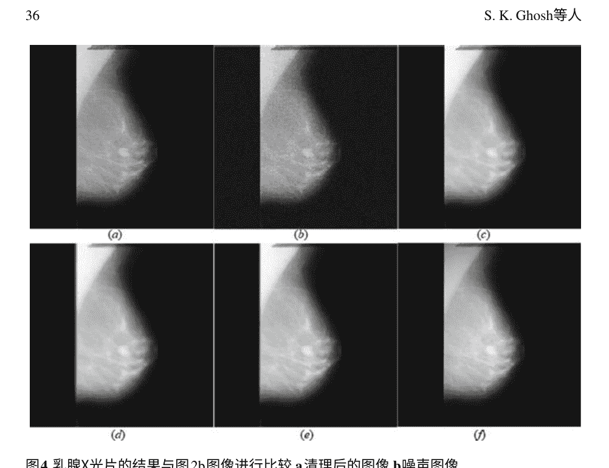

图4 乳腺X光片的结果与图2b图像进行比较 a清理后的图像 b噪声图像 c ABF d SDA e CDA和 f DAEM

训练数据：整个训练过程是从两个数据库中进行的。在第一阶段，从数据库中随机选择了300对图像作为训练集。在第二阶段，使用Keras API对初始的300对图像进行了数据增强，包括旋转、垂直和水平翻转以及缩放（缩放因子从0.25到0.5不等）。经过数据增强后，训练集的规模增加到了500。最后，对新的100对图像进行了类似的数据增强操作，得到了总共500张图像。

噪声水平：在实践中，训练集和测试集之间的噪声水平应该是不同的。因此，完全验证所提出模型在不同噪声水平下对各种数据集的有效性是至关重要的。然而，在实验中，使用了一个具有高斯噪声水平的测试集，μ=0，σ=30，以及p=25%的椒盐噪声区域。训练集保持了相似的噪声水平。定量结果如表1所示。确定对于给定的噪声水平，使用大量的迭代次数，CDA和DAEM的MSE、PQS和UQI值比其他基准方法更高。图4到7中呈现的分析结果进一步整理在表1中，以便更好地理解。

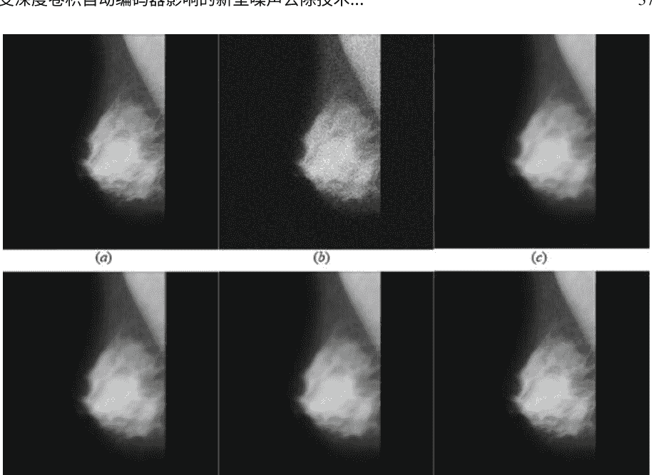

表1 各种方法的定量评估

| 图像 | 方法 | 均方误差 | 峰值信噪比 | PQS | 质量指标 | LIF | 结构相似性指数 |
| :--- | :--- | :--- | :--- | :--- | :--- | :--- | :--- |
| 图4 | ABF | 0.0278 | 40.1842 | 26.82分贝 | 0.844 | 0.5752 | 0.825 |
| 图4 | SDA | 0.0226 | 40.6219 | 27.32分贝 | 0.861 | 0.5517 | 0.843 |
| 图4 | CDA | 0.0193 | 41.0278 | 28.66分贝 | 0.878 | 0.5358 | 0.882 |
| 图4 | DAEM | 0.0188 | 42.0188 | 29.10分贝 | 0.883 | 0.5160 | 0.891 |
| 图5 | ABF | 0.0283 | 41.838 | 27.31分贝 | 0.851 | 0.5834 | 0.863 |
| 图5 | SDA | 0.0272 | 41.9278 | 28.11分贝 | 0.874 | 0.5761 | 0.881 |
| 图5 | CDA | 0.0213 | 42.0392 | 29.09分贝 | 0.886 | 0.5611 | 0.893 |
| 图5 | DAEM | 0.0197 | 43.0180 | 29.88分贝 | 0.906 | 0.5508 | 0.907 |
| 图6 | ABF | 0.0276 | 40.1842 | 27.18分贝 | 0.853 | 0.5752 | 0.863 |
| 图6 | SDA | 0.0254 | 40.6219 | 27.86分贝 | 0.873 | 0.5517 | 0.871 |
| 图6 | CDA | 0.0213 | 41.0278 | 28.09分贝 | 0.892 | 0.5358 | 0.890 |
| 图6 | DAEM | 0.0192 | 42.0188 | 28.76分贝 | 0.908 | 0.5160 | 0.906 |
| 图7 | ABF | 0.0273 | 41.8638 | 27.52分贝 | 0.851 | 0.5434 | 0.862 |
| 图7 | SDA | 0.0264 | 41.9278 | 27.98分贝 | 0.867 | 0.5164 | 0.873 |
| 图7 | CDA | 0.0206 | 42.0392 | 28.54分贝 | 0.873 | 0.5098 | 0.889 |
| 图7 | DAEM | 0.0190 | 43.0731 | 28.90分贝 | 0.903 | 0.4983 | 0.908 |

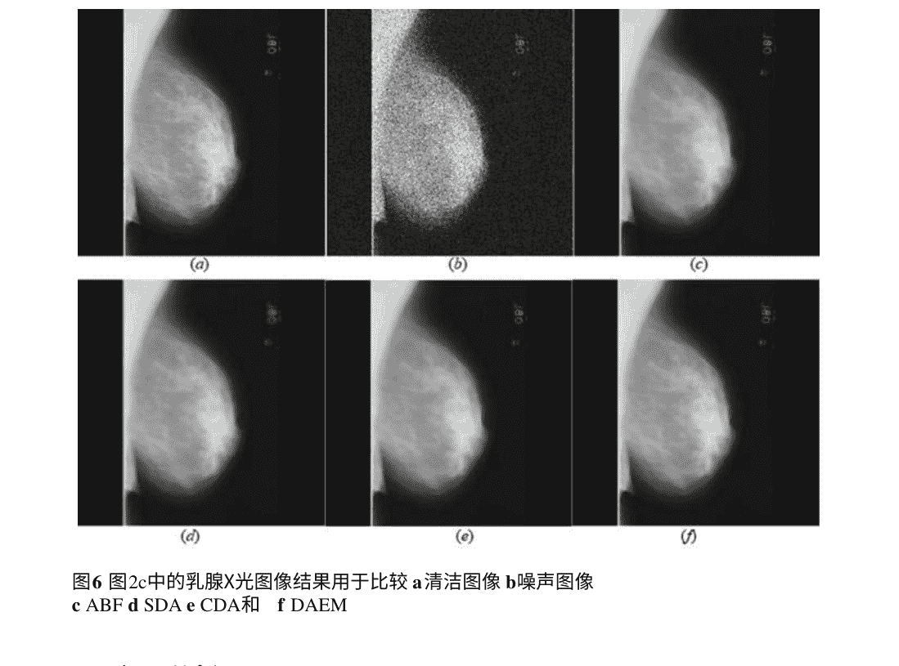

图6 图2c中的乳腺X光图像结果用于比较 a 清洁图像 b 噪声图像 c ABF d SDA e CDA 和 f DAEM

### 5.4 主观分析

在测试阶段，从测试集中选择一个序列帧来评估DAEM的性能。图4展示了通过所有方法获得的乳腺X光图像的结果。在图4b中，噪声乳腺X光图像出现在亮度组织附近，扭曲了乳房区域，如结节。所有方法都有效地抑制了噪声；然而，在图4c中，ABF受到明显的方形效应，并且过度平滑了乳房内部区域的一些重要细节。CDA保留了比SDA更多的细节，但乳房内部仍存在一些伪影，外观噪声且对比度较低。基于神经网络的方法CDA在去除噪声和伪影的同时保留了更多细节。然而，CDA在图4d中过度平滑了一些低对比度区域。

这些细节在三种基准方法ABF、SDA和CDA中被识别到不同的程度。从图4c-e可以看出，这三种方法比其他方法更好地保留了软组织的特征。从图4f到7f可以看出，DAEM在低对比度区域获得了最佳性能。其他方法，主要是ABF和SDA，未能完全去除脉冲噪声。提出的DAEM方法通过多松散利用基于无噪声像素的方法，保留了更多细节。最后，它具有

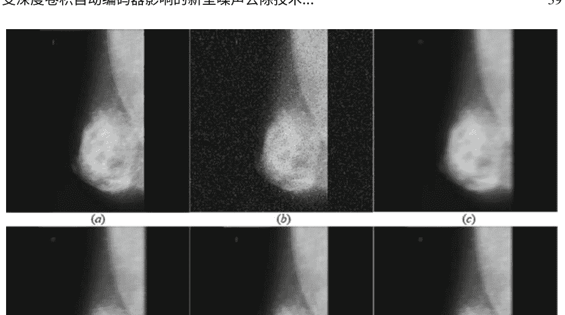

图7 用于比较的一些乳房X光图像的结果 a清晰图像 b有噪声图像 c ABF d SDA e CDA和 f DAEM

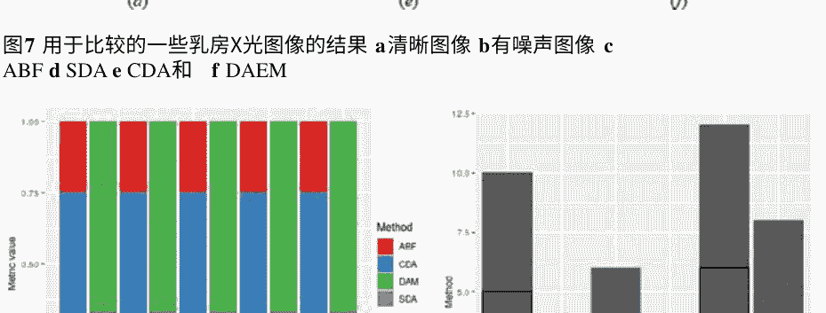

图8 所提出方法的性能评估 a根据图像的度量绘制的条形图 b根据度量绘制的方法图

可以看出，与其他方法相比，所提出的DAEM方法恢复图像的细节产生了最佳的视觉效果。图8显示了所有上述基准方法对所有测试图像生成的不同度量值。

### 5.5 目标分析

为了定量地展示DAEM方案的优越性，将其与上述三种先前方法进行了定量效率比较，如图4所示。表1给出了四个指标MSE、PSNR、PQS、UQI、LIF和SSIM的可比统计结果。对于所有图像，DAEM在MSE、PSNR、PQS、UQI和SSIM方面都取得了更好的分数。CDA技术在MSE、PQS、UQI和SSIM方面也取得了更好的性能，与DAEM相同，这表明两者在图像重建任务中都能保留更多的细节。

所有结果图像的定量结果都在表1中呈现。表1显示了测试集中所有图像的图4c-f的统计验证。表1显示，提出的DAEM方法在与CDA的竞争性能方面表现出色，并且比其他基线方法具有出色的恢复效果，这与图4的视觉评估和定量结果相一致。

在表1中，将所提出的DAEM技术的性能与ABF、SDA和CDA等三种基准方法进行了比较。基准方法如ABF和SDA所得到的UQI在0.8到0.88的范围内，而基于深度学习的技术CDA在UQI上接近所提出的技术。所提出的技术DAEM的SSIM值大于ABF、SDA和CDA，并接近0.9。使用ABF和SDA的SSIM值较低，而CDA和DAEM的值最高。因此，使用ABF和SDA无法很好地保留边缘，而CDA和DAEM能够保留边缘。

因此，清楚地看出表1揭示了CDA和所提出的技术DAEM在所有图像质量指标上均优于ABF和SDA方法。表1中的指标显示了所提出的DAEM技术具有更优越的降噪能力。图9显示了DAEM在一定数量的迭代周期下的测试和验证损失。

### 5.6 讨论

由于巨大的计算成本，对乳房X光片的具体重建仍然困难。目前，许多重建策略被推荐并应用于医疗系统中。然而，强大的有目的组件仅在高成本扫描仪上可用，并且对于医院来说，维护费用很高。在这项工作中，提出了一种基于深度自编码器的乳房X光片去噪和降噪技术。所提出的方法的优点是多方面的。首先，该算法可以嵌入到任何乳房X光片扫描仪上作为图像后处理软件包，无需访问原始数据。其次，虽然所提出的方案需要较长的训练时间，但离线运行时间非常短，可以处理乳房X光片。因此，它适用于实时使用。最后，所提出的

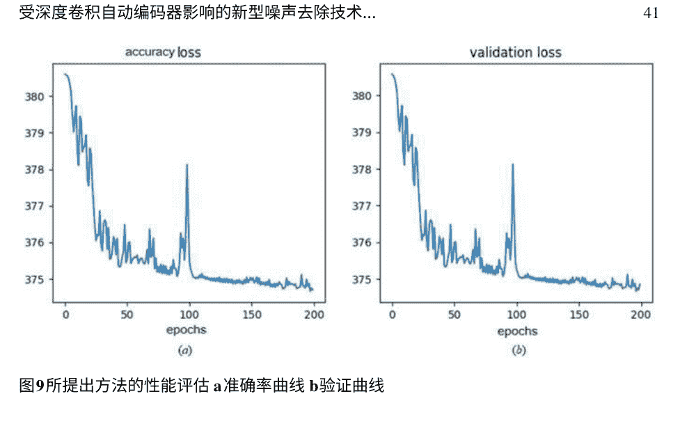

该方法采用了独有的深度学习方法，试图处理多功能巨大的医学数据，并且不需要对乳腺X线摄影系统的成像安装有任何专业知识。

根据实验结果分析，可以清楚地看出DAEM在实际使用中的整体处理时间比任何迭代方法和基于稀疏表示的去噪和重建策略都要小。在实践中，网络只需进行一次离线训练，以处理目标乳腺X线摄影图像。将其输入网络并执行一些加权求和操作，即可实现所需的结果。此外，DAEM在GPU上的并行实现非常简单直接。我们的实现中使用了一张750GTX GPU卡，并对所有层和300个训练图像进行了处理。完成整个训练阶段只需要1.5小时。然而，对于像Quadro或Tesla这样的专业GPU系统，训练过程可能更快。尽管CDA在所有情况下都比ABF和SDA方法取得了更好的结果，但CAD的计算复杂度要高得多。对于每个大型图像，ABF和SDA都需要更多的计算工作量。在实现平台上，CDA和DAEM分别需要5.29、8.63和4.19秒的离线模式。

## 6 结论和未来扩展

本章介绍了一种基于深度网络的去噪自编码器用于乳房X光成像。仿真结果表明，所提出的方法在视觉和暂定上都明显优于一些流行的方法。一旦使用现有的习惯和乳房图像对进行离线训练，提出的方法

该方法可以高效快速地提高图像质量。本研究展示了主观和客观结果，并确定其降噪和保留结构细节的能力。所提出的算法可以在任何乳腺X光扫描仪上作为图像后处理软件包嵌入，无需访问原始数据和进一步处理，从而大大减少了诊断多种故障所需的时间。

在未来的工作中，将深度学习应用于乳腺X光图像领域的其他问题，包括稀疏视图重建、乳腺X光成像中的内部变形测量和结构冗余减少等，将被开发利用。此外，它可以在GPU框架中实现，从而减少乳腺X光图像的恢复时间。

## 参考文献

- 1. 刘, W., 王, Z., 刘, X., 曾, N., 刘, Y., Alsaadi, F.E.: 深度神经网络结构及其应用综述. 神经计算 **234**, 11–26 (2017)
- 2. Hinton, G.E., Salakhutdinov, R.R.: 用神经网络降低数据维度. 科学 **313**(5786), 504–507 (2006)
- 3. 袁, Y., 孙, F.: 基于delta域的时变延迟神经网络的稳定性准则. 神经计算 **125**, 17–21 (2014)
- 4. 于, D., 邓, L.: 深度学习及其在信号和信息处理中的应用. IEEE信号处理杂志 **28**(1), 145–154 (2011)
- 5. Arel, I., Rose, D.C., Karnowski, T.P.: 深度机器学习-人工智能研究的新前沿. IEEE计算智能杂志 **5**(4), 13–18 (2010)
- 6. Sonka, M., Hlavac, V., Boyle, R.: 图像处理、分析和机器视觉。 Cengage Learning, 波士顿 (2014)
- 7. Chowdhary, C.L., Sai, G.V.K., Acharjya, D.P.: 减少假设以改善乳腺癌检测。 科学艺术杂志 **35**(2), 157–176 (2016)
- 8. Sawant, H.K., Deore, M.: 图像增强技术的综述。 国际计算机技术与电子工程杂志 **1**(2), 39–44 (2010)
- 9. Chowdhary, C.L., Acharjya, D.P.: 医学成像中的分割和特征提取: 一项系统性综述。 计算机科学会议论文集 **167**, 26–36 (2020)
- 10. Chowdhary, C.L., Acharjya, D.P.: 使用直觉模糊粗糙集技术的乳腺癌检测的混合方案。 国际医疗信息系统与信息杂志 **11**(2), 38–61 (2016)
- 11. Chowdhary, C.L., Acharjya, D.P.: 使用一种新颖的直觉可能性模糊c均值聚类算法对乳房X线照片进行分割。 在: 自然启发计算, pp. 75–82. Springer, 新加坡 (2018年)
- 12. Pathak, D., Krahenbuhl, P., Donahue, J., Darrell, T., Efros, A.A.: 上下文编码器: 通过修复学习特征。 在: IEEE计算机视觉和模式识别会议论文集, IEEEExplore, 第2536-2544页 (2016年)
- 13. Vincent, P.: 得分匹配和去噪自编码器之间的连接。 神经计算。 **23** (7) , 1661-1674页 (2011年)
- 14. Li, T.M., Wu, Y.T., Chuang, Y.Y.: 基于SURE的自适应采样和重建优化。 ACM图形学交易。 **31** (6) , 1-9页 (2012年)
- 15. Rousselle, F., Manzi, M., Zwicker, M.: 使用特征和颜色信息的鲁棒去噪。 计算机图形学论坛 **32** (7) , 121-130页 (2013年)
- 16. Kalantari, N.K., Bako, S., Sen, P.: 一种用于过滤蒙特卡洛噪声的机器学习方法. ACM图形学杂志 **34**(4), 1-12 (2015年)
- 17. Zimmer, H., Rousselle, F., Jakob, W., Wang, O., Adler, D., Jarosz, W., Sorkine-Hornung, O.,Sorkine-Hornung, A.: 用于稳健动画过滤的路径空间运动估计和分解. Comput. Graph. Forum 34(4), 131–142 (2015)
- 18. Chen, Y., Shi, L., Feng, Q., Yang, J., Shu, H., Luo, L., Coatrieux, J.L., Chen, W.: 抑制伪影的低剂量CT图像处理的字典学习. IEEE Trans. Med. Imaging 33(12), 2271–2292 (2014)
- 19. Gondara, L.: 使用卷积降噪自编码器进行医学图像降噪。 在：IEEE国际数据挖掘研讨会论文集，IEEEExplore，第241-246页（2016年）
- 20. Zhang, Y., Tian, X., Ren, P.: 基于自适应双边滤波器的图像降噪框架. Neurocomputing 140, 299-316 (2014)
- 21. Simonyan, K., Zisserman, A.: 用于大规模图像识别的非常深的卷积网络。 在：国际学习表示会议论文集，第1-12页（2014年）
- 22. Mao, X.J., Shen, C., Yang, Y.B.: 使用具有对称跳跃连接的卷积自编码器进行图像恢复。 在：神经信息处理系统会议论文集，第1-17页（2016年）
- 23. Zhang, Y., Zhang, W.H., Chen, H., Yang, M.L., Li, T.Y., Zhou, J.L.: 少视角图像重建结合总变差和高阶范数。国际成像系统技术杂志 23(3), 249-255 (2013)
- 24. Patraucean, V., Handa, A., Cipolla, R.: 具有可微分内存的时空视频自编码器。 在：国际学习表示会议论文集，第1-13页（2015年）
- 25. Ronneberger, O., Fischer, P., Brox, T.: U-net: 用于生物医学图像分割的卷积网络。 在：国际医学图像计算和计算机辅助干预会议论文集，第234-241页。 Springer，纽约，美国（2015年）
- 26. Dosovitskiy, A., Fischer, P., Ilg, E., Hausser, P., Hazirbas, C., Golkov, V., Daniel, P.S., Cremers, D., Brox, T.: Flownet: 使用卷积网络学习光流。 在：IEEE国际计算机视觉会议论文集，IEEEExplore，第2758-2766页（2015年）
- 27. Zhao, H., Gallo, O., Frosio, I., Kautz, J.: 用于图像恢复的损失函数与神经网络。IEEE计算机成像 3 (1), 47-57页（2016年）
- 28. Mittal, A., Moorthy, A.K., Bovik, A.C.: 空间域中的无参考图像质量评估。IEEE图像处理 21(12), 4695-4708（2012年）
- 29. Wang, Z., Bovik, A.C., Sheikh, H.R., Simoncelli, E.P.: 图像质量评估：从误差可见性到结构相似性。IEEE图像处理 13(4), 600-612（2004年）
- 30. Yoo, J.C., Ahn, C.W.: 基于峰值信噪比的遮挡检测的图像匹配。IET图像处理 6(5), 483-495（2012年）
- 31. Wang, Z., Bovik, A.C.: 一种通用的图像质量指数。IEEE信号处理通信 9(3), 81-84(2002年)
- 32. Pratamasunu, G.Q.O., Hu, Z., Arifin, A.Z., Yuniarti, A., Navastara, D.A., Wijaya, A.Y., Kho-timah, W.N., Asano, A.: 基于模糊指数和模糊相似度测量的图像阈值分割。 In: 第8届IEEE国际计算智能和应用研讨会论文集，IEEEExplore，第161-166页（2015年）

# 通过人脑使用混合模型深度学习算法的高安全框架

S. Balakrishnan, J. P. Ananth, L. Ramanathan, R. Sachinkanithkar和S. Rajkumar

摘要脑电波阅读是一种阅读人脑的艺术，生物工程师是其中的画家。脑电波也是一种能量形式，除了思考外，人类不会将其用于外部目的。当前的功能性磁共振成像（FMRI）技术在检测和估计脑模式方面发挥着重要作用。本章的思想是分析人脑模式的独特性，并基于大小、心态和波的速率等各种因素提供高级别的安全性。该框架消除了其他安全识别系统中常见的欺诈容忍率。本章提出了一种称为混合模型深度学习算法的算法，用于通过人脑提供安全性的实施。

## 1 引言

在技术和创新领域中，最有声望的流行词之一是人工智能[1]，也可以称为机器智能（MI）。人工智能为其他技术的发展奠定了坚实的基础，例如机器学习（ML）和深度学习（DL）。机器智能被认为是一门研究完全基于智能的各种代理的学科。

S.巴拉克里希南 · J.P.安南特 · R.萨钦卡尼特卡尔

印度泰米尔纳德邦科英格利斯和技术学院，科伊马托尔，印度

电子邮件：balkiparu@gmail.com

J.P.安南特

电子邮件：jude.ananth@gmail.com

R. Sachinkanithkar

电子邮件：sachinkanith98@gmail.com

L.拉马纳坦（✉） · S.拉杰库马尔

计算机科学与工程学院，VIT，维洛尔，印度

电子邮件：lramanathan@vit.ac.in

S.拉杰库马尔

电子邮件：rajkumars@vit.ac.in

一般来说，它被认为是机器展示的智能。人工智能诞生于1956年；最初它作为一门学科而产生，既有乐观的反应，也有悲观的反应。几十年前，当人类利用机器进行人类活动时，引发了人类的好奇心，像“机器能像人类一样思考和行动吗？”这导致了人工智能的诞生。机器智能在科学和技术领域都有贡献。但是，机器智能的主要重点是人类智能，包括推理、学习解决数学和逻辑问题。

在这个创造性世界中，数据分析的未来由深度学习（DL）、机器学习（ML）和人工智能（AI）所主导[2]。ML是人工智能的一个子集，它使计算机系统能够在没有明确修改的情况下自主学习和工作。用户的倾向被描绘为一台独立的机器，它比其他自动化机器更加完美地计算机化。机器自动化是未来的技术，将成为机械王国的领导者。此外，人工智能利用特定的预测算法和系统来预测测试数据中的模式，并构建和使用模型来识别这些预测模式，以便对新数据进行未来分析。就计算过程而言，监督学习和无监督学习是机器学习中的两种分类算法。

人工智能（AI）利用特定的预测算法和方法来预测测试数据中的模式，并构建和使用模型来识别这些预测模式，以便对新输入进行未来分析。就计算过程而言，监督学习和无监督学习是机器学习中的两种分类算法。数据挖掘的自动化和连续版本被称为机器学习。在数据挖掘中，通过给定的数据集，可以识别出普通人无法预测的模式。然而，机器学习利用算法从不断变化的大型数据集中预测和总结信息。

人工智能利用识别到的数据来应用该数据以获得新的解决方案和行动。许多人认为机器学习和计算机智能是相同的，但这是不正确的。尽管这两种技术不同，但人工智能和机器智能彼此相互关联。人工智能的目标是通过使机器工作来限制人类行为，而机器学习通过提供科学工具和算法来实现人工智能的目标。

人工智能几乎构成了我们在技术方面所做的每项任务的基础，并且它像人类一样品尝成功的配方。在机器中使用人工智能的主要好处之一是，具有人工智能的机器程序能够回答通用问题，而在其他传统系统中这是不可能的。图1表示机器行为所需的各种因素。当人工智能编程的机器接受新药物时，它们能够适应环境的变化，而不支持人工智能的机器则无法做到这一点，因为对这些机器的微小修改可能导致其结构完全改变。研究人员将人工智能分为两个主要群体：强人工智能和弱人工智能。发展的主题

## 图1人类记忆的分析

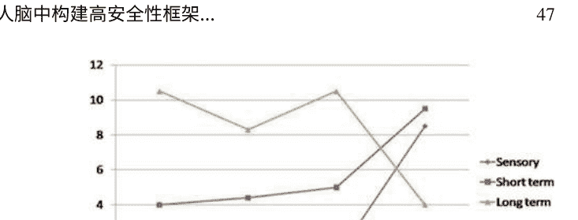

基于预先计划的动作的技术中，弱机器智能的概念是背后的概念，而强人工智能能够在某些领域中思考和运作，类似于人类。另一种MI类型是专家系统。专家系统是基于知识的方法，这种类型的机器智能软件旨在展示和模仿智能行为的方面。这种类型的机器智能擅长模仿人类，并具有感知和认知的能力。

人类和机器在行为上有所不同。尽管机器的创造者是人类，但人类没有能力和能力来完成机器完成的许多任务。机器对人类的生活产生了巨大的影响，它们几乎创造了一场革命，没有机器的生活对人类来说是不可能的。将人类智能与机器智能进行比较时，机器没有任何原创的想法来执行任务，而人类是基于创造者的创新思想创造这些机器。如果一个物体中的特定部分缺失，人类可以轻松地找出原始物体。

但是在机器方面，这个案例失败了。这种情况的一个最好的例子是指纹识别，当一个人的手指上有伤口时，机器无法识别。人类智慧基于意识来理解和处理情况。机器智能只能通过编程来处理情况，它们不知道什么是好的和坏的。人类智慧是广泛的，人类的思维没有限制或边界，而机器智能只是人工的，很小，并且它们只是机器中的临时记忆。尽管机器智能有一些限制，但它可以用来减轻人类的负担。相反，机器智能在完成工作时比人类智能更快。与人类智能相比，机器的错误概率降低了。此外，由于机器智能没有情感，它们在处理像医院手术、无人机救援等关键情况时是专家。

本章的其余部分按照以下路线图组织。在介绍之后，第2节介绍了不同的机器学习趋势，并随后介绍了MI在现实世界中的当前趋势。第3节解释了相关的文献调查，然后在第4节中提出了系统和算法。第5节介绍了实验结果，而第6节总结了从研究工作中得出的结论和进一步的研究选项。

## 2机器学习趋势

作为众多想象力进步的中心，机器学习在改善我们的日常生活方面尽力而为。在过去几年中，机器学习已经在搜索引擎和移动应用开发领域悄然实施。然而，最近机器学习达到了巅峰，由于机器学习的某些方面的技术进步，它成为了世界范围内普遍使用的流行词。

人工智能还获得了显著的数据和计算能力，这在技术上取得了巨大的进展。机器学习的巨大发展有助于定义技术趋势。这种趋势的影响必然具有解决现实世界中各种问题和为我们的社会增加利益的潜力。

人脑类似于一台计算机，它处理数百万条信息并像命令系统一样对我们的人体进行操作。人脑中的记忆存储是一种 passively 保留信息的方法。我们的大脑大约有1000亿个神经元。事实上，每当一个人学到新东西时，他的大脑会产生“脑纹”。人类记忆是一种心理功能，它帮助人们获取、保留和回忆他们所经历的一些感觉、思想、印象和信息。人类的记忆系统[3]被分为三类，即感觉记忆、短期记忆和长期记忆。我们的大脑感知到的信息经过每个阶段，从感觉记忆开始，最终到达长期记忆。只有注意力所关注的信息才能进入下一个阶段，其他信息则停留在初始状态。感觉记忆仅保留环境中感知到的信息不超过一秒钟。大部分感觉记忆中的信息都会被遗忘，但通过关注这些信息，它们将被传递到短期记忆中。短期记忆是一个人当前思考的信息所在之处。保留的信息只能持续20到45秒，所以我们会忘记很多短暂的思考。短期记忆既有时间限制又有容量限制，研究证明它只能容纳7 ± 2个项目。显性记忆有助于我们回忆起一个人所思考的事物的名称。一个人无意识地记住的知识属于隐性记忆。例如，一个人在骑自行车或开车时使用隐性记忆，因为一个人可以在没有有意识思考的情况下做到这一点。因此，通过分析一个人的感觉记忆，可以恢复他所忘记的东西。

来自短期记忆的脑电图有助于识别一个人当前的思维。人脑的长期记忆估计一个人最深层的思维。图1区分了各种类型记忆的特征。

磁共振成像（MRI）[4]有助于识别脑成像和分析脑电图。功能磁共振成像（FMRI）检测人脑的血液流动速率，从而间接测量脑活动。这些研究大多有助于确定人脑中参与认知任务的部分。使用FMRI技术分析脑神经信息是一种新兴趋势。通过记录大脑对图像的处理，收集有关大脑图像处理的信息

## 图2 对人类不同状态的脑电波分析

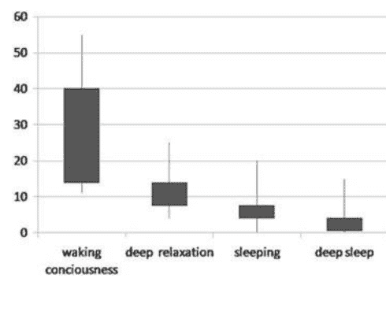

视觉皮层的活动。视觉皮层作为一个主体，保存了数千张随机选择的图片。神经元对神经场景的各个方面做出反应。因此，大脑扫描中各个区域记录的各种活动反映了该区域神经元处理的视觉信息。通常，这项技术用于测谎仪，直接推断大脑活动，试图确定嫌疑人是否能够识别他声称没有去过的犯罪现场的照片。这项技术也用于推断和分析脑电图，并提供安全保障。图2给出了脑电波分析。

通过使用脑模式识别，安全性[5]是通过大脑提供的。我们的人脑是终极的，通过识别脑印提供安全是可能的。脑安全性非常强大，可以消除欺诈或非法访问，并为用户提供高度安全性。生物工程师通过使用在人脑中刺激引起的多个体素的响应来读取人脑，并通过FMRI后续检测来获取原始刺激。FMRI用于解码。脑印是独特的，每个人都不同。FMRI结合脑电图（EEG）技术有助于为用户提供脑安全。EEG是一种监测脑电活动的电生理方法，并记录每个活动[6]。检测到的脑印和模式与个人脑的独特性进行比较，并解锁安全性。

### 2.1 当前世界中的机器智能趋势

这个强大的工具MI已经在许多实际场景中得到了应用。图3显示了机器智能在研究领域和实际世界中的影响。现在，让我们来了解机器智能在实际世界中的当前趋势。

- 更好的天气预测：通常天气预测涉及到复杂和大量的数据，需要考虑到准确预测天气所需的数据量。目前正在开发的机器智能软件用于准确预测天气。通过对接近天气的现象进行分析，它可以获得清晰的天气预测。所有可用的数据，因此有助于及早预警自然灾害，并挽救生命。此外，它还作为农民友好工具，从而防止森林火灾。目前，NASA正在开发一个用于航空安全的程序，指示潜在风暴高危区域。

## 图3 研究领域和现实世界中的机器智能

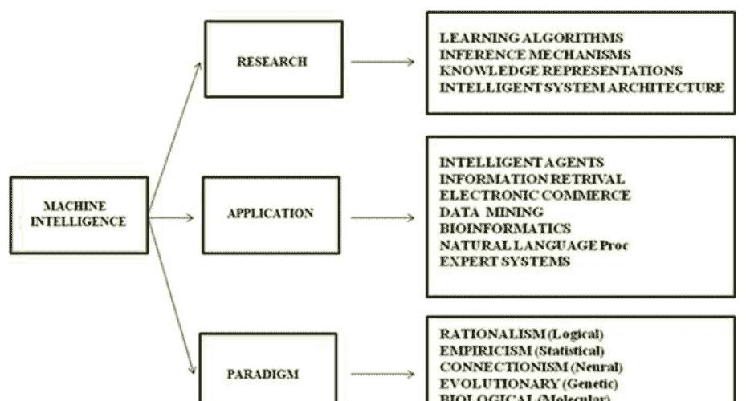

- 解决家务杂事：机器智能的一种有前途的方法是设计机器来执行家务杂事。机器人被制作来做各种工作，它消除了任何工作场所的复杂性。这项技术可以用于执行对人类来说相当无聊的各种修复任务。这种机器智能模型的一个例子是用于确保人类安全和可行性的某些工厂中使用的baxter。机器智能还在其他领域中实施，如处理高放射性材料、采矿领域、排除地雷、消防领域。由于机器智能在这些领域中的应用减少了处理过于危险任务的风险。

- 环境清洁器：破坏我们环境的主要问题之一是污染，机器智能在与这场战斗中尽力而为。目前，许多机器人被设计用于清理环境中的空气和水污染。通过构建软件程序，使机器人对自然生物和其他污染物进行模拟，进一步减少对我们自然生态系统造成的损害。通过开发高效智能软件，机器智能还可以控制工业和工厂中的污染物水平。有害气体被预测并从环境中清除。

- 自主无人驾驶汽车：机器智能的进步导致了自主无人驾驶汽车的发展，并使其在道路上行驶。该技术的构建使用了两个主要组件，即由光探测和测距（LIDAR）激光制成的雷达系统和强大的测距仪。通过使用这些组件，环境被视为一个3D地图。机器智能无人驾驶汽车利用这个3D地图结合高分辨率地图，使汽车能够自行驾驶而无需他人的帮助和支持。进一步的自动停车系统是通过使用机器智能技术在摄像头和传感器中构建的。随着机器智能技术的进步，机器智能也可以用于构建无人驾驶列车。在许多情况下，机器智能是无瑕疵的，比其他分心的驾驶员拥有更高的特权，并且比人类表现更好。

- 太空探险者：机器智能在太空探索中发挥着重要作用，许多太空学院开始依赖机器智能太空船在探索人类无法到达的星系。人类可能需要数年时间才能到达未知的遥远星系，但无人航天器、探测器和探测器可以轻松完成这项任务。机器智能探测器还在火星表面进行了研究并收集了数据和照片，人类无法到达这些地方。智能车辆具有感知障碍物和估计最安全行驶路径的智能。此外，它使科学家在关键时刻能够更快地做出反应。机器智能还有助于检测可能在未来发生的问题，并帮助减少其对太空和环境可能造成的破坏的概率。

- 防范威胁：机器智能用于提供安全和保护人们免受入室盗窃和恐怖分子造成的威胁。进一步的机器智能在军队中用于防止未经授权者进入国家。机器智能机器人和无人机全天候感知，预测任何非法入境国家的情况。如果预测到任何恐怖分子或非法入境。它会立即向军队驻地发出警告。将机器智能引入军队以保护国家可以降低士兵的死亡率。进一步的机器智能在预测威胁方面比人类士兵更准确。机器智能能够区分居民和陌生人。

- 医疗机器人：机器智能机器人被应用于医学领域，这些机器人的行为类似于医生，并挽救了患者的生命。Cedars-Sinai医疗中心采用智能机器智能软件分析心率来预测心脏病发作的早期发生。MI也用于区分真假药品。这项技术的进一步创新导致了机器人辅助手术助手的发展。这些助理外科医生在关键手术中充当支持手，他们学习各种手术并根据其工作。MI还用于开发智能软件，跟踪个人健康记录的变化，并警告医生有关个人健康变化的变化，并在为患者开药时提供一些建议。

- 金融安全卫士：特殊的机器智能软件用于管理全球一半的股票交易。为了发现市场中的模式并预测价格的变化，构建了MI程序，并用于安全交易的目的。这种MI技术软件提高了性能，从而提高了投资者的回报。它提供消费者保护，并消除购买商品中的伪造。此外，当MI基于软件检测到异常的转账时使用信用卡进行的资金转移时，它会自动向持卡人发送警告信息，从而确保安全。

## 3个相关研究工作

机器智能[7]可能涉及两个方面，即人工智能和机器学习。当机器智能在其各种活动中被发现适用时，这是防御领域的一次巨大进化。识别一个人在心中所思的古老做法被称为心灵感应。心灵感应背后的幻觉是心灵主义的艺术。心灵感应[8]是指通过除了五种感官之外的方式在个体之间传递信息的过程。心灵感应在古代仅仅用于找到像一个人在想什么这样的事情。在这种实践中，没有关于一个人思想的确切预测。当前技术能够读取人类的脑电图模式，并确定人们的思想、梦想和意图。脑电图模式不能完全提供有关一个人思想的信息。它通常处理从大脑中读取的即时模式。它对于理解人脑的活动并不是很有帮助。

此外，所采用的安全系统是基于个体的行为特征，例如识别面部、声音或指纹。这些检测方法中使用了传感器。

- 面部识别在许多应用中用于识别和验证用户，通过网络摄像头寻找与照片数据库中的面部匹配。面部识别的有效性受到图像质量、图像大小、面部角度的限制，有时候犯罪检测是通过使用面具进行的。
- 语音识别指的是机器接收和解释口述并执行用户直接讲话的命令的能力。语音识别的局限性在于语音质量，安全系统无法识别配音的声音。这些缺点使得语音识别系统成为一个失败的模型。
- 指纹识别是一种自动化的验证方法，用于在两个人类指纹之间进行验证。指纹识别是生物识别的一种形式，用于识别个体并验证其身份。为了识别模式并解锁，指纹可以从人体上切下来并被冒名顶替者放置以获取欺诈性访问。还可以通过使用透明胶带从玻璃材料上提取的指纹制作假指纹。因此，这些识别系统并不安全，迫切需要一些更先进的生物识别技术。

除了这些安全识别系统外，一些常用的安全系统包括数字锁、模式识别和个人身份识别号码（PIN）号码检测。这些系统的主要缺陷是，黑客很容易找到这些模式。安全级别低，也有可能通过猜测来解锁。因此，消除这些限制的最佳选择是提供安全性通过大脑。一些相关的想法，如大脑模式被用于生成取代ATM中的字母数字密码或PIN的密码。与其在ATM上手动输入PIN，不如连接耳机，然后在ATM屏幕上显示一系列PIN号码给用户。当当前的PIN出现时，大脑模式会发生变化，从而激活交易。此外，这些大脑模式是安全的，因为它们不支持所有情况，当一个人处于压力下时，大脑模式将无法工作，使其更具欺诈抵抗能力。

大脑计算机[9]接口技术是一种代表着一个高度发展的研究领域的方式，具有许多应用系统。目前的研究人员让近56人戴上脑电图头盔，然后让他们观看一系列400张图片。每张图片只闪烁200毫秒。大多数显示的图片是黑白的，但参与者能够感知到带有颜色的图像。

通过使用FMRI技术可以感知到脑模式[10]。但是FMRI技术的成本较高，解决这个问题的替代方案是使用EEG。脑安全正在成为一项新兴技术，因为复制他人的思维是困难的，而脑模式是独一无二的。考虑到技术的改进，这项技术无疑是有优势的。由于这种技术使用了脑印记，它属于生物识别应用的范畴，特别是作为多因素系统的一部分，用于增强认证。当前系统只是感知脑模式并解锁安全系统。这种方法的主要缺点是，如果某个未经授权的用户想到相同的模式，那么安全系统将被解锁。这面临着与PIN模式识别相似的缺点。我们提出的想法通过分析脑模式的独特性来消除这些缺点，并提供安全性。为此，我们使用了“改进的多流形深度度量学习”（MMDML）方法来对任何癌症疾病的图像集进行分类[11]。

### 3.1 深度学习算法

深度学习是人工智能领域中发展最快的领域。它是一种新兴技术，可以帮助计算机以图像、声音和文本的形式感知无限量的数据。基于由多个层组成的神经网络，计算机具备了看、学习和反应的能力。计算机的设计使其能够比人类更好地处理许多复杂情况。这种发展导致了对我们的数据、技术以及我们提供的产品和服务的不同思考方式。一些深度学习架构，如深度神经网络和循环神经网络，被应用于包括计算机视觉、语音识别、机器翻译、自然语言处理和生物信息学在内的各个领域。产生的结果比人类更加清晰和准确。

决策树学习利用决策树作为预测模型，从对一个项目的观察中得出关于该项目目标值的结论。是一种在统计分析、数据挖掘和机器学习中使用的预测模型。这些模型包含目标变量，该变量可以取一组离散值，被称为分类树。在决策分析中，决策树用于在做出决策时以可视化方式表示决策。决策树学习被分为分类树、回归树和提升树。决策树的构建是从带有类标签的训练元组中绘制的。它们类似于流程图结构，其中每个内部节点表示对属性的测试，每个分支表示每个测试的结果，每个叶节点保存一个类标签。

树结构中的最顶层节点是根节点。 决策树学习算法模型在每个阶段进行连续的随机实验和测试，直达到最终满意的解决方案。

在机器学习中，降维（DR）是指数据集中特征的数量。 当特征的数量相对于数据集中的观测数量非常大时，某些算法在使用训练有效模型时会遇到困难。 这被称为“维度灾难”，类似于依赖距离计算的聚类算法。降维属于无监督学习的范畴，输入的随机数据根据某种顺序进行分组。 它广泛地分为特征选择和特征提取。

## 4个提出的设计

人类的大脑模式是独特的，每个人之间都有所不同。 使用fMRI技术感知人类在不同状态下的大脑模式，如快乐、悲伤、沮丧、困惑、紧张和害怕。 基于不同心态的这些检测到的模式被存储在一个小数据集中，以每个用户的名字命名。 当用户想要解锁他的安全系统时，使用fMRI技术检测大脑模式和心态。 在使用我们的想法解锁安全系统时，主要因素之一是没有人可以强迫用户解锁系统。 检测到的大脑模式显示用户是否被其他人强迫。当前检测到的用户大脑模式与数据集中的其他模式进行比较。 基于大脑模式和用户心态的匹配，安全系统被解锁。 因此，建议的技术消除了未经授权使用系统的威胁。 它在提供全球安全方面推动了一项重大举措。

### 4.1 提出的算法

所提出的算法将DR算法和决策树算法整合在一起。 它的目标是从输入数据中提取显著和信息丰富的特征，进一步用于预测算法。 DR算法用于根据某种优先级重新排序存储在数据库中的脑模式。 它有助于分析一个人的最深的思想和一个人最常思考的东西。决策树算法用于估计和预测大脑模式，并进而识别一个人当前的思想。决策树模型通过多次检查来进行模式的连续处理，直到达到最终结论。下面介绍了提出的混合模型算法。

## 算法1算法混合模型

1.  找到数据的均值中心（可选）
2.  计算维度的协方差矩阵
3.  找到协方差矩阵的特征向量
4.  按特征值递减顺序排序特征向量
5.  按顺序将数据投影到特征向量上。假设数据矩阵'B'的大小为(m × n)
6.  对于每个维度，计算均值 μ_i, i = 1, 2, ..., n
7.  从矩阵'B'的第i列中减去均值 μ_i，得到矩阵'A'。
8.  计算协方差矩阵'C'的大小为(n × n)。如果均值已居中，C = A^T A
9.  找到协方差矩阵'C'的特征向量和对应的特征值(v, e)
10. 将特征值按照 e_1 ≥ e_2 ≥ e_3 ≥ ... ≥ e_n 的顺序排序
11. 逐步将数据投影到主成分v_1, v_2, v_3, ... 这个最终输出作为决策树左节点的输入，用于估计最终输出。
12. 将数据集的最佳属性放在树的根部
13. 将训练集分成子集。子集应该以这样的方式制作，即每个子集都包含具有相同属性值的数据
14. 在树的所有分支中重复步骤12和13，直到找到所有分支的叶节点。

Algo混合模型算法是维度缩减和决策树的修改组合。而维度缩减算法属于无监督学习类别，决策树属于监督学习类别。我们的最终目标是将这两个算法的结果部分组合起来，以获得时间复杂度较低的期望结果。用于分析高信息增益的公式如下。

```
增益(S, A) = 熵(S) - Σ_{j=1}^{v} (|S_j| / |S|) * 熵(S_j)  (1)
熵(S) = Σ_{i=1}^{c} P_i × log_2(P_i)  (2)
```

所提出的算法的主要目标是通过降维将最需要的数据估计为输出，并将这些数据作为决策树中叶节点的输入，以获得估计的模式。这种对大脑模式的排序方式为未来的分析铺平了道路。使用降维通过降维检测到所需的模式，并将这些模式作为输入给决策树的最终叶节点，该叶节点预测给定的模式是否与数据集中的用户模式匹配。系统架构如图4所示。

## 5 实验结果和讨论

本节分析了所提出算法的实验结果。为了测试所提出方法的性能，使用Brainsense头带从5个用户收集了实时脑波。为了可视化，图5展示了一个Brainsense头带。

数据集描述包括5个用户和15个试验次数。信号的持续时间被认为是30秒。训练数据包括62个案例，而测试数据包括35个案例。训练的最大迭代次数为200个周期。

图5 Brainsense头带

### 5.1 性能指标

敏感性、特异性和准确性被用作性能评估。tp, tn, fp, 和 fn分别表示真正例、真负例、假正例和假负例。敏感性在各种应用中用于评估目标检测。敏感性是完整性的度量。它在方程3中定义。高敏感性值对应高检测率。特异性是正确识别的实际负例的度量。它在方程4中定义。高特异性值表示较低的假正例数量。准确性是分类问题的良好度量，它在方程5中呈现。

```
敏感性 = tp / (tp + fn)
```

```
特异性 = tn / (tn + fp)
```

```
准确性 = (敏感性 + 特异性) / 2
```

### 5.2 结果分析

所提出方法的性能通过混淆矩阵进行评估。表1显示了所提出方法结果的混淆矩阵。所提出方法的敏感性和特异性的平均值分别为0.92和0.96。所提出方法的准确性为0.94。

表1 分类的混淆矩阵

|        | 用户1 | 用户2 | 用户3 | 用户4 | 用户5 | 敏感性 |
| :---   | :--- | :--- | :--- | :--- | :--- | :---   |
| 用户1 | 28   | 0    | 0    | 1    | 1    | 0.93   |
| 用户2 | 2    | 29   | 1    | 0    | 0    | 0.90   |
| 用户3 | 0    | 0    | 30   | 1    | 0    | 0.96   |
| 用户4 | 0    | 1    | 0    | 29   | 0    | 0.96   |
| 用户5 | 1    | 2    | 1    | 0    | 28   | 0.875  |
| 特异性 | 0.98 | 0.90 | 0.98 | 0.97 | 0.99 |        |

## 6 结论和进一步研究方向

建议的想法是一种有前途的技术，可能会对当前技术产生巨大影响。脑模式和脑印记用于识别脑活动，从而提供高水平的安全性。因此，欺诈和非法使用安全性可以完全消除，因为只有预期的用户可以解锁安全性。通过频繁分析脑模式，可以减少脑死亡的可能性。通过触发我们的记忆，可以利用神经元中存储的数十亿信息来应用于我们的实际生活。这个领域的未来工作有助于将世界引向自动化的道路。进一步的研究可以在感知科学到工作和思维控制移动方向进行。在感知科学到工作中，可以分析机器人。机器人充当主人的助手。但是它们之间没有主从关系。现有的机器人只有在接到主人的命令后才执行任务。未来，机器人将根据它们从人脑中感知到的模式来工作。

目前，主控和机器人正在工作，未来机器人可能会在主控思考时感知和工作。同样，另一种方式是通过思维控制手机。目前手机是通过触摸识别操作的。未来的手机技术将基于思维感知工作。用户只需思考解锁自己的模式，他们可以通过思考拨打任何电话。

如果我们想在5分钟后给某人打电话，那么这些细节将存储在“待办事项”中，并且会自动保留。这些技术是迈向机器人世界的一项举措。

## 参考文献

1.  Balakrishnan, S., Janet, J.: 基于智能代理的系统及其工具概述. CSI Commun. Mag. **42**, 15–17 (2019)
2.  Balakrishnan, S., Ratnakumar, A.J., Elumalai, J.: 基于机器学习的回归技术用于电子邮件优先级排序. Taga J. Graphic Technol. **14**, 710–717 (2018)
3.  Peron, S., Svoboda, K.: 从棍棒到手术刀：用光遗传学实现精确的神经控制. Nat. 方法 **8**(1), 30–34 (2011)
4.  Ma, J., Sheridan, R.P., Liaw, A., Dahl, G.E., Svetnik, V.: 深度神经网络作为定量结构活性关系的一种方法. J. Chem. Inf. Model. **55**(2), 263-274 (2015)
5.  Ciodaro, T., Deva, D., De Seixas, J.M., Damazio, D.: 基于拓扑量热计信息的神经网络在线粒子检测. J. Phys.: Conf. Ser. **368**(1), 1-12 (2012)
6.  Choromanska, A., Henaff, M., Mathieu, M., Arous, G.B., LeCun, Y.: 多层网络的损失曲面. 在：人工智能和统计学会议论文集, pp. 192-204 (2015)
7.  Balakrishnan, S., Deva, D.: 军事机器人控制中的机器智能挑战. CSI Commun. Mag. **41**, 35-36 (2018)
8.  Jean, S., Cho, K., Memisevic, R., Bengio, Y.: 在神经机器翻译中使用非常大的目标词汇. Proc. AACL-IJCNLP **1**, 1-10 (2015)
9.  Sutskever, I., Vinyals, O., Le, Q.V.: 序列到序列学习与神经网络. Adv. Neural Inf. Process. Syst. **27**, 3104-3112 (2014)
10. Graves, A., Mohamed, A.R., Hinton, G.: 深度递归神经网络的语音识别. In: IEEE国际声学、语音和信号处理会议论文集, IEEEExplore, pp. 6645-6649 (2013)
11. Balakrishnan, S., Aravind, K., Ratnakumar, A.J.: 基于多流形深度度量学习的肿瘤图像集分类的新方法. Int. J. Pure Appl. Math. **119**(10c), 553-562 (2018)

# 深度学习的知识框架：先天性心脏病

Ritu Chauhan和Harleen Kaur

摘要 多相计算技术时代的到来极大地增加了数字数据的排放。这导致全球的研究人员和科学家寻找深度学习信息和模式，以便未来的知识发现。

对于从大型数据库中进行深度学习，机器学习已经发展成为一种有效和高效的知识发现技术。因此，机器学习可以被描述为一门科学领域，用于设计和开发算法，使计算机能够根据先前的测量结果改善对当前问题的理解，并在明确的规则和规定下解决连续问题。本章的目标是利用机器学习技术探索冠心病数据库，以辅助患者护理和信息挖掘方法进行深度学习。

尝试是为了根据早期信息和数据来规定一种自动诊断心脏疾病的策略。然而，研究的目的是探索、检测模式并了解先天性心脏病的不同参数的原因。

## 1 引言

数据技术、系统集成和编程进展的推动，形成了一个创新的多面计算机系统时代。这种计算技术领域的发展迫使全球的研究人员和科学家确定用于深度学习的干预预测数据分析技术。近年来，人们越来越关注在各种应用数据框架中利用信息数据挖掘推动的进展。然而，机器学习可以被定义为一门科学领域，用于设计和发展让计算机提高对实时情况的了解的算法。

R. Chauhan
计算生物学和生物信息学中心，阿米蒂大学，北达邦，印度

H. Kaur (✉)
计算机科学与工程系，工程科学与技术学院，印度新德里Jamia Hamdard大学

© Springer Nature Switzerland AG 2022
D. P. Acharjya等人（编），《深度学习在数据分析中》，大数据研究91辑，
https://doi.org/10.1007/978-3-030-75855-4_4

在先前的测量中存在问题，并通过明确的指导方针解决深度学习方法下的连续问题[1-5]。大数据的广泛探索为未来的决策提供了发现隐藏信息和知识的动力效应。数据挖掘技术已经在过去十年中发展，可以用于探索知识发现过程中的重要模式。

此外，信息或数据挖掘可以被视为一种使用户导向的方法，用于处理从数据库中学习和数据库包含的案例（记录或案例）的认知。换句话说，信息挖掘可以被讨论为一个不变的重要步骤，它实现了从大型数据库中揭示隐藏但重要的知识。同样，数据挖掘是对大型数据集进行研究，以提取隐含的和以前未知的模式、关系和信息，这些模式、关系和信息很难用传统的测量方法来识别。它包括从原始数据收集到某种形式的新学习的几个阶段，用于未来数据分析的预测。因此，知识发现是从大型数据库中获取相关隐藏模式的关键因素，用于深度学习[6-11]。

此外，知识发现可以被看作是一个迭代过程，其中包括数据清洗、数据整合、数据选择、数据转换、数据挖掘、模式评估和知识表示等多个步骤。信息挖掘是知识发现过程中不同过程的核心，通过从低级信息中获取显著的知识。此后，数据挖掘可以将数据分类为有监督和无监督技术[5, 12-16]。当实例包含正确的输出（类标记或标签）时，学习过程被称为有监督学习，而不知道实例的类名的机器学习过程被称为无监督学习。分类和关联规则往往是有监督学习技术，而聚类和异常值分析则是无监督技术。数据挖掘分类技术通常在医疗应用领域中被应用于检索各种形状和大小的模式[17-23]。

此外，临床数据挖掘是一个包含大量不确定性和脆弱性的测试空间。通过将其用作深度学习的洞察性诊断工具，可以在人类医疗保健中利用数据挖掘的好处。通过使用数据聚类算法，还可以提高预期的精确度。医学领域的研究人员已经成功地利用数据挖掘技术[16, 24-28]来识别和预测疾病。在提出的方法中，我们使用心血管疾病数据集进行预测性数据分析，以发现疾病预后的隐藏信息和知识[28-33]。

心血管疾病（CVD）是涉及心脏或血管并影响心脏运作的一类疾病。心血管疾病是现代世界上最常见的疾病之一。有很多因素会增加心血管疾病的风险。这种CVD包括冠状动脉疾病，如心绞痛和心肌梗死（通常称为心脏病发作），以及其他CVD，包括中风、心力衰竭、高血压性心脏病、风湿性心脏病、心肌病、心律失常、先天性心脏病、瓣膜性心脏病、心脏炎、主动脉瘤、周围动脉疾病、血栓栓塞病和静脉血栓形成症。这是印度最致命的疾病之一，造成了最多的伤亡。根据世界卫生组织的数据，全球每年因心脏问题导致的死亡人数超过1200万。世界卫生组织在2008年宣布，全球总死亡人数的30%归因于心血管疾病（CVD）。到2030年，将有近2500万人死于心血管疾病，其中大部分是心脏病和中风。

冠心病是全球范围内人口中最主要的死因。尽管遗传因素在冠心病的发生中起着重要作用，但对于大多数患者来说，具体的遗传缺陷尚不清楚。

随后，本次尝试的目标是通过信息挖掘方法探索冠心病的心脏健康数据信息，以帮助个人。尝试的目标是根据先前的信息和数据为诊断心脏疾病提供自动化策略。预测患者在给定历史上的未来行为是信息挖掘策略的关键应用之一，可以用作医疗保健管理的一部分，并且可以通过信息挖掘方法实现。然而，研究的目的是探索检测到的模式，并了解先天性心脏病的有效原因，以及深度学习方法的各种参数。

## 2 材料和方法

数据挖掘也称为数据发现或知识发现，是从不同方向和角度对大数据集进行计算分析的过程，然后总结出有用的信息。数据挖掘任务倾向于是确定性的知识，并可以讨论为半自动或自动分析大量数据以发现以前未知的有趣模式，如数据记录组（通过聚类分析），异常记录（通过异常检测）和依赖关系（通过关联规则挖掘，顺序模式挖掘）。它涉及各种方法，包括人工智能，机器学习，统计和数据库系统。相对而言，它涉及数据库和数据管理方面，数据预处理，有趣的度量，模型和干预考虑，复杂性考虑，发现结构的后处理，可视化和在线更新。

-   异常检测：检测任何变化或异常。
-   关联规则学习：在数据集中搜索任何相关性或关系。
-   聚类：对数据集进行分组。
-   分类：将数据集分类到不同的类别中。
-   回归：找到具有最小误差的模型函数。
-   汇总：提供更紧凑的数据集。

## 3 冠心病知识框架

设计框架的目标是通过不同的资源收集数据集，然后概念化以确定适合的模型来测量数据库之间的准确性，并确定用于深度学习的知识发现数据库（KDD）的最佳可预测模型，以进行临床决策。因此，知识发现框架是一个重要的协议，可以用来测量数据深度学习中的确定性知识的准确学习模型。图1代表冠心病的知识发现框架。

### 3.1 预处理

数据预处理是数据分析技术的重要支柱之一，被广泛应用于深度学习。由于数据来自各种结构化或非结构化的资源，大部分数据往往处于不一致的状态，可能会产生对最终用户没有益处的结果，或者给特定疾病的预后或诊断提供不一致的结果。因此，数据的初步处理阶段，包括数据清洗、删除缺失值或删除不一致的数据记录，对于未来深度学习的数据分析来说是关键因素。分析的数据集包含462个样本记录，对冠心病的预后进行了多个关键因素的分析。数据集是来自更大的回顾性样本的子集，这些样本具有高风险的心脏病。数据集包含高风险心脏病患者的监测数据，其中包括收缩压、低密度脂蛋白胆固醇、脂肪堆积、肥胖、A型行为、年龄、家族心脏病史、酒精、累积烟草等患者属性。在实施预处理技术后，数据仓库被用于数据处理。

### 3.2 数据转换

数据转换或选择是数据库知识发现中的重要步骤之一。数据选择是从数据库中提取特征子集而不是整个数据集的过程。重要特征被相关联以确定未来疾病预测的结果。例如，如果数据集中存在1000个特征，则对于卫生专业人员，只有选择的属性才是相关的，其他特征将没有用处，因此特征的选择是一个信息化的步骤，可以与用户感兴趣的数据的不同方面相关，并隐藏其他细节。

### 3.3 分类器

经过各个阶段的数据使用分类器进行评估，以确定未来预测建模的最佳分类方法。在这个框架中比较了不同的分类技术，包括决策树J48、随机树和随机森林，以确定构建预测模型的最佳分类器。

#### 决策树J48：

这个分类算法是建立在类标签上的预测建模技术，该算法根据目标类生成树。树分类是基于分类算法来构建树的关键。该算法可以轻松处理缺失值、连续性数据、数据修剪和其他可行的数据问题。然而，J48倾向于ID3算法的扩展。该算法迭代地预测树，其中属于同一类的实例被表示为叶子，同一类由叶子节点表示。树中的每个属性通过对每个属性执行不同的测试来具有潜在的信息。最后，根据给定属性计算潜在的信息增益，根据选择准则找到最佳属性，选择的属性用于树的分支。J48算法的主要优点是能够处理连续和离散数据的神秘性；在连续属性的上下文中，J48的选择准则由C4.5确定。该值将属性数据分成不同的条件，可以大于或等于。该算法还可以有效处理数据中的缺失值，并在完全构建树之后进行修剪。

#### 随机森林：

也称为随机决策树，是一种用于特征化、回归和不同任务的集体学习技术，它在训练时构建大量的决策树，并产生类别（分类）的方法或个体树的平均预测（回归）。随机森林是一种在大量数据库中具有高精度的算法。该算法具有处理对分类至关重要的因素或属性的灵活性。此外，它还是一种评估数据库中缺失重要特征的成功技术。

#### 随机树：

随机树算法可以处理分类和回归问题。随机树是一组树指标，称为森林。分类的作用是：随机树分类器接收包含向量的信息，将其与森林中的每棵树进行排序，并产生获得“多数票”的类别标签。在回归的情况下，分类器的响应是森林中所有树的响应的平均值。所有树都使用相同的参数进行训练，但在不同的训练集上进行。这些集合是使用自助法从第一个训练集生成的：对于每个训练集，它随机选择与第一个集合中相同数量的向量。向量是有替换地选择的。一些向量会出现多次，而一些则会缺失。在每个训练树的每个节点，不是使用所有因素来找到最佳分割，而是使用它们的随机子集。在每个节点，生成另一个子集。

## 4 准确度指标

度量可以被表达为一个术语，使我们能够具体确定不同的技术进步，并相应地对结果进行分类。此外，度量可以在分类器之间进行实证应用，以决定哪个最适合数据集。这进一步导致独立开发不同的结果，可以不变地应用于整体准确的分类技术，以从大数据集中检索有效和高效的模式。挑战在于确定最适合从数据集中检索有效模式的技术。然而，要执行所选任务，应使用适当的准确度指标来识别相关的分类技术，以统计地对数据进行分析。此外，存在多种准确度测量技术，但在我们的研究中，我们使用了精确度、召回率和F-度量来确定最佳的分类器。

精确度、召回率、F-度量和准确度可以如下计算，其中tp表示真正例，fn表示假负例，fp表示假正例，tn表示真负例。这表明真正例度量了在考虑所有对象时有效识别的正例程度；假负例度量了被错误地标记为假的记录的数量，而它们实际上是真实的；假正例度量了错误地显示特定条件或特征存在的结果；真负例度量了在这种情况下有效识别的负例程度。

```
精确率 = tp / (tp + fp) (1)
```

```
召回率 = tp / (tp + fn) (2)
```

```
F = 2 × (精确率 × 召回率) / (精确率 + 召回率) (3)
```

```
准确率 = (tp + tn) / (真正例 + 真负例 + 假正例 + 假负例) (4)
```

在训练数据集上应用决策树后，得到的结果以混淆矩阵的形式显示。混淆矩阵易于理解，因为正确和错误的分类显示在表1中，其中类别a为真（有冠心病），类别b为假（没有冠心病）。

|        | 类别a（有冠心病） | 类别b（没有冠心病） |
| :---   | :---             | :---               |
| 类别a（有冠心病） | tp               | fn                 |
| 类别b（没有冠心病） | fp               | tn                 |

### 4.1 训练数据和交叉验证

数据集被分为训练集和测试集。训练集中的数据通常用于构建深度学习模型。训练集的输入变量与响应变量进行回归，得到的系数称为回归系数。这些系数与输入训练集变量相乘，得到预测的响应变量训练集。然而，当数据集的数据元素有限时，广泛应用交叉验证（CV）技术来测量分类错误。在交叉验证技术中，数据集被随机分成（k-1）个集合，其中k表示数据分布所需的折数。在所有集合中测量分类错误，以求得平均值。

### 4.2 预测性数据挖掘和知识发现

数据挖掘可以被看作是一种探索性技术，用于从大规模数据集中确定未来预测的相关隐藏信息，适用于各种应用领域。其主要作用是利用统计学、机器学习、人工智能和回归等不同领域来确定一致的模式。

数据挖掘技术通常被分为预测性和描述性任务。但数据挖掘的主要作用是从大规模数据库中预测隐藏的模式，以供未来的知识和决策制定使用。此外，数据挖掘可以被视为各种应用领域的启示，可以从大规模数据集中检索隐藏的模式和知识，用于深度学习。此外，数据库中的知识发现（KDD）包括各种技术，其中数据挖掘（DM）是KDD过程中的重要步骤之一。数据挖掘(DM)可以被看作是一种示范性技术，可以为数据库从业人员提供隐藏的事实，为未来的决策政策提供潜在信息。本章讨论的提出的方法能够从大规模心脏数据集中确定隐藏因素，并确定可能导致疾病预后的相关因素。

### 4.3 决策与未来政策

数据挖掘提供了确定可能知识和从大规模数据库中检索隐藏信息的机会，决策未来政策对全球从业人员和研究人员变得更加简单。从数据挖掘中生成的知识可以成为不同应用领域之间战略性的一步，以提升其未来发展政策的组织能力。因此，通过数据挖掘步骤发现的知识可以被讨论为增强的治理工具，可以为更好的未来结果政策放弃组织结构。在过去的几个应用领域中，数据挖掘被用作关注和弥合差距的关键步骤，以确定来自大型数据库的隐藏知识和事实，以进行未来干预政策制定。此外，数据挖掘和从数据库中发现的知识被讨论为可行的技术，可以成为未来干预政策的组织结构的支柱。

## 5 实验结果

对包含462个数据记录的高危心脏病患者的数据集进行了广义预处理技术的处理。数据包含处于风险中的患者，每个患者记录都有相应的监测特征，包括收缩压（SBP）、低密度脂蛋白胆固醇（LDL胆固醇）、脂肪堆积、肥胖、A型行为、年龄、家族心脏病史、酒精和累积烟草。表2中列出了用于分析的各种属性。

在提出的方法中，我们预测了适当的数据挖掘技术来测量具有知识模式的数据集。比较了J48、随机森林和随机树这三种技术来构建一个模型，可以测量可靠的未来知识发现的预测结果。该方法的结果表明，识别可靠的分类器以预测研究的准确性在表3中得到了证明。根据性能评估指标，随机树的准确性最高，具有精确度、召回率和F度量来预测疾病模式的分类器。

患有冠心病的患者与预测疾病深度学习的相关模式相连。尽管如此，我们的方法显著利用了冠心病和其他特征，使用预测性数据分析技术发现了未来疾病预后的隐藏模式。图2表示从患有冠心病的患者中检测到的可变输入模式。与冠心病患者相关的特征包括SBP、LDL、肥胖、酒精、年龄、烟草等。结果表明，在吸入10-20毫克（存在烟草）范围内的烟草的患者患冠心病的概率为67%，烟草含量高（最大）的患者患冠心病的概率最高为100%。此外，根据年龄进一步分析了烟草含量微小的患者，其中患者的年龄小于49岁的群体患上CHD的概率为21%。

此外，年龄超过49岁的患者根据肥胖程度进行进一步分析，体重不足的患者患上CHD的概率为00.00%，超重的患者患上CHD的概率为57%。然而，肥胖程度为II级的患者患上CHD的概率为60%，进一步分析正常肥胖程度的患者患上CHD的概率为21%。

**表2 属性描述**

| 属性 | 描述 | 分类 | 数据类型 |
| :--- | :--- | :--- | :--- |
| 年龄 | 年龄 (岁) | | 连续 |
| 性别 | 男性或女性 | | 名义 |
| | | 典型类型1 | |
| Cp | 胸痛 | 典典型心绞痛 | 名义 |
| | | 非心绞痛 | |
| | | 无症状 | |
| RBP | 静息血压 | 单位为mm Hg | 连续 |
| 血清 | 血清胆固醇 | 单位为mm/dl | 连续 |
| | | 正常 | |
| 心电图 | 心电图结果 | ST-T波异常 | 连续 |
| | | 左室肥厚 | |
| FBS | 空腹血糖 | > 120 毫克/分升 | 连续 |
| | | < 120 毫克/分升 | |
| 烟草 | 体内烟草消耗 | < 10: 可忽略 | 连续 |
| | | 10–20: 存在烟草 | |
| | | > 20: 高含量 | |
| 酒精 | 体内酒精消耗 | < 10: 可忽略 | 连续 |
| | | 10 – 85: 存在酒精 | |
| | | > 85: 高含量 | |
| 存活 | 治疗后30天存活 | | 名义 |
| 死亡 | 治疗后30天死亡 | | 名义 |
| 冠心病 | 冠心病 | | 名义 |
| SBP | 收缩压 | < 120: 正常 | 连续 |
| | | 120 – 139: 高血压前期 | |
| | | 140 – 159: 一级高血压 | |
| | | > 160: 二级高血压 | |
| LDL | 低密度脂蛋白 | < 8: 最佳 | 连续 |
| 胆固醇 | | 8 – 12: 接近最佳 | |
| | | 13 – 20: 边缘 | |
| | | > 20: 高含量 | |
| 脂肪含量 | 体脂百分比 | | 连续 |
| 肥胖 | BMI | ≤ 18.5: 体重过轻 | 名义 |
| | | 18.5 – 25: 正常体重 | |
| | | 25 – 30: 超重 | |
| | | 30 – 35: 一级肥胖 | |
| | | 35 – 40: 二级肥胖 | |
| 锻炼 | 诱发心绞痛 | 0: 否 | 名义 |
| | | 1: 是 | |
| 峰值 | 峰值斜率 | 1: 不上升 | 名义 |
| | | 2: 平坦 | |
| | | 3: 下降斜率 | |
| 行为 | 过度的竞争意识、不耐烦和愤怒 | | 名义 |

**表3 混淆矩阵以衡量准确性**

| 分类器 | t p | f p | 精确度 | 召回率 | F-度量 | 准确率 (%) |
| :--- | :--- | :--- | :--- | :--- | :--- | :--- |
| J48 | 0.749 | 0.315 | 0.746 | 0.749 | 0.747 | 72 |
| 随机森林 | 0.985 | 0.174 | 0.985 | 0.985 | 0.985 | 91 |
| 随机树 | 0.985 | 0.001 | 0.987 | 0.985 | 0.985 | 99 |

图2表示从患有冠心病的患者中检测到的可变输入模式。与冠心病患者相关的特征包括SBP、LDL、肥胖、酒精、年龄、烟草等。结果表明，在吸入10-20毫克（存在烟草）范围内的烟草的患者患冠心病的概率为67%，烟草含量高（最大）的患者患冠心病的概率最高为100%。此外，根据年龄进一步分析了烟草含量微小的患者，其中患者的年龄小于49岁的群体患上CHD的概率为21%。

此外，年龄超过49岁的患者根据肥胖程度进行进一步分析，体重不足的患者患上CHD的概率为00.00%，超重的患者患上CHD的概率为57%。然而，肥胖程度为II级的患者患上CHD的概率为60%，进一步分析正常肥胖程度的患者患上CHD的概率为21%。

根据收缩压进行观察，发现不同阶段包括I级高血压、II级高血压、高血压前期和正常水平。结果预测，年龄超过60岁的患者患有I级高血压，然后患上CHD的概率为100%。此外，患有高血压前期的患者如果大量饮酒，患上CHD的机会为100%。

图3中，检测到了不同的参数，以发现与冠心病高风险相关的患者，年龄超过31岁的患者与冠心病相关，并根据家族病史进一步分析，我们发现有家族病史的患者在50岁以下患病的概率为70%。此外，如果患者年龄超过50岁且肥胖水平较高，则患病概率为100%。该研究还确定，如果患者的肥胖水平在任何年龄组都变得更高，则冠心病的预后概率将最高，并伴有相应的因素。此外，将正常体重的患者与冠心病进行了比较，考虑了不同年龄组的患者，结果显示38岁以上的患者患病的概率为84%，而38岁以下的患者患病的概率为11%。

该研究特别反映了变量相关因素在冠心病高预测方面的重要性，这对于医疗从业者在知识预测、未来预测和疾病检测方面肯定有益，这将有利于深度学习的患者护理。

## 6 结论与讨论

机器学习技术已经发展到可以从大型数据库中发现深度学习和隐藏的知识和信息。当前研究的重点是确定先天性深度学习中的隐藏的新信息和模式。目标方法是设计一个用于先天性数据库的隐藏框架，利用各种分类器，并确定最适合先天性障碍目的的分类器。因此，提出的研究概述了通过各种资源收集的观察数据集，然后进一步概念化，以确定测量数据库之间准确性的适合模型的可用性，并确定最佳可预测模型以用于未来的临床决策。随后，本次尝试的目标是利用心脏健康数据信息来探索冠心病，以帮助个体通过信息挖掘方法。该尝试是基于早期信息和数据来为诊断心脏疾病提供自动化策略。预测患者在给定历史记录上的未来行为是信息挖掘策略的关键应用之一，它可以用于医疗保健管理，并且可以通过信息挖掘方法实现。然而，本研究的目的是探索检测到的模式，并理解先天性心脏病的有效原因，以及深度学习的各种参数。

## 参考文献

- 1. Weiss, S.M., Indurkhya, N.: 预测性数据挖掘：实用指南。 Morgan Kaufmann, Burlington (1998)
- 2. Wu, X., Zhu, X., Wu, G.Q., Ding, W.: 大数据的数据挖掘。 IEEE Trans. Knowl. Data Eng. **26**(1), 97–107 (2013)
- 3. Friedman, J., Hastie, T., Tibshirani, R.: 统计学习的要素。 Springer Series in Statistics, vol. 1, issues 10. Springer, 纽约 (2001)
- 4. Chauhan, R., Kaur, H., Alam, M.A.: 用于发现空间癌症数据库中的聚类的数据聚类方法。 Int. J. Comput. Appl. **10**(6), 9–14 (2010)
- 5. Hedberg, S.: 数据黄金热。 Byte, pp. 83–88 (1995)
- 6. Hanley, J.A., McNeil, B.J.: 面积下的意义和使用接收器操作特性（ROC）曲线。 放射学 **143**(1), 29-36 (1982年)
- 7. Breiman, L., Friedman, J.H., Olshen, R. A., Stone, C.J.: 分类和回归树 (Wadsworth统计/概率系列)。 Chapman and Hall, 纽约, pp. 1-358 (1984年)
- 8. Hand, D.J., Till, R.J.: 用于多个类别分类问题的ROC曲线下面积的简单推广。 机器学习。 **45**(2), 171-186 (2001年)
- 9. Agrawal, A., Misra, S., Narayanan, R., Polepeddi, L., Choudhary, A.: 使用SEER数据上的集成数据挖掘的肺癌结果计算器。 在：第十届国际生物信息学数据挖掘研讨会论文集, pp. 1-9 (2011年)
- 10. Chang, V., Ramachandran, M.: 通过云计算采用框架实现数据安全。 IEEE Trans. Serv. Comput. **9**(1), 138–151 (2015)
- 11. Chang, V.: 面向天气云计算的数据分析。 Knowl.-Based Syst. **127**, 29–45 (2017)
- 12. Suzuki, E.: 通过规则对发现有趣的异常规则. In: ECML/PKDD Advances in Inductive Rule Learning研讨会论文集, vol. 20, pp. 163–178 (2004)
- 13. Tan, P.N., Kumar, V., Srivastava, J. : 选择适合关联模式的有趣度量. In: 第八届ACM SIGKDD国际知识发现与数据挖掘会议论文集, pp. 32–41 (2002)
- 14. Tsumoto, S.: 医院信息系统中的临床知识发现：两个案例研究。 在：欧洲数据挖掘和知识发现原则会议, 第652-656页。 Springer, 柏林, 海德堡 (2000年)
- 15. 黄明亮，梁建生：基于语法的遗传编程和应用的数据挖掘，第3卷。 Springer Science & Business Media，柏林（2006年）
- 16. 黄燕，麦卡拉，布莱克，哈珀：临床糖尿病数据库的结果预测评估。 在：国际生命科学信息学知识探索研讨会，第181-190页，Springer，柏林，海德堡（2004年）
- 17. Kaur，H.，Chauhan，R.，Wasan，S.K.：概率估计的贝叶斯网络模型。 在：信息科学与技术百科全书第三版，第1551-1558页，IGI Global，美国（2015年）
- 18. Chauhan，R.，Kaur，H.：医学领域的大数据应用。 计算智能大数据分析：前沿进展和应用，适应性，学习和优化，第19卷，第165-179页（2015年）
- 19. Chauhan，R.，Kaur，H.：SPAM：一种用于挖掘网格数据的有效和高效的空间算法。 在：Geo-Intelligence and Visualization through Big Data Trends，第245-263页，IGI Global，美国（2015）
- 20. Kaur，H.，Tao，X.：ICTs和千年发展目标。 Springer，柏林（2014）
- 21. Chauhan，R.，Kaur，H.，Lechman，E.，Marszk，A.：大数据分析用于ICT监测和发展。 在：Catalyzing Development through ICT Adoption，第25-36页。 Springer，柏林（2017）
- 22. Acharjya，D.P.，Kauser，A.P.：一种使用粗糙集和布谷鸟搜索技术的心脏病诊断混合方案。 J. Med. Syst. 44(1)，27（2020）
- 23. Kaur，H.，Lechman，E.，Marszk，A.：通过ICT采用催化发展。 Springer，柏林（2017）
- 24. Chaurasia，V.，Pal，S.：数据挖掘技术：预测和解决乳腺癌的存活率问题。 Int. J. Comput. Sci. Mobile Comput. 3(1)，10–22（2014）
- 25. Delen，D.，Walker，G.，Kadam，A.：预测乳腺癌的存活率：三种数据挖掘方法的比较。 Artif. Intell. Med. 34(2)，113–127（2005）
- 26. Uyar，A.，Bener，A.，Ciray，H.N.，Bahceci，M.：基于ROC的IVF植入预测分类器的评估和比较。 In：国际电子医疗健康会议论文集，第108-111页。 Springer，Berlin，Heidelberg（2009）
- 27. Lee，W.，Stolfo，S.J.，Mok，K.W.：用于构建入侵检测模型的数据挖掘框架。 In：1999年IEEE安全与隐私研讨会论文集，第120-132页。 IEEE Xplore（1999）
- 28. 李，W.，Stolfo，S.J.，莫克，K.W.：在数据流环境中的挖掘：网络入侵检测经验。 在：第五届ACM SIGKDD国际会议上的知识发现和数据挖掘，第114-124页（1999）
- 29. 布雷曼，L.：随机森林。 机器学习。 45(1)，5-32（2001）
- 30. 布雷曼，L.，卡特勒，A.：RFtools-用于预测和理解数据的工具。 在：Interface'04工作-坊（2004）
- 31. 罗，W.Y.：分类和回归树。 Wiley跨学科。 评论：数据挖掘和知识发现。 1(1)，14-23（2011）

## 计算系统和机器学习

## 基于排序的SVM在卷积神经网络中的自动图像分割糖尿病视网膜图像

Biswajit Biswas， Swarup Kr Ghosh和Anupam Ghosh

摘要 考虑到糖尿病视网膜病变已成为眼科疾病诊断中的一个新兴研究领域，视盘、黄斑和血管的精确分割已成为自动诊断实践的基本要求。在糖尿病视网膜病变中，视网膜区域通常过亮，区域边界模糊且形状不规则。此外，视网膜区域的特征与正常组织不同，因此仅使用原始卷积神经网络（CNN）对视网膜图像进行训练是不够的。本研究受到了最先进的基于排序的支持向量机与CNN的启发，利用更适合多级分类的评分函数对二进制特征分类进行降维，以减少对视网膜图像分割的整体执行时间。本章提出了一种两阶段深度学习方法。在第一阶段，使用深度排序支持向量机（SVM）来定义一致的特征标签，该标签将作为CNN的输入。它减少了后续CNN中的通道数量，并使其能够在视盘和血管的详细分割上收敛。为了提高分割的准确性，还添加了从SVM到CNN的输出约束层，以便检测器可以获取视网膜区域所在的封闭区域的特征。它对广泛使用的眼底数据集进行评估，并展示了与竞争的最新方法相比令人鼓励的结果。

B. Biswas
印度西孟加拉邦加尔各答加尔各答大学
电子邮件：biswajit.cu.08@gmail.com

S. K. Ghosh (✉)
印度西孟加拉邦加尔各答尼维迪塔姐妹大学
电子邮件：swarupg1@gmail.com

A. Ghosh
印度西孟加拉邦加尔各答尼塔吉·苏巴什工程学院
电子邮件：anupam.ghosh@rediffmail.com

© Springer Nature Switzerland AG 2022
D. P. Acharjya 等人（编辑）， 数据分析中的深度学习，大数据研究91辑，
https://doi.org/10.1007/978-3-030-75855-4_5

## 1 引言

视网膜血管分割对医学诊断具有重要意义，可以用于诊断糖尿病、肾衰竭、高血压、心脏病、高血压、动脉硬化和视网膜新生血管等疾病，基于视网膜血管的形态学特性[1]。自动检测和分析血管的方法可以帮助降低成本和时间，与手动诊断糖尿病视网膜病变和视网膜黄斑无血管区域检测方法相比[2]。随后，自动分割框架可以在提高分割准确性以及疾病分类和诊断准确性方面发挥关键作用。此外，视网膜血管树可以用于生物识别，因为它对每个人都是独特的[3]。

在过去的几十年里，已经开发出了各种方法来自动分割眼底图像中的血管。根据实施的方法，视网膜图像的分割可以分为以下两个类别。第一类是为了检测PDR（增殖性糖尿病视网膜病变）而进行的血管分割，其中循环问题导致视网膜区域缺血，并发展出一些新的脆弱血管。第二阶段是硬性渗出物，是糖尿病视网膜病变的主要特征，属于NPDR（非增殖性糖尿病视网膜病变）。在这个阶段，视网膜上可以看到一些血点或黄色的视网膜内沉积物，从微小斑点到具有清晰边缘的大片区域[4]。

近年来，深度神经网络在许多计算机视觉任务中取得了最先进的成果，包括图像识别、语音识别、图像分割、文本分类等[5-8]。卷积神经网络（CNN）相比其他方法显示出了显著的结果。CNN的关键优势是能够有效地学习空间关系和特征。CNN在整个图像排序和基于有限任务的获取方面都有所提升。卷积神经网络（CNN）的深度学习在自动医学图像分割方面取得了领先的性能。自动图像分割方法在临床应用中没有展示出足够准确和稳健的结果，这是由于医学图像的固有困难，如图像质量差、不同的成像和分割协议以及患者之间的差异[6]。直观的分割方法通常被接受，因为结合用户信息可以考虑应用需求，并且更容易识别不同的组织。因此，直观的分割仍然是现有商业手术规划和导航产品的最佳选择。满足这些观点，可以探索将CNN与用户交互相结合，用于视网膜图像分割，以实现更高的分割准确性和更少的用户时间。这主要是由于训练所需大量标注图像的要求，缺乏图像特定的适应性以及模型复杂性、时间和内存空间效率的要求[7]。

目前的研究可以分为两个部分。第一部分包括使用排名支持向量机（RSVM）从彩色视网膜图像中提取特征。支持向量机将彩色图像从RGB平面映射到一维特征平面，通过逐像素得分计算。第二部分包括使用深度卷积神经网络（CNN）进行视网膜图像分割。在本节中，CNN应用了包括ReLU和池化在内的步骤，然后使用特定掩模对视网膜图像的特征向量进行卷积。最后，使用CNN生成的映射进行视网膜图像的分割。

本章的其余部分安排如下：第2节介绍了该研究领域的相关工作。第3节描述了理论背景的详细信息，如排名SVM、CNN和SVM与CNN的框架。第4节介绍了提出的排名SVM与CNN分割方案。第5节介绍了实验细节并讨论了所得到的结果。最后，在第6节中得出结论。

## 2 相关工作

临床报告视网膜异常的过程是高效的，并且根据血管的区域进行损伤计算。需要自动化诊断框架来提高工作流程。本领域调查了最先进的技术，特别是视网膜底图图像分割方面的问题。已经提出了许多解决图像分割问题的方法，基于视网膜异常检测。尽管深度学习技术在计算机视觉领域的成功始于2012年左右，但大部分相关工作仍基于经典机器学习技术[8-10]。

最近，已经开发了许多使用多种技术进行糖尿病视网膜病变自动诊断的方法。提出了一种从视网膜图像中提取血管和交叉点进行特征提取的模型[11]。该技术仅关注从视网膜中提取血管，没有关于视盘的描述。类似地，使用2D Morlet小波和高斯混合模型进行血管分割和监督分类[12]。该算法集中在灰度图像分割和血管提取上，并没有视盘检测的印象。文献中还描述了通过特征提取、模板匹配和增强医疗设备（MD）分类器对视网膜图像进行视盘检测的方法[13]。从视网膜图像中检测渗出物使用了视盘检测步骤，如通过半径传播、模板匹配、增强MD分类器、基于灰度图像的锐边对象检测。还提出了一种无需手动标记训练集的自动眼底图像分割方案[14]。图像预处理使用绿色通道和中值滤波归一化策略用于糖尿病黄斑水肿的识别。基于Kirsch边缘的8邻域相关段分析并且已经利用了平稳小波来识别视盘。该方法尚未在所有眼底图像数据库上进行。通过形态学处理和聚类技术对视网膜图像进行了详细描述，其中特征是通过形态学过程提取并由概率神经网络模型进行训练的。由于使用简单的阈值法，该算法的缺陷导致了一些微小血管的消失。基于计算机的方法用于使用特征抽象和支持向量机检测糖尿病视网膜病变，其中特征是通过简单的图像处理技术提取的。

它使用了七个分类特征，达到了0.91%的准确率。在计算机视觉中，CNN架构，如网络中的网络（NIN）和googlenet，提出了避免使用全连接层以最小化参数数量同时保持高性能。全局平均池化被用作结构正则化器，在训练过程中防止过拟合，并展示了卷积单元在卷积层中定位对象的能力。然而，当使用全连接层时，这种能力会丧失。因此，全局平均池化能够实现更低的目标定位误差。另一种基于全局最大池化的类似方法也被提出。它用于定位位于对象边界上的点，而不是对象的完整范围。还提供了有用的性能分析结果，用于选择TB大小（宽×高）。根据这项研究，一些性能指标，如内存访问模式和每个线程的总工作负载，有助于选择TB几何形状。

首次提出了用于语义图像分割的完全卷积网络，由Long等人[20]提出。卷积神经网络的思想是将全连接层转换为卷积层，并通过堆叠具有与对象类别相同通道数的层来输出热力图，以进行像素级估计。类似地，还使用了自动编码器架构来对视网膜图像进行分割[5, 6]。使用一组编码层将图像转换为高级表示。然后，一组解码层从这个高级表示中重构出分割地图。

## 3 背景基础知识

本节介绍了排序SVM和CNN管道的机制，以处理分割任务中的表示优势。在讨论主要算法之前，简要讨论了相关概念的解释，如排序SVM和CNN。

### 3.1 排序SVM

设N为训练样本 (xi, yi) ，映射到总共C个类别。 对于每个样本xi，输入向量xi∈RD和其关联的特征向量yi∈0,1C通过二进制映射进行编码，例如yi^k∈{0,1}。 对于任何k∈[1,C]，如果yi^k=1，则样本xi被分组在k类中，而yi^k=0表示样本xi未被分组在k类中。 假设f: RR→RC是一个用于预测样本xi在C类中属于程度的实值函数。 根据SVM [21]，对于给定的带有加权矩阵w∈RD×C的输入向量xi，得分函数f(·,·)在公式1中定义，其中b是偏置项。

$$f(x_i, w) = w^T x_i + b$$

对于每个相关特征 yi的预测优先级，可以根据特征空间中的得分函数将得分设置为每个特征标签的排名[22]，使用RSVM [23, 24]。 根据RSVM，使用公式2来测量第 j类的得分。

$$f^j(x_i) = w(\cdot, j)^T x_i + b_j$$

基于二进制映射， Yi^T = (k|yi^k = oi)是每个样本 xi的真实标签集合， Yi^F = (k|yi^k = oi)是每个样本 xi的假标签集合。 因此，RSVM可以用于通过在公式3中定义的优化问题来解决损失函数的最小化，同时满足公式4。

$$\frac{1}{2}||w||^2 + \gamma \sum_{i,p,q} \Phi_{i,p,q}$$

$$|f^p(x_i) - f^q(x_i)| > \epsilon_{i,p,q} \quad \forall \quad \epsilon_{i,p,q} \geq 1 - \Phi_{i,p,q}; \quad p \in Y^T; \quad q \in Y^F$$

其中 γ是一个在正则化项和损失项之间权衡的参数[25]。 因此，要预测一对特征标签 (p, q)∈[1, C] if p ∈ Yi^T且 q ∈ Yi^F则得分函数 f^p (xi)始终高于 f^q(xi)基于得分函数和标签 p在二进制映射中排名高于标签 q。

### 3.2 卷积神经网络

CNN的架构通常由交替堆叠的卷积层后跟全连接层组成。 卷积层通常由不同的运算符组成：卷积、非线性变换和池化。 卷积产生称为特征图的新图像，其中每个元素是通过计算与输入特征图中连接的局部区域和一组称为过滤器或核的权重之间的点积获得的。 该运算符后面是一个逐元素的非线性函数，如ReLU或tanh，然后是一个池化函数[19]。池化通过预定义的函数在特征图的空间维度上进行采样 [25]。全连接层将前一层的所有神经元，无论是卷积层还是另一个全连接层，连接到其层中的每个单个神经元 [26]。

在实践中，不同的多级分类任务通常通过各种CNN架构来解决 [5]。假设给定N个训练样本 (x_i, y_i)_{i=1}^N 属于 K 个类别，其中 x_i 表示样本数据点， y_i 表示相关特征标签 [6]。因此，CNN可以通过预定义的模型 F 在训练阶段中测量输入向量 x_i 和输出向量 y_i 之间的复杂映射。整个训练过程可以在两个学习阶段下完成，第一阶段是前向传播步骤，第二阶段是反向传播步骤。

接下来，给定的训练样本 (x_i, y_i) 作为神经网络的输入，然后处理后的样本 x_i 从输入层传输到最终层，通过连续的反向传播步骤。因此，对于期望的输出 o_i，整个网络的学习过程可以用数学公式表示为公式5，其中 L 表示神经元层数， w_i 是 F i [27]中第i层的加权向量。

$$O_i = F_L(F_{L-1}(w_{L-1}^T x_i + b_{L-1})) \circ (F_1(w_1^T x_i + b_1))$$

在训练阶段，CNNs在 F_i 中进行多个操作，如卷积、不同的核函数、最大池化和激活。完成这些操作后，估计的加权向量 w_1, w_2 \cdots w_L 将通过最小化目标函数[28]来求解，如公式6所定义，其中 \xi 是交叉熵或平方和函数。这个最小化问题可以通过梯度下降方法（如概率梯度下降方法和反向传播过程[29]）来解决。

$$\text{目标函数} = \text{Argmin}_{w_1, w_2, ..., w_L} \frac{1}{N} \sum_{i=1}^{N} \xi(o_i, y_i)$$

卷积神经网络的主要三个构建模块是卷积层、非线性变换和池化[6]。通过堆叠多个卷积层与非线性操作，以及多个池化层，可以建立深度卷积神经网络。通过利用局部连接和共享权重，可以定义一个适当的性能卷积层如下[30]，其中矩阵 x_r^{(t-1)} 是前一层的第 r 个特征图， x_s^t 是当前层的第 s 个特征图，N 是输入特征图的数量。k_{rs}^t 和 b_s^t 被随机初始化并设置为零。

$$x_s^t = g\left(\sum_{r=1}^{N} x_r^{(t-1)} * k_{rs}^t + b_s^t\right)$$

然后，参数通过反向传播进行微调，其中 g(\cdot) 是一个非线性函数， * 是卷积运算符。池化操作通过降低特征图的分辨率来提供不变性。池化层中的神经元将卷积层的一个小 ($t_n \times t_n$) 块组合在一起。 本研究中最常见的池化操作是最大池化。
为了融入空间信息，像素的 ($p \times p$) 邻域可以被分类并输入设计的CNN模型。 CNN的成功主要依赖于网络层次地学习上下文不变的特征，这对于图像分类非常有用。
很明显，卷积神经网络能够以数据驱动的方式解决准确的分类任务。 给定一组图像和标签的训练集 $S=\{(I_n, L_n), n=1, \dots, N\}$， $I_n$表示原始眼底图像， $L_n$表示目标图像的标签。 每个 $L_n$包括 $K$ (例如 $K = 2$) 个类标签，表示眼底图像中每个像素的前景和背景的分离。
本节介绍了从眼底视网膜图像中提取相关特征的提出框架。 首先，采用基于排名的支持向量机学习框架，最后部署了一个卷积神经网络架构，用于对眼底图像的大多数训练特征进行分类，如图1所示。 它用于自动检测光盘的区域形状。 RSVM下层的简单排列如图2所示。

### 3.3 丢弃、ReLU和批归一化

由于HSI的高维度和有限的训练样本，过拟合是深度神经网络中的一个严重问题。 为了解决这个问题，本研究引入了dropout [31]。 ReLU接受神经元的输出如果输出是正数，则返回该值；如果输出是负数，则返回0。ReLU被广泛用作非线性运算符，具有稀疏激活、高效梯度传播和低计算负载等优点。为了进一步提高网络的性能，本研究采用了批归一化（BN）技术。BN是训练深度神经网络的实用工具，原因如下：首先，它可以缓解由不正确的网络初始化引起的问题。

其次，它可以通过防止“梯度消失”来有效加快训练过程。

为了建模空间信息，\((p \times p)\)个邻域像素被输入到精心设计的CNN模型中。每个数据集的生成的CNN架构如表1所示。它包含三个卷积层，三个ReLU层和三个池化层。步幅值设置为\(s = 2\)，丢弃率设置为0.5。最后，所有节点都配备了全连接层，后面跟着一个softmax分类器来生成相应的标签。对于眼底数据集，训练时期为150。

表1 深度卷积网络的架构

| 否 | 卷积 | BN | ReLU | 池化 | 步幅 | 丢弃率(%) |
| :---: | :---: | :---: | :---: | :---: | :---: | :---: |
| 1 | 5×5×32 | 是 | 是 | 2×2 | 2 | 50 |
| 2 | 5×5×32 | 是 | 是 | 2×2 | 2 | 50 |
| 3 | 5×3×32 | 是 | 是 | 2×2 | 1 | 50 |
| 4 | 5×3×32 | 是 | 是 | 2×2 | 1 | 50 |
| 5 | 5×3×16 | 是 | 是 | 2×2 | 1 | 50 |

### 3.4 SVM与CNN的框架

在本研究中，通过将RSVM与CNN结合在深度学习领域上，引入了一种新的眼底图像分割方案，称为RSVM-CNN。该RSVM-CNN模型能够提供更好的血管模式分割细节，并突出显示眼底图像的视盘边界。所提出方法的框架如图2所示。所提出的方法在空间域上使用RSVM来降低维度并将三个颜色通道（即R、G、B）的空间特征提取为单个二进制特征图。进一步，提取的特征被输入到带有BN和dropout的CNN中，以提取稳健和判别性特征用于后续步骤。在框架的最后，使用“softmax”来生成最终的分类图。图3显示了通过RSVM和CNN从给定源图像生成的特征图和分割结果。

基于上述深度学习，假设\(f\)是一个线性映射函数（双值实函数），用于\(L\)层神经网络（即CNN）。它的定义如下如方程8所示，其中 $\theta=\{w_1, w_2, \ldots w_L\}$ 是参数， $\circ$ 表示模型 $F$ 中的函数组合。

$$f(x_i, \theta) = f_1(x_i) \circ f_2(x_i) \circ \cdots \circ f_{l-1}(x_i) \circ f_L(x_i) \qquad (8)$$

由于，映射 $f_l$ 在层 $\{1, 2, \ldots L-1\}$ 中包含加权参数 $w_c$ 和最终层 $L$ 包含加权参数 $w_L$，对于神经网络中的任何输入样本 $x$ 在层 $l$ 中，我们有：

$$f_l(x) = \begin{cases} \sigma(w_{l-1}^{T} f(x_i) + b_{l-1}) & \text{if } l \in \{l-2, l-3, \ldots, 2\} \\ w_L^{T} f(x_i) + b_L & \text{otherwise} \end{cases} \qquad (9)$$

其中 $\sigma(x) = \frac{1}{1+e^{-x}}$ 是sigmoid函数。因此，对于给定的分数（训练阶段），基于RSVM [28]的目标函数定义为：

$$\mathcal{L}(\mathcal{G}, \theta) = \sum_{i} \phi(\theta; x_i, y_i) + \frac{\lambda}{2}(||\theta||_2 + \kappa x_i) \qquad (10)$$

其中 $\lambda, \kappa$ 是正则化参数，而 $\phi(\theta; x_i, y_i)$ 由公式11定义。

$$\phi(\theta; x_i, y_i) = \max \left( 1 + \max_{(p) \in Y_i^T} (f^p(x_i)) - \min_{(q) \in Y_i^F} (f^p(x_i)) \right) \qquad (11)$$

其中 $\mathcal{G}$ 是决策参数， $f^p(x_i)_{p \in Y_i^T}$ 而 $f^p(x_i)_{p \in Y_i^F}$ 分别是特征对 $(p, q) \in y_i$ 的得分。因此， $f(x_i; \theta)$ 与 $y_i$ 完全相同，因为公式10不会产生任何损失。然而，使用梯度下降法，模型$F$可以轻松地确定任意相关标签对 $(p, q)$ 使用公式10，其中 $p$ 和 $q$ 分别是具有“真实”标签和“错误”标签的最低和最高排名的标签。因此，梯度可以通过对参数 $\theta$ 和 $b$ 对公式9进行微分来计算，如下所示[5]。

$$\frac{\partial \mathcal{E}}{\partial \beta \lambda} = \sum_{i=1}^{N} (Y_i - \gamma_i) \delta f(X_i) \quad (12)$$

$$\frac{\partial \mathcal{E}}{\partial \omega \lambda} = \sum_{i=1}^{N} f^{\lambda}(X_i)(Y_i - \gamma_i)^T \delta f(X_i) + \lambda \omega \lambda \quad (13)$$

$$\frac{\partial \mathcal{E}}{\partial \kappa \lambda} = \sum_{i=1}^{N} f^{\lambda}(X_i)(Y_i - \gamma_i) \delta f(X_i) + \kappa \omega_L \quad (14)$$

其中，\( \gamma \lambda^* \in R^C \)是观察下的长度为 \( C \)的向量，具有 \( x_i \)， \( \sigma \)为正数，而得分 \( \phi(\theta ; x_i, \gamma_i) > 0 \)，否则 \( \delta f(X_i) = 0 \)。 如上所述，数学上唯一的要求是更新最后一层 \( L \)的权重 \( \omega_L \)和较低层 \( l \)的权重 \( \omega_l = \{1, 2, 3, ..., L-2\} \)。 尽管如此，使用反向传播方法估计较低层 \( l \)的梯度，这近似等于方程式13中顶层 \( L \)的梯度。

## 4 使用CNN分割方法设计的RSVM

为了分割一系列的眼底图像，将图像对象分割成前景和背景部分是必要的，因为在空间和频域中存在相关性。 将彩色图像的特征分为前景/背景如图3所示。 首先，将给定的原始眼底图像 \( I(x) \)通过RSVM合并成二进制特征矩阵。然后，将二进制特征映射序列输入到CNN中，通过多个卷积函数、最大池化和激活操作进行处理。 RSVM-CNN方案的示意图如图2所示。

通过RSVM-CNN方法进行眼底图像序列分割的阶段可以总结如下：

- 1. 对序列中的源眼底图像进行归一化处理。
- 2. 通过RSVM将每个源图像合并为其近似二进制特征矩阵。
- 3. 将二进制特征矩阵输入CNN以获得训练过的分类特征向量。
- 4. 通过训练的分类特征向量对底片图像进行分割。
- 5. 通过后处理实现最终改进的分割结果。

上述过程如图2所示。 后续章节简要介绍了提出的RSVM-CNN方法的每个步骤。

### 4.1 用于分割的CNN架构

本章中，使用TensorFlow构建了RSVM-CNN方案。 TensorFlow的layers模块提供了一个高级API，可以轻松构建神经网络。 它提供了一些方法，方便创建全连接层和卷积层，添加激活函数，并应用dropout正则化。 在这项研究中，作者描述了如何使用layers构建卷积神经网络模型，以在糖尿病视网膜图像数据集[32, 33]中分割底片图像。 数据集包括100个训练样本和200个测试样本，用于分割底片前景和背景，格式为28 × 28像素的灰度图像。 下面讨论了使用CNN架构对数据集中的图像进行分类的模型构建。 上述过程如图4所示。

- 1. 卷积层1：应用32个 (5 × 5) 滤波器，使用ReLU激活函数。
- 2. 池化层1：使用 (2 × 2) 滤波器和步长2进行最大池化。
- 3. 卷积层2：应用32个 (5 × 5) 滤波器，使用ReLU激活函数。
- 4. 池化层2：再次使用 (2 × 2) 滤波器和步长进行最大池化。
- 5. 全连接层1：1,024个神经元，使用0.5的丢弃正则化率。
- 6. 全连接层2：逻辑层：2个神经元，一个用于每个像素目标类别，即0 = 不相关，1 = 相关。

### 4.2 初始化

在使用CNN进行排名SVM训练时，目标函数是在计算Eq. 13 [34]中的局部最小值时最小化的。 然而，可以通过梯度下降法（如随机梯度下降法）来估计权重θ的应用。 要开始对具有L层的RSVM进行初始化，首先使用全连接CNN对L层进行训练，并进行反向传播。 因此，当前层的权重已经使用SVM的输出和当前层的输出进行初始化，当前层的输出将成为下一层的输入，然后重复该过程直到最后一层L-1。 顶部全连接层的权重是随机初始化的高斯正态分布。

### 4.3 训练

在本章中，使用标准的反向传播和随机梯度下降[35]方法来学习和训练CNN模型，批量大小为100。 如果数据集是具有256 × 256像素的RGB（3通道）图像，那么## 4.3 训练阶段

单个图像可以用一个（3 × 256 × 256）矩阵表示，其中批量大小为100。这意味着训练数据集将100个图像连接在一起形成一个大小为（100 × 3 × 256 × 256）的矩阵。将训练数据集馈送到CNN中，以减少维度。进一步应用RSVM，得到（100 × 256 × 256）的训练样本，如图4所示。使用公式15 [36]更新权重矩阵。

$$w^l = \left(1 - \frac{\eta\lambda}{\phi}\right)w^{l-1} - \frac{\eta}{\kappa} \frac{\partial\Omega}{\partial w}$$

其中 $l$ 表示CNN中的层数， $\eta$ 表示训练阶段的学习率， $\phi$ 表示总训练样本数， $\lambda$ 表示正则化参数， $\kappa$ 指定批量大小， $\Omega$ 是度量总和的二次成本函数平方误差，并在公式16 [36]中定义。

$$\Omega\left(w^{l}, b^{l}, x^{l}, y^{l}\right)=\frac{1}{2} \sum_{j}\left(x_{j}^{l}-y_{j}^{l}\right)^{2}$$

在上述方程16中， $w$ 是神经网络的权重， $b$ 是网络的偏置， $x^{l}$ 是第 $l$ 层的训练样本的输入， $y^{l}$ 是训练样本的期望输出。这个代价函数对网络输出和训练样本 $x^{l}$ 在 $l$ 层的梯度定义如下：

$$\nabla_{x} \Omega=\left|x^{l}-y^{l}\right|$$

因此，偏置 $b$ 的更新方式为

$$b^{l}=b^{l-1}-\frac{\eta}{\kappa} \frac{\partial \Omega}{\partial b}$$

学习率 $\eta$ 和正则化参数 $\lambda$ 分别设置为0.015和0.15。

### 4.4 测试阶段

测试阶段在每个训练周期对提出的RSVM-CNN模型进行测试。测试集从眼底数据库中选择，包含250个患者的图像。在每个测试阶段，该算法进行25个周期的训练和测试。该模型在45个周期中提供了最佳性能，对测试样本集中的所有图像进行了完整的分类。

### 4.5 后处理

如图2所示，训练数据已应用于训练网络中，而预训练网络已用于生成所需的分割结果。通常情况下，使用CNN对视网膜图像进行分割比初始分割结果更好。为了提高准确性，需要进行后处理步骤以改善分割结果。图3显示了经过后处理后图像的最终外观。

为了实现视网膜图像的最终分割，应将CNN的响应图用于图像分割后的通道拆分和合并，如图3所示。这个响应图与像素一起用于图像区域。

当像素被响应图定义为属于分割区域时，它属于局部区域，并且这个局部区域形成了结果图像中的分割区域。此外，如果候选像素低于其邻居的强度，则该像素属于分割区域（即前景）。

相反地，这个像素将被认为属于背景区域。

## 5 实验结果和分析

在本节中，对评估指标、基准方法和用于比较的数据的实验结果进行了详细讨论。此外，它展示了如何利用从一些基准数据[32, 33]中选择的大型眼底数据集。

CNN网络使用Python代码实现，使用‘Numpy’、‘OpenCV’、‘Scikit-Learn’和‘TensorFlow’库作为构建模块。所提出的方案、所有比较方法及其性能结果都在Linux 64位Ubuntu 18.04 LTS上的Intel Core (TM) i3 – 4150 CPU @ 3.50 GHz with 16 GB RAM下完成。在本章研究的所有网络架构中，输入向量的设计与训练样本的大小相匹配，因此具有I = 128 × 128 = 16384个元素的维度。期望的输出由k类目标组成，编码为5位的一位热二进制码。输出层使用softmax操作实现，将最后一个隐藏层的输出向量映射到k元素的类向量。提出的方案（RSVM-CNN）在来自著名眼底图像的公开可用数据集上进行验证。实验的详细信息和生成的结果在下面的小节中进行了详细讨论。

### 5.1 基准数据

所提出的方法在公开可用的眼底图像数据库上进行验证，例如DIARETDB1（标准糖尿病视网膜病变数据库校准级别-1）、DRIVE（数字视网膜图像用于血管提取）[32]和DIARETB0（标准糖尿病视网膜病变数据库校准级别-0），其中包含从多个专家收集的“真实值”。原始的DIARETDB0和DIARETDB1数据库[32, 33]（像素边缘为50微米）已经缩小到200微米像素边缘，并裁剪成每个图像为512 × 512像素。这些数据集的度量是通过手动分割计算的。挑战集包含DRIVE训练集中的一百个案例，包括索引。手动分割识别出三种视网膜病变类别：视盘、血管和黄斑。然而，评估是针对完全分割眼底中的所有类别进行的。

### 5.2 性能指标

通过提出的方法对图像分割的性能指标进行评估，以验证其有效性和质量。通过六种常用的性能指标度量方法对分割进行评估，包括Dice相似系数(DSC)[37]、阳性预测值(PPV)[37]、敏感性、均匀性度量(UM)和Jaccards相似系数(JSC)。

DSC度量手动分割和自动分割之间的重叠部分。它在方程17中定义，其中$t p$、$f p$和$f n$分别是真正例、假正例和假负例的数量。

$$ DSC = \frac{2t p}{f p + 2t p + f n} $$ (17)

类似地，PPV是$f p$和$t p$的度量，定义在方程18中。

$$ P P V = \frac{2t p}{t p + f p} $$ (18)

敏感性用于评估$t p$和$f n$的检测数量，定义在方程19中。

$$ \text{敏感性} = \frac{t p}{t p + f n} $$ (19)

另一方面，为了估计所提出的分割算法的质量和有效性，广义UM被用作性能度量，并在公式20中定义。

$$ U M = 1 - \frac{1}{M \times N} \sum_{j=0}^{T} \sum_{(x,y) \in R_j} \frac{A_j}{A} \cdot \frac{(q(x,y) - \nabla_j)^2}{(q_{\max} - q_{\min})^2} $$ (20)

其中，$T$是阈值的数量，$R_j$是第$j$个分割区域，$|A_j|$是第$j$个分割区域的像素面积，$|A|$是图像的像素面积，$q(x,y)$是像素$(x,y)$的灰度级，$\nabla_j$是分割区域$j$中像素灰度级的平均值，$M \times N$是图像的总像素数，$q_{\max}$和$q_{\min}$分别是图像像素的最大和最小灰度级。

性能测量值$U M \in [0, 1]$表示分割的好坏，当分割最优时，其值为1，随着分割质量的降低，其值递减。

最后，JSC [38]已被用于分割结果的定量比较所有基准方法。两个数据集之间的JSC是共同属性数量除以属性数量的结果。JSC使用方程式21定义，其中$X$是结果图像，Y是真实图像。70%以上的JSC表示分割结果更好。

$$JSC = \frac{|X \cap Y|}{|X \cup Y|}$$ (21)

### 5.3 分割结果比较和分析

所提出的方法RSVM-CNN与几种最先进的增强算法进行了比较，用于大型眼底数据集[32, 33]。在本研究中，使用了四种增强技术作为比较的基准方法，包括“基于特征和集成学习的分层视网膜血管分割（HRBVS-FEL）”[39]和“使用转移学习的全卷积网络的视网膜血管分割（RBVS-CNN）”[40]。

这项工作使用了常见的CNN配置，然后使用排名SVM进行特征提取。这样的网络实现被用来解决任何深度学习库中的一个玩具示例。结果是，在DRIVE数据集上训练所提出的模型以达到竞争性的验证准确性需要几个小时。额外的时间花在后处理和运行交叉验证测试以进行参数优化和误差估计。

首先，提出的方案在没有比较任何基准方法的情况下对整个数据集进行了评估。随后，再次执行相同的测试，使用所有基准方法。如前所述，基准方法用作性能验证。RSVM-CNN分割的结果显示在表2中。

所提出的深度学习模型仅与学习方法HRBVS-FE [39]和RBVS-CNN [40]进行了比较，它们是用于视网膜数据库分割的最先进的深度学习架构。

就敏感性而言，与基准方法相比，所提出的方法表现得相当好。然而，所提出的模型专门用于自动从眼底图像数据库中分割视盘。所提出的模型具有更高的PPV，这表明视盘区域与实际相等。

表2 各种眼底图像方法的定量评估
| 算法 | DSC | PPV | UM | JSC | 敏感性 |
|------|-----|-----|----|-----|--------|
| HRBVS-FE [39] | 0.8973 | 0.8912 | 0.8027 | 0.8381 | 0.7228 |
| RBVS-CNN [40] | 0.8984 | 0.8785 | 0.8089 | 0.8593 | 0.7239 |
| RSVM-CNN | 0.9016 | 0.9014 | 0.8183 | 0.8624 | 0.7289 |
| HRBVS-FE [39] | 0.8859 | 0.8923 | 0.8053 | 0.8354 | 0.7288 |
| RBVS-CNN [40] | 0.8876 | 0.8987 | 0.8072 | 0.8538 | 0.7297 |
| RSVM-CNN | 0.9015 | 0.9068 | 0.8106 | 0.8619 | 0.7301 |

真实图像。从本研究可以明显看出，所提出的方法（RSVM-CNN）在眼底图像分割任务中表现良好，优于基准方法。

## 6 结论

本章介绍了一种基于深度学习的排名SVM和CNN的分割技术，用于眼底图像分割。所提出的方法首先将多通道RGB颜色转换为基于排名的SVM的二进制特征空间，然后将其输入到设计的深度CNN中，以在最短的运行时间内学习出优秀的分割结果。所提出的方法已在大型眼底图像上进行了检验，可以自动高效地分割血管、视盘和黄斑。与其他流行的分割方法相比，基于深度学习规则的所提出的模型可以实现更好的分割效果。为了验证模型的整体性能，使用了公开可用的眼底图像数据库，并证明了其在技术上的高效性。

## 参考文献

- 1. Vallabha, D., Dorairaj, R., Namuduri, K., Thompson, H.: 自动检测和分类糖尿病视网膜病变中的血管异常。 在: 第38届Asilomar信号、系统和计算机会议论文集，IEEEExplore, 卷2, 第1625-1629页 (2004年)
- 2. Chaudhuri, S., Chatterjee, S., Katz, N., Nelson, M., Goldbaum, M.: 使用二维匹配滤波器在视网膜图像中检测血管。 IEEE Trans. Med. Imaging 8(3), 263-269页 (1989年)
- 3. Ghosh, S.K., Ghosh, A., Chakrabarti, A.: VEA: 通过主动轮廓模型和移动小波分析器进行糖尿病视网膜病变检测的血管提取算法。 Int. J. Image Graph. 18(2), 1-20页 (2018年)
- 4. Tarr, J.M., Kaul, K., Wolanska, K., Kohner, E.M., Chibber, R.: 糖尿病视网膜病变。 在: 糖尿病, pp. 88–106. Springer, 纽约 (2013)
- 5. Long, J., Shelhamer, E., Darrell, T.: 全卷积网络用于语义分割。 在: IEEE计算机视觉和模式识别会议论文集, IEEEExplore, pp. 3431–3440 (2015)
- 6. Badrinarayanan, V., Kendall, A., Cipolla, R.: Segnet: 一种深度卷积编码器-解码器架构用于图像分割。 IEEE Trans. Pattern Anal. Mach. Intell. 39(12), 2481–2495 (2017)
- 7. Noh, H., Hong, S., Han, B.: 学习反卷积网络用于语义分割。 在: IEEE国际计算机视觉会议论文集, IEEEExplore, pp. 1520–1528 (2015)
- 8. Chowdhary, C.L., Acharjya, D.P.: 医学影像的分割和特征提取:一项系统性综述。 计算科学学会议论文集 167, 26–36 (2020)
- 9. Chowdhary, C.L., Acharjya, D.P.: 使用一种新颖的直觉可能性模糊c均值聚类算法对乳房X光片进行分割。 在: 自然启发计算, pp. 75–82. Springer, 新加坡 (2018年)
- 10. Chowdhary, C.L., Acharjya, D.P.: 在可能性指数模糊c-均值分割医学图像中的聚类算法。 生物仿生学,生物材料学和生物医学工程杂志 30, 12–23 (2017)
- 11. Bevilacqua, V., Cambo, S., Cariello, L., Mastronardi, G.: 一种检测视网膜底部特征的综合方法。 在: IEEE欧洲新兴临床数据分析会议论文集, IEEEExplore, pp. 1–6 (2005)
- 12. Ghaderi, R., Hassanpour, H., Shahiri, M.: 使用2-D Morlet小波和神经网络进行视网膜血管分割。 在: 智能和高级系统国际会议论文集, IEEEExplore, pp. 1251–1255 (2007)
- 13. Kumari, V.V., SuriyaNarayanan, N.: 使用图像处理技术进行糖尿病视网膜病变早期检测。
- 14. Giancardo, L., Meriaudeau, F., Karnowski, T.P., Li, Y., Tobin, K.W., Chaum, E.: 自动视网膜渗出物分割, 无需手动标记的训练集。 在: IEEE国际生物医学成像研讨会论文集: 从纳米到宏观, IEEEExplore, pp. 1396–1400 (2011)
- 15. Radha, R., Lakshman, B.: 使用形态学处理和聚类技术进行视网膜图像分析。 信号图像处理。 4(6), 55–69 (2013)
- 16. Selvathi, D., Prakash, N.B., Balagopal, N.: 使用特征提取和支持向量机自动检测糖尿病视网膜病变, 以进行早期诊断。 国际紧急技术。 Adv. Eng. 2(11), 103–108 (2012)
- 17. Lin, M., Chen, Q., Yan, S.: 网络中的网络 (2013). arXiv:1312.4400
- 18. Szegedy, C., Liu, W., Jia, Y., Sermanet, P., Reed, S., Anguelov, D., Erhan, D., Vanhoucke, V., Rabinovich, A.: 用卷积更深入。 在: IEEE计算机视觉和模式识别会议论文集, IEEEExplore, 第1-10页 (2015)
- 19. Zhou, W., Newsam, S., Li, C., Shao, Z.: 学习低维卷积神经网络用于高分辨率遥感图像检索。 遥感 9(5), 489 1–20 (2017)
- 20. Kline, T.L., Korfiatis, P., Edwards, M.E., Blais, J.D., Czerwiec, F.S., Harris, P.C., King, B.F., Torres, V.E., Erickson, B.J.: 一种人工多观察者深度神经网络在多囊肾全自动分割中的性能。 数字成像 30(4), 442–448 (2017)
- 21. çelikyilmaz, A., Türkşen, I.B.: 具有支持向量机的模糊函数。 信息科学 177(23), 5163–5177 (2007)
- 22. Finley, T., Joachims, T.: 当精确推理难以处理时的结构化支持向量机训练。 In: 第25届国际机器学习大会论文集, 第304-311页 (2008)
- 23. Chen, G., Xu, R., Yang, Z.: 用于图像标记的深度排名结构化支持向量机。 Pattern Recogn. Lett. 105, 30-38 (2018)
- 24. Wang, X., Thome, N., Cord, M.: 通过弱监督区域选择改进的凝视潜在支持向量机图像分类。 Pattern Recogn. 72, 59-71 (2017)
- 25. Yu, S., Jia, S., Xu, C.: 用于高光谱图像分类的卷积神经网络。 Neurocomputing 219, 88-98 (2017)
- 26. Chen, Y., Zhao, X., Jia, X.: 基于深度置信网络的高光谱数据光谱空间分类。 IEEE J. Sel. Top. Appl. Earth Obs. Remote. Sens. 8(6), 2381-2392 (2015)
- 27. Crammer, K., Dekel, O., Keshet, J., Shalev-Shwartz, S., Singer, Y.: 在线被动侵略算法。 J. Mach. Learn. Res. 7, 551-585 (2006)
- 28. Boykov, Y., Veksler, O., Zabih, R.: 通过图割进行快速近似能量最小化. IEEE Trans. Pattern Anal. Mach. Intell. 23(11), 1222–1239 (2001)
- 29. Yang, Z., Lian, J., Li, S., Guo, Y., Qi, Y., Ma, Y.: 异构SPCNN及其在图像分割中的应用. Neurocomputing 285, 196–203 (2018)
- 30. Cireşan, D.C., Giusti, A., Gambardella, L.M., Schmidhuber, J.: 用深度神经网络在乳腺癌组织图像中检测有丝分裂. In: 国际医学图像计算与计算机辅助干预会议论文集, pp. 411–418. Springer,柏林,海德堡 (2013)
- 31. Li, X., Chen, S., Hu, X., Yang, J.: 通过方差偏移理解dropout和批归一化之间的不协调. In: IEEE计算机视觉与模式识别会议论文集, IEEEExplore, pp. 2682–2690 (2019)
- 32. Niemeijer, M., Staal, J., van Ginneken, B., Loog, M., Abramoff, M.D.: 在一个新的公开可用的数据库上进行视网膜血管分割方法的比较研究。 In: 医学影像2004年: 图像处理, 第5370卷, 第648-656页 (2004年)

# 深度学习在医疗保健中的应用

Deeksha Kaul，Harika Raju和B. K. Tripathy

摘要 机器学习正在迅速成为各种医疗状况的诊断和预后的重要工具。 深度学习处理复杂的输入输出映射，它是基于机器学习方法发展起来的。 由于其效率和类似于人脑工作的特点，深度神经网络是处理和分析医疗数据的首选方法。 除了诊断，深度学习还用于研究疾病的进展，制定个性化治疗方案和整体患者管理。 本章讨论深度神经网络的架构和工作原理，并重点介绍其在癌症、糖尿病、阿尔茨海默病和帕金森病等各种疾病的检测和治疗中的应用。

## 1 引言

机器学习（ML） 意味着根据以前的事实教计算机做出决策。 学习过程被称为训练。 可以将新数据提供给经过训练的模型以做出明智的决策。 为了训练计算机，需要向其提供更多的数据，这样可以生成更复杂和具体的规则，并且预测结果更准确。

深度学习（DL） 是人工神经网络的一种特殊情况，它是受人脑启发的机器学习算法。 神经网络以类似于人脑的方式处理信息，各种神经元以不同的层次相互连接。 深度网络具有处理大量数据并生成处理新数据规则的能力。

从节省金钱到挽救生命，机器学习对于人类是巨大的福音。医疗保健。现在可以处理患者的病史并生成适合他们需求的治疗计划。

通过机器学习，可以降低医疗费用，并根据个人需求进行高度优化的治疗。一些最重要的诊断工具是医学影像，如CT扫描、MRI和X射线，可以用于检测从癌症到糖尿病到心血管疾病等各种医疗状况。但是，医学影像分析通常是一个复杂而耗时的过程。同样，处理用于帕金森病检测和分析的音频记录并不容易。专家们正在转向GPU加速的深度学习算法来处理这些数据，并提高诊断过程的准确性。

本章的组织如下。在介绍之后，将讨论机器学习在第2节中。接下来是在第3节中的深度学习。在第4节中讨论了医疗保健中的深度学习。最后，在第5节中得出结论。

## 2 机器学习

机器学习是一种利用人工智能的方法，使系统能够在没有明确编程的情况下自动学习和改进。机器学习专注于开发能够访问数据并利用数据进行自主学习的计算机程序。学习过程始于观察，例如实例、指令，以便在数据中寻找模式并做出更好的决策。基本目标是让计算机在没有人类干预或帮助的情况下自动学习并调整操作。

此外，机器学习使计算机能够自我编程。如果编写计算机程序是自动化的话，那么机器学习就是自动化过程的机器化。编写软件是瓶颈，因为缺乏优秀的工程师。让数据自己完成工作，而不是人类。机器学习是使软件具有可扩展性的最佳方法。

在传统编程中，数据和程序在计算机上运行以产生输出，而在机器学习中，数据和输出在计算机上运行以生成程序。这个程序可以用于传统编程。

同时，它就像农耕或种植，种子是算法，营养是数据，园丁是你，植物是程序。

### 2.1 监督学习

监督学习通过直接比较实际系统输出和期望输出出来修改参数。监督学习是一个闭环框架，其中错误是反馈标志。错误的测量，展示了系统产量和准备测试产量之间的对比，用于控制学习过程。错误度量通常由均方误差（MSE）定义。每个时期后计算错误率。当E足够小或者遇到失败模型时，学习过程结束。为了将E减小到接近零，通常采用梯度下降技术。斜坡下降技术始终收敛到初始系统参数集的局部最小值。学习管理系统和BP算法是两种最常用的基于斜坡下降的算法。二阶方法依赖于Hessian网格的计算，在其中多实例学习是一种监督学习的变体。

在多实例学习中，插图是一堆案例，包名是其示例名称的一部分。通常，这个能力是布尔或。引入了一个集中的理论研究和一个可能近似正确（PAC）学习算法。演绎思维从原因到结果或影响。归纳思维使我们能够从结果推理出可能的原因。归纳学习是一类特殊的监督学习过程，给定一组{x_i, f(x_i)}集合，我们确定一个理论h(x_i)，使得h(x_i) ≈ f(x_i), ∀i。

但是，在归纳学习中，给定一个问题的许多正面和负面实例，学生需要形成一个支持所有正面但不支持负面实例的概念。这需要多个训练实例来形成一个概念在归纳学习中。与此不同，类比学习可以从一个单一案例中获得熟练；例如，给定一个真菌的复数案例为真菌，可以确定杆菌的复数形式：杆菌 → 杆菌。

### 2.2 无监督学习

无监督学习不包括目标值。它试图自动关联数据从贡献与内在的信息维度减少或输入信息的总和。无监督学习完全基于输入数据之间的关系，并且用于在没有教师的帮助下找到输入数据中的重要模式或特征。

无监督学习特别适用于自然学习，因为它不依赖于教师，并且使用类似神经竞争和参与的自然原语。

需要一个停止规则来结束学习过程。没有停止规则，学习过程会继续进行，即使出现一个不属于当前模式集的样本。它不属于被呈现给系统的当前模式集。系统根据不断变化的环境进行调整。Hebbian学习、竞争学习和自组织映射（SOM）是三种常见的无监督学习方法。一般来说，无监督学习需要较长时间才能达到稳定状态。在Hebbian学习中，学习是一个完全局部的现象，包括仅有两个神经元和一个神经递质。突触权重变化与前突触和后突触之间的连接相关。众多神经系统用于主成分分析（PCA）和合作记忆依赖于赫布学习。在竞争性学习中，神经系统的输出神经元有权利做出反应。SOM还基于集中学习。集中学习与聚类直接相关。Boltzmann机器利用一种称为模拟退火的随机训练方法，可以被视为一种基于物理系统自然属性的特殊类型的无监督学习。

### 2.3 强化学习

强化学习是一类计算技术，确定了人工智能代理如何选择行动以最大化总体预期奖励。这种注册的差异被称为奖励期望误差。

此外，已经显示它与非人类灵长类动物黑质多巴胺释放神经元的相位活动非常相关。

强化学习是监督学习的一个特殊实例，其中正确的期望输出是不确定的。用户只提供关于解决方案进展或失败的输入。这比监督学习更具主观性，因为学生或教师可能并不总是能够提供完全指定的正确答案。它仅基于数据来判断实际输出是否接近估计值。支持学习是一种奖励神经网络产生良好输出结果并惩罚其产生不良输出结果的学习方法。不需要明确计算导数。然而，这导致了较慢的学习过程。对于控制系统，如果控制器在一个实例之后仍然正常工作，则输出被判断为良好；否则，被认为是无用的。被称为外部强化的二进制输出的评估被用作错误标志。

### 2.4 半监督和主动学习

在许多机器学习应用中，例如生物信息学、网络和内容挖掘、内容排列、数据库营销、垃圾邮件检测、人脸识别和视频索引，大量未标记的数据可以高效且自动地收集。然而，手动标记通常是缓慢、昂贵且容易出错的。当只有少数已命名的样本可用时，可以使用未标记的样本来防止由于过拟合而导致性能下降。

半监督学习的目标是利用大量未标记的数据和少量标记的实例来提高泛化执行。一些半监督学习技术依赖于一些假设，这些假设将概率 $P(x)$ 与条件分布$P(Y=1|X=x)$相关联。半监督学习与转导学习问题有关。两种常见的半监督学习方法是聚类分析和流形分析学习。聚类假设要求同一组内的信息可能具有相似的名称。

最显著的例子是转导支持向量机（SVM）。通用信息是一组未标记的示例，不属于任何类别的分类。当同一类别中的两个函数在来自通用集的样本上具有不同的标记输出时，会发生逻辑矛盾。通用学习在理论上与半监督学习或转导有所不同，因为通用信息不来自与命名训练信息相同的分布。通用学习在解释训练样本和增加逻辑矛盾数量之间进行权衡。

在动态学习中，或者所谓的基于池的主动学习中，信息点的名称起初是隐藏的，学生必须为他希望揭示的每个名称付费。动态学习的目标是在这些学习任务中有效地选择最具启发性的案例进行手动标记。它是为了最佳投资而设计的输入信号。基于投资误差的条件期望，基于池的动态学习方法通过根据其重要性对训练案例进行加权来有效地应对模型错误规范化。强化学习可以看作是动态学习的一种形式。现在，一个查询组件主动请求一部分未标记数据的标记。可以使用主动学习的情况包括网络搜索、电子邮件过滤和数据库或网站的重要反馈。前两个例子涉及归纳。目标是创建一个在未来不明显的情况下工作良好的分类器。第三种情况是转导的一个例子。学生的性能是根据数据库中剩余案例而不是完全独立的测试集来评估的。

查询委员会算法是一种用于特征化的主动学习方法，利用先前的理论分散。在这种技术中，学生观察到一大批未标记的信息，并做出即时决策。如果数据是从单位圆表面均匀抽取的，并且隐藏标记与来自相同分布的均匀直线分隔器完全对应。然后，在观察到$\epsilon$ $O((d/\epsilon)\log(1/\epsilon))$个点并仅请求 $O(d\log(1/\epsilon))$个名称后，可能会出现推测错误。在受控环境中，与学习直线分隔器的标准 $O(d/\epsilon)$测试复杂性相比，它具有指数级的改进。

此外，它包括来自中间版本空间的随机测试；更新步骤的复杂性随执行的更新数量呈多项式比例增长。引入了一种基于数据的动态信息确定方法。

在批处理模式动态学习的结构中，每个版本都选择了各种教学案例进行手动标记。关键要素是减少所选示例之间的冗余，以便每个示例提供独特的信息用于显示更新。选择能够有效减少分类模型的Fisher信息的未标记示例集。

## 3 深度学习

人工神经网络是受人脑工作启发的计算模型。该模型基于一个神经元网络，类似于人脑中的生物神经元。这些简单的计算网络可以用于以惊人的准确性进行分类和预测。深度神经网络是人工神经网络模型的扩展，输入层和输出层之间有多个隐藏层。深度前馈网络是典型的深度学习模型。前馈意味着信息单向流动。在前馈网络中，没有反馈连接将一个计算的输出用作另一个计算的输入。当包含反馈连接时，这些网络被称为循环神经网络（RNN）。

深度神经网络（DNN）在多个应用领域已经得到了广泛的应用。其中一个领域是图像处理[1]。DNN是用于目标分类的有用工具。其中一个分类方向是音频信号。有关音频信号的最新详细讨论可以在文献[2]中找到。深度学习最早的应用之一是在图像检索中使用特征学习。在这个方向上提出了一种架构[3]。手语在人类社会的特定部分有其自己的应用。但是如何识别这些语言引起了好奇心。迄今为止提出的技术在[4]中进行了详细讨论。图像检索是DNN的重要组成部分，文献中存在多种方法[3]。此外，还提出了一种基于文本的方法[5]。情感分析是研究人类行为的重要组成部分。

在情感分析中，也提出了使用RNN的方法[6]。深度神经网络（DNN）的发展已经在人工智能（AI）领域取得了几项进展[7]。还提出了一种名为S-LSTM-GAN的模型，它是一种共享的递归神经网络[8]。生成对抗网络（GAN）是DNN的一种先进模型，提出了使用GAN的单图像超分辨率技术[9]。深度学习对AI研究产生了足够的影响[10]。本文介绍了卷积神经网络（CNN）研究中的自下而上方法[11]。这项研究强调了这种方法的重要性。研究了使用宽ResNet对面部图像进行年龄和性别估计的分类[12]。为了正确理解深度学习研究及其在多个领域的应用，最近发表了一篇论文[13]。它可以作为这些主题的单一参考资料。

### 3.1 深度生成模型

深度生成模型（DGM）是生成模型和深度神经网络的组合方法。DGM的技巧在于神经网络作为生成模型使用，其参数数量明显小于训练数据的数量。因此，模型被迫发现并高效地内化数据的本质以便生成它。

Boltzmann机器：Boltzmann机器（BM）定义在一个n维随机二进制向量x ∈{0,1}上。由于这是一个基于能量的模型，联合概率分布由能量函数定义，如方程1所示，其中E(x)是能量函数，Z是分区函数以确保 $\sum_{x} P(x) = 1$。

能量函数E(x)如方程2所示。

$$P(x) = \frac{exp(-E(x))}{Z} \quad (1)$$

$$E(x) = -x^T U x - b^T x \quad (2)$$

在上述方程2中，U是权重矩阵，b是偏置参数的向量。BM的学习算法大多基于最大概率。如果假设每个神经元都是机器中的随机变量，那么只有连接两个神经元的轴突和树突能够通过观察它们物理接触的细胞的发射模式来学习。

受限玻尔兹曼机：受限玻尔兹曼机（RBM）如图1所示，是一种无向且概率图模型，由一层可观测变量和一层潜在变量组成。

RBM可以堆叠在一起形成更深的模型。令可观测层由二进制随机变量集体表示为向量v，潜在或隐藏层由二进制随机变量表示为h。与BM类似，RBM是一种基于能量的模型，其联合概率分布如方程3所定义，能量函数E(v,h)如方程4所示。此外，z是方程5中定义的归一化常数或分区函数。

$$P(v, h) = \frac{1}{Z} exp(-E(v, h)) \quad (3)$$

$$E(v, h) = -b^T v - c^T h - v^T W h \quad (4)$$

$$Z = \sum_v \sum_h exp(-E(v, h)) \quad (5)$$

卷积玻尔兹曼机：深度卷积网络通常需要进行池化操作，以使每个连续层的大小减小。前馈卷积网络经常使用最大值等池化函数。在能量模型的泛化中最初是不确定的。在2009年，提出了概率最大池化。它对检测器单元施加了约束，以便最多只能有一个处于活动状态。虽然高效，但这迫使检测器单元彼此互斥。此外，它不支持重叠的池化区域，而这通常是从前馈卷积网络中获得最佳性能的要求，大大降低了卷积玻尔兹曼机的性能。概率最大池化还可以用于构建卷积深度玻尔兹曼机，可以执行填充缺失输入等操作。

深度玻尔兹曼机：深度玻尔兹曼机（DBM）是一种深度生成模型。与RBM只有一个隐藏层变量不同，DBM具有多个隐藏层变量。与RBM类似，每个层内的变量都是相互独立的，基于相邻层的变量。DBM是一种基于能量的模型，因此其联合概率分布是其能量函数 E的函数。

对于一个可见层 v和三个隐藏层 h₁、h₂和h₃的DBM；联合概率分布在公式6中定义，其中DBM能量函数 E在公式7中定义。

$$P(v, h_1, h_2, h_3) = \frac{1}{Z(\theta)}exp(-E(v, h_1, h_2, h_3, \theta))$$

$$E(v, h_1, h_2, h_3) = -v^T W_1 h_1 - h_1^T W_2 h_2 - h_2^T W_3 h_3$$

与完全连接的BM相比，DBM具有一定的优势。DBM的层次可以重新排列成一个二分图，奇数层在一边，偶数层在另一边。这意味着当奇数层的变量被条件化时，偶数层的变量变得独立，当偶数层的变量被条件化时，奇数层的变量变得独立。

由于二分结构，在DBM的情况下，Gibbs采样变得更加高效。Gibbs采样的基本方法是逐个更新变量。在RBM的情况下，所有可见单元可以一次性更新，所有隐藏单元也可以一次性更新。尽管可以假设DBM的l层需要l +1次更新，每次迭代中更新一个块与一个层，但所有单元只需两次迭代即可更新。Gibbs采样分为两个块，一个更新所有偶数层（包括可见层），一个更新所有奇数层。由于二分结构，给定奇数层，对于偶数层的分布是因子化的，可以同时独立地进行采样。同样，给定偶数层，奇数层可以同时和独立地作为一个块进行采样。

## 4 深度学习在医疗保健中

机器学习提供了可以在医疗保健领域的诊断和预测活动中辅助的方法和技术。机器学习可以用于分析医学参数及其组合以进行预测。它还可以持续地用于大量数据的分析。例如，通过适当处理有缺陷的数据、模式识别、翻译用于ICU中的实时信息等，可以识别信息中的异常。据称，机器学习基于计算方法在医疗保健中的有效实施提高了治疗的效率。由于数据可以更高效地处理，可以识别隐藏的模式，为患者提供个性化治疗。

机器学习似乎是诊断问题的完美解决方案。特别是深度学习，它就是连接各种因素。这种情况下的因素是症状和相关疾病。据专家称，医学图像，如X射线和MRI扫描，与深度学习模型计算的特性完美匹配，这在最近在图像中识别、辨别和标记对象方面取得了突破。然而，深度学习方法尚未广泛评估用于广泛范围的医学诊断问题，这些问题可以从其能力中受益。深度学习在医疗保健中有许多有用的方面。例如，其卓越的性能，端到端的学习计划与协调的特征学习，处理复杂和多模态数据的能力。为了加快这些努力，深度学习研究领域必须在可用医学数据的质量和特性方面面临一些挑战，以满足改进技术和工具的要求，这些技术和工具有助于深度学习与医疗保健数据工作流程和临床决策支持的接口。

机器学习是人工智能的广泛应用，能够从数据中学习关系并基于此做出决策，而无需事先定义它们。其主要吸引力在于能够提取预测性的计算模型，而无需做出强假设，这些假设通常是未知或定义不充分的。基于机器学习的预测算法的典型工作流程包括数据协调、表示学习、模型应用和评估[14]。几十年来，构建机器学习系统一直需要仔细的工程和专业知识，将原始数据转化为适合学习模型（在大多数情况下是分类器）能够检测到的格式。传统模型对输入数据应用单一的（通常是线性的）转换，并且在处理原始格式的自然数据方面能力有限。

深度学习允许多层次的计算模型从原始数据中识别出模式，并具有多个抽象层次。深度学习与传统机器学习的主要区别在于模型架构的深度，它允许自动学习特征表示，而无需手动特征工程。这种能力使得深度学习在处理高维、非结构化数据（如图像、文本和声音）时特别强大，这正是医疗保健领域中许多数据的特征。

在医疗保健中，深度学习的应用正迅速扩展。从医学影像分析（如肿瘤检测、器官分割）到电子健康记录分析（如预测疾病风险、患者再入院），再到基因组学和药物发现，深度学习都展现出巨大潜力。然而，其成功实施依赖于高质量、大规模标注数据的可用性，以及对模型可解释性和安全性的深入理解，这在临床决策支持中至关重要。未来的挑战包括开发更高效的学习算法、确保数据隐私和安全、以及建立临床医生对AI系统的信任。尽管挑战存在，但深度学习无疑将继续推动医疗保健领域的创新，为改善患者预后和医疗效率提供强大工具。

学习和传统的人工神经网络的隐藏层的数量、它们之间的连接以及学习输入的有意义的抽象能力是不同的。传统的人工神经网络通常只有一个隐藏层，并且不能很容易地推广，因为它们基于监督学习的原理，并且是任务特定的。在深度学习系统中，每一层根据它从前一层接收到的输入数据，通过优化本地无监督学习模型，生成观察到的模式的表示。深度学习计算模型以逐层的方式非线性地处理输入，以初始化每个隐藏层中的节点，从而得到泛化的表示。然后，这些表示被馈送到监督层，通过反向传播来优化权重和结果。

各种Python库，如Theano、Caffe和TensorFlow，通过新的方法来避免过拟合、无监督预训练突破和利用通用GPU进行计算加速，使得这些模型能够实现深度神经网络在诊断问题上的最新解决方案，如医学图像中的目标检测、语音识别和自然语言处理。深度学习模型在医疗保健应用中取得了巨大的成功，如糖尿病的诊断、皮肤癌的检测和预后、DNA和RNA结合蛋白的序列特异性预测。所有这些都显示出潜在的新一代智能现实生活健康工具。下面进一步讨论了癌症、糖尿病、帕金森病和阿尔茨海默病的重点。

### 4.1 癌症检测中的深度学习

癌症检测在准确诊断这种疾病方面仍然面临严重挑战，尽管经过几十年的研究。每年，它潜在地影响全球约55%的人口。使用基因表达数据进行癌症检测具有巨大的潜力，但也伴随着一些困难。已经在识别基因表达方面做了大量的工作，但在发现这些数据中的微妙模式方面还没有取得重大进展[15, 16]。如果存在一些计算方法来发现这些模式，那么它可能改变我们对癌症诊断的看法，因为它对通过调控基因靶点和疾病进展进行早期诊断具有巨大潜力[17, 18]。但是，这些数据带来的严重挑战是“维度诅咒”[19]。这基本上意味着数据中存在大量特征，但只有少量样本可用。这反过来会导致不准确的结果和嘈杂的结果。这仍然是一个需要解决的关键问题，它可以让我们认识到基因在癌症检测中的潜力。

一些机器学习方法，特别是深度学习，在减少维度的问题上发挥了重要作用，从而在使用基因表达数据进行癌症检测方面取得了成功。这些方法使用了单层神经网络，但最终意识到无监督的深度学习技术在疾病检测方面更加有效。可以使用这些技术从基因数据中提取重要信息。这反过来可以帮助我们识别出一些特定基因的子集，这对医生和生物学家研究治疗方法非常有帮助。具体来说，可以使用堆叠去噪自编码器（SDAE）将高维、噪声干扰的基因表达数据转换为低维、有意义的表示。然后，这种新的表示被用于将癌症实例与健康对照样本进行分类。此外，还利用各种机器学习模型来观察新的低维特征在分类任务中的有效性，并评估各种架构的性能。最后，通过将低维架构映射回原始高维数据，分析这些低维架构以发现重要的相关基因。这些基因在癌症诊断中起着重要作用，可以作为潜在的生物标志物。通过这些方法的性能可以观察到，SDAE可以应用于癌症检测，以提高分类性能，通过研究和提取数据中的线性和非线性关系。使用这些深度学习模型可以实现的重要方面是提取重要的基因子集，这些基因在诊断不同类型的癌症中起着关键作用。进一步分析这些相关基因可能会提高癌症诊断和治疗技术。

在这种深度学习技术中，可以使用SDAE来识别基因表达数据中的重要模式。在训练SDAE之后，选择一个既具有低维度又具有低验证误差的层，与其他编码器堆栈相比。使用一个独立于训练和测试集的验证数据集进行比较[22]。由于这个原因，选择了具有四个层次的SDAE，分别具有15,000、10,000、2,000和500的维度。所选的层用于表示分类算法的输入特征。所选的模型还能够识别可能解码原始数据而不丢失重要基因模式的映射。最后，通过将编码特征输入到低维神经网络[23]和SVM模型[24]中，对该算法进行特征选择评估。此外，还使用标准PCA和核主成分分析（KPCA）进行维度约简的相似技术进行比较任务。最后，使用每个层的SDAE权重来识别对于传播降维SDAE编码具有巨大影响的基因。对于选择的与疾病深度相关的基因进行进一步的测试，以分析任何潜在的通路或基因本体（GO）富集。分析结果显示，实际上这种方法可以明确地揭示一组用于癌症诊断的生物标志物。

### 4.2 阿尔茨海默病检测中的深度学习

最常见的痴呆症形式之一，也被广泛称为阿尔茨海默病（AD），是一种逐渐发展的大脑问题，主要影响老年人[25]。痴呆综合症基本上以记忆力衰退和其他不同的特征为特点，与其早期能力相比，认知功能有所下降。根据2006年的一项调查，全球患有AD的人数非常高，已经有2660万人受到这种疾病的困扰。更令人惊讶的是，这个数字预计在未来二十年内将增加一倍。据推测，到2046年，全球范围内将有1.2%的人口患有这种疾病[26]。

关于AD的最初发现基本上与轻度认知障碍（MCI）的识别有关，这是AD的前驱阶段。然而，MCI的记忆障碍和缺陷并没有明显影响患者的日常活动，但已经注意到MCI有很高的进展到其他类型痴呆症的危险[27]。对AD的准确及时分析，特别是识别MCI向AD的进展危险，为患有AD的患者提供关注严重性的机会，并使他们采取避免措施，如改变生活方式和服用药物[28]。

在诊断AD时，已经推荐了大量的机器学习模型，通过提取利用不同的神经影像生物标志物，例如MRI和正电子发射断层扫描（PET）的高维特征。这些机器学习系统不仅需要自动识别正常对照（NC）受试者中的主要受试者，还需要预测MCI受试者进展为AD的风险。因此，MCI实例可以根据进展的风险标记为MCI转换者（cMCI）。因此，AD的早期诊断可以被特征性地识别为一个多类问题。

一些过去的研究将这个问题归类为二元分类问题。这些工作流[29]使用多核SVM分类器将来自不同生物医学模态的特征结合在一起。然而，SVM在一个迭代中直接将受试者分为两个以上的类别可能会很困难。

一些技术在模型中安装了先前的信息[30, 31]。例如，在[32]中推荐了一种优化的图表切割算法，其参数平衡与准备数据集中特定类别的流通相关。对先前信息的依赖可能会受到可用数据的变化的影响，这些数据很难分析。在先前的研究中，关注约束条件，认为现有的工作流程有机会得到有效优化。

提出了一种用于早期发现阿尔茨海默病的新系统，该系统使用深度神经网络，其中包括堆叠的自动编码器和最后一层采用softmax回归[14]。这种策略是多类别的，可以作为一种无监督方法，从而减少对先前信息的依赖。此外，这个系统可以是半监督的，可以推广到使用未标记的准备样本，这些样本可以轻松且廉价地获得。

### 4.3 帕金森病的深度学习检测

帕金森病（PD）是一种慢性和进行性的神经退行性疾病，由于一种叫做多巴胺的神经递质的丧失而引起[33]。通常情况下，PD在老年人群中更为常见，会导致姿势和步态的改变，可能引起运动障碍。因此，它影响了进行日常活动的能力，并降低了患者及其家人的生活质量[34, 35]。虽然一些最近开发的药物可以帮助控制症状并适应疾病早期的变化，但长期使用可能会导致神经退行[36]。

因此，来自不同学科的专家一直在共同努力，以帮助更早地诊断PD。由于其多学科性质，机器学习可能是更早检测PD的最有效解决方案。使用径向基函数的SVM执行，以观察PD患者震颤的早期[37]。因此，引入了一种新的基于模型聚类的特征加权策略，以提高基于发音障碍的特征的区分能力，从而实现100%的准确分类[38]。它是基于声音特征和神经网络制作的[39]。

无论如何，大多数研究都基于声音数据集来适应帕金森病的诊断。最近，提出了一种通过研究笔迹的修改来帮助帕金森病分析的技术[40]。此外，他们提供了一个包含许多由被诊断为帕金森病和未被诊断为帕金森病的人制作的手写插图的数据集。由于帕金森病会影响书写能力，这些考试在诊断帕金森病时非常常见。此外，提出了一种基于笔迹学习的特征CNN [41]的算法，它可以通过一系列层来处理数据，每一层都负责接收不同且更好的表征。每个CNN层执行三个基本操作，即使用滤波器组进行卷积，然后进行采样和归一化。我们将在接下来的章节中简要讨论这些步骤。

滤波器组：CNN的前几层包含许多滤波器。后面的层是全连接层。通常，卷积层执行特征生成，而全连接层执行分类。在这种情况下，滤波器组可以是从许多用于物体识别的CNN中收集到的一组权重滤波器。通过使用许多用于物体识别任务训练的CNN，可以生成一组权重滤波器的集合，然后可以轻松地用于所有其他物体识别任务。

采样：对于CNN来说，采样操作非常重要，它旨在为提取的特征提供平移不变性。池化层通常放置在CNN的卷积层之后，主要是为了降低特征图的维度，以提高计算效率，从而改善实际性能。最常用的池化技术是“最大池化”层，其中特征图被池化，使得最大特征被保留。在一定的样本大小内保持响应。这与平均池化相反，平均池化只是通过对一组像素求平均来降低分辨率。最大池化往往表现更好，因为它对于在数据中检测到的模式更具响应性。

归一化：最后，在CNN中进行归一化以提高其性能[42]。它有助于提高准确性和更快的性能。正如已经知道的那样，归一化有时被用作预处理步骤，使数据在特征之间更兼容。当数据通过网络流动时，权重和参数调整这些值，有时会使数据过大或过小，这是所谓的“内部协变量偏移”问题。通过对每个小批量数据进行归一化，可以在很大程度上避免这个问题。简单来说，不是在开始时执行一次归一化，而是在整个过程中执行归一化。无论权重的初始值如何，随机选择的，它们与学习到的权重的值相差很远。考虑一个小批量，在初始时期，所需特征激活方面会有很多异常值。CNN本身是不适定的，即初始层的微小扰动会导致后面层的大变化。在反向传播过程中，由于上述事实，梯度必须补偿异常值，然后计算权重以达到所需的输出。这导致了计算开销。归一化将这些梯度从异常值的干扰中规范化，并在小批量范围内向共同方向流动，加速学习过程。

在这项研究中，患者被要求使用智能笔填写表格。患者需要用螺旋和曲线填写表格，这些都是易于完成的任务。之后，智能笔生成的信号被转换成图片，并通过卷积神经网络进行分类。预期的结果是生成的数据集被分为螺旋和曲线两类。对训练数据集进行了两种类型的划分，一种是75:25，另一种是50:50，用于训练和测试。此外，对不同的卷积神经网络架构（ImageNet、CIFAR-10和OPF）进行了更深入和详细的实验分析。为了测试卷积神经网络的鲁棒性，对图像的不同分辨率进行了分析。这些结果在下面的表格1、2、3和4中呈现。

表1 漫游数据集上的平均整体准确率

| | 50:50 (训练：测试) | | 75:25 (训练：测试) | |
|---|---|---|---|---|
| | 64 x 64 | 128 x 128 | 64 x 64 | 128 x 128 |
| ImageNet | 86.14% | 84.74% | 85.00% | 87.14% |
| CIFAR-10 | 56.59% | 50.00% | 68.83% | 64.22% |
| LeNet | 25.45% | 40.00% | 43.64% | 36.36% |
| OPF | 79.87% | 76.62% | 84.42% | 81.82% |

表2 平均控制组和PD准确率（测试集）的结果，针对漫游数据集。

| | 50:50 (训练：测试) | | | | 75:25 (训练：测试) | | | |
|---|---|---|---|---|---|---|---|---|
| | 64 × 64 | | 128 × 128 | | 64 × 64 | | 128 × 128 | |
| | 控制 | PD | 控制 | PD | 控制 | PD | 控制 | PD |
| ImageNet | 74.92% | 90.58% | 76.31% | 87.90% | 72.86% | 89.55% | 76.19% | 91.25% |
| CIFAR-10 | 15.71% | 71.92% | 10.00% | 65.00% | 33.33% | 82.14% | 10.95% | 84.20% |
| LeNet | 0.00% | 35.00% | 0.00% | 55.00% | 0.00% | 60.00% | 0.00% | 50.00% |
| OPF | 61.91% | 86.61% | 52.38% | 85.77% | 61.99% | 92.86% | 52.38% | 92.86% |

表3 螺旋数据集上的平均整体准确率

| | 50:50 训练:测试 | | | | 75:25 训练:测试 | | | |
|---|---|---|---|---|---|---|---|---|
| | 64 × 64 | | 128 × 128 | | 64 × 64 | | 128 × 128 |
| ImageNet | 78.41% | | 77.96% | | 80.00% | | 77.14% |
| CIFAR-10 | 75.59% | | 73.33% | | 78.83% | | 70.78% |
| LeNet | 54.45% | | 40.00% | | 43.64% | | 40.00% |
| OPF | 83.87% | | 80.62% | | 79.42% | | 77.82% |

表4 螺旋数据集上的平均控制和PD准确率

| | 50:50 (训练：测试) | | | | 75:25 (训练：测试) | | | |
|---|---|---|---|---|---|---|---|---|
| | 64 × 64 | | 128 × 128 | | 64 × 64 | | 128 × 128 | |
| | 控制 | PD | 控制 | PD | 控制 | PD | 控制 | PD |
| ImageNet | 58.10% | 86.03% | 56.31% | 85.90% | 59.86% | 87.95% | 55.19% | 85.25% |
| CIFAR-10 | 29.71% | 92.77% | 06.31% | 98.50% | 57.33% | 86.16% | 14.95% | 91.20% |
| LeNet | 0.00% | 75.00% | 0.00% | 55.00% | 0.00% | 60.00% | 0.00% | 55.00% |
| OPF | 66.67% | 90.18% | 61.91% | 87.50% | 71.99% | 87.50% | 66.67% | 82.14% |

### 4.4 深度学习在糖尿病检测中的应用

糖尿病是一种典型的生理性疾病，不论性别、种族、年龄、习惯等，都越来越普遍。当一个人无法分解葡萄糖时，就会发生这种情况，因为缺乏胰岛素。胰腺负责分泌胰岛素，这是一种控制人体循环系统中血糖水平的重要蛋白质，使人体能够利用糖分来产生能量；如果没有足够的胰岛素，细胞无法获得所需的能量。一旦血液中的糖分超过阈值，就会出现许多问题。虽然不能完全治愈，但是这是一种相当可治疗的疾病。在当前的医疗保健中，预防和适当治疗疾病已成为医学预测领域的首要标志。糖尿病的整个诊断过程完全是手动的，如医生所建议的。

提出了一种基于感知器的算法，用于开发一个糖尿病预测系统，以进行准确的糖尿病诊断。用于衡量系统效率的性能指标是特异度和敏感度。将所得结果与线性感知器模型和逻辑回归[43]的结果进行了比较。该方法实现了一个早期和复杂的神经网络结构，导致性能下降。Kayaer和Yidrm提出了三种单独的神经网络结构，多层感知器（MLP），广义回归神经网络（GRNN）和径向基函数（RBF），并将这些模型应用于相同的数据集以评估这三个模型。采用MLP方法获得的性能比RBF方法更好，对于所有尝试的传播值都是如此。在评估的三个模型中，GRNN能够在测试数据上提供最好的结果[44]。虽然不像其他建议的结构那样复杂，但GRNN仍然是复杂的结构；此外，该方法也没有采用任何解决数据过拟合的方法。

深度学习的概念在近年来迅速流行起来。深度学习在各种不同的领域中被应用于分类，包括医学预测和物体识别[45]。在本节中，我们将讨论基于先前研究的案例研究，比较了支持向量机（SVM）和深度学习的性能，并提出了一种混合技术，同时实现深度学习和SVM，以准确预测糖尿病的发作。该模型在从UCI存储库获取的Pima Indian数据集上实施。在预处理阶段，使用可用值的中位数处理缺失值。根据公式8进行归一化处理。

$$X = \frac{x - min(x)}{max(x) - min(x)}$$ (8)

数据归一化后，将数据集分为测试集和训练集。首先使用SVM对数据进行预分类，然后使用深度学习进行预测。用于性能分析的指标包括准确率、精确度、均方误差和接收器操作特性（ROC）曲线下的面积。性能分析结果见表5。

表5 性能分析

| | 深度学习 | 支持向量机 | 混合模型 |
| :--- | :--- | :--- | :--- |
| 准确度 | 0.7812 | 0.7734 | **0.8034** |
| AUC | 0.8538 | 0.7152 | **0.8733** |
| 均方误差 | 0.1489 | 0.2266 | **0.1376** |
| 精确度 | 0.7502 | 0.7526 | **0.7615** |

从表5可以看出，深度学习的性能明显优于支持向量机（SVM），而混合模型的结果略好于传统深度学习模型。尽管该模型并非100%准确，但其表现更准确。比其他系统更准确。可以使用更广泛的数据集来进一步分析其性能，以训练模型。

## 5 结论

本章介绍了深度学习的基本概念及其不同类型。此外，还讨论了深度学习在医疗保健中的应用，特别是在帕金森病、阿尔茨海默病、糖尿病和癌症等疾病中的应用。这些应用突出了预防和检测这些疾病的重要性。

## 参考文献

1.  Adate, A., Tripathy, B.K.: 图像处理的深度学习技术。在：大数据分析的机器学习，柏林，波士顿，德格鲁伊特，第69-90页（2018年）
2.  Bose, A., Tripathy, B.K.: 音频信号分类的深度学习。在：深度学习研究与应用，德格鲁伊特出版社，第105-136页（2020年）
3.  Garg, N., Nikhitha, P., Tripathy, B.K.: 使用深度学习进行图像检索的潜在特征学习。在：IEEE国际计算智能和计算研究会议论文集，第1-4页（2014年）
4.  Prakash, V., Tripathy, B.K.: 自动手语识别的最新进展（SLR）。在：人类动作识别的计算智能，第1-24页。CRC出版社，博卡拉顿（2020年）
5.  Singhania, U., Tripathy, B.K.: 使用深度学习进行基于文本的图像检索。在：信息科学与技术百科全书，第五版，IGI全球出版社，美国，第87-97页（2020年）
6.  Baktha, K., Tripathy, B.K.: 在情感分析领域中对循环神经网络的研究。在：IEEE国际通信和信号处理会议论文集，第2047-2050页（2017年）
7.  Adate, A., Tripathy, B.K., Arya, D., Shaha, A.: 深度神经学习对人工智能研究的影响。在：深度学习研究与应用，德格鲁伊特出版社，第69-84页（2020年）
8.  Adate, A., Tripathy, B.K.: S-lstm-gan: 具有对抗训练的共享循环神经网络。在：第二届数据工程和通信技术国际会议论文集。新加坡：斯普林格出版社，第107-115页（2019年）
9.  Adate, A., Tripathy, B.K.: 了解使用生成对抗网络的单图像超分辨率技术。在：智能系统和计算的进展，第816卷，第833-840页。Springer，新加坡（2019年）
10. Goodfellow, I., Bengio, Y., Courville, A., Bengio, Y.: 深度学习。MIT Press，剑桥（2016年）
11. Maheshwari, K., Shaha, A., Arya, D., Rajasekaran, R., Tripathy, B.K.: 卷积神经网络: 一种自下而上的方法。在：深度学习研究与应用, De Gruyter出版社, 第21-50页 (2019)
12. Debgupta, R., Chaudhuri, B.B., Tripathy, B.K.: 基于宽ResNet的面部图像年龄和性别估计方法。在：创新计算与通信国际会议论文集, 第517-530页。Springer, 新加坡 (2020)
13. Voulodimos, A., Doulamis, N., Bebis, G., Stathaki, T.: 深度学习在工程应用中的最新进展。计算智能神经科学 2018, 1-2页 (2018)

- Liu, S., Liu, S., Cai, W., Pujol, S., Kikinis, R., Feng, D.: 基于深度学习的早期阿尔茨海默病诊断。在: 第11届IEEE国际生物医学成像研讨会论文集, 第1015-1018页 (2014)
- Kettunen, E., Anttila, S., Seppänen, J.K., Karjalainen, A., Edgren, H., Lindström, I., Salovaara, R., Nissen, A.M., Salo, J., Mattson, K., Hollmén, J., Knuutila, S., Wikman, H.: 非小细胞肺癌中的差异表达基因:鳞状细胞肺癌中癌相关基因的表达谱。癌症遗传学与细胞遗传学 **149**(2), 98–106 (2004)
- Li, H., Yu, B., Li, J., Su, L., Yan, M., Zhang, J., Li, C., Zhu, Z., Liu, B.: 长链非编码RNA H19的过表达增强了胃癌的发生和转移。Oncotarget **5**(8), 2318–2329 (2014)
- Maienschein-Cline, M., Zhou, J., White, K.P., Sciammas, R., Dinner, A.R.: 使用基因表达和结合数据发现转录因子调控靶点。生物信息学 **28**(2), 206–213 (2012)
- Shabana, K.M., Nazeer, K.A., Pradhan, M., Palakal, M.: 使用公开可用的基因表达数据进行药物再定位的计算方法。BMC生物信息学 **16**(17), 1–9 (2015)
- Kourou, K., Exarchos, T.P., Exarchos, K.P., Karamouzis, M.V., Fotiadis, D.I.: 机器学习在癌症预后和预测中的应用。计算结构生物技术杂志 **13**, 8–17 (2015)
- Lee, H., Grosse, R., Ranganath, R., Ng, A.Y.: 用于可扩展无监督学习的卷积深度置信网络。在: 第26届国际机器学习年会论文集, 第609–616页 (2009年)
- Danaee, P., Ghaeini, R., Hendrix, D.A.: 一种用于癌症检测和相关基因识别的深度学习方法。在: 生物计算太平洋研讨会, 第219-229页 (2017)
- Hinton, G.E., Salakhutdinov, R.R.: 用神经网络降低数据的维度。科学 **313**(5786), 504–507 (2006)
- Wang, S.C.: 人工神经网络。在: Java编程的跨学科计算, 第81-100页。Springer, 波士顿 (2003)
- Cortes, C., Vapnik, V.: 支持向量网络。机器学习 **20**(3), 273-297 (1995)
- Bergstra, J., Bengio, Y.: 超参数优化的随机搜索。机器学习研究 **13**(1), 281-305 (2012)
- Chang, C.C., Lin, C.J.: LIBSVM: 支持向量机的库。ACM Trans. Intell. Syst. Technol. **2**(3), 1–27 (2011)
- Weston, J., Watkins, C.: 多类支持向量机。Technical Report CSD-TR-98-04. Department of Computer Science, Royal Holloway, 伦敦大学皇家霍洛威计算机科学系, pp. 98–04 (1998)
- Fedorov, A., Beichel, R., Kalpathy-Cramer, J., Finet, J., Fillion-Robin, J.C., Pujol, S., Bauer, C., Jennings, D., Fennessy, F., Sonka, M., Buatti, J., Aylward, S.R., Miller, J.V., Pieper, S., Kikinis, R.: 3D Slicer作为定量成像网络的图像计算平台。Magn. Reson. Imaging **30**(9), 1323–1341 (2012)
- 张, D., 王, Y., 周, L., 袁, H., 沈, D.: 阿尔茨海默病神经影像学倡议-阿尔茨海默病和轻度认知障碍的多模态分类。神经影像 **55**(3), 856-867 (2011)
- 刘, S., 张, L., 蔡, W., 宋, Y., 王, Z., 温, L., 冯, D.D.: 一种监督的多视图谱嵌入方法用于神经影像分类。在: IEEE国际图像处理会议论文集, 第601-605页 (2013)
- 刘, S., 蔡, W., 宋, Y., 普乔尔, S., 基基尼斯, R., 温, L., 冯, D.D.: 阿尔茨海默病分期的局部稀疏编码梯度。在: IEEE工程医学与生物学学会第35届年会国际会议论文集, 第5398-5401页 (2013)
- 刘, S., 蔡, W., 温, L., 冯, D.: 基于神经影像标志物的阿尔茨海默病严重程度预测与优化图构建。在: 第10届IEEE国际生物医学成像研讨会论文集, 第1336-1339页 (2013)
- 赵, Y.J., 谭, L.C.S., 刘, P.N., 欧, W.L., 李, S.C., 罗, N.: 影响亚洲帕金森病患者健康相关生活质量的因素。欧洲神经学杂志 **15**(7), 737–742 (2008)
- 马基, B.E., 麦克罗伊, W.E.: 老年人的支持平衡反应：一项具有临床重要性的新兴研究领域。神经学临床 **23**(3), 751–783 (2005)
- 马奇埃蒂, G.F., 惠特尼, S.L.: 老年人和平衡功能障碍。神经学临床 **23**(3), 785–805 (2005)
- 法恩, S., 奥克斯, D., 肖尔森, I., 基布茨, K., 鲁道夫, A., 朗, A., 奥拉诺夫, C.W., 坦纳, C., 马雷克, K.: 左旋多巴和帕金森病的进展。新英格兰医学杂志 **351**(24), 2498–2508 (2004)
- 潘, S., Iplikci, S., Warwick, K., Aziz, T.Z.: 帕金森病震颤分类——支持向量机和神经网络的比较。专家系统应用 **39**(12), 10764-10771 (2012年)
- Hariharan, M., Polat, K., Sindhu, R.: 一种新的混合智能系统用于准确检测帕金森病。计算机方法程序生物医学 **113**(3), 904-913 (2014年)
- Peker, M., Sen, B., Delen, D.: 使用复值神经网络和mRMR特征选择算法的帕金森病计算机辅助诊断。医疗工程杂志 **6**(3), 281-302 (2015年)
- Pereira, C.R., Pereira, D.R., da Silva, F.A., Hook, C., Weber, S.A., Pereira, L.A, Papa, J.P.: 迈向帕金森病自动诊断的一步：分析手写运动。在：第28届IEEE国际计算机医学系统研讨会论文集，第171-176页（2015年）
- LeCun, Y., Boser, B., Denker, J.S., Henderson, D., Howard, R.E., Hubbard, W., Jackel, L.D.: 反向传播应用于手写邮政编码识别。神经计算 **1**(4), 541–551 (1989)
- Cox, D., Pinto, N.: 超越简单特征：一种大规模特征搜索方法用于无约束人脸识别。在：面部和手势，第8-15页（2011年）
- Smith, J.W., Everhart, J.E., Dickson, W.C., Knowler, W.C., Johannes, R.S.: 使用ADAP学习算法预测糖尿病的发作。在：计算机应用医疗保健年度研讨会论文集，美国医学信息学协会，第261-265页（1988年）
- Kayaer, K., Yildirim, T.: 使用通用回归神经网络对Pima印第安人糖尿病进行医学诊断。在：国际人工神经网络会议和神经信息处理会议论文集，第181-184页（2003年）
- Ashiquzzaman, A., Tushar, A.K.: 使用深度学习神经网络进行手写阿拉伯数字识别。在：IEEE国际图像、视觉和模式识别会议论文集，第1-4页（2017年）

# 关于机器学习在医疗保健应用中的研究

Shanmuganathan Harinee和Anand Mahendran

摘要印度拥有庞大的医疗保健系统，但私营部门、公共部门以及城乡之间的质量差异很大。为了开发一个高度复杂和自动化的多模态生物医学数据模型，机器学习具有很大的影响力。机器学习在医疗保健中的应用可以帮助提高疾病诊断的效率，并在预测设备方面节省时间。在本章中，将探讨不同的医疗保健领域以及机器学习在不同领域的用途。

## 1 引言

印度是世界上人口第二多的国家，2019年人口为13.7亿。随着人口的增长，医疗保健在印度的重要性也增加了，并成为印度增长最快的行业之一。根据印度品牌资产基金会（IBEF）的数据，目前印度的医疗保健市场规模约为11.1万亿，预计到2021年将增长到19.5万亿。

医疗保健领域的六个主要部门包括医院、制药、诊断、医疗设备和用品、远程医疗和医疗保险。主要部门及其细分以及这些部门所包含的内容如图1所示。随着进入2021年，医疗保健领域的新兴趋势达到了顶峰，医疗保健的透明度和数字化变得越来越重要。今年将见证人工智能（AI）、移动云和深度学习与医疗保健紧密结合，推动医疗保健的发展。为了轻松快速地解决问题，需要考虑人工智能。为了提高运营效率、员工技能和患者安全，医疗保健部门保持机器学习（ML）为基础的辅助、跟踪记录。机器学习是这些技术的基础。

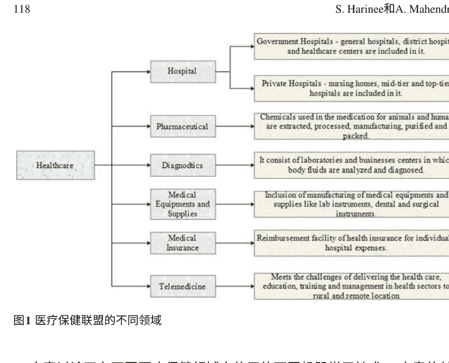

图1 医疗保健联盟的不同领域

本章讨论了在不同医疗保健领域中使用的不同机器学习技术。本章的其余部分组织如下。第2节简要讨论了医疗保健应用中的机器学习技术。接下来，在第3节中全面讨论了医疗保健联盟，最后在第4节中进行了总结。

## 2 机器学习

由于人工神经网络、K均值聚类、贝叶斯网络、支持向量机、模糊逻辑和神经模糊机等新技术在计算机领域的发展，机器学习已经完全演变成一种可以从执行的程序中学习的计算机新理论[1]。机器学习的一个重要部分是迭代学习，它在探索新数据时帮助进行独立适应[1]。即使在更大规模上，借助这些机器学习模型的帮助，可以快速准确地分析大规模复杂数据。创建一个良好的机器学习系统需要可扩展性、数据感知能力、自动化和迭代过程、算法和集成建模。机器学习中有两种不同的学习方法。它们是有监督学习和无监督学习，分别在图2和图3中描述。

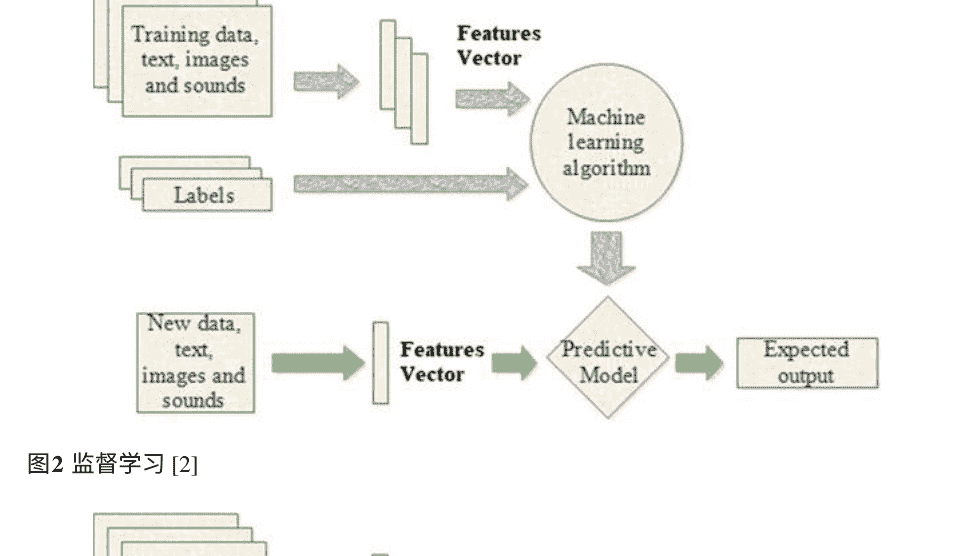

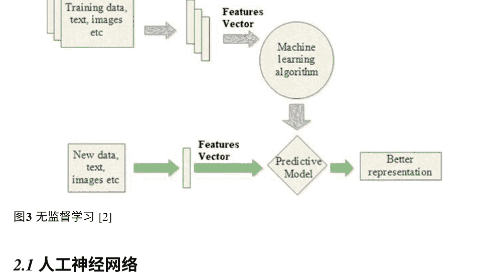

### 2.1 人工神经网络

人工神经网络（ANN）是受人类神经网络启发的模型，它压缩了许多相互连接的神经元，这些神经元对人体的反应做出响应 [3]。 人工神经元在第一层中获得输入数据，如图4所示，并且它有许多中间层，称为隐藏层，进行计算并为网络产生输出，它被称为输出层。 ANN广泛用于分类和聚类。 如果用于聚类，生成的输出称为聚类类别 [4]。

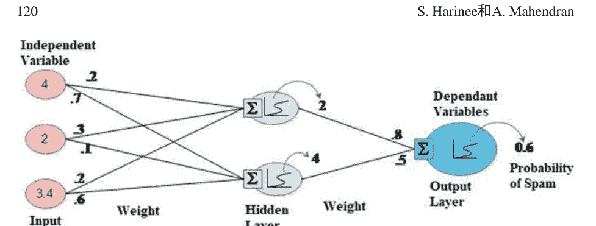

图4 人工神经网络模型

### 2.2 分类和聚类

分类是基于对象之间的特征和特性关系离散分类的最重要标准。当涉及到机器学习分类时，可以称之为基于一组计算的可能性预测的艺术。机器学习中有多种分类技术可用。其中一种技术是随机森林。它在医疗领域被广泛使用。

例如，一个人的痣是否恶性可以使用随机森林进行分类。从1000名患者的数据中，医生收集了数据，并使用随机森林算法创建了一个模型，用于判断一个人的痣是否恶性。如图5所示，虚线是模型确定的规则，圆圈代表有癌症的细胞，矩形代表非恶性痣。

聚类根据数据的特征和属性将数据划分为离散的一组。在一个聚类中，数据项被认为相似。这是一种无监督学习技术之一。这种方法在入侵检测中被使用，因为它可以从审计数据中学习，而不需要管理员。

有许多聚类算法，如k-means聚类，混合聚类，基于密度的空间聚类等。分类和聚类有很大的区别。当决策类别标签未知时，基于相似性对对象进行分组被称为聚类。聚类在医疗联盟中被广泛用于对高维数据进行分组。这些是机器学习中的一些不同技术。不同的医疗领域及其在这些领域中应用机器学习的详细信息如下。

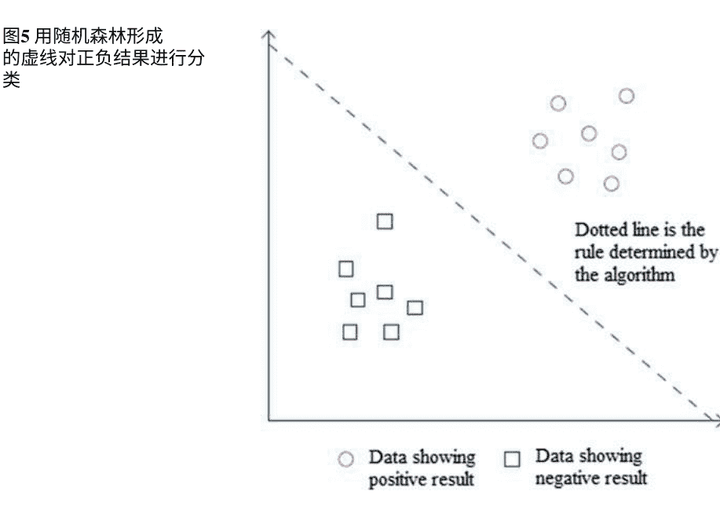

### 3 医疗联盟

提供人们护理的最重要行业是医疗行业，它是许多国家最赚钱的行业。 医疗专家和股东正在寻找当今医疗领域中的三个主要重要的活力词：质量、价值和结果。 由于互联网被广泛使用并连接到许多医疗设备上，智能医疗不再是一种奢侈的幻想。 数据分析和创新一直携手合作，帮助许多患者，因为机器学习在医疗行业中得到了应用。

### 3.1 医院部门

医院部门主要分为两个子部门，即政府和私立医院。 如今，私立部门正在超过政府医院，并且私立部门对渗透机器学习更感兴趣，以便轻松、快速、准确地进行诊断。 MEDTECH是一种用于协助外科医生进行脑部和脊柱手术的机器人。 为了找到避免副作用并节省费用的最佳治疗方法。

它可以提高医院的医疗质量。 医疗联盟还可以为偏远地区提供治疗。 重症监护病房中最重要且最常观察到的部分之一是监测ICU活动。 一些医院已经设置了深度传感器模拟来监测病人离开的情况。

床和椅子，坐在床上或椅子上。它使用神经网络来展示时间建模和高效的时间线活动[5]。为了保持医院的卫生，设计了一个新模型，捕捉医院人员的手部，并识别是否清洁[6]。为此，使用深度图像处理和一组覆盖物占用追踪算法。此外，它使用分类算法。根据该系统，如果一个人的手被任何酒精基凝胶清洁，则认为手是干净的[6]。

进一步的研究已经对该医院的患者可以接受治疗的天数进行了研究[7]。数据是根据服务类型、床位配备、入院、出院和平均住院天数进行收集的。基于这些数据，应用了三种不同的机器学习技术，如分类和回归树（CART）、卡方自动交互检测（CHAID）和支持向量回归（SVR），并得出了结果。

### 3.2 制药行业

设计一种新药的成本约为2.558亿美元，是研究人员估计的研究成本的两倍。此外，开发过程冗长且耗时。研发和发现成本的降低需要研发部门使用更多的工具。据说在市场上推出一款产品需要大约26亿美元[8]。机器学习在许多领域中得到了应用，如制药[9]、不同药物的发现和制造[10]。

### 3.3 个性化药物

现如今，有多种疾病，对它们的治疗已经确定。其中最致命的疾病之一是心血管疾病（CVD），由于心脏和血管的功能失常而导致突发死亡[11, 12]。其中一种广泛使用的临床工具是心电图（ECG），它通过电信号记录心脏的冲动从体表传导出来。然而，不幸的是，当患者去医院就诊时，心跳情况可能是正常的，导致心电图报告正常。为了持续监测一个人的心跳，开发了一种移动心电图。在移动心电图的初期阶段，开发人员主要集中在心电图设备的可穿戴传感器[13]和传感器与设备之间的接口[11]上。它通过手机收集数据，并通过网络将数据传输到远程服务器，并显示一个清晰的报告给用户[14, 15]。

HeartToGo [16]是一款在移动设备上连续监测心脏脉冲并记录的应用程序。首先，收集个人的心电图报告数据，并通过人工神经网络进行训练。它使设备了解个人的心脏活动，并在心脏活动发生变化时发出警告。HeartToGo的流程如图6所示。

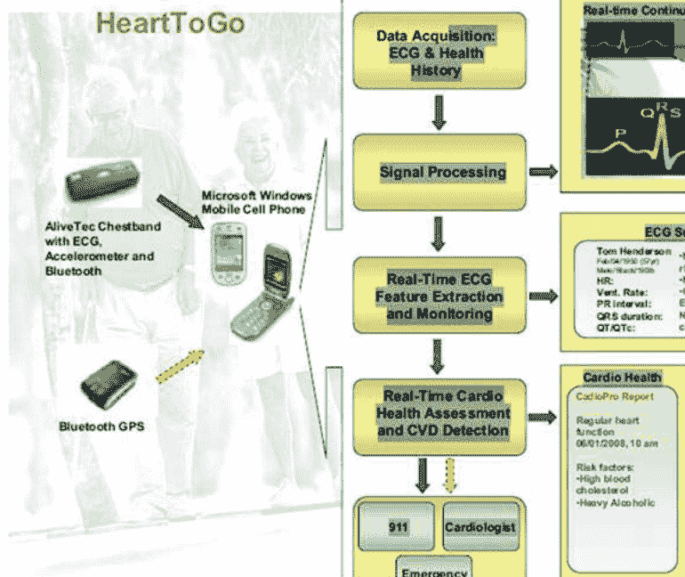

### 3.4 化学信息学

化学信息学利用人工神经网络技术来寻找熔点[16, 17]、溶解度[18]、hERG阻滞[19]、药物清除率[20]、潜在的激酶抑制剂[21]。基于一组决策树的分类是随机森林，其中多特征训练数据与一组目标倾向于形成一棵树。

它有助于发现新的晶体溶解度[22]和皮肤致敏性[23]。此外，支持向量机有助于发现物质的毒性[24]和阿片类活性[25]。类固醇、抗癌药物的生物活性研究使用kNN。朴素贝叶斯分类器用于分类类似药物，并用于磷脂质病机制[26]。

### 3.5 诊断

通过体格检查、实验室报告、病历、现有知识、信号、症状和患者叙述来诊断患者的疾病或病情的过程被称为医学诊断。人体被认为是一个复杂的动态系统

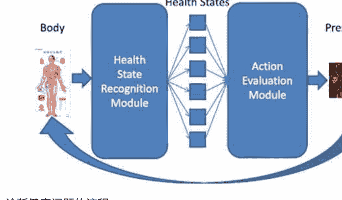

图7 诊断健康问题的流程

这个系统过于复杂，无法描述，测试就像黑盒测试一样进行。
疾病的诊断是治疗患者最重要的阶段。疾病诊断的过程如图7所示。根据世界卫生组织的数据，2015年有5%的患者被误诊。机器学习有助于识别和治疗癌症[27]、心脏问题[12, 28]、皮肤疾病和糖尿病[29]。预计机器学习在这个时代将在疾病诊断方面得到发展。

心脏疾病的预测：人体最重要的器官是心脏。它在整年都没有休息过一刻。如果心脏停止血液泵送，我们的身体就会停止，这就是生命的终结。计算机辅助检测（CAD）可以用来检测阻塞，阻止氧气和其他所需成分进入心脏，这是心脏病发作的主要原因。每年有大约1730万人死亡，到2023年可能增加到236亿。诊断严重程度的四种主要方法是心电图、胸部X光、运动负荷试验和血管造影。现在还设计了使用机器学习的自动化CAD。CAD利用不同类型的决策树进行预测。共同神经模糊推理系统（CANDIS）是另一种用于心脏疾病诊断预测的技术[30]。它利用遗传算法、分类过程、模糊输入和神经网络。

肿瘤检测：肿瘤是最致命的疾病，会默默地夺走患者的生命。
基于MRI扫描图像的图像处理和细胞聚类，使用分类算法将细胞分为肿瘤和非肿瘤细胞。概率神经网络（PNN）是一种用于帮助检测脑肿瘤的模式分类方法。一般来说，PNN是一种前馈神经网络，用于模式识别和分类。同样，k均值算法用于识别样本中的未知癌细胞。另一方面，基于朴素贝叶斯[31]的基因选择和分类也是可行的。此外，统计神经网络模型也用于识别乳腺癌[32]。此外，变种卷积神经网络（CNN）用于分类结肠癌[33]。同样，微阵列用于测量基因长度，而SVM用于分析[34]。

### 3.6 药物发现

制药行业在发现、制造和推出新药方面常常遇到困难，有时会失败。制药行业在这方面投入了大量资金。为此，引入了药物再利用的概念，它可以从现有产品中找到新产品。这种方法降低了开发成本，并加快了开发时间。许多机器学习算法被用于药物发现中的构效关系研究[31, 35, 36]。

### 3.7 医疗设备和用品

目前用于疾病诊断的医疗仪器使用机器学习，分为三类。这些仪器是基于慢性疾病开发的，它们使用医学影像和人工智能与物联网进行分析。糖尿病患者在印度很常见。这种情况是由于胰腺分泌的胰岛素异常导致血糖水平突然升高。为了维持血糖水平，人们倾向于通过注射胰岛素。为了避免血糖升高并保持正常水平，与IBM合作开发了一个名为Sugar-IQ的应用程序，它可以监控你的血糖摄入量，并辅助进行程序化治疗，并发现不同血糖水平下物品的影响。

此外，AI可以提高CT扫描的准确性和速度。有时候，医生无法发现器官中的小损伤。为此，设计了一种算法来捕捉细节，并进行更快的诊断。随着CT扫描速度的增加，对身体的辐射暴露可以减少。可穿戴设备的发展在过去几年中蓬勃发展。这些智能设备大部分时间都与人体保持持续联系。这些设备可以作为监测健康的主流工具。例如，Fitbit Surge用于监测心率；Viatomcheckme用于检测体温[37]。

### 3.8 医疗保险

为了取得良好的结果，个人可能向保险公司提供不当的活动或文件。这种不当行为可以涉及掩盖情况，事件的影响可能被夸大，事件可能被歪曲。大多数公司主要关注提高合规性和结构成本，以打动客户和与其他公司竞争。

对于这些公司来说，机器学习是一个改变游戏规则的因素[38]。这些公司依赖机器学习来检测欺诈行为。为了开发一个欺诈检测器，有必要考虑建设成本，并且误报警率必须较低。为了克服这种情况，机器学习被用来在一个最小的样本集上操作。此外，机器的重新校准很容易，欺诈的发生率很低。一般来说，对于欺诈检测，通常使用逻辑回归、装袋和提升等方法。Zocdoc保险检查器用于通过获取一些重要细节（如姓名、会员ID和计划详情）从卡片上识别保险欺诈。该检查器使用图像裁剪来获取特定细节，使用神经网络进行分类，使用光学字符识别器和深度学习。

### 3.9 远程医疗

远程医疗的概念是最近在医疗协会中发展起来的。为了解决医疗保健中的距离问题，使用了远程医疗技术。它利用通信网络技术与患者保持联系，同时也帮助了解设备的使用情况。通过远程位置，医生可以通过远程会诊轻松高效地提供医疗护理[33]。

一个样本决策支持和运筹学（DSOR）模型是远程医疗的决策支持系统。DSOR的第一阶段涉及识别给定模式中的目标的分类规则。为此，它使用了一个分类树，并在图8中描述。第二阶段涉及风险因素的估计[39]。

表1描述了使用机器学习技术的医疗应用和疾病诊断领域的简要说明。

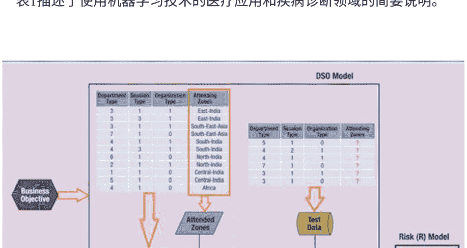

| 应用 | 机器学习技术 | 涉及的疾病 |
|------|--------------|------------|
| ICU监测 | 神经网络 | 监测ICU中的患者活动 |
| 手部卫生 | 深度图像处理，集合覆盖物体占用追踪算法，分类算法 | 监测手的清洁程度 |
| 患者的停留时间 | CART, CHAID, SVM | 大致计算患者在医院停留的天数 |
| 心脏之旅 | 人工神经网络 | 监测心脏脉冲并保持记录 |
| Palmer DS | 随机森林 | 晶体溶解度的鉴定 |
| 皮肤疾病 | 随机森林 | 皮肤致敏 |
| 毒性 | 支持向量机 | 寻找物质的毒性 |
| 癌症疾病 | kNN | 类固醇，抗癌药物的研究 |
| 组织异常 | 朴素贝叶斯 | 研究磷脂质沉积的机制 |
| CAD | 决策树 | 寻找心脏中的阻塞 |
| 肿瘤检测 | 概率神经网络 | 从正常细胞中检测肿瘤细胞 |
| 肿瘤检测 | 朴素贝叶斯 | 地质选择和分类 |

## 4 结论

本章介绍了在医疗组织中使用的不同机器学习算法。根据研究，不同的机器算法被应用于不同的疾病诊断、新药研发和不同的医院目的。通过机器学习，可以超越专家的表现，因为不需要知识工程师将知识纳入系统中一旦学会。

## 参考文献

- 1. Mitchell, T.M.: 机器学习和数据挖掘. Commun. ACM 42(11), 30–36 (1999)
- 2. Khan, N., Alqhatani, A.: 使用拦截器方法在Web浏览器中预防XSS攻击的框架。 Indian J Sci Technol (2019)
- 3. Rosenblatt, F.: 感知器: 大脑中信息存储和组织的概率模型。 Psychol. Rev. 65(6), 386–408 (1958)
- 4. Quinlan, J.R.: C4.5: 机器学习程序。 爱思唯尔，霍博肯 (2014年)
- 5. Bianconi, G., Mehra, R., Yeung, S., Salipur, F., Jopling, J., Downing, L., Haque, A., Alahi, A., Campbell, B., Deru, K., Beninati, W., Milstein, A., Fei-Fei, L.: 基于视觉的重复神经网络预测ICU移动护理活动。在: NIPS健康机器学习研讨会 (2017年)
- 6. Ahmad, M.A., Eckert, C., Teredesai, A.: 可解释的医疗机器学习。在: ACM国际生物信息学、计算生物学和健康信息学会议论文集, 第559-560页 (2018年)
- 7. Pendharkar, P.C., Khurana, H.: 预测宾夕法尼亚州联邦和专科医院住院时间的机器学习技术。国际计算机科学应用。 11 (3) , 45-56 (2014年)
- 8. Jing, Y., Bian, Y., Hu, Z., Wang, L., Xie, X.Q.S.: 深度学习在药物设计中的应用：大数据时代药物发现的人工智能范式。AAPS J. 20(3), 58 (2018)
- 9. Murphy, R.F.: 机器学习在药物开发中的积极作用。Nature Chem. Biol. 7(6), 327–330 (2011)
- 10. Liu, Z., Du, J., Fang, J., Yin, Y., Xu, G., Xie, L.: DeepScreening：一种基于深度学习的筛选网络服务器，加速药物发现。Database 2019, baz104 (2019)
- 11. Roche, P.A., Sun, M., Sclabassi, R.J.: 使用手机进行生物遥测。 In: Proceedings of the IEEE 31st Annual Northeast Bioengineering Conference, pp. 65–66 (2005)
- 12. Achariya, D.P., Kauser, A.P.: 一种使用粗糙集和布谷鸟搜索技术的心脏疾病诊断混合方案。J. Med. Syst. 44(1), 27 (2020)
- 13. Proulx, J., Clifford, R., Sorensen, S., Lee, D.J., Archibald, J.: 开发和评估蓝牙心电监测传感器。 In: 第19届IEEE计算机-基于医疗系统研讨会论文集, 第507-511页 (2006年)
- 14. Jovanov, E., Milenkovic, A., Otto, C., De Groen, P., Johnson, B., Warren, S., Taibi, G.: 用于日常监测身体活动和健康状况的WBAN系统: 应用和挑战。 In: 第27届IEEE工程医学和生物学年会论文集, 第3810-3813页 (2006年)
- 15. Jin, Z., Oresko, J., Huang, S., Cheng, A.C.: HeartToGo: 一种个性化医学技术用于心血管疾病预防和检测。 In: IEEE生命科学系统和应用研讨会论文集, 第80-83页 (2009年)
- 16. Bhat, A.U., Merchant, S.S., Bhagwat, S.S.: 使用极限学习机预测有机化合物的熔点。工业与工程化学研究。 47(3), 920–925 (2008)
- 17. Godavarthy, S.S., Robinson, R.L., Gasem, K.A.: 用于预测熔点温度的改进的结构-性质模型。工业与工程化学研究。 45(14), 5117–5126 (2006)
- 18. Palmer, D.S., Llinás, A., Morao, I., Day, G.M., Goodman, J.M., Glen, R.C., Mitchell, J.B.: 通过热力学循环预测固有水溶解度。分子药理学。 5(2), 266–279(2008)
- 19. Thai, K.M., Ecker, G.F.: 通过反向传播神经网络对hERG抑制剂进行分类模型。化学生物学与药物设计。 72(4), 279–289 (2008)
- 20. Yap, C.W., Li, Z.R., Chen, Y.Z.: 使用统计学习方法进行药物清除的定量结构-药代动力学关系。 J. Mol. Graph. Modell. 24(5), 383–395 (2006)
- 21. Briem, H., Günther, J.: 使用机器学习方法对激酶抑制剂相似性进行分类。 Chembiochem 6(3), 558–566 (2005)
- 22. Palmer, D.S., O'Boyle, N.M., Glen, R.C., Mitchell, J.B.: 使用随机森林模型预测水溶解度。 J. Chem. Inf. Model. 47(1), 150–158 (2007)
- 23. Li, S., Fedorowicz, A., Singh, H., Soderholm, S.C.: 在局部淋巴结实验基础上应用随机森林方法研究皮肤致敏数据。 J. Chem. Inf. Model. 45(4), 952–964 (2005)
- 24. Lowe, R., Glen, R.C., Mitchell, J.B.: 使用机器学习预测磷脂质化. Mol. Pharm. 7(5), 1708–1714 (2010)
- 25. Dong, N., Lu, W.C., Chen, N.Y., Zhu, Y.C., Chen, K.X.: 使用支持向量分类对芬太尼衍生物进行SAR. Acta Pharmacol. Sin. 26(1), 107–112 (2005)
- 26. Koutsoukas, A., Lowe, R., KalantarMotamedi, Y., Mussa, H.Y., Klaffke, W., Mitchell, J.B., Glen, R.C., Bender, A.: 在线靶点预测: 定义基准数据集和多类朴素贝叶斯和Parzen-Rosenblatt窗口性能比较. J. Chem. Inf. Model. **53**(8), 1957–1966 (2013)
- 27. Şen, M., Engin, M., Engin, E.Z., Ateş, Y.Z.: 通过使用人工神经网络和支持向量机进行早期前列腺癌诊断。专家系统应用 **36**(3), 6357–6361 (2009)
- 28. Shilaskar, S., Ghatol, A.: 医学诊断的特征选择：心血管疾病评估。专家系统应用 **40**(10), 4146–4153 (2013)
- 29. Temurtas, H., Yumusak, N., Temurtas, F.: 使用神经网络进行糖尿病疾病诊断的比较研究。专家系统应用 **36**(4), 8610–8615 (2009)
- 30. Sharma, P., Saxena, K.: 模糊逻辑和遗传算法在心脏病风险水平预测中的应用。国际系统保证工程管理杂志 **8**(2), 1109–1125 (2017)
- 31. Yeung, K.Y., Bumgarner, R.E., Raftery, A.E.: 贝叶斯模型平均: 为微阵列数据开发了一个改进的多类别基因选择和分类工具。生物信息学 **21**(10), 2394–2402 (2005)
- 32. Kiyan, T., Yildirim, T.: 使用统计神经网络进行乳腺癌诊断。伊斯坦布尔大学电子工程学报 **4**(2), 1149–1153 (2004)
- 33. Sirinukunwattana, K., Raza, S.E.A., Tsang, Y.W., Snead, D.R., Cree, I.A., Rajpoot, N.M.: 局部敏感深度学习用于常规结肠癌组织学图像的核的检测和分类。IEEE医学成像交易 **35**(5), 1196–1206 (2016)
- 34. Li, T., Zhang, C., Ogihara, M.: 基于基因表达的组织分类的特征选择和多类别分类方法的比较研究。生物信息学 **20**(15), 2429–2437 (2004)
- 35. Mignani, S., Huber, S., Tomas, H., Rodrigues, J., Majoral, J.P.: 为什么以及如何改变了制药领域的药物发现策略？新的心态是什么？药物发现。今天 **21**(2), 239–249 (2016)
- 36. Dudley, J.T., Deshpande, T., Butte, A.J.: 利用药物-疾病关系进行计算药物再定位。简要生物信息学。**12**(4), 303–311 (2011)
- 37. Ashburn, T.T., Thor, K.B.: 药物再定位: 发现和开发现有药物的新用途。自然药物发现评论。**3**(8), 673–683 (2004)
- 38. Phua, C., Alahakoon, D., Lee, V.: 少数派报告中的欺诈检测：偏斜数据的分类。ACM SIGKDD探索性新闻通讯。**6**(1), 50–59 (2004)
- 39. Pal, S., Mukhopadhyay, A.: 一种用于远程医疗治理的机器学习方法. ISACA J. **1**, 1–9 (2017)

# 一种预测性数据分析方法来了解医疗数据库
Ritu Chauhan和Harleen Kaur

摘要 医疗数据库正在以多孔的速度凝结，因此评估各种参数并检测未来知识发现的隐藏模式是一项复杂的任务。 在过去的十年中，数据分析在从中央数据库中检索或提取信息方面取得了广泛的成果。 它在全球范围内为研究人员和科学家们创造了整体认识，以推导出大规模数据库中的知识发现的发展技术。 事实上，随着创新的基于IT的医疗技术，医疗数据库在容量和维度上呈指数增长，用于医疗诊断。 在医疗数据库中，先天性心脏病是发展中国家和发展中国家新生儿死亡的主要原因之一。 随着医疗行业的最新发展，出现了治愈先天性残疾的可能治疗方法，导致患有遗传残疾的患者的寿命延长。 因此，受影响的人现在可以活到更高的年龄。 本研究旨在使用聚类技术从先天性心脏数据库中发现未来医疗诊断的隐藏模式。 根据2006年至2016年印度不同年龄组先天性心脏缺陷的死亡率分析了设计。

## 1 引言

医疗保健数据库的凝结速度很快，因此评估各种参数并检测隐藏的模式以进行未来的知识发现是复杂的。 在过去的十年中，数据分析在从中央数据库中检索或提取信息方面已经取得了广泛的成果。 这在全球范围内引起了研究人员和科学家对大规模数据库中的知识发现进行技术开发的整体认识。 事实上，医疗保健数据库以创新的基于IT的技术以指数级的速度增长，用于医疗诊断的技术。医疗技术以指数级的速度增长，为未来的医学诊断提供了检测模式。因此，研究人员和科学家正在付出巨大的努力来发现隐藏的信息和可以预测为疾病根本原因的各种参数。总的来说，医疗保健数据库正在快速增长，并且具有很高的复杂性，因此处理数据中的异常是一个挑战。

在我们提出的研究中，先天性心脏病缺陷（COHD）是出生时疾病早期预测的一项复杂任务。COHD的严重程度可以从心脏房室之间的小洞或心脏瓣膜之间的小洞，可能立即得到纠正，到需要在婴儿、儿童或成年期进行多次手术的重大畸形 [1]。根据疾病控制和预防中心（CDC）的数据，每年约有40,000名婴儿在美国出生时患有COHD。在1999年至2006年间，美国报告了41,494例因先天性心脏病缺陷而死亡的病例。根据AHA的数据，在美国约有150名成年人中有1人患有某种先天性心脏病。在儿童中最常见的COHD类型是室间隔缺损、房间隔缺损、肺动脉狭窄和动脉导管未闭，而在成年人中最常见的是房间隔缺损和法洛四联症 [2]。先天性心脏病被认为是全球新生儿死亡的主要原因之一。

然而，研究人员面临的全球挑战是处理实时医疗数据库的复杂性质。已经开发了几种不同的优化技术和工具，用于衡量大型数据库中的准确性和知识。然而，由于数据流的速度呈指数增长，从大型数据库中进行决策是一项微不足道的任务，这可能会由于其复杂性而降低知识发现的能力。为了发现适当的决策信息，知识发现和数据挖掘被用作具有挑战性的任务。

然而，对于医学专家来说，估计未来几年先天性心脏缺陷是具有挑战性的，因为这项复杂任务需要经验和知识。今天的健康领域包含了可能对决策有重要意义的机密信息[3]。但是由于其复杂性，使用传统计算技术很难检测出模式。因此，为了克服数据之间的复杂性，医学数据挖掘是一种适当的技术，具有在医学领域数据集中探索隐藏模式的出色能力。这些模式可以用于临床诊断。数据挖掘对于医疗组织来说非常重要，可以通过诊断和建立明显无关的信息之间的联系来预测患者的医疗状况和行为趋势[4]。然而，迄今为止，只有少数工具可以评估和分析存储后的大量临床数据[5]。数据挖掘是一种知识发现过程，通过获取未知的数据排列和关系。医学领域的最新进展为研究方法带来了创新。

数据挖掘的先进发展使研究人员能够管理和复杂分析数据。因此，现在专家们可以检查一整套数据[6–9]。数据库中已经存在的数据更容易管理和成本效益更高，比从相关机构收集天真的数据更有效[10]。有几个数据库专门设计用于向全世界的人们提供对先天性心脏病的更深入了解。目前的研究重点是通过患者提供的数据集来预测疾病的模式[10]。在医疗保健行业中，数据挖掘的两个最重要的目标是预测和模式分析。

数据挖掘是一种创新的发现方法，具有多个步骤，并且在整个发现过程中需要专家领域的输入是必要的[11]。数据挖掘方法，包括分类、聚类和规则挖掘，对解释数据和提供有意义的信息很有用。医疗领域中的一些数据挖掘应用包括基于先前收集的数据预测疾病的未来后果，诊断疾病，解释治疗费用[4, 12]。

此外，医疗保健行业中的计算机应用程序允许专家和受益人之间在医疗知识方面进行广泛的交流。数据挖掘工具通常是从各种内部数据库中提取和整合数据的工具。知识发现方法包括从数据库中提取数据集，并在应用任何算法之前对数据进行采样[13]。数据挖掘与统计先天性心脏疾病以及机器学习合作，从大型数据库中获取未知的关系。每个数据挖掘过程的使用目标不同，取决于建模的目的。当前研究重点是数据分析，以预测COHD的大规模数据库中的模式。数据收集自全球卫生数据交换库，该库全球管理卫生数据。根据2006年至2016年不同年龄组之间的先天性心脏缺陷死亡率，以各种方式检索数据。数据在早产儿到64岁的混合年龄组之间进行离散化处理。

总章节的贡献如下。第2节是关于COHD的文献综述；第3节介绍了方法和使用的数据集。结果在第4节讨论，结论在最后的第5节讨论。

## 2. 先天性心脏病的数据挖掘

如今，医院正在使用计算应用程序来管理他们的患者数据。医院数据通常包括患者的详细信息、治疗费用和其他必要的细节。通常，这些数据以数值、图表或图形的形式不断更新。然而，大多数医院数据都很复杂，难以处理[14]。数据挖掘是一种知识发现过程，通过获取未知的数据排列和关系。医学领域的最新进展带来了研究方法的创新。数据挖掘的先进发展使研究人员能够管理和分析复杂的数据。因此，现在的研究人员可以检查大量的数据[15]。数据库中呈现的数据比从相关机构收集原始数据更容易管理和经济实惠。

有几个数据库专门设计用于向全世界的人们提供对先天性心脏疾病的更深入了解。目前的研究重点是通过提供的患者数据集来预测疾病的模式。

数据挖掘在医疗保健行业中的两个最重要的目标是预测和模式分析。数据挖掘是一种创新的方法，具有多个步骤，并且在整个发现过程中需要专家领域的输入是先决条件[16]。数据挖掘方法，包括分类、聚类和规则挖掘，对解释数据和提供有意义的行动非常有用。医疗保健领域中的一些数据挖掘应用包括根据先前收集的数据预测疾病的未来后果，诊断疾病，解释治疗费用和其他特征[17]。此外，医疗保健行业中的计算机应用程序允许专家和受益人之间进行广泛的医学知识交流。数据挖掘工具通常是从各种内部数据库中提取和整合数据的集合。知识发现方法包括利用数据库、从这些数据库中提取数据集以及在应用任何算法之前对数据进行抽样。数据挖掘与机器学习结合，从大型数据库中获取未知的心脏统计先天性残疾的关系。每个数据挖掘过程根据建模目标有不同的用途。两个重要的建模目标如下：分类和预测。分类模型告诉我们分类标签，而预测模型告诉我们连续值函数[18]。

进行了一项研究，调查了COHD患者性别死亡率的差异。使用CONCOR和魁北克先天性心脏缺陷数据库收集了1996年至2005年间住院的18至65岁患者的数据。基于回归分析，男性的死亡率比女性高[19]。另一项研究调查了影响COHD新生儿、儿童和成人心脏移植后死亡的风险因素。该研究包括了488例先天性心脏畸形患者的心脏移植病例。93%的病例在移植前至少进行过一次手术。COHD患者和心肌病儿童在三个月后的存活率存在显著差异。如果COHD患者能够在后期存活下来，他们的长期存活率较高[20]。

如果我们研究COHD发病率不一致的原因，不同州的COHD发病率从1000例活产中的4例到50例不等。发病率与室间隔缺损(VSD)有关。在研究的62份报告中，对1955年后的发病率进行了调查。发病率为中度和危重COHD病例中的每1000例活产为6 [11]。

贝叶斯模型也用于获取新生儿、儿童和成人中COHD的患病率。魁北克先天性心脏病数据库包含了1983年至2010年的COHD患者数据。1998年至2005年，新生儿的患病率为每1000例活产8.21。在接下来的五年中，从2010年开始，总患病率分别增加到每1000例儿童13.11和每1000例成人6.12。因此，2000年至2010年间，儿童和成人的患病率分别增加了11%和57%。然而，在危重COHD病例中，儿童的患病率增加了19%，成人的患病率增加了55%。到2010年，成人在总COHD病例中占66% [21]。

还研究了1985年至2000年间成人和儿童先天性心脏病主要和次要形式的患病率和年龄分布。严重的COHD类型包括法洛四联症、动脉导管未闭、大动脉转位和单心室心脏缺陷。在1985年、1990年、1995年和2000年调查了关键和轻微COHD病例的患病率。要确定的数据来自魁北克。研究包括18岁以下的儿童。2000年COHD的总患病率为每1000名成年人4.09例，关键COHD的患病率为每1000名成年人0.38例。在两性中，女性占总成年COHD患者的57%。所有关键COHD病例的中位年龄在1985年为11岁，而在2000年为17岁。1985年至2000年，重大COHD的患病率上升。成年人COHD患病率的增加明显高于儿童。因此，2000年成年人中占总重大COHD人口的49% [22]。

## 3 材料和方法

使用PubMed进行文献搜索，使用先天性心脏缺陷、先天性残疾、各种先天性残疾类型和其他相关特征等搜索术语，从大规模数据库中检测模式。将数据库与各种注册表相互关联，以查看过去报告中的可用做法。数据库根据提供的信息（如发病率、死亡率、心脏先天性残疾类型和其他相关特征）对先前的研究论文、论文和综述文章进行分类和设计。数据收集自全球卫生数据交换注册表，在2006年至2016年之间检测到先天性心脏缺陷的死亡模式。数据在早产儿至64岁的各个年龄组的患者中进行离散化处理。

### 3.1 使用分层聚类的数据分析方法

数据分析技术旨在从大规模数据库中检测隐藏的模式和信息，用于未来的预测建模。该研究的重点是使用无监督技术从大规模数据库中发现知识。一般来说，无监督学习技术基于没有类标签的数据，使用各种统计方法来衡量数据之间的相似性。

尽管聚类技术被应用于计算数据之间的相似性，但算法、参数和其他度量的选择使得每个算法都与其他算法不同。聚类技术被广泛讨论为分区、层次、密度和基于网格的方法。我们工作的贡献集中在层次聚类上，通过对数据进行分类来使其同质化，基于相似属性进行分类。在每个聚类步骤中，要么形成一个初始聚类，要么加入已存在的聚类组。所形成的前者与其余组进行比较，因此初步聚类步骤非常重要。然而，层次聚类技术有两种衡量方式，凝聚性方法或分裂方法。

欧几里得距离矩阵是一种在一组点之间计算欧几里得距离平方的矩阵类型。欧几里得矩阵是一种用于表示欧几里得空间中一组点的距离和空间的矩阵类型，其大小为m × m。假设d表示欧几里得矩阵，点存在于具有m维的空间中，则可以通过以下方式计算d的分量：

```
d(Y, Z) = \sqrt{\sum_{i=1}^{m} (Y_i - Z_i)^2}
```

该矩阵只能同时计算两个分数，并且不能同时计算多个分数。同样，余弦矩阵是非零向量之间相似度的度量。这些向量属于内积空间，用于计算它们之间的余弦角。因此，该矩阵考虑了向量的位置而不是大小。具有相同对齐的向量具有相似度为1，夹角为九十度的向量具有相似度为0，而对角线对齐的向量具有相似度为-1。这个余弦矩阵的结果要么是一，要么是零。

```
相似度 (Y, Z) = cos(ϕ) = \frac{Y.Z}{||Y||.||Z||} = \frac{\sum_{i=1}^{n} Y_i Z_i}{\sqrt{\sum Y_i^2 \sum Z_i^2}}
```

另一个相似度矩阵，比如Jaccard相似度矩阵，将值关联到两个组，以比较哪些组是相似的，哪些是不同的。这种方法提供了一个以百分比表示的相似度度量，使分析师更容易解释结果。百分比越低，组之间的距离越远。然而，这种方法在样本较小的情况下存在问题，可能会提供不令人满意的结果。

```
J(Y, Z) = \frac{|Y \cap Z|}{|Y \cup Z|} \times 100
```

其中J是Jaccard指数，(|Y \cap Z|)是集合中的总数，而(|Y \cup Z|)是各个集合中的数。曼哈顿矩阵与欧几里得矩阵类似，但它使用绝对值，从而得到更稳健的结果。与欧几里得方法不同，它不会被错误的值偏离。

```
d(Y, Z) = \sum_{i=1}^{m} |Y_i - Z_i|
```

斯皮尔曼相关系数是一种非参数方法。这种统计方法根据排名相关了两个变量。它衡量了两个变量之间的关系。这种相关方法测量了给定变量之间的单调相关性。当变量一起变化时，它们是单调的。在下面的方程中，n是样本数量，di是配对的排名差异。

```
\rho = 1 - \frac{6 \sum d_i^2}{n(n-1)}
```

马哈拉诺比斯距离，测量距离矩阵并找到点X和分布m之间的距离。这种多维方法是评估偏离程度的概述。X距离m的平均值有多远。如果距离为零，则X与m的平均值处于相同位置，随着X远离m的平均值，距离增加。在下面的方程中，D是马哈拉诺比斯距离，X是观测值，m是观测的平均值，S是协方差。

```
D^2 = (X - m)^T S^{-1} (X - m)
```

在层次聚类中，使用各种链接方法来计算距离矩阵以形成聚类。众所周知的度量是单链接方法，也称为最小方法。它通过考虑每个聚类中的最小距离来计算两个给定聚类之间的距离。使用单链接的一个缺点是它可能会创建链式结构。当一个聚类接近第二个聚类中的一个群组时，会发生这种情况。

完全连接也被称为最大方法。这种连接方法计算簇之间的最远距离。平均连接方法用于解决前两种方法的局限性。它考虑了簇之间的平均距离。这种方法被认为比其他两种方法更准确。在平均连接方法中，分别计算并求平均两个簇中每个组之间的距离。下面讨论了连接之间的簇的形成。

单链接：这种链接方法也被称为最小方法。它通过考虑每个群集中的最小距离来计算两个给定群集之间的距离。例如，考虑两个群集 A和 B，群集 A有案例1和2，第二个群集B有案例3、4、5，那么两个群集之间的距离将通过测量(1,3)、(1,4)、(1,5)、(2,3)、(2,4)和(2,5)之间的最小距离来确定。使用单链接的一个缺点是可能会创建链式结构。当一个群集靠近第二个群集中的一个群时，它们之间会形成链式结构。

完全链接：它也被称为最大方法。这种链接方法计算群集之间的最远距离。这种方法也有一个限制，可以通过以下示例来说明。假设，从上面的例子中，1、2、3和4都在附近，但案例5与其他所有案例都不同。在这种情况下，由于分数(1,5)和(2,5)的差异，群集之间不会相互链接。

平均链接：这种方法用于解决前两种方法的局限性。它考虑了聚类组之间的平均距离。这种方法被认为比其他两种方法更准确。在平均链接方法中，分别计算并求平均两个集合中每个组之间的距离。

## 4 结果与讨论

数据挖掘技术被广泛应用作为一种从大规模数据库中检测隐藏模式和信息的工具。然而，该研究方法用于从大规模数据库中检测模式，研究的重点被介入了COHD数据库，以发现未来医学诊断的隐藏知识。

数据使用包括年龄、年份、性别和死亡人数在内的变量特征进行离散化处理。考虑了包括年龄组在内的各种参数的数据，从新生儿到89岁。时间范围为2006年到2016年的十年。

在图1中，观察到了2006年到2016年各个年龄组之间死亡率的变化。根据分析，2008年和2009年发生的死亡人数最多的是产后新生儿。其次，从2007年到2016年，早期新生儿死亡率、晚期新生儿死亡率和产后新生儿死亡率都有所下降。第三，从2013年开始，20-24岁、25-29岁、30-34岁、35-39岁和40-44岁患者的死亡率略有增加。增长并不是非常剧烈，但是逐渐增加。这一观察结果得到了分层聚类的进一步支持。

图2表示了在群集之间的整体距离度量，其中目标类别是年龄，以确定与确定相关特征的相似度度量。分层聚类被用作选择具有不同形状和大小的群集的方法。三个集合被定义，每个集合都有其自己的方向和数据特征，根据相似性指数。这些集合代表了每个年龄组的平均死亡率。它们根据发布时间、早产和晚产新生儿以及年龄组1-4和5-9分别分组成一个单独的群集。从给定的数据表中可以观察到这些年龄组有最易受到死亡的情况。另外两个集合包括年龄在10-24岁和25-69岁之间的年龄组。所做的群集是根据给定年龄组的死亡率相似性。

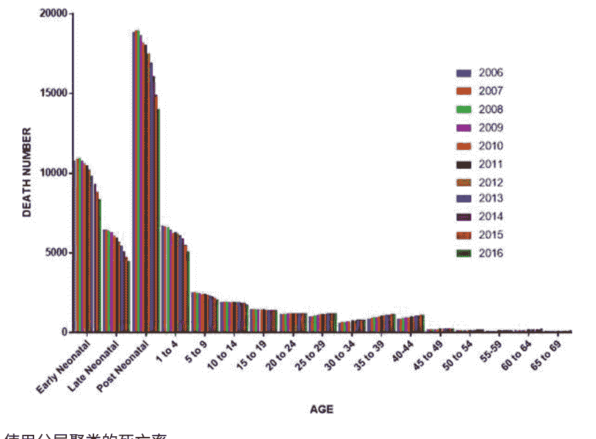

| Cluster | AGE | 2006.0 | 2007.0 | 2008.0 | 2009.0 | 2010.0 | 2011.0 | 2012.0 | 2013.0 | 2014.0 | 2015.0 | 2016.0 | total age |
| :--- | :--- | :--- | :--- | :--- | :--- | :--- | :--- | :--- | :--- | :--- | :--- | :--- | :--- |
| C3 | Early Neonatal | 10896.784352... | 10975.75508374... | 10944.32850530... | 10796.62564833... | 10639.80338036... | 10489.20617229... | 10365.64591380... | 9857.20551984... | 9753.26912130... | 8836.936932479... | 8390.103865349... | 111264.1256463...
| C3 | Late Neonatal | 6474.20681577... | 6463.26377336... | 6437.313743470... | 6396.48355030... | 6138.74524940... | 5948.84530619... | 5722.08822390... | 5447.57783600... | 5203.57755700... | 4794.44238969... | 4592.88410910... | 63582.98790744...
| C3 | Post Neonatal | 18468.94367984... | 18946.38175927... | 18954.98715764... | 18674.40150986... | 18326.49960908... | 18066.39590620... | 17602.7647870... | 17002.04117221... | 16593.2599121... | 14947.23884714... | 14237.40759901... | 201182.12393584...
| C3 | 1 to 4 | 6765.43147340... | 6547.72096949... | 6538.790493380... | 6471.44510330... | 6342.87524540... | 6329.86748990... | 6231.04154276... | 6113.78620939... | 5905.206434380... | 5535.99978359... | 5129.48759863... | 67875.26013150...
| C2 | 5 to 9 | 2523.68248540... | 2538.97860225... | 2594.31428360... | 2475.24438132... | 2423.68568690... | 2432.86754899... | 2384.85553786... | 2352.20210759... | 2290.70701349... | 2189.07012430... | 2073.09022546... | 26210.08592346...
| C2 | 10 to 14 | 1052.22538805... | 1044.58805865... | 1041.72493002... | 1043.23302130... | 1036.15915346... | 1054.59576320... | 1033.54521609... | 1026.54807369... | 1023.45863713... | 1013.43301752... | 974.581205735... | 11364.50461951...
| C2 | 15 to 19 | 1456.77315861... | 1458.37650093... | 1464.60455864... | 1462.60759642... | 1454.35424340... | 1462.76037175... | 1453.84830600... | 1452.20571135... | 1451.26815801... | 1410.95665656... | 1435.72343058... | 15971.8470443...
| C2 | 20 to 24 | 1150.15672585... | 1173.87314464... | 1183.50061635... | 1198.86200007... | 1217.43075115... | 1232.48798881... | 1264.22569201... | 1244.00518423... | 1248.73869917... | 1248.46598342... | 1174.66915425... | 13486.37982540...
| C1 | 25 to 29 | 1208.68135602... | 1245.843787652... | 1269.572563671... | 1213.326322735... | 1248.774127406... | 1277.210329724... | 1324.326333734... | 1324.238219006... | 1326.425870761... | 1321.277731184... | 1217.135945556... | 13885.49665953...
| C1 | 30 to 34 | 637.886070860... | 639.213018289... | 662.378052361... | 766.481340693... | 780.439800110... | 796.530337081... | 775.251354390... | 794.672087789... | 821.403498210... | 825.526586980... | 823.732174620... | 8302.393337277...
| C1 | 35 to 39 | 833.429218298... | 853.239250679... | 897.609804040... | 993.10420310... | 999.63458440... | 1063.84747435... | 1083.47478213... | 1113.95874032... | 1137.36537872... | 1159.63991466... | 1174.46905435... | 11569.76525330...
| C1 | 40-44 | 856.0574443960... | 897.2604832539... | 933.5886264729... | 957.5701086020... | 988.4528782210... | 1034.642936101... | 1042.949263610... | 1070.39126140... | 1089.13649786... | 1139.44882637... | 1171.037015758... | 11691.5134256...
| C1 | 45 to 49 | 293.1219165560... | 312.23827870... | 335.37734717... | 326.843520057... | 336.635504537... | 246.809847156... | 254.607555960... | 263.139906380... | 282.792697670... | 295.732742469... | 340.953159374... | 3401.649436728...
| C1 | 50 to 54 | 148.8015452430... | 153.5026770430... | 161.497083381... | 167.749838390... | 172.664727350... | 178.3966702514... | 182.706435388... | 188.412459622... | 194.192110301... | 202.7813883034... | 202.189473457... | 1952.296012635...
| C1 | 55-59 | 107.7909693274... | 125.794217894... | 134.780735083... | 132.4894122330... | 139.402315368... | 144.550038275... | 148.368113598... | 151.806112069... | 156.899123493... | 161.4030830834... | 164.4853188601... | 1546.7634981143...
| C1 | 60 to 64 | 152.7234440202... | 158.7566205971... | 165.7800837345... | 173.644854842... | 183.2053952628... | 191.4860157058... | 205.755285399... | 215.6243891127... | 226.4243091127... | 243.994158847... | 264.475736671... | 2171.938880326...
| C1 | 65 to 69 | 182.2179717483... | 205.748293522... | 208.1543489791... | 220.0042159370... | 223.4968223607... | 226.863068925... | 231.2476858615... | 235.6237791261... | 240.2547813479... | 236.5857907469... | 242.4855573671... | 2318.591591544...树状图中的垂直线表示群集之间的距离。在图3中，分析表明群集3的死亡人数最多，其次是群集2，然后是群集1。

我们尝试通过将散点图与群集相连来可视化不同年龄群体的死亡模式。我们将年龄放在X轴上，每年的死亡人数放在Y轴上。数据根据年龄群集进行分类。

从这个散点图中，我们观察到在2006年至2016年期间，集合1中的死亡人数，特别是在年龄组25-29、30-34、35-39和40-44岁之间，逐渐增加。尽管这种趋势的变化是一个长期的增加，但它表明了先天性患者治疗的进步，帮助他们延长寿命。

## 5 结论

随着医学的最新进展，先天性心脏缺陷患者的寿命在过去十年中有所增加。早在2006-2007年期间，先天性心脏疾病患者的死亡主要发生在新生儿期后，但从2013年开始，先天性心脏疾病患者的寿命逐渐增加，达到30-40岁。

## 参考文献

- 1. van der Linde, D., Konings, E.E., Slager, M.A., Witsenburg, M., Helbing, W.A., Takkenberg,J.J., Roos-Hesselink, J.W.: 先天性心脏病的全球出生患病率：一项系统综述和荟萃分析。美国心脏病学会杂志 58(21), 2241–2247 (2011)
- 2. Go, A.S., Mozaffarian, D., Roger, V.L., Benjamin, E.J., Berry, J.D., Borden, W.B., Bravata,D.M., Dai, S., Ford, E.S., Caroline, S., Franco, S., Fullerton, H.J., Gillespie, C., Hailpern, S.M.,Heit, J.A., Howard, V.J., Huffman, M.D., Kissela, B.M., Kittner, S.J., Lackland, D.T., Lichtman,J.H., Lisabeth, L.D., Magid, D., Marcus, G.M., Marelli, A., Matchar, D.B., McGuire, D.K.,Mohler, E.R., Moy, C.S., Mussolino, M.E., Nichol, G., Paynter, N.P., Schreiner, P.J., Sorlie,P.D., Stein, J., Turan, T.N., Virani, S.S., Wong, N.D., Woo, D., Turner, M.B.: 心脏病和中风统计数据-2013年更新：美国心脏协会报告。 循环**127**(1), 6–245 (2013)
- 3. Hosseinkhah, F., Ashktorab, H., Veen, R.: 医学数据库上的数据挖掘挑战。 在： 数据库技术：概念，方法，工具和应用，IGI Global，美国，pp. 1393–1404 (2009)
- 4. Milley, A.: 医疗保健和数据挖掘。健康管理技术。 **21**(8), 44–45 (2000)
- 5. Masethe, H.D., Masethe, M.A.: 使用分类算法预测心脏病。世界工程计算机科学大会论文集。 **2**, 22–24 (2014)
- 6. Khairy, P., Ionescu-Ittu, R., Mackie, A.S., Abrahamowicz, M., Pilote, L., Marelli, A.J.: 先天性心脏病的死亡率变化。美国心脏病学会杂志 **56**(14), 1149–1157 (2010)
- 7. Chauhan, R., Kaur, H.: 预测分析和数据挖掘：使用R工具优化决策的框架。 在： Tripathy, B., Acharjya, D. (eds.) 安全计算、互联网服务和应用的进展，第73-88页。 信息科学参考，葛雷夫
- 8. Kaur, H., Tao, X.: 信息通信技术与千年发展目标。 斯普林格，柏林 （2014年）
- 9. Kaur, H., Chauhan, R., Wasan, S.K.: 用于概率估计的贝叶斯网络模型。 在： 信息科学与技术百科全书第三版，第1551-1558页，IGI Global，美国 (2015年)
- 10. Țaranu, I.: 医疗数据挖掘：决策与精确性。数据库系统杂志 **6**(4), 33–40 (2016)
- 11. Hoffman, J.I., Kaplan, S.: 先天性心脏病的发病率。美国心脏病学会杂志**39**(12), 1890–1900 (2002)
- 12. Kaur, H., Chauhan, R., Ahmed, Z.: 数据挖掘在建立医疗系统高效管理的战略政策中的作用——以华盛顿特区的回顾性出院数据为例。BMC健康服务研究杂志 **12**(1), 12 (2012)
- 13. Lemke, F., Mueller, J.A.: 使用自组织数据挖掘技术进行医疗数据分析. Syst. Anal. Modell. Simul. **43**(10), 1399–1408 (2003)
- 14. Sowmiya, C., Sumitra, P.: 通过数据挖掘预测心脏病的比较研究. Int. J. Eng. Comput. Sci. **5**(12), 19580–19582 (2016)
- 15. Esfandiari, N., Babavalian, M.R., Moghadam, A.M.E., Tabar, V.K.: 医学中的知识发现：当前问题和未来趋势. Expert Syst. Appl. **41**(9), 4434–4463 (2014)
- 16. Xing, Y., Wang, J., Zhao, Z.: 结合新的医疗数据的数据挖掘方法来预测冠心病的结果. In: IEEE国际融合信息技术会议论文集, pp. 868–872 (2007)
- 17. Jothi, N., Husain, W.: 医疗保健中的数据挖掘-综述. Proc. Comput. Sci. **72**, 306–313 (2015)
- 18. Srinivas, K., Rani, B.K., Govrdhan, A.: 数据挖掘技术在医疗保健和心脏病发作预测中的应用。国际计算机科学与工程杂志 **2**(02), 250–255 (2010)
- 19. Zomer, A.C., Ionescu-Ittu, R., Vaartjes, I., Pilote, L., Mackie, A.S., Therrien, J., Langemeijer,M.M., Grobbee, D.E., Mulder, B.J.M., Marelli, A.J.: 先天性心脏病成年患者的住院死亡性别差异：生殖健康的影响。美国心脏病学会杂志**62**(1), 58–67 (2013)
- 20. Lamour, J.M., Kanter, K.R., Naftel, D.C., Chrisant, M.R., Morrow, W.R., Clemson, B.S.,Kirklin, J.K.: 年龄、诊断和先前手术对先天性心脏病儿童和成人心脏移植的影响。美国心脏病学会杂志 **54**(2), 160–165(2009)
- 21. Marelli, A.J., Ionescu-Ittu, R., Mackie, A.S., Guo, L., Dendukuri, N., Kaouache, M.: 2000年至2010年普通人群中先天性心脏病的终身患病率。 Circulation**130**(9), 749–756 (2014)
- 22. Marelli, A.J., Mackie, A.S., Ionescu-Ittu, R., Rahme, E., Pilote, L.: 普通人群中的先天性心脏病：患病率和年龄分布的变化。 Circulation **115**(2), 163–172(2007)

# 深度学习算法

## 近期应用中深度学习方法的调查

Amit Adate和B. K. Tripathy

**摘要** 近年来，深度神经网络及其变种在多个领域取得了显著的成果，涵盖自然语言处理到计算机视觉。智能研究是学术界广泛关注的领域，旨在构建能够帮助人类完成各种任务的智能系统。本章详细阐述了与计算机视觉和模式识别、自动驾驶汽车、声音生成、艺术创作和计算预测相关的关键方法的最新进展。

## 1 引言

在当代世界中，人类面临着多个问题。本章详细阐述了深度学习技术在解决一些重要问题方面的应用。目前，深度学习广泛用于构建智能系统，旨在帮助人类完成各种任务。深度学习的起源与计算能力的增强有关。这是一个相对较新的领域，该术语约于1986年左右被提出。最初的研究集中在约束规范问题上，并引入了一个称为伪深度学习的概念。它起初是一个解决约束规范问题的小众应用，并涉及回溯搜索和真值维护定理的组合。这是记录的第一个示例，展示了反向传播作为神经网络学习方法的影响。

本研究在图像处理任务的深度学习方法调查之后进行。本研究概述了深度学习在所有关键应用领域的概况。

学习技术在相同领域的先前工作中表现出色。简而言之，深度学习使用神经元的分层结构，它接收大量数据，通过前向传播和反向传播使用损失函数和层之间的连接上的梯度来模拟学习过程。

本章详细阐述了深度学习技术在五个关键领域取得的显著成果。这些领域包括计算机视觉和模式识别、机器人技术和自动化、声音生成、艺术生成和计算预测。在第1节的介绍之后，第2节介绍了与计算机视觉和模式识别相关的深度学习。第3节讨论了机器人技术和自动化，接着在第4节介绍了声音的生成。第5节介绍了深度学习中的艺术生成。第6节提供了计算机预测，接着在第7节进行了总结。

### 2 计算机视觉和模式识别

本节详细介绍了深度学习技术在计算机视觉和模式识别领域的应用。研究人员在图像和视频处理方面进行了广泛的探索，这得益于深度学习的出现。本文详细阐述了最近在实时多操作的重度优化方面取得的进展。下面提到的深度学习技术在各自领域中创下了各种记录，从历史图片的上色到语言障碍的突破。

#### 2.1 同时分类的自动图像上色

自动图像着色和分类的应用在早稻田大学进行了研究，并在2016年末发表[3]。他们开发了一种新颖的技术，能够以逼真的方式给黑白图像上色。整个框架基于卷积神经网络[4]，在架构和训练过程上进行了修改。

他们的关键创新是开发了一个融合层，允许合并整个图像范围内的预先计算的全局先验。训练是以端到端的方式进行的。卷积神经网络在生成他们的新架构时利用了其学习能力的强大性能。图1显示了用于自动给灰度图像上色的模型概述以及所有使用的架构。

从图像中提取全局特征和局部特征，然后融合层将它们合并在一起进行着色。研究表明，自动着色方法比仅包含局部特征的方法更高效。 它还允许在训练阶段使用语义类标签，并导致全局特征的区分。 它的优点是不涉及后处理或预处理。 图2显示了黑白历史照片及其着色照片的结果。

这种方法的唯一限制是训练过程中使用的数据决定了灰度图像之间的着色，并以抽象的方式显示图像的相似属性。为了减轻这种行为，模型在室内和室外风景数据集上进行训练。该方法的关键特点是提供处理任何分辨率图像的灵活性，并在历史摄影和档案镜头维护领域提供大量应用。

#### 2.2 像素递归超分辨率

在深度学习出现之前，超分辨率的应用是不现实的。所使用的技术是在给定低分辨率图像作为输入时生成高分辨率图像。它的目标是显著提高图像的分辨率。在深度学习引入之前，以往的方法依赖于图像合成，因为问题具有多模态性并且能够生成高分辨率图像。在当前的方法中，使用基于深度神经网络架构的像素递归超分辨率模型来确定高分辨率图像[5]。图3显示了低分辨率原始图像的高分辨率图像[5]。

以上研究工作是由Google Brain的研究人员进行的。它处理的是处理重度多模态图像的先验，以达到更高的目标。在保持频率细节的同时，放大比例的基准。完全的概率方法已经展示了8 × 8和32 × 32图像的显著基准。深度神经架构由两个网络共同工作组成，一个先验网络和一个条件网络应用于低分辨率图像。条件网络处理输入图像的任务，将其转化为概率度量，先验网络根据其训练进行预测。此外，作者在这个领域以及使用生成对抗网络进行单图像超分辨率方面做出了贡献[6]。像素级方法也被用来理解基于噪声的对抗性攻击的不良影响[7]。超分辨率网络由条件网络和先验网络组成，如图4所示[8]。

#### 2.3 实时多人姿势估计

实时多人姿势估计应用目前帮助动画师实时估计人物的姿势[8]。它使用经过训练的深度神经网络框架分析视频镜头，估计人体骨架的位置。为了在视频或图像缓冲区中高效地检测多人的二维姿势，该模型生成了一种新颖的神经网络架构，包括两个分支的多阶段卷积神经网络。第一个分支顺序生成置信度图，而后一个分支生成预测。两个分支的多阶段卷积神经网络（CNN）的框架如图5所示[8]。

简而言之，它可以表示为一个k部分图匹配问题，其中图的节点是身体部位检测，边是它们之间的所有可能连接（可能的肢体）。这里的k部分匹配意味着顶点可以被分成k组节点，每个组内部没有连接。算法的实现[8]如图6所示。

总结一下，前馈神经网络用于预测图像上一组身体部位及其位置的置信度图和一组表示这些身体部位关联程度的部分亲和力场。因此，算法获取了进一步匹配肢体和人体所需的所有信息。最后，置信度图和亲和力场一起解析，输出图片中所有人体肢体的最终位置。

#### 2.4 生成图像描述

在以上所有技术中，生成图像描述的深度学习技术应用最广泛。它是一种新颖的框架，可以生成图像及其区域的自然语言描述[9]。它在视觉数据和语言之间提供了一个语义桥梁。

所提出的模型使用基于对齐的框架，其中包括卷积神经网络（CNN），双向递归神经网络（RNN）和结构化设计，通过多模态嵌入调节它们的大规模组合。为了进行嵌入，引入了一种称为多模态递归神经网络的新型架构。多模态RNN的架构如图7所示。

多模态RNN旨在训练文本数据和图像数据之间的多个对应关系。这导致了可以执行词嵌入的区域的幅度调制。在此基础上，通过对齐模型执行基于随机梯度下降的优化，以保持权重衰减和学习率之间的验证。网络中除了RNN层之外的每一层都经过了丢弃正则化处理。观察到自适应方法在视觉上具有明显更高的基准。算法[10]的演示如图8所示。

所提出的框架通过生成一组句子图像对的数据集来生成图像区域的自然语言描述。它在图像-句子排名实验中取得了最高的基准，并且其性能被归类为最先进的。多模态网络本身是他们框架的关键。此外，目前正在广泛研究其应用。此外，他们生成的句子图像对的排名度量已经被广泛推广和使用，用于在视觉和语言模态上计算多模态嵌入时评估基准。

#### 2.5 行为的实时分析

如前所述，在估计人体姿势的领域中有重要的研究。在DeepGlint进行的研究中，这是一个研究深度学习技术应用的组织，已经实时生成了关于汽车、人和其他物体行为的见解，并预测了它们的行动序列，考虑到生成视频的约束。它建立在一个深度神经网络框架上，可以实时进行视频生成和预测，然后进行视频完成。它基于生成对抗网络[11]，并实现了条件版本的生成对抗网络[10]。它的广泛使用是基于调节像素变化的技术，以实现完全的时间对象动作。图9展示了人体动作的视频生成和预测的演示。

所提出的技术分为两个阶段实施；首先，使用生成模型从随机噪声中生成人体姿势序列，然后，训练一个骨架到图像的网络来生成预测的人类动作视频。

第一阶段采用对抗训练方法，同时保持评论家和生成器的概率存在。在第二步中，使用骨架到图像转换器生成一系列潜在向量，进一步将其调整为图像空间。训练过程以监督方式进行。图10展示了两步生成流程的可视化。

在CVPR-2018上展示了DeepGlint取得的基准成果。尽管初始的4帧，基准预测在视频生成框架方面表现不佳。它生成了大规模的人体运动行为预测，并发布了多个在视觉和数量上优于当前方法的视频。

#### 2.6 迭代图像生成新对象

自从生成模型问世以来，基于现有图像生成新图像是最受研究的领域之一。由计算机生成的图像在视觉上受到批评，并且在全球范围内广泛应用于多种用例。

最近的研究使用条件迭代生成[13]生成了逼真的高分辨率图像。它引入了一种新颖的框架，即插即用生成网络（PPGN），该框架基于模态不可知的方法，并适用于不同类型的数据的各种应用。它在多方面特征可视化的最新技术上取得了显著的改进。图11显示了所提出的PPGN模型的概述[13]。

该模型由两个网络组成，第一个网络用于创建各种图像类型，第二个阶段用于生成合成图像。为了对迭代图像生成进行概率解释，引入了一个预处理框架，以实现分类模型的最大覆盖。因此，预处理层包含了分类模型和图像模型的联合模型。通过使用生成网络，在图像空间和潜在空间的采样过程中，PPGN已被证明能够提供各种工程先验。图12显示了PPGN模型[13]的实验结果。

PPGN的观察属性是在测试网络时根据条件生成图像。它为智能系统提供了广泛的应用领域，可以生成用户喜欢的视频和艺术作品以及首选条件。此外，多个PPGN的分布式应用可以同时处理多个条件。它进军有条件图像生成价值，以创建与条件网络紧密结合的强大生成器，以插拔方式使用。

#### 2.7 实时视觉翻译

谷歌的研究人员提供了超过23种语言的实时视觉翻译功能，可在谷歌翻译应用程序上使用。这是Word Lens团队和谷歌AI团队的共同努力，共同构建和部署用于语言检测和图像输入翻译的深度神经网络。

目前，图像识别和翻译的基准由谷歌团队设定，并且他们在移动个人数字助手上大量使用深度神经网络而不使用任何带宽。图13描述了通过谷歌翻译处理前后的包裹的快照。

围绕一个小型神经网络构建的应用程序具有双重功能。首先，当相机需要从图像帧中区分字母时，消除背景对象并生成一个只包含要翻译的单词的前景。其次，他们的模型需要准确地阅读每个字母。通过CNN将它们预训练到非字母和字母的数据集上来实现。这些数据集需要类似于真实生活场景和环境。为此，构建滤波器来模拟这种噪声模式。所有这些都有助于生成一个高效且紧凑的神经模型。例如，图14显示了模拟噪声层生成以更清晰地分离背景和前景。

图13 经过Google翻译处理之前和之后的包裹

图14 使用噪声层生成分离背景和前景

它在Google翻译应用程序中的工具中实现了非常快的迭代时间和清晰的可视化效果。在识别字母后，模型会在定义的字典上执行查找以检索翻译。此外，这些翻译会以与原始单词相同的样式呈现在原始单词之上。这是实时实现的最广泛查看的深度学习应用之一。

## 3 机器人技术与自动化

本节介绍了受深度学习的出现广泛影响的关键领域，以及在这些领域内推动研究的深度学习技术的频繁使用。它广泛阐述了三个这样的领域，即自动驾驶汽车、机器人技术和OpenAI宇宙。这些技术建立在其先前的进展基础上，并生成更好的基准，供研究界比较算法。与前一节提到的问题相比，这个领域存在大量未解决的问题集。

### 3.1 自动驾驶汽车

自动驾驶汽车是近年来深度学习技术最广泛研究的应用。它是一个备受关注和吸引人的研究领域。此外，它主要解决准确检测三维点和推断相关问题。

基于对这些点的分析，它做出了一些决策。要从三维点云中推断，使用的硬件设备是稀疏LIDAR。准确检测周围环境的任务由一个三维检测网络在一个阶段内进行特征提取和预测来完成。这是通过一种新颖的端到端深度神经模型实现的。图15展示了VoxelNet架构的概述[14]。

VoxelNet [14]是为自动驾驶汽车设计的最受欢迎的神经网络架构之一。它将任务分为三个部分，预处理由特征学习网络处理，处理由卷积中间层处理，后处理由区域提议网络处理。预处理负责对输入数据流进行分区、分组和采样的任务。卷积层基于卷积中间层提供了特征的三维渲染。此外，这些层还负责在不断增长的领域中扩展特征。这个特征图被输入到区域提议网络中，该网络的任务是将中间层的输出映射到学习目标。整个过程形成了一个端到端可训练的流水线。图16展示了自动驾驶汽车实时检测的一帧。

基于LIDAR的检测方法都是基于特征表示和它们的投影形成鸟瞰图。最近发展出的神经框架VoxelNet在从3D点中捕获和形状信息方面取得了最高的基准。作为一个端到端的框架，它为改进检测和定位提供了空间以提高其准确性。这种方法的进一步扩展目前正在特斯拉汽车的自动驾驶系统中实施。

### 3.2 机器人技术

近年来，深度学习在机器人领域得到了广泛应用。认知智能机器的出现使得新技术成为可能。它使得机器人在感知、控制、导航、交互和计算能力等指标上取得了显著的提升。在对话干扰、机器人抓取、强化学习和图像感知等领域进行了大量的研究。图17描述了深度学习在机器人领域的各个方面。

从机器人视觉的角度来看，存在着大量的学习挑战。一些最常研究的挑战在应用深度学习技术后得到了积极的影响。这些是封闭集假设、不确定性估计、身份评估、增量学习、类增量学习和主动学习。为了将机器人视觉与计算机视觉区分开来，体现性挑战也很普遍。最近的

最新的进展是使用RNN来进行时间体现。通过创建一个用例敏感的推理引擎来解决推理挑战。总的来说，机器人的复杂处理堆栈直接受益于深度学习技术。

### 3.3 OpenAI宇宙

非营利性组织OpenAI在强化学习研究领域提供了一系列基准问题。它设计了一个共同的接口和一个开放源代码领域，研究人员可以在其中分享他们的发现。简而言之，这是一个用于研究深度强化技术的多应用程序。它涉及进行一系列明智的决策。在深度学习和强化学习的结合下，优化问题的基准得到了提高。OpenAI宇宙中的各种环境包括街机学习环境（ALE）和RLLab基准。图18中有所描述。

健身房环境是一个随着时间推移而不断增长的用例特定环境的编译。这些环境设定了初始基准，包括经典控制、算法、Atari游戏、棋盘游戏和2D-3D机器人。重点放在样本复杂性和最终性能上。此外，它提供了广泛的性能指标来衡量学习基准并为社区开发应用程序。

此外，OpenAI健身房环境对现代应用有多种影响方式。主要是将他们的环境设置为多代理。代理人之间合作竞争似乎是未来的发展方向。

变种学习方法，即迁移学习，将改善解决越来越困难的任务序列的考虑。最近的风险是将GYM API整合到机器人硬件中，以重新构建白领自动化。

## 第四代声音

目前，智能系统能够生成新的声音并改进时间。使用深度学习技术，系统正在逐渐接近人类的说话和互动能力。本节详细介绍了两个最受欢迎的基于深度神经模型的声音研究工作。

### 4.1 声音的生成

自2017年以来，已经有两个重要的深度学习网络可以自动生成声音。这些网络分别是WaveNet [15]和Deep Speech [16]。以自回归方式生成原始音频波形具有很大的应用前景。WaveNet模型是完全概率化的，并且具有最先进的性能。由于能够深度训练各种特征，一个单一的WaveNet可以包含多个不同说话者的特征，甚至可以通过对说话者身份进行条件调节来调节说话者之间的特征。图19显示了WaveNet架构的概述。

WaveNet架构基于像素生成模型PixelCNN [17]。它使用一系列卷积层生成条件概率分布。由于没有引入池化层，输入和输出的维度是相同的。WaveNet的神经模型依赖于因果卷积。它允许在训练期间并行进行预测，并在生成预测时按顺序进行预测每个样本。WaveNet模型的层表示[15]如图20所示。

图19 WaveNet架构概述

图20 WaveNet模型的层表示

WaveNet通过将稀疏卷积与因果滤波器相结合，使得感受野能够随深度指数级增长，展现了灵活性。这对于音频信号之间的长程时间依赖关系非常重要。WaveNet在语音识别和音频建模方面已经达到了可量化和有条件的基准。

### 4.2 视频中声音的恢复

视频中声音的恢复引入了一个深度学习框架，该框架在多个人用鼓槌敲击各种物体的视频数据上进行训练[18]。当提供一个无声视频时，该模型被设计用于生成声音。它编制了一个名为最佳演奏集的自定义数据集，并将声音源保持为鼓槌以保持一致性。生成的音频文件被称为视觉指示声音，并根据其预测性能进行测量，以表示它们对场景中发生的物理交互的理解。图21是从自然信号中学习视觉表示的参考。

所采用的方法类似于语音合成方法。从自然信号的视觉表示中学习处理原始感官信号的一个方面。深度神经框架承担了将一种感官模态（在这种情况下是声音）的概率度量分配给另一种感官模态（视觉）的任务。这里使用的神经网络架构是循环神经网络（RNN），该模型已被证明对许多应用非常有用。图22显示了用于视频中声音恢复的深度神经模型的概述。

理解来自物理相互作用和物质属性是这个深度神经模型的关键应用。生产逼真的声音是一个重点

图21 从自然信号中学习视觉表示

多个深度学习研究小组的研究领域。另一方面，基于物质相互作用的物理场景理解的广泛探索也是一个观察到的新兴研究趋势。它还定义了一种在工业和学术界广泛使用的声音表示格式。

## 第五代艺术

本节描述了深度神经模型中观察到的艺术能力以及实现其应用和潜力的技术。在这个领域中，最广泛引用的研究详细阐述了图像风格转移和自动文本生成。本节详细展开了实施的学习技术以及这些模型的各种应用和潜力。

### 5.1 著名绘画作品的图像风格转移

目前存在一种有限数量的图像表示，可以明确地分解图像中的语义信息。迄今为止在这个方向上的工作[19]侧重于通过使用CNN获得图像表示。它引入了一种称为神经艺术风格（NAS）的神经算法，它将图像内容和任何自然图像的风格区分开来。同时，它使模型能够生成比以前更高感知质量的图像。这个新颖的

这种方法导致了卷积神经网络生成的图像表示中的新认识。

每个作为输入提供的图像在卷积神经网络的每个处理层中都表示为一组多个滤波图像。它涉及根据在高效卷积神经网络训练过程中学到的特征对图像的内容和风格进行处理和操作。该模型已应用于纹理转移的基准图像，并被分类为最先进的技术。更详细地说，该模型将倒置的图像表示与基于卷积神经网络的纹理神经模型相结合，生成了一种新颖的风格转移算法。图23显示了卷积神经网络中的图像表示概述。

这项工作标志着深度神经模型首次显示出理解能够区分内容和风格的图像表示的倾向。人类的思维观察一个物体，获得其身份并生成一个表示，尽管观察到神经网络对所有形式的图像都是不变的。

图23 卷积神经网络中图像表示的概述

尤其是那些保留对象身份的变化。它在确定区分内容和风格以定义艺术以及我们视觉系统推理能力方面具有广阔的未来前景。因此，对摄影的未来产生了巨大的影响。图24展示了逼真风格转换的演示。

### 5.2 文本脚本的自动生成

Andrej Karpathy进行了多次实验，使用RNN架构及其变体记录了它们生成文本描述的有效基准，以测试其可读性。斯坦福视觉实验室进行的实验揭示了微调输入与微调公式方法同样有效的事实。此外，数据维度对训练的效率没有影响，输出是顺序的也不是先前观察到的依赖关系。

通过迭代分析，进一步了解到模型首先通过理解句子的句号和冒号来识别句子的结构，然后进一步通过引号词和拼写单词来进展。在理解了一般的词空间结构之后，它迅速开始学习单词。单词的学习与其字符串长度成正比。经过多次迭代，模型似乎能够理解多个单词、单词组合，并最终理解长期依赖关系。

图24 逼真风格转换的演示

理解多个单词、单词组合，并最终理解长期依赖关系。图25展示了一个读起来像莎士比亚的机器生成文本。

在深度训练阶段详细阐述了RNN的表示，RNN从其隐藏状态中学习并生成新的学习算法，这是一个有趣的基准。这是对深度学习模型内部能力的少数几个清晰阐述之一，特别是在考虑端到端训练时。最近对循环模型的广泛研究引起了很多研究兴趣和认可，这要归功于计算资源的不断增长。图26展示了长短期记忆（LSTM）神经元来保持记忆和当前状态。

## 6 计算预测

前几节详细阐述了各种深度学习模型及其在各个研究领域的进展，更广泛地应用。本节展示了深度学习在预测用例中的应用。在进行预测的深度模型中，谷歌的深度梦境和哈佛的地震预测是最广泛认可的两个指标。本节扩展了这两个作品的技术和应用。

> PANDARUS:
> Alas, I think he shall be come approached and the day
> When little srain would be attain'd into being never fed,
> And who is but a chain and subjects of his death,
> I should not sleep.
>
> Second Senator:
> They are away this miseries, produced upon my soul,
> Breaking and strongly should be buried, when I perish
> The earth and thoughts of many states.
>
> DUKE VINCENTIO:
> Well, your wit is in the care of side and that.
>
> Second Lord:
> They would be ruled after this chamber, and
> my fair nues begun out of the fact, to be conveyed,
> Whose noble souls I'll have the heart of the wars.
>
> Clown:
> Come, sir, I will make did behold your worship.
>
> VIOLA:
> I'll drink it.
图25 机器生成的文本，但读起来像莎士比亚的作品

### 6.1 深度神经网络梦境

基本上，通过提供大量的训练样本并逐步调整网络参数，来训练神经网络，直到达到所需的分类指标。了解每一层发生的情况以及如何提取更高特征的进展，直到最后一层与网络的节点协同工作以获得结果，这是至关重要的。回溯是迭代解决方案的最流行方式之一。从数学上讲，通过回溯到神经网络的最后一层，再回溯到初始层，开辟了整个增强应用领域，可以对深度模型进行调整和优化。

图27展示了深度神经网络梦境的图像表示。可以解释为算法在每次迭代后应用于自身的输出并进行转换。它有助于计算数学的程度。

图26 LSTM神经元保持记忆和当前状态

图27 深度神经网络梦境的图像表示

在神经网络的每一层上进行抽象。实施的技术是为了更好地理解深度神经网络架构和训练过程中的顺序维护，同时可视化框架。

### 6.2 预测地震

用于预测地震的计算被称为粘弹性计算[20]。深度学习技术将现有计算时间提高了50,000%。地震是一种自然灾害，可能造成大量死亡和重大地理影响，

图28 使用深度神经网络梦境来表示地震

地震预测中的时间和准确性至关重要。为了进行这种预测，研究人员需要在多个位置上多次进行重质弹性计算。深度神经网络已被证明具有可靠和快速的高空间和时间分辨率。地震的图示表示如图28所示。

粘弹性代码包括一组模型参数、源参数、位置和观测点。如观察到的，半解析框架[21]可以跟踪三维粘弹性地震，并在代码的分布式架构上使用1000个核心实现97%的效率。通过实施深度神经网络生成计算能力强大的粘弹性代码的计算机表示，可以极大地加速大规模粘弹性计算在几何复杂的默认系统上以及滑动历史上的进行。

## 7 结论

本章详细阐述了深度学习技术在解决人类面临的一些常见任务和问题中的各种应用及其潜力。每一项融入深度学习方法的新技术都被观察到在同一问题集上表现出提升。根据当前的速度，预计深度学习应用将在未来对人类生活产生巨大影响。并且在接下来的

在过去的十年中，深度学习库、工具和语言必将成为每个软件开发堆栈的常规组成部分。

与过去十年相比，对深度学习的兴趣显著增加，深度学习目前在各种复杂问题上取得了最先进的结果。本章介绍的应用领域都是在过去几年中出现的。对于对深度神经网络及其应用感兴趣的初学者研究者来说，本章非常有帮助。

它为应用研究的这个方向提供了重要的组成部分。本章的作者们突出了他们在统计语言建模和图像处理调查领域的贡献。对本章的贡献进行的调查使人相信，深度学习正在改变技术的观察方式。

## 参考文献

1.  Barber, F.: 在时间上推理间隔和基于点的不相交度量约束。J. Art. Intell. Res. 12, 35–86 (2000)
2.  Adate, A., Tripathy, B.K.: 深度学习技术在图像处理中的应用。在：机器学习大数据分析，第69-90页 (2018年)
3.  Iizuka, S., Simo-Serra, E., Ishikawa, H.: 让颜色存在！全局和局部图像先验的联合端到端学习，用于自动图像上色和同时分类。ACM Trans. Graph. 35(4), 1-11页 (2016年)
4.  Krizhevsky, A., Sutskever, I., Hinton, G.E.: 使用深度卷积神经网络进行Imagenet分类。在：神经信息处理系统的进展，第1097-1105页 (2012年)
5.  Dahl, R., Norouzi, M., Shlens, J.: 像素递归超分辨率。在：IEEE国际计算机视觉会议论文集，第5439-5448页 (2017年)
6.  Adate, A., Tripathy, B.K.: 通过生成对抗网络理解单图像超分辨率技术。在：软计算问题解决会议论文集，第833-840页 (2019年)
7.  Adate, A., Saxena, R.: 了解对抗性噪声如何影响单图像分类。在：智能信息技术国际会议论文集，第287-295页 (2017年)
8.  Cao, Z., Simon, T., Wei, S.E., Sheikh, Y.: 实时多人2D姿势估计使用部分关联场。在：计算机视觉和模式识别IEEE会议论文集，第7291-7299页 (2017年)
9.  He, K., Zhang, X., Ren, S., Sun, J.: 深入研究整流器：在图像分类方面超越人类水平表现。在：计算机视觉IEEE国际会议论文集，第1026-1034页 (2015年)
10. Antipov, G., Baccouche, M., Dugelay, J.L.: 基于条件生成对抗网络的人脸老化。在：IEEE国际图像处理会议论文集，第2089–2093页 (2017年)
11. Goodfellow, I., Pouget-Abadie, J., Mirza, M., Xu, B., Warde-Farley, D., Ozair, S., Courville, A., Bengio, Y.: 生成对抗网络。在：神经信息处理系统进展，第2672–2680页 (2014年)
12. Cai, H., Bai, C., Tai, Y.W., Tang, C.K.: 深度视频生成，预测和完成人类动作序列。在：欧洲计算机视觉会议论文集，第366–382页 (2018年)

13. Nguyen, A., Clune, J., Bengio, Y., Dosovitskiy, A., Yosinski, J.: Interpolation and Generation Networks: Conditional Iterative Image Generation in Latency Space. In: Proceedings of the IEEE Conference on Computer Vision and Pattern Recognition, pp. 4467–4477 (2017)
14. Zhou, Y., Tuzel, O.: VoxelNet: End-to-End Learning for Point Cloud Based 3D Object Detection. In: Proceedings of the IEEE Conference on Computer Vision and Pattern Recognition, pp. 4490–4499 (2018)

15. Oord, A.V.D., Dieleman, S., Zen, H., Simonyan, K., Vinyals, O., Graves, A., Kalchbrenner, N., Andrew, S., Kavukcuoglu, K.: WaveNet: A Generative Model for Raw Audio. arXiv:1609.03499 (2016)

16. Hannun, A., Case, C., Casper, J., Catanzaro, B., Diamos, G., Elsen, E., Prenger, R., Satheesh, S., Sengupta, S., Coates, A., & Ng, A.Y.: DeepSpeech: Scaling up end-to-end speech recognition. arXiv:1412.5567 (2014)

17. Van den Oord, A., Kalchbrenner, N., Espeholt, L., Vinyals, O., Graves, A.: Conditional Image Generation with PixelCNN Decoders. In: Advances in Neural Information Processing Systems, pp. 4790–4798 (2016)

18. Owens, A., Isola, P., McDermott, J., Torralba, A., Adelson, E.H., Freeman, W.T.: Visually Indicated Sounds. In: Proceedings of the IEEE Conference on Computer Vision and Pattern Recognition, pp. 2405–2413 (2016)

19. Gatys, L.A., Ecker, A.S., Bethge, M.: Image Style Transfer using Convolutional Neural Networks. In: Proceedings of the IEEE Conference on Computer Vision and Pattern Recognition, pp. 2414–2423 (2016)

20. Bazhlekova, E., Bazhlekov, I.: Viscoelastic flow with fractional derivative models: computational approach by convolutional calculus. Fractional Calculus and Applied Analysis 17(4), 954–976 (2014)

21. DeVries, P.M., Thompson, T.B., Meade, B.J.: Large-scale viscoelastic modeling via neural network acceleration. Geophysical Research Letters 44(6), 2662–2669 (2017)

# 隐私保护推荐系统的广泛研究使用协同过滤

Abhaya Kumar Sahoo, Chittaranjan Pradhan, Brojo Kishore Mishra, 和 Bhabani Shankar Prasad Mishra

摘要推荐系统是基于信息过滤的系统，根据用户的选择、兴趣或物品行为从大量动态收集的信息中过滤出重要信息，以应对信息过载问题。

基于协同过滤的推荐系统是最好的过滤方法之一，在各种应用中非常有效。推荐系统的准确性通常取决于收集到的数据质量，而不能在不考虑用户隐私需求的情况下从用户那里收集数据。今天的推荐系统如果不能为用户提供一定程度的隐私保护，就会崩溃。然而，隐私和准确性是相互冲突的目标，因为保护隐私需要对原始数据进行一定程度的扭曲，从而降低了推荐系统的准确性。如今，在侧重准确性的同时为敏感信息提供隐私保护是推荐系统的主要要求。

本章总结了所有保护用户对特定项目评级的隐私保护方法，以提供安全性和隐私性。

A. K. Sahoo (✉) · C. Pradhan · B. S. P. Mishra
印度布巴内斯瓦尔，卡林加工业技术学院计算机工程学院
电子邮件：abhayakumarsahoo2012@gmail.com
C. Pradhan
电子邮件：chitaprakash@gmail.com
B. S. P. Mishra
电子邮件：mishra.bsp@gmail.com
B. K. Mishra
印度古努普尔，GIET大学计算机科学与工程系
电子邮件：brojokishoremishra@gmail.com
© Springer Nature Switzerland AG 2022
D. P. Acharjya等人（编辑），数据分析中的深度学习，大数据研究91辑，
https://doi.org/10.1007/978-3-030-75855-4_10

## 1 引言

现在，一切都可以在互联网上找到。当人们通过互联网购买任何产品时，他们首先会搜索关于该产品的评论或意见。那时，人们可能会对基于评论的产品是否可取而感到困惑。因此，推荐系统提供了一个平台，推荐对人们有价值和可接受的产品。这样的系统基于物品特征，用户在网站上填写的个人资料和产品信息。这个基于过滤的系统从用户的兴趣、评级、选择或物品行为中动态地收集大量信息，过滤这些信息，并提供重要信息[1]。隐私是决策支持系统中的一个重要问题。否则，该系统会错误地解释信息。为了获得更好的准确性，收集相关数据是重要的。因此，随着隐私问题的增加，不同的隐私保护协同过滤方法越来越受欢迎。

推荐系统有能力根据用户的个人资料预测用户是否喜欢某个项目。该系统可以根据用户的个人资料或项目的个人资料来实现。本章介绍了基于项目个人资料的不同协同过滤方案的推荐系统，为用户提供有价值的信息。现在，许多博客论坛在不同的网站上都可以让人们对物品发表意见、评论、博客和评论。在用户对任何产品进行评级后，推荐系统会对没有给出任何评级的用户做出决策。许多电子商务网站正在采用推荐系统来增加竞争市场上的收入。数百万用户从在线电子商务网站购买产品。购买产品后，他们在相应的网络论坛上发表意见或评论该产品。因此，创收是所有企业家的主要目标。通过使用这个推荐系统过程，我们可以提高市场上的销售生产力。推荐系统需要提供安全和隐私，以保护与用户对特定项目的评级相关的敏感信息。本章介绍了隐私和安全的不同方法。

本章的其余部分按照以下方式组织：第2节描述了推荐系统的概述。第3节介绍了一种基于协同过滤的推荐系统。第4节介绍了基于安全和隐私的协同过滤技术在推荐系统中的应用。第5节展示了本章的相关工作和原创贡献，第6节包含了结论和未来工作。

## 2 推荐系统基础

在推荐系统中，两个主要实体起着主要作用，即用户和物品。用户对某些物品给出了他们的偏好，这些偏好必须从收集到的数据中找出来。收集到的数据被表示为一个实用矩阵，该矩阵提供了每个用户-物品对的值，表示用户对特定物品的偏好程度。这样，主要有两个广播类别的推荐引擎算法：基于用户的推荐系统和基于物品的推荐系统。在基于用户的推荐系统中，用户对物品给出了他们的选择和评分。

在基于用户的推荐引擎中，可以推荐给用户未评级的物品，考虑用户之间的相似性。在基于物品的推荐系统中，我们使用物品之间的相似性（而不是用户）来从用户中进行预测。为推荐系统收集数据是预测的第一步工作[1,4]。

### 2.1 推荐系统的阶段

推荐系统的不同阶段如下所述。

信息收集阶段：该阶段收集关于用户的重要信息，并根据用户的属性、行为或资源准备用户配置文件。如果不构建一个明确定义的用户配置文件，推荐引擎将无法正常工作。推荐系统基于以不同方式收集的输入，例如显式反馈、隐式反馈和混合反馈。显式反馈根据用户对物品的兴趣给出输入，而隐式反馈通过观察用户行为间接获取用户偏好。混合反馈可以同时收集显式和隐式反馈[1]。

学习阶段：该阶段将信息收集阶段收集到的反馈作为输入，并使用学习算法处理此反馈，并将用户的特征作为输出[1]。

推荐阶段：在此阶段为用户推荐优选物品。通过分析信息收集阶段收集到的反馈，可以进行预测，这是通过系统对模型、基于内存或用户观察到的活动进行的[1]。

## 3 基于过滤技术的推荐系统

高效的推荐技术对于为个体用户提供有用的推荐至关重要。本文介绍了三种主要用于向用户提供物品推荐的推荐技术。下图1显示了基于不同过滤技术的推荐系统的层次结构[2]。

图1 基于过滤的推荐系统的层次结构

### 3.1 基于内容过滤的推荐系统

基于内容过滤的技术侧重于分析物品的特征和属性以生成预测。基于内容过滤通常用于文档推荐。在这种技术中，推荐是基于用户的个人资料，这些个人资料涉及不同的物品和用户的先前购买历史。用户根据积极、消极或中性的评级来表达他们的偏好。在这种技术中，会向用户推荐评级为积极的物品[1, 2]。

### 3.2 协同过滤推荐系统

协同过滤（CF）方法不考虑物品的特征和属性来确定它们的相似性，而是使用基于用户评分的方法来找到物品之间的相似性。在收集所有用户评分之后，系统会将这些评分与其他用户的评分进行比较，并推荐物品。我们使用不同的距离度量方法来计算用户的相似性，包括Jaccard距离、余弦距离和Pearson相关系数。这种过滤方法通常用于电子商务网站，根据用户的评分来推荐物品。

协同过滤方法可以用于预测或推荐。协同过滤通过创建用户-物品矩阵来预测未知的结果，该矩阵表示用户对物品的选择或偏好。通过将用户-物品矩阵与用户的偏好和兴趣进行匹配，可以衡量用户之间的相似性。用户之间的相似性是在用户组之间建立的。之前没有对特定物品进行评分的用户会根据他所在用户组中其他用户的正面评分来获得对这些物品的推荐。协同过滤在推荐系统中既可以用于预测，也可以用于推荐。预测是指用户ᵢ对物品ⱼ的评分值 R i, j。这种协同过滤技术主要分为两种类型：基于内存的协同过滤和基于模型的协同过滤。下图2解释了协同过滤技术的整个过程。

基于内存的协同过滤：项目和用户是这种过滤技术的两个关键因素。因此，这种技术包括两种方式，即基于项目的协同过滤和基于用户的协同过滤。通过测量项目之间的相似性来计算预测[6]。该技术通过考虑用户-项目矩阵中活动用户评价的所有项目来建立一个基于项目相似性的模型，通过这种方式，我们可以测量目标项目与所有检索到的项目之间的相似性。

然后，我们选择 k个最相似的项目，并通过考虑活动用户对相似项目的加权平均评分来计算预测 k。使用不同的数学方法来计算项目和用户之间的相似性。这些方法包括基于相关性的相似度度量、基于余弦的相似度度量和皮尔逊相关系数。

皮尔逊相关系数在公式1中定义，其中 S(a, u)表示用户 a 和 u 之间的相似性。r_{a,i} 和 r_{u,i} 分别表示用户 a 和 u 对项目 i 的评分，而 \bar{r}_a 和 \bar{r}_u 分别表示用户 a 和 u 给出的平均评分，而 n 是用户-项目矩阵中的项目总数。

$$S(a, u) = \frac{\sum_{i=1}^{n}(r_{a,i} - \bar{r}_a)(r_{u,i} - \bar{r}_u)}{\sqrt{\sum_{i=1}^{n}(r_{a,i} - \bar{r}_a)^2} \sqrt{\sum_{i=1}^{n}(r_{u,i} - \bar{r}_u)^2}} \tag{1}$$

余弦相似度在方程2中定义，是基于线性代数的向量空间模型。该方法基于两个n维向量之间的夹角来衡量相似度。它主要用于信息检索和文本挖掘。两个项目u和v之间的相似度可以表示为：

$$S(u, v) = \frac{\sum_{i=1}^{n} r_{u,i} r_{v,i}}{\sqrt{\sum_{i=1}^{n} r_{u,i}^2} \sqrt{\sum_{i=1}^{n} r_{v,i}^2}} \tag{2}$$

集合A和B的Jaccard相似度是A和B的交集大小与它们的并集大小的比值。它在方程3中定义。

$$J S(A, B) = \frac{A \cap B}{A \cup B} \tag{3}$$

在基于用户的协同过滤技术中，通过比较对同一物品的评分来衡量用户之间的相似性。推荐系统通过计算用户对物品的加权平均评分来预测用户对某个物品的评分。通过上述三种方法来衡量两个物品之间的相似性。

基于模型的协同过滤：该方法基于先前的评分来学习使用机器学习或数据挖掘技术的模型。不同的方法，如关联规则、聚类、决策树、人工神经网络、回归、贝叶斯分类器，被用来根据模型对用户和物品进行分类[1]。

关联规则挖掘：关联规则挖掘算法生成决定交易中项目之间关系的关联规则。关联规则A \rightarrow B表示项目集A预测项目集B。这个规则可以适用于推荐模型，用于预测用户和项目[8]。

聚类：聚类是一种将数据集划分为多个簇的方法。好的聚类方法意味着簇内相似度高，簇间相似度低。在推荐系统中，用户可以部分参与不同的簇，参与度可以通过对参与簇的平均值进行计算[9]。

决策树：决策树根据已知类标签的训练数据集构建类似树结构的图。这棵树可以用于对测试数据进行分类。决策树是一种处理和分类之前未见过的示例的分类器之一。

人工神经网络：人工神经网络（ANN）是许多连接的神经元组成的网络，排列在不同的层中。每个神经元的权重和偏置因子与每层的神经元相关联。每个神经元都有一个传递函数，通过该函数测量输入，处理输入并给出输出。这个ANN是一种分类技术，用于对测试数据进行分类。

回归：回归是一种分析方法，其中两个或多个变量与彼此相关。一个变量是依赖的，而一个或多个变量是独立的变量。这种回归技术包括预测、曲线拟合和假设检验，它们在变量之间建立关系。

贝叶斯分类器：贝叶斯分类器用于基于条件概率和贝叶斯定理解决分类问题。贝叶斯分类器通过应用贝叶斯定理，考虑类别关于特定属性的概率来预测类别。当用户对构建模型所需的时间的偏好发生变化时，这种分类器通常很有用。

### 3.3 混合过滤推荐系统

该技术包括上述两种方法，以提高推荐系统的准确性和性能。混合过滤技术可以通过以下几种方式实现：构建一个统一的推荐系统，结合上述两种方法；在基于内容的方法中应用协同过滤；在协同过滤中利用一些基于内容的过滤。该技术根据其操作使用不同的混合方法，如级联混合、加权混合、混合混合和切换混合[1]。

## 4 基于安全和隐私的协同过滤技术在推荐系统中的应用

在基于协同过滤的推荐系统中，使用不同的隐私保护技术来保护与用户和项目相关的敏感信息[10]。

非负矩阵分解（NMF）：随机化方法的基本原理是扰动数据，使服务器只能知道其范围。服务器不应该知道每个用户对推荐系统中特定项目的真实评分，其中有 \(m\) 个用户和 \(n\) 个项目。NMF方法为用户对项目的评分提供了隐私保护。非负矩阵分解方法是一种可以使用多元分析和线性代数的数学方法。原始矩阵 \(V\) 被分解为两个矩阵 \(W\) 和 \(H\)，三个矩阵都没有负元素[11]。它在等式4中定义，其中 \(v_i\) 是乘积矩阵 \(V\) 的第 \(i\) 列向量，\(h_i\) 是矩阵 \(H\) 的第 \(i\) 列向量。

$$v_i = W h_i \tag{4}$$

当两个矩阵相乘时，因子矩阵的维度应该比乘积矩阵的维度低，并且这是形成NMF基础的属性。与原始矩阵相比，NMF生成具有显著降维的因子。

原始矩阵。例如，如果 V 是一个 (m × n) 矩阵， W 是一个 (m × p) 矩阵，而 H 是一个 (p × n) 矩阵，那么 p 可以显著小于 m 和 n。最后，每个用户将这些值发送到服务器，创建用户-项目矩阵 R。矩阵 R通过NMF分解为 W 和 H，用户 i 对物品 j 的评分在等式5中定义，其中 i 的均值和标准差分别为 \bar{r}_i 和 \sigma_i；R' 的行 i 和列 j 中元素的签名为 sgn( R : ( i, j))。

$$P_{i,j} = \bar{r}_i + sgn( R : (i, j)).\sigma_i.[W(i).H(j)] \tag{5}$$

隐私保护朴素贝叶斯分类（PPNBC）： PPNBC提出了基于NBC的预测，其中每个用户 u_i 将她的项目分成 M 个组，分别扰动每个组的评分[12]。它提供准确的推荐，同时保护隐私；效率显著降低。此外，它建议通过离线预处理伪装数据来改善PPNBC的在线性能甚至准确性。有两种预处理方法用于扰动评分。第一种方法是通过获得邻域形成来确定每个项目的最佳相似项目，使用二进制度量度量。在第二种方法中，通过PPNBC估计的个性化评分填充伪装的用户-项目矩阵中的一些随机选择的空单元格。邻域形成用于通过减少参与协同过滤过程中的数据量来提高在线性能。对于数据集 D 中的每个项目，通过选择最佳相似项目来形成邻域。邻域中的项目数量直接影响效率。同样，项目的邻居显著影响准确性。选择最佳 N 个相似项目作为邻居，并且可以通过实验确定 N 的最佳值，其中 N 是小于用户评分矩阵中列的总数 m 的常数。为了通过提供最佳结果来确定邻居，应使用二进制相似度度量。

如果更重视常见评级的项目，则Tanimoto系数更可取。设 S_{i,j} 为第一个模式中 i 和第二个模式中 j 的常见评级项目的出现次数，其中 i, j ∈ 0,1。给定两个二进制特征向量 X 和 Y， T(X,Y) 表示 X 和 Y 之间的修改后的Tanimoto系数，可以使用公式6计算。

$$T(X,Y) = \frac{(s_{1,1} + s_{0,0}) - (s_{1,0} + s_{0,1})}{s_{1,1} + s_{0,0} + s_{1,0} + s_{0,1}} \tag{6}$$

需要注意的是， S_{1,1} 是将两个项目都评为1的用户数量。S_{1,0} 表示将项目 i 评为1且项目 j 评为0的用户数量。S_{0,1} 是将项目 i 评为0且项目 j 评为1的用户数量， S_{0,0} 表示将两个项目都评为0的用户数量。Tanimoto相似度测量计算两个二进制向量之间的相似度。由于底层数据扰动方法的存在，从扰动数据中估计相似度变得具有挑战性。

同态加密（HE）：设 $U = \{u_1, u_2, ..., u_n\}$ 为一组用户，其中 $n$ 为用户数量。设 $I = \{i_1, i_2, ..., i_m\}$ 为一组项目，其中 $m$ 为项目数量。设用户 $u_i$ 对项目 $j$ 给出的评分为 $r_{i,j}$，其中 $i = 1,2,...,n$，且 $j = 1,2,...,m$。用户并不对所有项目进行评估。我们用 $r_{i,j} = \Phi$ 表示缺失的评分。我们假设评分矩阵包含许多缺失元素，即稀疏矩阵。协同过滤的目标是基于其他用户对给定项目的偏好来预测缺失的评分。该模型通过使用同态加密方法来保护用户的隐私，用户愿意获取之前未见过的项目的推荐，但同时也关注自己的评分隐私[13]。我们使用公钥加密系统 $E$ 来保护用户的隐私，满足加法同态性质，通过获取 $M_1, M_2$ 消息。

$$E[M_1]E[M_2] = E[M_1 + M_2] \qquad (7)$$
$$E[M_1]^{M_2} = E[M_1M_2] \qquad (8)$$

Paillier密码系统和ElGamal密码系统通过共享私钥在半可信任的机构之间分布密钥生成和解密过程。Paillier密码系统包括三个步骤，即密钥生成、加密和解密。

1. 密钥生成：令 $n$ 为大素数 $p$ 和 $q$ 的乘积，$g \in Z_n^*$ 为一个阶数整除 $n$ 的生成元。其中，公钥为 $(n, g)$，私钥为 $(\lambda, \mu)$。
2. 加密：加密可以适用于范围在 $0 \le m < n$ 的任何 $m$，其中随机数 $r \in (0, n)$。计算密文 $c = g^m r^n \mod n^2$。
3. 解密：给定密文 $c \in (0, n^2)$，明文 $m$ 通过 $m = L(c^\lambda \mod n^2) \cdot \mu \mod n$ 计算。

上述方法的基本思想包括两个部分，即预计算阶段和推荐阶段。在预计算阶段，通过其他用户对所有评分进行单一用户的制作。推荐阶段允许任何用户使用项目之间的公共相似性来预测任何缺失的评分。

基于DWT的隐私保护：基于DWT的协同过滤方法将原始用户-项目矩阵分为两个组成部分，即近似和细节系数。个体用户数据的扰动在[14]中进行了讨论。

$$C_{appr\;x} = \frac{u_j + u_{j+1}}{\sqrt{2}} \qquad (9)$$
$$C_{dtl} = \frac{u_j - u_{j+1}}{\sqrt{2}} \qquad (10)$$值得注意的是，$C_{appx}$ 表示近似，$C_{dlt}$ 表示细节系数。考虑到隐私问题，在推荐系统中保护个人隐私有两个方面，即防止服务器或数据收集者了解用户和物品的真实偏好，而这些偏好实际上是由用户评价的。换句话说，用户希望保护他们对各种物品的真实评分，并隐藏他们评价过和/或未评价的物品。为了实现第一个目标，用户生成随机数并将其添加到他们的投票中，以使服务器无法了解真实评分。他们还在一些未评价的物品单元格中插入随机数，以掩盖他们评价过和/或未评价的物品。为了生成随机数，用户可以使用均匀分布或高斯分布。在均匀分布中，他们在范围 $[-\alpha, \alpha]$ 内生成均匀随机值，其中 $\alpha$ 是一个常数。

随机数是使用正态分布生成的，其均值为0，标准差为高斯分布。生成随机数后，所有用户通过将其添加到真实投票中来伪装他们的私人评级。然后，所有用户在将其向量发送到服务器之前，通过在一些未评级项目单元格中插入随机值来掩盖其已评级和/或未评级项目。

为了提供基于DWT的推荐，服务器需要归一化评级。因此，在扰动数据之前，用户首先通过将其转化为z分数来对其投票进行归一化。这个转换过程帮助用户使用从较窄区间生成的随机数来伪装他们的私人数据。提出了一种隐私保护方案，可以在不暴露用户隐私的情况下高效地基于DWT产生准确的预测[12]。它还推荐了在应用DWT之前对项目进行排序的方法，以提高准确性。

随机扰动和匿名化：引入了传统的基于中央存储中用户数据的匿名化方案[15]。在这种情况下，不允许任何一个协作用户访问其他用户的数据。每个用户都必须单独对其数据进行匿名化处理。传统的匿名化方案对于分布式匿名化是无用的。进一步提出了分布式匿名化方案，如下所示。

1. 授权用户 $u_a$ 选择两个秘密大素数 $D_1$ 和 $D_2$，然后计算 $M = D_1 \times D_2$，$|U|$ 和 $|O| << M$。$e_a = \Phi(M) - d_a$，其中 $D_1$，$D_2$ 和 $d_a$ 由 $u_a$ 作为私有参数保存。然后，公共参数 $e_a$ 和 $M$ 被传递给一组协作用户 $\{u_c\}$。请注意，上述参数的选择遵循RSA原则。
2. 为了对数据配置进行匿名化，$u_c$ 需要生成一些伪名，然后将项目分配给这些伪名。使用 $e_a$ 和 $M$ 生成匿名化的双分图 $G_c^*$。可以通过匿名化映射 $T$ 的 $G_c^*$ 迭代来获得。

$$ (c^*, o^*) = T^{e_a}(\hat{c}, o) \mod M \tag{11} $$

值得注意的是 $\hat{c} = c + dc \mod M$, $0 \le c^* < M$ 和 $0, o^* \in [0, M]$。$c^*$ 是一个假名，物品 $o^*$ 被分配给假名 $c^*$。$dc$ 是 $u_c$ 的私有参数。在公式11中，图 $G_c$ 中的边 $(c, o)$ 被映射到图 $G_c^*$ 中的边 $(c^*, o^*)$ 中。

## 3. 当 $u_a$ 从 $U_{co}$ 收集所有匿名化的双分图评审图 $G_c^*$ 时，$u_a$ 可以通过私有参数 $d_a$ 从 $G_c^*$ 中获取关于 $R$ 的信息，如下所示：

$$ T^{d_a}(c^*, o^*) \mod M = T^{d_a}(T^{e_a}(\hat{c}, o)) \mod M \tag{12} $$

其中 $\Phi(M)$ 是匿名化映射 $T$ 的周期。$\hat{c}$ 是 $u_c$ 的伪名。当使用 $\hat{c}$ 时，对于 $u_a$ 来说，恢复 $G_c$ 的结构和边标签的信息并不是一个问题。在获取所有的 $R_c, c \in U_{co}$ 之后，$u_a$ 可以使用协同过滤来预测他/她感兴趣的项目的评分。如果未经授权的用户 $u_h$ 试图从 $e_a$ 和 $M$ 中获取私人信息，他们将面临整数因子分解的困难问题。此外，由于采用了多个伪名和虚假边，$G_c^*$ 无法通过基于结构和基于标签的攻击揭示关于 $G_c$ 的结构和边标签的信息 $R_c$。

## 信念传播（BP）：

信念传播方法[16]使用因子图。因子图是表示多个变量的全局函数的因子化结构的二分图，其中变量节点和因子节点分别表示变量和局部函数。如果变量是由因子节点表示的局部函数的参数，则边连接变量节点和因子节点。求和-乘积BP算法是一种在因子图上进行消息传递的算法，其中消息在因子节点和变量节点之间交换。

在标准的信念传播中，绘制了一个具有顶点集 $X$ 的无向图模型，其底层网络是树结构。这由 $V(X_i)$ 表示，其中 $X_i \in X$ 的可能值集合。对于每个 $X_i \in X$，我们给出了一个非负的潜在函数 $\psi_i$，用于 $X_i$ 的可能值 $x_i \in V(X_i)$。类似地，对于相邻顶点 $X_i$ 和 $X_j$，我们给出了一个非负的潜在函数 $\psi_{i, j}$，用于 $X_i$ 和 $X_j$ 的联合赋值。信念传播算法的主要归纳阶段是消息传递阶段。在每个步骤中，节点 $X_i$ 计算要发送给某个 $N(X_i)$ 中的 $X_j$ 的消息 $\mu_{i \rightarrow j}$。该消息由所有可能的赋值 $x_j \in V(X_j)$ 索引。

信念传播遵循消息传递协议，在该协议中，任何一个度为 $d$ 的顶点，只要它从任何一个邻居那里收到了传入的消息，就可以执行上述计算，向其余的邻居发送传出消息。最终，该顶点将从最后一个邻居那里收到一条消息，此时它将能够计算要发送给其余邻居的消息。该协议从树的叶子节点开始，并且根据标准论证，直到所有节点都从它们的所有邻居那里收到传入的消息之前，必须存在某个顶点准备计算并发送新消息。当所有顶点都从它们的所有邻居那里收到消息时，消息传递阶段结束。

## 变量加权BSVD方法：
奇异值分解（SVD）方法是一种常见的矩阵分解技术[13]。它可以高效地提取代数特征，并且还可以揭示矩阵结构。SVD可以用于CF中找到用户和项目的特征。在基于SVD的隐私保护方案中，数据被排列成矩阵形式。假设原始数据包括 $n$ 个用户和 $m$ 个评分项，则数据可以组成一个 $(n \times m)$ 矩阵 $A$。矩阵的行表示一个用户对所有项目的评分，列表示所有用户对一个项目的评分。矩阵 $A$ 被SVD分解为三个矩阵。

$$ A = U \times \Sigma \times V^T \tag{13} $$

这里，$U$ 是一个 $(n \times R)$ 矩阵，表示 $n$ 个用户和 $R$ 个主题。它是相似性矩阵，表示用户和主题之间的相似性。对角线上的数据等于0，对角线上的数据从最低到最高排序，这个值被称为奇异值。矩阵的秩表示为 $R$，对角线上的值表示主题的强度。$V$ 是一个 $(m \times R)$ 矩阵，它是主题之间的相似性矩阵。非零值仅出现在对角线上。矩阵 $A$ 的 SVD 可以描述为截断SVD。基本SVD算法中有一个参数 $k$，其中 $0 \le k \le R$。扰动数据在公式14中描述，其中 $U_k$ 是由矩阵 $U$ 的前 $k$ 列组成的一个 $(n \times k)$ 矩阵。

$$ A_k = U_k \Sigma_k V_k^T \tag{14} $$

在BSVD算法中，$k$ 越大，数值扰动越小，数据的可用性越好，但安全性越低。BSVD以相同强度扰动数据。在一些应用场景中，关于隐私有很多种定义，有些人关心他们的隐私，但有些人只关心敏感数据的隐私，不关心普通数据。数据必须以不同强度扰动。文献[13]提出了一种变权重的BSVD隐私保护方案。变权重意味着用户可以根据自己的需求选择隐私保护的权重。用户可以选择扰动数据，如果他们关心自己的隐私，也可以选择不扰动数据，如果他们不关心隐私泄露。如果用户想要隐藏他们评分和未评分的内容，他们可以扰动未评分的数据。数据用户接收到各种扰动数据，无法确定哪些项目被扰动，哪些没有被扰动，也无法确定哪些项目是由特定人员评分的，哪些不是。变权重可以使用公式15计算。

$$ \omega_i = e^{\delta_{max} - \delta_i} \tag{15} $$

值得注意的是 $\delta_i$ 表示用户 $i$ 的扰动权重，$\delta_{max}$ 表示最大扰动权重。$\omega_i$ 表示用户 $i$ 的可变权重。可变权重是一个单调递增的函数。隐私保护需求越高，函数值越大。函数的范围是 $[0,1]$。可以使用公式16计算新的 $A_k$。

$$ A_k = A V_k V_k^T \tag{16} $$

$A_k$ 表示扰动矩阵，行表示样本数据，列表示项目。$A$ 是原始数据矩阵。$V_k$ 是一个 $n \times k$ 矩阵，列是根据矩阵 $C$ 的最大 $k$ 特征值得到的特征向量。$V_k^T$ 是矩阵 $V_k$ 的转置。可以使用公式17计算 $C_\omega$。

$$ c_{\omega} = \sum_{i=1}^{m} \omega_i x_i^T x_i \tag{17} $$

值得注意的是，$x_i$ 表示用户 $i$ 的评分，而 $x_i^T$ 表示 $x_i$ 的转置。WSBSVD算法的步骤如下。

1. 原始数据矩阵 $A$ 通过SVD算法进行分解，得到三个矩阵 $U$, $\Sigma$ 和 $V$。
2. 选择参数 $k$，并得到扰动矩阵 $A_k$。
3. 计算矩阵 $C_\omega$ 并得到新的 $A_k$。
4. 使用皮尔逊相似度测量公式计算相似度矩阵SIM。
5. 然后计算预测值。

## 随机化方法：
随机化方法由Z. Batmaza等人提出[17]。在本节中，介绍了保护隐私的框架及其伪代码。这些框架的设计是根据用户需求选择合适的框架。这些框架基于以下三个维度进行结构化。

1. 随机化类型：用户偏好可以用数字或二进制表示评级。在基于数字评级的协同过滤方案中，数据使用随机化扰动技术（RPT）进行掩盖。另一方面，在基于二进制评级的协同过滤系统中，数据使用随机化响应技术（RRT）进行扰动。因此，根据随机化类型，这些框架可以分为两类，即RPT和RRT。
2. 机密数据：用户关心他们的私人数据。公共数据可以与电子商务网站共享。然而，用户不想以明文形式向在线供应商提供他们的私人数据。一般来说，机密数据可以分为两大类，即评级和已评级或未评级的项目。
   - 评级：用户通常不希望他人了解他们对所购买或感兴趣产品的真实评级。这些评级可能被用于个人画像、未经请求的营销、价格歧视、政府监视等。出于这些隐私风险，用户掩盖他们的评级并将扰动评级发送到协同过滤系统。
   - 评级/未评级项目：除了评级外，披露评级/未评级项目可能更具破坏性。评级项目透露了用户的倾向和兴趣信息。没有人希望别人知道她购买了具体的杂志或产品。同样，未评级的项目意味着用户尚未购买它们；因此，这些产品是有潜力购买的项目，用户是潜在客户。这可能导致无所不在的营销和价格歧视。由于这些原因，用户掩盖他们的评级和评级/未评级项目。
3. 隐私问题：隐私问题因用户而异。不同的隐私问题导致不同的数据掩盖。另一方面，用户可以以相同的方式扰乱他们的机密数据，称为不变的数据掩盖。这些框架可以根据隐私问题维度分为两类，即不变和可变。
   - 不变：在这种情况下，所有用户一致地伪装他们的私人数据。CF系统强制每个用户按照相同的过程掩盖他们的私人数据。不变数据伪装更简单，提供更小的隐私级别。
   - 变量：一些用户是隐私基本主义者，而一些用户对他们的隐私问题不太关心。大多数用户对他们的隐私问题不太关心，而不是基本原则。由于不同的隐私关注和期望，用户可能会决定不一致地掩盖他们的数据。

我们的框架基于RPTs和RRTs。我们首先基本描述这些方法。RPTs选择一个均值为零和标准差的随机数分布。可以使用均匀或高斯随机数分布来生成随机噪声。使用选择的参数值的分布，生成所需数量的随机数。这些随机值最终添加到需要伪装的私有数据项中。为了掩盖已评级/未评级的项目，还会随机选择一些未评级的项目单元格填充随机数。所有用户可以使用相同的随机数分布和固定的隐私控制参数值。对于可变伪装，每个用户可以在指定范围内随机选择随机数分布和参数值。RRTs首先确定组的数量和阈值。如果评级被分为一个单一的组，这个方案被称为单一组方法。如果组的数量为两个或更多，则相应的方法被称为多组方案。为了掩盖真实的二进制评级，评级根据组的数量进行分组。然后，每个组的数据独立掩盖。为每个组选择一个随机数，并将随机数与选择的阈值进行比较。如果随机数大于阈值，则二进制评级将被反转（1变为0，0变为1）并发送到CF系统。否则，发送真实的评级。为了扰动已评级/未评级的项目，随机选择一些未评级的项目单元格填入二进制评级。对于RRT和RPT，几个随机选择的未评级项目单元格取决于未评级项目单元格的数量。然而，应该仔细确定要填充的未评级单元格的数量。填充过多的未评级项目单元格可能会显著影响收集到的真实数据的原始性。因此，根据用户评级向量密度来确定要填充的未评级项目单元格的数量是合理的。请注意，在RRT中，用户必须将其评级向量分成相同数量的组，以便在估计推荐时获得较高的准确性。

Johnson-Lindenstrauss变换（JLT）：杨明和朱涛已经解释了差分隐私，这是一种可证明的隐私标记[18]。它提供了强大的隐私保证，即相邻数据集上的查询输出在统计上是相似的。差分隐私的形式化定义如下：对于任何一对相邻数据集 $D$ 和 $D'$，以及每个结果集 $O$，随机化算法 $M$ 满足差分隐私，且满足以下条件：

$$ P[M(D) \in O] \le e^{\varepsilon} \cdot P[M(D') \in O] \tag{18} $$

$\varepsilon$ 是隐私参数，也被定义为隐私预算。它控制着隐私保护的级别。较小的 $\varepsilon$ 表示更高的隐私。Johnson-Lindenstrauss变换将高维空间中的点投影到低维空间，同时保持任意一对点之间的欧氏距离不变。约翰逊-林登斯特劳斯引理指出，随机矩阵 $X$ 可以将数据集从 $d$ 维投影到 $m$ 维，同时保持相对距离。用户之间相似度的计算与 $l_2$ 距离呈线性关系。因此，在转换后也可以保证相似度。

修改的随机扰动（MRP）：N. Polatidis等人提出了一种基于评分隐私的集中式方法[10]。该方法专注于个性化隐私保护。在该方法中，为每个提交的评分随机创建扰动范围。因此，每个扰动后的评分不会透露有关实际使用的扰动范围的任何信息。它在提交给服务器之前，为实际评分添加了一个随机值。随机化是隐私保护数据挖掘中广泛使用的方法。此外，使用简单逻辑算法进行扰动的好处是可以轻松安装在客户端，并且使用和理解起来较为简单。该方法的高级概述如图3所示。在这种方法中，插入多个隐私级别（每个级别扰动评级的不同值范围）可以保护用户隐私。‘minrating’ 和 ‘maxrating’ 的值是指推荐系统使用的评级尺度。例如，如果我们有一个范围在1-5之间的尺度，那么minrating为1，maxrating为5。指的是5。如果由于扰动方法，值低于minrating，则扰动评级取minrating的值；如果超过maxrating，则扰动评级取maxrating的值。

## 5. 相关工作和原创贡献

随着协同过滤变得更加复杂，关于基于协同过滤的推荐系统的隐私和安全性的不同调查论文已经发表。首先，介绍了CF的核心概念：理论和实践、评级系统及其获取、评估、交互界面和隐私问题。此外，研究了CF过滤方法并比较了它们的结果。还研究了CF技术的调查。作者介绍了CF的理论并简要讨论了主要挑战：稀疏性、可扩展性、同义词、灰羊、篡改攻击、隐私。他们还展示了CF技术的概述表。本章重点解释了推荐系统中最常用的算法的工作原理。该章节还介绍了CF的基本概念和评估指标，不同的安全和隐私方法。在这里，我们总结了所有隐私保护的RS算法，分别列在表1和表2中。

## 6. 实验结果

在这里，我们使用MovieLens数据集比较了所有现有方法，通过采用余弦系数和皮尔逊相关性以及邻居大小 $k=20$ 来计算平均绝对误差（MAE）。MAE值越小，准确性越高。根据实验结果，我们分析出在推荐系统中使用的不同隐私保护技术中，基于系数距离测量方法比皮尔逊相关性方法提供更高的准确性。在所有方法中，随机扰动方法在保护隐私的同时提供了较小的MSE值[10]。如图4所示。

## 7. 结论

当用户数量远远大于物品数量时，基于物品的协同过滤推荐系统更好地使用。该系统的性能可能受到数据稀疏性、冷启动问题、操纵攻击和隐私问题的影响。因此，未来研究领域有很大的机会。尽管协同过滤推荐系统作为一个概念已经成熟，并在商业世界中找到了许多实际应用，并在学术界激发了大量的研究，但用户仍然对此类系统存在隐私问题的担忧。用户希望得到有用的推荐，但同时也担心由于隐私问题而提交评级，从而导致推荐质量不佳。在协同过滤系统中，保护用户隐私最成功的方法之一是在提交到服务器之前扰动评级。我们提出的方法使用了多级扰动方法，在提交到服务器之前扰动每个评级。实验结果表明，与类似的替代方法相比，我们提出的方法在准确性、SSE和VD值方面提供了可接受的结果。此外，不同的隐私保护措施提供不同的准确性结果、SSE和VD值，从而提供不同的保护级别。这是因为每种方法都可以相应地进行配置，并且每种方法都有其独特的特性。所提出的方法可以在基于用户评级的各种在线环境中使用，在提交之前扰动每个评级以保护用户隐私，并提供可接受的准确性建议。所提出的方法的主要成就在于根据每个评级的随机选择的扰动水平，任何潜在的攻击者都会感到困惑，因为猜测特定评级的扰动范围变得更加困难。此外，我们的方法可以保护隐私，同时生成的推荐准确性是可接受的。应用所提出的方法时，主要影响是在生成推荐时发现的准确性可能产生负面影响。应用扰动方法时，评级会发生变化，通常与真实评级不同，导致用户相似性的计算不准确，导致不同的最近邻居和不准确的评级预测，最终生成的推荐也会不同。

## 表1 不同方法在基于协同过滤的推荐系统中的安全性和隐私性比较

| 隐私保护的推荐系统算法 | 贡献 |
| :--- | :--- |
| 带有随机扰动技术的非负矩阵分解方法 | 1. 随机化的基本思想是以一种方式扰动数据，使得服务器只能知道数据的范围，并且这个范围足够广泛以保护用户的隐私<br>2. MAE通过计算预测评分和真实评分之间的差异来衡量预测准确性，MAE越小，推荐质量越好<br>3. 高斯分布的结果稍微好一些，比均匀分布的结果好一些。该算法的预测准确性下降，但在权衡隐私的情况下，性能应该是可以接受的<br>4. MAE = 0.7，适用于100个用户 |
| 带有随机扰动技术的朴素贝叶斯分类方法 | 1. 由于它对常见评分项目给予重要性，Tanimoto系数更可取<br>2. 两种预处理方法，即邻域形成和增加对扰动评分的密度，以提高隐私性和准确性 |
| 同态加密方法 | 1. 在基于项目的协同过滤中，提出的方案在加法同态公钥算法和可信机构的安全性下是安全的。100个用户的MAE = 0.758 |
| 基于DWT的隐私保护方法使用扰动技术 | 1. 这种方法基本上将原始的用户-项目矩阵分为两个部分，每对称为近似和细节系数。基于DWT的协同过滤方案可以应用于自然排序的项目，通过提供高隐私性和准确性来解决可扩展性问题。125个用户的MAE = 0.835 |
| 随机扰动和分布式匿名化方案 | 1. 该算法允许用户个别地对其自己的数据进行匿名化，而无需访问彼此的数据。通过匿名化映射可以实现匿名化，并且该方案可以保护协同用户的隐私并超越基于扰动的方案。 |

## 表2 表1的延续

| 隐私保护推荐系统算法 | 贡献 |
| :--- | :--- |
| 半分布式信念传播方法 | 1. 该算法将项目相似性计算视为因子图上的概率推断问题<br>2. 为了避免将用户评级透露给服务器或其他用户对等体，使用了半分布式架构来提供高准确性和隐私保护<br>MAE = 0.815，对于 $k = 10$（参数） |
| 变量加权BSVD方法 | 1. 用户可以根据自己的需求使用不同的权重扰乱原始数据<br>2. 改进的斜率一算法用于预测<br>3. MAE = 0.735，$k = 20$（参数） |
| 随机化方法 | 1. 基于随机化的隐私保护技术可以分为数值型和二进制型评分的随机扰动技术和随机响应技术<br>2. 由于不同的隐私关注，用户可能会扰动他们的机密数据变量，或者他们可能决定使用不变的数据掩码进行扰动 |
| 约翰逊-林登斯特劳斯变换方法 | 1. 该方法在不损害效用的情况下保护用户的隐私。它通过使用转移矩阵直接扰动原始数据集来保证用户隐私<br>2. 该方法实现了高精度的 $\varepsilon$-差分隐私 |
| 改进的随机扰动方法 | 1. 这是一种多级隐私保护方法，通过在提交给服务器之前扰动每个评分。扰动方法基于多个级别和每个级别的不同范围的随机值<br>2. 在提交每个评分之前，隐私级别和扰动范围从固定范围的隐私级别中随机选择<br>3. MAE = 1.3，$k = 20$（参数） |

## 参考文献

- 1. Isinkaye, F.O., Folajimi, Y.O., Ojokoh, B.A.: 推荐系统: 原理、方法和评估. Egypt. Inf. J. 16 (3), 261–273 (2015)
- 2. Bobadilla, J., Ortega, F., Hernando, A., Gutiérrez, A.: 推荐系统综述. Knowl.-Based Syst. 46, 109–132 (2013)
- 3. Ponnam, L.T., Punyasamudram, S.D., Nallagulla, S.N., Yellamati, S.: 电影推荐系统使用基于物品的协同过滤技术. 在: Proceedings of International Conference on Emerging Trends in Engineering, Technology and Science, pp. 1–5 (2016)
- 4. Burke, R., Felfernig, A., Göker, M.H.: 推荐系统概述. AI Mag. 32(3), 13–18 (2011)
- 5. Ortega, F., Hernando, A., Bobadilla, J., Kang, J.H.: 基于矩阵分解的协同过滤推荐算法用于用户组的物品推荐. 信息科学 345, 313–324 (2016)
- 6. Sarwar, B., Karypis, G., Konstan, J., Riedl, J.: 基于物品的协同过滤推荐算法. 在: 第10届国际万维网会议论文集, pp. 285–295 (2001)
- 7. Riyaz, P.A., Varghese, S.M.: 一种基于Hadoop的大数据可扩展产品推荐算法. 技术学报 24, 1393–1399 (2016)
- 8. Jooa, J., Bangb, S., Parka, G.: 使用关联规则和协同过滤的推荐系统实现. 计算机科学学报 91, 944–952 (2016)
- 9. Ma, X., Lu, H., Gan, Z., Zeng, J.: 一种基于显式信任和不信任聚类的协同过滤推荐方法. 电子商务研究与应用 25, 29–39 (2017)
- 10. Polatidis, N., Georgiadis, C.K., Pimenidis, E., Mouratidis, H.: 基于随机扰动的隐私保护协同推荐. 专家系统与应用 71, 18–25 (2017)
- 11. 李, T., 高, C., 杜, J.: 一种基于NMF的隐私保护推荐算法. 在: 第一届IEEE国际信息科学与工程会议论文集, 第754-757页 (2009)
- 12. Bilge, A., Polat, H.: 通过预处理改进隐私保护NBC推荐. 在: IEEE国际网络智能和智能代理技术会议论文集, 卷1, 第143-147页 (2010)
- 13. 多田, M., 菊地, H., Puntheeranurak, S.: 基于物品相似度的隐私保护协同过滤协议. 在: 第24届IEEE国际高级信息网络与应用会议论文集, 第573-578页 (2010)
- 14. Bilge, A., Polat, H.: 一种改进的基于DWT的隐私保护协同过滤方案. Expert Syst. Appl. 39(3), 3841-3854 (2012)
- 15. 罗, Z., 陈, S., 李, Y.: 一种用于隐私保护推荐系统的分布式匿名化方案. 在: IEEE第四届国际软件工程与服务科学会议论文集, 第491-494页 (2013)
- 16. 邹, J., Fekri, F.: 一种基于信念传播的隐私保护基于物品的协同过滤方法. IEEE J. Sel. Top. Signal Process. 9(7), 1306-1318 (2015)
- 17. 巴特马兹, Z., 波拉特, H.: 基于随机化的隐私保护协同过滤框架. Procedia Comput. Sci. 96, 33-42 (2016)
- 18. 杨, M., 朱, T., 马, L., 向, Y., 周, W.: 通过约翰逊-林登斯特劳斯变换进行隐私保护的协同过滤. 在: IEEE信任、安全和隐私计算与通信会议论文集, 第417-424页 (2017)

# 基于自然启发算法的混合神经网络训练算法在数据分类中的比较研究

Sudarshan Nandy和Anirban Mitra

**摘要** 在过去几年中，基于自然启发算法优化的神经网络训练算法显示出其在许多标准算法上的优越性和效率。基于群体的技术的使用以高效的方式提高了人工神经网络的准确性并收敛到更高的准确性。这些方法在解决不同的工程和科学问题方面非常出色。在本章中，讨论了NI算法和标准神经网络训练算法的整个混合过程的算法和流程图。本研究考虑了萤火虫和PSO优化算法进行分析。这些技术具有不同的参数，因此也讨论了为该算法设置参数的方法。最后，对这些算法在UCI机器学习数据集上的性能进行了测试。

对上述算法的性能进行比较分析，以找到更好的算法。

## 1 引言

在文献中，自然启发算法也被称为元启发算法。元的意思是“更高级”，启发的意思是“通过试错来发现”。元启发算法在每次迭代中都试图提高解决方案的质量，并始终从任意初始点开始。因此，可以确定元启发算法是一种通过试错过程发现全局最优解的更高级方法。对于那些每个解决方案都陷入局部最优解的方法，这实际上是有帮助的。如果元启发式或自然启发式方法嵌入到正确的过程中，那么这些解决方案也可能达到全局最优解。受到这个概念的启发，近年来，许多复杂问题都通过混合优化算法得到解决。在这个混合算法中，元启发式算法嵌入以提供更好的解决方案[1, 2]。自然启发式算法从随机生成的种群开始，并在一些初始迭代后，解决方案可能存在于这些种群中。在大多数情况下，它包含全局解决方案，但不能保证为所有问题提供解决方案。任何自然启发式解决方案的组成部分都是在每次迭代中选择当前最佳解决方案和随机化[1]。这种选择或搜索最佳解决方案的方法导致全局最优解，并且任何嵌入了这种技术的问题都将得到最优解。另一部分即随机化有助于从局部最小值中进行梯度搜索或局部搜索方法。它实际上增加了最终解决方案的变异性。这些是将自然启发方法嵌入神经网络训练过程的主要原因。被归类为基于种群的方法的算法有遗传算法[3]，蚁群优化[4]，差分进化算法[5]，粒子群优化[6]，人工蜂群算法[7]。遗传算法是最广泛使用的进化算法，已在多个复杂优化问题上实施和测试。由于搜索空间较大，该算法收敛速度较慢[8]。在该算法中，父代的选择完全取决于适应度值，因此其他人没有机会被选为父代。在差分进化算法中，所有解决方案被选为父代的机会是相等的。遗传算法和差分算法的主要区别是父代选择过程。尽管具有许多优点，差分算法和遗传算法都受到Hamming-cliff问题的困扰[9]。蚂蚁、粒子群优化和萤火虫算法也被用于许多复杂优化，并且这两种算法都在各种复杂应用上进行了研究[10]。

与解决复杂问题的自然启发算法的实现不同，它还被纳入到神经网络的训练过程中，以改进解决方案。反向传播算法是最著名的神经网络训练算法之一，但也存在许多问题，如收敛速度。研究人员提出了许多解决方案，这些解决方案受到启发，并将其分为基于启发式和数值方法的解决方案[11-17]。这些算法的主要优点是实现简单，不需要对这些算法进行参数调整。除了广泛的成功实施结果外，这些算法还需要更多的内存存储、计算，并且始终存在与局部最小值的竞争的风险，因为它们不是无导数的。因此，为了获得改进的解决方案，研究人员还开发了混合反向传播训练算法，该算法将自然启发算法纳入反向传播过程中以修改权重和偏差[18-22]。混合反向传播训练的过程包括许多参数。在训练阶段，这些参数需要通过经验测试方法进行适当的固定。否则，解决方案可能无法达到全局最优。收敛时间是另一个可能需要使用不同参数设置进行适当测试的要点。本章的目标启发了以下内容：

- 1. 通过不同的参数设置，探索混合算法的最大收敛可能性。
- 2. 分析不同混合训练算法的收敛时间。
- 3. 通过经验测试了解数据维度效应。

在本章中不可能模拟所有混合算法。 为了比较，考虑了基于粒子群优化（PSO）和萤火虫算法的反向传播技术。 实验在UCI机器学习库[23]中提供的六个基准数据集上进行。 本章的其余部分分为第2节中提出的方法，详细解释了不同的混合算法。在第3节的实验中测试了算法并显示了结果。 本章最后在第4节中总结。

## 2 提出的方法

本节描述了将不同的自然启发算法纳入人工神经网络的训练算法中的方法。自然启发算法包括粒子群优化（PSO）和萤火虫算法。 这些算法嵌入在神经网络训练算法中，其主要目标是最大化准确性。 因此，在将优化算法与主要训练算法嵌入后，性能得到改善。 用于训练前馈神经网络的训练算法是反向传播算法。 下图1显示了所提方法的框图。

根据整个过程的广义观点，提出的方法被分为三个阶段，如数据准备阶段、人工神经网络（ANN）训练算法阶段和ANN算法优化阶段。

图1 过程的广义块图

数据准备：本研究使用的数据集从UCI机器学习[23]仓库下载。该网站包含不同的数据集，用于测试机器学习算法。从该仓库中选择了一些数据集进行测试目的。然后根据模拟器格式准备数据集。

ANN训练算法：ANN的训练算法基于监督和无监督学习算法。本章重点介绍监督学习算法。自然启发算法嵌入到监督学习算法中。它用于训练多层前馈神经网络，并将每个模式的类别级别作为目标。在监督学习方法中，目标起着重要的作用，大部分文献将其视为正确帮助识别相关模式的指南。神经网络系统将模式作为输入产生实际输出。需要目标来计算误差，即实际输出与目标值之间的差异。在任何学习算法中，性能是根据数据集中每个模式计算的这个误差来评估的。在文献中，有各种性能学习算法可用于优化这些误差，如果减少了这些误差，则神经网络的分类率会提高。一些标准的性能学习算法包括反向传播学习算法、支持向量机（SVM）和基于遗传算法的神经网络训练算法（GABNN）。这两种算法在线性和非线性数据集分类中都得到了成功应用，并且也被应用于解决科学和工程领域的许多问题。在本章中，我们考虑反向传播算法和GABNN来研究UCI机器学习数据集的性能。

在下一节中，讨论了基于标准算法和自然启发算法的混合方法。在标准神经网络训练算法中，讨论了反向传播和基于遗传算法的反向传播方法。自然启发算法基于混合方法中考虑了PSO和萤火虫算法。

### 2.1 反向传播算法

反向传播学习算法是超级监督学习算法中最受欢迎的类型之一，用于训练前馈多层学习算法。该算法的主要发展被称为最陡下降反向传播算法（SDBP）。SDBP学习算法收敛速度较慢，因此文献中出现了几种改进版本的反向传播算法。这些算法中大多数在数据集分类方面提供了优化的性能。通过启发式方法或基于动量的方法改善了SDBP的性能。在启发式方法中，参数以特定方式进行修改。任何学习算法的参数都是神经网络每一层的权重和偏置，在训练阶段进行修改和调整。

图2 具有隐藏层的前馈神经网络

分类是按顺序进行的。参数修改过程可以按顺序或批处理进行。参数修改的顺序过程在每个输入和输出表示中进行。批处理过程在完成一次迭代后修改参数。基于数值方法的反向传播算法的修改可以通过引入Levenberg Mar-quardt方法、共轭梯度或牛顿算法来实现。在每种情况下，修改后的算法性能在一系列不同的问题上变化。

反向传播训练算法使用多层前馈神经网络。多层神经网络的构建如图2所示。

网络的实际输出使用公式1计算，其中 j = 1, 2, 3, . . . , n是层号， u = (1, 2 , 3, . . . , r)表示迭代次数， W^n是第n层的权重矩阵， a^n是第n层的实际输出， f^n是第n层的传递函数。

$$a_u^{(n+1)} = f^{(n+1)} \left( \sum_{j=1}^{n} W_{u,j}^n a_u^n + B_u^n \right)$$

反向传播算法被提出作为最小均方算法的改进版本。通过反向传播和最小均方算法之间的差异计算导数。反向传播算法设计用于多层神经网络。因此，使用公式2计算多层神经网络的性能指标 p(x)，其中， t_u和a_u是目标和实际输出。

$$p(x) = \sum_{u=1}^{r} (t_u - a_u)^T . (t_u - a_u)$$

性能指标 $p(x)$ 的 $x$ 向量表示网络权重和偏差。现在，如果 $E = (t - a)$，则公式2可以写成：

$$p(x) = \sum_{u=1}^{r} E(x)^T E(x)$$

因此，根据公式4和5，权重和偏差分别进行修改，其中 $\alpha$ 是学习率。

$$W_{u,j}^{n+1} = W_{u,j}^{n} - \alpha . \frac{dp}{dw_{u,j}^{n}}$$

$$B_{u,j}^{n+1} = B_{u,j}^{n} - \alpha . \frac{dp}{db_{u,j}^{n}}$$

根据公式4和5，基于权重和偏差计算性能指标的导数。 权重和偏差的计算如下所示：

$$\frac{dp}{dw_{u,j}^{n}} = \frac{dp}{d N_u} \times \frac{d N_u}{dw_{u,j}^{n}}$$

$$\frac{dp}{db_{u,j}^{n}} = \frac{dp}{d N_u} \times \frac{d N_u}{db_{u,j}^{n}}$$

现在，$\frac{d N_u}{dw_{u,j}^{n}} = a^{n-1}$; $\frac{d N_u}{db_{u,j}^{n}} = 1$; 和 $S^n = \frac{dp}{d N_u}$. 在考虑给定的关系时，权重和偏差修改方程4和5如下修改。

$$W_{u,j}^{n+1} = W_{u,j}^{n} - \alpha s^n (a^{n-1})^r$$

$$B_{u,j}^{n+1} = B_{u,j}^{n} - \alpha s^n$$

在这里，$S^n$ 是层的敏感性，并且计算第 $(n + 1)$ 层的敏感性从第 $n$ 层的敏感性开始递归计算。 这个计算需要雅可比矩阵的计算和第 $(n + 1)$ 层的导数相对于 $n$ 层的计算。因此，

$$S^n = \frac{dp}{d N_u^n} = \left( \frac{d N_u^{n+1}}{d N_u^n} \right)^T \times \frac{dp}{d N_u^{n+1}} = f(N^n) W^{n+1} \frac{dp}{d N_u^{n+1}} = f(N^n) W^{n+1} s^{n+1}$$

对于起始层，敏感性的计算定义在方程11中。反向传播的主要重要性在于以递归形式计算所有层的敏感性。链式法则在反向传播中被成功应用。

$$s^n = -2(t_u - a_u)f^n(N^n)$$

### 2.2 基于遗传算法的神经网络训练

基于遗传算法的反向传播训练方法是最广泛使用的技术之一。遗传算法是一种自适应搜索技术，应用于反向传播方法来调整前馈神经网络的权重和偏置[19, 20]。基于遗传算法的反向传播方法可以通过这种混合过程更有效地训练网络。遗传算法采用基因的自然过程，其中种群从其前任继承特征。与一般搜索算法不同，遗传算法产生一个大的搜索空间，可以得到最优解，这就是将遗传算法与反向传播技术结合的原因。混合化的第一阶段是对染色体字符串进行编码，该字符串由十进制系统表示，而不是二进制编码。每个个体字符串被视为问题的一个解决方案。第二阶段被称为权重提取阶段，其中权重从染色体字符串生成。

让 $C_d = (C_1, C_2, \ldots, C_d)$ 表示染色体，其中‘d’表示字符串长度，$G_{md+l} = (G_{md+1}, G_{md+2}, \ldots, G_{md+n})$ 表示基因，那么根据公式12计算权重，$W_n$。

$$W_n = \left\{ +\frac{G_{md+2}10^{d-2} + G_{md+3}10^{d-3} + \cdots}{10^{d-2}} \right\}$$

如果 $d < G_{md+1} < \theta_{max}$ 成立，则可以根据公式12生成权重。否则，如果 $0 < G_{md+1} < d$ 成立，则可以使用公式13生成权重。

$$W_n = \left\{ -\frac{G_{md+2}10^{d-2} + G_{md+3}10^{d-3} + \cdots}{10^{d-2}} \right\}$$

通过上述提到的方法，从每个基因中提取出权重。在提取权重之后，混合方法的第三阶段开始使用反向传播技术对神经网络进行训练。

训练目的使用最陡下降反向传播技术。从反向传播训练阶段生成的平方误差和被用来评估种群。在这种方法中，平均平方误差充当性能指标。因此，反向传播训练阶段的性能取决于染色体字符串生成的权重。现在，这些性能指标确定染色体的性能，基于这些性能，第四阶段开始进行繁殖。在这个阶段，通过选择具有最小性能的父染色体和具有最佳性能的另一个父染色体来创建交配池，然后进行两点交叉。

通过这种方式，创建了后代染色体。现在，对于这些创建的后代染色体，权重以相同的方式再次提取，并用新的权重替换旧的权重以模拟反向传播过程。以此方式，该过程继续进行，以获得平均平方误差最优化的完美调整权重。

### 2.3 基于自然启发算法的优化

粒子群优化算法和萤火虫算法是从文献中考虑的。本节讨论了PSO和萤火虫技术的嵌入技术。

基于ANN训练的PSO算法：粒子群优化是群体智能优化领域中最流行的算法之一。这种算法最近变得流行起来，并且在最近的过去中观察到了该无导数优化算法的多个实现。还观察到了该算法在神经网络训练阶段的优化中的实现。在某些情况下，将修改后的粒子群智能算法的实现与具有许多参数变化的人工神经网络模型嵌入在一起。观察到了粒子群智能的另一种实现方式，采用不同的人工神经网络拓扑结构。粒子群优化是一种基于群体的优化方法，其中每个粒子被视为问题域的一个解决方案。该算法的群体特性总结如下：

- 1. 根据全局最佳位置和局部最佳位置的信息，群体会更新到一个新的位置，从而可以探索新的位置。
- 2. 每次迭代中，评估每个个体粒子的努力，并将最佳表现保存在内存中。因此，在这个过程中利用了这些表现。

经典的PSO算法在n维欧几里得空间中以m个群体粒子的数量开始。n维表示数据集中属性的数量。算法以初始参数设置开始，完成了探索的过程。该算法由几个参数组成，选择最佳参数设置的组合，完成了使用人工神经网络实施此优化方法的实验过程。

基于粒子群优化的神经网络训练算法跟踪最佳表现的粒子，并跟踪全局最佳表现。每个粒子都从一个初始位置和速度开始。因此，对于粒子 i，其位置为 x_i，速度为 v_i。全局最佳位置 g_{bi} 和局部最佳位置是 $L_{bi}$ of $ith$粒子。现在使用方程式14计算粒子的新速度，其中 $C_1$和$C_2$是随机数，值在(0, 1)范围内。另外两个参数，$\alpha$和$\beta$被赋予常数值。

$$V_i^{(t+1)} = V_i^{t} + \alpha C_1[g_{bi} - f_i] + \beta C_2[L_{bi} - f_i] \qquad\qquad\qquad\qquad(14)$$

使用方程式15更新粒子的新位置。粒子群优化的经典算法定义如下。

$$f_i^{(t+1)} = f_i^{t} + V_i^{(t+1)} \qquad\qquad\qquad\qquad\qquad(15)$$

## 算法1 经典PSO算法

- 1. 开始
- 2. 初始化粒子位置$f_i$和粒子速度$V_i$。
- 3. 当 ($t$ < $MCN$)
- 4. 循环遍历所有$n$个粒子
- 5. 生成新的速度
- 6. 计算新的位置
- 7. 评估粒子的新位置的问题
- 8. 结束循环
- 9. 找到局部最佳和全局最佳，然后按照排名排序
- 10. 结束当
- 11. 绘制结果
- 12. 结束

基于萤火虫算法的人工神经网络训练：生物发光过程负责萤火虫的闪光。关于萤火虫闪光在生命周期中的原因和重要性的观点存在一些冲突，但大多数观点与交配阶段有关。闪光的基本功能是吸引交配伴侣，在这个阶段，生物发光过程被称为发光发射。闪光的独特模式是它们准备交配的指示，这种正确的发光发射过程的结果是将两只相同物种的萤火虫带到一起进行交配。Photinus是一种萤火虫物种，其中雄性萤火虫使用简短的信号模式，雌性萤火虫在一定的时间间隔内做出反应。其他物种的萤火虫在不同的环境中展示不同的交配行为。

反向传播前馈神经网络在图2中清晰地描述。该算法被纳入以优化该反向传播神经网络的性能指标。反向传播神经网络的设计包括三层，每层包含神经元。每个神经元的输出使用方程16计算，其中$p$表示神经元的输出，$f$是传递函数，$N$是神经元的净输出。

$$p^{(n+1)}(r) = f^{(n+1)}(N^{(n+1)}(r))$$

基于萤火虫算法的反向传播算法从一组随机生成的权重开始。然后，每个随机生成的权重传递给反向传播神经网络进行进一步处理。通过反向传播神经网络，计算出每个权重矩阵的平方误差和表示所有输入模式矩阵的总和。所有平方误差的集合被视为基于萤火虫的反向传播算法的性能指标。因此，权重矩阵的权重值使用方程17计算，其中$W V_m = m$是权重矩阵中的第m个权重值，$m = (1, 2, 3, \dots, i)$。

$$w V_m = \sum_{m=1}^{i} a(\text{rand} - \frac{1}{2})^1$$

方程式17中的'rand'是0到1之间的随机数，'a'是提议方法中的任意小于1的常数参数。因此，权重矩阵列表如下：

$$W^L = [W V_m^1, W V_m^2, W V_m^3, \dots, W V_m^{(q-1)}]$$

现在，根据反向传播过程，可以轻松计算$W^L$中每个权重矩阵的平方误差之和。因此，根据反向传播方法，使用方程式18计算平方误差之和，其中$t$是每个输入模式的目标，$p$是输入模式矩阵。

$$V(x) = \sum_{j=1}^{m} (t_j - p_j)^T (t_j - p_j) = \sum_{j=1}^{m} e^T e$$

现在对于提出的方法，性能指标使用以下方程式19进行计算。

$$F(V) = \sum_{i=1}^{q} v(x)^T v(x)$$

梯度是性能指标的一阶导数，使用方程式20进行计算。

$$\nabla F(V) = \left[ \frac{\partial F(v)}{\partial v_1}, \frac{\partial F(v)}{\partial v_2}, \frac{\partial F(v)}{\partial v_3}, \dots, \frac{\partial F(v)}{\partial v_n} \right]$$

现在根据方程式19计算梯度如下。

$$\nabla F(V) = 2 \sum_{i=1}^{q} v_i(x) \cdot \frac{\delta v_i(x)}{\delta x}$$

反向传播神经网络的权重和偏置值分别使用方程式21和22进行计算，其中λ是学习参数，Sⁿ是第n层的灵敏度。一层的灵敏度是从前一层的灵敏度计算得出的，因此灵敏度的计算是从后面并通过神经网络以递归顺序进行的。

$$W^{n}_{(半径,角度)} = W^{n}_{(半径,角度)} - \lambda \cdot 步长_{(角度)}$$

$$B^{n}_{(半径,角度)} = B^{n}_{(半径,角度)} - \lambda \cdot 步长_{(角度)}$$

敏感度是使用方程式23计算的，而对于输入层则使用方程式24计算。

$$S^n = f^n(N^n)(W^{n+1})^T \cdot 步长$$

$$S^n = -2f^n(N^n)(j - p_j)$$

因此，在完全表示所有输入模式之后，通过方程式18计算平方误差之和v(x)。根据所提出的方法，通过方程式17计算来自W列表的每个权重表示的性能指数值，并将该值单独存储在性能指数列表中。

$$F^L(x) = [f_1(x), f_2(x), f_3(x), \dots, f_n(x)]$$

$F^L(x)$的值被视为萤火虫，也被视为交配竞争中的萤火虫。为了将萤火虫算法纳入反向传播神经网络训练方法，考虑了以下事实：基于萤火虫的反向传播神经网络（FFBPNN）训练算法。

- 1. 反向传播训练算法的主要关注点是降低性能指标。在性能指标列表中，最小误差被视为有吸引力的萤火虫。
- 2. 高误差意味着低吸引力，低误差意味着高吸引力。
- 3. 在每次成功迭代中，光吸收系数（η）增加以收敛搜索过程。在此阶段，反向传播算法的梯度减小到固定值，最终收敛。

很明显地观察到$W^L$和$F^L(x)$几乎在逻辑上是相同的，并且很容易从性能指标列表方程19中找到最有吸引力的萤火虫。在提出的方法中，较亮的一个被标识为$f_j$，而其他较暗的一个被标识为$f_i$。现在使用方程26计算$f_i$和$f_j$之间的距离。

$$d_{ij} = \|f_i - f_j\| = \sqrt{\sum (f_i - f_j)^2}$$

他们闪光灯的强度使用方程 $L_i = L_0 e^{-\eta d^2}$ 计算，其中 $L_i$ 是第 $i$ 次迭代的光强度；$L_0$ 是初始光强度；$\eta$ 是光吸收系数；$d$ 是两个萤火虫之间的距离。

现在，通过使用方程27来确定萤火虫的运动。

$$ f_i = f_i + L_0 e^{-\eta d^2} (f_j - f_i) + \alpha \left(rand - \frac{1}{2}\right) \qquad (27) $$

方程27的第二部分是由吸引力引起的。方程27的最后一项是具有恒定参数 $\alpha$ 的随机化。现在，为了使其对学习过程有效，根据方程28和29分别调整权重列表和偏置的相关权重矩阵。

$$ W_{r,j}^{n+1} = W_{r,j}^{n} - F_i \qquad (28) $$
$$ B_{r,j}^{n+1} = B_{r,j}^{n} - F_i \qquad (29) $$

$F_i$ 是萤火虫 $f_i$ 和 $f_j$ 之间的修改距离。所提出方法的算法包括两个收敛准则。第一个是平均正确分类率，第二个是平均平方误差和。在通过所提出的方法完整表示权重列表中的所有权重矩阵之后，两者都可以计算出来。平均平方误差是所有平方误差的平均值，并且它在每次迭代中生成。正确分类率是输入和输出匹配的百分比。如果输入与输出相等，则产生高百分比，否则百分比较低。因此，在完成一次完整迭代后，可以轻松计算出平均正确分类率。所提出的方法以一个预定义的平均正确分类率和平均平方误差值作为一个阈值开始。

## 3 实验分析

本章的实验旨在分析分类器的性能。根据正确分类率分析分类器的性能。使用公式30计算正确分类。

$$ \text{正确分类} = \frac{\text{正确分类的项目数}}{\text{总项目数}} \times 100 \qquad (30) $$

将监督算法（如反向传播、基于遗传算法的神经网络训练算法）的性能与混合自然启发算法进行比较。将这些算法中的最佳算法与第二优算法进行比较，可以证明当前算法的优越性或第二优算法的适用范围。

## 表1 数据集详情

| 序号 | 数据集 | 实例数 | 类别数 | 数据维度 |
|------|--------|--------|--------|----------|
| 1    | 平衡性 | 625    | 3      | 4        |
| 2    | 鸢尾花 | 150    | 3      | 4        |
| 3    | 肝脏   | 583    | 2      | 10       |
| 4    | 心脏   | 303    | 2      | 14       |
| 5    | 糖尿病 | 768    | 2      | 9        |
| 6    | 玻璃   | 214    | 6      | 9        |

## 表2 参数详情

| GABNN | BPNN | PSONN | Firefly BPNN |
|-------|------|-------|--------------|
| 种群大小 = 40;迭代次数 = 20;神经网络结构 = 1-1-1;学习率 = 0.5;动量 = 0.2;传递函数 =Logsigmoidal (第一和第二层)和线性函数 (第三层) | 神经网络结构 = 1-1-1;学习率 = 0.5;动量 = 0.2;传递函数 =Logsigmoidal (第一和第二层)和线性函数 (第三层) | 神经网络结构 = 1-1-1;学习率 = 0.5;动量 = 0.2;传递函数 =Logsigmoidal (第一和第二层)和线性函数 (第三层) | 神经网络结构 = 1-1-1;学习率 = 0.5;动量 = 0.2;传递函数 =Logsigmoidal (第一和第二层)和线性函数 (第三层) |

这些算法的性能在六个基准数据集上进行了分析。这些基准数据的详细信息见表1。参数是这些分类器中最重要的因素之一。参数设置的详细信息见表2。该算法实现的分类准确率见表3。从表3可以看出，基于遗传算法的反向传播学习方法在鸢尾花、肝脏和玻璃数据集上的分类准确率高于实验中使用的其他分类算法。反向传播算法在平衡和糖尿病数据集上实现的准确率高于基于遗传算法的反向传播方法以及其他分类方法。

RBF分类器执行的心脏数据集分类算法比其他分类算法更好。分类器的平均准确率是为了解整个数据集的个体改进。在表3中，展示了所有数据集的平均准确率。发现基于遗传算法的反向传播方法的平均准确率比其他基于神经网络的分类器提高，从而证明了基于遗传算法的反向传播方法的优越性。

### 表3 所有分类器的正确分类率

| 数据集 | GABNN | BPNN | PSONN | FFBPNN |
| --- | --- | --- | --- | --- |
| 平衡性 | 83.40 | 92.6 | 95.6 | 96.0 |
| 鸢尾花 | 97.8 | 98.67 | 98.0 | 99.0 |
| 肝脏 | 91.1 | 74.7 | 91.2 | 99.42 |
| 心脏 | 74.4 | 53.92 | 95 | 95 |
| 糖尿病 | 77.34 | 80.5 | 90.1 | 92 |
| 葡萄酒 | 94.85 | 85.9 | 98 | 98.2 |
| 平均 | 86.5 | 81.40 | 94.65 | 96.61 |

## 4 结论

基于自然启发算法的混合神经网络训练算法是最近开发的算法。这些算法被归类为监督学习算法。萤火虫和PSO都是优化算法，但嵌入这个算法的方法总是针对在其种群中找到最佳的神经网络结构。在开始阶段初始化的种群经过混合过程训练，并最终产生一个提供优化性能的唯一权重和偏置矩阵。

任何智能系统在工作于任何环境之前都需要进行训练。任何智能系统的性能都会随着环境参数的变化而变化。本章讨论了用混合反向传播技术训练神经网络，并从实验部分可以清楚地看出，基于萤火虫算法的反向传播神经网络（FFBPNN）的性能优于标准算法。实验结果显示，基于萤火虫算法的混合神经网络分类器的分类率有显著提高。实验结果明确指出了未来研究和实验的方向，应该进行混合方法在分类方法中的自然启发优化的需求的研究。

## 参考文献

- 1. Yang, X.S.: 自然启发算法. Luniver Press, Beckington (2008)
- 2. Yang, X.S.: 萤火虫算法用于多模态优化。 在: 随机算法国际研讨会, Springer, Berlin, Heidelberg, vol. 5792, pp. 169–178 (2009)
- 3. Holland, J.H.: 自然和人工系统中的适应性: 一个介绍性分析及其在生物学、控制和人工智能中的应用。 MIT Press, Cambridge (1992)
- 4. Dorigo, M., Birattari, M., Stutzle, T.: 蚁群优化。 IEEE Comput. Intel. Mag.1(4), 28–39 (2006)
- 5. Price, K., Storn, R.M., Lampinen, J.A.: 差分进化: 全局优化的实用方法。 Springer Science & Business Media, Berlin (2006)
- 6. Poli, R., Kennedy, J., Blackwell, T.: 粒子群优化。Swarm Intell. **1**(1), 33–57 (2007)
- 7. Yang, X.S.: 基于自然启发的虚拟蜜蜂算法的工程优化。在: 国际自然与人工计算相互作用工作会议论文集, Springer, 柏林, Heidelberg, 第317-323页 (2005年)
- 8. Montana, D.J., Davis, L.: 使用遗传算法训练前馈神经网络。机器学习 **89**, 762-767 (1989年)
- 9. Chakrabarti, N., Kumar, A.: 反转带钢轧机的最优调度：使用多种群遗传算法和差分进化进行研究。材料制造过程 **18** (3), 433-445 (2003年)
- 10. Ting, T.O., Yang, X.S., Cheng, S., Huang, K.: 混合元启发式算法：过去，现在和未来。在: 群体智能和进化计算的最新进展, Springer, Cham, 第71-83页 (2015年)
- 11. Samad, T.: 基于启发式论证的反向传播改进方法。在：国际神经网络联合会议论文集 (1990年)
- 12. Sperduti, A., Starita, A.: 扩展反向传播加速学习和网络优化。神经网络。 **6**(3), 365–383 (1993)
- 13. Van Ooyen, A., Nienhuis, B.: 改进反向传播算法的收敛性。神经网络。 **5**(3), 465–471 (1992)
- 14. Charalambous, C.: 共轭梯度算法用于人工神经网络的高效训练。IEE Proc。 **139**(3), 301–310 (1992)
- 15. Levenberg, K.: 最小二乘法中某些非线性问题的解法。Q. Appl. Math. **2**(2), 164–168 (1944)
- 16. Marquardt, D.W.: 非线性参数最小二乘估计算法。J. Soc. Ind. Appl. Math. **11**(2), 431–441 (1963)
- 17. Hagan, M.T., Menhaj, M.B.: 用Marquardt算法训练前馈网络。IEEE Trans. Neural Netw. **5**(6), 989–993 (1994)
- 18. Ozturk, C., Karaboga, D.: 用于神经网络训练的混合人工蜜蜂群算法。In: Proceedings of IEEE Congress of Evolutionary Computation, pp. 84–88, IEEE (2011)
- 19. Kumbhar, P.Y., Krishnan, S.: 人工蜜蜂群（ABC）算法在人工神经网络合成中的应用。Int. J. Adv. Eng. Sci. Technol. **11**(1), 162–171 (2011)
- 20. Zhang, J.R., Zhang, J., Lok, T.M., Lyu, M.R.: 一种混合粒子群优化-反向传播算法用于前馈神经网络训练。应用数学计算 **185**(2), 1026-1037 (2007)
- 21. Nandy, S., Sarkar, P.P., Das, A.: 基于自然启发的萤火虫算法的反向传播神经网络训练分析。国际计算机应用 **43**(22), 8-16 (2012)
- 22. Nandy, S., Sarkar, P.P., Das, A.: 用人工蜂群基础反向传播方法训练前馈神经网络。国际计算机科学与信息技术 **4**(4), 33-46 (2012)
- 23. Asuncion, A., Newman, D.: UCI机器学习库 (2007)

# 使用深度学习的异常信用卡欺诈检测

Ezz El-Din Hemdan和D. H. Manjaiah

摘要 最近，欺诈信用卡交易是一个全球性的增长问题，每年造成数十亿美元的损失。这对客户、公司和金融部门来说是一个重要的安全问题。创新的预测技术可以有效地为金融机构检测欺诈交易提供能力。在这项工作中，我们引入了一个深度学习模型，用于金融交易中的信用卡欺诈异常检测，并将深度学习模型与几种现有的机器学习算法进行了比较。所提出的模型应用于2013年9月在欧洲收集的一个为期2天的数据集。使用准确性评估指标来评估所提出模型检测信用卡欺诈的能力。

## 1 引言

近年来，由于电子现金、电子商务和电子服务等服务的提供，网上支付变得简单和流行。今天，信用卡成为通过互联网进行在线交易的常见方法之一。由于每年因信用卡欺诈而损失数十亿美元，金融交易的风险也在增加。因此，与信用卡、借记卡和预付卡相关的欺诈是消费者、企业和金融行业的一个重要痛点和安全问题。数据分析科学家和研究人员一直在开发和解决这个问题，采用先进的机器学习和预测分析技术。开发这种技术可以帮助自动化欺诈检测和预测，从而降低欺诈风险。

机器学习专注于基于数据自动学习并能够做出自主决策的计算机学习。深度学习是指基于监督和无监督方法的机器学习技术，用于自动学习深层结构中的分层表示。深度学习源于人脑的概念，人脑具有多种类型的表示，底层具有更简单的特征，而上层则建立在此基础上的更高级抽象。深度学习算法可以通过分层学习过程提取高级和复杂的数据表示。深度学习可以应用于图像识别、计算机安全、生物信息学、自然语言处理和计算机视觉等多个领域。

本章研究了在线支付中金融交易中的信用卡欺诈问题。深度学习模型应用于2013年9月在欧洲收集的数据集中，为期2天。本文提出了几种机器学习算法和深度学习模型的比较研究。使用准确性评估指标来评估模型检测信用卡欺诈的能力。

本章的其余部分安排如下：第2节概述机器学习技术，第3节介绍信用卡欺诈检测问题。第4节介绍了深度学习的基本概念，第5节介绍了用于异常信用卡检测的深度学习模型。最后，在第6节介绍了本章的结论和未来工作。

## 2 机器学习技术

机器学习强调基于数据自动学习并能够做出自主决策。机器学习有几种类型，包括监督学习、无监督学习、半监督学习和主动学习[1]。

- 监督学习：系统从训练数据集中学习标记的示例。
- 无监督学习：系统从未标记的训练数据集中学习，动态发现目标类别。
- 半监督学习：系统同时使用标记和未标记的示例，从标记数据中学习模型，并使用未标记的示例来优化类别边界。
- 主动学习：用户积极参与学习过程。例如，按需标记未标记的示例。

最近，有许多机器学习算法可用于欺诈检测，例如线性回归、朴素贝叶斯、随机森林、逻辑回归和决策树。这些算法的解释如下[2]。

线性回归：线性回归通过将线性方程拟合到观测数据来建模标量变量之间的关系。这些关系使用线性预测函数建模，未知的模型参数从数据集中估计。

朴素贝叶斯：朴素贝叶斯使用贝叶斯定理，并对分类做出强或朴素的独立性假设。假设类别的某些特征与其他特征不相关。仅需要少量的训练数据集来估计分类所需的均值和方差。

随机森林：随机森林创建了一个随机树的集合。用户设置树的数量。最终的分类结果是通过对所有创建的树进行投票决定的。

逻辑回归：逻辑回归可以处理具有名义和数值特征的数据。它根据一个或多个预测特征估计二元响应的概率。

决策树：决策树是一组节点，根据与特定类别相关的特征进行决策。每个节点表示一个特征的分割规则。直到满足停止准则为止，建立新的节点。根据属于特定叶子节点的大多数样本确定类别标签。

## 3 信用卡欺诈检测

信用卡这个词并不新鲜；几年前就已经进入市场了。由于其简单易用的特点，它变得越来越受欢迎，全球范围内的人们都开始习惯使用它。现在，很多网站都采用了电子支付的理念来提供服务或商品。信用卡分为两个主要类别[3]。

1. 实体信用卡：最近，在实体信用卡中，持卡人与销售柜台之间存在一种关系。销售柜台可以使用EMV（欧洲支付、万事达卡和Visa）机器。交易金额是在持卡人面前完成的。
2. 虚拟信用卡：虚拟信用卡是指持卡人不在场的情况下，互联网银行是虚拟信用卡的一部分。在线银行是传统银行系统中具有挑战性的部分。信用卡在现代社会中的使用越来越普遍。在进行在线交易时，信用卡欺诈的普遍存在是一个困难的任务。

信用卡欺诈是金融服务中一个严重而复杂的问题。每年因信用卡欺诈而损失了大量资金。信用卡欺诈是通过身份盗窃或信用卡盗窃来非法使用信用卡交易以欺诈性地获取资金。信用卡欺诈是指某人通过盗窃信用卡然后非法获取信用卡持有人账户中的资金的非法行为。信用卡是在线交易中最传统的方法之一。在使用信用卡进行欺诈交易的风险情况下也在增长。信用卡欺诈检测是信用卡银行、金融机构、组织和抵押公司中的伦理问题之一。设计高效的欺诈检测技术对于减少这些损失至关重要，越来越多的技术依赖于机器学习技术来辅助欺诈检测和预防。

由于保密问题，对于分析现实世界的信用卡数据的研究还存在不足。因此，本研究探索了在金融交易中使用深度学习和其他机器学习方法来检测欺诈活动。为了处理欺诈检测问题而进行的一些工作。提出了一个名为CARDWATCH的数据库挖掘系统，用于信用卡欺诈检测[4]。该系统的思想基于一个神经学习模块，提供了与各种商业数据库的接口。提出了一种基于Web服务和数据挖掘技术的合作方案，用于银行业的欺诈检测。通过这个系统，参与的银行共享关于异构和分布环境中欺诈模式的知识[5]。提出了一种并行粒度神经网络（PGNNs），用于提高信用卡欺诈检测中的数据挖掘速度[6]。提出了一种使用神经网络的信用卡欺诈检测系统[7]。开发的检测系统使用了大量标记的信用卡账户交易样本，其中包含了例子欺诈案例，如被盗卡、未收到的发行（NRI）欺诈、邮购欺诈、申请欺诈、遗失卡和伪造欺诈。

## 4 深度学习

在当今时代，深度学习在许多领域取得了非常出色的成果，例如网络安全、计算机视觉、语音识别和自然语言处理，并且它旨在通过使用深度学习架构模型来学习数据的分层表示[8]。使用深度学习学习的抽象表示具有以下几个有用的特征[9]。

1. 相对简单的线性模型可以高效地利用从更复杂和更抽象的数据表示中获得的知识。
2. 从无监督数据中自动提取数据表示的增加使其能够广泛应用于不同类型的数据，例如图像、纹理和音频。
3. 在原始数据的抽象和表示的更高层次上可以实现关系和语义知识。虽然深度学习基于数据的表示还有其他有用的方面，但上述特征特别对于大数据分析非常重要。

神经网络是一种模型，可以找到记录之间的非线性关系。目前，神经网络被应用于交易验证和保险理赔。算法结构建立在与人脑神经元相似的原理上。该模型是在标记的数据集上进行训练，使输入数据通过多个层。这种类型的模型使用1-2个隐藏层。神经网络的架构如图1所示。

深度神经网络与神经网络类似，但使用的层数比普通神经网络多，如图2所示。这提供了更准确的结果，但需要更多的计算能力和时间进行数据处理。深度学习在过去几年中在数据科学领域引起了一场革命。神经网络，尤其是深度神经网络，在大型数据集中能够找到非线性和非常复杂的关系。这对于交易数据、文本和图像分析都适用，可以在保险案例中使用。它们通常提供高精度，使神经网络成为最新欺诈检测方法中必不可少的一部分。

## 5 异常信用卡欺诈检测模型使用深度学习

本节介绍了用于金融交易中异常信用卡欺诈检测的深度学习模型。

### 5.1 提出的模型框图

使用深度学习进行欺诈检测的过程始于加载信用卡数据。然后对卡数据进行预处理，并选择将用于模型的特征。然后将深度学习模型用于训练集，以预测交易的欺诈概率。深度学习模型用于预测信用卡交易是否为欺诈的结果如图3所示。下面详细介绍了一步一步一步的深度学习模型。

1. 加载欧洲信用卡欺诈数据集。
2. 从数据集中删除“时间”和“金额”特征，并选择28个特征（V1, V2, …, V28），包括相应的“类别”。
3. 将其随机划分为80/20的比例，用于深度神经网络的训练和测试。
4. 定义深度神经网络模型。
5. 编译深度神经网络模型。
6. 拟合深度神经网络模型。
7. 评估深度神经网络模型。

### 5.2 提出模型的实现

采用信用卡数据集来评估所提出的信用卡欺诈检测系统，使用深度学习模型。所有实验都是在Intel Core i5 GHz处理器、12 GB RAM和500 GB硬盘以及Python编程语言上，在spyder和anaconda navigator软件上进行的。

信用卡数据集：该信用卡数据集包含了在2013年9月欧洲持卡人使用信用卡进行的为期两天的交易[10]。该数据集包含了284,807笔信用卡交易中的492起欺诈案例。该数据集极度不平衡，正类（欺诈案例）占所有交易的0.172。该数据集仅包含数值型输入变量，这些变量是通过PCA转换得到的结果。不幸的是，由于隐私问题，原始特征和更多关于数据的背景信息无法提供。特征V1, V2, ..., V28是通过PCA获得的主要成分，唯一没有经过PCA转换的特征是“时间”和“金额”。“时间”特征表示每个交易与数据集中第一笔交易之间经过的秒数。“金额”特征是交易金额，该特征可以用于依赖成本敏感学习的例子。特征“类别”是响应变量，如果是欺诈则取值为1，否则为0。

### 5.3 结果分析与评估

我们开发了一个深度学习模型，用于金融交易中的信用卡欺诈检测。该深度学习模型应用于欧洲数据集。它将输入数据分类为正常或欺诈，该数据集中的交易分布类别如图4所示。我们评估了28个选定特征的分类准确性，使用提出的深度学习模型相比其他机器学习技术（如逻辑回归（LR），线性判别分析（LDA），K最近邻（KNN），决策树（DT），高斯朴素贝叶斯（NB）和随机森林（RF））在表1和图5中列出的不同攻击类别的检测准确性更高。

在提出的模型中，训练百分比为20，迭代次数为50，批量大小为10，选择的属性数量为28。深度学习模型的准确率为99.97，相比其他算法有稍微的提高。在图6和7中，显示了不同类型的epochs的准确率和损失百分比，随着epochs数量的增加，准确率百分比增加，损失百分比减少。通过对本研究结果的分析，我们得出以下各种解释。

1. 数据集高度倾斜，总共有284,807个观测中的492个欺诈案例。这导致只有0.172个欺诈案例。这种倾斜的数据集是由于欺诈交易数量较少所造成的。这意味着数据集是高度不平衡的，即合法交易与欺诈交易的比例非常高，如图4所示。
2. 数据集由28个主成分分析（PCA）转换特征的数值组成，即 V1, V2, ..., V28。此外，原始特征没有提供任何元数据，因此无法进行预分析或特征研究。
3. 由于数据不平衡，一个不进行任何特征分析并将所有交易预测为非欺诈的算法也可以达到97%的准确率。因此，在我们的情况下，准确率不是一个正确的效率衡量标准。在将交易分类为欺诈或非欺诈时，我们需要其他的正确性标准。
4. 时间特征并不表示交易的实际时间，而更像是按时间顺序排列的数据列表。因此，假设时间特征在分类欺诈交易时几乎没有意义。因此，我们将从进一步的分析中删除此列。
5. 许多机器学习算法在不平衡的数据集上表现不佳，可以研究欠采样、过采样和合成少数类过采样技术（SMOTE）来处理数据集不平衡的问题。

## 6 结论与未来工作

由于信用卡欺诈问题的迅速增长，金融机构正在损失数十亿美元。使用深度学习来预测信用卡交易中的欺诈行为可以有效检测欺诈交易。最近，深度学习的使用在评估网络和信息安全方面变得越来越重要。本章介绍了使用深度学习的信用卡欺诈检测模型，并且与其他机器学习算法相比，模型的准确性更高。从结果中可以看出，大多数算法由于数据集的不平衡问题而产生了接近高准确性的结果。这意味着合法交易的比例相对于欺诈交易非常高。因此，未来我们计划在信用卡数据集中应用欠采样、过采样和其他方法来处理不平衡问题，然后应用机器学习技术。

## 参考文献

1. Razak, T.A., Ahmed, G.N.: 使用数据挖掘进行信用卡欺诈技术的比较分析。国际数据挖掘技术应用杂志 **3**(2), 398–400 (2014)
2. Randhawa, K., Loo, C.K., Seera, M., Lim, C.P., Nandi, A.K.: 使用AdaBoost和多数投票进行信用卡欺诈检测。 IEEE Access **6**, 14277–14284 (2018)
3. Khan, A.P., Mahajan, V.S., Shaikh, S.H., Koli, A.B.: 使用隐马尔可夫模型通过观察概率进行信用卡欺诈检测系统。国际论文项目论文 **1**, 7–16 (2013)
4. Aleskerov, E., Freisleben, B., Rao, B.: Cardwatch: 基于神经网络的信用卡欺诈检测数据库挖掘系统。 在: IEEE计算智能金融工程会议论文集, pp. 220–226 (1997)
5. Cho, S.B., Park, H.J.: 通过使用隐马尔可夫模型对特权流进行建模的高效异常检测。计算机与安全 **22**(1), 45–55 (2003)
6. Syeda, M., Zhang, Y.Q., Pan, Y.: 并行粒度神经网络用于快速信用卡欺诈检测。 在: IEEE世界计算智能大会论文集, vol. 1, pp.572–577
7. Ghosh, S., Reilly, D.L.: 使用神经网络进行信用卡欺诈检测。 在: 第二十七届夏威夷IEEE国际系统科学会议论文集, vol. 3, pp.621–630
8. Wang, L., Sng, D.: 深度学习算法在智能城市视频分析中的应用: 一项调查。 arXiv:1512.03131 (2015)
9. Hemdan, E.E.D., Manjaiah, D.H.: 基于大数据分析的深度学习进行网络犯罪数字调查。 在: 深度学习和神经网络: 概念、方法论、工具和应用,IGI Global, 美国, pp. 615–632 (2020)
10. El-Naby, A., Hemdan, E.E.D., EL-Sayed, A.: 一种高效的信用卡欺诈检测模型。 Menoufia J. Electr. Eng. Res. **28**, 332–336 (2019)

# 深度学习技术的应用

## 深度学习在数据分析中的应用

Sourasekhar Banerjee, Soumitra Ghosh和Brojo Kishore Mishra

摘要 在现代电力系统中，能源管理和负荷预测是重要的任务。能源管理系统是根据智能系统中的能源需求进行监控和优化设计的。这项研究工作分为两个部分。第一部分将包括智能电网中的负荷预测和能源管理。智能电网中的负荷预测可以分为长期、中期和短期负荷预测三个部分。第二部分将描述电动汽车的能源使用优化。在这里，我们将展示电网对车辆能源需求的管理和优化。本章首先介绍不同的深度学习技术，然后讨论它们在智能电网和智能车辆方面的应用。

## 1 引言

各个领域对能源的需求量急剧增加，可用资源正在以惊人的速度减少，因此能源需求管理是一项重要任务。在传统能源系统中，以前没有与利益相关者进行沟通的机会。智能电网在传统电网系统上提供了平衡的供需比例。智能电表的创新加速了能源管理。智能能源管理系统旨在监控、优化和控制能源。欧洲技术平台（ETP）对智能电网的定义是“一个能够智能地整合所有连接到其上的发电机、消费者和同时具备两者身份的用户的行为，以便高效地提供可持续、经济和安全的电力供应[1]”。因此，智能电网我们未来的电力系统集成了传感器、控制机制和高效的供应商、分销商和消费者之间的通信。根据美国能源部关于现代电网的报告[2]，智能电网具有用户友好性和高容错性，可以提供各种能源发电和储存选择、负荷预测和需求优化。这些特点为研究提供了新的优势。

在需求侧管理[3]中，客户可以对所需能源消耗做出明智决策，能源供应商也可以估计特定客户群体的电力需求。需求预测可以在住宅、商业、交通和工业等不同领域中使用。需求侧管理的目标是控制和管理电力市场，为能源行业提供新基础设施，以提供客户高效的方式，控制智能车辆的优化能量水平，高峰时段的能源管理，并通过降低成本和碳排放水平来增加可持续性。智能计量设备为传统电网建设智能基础设施提供了新的优势。它是一种收集能源消耗数据并将信息传输给能源供应商的电子设备。先进的计量基础设施记录周期性数据，并在计量器和服务器之间提供双向通信。

能源需求管理分为住宅、商业、交通和工业四个领域。在每个领域中应用不同的技术，如动态定价方案、负荷预测和电器调度。这里主要关注不同的负荷预测因素类型，同时提供了其他技术的简要介绍。在接下来的第2节中，将进行简要的文献综述。第3节将介绍几种深度学习技术，并在第4节中介绍它们在负荷预测中的应用。本章在第5节中总结。

## 2 文献综述

能源需求预测可以分为三类：基于工程、基于人工智能和机器学习的方法以及混合方法。工程和混合方法使用热力学方法来预测能源需求。另一方面，基于人工智能和机器学习的方法使用历史数据来生成预测模型[4]。负荷预测模型可以分为三组[5]，即短期负荷预测（STLF）、中期负荷预测（MTLF）和长期负荷预测（LTLF）。STLF模型预测每小时或每天的能源需求，而MTLF模型预测数月的能源需求。类似地，LTLF模型预测数年的需求。

在智能电网中，能源消耗和负载预测涵盖了传统的时间序列方法和基于机器学习的方法。在[6]中，作者提出了基于深度神经网络（DNN）的需求侧短期负荷预测模型。DNN可以通过两种方式进行训练，即预训练和无预训练。预训练是在进行通过受限玻尔兹曼机（RBM）进行预训练，无需预训练使用修正线性单元（ReLU）进行训练。DNN模型是基于个体客户能源消耗信息和区域气象数据进行训练的。他们与使用机器学习和时间序列统计预测技术生成的其他模型进行了比较研究。在这种情况下，使用DNN模型的效果比其他模型更好。此外，还使用了基于长短期记忆（LSTM）神经网络的预测模型来预测短期负荷预测（STLF）和中期负荷预测（MTLF）[7]。该研究使用法国大都市的能源消耗数据作为案例研究，并显示LSTM模型相比其他模型具有较高的准确性。

智能电表快速产生大量异构数据，因此数据管理是当今的一个问题。一个真实的电力行业数据集包含超过140万条负载记录。许多预测模型对小数据给出了良好的结果，但在处理大数据方面表现出色。为了解决这些问题，使用卷积神经网络（CNN）和k-means聚类算法[8]组合生成了一个STLF模型。首先，k-means算法将整个数据集划分为簇，然后将CNN分别应用于每个簇。此外，还为STLF生成了一个门控循环单元神经网络[9]。此外，还提出了一种LSTM-循环神经网络（RNN）模型，用于预测五年的电力需求[10]。他们的模型在LTLF方面比其他模型表现出更好的结果。RNN在时间序列预测中很有帮助，但可能会遇到梯度消失问题[11]。LSTM-RNN用于克服这个问题。

为了控制电动汽车的实时定价，[12]提出了基于动态规划和机器学习的模型。首先，将马尔可夫决策过程（MDP）框架应用于离散时间间隔充电控制过程。在每个时间间隔内，都会做出决策以达到目的地。该问题被视为一个动态规划问题。使用车辆的目标决策和历史数据以及充电价格来准备深度学习模型的组合。在[13]中提出了一种基于监督和无监督机器学习的方法，用于发现电动汽车用户充电模式中的一些模式，这将用于预测电动汽车充电。在[14]中提出了一种结合强化学习和深度学习的方法来建立能源管理系统。

## 3 种深度学习技术

本节简要讨论了在能源领域数据分析中广泛使用的深度学习技术，如前馈神经网络（FNN）、循环神经网络（RNN）、长短期记忆网络（LSTM）、卷积神经网络（CNN）和深度置信网络（DBN）。

### 3.1 前馈神经网络

前馈神经网络是人工神经网络（ANNs），其中单元之间的连接不形成循环。FNN是最早发明的一种ANN，比其对应的循环神经网络更简单。它们被称为前馈，因为信息只在网络中向前传递，首先通过输入节点，然后通过隐藏节点，最后通过输出节点。

当数据既不是按顺序学习也不是时间相关时，FNN主要用于监督学习。也就是说，FNN计算一个函数 f on 固定大小的输入 x such that f(x) ≈ y for 训练对 (x, y)。另一方面，RNN学习顺序数据，计算可变长度的输入 X_k = \{x_1, x_2, ... , x_k\} such that g(X_k) = y_k for 所有的训练对 (X_n, Y_n) for all 1 ≤ k ≤ n. FNN在图1中被描述。

### 3.2 循环神经网络

循环神经网络如下图2所示。每个时间步的节点从前一个节点接收输入，通过反馈循环显示。可以展开这个反馈循环，并如下图所示表示[15]。在每个时间步，输入 x_i 和 a_{i-1} 取自前一个节点的输出，并对其进行计算并输出 h_i。将这个输出传递给下一个节点。这个过程一直持续到所有时间步骤都被评估。描述每个时间步骤确定输出的条件如下所示。令 a_t 表示前一个节点的输出。

```
a_t = f(h_{t-1}, x_t)
g(x) = tanh x
a_t = g(W_{hh}.h_{t-1} + W_{xh}.x_t)
a_t = tanh(W_{hh}.h_{t-1} + W_{xh}.x_t)
h_t = w_{hy}.a_t
```

循环神经网络中的反向传播发生在图2中绘制的箭头的相反方向。与任何反向传播方法一样，需要评估损失函数以获得可用于更新权重参数的梯度。

关于循环神经网络的反向传播的有趣之处在于，反向传播是从右到左发生的。由于参数是从最终时间步骤更新到初始时间步骤，因此被称为时间反向传播。

### 3.3 长短期记忆网络

循环神经网络的缺点是随着时间步骤的增加，它忽略了从长时间步骤获取的信息。为了理解时间步骤t+1的上下文，需要了解时间步骤0和1的描述。然而，由于它们落后很多，它们学到的描述无法长距离传播影响到时间步骤t+1。例如：“我在印度度过了童年。因此，我可以与任何印度人交流”，为了理解你可以与任何印度人交流，系统需要往前看很远。然而，它无法做到这一点，这个问题可以归因于梯度消失的原因。因此，循环神经网络只能记住短期记忆序列。为了解决这个问题，引入了一种新的设置称为LSTM [16]。LSTM的结构和RNN保持一致，而重复模块执行更多操作。

升级重复模块使LSTM系统能够记住长期条件。因此，有必要努力分离每个能够帮助系统更好地记忆的活动。LSTM在图3中描述。LSTM中涉及的各种操作将在下面简要讨论。

遗忘门操作：遗忘门操作来自当前时间步和过去时间步的学习表示，并将它们合并。连接值通过sigmoid操作，产生一个在0和1之间的值(f_t)。此外，还进行了f_t和c_{t-1}之间的逐元素乘法。如果一个值为0，则从c_{t-1}中删除它；如果值为1，则完全通过。因此，这个活动也被称为“遗忘门操作”。遗忘门操作在图4中描述。

# 图3 长短期记忆网络

# 图4 遗忘门操作

更新门操作：上述图示了“更新门操作”。它从当前时间步和上一个时间步的学习表现中连接值。通过tanh操作绕过连接的值，它产生候选值并通过sigmoid操作绕过。从候选者中选择这些选定的值。选定的候选值更新为c_{t-1}。

图5展示了更新门操作。

输出门操作：输出门操作将当前时间步和上一个时间步的学习表现连接起来，并通过sigmoid函数选择输出值。它接受细胞状态，应用tanh函数，并执行逐元素操作，只允许选择的输出通过。图6展示了这一过程。

### 3.4 门控循环单元神经网络

观察到，在一个单独的细胞中有大量的任务需要完成。当使用更大的网络时，与RNN相比，训练时间会大大增加。如果需要减少训练时间但仍要使用记住长期依赖关系的系统，可以选择LSTM的替代方案。它被称为门控循环单元（GRU）。与LSTM网络不同，GRU没有细胞状态，而是有2个门（遗忘门、输入门、输出门）。门控循环单元使用更新门和重置门。更新门决定从过去传递的数据量，重置门选择需要丢弃的过去数据量[17]。图7表示更新门操作，使用了sigmoid函数。它决定了要从过去传递的值。h_i表示重置门操作，它将上一个时间步和当前时间步的连接值与r_i相乘。这产生了可能丢弃过去时间步的值。

```
$$
\begin{align*}
z_t &= \sigma (W_z \cdot [h_{t-1}, x_t]) \\
r_t &= \sigma (W_r \cdot [h_{t-1}, x_t]) \\
\tilde{h}_t &= \tanh (W \cdot [r_t * h_{t-1}, x_t]) \\
h_t &= (1 - z_t) * h_{t-1} + z_t * \tilde{h}_t
\end{align*}
$$
```

尽管GRU在计算上比LSTM设置更高效，因为门的减少，但在执行方面仍次于LSTM网络。这样，当我们需要更快地训练并且没有太多计算能力时，可以使用GRU。

### 3.5 深度置信网络

深度置信网络（DBN）是一种由多个图模型层组成的深度神经网络类，包括无向边和有向边。它由多个隐藏单元层组成，其中每一层与其他层相关联，除了单元之间。在了解DBN之前，让我们简要介绍一下置信网络和受限玻尔兹曼机（RBM）。

置信网络：置信网络是一种基于概率和贝叶斯统计的数学模型，用于根据证据形成可靠的推断，判断可能是真实的或可能不是真实的。该模型的一个关键思想是，随着新的证据（数据）的出现，先前的信念（先验）会更新以形成修订的信念（称为后验）。这些更新的信念不是事实，但随着时间的推移，它们会收敛到事实的可靠近似。置信网络中的随机二进制单元层具有一些权重的关联层。置信网络中的随机二进制单元具有0或1的状态，成为1的可能性由偏差和来自其他单元的加权输入决定。下面的图8将有助于理解DBN。

深度信念网络的两个最显著特性如下所列。

-   自上而下的生成权重是通过一种有效的逐层方法学习的，它估计了一个层中的变量如何依赖于上一层中的变量。
-   通过从底层开始使用相反方向的生成权重，可以计算出每一层中隐藏变量的大小。

# 图8 深度信念网络

# 图9 受限玻尔兹曼机

受限玻尔兹曼机：*RBM*是由机器学习和神经网络设计先驱Geoff Hinton引入的一种人工神经网络类型。这种生成网络对于分类、特征学习和过滤非常有价值。它利用某种降维方法来处理复杂的输入。RBM模型中各层之间没有通信，因此被称为“限制”。专家观察到RBM节点做出“随机”决策，或者说这些决策是随机决定的。不同的权重改变了输入的结构，激活函数处理节点的输出。RBM和其他类似系统一样，通过输入层、隐藏层和输出层来实现机器学习结果。更复杂的模型，如深度信念网络，是通过将单个RBM堆叠在一起创建的。它在图9中有所描述。

### 3.6 卷积神经网络

卷积神经网络，通常缩写为ConvNets或CNNs，主要用于图像分类，通过相似性聚类以及识别场景中的对象。它们是能够识别对象、人物、街道标志、肿瘤和许多其他视觉数据方面的算法。

图像作为输入，应用各种滤波器或对图像进行特征映射。这将产生一个卷积层。使用整流器函数来打破图像的线性关系。现在图像已经准备好进行池化步骤，其主要目的是为CNN提供“空间不变性”的能力。

这一步骤会产生一个池化特征图。在输入到ANN之前，池化特征图会被展平。在整个过程中，被认为是网络构建块的权重和特征图会被训练和反复调整，以提高网络的准确性，使系统能够尽可能准确地对图像和对象进行分类。图10是指CNN。在计算机视觉和自然语言处理领域，CNN被广泛应用于人脸识别、场景标注、图像分类、动作识别、人体姿势估计、文档分析、语音识别和文本分类。

为什么需要序列模型而不是前馈网络和卷积神经网络？这些模型的问题在于它们在执行时效率低下。给定一系列的信息，序列信息的一个例子是包含一系列口语单词的音频剪辑。另一个模型可以是包含一系列单词的英语句子。前馈网络和卷积神经网络接受固定长度的输入，但是当你处理一组句子时，并不是所有句子的长度都相同。可以通过将所有输入填充到固定大小来解决这个问题。然而，它们仍然比循环神经网络表现更差，因为这些常规模型无法理解给定信息的上下文。这就是序列模型和前馈模型之间的重要区别所在。给定一个句子，在查看一个单词时，序列模型旨在从同一句子中的最后几个单词中获取关系。这就像人们的思维方式一样，阅读一个句子时，它不会每次都从开头开始。它根据已经阅读过的上下文来处理每个单词。

# 深度学习技术在智能电网中的应用

在过去的两个部分中，我们已经讨论了不同的深度学习技术。本节重点解决智能电网中的负荷预测问题，智能车辆的需求侧管理以及智能城市的能源管理。如前所述，负荷预测分为STLF、MTLF和LTLF三个部分。深度学习可以应用于所有部分。本节讨论了2016年至2018年的一些选定作品。

### 4.1 深度学习STLF

如今，在智能电网中，DNN在负荷预测方面取得了显著的改进。如前所述，DNN具有许多隐藏层，它通过训练数据集来生成模型。它能够从训练数据中捕捉到高度抽象的特征。深度学习用于处理特征中存在非线性的情况。在基于DNN的STLF模型[6]中，使用了两种不同的DNN技术来学习天气变量、日期和个体客户以前的能源消耗历史之间的关系。在这里，DNN根据记录生成了24小时的提前一天的负荷曲线预测。DNN可能面临梯度消失的问题，这使得训练DNN变得困难。因此，为了克服这个问题，可以通过两种方式来训练DNN，即预训练和无预训练。预训练是通过RBM完成的，而无预训练是通过修正线性（ReLU）单元完成的。

RBM预训练：通过堆叠RBM来进行RBM预训练，也称为DBN。首先，用训练数据训练RBM。然后，从前一个RBM的隐藏层输出训练上层RBM。前一个RBM的隐藏层是下一个RBM的可见层。这个过程重复进行，直到形成所需的结构。RBM预训练是一种无监督的方法。

然后，使用反向传播算法进行有监督的微调。图11描述了堆叠RBM。

修正线性单元: ReLU具有修正器 $f(x)=max(0,x)$ 的激活函数，其中 $x$ 是神经元的输入。这也被称为斜坡函数。如果 $x>0$，则修正器的梯度为1；否则为0。使用反向传播算法可以很好地训练DNN并解决梯度消失问题。

# 图13 DNN预测模型的块图

整个工作分为三个部分：数据处理、模型训练和负载预测。图13给出了示意图。这项工作的第一阶段是数据收集和特征工程。数据来自不同的来源，因此需要进行归一化和结构变化。然后，DNN技术被应用于训练数据以训练模型，最后，该模型被应用于测试集，并进行负载预测。平均绝对百分比误差（MAPE）和均方根误差（RMSE）被用作性能指标。DNN的结构由层数和输入神经元的数量确定。输入和输出神经元由训练数据和预测周期确定。可以应用一些启发式方法来选择隐藏层中的隐藏神经元数量[18]。在[6]中，他们应用了一些试错方法来确定结构。他们证明了他们的模型可以处理长达三年的数据而不会导致过拟合。

### 4.2 MTLF上的深度学习

准确的中期负荷预测是能源管理的重要组成部分。长短期记忆是深度RNN的一种变体[3]，它允许保留通过层传播的中间权重。LSTM-RNN在时间序列数据上表现良好。这里讨论了基于LSTM-RNN的MTLF方法[7]。作者还将他们的模型与不同的常用机器学习技术进行了比较。该框架可以分为四个处理组件：数据准备和特征工程、基准机器学习方法的模型构建、LSTM-RNN模型训练、以及LSTM-RNN验证组件。完整的方法学在图14中描述。

在第一阶段，能源消耗和天气数据与时间滞合并。此外，对合并后的数据集进行了特征工程。预处理的数据现在分为训练集和测试集。在下一个处理步骤中，将不同的机器学习算法应用于训练集和生成模型。它使用不同的性能指标来找到最佳模型。在这里进行特征选择和超参数调整，并使用优化后的数据集重新训练这些好的模型。直到误差饱和为止，进行迭代。最好的模型将作为基准模型，并与LSTM-RNN模型进行比较。在第三个处理步骤中，提出了遗传算法（GA）增强的LSTM-RNN模型。在这里，使用不同的模型配置，如输入层中的不同神经元数量、层数训练时期、优化器，产生几个LSTM模型。GA将选择一个最佳的时间滞和LSTM层数。在不同的LSTM模型中选择表现最好的模型作为最终的LSTM-RNN模型。

### 4.3 LTLF上的深度学习

将传统的机器学习方法应用于准确预测长期电力负荷并不容易，因此深度学习可以提高准确性。讨论了一种新颖的LTLF方法[10]。该模型基于LSTM-RNN。该模型能够准确预测未来几年的每小时负荷。该模型是基于新英格兰地区的数据集进行训练的。数据集包含了前一年的负荷需求、天气概况、能源成本、小时月份和年份指示器。从数据集中确定有效的特征集对于获得模型的最佳性能非常重要。使用随机森林回归器来找到参数的有效性。研究得出结论，小时、月份和年份指示器对于确定任何特定日期的负荷需求非常重要。在找到有效特征后，对数据集进行归一化处理。该模型是在归一化的数据集上进行训练，并预测未来五年的电力负荷需求。图15描述了整个过程。

LSTM-RNN在时间序列数据中表现良好。每年进行预测，并将预测应用于训练集以训练模型并预测下一年。模型的输入包含24个时间步和五个特征。模型有三个LSTM层。每个层的输出序列是下一层的输入序列，每个层由15个神经元组成。ReLU被用作激活函数。模型的性能通过MAPE、T-Score和置信区间（CI）进行评估。还评估了按季节划分的性能。

该模型相对于基于传统机器学习方法的其他模型提供了更好的准确性。

### 4.4 深度学习在智能车辆智能充电需求管理中的应用

需求侧管理（DSM）是指帮助消费者优化能源使用的一组行动。这里讨论了智能充电的DSM。在[12]中，提出了一种网格到车辆充电管理策略。它使用机器学习方法确定何时为电动车（EV）充电并优化整体车辆能源成本。它首先应用了马尔可夫决策过程（MDP）框架来控制离散时间间隔的充电过程。在每个时间间隔内，为了达到目标而做出决策。这个决策问题是一个动态规划（DP）问题。充电价格的历史数据和车辆数据作为输入提供给动态规划，并且动态规划所采取的最优决策以及能源需求、室外温度、日期和小时的数据作为输入用于学习模型。

图16清楚地展示了整个过程。它被分为三个部分，如优化、信息系统和学习。

图17结果是方法实现的成本减少与最优成本减少之间的比率。

优化：优化的目标是为电动汽车获得最佳充电计划。根据采取的行动，使用了MDP框架[19]来建模从一个充电状态到另一个充电状态的转换。确定最佳行动的成本目标函数分为两部分，分别对应于两个状态；即汽车插入充电点和未连接到任何充电点。

信息系统：信息系统主要使用概率方法，常常在决定特征变量时显示不确定性。他们提出了一个可以处理这个问题并探索机器学习模型使用的真实和多样化数据来推导模式并做出有效实时决策的信息系统。信息系统可以处理多个时间序列变量，例如电力价格、能源需求。这里每个时间间隔只做出一个决策。

学习：这里使用了不同的机器学习方法来处理带标签的数据。模型决定何时给车辆充电。它应用了四种不同的技术：基于阈值的规则、k最近邻、浅层神经网络和深层神经网络。选择了两个测试时期来测试他们的模型，即夏季测试时期和冬季测试时期。

图17显示了根据节省汽油成本的ML模型和DP节省之间的比率。接近1的值表示模型的效率更高，并接近DP找到的全局最优值。DP解决方案在现实生活中不可行，因为它需要对未来有完美的信息。DNN方法的平均增益比为0.95。如图17所示，DNN的性能优于其他技术，适用于两个测试时期。增益比接近全局最优值。

## 5 结论

智能电网是传统电网的改进。这是一个新兴的研究领域。本章试图收集一些关于智能电网预测和能源管理的最新研究成果。我们描述了智能电网和能源管理的短期、中期和长期负荷预测，充电时间预测和电动车成本管理。它还讨论了不同的深度学习技术，如RNN、LSTM-RNN、CNN，以及它们如何比其他传统机器学习技术更准确地预测能源负荷需求。

## 参考文献

1.  Clifford, E., Clancy, M.: 2011年风力发电对整体电力成本的影响. 爱尔兰可持续能源管理局，爱尔兰 (2011年)
2.  Agrawal, P.: DOE微电网活动概述. 在: 微电网研讨会论文集, 蒙特利尔, 第23卷 (2006年)
3.  Logenthiran, T., Srinivasan, D., Shun, T.Z.: 智能电网中的需求侧管理使用启发式优化. IEEE智能电网 3 (3), 1244-1252 (2012年)
4.  Wang, Z., Srinivasan, R.S.: 基于人工智能的建筑能源使用预测综述: 对单一和集成预测模型的能力进行对比. 可再生能源和可持续发展 75, 796-808 (2017年)
5.  Ghalehkondabi, I., Ardjmand, E., Weckman, G.R., Young, W.A.: 能源需求预测方法概述. 能源系统 8 (2), 411-447 (2017年)
6.  Ryu, S., Noh, J., Kim, H.: 基于深度神经网络的需求侧短期负荷预测. 能源 10(1), 3 (2017)
7.  Bouktif, S., Fiaz, A., Ouni, A., Serhani, M.A.: 使用特征选择和遗传算法的最优深度学习LSTM模型进行电负荷预测: 与机器学习方法的比较. 能源 11(7), 1636 (2018)
8.  Dong, X., Qian, L., Huang, L.: 智能电网中的短期负荷预测: 一种结合CNN和K-means聚类的方法. 在: IEEE国际大数据和智能计算会议论文集, 第119-125页 (2017年).
9.  Wang, Y., Liu, M., Bao, Z., Zhang, S.: 使用门控循环单元神经网络进行多源数据的短期负荷预测. 能源 11(5), 1138 (2018)
10. Agrawal, R.K., Muchahary, F., Tripathi, M.M.: 基于长短期记忆网络的小时预测的长期负载预测. 在: IEEE德克萨斯电力和能源会议论文集, 第1-6页 (2018年)
11. Barger, D.J.: MGE INSITE空间负载预测的经验. 在: IEEE电力与能源学会年会论文集, 第1-3页 (2011年)
12. López, K.L., Gagné, C., Gardner, M.A.: 使用深度学习进行需求侧管理, 智能充电电动汽车. IEEE智能电网 10(3), 2683-2691 (2018年)
13. Xiong, Y., Wang, B., Chu, C.C., Gadh, R.: 使用统计模型和机器学习进行电动汽车驾驶员聚类. 在: IEEE电力与能源学会年会论文集, 第1-5页 (2018年)
14. Mocanu, E., Mocanu, D.C., Nguyen, P.H., Liotta, A., Webber, M.E., Gibescu, M., Slootweg, J.G.: 使用深度强化学习进行在线建筑能源优化. IEEE Trans. Smart Grid 10(4), 3698–3708 (2018)
15. Kombrink, S., Mikolov, T., Karafiat, M., Burget, L.: 基于循环神经网络的会议识别中的语言建模. Interspeech 2011, 2877–2880 (2011)

# 软件质量保证的成本优化

Shobia Saeed, N. Z. Jhanjhi, Syed Mehmood Raza Naqvi和Azeem Khan

摘要 软件质量保证对组织的整体发展至关重要。主要预计约50%的成本可以用于错误识别和消除，这是成本优化的关键领域。可以使用各种方法来提高软件质量。在这种情况下，主要问题是如何以降低成本的方式使用这些不同的方法。许多研究人员指出，软件质量保证的成本和效益以及与引发原因的相互关系仍然没有完全理解。经典模型比当前的逻辑模型更通用，能够处理不同类型的方法。所提出的经典模型比软件质量保证的类似经济模型更实际，因为它包含了实际方面的影响因素或认知。与模型相关的数据是通过不同的文献收集的，以提供不同方法和错误的常规标准。

这将允许更简单的软件对模拟实验记录上的执行进行建模，以便专注于与参与问题相关的定量指令。总之，一种识别效率构成的策略，通过完整策略模拟的过程来集中软件质量保证于那些模块。整个认证并不真实，因为原型需要标准化，这在公司中制定了一些合理的期望。在许多领域进行了更多的阅读和评估改变，总的来说，这些研究对原型的效率和方法的可行性提供了有益的回应。

- S. Saeed
软件工程系，马来西亚柔佛州理工大学，电子邮件：saeed.soobia@graduate.utm.my

- N. Z. Jhanjhi
计算与信息技术学院，马来西亚梳邦再也泰勒大学，电子邮件：noorzamanjhanjhi@taylors.edu.my

- S. M. R. Naqvi
Sheridan学院计算机科学系，加拿大布拉姆普顿，电子邮件：dr.naqvi@gmail.com

- A. Khan
泰勒大学数据处理，马来西亚梳邦再也，电子邮件：azeem@taylors.edu.my

在不同阶段的方法发生了变化。总的来说，这些研究对原型的效率和方法的可行性提供了有益的回应。

## 1 引言

软件的质量是当今软件解决方案成功的重要因素。行业对于创新者的重视程度以及对卓越品质的坚持。质量符合所使用的解决方案，并为客户提供了预期的好处。对于商家来说，软件的优质意味着责任减轻和新增功能的增加。例如，这可以描述信息技术（IT）行业的成就。大多数情况下，它取决于良好的管理来确保其IT产品的质量。然而，质量是一个复杂的概念。作者如何判断某个事物是否具有特征？作者如何衡量和匹配？一般来说，质量采取偏见的形式，作为技能的一切保证。然而，软件的质量可能会受到经济因素的影响，因为通常软件是为了商业目的而编写的。

软件质量保证（SQA）包括保证软件的程序和技术，并具有肯定的卓越性。围绕它有两种基本方法，即建设性方法和分析方法。建设性方法推进软件改进的行动，以预防缺陷并在呈现后添加故障。相反，分析方法评估软件以确定故障和其他困难。这两种方法具有不同的特点。缺陷识别通过直接承认缺陷，无法通过缺陷避免来显现。

因此，必须明确完成这些方法的分析[3]。为了降低SQA的开销，必须通过目标来降低成本并增加利润[4]。这里有很多解决困难的方法。不准确的两种方法，如先进的绝对方法和实践的绝对方法，可能以总体最佳方式存在。

作者在附加访问上应用，因为这为活动领导者和高级经理提供了与经济考虑相关的高质量证据的计划 [5, 6]。该论文主要强调了其中一个高质量特征，比如可靠性。这里有很多用于这个的证词。主要目的是简化典型架构应用的一部分，对于“everything”进行破解非常困难。可信度有一个更广泛的方面以便接触到员工和客户，因为声誉更高 [7]。可行的相关工作可以分为两组。这些是能力、能力和经济导向的假设模型。后一种情况是在传统方法中分析缺陷水平组件的高质量证据 [8]。

本章的剩余部分组织如下：第2节讨论相关工作，第3节描述现状。第4节讨论质量经济学中的价值金融，然后是各种案例。第5节讨论成本优化，第6节总结。

## 2 相关工作

质量保证（QA）是真实的审计和广告程序，用于为利益相关者提供所需数据以做出明智决策[8]。软件质量指的是在业务环境中定义质量的两个相关但不同的概念：软件功能质量反映了其与已建立设计的符合程度，基于功能要求。软件卓越是一个艰难的抽象概念。描述性和显著质量的起源可能是从观点上开始的，特别是对于软件在其最佳状态下的特征。

当一些事物比其他事物更好时，这个问题已经被裁决了。它通常用谚语表达：“我看到它时，我就知道它更好”[9]。

除此之外，还有四种其他方法。这些是基于产品的策略，基于客户的策略，基于制造的策略和基于价值的策略。
这些是一些优秀的因素或测试类型。它包括功能测试，可靠性测试，可用性测试，高效测试，可维护性测试和可移植性测试。

优秀的方面可信度是有争议的。此外，许多优秀的证实方法主要旨在提高可靠性。因此，该计划是该特性的主要重点。因此，基于应用程序可信度的类比，讨论了确保应用程序可信度的确切问题。IEEE已经广泛接受了一种公认的类比。平均故障时间（MTTF）是设备预计运行时间。

MTTF是评估硬件部件或其他技术可靠性的多种方法之一，如图1所示。

该领域首先提供了缺陷的含义，并提供了与缺陷类型相关的协议。这里有各种与负担和失望相关的含义。然而，这里有一些可接受的值，可以定义这些协议，但没有经常被接受的描述。因此，在下面的讨论中，提出了许多重要的协议的理解。

缺陷是应用程序捕捉到客户的错误成就。
原型是计算成就，如果实际成就是十。故障可能导致在代码或其他工件内部的潜在失败。以灾难的定义为例，责任的定义似乎变得谦虚 [11]。故障容忍的平均软件 [12] 如图2所示。

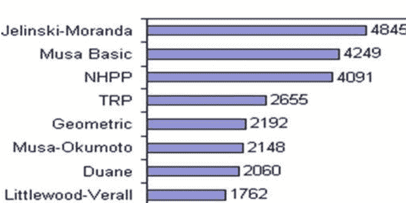

图1 平均故障时间

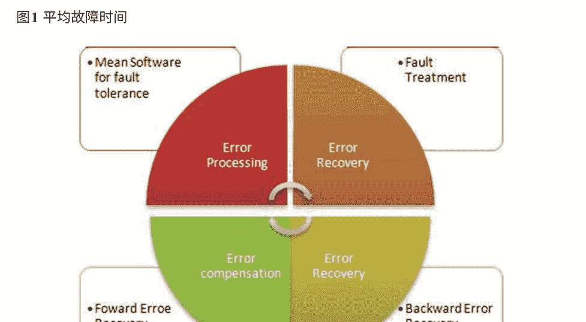

图2 故障容忍的平均软件

人类活动中的错误会产生故障。主要的原型是程序员在分配中的不当活动以及遗漏。人为错误是分配给系统状态的一部分，可能是连续错误的根源。该定义错误是保留的。它通过错误、负担和失望在四层访问和错误之间以及结局之间传播三层模型 [12]。

### 2.1 缺陷类型

缺陷类型的研究具有多样性，解释了缺陷与环境的变化。它可以大致分为三个部分，如缺陷目录、核心原因探索和缺陷排序。

缺陷目录是对负担的分类，通常在程序中，基于完成解释的数据。例如，错误的类型公告、错误的变量机会或错误的拘留处理[13]。核心原因探索是被考察的事情行为，但也是根源。比如编程方面的错误。目标是找到根源原因，然后消除以避免疏忽导致的错误。在相等时间间隔内处理预算的目标是处理补偿。分类实践还具有不均匀的错误性质，通常包含多个测量[13]。缺陷分析过程如图3所示。

### 2.2 质量保证

保持所需质量水平的维护被称为质量保证。基于质量，成本通过逻辑特性保证得到改善。卓越肯定可以强调产品。该论点侧重于原始逻辑中的软件质量保证（SQA）。这可能增加有效、分析和优越保证的分类[14]。

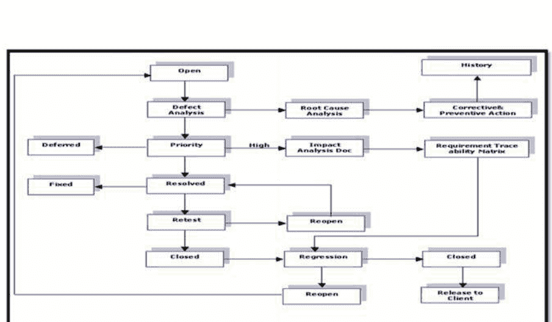

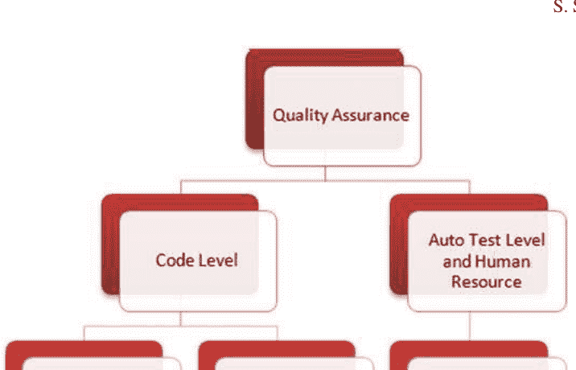

图4 质量保证

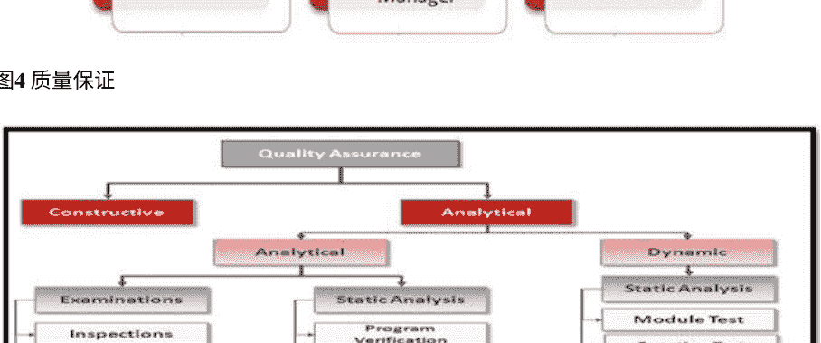

图5 诊断质量保证过程

通过改进项目的行动，生产性的SQA提高了项目的优越性。因此，它不希望在最初的居住地发现、消除缺陷，然后预防故障的添加。图4描述了质量保证。

与旨在预防故障的有效质量相反，分析质量识别实际缺陷。作者将分析质量分为两个主要类别：静态静止和动态活跃探索[14]。图5描述了诊断质量保证过程。

这里有一种多样化的选择来分配改变的分析方法。将分配对象限制在接近分析或分组的记录上。可以从技术的最小两个位开始分析。有两种类型的分析情况，最高级别的是设计良好和基础性的分析。

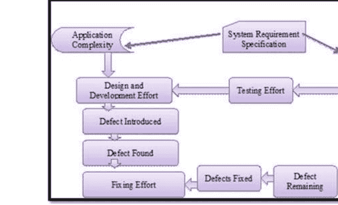

图6 数据分割过程

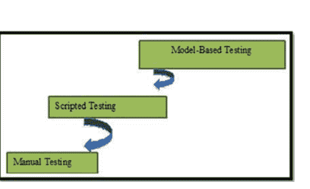

图7 软件测试评估

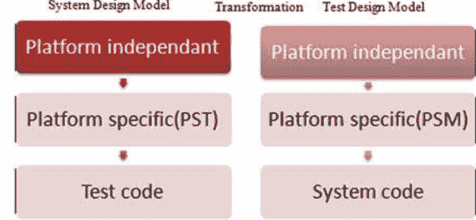

图8 基于模型的测试

方法在图6中提到。此外，软件测试评估在图7中描述，基于模型的测试在图8中描述。

它被用于术语分析和编程过程中的对象的广泛感知加上账户方法。编程过程的目的是用于发现错误以及真实过程。静态分析提供了一种用于在代码中发现错误的程序包类别，以便进行较少的测试，类似于解释器。然而，质量模型用于描述和评估软件的质量。它可以被分类为改变的模型种类是应用一致性和应用性能。这是应用优越性和模拟适应后果的可测事件。价值模型是吸收特征、实践、人类和创造的其他优越特征的关联的吸收[15]。

研究人员在本章中关注可信度、可信度方法和计算可信度的模拟，已经建立了很长时间。它是在明确的要求和总结中存在的，边界[16]。调整开销包括通过这种模拟应用的所有费用，以满足更高的需求。如果应用程序没有满足更高的要求，就会产生不符合成本[16]。

## 3 现状

先前已经为不同阶段的不同缺陷模块引入了一个简单的缺陷概述模型，如需求、项目、编码认证等。用于更高财务的模拟主要是为了实现领域，然后适应应用。软件评估有效性系统如图9所示。

逻辑模拟的分析优越性提供了一个先进的模型数组。作者涵盖了所有在某种程度上评估分析优越性精确方法的模型。这是为那些实践而声明的

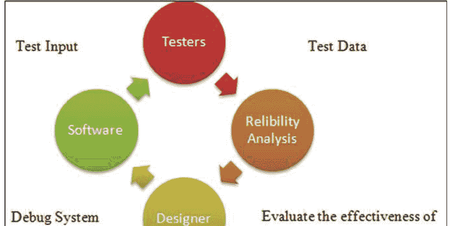

图9 软件评估有效性系统

这些方法在多种方式上有所不同，而综合知识则是以误差识别为最终结果，可以通过结合几种不同的方法获得。模拟的相关数据来自不同的文献，以提供不同方法和错误的常规标准。这将允许更简单的软件进行模型化。现在根据实验记录，模拟是一个关注与定量指令相关的定量检验的焦点。关于持续几年的分析方法有一些摘要。主要重点是分配方法的摘要分析系统，而不是为了聚合分析绝对统计数据。

该方法旨在通过标准化大量示例读数来降低SQA成本。由于原型需要标准化在公司中完成了一些计划，一个完整的认证并不真实产生了合理的期望。在许多领域进行了更多的读数，并评估了不同阶段的改变方法。总的来说，这些研究对原型产生了有益的反应，并为方法的效率提供了资金支持[17]。

### 3.1 以质量经济学衡量的价值资金

质量实践在多个方面有所不同。综合知识，即以错误识别为特点的最佳方法，可以通过结合多种不同的方法来获得。在这种情况下，主要问题是如何以降低成本的方式使用这些不同的方法[17]。它们被组合在一个抽象模型中，应用理想和分析模型。

它允许更简单的软件进行模拟执行。现在根据实验记录，该模型将进行定量检验，以定量命令来解决参与问题。它允许形成因素，对进一步分析非常有帮助。各种实践可以用于提高软件的质量。这些实践在多个方面有所不同。

在这种情况下，关键问题是如何以减少费用的方式使用这些不同的方法，总的原因是基于相关数据对模型进行收集，通过不同的编写提供不同方法和故障的常规标准。图10描绘了项目在质量经济方面的优越性。

综合知识的几种方式，即错误识别方面的精细化，可以通过结合几种不同的方法获得。总的来说，这些研究对方法的原型和资助的效率提供了有益的反馈。通过不同的编写收集与模型相关的数据，以代表不同的方法和故障提供常规标准。

研究人员同意是否安排适应，是否为客户提供预期的好处。对于商家来说，软件职位的优越性在于减少责任，增加新功能。

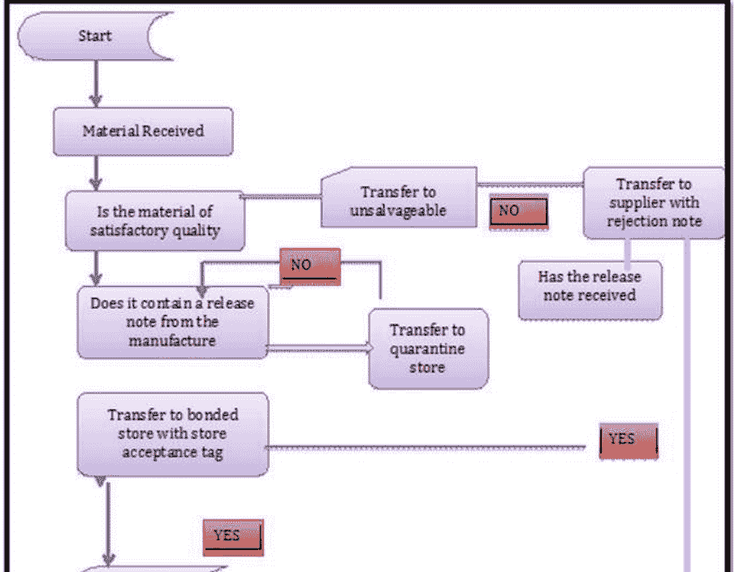

图10 项目优势

建设性是一种在软件改进之前预测缺陷和其他故障的有用方法。与对立的分析方法相反，判断软件的目标是发现故障和其他困难。实际原因允许更简单的软件进行建模和执行。现在根据实验记录，模型是关注定量检验的焦点，与环境问题的数量命令相关。

故障查找的问题是一种从结构到构建过程中识别效率的方法，具有完整的策略模型授权和集中SQA模块的能力。因此，它是故障识别生产力的关键。在实验记录中发现，模型是关注定量检验的焦点，与参与问题的数量命令相关。反过来，它允许形成因素对进一步分析非常有帮助。

对于商家来说，软件职位的优势在于不仅仅是责任减少，还增加了新的功能。一个完整的认证并不真实，因为原型需要标准化完成了一些计划。

在一个公司中产生合理的期望。在许多领域进行了更多的阅读，并在不同阶段评估了不同的方法。下图11描述了活动图[18]。

一个完整的认证并不真实，因为原型需要标准化完成了一些计划，以产生合理的期望。在许多领域进行了更多的阅读，并评估了不同阶段的改变方法。可以认为三个组成部分的蓝图每年一次[19]。技术应用的直接成本定义在方程1中，而未来成本定义在方程2中。方程3是指收入，而方程4用于分组，其中θ是x和t值之间的角度；(x,y)是提及成本优化分组的导数项函数；i, j分别是x和y函数的初始值；t表示成本优化时间的持续时间；A, B, C是收入生成的成本函数。

```
E[d_A(t_A)] = V_A + e_A(t_A) + ∑_i (1 - θ_A(i, t_A))V_A(i)   (1)
```

```
E[f_A(t_A)] = ∑_i π_i θ_A(i, t_A)(V_F(i) + c_F(i))   (2)
```

```
E[r_A(t_A)] = ∑_i π_i (1 - θ_A(i, t_A))(V_F(i) + c_F(i))   (3)
```

```
θ(x, i) = ∏[θ_y(i, t_y)] ∏_{j ∈ R_i} θ_y(i, t_y)   (4)
```

在对分析方法不利的情况下，通过评估软件以确定错误和其他困难。方程式5定义了错误识别和多种方法在减少费用的技术中的术语。

```
E[d_x(t_x)] = ∑_{r ∈ X} [u_x + e_x(t_x)] + ∑_{i} [1 - θ_x(i, t_x)]θ(x, i)V_x(i)   (5)
```

```
E[r_x(t_x)] = ∑_{x ∈ X} ∑_{i} [π_i (1 - θ_x(i, t_x))]θ(x, i)(V_F(i) + c_F(i))   (6)
```

总的来说，这些阅读对于原型和方程式6中定义的义务性回应非常有帮助，而展示了该技术应用的直接成本，以及对方法效率的了解。

```
E[f_x(t_x)] = ∑_{i} [π_i ∏_{x ∈ X} θ_x(i, t_x)] ∏_{y < x} ∏_{j ∈ R_i} θ_y(j, t_y)(V_F(i) + c_F(i))   (7)
```

建设性是一种有用的方法，用于提前在软件改进中预测缺陷和其他故障，并在出现之后解决这些问题和其他困难。总成本定义为 d_x + f_x，而利润为 r_x - d_x - f_x。投资回报率（ROI）被定义为用于判断软件中的故障。

```
ROI = r_x - \frac{f_x}{d_x} + f_x   (8)
```

所谓的回报金额通常被定义为减去已使用的本金。

### 3.2 各种情况

通过使用定义的方程计算出故障的各种情况。计算结果如下表1所示。表1显示了所述方程的计算值在给定术语的最小值到最大值范围内。在上述提到的情况中，B的值为1，θ表示给定方程的斜率值，E表示能量的符号，通过对上述方程进行微分得到。F和x表示x和t的函数，r表示时间。

表1 投资回报的计算结果
| 故障 | V_F | f_F | π | θA | θB | V_A | V_B |
| :--- | :--- | :--- | :--- | :--- | :--- | :--- | :--- |
| 1 | 5000 | 1000 | 0.8 | 0.2e^{-0.2t_A} | 1 | 500 | 1000 |
| 2 | 2000 | 20000 | 0.2 | -0.02t_A + 1 | -0.03t_B + 1 | 400 | 900 |

方程中的函数的持续时间和半径分别为。表格显示了方程的利用值。

> 因此，我们有：
θ(B, 1) = 0.2E - 0.2.10 = 0.03
θ(B, 2) = -0.02.10 + 1 = 0.8
E[d_x(t_x)] = 4887
E[f_x(t_x)] = 155440
E[r_x(t_x)] = 65920

## 4 成本优化

策略模型允许将SQA集中在这些模块上。因此，这是为了恢复故障识别的生产力。该方法旨在通过多个示例读数对SQA的成本进行标准化。整个认证在原型需要标准化完成之前都不是真实的，这需要在公司中制定合理的期望[14]。不同的组件如下所述。

```
E[d_X(t_X)] = Σ_{x∈X} [u_x + e_x(t_x)] + Σ_{i} (1 - θ_x(τ_i, t_x)) Π_{y<x} (θ_y(τ_i, t_y)) v_x(τ_i)   (7)
```

同样，累积未来成本的接受量 f_X 可以根据应用模型中定义的类型进行计算，如公式8所示。

类似地，累积收益的预期值 b_X 在公式9中得到了明确的定义。

```
E[f_X(t_X)] = Σ_{i} π_{τ_i} Π_{x∈X} (θ_x(τ_i, t_x)) (v_F(τ_i) + c_F(τ_i))      (8)
```

```
E[b_X(t_X)] = Σ_{x∈X} Σ_{i} π_{τ_i} (1 - θ_x(τ_i, t_x)) Π_{y<x} θ_y(τ_i, t_y) (v_F(τ_i) + c_F(τ_i)) (9)
```

## 参考文献

16. Hochreiter, S., Schmidhuber, J.: 长短期记忆。神经计算。 9(8), 1735–1780 (1997)

17. Chung, J., Gulcehre, C., Cho, K., Bengio, Y.: 对门控循环神经网络在序列建模上的实证评估。 arXiv:1412.3555 (2014)

18. Shayeghi, H., Shayanfar, H.A., Azimi, G.: 基于智能神经网络的短期负荷预测。 国际计算机系统科学与工程杂志 4(1), 17–27 (2009)

19. Sallab, A.E., Abdou, M., Perot, E., Yogamani, S.: 深度强化学习框架用于自动驾驶。 电子成像 2017(19), 70–76 (2017)

## 6 结论

该模型的实际应用在很大程度上依赖于不确定的数据，这些数据是通过专家视角获取的。作者已经讨论了这种方法的几个问题。数据实际上并非“测量”得到的，而是由人投射出来的。因此，数据是不可靠的，容易受到偏见的。然而，每个数据都存在不确定性，因为作者无法始终确定数据的准确记录方式。因此，作者必须通过结构化的方法来处理这种不规则性和不确定性，以进行熟练的判断。本章总结了几个要点：优化软件成本，帮助决策者规划SQA并分析其决策的影响。此外，它还讨论了在开发软件和改进缺陷检测技术时的改进或优化。

## 参考文献

- 1. Pendrill, L.R.: 在决策和一致性评估中使用测量不确定性。 Metrologia 51(4), S206 (2014)
- 2. Slaughter, S.A., Harter, D.E., Krishnan, M.S.: 评估软件质量的成本。 Commun. ACM 41(8), 67–73 (1998)
- 3. Laporte, C.Y., Nabil, B., Mikel, D.: 测量庞巴迪交通大型软件项目的软件质量成本：案例研究。软件质量管理。 14(3), 14–31 (2012)
- 4. Zheng, W., Bundell, G.: 基于模型的软件组件测试：一种基于UML的方法。 In: Proceedings of 6th IEEE International Conference on Computer and Information Science, pp.891–899 (2007)
- 5. Zheng, W.: 基于模型的软件组件测试。博士论文，西澳大学（2012）
- 6. Zheng, W., Bundell, G.: 基于UML的软件组件测试的合同测试。在：国际计算机科学及其应用研讨会论文集，第377-382页（2008年）
- 7. Agrawal, M., Chari, K.: 软件工作量、质量和周期时间：CMM 5级项目的研究。IEEE Trans. Softw. Eng. 33(3), 145-156（2007年）
- 8. Tian, J.: 软件质量工程：测试、质量保证和可量化改进。Wiley，新泽西（2005年）
- 9. Lazić, L., Kolašinac, A., Avdić, D.: 软件项目优化的软件质量经济模型。WSEAS Trans. Comput. 8(1), 21-47（2009年）
- 10. Janzen, D., Saiedian, H.: 测试驱动开发的概念、分类和未来方向。计算机 38(9), 43-50（2005）
- 11. Balaji, S., Murugaiyan, M.S.: 瀑布模型与V模型与敏捷开发：关于软件开发生命周期的比较研究。信息技术与商业管理国际期刊 2(1), 26-30（2012）
- 12. Nidumolu, S., Tondapu, J.: 黑盒和白盒测试技术-文献综述。国际期刊嵌入式系统应用 2(2), 29-50（2012）
- 13. Fenton, N.E., Ohlsson, N.: 复杂软件系统中故障和失效的定量分析。IEEE软件工程交易 26(8), 797-814（2000）
- 14. Boehm, B., Basili, V.R.: 前10名清单[软件开发]。计算机 34(1), 135-137（2001）
- 15. Boehm, B., Huang, L., Jain, A., Madachy, R.: 软件可靠性的投资回报率：iDAVE模型。IEEE软件 2(3), 54-61（2004）
- 16. Galin, D.: 软件质量成本的包容性模型。软件质量专业杂志 6(4), 25-31（2004）
- 17. Jürjens, J., Wagner, S.: 使用UML构建可靠系统的组件化开发。在：嵌入式系统的组件化软件开发，Springer，柏林，海德堡，pp. 320-344 (2005)
- 18. Harel, D., Katz, G., Marelli, R., Marron, A.: 一种用于行为模型的初始智能开发环境。在：第4届国际模型驱动工程和软件开发会议论文集，pp. 600-612 (2016)
- 19. Judy, K.H.: 敏捷原则和道德行为。在：第42届IEEE夏威夷国际系统科学会议论文集，第1-8页 (2009年)

# 敏感业务云安全的分析方法

Soobia Saeed, N. Z. Jhanjhi, Syed Mehmood Raza Naqvi 和 Azeem Khan

摘要 敏感云存储安全是确保业务机密数据的重要组成部分。近年来，合并云数据库环境中的敏感数据安全得到了提高。数据中心遍布全球。云计算通过互联网提供虚拟资源，为其用户提供便利。这是一项令人兴奋的技术，可以降低应用成本。本章重点介绍敏感云存储的安全性及其解决方案。反过来，它帮助用户在计划使用云存储时了解所有必要的安全事项。有时候业务的性能会受到损害，需要最高级别的安全保障。对于用户来说，根据业务需求选择适当的敏感云数据库安全机制非常有帮助。本章介绍了云计算中安全性的主要概念。它还介绍了对敏感数据的安全性、四级认证授权、数据安全、网络安全和云安全的重要性。

随着云计算需求的增长，安全威胁日益成为一个主要问题。本章还定义了云计算中安全威胁可能对云计算造成的严重危害，并提出了限制措施。

- S. Saeed (✉)
    - 软件工程系，马来西亚柔佛州理工大学，电子邮件：saeed.soobia@graduate.utm.my
- N. Z. Jhanjhi
    - 计算与信息技术学院，马来西亚梳邦再也泰勒大学，电子邮件：noorzamanjhanjhi@taylors.edu.my
- S. M. R. Naqvi
    - Sheridan学院计算机科学系，加拿大布拉姆普顿，电子邮件：dr.naqvi@gmail.com
- A. Khan
    - 马来西亚梳邦再也泰勒大学ADP，电子邮件：azeem@taylors.edu.my

## 1 引言

为了保护敏感的商业数据，使用云计算必须关注安全问题和安全风险，包括威胁、风险和漏洞。云计算正在日益增长，服务提供商提供基础设施、平台和软件作为服务等服务。遍布全球的数据中心通过互联网向用户提供虚拟资源。因此，研究人员不断致力于企业云计算中的安全风险、潜在威胁、漏洞和可能的对策。

在传输中使用加密技术来加密数据。为了保护机密数据，如员工信息、账户详情、合同详情、买家和供应商详情以及销售情况，需要进行加密。解密技术用于从云存储中获取重构的原始数据，并通过应用程序正确显示。云计算也被称为按需计算。在计算机和其他设备请求和共享资源时提供信息。第三方数据中心为用户和企业提供解决方案以保存和处理数据存储的各种能力。云计算正在日益发展，云计算服务提供商提供基础设施、平台和软件作为服务等服务。云不是完全安全的或无风险的。保护系统和数据安全风险管理由第三方负责安全。因此，由于敏感数据的集中化，改善安全性是必要的。

为了保护云计算中的业务敏感数据，需要处理安全风险，包括危险、风险和漏洞。服务器农场分布在全球各地，通过互联网向客户提供虚拟资源。科学家们正在研究企业云计算中的安全风险、潜在风险、漏洞和可能的对策。

在传输中使用加密技术来加密数据。敏感业务云安全的实际分析方法的真实例子是基于管理和分析。这是大数据运营的关键领域之一，可以安全地提供信息以减轻大规模数据泄露。在处理期间，减轻大规模数据泄露是一个严重的问题。根据在线系统和大数据管理的不断增长，应使用适当的技术进行监控。本研究的目的是通过使用基于信息安全概念的正确决策过程（如基于身份验证的访问控制）来避免大规模数据泄露。解决信息安全问题的分析方法也可以用于确保大规模数据基础设施和改善大规模数据泄露的关键管理。作为一种分析方法，访问控制用于考虑侦测和保护大规模数据泄露的信息安全。

在介绍之后，本章的其余部分安排如下。第2节涉及文献调研。第3节介绍了面向商业云的安全方法论。结果和讨论在第4节中呈现，结论在第5节中呈现。

## 2 文献综述

第三方根据用户需求为其提供基础设施、平台和软件服务。客户和提供商之间的服务级别协议根据服务类型和质量达成一致。云上的信息技术资源，如信息存储、应用、存储和网络，必须可用。为此，如果在本地计算机上安装了应用程序或基于Web的控制程序，则响应非常快。用户可以通过Web浏览器访问[1]。云提供了一个可配置的共享资源。

云计算的特点如下。

- 用户可以从服务提供商那里获取任何已签约的云计算资源，如存储、服务、应用程序处理。这被称为按需服务。
- 云计算服务可以通过支持的设备从任何地方访问Web。这被称为网络访问。
- 根据需求动态分配给客户的资源。云资源由提供商共享给不同的客户。在云中，提供商的资源被组装起来提供受限服务，这被称为资源池。
- 云在需要时为客户提供资源，并在不需要时释放资源。从客户的角度来看，资源是无限的。客户必须支付所使用的总资源。这被称为快速弹性。
- 此外，云通过用户自动平衡负载并优化资源的使用。用户有权监控和控制资源的使用。这被称为计量服务。

云计算中的云基础设施有两个广泛的视角，可以租用基本的云计算结构或租用云计算中的任何特殊服务[2]。

云服务提供商允许使用的基本基础设施是云服务上的软件和硬件。云计算日益增长，并引入了许多术语，如基础设施、平台和软件即服务。正如首次讨论的‘云计算’一词所示，描述云计算的不同组成部分的术语也是如此[3]。根据它，云计算服务模型有几个层次，称为hypervisor，在这个抽象层之上存在三个层次，即基础设施、平台和软件即服务。

基础设施服务模型允许客户以受控的方式访问虚拟基础设施。这是提供给客户的底层服务。为了保护基本结构，客户需要有资深水平的网络结构工程师。操作系统是处理任何事情的高度负责的，尤其是安全负载。一些客户不承担这个责任。通过这个访问，用户可以使用操作系统并安装所需的软件。

为所有平台提供的平台服务已预先安装。操作系统中的编译器等工具由服务提供商管理给客户使用。这个模型是传统的托管服务，来自第三方，比如租用远程服务器，并为软件开发提供集成的开发环境（IDE）。

软件服务基于用户界面应用程序和基本结构，其他细节放在另一个来源。此外，用户可以通过计算机系统的Web浏览器或手机应用程序访问该服务[4]。

云计算有三种云部署模型，即私有云、公共云和混合云。私有云有权创建云的类型以及由组织进行控制、设置和维护。访问权限仅限于公司内部，并由组织进行管理[5]。公共云动态地向互联网提供资源，使用Web浏览器和移动应用程序进行访问。这些类型的云模型由销售和租用云服务的提供商拥有。混合云是私有云和公共云的集合。这个部署模型服务对私有云和公共云都可用。提供商管理私有云和公共云的访问权限[5]。

云安全是在网络结构层上运行的Web服务，用于保护免受网络攻击者的侵害。如果有黑客访问服务器并关闭所有服务，那么服务提供商将移除黑客并为敏感数据提供安全保护。阻碍安全问题在云计算中起着最重要的作用。然而，它会导致诸如数据被盗和丢失等不安全问题。此外，它对组织的敏感数据和软件构成威胁[6]。安全是阻碍云发展的非常重要的问题。将敏感数据交付给其他公司的想法非常严重，因此用户需要在理解此环境中的数据违规问题时受到警告[7]。操作和技术对策可以防御恶意或意外的人为行为。此外，内部威胁几乎影响了每个基本结构，并且仍然是一个问题至今。在内部云资源的背景下访问云会给公司带来相当大的损失，因为它们被滥用。这些类型的攻击可能会干扰云的最大用户数。这种攻击的影响在今天起着至关重要的作用[7]。

数据丢失和数据泄露涉及到威胁。云服务和共享技术云环境中的网络威胁涉及账户劫持、不安全的应用程序接口（API）、恶意内部人员、不足的尽职调查。此外，一些特殊的威胁也涉及到接口。云计算中也探讨了主要的威胁[8]。

云物理和网络安全中的威胁可以分为各种安全问题。需要仔细维护安全标准和可燃性全球监控，以防止安全管理基础设施。提供安全证书来持有系统的物理属性，例如处理系统的数据中心。同时，它处理了对网络世界系统的保护。在网络攻击中，云计算服务中的大量计算资源在攻击期间未被用户激活。这些计算资源被用于遭受网络攻击。这些攻击也在文献中讨论[9]。

数据库服务必须具备关系数据库和云数据库的所有特征。云数据库是为虚拟化计算环境而设计的。云数据服务和数据库服务是两个关键组成部分。将关系数据库服务器部署到云上并不容易。在云数据服务中，只提供了一定的容量来存储数据。在数据库服务中，管理客户可以存储信息并对信息进行查询和修改。从云数据库中获取一些有价值的数据。

云数据库是由专业服务提供商网站创建的。因此，云数据库的安全性应该很高，因为客户需要保护他们的数据。此外，客户还需要保护数据免受专业服务提供商网站的侵害。有可能数据库受到云数据库供应商的损害[10]。此外，云数据库应该具有可扩展性，以便在云中的用户数量增加时尽可能多地存储数据。此外，云数据库必须具有异构性，以支持所有类型的用户，并且用户可以在各种平台上工作。

保密性是云计算中的另一个问题。数据必须只对合法客户可读，因此必须对数据库进行适当的加密，以便只有授权用户可以访问数据[10]。云不仅有自己的数据业务观点，还有消费者和促进业务计算。云计算服务的分布式性质也会导致一些问题，例如数据和概念的更改。云计算中的一些公司有第三方服务提供商来转换云，并允许它们在世界上的物理位置处理消费者数据。这可能是云计算中的一个问题[11]。它还引发了国家和国际问题。国家和国际监管机构的参与对于云计算中的积极和明智的角色是必要的。必须遵守一些全球规则来保护用户的数据。

否则，云服务提供商通过当地法律、当地基础设施进行操纵，并允许客户和第三方服务提供商遵守可用区[11]。运行在虚拟机上的虚拟机监视器(VMM)会产生攻击的风险，因为虚拟机技术架构神话是一个潜在的问题。因此，虚拟机数量的扩展可以根据需求进行收缩。它导致了硬件和操作系统，包括传统远程版本的计算机系统上的虚拟机。

企业环境、应用程序的身份验证和授权可能需要替换以适应安全云环境。文献中的模型使用两步验证用户密码、主卡和带外验证的真实性。此外，它还提供相互认证、身份管理、会话密钥建立、用户隐私和安全防护，以抵御许多常见攻击；然而，正式的安全证明尚未正式化[13]。

云存储将企业或个人的数据存储在多个分布式且可访问的云中。分布和集成资源加密算法提供更安全的通信。对称加密用于使用一个密钥进行数据加密和解密。另一种技术使用两个密钥的非对称加密，如私钥和公钥。公钥用于加密，而私钥用于解密。为了在云存储中实现安全性，存在许多现有技术和加密算法。用于为云存储提供安全性的常用加密算法包括数据加密标准(DES)算法和RSA算法。

这些算法只有一级加密和解密，适用于云数据存储。黑客可以轻易破解一级加密。因此，建议使用多级加密和解密来为云存储提供更多安全性[14]。

对敏感数据进行的数据操作，如复制、移动、查看、窃取、删除和个人使用，都存在安全风险。数据泄露可能获取到财务信息，如银行账户详细信息、信用卡详细信息、企业账户、员工信息和个人健康信息，以及企业和客户的商业机密和详细信息[15]。在云计算中必须采取一些措施来保护敏感数据。云计算是一种重要的敏感信息风险管理方法，可以更有效地管理风险。因此，可以应用安全更新和新补丁。

为了敏感数据的安全和隐私，全球范围内对第三方数据中心的可靠性和性能问题引起关注[16]。

## 3 安全方法论

本节重点介绍云基础设施的安全方法论。对于运营商来说，将一些应用程序迁移到云基础架构是一个巨大的挑战。公司正在寻求降低成本和移动敏感数据的能力。云允许用户从世界上任何地方访问文档，对于团队项目上的机密数据和促进合作，以及消费者应用程序都起到了重要作用。云提供商在云API中实施的措施旨在确保安全性，在部署之前必须进行检查。必须实施强大的身份验证和访问控制机制，以防止对不安全的接口和API进行数据和服务存储。可以提供开放网络应用安全项目（OWASP）的标准和指南，以确保应用程序的安全性并避免风险。此外，将数据转移到云提供商的云API、接口和分析对于客户的责任至关重要。

- **身份验证授权**：此要求应阻止未经授权的访问，只允许授权用户访问组织中的数据和设备。大量用户访问云环境，因此在向任何客户提供访问权限之前，这些控制措施变得更加重要。企业身份联合和快速接入第三方身份验证和授权系统应该可用于连接。
- **数据安全**：已经提出了各种安全措施和技术，以避免云中的数据泄露。云存储功能加密以保护存储在其中的敏感数据，并使用特定访问控制策略对敏感数据进行加密。适当的访问控制以防止未经授权的访问；实施更好地防止敏感信息泄露需要特别注意。必须进行云存储环境风险评估，以在各种服务和网络之间实现适当的虚拟机隔离和传输。
- **网络安全**：必须保护网络上的数据流，以防止敏感信息泄露。因此，网络中的安全套接字层（SSL）和传输层安全（TLS）需要使用加密技术。在某些情况下必须采取第三方网络嗅探、中间层攻击（如人体重要保护）等措施来对抗传统网络安全问题，如端口扫描、IP欺骗。网络层通过SSL加密端点进行访问，具有最高安全性。端点确保第三方服务器中的加密数据在传输过程中既安全免受外部来源的干扰，又可以从互联网访问。但是，恶意用户通过利用安全设置的弱点来嗅探网络数据包。
- **云安全**：只有经授权的人员才能访问上述威胁，并且受限的硬件和基础设施可用。必须由服务提供商实施强大的权限控制，并授权管理员对数据和软件管理功能进行隔离以限制访问。可以应用恶意内部加密敏感数据存储和公共网络来防止威胁。在将敏感数据（如关键资产）转移到云端之前，组织必须了解其完全敏感数据的范围。防火墙日志用户及其应用程序等服务提供商应采取措施保护敏感数据，并且必须公开基础设施。此外，需要建立使用云应用和服务的行业标准。在发生故障后，必须检查处理流程，并由云数据存储提供商执行一些定性和定量风险评估方法。

## 4 商业云的发展

本节描述了商业云的发展。讨论了商业云中的使用和便利性、成本、可靠性、安全性和隐私性、共享和协作业务。图1描绘了商业云的发展概述。

图1 商业云发展的块图

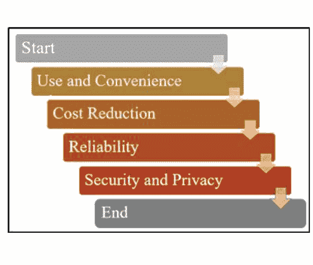

### 4.1 使用和便利性

组织员工经常在办公区域之外工作，以便轻松工作和使用他们的数据。因此，云方法消除了组织的开销，并允许从任何地点、设备和任何公司访问。这种对员工在远程地区获得确认的依赖需要越来越多的在线努力。同时，它还需要一个云处理方案。记账和现金工作已经外包给云端，为业务专家节省了更多的时间用于战略工作和活动。

会计师正在为客户使用云技术，并在标准支付方面提供帮助。

### 4.2 成本降低

使用商业分析和评估来获取协会成本的访问，需要大量的计算商业重要消耗，并且必须减少他们的成本问题。然而，快速使用设备和编程资源使得在没有资本计划时间的情况下成为可能，并促使快速广播，使用IT成为有用的成本。此外，IaaS的过程减少了资金消耗和IT成本。在灵活性上，可以灵活地推动（灵活的办公室）并避免云限制。如果通过临时方法大幅增加请求，云服务提供的资源可扩展性将成为降低成本的业务增益。

### 4.3 可靠性

这也是服务可靠性的一种有效方式，因为员工可以根据需求与云组织进行互动，而不是依赖内部IT部门。云为数据存储解决方案内置了数据冗余，因此他们可以随时访问其数据文件，而无需网络停机、能力故障等。如今，商业云以低价为我们提供可信赖的服务。例如，商业公司提供自动化灾难恢复和提供支持的SLA所必需的快速电话支持服务的进一步解释，以及由FTC和云安全联盟进行的支持保密，旨在提高云提供商的可靠性。

### 4.4 安全与隐私

组织们正在关注云安全和灾难控制（使用选择性云）以及不同的真实关注点。云安全对于任何风险和限制都非常重要，以检查验证和加密。通过观察常规工作、检查交易、授予用户特定的使用权限以及使用强大的安全密码来提高安全性。引入安全区域可以通过多种方法来推迟几天、几个晚上的时间，并节省几个月的时间。根据云服务的不同，可能会有一些灵活性，例如，雅虎应用允许某些用户指定数据的位置以确保安全，并遵循联邦规定。先进的安全性应该可能预期到规模经济，并为安全专家实施巨大的努力。

尽管信息安全是中小型企业的主要关注点，但由于他们希望用于打开任何文件或文档或进行物理活动，因此广泛的社区云以合理的成本提供标准的管理服务。最终，与云处理相关的结果基于安全性及其关注设施、模式、网络层和威胁。

例如，一些企业根据组织的需要将信息移至云端，并通过保护敏感业务数据的使用来更新所有系统。

## 5 结论

保护商业敏感数据库涉及保护每一层的所有数据。在每个地方提供多个安全级别并不容易。当需要保护商业机密数据以及员工的个人信息和财务细节时，必须应用安全措施。有时候，业务的性能会受到损害，需要最高的安全级别。根据业务需求，用户了解敏感云数据库所需的适当安全机制非常有帮助。

因此，需要在四个层面上保护数据库，包括身份验证和授权、数据安全、网络安全和云安全。到目前为止，云计算的安全机制还没有完全安全，需要进一步探索。

因此，对于敏感业务数据来说，安全性是最重要的，并且需要在云存储中提供完全受保护的环境，以确保数据在所有层面上都得到安全保护。

## 参考文献

- 1. Carroll, M., Van Der Merwe, A., Kotze, P.: 安全的云计算：好处、风险和控制。 在：2011年南非信息安全，IEEE Xplore，第1-9页（2011年）
- 2. Devasena, C.L.: 云计算对业务发展的影响研究。运筹学与应用：国际期刊 1(1), 1-7页（2014年）
- 3. Ahmed, M., Hossain, M.A.: 云计算和云安全问题。网络安全与应用：国际期刊 6(1), 25-36页（2014年）
- 4. Alani, M.M.: 云安全：威胁、攻击和缓解技术。高级计算科学与技术：国际期刊 3(2), 202-213页（2014年）
- 5. Rachana, S.C., Guruprasad, H.S.: 云计算中的新兴安全问题和挑战. Int. J. Eng. Sci. Innov. Technol. 3(2), 485–490 (2014)
- 6. Kumar, R.: 使用数据传输研究云计算安全威胁. Int. J. Adv. Res. Comput. Sci. Softw. Eng. 5(1), 399–402 (2015)
- 7. Mahajan, A., Sharma, S.: 云中的恶意内部人威胁. Int. J. Eng. Res. Gen. Sci. 3(2), 245–256 (2015)
- 8. Kazim, M., Zhu, S.Y.: 云计算中的顶级安全威胁调查. Int. J. Adv. Comput. Sci. Appl. 6(3), 109–113 (2015)
- 9. Mohiddin, S.K., Yalavarthi, S.B.: 云计算新趋势中的研究挑战. Int. J. Adv. Comput. Sci. Technol. 4(1), 1–7 (2015)
- 10. Modi, C., Patel, D., Borisaniya, B., Patel, A., Rajarajan, M.: 云计算不同层面的安全问题和解决方案调查. J. Supercomput. 63(2), 561–592 (2013)
- 11. Marston, S., Li, Z., Bandyopadhyay, S., Zhang, J., Ghalsasi, A.: 云计算-商业视角. Decis. Support Syst. 51(1), 176–189 (2011)
- 12. Sabahi, F.: 使用基于虚拟机监视器的技术在云环境中进行安全虚拟化. Int. J. Mach. Learn. Comput. 2(1), 39–45 (2012)
- 13. Rai, R., Sahoo, G., Mehfuz, S.: 保护云计算软件即服务模型的问题和解决方案. Int. J. Cloud Comput.: Serv. Arch. 3(4), 1–11 (2013)
- 14. Khan, S.S., Tuteja, R.R.: 使用加密算法保护云计算中的安全性. Int. J.Innov. Res. Comput. Commun. Eng. 3(1), 148–155 (2015)
- 15. Zissis, D., Lekkas, D.: 解决云计算安全问题. Futur. Gener. Comput. Syst. 28(3), 583–592 (2012)
- 16. Bisong, A., Rahman, M.: 企业云计算安全问题概述. Int. J. Netw. Sec. & Appl. 3(1), 30–45 (2011)