# 机器和深度学习中的创新


# # 前言

机器学习（ML）是人工智能（AI）的一个分支，不断变化和适应新兴挑战。自计算机的早期概念以来，人类一直在努力开发更有能力的思考机器。

它始于图灵测试的提出，该测试表明如果计算机能够说服人类它是一个人，那么它可以被认为是“智能”的。最初的模型模仿人类的思维过程，但很快发展成通过经验获取知识或技能的算法。如今，通过深度学习（DL）技术改进了这种行为，DL是ML的一个分支，通过将更多的经验融入其学习过程，克服了吸收知识的有限能力。

推理引擎的创建扩大了软件能力的创新。主要是ML和DL促进了软件从人驱动到推理驱动的转变。此外，人工智能研发在任何企业创新部门中都起着重要作用，无论是作为商业智能工具的一部分，帮助决策者做出明智决策，还是作为将要商业化的开发技术的一部分。

机器学习和深度学习的创新：案例研究和应用旨在收集与决策、预测、信息检索、可解释人工智能、风险管理、医疗保健、人类活动识别、可持续发展、物流等与该领域相关的任务创新相关的最新技术应用。本书由二十二章组成，分为三个主要领域：

第一部分：面向分析的应用。这个七章部分倡导对数据的系统分析。研究案例的领域包括时间序列预测、特征选择、模式分类、可重用框架、语音识别、文本分类和问答系统。本部分的原始研究涉及到对丰富的机器学习和深度学习技术的分析，如残差反馈人工神经网络、禁忌搜索、全息神经网络、k最近邻、卷积神经网络和文本分析模型。一些具体的应用包括通过语音识别进行情感识别、新闻标题中的轰动效应检测和阿拉伯语处理。最后，让我们指出，这部分显示几乎任何数据都可以进行分析，并且ML和DL工具可以在此过程中提供帮助。

第二部分：面向医疗保健的应用。这八章重点介绍了基于ML和DL技术的工具，旨在支持个体医疗保健。本部分分析了注意力缺陷多动障碍的应用，将蚊子分类到人体皮肤上，从X射线图像中进行肺炎分类，人体活动识别，胆固醇预测，癌症检测，新生儿孵化箱混响时间表征以及COVID-19预测。前面的应用中涉及的问题是通过卷积神经网络、耗散粒子动力学模拟和几种分类器（例如随机森林和随机梯度）等策略来解决的。在这些章节中，我们注意到ML和DL对于医疗保健的重要性，它们可以支持预防各种疾病或病症，或者更好地理解它们。

第三部分：可持续发展导向的应用。本部分包括七个章节，旨在开发支持社会、环境和经济增长之间平衡的手段。人类必须与环境共存才能实现可持续发展，即其行动不能危及其未来，并且必须支持生态系统的持久存在。机器学习和深度学习技术使这些任务更易管理，本部分提供了丰富的支持性证据。分析的案例研究包括货运中的CO₂排放预测、种植系统检测、姜病检测、椰树检测、物流和低成本传感器中的异常检测。此外，广泛的人工神经网络方法被用于解决前述应用问题。本部分的章节清晰地展示了机器学习和深度学习技术在绿色产业中的巨大影响。

所有章节都经过书籍编辑的严格分析，并由领域专家进行了严格的双盲同行评审。所有作者的贡献丰富了读者对机器学习和深度学习技术及其应用的体验和知识。主要关注人工智能工具在解决现实生活问题中的作用。因此，预计本书将激励读者实施这些技术，成为智能商业或工业4.0环境。《机器学习和深度学习的创新：案例研究和应用》是检验我们对机器学习和深度学习如何影响解决日益出现的需求的知识的渠道。最后，我们希望读者能从本书（或其任何章节）中获得灵感，激发研究开发利用机器学习和深度学习与相关学科解决现实世界问题的智能解决方案。

奇瓦瓦，墨西哥
哈瓦那，古巴
加的斯，西班牙
塔毛利帕斯，墨西哥

吉尔伯托·里维拉
亚历杭德罗·罗塞特
贝尔纳贝·多龙索罗
纳尔逊·兰格尔-瓦尔德斯

# # 面向分析的应用

## 递归多步时间序列残差反馈人工神经网络预测：一项调查

Waddah Saeed 和 Rozaida Ghazali

摘要：残差反馈人工神经网络是一种人工神经网络（ANNs），在某些时间序列上表现出更好的预测性能。残差反馈ANNs的挑战之一是通过利用前一个时间步的观测值，它们只能提前预测一步。因此，不可能直接将它们应用于递归多步预测策略中。为了解决这个挑战，在本文中进行了一项系统的文献综述，以回答以下三个研究问题：引入残差反馈到ANNs的主要动机是什么？在预测性能方面，现有的残差反馈ANNs与其他预测方法相比如何？使用残差反馈ANNs进行递归多步时间序列预测的现有解决方案是什么？对19项研究进行了分析，以回答这些问题。此外，还提出了几种可以进一步实际探索的潜在解决方案，以克服这个挑战。

# # 1 引言

人工神经网络（ANNs）在时间序列预测中的应用非常广泛[20]。通常，ANNs使用一个或多个时间序列的滞后观测（或自回归项）进行训练和应用。相反，外部事件/冲击或创新不能直接建模，因为它们不可观测[3]。一种以任意精度逼近创新的方法是使用足够数量的自回归项[3]。然而，如果给予模型比所需的自由度更多的自由度，可能会降低模型的性能。因此，将残差馈送给人工神经网络可以更直接地估计创新，从而更简洁地估计[3]。此外，还提到将残差用作人工神经网络的输入可能为网络提供有关其预测能力的信息，从而在训练过程中增强它们[21, 26]。通过将目标值与网络输出之间的差异计算得到残差（即误差）。根据[3, 6, 8, 19, 20, 26]中的结果，残差反馈人工神经网络在某些时间序列上优于某些预测方法。

人工神经网络具有一些优势，使其成为预测的流行选择[15, 21, 25]。作为残差反馈人工神经网络的一种类型，残差反馈人工神经网络共享这些优势。一个主要优势是它们的非线性输入-输出映射特性，可以以任意精度逼近任何连续函数。此外，这种映射是在几乎没有关于数据非线性的先验知识的情况下生成的；因此，它们比其他参数非线性方法更不容易出现模型错误规范问题。此外，残差反馈人工神经网络在建模和预测时间序列方面比非残差反馈人工神经网络（如本研究所发现的）具有更好的性能。另一方面，像许多容易过拟合的人工神经网络一样，残差反馈人工神经网络在实现最佳性能和黑盒模型方面计算成本高且耗时，因此它们的输出需要为某些应用程序进行合理化解释[16]。

残差反馈人工神经网络的一个挑战是利用前一个时间步的观测值，只能提前预测一步[17, 19]。因此，无法将它们应用于递归多步预测策略[23]。下面的例子可以说明这一点。假设我们想基于残差反馈人工神经网络模型开发一个温度预测系统。使用这个系统，用户需要知道接下来三天的温度预测。假设过去四天的温度可以作为模型的输入。由于它是一个残差反馈人工神经网络模型，系统产生的误差（即实际温度与最后一天的预测温度之间的差异）将作为额外的输入提供给模型。可以获得第二天的预测，因为可以使用最后观测到的温度计算误差。然而，我们无法获得接下来两天的预测，因为直到观测到实际温度之前无法计算误差。

为了揭示这一挑战，本文进行了系统的文献综述，旨在找到关于引入残差反馈到人工神经网络的主要动机、残差反馈人工神经网络与其他预测方法相比的预测性能以及使用残差反馈人工神经网络进行多步时间序列预测的现有解决方案的答案。

据我们所知，这是第一项关注这一挑战的研究。解决这一挑战可以帮助利用残差反馈人工神经网络解决需要获得递归多步预测的不同预测问题。本文的剩余部分结构如下。系统综述的计划和执行详见第2节。随后，第2.1节概述了系统综述的发现，第3节讨论了现有的解决方案。

# ## 2 残差反馈人工神经网络：一项系统性回顾

在本节中，我们描述了用于进行残差反馈人工神经网络时间序列预测的系统性文献综述（SLR）的协议，并概述了SLR的发现。

# ### 2.1 系统性综述规划与执行

本研究使用Kitchenham和Charters[12]介绍的方法进行了系统性文献综述（SLR）。这种方法被广泛接受，并且已经影响了科学家如何进行文献综述（例如[4]）。在这里，我们指定了三个研究问题：

- RQ1：引入残差反馈到ANNs背后的主要动机是什么？
- RQ2：与其他预测方法相比，现有的残差反馈人工神经网络在预测性能方面如何？
- RQ3：使用残差反馈人工神经网络进行多步时间序列预测的现有解决方案有哪些？

通过RQ1，我们的目标是了解引入残差反馈到ANNs用于时间序列预测的主要原因。对于RQ2，我们的目标是了解现有的残差反馈ANNs与其他预测方法（例如非残差反馈ANNs和统计模型）在预测性能方面的优劣。最后一个研究问题旨在确定使用残差反馈ANNs进行多步时间序列预测的任何现有解决方案。确定了研究问题后，定义了搜索字符串和搜索策略。

对于搜索字符串，根据研究问题确定了搜索词，并分为四组，如下所示：

- 错误关键词：过去的预测误差，过去的预测错误，以前的预测误差，以前的预测错误，残差误差，残差反馈，错误反馈，滞后的错误变量，错误校正，错误滞后，非线性自回归移动平均，NARMA，非线性ARMA，残差建模，错误建模，残差时间序列，错误时间序列，残差序列，错误序列。
- 神经网络关键词：神经网络，循环网络。
- 时间序列关键词：时间序列。
- 预测关键词：预测，预报。

然后，使用这些选定的搜索词构建了搜索字符串，组之间使用布尔AND，组内使用OR。 例如，("过去的预测误差" OR "过去的预测误差") AND ("神经网络" OR "循环网络") AND "时间序列" AND (预测 OR 预测)。

之后，选择了以下相关和重要的电子数据库：

- Scopus: https://www.scopus.com/。
- Science Direct: https://www.sciencedirect.com/。
- Institute of Electrical and Electronics Engineers Xplore® Digital Library (IEEE Xplore): https://ieeexplore.ieee.org/Xplore/home.jsp。
- Springer Link: https://link.springer.com/。

值得注意的是，在搜索中使用了标题、摘要和关键词字段，有时需要根据数字图书馆的具体需求进行调整搜索字符串。 最后一次使用这些数据库进行搜索是在2022年2月1日进行的。 在获取搜索结果后，所有研究都被单独分析，以评估其在本次SLR的背景下的相关性。根据以下的包含/排除标准对检索到的研究进行筛选：

- 不包括非英语研究（例如，[5]）。
- 排除通过多个数据库检索到的重复研究。
- 排除未将残差反馈作为额外输入添加到ANN时间序列预测模型中的研究（例如，[27]）。 残差反馈是通过目标值与网络输出之间的差异计算得出的。
- 如果同一研究的两篇论文发表在不同的场合，只包括最近或最完整的一篇（例如，排除[18]，因为[20]是完整且最新的）。 然而，如果结果不同，两个研究都会被包括在内。

进一步检查所选研究，以包括可能未从所选电子数据库中检索到的其他论文。 这是通过检查所选研究的参考文献列表来完成的。 这导致检索到了另外三个研究。
总共选择了十九个研究纳入综述，但没有一篇发表在2021年，如表1所示。
每种论文类型的研究论文数量如图1所示。

#### 2.2 系统性综述结果概述

在回答研究问题之前，重要的是根据目前在文献中使用的神经网络模型提出几种基于神经网络模型的预测模型。 这些模型包括：非线性自回归（NAR）、非线性自回归外生输入（NARX）、非线性自回归移动平均（NARMA）和非线性自回归移动平均外生输入（NARMAX），其中NARMAX是模型的一般形式。

表1 基于系统性文献综述的选定标题

| 年份 | 参考文献 | 标题 |
|------|----------|------|
| 1994 | [6] | 循环神经网络和鲁棒时间序列预测 |
| 1997 | [7] | 使用功能链接网络的实时短期负荷预测系统 |
| 1999 | [17] | 利用人工神经网络进行时间序列预测 |
| 1999 | [3] | 使用具有误差反馈的神经网络建模非线性移动平均过程：隐含波动率预测应用 |
| 2000 | [14] | 神经网络和时间序列识别与预测 |
| 2002 | [13] | 基于状态空间神经网络的短期温度预测器 |
| 2002 | [28] | 通过误差校正神经网络对动态系统进行建模 |
| 2005 | [10] | NARMAX时间序列模型预测：前馈和循环模糊神经网络方法 |
| 2009 | [24] | 具有误差反馈输入的BP神经网络研究和应用 |
| 2015 | [8] | 用于非线性时间序列预测的循环乘法神经元模型人工神经网络 |
| 2016 | [21] | 具有误差反馈的Ridge多项式神经网络用于时间序列预测 |
| 2018 | [1] | 用于非线性时间序列预测的ARMA类型Pi-Sigma人工神经网络 |
| 2019 | [19] | 使用基于Ridge多项式的神经网络模型预测燃气炉多变量时间序列行为 |
| 2019 | [22] | 使用神经网络进行非线性自回归滑动平均（NARMA）时间序列预测 |
| 2019 | [2] | 改进的具有误差反馈的pi-sigma神经网络用于物理时间序列预测 |
| 2020 | [20] | 一种新颖的用于时间序列预测的误差输出循环神经网络模型 |
| 2020 | [26] | 使用进化神经网络和误差校正学习抑制解码前肢轨迹的长期变异性 |
| 2020 | [23] | 具有误差反馈的岭多项式神经网络用于递归多步预测策略：二氧化碳排放预测案例研究 |
| 2020 | [9] | 从小规模数据集中找到准确的早期预测模型：以2019年新型冠状病毒爆发为例 |

Number of Research Papers Per Paper’s Type

图1 每种论文类型的研究论文数量

表2 神经网络预测模型及其方程

| 模型 | 方程 |
| :--- | :--- |
| NAR(p,\hat{p}) | \hat{y}_{t+h} = \hat{f}(y_t, ..., y_{t-p}, \hat{y}_t, ..., \hat{y}_{t-\hat{p}}) |
| NARMA(p,\hat{p},q) | \hat{y}_{t+h} = \hat{f}(y_t, ..., y_{t-p}, \hat{y}_t, ..., \hat{y}_{t-\hat{p}}, e_t, ..., e_{t-q}) |
| NARX(p,\hat{p},n) | \hat{y}_{t+h} = \hat{f}(y_t, ..., y_{t-p}, \hat{y}_t, ..., \hat{y}_{t-\hat{p}}, x_t, ..., x_{t-n}) |
| NARMAX(p,\hat{p},q,n) | \hat{y}_{t+h} = \ \hat{f}(y_t, ..., y_{t-p}, \hat{y}_t, ..., \hat{y}_{t-\hat{p}}, e_t, ..., e_{t-q}, x_t, ..., x_{t-n}) |

ˆf是一个未知非线性函数（f）的近似，ŷ_{t+h}是所需的 h预测，y表示时间序列的自回归项，x是外部输入，e表示移动平均项（即残差反馈），p是自回归部分的阶数，ˆp是网络输出部分的阶数，n是外部输入部分的阶数，q是移动平均部分的阶数。

通常情况下，对于NAR模型，模型的输入可以是时间序列中的任意自回归项和网络的输出。对于NARMA模型，除了自回归项和网络的输出外，还包括移动平均项（即残差反馈）。对于NARX和NARMAX模型，模型还有额外的外部输入。这些外部输入用于预测和解释我们感兴趣的变量。例如，在产品的日销售预测模型中使用额外的输入来区分工作日和周末。表2展示了所有这些模型的方程。为了进一步澄清，表3比较了这些模型之间的输入。

NARMA和NARMAX模型被认为是残差反馈人工神经网络模型。图2展示了NARMA模型的示例块图。如图2a所示，模型的输入包括自回归输入和残差反馈。

表3 神经网络预测模型可以使用的输入类型

| 模型 | 自回归从时间序列 | 网络输出反馈 | 误差反馈 | 外部输入 |
| :--- | :--- | :--- | :--- | :--- |
| NAR(p,\hat{p}) | ✓ | ✓ | X | X |
| NARMA(p,\hat{p},q) | ✓ | ✓ | ✓ | X |
| NARX(p,\hat{p},n) | ✓ | ✓ | X | ✓ |
| NARMAX(p,\hat{p},q,n) | ✓ | ✓ | ✓ | ✓ |

例如，简单的NARMA(p,0,1)，模型由[7, 21]提出。另一个例子如图2b所示，其输入包括自回归输入、网络输出和残差反馈，例如，模型由[20]提出的NARMA(p,1,1)。

现在转向回答研究问题。关于RQ1，引入残差反馈到ANN模型的主要动机已经在[3, 21, 26, 28]中讨论过。在[3]中，作者提到在使用ANN进行时间序列建模的背景下，滞后观测（或自回归项）经常被用作输入。相反，外部事件/冲击或创新不能直接建模，因为它们不可观测。他们提到，以任何精度近似创新的一种方法是使用足够数量的自回归项。然而，增加模型的自由度可能会导致超过所需的程度，从而降低其性能。

因此，将残差反馈馈送到人工神经网络中可以作为对创新的估计，从而更直接地、更简洁地进行创新。作者还强调，在协整时间序列的情况下[11]，均衡和误差修正模型被结合成一个单一模型，包括误差反馈，而不是传统的两阶段方法。

文献[28]中的作者讨论了我们对外部力量的了解可能不完全，或者可用的观测可能存在噪声的情况。通过使用残差反馈，学习过程可以将模型不匹配解释为外部冲击，从而指导模型的动态变化。文献[21, 26]还强调，将残差反馈用作人工神经网络的输入可能为网络提供有关其预测能力的信息，从而使其在训练过程中得以改进。

表4显示了用于开发现有残差反馈人工神经网络模型的基本人工神经网络模型，其中岭多项式神经网络和多层感知机是最常用的基于人工神经网络的模型。

对于RQ2，以下几点突出了所选论文中残差反馈人工神经网络模型的整体性能发现：

- 根据[3, 6], NARMA(p, 0, q)在建模和预测线性MA(q)、NARMA(p, q)和NMA(q)方面优于NAR(p, 0)。将更多自回归项添加到NAR模型中可以提高其性能。然而，如果有用的数据可用，应该这样做。这意味着更少的参数和更好的输入表示可以帮助提高泛化性能。
- 根据[6]，NARMA(p, 0, q)在建模和预测线性自回归过程AR(p)方面表现良好。
- 根据[10]，NARMAX(0, p̂, 0, n)和NARMAX(p, 0, q, n)在预测NARX时间序列方面并没有比NARX(p, 0, n)更有优势。
- 根据[1, 2, 8, 9, 19, 21, 22, 24, 26]的研究发现，在某些时间序列数据上，NARMA(p, 0, q)比NAR(p, 0)更好。
- 根据[2, 19, 21, 22]的研究发现，在某些时间序列数据上，NARMA(p, 0, q)比NAR(p, p̂)更好。
- 根据[19, 20, 22]的研究发现，在某些时间序列数据上，NARMA(p, p̂, q)比NAR(p, 0)和NARMA(p, 0, q)更好。

表4 用于开发现有残差反馈人工神经网络模型的

| ANN基础模型 | 参考文献 |
| :--- | :--- |
| 岭多项式神经网络 | [19–23] |
| 多层感知器 | [6, 14, 17, 24] |
| Pi-Sigma神经网络 | [1, 2] |
| 乘法神经元模型人工神经网络 | [8] |
| 功能链接网络 | [7] |
| 全连接神经网络 | [3] |
| 状态空间神经网络 | [13] |
| 时延递归神经网络 | [28] |
| 广义模糊神经网络 | [10] |
| 进化构建和修剪神经网络 | [26] |
| 多项式神经网络 | [9] |

表5 用于回答RQ2的论文中使用的预测性能指标

| 预测性能指标 | 参考文献 |
| :--- | :--- |
| 均方误差（MSE） | [2, 3, 6, 8, 10] |
| 均方根误差（RMSE） | [1, 9, 10, 19–22] |
| 归一化均方误差（NMSE） | [2, 20, 21, 24] |
| 平均绝对误差（MAE） | [2, 21] |
| 平均绝对百分比误差（MAPE） | [1, 8] |
| 信噪比（SNR） | [2, 21] |
| 累积模型回报与最大可能累积回报之间的比率 | [28] |

表6 用于回答RQ2的论文中使用的非残差反馈人工神经网络方法

| 非残差反馈人工神经网络 | 参考文献 |
| --- | --- |
| 进化构建和修剪神经网络 | [26] |
| 乔丹派西格玛神经网络 | [2, 20] |
| 派西格玛神经网络 | [1, 2, 20] |
| 多层感知器 | [1, 6, 8, 24, 28] |
| 埃尔曼递归人工神经网络 | [1, 8] |
| 乘法神经元模型人工神经网络 | [1, 8] |
| 径向基函数 (RBF) | [8] |
| 乘法线性和非线性人工神经网络 | [8] |
| 乘法季节性人工神经网络 | [8] |
| 前馈广义模糊神经网络 | [10] |
| 递归广义模糊神经网络 | [10] |
| 基于RBF的自适应模糊系统 | [10] |
| 使用相似性分析的模糊神经网络系统 | [10] |
| 基于正交最小二乘法的RBF网络 | [10] |
| 动态模糊神经网络 | [10] |
| 完全递归 | [6] |
| 多项式神经网络 | [9] |
| 岭多项式神经网络 | [19-22] |
| 动态岭多项式神经网络 | [19-22] |

- 根据[1, 8, 9, 19, 20, 22, 28]的研究，使用一些时间序列数据，发现相对于一些预测方法（如统计方法、多层感知器（MLP）和朴素方法），残差反馈人工神经网络模型表现出更好的预测性能。

总结残差反馈人工神经网络模型的整体性能，证明它们在建模和预测具有移动平均过程（例如MA(q)、NARMA(p, q)和NMA(q))的时间序列方面比非残差反馈人工神经网络表现更好。另一方面，在建模和预测不具有移动平均过程（例如AR(p)和NARX(p, p̂, q))的时间序列方面，它们并没有比非残差反馈人工神经网络更多的优势。此外，残差反馈人工神经网络可以比一些统计和基准预测方法表现出更好的性能。表5和表6分别显示了用于回答RQ2的预测性能指标和非残差反馈人工神经网络的论文中使用的方法。

最后，在分析选定的论文后，我们发现大多数残差反馈人工神经网络直接将计算的误差馈送到网络中，除了[9, 24, 26]中使用了绝对误差。可以说，在大多数选定的论文中使用了一步预测，因为测试集不小；否则，测试集的误差会很大。这是因为在产生预测时使用了网络预测和网络误差。由于真实观测数据不可用，可能会有额外的错误。 在选定的文献[23]中只有一个解决方案，作者在泛化步骤中使用了最后计算的错误。 此外，[1, 8]中的研究指出，在模型训练的早期阶段，错误被视为零，因为网络输出尚未计算出来。但是，在泛化（即测试）步骤中是否使用了这种解决方案尚不清楚。

根据第三个研究问题的答案，很明显文献中存在一个需要通过残差反馈人工神经网络来解决的递归多步时间序列预测的差距。这可以帮助利用残差反馈人工神经网络解决不仅仅需要生成一步预测的不同预测问题中的递归多步预测。 因此，从这些模型中可以获得良好的性能表现。

### 3 现有的递归多步预测策略解决方案

没有递归策略，可以通过训练模型生成h步预测来克服这个挑战[23]。 即便如此，这并不总是简单的，特别是当需要处理许多时间序列并且模型需要重新训练以适应新收集的观测数据时[23]。

根据[23]，对于递归策略，训练残差反馈人工神经网络进行一步预测后，训练好的模型用于生成预测。 为了简单起见，我们将考虑只有一个残差反馈的NARMA(p, 0, 1)模型。 因此，用于生成预测的输入是时间序列的滞后值和最后的网络误差。 误差，error，由以下公式给出：

$$e_t = d_t - y_t \tag{1}$$

第一个预测值由以下给出：

$$\hat{y}_{t+1} = \hat{f}(y_t, \ldots, y_{t-d+1}, e_t) \tag{2}$$

其中 d指的是嵌入维度。

接下来，使用 $\hat{y}_{t+1}$ 生成第二个预测值，使用以下方程：

$$\hat{y}_{t+2} = \hat{f}(\hat{y}_{t+1}, y_t, \ldots, y_{t-d+2}, e_{t+1}) \tag{3}$$

我们以这种方式继续，直到完成整个预测时间段的预测，这由以下给出：

$$\hat{y}_{t+h} = \hat{f}(\hat{y}_{t+h-1}, \ldots, \hat{y}_{t+h-d}, e_{t+h-1}) \tag{4}$$

然而，由于尚未观察到实际值（即真实观测值）从 d_{t+1} 到 d_{t+h-d}，因此无法计算从 e_{t+1} 到 e_{t+h-1} 的误差。在[23]中的工作提出在泛化步骤中使用最后计算的误差（Naive）。为简单起见，假设最后一个时期的误差值如图3所示。还假设我们需要使用最后观察到的数据和ANN模型的预测来预测接下来的三个值，如图4所示。基于此，在最后一个训练时期中计算的最后一个误差值（即图3中的-0.03）与从 e_{t+1} 到 e_{t+h-1} 的所有误差一起使用，如图5所示。

这个解决方案（即最后计算的误差）与残差反馈ANN [21]一起用于预测三个国家的二氧化碳排放量。这个解决方案的结果与一些基准统计预测方法（如naive、自回归综合移动平均法（ARIMA）、三个指数平滑方法和Theta）的结果进行了比较。结果表明，与比较的预测方法相比，该解决方案产生了合理的预测，如图6所示。因此，指出这个解决方案可以与残差反馈ANN一起用于递归多步预测策略。

### 4 限制

虽然我们的搜索中使用了许多错误关键词，但其他研究人员在他们的工作中可能使用了其他错误关键词。此外，研究人员可能没有使用所有组中至少一个关键词。例如，他们可能使用“汇率”而不是“时间序列”。

### 5 结论和未来工作

本文回顾了关于时间序列预测中残差反馈人工神经网络的现有文献。 通过分析19篇选定的论文，发现只有一个解决方案对于解决残差反馈人工神经网络在递归多步时间序列预测中存在的挑战起到了贡献。

在现有解决方案部分所讨论的基础上，本文提出了以下可以进一步实际探索的潜在解决方案：

- 使用零误差值（Zero）：简单地说，可以将所有从 e_{t+1} 到 e_{t+h-1} 的误差都设为零，如图7a所示。
- 使用绝对朴素（|Naive|）：可以将绝对朴素误差值与所有从 e_{t+1} 到 e_{t+h-1} 的误差一起使用，如图7b所示。
- 使用最后一个时期计算误差值的平均值（平均值）：可以使用最后一个训练时期中计算的误差值的平均值来表示从 e_{t+1} 到 e_{t+h-1} 的所有误差，如图7c所示。

## Average ranking between the Naive error solution and other forecasting methods

图6 Naive误差解决方案和其他预测方法之间的平均排名。越低越好。改编自[23]

- 使用绝对平均值（|平均值|）：与平均解决方案类似，只是可以使用绝对值来表示从 $e_{t+1}$ 到 $e_{t+h-1}$ 的所有误差，如图7d所示。
- 使用最后一个时期中的最后 $h$ 个计算误差值（$h$ 误差）：如果需要预测的点数为 $h$，则可以在生成 $h$ 个预测时使用最后一个训练时期中计算的最后 $h$ 个误差。例如，我们需要预测接下来的三个未来值，因此使用最后一个时期中的最后三个计算误差（如图3所示），如图7e所示。
- 使用绝对值误差（|$h$ 误差|）：类似于 $h$ 误差解决方案，只是绝对值可以用于所有误差，如图7所示。

有了这些潜在的解决方案，一个重要的问题需要回答。这个问题是关于哪个解决方案适用于给定的时间序列以及何时不适用。需要进行广泛的分析，涉及许多时间序列和各种残差反馈ANNs，以回答这个开放性问题。此外，可以使用可解释的AI（XAI）[16]方法来探索残差反馈ANNs，以提高其性能（例如，残差的重要性），理解其决策并选择最佳模型（即，模型比较）。

图7使用提出的解决方案的样本外数据的示例

### 参考文献

1. Akdeniz, E., Egrioglu, E., Bas, E., Yolcu, U.: 一种用于非线性时间序列预测的ARMA类型π-σ人工神经网络。人工智能与软计算研究杂志 **8(2)**, 121–132 (2018)
2. Akram, U., Ghazali, R., Ismail, L., Zulqarnain, M., Husaini, N., Mushtaq, M.: 一种改进的带有误差反馈的π-σ神经网络用于物理时间序列预测。国际高级计算机科学与工程趋势杂志 **8**, 1–7 (2019)
3. Burgess, A., Refenes, A.P.: 使用具有误差反馈的神经网络建模非线性移动平均过程：隐含波动率预测的应用。信号处理。**74 (1)**, 89-99 (1999). https://doi.org/10.1016/S0165-1684(98)00202-3
4. Cisneros, L., Rivera, G., Florencia, R., Sánchez-Solís, J.P.: 用于业务分析的模糊优化：一种文献计量分析。智能模糊系统杂志。**44 (2)**, 2615-2630 (2023). https://doi.org/10.3233/JIFS-221573
5. Cogollo, M.R., Velasquez, J.D.: 神经网络能否预测具有移动平均分量的非线性时间序列？IEEE拉丁美洲交易。**13 (7)**, 2292-2300 (2015). https://doi.org/10.1109/TLA.2015.7273790
6. Connor, J., Martin, R., Atlas, L.: 循环神经网络和鲁棒时间序列预测。IEEE Trans. Neural Netw. **5(2)**, 240-254 (1994). https://doi.org/10.1109/72.791887
7. Dash, P., Satpathy, H., Liew, A., Rahman, S.: 使用功能链接网络的实时短期负荷预测系统。IEEE Trans. Power Syst. **12(2)**, 675-680 (1997). https://doi.org/10.1109/59.589648
8. Egrioglu, E., Yolcu, U., Aladag, C.H., Bas, E.: 用于非线性时间序列预测的循环乘法神经元模型人工神经网络。神经过程。Lett. **41(2)**, 249-258 (2015). https://doi.org/10.1007/s11063-014-9342-0
9. Fong, S.J., Li, G., Dey, N., Crespo, R.G., Herrera-Viedma, E.: 从小数据集中找到准确的早期预测模型：以2019-ncov新型冠状病毒爆发为例。国际交互多媒体人工智能杂志 **6(1)**, 132–140 (2020). https://doi.org/10.9781/ijimai.2020.02.002
10. Gao, Y., Er, M.J.: Narmax时间序列模型预测：前馈和循环模糊神经网络方法。模糊集合系统 **150(2)**, 331–350 (2005). https://doi.org/10.1016/j.fss.2004.09.015
11. Granger, C.W.: 时间序列数据的一些特性及其在计量经济模型规范中的应用。经济学杂志 **16(1)**, 121–130 (1981)
12. Kitchenham, B., Charters, S.: 在软件工程中进行系统文献综述的指南。技术报告，Ver. 2.3 EBSE技术报告。EBSE。达勒姆大学 (2007)
13. Lanza, P.A.G., Cosme, J.M.Z.: 基于状态空间神经网络的短期温度预测器。工程应用人工智能 **15(5)**, 459-464 (2002). https://doi.org/10.1016/S0952-1976(02)00089-1
14. Neji, Z., Beji, F.M.: 神经网络和时间序列识别与预测。在IEEE-INNS-ENNS国际联合神经网络会议的论文集。IJCNN2000。神经计算：新千年的新挑战和新视角，第4卷，第461-466页 (2000). https://doi.org/10.1109/IJCNN.2000.860814
15. Panda, C., Narasimhan, V.: 人工神经网络更好地预测汇率。J.政策模型。**29(2)**, 227-236 (2007)
16. Saeed, W., Omlin, C.: 可解释的人工智能（XAI）：当前挑战和未来机遇的系统性元调查。基于知识的系统。110273 (2023). https://doi.org/10.1016/j.knosys.2023.110273
17. Shlens, J.: 用人工神经网络进行时间序列预测。在：计算机科学专业。节目。斯沃斯莫尔学院，洛杉矶 (1999)
18. Waheeb, W., Ghazali, R.: 使用岭多项式神经网络和误差输出反馈进行多步时间序列预测。在：数据科学中的软计算国际会议，第48-58页。斯普林格，柏林 (2016)
19. Waheeb, W., Ghazali, R.: 使用岭多项式神经网络模型预测燃气炉多变量时间序列的行为。国际交互多媒体人工智能杂志 **5(5)**, 126-133 (2019). https://doi.org/10.9781/ijimai.2019.04.004
20. Waheeb, W., Ghazali, R.: 一种新颖的误差输出递归神经网络模型用于时间序列预测。神经计算应用 **32(13)**, 9621-9647 (2020). https://doi.org/10.1007/s00521-019-04474-5
21. Waheeb, W., Ghazali, R., Herawan, T.: 带有误差反馈的岭多项式神经网络用于时间序列预测。PLOS ONE **11(12)**, 1-34 (2016). https://doi.org/10.1371/journal.pone.0167248
22. Waheeb, W., Ghazali, R., Shah, H.: 使用神经网络进行非线性自回归滑动平均（NARMA）时间序列预测。在：2019年国际计算机和信息科学会议（ICCIS），第1-5页 (2019). https://doi.org/10.1109/ICCISci.2019.8716417
23. Waheeb, W., Shah, H., Jabreel, M., Puig, D.: 具有误差反馈的岭多项式神经网络用于递归多步预测策略：二氧化碳排放预测案例研究。在：2020年第二届国际计算机和信息科学会议（ICCIS），第1-6页 (2020). https://doi.org/10.1109/ICCIS49240.2020.9257685
24. Wan, D., Hu, H., Ren, X.: BP神经网络与误差反馈输入的研究和应用。在：第二届智能计算技术与自动化国际会议，2009年。ICICTA'09，卷1，页63-66。IEEE (2009). https://doi.org/10.1109/ICICTA.2009.2425
25. Huang, W.K., Xia, M., Zhu, C.: 适应性神经网络模型用于时间序列预测。欧洲运营研究 **207(2)**, 807-816 (2010). https://doi.org/10.1016/j.ejor.2010.05.022
26. Yang, S., Wang, H., Luo, Y., Lai, H., Chen, K., Lan, Y., Gao, C., Zhou, C., Lin, S.H., Huang, J., Wang, C., Guo, C., Chen, Y.: 使用具有错误校正学习的进化神经网络抑制解码前肢轨迹的长期变异性。Front. Comput. Neurosci. **14**, 22 (2020). https://doi.org/10.3389/fncom.2020.00022
27. Zemouri, R., Gouriveau, R., Zerhouni, N.: Defining and applying prediction performance metrics on a recurrent narx time series model. Neurocomputing **73(13–15)**, 2506–2521 (2010)
28. Zimmermann, H.G., Neuneier, R., Grothmann, R.: Modeling dynamical systems by error correction neural networks. In: Soofi, A.S., Cao, L. (eds.) Modelling and Forecasting Financial Data: Techniques of Nonlinear Dynamics, pp. 237–263. Springer US, Boston, MA (2002). https://doi.org/10.1007/978-1-4615-0931-8_12

## 特征选择：传统和包装技术与禁忌搜索

Laurentino Benito-Epigmenio, Salvador Ibarra-Martínez, Mirna Ponce-Flores和José Antonio Castán-Rocha

摘要 特征选择是提高机器学习算法性能的重要步骤。本文描述了传统特征选择技术和禁忌搜索包装技术的比较研究。为了验证我们的禁忌搜索包装方法，我们实现了三种特征选择技术：相关性、熵和主成分分析。然而，为了评估它们的性能，我们使用了三种分类算法：J48决策树、随机森林和人工神经网络。我们从公共仓库中选择了五个具有大量特征的数据集。实验结果表明禁忌搜索提供的子集在J48决策树上具有高性能。此外，禁忌搜索在其他特征选择技术中排名更高。最后，我们认为禁忌搜索是特征选择与简单分类算法的良好选择。

| 关键词 |
| :--- |
| - 特征选择 |
| - 禁忌搜索 |
| - 降维 |
| - 机器学习 |

### 1 引言

禁忌搜索是一种用于解决组合优化问题的元启发式算法。它通过对当前解进行小的改变并根据一组准则接受或拒绝这些改变来迭代地探索解空间[3, 31, 40]。禁忌搜索的一个关键特征是使用“禁忌列表”，它记录最近探索的解决方案并防止算法重新访问它们。

这有助于确保算法探索广泛的解决方案并避免陷入局部最优解[4, 36]。

在本文中，我们提出将禁忌搜索应用于特征选择，这是从较大的特征集中选择相关特征以提高机器学习模型性能并最小化处理时间。

在数据科学中，过滤器和包装器方法是特征选择的主要方法[29]。过滤器方法使用统计技术来识别最相关的特征。它根据特征与目标变量的相关性对特征进行排名，这在某种程度上反映了它们对模型的相关性。过滤器方法的主要优点是其效率。它通常需要较少的计算资源，并且可以应用于高维数据集[2, 30, 38]。然而，它不考虑特定模型的特征之间的交互作用[11]。

包装方法涉及构建模型并评估其在不同特征子集上的性能。这是一个迭代的过程，通过在搜索空间[22, 32]中测试各种组合来选择最佳特征子集。包装方法可以选择最优特征子集，但可能会通过仅与训练集相关的特征选择来过拟合模型。这种方法计算成本高，但具有能够识别特征之间非线性关系的优点。因此，方法的选择取决于具体问题和数据的特性。

禁忌搜索算法可以作为特征选择的包装方法，通过探索可能的特征子集空间并选择性能最佳的子集。使用禁忌搜索的一个优点是它可以处理大量的特征并探索广泛的特征子集范围。这在高维数据集中特别有用。

禁忌搜索还可以处理特征与目标变量之间的非线性关系，这可能被简单的特征选择方法所忽视。禁忌搜索在特征选择方面的另一个优点是可以根据特定问题的约束进行定制。例如，我们可以设置最终子集中包含的特征的最大数量或特征之间的最小相关性的约束。此外，我们还可以使用领域特定的知识来指导搜索过程，例如关于哪些特征可能很重要的先验知识。

然而，使用禁忌搜索进行特征选择也存在一些潜在的缺点。其中一个是计算成本较高，特别是在搜索大量特征时。这可能会使其变得困难。此外，禁忌搜索的有效性取决于用于评估每个特征子集性能的评估函数的质量。如果评估函数设计不良或计算成本过高，搜索可能会变慢或根本无法进行。

因此，我们建议在禁忌搜索算法中使用J48树的准确性作为目标函数。J48决策树是一种广泛使用且成熟的分类机器学习方法[35, 39]。这是一种确定性方法，始终产生相同的结果，意味着目标函数的可靠性和收敛性。在这种情况下，可以通过评估J48树的准确性来将其作为禁忌搜索算法中的目标函数来评估解决方案的质量。使用J48决策树可以带来几个优势。

首先，它易于解释和理解，并且可以处理分类和数值数据。这有助于确保最终的特征子集不仅具有预测性，而且具有解释性。其次，J48决策树是一种计算效率高且快速的分类方法。它可以处理大数据集和高维特征空间，这对于涉及大量特征的特征选择任务非常重要。第三，J48决策树可以支持缺失数据和噪声特征，在数据可能不完整或存在噪声的实际应用中非常重要[13, 27]。

因此，在禁忌搜索方法中，使用J48决策树的准确性作为目标函数进行特征选择具有多个优点，包括：计算效率高、确定性、允许收敛、可解释性强、对缺失数据和噪声具有鲁棒性，并且能够捕捉复杂的关系，允许特征和目标变量。

本文提出了一种基于禁忌搜索的特征选择方法，并将其与文献中的一些传统技术进行了比较。本文的其余部分组织如下：

第2节回顾了特征选择的相关工作，提供了现有方法的综述和特征选择的重要性。

第3节和第4节详细描述了所提出的方法，包括算法步骤和特点。此外，本节还提到了实验中使用的数据集的特征。

第5节介绍了特征选择技术的分类性能结果，其中将所提出的方法与文献中的传统技术进行了比较。第6节对结果进行了讨论，并对研究结果的影响进行了分析。

最后，第7节总结和未来工作，总结了论文的贡献并提出了未来的研究方向。

### 2 相关工作

在文献中，我们发现了一些处理特征选择问题和改进过程的创新方法。在这里，我们介绍了一些与特征选择相关的先前工作的综述。

2019年，刘等人提出了一种使用加权基尼指数解决类别不平衡问题的特征选择方法。该工作提出了一种称为保持邻域关系得分的多标签分类特征选择方法。该方法实现了一种向后消除法进行特征选择和嵌入式支持向量机。作者将他们的提议与三种特征选择技术进行了比较：卡方检验、F统计量和基尼指数。他们使用了两个包含36个和16个特征的数据集进行实验。结果表明，当特征较少时，F统计量和卡方检验具有良好的性能，而当特征增加时，所提出的特征选择方法具有最佳性能。

Lima等人[20]在2020年显示了机器学习算法在早期诊断中的重要性，以防止因早期医疗治疗不足而导致死亡。机器学习技术可以在医疗领域中帮助减少错误并提供有用的诊断信息；因此，这些技术的效率和准确性非常重要。为了解决这个问题，作者提出了一种新的特征选择算法，结合了双边支持向量机。他们在医疗领域中常用的八个数据集上进行了实验。最后，结果表明所提出的方法非常稳健，在少数属性的情况下表现出很高的性能。

Ghosh等人[14]在2020年提出了一种基于蚁群优化的包装-过滤特征选择技术。在这里，作者引入了使用过滤方法而不是包装方法进行子集评估，以减少计算复杂性。他们使用结构化内存来保存最佳蚂蚁，并使用特征维度相关的信息素更新来进行特征选择作为多目标。作者还使用K最近邻和多层感知器分类器对他们的方法进行了评估，并使用了几个真实数据集。实验结果清楚地表明，所提出的方法优于大多数用于特征选择的最先进算法。

Alazzam等人[6]在2020年提出了一种基于鸽子启发优化器的入侵检测系统的新特征选择算法。他们使用了三个流行的数据集来评估该算法。该算法显著减少了每个数据集中的属性数量。由于这种减少，机器学习算法减少了构建时间并提高了准确性。

Zhou等人[42]在2021年提出了特征权重的概念作为决策树构建过程中的标准。在这种情况下，为了构建树层，他们首先计算特征的权重，并选择具有最高权重的特征。此外，作者提出了一种新的算法，在构建决策树之前对特征进行预过滤。他们从UCI机器学习数据库中使用了十二个数据集进行实验。预过滤算法改善了分类算法的性能，并降低了算法的计算成本。然而，它在处理离散特征时表现更好；然而，它需要更多的处理时间。

Odhiambo等人[26]在2021年提出了一种基于主成分分析和信息增益的新型混合过滤模型，用于特征选择。作者在两个层次上进行了顺序特征选择，减少或重新组织模型中的评估数量。在实验中，他们使用了一个包含九个属性的数据库，用于指示乳腺癌的存在或发生，并将其分为两部分，75%用于训练，25%用于测试。结果显示特征选择准确性和整体性能有所提高。因此，作者得出结论，特征选择确实改善了分类模型的性能。

Got等人[15]在2021年将特征选择视为多目标问题，并提到大多数方法将特征选择视为单目标问题。特征选择在算法仅使用最少数量的特征时最大化分类准确性。然而，问题在于数量和准确性之间的平衡，这使得它成为一个多目标问题。作者提出了一种新颖的混合过滤-包装特征选择方法，使用鲸鱼优化算法。算法。他们认为这个算法是多目标的，因为它同时优化了一个过滤器和一个包装器。为了验证所提出的方法，他们实现了七种在最新技术中使用的算法和十二个数据集。这个提出的算法在具有较少特征的情况下实现了良好的分类准确性。然而，他们观察到当类别数量增加时，性能并不相同。

根据最近分析的研究，主要关注的是寻找高效准确的特征选择方法，以应用于不同的实际问题。实验证明，在特征选择之后，分类算法的性能有所提高。此外，最新技术表明，无论使用何种技术，特征选择后的分类算法都会提高性能。然而，包装器技术的消耗时间比过滤技术更长，但与过滤技术相比，它往往产生更好的结果，因为它使用某种特定的分类方法测试其特征选择。在大多数情况下，所提出的算法比传统技术表现更好，但在类别数量显著增加时存在问题。总的来说，这些论文表明特征选择的重要性以及对不同应用领域需要高效准确的方法。这些研究的结果表明，在特征选择领域仍有很多需要改进和研究的地方。

### 3 方法论

如上所述，本研究提出使用禁忌搜索算法进行特征选择，并将其性能与文献中其他已知技术进行比较。图1显示了评估不同特征选择方法所使用的方法论步骤。

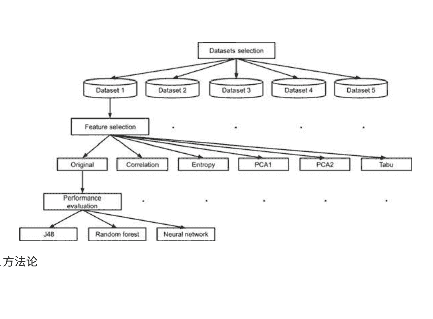

图1 方法论

在第一步中，我们从公共仓库中选择了五个数据集，并对每个数据集进行了预处理。数据预处理对于提高数据质量非常重要，可以进行数据标准化、处理名义数据、识别异常值和进行数据插补。数据预处理的目标是使数据更适合分析，从而更准确地执行分类算法。

在第二步中，我们应用了各种技术来为每个数据集选择一部分特征。这些技术包括相关性分析、基于熵的特征选择、主成分分析（PCA）以及基于禁忌搜索的我们提出的算法。

在第三步中，我们使用三种不同的分类技术（J48决策树、随机森林和人工神经网络）评估了每个特征子集的性能，使用五折交叉验证的准确率进行评估。我们选择了这些算法，因为它们在机器学习文献中被广泛使用，并且对于各种数据集都能提供良好的性能。最后，我们使用Weka软件执行这个过程。

#### 3.1 数据描述

实验使用了来自公共数据库的五个具有高级特征的数据集进行分类。每个数据集的信息如表1所示。

#### 3.2 基于熵的特征选择

通过熵进行特征选择是一种过滤方法，可以衡量一组属性的信息水平，并选择那些熵值较低的属性。熵值较低的特征对于机器学习算法提供更有用的信息[1, 33]。这种方法不需要高计算量。

##### 表1 数据集描述
| 数据集 | 特征 | 实例 | 类别 |
| :--- | :--- | :--- | :--- |
| 学生 | 32 | 395 | 4 |
| 离婚 | 54 | 170 | 2 |
| 标志 | 30 | 194 | 8 |
| 名人脸 | 39 | 20000 | 2 |
| 信用 | 20 | 1000 | 2 |

成本。 在这项研究中，使用熵进行属性选择的以下步骤已经被遵循：

- 1. 我们计算每个特征的熵：对于这个过程，我们使用编程语言R中的熵包，该包提供了用于估计两个变量的Kullback-Leibler散度、Shannon熵和互信息的函数。 此外，它还提供了估计差分Shannon熵和差分变异系数的工具 。
- 2. 我们创建一个特征排序列表：这个列表帮助我们识别熵较低的特征，这些特征提供更多信息，被认为更相关。
- 3. 最后，我们为特征选择建立了最大熵值的阈值：在这种情况下，我们选择熵值小于或等于0.65的特征。

#### 3.3 使用主成分分析进行特征选择

主成分分析（PCA）是一种统计技术，用于降低数据的维度或进行特征选择[16, 34]，其目标是确定能够最好解释数据变化的最相关特征。 使用PCA进行特征选择的过程包括几个步骤：

- 1. 我们计算PCA：在这一步中，我们使用编程语言R并选择前两个主成分（PC1和PC2）。这些成分是原始特征的线性组合，其中第一个成分解释了数据中的最大变化量，其次是第二个成分，依此类推。通常，选择的主成分数量取决于所需的数据减少量，因为更多的主成分将提供更多的信息，但计算时间会更长。
- 2. 我们计算PC1和PC2之间的欧氏距离：这些过程在数据分析的许多领域中常用，并且对于根据数据获得洞察力和做出明智决策至关重要。
- 3. 在这一步中，我们将特征分组为四分位数：这种方法可以帮助我们识别特征之间的相似性，并帮助我们简化分析。
- 4. 最后，根据特征的四分位数创建了两个数据子集：第一个子集仅包括特征的第一四分位数，而第二个子集包括第一和第二四分位数。

#### 3.4 基于相关性的特征选择

在本节中，我们提出了一种基于相关性的特征选择方法，用于识别特征中的冗余性，而不是常规的选择与目标类别高度相关的特征。 基于相关性的特征选择是一种过滤方法，旨在识别与目标类别高度相关的特征。如果两个特征高度相关，这意味着这两个特征可以为学习模型提供类似的行为。

在文献中，基于相关性的特征选择是一种从数据集中选择与目标变量具有强相关性的特征子集的技术。目标是识别与目标变量高度相关的特征，因为这些特征在预测目标变量方面最具信息性[5, 12, 19]。本研究中使用的通过相关性进行特征选择的步骤如下：

- 1. 我们创建了一个相关矩阵：该矩阵捕捉了数据集中所有特征之间的成对相关关系。相关系数的取值范围在-1到1之间，接近1的值表示强正相关，接近-1的值表示强负相关，接近0的值表示两个特征之间没有相关性。
- 2. 相关系数按降序排列，形成一个列表：该列表允许我们识别与目标变量具有最高相关性的特征。它还使我们能够检测高度相关的特征对。
- 3. 最后，我们消除相关值大于或等于0.65的属性之一：该阈值表示两个特征之间的相关程度相对较高。因此，我们删除一个特征以减少冗余信息，并获得与高度相关的目标变量的特征子集。

关于参数调整和选择要删除的属性，该提案仍在开发中。

### 4 禁忌搜索

禁忌搜索算法是一种用于优化问题的局部搜索过程。Glover于1986年首次提出了基于自适应记忆和敏感搜索原理的算法[17]。禁忌搜索的主要目标是逃离局部最优解，它通过使用一个称为禁忌列表的记忆来记录最近的搜索历史记录[7]。禁忌搜索与其他元启发式算法的区别在于其依赖于系统化和确定性方法，以最小化任何随机过程的参与。禁忌搜索通过使用记忆来避免在搜索空间中出现循环，甚至允许恶化解决方案的移动。经过一段时间，禁忌列表中存储的解决方案失去其禁忌状态，并可以从搜索空间的其他区域访问。

#### 4.1 初始解决方案

算法首先创建一个单一解决方案，该解决方案是一个二进制向量，表示是否使用特定特征。其中1表示解决方案中启用了该特征，0表示忽略该特征。决策是随机进行的，并且被赋予70%的概率为1和30%的概率为0。图2显示了初始解决方案。

然而，首先，我们随机产生了十个解，并使用J48树的准确率评估它们的分类性能，选择最好的解继续算法的其余部分。

#### 4.2 邻域

为了创建一个邻域，我们首先需要定义一个移动，多次应用于一个解来产生其邻域。参考文献[23, 37]。 我们提出了一种交换移动。在图3中，我们可以看到这个过程的表示。

一旦定义了交换移动，我们就创建了一个邻域。 如前所述，这个邻域是通过将定义的移动应用于原始解的每个元素来产生其他解。然后选择最好的解，从邻居解继续进行过程。 图4显示了一个初始解创建的邻域。

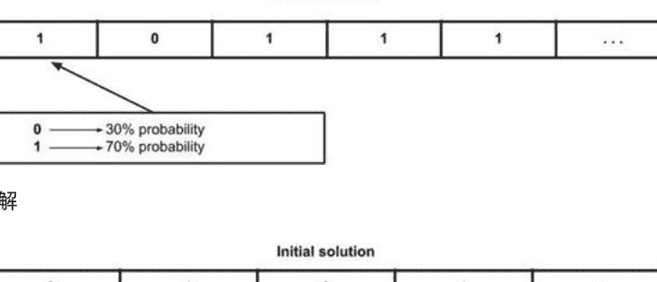

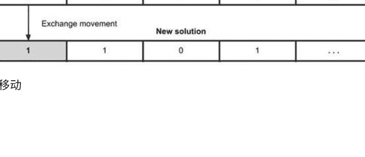

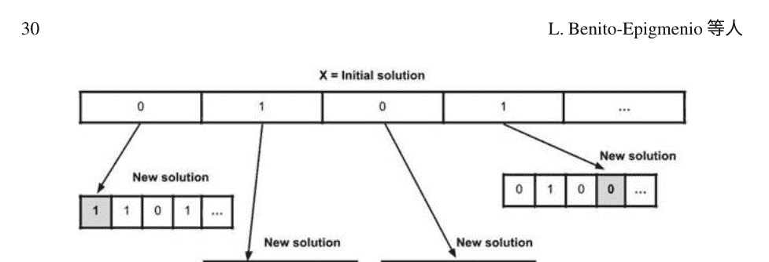

图4 初始解邻域

#### 4.3 目标函数

禁忌算法需要一个目标函数，该函数是数据集在特定特征选择下的分类性能。为此，我们使用了一个J48决策树，因为它是一个简单的算法，没有随机元素，因此是确定性和可靠的。与其他分类算法（如神经网络）相比，由于其内部过程的原因，即使使用相同的解决方案进行训练，它们也不总是产生相同的结果。

#### 4.4 内存结构

内存的概念是一组元启发式算法特有的，禁忌算法就是其中之一；该算法利用历史信息来逃离局部最优解，探索搜索空间，并在搜索空间中执行开发策略。在图5中，我们可以看到这个过程的表示。

在这个实现中，禁忌列表用于阻止在一段时间内对已经改善了当前解决方案性能的特定特征的选择进行更改。因此，当我们从邻域中选择一个新的解决方案时，禁忌列表会阻止选择或不选择某个属性n次迭代。这种阻塞强制解决方案探索附近的解决方案，同时迫使算法搜索具有良好特征选择的附近解决方案。最后，当当前迭代超过特定特征的禁忌列表中的数字时，该特征将被解锁。

### 5 结果

实验计算使用相关性、熵、主成分分析和禁忌搜索进行。我们使用三种分类算法来评估特征选择技术：J48决策树、随机森林和人工神经网络。

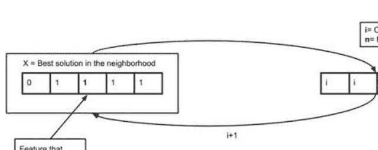

图5 内存结构

##### 表2 每个数据集使用每种技术产生的特征数量
| 数据集 | 原始的 | 相关性 | 熵 | PCA1 | PCA2 | 禁忌搜索 |
| :--- | :--- | :--- | :--- | :--- | :--- | :--- |
| 学生 | 32 | 29 | 8 | 8 | 16 | 21 |
| 离婚 | 54 | 30 | 46 | 14 | 28 | 27 |
| 标志 | 29 | 28 | 12 | 7 | 14 | 17 |
| 名人脸 | 39 | 36 | 39 | 10 | 20 | 24 |
| 信用 | 20 | 20 | 20 | 5 | 10 | 10 |

在本节中，我们展示了每个原始数据集使用每种技术产生的特征数量（见表2），在图6、7、8、9和10中展示了它们的性能。

图6、7、8、9和10显示了正确分类案例的百分比以及用于评估特征选择性能的分类算法。

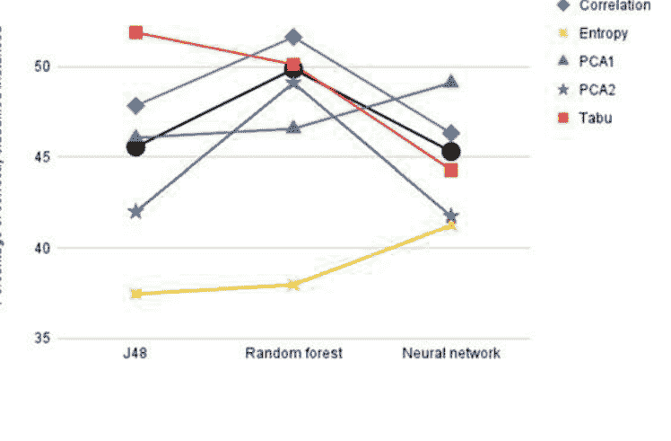

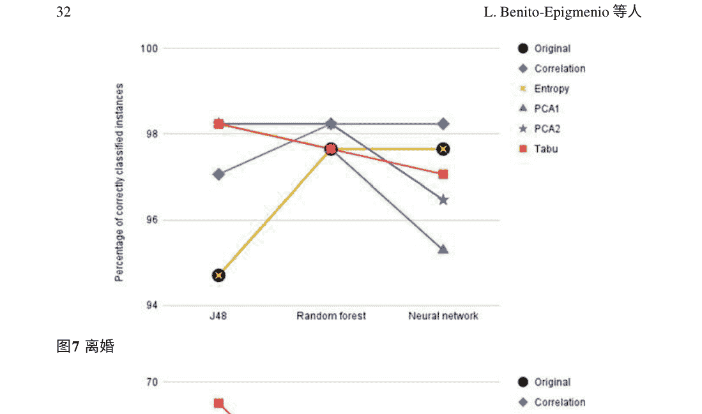

图7 离婚

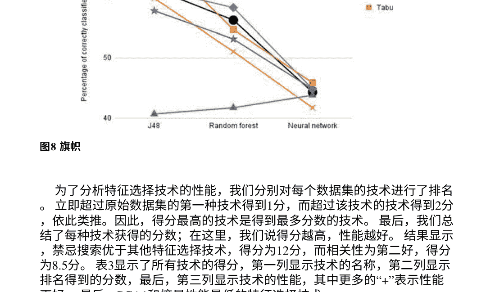

图8 旗帜

为了分析特征选择技术的性能，我们分别对每个数据集的技术进行了排名。立即超过原始数据集的第一种技术得到1分，而超过该技术的技术得到2分，依此类推。因此，得分最高的技术是得到最多分数的技术。最后，我们总结了每种技术获得的分数；在这里，我们说得分越高，性能越好。结果显示，禁忌搜索优于其他特征选择技术，得分为12分，而相关性为第二好，得分为8.5分。表3显示了所有技术的得分，第一列显示技术的名称，第二列显示排名得到的分数，最后，第三列显示技术的性能，其中更多的“+”表示性能更好。最后，PCA1和熵是性能最低的特征选择技术。

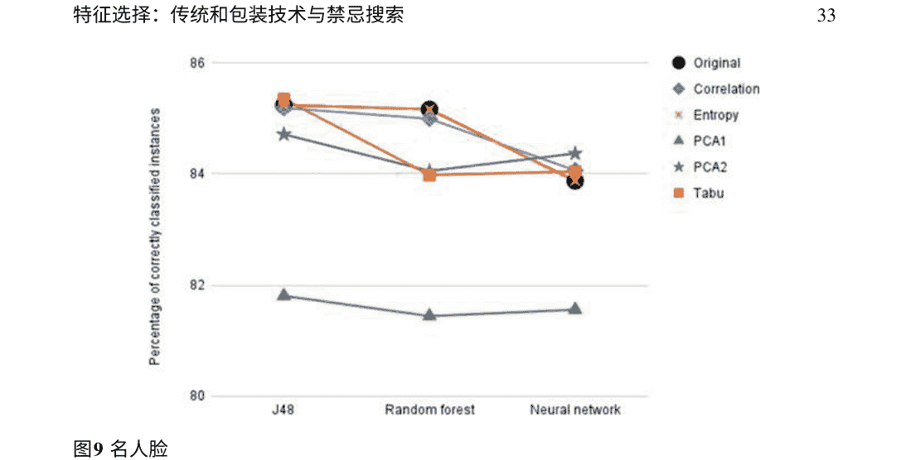

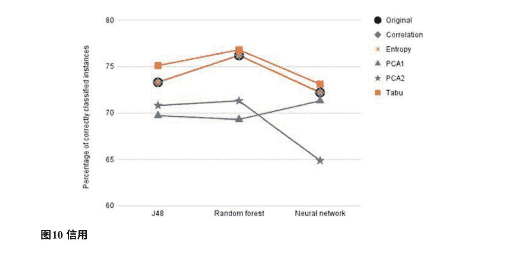

##### 表3 具有更好性能的特征选择技术
| 特征选择技术 | 点  | 性能 |
| :--- | :--- | :--- |
| 禁忌搜索 | 12 | +++++ |
| 相关性 | 8.5 | ++++ |
| PCA2 | 4.5 | +++ |
| PCA1 | 3 | ++ |
| 熵 | 0 | + |

我们应用了与之前相似的第二等级来识别最低性能的技术。在这里，第一个比原始数据集稍差的技术得到1分，而比这个技术稍差的技术得到2分，依此类推。因此，性能最差的技术就是获得最多分数的。再次，我们对每个特征选择技术的分数求和；在这里，得分越高，性能越差。结果显示，PCA1是最差的特征选择技术，得到23分，其次是PCA2，得到16分。表4显示了所有特征选择技术的得分；第一列显示技术的名称，第二列显示排名得分，最后一列显示技术的性能，更多的“-”表示性能更差。值得强调的是，在两个排名中，我们考虑了所有的技术；然而，在第一个排名中，熵无法比原始数据集获得更好的性能，因此得到零分。

##### 表4 具有最差性能的特征选择技术
| 特征选择技术 | 点 | 性能 |
| :--- | :--- | :--- |
| 相关性 | 2 | - |
| 禁忌搜索 | 5 | -- |
| 熵 | 14 | --- |
| PCA2 | 16 | ---- |
| PCA1 | 23 | ----- |

此外，我们应用了Friedman检验[24]；结果显示，禁忌搜索的排名最高，为4.70，而PCA1的排名最低，为2.10。在检验统计中，我们得到了一个p值为0.000，由于这个值小于0.05，我们声称特征选择技术之间存在统计差异。

然而，特征选择到禁忌搜索算法和原始特征数据集的Wilcoxon检验[25]显示p值为0.132，意味着这些技术之间没有统计差异；然而，它显示了86.8%的确定性，即两个结果是不同的。我们相信通过测试更多数据集，这个结果可以得到改善。在分类算法的情况下，J48树在实验中使用的所有分类技术中获得了最佳性能，学生数据集中使用禁忌搜索选择的特征达到了最大百分比13.88%。

### 6 讨论

实验结果显示，禁忌搜索算法是特征选择的最佳技术，得分为12分，在特征选择技术中排名第一。弗里德曼检验也证实禁忌搜索是最高排名，而PCA1是最低排名。这表明禁忌搜索能够有效地从数据集中选择最相关的特征，并改善实验中使用的分类算法的性能。相关技术在实验中也表现良好，得分为8.5分。尽管它没有超过禁忌搜索，但它的实施速度更快，不需要高计算成本。我们还注意到，在特征选择之后使用简单的分类算法，例如J48决策树，比使用更复杂的算法更有效。例如，随机森林在执行内部特征选择时存在特定问题，可能导致比先前选择的特征更少。另一方面，神经网络可能会内部禁用某些信息输入并影响训练过程。最后，这些结果似乎表明特征选择技术的性能可能会因数据集和使用的分类算法而异。

### 7 结论和未来工作

在本文中，我们提出了一种基于禁忌搜索的新的包装器方法，用于解决特征选择问题。实验证明，特征选择的禁忌搜索算法是一种有希望的方法，在实验中显著改善了分类算法的性能。然而，结果也显示出特征选择技术的性能因数据集和分类算法的使用而异。另一方面，我们观察到，在特征选择之后使用简单的分类算法比使用更复杂的算法更有效。最后，该研究强调了特征选择在机器学习中的重要性，并需要继续研究以产生更高效和准确的特征选择方法。

在未来的工作中，我们建议使用更多的数据集来评估所提出的方法，以确保再次测试统计差异。我们建议使用其他确定性和低成本的目标函数，如支持向量机、逻辑回归或k最近邻算法。不同的分类算法，如卡方自动交互检测、朴素贝叶斯或组合方法，可以为我们提供更多关于所提出方法性能的信息。最后，我们建议进行超参数调优，以提高所提出方法的性能。

> > 致谢感谢CONACYT对编号848089的支持。

### 参考文献

- 1. Adeel, A., Khan, M.A., Akram, T., Sharif, A., Yasmin, M., Saba, T., Javed, K.: 熵控制的深度特征选择框架用于葡萄叶病害识别。专家系统。39(2022)。 https://doi.org/10.1111/exsy.12569
- 2. Agrawal, U., Rohatgi, V., Katarya, R.: 基于归一化互信息的混沌映射平衡优化器用于包装器-过滤器特征选择。专家系统应用。207, 118107(2022)。 https://doi.org/10.1016/j.eswa.2022.118107
- 3. Ahmed, Z.E., Saeed, R.A., Mukherjee, A., Ghorpade, S.N.: 使用启发式技术在低功率广域网中进行能量优化。在：物联网和M2M应用的LPWAN技术，第199-223页 (2020)。 https://doi.org/10.1016/B978-0-12-818880-4.00011-9
- 4. Ahmed, Z.H., Yousefikhoshbakht, M.: 一种改进的禁忌搜索算法用于解决异构固定车队开放车辆路径问题与时间窗口。Alex. Eng. J. 64, 349–363(2023). https://doi.org/10.1016/j.aej.2022.09.008
- 5. Al-Batah, M., Zaqabeh, B., Alomari, S.A., Alzboon, M.S.: 基于相关特征选择算法和规则分类器的基因微阵列癌症分类。Int. J. OnlineBiomed. Eng. 15, 62–73 (2019). https://doi.org/10.3991/ijoe.v15i08.1061
- 6. Alazzam, H., Sharieh, A., Sabri, K.E.: 一种基于鸽子启发优化器的入侵检测系统特征选择算法。Expert Syst. Appl. 148(2020). https://doi.org/10.1016/j.eswa.2020.113249
- 7. Alidaee, B., Wang, H.: 无容量限制（设施）位置问题：一种混合遗传-禁忌搜索方法。I FAC-PapersOnLine 55 (10), 1619-1624 (2022年). https://doi.org/10.1016/j.ifacol.2022.09.622. 第10届IFAC制造建模、管理和控制会议MIM 2022
- 8. Alotaibi, Y.: 一种基于禁忌搜索和自适应搜索内存的新元启发式数据聚类算法。对称性 14 (2022年). https://doi.org/10.3390/sym14030623
- 9. Bentsen, H., Hoff, A., Hvat tum, L.M.: 用于禁忌搜索的指数外推记忆。EURO J. Comput. Optim. 10, 10002810 (2022年). https://doi.org/10.1016/j.ejco.2022.10002810.
- 10. Bol var, A., Garc a, V., Florencia, R., Alejo, R., Rivera, G., S nchez-Sol s, J.P.: 在处理稀疏和密集高维度时，对不平衡大数据集上的SMOTE进行初步研究。在：模式识别：第14届墨西哥会议MCPR 2022，华雷斯城，墨西哥，论文集，第46-55页。Springer, 柏林 (2022年). https://doi.org/10.1007/978-3-031-07750-0_5
- 11. Bommert, A., Sun, X., Bischl, B., Rahnenf hrer, J., Lang, M.: 高维分类数据中特征选择的过滤方法基准。计算统计数据分析。143 (2020). https://doi.org/10.1016/j.csda.2019.106839
- 12. Chen, P., Li, F., Wu, C.: 基于皮尔逊相关系数特征选择算法的入侵检测方法研究。物理学会会议系列。1757(2021). IOP Publishing Ltd.https://doi.org/10.1088/1742-6596/1757/1/012054
- 13. Ghane, M., Ang, M.C., Nilashi, M., Sorooshian, S.: 利用进化技术增强决策树归纳进行帕金森病分类。生物控制与生物医学工程。42(3), 902–920 (2022). https://doi.org/10.1016/j.bbe.2022.07.002, www.sciencedirect.com/science/article/pii/S0208521622000663
- 14. Ghosh, M., Guha, R., Sarkar, R., Abraham, A.: 基于蚁群优化的包装器-过滤器特征选择技术。神经计算应用32, 7839-7857 (2020年). https://doi.org/10.1007/s00521-019-04171-3
- 15. Got, A., Moussaoui, A., Zouache, D.: 使用鲸鱼优化算法的混合过滤器-包装器特征选择：一种多目标方法。专家系统应用183 (2021年). https://doi.org/10.1016/j.eswa.2021.115312
- 16. G rate-Escamila, A.K., Hassani, A.H.E., Andr s, E.: 使用特征选择和主成分分析的心脏病预测分类模型。信息医学解锁19 (2020年). https://doi.org/10.1016/j.imu.2020.100330
- 17. Hanafi, S., Wang, Y., Glover, F., Yang, W., Hennig, R.: 利用二进制优化中的局部最优性进行禁忌搜索。欧洲运筹学杂志 (2023年). https://doi.org/10.1016/j.ejor.2023.01.001
- 18. He, Y., Jia, T., Zheng, W.: 禁忌搜索用于在不确定性下最小化最大现金流差异的专用资源受限多项目调度。欧洲运筹学杂志 (2023年). https://doi.org/10.1016/j.ejor.2023.02.029
- 19. Khaire, U.M., Dhanalakshmi, R.: 特征选择算法的稳定性：一项综述。沙特国王大学计算机与信息科学杂志 34, 1060-1073 (2022年). https://doi.org/10.1016/j.jksuci.2019.06.012
- 20. de Lima, M.D., de Oliveira Roque e Lima, J., Barbosa, R.M.: 使用新的特征选择算法结合双边支持向量机进行医疗数据集分类。Med. Biol. Eng. Comput. 58, 519–528 (2020). https://doi.org/10.1007/s11517-019-02100-z
- 21. Liu, H., Zhou, M., Liu, Q.: 一种用于不平衡数据分类的嵌入式特征选择方法。IEEE/CAA J. Automatica Sinica 6, 703–715 (2019). https://doi.org/10.1109/JAS.2019.1911447

22. Liu, Z., Chang, B., Cheng, F.: 一种用于特征选择的交互式过滤器-包装器多目标进化算法。 Swarm Evol. Comput. 65, 100925 (2021). https://doi.org/10.1016/j.swevo.2021.100925

23. Lucay, F.A., Gálvez, E.D., Cisternas, L.A.: 使用禁忌搜索算法设计浮选电路：多物种、设备设计和盈利能力参数。 Minerals 9(2019). https://doi.org/10.3390/min9030181

24. Ma, J., Xia, D., Guo, H., Wang, Y., Niu, X., Liu, Z., Jiang, S.: 基于元启发式支持向量回归的滑坡位移预测：一项比较研究。 Landslides 19, 2489–2511 (2022). https://doi.org/10.1007/s10346-022-01923-6

25. Momenzadeh, M., Sehhati, M., Rabbani, H.: 一种基于隐马尔可夫模型的微阵列数据分类的新型特征选择方法。 J. Biomed. Inform. 95(2019). https://doi.org/10.1016/j.jbi.2019.103213

26. Omuya, E.O., Okeyo, G.O., Kimwele, M.W.: 使用主成分分析和信息增益进行分类的特征选择。 Expert Syst. Appl. 174(2021). https://doi.org/10.1016/j.eswa.2021.114765

27. Panigrahi, R., Borah, S.: 使用二进制和多类入侵检测数据集对J48决策树分类器进行排名分配。 Procedia Comput. Sci. 132, 323–332 (2018). https://doi.org/10.1016/j.procs.2018.05.186. 国际计算智能和数据科学会议

28. Prajapati, V.K., Jain, M., Chouhan, L.: 禁忌搜索算法（TSA）：综合调查。 In: 2020 3rd International Conference on Emerging Technologies in Computer Engineering: Machine Learning and IoT (ICETCE), pp. 222–229. IEEE (2020). https://doi.org/10.1109/ICETCE48199.2020.9091743

29. Pudjihartono, N., Fadason, T., Kempa-Liehr, A.W., O’Sullivan, J.M.: 机器学习基于疾病风险预测的特征选择方法综述。 Front. Bioinform. 2 (2022). https://doi.org/10.3390/fbinf.2022.927312

30. Rivera, G., Florencia, R., García, V., Ruiz, A., Sánchez-Solís, J.P.: 用于识别西班牙语国家交通事故点的新闻分类：一个真实案例研究的类别不平衡学习。 Appl. Sci. 10(18), 6253 (2020). https://doi.org/10.3390/app10186253

31. Shanthi, S., Akshaya, V.S., Smitha, J.A., Bommy, M.: 基于SDS的特征选择的混合禁忌搜索用于肺癌预测。 Int. J. Intell. Networks 3, 143–149 (2022). https://doi.org/10.1016/j.ijin.2022.09.002

32. Singh, N., Singh, P.: 一种用于医疗数据分类的混合集成-过滤器包装特征选择方法。 Chemom. Intell. Lab. Syst. 217, 104396 (2021). https://doi.org/10.1016/j.chemolab.2021.104396

33. Solorio-Fernández, S., Carrasco-Ochoa, J.A., Martínez-Trinidad, J.F.: 无监督特征选择方法综述。 Artif. Intell. Rev. 53, 907–948 (2020). https://doi.org/10.1007/s10462-019-09682-y

34. Spencer, R., Thabtah, F., Abdelhamid, N., Thompson, M.: 探索用于预测心脏病的特征选择和分类方法。 Digit. Health 6 (2020). https://doi.org/10.1177/2055207620914777

35. Tambake, N., Deshmukh, B., Patange, A.: 开发一种低成本的数据采集系统和使用j48算法对切割工具故障进行分类的培训。 Mater. Today: Proc. 72, 1061–1067 (2023). https://doi.org/10.1016/j.matpr.2022.09.163. 第二届国际机械工程进展会议（ICoAME 2022）

36. Venkateswarlu, C.: 一种元启发式禁忌搜索优化算法：在化学和环境过程中的应用。 In: Tsuzuki, M.S., Takimoto R.Y., Sato, A.K., Saka, T., Barari, A., Rahman, R.O.A., Hung, Y.T. (eds.) Engineering Problems, Chapter 10. IntechOpen, Rijeka (2021). https://doi.org/10.5772/intechopen.98240

37. Venkatraman, P., Levin, M.W.: 一种考虑拥堵的禁忌搜索启发式算法解决共享自动驾驶车辆路径规划问题。 J. Intell. Transp. Syst. Technol. Plan. Oper. 25, 343–355 (2021). https://doi.org/10.1080/15472450.2019.1665521

38. Vommi, A.M., Battula, T.K.: 一种基于Bonferroni均值的模糊KNN的混合过滤器-包装器特征选择方法用于医疗数据集分类: 以COVID-19为例。 Expert Syst. Appl. **218**, 119612 (2023). https://doi.org/10.1016/j.eswa.2023.119612

39. Weinberg, A.I., Last, M.: Enhat—基于树状集成和Hoeffding自适应树的协同作用，用于动态数据流挖掘。 Inf. Fusion **89**, 397–404 (2023). https://doi.org/10.1016/j.infus.2022.08.026

40. Yu, C., Lahrichi, N., Matta, A.: 随机模拟优化中的禁忌搜索最优预算分配策略。 Comput. Oper. Res. **150**, 106046 (2023). https://doi.org/10.1016/j.cor.2022.106046

41. Zhang, J., Xiong, Y., Min, S.: 一种新的混合过滤器/包装器特征选择算法。 Anal. Chim. Acta **1080**, 43–54 (2019). https://doi.org/10.1016/j.aca.2019.06.054

42. Zhou, H.F., Zhang, J.W., Zhou, Y.Q., Guo, X.J., Ma, Y.M.: 基于特征权重的决策树特征选择算法。 Expert Syst. Appl. **164** (2021). https://doi.org/10.1016/j.eswa.2020.113842

## 全息神经网络模式分类：特征选择的新工具

Luis Diago, Hiroe Abe, Atsushi Minamihata和Ichiro Hagiwara

**摘要** 本章旨在基于全息神经网络（HNN）开发能够解释条件驾驶自动化过程中驾驶员状态分类推断的分类算法。全息神经网络（HNN）是一种在三十多年前开发的关联记忆类型，其主要优势之一是学习速度快，因为它在复数域中作为线性模型发展。HNN是一种在三十多年前开发的关联记忆类型，作为复数域中的简单线性模型，它可以在在线学习过程中以高速进行更新。在对解决模式分类问题的技术进行了按时间顺序的回顾之后，提出了一种用于特征选择的新工具。新工具使用勾股成员度将复数映射到[0,1]区间的全息记忆中。将全息分类器的性能与鸢尾花数据集进行比较，并通过所选特征的预测能力和稳定性来分析模型的可解释性。

具有模糊量化的全息分类器在鸢尾花数据集上显示出高于90%的准确性结果，根据提取的规则和所提出的工具选择的特征的稳定性最高，也是最易解释的。

**关键词** 全息神经网络·特征选择·可解释模型·复杂模糊集·模式分类

L. Diago (☒) H. Abe I. Hagiwara
明治大学，日本东京千代田区神田骏河台1-1，408M室
电子邮件：luis_diago@meiji.ac.jp

H. Abe
电子邮件：abe_hiroe@meiji.ac.jp

I. Hagiwara
电子邮件：ihagi@meiji.ac.jp

A. Minamihata
关西国际学院，日本兵库县三木市青山町四十二地割1-18
电子邮件：a-minamihata@kuins.ac.jp

### 1 引言

近年来，由于目标识别和机器学习算法的进步，自动驾驶汽车得到了发展[7, 11, 14]。然而，由于社会对安全性和监管合规性的担忧，它们的实际推广被推迟，主要是在自动化工程师协会（SAE）的3级，这需要车辆和驾驶员之间的协作来执行驾驶任务[32]。在这种情况下，重要的不仅是车辆能够识别或分类驾驶员的状态，还要能够解释驾驶员监控过程中的推理。这个问题尚未解决，也是本研究的主要动机。深度神经网络[7, 11]展示了解决这个问题最有希望的结果，但它们缺乏可解释模型的可能性，并且很难开发在线学习方法。这就是为什么本章重点研究使用HNN来解决上述问题[69, 70]。

基于全息联想记忆[21]的神经网络的两个数学模型[52, 53, 69, 70]从Gabor的全息摄影[20, 21]的工作中出现。第一个基于光折变晶体记录光学输入-输出互连强度[52, 53]，第二个侧重于在复杂域中建模系统动力学的理论基础[69, 70]。复值神经网络(CVNN)近年来变得流行起来[4, 31, 51]。

然而，与CVNN不同的是，HNN [69, 70]的控制方程形成了一种非连接主义方法，其中大量的输入-输出关联可以折叠到单个记忆元上。本章重点介绍了在复杂域中作为线性模型的HNN [69, 70]，它们没有层结构，其学习算法基于解线性方程组的解。

### 2 全息神经网络

全息神经网络（HNN）[69, 70]基于输入-输出关系在复平面上的线性化映射。

#### 2.1 基本理论

假设有两个实向量 $x$和 $y$表示为输入向量 $x = \{x_1, x_2, \ldots, x_k\}^T$和输出向量 $y = \{y_1, y_2, \ldots, y_m\}^T$。向量 $x$和 $y$的维度分别为 $k$和 $m$。如果我们有一组输入-输出向量，可以用矩阵 $X$和 $Y$表示，如式（1）所示：

$$\mathbf{X} = \begin{pmatrix} \mathbf{x}_1^T \\ \vdots \\ \mathbf{x}_n^T \end{pmatrix} = \begin{pmatrix} x_{11} & x_{12} & \cdots & x_{1k} \\ x_{21} & x_{22} & \cdots & x_{2k} \\ \vdots & \vdots & \ddots & \vdots \\ x_{n1} & x_{n2} & \cdots & x_{nk} \end{pmatrix}, \quad \mathbf{Y} = \begin{pmatrix} \mathbf{y}_1^T \\ \vdots \\ \mathbf{y}_n^T \end{pmatrix} = \begin{pmatrix} y_{11} & y_{12} & \cdots & y_{1m} \\ y_{21} & y_{22} & \cdots & y_{2m} \\ \vdots & \vdots & \ddots & \vdots \\ y_{n1} & y_{n2} & \cdots & y_{nm} \end{pmatrix} \quad (1)$$

每个元素 $\mathbf{X}$ 和 $\mathbf{Y}$ 通过输入和输出映射函数 $f_x$ 和 $f_y$ 转换为角度 $\theta_{ai} (a = 1, \ldots, n; i = 1, \ldots, k)$ 和 $\phi_{aj} (a=1, \ldots, n; j=1, \ldots, m)$:

$$\theta_{ai} = f_x(x_{ai}), \quad \phi_{aj} = f_y(y_{aj}) \quad (2)$$

在 $f_x$ 和 $f_y$ 中，一些常用的数据转换类型包括：sigmoid或arctan转换（从未知或无限范围的实数值）和线性转换（从已知有限范围的实数值）[69, 70]。接下来，角度通过指数函数映射到复平面上

$$s_{ai} = \lambda_{ai} e^{\hat{i}\theta_{ai}}, \quad r_{aj} = \gamma_{aj} e^{\hat{i}\phi_{aj}} \quad (3)$$

在 (3) 中，$\hat{i}$ 是复数的虚数单位 ($\hat{i}^2 = -1$)，$\lambda_{ai}$ 和 $\gamma_{aj}$ 是复数的幅度（通常设置为1）。通过 (2) 和 (3) 中表示的操作，数组 $\mathbf{X}$ 和 $\mathbf{Y}$ 被映射到复平面上，并分别命名为刺激 $\mathbf{S}$ 和响应 $\mathbf{R}$。

$$\mathbf{S} = \begin{pmatrix} s_{11} & s_{12} & \cdots & s_{1k} \\ s_{21} & s_{22} & \cdots & s_{2k} \\ \vdots & \vdots & \ddots & \vdots \\ s_{n1} & s_{n2} & \cdots & s_{nk} \end{pmatrix}, \quad \mathbf{R} = \begin{pmatrix} r_{11} & r_{12} & \cdots & r_{1m} \\ r_{21} & r_{22} & \cdots & r_{2m} \\ \vdots & \vdots & \ddots & \vdots \\ r_{n1} & r_{n2} & \cdots & r_{nm} \end{pmatrix} \quad (4)$$

如果 $\mathbf{S}$ 和 $\mathbf{R}$ 之间的关系存储在一个名为 $\mathbf{H}$ 的矩阵中，称为全息记忆[69, 70]，则 $\mathbf{H}$ 可以计算为

$$\mathbf{H} = (\mathbf{S}^* \cdot \mathbf{S})^{-1} \cdot \mathbf{S}^* \cdot \mathbf{R} \quad (5)$$

$\mathbf{R}$ 和 $\mathbf{S} \cdot \mathbf{H}$ 的差异可以用误差矩阵表示：

$$\Delta = [\mathbf{d}_1, \ldots, \mathbf{d}_m] = \mathbf{R} - \mathbf{S} \cdot \mathbf{H} \quad (6)$$

矩阵 $\mathbf{H}$ 的线性向量 $\mathbf{h}_j (j = 1, \ldots, m)$ 有 $k$ 个元素，并且计算出使误差矩阵 $\Delta$ 的线性组合最小的向量 $\mathbf{d}_{j_0}$，即 $\min_{\mathbf{h}_j} (\mathbf{d}_j^* \mathbf{d}_j) = \min_{\mathbf{h}_j} \{ (\mathbf{r}_j - \mathbf{S} \cdot \mathbf{h}_j)^* \cdot (\mathbf{r}_j - \mathbf{S} \cdot \mathbf{h}_j) \} \quad (7)$

其中 *表示共轭。使表达式(7)最小的 $\mathbf{h}_j$ 的值是 $\mathbf{h}_j = (\mathbf{S}^* \mathbf{S})^{-1} \mathbf{S}^* \mathbf{r}_j$，如果 $\mathbf{h}_j$ 以矩阵形式表示，则得到方程(5)。矩阵 $\mathbf{H}$ 是通过学习过程中使用输入 $\mathbf{S}$ 和输出 $\mathbf{R}$ (即训练或编码)来确定的，并且对于新的输入 $\mathbf{U}$ (也称为查询模式)未使用过的输出 $\mathbf{V}$ 可以通过预测得到

$$\mathbf{V} = \mathbf{U} \cdot \mathbf{H}. \quad (8)$$

为了获得新输出 $\mathbf{V}$ 的真实向量 $\mathbf{v}$，需要反转输出映射 (2)。

#### 2.2 学习和预测方法

文献中报告的学习和预测方法基于映射函数 $f_x$ 和 $f_y$ 的变化(2) [18, 29, 30, 34-37, 49, 69, 70]，基函数的扩展(3) [12, 13, 34-37, 49, 69, 70]，以及计算(5)中全息记忆矩阵 $\mathbf{H}$ 的方法 [19, 69, 70]。本章重点讨论模式分类问题，并按时间顺序介绍了上述方法在文献中的应用。

##### 2.2.1 映射函数

**Sigmoid 函数 (Suherland 1990–1992)**

Sutherland [69, 70]建议使用一个 sigmoid函数来获得一个具有正态分布的输入数据的理想对称分布。以下是一个 sigmoid映射函数：

$$\theta_{ai} = \frac{2\pi}{1 + e^{-f(x_{ai},\sigma_i,\mu_i)}}. \quad (9)$$

通常情况下， $f(x_{ai}, \sigma_i, \mu_i) = A \left( \frac{x_{ai} - \mu_i}{\sigma_i} \right)^b$ 在这里， $x_{ai}$是第 $i$ 个输入刺激元素，$\mu_i$ 和 $\sigma_i$ 是刺激场分布的均值和标准差。HNN学习的成功在于在复杂域中具有均匀分布的（对称的）向量，通过不对称性（Sym）[69, 70]进行评估：

$$Sym = \frac{\left| \sum_{a=1}^{n} \lambda_a e^{i\hat{\theta}_a} \right|}{\sum_{a=1}^{n} \lambda_a}. \quad (10)$$

$Sym$ 的值在0-1范围内（即零表示完全对称）。根据 $Sym$ 的值，实验中使用 $A$ 的值为3和 $b$ 的值为1。

###### 输出线性映射 (Sutherland 1990–1992)

在模式分类领域[69, 70]中，响应的复平面被划分为任意数量的区域，使网络能够生成相应数量的独立分类。图1a考虑了一个系统，其中响应平面被划分为8个等大小的区域。每个区域对应一个类别（C0，C1，...，C7）。

###### 输入对称关联器 (Franich 1993)

尽管在许多情况下标准的S型变换是令人满意的，但如果原始数据分布与高斯分布不同[18, 49]，则不适用。因此，Franich [18]提出了“对称关联器”，其中全息网络的外部域由实数xi组成，范围为-∞<xi<+∞，具有任意分布f1(x)。这个外部域应该转换为范围在0<θ<2π的内部相位表示。转换应该产生一个均匀分布f2(θ)。根据[18, 49]，适当的转换（变换）曲线g(x)是

```
g(x) = ∫ f1(x) dx = F1(x) . (11)
```

在一个变换函数上应用外部序列，xi，得到一个新的序列θi，其具有均匀概率密度函数 f2(θ)。在[18, 49]中开发的对称全息关联器的实现估计了相位元素的相应分布，并计算了已计算分布的累积分布。

###### 螺旋函数 (Khan 1995–1998)

由于查询模式和编码模式必须使用相同的函数进行映射，如果查询模式与编码模式明显不同，例如它们具有不同的均值和标准差，则可能无法正确检索响应模式。因此，Khan [34–37]使用以下螺旋映射函数来实现刺激模式元素的对称分布:

```
θai = ( kspread * (xai * 2π) / ((xi)最大 - (xi)最小) ) 模 2π - π. (12)
```

该函数将输入数据转换为 -π到 +π范围内。在这里，kspread是扩展系数，可以选择为不是[(xi)最大 - (xi)最小]的因子的任何数字，否则，映射值将不唯一。

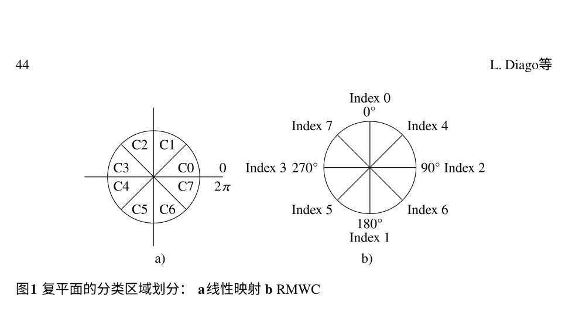

## 输出反模重量码（Khan 1995–1998）

Khan [34–37]使用的反模重量码（RMWC）函数用于获得更对称的向量分布，如图1b所示，有8个间隔。如图所示，索引1与索引0相差180°，索引3与索引2相差180°，等等。这表明，即使只有四个模式被映射（索引0、1、2和3），也会产生对称的向量分布。

## 输入反模数权重码（Hendra 1999）

反模数权重码（RMWC）映射函数由Khan [34–37]用于响应模式的映射，已经适应了刺激模式的映射[29, 30]。假设0 – 2π范围被分为256个间隔，对应于强度值的范围。使用RMWC函数将强度值 $I_i$（在范围0–255内）映射到相位值 $\theta_i$的映射分为两个步骤：

-   1. $I_i$被表示为一个八位二进制数（因为$2^8=256$），如下所示：
    $$I_i = b_7 2^7 + b_6 2^6 + b_5 2^5 + b_4 2^4 + b_3 2^3 + b_2 2^2 + b_1 2^1 + b_0,$$
    其中 $b_0..b_7$是权重代码，其值为0或1。

-   2. 相应的相位值， $\theta_i$，通过反转权重代码得到，如下式所示：
    $$\theta_i = \left( \frac{b_0 2^7 + b_1 2^6 + \cdots + b_6 2^1 + b_7}{256} \right) 2\pi.$$
    (13)

在[29, 30]中，Hendra比较了线性、螺旋和RMWC映射，用于具有均匀、正态或右偏正态分布的输入数据，结果显示在所有情况下，RMWC的不对称性相对较低。

##### 2.2.2 扩展方法

对于分类问题，如果用于分类的属性数量较少，可能会出现一些困难。通过将输入字段扩展到更高阶组合乘积项，可以进一步获得在广泛的输入数据分布类别上高度对称的状态。

###### 高阶统计学 (Sutherland 1990–1992)

这些高阶“统计量”表示在原始刺激数据字段中生成 M阶乘积项，允许重复因子。

高阶乘积项的生成如下所示[69, 70]:

```
\prod_{l_i}^M \lambda_{l_i} e^{i\theta_{l_i}}
```

其中 M表示上述乘积解的“阶”。从大小为 N的数据字段中可以生成的唯一 M阶乘积项的组合数由以下阶乘关系定义:

```
\frac{(N + M - 1)!}{(N - 1)!M!}
```

通过这种方式，相对较小的刺激输入字段可以扩展为非常大的数据集。

###### 正弦和余弦 (Manger 1993–1997)

基于高阶乘积项的标准扩展过程[69, 70]可能对极短的刺激不够适用。基于正弦和余弦的更适合的扩展方法已经被提出[49, 50]。正弦-余弦过程将原始刺激 s_i解释为0到2π之间的角度，即使用 α_i = 2π s_i/(p+1)代替s_i。然后，扩展过程计算l_i α_i的正弦值和余弦值，其中l_i = 1, 2, ..., K/4。这 K/2个（内部表示的）数字，以及它们的共轭，构成了 K个元素的扩展向量。

作者将正弦-余弦扩展与高阶统计方法进行了比较，并表示在这两种刺激扩展方法中，高阶统计扩展似乎更成功[46]。他们提出将正弦-余弦方法与高阶统计方法相结合[49]。正弦-余弦方法将极短的刺激向量扩展到适度长度，然后进一步应用高阶统计方法以达到所需的最终向量长度。

###### 多维扩展 (Khan 1995–1998)

输入模型（3）是一个二维方案，已经被 Khan [34–37] 扩展为以下的多维方案：

$$ s_i = \lambda_i e^{i\theta_i} \rightarrow \lambda_i e^{\left( \frac{d_i-1}{l_i} \hat{i}_{l_i} \theta_{il_i} \right)} $$
$$ (\lambda_i, \theta_i) \rightarrow (\lambda_i, \theta_{i1}, \theta_{i2}, \ldots, \theta_{i[d_i-1]}) \quad (16) $$

使用这个模型，每个 $\theta_i$ 被映射到一组相位元素 $\theta_{il_i}$。在这里，$s_i$ 成为一个单位超球体中的向量，在 d 维空间中。每个 $\theta_{il_i}$ 是向量沿着维度 $\hat{i}_i$ 的球面投影或相位分量。基于这种表示，每个信息片段，$s_i$ 可能由其他子信息组成。例如，在彩色图像中，$ith$像素信息可能由RGB格式中对应于红色、绿色和蓝色的三种颜色的值构成。第 $l_i$ 个像素的第 $i$ 个颜色映射到 $\theta_{il_i}$

## 模糊扩展和量化（Diago 2008–2011）

Khan [34–37]提出了根据方程（16）将扩展应用于多维空间的想法，并将其应用于彩色图像，但对于在其他应用中如何计算超复数的维度问题尚未解决。

在[12]中，扩展步骤已被模糊扩展步骤替代，以避免在（14）中定义唯一M阶乘积项的组合数量的试错方法。每个输入参数 $x_i$ 被分为 $d_i$ 个类别 $C_{il_i} : (l_i = 1...d_i)$具有语义含义（例如，小、中、大）。将输入值分成几个等概率的区间可以确保 $Symin$ (10)的较低值。论文[12]表明，通过使用每个参数的 $d_i =3$个类别，当使用小样本数据集时，分类准确性与支持向量机相当，因为模糊扩展的工作方式类似于（11）中的“对称关联器”，而无需估计每个刺激场的分布。

在[13]中，提出了一种优化算法来解决广义特征值问题 $Ac = \eta^2 Bc$，并自动计算维度 $d_i$ 在（16）中从对应于最大特征值 $\eta^2$ 的特征向量 $c$ 中。矩阵 $A$ 和 $B$是从成员函数（MFs） $\mu C_{il}(x_i) : (l_i=1...d_i)$输入模糊群组和 $\mu G_j(y_j) : (j=1...m)$输出模糊群组的函数。通过计算模糊量化（FQ）系数，改进了HNN模型$c$，减少了输入参数的数量，创建了输出MFs并从全息存储器中提取了模糊规则 $H$ [13]。

##### 2.2.3 计算全息存储器

### 基础和增强学习（Sutherland 1990–1992）

在基础学习中[69, 70]，可以将多个刺激-响应模式关联叠加到同一矩阵空间中，如下所示：

$$\mathbf{H_0} = \sum_{a=1}^{n} \mathbf{S}_{a^T} \mathbf{R}_a \quad (17)$$

从理论上讲，可靠性能下，可以存储在全息内存 $\mathbf{H_0}$中的模式数($n$)永远不会超过刺激模式元素数($k$)。这个特性被表示为负载因子($L$)，即$n$与 $k$的比值，对于 $k \geqslant n$，其值为($n/k$)。在这里， $L$的范围是0-1.0。在实践中，应用于所有模式($a = 1, \ldots, n$)的增强学习算法[69, 70]，从赫布的差分学习中改编而来，如下所示：

$$\mathbf{H_a} = \mathbf{H_{a-1}} + \alpha \mathbf{S}_{a^T} \left( \mathbf{R}_a - \frac{1}{c_a} \mathbf{S}_a \mathbf{H_{a-1}} \right) \quad (18)$$

其中 $\alpha$是一个取值范围在0-1之间的学习常数， $c_a = \sum_{i=1}^{k} \lambda_{ai}$。增强学习(18)避免了在(5)中计算逆矩阵，但为了最小化(6)中的差异，它必须对每个关联 $a$在集合中重复多次。因此，我们得到了一种迭代训练的形式。

###### 伪逆和惩罚函数 (Hagiwara 2004)

扩展项数量的增加会减小学习误差，但在某些情况下，公式（5）中得到的矩阵可能不可逆。Fukushima等人[19]提出使用Moore-Penrose伪逆计算矩阵 $\mathbf{H}$：

$$\mathbf{H_{MP}} = \mathbf{S}^* \cdot \mathbf{S} \cdot (\mathbf{S}^* \cdot \mathbf{S} \cdot \mathbf{S}^* \cdot \mathbf{S})_G^{-1} \cdot \mathbf{S}^* \cdot \mathbf{R} \quad (19)$$

符号 $()_G^{-1}$表示计算Moore-Penrose伪逆。 Moore-Penrose广义逆矩阵可以解决这样的系统，即使存在秩缺失，它们也可以提供学习误差的最小范数向量，这有助于输入输出映射的正则化。

由于广义逆矩阵最小化了学习误差，可以认为在前一个方程中得到的矩阵 $\mathbf{H_{MP}}$正确地表示了任何输入-输出关系。然而，当使用矩阵 $\mathbf{H_{MP}}$来预测来自新向量（在学习阶段未使用）的输出时，结果并不好。为了提高泛化性能，Fukushima等人[19]提出使用惩罚函数：

$$\mathbf{H_P} = (\mathbf{S}^* \cdot \mathbf{S} + \rho_1 \mathbf{O} + \rho_2 \mathbf{I})^{-1} \cdot \mathbf{S}^* \cdot \mathbf{R} \quad (20)$$

在这里， $\rho_1$和 $\rho_2$是惩罚参数，$\mathbf{O}$是一个所有元素都相等的方阵，而 $\mathbf{I}$是单位矩阵。如果 $\rho_2$不为零，当矩阵 $(\mathbf{S}^* \cdot \mathbf{S} + \rho_1 \mathbf{O} + \rho_2 \mathbf{I})$ 与矩阵的大小相同时，逆矩阵总是存在的。当参数 $\rho_1$和 $\rho_2$接近零时，(20)的第一部分权重较大，矩阵变成了近似的Moore-Penrose矩阵。Fukushima等人[19]提出了ρ₁=1和ρ₂=1的值，以实现他们的MPOD方法的最大泛化性能。

#### 2.3 全息模型的可解释性和优化

一旦获得全息记忆，我们可以以高准确性预测新案例（在训练期间未见过），但必须提供用户可理解的解释以帮助应用[3, 72]。这种可解释的人工智能（XAI）[24]的目的是通过提供解释使其行为对人类更加可理解；因此，它们在当前研究中构成了一个挑战和趋势[10, 62, 65, 72]。与机器学习和深度学习的最新进展相关的XAI的简要分析回顾[2]定义了两种可解释模型：透明模型（例如决策树、贝叶斯模型、线性回归模型或基于规则的模型）和不透明模型（例如支持向量机、多层神经网络、循环神经网络、卷积神经网络）。前者更易解释[10, 62, 72]，但并不一定保证可解释性。后者更准确，但必须在模型训练后进行后处理以解释它们的推理。HNN分类器可以看作是复数域中的线性回归模型。尽管线性回归模型是透明的，但复数域中的回归过程并不保证推理的可解释性，因此需要进行后处理。

在CVNN [4]的背景下，可以将几种表示形式调整为映射函数，以优化HNN模型的应用。如[4]所述，输入表示可以是自然复杂的，也可以是设计复杂的。在前一种情况下，复数表示数据域（例如图像的傅里叶变换）。在后一种情况下，输入具有幅度和相位，它们在统计上是相关的（例如[31, 51]中的无线电频率或风数据应用）。另一方面，扩展方法的研究较少，因为CVNNs基于分层结构。对于HNNs，扩展方法与传统CVNNs中的层具有相同的目的，但是没有层的事实使得可以使用线性代数中的成熟工具来解决学习问题（例如解线性方程组或特征值系统，避免解决CVNN学习中出现的优化问题）。扩展方法在准确性和可解释性之间存在权衡。模型参数越多，模型的准确性越高。另一方面，模型参数越少，模型越可解释，越容易提供用户可理解的解释。

文献中还报道了其他的进展，比如使用动态注意力进行学习（Khan 1995-1998 [34-37]）和神经可塑性（Sutherland 1990-1992 [69,70]），但由于它们与映射函数、扩展方法或计算记忆矩阵H的方式没有直接关系，所以这里没有进行分析。Khan的主要贡献与网络的减少有关，在分配不同于1的幅度值给式（3）中的值时，会出现错误，并根据应用进行调整。神经可塑性还促进了全息记忆幅度的变化，以优化学习。

然而，选择要优化的记忆值的方式是不完整的。在文献中报告的大多数示例中[13, 38]，只使用记忆中复数的幅度而不是使用完整的复数信息来选择要优化的元素。因此，本章重点改进从全息记忆矩阵H中选择特征的方式，以增加其可解释性[10, 62, 72]和可解释性[2, 24, 65]。

### 3 全息神经网络的特征选择

用于降低数据维度的特征选择算法可以分为过滤器、包装器和嵌入式方法[25]。过滤器作为预处理步骤独立地选择输入的子集。包装器利用感兴趣的学习机作为黑盒子，根据其预测能力对输入的子集进行评分。嵌入式方法在训练过程中进行输入选择，通常特定于给定的学习机。

#### 3.1 之前的研究

在[13]中使用了两个名为hnn-filter和fq-filter的过滤器来减少参数的数量。通过调整MFs μCil(xi)和μGj(yj)以及类别权重ci(i=1...K)来计算FQ扩展的最优维度di，以最大化实域中的η^2的值。最大特征值η^2及其对应的特征向量c提供了保持分类准确性高于先前模型的模糊组之间最大分离度。fq-filter根据类别权重c=[c1,...,cK]对变量进行排序，hnn-filter则使用存储在全息记忆矩阵H中的复数的幅度ρiof的大小直接测量输入输出相关性的级别来对变量进行排序。由于广义特征值问题的病态性，fq-filter提出的解可能不可靠。与此同时，hnn-filter仅使用复数的幅度来选择最重要的参数，从而丢失相位信息。

本章探讨了在复杂域中完全进行特征选择的优势。根据[60, 61, 71, 75]，式(3)中的基函数在定义上是复模糊集，其中λ(x), θ(x), γ(y)和φ(y)是实值函数。如果复数hi的MF值表示特征si属于选定特征集的程度，那么MF值可以给这些特征排序。复杂成员函数（CMFs）已被用作激活函数-复杂值神经模糊系统节点处的激活函数（见[75]和参考文献）。 然而，CMF的输入和输出都是复数，被解释为两个实值输出（“双输出属性”），不能用于特征选择。 任何将复数映射到单位区间[0, 1]的函数（例如[73, 74]）都可以提供一种对特征进行排序的方法，在全息记忆矩阵 H中。

#### 3.2 平方和成员等级

在[74]中，Yager引入了一种称为Pythagorean模糊集（PFS）的非标准模糊集类，并称与这些集合相关联的成员等级为Pythagorean成员等级（PMGs）。PMG是一对值（a, b），其中a, b∈[0, 1]且a² + b² ≤1。Yager和Abbasov [73]讨论了PMGs与复数之间的关系。 他们注意到，并非所有形式为z = a + b̂i = re^{iθ}的复数都可以解释为PMGs。对于一对（a, b）成为PMG的要求是a = A_Y(z) = r cos θ和b = A_N(z) = r sin θ在单位区间内且A_Y²(z) + A_N²(z) ≤1。这里，A_Y(z)和A_N(z)是z在A的成员支持（例如，z满足概念A）和反对成员支持（例如，z不满足概念A）。这些条件要求r∈[0, 1]和θ∈[0, π/2]。因此，具有性质r∈[0, 1]和θ∈[0, π/2]的复数z = re^{iθ}是PMGs的例子，被称为“Π-i数”。由于存储在全息记忆矩阵H中的复数值h_i = ρ_i e^{iφ_i}不是Π-i数，因此在[73, 74]中提出的函数被修改为将复数值h_i映射到区间[0, 1]：

```
$F(ρ_i, φ_i) = \frac{1}{2} + \rho_i^{\pi/2 \varphi_m} \left( \frac{1}{2} - \frac{\varphi_i}{\varphi_m} \right)$ (21)
```

其中φ_m = max[φ_1, …, φ_K]。请注意，新函数对全息存储矩阵H中的所有值进行均匀缩放，并保持所有向量之间的关系。

### 4 模式分类

全息神经网络可以应用于与其他网络类型相同的问题。 报告的应用主要集中在图像和物体识别[12, 13, 22, 23, 29, 30, 34–37, 43, 44, 55–58, 63, 68, 70]以及汽车最优设计[19, 28, 39, 40, 66, 67]。 还有其他孤立的应用于数据压缩[46]、货币汇率预测[47]、信用评分[54]、基于计算机的分子设计[64]、机器人技术[5, 6]、化学应用[8]。和软件工程[41]。上述大部分应用[5, 6, 8, 39-41, 46,47, 54, 55, 63, 64, 69, 70]都基于AND公司的全息神经技术（HNeT）[1]，并将HNeT与传统分类器（如判别分析[8, 41, 48]，逻辑回归[41]，逻辑分类[41,48]，多层神经网络[8, 39-41, 48, 54, 63, 66]，神经模糊[13]和支持向量机[12]）进行比较。由于上述方法已经针对不可用于研究的特定应用程序开发和测试，本章根据已经在文献中报告的准确性结果，将HNN分类器的性能与标准鸢尾花数据集[15-17]进行比较[46-50]。

#### 4.1 鸢尾花数据集

鸢尾花数据集是一个众所周知的数据库，可以在模式识别文献中找到[15]，它是用于评估分类方法的最早的数据集之一。该问题包括将鸢尾花分为三个类别（分别命名为Setosa，Versicolor和Virginica），每个类别有50个实例，根据四个属性（萼片长度和宽度，花瓣长度和宽度）进行分组。

根据UCI机器学习库[16]，有351篇论文引用了这个数据集，并且基线模型分类器报告的平均准确率在89.47%（随机森林分类）和97.3%（多层神经网络）之间。数据库显示了一些类别之间的重叠，这也是条件自动化期间驾驶状态分类的特征[32]，传统分类器在这方面表现非常差[7, 11, 14]。这就是为什么本章仅关注比较鸢尾花数据集的准确性结果和解释可能性的全息分类器。

##### 4.1.1 HNN分类器的比较

表1显示了在第2.2节中使用Isis数据集的HNN分类器的结果。每个分类器的参考在第一列中显示。Khan 1995-1998 [34-37]和Hendra 1999 [29, 30]的结果没有包括在内，因为它们与图像检索问题密切相关，并且没有证据表明它们对解决分类问题有用。第二和第三列分别显示了分类器使用的输入映射函数和扩展方法。在所有情况下，线性映射函数（Sutherland 1990-1992 [69, 70]）被用于表示3个花类别的输出。第四列显示了分类器用于计算全息存储矩阵H的方程。最后两列分别显示了分类器在训练和测试数据集上的准确性。

前两行显示了HNeT系统的结果，参考文献[46-50]。在第一行中，即使使用Sutherland [69, 70]提出的二阶统计方法和400个项（6个唯一项），网络仍然无法学习。训练集的准确率只有60%，测试集为56%。第二行显示了[46-50]中报告的主要结果。通过使用正弦和余弦预处理（第2.2节中解释的方法），将刺激的大小从长度4增加到20，并使用400个项（190个唯一项）的二阶展开。因此，网络被正确训练（100%准确率），并在测试集中达到95%的准确率。根据参考文献[46-50]，在这两种情况下，使用（18）进行训练以获得全息矩阵Ha。由于不清楚在[46-50]中使用了哪些样本进行训练和测试，因此将方法[12, 13, 19]重新编程为Matlab，并随机选择每种类型的45个样本（总共135个）进行训练，其余15个样本进行测试。实验重复了20次，并报告了20次运行的平均结果。在这两种情况下，使用方程（20）获得全息记忆矩阵Hp，其中ρ1=1和ρ2=1。对于Hagiwara (2004) 和Sutherland 1990–1992方法，当使用S型函数时，预测结果很差。使用Hp函数进行训练时，网络的准确率比使用展开方法的Ha函数高（74%对60%）。尽管没有比较训练时间，但由于使用Ha的方法是迭代的，而使用Hp的方法只需要计算逆矩阵，所以后者应该更快。然而，在这两种情况下，测试集上的预测结果都不好（分别为53.3%和56%）。使用模糊展开（Diago 2008–2011 [12, 13]），取得了显著的改进（对测试集的预测准确率为93.3%，但对训练集的学习准确率仅为96.3%）。t检验在表1中的最后两个分类器之间显示了统计上显著差异（p=7e-10）。准确率低于Magner的方法，但模型的可解释性远优于其他全息分类器。请注意，该方法不使用最佳展开，而是使用固定值di=3（K=12）来获得这样的结果，而Magner的方法使用K=190个唯一项，这使得解释模型非常困难。

表1 不同HNN分类器准确率比较（%）

| 参考文献 | 映射（预处理） | 扩展方法 | 计算矩阵 H | 训练集（%） | 测试集（%） |
| :--- | :--- | :--- | :--- | :--- | :--- |
| Sutherland 1990–1992 [69, 70] | Sigmoid | 二阶 400项 (6个唯一项) | Ha公式（18） | 60 | 56 |
| Magner 1993–1997 [46–50] | 正弦-余弦长度从4到20 | 二阶 400项 (190个唯一项) | Ha公式（18） | **100** | **95** |
| Hagiwara 2004 [19] | Sigmoid | 无 | Hp公式（20） | 74.0 | 53.3 |
| Diago 2008–2011 [12, 13] | 线性 | FQ($d_i=3$) | Hp公式（20） | **96.3** | **93.3** |

##### 4.1.2 模型的可解释性

文献中报告的事后处理过程[2]可以保证模型的可解释性，基本上可以分为3组：
- 分析输入参数的影响（以特征为导向）
- 模型参数（例如，神经网络中每个输入的权重）
- 模型和类别属性的可视化

下面讨论了用模糊扩展得到的随机模型之一的解释方法，以表1最后一行为例进行说明。由于随机选择训练集和测试集进行了20次实验，每次实验得到的模型都不同，因此本节展示了表1最后一行中随机实验（第3/20次实验）的结果。结果显示在表2、3、4和5中。首先，为了以可理解的方式分析输入参数的影响，模糊量化（FQ）方法将每个参数分为$d_i =3$个具有可理解含义的类别，即小（S）、中（M）和大（L）。表2显示了每个参数的边界，在对每个参数的135个训练样本的值进行排序后，选择元素45-46（下界）和90-91（上界）的平均值作为中等类别的边界。选择了小类别的下界和大类别的上界分别来自元素1和135。小类别的上边界与中类别的下边界重合，大类别的下边界与中类别的上边界重合。

表2 每个类别的边界值

| 类别( $d_i = 3$ ) | $x_1$ 花萼长度 | $x_2$ 花萼宽度 | $x_3$ 花瓣长度 | $x_4$ 花瓣宽度 |
|-------------------|----------------|----------------|----------------|----------------|
| 小(S)             | 4.3-5.4        | 2-2.9          | 1-2.45         | 0.1-0.8        |
| 中(M)             | 5.4-6.3        | 2.9-3.2        | 2.45-4.85      | 0.8-1.55       |
| 大(L)             | 6.3-7.7        | 3.2-4.4        | 4.85-6.9       | 1.55-2.5       |

其次，为了分析模型参数的影响，表3显示了FQ-eigenvector (c)、全息矩阵 H和通过函数 F(ρ, φ)计算得到的PMGs的值。表3以粗体显示了每个特征选择器的最高绝对值。很难用 c, φ, a和 b来解释哪个特征对响应变量的方差贡献最大，因为它们具有正负值。因此，文献中最广泛使用的特征选择器是 ρ的值[13, 36, 70]。表4显示了4个参数（第2列）与每个独立参数（第3-6列）之间的学习和预测能力。表3中由 ρ和 F(ρ, φ)报告的结果与表4中的结果一致，在这个试验中，当单独使用最重要的两个参数（x3和 x4）时，预测准确率保持在90%以上。然而，我们不知道其他试验是否也是如此。因此，特征选择器的稳定性[33]应该与它们的预测准确率一起进行分析。

表3 FQ-特征向量 (c), 全息矩阵 H-值 ($\rho e^{i\varphi} = a + b i$) 和 $F(\rho, \varphi)$

|      | c         | ρ       | φ        | a         | b         | F(ρ, φ) |
|------|-----------|---------|----------|-----------|-----------|----------|
| x1S  | 0.12669   | 0.10203 | -1.8318  | -0.026327 | -0.098575 | 0.36196  |
| x1M  | 0.22062   | 0.36869 | -2.9488  | -0.36186  | -0.070631 | 0.45075  |
| x1L  | -0.34731  | 0.10196 | -1.3484  | 0.022485  | -0.099447 | 0.3174   |
| x2S  | 0.22487   | 0.093526| -2.1271  | -0.049388 | -0.079423 | 0.39173  |
| x2M  | -0.10338  | 0.37196 | -2.9414  | -0.36453  | -0.073972 | 0.44967  |
| x2L  | -0.1215   | 0.095439| -1.2342  | 0.031518  | -0.090084 | 0.31023  |
| x3S  | 0.030217  | 0.37117 | -0.37331 | 0.34561   | -0.13537  | 0.11579  |
| x3M  | 0.3877    | 0.30155 | 2.5883   | -0.25656  | 0.15846   | 0.54511  |
| x3L  | -0.41792  | 0.6065  | -0.43934 | 0.5489    | -0.25797  | 0.072009 |
| x4S  | 0.030201  | 0.37117 | -0.37331 | 0.34561   | -0.13537  | 0.11579  |
| x4M  | 0.43844   | 0.29887 | 2.5908   | -0.25467  | 0.15643   | 0.5447   |
| x4L  | -0.46864  | 0.60761 | -0.45171 | 0.54667   | -0.26523  | 0.073635 |

最后，为了可视化模型和类的属性，如[13]中所述，提取规则来解释模型的推理。表5显示了先前实验（第3/20次试验）中的15个测试集案例。Setosa类的五个测试案例由2条规则（1-1和1-2）描述，Vesicolour类的五个案例由3条规则（2-1、2-2和2-3）描述，Virginica类的5个案例中有4个由3条规则（3-1、3-2和3-3）描述。表中还显示了训练集中每个规则的概率（用括号表示）。15个测试案例中只有1个错误（在“正确”列中标记为X）。测试案例前提条件的组合在训练集中找不到。由于规则2-1的概率高于规则3-2（0.14 vs. 0.06），该案例错误地被归类为Vesicolour类。因此，该测试集的预测准确率为93.3%（14/15）。

表4 所选特征的学习和预测准确性

|   | [x1, x2, x3, x4] | x1 (%) | x2 (%) | x3 (%) | x4 (%) |
|---|-------------------|--------|--------|--------|--------|
| 训练集 | 96.2963% | 73.3233 | 57.3827 | 95.0617 | 95.9506 |
| 测试集 | 93.33% (14/15) | 69.3333 | 59.1111 | 91.5556 | 94.6667 |

表5 从全息存储中提取的规则的预测百分比93.33%（14/15）

| 花的类型 | x1 | | x2 | | x3 | | x4 | | 规则（概率） | 正确 |
| :--- | :--- | :--- | :--- | :--- | :--- | :--- | :--- | :--- | :--- | :--- |
| | 值 | 类别 | 值 | 类别 | 值 | 类别 | 值 | 类别 | | |
| 1 山鸢尾 | 4.7 | S | 3.2 | M | 1.3 | S | 0.2 | S | 1-2 (0.10) | O |
| | 4.6 | S | 3.1 | M | 1.5 | S | 0.2 | S | 1-2 (0.10) | O |
| | 5.4 | S | 3.9 | L | 1.3 | S | 0.4 | S | 1-1 (0.17) | O |
| | 5.1 | S | 3.5 | L | 1.4 | S | 0.3 | S | 1-1 (0.17) | O |
| | 5 | S | 3.5 | M | 1.3 | S | 0.3 | S | 1-1 (0.17) | O |
| 2 变色鸢尾 | 5.7 | M | 2.8 | S | 4.5 | M | 1.3 | M | 2-1 (0.14) | O |
| | 6.1 | M | 2.8 | S | 4 | M | 1.3 | M | 2-1 (0.14) | O |
| | 6.4 | L | 2.9 | S | 4.3 | M | 1.3 | M | 2-3 (0.03) | O |
| | 6.6 | L | 3 | M | 4.4 | M | 1.4 | M | 2-2 (0.03) | O |
| | 5.6 | M | 2.7 | S | 4.2 | M | 1.3 | M | 2-1 (0.14) | O |
| 3 维吉尼亚鸢尾 | 6.3 | L | 3.3 | L | 6 | L | 2.5 | L | 3-3 (0.03) | O |
| | 7.2 | L | 3.6 | L | 6.1 | L | 2.5 | L | 3-3 (0.03) | O |
| | 6.8 | L | 3 | M | 5.5 | L | 2.1 | L | 3-1 (0.11) | O |
| | 6.1 | M | 2.6 | S | 5.6 | L | 1.4 | M | | X |
| | 6.3 | L | 2.5 | S | 5 | L | 1.9 | L | 3-2 (0.06) | O |

##### 4.1.3 特征选择器的稳定性

稳定性[33]是特征偏好对训练样本扰动的鲁棒性。稳定性指示了特征选择方法的可重复性能力。在评估特征选择性能时，特征选择算法的高稳定性和高分类准确性同样重要。皮尔逊相关系数（PCC）是[33]中报告的一种稳定性度量，它计算所选特征的权重之间的相关性。PCC将结果返回到$[-1, 1]$的范围内。1表示权重向量完全相关，-1表示权重向量反相关。0表示权重向量之间没有相关性。表6显示了从20个实验的PCC矩阵计算得到的平均PCC矩阵。最后一行显示了从平均PCC计算得到的每个特征选择器的稳定性。如前所述，由于具有正值和负值，$c$、$\varphi$、$a$和$b$难以用作特征选择器。因此，比较$\rho$和$F(\rho,\varphi)$，$F(\rho,\varphi)$具有更高的稳定性（0.2151 vs. 0.0662），还允许具有高预测准确性的特征选择。

表6 平均PCC矩阵和特征选择器的稳定性

|      | $c$ | $\rho$ | $\varphi$ | $a$ | $b$ | $F(\rho,\varphi)$ |
| :--- | :--- | :--- | :--- | :--- | :--- | :--- |
| $c$ | 1.0000 | $-0.3776$ | $0.3368$ | $-0.6740$ | $0.8193$ | $0.7251$ |
| $\rho$ | $-0.3776$ | 1.0000 | $0.1720$ | $0.4862$ | $-0.4026$ | $-0.4810$ |
| $\varphi$ | $0.3368$ | $0.1720$ | 1.0000 | $0.0792$ | $0.5427$ | $0.1348$ |
| $a$ | $-0.6740$ | $0.4862$ | $0.0792$ | 1.0000 | $-0.7705$ | $-0.9561$ |
| $b$ | $0.8193$ | $-0.4026$ | $0.5427$ | $-0.7705$ | 1.0000 | $0.8680$ |
| $F(\rho,\varphi)$ | $0.7251$ | $-0.4810$ | $0.1348$ | $-0.9561$ | $0.8680$ | 1.0000 |
| $\overline{PCC}$ | 0.3049 | **0.0662** | 0.3776 | $-0.1392$ | 0.3428 | **0.2151** |

#### 4.2 NIPS特征选择挑战

NIPS 2003特征选择挑战[26, 27]引入了一种方法，使用数据集来评估特征选择算法，以便在特征选择领域的已发表结果比较中避免使用不同的数据集或不同的数据划分。在挑战中，选择了高维数据集，以涵盖各种领域，并具有足够数量的示例来创建足够大的测试集以获得统计显著结果。

在[26]中分析了几种选择方法，其中许多排名靠前的方法都是简单的过滤策略，就像本章中所示的方法一样。然而，正如已经讨论过的那样，为了解决在条件驾驶过程中对驾驶员状态进行分类的问题，需要开发能够从少量可理解的人类特征中解释其在线推理的模型。

适当的特征表示方法的选择是研究人员之间持续辩论的问题[59]。当前的趋势[9]是使用传感器获取的原始数据，这些数据可能是高维数据，并使用深度神经网络提取一组信息没有人类可理解含义的特征。另一方面，如果我们停止解释黑盒机器学习模型，并从人类知识中提取的一小组特征开始[62]，那么选择最重要的特征的过程将导致一组已经可理解的特征。所提出的工具是在条件下开发的。

### 5 结论和未来工作

HNNs已经发展了三十多年，但没有像本章所介绍的这样的技术文献综述。现有文献中的综述主要关注CVNNs，尽管HNNs是复杂的领域网络，但由于它们不基于分层架构，所以没有被引用在文献中。在HNNs的发展中，可以看到3个时期：90年代初（1990-1994），90年代末（1995-1999）和21世纪初（2000-2011）。在第一个时期，文献中报道的工作包括Sutherland的全息联想记忆提案，其应用主要集中在HNeT系统上，这是一个专有系统。在第二个时期，最重要的工作是由Khan报告的，其中将记忆扩展到多个维度，并引入了变量注意力学习的概念。在第三个时期，人们倾向于从复数域线性方程系统的高效解决方案中学习，并将其与传统模糊逻辑相结合，以提高模型的可解释性。

在本章中，简要介绍了HNNs的基本理论，并按照技术的三个基本要素（从实域到复域的映射函数、复域中基函数的扩展方法以及计算全息存储矩阵的方式）按时间顺序介绍了对其发展的主要贡献。HNNs可以用于解决与其他类型的网络相同的问题，但在某些情况下由于需要在复域中进行处理，其应用较为困难。以分类问题为例，本章提出了一种在复域中进行特征选择的工具，其稳定性优于全息网络的传统特征选择方法，同时保持其模型（可通过学习规则解释）在鸢尾花数据集上的准确率在90%以上。

随着深度学习网络及其复域变体的当前发展[45]，有趣的是证明HNNs可以作为一种变体来考虑，在进行在线学习时由于其已证明的学习速度和连续更新模型的可能性。为了开发HNNs的深度模型，继续开发本章提出的特征选择工具至关重要，这引发了一些需要研究的问题。例如：如果使用其他隶属函数而不是使用勾股隶属函数（例如直觉隶属函数、勾股隶属函数和费马隶属函数），是否有任何优势？找到一些有趣的东西是很有意思的。

与拉普拉斯网络[42]的连接直接处理图像，而不是处理已提取的特征。在将该工具用于动态关注学习或HNN优化（神经可塑性）之前，可以使用其他标准数据集对所提出的选择工具进行测试，这可能是一个短期的工作。

### 参考文献

1. AND Corp.: AND公司：HNeT2005应用开发系统。http://www.andcorporation.com/home.html。于2023年1月15日访问
2. Angelov, P.P., Soares, E.A., Jiang, R., Arnold, N.I., Atkinson, P.M.: 可解释的人工智能：一项分析性综述。WIREs数据挖掘。知识发现。 11(5) (2021). https://doi.org/10.1002/widm.1424
3. Banegas-Luna, A.J., Peña-García, J., Iftene, A., Guadagni, F., Ferroni, P., Scarpato, N., Zan-zotto, F.M., Bueno-Crespo, A., Pérez-Sánchez, H.: 针对个性化治疗的医学应用的机器学习预测可解释性：癌症案例调查。国际分子科学杂志。 22(9), 4394 (2021). https://doi.org/10.3390/ijms22094394
4. Bassey, J., Qian, L., Li, X.: 复数值神经网络综述 (2021) 。arxiv:abs/2101.12249
5. Boudreau, R., Darenfed, S., Turkkan, N.: Etude comparative de trois nouvelles approches pour la solution du probleme geometrique direct des manipulateurs paraleles. Mech. Mach. Theory. 33(5), 463–477 (1998)
6. Boudreau, R., Levesque, G., Darenfed, S.: Parallel manipulator kinematics learning using holographic neural network models. Robot. Comput.-Integr. Manuf. 14(1), 37–44 (1998). www.scopus.com
7. Braunagel, C., Rosenstiel, W., Kasneci, E.: Ready for take-over? a new driver assistance system for an automated classification of driver take-over readiness. IEEE Intel. Transp. Syst. Mag. 9(4), 10–22 (2017). https://doi.org/10.1109/MITS.2017.2743165
8. Burdick, F.R.: 全息神经网络作为化学应用的非线性判别器。化学信息计算科学杂志 38(1), 47-53 (1998年)
9. 蔡, J., 罗, J., 王, S., 杨, S.: 机器学习中的特征选择：一种新的视角。神经计算 300, 70-79 (2018年) https://doi.org/10.1016/j.neucom.2017.11.077
10. Carvalho, D.V., Pereira, E.M., Cardoso, J.S.: 机器学习可解释性：方法和度量的综述。电子 8 (8) (2019年) https://doi.org/10.3390/electronics8080832
11. Deo, N., Trivedi, M.M.: 观察自动驾驶车辆中的驾驶员/乘客以预测接管准备。IEEE智能车辆交易 5(1), 41-52 (2020年) https://doi.org/10.1109/TIV.2019.2955364
12. Diago, L.A., Kitaoka, T., Hagiwara, I.: 自动面部表情分析系统的开发. 计算机科学与技术杂志 2(4), 401–412 (2008). https://doi.org/10.1299/jcst.2.401
13. Diago, L.A., Kitaoka, T., Hagiwara, I., Kambayashi, T.: 基于有限数据集的个人面部图像感知的神经模糊量化. IEEE神经网络交易 22, 2422–2434 (2011)
14. Diago, L.A., Abe, H., Adachi, K., Hagiwara, I.: 用于条件自动驾驶监控的模糊量化全息神经网络探索. 古巴数字转型杂志 2(1), 46–65 (2021). https://rctd.uic.cu/rctd/article/view/104
15. Duda, R.O., Hart, P.E., Stork, D.G.: 模式分类, 第二版. Wiley-Interscience出版. Wiley, 纳什维尔, 田纳西州 (2000年)
16. Fisher, R.: 鸢尾花。UCI机器学习库 (1988年) 。 https://archive-beta.ics.uci.edu/dataset/53/iris。于2023年1月18日访问
17. Fisher, R.A.: 在分类问题中使用多个测量。Ann. Eugen. 7(2), 179–188 (1936年) 。 https://doi.org/10.1111/j.1469-1809.1936.tb02137.x
18. Franich, A., Soucek, B., Visaggio, G.: 对称全息联想器。 神经网络世界 3(1), 61–67 (1993年)
19. Fukushima, H., Kamada, Y., Hagiwara, I.: 使用mpod的最佳发动机安装布局。日本。 机械学会论文集， C部/翻译。日本机械工程学会， C部 70(1), 54-61 (2004)。 www.scopus.com
20. Gabor, D.: 一种新的微观原理。 自然 161(4098), 777-778 (1948)。 https://doi.org/10.1038/161777a0
21. Gabor, D.: 联想全息记忆。 IBM J. Res. Dev. 13(2), 156-159 (1969)。 https://doi.org/10.1147/rd.132.0156
22. Gopalan, R., Lee, G.: 使用未经训练的4D全息记忆模型对图像数据库进行索引。在: McKay, R., Slaney, J. (eds.) 第15届澳大利亚联合人工智能会议论文集, LNAI 2557, pp. 237-248。 Springer, 柏林 (2002)
23. Gopalan, R.P., Hendra, Y.: 用于图像数据库的未经训练全息索引的检索特性。 在: IEEE国际图像处理会议，卷2, pp. 555-558 (2003) 。 www.scopus.com
24. Gunning, D., Stefik, M., Choi, J., Miller, T., Stumpf, S., Yang, G.Z.: XAI-可解释的人工智能。 科学机器人。 4(37), eaay7120 (2019)。 https://doi.org/10.1126/scirobotics.aay7120
25. Guyon, I., Elisseeff, A.: 变量和特征选择简介。 机器学习研究杂志。 3, 1157-1182 (2003)
26. Guyon, I., Gunn, S., Ben-Hur, A., Dror, G.: nips 2003特征选择挑战结果分析。 在: Saul, L., Weiss, Y., Bottou, L. (eds.) 神经信息处理进展系统， 第17卷。 麻省理工学院出版社 (2004)
27. Guyon, I., Gunn, S., Hur, A.B., Dror, G.: 设计和分析nips2003挑战. 在: Guyon, I., Nikravesh, M., Gunn, S., Zadeh L.A. (eds.) 特征提取: 基础和应用, 第237-263页。 Springer, Berlin (2006)。 https://doi.org/10.1007/978-3-540-35488-8_10
28. Hagiwara, I., Shi, Q., Ichikawa, T.: 使用全息神经网络的响应曲面方法优化噪声振动问题. 美国机械工程学会,压力容器.管道部 (出版物) PVP 370, 第35-42页 (1998)
29. Hendra, Y.: 使用全息记忆模型从图像和视频数据库中基于内容检索. 硕士论文, Curtin University of Technology, Kent St, Bentley, Western Australia 6102 (1999)
30. Hendra, Y., Gopalan, R., Nair, M.: 大型图像数据库的动态索引方法. 在: 系统、人类和控制论,第1卷, 第302-307页。IEEE出版社 (1999)
31. Hirose, A.: 复数值神经网络. 世界科学出版社 (2003)。 https://doi.org/10.1142/5345
32. ISO/SAE-J3016_202104 驾驶自动化系统相关术语的分类和定义。道路机动车辆.在: 标准,国际标准化组织。日内瓦,瑞士 (2021)
33. Khaire, U.M., Dhanalakshmi, R.: 特征选择算法的稳定性: 一项综述. 沙特国王大学计算机与信息科学杂志 34(4), 1060-1073 (2022)。 https://doi.org/10.1016/j.jksuci.2019.06.012
34. Khan, J.I.: 注意调节的联想计算和图像内容联想搜索在图像存档中。夏威夷大学博士论文，夏威夷 (1995年)
35. Khan, J.I.: 大型图像存档中基于动态对象索引的中间无注释动态查询。视觉通信和图像表示杂志 7 (4) , 378-394 (1996年)
36. Khan, J.I.: 具有动态可定位注意力的多维全息联想记忆在检索中的特性。IEEE神经网络交易 9 (3) , 389-406 (1998年)
37. Khan, J.I., Yun, D.: 用全息动态搜索图像模式的并行、分布式和联想方法。视觉语言和计算杂志 8 (3) , 303-331 (1997年)
38. Khan, J.I., Yun, D.Y.Y.: 基于特征的稀疏全息联想记忆收缩。在: 神经网络世界大会论文集,第4卷, 第26-33页 (1994年)
39. Kozukue, W., Miyaji, H.: 使用神经网络控制车辆悬挂系统。车辆系统动力学。 41（SUPPL.）, 153-161页（2004年）。www.scopus.com
40. Kozukue, W., Miyaji, H.: 使用神经网络进行力识别。美国机械工程学会，出版。容器。管道部（出版物）PVP 482, 195-199页（2004年）。www.scopus.com
41. Limmer, F., S., Stańczak, S.: 评估从软件度量中得出的预测质量模型：经验教训。系统软件杂志。 38（3），225-234页（1997年）
42. Loo, C.K., Perus, M., Bischof, H.: 通过拉普拉斯技术进行稀疏恢复的最优深度神经网络（2017年）。arxiv:abs/1709.01112
43. Loo, C.K., Perus, M., Bischof, H.: 基于量子全息的关联记忆图像和物体识别. 开放系统信息动力学 11(3),277–289 (2004). www.scopus.com
44. Loo, C.K., Perus, M., Bischof, H.: 从高分辨率图像中模拟量子光学物体识别. 光谱学(Optika i Spektroskopiya)的英文翻译 9 9(2),218–223 (2005)
45. Lopez-Pacheco, M., Yu, W.: 用于非线性系统建模的复值深度神经网络. 神经过程学通讯 5 4(1), 559–580 (2021). https://doi.org/10.1007/s11063-021-10644-1
46. Manger, R.: 全息神经网络和数据压缩. Informatica (Ljubljana) 21(4), 665–673 (1997)
47. Manger, R., Mauher, M.: 使用全息神经网络预测货币汇率。 在： 国际信息技术界面会议-ITI94，第143-150页（1994年）
48. Manger, R., Pantamura, V.L., Soucek, B.: 使用全息神经网络进行分类。 在： Pantamura, V.L., Soucek, B., Visaggio, G.（编辑）Frontier Decision Support Concepts：帮助台，学习，模糊诊断，质量评估，预测，演化，第91-106页。Wiley-Interscience (1994年)
49. Manger, R., Pantamura, V.L., Soucek, B., Visaggio, G.: 全息神经网络的刺激预处理。 在： Pantamura, V.L., Soucek, B., Visaggio, G.（编辑）Frontier Decision Support Concepts：帮助台，学习，模糊诊断，质量评估，预测，演化，第79-90页。Wiley-Interscience (1994年)
50. Manger, R., Souček, B.: 全息神经网络的新预处理方法。 在： 人工神经网络和遗传算法，第190-197页。Springer，维也纳（1993年）。https://doi.org/10.1007/978-3-7091-7533-0_29
51. Nitta, T.: 复值神经网络。信息科学参考，赫尔希，宾夕法尼亚州（2009年）
52. Paek, E.G., Patel, J.R.W.I.: 用于多类别分类的全息在线学习机。日本应用物理学 29（7A）, L1332（1990年）。https://doi.org/10.1143/JJAP.29.L1332
53. Paek, E.G., Wullert, J.R., Patel, J.S.: 基于多类别感知器算法的学习机的全息实现。光学快报 14（23），1303-1305（1989年）。https://doi.org/10.1364/OL.14.001303
54. Pantamura, V.L., Soucek, B., Visaggio, G.: 具有全息模糊学习的信用评分创新. 在： 国际神经网络联合会议，第729-732页（1993）
55. Peniche-Ruiz, L., Mendoza, P., Elias, R.P.: 全息技术应用于人脸定位和识别。ICCIMA 00，469（1999年）。https://doi.org/10.1109/ICCIMA.1999.798576
56. Perus, M.: 图像处理及其结果的意识化. Informatica (Ljubljana)25(4), 575-592 (2001年)
57. Perus, M., Bischof, H., Caulfield, H.J., Loo, C.K.: 可量子实现的高分辨率图像选择性重建. Appl. Opt. 43(33), 6134-6138（2004年）
58. Perus, M., Dey, S.K.: 量子系统可以实现内容可寻址的联想记忆. Appl. Math. Lett. 13(8), 31–36 (2000)
59. Pudjihartono, N., Fadason, T., Kempa-Liehr, A.W., O’Sullivan, J.M.: 基于机器学习的疾病风险预测的特征选择方法综述. Front. Bioinform. 2 (2022). https://doi.org/10.3389/fbinf.2022.927312
60. Ramot, D., Friedman, M., Langholz, G., Kandel, A.: 复杂模糊逻辑. IEEE Trans. Fuzzy Syst. 11, 450–461 (2003)
61. Ramot, D., Milo, R., Friedman, M., Kandel, A.: 复杂模糊集. Trans. Fuzzy Syst. 10(2), 171–186 (2002). https://doi.org/10.1109/91.995119
62. Rudin, C.: 停止解释黑盒机器学习模型的高风险决策，改用可解释模型. Nat. Mach. Intell. 1(5), 206–215 (2019). https://doi.org/10.1038/s42256-019-0048-x
63. Sandirasegaran, N., English, R.: SAR图像的特征提取（2D FFT和小波）和分类（Lp度量距离、MLP NN和HNeT）算法的比较分析。 In: Zelnio, E.G., Garber, F.D. (eds.) 合成孔径雷达图像算法XII. SPIE (2005). https://doi.org/10.1117/12.597305
64. Schneider, G., Wrede, P.: 基于计算机的分子设计的人工神经网络. Prog. Biophys. Mol. Biol. 70(3), 175–222 (1998)
65. Shevskaya, N.V.: 可解释的人工智能方法：挑战与展望。 In: 2021国际质量管理、运输和信息安全、信息技术会议. IEEE (2021). https://doi.org/10.1109/itqmis53292.2021.9642869
66. Shi, Q., Hagiwara, I.: 使用全息神经网络的汽车问题的最优设计方法. Jpn. J. Ind. Appl. Math. 17(3), 321–339 (2000)
67. 石, Q., Hagiwara, I., Azetsu, S., Ichikawa, T.: 全息神经网络逼近声学优化. JSAE Rev. 19(4), 361–363 (1998年)
68. Stoop, R., Buchli, J., Keller, G., Steeb, W.: 全息神经元模型中的随机共振模式识别. Phys. Rev. E-Stat., Nonlinear, Soft Matter Phys. 67(61), 061918/1–061918/6 (2003年)
69. Sutherland, J.G.: 记忆, 学习和表达的全息模型. Int. J. Neural Syst. 01(03), 259–267 (1990年). https://doi.org/10.1142/s0129065790000163
70. Sutherland, J.G.: 全息神经方法. 在: Soucek, B (ed.) 模糊, 全息和并行智能, 第1章, 第30–63页. Wiley, 纳什维尔, 田纳西州 (1992年)
71. 塔米尔, D.E., 里什, N.D., 坎德尔, A.: 复杂模糊集和复杂模糊逻辑的概述理论和应用. 在: 塔米尔, D.E., 里什, N.D., 坎德尔, A. (编辑) 模糊逻辑及其应用五十年, 第661-681页. Springer国际出版公司, Cham (2015年). https://doi.org/10.1007/978-3-319-19683-1_31
72. 沃勒特, S., 阿茨穆勒, M., 泰斯勒, A.: 可解释的机器学习: 从预测维护的角度看的简要调查. 在: 2021年第26届IEEE国际新兴技术和工厂自动化会议 (ETFA), 第01-08页 (2021年). https://doi.org/10.1109/ETFA45728.2021.9613467
73. Yager, R.R.: 多标准决策中的勾股成员资格等级. IEEE Trans. 模糊系统 22(4), 958–965 (2014年). https://doi.org/10.1109/TFUZZ.2013.2278989
74. Yager, R.R., 阿巴索夫, A.M.: 勾股成员资格等级, 复数和决策制定. 国际智能系统杂志 28(5), 436-452 (2013年). https://doi.org/10.1002/int.21584
75. Yazdanbakhsh, O., 迪克, S.: 复杂模糊集和逻辑的系统综述. 模糊集系统 338, 1-22 (2018年). https://doi.org/10.1016/j.fss.2017.01.010. 主题: 模糊系统

## K-最近邻变种的可重用性分析用于分类模型

José Ángel Villarreal-Hernández, María Lucila Morales-Rodríguez, Nelson Rangel-Valdez 和 Claudia Gómez-Santillán

摘要 K最近邻（KNN）算法是一个强大的基于示例的方法，在分类任务中很容易实现。因此，在文献中，有关于KNN变种的提议，例如带权重的KNN，旨在改进KNN而不偏离原始算法。为了选择一个KNN变种，使用设计实验，必须存储每个KNN变种的完整实现。将这些变种与一系列 K值和一组距离度量结合起来，可以产生一组可供选择的配置。即使有这些选项，仍然有可能没有任何一种可能的配置适合研究场景。在KNN变种中找到模式将允许将它们的特征分离开来，以便可以重用和重新组合，扩展可能的配置范围。建议分析KNN变种以确定它们构建模式的本质，这可以用于可重用性目的。

这个分析将清楚地表明，这些变体的策略中存在模式。这项工作的主要贡献是区分KNN变体之间的组成差异，并确定可以作为可重复使用方法的策略。

- 最近邻算法
- 分类问题
- 算法设计
- 可重复使用组件

J. Á. Villarreal-Hernández · M. L. Morales-Rodríguez (✉) · C. Gómez-Santillán
墨西哥塔毛利帕斯州马德罗城理工学院，墨西哥国家理工学院，墨西哥
电子邮件: lucila.mr@cdmadero.tecnm.mx

J. Á. Villarreal-Hernández
电子邮件: D10071371@cdmadero.tecnm.mx

C. Gómez-Santillán
电子邮件: claudia.gs@cdmadero.tecnm.mx

N. Rangel-Valdez
IxM CONACyT，墨西哥国家技术学院，塔毛利帕斯，墨西哥
e-mail: nelson.rv@cdmadero.tecnm.mx

### 1 引言

KNN算法是监督学习中最流行的方法之一[1-3]。已经提出了KNN算法的不同变体；每个变体都旨在克服精度不足或利用该算法的某些优势。这些变体存在的原因之一是原始KNN算法可以改进的不同应用情况。

这些复杂的情况在图1中有详细解释。

在KNN算法中，参数 K 确定了参考邻域的成员数量。一旦确定了邻域，就确定了大多数成员的类别，这个类别就是算法的结果。

这样，参数 K 影响算法的最终结果，选择正确的 K 值是一个问题。例如，在图1a中，使用了 K 值为1，这使得该算法对噪声非常敏感。假设我们要分类的点的最近邻是异常值或测量误差。在这种情况下，该点的分类将是异常值的分类，即使周围有许多其他样本点可能指示正确的类别。

在图1b中出现了相反的情况。在这个例子中，使用了更高的 K 值。因此，包含了更多的邻居，导致了多数类别。然而，对点的分布进行视觉检查表明，在点周围有一个不同类别的岛屿。从机械上讲，算法运行正确，但原则上，KNN算法调查点 △周围的环境来确定它最相似的类别。由于岛屿不仅仅是一对离群值，可以认为不太相似的邻居（○）比相似的邻居（+）更突出。

在图1中，我们有一个 K =6的情况，因此最频繁的类别是+。可以说这是算法的理想行为，因为邻居不包括与 △非常远或不同的成员。然而，对更大范围的视觉检查表明，类别是按同心圆排列的。如果数据中的环形趋势是定义类别的正确方式，△可能是内环的一部分（○）。类似的情况会发生在边界上。

在类之间，算法产生了与现实不符的“可接受”预测。

这些情况促使研究人员研究如何形成邻域以及如何根据这个邻域确定类别：什么K值是合适的？ 在示例中，○附近的点的相关性是什么？ 是否应该平等计算所有选择的邻居？ 描述示例的变量/维度是否足够或者可能过多？

作为回应，基于原始KNN思想创建了一整个算法家族。这个家族的成员被称为KNN变种，它们对原始算法进行了影响其操作方式的修改。例如，这些变种可能专注于修改将用于形成邻域的数据集，或者可能关注如何根据邻域确定结果类别。KNN变种通常被发布为完整的算法，即使对变种的原始算法只在特定部分进行了更改。一个例子是带权重的KNN [4, 5]，在这个变种中，遵循原始KNN的过程直到形成邻域；这个变种只修改了结果类别的计算。

在选择KNN算法配置时，必须建立一些方面以适应给定的工作环境，使用实验设计。必须提出一系列K值来测试算法，以及一组距离度量函数和一组KNN变体。尽管KNN变体的实现之间的差异可能不是很大，但通常每个变体都被存储为单独的、隔离的代码。

文献中可以找到一些调查，涉及KNN变体的一般机制，以及这些变体的性能比较[6, 7]。然而，尽管这些调查对现有技术提供了有价值的视角，但它们并没有阐明原始KNN的构建与处理变体之间的差异，也没有提供这些变体的构建模式。

本文提出了对用于分类的KNN算法变体进行分析。这个分析的重点是确定KNN变体之间的构建模式和差异。本文讨论的变体与标准KNN进行了比较，重点关注明显不同的组件和那些是KNN算法的特例的组件。

本文的其余部分按照以下方式组织。第2节描述了标准KNN及其内部交互的组件。第3节和第4节讨论了K的价值和相似度度量。第5节继续对KNN变体中的模式进行识别，按照其主要贡献进行排序。讨论了所得到的发现，以及本研究对KNN变体组件的可重用性的贡献。最后，第6节提出了总体结论。

### 2 K最近邻算法

从历史上看，参数 $K$ 和KNN算法中使用的距离函数被认为是独立于算法本身的。参数 $K$ 被视为配置参数，因为如果需要可以进行更改，并且确定 $K$ 不是算法的一部分。关于距离函数，欧氏距离函数已被确定为KNN算法的标准，但也可以使用其他距离函数获得良好的结果。有一种推理方式使我们将参数 $K$ 的选择和距离函数视为不属于KNN算法的外部机制。要将这种推理扩展到算法的变体，我们必须看原始KNN的组件。

为了使KNN算法正常运行，专家必须提供一个被解释为n维空间中的点的训练数据集。为了对一个新元素进行分类，算法计算该新点与训练数据集中每个点之间的距离。算法选择距离最小的$K$个邻居，它们代表与新点最相似的邻居，并将它们作为参考邻域。通常，新点被分配的类别是参考邻域中的多数类别。根据对KNN算法的简要描述，我们现在来定义一些该算法的细节。

根据Steinbach等人的研究[3]，KNN算法的分类过程（参见算法1）如下进行。需要两个数据集；第一个是已经被分类的元素集合（$C$）。第二个数据集包含没有已知分类的元素（$S$）。在这两个集合中，元素都用相同的变量描述，这些变量在KNN算法中被视为空间维度。还必须定义一个距离度量 $M$ ；它将用于比较 $S$ 的每个成员与 $C$ 的所有成员。这些测量用于构建每个 $C_i$ 和特定 $S_j$ 之间的距离列表，这个列表被称为 $D_{CS}$。这确定了没有已知类别的元素与已知实例之间的相似度（接近）或差异（远）。然后，选择 $S_j$ 的 $K$ 个邻居，即选择与 $S_j$ 距离最短的 $C_i$。为了确定点 $S_j$ 属于哪个类别，确定属于每个类别的邻居数量，并将多数类别分配给点 $S_j$。该过程为 $S$ 中每个没有已知分类的元素构建一个新的距离列表 $D_{CS}$ 和一个不同的参考邻域。

```
伪代码
算法1 标准KNN。
要求：	$K \geq 1$
对于 $S_j$ 在 $S$ 中执行
	对于 $C_i$ 在 $C$ 中执行
		$D_{CS}$ ← 距离 $(M, C_i, S_j)$
	结束循环
	邻居 	 ← 选择附近的 $(K, D_{CS})$
	$S_j$.类别 ← 多数类(邻居)
结束循环
```

我们发现原始KNN算法由以下关键要素组成：

- 已知类别的训练数据集（C）；
- 未知类别的元素集合（S）；
- 可以建立未知类别元素 $S_j$ 和实例 C 之间的接近度/相似度的度量 M；
- 参考邻居的数量 K；
- 使用参考邻居来设置未知类别元素 $S_j$ 的类别的启发式 H。

这些要素在算法中起着重要作用。 然而，它们并不是KNN算法中不可改变的一部分；它们可以在不同的变体中进行修改。 对于 K 参数和距离函数，这一点特别容易看出。 在接下来的章节中，我们将确定这些元素是否出现以及它们在不同变体的KNN算法中如何实现。

### 3 参数 K

KNN算法使用 K 值来形成未分类元素的邻域。 通常，这个邻域由与该点距离最短的 K 个邻居组成。 选择参考邻居数量时会出现一些问题，如果 K 太小，结果可能对噪声敏感。 如果有足够多的已知元素，较大的 K 值可以抵抗噪声[3]。 另一方面，如果 K 太大，邻域可能会由其他相似度较低的类别组成，这会削弱应该选择的类别或直接替换它。 根据应用场景，以下是文献中的建议。 如果这些建议不适用于特定场景，可以使用交叉验证来选择更好的 K 值[8]，前提是计算成本不太高。

简化KNN算法所需的计算的一种方法是选择 K =1的值。 选择这个值的结果是与类别决策策略相关的计算被消除，将频率计数策略简化为仅仅分配给最近邻居的类别。 已经设计了几种已知的元素集合缩减方法和一些相似度度量，其中考虑了K =1的情况。 根据Ejazuddin [9]的说法，如果不考虑上述因素，由于其高方差和敏感性，K =1会提供不稳定的结果。

传统上， K 的值被选择为已知数据集的总人口的平方根[10]。 虽然这个 K 值可以作为算法实验的起点，但回顾起来，对于现实生活和学术应用来说，它通常是一个巨大的值。 例如，考虑一下包含在一些开发库中的鸢尾花数据集[11]。 它很小，只有150条记录，它的整数平方根是12，正如我们后面将看到的，这大约是两倍大。

表1 根据Enas等人[12]的规则，$K$的值为

| 协方差矩阵之间的差异 | 班级大小之间的差异 |
| :--- | :---: | :---: |
| | **小** | **大** |
| **小** | $n^{\frac{3}{8}}$ | $n^{\frac{2}{8}}$ |
| **大** | $n^{\frac{2}{8}}$ | $n^{\frac{3}{8}}$ |

作为推荐值。 然而，这种方法是提出$K$值上限的一种快速方式。

Enas等人[12]研究了使用均匀权重决定两个可能类别时的$K$值的影响。 根据班级大小和协方差矩阵的大小，作者报告了以下准则。

当班级大小相似时，计算每个班级的协方差矩阵。 如果协方差矩阵之间的差异很小，$K$可以取值为$n^{\frac{3}{8}}$。 如果协方差矩阵之间的差异很大，$K$可以取值为$n^{\frac{2}{8}}$。 当班级大小不等时，计算每个班级的协方差矩阵。 如果底层协方差结构之间的相似性很小，$K$可以取值为$n^{\frac{3}{8}}$。 如果底层协方差结构之间的相似性很大，$K$可以取值为$n^{\frac{2}{8}}$。

上述规则在表1中给出。 考虑到大多数分类问题可以转化为二分类问题。例如，一个四类情况($A$, $B$, $C$, $D$)可以被视为元类别的分类问题 ($A - B$, $C - D$)或者简单地视为 $A$和非$A$。 尽管Enas等人使用协方差结构来表示这些规则，但是获得这些结构的过程可能计算成本很高[13]，因此只需通过两个推荐项进行实验可能更经济。

文献中可以找到各种实验研究，这些研究与KNN算法分类的精确度和使用的度量标准和 $K$值有关。 表2和表3中包含了一些来自这些出版物的良好精确度结果，按照度量标准和出版物进行组织。 请注意，这些出版物使用了标准和原始未经特征化的数据集，因此结果可能不一致。 通过考虑已发表的结果，我们可以得出一些关于 $K$值的广泛概念：

- 使用 $K = 1$ 可作为一个起点的可行选择。
- 虽然推荐使用奇数值的 $K$来避免平局，但它们似乎与特别高的精度无关。
- 对于大于10的 $K$值，可以得到良好的精度结果，但它们与较低值所达到的结果没有显著差异。
- 一般而言，1到6之间的 $K$值呈现出比较好的精度结果，高于这些值的 $K$值则表现较差。

在表2和表3中，精度行中的项目对应于 $K$值行中的项目。 在专门用于闵可夫斯基距离的行中，得到的结果是

表2 发表的精度结果与度量和K值相关。

| 度量 | 文章 | [17] | [14] | [18] | [16] | [15] |
| :--- | :--- | :--- | :--- | :--- | :--- | :--- |
| 欧氏距离 | 精度 % | 95.9 | (a) 98<br>(b) 96<br>(c) 98 | 数值<br>96<br>分类的<br>89.5 | (a) 85.5<br>(b) 85 | 97.1 |
| | K | 10 | (a) 1<br>(b) 8<br>(c) 15 | 数值<br>3, 4, 5<br>分类的<br>3 | (a) 3<br>(b) 1 | 1 |
| 曼哈顿 | 精度 % | 96 | – | – | (a) 85.5<br>(b) 85 | 97.8 |
| | K | 6 | – | – | (a) 1<br>(b) 3 | 1 |
| 闵可夫斯基 | p值 | N/A, 2 | – | – | 1.5 | – |
| | 精度 % | 95.9 | – | – | (a) 85.5<br>(b) 85 | – |
| | K | 10 | – | – | (a) 1<br>(b) 3 | – |

不与欧几里得距离（p =2）或曼哈顿距离（p =1）相符的距离给出。在第4节中，讨论了使用这些度量计算距离的方法。

表2的欧几里得距离行显示了三种情况[14–16]，其中使用了 K值为1，并获得了不同的结果。这种变异性可能归因于 K =1，已被确定为对噪声敏感和高度变化的因素。然而，这也可以通过因素来解释，例如数据集中的记录总数，类别之间的大小差异以及所使用的距离度量。

数据集中的大量记录可以更好地描述数据集中的类别；在上述三种情况中，数据集的大小不同。在[14]中，使用了100条记录的数据集，而在[16]中，数据集由448条记录组成；在[15]中使用了1,074,992个点。在[16]中使用的数据集的记录数量似乎也不负责精度的变化。

在所有三个出版物[14-16]中，分类应用只涉及两个类别，但类别之间的大小比例不同。在[14]中，每个类别占总人口的50%，而在[16]中，最小类别占总人口的45.3%；在[15]中，最小类别仅包含数据点的24.39%。我们可以注意到，尽管[16]的精度最低，但类别之间的差异不如[15]中的差异大，也不如[14]中的差异小。在这种情况下，类别的大小比例和精度无关。

至少对于使用欧几里德距离的[16]案例来说，精度的差异似乎更与 K的值相关，因为当 K =3时，精度增长到85.5%。因此，需要更广泛的参考邻域

表3 发表的精度结果与度量和K值相关（续）。

| 度量 | 文章 | [17] | [14] | [18] | [16] | [15] |
|------|------|------|------|------|------|------|
| 余弦相似度 | 精度% | – | – | 数值<br>(a) 91<br>(b) 90<br>(c) 89<br>分类的<br>83 | – | – |
| | K | – | – | 数值<br>(a) 1<br>(b) 2<br>(c) 3<br>分类的<br>1 | – | – |
| 切比雪夫 | 精度% | 96 | – | – | (a) 65.8<br>(b) 63.6 | 97.6 |
| | K | 10 | – | – | (a) 1<br>(b) 13, 15 | 1 |
| 卡方平方 | 精度% | – | – | 分类的<br>(a) 96<br>(b) 81 | 89.80 | – |
| | K | – | – | 分类的<br>(a) 2, 3,<br>4, 5<br>(b) 1 | 1 | – |

在这个应用场景中需要。 然而，距离度量对排名过程的影响不应被忽视。在[16]的结果中，当使用曼哈顿距离时，我们观察到 K =1的精度超过 K =3 ，当使用Minkowski距离且 p = 1.5时，情况也是如此。 考虑到当 p =2时，Minkowski距离等同于欧氏距离，当 p =1时等同于曼哈顿距离，调整 p小于 2可能会导致更精确的结果。

### 4 接近度度量

KNN算法的关键要素之一是计算已知元素和未知元素之间相似性的度量。这种相似性通常被计算为数值距离，类似于欧几里得空间的距离。因此，技术上已经创造了一些修改点之间距离计算方式的方法，

保持接近度应该指示两个点相似程度以及这些点属于同一类的概率的原则。另一方面，相似性函数通常在范围 [0, 1]内工作，其中当 s(x, y) =1 [19]时，两个点x和y是最相似的。

KNN中最常见和简单的距离类型是欧几里得和曼哈顿距离。对于这两种距离，点 x和 y在找到的n个维度中的差异累积为一个单一的值。

此外，欧几里得距离对歧视具有抵抗力，随着维度的增加而增加[3]。

闵可夫斯基距离可以被认为是欧几里得距离和曼哈顿距离的一般化[19]。当在闵可夫斯基距离公式中使用p = 1时，指数的行为类似于曼哈顿距离的绝对值，当p = 2时，它们表示欧几里得距离的幂和平方根。

马哈拉诺比斯距离（也称为点之间的广义距离的平方）采用集成方法。它计算一个点与一组点的距离[19, 20]，在KNN算法中可以是一个类的成员。计算这个距离需要定义由n个点xi组成的集合X，每个点的变量被称为xij。我们还需要找到集合X的中点并计算协方差矩阵Σ。协方差矩阵是一个包含向量元素之间协方差的方阵。它是标量随机变量方差概念的推广。最后，计算点与集合X之间的马哈拉诺比斯距离，可以通过协方差矩阵的逆来实现。

高斯核技术被称为相似性技术，它基于欧几里得距离的负指数。这使得函数的取值在0和1之间，其中1表示最大的相似性[19]。

给定两个字符字符串，汉明距离是通过确定字符串在多少个位置上来衡量的[19]。例如，在表4中，我们可以看到在位置2和3上的差异。因此，汉明距离为2。请注意，在此系统下，字符串必须具有相同的长度。

Levenshtein距离或编辑距离是一种使用三种操作（替换（*），插入（+）和删除（-））来建立两个字符字符串之间距离的方法。该方法考虑将一个字符串转换为另一个字符串所需的最小操作数。例如（见表5），"pato"可以转换为

表4 汉明距离示例。

| 位置 | 0 | 1 | 2 | 3 |
| --- | --- | --- | --- | --- |
| 字符串1 | C | A | S* | A* |
| 字符串2 | C | A | Z* | O* |表5 Levenshtein距离示例。

| 位置 | 0 | 1 | 2 | 3 | 4 | 5 | 距离 |
| :--- | :---: | :---: | :---: | :---: | :---: | :---: | :---: |
| 字符串1 | P | A | T | O | | | - |
| 字符串2 | G | A | T | O | | | 1 |
| 字符串3 | P | L | A | T | O | | 2 |
| 字符串4 | P | L | A | N | T | A | 2 |

通过用“g”替换“p”（一次操作）将“pato”转换为“gato”；另一方面，从“gato”到“plato”需要两个操作，就像从“plato”到“planta”一样。我们可以使用余弦相似度度量来计算两个文档之间的相似度x和y。为此，创建了两个大小为n的数组，其中n是与每个文档对应的唯一单词的数量；每个数组位置与一个唯一单词相关联。在数组中保留了单词在文档中出现的次数。有了这些数据，可以根据公式[19]计算余弦相似度。

由于距离度量和相似度函数，我们拥有了可以确定两个元素之间的接近程度的工具。然而，什么时候使用距离度量，什么时候使用相似度函数仍然不完全清楚；要确定这一点，必须考虑一些不同的方面。距离度量以实际的方式指示一个元素与另一个元素在空间中的距离。另一方面，相似度函数通常告诉我们两个元素的相似程度。此外，要比较的元素的性质可能使我们倾向于使用这两种类型之一。例如，当比较两个文本文档时，首选很可能是余弦相似度。

值得注意的是，余弦相似度建立了文档之间的关系，而距离度量指示了空间中两个点之间的距离，因此它们的操作是相反的。尽管KNN算法需要建立对之间的距离关系，但余弦相似度过程使用数值来提取文档中的描述符（唯一的词）。另一方面，如果数据集的工作环境只使用数值数据，则可以使用距离度量。如果使用带权重的KNN，则加权机制可以是一个相似性函数，给最相似的邻居更多的权重。

### 5 KNN变体的分析

#### 5.1 类分配的启发式方法

在原始的KNN算法中，一旦形成了参考邻域，下一步就是确定未知点属于哪个类别。在标准KNN中确定多数类的过程本身就是一种启发式方法。有许多变体的策略影响标准KNN的各个组成部分，以克服模糊或不精确。

不同的方法修改了参考邻域成员的加权方式，我们发现这些启发式方法可以与其他策略分开应用。

最近邻KNN变体[21]采用相似性原则，即在任何情况下，最近邻比任何其他邻居更相似。这意味着只有最近邻居是参考邻域的一部分，不考虑其他邻居。在大小为1的群体中寻找多数类别没有实际意义，因此进行直接分配。也就是说，未知点的类别将是所选邻居的类别。这种启发式方法通常由使用数据集的某种简化的不同变体应用。

带权重的变体KNN [4, 5]包括为参考邻域的每个成员分配权重 w。修饰符 w可以是任何函数，包括距离的倒数。这是对多数类别启发式方法的修改，它将类别计数解释为一个点系统。通过这种方式，更多地考虑了最近邻居，同时也考虑了更大的整体情况。

如果不满足某些条件，KNN的变体可能不返回分类结果。例如，在具有拒绝机制的KNN中[22]，多数类的计数必须超过与选择的邻居总数相关的最小阈值 U。绝对多数机制也包括在计数中，其中多数类> (U + 次多数类)。

正如所示，可以在KNN的变体中识别出一个共同的组件，该组件决定了最终的类别。这种启发式的类别分配方法以参考邻域作为输入，即使定义了大小为1的邻域。这种启发式方法的输出是待分类点的最终类别，被视为KNN算法的输出。在这两个步骤之间，可以使用任何复杂度的技术来考虑参考邻域并从中提取一个类别。

#### 5.2 数据集记录的减少

KNN算法需要计算未分类元素与每个已知元素之间的距离，因此算法所做的计算随着已知元素数量的增加而增加。尽管有很多点可能意味着所选的邻居将更接近未知元素，并且可能更准确地描述该区域[8]，但适当减少已知元素集合可以减少所需的计算而不损害性能。

在他的文章[21]中，威尔逊探讨了最近邻变体的示例数据集的编辑。该编辑过程包括通过从KNN运行中排除它们来选择和丢弃已知元素。编辑过程从提取第一个元素 C₁开始，并使用临时训练集 T进行KNN运行。

使用 T 对 C₁ 进行分类时，比较类别：如果类别不同，则消除 C₁。然后对 C 的所有成员重复此过程。通过这种方式，产生了一个比原始数据集成员数量较少的数据集，该数据集被认为对于最近邻变体来说足够。使用这个数据集旨在减少与这种机制相关的一些缺点。

Hart 的紧邻方法[23]也利用了最近邻机制，从训练数据集中选择有用的点。凝结过程通过循环遍历有序的 C 元素，并使用临时集合 T 进行 KNN 运行进行分类。然后，比较结果类别和已知类别：如果它们不同，则将该案例添加到数据集中。

在减少最近邻变体[24]中， Gates 提出了一种减少示例数据集的技术。该算法从使用 Hart 的技术创建的紧缩数据集开始，从中提取第一个点，并尝试使用修改后的紧缩数据集对 C 的点进行分类。如果分类有缺陷，则将提取的点返回到数据集中。这对原始紧缩数据集中的所有点重复进行。

在 K 最近质心邻居变体[25, 26]中，邻居的成员按类别分组。计算每个存在的类别的平均距离，并分配具有最低平均距离的类别。换句话说，对于类别决策，每个类别的成员数量和它们的距离被简化为一个单一值。

在他的文章[27]中，Angiulli 提出了快速压缩最近邻变体，这是受到 Hart 的工作的启发。他的方法相比 Hart 的压缩方法有一些优势。例如，Angiulli 的方法不依赖于数据集中的出现顺序。快速压缩算法的第一步是在 C 中生成每个类的种子元素，这些元素代表类的中心。然后，该方法检查训练数据集是否可以使用这些种子元素正确分类。如果它检测到不能正确分类，它会添加一个代表性点，使训练数据集可以正确分类。

减小数据集大小的实践是本小节中所见贡献的共同点。观察到实施这种方法的过程是在形成参考邻域之前执行的。

虽然其中几种技术是针对最近邻方法的，但还有其他技术[28, 29]可以生成用于值的编辑数据集 K ≥ 1。

#### 5.3 数据集变量的估计

经典上，数据体以表格形式存储，用于计算处理。约定俗成的是，在表格中，列代表描述每个成员的变量，每个成员在表格中有一个条目（一行）。变量估计是指以一种方式对变量进行加权，从而改善算法的结果。

为了进行这个过程，我们从一个数据集开始，试图优化这些变量（属性）的影响，这些变量被KNN算法视为空间维度。变量估计技术通常采用变量加权（Pearson相关系数，卡方检验，相关成分分析）或最小子集选择[9]（贪婪集覆盖，遗忘算法，线性判别分析）的方法，选择将在距离计算中发挥作用的变量，排除其他变量。

下面将介绍执行变量估计的不同策略。对变量进行估计的不同策略进行了回顾。

皮尔逊相关方法是一种评估每个变量相关性的技术，因为它对每个属性进行单独评估。这种评估通常用于为构成数据集的变量分配权重。在这种方法的范围生成函数中，描述点和它们所属类别的变量是相关的。

另一种用于权衡属性的技术是卡方检验，其中较高的值表示属性之间更密切相关。一般来说，该技术验证零假设，即属性之间没有关联。卡方检验设计用于处理分类数据，不适用于定量数据。该检验基于使用列联表比较数据的实际分布和期望分布。

贪婪集覆盖方法逐步添加增加预测质量的属性[30]。该方法分为两个主要阶段：（1）执行初始基础属性选择，并生成带有属性的析取列表。然后，对于每个析取变体，执行已知元素的分类，并记录这些分类的准确性。然后将未参与错误分类的属性进行分组。（2）一旦形成安全属性集合，就使用每个属性单独对相同的测试集进行排名，以找到最成功的属性。将该属性与安全属性集合中的其他属性临时组合，再次对相同的测试集进行分类，以增加排名的成功率。然后，将该属性与安全集合分离并固定。重复临时组合和固定属性的循环，直到安全属性集合中的成员不再提高分类的质量。

Langley和Sage开发的OBLIVION方法[31]包括逐渐从数据集中删除属性，以保持预测质量不降低。算法的一般思想是通过删除冗余或无关的属性，只能维持或提高预测质量。这个原则适用于两个属性在分类过程中呈现协同或依赖关系的情况。算法从完整的属性集开始，然后创建大小为\(n-1\)的子集，并使用交叉验证对其进行评估。这个过程会重复进行，对于没有降低质量的子集，在树动态中形成大小为\(n-2\)的子子集。虽然这种方法可以考虑属性之间的依赖关系，但相比其他技术，它更容易导致过拟合的风险。这种技术在计算上是昂贵的，因为分类器（KNN配置）是评估函数的一部分。

线性判别分析[11]旨在将一个维度空间的特征投影到一个具有较少属性的维度空间中。为了做到这一点，首先计算类之间的方差：换句话说，确定数据集中不同类别的均值之间的距离。然后，计算内部类方差，即均值与每个类别样本之间的距离。然后，该方法构建具有最少维度的空间，最大化类之间的方差并最小化类的内部方差。

这个投影过程被称为费舍尔准则。

相关分量分析[32]是一种根据其相关性为属性产生权重的技术。它使用了一个块的概念，即已知属于同一类别的一组点的子集。每个块通过从该块中的每个点中减去块的样本均值来进行处理。接下来，计算协方差矩阵，并找到用于分类的“不相关”方向。这些是数据可靠性归因于类内变异性的方向。

用于变量估计的技术通常具有统计背景。修订后的技术与KNN分类工作相关，尽管它们也被用于其他情境。研究发现，与数据集记录的减少一样，变量的估计是训练数据集的预处理的一部分。

#### 5.4 讨论

本小节总结了从本节研究中得出的两个主要事实，这些事实涉及所研究的KNN变体。

首先，变体之间存在一些重复的角色。分析揭示了这些角色是数据集变量的定义，数据集记录的减少以及用于类别分配的启发式方法。数据集变量的定义的作用是通过识别组成它的变量的值来准备数据集。数据集记录的减少通过删除冗余成员或生成代表性替代品来简化数据集。类别分配的启发式方法必须分析参考邻域并从中提取未知点的类别。

其次，对于上述角色，有不同的配置选项可供选择，这些选项会影响这些角色的实现方式。除了KNN的组件和接近度度量，先前的角色（数据集变量的定义、数据集记录的减少和类别分配的启发式）还整合了五种可定制选项，这是任何KNN实现所需的。因此，几乎所有的KNN实现都是由不同的可定制选项的组合结果。

表6总结了本文中描述的KNN变体及其相关角色。

### 6 结论

本研究对几种基于KNN的分类模型进行了分析。重点是识别KNN实现中存在的主要构建模式。因此，可以得出以下结论。

首先，用于分类问题的KNN变体通常是为特定目的而实现的，例如减少与大型数据集相关的计算成本或利用特定特征。尽管这些方法通过解决具体问题提供了有价值的贡献，但它们的定义并没有突出显示原始KNN设计的主要修改，这些修改支持了它们提供的良好结果。

其次，KNN设计总是需要一些特定的角色。这些角色可能会影响一个或多个变体实现中的特定组件。这项工作确定了三个关键角色：

1. 用于类别分配的启发式方法；
2. 数据集记录的减少；
3. 数据集变量的估计。

让我们指出，这些角色可以实现不同的改进，例如在分类精度或算法性能方面的改进。

第三，任何KNN实现至少有三个可定制的组件：K参数的值，相似度度量和用于类别分配的启发式方法（这些组件包含在原始KNN定义中）。此外，这项工作揭示了可能存在两个更多可定制的组件：数据集记录的减少和数据集变量的估计（见表6）。

最后，这五个确定的可定制组件确实用于构建KNN变体中的模式。这些模式出现为孤立的组件，使它们能够在所需的范围内被重用和组合而不产生冲突。

表6 KNN变体作为组件。

| 已发布的名称 | 数据集记录的减少 | 数据集变量的估计 | 支持的 K值 | 用于类别分配的启发式 |
| :--- | :--- | :--- | :--- | :--- |
| KNN [33] (1951) | – | – | 任何奇数 | 频率计数 |
| 最近邻居[34] (1967) | – | – | K = 1 | 直接分配 |
| 压缩NN [23] (1968) | Hart 压缩 | – | 任何奇数 | 频率计数 |
| 编辑NN [21] (1972) | Wilson的编辑 | – | 任何奇数 | 频率计数 |
| 减少NN [24] (1972) | Gates减少 | – | K = 1 | 直接分配 |
| 带权重的KNN [35] (1993) | – | – | 任何奇数 > 1 | 带权重的邻居 |
| OBLIVION [31] (1994) | – | OBLIVION 选择 | 任何奇数 | 频率计数 |
| 最小距离的KNN [36] (1996) | 压缩到质心 | – | K = 1 | 直接分配 |
| 快速压缩NN [27](2005) | 快速压缩 | – | K = 1 | 直接分配 |
| 带平均距离的KNN [37] (2006) | 压缩到平均值 | – | K = 1 | 直接分配 |
| 具有权重的属性KNN [38] (2007)* | – | 通过皮尔逊相关性进行权重 | 任何奇数 | 频率计数 |
| 带有拒绝机制的KNN [22] (2009) | – | – | 任何奇数 | 概率阈值 |
| *注意在这种KNN变体中，欧几里得距离的计算被修改为使用计算得到的权重。在其他KNN变体中，欧几里得距离被用作比较的标准。 |

特定KNN实现的角色。因此，可以开发一种基于可重用组件的KNN变体设计；这种特性不仅可以方便地实现现有的KNN设计，还可以潜在地开发新的KNN变体。

未来的研究方向是创建一个能够指导可重用KNN设计并考虑本研究中确定的五个可定制组件的框架。

致谢JAVH感谢CONACyT博士奖学金（Grant 794328）。此外，作者感谢获得的支持：Ix M CONACyT项目3058-“Optimización de Problemas Complejos”，Laboratorio Nacional de Tecnologías de Información（LaNTI）在TecNM/Instituto Tecnológico de Ciudad Madero，以及TecNM研究网络“Tecnologías Computacionales Aplicadas”和“Electromovilidad”。

### 参考文献

> 1. García, V., Sánchez, J.S., Marqués, A., Florencia, R., Rivera, G.: 通过对类不平衡数据的局部信息分析理解过采样的明显优势。专家系统应用 **158**, 113026 (2020). https://doi.org/10.1016/j.eswa.2019.113026.
> 2. Rivera, G., Florencia, R., García, V., Ruiz, A., Sánchez-Solís, J.P.: 用于识别西班牙语国家交通事故点的新闻分类：类不平衡学习的实际案例研究。应用科学 **10**(18), 6253 (2020). https://doi.org/10.3390/app10186253
> 3. Steinbach, M., Tan, P.N.: kNN: K最近邻算法。在：吴, X., Kumar, V.（eds.）数据挖掘十大算法，Chapman & Hall/CRC数据挖掘和知识发现系列，卷1，第1版，pp. 151–162. CRC Press (2009); 6000 Broken Sound Parkway NW, Suite 300 Boca Raton, FL 33487-2742 (2009). OCLC: ocn 227914250
> 4. Hechenbichler, Klaus, Schliep, Klaus: 加权k最近邻技术和序数分类。Sonderforschungsber eich **386**(399), 17 (2004). https://doi.org/10.5282/ubm/epub.1769
> 5. Tan, S.: 面向不平衡文本语料库的邻居加权k最近邻。Expert Syst. Appl. **28**(4), 667–671 (2005). https://doi.org/10.1016/j.eswa.2004.12.023
> 6. Bhatia, N.: Vandana: 最近邻技术调查。Int. J. Comput. Sci. Inf. Secur. **8**(2) (2010). https://doi.org/10.48550/ARXIV.1007.0085
> 7. Uddin, S., Haque, I., Lu, H., Moni, M.A., Gide, E.: 疾病预测中k最近邻（KNN）算法及其不同变体的比较性能分析。Sci. Rep. **12**(1), 6256 (2022). https://doi.org/10.1038/s41598-022-10358-x
> 8. Russell, S.J., Norvig, P., Davis, E.: 人工智能：现代方法，Prentice Hall 人工智能系列，第1卷，第3版。Prentice Hall, 1 Lake Street, Upper Saddle River, NJ 07458 (2010年)
> 9. Syed, M.E.: k最近邻分类中的属性加权。硕士论文，坦佩雷大学（2014年）。https://core.ac.uk/download/pdf/250135847.pdf
> 10. Hassanat, A.B., Abbadi, M.A., Altarawneh, G.A.: 使用集成学习方法解决KNN分类器中的k参数问题 **12**（8），7（2014年）。https://doi.org/10.48550/arXiv.1409.0919。预印本编号1409.0919
> 11. Fisher, R.A.: 在分类问题中使用多个测量值。Eugen. Ann. **7**(2), 179–188 (1936年)。https://doi.org/10.1111/j.1469-1809.1936.tb02137.x
> 12. Enas, G.G., Choi, S.C.: 平滑参数的选择和k最近邻分类的效率。Comput. Math. Appl. **12**(2), 235–244 (1986年)。https://doi.org/10.1016/0898-1221(86)90076-3
> 13. Leidy Laura Arboleda Quintero: 通过遗传算法估计协方差结构模型。硕士论文，哥伦比亚国立大学（2017年）
> 14. Angreni, I.A., Adisasmita, S.A., Ramli, M.I., Hamid, S. : k最近邻方法中k值对道路损坏识别准确性的影响。土木工程**7**(2), 63 (2019年)。https://doi.org/10.22441/jrs.2018.v07.i2.01
> 15. Mulak, P., Talhar, N.: 使用k最近邻算法对KDD数据集的距离度量分析。国际科学研究杂志 **4**(7) (2015)
> 16. Wahyono, W., Trisna, I.N.P., Sariwening, S.L., Fajar, M., Wijayanto, D.: 文本数据分类中k最近邻距离度量的比较。Jurnal Teknologi dan Sistem Komputer **8**(1), 54–58 (2020). https://doi.org/10.14710/jtsiskom.8.1.2020.54-58

## 使用基于对数频谱图训练的深度卷积神经网络的语音情感识别

Mainak Biswas 🟢, Mridu Sahu 🟢, Maroi Agrebi 🟢, Pawan Kumar Singh 🟢, 和Youakim Badr 🟢

摘要演讲是人类之间最重要的沟通手段。每个人说出的每个短语都与一定的情绪交织在一起。因此，自然的愿望是构建一个能够理解说话者情绪和感受的系统。语音情感检测可能具有许多现实生活应用，从改进推荐系统（根据用户的情绪进行调整）到监测患有慢性抑郁症和自杀倾向的人。在本章中，我们提出了一种使用对数频谱图和深度卷积神经网络（CNN）从语音数据中识别情绪的模型。我们通过从不同环境中获取的不同响度的噪声来补充我们的数据，目的是使我们的模型对噪声具有韧性。增强数据用于提取频谱图。这些频谱图像用于训练本文提出的深度CNN。该模型独立于语言特征、说话者相关特征、说话者的性别和表达情绪的强度。这是通过使用RAVDESS数据集来保证的，该数据集中的24位说话者（12位男性和12位女性）以不同的表情（两个强度级别）说出了相同的句子。

M. Biswas · P. K. Singh (✉)
信息技术系，贾达普尔大学，贾达普尔大学第二校区，盐湖绕行路8号，LB区，三号区，盐湖城，加尔各答，西孟加拉邦700106，印度
e-mail: pawansingh.ju@gmail.com

M. Biswas
e-mail: mainak.biswas.dbl@gmail.com

M. Sahu
信息技术系，国立理工学院，Raipur，印度
e-mail: mrisahu.it@nitr.ac.in

M. Agrebi
计算机科学系，法国上法兰西理工大学，59313
瓦朗谢纳，法国
e-mail: maroi.agrebi@gmail.com

Y. Badr
宾夕法尼亚州立大学，大峡谷，东斯威德斯福德30号，马尔文，PA 19355，美国
e-mail: yzb61@psu.edu

© 作者（们），独家许可给Springer Nature Switzerland AG 2023
G. Rivera等（编），机器和深度学习的创新，
大数据研究134, https://doi.org/10.1007/978-3-031-40688-1_5

该模型在该数据集上获得了98.13%的准确率。 实验结果表明，我们提出的模型能够很好地对人类语音中的情感进行分类。 可以使用以下链接访问所提出模型的源代码：https://github.com/mainak-biswas1999/Spoken_Emotion_classification.git。

- 关键词
- 语音情感识别
- 对数频谱图
- MFCC
- 深度学习
- RAVDESS

### 1 引言

人类最常用的交流方式是通过语音。 口头交流自5,00,000 BCE（第一种语言出现）以来就存在。 除了传递信息，情感和感情也通过语音表达出来。 一个人的演讲方式反映了他/她的情绪、情感、对他人的态度以及他/她对特定主题的观念。 响度、音色和频率可能因说话者所经历的情感而有所不同。 振幅或频率随时间的波动是反映说话者情绪的其他参数。 即使我们不懂语言，人类也有能力理解说话者所经历的情感。

由于人类具有这种能力，建立一个自动情感检测系统（从语音中）的愿望是自然而然的。 这个任务在文献中被称为语音情感识别（SER）。 这里的主要任务是确定必须提取哪些特征来区分不同的情感。 从语音中广泛使用的特征提取技术包括线性预测分析（LPC）[1]、线性预测倒谱系数（LPCC）、感知线性预测系数（PLPC）[2]和梅尔频率倒谱系数（MFCC）[3, 4]。

这些特征在口语识别、转录生成、翻译等任务中被证明是有效的，其中微观/低级（语音学、声学等）和宏观/高级（形态学和句子语法等整体特征）特征对于理解语言的特征至关重要。 但是在情感检测任务中，语音信号的整体情况最为重要。 这是因为相同的话语可以以不同的表情说出，我们不希望我们的机器学习模型将单词/音素作为区分特征（这些是语言的特征而不是说话者的表情）。

为了捕捉全局图像，对数频谱图[5]是一个明显的选择。 这是因为通过这个过程，语音数据（即时间序列数据）被转换成图像。 这些图像（频谱图）将展示相应片段的全局特征。 这有望表现更好，因为卷积神经网络（CNN）等神经网络能够捕捉这些全局差异，而不是时间序列数据和循环神经网络（RNN）所捕捉的语音学特征。 因此，一个高效的情感检测模型应该能够从中捕捉到情感检测所需的相关特征在任何恶劣环境中的话语（不受噪音影响）[6, 7]。对数频谱图通过将语音信号中可用频率的幅度作为时间的函数来建模声学特征。这有助于我们读取沉默区域和振幅和频率的波动，这对于情感检测任务至关重要[8]。

因此，在这个任务中，宏观特征更加重要，因此使用频谱图训练的CNNs似乎是一个理想的解决方案。尽管上述理论看起来很有吸引力，但只有在传统系统如RNNs、长短期记忆（LSTM）和门控循环单元（GRU）使用MFCC等特征失败时，这个模型才有用[9]。因此，本文还通过实验证明后一种方法（在第2.1节中讨论）的性能不如前一种方法。除了能够理解情感外，模型还必须对外部噪声具有鲁棒性。否则，当部署时，模型可能会失败（周围的噪声是我们日常生活的一部分）。因此，我们使用日常生活中遇到的各种噪声增加了我们的数据。数据增强不仅增加了我们的训练和测试数据，还使模型对噪声非常鲁棒。观察到模型不受说话者数量、说话者性别或表达情感的强度的影响（有12个男性和12位女性说话者以两种强度表达相同的情感）。我们提出的方法的突出特点如下：

1.  准确的情绪识别：所提出的模型在RAVDESS数据集上达到了98.13%的高准确率，表明其在分类语音情绪方面的有效性。
2.  语言无关的方法：通过使用对数频谱图，该模型专注于捕捉说话者的整体态度和表达，而不是依赖于语言特定的特征。这使得该模型可以在不同的语言中使用。
3.  对噪声的鲁棒性：通过将语音数据与噪声进行增强，该模型能够在现实场景中存在的噪声中保持弹性，增强了其在实际环境中的适用性。
4.  独立于说话者特征：该模型设计为独立于说话者数量、性别和表达情绪的强度。这增加了其多功能性和普适性。

本文的其余部分组织如下。第2节简要总结了SER领域的一些研究工作，并简要解释了我们的动机和我们提出的工作的贡献。第3节简要介绍了所提出的方法的概述，例如通过添加背景噪声来增强语音数据，提取对数频谱图的过程，并解释如何阅读和理解它们。第4节描述了所使用的深度CNN模型的提出架构。第5节报告了测试模型的结果。最后，第6节总结了工作，并提出了一些未来的研究方向。

### 2 文献调查

情感检测，从语音中表达，已经是一个广泛研究的领域[10]。时间序列特征（如MFCC），通常是音频数据的选择，已经被用来训练机器学习模型。口语语言识别是一个类似的问题，也已经得到广泛研究。在本节中，我们试图提及一些与SER相关的先前研究工作，这些工作是由研究人员完成的。

在[11]中描述的工作从音频片段中提取了两组不同的特征，用于语音情感识别（SER）任务，并报告了他们所取得的性能。首先，使用了一个42维特征向量。它有39个梅尔频率倒谱系数（每个MFCC有13个，ΔMFCC，ΔΔMFCC）组件，以及来自过零率（ZCR）、谐波噪声比（HNR）和Teager能量算子（TEO）的1个组件。其次，他们提出了自动编码器方法，用于从先前提取的特征向量中选择相关参数。它使用支持向量机（SVM）（具有不同的相似性函数）作为分类器。实验在Ryan多媒体实验室（RML）进行。在前一组特征中，使用径向基函数（RBF）作为核心的SVM取得了最佳性能。它在数据集上获得了64.19%的准确率（包含六种不同的情绪）。特征选择后，SVM（带有RBF）的准确率达到了74.07%。

Kerkeni等人[12]研究了几种可以用于SER任务的模型，并进行了比较。它还提出了一种基于这些方法的解决方案。它使用调制谱特征（MSFs）和MFCC等特征来训练各种机器学习模型。它们包括RNNs、SVMs和多元线性回归（MLR）。当在MFCC、MSF和MFCC与MSF的组合上进行训练时，它报告了所提到的分类器的性能。最好的结果是由一个在MFCC和MLR特征的组合上进行训练的RNN获得的。它在西班牙情感数据集上达到了90.05%的准确率，在柏林情感数据集上达到了82.41%的准确率。

Avots等人[13]试图利用口头和非口头交流渠道开发一种更清晰、更易理解表达情感状态的方法。它提供了音频-视觉信息分析来识别人类情感。分别使用SAVEE、eNTERFACE’05和RML三个数据库作为训练集，使用AFEW（一个模拟真实环境的数据库）作为跨语料库评估的测试集。提取语音信号的MFCC特征。对于分类，使用了SVM分类器。使用Viola-Jones人脸识别算法和AlexNet对关键帧中的人脸进行定位和面部图像情绪分类。在RML数据集上达到了69.3%的准确率。

Lech等人[14]研究了降低语音带宽和传输系统中的μ-低压缩过程对语音情感识别准确性的影响。它详细讨论了实时语音情感。它使用预训练的AlexNet来进行这个识别任务。它在柏林情感语音(EMO-DB)数据库上实现了82%的准确率(该数据库有七种不同的情感)。观察到将采样频率从(16 kHz降低到8 kHz)会使系统的准确率降低3.3%。

安和阮[15]对SER中已经使用的算法进行了深入分析，发现它们存在人工创建特征的低特征利用率、基本特征提取方法、大模型复杂性和情感识别准确性差等问题。通过添加高斯白噪声，实验将RAVDESS数据集增加了四倍，产生了一个包含5760个音频片段的数据集。这个网络结构由两个并行的CNN组成。使用了一个变压器编码器网络来提取时间特征，这被用来提取空间特征。在RAVDESS数据集上，保留测试集的准确率为80.46%。

唐等人[16]提出了一个能够学习语音信号中足够长时间依赖性的SER系统。他们提出了一种基于扩张因果卷积和上下文堆叠思想的革命性端到端神经网络架构，以实现这一目标。该模型可以并行处理，因为它只有可以并行化的层。因此，它保持了计算成本相对较低。它还引入了一个上下文堆叠结构，有助于模型利用长时间依赖性。这为RNN层提供了一种替代方法，并消除了它们中缺乏并行性的问题。作者证明了建议的模型在RECOLA数据集上大大提高了SER性能，同时只使用了现有模型参数的三分之一。

江等人[17]提出了一种新颖的深度神经网络架构，用于从包含低级声学细节（如语音质量、语速、MFCC、LPCC等）和使用神经网络提取的高级特征细节的异构声学特征组中提取信息特征表示。当这些特征融合在一起时，如果没有进行任何分析，可能会包含冗余和不相关的信息，从而导致模型的情感识别性能较低。为了提高性能，将这些特征进行融合，得到一组高度信息丰富且不冗余的特征，并选择非冗余特征。作者定义了一个融合网络来学习有区别的声学特征表示。他们在识别任务中使用了支持向量机（SVM）。在IEMOCAP数据集上的实验结果表明，所提出的架构改善了识别性能（达到64%的准确率）。

Manchala等人[18]将两种特征（使用LPCC提取的MFCC和共振峰频率）结合起来。然后，使用GMM对十种语言进行分类，最高准确率达到98.8%。Gupta等人[19]分析了SVM和随机森林作为分类器的有效性，并提出了一种基于LPC和MFCC特征的方法。对于六种印度语言，研究发现同时使用这两个属性可以获得最佳结果（准确率达到92.6%）。Anjana和Poosna [20]通过比较SVM和LDA分类器来进行验证。他们使用IIIT-H数据库的MFCC和共振峰特征向量，并将其用于对七种印度语言进行分类。LDA分类器的性能优于SVM，获得了93.88%的分类准确率。

17. Iswanto, I., Tulus, T., Sihombing, P.: 中风疾病检测中k最近邻算法的距离模型比较。应用技术与计算科学杂志 4(1), 63–68 (2021). https://doi.org/10.33086/atesj.v4i1.2097
18. 胡立宇, 黄明伟, 柯思伟, 蔡峰: 距离函数对医学数据集k最近邻分类的影响。 SpringerPlus 5(1), 1304 (2016). https://doi.org/10.1186/s40064-016-2941-7
19. Metcalf, L., Casey, W.: 网络安全与应用数学。在: SYNGRESS, 第1卷, 第1版。 Elsevier, 50 Hampshire Street, 5th Floor, Cambridge, MA 02139, USA (2016). https://doi.org/10.1016/C2015-0-01807-X
20. Mahalanobis, P.C.: 重印: Mahalanobis, P.C. (1936)“关于统计学中的广义距离。” Sankhya A 80, 1–7 (2018). https://doi.org/10.1007/s13171-019-00164-5
21. Wilson, D.L.: 使用编辑数据的最近邻规则的渐近性质。 IEEE Trans. Syst. Man Cybern. SMC-2(3), 408–421 (1972). https://doi.org/10.1109/TSMC.1972.4309137
22. Dalitz, C.: kNN分类器的拒绝选项和置信度度量。 Schriftenreihe des Fachbereichs Elektrotechnik und Informatik der Hochschule Niederrhein 8, 16–38 (2009). http://lionel.kr.hs-niederrhein.de/~dalitz/data/publications/sr09-knn-rejection.pdf
23. Hart, P.: 紧邻规则的压缩版本 (通信)。 IEEE信息论 14 (3), 515–516 (1968). https://doi.org/10.1109/TIT.1968.1054155
24. Gates, G.: 缩减的最近邻规则 (通信)。 IEEE信息论 18 (3), 431–433 (1972). https://doi.org/10.1109/TIT.1972.1054809
25. Gou, J., Yi, Z., Du, L., Xiong, T.: 基于局部均值的k最近质心邻居分类器。计算机学报 55 (9), 1058–1071 (2012). https://doi.org/10.1093/comjnl/bxr131
26. Zapata-Tapasco, A., Pérez-Londoo, S., Mora-Flórez, J.: 基于遗传算法和电抗估计的参数化k-NN分类器的故障定位方法。 Revista Facultad de Ingeniería Universidad de Antioquia 70, 220–232 (2014)
27. Angiulli, F.: 快速压缩最近邻规则。在: 第22届国际机器学习大会, ICML '05, 第25-32页。计算机协会, 纽约, 纽约, 美国 (2005). https://doi.org/10.1145/1102351.1102355
28. 江, Y., 周, Z.H.: 用神经网络集成编辑kNN分类器的训练数据。在: 尹, F.L., 王, J., 郭, C. (编): 神经网络进展-ISNN 2004, 第356-361页。斯普林格, 柏林 (2004). https://doi.org/10.1007/978-3-540-28647-9_60
29. Kanj, S., Abdallah, F., Denaux, T., Tout, K.: 用k最近邻规则编辑多标签分类的训练数据。模式分析应用程序 19 (1), 145-161 (2016). https://doi.org/10.1007/s10044-015-0452-8
30. Blum, A.L., Langley, P.: 在机器学习中选择相关特征和示例。人工智能 97(1), 245–271 (1997). https://doi.org/10.1016/S0004-3702(97)00063-5
31. Langley, P., Sage, S.: 无意识决策树和抽象案例。 在: Hayes-Roth, B., Korf, R. (eds.) AAAI-94案例推理研讨会论文集, AAAI人工智能会议, vol. 12, pp. 113–117. AAAI出版社, 西雅图会议中心, 华盛顿州 (1994)
32. Bar-Hillel, A., Hertz, T., Shental, N., Weinshall, D.: 使用等价关系学习距离函数。在: Fawcett, T., Mishra, N. (eds.) 机器学习, 第二十届国际会议论文集 (ICML 2003), 机器学习, vol. 20, p. 8. AAAI出版社, 华盛顿特区 (2003)
33. Fix, E., Hodges, J.: 非参数判别: 一致性属性。在: 判别分析, 国际统计评论, 卷1。美国空军航空医学学校, 兰多夫菲尔德, 德克萨斯州 (1951)
34. Cover, T., Hart, P.: 最近邻模式分类。 IEEE Trans. Inf. Theory 13(1), 21–27 (1967). https://doi.org/10.1109/TIT.1967.1053964
35. Cost, S., Salzberg, S.: 用符号特征学习的加权最近邻算法。 机器学习 10(1), 57–78 (1993). https://doi.org/10.1007/BF00993481
36. Chaudhuri, B.: 多维空间中点的新邻域定义。 模式识别. Lett. 17(1), 11–17 (1996). https://doi.org/10.1016/0167-8655(95)00093-3
37. Mitani, Y., Hamamoto, Y.: 基于局部均值的非参数分类器。模式识别. Lett. 27(10), 1151–1159 (2006). https://doi.org/10.1016/j.patrec.2005.12.016
38. Vivencio, D.P., Hruschka, E.R., do Carmo Nicoletti, M., dos Santos, E.B., Galvao, S.D.: 特征加权的k最近邻分类器。在：2007年IEEE计算智能基础研讨会上的论文集，第481–486页。IEEE, 美国夏威夷檀香山 (2007). https://doi.org/10.1109/FOCI.2007.371516

对于语言识别，Sarthak等人[21]建议使用具有注意力和双向GRU模型的二维CNN，并使用辍学正则化（0.1的速率）对模型进行训练和测试，使用来自对数梅尔频谱图的输入图片。研究表明，未经处理的原始音频波形可以很好地用作识别口语的特征。当在来自VoxForge数据集的六种语言（德语、意大利语、法语、俄语、西班牙语和英语）上进行训练和测试时，该模型的准确率为95.4%。即使没有俄语和意大利语，它也能达到96.3%的准确率。

最近，为了处理和识别语音情感，Kumar等人[22]建议使用两种基于注意力的深度学习方法，即CNN-LSTM模型和基于梅尔频谱图的Vision Transformer模型。他们在RAVDESS数据集上取得了88.50%的最佳准确率。作者没有在其他标准语音识别数据集上测试他们的模型。Rudregowda等人[23]为卡纳达语开发了一个视觉语音识别数据集。

该数据集使用不同的深度学习模型（如Bi-LSTM、ResNet-LSTM、VGG-16等）进行基准测试，在提出的数据集上达到了91.90%的最高准确率。然而，该数据集仅限于卡纳达语。

#### 2.1 动机

当我们面临一个以语音信号（音频文件）作为训练数据的分类问题时，我们首先想到的模型是神经网络，如RNN [24]、LSTM [25]和GRU [26]。这是因为这些网络的发明目标是实现对时间序列数据的端到端学习。它们通常在数据顺序重要时（如语音）表现非常好。因此，我们的第一种方法是使用LSTMs和GRUs对这个问题进行建模。使用MFCC特征[27]的前13个分量作为特征。换句话说，如果一个训练片段中有 T个样本，则相应的训练样本的维度为 (T × 13)。频谱图-CNN模型（在第3节中提出）和这个实验在训练集和测试集中具有相同数量的示例。表1清楚地告诉我们，基于MFCC时间序列特征训练的循环神经网络在对RAVDESS数据集中的所有不同情绪进行分类时表现并不出色。正如第2节中提到的几篇研究论文所认同的那样。由于循环神经网络倾向于捕捉特定于语言的语音学特征，因此RNN可能未能产生期望的结果。

由于（在数据集中）相同的句子以不同的语调、音色和表情（对应不同的情绪）说出，循环网络可能会捕捉到句子中特定单词的语音特征，从而混淆分类器。这可能会加剧分类准确性[28, 29]。

循环网络的性能不佳成为构建一个在识别说话者所表达的情绪任务上表现更好的模型的动机。我们构建所提出模型的直觉是情绪是语音的整体特征，不太依赖于其他因素。

表1 基本RNN、LSTM和GRU模型在识别通过特定片段表达的人类情绪方面的性能比较。神经网络使用MFCC特征作为时间序列进行训练。

| 使用的神经网络模型 | 使用的特征 | 测试准确率（以%表示）（8种不同的情绪） |
|-------------------|------------|--------------------------------------|
| 基本循环神经网络   | MFCC（13个组件） | 61.50                                |
| 长短期记忆网络     | MFCC（13个组件） | 71.40                                |
| 门控循环单元       | MFCC（13个组件） | 72.30                                |

语音学或电话出现的顺序（通常与语言相关）。这需要一个能够捕捉说话者态度的模型，通过关联与语言无关的一组特征。因此，音频剪辑对应的频谱图（在第3.3节中描述）是这个任务的完美候选。

#### 2.2 贡献

提出的情感识别工作的贡献可以总结如下：

- 我们绘制了数据集中剪辑的频谱图，并将其用于学习用于从人类语音中识别情感的深度卷积神经网络。这提出了一个通用框架，用于所有情感检测任务（从语音信号中），独立于语言和其他语音相关特征。
- 我们的模型已经在RAVDESS数据集上进行了情感检测的训练和测试。
- 由于RAVDESS数据集中的数据量不大，我们不得不增加数据。在训练和测试阶段之前，我们向音频剪辑中添加了各种各样的噪声（在日常生活中常见），使数据增加了11倍。尽管如此，所得到的结果并没有受到影响，这证明了这个模型对噪声具有鲁棒性。
- 该模型似乎与说话者数量和情绪强度无关。这是因为有24位说话者（12位女性和12位男性演员），每个人以8种不同的情绪说相同的一组句子，每种情绪有两个强度级别（'强烈'和'正常'）。我们的模型似乎独立于所有这些变量。
- 与同一数据集上其他研究的表现相比，我们的模型表现更好。

图1显示了我们提出的模型的块图。在实施这个模型时，按照以下三个步骤进行：

1. 从音频数据中提取对数频谱图。这样做，我们可以得到每个剪辑对应的图像矩阵（对应于频谱图），其维度为（1025×160）。
2. 使用这些频谱图像训练深度CNN模型。
3. 测试所提出模型的性能。

### 3 提出的方法

图2展示了本研究中采用的方法。首先，我们使用原始语音数据并添加噪声。这样可以大大增加数据集的大小，对训练和测试阶段都有好处。数据增强不仅可以增加训练数据，还可以使模型对噪声更加稳健。在第二阶段，我们从音频文件中提取对数频谱图（如第3.2节所述）。这为每个片段生成一个图像矩阵（大小为1025 × 160）。在提取（和归一化）频谱图矩阵之后，将矩阵随机分成两个不相交的集合（训练集和测试集）。最后，我们使用“训练集”来训练一个深度CNN（在第4节中描述），并在测试集上报告其性能。

正如前面提到的，这项工作的目标是构建一个模型，忽略语音中的时间依赖性，并防止它将单词或短语作为独特特征。相反，该模型应该能够理解说话者的整体态度。人类，就像许多深度学习模型一样，是构建这个模型的主要灵感来源。无论我们是否了解语言，人类都能理解说话者的情感。例如，愤怒说话者的话语与兴奋或悲伤的说话者的话语非常不同。尽管该模型在包含多种语言的数据集上进行了测试，但该模型似乎独立于说话者数量、时间依赖性、说话者的性别和情感表达的强度水平。所得到的结果（在第5节中提到）似乎支持上述观点。

#### 3.1 数据增强

数据增强是指向已有数据添加略微改变的副本，以增加数据的数量和多样性。数据集最多有1440个片段，每个片段持续3-5秒。这样的片段可以作为单个训练/测试示例。显然，1440对于训练和测试深度卷积神经网络来说是一个很小的数量。因此，需要对数据进行增强。

原始音频样本已经通过添加（来自真实世界的）噪声来增强数据。对于这个任务，从房屋（门铃，空调等），自然界（雷雨，猫，狗等）和街道（汽车，建筑工地等）中使用了50个不同的噪声片段。为了模拟真实世界的声音，它们被随机混合并添加到原始音频中。例如，我们将吊扇的声音和门铃的声音分组，因为它们属于同一类别。此外，还结合了各种噪声。还可以使用单个噪声片段而不进行组合。

使用随机组合，如上所述，我们生成十个不同的噪声实例。令 \(N_i\)， \(\forall i \in \{0, 1, 2, 3, 4, 5\}\)，（其中 \(N_0\)，是零向量）是添加到音频剪辑 \(A\) 的某个噪声剪辑。假设 \(E_A\)， \(E_N\)分别是 \(A\) 和 \(N_i\) 的平均能量。随机数 \(s\)（介于0.02和0.2之间）被用作缩放因子，以降低噪声的振幅。然后，通过以下方式将噪声 \(N_i\)添加到 \(A\) 中，以获得相应的 \(A_i\)， \(\forall i \in \{0, 1, 2, 3, 4, 5\}\)：

\[A_i = A + s * \sqrt{\frac{E_A}{E_N}} * N_i\] (1)

从单个音频样本中，系统生成六个训练实例（原始和五个增强）。因此，这种数据增强形式将数据量增加了六倍。该方法还增加了数据集的大小，在训练过程中非常有帮助，并使我们的模型更具抗噪性，这对于真实世界的情感检测系统至关重要。

#### 3.2 提取对数频谱图

经过增强处理，音频剪辑已准备进行频谱图提取。为每个剪辑提取频谱图。频谱图是充分将语音信号转换为视觉表示的最佳方法之一。频谱图与仅计算语音信号的快速傅里叶变换[30]得到的特征不同。在后一种类型的特征中，取变换后的序列（现在处于频域）后，语音信号的序列（在时域中）不再保留。而频谱图保留了信号的序列，并提取了傅里叶变换所能提取的频率。它沿着y轴绘制了相应频率的幅度（使用颜色编码），并沿着x轴表示时间。因此，在某个时间点t上，垂直线x=t给出了一个向量，该向量表示该时刻语音信号中存在的频率的幅度。下一小节将讨论如何读取和理解频谱图。

#### 3.3 使用频谱图的动机

为了让自己相信频谱图在从语音中检测情绪的任务中是合理的，我们绘制了来自不同情绪类别的一些片段的频谱图。很明显（如图3所示），每种情绪都有一个特定的频谱图形式。观察到频谱图的特征在八种不同的情绪（在数据集中）中明显不同。除了具有明显的视觉特征外，还实现了捕捉说话者的整体态度、表情和情绪的目标。此外，我们不再需要处理时间序列数据，并且可以使用音频的图形表示进行端到端学习，即我们可以将频谱图和相应的标签馈入CNN，并期望它能够捕捉用于区分各类别的特征。

#### 3.4 对数频谱图提取

在这里，我们遵循图4所示的过程。接收到语音信号后，首先进行预加重。然后进行分帧和加窗处理。Biswas等人[27]详细讨论了上述步骤。在时间点$t$上，使用窗口大小为$t_0s$（每次移动$a_s$），我们得到一个振幅向量$f$（$t$），其中$f$（$_s$）是采样频率。计算输入信号$f$（$t$）的N点快速傅里叶变换[29]，得到频域中的$F$（$_s$）。

由于$F$（$s$）的频率分量是复数，因此计算它们的幅度并平方得到输入信号的功率谱$P$（$s$）。形式上，如果$z$是$F$（$s$）的一个分量，则它在$P$（$s$）中的对应分量为$z^* \cdot z$，其中$z^*$是$z$的复共轭。对于所有的窗口（每次移动$a_s$），将所有的功率谱向量垂直堆叠以得到一个二维功率谱矩阵$M$。在获得$M$后，将其所有条目映射到0和1之间（得到$M'$），即通过除以$M$中的最大值进行归一化。通过取$M'$的所有条目的对数来获得最终的对数频谱图$I_{spect}$（因为人对声能的敏感性是对数的）。使用所有输入音频剪辑的$I_{spect}$来训练一个深度卷积神经网络，该网络将学习区分不同的语音情绪。

为了绘图目的，颜色代码被生成以表示特定的长-频振幅。例如，在图3中，黄色/白色表示较高的振幅，较深的紫罗兰色表示较低的振幅。了解这一步骤仅用于显示频谱图是有用的。在训练神经网络时，我们可以直接使用$I_{spect}$，这样可以减少计算时间和内存需求。

#### 3.5 理解频谱图传达的信息

如第3.3节所述，频谱图中像素的颜色表示特定频率在特定时刻的幅度（黄色/白色表示较高的振幅，紫罗兰色表示较低的振幅）。为了使频谱图对人眼可理解，使用颜色代替实际幅度。例如，在图3的所有频谱图中，黑色像素在开头和结尾处占主导地位，这表示这些是静音区域（所有频率的振幅为0）。频谱图中的黄色和白色区域告诉我们相对振幅较大的频率。这些像素的分布传达了演讲的态度。平静的表情（在图3a中）因此会有频率的均匀振幅，即没有频率的突然波动，这是焦虑的迹象。由于演讲者感到害怕和焦虑，因此在图3f中确实看到了频率的主要波动；基于这些原因，预计CNN将根据频谱图区分类别。

注意：输入的频谱图首先必须进行归一化（通过将整个数据集中的最大幅度除以）然后再馈送到神经网络中。

### 4 深度卷积神经网络

#### 4.1 架构

深度卷积神经网络的架构受到输入频谱图像尺寸（1025×160）的启发。此外，图像的尺寸非常大。这要求卷积神经网络不仅能够捕捉图像中区分类别的特征（如边缘），还能够在卷积神经网络的各层中减小数据的尺寸。这将有助于深层次具有较少的输入，从而减少参数的数量。这将加快训练阶段并使模型内存更加高效。

为了实现上述目标，我们必须使用步幅卷积[31]，步幅长度（>1），这将通过因子 s减小水平和垂直维度的尺寸。尽管这种策略是有效的，但我们面临一个严重的实际问题。如果我们在水平和垂直维度上使用相同的步幅 s，水平维度将迅速缩小，信息将丢失。因此，我们不能使用相同的步幅长度 s。我们需要在垂直维度上采用大步幅，在水平维度上采用短步幅。

这将最终使维度可比较。因此，步幅s被定义为一个向量（S_V, S_H），其中 S_V和 S_H分别表示滤波器沿垂直和水平维度采取的步幅（在与图像卷积时）。卷积神经网络的早期层中的滤波器通常学习已知提取图像中微观级特征的权重（如边缘）。

随着我们深入，CNN能够识别更复杂的特征。直观上，频谱图中包含的复杂特征比人类或动物的图像少。因此，从不太深但能够减少输入图像的前两个维度并学习区分特征的CNN开始是合理的。

因此，在将扁平化的输出馈送到密集层之前，只使用两个卷积层和两个最大池化层[32]可能是最优的选择。使用两组卷积和最大池化有助于逐渐压缩输入图像。这将帮助我们实现更高的压缩（从而减少密集层中的参数数量），并且将帮助卷积神经网络学习到更细微的区分模式在频谱图中（与仅有一个集合的卷积神经网络相比）。最终的最大池化层的输出（如图5所示）被展平以获得一个向量 $X \in R^{3264}$。$X$被输入到一个具有256个神经元的全连接层中，进一步连接到输出层。为了防止神经网络过拟合，在全连接层的两个位置应用了20%的dropout [33]。

假设卷积/最大池化层 $^{(i)}$在CNN中的输入为体积 $V^{[i-1]}$，其维度为$(n_H^{[i-1]} \times n_W^{[i-1]} \times n_C^{[i-1]})$（分别表示高度、宽度和通道数）。卷积层的可训练参数是滤波器。对于卷积层 $L_{CV}^{[i]} \quad \forall i \in \{1, 2\}$，我们定义方形滤波器。

$F_{CV}^{[i](j)} \quad \forall j \in \{1, 2, \ldots, n_{CV}^{[i]}\}$，具有维度 $(f_{CV}^{[i]} \times f_{CV}^{[i]} \times n_C^{[i-1]})$，其中 $n_{CV}^{[i]}$是该层中过滤器的数量（所有过滤器具有相同的维度）。这个卷积层的输出具有维度 $(n_H^{[i]} \times n_W^{[i]} \times n_C^{[i]})$。步幅向量

图5 该图显示了使用的深度卷积神经网络的架构。它显示了输入、隐藏体积、过滤器、稠密层和输出层的维度（在表2中提供）。深度CNN的输入是一个1025 × 60 × 1的频谱图像（输入剪辑），通过两个卷积层和两个最大池化层得到特征向量 $\langle X_1, X_2, \ldots, X_{3264} \rangle$（在最后一个体积展平后）。特征向量已经通过稠密层传递以获得输出向量 $Y$。

大值 . 它包含与特定标签对应的概率。$Y$的最大值给出了输入的最可能的标签

$S^{\text{(类型)[索引]}}$被定义为 $(S^{\text{(类型)}}_{H\text{(类型)[索引]}}) \vee \text{类型} \Pi \{C V, M P\}$。输入和输出体积之间的关系由方程2a-c给出：

$$n^{[i]}_{H} = \frac{n^{\text{[索引-1]}}_{H} - f^{\text{[索引]}}_{C}}{S^{\text{(C V)[索引]}}_{V}} \quad \text{(2a)}$$
$$n^{[i]}_{W} = \frac{n^{\text{[索引-1]}}_{W} - f^{\text{[索引]}}_{C}}{S^{\text{(C V)[索引]}}_{H}} \quad \text{(2b)}$$
$$n^{[i]}_{c} = n^{\text{[索引]}}_{c} \quad \text{(2c)}$$

最大池化层 $L^{[i]}_{M P}$ 的定义类似。最大池化层的工作是在子矩阵（大小为 $(f^{[i]}_{M P} \times f^{[i]}_{M P})$）中选择最大值（此滤波器只有一个通道）。因此，没有可训练的参数，输入和输出体积的宽度是相同的，即，$n^{[i]}_{c} = n^{[i-1]}_{c}$。在其他维度上的变化与1a和1b相同（而不是 $S^{(C V)[i]}$，使用 $S^{(M P)[i]}$）。

对于全连接层，我们定义层 $L^{[i]} \forall i \Pi \{1, 2\}$ 具有 $l^{[i]}$ 个单元（神经元）。显然，$L^{[1]}$是隐藏层，$L^{[2]}$是输出层。每个层在提供输入 $A^{[i-1]}$ 时输出一个激活向量 $A^{[i]}$（激活向量的组成部分定义为 $a^{[i]}_{j} \forall j \Pi \{1, 2, ..., l^{[i]}\}$）。因此，一层的输出是下一层的输入。显然，$A^{[0]}$和特征向量 $X$，$A^{[2]}$和 $Y$ 是同义词。对于层 $L^{[i]}$，我们定义参数 $W^{[i]}$和$b^{[i]}$。$W^{[i]}$的维度为 $(l^{[i]} \times l^{[i-1]})$，而 $b^{[i]}$是一个 $l^{[i]}$维向量。

表2包含了与神经网络相关的所有信息。图5显示了所采用的深度CNN的设计。在训练集和测试集上，所提出的架构实现了几乎无瑕疵的准确性。因此，决定不需要添加更多的隐藏层。

#### 4.2 训练

##### 4.2.1 前向传播

这里有 $m$ 训练示例（频谱图）可用。$(I^{(j)}, Y^{(j)}) \forall j \Pi \{1, 2, 3, ...................., m\}$ 是标记的训练示例，其中 $I^{(j)}$ 表示第 $j$ 个训练示例的频谱图像，$Y^{(j)}$ 是其输出向量。$Y^{(j)}$被定义为一个独热向量，

$$Y^{(j)}_{k} = \begin{cases} 1 & \text{如果 } k \text{是所需的标签，} 0 \text{否则。} \end{cases} \quad \text{(3)}$$

表2这个表格显示了使用的神经网络的细节，层的类型，滤波器的维度，可训练参数，每层中使用的激活函数等。我们还可以看到神经网络输入一个维度为(1025, 160, 1)的频谱图像，并输出相应的输出，有效地将它们分类为情绪类别。

| 层 | 层的类型 | 输入维度 | 参数维度 ($W^{[l]}, b^{[l]}$) | 过滤器维度, 数量 | 步幅 ($S_V, S_H$) | 可训练参数 | 输出维度 | 激活函数 | Dropout (以%表示) |
|---|---|---|---|---|---|---|---|---|---|
| $L^{[1]}_{CV}$ | 卷积层 | 声谱图 (1025, 60, 1) | — | 过滤器: $(5, 5)$ $n^{[1]}_{CV} = 16$ $b^{[1]}_{CV}:: (16, 1)$ | (5, 3) | $(5 \times 5 \times 16 + 16) = 416$ | (205, 52, 16) | — | — |
| $L^{[1]}_{MP}$ | 最大池化层 | (205, 52, 16) | — | (2, 2) | (2, 2) | — | (102, 26, 16) | — | — |
| $L^{[2]}_{CV}$ | 卷积层 | (102, 26, 16) | — | $(3, 3, 16)$ $n^{[2]}_{CV} = 32$ $b^{[2]}_{CV}:: (32, 1)$ | (3, 2) | 4640 | (34, 12, 32) | — | — |
| $L^{[2]}_{MP}$ | 最大池化层 | (34, 12, 32) | — | (2, 2) | (2, 2) | — | (17, 6, 32) | — | — |
| 压平层 | — | (17, 6, 32) | — | — | — | — | (3264, 1) | — | 20% |
| $L^{[1]}$ | 稠密层 | (3264, 1) | (256, 3264) $(256, 1)$ | — | — | 835,840 | (256, 1) | ReLU | 20% |
| $L^{[2]}$ | 输出层 | (256, 1) | (8, 256) $(8, 1)$ | — | — | 2056 | (8, 1) | Softmax | — |
| 总计 | | | | | | 842,952 | | |

卷积层 $L_{CV}^{[l]}$ 将体积 $V^{[l-1]}$ 转换为体积 $V^{[l]}$。对于像素值 $V^{[l]}(i_0, j_0, k_0)$，其中 $k_0$ 是与滤波器 $F^{[l]}_{CV}(k_0)$ 对应的通道号，$F^{[l]}_{CV}$ 具有尺寸 $(f_{CV}^{[l]} \times f_{CV}^{[l]} \times n_c^{[l-1]})$ 和标量 $b_{k_0}^{[l]}$ 通过以下加权和计算：

```
$$V^{[l]}(i_0, j_0, k_0) = b_{k_0}^{[l]} + \sum_{k=0}^{n_c^{[l-1]}-1} \sum_{j=0}^{f_{CV}^{[l]}-1} \sum_{i=0}^{f_{CV}^{[l]}-1} V^{[l-1]}(i_0 + i, j_0 + j, k) \cdot F_{CV}^{[l](k_0)}(i, j, k)$$
```

注意：$(i_0 + f_{CV}^{[l]} - 1)$，$(j_0 + f_{CV}^{[l]} - 1)$ 不得超过体积 $V^{[l-1]}$ 的尺寸限制。最大池化层也遵循同样的规则。维度的变化已在第4.1节中描述。

最大池化层 $L_{MP}^{[l]}$ 将体积 $V^{[l-1]}$ 转换为体积 $V^{[l]}$。像素值 $V^{[l]}(i_0, j_0, k_0)$ 通过尺寸为 $(f_{MP}^{[l]} \times f_{MP}^{[l]})$ 的滤波器 $F_{MP}^{[l]}$ 计算，找到子矩阵中的最大值：

```
$$V^{[l]}(i_0, j_0, k_0) = V^{[l-1]}(i_0 + i, j_0 + j, k_0)$$
```

在将一个体积馈送到密集层之前，3D体积被展平为一个特征向量 $X$。这是通过展平层完成的。它接收一个体积并将行一个接一个地堆叠起来。在展平过程中，通道按顺序进行。现在，$X$ 作为密集层的 $A^{[0]}$。对于密集层 $L^{[i]}_{i \in \{1, 2\}}$，它们的参数 ($W^{[i]}$ 和 $b^{[i]}$)，提供的输入 ($A^{[i-1]}$) 和生成的输出 ($A^{[i]}$) 之间存在关联（对于所有的训练样本都进行相同的计算）：

```
$$A^{[i]} = g^{[i]}(W^{[i]} A^{[i-1]} + b^{[i]})$$
```

```
$$A^{[0]} = X \quad \text{和} \quad A^{[2]} = \hat{Y}$$
```

其中，$g^{[i]}$ 是与层 $L^{[i]}$ 相关联的激活函数。神经网络中每一层使用的激活函数已在表2中显示。$\hat{Y}^{(j)}$ 是神经网络对输入 $j$ 生成的输出，其中，$\hat{Y}_k^{(j)} \in [0, 1] \forall k \in \{1, 2, \ldots, 8\}$ 表示与第 $k$ 个标签对应的概率（即表示给定输入的条件下，标签 $k$ 的条件概率）。

```
$$\hat{Y}_k^{(j)} = P(X^{[j]} \in \text{class } k | X^{[i]})$$
```

与向量 $\hat{Y}$ 的最大值对应的标签是神经网络所做的决策。

##### 4.2.2 初始化

所有参数 $W^{[i]}, b^{[i]} \forall i \in \{1, 2\}$, 都已经通过Xavier初始化方法[34, 35]进行了初始化。

##### 4.2.3 成本函数、小批量大小和反向传播

梯度下降是通过计算基于小批量的梯度来进行的，批量大小为 $b$（我们选择了批量大小为 $b = 64$）。成本函数 $J$对于每个批次的定义如下：

```
$$J = \frac{1}{b} \sum_{i=1}^{b} - \sum_{j=1}^{n_{\text{classes}}(=8)} Y_{j}^{(i)} \log \hat{Y_{j}^{(i)}} \tag{10}$$
```

现在，使用反向传播计算 $J$相对于所有参数的偏导数。使用Adam优化[36]的梯度下降来学习参数。参数 $P$已按以下方式进行了更新：

```
$$P = P - \alpha \frac{\partial J}{\partial P} \tag{11}$$
```

学习率 $\alpha$是一个需要调整的重要超参数。我们使用了 $\alpha = 10^{-3}$和衰减率为$10^{-5}$[37]，从图6中可以清楚地看到没有任何振荡。衰减用于定义每个时期后 $\alpha$的减少量。为了防止梯度下降过程中的振荡，学习率逐渐减小。

图6 显示了代价函数值与时期数的关系，当 $\alpha = 10^{-3}$时。由于没有振荡，这是一个最佳的学习率值。

为了使模型学习更好（并避免梯度下降时的振荡），使用衰减率为$10^{-5}$。

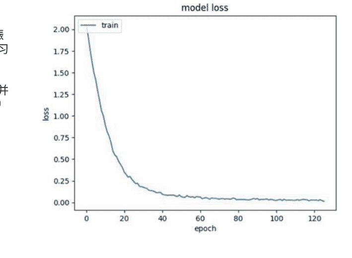

### 5 观察

#### 5.1 使用的数据集

我们使用RAVDESS数据集来构建和评估我们的模型的性能。

Ryerson情感语音和歌曲音频-视觉数据库（RAVDESS）[38]共包含7356个文件（包括仅音频文件、音频-视觉文件和仅视频文件）。数据集的总大小约为24.8 GB。在这项工作中，我们使用了仅音频的语音文件来训练和测试所提出的模型。

音频文件（仅语音文件）包含24位专业演员（12位女性，12位男性），他们以中性的北美口音发出两个词汇匹配的陈述。这组数据的总大小为215 MB。这些话语包括“中性”、“平静”、“快乐”、“悲伤”、“愤怒”、“恐惧”、“惊讶”和“厌恶”表情。每种表情都有两个情绪强度级别（“正常”、“强烈”），除了“中性”表情。因此，每种表情（除了“中性”）有192个训练示例，中性表情有96个训练示例（总共1440个片段）。每个片段持续3-5秒。文件格式为16位，48 kHz的.wav文件。

#### 5.2 使用的性能指标

如果一个剪辑 $C_k$ 属于类别 $p$ 并且被预测为属于类别 $p'$，则对表 $p$ 和 $p'$ 进行以下更新： $p = p'$，则 $TP_p = TP_p + 1$（TP表示真正例，FN表示假负例）。

否则 $FP_{p'} = FP_{p'} + 1$，并且 $TN_p = TN_p + 1$（FP表示假正例，TN表示真负例）。

- (i) 准确率：

$A (\text{以}\% \text{为单位}) = \frac{\text{正确预测的示例数}}{\text{总示例数}} \times 100\% \quad (12)$

- (ii) 精确率：

$P = \frac{\sum_p (TP_p)}{\sum_p (TP_p) + \sum_p (FP_p)} \quad (13)$

- (iii) 召回率：

```
$$ R = \frac{\sum_p (TP_p)}{\sum_p (TP_p) + \sum_p (FN_p)} $$ (14)
```

- (iv) F1分数：它将召回率和精确率结合为一个单一的指标。它的定义如下：

```
$$ F_1 = \frac{2PR}{P + R} $$ (15)
```

在多类分类问题中，需要为每个类别定义精确率、召回率和F1得分。

- (v) 混淆矩阵：它是一个 \(p \times p\) 矩阵，其中 \(CM_{ij}\) 表示类别 \(i\) 的测试样例被预测为类别 \(j\) 的次数。因此，\(\sum_{i=j} CM_{ij}\) (对角线之和) 给出了总的正确预测次数。

#### 5.3 实验结果

该实现使用Python 3.6完成。实验在Google Colaboratory上进行，内存为12.69 GB (RAM)，并且使用GPU (Colab提供用于训练和测试神经网络)。使用Python的librosa库 (版本0.8.1) [39]提取对数频谱图。神经网络的训练和测试在Google Colab的GPU上完成。神经网络使用TensorFlow 1.6.0 [40]和Keras 2.5.0 [41]实现。

剪辑如下采样：

- 采样率，\(f_s\)：44,100 Hz；因此，音频信号中存在的最大频率为 \((44100 * 0.5) = 22050\) Hz，即奈奎斯特频率。
- 最小剪辑大小：2.94 秒
- 最大剪辑大小：5.28 秒
- 平均剪辑大小：3.70 秒
- 窗口大小 (用于频谱图计算)：选择的窗口大小为25毫秒，窗口每次移动10毫秒。

为了训练CNN，频谱图的尺寸需要保持一致。因此，在提取频谱图之前，所有剪辑都被转换为运行时间为3.70秒 (数据集中的平均剪辑大小)。这是通过在较小的剪辑末尾填充零并截断较大的剪辑来实现的。频谱图 (具有相同的尺寸) 被分为两组 (训练集和测试集)。深度CNN在训练集上进行训练，并在测试集上报告性能。我们使用了RAVDESS数据集中的所有语音剪辑 (1440个剪辑)。数据集中的每个剪辑都被增强以获得六个训练样本 (如第3.1节所述)。因此，获得了一个包含8640个剪辑的数据集。因此，增强数据集的持续时间约为8.11小时。在提取频谱图后，它们按照表3中的方式分为训练集和测试集。

发现训练准确率达到99.87%，这表明模型非常适应训练数据。此外，测试准确率为98.13% (736个正确预测的剪辑)。

表3 RAVDESS数据集（经过增强）中每个情绪类别的剪辑数量，用于训练和测试。

| 序号 | 情绪 | 剪辑数量（增强前） | 剪辑数量（增强后） | 训练示例数量 | 测试示例数量 |
| :--- | :--- | :--- | :--- | :--- | :--- |
| 1 | 中性 | 96 | 576 | 522 | 54 |
| 2 | 平静 | 192 | 1152 | 1060 | 92 |
| 3 | 快乐 | 192 | 1152 | 1062 | 90 |
| 4 | 悲伤 | 192 | 1152 | 1048 | 104 |
| 5 | 愤怒 | 192 | 1152 | 1058 | 94 |
| 6 | 恐惧 | 192 | 1152 | 1042 | 110 |
| 7 | 厌恶 | 192 | 1152 | 1042 | 110 |
| 8 | 惊讶 | 192 | 1152 | 1056 | 96 |
| 总计 | | 1440 | 8640 | 7890 | 750 |

预测的剪辑中有750个，说明该模型也可以泛化到未知数据。

表4和表5分别包含了该模型的性能结果和混淆矩阵。分类器在识别‘平静’、‘快乐’、‘愤怒’、‘恐惧’和‘惊讶’情绪的剪辑时达到了100%的准确率。这意味着当提供属于这些类别之一的训练示例时，分类器永远不会犯错。这可能是因为这些情绪之间的相关性最小，即快乐的表达与‘愤怒’的表达完全不同。对于‘平静’、‘恐惧’或‘惊讶’情绪也是如此。

可以观察到，分类器在识别属于类别：“中性”，“悲伤”和“厌恶”的片段时会犯错误。事实上，除了“中性”之外，所有情绪都有两种强度，这可能在误导中起了作用。

表4对RAVDESS数据集的语音数据进行识别八种情绪类别的提出模型的性能评估

| 序号 | 语言 | 测试片段数量 | 精确度（以%表示） | 召回率（以%表示） | F1得分（以%表示） |
| :--- | :--- | :--- | :--- | :--- | :--- |
| 1 | 中性 | 54 | 100.00 | 96.30 | 98.12 |
| 2 | 平静 | 92 | 97.87 | 100.00 | 98.92 |
| 3 | 快乐 | 90 | 97.82 | 100.00 | 98.90 |
| 4 | 悲伤 | 104 | 96.08 | 94.23 | 95.15 |
| 5 | 愤怒 | 94 | 100.00 | 100.00 | 100.00 |
| 6 | 恐惧 | 110 | 100.00 | 100.00 | 100.00 |
| 7 | 厌恶 | 110 | 100.00 | 94.55 | 97.20 |
| 8 | 惊讶 | 96 | 94.12 | 100.00 | 96.97 |
| 总计 | | 750 | 98.24 | 98.13 | 98.16 |

表5提出模型在RAVDESS数据集上获得的混淆矩阵

| 实际\预测 | 中性 | 平静 | 快乐 | 悲伤 | 愤怒 | 恐惧 | 厌恶 | 惊讶 |
|-----------|------|------|------|------|------|------|------|------|
| 中性      | 52   | 0    | 0    | 0    | 0    | 0    | 0    | 2    |
| 平静      | 0    | 92   | 0    | 0    | 0    | 0    | 0    | 0    |
| 快乐      | 0    | 0    | 90   | 0    | 0    | 0    | 0    | 0    |
| 悲伤      | 0    | 2    | 0    | 98   | 0    | 0    | 0    | 4    |
| 愤怒      | 0    | 0    | 0    | 0    | 94   | 0    | 0    | 0    |
| 恐惧      | 0    | 0    | 0    | 0    | 0    | 110  | 0    | 0    |
| 厌恶      | 0    | 0    | 2    | 4    | 0    | 0    | 104  | 0    |
| 惊讶      | 0    | 0    | 0    | 0    | 0    | 0    | 0    | 96   |

分类器。一些来自“厌恶”类别的片段被（分类器）错误地归类为“悲伤”类别。这可能是因为“中等”厌恶表情可能与“悲伤”表情强烈相关。同样，强烈的悲伤情绪可能听起来像是“惊讶”。另一方面，中性情绪的偏斜性质（与其他情绪相比，片段数量减少一半）可能导致其被错误分类。尽管存在一些错误（可能是由于表情的歧义性），但分类器表现非常出色，达到了98.13%的准确率。该性能表明，基于对数频谱图训练的深度卷积神经网络模型在从语音数据中进行情绪检测的任务上具有高度准确性和有效性。

#### 5.4 比较研究

在本研究中，我们将我们的提议与RAVDESS数据集上的其他最新语音情感识别研究进行了比较，并将比较结果显示在表6中。从表6可以看出，我们提出的基于对数频谱图的深度卷积神经网络模型在RAVDESS数据集上的语音情感识别问题上表现优于所有先前的研究工作。

| 作者[参考文献] | 出版年份 | 使用的模型 | 准确率 (%) |
| :--- | :--- | :--- | :--- |
| Yadav等人[42] | 2020 | 卷积神经网络和双向长短时记忆网络 | 73 |
| Mustaqeem等人[43] | 2020 | 频谱图和卷积神经网络 | 77.02 |
| Kanwal等人[44] | 2021 | 遗传算法进行特征优化 | 82.50 |
| 提出的工作 | 2023 | 定制的基于对数频谱图的深度卷积神经网络 | 98.16 |

### 6 结论

本研究提出了一种用于从人类语音中检测情感的模型，可以理解说话者的整体态度/表达。它展示了这个模型如何优于在时间序列数据上训练的传统循环神经网络。它描述了将音频剪辑转换为称为频谱图的视觉表示的过程。它提出了一个基于提取的频谱图进行训练的深度卷积神经网络的架构。该模型的性能已在RAVDESS数据集上进行了测试，并获得了98.13%的测试准确率。此外，所提出的模型显示出鲁棒性，并且不受背景噪声的影响。它的性能显然独立于说话者的数量和性别，并且可以识别说话者的情感，即使表达的情感程度不同。

尽管提出的模型优于传统模型，但该模型在仅有一种语言的数据集上运行。如前所述，即使人们不懂语言，也能从语音中解读情感。因此，理想的情感检测模型应该在很大程度上与语言无关。这可能是未来一个具有挑战性的目标。该论文表明，CNN和MFCC特征（用作时间序列）对于这个任务来说不够好。未来可以处理的一个有趣问题是找到在这个任务上表现更好的循环架构。

### 参考文献

- 1. Makhoul, J.: 线性预测：教程综述。IEEE会议录 **63**(4), 561–580（1975年）。https://doi.org/10.1109/PROC.1975.9792
- 2. Hermansky, H.: 语音的感知线性预测（PLP）分析。声学学会杂志**87**(4), 1738–1752（1990年）。https://doi.org/10.1121/1.399423
- 3. Mermelstein, P.: 语音识别的距离度量，心理学和仪器。模式识别人工智能。374-388（1976年）
- 4. Davis, S., Mermelstein, P.: 连续说话句子中单音节词的参数表示比较。IEEE Trans. Acoust. Speech Signal Process. **28**（4）, 357-366（1980年）。https://doi.org/10.1109/TASSP.1980.1163420

5. Jin, F., Sattar, F., Krishnan, S.: 用于呼吸声监测的对数频谱图。 在: 国际声学、语音和信号处理会议, 1988年。 ICASSP-88 (2012年)。 https://doi.org/10.1109/ICASSP.2012.6287954

6. Dey, A., Chattopadhyay, S., Singh, P.K., Ahmadian, A., Ferrara, M., Sarkar, R.: 一种使用黄金比例和平衡优化算法的混合元启发式特征选择方法用于语音情感识别。 IEEE Access 8, 200953-200970 (2020年)。 https://doi.org/10.1109/ACCESS.2020.3035531

7. Sahoo, K.K., Dutta, I., Ijaz, M.F., Wozniak, M., Singh, P.K.: TLEFuzzyNet: 模糊基于排名的集成迁移学习模型用于人类语音情感识别。 IEEE Access 9, 166518–166530 (2021). https://doi.org/10.1109/ACCESS.2021.3135658

8. Biswas, M., Rahaman, S., Ahmadian, A., Subari, K., Singh, P.K.: 基于MFCC的时间序列特征的自动口语识别。 Multimed. Tools Appl. 1–31 (2022). https://doi.org/10.1007/s11042-021-11439-1

9. Garain, A., Singh, P.K., Sarkar, R.: FuzzyGCP: 一种用于自动口语识别的深度学习架构。 Expert Syst. Appl. 168, 114416 (2021). https://doi.org/10.1016/j.eswa.2020.114416

10. Pazos-Rangel, R.A., Florencia-Juarez, R., Paredes-Valverde, M.A., Rivera, G. (eds.): 自然语言处理和智能服务系统研究手册. IGI Global(2021). https://www.doi.org/https://doi.org/10.4018/978-1-7998-4730-4

11. Aouani, H., Ayed, Y.B.: 深度学习中的语音情感识别. Procedia Comput. Sci. 176, 251–260. (2020). https://doi.org/10.1016/j.procs.2020.08.027

12. Kerkeni, L., Serrestou, Y., Mbarki, M., Raoof, K., Mahjoub, M.: 语音情感识别：方法和案例研究 (2018). https://doi.org/10.5220/0006611601750182

13. Avots, E., Sapinski, T., Bachmann, M., Kaminska, D.: 野外音频视觉情感识别. Mach. Vis. Appl. 30(5), 975–985 (2019). https://doi.org/10.1007/s00138-018-0960-9

14. Lech, M., Stolar, M., Best, C., Bolia, R.: 使用预训练的图像分类网络进行实时语音情感识别：带宽缩减和压缩效果的影响. Front.Comput. Sci. 2, 14 (2020). https://doi.org/10.3389/fcomp.2020.00014

15. An, X.D., Ruan, Z.: 基于深度学习算法融合时空特征的语音情感识别算法. J. Phys.: Conf. Ser. 1861(1), 12064 (2021). https://doi.org/10.1088/1742-6596/1861/1/012064

16. Tang, D., Kuppens, P., Geurts, L., van Waterschoot, T.: 一种新颖的上下文堆叠扩张卷积神经网络的端到端语音情感识别方法. EURASIP J. Audio Speech Music Process. 2021(1), 18 (2021). https://doi.org/10.1186/s13636-021-00208-5

17. Jiang, W., Wang, Z., Jin, J.S., Han, X., Li, C.: 具有异构特征统一的深度神经网络语音情感识别. Sensors (Basel, Switzerland) 19(12), 2730 (2019). https://doi.org/10.3390/s19122730

18. Manchala, S., Prasad, V.K., Janaki, V.: 基于GMM的语言识别系统，使用鲁棒特征。 Int. J. Speech Technol. 17(2), 99–105 (2014). https://doi.org/10.1007/s10772-013-9209-1

19. Gupta, M., Bharti, S.S., Agarwal, S.: 基于随机森林和支持向量机的隐式语言识别系统，用于语音。 在: 2017年第四届国际电力、控制和嵌入式系统会议(ICPCES), 第1-6页. (2017). https://doi.org/10.1109/ICPCES.2017.8117624

20. Anjana, J.S., Poorna, S.S.: 使用SVM和LDA从语音特征进行语言识别。 在: 2018年国际无线通信、信号处理和网络会议(WiSPNET), 第1-4页(2018). https://doi.org/10.1109/WISPNET.2018.8538638

21. Sarthak, Shukla, S., Mittal, G.: 使用convNets进行口语语言识别。 计算机科学讲义(包括子系列人工智能讲义和生物信息学讲义), 第11912卷。 LNCS, 第252-265页(2019). https://doi.org/10.1007/978-3-030-34255-5_17

22. Kumar, C.S.A., Maharana, A.D., Krishnan, S.M., Hanuma, S.S.S., Lal, G.J., Ravi, V.: 使用CNN-LSTM和视觉转换器进行语音情感识别。 在: Abraham, A., Bajaj, A., Gandhi, N., Madureira, A.M., Kahraman, C. (eds.) 生物启发计算和创新

23. Rudregowda, S., Patil Kulkarni, S., HL, G., Ravi, V., Krichen, M.: 使用VGG16卷积神经网络进行卡纳达语视觉语音识别。声学 5(1), 343–353(2023). https://doi.org/10.3390/acoustics5010020

24. Lipton, Z.: 关于序列学习的循环神经网络的批判性评论（2015年）。 https://doi.org/10.48550/arXiv.1506.00019

25. Hochreiter, S., Schmidhuber, J.: 长短期记忆。神经计算。 9(8), 1735-1780（1997年）。 https://doi.org/10.1162/neco.1997.9.8.1735

26. Chung, J., Gulcehre, C., Cho, K., Bengio, Y.: 对门控循环神经网络在序列建模上的实证评估，第1-9页。（2014年）。 https://doi.org/10.48550/arXiv.1412.3555

27. Biswas, M., Rahaman, S., Kundu, S., Singh, P.K., Sarkar, R.: 使用MFCC特征的印度语言口语识别。在：Kumar, P., Singh, A.K. (eds.) BT—智能多媒体分析的机器学习：技术和应用，第249-272页。Springer，新加坡（2021年）。 https://doi.org/10.1007/978-981-15-9492-2_12

28. Garain, A., Ray, B., Giampaolo, F., Velasquez, J.D., Singh, P.K., Sarkar, R.: GRaNN: 特征选择与黄金分割率辅助神经网络用于情感、性别和说话者识别来自语音信号。神经计算应用（2022年）。 https://doi.org/10.1007/s00521-022-07261-x

29. Marik, A., Chattopadhyay, S., Singh, P.K.: 一种混合深度特征选择框架从人类演讲中识别情感。多媒体工具应用。 82，11461-11487（2023年）。 https://doi.org/10.1007/s11042-022-14052-y

30. Strang, G.: 线性代数及其应用。在：线性代数，第4版，第211-221页（第3.5章）（未知年份）

31. Ayachi, R., Afif, M., Said, Y., Atri, M.: 用步长卷积代替最大池化提高卷积神经网络的内存效率，第234-243页（2020年）。 https://doi.org/10.1007/978-3-030-21005-2_23

32. Albawi, S., Mohammed, T.A., Al-Zawi, S.: 理解卷积神经网络。在：2017年国际工程与技术会议（ICET），第1-6页（2017年）。 https://doi.org/10.1109/ICEngTechnol.2017.8308186

33. Srivastava, N., Hinton, G., Krizhevsky, A., Sutskever, I., Salakhutdinov, R.: Dropout: 一种简单的方法防止神经网络过拟合。机器学习研究杂志，第15卷，1929-1958页（2014年）

34. Glorot, X., Bengio, Y.: 理解训练深度前馈神经网络的困难。机器学习研究杂志，第9卷，249-256页（2010年）

35. Kumar, S.K.: 关于深度神经网络中的权重初始化，第1-9页（2017年）。 https://doi.org/10.48550/arXiv.1704.08863

36. Kingma, D.P., Ba, J.L.: Adam: 一种随机优化方法。在：第3届国际学习表示会议，ICLR 2015-会议论文集，第1-15页（2015年）。 https://doi.org/10.48550/arXiv.1412.6980

37. You, K., Long, M., Wang, J., Jordan, M.I.: 学习率衰减如何帮助现代神经网络？（2019年）。 https://doi.org/10.48550/arXiv.1908.01878

38. Livingstone, S.R., Russo, F.A.: 北美英语情感语音和歌曲的Ryerson音频-视觉数据库（RAVDESS）：一个动态的、多模态的面部和声音表达集。Plos One 13(5), e0196391（2018年）。 https://doi.org/10.1371/journal.pone.0196391

39. McFee, B., Lostanlen, V., McVicar, M., Metsai, A., Balke, S., Thom, C., Raffel, C., Malek, A., Lee, D., Zalkow, F., Lee, K., Nieto, O., Mason, J., Ellis, D., Yamamoto, R., Seyfarth, S., Battenberg, E., Морозов, B., Bittner, R., et al.: Librosa/librosa（2020年）。 https://doi.org/10.5281/ZENODO.3606573

40. Abadi, M., Agarwal, A., Barham, P., Brevdo, E., Chen, Z., Citro, C., Corrado, G. .., Davis, A., Dean, J., Devin, M., Ghemawat, S., Goodfellow, I., Harp, A., Irving, G., Isard, M., Jia, Y., Kaiser, L., Kudlur, M., Levenberg, J., Zheng, X.: TensorFlow:大规模机器学习在异构分布式系统上的应用（2015）。 https://doi.org/10.48550/arXiv.1603.04467

41. Chollet, F.: Keras（2015）。2023年5月13日访问。 https://github.com/fchollet/keras

42. Yadav, A., Vishwakarma, D.K.: 一个基于CNN和Bi-LSTM的多语言框架用于情感分类. 在: 2020年第11届计算、通信和网络技术 (ICCCNT)，第1-6页 (2020). https://doi.org/10.1109/ICCCNT49239.2020.9225614

43. Mustaqeem, Sajjad, M., Kwon, S.: 基于聚类的语音情感识别，结合学习特征和深度BiLSTM。IEEE Access 8, 79861-79875 (2020). https://doi.org/10.1109/ACCESS.2020.2990405

44. Kanwal, S., Asghar, S.: 使用基于聚类的GA优化特征集的语音情感识别。IEEE Access 9, 125830-125842 (2021). https://doi.org/10.1109/ACCESS.2021.3111659

## 使用基于BERT模型的西班牙耸人听闻标题文本分类器

Heber Jesus Gonzalez Esparza, Rogelio Florencia, Jose David Diaz Roman, 和Alejandra Mendoza-Carren

摘要 信息技术在全球性事件（如大流行病）期间对保持社会知情起着至关重要的作用。然而，耸人听闻的标题可能会对公众对机构的看法和信任产生负面影响。在本章中，我们开发了几种基于BERT的文本分类器，用于分类西班牙语中耸人和非耸人的与健康相关的标题。这些模型在墨西哥主要报纸的近2000个标题上进行了微调，达到了高达94%的F1-Score和准确率。这证明了机器学习技术在检测新闻标题中的耸人主义方面的有效性。

关键词 自然语言处理·机器学习·深度学习·耸人主义·短文本分类

### 1 引言

全球大流行病是社会面临的最重要挑战之一。在发生健康危机时，最重要的角色之一是向公众提供有关减轻危机的方法的信息和教育[1]。然而，一些研究表明，有关健康问题的新闻报道并不总是追求这一目标[2–5]。

近年来，随着竞争的加剧，新闻媒体越来越倾向于用标题来包装新闻文章，试图捕捉人们的注意力。这种倾向有时被推到极限，导致标题不准确、误导性或过于情绪化。

耸人听闻的标题强调的是可能引起情绪反应的因素，而不是关注对读者有价值的事实信息[6]。这带来了一个问题，因为标题可以显著塑造读者的世界观[7]。例如，当处理与健康相关的问题时，情绪化的或误导性的标题可能会导致人们决策和对机构的信任发生变化[8, 9]。

计算机科学中最重要的分支之一是自然语言处理（NLP）。一些NLP技术利用机器学习（ML）算法进行开发，这比手动开发更快更便宜[10]。这使得ML模型成为处理涉及人类语言的任务（如情感分析或文本分类）的非常有效的工具[10]。

双向编码器表示来自变压器（BERT）是一个简单而强大的语言表示模型，可用于许多不同的NLP任务，如文本分类[11]。BERT是最受欢迎的基于深度学习的语言模型之一，并被描述为人工智能和NLP领域的“飞跃”[12]。基于BERT架构的其他模型也已被提出，在某些场景中提高了性能。

只有很少几个西班牙语项目利用NLP技术开发自动识别新闻标题的系统，尤其是在处理耸人听闻的情况下。本章介绍了三个用于检测西班牙语耸人听闻标题的文本分类器。这些模型是使用多个基于BERT的模型生成的，并使用手动收集和标记的数据进行了微调，用于此项目。

本章结构如下：第2节描述了项目的理论背景。第3节介绍了具有类似目标和可比较方法的其他项目。第4节描述了收集、标记和分析用于训练和验证模型的数据的过程。它还描述了构建和拟合模型的方法，而分类器的性能可以在第5节中找到。最后，第6节通过描述项目的优点和局限性来总结本章。

### 2 背景

本节定义了理解问题和提出解决方案所必需的关键概念。2.1描述了在不同背景下使用“轰动主义”一词以及它可能成为有害新闻报道的方式。2.2简要介绍了基于BERT模型的解释。

#### 2.1 轰动主义

当处理像全球大流行病这样的问题时，对这些主题的新闻报道成为解决问题的关键因素。新闻报道中的情绪色彩可能对人们对健康相关主题的风险感知、态度和行为产生决定性影响[8]。

当前市场驱动的大众传媒状态导致健康相关新闻被夸大或“轰动化”，旨在吸引和保持公众的注意力。许多不同的背景使用“轰动性”这个词。一些作者将其定义为一种针对大众阶层的新闻报道，其中暴力、色情和悲剧是常态。对于一个轰动性新闻记者来说，最重要的是吸引读者的注意力，即使事实本身受到了损害[13, 14]。

然而，在其他情况下，这个术语也被使用。其中一个情况是用来描述那种使用文体技巧来引起情绪，包括兴奋、恐惧和惊讶的新闻报道。术语“轰动性”也用来指称将信息打包成标题的“话语策略”，以使新闻看起来更有趣、非凡或相关[6]。

考虑到“轰动性”的定义严重依赖于上下文，需要一个更简洁的描述。为了限制这个术语的定义，使用了许多不同作者的意见[5, 6, 15-18]选择了一系列标准。如果一个标题符合以下至少一项，就可以被认为是轰动性的：

- 省略可以表示不确定性的词语（如‘可能’或‘也许’）。
- 通过暗示信息以夸张的方式来吸引公众的注意力（例如，‘我们即将目睹英国的终结吗？’）。
- 使用最高级词汇或其他极端词语来夸大标题的效果（例如，‘奇迹’或‘革命性’）。
- 使用生动的隐喻来吸引读者的注意力（例如，在传染病爆发的情况下提到僵尸）。
- 使用大写字母强调可以吸引读者注意力的词语（例如，西班牙语中的‘HISTORIA’或英语中的‘HISTORY’）。
- 使用叙事手法，将两个对立的群体对立起来（例如，‘他们’对‘我们’）。

+   - 使用容易引起人们警惕的词语，而无需实际使用它们，例如（在西班牙语中）：‘Apocalíptico’（‘Apocalíptico’），‘Emergency’（‘Emergencia’），‘Alarm’（‘Alarma’），‘Crisis’（‘Crisis’），‘Chaos’（‘Caos’）等。

作为免责声明，上述所有特征都不应被视为‘确定的’。哪些标题可以被视为耸人听闻的想法远未被普遍接受。这里列出的所有标准都需要进行验证，因为耸人听闻的标题分类严重依赖于每个读者的感知和观点。

#### 2.2 基于BERT的模型

BERT是由Google开发的非常流行的深度学习模型，它基于一种称为Transformer的神经网络 [11]。 Transformer首次在[19]中描述，它是卷积神经网络（CNN）和注意机制的结合，使得基于Transformer的模型能够学习文本中的上下文关系。 Transformer是作为自然语言处理（NLP）任务中循环神经网络（RNN）的替代方案而开发的，主要是因为RNN在并行化工作和处理长句子时性能较差 [20]。 尽管Transformer最初是用于翻译任务，但多项研究表明使用Transformer架构，特别是BERT模型，可以在许多其他NLP任务（如文本分类、情感分析、情绪识别和垃圾邮件检测）中取得非常好的结果 [12, 21, 22]。

BERT的一个关键特点是其能够双向处理文本。这意味着它考虑了一个词与其前后词语的上下文关系，从而捕捉到了句子的完整含义和上下文。这与传统的自然语言处理模型形成了对比，传统模型只考虑一个词与其前面词语的上下文关系。

BERT框架中包含的两个步骤是预训练和微调。 预训练阶段使用了BookCorpus和英文维基百科作为语料库（总计约33亿个词），使得英文版BERT能够掌握语言模式。 这是通过利用两个无监督任务来实现的：掩码语言建模（MLM）和下一句预测（NSP）。

在MLM任务中，模型必须预测在处理过程开始时被随机掩码的句子中的15%的词语。 这个特点使得BERT能够学习到句子的双向表示。 在NSP任务中，模型接受两个掩码句子作为输入，然后必须预测它们在原始文本中是否相邻。

为了进行微调，在NLP任务中需要使用特定的输入来获得更好的结果，该项目旨在执行该任务。 在这种情况下，使用本章介绍的耸人听闻的标题数据集进行了微调步骤。

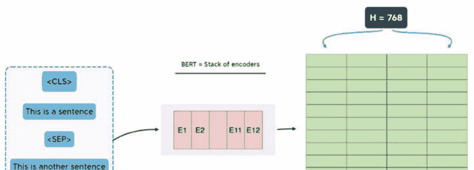

图1表示BERT架构的图表

BERT在2018年首次发布时有两个不同的版本：BERT-Base和BERT-Large，两者都有'uncased'和'cased'变体（在uncased版本中，'John Smith'将变为'john smith'，而在cased版本中则不会发生这种情况）。BERT-Large使用一个24层模型，具有16个注意力头，而BERT-Base的模型只有12层，并且有12个注意力头。

与原始的Transformer编码器一样，BERT将一系列单词作为输入。为了使其正常工作，每个输入必须以特殊标记[CLS]开头，并用[SEP]分隔。然后，每个编码器层在将其结果传递给下一个编码器之前应用自注意机制。这将生成一个大小为hidden_size（BERT-Base中为768）的向量，如图1所示。现在可以将生成的向量用于许多不同的NLP任务，包括文本分类。

基于BERT架构的许多其他模型已被提出来改善特定任务的性能。在本章中，使用基于BERT的三个预训练模型进行了实验：

* 多语言BERT-Base[23]：在最大的维基百科（包括几种罗曼语言，如法语、葡萄牙语和西班牙语）中预训练了前104种语言，其结果略差于BERT的单语言模型（如英文或中文版本）。关于BERT的所有先前陈述对于这个模型也是正确的，因为它只是多语言版本。
* BETO-Base（西班牙语预训练BERT模型）[24]：BERT-Base的一个变种，它在一个大型西班牙语语料库中使用了整词掩蔽（WWM）技术进行预训练。在某些情况下，它提供了比BERT的多语言版本更好的结果[25]。
* XLM-RoBERTa-Base（强大的BERT预训练方法）[26]：这是一个在100种不同语言中进行自我监督方式预训练的多语言模型[27]。它基于RoBERTa和XLM。RoBERTa是BERT模型的一种变体，通过使用更多的数据、更大的批次和更长的训练来优化它的前身[28]。另一方面，XLM是BERT的扩展，具有两个额外的目的：翻译语言建模（TLM）和跨语言语言建模（XLM）。这使得模型可以在不同语言的平行句子和其他语言的单语句子上进行训练。

### 3 相关工作

在本节中，介绍了与本章描述的目标类似的其他项目的描述。

多年来，自然语言处理领域的大部分努力都是以英语为主要考虑因素。因此，除了英语之外，像普通话或西班牙语[29-32]这样的语言在这个领域只取得了少数进展。

有一些项目使用ML算法来处理文本分类任务，例如西班牙语中的词袋模型或Word2Vec，尽管数量不多，但重要的是要强调存在几个这样的项目。一些项目甚至使用基于BERT的预训练模型来解决问题。

在[32]中，对几个西班牙语的临床数据集进行了自动化匿名处理。他们在项目中使用了两个数据集，这两个数据集都包含了临床叙述的纯文本和敏感信息的手动注释。为了生成模型，他们使用了BERT的基础多语言大小写版本和PyTorch库。在进行了两个不同的实验后，得到了0.925至0.979之间的F1分数。

另一个使用BERT解决自然语言问题的项目可以在[31]中找到。它包括对Google Play商店评论的情感分析任务。对于微调任务，从Google Play商店的15个最受欢迎的教育应用程序中收集了15,985条评论，例如Google Classroom或Duolingo。生成的模型在将评论分类为负面、中性和正面时获得了0.8的F1分数。

此外，在[33]中，使用了与本章节中介绍的文本分类器相同的三个模型（多语言BERT，XLM-RoBERTa和BETO）来检测墨西哥社交媒体上的攻击性。他们使用了MEX-A3T数据集对模型进行了微调，该数据集包含超过7,000条由墨西哥西班牙语使用者撰写的推文（其中2,110条被标记为攻击性），还使用了OffensEval [34]数据和HatEval [35]的西班牙语子集进行了一些实验。他们使用了一个包含3,143个元素的测试集，在最佳模型中实现了79%的F1-Score。

尽管这些项目没有解决与本章描述的问题相同的问题，但可以在英语中找到其他解决方案。在[36]中，构建了一个用于量化提及流行病的新闻记录的科学质量和轰动性的模型。使用了一种通过调查和焦点小组识别轰动性的工具来衡量新闻记录的轰动性，该工具也在本项目中部分使用了[6]。他们使用500条新闻记录的随机样本构建了一个最大熵模型，然后将回归应用于随机选择的10,000条提及流行病的新闻记录。

使用西班牙语的轰动标题文本分类器...在由200条记录组成的测试集中，该模型的准确率达到了73%。

在谷歌年度计划 “代码之夏” 2017年版中，还有另一个解决相同问题的项目。在这个解决方案[37]中，他们构建了一个非线性支持向量机（SVM）模型。它使用了标点符号计数、平均句子长度和新闻记录中大写字母的数量等特征来将其分类为耸人听闻的或非耸人听闻的。在一个包含16,000个元素的数据集上，通过5折交叉验证，在仅使用标题训练模型的情况下，达到了0.82的F1-Score。

### 4 数据集和方法

在搜索耸人听闻和非耸人听闻的标题数据集时，并没有找到符合项目需求的数据集。当搜索包含西班牙语元素的数据集时，情况更糟。众所周知，开发ML文本分类器需要大量的数据。在互联网上找不到有价值的数据后，决定收集并手动标记数据。第4.1节介绍了收集和标记数据所采取的步骤，而第4.2节描述了生成的数据集及其内容。

#### 4.1 数据收集和数据标记

在收集头条新闻之前，首先需要真正理解在耸人听闻的标题中可以找到哪些模式。由于分类是二进制的（标题是否可以被视为耸人听闻），如果标题符合第2节中列出的一个或多个标准，则将其分类为耸人听闻。

收集过程中的第一步是选择应该考虑的新闻来源。在这种情况下，考虑了两个因素来选择新闻来源：

1. 新闻机构的声誉。
2. 其网站如何便于搜索和收集头条新闻。

在墨西哥最重要的新闻机构中，那些网站便于数据收集任务的是Milenio (www.milenio.com) 和El Universal (www.eluniversal.com.mx)，因此出于这些原因选择了它们两个。即使声誉良好并不意味着不会有一些轰动性，但对于轰动性新闻媒体来说，更为知名的可能会在收集这类头条时有所帮助。墨西哥最著名和‘多彩’的新闻机构之一被称为‘拉普伦萨’（www.la-prensa.com.mx），它也被选中。

在收集任务的过程中，必须设定一系列考虑的日期，以确定将考虑的头条。为了尽可能多地捕捉与COVID-19大流行有关的最新事件，选择的日期范围从2020年1月1日开始，到2022年6月1日结束。

由于这个项目的主要目标是构建一个能够对与健康相关的头条进行轰动性和非轰动性分类的机器学习模型，因此在收集头条时考虑的主题列表主要集中在（但不限于）这些主题上：

* 一种疾病或医疗情况的新病例和累积病例。
* 一种疾病或医疗情况的新死亡和累积死亡。
* 与健康相关问题的发现（如新的治疗方法）。
* 政府官员针对一种疾病或医疗情况采取的措施。
* 一种疾病或医疗情况引起的经济或社会后果。
* 疫苗。

考虑了网络爬虫技术，但决定不使用它们是因为仍然需要手动选择。关于收集和标记过程的任务因网站而异，但可以总结为以下步骤：

1. 利用网站的搜索引擎搜索包含不同关键词（如“冠状病毒”、“癌症”、“疫苗”或“登革热”）的文章。
2. 设置搜索的日期范围。通常，按月份进行，从2020年1月开始，到2022年6月结束。
3. 如果网站允许，搜索将首先显示最受欢迎的文章。如果不允许，则按照时间顺序显示。
4. 阅读每个标题，并根据第2节中描述的任何标准进行手动确定，然后进行标记。
5. 将数据复制到逗号分隔值（CSV）文件中。

收集的所有数据都按照以下方式组织到CSV文件的五个不同列中，其中四个列是从新闻机构的网站收集的，包括以下内容：

* ‘encabezado’：标题，以纯文本形式。
* ‘fecha’：文章发布日期（格式为DD-MM-YYYY）。
* ‘fuente’：收集标题的新闻机构，以纯文本形式（El Universal为‘universal’，Milenio为‘milenio’，La Prensa为‘laprensa’）。
* ‘enlace’：包含标题的文章链接。

数据集中的第五列和最后一列是‘clase’，它可以有两个不同的值：如果标题被认为是耸人听闻的，则为‘1’，否则为‘0’。

考虑到COVID-19大流行发生在本项目选择的整个日期范围内，并且由于其在社会、政治和医学方面的重要性，大部分在收集过程中收集的标题在某种程度上都涉及到冠状病毒和其后果。

##### 表1 数据集样本

| 标题（原文） | 标题（翻译成英文） | 类别 |
|--------------|-------------------|------|
| “这是一项艰巨、悲伤和令人心碎的工作”: 湖北护士谈论冠状病毒爆发 | “这是一项艰巨的工作，非常悲伤和令人心碎”: 湖北护士谈论冠状病毒爆发 | 1 |
| 冠状病毒在欧洲引发恐慌，使意大利瘫痪 | 冠状病毒在欧洲引发恐慌，使意大利陷入瘫痪 | 1 |
| “¡Mátela!”, 一个洪都拉斯男子要求为一名疑似冠状病毒患者 | “Kill her!”, 一个洪都拉斯男子要求为一名疑似冠状病毒患者 | 1 |
| 墨西哥...对COVID-19免疫吗? | 墨西哥...对COVID-19免疫吗? | 1 |
| 回到中国时，塔母皮克人感觉像是僵尸启示录一样，因为冠状病毒 | 看起来像是僵尸启示录：从中国返回的坦皮科男子因冠状病毒 | 1 |
| 由于冠状病毒，地铁加强了预防和卫生措施 | 由于冠状病毒，地铁加强了预防和卫生措施 | 0 |
| 埃布拉德宣布拉美研究冠状病毒的网络 | 埃布拉德宣布拉美网络研究冠状病毒 | 0 |
| 世界卫生组织召集了400名专家研究冠状病毒 | 世界卫生组织召集400名专家研究冠状病毒 | 0 |
| 墨西哥主教团在冠状病毒面前提出建议 | 墨西哥主教团对冠状病毒提出建议 | 0 |
| 世界卫生组织在TikTok上开设账号，以报道冠状病毒 | 世界卫生组织在TikTok上开设账号，报道冠状病毒 | 0 |

数据收集任务仅旨在无特定顺序或模式从选定的报纸中收集耸人听闻和非耸人听闻的头条新闻。因此，作为免责声明，所有收集、标记和出现在数据集中的数据都不意味着代表每个新闻机构可以提供的新闻报道质量。

表1包含从数据集中抽取的十个样本。第一列显示了来源的标题（西班牙语）。第二列是每个标题的英文翻译。第三列指示标题是否被认为是耸人听闻的（1表示耸人听闻，否则为0）。第1列和第3列用于训练文本分类模型。

#### 4.2 数据分析

总共收集和标记了2,200个标题，其中1,080个被标记为耸人听闻的，1,120个被标记为非耸人听闻的。这意味着数据集的两个类别几乎是50/50的比例，因此可以被认为是平衡的，如图2所示。


图3显示了本项目选择的三家新闻机构中耸人和非耸人听闻标题的分布情况。从‘La Prensa’ (www.la-prensa.com.mx) 收集了502个标题，占数据集的23%。在这502个标题中，320个被手动分类为耸人听闻的（64%），剩下的182个则不是（36%）。在‘El Universal’ (www.eluniversal.com) 的情况下，从这个媒体收集的标题中，有395个被分类为耸人听闻的（47.6%），434个被分类为非耸人听闻的（52.4%），占数据集的37%。关于从‘Milenio’ (www.milenio.com) 收集的标题，它们占数据集的40%，其中366个被分类为耸人听闻的（42%），剩下的503个则不是（58%）。

在词形还原过程和从数据集中去除停用词之后，图4和图5显示了每个类别中最常用的单词。两个类别都包含


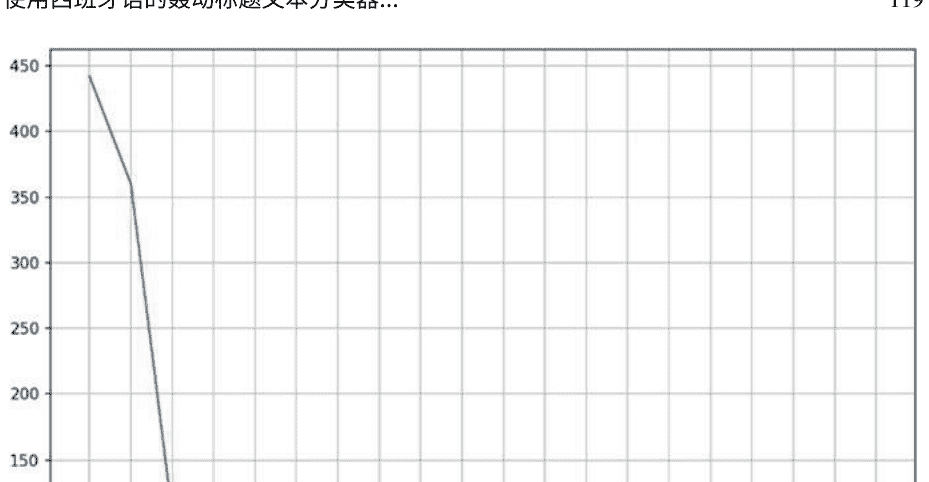

大量关于COVID-19大流行报道的新闻文章标题。 这一点可以从以下事实中得到证明，在这两种情况下，最常用的两个单词是'冠状病毒'和'covid'，总计达到1675次。 在耸人听闻的标题中，'pandemia'（'大流行'），'riesgo'（'风险'）和'contagio'（'传染'）是其余五个最常用的单词。 对于非耸人听闻的标题，'caso'（'案例'），'México'（'墨西哥'）和'vacuna'（'疫苗'）也是如此。
图6和图7显示了每个类别的词云，通过大小突出显示了每个类别中最常见的单词。

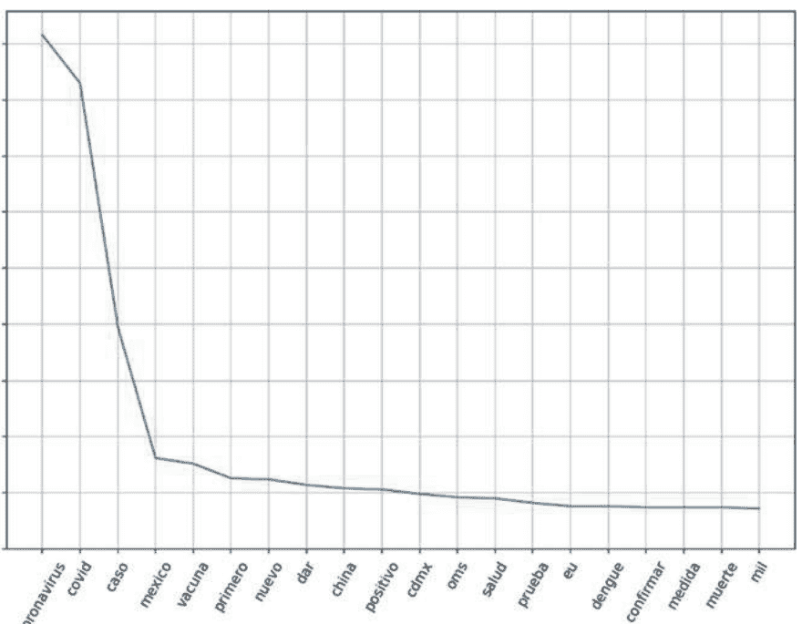

图5 数据集中非轰动性标题中使用最多的单词

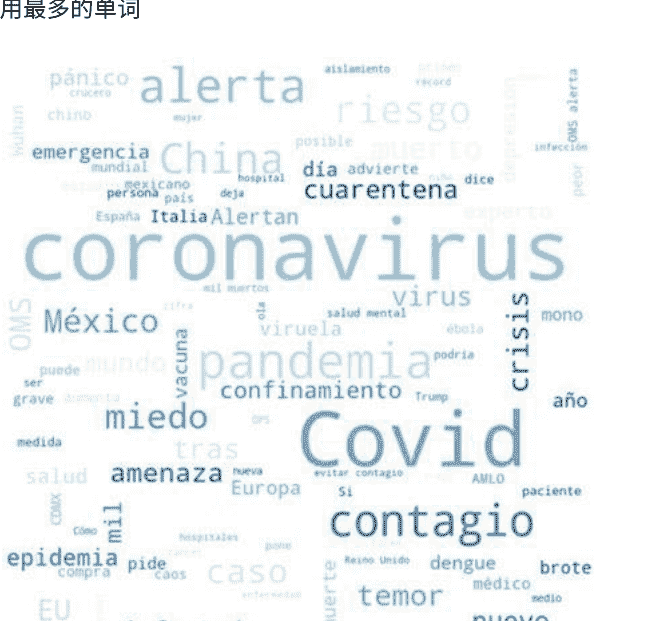

图6 数据集中轰动性标题的词云


#### 4.3 模型生成和微调

在本节中，将详细介绍生成、训练和验证文本分类模型的步骤。

为了开发文本分类器，使用了不同的Python库来处理数据和生成机器学习模型，例如 pandas和 sklearn。除了这些库之外，对于这个项目来说，最重要的库之一是 ktrain。它是其他库的封装，如 TensorFlow和transformers，旨在帮助构建、训练和部署机器学习模型[38]。

算法1描述了多语言BERT文本分类器的实现。算法2描述了BETO和XLM-RoBERTa文本分类器的操作。它们包括处理数据和生成模型所需的所有任务，包括创建数据框对象，将数据分成三个不同的集合，预处理数据并生成、训练和验证文本分类器。¹

¹ https://github.com/gonzalezheber/Text-classifier-of-sensationalist-headlines-in-Spanish-using-BERT-based-models.

## Algorithm 1. Pseudocode of the Multilingual BERT text classifier.

```
In: Set of news headlines previously labeled as sensationalist
and non-sensationalist
Out: A text classifier capable of classifying sensationalist
and non-sensationalist news headlines
# reading the dataset in a pandas dataframe
1.  df ← pd.read('headlines_dataset.csv')
2.  df ← df.drop_column('link', 'source', 'date')
# creation of training, testing and validation sets
3.  training_set, validation_set, testing_set ←
    train_test_split(df)
# converting sets into bert features using ktrain
4.  preprocess_mode ← 'bert'
5.  class_names ← ['0', '1']
6.  training_set_bert, validation_set_bert, preproc ←
    texts_from_array(training_set, validation_set,
    class_names, preprocess_mode, 'es')
# getting a text classification model and a learner in-
stance from ktrain
7.  model ← text_classifier(preprocess_mode, train-
    ing_set_bert, preproc)
8.  learner ← get_learner(model, training_set_bert, valida-
    tion_set_bert)
# finding the best learning rate to train the model
9.  learning_rate ← learner.lr_find()
10. learner.autofit(learning_rate)
# validation process
11. confusion_matrix ← learner.validate(validation_set_bert)
12. metrics ← calculate_metrics(confusion_matrix)
13. print(metrics)
# getting a predictor instance to make predictions on un-
labeled data
14. predictor ← get_predictor(learner.model, preproc)
# making predictions on the testing set and getting met-
rics
15. predictions ← predictor.predict(testing_set)
16. metrics ← calculate_metrics(predictions)
17. print(metrics)
```

算法1的第1行处理使用数据帧对象创建的过程这个 pandas 库。这个对象被命名为 df 并包含所有收集到的标题以及一个标签，确定标题是否被认为是耸人听闻的或者不是。每篇新闻文章的链接、日期和发布者也包括在数据集中。

考虑到训练和验证所需的仅有两列的事实，即标题本身和标签，第2行处理了从描述的其余列中删除的过程 df 对象。

如第3行所示，数据框对象被分为三个不同的集合：训练集、验证集和测试集。测试集包含了10%的提议的数据集（220个标题），并在微调阶段完成后用于评估模型。另一方面，训练和验证集包含了剩下的90%（1980个标题）。这是通过使用sklearn函数train_test_split来完成的，其目的是允许进行良好的验证过程。

在第4-6行中，可以看到第一次使用ktrain库的使用，使用了text_from_arrays函数，该函数从数组中加载和预处理文本数据。此函数具有多个参数，其中两个特别确定了此时所需的任务是使用BERT模型进行文本分类：class_names（如果为空，则假定为回归任务）和preprocess_mode（有三种可能性：'standard'、'distilbert'和'bert'）。此函数还将第3行生成的训练和验证集作为参数。还需要提到的是，'lang'参数用于定义语言。此参数可以自动检测，但在此情况下手动设置为'es'（西班牙语）。

此函数提供了一种使用称为Word-Piece标记化的方法对文本进行预处理的方式，这种技术将单词分割为较小的元素（称为word-pieces）。在处理基于Transformer架构的模型时，通常不需要进行其他预处理，如词形还原或停用词去除，因为这样做可能会导致上下文丢失。

第7行和第8行使用了两个非常重要的函数来开发一个文本分类器，使用了ktrain库：text_classifier和get_learner。text_classifier函数构建并返回一个文本分类模型，它的参数包括所需的文本分类器类型（在本例中为'bert'）、训练数据和一个在第6行生成的预处理变量（preproc）。另一方面，get_learner函数返回一个Learner实例，可以用来训练和调整Keras模型（就像在本例中一样）。它的参数包括刚刚生成的模型（model）以及训练和验证数据。

使用ktrain生成、训练和验证机器学习模型的优点之一是可用的lr_find函数，它在增加学习率时模拟训练并绘制损失。该函数通过使用一系列学习率对数据的一小部分进行训练来工作。然后，它绘制并确定导致最低损失的学习率。根据ktrain库的文档（可在[39]找到），应选择仍然显示下降损失的最高学习率（在结果图中显示）。在这种情况下，并且将suggest属性设置为true，训练阶段的函数建议的学习率可以在图8中看到，红色和紫色的点表示。

为了训练生成的模型，使用了autofit函数，如第10行所示。在这个项目中，根据图8的建议，选择了学习率为4.01e-6。autofit函数会自动设置early_stopping在patience = 5时启用，这意味着在验证损失没有改善的情况下，训练将在五个周期后自动停止。同样地，reduce_on_plateau也会在patience = 2时自动启用，当验证损失在两个周期后没有改善时，会降低学习率。在autofit函数中，early_stopping和reduce_on_plateau都是可选参数，如果需要可以进行编辑。

第11-13行处理模型的验证过程，这是通过使用validate函数完成的，该函数也是ktrain库的一部分。这个函数的参数是在第6行生成的验证集，并返回一个混淆矩阵。在对验证该项目选择的多个指标（如精确度、召回率和F1-Score）进行了几个过程后，并使用生成的混淆矩阵，计算了这些指标，然后在第13行显示在一个分类报告中。

最后，在第14行，创建了一个预测器实例，用于对未标记的数据进行预测。get_predictor函数以先前训练的Keras模型和在第6行声明的相同preproc变量作为参数。在整个过程中，该变量还在其他几行中使用过。这个预测器实例可以保存到磁盘上，然后作为其他应用程序的一部分重新加载，使用一个名为load_predictor的函数。

创建预测器实例对于处理算法1的最后部分（见第15-17行）非常有帮助。这些行的目标是使用第6行生成的训练集来测试结果模型。第15行的predict函数将预测结果保存在predictions变量中，然后可以与测试集上的实际标签进行比较。这个过程在第16行中完成，并且在第17行中，按照与第12行描述的类似方法，选择的度量标准在一个分类报告中显示出来。关于测试过程的结果可以在第5节中找到。

算法1和2相似。算法2的前几行遵循与算法1相同的思路。第一个变化出现在第5行，其中使用了Transformer函数来创建一个Transformer对象。它接受Hugging Face预训练模型的名称和类名等参数，以及一些超参数，如batch_size和maxlen。经过一些实验，两个文本分类器的maxlen都设置为128，而batch_size设置为16。

## Algorithm 2. Pseudocode of the BETO and RoBERTa text classifiers.

In: Set of news headlines previously labeled as sensationalist and non-sensationalist
Out: A text classifier capable of classifying sensationalist and non-sensationalist news headlines

```
# reading the dataset in a pandas dataframe
1. df ← pd.read('headlines_dataset.csv')
2. df ← df.drop_column('link', 'source', 'date')
# creation of training, testing and validation sets
3. training_set, validation_set, testing_set ← train_test_split(df)
# creating a Transformer object
4. class_names ← ['0', '1']
5. transformer ← text.Transformer('roberta/beto', class_names)
# preprocessing the training and validation sets
6. train ← transformer.preprocess_train(training_set)
7. val ← transformer.preprocess_test(validation_set)
# creating a classifier object
8. model ← transformer.get_classifier( )
# getting a learner instance from ktrain
9. learner ← get_learner(model, train, val)
# finding the best learning rate to train the model
10. learning_rate ← learner.lr_find( )
11. learner.autofit(learning_rate)
# validation process
12. confusion_matrix ← learner.validate(validation_set_bert)
13. metrics ← calculate_metrics(confusion_matrix)
14. print(metrics)
# getting a predictor instance to make predictions on unlabeled data
15. predictor ← get_predictor(learner.model, transformer)
# making predictions on the testing set and getting metrics
16. predictions ← predictor.predict(testing_set)
17. metrics ← calculate_metrics(predictions)
18. print(metrics)
```

在这种情况下，通过使用preprocess_train和preprocess_test函数在第6行和第7行进行了预处理。这两个函数可以让我们分离出要使用的对象。

模型在第8行创建。使用get_classifier函数。该对象基于Transformer对象。

第9-18行与算法1非常相似，除了第15行，其中使用第5行创建的transformer对象创建了predictor实例，而不是算法1中使用的preproc变量。图9和图10显示了两个分类器的lr_find函数的结果图。

图9 BETO分类器的lr_find函数的结果图

图10 RoBERTa分类器的lr_find函数的结果图

### 5 结果

使用包含数据集10%（220个标题）的测试集进行性能评估。表2显示了每个模型的结果。第一列显示了三个模型的名称（多语言BERT，BETO和XLM-RoBERTa）。第2、3和4列显示了每个类别的F1分数、精确度和召回率，其中1表示耸人听闻（感兴趣的类别），否则为0。

实验结果显示，三个文本分类器的准确率都在90%以上。准确率最高的分类器是XLM-RoBERTa，准确率为94%，BETO为93%，多语言BERT为93%。

##### 表2 BERT模型微调后的结果

| 模型 | F1得分 1 | F1得分 0 | 精确率 1 | 精确率 0 | 召回率 1 | 召回率 0 | 准确率 |
|------|----------|----------|----------|----------|----------|----------|--------|
| 多语言BERT | 0.93 | 0.93 | 0.92 | 0.94 | 0.94 | 0.92 | 0.93 |
| BETO | 0.93 | 0.93 | 0.95 | 0.91 | 0.91 | 0.95 | 0.93 |
| XLM-RoBERTa | 0.94 | 0.94 | 0.92 | 0.96 | 0.96 | 0.92 | 0.94 |

预测类别1，XLM-RoBERTa在召回率指标上达到96%，多语言BERT为94%，BETO为91%。预测类别0，BETO达到95%，XLM-RoBERTa为92%，多语言BERT为92%。

在精确率指标上，XLM-RoBERTa和多语言BERT在类别1上达到92%，BETO为95%。预测类别0时，它们分别达到96%，94%和91%。

在F1-Score指标中，XLM-RoBERTa表现最佳，达到94%，而BETO和多语言BERT在类别1中分别达到93%，在类别0中分别达到94%、93%和93%。结果的图形展示可以在图11、12和13中看到，在测试阶段，每个模型进行了220次预测，呈现了三个混淆矩阵。

图11 多语言BERT模型的混淆矩阵

图12 BETO模型的混淆矩阵

图13 XLM-RoBERTa模型的混淆矩阵

### 6 结论

本项目探讨了使用基于BERT架构的三个预训练模型来检测书面媒体中的耸人听闻问题。之前的类似目标的项目主要集中在检测英文新闻文章中的耸人听闻问题。然而，基于BERT的模型在其他语言中可以提供的性能，可以在分类西班牙语新闻标题方面获得良好的结果。实验结果显示，本章介绍的分类器在准确率和F1-Score指标上均达到94%，表明模型能够识别耸人听闻和非耸人听闻的标题。此外，分类器在准确率和召回率等其他指标上表现良好。

结果表明，本章介绍的工具有潜力在现实世界的应用中使用，可以帮助用户区分可信和耸人听闻的信息来源。因此，它使他们能够对他们信任和消费的来源做出明智的决策。

作为未来的工作，可以使用多类分类。不再依赖于二元分类，可以根据一组标准确定不同级别的轰动效应。如果模型的目标是检测最有害的标题与有些轰动的标题，则这可能有助于解决问题。作为该项目的主要目标之一是自动检测与健康相关的轰动效应，因此选择用于收集和标记标题的标准是针对该方向的。可以应用不同的标准来对其他主题的新闻标题进行分类，例如政治或体育。

尽管存在一些限制（例如二元分类和数据集规模有限对于这种类型的任务），本章介绍的模型代表了在促进可信和可靠信息消费方面的重要进展。它还展示了机器学习在抵制书面媒体中的耸人听闻的传播方面的潜力。

### 参考文献

1.  Laing, A.: H1N1危机: 政府传播者、公众和媒体的角色. 专业传播杂志 1(1) (2011). https://doi.org/10.15173/jpc.v1i1.882
2.  Mach, K.J., 等: COVID-19公共卫生和政策信息的新闻媒体报道. 人文社会科学传播 8(1), 220 (2021). https://doi.org/10.1057/s41599-021-00900-z
3.  Pieri, E.: 媒体框架和全球大流行威胁: 英国媒体和政策对埃博拉危机的回应. 社会学在线研究 24(1), 73–92 (2019). https://doi.org/10.1177/1360780418811966
4.  Frangogiannis, N.G.: COVID-19相关心肌损伤的重要性: 如何过度解读科学发现可能助长媒体煽动和传播错误信息. 欧洲心脏杂志 41(39), 3836–3838 (2020). https://doi.org/10.1093/eurheartj/ehaa7275
5.  Ottwell, R., Puckett, M., Rogers, T., Nicks, S., Vassar, M.: 描述COVID-19疗法、检测方法和疫苗时，媒体报道常见. J. Investig.Med. 69(6), 1256–1257 (2021). https://doi.org/10.1116/jim-2020-001760
6.  Molek-Kozakowska, K.: 用于新闻标题感性主义研究的语用语言框架. Discourse Commun. 7(2), 173–197 (2013). https://doi.org/10.1177/1750481312471668
7.  Waage, H.: 超阅读标题：社交媒体作为新闻平台如何影响新闻阅读过程. 斯塔万格大学 (2018)
8.  Nabi, R.L., Prestin, A.: 不切实际的希望和不必要的恐惧：探索耸人听闻的新闻报道如何影响健康行为动机. 健康传播 31(9), 1115-1126 (2016). https://doi.org/10.1080/10410236.2015.1045237
9.  van Scoy, L.J., et al.: 由于感知到的政治化和媒体耸人听闻而引起的公众焦虑和不信任在COVID-19媒体信息传播初期. J. Comm. Healthc. 14(3), 193-205 (2021). https://doi.org/10.1080/17538068.2021.1953934
10. Pedrycz, W., Martínez, L., Espin-Andrade, R.A., Rivera, G., Gómez, J.M. (eds.): 前言. 在：商业分析的计算智能，第v-vi页. Springer (2021). https://doi.org/10.1007/978-3-030-73819-8
11. Devlin, J., Chang, M.-W., Lee, K., Google, K.T., Language, A.I.: BERT:深度预训练的双向转换器用于语言理解. https://github.com/tensorflow/tensor2tensor
12. Koroteev, M.V.: BERT:自然语言处理和理解中应用的综述
13. Pedroso, R.: 感性新闻理论要素. Comun. y Soc. 21, 139–157 (1994)
14. Torrico, E.: 理解和分析轰动新闻的一些要素. Sala de prensa, vol. 2, no. 45 (2002)
15. Lin, L.: 自然语言处理应用的语义比较. 华盛顿大学 (2021)
16. Doherty, J.-F.: 当小说变成事实：夸大寄生虫对宿主的操纵. Proc.R. Soc. B: Biol. Sci. 287 (1936), 20201081 (2020). https://doi.org/10.1098/rspb.2020.1081
17. Costa-Sánchez, C.: 公共卫生危机的信息处理：西班牙新闻媒体对甲型流感的标题报道. Revista de Comunicación de la SEECI 0(25), 29 (2011). https://doi.org/10.15198/seeci.2011.25.29-42
18. Alonso-González, M.: 通过El Mundo和La Vanguardia的标题了解冠状病毒. Revista de Comunicación y Salud 10(2), 503–524 (2020). https://doi.org/10.35669/rcys.2020.10(2).503-524
19. Vaswani, A., 等: 注意力就是一切. Adv. Neural Inf. Process. Syst. 30 (2017)
20. Giacaglia, G.: 变压器. Medium (2019). https://towardsdatascience.com/transformers-141e32e69591. 于2022年9月21日访问
21. Zift, A., Akarsu, K., Yumuk, F., Söylemez, C.: 通过双向编码器表示来提升形态丰富语言的自然语言处理（NLP）应用：土耳其的实证案例研究. Automatika 62(2), 226–238 (2021). https://doi.org/10.1080/00051144.2021.1922150
22. González-Carvajal, S., Garrido-Merchán, E.C.: 将BERT与传统机器学习文本分类进行比较 (2021)
23. bert-base-multilingual-cased · Hugging Face. https://huggingface.co/bert-base-multilingual-cased. 2023年6月6日访问
24. dccuchile/bert-base-spanish-wwm-cased · Hugging Face. https://huggingface.co/dccuchile/bert-base-spanish-wwm-cased. 2023年6月6日访问
25. C., J., Chaperon, G., Fuentes, R., Ho, J.-H., Kang, H., Pérez, J.: 西班牙预训练Bert模型和评估数据. https://github.com/josecannete/spanish-corpora. 2023年3月6日访问
26. xlm-roberta-base · Hugging Face. https://huggingface.co/xlm-roberta-base. 2023年3月6日访问
27. Conneau, A., 等: 规模化的无监督跨语言表示学习 (2019). https://doi.org/10.48550/arxiv.1911.02116
28. Liu, Y., 等: RoBERTa：一种经过优化的鲁棒BERT预训练方法 (2019)
29. Dai, Z., Wang, X., Ni, P., Li, Y., Li, G., Bai, X.: 使用BERT BiLSTMCRF进行中文电子病历的命名实体识别. 在：2019年第12届国际图像与信号处理、生物医学工程与信息学大会 (CISP-BMEI), 第1-5页 (2019). https://doi.org/10.1109/CISP-BMEI48845.2019.8965823
30. Liu, H., 等: 基于BERT的深度学习方法在中文放射学报告中提取证据的应用：开发一种计算机辅助肝癌诊断框架. J. Med. Internet Res. 23(1), e19689 (2021). https://doi.org/10.2196/19689
31. López Condori, J.J., Gonzales Saji, F.O., López Condori, J.J., Gonzales Saji, F.O.: 使用BERT在Google Play Store中对西班牙语评论进行情感分析. Ingeniare. Revista chilena de ingeniería 29(3), 557–563 (2021). https://doi.org/10.4067/S0718-33052021000300557
32. García-Pablos, A., Perez, N., Cuadros, M.: 在西班牙临床文本中检测和分类敏感数据：使用BERT的实验 (2020). https://doi.org/10.48550/arXiv.2003.03106
33. Tanase, M.-A., Zaharia, G.-E., Cercel, D.-C., Dascalescu, M.: 通过微调基于Transformer的模型检测墨西哥西班牙语社交媒体内容的攻击性 (2020). https://www.facebook.com/communitystandards/hate_speech. 于2023年3月7日访问

34. Zampieri, M.等: SemEval-2020任务12: 多语言社交媒体中的冒犯性语言识别（Offens Eval 2020），第1425-1447页（2020年）。 http://sites.google.com/site/offensevalshareddata/sk/offenseval2019。于2023年3月7日访问

35. Basile, V.等: SemEval-2019任务5: Twitter中针对移民和妇女的多语言仇恨言论检测，第54-63页。http://evalita.org。于2023年3月7日访问

36. Hoffman, S.J., Justicz, V.: 自动量化提及大流行病的新闻记录的科学质量和轰动性：验证最大熵机器学习模型。 J. Clin. Epidemiol. 75, 47-55 (2016年)。 https://doi.org/10.1016/j.jclinepi.2015.12.010

37. Ivenskaya, M.: 假新闻检测。 Google Summer of Code（2017年）。 https://summerofcode.withgoogle.com/archive/2017/projects/5547741878943744。于2022年3月28日访问

38. Maiya, A.S.: ktrain: 一个用于增强机器学习的低代码库（2020）。 https://github.com/amaaiya/ktrain

39. Maiya, A.: ktrain API 文档。 https://amaiya.github.io/ktrain/index.html。于2022年10月27日访问

## 基于深度学习模型的阿拉伯问答系统

Samah Ali Al-azani和C. Namrata Mahender

摘要 一个具有特定能力的信息检索机制是问答系统。 问答系统对于以自然语言提出的问题提供相关的回答非常感兴趣。 它在教育中变得越来越重要，特别是作为自动化主观考试评分的一种方法。 问题分类、信息检索和回答检索是大多数问答系统的三个基本部分。 通过根据问题的性质对提交的问题进行分类，问题分类在问答系统中起着关键作用。使用知识检索来找到问题的答案，因为如果文档缺少正确答案，则无法进行进一步处理以找到解决方案。然后通过执行答案检索来获得用户查询的答案。 本研究文章提供了自然语言处理以及所有相关的问答系统的综述。 有数以百万计的知识可用，但在需要时使正确的信息可访问非常重要。 从一组文档中获取适当的阅读材料，并直接从文档集合中获得问题的直接答案是一项具有挑战性的任务。 一个答案系统致力于构建能够自动回答人类提出的自然语言问题的系统。 问答系统通常被编程为从结构化数据库或非结构化的自然语言文档集合中提取答案。本文与长答案相关；它介绍了一种完全独特的使用简单RRN模型和先进的RNN模型（如LSTM和GRU）进行评分的方法。我们能够在训练后构建RRN、LSTM和GRU神经网络来预测正确答案。 我们在RRN上获得了高达94%的准确率，LSTM上获得了高达91%的准确率，GRU上获得了高达99%的准确率。 在测试中，我们在RRN上获得了高达85%的准确率，LSTM上获得了高达84%的准确率，GRU上获得了高达95%的准确率。

关键词 自然语言处理·神经网络·阿拉伯问答系统·深度学习模型

S. A. Al-azani (✉) · C. Namrata Mahender
C.S.和I.T部门，巴巴萨黑布·安贝德卡尔博士，马拉特瓦达大学，奥兰加巴德，马哈拉施特拉邦，印度
e-mail: alazani183@gmail.com

C. Namrata Mahender
e-mail: nam.mah@gmail.com

© 作者，独家许可给Springer Nature Switzerland AG 2023
G. Rivera等人，机器和深度学习的创新,
大数据研究134, https://doi.org/10.1007/978-3-031-40688-1_7

### 1 引言

自然语言处理（NLP）是计算机科学和人工智能的一个子领域，涉及人类语言和计算机之间的交互。它涉及算法和计算模型的开发，使计算机能够理解、解释和生成人类语言。自然语言处理技术被用于分析和处理大量的自然语言数据，包括文本、语音和其他形式的交流。 自然语言处理的一些应用包括语言翻译、情感分析、聊天机器人、语音识别和文本摘要[1, 2]。 自然语言处理的目标是创建能够用自然语言与人类进行交流的智能系统，使人们更容易与技术互动。 参考文献[3]从信息检索的角度对问答技术进行了全面的调查。作者讨论了问答系统的各个方面，包括问题分类、答案提取和答案验证。 他们还探讨了构建问答系统的不同方法，如基于规则、基于模板和统计方法。 文章还深入探讨了问答系统面临的挑战，如理解自然语言的困难和准确的信息检索的需求。作者还讨论了用于评估问答系统性能的评估指标。 参考文献[4]对最先进的问答系统进行了全面的回顾。 作者讨论了各种类型的问答系统，如开放领域、封闭领域、事实型和非事实型问答系统。 他们还讨论了这些系统面临的挑战，如知识表示、自然语言处理和可扩展性。然后探讨了问答系统的当前趋势，如深度学习技术的应用和知识图谱的整合。作者总结了问答系统的潜在好处，如改进搜索引擎、客户服务和教育[5]。

在与自然语言处理相关的活动中，神经网络越来越受到关注。近年来，神经网络重新崛起，成为强大的机器学习模型，在语音处理和图像识别等学科中取得了前沿成果。最近，神经网络模型开始被用于分析文本自然语言信号，结果再次令人鼓舞[6]。为了进行传统的机器学习任务，需要进行特征工程。与此同时，神经网络不需要特征工程。没有人知道神经网络的秘密层中发生了什么。它可以捕捉到所有可能的特征。可能是人类甚至没有考虑过的特征。由于其学习能力，神经网络可以执行非线性分类和非马尔可夫树和序列建模等任务。参考文献[7]探讨了深度学习技术在问答系统中的应用。作者提出了一个研究，比较了各种深度学习模型在答案选择方面的效果，包括卷积神经网络（CNNs）、循环神经网络（RNNs）和长短期记忆（LSTM）网络。他们还提出了一个开放的在社区问答（CQA）系统的背景下，回答选择是一个任务。作者使用SemEval-2015任务3数据集评估了他们的方法，该数据集包含来自CQA网站Yahoo! Answers的问题和答案。他们表明，他们提出的深度学习模型在回答选择方面优于传统的机器学习方法。这项工作突出了在问答系统中使用深度学习技术，特别是在CQA系统的背景下，回答选择的潜在好处。作者还讨论了他们的方法面临的挑战，例如需要大量的注释数据以及处理嘈杂和模糊的输入的困难。总体而言，这项研究对自然语言处理和问答系统领域，特别是应用深度学习技术进行回答选择方面做出了宝贵的贡献[8]。

### 2 自然语言处理（NLP）

这是人工智能的一个领域，机器分析、理解和从人类语言中得出意义。为了组织和整理知识，用于文本摘要、翻译、命名实体识别、关系提取、情感分析和语音识别等任务，开发人员可以使用自然语言处理（NLP）。

通过解释语言的含义，NLP系统长期以来一直执行着有价值的任务，如语法检查、将语音转换为文本和自动在不同语言之间进行翻译。一种名为NLP的文本分析技术使计算机能够理解口语。这种人机交互使得自动摘要、情感分类、主题识别、命名实体识别、词性标注、关系检测、词干提取和其他实际应用成为可能。NLP经常用于分析文本[9]。

#### 2.1 NLP中的困难

通过使用自然语言处理（NLP），计算机在理解人类语言方面取得了重大进展。然而，在各种情况下，这种简单的实现可能具有挑战性，因为数据集的规模和广泛变化。以下是企业和工程师在利用自然语言处理时可能面临的挑战。

- 开发时间：开发NLP系统需要时间。人工智能必须检查数百万个数据点，并在一台糟糕的个人电脑上处理所有数据可能需要一辈子的时间。分布式深度网络和多个GPU可以将训练时间缩短一半。除非您使用已经可用的NLP技术，否则您需要预留时间从头开始构建解决方案。
- 拼写错误：人们可以轻松纠正拼写错误。当一个单词拼写错误时，我们可以通过将其与正确的对应词联系起来，迅速理解句子的其余部分。然而，对于这样的机器来识别拼写错误可能更加困难。使用能够识别并超越常见单词错误的自然语言处理（NLP）技术[10]。
- 多义词：没有完美的语言，大多数语言中的单词在不同的上下文中可能有多种含义。你好吗？用户的目标与那些询问“如何连接银行卡”的用户明显不同。通过参数，最好的自然语言处理系统必须能够区分这些话语。
- 多意图短语：没有完美的语言，大多数语言中的单词在不同的上下文中可能有多种含义。你好吗？询问“如何连接银行卡”的用户心中完全不同的目标。参数应该允许最好的自然语言处理算法进行区分[11]。

#### 2.2 自然语言处理阶段

自然语言处理有五个主要阶段或步骤，从简单的词处理逐步发展到复杂短语含义的识别（见图1）。

- 词法分析：词法阶段逐个分析文本中的单词。形态素是单词的最小构建块。例如，它是可能的

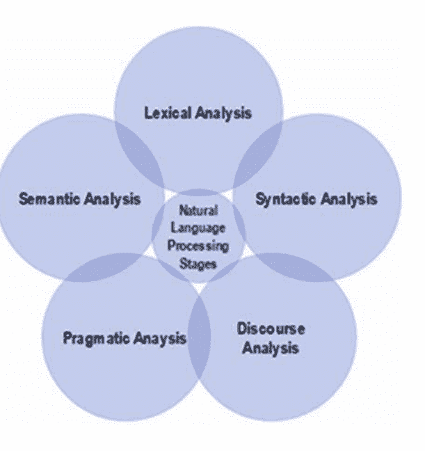

将短语“irrationally”和“rationally”分解为其组成部分（后缀）。词法分析建立了这些形态素之间的关系，并将任何单词转化为根形式。还确定了该单词的可能词性（POS）。考虑了语言的词汇表。
- 句法分析：是自然语言处理的重要组成部分，用于各种应用，如机器翻译、问答和情感分析。通过识别其组成部分之间的语法关系，有助于理解句子的含义[12]。 使用基于规则的方法或统计方法可能涉及使用解析算法，如图表解析、依存解析或组成解析。句法分析的输出通常以一种称为解析树的树结构形式表示，该树显示了句子中单词之间的层次关系。
- 语义分析：是通过分析上下文和词语之间的关系来理解句子或文本的意义的过程。与句法分析不同，句义分析旨在捕捉句子的预期意义。语义分析涉及一系列技术，如命名实体识别、实体链接、语义角色标注和情感分析等。这些技术有助于从文本中识别和提取重要概念、实体和关系。语义分析面临的一个关键挑战是处理歧义和理解词语的上下文意义[13]。
- 话语分析：话语分析是一种研究方法，旨在理解语言在社会环境中的使用方式，以创造意义、传达信息和建立社会关系。它涉及对口头或书面文本进行系统研究，以识别语言使用、权力关系和塑造沟通的社会规范的模式。它根植于各种理论框架，包括结构主义、后结构主义和批判理论。这些框架为研究人员提供了不同的视角，从关注文本的语言结构到考察其产生和消费的社会和文化背景。
- 实用分析：实用分析是一种研究语言使用的方法，侧重于说话者如何使用语言来实现特定的交际目标。它考察了塑造语言使用的情境因素，包括说话者的身份、社会环境以及塑造交际行为的文化规范和期望。

### 3 问题回答系统

问答系统（QA）是一种人工智能应用，使用自然语言处理技术来理解和回答人类以自然语言形式提出的问题。该系统通常包括多个组件，如语言解析器、知识库和推理引擎。当用户输入一个问题时，系统会解析问题以识别问题中的关键概念和关系，搜索知识库以找到相关信息，并使用推理引擎生成回答[14]。

QA系统可以分为不同类型，包括基于事实的QA系统，提供直接回答事实问题的答案，以及开放领域的QA系统，试图通过生成基于互联网或其他外部来源的信息来回答更广泛的问题。总体而言，QA系统具有广泛的应用，从客户服务聊天机器人到虚拟个人助理，随着自然语言处理和人工智能技术的进步，它们在准确性和能力方面不断提高[15]。问答系统架构分为三个不同的部分。答案处理、文档处理和问题处理模块（见图2）。

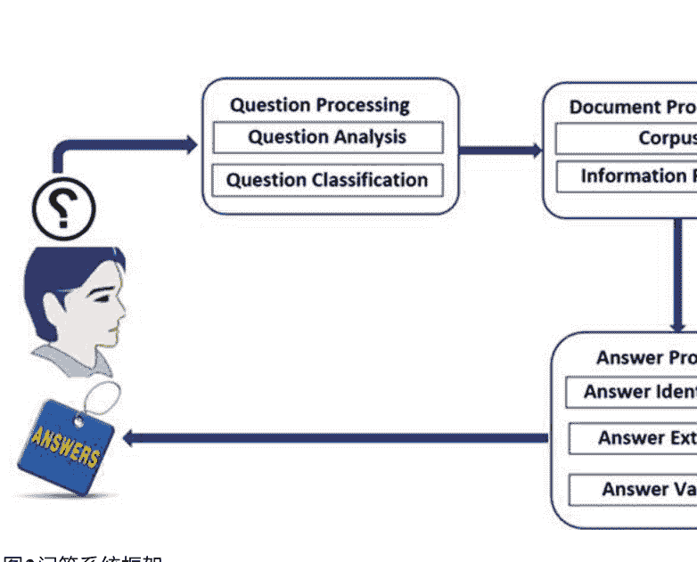

#### 3.1 使用深度学习模型进行问答系统

我们在问答系统中使用深度学习模型，因为它们可以学习数据中的复杂模式和关系，从而在自然语言处理（NLP）和理解等任务中表现出色。深度学习模型，如循环神经网络（RNN）、卷积神经网络（CNN）和Transformer模型，可以处理大量数据，并从问题中提取信息，用这些信息生成准确的答案。此外，深度学习模型可以在大量数据上进行训练，从而提高其准确性和鲁棒性。随着大数据的增长，深度学习模型在问答系统中变得越来越受欢迎，因为它们可以处理现代应用程序生成的大量文本数据。总的来说，深度学习模型是问答系统中强大的工具，因为它们可以学习数据中的复杂模式，并通过在大型数据集上进行训练来提高准确性和鲁棒性。

### 3.2基于布鲁姆税分类的不同问题

布鲁姆税是一个用于分类学习中涉及的不同认知技能水平的框架。以下是基于布鲁姆税每个层次的不同类型问题的一些例子[16]（见表1）。

以下支持目的用于分类QA系统[17]：

开放领域QA：这种QA处理涉及广泛主题的问题，可能仅依赖于外部世界的通用本体和知识。另一方面，这些程序员经常提供更多信息以便他们能够回答。系统输入自然语言问题而不是术语列表。

封闭领域QA：这种QA对具有特定背景知识的问题作出回应（例如银行或教育方面的问题），这似乎是一项简单的任务，因为NLP程序员可以使用常规组织成本体的精确领域数据。或者，封闭领域包括一些情况，只有一定数量的查询。

### 3.3基于类型的问答系统

问答系统的许多类别如下所示：

1.  Wh-类型查询。
2. 基于列表的问题。
3. 是/否问题。
4. 因果问题。
5. 假设性问题。
6. 复杂查询。

表1 总结了基于布鲁姆分类法的不同类型的问题

| 布鲁姆分类法的层次 | 描述 | 示例问题 |
| --- | --- | --- |
| 记忆 | 回忆先前学到的信息 | 什么是...？谁写的...？名字是...？ |
| 理解 | 理解和解释概念或思想 | 你如何描述...？你能解释一下...？主题是什么...？ |
| 应用 | 运用知识和概念解决问题或完成任务 | 你会如何使用...？如果食谱需要...，你能设计...吗？ |
| 分析 | 将复杂信息分解为较小的部分，并确定它们之间的关系 | 什么是原因和影响...？结构如何...？你能识别出来吗？ |
| 评估 | 根据标准或证据进行判断和形成意见 | 你认为...？为什么或为什么不？你认为哪个更有效？为什么？你能评估吗？ |
| 创造 | 基于现有知识和概念生成新的想法、产品或解决方案 | 你能设计...？你会如何创建...？你能写...吗？ |

#### 3.4 Wh-类型问题（什么、哪个、何时、谁）

Wh-类型的询问通常以该字母开头。这些是直接的问题，具有现实世界的要求，可以用一句话或简短的短语回答。 例如，也门的首都是一个Wh-类型的查询。它要求一个城镇的名称，因为很难回答这些事实，所以实验的有用信息的潜力降低了。大型命名元素是Wh-类型查询的最佳响应类型[18]。基于Whh的类型查询不需要担心处理复杂的标准英语以获得正确的答案。在基于查询的回答架构中，一个测试问题是区分基于Whh的形式问题及其子序列的证明。短语作为Wh-类型查询的答案效果很好[19]。

### 3.5基于列表的问题

列表问题的答案是枚举。通常，实体和事实是被列举出来的。事实型问题将处理成功应用的列表问题；进一步的事实响应提取不需要自然语言处理。由于列表类型查询的答案通常由实体组成，因此可以准确提取答案。

### 3.6是/否问题

确认问题需要是/否回答。通过确认Wh疑问句“Ahmed是个好孩子吗？”来进行抽签和正确的是/否回答。

### 3.7因果问题[为什么或者如何]

与基于Wh的问题类型不同，对于不规则问题的正确回答不被称为元素。不寻常的问题需要对回答中的元素进行描述。要求解释原因、解释、扩张和与特定事物或事件相关的其他原因的用户提出奇怪的问题。

### 3.8假设性问题

假设性问题需要关于任何假设事件的信息，并且没有具体的解决方案。推测性问题通常以“如果发生了什么”这样的短语开始。这些问题对用户和环境的可靠性和准确性要求较低。对于推测性问题，典型的回答类型是正在发展中的。因此，推测性查询注释不是非常准确[20]。

### 3.9复杂问题

这是一个带有复合期望的问题。假设是一个在提问时被受访者假定为真的陈述。一旦受访者做出任何形式的直接回应，他就承诺了这个想法。由于预设不是一个连词或者析取语句，因此被标记为“复杂”。

### 3.10问题回答系统问题

1.  问题类别：采用了各种回答问题的方法。只能通过策略提供对查询的具体答案。为了正确回答问题，我们必须理解一类特定的问题。
2.  数据来源和问答：有必要有正确的来源来回答从现有知识中提取的任何问题。为了找到正确的答案，可以使用数据集、网络或文档作为来源。
3.  答案提取：答案检索取决于问题的难度，问题处理提供的答案类型，搜索答案的实际数据，搜索策略以及问题的焦点和上下文。
4.  问题处理：同一个问题可以用多种方式提出。因此，了解它的含义以及它属于哪个类别是很重要的。
5.  答案的表达：问答系统的输出应该尽可能自然。例如，当问题分类显示答案类型为姓名（人名、组织名等）、数量（长度、距离等）或日期时，只需检索单个数据即可。在其他情况下，可能需要融合来自其他文档的部分解决方案以显示解决方案。
6.  实时问答系统：无论问题的复杂性、规模、异构性或模糊性如何，实时问答系统必须能够在几秒钟内从庞大的数据集中提取答案。
7.  复杂的质量保证的理由：更有经验的用户预期超出书面文件或结构化数据库中的响应。为了改进具备这些能力的问答系统，需要结合在几个知识领域上工作的推理组件，编码世界知识、合理的推理技术以及与特定领域相关的知识。能够用另一种语言的答案语料库回答提出的问题的能力被称为多语言问答（甚至是多种语言问答）。由于这一点，用户能够查询他们无法直接利用的信息。
8.  交互式问答：经常发生的情况是，问答系统无法充分捕捉到所需的信息；例如，问题处理组件可能无法正确分类问题，或者提取和创建答案所需的信息可能很难找到。在这种情况下，提问者可能希望与系统进行对话，并重新构思查询。
9.  用户配置文件：记录用户的信息，包括上下文数据，用户的兴趣领域，频繁的推理模式以及用户与系统之间的各种交互中形成的常识知识。一个带有各种配置文件特征槽的预先准备好的模板可以用来描述配置文件。
10. 问答系统中的信息聚类：这是一项最近的发展，旨在通过减少搜索空间来提高问答系统的准确性[21]。

### 9 阿拉伯语概述

阿拉伯语是一种语义语言[18]。 它在全球范围内拥有超过4.22亿人口。 阿拉伯语是阿拉伯人的第一语言，也是联合国的官方语言[22]。 它是继英语和法语之后第三重要的国际语言。阿拉伯语具有非常丰富的特殊特征组合，计算机很难执行[23]。

阿拉伯国家以阿拉伯语作为母语，具有巨大的全球意义。 阿拉伯语是一种异常丰富的语言，属于与印欧语系不同的语言家族，尤其是闪族方言。

任何对阿拉伯语有一点了解的人都可以阅读和理解14个世纪前写成的作品。阿拉伯语起源于古典阿拉伯语或古兰经阿拉伯语，但这种语言在几个世纪的演变中发展成现在被称为现代标准阿拉伯语的形式。MSA是古典阿拉伯语的简化形式，保留了其语法。阿拉伯字母是从右到左书写的。它有28个字母。阿拉伯语在许多学校和机构中教授，在工作场所和媒体中使用；尽管几乎所有书面阿拉伯语来源都使用（MSA），读者必须根据上下文推断缺少的变音符号，因为它们经常被省略。MSA有34个音素，28个辅音和6个元音（a, i, u, ə, ɪ和ʊ，它们是短音和长音。/ə, ɪ和ʊ被称为Fatha，Kasra和Damma）。每个阿拉伯单词或句子必须以辅音开头。阿拉伯语的元音分为三个短元音和三个长元音，长元音的持续时间几乎是短元音的两倍。

#### 9.1 阿拉伯语言挑战

阿拉伯语言具有挑战性。主要挑战如下：

1.  一个主要问题是缺乏重要的语料库。
2. 常常从阿拉伯语翻译命名项目。
3. 该语言今天面临的两个主要内部问题是晦涩难懂和现代化。 阿拉伯语言面临的一个挑战是与其他语言的互动。
4. 阿拉伯语有各种形式，但口语变体是最常用的。 许多互联网用户在写阿拉伯语时使用英文字母以及这些风格；这种做法被称为阿拉伯字母[24]。
5. 在阿拉伯语中，很难区分专有名词，因为没有大小写字母。 与英语相比，英语的专有名词可以通过首字母大写来识别，这是不同的。
6. 在阿拉伯语中，除了前缀和后缀之外，还有额外的中缀在单词的开头和结尾。
7. 由于阿拉伯语具有派生和屈折性，形态学研究可能非常困难。

由于缺乏通常指示元音的变音符号以及存在歧义，区分标记和解析书面文本是具有挑战性的。

文本从右到左呈现；因此，根据它们在句子中的位置，一些字母具有不同的形状。

由于阿拉伯语不使用大写字母，因此很难区分专有名词、缩写和首字母缩写词。

### 10 相关工作

Vaswani等人提出了Transformer，这是一种深度学习架构，彻底改变了自然语言处理任务，包括机器翻译和问题回答。该论文提出了一种自注意机制，使模型能够捕捉输入和输出序列之间的全局依赖关系，消除了循环神经网络或卷积神经网络的需求。Transformer模型在机器翻译任务上取得了最先进的结果，超过了使用循环神经网络的传统序列到序列模型的性能。该论文引入的Transformer架构对于自然语言处理的深度学习技术的发展产生了重要影响，并且已经被广泛应用于各种NLP任务。

Devlin等人在论文中介绍了双向编码器表示来自变压器（BERT）模型，这是一种用于自然语言处理任务的深度学习架构。该论文提出了一种用于BERT的预训练方法，使模型能够通过预测文本语料库中缺失的单词来学习单词的上下文表示。BERT使用多层双向Transformer编码器来捕捉句子中单词的上下文，预训练过程使模型能够捕捉单词与其周围上下文之间的复杂关系。BERT模型在包括问答、文本分类和命名实体识别在内的各种自然语言处理任务上取得了最先进的结果，并且已经被研究界和工业界广泛采用。BERT的引入对于深度学习技术在自然语言处理领域的发展产生了重要影响，并且仍然是一个活跃的研究领域[26]。

Antoun和Hajj为阿拉伯语理解创建了Araelectra预训练文本辨别器。BERT模型的架构和层次结构与辨别器网络相同。他们通过在阅读理解任务中添加额外的层来调整整个模型，以便在ELECTRA的输出之上添加线性分类层来微调他们的方法。许多阿拉伯语NLP任务，包括阅读理解，都用于测试该模型。

与英语QA相比，阿拉伯语QA系统的发展相对较慢。这是因为缺乏足够的NLP工具和阿拉伯语QA数据集。阿拉伯语OpenQA研究中使用了稀疏技术进行段落检索[27]。

Almiman等人强调了在阿拉伯社区中回答问题的困难。他们研究了预处理的影响，并使用了各种相似性特征。通过使用语义和词汇相似性特征，他们创建了一种新颖的深度神经网络集成模型。该模型使用了最近取得突破的BERT模型。该模型的MRR值为68.86% [28]。

Karpukhin等人专注于将BERT预训练模型和双编码器架构合并，仅使用问题和答案对生成正确的密集嵌入模型。他们的密集段落检索器为每个段落创建一个索引，使用密集编码器将任何文本转换为一个维度的实值向量。在包括SQuAD、自然问题和TriviaQA在内的各种QA数据集上，他们提出的模型优于许多开放领域的QA方法[29]。

Guu等人成功地将预训练语言模型与学习的文本神经知识检索器相结合。通过要求模型在推理过程中选择提取和使用哪些知识，这种技术明确地暴露了世界知识的重要性，与将知识存储在参数中的模型相比[30]。

Huang等人帮助阿拉伯开放式问答系统更高效地运行。他们使用了两阶段（检索器-阅读器）设计来构建开放式问答系统，因为这是最有效和富有成果的方法[31]。

### 11 提出的方法论

图3展示了提出的深度学习模型的方法论。

#### 11.1 循环神经网络（RNNs）

循环神经网络（RNN）是一种人工神经网络，专门用于处理序列数据，如时间序列数据或自然语言句子。与前馈神经网络不同，前馈神经网络按固定顺序处理数据输入并产生输出，RNN具有反馈循环，允许它们保持先前处理的输入的状态或记忆。这使得RNN能够处理可变长度的序列并学习输入数据中的时间依赖关系。在RNN中，每个神经元或“单元”通过延迟连接与自身相连，形成一个循环（见图4）。这使得网络能够将信息从一个时间步传递到下一个时间步，有效地捕捉数据中的时间依赖关系。RNN可以使用时间反向传播（BPTT）进行训练，这是一种考虑数据时间维度的反向传播的变体。

循环神经网络(RNNs)受到梯度消失问题的困扰，这限制了它们在数据中捕捉长期依赖关系的能力。为了解决这个缺点，RNN的变种如长短期记忆（LSTM）和门控循环单元（GRU）已经被开发[32]。

给定一个序列 x = (x1, x2, ..., xt)，RNN通过更新其循环隐藏状态 ht 来更新。

$$ h_t = \begin{cases} 0, & t=0 \\ \Delta(h_{t-1}, x_t), & \text{otherwise} \end{cases} \tag{1} $$

其中一个非线性函数是几何变换，称为亲和性，保持平行和逻辑S型线的特性。可选地，RNN可以有一个输出 y = (y1, y2, ..., yt)，其长度可变。在方程（1）中更新的循环隐藏状态如方程（2）所示。

$$ h_t = g(W x_t + U h_{t-1}) \tag{2} $$

其中 g 是一个sigmoid函数。

$$ p(x_1, ..., x_T) = p(x_1)p(x_2|x_1)p(x_3|x_1, x_2)...p(x_T|x_1, ..., x_{T-1}) \tag{3} $$

生成式RNN的输出是序列的下一个元素的概率分布。这个生成模型可以通过使用一个特殊的输出符号来表示序列的结束，从而捕捉到当前状态 ht 下的不同长度序列的分布，其中具有特定的结束序列值作为最后一个元素。每个条件概率分布使用公式（4）表示，其中 ht 来自公式（1）。

$$ p(x_t | x_1, ..., x_{t-1}) = g(h_t) \tag{4} $$

#### 11.2 长短期记忆（LSTM）

长短期记忆（LSTM）最早是由Sepp Hochreiter和Jürgen Schmidhuber在1997年的一篇研究论文中提出的。他们设计了LSTM来解决传统循环神经网络中梯度消失的问题，这使得网络难以学习长期依赖关系。他们引入了一种新型的记忆单元，使用门控机制来控制信息的流动，使得网络可以选择性地记住或遗忘多个时间步长的信息。他们证明了LSTM在语音识别和人工语法学习等各种应用中的有效性。从那时起，LSTM已成为最广泛使用的循环神经网络架构之一，并在自然语言处理、计算机视觉和机器人等广阔领域得到应用[33]。LSTM是一种专门解决循环神经网络中梯度消失和无法捕捉序列数据中长期依赖关系的架构。LSTM使用记忆单元、输入门、遗忘门和输出门来选择性地存储、丢弃和输出每个时间步长的信息（见图5和图6）。这使得网络可以长时间记住重要信息并遗忘无关信息。记忆单元为信息在网络中多个时间步长上流动提供了路径，使得模型可以捕捉长期依赖关系。LSTM已成功应用于许多应用领域，包括语音识别、自然语言处理和图像字幕生成[34]。在使用LSTM时，一个主要的挑战是确定给定问题的最佳架构和超参数。LSTM的架构可以非常复杂，包括多个层、门和记忆单元，选择正确的组合可能是一项困难的任务。

在使用LSTM时，另一个挑战是处理过拟合问题，这可能发生在模型过于复杂或训练数据不足的情况下。过拟合会导致泛化性能差，使模型在实际应用中效果不佳。最后，LSTM可能会遇到梯度爆炸的问题，即在训练中使用的梯度变得过大，导致模型不稳定。可以使用梯度裁剪和权重正则化等技术来缓解这个问题[35]。

-   遗忘门：确定是否保留或丢弃来自上一个时间步的输入是LSTM架构的主要或最重要的功能。

$$ f[t] = \sigma_g(w_f x[t] + u_f h[t - 1] + b_f) \tag{5} $$

其中 $\sigma_g()$ 是某个非线性函数，满足 $0 \leq \sigma_g() \leq 1$。

-   输入门：为了更新细胞状态，输入门执行以下过程。首先，第二个sigmoid函数接收两个参数：当前条件 X(t) 和先前的隐藏状态 h(t-1)。转换后的值范围从0（显著）到1（不显著）。只有当输入门打开时，细胞才接受输入，i[t] = 1。

$$ c[t] = f[t] c[t - 1] + i[t] \sigma_h(w_c x[t] + u_c h[t - 1] + b_c) \tag{6} $$

其中，t = 时间步长，i[t] = 时间步长的输入门，w_i = 输入门和输出门之间的sigmoid运算符的权重矩阵，b_t = 时间步长的偏置向量，c[t - 1] = 由tanh生成的值。W_c = 细胞状态信息和网络输出之间的tanh运算符的权重矩阵，b_c = 时间步长的偏置向量，w, r, t wc。

-   输出门：当前输入和先前输出确定输出门的操作。

$$ o[t] = \sigma_g(w_o x[t] + u_o h[t-1] + b_o) \tag{7} $$

其中，t = 时间步，o[t] = 时间步的输出门，w_o = 输出门的权重矩阵，b_o = 偏置向量，w, r, t, wc, h_t = LSTM输出。

#### 11.3 门控循环单元 (GRU)

门控循环单元 (GRU) 是一种递归神经网络 (RNN) 架构，于2014年引入。它类似于更为知名的长短期记忆 (LSTM) 架构，但参数更少，训练速度更快。与其他RNN一样，GRU被设计用于处理序列数据，如时间序列数据或自然语言句子。GRU与其他RNN的关键区别在于使用门控机制来控制信息在网络中的流动。GRU单元有两个门，一个更新门和一个重置门，它们控制信息在单元中的流动 (见图7)。更新门确定应保留多少先前隐藏状态，而重置门确定应将多少新输入合并到新的隐藏状态中[35]。

控制GRU单元操作的方程如下：

更新门： $z_t = \sigma(W_z [h_{t-1}, x_t]) \tag{8}$

重置门： $r_t = \sigma(W_r [h_{t-1}, x_t]) \tag{9}$

候选隐藏状态： $\tilde{h}_t = \tanh(W_h [r_t \odot h_{t-1}, x_t]) \tag{10}$

隐藏状态： $h_t = (1 - z_t) \odot h_{t-1} + z_t \odot \tilde{h}_t \tag{11}$

其中 $h_t$ 是时间 t 的隐藏状态，$x_t$ 是时间 t 的输入，$z_t$ 是时间 t 的更新门，$r_t$ 是时间 t 的重置门，$\tilde{h}_t$ 是时间 t 的候选隐藏状态。

图7 门控循环单元模型

### 12 准备数据集

我们使用了4年级到9年级学生的问题回答。我们从阿拉伯语科目书籍中获取了这个数据集。该数据集包含学生书写的各种类型答案的集合。该数据集包含约10,000个答案。我们得到的数据集是一个csv文件，一个由答案标签和答案集组成的制表符分隔值文件。

#### 12.1 数据收集

我们从不同的阿拉伯书籍中获取了我们的数据（如上所述部分 - 数据集）。我们总共收集了约10,000个主观回答类型的数据。（长答案）。如下所述，在一些例子中。

- ما هي أسباب تفاوت درجات الحرارة بين المناطق المختلفة؟ الإجابة: تختلف درجات الحرارة بفعل عوامل، بما في ذلك الموقع الجغرافي والارتفاع والقرب من خطوط العرض والتيارات الهوائية.
  What are the reasons for differences in temperature between different regions? Answer: Temperature is affected by several factors, including geographic location, elevation, proximity to latitude lines, and air currents.

- ما هي الخصائص المشتركة بين الخلايا الحيوانية والنباتية؟ الإجابة: تشترك الخلايا الحيوانية والنباتية في عدة خصائص، مثل احتوائهما على الغشاء الخلوي، وتوجد النواة والخلايا الحية في الداخل، وامتدادهما للعديد من الأجزاء الخلوية المشتركة، مثل الميتوكوندريا والجولجي.
  What are the common characteristics between animal and plant cells? The answer: Animal and plant cells share several characteristics, such as having a cell membrane, the presence of a nucleus and living cells inside, and many common cellular components, such as mitochondria and Golgi.

- ما هو التبخر؟ الإجابة: التبخر هو عملية تحول الماء من الحالة السائلة إلى الحالة الغازية بفعل الحرارة، حيث يتحول الماء من سطح الأرض أو الجسم الحي إلى الجو كغاز مائي.
  What is evaporation? The answer: Evaporation is the process by which water changes from a liquid state to a gaseous state due to heat, where water evaporates from the surface of the earth or living body into the atmosphere as water vapor.

ما هو الحكم العثماني وما هي أسباب سقوطه؟ الإجابة: كان الحكم العثماني نظاماً حاكماً يمتد من جنوب شرق أوروبا وغرب آسيا إلى شمال أفريقيا، انهار بسبب العديد من الأسباب، بما في ذلك التنافس الإمبريالي الأوروبي والثورات الداخلية والحرب العالمية الأولى وعدم القدرة على مواكبة التطويرات العالمية。
What was the Ottoman Empire, and what were the reasons for its collapse? The answer: The Ottoman Empire was a governing system that extended from Southeast Europe and West Asia to North Africa, and it collapsed due to various reasons, including European imperialistic competition, internal revolutions, World War I, and the inability to keep up with global developments.

ما هي الآثار السلبية لتلوث الهواء على الصحة؟ الإجابة: يمكن أن يؤدي تلوث الهواء إلى تهيج الجهاز التنفسي وزيادة خطر الإصابة بالأمراض المزمنة مثل الربو وأمراض القلب والرئة والسرطان.
What are the negative effects of air pollution on health? Answer: Air pollution can lead to respiratory irritation and an increased risk of chronic diseases such as asthma, heart and lung diseases, and cancer.

ما هو النظام الشمسي ؟ الإجابة : النظام الشمسي هو مجموعة من الكواكب والجرام السماوية التي تدور حول الشمس ، ويتتأثر بتفاعلات الجاذبية بين الكواكب والجرام ."
What is the solar system? Answer: The solar system is a collection of planets and celestial bodies that orbit around the sun and are affected by gravitational interactions between planets and bodies.

ما هي أسباب ونتائج الحرب العالمية الأولى؟ الإجابة: كانت الأسباب الرئيسية للحرب العالمية الأولى هي التحالفات السياسية بين الدول الأوروبية والسياق الإمبريالي، بينما أدت الحرب إلى خسائر فادحة بين الجنود والمدنيين، وتعغرت خريطة أوروبا بشكل جذري.
What were the causes and consequences of World War I? The answer: The main causes of World War I were political alliances between European countries and imperialistic competition, while the war resulted in devastating losses among soldiers and civilians, and the map of Europe was drastically altered.

ما هو تأثير التغير المناخي على المساحات الزراعية؟ الإجابة: يمكن أن يؤدي التغير المناخي إلى انخفاض إنتاجية المساحات الزراعية وزيادة مخاطر الجفاف والفيضانات وتلويث التربة.
What is the impact of climate change on agricultural land? Answer: Climate change can lead to a decrease in the productivity of agricultural land and an increase in the risks of drought, flooding, and soil pollution.

### 13 数据预处理

1.  **标点符号去除**：我们首先消除了所有整数和空格。我们从答案句子中删除了所有标点符号。
2.  分词：它是对一系列文档文本进行分割的操作，包含一个段落的文本流，这个段落是一个句子流；这个句子被分割成单词标记；句子分词如下：يعدّ البناء البنى منتجات في العالم من أنواع مختلفة من نكهة طيبة.

然后将句子分成标记一次清理。 然后我们从中选择选项，如单词计数、字符计数、平均单词长度、拼写错误的单词和POS标记。

+   3. 填充序列：需要注意的是，并非所有序列的长度相同，有些自然比其他序列长。当我们需要输入相同大小的输入时，会进行填充。当需要填充时，输入应该是相同大小的。

+   4. 提取特征：为了生成特征向量，我们使用了来自word2vec的模型设计。 Word2vec是一种自然语言处理（NLP）技术，于2013年首次发表。 为了从大量文本语料库中学习词语关联，word2vec算法利用了神经网络模型。 一旦准备好这种类型的模型，它可以为部分句子建议其他单词。
Word2vec，也称为（Skip-Gram），以文本语料库作为输入，并将特征向量作为输出。 Word2vec模型创建了可以分配词函数的数值表示的向量，选项包括字符词的上下文。

这是一个更长的阿拉伯语答案句子的例子，可以与skip-gram模型一起使用：

> “تمتلك الشركة العديد من الفروع في مناطق مختلفة حول العالم، وتعمل على توفير حلول تقنية مبتكرة للعملاء في مختلف الصناعات، بما في ذلك المجالات الطبية والالكترونية والسيارات.”

这个句子的意思是“该公司在世界各地有许多分支机构，并致力于为各行各业的客户提供创新的技术解决方案，包括医疗、电子和汽车行业。”

skip-gram模型可以学习这个句子中不同单词之间的关系，比如“فروع”（分支机构），“تكنولوجيا”（技术性），以及“عملاء”（客户）。通过对大量文本数据进行训练，skip-gram模型可以生成高质量的词嵌入，用于分析和理解复杂的阿拉伯语答案句子（见图8）。

5. 数据分割：我们将数据分成两个子集。. 常用的方法是将数据分为两部分，一部分用于评估或测试数据，另一部分用于训练模型。 数据分割是数据科学中的重要方面，特别是在创建数据驱动模型时。 训练/测试是一种确定模型准确性的技术。 80%用于训练，20%用于测试。 训练集用于训练模型。 使用测试集对模型进行测试。

### 14 结果与讨论

RNN、LSTM和GRU深度学习模型。 深度学习网络使学习模型在各种问答任务中的增长和应用成为可能。 本研究应用了三个基于深度学习的质量保证系统，并评估了它们的有效性。 使用图9-12对所有三个深度学习模型进行训练和测试的测量结果。

为了衡量准确率、精确率、召回率和F1得分，方程式(12)-(15)被用于计算表1中呈现的指标。

```
准确率 = (真正例 + 真负例) / (真正例 + 假正例 + 真负例 + 假负例)   (12)
```

```
精确率 = 真正例 / (真正例 + 假正例)   (14)
```

```
召回率 = 真正例 / (真正例 + 假负例)   (14)
```

```
F1得分 = (2 × 精确率 × 召回率) / (精确率 + 召回率)   (15)
```

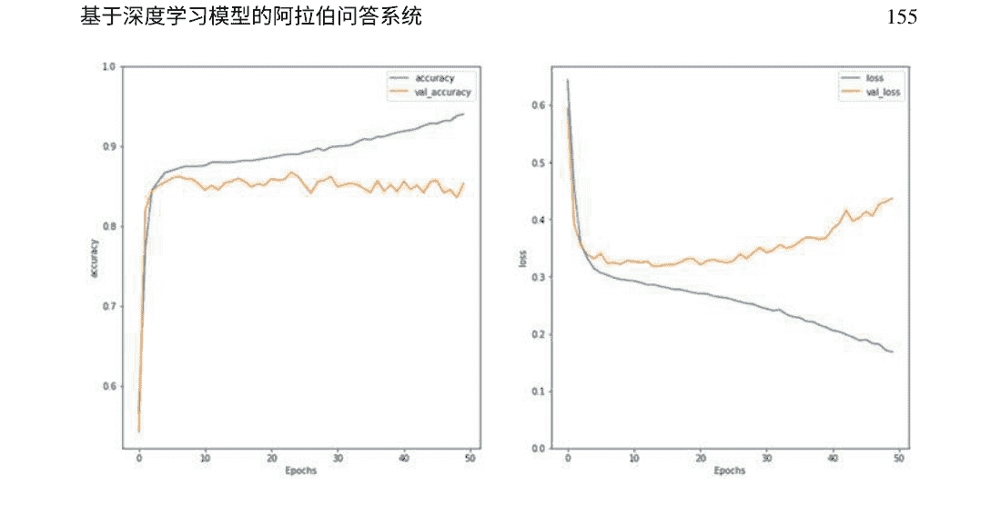

##### 图9 RNN模型的性能指标

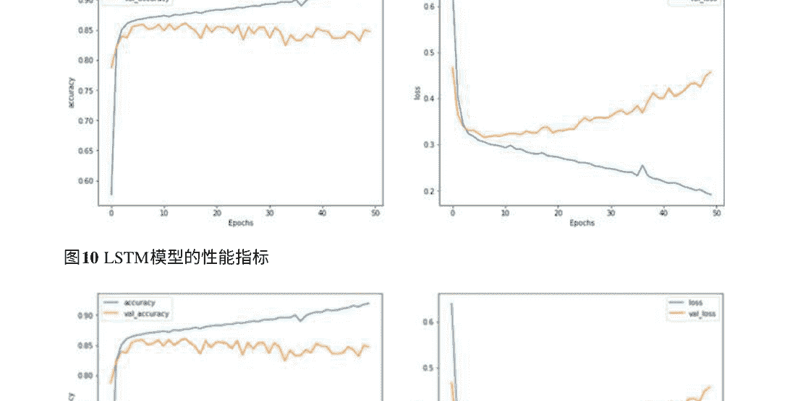

##### 图10 LSTM模型的性能指标

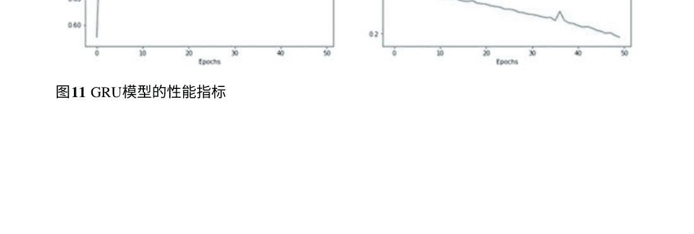

##### 图11 GRU模型的性能指标

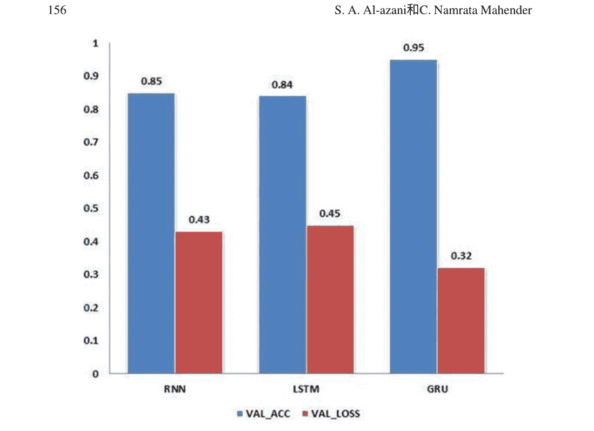

##### 表2 RNN、LSTM、GRU模型中准确率、精确率、召回率和F1得分的差异

| 测量 | 循环神经网络 | 长短期记忆网络 | 门控循环单元 |
| --- | --- | --- | --- |
| 精确度 | 0.78 | 0.81 | 0.79 |
| 召回率 | 0.82 | 0.76 | 0.80 |
| F1-得分 | 0.79 | 0.77 | 0.78 |
| 准确率 | 0.80 | 0.82 | 0.85 |

### 15 结论和未来工作

第一部分与概念的自然语言处理和问题回答系统有关。问题回答是使用自然语言处理和信息检索技术构建的。该过程分为三个模块，即问题处理模块、文档处理模块和答案提取模块。阿拉伯语现在是20多个国家的官方语言，也是3亿多母语人口的母语。本章重点介绍了阿拉伯语自然语言和问题回答系统的重要挑战。第二部分让我们了解了神经网络领域。我们在实施中获得了良好的学习效果。

使用TensorFlow和Keras等更多库来支持神经网络阿拉伯语言。我们能够构建一个RNN、LSTM和GRU神经网络在训练后预测正确答案。RNN、LSTM和GRU都是递归神经网络的类型，它们被设计用于处理序列数据。虽然RNN是递归神经网络的最简单形式，可以用于简单的任务，但在处理长序列时会出现梯度消失的问题。LSTM和GRU的发展是为了解决这个问题，引入了门控机制来调节信息的流动。

LSTM使用三个门，包括输入门、遗忘门和输出门，以及一个记忆单元，可以选择性地记住或遗忘先前的输入。另一方面，GRU只使用两个门，重置门和更新门，使其在计算上比LSTM更经济，同时仍能够建模长期依赖关系。

我们在RNN上获得了高达94%的准确率，LSTM上获得了高达91%的准确率，GRU上获得了高达99%的准确率。在测试中，我们在RNN上获得了高达85%的准确率，LSTM上获得了高达84%的准确率，GRU上获得了高达95%的准确率。

为了提高准确性，我们希望彻底分析当前模型并进行额外的修改。为了跟踪系统性能的变化，我们将使用堆叠的双向LSTM-based RNN网络。

### 参考文献

1. Pazos-Rangel, R.A., Rivera, G., Martinez, J., Gaspar, J., Floresia-Juarez, R.: 自然语言数据库接口：近期进展综述.在《自然语言处理和智能服务系统研究手册》中 (第1-30页). IGI Global (2021). https://doi.org/10.4018/978-1-7998-4730-4.ch001
2. Pazos-Rangel, R.A., Floresia-Juarez, R., Paredes-Valverde, M.A., Rivera, G.: “前言”，在自然语言处理和智能服务系统研究手册中，xxv–xxx. IGI Global (2021). https://doi.org/10.4018/978-1-7998-4730-4
3. Ishwari, K.S.D., Aneeze, A.K.R.R., Sudheesan, S., Karunaratne, H.J.D.A., Nugaliyadde, A., Mallawarrachchi, Y: 自然语言问答的进展：一项综述 (2019). https://doi.org/10.48550/arXiv.1904.05276
4. Kolomiyets, O., Marie-Francine M.: 从信息检索角度对问答技术的调查. Inf. Sci. 181(24):5 412 (2011). https://doi.org/10.1016/j.ins.2011.07.047
5. Kodra, K., Kajo, E.: 问答系统：现有发展、挑战和趋势综述。 Int. J. Advanc. Comput. Sci. Appl. 8(9) (2017)
6. K. Ray, Santosh, S., Shaalan, K. 阿拉伯问答系统的回顾和未来展望。IEEE Trans. Knowle d. Data Eng. 283169–3190 (2016). https://doi.org/10.1109/TKDE.2016.2607201
7. Ahmed, W., PV, A., Babu Anto, P.: 基于机器学习方法的基于Web的阿拉伯问答系统。Vo lume 8, No. 1, Jan-Feb International Journal of AdvancedResearch in Computer Science. (2017)
8. Feng, M., Xiang, B., Glass, M.R., Wang, L., Zhou, B.: 应用深度学习进行答案选择：一项研究和一个开放任务。IEEE自动语音识别和理解研讨会(ASRU), (2015). https://doi.org/10.1109/ASRU.2015.7404872
9. Otter, D.W., Medina, J.R., Kalita, J.K.: 深度学习在自然语言处理中的应用调查。IEEE transactions on neural network and learning systems. -2 37X ©(2020). https://doi.org/10.1109/TNNLS.2020.2979670
10. Farghaly, A., Shaalan, K.: 阿拉伯自然语言处理：挑战与解决方案。 ACM 亚洲语言信息处理交易 (TALIP) **8**(4), 1–22 (2009)。 https://doi.org/10.1145/1644879.1644881
11. Khurana, D., Koli, A., Khatter, K., Singh, S.: 自然语言处理：现状、当前趋势和挑战。 多媒体工具和应用 **82**(3), 3713–3744 (2023)。 https://doi.org/10.1007/s11042-022-13428-4
12. Salloum, S.A., Khan, R., Shaalan, K.: 语义分析方法综述。 在: 人工智能和计算机视觉国际会议论文集，，第61–70页© Springer Nature Switzerland AG (2020)。 https://doi.org/10.1007/978-3-030-44289-7_61
13. Xie, X., Song, W., Liu, L., Du, C., Wang, H.: 基于本体的自动问答系统的研究与实现"。第27届中国控制与决策会议 (2015 CCDC)，第1366–1370页 (2015)。 https://doi.org/10.1109/CCDC.2015.7162131
14. Ojokoh, B., Adebisi, E.: 问答系统综述. J. Web Eng. Vol. 17 8, pp. 717–758 (2019). https://doi.org/10.13052/jwe1540-9589.1785
15. Syahidah Sufi Haris和Nazliamar，使用规则和NGram方法的布鲁姆分类问题，Journal of Theoretical and Applied Information Technology Vol.76.No.3, 6月30日 (2015年)。
16. Poonguzhali, R., LAakshmi, D.R.K.: 对一些标准深度学习网络模型在问答任务中的性能分析。 网络7.14: (2020年)
17. Vaibhav Mishra和Dr. Nitesh Khilwani，“自然语言问答系统的最新趋势：一项调查” © IJEDRI Volume7, Issue 4| ISSN: 2321- 9939, (2019年)。
18. Kumar, S.G., Zayaraz, G.: 使用朴素贝叶斯分类器进行概念关系提取，用于基于本体的问答系统。沙特国王大学学报 (2014年)。 https://doi.org/10.1016/j.jksuci.2014.03.001
19. Kumari, V., Keshari, S., Sharma, Y, Goel, L.: 基于上下文的问答系统与建议问题。 在: 022第12届云计算、数据科学和工程国际会议 (Confluence) (2022年)。 https://doi.org/10.1109/Confluence52989.2022.9734207
20. Nakov, P., Hoogeveen, D., Marquez, L., Moschitti, A., Mubarak, H., Baldwin, T., Verspoor,K .: SemEval-2016任务3: 社区问答。 在: 第10届语义评估国际研讨会论文集， SemEval @NAACL-HLT 2016, 圣地亚哥，加利福尼亚州，美国，2016年6月16日至17日， 525-545, (2016年)。 https://doi.org/10.18653/v1/S17-2051
21. Mishra, A, Jain, S.K.: 带分类的问答系统调查。沙特国王大学计算机信息科学学报 **28**, 345-361, (2016年)。 https://doi.org/10.1016/j.jksuci.2014.10.007
22. Setio, B., Ayu, P.: 基于统计的印度尼西亚复杂事实问题分解方法，国际电气工程与信息学杂志，8, 2, 356-373, 六月 (2016年)。
23. Yaghan, M.A.: Arabizi: 一种当代阿拉伯俚语风格。 设计问题，第24卷，第2期，第39-52页, (2008年)。 https://doi.org/10.1162/desi.2008.24.2.39
24. Ray, K., Shaalan, K.: 阿拉伯问答系统的回顾与未来展望” IEEE知识与数据工程交易 **28** - 3169–3190 (2016年)。 https://doi.org/10.1109/TKDE.2016.2607201
25. Vaswani, A., Shazeer, N., Parmar, N., Uszkoreit, J., Jones, L., Gomez, A. N., & Polosukhin, I. 注意力就是你所需要的。 神经信息处理系统的进展, **30**. (2017年)。 https://doi.org/10.48550/arXiv.1706.03762
26. Devlin, J., Chang, M. W., Lee, K., and Toutanova, K., Bert: 深度双向预训练变压器用于语言理解。 arXiv预印本arXiv:1810.04805。 (2018)。 https://doi.org/10.48550/arXiv.1810.04805
27. Antoun, W., Baly, F., Hajj, H.: AraBERT: 基于变压器的阿拉伯语语言理解模型。 在: Proceedings of the 4th Workshop on Open-Source Arabic Corpora and ProcessingTools, with a Shared Task on Offensive Language Detection. Marseille: European LanguageResource Association, 9–15, (2020)
28. https://doi.org/10.48550/arXiv.2003.00104
29. Almiman, A., Osman, N., Torki, M.: 用于阿拉伯社区问答的深度神经网络方法。 Alex. Eng. J. **59**(6), 4427–4434 (2020). https://doi.org/10.1016/j.aej.2020.07.048
30. Karpukhin, V., O`guz, B., Min, S., Lewis, P., Wu, L., Edunov, S., Chen, D., Yih, W.T.: 密集的乘客检索用于开放领域的问题回答。 在： 会议论文集自然语言处理中的经验方法（EMNLP）。 计算机协会语言学， 6769-6781， (2020)
31. https://doi.org/10.48550/arXiv.2004.04906
32. Guu, K., Lee, K., Tung, Z., Pasupat, P., Chang, M.W: 领域： 检索增强的语言模型预训练
33. Huang, Z., Xu, S., Hu, M., Wang, X., Qiu, J., Fu, Y., Zhao, Y., Peng, Y., Wang, C.: 基于深度学习的开放领域文本问题回答系统的最新趋势。 IEEE. **Access8**, 94341-94356 (2020) 。 https://doi.org/10.1109/ACCESS.2020.2988903
34. Vinyals, O., Le, Q.: 一个神经对话模型 arXiv:1506.05869, (2020). https://doi.org/10.48550/arXiv.1506.05869
35. Hochreiter, S., Schmidhuber, J.: 长短期记忆. 神经计算 **9**(8), 1735–1780 (1997). https://doi.org/10.1007/978-3-642-24797-2_4
36. Wang, D., Nyberg, E.: 一个用于问题回答中的长短期记忆模型。 在ACL-IJCNLP, ACL 2015, 2015年7月26日至31日, 北京, 中国, 第2卷:短论文, 第707–712页 (2015)
37. Nowak, J., Taspinar, A., Scherer, R.: 用于短文本和情感分类的LSTM循环神经网络。 人工智能和软计算: 第16届国际会议, ICAISC 2017, 波兰扎科帕内, 2017年6月11日至15日, 论文集, 第二部分 16. Springer国际出版, (2017). https://doi.org/10.1007/978-3-319-59060-8_50
38. Minh, D., et al.: 基于双流门控循环单元网络的短期股票趋势预测的深度学习方法。 IEEE Access 6: 55392–55404 (2018). https://doi.org/10.1109/ACCESS.2018.2868970

# 面向医疗保健的应用

## 机器和深度学习算法用于ADHD检测：一项综述

Jonathan Hernández-Capistran, Laura Nely Sánchez-Morales, Giner Alor-Hernández, Maritza Bustos-López, 和 José Luis Sánchez-Cervantes

摘要 注意力缺陷多动障碍 (ADHD) 是一种常见的神经发育障碍，常见于儿童。 2017年，世界卫生组织 (WHO) 的一份报告显示，儿童期ADHD的患病率中位数为2.2%，范围为0.1-8.1%，四分位数范围为0.9-2.9%。 ADHD的诊断通常由精神科医生或专业儿科医生根据DSM-5诊断标准进行验证。 早期和及时的诊断为获得适当的治疗提供了可能性。 适当的治疗可以改善该疾病引起的影响，如社交关系、注意力缺乏、兴趣缺乏和学校表现等。 近年来，使用机器学习 (ML) 和深度学习 (DL) 算法开发了自动检测ADHD的系统。 在本章中，我们介绍了与ADHD检测相关的ML和DL算法的综述。 本综述的贡献是为专家提供指南，以识别不同的人工智能 (AI) 技术用于ADHD检测。 该指南提供了用于ADHD检测的特征提取和选择的不同技术。

关键词 ADHD检测 · 人工智能 · 深度学习 · 机器学习

J. Hernández-Capistran · G. Alor-Hernández (📧) · M. Bustos-López
墨西哥国家技术学院/ 奥里萨巴理工学院, 奥里萨巴东9号852, 埃米利亚诺·萨帕塔区,94320 奥里萨巴, 墨西哥
e-mail: giner.ah@orizaba.tecnm.mx

J. Hernández-Capistran
e-mail: jonathan.hc@orizaba.tecnm.mx

M. Bustos-López
e-mail: maritbustos@gmail.com

L. N. Sánchez-Morales · J. L. Sánchez-Cervantes
CONAHCYT-奥里萨巴理工学院, 奥里萨巴东9号852, 埃米利亚诺·萨帕塔区, 94320 奥里萨巴, 墨西哥
e-mail: laura.sanchez@conahcyt.mx

J. L. Sánchez-Cervantes
电子邮件: jlsanchez@conahcyt.mx

### 1 引言

根据世界卫生组织（WHO）的说法，注意力缺陷多动障碍（ADHD）是儿童期最常见的神经发育障碍之一。ADHD的特点是持续缺乏注意力或过动-冲动。通常在儿童时期被诊断，但往往持续到青春期甚至成年期。根据世界银行的分类，2017年世界卫生组织报告了20个代表性国家的成人ADHD调查。其中有11个国家被世界银行归类为高收入国家，5个国家被归类为中上收入国家，4个国家被归类为低下中等收入国家[1]。根据这些信息，儿童期ADHD的患病率平均为2.2%，范围为0.1-8.1%，四分位数范围为0.9-2.9%。高收入国家的患病率为3.3%，而中上收入和低下中等收入国家的患病率分别为2.2%和0.6%。男孩比女孩更容易被发现患有ADHD[2-4]。这是因为男孩的多动症状比女孩更明显。ADHD的男性性别偏差估计为2:1和3:1[5]。

注意力缺陷多动症的检测主要是通过临床进行的。这意味着ADHD的诊断专家（通常是精神科医生或专科儿科医生）进行必要的临床评估，以确定个体是否符合《精神障碍诊断与统计手册（DSM-5）》的诊断标准。

早期诊断可以提供获得适当的临床和/或治疗的可能性。从这个角度来看，早期治疗可以帮助改善症状或技能，如社交关系、注意力缺乏或兴趣、学校表现等。另一方面，对ADHD症状的早期关注可以帮助减少学校排斥、儿童虐待和社交孤立，甚至预防药物滥用。

因此，有必要对新算法、技术和方法进行专门的审查，如机器学习和深度学习，在ADHD的诊断/治疗中有用。机器学习和深度学习算法由于其特性，可以简化ADHD的诊断/治疗任务。在这个意义上，如果医学专家拥有适当的诊断工具，就有可能缩小患者接受早期和及时治疗的差距。这是ADHD研究中的一个重要挑战之一。此外，对于ADHD的诊断/治疗的机器学习和深度学习算法的及时审查将使研究人员拥有一个算法目录来开发新工具。

根据已经审查的文献，已经提出了使用机器学习和深度学习算法进行自动检测ADHD的系统，例如[6-9]所报道的系统。诸如[10-14]的评论提出了不同的人工智能算法，对ADHD的诊断/治疗有用。其他提议，如[15]，从一个总体的角度讨论了诊断工具的评论。虽然[15]中讨论了机器学习和深度学习算法的评论，但重要的是指出一些方面没有被考虑。

与[15]中提出的相比，我们进行评论的原因是：（1）更深入地研究与MRI诊断工具无关的研究工作。也就是说，我们提供了每个工作的详细描述，包括使用的算法和评估指标，目标人群，数据库以及方法论。（2）我们添加了在[15]中未考虑的其他研究工作的方法。（3）我们描述了不同工具使用的身体部位以及原因。此外，我们还包括了分别用于机器学习和深度学习的分类器。（4）我们介绍了用于ADHD诊断的不同数据集。（5）我们描述了不同机器学习和深度学习算法的优缺点，并指出了它们所实现的工具。

因此，我们的评论动机是为了作为基础，生成研究工作，专注于使用人工智能技术解决ADHD诊断中仍然存在的问题。以便将来可以在ADHD诊断的日常实践中使用人工智能技术。

基于上述原因，我们提出了与ADHD检测相关的ML和DL算法的分析，包括来自MRI应用的不同方法。本综述的贡献是：（1）提供一个指南，使专家能够识别用于ADHD检测的不同人工智能技术。（2）本综述将有助于消除对ADHD诊断和治疗的主观性和极度依赖医学专业水平的问题。并且（3）提供了用于ADHD诊断的特征提取和选择的不同技术的广泛范围。

本章结构如下：第2节介绍了搜索方法。第3节讨论了与ADHD检测最相关的工作。第4节介绍了一组用于ADHD检测的方法；第5节描述了用于ADHD诊断的一组数据集。第6节包括对ADHD检测的主要ML和DL分类器的综述。第7节从深度学习和ML算法的角度描述了ADHD诊断/检测的主要趋势和挑战。最后，第8节描述了结论。

### 2 研究方法

我们的回顾是基于Arksey和O'Malley [16]的研究方法框架，以及Levac [17]对该框架的建议。因此，我们的回顾方法分为三个主要阶段：(1)确定相关研究，(2)选择相关研究，(3)总结和报告研究结果。第一阶段是通过与主题相关的主要来源搜索科学论文，并根据特定标准排除某些研究。在第二阶段，对前一阶段得出的研究进行评估；根据标题、摘要等进行排除。同时，进行研究的请求和检索。在最后阶段，呈现了所有前一阶段得出的科学文章。下面更详细地介绍了这些阶段。

搜索策略的第一阶段包括确定进行科学文章搜索的存储库。因此，我们采用了Page等人提出的《系统评价和Meta分析的首选报告项目》(PRISMA)模型，以分析使用ML或DL算法进行ADHD诊断的最相关研究。PRISMA声明的目的是促进透明和完整的系统评价报告，并已更新（至PRISMA 2020）以反映系统评价方法和术语的最新进展。PRISMA声明是最常用的（引用次数超过1900次）用于编制系统评价和文献计量分析（例如，[19]）。因此，选择了六个主要的计算机科学数字图书馆，包括(1) ACM数字图书馆，(2) IEEE，(3) PubMed，(4) Springer，(5) Science Direct和(6) Wiley Online Library，以及(7) Google Scholar的网络来源。

第二阶段包括进行基于关键词的搜索。使用在表1中显示的搜索关键词。因此，系统地搜索了2018年至2022年期间的所有出版物。

然后，按照以下方式执行一个查询，以搜索每个选定的存储库中的研究。

(“ADHD”或“注意力缺陷多动障碍”) 和 (“机器学习”或“深度学习”) 和 (“EEG”或“身体”或“瞳孔测量”或“眼睛”或“多模态”或“动作测量”或“可穿戴设备”或“步态”) 在搜索过程结束时，我们找到了2188个相关结果，如 图1所示的PRISMA流程图。因此，我们将其减少到863个，删除了1312个具有重复标题和13个评论的出版物。随后，我们筛选了出版物的标题和摘要。我们删除了467篇关注与使用AI进行ADHD诊断不同的其他主题的文章。我们剩下了396篇文章，进行了检索，但只有232篇可以下载。我们的主要主题是使用ML和DL进行ADHD诊断，主要关注除MRI之外的诊断工具。因此，在阅读后，所有与此主题无关的论文都被排除在外，以及使用其他语言编写的论文。

##### 表1 关键词和相关概念

| 领域 | 关键词 | 相关概念 |
|------|--------|----------|
| ADHD | ADHD<br>注意力缺陷多动障碍<br>学习<br>人工智能<br>脑电图<br>身体<br>瞳孔测量<br>眼睛<br>多模态<br>活动测量<br>可穿戴设备<br>步态 | 诊断<br>筛查<br>仪器诊断 |

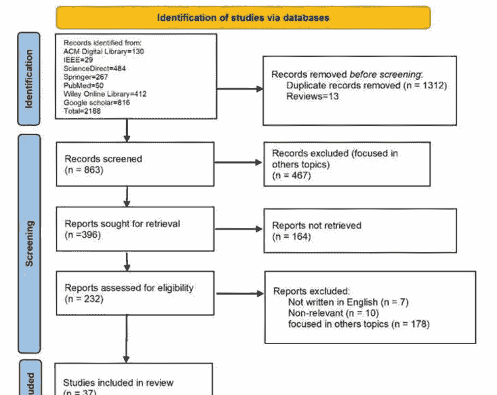

以及与本综述无关的文章。 最后，找到了37篇符合纳入本综述的期刊文章。

第3-7节涉及本综述使用的方法学的最后阶段，即总结和报告研究结果。

### 3 相关工作

在本节中，我们介绍了关于ADHD检测的文献中报道的最相关的研究。 首先，我们讨论了使用不同机器学习方法的研究。 其次，我们讨论了使用不同深度学习技术的研究。

#### 3.1 机器学习方法

Riaz等人[18]对ADHD患者与对照组进行了分类。使用非图像特征和图像特征两种类型的特征创建了一个用于分类的单一特征向量。非图像特征包括年龄、性别、口头智商、执行智商和总智商。在分类阶段，使用了支持向量机（SVM），在ADHD-200数据集的KKI子数据集上获得了最佳结果，准确率为86.7%，敏感性为77.2%，特异性为90.1%。Shao等人[20]关注ADHD-200数据集的不平衡性质。为了解决这个问题，他们提出了一种基于SVM分类器的成本敏感的三目标分类模型来处理不平衡数据的问题。因此，它分别考虑了正样本和负样本的经验误差，以有效处理类别不平衡问题。在预处理阶段，Ahmed Salman等人[21]得出结论，主要贡献在于使用了三种平均时间序列分区来提取功能分析中感兴趣的各种脑区，包括Craddlock 400和200以及自动解剖标签（AAL）。在分类阶段，表现最好的分类器是具有隐藏层的分层极限学习机（ELM），对于识别对照组的准确率为99.72%，对于ADHD的准确率为98.06%。

瞳孔测量是一种诊断测试，用于测量瞳孔的大小和其对特定刺激的反应行为。有一些论文使用这种方法来诊断和/或分类注意力缺陷多动障碍（ADHD）。Silva等人[22]使用基于规则的系统来检测ADHD，使用眼睛的注视和扫视运动。这些运动是通过Tobii眼动仪从14名年龄在18-65岁之间的参与者获得的。从这些数据中提取了主要特征，并输入到不同的分类器中。获得最佳结果的分类器是随机森林（RF），最高准确率为85.31%。Khanna等人[23]提出了一个基于Web的应用程序，将集成投票模型集成到后端，实时记录瞳孔的生物特征数据，得出诊断概率。该方法经过50名参与者的测试，分别获得了0.821、0.727和0.856的敏感性、特异性和接收者操作特征曲线下面积（AUROC）。值得一提的是，使用卷积神经网络（CNN）进行头部和虹膜检测。Das等人[24]提取了从10-12岁的50名受试者获得的22个特征。最佳准确率来自SVM分类器，为0.762，敏感性、特异性和AUROC分别为0.773、0.753和0.856。Lev等人[25]利用连续性能测试（MOXO-dCPT）作为一个平台，将眼动仪集成到这样的测试中。对于70名参与者的分类，获得最佳结果的算法是分层逻辑回归的第二阶段，对于ADHD的正确分类率为75.76%，对于对照组为81.82%。

脑电图（EEG）信号提供了关于认知能力的广泛信息，因此可以利用这些信号来检测ADHD。Alchalabi等人[26]通过无线设备记录了这些信号，被试者在玩视频游戏时进行记录，使用EMOTIV EPOC +套件播放的游戏。对来自对照组和ADHD受试者的信号进行分类时，使用了SVM算法。测试对象为18至23岁被诊断为ADHD的四名受试者。从EMOTIV数据中获得的最佳平均准确率为98.62%。Tor等人[27]使用十折交叉验证策略，使用K最近邻（KNN）分类器获得了97.88%的准确率。从123名儿童中获取了脑电图信号。作者使用经验模态分解（EMD）和离散波形变换（DWT）方法对脑电图进行分解。Holker等人[28]提出了一种从功能连接性、频谱、rEEG和幅度域提取一系列脑电图信号特征的方法。为此，他们开发了一个在线数据库[29]，其中包含121名对照组儿童（平均年龄为9.62 ±1.75岁）和被诊断为ADHD的儿童（平均年龄为9.85 ±1.77岁）。RF分类器获得了最高的81.82%准确率。

检测注意力缺陷多动症的另一种方法是通过分析面部和/或身体动作；最后一种方法通常被称为行为测量学。因此，Ochab等人[30]从年龄为9.89+ - 0.92岁的29名男性中获取了行为测量学数据，并在七天内获得了数据。从这些数据中，提取了47个特征，其中作者提出了一种减少4个主要特征的方法。这四个特征被用作最近邻分类器的输入，得到了69.4 ±1.6%的准确率，78 ±2.2%的敏感度和60.8 ±2.6%的特异度。值得一提的是，诊断时使用了DSM-5。

Khademi等人[31]评估了个性化的睡眠-清醒状态分类器，每个人都有一个分类器。这是为了与使用整个人群的训练数据的广义睡眠-清醒状态分类器进行比较。使用包括54名参与者的数据集，其中行为测量学数据与PSG记录同时捕获，每30秒一次。他们得出结论，个性化的机器学习模型在睡眠参数估计方面优于广义模型，并且在PSG标记的睡眠-清醒状态方面无法区分。同样，Choi等人[32]设计了一个机器人辅助测试，引导年龄在5至12岁之间的儿童进行一系列活动。此外，机器人使用RGB-D传感器跟踪儿童的动作。总共提取了19个特征，其中13个来自机器人，三个来自问卷。使用RF分类器在测试集上获得了最佳准确率96.9%。另一方面，Jiang等人[33]为注意力缺陷多动症儿童设计了一个名为WeDA（可穿戴式诊断评估）的系统。他们使用RF模型将特征的维度减少到不超过10个。此外，他们使用贝叶斯网络（BN）模型，并获得了所有症状的82%的预测准确率。该系统在162名年龄在7至13岁之间的参与者中进行了测试。Hicks等人[34]提出了一个开放可用的在线行为测量学数据集，包括103名年龄在17至67岁之间的个体。此外，他们提供了一组基准机器学习实验，以比较已发布的数据集并评估其技术有效性。RF分类器获得了最佳结果，准确率为72%。

有一些论文讨论了使用问卷/调查检测和/或诊断ADHD的方法。例如，Uluyagmur-Ozturk等人[35]提出了一种基于受试者在面部图像情绪识别问卷中的表现来分类ADHD受试者的系统。参与者的回答和回应时间被用于对61名平均年龄为9.72岁的参与者进行分类。使用Adaboost分类器获得了90%的准确率。 同时，Trognon等人[36]设计了一个基于DSM-5的问卷，应用于平均年龄为27.8岁，标准差为9.2的220名受试者。从回答中，他们提取了通过多元回归程序减少的特征。 他们使用XGBoost分类器获得了98%的准确率，97%的敏感性和100%的特异性。 最后，Maniruzzaman等人[37]提出了一种提取ADHD患者最突出风险因素的方法。 为此，他们使用了2018-2019年全国儿童健康调查(NSCH)的数据，其中包含了45,779名年龄在3-17岁的儿童的信息。他们表明RF分类器提供了最高的准确率为85.5%，敏感性为84.4%，特异性为86.4%，AUC为0.94。

#### 3.2 深度学习方法

fMRI数据是具有时间组成的3D形状数据，因此在将数据集投影到2D CNN时，使用3D CNN分析空间组件而不丢失数据引起了极大的兴趣。Shao等人[38]使用fMRI图像进行ADHD检测。 ADHD全球竞争数据集被用来测试所提出的方法。 然后，每个脑区被用来计算平均时间序列。 从中获得了两个特征，一个是功能连接矩阵，另一个是低频振荡幅度（ALFF）图像。 最佳结果是82.73%的平均准确率，使用gcForest分类器。彭等人[39]提出了一种应用于功能磁共振成像（fMRI）和结构磁共振成像（sMRI）图像的诊断工具。 所使用的方法受到医学专家用于诊断的方法的启发。 它涉及将fMRI彩色图与sMRI叠加，从而可以定位特定脑区的神经活动。 然后，他们开发了一个双3D CNN深度学习模型，一个用于fMRI，另一个用于sMRI；然后，利用一种提出的求和组合算法将两个3D CNN组合起来。 一旦组合起来，他们使用密集神经网络来预测ADHD。在ADHD-200数据集上获得的准确率为72.89%。 同样，Sims [40]利用多模态3D CNN和两个不同的循环神经网络（RNNs），即门控循环单元（GRU）和长短期记忆（LSTM），获得了99.69%的准确率。使用3D StyleGAN生成了Deepfake图像。 所有这些也在ADHD-200数据集上进行了测试。

唯一使用深度学习技术应用于瞳孔测量的工作是由Ko等人提出的[41]，他们使用VR游戏获取了25名受试者眼睛的注视位置数据。 数据是x和y坐标，每个玩家的持续时间在3到7分钟之间。 他们使用了Zoom-in神经网络（ZNN）分类器，平均精度最高达83.575%。

另外，Altinkaynak等人[42]分析了时域和时频域中的EEG信号。多层感知器方法提供了最佳的分类效果，准确率为91.3%，Kappa指数为0.82。这个方法在由46名年龄在7-12岁的参与者组成的数据集上进行了测试。Vahid等人[43]通过电极使用BrainAmp放大器记录了144名受试者（8.5-135岁）的EEG信号。这些信号被输入到一个名为EEGNet的紧凑型CNN中，使用LOOS（Leave One Out Subject）评估了区分ADHD/ADD（注意力缺陷障碍）患者和对照组的分类性能。分类的准确率为83 ±23%。Chen等人[44]使用从多通道EEG输入数据获得的连接矩阵作为训练CNN模型的图像样本。信号来自107名年龄在9.69至11.61岁之间的受试者，使用Hydro Cel Geodesic Sensor Net获取。作者在验证数据上获得了98.17%的准确率，在测试数据上获得了94.67%的准确率。Dubreuil-Vall等人[45]使用Starstim系统从平均年龄为43.85岁的40名参与者获取了EEG信号。他们在Tensorflow中实现了一个CNN，其中输入是EEG数据的小波变换。作者实现了一个计算机辅助诊断系统，对6至11岁之间的40名儿童进行了测试。他们使用Mitsar放大器在眼睛睁开的条件下记录了5分钟的EEG信号。他们将三个EEG频带的组合引入CNN，获得了最佳的准确率、精确度和Kappa指数，分别为99.46%、99.48%和99%。Zhou等人[47]从被诊断为ADHD的6-16岁儿童那里获取了所有数据，并使用CADWELL的视频EEG监测系统记录了24小时的视频。通过实施CNN，获得了最佳结果，测试数据的平均模型准确率达到97.7%，平均误报率为2.2%。Joy等人[48]使用由10名年龄在7至12岁之间的受试者组成的数据集，并将其分为两组，闭眼和睁眼，处于休息状态。使用可调Q因子小波变换（TQWT）技术将EEG分解为子频带。使用Katz和Higuchi算法提取这些子频带的特征。人工神经网络（ANN）分类器获得了最佳的准确率值为100%。

Jaiswal等人[49]提出了一种通过自动视觉分析一个人的行为来辅助诊断注意力缺陷多动障碍（ADHD）和自闭症谱系障碍（ASD）的方法。对年满18岁的55名被试者的每个人进行了约12分钟的视频分析。这些视频是使用Kinect设备获取的，可以捕捉高分辨率的深度和RGB图像。因此，从这些视频中提取了六个特征，作为CNN分类器的输入，获得了96%的准确率。同样，Amado-Caballero等人[50]设计、训练和部署了一个CNN，能够通过正常上学日的24小时活动记录来诊断合并型ADHD的儿童。研究对象包括6至15岁的148名被试者。表现最佳的分类器是在时域中具有输入的2D CNN，准确率为98.57%，敏感性、特异性和曲线下面积（AUC）分别为97.62%、99.52%和99.52%、99.93%。另一方面，Hammam等人[51]使用RGB摄像头分析了6至10岁的27名儿童的步态。为了预训练分类器在这个模型中，使用了公开可用的NTU-RGB+D 120数据库。使用了一个4层1D卷积神经网络作为编码网络。在测试中使用了90%的数据集，并使用动量对比（MoCo）方法来更新网络参数，获得了72.46%的准确率。

还有一些研究将两种或更多的诊断技术结合起来进行注意力缺陷多动障碍（ADHD）的检测。张等人[52]设计了一个系统，使用摄像头捕捉肢体动作、面部表情、语言表达、患者反应能力和眼动。在患者执行一些要求的任务时进行了这些操作。然后，使用计算机视觉算法提取特征，然后使用深度学习算法检测儿童的特定行为。已经完成了对数百名ADHD儿童的测试和评估。同时，Silva等人[53]提出了一个使用fMRI数据和眼动数据的系统。fMRI数据使用了一个卷积神经网络进行分类，准确率达到了82%。而眼动数据中，表现最好的分类器是随机森林（RF），准确率为84.48%。

最后，他们提出了一种算法，用于预测注意力缺陷多动障碍（ADHD）患者的数据的概率。最后，秦等人[54]提出了一种从功能磁共振成像（fMRI）图像和表型数据中提取特征的方法。对于前者，使用了卷积神经网络（CNN），而对于后者，使用了随机森林（RF）分类器。最后，集成学习方法将两个分类器的特征向量并训练第二阶段分类器，以在测试集上获得74.5%的准确率。Hamedi等人[55]发现了一个特殊情况，即在患者闭眼休息状态下使用了脑磁图图像。为此，他们提出了一种堆叠集成学习方法，将基本分类器组合起来，以改善每个单独分类器的结果。他们在Open MEG Archive (OMEGA) [56]数据库上获得了89.92%的准确率。

## 使用AI算法进行ADHD检测的4种方法

与许多精神障碍一样，ADHD仍然没有被完全理解。ADHD的诊断标准随着新的研究得到了改进，但工具和评估基本上没有改变。因此，ADHD至今仍然是一种主要的临床诊断。ADHD的临床诊断测试包括产前、围产期和家族病史的回顾。还要考虑环境因素、学校表现和详细的体格检查。在后者中，特别关注生命体征（心血管、皮肤、甲状腺和神经系统，包括运动协调评估）。此外，还应该寻找共病症。因此，通常使用不同的诊断工具，如MRI、活动记录和问卷调查等。ADHD的诊断主要基于DSM，其最新版本是2013年5月发布的第五版[57]。


EEG信号获取。在眼睛中，数据来自注视和快速运动，以及瞳孔变化。活动度数据主要在手腕处获取。还分析了患者的面部表情。此外，通过手腕、脚踝、腰部和头部的传感器获取日常活动中的身体运动数据。这些动作以及步态通过计算机视觉技术进行分析。对于大脑部分，ADHD检测中最常用的方法之一是分析大脑的结构和功能连接性。结构

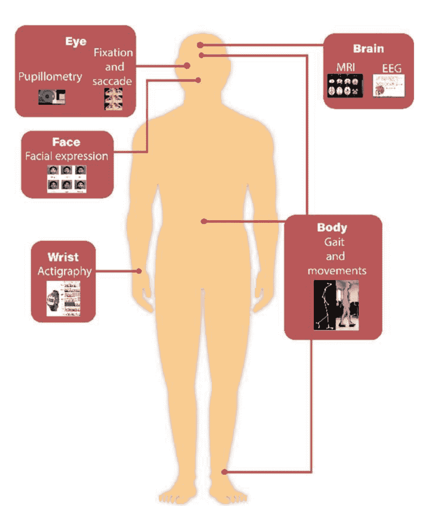

##### 图2 获取ADHD检测数据的主要人体部位

连接性定义了物理上相互连接的白质束存在的大脑区域，而功能连接性描述了一对大脑区域之间的依赖关系和它们随时间的相关性。工具如脑电图和功能磁共振成像被用来测量功能连接性。后者使用非电离辐射来生成软组织的高对比度图像。我们身体的大部分由水分子组成，所以它们含有氢原子。氢原子的核只有一个质子。磁共振成像使用产生强磁场的磁铁来使体内的质子与该磁场对齐。此外，通过身体施加射频信号；然后，这些质子可以吸收射频能量并从较低能量状态转移到较高能量状态，即与施加的磁场平行或反平行方向。质子在进入磁共振（MR）时吸收一些射频能量。当射频信号关闭时，吸收的能量以射频信号的形式重新发射。这个射频发射由一个调谐线圈测量。来自不同组织的旋转质子以不同的速率释放能量，因为身体中的不同组织具有不同的化学组成和物理状态[58]。医生能够根据这些磁性特性区分不同类型的组织。功能磁共振成像通过检测氧合血液的水平来识别大脑的活跃区域。它通常用于监测神经元活动。此外，这些图像中使用灌注示踪剂在组织中产生差异对比度。它通常用于测量脑血流。功能磁共振成像实质上是随时间捕捉的人脑的三维图像。每个图像由大量的三维像素组成，更常被称为体素。

一个体素的强度产生了一种被称为BOLD（血氧水平相关）信号的信号。另一方面，结构性磁共振成像（sMRI）用于检查大脑的解剖学和病理学。通过测量给定位置的水分量，sMRI能够获得大脑的详细解剖图像。这使得能够准确区分不同类型的组织，如灰质和白质。

与大脑相关的另一种注意力缺陷多动障碍（ADHD）检测方法是使用脑电图（EEG）数据。脑电图是一组信号，通过获取大脑在基础状态和其他情况（如光刺激和过度呼吸）下的电活动来分析脑功能。甚至经常在睡眠时记录。收集到的电信号被放大并以波形形式呈现，解释不同脑区域随时间的活动。这些波的模式有正常和异常之分，引起了对疾病的怀疑。对于数据采集，患者被安置在一个专门设计用于ADHD治疗的视频游戏中。在另一种方案中，数据在日常活动中进行24小时的捕获。此外，另一种方法是在视觉注意任务或注意实验中获取这些数据，如奇异范式和Eriksen侧翼任务。此外，另一项研究在静息状态下以睁眼方式捕获这些信号。提取的主要特征是时间和频率，并使用计算机视觉来检测波形中的模式。

对于眼睛来说，有两种常用的诊断工具，瞳孔测量和视觉固定和快速运动的检测。瞳孔与大量的神经过程相连，使得瞳孔对各种刺激有反应，即与情绪、认知和唤醒相关。因此，瞳孔反应与神经系统疾病有关。同样，快速运动和视觉固定反映了注意力和预期等心理过程，这些过程在患有注意力缺陷多动障碍的人中常常受损。使用了不同的方法进行数据采集，如注意力和集中力测试[25]、视频游戏[41]、视觉空间记忆任务[23, 24]和阅读[22]。

反映患有该疾病的人的另一个部分是面部表情，即在特定条件下被试者产生的面部表情。人们在进行某些活动时的步态、姿势以及睡眠时的动作也可以用来检测注意力缺陷多动障碍。因此，通常通过活动记录仪[30, 31, 34, 50]、计算机视觉[32, 49]、可穿戴设备[33]或其组合[51]来分析身体动作。各种设备已被用于数据采集，如活动记录仪、运动传感器、Kinect设备和摄像头。因此，数据可以是图像、传感器信号或两者的组合。运动已在不同情况下进行捕捉，如睡眠、日常活动、教室和受控实验。

另一方面，人工智能可以广义地定义为开发能够解决与人类智能常见相关的认知问题的算法的发展，例如问题解决、模式识别和学习。人工智能主要分为两个领域，机器学习（ML）和深度学习（DL）。

机器学习是一组方法，允许系统从数据中学习，而不是使用显式编程进行学习。换句话说，它是关于使用先前处理过的数据和信息来教机器，使机器学会做出决策。机器学习具有在暴露于更多数据时自我修改的能力。当提到机器“学习”时，意味着机器学习算法试图最小化错误并最大化预测的准确性。

深度学习是机器学习的一个子集，它使用一组计算模型和算法，受到人脑工作方式的启发；这些模型和算法被称为人工神经网络（ANNs）。这些神经网络以与机器学习算法相同的方式从一组数据中学习，但不同之处在于深度学习处理更大量的数据。另一个区别是深度学习不需要经常性的人工干预，因为它从过去的错误中学习。人工神经网络分为三种类型的层，输入层接收数据，输出层产生处理数据的结果，最后是隐藏层，提取数据中存在的模式。因此，深度学习中的“深度”指的是它包含大量的隐藏层，使其能够执行更复杂的任务。在大多数情况下，深度学习比机器学习实现更高的准确性，但为此需要大量的训练数据以及大型软件和硬件资源。

由于其高准确性，深度学习已经在许多领域中使用，包括计算机视觉。近年来，一种特殊的方法被称为卷积神经网络已被用于此目的。一般来说，深度学习和机器学习执行分类，即根据之前从训练数据集中学到的知识，决定未知输入数据属于哪个集合。为了执行这种分类，最常用的学习模型有两种类型：有监督学习和无监督学习。主要区别在于在监督学习中，输入和输出的训练数据都有标签，并且这些标签通常由人工进行。而在无监督学习中，不进行标签过程；也就是说，不需要人工干预。一般来说，使用人工智能进行自动检测ADHD的两种方法如下所述。

#### 4.1 基于机器学习的方法

对于基于MRI的诊断工具，SVM [18, 20, 24, 26]和分层ELM[21]算法受到关注。在使用EEG进行自动检测ADHD方面，使用了SVM、KNN和RF分类器。而对于眼部部分，使用的机器学习分类器有RF、集成投票模型、SVM和分层逻辑回归。关于使用身体不同部位作为诊断工具，用于此的算法有KNN、RF和BN。

在临床文献中最引人注目的诊断工具之一是使用问卷调查。然而，在文献综述中，只发现了使用机器学习进行ADHD检测的[35–37]篇文章。问卷调查的数据主要基于DSM-4和DSM-5，除了[35]，该研究主要基于对给定图像中呈现的感觉的反应。这三个研究使用了Adaboost、XGBoost和RF分类器。

#### 4.2 基于深度学习的方法

在利用MRI的方法中，主要使用的分类器是CNN。一些作者[39]将3D图像转换为2D图像或1D的主要特征，其他作者使用3D CNN [60]。同样，深度森林分类器(gcForest) [38]也被使用。因此，许多研究[18–21, 30]使用一种或两种类型的MRI图像（fMRI和sMRI），在大多数情况下，ADHD-200数据库用于此类分析。在脑电图研究中，使用的两种分类器是CNN和多层感知器。据所知，基于眼睛的诊断工具只发现了一项使用名为Zoom-In神经网络的神经模糊算法的研究。而对于身体不同部位作为诊断工具，发现只使用了CNN。最后，发现了少数几篇文章[52–54]进行了多模态检测，即使用了多个诊断工具。发现的仪器组合包括fMRI和瞳孔测量、fMRI和表型数据，以及儿童面部表情、瞳孔测量、肢体运动、语言表达和反应技能的组合。所有研究工作都使用CNN分类器。对每个仪器进行独立分类，然后应用集成学习。

下面的部分介绍了最常用的公共数据库，用于ADHD检测。

## ADHD检测的5个数据集

有不同的数据集用于ADHD检测。最常用的数据集包括HYPERAKTIV、ADHD200、儿童和成人的工作记忆和奖励、ADHD的脑电图数据和FOCUS。每个数据集都包含适用于ADHD检测的信息。

#### 5.1 Hyperaktiv

HYPERAKTIV [34]是一个公开可用的数据集，包含51名成年ADHD患者和52名临床对照者的心率相关数据。HYPERAKTIV包括活动数据、健康属性（如年龄和性别）、计算机化神经心理测试的输出数据以及患者的心理状况信息。HYPERAKTIV数据集在[61]中用于成年人ADHD的诊断，使用了机器学习算法。与此同时，ADHD200 [62]提供了来自ADHD-200世界竞赛的预处理数据集。ADHD200包括776个解剖学和静息状态的fMRI数据集，其中包括285个来自儿童和青少年，其余来自典型发育的ADHD个体。ADHD200包括年龄、性别、诊断状态、用药状态、ADHD症状的维度测量和智商等数据。ADHD200数据集在[63]中用于基于3D CNN和多通道深度学习神经网络的ADHD分类方法的开发。两项研究中得到的结果分别为69.15%和95%的准确率。

#### 5.2 儿童的工作记忆和奖励有和没有ADHD的情况下

另一方面，数据集“儿童的工作记忆和奖励有和没有ADHD的情况下”[65]可在OpenNeuro.org上获得。该数据集是在进行n-back任务期间记录的功能性磁共振成像（fMRI）数据的结果。n-back任务的目标是探索发展中的典型和被诊断为ADHD的儿童的货币补偿、工作记忆和反馈处理。数据收集自8.6-12岁的79名儿童；其中35名儿童被正式诊断为ADHD [66]。

#### 5.3 成年人的工作记忆和奖励

在随后的研究中，创建了一个名为“成年人的工作记忆和奖励”的数据集[67]，其中包括24名个体执行相同n-back任务的数据。该数据集也可在Open-Neuro.org上获得。数据集“儿童的工作记忆和奖励（有和没有注意力缺陷多动障碍）”源于[68]和[69]所提出的研究。Booth等人[68]分析了从四个视觉空间工作记忆（VSWM）任务中获得的功能性磁共振成像数据，以检测儿童ADHD的情况。结果表明，在ADHD的分类中，准确率达到92.5%。Hammer等人[69]测试了反馈和奖励对ADHD儿童视觉空间工作记忆的交互效应。测试收集了17名ADHD儿童和17名正常对照儿童在屏幕上执行字母空间监视时的磁共振成像数据。结果表明，只有在给予大奖励的情况下，ADHD儿童的表现与正常对照儿童类似。

#### 5.4 ADHD的脑电图数据

与此同时，ADHD的脑电图数据[70]是一个包含61名被诊断为ADHD和60名健康对照组儿童信息的数据集。脑电图记录是在视觉注意任务期间进行的，任务包括展示一组卡通图像。要求儿童计算每个图像中的人物数量；每个图像在儿童回答后立即显示。脑电图记录基于10-20标准的19通道脑电图记录，并且A1和A2电极放置在耳垂处。ADHD的脑电图数据集已经在其他研究中用于检测ADHD的脑电图特征。在这方面，Mohammadi等人[71]将儿童的非线性脑电图特征分类为与注意力等效的ADHD和非ADHD。结果确认了ADHD儿童前脑段的缺陷。Barua等人[72]使用脑电图信号提出了一个新的手动建模分类模型，用于区分有ADHD和无ADHD的个体。该模型使用可调Q小波变换（TQWT）生成小波子带和新的三值模式（TMP）。通过交叉验证，结果显示95.57%和77.93%的分类准确率。

表2呈现了本小节中所审查的数据集的相关信息。表2中所呈现的数据集的主要特征包括：(a)可用于ADHD诊断的属性数量，(b)收集信息的记录数量，以及(c)数据集是否用于ADHD的诊断或预测。

##### 表2 ADHD诊断数据集综述

| 数据集 | 属性数量 | 记录数量 | 预测/诊断 |
| :--- | :--- | :--- | :--- |
| HYPERAKTIV | +25 | 51名成年人和52名临床对照 | 诊断 |
| ADHD200 | 23 | 776 | 诊断 |
| 注意缺陷多动障碍(ADHD)儿童的工作记忆和奖励研究 | 8 | 79名儿童 | 诊断 |
| 成年人的工作记忆和奖励研究 | 8 | 24名成年人 | 诊断 |
| ADHD的脑电图数据 | 12 | 61名儿童和60名健康对照组 | 诊断 |

## ADHD检测的6种机器学习和深度学习分类器

文献中有各种各样的分类器。基于机器学习的最常用的分类器是SVM、随机森林、集成投票模型、AdaBoost、XGBoost、分层ELM、分层逻辑回归、多层感知器、KNN和贝叶斯网络。表3介绍了在审查的论文中使用的机器学习分类器的优点和限制，以及分类器的简要描述和被测试的诊断工具列表。另一方面，最常用的深度学习分类器是CNN和深度森林（gcForest）。表4介绍了分类器的描述、优点、缺点以及被测试的诊断工具。

本综述介绍了多位研究人员在自动诊断ADHD障碍方面所做的努力。下一节介绍了与ADHD的检测和/或诊断相关的趋势和挑战。

## 7个趋势和挑战

我们已经发现了两个目前在使用ML和DL算法进行ADHD检测/诊断中观察到的趋势。

##### 表3 机器学习分类器（MLC）综述

| MLC | 描述 | 优势 | 缺点/限制 | 被测试的诊断工具 |
| :--- | :--- | :--- | :--- | :--- |
| 随机森林 [22, 28, 32, 34, 37] | 使用受控方差，对特征进行随机选择以生成决策树 | 减少过拟合 | 实时预测慢复杂算法 | 眼动<br>脑电图<br>身体运动 |
| KNN [27, 30] | 根据特征空间中最接近的训练样本生成对象的分类 | 在数据挖掘、统计模式识别等领域中被广泛应用 | 分类速度较慢 | 脑电图<br>身体运动 |
| 支持向量机 [19, 20, 24, 26] | 它是一种基于统计学习理论和结构风险最小化原则的方法，旨在确定产生最佳类别分离的决策边界，也称为超平面 | 在所有众所周知的算法中，它是最稳健和准确的方法之一 | 支持向量机在学习过程中非常缓慢，需要大量的训练时间 | 眼动<br>脑电图<br>身体运动<br>问卷调查<br>功能磁共振成像 |
| AdaBoost [35] | 通过对基分类器进行迭代训练，它赋予先前错误分类的数据更大的重要性，从而获得一个新的分类器 | 在实际问题中，可以构建比基本算法质量更高的组合 | 当数据中存在显著噪声时，它容易重新训练<br>需要足够长的训练样本 | 问卷调查 |
| XGBoost [36] | 这是一种连续组装决策树的方法。树是按顺序逐个添加的，以从先前的树中学习并纠正它们产生的错误；这个过程迭代进行，直到无法再纠正错误为止 | 它通过使用各种优化方法在大型复杂数据集上表现良好 | 如果处理大量树，可能会出现过拟合问题。在大型数据库中，它可能消耗大量计算资源 | 问卷调查 |
| 分层ELM [21] | 它基于ELM算法。然而，HELM由基于ELM稀疏自编码的无监督分层特征选择和基于ELM的有监督分类组成 | 它快速且具有高效的学习速度、快速收敛、良好的泛化能力和易于实现 | 与ELM相比，它更复杂 | fMRI |
| 集成投票模型 [23] | 集成投票模型通过组合多个模型的预测结果来工作。对于预测，计算模型预测的平均值。对于分类，将每个标签的预测结果相加，预测出得票最多的标签 | 与使用单个模型时获得更好的结果 | 如果任何一个预测模型不正确或表现不佳，集成投票模型将运行不正确 | 眼动 |
| 分层逻辑回归 [25] | 类似于逻辑回归，只是用于对数据进行分组并具有二元响应变量的研究 | 当一个判据变量的方差由与其相关的预测变量解释时是合适的 | 它只能用于研究具有有限变量数量的简单关系 | 眼动 |
| 贝叶斯网络 [33] | 它由一个表示节点相关变量的有向无环图(DAG)结构组成，表达了变量之间的条件独立性和依赖性<br>它包含与每个节点相关的条件概率分布参数 | 训练时间短 | 在高维数据上性能较差 | 身体运动 |

#### 7.1 新型传感器或生物传感器

近年来，越来越多的生物传感器被用于检测注意力缺陷多动障碍(ADHD)[73]，其中纳米材料和生物分子辅助的多巴胺传感器被用于测量患有ADHD的人体内的多巴胺水平。同样，越来越多的可穿戴设备，如动作测量仪、手环、健身追踪器、皮肤传感器、脉冲无线超宽带(IR-UWB)雷达传感器和智能手表，以及智能手机被用于检测这种疾病，如[74]中所述。这些生物传感器和可穿戴设备可以转化为智能服装的概念[75]。

| DLC | 描述 | 优势 | 缺点/限制 | 被测试的诊断工具 |
|-----|------|------|-----------|------------------|
| gcForest [38] | 该方法生成一组具有级联结构的深度森林 | 它不需要大量调整超参数的努力 | 不同森林的分类能力不同；多粒度扫描产生不同尺度的特征向量；当用于训练随机森林时，每个训练的RF的分类能力是不同的 | fMRI |
| 多层感知机[42] | 它基于感知器，感知器是最简单的神经网络 | 它需要较短的训练时间 | 总参数数量可能会过多增长，因此可能存在冗余 | EEG |
| 卷积神经网络 [39, 40, 43]–[47, 49]–[51, 53, 54] | 它对输入图像应用一组卷积滤波器，每个滤波器激活图像的某些特征 | 它可以重新训练用于新的识别任务，使其能够利用预先存在的网络 | 作为一个黑盒子，对算法所做的决策没有完全控制权；需要大量的训练数据 | 眼动；脑电图；身体运动；问卷调查；功能磁共振成像；结构磁共振成像 |

#### 7.2 多模态的ADHD检测和/或诊断

尽管目前对于这种检测方法的研究还很少，但观察到在这类疾病中，医学专家更接受这种技术。这种多模态方法中应包括的工具应优先考虑问卷和运动数据。这是因为它们是医学标准中最常用的诊断方法。此外，还注意到这种类型的数据已经在其他疾病中使用[76]，但在使用多模态数据检测ADHD方面尚未被更频繁地执行，尽管使用多模态数据的好处已经得到证明[77]。仍然有几个需要克服的挑战，其中以下几点突出。

#### 7.3 生物标志物作为诊断变量的使用

从文献综述中发现，没有找到任何将生物标志物作为检测变量的论文（除了脑电图）。生物标志物被定义为“客观测量并作为正常生物过程、病理过程或药物治疗反应的指标进行评估的特征”[78]。已经研究了许多可能有助于注意力缺陷多动症（ADHD）诊断的生物标志物，如遗传、外周、神经化学和基于微核糖核酸（miRNA）的[79, 80]，以便找到不同类型生物标志物之间的关系。然而，这些生物标志物尚未纳入ADHD诊断的计算方法中。

#### 7.4 可解释性

可解释性是依赖某种形式的人工智能模型的重要考虑因素，这对于理解对照组和ADHD患者之间的差异是必要的。大多数审查的论文缺乏这方面的内容，这是需要进一步关注的改进领域。在检测/诊断精神障碍方面，可解释人工智能（XAI）的使用有所增加[81]，并且在医疗保健中的重要性得到了推荐[82]。因此，XAI已成为生物医学和医疗应用中的一个当前研究课题，必须考虑在ADHD中使用。因此，通过采用转移学习方法、模型诊断或SHAP（Shapley Additive Explanation）或LIME（Local Interpretable Model-Agnostic Explanations）等技术，可以提高人工智能模型的可解释性，从而改善预测模型的质量。另一方面，一些研究[18, 23, 24, 30, 36, 37, 50]报告了敏感性或特异性等性能指标，这对于解释尤为重要，特别是当患者组和对照组的规模不同时。因此，当前的模型大多缺乏可解释性，或者没有比较的标准。

#### 7.5 构建标准化和准确的公共数据集

正如之前所介绍的，目前很少有公共数据库可用于注意力缺陷多动症筛查研究。此外，现有的数据库仅基于MRI [62]。此外，观察到大多数报告的结果是使用非公开数据库进行检查的，这使得与其他工作进行系统比较非常困难。因此，应该产生研究来构建标准化和准确的公开可用数据集，以帮助研究人员验证他们提出的模型。这可以促进计算诊断系统的进一步研究。这些数据库应该专注于生理信号（心电图）、问卷和运动数据（加速度计），因为它们在医学领域中的使用非常广泛[15]。这些数据库应该包含多模态数据。

#### 7.6 不同的分类技术

据所知，目前没有特定的方法来识别ADHD亚型，包括冲动、注意力不集中和多动症。因此，有必要实施新的分类技术，以便识别亚型[83-85]。大多数研究涉及二元分类。同样，在深度学习方法中，最常用的算法是CNN。因此，其他算法的测试，如生成对抗网络（GANs），径向基函数网络（RBFNs），自组织映射（SOMs），深度信念网络（DBNs），受限玻尔兹曼机（RBMs）和自编码器，并没有多样化，特别是对于不使用MRI进行检测的工作。

### 8 结论

近年来，受注意力缺陷多动障碍（ADHD）影响的儿童和成年人数量大幅增加，这是一种最复杂的障碍之一，难以诊断。在这篇综述中，我们分析了各种ADHD诊断工具，以及使用机器学习（ML）和深度学习（DL）人工智能技术进行ADHD诊断和/或检测的研究。本综述还介绍了最具代表性的分类器。对于机器学习方法，最常用的分类器是支持向量机（SVM）。它已经与MRI、EEG、问卷和眼动等诊断工具结合使用，但缺乏身体运动方面的研究。层次化ELM分类器是报告准确率最高的分类器，使用MRI诊断工具时准确率达到99.72%。值得注意的是，到目前为止，唯一可以进行比较的诊断工具是MRI；这是因为使用其他诊断工具的论文没有使用允许客观比较的公共数据库。观察发现，在深度学习方法中，最常用的分类器是卷积神经网络（CNN），与所有诊断工具结合使用。报告的3D CNN-GRU分类器在MRI工具上具有最高的准确率，达到99.69%。从这篇综述中，找到了未来工作中需要解决的机会清单。例如，注意到大多数论文在MRI之后偏向于EEG模态，而其他模态的研究报道很少。然而，在临床实践中，用于初步诊断ADHD的最常用工具是观察运动和使用问卷调查。除了MRI，大多数模态的公开数据集很少或没有，这阻碍了它们的临床实践。因此，开发一个涵盖这些模态的数据库是必要的。此外，在临床实践中，常常同时使用不同的工具来诊断这种疾病，即多模态方法。

作为未来的工作，我们考虑审查与各种生物标志物之间的关系。此外，应该实施XAI技术来提高算法的可解释性，因为这是临床实践中不可或缺的要求。因此，有必要基于人工智能技术开发一个用于检测ADHD的框架，重点将工作投入到临床环境中的实施上。这是一个框架，将协助临床专家并使用目前在临床实践中用于ADHD诊断的方法和标准来开发算法。

致谢这项工作得到了墨西哥国家技术学院（TecNM）的支持，并得到了墨西哥国家科学与技术委员会（CONACYT）和公共教育秘书处（SEP）通过PRODEP项目（教师职业发展计划）的赞助。此外，这项研究还得到了墨西哥国家科学与技术委员会（CONACYT）通过博士后资助号码2256876的资助，用于名为“使用人工智能技术和物联网范式识别ADHD的诊断水平”的研究项目。

### 参考文献

- 1. Fayyad, J., Sampson, N., A., Hwang, I., Adamowski, T., Aguilar-Gaxiola, S., Al-Hamzawi, A., Laura H. S. G. Andrade, Borges, G., Girolamo, G., Florescu, S., Gureje, O., Haro, J., M., Hu, C., Karam, E., G., Lee, S., Navarro-Mateu, F., O’Neill, S., Pennell, B., Piazza, M., Posada-Vi lla J., Have, M., Torres, Y., Xavier, M., Zaslavsky, A., Kessler, R.: 世界卫生组织世界精神卫生调查中DSM-IV成年ADHD的描述性流行病学。注意力缺陷多动障碍，第9卷，第1期，第47页，2017年3月。 https://doi.org/10.1007/S12402-016-0208-3
- 2. Quinn, P.O., Madhoo, M.: 对妇女和女孩的注意力缺陷/多动障碍的综述. Prim Care Com-panion CNS Disord (2014). https://doi.org/10.4088/PCC.13r01596
- 3. Skounti, M., Philalithis, A., Galanakis, E.: 全球注意力缺陷多动障碍患病率的变异. Eur. J. Pediatrics 166,2 117–12 (2006). https://doi.org/10.1007/S00431-006-0299-5
- 4. Bener, A.R. et al.: 阿拉伯社会小学生中ADHD的患病率. J Atten Dis-ord, vol. 10, no. 1, pp. 77–82 (2006). https://doi.org/10.1177/1087054705284500
- 5. 美国精神病学会：精神障碍的诊断和统计手册，文本修订版（DSM-IV-TR®）。 美国精神病学会（2010年）
- 6. Cicek, G., Akan, A.: ADHD分类的深度学习方法与传统机器学习的比较。 TIPTEKNO 2021 - Tip Teknolojileri Kongresi - 2021 Medical Technologies Congress (2021年) 。 https://doi.org/10.1109/TIPTEKNO53239.2021.9632940
- 7. Salgotra, K., Khullar, V., Singh, H.P., Khan, S.A.: 注意力缺陷多动障碍的诊断：智能神经影像学视角. https://doi.org/10.4018/978-1-7998-7511-6.ch003, 第31-44页
- 8. Rasti, J., Torabi, A., Sarrami-Foroushani, N., Amiri, G., Malekifar, N.: 设计和验证一种基于眼动仪的软件，以改善注意力缺陷多动障碍（ADHD）中的注意力：一项验证研究，《康复科学研究杂志》，第15卷，第3期，第137-143页，（2019年）。 https://doi.org/10.22122/JRRS.V15I3.3439
- 9. Berrezueta-Guzman, J., Krusche, S., Serpa-Andrade, L., Martín-Ruiz, M.L.: 儿童智能家居环境中用于行为识别的人工视觉算法。《网络与系统讲义》，第542卷，第661-671页（2023年）。 https://doi.org/10.1007/978-3-031-16072-1_47
- 10. Periyasamy, R., Vibashan, V., Varghese, G., Aleem, M.: 机器学习技术用于磁共振成像诊断注意力缺陷/多动症：简明综述。神经学印度 69(6), 1518 (2021)。 https://doi.org/10.1038/s41391-021-00431-z
- 11. Biswas, S.D., Chakraborty, R., Pramanik, A.: 大脑-MRI图像检测注意力缺陷/多动症的各种预测模型简要调查，ACM国际会议论文集系列（2020），卷Part F165625。 https://doi.org/10.1145/3369740.3372775
- 12. Eslami, T., Almuqh im, F., Raike r, J.S., Saeed, F.: 使用功能和结构MRI诊断自闭症谱系障碍和注意力缺陷/多动症的机器学习方法：一项调查，神经信息学前沿，卷14。 Frontiers Media S.A.(2021). https://doi.org/10.3389/fninf.2020.575999
- 13. Quaak, M., van de Mortel, L., Thomas, R.M., van Wingen, G.: 使用神经影像数据进行精神疾病分类的深度学习应用: 系统综述和荟萃分析. Neu-roImage: Clinical, vol. 30. Elsevier Inc. (2021). https://doi.org/10.1016/j.nicl.2021.102584
- 14. Alam, S., Raja, P., Gulzar, Y.: 机器学习方法在儿童神经发育障碍早期预测中的研究. Wir el Commun Mob Comput, vol. 2022, pp. 1–12 (2022). https://doi.org/10.1155/2022/5766386
- 15. Loh, H.W., Ooi, C.P., Barua, P.D., Palmer, E.E., Molinari, F., Acharya, U.R.: 自动检测ADHD: 当前趋势和未来展望. Comput Biol Med, vol. 146, p. 105525(2022). https://doi.org/10.1016/J.COMPBIOMED.2022.105525
- 16. Arksey, H., O’Malley, L.: 范围研究：走向一个方法论框架. Int J Soc Res Methodol, vol. 8, no. 1, pp. 19–32 (2005). https://doi.org/10.1080/1364557032000119616
- 17. Levac, D., Colquhoun, H., O’Brien, K.K.: 范围研究：推进方法论. Implementation Science, vol. 5, no. 1, p. 69, Dec. (2010). https://doi.org/10.1186/1748-5908-5-69
- 18. A. Riaz, M. Asad, E. Alonso, and G. Slabaugh: 融合fMRI和非成像数据进行ADHD分类。 Computerized Medical Imaging and Graphics, vol. 65, pp. 115–128, Apr. (2018). https://doi.org/10.1016/j.compmedimag.2017.10.002
- 19. Cisneros, L., Rivera, G., Florencia, R., Sánchez-Solís, J.P.: 模糊优化用于业务分析的文献计量分析。 智能与模糊系统杂志 44(2), 2615–2630(2023). https://doi.org/10.3233/JIFS-21573
- 20. L. Shao, Y. You, H. Du, and D. Fu: 使用fMRI数据和多目标优化对ADHD进行分类。 计算方法程序生物医学, vol. 196, p. 105676, Nov. (2020). https://doi.org/10.1016/j.cmpb.2020.105676
- 21. S. Ahmed Salman, Z. Lian, M. Saleem, and Y. Zhang: 基于功能连接的ADHD分类，使用不同的脑图谱。在2020年IEEE国际进展信息学与计算会议(PIC)上，Dec. (2020), pp. 62–66. https://doi.org/10.1109/PIC50277.2020.9350749
- 22. De Silva, S., Dayarathna, S., Ariyarathne, G., Meedeniya, D., Jayarathna, S., Michalek, A. M., Jayawardena: 使用眼动数据进行ADHD识别的基于规则的系统。 在2019年莫拉图瓦工程研究会议(MERCon)上，7月(2019)，第538-543页。 https://doi.org/10.1109/MERCon.2019.8818865
- 23. S. Khanna和W. Das: 使用机器学习进行ADHD的高效和可访问诊断的新应用(扩展摘要)。 在2020年IEEE / ITU国际人工智能大会AI4G 2020上，9月(2020)，第51-54页。 https://doi.org/10.1109/AI4G50087.2020.9311012
- 24. W. Das和S. Khanna：基于机器学习的自动化注意力缺陷多动症检测框架，使用瞳孔测量生物标志物和时间序列分析。Sci Rep，卷11，号1，Dec. (2021) 。https://doi.org/10.1038/s41598-021-95673-5
- 25. A. Lev, Y. Braw, T. Elbaum, M. Wagner, Y. Rassovsky：连续性表现测试期间的眼动追踪：评估注意力缺陷多动症患者的实用性。J Atten Disord，卷26，号2，pp. 245–255，Jan. (2022) 。https://doi.org/10.1177/1087054720972786
- 26. A. E. Alchalabi, S. Shirmohammadi, A. N. Eddin, M. Elsharnouby：FOCUS：通过基于脑电图的严肃游戏检测注意力缺陷多动症患者。IEEE Trans Instrum Meas，卷67，号7，pp. 1512–1520，Jul. (2018) 。https://doi.org/10.1109/TIM.2018.2838158
- 27. Tor, H. T., Ooi, C. P., Lim-Ashworth, N. S., Wei, J. K. E., Jahmunah, V., Oh, S. L., Fung：使用EEG信号的分解和非线性技术自动检测行为障碍和注意力缺陷多动障碍。计算方法程序生物医学，第200卷，3月（2021年） 。https://doi.org/10.1016/j.cmpb.2021.105941
- 28. Holker, R., Susan, S.：使用定量EEG的ADHD检测的计算机辅助诊断框架。在计算机科学讲座笔记中（包括子系列人工智能讲座笔记和生物信息学讲座笔记），（2022年），卷13406 LNAI，pp. 229–240。https://doi.org/10.1007/978-3-031-15037-1_19
- 29. Motie Nasrabadi, A.，等：ADHD / 控制组儿童的脑电图数据。IEEE数据港（2020年）。https://doi.org/10.21227/rzfh-zn36
- 30. Ochab, J.K., Gerc, K., Fafrowicz, M., Gudowska-Nowak, E., Marek, T., Nowak, M. A., Chialvo D R.：在儿童的活动度测量中通过非线性分类注意力缺陷多动障碍（2019年）
- 31. Khademi, A., El-Manzalawy, Y., Master, L., Buxton, O.M., Honavar, V.G.：从活动度测量中个性化睡眠参数估计：一种机器学习方法。Nat Sci Sleep 11, 387–399 (2019). https://doi.org/10.2147/NSS.S220716
- 32. Choi, M.T., Yeom, J., Shin, Y., Park, L：诊断过程中的机器人辅助ADHD筛查。智能机器人系统：理论与应用杂志，第95卷，第2期，第351–363页，8月（2019年）。https://doi.org/10.1007/s10846-018-0890-9
- 33. 姜，X.，陈，Y.，黄，W.，张，T.，高，C.，邢，Y.，郑，Y.：WeDA：为注意力缺陷多动障碍儿童设计和评估基于规模的可穿戴式诊断评估系统。在人机交互因素会议-论文集（2020年）。https://doi.org/10.1145/3313831.3376374
- 34. Hicks, S. A., Stautland, A., Fasmer, O. B., Førland, W., Hammer, H. L., Halvorse n, P., Jakobsen, P.：HYPERAKTIV：来自注意力缺陷/多动障碍（ADHD）患者的活动数据集。在第12届ACM多媒体系统会议论文集（2021年），pp. 314-319。https://doi.org/10.1145/3458305.3478454
- 35. Uluyagmur-Ozturk, M., Arman, A. R., Yilmaz, S. S., Findik, O. T. P., Genc, H. A., Carkaxhiu- Bulut, G., Cataltepe, Z.：基于情绪识别数据的ADHD和ASD分类。在2016年第15届IEEE国际机器学习和应用会议上(2017)，pp. 810–813。https://doi.org/10.1109/icmla.2016.0145
- 36. A. Trognon和M. Richard：基于问卷的成人ADHD计算筛查。BMC精神病学，卷22，第1期，12月(2022)。https://doi.org/10.1186/s12888-022-04048-1
- 37. M. Maniruzzaman, J . Shin, M. A. M. Hasan：使用行为活动预测患有ADHD的儿童：机器学习分析。应用科学(瑞士)，卷12，第5期，3月。(2022)。https://doi.org/10.3390/app12052737
- 38. 邵，L.，张，D.，杜，H.，付，D.：ADHD数据分类中的深度森林。IEEE Access 7，137913-137919（2019年）。https://doi.org/10.1109/ACCESS.2019.2941515
- 39. J. 彭，M. 德布纳斯，A. K. 比斯瓦斯：ADHD诊断中新型基于求和的协同人工神经网络的效果。机器学习与应用，第6卷，第100120页，12月（2021年）。https://doi.org/10.1016/j.mlwa.2021.100120
- 40. C. Sims：使用时间分布的多模态3D CNNs进行高精度fMRI ADHD分类。ArXiv，5月（2022年）。https://doi.org/10.48550/arxiv.2205.11993
- 41. H. Ko, B. Wang, J. S. Lim：使用眼动数据进行注意力缺陷多动障碍识别的研究。2022年国际电子、信息和通信会议，ICEIC 2022年，(2022)。https://doi.org/10.1109/ICEIC54506.2022.9748230

> 42. Altunkaynak, M., Dolu, N., Güven, A., Pektaş, F., Özmen, S., Demirci, E., & İzzetoğlu, M.: 使用时间和频率结合的特征诊断注意力缺陷多动障碍。 生物控制与生物医学工程，第40卷，第3期，第927-937页，7月。(2020)。 https://doi.org/10.1016/j.bbe.2020.04.006

> 43. A. Vahid, A. Bluschke, V. Roessner, S. Stober, C. Beste: 基于事件相关的深度学习EEG可以区分患有注意力缺陷多动障碍（ADHD）的儿童和健康对照组。 J Clin Med, 第8卷，第7期，7月（2019年）。 https://doi.org/10.3390/jcm8071055

> 44. H. Chen, Y. Song, X. Li: 一种基于EEG脑网络的深度学习框架，用于识别患有注意力缺陷多动障碍（ADHD）的儿童。Neuro-computing，第356卷，第83-96页，9月（2019年）。 https://doi.org/10.1016/j.neucom.2019.04.058

> 45. L. Dubreuil-Vall, G. Ruffini, J. A. Camprodon: 基于事件相关谱EEG的深度学习卷积神经网络可以区分成年ADHD患者和健康个体。 Front Neurosci，第14卷，4月（2020年）。 https://doi.org/10.3389/fnins.2020.00251

> 46. A. Ahmadi, M. Kashefi, H. Shahrokhi, M. A. Nazari: 使用深度卷积神经网络的计算机辅助诊断系统用于ADHD亚型。 Biomed Signal Process Control，第63卷，1月（2021年）。 https://doi.org/10.1016/j.bspc.2020.102227

> 47. 周, D., 廖, Z, 陈, R.: 基于视频屏幕长程脑电大数据的儿童ADHD的深度学习诊断。 J Healthc Eng, 卷2022（2022年）。 https://doi.org/10.1155/2022/5222136

> 48. Joy, R.C.等: 使用可调谐Q-因子小波变换从EEG信号中检测和分类ADHD。 J Sens，卷2022，页1-17（2022年）。 https://doi.org/10.1155/2022/3590973

> 49. Jaiswal, S., Valstar, M.F., A. Gillott, D. Daley: 从RGBD数据中自动检测ADHD和ASD的表达行为。在2017年第12届IEEE国际会议上自动面部和手势识别（FG 2017），5月（2017年），页762-769。 https://doi.org/10.1109/FG.2017.95

> 50. Amado-Caballero, P., Casaseca-de-la-Higuera, P., Alberola-Lopez, S., Andres-de-Llano, J. M. ,Villalobos, J. A. L., Garmendia-Leiza, J. R., Alberola-Lopez, C.: “基于卷积神经网络的日常活动记录进行客观的ADHD诊断。 IEEE J BiomedHealth Inform, vol. 24, no. 9, pp. 2690–2700, Sep. (2020). https://doi.org/10.1109/JBHI.2020.2964072

> 51. Hammam, N., Sadeghi, D., Carson, V., Tamana, S. K., Ezeugwu, V. E., Chikuma, J., Mandhane, P. J.: 机器学习得出的睡眠参数与3岁和5岁儿童的行为问题之间的关系：来自CHIL D Cohort研究的结果。 Sleep, vol. 43,no. 12, Dec. (2020). https://doi.org/10.1093/sleep/zsaa117

> 52. Zhang, Y., Kong, M., Zhao, T., Hong, W., Zhu, Q., Wu, F.: 基于多模态信息融合的ADHD智能辅助诊断系统。在MM 2020 - Proceedings of the 28th ACM International Conference on Multimedia (2020), pp. 4494–4496. https://doi.org/10.1145/3394171.3414359

> 53. De Silva, S., Dayarathna, S., Ariyarathne, G., Meedeniya, D., Jayarathna, S., Michalek, A.M.: ADHD识别的计算决策支持系统。国际自动化与计算学报，第18卷，第2期，第233-255页（2021年）。 https://doi.org/10.1007/s11633-020-1252-1

> 54. Qin, Y., Lou, Y., Huang, Y., Chen, R., Yue, W.: 结合表型数据和fMRI的集成深度学习方法用于ADHD诊断。 J Signal Process Syst (2022)。 https://doi.org/10.1007/s11265-022-01812-0

> 55. Hamedi, N., Khadem, A., Vardast, S., Delrobaei, M., Babajani-Feremi, A.: 一种有效的连接组学方法用于使用睁眼静息态MEG诊断ADHD。在 ICCKE 2021 - 第11届计算机工程与知识国际会议上, (2021) 第110-114页。 https://doi.org/10.1109/ICCKE54056.2021.9721443

> 57. Wolraich, M.L.等: ADHD诊断和治疗指南：历史视角。《儿科学》，第144卷，第4期，（2019年）。https://doi.org/10.1542/peds.2019-1682

> 58. Polzehl, J., Tabelow, K.: 磁共振脑成像。Cham: Springer International Publishing（2019年）。https://doi.org/10.1007/978-3-030-29184-6

> 59. Jakhar, D., Kaur, I.: 人工智能、机器学习和深度学习：定义和差异。《临床实验皮肤科学》，第45卷，第1期，第131-132页（2020年）。https://doi.org/10.1111/CED.14029

> 60. Sims, C.: 使用时间分布的多模态3D CNNs高度准确的FMRI ADHD分类（2022年）。https://doi.org/10.48550/ARXIV.2205.11993

> 61. Kaur, A., Kahlon, K.S.: 使用实时活动数据准确识别成年人的注意力缺陷多动症。脑科学，卷12，第7期，第831页，（2022年）。https://doi.org/10.3390/brainsci12070831

> 62. Nichols Nolar: ADHD200. https://data.world/nicholsn/adhd-200 (2016)

> 63. 邹, L., 郑, J., 苗, C., 麦克尤恩, M.J., 王, Z.J.: 基于3D CNN的功能和结构MRI自动诊断注意力缺陷多动症。IEEE Access 5, 23626-23636（2017年）。https://doi.org/10.1109/ACCESS.2017.2762703

> 64. Chen, M., Li, H., Wang, J., Dillman, J.R., Parikh, N.A., He, L.: 一种多通道深度神经网络模型，用于分析多尺度功能脑连接组数据以检测注意力缺陷多动症。放射学人工智能，卷2, 第1期，第e190012页，（2019年）。https://doi.org/10.1148/ryai.2019190012

> 65. Lytle, M.N., Hammer, R., Booth, J.R.:注意力缺陷多动障碍（ADHD）儿童的工作记忆和奖励。OpenNeuro（2021）。https://doi.org/10.18112/openneuro.ds002424.v1.2.0

> 66. Lytle, M.N., Hammer, R., Booth, J.R.: 关于注意力缺陷多动障碍（ADHD）儿童的工作记忆和奖励的神经影像数据集，数据简报，卷31，第105801页（2020）。https://doi.org/10.1016/J.DIB.2020.105801

> 67. Booth, J., Cooke, G., Gayda, E., Hammer, J. R., Lytle, M., N., Stein, M., A., Tennekoon, M.: 成人的工作记忆和奖励。https://openneuro.org/datasets/ds002687/versions/1.2.0. OpenNeuro，（2021）。https://doi.org/10.18112/openneuro.ds002424.v1.1.0

> 68. Hammer, R., Cooke, G.E., Stein, M.A., Booth, J.R.: 功能性神经影像学对视觉空间工作记忆任务的准确检测注意力缺陷和多动障碍。神经影像临床 9, 244-252（2015年）。https://doi.org/10.1016/j.nicl.2015.08.015

> 69. Hammer, R., Tennekoon, M., Cooke, G.E., Gayda, J., Stein, M.A., Booth, J.R.: 期望获得更大回报的反馈改善了注意力缺陷多动障碍儿童的视觉空间工作记忆表现。发展性认知神经科学，第14卷，第38-49页（2015年）。https://doi.org/10.1016/j.dcn.2015.06.002

> 70. Ali Motie Nasrabadi, Armin Allahverdy, Mehdi Samavati, Mohammad Reza Mohammadi, EEG数据用于ADHD /对照儿童IEEE数据港口，2020年6月10日。https://doi.org/10.21227/rzfh-zn36

> 71. Mohammadi, M.R., Khaleghi, A., Nasrabadi, A.M., Rafieivand, S., Begol, M., Zarafshan, H.: 使用非线性特征和神经网络对ADHD和正常儿童进行EEG分类。Biomed Eng Lett, vol. 6, no. 2, pp. 66–73 (2016), https://doi.org/10.1007/s13534-016-0218-2

> 72. Barua, P.D.等: 基于三元模式的ADHD检测模型TMP19使用EEG信号。https://doi.org/10.3390/diagnostics12102544

> 73. Xing, J., Zhang, Y., Xu, S., Zeng, X.: 纳米材料辅助诊断多巴胺以确定注意力缺陷多动障碍-“中国儿童的问题”, Process Biochemistry, vol. 118, pp. 112–120 (2022). https://doi.org/10.1016/J.PROCBIO.2022.01.017

> 74. Lee, W.H., Cho, S.H., Park, H.K., Cho, S.H., Lim, Y. H., Kim, K.R.: 使用IR-UWB雷达传感器测量注意力缺陷/多动障碍（ADHD）患者的运动。https://doi.org/10.1109/ICNIDC.2018.8525709

> 75. Wang, J., Lin, C.C., Yu, Y.S., Yu, T.C.: 基于无线传感器的智能服装平台用于ECG监测。https://doi.org/10.1155/2015/295704

> 76. Ceccarelli, F., Mahmoud, M.: 多模态时间机器学习用于双相情感障碍和抑郁症识别。模式分析和应用2021年25卷3期，第25卷，第3期，第493-504页（2021年）。 https://doi.org/10.1007/S10044-021-01001-Y

> 77. Shakur, A.H., Sun, T., Kim, J.-E., Huang, S.: 基于规则的探索性分析，用于发现注意力缺陷多动症的多模态生物标志物，使用眼动和脑电图数据。 IISE Trans Healthc Syst Eng，第1-15页，（2022年）。 https://doi.org/10.1080/24725579.2022.2126036

> 78. Bough, B.J., Lerman, C., Rose, J.E., McClernon, F.J., Kenny, P.J., Tyndale, R.F., David, R.S., Stein, E.A., Uhl, G.R., Conti, D.V., Green, C., Amur, S.: 生物标志物和替代终点：首选定义和概念框架。 Clin Pharmacol Ther, 第69卷, 第3期, 第89-95页（2001年）。 https://doi.org/10.1067/MCP.2001.113989

> 79. 高桥，N.，石冢，K.，稻田，T.注意力缺陷多动障碍的外周生物标志物：现状与未来展望。《精神病学研究》，vol. 137, pp. 465–470, 五月(2021). https://doi.org/10.1016/J.JPSYCHRES.2021.03.012

> 80. Michelini, G., Norman, L.J., Shaw, P., Loo, S.K.: ADHD的治疗生物标志物：回顾与展望。翻译精神病学 12:1, vol. 12, no. 1, pp. 1–30 (2022). https://doi.org/10.1038/s41398-022-02207-2

> 81. Sudar, K.M., Nagaraj, P., Nthisaa, S., Aishwarya, R., Aakash, M., Lakshmi, S.I.: 用可解释的人工智能（XAI）分析阿尔茨海默病。国际可持续计算和数据通信系统会议，ICSCDS 2022 - 论文集，第419-423页，（2022年）。 https://doi.org/10.1109/ICSCDS53736.2022.9760858

> 82. Biswas, M., Kaiser, M.S., Mahmud, M., Al Mamun, S., Hossain, M.S., Rahman, M.A.: 基于XAI的自闭症检测：检测背后的背景。计算机科学讲座笔记（包括人工智能和生物信息学的子系列），第12960卷LNAI，第448-459页，（2021年）。 https://doi.org/10.1007/978-3-030-86993-9_40/COVER

> 83. Zern-Rugerio, M. F., Carpio-Arias, T.V., Ferreira-Garcia, E., Diez-Noguera, A., Cambras, T., Alda, J. ., Izquierdo-Pulido, M.: ADHD亚型在儿童和青少年中与昼夜节律、睡眠障碍和体重指数的关联：一项病例对照研究。欧洲儿童与青少年精神病学30:12, 1917–1927 (2020)。 https://doi.org/10.1007/S00787-020-01659-5

> 84. Mu, S., Wu, H., Zhang, J., Chang, C.: 儿童ADHD亚型的结构性脑变化及相关症状。大脑皮层, 32(6), 1152–1158 (2022)。 https://doi.org/10.1093/CERCOR/BHAB276

> 85. Slater, J., Joober, R., Koborsy, B.L., Mitchell, S., Sahlas, E., Palmer, C.: 电脑脑电图（EEG）能否识别ADHD亚型？一项系统综述。medRxiv, 第2022.03.25.22272900页，三月（2022年）。 https://doi.org/10.1101/2022.03.25.22272900

## 使用深度学习的蚊子在人体皮肤上的分类

C. S. Ayush Kumar, Advaith Das Maharana, Srinath Murali Krishnan, Sannidhi Sri Sai Hanuma，V. Sowmya，和Vinayakumar Ravi

摘要 每年全球最大的死因是蚊子。识别它们对于采取适当的行动以在特定地点根除它们至关重要。我们的目标是创建一种最先进的机器学习模型，以准确地识别和分类人体皮肤上的蚊子。这项任务在公共卫生领域至关重要，因为它可以帮助识别潜在的疾病传播媒介，并促进预防和控制措施的实施。我们探索了各种预训练和深度卷积神经网络（DCNN）模型进行分类，并使用Hyperband优化策略评估了超参数调整的影响。我们还进行了预处理实验，并发现数据增强是必要的。我们的结果表明，DCNN和预训练模型在高准确性和F1分数下对人体皮肤上的蚊子物种进行分类是有效的。我们提出了一种基于输入图像的自动模型更新和构建方法，可以通过自动化最佳配置的超参数选择在实时环境中建立。使用Hyperband优化策略在改善模型性能方面非常有效，与未使用Hyperband调整的模型相比，准确性和F1分数显著提高。通过自动化选择最佳超参数的过程

C. S. A. Kumar · A. D. Maharana · S. M. Krishnan · S. S. S. Hanuma · V. Sowmya (✉) 计算工程与网络中心（CEN），Amrita Vishwa Vidyapeetham, 科伊马托尔，印度 e-mail: v_sowmya@cb.amrita.edu

C. S. A. Kumar 电子邮件：ayushshyam.official.888@gmail.com

A. D. Maharana e-mail: advaithgravity@gmail.com

S. M. Krishnan 电子邮件：srinathmurali2015@gmail.com

S. S. S. Hanuma e-mail: sshanuma@gmail.com

V. Ravi Prince Mohammad Bin Fahd University, Khobar, Saudi Arabia e-mail: vravi@pmu.edu.sa## 1 引言

蚊子监测是监测和追踪特定区域蚊子存在和行为的过程。这可以通过各种方法来实现，例如捕捉、捕网和分析蚊子栖息地。蚊子监测很重要，因为某些蚊子物种是疟疾、西尼罗河病毒和寨卡病毒的媒介。蚊子物种埃及伊蚊、白纹伊蚊和库蚊是这些疾病的主要媒介。

通过追踪这些蚊子的存在和分布，公共卫生官员可以预测疾病爆发的风险，并实施控制措施以预防或减轻疾病的传播[1]。疾病爆发建模是使用数学和统计工具来预测疾病爆发的可能性、严重性和潜在影响[2]。

蚊子监测和疾病爆发建模都是公共卫生工作中控制和预防蚊媒疾病的关键组成部分。这些信息可以用来预测疾病爆发的风险，并通知可以采取的控制措施，以减少蚊子的数量或保护人们免受蚊虫叮咬。例如，如果蚊子监测数据表明某个特定地区存在携带西尼罗河病毒的蚊子的数量增加，公共卫生官员可能会实施控制措施，如分发蚊帐或防虫剂，或进行蚊子控制操作，如在繁殖地点施用杀幼虫剂或释放不育雄蚊[3]。这些措施可以帮助减少区域内携带疾病的蚊子数量，从而降低疾病爆发的风险。通过持续监测和追踪蚊子种群，公共卫生官员可以迅速发现蚊子存在或行为的任何变化，这可能增加疾病爆发的风险，并及时采取行动以预防或减轻疾病的传播。

成年蚊子通常在野外采样，并收集数据来监测蚊子种群；随后，在实验室中对蚊子的种类进行鉴定和计数[4,5]。存在关键限制，包括劳动力、时间和成本使用这些传统方法获取蚊子种群统计数据。由于物理陷阱比以人为诱饵的陷阱成功率低，并且人们经常与蚊子接触。将公众参与到蚊子监测计划中的概念为收集空间-时间蚊子数据提供了很好的替代方案。我们必须为社区提供识别蚊子害虫所需的技能，以使基于社区的蚊子监测成为可行的概念。智能手机应用程序或识别系统可以在家庭层面对蚊子进行分类，并提供必要的支持[6]。

社区最有可能注意到的蚊子状况是它是否落在人体皮肤上，是活的、死的还是受损的。而后两种蚊子失去了它们的物理特征，这是一个具有挑战性的任务。文献中从未涉及过在这些条件下对蚊子进行分类。通过机器和深度学习算法分析蚊子图像并根据它们的物理特征准确识别蚊子的物种，可以实现对这些条件下蚊子的分类。这对蚊子监测工作非常有用，因为不同的蚊子物种具有不同的生态偏好，可能更或更不容易携带某些疾病。通过准确识别蚊子的物种，公共卫生官员可以更好地了解不同蚊子种群的分布和行为，这可以为控制措施提供信息并帮助预测疾病爆发的风险。

根据蚊子是否落在或被人类皮肤上击碎来分类蚊子物种可能有很多重要原因。首先，识别落在或被人类皮肤上击碎的蚊子物种可以帮助确定疾病传播的潜在风险。不同的蚊子物种有不同的生态偏好，可能更或更不可能携带某些疾病。例如，如果已知携带西尼罗河病毒的蚊子物种落在或被人类皮肤上击碎，与不携带该病毒的蚊子物种相比，可能存在更高的疾病传播风险。通过准确识别蚊子物种，公共卫生官员和个人可以更好地了解疾病传播的潜在风险，并采取适当的预防措施。这可以帮助研究人员了解蚊子行为和影响蚊子与人类互动的因素。例如，通过分析落在或被人类皮肤上击碎的蚊子的类型，研究人员可以更多地了解影响蚊子寄主偏好的因素，如皮肤分泌物类型、体温或个体穿着的衣物。这些信息对于制定预防或减少蚊子与人类互动和疾病传播的策略非常有价值。总的来说，根据蚊子是否落在或被人类皮肤上击碎来分类蚊子物种可以提供关于疾病传播潜在风险和影响蚊子行为的因素的重要信息，这对公共卫生和研究工作非常有价值。

使用自动化方法进行蚊子分类和分类比人工方法有几个优点：

- 1. 速度：自动化方法可以快速处理大量数据，从而对大型数据集进行高效分析。
- 2. 一致性：自动化方法可以提供更一致的结果，因为它们不受人为错误或偏见的影响。
- 3. 可扩展性：自动化方法可以轻松扩展以处理更大的数据集，而基于人的方法可能受到人力分析师的可用性和能力的限制。
- 4. 降低成本：自动化方法可以降低数据收集和分析的成本，因为它们不需要雇佣和培训人工分析师。
- 5. 提高准确性：自动化方法可以提供更准确的结果，因为它们不受人为错误或主观性的影响。

自动化方法可以提供更高效和经济有效的蚊子分类和分类方法，同时还可能提高结果的准确性和一致性[7]。

在这项研究中，我们介绍了使用预训练模型进行特征选择和分类任务的方法，包括各种特征选择算法及其在蚊子在人体皮肤上降落、受损或死亡条件下的分类任务中的适用性。所得到的预测模型与包括谷歌工作台实现在健康状态和损伤条件下使用深度学习的图像识别技术在人体皮肤图像上的方法进行了评估。结果表明，我们的模型在训练和测试场景中均优于商业先进方法，证明了其作为一种强大工具的潜在价值，对于超调的EfficientNetB7预训练迁移学习模型的准确率为91%，对于简单的DCNN模型为86%。

本文分为几个部分，旨在提供对所进行研究的清晰和全面的理解。首先，文献综述部分评估了与深度卷积神经网络和迁移学习相关的现有文献和基准。这一部分非常重要，因为它为提出的方法论提供了基础，并突出了当前研究中的差距和局限性。

提出的方法学在以下章节中介绍，首先是在数据集描述部分中对实验所使用的数据集进行全面描述。接下来是深度卷积神经网络和迁移学习部分，详细介绍了实验中使用的架构和预训练模型。这一部分非常重要，因为它介绍了提出方法学的关键组成部分，包括使用迁移学习来提高模型的性能。超参数调优部分专门解释了用于微调模型超参数以达到最佳性能的优化过程。这一部分至关重要，因为它展示了获取实验和结果部分所呈现结果的方法学。

实验和结果部分涵盖了实验设置，包括训练和验证过程，评估指标用于衡量模型的性能以及结果的获得。 这一部分呈现了研究的关键发现，包括模型的准确性以及其对新数据的泛化能力。

最后，结论和未来工作部分总结了论文的主要贡献，并强调了其局限性。本节提供了对未来研究方向的见解，包括对所提出方法的可能改进以及对未来工作的建议，这些工作可以建立在论文中所呈现的发现基础上。

总体而言，本文的组织旨在清晰简明地呈现所进行的研究及其对未来研究领域的潜在影响。

### 2 文献综述

在现有的研究中，蚊子分类是在主要物种具有子类别标签的情况下进行的。Pratik等人[9]根据蚊子的翅膀运动模式对其进行了分类。 他们的研究使用了多层CNN、ResNet34、ResNet50、DenseNet121和XGBoost等多种模型，实现了80%至86%的分类准确率。

Song-Quan等人描述了一个独特的DSLR图像数据集的创建，其中包括了蚊子。Ae. aegypti、Ae. albopictus和Cx quinquefasciatus是考虑的主要类别。每个物种进一步被分类为非进食、部分进食和完全进食的情况，并且每个子类别又被分为三个类别[10]。观察到使用迁移学习可以提高对描绘损坏条件的图像的分类准确性。这一发现突显了迁移学习作为一种在数据可用性有限的情况下提高图像分类模型性能的有用技术的潜力。在未见数据上取得的最佳性能是由Xception模型实现的（见表1）。为了找到虎蚊，Armin等人使用了Mosquito Alert数字观测站的数据训练了一个ResNet50模型[11]。通过消除分类偏见，并使用IP102数据集中的非蚊子昆虫的照片作为负例，性能略有提升。ROC曲线下的模型面积为0.96 [11]。另一项研究提供了一个基于应用程序的社区数字观察站，用户可以在其中分享他们遇到的蚊子的照片。这个系统被称为“蚊子警报公民科学”。昆虫学专家会对公开提交的照片进行地理标记和分类。

公民科学最近的一项关于虎蚊的研究利用深度学习技术开发了一个蚊子检测模型[12]。具体来说，他们使用了一个名为ResNet50的著名深度学习架构，在蚊子图像数据集上训练了他们的模型。该模型取得了0.94的高ROC分数，表明它在区分蚊子和非蚊子图像方面的有效性。这种方法对于蚊子控制工作可能具有重要意义，因为它有可能帮助自动化检测这些携带疾病的昆虫。宋全等人使用Google Teachable Machine开发了一个卷积神经网络[13]。无代码平台，用于对两种蚊子物种Ae. aegypti（林奈）和Ae. albopictus（斯库斯）进行分类。MobileNet的权重被网络采用。模型的准确性（98.33 ±0.69%）与专家手动标记的准确性相当（（98.00 ±0.88%）在手动分类项目时。

为了对蚊子进行分类，Kazushige等人比较了手工制作的特征与DL提取的特征的性能。加速鲁棒特征（SURF），尺度不变特征变换（SIFT），稠密SIFT，方向直方图梯度（HOG），共现HOG，扩展CoHOG和局部二值模式是采用的手工特征提取方法[14]。然后将ML分类器给出检索到的特征。另一方面，AlexNet, VGGNet和ResNet是使用的DL架构。只有在进行数据增强后，才注意到DL架构的性能优于手工制作的特征。手工特征提取（82.4%）和深度学习（95.5%）方法的最高准确性分别是SIFT算法和ResNet。

在Daniel等人的研究中[15]，使用了各种CNN架构对三个蚊子亚种——埃及伊蚊、白纹伊蚊和库蚊进行了分类。研究中使用的模型有LeNet、AlexNet和GoogleNet，准确率在57.5%到83.9%之间。埃及伊蚊和库蚊也分别进行了分类，准确率分别达到了100%和90%。在Junyoung等人的研究中[16]，采用了迁移学习的技术，即使用预训练模型作为新任务的起点，对一个定制数据集进行分类。超过8种蚊子亚种。该数据集使用手机相机收集共有3600张照片，每个亚种至少有200张图像。作者使用了先进的CNN模型，如Inception-v3和Xception，进行分类，准确率达到82%。该研究展示了利用迁移学习和尖端CNN模型进行蚊子分类的潜力。此外，使用手机相机进行数据收集和标注突显了开发经济高效的蚊子传播者数据集构建方法的潜力。这些发现对于蚊子控制和疾病预防具有重要意义，因为准确高效地分类蚊子种类对于有效的传播者控制计划至关重要。

目前在这个领域中可获得的研究只关注于周围特定亚种的蚊子，而不是人类的皮肤。目前没有可用的模型来识别或分类破损或受损蚊子，并且没有关于这些情况的深度学习或机器学习研究。因此，研究和开发一个适用的、强大的、可部署的模型对于高效分类蚊子物种至关重要。

### 3 方法论

#### 3.1 数据集描述

在本章中，我们使用“用于训练蚊子种类在人体皮肤上识别系统的注释图像数据集”[17]。该数据集提供了关于三种蚊子种类Ae. aegypti, Ae. albopictus 和Cx. quinquefasciatus的信息。有六个类别代表了不同蚊子种类对人体皮肤的影响，包括它们在自然着陆位置和后来的受损状态。该集合中有10,000张图片。额外的文件夹包含4200张训练图片，3600张验证图片和1799张测试图片。这些图片使用DSLR相机拍摄，最初的尺寸为5184 × 3456，但后来缩小到224 × 224以提高可用性。志愿者的肤色为中国人、印度人和马来人。这指出了数据集中缺乏更多多样化的肤色，这可能有助于实验。Ae. aegypti和Ae. albopictus是数据集中两个外观相似的物种。这在分类任务中引发了一些问题，因为可能导致多个错误分类（图1）。

在处理数据集时，数据被分为训练集、验证集和测试集，这些数据由创建者提供。训练集用于训练机器学习模型，而测试集用于评估模型的性能。使用数据库提供的测试-训练分割可以确保数据代表整体人口，并且模型在各种不同的示例上进行了训练。如果数据集经过精心策划，包含了不同类别或特征的平衡表示，这一点尤为重要。这有助于减少模型中的偏差风险。再次分割数据时，如果数据不是随机分割或分割不代表相同的数据，就有引入偏差的风险，这可能导致模型在未知数据上表现不佳。

#### 3.2 深度卷积神经网络和迁移学习

浅层机器学习模型依赖开发者设计的手工特征。这些特征通常基于领域知识，并且可能无法捕捉到数据中的所有相关信息。因此，浅层模型在需要复杂特征提取的任务上可能表现不佳，例如图像分类[18]。在我们的研究中，我们提议使用深度卷积神经网络和预训练的卷积神经网络来进行损坏或着陆条件下人体皮肤上蚊子物种分类的目的。它们提供了一种基于人体皮肤上的损伤位置和类型以及着陆条件提取蚊子物种的关键特征的技术。

卷积神经网络（CNN）是一种特别适用于图像分析任务的神经网络类型。它们被设计用于处理具有网格结构的数据，例如图像，并且可以通过将一组滤波器应用于输入数据来学习识别和提取数据的特征。它们能够从数据中学习一系列特征，从简单的边缘和颜色模式开始，逐渐进化到更复杂的形状和物体。这使得CNN能够自动从数据中提取有用的特征，并与浅层模型相比进行更准确的预测。网络被训练用于识别和提取与手头任务相关的输入数据特征。

预训练的CNN是已经在大规模数据集上针对特定任务进行训练的CNN，例如图像分类或目标检测。这些模型已经从数据中学习到了有用的特征，并可以作为训练新模型的起点，用于不同任务的训练[19]。通过使用迁移学习，预训练的CNN用于手头任务，即图像分类。迁移学习涉及使用预训练的CNN作为训练新模型的起点，而不是从头开始训练模型，以便将预训练的CNN用于迁移学习[20]。

首先，我们选择一个合适的预训练模型，并通过调整模型的架构和在数据集上训练来进行微调，以适应我们的特定任务。这可能涉及添加或删除层，冻结或解冻层，并使用数据集重新训练模型。深度卷积神经网络是具有更深层次架构的卷积神经网络，相比浅层卷积神经网络，它们包含更多的层次。这些模型可以从头开始训练，也可以使用迁移学习进行微调，就像预训练的卷积神经网络一样。通过使用预训练的卷积神经网络或深度卷积神经网络进行迁移学习，我们利用模型在大型数据集上学习到的知识和特征，并将其应用于特定任务，从而提高模型的性能并减少训练所需的数据和计算资源[21]。预训练模型也可以用作特征提取器。使用它们进行特征提取的一些优点包括它们能够从数据中学习并识别相关特征，处理大量数据的效率高，处理数据中的噪声和变异性的鲁棒性强，以及通过迁移学习将其潜力转移到其他任务中。

提取的特征然后作为输入传递给分类器，例如支持向量机（SVM），决策树，随机森林等，以预测输入图像的类别。使用预训练模型作为特征提取器通常在各种图像分析任务中表现良好，即使在高维或复杂数据的情况下也是如此。这些模型已经学会从图像中提取有用的特征，并且可以通过在提取的特征之上训练分类器来进行特定任务的微调。当使用有限的数据或计算资源时，这种方法特别有用，因为预训练的CNN可以提供强大的特征提取基准，而分类器可以相对快速地在提取的特征上进行训练。

流行的预训练CNN模型，如XceptionNet，InceptionResNet和EfficientNetB7，是在ImageNet数据集上训练的，并且已被广泛用于图像分类和其他任务。其他流行的预训练CNN模型包括ResNet，Inception和MobileNet。可以使用深度学习库（如Keras和PyTorch）在Python中轻松加载和使用这些模型作为特征提取器。

#### 3.3 超参数调整

在图像分类任务中，卷积神经网络（CNN）模型的性能可能取决于许多超参数，例如学习率、批量大小、丢弃率、激活函数、层数、每层的神经元数量和迭代次数。调整这些超参数可能非常耗时和资源密集，特别是当超参数空间很大时[22, 23]。

Hyperband优化策略是一种基于提前停止的方法，用于搜索大型超参数空间中的最佳模型[24]。Hyperband为每个模型定义了一定的时间或资源预算，并使用提前停止来识别在预算内表现最佳的模型，该算法使用不同的超参数组合训练模型。这样可以高效地探索大型超参数空间，并确定任务的最佳超参数。Keras Tuner是一个库，可以通过生成超模型来自动化Keras中卷积神经网络（CNN）模型的超参数调整过程。

超参数调整是选择卷积神经网络模型的最佳超参数集以在特定任务上获得最佳性能的过程，例如对人体皮肤上蚊子物种的分类（见图3）。

Hyperband优化算法修改了用于超参数优化的连续减半过程。使用这种技术评估每个配置的性能，该技术在一组超参数配置之间均匀分配计算资源的预算。在初始检查后，丢弃结果最差的组合。在重复此过程直到没有其他配置剩余之后，选择一个单一的配置作为最佳超参数集合。Hyperband方法可以通过更均匀和有效地利用计算资源在结果方面优于其他优化算法。反复消除表现不佳的配置有助于将计算资源集中在最有前途的配置上，从而加快优化过程并加快收敛到理想解的速度。

近年来，深度学习已成为解决各个领域复杂问题的流行方法。然而，构建一个有效的深度学习模型可能会面临挑战，因为涉及到大量的超参数。Hyperband优化策略是一种强大的技术，用于高效地优化这些超参数。

在我们的实验中，我们使用了EfficientNetB7预训练模型，这是一种最先进的架构，在各种计算机视觉任务中表现出色。我们使用来自ImageNet数据集的权重初始化了这个模型。

这是一个大规模的带有标签的图像数据库，已经广泛应用于计算机视觉研究中。为了探索模型中最佳的层数和神经元数量，我们在层数1到5之间和神经元数量32到512之间进行了变化。激活函数也在ReLU、tanh、ELU和LeakyReLU之间变化。每一层都经过了丢弃正则化的调整，以防止模型过拟合。最终输出层由6个具有softmax激活函数的神经元组成，这是多类别分类任务中常用的选择。我们使用多项式衰减学习率调度程序在ADAM优化器和分类交叉熵损失函数上编译了模型。多项式衰减学习率调度程序会随着训练的进行逐渐降低学习率，使模型能够更有效地收敛到最优解。通过采用这些技术，我们能够有效地优化模型的性能。我们的结果表明，我们选择的超参数提高了模型的准确性并显著减少了训练时间。总体而言，我们的实验突显了Hyperband优化策略在构建高性能深度学习模型方面的有效性。

#### 3.4 提议的工作流程

使用CNN和预训练的CNN模型作为特征提取器和分类器进行蚊子在人体皮肤分类任务的提议方法可以按照以下方式实施（图2）：

1.  根据需要对数据进行预处理，如调整大小和归一化处理。
2.  选择预训练的CNN模型：选择适合任务的预训练的CNN模型。流行的选项包括XceptionNet、ResNet、InceptionNet和MobileNet。
3.  加载预训练模型：使用深度学习库（如Keras或PyTorch）加载预训练的CNN模型。
4.  从训练数据中提取特征：使用预训练的CNN模型通过将数据通过模型运行并提取其中一个隐藏层的输出来提取训练数据的特征。
5.  在提取的特征上训练分类器：将提取的特征作为输入传递给分类器（如支持向量机（SVM）、决策树、随机森林或神经网络），并在训练数据上训练分类器。
6.  在验证集和测试集上评估模型：使用训练好的分类器对验证集和测试集进行预测，并使用适当的指标（如准确率、精确率和召回率）评估模型的性能。
7.  微调模型：如果模型的性能不令人满意，可以解冻一些层并与分类器一起训练来微调预训练的CNN模型。
8.  分析结果并得出结论：分析实验结果并得出关于使用预训练的CNN模型的有效性的结论。

通过使用预训练的CNN对人体皮肤上的蚊子物种进行分类，我们可以利用模型在大型数据集上学到的知识和特征，并对特定任务进行微调，从而提高模型的性能并减少训练所需的数据和计算资源。

### 4 实验和结果

初步实验使用简单的卷积神经网络（CNN）架构进行，用于识别人体皮肤上蚊子物种的分类等任务，因为它可以为该任务提供基准性能，并作为与更复杂模型进行比较的参考点[25]。简单的CNN架构通常具有较少的层和参数，这意味着它需要较少的数据和计算资源来训练。这可以使模型的训练和评估更容易，也可以使实验结果的解释更容易。这些架构可以帮助减少过拟合的风险，即模型在训练数据中学习到的模式不能推广到未见数据。当数据集较小或多样性有限时，这尤其有用，因为它可以帮助模型更好地推广到新的数据。根据实验结果，通过经验分析确定了神经网络的最佳输入尺寸为60像素乘以60像素。根据各种评估指标，这个特定的输入维度在模型的整体性能方面取得了最佳结果。这一发现表明，输入层的具体大小对网络学习和泛化输入数据的模式有重要影响。

表2 简单的DCNN模型架构

| 层类型 | 输出形状 | 参数数量 |
| :--- | :--- | :--- |
| 卷积层 | 58 × 58 × 32 | 896 |
| 最大池化层 | 29 × 29 × 32 | 0 |
| 丢弃层 | 29 × 29 × 32 | 0 |
| 卷积层 | 27 × 27 × 64 | 18,496 |
| 最大池化层 | 13 × 13 × 64 | 0 |
| 丢弃层 | 13 × 13 × 64 | 0 |
| 卷积层 | 11 × 11 × 128 | 73,856 |
| 最大池化层 | 5 × 5 × 128 | 0 |
| 丢弃层 | 5 × 5 × 128 | 0 |
| 压平 | 1 × 3200 | 0 |
| 全连接层 | 1 × 64 | 204,864 |
| 全连接层 | 1 × 128 | 8,320 |
| 全连接层 | 1 × 64 | 8,256 |
| 输出层 | 1 × 6 | 390 |
| 可训练参数 | | 315,078 |

表2表示所使用的CNN的架构，在测试集上表现良好，准确率达到86.10%，优于[9, 10]的性能（更多指标请参考表3），在我们的研究中取得了最佳性能得分。该模型与现有的预训练模型进行了直接比较，通过冻结、解冻和添加更多可训练层进行微调。使用不同的预训练卷积神经网络（CNN）模型对人体皮肤上的蚊子物种进行分类是有益的，因为它允许我们比较不同模型的性能，并选择最适合该任务的模型。每个预训练的CNN模型都是在大型数据集上进行训练的，并学习了不同的特征和模式，这对于图像分类任务非常有用。我们可以评估每个模型在特定任务上的性能，并选择表现最好的那个。这可以帮助我们在任务上获得更好的准确性和泛化性能。

此外，使用不同的预训练模型可以比较模型的计算需求和效率。一些模型可能需要更多的计算资源和数据来训练，而另一些模型可能更高效，需要更少的资源。通过比较不同模型的性能和计算需求，我们选择最适合任务和可用资源的模型。我们对相同的任务进行了可比较的结果，这需要更多的微调。所有预训练模型在预训练架构中添加更多可训练的密集层时表现最佳。在微调后，我们观察到表4中的结果，这些结果与[9, 10]的基准分数相当。大多数预训练模型通过将图像尺寸从60 × 60调整为224 × 224进行了实验评估。这是因为常用的图像分类数据集，如ImageNet，默认图像尺寸为224 × 224像素。这样可以更好地保留图像细节，并可能导致更高的准确性。然而，更大的输入尺寸也需要更多的计算资源，并可能增加训练时间。预训练模型的输入尺寸选择取决于具体的应用和可用资源。通过对一系列输入尺寸的模型进行实验评估，可以为给定任务提供最佳输入尺寸的见解。EfficientNetB7是表现最好的模型之一，准确率达到84%。该模型接受600 × 600像素的输入，这是图像训练时的原始尺寸。因此，我们将输入数据放大以重现最佳结果。

归一化和数据增强是我们采取的一些步骤，以实现这个结果。选择合适的预训练卷积神经网络（CNN）模型进行特征选择对于诸如在人体皮肤上分类蚊子物种的任务非常重要，因为它会影响模型的性能和效率。在选择预训练的CNN模型进行特征选择时，重要的是要考虑数据集的特征和任务的具体要求。例如，如果数据集很大且多样化，那么一个更复杂的模型，具有更多层和参数的模型可能更合适，因为它可以学习到更复杂的特征和模式。另一方面，如果数据集很小或者具有有限的多样性，那么一个更简单的模型，具有较少层和参数的模型可能更合适，因为它可能不容易过拟合，并且可能更好地推广到新数据。除了模型的复杂性之外，还需要考虑模型的计算要求和效率。一些模型可能需要更多的计算资源和数据来训练，而其他模型可能更高效，需要较少的资源。根据可用资源和任务的具体要求，选择一个更高效且需要较少资源的模型可能更合适。

我们主要使用了四个模型进行实验：InceptionResNetV2、InceptionV3、XceptionNet和ResNet50。对于这些模型，我们在训练模型后连接了维度为1000、500和250的瓶颈-流水线稠密层，生成中间特征。还使用了类似方差阈值的特征选择技术来进一步降低维度。通过交叉验证的迭代过程，找到了最佳的阈值0.02333。这种方法给数据引入了相当大的噪音，并且需要进一步的训练，这在计算上是昂贵的。因此，我们得出结论，使用预训练模型进行特征提取不是一种可行的技术，因为它还显著降低了模型的性能，如表5所示。

接下来，我们将优化表现最佳的模型——以ImageNet权重为基础模型的EfficientNetB7，然后采用全局平均池化来展开层，我们采用Hyperband优化策略来搜索卷积神经网络（CNN）模型的最优超参数集，以用于对人体皮肤上蚊子物种的分类等任务。为了在我们的任务中使用Hyperband优化策略，我们按照以下步骤进行（图3）：

表3 简单深度卷积网络的分类报告

|  | 精确率 | 召回率 | F1得分 | 支持 |
| :--- | :--- | :--- | :--- | :--- |
| 埃及伊蚊着陆 | 0.76 | 0.93 | 0.84 | 300 |
| 埃及伊蚊被击碎 | 0.83 | 0.79 | 0.81 | 300 |
| Albopictus着陆 | 0.87 | 0.77 | 0.82 | 299 |
| Albopictus粉碎 | 0.93 | 0.82 | 0.87 | 300 |
| 库莱克斯着陆 | 0.89 | 0.95 | 0.92 | 300 |
| 库莱克斯粉碎 | 0.93 | 0.93 | 0.93 | 300 |
| 准确率 | | | **0.86** | 1799 |
| 宏平均 | 0.87 | 0.86 | 0.86 | 1799 |
| 加权平均 | 0.87 | 0.86 | 0.86 | 1799 |

表4 模型性能比较

| 模型 | 模型准确度 | 模型损失 |
| :--- | :--- | :--- |
| **简单DCNN** | **0.86** | **0.35** |
| **EfficientNetB7** | **0.84** | **0.47** |
| MobileNetV2 | 0.82 | 0.49 |
| DenseNet121 | 0.81 | 0.51 |
| XceptionNet | 0.80 | 0.54 |
| ResNet152V2 | 0.71 | 0.94 |

表5 预训练模型作为特征提取器

| 模型 | 分类器 | 特征数量 | 模型准确度 |
| :--- | :--- | :--- | :--- |
| **InceptionResNetV2** | **支持向量机** | **1000** | **0.78** |
| InceptionV3 | 逻辑回归 | 1000 | 0.70 |
| XceptionNet | 随机森林 | 1000 | 0.64 |
| ResNet50 | 逻辑回归 | 1000 | 0.51 |
| **InceptionResNetV2** | **逻辑回归** | **500** | **0.78** |
| **InceptionResNetV2** | **逻辑回归** | **250** | **0.70** |

1.  定义超参数搜索空间：我们指定每个超参数的值范围或选项来进行调整。
2.  定义模型构建函数：创建一个根据传递给它的超参数构建和编译CNN模型的函数。该函数应返回编译后的模型。
    *   隐藏层的数量在0到5之间，每层有n个神经元，其中n在32到512之间。
    *   激活函数从'relu'、'tanh'、'ELU'和'LeakyReLU'列表中选择。
    *   每个层之后，设置一个范围从0到0.5的dropout，步长为0.1。
    *   最后一层是具有6个神经元和softmax激活函数的输出层。
    *   学习率初始化为0.00005，结束率为0.0，作为keras模块中的多项式衰减调度器的函数，编译时使用分类交叉熵损失和准确性作为指标。
3.  实例化'Hyperband'对象：从Keras Tuner的'Hyperband'模块创建Hyperband类的实例，并指定超参数搜索空间和模型构建函数。
4.  搜索最佳超参数：调用Hyperband对象的search方法，并传入训练数据和目标标签。Hyperband优化策略将使用早停法在定义的时间或资源预算内进行超参数搜索，以确定表现最佳的模型。

图3 使用超带优化策略进行的超参数调整工作流程

图4 EfficientnetB7超模型训练和验证图

通过使用超带优化策略，我们自动化了选择卷积神经网络模型的最佳超参数的过程，并在人体皮肤上对蚊子物种进行分类，从而获得了本研究的最佳结果，准确率达到91%（更多指标请参考表6），比[9-11]中的结果更好。训练和验证图（见图4）表明模型学习效果良好，并且对新数据具有很好的泛化能力。模型以一致的速度学习，并且没有出现过拟合或欠拟合等问题。这可能是模型适合任务并且超参数调整得当的一个好迹象。

解释混淆矩阵（见图5），矩阵的对角线值表示模型的正确预测数量，这些值较高，意味着有大量的正确预测。有一些错误分类，对于同一物种在着陆和碎裂状态之间的泛化目的来说是可以容忍的。该模型对每个类别的正确和错误预测数量相似，表明性能平衡。因此，我们成功完成了构建和优化用于人体皮肤上的蚊子的高效分类和识别模型的过程。

### 5 结论和未来工作

在本章中，我们旨在使用机器和深度学习技术正确分类公共空间中发现的蚊子。我们对蚊子在人体皮肤分类任务的数据集进行了各种实验，目标是社区的福祉。首先，我们使用简单的深度卷积神经网络架构进行了试验，效果还不错。为了建立数据集的基准，进行了几个使用预训练模型的实验，结果比现有的实验更好。对预训练模型进行了实验，例如修复和训练基础模型，探索权重的初始化，冻结基础模型以及使用更多密集层进行训练。此外，我们探索了迁移学习的应用及其在分类任务中的前景，其中从预训练架构中提取中间特征并将其馈入浅层机器学习算法，但结果并不令人满意。

最后，我们调整了表现最佳的预训练架构的模型参数，构建了一个更健壮和可扩展的模型，并探索了其在自动构建超模型上的可行性。模型的权重进行了微调和优化，以获得最佳结果。对于进一步的研究，我们提出了一个集成提升模型，用于特征提取，例如使用随机森林、XGBoost进行特征选择，并进一步使用深度卷积神经网络或浅层机器学习进行分类器，以改善本研究中的性能。在不同光谱表示中预处理图像也是一个需要测试的实验，可以使用预处理方法如RGB到HSV，傅里叶像素分布图或图像增强来进一步提高结果。

我们成功地建立了一个模型，可以根据图像数据识别和分类三种最常见的蚊子物种：库蚊、埃及斑蚊和白纹伊蚊，无论是在落地还是被捕杀的情况下。我们的研究为开发基于人工智能的模型，用于监测系统中终止这些有害蚊子提供了重要见解。

图5 EfficientnetB7超模型混淆矩阵

表6 经过超参数调整的预训练模型分类报告

| 项目 | 精确率 | 召回率 | F1得分 | 支持 |
| :--- | :--- | :--- | :--- | :--- |
| 埃及伊蚊着陆 | 0.87 | 0.92 | 0.89 | 300 |
| 埃及伊蚊被击碎 | 0.86 | 0.86 | 0.86 | 300 |
| Albopictus着陆 | 0.95 | 0.85 | 0.90 | 299 |
| Albopictus粉碎 | 0.90 | 0.90 | 0.90 | 300 |
| 库莱克斯着陆 | 0.94 | 0.96 | 0.95 | 300 |
| 库莱克斯粉碎 | 0.95 | 0.96 | 0.95 | 300 |
| 准确率 | - | - | 0.91 | 1799 |
| 宏平均 | 0.91 | 0.91 | 0.91 | 1799 |
| 加权平均 | 0.91 | 0.91 | 0.91 | 1799 |

### 参考文献

1.  Roiz, D., 等：整合的埃及斑蚊管理用于控制埃及斑蚊传播的疾病。PLoS Neglected Trop Dis. 12(12), e0006845 (2018)
2.  Centers for Disease Control, Prevention (US), and National Center for Infectious Diseases(US). 应对新兴传染病威胁：美国的预防策略。美国疾病控制和预防中心（1994）
3.  Petersen, Lyle R., Marfin, Anthony A.: 西尼罗河病毒：临床医生的入门指南。Ann. Intern. Med. 137(3), 173–179 (2002)
4.  Kweka, Elininingaya J., Mahande, Aneth M.: 北坡下的大蚊子灭蚊方法的比较评估。疟疾杂志 8(1),1–5 (2009)
5.  Gao, Q., et al.: 人类引诱和CO2引诱监测方法之间蚊子种群组成和动态的比较。中国卫生昆虫装备杂志 21,254–258 (2015)
6.  Lima, J.B.P. et al.: MosqTent: 一种个人便携式双腔蚊子陷阱，用于人类寄生蚊子。PLoS Neglected Trop Dis. 11(3), e005245 (2017)
7.  Stone, Christine, Mohammed, Caroline: 应用遥感技术评估受昆虫害虫和真菌病害破坏的人工林：一项综述。当前林业报告3(2), 75–92 (2017)
8.  Rajanbabu, K.等：帕金森病分类的深度迁移学习模型集成。在：软计算和信号处理，第135-143页。Springer，新加坡（2022）
9.  Mulchandani, P., Siddiqui, M.U., Kanani, P.: 使用深度学习技术进行实时蚊子物种识别。
10. Ong, S.-Q.等：基于社区的蚊子监测：具有深度学习算法的自动蚊子-人皮肤识别系统。
11. Pataki, B.A.等：深度学习识别用于公民科学监测虎蚊。
12. Mishra, P., Sarawadekar, K.: 多项式学习率策略与深度神经网络的热重启. In: TENCON 2019-2019 IEEE Region 10 Conference (TENCON). IEEE (2019)
13. Ong, S.-Q. et al.: 实时实施自动分类Aedes aegypti (Linnaeus)和Aedes albopictus (Skuse)的深度学习模型. Sci. Rep. 11(1), 1–12(2021)
14. Okayasu, K., et al.: 基于视觉的蚊子物种分类: 传统方法和深度学习方法的比较. Appl. Sci. 9(18), 3935 (2019)
15. Motta, D., et al.: 应用卷积神经网络对野外成年蚊子进行分类. PloS One 14(1), e0210829 (2019)
16. Park, J., 等: 使用深度卷积神经网络对矢量蚊子进行分类和形态分析。 科学报告 10(1)，1-12 (2020)
17. Ong, Song-Quan, Ahmad, Hamdan: 用于训练蚊子物种识别系统的带注释图像数据集。 科学数据 9(1), 1-6 (2022)
18. Alzubaidi, L,等: 深度学习综述: 概念, CNN架构, 挑战, 应用, 未来方向。 大数据杂志 8(1), 1-74 (2021)
19. Hussain, Mahbub, Bird, Jordan J., Faria, Diego R.: 关于图像分类的CNN迁移学习研究。 英国计算智能研讨会, 斯普林格, Cham (2018)
20. Anand,R., 等: 使用胸部放射学图像的改进VGG深度学习架构进行COVID-19分类。 生物医学与生物技术研究杂志 (BBRJ) 5(1), 43 (2021)
21. Tammina, Srikanth: 使用VGG-16和深度卷积神经网络进行迁移学习以进行图像分类。 国际科学研究出版物 (IJSRP) 9(10), 143-150 (2019)
22. Seshu Babu, G., 等: 使用预训练的深度学习模型进行结核病分类。 在: 自动化、信号处理、仪器仪表和控制方面的进展, 第767-774页。 Springer, 新加坡 (2021)
23. Mar-Cupido, R., García. V., Rivera, G., Sánchez, J.S.: 深度迁移学习用于识别面罩类型作为预防COVID-19传播的核心措施。 Appl. Soft Comput. 125, 109207 (2022)
24. Li, L., et al.: Hyperband: 一种新颖的基于赌博机的超参数优化方法。 J. Mach. Learn. Res. 18(1), 6765-6816 (2017)
25. Kumar, V.S. et al.: 使用卷积神经网络进行蚊子类型识别。 在: 2022年第三届智能电子与通信国际会议 (ICOSEC)。 IEEE (2022)

## 使用自组织映射对深度卷积特征进行分析和解释

Diego Sebastián Comas, Gustavo Javier Meschino, Agustín Amalfitano, 和 Virginia Laura Ballarin

摘要 深度学习为数据分析定义了一种新的范式。在图像处理中，卷积神经网络 (CNN) 具有大量的应用，并且不需要事先提取特征，因为这些特征直接从训练图像中“学习”而来。如何解释CNN的工作方式是一个开放性问题，任何从CNN中提取特征的方法都可以消除黑盒子概念，这对机器学习领域来说是一个重要的贡献。在本章中，提出了一种基于自组织映射 (SOM) 的方法，用于分析和解释从CNN中提取的特征。主要特点包括： (i) 使用不同的超参数从初始图像数据集训练CNN； (ii) 生成包含初始数据集不同表示的新数据集，然后使用SOM、可视化工具和质量度量进行分析； (iii) 可以选择适合分类的特征，并描述类别中的复杂性和多样性，并从训练数据集中提取有关图像的其他信息。分析了一个应用实例，考虑胸部X射线图像用于肺炎的分类，从头开始识别CNN中的好特征，并对其进行一些解释，无论是在正常与肺炎的分类中，还是在病毒性肺炎与细菌性肺炎之间。

- 深度学习
- 卷积神经网络
- 特征解释
- 自组织映射

| 作者 | 单位 | 电子邮件 |
| :--- | :--- | :--- |
| D. S. Comas (✉) · G. J. Meschino · A. Amalfitano · V. L. Ballarin | 电子科学与技术研究所 (ICyTE)，马德普拉塔国立大学，马德普拉塔，阿根廷 | diego.comas@fi.mdp.edu.ar |
| G. J. Meschino | 同上 | gmeschin@fi.mdp.edu.ar |
| A. Amalfitano | 同上 | aamalfitano@fi.mdp.edu.ar |
| V. L. Ballarin | 同上 | vballari@fi.mdp.edu.ar |

### 1 引言

近年来，深度学习为数据分析定义了一种新的范式[1]。卷积神经网络（CNN）在过去十年中已经有大量的应用。CNN的应用在科学和商业领域得到了广泛的推广。我们可以举例如面部识别、医学成像、文档分析、自动驾驶和生物特征认证等应用。它们可以通过学习特征来建立输入和输出之间的关系，以供分类或回归模型使用。特别是在图像处理领域，与传统的机器学习方法不同，CNN不需要通过图像处理方法（如边缘检测、分割、形状表征、对象计数、频率和空间变换等）提取特征，因为这些特征是通过网络内的一系列操作直接从训练图像中“学习”得到的[2]。然而，目前对CNN工作原理的解释仍然是一个开放的问题，正在被积极探索[3]。解释从CNN中提取的特征的方法可以消除CNN黑盒概念，并对机器学习领域做出重要贡献。在这种背景下，自组织映射（SOM）是一种竞争性和无监督的神经网络，通过不同的可视化方法[4,5]和数据聚类[6-8]，展示了优秀的数据分析能力。它们从创建至今已经在广泛的领域应用，如最近的应用包括时间序列分析[9]、细胞分类[10]、地震和驾驶操纵数据分析[9,11]以及可持续性绩效评估[12]等。SOM需要输入一组根据应用领域计算得到的特征向量。它们对数据进行了维度降低，将其映射到一个二维网格中，以便理解和理解数据。数据可以在网格的位置上表示。SOM在处理分类数据时存在一些限制，但对于本研究提出的应用并不是一个问题。

考虑到对CNN中的特征进行解释的需求以及SOM对数据分析的能力，在本研究中，提出了一种基于SOM的方法来分析和解释从CNN中提取的特征。

- (a) 评估CNN提取的不同特征集的类别区分能力；
- (b) 描述数据集中不同类别的特征的复杂性和多样性；
- (c) 选择最佳的CNN用于分类任务；
- (d) 从训练数据集中提取关于图像类别的附加信息。

- (1) 使用不同的超参数从初始图像数据集中训练CNN；
- (2) 生成包含初始数据集不同表示的新数据集；
- (3) 使用SOM可视化工具和质量度量对新数据集进行分析。通过使用胸部X射线图像进行肺炎分类的应用示例进行说明。

本章的其余部分结构如下。第2节介绍了与CNN和SOM相关的更重要的定义，重点介绍了理解所提出方法所需的概念。第3节详细介绍了所提出的方法，用于分析和解释从CNN生成的特征。第4节是关于所提出方法的一个应用示例，考虑了来自肺炎胸部X射线图像数据集的图像，包括有和没有肺炎的图像。最后，在第5节中给出了结论。

### 2 材料

在本节中，对CNN和SOM相关的概念进行了复习。由于这两个主题都是众所周知的，只介绍了最重要的概念。然而，适当的参考文献已经标明。

#### 2.1 卷积神经网络

CNN是一种最初由福岛[13]在八十年代提出的用于处理图像的深度神经网络。它已经广泛应用于各种图像应用中，包括医学图像。

典型的CNN由两个阶段组成：特征提取阶段和分类阶段[2, 14]：

- 特征提取阶段：它交替应用卷积滤波器和子采样层的多个层，从而改变表示并减少信息。在训练过程中优化滤波器权重。因此，该阶段的输出可以解释为与输入图像相关联的一组特征。
- 分类阶段：通常是一个完全连接的前馈网络[15]，其架构根据要执行的分类进行调整。输出神经元的数量等于类别的数量。

由于必须优化的参数数量多且为了获得给定输入图像的网络输出所需的操作数量大，训练CNN的计算成本很高。然而，近年来在制造高容量图形处理单元（GPU）方面取得的巨大技术进步，大大降低了实现CNN的复杂性，同时扩大了其应用领域。

在CNN的实际实现中，经常使用的方法是称为迁移学习的过程[16-18]。在这种方法中，通常会重复使用先前训练的CNN的一部分，通常是特征提取层，然后是特定的新层。这种方法有两个主要优点：（a）通过使用现有CNN的特征提取阶段，它利用了训练期间捕获的信息，其训练数据集通常包含大量示例图像，远远大于通常可用于特定问题的图像数量；和（b）由于只有一些层需要训练，在训练过程中需要的计算量要少得多。

在本研究中，同时考虑了从头开始训练CNN和从迁移学习中训练CNN。首先，从初始图像数据集中训练CNN，然后将其用作特征提取，生成初始图像的新表示。本文介绍了所提出方法的每个部分。

#### 2.2 自组织映射

自组织映射（SOM）是由Kohonen于1982年提出的，它由规则的单元格网格组成，将输入空间（模式空间）映射到单元格空间（拓扑空间），保持输入空间的拓扑结构，并具有去除噪声、检测异常值和补全缺失值的显著能力。

SOM的每个单元格都有一个关联的向量，称为原型向量，其维度与输入空间相同。所有原型向量的集合称为码书。在训练阶段开始时，可以使用线性、随机或基于数据分析的初始化方法对码书进行初始化。在训练过程中，通过调整码书，将输入空间中的相似数据映射到相邻的单元格。如果SOM训练得很好，其码书将代表训练数据集，保持其特征，即具有类似的概率密度函数。

为了量化训练好的SOM的质量，即它的码本如何代表训练数据集的统计信息，需要定义一些度量指标。SOM的质量取决于地图大小、拓扑结构、邻域函数和训练类型，这些都是超参数，可以根据启发式或方法论进行设置。在本研究中，基于[7]中用于计算质量度量的方法，考虑了三个质量度量指标：量化误差、拓扑误差和拓扑乘积。虽然这些度量的正式定义可以在[7]中找到，但下面给出了一些概念性的断言：

- 量化误差可以量化原型向量是否接近训练数据集，仅考虑模式空间上的距离度量。
- 拓扑误差是衡量模式空间拓扑结构是否得到保留的指标，即码本中非常接近的原型向量是否被分配到地图空间中相邻的单元格中。
- 拓扑产品结合了模式空间和地图空间中的距离，可以评估邻域关系的保持程度。

如果原型向量根据相似性准则对训练数据进行有组织的投影，并保持数据的拓扑结构，则这三个错误tend to be minimized。由于SOM在解释训练数据集中的信息时被使用，因此生成具有良好数据表示能力的SOM非常重要。其实现细节在第3节中给出。

除了定义最优SOM之外，还需要可视化工具来分析和解释代码本中包含的信息。最佳匹配单元（BMU）的定义是指其原型向量与输入数据向量最接近的单元。采用以下可视化方法[4,5]：

- 标签地图：每个单元格都标有该单元格为BMU时最频繁出现的类别的名称。在同一张地图中，可以使用颜色方案，颜色相似的单元格逐渐变化，随着单元格的距离增加。
- 点击地图：每个单元格都标有其成为BMU的次数。它遵循与标签地图相同的颜色标准。
- U-矩阵：它是地图的一种表示形式，其中两个相邻单元格的原型向量之间的距离用颜色编码表示。

### 3 提出的方法

提出的方法包括四个阶段：（A）CNN的训练；（B）特征提取；（C）SOM的训练；（D）分析和解释。在阶段A中，使用不同的超参数设置从初始图像数据集训练CNN。为了评估网络的泛化能力，采用了CNN中广泛使用的留出法。在阶段B中，使用每个CNN的特征提取阶段从初始图像数据集中提取特征，定义新的数据集（每个CNN一个数据集），表示初始数据集中的信息。在C阶段，使用在B阶段定义的数据集来训练SOM，考虑到第2.2节中描述的自动方法。结果，为每个生成的数据集获得了可靠的SOM，每个SOM都是其码本中信息的压缩表示。最后，在D阶段，对SOM进行分析，以对CNN生成的特征以及初始数据集中的类别和图像进行解释。在图1中，展示了所提出方法的流程图，详细介绍在本节的其余部分中。

#### 3.1 阶段A：CNN的训练

从包含带有标签的图像的初始数据集开始，即每个图像都与定义其所属类别的标签相关联，第一阶段是使用该数据集训练一组CNN。要训练的CNN数量取决于要研究的超参数和方法的数量，考虑到所解决的问题。

例如，可能需要评估由具有3、5和7个内部层以及考虑了迁移学习的两个更多的CNN（例如VGG16和AlexNet）获得的特征，共有5个CNN要考虑。CNN的超参数可以根据关于数据集的一些启发式知识进行设置，考虑到以下方面之一：

- 数据集中的样本和标签数量：必须决定是使用迁移学习还是从头开始使用CNN。如下阶段所解释的，冻结特征提取层的迁移学习方法将不会为数据集提供特定的特征，因为它们是根据外部数据集（在训练期间使用的数据集）进行调整的，因此这些特征是通用的（而不是特定的）。然而，这些通用特征可以通过在C阶段训练的SOM提供一些关于标签或分类问题的解释。
- 超参数：在从头开始的CNN中，应根据启发式知识或文献中的建议来定义它们，包括解决问题范围内的现有论文[21-23]。此外，在训练期间需要优化的错误、优化器函数、训练结束标准、验证子集比例和激活函数等超参数也需要定义，这需要对CNN有所了解。

一旦定义了CNN（每个CNN都有自己的架构、学习方法和特定的超参数），就可以对每个CNN进行训练和验证。用于定义训练、验证和测试子集的比例是根据初始数据集中的样本数量来定义的。只有在应用训练结束标准时才使用验证子集。

每个CNN都应被解释为解决分类问题的一种特定方法。此外，每个CNN的特征提取阶段定义了从初始数据集中提取（观察）的一组特定特征，以解决问题。由于每个CNN都不同，因此为每个CNN计算的特征也不同。此外，计算的泛化误差是CNN的错误概率估计，包括特征提取阶段和分类阶段。

#### 3.2 阶段B：特征提取

前一阶段生成的每个CNN可以被理解为对分类问题的一种解释。虽然它们在分类性能方面可能有所不同，但它们在内部参数（主要是突触连接的权重）中包含了足够的信息来解释分类。换句话说，如果将初始数据集中的一张图像应用于阶段A生成的CNN之一，那么该CNN的特征提取阶段的输出将是描述该图像的特征向量，而这些特征应该足够用于分类。基于此，本阶段采取以下步骤从初始数据集中生成新的数据集：

1.  将初始数据集中的每个图像用作阶段A生成的CNN的输入。需要将神经网络正确设置为查询模式，并且更重要的是，将特征提取阶段的最后一层（通常是全局平均池化层或扁平化层）设置为输出。结果，每个CNN中的每个图像都会生成一个特征向量。向量的长度是分类阶段之前的层的大小。这一层通常是最后一个卷积层的扁平化操作或全局平均操作[1]。需要注意的是，每个向量描述了CNN输入图像的内容，并且这个描述是根据CNN逐层分析图像以计算每个标签的概率而得出的。这种图像分析是在训练过程中学习的，因为卷积滤波器的权重会被调整。
2.  对于每个CNN，前一步中获得的特征向量现在被附加在一个数据集中，该数据集包含整个初始数据集中的所有图像。因此，每个数据集都包含了包含在图像中的信息的转换，这些转换代表了每个CNN在进行分类时观察到的内容。每个生成的数据集中的样本数量等于初始数据集中的图像数量。另一方面，特征的数量可以因CNN而异，因为它由特征提取阶段的最后一层的大小来定义。

由于前一步的结果，在阶段A中训练的每个CNN都生成了包含初始数据集中图像表示的新数据集。虽然生成的特征数量可能很高（一百个或更多），但数据集中的信息可能非常重要，并且必须进行分析以解释CNN如何解决分类问题（它专注于为分配类别做出什么决策），哪些特征更相关，类别在多样性和内部类别之间如何等等。因此，必须采用适用于模式分析的方法来可视化和分析数据集中特征所描述的信息。在本研究中，提出使用SOM及其可视化工具来实现这一目的。

#### 3.3 阶段C：SOM训练

由于前一阶段的结果，生成了包含初始数据集信息表示的各种数据集。在当前阶段，使用SOM对数据进行了新的压缩表示。

在B阶段生成的每个数据集中最终定义了一个SOM。正如之前提到的，SOM是一个具有超参数的竞争性神经网络，必须根据训练数据来定义。与CNN一样，没有设置SOM的通用标准。然而，可以使用第2.2节中描述的SOM误差度量的自动方法来找到给定数据集的最佳SOM。

为了确保SOM是数据集的良好表示，需要使用与训练所用数据集一致的概率密度函数对代码-书向量进行处理。在这个意义上，针对每个数据集训练了具有不同细胞数量和拓扑结构的各种SOM。然后，针对每种情况选择了最优的SOM，考虑到量化误差、拓扑误差和拓扑乘积的最小化。这种方法的应用如下所示：

1.  对于每个由阶段B产生的数据集，使用不同组合的细胞数量和拓扑结构训练SOM以选择最佳的一个。让η = 5 N^{0.5}是通过这个启发式公式[24]得到的细胞数量的估计值，其中N是数据集中的数据数量。对于每个数据集，考虑使用η、2η、3η和4η个细胞，每种情况下都使用六边形和矩形的网格拓扑结构来构建2D地图。因此，对于每个数据集，共训练了8个不同的SOM，其中每种网格拓扑结构有4个，所有SOM都使用相同的训练数据集。在所有情况下，都使用高斯邻域函数和批量训练。由于需要快速收敛，所有SOM都使用线性初始化进行初始化，即使用有序的码书初始状态[7, 8, 25, 26]。
2.  对于每个数据集，选择的SOM是使量化误差、拓扑误差和拓扑乘积之和最小的SOM。

因此，为每个数据集生成了一个最优的SOM。因此，可以应用SOM的分析工具来获得CNN解决分类问题的解释。需要注意的是，在B阶段分析从CNN生成的数据集时，一个主要的限制是特征数量很高。SOM本质上是一种视觉特征降维方法，因此克服了这个限制。SOM在方法的下一个阶段进行分析。

#### 3.4 阶段D：分析和解释

在这个阶段，应用SOM的图形表示（标签地图、命中地图和U矩阵）来实现本研究的主要目标：评估不同特征集的类别区分能力。

在图2中，展示了一些标签地图、命中地图和U矩阵的示例。在这些示例中，标签为“vir”和“bac”。SOM的大小为10×10个单元格。第一个示例表示特征不好（似乎不适合分类），而第二个示例表示比第一个示例更好的情况。在下面的段落中，将详细介绍通过这些可视化工具提供的信息是如何被发现的，介绍本研究提出的方法。

下一阶段提出了以下用于分析SOM生成的标准：

- 如果SOM代码书中的原型向量对训练数据进行有组织的投影并保持数据拓扑结构，那么预期在模式空间中，具有相似特征的图像（具有相似特征向量）将激活相邻的单元格（理想情况下是相同或相邻的单元格）。这个特性在每个CNN的最终SOM中都是最优的。
- 在标签地图的情况下，如果类内多样性很高，那么标签所占据的单元格将覆盖地图的大部分区域，并且与单元格相关的颜色将会变化（这是图2中示例#2的情况）。
- 通过观察标签地图，可以评估标签的拓扑分离是否充分，如果细胞的颜色在不同的标签中不同，并且同一标签中的细胞在地图中处于相同区域。如果一个标签有孤立的细胞，即一些细胞被其他标签的细胞包围，那么类的拓扑分离就很差。这可能与从CNN中提取的特征的质量不佳有关。从图2可以看出，示例1的结果不合适，示例2显示出比示例1更好的类别分离，并且“bac”类别还具有高度的多样性。
- 通过U矩阵，可以描述类别之间的分离程度，考虑标签地图中处于类别边界的细胞之间的距离值。此外，同一类别中细胞之间的距离较大可以给出关于类别的多样性或复杂性的一些想法，因为原型向量是训练数据集的一组缩减样本。考虑图2中的示例，示例1的U矩阵在类别之间没有良好的分离，除了右上角的一些细胞。
- 考虑到命中图（其中每个单元格都标有其原型向量成为BMU的次数），它们可以给出数据在数据集中出现的频率的一些想法。从这个意义上讲，非常相似的数据被映射到相同的BMU或相邻的BMU中。那些具有高命中次数的单元格包含非常代表训练数据的原型向量。对于图2中的示例，命中次数的频率在示例#2中更加均匀。

基于这些先前的考虑，并通过比较CNN的验证错误和SOM错误度量，可以对CNN和提取的特征的质量进行结论。通常，最佳的特征集是那些在类别之间具有良好的拓扑分离（在标签图和U矩阵上），SOM错误度量值较小且在CNN中具有良好的泛化性能的特征集。相同的标准也可以应用于选择CNN之间。

总结一下，通过结合U-矩阵的视觉分析、标签地图和命中地图，可以确定一组特征是否适合分类。当观察到U-矩阵呈现出许多低距离区域，与预期的类别相对应，并且类别的标签放在一起时，可以确定特征是否适合分类。此外，地图上覆盖的命中区域可以说明每个类别的数据变异性（扩展区域表示大的变异性，低区域表示低的变异性）。

关于在阶段A中使用迁移学习来生成CNN的情况，如果在整个训练期间冻结特征提取层，则从这些CNN生成的特征是通用的。因此，它们将依赖于用于训练的图像。尽管这些特征是通用的，它们仍然可以为分类问题提供一个很好的解决方案，并且可以用于应用本研究中提出的方法。然而，如果在阶段A中生成的多个CNN中使用相同的特征提取阶段，那么将没有意义将阶段B和C的结果进行比较，因为用于提取特征的结构将是相同的。

### 4 应用示例

在本节中，将介绍所提出方法的一个应用示例。

#### 4.1 实验设置

所提出的方法应用于数据集Pneumonia的胸部X射线图像[27]，总共包含5863张灰度胸部X射线图像，分为3类：正常（1584例）、细菌性肺炎（2780例）和病毒性肺炎（1493例）。这些图像来自于广州妇女儿童医疗中心对1至5岁儿童进行的研究，作为患者常规临床护理的一部分，并最初用于质量控制，通过删除所有质量低下或难以辨认的扫描图像。然后，两位医学专家进行了诊断。图像的大小不统一，但在所有情况下都超过1500 × 1500像素。图3显示了使用的每个类别的图像示例。

从数据集中考虑了两个分类问题：

-   问题1：正常与肺炎的分类（将细菌性肺炎和病毒性肺炎合并为一个名为肺炎的类）。
-   问题2：细菌性肺炎与病毒性肺炎的分类（不考虑数据集中可用的正常类）。

对于所有情况，从头开始训练的CNN被使用，初始架构包括5个卷积层块，卷积核和过滤器数量如表1所示，所有层都使用ReLU激活函数，并交替使用池化层，池化大小为=2。最后加入了全局平均池化层。分类阶段包括一个多层网络，具有2048个神经元 + dropout + 4096个神经元 + dropout + 输出层大小为2。输入层的大小设置为200 × 200 × 1。

表1 卷积层块参数

| 层块序号 | 卷积核尺寸 | 过滤器数量 |
| :--- | :--- | :--- |
| 1 | 11 × 11 | 32 |
| 2 | 5 × 5 | 54 |
| 3 | 3 × 3 | 128 |
| 4 | 3 × 3 | 246 |
| 5 | 3 × 3 | 492 |

测试了具有/不具有数据增强和具有/不具有微调的变体，为每个考虑的问题定义了4个卷积神经网络。使用小批量训练、随机梯度下降（SGD）优化器和提前停止。泛化误差通过保留80%的训练数据、5%的验证数据和15%的测试数据进行保留，使用过采样平衡训练数据集中的少数类别（在达到多数类别样本数量之前，不替换少数类别样本）。通过对5次训练-测试的平均估计准确率、误报率（FPR）和漏报率（FNR）。数据增强包括随机变换，包括旋转在-5°到+5°之间，两个轴上的平移最多5%，缩放最多15%。

一旦每个CNN被训练，就会应用在第3节中介绍的方法，从最后一层特征提取的输出中获取与数据集中的图像对应的特征向量，从而从原始数据集中定义新的数据集。这种方法的结果在下面的段落中呈现。

所有实验都是在一台配备Ryzen 9 5900X处理器、64 GB内存和NVIDIA® Titan V GPU的计算机上使用Python中的Keras API进行的。

#### 4.2 结果分析

对于问题#1，即正常与肺炎的区分，最佳结果是通过数据增强和微调获得的，准确率为0.949±0.009；FPR为0.040±0.006；FNR为0.056±0.013。对于此情况，从最佳CNN提取的特征训练的SOM如图4所示，遵循第3节提出的方法。对于这个SOM，质量度量为量化误差为4.055；拓扑误差为0.0283；拓扑乘积为-0.0023。左边的地图是与正常（NOR）和肺炎（NEU）对应的标签地图。标签之间存在适当的拓扑分离，其中肺炎对应于地图的大部分单元格，而正常则占据了左下角的单元格。可以得出以下结论：（a）提取的特征足够描述两个类别的差异，即使SOM是一种无监督方法；（b）肺炎具有更多不同的BMU，表明该类别的数据之间存在变异性；（c）正常情况在网络找到的特征空间中相似，即它们聚集在地图的一小部分相邻单元格中。图4的右侧是U-矩阵。对于这里解决的问题，可以可视化正常情况和肺炎之间的分离（红色区域）。在肺炎区域中，有非常相似的病例（蓝色和浅蓝色区域），而其他肺炎则不同（左上角和右下角）。

对于问题#2，细菌性肺炎与病毒性肺炎之间的区别，最佳结果是通过数据增强获得的，准确率 = 0.767 ±0.019。从最佳CNN提取的特征训练的SOM的表示如图5所示。在这种情况下，可以进行类似于先前的分析。考虑到标签的分离（图5左侧的标签图），细菌性肺炎病例占据了地图中的大部分单元格，而病毒性肺炎则占据了左下方。可以得出以下结论：（a）特征足够描述两类肺炎的差异；（b）细菌性肺炎覆盖了地图中更多的单元格，表明该类别对应的数据之间存在变异性；（c）病例病毒性肺炎也表现出多样性。在U-矩阵（图5右侧）中，不清楚地可视化了所考虑案例之间的分离。尽管已经证明存在类似的病毒性肺炎，但它们并不是如此（浅蓝色）。此外，根据与细菌性肺炎对应的单元格中的颜色多样性（表示原型向量之间的距离），在本段落中的点（b）中验证了这一点。

继续举例，图6和图7分别显示了与问题1和问题2不同的SOM的结果。考虑到本节中给出的分析和方法的D阶段定义的标准，可以观察到这些SOM的以下方面：

-   问题1（图6）：虽然观察到具有相同类别的单元格组，但在U-矩阵中没有明确的类别分离。
-   问题2（图7）：在标签图中（图的左侧），存在一些未标记的单元格和混合在类别之间的单元格。从U-矩阵中无法识别任何类别之间的分离。

### 5 结论

在本章中，提出了一种解释从CNN中提取的特征的方法。它允许我们分析从CNN生成的特征，并根据在SOM中观察到的情况选择CNN。

给定一组图像及其用于分类的标签，该方法开始从使用这些标签进行训练的CNN中提取特征，以获得一个带有标签的数据集，代表图像及其类别。这些卷积神经网络可以从头开始训练（修改所有层的权重），或者可以考虑迁移学习（仅修改最后几层，分类阶段，或微调更多层）。

特征提取后，使用得到的数据集来训练SOM，通过先前提岀的基于质量度量分析的方法来搜索最佳超参数进行优化。通过U-矩阵表示、标签地图和命中地图来可视化训练好的SOM。

通过考察U-矩阵的区域和标签在标签地图上的聚类，可以评估特征对于分类的好坏。通过观察命中地图，可以确定类别的变异性。

如果考虑多个卷积神经网络，那么能够最好地分离类别的网络将是用于图像分类的最佳选择，这是本章的主要贡献之一。

通过应用示例得到的结果，可以确定从头开始的卷积神经网络中的良好特征，并对其进行一些解释，无论是在正常与肺炎的分类中，还是在病毒性肺炎与细菌性肺炎之间的分类中。

作为即将进行的未来工作，计划继续研究通过卷积神经网络获得的深度特征的新解释方法，考虑中间层输出的可视化。

致谢：Diego S. Comas感谢阿根廷国家科学技术研究委员会（CONICET）的支持。作者感谢NVIDIA Corporation的支持，他们捐赠了GPU Titan V用于这项工作。

### 参考文献

1.  LeCun, Y., Bengio, Y., Hinton, G.: 深度学习。Nature 521, 436–444 (2015). https://doi.org/10.1038/nature14539
2.  Zeiler, M.D., Fergus, R.: 可视化和理解卷积网络。发表于 (2014). https://doi.org/10.1007/978-3-319-10590-1_53
3.  Montavon, G., Samek, W., Müller, K.R.: 解释和理解深度神经网络的方法。数字信号处理。 73, 1–15 (2018). https://doi.org/10.1016/j.dsp.2017.10.011
4.  Hussain, M., Eakins, J.P.: 使用自组织映射进行基于组件的可视化聚类。神经网络。 20, 260–273 (2007). https://doi.org/10.1016/J.NEUNET.2006.10.004
5.  Taşdemir, K., Merényi, E.: 在可视化和自组织映射的聚类中利用数据拓扑。IEEE Trans. Neural Networks 20, 549–562 (2009). https://doi.org/10.1109/TNN.2008.2005409
6.  Meschino, G.J., Passoni, L.I., Scandurra, A.G., Ballarin, V.L.: 通过自组织映射自动表示医学图像的伪彩色。在：阿根廷信息与健康研讨会 - SIS 2006, 第105-115页。阿根廷门多萨市（2006年）
7.  Meschino, G.J., Comas, D.S., Ballarin, V.L., Scandurra, A.G., Passoni, L.I.: 使用自组织映射自动设计可解释的模糊谓词系统进行聚类。神经计算 **147**，（2015年）。 https://doi.org/10.1016/j.neucom.2014.02.059
8.  Comas, D.S., Pastore, J.I., Bouchet, A., Ballarin, V.L., Meschino, G.J.: 用于数据聚类的可解释的区间类型-2模糊谓词的新自动生成方法，基于自组织映射。基于知识的系统 **133**, 234-254（2017年）。 https://doi.org/10.1016/j.knosys.2017.07.012
9.  Lakshminarayanan, S.: 自组织映射在时间序列数据中的应用，用于识别可解释的驾驶操作。欧洲交通研究评论 **12**, 1-11（2020年）。 https://doi.org/10.1186/s12544-020-00421-x
10. Yuan, E., Matysiak, M., Sirinukunwattana, K., Varma, S., Kidziński, Ł., West, R.: 自组织映射用于细胞体外染色和细胞亚状态分类。免疫学前前沿 **12**, 4437（2021年）。 https://doi.org/10.3389/fimmu.2021.765923
11. Meyer, S.G., Reading, A.M., Bassom, A.P.: 使用加权自组织映射来查询大型地震数据集。地球物理学国际杂志 **231**, 2156-2172（2022年）。 https://doi.org/10.1093/GJI/GGAC322
12. Nilashi, M., Asadi, S., Abumalloh, R.A., Samad, S., Ghabban, F., Supriyanto, E., Osman, R.: 使用自组织映射（SOM）和分类和回归树集成（CART）进行可持续性绩效评估。可持续性 **13**, 3870 (2021). https://doi.org/10.3390/SU13073870
13. Fukushima, K.: Neocognitron: 一种不受位置偏移影响的模式识别自组织神经网络模型。https://doi.org/10.1007/BF00344251
14. Bishop, C.: 神经网络模式识别。牛津出版社，牛津（2005）
15. Mejía, J., Ochoa-Zezzatti, A., Contreras-Masse, R., Rivera, G.: 使用深度学习模型智能支持智能城市居民的食物热量摄入。 在：应用混合元启发式算法进行图像处理，第441-455页（2020）。 https://doi.org/10.1007/978-3-030-40977-7_19
16. Akcay, S., Kundegorski, M.E., Devereux, M., Breckon, T.P.: 使用卷积神经网络进行物体分类的迁移学习在X射线行李安全图像中。 在:2016年IEEE国际图像处理会议(ICIP)，第1057-1061页。IEEE (2016)。 https://doi.org/10.1109/ICIP.2016.7532519
17. Lucena, O., Junior, A., Moia, V., Souza, R., Valle, E., Lotufo, R.: 使用卷积神经网络进行人脸反欺骗的迁移学习。 发表于(2017)。 https://doi.org/10.1007/978-3-319-59876-5_4
18. Mar-Cupido, R., García, V., Rivera, G., Sánchez, J.S.: 深度迁移学习用于识别面罩类型，作为预防COVID-19传播的核心措施。 Appl. Soft Comput. **125**, 109207 (2022). https://doi.org/10.1016/j.asoc.2022.109207
19. Kohonen, T.: 自组织形成拓扑正确的特征映射。 Biol. Cybern. **43**, 59–96 (1982)
20. Attik, M., Bougrain, L., Alexandre, F.: 自组织映射初始化。 发表于 (2005). https://doi.org/10.1007/11550822_56
21. Mammadi, R., Wolf, F., Jannesari, A.: 塑造深度神经网络的艺术。 ACM Trans. Arch. Code Optim. **15**, (2019). https://doi.org/10.1145/3291053
22. Litjens, G., Kooi, T., Bejnordi, B.E., Setio, A.A.A., Ciompi, F., Ghafoorian, M., van der Laak, J.A.W.M., van Ginneken, B., Sánchez, C.I.: 医学图像深度学习综述. 医学图像分析 **42**, 60–88 (2017). https://doi.org/10.1016/J.MEDIA.2017.07.005
23. Cimpoi, M., Maji, S., Vedaldi, A.: 深度滤波器组用于纹理识别和分割。In: IEEE计算机学会计算机视觉和模式识别会议论文集, 2015年6月7-12日, pp. 3828–3836 (2015). https://doi.org/10.1109/CVPR.2015.7299007
24. Vesanto, J.: 基于自组织映射的数据探索过程 (2002)
25. Kohonen, T.: 自组织映射. Springer (1997)
26. Kohonen, T.: 自组织映射的MATLAB实现和应用。 Unigrafia Oy, Helsinki, Finland (2014)
27. Kermany, D.S., Goldbaum, M., Cai, W., Valentim, C.C.S., Liang, H., Baxter, S.L., McKeown, A., Yang, G., Wu, X., Yan, F., Dong, J., Prasadha, M.K., Pei, J., Ying, M., Zhu, J., Li, C., Hewett, S., Dong, J., Ziyar, I., Shi, A., Zhang, R., Zheng, L., Hou, R., Shi, W., Fu, X., Duan, Y., Huu, V.A.N., Wen, C., Zhang, E.D., Zhang, C.L., Li, O., Wang, X., Singer, M.A., Sun, X., Xu, J., Tafreshi, A., Lewis, M.A., Xia, H., Zhang, K.: 通过基于图像的深度学习识别医学诊断和可治疗疾病。 Cell 172, 1122-1131.e9 (2018). https://doi.org/10.1016/j.cell.2018.02.010

## 基于深度学习的混合方法利用可穿戴传感器进行人体活动识别

Deepak Sharma, Arup Roy, Sankar Prasad Bag, Pawan Kumar Singh和Youakim Badr

摘要：人体活动识别（HAR）是计算机科学的一个分支，它使用来自嵌入式智能手机传感器和可穿戴设备的原始时间序列数据信息来推断人类行为。它在各种智能家居环境中引起了相当大的兴趣，特别是对于老年人和康复患者在生态友好的氛围中进行持续监测人类行为。数据收集，从噪声和失真中提取特征，特征选择以及预处理和分类是典型HAR系统的操作组件之一。最近，使用尖端方法和传统机器学习分类器开发了特征提取和选择策略。另一方面，大多数解决方案依赖于简单的特征提取算法，无法检测复杂的行为。由于引入和发展了大量的计算资源，深度学习技术经常在不同的HAR方法中被使用来快速恢复特征和分类。另一方面，绝大多数解决方案依赖于简单的特征提取算法，无法识别复杂的行为。由于高计算能力的进步，深度学习算法现在经常在HAR方法中被使用来高效地提取有意义的特征，可以成功地对传感器数据进行分类。在本章中，我们提出了一个混合的基于深度学习的分类模型，包括卷积神经网络（CNN）和长短期记忆网络（LSTM）。

D. Sharma · P. K. Singh (📧) 信息技术系，贾达普尔大学，贾达普尔大学第二校区，8号地块，盐湖绕行，LB区，三号区，盐湖城，加尔各答700106，西孟加拉邦，印度 e-mail: pawansingh.ju@gmail.com

A. Roy 计算与信息技术学院，雷瓦大学，班加罗尔560064，卡纳塔克邦，印度

S. P. Bag 医学生物技术系，生命科学与生物技术学院，东国大学，首尔，韩国

Y. Badr 宾夕法尼亚州立大学，大峡谷，东斯威德斯福德路30号，马尔文，PA 19355，美国 e-mail: yzb61@psu.edu

记忆（LSTM），被称为CNN-LSTM。在三个基准HAR数据集MHEALTH、OPPORTUNITY和HARTH上，对所提出的混合深度学习模型进行了测试。在上述数据集上，所提出的混合模型分别获得了99.07%、95.2%和94.68%的分类准确率，这是相当令人印象深刻的。所提出工作的源代码可以通过以下链接访问：https://github.com/DSharma05/Human-Activity-Recognition-using-hybrid-Deep-learning-approach。

- 人体活动识别
- 混合深度学习模型
- 可穿戴传感器
- MHEALTH
- OPPORTUNITY
- HARTH

### 1 引言

人体活动识别（HAR）是计算机视觉和人机交互领域中最受关注和有趣的研究领域之一。在普适计算、人机交互和人类行为分析领域，自动识别个体的身体活动已经成为一个重要问题。由于过去十年微电子技术的巨大发展，已经建造了几种复杂和高计算能力的设备，能够完成比以往更困难的功能。由于其体积小、成本低、处理能力强大和能耗低，这些设备正在成为每个人日常生活的一部分。研究的一个重要领域是理解人类行为，特别是在医学、军事和安全应用中的应用。

通过分析从多个佩戴在身体上的运动传感器实时获取的信号来识别人类活动。智能设备中使用包括加速度计传感器、陀螺仪传感器等多种传感器节点。大多数智能手机现在都标配加速度计传感器、磁力计传感器和陀螺仪传感器。在分析来自多个可穿戴传感设备的数据并利用分类方法进行评估后，可以简单地识别出人体活动。预测活动是有用的，因为它使个人能够记录他们的常规日程。我们的手机已经成为我们生活中不可或缺的一部分，具备可以检测人体运动的传感器。我们可以利用这些传感器数据来识别各种动作，如行走、躺卧、奔跑、坐着、下楼、上楼等。根据我们的需求，可以使用不同的传感设备来预测不同的动作。此外，可穿戴传感器设备的数据、图片或视频被用于识别人类行为[1]。

HAR可以在各种研究领域中使用，包括以下领域：为了避免公共场所的犯罪和致命的恐怖活动，进行监控使用。这是一个平台，它提供了一个完整的、可部署的基于实时交通输入的HAR系统，该系统基于公共场所的安全摄像头，并具有实时的按需活动识别。

HAR在包括住宅、医院和重组在内的各个行业中被广泛使用。智能设备已经与HAR相结合，用于监控居住在住所或康复中心的老年人的日常活动。这不仅可以保持老年人的健康，还可以通过监测他们的脉搏率、血氧水平、卡路里消耗、卡路里燃烧等等来帮助他们避免疾病。通过监测和跟踪所有这些设备及其活动，并根据情况帮助维护患者的健康，HAR已成为控制和调节患者日常身体活动的最有效方法之一，从而减少了糖尿病、持续暴露和心脏活动等各种危及生命的疾病的发生几率[2]。

尽管HAR是一个经典的模式识别（PR）问题，但构建一个合适且极其准确的模型仍然具有挑战性。HAR模型的输入数据可以通过传感器（如加速度计、陀螺仪等）获取，这些传感器连接到智能设备（如智能手机等）。这些传感器可以测量整个身体、特定身体部位或两者在多个线性或旋转轴上的加速度。另一方面，基于这些少数已知特征来预测人类行为是一项艰巨的任务。在执行特定活动时，处理人体复杂的运动系统需要许多其他特征。提取与人类理解相关的手工特征是具有挑战性的。研究学者正在利用基于深度学习的方法作为一种可行的解决方案，这可能是解决这种困难的PR挑战的方法。

各种问题推动着新技术的发展，以提高在更现实的环境中的精度。其中一些困难包括：
1. （1）选择要测量的属性，
2. （2）构建一个便携、隐蔽且低成本的数据采集系统，
3. （3）使用函数提取和推理设计的方法，
4. （4）获取准确的数据，
5. （5）灵活适应新用户而无需重新训练，
6. （6）将其应用于实际环境中。

在阅读了许多关于HAR的当代文章和经典作品，并分析了各种提出的模型的结果之后，发现先前的HAR模型在不同的数据集上具有不同的识别准确度。因此，我们已经在三种不同类型的HAR数据集上使用混合深度学习模型进行了工作，包括MHEALTH [3]、OPPORTUNITY [4]和HARTH [5]。

以下是本章的贡献：
1. 我们使用可穿戴传感器实现了基于CNN-LSTM的混合深度学习模型来解决HAR问题。
2. 所提出的模型已经应用于三个公开可用的基准数据集，分别是MHEALTH [3]、OPPORTUNITY [4]和HARTH [5]。
3. 上述数据集已经使用这个混合模型进行了训练和测试，并相应地评估了性能结果。
4. 所提出的模型已经发现优于所有最先进的HAR模型。

图1显示了使用原始传感器数据的HAR的一般表示。

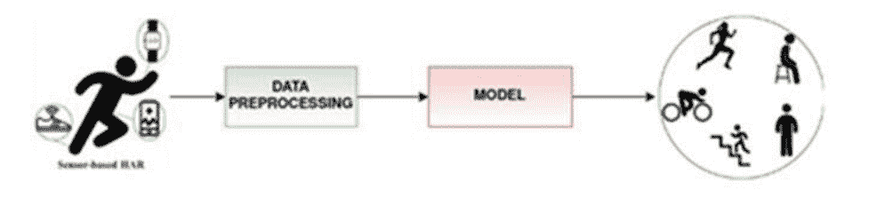

### 2 文献分析

在计算机视觉领域，HAR是一个困难的研究问题。来自世界各地的学者们一直在尝试创建一个几乎无缺陷的识别系统。HAR已经成为深入研究的焦点。Singh等人[6]对这个领域进行了全面的调查。跟上最新的程序和它们产生的结果是必要的，因为这个领域正在迅速扩展。本节主要总结了以前的一般活动和我们选择的数据集相关的活动。

机器学习技术的好处引起了研究学者对使用深度学习模型识别HAR的兴趣。某些技术根据获取的原始传感器数据（时间序列信号）对提出的模型进行分类，而其他技术将信号转化为视觉信息，如频谱或数字图像，用于动作识别，如图2所示。

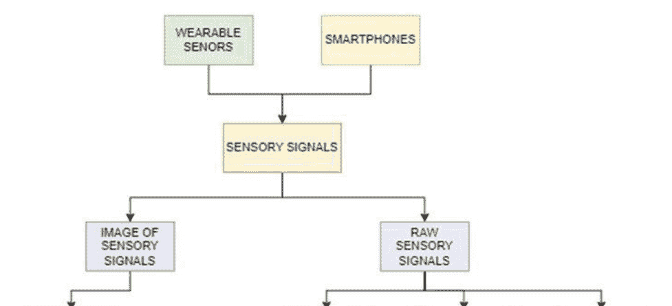

最近，卷积神经网络（CNN）已成为提取和分类大规模图像的有用技术[7]。此外，学者们对时间序列数据信号的可视化表示非常着迷，并且已经开始使用CNN对时间序列数据信号进行分类。它具有很大的能力。因此，一些HAR系统将原始时间序列信息转化为数字图片和频谱图像等视觉提示，然后使用CNN进行分类。

Lawal和Banu[8]通过将佩戴设备提供的多个时间序列（运动）数据融合成特定频率图像进行分类来解决多模态传感器活动检测系统。Qin等人[9]将时域信号转换为与其他传感器输入相结合的2通道图像，以应对来自多个传感器的不同输入。2020年，Lawal和Banu提出的层次结构使用了剩余融合网络，而不仅仅是这种建议技术中的卷积块3。在评估过程中，使用了不同的数据集进行了重要的实验。

由于局部依赖和尺度不变性的好处，深度学习方法在处理时间序列数据信号的特征提取和分类方面非常有能力。近年来，越来越多的研究人员开始使用CNN、长短期记忆（LSTM）和混合模型等出色的深度学习方法来改进HAR应用的识别能力[10]。

由于限制的存在，研究人员开始在这个研究领域中使用图神经网络（GNN）和其他集成模型，以获得更好的性能和更高的准确性。由于需要大量的训练信息，并且耗时且资源低效，基于CNN的模型存在一些缺点。为了克服上述问题，Mondal等人[11]构建了一个使用结构图来描述时间序列数据的GNN模型。

Bhattacharya等人[12]提出了使用基础分类器模型（CNN、LSTM和混合模型）进行集成堆叠预测的方法。Das等人[13]提出了一种MMHAR-EnsemNet，并通过结合使用传感器数据和RGB照片训练的模型的结果，显著提高了模型的效率。通过以“多数投票”、“求和规则”和“得分融合”等多种方式组合现有的深度学习分类器，Mukherjee等人[14]提出了三种基本分类方法（CNN-Net、Encoded-Net和CNN-LSTM）的集成模型。这提高了整体模型的性能。

为了识别3D骨骼动作，Banerjee等人[15]建议基于CNN模型的模糊积分融合，以识别人类的日常行为，使用移动传感器监测健康[16]。

CNN可以对图像进行分类，还可以对原始时间序列数据信号进行分类。一些研究人员利用CNN模型来识别原始的多传感器信息并识别人类动作。CNN特征提取相比传统的HAR浅层和表面学习方法具有多个优势，包括局部依赖性和尺度不变性，以及捕捉多个特征之间所有可能的复杂非线性关系的能力[17]。

陈和薛提出了一种用于从智能手机三轴加速度计信息中识别简单活动的CNN模型[18]。为了处理三轴加速度计数据，构建了CNN模型，并升级了卷积核。Ronao和Cho [19]使用了先前研究过的卷积操作层和适度的池化大小构建了一种独特的CNN架构，用于提取复杂信息。通过使用CNN生成的原始信息和快速傅里叶变换信号的时间特征来评估建议的技术。

在接下来的小节中，我们将讨论与我们研究所选择的HAR数据集相关的先前工作。

### 3 机会数据集

CNN模型通常需要大量的计算资源来提取和分类特征，因为它们使用了大量的滤波器和映射。 为了降低功耗和设备设施成本，创建了一个用于从三轴智能手机信号中提取特征的CNN模型[20]。

使用Lego滤波器而不是卷积滤波器来最小化CNN的内存和处理成本[21]。所提出的极简主义模型不需要特定的网络架构或计算资源，从而提高了实验性能和可扩展性。与[21]类似，程等人[22]采用条件参数化的HAR卷积来构建一种新颖的计算机高效HAR算法，适用于智能手机和可穿戴传感器设备。为了证明基线级模型的更大网络的效率，进行了实验。所提出的智能手机人体活动检测系统通常依赖于移动电话在实验过程中的位置，即它们与人体参与者的相对位置固定。 例如，智能手机垂直固定在人体主体的腰带上等。

与CNN模型对图像进行分类不同，LSTM算法在预测原始时间序列数据方面表现出色。 CNN算法使用“空间相关性”对图片进行分类，而LSTM系统通过反馈连接评估时间序列数据进行分类。 关于LSTM模型相对于CNN模型的优势，作者提供了基于LSTM的HAR模型的替代方法。

Rashid等人[23]通过开发低能耗自适应CNN技术扩展了CNN技术，该技术既节能又易记。 通过前向和后向状态以及良好和差劲的时间方向，Zhao等人[24]构建了一个双向残差LSTM系统，利用建议系统的潜力和数据集进行了复杂动作测试，以展示记忆重要性和能量效率。 通过在整齐堆叠的单元之间使用残差连接，可以防止梯度消失。

利用启发式方法获得的本地特征是HAR系统中最受欢迎的解决方案。 传统的学习机器方法除了成为本地最小值的世界级答案外，还很容易实现。深度混合方法是基于卷积神经网络（CNN）在LSTM循环单元中集成和ELM分类操作的研究项目中提出的[25]。在机会和超越非循环神经网络模型的基础上，测试了建议的框架。

CNN-LSTM方法减少了模型的复杂性，同时不需要昂贵的特征工程，同时提高了从原始传感器数据预测人们活动的准确性。CNN-LSTM网络跨越空间和时间。人体动作识别的CNN-LSTM方法结合了CNN网络提取特征的可靠性和LSTM模型的时间序列分析和分类工作，以提高活动分类的效率。

根据各种情况，包括充分的训练、令人困惑的行为和传感器位置，混合系统预计比典型的深度学习技术更成功。Xia等人提出了一种将LSTM模型与CNN和全局池（GAP）相结合的深度混合模型[26]。与标准的全连接层不同，采用了GAP。此外，批量标准化用于加快所提出系统的收敛速度，遵循GAP。

大多数HAR设备设计用于基本的身体活动，并且难以识别复杂的身体行为。Qi等人提出了一种用于监测和检测动态和复杂人类行为的自适应识别框架[27]。除了复杂的动作外，还建立了一种用于识别短期和长期过渡活动的深度学习系统[28]。该研究构建了一个CNN来提取特征，并使用LSTM网络来管理HAR识别率改进参数之间的相互依赖关系。

可穿戴传感模型精确地识别动作及其转换。

建议的HAR技术，如[27, 28]所示，遇到了一些挑战，主要是在识别相同和复杂的行为，例如行走、上楼爬行等方面。为了克服这些障碍，吕等人[29]提出了一种边际方法来推导具有区分性的分类特征。所提出的边际方法改变了四个神经网络，并将它们的结果与传统模型在几个基准数据集上进行了比较。

他们想要展示他们如何使多模态HAR更易理解。最近，高等人[30]开发了一种基于CNN模型的新型双注意力系统，名为DanHAR，它结合了通道和时间注意力。Ord ez和Roggen [31]提出了DeepConvLSTM模型，该模型基于递归神经网络的能力来区分多模态活动，并特别描述了特征激活的时间动态。表1描述了在OPPORTUNITY [4]数据集上进行的先前HAR工作的总结。

##### 表1 对OPPORTUNITY数据集上最新的一些HAR方法进行性能评估[4]

| 作者 | 出版年份 | 分类模型 | 准确率 (%) |
|------|----------|----------|------------|
| 赵等人[24] | 2018 | 残差双向LSTM | 90.5 |
| 孙等人[25] | 2018 | CNN + LSTM + ELM | 90.6 |
| 唐等人[21] | 2019 | CNN + 乐高积木 | 86.10 |
| 程等人[22] | 2020 | 带批归一化的CNN | 81.18 |
| 夏等人[26] | 2020 | LSTM + CNN + GAP | 92.63 |
| 吕等人[29] | 2020 | 混合模型 | 92.30 |
| 拉希德等人[23] | 2021 | 自适应CNN | 91.57 |

### 4 MHEALTH数据集

Khatun和Morshed [32]探索了将树算法与一种留一主题策略相结合的集成方法，以发现在计算平台上识别具有重要意义的频繁动作时处理空值的最佳方式。此外，作者还专注于使用少量数据和设备传感器实现实际应用。Singh等人[33]提出了一种深度神经网络的设计，除了捕捉各种传感器在时间上的时空特征外，还通过自注意机制选择和学习关键时间点。

Khatun等人[34]开发了一种混合分类模型，该模型集成了CNN-LSTM，并受到自注意技术的启发，以增强系统的预测能力。

Gumaci等人[35]提出了一种基于多传感器的高效架构，用于基于混合深度学习模型的人体活动检测，该模型集成了神经网络“简单循环单元（SRUs）”和“门控循环单元（GRUs）”。作者使用深度SRUs处理多模态输入传感器数据序列，通过使用其内部存储状态。为了解决振荡、一致性问题和梯度消失问题，他们还使用了深度GRUs来抓住并记住从过去传递到未来期望状态的信息量。

Debache等人[36]通过使用加速度计和陀螺仪输入，提出了一种基于机器学习的新方法来对人类活动进行分类。他们使用从滤波信号中提取的一组减少的特征，然后应用了一种新颖的层次分类器系统进行逻辑回归。此外，该方法显著降低了计算成本，不需要特征选择或超参数调整。

使用三轴惯性传感器，可以监测连续的人体运动序列，Jalal等人[37]提供了一个具有各种集成特性的独特HAR系统。为了确定理想的可穿戴传感器数据，建议的HAR系统对1D信号应用陷波滤波器，并考虑下限/上限截止频率。随后，它计算了一些组合特征，包括统计特征，梅尔频率倒谱系数和高斯混合模型特征。使用二进制灰狼优化算法作为分类器给出分类和识别引擎。

为了改善理想特征的值，Tahir等人[38]提出了一个多融合模型。然后使用自适应矩估计和具有最高熵的马尔可夫模型来优化和分类给定的特征值。

在MHEALTH数据集[3]上，这种方法的准确率达到了90.91%。Jordao等人[39]构建了卷积神经网络，用于识别人体运动的可穿戴传感器数据。当作者们在MHEALTH [3]数据集上使用“留一位参与者”验证协议测试该方法时，准确率为83%。表2总结了一些先前在MHEALTH数据集上进行的HAR工作。

##### 表2 在MHEALTH [3]数据集上对一些最新的HAR方法进行性能评估

| 作者 | 出版年份 | 分类模型 | 准确率 (%) |
|------|----------|----------|------------|
| Jordao等人[39] | 2018 | 卷积神经网络 | 83 |
| Debache等人[36] | 2020 | 逻辑回归 | 98.2 |
| Jalal等人[37] | 2020 | 决策树分类器 +二进制灰狼优化算法 | 93.95 |
| Tahir等人[38] | 2020 | 混合模型 | 90.91 |
| Singh等人[33] | 2020 | CNN + LSTM + SAL + SL | 94.86 |
| Khatun等人[34] | 2022 | 深度卷积神经网络+长短时记忆网络+自注意力 | 98.76 |

### 5 HARTH数据集

最近，Logacjov等人[5]在2022年开发了人类活动识别Trondheim (HARTH) 数据集，并免费提供给研究社区使用。我们在当前研究中也使用了这个数据集。作为研究的第二个贡献，该数据集被用于训练七种不同的基准机器学习模型进行HAR。除了k最近邻、随机森林、极限梯度提升、CNN、双向LSTM和具有多分辨率块的CNN外，作者还使用了支持向量机。支持向量机在交叉验证中留出一个主题后，F1得分为0.81（标准差：0.18），召回率为0.85 ± 0.13，准确率为0.79 ±0.22，产生了最佳结果。

### 6 材料和方法

#### 6.1 一些初步工作

CNN，作为深度神经网络的一个子集，经常在各种图像分析和识别应用中使用[40]。

卷积在理论上被描述为对两个函数进行的数学运算，产生一个展示第二个函数如何影响或转换第一个函数形状的第三个函数[10]。

#### 6.2 卷积神经网络的基本架构

卷积神经网络的架构由两个关键组件组成：
- 特征提取是一种卷积方法，用于提取和检测图像的独特特征以进行分析。
- 全连接层接收卷积过程的输出，并根据之前收集的特征预测图像的类别。

卷积神经网络层分为三种类型：卷积层、池化层和全连接层（FC）[15]。图3显示了卷积神经网络架构的示意图。

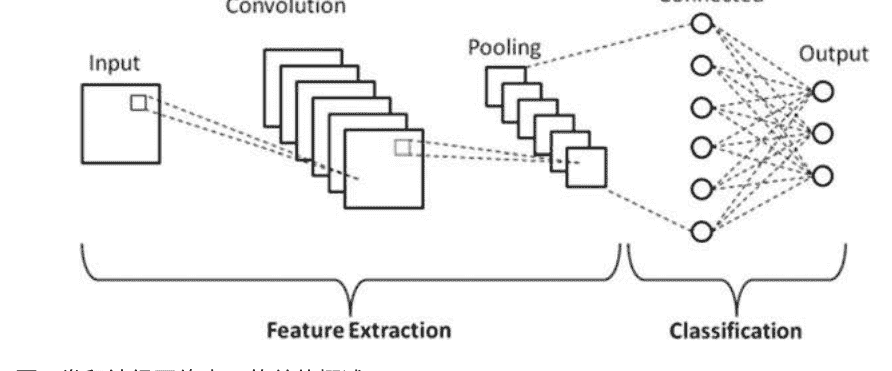

### 7 长短期记忆（LSTM）

LSTM网络主要是为了解决循环神经网络（RNN）长期依赖的问题（由于梯度消失问题）而创建的。反馈连接的添加使得LSTM与标准前馈神经网络[26]有所区别。这种特性使得LSTM能够分析完整的数据序列（例如时间序列数据序列），而无需独立地检查序列中的每个点，通过保持关键细节来帮助处理传入的数据单元。

因此，LSTM在处理数据序列（包括文本、一般时间序列和音频）方面特别擅长。图4显示了LSTM的表示。

#### 7.1 LSTM的工作原理
- 细胞状态是网络的当前长期记忆。

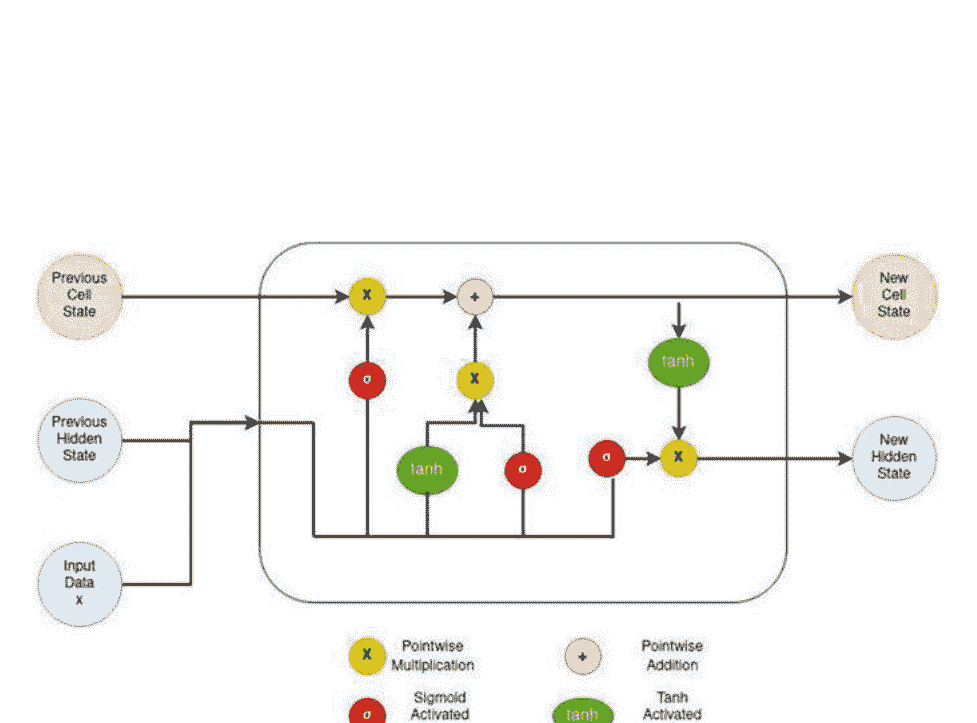先前的隐藏状态-来自上一个时间点的结果

-   当前时间步的输入数据
为了调节数据在数据序列中的进入、保留和离开网络，LSTM使用一组“门”。LSTM基本上由3个门组成：遗忘门、输入门和输出门。这些门的功能类似于过滤器，但它们每个都有自己的神经网络[31]。

8个提出的模型架构

建议的基于CNN-LSTM的深度学习模型的架构如图5所示。

在这项工作中，使用不同的数据集构建了一种自动预测人类活动的组合方法。CNN网络用于从传感器数据中提取复杂特征，而LSTM网络则作为架构中集成的两个网络的分类器。网络由总共11层组成：2个卷积层，2个批归一化层，2个ReLU层，1个LSTM层，1个最大池化层和一个带有Softmax函数的输出层。为了提取特征，ReLU函数激活具有3×3内核大小的卷积层。减少输入维度的一种方法是使用具有2个池大小的最大池化层。函数映射在架构的最后部分提供给LSTM层，以提取时间数据，然后将其传递给密集层和激活函数以获取输出。

两个1D卷积层构成了CNN特征提取块（更多细节请参见图5a）。

在两个连续的卷积层之间，我们添加了批量归一化和修正线性单元（ReLU）层。深度学习模型中的许多卷积层使得初始层能够学习应用输入中的低级特性因为卷积操作非常高效。卷积层的输出，特征图，有一个限制，即保留输入特征的确切位置的记录。

这意味着即使在输入特征位置内部进行微小的更改也会产生不同的特征图。在卷积层之后，通常会添加一个池化层以减小特征图的不变性约束，同时增强模型学习复杂结构的能力。我们在模型中加入了一个最大池化层，这是一种降采样方法，将特征图的空间维度减小了2倍，降低了总体计算成本。研究人员通常使用ReLU激活函数使网络更易训练，因为它对梯度消失具有抵抗力。

在创建CNN模型时，通常使用粗到细的策略。由于可训练参数很多，这种结构需要更多的计算工作。我们在序列学习块中使用了一个具有64个神经元的LSTM层。最后，我们使用了128个单元的密集层。图5b显示了

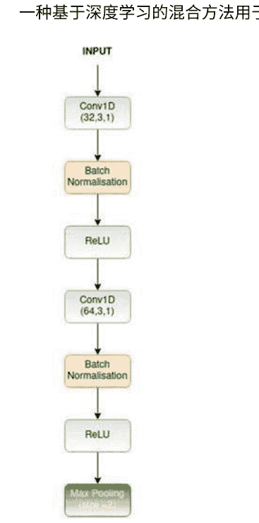

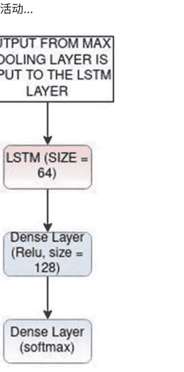

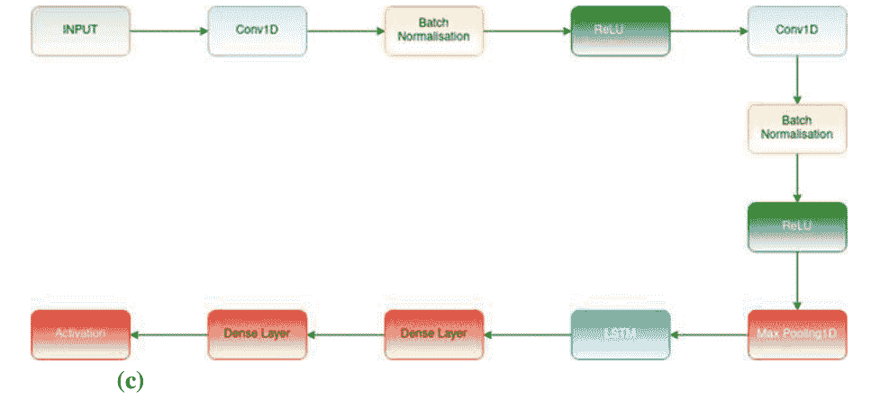

图5 基于CNN-LSTM的建议 aCNN模型的设计, bLSTM层和 c深度学习框架用于解决HAR问题

表3 建议的CNN-LSTM模型的超参数

| 参数 | 参数值 |
| :--- | :--- |
| 优化器 | Adam |
| 学习率 | 0.01 |
| 批量大小 | 32 |
| 损失函数 | 稀疏分类交叉熵 |
| 时期 (MHEALTH) | 30 |
| 时期 (OPPORTUNITY) | 100 |
| 时期 (HARTH) | 20 |

建议的LSTM层。图5c显示了我们提出的混合模型的图示表示。表3显示了我们提出的混合模型的超参数。

### 9 数据集描述

#### 9.1 MHEALTH 数据集

在这项工作中，使用了UCI机器学习库的MHEALTH [3]数据集。数据来自10个具有不同特征的人，在进行12种体力活动时获取，包括静止站立、坐着放松、躺下、行走、爬楼梯、腰部前弯、双臂前伸、膝盖弯曲（蹲下）、骑自行车、慢跑、奔跑和前后跳跃。

数据是使用可穿戴设备传感器（加速度计、陀螺仪和磁力计）收集的（有关更多详细信息，请参见表4）。传感器通过弹性带固定在受试者的胸部、左脚踝和右手腕上。在十个受试者中，前八个受试者的数据被视为训练集，而剩下的两个受试者则用于测试部分。测试和训练数据都是通过固定大小的滑动窗口进行分段的，每个窗口包含100个时间戳。数据以50 Hz的采样率收集。使用视频录制设备记录和分类每个会话。数据是在无限制的实验室外环境中获取的。

#### 9.2 机会数据集

机会数据集[4]包含17个复杂的手势和运动类型，在传感器丰富的环境中获取。它包括四个人在日常生活场景中执行早晨任务的录音。各种模式的传感器已植入周围环境、物体和人体。就传感器配置而言，机会[4]挑战规则

传感器/设备 | 位置 | 方向
:--- | :--- | :---
加速度计 | 胸部 | XYZ
 | 左脚踝 | XYZ
 | 右前臂 | XYZ
陀螺仪 | 左脚踝 | XYZ
 | 右前臂 | XYZ
磁力计 | 左脚踝 | XYZ
 | 右前臂 | XYZ

 | 
:--- | :---
打开门1 | 打开抽屉1
打开门2 | 关闭抽屉1
关闭门1 | 打开抽屉2
关闭门2 | 关闭抽屉2
打开冰箱 | 打开抽屉3
关闭冰箱 | 关闭抽屉3
清理桌子 | 打开洗碗机
切换开关 | 关闭洗碗机
从杯子里喝 | 

被遵循。我们只考虑了身体的传感器，包括12个蓝牙3轴加速度传感器，2个脚上的InertiaCube3传感器和运动夹克上的5个惯性测量单元。在记录过程中，每个参与者都经历了五个日常生活活动（ADL）会话和一个演练会话。由于每个传感器轴都被视为单独的通道，输入空间有113个通道。这些传感器的采样频率为30赫兹。在本文中，我们的重点仅在于识别不规则运动。因此，这是一个包含17个活动类别的分割和分类任务。表5总结了此数据集中包含的动作，括号中的字母表示手势符号。使用滑动窗口方法对数据进行分段，整个数据集被分割成固定大小的窗口，每个窗口包含32个数据点，重叠率为50%。训练集占分段数据集的70%，而测试集占30%。

#### 9.3 HARTH数据集

该数据集包含22个被试者的加速度数据，他们在下背部和大腿上佩戴了两个三轴Axivity AX3加速计。专家们独立评估了来自摄像头的视觉流数据，并且具有良好的互评一致性。 每个参与者被分配了一组包括行走、跑步、拖曳、上楼梯和下楼梯、站立、坐着和躺下，以及骑自行车（站立）、骑自行车（坐着）、骑自行车（坐着，不活动）和骑自行车（站立，不活动）的12个不同任务。

## 10个实验结果

在一台配有Intel® CoreTM i3-3120M CPU @ 2.50 GHz 4 CPU、12 GigsRAM和NVIDIA® HD Graphics 4000 (IVB GT2) GPU的系统上， 我们训练和测试了模型。 该机器运行64位Fedora 32操作系统。 我们使用了Python 3.9版本、TensorFlow 2.7.0版本、Keras和Scikit learn模块来创建建议的模型。

#### 10.1 评估指标使用

数据被分为两组进行评估技术：训练和测试。然后调整模型以适应训练数据集。 测试集用于进行预测。 我们使用“精确度”、“召回率”、“F1-得分”和“准确度”这些性能指标来分析我们的HAR模型。从准确度开始，通过将正确分类的实例数除以总样本数来计算。

```
$$准确率 = \frac{T_p + T_n}{T_p + T_n + F_p + F_n} \times 100\%\tag{1}$$
```

在正类中，正确分类的记录数被称为T_p（真正例）， 而在负类中，正确分类的记录数被称为T_n（真负例）。 被错误分类为正类或负类的记录数由F_p（假正例）和F_n（假负例）表示。

“精确率”是指正确识别的正样本与预测为正样本的样本以及实际为正样本的样本之比。

```
$$精确率 = \frac{T_p}{T_p + F_p}\tag{2}$$
```

召回率是指正确分类为正样本的正样本与所有正样本之比。 召回率衡量模型在区分正样本方面的效果。

```
召回率 = \frac{T_p}{T_p + F_n} (3)
```

F1度量（F1得分）是另一个重要的统计量，因为它将准确率和召回率结合为一个指标。因此，F1得分提供了模型性能的更真实的表示。在类别不平衡的情况下，F1得分被认为是最佳选择，因为类别根据样本比例给予重要性。F1得分的计算公式如下：

```
F1得分 = \frac{2 \times 精确率 \times 召回率}{精确率 + 召回率} (4)
```

#### 10.2 MHEALTH数据集上的结果分析

从MHEALTH [3]数据集中预处理的样本被分为训练（70%）和测试（30%）数据集，用于上述模型的训练和测试。总共考虑了1,215,745条所有活动的记录进行实验。用于训练的记录总数为851,000条，剩余的364,700条用于测试目的。表6显示了MHEALTH数据集每个活动类别的精确度、召回率、F1分数和准确度。

表6 在MHEALTH数据集上，每个活动类别的精确度、召回率、F1分数和准确度的性能测量

| 活动 | 精确率 | 召回率 | F1分数 | 准确率 |
| :--- | :--- | :--- | :--- | :--- |
| 无 | 1 | 1 | 1 | 1 |
| 静止 | 1 | 0.992 | 0.996 | 0.992 |
| 坐着放松 | 0.976 | 1 | 0.988 | 1 |
| 躺下 | 0.992 | 0.992 | 0.992 | 0.992 |
| 行走 | 1 | 0.992 | 0.996 | 0.992 |
| 爬楼梯 | 0.943 | 0.976 | 0.959 | 0.976 |
| 腰部向前弯曲 | 1 | 0.990 | 0.995 | 0.991 |
| 前臂抬高 | 1 | 1 | 1 | 1 |
| 膝盖弯曲（蹲下） | 0.982 | 0.957 | 0.969 | 0.957 |
| 骑车 | 1 | 0.992 | 0.996 | 0.992 |
| 慢跑 | 0.978 | 1 | 0.989 | 1 |
| 跑步 | 1 | 0.981 | 0.990 | 0.981 |
| 前后跳 | 1 | 1 | 1 | 1 |
| 平均 | 0.990 | 0.989 | 0.989 | 0.990 |

图6显示了在使用测试数据评估经过训练的提议模型之后生成的混淆矩阵。根据提议的混合深度学习模型生成的混淆矩阵显示，我们提出的模型对于所有12种活动类型的分类准确率都大于或等于99%，总准确率为99.07%。根据混淆矩阵（如图6所示），除了“爬楼梯”，“向前弯腰”和“前后跳”活动外，我们提出的模型完全对所有活动进行了分类（准确率接近100%）。可以观察到，约有5.95%的属于“爬楼梯”的样本被错误分类为“膝盖弯曲（蹲下）”活动，约有总共1.88%的属于“向前弯腰”活动的样本被错误分类为“静止站立”活动（约0.94%）和“行走”活动（约0.94%），因为它们是相似类型的运动活动。最后，约有3.70%的属于“前后跳”活动的样本由于运动相似性而被错误分类为“跑步”活动。图7a, b分别显示了MHEALTH [3]数据集上的训练与验证准确率和训练与验证损失曲线，从图7a可以清楚地看出，随着epoch的增加，准确率也增加。

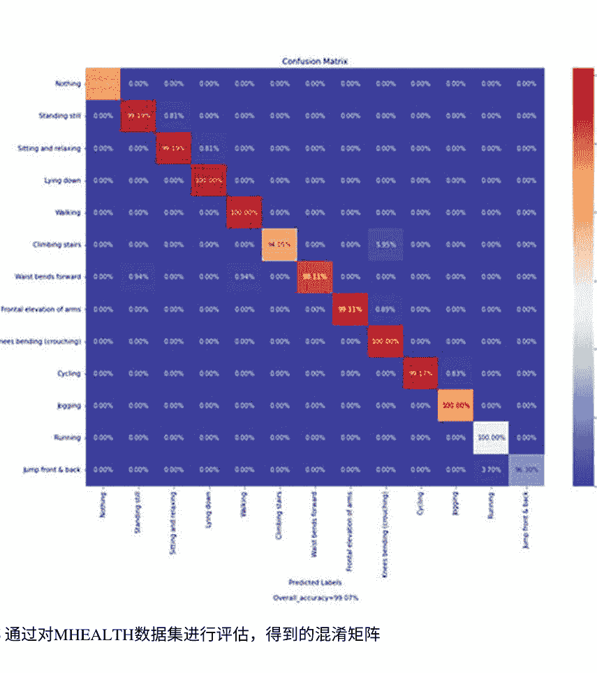

图6通过对MHEALTH数据集进行评估，得到的混淆矩阵

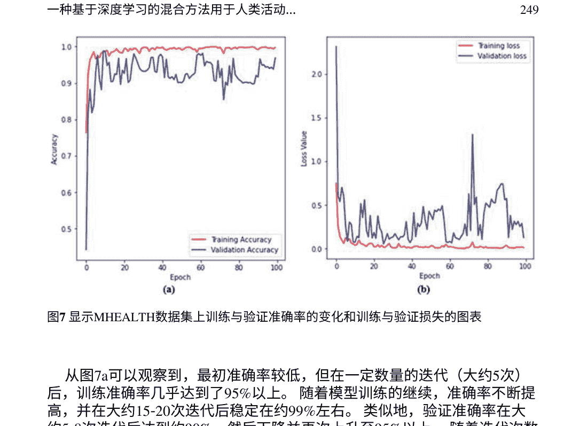

从图7a可以观察到，最初准确率较低，但在一定数量的迭代（大约5次）后，训练准确率几乎达到了95%以上。随着模型训练的继续，准确率不断提高，并在大约15-20次迭代后稳定在约99%左右。类似地，验证准确率在大约5-8次迭代后达到约90%，然后下降并再次上升至95%以上。随着迭代次数的增加，验证准确率增加，并在一定数量的迭代后稳定下来。从图7b可以观察到，最初的训练损失约为1，随着迭代次数的增加，模型训练，损失开始减少。

大约经过20个时期，损失几乎接近于0.0。同样地，验证损失最初超过了2，但随着时期的增加，它减少到了约0.5，在大约5-8个时期之后，验证损失几乎接近于0.1。之后，损失有所波动，但最终达到了约0.1。

#### 10.3 OPPORTUNITY数据集的结果分析

来自OPPORTUNITY [4]数据集的预处理样本被分为训练集（70%）和测试集（30%），用于训练和测试上述模型。总共考虑了1,432,340条所有活动的记录进行实验。使用包含1,002,628条记录的集合进行训练，而剩下的429,702条记录用于测试目的。

表7显示了OPPORTUNITY数据集中每个活动类别的精确度、召回率、F1分数和准确度。图8显示了在使用测试数据评估经过训练的提议模型后生成的混淆矩阵。我们提议的模型的

根据提议的混合深度学习模型生成的混淆矩阵显示，所有活动类别的分类准确率均大于或等于95%，总准确率为95.2%。

根据混淆矩阵（图8所示），被准确分类的前三个活动分别是“整理桌子”，“喝杯子里的东西”和“切换开关”，准确率分别为100%，99.41%和97.93%。被错误分类的活动包括“打开抽屉3”，“关闭抽屉3”，“打开洗碗机”和“关闭洗碗机”。从图中可以看出，约有12.50%的属于“打开抽屉3”活动的样本被错误分类为“关闭抽屉3”活动，约有2.11%的属于“关闭抽屉3”活动的样本被错误分类为“打开抽屉3”活动，因为它们是相反类型的活动。同样，约有3.80%的属于“打开洗碗机”活动的样本被错误分类为“关闭洗碗机”活动，约有10.48%的属于“关闭洗碗机”活动的样本被错误分类为“打开洗碗机”活动，因为它们也是相反类型的活动。

图9a, b显示了OPPORTUNITY [4]数据集上的训练与验证准确率和训练与验证损失曲线。从图9a可以观察到，在模型训练开始时，准确率较低，但经过一定数量的迭代（大约10次），训练准确率逐渐提高。

表7 OPPORTUNITY数据集每个活动类别的精确度、召回率、F1分数和准确率的性能测量

| 活动 | 精确率 | 召回率 | F1分数 | 准确率 |
| :--- | :--- | :--- | :--- | :--- |
| 打开门1 | 0.956 | 0.946 | 0.951 | 0.946 |
| 打开门2 | 0.942 | 0.980 | 0.961 | 0.980 |
| 关闭门1 | 0.96 | 0.955 | 0.958 | 0.955 |
| 关闭门2 | 0.967 | 0.915 | 0.941 | 0.916 |
| 打开冰箱 | 0.894 | 0.959 | 0.925 | 0.959 |
| 关闭冰箱 | 0.968 | 0.906 | 0.936 | 0.906 |
| 打开洗碗机 | 0.887 | 0.899 | 0.893 | 0.899 |
| 关闭洗碗机 | 0.898 | 0.855 | 0.876 | 0.855 |
| 打开抽屉1 | 0.881 | 0.927 | 0.904 | 0.927 |
| 关闭抽屉1 | 0.891 | 0.875 | 0.883 | 0.875 |
| 打开抽屉2 | 1 | 0.901 | 0.948 | 0.9012 |
| 关闭抽屉2 | 0.967 | 0.935 | 0.951 | 0.935 |
| 打开抽屉3 | 0.929 | 0.875 | 0.901 | 0.875 |
| 关闭抽屉3 | 0.818 | 0.947 | 0.878 | 0.947 |
| 清理桌子 | 0.995 | 1 | 0.998 | 1 |
| 从杯子里喝 | 0.996 | 0.994 | 0.995 | 0.994 |
| 切换开关 | 0.953 | 0.979 | 0.966 | 0.979 |
| **平均** | **0.953** | **0.952** | **0.952** | **0.952** |

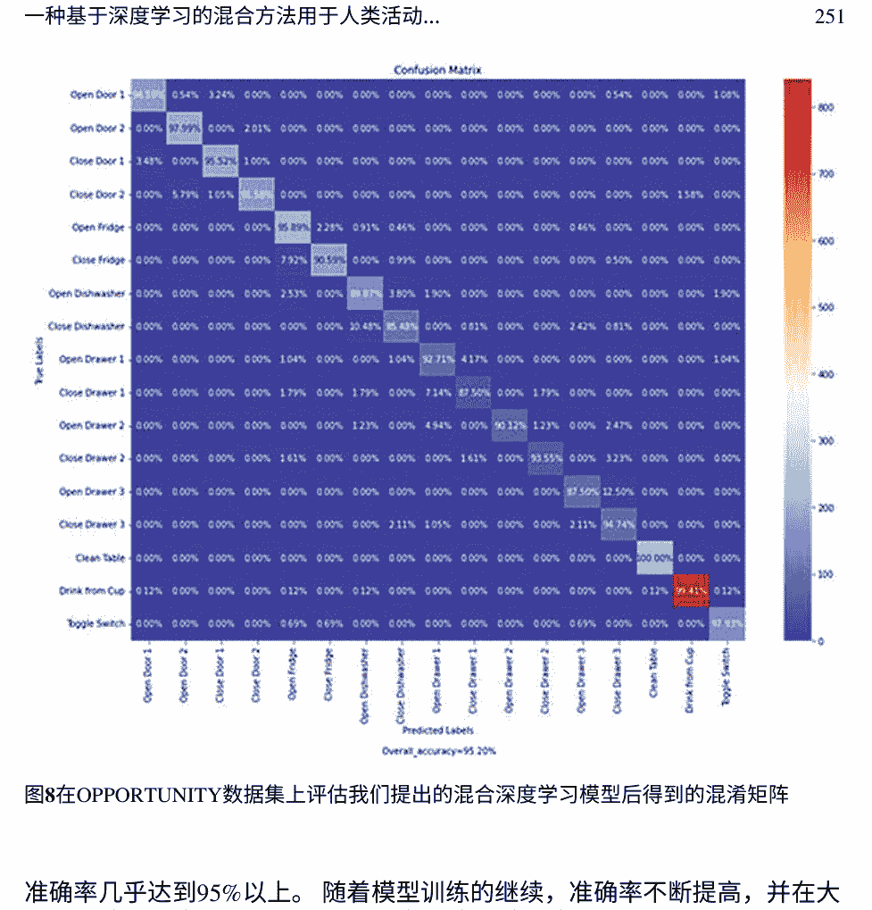

图8在OPPORTUNITY数据集上评估我们提出的混合深度学习模型后得到的混淆矩阵

准确率几乎达到95%以上。 随着模型训练的继续，准确率不断提高，并在大约60次迭代后稳定在约99%左右。 类似地，对于验证集，经过大约十次迭代后，准确率达到约90%，然后下降并再次上升至90%以上。 随着迭代次数的增加，验证准确率逐渐提高，并在一定数量的迭代后稳定下来。从图9b可以观察到，最初的训练和验证损失较大，但随着模型的训练，损失逐渐减小，经过一定数量的迭代（大约20次），损失达到最小值，模型的准确率提高，性能更好。 最初的训练损失约为1，随着迭代次数的增加，模型训练并且损失开始减小。 经过大约20次迭代，损失几乎达到0.1。随着迭代次数的进一步增加，损失值降至0.1以下并稳定，达到最小损失值。

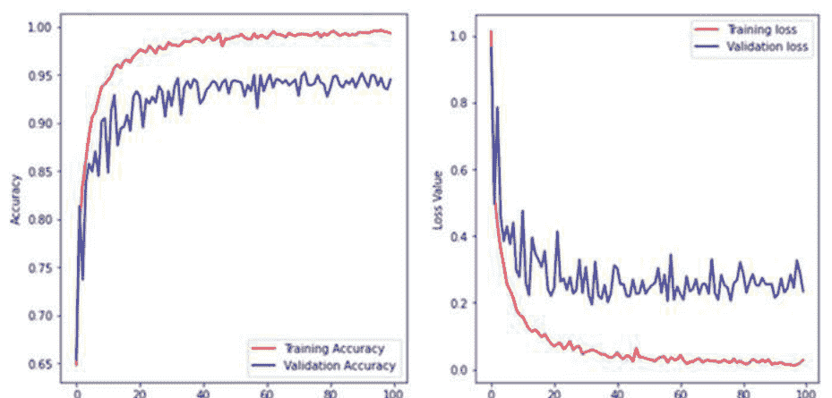

#### 10.4 HARTH数据集上的结果分析

为了训练和测试上述模型，HARTH [5]数据集的预处理样本被分为训练集（70%）和测试集（30%）。总共有6,310,200条记录被考虑用于实验，其中4,417,140条记录用于训练，剩下的1,893,060条记录用于测试。

表8显示了HARTH数据集每个活动类别的精确度、召回率、F1分数和准确度。

图10显示了在使用测试数据评估训练后的提议模型之后生成的混淆矩阵。根据提议的混合深度学习模型生成的混淆矩阵显示，我们提出的模型对于所有活动的分类准确率大于或等于94%，总准确率为94.68%。从混淆矩阵（图10所示）可以看出，被正确分类的前3个活动是行走、跑步和躺着，准确率分别为98.74%、99.72%和99.72%。被错误分类的活动包括'骑自行车（站立，静止）'、'搅拌'和'骑自行车（坐着，静止）'。从图10可以看出，属于'骑自行车（坐着，静止）'活动的样本被错误分类为'行走（0.45%）'、'站立（1.79%）'、'骑自行车（坐着）（37.67%）'和'骑自行车（站立，静止）'（2.24%）'，因为这些活动的运动方式相似。大约有100%的样本属于'骑自行车（站立，静止）'的活动被错误地分类为'站立'（55.36%），'骑自行车（坐着）'（8.93%），'骑自行车（站立）'（8.93%）和'骑自行车（坐着，静止）'（17.86%）的活动，因为它们是相反类型的活动。大约有65.94%的样本的'拖脚'活动被错误地分类为'行走（37.12%）'，'上楼梯（上升）（0.87%）'，'站立（22.27%）'，'坐着'

表8根据HARTH数据集中每个活动类别的精确度、召回率、F1分数和准确度进行的性能测量

| 活动 | 精确率 | 召回率 | F1分数 | 准确率 |
| :--- | :--- | :--- | :--- | :--- |
| 行走 | 0.960 | 0.987 | 0.973 | 0.987 |
| 跑步 | 0.996 | 0.997 | 0.997 | 0.997 |
| 拖脚 | 0.850 | 0.840 | 0.944 | 0.840 |
| 楼梯（上升） | 0.896 | 0.834 | 0.864 | 0.834 |
| 楼梯（下降） | 0.856 | 0.863 | 0.747 | 0.864 |
| 站立 | 0.865 | 0.974 | 0.857 | 0.974 |
| 坐着 | 0.995 | 0.922 | 0.957 | 0.922 |
| 躺着 | 1.000 | 0.997 | 0.999 | 0.997 |
| 骑行（坐着） | 0.925 | 0.970 | 0.947 | 0.969 |
| 骑行（站立） | 0.967 | 0.985 | 0.866 | 0.785 |
| 骑行（坐着，不活动） | 0.832 | 0.978 | 0.804 | 0.878 |
| 骑行（站立，不活动） | 0.908 | 0.893 | 0.925 | 0.893 |
| 平均 | **0.943** | **0.947** | **0.943** | **0.947** |

(0.44%) '，'骑行（站立，不活动） (1.75%) '，'骑行（站立） (0.44%) '和'骑行（坐着） (3.06%) '活动由于它们的线性加速度相似性。

图11a, b显示了HARTH [5]数据集上的训练与验证准确性和训练与验证损失曲线。从图11a可以观察到，在模型开始时，训练准确性较低，但在一定数量的迭代（大约5次）后，训练准确性几乎达到94%以上。随着模型训练的继续，准确性呈线性改善，大约在40次迭代后达到96%左右。类似地，验证准确性在开始时达到约93%，在几次迭代后，验证准确性有所波动。最终，我们得到了约94.68%的验证准确性。

从图11b可以观察到，在模型训练开始时，训练损失约为0.4，但随着模型训练的继续，损失逐渐减小，大约在40个周期后，损失变得最小，约为0.1。但验证损失并非如此；最初，验证损失很小，约为0.25，但经过几个周期后，损失增加，最终达到约0.30。

该数据集中使用的活动与骑行（坐着，不活动）类似，类似于坐/站立，而骑行（站立，不活动）则非常类似于站立活动。由于所有这些活动的运动相似，模型无法准确预测。从混淆矩阵（图10所示）可以观察到，“骑行（坐着，不活动）”活动被错误分类为“行走”，“站立”，“骑行（坐着）”和“骑行（站立，不活动）”，因为这些活动在运动上相似。此外，“骑行（站立，不活动）”活动被错误分类为“站立”等活动。

图10 在HARTH [5]数据集上测试我们提出的混合深度学习人体动作识别模型后获得的混淆矩阵

图11 显示在HARTH数据集上训练与验证准确率的变化和训练与验证损失的变化的图表

因此，验证损失增加了，包括‘骑自行车（坐着）’，‘骑自行车（站着）’和‘骑自行车（坐着，不活动）’。

#### 10.5 结果总结和比较

表9总结了我们提出的混合深度学习人体动作识别模型在三个数据集上的整体结果，包括准确率、精确率、召回率和F1分数。另一方面，表10比较了我们提出的混合深度学习人体动作识别模型与在MHEALTH、OPPORTUNITY和HARTH数据集上实施的一些早期方法。

表9 总结了在MHEALTH、OPPORTUNITY和HARTH数据集上提出的人体动作识别模型的结果

| 数据集 | 准确率 (百分比) | 精确度 (加权平均) | 召回率 (加权平均) | F1得分 (加权平均) |
|--------|-----------------|-------------------|-------------------|-------------------|
| MHEALTH [3] | 99.07 | 0.991 | 0.991 | 0.991 |
| OPPORTUNITY [4] | 95.2 | 0.953 | 0.952 | 0.952 |
| HARTH [5] | 94.68 | 0.942 | 0.946 | 0.943 |

表10 我们提出的混合深度学习人体动作识别模型与最近开发的人体动作识别模型在三个数据集上的性能比较

| 数据集 | 作者 | 模型/分类器 | 准确率 (%) |
|--------|------|-------------|------------|
| MHEALTH [3] | Singh等人[33] | CNN + LSTM +自注意力层 +Softmax层 | 94.86 |
| | Khatun等人[32] | 深度CNN + LSTM + 自注意力 | 98.76 |
| | Jalal等人[37] | 决策树分类器 +二进制灰狼优化算法 | 93.95 |
| | Debache等人[36] | 逻辑回归 | 98.2% ± 2.7 |
| | 提出的 | 混合CNN + LSTM模型 | 99.07 |
| OPPORTUNITY [4] | 赵等人[24] | 残差双向LSTM | 90.5 |
| | 拉希德等人[23] | 自适应CNN | 91.57 |
| | 吕等人[29] | 混合模型 | 92.30 |
| | 夏等人[26] | LSTM + CNN + GAP | 92.63 |
| | 提出的 | 混合CNN + LSTM模型 | 95.2 |
| HARTH [5] | Logacjov等人[5] | 支持向量机 | 0.79 ± 0.22 |
| | 提出的 | 混合CNN + LSTM模型 | 94.68 |

### 11 结论和未来工作

在这项研究中，我们为基于可穿戴传感器的人体动作识别问题开发了一种基于混合深度学习的策略。我们提出的模型在MHEALTH、OPPORTUNITY和HARTH这三个公开可访问的标准数据集上表现出色，并且在预测活动方面表现出色。我们在上述三个数据集上实现的识别准确率分别为99.07%、95.2%和94.68%，非常令人满意。此外，它在考虑的数据集上优于各种尖端技术。然而，这项工作仍有改进的空间。

如果我们继续进行这项研究，还有很多其他主题可以进行调查。我们可以采用更复杂的混合模型，并测试效率是否可以提高。此外，我们还可以包括来自我们自己构建系统的数据集。在现实世界中，数据集中经常混入很多噪音和错误，因此在这种情况下，我们必须使用一些过滤器来消除噪音。

在未来，研究人员甚至可以研究复合活动识别，比如一个人站在浴室、厨房或卧室。这些场景之间存在差异，因此我们可以在未来将这些场景分开，并添加一些传感器来准确定位人的位置。此外，在将时间序列数据纳入系统之前，可以进行分析。我们还可以使用一些新的基于数学图的概念，如马尔可夫转移场（MTF）和格拉米安角场（GAF），将每个时间序列原始传感器数据转换为视觉图像或矩阵[41]。这些图像随后可以在CNN和其他深度学习评估模型[42]以及迁移学习方法[2]中使用。

### 参考文献

- 1. Bhattacharya, S., Shaw, V., Singh, P.K., Sarkar, R., Bhattacharjee, D.: SV-NET:一种基于深度学习的视频人体活动识别方法。 在: 第11届国际软计算与模式识别会议论文集，卷1 182，第10-20页（2019年）。 https://doi.org/10.1007/978-3-030-49345-5_2
- 2. Chakraborty, S., Mondal, R., Singh, P.K., Sarkar, R., Bhattacharjee, D.: 细调的迁移学习用于从静态图像中识别人体动作。 Multimed. Tools Appl. 80,20547–20578 (2021). https://doi.org/10.1007/s11042-021-10753-y
- 3. Banos, O., Villalonga, C., Garcia, R., Saez, A., Damas, M., Holgado-Terriza, J.A., Lee, S., Pomares, H., Rojas, I.: 设计、实施和验证一种新型的开放框架，用于敏捷开发移动健康应用。 Biomed. Eng. Online 14, 1–20 (2015). https://doi.org/10.1186/1475-925X-14-S2-S6
- 4. Roggen, D., Calatroni, A., Rossi, M., Holleczek, T., Tröster, G., Lukowicz, P., Pirkl, G., Bannach, D., Ferscha, A., Doppler, J., Holzmann, C., Kurz, M., Holl, G., Chavarriaga, R., Sagha, H., Bayati, H., Millán, J.R.: 在高度丰富的网络传感器环境中收集复杂活动数据集。 In: 第7届国际网络感知系统会议论文集，第233-240页（2010年）。 https://doi.org/10.1109/INSS.2010.5573462
- 5. Logacjov, A., Bach, K., Kongsvold, A., Børdstu, H.B., Mork, P.J.: HARTH: 用于机器学习的人类活动识别数据集. 传感器 21 (23), 1-19 (2021年). https://doi.org/10.3390/s21237853
- 6. Singh, P.K., Kundu, S., Adhikary, T., Sarkar, R., Bhattacharjee, D.: 过去十年中人类行为识别研究的进展:一项综合调查. 计算方法档案 29(1), 2309–2349 (2022). https://doi.org/10.1007/s11831-021-09681-9
- 7. Um, T.T., Babakeshizadeh, V., Kulić, D.: 使用卷积神经网络从大规模可穿戴传感器数据中进行运动分类. 在: IEEE/RSJ国际智能机器人与系统会议, pp. 2385–2390 (2017). https://doi.org/10.1109/IROS.2017.8206051
- 8. Lawal, I.A., Bano, S.: 带有可穿戴传感器定位的深度人体活动识别. IEEE Access 8(1), 155060–155070 (2020). https://doi.org/10.1109/ACCESS.2020.3017681
- 9. 秦, 张, 孟, 秦, 朱, K.K.R.: 基于可穿戴传感器的时间序列成像和融合用于人体活动识别. Inf. Fusion 53(1), 80–87 (2020). https://doi.org/10.1016/j.inffus.2019.06.014
- 10. Mondal, R., Mukhopadhyay, D., Barua, S., Singh, P.K., Sarkar, R., Bhattacharjee, D.: 基于深度学习方法的智能手机传感器人体活动识别研究。 在: 生物医学工程与医疗保健中的计算智能手册, 第343–369页 (2021年). https://doi.org/10.1016/B978-0-12-822260-7.00006-6
- 11. Mondal, R., Mukherjee, D., Singh, P.K., Bhateja, V., Sarkar, R.: 一种基于图神经网络的智能手机传感器人体活动识别新框架. IEEE Sens. J. 21(10), 11461–11468 (2021). https://doi.org/10.1109/JSEN.2020.3015726
- 12. Bhattacharya, D., Sharma, D., Kim, W., Ijaz, M.F., Singh, P.K.: Ensem-HAR: 一种用于智能手机传感器人体活动识别的集成深度学习模型, 用于测量老年人健康监测. 生物传感器 12, 1–25 (2022). https://doi.org/10.3390/bios12060393
- 13. Das, A., Sil, P., Singh, P.K., Bhateja, V., Sarkar, R.: MMHAR-EnsemNet: 一种多模态人体活动识别模型. IEEE Sens. J. 21(10), 11569–11576 (2021). https://doi.org/10.1109/JSEN.2020.3034614
- 14. Mukherjee, D., Mondal, R., Singh, P.K., Sarkar, R., Bhattacharjee, D.: EnsemConvNet:一种使用智能手机传感器进行人体活动识别的深度学习方法, 用于医疗保健应用. 多媒体工具应用程序 79 (41), 31663-31690 (2020年). https://doi.org/10.1007/s11042-020-09537-7
- 15. Banerjee, A., Singh, P.K., Sarkar, R.: 基于模糊积分的CNN分类器融合用于3D骨架动作识别. IEEE交易. 电路系统. 视频技术 31, 2206-2216 (2021年). https://doi.org/10.1109/TCSVT.2020.3019293
- 16. Ghosh, R., Chattopadhyay, S., Singh, P.K.: 使用移动传感器识别日常生活中的人体活动, 用于健康监测. 在: 物联网和数据挖掘用于现代工程和医疗应用 (2022年). https://doi.org/10.1201/9781003217398-3
- 17. Wang, J., Chen, Y., Hao, S., Peng, X., Hu, L.: 基于传感器的活动识别的深度学习:一项调查. 模式识别信件 119 (1), 3-11 (2019年). https://doi.org/10.1016/j.patrec.2018.02.010
- 18. 陈, Y., 薛, Y.: 基于单个加速度计的人体活动识别的深度学习方法. 在: IEEE国际系统、人类和控制论大会论文集, 第1488-1492页 (2015年). https://doi.org/10.1109/SMC.2015.263
- 19. Ronao, C.A., Cho, S.B.: 使用智能手机传感器进行人体活动识别的深度学习神经网络. 专家系统应用 59 (1), 235-244页 (2016年). https://doi.org/10.1016/j.eswa.2016.04.032
- 20. 万, S., 齐, L., 徐, X., 童, C., 顾, Z.: 用于实时人体活动识别的深度学习模型与智能手机. 移动网络应用 25 (2), 743-755页 (2020年). https://doi.org/10.1007/s11036-019-01445-x
- 21. 唐, Y., 滕, Q., 张, L., 闵, F., 何, J.: 使用可穿戴传感器进行人体活动识别的高效卷积神经网络与较小滤波器 (2020年). arXiv预印本arXiv:2005.03948
- 22. 程, X., 张, L., 唐, Y., 刘, Y., 吴, H., 何, J.: 在移动和可穿戴设备上使用有条件参数化卷积进行实时人体活动识别。arXiv预印本arXiv:2006.03259, 1-10 (2020年). https://doi.org/10.48550/arXiv.2006.03259
- 23. 拉希德, N., 德米雷尔, B.U., 法鲁克, M.A.A.: AHAR: 适应性CNN用于低功耗边缘设备中的能效人体活动识别。IEEE物联网杂志 9 (15), 13041-13051 (2021年). https://doi.org/10.1109/jiot.2022.3140465
- 24. 赵, Y., 杨, R., 谢瓦利尔, G., 徐, X., 张, Z.: 使用可穿戴传感器的深度残差双向LSTM进行人类活动识别。数学问题工程. 2018 (1), 1-13 (2018). https://doi.org/10.1155/2018/7316954
- 25. 孙, J., 付, Y., 李, S., 何, J., 徐, C., 谭, L.: 基于深度卷积网络和极限学习机的顺序人类活动识别。感应器. 2018 (1), 1-10 (2018). https://doi.org/10.1155/2018/8580959
- 26. 夏, K., 黄, J., 王, H.: 用于人类活动识别的LSTM-CNN架构。IEEE Access 8 (1), 56855-56866 (2020). https://doi.org/10.1109/ACCESS.2020.2982225
- 27. 齐, W., 苏, H., 阿利韦尔蒂, A.: 基于智能手机的自适应识别和实时监测人类活动系统。IEEE Trans. Hum.-Mach. Syst. 50 (5), 414-423 (2020). https://doi.org/10.1109/THMS.2020.2984181
- 28. 王, H., 赵, J., 李, J., 田, L., 涂, P., 曹, T., 安, Y., 王, K., 李, S.: 使用混合深度学习技术的可穿戴传感器人体活动识别。安全通信网络. 2020年 (1), 1-12 (2020). https://doi.org/10.1155/2020/2132138
- 29. 吕, T., 王, X., 金, L., 肖, Y., 宋, M.: 基于边缘的深度学习网络用于人体活动识别。传感器 20 (7), 2-19 (2020). https://doi.org/10.3390/s20071871
- 30. 高, W., 张, L., 滕, Q., 何, J., 吴, H.: DanHAR: 使用可穿戴传感器的多模态人体活动识别的双重注意网络。应用软计算. 111 (7), 1-12 (2021). https://doi.org/10.1016/J.ASOC.2021.107728
- 31. Ordóez, F.J., Roggen, D.: 深度卷积和LSTM循环神经网络用于多模态可穿戴活动识别. 传感器 16(1), 1-25 (2016). https://doi.org/10.3390/s16010115
- 32. Khatun, S., Morshed, B.I.: 利用可穿戴传感器数据的过渡感知全自动人体活动识别。在IEEE国际电子/信息技术会议论文集中，第0934–0938页. https://doi.org/10.1109/EIT.2018.8500135
- 33. Singh, S.P., Sharma, M.K., Lay-Ekuakille, A., Gangwar, D., Gupta, S.: 利用可穿戴传感器进行人体活动解码的深度ConvLSTM和自注意力。IEEE Sens. J. 21, 8575–8582 (2020). https://doi.org/10.1109/JSEN.2020.3045135
- 34. Khatun, M.A., Yousuf, M.A., Ahmed, S., Uddin, M.Z., Alyami, S.A., Ashha, S.A., Akhdar, H.F., Khan, A., Azad, A., Moni, M.A.: 使用可穿戴传感器的深度CNN-LSTM自注意模型进行人体活动识别。IEEE J. Transl. Eng. Health Med. 10(1), 1–16 (2022). https://doi.org/10.1109/JTEHM.2022.3177710
- 35. Gumaie, A., Hassan, M.M., Aledawi, A., Alsalman, H.: 使用多模态身体感知数据的混合深度学习模型进行人体活动识别。IEEE Access 7(1), 99152–99160 (2019). https://doi.org/10.1109/ACCESS.2019.2927134
- 36. Debache, I., Jeantet, L., Chevallier, D., Bergouignan, A., Sueur, C.: 使用身体佩戴传感器的精简高效分层模型进行人体活动识别。传感器 20(11), 1–12 (2020). https://doi.org/10.3390/s20113090
- 37. Jalal, A., Batool, M., Kim, K.: 使用三轴惯性可穿戴传感器进行随机识别物理活动和医疗保健。Appl. Sci. 10(20), 120 (2020). https://doi.org/10.3390/app10207122
- 38. Tahir, S.B., Jalal, A., Kim, K.: 基于Adam优化和最大熵马尔可夫模型的可穿戴惯性传感器进行日常活动分析。Entropy 22(5), 1–19 (2020).
- 39. Jordao, A., Nazare, A.C., Sena, J., Schwartz, W.R.: 基于可穿戴传感器数据的人体活动识别：现状的标准化 (2018). arXiv预印本 arXiv:1806.05226, 1-11. https://doi.org/10.48550/arXiv.1806.05226

40. Mejía, J., Ochoa-Zezzatti, A., Contreras-Masse, R., Rivera, G.: 智能系统用于智能城市居民食物热量摄入的视觉支持，使用深度学习模型。 在:混合元启发式算法在图像处理中的应用，第441–455页 (2010). [https://doi.org/10.1007/978-3-030-40977-7_19](https://doi.org/10.1007/978-3-030-40977-7_19)

41. Wang, Z., Oates, T.: 将时间序列编码为图像，以进行视觉检查和分类，使用平铺卷积神经网络。 AAAI研讨会:技术报告 **2015**, 40–46 (2015)

42. Banerjee, A., Bhattacharya, R., Bhateja, V., Singh, P.K., Lay-Ekuakille, A., Sarkar, R.: COFE-Net: 一种用于COVID-19的计算机辅助检测的集成策略。 测量 **187**,1–14 (2022). [https://doi.org/10.1016/j.measurement.2021.110289](https://doi.org/10.1016/j.measurement.2021.110289)

## Predirol: 使用大数据、逻辑回归和耗散粒子动力学模拟预测胆固醇饱和水平

Reyna Nohemy Soriano-Machorro, José Luis Sánchez-Cervantes, Lisbeth Rodríguez-Mazahua和Luis Rolando Guarneros-Nolasco

摘要 根据国家心脏研究所的数据，墨西哥有四分之一的成年人患有高胆固醇。胆固醇对于我们体内物质的产生是必不可少的，比如激素和维生素D代谢；它对于钙和胆汁酸的吸收也是必不可少的。然而，过多的胆固醇会导致动脉壁硬化和狭窄，并可能形成血栓，引发心脏病或中风。考虑到这个问题，在本章中，我们提出了PREDIROL：使用大数据、逻辑回归和耗散粒子动力学模拟预测胆固醇饱和水平，该方法采用了大数据和介观模拟技术，使用了耗散粒子动力学模拟方法。使用CUDA进行并行计算，构建了代表胆固醇和血液分子的DPD模型。然而，考虑到在3D中生成的胆固醇和血液分子的数量，需要高计算能力，我们选择了基于WebGL的3Dmol.js库，在任何Web浏览器中渲染3D图形。PREDIROL旨在提高人们对胆固醇浓度水平的关注，因为高水平对健康有害，但低浓度水平则会导致身体不产生细胞。这是一种预防性医学工具，可以在用户患上更严重的疾病甚至心脏病或中风之前改善他们的生活方式。

关键词 大数据 · 介观模拟 · 胆固醇 · 逻辑回归

### 1 引言

胆固醇是一种严重的类脂质物质，它是细胞膜的基本组成部分，也是类固醇激素的前体，存在于人体的所有细胞中。胆固醇对于健康很重要，需要用来构建细胞壁、组织、激素、维生素D和胆汁酸。

这种脂质来自动物性食物的摄入，如蛋黄、肉类和由全脂牛奶制成的乳制品。人体内有两种胆固醇，HDL（由脂质和蛋白质组成的高密度脂蛋白），通常被称为好胆固醇，以及LDL（低密度脂蛋白），被称为坏胆固醇。当血液中的胆固醇过多时，它会在血管壁上积聚，阻塞血液流向组织和器官，从而增加患心脏病和中风的风险。根据国家心脏研究所的数据，墨西哥成年人中有四分之一患有高胆固醇[1]。HDL的直径在25到10纳米之间，磷脂是其主要脂质成分。它们由肝脏（30%）和肠道（70%）产生，其主要功能是从细胞中提取过多的胆固醇，并将其运输到肝脏以通过胆汁酸和粪便中的胆固醇形式排出体外，而LDL是富含胆固醇的颗粒，直径为20-25纳米，被身体细胞吸收，从而为其提供所需的胆固醇[2]。与此相关的心血管疾病包括一系列疾病，包括心肌病和供应心脏、大脑和其他重要器官的血管系统疾病，其中胆固醇水平起着重要作用。它是全球死亡的主要原因[3]。介观模拟是一种替代、清洁和廉价的方法，用于研究无需实验暴露的方式；它克服了分子模拟的局限性，因为它针对的是原子的行为[4]。耗散粒子动力学是一种介观模拟方法，用于研究复杂流体的流体力学行为；它还可用于计算动态性质[5]。

高胆固醇可能是遗传的，尽管通常是不健康的生活方式选择的结果，因此可以预防和治疗。饮食健康，定期锻炼，有时服用药物有助于降低高胆固醇。

-   大数据提供了进行大数据分析的替代方案，例如：
    1.  高性能计算（HPC）可以快速、高效、可靠地运行高级应用程序；
    2.  使用协处理器和加速器的超级计算；
    3.  云中的HPC资源越来越访问，成为消费者的服务；
    4.  数据分析由特定分析师或一组专家进行[6, 7]。

在医学领域，大数据帮助专家保持沟通、智能和明确的关系，以实现特定目标，消除与疾病治疗无关的信息。另一方面，介于原子尺度和中等尺度模拟之间的介观模拟宏观尺度上，耗散粒子动力学（DPD）能够捕捉微秒级的过程，从而可以基于预定义的能力和速度-密度函数分析分子流动和运动。可以跟踪单个分子以识别引起某种效应的聚集体或团簇，具体取决于应用领域。

因此，本章介绍了PREDIROL，这是一个用于预测血液中胆固醇浓度的系统，以通过大数据方法和DPD粒子动力学方法的介观模拟技术，让人们意识到心血管疾病的护理和预防。预期的好处之一是通过计算模拟显示血液中的胆固醇饱和度水平，并支持人们预防心脏病发作或脑血管意外。

本章分为四个主要部分：第1节涵盖了相关工作，包括对PREDIROL和类似倡议的比较分析；第2节介绍了PREDIROL的架构；第3节描述了通过案例研究获得的结果；第4节介绍了关于PREDIROL的总体结论和未来工作，并提出了一些限制。

### 2 相关工作

本节简要描述了与PREDIROL相关的一组文学倡议的分析。分析的倡议分为两组：（1）模拟流体的模型和（2）应用数据挖掘预防心血管疾病。

#### 2.1 模拟流体的模型

本小节描述了与流体模拟相关的作品的摘要和分析。在[8]中，使用DM分子动力学模拟方法来寻找消除过量胆固醇分子的新方法，研究了由β-环糊精分子和胆固醇基团组成的系统，无论是独立的还是在水环境中。DM模拟使用NAMD软件（不仅仅是另一个分子动力学程序），使用的积分器是标准的（Brünger-Brooks-Karplus算法），并使用VMD分子建模程序进行可视化设置模拟。对于模拟，使用了TIP3P CHARMM模型（哈佛大学大分子力学的化学，广泛用于哈佛分子动力学），由于应用的水模型不能正确重现水的平移扩散，进行了调整。作者在有水和无水的情况下进行了一系列β-环糊精-胆固醇DM模拟。水的影响非常显著，因为胆固醇分子会聚在一起带水。有关去除体内过多胆固醇的模拟结果将留待将来考虑β-环糊精在对抗动脉硬化疾病方面的潜在用途。

由于高密度脂蛋白HDL是心血管疾病的一个强大风险因素，因此在[9]中对其进行了研究。作者分析了47名不同HDL水平（低和高）的受试者，并使用R语言进行了统计计算的研究。为了进行模拟，他们使用了GROMACS软件包（版本4.0）。标准的MARTINI脂质力场（生物分子模拟模型）用于脂质和载脂蛋白组分的组成。得到的结果是HDL颗粒的分子特征与动态结构建模相结合，揭示了HDL-C低和高主题之间的HDL脂质组学特征以及相关的临床和生化特征的显著差异。该方法使得改变脂质组成也能引起HDL颗粒内脂质的特定空间分布成为可能。在[10]中，提出了一种基于耗散粒子动力学（DPD）的高效模拟算法；该方法用于研究电解质流体中的电流动力学现象。流体流动通过DPD粒子模拟，而离子物种浓度的演化则使用布朗伪粒子描述。该算法是从电解质流体的一组电动力学方程中发展而来的，作者认为该算法旨在优化高生理盐浓度下电解质模拟的计算效率。作者指出，他们算法的方法，称为Condiff-DPD，并不仅限于电解质溶液，因为相同的思想也适用于其他重要的中尺度流体流动模拟，例如微反应器。Terrón-Mejía等人[11]使用DPD模拟在巨正则系综上研究了不同壁约束下的流体界面和结构特性。

整个方法学是在一个名为SIMES的仿真代码中实现的，该代码旨在使用图形处理单元（GPU）研究介观尺度上的复杂系统，对于受限流体DPD模型的研究，使用了一种不代表分子而是代表具有平滑边界的分子组的粒子，这些粒子与Grand Canonical Monte Carlo（MC）方法相结合，模拟了受限于墙壁的流体在介观尺度上的界面性质。对于模拟，分析了四种不同模型的受限流体，这些流体受到平滑墙壁、对称粗糙墙壁、非对称粗糙墙壁以及平滑墙壁和对称粗糙墙壁的组合的限制。在作者的结论中，描述了受限流体在不同墙壁条件下的不同行为，并定义了确定界面张力值的方法，即固体-流体壁相互作用的强度比几何形状更为重要。在[12]中，介绍了一种基于GPU加速化学传输特性的红细胞（RBC）流体模拟软件包，该软件包基于一种适应性的传输耗散粒子动力学（tDPD）方法；由于tDPD允许在介观水平上捕捉反应动力学，因此使用了tDPD方法。

对于编程，使用了C/C++，CUDA，C/C++和MPI（消息传递接口）等语言模拟软件包通过每个GPU并行处理所有计算工作负载，并结合多线程编程和非阻塞MPI通信来提高节点间可扩展性。作者提到他们使用GPU来加速处理速度，与其对应的中央处理单元（CPU）相比。作者提出的红细胞模型能够正确恢复细胞膜的黏度、弹性、弯曲刚度和膜上的化学物质传输。由于缺乏复杂红细胞结构通过复杂毛细血管的流体流动模拟模型，Phan-Thien等人[13]提出了一种在不同管道中模拟红细胞流动的方法；所使用的方法是平滑耗散粒子动力学（SDPD）和耗散粒子动力学（DPD），具有具体物理意义的参数与介观尺度模拟中的热涨落相结合，并采用浸入边界方法（IBM），这是处理流体-结构相互作用问题的首选方法，在模拟中广泛使用。作者的目标是将SDPD和IBM相结合，以解决复杂流动问题中的红细胞模拟。作者首先开发了SDPD-IBM模型，并通过计算流体动力学（CFD）模拟展示了SDPD-IBM方法在矩形、圆柱、弯曲、分叉和约束管道中模拟红细胞流动的能力。同样，Pourmousa和Pastor [14]介绍了nHDL脂质纳米盘的DM模拟概述。在模拟中，使用水分子和0.15 M NaCl在15-16 nm的侧向长度立方盒子中溶解了所有纳米盘，使用了web界面CHARMM-GUI（有效的模拟输入生成器和更多）。通过比较nHDL模拟，作者得出结论，理解nHDL成熟对于未来的研究具有挑战性，因为它不仅需要大量的计算资源，还取决于其他蛋白质的高分辨率结构，载脂蛋白APOA1首先与ATP结合盒A1（ABCA1）转运蛋白相互作用以获取脂质。关于这个第一阶段的细节还知之甚少，因为单分子成像揭示了ABCA1与APOA1的二聚体形式。另一方面，[15]中描述了一种用于模拟纳米到微孔网络中流动的GPU加速软件包，该软件包使用了多体耗散粒子动力学（mDPD）的介观模型。

由于页岩中的孔隙大小从几纳米到几微米不等，页岩中烃流动的介观模拟是一项挑战。作者使用了多体耗散粒子动力学（mDPD）方法，这是一种介观模型，用于流体和固体分子；墙壁采用非滑移边界条件进行建模，防止流体粒子穿透墙壁；他们还使用了Velocity-Verlet算法，编程语言使用的是CUDA C/C++与MPI和OpenMP。作者提到，使用CPU进行模拟所需时间是使用GPU并行编程的15倍；使用GPU有效地减少了排名/节点之间的通信开销。由于NOGA设备的非阻塞性血管镜检查，Kojima等人[16]旨在研究NO-GA衍生的主动脉破裂斑块RP以及壁面剪切应力（WSS）的立体图分布和区域增加。

使用计算流体力学建模。 使用计算流体力学（CFD），其中使用了PHOENICS-CFD Works应用程序；该模型用于计算血流速度分布，并揭示主动脉弓腔内壁的三维WSS分布。 作者研究了在冠状动脉造影前进行三维计算机断层扫描的45名患者。 通过基于有限元方法的CFD分析，测量了主动脉弓的WSS，使用了均匀的流入和流出条件。 通过NOGA检测到主动脉PR。 他们得出结论，通过3D-CT使用CFD得出的主动脉弓最大WSS与NOGA（带有电机械映射系统的经内膜注射）检测到的主动脉RP密切相关。 最大WSS值在主动脉粥样硬化和主动脉PR的机制中起着重要作用。

#### 2.2 数据挖掘在预防心血管疾病中的应用

在本节的这一部分，我们继续描述与我们工作类似的倡议。 以下简要描述了使用数据挖掘技术预防心血管疾病的方法。

刘等人[17]研究了胆固醇外流能力与患有心血管问题（冠状动脉疾病）的患者的死亡风险之间的关联。 研究了1737名冠状动脉疾病患者，作者发现胆固醇外流能力不仅仅由循环高密度脂蛋白胆固醇或载脂蛋白AI水平解释，它还与动脉粥样硬化的存在和程度独立相关；他们得出结论，胆固醇外流能力是急性冠状动脉综合征（ACS）和糖尿病酮症酸中毒（DKA）中所有心血管问题的死亡预测因子。 参考文献[18]对没有心血管疾病史的患者的数据进行了荟萃分析；他们使用了两种逐渐复杂的方法来建模重复测量：累积均值和线性回归模型的每个个体的个体特定截距和斜率。 目标是量化根据重复测量的风险预测因子信息添加到评估单一测量的风险水平中时，个体的预期5年心血管疾病风险的区分和风险分层的变化。 他们使用了38项涉及新兴风险因素的研究。

用于心血管疾病风险识别的事件包括非致命性心肌梗死或任何脑血管事故，模型中使用了高密度脂蛋白、血压等不同的测量指标。 作者得出结论，如果将基线后重复测量的收缩压均值纳入考虑，心血管疾病风险预测模型中的总胆固醇和高密度脂蛋白胆固醇可能会略微改善风险的区分度和重新分类。 在健康行业中，存在大量的数据收集到的数据包含了一些一开始无法观察到的信息，这对于早期疾病检测的决策非常有用；因此，Singh等人使用先进的数据挖掘技术开发了一个有效的心脏疾病预测系统，该系统使用了神经网络。作者的系统使用了15个医学参数进行预测（年龄、性别、血压、胆固醇和肥胖等）。他们使用的工具是Weka 3.6.11，数据集包含303条记录，其中40%用作训练集，60%用作测试集。作者证明了他们的模型具有最佳结果，并帮助医学领域的专家及时制定更好的诊断计划，因为该系统的工作表现真实可靠，并且结果显示它使用神经网络以100%的准确率预测心脏疾病。心脏病是一种与人类心脏和血液循环直接相关的疾病；因此，[20]的目标是收集关于年龄、胸痛、心电图、收缩压、空腹血糖和血清胆固醇这六个参数的信息，以便检测心血管疾病。他们提出的用于心血管疾病（DCD）诊断的Mamdani模糊推理系统（DCD-MFIS）显示了87.05%的准确率；他们还提出了包括模糊逻辑、Mamdani模糊推理系统（DCD-MFIS）、人工神经网络（DCD-ANN）和深度极限机器学习（D CD-DEML）方法的心血管疾病诊断模型，这些方法实现了更高的精确度和准确性。他们提出的DCD极端深度机器学习比先前提出的解决方案更准确，达到了92.45%。为了验证性能，他们计算了许多确定精确性能的指标。神经网络的训练是使用10–20个神经元的隐藏层进行的。DEML揭示并指示了一个包含十个神经元的隐藏层，显示出最佳结果。在[21]中，他们提出了一种用于预测心脏疾病的高效系统；他们使用了带有心脏患者临床信息的数据库，并使用数据挖掘来处理获得的数据集，其中包括年龄、性别、胸痛、静息血压、血清胆固醇、空腹血糖等输入值。作者们使用Weka工具和KEEL（基于进化学习的知识提取）来实现数据挖掘问题的开发过程，这是一套具有开源Java语言（GPLv3）的工具集。当系统经过测试时，在测试阶段获得了86.3%的预测准确率，并在训练阶段获得了87.3%的预测准确率。这个工具可以提前预测心脏病。心脏病的主要原因是高血压和高胆固醇。在[22]中，作者使用人眼来检测血液中胆固醇水平的高低，因为当动脉中形成厚斑块时，视网膜静脉血流会受到阻塞。作者开发了一个移动应用程序，使用算法、机器学习和身高、体重、年龄、性别、饮食习惯和虹膜照片等数据。如果用户的血液中有胆固醇，该应用程序会向用户呈现“是”或“否”的结果。作者使用Heroku作为服务器，并使用Python模块进行图像处理。作者遇到的挑战是图像可能因人而异，智能手机相机的条件不同，光照情况由于光反射而影响诊断。

#### 2.3 比较分析

表1和表2展示了一项比较分析，以观察它们之间的差异和相似之处，以及作者解决不同问题所使用的方法。

因此，在对本章讨论的文章进行分析后，发现作品[11, 12, 15]使用了GPU架构，这具有时间优势，因为它比使用CPU架构快15倍，这就是为什么选择了GPU加速模拟，它允许在一个或多个GPU和CPU之间进行并行处理。在[10, 11]中，他们使用了DPD方法，并且在[12, 13]和[15]中还使用了DPD的两种变体方法，用于简单和复杂流体的模拟；这些作品允许对在血液中模拟不同胆固醇水平的使用DPD的理由进行证明，因为它是最能描述复杂流体的方法，因为它对传输性质有更好的控制。在[8]和[9]中，使用不同的模拟方法和软件进行了胆固醇的模拟，发现了有关红细胞模拟的作品，如[12]和[13]；与以前的作品不同，它将模拟血液中不同水平的胆固醇。

对于医学领域而言，研究发现[16]模拟了主动脉的流动，用于血管镜检查，使用了医学研究的数据。文献[18–20]和[21]使用数据挖掘技术来检测和预测心血管疾病，[17–21]还使用胆固醇作为心脏病风险的预测因子，而[22]提出了一种应用来检测血液中的胆固醇，使用机器学习和视网膜图像等其他数据，与本研究不同的是，胆固醇只会根据用户提供的数据进行预测。PREDIROL使用数据挖掘技术来预测胆固醇水平和心脏病风险。

### 3 PREDIROL架构

本章节展示了满足所需需求的PREDIROL应用的架构。图1展示了用于开发该应用的架构。

下面描述了构成系统架构的层、模块和流程。

#### PREDIROL架构的层级

-   展示：该层级呈现用户和系统之间的接口，显示用户信息和胆固醇水平的预测结果。
-   3D模型：该层级包含胆固醇水平的3D模型生成器组件。

##### 表1 与模拟相关的工作比较

| 作者 | 贡献/解决方案 | 模型 | 方法论 | 架构/模拟软件 |
|------|----------------|------|--------|----------------|
| Makiele等人[8] | 研究由β-环糊精分子和胆固醇基团组成的系统 | 模拟β-环糊精分子和胆固醇基团 | TIP3P CHARMM | 软件NAMD |
| Yetukuri等人[9] | 高胆固醇和低胆固醇的47名受试者的HDL模拟研究 | 大规模分子动力学模拟 | MARTINI标准脂质力场 | GROMACS模拟软件包（版本4.0） |
| Medina等人[10] | 专为高盐浓度系统设计的模拟方法 | 电解质的DPD算法 | DPD | 不使用 |
| Terrón-Mejía等人[11] | 模拟具有粗糙壁的受限流体的方法 | 受限流体的模拟 | DPD和MC | GPU |
| Blumers等人[12] | GPU加速的RBC（红细胞计数）模拟软件包 | 红细胞运输的模拟 | 传输耗散粒子动力学（tDPD）方法 | GPU |
| Phan-Thien等人[13] | 具有浸入边界方法和平滑耗散动力学粒子方法的混合数值方法 | 数值模型 | 平滑的耗散粒子动力学（SDPD） | CFD（计算流体动力学） |
| Pourmousa和Pastor[14] | 模拟HDL纳米盘的模型比较 | 分子动力学模拟 | 分子动力学与副本交换和蒙特卡罗 | CHARMM-GUI |
| Xia等人[15] | 基于多体耗散粒子动力学模型的GPU加速介观孔流模拟软件包(mDPD) | 介观固体和流体分子模型 | 多体耗散粒子动力学模型（mDPD） | GPU |
| Kojima等人[16] | 研究中，WSS的最大值在主动脉动脉粥样硬化和主动脉RP的机制中起着重要作用 | 计算流体动力学建模 | 流体动力学 | PHOENICS-CFD工作应用 |# 表2 数据挖掘相关文章的比较分析

| 作者 | 方法/问题 | 贡献/解决方案 | 使用的方法/工具 |
|------|------------|----------------|------------------|
| Liu等人[17] | 他们研究了冠状动脉疾病患者胆固醇输出能力与全因和心血管死亡率之间的关联 | 胆固醇输出能力作为一个独立的测量指标，用于预测心血管死亡率 | 统计学 |
| Paige等人[18] | 缺乏对血压和胆固醇重复测量进行评估以预测心血管疾病风险 | 统计研究 | 线性回归 |
| Singh等人[19] | 有一组包含有用信息的数据，可以预测心脏病风险水平 | 使用神经网络开发一种有效的心脏病预测系统（EHDPS）的算法 | 数据挖掘技术(神经网络) |
| Siddiqui等人[20] | 他们收集了六个参数的信息，包括年龄、胸痛、心电图、收缩压、空腹血糖和血清胆固醇，这些参数被Mamdani模糊专家用于检测心血管疾病 | 人工神经网络和极端深度机器学习方法用于自动诊断心血管疾病 | 数据挖掘技术(神经网络) |
| Purushottam等人[21] | 他们提出了一个高效的系统，通过临床心脏患者的临床信息提供的一组数据来预测心脏疾病 | 高效的心脏疾病预测系统 | 数据挖掘技术(决策树C4.5)使用Weka和Keel工具 |
| Alhasawi等人[22] | 他们提出了一个通过虹膜摄影和其他用户数据来检测血液胆固醇的移动应用程序 | 用于检测血液中胆固醇的移动应用程序 | 使用Python模块的机器学习和Heroku服务器来处理图像 |

- 预测：该层提供了一个计算胆固醇预测的组件。
- 数据模型：这包含了用户配置文件组件。
- 存储库：存储库基于Mongo DB，将包含所有用户配置文件数据。

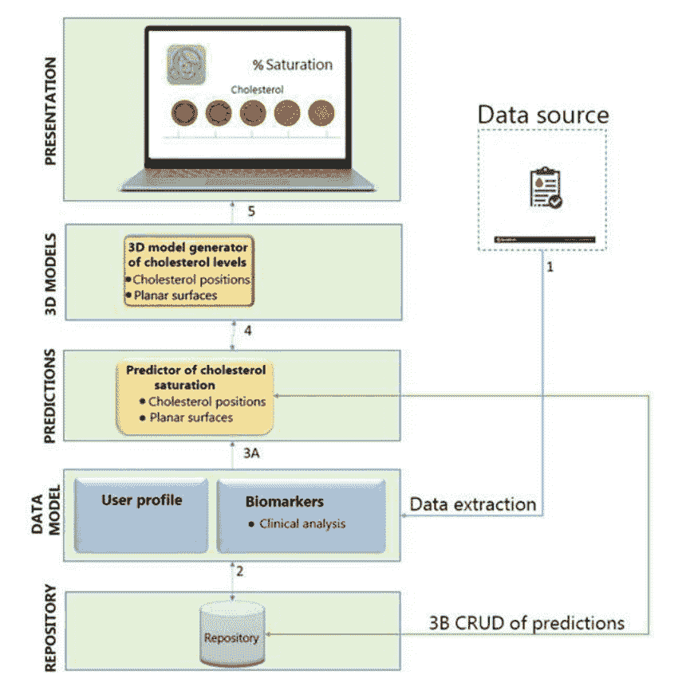

图1 PREDIROL系统架构

#### 架构组件

- 数据源：该模块负责存储患者分析数据，其中包含血液中的胆固醇水平。
- 存储库：存储库负责将患者数据保存在数据库管理器中。
- 预测：该模块从每个用户的配置文件存储库接收数据，以预测用户当前和未来时间段内的胆固醇水平。该模块还将预测不同时间段内的壁厚度。
- 3D模型：在这个模块中，使用来自胆固醇饱和度预测模块的数据，在不同时间段生成胆固醇水平的三维模型。
- 展示：该模块向用户展示了在3D胆固醇水平模型生成器模块中模拟的不同时间段内的胆固醇饱和度的三维模型，以及用户个人资料。

#### 工作流程

1.  从数据源（临床分析）中提取和过滤信息，将数据存储在存储库中。
2.  基于存储库中的信息，对不同时间段的血液中的胆固醇饱和度进行预测，并将其存储在存储库中。
3.  将胆固醇水平的预测结果（3A）传递给生成不同时间段的分子位置的组件；这些模型将存储在存储库中（3B）。
4.  根据分子的位置，负责的组分将根据预测器计算的时间段生成胆固醇饱和度的三维模型。
5.  用户将能够通过应用程序在3D中可视化不同时间段的胆固醇饱和度的不同水平。

#### 3.1 大数据模型

图2显示了用于存储用户数据和预测的MongoDB实现的数据模型。

在数据模型中，观察到五个文档。表3显示了具有其描述的模型文档。

数据模型中的每个文档为PREDIROL的正常运行提供了数据持久性。在“墨西哥韦拉克鲁斯州奥里萨巴的Sanatorio Escudero实验室”提供的记录中，验证了PREDIROL的重要信息。在下一节中，我们将介绍使用“年龄”和“胆固醇”字段的胆固醇饱和度预测模块的工作原理。

#### 3.2 胆固醇饱和度预测模块

预测模块中使用逻辑回归，使用年龄与总胆固醇（以mg/dl为单位）作为变量。图3显示了用于模型训练的数据图表。

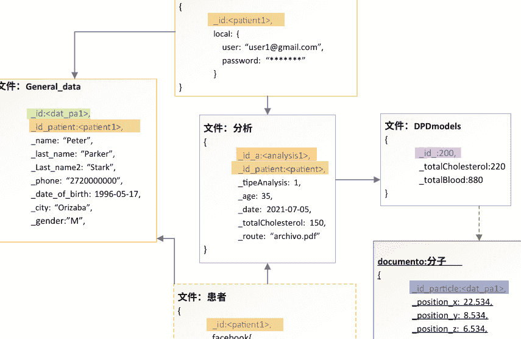

##### 图2 大数据模型

##### 表3 图2中数据模型的描述

| 文档 | 描述 |
|------|------|
| 患者 | 此文档用于存储患者的登录数据，可以使用注册的电子邮件或通过社交网络Facebook登录 |
| 通用_数据 | 这将存储患者的数据以补充记录，如全名和年龄等 |
| 分析 | 该文档存储胆固醇的数量，以及分析日期和患者接受的分析类型 |
| DPD模型 | 在这个文档中，您已经存储了构建血液中胆固醇浓度的DPD模型的数据 |
| 分子 | 该文档存储分子的位置和所属类型 |

该模型是用R语言创建的。清单1显示了用于创建模型的片段，后来对其进行了训练。对于训练，考虑了70-30的分区（清单1的第3行）。也就是说，70%的样本用于训练，30%用于预测。此外，我们选择了大小为0.9，以获得更好的可视化结果图，使用绘图包ggplot。

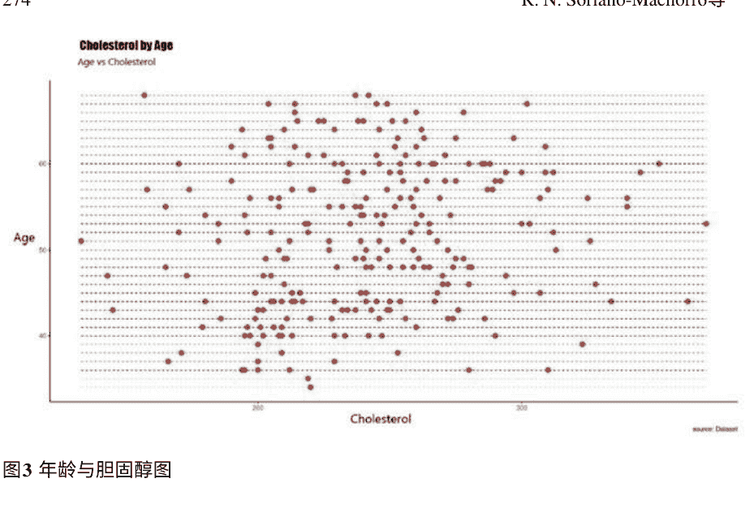

##### 列表1：使用R语言创建的模型

```
R
#加载数据
data <- read.csv(file = 'datasetRL.csv', sep = ',')
#将训练集和测试集分开
split = sample.split(data$Cholesterol, SplitRatio = 0.7)
nltrain = subset(data, split == TRUE)
nltest = subset(data, split == FALSE)
#创建模型
set.seed(1234)
LRmodel <- lm(Cholesterol ~ Age, data = nltrain)
summary(LRmodel)
#对训练集进行预测
y_predict <- predict(LRmodel, nltrain)
ggplot() + geom_point(data = nltrain, aes(x = Age, y = Cholesterol), size = 0.9) + geom_line(aes( x = nltrain$Age, y = y_predict), color = "red") + xlab("年龄") + ylab("胆固醇") + ggtitle("训练集调整曲线 (nltrain)")
#从一系列年龄组预测胆固醇
range.ages <- data.frame(Age = seq(20, 80))
predict_value <- predict(LRmodel, range.ages)
glimpse(predict_value)
df_predic=as.data.frame(predict_value)
write.csv(df_predic,'prediction20_80.csv')
```

预测模块获取用户年龄范围为20到80岁。(第15行第1个清单)。基于这些参数，已经训练的模块生成胆固醇饱和水平的预测(第14-19行的清单)，并通过图表显示胆固醇水平的预测，如图4所示。

最后，生成一个包含获得结果的电子表格作为备份。重要的是要提到，这项工作侧重于成年人群体和预防由高胆固醇水平引起的疾病；因此，实验是在20、60和80岁之间的年龄范围内进行的。图5描述了系统中胆固醇浓度预测的操作图。

这个活动图（如图5所示）包括五个层次：（1）用户必须注册和验证才能使用系统；（2）Web应用程序与PREDIROL进行交互并可视化结果；（3）预测模块负责根据用户年龄范围生成饱和胆固醇水平的预测；（4）模拟模块在代表胆固醇和血液的立方体内计算随机位置；（5）存储库存储在PREDIROL中处理的信息。下一节将描述具有耗散粒子动力学的胆固醇水平模拟模块的功能。


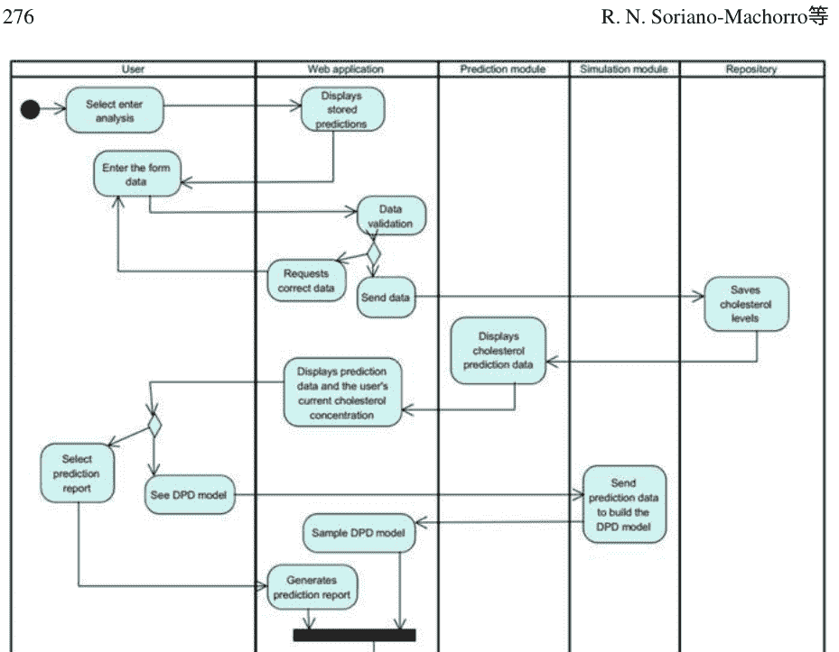

图5 PREDIROL预测活动的活动图

#### 3.3 使用耗散粒子动力学的胆固醇水平模拟模块

模拟模块在表示两种分子的立方体内计算随机位置，所表示的血液量为一分升，每个模拟的分子表示一毫克。

在这个代码列表中，计算了包含要模拟的两种分子的盒子的大小，因为大小取决于要表示的总分子数。随后，该模块在盒子内以坐标（X轴，Y轴，Z轴）的形式随机计算两种分子的位置。图6显示了胆固醇210毫克/分升的示例，其中红色表示血液，黄色表示胆固醇。

为了开发使用耗散粒子动力学的胆固醇水平模拟模块，首先使用CUDA进行并行计算，构建了表示胆固醇和血液分子的DPD模型。然而，考虑到在3D中生成的胆固醇和血液分子的数量，以及它们在X轴、Y轴和Z轴上的位置和移动，这需要高计算能力，我们选择了基于WebGL的3Dmol.js库。

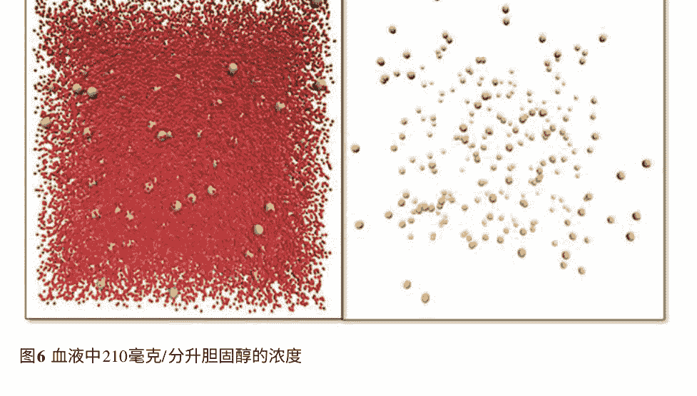

##### 图6 血液中210毫克/分升胆固醇的浓度

在任何网络浏览器中渲染3D图形，保留DPD模型但使用技术和更多光线。

最终以毫克/分升为单位选择的比例是从1到1000；这意味着一个分子将代表含有1000毫克的分子。图7展示了一个具有最终比例的示例，其中血液中的胆固醇浓度为290毫克/分升，其中红色代表血液，黄色代表胆固醇。

为了构建DPD胆固醇浓度模型，开发了一种从文档中读取数据的方法，其中包含了分子的位置和选择的胆固醇浓度。 要读取的文件位于“moldata”变量；使用“glviewer.addModel”方法指定文件类型；对于这些模拟，使用“.xyz”类型。
为了构建DPD胆固醇浓度模型，开发了一种从文档中读取数据的方法，其中找到了分子的位置和选择的胆固醇浓度。最后，将属性添加到模型中，包括分子表示的类型，以及该模型将具有的半径大小。分子类型“A”将以红色（血液）表示，而类型“B”的分子将以黄色（胆固醇）表示；如果文件中还有其他类型的分子，将以白色表示。重要的是提到，DPD模型允许添加更多的分子，例如甘油三酯、氧气粒子和血栓等。

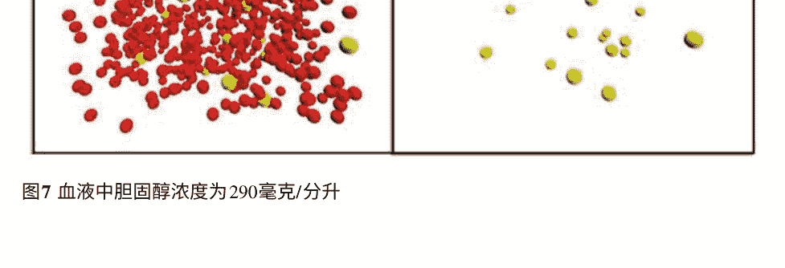

##### 图7 血液中胆固醇浓度为290毫克/分升

第4节介绍了包括PREDIROL功能的案例研究。

### 4 案例研究：医院患者胆固醇水平的预测

本节旨在介绍PREDIROL和案例研究的结果。该应用程序将提供胆固醇水平的近似预测及其与年龄的关系，如果一个人不过健康的生活，胆固醇的增加可以被观察到；高胆固醇水平与心血管系统相关的疾病有关。

为了开发这个应用程序，我们在一家医院获得了数据并进行了测试。临床分析数据是从2022年2月开始收集的，收集的信息来自150名患者，持续了3个月的时间。Sanatorio Escudero提供的信息包括年龄、血液胆固醇、甘油三酯和患者的诊断结果。

年龄范围从18岁到88岁。

表4显示了由疗养院提供的一些数据，省略了被认为是敏感或私密的数据；这些数据被合成替代（使用随机姓名）。
在这个样本中，有六名患者与系统进行了迭代。图8显示了记录了第6、第7、第8、第9、第12和第14位患者的分析形式。

在记录分析结果的表格上捕捉数据后，患者选择了“获取预测”选项。表5显示了这六名患者在应用程序中获得的结果。

图9A-F展示了PREDIROL对胆固醇水平预测结果的呈现给用户。此外，PREDIROL以信号量格式呈现胆固醇水平的正常（绿色）、警报（黄色）和危急（红色）。
作为图9和10中呈现结果的补充（A和B显示），通过DPD模型获得了血液中胆固醇的介观模拟。

##### 表4 Sanatorio Escudero实验室提供的分析数据示例

| 姓名 | 年龄 | 诊断 | 胆固醇 | 甘油三酯 |
|------|------|------|--------|----------|
| 患者1 | 73 | DM | 201.5 | 221.1 |
| 患者2 | 84 | PB. DM | 244 | 174.6 |
| 患者3 | 40 | DM/IRC | 402 | 660.1 |
| 患者4 | 43 | PB. DM | 105.1 | 152.5 |
| 患者5 | 73 | DM | 201.5 | 221.1 |
| 患者6 | 24 | S/DX | 201.5 | 207.6 |
| 患者7 | 54 | PB/ DM | 344.6 | 238.1 |
| 患者8 | 63 | S/DX | 286.2 | 222 |
| 患者9 | 31 | S/DX | 208.2 | 184.1 |
| 患者10 | 31 | S/DX | 199.5 | 128.8 |
| 患者11 | 36 | DMII | 211.2 | 222.9 |
| 患者12 | 43 | S/DX | 269.3 | 273 |
| 患者13 | 22 | 贫血/HIV | 209.2 | 216.1 |
| 患者14 | 62 | 前列腺增生 | 235.9 | 94.1 |
| 患者15 | 43 | DMII/肠胃炎 | 350.7 | 503.6 |
| 患者16 | 28 | S/DX | 209.2 | 216.1 |

- DM = 糖尿病2
- IRC = 慢性肾功能衰竭
- S/DX = 未诊断
- 前列腺增生 = 良性前列腺增生
- 肠胃炎 = 可能是感染性肠胃炎
- HIV = 人类免疫缺陷病毒感染

从患者6和14的当前总胆固醇中得出。在同一屏幕上，用户可以观察到其他胆固醇水平的增加或减少。我们决定省略其他患者的结果，因为它们是代表性的结果，展示更多的屏幕截图是不必要的。

PREDIROL允许用户生成一个包含他们当前总胆固醇和年龄等所有信息的.pdf格式报告，以支持医疗报告。除了预测外，图11（A-B）显示了从患者6和14的报告生成的预测图的部分。

最后，图12展示了根据年龄获得的预测表的示例；该表在用户报告中下载；如果它们在最佳值范围内，将显示为绿色，黄色表示需要进行医学评估，红色表示胆固醇水平非常高；在用户生成的报告中，该表以20至80岁的年龄范围显示预测结果，共计60条记录。

参与此案例研究的患者年龄在20至35岁之间；在该组中，可以观察到他们的胆固醇水平在正常范围内。

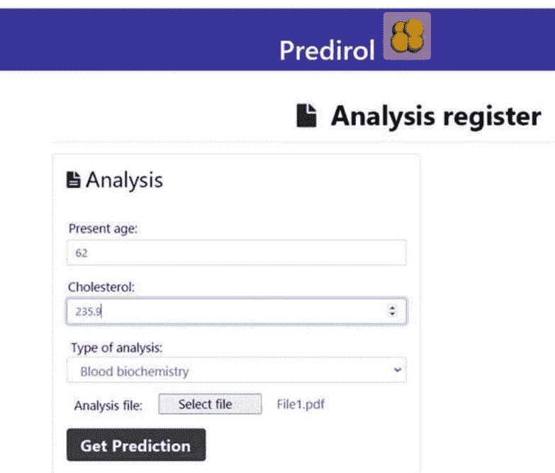

表5 选择的患者预测结果的案例研究

| 患者 | 年龄 | 胆固醇 |
|------|------|----------|
| 6    | 24   | 201.5    |
| 7    | 54   | 344.6    |
| 8    | 63   | 286.2    |
| 9    | 31   | 208.2    |
| 12   | 43   | 269.3    |
| 14   | 62   | 235.9    |

正常参数的患者年龄在40至65岁之间，胆固醇水平较高；胆固醇值较高的患者诊断为“糖尿病”，同时伴有非常高的甘油三酯水平；而在患者7和患者12等病例中，尽管没有报告他们的诊断结果，但反映出了高胆固醇水平，这会增加未来心脏病发作或中风的风险。

在第8位和第12位患者的情况下，他们的年龄和胆固醇水平与预测一致，但同样，胆固醇水平的警告高于正常范围，也没有指示诊断。

##### Predirol：使用大数据预测胆固醇饱和度水平...

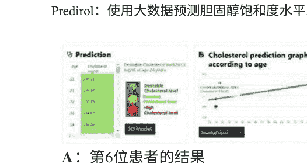

A: 第6位患者的结果

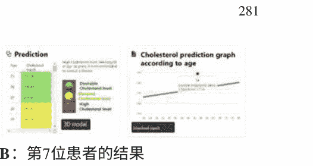

B: 第7位患者的结果

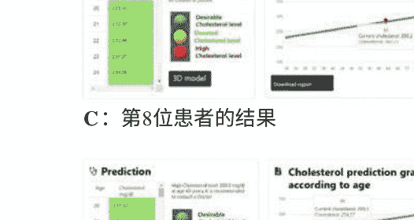

C: 第8位患者的结果

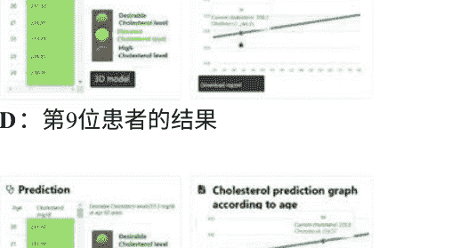

D: 第9位患者的结果

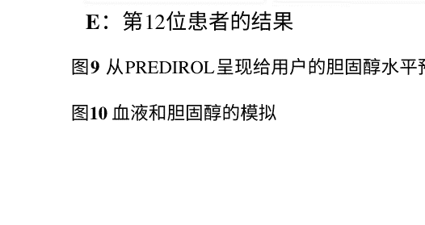

E: 第12位患者的结果


F: 第14位患者的结果

##### 图9 从PREDIROL呈现给用户的胆固醇水平预测结果

##### 图10 血液和胆固醇的模拟

## Mesoscopic Simulation of cholesterol in blood

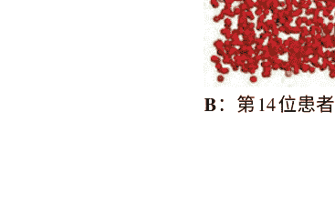

A: 第6位患者


B: 第14位患者

##### 图11 胆固醇水平的预测图

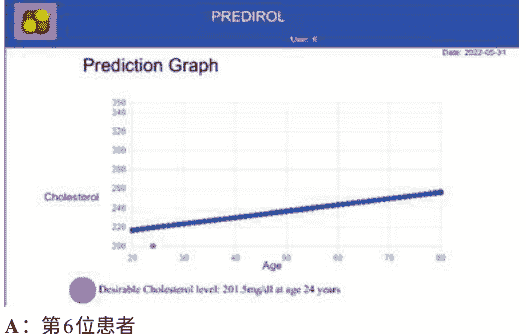

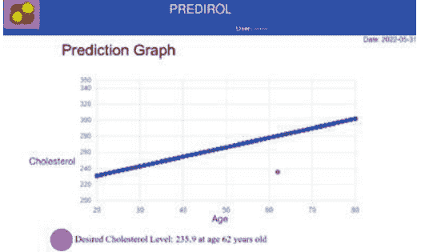

##### 图12 用户报告预测表的示例

| 年龄 | 胆固醇 |
|---|---|
| 20 | 231.32 |
| 21 | 232.50 |
| 22 | 233.69 |
| 23 | 234.87 |
| 24 | 236.06 |
| 25 | 237.24 |
| 26 | 238.43 |
| 27 | 239.61 |
| 28 | 240.80 |
| 29 | 241.98 |
| 30 | 243.17 |
| ... | ... |
| 45 | 260.94 |
| 46 | 262.13 |
| 47 | 263.31 |
| ... | ... |
| 80 | 302.34 |

### 5 结论和未来工作

PREDIROL应用程序是为了预测可能的疾病而开发的，因为进行了与DPD、胆固醇和疾病预防相关的中观模拟主题的工作分析。预测使用逻辑回归根据年龄预测胆固醇水平。患者血液中胆固醇浓度的DPD模型建立在1至1000毫克/分升的尺度上；这意味着一个分子代表血液中含有1000毫克的所有分子。PREDIROL旨在提高人们对胆固醇水平的关注，因为高水平会导致胆固醇和其他沉积物在动脉壁上积累（动脉粥样硬化）。这些沉积物（斑块）可以减少动脉中的血液流动，并且随着时间的推移，可能导致心脏病发作或中风。机体还需要胆固醇来产生激素和代谢维生素D；它对于钙和胆汁酸的吸收至关重要。从Sanatorio Escudero实验室收集的数据中观察到，总胆固醇浓度等于或小于80毫克/分升的患者被诊断为贫血，易患其他疾病。该应用程序使患者意识到对总胆固醇水平的关注；这是患者身体健康或存在某种情况的指示。

尽管PREDIROL为人们心血管健康提供了一种替代方案，但它也存在一些限制，例如不将胆固醇与增加患心脏病和中风等疾病概率的病理相关联。在这方面，未来的工作考虑将甘油三酯浓度水平纳入，并将其与心血管和脑血管疾病进行相关性分析，包括动脉粥样硬化、家族性混合高脂血症，以及低β脂蛋白血症、高胆固醇血症和高甘油三酯血症等。

### 致谢

本研究章节由墨西哥国家科学和技术委员会（CONACYT）和墨西哥公共教育秘书处（SEP）通过PRODEP计划资助。作者还感谢墨西哥国家技术学院（TecNM）和REDTCAP网络的成员对本工作的支持。

### 参考文献

1.  Zárate, A., Manuel-Apolinar, L., Basurto, L., la Chesnaye, E., Saldivar, I.: 胆固醇和动脉粥样硬化。历史考虑和治疗，墨西哥心脏病学档案 **86(2)**, 163–169 (2016年)。 https://doi.org/10.1016/j.acmx.2015.12.002
2.  Carvajal, C.: 脂蛋白：代谢和致动脉粥样硬化的脂蛋白。哥斯达黎加法医学 **31(2)**, 88–94 (2014)
3.  Gaziano, T., Reddy, K.S., Paccaud, F., Horton, S., Chaturvedi, V.: 心血管疾病，发展中国家的疾病控制优先事项，第二版，(2006). https://doi.org/10.1056/NEJMra035098> 4. Mayoral, E., De La Cruz, E., Longoria, L.C., Nahmad-Achar, E.: 通过计算模拟研究受限介质中污染物吸附-解吸过程。国际环境污染杂志 27, 253–261 (2011)

> 5. Satoh, A.: 分子模拟实践导论：分子动力学，蒙特卡洛，布朗运动，格子Boltzmann和耗散粒子动力学。爱思唯尔（2010年）。 [https://doi.org/10.1016/C2010-0-67006-4](https://doi.org/10.1016/C2010-0-67006-4)

> 6. Bolívar, A., García, V., Florencia, R., Alejo, R., Rivera, G., Sánchez-Solís, J. P.: 在处理稀疏和密集高维度时，对不平衡大数据集上的SMOTE进行初步研究。在：模式识别：第14届墨西哥会议，MCPR 2022，墨西哥华雷斯，2022年6月22日至25日，论文集，第46-55页。Springer International Publishing，Cham（2022年）。 [https://doi.org/10.1007/978-3-031-07750-0_5](https://doi.org/10.1007/978-3-031-07750-0_5)

> 7. Pedrycz, W., Martínez, L., Espin-Andrade, R. A., Rivera, G., Gómez, J.M. (eds.) : 前言。 [https://doi.org/10.1007/978-3-030-73819-8](https://doi.org/10.1007/978-3-030-73819-8)

> 8. Makieła, D., Janus-Zygmunt, I., Górny, K., Gburski, Z.: 对 β-环糊精对胆固醇沉积的影响的研究——分子动力学模拟研究。 J Mol Liq 262, 451–459 (2018). [https://doi.org/10.1016/j.molliq.2018.04.098](https://doi.org/10.1016/j.molliq.2018.04.098)

> 9. Yetukuri, L., Söderlund, S., Koivuniemi, A., Seppänen-Laakso, T., Niemelä, P.S., Hyvönen, M., Taskinen, M., Vattulainen, I., Jauhiainen, M., Orešič, M.: 低和高HDL胆固醇患者HDL颗粒的成分和脂质空间分布。 [https://doi.org/10.1194/jlr.M006494](https://doi.org/10.1194/jlr.M006494)

> 10. Medina, S., Zhou, J., Wang, Z.-G., Schmid, F.: 一种用于模拟电解质溶液的高效耗散粒子动力学算法. 化学物理学杂志 142(2), 24103 (2015). [https://doi.org/10.1063/1.4905102](https://doi.org/10.1063/1.4905102)

> 11. Terrón-Mejía, K.A., López-Rendón, R., Goicochea, A.G.: 粗糙表面限制下流体的介观建模及热力学性质. 物理化学化学物理学报.17(39), 26403–26416 (2015). [https://doi.org/10.1039/C5CP03823E](https://doi.org/10.1039/C5CP03823E)

> 12. Blumers, A.L., Tang, Y.-H., Li, Z., Li, X., Karniadakis, G.E.: 使用传输耗散粒子动力学进行GPU加速的红细胞模拟. 计算物理学通讯 217, 171–179 (2017). [https://doi.org/10.1016/j.cpc.2017.03.016](https://doi.org/10.1016/j.cpc.2017.03.016)

> 13. 叶, T., Phan-Thien, N., Lim, C. T., 彭, L., 石, H.: 混合平滑耗散粒子动力学和浸入边界方法用于模拟流体中的红细胞。物理评论E. 95 (6), 063314 (2017)。 [https://doi.org/10.1103/PhysRevE.95.063314](https://doi.org/10.1103/PhysRevE.95.063314)

> 14. Pourmousa, M., Pastor, R.W.: 脂质纳米盘的分子动力学模拟。生物物理学报 (BBA) -生物膜, 1860 (10), 2094-2107 (2018)。 [https://doi.org/10.1016/j.bbamem.2018.04.015](https://doi.org/10.1016/j.bbamem.2018.04.015)

> 15. 夏, Y., Blumers, A., 李, Z., 罗, L., 唐, Y.H., 凯恩, J., 戈拉尔, J., 黄, H., 德奥, M., 安德鲁, M.: 用于模拟多体耗散粒子动力学中纳米多孔源岩中的流体流动的GPU加速包。 计算物理学通信 247, 106874 (2020)。 [https://doi.org/10.1016/j.cpc.2019.106874](https://doi.org/10.1016/j.cpc.2019.106874)

> 16. 小島, K., 広, T., 小山, Y., 大顧, A., 藤戸, H., 江測, Y., 新井, R., 門田, M., 右田, S., 森川, T., 玉木, T., 村田, N., 阿久津, N., 西田, T., 北野, D., 須藤, M., 深町, D., 依田, S., 高山, M., 平山, A., 奥村, Y.: 高壁剪切应力与心血管疾病患者主动脉弓处动脉粥样硬化斑块破裂有关：计算流体动力学模型和非阻塞性一般血管镜研究。 动脉粥样硬化和血栓形成杂志, 56598 (2020). [https://doi.org/10.5551/jat.56598](https://doi.org/10.5551/jat.56598)

> 17. Paige, E., Barrett, J., Pennells, L., Sweeting, M., Willeit, P., Di Angelantonio, E., Wood, A.: 胆固醇外流能力是冠状动脉疾病患者全因和心血管死亡的独立预测因子：一项前瞻性队列研究。 动脉粥样硬化, 249, 116-124 (2016). [https://doi.org/10.1016/j.atherosclerosis.2015.10.111](https://doi.org/10.1016/j.atherosclerosis.2015.10.111)

> 18. Paige, E., Barrett, J., Pennells, L., Sweeting, M., Willeit, P., Di Angelantonio, E., Wood, A.: 使用重复的血压和胆固醇测量来改善心血管疾病风险预测：个体参与数据的元分析。 美国流行病学杂志 186(8), 899–907 (2017). [https://doi.org/10.1093/aje/kwx149](https://doi.org/10.1093/aje/kwx149)

> 19. Singh, P., Singh, S., Pandi-Jain, G.S.: 使用数据挖掘技术的有效心脏病预测系统。国际纳米医学杂志。 **13**(T-NANO 2014摘要), 121–124 (2018). [https://doi.org/10.2147/IJN.S124998](https://doi.org/10.2147/IJN.S124998)

> 20. Siddiqui, S.Y., Athar, A., Khan, M.A., Abbas, S., Saeed, Y., Khan, M.F., Hussain, M.: 使用计算智能方法对心血管疾病的诊断进行建模、仿真和优化。 J Med Imaging Health Inform **10**(5), 1005–1022 (2020). [https://doi.org/10.1166/jmihi.2020.2996](https://doi.org/10.1166/jmihi.2020.2996)

> 21. Purushottam, Saxena, K., Sharma, R.: 高效心脏病预测系统。 Procedia Comput. Sci, **85**, 962–969 (2016). https://doi.org/10.1016/j.procs.2016.05.288

> 22. Alhasawi, Y., Mullachery, B., Chatterjee, S.: 设计一款使用眼睛图像非侵入性检测高血胆固醇的移动应用程序。 In: 第51届夏威夷国际系统科学会议论文集, pp. 3227–3235. ScholarSpace (2018)

## 基于卷积神经网络的癌症检测使用组织病理学图像
Jayesh Soni，Nagarajan Prabakar和Himanshu Upadhyay

摘要 癌症是当前的主要健康问题之一。在女性中，乳腺癌是各种癌症中排名第二的。与其他类型的癌症相比，乳腺癌的死亡率较高。尽管医学学科发展迅速，但组织病理学分析仍被认为是识别癌症的典型方法。由于其复杂性，组织病理学图像分析非常耗时，而且结果与病理学家的主观性有关。因此，开发稳健且精确的癌症检测方法，使用组织病理学图像分析方法至关重要。在本章中，我们讨论了使用基于深度学习的方法进行癌症检测的问题。我们提供了卷积神经网络（CNN）的详细信息，这是一种用于图像数据集的神经网络。接下来，我们描述了各种超参数优化技术，以优化CNN网络的训练。此外，我们通过在开源组织病理学癌症检测数据集上提出一种基于学习的框架来实现癌症检测。该数据集可在Kaggle上获得。所提出的框架使用CNN和TensorFlow等先进的深度学习框架来检测癌症。这种方法可以扩展到其他生物医学领域的组织病理学图像分类。

* 关键词 癌症检测·组织病理图像·卷积神经网络·深度学习·Tensorflow

* J. Soni (✉)
应用研究中心，佛罗里达国际大学，迈阿密，佛罗里达，美国
e-mail: jsoni@fiu.edu

* N. Prabakar
Knight Foundation School of Computing and Information Sciences, Florida International University, Miami, FL, USA
e-mail: prabakar@cis.fiu.edu

* H. Upadhyay
电气与计算机工程，佛罗里达国际大学，迈阿密，佛罗里达，美国
e-mail: upadhyay@fiu.edu

### 1 引言

目前世界上的一个主要公共卫生问题是癌症。乳腺癌是不同类型癌症中第二高发的一种。尽管在分子生物学方面取得了进展，但组织病理学图像的研究仍然用于癌症诊断。此外，最终的分级和分期是由病理学家通过显微镜检查图像来完成的。随着学习技术的进步，正在开发计算机辅助检测/诊断系统。这些系统可以支持病理学家进行诊断。这些系统面临的主要挑战是处理组织病理学图像的复杂性。例如，Kowal等人使用500张图像的数据集，使用各种算法分析细胞核的分割，并将其分类为良性或恶性。他们报告的准确率在96-100%的范围内。Filipczuk等人[3]使用了一个25维的细针活检图像向量进行图像分类。他们的准确率达到了98%的水平。George等人[4]使用了几种基于学习的算法[5]，如人工神经网络，并报告了76-94%的准确率。Zhang等人[6]使用了级联的方法，其中简单的问题在第一级解决，复杂的问题则使用复杂的分类算法在第二级解决。他们报告的准确率为97%。同样的作者使用了集成方法，并达到了92%的准确率。

全幅成像（WSI）主要在最近的工作中使用[7,8]。然而，采用这种成像技术很困难，因为实施这种技术的成本很高。

1. 我们提出了一种基于CNN的深度学习框架，用于将癌症的组织病理学数据[11,12]分类为恶性或良性。CNN算法的前几层从图像数据集中提取有意义的特征。最后一层附加了一个神经网络，它接收这些提取的特征并执行分类任务。
2. 我们提出的检测模型经过实验分析，使用了一个真实世界的基准数据集，结果显示检测率很高。

本章的其余部分如下。第2节详细介绍了图像处理技术和卷积神经网络的深入概述。第3节讨论了使用卷积神经网络检测癌症的实际用例。最后，在第4节中我们得出结论。

### 2 图像处理技术

图像以RGB像素值的形式存储在计算机上。计算机只看到数字数组，而不是实际的图像。一个三维数据数组存储着彩色图像。前两个二维值表示高度和宽度，而第三个维度表示每个像素的红色、绿色和蓝色的百分比。统计分析和基于学习的分析是分析和处理图像的两种不同方式，如图1所示。

#### 2.1 基于统计的算法

开源计算机视觉（OpenCV）：它是计算机视觉研究领域中广泛使用的图像处理库之一[13]。它具有许多功能，可以将图像形状和修改为所需的输出格式。彩色图像具有三个不同通道的像素值。每个通道中的像素值范围从0到255，而对于黑白图像，像素值范围从0到1。

#### 2.2 基于学习的算法

这是一种数据驱动的方法，用于训练计算机像人类一样思考和行动，并提高它们的知识。这是通过以数据点和基本世界交互的方式传递信息来实现的。

深度学习是机器学习的一个迷人子集，它从人脑的神经结构和信息处理机制中汲取灵感[14, 15]。这种方法涉及使用人工神经网络，它是设计成模仿人脑神经元行为的数学模型。深度学习的主要目标是使机器能够学习和提取有意义的信息。

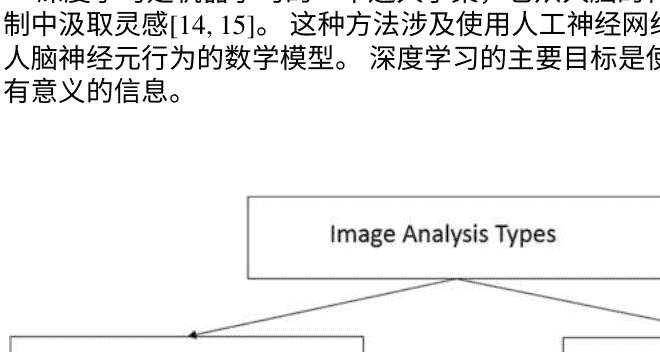

图1 图像处理技术

通过多层处理从复杂和多样化的数据输入中获得洞察力，从而实现准确的预测和分类结果。

在深度学习的范畴下，有几种不同类型的神经网络。例如，循环神经网络[16–18]非常适合处理顺序数据，并广泛应用于自然语言处理和语音识别应用[19, 20]。而卷积神经网络[21]则专门设计用于分析和分类图像数据。生成式神经网络[22]用于生成新的原始数据样本，例如图像或文本。

多层感知器[23, 24]，如图2所示，是一种相对简单但功能强大的神经网络类型，广泛应用于各种应用，包括模式识别和分类任务。MLP由三个不同的层组成：输入层、隐藏层和输出层。输入层接收数据特征向量作为输入，然后通过一个或多个隐藏层进行处理。隐藏层由N个神经元组成，负责转换和处理输入数据以提取有意义的模式和特征。最后，输出层产生网络的预测或分类输出。

总的来说，深度学习的强大之处在于其能够从大规模和复杂的数据集中学习，并提取出有意义的模式和特征，从而实现对新数据输入的准确预测和分类。这导致了在计算机视觉、语音识别、自然语言处理和机器人等各个领域取得了重大进展。

以下两个步骤对每个节点至关重要：

1. 将权重与输入相乘，并添加偏置项进行线性变换。
2. 由于大多数现实世界的数据都很复杂，激活函数作为第二步骤被应用。

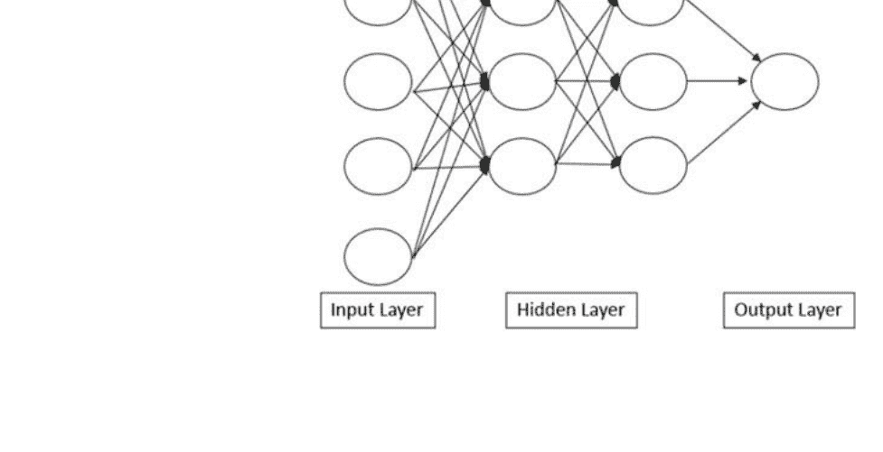

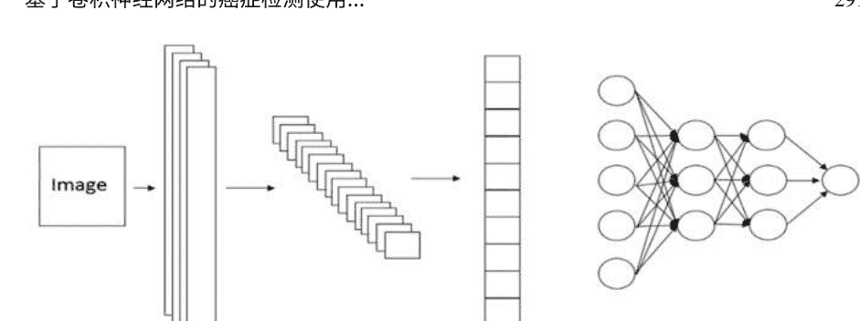

随着计算能力的增加和数据生成的快速增长，深度学习算法在几乎每个应用领域都得到了广泛应用。

对于图像分析，如目标分割、目标识别和视频处理，卷积神经网络非常受欢迎。

卷积神经网络由四层组成，如图3所示。

1. 卷积层：该层通过对输入图像进行卷积操作来提取有意义的模式或特征。大量的卷积操作从图像中提取出不同的特征。
2. 池化层：卷积层之后的第二层。它采用最大值或最小值或任何统计值来进一步减少图像的维度。激活函数，如修正线性单元（ReLu），被应用于引入一些非线性。
3. 展平层：展平层在数据处理中起着重要作用。该层将通常以三维张量形式存在的输入数据转换为一维向量。通常是池化层的输出被展平成单列。这个过程有助于降低数据的复杂性，使其更容易处理和分析。
4. 全连接层：全连接层负责处理扁平化数据，用于图像分类、分割或目标检测等各种任务。该层旨在基于前面层提取的特征学习和分类输入数据。全连接层的输出是网络的最终预测或分类。

#### 2.3 CNN的超参数

为了达到最佳结果，卷积神经网络依赖于几个超参数，在训练模型之前必须适当调整。 超参数是在训练过程开始之前设置的参数，网络在训练过程中不会学习这些参数。 调整超参数是一个活跃的研究领域，正确设置可以显著提高卷积神经网络的性能。

1. 学习率：该参数通过控制梯度下降朝着最优值移动的速率来优化权重。它可以在训练期间逐渐增加或减少，或者固定不变。 它取决于流行的优化器，如自适应增量、自适应动量、RMSprop和随机梯度下降。
2. 迭代次数：迭代次数是在训练期间整个数据集通过神经网络的总次数。该参数控制训练过程的持续时间和模型根据输入数据调整权重的次数。 增加迭代次数可以提高准确性，但也会增加过拟合的风险。
3. 批量大小：批量大小参数控制模型在每个迭代周期中更新权重的频率。该参数通常设置在32-256的范围内，取决于数据集的大小和模型的复杂性。较小的批量大小可以帮助模型更快地收敛，但也可能导致梯度噪声和训练过程变慢。 较大的批量大小可以平滑梯度并加快训练过程，但也可能导致过拟合。
4. 隐藏层和单元数：隐藏层和单元数是一个关键的超参数，可以显著影响神经网络的性能。 隐藏层数和每层的节点数必须根据问题的复杂性和数据集的大小进行选择。增加层数和节点数可以提高模型的准确性，但也可能导致过拟合。 正则化技术，如L1和L2正则化、dropout和批归一化，可用于防止过拟合。
5. 激活函数：激活函数的选择也是神经网络设计中关键的超参数。 激活函数用于引入模型中的非线性，并使其能够学习输入和输出数据之间的复杂关系。 由于其简单性和有效性，ReLU激活函数通常在卷积神经网络架构中使用。 根据任务和数据的特性，还可以使用其他激活函数，如sigmoid和双曲正切函数。
6. 用于正则化的dropout：dropout是一种正则化技术，可用于防止神经网络过拟合。 在训练过程中，它会随机丢弃一定比例的神经元，迫使模型学习更强大的特征和降低过拟合的风险。丢弃率是一个超参数，用于控制在训练过程中要丢弃的神经元的百分比。例如，0.2的值意味着在每个训练周期中，该层中的20%神经元将被停用。

- (7) 权重初始化：权重应该用一组小的随机数进行初始化。这些随机数应该是均匀分布的。
- (8) 卷积核大小：它是用于从输入图像中提取模式的滤波器的大小。不同大小的卷积核提取不同类型的特征。
- (9) 步幅：在卷积层中移动卷积核时，步幅值指示卷积核应该移动多少像素。
- (10) 池化：它减小了特征的大小；最大池化将使用最大值来减小特征，而最小池化将使用最小值来减小特征。

手动调整超参数是一种时间效率低下的过程。因此，网格搜索和随机搜索是两种常用的技术[25]，用于加速调整过程。

#### 2.4 评估指标

以下指标可用于评估模型。

召回率：召回率衡量了模型在数据集中所有实际正例中正确预测的真正正例的比例。在癌症检测的背景下，召回率告诉我们在数据集中所有癌症病例中正确识别的癌症病例的百分比。高召回率意味着模型能够识别出大部分癌症病例，这对于尽可能多地检测出病例非常重要。

$$召回率 = \frac{TP}{TP + FN}$$

精确率：精确率衡量了模型在所有模型预测为正例的情况下正确预测的真正正例的比例。在癌症检测的背景下，精确率告诉我们在模型预测为癌症的所有病例中正确识别的癌症病例的百分比。高精确率意味着模型以较低的假阳性率准确识别出癌症病例，这在防止误诊和不必要的治疗方面至关重要。

$$精确率 = \frac{TP}{TP + FP}$$

准确率：准确率衡量了模型在数据集中所有案例中所做的正确预测的比例。在癌症检测的背景下，准确率告诉我们模型正确识别的所有案例的百分比，包括癌症和非癌症案例。虽然准确率很重要，但如果数据集不平衡，即某一类别的案例明显多于另一类别，准确率可能会误导。在这种情况下，其他指标如精确率、召回率和F1分数可以提供模型性能的完整图景。

$$准确率 = \frac{TP + TN}{TP + FP + FN + TN}$$

F1分数：F1分数是精确率和召回率的调和平均数，常用于平衡这两个指标。F1分数提供了一个单一的值，表示模型的整体性能。在癌症检测的背景下，高的F1分数意味着模型能够准确识别癌症案例，并且误报率低，同时还能检测到数据集中所有癌症案例的大部分比例。

$$F1分数 = 2 \times \frac{精确率 \times 召回率}{精确率 + 召回率}$$

其中TP：真正例，FN：假负例，TN：真负例，FP：假正例。

#### 2.5 实施

在癌症检测的实际实施中，涉及使用多个库进行实验和实施CNN模型。以下是本项目中使用的库：

- **Tensorflow**: Tensorflow是一个流行的开源库，用于实现深度学习和机器学习算法。它由Google开发，广泛应用于开发和部署大规模机器学习模型的行业中。Tensorflow提供了一个强大而灵活的框架，用于构建和训练深度神经网络，包括CNN模型[26]。
- **Keras**: Keras是一个用Python编写的高级神经网络API，可用于构建和训练深度学习模型。Keras提供了一个简单直观的界面，用于构建和训练神经网络，并且可以与多种后端一起使用，包括TensorFlow。Keras具有功能和顺序API，允许用户为各种应用程序构建和训练神经网络，包括图像分类[27]。
- **Scikit-learn**: Scikit-learn是一个流行的Python机器学习库，提供了各种算法，包括监督学习和无监督学习。它包括数据预处理、模型选择和评估工具，是实现和测试机器学习模型的有用库。Scikit-learn可以用于分类、回归、聚类和降维等任务[28, 29]。

用于癌症检测CNN模型实现的高级框架如图4所示。该框架包括三个部分：数据收集、数据预处理和算法训练与测试。

在数据收集阶段，获取并准备用于训练CNN模型的数据集。这包括下载和清理数据集，并将其分割为训练集和测试集。

在数据预处理阶段，对数据集中的图像进行预处理，包括应用各种图像增强技术和归一化像素值，使模型更加稳健和准确。

在算法训练和测试阶段，使用预处理的数据训练CNN模型，并使用测试集评估其性能。然后使用最终模型对新的癌症检测图像进行分类。

总体而言，使用这些库和高级框架来实现提供了一种强大而高效的方式，用于开发和测试用于癌症检测的CNN模型，使用组织病理学图像。

##### 阶段1：数据收集

用于这个转移性癌症识别项目的数据集是从Kaggle [30, 31]获取的，Kaggle是一个流行的数据科学和机器学习项目平台。该数据集包含用于训练和测试卷积神经网络（CNN）模型进行癌症检测的病理图像。

###### 表1 训练数据集

| 类型 | 计数 |
|------|------|
| 良性 | 130,908 |
| 恶性 | 89,117 |

数据集被分为两个文件夹，一个用于训练，另一个用于测试CNN模型。训练文件夹包含有标签的图像，标签在附带的CSV文件中指定。CSV文件详细说明了训练数据中每个图像的标签，使模型能够学习将图像分类为癌症或非癌症。

表1提供了有关训练数据集的信息，如图像数量、图像大小和癌症与非癌症图像的比例。这些信息对于了解训练数据的组成和评估CNN模型在测试数据上的性能非常有用。

另一方面，测试数据集包含57,458个图像文件。这么多的图像提供了一个多样化的测试数据集，用于CNN模型的分类，并确保模型的性能稳健，不受数据的原子集的影响。总的来说，这个数据集为发展和测试用于转移性癌症识别的CNN模型提供了宝贵的资源，并可用于评估不同的训练策略、超参数和架构的有效性。

##### 第二阶段：数据预处理

在机器学习中，数据预处理是指为建模准备数据所采取的各种步骤。在用于转移性癌症识别的CNN模型的情况下，已经应用了几种预处理技术，包括将数据集划分为训练集和验证集，并应用图像增强技术。

首先应用的预处理技术是将数据集划分为训练集和验证集。这样做是为了确保模型在训练过程中使用数据的一个子集进行训练，并在另一个在训练过程中未见过的子集上进行测试。在这种情况下，数据集被划分为80%的训练集和20%的验证集。训练集用于训练CNN模型，而验证集用于评估其性能并微调模型的超参数。

第二个应用的预处理技术是图像增强。图像增强是通过对原始图像应用各种变换来创建新的训练图像的过程。这样做是为了增加训练数据的多样性，使模型更加健壮，减少过拟合的风险。在这种情况下，已经应用了几种图像增强技术，包括旋转、调整大小以及水平和垂直翻转。

旋转涉及将图像以指定角度旋转，而调整大小涉及更改图像的大小。水平和垂直翻转分别涉及水平或垂直翻转图像。这些技术创建了原始图像的变体，使CNN模型能够学习识别不同方向和大小的癌细胞和非癌细胞的重要特征。

总的来说，这些预处理技术对于提高CNN模型在转移性癌症识别中的准确性和泛化能力非常重要。通过将数据集分为训练集和验证集，并应用图像增强技术，模型可以学习对包括其未曾见过的图像在内的多样化图像集进行分类，并对新的未知数据进行准确预测（图5和图6）。

##### 第3阶段：CNN算法训练

###### 3.1 模型训练阶段

为了训练用于癌症检测的CNN模型，使用Keras库来实现所提出的架构。图7显示了模型中使用的网络架构的描述。所提出的架构由三个CNN层组成，每个层后面跟着一个最大池化层，以从图像中提取最有意义的特征。最大池化层有助于减少输出特征图的维度并捕捉图像的最显著特征[32, 33]。

所提出的架构中的CNN层由一系列滤波器组成，这些滤波器与输入图像进行卷积以提取特征。每个滤波器在图像中检测特定的特征，如边缘、纹理或形状。滤波器在输入图像上滑动，产生突出显示图像区域的特征图，其中包含特定特征。然后，每个CNN层的输出通过最大池化层，该层减小特征图的大小，同时保留最重要的特征。

在三个CNN层之后，输出特征图被展平并通过一个密集层进行分类。密集层是一个全连接层，它以展平的特征图作为输入，并生成一个类别的概率分布。密集层的输出然后通过softmax函数将原始输出转换为类别概率。

总体而言，提出的架构旨在捕捉输入图像的最重要特征并进行准确分类。使用三个带有最大池化层的CNN层有助于提取最显著的特征，而末尾的密集层提供了一种有效的分类输入图像的方法。

###### 3.2 模型优化阶段

卷积神经网络（CNN）有许多需要仔细优化的超参数，以在给定任务上获得良好的性能[17]。在使用组织病理学图像进行癌症检测的背景下，一些最重要的超参数包括网络中的层数、每层的过滤器数量、过滤器的大小、优化器的学习率和批量大小。

为了优化这些超参数，使用验证数据集。在训练过程中，模型定期在验证数据集上进行评估，并根据验证性能调整超参数。一旦超参数优化完成，将在测试数据集上评估模型的最终性能。

在CNN模型的架构中，激活函数在特征提取和分类任务中起着关键作用。在本研究中，ReLU激活函数应用于网络的隐藏层进行特征提取，而softmax激活函数应用于网络的最后一层进行分类。

在训练过程中，为了更新模型的权重，需要计算损失的梯度。本研究采用Adam优化器使用分类交叉熵计算损失并更新下一批数据的权重。

批量大小是影响模型训练过程的另一个重要超参数。在这项研究中，采用小批量梯度下降法来训练CNN模型，批量大小的取值范围为{8, 16, 64}。通过实验发现，批量大小为16时，训练准确率最高。

图8显示了CNN模型在验证集上随着迭代次数增加的准确率曲线，图9显示了CNN模型在验证集上随着迭代次数增加的损失曲线。这些曲线可以揭示模型随时间变化的性能，并可用于诊断过拟合或欠拟合等问题。表2显示了用于癌症检测的CNN模型训练中使用的超参数的不同取值范围，该模型使用组织病理学图像分类。这些超参数包括学习率、丢弃率、滤波器数量、卷积核大小、池化大小、激活函数、批量大小和迭代次数。每个超参数的取值范围是基于经验观察和先前文献选择的。这些超参数的组合会影响模型的性能，需要进行仔细调整以获得最佳结果。

实验结果显示在表3中，这些结果是从测试数据集中获得的。
表4显示了比较结果。从结果中，我们可以推断出，采用提出的方法训练的模型能够以89%的准确率对图像进行分类。

所有实验都是在Keras和Tensorflow后端中进行的。

### 4 结论

深度学习算法，如卷积神经网络（CNN），旨在通过迭代处理大量数据来发现共同特征，从而识别数据中的模式。对于图像数据集，这些算法需要大量的数据来学习问题的潜在模式。然而，当涉及到医学数据时，这并不是唯一的挑战。一个主要的挑战是医学图像的标注。虽然医疗数据虽然可用，但通常没有标签或分类，这对于训练机器学习算法是必要的。因此，获取有标签数据是开发基于深度学习模型的医疗应用的一个重要瓶颈。

为了解决这个问题，研究人员专注于开发可以从无标签数据中学习的算法，也称为无监督学习，或者使用诸如迁移学习等技术自动标记数据。

在本章中，我们概述了卷积神经网络以及它们如何广泛用于解决图像数据集问题。我们讨论了CNN算法的各种超参数，例如滤波器数量、核大小和池化技术，这些可以进行微调以提高模型的性能。最后，我们提出了一个基于深度学习的癌症检测框架的实现。该框架利用CNN算法处理医学图像并将其分类为恶性或良性。总之，基于深度学习的医疗数据模型面临两个挑战：大量标记数据的需求和处理大型数据集所需的计算能力。然而，借助数据增强技术，研究人员已经能够在医学图像分析方面取得重要进展，开发出准确和高效的模型。我们提出的方法能够以0.891的准确率进行分类。

##### 表2 超参数范围

| 超参数 | 值范围 | 最佳值 |
| :--- | :--- | :--- |
| 学习率 | {0.001, 0.0001, 0.00001} | 0.0001 |
| 核大小 | {3 × 3, 5 × 5, 7 × 7} | 7 × 7 |
| 池化大小 | {2 × 2, 3 × 3} | 2 × 2 |
| 激活函数 | {ReLU, Sigmoid} | ReLU |
| 批量大小 | {8, 16, 64} | 16 |

##### 表3 测试结果

| 准确率 | 精确率 | 召回率 | F1分数 |
|--------|--------|--------|--------|
| 0.891  | 0.889  | 0.90   | 0.894  |

##### 表4 方法比较

| 方法        | 准确率 |
|-------------|--------|
| AggNet [34] | 0.727  |
| SegNet [35] | 0.865  |
| GoogleNet [36] | 0.883 |
| 提出的方法   | 0.891  |

### 参考文献

1. Lakhani, S.R., Ellis, I.O., Schnitt, S., Tan, P., van de Vijver, M.: WHO乳腺肿瘤分类. WHO出版社, 里昂 (2012年)
2. Kowal, M., Filipczuk, P., Obuchowicz, A., Korbicz, J., Monczak, R.: 基于细针穿刺活检显微图像的乳腺癌计算机辅助诊断. 计算生物学与医学43(10), 1563-1572 (2013年). https://doi.org/10.1016/j.compbiomed.2013.08.003
3. Filipczuk, P., Fevens, T., Krzyzak, A., Monczak, R.: 基于细针穿刺活检细胞学图像分析的计算机辅助乳腺癌诊断. IEEE医学成像杂志32(12), 2169-2178 (2013年). https://doi.org/10.1109/tmi.2013.2275151
4. George, Y.M., Zayed, H.L., Roushdy, M.I., Elbagoury, B.M.: 基于细胞学图像的远程计算机辅助乳腺癌检测和诊断系统. IEEE Syst. J. 8(3), 949–964(2014). https://doi.org/10.1109/jsyst.2013.2279415
5. Sirigineedi, S.S., Soni, J., Upadhyay, H.: 基于学习的模型用于检测运行时的网络钓鱼活动. 在: Proceedings of the 2020 the 4th International Conference on Compute and Data Analysis (ICCDA 2020), pp. 102–106. Association for Computing Machinery, New York, NY, USA (2020). https://doi.org/10.1145/3388142.3388170
6. Zhang, Y., Zhang, B., Coenen, F., Lu, W.: 用高度可靠的随机子空间分类器集成从活检图像中诊断乳腺癌. Mach. Vis. Appl. 24(7), 1405–1420(2013). https://doi.org/10.1007/s00138-012-0459-8
7. Zhang, Y., Zhang, B., Coenen, F., Xiao, J., Lu, W.: 一类核子空间集成用于医学图像分类. EURASIP J. Adv. Signal Process. 2014 (17), 1-13 (2014). https://doi.org/10.1186/1687-6180-2014-17
8. Doyle, S., Agner, S., Madabhushi, A., Feldman, M., Tomaszewski, J.: 使用光谱聚类和纹理和结构图像特征自动评分乳腺癌组织病理学。 在: 第5届IEEE国际生物医学成像研讨会(ISBI)论文集: 从纳米到宏观, 第61卷, 第496-499页, 5月 (2008年). https://doi.org/10.1109/isbi.2008.4541041
9. Spanhol, F., Oliveira, L.S., Petitjean, C., Heutte, L.: 用于乳腺癌组织病理学图像分类的数据集. IEEE Trans. Biomed. Eng. (2016). https://doi.org/10.1109/tbme.2015.2496264
10. Hafemann, L.G., Oliveira, L.S., Cavalin, P.: 使用深度卷积神经网络进行森林物种识别。 在: 国际模式识别会议, 第1103-1107页 (2014年). https://doi.org/10.1109/icpr.2014.199
11. Ohshio, I., Hatayama, A., Kaneda, K., Takahara, M., Nagashima, K.: 磁共振图像与脊髓病变的组织病理学特征之间的相关性。 脊柱 18 (9), 1140-1149 (1993年). https://doi.org/10.1097/00007632-199307000-00005
12. De Matos, J., Britto Jr., A.D.S., Oliveira, L.E., Koerich, A.L.: 组织病理学图像处理: 一篇综述 (2019年). arXiv预印本arXiv:1904.07900
13. Bradski, G., Kaehler, A.: OpenCV. Dr. Dobb's J. Softw. Tools 3, 2 (2000年)
14. Gangwani, P., Soni, J., Upadhyay, H., Joshi, S.: 一种深度学习方法用于地热能预测建模。国际计算机科学与信息安全杂志 18(1), 62–65 (2020)
15. Gangwani, D., Gangwani, P.: 机器学习和人工智能在智能交通系统中的应用:一项综述。 In: 电气工程讲义, pp. 203–216. Springer (2021). https://doi.org/10.1007/978-981-16-3067-5_16
16. Soni, J., Peddoju, S.K., Prabakar, N., Upadhyay, H.: 使用系统调用序列和虚拟机内省比较LSTM、一类SVM和PCA来监控实时恶意软件威胁。 In: 国际通信、计算和电子系统会议, pp. 113–127. Springer, 新加坡 (2021). https://doi.org/10.1007/978-981-33-4909-4_9
17. Soni, J., Prabakar, N., Upadhyay, H.: 使用LSTM Seq-Seq、余弦相似度和Jaccard相似度对系统调用序列进行行为分析,用于实时异常检测。 在: 2019年国际计算科学与计算智能会议 (CSCI), pp. 214–219. IEEE (2019年). https://doi.org/10.1109/csci49370.2019.00043
18. Medsker, L., Jain, L.C. (eds.) : 循环神经网络: 设计与应用。CRC Press (1999年)
19. Pazos-Rangel, R.A., Florencia-Juarez, R., Paredes-Valverde, M.A., Rivera, G. (eds.) : 自然语言处理和智能服务系统研究手册。IGI Global(2021年). https://doi.org/10.4018/978-1-7998-4730-4
20. Pazos-Rangel, R.A., Rivera, G., Gaspar, J., Florencia-Juarez, R.: 最近进展的数据库自然语言接口综述。 在: 自然语言处理和智能服务系统研究手册, 第1-30页。IGI Global (2021). https://doi.org/10.4018/978-1-7998-4730-4.ch00121. Lin, X., Zhao, C., Pan, W. (2017). 朝着准确的二进制卷积神经网络。 在: 神经信息处理系统的进展，第30辑
22. Creswell, A., White, T., Dumoulin, V., Arulkumaran, K., Sengupta, B., Bharath, A.A.: 生成对抗网络概述。IEEE信号处理杂志。35(1), 53–65 (2018). https://doi.org/10.1109/msp.2017.2765202
23. Gardner, M.W., Dorling, S.R.: 人工神经网络（多层感知器） ——一项在大气科学中的应用综述。大气环境。32 (14-15) , 2627-2636 (1998). https://doi.org/10.1016/s1352-2310(97)00447-0
24. Wang, S.C.: 人工神经网络。 在: Java编程的跨学科计算，第81-100页。 Springer, 波士顿，马萨诸塞州 (2003). https://doi.org/10.1007/978-1-4615-0377-4_5
25. Liashchynskyi, P., Liashchynskyi, P.: 网格搜索，随机搜索，遗传算法：NAS的大比较 (2019). arXiv预印本arXiv:1912.06059
26. Dillon, J.V., Langmore, I., Tran, D., Brevdo, E., Vasudevan, S., Moore, D., Saurous, R.A.: Tensorflow分布 (2017). arXiv预印本arXiv:1711.10604
27. Ketkar, N.: Keras入门。 在: Python深度学习，第97-111页。 Apress, 伯克利，加利福尼亚州 (2017). https://doi.org/10.1007/978-1-4842-2766-4_7
28. Kramer, O.: Scikit-learn。 在: 机器学习进化策略，第45-53页。 Springer, Cham (2016)
29. Pedregosa, F., Varoquaux, G., Gramfort, A., Michel, V., Thirion, B., Grisel, O., Duchesnay, E., et al.: Scikit-learn: Python中的机器学习。 J. Mach. Learn. Res. 12, 2825–2830 (2011). https://doi.org/10.3389/fninf.2014.00014
30. Veeling, B.S., Linmans, J., Winkens, J., Cohen, T., Welling, M.: 旋转等变CNN用于数字病理学。 https://doi.org/10.1007/978-3-030-00934-2_24
31. Bejnordi, E., et al.: 乳腺癌女性淋巴结转移的深度学习算法诊断评估。 JAMA: J. Am. Med. Assoc. 318(22), 2199–2210. https://doi.org/10.1001/jama.2017.14580
32. Soni, J., Prabakar, N., Upadhyay, H.: 使用t分布随机邻居嵌入算法可视化高维数据。 在: 数据科学原理，第189–206页。 Springer, Cham (2020). https://doi.org/10.1007/978-3-030-43981-1_9
33. Soni, J., Prabakar, N., Upadhyay, H.: 通过加权图上的深度行走进行特征提取。 In: Proceedings of the 15th International Conference on Data Science (ICDATA'19), Las Vegas, NV (2019)
34. Albarqouni, S., Baur, C., Achilles, F., Belagiannis, V., Demirci, S., Navab, N.: AggNet: 从众包中进行深度学习，用于乳腺癌组织学图像中的有丝分裂检测。 IEEE Trans. Med. Imaging 35(5), 1313–1321 (2016). https://doi.org/10.1109/tmi.2016.2528120
35. Kendall, A., Badrinarayanan, V., Cipolla, R.: Bayesian SegNet: 深度卷积编码器-解码器架构中的模型不确定性，用于场景理解。 https://doi.org/10.5244/c.31.57
36. Szegedy, C., Wei, L., Yangqing, J., 等：卷积的深入研究。 发表于2015年6月7日至12日的IEEE计算机视觉和模式识别会议上的论文。 https://doi.org/10.1109/cvpr.2015.7298594

## 基于人工神经网络的新生儿孵化器混响时间特征模型

Virginia Puyana-Romero, Lender Michael Tamayo-Guamán, Daniel Núñez-Solano, Ricardo Hernández-Molina 和 Giuseppe Ciaburro

摘要有几项研究测量了新生儿重症监护病房中超过美国儿科学会建议的45 dB的噪音水平。此外，孵化器和重症监护病房的材料具有声学反射性，使声音的持续时间更长。高噪音水平和混响使孵化器内部成为与健康新生儿非常不同的声学环境。如果孵化器设计师能够定义新生儿在孵化器内所暴露的混响时间，这些声学问题可能会部分减少。本文旨在对孵化器不同位置（大致在新生儿耳朵高度）的混响时间进行表征。为此，使用了Levenberg-Marquardt训练算法开发了一个人工神经网络（ANN）。对于每个使用的两个声源位置，考虑了孵化器14个不同位置的混响时间的30次测量作为目标数据。麦克风和声源位置的数量，X，Y和Z坐标以及每个位置的噪音水平模拟被用作因变量。

所得结果显示神经网络模型的性能令人满意，计算出的皮尔逊相关系数R = 0.893和均方误差MSE = 8.29e–2适用于训练数据集。

V. Puyana-Romero (✉) · L. M. Tamayo-Guamán
Grupo de Investigación Entornos Acústicos, Departamento de Ingeniería en Sonido Y Acústica,
Universidad de Las Américas, Quito, Ecuador
e-mail: virginia.puyana@udla.edu.ec

L. M. Tamayo-Guamán
e-mail: lender.tamayo@udla.edu.ec

D. Núñez-Solano
Laboratorio de Ingeniería Acústica, Universidad de Cádiz, Cádiz, Spain

R. Hernández-Molina
AcústicaDNS, Research Department, Quito, Ecuador
e-mail: ricardo.hernandez@uca.es

G. Ciaburro
意大利卡姆帕尼亚大学路易·范维特利大学，博尔戈·圣洛伦佐，阿韦尔萨，意大利
e-mail: giuseppe.ciaburro@unicampania.it

关键词 混响时间 · 新生儿福祉 · 新生儿孵化器 · 声学环境 · 人工神经网络

### 1 引言

许多新生儿在新生儿重症监护病房 (NICU) 中度过他们的头几天，这些病房应满足恢复所需的最低环境质量条件。 其中一些环境条件值得关注，如光线水平、温度、湿度或缺乏高噪音水平。 关于声学环境，NICU 的噪音水平与新生儿的生理、神经和运动发育之间存在明确的关系 [1, 2]。 高噪音水平会产生不良影响，如睡眠障碍、对刺激的反应发育不良或早产儿的生长延迟。当新生儿暴露在强烈噪音中时，他们的生理和行为反应会发生显著变化，导致他们的整体发育较差，住院时间较长，体重减轻 [3-6]。

噪音是一种看不见的风险，我们有时候并没有意识到，因为人类适应了低和中等噪音水平。 然而，即使我们可以适应噪音，高噪音水平也会造成不可逆转的损害，特别是对于发育不完全的足月和早产儿的听觉系统[7, 8]。 这些噪音水平会干扰新生儿的睡眠周期，并可能引发呼吸暂停、氧饱和度异常[9, 10]、低氧血症[9]、心动过缓[11]和颅内压增高[10, 12]。 噪音的不良影响还与听觉系统的发育和模式识别[13, 14]以及声音频率差异化[14-16]有关。

NICU中的噪音直接与监测新生儿的健康状况有关，例如控制患者状况的警报系统（例如医疗警报和孵化器引擎）或一般背景噪音[17]。这种背景噪音可能源于房间本身存在或相邻的振动源（例如电梯、空调设备、管道、孵化器本身、电话、计算机、警报器和生命维持设备）[18]。 人为因素也会影响一般背景噪音。 某些研究已经在员工和医护人员中开展了意识宣传活动，并评估了减少噪音的效果[19, 20]。 然而，即使采取了减少环境噪音、改变操作程序以及员工教育和意识宣传等措施，也没有达到专业组织推荐的最低声压级45 dB[21]。

孵化器内的噪音水平主要是由发动机噪音和空气风扇系统调节温度和湿度引起的。 几项研究表明，发动机平均产生55到60分贝的噪音[6, 23, 24]，而机器和活动在机舱内及其周围可能会增加10到40分贝的噪音。因此，新生儿重症监护病房的患者长期暴露在与家庭环境非常不同的噪音水平中[25]。

各种研究表明，孵化器内的高噪音水平部分是由于构成孵化器的几何形状和材料类型[2, 26, 27]。 这些材料有利于产生一种称为回声的现象，这会导致房间内声音的持续性很高。 回声是一个依赖于发出声音的频率的现象，可以通过覆盖低吸声材料的材料来加剧，例如构成新生儿孵化器的材料。 在一些研究中，孵化器内测得的噪音在门打开时比关闭时更大[2, 28]。 在其他研究中，测得的回声时间超过2秒，这是在孵化器开启和关闭操作中测得的[29]。 其他研究表明，某些频率上的高回声时间可能是由支撑新生儿躺卧的小隔间结构的共振引起的[25, 30]，因此这将取决于孵化器模型的形状和材料。

关于噪音限制，美国儿科学会环境健康委员会建议在1997年监测NICUS和孵化器内的噪音水平，遵循美国环境保护署的建议[31]，噪音不超过45 dB [21]。 2006年，建立新生儿重症监护病房设计推荐标准委员会建议婴儿房的最大噪音水平。 在这些区域，A加权噪音水平每小时不应超过45 dBA，LA10不应超过50 dB。 瞬态声音或Lmax不应超过65 dBA [32]。

国家关于房间声学特性的标准还不如我们希望的那样先进。 在罕见的情况下，区分住宿或诊断空间与休息或手术室的待遇[33]。 在许多这些国家中，对于其他用途（如住宅或教育）的规范比医院更具体。 关于混响时间的控制，一些国家对医院房间规定或建议最大限制。 芬兰、冰岛或挪威的标准将医院卧室按照敏感性类型从A到D进行分类。 最近，一组研究人员分析了北欧国家的声学规定和建议，提出了家具医院卧室的混响时间为T ≤ 0.6 s（125 -4000 Hz）[34]。

ISO 3382.2将混响时间定义为声压级下降60 dB所需的时间，一旦声源停止发出。 由于在许多情况下，信噪比不足以使60 dB的衰减发生，标准允许测量20 dB（T20）或30 dB（T30）的混响时间，从衰减的前5 dB开始外推值以获得60 dB的衰减[35]。

该标准定义了普通房间的测量程序，建立了测量设备与附近表面之间的最小距离。 然而，它适用于比孵化器大得多的空间。

人工神经网络是多层模型，可以用作拟合算法，其中输入和输出变量决定了预测的性能[36, 37]。 它们已经在与患者住院相关的不同研究文章中使用，例如用于评估住院体验指标与治疗结果之间的关联[38, 39]，预测死亡的发生[40-42]，住院天数[43, 44]，或医院床位占用率[45, 46]，或者用于评估医院的现金流与治疗顺序、住院时间或患者诊断[47]。 许多研究使用神经网络模型来表征室外[48–51]和室内区域[52, 53]的声学环境，还用于表征声学系统[54]或吸音材料[55, 56]。 还有一些专门研究医院病房使用人工神经网络解决噪音问题。 在这方面，Raboshchuk等人[57]应用人工神经网络来检测婴儿重症监护室嘈杂环境中的警报声，使用医院病房中注册的声学数据。 而Hernández-Molina等人[58]则使用人工神经网络来表征婴儿重症监护室和孵化器内的声学环境，监测24小时的噪音水平。他们得出结论，警报声、工作人员的对话和电话的使用强烈影响婴儿重症监护室的声谱。

孵化器内部的环境与母体子宫内的环境非常不同，存在许多对新生儿发育不利的声学刺激。 它也与健康新生儿接触的环境非常不同。

混响是一种有助于稀释孵化器内声学环境的现象。 了解混响现象可以为新生儿孵化器的设计提供有用的参考。 在本研究中，通过应用人工神经网络，使用声学测量、声源和麦克风位置以及有限元方法模拟的噪声水平作为输入数据，对孵化器内不同位置的混响时间进行了表征。

本文的其余部分组织如下：第2节报告了测量过程和计算声压级的模拟方法。 第2.1小节描述了Levenberg-Marquardt算法中人工神经网络所需的符号和基本概念。 第3节介绍了人工神经网络的结果，并评估了提出模型的优劣，第4节对所开展的研究工作进行了一些结论。

### 2 材料和方法

在孵化器内测量了混响时间（图1a）。 鉴于在ISO 3382.2标准中建立的程序的限制，无法在小房间中进行混响时间测量，因此应用了[30]中解释的测量方法。 为此，在孵化器中均匀分布了两个声源和15个麦克风位置。 当声源位于麦克风位置之一时，不对该位置进行测量；因此，对于每个声源位置进行14次测量（图1b）。 测量时，关闭了舷窗，关闭了孵化器引擎，并将麦克风放置在新生儿耳朵的高度。 每个麦克风-声源组合进行了30次声压级衰减测量。 从100 Hz到5000 Hz，以1/3倍频带测量了T30。总共使用了840次混响时间测量来建立模型。

图1 a新生儿孵化器 b源/麦克风位置

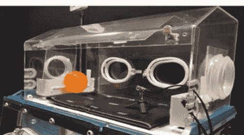

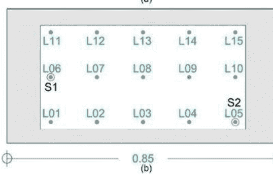

此外，使用有限元方法（FEM）计算了不同麦克风位置的噪声水平，以及每个源位置的噪声水平。通过这种方式，获得了每个微源组合在1/3倍频带中的声压级。模拟是在空气领域进行的，通过在计算机程序中引入孵化器隔间几何形状的简化。

测量的混响时间、模拟的噪声水平、麦克风和声源位置，以及每个麦克风位置的 X, Y 和 Z 笛卡尔坐标被用来预测孵化器内的混响时间。本文研究了一种基于人工神经网络的估计方法，用于准确表征新生儿孵化器内的混响时间。所提出的方法使用从混响时间测量和声压级模拟中获得的实验和模拟数据进行实现。

#### 2.1 人工神经网络使用

##### Levenberg-Marquardt算法

人工神经网络（ANN）是一个简化的模型，模拟人脑处理信息的方式[59]。它由一组相互连接的元素（节点或神经元）组成，将输入数据集转换为所需输出数据集[60, 61]。多层感知器是一种广泛使用的神经网络结构，由多个信息层组成[62]，其中包括以下元素可以区分以下元素：一个输入层（独立变量），一个或多个中间或隐藏层（执行输入和输出变量之间的关系），以及一个接收独立变量操作结果的输出层。为了模拟大脑的非同步功能，使用激活函数对输入数据进行加权[63]。

激活函数决定了神经元在预测过程中是否相关，从而决定神经元的输入是否传递到下一层。神经网络中最常用的激活函数为输出添加了非线性。在这项工作中，使用了一个S型对称传递函数作为激活函数。其表达式如下：

$$ f(x) = \frac{2}{(1 + e^{-2x})} - 1 \quad\quad (1) $$

阻尼最小二乘法，也称为Levenberg-Marquardt方法[62, 63]，用于解决非线性最小二乘问题。Leverberg-Marquardt曲线拟合方法是梯度下降[64]和Gauss-Newton [65]算法的组合。梯度下降法是一种可以确定多个变量函数的最大值和最小值的技术。这种方法是最常用的最小化成本函数和优化神经网络的方法，通过更新与函数相关的参数，使其与函数梯度的相反方向相对应。这是因为梯度指示了最大增长的方向。在基本实现中，首先在多维空间中选择一个随机点，并在该点处计算梯度。然后，我们沿着梯度相反方向指示的最大减少方向选择另一个点。如果第二个点的函数值低于第一个点计算的值，则可以继续沿着第二个点计算的反梯度进行下降；否则，减小移动步长，并重新开始。一旦达到局部最小值，算法就会停止。由于步长的大小应适合梯度，梯度下降算法可能会出现收敛缓慢的情况。

此外，收敛速度慢是由于误差曲面的曲率不同于所有方向。可以通过使用高斯-牛顿算法来克服这个限制。为了评估误差曲面的曲率，该算法使用误差函数的二阶导数。通过这种方式，确定了每个方向的适当步长，并且算法快速收敛。

### 3 结果

#### 3.1 数据分析

数据分析过程通过各个阶段进行，以获得所需信息的有效可靠的外推。 第一阶段涉及通过孵化器内的混响时间测量收集数据，并在第2节中详细描述。 在此阶段，来自不同测量会话的所有数据，涉及接收点的不同测量站以及两个不同源位置的相关数据。 随后，这些数据以适合我们进行研究的形式进行统一组织，处理的数据集具有以下类型的字段：

- 源位置 (x, y, z)
- 接收器位置 (x, y, z)
- 采样率
- 1/3倍频带SPL分量 (100–5000 Hz)
- 混响时间

处理此数据集的目的是使用第一四个字段中包含的信息作为解释变量，然后使用最后一个字段中包含的混响时间作为响应变量 (图4)。

在构建数据集之后，对数据进行了仔细的清理；事实上，许多收集到的元素可能是不完整的、重复的或不正确的，使用它们会导致研究模型的错误和不准确性。 只有在完成这些步骤之后，我们才能继续进行实际的算法建模，以识别数据中包含的模式和任何因果关系。 数据清理无疑是最重要的数据分析活动之一：没有干净的数据，甚至无法开始其他工作。 删除不完整数据的一个非常简单的解决方案是删除没有所有必要信息的记录。 在我们的案例中，有大约15,000个可用观测值，我们可以应用这种技术而不影响数据集的质量。

现在让我们继续进行对数据的第一次分析。 表1显示了每个声源位置在100至5000 Hz之间的平均值和中位数。 在低频率下，可以观察到较高的混响时间值，特别是在250 Hz以下。 可以观察到S1和S2声源位置的混响时间测量存在较大差异，这可能是由于声源在激发房间方面的更显著影响。

在该频率以上，混响时间非常相似，但在使用两个声源位置进行的测量中会出现轻微变化。 对于250 Hz以上的频率，混响时间的平均值和中位数没有明显差异。 对于较低的频率，中位数值略低于平均值，可能是由于数据上限存在异常值导致平均值增加。

图2显示了按麦克风位置分组的数据分布，以便比较孵化器的垂直和水平轴上的混响时间变化（根据图1）。特别是，图2显示了两个声源位置在麦克风位置L1-L6-L11（图2a）、L2-L7-L12（图2b）、L3-L8-L13（图2c）、L4-L9-L14（图2d）和L5-L10-L15（图2e）上的平均混响时间。在大多数图表中，数据密度较高的范围在0.25到0.5秒之间。然而，对于这些平均混响时间值，图表b、c和d的数据密度略高于图表a和e（L0和L15）。因此，如果考虑孵化器的85厘米尺寸，这些混响时间值在中心部位比两侧更集中。在位置L4和L5，可以观察到不同的趋势，值在0.3-0.4秒之间的密度更高。这两个位置位于孵化器的倒角下方和与S1相对的角落，该位置的声源可能导致该区间内的混响时间值较高。

图3以蓝色显示了所有测量值（考虑所有频率和所有微源组合）的平均混响时间与每个麦克风位置的平均混响时间之间的差异，并以红色显示了所有混响时间测量值的中位数与每个麦克风位置的中位数之间的差异。

##### 图2 100至5000 Hz之间的平均混响时间密度图

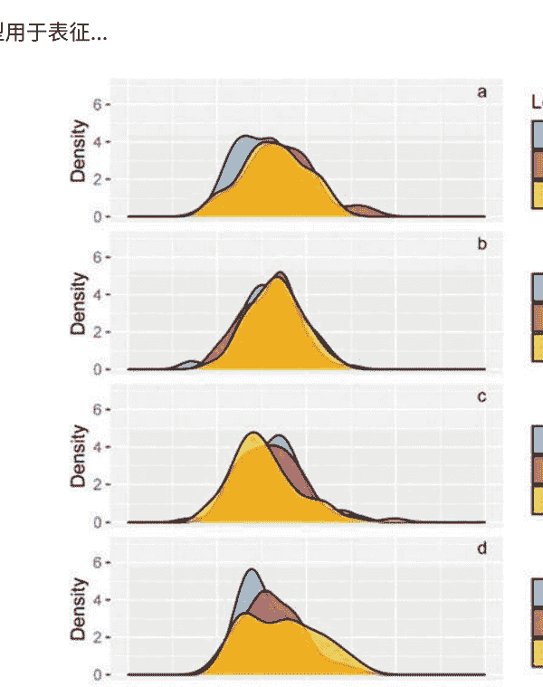

可以看出，总混响时间与每个麦克风位置的混响时间之间的差异对于平均值和中位数值来说都很小，尽管对于中位数值来说差异更大且始终为负值。负值意味着整个数据库的中位数大于每个麦克风位置的中位数；考虑到表示，每个麦克风位置的中位数值增加了约0.2秒。

#### 3.2 基于人工神经网络的模型训练

在训练之前，需要对网络进行特征缩放；这是一种在将数据呈现给基于机器学习的算法之前通常使用的预处理技术。我们的数据库中包含了具有不同测量单位的函数，例如空间中的点的坐标（米）以及声压级数据（分贝），频率（赫兹）以及混响时间（秒）。这些特征具有不同的动态范围，而基于机器学习算法中最常用的距离测量方法会赋予具有较大间隔的元素更大的权重，而对于具有较小间隔的元素则赋予较小的权重。因此，特征缩放是必要的，以大致均衡特征的范围，并使它们在计算相似性时具有大致相同的影响。此外，在具有大动态范围的大量功能的各种数据挖掘应用中，特征缩放可以提高滤波性能。

对于特征缩放，我们采用了最小-最大归一化，它通过将原始数据转换到新的存在区间（这次是0到1之间）上进行线性变换。方程（2）总结了应用于数据集的所有记录的转换。

```
x标准化 = (X减去 X最小值) / (X最大值减去 X最小值) (2)
```

这种方法保留了原始数据值之间的关系，但代价是有较小标准差的有限范围。这个结果可能限制了异常值的影响。

图4显示了本研究中使用的基于人工神经网络的算法的架构。网络架构包括三层，输入层、隐藏层和输出层。如上所述，输入传递给网络的内容包括源点和接收器点的空间坐标、频率和三分之一倍频的SPL值。相反，输出保持混响时间值。隐藏层由10个人工神经元组成。

选择隐藏层中的神经元数量没有可用的分析方法。这个数量会随着输入节点的数量、训练数据的量和学习算法的复杂性而变化。许多神经元会使模型更接近训练数据，但这会带来过拟合的风险。此外，许多节点也可能计算成本高，并且产生训练速度较慢的网络。在这种情况下，我们采用了一种启发式方法；也就是说，我们尝试了不同的网络架构，并最终选择了性能最佳的那个。

随后，缩放后的数据被分成三个数据集，我们将用于网络的训练（训练集），用于模型的验证（验证集），最后用于测试网络（测试集）。这种数据分割在过程的三个阶段中是必要的。通过这种方式，在验证阶段和测试阶段，模型将看到在训练阶段从未遇到过的新数据。因此，我们不会冒将模型在已知数据上进行验证并保留其记忆的风险，从而使模型无法泛化。数据被分割，将70%的数据用于训练（训练集），15%的数据用于验证过程（验证集），最后剩下的15%用于测试模型（测试集）。分割是随机进行的，具有均匀分布；这样，每个样本具有相同的选择概率。

这种方法的优点是返回模型性能的低偏差 [68]。数据的分割是为了避免过拟合，即避免模型在提供的训练数据上拟合得太好，而在额外数据上无法可靠地拟合。选择这种划分是为了确保主要部分的数据用于模型训练，因为在这个阶段模型从数据中提取知识并学习进行正确的预测[69–72]。

图5展示了在验证过程中均方误差的更新情况。我们可以看到，在过程的第一部分中，这个误差经历了相当大的减少，表明算法正在朝着收敛的方向修改连接的权重。在过程的第二部分中，我们可以看到这个减少速度变慢，直到达到几乎恒定的值。

这种行为表明模型正在获得良好的泛化能力。相反，如果我们在验证过程的第二部分中注意到验证数据集上的错误增加，这意味着网络开始过拟合训练过程中使用的数据。表2显示了训练参数值。

此时，我们可以继续分析使用开发的模型进行的预测结果。为此，我们使用回归图；它是一个简单的图表，其中横坐标表示数据的真实值，即测量值，而纵坐标表示预测值，即模型返回的值。然后绘制两条线，一条虚线和一条实线；虚线表示理想值目标＝输出解决方案，而完整的解决方案代表了点分布的回归曲线。点围绕虚线排列得越多，使用该模型获得的预测质量越高。

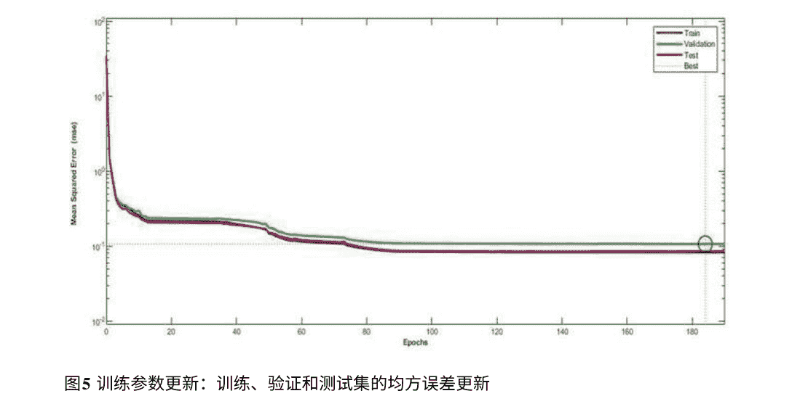

##### 图5 训练参数更新：训练、验证和测试集的均方误差更新

##### 表2 训练参数值

| 参数 | 值 |
| :--- | :--- |
| 时期 | 185 |
| 学习率 | 0.01 |
| 动量 | 0.001 |
| 梯度 | 0.006 |

图6显示了模型开发的三个阶段的回归图：训练阶段、验证阶段和测试阶段。我们可以注意到，尽管存在一些差异，但在这三种情况下，点都围绕虚线排列，表明模型具有良好的泛化能力。

为了在每个阶段衡量模型的性能，我们决定采用科学界非常流行的两个指标：均方误差（MSE）和皮尔逊相关系数。均方误差（MSE）是输出和目标之间的平均平方差[73]。低值表示低模拟误差，因此与测量结果一致。零表示没有错误。皮尔逊相关系数值衡量输出和目标之间的相关性[74]。R-值为1表示密切关系，0表示随机关系。表3显示了三个阶段采用的指标值。

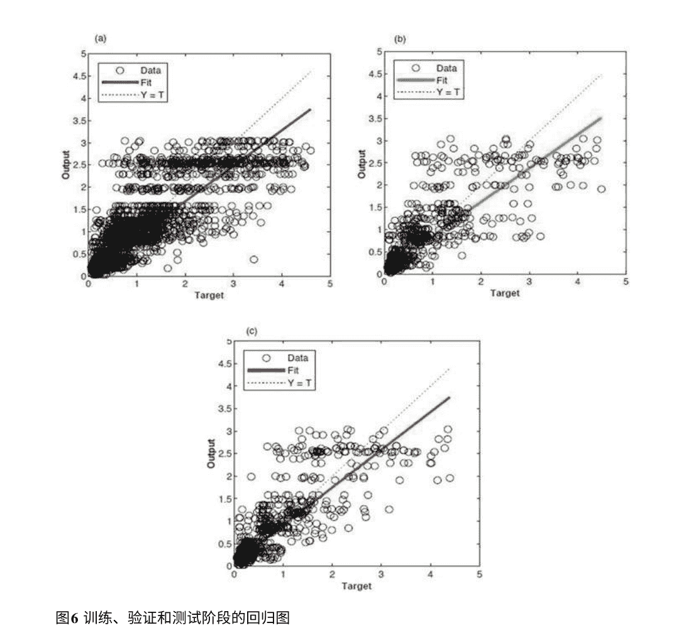

##### 图6 训练、验证和测试阶段的回归图

##### 表3 基于人工神经网络模型的评估指标

| | 皮尔逊相关系数 | 均方误差 |
| :--- | :--- | :--- |
| 训练 | 8.93 × 10 − 1 | 8.24 × 10 − 2 |
| 验证 | 8.61 × 10 − 1 | 9.94 × 10 − 2 |
| 测试1 | 8.79 × 10 − 1 | 8.58 × 10 − 3 |
| 测试2 | 8.52 × 10 − 1 | 8.01 × 10 − 3 |

均方根误差为0.089，对于训练集来说是一个非常低的值，表明对混响时间的预测很好（表3）。皮尔逊相关系数接近1（0.824），也表明模拟模型的性能很好。为了有效评估模型的性能，进行了两次测试会话，使用了两个不同的数据子集：随后将结果进行比较，如表3所示。

### 4 结论

有健康问题的新生儿可能会在新生儿孵化器中度过较长时间。孵化器内的噪音可能会增加他们的健康问题，而回声是增加噪音持续性的一个问题。本研究报告了一项实验调查的结果，以评估人工神经网络对新生儿孵化器回声时间的表征的有效性。为此，进行了回声时间测量和内部声压级模拟。实验测量结果已报告并讨论。数据分析显示，对于这样一个小空间，平均回声时间很长，125 Hz频率超过两秒。因此，孵化器内的回声时间不符合许多国家法规对医院房间的建议。因此，它有助于为新生儿产生一个不自然的声学环境。

使用Levenberg-Marquardt算法进行的人工神经网络的结果返回了0.824的皮尔逊相关系数值，表明模型具有良好的泛化能力。这些模型可以帮助孵化器设计师仅使用三分之一倍频带的声压级模拟作为输入数据来估计孵化器内的回声时间。

### 参考文献

1. Brandon, D.H., Ryan, D.J., Barnes, A.H.: 环境变化对NICU噪音的影响。Adv. Neonatal Care 8, S5-10 (2008). [https://doi.org/10.1097/01.ANC.0000337266.47599.c9](https://doi.org/10.1097/01.ANC.0000337266.47599.c9)
2. Moreira Pinheiro, E., Guinsburg, R., de Araujo Nabuco, M.A., Yoshiko Kakehashi, T.: 新生儿重症监护室和孵化器内部的噪音（西班牙语）。Rev.Lat. Am. Enfermagem. 19, 1214–1221 (2011). [https://doi.org/10.1590/S0104-11692011000500020](https://doi.org/10.1590/S0104-11692011000500020)
3. Bremmer, P., Byers, J.F., Kiehl, E.: 噪音对早产儿的生理影响和实践意义。JOGNN J. Obstet. Gynecol. Neonatal Nurs. 32, 447–454 (2003). [https://doi.org/10.1177/0884217503255009](https://doi.org/10.1177/0884217503255009)
4. Philbin, M.K.: 足月和早产儿的全面研究。新生儿对声音的生理影响。J. Prinat. 20, 54–59(2000)。 [https://doi.org/10.1038/sj.jp.72004515](https://doi.org/10.1038/sj.jp.72004515)
5. Slevin, M., Farrington, N., Duffy, G., Daly, L., Murphy, J.: 改变NICU并测量婴儿的反应。Acta Paediatr. (2000)。 [https://doi.org/10.1111/j.1651-2227.2000.tb00342.x6](https://doi.org/10.1111/j.1651-2227.2000.tb00342.x6).
6. Vélez-Pereira, A.M., Gálvez, M., Fortes-Garrido, J.C., Bolívar, J.P.: 评估新生儿重症监护病房的噪音。Cuid. Rev. Investig. 2(1), 114–118 (2011)
7. Lahav, A., Skoe, E.: NICU和子宫之间的声学差距：对早产儿听觉系统神经可塑性的潜在风险。Front. Neurosci. 8,(2014)。 [https://doi.org/10.3389/fnins.2014.00381](https://doi.org/10.3389/fnins.2014.00381)
8. Gerhardt, K.J., Abrams, R.M.: 胎儿暴露于声音和振动刺激。J. Perinatol. 20, S21–S30 (2000). [https://doi.org/10.1038/sj.jp.7200446](https://doi.org/10.1038/sj.jp.7200446)
9. Long, J.G., Lucey, J.F., Philip, A.G.S.: 噪音和低氧血症在重症监护病房中。Pediatrics. 65, 143–145 (1980). [https://doi.org/10.1542/peds.65.1.143](https://doi.org/10.1542/peds.65.1.143)
10. Almadhoob, A., Ohlsson, A.: 早产儿或极低出生体重新生儿重症监护病房中的声音减少管理（综述）。Cochrane Libr. Cochrane Database Syst.Rev. (2020). [https://doi.org/10.1002/14651858.CD010333.pub3](https://doi.org/10.1002/14651858.CD010333.pub3)
11. Ouis, D.: 道路交通噪音的困扰：一项综述。环境心理学杂志 21, 101-120 (2001年)。 [https://doi.org/10.1006/jevp.2000.0187](https://doi.org/10.1006/jevp.2000.0187)
12. Gray, L., Philbin, M.K.: 新生儿重症监护室对听觉注意力和分心的影响。临床印刷学 31, 243–260 (2004年)。 [https://doi.org/10.1016/j.clp.2004.04.01313](https://doi.org/10.1016/j.clp.2004.04.01313)
13. Stanley, N., Graven, M.: NICU中的声音与婴儿发育：护理的结论和建议。国产儿期刊 20, 88-93 (2000年)。 [https://doi.org/10.1038/sj.jp.7200444](https://doi.org/10.1038/sj.jp.7200444)
14. Kellam, B., Bhatia, J.: 重症监护室中的声谱分析：测量高频声音。儿科护理杂志 23, 317–323 (2008年)。 [https://doi.org/10.1016/j.pedn.2007.09.009](https://doi.org/10.1016/j.pedn.2007.09.009)
15. Bamiou, D., Musiek, F.E., Luxon, L.M.: 听觉处理障碍的病因和临床表现-综述. Arch. Dis. Child. 85, 361–365 (2001). [https://doi.org/10.1136/adc.85.5.361](https://doi.org/10.1136/adc.85.5.361)
16. Graven, S.N.: 临床研究数据揭示了物理环境与患者医疗结果之间的关系。J. Healthc. Des. Proc. Symp. Healthc. Des. Symp. Healthc.Des. 9, 14–15 (1997)
17. Rodríguez-Montano, V.M., Beira-Jiménez, J.L., Fernández-Zacarías, F., Cueto-Ancela, J.L., Velázquez-Gaztelu, P.L., Lubín-López, S.: 新生儿患者所遭受的环境声音频谱分析. 案例研究: Hospital Universitario Puerta del Mar (Cadiz)的Nicu. In:Proceedings of the Internoise 2019. Madrid (2019)
18. Hernández-Molina, R., Zacarías, F., Puyana, V., Rodríguez, V.M., Beira, J.L., Cueto Ancela, J.L., Lubian López, S.: 对新生儿重症监护病房环境声音的分析。 In: TecniAcustica 2018 会议论文集, C adiz, (2018)
19. Carvalhais, C., Santos, J., Vieira, M., Xavier, A.: 新生儿重症监护病房的医护人员噪音减少培训是否充分？来自neonoise的一项试点研究。
20. Wang, D., Aubertin, C., Barrowman, N., Moreau, K., Dunn, S., Harrold, J.: 使用声音激活噪音计在新生儿重症监护病房中减少噪音。 https://doi.org/10.1136/archdischild-2014-306490
21. 美国儿科学会环境健康委员会：噪音：对胎儿和新生儿的危害。
22. Coston, A.D., Aune, C.: 降低新生儿重症监护室噪音。 儿科学。 144, 154 (2019). https://doi.org/10.1542/peds.144.2MA2.154
23. Fernández Zacarías, F., Beira Jiménez, J.L., Bustillo Velázquez-Gaztelu, P.J., HernándezMolina, R., Lubín López, S.: 新生儿孵化器噪音水平的比较研究。 国际儿科耳鼻喉科学。 107, 150–154 (2018). https://doi.org/10.1016/j.ijporl.2018.02.013
24. Fortes-Garrido, J.C., Velez-Pereira, A.M., Gálvez, M., Hidalgo-Hidalgo, M., Bolívar, J.P.: 新生儿重症监护室噪音水平的特征及其对噪音管理的影响。 环境健康科学与工程杂志。 12, (2014). https://doi.org/10.1186/2052-336X-12-104
25. Puyana-Romero, V., Núñez-Solano, D., Fernández-Zacarías, F., Jara-Muñoz, E., Hernández-Molina, R.: 围绕新生儿孵化器设计的混响重要性。 9, 4–11 (2021). https://doi.org/10.3389/fped.2021.584736
26. Carvalhais, C., Silva, M.V., Silva, J., Xavier, A., Santos, J.: 新生儿重症监护病房的噪音: 简要综述。 Proc. Euronoise 2018, 545–550 (2018)
27. Philbin, M.K.: 规划新生儿重症监护病房的声学环境。 Clin.Perinatol. 31, 331–352 (2004), viii. https://doi.org/10.1016/j.clp.2004.04.014
28. Oliveira Rodarte, M.D., Silvan Schoch i, C.G., Moraes Leite, A., Ide Fujinaga, C., Zamberlan,N.E., Correa Castral, T.: 操纵孵化器时产生的噪音: 对护理的影响。 Rev. Lat. Am. Enfermagem. 13, 79–85. https://doi.org/10.1590/s0104-11692005000100013
29. Barceló, C., Molina, E., Mendoza, J.G., Dueñas, E., Plá, E.: Estructura física de los sonidos continuos y de impulso en incubadoras infantiles de uso nacional. Rev Cub Ped. 58, (1986)
30. Puyana-Romero, V., Núñez-Solano, D., Hernández, R., Fernández-Zacarías, F., Beira-Jiménez, J.L., Garzón, C., Jara-Muñoz, E.: Reverberation time measurements of a neonatal incubator. Appl. Acoust. 167, 107374 (2020). https://doi.org/10.1016/j.apacoust.2020.107374
31. U.S. Environmental Protection Agency Information on levels of environmental noise requisite to protect public health and welfare with adequate margin of safety. 华盛顿特区, (1974)
32. White, R.D.: Recommended standards for newborn ICU design. J. Perinatol. 26, S2–S18 (2006). https://doi.org/10.1038/sj.jp.7211587
33. Agra Varela, Y., Aguayo Maldonado, J., álvarez González, M., Botet Mussons, F., Bustos Lozano, G., Díaz Torres, P., Echániz Urcelay, I., Fernández Lorenzo, J., Garcia Franco, M., Gómez Papi, A. et al.: 新生儿科单位。 质量标准和建议。 Minist. Sanidad, Serv. Soc. E Igual. 175, (2014)
34. Rasmussen, B.: 关于医院声学规定和分类的试点研究-北欧国家之间的比较。 In: 2018年噪声国际会议论文集。 芝加哥, 伊利诺伊州, (2018)
35. 国际标准化组织ISO 3382–2。 房间声学参数的测量。 第2部分： 普通房间的混响时间, (2008)
36. Mejía, J., Ochoa-Zezzatti, A., Contreras-Masse, R., Rivera, G.: 利用深度学习模型为智能城市居民提供食物热量摄入的智能系统。 应用。 混合元启发式算法图像处理, 441-455 (2020). https://doi.org/10.1007/978-3-030-4977-7_19
37. Mar-Cupido, R., García, V., Rivera, G., Sánchez, J.S.: 深度迁移学习用于识别面罩类型以防止COVID-19传播的核心措施。 https://doi.org/10.1016/j.asoc.2022.109207

| 频率（Hz） | 均值 S1 | 均值 S2 | 中位数 S1 | 中位数 S2 |
| :--- | :--- | :--- | :--- | :--- |
| 100 | 1.05 | 0.84 | 0.71 | 0.77 |
| 125 | 2.21 | 2.33 | 2.23 | 2.40 |
| 160 | 0.38 | 0.36 | 0.31 | 0.29 |
| 200 | 1.28 | 0.87 | 1.33 | 0.98 |
| 250 | 0.27 | 0.18 | 0.21 | 0.15 |
| 315 | 0.24 | 0.16 | 0.22 | 0.14 |
| 400 | 0.13 | 0.12 | 0.13 | 0.12 |
| 500 | 0.15 | 0.15 | 0.15 | 0.15 |
| 630 | 0.17 | 0.16 | 0.17 | 0.16 |
| 800 | 0.17 | 0.18 | 0.16 | 0.18 |
| 1000 | 0.18 | 0.18 | 0.18 | 0.18 |
| 1250 | 0.19 | 0.20 | 0.19 | 0.20 |
| 1600 | 0.19 | 0.19 | 0.19 | 0.19 |
| 2000 | 0.19 | 0.19 | 0.19 | 0.19 |
| 2500 | 0.19 | 0.19 | 0.18 | 0.18 |
| 3150 | 0.18 | 0.18 | 0.18 | 0.18 |
| 4000 | 0.17 | 0.17 | 0.17 | 0.17 |
| 5000 | 0.17 | 0.17 | 0.17 | 0.17 |

38. Raghupathi, V., Raghupathi, W.: 神经网络分析医院治疗质量和效率。 https://doi.org/10.4172/2157-7420.100020939
39. Kappen, H.J., Neijt, J.P.: 神经网络分析预测治疗结果。 https://doi.org/10.1093/annonc/4.suppl_4.S31

40. Izenberg, S.D., Williams, M.D., Luterman, A.: 使用神经网络预测创伤死亡率。Am J Surg 63, 275–281 (1997)

41. Lee, C.K., Samad, M., Hofer, I., Cannesson, M.: 开发和验证一种可解释的神经网络，用于预测术后住院死亡率。npj Digit. Med., 1–9。 https://doi.org/10.1038/s41746-020-00377-1

42. Clermont, G., Angus, D.C., DiRusso, S.M., Griffin, M., Linde-Zwirble, W.T.: 预测重症监护病房患者的住院死亡率：人工神经网络与逻辑回归模型的比较。Crit. Care Med. 29, 291–296 (2001). https://doi.org/10.1097/00003246-200102000-00012

43. Walczak, S., Pofahl, W.E., Medical, S., Drive, P.: 用神经网络预测住院时间。In: 第十一届国际FLAIRS会议论文集, pp. 333-337 (1998)

44. Tu, J.V., Guerriere, M.R.J.: 使用神经网络作为心脏手术后重症监护室住院时间的预测工具。(1993)

45. Kutafina, E., Bechtold, I., Kabino, K., Jonas, S.M.: 递归神经网络在医院床位占用预测中的应用。BMC Med. Inform. Decis. Mak. 1, 1-10 (2019). https://doi.org/10.1186/s12911-019-0776-1

46. Schiele, J., Koperna, T., Brunner, J.O.: 通过神经网络预测综合手术室调度的重症监护室床位占用情况。Nav. Res. Logist. (NRL). 68(1), 65–88 (2021). https://doi.org/10.1002/nav.21929

47. Van Der Spoel, S., Van Keulen, M., Amrit, C.: 在噪声数据集中的过程预测：荷兰医院的案例研究。In: Proceedings of the lecture notes in business information processing, (2013). https://doi.org/10.1007/978-3-642-40919-6_4

48. Puyana-Romero, V., Maffei, L., Brambilla, G., Ciaburro, G.: 通过人工神经网络对城市滨水区域的声景质量进行建模。Appl. Acoust. 111, 121–128 (2016). https://doi.org/10.1016/j.apacoust.2016.04.019

49. Puyana Romero, V., Ciaburro, G., Maffei, L.: 声景与期望之间的匹配程度：那不勒斯和布莱顿的案例研究。In: INTER-NOISE 2016 - 第45届国际噪声控制工程大会：走向一个更安静的未来, pp. 5198-5202 (2016)

50. Yu, L., Kang, J.: 城市开放空间声景质量的主观评价建模：一种人工神经网络方法。J. Acoust. Soc. Am. 126, 1163-1174 (2009). https://doi.org/10.1121/1.3183377

51. Genaro, N., Torija, A., Ramos-Ridao, A., Requena, I., Ruiz, D.P., Zamorano, M.: 基于神经网络的城市噪声预测模型。J. Acoust. Soc. Am. 128, 1738-1746 (2010). https://doi.org/10.1121/1.3473692

52. Han, H.-S.: 使用反向传播神经网络算法对海军舰船舱内噪声进行心理声学评估。Int. J. Nav. Archit. Ocean Eng. 4, 374–385 (2013). https://doi.org/10.2478/IJNAOE-2013-0104

53. Papayiannis, C., Evers, C., Member, S., Naylor, P.A.: 使用DNNs进行混响房间的端到端分类，第1-8页

54. Henrique, P., Zannin, T., Oliveira, E.: 应用人工神经网络进行噪声屏障优化。(2018). https://doi.org/10.3390/environments5120135

55. Ciaburro, G., Iannace, G., Ali, M., Alabdulkarem, A., Nuhait, A.: 用人工神经网络建模吸声沥青的声学特性。J. King Saud Univ. Eng. Sci., 0-7 (2020). https://doi.org/10.1016/j.jksues.2020.07.002

56. Ciaburro, G., Iannace, G., Puyana-Romero, V., Trematerra, A.: 碎片化巨型芦苇声学行为预测数值模拟模型比较。Appl. Sci. 10, (2020). https://doi.org/10.3390/app10196881

57. Peir, A.: 在嘈杂的医院环境中使用基于模型和非模型方法自动检测警报声音。Electr. Eng. Syst. Sci., (2012). https://doi.org/10.48550/arXiv.1711.04351

58. Hernández-Molina, R., Beira Jiménez, J.L., Rodriguez-Montaño, Fernández Zacarías, F., Bienvenido-Huertas, D., Lubián, S., Cueto-ancela, J.L.: 衡量新生儿重症监护室声学环境。Appl. Acoust. 165, (2020). https://doi.org/10.1016/j.apacoust.2020.107301

59. Lipp, M.: 神经网络：算法、应用和编程技术。J. Oper. Res. Soc. 43, 1106 (1992). https://doi.org/10.1057/jors.1992.170

60. Kumar, E.P., Sharma, E.P.: 人工神经网络研究。Int. J. Emerg. Eng. Res. Technol. 2, 143–148 (2014)

61. Zhou, J., Daniel, I.: 使用遗传学习神经网络进行GIS空间决策。Photogramm. Eng. Remote Sens., (2014)

62. Sainlez, M., Heyen, G.: 递归神经网络预测Kraft恢复锅炉中的蒸汽产量。In: Pistikopoulos, E.N., Georgiadis, M.C., Kokossis, A.C. (eds.) 21 European symposium on computer aided process engineering, vol. 29, pp. 1784–1788. Elsevier (2011). ISBN 1570–7946

63. Walczak, S., Cerpa, N.: 人工神经网络。In: Meyers, R.A. (ed.) Encyclopedia of Physical Science and Technology, Third Edition, pp. 631–645. Academic Press, New York (2003). ISBN 978–0–12–227410–7

64. Hagan, M.T., Menhaj, M.B.: 使用Marquardt算法训练前馈网络。IEEE Trans. Neural Netw. 5, 989–993 (1994). https://doi.org/10.1109/72.329697

65. Marquardt, D.W.: 用于非线性参数最小二乘估计的算法。J. Soc. Ind. Appl. Math. 11, 431–441 (1963)

66. Ruder, S.: 梯度下降优化算法概述。(2016)

67. Golub, G.: 解决线性最小二乘问题的数值方法。Numer. Math. 7, 206–216 (1965). https://doi.org/10.1007/BF01436075

68. Lohr, S.L.: 抽样：设计与分析, 第一版. Duxbury Press (1999)

69. Nguyen, Q. H., Ly, H. B., Ho, L. S., Al-Ansari, N., Le, H. V., Tran, V. Q., Pham, B. T.: 数据分割对土壤剪切强度机器学习模型预测性能的影响。Math. Probl. Eng., (2021). https://doi.org/10.1155/2021/4832864

70. Ciaburro, G.: 基于机器学习算法的机器故障检测方法：一项综述。Math. Biosci. Eng. 19(11), 11453–11490 (2022). https://doi.org/10.3934/mbe.2022534

71. Joseph, V.R., Vakayil, A.: Split: 一种数据分割的最优方法。Technometrics. 64(2), 166–176 (2022). https://doi.org/10.1080/00401706.2021.1921037

72. Ciaburro, G.: 用于音频事件检测的深度学习方法。In: Machine Learning for Intelligent Multimedia Analytics, pp. 147-166. Springer, Singapore (2021). https://doi.org/10.1007/978-981-15-9492-2_8

73. Wang, Z., Bovik, A.C.: 均方误差：喜欢还是离开它？对信号保真度的新视角测量。IEEE Signal Process. Mag. 26, 98-117 (2009). https://doi.org/10.1109/MSP.2008.930649

74. Mukaka, M.M.: 统计角：在医学研究中适当使用相关系数的指南。Malawi Med. J. 24, 69-71 (2012)

## 机器学习方法预测COVID-19的比较研究

J. Patricia Sánchez-Solís, Juan D. Mata Gallegos, Karla M. Olmos Sánchez, 和 Victoria González Demoss

摘要 新冠肺炎首次出现在中国湖北武汉市，威胁着公共卫生、贸易和全球经济。 世界卫生组织推荐使用逆转录聚合酶链反应（RT-PCR）协议进行COVID-19测试，以检测不同的病毒基因。 然而，这些测试协议需要RNA提取试剂盒、昂贵的机器和训练有素的技术人员来操作。 因此，需要更快速、更便宜、更易于患者和医务人员获取的替代方案。 本章介绍了用于检测COVID-19的机器学习技术的比较分析。 使用交叉验证技术和五折法对以下四个分类器进行了训练、测试和比较：随机森林、随机梯度下降、朴素贝叶斯和K-最近邻。 本项目使用的数据集是墨西哥政府在Datos Abiertos Dirección General de Epidemiología网页上提供的数据集。

结果表明，基于曲线下面积和精确率-召回率曲线指标，随机森林分类器表现最佳。

关键词 COVID-19 · 随机森林 · 随机梯度下降 · 朴素贝叶斯 · K最近邻 · 交叉验证技术

J. P. Sánchez-Solís (✉) · J. D. Mata Gallegos · K. M. Olmos Sánchez · V. González Demoss
墨西哥奇瓦瓦州华雷斯市杰斯·马西亚斯·德尔加多大街18100号，32579
华雷斯市，奇瓦瓦州，墨西哥
电子邮件：julia.sanchez@uacj.mx
J. D. Mata Gallegos
电子邮件：al154075@alumnos.uacj.mx
K. M. Olmos Sánchez
电子邮件：kolmos@uacj.mx
V. González Demoss
电子邮件：vgonzale@uacj.mx

### 1 引言

及早发现高度传染性疾病对于减少其传播至关重要。最近对全球健康构成威胁的是2019年12月被确认为COVID-19的呼吸道疾病爆发，该疾病首次出现在中国湖北省武汉市，并对公共卫生、贸易和全球经济构成威胁。这种疾病源于与导致严重急性呼吸综合征（SARS）的病毒相关的新型冠状病毒[1]。2020年1月30日，世界卫生组织（WHO）紧急委员会宣布全球卫生紧急状态，原因是国际上报告的COVID-19病例增加。

病例检测率每天都在变化，可以在当前时间在世界卫生组织、约翰霍普金斯大学网站和其他论坛上进行检查[2]。大规模诊断测试是流行病学和控制COVID-19等疫情爆发的关键工具。测试中的技术不确定性、有限的资源和供应链中的中断使得病毒在全球范围内传播[3]。该病毒与其他类型的病毒性肺炎部分相似行为。因此，病毒传播速度使控制局势变得具有挑战性[4]。COVID-19大流行增加了需要立即做出临床决策并有效利用医疗资源的需求。在医疗护理过程中，医疗提供者收集每个患者的临床数据，并利用所获得的知识来确定如何治疗新患者。因此，数据在解决健康问题和改善信息方面起着基础性的作用对于提高患者护理也是至关重要的[5]。

世界卫生组织已经推荐了COVID-19的测试，通过基于逆转录聚合酶链反应（RT-PCR）测试的协议来解决多样的病毒基因。然而，这些测试协议需要RNA提取试剂盒、昂贵的RT（定量）-PCR机器和训练有素的技术人员来操作它们。这些资源在科学基础设施薄弱的国家是不可用的。符合世界卫生组织指南的实验室将需要大量投资专业知识和时间，而这些目前受到COVID-19危机的限制[6]。

因此，有必要开发替代方法，以经济、非侵入性的方式在更短的时间内检测COVID-19，帮助医疗机构在决策时提供适当的服务。

数据在医疗保健中的重要性，以及从中提取洞察力的能力，使得机器学习研究对医疗保健至关重要[5]。在这个意义上，本研究比较了机器学习算法在预测一个人是否感染COVID-19时的性能。研究使用了Scikit-learn库进行实施。Scikit-learn是一个为Python开发的开源库，集成了用于分类、回归、聚类和降维任务的机器学习算法[7, 8]。数据清洗和规范化过程是在墨西哥政府在国家级别上公开的COVID-19病例数据集上进行的。这些病例被分为COVID-19阳性或阴性。此外，还使用了以下分类器：随机森林、随机梯度下降、朴素贝叶斯和K最近邻算法。使用了交叉验证技术来划分数据集。

分类器的性能是基于文献中常用的度量标准进行测量的。

本章的其余部分组织如下。第2节介绍了用于预测COVID-19的相关工作。第3节介绍了围绕这项研究的主题。第4节介绍了用于处理数据集和进行分类过程的材料和方法。第5节描述了实验的结果和讨论。最后，第6节介绍了结论和发现。

### 2 相关工作

对于医疗保健领域的机器学习的兴趣急剧增长[5]。最近，使用机器学习和深度学习算法来检测和预防COVID-19成为研究人员关注的热门话题，因此出现了不同的方法。例如，深度迁移学习已被用于通过识别口罩来预防COVID-19的传播[9]。此外，时间序列算法如LSTM、ARIMA模型、RNN和CNN等已被用于预测感染人数[10–12]。深度学习技术如CNN、GDCNN、深度集成学习模型和GAN等也已被用于使用医学图像预测COVID-19感染患者[13–15]。同样，机器学习算法如逻辑回归、随机森林、支持向量机、梯度提升树和神经网络等已被用于预测不同数据集中的COVID-19[16–18]。由于本章的重点，下面描述了一些关于COVID-19预测的研究。

Barstugan等人[19]提出的工作解决了COVID-19的早期检测问题。早期检测过程使用了从中国浙江地区的医院获得的腹部计算机断层扫描图像。他们从150个计算机断层扫描图像中形成了四个数据集来检测COVID-19。他们对数据集进行了特征提取处理，以提高分类性能。

为了进行特征提取，他们使用了以下方法：灰度大小区域矩阵、灰度级运行长度矩阵、灰度共生矩阵、离散小波变换和局部方向模式。分类任务分为两个阶段进行；在第一阶段，没有进行特征提取，而在第二阶段进行了特征提取。图像使用支持向量机算法进行分类。交叉验证技术被用于2、5和10折的分类过程中。根据准确率、精确度、特异度、敏感度和F-score指标评估了分类器的性能。

通过灰度共生矩阵和离散小波变换方法提取特征获得的分类准确性最好的结果，使用10折交叉验证技术，准确率始终在97%以上。尽管作者获得了较高的准确率，但他们得出结论，他们的方法需要使用另一组COVID-19影像数据进行测试以证明其有效性。作者建议进一步进行分割和

对COVID-19的分类研究以及创建和共享血液检测结果、X射线胸部图像和计算机断层扫描腹部图像的数据集。

Alakus和Turkoglu的研究[20]使用深度学习算法创建预测模型，使用实验室数据来确定患者是否有可能感染COVID-19。所使用的算法包括卷积神经网络（CNN）、长短期记忆（LSTM）、人工神经网络（ANN）、循环神经网络（RNN）、CNNRNN和CNLSTM。数据集包含2020年初在巴西圣保罗的以色列阿尔伯特·爱因斯坦医院接受治疗的患者的实验室数据。数据集有18个属性和600条记录，对应患者，其中80条为COVID-19阳性，520条为阴性。用于评估算法性能的指标包括召回率、精确度、准确度、F1分数和AUC。此外，他们使用十折交叉验证和训练-测试分割方法。使用十折交叉验证得到的结果如下：LSTM算法的召回率为99.42%，准确度为86.66%，AUC为62.50%。而使用训练-测试分割得到的结果如下：CNNLSTM算法的召回率为93.68%，准确度为92.3%，AUC为90.00%。作者得出结论，如果数据集的大小增加，算法的性能可以得到改善。他们还提到，提出的模型可以帮助医疗专业人员验证对患者检测到的首要发现，并用于与临床预测相关的研究。

在Yan等人的工作中[21]，使用了XGBoost算法进行COVID-19预测。目标是预测重症患者的生存率（生存或死亡）。该算法在中国武汉市404名感染者的血样数据库上进行了训练，包含84个特征。使用XGBoost算法识别了三个最重要的特征，即LDH、hs-CRP和淋巴细胞。作者报告了93%的准确率。对于每个类别，该模型在生存类别中的召回率为83%，在死亡类别中的召回率为100%。这些结果表明该模型可以在不可逆损伤发生之前识别出高风险患者。

Muhammad等人[22]开发了机器学习算法来检测COVID-19。开发的算法包括逻辑回归、决策树、支持向量机、朴素贝叶斯和人工神经网络。这些算法使用了墨西哥COVID-19阳性和阴性病例的流行病学标记数据集进行训练。墨西哥卫生部流行病学总局提供了该数据集。该数据集包含墨西哥COVID-19病例的RT-PCR检测结果。数据集包含263,007条记录，共41个特征。

作者报告的结果表明，决策树模型获得了最高的准确率为94.99%。支持向量机模型获得了最高的敏感度为93.34%，朴素贝叶斯模型获得了最高的特异度为94.30%。根据所得结果，作者提到这些模型可以用于验证COVID-19感染案例，并强调了监督学习算法在预测、诊断和控制COVID-19大流行中的重要作用。

在Moulaei等人的工作中[23]，开发并比较了不同的COVID-19死亡率预测模型。用于创建这些模型的算法包括J48、多层感知器、XGBoost、逻辑回归、K最近邻、随机森林和朴素贝叶斯。这些算法在一个包含38个特征的数据集上进行训练，数据来自伊朗阿巴丹市阿亚图拉·塔勒加尼医院的1,500名住院患者（1386名幸存者和144名死亡者）。通过敏感度、特异度、准确率、精确度和ROC等指标评估了算法的性能。作者报告称，随机森林的性能最佳，敏感度达到90.70%，特异度达到95.10%，准确率达到95.03%，精确度达到94.23%，ROC值为99.02%。根据结果，作者得出结论，用于分析死亡风险的预测模型可以通过识别高风险患者并采用更有效的治疗方法来做出贡献。

### 3 背景

在本节中，将描述为了理解和实现这个项目而汇聚的主题。将要开发的主题包括COVID-19和机器学习算法。

#### 3.1 Covid-19

2019年，由2型冠状病毒引起的COVID-19疾病出现，导致了严重的急性呼吸综合征SARS-CoV-2。COVID-19起源于中国武汉，并传播到许多其他国家。

COVID-19于2020年1月30日被世界卫生组织紧急委员会宣布为全球卫生紧急情况，原因是其在全球范围内的迅速传播。肺炎是最初的临床症状，它使得COVID-19疾病与SARS-CoV-2病毒相关联。一个人在感染病毒时可能有可能没有症状。症状通常在感染病毒后的一周内开始出现。感染病毒的人可能出现鼻塞、疲劳、发热、咳嗽、胃肠道症状和其他上呼吸道感染的迹象。

在某些情况下，疾病可能会进展，患者可能会出现胸部症状和严重呼吸困难，引发肺炎，可能导致死亡。这种临床表现可能出现在出现上述症状的第二或第三周[2]。

自SARS-CoV-2病毒起源以来，一些变种已经出现。2020年底，出现了阿尔法、贝塔和伽玛变种。而2021年出现了德尔塔和欧米克戎变种，后者在全球范围内传播性极强，最为普遍[24]。

#### 3.2 机器学习

这是数据科学的一个兴起领域。它是使机器学习，通过经验适应并产生可靠和可重复结果的科学[25]。

机器学习的工作方式是将学习系统分为三个重要部分：决策过程、误差函数和模型优化过程。然后，算法被训练用于进行分类或预测，发现数据中的基本信息。

机器学习算法分为三类：无监督学习、有监督学习和半监督学习[25]。下面是对它们的简要描述[25]：

- **监督式机器学习。** 它使用必须标记的数据集来训练算法，以对新数据进行分类或准确预测结果。当数据被输入模型时，模型会调整其权重。这是为了确保模型避免过拟合或欠拟合。在监督学习中使用的算法包括支持向量机、随机森林、逻辑回归、线性回归、朴素贝叶斯和神经网络。
- **无监督式机器学习。** 它使用机器学习算法来分析和分组未标记的数据集。算法可以发现隐藏的模式或数据分组，无需人为干预。在这种学习类型中使用的方法包括概率聚类、k均值聚类、神经网络、奇异值分解和主成分分析。
- **半监督学习。** 它提供了有监督学习和无监督学习之间的中间地带。在训练过程中，使用了一组数据，其中一些数据被标记，一些数据没有标记；通常，大部分数据没有标记。半监督学习可以解决没有足够标记数据的问题，用于有监督学习算法。

##### 3.2.1 分类算法

这是一种监督学习技术，用于识别来自带标签数据集的新观测的类别[25]。一些常用的分类算法包括：

- **朴素贝叶斯。** 它基于条件概率。该算法具有一个概率表，通过训练数据进行更新的模型。概率表用于预测新观测的类别。该算法的一些特点包括：它可以处理少量的训练数据，可以处理离散和连续数据，可以解决二元和多类分类问题[26]。
- **逻辑回归。** 它主要用于解决分类问题。提供基于概率的结果，指示事件是否会发生。它还可以提供多项式和有序的结果。当目标变量是分类变量时使用。该算法实现简单，计算效率高，并且不受多重共线性和数据中的低噪声的影响[26]。
- **支持向量机。** 这种类型的算法可以解决回归和分类问题。该过程旨在根据属于训练数据集的示例正确分类对象。该方法需要定义一个决策平面来分离属于不同类别的对象。当对象不可线性分离时，它使用复杂的数学函数进行分离。这种类型算法的特点包括：不会陷入局部最优解，可以处理结构化和半结构化数据，无法正确处理包含噪声的数据，性能受到训练时间增加的影响[26]。
- **K-最近邻算法。** 它是一种使用分组为多个类别的数据集的分类器。该算法不假设任何数据分布，因此被认为是非参数的。该方法的一些特点包括：易于实现，计算k个最近邻居的距离，允许处理大型数据集，从而导致计算开销大[26]。
- **随机森林。** 这是一种用于分类和回归目的的过程。在训练过程中构建多个决策树。根据这些决策树的结果定义新对象的类标签。这个算法可以使用大型数据集，避免训练集中出现的过拟合现象[27, 28]。
- **随机梯度下降。** 这种方法用于具有凸损失函数的线性分类器和回归器，例如逻辑回归和（线性）支持向量机。它已成功应用于涉及自然语言处理和文本分类的问题。它被认为是一种优化技术，而不是机器学习模型的一部分。它专注于训练模型。它的特点之一是易于实现，并且对于其运行，需要参数如迭代次数[29]。

### 4 材料和方法

针对COVID-19病例预测实施了四种分类器。这些分类器是在墨西哥政府通过Datos Abiertos Dirección General de Epidemiología网页[30]提供的数据集上进行训练的。

该数据集包含墨西哥全国范围内的患者记录，其中一些是COVID-19病例。第4.1节描述了使用的数据集以及为提高数据质量而进行的预处理。第4.2节描述了实施的分类器。

#### 4.1 数据集预处理

该数据集包含2,569,194条记录和40个属性；然而，由于记录数量过多以及所使用的计算机设备的容量限制，我们只能处理1,048,575条记录（这是Microsoft Excel 365，版本2211 Build 16.0.15831.20098，64位能够处理的记录数量）。患者进入护理单位的日期范围从2020年1月1日到2022年3月1日。总之，使用的数据集包含1,048,575条记录和40个属性。

作为第一步，我们分析了每个属性的含义。为了这个目的，我们分析了Datos Abiertos Dirección General de Epidemiología网页提供的目录。该目录描述了40个属性中每个属性存储的数据。每个属性的描述在表1中显示。

在了解每个属性代表的含义之后，我们进行了一项探索性数据分析。探索性分析包括3个步骤：(a) 清理过程，即删除我们认为对本项目不必要的属性，(b) 过滤包含指示某个属性是否包含根据表1来说不适用、被忽略或未指定信息的标识符的记录，以及(c) 更新某些属性数据的记录，以便于数据集的处理。图1显示了数据集中的一些记录。

在分析数据集记录之后，进行了清洗过程。清洗过程包括消除那些对本项目目标没有贡献的属性。与日期相关的属性被移除了（fecha_actualizacion, fecha_ingreso, fecha_sintomas, 和 fecha_def）。与起源、居住地、国籍以及治疗患者的医疗单位相关的属性也被移除了（origen, sector, entidad_um, entidad_nac, entidad_res, municipio_res, pais_nacionalidad, pais_origen, migrante, nacionalidad, habla_lengua_indig, indigena, id_registro, tipo_paciente, embarazo, 和 uci）。最后，尽管数据集包含有关实验室对患者进行的COVID测试的属性，但这些属性也被消除了（toma_muestra_lab, resultado_lab, toma_muestra_antigeno, 和 resultado_antigeno）。我们移除了这些属性，因为数据集中包含一个名为clasificacion_final的属性，该属性确定了记录是否为COVID-19病例。在消除了上述所有属性之后，数据集仅包含16个属性：sexo, neumonia, edad, diabetes, asma, epoc, hipertension, inmusupr, cardiovascular, otra_com, obesidad, renal_cronica, tabaquismo, intubado, otro_caso, 和 clasificacion_final。选择这些属性是因为本研究的兴趣主要集中在提供有关患者可能患有的合并症的特征信息上。

随后，数据集记录被过滤。我们首先根据clasificacion_final类属性的标识符过滤记录，只保留标识符为3和7的记录，因为它们分别表示确认的COVID-19病例或阴性病例。任何属性中标识符为97、98和99的记录也被过滤，因为这些值表示属性中包含的信息是‘不适用’、‘忽略’或‘未指定’。

这样，记录的属性中只包含标识符为1和2的内容，分别代表‘是’和‘否’。在过滤数据集后，其大小减小到87,300条记录。可以看出，大多数记录至少在一个属性上包含未确认或不适用的信息。

作为最后一步，我们在clasificacion_final属性中更新了标识符为3和7的记录。将3更改为1，将7更改为0。这样，我们将clasificacion_final属性视为我们的类属性，其中感兴趣的类别为1，即COVID-19的确诊病例。任何属性中标识符为2的记录，即‘否’，已更新为0。因此，记录现在在所有属性中包含标识符1和0，分别表示‘是’和‘否’。最后，年龄属性在0和1之间进行了归一化。

表2描述了数据集预处理后得到的选定属性。图2显示了一些之前预处理过的数据集记录。

作为探索性数据分析的一部分，还验证了任何属性中是否存在重复记录或空值记录。同样，生成了相关性矩阵以检测高相关系数，以识别属性之间的共线性（参见图3），并绘制了每个属性的分布，除了类属性clasificacion_final（参见图4）。

图5显示了clasificacion_final属性的分布。感兴趣的类别，即类别1包含64,156条记录，类别0包含23,144条记录，可以看出类别之间存在不平衡。

**表1 每个属性的标识、含义和描述[29]**

| N.° | 属性 | 属性（英文翻译） | 描述 | 标识符 | 类型 |
| :--- | :--- | :--- | :--- | :--- | :--- |
| 1 | fecha_actualizacion | date_update | 它确定了最后更新的日期 | YYYY-MM-DD | 日期 |
| 2 | id_registro | record_id | 案件编号 | 文本 | 字母数字 |
| 3 | origen | origin | 它确定了医疗单位是否属于呼吸疾病监测单位 | 1. 呼吸疾病监测卫生单位, 2. Usmer之外, 99. 非特定 | 数量 |
| 4 | sector | sector | 国家卫生系统的机构提供的护理 | 每个部门的数量, 99. 非特定 | 数量 |
| 5 | entidad_um | entity_mu | 提供护理的医疗单位的位置 | 医疗单位 | 数量 |
| 6 | sexo | gender | 患者性别 | 1. 女性, 2. 男性, 99. 非特定 | 数量 |
| 7 | entidad_nac | entity_nac | 出生实体 | 实体, 97. 不适用, 98. 忽略, 99. 非特定 | 数量 |
| 8 | entidad_res | entity_res | 患者的居住地实体 | 实体, 97. 不适用, 98. 忽略, 99. 非特定 | 数量 |
| 9 | municipio_res | municipality_res | 患者的居住地市政府 | 市政府, 997. 不适用, 998. 忽略, 999. 未指定 | 数量 |
| 10 | tipo_paciente | patient_type | 患者获得的护理类型 | 1. 门诊 2. 住院, 99. 非特定 | 数量 |
| 11 | fecha_ingreso | entry_date | 患者入院的日期 | YYYY-MM-DD | 日期 |
| 12 | fecha_sintomas | symptom_date | 患者症状开始的日期 | YYYY-MM-DD | 日期 |
| 13 | fecha_def | death_date | 患者死亡的日期 | YYYY-MM-DD | 日期 |
| 14 | intubado | intubated | 确定患者是否需要插管 | 1.是,2.否,97.不适用,98.忽略,99.未指定 | 数量 |
| 15 | neumonia | pneumonia | 确定患者是否被诊断出患有肺炎 | 1.是,2.否,97.不适用,98.忽略,99.未指定 | 数量 |
| 16 | edad | age | 患者年龄 | 年数 | 数量 |
| 17 | nacionalidad | nationality | 它确定患者是墨西哥人还是外国人 | 1.墨西哥人,2.外国人,99.非特定 | 数量 |
| 18 | embarazo | pregnancy | 它确定患者是否怀孕 | 1.是,2.否,97.不适用,98.忽略,99.未指定 | 数量 |
| 19 | habla_lengua_indig | speaks_indigenous_language | 它确定患者是否说土著方言 | 1.是,2.否,97.不适用,98.忽略,99.未指定 | 数量 |
| 20 | indigena | indigenous | 它确定患者是否自认为是土著人 | 1.是,2.否,97.不适用,98.忽略,99.未指定 | 数量 |
| 21 | diabetes | diabetes | 它确定患者是否被诊断为糖尿病 | 1.是,2.否,97.不适用,98.忽略,99.未指定 | 数量 |
| 22 | epoc | copd | 它确定患者是否被诊断为慢性阻塞性肺病 | 1.是,2.否,97.不适用,98.忽略,99.未指定 | 数量 |
| 23 | asma | asthma | 它确定患者是否被诊断为哮喘 | 1. 是, 2. 否, 97. 不适用, 98. 忽略, 99. 未指定 | 数量 |
| 24 | inmusupr | immunosuppressed | 它确定患者是否免疫抑制 | 1. 是, 2. 否, 97. 不适用, 98. 忽略, 99. 未指定 | 数量 |
| 25 | hipertension | hypertension | 它确定患者是否有高血压的诊断 | 1. 是, 2. 否, 97. 不适用, 98. 忽略, 99. 未指定 | 数量 |
| 26 | otra_com | other_com | 它确定患者是否被诊断出患有其他疾病 | 1. 是, 2. 否, 97. 不适用, 98. 忽略, 99. 未指定 | 数量 |
| 27 | cardiovascular | cardiovascular | 它确定患者是否被诊断出患有心血管疾病 | 1. 是, 2. 否, 97. 不适用, 98. 忽略, 99. 未指定 | 数量 |
| 28 | obesidad | obesity | 它确定患者是否被诊断出患有肥胖症 | 1. 是, 2. 否, 97. 不适用, 98. 忽略, 99. 未指定 | 数量 |
| 29 | renal_cronica | chronic_kidney_disease | 它确定患者是否被诊断出患有慢性肾脏衰竭 | 1. 是, 2. 否, 97. 不适用, 98. 忽略, 99. 未指定 | 数量 |
| 30 | tabaquismo | smoking | 它确定患者是否有吸烟习惯 | 1. 是, 2. 否, 97. 不适用, 98. 忽略, 99. 未指定 | 数量 |
| 31 | otro_caso | other_case | 它确定患者是否与被诊断为 COVID-19 的病例有过接触 | 1. 是, 2. 否, 97. 不适用, 98. 忽略, 99. 未指定 | 数量 |
| 32 | toma_muestra_lab | lab_sample_taken | 它确定患者是否采集了实验室样本 | 1. 是, 2. 否, 97. 不适用, 98. 忽略, 99. 未指定 | 数量 |
| 33 | resultado_lab | lab_result | 它确定实验室获得的样本结果 | 1.是, 2.否, 4, 97.不适用 | 数量 |
| 34 | toma_muestra_antigeno | antigen_sample_taken | 它确定患者是否采集了COVID-19的抗原样本 | 1.是的, 2.不 | 数量 |
| 35 | resultado_antigeno | antigen_result | 它确定了从患者身上采集的抗原样本的分析结果 | 1.是的, 2.不, 97.不适用 | 数量 |
| 36 | clasificacion_final | final_classification | 它确定患者是否为COVID-19病例 | 编号 分类<br>1 COVID-19病例由临床流行病学关联确认<br>2 COVID-19病例由裁判委员会确认<br>3 确认的COVID-19病例<br>4 实验室无效<br>5 实验室未执行<br>6 可疑病例<br>7 COVID-19阴性 | 数量 |
| 37 | migrante | migrant | 它确定患者是否为移民 | 1.是的，2.不，99.未指定 | 数量 |
| 38 | pais_nacionalidad | country_nationality | 患者的国籍 | 国家名称，99.未指定 | 字符/数字 |
| 39 | pais_origen | country_origin | 患者离开的国家 前往墨西哥 | 国家名称，97 ＝不适用 | 数量 |
| 40 | uci | icu | 它确定患者是否需要住院进入重症监护室 | 1.是，2.否，97.不适用，99. 非特定 | 数量 |

**图1 从原始数据集中提取的一些记录示例**

| FECHA_ACTUALIZACION | ID_REGISTRO | ORIGEN | SECTOR | ENTIDAD_UM | SEXO | ENTIDAD_NAC | ENTIDAD_RES | MUNICIPIO_RES | TIPO_PACIENTE | FECHA_INGRESO |
|---|---|---|---|---|---|---|---|---|---|---|
| 10/03/2022 | z3bf80 | 2 | 12 | 8 | 2 | 8 | 8 | 37 | 1 | 28/07/2020 |
| 10/03/2022 | zze974 | 1 | 6 | 24 | 1 | 24 | 24 | 35 | 1 | 28/02/2021 |
| 10/03/2022 | zz7067 | 1 | 12 | 9 | 2 | 9 | 9 | 7 | 1 | 18/08/2020 |
| 10/03/2022 | z1da1e | 1 | 12 | 1 | 2 | 1 | 1 | 1 | 1 | 09/03/2020 |
| 10/03/2022 | z393e3 | 1 | 12 | 9 | 1 | 9 | 9 | 17 | 1 | 28/12/2020 |

| FECHA_SINTOMAS | FECHA_DEF | INTUBADO | NEUMONIA | EDAD | NACIONALIDAD | EMBARAZO | HABLA_LENGUA_INDIG | INDIGENA | DIABETES | EPOC | ASMA | INMUSUPR |
|---|---|---|---|---|---|---|---|---|---|---|---|---|
| 20/07/2020 | 9999-99-99 | 97 | 2 | 35 | 1 | 97 | | 2 | 2 | 2 | 2 | 2 |
| 20/02/2021 | 9999-99-99 | 97 | 99 | 34 | 1 | 2 | | 2 | 2 | 2 | 2 | 2 |
| 17/07/2020 | 9999-99-99 | 97 | 2 | 51 | 1 | 97 | | 2 | 2 | 2 | 2 | 2 |
| 05/03/2020 | 9999-99-99 | 97 | 99 | 30 | 1 | 97 | | 1 | 2 | 2 | 2 | 2 |
| 28/12/2020 | 9999-99-99 | 97 | 2 | 47 | 1 | 2 | | 2 | 2 | 2 | 2 | 2 |

| HIPERTENSION | OTRA_COM | CARDIOVASCULAR | OBESIDAD | RENAL_CRONICA | TABAQUISMO | OTRO_CASO | TOMA_MUESTRA_LAB | RESULTADO_LAB | TOMA_MUESTRA_ANTIGENO |
|---|---|---|---|---|---|---|---|---|---|
| 2 | 2 | 2 | 2 | 2 | 2 | 2 | 1 | 1 | 2 |
| 2 | 2 | 2 | 2 | 2 | 2 | 1 | 1 | 2 | 2 |
| 1 | 2 | 2 | 2 | 2 | 2 | 2 | 1 | 2 | 2 |
| 2 | 2 | 2 | 2 | 2 | 2 | 1 | 1 | 2 | 2 |
| 2 | 2 | 2 | 2 | 2 | 2 | 1 | 2 | 97 | 1 |

| RESULTADO_ANTIGENO | CLASIFICACION_FINAL | MIGRANTE | PAIS_NACIONALIDAD | PAIS_ORIGEN | UCI |
|---|---|---|---|---|---|
| 97 | 3 | 99 | México | 97 | 97 |
| 97 | 7 | 99 | México | 97 | 97 |
| 97 | 7 | 99 | México | 97 | 97 |
| 97 | 7 | 99 | México | 97 | 97 |
| 2 | 7 | 99 | México | 97 | 97 |

### 表2属性的标准化

| 属性 | 标识符 | 描述 |
| :--- | :--- | :--- |
| SEXO | 0 | 男人 |
|  | 1 | 女人 |
| INTUBADO |  |  |
| NEUMONIA | 0 | 不 |
| DIABETES |  |  |
| EPOC |  |  |
| ASMA |  |  |
| INMUSUPR |  |  |
| HIPERTENSION |  |  |
| OTRAS_COM | 1 | 是 |
| CARDIOVASCULAR |  |  |
| OBESIDAD |  |  |
| RENAL_CRONICA |  |  |
| TABAQUISMO |  |  |
| OTRO_CASO |  |  |
| EDAD | - | 介于0和1之间的值 |
| CLASIFICACION_FINAL | 0 | COVID-19阴性 |
|  | 1 | 确诊COVID-19病例 |

```
SEXO INTUBADO NEUMONIA    EDAD DIABETES EPOC ASMA INMUSUPR HIPERTENSION OTRA_COM
 0        0        1 0.495868        1    0    0        0            0        0
 1        0        0 0.404959        0    0    0        0            0        0
 1        0        1 0.264463        1    0    0        0            1        0
 1        0        1 0.355372        0    0    1        0            1        1
 0        0        0 0.504132        0    0    0        0            1        0

CARDIOVASCULAR OBESIDAD RENAL_CRONICA TABAQUISMO OTRO_CASO CLASIFICACION_FINAL
             0        0              0          0         0                    1
             0        0              0          0         1                    1
             0        0              0          0         0                    1
             0        0              0          0         1                    0
             0        0              0          0         1                    1
```

#### 4.2 机器学习模型

使用的分类器包括随机森林（RF）、随机梯度下降（SGD）、朴素贝叶斯（NB）和K最近邻（KNN）。为了实现这些分类器，使用Python作为编程语言来实现这些分类器，以及pandas、sklearn、numpy、imblearn、matplotlib和seaborn库。

算法1中，只呈现了RF分类器的实现，因为其他分类器遵循相同的算法；即，只有要使用的分类器不同。

##### 算法1. 随机森林分类器的实现

```
输入：文件名 (预处理数据集名称)
输出：COVID-19病例识别的预测结果

- 1: df = read_csv(文件名)
- 2: y = df['CLASIFICACION_FINAL'].values
- 3: df = df.drop('CLASIFICACION_FINAL')
- 4: X = df
- 5: ros = RandomOverSampler()
- 6: rndForest = RandomForestClassifier(n_estimators = 100)
- 7: stratifiedfold = StratifiedKFold(n_splits = 5)
- 8: 对于 X_train, y_train, X_test, y_test 在 stratifiedfold.split(X, y) 中
- 9: X_resampled, Y_resampled = ros.fit_resample(X_train, y_train)
- 10: rndForest.fit(X_resampled, Y_resampled)
- 11: predictions = rndForest.predict(X_test)
- 12: 指标 = 计算指标(predictions, y_test)
- 13: 返回预测结果
```

第1行打开数据集并将所有属性存储在 df对象中，这是Pandas库的dataframe类的对象。 第2行将 clasificacion_final 属性存储在 y 对象中，这是numpy库的ndarray类的对象。 该对象是大小为 m 的向量，其中 m 是数据集中的记录数。 第3行和第4行从 df 中删除 clasificacion_final 属性，并将剩余的属性赋给 x 对象，这是numpy库的ndarray类的对象。 该对象是一个 mxn 矩阵，其中 m 是数据集中的记录数， n 是属性的数量。

属性的数量（不包括最终分类属性）X和y对象具有相同的记录数。由于存在类别不平衡问题，如图5所示，第5行使用 imblearn库中的RandomOverSampler类创建 ros对象来平衡类别。我们使用 ros对象来增加较小类别的大小，以使两个类别具有相同的记录数。第6行使用sklearn库中的RandomForestClassifier类创建 rndForest对象，考虑100个估计器。该对象用于预测患者是否患有COVID-19。第7行使用sklearn库中的StratifiedKFold类创建 stratifiedfold 对象，以实现五折交叉验证技术。在第8行，每个折叠都是通过 for 循环创建的。每个折叠的数据存储在 X_train，y_train，X_test 和 y_test 对象中。在第9行，ros对象随机创建人工数据来平衡 X_train 和 y_train 的类别。平衡后的数据存储在 X_resampled 和 Y_resampled 对象中。为了扩展说明，我们考虑了其中一个折叠的数据，其中 y_train 有51,324条类别1的记录和18,516条类别0的记录。创建人工数据后，类别0的记录数增加到51,324条。因此，Y_resampled 的大小为102,648，两个类别的记录数均为51,324。一旦两个类别平衡，在第10行，X_resampled 和 Y_resampled 对象用于训练分类器，本例中为 rndForest 对象。在第11行，分类器对存储在 X_test 对象中的数据进行预测。分类器的预测结果存储在 predictions 对象中。在第12行，预测结果与 y_test 数据一起用于计算衡量分类器性能的指标。使用的指标包括召回率、精确度、F1值、准确度、曲线下面积（AUC-ROC）（假阳性率（FPR），真阳性率（TPR））和精确度-召回率曲线的AUC-ROC（召回率（R），精确度（P））。最后，在第13行，返回分类器的预测结果。

##### 图4 预处理数据集中所选属性的分布

##### 图5 类属性 clasificacion_final 的分布

## 5 个结果和讨论

我们在一台戴尔 Intel(R) Core(TM) i7-8650U CPU @ 1.90 GHz2.11 GHz 的笔记本电脑上运行了实验，内存为16.0 GB。实验旨在确定性能最佳的分类器。召回率、精确率、F1度量、准确率、AUC-ROC曲线和精确率-召回率曲线等常用于科学文献中的指标被用来衡量分类器的性能。

我们使用了五折交叉验证技术来衡量分类器的一致性。表3、表4、表5和表6分别展示了每个分类器的效率，按折进行划分。表7展示了分类器在5个折中的平均值。

从表7可以看出，对于检测COVID-19的阴性病例（类别0），最佳分类器是SGD，召回率为58.75%；然而，其精确率是最低的，为38.81%。对于检测COVID-19病例（类别1），即感兴趣的类别，最佳分类器是KNN，召回率为80.95%；然而，其精确率是最低的，为78.08%。基于准确率指标，最佳分类器是NB。基于 *AUC-ROC*（*FPR*, *TPR*）和 *AUC-ROC*（*R*, *P*）指标，性能最佳的分类器是 *RF*。

##### 表3 随机森林获得的结果

| 折叠 | 类别0 | | | 类别1 | | | 准确率 | AUC-ROC (FPR, TPR) | AUC-ROC (R, P) |
|---|---|---|---|---|---|---|---|---|---|
| | 召回率 | 精确率 | F1度量 | 召回率 | 精确率 | F1度量 | | | |
| 1 | 0.5618 | 0.4215 | 0.4817 | 0.7219 | 0.8204 | 0.7680 | 0.6795 | 0.6917 | 0.8366 |
| 2 | 0.5450 | 0.4192 | 0.4739 | 0.7276 | 0.8159 | 0.7692 | 0.6792 | 0.6886 | 0.8355 |
| 3 | 0.5567 | 0.4119 | 0.4735 | 0.7132 | 0.8168 | 0.7615 | 0.6717 | 0.6864 | 0.8345 |
| 4 | 0.5602 | 0.4074 | 0.4718 | 0.7061 | 0.8165 | 0.7573 | 0.6674 | 0.6826 | 0.8287 |
| 5 | 0.5569 | 0.4110 | 0.4729 | 0.7120 | 0.8167 | 0.7608 | 0.6709 | 0.6854 | 0.8340 |
| 平均 | 0.5561 | 0.4142 | 0.4747 | 0.7162 | 0.8173 | 0.7634 | 0.6737 | 0.6870 | 0.8338 |

##### 表4 随机梯度下降获得的结果

| 折叠 | 类别0 | | | 类别1 | | | 准确率 | AUC-ROC (FPR, TPR) | AUC-ROC (R, P) |
|---|---|---|---|---|---|---|---|---|---|
| | 召回率 | 精确率 | F1度量 | 召回率 | 精确率 | F1度量 | | | |
| 1 | 0.5905 | 0.3892 | 0.4692 | 0.6658 | 0.8185 | 0.7343 | 0.6458 | 0.6809 | 0.8321 |
| 2 | 0.5818 | 0.3901 | 0.4670 | 0.6719 | 0.8166 | 0.7372 | 0.6480 | 0.6809 | 0.8307 |
| 3 | 0.5701 | 0.3909 | 0.4638 | 0.6795 | 0.8142 | 0.7408 | 0.6505 | 0.6752 | 0.8269 |
| 4 | 0.6053 | 0.3805 | 0.4673 | 0.6445 | 0.8190 | 0.7213 | 0.6341 | 0.6708 | 0.8208 |
| 5 | 0.5900 | 0.3897 | 0.4694 | 0.6667 | 0.8184 | 0.7348 | 0.6463 | 0.6750 | 0.8250 |
| 平均 | 0.5875 | 0.3881 | 0.4673 | 0.6657 | 0.8173 | 0.7337 | 0.6449 | 0.6765 | 0.8271 |

##### 表5 朴素贝叶斯获得的结果

| 折叠 | 类别0 召回率 | 类别0 精确率 | 类别0 F1度量 | 类别1 召回率 | 类别1 精确率 | 类别1 F1度量 | 准确率 | AUC-ROC (FPR, TPR) | AUC-ROC (R, P) |
| --- | --- | --- | --- | --- | --- | --- | --- | --- | --- |
| 1 | 0.4775 | 0.4386 | 0.4572 | 0.7795 | 0.8053 | 0.7922 | 0.6995 | 0.6681 | 0.8273 |
| 2 | 0.4833 | 0.4352 | 0.4580 | 0.7738 | 0.8058 | 0.7895 | 0.6967 | 0.6689 | 0.8268 |
| 3 | 0.4684 | 0.4347 | 0.4509 | 0.7803 | 0.8027 | 0.7913 | 0.6976 | 0.6617 | 0.8243 |
| 4 | 0.4608 | 0.4234 | 0.4413 | 0.7736 | 0.7991 | 0.7861 | 0.6907 | 0.6577 | 0.8214 |
| 5 | 0.4526 | 0.4249 | 0.4383 | 0.7791 | 0.7978 | 0.7883 | 0.6925 | 0.6580 | 0.8230 |
| 平均 | 0.4685 | 0.4314 | 0.4491 | 0.7772 | 0.8021 | 0.7895 | 0.6954 | 0.6629 | 0.8246 |

##### 表6 K最近邻获得的结果

| 折叠 | 类别0 召回率 | 类别0 精确率 | 类别0 F1度量 | 类别1 召回率 | 类别1 精确率 | 类别1 F1度量 | 准确率 | AUC-ROC (FPR, TPR) | AUC-ROC (R, P) |
| --- | --- | --- | --- | --- | --- | --- | --- | --- | --- |
| 1 | 0.3792 | 0.4144 | 0.3960 | 0.8067 | 0.7828 | 0.7946 | 0.6934 | 0.6198 | 0.8240 |
| 2 | 0.3813 | 0.4172 | 0.3984 | 0.8078 | 0.7835 | 0.7955 | 0.6947 | 0.6216 | 0.8241 |
| 3 | 0.3638 | 0.4176 | 0.3888 | 0.8169 | 0.7807 | 0.7984 | 0.6968 | 0.6183 | 0.8223 |
| 4 | 0.3647 | 0.4069 | 0.3846 | 0.8083 | 0.7791 | 0.7934 | 0.6907 | 0.6147 | 0.8219 |
| 5 | 0.3614 | 0.4042 | 0.3816 | 0.8078 | 0.7781 | 0.7927 | 0.6895 | 0.6174 | 0.8253 |
| 平均 | 0.3701 | 0.4121 | 0.3899 | 0.8095 | 0.7808 | 0.7949 | 0.6930 | 0.6184 | 0.8235 |

##### 表7 分类器在5个折叠中的平均值

| 模型 | 类别0 召回率 | 类别0 精确率 | 类别0 F1度量 | 类别1 召回率 | 类别1 精确率 | 类别1 F1度量 | 准确率 | AUC-ROC (FPR, TPR) | AUC-ROC (R, P) |
| --- | --- | --- | --- | --- | --- | --- | --- | --- | --- |
| 随机森林 | 0.5561 | 0.4142 | 0.4747 | 0.7162 | 0.8173 | 0.7634 | 0.6737 | 0.6870 | 0.8338 |
| 随机森林-调优 | 0.5875 | 0.3881 | 0.4673 | 0.6657 | 0.8173 | 0.7337 | 0.6449 | 0.6765 | 0.8271 |
| 朴素贝叶斯 | 0.4685 | 0.4314 | 0.4491 | 0.7772 | 0.8021 | 0.7895 | 0.6954 | 0.6629 | 0.8246 |
| K最近邻 | 0.3701 | 0.4121 | 0.3899 | 0.8095 | 0.7808 | 0.7949 | 0.6930 | 0.6184 | 0.8235 |

### 6 结论

早期识别COVID-19有助于患者获得充分的护理，避免加重症状并防止疾病在人群中传播。由于COVID-19在全球范围内出现的健康紧急情况，已经进行了通过机器学习算法和包含患者信息的数据集来检测该疾病的研究。

有必要提出工具，以便在诊断COVID-19等疾病时能够快速评估患者并为其提供支持，以进行即时治疗。还希望这些工具不需要昂贵的设备，并且易于使用和可访问的。 在这个方向上，在这项工作中，分类算法被应用于一个由墨西哥政府向公众提供的数据集。 这个数据集包含有关患者和一些可能使人更容易受到COVID-19感染或加重症状的疾病的一般信息。 根据数据集属性的值，算法被用来预测一个人是否患有COVID-19。这项工作旨在比较分类方法的性能，以确定哪种方法能够做出最好的预测。

我们使用随机森林（RF）、随机梯度下降（SGD）、朴素贝叶斯（NB）和K最近邻（KNN）分类器来执行分类过程。 在评估分类器的性能时，我们发现没有一个在不同的指标上表现出色。 在类别0的最佳召回率中，SGD表现最好；在类别1的最佳召回率中，KNN表现最好；在准确率方面，NB表现最好；在AUC-ROC方面表现最好的是RF。

在未来的工作中，我们打算在一个集群中使用所有的数据集记录，因为由于有限的计算处理能力，本研究只使用了数据集的一部分。 我们还打算使用互联网上的其他数据集，并请求医疗人员对模型进行验证。

### 参考文献

1.  Fauci, A.S., Lane, H.C., Redfield, R.R.: Covid-19—未知领域的导航. N. Engl. J. Med. 382(13), 1268–1269 (2020). https://doi.org/10.1056/NEJMe2002387
2.  Velavan, T.P., Meyer, C.G.: COVID-19疫情. Tropical Med. Int. Health 25, 278–280 (2020). https://doi.org/10.1111/tmi.13383
3.  Weissleder, R., Lee, H., Ko, J., Pittet, M.J.: COVID-19诊断的背景 (2020). https://doi.org/10.1126/scitranslmed.abc1931
4.  Atta-ur-Rahman, A., Sultan, K., Naseer, I., Majeed, R., Musleh, D., Salam-Gollapalli, M.A., Chabani, S., Ibrahim, N., Yamin-Siddiqui, S., Adnan-Khan, M.: 基于监督机器学习的COVID -19预测。 计算材料连续性。 69(1), 21–34 (2021)
5.  Ghassemi, M., Naumann, T., Schulam, P., Beam, A.L., Chen, I.Y., Ranganath, R.: 机器学习在健康领域的挑战与机遇综述。 多伦多大学和Vector Institute, 多伦多, 加拿大 (2019). https://doi.org/10.48550/arXiv.1806.00388
6.  Giri, A.K., Rana, D.R.: 揭示发展中国家COVID-19测试背后的挑战: 以尼泊尔为例。 In: 生物安全与健康, pp. 53–56 (2020). https://doi.org/10.1016/j.bsheal.2020.05.002
7.  Kramer, O.: “Scikit-Learn,” in Machine Learning for Evolution Strategies. 大数据研究 (2016). https://doi.org/10.1007/978-3-319-33383-0_5
8.  Pedregosa, F., Varoquaux, G., Gramfort, A., Michel, V., Thirion, B., Grisel, O., Blondel, M., Prettenhofer, P., Weiss, R., Dubourg, V., Vanderplas, J., Passos, A., Cournapeau, D., Brucher, M., Perrot, M., Duchesnay, E.: Scikit-learn: machine learning in python. J. Mach. Learn. Res. 12, 2825–2830 (2011). https://doi.org/10.1145/3369834
9.  Mar-Cupido, R., Garcia, V., Rivera, G., Sanchez, J.S.: Deep transfer learning for the recognition of types of face masks as a core measure to prevent the transmission of COVID-19. Appl. Soft Comput. 125, 109207 (2022). https://doi.org/10.1016/j.asoc.2022.109207
10. Ghafouri-Fard, S., Mohammad-Rahimi, H., Motie, P., Minabi, M.A., Taheri, M., Nateghinia, S.: 机器学习在COVID-19每日新增病例预测中的应用：一项范围评估。 Heliyon 7 (2021). https://doi.org/10.1016/j.heliyon.2021.e08143

11. Painuli, D., Mishra, D., Bhardwaj, S., Aggarwal, M.: 使用机器学习进行COVID-19的预测和预测。 在：COVID-19的数据科学。学术出版社，第381-397页（2021年）。 https://doi.org/10.1016/B978-0-12-824536-1.00027-7

12. Abbasimehr, H., Paki, R.: 结合深度学习方法和贝叶斯优化预测COVID-19确诊病例。 在：混沌孤立子分形（2021年）。 https://doi.org/10.1016/j.chaos.2020.110511

13. 金，S.，刘，G.，白，Q.：COVID-19诊断、预后和治疗选择中的深度学习。 数学 11(6)，1279（2023）。 https://doi.org/10.3390/math11061279

14. Uma, K.V., Birundha, C. S., Subasri, S., Harini, V. A.: 使用集成模型的胸部X射线图像诊断COVID-19。 IETE J. Res. (2023)。 https://doi.org/10.1080/03772063.2023.2190542

15. Deepa, S., Shakila, S.: 基于深度学习的生成对抗网络在X射线和CT扫描中的COVID-19感染诊断和检测。 Comput. Methods Biomech. Biomed. Eng.: Imaging Vis. (2023)。 https://doi.org/10.1080/21681163.2023.2186143

16. Yadav, A.S., Li, Y.C., Bose, S., Iyengar, R., Bunyavanich, S., Pandey, G.: COVID-19死亡的临床特征：临床预测模型的开发和验证。 在：The Lancet Digital Health，第2页（2020年）。 https://doi.org/10.1016/S2589-7500(20)30217-X

17. Zoabi, Y., Deri-Rozov, S., Shomron, N.: 基于症状的COVID-19诊断的机器学习预测。 npj digital medicine (2021)。 https://doi.org/10.1038/s41746-020-00372-6

18. Anggrawan, A., Mayadi, C.S., Krismono-Triwijoyo, B., Rismayati, R.: 机器学习在预测COVID-19患者治疗状态方面的比较分析。 J. Adv. Inf. Technol. 14(1), 56–65 (2023)

19. Barstugan, M., Ozkaya, U., Ozturk, S.: 使用机器学习方法对CT图像进行冠状病毒（COVID-19）分类 (2020). https://doi.org/10.48550/arXiv.2020.03.09424

20. Alakus, T.B., Turkoglu, I.: 比较深度学习方法以预测COVID-19感染。 Chaos, Solitons Fractals (2020). https://doi.org/10.1016/j.chaos.2020.110120

21. Yan, L., Zhang, H., Goncalves, J., Xiao, Y., Wang, M., Guo, Y., Sun, C., Tang, X., Jin, L., Zhang, M., Huang, X., Xiao, Y., Cao, H., Chen, Y., Ren, T., Wang, F., Xiao, Y., Huang, S., Tan, X., Huang, N., Jiao, B., Zhang, Y., Luo, A., Mombaerts, L., Jin, J.: 基于机器学习的重症COVID-19患者生存预测模型。 medRxiv (2020). https://doi.org/10.1101/2020.02.27.20028027

22. 穆罕默德，L.，阿尔吉恩，E.，乌斯曼，S.，艾哈迈德，A.，查克拉博蒂，C.，穆罕默德，I. A.: 使用流行病学数据集进行COVID-19感染预测的监督机器学习模型。 SN Comput. Sci. (2021). https://doi.org/10.1007/s42979-020-00394-7

23. Moulaei, K., Shanbehzadeh, M., Mohammadi-Taghiabad, Z., Kazemi-Arpanahi, H.: 比较机器学习算法预测COVID-19死亡率。 BMC Med. Inform. Decis. Mak. (2022). https://doi.org/10.1186/s12911-021-01742-0

24. Barouch, D.H.: Covid-19疫苗-免疫力，变种，增强剂。 N. Engl. J. Med. 387(11), 1011–1020 (2022). https://doi.org/10.1056/NEJMra2206573

25. El Naqa, I., Murphy, M.J.: 机器学习是什么？ 在：El Naqa, I., Li, R., Murphy, M. (eds.) 放射肿瘤学中的机器学习。 Springer, Cham. (2015). https://doi.org/10.1007/978-3-319-18305-3_1

26. Ray, S.: 机器学习算法快速回顾。 在：2019年国际会议机器学习、大数据、云和并行计算 (COMITCon) (2019). https://doi.org/10.1109/COMITCon.2019.8862451

27. Lahiri, R., Dey, S., Roy, S., Nag, S.: 使用人工神经网络检测脉冲星。 在：建模和图形的新兴技术。智能系统和计算的进展，第147-158页。 Springer (2020). https://doi.org/10.1007/978-981-13-7403-6_15

28. Shaw, B., Suman, A., Chakraborty, B.: 使用机器学习进行葡萄酒质量分析。 在：建模和图形的新兴技术。智能系统和计算的进展，第239-247页。 Springer (2020). https://doi.org/10.1007/978-981-13-7403-6_23

29. Scikit-learn, “随机梯度下降”, Scikit-learn。https://scikit-learn.org/stable/modules/sgd.html

30. G. d. México, “开放数据流行病学总局”, （2022）。https://www.gob.mx/salud/documentos/datos-abiertos-152127

# 可持续发展导向的应用

## 多产品库存供应和分销模型与非线性CO2排放模型以改善货运的经济和环境方面

Santiago Omar Caballero-Morales, Jose Luis Martinez-Flores, 和 Irma Delia Rojas-Cuevas

摘要 货运对于适当的产品流动至关重要整个供应链。 然而，运输也会产生大量污染物，这些污染物释放到世界各地的土地、空气和水资源中。在新兴经济体中，需要可持续和环境策略，以确保它们积极自由地融入主要的全球经济和政治体系。在这种背景下，本研究的贡献包括 (a) 具有异构车队、更新的CO2度量和多产品库存供应策略的分销模型，以及 (b) 基于人工神经网络的模型，用于估计异构车队的CO2排放。 这两个贡献旨在通过最小化排放量和增强CO2排放估计来改善新兴经济体中的环境运输实践。

- CO2排放
- 绿色物流
- 车辆路径问题
- 多产品供应链

### 1 引言

如今，在设施（即仓库、工厂）、客户（即零售商、制造商）和供应商之间建立高效的分销网络对于实现供应链内的产品流动快速和可控至关重要。在这种背景下，通过空运、陆运和海运提供运输服务是为了高效地进行产品的实体交付 [19]。

改善运输基础设施可以提高交付速度，提供更可靠的交付服务，并降低运输成本。因此，可以通过优化生产地点和分销网络来降低库存水平和生产和分销成本。在宏观层面上，这些成就可以导致价格降低、产品种类增加以及经济增长和效率提高 [38, 43]。由于这些贡献，供应链与货运之间的关系被认为是实现精益制造的基础，尽管精益制造对供应链中的温室气体（GHG）排放有重要贡献 [7, 42]。

近年来，对气候变化的担忧导致了在交通运输中对环境目标进行建模。因此，绿色物流（GL）领域应运而生，旨在解决物资和废物管理、包装和运输过程中对环境造成的损害的问题[44]。GL基于全球环境维护和可持续发展[21]。

具体而言，交通运输与空气污染物的排放有着密切的联系，如CO₂、CO、NOₓ和SO₂[30]。2015年，国际能源署报告称，交通运输部门主要负责全球CO₂排放，是温室气体（GHG）排放的第二大来源，占全球总排放量的23.0%（仅次于电力和热能部门）。在交通运输部门中，道路运输占这些排放的75.0%[42]。

由于交通随着经济发展和国内生产总值（GDP）的增加而增加，这种情况可能会恶化。这已经在西方经济体中观察到，并且现在在新兴市场中也有所见[26, 28]。此外，这些经济体之间的国际贸易可能会增加排放率。正如[15]所报道的，按照每美元贸易排放量对国家进行排名，以确定贸易关税和条约。例如，如果实现全面自由化，主要由附近贸易伙伴享受的关税优惠将被取消。这可能会增加与远程合作伙伴的贸易，这些合作伙伴无法通过陆路运输到达。如果使用空运，温室气体排放可能比贸易增长更快。在这里，重要的是要提到，排放量取决于所采用的运输方式和重量，而不是所运输货物的价值。

由于这些问题，改善货运运输规划以减少空气污染物的排放非常重要[11]。然而，确定要运输的最合适的产品数量，这与排放直接相关，是由专注于库存管理策略决定的高库存周转率。在这种情况下，快速补充库存率的完成可以导致运输增加，从而增加排放量[16]。因此，必须研究库存补充和运输之间的关系，以提供适合新兴市场减少排放的方法。

库存和运输规划中的可持续实践尤为重要，因为相关成本可能需要从企业转移到最终客户身上。在新兴市场的背景下，最终客户被认为资源有限，因此可能无法承担可持续发展努力带来的额外负担[39]。因此，需要优化方法来降低这些风险。

本研究通过开发集成的运输模型来减少污染物（如CO₂）的排放，通过优化库存和货运运输。该模型具有以下特点：

- 考虑异构车队、更新的CO₂度量和多产品库存供应策略;
- 基于人工神经网络（ANNs）的排放模型，以更准确地估计异构车队的CO₂排放。考虑到当数据集较小时，ANNs可以对数据模式进行建模。

这项研究的结果可用于探索不同供应链的经济方面中的污染评估，并制定未来的环境政策，以减少运输部门的排放。

### 2 文献综述和贡献

燃料燃烧产生的CO₂的数量取决于燃料中的碳含量。在这方面，“燃料燃烧时，超过99.0%的碳被排放为CO₂”[40]。在车辆的情况下，柴油比汽油产生15.0%的CO₂更多，由于其全球变暖潜力（GWP）[40]，保持其排放在标准水平以下非常重要。如前所述，车辆排放是城市地区大气中CO₂的主要来源，对全球大气CO₂排放总量的贡献约为10.0%，在欧盟的温室气体（GHG）排放中高达24%[34]。

由于经济、社会和工业因素的复杂性，减少CO₂是一项复杂的任务。因此，已经提出了不同的方法来完成这个任务[4, 41]:

- 旨在鼓励公共交通的政策或法规，如碳税。
- 开发更清洁的发动机技术。
- 生态驾驶
- 多模式交通（例如，将道路交通改为污染较少的交通方式，如铁路交通）
- 优化装载率和分销网络，以减少不必要的行程和相关排放。

如前所述，排放量取决于运输方式和货物重量，而不取决于所运输货物的价值。因此，在考虑碳税等绿色政策时，要最小化成本，产品数量、车辆类型和运输路线在其中起着基本作用。

已经将旅行推销员问题（TSP）和容量车辆路径问题（CVRP）等运输模型改进，包括CO₂相关指标[4, 29, 46]。在[34]中，开发了一个具有异构车队和时间窗口的多目标CVRP，以最小化总内部成本，同时最小化CO₂和NOₓ排放。通过使用表示每单位燃料消耗和每公里行驶的CO₂和NOₓ的常数因子来建模排放量。

这个多目标模型在实际案例测试中导致了显著减少排放的路线，同时保持了经济成本的平衡。类似的排放模型在[27]中提出。尽管它专注于双目标绿色VRP（NSGA-II进化算法）的求解方法，但它还探讨了影响温室气体排放的其他因素。例如，车辆速度和加速度、天气条件和交通拥堵被确定为可能影响燃油消耗和CO₂排放的因素。提出了一个近似的燃料转换系数，即每升柴油2.61千克CO₂排放，用于估计考虑双目标VRP的排放因子。

[36]中报告的工作侧重于开放式时变VRP（OTDVRP）的更详细的CO₂、NOₓ和CO排放模型。CO₂、NOₓ和CO的排放模型考虑了车速、道路坡度（影响车辆阻力）和车辆负载。其他研究已经考虑了坡度和载荷，并将它们确定为燃油消耗和CO₂排放的重要因素[48, 50, 51]。

Kaabachi等人[29]提出了一个以燃油消耗为基础的排放模型，包括燃油空气比、发动机摩擦、速度和排量、车辆重量、速度和加速度、道路角度、空气密度、车辆燃油消耗以及空气阻力和滚动阻力等因素。[17]中报道的研究分析了不同平均车速（英里/小时，mph）下CO₂的生成模式（克/英里），发现较低速度下产生了更高的排放。在多目标VRP模型中，确定了44英里/小时或71公里/小时的行驶速度作为最佳选择，以最小化CO₂的排放。

此外，还进行了关于设施位置模型的研究，考虑到与其配送网络相关的CO₂排放的最小化[11, 23]。正如[10, 53]中所报道的，配送中心或其他运输枢纽（如工厂或中转站）的位置对成本和排放有很大影响。与VRP相关的研究中，也提出了基于设施位置方法的排放模型。在[53]中，排放模型考虑了26.21克CO₂/L的恒定排放因子以及燃料空载和满载车辆的每公里耗油率（升/公里）。在这方面，货物负载与需求水平和CO₂排放直接相关。除了车辆产生的CO₂排放外，模型[22]还考虑了每个配送中心的电力消耗所产生的CO₂排放。这提供了更全面的供应链元素对温室气体排放的贡献的洞察。

最近的文献中报告了涉及库存补充和运输的复杂模型，这些模型整合了与CO₂相关的指标。正如[6]中所提到的，调整批量大小或发货频率对库存补充决策的温室气体排放的减少具有重要影响，甚至比车辆设计和能源效率的优化更为重要。这一观察支持了运输和库存批量计划对减少温室气体排放的重要性。如[45]所报道，供应链的环境评估主要集中在生产、运输和库存订购方面。

在这个背景下，库存规划经常通过特定的技术来进行，比如经济订货量（EOQ）模型。在[25]中，提出了一个集成了碳税的EOQ模型，以解决二氧化碳碳成本对库存持有和订货成本的影响。在[31]中，EOQ模型被改进为最小化两级供应链（零售商和制造商）中与碳排放相关的相互成本。在[8]中提出了另一种两级供应链的方法。在该工作中，发现在特定条件下，供应链的协调可能会导致排放增加。然而，该工作还提供了一种多目标优化方法来最小化排放和经济成本。

在[5]中研究了一种考虑不确定性的EOQ模型，即新闻供应商问题，以在供应计划中整合碳排放约束。在该工作中，制造、仓储和运输被视为碳排放源。在[12]中，连续审查模型，也称为（Q，R）或具有非确定性需求的EOQ模型，被改进为包括与零售商和制造商之间的运输距离相关的二氧化碳排放成本。确定优化运输路线可以显著减少二氧化碳排放。最后，在[54]中报告了在EOQ模型中集成固定-可变二氧化碳成本以最小化协调的两级国际供应链的库存成本。它确定了二氧化碳排放与供应商和买方之间的距离、车辆类型、车辆年龄、平均速度和车辆重量有关。

在这些研究中，确定性需求的假设是普遍存在的，因为它隐含在库存供应管理的标准EOQ模型中。在实践中，这可能导致关于减少排放策略和经济批量进行补充的部分结论。建议对需求进行非确定性或概率建模，以减少由于实际需求模式的固有变异性而导致的缺货风险。这种变异性对CO₂的排放和库存补充的影响并没有得到广泛研究。此外，文献中通常考虑特定车辆的固定排放。在这种情况下，对于道路货运中最常用的车辆来说，对排放进行更合适的建模可以提供另一个重要的贡献。最后，同质车队和单一产品的假设在路径规划模型中很常见。 在实践中，供应链中存在异构车队和不同的产品。

本研究旨在开发一个集成的实际库存路由模型，以最小化供应链中的CO₂排放。所提出模型的具体贡献如下：

- 将运输CO₂排放成本与周期性审查的非确定性库存补充模型进行整合。与标准EOQ模型相比，该模型考虑了呈正态分布且具有显著变异性的需求（即需求的标准差/平均需求 >0.20）。这种分布被视为假设需求模式呈正态分布的确定性和非确定性库存控制模型的数学表达式。
- 将CO₂排放度量模型化为依赖于不同运输工具的函数。通过人工神经网络（ANNs）对排放进行建模。
- 考虑异构车队和库存供应网络中的不同产品。在新兴经济体中，由于资源有限，很难实现大规模的同质车队。

### 3 综合路径规划模型的开发

减少排放与最小化运输时间和/或距离相关，这可以通过路径规划模型（如容量车辆路径问题（CVRP）模型[4]）来实现。CVRP已被广泛应用和扩展，用于各行业中不同种类货物和服务的物流配送[14, 18]。

如图1所示，CVRP专注于寻找一组车辆的最优路线，以满足一组客户的需求，路线的距离/时间/成本最小（即哈密顿路径）[13, 33]。

标准CVRP已被其他研究用于减少污染物的最小化（即[4, 35]），具有以下假设：

(a) 所有客户都会收到货物（不考虑同时提货）。
(b) 每个客户只由一辆车服务一次。
(c) 所有客户的需求是确定的，提前知道的，不可分割的。
(d) 所有车辆的容量不能超过限制。
(e) 所有车辆具有相同的容量（同质车队）。
(f) 所有车辆从一个特定位置（即中央仓库）出发并返回。
(g) 每对客户之间的距离、时间和/或成本在两个方向上可能相同（对称CVRP）或不同（非对称CVRP）。

在库存供应管理的背景下，假设（a）和（b）在实践中经常得到遵守。相反，假设（c）已经被广泛讨论。在实际情况中，需求是非常不确定的（即非确定性）；因此，强烈建议使用随机方法来估计需求。在运输的背景下，假设（d）是为了避免超载风险而遵守的，而（e）在实践中并不经常遵守。特别是在新兴市场，由于有限的经济资源，很难实现大规模相同类型的车队；因此，考虑使用不同的车辆进行货物配送。然而，与使用少量客户的同质车队相比，异质车队可以在环境效益和经济社会成本方面提供最佳结果和良好的折衷。此外，使用适当大小的车辆可以减少CO₂排放。通常，假设（f）和（g）常常符合单一集散地和对称距离/成本。

基于这些信息，提出的工作通过考虑非确定性需求和异构车队来服务一组中大型客户，扩展了假设（c）和（e）。

如（g）所示，一次行程可以用距离（千米、米）、时间（小时、分钟、秒）和/或费用（$）来表示每对客户之间的距离。如第1节所述，排放与货物重量、距离或时间的行驶有关。因此，用于模拟运输过程中排放的度量标准必须考虑这些因素。为此，[4, 35]中报道的工作考虑了由交通研究实验室开发的COST和MEET项目的数据估计的排放度量标准。排放度量标准的描述如下：

$$E(Q, d) = d \times \left[ \frac{e_{fl} - e_{el}}{W} \times Q + e_{el} \right] \quad (1)$$

其中 $E(Q, d)$ 是车辆每公里的预期CO₂排放量（以千克/公里为单位），变量为负载 $Q$（以千克为单位），$e_{fl}$ 是满载（按重量计算）车辆的CO₂排放量，$e_{el}$ 是空载车辆的CO₂排放量，$W$ 是车辆的最大载重量（以千克为单位），$d$ 是车辆行驶的距离（以公里为单位）。如[35]所述，可以添加一个指标来表示特定车辆的预期排放量。

因此，$e_{fl}^k$ 和 $e_{el}^k$ 可以分别表示车辆 $k$ 的满载和空载的CO₂排放量，而 $W_k$ 可以表示其最大载重量。

在以前的研究中，如[4,35]，$e_{fl}$ 和 $e_{el}$ 是常量变量。因此，本研究通过开发人工神经网络（ANNs）的非线性模型来估计这些参数。最后，考虑将一种类型的产品运输和交付给客户。此外，$Q$ 是给定的，与最佳库存规划无关。因此，本研究通过考虑将 $G$ 个产品交付给货物 $Q$ 的整合来扩展这一限制，并通过整合库存规划技术来估计 $Q$。在接下来的章节中，将描述这些扩展在CVRP中的发展。

#### 3.1 非确定性需求和多产品的库存规划

让我们考虑一个集合 $i = 1, \dots, N$ 个客户，每个客户可以请求一组产品 $g = 1, \dots, G$。基于此，变量 $q_{ig} \geq 0$ 表示客户 $i$ 请求（即订购）的产品 $g$ 的数量。然后，要交付给该客户的货物可以表示为：

$$Q_i = \sum_{g=1}^G q_{ig}, \quad \forall i = 1, \dots, N. \quad (2)$$

在库存规划的背景下，有许多技术来估计最佳批量大小，这被认为是 $q_{ig}$ 的基础。考虑到不同产品的独立需求。然而，在运输环境中，这可能导致额外的成本和路线，因为订单频率可能对每个产品都不同。这也可能使库存供应任务的管理变得复杂。

因此，必须考虑相同频率的供应，以将库存规划与运输策略联系起来，以降低成本。如果假设是非确定性需求，有三种主要的库存控制模型可以考虑来估计批量大小($q$) [47]:

+   • 新闻供应商: 如图2所示，该模型假设单个库存周期，并且经常用于易腐产品和一次性需求（产品的单次和有限推出，用于市场营销和促销目的）[49]。
+   • 连续审查(Q, R): 如图3所示，在该模型中，批量大小根据库存的审查计划确定，这是在短间隔内进行的，因为批量请求是在库存达到由重新订购点(R)确定的水平时执行的。因此，在该模型中，审查之间的时间是可变的。批量大小 Q，是固定的，通过迭代过程确定[1, 37]。
+   • 定期审查 (P) ：该模型假设库存是通过对其进行定期审查来计划的，审查是在一段时间 T（可以是两周、一个月等）内进行的，并且是固定的[32]。如图4所示，与 (q, R) 模型相比， q可能是可变的，因为剩余库存是在审查时考虑的。

考虑到相同频率的供应，定期审查 (P) 模型被用于估计 $q_{ig}$。改进后的模型如下所示：

$q_{ig} = h_{ig} \times (T + L) + Z\sigma_{ig}\sqrt{T} - I_{ig} \quad (3)$

其中 $h_{ig}$是客户$i$对产品$g$的平均需求，在$T$内的最小时间单位内（例如，每天、每周等）， $L$是交货时间（必须根据测量 $h_{ig}$的时间单位进行定义）， $\sigma_{ig}$是客户 $i$对产品 $g$在交货时间内的需求的标准差， $Z$是考虑到所需服务水平的标准差数量， $I_{ig}$是审查时客户 $i$的产品 $g$的库存水平。值得注意的是，交货时间 $L$代表对运输问题的限制。这在第3.3节中讨论。

#### 3.2 非线性排放对异构车队

如前所述，排放取决于车辆的负载。其他研究也报告了对驾驶行为的依赖性[52]。在这项工作中，由于车队的异构性，排放被认为依赖于车辆的负载能力和重量。

作为初始数据，需要有关车辆类型和重量特性的信息。为此，考虑了法国Agence de I'Environnement et de la Maitrise de I'Energie开发的报告。表1呈现了[3]提出的分类数据，其中包括根据总重量（GVW，即制造商规定的车辆的最大运营重量/质量，包括车辆的底盘、车身、发动机、发动机液体、燃料、配件、驾驶员、乘客和货物，但不包括任何拖车的重量）进行的分类。

日需求量 d = 10 单位
每日标准差 σ = 3 单位
最大累积需求 = D_max = 390 单位
最小累积需求 = D_min = 210 单位
计划时间 = 30 天

##### 均匀模型

$q = D_{min}+(D_{max}-D_{min})\left(\frac{p-C}{p}\right)$

p = 40 销售价值
C = 20 采购成本

##### 单批量

q = 300 单位

图2 新闻供应商库存控制的数学模型和数值示例

L(z) = Loss function
Lead time (LT) = 5 days
Average demand through lead time = μ_LT = d×LT = 50 units
Standard deviation through lead time = σ_LT = σ×√LT = 7 units
Stockout unit cost = k = 20
Order cost = C_o = 150
Holding cost = C_h = 3

```
Q₀ = √(2DC₀ / C_h)
↓
F = 1 - Q₀ * (C_h / pD)
↓
z = Φ⁻¹(F)
↓
Reorder Point R = zσ_LT + μ_LT
↓
Y = σ_LT * L(z)
↓
Q₁ = √(2D(C_o + kY) / C_h)
Repeat until Q and R converge
```

| Q | F | z | R | L(z) | Y |
|---|---|---|---|---|---|
| 173 | 0.914 | 1.363 | 60 | 0.04 | 0.279 |
| 176 | 0.912 | 1.353 | 59 | 0.041 | 0.284 |
| 176 | 0.912 | 1.353 | 59 | 0.041 | 0.284 |
| 176 | 0.912 | 1.353 | 59 | 0.041 | 0.284 |

图3 (Q,R)库存控制模型的数学模型和数值示例

对于每种类型的车辆（货车），平均总重量和该重量对应的车辆重量和货物的详细信息。

从表1可以看出，每种类型的车辆 $k$ 的货物容量可以用平均总重量表示，考虑到载荷比 $Rp^k$。因此，车辆 $k=7$（HDV₄类，平均总重量= 8.0吨）可以估计为 $W_k = 7 = (Rp^k = 7= 0.54) \times (GVW_k = 7= 8.8吨) = 4.70吨$。

复审时的库存水平 = I
复审之间的时间( T) = 15 天
q = d×(T + LT)+zσ√(T + LT) - I
q = 218

图4 P库存控制模型的数学公式和数值示例

另一方面，空重比可以用于估计与空车辆相关的排放（即， $e_{el}$）。通常，排放量是基于满载车辆（即基于GVW）报告的。因此， $e_{fl}$经常可用。通过空重比 $Re^k$，可以估计 $e_{el}$ 为 $e_{fl}^k \times Re^k$。

实际上，GVW和相关的排放是根据不同的范围和尺度报告的。二氧化碳的排放通常以克/公里（gCO2/km）或克/吨英里（gCO2/ton-mile）的形式报告，具体取决于国家。

此外，由于考虑到不同的车辆、地区和分析方法，排放值在不同来源之间发生了显著变化。这就是提出一种基于不同报告中观察到的排放模式的方法的原因，而不是数值。图5a展示了根据[2, 3]中报告的数据估计的排放模式，考虑了不同范围的总重量（以吨为单位）。基于这些数据，可以合理地假设总重量和排放之间存在正相关关系。然而，在总重量的离散范围内，对于连续值之间的线性关系存在隐含误差。这是考虑非线性方法估计不同GVW值的排放的原因。为了比较，图5b展示了GVW的调整值。根据图5b中报告的数据，估计了CO₂的非线性排放方法。虽然多项式方程经常用于建模（即在[2]中使用了一次和二次多项式方程），但可用数据的多样性可能导致重新估计方程，这在某些情况下可能导致非常不同的表达和无共识。

这是提出一种基于人工智能的方法来建模当只有少量数据集可用时的排放模式的原因。考虑使用人工神经网络（ANNs）对不同GVW值的连续数据进行建模和估计。特别地，考虑到非线性自回归外部输入（ANRX）模型，因为它是数据预测的最合适模型[9]。ANRX可以在给定先前的v(t)值和另一个集合s(t)的情况下预测一组v(t)。在这种情况下，v(t)是排放量，s(t)是GVW，而p=2。v(t)和s(t)的数据是从图5b中获得的。

表2介绍了用于建模排放数据的ANRX模型的详细信息，而表3介绍了ANRX对更大GVW值集合的数值输出。如图6所示，ANRX的输出与图5中观察到的模式非常相似。对于新兴市场，交通工具可能不标准化，所以提出的方法可以支持这种情况。

**表1 货运车辆的重量特征：总重量（GVW）=总重量，轻型车（LDV）=轻型货车，重型车（HDV）=重型货车（基于[3]）**

| k | 类别 | 总重量（吨） | 平均总重量 (GVW_k) (吨) | 平均空重（吨） | 平均有效载荷 (W_k) (吨) | 比例支付-负载/GVW Rp^k | 比例空重/GVW Re^k |
| :--- | :--- | :--- | :--- | :--- | :--- | :--- | :--- |
| 1 | 轻型商用车 1 | 小于1.5 | 1.3 | 0.9 | 0.4 | 0.31 | 0.69 |
| 2 | 轻型商用车 2 | 1.5到2.5 | 1.8 | 1.1 | 0.7 | 0.39 | 0.61 |
| 3 | 轻型商用车 3 | 2.5到3.5 | 2.9 | 1.7 | 1.2 | 0.41 | 0.59 |
| 4 | 重型商用车 1 | 3.5 | 3.5 | 2.1 | 1.4 | 0.40 | 0.60 |
| 5 | 重型商用车 2 | 3.5到5.0 | 4.8 | 2.4 | 2.4 | 0.50 | 0.50 |
| 6 | 重型商用车 3 | 5.0到6.0 | 5.6 | 2.8 | 2.8 | 0.50 | 0.50 |
| 7 | 重型商用车 4 | 6.0到11.0 | 8.8 | 4.1 | 4.7 | 0.54 | 0.46 |
| 8 | 重型商用车 5 | 11.0到19.0 | 16.3 | 6.5 | 9.8 | 0.60 | 0.40 |
| 9 | 重型商用车 6 | 19.0到21.0 | 19.4 | 7.8 | 11.6 | 0.60 | 0.40 |
| 10 | 重型商用车 7 | 21.0到32.6 | 26.8 | 10.2 | 16.6 | 0.62 | 0.38 |
| 11 | 重型商用车 8 | 道路拖车 | 40.0 | 15.0 | 25.0 | 0.62 | 0.38 |

图5 基于总重量的每公里平均gCO₂排放量：a[2]中报告的范围，b调整为单一值的范围

| 类型 | 具有外部输入的非线性自回归模型 (NARX) |
| :--- | :--- |
| 神经元数量和隐藏层数 | 10, 1 |
| 训练、验证和测试 | 60%, 20%, 20% |
| 训练算法 | 贝叶斯正则化，适用于 difficult、小型或嘈杂的数据集 |

可靠地估计排放模式，以最小化与绿色法规相关的路线成本。

#### 3.3 变量的关联

建立基本关联（例如关系）和与所提出的路由模型考虑的变量和过程相关的限制非常重要。为了更好地理解这些关联，我们首先定义一个向量 $B_k$，其中包括要由车辆 $k$服务的客户集合。 $B_3= [ 0, 3, 7, 1, 4 ]$

**表3 根据GVW和NARX估计的每公里平均排放量为gCO2:**

GVW = s(t), gCO2/Km = v(t) = f(s(t-1), ..., s(t-p), v(t-1), ..., v(t-p))

| t | s(t) | v(t) | t | s(t) | v(t) |
|----|------|------|----|------|------|
| 1 | 0.63 | 56.85 | 41 | 20.50 | 373.20 |
| 2 | 1.31 | 56.99 | 42 | 21.00 | 373.36 |
| 3 | 1.50 | 91.11 | 43 | 21.50 | 373.53 |
| 4 | 2.00 | 94.65 | 44 | 22.00 | 373.74 |
| 5 | 2.50 | 122.36 | 45 | 22.50 | 373.98 |
| 6 | 3.00 | 131.06 | 46 | 23.00 | 374.27 |
| 7 | 3.50 | 153.89 | 47 | 23.50 | 374.60 |
| 8 | 4.00 | 166.10 | 48 | 24.00 | 374.99 |
| 9 | 4.50 | 184.82 | 49 | 24.50 | 375.44 |
| 10 | 5.00 | 198.88 | 50 | 25.00 | 375.96 |
| 11 | 5.50 | 215.10 | 51 | 25.50 | 376.57 |
| 12 | 6.00 | 230.52 | 52 | 26.00 | 377.27 |
| 13 | 6.50 | 247.68 | 53 | 26.50 | 378.08 |
| 14 | 7.00 | 266.95 | 54 | 27.00 | 379.01 |
| 15 | 7.50 | 289.93 | 55 | 27.50 | 380.06 |
| 16 | 8.00 | 316.84 | 56 | 28.00 | 381.26 |
| 17 | 8.50 | 344.48 | 57 | 28.50 | 382.63 |
| 18 | 9.00 | 364.48 | 58 | 29.00 | 384.16 |
| 19 | 9.50 | 371.62 | 59 | 29.50 | 385.89 |
| 20 | 10.00 | 370.53 | 60 | 30.00 | 387.83 |
| 21 | 10.50 | 368.68 | 61 | 30.50 | 389.99 |
| 22 | 11.00 | 368.92 | 62 | 31.00 | 392.39 |
| 23 | 11.50 | 369.96 | 63 | 31.50 | 395.04 |
| 24 | 12.00 | 370.57 | 64 | 32.00 | 397.96 |
| 25 | 12.50 | 370.83 | 65 | 32.50 | 401.15 |
| 26 | 13.00 | 371.06 | 66 | 33.00 | 404.64 |
| 27 | 13.50 | 371.32 | 67 | 33.50 | 408.41 |
| 28 | 14.00 | 371.56 | 68 | 34.00 | 412.49 |
| 29 | 14.50 | 371.76 | 69 | 34.50 | 416.85 |
| 30 | 15.00 | 371.93 | 70 | 35.00 | 421.51 |
| 31 | 15.50 | 372.08 | 71 | 35.50 | 426.44 |
| 32 | 16.00 | 372.21 | 72 | 36.00 | 431.63 |
| 33 | 16.50 | 372.33 | 73 | 36.50 | 437.07 |
| 34 | 17.00 | 372.44 | 74 | 37.00 | 442.73 |
| 35 | 17.50 | 372.54 | 75 | 37.50 | 448.59 |
| 36 | 18.00 | 372.64 | 76 | 38.00 | 454.64 |
| 37 | 18.50 | 372.74 | 77 | 38.50 | 460.84 |
| 38 | 19.00 | 372.84 | 78 | 39.00 | 467.20 |
| 39 | 19.50 | 372.95 | 79 | 39.50 | 473.67 |
| 40 | 20.00 | 373.07 | 80 | 40.00 | 480.26 |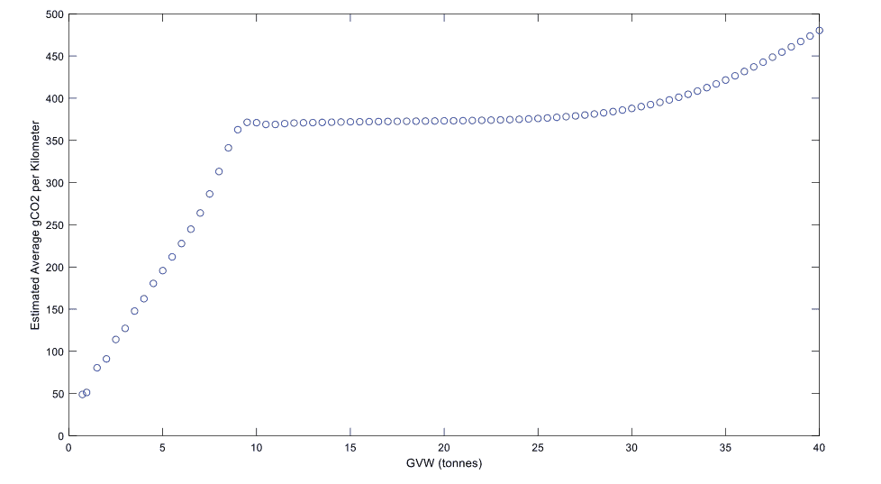

[0, 3, 7, 1, 4, 8, 0]表示车辆 $k = 3$为客户服务 $i = 0,3,7,1,4,8$和0沿着路径0-3-7-1-4-8-0，其中配送中心位于 $i = 0$（请注意，车辆的行程始于此位置并结束于此位置）。任何位于 $\mathbf{B}_k$内的客户 $i$都可以通过索引 $b$来处理，其中 $b = 1,\dots,|\mathbf{B}_k|$。从前面的例子中， $b = 1,\dots, 7$（$\mathbf{B}_3$中的元素数量），客户 $i = 4$存储在 $\mathbf{B}_3$（$b =5$）。基于这个公式，可以定义以下限制和关联：

- 货物容量：每辆车 $k$的最大载重能力由 $W_k =Rp^k \times GV W_k$给出，其中 $Rp^k$是车辆 $k$的载荷/总重比率， $GV W_k$是车辆 $k$的平均总重。然后，在配送路线的开始处，车辆的满载量不能超过分配给的客户的需求量。这可以通过以下表达式表示：
$$A_k = \sum_{b=1}^{|\mathbf{B}_k|} Q_{i=\mathbf{B}_k(b)} \leq W_k \quad \forall k = 1,\dots N, \tag{4}$$
其中 $Q_i$由方程(2)和(3)估计，且 $Q_{i=0}= 0$。

- 排放成本：大多数文献中的研究假设排放量在配送路线上是恒定的。然而，根据方程(1)的定义，排放量取决于车辆的货物。当车辆 $k$完成其路线（由 $\mathbf{B}_k$定义）时，货物会不断变化，因为 $Q_i$被交付给分配的客户 $i$。这导致了一个多目标问题，因为排放量不仅取决于行驶距离，还取决于货物的减少速率。因此，根据方程(1)，由 $B_k$ 定义的路线的排放成本，取决于距离和货物，可以表示为：
$$E_k = C_E \sum_{b=1}^{|B_k|-1} d_{B_k(b), B_k(b+1)} \times \left[ \frac{e_{fl}^k - e_{el}^k}{W_k} \times \left( A_k - \sum_{y=1}^b Q_{i=B_k(y)} \right) + e_{el}^k \right], \tag{5}$$
其中 $C_E$ 是与gCO$_2$/Km相关的排放税成本，$e_{fl}^k$和$e_{elk}$是根据第3.2节讨论确定的，$k = 1, \dots N$。

- 交货时间：如前所述，交货时间 $L$代表了路线上的额外限制。即使满足了方程(4)所定义的条件，路线可能超过交货时间。如果路线时间更长，缺货风险可能会严重干扰供应链。特别是，最后服务的客户最有可能受到影响。根据方程(5)，交货时间限制可以表示为：
$$S_k = \sum_{b=1}^{|B_k|-2} t_{B_k(b), B_k(b+1)} \leq L \quad \forall k = 1, \dots N, \tag{6}$$
其中 $t_{B_k(b), B_k(b+1)}$是从车库（位于 $i = B_k(b=1)=0$）到所有客户 $i$的累计运输时间，如 $B_k$中所定义的。重要的是要提到，从最后访问的客户到车库的运输时间不被考虑。

最后，通过考虑这些关联，所提出的模型的目标函数可以定义为：
$$最小化 \quad \sum_{k=1}^{K} E_k, \tag{7}$$
它受到Eqs. (4)、(6)和标准CVRP模型的假设（a）-（g）的限制。

这些方程和关联表示了模型的数学形式。在这里，重要的是提到路由问题的高计算复杂性，例如CVRP，这使得它们难以以最优的方式解决，特别是对于大规模实例。当前模型通过根据方程（5）定义的路线规划上的动态估计增加了这种复杂性。

### 4 模型评估

#### 4.1 数值数据和求解方法

为了评估模型的功能，设计了一个具有三辆车 (k=3) 和八个位置 (i=1, ...,8) 的测试实例。如表4所示，该实例提供了以下变量的值：

- 每个位置的x和y坐标；
- 审查之间的时间间隔 (T)；
- 在 T内最小单位时间内客户位置 i的产品 g的平均需求 ($h_{ig}$)；
- 客户服务水平 ($\alpha$)；
- 交货时间 (L)；
- 产品 g在客户位置 i的需求标准差 $\sigma_{ig}$在交货时间内；
- 产品 g在客户位置 i在审查时的库存水平 $I_{ig}$；
- 根据公式 (3) 估计的批量大小权重 $q_{ig}$(以千克为单位)。

请注意，总批量大小权重 $q_{ig}$ 等于529千克。为了满足这些要求，考虑了三辆载重量为200千克的车辆。在这种情况下，因为这些载重量小于1.5吨，所以这些车辆被认为是轻型商用车，平均有效载荷 $W_k= 0.4$，空重比 $R_{ek}= 0.69$，空车排放 $E_{ef}= 0.9$，满载车辆排放 $E_{fl} = 1.30$，以及排放税 $C_E= 1$。

考虑到它们的 x 和 y 坐标以及欧几里得公式，计算了所有位置之间的成本距离：
$$d_{a,b} = \sqrt{(x_a - x_b)^2 + (y_a - y_b)^2}, \quad (8)$$

**表4 测试实例的数值数据—常数**

| 节点 | x    | y    | h_{ig} | α   | z     | T | L | σ_{ig} | I_{ig} | q_{ig} |
|------|------|------|--------|-----|-------|---|---|--------|--------|--------|
| 1    | 30   | 40   | -      | -   | -     | - | - | -      | -      | -      |
| 2    | 537  | 252  | 9      | 70% | 0.524 | 8 | 4 | 2      | 11     | 101    |
| 3    | 449  | 49   | 8      | 80% | 0.842 | 6 | 3 | 2      | 15     | 62     |
| 4    | 552  | 64   | 9      | 70% | 0.524 | 5 | 2 | 2      | 10     | 56     |
| 5    | 631  | 62   | 11     | 80% | 0.842 | 3 | 1 | 2      | 22     | 25     |
| 6    | 852  | 33   | 9      | 91% | 1.341 | 6 | 3 | 2      | 15     | 74     |
| 7    | 942  | 41   | 12     | 81% | 0.878 | 5 | 2 | 2      | 21     | 68     |
| 8    | 752  | 41   | 9      | 80% | 0.842 | 12| 5 | 2      | 17     | 143    |

**表5 成本时间数据（小时）**

| 节点 | 1    | 2    | 3    | 4    | 5    | 6    | 7    | 8    |
|------|------|------|------|------|------|------|------|------|
| 1    | 0.00 | 0.88 | 0.63 | 0.75 | 0.88 | 2.38 | 2.63 | 2.13 |
| 2    | 0.88 | 0.00 | 0.38 | 0.38 | 0.38 | 0.63 | 0.75 | 0.50 |
| 3    | 0.63 | 0.38 | 0.00 | 0.25 | 0.38 | 0.63 | 0.75 | 0.50 |
| 4    | 0.75 | 0.38 | 0.25 | 0.00 | 0.13 | 0.50 | 0.63 | 0.38 |
| 5    | 0.88 | 0.38 | 0.38 | 0.13 | 0.00 | 0.38 | 0.50 | 0.25 |
| 6    | 2.38 | 0.63 | 0.63 | 0.50 | 0.38 | 0.00 | 0.25 | 0.25 |
| 7    | 2.63 | 0.75 | 0.75 | 0.63 | 0.50 | 0.25 | 0.00 | 0.38 |
| 8    | 2.13 | 0.50 | 0.50 | 0.38 | 0.25 | 0.25 | 0.38 | 0.00 |

其中 $x_a$ 和 $y_a$ 是位置 $a$ 的坐标，$x_b$ 和 $y_b$ 是位置 $b$ 的坐标。另一方面，根据公式 (6) 计算累积运输时间所需的成本时间是随机生成的。这些数据在表5中呈现。最后，通过在 Lingo v.18 中实现公式 (7) 定义的数学模型来求解最优性。

#### 4.2 结果分析

数学模型考虑了两个优先级：最小化距离（通常的标准）和最小化排放。然后评估了距离和排放的影响。表6展示了使用这两个标准得到的最佳CO₂排放量。如果优先考虑最小化行驶距离，解决方案将导致总排放量为2,122,133.5 gCO₂。相反，如果优先考虑最小化排放量，解决方案将导致总排放量为2,019,733.4 gCO₂。这意味着如果解决方案专注于最小化距离，gCO₂排放量将增加5.07‰。

使用这两个标准对行驶距离进行了相同的分析。如表7所示，当解决方案专注于最小化排放量时，结果为5,026.356公里。相反，当解决方案专注于最小化距离时，结果为4,632.695公里。在这种情况下，两者之间的差异为8.50‰。

**表6 二氧化碳排放结果（gCO₂）**

| 车辆 | 排放优先级 | 距离优先级 |
|------|-------------|-------------|
| 1    | 705,114.9   | 953,568.0   |
| 2    | 653,762.3   | 874,453.4   |
| 3    | 660,856.2   | 294,112.1   |
| 总计 | 2,019,733.4 | 2,122,133.5 |

**表7 行驶距离结果**

| 车辆 | 路线      | 排放优先级 | 路线      | 距离优先级 |
|------|-----------|------------|-----------|------------|
| 1    | 1-3-5-7-1 | 1825.3     | 1-4-7-6-1 | 1825.6     |
| 2    | 1-6-2-1   | 1755.2     | 1-3-5-2-1 | 1363.1     |
| 3    | 1-4-8-1   | 1445.9     | 1-8-1     | 1444.0     |
|      | 总计      | 5026.4     | 总计      | 4632.7     |

结果表明，车辆在行驶路线上的负载变化对排放和距离指标的影响取决于优化的优先级。

### 5 未来工作

在本章中，开发了一个综合的库存路径模型，以最小化考虑异构车队和非确定性多产品交付的CO2排放。此外，还开发了一种基于人工神经网络的方法，以提供更准确的GVW连续值的CO2排放估计。这为异构车队中不同车辆的可靠排放数据提供了可能，这是新兴市场的一个特点。

测试实例提供了用于评估模型适用性的数据。如表6和表7所示，如果增加旨在减少CO2排放的排放税，则与行驶距离相关的经济成本可能会增加。因此，观察到距离成本和排放之间存在反向相关性。这对于设定排放税的规模并使其在全国范围内实施经济上可接受非常重要。

由于所提出模型的复杂性，预计更大规模的测试实例可能需要使用元启发式方法来接近最优解。如果在模型的数学公式中考虑更多变量，这也将非常重要。因此，这项工作有许多研究机会，以下是考虑用于未来研究的内容：

- 为所提出的模型开发基于禁忌搜索 (TS) 的元启发式方法 (TS被提议作为大规模CVRP中最具竞争力的方法之一)；
- 为大规模问题提供解决方案，并将结果与环境政策联系起来；
- 将其他非确定性库存供应策略整合到路径规划模型中；
- 评估工业4.0在控制自动车辆[20]和减少排放方面的适用性；
- 考虑与CO₂相关的其他因素，如车辆的发动机类型、交通、道路状况或驾驶习惯；
- 扩展对混合动力车辆排放模型的发展进行了研究，如[55]所述。

### 6 陈述

“作者声明本文出版没有利益冲突。”

致谢主要作者要感谢Teresa Anzures Quintana女士和Bonnie C.B女士的支持和指导。

### 参考文献

1. Adamu, I.: (Q, R)库存模型的重新排序数量。Int. Math. Forum 12(11), 505–514 (2017)
2. ADEME: Calcul des facteurs d’ missions et sources bibliographiques utilis es (version 3.0). Agence de I’Environnement et de la Maitrise de I’Energie & Mission Interminist rielle de I’Effect de Serre: France (2005)
3. ADEME: Documentation des facteurs d’ mission de la Base Carbone. Agence de I’Environnement et de la Maitrise de I’Energie: France (2014)
4. Adiba, E., Aahmed, E., Youssef, B.: 绿色容量车辆路径问题：优化温室气体排放。在：20 14年国际物流与运营管理会议论文集，第1-7页。IEEE (2014)
5. Arikan, E., Jammerne gg, W.: 双重供应和产品碳足迹约束下的单期库存模型。国际生产经济学杂志 157, 15-23页 (2014)
6. Benjaafar, S., Li, Y., Daskin, M.: 碳足迹与供应链管理：来自简单模型的见解。IEEE自动化科学与工程杂志 10, 99-116页 (2013)
7. Bergenwa ll, A., Chen, C., White, R.: TPS在美国汽车工厂的流程设计及其对三重底线和可持续性的影响。国际生产经济学杂志 140(1), 374-384页 (2012)
8. Bouchery, Y., Ghaffari, A., Jemai, Z., Tan, T.: 协调对两级串行经济订货数量问题的成本和碳排放的影响。欧洲运营研究 260(2), 520-533 (2017年)
9. Boussaada, Z., Curea, O., Remaci, A., Camblong, H., Bellaaj, N.: 用于预测每日直接太阳辐射的非线性自回归外生 (NARX) 神经网络模型。能源11(3), 1-21 (2018年)
10. B y ksaatci, S., Esnaf, S.: 基于碳排放的设施定位问题的优化方法。TOJSAT: 在线科学技术杂志 4(1), 9-20 (2014年)
11. Caballero-Morales, S., Mart nez-Flores, J.: 考虑二氧化碳排放的单设施定位问题的方法论。在：2017年国际工业工程与运营管理研讨会论文集 (IEOM UK 2017)，第553-558页 (2017年)
12. Caballero-Morales, S.O., Martinez-Flores, J.L.: 分析和减少与不确定需求的库存补充策略相关的二氧化碳排放和成本。波兰环境研究杂志 29(6), 3997-4005 (2020年)
13. Caballero-Morales, S.O., Mart nez-Flores, J.L., S nchez-Partida, D.: 一种用于容量车辆路径问题的进化禁忌搜索元启发式方法。在：Garc a-Alcaraz, J.L., etal. (eds.) 应用工业工具和技术的新视角，第477-495页。SpringerInternational Publishing AG (2018)
14. Chen, X., Zhang, Z., Fries, R.: 一种用于无通知疏散期间车辆路径规划的算法的开发和实施。 Cogent Math. 3, 1-11 (2016)
15. Cristea, A., Hummels, D., Puzzello, L., Avetisyan, M.: 贸易和国际货运的温室气体排放。 J. Environ. Econ. Manag. 65(1), 153-173 (2013)
16. Duarte, S., Cruz-Machado, V.: 工业4.0中精益和绿色供应链的研究。在：2017年国际工业工程和运营管理研讨会论文集（IEO M UK 2017），第255-265页（2017）
17. Figliozzi, M.A.: 排放最小化车辆路径问题。交通研究记录：交通研究委员会2197, 1-7 (2010年)
18. Garzon-Garnica, E.A., Caballero-Morales, S.O., Martinez-Flores, J.L.: 解决拉美一家大型公司的大规模人员运输系统的方法。工业工程与管理学杂志10（4），623-645（2017年）
19. G mez-Santill n, C., Cruz-Reyes, L., Rodr guez-Morales, M.L., Gonz lez-Barbosa, J.J.,Csti llo-L pez, O., Rivera, G., Hern ndez, P.: 优化物流管理问题的VRP变体。在：通过混合人工智能系统优化物流管理和优化，第207-237页。IGI Global（2012年）。https://doi.org/10.4018/978-1-4666-0297-7.ch008
20. Gruzauskas, V., Baskutis, S., Navickas, V.: 通过使用自动驾驶车辆来在可持续性和成本效益性能之间实现最小化折衷。 J. Clean. Prod. 184, 709–717(2018)
21. Guirong, Z., Qing, G., Bo, W., Dehua, L.: 绿色物流与可持续发展。 在：2012年国际信息管理、创新管理和工业工程会议论文集，第131–133页（2012年）
22. Harris, I., Mumford, C.L., Naim, M.M.: 用于绿色物流建模的具有灵活店铺分配的混合多目标方法。 Transp. Res. Part E66, 1–22 (2014)
23. Harris, L., Mumford, C., Naim, M.: 用于绿色物流的多目标非容量设施位置问题。 在：IEEE进化计算大会论文集(CEC 2009)，第2732–2739页（2009年）
24. Hickman, A.J.: 计算运输排放和能源消耗的方法论项目报告和能源消耗。 伯克郡交通研究实验室，英国（1999）
25. Hovelaque, V., Bironneau, L.: 具有碳排放依赖需求的碳约束EOQ模型。国际生产经济学杂志。 164, 285-291（2015）
26. 国际运输论坛：全球贸易的碳足迹。经济合作与发展组织（OECD）（2016）
27. Jemai, J., Zekri, M., Mellouli, K.: 绿色车辆路径问题的NSGA-ii算法。在：Hao, M.（编）组合优化中的进化计算-EvoCOP 2012，pp. 37–48。 Springer International Publishing AG（2012）
28. Jofred, P., ster, P.: 货运运输的CO2排放及供应链管理的影响管理-Atlas Copco工业技术的案例研究。 硕士学位论文：KTH工业工程与管理，瑞典斯德哥尔摩（2011）
29. Kaa bachi, I., Jriji, D., Madany, F., Krichen, S.: 双目标蚁群优化算法用于最小化燃料消耗和旅行推销员问题的成本。 Procedia Comput. Sci. 112, 886–895 (2017)
30. Kakouei, A., Vatani, A., Bin-Idris, A.: 伊朗首都的机动车交通相关CO2排放估计。伊朗环境健康科学与工程杂志9(1), 1–5 (2012)
31. Li, M., Wu, P., Zeng, J.: 带排放约束的两级供应链批量定额问题。In:2017年国际服务系统与服务管理会议(ICSSSM)论文集，第1-4页。 IEEE (2017)## 参考文献

32. Lieberman, G., Hillier, F.: 运筹学导论，第7版。麦格劳希尔，纽约 (2000).
33. Lin, S.W., Lee, Z.J., Ying, K.C., Lee, C.Y.: 应用混合元启发式算法解决容量车辆路径问题。专家系统与应用 36, 1505–1512 (2009).
34. Molina, J.C., Eguia, I., Racero, J., Guerrero, F.: 多目标车辆路径问题，具有成本和排放函数。Procedia-Soc. Behav. Sci. 160, 254–263 (2014).
35. Moutaoukil, A., Neubert, G., Derrouiche, R.: 绿色车辆路径问题中同质和异质车队规模的比较。在：Grabot, B., et al. (eds.) Advances in Production Management Systems: Innovative and Knowledge-Based Production Management in a Global-Local World, pp. 450–457. Springer International Publishing AG (2014).
36. Naderipour, M., Alinaghian, M.: 开放时间相关车辆路径问题中CO₂, NOₓ 和CO排放的测量、评估和最小化。测量 90, 443–452 (2016).
37. Nagi, R.: IE 505生产计划与控制笔记: 库存控制（不确定需求）。纽约州纽约大学水牛城分校 (2001).
38. 国家科学院：工程与医学: 保护和保护基础设施和路线。国家科学院出版社，华盛顿特区 (2012).
39. Nkamnebe, A.: 新兴市场的可持续营销: 必要性，挑战和议程设置。Emerg. Mark. 6 (3) , 217-232 (2011).
40. 交通和空气质量办公室: 典型乘用车的温室气体排放。美国环境保护局（EPA） (2014).
41. Palmer, A.: 货车集成路由和二氧化碳排放模型的开发 (博士论文)。克兰菲尔德大学管理学院 (2007).
42. Pereira, G., de-Assis, J., Melo, C., Shimoda, E., Freitas, F., Almeida, T.: 使用模拟分析道路货运运输中的温室气体排放。J. Clean. Prod. 170, 298-309 (2018).
43. Rivera, G., Porras, R., Sanchez-Solis, J.P., Florencia, R., García, V.: 基于排名的多目标PSO算法用于调度无关并行机器和货运行业应用。Eng. Appl. Artif. Intell. 108, 104556 (2022). https://doi.org/10.1016/j.engappai.2021.104556.
44. Rodrigue, J., Slack, B., Comtois, C.: 绿色物流。In: Brewer, A.M., et al. (eds.) Handbook of Logistics and Supply Chain Management, vol. 2, pp. 339–350. Emerald (2008).
45. Sabtu, M.I., Hishamuddin, H., Saibani, N., Rahman, M.N.A.: 综合供应链模型的环境评估和碳管理综述。EVERGREEN-Jt. J. Nov. Carbon Resour. Sci. Green Asia Strat. 8(3), 628–641 (2021).
46. Salimifard, K., Raeesi, R.: 一个绿色路由问题: 优化CO₂排放和成本来自双燃料车队。Int. J. Adv. Oper. Manag. 6(1), 27–57 (2014).
47. Sanchez-Vega, M.R., Caballero-Morales, S.O., Sanchez-Partida, D., Martinez-Flores, J.L.: 基于风险的新产品库存供应模型。In: García-Alcaraz, J.L., et al. (eds.) 制造过程的最佳实践: 拉丁美洲的经验, 第75–96页。Springer International Publishing AG (2018).
48. Scott, C., Urquhart, N., Hart, E.: 拓扑和负载对CO₂优化车辆路由的影响。In: Chio, C., et al. (eds.) 进化计算应用-EvoApplications 2010: EvoCOMNET, EvoENVIRONMENT, EvoFIN, EvoMUSART和EvoTRANSLOG, pp. 141–150. Springer International Publishing AG (2010).
49. 史蒂文森, W.: 运营管理, 第13版。麦格劳-希尔教育, 纽约 (2017).
50. 塔瓦雷斯, G., 齐格赖奥娃, Z., 塞迈奥瓦, V., 卡瓦略, M.G.: 通过优化MSW运输路线实现燃料节约的案例研究。环境管理质量: 国际期刊 19 (4) , 444-454 (2008).
51. 塔瓦雷斯, G., 齐格赖奥娃, Z., 塞迈奥瓦, V., 卡瓦略, M.G.: 使用3D GIS建模优化MSW收集路线以实现最低燃料消耗。管理 29 (3) , 1176-1185 (2009).
52. 瓦雷拉, R.A., 法里亚, M.V., 门多萨-维拉富尔特, P., 巴普蒂斯塔, P., 苏萨, L., 杜阿特, G.: 评估边界条件, 驾驶行为和数据分析方法对真实驾驶CO₂和NOₓ排放的影响。科学总环境 658, 879-894 (2019).
53. Velázquez-Martínez, N., Fransoo, J.C.: 绿色设施位置。 在： Bouchery, Y., et al. (eds.) 可持续供应链：基于研究的运营和战略教材，第219–234页。 Springer International Publishing AG (2017).
54. Wahab, M., Mamun, S., Ongkunarak, P.: 考虑不完美物品和环境影响的协调两级国际供应链的EOQ模型。 国际生产经济学杂志 134, 151–158页 (2011).
55. Wygonik, E., Goodchild, A.: 在城市交付系统案例研究中评估CO₂排放、成本和服务质量的权衡。 IATSS Res. 35, 7–15页 (2011).

## 卷积神经网络用于橄榄园种植系统检测

Cristina Martínez-Ruedas, Samuel Yanes Luis, Juan Manuel Díaz-Cabrera, Daniel Gutiérrez Reina, Adela P. Galván, and Isabel Luisa Castillejo-González

摘要 本章主要关注利用高分辨率航空正射影像通过深度学习卷积神经网络技术识别橄榄园中的不同种植系统。因此，所提出的深度学习网络准确地对传统、密集和超密集管理系统进行了分类和区分。作为过程的起点，进行了小作物级别的分析。为了增加数据训练的标准化样本数量，使用分割技术将作物图像分割成子图像（小作物），考虑不同的阈值和步幅大小。这些子图像以高于0.8的准确率有效地进行区分，其中最大的图像（H=120 px, W=120 px）具有最高的平均准确率（0.957）。

C. Martínez-Ruedas
科尔多瓦大学拉巴纳莱斯校区电子与计算机工程系，14071科尔多瓦，西班牙
电子邮件：z42maruc@uco.es

S. Yanes Luis · D. Gutiérrez Reina
电子工程系，Los Descubrimientos大道，S/N，塞维利亚大学，41009塞维利亚，西班牙
e-mail: syanes@us.es

D. Gutiérrez Reina
e-mail: dgutierrezreina@us.es

J. M. Díaz-Cabrera
电气与自动化工程系，Rabanales校区，科尔多瓦大学，14071科尔多瓦，西班牙
e-mail: el1dicaj@uco.es

A. P. Galván
农村工程系，土木建筑与工程项目，科尔多瓦大学，14071科尔多瓦，西班牙
e-mail: apgalvin@uco.es

I. L. Castillejo-González (✉)
图形工程与测绘学系，Rabanales校区，科尔多瓦大学，14071科尔多瓦，西班牙
e-mail: apgalvin@uco.es

超高密度和传统管理在大多数子图像尺寸上显示出最准确的分类。 然而，在尝试区分密集系统时，遇到了很大的困难，与传统管理之间存在很高的混淆度。 最后，还进行了农场级别的分析，通过识别其子图像中最频繁的类别来预测整个种植园的种植模式。 在农场级别观察到稍低的结果，图像尺寸 H = 80 px， W =80 px 获得了最高的准确度值为0.826。

- **关键词**
- Canopy
- 卷积神经网络 (CNN)
- 深度学习
- 覆盖度 (FCC)
- 图像分类
- 橄榄图案
- 种植系统
- 遥感

### 1 背景

#### 1.1 橄榄园生产技术的演变

橄榄树 (Olea europaea L.) 是一种在不同层面上具有重要意义的作物，主要是因为它的果实，但更重要的是因为其被认为是一种健康的不饱和脂肪和抗氧化益处的来源。 这导致了与健康相关的益处的感知增加了橄榄油的消费。目前，橄榄树在地中海地区大规模种植，约占橄榄树产量的99% [1]。 具体而言，西班牙是全球主要的橄榄油生产国，自2000年以来，平均产量占全球橄榄油产量的43.4%，橄榄产量的39.6%，其次是意大利和希腊，分别占橄榄油产量的17.8%和11.8%，橄榄产量的18%和15.6% [2]。

近几十年来，橄榄园领域的生产技术一直在变化。 自1950年以来，农业系统已经多样化，以改善经济可持续性[3]。 传统作物的树木间距较大（通常为每公顷50至160棵树）。 从1970年开始，出现了新的技术，如机械收获和局部灌溉，使树木密度增加到每公顷400棵，从而提高了生产力。 在1990年代初，树木密度达到每公顷2,000棵。 种植系统的密度目前范围从每公顷350-700棵的高密度果园到每公顷1,200-2,500棵的超高密度果园。 这种密度可以增加生产力和盈利能力，因为它们适合机械收获和修剪[4]。

几个世纪以来，地中海景观一直依靠传统的橄榄园作为重要的环境、文化和社会经济资源。 然而，在近几十年来，由于农业政策和市场机制的青睐，橄榄种植园的密度大幅增加，从传统的低密度发展为中等或高密度的橄榄园，通过从雨养条件转变为灌溉条件来增加密度[5]。 这种变化对传统作物有害。 橄榄园部门转型的主要原因是传统橄榄园在经济上不可持续，因为它们无法达到其他更密集种植园所能获得的收入水平：如今的传统橄榄园以大型、随机分布的树木为特征。 这导致了劳动力的广泛使用，从而降低了经济收入。 这种耕作方式的变化还对广泛种植的作物产生了影响，在某些地区，橄榄园的密集化已经取代了小麦、向日葵或棉花等其他作物。 这些变化在安达卢西亚地区可以清楚地观察到，安达卢西亚是西班牙所有橄榄园的近50%。 因此，虽然2015年安达卢西亚有54,140公顷的高密度或超高密度橄榄园，但到2019年，这一数字增加到80,386公顷，面积增长了48.5% [6]。

之前的作者已经评估了密集木本作物的环境挑战，指出需要研究密集化效应：就像在安达卢西亚和其他橄榄油生产地区一样，超高密度的橄榄园（>800株/公顷）正在迅速扩大。 因此，这些研究已经证实了在短期内评估这种种植系统强烈改变的必要性，因为它会引起重要的农艺、经济、社会文化和环境后果[7]。 因此，为了在短期内评估作物密集化的效应，需要新的工具来有效地检测这些表面变化。 由于区分这些种植系统的复杂性，本研究提出使用卷积神经网络对高空间分辨率图像进行分析。

#### 1.2 现代橄榄栽培系统的现状

根据采用的管理选项，橄榄园不仅被指定为生产健康食品的地方。 传统的种植系统还具有提供重要生态系统服务的潜力，如生物多样性丰富的栖息地和农村就业固定区域。 从农学角度来看，其中的优势包括：（1） 土壤有机物的积累增加[8]， （2） 作为CO₂汇的稳定有机碳的高潜力[9, 10]。 然而，橄榄园不受控制的过度集约化速度很高，破坏了与作物相关的环境和社会经济平衡。 因此，了解橄榄栽培的当前状态以实施措施，以实现可持续性和盈利能力的平衡非常重要。 现代的橄榄栽培系统必须包括两个方面：（1） 种植适应气候和土壤条件的本地品种的可能性， （2） 使用种植技术来降低生产成本[11]。 出于这个原因，当前的趋势必须是促进农民获得可持续的橄榄油生产的管理。 尽管政府和公共机构已经推动了鼓励更高产的种植系统的政策， 这些机构非常关注未来的影响，并在不同层面上推动措施，以增强生产系统的可持续性。

从这个意义上说，欧洲景观公约[12]由欧盟提出，对保护传统橄榄园的倡议表示了兴趣。在同一方向上，欧洲委员会和成员国为2023年至2027年制定的新的共同农业政策（CAP）通过强调旨在保护农业景观的环境和生物多样性的措施来促进可持续发展[13]。因此，有必要评估橄榄园密度增加所能提供的益处[11]，以及新的密集管理所带来的损害，特别是在干旱和半干旱地区，这些地区由于水资源短缺而存在严重问题[4]。根据已经分析这些不平衡的研究[14, 15]，有必要开发技术，以便准确控制作物和管理，以便政府机构能够推广可持续的实践。

鉴于这些需求，在之前的研究中，例如[16]，开发了一种用于读取和解释橄榄园作物的工具。在这项工作中，得到的信息被认为具有潜在的用途，因为所开发的方法使得定期监控种植园的状态成为可能。这种筛选对种植者来说可能非常有帮助，特别是对于橄榄园等密集系统来说尤为有用。

另一方面，例如[17]的研究开发了一种方法，通过相对距离来检测橄榄园高分辨率航空影像中的橄榄树冠与种植框架的区别。计算是通过识别种植设计并将该数据与光谱信息合并来完成的，旨在自动化检测种植框架（从而自动化种植系统）。还值得一提的是研究[18]，通过一种允许评估行间距以实现高产量的工具，为玉米田的种植系统评估做出了贡献。鉴于上述情况和继续深入研究的需要，本章的目的是通过卷积神经网络技术，利用高分辨率航空正射影像来识别橄榄园中的不同种植系统。

#### 1.3 遥感技术在图像分析中的应用

由于气候变化[19]和橄榄树病害等原因，橄榄树（欧洲橄榄L.）的未来面临风险。因此，为了做出可持续、高产和优质的实时决策，需要获取和处理大量与这一作物相关的信息。遥感（RS）技术和平台已应用于整个橄榄树生长周期，提供了关于橄榄生长和产量的重要信息。与其他方法相比，RS快速收集数据并具有成本效益，已经彻底改变了农业环境信息的获取和处理方式。

因此，在农业领域，RS被证明是一种改变游戏规则的技术，能够以更低的成本获取数据。这是由于电子和计算领域的技术进步，如物联网（IoT）、3D打印、机器人和人工智能等，使得这些技术的民主化成为可能，并成功渗透到农业等不同的应用领域，提高了生产效率并降低了作物实施的成本。

为了进行最佳决策，通常会使用不同类型的RS传感器，例如RGB（红-绿-蓝）[24, 25]，多光谱[26, 27]，高光谱[28, 29]，热红外[30, 31]，雷达[32, 33]和激光雷达[34, 35]。它们可以单独使用或组合使用，以非破坏性的方式估计关键农业特征，如作物生长势，水分胁迫，病虫害严重程度和土壤条件。 一旦经过适当分析，这些信息可以用于确定管理区域和管理可变速率输入，如肥料，水和植物保护产品[36]。

对于涉及充分评估的研究，需要非常高的空间分辨率图像。卫星图像可以覆盖非常大的区域，但由于非常高空间分辨率的卫星图像的有限可用性，使用此类图像进行研究较少[37-39]。为了增加原始数据的空间分辨率，可以结合其他技术，例如全色增强处理[40, 41]。非常高空间分辨率图像的另一个来源是遥控飞行器系统（RPAS）或有人驾驶飞机上的图像传感器获取的数据[42-44]。这些飞行的成本很高，飞行的自主性有限，并且不适用于广泛范围的研究[45, 46]。为了降低成本，可以使用可用的非常高分辨率的开放获取图像。这些开放数据源之一可能来自国家或地区的计划，旨在获取航空正射影像以定期更新地理制图，例如国家航空正射影像计划（PNOA）[47]。

简而言之，同时使用技术是必要的，以进行真正能够提高生产、降低成本和优化作物的行动。如今，新技术在农食品领域的引入意味着完全的颠覆，并且正在革新传统种植业，使橄榄种植更具竞争力和适应性。传感器的使用代表了已知遥感技术的附加价值，以及先进的数据分析技术的出现，如机器学习和深度学习，在处理获得的图像中具有非常重要的作用。

当将近距离感应在田间使用与遥感能力进行比较时，高数据准确性和传感器实施和数据使用的简单性是其主要优势。近距离感应的限制在于获取的点数据无法描述地块上的所有变异性，并且不适用于大面积[48]。将近距离感应和遥感结合的完整解决方案为农民带来了许多好处，如提高作物产量；增加作物生产力；减少农业投入品的消耗，如化肥、铜等；减少用水量；帮助规划活动；提高产品质量；降低农民成本；改善作物生长和产量控制；增加食品安全和应对气候变化。

#### 1.4 本章的范围

在气候变化的后果使得确保安全和可持续生产变得困难的时候，威胁地球的一个大问题是食品消费的增加[49]。这需要开发技术，以实现更有效地利用资源。作物对人类生活至关重要，因为它们提供食物、饲料、燃料和制衣住所的原材料。在未来几年内，作物产量必须增加，以满足不断增长的人口需求，同时提高食品质量并减少生产投入[50]。

橄榄产业观察到的不同管理类型导致作物的巨大变异。最具创新性的管理技术之一是精准农业，这是一种旨在最小化使用投入品（水、除草剂、化肥等）的方法，以获得高质量的产量并保持环境可持续性。在精准农业所需的技术中，特别突出的是获取领域精确特征的技术。在这方面，为了在处理遥感中的复杂数据时提高准确性和效率，开发创新技术如深度学习（DL）和机器学习（ML）技术[51–53]越来越常见。使用的ML算法有随机森林（RF）和支持向量机（SVM）[54]。RF分类器是遥感中最受欢迎的分类器之一，因为它具有高泛化性能和短处理时间[55]，而SVM也被用于遥感分析[56, 57]。然而，DL技术在图像分类中提供的巨大潜力使其应用越来越广泛。 在机器学习和图像分析中，一些最著名的例子可以在[58]中找到。

在这项工作中，我们提出了一种通过卷积神经网络对橄榄农作物进行地理农业分类的有效方法。深度学习的使用允许无需假设地形形态的黑盒式学习。CNN的使用还允许重新训练其他类型的作物，而无需重新应用任何算法，只需一个新的输入数据集。这是与其他经典算法相比的巨大优势，因为在这个数据集上的学习可以在其他领域中以最小/无计算工作量的方式使用。

在这方面，本章评估了使用高分辨率航空正射影像训练深度学习卷积神经网络来有效检测田间不同种植系统的橄榄林的可行性。此外，还分析了这些分析技术在橄榄栽培中的潜在应用，以便在生产、成本、可持续性和减少投入方面对其产生积极影响。

### 2 材料和实验方法

#### 2.1 研究领域和图像获取

对安达卢西亚的1187个橄榄园进行了分析。这些橄榄园主要位于其三个省份：（1）哈恩是西班牙橄榄种植面积最大的地区；（2）科尔多瓦是西班牙第二大橄榄种植区；（3）塞维利亚正在观察到密集橄榄种植的增加[6]。所选的橄榄种植区分布在一个农业区，具有大陆地中海气候，夏季长、干燥、炎热，冬季短、温和（图1）。

评估和分析的橄榄园由农民个别管理，这允许找到不同大小和形态的橄榄冠层以及每种种植系统的土壤耕作类型：传统、密植和超密植的橄榄园。然而，尽管由于农民的决策而引起了这些差异，但种植框架和冠层直径根据种植系统而变化（图2）。这些轻微的修改有利于分类任务，因为它们增加了类别内的变异性。

关于每个种植系统的主要特点，传统的橄榄园仍然是西班牙最重要的作物系统，平均密度通常在80到120棵橄榄树每公顷，最高可达400棵每公顷-1。它们具有10-12米的树间距和方形种植框架。另一方面，密植管理系统的种植密度可达1,000-1,500棵橄榄树每公顷，种植框架为7×7米、8×4米和7×5米，为了便于果园的机械化，走廊宽度约为6米。最后，超密植管理中可以观察到高达2,500-3,000棵橄榄树每公顷的密度，形成1.2-1.5米的行间距和3.2-4.0米的行内距的篱笆形态。在这种种植系统中，走廊和行间很容易被发现。

通过农业地块地理信息系统（SIGPAC）[59]，确定了不同橄榄园地块的选择，该系统提供土地划定的地理数据和农艺数据以确定作物类型。

所选地块的图像是从PNOA [46]自动下载的，该项目的目标是获取整个西班牙领土的数字摄影测量图像。这些图像具有三个波段（R、G、B）的光谱分辨率，12位的辐射分辨率，0.5×0.5米的空间分辨率和3年的时间分辨率。

为了进行更高效的学习，建议使用下载图像的覆盖分数（FCC）作为输入。通过这种方式，可以手动合成特征图，并通过标准化的农业图像对输入进行泛化。这还可以消除在FCC掩膜图像捕获中引入的偏差，因为它们对于不同的图像获取方法具有不同的摄影特性。

为了提取FCC并自动下载图像，本研究使用了[60]中开发的模块。

#### 2.2 方法论

本研究所采用的方法如图3所示：

1.  通过SIGPAC中的观察者对不同类别进行识别。
2.  下载和图像处理以获取FCC。
3.  从第2点下载的图像集合创建图像集（PNOA DataSet）。通过分割方法将图像分割，以增加训练、测试和验证分类器的样本数量。
4.  最后，基于卷积神经网络实现了两个分类器：
    (i) 第一个分类器在单个子图像中识别种植系统，分类器的输入是一个小作物。
    (ii) 第二个分类器在农场层面上识别种植系统。在这种情况下，分类器的输入是农场的所有小作物。检测到的种植系统将是每个子图像中最频繁的。

##### 2.2.1 类别识别

研究中选择了1187个橄榄园，这些园地由SIGPAC提供的应用程序通过专业观察员选择。每个农场都获得了其标识符，这将允许在下一步骤中自动下载。

##### 2.2.2 图像获取和处理

在方法论的第二步中，进行了识别、图像下载自动化和处理以获得FCC的过程。为实现目标，执行了以下步骤：

-   通过“自动图像获取”模块自动下载PNOA图像，该模块使用IGN提供的Web Map Service (WMS) [61]。
-   通过使用“识别感兴趣元素”模块的图像分析技术进行FCC提取。

不同的模块已经由[63]开发和验证。这些模块的流程图如图4所示。自动图像采集模块已经开发了一个通用的PNOA图像下载模块。在选择要研究的图像以及作物类型后，该模块会下载它们并根据所选的作物确定感兴趣区域。它可以配置为一个或多个作物/生态系统和感兴趣的地理区域。

可以选择的不同作物/生态系统是由SIGPAC提供的。图5显示了SIGPAC ShapeFiles中包含的元数据信息，以及不同作物的代码[59]。可以通过多种方式选择地理区域：(i) 通过指定多边形；(ii) 通过指示市或省。对于第二种情况，将存储所选市或省的所有多边形在数据库中。

对于这项研究，该模块已配置为下载具有不同种植系统的橄榄作物，因此图像下载过程如下所示：

1.  在前一步骤中，照片的观察者提供了地块的标识符。
2.  用于界定地块的地理空间信息来自SIGPAC。
3.  PNOA下载器脚本获取了先前的地理空间信息，并通过国家地理研究所的Web地图服务下载了照片。
4.  生成了带有橄榄作物界定的Grove.tiff图像（见图6a）。

因此，该模块将作物进行分割，并生成一个带有作物选择的grove.tiff RGB图像。grove.tiff图像将用于识别模块，以检测FCC。

**感兴趣元素的识别**

该模块的目的是检测橄榄作物的FCC。为此，使用了研究中应用的技术[60]。这项研究既使用了经典的图像分析技术[64–68]，也使用了之前研究中的进展[63]。结果生成了两个二进制图像，一个是.TIFF图像（Grove_FCC.tiff，参见图6b），其中包含了感兴趣元素的识别信息，另一个是二进制图像（Grove_mask.tiff，参见图6c），其中包含了作物感兴趣区域的信息。

总结一下，自动图像采集模块为每个组生成了三个地理参考图像（Grove.tiff， Grove_FCC.tiff和Grove_mask.tiff）。第一张图像（Grove.tiff）是从PNOA下载的图像，没有进行任何处理，只是确定了感兴趣的区域，该区域由作物类型定义。第二张图像是Grove_FCC.tiff，它是通过处理前一张图像并获取作物的FCC得到的，它是一个二进制掩模。

最后，生成了图像Grove_mask.tiff，也是二进制的，它只能识别作物区域。具体来说，对于这项研究，我们使用了一个包含1,187个作物（2,967.5公顷）的数据集。图6展示了一张作物的示例图像下载。

##### 2.2.3 生成小作物集

该过程通过分割技术从之前下载的PNOA数据集中提取子图像。最初，数据集图像被分为两个子集，一个验证子集（236个作物）和一个训练子集（951个作物）。随后，经过子图像提取操作的训练图像被分为训练子集（1,426个小作物）、测试子集（1,426个小作物）和验证子集（11,413个小作物）（见图7）。对于训练和验证集之间的数据划分，采用了以下方法：要考虑到两个集合中没有任何一个小作物属于同一张图像。通过这种方式，可以确保验证数据在任何情况下都没有用于训练。为了增加样本数量（数据增强）并规范它们的大小（Hm，Wm），通过分割和步幅（s）技术将图像分割成裁剪子图像（小作物）。将图像分割成子图像是必要的，因为输入图像的大小可能差异很大，在大多数情况下，一次处理这些图像太大了。将FCC二进制图像分割成一组相同大小的小作物来完成。这种方法不仅实现了裁剪分割，还实现了裁剪分类。这一特性很重要，因为在同一地块中，可能存在属于一种或另一种作物形态的区域。在此过程之后，进行了一个筛选过程，只选择了那些子图像的子掩模（Grove_mask）的平均值高于阈值C_TH的子图像进行分类（见图8）。从每个作物中获得了15个随机的小作物。

在图像分割过程之后，传统、密集和超密集类别分别获得了4,984、4,276和5,005个样本。这些样本根据0.8、0.1和0.1的比例分为训练、测试和验证子集。表1显示了每个建立的类别的迷你作物数据集分布。

为了评估不同迷你作物尺寸的结果，生成了四组子图像，对应于(Hm, Wm, s)值为(50, 50, 5; 80, 80, 8; 100, 100, 10; 120, 120, 12)。如图9所示，显示了不同种植系统的迷你作物，不同类别之间存在明显差异。超密集橄榄园的布局倾向于由植物的种植行组成，而在其他种植系统中，橄榄树更分散。

如前所述，有效的小作物是包含由C_TH设定的可耕种表面积的作物，该值已经启发式地设定为0.1（较低的值会导致网络过度拟合，出现太多空白图像）。这样可以减轻训练时间，因为它避免了不必要的无信息图像，并创建了一个额外的'空白'标签。

**表1 小作物数据集的分布**

| | 训练 | 测试 | 验证 |
| :--- | :--- | :--- | :--- |
| 超高密度 | 3,988 | 498 | 498 |
| 密度种植 | 3,422 | 427 | 427 |
| 传统 | 4,005 | 500 | 500 |

##### 2.2.4 基于CNN的种植系统分类

在该模块中，已经开发了两个分类器，并定义了它们的评估指标。为了开发分类器，应用了一个由四个连续的卷积操作组成的CNN，每个操作都有32、64、128和256个滤波器（见图10）。每个滤波器的核大小为（3×3）。在使用这个初始特征提取器对输入图像进行处理后，最后一层通过使用一个由3层1024、512和3个神经元组成的稠密线性网络进行处理和展平。每一层都进行批量归一化操作以获得更好的泛化能力。在每个卷积模块之后，使用最大池化操作来减小维度，从而降低计算成本。

所提出的设计基于经典架构LeNET [69]，与其他更复杂的架构如ResNet [70]相比。这两种架构在多类别分类任务中都表现出良好的结果，但如果我们分析所提出的3类问题，在这项研究中，LeNET架构更高效，因为它不需要大的GPU要求或重新训练。

表2显示了模型训练阶段的超参数。学习率是通过使用1 Cycle学习率调度器动态选择的[71]。CNN训练了50个epochs。每个epoch都是以64个批次计算训练集中所有数据的损失。学习率将根据验证集损失根据1-cycle方法进行调整[72]。这将导致学习率在学习的中间部分较高，在最后部分较低，作为一种正则化方法和防止过拟合的方案。

其余的超参数是通过试验和错误选择的，并且在选择批量大小或Adam权重衰减时没有观察到性能的显著影响。然而，性能将更受到小型裁剪的大小的影响，这将在后面看到。

第一个提出的分类器，在小型裁剪级别上，对子图像进行分类和验证，指示其种植系统。只需要提出的CNN模块。第二个提出的农场级分类器的架构如图11所示。所采用的方法是将图像分成有效的子图像，对子图像进行分类，并找到最频繁的类别。为此目的需要以下模块：

**表2 模型训练阶段的超参数**

| 优化器 | Adam |
| :--- | :--- |
| Adam权重衰减 | 1 × 10^{-3} |
| 训练周期 | 50 |
| 批量大小 | 64 |
| 学习率 | 1周期LR计划，LRmax = 1 · 10^{-2} |

-   通过详细分割方法将输入图像分割成子图像。
-   小作物的验证。
-   在小作物中识别种植系统。
-   识别最频繁的类别。

此外，分类器提供了一个分割图像，可以观察到不同小作物的分类。这提高了结果的可解释性。最频繁的类别将被选中。

为了计算过程性能，使用了以下评估指标：

-   准确率：计算在评估集中所有预测中的正确预测的比例。
-   精确度（宏观）：精确度是Tp/(Tp +Fp)的比率，其中Tp是真正例的数量，Fp是假正例的数量。对于这个多类别分类问题，精确度被计算为每个单独标签的平均精确度（宏观精确度）。
-   ROC AUC 1vs1（宏观）：接收器操作特性曲线下的面积(ROC AUC)表示真正例率和假正例率之间的权衡曲线下的面积。当1vs1时，计算所有可能的类别组合的AUC并取平均值（宏观）。
-   ROC AUC 1vsOthers（宏观）：与1vs1 AUC类似，但计算每个类别与其余类别之间的面积。

### 3 结果与讨论

本研究开发并验证了一种深度学习方法，用于区分橄榄园中不同的种植系统。为此，提出了两种模型来识别不同的种植框架：（1）在作物的子图像中和（2）在整个果园中。

表3和表4显示了验证集在子图像级别和农场级别上的数据。对于子图像的验证集结果表明，尽管所有子图像的准确率和精确度都非常高（大于0.88），但最大的子图像（H=120 px，W=120 px）达到了最高值（准确率为0.957，精确度为0.957）。关于农场级别的结果，子图像大小为80 px时获得了最准确的结果（准确率为0.826，精确度为0.832）。由于问题的复杂性较大，一些农场可能具有不同的种植系统，因此这些结果略低。

整体准确性信息可以通过验证过程中每个分辨率（子图像大小）的混淆矩阵来补充（见图12）。混淆矩阵显示了每个分类类别的成功和错误程度，增加了对每个不同树密度准确性的了解。对于所有分析的子图像大小，最准确的种植系统是超高密度（SI），误分类数量较少。这可能是因为该种植系统显示出与密集或传统系统不同的种植结构。超高密度的主要特点是树木之间的距离非常近，就像一道树篱。这种排列方式可以实现全面机械化农业，如除草剂和害虫控制处理、修剪甚至橄榄采摘。这种类型的作物机械化在密集和传统种植系统中更加复杂，甚至不可能[11]。

传统或密集种植系统展示了类似的种植框架，树木之间的距离是两个系统之间的区别。然而，传统橄榄园(T)的准确性略高于密集(I)橄榄园。尽管三个类别之间存在误分类，但传统和密集类别显示了最多的错误。这可以解释为两个系统中橄榄框架的差异可能很小，尤其是在新的种植园中。例如，旧的传统橄榄系统的树木相互分开12和13米，而新的传统种植园中的树木之间可以展示7×7米的间隔，非常类似于密集种植园中观察到的6×3米的间隔。

此外，这些较低的准确性也可以解释为在完整的园区水平上检测到的一些误分类是在一些农场展示出具有不同农业风格特征的区域时观察到的（见图12）。在这项研究中，最常见的误分类场景是标记的密集橄榄园同时显示密集和传统的种植密度。

作为未来的研究，这种方法可以提供识别混合种植系统的可能性（图13）。

在小农作物水平（95.7%）和农场水平（82.6%）上取得的高准确率表明，基于子图像级别的顺序分析的分割技术对通过数据增强改进训练系统非常有用。因此，这种方法可以为西班牙的农业信息系统（如SIGPAC [59]）、法国的RPG（Registre Parcellaire Graphique）[73]、美国的GPFARM [74]等提供有价值且准确的信息。这将解决不同研究[14, 15]中指出的定期更新农业橄榄景观的需求，将这些更新的信息纳入农场水平，使这种方法具有特殊的农学价值。此外，能够如此精确地识别超高密度种植园对于基于超高密度种植密度所显示的每公顷油产量增加的市场预测是一大进步[7]。

通过这种自动特征化，可以定期监测到目前观察到的向橄榄栽培的强化趋势[7, 15, 75]。这样可以预测作物管理的变化，特别是那些导致更大的变化的变化。农学、环境或经济后果[4]。有一些趋势支持传统系统，其中典型的农林复合系统有助于土壤、资源和文化遗产的保护[7, 75]。因此，系统化橄榄树密度的监测可以确定影响橄榄园生产、产量和可持续性的因素，如灌溉和水需求、地被植被或土壤管理[15]。

由于对橄榄园强化的可持续性影响存在不同意见，本研究提出并验证的方法在监测新橄榄园作物的发生率以改善管理决策方面取得了有希望的结果。例如，通过增加机械化和缺水灌溉来促进作物模型的不同管理技术可以提高盈利能力并增加碳封存[11]。

我们的提案基于使用深度学习技术进行高分辨率图像分类，取得了令人满意的结果，并且可以被视为在遥感领域中深度学习利用方面的一大进步[76]。它所具有的一个巨大优势是它在PNOA的开放访问正射影像上进行了测试[47]，这使得结果可以推广到其他地区。然而，一个限制可能是时间分辨率，因为PNOA影像每三年更新一次。基于此，未来的研究方向是将这种方法推广到Sentinel-2卫星影像，该影像具有较低的空间分辨率（10 × 10米），但较高的时间分辨率（5天）。

### 4 结论和未来研究方向

本章重点研究了橄榄栽培系统的自动区分。欧洲橄榄L.是地中海盆地最重要的作物之一，而安达卢西亚地区拥有西班牙46.7%的橄榄种植面积，是世界上最大的橄榄生产国。为了设计能够有效管理作物的措施，无论是从生产还是社会角度，有必要了解每个地区的作物状况。

在农业食品领域，特别是在广泛种植作物中，基于遥感处理应用于卫星图像的决策支持系统被验证为优化作物并使其更加高效和可持续。然而，尽管卫星图像的巨大优势是覆盖大面积，但非常高空间分辨率的卫星图像的可用性很低，而且这些类型的图像很昂贵。因此，这种决策支持对于区分橄榄园中的不同种植系统并不适用。为了做到这一点，传统的橄榄种植系统控制方法通常基于对抽样田地进行实地访问，但这种方法不准确、耗时且昂贵。在这项研究中，评估了一种基于深度学习和免费提供的高分辨率图像的现代数据分析技术，用于区分超高密度、高密度和传统的橄榄园。

该方法使用CNNs根据小作物的覆盖率分类来识别农场级别的橄榄种植系统。评估了小作物尺寸对时间-成本/准确性比率的影响，以进行调整。所获得的准确性的好处（超过82%）表明这种方法是一种区分种植系统的有用工具。此外，分割分析方法还可以检测作物中橄榄树的分布，这对于具有不同种植系统的农场非常重要。未来的研究方向应该是基于改进这种方法来检测混合种植系统。同样，为了增加对橄榄园景观的定期监测，可以改进这种方法以进行具有更高时间分辨率的卫星图像的分类。在这方面，Sentinel-2卫星图像估计种植系统的能力，具有10×10米像素级别和大约5天的时间分辨率，对于减少检测作物管理变化的时间是一个挑战。这些未来的研究方向得到了一项先前研究的支持[77]，该研究提供了证据，表明在较低时间分辨率的卫星图像中，可以识别出不同的种植系统。图14a显示了一片具有不同种植系统的作物，图14b呈现了这片作物的Sentinel-2 NDVI图像，在该图像中可以观察到不同的种植系统在NDVI像素分布上呈现出不同的模式。

此外，通过使用这些亚像素分析技术，我们进一步增强了混合分析的研究，以提高卫星图像的可解释性，并需要进一步研究这些技术。

此外，未来的工作方向包括支持传感器技术用于其他类型的分析和/或测量（例如，[78]）。这项技术允许开发和/或实施生成上下文信息的设备，以描述所研究作物的特征；在其环境中识别它们；按类型、提供的数据、状态、位置等进行分类。不同技术的互联，传感器网络的使用，智能Lora物联网（物联网），机器人车辆等，将实现更可持续的农业。因此，能够通过使用提供作物特征参数的传感器来补充这项工作将非常有趣，无论是为了建立比较还是仅仅巩固从我们的分析实施中获得的值。

图14 a橄榄种植系统不同；b作物的Sentinel-2 NDVI图像日期为02-08-2019

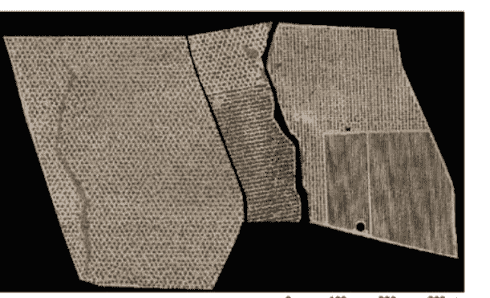

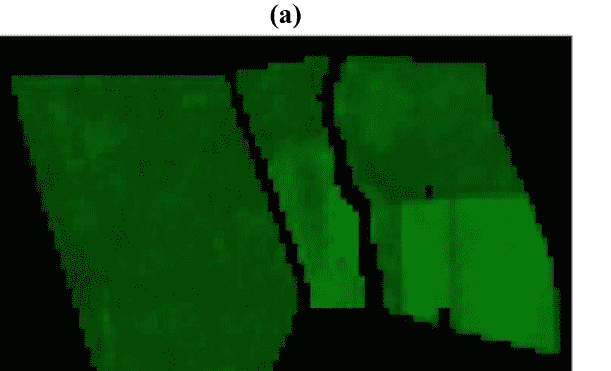

### 参考文献

- 1. Loumou, A., Giourga, C.: 橄榄园：“地中海的生活和身份。” 农业人文价值 20, 87–95 (2003). https://doi.org/10.1023/A:1022444005336
- 2. FAOSTAT. 联合国粮食及农业组织. FAO; (2023). https://www.fao.org/faostat/en/#data/QCL. 2023年4月19日访问
- 3. Fernández-Escobar, R., De la Rosa, R., Leon, L., Gomez, J.A., Testi, L., Orgaz, F., Gil Ribes, J.A., Quesada-Moraga, E., Trapero, A.: 橄榄生产系统的演变和可持续性。 Options Méditerranéennes. 106, 11–42 (2013)
- 4. Mairech, H., Lopez-Bernal, A., Moriondo, M., Dibari, C., Regni, L., Proietti, P., Villalobos, FJ., Testi, L.: 新的橄榄种植是否可持续？ 传统和新型橄榄园的生产和环境绩效的空间比较, 使用OliveCan模型。农业系统 181, 102816 (2020). https://doi.org/10.1016/j.agsy.2020.1028165
- 5. Stroosnijder, L., Mansinho, M.I., Palese, A.M.: OLIVERO：分析地中海盆地上坡地橄榄生产系统的未来的项目。 环境管理杂志 89, 75–85 (2008). https://doi.org/10.1016/j.jenvman.2007.05.025
- 6. 农业、渔业和食品副部长 (2019年) 关于农作物面积和产量的调查。西班牙橄榄园分析 (Survey of Surfaces and Crop Yields. Analysis of Olive Groves in Spain)。[互联网]农业、渔业和食品部: 西班牙, (2019年)。 https://www.mapa.gob.es/es/estadistica/temas/estadisticas-agrarias/olivar2019_tcm30-122331.pdf。于2023年4月19日访问
- 7. Guerrero-Casado, J., Carpio, A.J., Tortosa, F.S., Villanueva, A.J.: 高密度橄榄园的环境挑战。 Sci. Total Environ. 798, 149212 (2021年)。 https://doi.org/10.1016/j.scitotenv.2021.149212
- 8. Massacci, L., De Feudis, M., Agnelli, A.E., Nasini, L., Regni, L., D’ascoli, R., Castaldi, S, Proietti, P., Agnelli, A.: 不同年龄的橄榄园土壤中的有机碳储量和储存。 欧洲土壤科学。 69, 843–855 (2018). https://doi.org/10.1111/ejss.126779
- 9. Lopez-Bellido, P.J., Lopez-Bellido, L., Fernandez-Garcia, P., Muñoz-Romero, V., Lopez-Bellido, F.J.: 西班牙南部橄榄园的碳封存和碳足迹评估。 碳管理。 7, 161–170 (2016). https://doi.org/10.1080/17583004.2016.1213126
- 10. Proietti, S., Sdringola, P., Regni, L., Evangelisti, N., Brunori, A., Ilarioni, L., Nasini, L., Proietti, P.: 特级初榨橄榄油作为负碳产品：实验分析和结果验证。 J. Clean. Prod. 166, 550–562 (2017). https://doi.org/10.1016/j.jclepro.2017.07.230
- 11. Lo Bianco, R., Proietti, P., Regni, L., Caruso, T.: 现代橄榄种植系统：优势和劣势。 农业 (瑞士) 11 (2021)。 https://doi.org/10.3390/agriculture11060494
- 12. 欧洲理事会景观公约。欧洲理事会景观公约 (2023) 。 https://www.coe.int/en/web/landscape。于2023年4月19日访问
- 13. 欧洲委员会。 新的共同农业政策：2023-2027年欧盟官方网站 (2023年) 。 https://agriculture.ec.europa.eu/common-agricultural-policy/cap-overview/new-cap-2023-27_en。于2023年4月19日访问
- 14. Gómez, J.A., Montero, A.S., Guzmán, G., Soriano, M.A.: 对西班牙南部两个橄榄园地区的土壤管理和农民对相关风险的感知进行深入分析。 国际土壤水分保护研究 9, 461-473 (2021年) 。 https://doi.org/10.1016/j.iswcr.2021.01.003
- 15. Guzmán, G., Boumahdi, A., Gómez, J.A.: 橄榄园的扩张及其对科尔多瓦乡村的耕作和景观的影响。 土地利用政策 116, 106065 (2022年) 。 https://doi.org/10.1016/j.landusepol.2022.1060516
- 16. Assirelli, A., Romano, E., Bisaglia, C., Lodolini, E.M., Neri, D., Brambilla, M.: 密集橄榄园精确管理的冠层指数评估。 可持续性 (瑞士) (2021年) 。 https://doi.org/10.3390/su13158266
- 17. Illana Rico, S., Martínez Gila, D.M., Cano Marchal, P., Gómez Ortega, J.: 地面植被茂密的橄榄树林中的橄榄树冠自动检测。 传感器22 (2022)。 https://doi.org/10.3390/s22166219
- 18. Carreira, V.D.S., Tedesco, D., Carreira, A.D.S., da Silva, R.P.: 利用图像处理评估行内间距：小农户的有希望的数字工具。 农学12 (2022)。 https://doi.org/10.3390/agronomy12020301
- 19. Fraga, H., Moriondo, M., Leolini, L., Santos, J.A.: 地中海橄榄园在气候变化下的未来影响和适应策略综述。 农学 11, 56 (2021)。 https://doi.org/10.3390/agronomy11010056
- 20. Morelli, M., García-Madero, J.M., Jos, ,, Saldarelli, P., Dongiovanni, C., Kovacova, M., Saponari, M., Baños Arjona, A., Hackl, E., Webb, S., Compant, S.: 橄榄树中的Xylella fastidiosa: 控制尝试和当前管理的综述。 微生物 9, 1771 (2021). https://doi.org/10.3390/microorganisms9081771
- 21. Roma, E., Catania, P.: 精准橄榄栽培：研究主题、挑战和机遇-一项综述。 Remote Sens. (Basel) 14, 1668 (2022). https://doi.org/10.3390/rs14071668
- 22. Anastasiou, E., Balafoutis, A.T., Fountas, S.: 橄榄栽培中遥感技术的趋势。 Smart Agric. Technol. 3, 100103 (2023). https://doi.org/10.1016/j.agtech.2022.100103
- 23. Sishodia, R.P., Ray, R.L., Singh, S.K.: 遥感在精准农业中的应用：一项综述。 遥感（巴塞尔） 12, 1-31 (2020年）。 https://doi.org/10.3390/rs12193136
- 24. Travlos, I., Mikroulis, A., Anastasiou, E., Fountas, S., Bilalis, D., Tsiropoulos, Z., Balafoutis, A.: RGB相机在定义豆类作物发育中的应用。 Adv. Anim. Biosci. 8, 224-228 (2017年）。 https://doi.org/10.1017/s2040470017000498
- 25. Minhui, L., Shamshiri, R.R., Schirrmann, M., Weltzien, C.: 从3D点云中估计小麦植株叶片参数的相机视角影响。 农业（瑞士） 11 (2021年）。 https://doi.org/10.3390/agriculture11060563
- 26. Fu, Z., Jiang, J., Gao, Y., Krienke, B., Wang, M., Zhong, K., Cao, Q., Tian, Y., Zhu, Y., Cao, W., Liu, X.: 基于多旋翼无人机的小麦生长监测和产量估计。 遥感（巴塞尔） 12 (2020年）。 https://doi.org/10.3390/rs12030508
- 27. Zhang, A., Hu, S., Zhang, X., Li, M., Tao, H., Hou, Y.: 基于多光谱成像的手持式草地植被监测系统。 农业（瑞士） 11 (2021年）。 https://doi.org/10.3390/agriculture11121262
- 28. Zarco-Tejada, P.J., Ustin, S.L., Whiting, M.L.: 棉花田内产量变异与高空间高光谱遥感图像的时空关系。 Agron. J. 97, 641–653 (2005). https://doi.org/10.2134/agronj2003.0257
- 29. Marang, I.J., Filippi, P., Weaver, T.B., Evans, B.J., Whelan, B.M., Bishop, T.F., Murad, M.O.F., Al-Shammari, D., Roth, G.: 机器学习优化的高光谱遥感检测棉花氮状况。 Remote Sens. (Basel) 13. (2021). https://doi.org/10.3390/rs13081428
- 30. Giménez-Gallego, J., González-Teruel, J.D., Soto-Valles, F., Jiménez-Buendía, M., Navarro-Hellín, H., Torres-Sanchez, R.: 基于智能热像传感器的经济实惠作物冠层温度测量。 Comput. Electron. Agric. 188 (2021). https://doi.org/10.1016/j.compag.2021.106319
- 31. Vagelas, I., Papadimos, A., Lykas, C.: 用低成本红外传感器在葡萄、菊花和玫瑰叶上进行疾病的预测检测。 农学 11 (2021). https://doi.org/10.3390/agronomy11091682
- 32. Khabbazan, S., Vermunt, P., Steele-Dunne, S., Ratering Arntz, L., Marinetti, C., van der Valk, D., Iannini, L., Molijn, R., Westerdijk, K., van der Sande, C.: 使用Sentinel-1数据进行作物监测：荷兰的案例研究。 遥感（巴塞尔） 11 (2019). https://doi.org/10.3390/rs11161887
- 33. Fieuzal, R., Baup, F., Marais-Sicre, C.: 利用同步光学和雷达卫星数据监测小麦和油菜作物参数估计。 遥感进展。 Remote. Sens. 02, 162–180 (2013). https://doi.org/10.4236/ars.2013.220203
- 34. Moreno, H., Valero, C., Bengochea-Guevara, J.M., Ribeiro, ,, Garrido-Izard, M., Andújar, D.: 使用基于LiDAR的自动化系统进行葡萄园重建。 传感器（瑞士） 20 (2020). https://doi.org/10.3390/s20041102
- 35. Yuan, W., Li, J., Bhatta, M., Shi, Y., Baenziger, P.S., Ge, Y.: 利用LiDAR进行小麦高度估计，与超声波传感器和无人机相比较。 传感器（瑞士） 18 (2018年）。 https://doi.org/10.3390/s18113731
- 36. Weiss, M., Jacob, F., Duveiller, G.: 农业应用的遥感：一项元回顾。 Remote. Sens. Environ. 236 (2020年）。 https://doi.org/10.1016/j.rse.2019.111402

## 通过EfficientNet对植物疾病进行分析的概念模型：走向精准农业

Roneeta Purkayastha和Subhasish Mohapatra

摘要机器学习（ML）技术在精准农业中表现出高性能。智能农业为疾病检测、分类和作物管理打开了机遇之门。在这项工作中，作者分析了实时人工智能（AI）如何从叶片图像中对植物疾病进行分类。

通过物联网（IoT）基于无人机（UAV）的摄像头可以收集叶片图像，并存储在远程数据库中，进一步通过卷积神经网络（CNN）进行学习。这项研究的创新之处在于将物联网和机器学习的概念在精准农业中进行混合。

众所周知，在全球经济中，农业在国内生产总值（GDP）方面起着重要作用。随着人口的增长，我们需要进行密集农业以更好地管理牲畜。考虑到实时情景，基于人工智能的应用可以为我们的农民提供丰富的建议。

基于机器学习的智能推荐系统可以对植物疾病进行分类，并为农民提供可靠的决策支持系统。作者在这里展示了一个智能农业模型如何帮助我们的同胞。

+   * 机器学习 · 卷积神经网络 · 精准农业 · 推荐 · 决策支持系统

### 1 引言

人口的生存能力依赖于精准农业。现今农业的主要经济活动创造就业机会。几乎可以肯定的是，农业支持附属就业，并保持发展中国家的经济稳定。由于农业为任何国家提供社会稳定，因此在这方面，农业部门需要一个智能和早期的推荐系统。为了这个推荐系统，作者尝试开发一个基于EfficientNet的模型，它是一个预训练的卷积神经网络（CNN）模型。总体影响这个模型的准确性可以与植物是否受到疾病影响成比例地提高。作者们对这个基础工作寄予了很大的希望，以防止灾难性的农作物损失。它还将进一步稳定农村经济[1-3]。

作者们在 EfficientNet (预训练的 CNN 模型) 中开发了一个模型。这个模型进一步为植物是否受到任何疾病影响做出决策。这项研究旨在在植物疾病进一步传播到更健康的植物之前帮助我们的农民。在构建智能农业模型之前，智能农业是当务之急[2-5]。作者试图展示一个可以减少实时实施中操作故障的概念框架。在本文中，作者们通过卷积神经网络 (CNN) 设计了一个植物疾病检测模型。它对植物疾病的早期预测提供了一个很好的尝试。在这项研究中，作者们提出将物联网 (IoT) 与机器学习 (ML) 相结合。物联网可以在智能农业应用中带来革命，它可以收集叶片图像并将其存储在远程存储中。ML 应用程序从远程数据库中提取图像，并对植物是否受到疾病影响做出决策。这是下一代农业革命的关键组成部分。这里采用了基于 EfficientNet 的 ML 模型进行智能农业。同时，它还可以减少人力劳动。当前世纪的人口增长可能会影响农业。因此，我们需要一个弹性的疾病预测和决策支持系统，以应对诸如植物的早期疾病检测等最大的挑战之一。正如我们所知，由于技术在农业中的不足渗透，作为研究人员，我们必须从根本上研究。农业是任何国家的支柱，并促进经济发展。为了确保粮食安全，物联网和机器学习的应用是一种突破性的方法之一[6]。它可以以智能的方式进一步检测疾病。在这项研究工作中，作者们收集了苹果、樱桃和草莓的图像，并应用 EfficientNet 进行进一步训练。EfficientNet 是卷积神经网络的预训练模型之一。这种智能方法是一种杰出的应用，可以使我们的农业实践更加健壮。这个模型在农业偏远地区向农民传递智能决策，这些地区缺乏足够数量的人类专家。它还可以对广泛传播的疾病进行检查。如图3所示，作者们给出了一个智能农业管理的概念模型。苹果、樱桃和草莓的叶片图像被收集并存储在远程数据存储库中[7-9]。EfficientNet 对图像进行分类，并从测试数据存储库中进行预测；我们实现了98%的准确性。这个模型可以通过计算机视觉在农业中诊断植物质量，进一步提高任何作物的生产力。它可以在整个植物生命周期中为农民提供植物是否健康的洞察。这种新颖的方法可以监测物种是否健康[10, 11]。

本文的其余部分组织如下：第2节描述相关研究，第3节提到了Keras中深度学习实现的好处，第4节概述了植物疾病，第5节说明了材料和方法，第6节提出了提出的方法，第7节陈述了取得的结果，第8节给出了结论。

37. Gonzalez, J., Galindo, C., Arevalo, V., Ambrosio, G.: 应用图像分析和概率技术对高分辨率卫星图像中的橄榄树进行计数。在：智能视觉系统的高级概念（ACIVS'2007），卷1，第920-931页（2007年）。 https://doi.org/10.1007/978-3-540-74607-2_84

38. Solano, F., di Fazio, S., Modica, G.: 基于GEOBIA和WorldView-3影像的方法论，用于在橄榄园中以树冠细节推导植被指数。国际应用地球观测地理信息 83(2019). https://doi.org/10.1016/j.jag.2019.101912

39. Lin, C., Jin, Z., Mulla, D., Ghosh, R., Guan, K., Kumar, V., Cai, Y.: 利用高分辨率卫星影像和深度学习算法进行大规模树木作物映射的研究：以摩洛哥橄榄园为例。遥感（巴塞尔） 13(2021). https://doi.org/10.3390/rs13091740

40. Kurucu, Y., Esetlili, T., Erden, H., Öztürk, G., Güven, A.I., Çama, Sırcıoğlu, E.: 利用遥感技术对橄榄树进行数字化。在：第四届农业地理信息学国际会议，农业地理信息学；卷1，页121-124 (2015) https://doi.org/10.1109/Agro-Geoinformatics.2015.7248143

41. Castillejo-González, I.L.: 使用Pansharpened Quickbird图像进行橄榄树的映射：像素和基于对象的分析评估。农学 8 (2018)。 https://doi.org/10.3390/agronomy8120288

42. Jiménez-Brenes, F.M., López-Granados, F., De Castro, A.I., Torres-Sánchez, J., Serrano, N., Peña, J.M.: 利用基于无人机的3D建模量化修剪对橄榄树架构和年度冠层生长的影响。植物方法 13 (2017)。 https://doi.org/10.1186/s13007-017-0205-3

43. Modica, G., Messina, G., De Luca, G., Fiozzo, V., Praticò, S.: 监测异质柑橘和橄榄园的植被繁茂度。一种多尺度基于对象的方法从无人机多光谱图像中提取树冠。计算机与电子农业 175 (2020)。 https://doi.org/10.1016/j.compag.2020.105500

44. Safonova, A., Guirado, E., Maglinets, Y., Alcaraz-Segura, D., Tabik, S.: 利用遥感无人机多分辨率图像分割和Mask R-CNN进行橄榄树生物体积测量. 传感器 21, 1–17 (2021). https://doi.org/10.3390/s21051617

45. Lima-Cueto, F.J., Blanco-Sepúlveda, R., Gómez-Moreno, M.L., Galacho-Jiménez, F.B.: 利用植被指数和无人机成像平台在西班牙南部的橄榄园中量化植被地面覆盖密度. 遥感（巴塞尔） 11 (2019). https://doi.org/10.3390/rs11212564

46. AlMahamid, F., Grolinger, K.: 使用强化学习的自主无人机导航: 一项系统性综述. 工程应用人工智能 115(2022). https://doi.org/10.1016/j.engappai.2022.105321

47. Instituto Geográfico Nacional. Centro descargas PNOA. Instituto Geográfico Nacional (National Geographic Institute). 2023. https://centrodedescargas.cnig.es/CentroDescargas/index.jsp. 2023年4月19日访问

48. Zhang, N., Wang, M., Wang, N.: 精准农业-全球概述. Comput.Electron. Agric. 113–132 (2002). https://doi.org/10.1016/S0168-1699(02)00096-0

49. Tilman, D., Balzer, C., Hill, J., Befort, B.L.: 全球粮食需求和可持续农业的强化. Proc. Natl. Acad. Sci. U.S.A. 108, 20260–20264 (2011). https://doi.org/10.1073/pnas.1116437108

50. Fukase, E., Martin, W.: 经济增长、收敛和世界粮食需求与供应。 World Dev. 132 (2020). https://doi.org/10.1016/j.worlddev.2020.104954

51. Jiang, W., He, G., Long, T., Ni, Y.: 使用深度学习在Landsat8 OLI图像中检测水体. Int. Arch. Photogramm. Remote Sens. Spat. Inf. Sci.-ISPRS Arch. 42, 669–672(2018). https://doi.org/10.5194/isprs-archives-XLII-3-669-2018

52. Castillejo-González, I.L., Angueira, C., García-Ferrer, A., Orden, M.S.: 将基于对象的图像分析与地形数据相结合，用于半干旱查科生态系统的地貌制图：以阿根廷为例。ISPRS Int. J. Geo-Inf. 8(2019). https://doi.org/10.3390/ijgi8030132

53. Eide, A., Koparan, C., Zhang, Y., Ostlie, M., Howatt, K., Sun, X.: 无人机辅助热红外和多光谱成像用于除草剂抗性检测的杂草冠层。 Remote Sens.(Basel) 13(2021). https://doi.org/10.3390/rs13224606

54. Kumar, M., Singh, P., Singh, P.: 用于印度Bundelkhand地区地下水潜力绘图的机器学习和GIS-RS算法。 https://doi.org/10.1016/j.ecoinf.2023.101980

55. da Silva Andrea, M.C., de Oliveira Nascimento, J.P.F., Mota, F.C.M., de Souza Oliveira, R.: 使用遥感和机器学习方法在商业棉田中预测植物高度的框架。 https://doi.org/10.1016/j.atech.2022.100154

56. Wang, S., Han, Y., Chen, J., He, X., Zhang, Z., Liu, X., Zhang, K.: 基于无人机遥感RGB和多光谱图像的少样本学习提取杂草密度在生态灌溉区。植物科学前沿 12(2022). https://doi.org/10.3389/FPLS.2021.735230

57. Luo, K., Lu, L., Xie, Y., Chen, F., Yin, F., Li, Q.: 利用Sentinel-2时间序列和机器学习在华北平原中部进行作物类型映射。计算机与电子农业 205(2023)。 https://doi.org/10.1016/j.compag.2022.107577

58. El-Kenawy, E.S.M., Khodadadi, N., Mirjalili, S., Makarovskikh, T., Abotaleb, M., Karim, F.K., Khafaga, D.S.: 用于改善由无人机捕获的小麦图像中杂草检测的元启发式优化。数学 10(2022)。 https://doi.org/10.3390/math10234421

59. 农业，渔业，水利和农村发展司。SIGPAC地理信息下载。农业，渔业，水利和农村发展司（区域农业，渔业，水利和农村发展部） (2023) 。 https://www.juntadeandalucia.es/organismos/agriculturaganaderiapescaydesarrollosostenible/servicios/sigpac/visor/paginas/sigpac-descarga-informacion-geografica-shapes-provincias.html。 于2023年4月19日访问

60. Martínez-Ruedas, C., Guerrero-Ginel, J.E., Fernández-Ahumada, E.: 一种用于自动清点橄榄园的方法，包括地块和多边形级别。农学 12(2022)。 https://doi.org/10.3390/agronomy12081735

61. Open Geospatial Consortium. Web地图服务。 Open Geospatial Consortium; (2023)。 https://www.ogc.org/standards/wmss . 2023年4月19日访问

62. Instituto Geográfico Nacional. 可视化和下载服务。 Instituto Geográfico Nacional (国家地理研究所) (2023)。 https://www.ign.es/web/ign/portal/ide-area-nodo-ide-ign. 2023年4月19日访问

63. Martínez-Ruedas, C., Guerrero-Ginel, J.E., Fernández-Ahumada, E.: 一种用于自动识别Dehesa生态系统中具有生态意义的单位的方法。森林 13(2022)。 https://doi.org/10.3390/f13040581

64. Motwani, M.C., Gadiya, M.C., Motwani, R.C., Harris, F.C.: 图像去噪技术调查. GSPX会议论文 1, 27–30 (2004). https://doi.org/10.5120/9288-3488

65. Naveen, S., Aiswarya, V. A.: 傅里叶块处理和Wiener滤波的图像去噪. Procedia Comput. Sci. 58, 683–690 (2015). https://doi.org/10.1016/J.PROCS.2015.08.088

66. Haralick, R.M., Shapiro, L.G.: 图像分割技术. 计算机视觉和图形图像处理. 29, 100–132 (1985), https://doi.org/10.1016/S0734-189X(85)90153-7

67. Pal, N.R., Pal, S.K.: 图像分割技术综述. 模式识别. 26, 1277–1294 (1993). https://doi.org/10.1016/0031-3203(93)90135-J

68. Lu, D., Weng, Q.: 图像分类方法和技术的调查，以提高分类性能。国际遥感杂志 28, 823-870 （2007年）。 https://doi.org/10.1080/01431160600746456

72. Smith, L.N., Topin, N.: 超级收敛：使用大学习率快速训练神经网络。In: 光学工程国际学会SPIE会议录，卷11006 (2019年)。https://doi.org/10.1117/12.2520589

73. 法国国家地理和森林信息研究所（IGN）地图可视化 - 地理和森林信息研究所地理门户; (2023年)。https://www.geoportail.gouv.fr/carte。访问日期: 2023年4月19日

74. 美国农业部（USDA）。GPFARM（大平原农业资源管理框架）美国农业部（USDA） (2023年)。https://data.nal.usda.gov/dataset/gpfarm。访问日期: 2023年4月19日

75. Fernández-Lobato, L., García-Ruiz, R., Jurado, F., Vera, D.: 西班牙南部传统和集约橄榄园生产初榨橄榄油的生命周期评估、碳足迹和碳平衡。环境管理杂志 293 (2021年)。https://doi.org/10.1016/j.jenvman.2021.112951

76. Li, Y., Zhang, H., Xue, X., Jiang, Y., Shen, Q.: 遥感图像分类的深度学习：一项调查。Wiley Interdiscip. Rev.: Data Min. Knowl. Discov. 8, e1264 (2018年)。https://doi.org/10.1002/widm.1264

77. Martínez-Ruedas, C., Yanes-Luis, S., Díaz-Cabrera, J.M., Gutiérrez-Reina, D., Linares-Burgos, R., Castillejo-González, I.L.: 基于开源、高分辨率图像和卷积神经网络的橄榄园种植系统检测。农学 12, 2700 (2022年)。 https://doi.org/10.3390/agronomy12112700

78. Rivera, G., Porras, R., Florencia, R., Sánchez-Solís, J.P.: 激光雷达在精准农业中的应用：近期进展综述。Comput. Electron. Agric. 207, 107737 (2023年)。https://doi.org/10.1016/j.compag.2023.107737

### 2 相关研究

人工智能（AI）是由约翰·麦卡锡于1956年在达特茅斯会议上首次提出的术语。AI在做出智能决策方面非常有用。它可以为决策提供计算智能。它在许多领域得到广泛探索，如医疗保健、军事、供应链、电子商务、农业等，但在农业中的应用不如在医疗保健或电子商务中显著。许多研究人员在许多学科中收集不同的农业数据，如植物疾病预测、资源利用和畜牧管理[12, 13]。机器学习应用可以减少农民面临的传统挑战。许多研究工作都专注于智能农业，但尚未进行详细分析。在这个背景下，许多作者包括了基本的机器学习分析，如决策树、支持向量机、随机森林等[10, 14]。但是，在CNN-EfficientNet中实现的准确率达到了98%，这是该研究对植物疾病识别和农民决策传播信息的创新之处。这个预训练模型提供了高精度。众所周知，机器学习是人工智能的一个子领域，在这个背景下，许多研究人员正在努力将其用于良好的预测。在植物疾病识别机制中，我们不能完全依赖人类的专业知识。这是一个非常耗时的过程，而且精确性是另一个挑战。在这种情况下，机器智能程序可以应对这些挑战，帮助农民采取补救措施来控制疾病的传播。它有助于减少经济损失。EfficientNet是一种机器智能CNN模型，可以在植物疾病预测和推荐方面展示出优化的结果。有许多形式的学习可以让研究人员训练模型；在这个意义上，作者们对这个基础工作进行了概括，并采用了监督学习。收集了一组受病毒影响的苹果、樱桃和草莓图像，并在同一个文件夹中收集了健康的叶子图像。每个类别的标记文件夹都保存在本地数据存储中。深度学习是最广泛使用的技术和应用领域，适用于医学、保健、生物信息学等多种研究。它具有多个隐藏层，以提高训练准确性。在这项研究工作中，作者对苹果、樱桃和草莓等植物进行了疾病分类和预测。详细的分析在第6节和第7节中给出。作者已经研究了许多关于植物疾病预测的研究工作，如玉米、稻谷、土豆等。但是我们的农民需要早期的精确农业建议，因为这些作物是经济作物。这项研究工作通过采取早期预防措施进一步优化了农民的经济效益。众所周知，植物病毒感染会导致巨大的经济损失[15-17]。为了应对这种损失，农学家无法实现他们的财务目标。它进一步影响了该国的出口以及国内生产总值（GDP）。深度学习的广泛应用通过事先检测疾病来防止进一步损害任何产品[18-21]。为了实现这个目标，作者在本节中研究了许多研究结果。在当前的情况下，许多研究人员引入了信息和通信技术（ICT）在农业中，但农学家仍需要一些时间来熟悉这种方法。考虑到上述挑战，作者尝试将CNN纳入早期农民推荐。早期推荐可以延长任何物种的治疗寿命。通过EfficientNet（预训练的CNN模型）应用深度学习技术是这项研究的创新之处。这项智能农业计划可以自动识别植物疾病，并为我们的同胞及时提供帮助来管理他们的植物。EfficientNet是一个深度卷积网络，可以在训练阶段检测各种植物叶片疾病。早期阶段的植物病害检测是一项具有挑战性的任务。传统应用程序和人工专家无法确保在偏远地区进行精确识别。因此，要实现智能农业，研究人员必须采用尖端技术。此外，它能够正确识别植物疾病并提供更高的准确性[7, 12, 19, 20]。

### 3 Keras中的深度学习

深度学习是与人工神经网络（ANN）相关的一个术语。ANN受到人脑结构的启发。深度学习（DL）是机器学习领域中的一个革命性概念之一。它训练数据的速度比其他机器学习算法（如决策树、随机森林等）更快，提供可扩展的性能和更好的准确性。这专注于图像的准确特征，并处理大量的标记图像输入集。深度学习中的“深度”表示隐藏层的数量。

正如我们所知，ANN由三层输入、隐藏和输出构成，每一层的输出都作为下一层的输入。隐藏层从数据集中提取特征并解决复杂问题。深度学习在非线性模式的关联方面非常熟练。卷积神经网络（CNN）是DL的一种流行应用之一，由Yann于1998年开发。CNN的前身名称是LeNet。CNN通过多层进行数据处理。CNN有一个名为修正线性单元的层。它有助于特征图的修正，池化层减少样本以进行更好的维度训练。CNN在农业中的应用是一个新的革命。

如今，CNN使我们能够构建专家模型。它分析图像的特征集以进行分类和预测。在这项研究中，作者们尝试了Keras。现在所有读者都会问，Keras是什么？Keras只是一个开源的高级神经网络库。Keras下面的代码是用Python编写的。它最初是由Google工程师Francois Chollet开发的。由于其易用性，它吸引了所有研究人员的注意。EfficientNet借助Keras的帮助。

它专注于多个后端和平台的支持。它提供了高级API（应用程序编程接口）包装器，使设计更加自由。每年对Keras的贡献都以2倍的速度增长。微软、谷歌、NVIDIA和亚马逊等科技巨头都是Keras的活跃贡献者。Keras支持更快的原型设计。与其他API相比，模型库的概念是Keras的一个重要基准。它在三个背景下运行，即Tensor Flow、Theano和CNTK。作者们在Tensor Flow [4, 8, 12]中运行了他们的应用模型。它是由一位谷歌工程师构建的，并被采用为流行的深度学习应用之一。它于2015年推出。由于其高度兼容性，它逐渐占领了研究市场。它可以与多个中央处理单元（CPU）和图形处理单元（GPU）一起运行。Keras已经配置了数据并行性概念。它表示高端处理。因此，它加速了采用这种技术的任何模型的训练阶段[21, 22]。

### 4 植物病害概述

落叶果树是印度生产的各种水果之一。在不同种类的水果中，核果类水果（例如苹果和梨）和石果类水果（例如李子和樱桃等）是最多的品种。这些主要在查谟和克什米尔（J和K）、喜马偕尔邦（H.P.）、那加兰邦和曼尼普尔邦等山区种植[23]。从生产、消费和出口的角度来看，苹果被认为是所有落叶果树中最重要的。超过三百万人直接或间接与苹果种植业相关[24]。

因此，苹果生产在印度被认为非常重要。苹果受到许多疾病的影响，如疮痂病、黑腐病、雪松苹果锈病等。苹果病害的影响日益增加。缺乏意识、技术不当使用和疾病处理等多种因素导致每年平均损失11.34% [25]。

苹果疮痂病是苹果和蟹苹果树种中最常见的病害。疮痂病是由一种真菌引起的，它同时感染苹果叶和果实。受感染叶片上的斑点颜色为橄榄绿至褐色。带有多个叶斑的叶片往往会变黄并提前脱落。如果连续多年发生叶片脱落，那么会导致树木的衰弱。叶斑呈圆形，直径可达到半英寸。斑点的颜色随着时间的推移变为深褐色至黑色，并且尺寸逐渐增大。叶斑沿着叶脉分布。患病的叶片上有多个斑点，颜色变黄。

真菌Venturia inaequalis导致苹果和山楂上的苹果疮病。苹果疮病真菌有几种寄主特异性菌株，可以影响一种植物而不影响其他类型的植物。苹果和山楂树属于同一属，发现它们被同一株苹果疮病真菌感染。

黑腐病是另一种真菌病，会在树叶上形成斑点、水果腐烂和溃疡。如果植物感染了火烧病或受到干旱等极端环境因素的压力，植物感染的概率会增加。

如果考虑水果，有各种症状有助于识别黑腐病。水果的任何部位都可能感染大面积的褐色腐烂区域，但最常见的是花末端。较大感染区域上会形成褐色至黑色的同心圆。如果感染发生在较老的水果上，这些水果上会形成小黑点[26, 27]。

如果感染在叶子上，会形成“青蛙眼叶斑点”，这些斑点呈圆形，边缘呈紫色或红色，内部呈浅棕色。

苹果黑腐病的原因是真菌“Diplodia seriata”。这种真菌可以感染死组织、水果、叶子、树枝和活树干。叶子和果实的感染是由真菌通过自然开口引起的。由于感染，叶子可能会变黄并脱落，但这种情况很少见。

雪松-苹果锈病和相关锈病是由真菌属“Gymnosporangium”的几个物种引起的。雪松-苹果锈病会影响苹果树的健康，降低果实质量并导致提前落叶。如果感染持续几个季节，后果可能是植物死亡。

首先，叶子上会出现小的绿黄色斑点，逐渐扩大。颜色可能变成橙黄色，并在边界处被红色同心圆包围。这些斑点在上部叶片结构上变得有黑色的专门的结构。

樱桃是属于玫瑰科植物家族的肉质核果，属于李属的一种。目前，它正在成为一种替代作物进行生产。樱桃种植面积在2007年至2017年期间以2.1%的增长率显著增长，并占印度樱桃总种植面积的28% [26, 27]。

樱桃生产有各种优点，如需水量较少、生产周期短、市场价值大。除此之外，樱桃生产在作物多样化方面有益，对资源密集型农业社区的生产力和社会经济提升有贡献 [28]。

一种专性寄生真菌，Podosphaera clandestine，引起了甜樱桃和酸樱桃（Prunus avium）的白粉病，导致它们无法上市，因为樱桃表面出现了真菌生长的覆盖物。

两种物种，智利草莓和弗吉尼亚草莓，通过交配产生了现代栽培草莓，这是一种人工杂交作物。这种作物对于小规模和兼职农业经营来说具有显著的利润潜力，因为与其他水果相比，它提供了最快的回报时间。

草莓被用于生产许多加工产品，如软饮料、冰淇淋、口香糖等。

草莓叶子可能在早春展开的第一片叶子上立即受到真菌病害的影响，并持续到晚秋休眠为止。叶枯病是由真菌Diplocarpon earliana引起的最常见的叶子病害之一。

这种病的症状范围从叶子上发展出许多小的紫色斑点。

### 5 材料和方法

#### 5.1 研究中使用的数据集

本研究使用了PlantVillage数据集的一个小子集[29]。该数据集原本包含38个类别和54,035张14种不同植物物种的图像，其中12种是健康的，26种是患病的。作者使用了PlantVillage数据集中三种不同植物的彩色图像：

- a. 苹果
- b. 樱桃
- c. 草莓

本研究中使用的数据集中的图像总数为11,120张。这些图像大小各异。图1显示了一组样本图像。

#### 5.2 卷积神经网络模型概述

卷积神经网络（CNN）是由较小的神经元组成的神经系统。通过将一个神经元连接到其他神经元形成神经元分支。在每个计算节点上，执行简单的数学计算，并将此信息传输给与其连接的所有其他节点[30]。

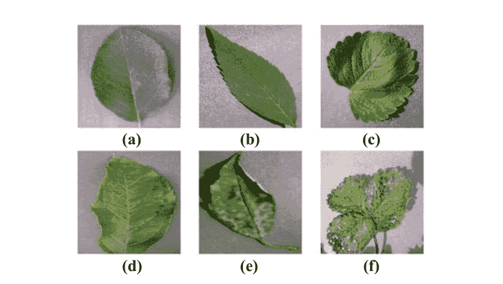

这种类型的架构最常见的用途之一是图像分类。图像分类问题包括识别图像和确定图像的类别。 人们通过使用概念来理解图片的类别，并且可以轻松推断出图片中的特定类别，例如图片中的苹果。

机器检测的是像素集合而不是图像本身。 如果我们考虑一个300 ×300的图像尺寸，在这种情况下，集合大小将是300 ×300x3。 其中300是宽度，下一个300是高度，而3是对应于RGB流的值。 这些数字的取值范围是0到255。这些值确定了图像每个点的像素强度。

CNN的名称源自卷积层，它执行一种操作，即“卷积”。与传统神经网络类似，卷积操作涉及将权重与输入进行乘法运算。这种乘法是在输入数据的数组和二维权重数组（即滤波器）之间进行的。比输入更小的滤波器允许同一个滤波器在输入的不同点上多次与输入数组相乘。这个操作提供了在图像的任何位置发现特征的机会。上述操作产生的二维输出数组被称为特征图。在创建特征图之后，每个值可以通过非线性函数（如修正线性单元ReLU）进行传递。

#### 5.3 EfficientNet概述

卷积神经网络（ConvNets）通常使用固定的资源预算构建[30]。 当有更多资源可用时，这些ConvNets会进行扩展以获得更好的准确性。 例如，ResNet [31]可以通过添加更多层将ResNet-18扩展到ResNet-200。 根据[32]的说法，通过将基准模型扩大四倍，GPipe实现了84.3%的ImageNet Top-1准确率。 目前有许多方法可以扩展ConvNets。最常见的技术是通过深度[31]或宽度[33]来扩展ConvNets。 另一种越来越流行的扩展ConvNets的技术是通过图像分辨率来扩展模型[33]。 在以前的文献中，扩展仅在三个维度之一--深度、宽度和图像分辨率中进行。 尽管可以随机扩展两个或三个维度，但随机扩展需要严格的手动调整，并且通常会产生次优的准确性和效率。在[34]的实证研究中，显示了平衡网络的所有维度（如宽度/深度/分辨率）的重要性，可以通过使用统一比例来扩展每个维度来实现这种平衡。[34]中的作者提出了一种简单而有效的复合扩展方法。在这种方法下，使用一组固定的扩展系数对网络的宽度、深度和分辨率进行统一扩展。

已经在[34]中证明，缩放方法在现有的MobileNets [35, 36]和ResNet [31]上表现良好。作者使用神经架构搜索[36, 37]开发了一个新的基准网络，并进行了扩展，得到了一系列模型，即EfficientNets [38, 39]。

#### 5.4 B0到B7的EfficientNet变体

下面提到了一些限制分辨率、深度和宽度选择的因素[34]：

- 分辨率：不能被8、16等整除的分辨率会导致在某些层边界附近出现零填充，从而浪费计算资源。这尤其适用于模型的较小变体。这就是为什么在B0和B1中选择输入分辨率分别为224和240的原因，如图2所示。
- 深度和宽度：EfficientNet的组成块要求通道大小是8的倍数。
- 资源限制：由于内存限制，图像分辨率可能无法增加，而深度和宽度仍然可以增加。在这种情况下，保持分辨率不变，增加深度和/或宽度可能会导致性能改善。因此，每个EfficientNet模型的变体都是经过精心挑选和测试的，以展示良好的结果。因此，Keras实现仅提供这些八个模型，B0到B7，而不允许随机选择宽度/分辨率/深度参数。

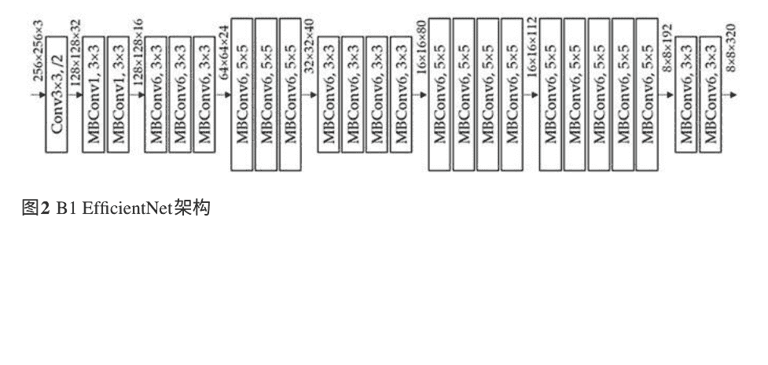

图2 B1 EfficientNet架构

### 6 植物病害检测的提出方法

作者提出，叶片图像将通过无人机（UAV）收集，并将这些图像存储在云端/远程存储中。这说明了物联网（IoT）与机器学习（ML）的应用。为了我们的实验，由于资源限制，我们从PlantVillage数据集中收集了一部分图像，并将这些图像存储在Google Cloud存储中。

然后提取叶片图像，并使用EfficientNet预训练模型构建模型。使用必要的参数进行模型编译，并运行epochs，完成模型的训练。模型学习将叶片图像分类为健康或患病类别，如图3所示。

#### 6.1 实验设置

本研究中进行的实验研究是在Google Cloud环境中，在64位Windows 10操作系统的GPU运行环境中进行的。

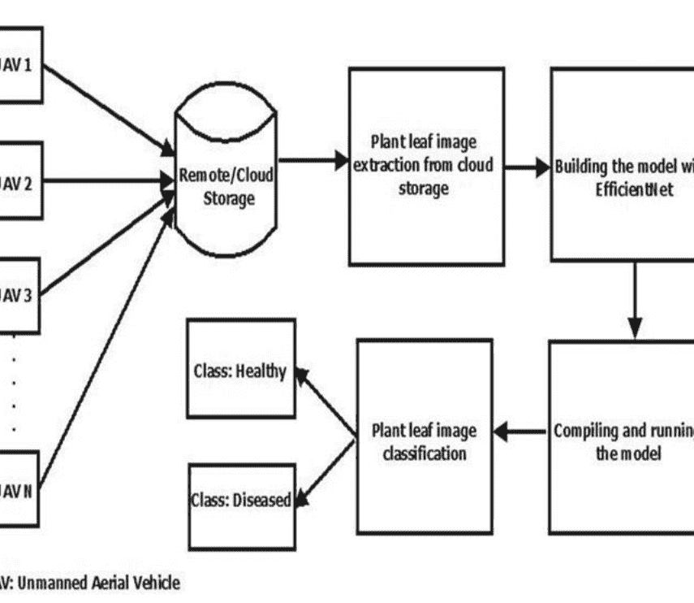

UAV: Unmanned Aerial Vehicle

图3使用EfficientNet从叶片图像中进行植物疾病分类的提出模型

|        | 总计   | 训练 | 测试 |
|--------|--------|------|------|
| 小样本数据集 | 11,120 | 6642 | 4478 |

在Intel(R) Core(TM) i3 CPU @ 2.30 GHz CPU和4 GB RAM上运行。代码使用开源Python深度学习神经网络库Keras实现。

#### 6.2 训练

首先，将numpy、pandas、glob、os、cv2等必要的Python包导入程序中。在这个实验中使用了原始植物村数据集的子集，包含两个文件夹：训练和测试。这些训练和测试文件夹中都有包含苹果、樱桃和草莓健康植物叶片图像以及苹果（三种疾病）、樱桃（一种疾病）和草莓（一种疾病）病叶图像的子文件夹。训练数据集用于训练模型，测试数据集用于拟合模型。表1总结了小样本数据集中用于训练和测试图像的数量。

本研究使用在ImageNet数据集上的最先进的CNN模型的预训练权重来减少深度学习模型的训练时间，使用了EfficientNetB1。通过使用pip命令安装EfficientNet包。根据问题的要求，将该模型的最后一个全连接层更改为一个输出，如图4所示。在最后一层中固定了Sigmoid函数作为激活函数，并且在本实验中选择了二元交叉熵作为损失函数。在训练过程中使用了回调技术，设置了10个迭代的耐心和最大学习率为0.0003，因为当学习停止改进时，模型通常会受益于降低学习率。该回调监视验证准确性，如果在'耐心'个迭代中没有改进，则降低学习率。在模型编译步骤中使用Adam方法进行优化。

### 7 结果和讨论

#### 7.1 模型评估

本研究的主要目标是通过叶片图像来研究EfficientNet深度学习架构在植物疾病分类中的成功。根据网络模型和数据集的特点，使用平均准确率和损失率作为评估标准来评估模型的性能。模型的平均准确率定义如下：

```
top_activation (Activation)   (None, 8, 8, 1280)   0   ['top_bn[0][0]']
avg_pool (GlobalAveragePooling2D)   (None, 1280)   0   ['top_activation[0][0]']
top_dropout (Dropout)   (None, 1280)   0   ['avg_pool[0][0]']
probs (Dense)   (None, 1000)   1281000   ['top_dropout[0][0]']
dense (Dense)   (None, 128)   128128   ['probs[0][0]']
dense_1 (Dense)   (None, 1)   129   ['dense[0][0]']
___________________________________________________________________
Total params: 7,984,489
Trainable params: 7,922,441
Non-trainable params: 62,048
```

图4 EfficientNet模型的部分快照，用于植物疾病分类

$$准确率 = \frac{R_a}{R} \times 100\%$$

其中R表示验证图像的总数，R_a 表示正确分类的图像数。

#### 7.2 图像分析

使用matplotlib Python包绘制准确率曲线和损失曲线。这些数据是基于实验运行的二十个时期绘制的。在第5个时期，训练准确率达到99.01%，验证准确率为99.75%，如图5所示。准确率从第6个时期到第19个时期稳定在99%。在第20个时期，训练准确率达到98.69%，验证准确率达到99.24%，如图6所示。之后，我们用一些样本叶片图像对模型进行了测试，并且分类结果准确。从曲线的性质和实验结果可以看出，该模型在植物疾病的分类和识别方面具有良好的泛化能力，如图7所示。

植物疾病分析的概念模型...

Epoch 1/20
208/208 [==============================] - 6315s 30s/step - loss: 0.2756 - acc: 0.9375 - val_loss: 0.6123 - val_acc: 0.6693 - lr: 0.0010
Epoch 2/20
208/208 [==============================] - 149s 716ms/step - loss: 0.0751 - acc: 0.9791 - val_loss: 0.0402 - val_acc: 0.9897 - lr: 0.0010
Epoch 3/20
208/208 [==============================] - 150s 720ms/step - loss: 0.0383 - acc: 0.9895 - val_loss: 0.0142 - val_acc: 0.9978 - lr: 0.0010
Epoch 4/20
208/208 [==============================] - 148s 709ms/step - loss: 0.0369 - acc: 0.9899 - val_loss: 0.0400 - val_acc: 0.9891 - lr: 0.0010
Epoch 5/20
208/208 [==============================] - 150s 718ms/step - loss: 0.0343 - acc: 0.9901 - val_loss: 0.0082 - val_acc: 0.9975 - lr: 0.0010

图5 从第1个时期到第5个时期的EfficientNet模型的部分快照

Epoch 17/20
208/208 [==============================] - 147s 705ms/step - loss: 0.0139 - acc: 0.9952 - val_loss: 0.0109 - val_acc: 0.9975 - lr: 0.0010
Epoch 18/20
208/208 [==============================] - 148s 709ms/step - loss: 0.0141 - acc: 0.9958 - val_loss: 0.0038 - val_acc: 0.9993 - lr: 0.0010
Epoch 19/20
208/208 [==============================] - 148s 708ms/step - loss: 0.0040 - acc: 0.9991 - val_loss: 0.0071 - val_acc: 0.9982 - lr: 0.0010
Epoch 20/20
208/208 [==============================] - 147s 708ms/step - loss: 0.0464 - acc: 0.9869 - val_loss: 0.0212 - val_acc: 0.9924 - lr: 0.0010

图6 从第17个时期到第20个时期的EfficientNet模型的部分快照

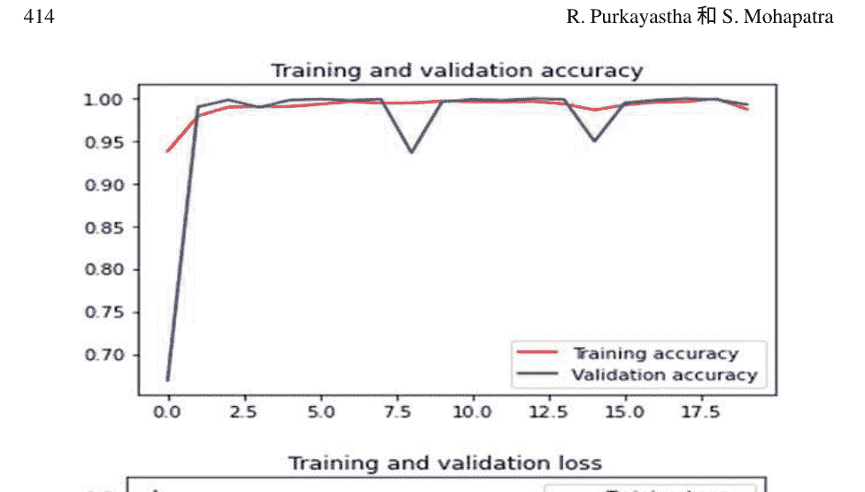

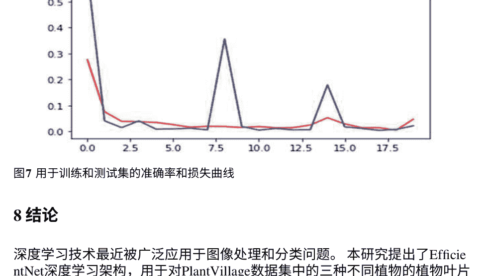

##### 图7 用于训练和测试集的准确率和损失曲线

### 8 结论

深度学习技术最近被广泛应用于图像处理和分类问题。本研究提出了EfficientNet深度学习架构，用于对PlantVillage数据集中的三种不同植物的植物叶片图像进行分类。使用EfficientNet B1，我们的问题达到了平均训练准确率98.69%，验证准确率达到99.24%。未来计划通过物联网技术，借助无人机（UAV）收集叶片图像。这些图像将被收集在远程存储中。从远程数据库中，机器学习（ML）应用程序将提取图像并对植物是否受到疾病影响进行决策。这种方法存在一些限制，需要加以解决。在实际应用中，这种技术的成功取决于诸多因素，如拍摄的叶片图像质量、车辆速度以及树木本身的阻碍等。这些问题需要解决。模型的准确性不受影响。 因此，机器学习（ML）在精准农业中起着重要作用。 通过这种方式，将物联网与机器学习相结合，支持智能决策。 物联网能够在智能农业应用中带来革命。 因此，这种机器学习-物联网基础将进一步为农业管理和作物控制提供深入的建议。

### 参考文献

- 1. Benos, L., Tagarakis, A.C., Dolias, G., Berruto, R., Kateris, D., Bochtis, D.: 农业中的机器学习：一项全面的最新综述。 传感器 **21**, 3758 (2021年)。 https://doi.org/10.3390/s21113758
- 2. Tugrul, B., Elfatimi, E., Eryigrit, R.: 卷积神经网络在植物叶片疾病检测中的应用：一项综述。 农业 **12**, 1192 (2022年)。 https://doi.org/10.3390/agriculture12081192
- 3. Sharma, R., Kamble, S.S., Gunasekaran, A., Kumar, V., Kumar, A.: 可持续农业供应链绩效的机器学习应用的系统文献综述。 Comput. Oper. Res. **119**, 104926 (2020). https://doi.org/10.1016/j.cor.2020.104926
- 4. Tsao, R., Yu, Q.: Nematicidal activity of monoterpenoid compounds against economically important nematodes in agriculture. J. Essent. Oil Res. **12**, 350–354 (2000). https://doi.org/10.1080/10412905.2000.9699533
- 5. Team, K.: Simple. Flexible. Powerful. https://keras.io/. Accessed 14 Apr 2023
- 6. Rivera, G., Porras, R., Florencia, R., Sanchez-Sol s, J.P.: LiDAR applications in precision agriculture for cultivating crops: a review of recent advances. Comput. Electron. Agric. **207**, 107737 (2023). https://doi.org/10.1016/j.compag.2023.107737
- 7. Parry, M.L.: 气候变化与世界农业（2019年）。 https://doi.org/10.4324/9780429345104
- 8. Cravero, A., Sep lveda, S.: 机器学习在大数据中的应用和适应—农业实际案例中的应用。 Electronics **10**, 552 (2021). https://doi.org/10.3390/electronics10050552
- 9. Saleem, M.H., Potgieter, J., Arif, K.M.: 机器和深度学习技术在农业自动化中的应用：近期发展综述。 https://doi.org/10.1007/s11119-021-09806-x
- 10. Ahmad, L., Nabi, F.: 农业5.0：人工智能、物联网和机器学习（2021年）
- 11. Koul, S.: 农业中的机器学习和深度学习. 智能农业. 1–19 (2021). https://doi.org/10.1201/b22627-1
- 12. Mohapatra, S., Anand, K.: 面向医疗保健行业公民的个性化推荐模型概述. 推荐系统. 机器学习. 人工智能. 27–44 (2020). https://doi.org/10.1002/9781119711582.ch2
- 13. Liakos, K.G., et al.: 农业中的机器学习综述. 传感器 **18**(8), 2674 (2018). https://doi.org/10.3390/s18082674
- 14. Mohinur Rahaman, M., Azharuddin, M.: 通过机器学习在农业中的无线传感器网络: 一项调查. 计算机与电子农业. **197**, 106928 (2022). https://doi.org/10.1016/j.compag.2022.106928
- 15. Linaza, M.T., 等： 可持续精准农业的数据驱动人工智能应用。 农学 **11**(6), 1227 (2021). https://doi.org/10.3390/agronomy11061227
- 16. Ponnusamy, V., Natarajan, S.: 利用物联网、无人机、增强现实和机器学习的精准农业。 物联网 207–229(2021). https://doi.org/10.1007/978-3-030-52624-5_14
- 17. Rastogi, R., Maheshwari, S., Garg, P., Rastogi, M., Kumar, P.: 南亚地区农业生产分析和气候变化对医疗保健4.0的影响，使用机器学习和传感器。 在： 人工智能和物联网融合的新兴网络系统, 第41-65页 (2021). https://doi.org/10.1007/978-3-030-76653-5_3
- 18. Arvanitis, K.G., Symeonaki, E.G.: 农业4.0：创新智能技术在可持续农场管理中的作用。开放农业杂志。**14** (1) (2020年)。 https://doi.org/10.2174/1874331502014010130
- 19. AlKameli, A., Hammad, M.: 农业中的自动学习：一项调查。国际计算机数字系统杂志。**10**, 1325-1345 (2021年)。 https://doi.org/10.12785/ijcds/1001118
- 20. Chaudhary, P., Sharma, A.: 纳米石膏对植物生长促进细菌的响应：从纳米化合物受害的农田中恢复。环境生态学。**37** (1B), 363-372 (2019年)。
- 21. Tripathy, P.K., Tripathy, A.K., Agarwal, A., Mohanty, S.P.: MyGreen：一种用于可持续农业的物联网智能温室。IEEE消费电子杂志。**10**, 57-62 (2021年)。 https://doi.org/10.1109/mce.2021.3055930
- 22. Serer, B., Gajdov, I., Serer, M., Spatenka, P.: 罂粟种子的新物理化学处理方法，用于农业和食品工业。等离子体科学技术 **15**, 935–938 (2013). https://doi.org/10.1088/1009-0630/15/9/19
- 23. Ali, A.: 克什米尔苹果的交替孢菌病流行病学。非洲微生物学研究杂志 **9**, 831–837 (2015). https://doi.org/10.5897/ajmr2014.6611
- 24. Geveke, D.A.V.I.D.J.: 苹果酒中细菌的紫外灭活†。食品保护学杂志 **68**, 1739–1742 (2005). https://doi.org/10.4315/0362-028x-68.8.1739
- 25. Mantzourani, I., Nouska, C., Terpou, A., Alexopoulos, A., Bezirtzoglou, E., Panayiotidis, M., Galanis, A., Plessas, S.: 生产一种由山茱萸汁和益生菌组成的新型功能性水果饮料。抗氧化剂 **7**, 163 (2018). https://doi.org/10.3390/antiox7110163
- 26. Terzich, M., Pope, M.J., Cherry, T.E., Hollinger, J.: 在美国的家禽粪便中病原体调查。 https://doi.org/10.1093/japr/9.3.287
- 27. Blumenthal, U.J., et al.: 用于农业中处理过的废水的微生物质量的指南：修订世界卫生组织指南的建议。
- 28. Johnston, G.W., Vaupel, S., Kegel, F.R., Cadet, M.: 农作物和农场多样化提供社会福利。加利福尼亚农业 **49**, 10–16 (1995), https://doi.org/10.3733/ca.v049n01p10
- 29. Hughes, D., Salath, M.: 一个开放获取的植物健康图像库，以促进移动疾病诊断的发展 (2015). https://doi.org/10.48550/arXiv.1511.0806
- 30. Gu, J., Wang, Z., Kuen, J., Ma, L., Shahroudy, A., Shuai, B., Liu, T., Wang, X., Wang, G., Cai, J., Chen, T.: 卷积神经网络的最新进展。模式识别 **7**, 354–377(2018). https://doi.org/10.1016/j.patcog.2017.10.013
- 31. He, K., Zhang, X., Ren, S., Sun, J.: 深度残差学习用于图像识别。 在： 2016年IEEE计算机视觉和模式识别会议（CVPR）(2016年)。 https://doi.org/10.1109/cvpr.2016.90
- 32. Huang, Y., Cheng, Y., Chen, D., Lee, H., Ngiam, J., Le, Q.V., Chen, Z.: Gpipe： 使用管道并行性高效训练巨型神经网络 (2018年)。 https://doi.org/10.48550/arXiv.1811.06965
- 33. Zagoruyko, S., Komodakis, N.: 宽残差网络。 在： 英国机器视觉会议2016年会议论文集。 https://doi.org/10.5244/c.30.87
- 34. Tan, M., Le, Q.: 高效网络： 重新思考卷积神经网络的模型缩放。 在 国际机器学习会议上， 第6105-6114页。PMLR (2019年)
- 35. Howard, A.G., Zhu, M., Chen, B., Kalenichenko, D., Wang, W., Weyand, T., Andreetto, M., Adam, H.: Mobilenets： 用于移动视觉应用的高效卷积神经网络 (2017年)。 https://doi.org/10.48550/arXiv.1704.04861
- 36. Sandler, M., Howard, A., Zhu, M., Zhmoginov, A., Chen, L.-C.: MobileNetV2:反向残差和线性瓶颈。 在： 2018年IEEE/CVF计算机视觉和模式识别会议 (2018年)。 https://doi.org/10.1109/cvpr.2018.00474
- 37. Zoph, B., Le, Q.V.: 用强化学习进行神经架构搜索 (2016年)。 https://doi.org/10.48550/arXiv.1611.01578
- 38. Srivastava, S., et al.: 评估设计的SNH-1联合体对农业废弃物的高效水解有利于生物乙醇生产。 J. Clean. Prod. **288**, 125601 (2021年)。 https://doi.org/10.1016/j.jclepro.2020.125601
- 39. Tan, M., Chen, B., Pang, R., Vasudevan, V., Sandler, M., Howard, A., Le, Q.V.: MnasNet：面向移动设备的神经架构搜索。 在：2019年IEEE/CVF计算机视觉与模式识别会议（CVPR）（2019年）。 https://doi.org/10.1109/cvpr.2019.00293

## 使用计算机视觉预训练模型进行姜病检测

Olga Kolesnikova, Mesay Gemeda Yigezu, Atnafu Lambebo Tonja, Michael Meles Woldeyohannis, Grigori Sidorov和Alexander Gelbukh

摘要 埃塞俄比亚是非洲国家之一，具有创造多种传统药物和日常生活中使用的作物品种的潜力。姜是一种受到疾病困扰的植物。疾病的检测需要专业人员的特别关注，这对于大规模生产来说是不可实现的。另一方面，尖端技术可以通过对大规模种植的姜作物应用图像处理来解决这个问题。为此，在收集了来自各个农场的领域专家协助下的7,014张姜照片后，提出了从叶片中早期检测姜病的方法，采用了迁移学习的方法。所获得的数据经过各种图片预处理技术处理，以构建和开发一个能够检测和处理各种情况的模型。该研究进行了两个实验：一个是使用预训练模型进行特征提取，准确率为91%，另一个是微调预训练模型，性能优于预训练模型进行特征提取，准确率为97%。实验结果表明，建议的技术对于检测姜病，特别是细菌性枯萎病，是有效的。

- O. Kolesnikova (☒) · M. G. Yigezu · A. L. Tonja · G. Sidorov · A. Gelbukh
  墨西哥城国立理工学院计算研究中心 (CIC)
  墨西哥
  电子邮件: kolesolga@gmail.com
- M. G. Yigezu
  电子邮件: mgemedak2022@cic.ipn.mx
- A. L. Tonja
  电子邮件: alambedot2022@cic.ipn.mx
- G. Sidorov
  电子邮件: sidorov@cic.ipn.mx
- A. Gelbukh
  电子邮件: gelbukh@cic.ipn.mx
- M. M. Woldeyohannis
  亚的斯亚贝巴大学，亚的斯亚贝巴，埃塞俄比亚
  电子邮件: michael.melese@aau.edu.et

**关键词** 迁移学习 ·预训练模型 ·图像检测 ·MobileNet ·姜病害·计算机视觉

### 1 引言

农业是推动国家经济的行业之一，但仍然使用传统方法进行，这导致了各种结构性问题，包括质量和数量[5]。作物产量受疾病的影响很大，这也对产品质量产生了影响。埃塞俄比亚农民种植各种作物和粮食出口。其中，姜作物为该国创造了大量外汇。埃塞俄比亚的姜生产受到高产品种的缺乏、缺乏创新技术以及香料制造业中私营部门的有限作用的阻碍[12]。大多数果树病虫害是由农林专业人员或农民使用他们的知识在现场识别的。这个过程不仅主观，而且耗时、困难和低效。例如，埃塞俄比亚的农民由于获取顾问所需的高成本和时间而没有足够的设施与专家联系，经验较少的农民在识别过程中可能会犯错误和滥用药物[4]。这也导致环境污染，造成不可避免的经济损失。为了解决这些问题，植物病害识别的图像处理方法已经成为一个活跃的研究领域。深度学习是用于检测和分类与视觉症状相关的许多不同事物的计算机视觉技术之一[3]。迁移学习的引入加速了计算机视觉的快速发展，从而加速了图像分类。简单来说，迁移学习允许我们在大型数据集上使用先前训练过的模型进行自己的任务。因此，训练新的深度学习模型的成本降低了，并且由于数据集已经经过验证，我们可以对其质量有信心。有各种预训练的图像分类模型，其中包括¹AlexNet有6000万个参数，²Visual Geometry Group (VGG)有1.38亿个参数，和³GoogleNet有400万个参数。普遍认为，深度学习模型包含非常多的参数；因此，这些模型需要大量的计算能力才能从头开始训练，并且它们需要大量的数据，主要用于识别物体、检测疾病。先前的研究人员已经证明，基于人工智能的作物病害检测和分类在最大化产品产量方面是有效的，并且先前训练过的卷积神经网络(CNNs)用于不同任务的大型基准可以成功用于年龄范围分类[9, 13]。因此，我们需要在短时间内进行计算机化的病害检测。

通过更简单和更经济的方式观察植物症状，以提高农业领域和国家经济的生产力和姜作物的质量：一种在叶子上显示症状的植物。 因此，现在需要一个更准确和有用的模型[10]。

在这项研究中，我们实现了两个主要活动：我们发布了由先前研究[15]收集的姜叶病数据集，并使其可供研究人员进一步研究（https://github.com/QoMH/Gingerdiseasedetection）。第二个贡献是我们分析了如何通过使用预训练模型以及微调来提高性能。

一般来说，本章分为八个部分。在第一节中，我们讨论了研究的概述。在第二节中，我们讨论了帮助我们进行这项研究的相关工作。第三节告诉我们如何为这项研究准备数据集。 第四节包括预训练模型及其时间线。在第五节中，我们详细讨论了提出模型的工作流程。第七节告诉我们关于实验和模型性能的情况。最后一节，第八节，总结了整个研究的活动作为结论。

### 2 相关工作

Gemeda等人[15]利用CNN算法对姜病害进行分类和检测。他们的实验结果表明，所提出的技术对于识别姜病害，特别是细菌性枯萎病，具有95.2%的测试准确率是有效的。 Selvaraj等人[11]从18个不同类别中开发了六种不同的模型，并使用从香蕉植物的各个部分收集的图像，这种技术基于迁移学习，ResNet50和InceptionV2预训练模型表现更好，大多数模型在测试集上获得了超过90%的准确率。

Ramcharan等人收集了2,756张图像来寻找木薯病，以训练和诊断疾病类型，并使用迁移学习的深度卷积神经网络技术。 结果，总准确率达到了93%。

Ashebir等人使用CNN识别细菌性枯萎病，使用4路Softmax分类细菌性枯萎病，并利用约1600张照片评估模型的性能，其中70%用于训练，15%用于验证，15%用于测试，准确率达到了90.53%。

Oo等人使用K-means聚类进行分割，使用支持向量机（SVM）进行分类，以分类棉花病害。 为此，从四个类别中捕获了560张图像：细菌性枯萎病，黄粉病，白粉病和锈病。结果显示，建议的系统可以使用SVM分类器成功检测和分类植物病害，准确率达到了98.22%。

计划中的工作在MATLAB中使用人工神经网络（ANN）作为分类器进行测试，以检测棉叶上的病害类型。计划中的工作准确率大约为84%。

Wiesner等人[14]从多个平台获取了大量数据（18,000个），以帮助系统进行实时观察一种植物病害。然而，所有图像数据集都是利用装备有卷积神经网络（CNN）模型的无人机从单一来源获取的。由于这一点，通过利用数字图像处理来识别和定位植物病害的许多策略已经被开发并投入实践。大多数研究人员从互联网上获取数据集，特别是从像Plant Village这样对公众开放的数据库中获取。有很多繁琐的预处理阶段，如手工特征提取、颜色直方图、纹理特征和形状特征；最重要的是，先前进行的研究所使用的方法并不是最先进的，即计算机视觉领域的大部分研究都不是最新的。建议使用公开可用的数据集，但是先前进行的研究图像大多是在受控环境下捕获的，例如实验室设置。根据不同研究人员的发现，计算机视觉越来越多地被用于检测和识别疾病等活动，并且在农业领域取得了令人着迷的结果。此外，深度学习算法如卷积神经网络（CNN）和人工神经网络（ANN）是最常用的，但为了更好地检测姜病害，我们提出了一个在大量基准数据集上进行训练的预训练模型。

### 3 数据准备

为了训练模型，我们使用了从之前的工作[15]中收集的数据。它得到了农民、推广员和农业研究人员等领域专家的帮助。因此，我们从农场获得了超过7,014张照片。在这7,014张数据集照片中，2,734张被标记为健康，而剩下的4,280张被标记为细菌性枯萎病。图1展示了健康和被细菌性枯萎病感染的姜叶照片，尺寸为224×224像素。

### 4 预训练模型描述

预训练模型是一个已经保存并在大规模数据集上进行了训练的网络，通常用于大规模图像分类任务。这种类型的模型被称为“预训练模型”。您可以选择使用当前状态的预训练和训练好的模型，或者可以利用迁移学习来定制它以适应特定的任务[2]。这些开源模型极大地帮助了深度学习社区。此外，预训练模型是快速进展的关键组成部分。

### 5 使用计算机视觉预训练模型进行姜病检测

计算机视觉研究的发展图2显示了预训练模型的时间线。我们观察到各种类型的预训练模型，如下所述。

- **VGG-16—**由牛津大学的视觉图形组制作，是最受欢迎的预训练图像分类模型之一。该模型使用了大量的滤波器，并且是顺序的。每个阶段都使用小的3×3滤波器来减少总参数数量。使用relu激活函数来激活隐藏层。然而，该模型仍然有1380亿个参数，这使得训练速度较慢且模型较大。
- **Inception-**是使预训练的图像分类算法变得非常流行的关键部分。它只有700万个参数，比当时主导的VGG和AlexNet模型要简单得多。它更低的错误率清楚地说明了为什么它是一个突破性的模型，并对输入进行了最大池化，使用了各种卷积的过滤器大小，并将结果连接起来用于下一个Inception。当使用1x1卷积过程时，参数大大减少。
- **ResNet50-**不是ResNet系列中的第一个模型，就像Inception V3一样。原始模型被称为ResNet，是2015年计算机视觉（CV）领域的一个重要发展。这个模型的设计是为了避免模型变得更深时的低准确率问题。它也旨在解决这个问题。
- **MobileNet-**是一种最近预训练的卷积神经网络，专为嵌入式和移动视觉应用而创建。它们使用深度可分离卷积构建，这是一种轻量级的深度神经网络，可以在嵌入式和移动设备上具有最小的延迟。我们使用了具有不同分类准确度的模型；因此，从上面列出的预训练模型中，我们选择了MobileNet模型，因为它之前已经在大量数据上进行了训练。

通过这些预训练模型，我们可以高效地完成任何计算机视觉任务，而不需要花费大量成本来创建新的深度学习算法。MobileNet中有2.5百万个冻结参数，但是在密集层中有1,250个可训练参数。这些它们被分为两个不同的类别：权重和偏差。我们使用ImageNet数据集来训练预训练模型。WordNet的大多数^5 80,000个同义词集包含平均500-1,000个清晰、高分辨率的图像，这要归功于ImageNet。WordNet是一个用于程序的在线词汇数据库。英语中一个词汇化概念的每个同义词集包括名词、动词、形容词和副词[6]。因此，WordNet层次结构（目前仅限于名词）用于组织ImageNet中的图像，层次结构的每个节点由数千个图像表示。结果是根据WordNet的语义层次结构排列的数千万个带注释的照片。ImageNet对数据库当前状态的研究显示，有12个子树，包含5,247个同义词集和总共3.2百万张图像。我们证明，与现有的图像数据库相比，ImageNet在准确性、多样性和规模上都显著更高。我们不需要从头开始构建复杂的模型或收集大量数据来完成这些研究。此外，MobileNet的关键特点是选择它的原因，即其使用深度可分离卷积，大大减少了网络的参数和计算需求，同时保持了性能。这使得它非常适合在移动设备上使用。设备资源有限。 此外，MobileNet已经针对速度进行了优化，可以在现代智能手机和其他设备上实现实时性能。 它已被广泛应用于各种应用领域，包括目标检测、图像分割和人脸识别。 总的来说，MobileNet是一种功能强大且高效的架构，非常适合在移动和嵌入式设备上进行各种计算机视觉任务。 在这里，我们说明了预训练模型的时间线。

## 5 方法论

在实验过程中，进行了不同的检测场景，通过应用迁移学习方法来测试分类性能。 迁移学习用于姜病害识别的基本思想是，一个模型可以成功地作为视觉环境的通用模型，只要它在一个足够大且足够一般的数据集上进行了训练。通过在一个大数据集上训练一个大模型，我们使用了这些学习到的特征图，而不是从头开始。 因此，为了实现上述目标，我们使用了以下方法。

图3描述了通过应用迁移学习方法来检测姜病害的六个步骤。在这里我们讨论它们。

- **准备和理解数据：** 深度学习研究中最重要的元素之一就是数据。 在这项研究中，姜叶图像数据[15]被用作构建模型的主要输入，采用迁移学习方法。
- **训练模型：** 为了检测姜病害，我们根据给定的标签训练我们的模型，并将数据集分为三个类别，即训练、测试和验证，分别占数据的70%、20%和10%。
- **构建输入管道：** 在这个实例中，我们使用了Keras的ImageDataGenerator。由于在某些情况下，特别是在处理照片时，数据变得太大而无法放入内存，我们需要一种替代数组的方法。 通过这样做，产生了一个Python生成器，逐渐将数据馈送给神经网络，而不在内存中存储任何东西。
- **数据增强：** 深度学习需要大量的数据，除非有足够的数据应用数据增强技术，这可以通过从现有的训练样本中生成更多数据来增加数据集中的训练数据点的数量。 扩展受限数据集以利用大数据的潜力可以提高模型的性能。 它有助于组织、记忆来自数据的更复杂的特征，预见过拟合问题，并为有限数据问题提供数据空间解决方案。 检测叶片疾病以及收集和标记大量的疾病照片需要大量的人力、物力和财力资源。一些植物疾病发病期较短，收集起来更加困难。深度学习中，小样本量和数据集不平衡是识别性能差的主要原因。因此，为了获得更多的图像，解决数据较少的问题，并获得优秀的训练和分类模型，需要扩展深度学习模型用于叶病检测的数据量，并应用于原始图像数据。如表1所示，在使用各种参数进行增强后，训练数据集包含147,294个图像，训练30个周期。

**表1 数据增强参数**

| 旋转 | 宽度偏移 | 高度偏移 | 剪切 | 缩放 | 水平翻转 | 填充模式 |
|---|---|---|---|---|---|---|
| 20 | 0.2 | 0.2 | 0.2 | 0.5 | 真 | 最近 |

- **组合模型：** 因为我们正在训练一个更大的模型，并打算重新调整已经训练过的权重，在这个阶段使用较慢的学习率是必要的。在这种情况下，模型可能很快过拟合，在这个过程的这一部分中，进行了两个活动。在加载预训练的基础模型（以及预训练的权重）之后，将分类层堆叠在基础模型之上。
- **评估模型：** 我们需要知道模型在训练后如何对从未见过的数据进行泛化。这使我们能够判断模型在对新数据进行分类时是否表现良好，或者仅在对训练数据进行分类时表现良好而对新数据进行分类时不表现良好。因此，模型评估是使用未观察到的数据确定模型泛化正确性的过程。不建议使用训练数据来评估模型，因为模型会记住训练过程中输入的所有数据样本，这意味着它可以准确预测所有训练数据点，但对于训练过程中未见过的数据则不准确。我们使用准确率、精确率、召回率和F1分数来评估模型。

### 6 超参数设置

超参数调整是构建用于图像检测的深度学习模型过程中的重要步骤。 在表2中，我们提到了用于调整所提出模型的一些超参数。

- **学习率（LR）：** 学习率决定模型从数据中学习的速度。 如果学习率过高，模型可能会过快收敛，无法很好地泛化。 如果学习率过低，模型可能需要很长时间才能收敛，或者陷入局部最小值。 在提出的实验中，我们使用并将其作为最佳学习率设置为0.0001。
- **批量大小（BS）：** 批量大小确定每次训练迭代中处理的图像数量。 较大的批量大小可以加快训练速度，但可能需要更多内存并导致过拟合。 因此，我们在32个批量大小上进行了实验。
- **迭代次数：** 迭代次数确定模型遍历训练数据的次数。 迭代次数过少可能导致欠拟合，而过多的迭代次数可能导致过拟合。 在提出的模型中，最佳迭代次数为30次。
- **辍学率（DR）：** 辍学是一种正则化技术，在训练期间随机丢弃神经网络中的一些单元。 辍学率决定了单元被丢弃的概率。 较高的辍学率可以帮助防止过拟合，但过高的辍学率可能导致欠拟合，模型在0.2 DR时取得了更好的结果。
- **激活函数：** 激活函数的选择会影响模型的性能。 在这个实验中，我们使用了ReLU激活函数。
- **优化器：** 优化器的选择会影响模型的性能，在这种情况下，Adam优化器表现更好。 总之，我们以表格形式提及了我们使用和调整的超参数，以提高模型的性能。

**表2 超参数设置**

| 学习率 | 批量大小 | 时期 | 丢失率 | 激活函数 | 优化器 |
|--------|----------|------|--------|----------|--------|
| 0.0001 | 32       | 30   | 0.2    | ReLU     | Adam   |

### 7 实验结果

在这项研究中，我们以两种方式进行了实验，以定制预训练模型。 首先，我们使用特征提取：从新数据集中提取有价值的特征，这些特征是由先前网络学习到的。预训练模型只是简单地添加在一个新的分类器之上，该分类器是从头开始训练的，以便重用已经为数据集创建的特征图。完整的模型没有被（重新）训练。用于对图像进行分类的常用特征已经存在于基础卷积网络中。然而，预训练模型的最终分类组件是原始分类任务的独特部分，因此对于模型训练的类别集是特定的。我们使用了Google开发的MobileNet V2模型的基础模型。该模型在ImageNet数据集上进行了预训练，该数据集包含了1.4M张图像和1,000个类别。研究训练数据集ImageNet包含了各种各样的类别，包括菠萝蜜和注射器。这个数据集帮助我们从特定的数据集中对健康和感染的个体进行分类。在这个实验中，前一阶段构建的卷积基础被冻结并用作特征提取器。此外，我们在其上面添加了一个分类器，训练了顶层分类器，并且（根据图4）获得了91%的准确率，79%的宏平均精确度，74%的召回率，76%的F1-分数。在第二个实验中，涉及微调，冻结模型基础的一些顶层被解冻，并且基础模型的最后几层和新添加的分类器层一起进行训练。这使我们能够“微调”基本模型的高阶特征表示，使其更相关于手头的任务。我们仅仅在MobileNetV2基础模型的顶部训练了几层进行特征提取实验。在训练过程中，没有对预训练网络的权重进行修改。在这种情况下，进一步提高性能的一种策略是与我们添加的分类器的训练一起训练（或“微调”）先前训练模型的顶层权重。这是一种可以使用的技术。在训练过程中，权重必须从通用特征图调整到特定于数据集的特征，如图5所示，我们获得了比第一个实验更好的性能，准确率为97%，微平均得分为84%，精确度为80%，召回率为84%，F1-分数为84%。

在表3中，我们展示了先前模型和提出模型的结果。以前使用了卷积神经网络，准确率达到了95%。在提出的模型中，使用了相同数据集大小的计算机视觉预训练模型。最初的结果不理想，但最终通过微调预训练模型，准确率达到了97%。在微调模型时，我们使用预训练的权重作为起点，然后在我们的特定任务上训练模型，减少了训练所需的时间。

**表3 关于提出模型和先前模型的结果讨论**

| 方法                    | 数据集   | 数据增强 | 准确率 | 精确率 | 召回率 | F1分数 |
|-------------------------|----------|----------|--------|--------|--------|--------|
| 基于CNN的               | 7014图像 | ✓        | 95     | -      | -      | -      |
| 预训练的计算机视觉模型 | 7014图像 | ✓        | 91     | 79     | 74     | 76     |
| 微调                    | 7014图像 | ✓        | 97     | 84     | 80     | 84     |

这个结果向我们展示了微调预训练模型是一种强大的技术，可以加快训练速度，提高性能和泛化能力，使其成为计算机视觉应用中的有价值工具。

图5 微调模型的实验结果

### 8 结论

总之，这个实验的结果表明，在图像识别任务中使用预训练模型是有益的，因为它可以帮助解决各种问题。

第一个原因是利用已经预训练的模型需要投入更少的时间和精力来开发模型的架构。使用已经预训练的模型比从头开始构建CNN更准确。在尝试图像检测时，使用已经预训练的模型是最有效的方法。

使用已经训练好的模型来提取特征：在使用有限数据集时，常见的做法是利用已经在相同领域的大数据集上训练过的模型学习到的特征。

为了实现这个目标，我们首先需要实例化预训练模型，然后将其叠加在一个全连接分类器之上。在训练过程中，预训练模型被“冻结”，唯一改变的是分类器的权重。在这种情况下，卷积基础提取了与每个图像相关的所有特征，然后可以通过训练一个基于这些特征选择图像类别的分类器。在微调预训练模型的过程中：为了进一步提高性能水平，将预训练模型的顶层层微调到新的数据集上。在这种特定情况下，我们调整了权重，使我们的模型能够捕捉到数据集的高级特征。这种策略通常推荐在训练数据集与预训练模型初始数据集非常相似且规模较大的情况下使用。

致谢
该工作得到了墨西哥政府的部分支持，通过CONACYT的A1S-47854号资助，墨西哥的Secretaría de Investigación y Posgrado的20220852、20220859和20221627号资助，以及墨西哥INAOE的Laboratorio de Supercómputo的Plataforma de Aprendizaje Profundo para Tecnologías del Lenguaje通过CONACYT提供的计算资源，还要感谢Microsoft通过Microsoft Latin America Ph.D.奖的支持。

### 参考文献

-   1. Ashebir, D., Tadesse, G.: Bwenet:使用深度卷积神经网络检测和分级细菌性枯萎病。 Indian J. Sci. Technol. 15(22), 1100–1111 (2022). https://doi.org/10.17485/IJST/v15i22.634
-   2. 韩, X., 张, Z., 丁, N., 顾, Y., 刘, X., 霍, Y., 邱, J., 姚, Y., 张, A., 张, L., 等 : 预训练模型：过去，现在和未来。 AI开放 2，225-250 (2021年)。 https://doi.org/10.1016/j.aiopen.2021.08.002
-   3. Kamilaris, A., Prenafeta-Boldú，F.X.： 农业中的深度学习：一项调查。计算机电子学农业 147，70-90 (2018年)。 https://doi.org/10.1016/j.compag.2018.02.016
-   4. 李, L., 张, S., 王, B.： 植物病害的深度学习检测和分类-综述。 IEEE Access 9，56683-56698 (2021年)。 https://doi.org/10.1109/ACCESS.2021.3069646
-   5. Mengistu, A.D., Alemayehu, D.M., Mengistu, S.G.：基于图像和机器学习技术的埃塞俄比亚咖啡植物病害识别。国际数据库理论应用 9 (4) ，79-88 (2016年)。 https://doi.org/10.14257/ijdta.2016.9.4.07
-   6. 米勒, G.A.： Wordnet：英语的词汇数据库。ACM通信 38 (11)，39-41 (1995年)。 https://doi.org/10.1145/219717.219748
-   7. 穆德, S., 奈克, D., 帕蒂尔, A.： 使用图像处理进行叶片病害检测以进行杀虫剂喷洒。国际高级工程研究与发展 4 (4)，1-5 (2017年)
-   8. Oo, Y.M., Htun, N.C.： 使用图像处理进行植物叶片病害检测和分类。工程研究国际期刊 5 (9)，516-523 (2018年)。 https://doi.org/10.21276/ijre.2018.5.9.4
-   9. Ramcharan, A., Baranowski, K., McCloskey, P., Ahmed, B., Legg, J., Hughes, D.P.： 基于图像的木薯病害检测的深度学习。植物科学前沿 8，1852 (2017年)。 https://doi.org/10.3389/fpls.2017.01852
-   10. Rivera, G., Porras, R., Florencia, R., Sánchez-Solís, J.P.： 激光雷达在精准农业中的应用:近期进展综述. 计算机与电子农业 207, 107737(2023). https://doi.org/10.1016/j.compag.2023.107737
-   11. Selvaraj, M.G., Vergara, A., Ruiz, H., Safari, N., Elayabalan, S., Ocimati, W., Blomme, G.: 基于人工智能的香蕉病虫害检测. 植物方法 **15**, 1–11 (2019). https://doi.org/10.1186/s13007-019-0475-z
-   12. Shivakumar, N.: 姜的生物技术和作物改良 (zingiber officinale rosc.). 在: 姜的种植及其抗菌和药理潜力. IntechOpen (2019). https://doi.org/10.5772/intechopen.83688
-   13. Siricharoen, P., Scotney, B., Morrow, P., Parr, G.: 用于作物疾病诊断的轻量级移动系统。在: 图像分析与识别：第13届国际会议，ICIAR 2016，纪念Mohamed Kamel，葡萄牙波沃阿德瓦尔津，2016年7月13日至15日，论文集13，第783-791页。Springer（2016年）。 https://doi.org/10.1007/978-3-319-41501-7_8714
-   14. Wiesner-Hanks, T., Stewart, E. L., Kaczmar, N., DeChant, C., Wu, H., Nelson, R.J., Lipson, H., Gore, M.A.: 用于深度学习的图像集：标注有疾病症状的玉米田野图像。BMC Res. Notes **11**(1), 1-3 (2018年). https://doi.org/10.1186/s13104-018-3548-615.
-   15. Yigezu, M.G., Woldeyohannis, M.M., Tonja, A. L.: 早期姜病的深度学习检测方法。 在: 科学与技术的进展：第9届EAI国际会议，ICAST 2021，混合活动，埃塞俄比亚巴希尔达尔，2021年8月27日至29日，论文集第1部分，第480-488页。Springer（2022年）。 https://doi.org/10.1007/978-3-030-93709-6_32

## 基于具有季节性变化的时间序列的低成本传感器在农业应用中的异常检测

Adrián Rocha Digo, José Manuel García Campos, 和 Daniel Gutiérrez Reina

摘要
最近的技术进步导致了今天生成和收集的数据量的增加。然而，要成功提取和利用它们所包含的信息，需要通过检测与其他数据不一致或异常偏离的项目来改善数据的质量。因此，自动异常检测在基于数据的应用中得到了广泛研究。在这项工作中，提出了一种无监督异常检测的方法，以提高农业环境中低成本传感器网络所采集的测量数据的可靠性。所开发的方法基于将时间序列中的异常检测问题转化为基于点云的异常值识别问题。通过这种方式，可以使用已知的技术来解决派生问题，从而解决原始问题。

关键词
机器学习 · 物联网 · 传感器 · 农业4.0

### 1 引言

异常检测存在于任何需要识别不符合预期行为或与已知事件不一致的事件的情况中；这两种情况定义了异常的概念。多年来，检测这些异常的技术得到了广泛研究和应用。

大量的领域和知识分支[5, 8, 48]。 在许多其他用例中：在计算机安全中，用于识别入侵尝试、对信息的不当访问或网络上的奇怪流量模式[22, 36]；在结构工程中，用于过滤和清理基础设施结构健康监测系统产生的大量数据[37, 42, 44]；在金融、经济和其他行业中，用于欺诈检测[40, 47]；在医学中，用于医学图像分析以辅助疾病和病理诊断[23, 49]。

农业部门也不例外，异常检测也在那里使用。事实上，它是一个至关重要的部门，因为它为生活提供必要的食物。不幸的是，它目前面临着诸如可持续性、气候变化、土地肥力下降和人口增长导致的需求增加等重大挑战。在农业领域，正在进行大规模的跨学科研究和开发，以解决这一情况。这些努力导致了农业4.0领域的发展，其中包括物联网、专用传感器、传感器网络、机器人技术、人工智能、大数据和云计算等先进技术起到了关键作用[3, 41]。

异常检测在这一技术场景中得到了精确应用。 例如，用于自主农业车辆在田间作业过程中检测障碍物并避免碰撞[35]，或者用于分析卫星图像以评估农作物[34]。 然而，异常检测器最重要的应用是在数据采集和决策支持系统中。 这些系统从多个来源收集数据，如传感器网络，并对其进行分析，以帮助农民进行决策。

应用领域多种多样：作物监测、早期问题检测、优化生产的数量和质量、减少浪费、更好地管理植物保护产品或最大化利润。 由于这些系统基于数据，因此避免可能导致错误结论的异常非常重要，因为这可能导致经济损失、农业活动中断或环境损害[11]。 因此，自动识别所有收集数据中的异常的检测器的重要性不言而喻。

在这项工作中，我们研究并实施了农业环境中的异常检测，该环境在“农业4.0 - 基于物联网的智能设备网络支持巴拉圭生态家庭农业生产”项目中得到了定义。1其总体目标是改善巴拉圭家庭农业的生产环境，该环境受到土地所有权不平等和无法在市场上竞争的影响。 为了实现这一目标，上述项目开展了具有低环境影响的创新举措，优化和合理利用资源，主要是水和能源。巴拉圭是全球农业和畜牧业土地分配最不平等的国家之一，如下数据所示[21]。 基尼系数是衡量土地分配不平等程度的指标，约为0.94，并且近年来呈增长趋势：可利用土地的90%仅由5%的土地所有者控制。

> 1 https://fundacionetea.org/proyectos/agricultura-4-0-apoyo-a-la-produccion-familiar-campesina-ecologica-en-paraguay-mediante-una-red-de-dispositivos-inteligentes-basada-en-iot/.

这种不平等使得家庭农场处于边缘化的境地，因为它只对全国可利用土地的4.3%拥有控制权，这是一个不足以维持生计的数量。因此，农户在农业领域也面临着有限的资本、基础设施、技术援助和商品化机制的获取，这使得他们更难以使农场盈利。这与该国高达20%的贫困率密切相关。

此外，巴拉圭还面临着环境退化问题，这降低了土地的生产力，主要是由于降雨期的改变。家庭农业在季节性干旱和偶尔的高降雨中艰难度日，使用的是简陋和传统的灌溉方法和系统，无法真正控制土地表面和地下的温度和湿度。这些做法导致土壤的冲刷和酸化，有机物质和养分的流失，这些对良好产量至关重要，并且引发了对作物质量和健康的损害的真菌和其他害虫的出现。此外，为了对抗这些害虫，不得不增加化学产品的使用量，这进一步降低了作物的价值。

与许多其他行业一样，技术为巴拉圭农户面临的问题提供了可能的解决方案。该项目采用的解决方案农业4.0基于部署一个无线智能设备网络，这些设备相互连接并与互联网连接，即物联网系统[18]。物联网及其基础技术是传统农业和许多其他领域转型的关键因素。这些互联的网络化系统推动了精准农业的新时代。对多个作物指标进行远程和持续监测，与其他工具集成，并分析大量数据，为农民提供了新的可能性。这些可能性包括提高生产力，降低成本，优化流程和环境条件，改善作物发展，保护土壤健康，减少排放和化肥使用，以及减少水耗费[9]。

具体而言，农业4.0项目实施的系统有两个主要行动方向。第一个是部署前述低成本物联网传感器网络，并实施遥测系统以实时可视化作物状况。

第二行是使用基于收集的数据的先进控制算法生成自动灌溉计划。从广义上讲，这些算法考虑作物的水需求、气候条件以及从井中抽水所需的能源成本。因此，这是一种先进但廉价的技术支持解决方案，旨在长期激活家庭农业经济。一方面，它将使他们能够提高所拥有的少量土地的盈利能力和生产力。另一方面，在降低成本的同时，它通过更好地管理水资源来防止土地的恶化。

该项目的真正创新在于将所描述的系统应用于每公顷利润较低的小农作物中。为了实现这一目标，它寻求用低成本的传统测量系统来替代传统测量系统。后者的价格要低几倍，并且减少了所需的投资。此外，这种成本降低还有一个优点，即能够增加安装传感器的数量。

节点，即改善测量的空间代表性，从而直接影响灌溉调度结果的质量。然而，并非所有的都是优势。主要缺点是，作为低成本设备，它们的质量也很低，并且并非专门为这种应用而设计。此外，它们部署在恶劣环境中，并暴露于多种不理想的外部因素，这对它们的运行不利。因此，节点不总是能够正确运行并在其测量中引入异常的概率增加。这些异常显著降低了采集数据的真实性，从而对数据驱动系统的整体鲁棒性产生影响。如前所述，异常测量可能对使用获取的数据生成灌溉计划的预测和机器学习算法的性能产生明显影响，从而导致作物损害和严重经济损失。这些事实凸显了本研究的核心主题——自动异常检测的重要性以及为什么有必要解决这个问题。本研究开发的解决异常检测的方法是通过将与时间序列相关的问题转化为与点云相关的异常检测问题来实现的。通过利用时间序列呈现的季节变化，可以进行这种转化，并且可以使用已知的任何识别异常的技术来解决原始问题。具体而言，选择了 $k$-最近邻（$k$-NN）方法，该方法已经进行了详细研究，并且已经成为在这个背景下开发一系列改进的基础。

此外，为了验证开发的异常检测方法，已经设计和部署了一个低成本、易扩展的无线传感器网络（WSN）作为一个模拟项目“$Agriculture$ $4.0$”中的最终部署的测试平台。然而，需要注意的是，所得方法的应用不仅限于传感器或农业，而是可以用于任何需要对时间序列进行异常检测的领域。

本章的主要贡献有：

-   一种用于具有季节变化的时间序列的实时异常检测和量化的方法。这种方法可以在WSN中以集中或分布式配置实现。
-   使用已知的点云异常检测技术来检测时间序列中的异常。
-   研究和改进用于检测时间序列中异常的 $k$ 近邻方法。此外，一些提出的改进，如距离函数的修改，与其他算法兼容。
-   一个低成本的无线网络定义，用于算法开发的测试平台。

本章的剩余内容按照以下方式组织。在第2节中，将简要回顾不同的技术和方法来解决类似讨论的异常检测问题。对于这个异常检测问题在第3节中提供。 第4节描述了用于解决问题的方法。 第5节介绍了设计用于模拟真实场景和其中获得的结果的测试平台。最后，第6节包含了主要结论和未来的研究方向。

### 2 相关工作

基于传感器网络的物联网系统规模在过去几年中不断增长，因此收集的数据 量也随之增加[27]。 因此，许多研究都专注于自动检测这些大量数据中的异 常[14, 17]。 多亏了这些发展起来的技术，专家们可以将精力集中在研究检 测到的事件上，而不是花费时间寻找它们。 根据其基本原理，现有的检测无 线传感器网络中异常的技术可以分为五类[6, 13]:

-   基于统计的技术：它们从非异常传感器测量中生成概率模型，然后使用所 得模型生成的测量结果的概率来标记它们是否异常。在[16]中，使用统计 模型在光纤应变传感器网络中检测铁路事件。
-   基于邻域的技术：它们分析研究测量结果与其邻域之间的关系，邻域由计 算距离找到的其他附近测量结果组成。 这个类别中的一个例子是用于异常 检测的最近邻数据（DNOD）[1]。 此外，提出的方法也包括在这里，因为 正如本文中所讨论的，它基于异常发生在其最近邻较远的地方的假设，即 在稀疏邻域中，并使用距离来研究这个条件。
-   基于深度学习的技术：这个类别中的技术基于神经网络或模糊逻辑，例如 在[38]中使用的卷积神经网络。
-   基于聚类的技术：经典的聚类技术将观测结果分成不同的集合。 每个集合 包含相似的观测结果，但与其他集合中的观测结果不同。 因此，异常值被 隔离或分组到与正常测量结果不同的集合中。 这种方法与网络记录冗余数 据上的递归主成分分析相结合的应用可以在[50]中找到。
-   基于分类的技术：在训练阶段，从一组测量结果中生成一个分类器。 然后 ，使用分类器将每个新的测量结果分配为异常或非异常标签之一。 在[15] 中，使用贝叶斯网络进行分类。

除了之前的分类之外，传感器网络中的异常检测技术可以根据其架构进行 划分[7]。 一方面，集中式方法在服务器中进行检测，将测量结果分组 网络中所有节点的测量。另一方面，分布式架构下，检测是在每个节点上单独进行的。 需要多个节点测量的检测技术只能在集中式架构中高效实现，而只需要传感器测量的异常检测技术可以在两种架构中实现。后一种技术包括除了提出的方法之外，最初开发用于单个传感器或时间序列而不是网络的所有技术。

以下是一些关于传感器网络异常检测的具体工作。

在气象领域，[51]中提出了一种混合方法，将预处理、预测和异常检测相结合，称为MF-EMD-CART-AR-EWMA：中值滤波器（MF）、经验模态分解（EMD）、分类和回归树（CART）、自回归（AR）和指数加权移动平均（EWMA）。在实际气象观测数据集上获得的结果显示出对真实非线性和非平稳数据的出色异常检测性能。

在一个站点采集的湿度数据中，一些结果显示出低于6%的故障检测率，即异常未被检测到的点的数量与总点数的比率。

在[32]中，作者使用自编码神经网络来解决无线传感器网络中的检测问题。他们使用了一个分为两部分的算法。一方面，检测模型的生成是一个计算量大的任务，需要在云端进行。另一方面，每个节点都运行之前的模型来对其测量数据进行异常检测。在一个室内测试网络中，使用温度和湿度传感器进行的实验结果显示高准确率，同时保持低误报率。在大多数测试中，随机选择的正类对象比随机选择的负类对象得分更高的概率，即曲线下面积（AUC）大于0.8。在无线体域网（WBAN）中，也研究了连接的医疗设备中的异常检测问题，以便促进患者诊断。

在这个背景下，拥有无误差的数据非常重要。为了达到这个目标，在[4]中，作者描述了一种在生理数据上测试的方法，该方法在检测准确性和功耗之间取得了良好的折衷。首先，他们使用一种考虑测量之间时空关系的博弈论自适应方法，在本地设备级别上进行异常检测。然后，在更高的级别上，他们使用所有可用数据进行多变量分析，以检查第一级别的决策。他们的方法在只有1.4%的误报率的情况下，实现了100%的异常检测率。

最后一个例子是在[46]中描述的一种在每个节点上本地检测异常而不涉及其相邻节点的方法。为了达到这个目的，它利用测量数据中的时间相关性，并使用贝叶斯分类器进行检测。与其他技术相比，环境数据反映的结果非常有希望，检测率接近100%，误报率约为2%。

本章介绍的方法具有一系列特点，使其与其他作品有所区别。首先，它不是从零开始，而是基于文献中广泛使用和研究的异常检测技术进行操作，这为其提供了一个坚实的起点。这些技术可以根据使用情况进行交换，从而增加了多样性和灵活性。此外，它的运行方式直观，使结果易于理解、调试和改进。与其他替代方案不同，它不使用更抽象的工具，如编码器、神经网络或高级统计学。另一方面，它不需要最初标记的数据集，也不需要大型数据集；只需要在时间序列的各个周期变化期间进行测量即可。与此相一致，如果时间序列存在长期漂移，不需要更新此方法的检测器，因为它会自动适应这种漂移。也就是说，我们的方法不需要昂贵且重复的训练过程。此外，它也不需要对正在评估的数据进行未来测量；换句话说，它只需要过去的测量值。由于这一点，它可以在传感器获取新值时进行在线检测，而不像其他方法那样引入延迟。此外，该算法不仅可以在边缘或集中方式下运行，还可以使用来自多个传感器对同一时间序列进行数据输入。因此，多个传感器可以在一个模型下组合，以增加鲁棒性和容错性。

### 3 问题陈述

在农业4.0的背景下，本书章节中描述的项目中，通过对每个部署的传感器的测量结果进行时间索引，进行异常检测。异常是指任何与其他测量结果模式不符的测量结果，或者用Hawkins的话来说[25]，“与其他观测结果相比差异如此之大，以至于引起怀疑其是否由不同的机制生成。”因此，如果一个通用传感器产生时间序列 $X= \{X_t|t \in T\}$，异常检测的目标是识别所有时间索引集合 $T$ 中记录的测量结果异常的时刻 $t_a$。这些测量结果的可能原因多种多样，例如质量低下、设备退化、环境干扰或外部物理因素。第2节根据它们的基础介绍了一个检测器分类，但是根据不同的标准，它们也可以分为两组：返回结果类型 [13]。一方面，将研究的观测结果分类为异常或正常，另一方面，为每个观测结果分配一个代表其异常性的数值。本章提出的方法与 k-NN算法同时属于这两个组，因为它可以根据异常性的定量值执行二元分类。至于异常情况，它们可以根据其性质进行分类[12]。下面介绍的三种类型都可以在农业4.0项目的背景下发生，并且只要研究的时间序列中存在季节性成分，就可以通过开发的方法检测到它们。

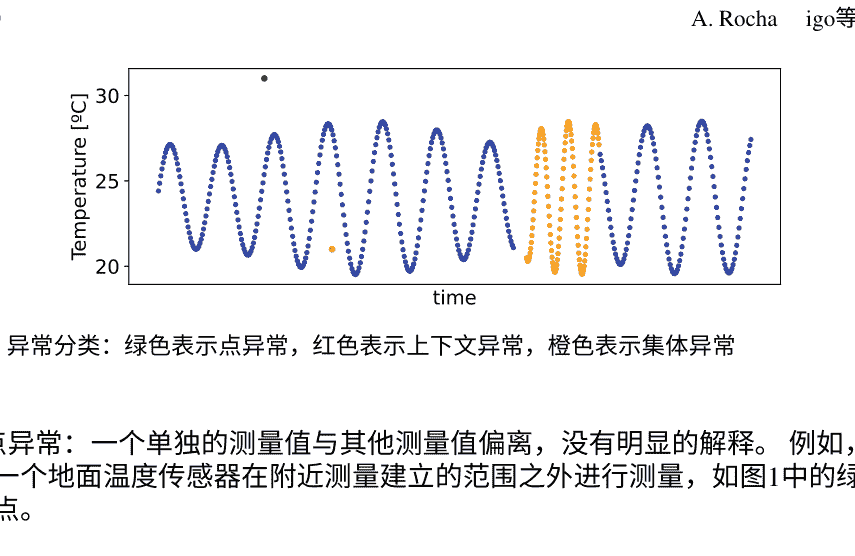

图1 异常分类：绿色表示点异常，红色表示上下文异常，橙色表示集体异常

- 点异常：一个单独的测量值与其他测量值偏离，没有明显的解释。例如，一个地面温度传感器在附近测量建立的范围之外进行测量，如图1中的绿点。
- 上下文或条件异常：一个测量值在另一个时间或另一个上下文中可能被认为是正常的。如果前面例子中的传感器记录了白天的夜间温度，如图1中的红点，那么就存在这样的异常。
- 集体或群体异常：一组单独的测量值可能被认为是正常的，但总体上偏离了预期的行为。在上述相同的传感器中，如果一组测量值显示频率变化，如图1中的橙色部分，就会发生集体异常。

在图1中的虚构温度传感器的时间序列中，可以明显看出异常提供的错误信息有可能在分析和后续处理所得到的结果和结论中产生不准确性。这就是为什么所提出的方法旨在自动找到与测量上下文不符的时间序列测量值的问题。通过这种方式，它打开了提高所获取数据质量的可能性。一旦知道哪些是异常值，它们可以被忽略或者通过其他利用检测的算法进行修正。

继续使用图1中的示例，目标是找到温度测量中的错误。这些错误对应于与蓝色不同的颜色点，即之前描述过的异常情况。

从数学上讲，给定时间序列 $X^{T_{emp}}$，目标是找到所有的时间点，$t^{T_{emp}}_a$，其关联的测量值 $X^{T_{emp}}_a$，可以被归类为之前描述的三种异常类型之一。

### 4 异常检测方法

本节描述了用于异常检测的方法论。首先，详细介绍了构建检测工具的基础，即时间序列转换。此外，介绍了k最近邻方法。然后，描述了一组修改和增强措施，以提高检测器的性能。

#### 4.1 方法论基础

##### 4.1.1 时间序列转换

一般来说，传感器记录的数据构成了一个时间序列：测量的大小值由时间变量索引。从这个前提出发，方法论的基本思想是将时间序列转化为一个点云。这种转换的目标是将与时间序列相关的异常检测问题转化为结果云中的离群点检测问题。为此，我们利用时间序列可以分解为三个组成部分之一[26]:

- 趋势：数据的长期增加或减少，或者两者兼有。当它呈现出上下波动而没有固定的频率时，它是周期性的。
- 季节性：具有恒定频率的周期行为的时间序列组成部分，例如每小时、每天或每周。这也被称为季节性分量或季节性变化。
- 剩余部分：它是从原始时间序列中消除了前两个分量的结果。

图2展示了一个虚构时间序列的分解示例，其中所有分解结果的总和等于初始时间序列。

具体来说，季节性分量用于进行问题的转换。为此，连续的传感器测量组成的时间序列被划分为其季节性分量的周期，并且随后，这些间隔被叠加在一起，没有相位差。转换的结果是一个点云，其中原始时间序列的异常数据远离其他数据，即它们是异常值。

需要牢记的是，只要点云定义良好，异常值和异常的检测结果就会很好。换句话说，只要点云来自原始时间序列，只要其季节性分量显著，检测结果就会很好。如果数据随时间不遵循周期模式，则无法正确使用提出的方法。在这种情况下，无法从周期的叠加形成点云，因此无法使用该方法检测异常。

图3展示了所描述转换的一个示例。左侧是一个节点记录的温度演变的片段，可以看到每天的季节性变化。应用转换后，相同的数据在右侧表示，显示它们形成了一个点云，不再具有明确的时间顺序。新的横坐标轴表示每次测量时的一天中的时间；因此，在不同的日期上在相同时间进行的所有记录垂直对齐。

从数学上讲，该转换可以如下一般描述。
设 $X = \{x_t | t \in T\}$ 为具有周期为 $P$ 的季节性变化的时间序列，即其规则行为每次 $t$ 的增量等于 $P$ 时重复。转换结果为另一个集合 $S(y) = \{X(y + Pn) | n \in \mathbb{Z}, (y + Pn) \in T\}$ 在区间 $y \in [t_0, t_0 + P]$ 内，其中

> $t_0$ 是一个包含在 $T$ 中的任意点，表示一个结果点云的边缘之一。

注意集合 $S(y)$ 对于每个 $y$ 的值都由 $X$ 的多个元素组成。例如，对于选择的任意点，$t_0$，$S(t_0) = \{..., X(t_0 - 2P), X(t_0 - P), X(t_0), X(t_0 + 1P), X(t_0 + 2P), ...\}$。

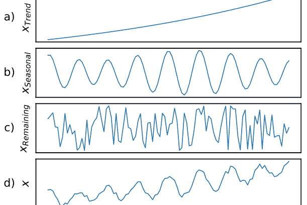

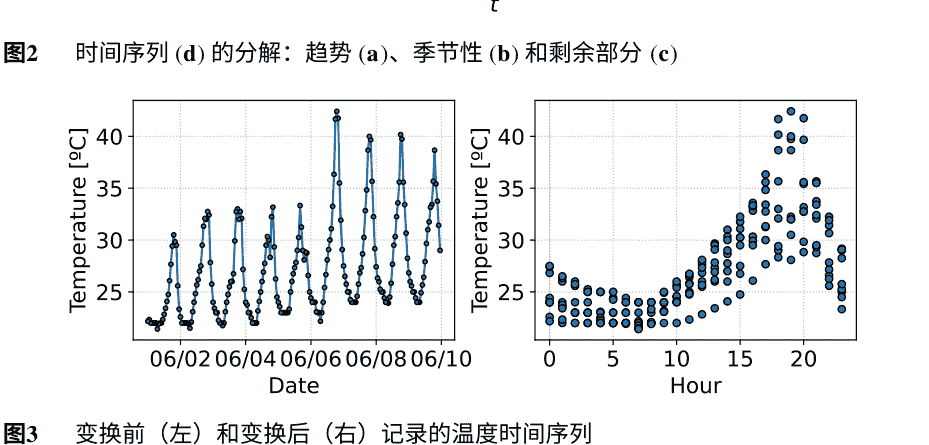

此时，已经可以应用一些已知的异常检测技术来解决问题。这些技术多种多样：局部离群因子 (LOF) [10]、基于角度的离群检测 (ABOD) [28]、特征装袋 [29]、基于Copula的离群检测 (COPOD) [30]、生成对抗主动学习 (GAAL )[31]，等等。

本研究中使用的算法被称为k最近邻算法。其他提到的任何算法都可以选择，但这个算法具有某些特点，使其成为一个很好的起点。例如，它只需要很少的参数进行调整，就可以达到良好的性能，只需要邻居的数量k。此外，与其他算法不同的是，它不对要分析的数据的潜在分布做任何先验假设，因此在这个意义上，它更加灵活。此外，它的计算成本通常是可控的，与处理的数据的维度和数量相似甚至更低，便于在网络节点中集成。这个选择也是由于它的简单性、易于实现、直观性和在其他应用中取得的良好结果[24, 33, 45]。

##### 4.1.2 k最近邻算法

k-NN方法基于观测之间的空间接近性，并最初用于解决分类问题。首先，需要一组先前标记了所属类别的数据；这些数据被称为原型。然后，在分类过程中，每个新的观测都被标记为其k个最近原型中最显著的类别。然而，在这种情况下，原始定义的方法无法使用，因为目标应用程序中没有先前标记的时间序列片段。此外，在假设情况下，即使有这种标记，属于异常类别的观测也很难构成所有可能发生的异常的代表性样本；因此，分类性能会很差。

为了解决这个问题，需要修改k-NN方法，使其不需要先前标记。由于这种修改，其应用的结果不是分类，而是一个数值或相似度指标，用于量化每个观测的异常程度：这个数值越高，观测越异常，因此它是异常的概率也越高[2]。已经研究了三种变体来量化每个观测的异常程度：使用到k个最近邻居的距离的平均值、中位数和到第k个邻居的距离。接下来，按照相同的顺序，它们以数学方式表达，其中 $a_k(x_i)$ 是观测 $x_i$ 使用 $k$ 个邻居的异常程度，$K$ 是 $x_i$ 的 $k$ 个最近邻居集合，$d(x_i, n_k)$ 是观测 $x_i$ 与第 $k$ 个邻居之间的距离。

```
a(x_i) = \frac{1}{k} \sum_{n_k \in \mathcal{K}} d(x_i, n_k) \quad (1)
a(x_i) = \text{中位数}(\{d(x_i, n_k) \mid n_k \in \mathcal{K}\}) \quad (2)
a(x_i) = \text{最大值}_{n_k \in \mathcal{K}} d(x_i, n_k) \quad (3)
```

##### 4.1.3 方法应用

此时，计算传感器记录的异常性的步骤如下：

1. 数据转换：将时间序列分为其季节变化周期，并将其叠加得到点云。
2. 原型选择：选择一组时间序列的代表性测量作为原型，以评估其余记录的异常性。希望所选的原型中没有异常，以避免降低检测器的性能。这个阶段可以与模型的训练相比较。
3. 异常检测：使用从k-NN中导出的原型和方程之一（方程1-3），计算时间序列的其余和未来元素的异常值。

在步骤2和步骤3之间，可以将异常计算表达式应用于使用自身作为邻居的原型。例如，在图4中，图3中时间序列片段的观测值已被选择为原型，并计算了它们的内在异常性。具体来说，使用大小为15的邻域，$k$，以及与邻居的平均距离相关的方法变体，方程（1）已被使用。右侧的颜色刻度表示内在异常性的结果值。

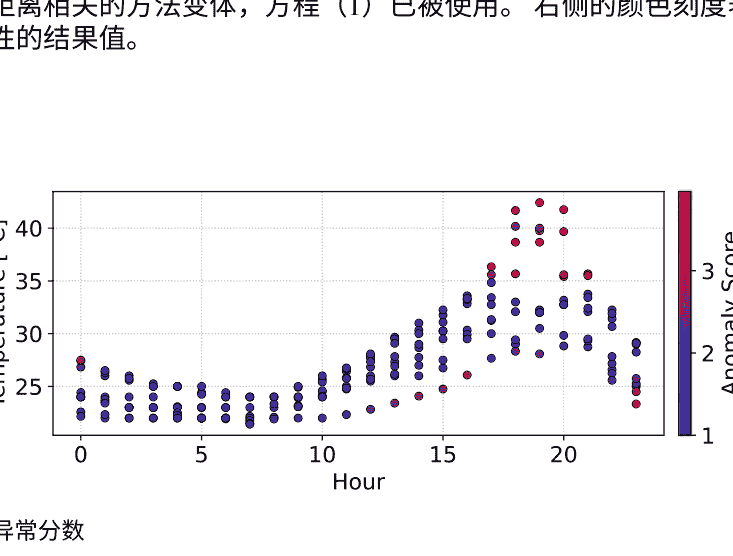

#### 4.2 异常检测器增强

以下小节描述了上述方法的扩展。它们专注于改进检测器的不同方面。重要的是要强调它们可以独立应用，因为它们彼此独立。

##### 4.2.1 改进的距离计算

从上图4中可以看出，具有最高异常分数的测量值集中在点云的边界上，这是期望的。这些点代表了测量值与从未发生和已发生的测量值之间的边界值，因此它们更加异常。从算法的角度来看，边界上的点更有可能需要增加搜索半径以找到目标数量的邻居，这会导致异常性更大。

有趣的是，我们可以思考边界点实际上位于哪里，将边界点理解为将特征空间分为两个区域的点，在其中有测量值和没有测量值。对于测量的物理量轴、纵坐标轴，边界点是每个时间点上最高和最低幅度值的点。在图4中，这些点位于云的上下边缘，因此它们呈现出更红的颜色。然后，在横坐标轴上，首先可以看出边界位于时间序列的季节周期的极限时间点，即时间序列被划分为片段的开始和结束。然而，这是不正确的，因为时间轴不应该有边界。当时间序列的季节变化周期叠加在一起时，一个周期的开始应该直接延续上一个周期的结束。

在计算异常值时，没有考虑到边界的缺失在图4中。在0小时记录的测量结果并没有将23小时记录的结果视为其邻居，实际上它们只相隔一个小时。这个探测器的缺陷表现为云团右边和左边的点呈红色。此外，这种不希望的效果不仅发生在极端小时点上：在16小时测量时，它认为与3小时测量更接近，而不是2小时测量，实际上是相反的。请注意，考虑的邻居数越多，$k$，这种错误发生的次数就越多。

探测器的这种缺陷可以通过修改用于计算距离的函数来解决。为此，我们建议在与时间变量相关的维度中使用方程（4），其中 $d_i$ 是该轴上两点之间的距离，$T$ 是原始时间序列的季节性分量的周期。

表1显示了修改最常用指标的结果。时间被视为第 $n$ 个维度，唯一受到影响，因为物理量轴保持不变。

表1 修改最常用指标

| 正常 | 修改 |
| :--- | :--- |
| **欧氏距离** | |
| $d(X, Y) = \sqrt{\sum_{i=1}^{n} (x_i - y_i)^2}$ | $d(X, Y) = \sqrt{\sum_{i=1}^{n-1} (x_i - y_i)^2 + f(|x_n - y_n|)^2}$ |
| **平方欧氏距离** | |
| $d(X, Y) = \sum_{i=1}^{n} (x_i - y_i)^2$ | $d(X, Y) = \sum_{i=1}^{n-1} (x_i - y_i)^2 + f(|x_n - y_n|)^2$ |
| **曼哈顿** | |
| $d(X, Y) = \sum_{i=1}^{n} |x_i - y_i|$ | $d(X, Y) = \sum_{i=1}^{n-1} |x_i - y_i| + f(|x_n - y_n|)$ |
| **切比雪夫** | |
| $d(X, Y) = \max_{i=1}^{n} |x_i - y_i|$ | $d(X, Y) = \max\{\max_{i=1}^{n-1} |x_i - y_i|,\ f(|x_n - y_n|)\}$ |

$$ f(d_t) = \begin{cases} d_t & \text{如果 } d_t \leq T / 2 \\ T - d_t & \text{如果 } d_t > T / 2 \end{cases} \qquad (4) $$

方程（4）是由云生成时时间轴形成的循环导致的，因为新的时间轴从同一点开始和结束。这个共同的点是因为一个季节周期的结束与下一个周期的开始重合。因此，这个轴上两点之间的最大距离被限制为季节周期的一半。因此，如果两点之间的距离在轴的一个方向上测量，即 $d_t$，如果大于季节周期的一半，即 $T/2$，则是不正确的。在这种情况下，它们之间的实际距离是在相反方向上测量的距离，即 $T - d_t$。应用方程（4）可以类比将点云投影到一个圆柱体上，其中物理量轴投影到高度，时间轴投影到底面的周长。这样，第一个轴保持不变，而第二个轴形成一个循环，距离必须在产生较小值的方向上测量。

图5在应用所描述的欧几里得距离的修改后重复了图4中的实验。可以看到，位于每个季节周期的开始和结束处的原型的异常性已经减少了，分别位于点云的左侧和右侧。现在可以正确解释这些点不在云边界上。

除了这种方法之外，还提出了一种替代方案，当无法修改度量时使用。具体而言，建议将用于推断未来传感器测量异常的原型集合扩大三倍。一份副本将保持不变，就像迄今为止所做的那样，在时间轴上占据一个完整的周期，从0开始。其他两份副本偏移，使得原始副本的开始和结束与每个副本的结束和开始相吻合。对于我们正在处理的示例，原始副本将保持从0到23小时，创建两个相同的副本：一个偏移到24-47小时范围，另一个偏移到-25到-1小时范围。

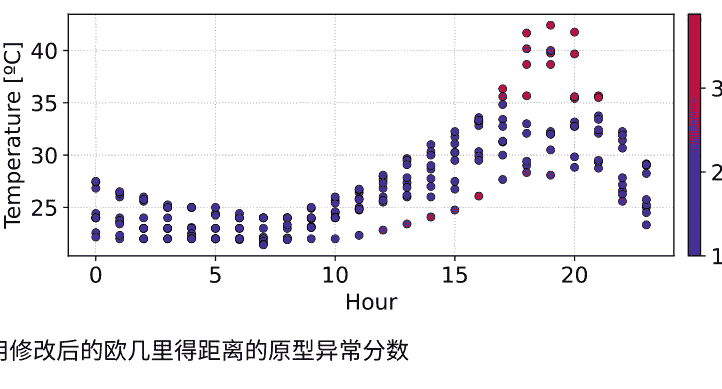

图5 使用修改后的欧几里得距离的原型异常分数

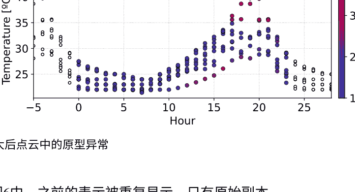

图6 放大后点云中的原型异常

在图6中，之前的表示被重复显示，只有原始副本被完整显示。可以看到，这种方法也实现了期望的结果在极端时间减少原型的异常性，因为它们认识到它们两侧都有邻居。然而，不应忘记这种方法更加低效。增加原型的数量需要更多的计算资源并增加邻居搜索算法的执行时间。另一方面，如果考虑的邻居数量($k$)非常大，可能会发生来自同一测量的不同代表副本的两个点同时被认为是另一测量的邻居，这意味着同一邻居被计算多次。

##### 4.2.2 异常阈值

到目前为止，所提出的方法可以计算每个原型的异常值，更重要的是可以计算每个新测量值的异常值。这样可以建立一个按照异常程度排序的所有测量值列表，但不明确说明其中是否有异常值。

实现这种分类的一个合理方法是考虑，如果一个测量值是异常值，那么所有具有相等或更大异常值的其他测量值也将是异常值。

图7 阈值计算和异常检测流程图

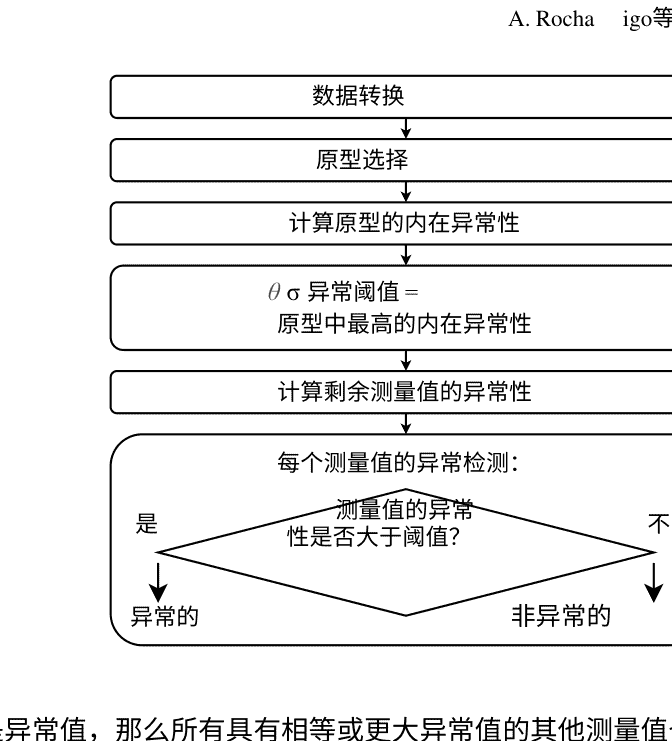

因此，建议建立一个异常阈值，$\theta$，来标记异常和非异常测量值之间的边界。

为了建立这个预测阈值，$\theta$，在第2步和第3步之间计算原型的内在异常性，如4.1.3节所述，在第3步之前，已经使用了：将异常测量与其余测量分开的阈值设置为最异常原型的异常值，即具有最高异常值的原型。通过这种方式，假设模型中的任何原型都不是异常的，并且在使用它们计算其异常性的所有未来测量中，只有超过阈值的测量是异常的。图7显示了所描述过程的流程图。

使用这个近似值得到的结果如图8所示。为了生成它，与前面的表示相同的原型已经被使用，模型-改进的欧几里德距离和大小为15的邻域。除了每个原型的固有异常性外，还包括一个热图，表示平面上任意点处的新测量值的异常性，即在预测阶段利用先前选择的原型集合得到的模型计算的异常性，第3步。如果在这个热图中标记出与最异常原型相等异常性的点，即绿色曲线，就得到了预测曲线，即先前描述的限制阈值的表示。因此，任何超过阈值的新测量值，因此被分类为异常，都将位于曲线的另一侧，这有助于我们以图形方式理解检测器在未来测量分类中的响应。

图8 预测阈值在异常和非异常观测之间的限制集

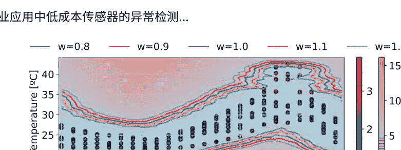

有时候阈值可能过于严格，导致太多的测量值被错误地分类为异常。如果阈值过于宽松，也可能出现相反的情况。这两种情况都可以通过应用相对增加或减少异常性阈值的加权因子来缓解。这种加权通过表达式 $\theta_w = w\theta$ 来实现。$w$ 是加权因子，是大于0的实数，$\theta$ 是根据最高内在异常性计算的阈值，$\theta_w$ 是新的加权阈值。图9显示了多个加权预测曲线，每个曲线都与不同的因子相关联。

它说明以这种方式改变阈值不会对预测曲线的形状造成显著变化，而最明显的效果是使其更接近或更远离点云的位移：如果加权因子大于1，则阈值增加，曲线移动，被分类为异常的测量值较少；如果因子小于1，则产生相反的效果。如果阈值为1，则明显阈值不会改变。

最后，有趣的是要理解为什么未加权的预测曲线没有经过具有最高异常性的原型，即使阈值等于其异常性。这是因为原型的固有异常性是在不考虑自身作为邻居的情况下计算的，步骤2等同于训练，而未来测量的异常性是使用所有原型计算的，步骤3等同于预测。简而言之，搜索邻居的集合在每种情况下都不同。

##### 4.2.3 邻居数量的选择

图10显示了邻域大小对预测曲线的影响，该曲线由具有最高异常性的原型设置：邻居数量越多，曲线离点云越远。这个结果是预期的，因为随着邻居数量的增加，寻找它们的搜索半径增加，因此最异常原型的异常性增加，或者换句话说，阈值增加。这种增长不受第4.1.2节中介绍的三种表达方式的影响。

接下来，为了固定邻域的大小，提出了一种基于邻居数量增加时预测曲线变化的量化方法：当通过增加 k 一个单位，曲线的相对变化小于一个固定的限制时，找到所需的大小。

首先，为了量化两个预测曲线之间的变化，使用Hausdorff距离[43]。这被定义为曲线A和B之间的最大有向Hausdorff距离，公式（5）。同样，有向距离是一个曲线上的每个点与另一个曲线上所有点之间的最小距离的最大值，公式（6）。Hausdorff距离的物理解释对应于曲线A上的一个人到达曲线B所需的最小距离。

$$H(A, B) = \max \{h(A, B), \ h(B, A)\} \tag{5}$$
$$h(A, B) = \max_{a \in A} \min_{b \in B} d(a, b) \tag{6}$$

一旦量化预测曲线之间变化的工具可用，构建有序集合H，其中H(ki,kj)是使用k最近邻方法得到的预测曲线之间的Hausdorff距离，其中k等于i和j：

###### 图11 根据邻域大小的连续预测曲线之间的距离

> $\mathcal{H} = \{H(1,2), H(2,3), H(3,4), ..., H(k_i, k_j), ...\} \quad (7)$

然后，构建包含两个连续元素之间相对变化的集合 $\mathcal{V}_{\mathcal{H}}$: 

> $\mathcal{V}_H = \{v_1, v_2, ..., v_i = \frac{|H(i,i+1) - H(i+1,i+2)|}{H(i,i+1)}, ...\} \quad (8)$

最后，第一个值小于最大可接受相对变化的元素的索引设置邻居的数量；如果满足此条件的元素是 $v_n$，则使用的邻居数量为 $k = n$。图11绘制了使用与前面绘图相同的数据获得的 $\mathcal{H}$ 集合，其中每条线代表不同的修改度量。可以看出，Hausdorff距离呈递减趋势，这表明预测曲线的形状逐渐稳定。设置相对变化的上限的目的是避免初始瞬态区域，并达到行为已经相对于其他类似模型稳定的模型。在这种特殊情况下，寻找的 $k$ 值大约在5到8个邻居之间。

##### 4.2.4 季节性周期划分为时间段

仔细观察图3可以发现，由时间序列转换产生的点云在整个长度上的密度并不均匀。这可能是预测过程中的错误源，因为阈值是根据单个原型设置的，即最异常的原型，它会影响时间轴上任何点的所有预测。

因此，将季节性变化期间划分为时间范围并将每个时间范围与不同的预测模型关联起来似乎是合理的。这样，每个时间范围的预测曲线将由它所包含的最异常原型定义。不同的预测模型意味着使用的参数可能不同。

###### 图12 将常规变化周期划分为具有单独预测模型的时间段

对于每个划分，例如邻域大小或加权因子，都可以不同。然而，为了正确进行邻居搜索，必须使用季节性变化周期的整个时间范围的所有原型是至关重要的。随后，在预测阶段，只需使用分配给其所属时间范围的模型来处理要分析的新测量数据。

图12展示了在相同的原型集上实施此修改的结果。已经建立了五个时间段，限制在0点、5点、10点、16点和20点。选择这些时间段是根据点云的分散性来实现更好的预测曲线拟合，因为每个部分都由它包含的最异常的原型来设置。根据这个标准，具有相似分散性的区域已经被分开：第二和第四个间隔的分散性最低和最高，而将它们分开的其余部分具有相似的分散性。显然，这些分割必须根据所解决的问题进行调整。在这个例子中，每个时间段使用的模型都共享相同的度量，即修改后的欧几里得度量，但考虑的邻居数量 k 是不同的：从左到右分别为10、3、8、14和8个邻居。这些数量仅作为一个说明性的例子来设置，以反映通过调整它们可以实现更好的拟合，因为每个分割处的预测曲线是独立的。在更现实的情况下，可以按照之前描述的基于Hausdorff距离的策略，在每个分割中根据邻域的大小量化预测曲线的变化，并获得每个分割的 k 值。

##### 4.2.5 原型的时间更新

如果时间序列呈现趋势、周期性或其他季节性成分，异常检测器的性能被认为是差的。这是因为趋势会导致测量逐渐偏离初始化检测器时选择的原型，从而导致所有测量从某个时间开始被视为异常。在迄今为止使用的示例中，所描述的情况类似于尝试检测在冬季获得的原型中的夏季测量中的异常。

为了解决这个缺陷并确保检测器能够演化和适应测量幅度可能呈现的趋势，建议定期更新模型的原型。为此，检测器使用与要分析异常的测量时间接近的原型测量进行初始化。然后，随着新的测量被研究，原型集合被更新：当预测到测量值是非异常时，它们被添加到原型集合中，而最旧的$n$个则被删除。

### 5 提议方法的评估

#### 5.1 数据生成

已开发和部署了无线传感器网络，以评估类似于农业4.0项目中的场景中的异常检测器。通过专有采集系统，可以更好地控制所收集数据的属性和测试场景，从而为检测器的评估结果提供附加价值。

网络的结构如图13所示。它可以分为两个主要部分：负责测量感兴趣的物理量的节点和负责存储、处理和检测可能的异常的中央服务器。这两个元素通过局域网或互联网连接。网络中的每个节点都基于树莓派，可以使用任何版本的该单板计算机。该设备负责从连接到其通用引脚的传感器收集数据，对其进行处理，并通过Wi-Fi发送或本地存储。

为了采样感兴趣的物理量，每个节点通过顺序通信连接了一个或多个DHT11 [20] 模块。这个低成本模块集成了温度和相对湿度传感器，其特性如表2所示。

当节点启动时，它们会自动执行一个Python程序来执行数据采集期间所需的任务。该程序的运行方式，如图14所示，如下所示。首先，它会读取节点本身的配置文件，其中包含不同的参数，例如节点的唯一标识符，它拥有的每个传感器模块的标识符，采样间隔，必须发送数据的地址等。随后，它会为每个连接的模块启动一个执行过程（图中的左侧区域），并为存储在本地的发送失败的过去测量值恢复启动另一个额外的过程（图中的右侧区域）。

每个测量过程通过相关的DHT11模块重复进行温度和湿度读数，通过HTTP发送到服务器，并等待在配置文件中预定义的时间再进行下一次测量。

此外，在等待之前，如果发送失败，测量结果将存储在节点中的SQLite数据库中；如果发送成功，则通知存储的测量结果检索过程，以宣布与服务器的通信已建立。

具体而言，后续过程的操作如下。启动后，它等待与传感器相关的其他进程之一通知，当发生这种情况时，它检查本地数据库中是否有任何测量结果。如果没有，则空闲等待下一次通知；如果有，则检索其中一个测量结果并尝试发送。如果发送失败，则再次等待下一次通知以重复整个过程；否则，如果发送成功，则从SQLite中删除处理过的测量结果，并返回到之前的检查点，以尝试发送任何其他存储的测量结果。

这个过程结构确保每个DHT11模块的单独处理，以及存储数据的传输，不会相互干扰，以便所有测量都按照规律间隔进行。此外，如果其中一个传感器出现故障，其他元素不会受到影响。

另一方面，在服务器上，使用Docker技术执行多个虚拟容器。这些包括：

-   **PostgreSQL数据库**：用于传感器网络采集的数据的永久存储。

表2 DHT11技术规格
| 特性 | 值 | |
| :--- | :--- | :--- |
| | 温度 | 湿度 |
| 范围 | 0–50 °C | 20% RH–90% RH |
| 分辨率 | 1 °C | 1% RH |
| 准确率 | ±5 °C | ±2% RH |
| 重复性 | ±1 °C | ±1% RH |

-   **API**：通过一组访问点方便和限制对数据库中存储的数据的写入和读取访问。具体而言，网络节点将数据发送到HTTP消息的正文中，指向其中一个访问点，以便API在接收到数据后将其存储。同样，它还具有其他端点，以便任何应用程序或具有访问权限的用户可以使用现有数据。

-   **异常检测器**：通过API检索记录的数据，并使用提出的异常检测算法进行持续分析。

在描述系统之后，有趣的是注意到其可扩展性，这主要归功于两个原因。第一个原因是在总模块数和每个模块中传感器数量方面的灵活性。第二个原因是API在测量设备和数据库之间建立的抽象层，因为它提高了两者之间的独立性水平。另一方面，所达到的鲁棒性也很重要，因为即使出现通信故障，如服务器崩溃或节点超出本地区域网络范围，也不会丢失所采取的测量数据。

最后，关于采集系统，图15显示了两个节点在15天内记录的温度和相对湿度的演变，其中一个节点具有单个测量模块，另一个节点具有两个测量模块。

#### 5.2 实验结果

下面描述了将第4节中介绍的异常检测方法应用于测试台记录的温度和湿度数据的结果。提出了四种场景。

##### 5.2.1 第一种场景

使用单个传感器每小时间隔采集的测量数据。此外，已经进行了手动审核以纠正可能存在的异常值。结果是一个由1320个连续的温度和相对湿度记录组成的数据集，每个记录之间间隔1小时。这个无异常的场景用于研究检测器产生了多少个错误检测。

首先，分别研究每个指标：一方面，我们寻找温度数据中的异常值；另一方面，寻找湿度数据中的异常值。在这两种情况下，前七天的168个记录被用作初始原型集，剩下1152个记录需要进行分析。图16展示了每个指标的这组168个原型。此外，如第4.2.5节所述，原型定期更新；具体来说，每当有24个记录被分类为非异常时进行更新。

结果收集在表3中，每一行都构成一个个体测试，其特征为：在第4.2.1节中介绍的修改后的度量标准和预测阈值加权因子。无论在第4.2.3节中得出什么结论，邻居的数量k在所有情况下都被设置为1。这样建立了一个适合比较上述参数的情况，因为这样，时间段的划分和计算异常性的度量标准都是无关紧要的。错误列汇总了检测到的异常数目与总预测数目的归一化值，1152。

表3 使用原始数据处理各个量级的单个邻居的结果
| 权重 | 错误 (修改后的欧几里得) | 错误 (修改后的切比雪夫) |
| :--- | :--- | :--- |
| | **温度** | **湿度** | **温度** | **湿度** |
| 1.0 | 255 [22.13%] | 380 [32.99%] | 225 [19.53%] | 403 [34.98%] |
| 1.1 | 187 [16.23%] | **328 [28.47%]** | **123 [10.68%]** | 356 [30.90%] |
| 1.2 | **165 [14.32%]** | 318 [27.60%] | **107 [09.29%]** | 345 [29.95%] |
| | **修改后的曼哈顿** | **修改后的平方欧几里得** |
| | **温度** | **湿度** | **温度** | **湿度** |
| 1.0 | 252 [21.87%] | 375 [32.55%] | 272 [23.61%] | 391 [33.94%] |
| 1.1 | 225 [19.53%] | 353 [30.64%] | 251 [21.79%] | 380 [32.99%] |
| 1.2 | 215 [18.66%] | **271 [23.52%]** | 204 [17.71%] | 369 [32.03%] |

从表3收集的结果中可以提取出：

-   当预测阈值的权重因子增加时，错误减少。该阈值将异常测量与非异常测量分开。这是可以预料的，因为增加阈值会使预测曲线远离点云，因此检测器对异常更宽容。
-   使用平方欧几里得度量是整体表现最差的。
-   切比雪夫度量是温度的最佳选择，在两个问题之间，欧几里得度量似乎是更好的选择。

##### 5.2.2 第二个场景

在这个场景中，使用相同的数据集重复了之前的测试。然而，正常变化周期现在被分成了5个时间段，如第4.2.4节所述。此外，每个时间段中的邻居数量是使用Hausdorff距离自动计算的，如第4.2.3节所述。在这种情况下，k通常大于1，考虑到计算每个观测异常性的不同方法也是有意义的，见第4.1.2节。在先前的情况下，这是不适用的，因为如果只考虑一个邻居，到它的距离的平均值、中位数和最大值都是一样的。 在这种情况下得到的结果如表4所示。由此可见：

-   还有一些情况可以进一步降低先前获得的最小错误率。因此，可以推断出，通过将时间轴划分为更精确的模型，并自动搜索每个时隙的适当邻居数量，可以改善结果。
-   计算最佳异常性能的方法是仅考虑到最远邻居的距离，之前称为“最大”。
-   对阈值的先前考虑保持不变。
-   有共识认为，平方欧几里得度量法的结果最差，而欧几里得度量法在两个问题中表现出色；切比雪夫度量法在温度问题中表现出色，曼哈顿度量法在湿度问题中表现出色。

总结这个场景，有趣的是比较转换温度和湿度时间序列后得到的点云的外观，图16。 湿度云更分散，因为其时间序列不太规则，其内在行为在一天结束时更为异常，这似乎是湿度结果较温度结果差的原因。分散性导致无法建立准确的预测曲线。

##### 5.2.3 第三个场景

上述测试已经重复进行，将邻居数设置为1，但将温度和湿度变量与单个探测器一起处理，表5。因此，在这种情况下，特征空间的大小为三而不是两，因此测量结果被放置在空间中而不是平面上。此外，预测曲线的维度也增加，成为包围三维点云的曲面。对于所有情况，结果都比之前在单个数量上获得的结果更差，即湿度。

##### 5.2.4 第四个场景

第一个场景中的无异常数据集也被用于这次实验。然而，从初始原型集中随机选择了100个不属于该集合的测量值，并进行了修改以使其成为异常值。虚构的值是根据时间序列演变的范围随机生成的。通过这种方式，获得了一个带有标签的数据集来评估检测器。

表4 在原始数据上进行自动计算邻居的结果
| 方法 | 权重 | 错误 | 错误 | | | |
| :--- | :--- | :--- | :--- | :--- | :--- |
| | | 温度 | 湿度 | 温度 | 湿度 |
| | | 修改后的欧几里得 | | 修改后的切比雪夫 | |
| 最大的 | 1.0 | 258 [22.40%] | 381 [33.07%] | 161 [13.98%] | 352 [30.56%] |
| 均值 | 1.0 | 319 [27.69%] | 412 [35.76%] | 306 [26.56%] | 366 [31.77%] |
| 中位数 | 1.0 | 328 [28.47%] | 376 [32.64%] | 224 [19.44%] | 374 [32.47%] |
| 最大的 | 1.1 | 193 [16.75%] | 281 [24.39%] | 133 [11.55%] | 328 [28.47%] |
| 均值 | 1.1 | 240 [20.83%] | 339 [29.43%] | 219 [19.01%] | 317 [27.52%] |
| 中位数 | 1.1 | 202 [17.53%] | 320 [27.78%] | 217 [18.84%] | 294 [25.52%] |
| 最大的 | 1.2 | **090 [07.81%]** | **264 [22.92%]** | **117 [10.16%]** | 267 [23.18%] |
| 均值 | 1.2 | 125 [10.85%] | 289 [25.09%] | **104 [09.03%]** | 278 [24.13%] |
| 中位数 | 1.2 | **123 [10.68%]** | **243 [21.09%]** | 166 [14.41%] | 278 [24.13%] |
| | | 修改后的曼哈顿 | | 修改后的平方欧几里得 | |
| 最大的 | 1.0 | 255 [22.14%] | 334 [28.99%] | 275 [23.87%] | 346 [30.03%] |
| 均值 | 1.0 | 283 [24.57%] | 358 [31.08%] | 320 [27.78%] | 380 [32.99%] |
| 中位数 | 1.0 | 240 [20.83%] | 392 [34.03%] | 316 [27.43%] | 321 [27.86%] |
| 最大的 | 1.1 | **119 [10.33%]** | 269 [23.35%] | 225 [19.53%] | 332 [28.82%] |
| 均值 | 1.1 | 186 [16.15%] | 320 [27.78%] | 278 [24.13%] | 363 [31.51%] |
| 中位数 | 1.1 | 200 [17.36%] | 311 [27.00%] | 222 [19.27%] | 325 [28.21%] |
| 最大的 | 1.2 | 135 [11.72%] | **242 [21.01%]** | 123 [10.68%] | 327 [28.39%] |
| 均值 | 1.2 | 132 [11.46%] | **267 [23.18%]** | 205 [17.80%] | 334 [28.99%] |
| 中位数 | 1.2 | 138 [11.98%] | **237 [20.57%]** | 198 [17.19%] | 324 [28.12%] |

表5 在原始数据上将温度和湿度作为一个邻居进行处理的结果
| 权重 | 错误 | | |
| :--- | :--- | :--- | :--- |
| | 修改后的欧几里得 | 修改后的曼哈顿 | |
| 1.0 | 543 [47.14%] | 455 [39.50%] | |
| 1.1 | 460 [39.93%] | **387 [33.59%]** | |
| 1.2 | **333 [28.91%]** | **322 [27.95%]** | |
| | 修改后的切比雪夫 | 修改后的平方欧几里得 | |
| 1.0 | 464 [40.28%] | 502 [43.58%] | |
| 1.1 | 433 [37.59%] | 473 [41.06%] | |
| 1.2 | 415 [36.02%] | 445 [38.63%] | |基于先前获得的结果，这些测试中排除了湿度数据和平方欧氏距离度量。此外，保持了对 k 参数的自动确定以及时间轴分为五个间隔的划分。

接收器操作特性（ROC）曲线及其区域，即被称为曲线下面积（AUC），已被用于评估结果。在这种类型的图表中，假阳性率或误报率在横坐标轴上，真阳性率或召回率在纵坐标轴上，分别表示不同预测阈值下将异常测量与非异常测量分开的情况。在所有测试中，异常被视为正例。

这些指标代表了模型在评估过程中将测量分类为异常时实际上并非异常的概率，或者实际上是异常的概率，分别为[19]。因此，一个完美的检测器的误报率等于0，召回率等于1，即位于图表的左上角。因此，越接近这个区域，检测器的性能越好，这与AUC直接相关，其最大值为1仅在所描述的情况下达到[39]。

$$
FPR = FP/(FP + TN) \quad\quad (9)
$$
$$
TPR = TP/(TP + FN) \quad\quad (10)
$$

图17显示了所得到的指标值。首先，在条形图中，可以比较每个指标和异常计算的变体之间形成的每对的AUC。所有这些值都保持在0.85以上，而最好的是使用中位数变体的修改后的曼哈顿距离，接近0.9。尽管中位数变体提供了最好的值，但也导致了最差的结果。

使用均值变体可以获得几乎同样好的结果，但在各个指标之间更加一致。使用最大值变体可以获得相同的一致性，但结果略低一步。至于修改后的指标，曼哈顿距离和切比雪夫距离分别占据了三个最高和最低位置中的两个。

其次，根据相同的颜色方案绘制每个测试的ROC曲线，如条形图中所示。所有测试都呈现出令人满意的结果，接近左上角，远离对角线，这将是一个随机分类。最显著的是修改后的曼哈顿度量与均值变体，尽管它们都以类似的方式发展。

图上的点表示根据本书章节中描述的方法计算的预测阈值的检测模型。这些点不是位于ROC曲线的正上方，因为每个时间段都有不同的阈值，根据该时间段中最异常的原型；然而，ROC曲线是使用单个全局阈值计算的。这些点聚集的区域表明选择设置阈值的方式在图的轴上表示的比率之间提供了良好的权衡，同时使两者都接近其最佳值。最佳单一情况发生在切比雪夫和最大变体，其中TPR=0.81，FPR=0.12。

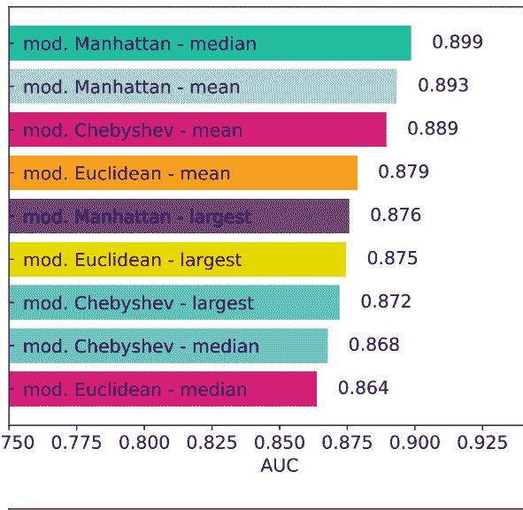

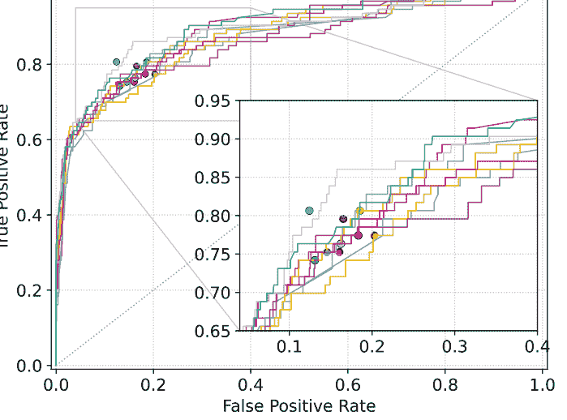

图17 AUC值和ROC曲线，以相同的颜色表示，在描述的场景中的测试中

为了总结这个场景，下面的图像序列，图18，展示了算法在测试床捕获的时间序列片段上进行的一个测试的结果示例。从一个图形到另一个图形的转换表示 k-NN模型已经重新训练。点表示真正的非异常测量，叉表示异常。关于颜色，蓝色表示用于预测的原型测量；绿色表示新识别的非异常测量，红色表示新分类为异常的测量。具体如下：

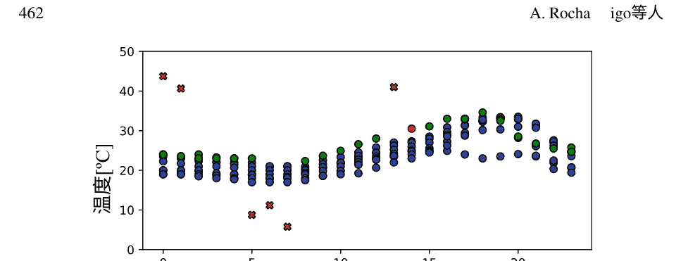

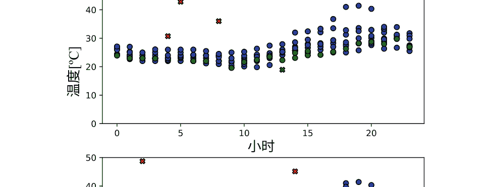

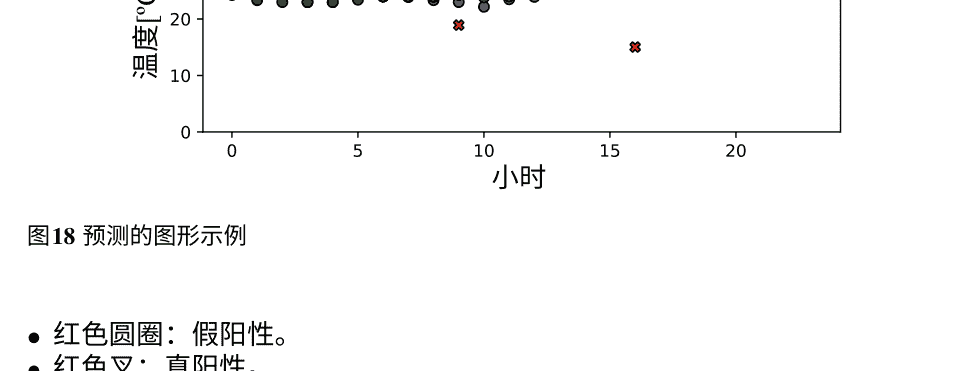

###### 图18 预测的图形示例

- 红色圆圈：假阳性。
- 红色叉：真阳性。
- 绿色圆圈：真阴性。
- 绿色叉：假阴性。
- 蓝色圆圈：以前的真负样本用作预测的原型。
- 蓝色十字：以前的假负样本用作预测的原型。

### 6 结论

在这项工作中，我们描述了一种用于低成本传感器测量异常检测的方法。这可以与任何现有的点云异常检测算法结合使用；在这种情况下，我们评估了其性能，利用了经典的k-NN算法。此外，我们还开发和应用了多种技术来改进其初始性能。其中一些技术是改进距离计算或自动确定预测阈值和模型参数的技术。这些技术引入了新的想法，例如使用Hausdorff距离，在其他场景中可以轻松应用。在这项研究中，我们使用实际温度和湿度测量生成的环境数据进行了工作。这些数据是由一个传感器网络收集的，作为一个测试平台。我们还描述了这个网络，以便在未来的工作中有用。将该方法应用于这些数据后，所得到的结果令人满意，在所有进行的测试中，曲线下面积大于0.85。

所得结果表明，无论传感器是孤立的还是集成到传感器网络中，都有可能降低传感器采集成本。与性能更好的其他仪器相比，较为简单的仪器产生的工件可以通过上述方法大部分被检测和减轻。

在不牺牲数据质量的情况下，降低成本为在经济利润有限或投资能力较低的领域，包括小规模农业，提供了新的监测和数据科学应用的机会。此外，所开发的方法不仅适用于传感器，还可以检测任何时间序列的异常，无论其来源或所代表的大小。时间序列必须满足的唯一条件是具有明显的季节性分量，因为如结果所示，这个分量越显著，性能就越好。

在未来的工作中，将对所提出的方法进行更详细的研究和比较，使用不同来源和大小的新的大数据集。首先，除了k-NN之外，还将强调使用其他检测模型。通过这种方式，我们希望建立一个比较框架，以确定哪个模型提供更好的结果，甚至确定在哪些条件下每个模型都突出于其他模型。我们还将努力对时间和物理变量进行归一化处理，以避免不同的尺度对结果的影响，因为它们直接参与距离的计算。

此外，在农业4.0项目的背景下，该项目在引言中提到，并在该项目下进行的研究中，异常检测器将被整合到一个更广泛的系统中，该系统追求自然资源的优化和农业产量的增加。具体而言，传感器收集的数据经过检测器处理后，将成为自动灌溉控制系统的输入。该系统将分析所获取的数据来确定种植区域的状态，并自动管理灌溉。

根据作物的实时需求，使用泵和电动阀进行灌溉，几乎不需要人工干预。

尽管灌溉系统不在本研究范围内，但与其整合将有助于进一步研究异常检测器。具体而言，将量化早期异常检测对随后处理这些数据的算法的影响，建立在有无异常检测环境下的比较。我们还将研究所提出方法对测量设备电池寿命的影响。本研究将确定在集中方式（例如云端）或分布式方式（每个传感器节点）运行检测是否存在显著差异。在这方面，我们将分析算法优化以减少其消耗。最后，从用户和维护的角度来看，异常检测结果将与捕获的数据一起包含在农业4.0的实时可视化网络平台中。通过这种方式，将有可能评估提供这些信息是否有助于农民监测经营状况和自动灌溉系统的维护，及早检测潜在故障并促进预测性维护。

### 参考文献

1. Abid, A., Kachouri, A., Mahfoudhi, A.: 通过无线传感器网络中的异常值和邻域数据进行异常检测。 在：2016年第二届高级技术信号与图像处理国际会议（ATSIP），第26-30页（2016年）。 https://doi.org/10.1109/ATSIP.2016.7523045
2. Angiulli, F., Pizzuti, C.: 在高维空间中快速检测异常值。 在：Elomaa, T., Mannila, H., Toivonen, H. (eds.) 数据挖掘和知识发现原理，第15-27页。 Springer, Berlin, Heidelberg (2002年)
3. Araújo, S.O., Peres, R.S., Barata, J., Lidon, F., Ramalho, J.C.: 描述农业4.0景观的新兴趋势，挑战和机遇。 农学 11 (4)（2021年）。 https://doi.org/10.3390/agronomy11040667
4. Arfaoui, A., Kribeche, A., Senouci, S.M., Hamdi, M.: 基于游戏的自适应异常检测在无线体域网中。 计算机网络。 163, 106870（2019年）
5. Ariyuralan Habeeb, R.A., Nasaruddin, F., Gani, A., Targio Hashem, I.A., Ahmed, E., Imran, M.: 实时大数据处理用于异常检测：一项调查。 国际信息管理杂志。 45, 289–307（2019年）。 https://doi.org/10.1016/j.ijinfomgt.2018.08.006
6. Ayadi, A., Ghorbel, O., Obeid, A.M., Abid, M.: 无线传感器网络的异常检测方法：一项调查。 计算机网络。 129, 319–333（2017年）。 https://doi.org/10.1016/j.comnet.2017.10.007
7. Ayadi, A., Ghorbel, O., Obeid, A.M., Abid, M.: 无线传感器网络的异常检测方法综述。 计算机网络 129, 319–333 (2017). https://doi.org/10.1016/j.comnet.2017.10.007
8. Blázquez-García, A., Conde, A., Mori, U., Lozano, J.A.: 时间序列数据中的异常检测综述 (2020). arxiv:https://arxiv.org/abs/2002.04236
9. Boursianis, A.D., Papadopoulou, M.S., Diamantoulakis, P., Liopa-Tsakalidi, A., Barouchas, P., Salahas, G., Karagiannidis, G., Wan, S., Goudos, S.K.: 物联网(IoT)和农业无人机在智能农业中的综合评述。 物联网18, 100187 (2022). https://doi.org/10.1016/j.iot.2020.100187
10. Breunig, M.M., Kriegel, H.P., Ng, R.T., Sander, J.: LOF:基于密度的局部离群点识别。 SIGMOD Rec. 29(2), 93–104 (2000). https://doi.org/10.1145/335191.335388
11. Catalano, C., Paiano, L., Calabrese, F., Cataldo, M., Mancarella, L., Tommasi, F.: 智能农业系统中的异常检测。 Comput. Ind. 143, 103750 (2022). https://doi.org/10.1016/j.compind.2022.103750
12. Chalapathy, R., Chawla, S.: 异常检测的深度学习: 一项调查 (2019). arxiv:http://arxiv.org/abs/1901.03407
13. Chandola, V., Banerjee, A., Kumar, V.: 异常检测: 一项调查。 ACM Comput. Surv. 41(3) (2009). https://doi.org/10.1145/1541880.1541882
14. Cook, A.A., Misirli, G., Fan, Z.: 物联网时间序列数据的异常检测: 一项调查。 IEEE物联网杂志 7(7), 6481–6494 (2020). https://doi.org/10.1109/JIOT.2019.29581851
15. De Paola, A., Gaglio, S., Re, G.L., Milazzo, F., Ortolani, M.: WSN的自适应分布式异常检测。 IEEE Trans. Cybern. 45(5), 902–913 (2015). https://doi.org/10.1109/TCYB.2014.2338611
16. Din-Houn Lau, F., Butler, L.J., Adams, N.M., Elshafie, M.Z.E.B., Girolami, M.A.: 实时统计建模自感知桥梁生成的数据。 Proc. Inst. Civ. Eng.-Smart Infrastruct. Constr. 171(1), 3–13 (2018). https://doi.org/10.1680/jsmic.17.00023
17. Erhan, L., Ndubuaku, M., Di Mauro, M., Song, W., Chen, M., Fortino, G., Bagdasar, O., Liotta, A.: 传感器系统中的智能异常检测: 一个多角度综述。 Inf. Fusion 67, 64–79 (2021). https://doi.org/10.1016/j.inffus.2020.10.001
18. Farooq, M.S., Riaz, S., Abid, A., Umer, T., Zikria, Y.B.: 物联网技术在农业中的作用: 系统文献综述。 电子 9(2) (2020). https://doi.org/10.3390/electronics9020319
19. Gao, X., Shan, C., Hu, C., Niu, Z., Liu, Z.: 自适应集成机器学习模型用于入侵检测。 IEEE Access 7, 82512–82521 (2019). https://doi.org/10.1109/ACCESS.2019.2923640
20. 广州奥松电子有限公司: Dht11 sip封装温湿度传感器。 http://www.aosong.com/en/products-21.html。 于2022年11月26日访问
21. Guereá, A., Rojas Villagra, L.: Yvy Jera。 Paraguay的土地所有者。 https://www.oxfam.org/es/informes/paraguay-informe-de-distribucion-de-la-tierra。 Oxfam。 于2023年2月访问
22. Hamamoto, A.H., Carvalho, L.F., Sampaio, L.D.H., Abrão, T., Proença, M.L.: 使用遗传算法和模糊逻辑的网络异常检测系统。 专家系统应用 92, 390–402 (2018). https://doi.org/10.1016/j.eswa.2017.09.013
23. Han, C., Rundo, L., Murao, K., Noguchi, T., Shimahara, Y., Milacski, Z.A., Koshino, S., Sala, E., Nakayama, H., Satoh, S.: MADGAN: 无监督的医学异常检测GAN, 使用多个相邻的脑MRI切片重建。 BMC生物信息学 22(2), 31 (2021). https://doi.org/10.1186/s12859-020-03936-1
24. Harrou, F., Taghezout, B., Sun, Y.: 改进的基于kNN的光伏系统故障检测方案。 IEEE光伏杂志 9(3), 811–821 (2019). https://doi.org/10.1109/JPHOTOV.2019.2896652
25. Hawkins, D.M.: 引言, 第1-12页。 Springer Netherlands, Dordrecht (1980). https://doi.org/10.1007/978-94-015-3994-4_1
26. Hyndman, R., Athanasopoulos, G.: 预测: 原理与实践, 第3版。 OTexts (2021)
27. Kobil ska, A., Leung, C., Hsu, C.H., Raghavendra, S., Chang, V.: 物联网、大数据和云计算的新趋势、问题和挑战。 Futur. Gener. Comput. Syst. 87, 416–419 (2018). https://doi.org/10.1016/j.future.2018.05.021
28. Kriegel, H.P., Schubert, M., Zimek, A.: 基于角度的高维数据异常检测。 在: 第14届ACM SIGKDD国际会议的知识发现和数据挖掘论文集，KDD '08, 第444-452页。 计算机协会, 纽约, 纽约, 美国 (2008年)。 https://doi.org/10.1145/1401890.1401946
29. Lazarevic, A., Kumar, V.: 特征装袋用于异常检测。 在: 第十一届ACM SIGKDD国际数据挖掘会议论文集, KDD '05, 第157-166页。 计算机协会, 纽约, 纽约, 美国 (2005年)。 https://doi.org/10.1145/1081870.1081891

## 使用深度学习模型进行椰树检测

Deepthi Sudharsan, K. Harish, U. Asmitha, S. Roshan Tushar, H. Theivaprakasham, V. Sowmya, V. V. Sajith Variyar, Krishamoorthy Deva Kumar, 和 Vinayakumar Ravi

摘要在极端灾害（如地震、气旋和海啸）中，食品供应遭受严重破坏。在这种情况下，快速评估农田的食品供应是至关重要的，因为它能够在受灾社区进行人道主义行动。在本章中，我们在低分辨率和高分辨率的椰树数据集上训练目标检测模型，并提供了一种用于检测和分割椰树的深度学习策略。通过从谷歌地球中拍摄椰树的快照创建了一个低分辨率的数据集，并利用了从Github获取的高分辨率数据集。对于本章，使用了几种模型，包括Faster R CNN，DETR，YOLOv5和RetinaNet，评估指标为Microsoft COCO数据集的平均精度（AP）在不同的IoU阈值（IoU = 0.50:0.5:0.95，区域=全部）上。最初，模型在收集的低分辨率数据集上进行训练，并在两个数据集上进行测试，以检查训练模型的鲁棒性。在低分辨率数据集上，使用Resnet50模型的RetinaNet模型表现最好，COCO指标为0.301。然而，当在高分辨率数据集上进行测试时，相同的模型表现不佳。因此，模型在高分辨率数据集上进行了训练，并再次进行了测试。这次，使用swin骨干的vfnet模型实现了0.578的COCO指标。

这个结果高于原始作者在高分辨率数据集上使用YOLO-VOC实现的基准COCO度量分数，原始作者实现了0.477的COCO度量分数。

- 关键词
- 椰子树
- 深度学习
- 目标检测
- IoU

D. Sudharsan · K. Harish · U. Asmitha · S. R. Tushar · H. Theivaprakasham · V. Sowmya (✉) · V. V. S. Variyar
计算工程与网络中心 (CEN), Amrita Vishwa Vidyapeetham, 印度科英布托尔电子邮件: v_sowmya@cb.amrita.edu

K. D. Kumar
ICAR-Sugarcane Breeding Institute, Veerakeralam, Tamil Nadu, 印度

V. Ravi
人工智能中心, Prince Mohammad Bin Fahd University, Khobar, 沙特阿拉伯

### 1 引言

根据粮食和农业组织（FAO）的数据，椰子在亚洲、非洲和美洲等主要大陆的97多个国家种植。菲律宾和印度尼西亚是世界上最大的椰子生产国，占总产量的大约一半；印度在椰子生产中排名第三，每公顷的坚果产量更高。印度是全球椰子贸易的重要贡献者，生产了世界椰子总产量的22.34%。目前，该作物种植面积为1.91百万公顷，年产椰子近130亿个。

将椰子树和种植园的普查记录自动化是这项工作的主要动机，作为长期手工过程的替代方案。尽管手工点数是一种传统方法，但往往不仅消耗大量人力和时间，而且容易出现人为错误。这项工作提供了一个能够自动化并完成这项任务的概念验证。

借助航拍图像，检查椰子树可以更加容易，因为它减少了前往调查区域的交通成本，并且可以一次性覆盖大片土地。需要航拍图像数据来确定田地的价值和评估产量估计，以便能够轻松快速地跟踪数字和产品统计数据。这对包括商业和金融、地质学、农业和规划在内的各个学科都有好处。提出的方法可以从输入图像中检测椰子树，进一步帮助进行计数。为了评估该州的整体产量和椰子统计数据，保持准确的数字记录非常重要。

从文献调查中可以观察到，大多数数据集并非来自印度土地。这些数据集都是从其他国家收集的-来自WeRobotics AI挑战赛、自有无人机、航空应用等。只找到了一个基于印度安得拉邦的椰子树数据集，其他地区的印度数据用于检测椰子树的目的则缺乏。

此外，尽管印度卫星能够获取基于印度土地的数据，但这些数据对公众不可用，因此没有基于椰子树的映射或计数应用。目前缺乏关于椰子树的开源数据集，尤其是来自南印度的数据，并且在使用低分辨率航拍图像进行椰子树检测方面几乎没有研究工作。

在本章中，使用从Google Earth捕获的低分辨率图像创建了一个数据集，并使用在Github上可用的无人机捕获的高分辨率图像数据集进行了工作。所有出版物中用于椰子树检测的常见方法是YOLOv4 [9]或基于掩膜区域的CNN。因此，使用RetinaNet、YOLOF、Faster RCNN、Efficientdet、VarifocalNet(Vfnet)、DETR、Deformable DETR、Cen-tripetalNet和YoloV5等不同骨干结构的目标检测模型。

进行了两个主要实验-在收集的低分辨率数据集上训练目标检测模型和在高分辨率数据集上训练模型。当在低分辨率数据集上训练的模型在低分辨率图像上进行测试时，具有Resnet50 [2]骨干的RetinaNet模型表现最佳，COCO指标得分 (AP at IoU = 0.50:0.5:0.95, area = all) 为0.301。当相同的模型在一些高分辨率图像数据上进行测试以检查模型的鲁棒性时，实验结果较差。因此，模型随后在高分辨率数据上进行了训练，并在高分辨率图像上进行了测试。

在这种情况下，具有swin_t骨干的Vfnet模型表现最佳，COCO指标得分为0.578，高于原始工作作者在高分辨率数据上实现的基准准确性，其中提出的基准模型YOLO-VOC的COCO指标得分为0.477。已实现了一个图形用户界面 (GUI)，以便于椰树检测，用户可以通过Google Earth输入他们土地的图像并获得预测。

## 2 个相关研究

Iqbal等人[5]采用了Mask R-CNN方法 (ResNet50和ResNet101) 进行椰树识别和分割。Nair等人[11]使用了一个在ImageNet 1000类图像上进行预训练的YOLOv4模型，将训练集细分为32个子集，而不是原始模型中的16个子集，以进一步加快训练速度。Zheng等人[18]开发了一种包含三个步骤的方法，即特征提取、多级区域建议网络 (RPN) 和大规模椰树检测工作流程；他们使用了一张单一图像的高分辨率卫星图像，空间分辨率为0.6m，进一步将其分割为1000张用于训练和300张用于验证的图像。Gholba等人[3]提出了一种SSDLite MobileNet V2 CNN，该模型在COCO数据集上进行了预训练。该模型经过了对椰子数据的迁移学习，特别是对来自World View-3卫星的多频段图像创建的椰子冠层进行了自定义创建。基于从World View-3传感器获取的类似数据，基于树影的检测和通过几何属性排除虚假检测的派生段，Vermote等人[16]创建了一种简单的计数椰树的方法。Vargas-Munoz等人[15]提出了一种基于2D投影的交互式方法，用于注释航空图像中的椰树。作者使用t-SNE (t分布随机邻居嵌入) 将原始高维特征空间投影到2D坐标空间进行样本注释。Li等人[8]提出了一种基于Faster R-CNN的方法，可以在高分辨率遥感图像中实现油棕树的检测和计数，并且具有良好的准确性。

所提出的方法在超参数和网络架构变化时表现稳健。Mayossa等人[6]开发了一种通用方法，利用高分辨率卫星图像(VHR)对基于椰子的农业系统进行映射，与油棕农业系统进行区分。Sunil等人[12]提出了一种自动检测和分类高空间分辨率航空图像中油井垫的方法，使用了更快的R-CNN算法。

结果表明，所提出的方法在准确性和速度方面优于现有的最先进方法，对航空图像非常有效。根据文献综述，目前没有基于印度地形的公开可访问的低分辨率数据集，而最常用的模型是基于YOLO或基于掩码的RCNN。在本章中，我们通过提出一个开源的低分辨率数据集和之前未使用的模型来克服这个缺点。之前的研究中没有公开可访问的基于印度地形的低分辨率数据集，而且最常用的模型是基于YOLO或基于掩码的RCNN。在本章中，我们通过提出一个开源的低分辨率数据集和之前未使用的模型来克服这个缺点。

### 3 提出的工作

#### 3.1 数据集

在这项研究中，使用了两个独立的数据集。第一个是低分辨率数据集，通过从Google Earth捕获屏幕截图手动创建。用于训练模型的提议数据集和代码可在[13]中获取。
第二个是高分辨率数据集，该数据集在[5]中使用，由世界银行与OpenAerialMap和WeRobotics [7]合作创建。同样的数据集被GitHub用户Mohanraj [10]用于他的椰树检测。通过与Mohanraj [10]的结果进行比较，评估了实验的结果。

##### 3.1.1 低分辨率数据集

数据集创建的步骤如下。
数据集创建-通过从Google Earth获取印度喀拉拉邦、印度泰米尔纳德邦（尤其是科伊码托尔）沿海地区椰树的屏幕截图创建数据集。图像以不同的缩放级别进行拍摄。快照以jpg格式保存。数据集包含379张椰树的图像。共有379张图像中存在11787个边界框。

数据集注释-使用LabelImg软件对数据集进行注释，并以Pascal-VOC格式导出。这些图像上总共进行了11787个注释。数据集被分成四个部分，每个注释都进行了双重检查。由于这个过程容易出现人为错误（例如，树影可能被误认为是树木，背景细节可能会落入边界框中）。这样做是为了减少手动错误，从而提高模型训练的效果。图1是一个示例图像，显示了手动创建的注释。

数据集预处理-数据集的截图大小和比例各不相同。为了泛化，编写了一个脚本来调整图像的大小，保持宽度

使用深度学习模型进行椰树检测

图1 从谷歌地球上获取的低分辨率样本图像并进行了标注

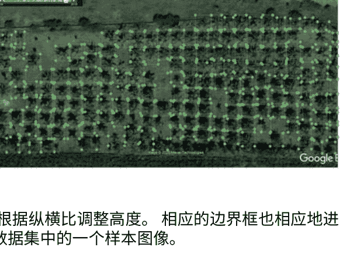

将宽度调整为1200像素，并根据纵横比调整高度。相应的边界框也相应地进行了调整。图1是从创建的数据集中的一个样本图像。

##### 3.1.2 高分辨率数据集

本实验使用的高分辨率数据集由OpenAerialMap、WeRobotics和世界银行收集，用于人道主义灾难前后高分辨率航空图像的机器学习挑战分析[7]。这些图片是使用无人机拍摄的。该数据集总共包含4063张图像，实验中随机选择了500张图像。

注释采用YOLO格式，后来转换为Pascal-VOC格式以适应我们的框架。500张图像中共有9748个边界框。
图2是一张展示高分辨率图像的示例图。

图2 高分辨率数据集的示例图

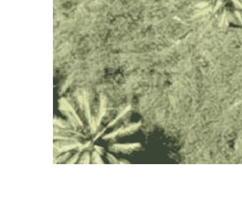

30. Li, Z., Zhao, Y., Botta, N., Ionescu, C., Hu, X.: 基于Copula的异常检测。 在：2020年IEEE国际数据挖掘会议（ICDM），第1118-1123页（2020年）。 https://doi.org/10.1109/ICDM50108.2020.00135

31. Liu, Y., Li, Z., Zhou, C., Jiang, Y., Sun, J., Wang, M., He, X.: 生成对抗主动学习用于无监督异常检测。IEEE Trans. Knowl. Data Eng. **32**(8), 1517-1528(2020)。 https://doi.org/10.1109/TKDE.2019.2905606

32. Luo, T., Nagarajan, S.G.: 在物联网中使用自编码器神经网络进行分布式异常检测。在：2018年IEEE国际通信大会（ICC），第1-6页。IEEE (2018)

33. Maleki, N., Zeinali, Y., Niaki, S.T.A.: 使用遗传算法进行特征选择的肺癌预后k-NN方法。Expert. Syst. Appl. **164**, 113981 (2021)。 https://doi.org/10.1016/j.eswa.2020.113981

34. Mouret, F., Albughdadi, M., Duthoit, S., Kouam, D., Rieu, G., Tourneret, J.Y.: 利用多光谱和SAR时间序列在小麦和油菜作物的包裹级别上进行异常检测。Remote Sens. **13**(5), 956 (2021)

35. Mujkic, E., Philipsen, M.P., Moeslund, T.B., Christiansen, M.P., Ravn, O.: 利用自动编码器进行农业车辆的异常检测。传感器 **22**(10), 3608 (2022)

36. Naseer, S., Saleem, Y., Khalid, S., Bashir, M.K., Han, J., Iqbal, M.M., Han, K.: 基于深度神经网络的增强网络异常检测。IEEE Access **6**, 48231–48246(2018)。 https://doi.org/10.1109/ACCESS.2018.2863036

37. Nguyen, L.H., Goulet, J.A.: 使用切换卡尔曼滤波器进行结构健康监测的异常检测。结构控制与健康监测。**25**(4), e2136 (2018)。 https://doi.org/10.1002/stc.2136

38. Ni, F., Zhang, J., Noori, M.N.: 深度学习用于数据异常检测和数据压缩长跨度悬索桥。计算机辅助土木基础设施工程。**35**(7), 685–700 (2020)。 https://doi.org/10.1111/mice.12528

39. Obuchowski, N.A., Bullen, J.A.: 接收器操作特性（ROC）曲线：诊断医学中的方法综述。物理医学与生物学。**63**(7), 07TR01 (2018)。 https://doi.org/10.1088/1361-6560/aab4b1

40. Pourhabibi, T., Ong, K.L., Kam, B.H., Boo, Y.L.: 欺诈检测：基于图形异常检测方法的系统性文献综述。决策支持系统 **133**, 113303 (2020)。 https://doi.org/10.1016/j.dss.2020.113303

41. Rivera, G., Porras, R., Florencia, R., Sanchez-Sol s, J.P.: 激光雷达在精确农业中的应用：近期进展综述。计算机与电子农业 **207**, 107737(2023)。 https://doi.org/10.1016/j.compag.2023.107737

42. Sarmadi, H., Karamodin, A.: 基于自适应马氏平方距离和单类kNN规则的结构健康监测中的新型异常检测方法。机械系统与信号处理 **140**, 106495 (2020)。 https://doi.org/10.1016/j.ymssp.2019.106495

43. Taha, A.A., Hanbury, A.: 计算确切Hausdorff距离的高效算法。IEEE Trans. Pattern Anal. Mach. Intell. **37**(11), 2153–2163 (2015)

44. Tang, Z., Chen, Z., Bao, Y., Li, H.: 基于卷积神经网络的多信息结构健康监测数据异常检测方法。Struct. Control. HealthMonit. **26**(1), e2296 (2019)。 https://doi.org/10.1002/stc.2296

45. Tharwat, A., Mahdi, H., Elhoseny, M., Hassanien, A.E.: 在移动众感环境中使用优化的k-NN算法识别人类活动。Expert. Syst. Appl. **107**, 32–44(2018)。 https://doi.org/10.1016/j.eswa.2018.04.017

46. Titouna, C., Nat-Abdesselam, F., Khokhar, A.: DODS:一种分布式无线传感器网络异常检测方案。Comput. Netw. **161**, 93–101 (2019)

47. Vanhoeyveld, J., Martens, D., Peeters, B.: 基于可扩展异常检测技术的增值税欺诈检测。Ap pl. Soft Comput. **86**, 105895 (2020)。 https://doi.org/10.1016/j.asoc.2019.105895

48. Wang, H., Bah, M.J., Hammad, M.: 异常检测技术的进展：一项调查。IEEE Access **7**, 107964–108000 (2019)。 https://doi.org/10.1109/ACCESS.2019.2932769

49. Wei, Q., Ren, Y., Hou, R., Shi, B., Lo, J.Y., Carin, L.: 基于单类分类的医学图像异常检测. In: Petrick, N., Mori, K. (eds.) Medical Imaging 2018:Computer-Aided Diagnosis, Society of Photo-Optical Instrumentation Engineers (SPIE) Conference Series, vol. 10575, p. 105751M (2018). https://doi.org/10.1117/12.2293408

50. Yu, T., Wang, X., Shami, A.: 基于递归主成分分析的物联网系统数据异常检测和传感器数据聚合. IEEE Internet Things J. **4**(6), 2207–2216(2017). https://doi.org/10.1109/JIOT.2017.2756025

51. Zhang, M., Li, X., Wang, L.: 一种自适应的异常检测和处理方法，用于时间序列传感器数据。 IEEE Access **7**, 175192–175212（2019年）。 https://doi.org/10.1109/ACCESS.2019.2957602

### 4 训练和分类

#### 4.1 模型选择

经过上述过程，使用多个目标检测模型对图像进行训练。表1中列出了这些模型及其对应的主干网络。

##### 4.1.1 使用的模型

对每个模型的简要解释如下：

- RetinaNet—RetinaNet是一种流行的单阶段检测器，它使用特征金字塔网络（FPN）来准确检测不同尺度和大小的对象。特征金字塔网络的功能是将原始输入图像的不同尺度图像的特征组合起来，以准确检测不同大小的对象。它可以用于检测不同尺寸的椰子树和不同尺度的航拍图像。
- YOLOF—与RetinaNet类似，YOLOF架构也包含FPN，因此YOLOF模型可以准确检测不同尺度的对象。由于只有卷积层的存在，YOLOF也适用于实时检测，从而减少了参数数量。YOLOF需要通过神经网络进行单次传播来检测对象，并且在多个目标检测基准测试中以其最先进的性能而闻名，特别是在具有较小尺度对象的数据集上。
- Faster R-CNN—Faster R-CNN是建立在卷积神经网络（CNN）骨干上的目标检测模型。Faster R-CNN架构包括一个区域提议网络（RPN），该网络在输入图像中提议了各种感兴趣的区域。可能存在异议。由于其在检测对象方面的速度、效率和准确性，RPN已经取代了选择性搜索等对象提议方法。
- EfficientDet—可以同时为所有的骨干、特征网络和预测网络缩放输入图像，并且还可以优化和调整骨干。双向FPN（BiFPN）将FPN的不同层级的特征和语义信息结合起来，提高了模型学习的特征质量。由于其可扩展性和高推理速度，EfficientDet与各种设备兼容，因此可以用于对椰子树进行实时监测。
- VFNet—VarifocalNet或VFNet由一个特征融合模块组成，该模块能够捕捉低级和高级特征，并负责创建输入图像的稳健表示。这个特性使得模型能够准确地检测不同尺度和方向的对象。由于其推理速度快，VFNet在实时监测中显示出了帮助，并且在小物体上也表现良好。
- DETR—Detection Transformer（DETR）是一种越来越受欢迎的基于卷积主干和基于变压器的编码器-解码器框架的目标检测模型。由于其变压器架构中存在注意机制，它可以有效地学习图像中不同对象之间的空间关系，并准确地检测对象。由于其学习空间关系的能力，该模型可以有效地检测和识别图像中被遮挡的部分的单个对象。该模型还具有同时检测和执行分割任务的能力，因为它是基于多任务学习框架构建的。
- 可变形DETR—可变形DETR是DETR的扩展，其骨干架构中使用了可变形卷积网络。与DETR类似，可变形DETR模型也利用了可变形注意机制，因此它能够准确理解对象之间的空间关系，同时检测和分割对象等。
- YOLOv5—YOLOv5是一种流行的目标检测模型，已经在各种流行的目标检测基准数据集上表现出色。它能够使用单次传播快速处理图像，在处理大型数据集和实时监控场景中非常方便。YOLOv5还可以一次性准确检测图像中的多个不同类别的对象。

**表1 不同类型的目标检测模型及其使用的骨干**

| 模型编号 | 模型类型 | 骨干 |
|----------|----------|------|
| 1 | RetinaNet | ResNet50 |
| 2 | Faster R-CNN | ResNet101 |
| 3 | YOLOF | YOLOF |
| 4 | DETR | R50 |
| 5 | Deformable DETR | Twostage Refine R50 |
| 6 | RetinaNet | ResNet50 |
| 7 | EfficientDet | TF Lite0 |
| 8 | YOLOv5 | Small |
| 9 | VFNet | Swin S |

##### 4.1.2 训练流程

流程图（图3）是所使用方法的简单可视化表示。目标检测数据标签包括边界框坐标和类别标签。这些标签通常以Pascal VOC格式或COCO格式存储。数据在输入神经网络模型之前必须进行解析。必须选择一个模型，以及支持该特定模型的库和相应的主干。lr_find方法用于找到最佳学习率来训练模型。之后找到最佳学习率后，使用Fastai进行150个周期的模型训练。模型权重与元数据一起保存，并使用COCO指标和平均精度（mAP）评估模型的性能。为了测试图像的性能，使用end-to-end_detect方法进行单张图像推理或predict_from_dl进行批量推理。用于训练模型的模型参数在表2中给出。所有模型使用相同的参数设置。

**表2 模型参数**

| 模型参数 | 数值 |
| --- | --- |
| 批量大小 | 4 |
| 时期 | 150 |
| 学习率 | 0.001 |
| 冻结周期 | 15 |
| 度量类型 | COCOMetricType.bbox |
| 损失函数 | 二元交叉熵 |
| 检测阈值（用于图像） | 0.4 |

#### 4.2 评估指标

用于评估目标检测模型性能的流行指标之一是COCO mAP指标。COCO mAP指标考虑了模型的精确度和召回率，以综合评估其性能。简单来说，COCO指标评估模型检测对象的准确性以及正确检测到的对象数量。

召回率是衡量正样本被正确分类为真正例的指标。精确度是在所有正预测中，有多少被正确分类为正例的指标。

```
召回率/真正例率 = \frac{TP}{\text{真正例} + \text{假负例}} = \frac{TP}{\text{正样本数量}} \\
精确度/正预测值 = \frac{TP}{\text{真正例} + \text{假正例}} = \frac{TP}{\text{预测数量}} \quad (1)
```

为了衡量对象的边界框预测的准确性，使用了交并比（IoU）。IoU用于衡量真实边界框和预测边界框之间的重叠程度，以评估模型性能。在COCO mAP指标中，IoU起着重要作用，因为设置的IoU阈值是被视为真正例的最小IoU阈值。默认的最小IoU阈值为0.5。通常，某些阈值会由于给大于给定阈值的IoU的预测赋予相等权重而引入评估偏差。为了减少这种偏差，考虑了一系列IoU阈值，并计算每个IoU范围的mAP，然后取平均得到COCO mAP分数。

计算COCO mAP分数的第一步是计算每个类别/类别、对象的规模/大小和IoU阈值的精确度和召回率。在11个等间距召回水平（0.5-0.95，步长为0.05）上取精确度值的平均值得到平均精度（AP）值。特定对象类别的AP分数由其精确度-召回率曲线下的面积表示。

```
AP = \frac{1}{11} \sum_{r \leq (0,0.1,...,1)} p_{interp}(r) \quad (2)
```

所有类别和阈值的AP值的平均值是COCO mAP分数。COCO mAP分数越高，模型性能越好。计算mAP的一般公式如方程2和3所示。

```
mAP = \frac{1}{|\text{课程}|} \sum_{c \in \text{课程}} \frac{|TP_c|}{|FP_c| + |TP_c|} \quad (3)
```

上述方程也可以简化并写成

```
mAP = \frac{1}{n} \sum_{i=1}^{n} AP(i) \quad (4)
```

其中n是类别的数量，类别i的平均精度表示为AP(i)。

### 5 实验和结果

所有实验都在Google Colab上进行，使用Intel（R） Xeon（R） CPU @ 2.20 GHz（4个逻辑处理器），配备NVIDIA GeForce GTX 1050 4GB内存和8GB RAM的64位操作系统。进行了两组实验。在第一组实验中，使用自定义的低分辨率数据集训练了表1中提到的模型。为了检验模型的鲁棒性和可扩展性，使用低分辨率和高分辨率数据集对训练好的模型进行了测试。

模型在检测低分辨率图像方面表现良好，但在检测高分辨率图像方面表现较差。在第二个实验中，使用高分辨率数据评估模型在参考数据集上的性能。以下子章节提供了对研究结果的更深入描述。

#### 5.1 使用低分辨率图像训练的模型

当模型使用低分辨率图像进行训练并使用低分辨率图像进行测试时，得到的结果如表3、表4和表5所示。表格显示了模型编号、训练损失、验证损失、COCO指标、训练模型所需时间以及不同阈值和物体尺寸的IOU。从表格中我们可以得出结论，使用RetinaNet作为模型类型和resnet50作为骨干网络，我们实现了0.301的COCO指标。图4、图5和图6展示了使用低分辨率图像训练的模型进行测试的几个示例。

**表3 训练和验证损失以及COCO指标，以及使用低分辨率图像训练和测试的模型所花费的时间**

| 模型编号 | 训练损失 | 验证损失 | COCO指标 | 所花时间（以分钟为单位） |
| :--- | :--- | :--- | :--- | :--- |
| 1 | 0.515 | 0.541 | 0.301 | 55.00 |
| 2 | 0.387 | 2.053 | 0.236 | 66.00 |
| 3 | 0.255 | 1.420 | 0.131 | 44.00 |
| 4 | 8.712 | 8.971 | 0.192 | 66.00 |
| 5 | 6.774 | 7.601 | 0.276 | 104.30 |
| 6 | 0.062 | 1.751 | 0.216 | 141.15 |
| 7 | 0.477 | 0.603 | 0.227 | 55.00 |
| 8 | 0.269 | 0.331 | 0.199 | 33.00 |
| 9 | 1.532 | 1.717 | 0.289 | 79.45 |

**表4 在不同IoU下使用低分辨率图像训练和测试的模型的平均精度**

| 模型编号 | IoU = 0.50:0.95 面积 = 所有 | IoU = 0.50 面积 = 所有 | IoU = 0.75 面积 = 所有 |
|----------|----------------------------|------------------------|------------------------|
| 1        | 0.302                      | 0.712                  | 0.168                  |
| 2        | 0.237                      | 0.636                  | 0.111                  |
| 3        | 0.131                      | 0.305                  | 0.030                  |
| 4        | 0.193                      | 0.508                  | 0.073                  |
| 5        | 0.277                      | 0.694                  | 0.116                  |
| 6        | 0.217                      | 0.498                  | 0.086                  |
| 7        | 0.227                      | 0.547                  | 0.123                  |
| 8        | 0.199                      | 0.510                  | 0.083                  |
| 9        | 0.290                      | 0.689                  | 0.150                  |

**表5 在不同IoU和面积范围下使用低分辨率图像训练和测试的模型的平均精度**

| 模型编号 | IoU = 0.50:0.95 面积 = 小 | IoU = 0.50:0.95 面积 = 中 | IoU = 0.50:0.95 面积 = 大 |
|----------|--------------------------|--------------------------|--------------------------|
| 1        | 0.073                    | 0.331                    | 0.480                    |
| 2        | 0.115                    | 0.285                    | 0.385                    |
| 3        | 0.003                    | 0.138                    | –1                       |
| 4        | 0.023                    | 0.216                    | 0.380                    |
| 5        | 0.125                    | 0.317                    | 0.392                    |
| 6        | 0.043                    | 0.270                    | 0.384                    |
| 7        | 0.074                    | 0.311                    | 0.371                    |
| 8        | 0.073                    | 0.247                    | 0.148                    |
| 9        | 0.113                    | 0.327                    | 0.378                    |

##### 5.1.1 使用高分辨率图像进行测试

图7、8和9展示了使用低分辨率训练的模型对高分辨率图像进行测试的几个示例。从图中可以看出，由于预测的边界框比实际情况多，并且大部分边界框偏离了树木的位置，所以训练的模型在高分辨率图像上效果不佳。

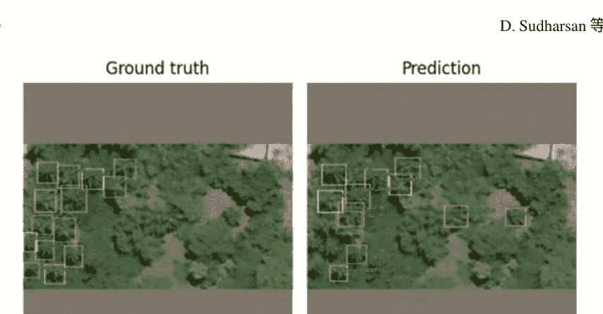

图4 低分辨率图像训练和测试的真实值和预测值，模型= RetinaNet，骨干网络= ResNet50

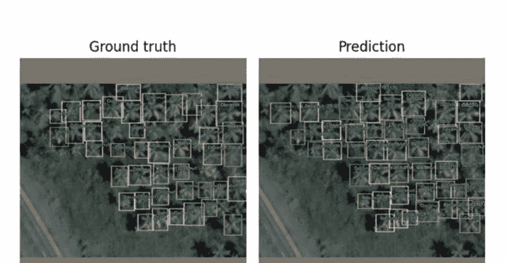

图5 低分辨率图像训练和测试的真实值和预测值，模型= Faster R-CNN，骨干网络= ResNet101

#### 5.2 使用高分辨率图像训练的模型

当模型在高分辨率图像上进行训练并在高分辨率图像上进行测试时，得到的结果见表6、7和8。从这些表中，我们可以推断出我们的模型类型是VFNet，骨干网络是Swin，我们实现了0.578的COCO指标。在图10、11和12中，展示了在高分辨率图像上训练并在低分辨率图像上进行测试的模型的几个示例。

VFNet模型实现的COCO指标得分高于原始创建者提出的YOLO-VOC模型的基准分数数据集。YOLO-VOC模型的COCO指标得分为0.477，而带有Swin骨干的VFNet模型的COCO指标为0.578。

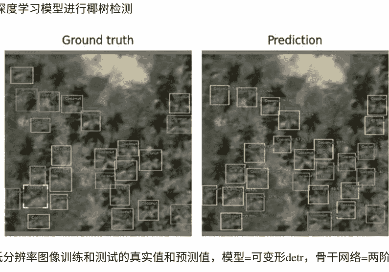

图6 低分辨率图像训练和测试的真实值和预测值，模型=可变形DETR，骨干网络=两阶段改进R50

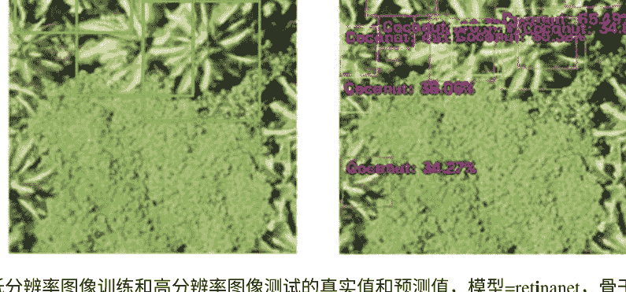

图7 低分辨率图像训练和高分辨率图像测试的真实值和预测值，模型=RetinaNet，骨干网络=ResNet50

#### 5.3 图形用户界面—GUI

使用Streamlit和Local-Tunnel在Google Colab中创建了用于检测椰子树的GUI。实现了文件上传选项，以方便用户上传椰子树图像。显示上传的图像。此外，下拉列表作为交互式小部件，方便用户选择预测模型。在我们的案例中，已经训练了九个模型存储为检查点。随后，根据用户界面提供的选项，它将检测输入图像中的椰树。最后，将显示带有预测边界框的输出图像。

最初安装和导入了创建GUI和实现椰树检测所需的包。然后，将Google Drive挂载到Colab笔记本上，该笔记本用于创建GUI，因为该驱动器包含来自冰视觉包的所有9个训练模型的所有检查点，用于检测任务。然后，使用Streamlit包创建Streamlit应用程序，在其中添加了必要的代码和组件以实现GUI的功能。最后，借助于Localtunnel和Streamlit一起，在Google Colab上构建了GUI。

在Streamlit应用程序中，使用了许多组件来创建GUI并确保正常功能。添加了GUI所需的依赖项。然后使用文件上传组件从本地系统上传文件，而在这种情况下，文件应为任何格式的图像。然后使用图像组件来显示上传的相应图像。接下来，通过下拉菜单组件向应用程序添加了9个训练模型，这些模型以检查点的形式存在，可以在任何时间选择。这里每个模型都有一个唯一的模型编号，模型编号范围为（0-9）。然而，默认模型设置为1。然后，借助预测代码，GUI获得输出（如图13所示），并显示最终预测的图像。

**表6 训练和验证损失以及使用高分辨率图像进行模型训练和测试的COCO指标和所需时间**

| 模型类型 | 训练损失 | 验证损失 | COCO指标 | 所需时间（分钟） |
|----------|----------|----------|----------|------------------|
| 1        | 0.002    | 1.267    | 0.465    | 41:15            |
| 2        | 0.004    | 0.510    | 0.503    | 71:30            |
| 3        | 0.009    | 1.265    | 0.501    | 38:30            |
| 4        | 8.430    | 9.562    | 0.001    | 79:45            |
| 5        | 4.415    | 8.742    | 0.487    | 115:30           |
| 6        | 0.003    | 1.161    | 0.517    | 41:15            |
| 7        | 0.333    | 0.365    | 0.556    | 90:10            |
| 8        | 0.002    | 0.100    | 0.509    | 44:00            |
| 9        | 1.287    | 0.140    | 0.578    | 120:00           |

**表7 在不同IoU和面积范围上的平均精度，用于训练和测试使用高分辨率图像的模型**

| 模型编号 | IoU = 0.50:0.95 面积 = 所有 | IoU = 0.50 面积 = 所有 | IoU = 0.75 面积 = 所有 |
|----------|-----------------------------|------------------------|------------------------|
| 1        | 0.504                       | 0.839                  | 0.515                  |
| 2        | 0.560                       | 0.846                  | 0.662                  |
| 3        | 0.556                       | 0.861                  | 0.663                  |
| 4        | -                           | -                      | -                      |
| 5        | 0.530                       | 0.867                  | 0.625                  |
| 6        | 0.540                       | 0.844                  | 0.615                  |
| 7        | 0.556                       | 0.882                  | 0.576                  |
| 8        | 0.434                       | 0.797                  | 0.423                  |
| 9        | 0.577                       | 0.882                  | 0.671                  |


图4 低分辨率图像训练和测试的真实值和预测值，模型= RetinaNet，骨干网络= ResNet50


图5 低分辨率图像训练和测试的真实值和预测值，模型= Faster R-CNN，骨干网络= ResNet101


图6 低分辨率图像训练和测试的真实值和预测值，模型=可变形DETR，骨干网络=两阶段改进R50


图7 低分辨率图像训练和高分辨率图像测试的真实值和预测值，模型=RetinaNet，骨干网络=ResNet50

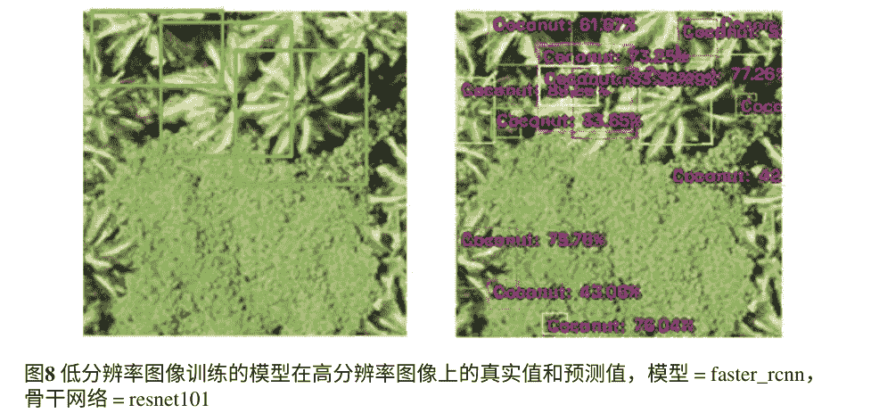

图8 低分辨率图像训练的模型在高分辨率图像上的真实值和预测值，模型 = Faster R-CNN，骨干网络 = ResNet101

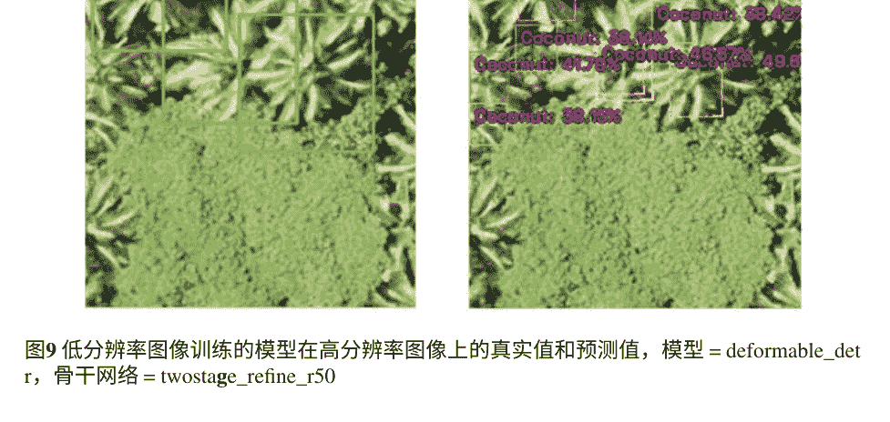

图9 低分辨率图像训练的模型在高分辨率图像上的真实值和预测值，模型 = Deformable DETR，骨干网络 = Twostage Refine R50表8 在使用高分辨率图像进行训练和测试的模型上，不同IoU和区域范围的平均精度

| 模型编号 | IoU = 0.50:0.95 面积 = 小 | IoU = 0.50:0.95 面积 = 中 | IoU = 0.50:0.95 面积 = 大 |
| :--- | :--- | :--- | :--- |
| 1 | -1 | -1 | 0.504 |
| 2 | -1 | -1 | 0.560 |
| 3 | -1 | -1 | 0.556 |
| 4 | - | - | - |
| 5 | -1 | -1 | 0.530 |
| 6 | -1 | -1 | 0.540 |
| 7 | -1 | -1 | 0.556 |
| 8 | -1 | -1 | 0.434 |
| 9 | -1 | -1 | 0.577 |

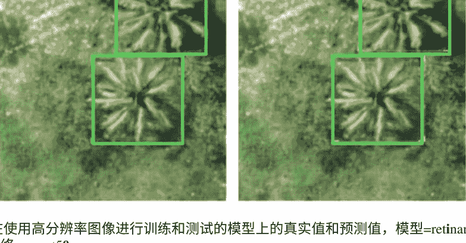

### 6 结论和未来工作

为了本研究的目的，基于印度喀拉拉邦和科伊马托尔周边地区创建了一个低分辨率的椰子树数据集。使用提出的低分辨率数据集和Github上公开可用的高分辨率数据集，训练和测试了一组九个模型。

在低分辨率图像数据上，使用resnet50模型的Retinanet模型表现最佳，COCO指标为0.301598。而在高分辨率数据集上，使用retinanet模型和Resnet50骨干网络获得了0.51750的COCO指标分数。

工作的一个限制是缺乏来自南印度的开源低分辨率和高分辨率椰子树数据集。在未来的工作中，可以通过利用各种图像增强技术来增加和改进所使用的数据集的大小，以更好地了解分辨率对模型性能的影响。为了更好地理解模型在低分辨率图像上训练后在高分辨率图像上测试时不够稳健的原因，可以深入分析特征图等相关因素。

这项工作强调了在植被监测领域，特别是椰树检测和分割方面需要进行更多研究的需求。因此，进一步研究这个领域有可能对环境保护和管理产生重要影响。

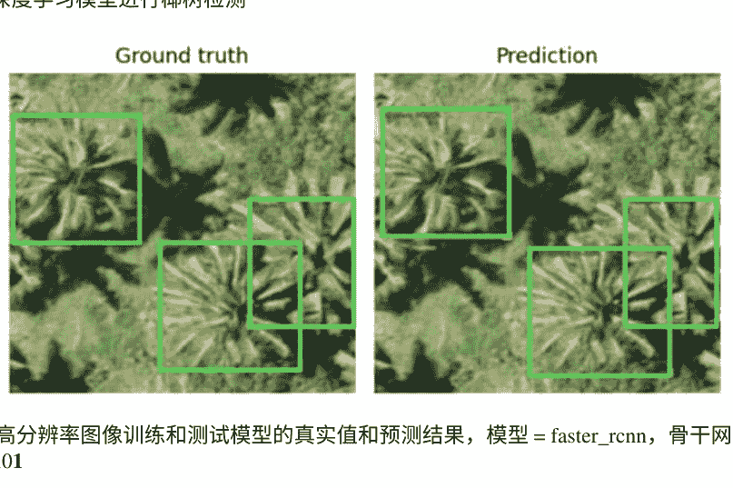

图11 高分辨率图像训练和测试模型的真实值和预测结果，模型 = faster_rcnn，骨干网络 = resnet101

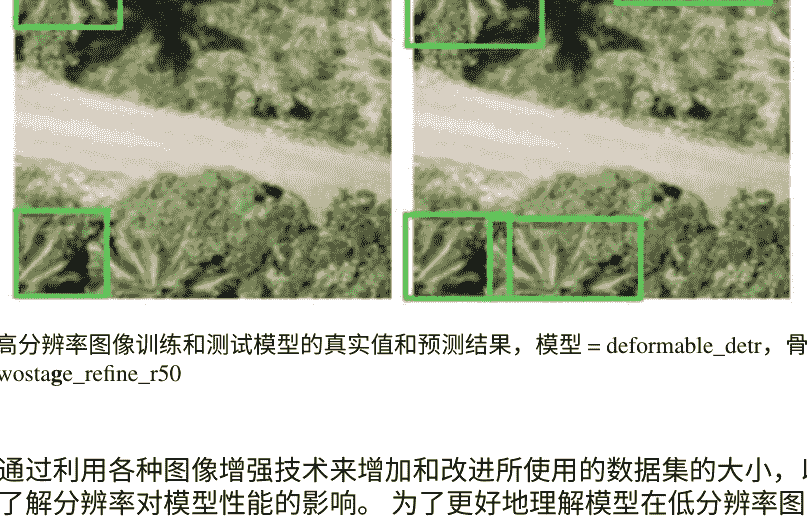

图12 高分辨率图像训练和测试模型的真实值和预测结果，模型 = deformable_detr，骨干网络 = twostage_refine_r50


图13 给定图像的GUI预测

### 参考文献

1. Amara, D.K., Karthika, R., Soman, K.: Deeptracknet: 基于相机的端到端深度学习实时检测、定位和跟踪自动驾驶车辆的框架。 在: 智能计算、信息和控制系统: ICICCS 2019, 第299-307页. Springer (2020). https://doi.org/10.1007/978-3-030-30465-2_34
2. Ganeshkumar, M., Ravi, V., Sowmya, V., Gopalakrishnan, E.A., Soman, K.P., Chakraborty, C.: 使用数据增强的ResNet识别颅内出血（ICH），使用CycleGAN进行数据增强和使用SegAN进行ICH分割。Multimed. Tools Appl. 81, 1–17 (2022). https://doi.org/10.1007/s11042-021-11478-8
3. Gholba, N.D., Agrawal, S., Babu, A.: 使用卷积神经网络迁移学习进行椰子棕榈树的检测、计数和分割。ICTACT J. Image Video Process. 11 (2021).https://doi.org/10.21917/ijivp.2021.0352
4. Howard, J., Gugger, S.: Fastai: 一个用于深度学习的分层API。Information 11(2), 108 (2020). https://doi.org/10.3390/info11020108
5. Iqbal, M.S., Ali, H., Tran, S.N., Iqbal, T.: 使用基于掩膜区域的卷积神经网络在航空影像中检测和分割椰子树。IET Comput. Vis. 15(6), 428–439 (2021). https://doi.org/10.1049/cvi2.12028
6. Komba Mayossa, P.C., Coppens d’Eeckenbrugge, G., Borne, F., Gadal, S., Viennois, G.: 开发一种从高分辨率卫星图像中绘制椰子农业系统的方法。在：第27届国际制图大会，第16届大会，第10卷。国际制图协会，巴西里约热内卢 (2015年)
7. Leetaru, K.: 利用人工智能做好事：利用人工智能处理自然灾害航拍图像的新数据挑战。forbes.com. https://www.forbes.com/sites/kalevleetaru/2018/01/20/using-ai-for-good-a-new-data-challenge-to-use-ai-to-triage-natural-disaster-aerial-imagery/?sh=1dc7ddf3d26e。2023年4月30日访问
8. Li, W., Fu, H., Yu, L., Cracknell, A.: 基于深度学习的高分辨率遥感图像油棕树检测和计数。Remote. Sens. 9(1), 22 (2016)。https://doi.org/10.3390/rs9010022
9. Mekhalfi, M.L., Nicol, C., Bazi, Y., Rahhal, M.M.A., Alsharif, N.A., Maghayreh, E.A.: 对比沙漠中作物圈检测的YOLOV5、transformer和EfficientDet检测器。IEEE Geosci. Remote. Sens. Lett. 19, 1-5 (2022年)。https://doi.org/10.1109/LGRS.2021.3085139
10. Mohanraj: GitHub-mohanrajmit/Coconut-Tree-Detection—github.com。https://github.com/mohanrajmit/Coconut-Tree-Detection。2023年4月30日访问
11. Nair, K.N., Dhulipalla, R.K., Satapathy, S.C., Kanungo, A., Kannan, E., Ch, T.B., 等: Modified YOLOV4用于无人机实时检测椰子树。Res. Sq. (2021年)。https://doi.org/10.21203/rs.3.rs-826223/v1. 预印本（版本1）
12. Sunil, A., Sajithvaiyar, V., Sowmya, V., Sivanpillai, R., Soman, K.: 使用更快的 R-CNN 在高空间分辨率航空图像中识别油井区。国际摄影测量与遥感空间信息科学档案 44, 155 -161 (2021). https://doi.org/10.5194/isprs-archives-XLIV-M-3-2021-155-2021
13. Tushar, R.: GitHub-roshantushar/使用深度学习模型检测椰子树— github.com。https://github.com/roshantushar/Coconut-Tree-Detection-using-Deep-Learning-Models。2023年4月30日访问
14. Unnikrishnan, A., Vishvanathan, S., Kp, S.: 使用红外和近红外卫星图像的深度学习架构进行土地覆盖分类。多媒体工具和应用 78(2019). https://doi.org/10.1007/s11042-019-7179-2
15. Vargas-Mu oz, J.E., Zhou, P., Falcao, A.X., Tuia, D.: 使用特征空间投影的互动式椰树标注。在：IGARSS 2019-2019 IEEE国际地球科学与遥感研讨会，第5718-5721页。IEEE（2019年）。https://doi.org/10.1109/IGARSS.2019.8899005
16. Vermote, E.F., Skakun, S., Becker-Reshef, I., Saito, K.: 使用非常高的空间分辨率worldview-3数据遥感汤加的椰树。Remote Sens. 12(19), 3113 (2020)。https://doi.org/10.3390/rs12193113
17. Wood, L., Chollet, F.: 用于训练时模型评估的高效图友好的coco度量计算（2022年）。arXiv:abs/2207.12120
18. 郑，J.，吴，W.，于，L.，傅，H.：利用高分辨率卫星图像和深度学习在特纳鲁加上检测椰子树。在：2021年IEEE国际地球科学与遥感研讨会IGARSS，第6512-6515页。IEEE（2021年）。https://doi.org/10.1109/IGARSS47720.2021.9555008
19. 朱，X.，苏，W.，卢，L.，李，B.，王，X.，戴，J.：可变形detr：可变形变压器用于端到端目标检测（2021年）。https://doi.org/10.48550/arXiv.2010.04159

## 混合神经网络元启发式解决大规模旅行商问题

Santiago Omar Caballero-Morales, Gladys Bonilla-Enriquez, 和Diana Sanchez-Partida

摘要 旅行商问题（TSP）是运输、制造和物流行业中研究最多的问题之一。TSP的最优解包括找到最小成本路径的顺序，从特定位置节点开始，仅访问所有其他节点一次，并在起始节点结束。由于其NP难的计算复杂性，找到TSP的最优或接近最优解是一项困难的任务。尽管已经开发了精确和近似算法来解决TSP的最优性问题，但它们的性能高度依赖于考虑的TSP实例的维度。

在这方面，人工神经网络（ANN）被提出作为减少维度和改善大规模TSP实例的近似算法性能的关键组成部分。本研究描述了一种混合求解方法的开发，该方法通过聚类适应ANN来减少TSP的维度，使用克拉克和赖特算法来解决减少的TSP，通过考虑ANN聚类位置的所有排列来扩展减少的TSP解决方案，并使用本地搜索操作（翻转/交换）来优化扩展的TSP解决方案。

不同TSP实例的结果证实了降维可以提高求解方法的速度和达到的解决方案的质量，特别是对于大规模TSP实例（误差间隙小于10%）。

关键词降维·自组织映射·人工神经网络·克拉克和赖特

S. O. Caballero-Morales (✉) · D. Sanchez-Partida 普埃布拉自治大学 (UPAEP) A.C., 17南901, 圣地亚哥区, 72410普埃布拉, 普埃布拉, 墨西哥e-mail: santiagoomar.caballero@upaep.mx

D. Sanchez-Partida e-mail: diana.sanchez@upaep.mx

G. Bonilla-Enriquez 墨西哥国家技术学院 (TecNM)—普埃布拉技术学院 (ITP), 科技大道420, 奇迹区, 72220普埃布拉, 普埃布拉, 墨西哥e-mail: gladys.bonilla@puebla.tecnm.mx

### 1 引言

旅行推销员问题（TSP）是运筹学、图论和计算机科学中最研究的问题之一[35]。作为一种路由模型，它在交通运输、制造和物流行业中得到了广泛的研究和应用[8, 13, 26]。作为一个排列问题，它与路线无直接关联，例如计算机布线、壁纸切割、打孔、作业排序、飞镖靶设计和晶体学[21]。

TSP被建模为一个无向加权图，其中节点（图的顶点）通过边连接。从实际角度来看，节点可以表示车辆要服务的位置或地点，边可以表示车辆必须遵循的路径来服务这些位置。每条边的长度可以与代表成本、距离或时间的度量相关联[17, 25, 40]。

如图1所示，TSP的最优解包括找到最小成本的路径（路线）的顺序，该路径从特定位置节点（即配送中心）开始，仅访问所有其他节点（即客户位置）一次，并在起始节点结束。这种解决方案也被称为最小成本的哈密顿路径或电路[1, 27, 33]。

然后，使用图论描述TSP的数学形式如下[33]：

```
$$\min \sum_{i=1}^n \sum_{j=1}^n d_{ij} x_{ij} \quad (1)$$
```

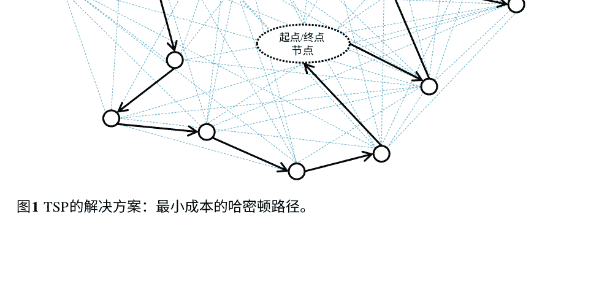

图1 TSP的解决方案：最小成本的哈密顿路径。

受限于

```
$$ \sum_{j=1}^{n} x_{ij} = 1, \forall i \in V \quad\quad (2) $$
```

```
$$ \sum_{i=1}^{n} x_{ij} = 1, \forall j \in V \quad\quad (3) $$
```

```
$$ \sum_{i \in S} \sum_{j \in S} x_{ij} \leq |S| - 1, \forall S \subset V, 2 \leq |S| \leq n - 1 \quad\quad (4) $$
```

```
$$ x_{ij} = \{0, 1\}, i, j, \in E \quad\quad (5) $$
```

其中 V 和 E 是图的顶点（节点）和边（路径）的集合，n 是图中顶点的总数，d_ij 是连接顶点 i 和顶点 j 的边的成本，x_ij 是决策变量，如果连接顶点 i 和顶点 j 的边存在于解决方案中，则设置为1，否则设置为0。

然后，（1）是目标函数，用于最小化路径长度，（2）和（3）是保证每个顶点只被访问一次的限制条件，（4）是一个称为子环消除约束的限制条件，确保没有任何真子集S能形成一个子环，（5）是决策变量约束，设置 x_ij 为二进制变量。

请注意，寻找最优路径或最小成本的哈密顿路径是一个组合问题，其计算复杂度为NP难问题。因此，已经开发了不同的方法来在多项式时间内解决TSP的最优性问题（精确算法）或接近最优性问题（近似算法）。

在精确算法中，可以提到以下算法：分支定界（B&B）[2]和动态规划（DP）[7]。近似算法包括遗传算法（GA）[8, 14, 19]，蚁群优化（ACO）[39]，模拟退火（SA）[37]，粒子群优化（PSO）[32]，Lin-Kernighan-Helsgaun（LKH）[16, 41]和Medalist Learning Algorithm（MLA）[31]。然而，精确算法主要适用于小型和中型实例，因为大型TSP实例无法在多项式时间内达到最优解[33]。

因此，近似算法或元启发式算法经常被认为是为大型TSP实例提供接近最优解（误差在10.0%以内）的方法[22]。这还涉及不断的研究，以提高它们的性能并减小近似误差。混合元启发式算法可以整合两个或多个近似算法或启发式算法，以提供更准确的TSP解决方案。这些混合元启发式算法的例子包括PSO-SA [6]，ACO-SA [34]，PSO-ACO [9]和双启发式ACO [29]。在这个背景下，LKH已经被报道为在选定的TSP实例和约束路由问题中实现最优解（或新的最佳解决方案）[41]。

然而，一种基于人工神经网络（ANNs）的不太知名的方法已经取得了解决TSP接近最优的重大进展。Hopfield和Tank（1985）[18]首次尝试使用ANN解决TSP。 随后的研究使用这种方法在30个城市的TSP实例中获得了比SA长12%的解决方案[36]。 Burke和Damany（1992）[4]提出了一种自适应的ANN，称为guilty net，通过在10-100个城市的TSP实例中实现接近最优解来改进非自适应（Hopfield）ANN的性能。 这些方法的思想是将TSP的目标函数（见（1））映射到ANN的能量函数中，并在运行ANN的过程中最小化能量函数，从而获得局部最优解[33]。

ANN的另一个作用是作为元启发式算法的参数调整模块。 例如，在[20]中，将ANN集成到GA中以选择最合适的交叉和变异算子来寻找TSP的解决方案。 然而，这种混合方法在文献中并没有得到广泛研究。 此外，只有一些实例报告使用或集成了ANN来解决问题。由于TSP是一个NP困难问题，其高维度对于任何解决方法来说都是一个挑战，因为所需的计算操作数量呈指数增长，使得大规模TSP实例几乎无法达到最优解[38]。 正如[8]中所报道的，仅对于100个城市的实例，存在100! （约10¹⁵⁵个不同的解决方案）。

人工神经网络（ANN）是经常被考虑用于模式识别的技术，它通过聚类机制进行学习和分类过程。 在这方面，数据聚类检测和识别多个输入模式的相似性和特殊性，以便将它们分组（即聚类）以进行自动类别识别和数据挖掘[24]。 在[5]中，聚类的概念被应用于降低TSP的维度，并使GA元启发式算法的性能得到改善。

由于其学习特性，预计通过人工神经网络进行聚类可以改善处理超过100个城市或节点的TSP实例的近似算法的性能。 这是通过考虑问题中位置的分布来减少其维度。 由于这个前提在文献中没有报道，本研究对其进行了探索，以提供大规模TSP实例的替代混合解决方案。

这种混合方法的详细信息在下一章的章节中介绍：

- 第2节：在降维的背景下描述了聚类的作用，并介绍了用于此过程的人工神经网络的应用。
- 第3节：介绍并讨论了考虑的基于克拉克和赖特（CW）的节约算法和局部搜索（LS）算子的元启发式结构。
- 第4节：介绍并评估了混合人工神经网络-克拉克和赖特-局部搜索元启发式在大量TSP实例上的测试结果（解决方案）。
- 第5节：讨论了关于所提出方法和未来工作的见解。

### 2 聚类用于降维

#### 2.1 自组织映射

人工神经网络可以根据相似性或拓扑关系对数据进行分组或聚类[15]。执行此过程的人工神经网络称为自组织映射（SOM）或科亨映射[12]。SOM学习根据相似性和拓扑关系对数据进行聚类，偏好（但不保证）将相同数量的数据分配给每个类别或簇。因此，SOM可用于对数据进行聚类并降低数据的维度。

SOM可以在较低维度的网络中表示多维数据集，通常在二维空间中[23]。这样做的方式是使数据保持初始拓扑结构（在多维空间中相近的数据在二维地图中也相近）。最常见的拓扑结构是矩形和六边形。

SOM模型由两层神经元组成[10, 23]:

- 输入层：由$n$个神经元组成（每个输入数据对应一个神经元），接收并传递信息到输出层。
- 输出层：由$C$个神经元组成，处理信息，创建模式并识别可能的类别（即群组）。如图2所示，输出层的神经元通常以二维六边形地图的形式组织。

构成网络的两层之间的传输始终是前向的（即信息始终从输入层传播到输出层）。每个输入神经元$i$都通过权重$w_{ji}$与每个输出神经元$j$相连。这样，输出神经元与一组权重向量相关联。

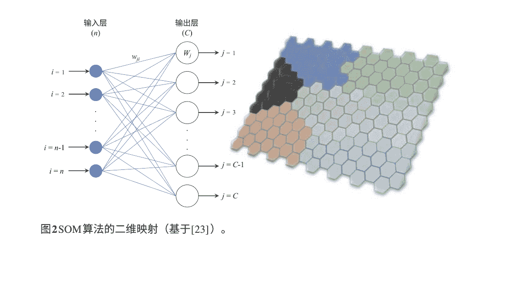

Wj，称为参考向量或码书。该向量是神经元j所代表的类别或类的平均向量 [10, 23]。

SOM算法分为五个步骤[23]:

-   1. 初始化: 每个节点被分配一个随机权重向量 wj0。
-   2. 竞争: 对于每个输入数据 xi，选择与之最相似的神经元 j。为了实现这一点，计算 xi与每个码书向量之间的欧氏距离，并选择距离最小的神经元。在这种情况下，神经元 j被称为“获胜”神经元。
-   3. 合作: 邻居和学习系数被计算。那些距离 wj很近的节点被称为邻居节点；将距离与之相关的函数称为邻域比例 h。该函数根据距离（即，越近的节点权重越大）为邻居节点分配更多或更少的权重。邻域比例取小于1的正值: h ≤ 1.0。另一方面，学习率 θ取决于SOM函数的参数中预先指定的迭代次数，因此在每次迭代中，θ从1.0线性减少到0.0。
-   4. 适应性: 更新邻居节点的权重向量。
-   5. 迭代: 步骤2、3和4重复执行，直到满足停止准则之一。所述停止准则可以是达到最大迭代次数或在多次迭代后，权重向量的变化不显著。

关于SOM ANN的训练或学习过程，可以通过两种方式进行[3]:

-   ●增量式: 每次呈现输入时，更新ANN的权重和偏差;
-   ●批量式: 只有在呈现所有输入和输出后才更新权重和偏差。

#### 2.2 位置数据的减少

如图2所示，SOM可以将n个输入数据映射到C个聚类中。请注意，这意味着 C < n，因此聚类概念可用于数据减少目的。图3展示了位置数据的SOM输入和输出的解释:

-   ●输入: 大小为2 × n的矩阵，其中包含所有位置数据点的x和y坐标。
-   ●输出: 大小为C × n的矩阵，其中包含将每个输入位置数据分配给类别或聚类的结果。这些被分类为相同类别或聚类的位置点被标记为相同的值j, 其中j = 1, 2, 3, ..., C。这些未聚类的位置点标记为 j=0。

## 用于解决大规模旅行商问题的混合神经网络元启发式算法

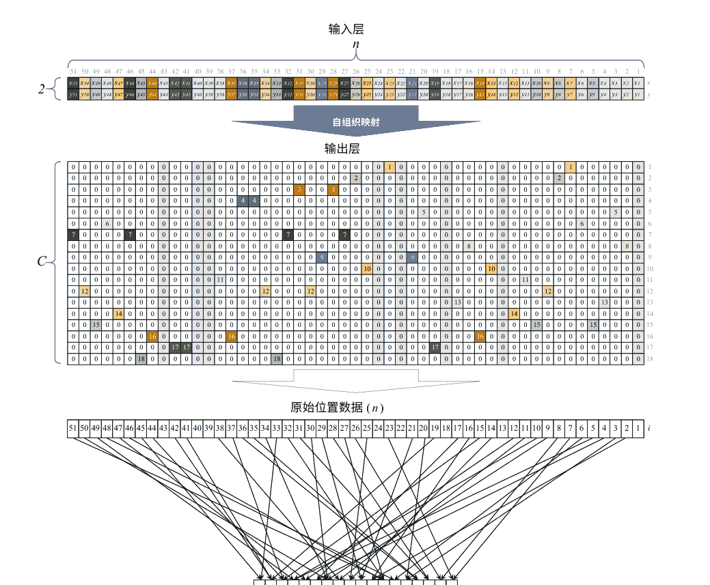

图3 自组织映射算法的改进：将n位置点分配给一个有限的C类别或聚类，其中C < n

通过提取分配给同一聚类的位置点的x和y坐标，可以计算出平均位置或质心。如图4所示，质心的单个位置可以被视为聚类数据的代表。通过这种方法，所考虑示例的位置点从52个减少到33个，相当于减少了36.5%。这个减少过程可以用以下数学模型表示：

-   如果定义一个整数维度标量 p = 1, ...，则可以估计聚类的数量为：
$$C = p^2$$
-   然后，可以估计一个减少率 $r_r$：
$$r_r = 1 - \frac{C}{n} = 1 - \frac{p^2}{n} = \frac{n - p^2}{n}$$

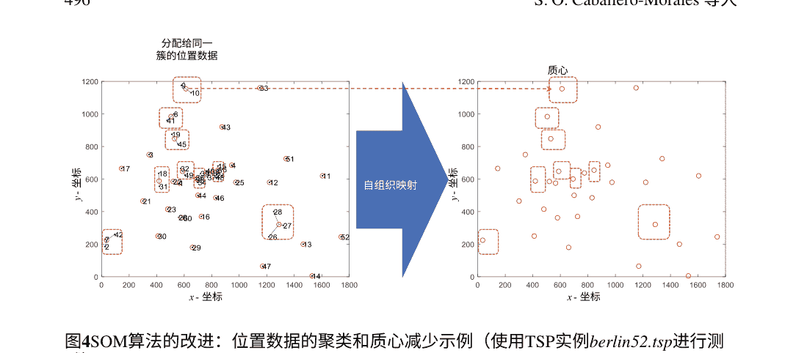

图4 SOM算法的改进：位置数据的聚类和质心减少示例（使用TSP实例berlin52.tsp进行测试）

从数学模型的角度来看，图5展示了具有 $p=1,\ldots$ 的位置数据的聚类标签 ,4 (分别导致 $C=1,4,9,16$个类或簇)。此外，图6展示了具有不同 $r_r$值的等效质心的减少集合。

请注意，即使对于减少率为 $r_r = 92.44\%$的情况，位置数据的整体分布模式仍然保持不变。这是SOM算法保持输入数据初始拓扑的特性[10, 23]。

## 3 混合ANN-CW-LS元启发式结构

如图7所示，提出的混合元启发式结构包括以下元素：

-   (a) 带有人工神经网络（ANN）的聚类：将SOM ANN应用于原始数据以降低其维度。对于ANN，输入由原始坐标集（称为扩展集）组成，并且通过 $2\times N$数组表示，因为每个位置有两个坐标 $(x, y)$。ANN的输出由一个 $2\times C$数组（称为缩减集）组成，其中包含聚类位置（由其质心表示）和非聚类位置的两个坐标 $(x, y)$。因为 $C = p^2$，所以可以根据 $r_r$估计SOM所需的维度标量，如下所示：
$$r_r = \frac{n - p^2}{n}$$
$$p = \sqrt{n(1 - r_r)}$$

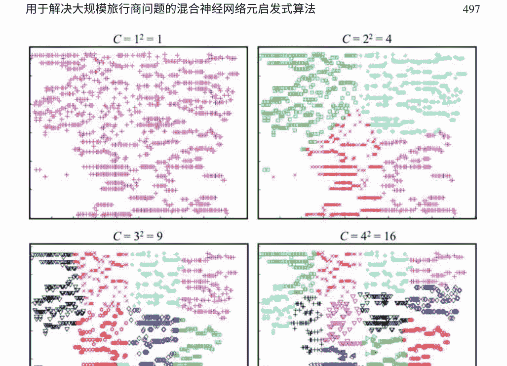

图5 使用TSP实例 r11323.tsp进行位置数据聚类，其中 p = 1,2,3和4进行测试。

SOM ANN的操作参数在表1中描述。图8展示了TSP实例 eil51.tsp的输入和输出示例，其中包含了 n = 51个位置。使用 $r_r = 0.5$进行聚类。
-   (b) 使用克拉克和赖特（CW）算法进行TSP旅行的简化：该方法基于[11, 30]中描述的 Savings算法。通过以下步骤，该启发式算法可以构建最小成本的TSP路径：
    -   • 步骤1：选择任何节点作为中心节点，并将其索引为“1”。
    -   • 步骤2：计算节省 $s_{ij} = c_{1i} + c_{1j} - c_{ij}$ 对于 $i, j = 1, ..., n$。在这种情况下，$c_{ij}$是节点 i和 j之间的成本度量（即两个位置之间的距离）。
    -   • 步骤3：根据它们的节省 $s_{ij}$的大小，将节点排序，从最大到最小。
    -   • 步骤4：通过按照节省的顺序对所有的 $n- 1$个节点进行排序，构建路径或旅程，从具有最大节省的节点开始（位于节省列表的顶部的节点），并继续下一个具有较大节省的节点。重复此过程，直到形成具有 n 个节点的路径或旅程。

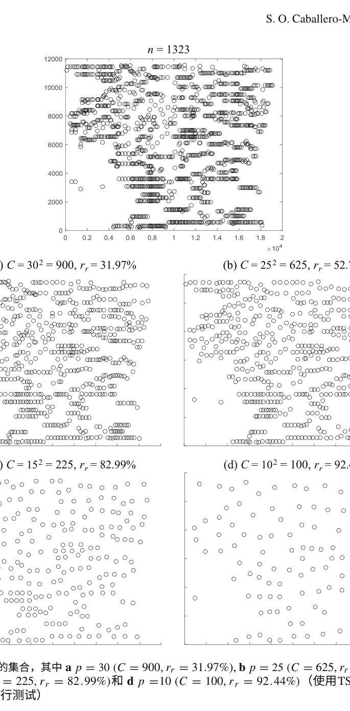

图6  减少的集合，其中 a p = 30 (C = 900, r_r = 31.97%), b p = 25 (C = 625, r_r = 52.76%), c p = 15 (C = 225, r_r = 82.99%)和 d p = 10 (C = 100, r_r = 92.44%) (使用TSP实例 rl1323.tsp进行测试)

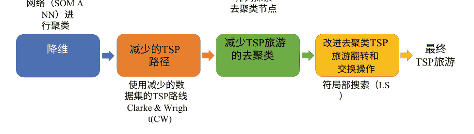

##### 图7 ANN-CW-LS元启发式的一般结构

表1 SOM ANN的参数

| 参数 | 值 |
|------|----|
| 训练算法 | 批量权重/偏置规则 |
| 误差度量 | 均方误差 |
| 迭代次数 | 400 |

由于路线是根据最近的位置（最大节省）进行排序，因此可以在短时间内获得质量良好的初始解。

-   (c) 减少TSP旅游的去聚类：一旦获得初始解，就对聚类节点进行去聚类。由于聚类可能很小，这使得可以通过考虑所有可能的排列来寻找最小成本的旅游路线。
-   (d) 局部搜索（LS）：通过执行随机翻转和交换操作符来改进去聚类TSP旅游。

总结一下，提出的混合元启发式方法通过聚类（新方法）来适应（a）人工神经网络以减少TSP的维度；然后，（b）使用克拉克和赖特算法来解决减少的TSP问题（应用已知算法，可以通过遗传算法、模拟退火或其他元启发式方法来执行）；因此，（c）通过考虑ANN执行的聚类位置的所有排列来扩展减少的TSP解决方案（作为ANN减少的补充过程）；最后，（d）使用局部搜索算子来优化解聚的TSP解决方案（应用已知的翻转/交换算子）。因此，完整的元启发式方法由（a）到（d）组成，其中（a）和（c）是元启发式方法及其独特特征的核心。

图9展示了ANN-CW-LS元启发式方法的主要阶段的输出。在图9a中，显示了原始位置（对于此案例，n=280）。通过线相互连接的位置是由ANN选择进行聚类的位置。然后，图9b显示了等效位置（代表原始聚类位置的质心）。请注意，由于r=0.50，图9b中的等效实例包含n=132个位置。图9c显示了聚类解决方案。最后，解聚集的解决方案在图9d中呈现。由于聚类点较少，通过对所有可能的排列进行快速评估，可以构建非常详细的路径。

表2 原始位置数据集（扩展集）

| # | x | y |
|---|---|---|
| 1 | 37 | 52 |
| 2 | 49 | 49 |
| 3 | 52 | 64 |
| 4 | 20 | 26 |
| 5 | 40 | 30 |
| 6 | 21 | 47 |
| 7 | 17 | 63 |
| 8 | 31 | 62 |
| 9 | 52 | 33 |
| 10 | 51 | 21 |
| 11 | 42 | 41 |
| 12 | 31 | 32 |
| 13 | 5 | 25 |
| 14 | 12 | 42 |
| 15 | 36 | 16 |
| 16 | 52 | 41 |
| 17 | 27 | 23 |
| 18 | 17 | 33 |
| 19 | 13 | 13 |
| 20 | 57 | 58 |
| 21 | 62 | 42 |
| 22 | 42 | 57 |
| 23 | 16 | 57 |
| 24 | 8 | 52 |
| 25 | 7 | 38 |
| 26 | 27 | 68 |
| 27 | 30 | 48 |
| 28 | 43 | 67 |
| 29 | 58 | 48 |
| 30 | 58 | 27 |
| 31 | 37 | 69 |
| 32 | 38 | 46 |
| 33 | 46 | 10 |
| 34 | 61 | 33 |
| 35 | 62 | 63 |
| 36 | 63 | 69 |
| 37 | 32 | 22 |
| 38 | 45 | 35 |
| 39 | 59 | 15 |
| 40 | 5 | 6 |
| 41 | 10 | 17 |
| 42 | 21 | 10 |
| 43 | 5 | 64 |
| 44 | 30 | 15 |
| 45 | 39 | 10 |
| 46 | 32 | 39 |
| 47 | 25 | 32 |
| 48 | 25 | 55 |
| 49 | 48 | 28 |
| 50 | 56 | 37 |
| 51 | 30 | 40 |

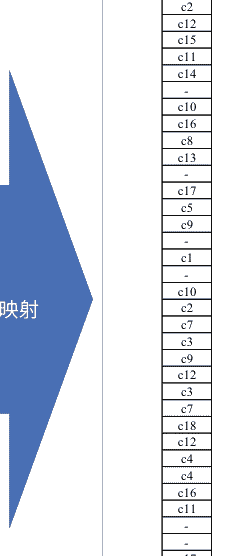

确定要聚类在一起的位置

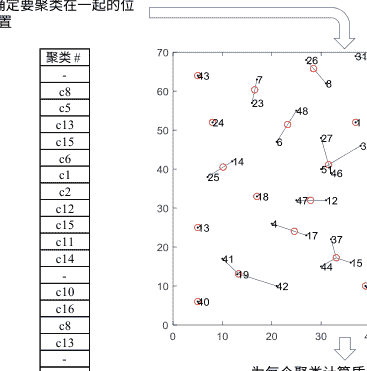

为每个聚类计算质心。创建减少集

| #/聚类# | 更新# | x | y |
|---|---|---|---|
| 1 | 1 | 37 | 52 |
| 13 | 2 | 5 | 25 |
| 18 | 3 | 17 | 33 |
| 22 | 4 | 42 | 57 |
| 24 | 5 | 8 | 52 |
| 39 | 6 | 59 | 15 |
| 40 | 7 | 5 | 6 |
| 43 | 8 | 5 | 64 |
| c1 | 9 | 16.56 | 60.35 |
| c2 | 10 | 28.47 | 65.79 |
| c3 | 11 | 40.21 | 67.93 |
| c4 | 12 | 62.31 | 64.84 |
| c5 | 13 | 54.94 | 60.48 |
| c6 | 14 | 23.22 | 51.44 |
| c7 | 15 | 31.52 | 41.14 |
| c8 | 16 | 50.15 | 45.92 |
| c9 | 17 | 60.63 | 44.05 |
| c10 | 18 | 10.15 | 40.52 |
| c11 | 19 | 43.45 | 38.10 |
| c12 | 20 | 56.81 | 33.00 |
| c13 | 21 | 24.58 | 24.04 |
| c14 | 22 | 27.89 | 32.00 |
| c15 | 23 | 46.83 | 27.37 |
| c16 | 24 | 33.07 | 17.24 |
| c17 | 25 | 13.28 | 13.10 |
| c18 | 26 | 39.02 | 10.00 |

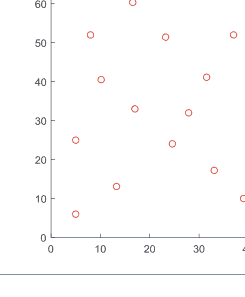

图8 SOM ANN的输入（扩展集）和输出（减少集）位置数据：降维过程

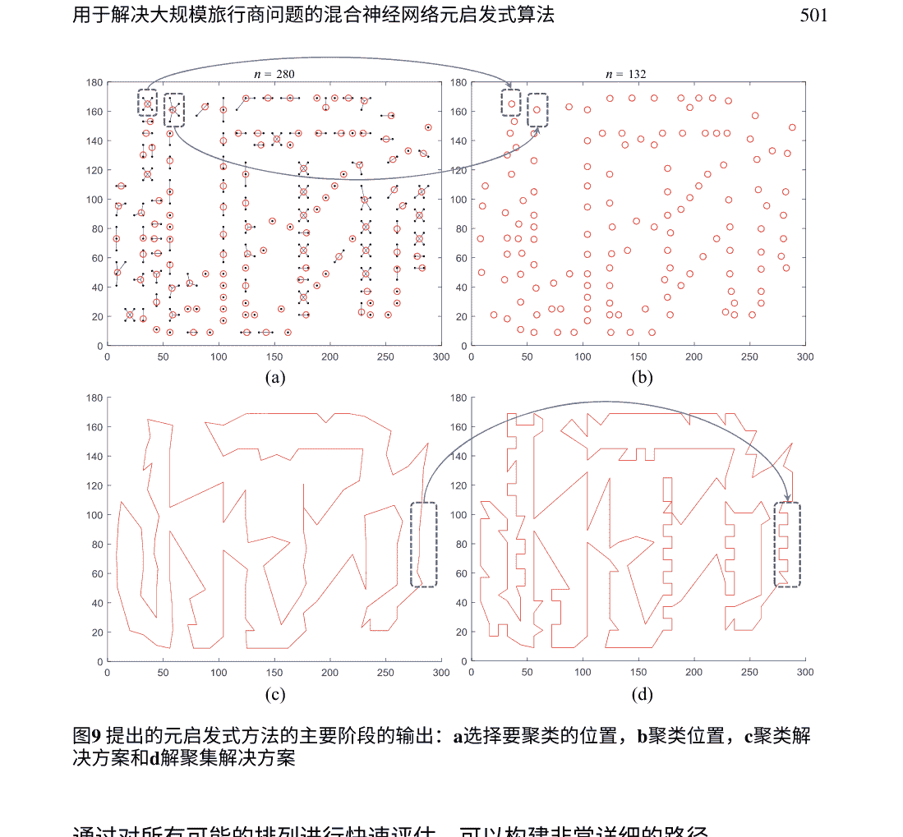

通过对所有可能的排列进行快速评估，可以构建非常详细的路径。

### 4 结果和性能评估

#### 4.1 测试数据和实验设置

所提出的元启发式算法在MATLAB（R2018a版本）中编码，并在具有Intel Xeon CPU E3-1240 CPU和3.40 GHz的HP Z230 Tower工作站上执行，内存为8GB。测试使用来自TSPLIB95数据库[28]的38个实例进行，该数据库提供了最佳参考数据（如最佳已知解决方案）以进行误差间隙估计。图10展示了每个测试实例子集的名称和n范围。

表3 来自TSPLIB95数据库的测试实例

| 不 | 实例 | n范围 | 不 | 实例 | n范围 |
|---|---|---|---|---|---|
| 1 | eil51 | 51-200 | 21 | tsp225 | |
| 2 | berlin52 | | 22 | ts225 | |
| 3 | eil76 | | 23 | pr226 | |
| 4 | pr76 | | 24 | pr264 | 200-400 |
| 5 | kroA100 | | 25 | a280 | |
| 6 | kroB100 | | 26 | pr299 | |
| 7 | kroC100 | | 27 | lin318 | |
| 8 | kroD100 | | 28 | linhp318 | |
| 9 | kroE100 | | 29 | pr439 | 400-600 |
| 10 | lin105 | | 30 | d493 | |
| 11 | ch130 | | 31 | u574 | |
| 12 | pr136 | | 32 | RAT575 | |
| 13 | ch150 | | 33 | d657 | 600-1200 |
| 14 | kroA150 | | 34 | u724 | |
| 15 | kroB150 | | 35 | RAT783 | |
| 16 | u159 | | 36 | pr1002 | |
| 17 | rat195 | | 37 | U1060 | |
| 18 | d198 | | 38 | vm1084 | |
| 19 | kroA200 | | | | |
| 20 | kroB200 | | | | |

为了比较目的，我们测试了三种元启发式算法：

-   最近邻搜索（NNS），这是排序问题（如TSP）的标准方法：在这种方法中，路线是根据最近的点或位置进行排序构建的。参考方法是Savings或Clarke-Wright算法[11, 30]。
-   具有Clarke和Wright（ANN-CW）的人工神经网络：该方法包括第3节中描述的元启发式算法（见图7），但没有局部搜索（LS）模块执行的细化过程。
-   具有克拉克和赖特以及局部搜索的人工神经网络（ANN-CW-LS）：这是在第3节中描述的完整的提出的元启发式方法。

每个元启发式方法执行20次以估计平均性能和收敛稳定性。图11展示了每个元启发式方法的测试运行结构。请注意，ANN-CW和ANN-CW-LS分别使用四组五个运行进行测试，每组考虑一个 $r_r$ 值。考虑的 $r_r$ 值分别为0.0、0.3、0.5和0.7。

然后，根据以下公式计算元启发式方法性能的误差差距（e）：
$$%e = \frac{a - b}{b} , (10)$$
其中 a是所得解的值， b是参考解的值（最佳已知解，BK）。

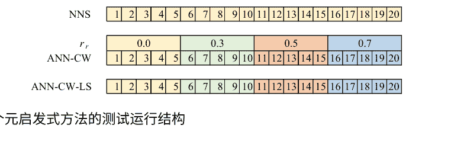

#### 4.2 平均性能测试

表2展示了每个算法的20次执行的平均结果和变异系数：
$$CV = \frac{\sigma}{\mu}, \tag{11}$$
其中 $\sigma$ 和 $\mu$ 是这些结果的标准差和平均值。这个指标可以揭示每个算法的收敛稳定性。总的来说，提出的ANN-CW-LS元启发式算法实现了最佳的平均性能。在所有情况下，$CV < 0.20$，这意味着收敛导致了每次执行的类似结果。因此，元启发式算法的性能没有显著的变异性。

#### 4.3 最佳性能测试

表3和图12展示了在每个元启发式算法的20次执行中获得的最佳解，考虑到每个实例的 $n$ 范围。

请注意，通过ANN进行的维度降低可以实现最显著的减少 $e$。当考虑到大型实例（超过200个位置）时，使用LS算法可以进一步改善。

#### 4.4 速度性能与维度降低

维度降低固有地与元启发式速度和性能的角色有关。 $r_r$ 因此，通过考虑 $r_r$ range，计算了整体 $e$。表4和图13分别展示了每个 $r_r$ 值和实例大小 ($n$ range) 的平均 $e$。有趣的是，对于小型和中型实例（50-400个节点或位置），误差间隙 $e$ tends tends to inc,ease as

表4 使用NNS方法进行20次执行得到的解的平均值（μ）。通过考虑最佳已知（BK）解计算的误差间隙（e）。变异系数（CV）计算为σ/μ，其中σ是标准差。

| 不 | 实例 | BK | NNS μ | NNS e | NNS CV |
|---|---|---|---|---|---|
| 1 | eil51 | 426 | 523.40 | 0.23 | 0.02 |
| 2 | berlin52 | 7542 | 9273.99 | 0.23 | 0.03 |
| 3 | eil76 | 538 | 722.66 | 0.34 | 0.01 |
| 4 | pr76 | 108159 | 154307.52 | 0.43 | 0.01 |
| 5 | kroA100 | 21282 | 27683.18 | 0.30 | 0.03 |
| 6 | kroB100 | 22141 | 30538.97 | 0.38 | 0.05 |
| 7 | kroC100 | 20749 | 26796.68 | 0.29 | 0.02 |
| 8 | kroD100 | 21294 | 27462.22 | 0.29 | 0.02 |
| 9 | kroE100 | 22068 | 27829.19 | 0.26 | 0.01 |
| 10 | lin105 | 14379 | 21031.21 | 0.46 | 0.03 |
| 11 | ch130 | 6110 | 7618.93 | 0.25 | 0.01 |
| 12 | pr136 | 96772 | 132517.06 | 0.37 | 0.10 |
| 13 | ch150 | 6528 | 8238.83 | 0.26 | 0.01 |
| 14 | kroA150 | 26524 | 34772.33 | 0.31 | 0.03 |
| 15 | kroB150 | 26130 | 33377.62 | 0.28 | 0.02 |
| 16 | u159 | 42080 | 58724.17 | 0.40 | 0.07 |
| 17 | rat195 | 2323 | 2813.01 | 0.21 | 0.02 |
| 18 | d198 | 15780 | 19848.74 | 0.26 | 0.07 |
| 19 | kroA200 | 29368 | 39972.96 | 0.36 | 0.12 |
| 20 | kroB200 | 29437 | 37890.87 | 0.29 | 0.02 |
| 21 | tsp225 | 3916 | 4943.86 | 0.26 | 0.02 |
| 22 | ts225 | 126643 | 155358.81 | 0.23 | 0.02 |
| 23 | pr226 | 80369 | 97098.07 | 0.21 | 0.03 |
| 24 | pr264 | 49135 | 60594.73 | 0.23 | 0.04 |
| 25 | a280 | 2579 | 3359.63 | 0.30 | 0.07 |
| 26 | pr299 | 48191 | 60989.94 | 0.27 | 0.02 |
| 27 | lin318 | 42029 | 56133.20 | 0.34 | 0.04 |
| 28 | linhp318 | 41345 | 57687.37 | 0.40 | 0.07 |
| 29 | pr439 | 107217 | 135401.48 | 0.26 | 0.03 |
| 30 | d493 | 35002 | 45265.68 | 0.29 | 0.04 |
| 31 | u574 | 36905 | 48066.11 | 0.30 | 0.03 |
| 32 | RAT575 | 6773 | 8749.35 | 0.29 | 0.04 |
| 33 | d657 | 48912 | 64586.99 | 0.32 | 0.04 |
| 34 | u724 | 41910 | 56675.52 | 0.35 | 0.03 |
| 35 | RAT783 | 8806 | 11392.16 | 0.29 | 0.01 |
| 36 | pr1002 | 259045 | 354221.06 | 0.37 | 0.12 |
| 37 | U1060 | 224094 | 284885.55 | 0.27 | 0.01 |
| 38 | vm1084 | 239297 | 309751.56 | 0.29 | 0.03 |
|  |  | 平均 = |  | 0.30 | 0.04 |## 表2 (续)

| 序号 | 实例 | BK | $\mu$ | $e$ | $c_\nu$ |
| :---: | :---: | :---: | :---: | :---: | :---: |
| 1 | eil51 | 426 | 470.31 | 0.10 | 0.04 |
| 2 | berlin52 | 7542 | 8944.51 | 0.19 | 0.07 |
| 3 | eil76 | 538 | 581.08 | 0.08 | 0.01 |
| 4 | pr76 | 108159 | 114055.63 | 0.05 | 0.01 |
| 5 | kroA100 | 21282 | 24698.98 | 0.16 | 0.08 |
| 6 | kroB100 | 22141 | 24479.09 | 0.11 | 0.03 |
| 7 | kroC100 | 20749 | 24341.82 | 0.17 | 0.09 |
| 8 | kroD100 | 21294 | 25132.68 | 0.18 | 0.10 |
| 9 | kroE100 | 22068 | 24702.79 | 0.12 | 0.05 |
| 10 | lin105 | 14379 | 16365.93 | 0.14 | 0.04 |
| 11 | ch130 | 6110 | 7557.99 | 0.24 | 0.20 |
| 12 | pr136 | 96772 | 115573.20 | 0.19 | 0.11 |
| 13 | ch150 | 6528 | 7995.72 | 0.22 | 0.13 |
| 14 | kroA150 | 26524 | 32812.76 | 0.24 | 0.13 |
| 15 | kroB150 | 26130 | 30672.00 | 0.17 | 0.09 |
| 16 | u159 | 42080 | 49426.97 | 0.17 | 0.08 |
| 17 | rat195 | 2323 | 2727.33 | 0.17 | 0.05 |
| 18 | d198 | 15780 | 18156.98 | 0.15 | 0.06 |
| 19 | kroA200 | 29368 | 35518.78 | 0.21 | 0.10 |
| 20 | kroB200 | 29437 | 32712.16 | 0.11 | 0.04 |
| 21 | tsp225 | 3916 | 4879.83 | 0.25 | 0.14 |
| 22 | ts225 | 126643 | 144833.88 | 0.14 | 0.05 |
| 23 | pr226 | 80369 | 91110.89 | 0.13 | 0.02 |
| 24 | pr264 | 49135 | 58260.10 | 0.19 | 0.05 |
| 25 | a280 | 2579 | 3030.82 | 0.18 | 0.05 |
| 26 | pr299 | 48191 | 53406.57 | 0.11 | 0.01 |
| 27 | lin318 | 42029 | 53114.20 | 0.26 | 0.13 |
| 28 | linhp318 | 41345 | 50726.74 | 0.23 | 0.09 |
| 29 | pr439 | 107217 | 124068.31 | 0.16 | 0.02 |
| 30 | d493 | 35002 | 40932.68 | 0.17 | 0.07 |
| 31 | u574 | 36905 | 42601.21 | 0.15 | 0.04 |
| 32 | RAT575 | 6773 | 8756.37 | 0.29 | 0.17 |
| 33 | d657 | 48912 | 56584.61 | 0.16 | 0.06 |
| 34 | u724 | 41910 | 47141.49 | 0.12 | 0.02 |
| 35 | RAT783 | 8806 | 10106.01 | 0.15 | 0.02 |
| 36 | pr1002 | 259045 | 296984.73 | 0.15 | 0.03 |
| 37 | U1060 | 224094 | 258577.05 | 0.15 | 0.04 |
| 38 | vm1084 | 239297 | 269643.45 | 0.13 | 0.01 |
| | | | 平均 = | 0.17 | 0.07 |

##### 表2 (续)

| 序号 | 实例 | BK | | ANN-CW-LS | | |
| :---: | :---: | :---: | :---: | :---: | :---: | :---: |
| | | | $\mu$ | $e$ | $C_v$ |
| 1 | eil51 | 426 | 469.72 | 0.10 | 0.04 |
| 2 | berlin52 | 7542 | 8364.62 | 0.11 | 0.04 |
| 3 | eil76 | 538 | 580.88 | 0.08 | 0.03 |
| 4 | pr76 | 108159 | 116116.47 | 0.07 | 0.03 |
| 5 | kroA100 | 21282 | 22185.39 | 0.04 | 0.01 |
| 6 | kroB100 | 22141 | 27385.98 | 0.24 | 0.18 |
| 7 | kroC100 | 20749 | 22571.02 | 0.09 | 0.05 |
| 8 | kroD100 | 21294 | 22666.31 | 0.06 | 0.01 |
| 9 | kroE100 | 22068 | 25271.72 | 0.15 | 0.10 |
| 10 | lin105 | 14379 | 16131.33 | 0.12 | 0.07 |
| 11 | ch130 | 6110 | 6979.04 | 0.14 | 0.11 |
| 12 | pr136 | 96772 | 107546.01 | 0.11 | 0.05 |
| 13 | ch150 | 6528 | 7266.52 | 0.11 | 0.06 |
| 14 | kroA150 | 26524 | 29828.16 | 0.12 | 0.06 |
| 15 | kroB150 | 26130 | 30193.41 | 0.16 | 0.09 |
| 16 | u159 | 42080 | 45323.48 | 0.08 | 0.04 |
| 17 | rat195 | 2323 | 2523.79 | 0.09 | 0.04 |
| 18 | d198 | 15780 | 17488.59 | 0.11 | 0.06 |
| 19 | kroA200 | 29368 | 35928.28 | 0.22 | 0.16 |
| 20 | kroB200 | 29437 | 32283.12 | 0.10 | 0.03 |
| 21 | tsp225 | 3916 | 4488.63 | 0.15 | 0.08 |
| 22 | ts225 | 126643 | 136837.68 | 0.08 | 0.03 |
| 23 | pr226 | 80369 | 96459.23 | 0.20 | 0.13 |
| 24 | pr264 | 49135 | 55821.45 | 0.14 | 0.06 |
| 25 | a280 | 2579 | 3006.24 | 0.17 | 0.07 |
| 26 | pr299 | 48191 | 55470.42 | 0.15 | 0.07 |
| 27 | lin318 | 42029 | 45938.94 | 0.09 | 0.03 |
| 28 | linhp318 | 41345 | 45566.94 | 0.10 | 0.03 |
| 29 | pr439 | 107217 | 120490.56 | 0.12 | 0.02 |
| 30 | d493 | 35002 | 37369.52 | 0.07 | 0.02 |
| 31 | u574 | 36905 | 40200.74 | 0.09 | 0.02 |
| 32 | RAT575 | 6773 | 7594.52 | 0.12 | 0.03 |
| 33 | d657 | 48912 | 54189.27 | 0.11 | 0.03 |
| 34 | u724 | 41910 | 45934.05 | 0.10 | 0.01 |
| 35 | RAT783 | 8806 | 9604.88 | 0.09 | 0.01 |
| 36 | pr1002 | 259045 | 290198.78 | 0.12 | 0.03 |
| 37 | U1060 | 224094 | 275802.42 | 0.23 | 0.14 |
| 38 | vm1084 | 239297 | 260462.36 | 0.09 | 0.01 |
| | | 平均 = | | 0.12 | 0.05 |

### 用于解决大规模旅行商问题的混合神经网络元启发式算法

表3 使用NNS方法获得的最佳解的数值。误差间隔 (e) 是根据最佳已知解 (BK) 计算的。

| 序号 | 实例 | n | BK | NNS | $e_{NNS}$ |
| :---: | :---: | :---: | :---: | :---: | :---: |
| 1 | eil51 | 51 | 426 | 513.61 | 0.21 |
| 2 | berlin52 | 55 | 7542 | 8980.92 | 0.19 |
| 3 | eil76 | 76 | 538 | 711.99 | 0.32 |
| 4 | pr76 | 80 | 108159 | 153461.92 | 0.42 |
| 5 | kroA100 | 100 | 21282 | 26856.39 | 0.26 |
| 6 | kroB100 | 105 | 22141 | 29155.04 | 0.32 |
| 7 | kroC100 | 110 | 20749 | 26327.36 | 0.27 |
| 8 | kroD100 | 115 | 21294 | 26950.46 | 0.27 |
| 9 | kroE100 | 120 | 22068 | 27587.19 | 0.25 |
| 10 | lin105 | 125 | 14379 | 20362.76 | 0.42 |
| 11 | ch130 | 130 | 6110 | 7575.29 | 0.24 |
| 12 | pr136 | 136 | 96772 | 120777.86 | 0.25 |
| 13 | ch150 | 150 | 6528 | 8194.61 | 0.26 |
| 14 | kroA150 | 160 | 26524 | 33609.87 | 0.27 |
| 15 | kroB150 | 170 | 26130 | 32825.75 | 0.26 |
| 16 | u159 | 180 | 42080 | 54669.03 | 0.30 |
| 17 | rat195 | 190 | 2323 | 2761.96 | 0.19 |
| 18 | d198 | 198 | 15780 | 18620.07 | 0.18 |
| 19 | kroA200 | 200 | 29368 | 35798.41 | 0.22 |
| 20 | kroB200 | 210 | 29437 | 36981.59 | 0.26 |
| 21 | tsp225 | 220 | 3916 | 4829.00 | 0.23 |
| 22 | ts225 | 225 | 126643 | 152493.55 | 0.20 |
| 23 | pr226 | 230 | 80369 | 94685.45 | 0.18 |
| 24 | pr264 | 264 | 49135 | 58022.86 | 0.18 |
| 25 | a280 | 280 | 2579 | 3148.11 | 0.22 |
| 26 | pr299 | 299 | 48191 | 59899.01 | 0.24 |
| 27 | lin318 | 318 | 42029 | 54033.58 | 0.29 |
| 28 | linhp318 | 340 | 41345 | 54033.58 | 0.31 |
| 29 | pr439 | 439 | 107217 | 131282.09 | 0.22 |
| 30 | d493 | 493 | 35002 | 43646.38 | 0.25 |
| 31 | u574 | 574 | 36905 | 46881.87 | 0.27 |
| 32 | RAT575 | 590 | 6773 | 8449.32 | 0.25 |
| 33 | d657 | 657 | 48912 | 62176.40 | 0.27 |
| 34 | u724 | 724 | 41910 | 55223.20 | 0.32 |
| 35 | RAT783 | 783 | 8806 | 11255.07 | 0.28 |
| 36 | pr1002 | 1002 | 259045 | 315108.14 | 0.22 |
| 37 | U1060 | 1060 | 224094 | 281635.68 | 0.26 |
| 38 | vm1084 | 1084 | 239297 | 301469.23 | 0.26 |
| | | | | 平均 = | 0.26 |

##### 表3（续）

| 序号 | 实例 | n | BK | ANN-CW | $e_{ANN-CW}$ |
| :---: | :---: | :---: | :---: | :---: | :---: |
| 1 | eil51 | 51 | 426 | 451.65 | 0.06 |
| 2 | berlin52 | 55 | 7542 | 8361.90 | 0.11 |
| 3 | eil76 | 76 | 538 | 574.42 | 0.07 |
| 4 | pr76 | 80 | 108159 | 112380.00 | 0.04 |
| 5 | kroA100 | 100 | 21282 | 22914.00 | 0.08 |
| 6 | kroB100 | 105 | 22141 | 23801.00 | 0.07 |
| 7 | kroC100 | 110 | 20749 | 22275.00 | 0.07 |
| 8 | kroD100 | 115 | 21294 | 22745.00 | 0.07 |
| 9 | kroE100 | 120 | 22068 | 23523.00 | 0.07 |
| 10 | lin105 | 125 | 14379 | 15738.00 | 0.09 |
| 11 | ch130 | 130 | 6110 | 6273.30 | 0.03 |
| 12 | pr136 | 136 | 96772 | 103980.00 | 0.07 |
| 13 | ch150 | 150 | 6528 | 7049.80 | 0.08 |
| 14 | kroA150 | 160 | 26524 | 29021.00 | 0.09 |
| 15 | kroB150 | 170 | 26130 | 28067.00 | 0.07 |
| 16 | u159 | 180 | 42080 | 45876.00 | 0.09 |
| 17 | rat195 | 190 | 2323 | 2585.50 | 0.11 |
| 18 | d198 | 198 | 15780 | 17052.00 | 0.08 |
| 19 | kroA200 | 200 | 29368 | 32343.00 | 0.10 |
| 20 | kroB200 | 210 | 29437 | 31587.00 | 0.07 |
| 21 | tsp225 | 220 | 3916 | 4278.59 | 0.09 |
| 22 | ts225 | 225 | 126643 | 137870.00 | 0.09 |
| 23 | pr226 | 230 | 80369 | 89711.00 | 0.12 |
| 24 | pr264 | 264 | 49135 | 55302.00 | 0.13 |
| 25 | a280 | 280 | 2579 | 2899.70 | 0.12 |
| 26 | pr299 | 299 | 48191 | 52827.00 | 0.10 |
| 27 | lin318 | 318 | 42029 | 46851.00 | 0.11 |
| 28 | linhp318 | 340 | 41345 | 46498.46 | 0.12 |
| 29 | pr439 | 439 | 107217 | 121690.00 | 0.13 |
| 30 | d493 | 493 | 35002 | 38193.00 | 0.09 |
| 31 | u574 | 574 | 36905 | 40876.00 | 0.11 |
| 32 | RAT575 | 590 | 6773 | 7462.64 | 0.10 |
| 33 | d657 | 657 | 48912 | 53551.00 | 0.09 |
| 34 | u724 | 724 | 41910 | 46000.00 | 0.10 |
| 35 | RAT783 | 783 | 8806 | 9891.08 | 0.12 |
| 36 | pr1002 | 1002 | 259045 | 287812.18 | 0.11 |
| 37 | U1060 | 1060 | 224094 | 249716.04 | 0.11 |
| 38 | vm1084 | 1084 | 239297 | 266661.84 | 0.11 |
| | | | | 平均 = | 0.09 |

##### 表3（续）

| 序号 | 实例 | n | BK | ANN-CW-LS | $e_{ANN-CW-LS}$ |
| :---: | :---: | :---: | :---: | :---: | :---: |
| 1 | eil51 | 51 | 426 | 451.65 | 0.06 |
| 2 | berlin52 | 55 | 7542 | 8014.20 | 0.06 |
| 3 | eil76 | 76 | 538 | 563.11 | 0.05 |
| 4 | pr76 | 80 | 108159 | 112380.00 | 0.04 |
| 5 | kroA100 | 100 | 21282 | 22015.93 | 0.03 |
| 6 | kroB100 | 105 | 22141 | 23192.67 | 0.05 |
| 7 | kroC100 | 110 | 20749 | 21552.23 | 0.04 |
| 8 | kroD100 | 115 | 21294 | 22446.60 | 0.05 |
| 9 | kroE100 | 120 | 22068 | 23004.90 | 0.04 |
| 10 | lin105 | 125 | 14379 | 15087.22 | 0.05 |
| 11 | ch130 | 130 | 6110 | 6273.30 | 0.03 |
| 12 | pr136 | 136 | 96772 | 102222.09 | 0.06 |
| 13 | ch150 | 150 | 6528 | 6872.26 | 0.05 |
| 14 | kroA150 | 160 | 26524 | 28102.49 | 0.06 |
| 15 | kroB150 | 170 | 26130 | 27822.89 | 0.06 |
| 16 | u159 | 180 | 42080 | 43437.11 | 0.03 |
| 17 | rat195 | 190 | 2323 | 2424.09 | 0.04 |
| 18 | d198 | 198 | 15780 | 16573.45 | 0.05 |
| 19 | kroA200 | 200 | 29368 | 31086.90 | 0.06 |
| 20 | kroB200 | 210 | 29437 | 31404.30 | 0.07 |
| 21 | tsp225 | 220 | 3916 | 4161.22 | 0.06 |
| 22 | ts225 | 225 | 126643 | 132941.78 | 0.05 |
| 23 | pr226 | 230 | 80369 | 85306.97 | 0.06 |
| 24 | pr264 | 264 | 49135 | 52679.51 | 0.07 |
| 25 | a280 | 280 | 2579 | 2816.14 | 0.09 |
| 26 | pr299 | 299 | 48191 | 51622.86 | 0.07 |
| 27 | lin318 | 318 | 42029 | 44590.41 | 0.06 |
| 28 | linhp318 | 340 | 41345 | 44285.26 | 0.07 |
| 29 | pr439 | 439 | 107217 | 117993.89 | 0.10 |
| 30 | d493 | 493 | 35002 | 36773.42 | 0.05 |
| 31 | u574 | 574 | 36905 | 39522.25 | 0.07 |
| 32 | RAT575 | 590 | 6773 | 7360.93 | 0.09 |
| 33 | d657 | 657 | 48912 | 52778.53 | 0.08 |
| 34 | u724 | 724 | 41910 | 45568.85 | 0.09 |
| 35 | RAT783 | 783 | 8806 | 9488.33 | 0.08 |
| 36 | pr1002 | 1002 | 259045 | 281654.83 | 0.09 |
| 37 | U1060 | 1060 | 224094 | 242856.91 | 0.08 |
| 38 | vm1084 | 1084 | 239297 | 258474.50 | 0.08 |
| | | | | 平均 = | 0.06 |表4 不同减少率 ($r_r$) 下性能 ($e$) 的比较—数值数据来源

| $r_r$ | 0–200 | 200–400 | 400–600 | 600–1200 |
|-------|-------|---------|---------|----------|
| 0.0   | 0.075 | 0.084   | 0.094   | 0.100    |
| 0.3   | 0.077 | 0.096   | 0.092   | 0.097    |
| 0.5   | 0.083 | 0.098   | 0.085   | 0.091    |
| 0.7   | 0.079 | 0.101   | 0.089   | 0.098    |

减少率 $r_r$ 增加。对于更大的实例 (400–1200个位置)， $e$ 随着减少率 $r_r$ 的增加而减小，当 $r_r = 0.5$时，实现了显著的减少。这可能是由于聚类对可用数据较少的负面影响造成的。

关于元启发速度的问题，表5和图14展示了ANN-CW-LS方法对每个 $r_r$ 值和实例大小 ($n$ range) 所需的平均求解时间。如图所示， $r_r$ 对于解决小型和中型实例 (50到400个位置) 所需的时间没有影响。然而，对于较大的实例和 $r_r > 0.3$，观察到显著的减少。

表5 不同减少率下的速度（时间）性能比较—源数值数据

| $r_r$ | $n$ 0–200 | 200–400 | 400–600 | 600–1200 |
|-------|-----------|---------|---------|----------|
| 0.0   | 2.816     | 3.985   | 8.839   | 24.663   |
| 0.3   | 2.835     | 3.949   | 8.565   | 23.038   |
| 0.5   | 2.726     | 3.665   | 6.488   | 17.191   |
| 0.7   | 2.598     | 3.654   | 4.923   | 13.396   |

### 5 结论和未来工作

在本章中，我们探讨了一种在TSP实例中降低维度的技术，因为大小增加了解决过程的计算复杂性。我们通过考虑SOM ANN作为执行适当且快速的聚类过程的关键技术来解决这个问题。

如所示，减少率 $r_r > 0.30$ 可以显著提高大型TSP实例的速度和质量（误差间隙 $<0.10$）。然而，在小型和中型实例中，节点或位置的关键分布特征可能会受到聚类过程的影响。

需要澄清的是，解决方案的质量取决于所提出的元启发式算法的所有模块，其中减少率有助于收敛速度。这与排列去聚类相结合，可以找到成本最小的片段，从而改善完整的TSP路径。这些过程可以作为数据预处理和后处理模块集成到特定的元启发式算法中，以提高其性能。尽管在这项工作中考虑了CW和LS作为基准元启发式算法，但也可以使用其他算法，如SA或TS。这种灵活性是所提出的减少方法的优势。

虽然这些发现令人鼓舞，但重要的是将其适用于更大的实例和其他NP困难的路径问题，例如容量车辆路径问题（CVRP）。这还涉及到降维的影响，因为主要路径问题考虑了更多的变量，如时间窗口，可变需求率，异构车队等。

最后，其他元启发式方法的整合，例如遗传算法（GA），其性能高度依赖于它们的种群，可能会对其在大实例中的应用产生重要的贡献。

致谢主要作者要感谢Teresa Anzures Quintana女士和Bonnie C.B女士的支持和指导。

### 参考文献

1.  An, H.C., Shmoys, D.B.: 基于LP的旅行推销员路径近似算法, 第1-13页 (2011年)
2.  Arigliano, A., Calogiuri, Y., Ghiani, G., Guerriero, E.: 一种基于分支定界的时变旅行推销员问题算法。 Networks 72(3), 382–392 (2018)
3.  Beale, M.H., Hagan, M.T., Demuth, H.B.: 神经网络工具箱7用户指南。 Math-Works Inc., 美国马萨诸塞州 (2010年)
4.  Burke, L.I., Damany, P.: 旅行推销员问题的有罪网络。 计算机与运筹学 19(3/4), 255–265 (1992)
5.  Caballero-Morales, S.O., Martinez-Flores, J.L., Sanchez-Partida, D.: 动态缩减-扩展算子以提高旅行推销员问题的遗传算法性能。 数学问题工程 2018(2), 1–12 (2018)
6.  Cabrera, G., Roncagliolo, S., Riquelme, J., Cubillos, C., Soto, R.: 一种混合粒子群优化-模拟退火算法用于概率旅行推销员问题。 信息与控制研究 21(1), 49–58 (2012)
7.  Chauhan, C., Gupta, R., Pathak, K.: 解决TSP问题的方法调查及其动态规划方法的实现。 国际计算机应用 52(4), 12–19 (2012)
8.  Deng, Y., Liu, Y., Zhou, D.: 一种改进的具有初始种群策略的遗传算法用于对称TSP问题。 数学问题工程 2015(212794), 1–7 (2015)
9.  董, L., 怀涛, S., 建昌, L., 舒斌, T., 驰, L., 宇, X.: 基于蚁群优化算法的改进粒子-群优化算法研究。在: 第29届中国控制与决策会议论文集 (CCDC 2017), pp. 853–858。IEEE, 中国重庆 (2017年)
10. 杜, K.L.: 聚类: 一种神经网络方法。神经网络 **23**, 89–107 (2010年)
11. 杜, L., 何, R.: 将最近邻搜索与禁忌搜索相结合解决大规模车辆路径问题。物理学报 **25**, 1536–1546 (2012年)
12. 加尔万, D., 埃夫廷, L., 克雷马斯科, H., 孔特-朱尼奥尔, C.A.: 巴西COVID-19疫情的传播: Kohonen自组织映射网络概述。医学 **57** (235), 1–19 (2021年)
13. Gonz lez-Mancha, J.J., Guerrero, M.S., Velez-Chong, A.G., Gonz lez-Barbosa, J.J., G mez, C., Cruz-Reyes, L., Rivera, G.: 一款用于帮助城市公共交通及其物流的移动应用程序。在: 军事、航空和海事物流与运营研究手册, 第385-406页。IGI Global (2016). https://doi.org/10.4018/978-1-4666-9779-9.ch020
14. Groba, C., Sartal, A., Vazquez, X.: 使用具有轨迹预测的遗传算法解决动态旅行商问题: 一个应用于聚鱼设备的案例。Comput.Oper. Res. **56**, 22–32 (2015)
15. Haykin, S.: 神经网络: 一个全面的基础。Prentice Hall, 纽约, 纽约, 美国 (2001)
16. Helsgaun, K.: Lin-Kernighan-Helsgaun TSP求解器在约束旅行推销员和车辆路径问题中的扩展。Roskilde大学-计算机科学系, 丹麦Roskilde (2017年)
17. Holguin, L., Ochoa-Zezzatti, A., Larios, V.M., Cossio, E., Maciel, R., Rivera, G.: 迈向智能城市的小步骤: 为Juarez城市提供公共交通使用选择的移动应用程序。在: 2019年IEEE国际智能城市会议 (ISC2), 第100-105页。IEEE (2019年)。 https://doi.org/10.1109/ISC246665.2019.9071728
18. Hopfield, J., Tank, D.: 优化问题中的决策的神经计算。生物控制论。**52** (3), 141-152 (1985年)
19. Kaabi, J., Harrath, Y.: 排列规则和遗传算法解决旅行推销员问题。阿拉伯基础与应用科学杂志 **26**(1), 283–291 (2019)
20. Kumar, R.: 关于模因算法和机器学习方法解决旅行推销员问题的调查。国际新兴技术杂志 **11**(1), 500–503 (2020)
21. Laporte, G.: 旅行推销员问题的精确和近似算法概述。欧洲运营研究杂志 **59**, 231–247 (1992)
22. Lin, S., Kernighan, B.W.: 旅行推销员问题的有效启发式算法。运筹学杂志 **21**(2), 401–659 (1973)
23. Martin-Perez, M.: k-Means和SOM (自组织映射) 在交通事故微观分析中的应用。马德里理工大学 (UPM) -工业工程师高级技术学院 (ETSII), 西班牙马德里 (2018)
24. Nunes-da-Silva, I., Hernane-Spatti, D., Andrade-Flauzino, R., Bartocci-Liboni, L.H., Franco-dos-Reis-Alves, S.: 人工神经网络: 实用课程。Springer International Publishing, Switzerland (2017)
25. Ochoa-Zezzatti, A., Carbajal, U., Castillo, O., Mej a, J., Rivera, G., Gonzalez, S.: 解决校车路线问题的Java库的开发。在: 智能城市的智能技术, 第175-196页。Springer (2020). https://doi.org/10.1007/978-3-030-39986-3_926
26. Olmos, J., Florencia, R., Garc a, V., Gonz lez, M.V., Rivera, G., S nchez-Sol s, P.: 用于订单拣选优化的元启发式算法的比较。在: 与工业4.0相关的技术和工业应用中, 第177-194页。Springer (2022年)。 https://doi.org/10.1007/978-3-030-68663-5_13
27. Puspita, F.M., Meitrilova, A., Yahdin, S.: 通过实施模拟退火和遗传算法对旅行推销员问题 (TSP) 进行数学建模。J. Phys.: Conf. Ser. **1480** (012029), 1-8 (2020年)
28. Reinelt, G.: TSPLIB-旅行推销员问题库。INFORMS J. Comput. **3** (4), 376-384 (1991年)
29. Rokbani, N., Kumar, R., Abraham, A., Alimi, A.M., Long, H.V., Priyadarshini, I., Son, L.H.: 基于双启发式蚁群优化的旅行推销员问题方法。Soft Comput. **25**, 3775-3794 (2021年)
30. Segerstedt, A.: 一种用于车辆路径规划的简单启发式算法——Clarke和Wright的改进方法的变体。国际生产经济学杂志 **157**, 74-79 (2014)
31. Sheng-Xue, H., Yun-Ting, C.: 解决旅行商问题的新方法——奖牌学习算法。社会科学研究网络 (SSRN), 第1-18页 (2023)
32. Shi, X.H., Liang, Y.C., Lee, H.P., Lu, C., Wang, Q.X.: 基于粒子群优化的旅行商问题和广义旅行商问题算法。信息处理通信学报 **103(5)**, 169–176 (2007)
33. Shi, Y., Zhang, Y.: 解决旅行商问题的神经网络方法。计算机科学会议论文集 **199**, 681–686 (2022)
34. Stodola, P., Michenka, K., Nohel, J., Rybansky, M.: 基于蚁群优化和模拟退火的混合算法应用于动态旅行推销员问题。熵 **22(8)**, 1–28 (2020)
35. Sun, J., Gutin, G., Li, P., Shi, P., Zhang, X.: 基于LP的近似算法解决广义旅行推销员路径问题。理论计算科学。(2022)
36. Van-den-Bout, V., Miller, T.: 一个有效的旅行推销员目标函数。在: IEEE 1988年国际神经网络会议论文集, 第299–304页。IEEE, 美国加利福尼亚州圣地亚哥 (1988)
37. Wang, Z., Geng, X., Shao, Z.: 用于解决旅行推销员问题的有效模拟退火算法。计算机理论纳米科学杂志。**6(7)**, 1680–1686 (2009)
38. Wei, X., Ma, L., Zhang, H., Liu, Y.: 大规模旅行推销员问题的多核、多线程优化算法。Alex. Eng. J. **60(1)**, 189–197 (2021)
39. Yang, J., Shi, X., Marchese, M., Liang, Y.: 广义TSP问题的蚁群优化方法。自然科学进展。**18**, 1417–1422 (2008)
40. Zharfi, V., Mirzazadeh, A.: 旅行推销员问题的一种新元启发式方法。J. Ind. Eng. **2013** (347825), 1-6 (2013)
41. Zheng, J., He, K., Zhou, J., Jin, Y., Li, C.M.: 旅行推销员问题的强化Lin-Kernighan-Helsgaun算法。Knowl.-Based Syst. **260** (2023)