# 机器学习和深度神经网络的进化方法


# Hitoshi Iba

## 神经进化和基因调控网络


Hitoshi Iba
东京大学
东京
日本

ISBN 978-981-13-0199-5 ISBN 978-981-13-0200-8 (电子书)
https://doi.org/10.1007/978-981-13-0200-8

国会图书馆控制号: 2018939306

© Springer Nature Singapore Pte Ltd. 2018

# 前言

大约在1990年左右，我了解了遗传编程（GP）并对这个领域产生了兴趣，之后不久了解了遗传算法（GA）。当时，GP这个术语还没有确立，这个概念用结构GA和树表示GA等术语来表示[1-3]。由于我一直在研究人工智能，所以我认为GA的唯一目标是优化（我的观点已经改变），并且我认为GA在某种程度上令人不满意。因此，我认为GA不能用于处理知识表示、程序、概念树等概念，我尝试对其进行扩展。正好在同一时间，当我向NASA的访问研究员Philip D. Laird博士介绍我的研究时，他是机器学习领域的研究员，以他的著作《从好数据和坏数据中学习》而闻名[4]。他向我介绍了斯坦福大学的John Koza教授的研究。我仍然记得在新年假期期间阅读Koza写的技术报告[5]时的激动心情。这些报告后来编纂成了一本超过800页的巨著[6]。之后，我在斯坦福大学的实验室里度过了美好的研究生活。

最近，越来越多的研究人员和学生专攻于仅仅遗传算法和遗传编程（以及与它们相关的领域）。此外，与人工智能和遗传算法/遗传编程刚创立时相比，拥有独特个性的研究人员越来越少。虽然这一点并不令人失望，但除非经历过新领域的动荡和情感，否则无法理解。我期望这个学术社团中保持这种令人愉快的紧张感和兴奋感，为健康的社区发展铺平道路。这是我写这本书的动力之一。

# 进化算法（EA）的特点可以总结如下：

- 并行性：可以同时搜索大量个体作为一个群体。这适用于高级并行应用，并可以充分利用计算机的计算能力。
- 可搜索性：EA不需要对搜索空间有深入的了解（如可微性、梯度计算等）。
- 多样性：由于群体内存在各种各样的个体，它在适应具有动态变化问题和噪声的环境方面表现出色，并且所获得的解决方案具有很高的鲁棒性。

我们可以将这些有前途的生物知识引入到EA的计算机制中，例如共生、共同进化和栖息地隔离。为此，本书提供了关于基于EA的搜索策略的理论和实践知识，其中包括几种机器学习和深度学习技术的集成，例如模因概念、神经网络、Gröbner基、信念网络和affinity传播。这种工具的开发有助于更好地优化方法论。

本书介绍的概念旨在促进和促进有效的进化算法方法的研究，无论是在理论上还是在实践中。然而，由于涵盖了机器学习方法、深度神经网络、神经进化和基因调控网络等跨学科研究主题，本书的内容对不同类别的读者都具有价值。进化算法从业者将会发现本书对于研究进化搜索和优化技术与深度学习和机器学习框架相结合非常有用。

此外，尽管还未完全发展和完善，本书中展示的一些研究示例包含了值得审查和发表论文的内容。然而，我并不希望过早地否定在人工智能和进化算法等积极发展的领域中进行有趣和具有挑战性的尝试，因此本书积极介绍了这些研究主题。我真诚地希望读者进一步发展这些研究示例，取得丰硕的成果。

与EA和GP并行的是一些相对通用的搜索方法，研究者在这个领域必须同样具备多才多艺的能力，并且要超越自己的专业领域，学习新的主题以追求新的模型和应用。只要以这种态度进行研究，就有可能为科学界和个体研究者都能够实现“维持梦想”的目标。

我希望这本书能帮助读者在EA和AI领域进行这样的学术冒险。

# 参考文献

1. Iba, H.: 信息进化与创造性学习. JSAI基础研讨会, SIG-F/H/K-9001-10 (1990)
2. Iba, H.: 结构表达式的自适应学习及其应用. 信息处理学会人工智能研讨会, AI-76-2, JSAI (1991)
3. Iba, H.: 基于自适应方法的高级知识学习。 第五届日本人工智能学会年会 (1991)
4. Laird, P.D.: 从好的和坏的数据中学习。 Springer出版社 (1988)
5. Koza, J.: 遗传编程： 一种通过遗传繁殖计算机程序来解决问题的范例。 报告编号STAN-CS-90-1314，斯坦福大学计算机科学系 (1990)
6. Koza, J.: 遗传编程，通过自然选择的计算机编程。 MIT出版社 (1992年)

# 目录

1 引言 1
1.1 进化的工作方式 1
1.2 我们解决了眼睛进化的问题吗，这困扰了达尔文吗？ 5
1.3 进化算法：从子弹列车到金融和机器人 7
1.4 遗传编程及其基因组表示 16
1.4.1 基于树的遗传编程表示 16
1.4.2 线性遗传编程 17
1.5 笛卡尔遗传编程 (CGP) 21
1.6 交互式进化计算 (IEC) 22
1.7 为什么选择进化计算? 25
参考文献 26
2 元启发式算法、机器学习和深度学习方法 27
2.1 元启发式方法论 27
2.1.1 PSO: 粒子群优化 27
2.1.2 DE: 差分进化 31
2.2 机器学习技术 34
2.2.1 k-均值算法 34
2.2.2 支持向量机 35
2.2.3 RVM: 相关向量机 38
2.2.4 k-最近邻分类器 43
2.2.5 迁移学习 45
2.2.6 Bagging 和 Boosting 46
2.2.7 Gröbner 基 47
2.2.8 Affinity传播和聚类技术 60
2.3 深度学习框架 64
2.3.1 卷积神经网络和特征提取 64
2.3.2 生成对抗网络（GAN）和生成欺骗图像 68
2.3.3 贝叶斯网络和循环信念传播 70
参考文献 72
3 进化方法应用于深度学习 77
3.1 神经进化 77
3.1.1 NEAT和HyperNEAT 80
3.1.2 CPPN和模式生成 83
3.2 通过进化优化的深度神经网络 89
3.2.1 遗传卷积神经网络（遗传 CNN） 89
3.2.2 使用GP的分层特征构建 93
3.2.3 可微分模式生成网络 96
参考文献 103
4 机器学习方法应用于进化计算 105
4.1 BagGP和BoostGP 105
4.2 消失理想GP：代数方法应用于GP 110
4.2.1 符号回归和GP 110
4.2.2 消失理想 113
4.2.3 VIGP：缩减过程 114
4.2.4 VIGP与GP比较 115
4.2.5 VIGP用于有理多项式 118
4.2.6 VIGP用于6-奇偶问题 120
4.3 改善编程 122
4.4 RVM-GP：GP中的自动特征选择的RVM 130
4.4.1 顺序稀疏贝叶斯学习算法 132
4.4.2 RVM-GP中的模型选择 134
4.4.3 RVM-GP性能 135
4.5 基于亲和力的粒子群优化算法PSOAP传播 141
4.6 差分进化的机器学习 144
4.6.1 ILSDE 145
4.6.2 SVC-DE 146
4.6.3 TRADE：差分进化的迁移学习 150
4.6.4 NENDE：差分进化的 k-NN分类器 155
参考文献 176
5 基因调控网络的进化方法 179
5.1 基因调控网络概述 179
5.2 基因调控网络推断的进化和深度学习方法 182
5.2.1 推断遗传网络
5.2.2 INTERNe：基于IEC的GRN推断与ERNe
5.3 MONGERN：用于人形机器人的GRN应用
5.3.1 进化机器人学和GRN
5.3.2 如何表达动作
5.3.3 如何学习动作
5.3.4 如何制作稳健的动作
5.3.5 使用MONGERN进行模拟实验
5.3.6 使用MONGERN进行真实机器人实验
5.3.7 MONGERN的稳健性
5.4 ERNe：一种进化反应网络框架
5.4.1 DNA PEN工具箱
5.4.2 ERNe细节
5.4.3 ERNe中的遗传操作
5.4.4 ERNe中的物种形成
5.4.5 ERNe如何演化基因调控网络
5.4.6 ERNe的应用
参考文献
6 结论
参考文献
符号索引
作者索引
主题索引

# 第1章
引言

> > 当你是一个蝌蚪而我是一条鱼，在古生代的时候，
> ...
> （《进化》，朗登·史密斯：1858-1908年）

摘要 本章节对进化机制和计算进行了基本介绍。我们解释了进化的基本理论和一些有争议的问题，比如复杂器官如何进化以及如何选择下一代中的精英成员。随后，详细介绍了进化计算方法，以及几种实现方案的遗传编程框架。

关键词 进化机制·遗传算法（GA）·进化计算（EC）·遗传编程（GP）·线性遗传编程笛卡尔遗传编程（CGP）·交互式进化计算（IEC）

## 1.1 进化的工作

在西澳大利亚有一个世界遗产地点，被称为鲨鱼湾。这里的海岸线上，贝壳海滩以充满小白蛤蜊而闻名。这片雪白的海滩总共延伸了120公里，与蓝色的大海形成鲜明对比，非常美丽，绝对值得一观。另一方面，在鲨鱼湾的哈姆林池，你可以看到世界上最古老的生物——叠层石，它存在于27亿年前。叠层石是蓝细菌的化石，是一种具有层状结构的岩石。即使在今天，这块岩石每年的生长速度仍然约为0.3毫米。在前寒武纪时期，它们就存在着。

它们曾经分布在世界各地的所有地区，但现在只存在于地球的两个地方。叠层石岩石数量众多，完全透明，非常令人印象深刻（图1.1）。当我沿着海岸走的时候，也许是我的心理作用，但感觉咸水伤害了我的脚。哈梅林池的海水盐含量大约是正常水平的两倍，海藻无法在那里生长。因此，捕食性生物无法在那里进化，叠层石得以存活。

实际上，这个小生物及其质量可以说展示了进化的可动性。蓝藻细菌有一个叫做叶绿素a的叶绿体，利用太阳的光线进行光合作用。换句话说，有机物质是从二氧化碳和水合成的，同时释放出氧气。从22亿到19亿年前，地球上释放了大量的氧气，原因是光合作用中的氧气是废物。

从进化的角度来看，直到那个时候，氧气一直很稀少，开始增加，生命的元素发生了变化。也就是说，氧气具有高活性和活力；然而，另一方面，氧气具有高氧化能力并且有毒。因此，我们看到了有耐氧性并且可以利用的好氧细菌的出现。从那时开始，进化加速爆发。换句话说，叠层石的氧气泡是进化的动力。从某种意义上说，如果没有这种细菌存在，可能就不是任何生物存在，包括我们自己。换个角度说，一切可能都始于这一点。感觉就像在这个小细菌产生泡泡的过程中，我们看到了超越人类知识的创造现象的源头。生物的进化既不是必然的，也不是巧合的。因此，让我们考虑一下事物进化所需的条件。查尔斯·达尔文承认群体生物具有以下特征。

- (a) 巨龟。
- (b) 陆地鬣蜥。
- (c) 海鬣蜥。
- (d) 杂种物种。

图1.2 伊斯拉斯恩坎塔达（加拉帕戈斯群岛）的动物

- 有机体群体以爆炸性方式产生后代。
- 变化实际上是所有动物和植物群体所具有的特征。
- 那些最适应环境的生物能够生存下来。

今天，变化被称为基因重组（交叉或突变）。此外，“以爆炸性方式产生后代”的第一个特征是基于“如果种群没有限制，它将呈指数增长，但生活资源只能以算术级数增长”的原则，这一原则在托马斯·罗伯特·马尔萨斯的《人口原理论文》中得到了发展。据认为，达尔文通过阅读《人口原理论文》得出了进化论。达尔文指出，如果这三个特征中的任何一个程度上被继承了适应性特征，这些有利特征将被传递给下一代。

加拉帕戈斯群岛以查尔斯·达尔文停留的地方而闻名，当时他在英国海军测量船“比格尔”号上旅行时注意到雀鸟的喙形状因类型而异，乌龟的壳因岛屿而异，从而使他提出了进化论的理论（图1.2a）。然而，这个故事有些夸张。

达尔文并没有深入研究这种鸟类。如果你读过他的《物种起源》，你会发现加拉帕戈斯群岛的数据并没有被广泛使用，只是围绕着人工选择进行讨论而已。

然而，即使在今天，这个岛屿仍然吸引着作为进化研究中心的密切关注。例如，普林斯顿大学的彼得·格兰特等人已经对雀鸟进行了超过20年的深入研究，并发现由于气候变化导致的饲料产量的选择压力已经极大地改变了雀鸟的喙。此外，这种进化并不是在通常考虑的几万年时间尺度上发生的，而是在令人难以置信的快速速度上发生的（几年的时间）[6, 16]。

此外，我们已经了解到地鬣蜥和海鬣蜥是加拉帕戈斯群岛上的两个物种。黄鬣蜥最初是陆地动物，以仙人掌芽为食（图1.2b）。然而，由于仙人掌的共同进化，这种食物来源变得不足够。共同进化是指两个或多个物种在相互影响的同时进化。共同进化的结果是按照（1）竞争（军备竞赛），（2）寄生虫（共生关系），（3）共存（合作）的顺序进行进化。在这种情况下，仙人掌、地鬣蜥和巨龟陷入了一场军备竞赛。仙人掌长高，使其芽部分不被吃掉，并在茎部长出刺。地鬣蜥无法爬上仙人掌的树干。这样，食物在与仙人掌的共同进化中变得不足够。这导致了海鬣蜥的进化，它可以在海中游泳并吃附着在岩石上的海藻。海鬣蜥与地鬣蜥有完全不同的生态。它的身体颜色是黑色的，以积累阳光，为了屏住呼吸，潜入水中，然后返回陆地，它能够从鼻子排出盐水（图1.2c）。有趣的是，最近有关于雄性海鬣蜥和雌性地鬣蜥的混合鬣蜥后代的故事。

这些是粉色的鬣蜥，它们具有两套特征（图1.2d）。它们有指甲，能够爬上仙人掌的树干，但目前它们无法繁殖。

进化方法的目标是基于这种思维方式实现一个计算系统（进化系统）。进化的思维不仅涉及自然界，而且涵盖各个领域。例如，让我们考虑人类的一个重大发明，飞机。发明飞机的莱特兄弟在多次试错后成功进行了第一次起飞。在开发阶段反复失败的同时，他们从过去的经验中获得了好的想法，并尝试进行微小的变化（=突变）。此外，他们将好的想法相互结合（=交叉）以创建下一个原型。经过多次原型，他们提高了准确性，这就是进化生物的工作方式。此外，即使是畜牧业和赛马的繁殖，自古以来人类也在无意识地使用进化机制。进化计算使用相同的机制。

在下一节中，我们将解释进化计算的基本原理。然而，在此之前，我们将解释达尔文困扰的一个疑问和一个成功的进化模拟案例。

图1.3 半只眼睛有何用？

## 1.2 我们解决了困扰达尔文的眼睛进化问题吗？

众所周知，哺乳动物的眼睛，如人类的眼睛，是非常复杂的器官。眼睛由许多系统组成，如视网膜、瞳孔、虹膜、角膜、晶状体和视神经。例如，晶状体在通过瞳孔时会偏折光线，而被称为眼底的视网膜则起到连接图像的镜头的作用。眼睛的进化在进化概念方面给达尔文带来了很大困扰。事实上，在《物种起源》中，它被称为眼睛等复杂功能的进化被认为是“最荒谬的”，并进一步承认眼睛甚至在后来也使他感到恐惧。在考虑眼睛的进化理论时，出现了以下两个疑问[5, 13]。

- 进化的第一步和中间阶段（与眼睛有关）是否保留？
- 复杂的器官如眼睛是否真的会发生突变？

批评进化论的人也针对这个领域。第一个疑问，“半只眼睛有什么用？”通过了解各种有机形式，这个问题得到了解决。例如，对于构成叠层石（见图1.1）的组成元素之一的蓝细菌，它们被认为与光反应有关，被称为光性趋向。鹦鹉螺（与菊石的近亲，属于生活在壳中的舟蛾的同一类群）有一个像针孔相机一样的眼睛（图1.3）。这些眼睛的功能非常原始，但它们适应了它们所生活的环境。换句话说，尽管是简单的眼睛，但总比没有好。在光遗传学领域中使用的编码光敏遗传学的蛋白质opsin以其光敏性而闻名。有一种理论认为这个基因出现在几亿年前，创造了最古老的眼睛。

> > 5 这是一种通过光基因激活特殊细胞中的蛋白质分子并利用光进行特殊功能的技术。

第二个疑问长时间以来一直是一个谜。当然，像光趋性和针孔相机这样的简单眼睛似乎可以通过突变进化出来；然而，哺乳动物的眼睛如同带有镜头的相机，这又是怎么进化出来的呢？为了达到这一点，有很多盲区。鹦鹉螺和蓝藻细菌这样的简单眼睛至今仍然存在，这表明在这一点之后，一条极其困难的道路开启了。理查德·道金斯将这称为“攀登一座不可能的山”。他将进化与攀登山峰相提并论。直到达到山峰，也就是哺乳动物的眼睛，有许多小山峰（比如鹦鹉螺和蓝藻细菌的简单眼睛）使得攀登到山峰变得困难。

近年来，通过进化模拟[12, 13]已经对这个问题进行了阐明。这里使用的方法是下一节中解释的进化计算。模拟从一个夹在透明保护层和黑色色素层之间的平坦光敏细胞块开始（图1.4左上角）。这是眼睛的未发育阶段，结构类似于平坦的皮肤。在这里，进化速度为0.05%（每代变化率）。

这是最低估计值，实际进化速度可能更快。例如，已知甲壳动物中光感受器的色素沉着变化比这个值更快。此外，还要衡量和计算这种眼睛性能（符合度）与清晰图像之间的关联程度。

观察实验结果（图1.4），在第2步和第3步中，光敏器官层和色素层（=视网膜）会长入形成一个半圆。保护层变厚形成玻璃体填充腔体。这个玻璃体的折射率设定为1.35。这个值略高于水的折射率；然而，这并不足以对玻璃体产生有意义的光学效应。因此，在第4和第5步中，视网膜继续生长而不改变折射直径。然后，为了收紧外围部分的光圈，视网膜上的孔被加深。在第6至第8步中，局部添加折射率的结果是分布式折射率的透镜出现。透镜中心的折射率从初始的1.35增加到1.52。同时，透镜的形状从椭球体变为球形，并过渡到视网膜的曲率中心。随着透镜的收缩和开口的扩大，逐渐出现了平坦的虹膜。透镜的焦距（图1.4中的f）逐渐缩短，在第8步中，焦距f与视网膜的距离（P）相等，清晰度与焦点匹配。在图中，归一化受体的直径（直径的相对变化）被表示为d。

6 英国进化生物学家/动物行为学家（1941年至今），他写了许多通俗书籍和生物学概论，因此提出了“自私基因”（见第233页）、“模因”（文化信息复制体）和“扩展表型”（由寄生虫引起的宿主操作、河狸筑坝和白蚁丘可以被视为表型）的思想。他的革命性思想和引人注目的关于进化的评论仍然引发了许多讨论。他是一位著名的无神论者。

### 图1.4 眼睛进化的模拟（引自[12]）

通过这个模拟，密集梯度类型的眼睛，如鱼类的眼睛，从最初的未发展阶段到进化，甚至不需要400,000代。在正常的生物体中，一代大约是一年，所以这将是500,000年或更短。这在进化的尺度上不是问题。此外，在果蝇的情况下，一代只有28天，所以这将是7,700年。

通过这种计算机模拟，复杂的眼睛进化已经得到了确认。这会让达尔文能够安心入睡吗？

## 1.3 进化算法：从子弹列车到金融和机器人

进化计算是一种模仿生物体进化机制的工程方法，并将其应用于数据结构的变形、合成和选择。使用这种方法，我们旨在解决优化问题并生成有益的结构。常见的例子是被称为遗传算法（GA）和遗传编程（GP）的计算算法。

进化计算中的基本数据结构是基于遗传学知识的。接下来，我们将对此进行解释。

进化计算中使用的信息是由PTYPE和GTYPE的两层结构形成的。GTYPE（基因型，也称为遗传密码，相当于细胞内的染色体）是一个类似于遗传类型的低级、局部调节集合。这是后面描述的进化计算要操作的内容。PTYPE是表型，表达了行为的出现以及在GTYPE环境中的广泛区域内的结构发展。适应环境的能力由PTYPE的适应性决定，选择依赖于PTYPE的适应性得分（图1.5）。在一段时间内，得分越高越好。因此，对于适应性得分为1.0和0.3的个体来说，前者能更好地适应其环境，更容易生存下来（然而，在本书的其他领域中，有时得分较小更好）。

### 图1.5 GTYPE和PTYPE

### 图1.6 进化计算的图像

我们将根据上述描述（图1.6）解释进化计算的基本框架。在这里，我们配置一个包含几只狗的集合。我们将称之为这一代 t。这只狗对于每个GTYPE都有一个遗传密码，并且根据生成的PTYPE确定其适应度。在图中，每只狗的适应度显示在狗附近的值上（记住适应度越大越好）。这些狗会繁殖并在下一代t +1中产生后代。就繁殖而言，适应度越好（越高），它们能够创造的后代越多，适应度越差（越低），它们越容易被淘汰。

在生物学术语中，这意味着选择和筛选，导致灭绝。在图中，由于繁殖而导致表型轻微变化的元素以示意方式绘制。由于这个原因，预计下一代中每个个体的适应度将比上一代更好。 +1 此外，整个集合中的适应度也增加。

同样地，第 t +1代的狗成为父母并产生第 t +2代的后代。随着这个过程的重复和世代的进展，整个群体得到改进，这是进化计算的基本机制。

在繁殖的情况下，运算符如图1.7所示应用于GTYPE，并产生下一代的GTYPE。为了简化问题，这里将GTYPE表示为一维矩阵。每个运算符都类似于生物体中的基因重组和突变等过程。这些运算符的应用频率和应用领域通常是随机确定的。通常，以下几种方法用于选择。

- 轮盘选择：这是一种按适应度比例选择个体的方法。创建一个与适应度成比例的区域的轮盘。旋转这个轮盘，选择它所停留的位置上的个体。
- 锦标赛选择：仅从集合中随机选择一定数量的个体（锦标赛大小），并选择其中具有最高适应度的个体。这个过程会重复进行一定次数。
- 精英策略：将具有最高适应度的几个个体保留到下一代。这可以防止具有最高适应度的个体被意外地选择并被淘汰。这种策略与上述两种方法结合使用。

### 图1.7 遗传算子

通过精英策略，只要环境不发生变化，结果在下一代中不会变差。因此，它经常应用于工程应用中。然而，请注意这样做的反面是失去了多样性。与此相关的是，家禽研究员威廉·缪尔[17]进行了一项有趣的关于鸡的实验。在现代家禽业中，大约有10只母鸡被塞进一个笼子里养殖。让我们通过选择性培育来提高蛋的产量。在这里，我们将介绍以下两种方法（图1.8）。

1. 从笼子里选择产蛋量最多的母鸡，并用它们繁殖下一代母鸡。
2. 选择笼子里产蛋量最高的所有母鸡，并用它们繁殖下一代母鸡。

(a) 从笼子里选择产蛋量最多的母鸡。

(b) 选择笼子里产蛋量最高的所有母鸡。

### 图1.8 如何提高产蛋量？

这两种方法中哪种最有效？ 产蛋是由个体母鸡完成的，因此预期积累最好的母鸡的第一种方法比最好的群体（即第二种方法）更有效。 注意第一种方法被认为是精英策略。 Muir尝试使用这两种方法，结果非常令人惊讶。 通过第一种方法产生下一代的结果是，在经过六代之后，笼子里只剩下三只母鸡，其他母鸡被屠宰。 幸存的三只母鸡只会争斗，几乎没有羽毛，无法产蛋。

另一方面，通过第二种方法选择的母鸡在经过六代之后都发育良好，羽毛丰满。 此外，实际产量也有所增加。 为什么会产生这种结果呢？

这是因为在笼子里产蛋最多的母鸡通过抑制其他母鸡的产蛋量，能够产出很多蛋。 在第一种方法中，每个笼子里都选择了最差的母鸡，导致了一个悲惨的结果。 以这种方式，精英策略是一把双刃剑，除非正确使用，否则会抑制群体的多样性，并带来更糟糕的结果。

总结起来，在进化计算中，世代变化如图1.9所示。在图中， G是精英率（被复制并留下结果的上层个体的比率）。 我们可以将繁殖率称为1 − G。现在，我们将介绍一些关于使用实际生物进行进化计算的有趣研究[3, 4]。Bond等人使用蓝鸟进行了实验，研究了它们的食物——飞蛾的图案演化。 为了做到这一点，他们让真实的蓝鸟攻击投射在计算机屏幕上的飞蛾的数字图像（见图1.10）。 在每个实验日期，他们移除了被蓝鸟发现（攻击）的飞蛾。 然后，每组中幸存的飞蛾数量得到恢复，从而保持在第二天早上的固定比例（与存活率成比例的世代变化）。 在连续进行30天的实验中，也就是30代，一种隐藏的飞蛾类型稳定在一个比例上。

75%.

接下来，在世代变化过程中引入了突变或交叉，进化了亮度和图案的基因。 结果是，蓝松鸟由于突变经常无法发现异常的隐藏类型的飞蛾。 因此，变体频率增加。 随着世代的推移，飞蛾变得更难以检测，这种表型（有图案的）展示了重大差异（见图1.11；左侧显示了飞蛾的图案，右侧显示了呈现给蓝松鸟的状态）。 这类似于自然界中发生的共同进化（军备竞赛，参见第4页）。 实际上，猎物动物改善伪装和拟态图案，使自己更难被发现，并且观察到以多种形式增加。

7麻雀家族的鸟，拥有明亮的蓝色尾羽。它们主要以昆虫、种子和水果为食。

### 图1.9 遗传算法的选择和繁殖

在进化的角度上，关于拟态的演化仍然存在许多谜题。通过使用进化计算的计算机模拟，研究解决这些谜团正在蓬勃发展。

进化计算在我们日常生活的各个领域中都得到了应用。例如，日本N700系列子弹列车的前车模型起到了

### 图1.10 实际蓝松鸦选择的飞蛾图像

### 图1.11 飞蛾斑纹的演化（摘自[4]）

#### (a) 初始世代。

#### (b) 第100世代。

(a) N700系列子弹列车。  (b) MRJ (三菱地区喷气机)。 (c) 人形机器人的协作运输

### 图1.12 EC应用

在创造原始形式中起着重要作用（图1.12a）。N700具有以270公里的速度通过曲线的性能，比上一款车型快20公里。然而，在传统的前车厢形式中，加速意味着隧道中的微气象波增加，这是噪音的原因。为了解决这个困难，通过大约5000次演化计算的模拟，得出了被称为“Aero Double Wing”的原始形式。此外，在日本首款国产喷气机MRJ（三菱地区喷气机）的机翼设计中，使用了多目标演化计算方法（图1.12b）。使用这种方法，同时优化了提高客机设备燃油效率和减少发动机外部噪音的两个目标，并成功提高了性能，超过了竞争车型。

在除了工程领域之外的领域，如金融领域，进化计算方法的使用正在扩展。投资基金正在将其作为一种实用技术用于投资组合构建和市场预测（详见[7]）。此外，它在诸如护士工作时间优化和飞机机组分配等领域具有实际应用。

另一个使用进化计算的领域是进化机器人领域（详见第5.3.1节）。例如，图1.12c是进化人形机器人合作工作（协作运输）的示例。在这里，使用了一种将协同进化应用于进化计算的学习模型。此外，模块化机器人通过组合模块根据地理特征、环境和工作内容进行自我修改，正在引起关注。甚至美国国家航空航天局（NASA）也在研究在火星有限环境中优化勘测的机器人形态。我们所了解的生物形态可能只是地球上尚存的物种。这些可能是适应地球环境的类型，我们不知道它们是否是最优的。通过进化计算，如果我们能够在计算机上重现进化过程，可能会出现我们尚未了解的新形态。这可能导致与火星和未知行星兼容的机器人的进化（详见[9]）。

## 1.4 遗传编程及其基因组表示

### 1.4.1 基于树的遗传编程表示

遗传编程（GP）的目标是将遗传形式从遗传算法（GA）扩展到树和图的表达，并将其应用于程序的合成和假设或概念的形成。 研究人员正在使用GP来改进他们用于控制系统和机器人结构设计的软件。

GP中扩展了GA的过程，以处理图结构（特别是树结构）。 树结构通常用LISP中的S表达式进行描述。因此，在GP中处理LISP程序作为“基因”是相当常见的。只要用户理解程序以树形式表示，那么阅读LISP程序应该没有太大困难（用户应该记住流程图的原则）。 下面的解释是为了让不了解LISP的读者能够快速理解。树是一种具有以下结构且不包含循环的图形：

更准确地说，树是一个无环连通图，其中一个节点被定义为树的根。 树结构可以用带括号的表达式表示。上述树可以写成如下形式：

```
(A (B)
  (C (D)))
```

此外，上述内容可以简化为以下表达式：

```
(A B
  (C D))
```

这种表示法在LISP中被称为“S表达式”。 以下术语将用于树结构：

- **节点**：用A、B、C、D等符号表示
- **根节点**：A
- **终端节点**：B、D （也称为“终端符号”或“叶节点”）
- **非终端节点**：A、C （也称为“非终端符号”和“S表达式的参数”）

- **子节点**：从A的视角来看，节点B和C是子节点（也称为“A的参数”），
- **父节点**：C的父节点是A。

其他常见短语也会被用作方便之处，包括“子节点数量”、“参数数量”、“孙子节点”、“后代”和“祖先”。由于上下文中的意义应该是清楚的，这里不再解释。

下面将包括对树结构进行操作的遗传算子：

1. Gmutation改变节点标签,
2. Ginversion兄弟节点重新排序,
3. Gcrossover子树交换.

这些是现有遗传算子的自然扩展，作用于位序列。这些算子在下面的示例中展示了它们在LISP表达式树（S表达式）中的应用（图1.13）。下划线部分是被操作的表达式。

```
G突变 父代:(+乘积 x y)
       ↓
       子代:(+乘积 x z)
G反转 父代:(progn (增加 x) (设定 x 2) (打印 x))
       ↓
       子代:(progn (设定 x 2) (增加 x) (打印 x))
G交叉 父代1:(progn (增加 x) (设定 x 2) (设定 y x))
       父代2:(progn (减少 x) (设定 x (乘积 (平方根 x) x)) (打印 x))
       ↓
       子代1:(progn (增加 x) (平方根 x) (设定 y x))
       子代2:(progn (减少 x) (设定 x (乘积 (设定 x_2) x)) (打印 x))
```

表1.1提供了程序由于这些操作符而发生变化的摘要。“progn”是一个按照它们呈现顺序对参数进行操作并返回最终参数值的函数。函数“setq”将第一个参数的值设置为第二个参数的评估值。仔细观察这个表格可以看出，突变导致程序的行为发生了轻微变化，而交叉导致部分父代程序的行为被替换。遗传算子的行为产生了个体子代程序，但它们继承了父代程序的特征。

### 1.4.2 线性遗传编程

在线性遗传编程的版本中，变量和常量被视为返回特定值的函数，因此我们可以处理终端和功能节点。

#### Gmutation

#### Ginversion

#### Gcrossover

> 图1.13 遗传编程中的遗传操作符

表1.1 由遗传编程操作符引起的程序变化

| 操作符 | 操作前的程序 | 操作后的程序 |
| :--- | :--- | :--- |
| 突变 | 添加 x 和 y | 添加 x 和 z |
| 反转 | 1. 将 x 加1<br>2. 设置 x = 2<br>3. 打印 x(=2) 并返回 2 | 1. 设置 x = 2<br>2. 将 x 加1<br>3. 打印 x(=3) 并返回 3 |
| 交叉 | **父代₁**<br>1. 将 x 加1<br>2. 设置 x = 2<br>3. 设置 y = x(=2)并返回 2<br>**父亲₂**<br>1. 从 x 中减去1<br>2. 设置 x = √(x × x)<br>3. 打印 x并返回值 | **子代₁**<br>1. 将 x 加1<br>2. 取x的平方根<br>3. 设置 y = x并返回值<br>**孩子₂**<br>1. 从 x 中减去1<br>2. 设置 x = 2并且它的值 (=2)被乘以 x(=2)。结果值(=4)再次设置为 x<br>3. 打印 x(=4) 并返回 4 |

以相同的方式。我们为每个函数分配一个ID号以区分彼此。GP个体被表示为一个数组，其中每个树节点的ID号按照前缀顺序放置（例如见图1.14）。在评估基因组时，节点的ID号被用作函数表的索引。

该表保留了有关函数的信息，例如参数的数量和指向函数定义的指针。

当我们实施遗传操作，如交叉操作时，最重要的是它不应该生成结构错误的子代，即致命基因。在基于指针的实现中，这很容易实现，因为它明确表示具有指针的树结构，因此交叉操作是通过交换指向要交换的子树的指针来执行的（见图1.13）。但是，在具有隐式线性基因组表示的GP系统中，情况就不那么简单了。为了将交叉操作应用于线性基因组，我们首先必须确定基因组上子树的确切范围。

#### 图1.15 引入StackCount

#### 图1.16 线性GP中的单点交叉

Keith和Martin[8]提出了“StackCount”的概念，为了进行这样的结构分析（图1.15）。线性基因组可以通过推入和弹出堆栈来执行。节点的StackCount等于它推入堆栈的参数数量减去它弹出堆栈的参数数量。StackCount的总和始终小于一，除非在从左到右扫描结构正确的树和以前缀顺序表示的线性基因组时到达基因组的末尾。StackCount的总和必须在基因结束时为一。根据这个规则，我们可以确定子树的结束。StackCount的概念使得GP种群的初始化简单而快速。为了初始化一个基因，我们随机选择一个节点，并按顺序将其放入数组，直到StackCount的总和为一。这种实现可以省略基于指针的树表示所需的递归指针引用。

StackCount规则同样用于实现类似遗传算法的单点交叉。如果两个父代上的任意两个位点之前的StackCount值相等，则这些位点可以进行交叉。这个限制条件防止了在应用单点交叉时生成致命基因。就GP个体的拓扑结构而言，单点交叉的应用是将树结构斜分成两部分，并在父代树之间进行交换（图1.16）。如果使用传统的子树交换交叉，只有在重复应用时才能达到相同的效果。

因此，单点交叉对基因的语义变化有更大的影响，防止了过早收敛到局部最优解。单点交叉在树结构上的作用是不对称的。因此，该操作符的效率应该取决于问题的性质和函数/终端集合。该操作符的有效性在[15]中进一步讨论。

前缀基因可以通过从数组顶部递归地评估每个节点来执行。全局变量指示正在评估的数组节点。它是在调用指定节点的函数后，逐步更新。在我们的系统中，基因以这种方式执行在前缀顺序中，函数在其参数之前进行评估，并且可以通过扫描数组的StackCount值到末尾来分析基因的树结构。由此，我们可以更容易地实现流程控制机制，如条件语句和迭代。

## 1.5 笛卡尔遗传编程（CGP）

CGP [10] 是由米勒等人提出的一种遗传编程（GP）技术。CGP使用一种前馈型网络来表示树结构。这是一种通过预先基因型描述所有节点以优化连接关系的方法。这被认为可以解决膨胀问题，即由于GP遗传操作的数量导致树结构变得过大的问题。此外，通过重复使用部分树，可以紧凑地表示树结构。

CGP网络包括三种类型的节点：输入节点、中间节点和输出节点。图1.17显示了一个具有$n$个输入、$m$个输出和$r×c$个中间层的CGP配置。在这里，不允许连接同一列的节点。CGP网络也受限于成为前馈网络。

CGP使用一维数字字符串作为基因型。这些描述了中间节点的功能类型和连接方法，以及输出节点的连接方法。通常，所有函数都将最大的参数作为输入，并忽略未使用的连接。例如，考虑以下基因型，用于图1.18所示的CGP配置。

```
0 0 1 1 0 0 1 3 1 2 0 1 0 4 4 2 5 4 2 5 7 3
```

**图1.18 基因型和表型示例**

函数符号0、1、2和3（上面有下划线）分别对应加法、减法、乘法和除法。此时对应于基因型的网络如图1.18所示。例如，第一个节点0的输入是输入0和输入1，并且进行加法计算。请注意，第五个节点的输出在任何地方都没有被使用（0和4），因此它是一个内含子（即非编码区域）。

## 1.6 交互式进化计算（IEC）

让我们考虑如何使用进化计算来解决“设计与房间氛围相匹配的桌子”或“制定一个不会让其他人烦恼的手机铃声”的问题。此时的问题是如何计算每个个体的评估（适应度）。让计算机自动评估某个桌子是否与房间氛围相匹配确实不容易。特别是，基于人类偏好和感觉的主观判断极其难以建模并在计算机上实现。由于感觉因个体而异，没有办法优化产生大量人们喜欢的音乐或设计的函数。因此，我们将采用一种进化方法，将人类的优化系统作为评估函数的一部分。也就是说，一种直接由人类评估每个个体的方法。这种基于人类主观评估的进化计算方法称为交互式进化计算（IEC）方法。

在IEC中，人类评估替代了EC中的适应度推导。如图1.19所示，通过IEC，用户直接评估每个个体。也就是说，下一代的生存水平（适应度）根据用户的“偏好”来确定。通过这种方式，不再对个体的偏好和感受进行建模，而是在系统中集成了一个评估系统。

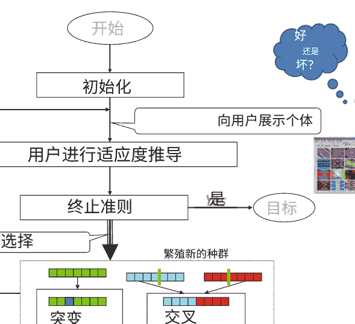

**图1.19 交互式进化计算**

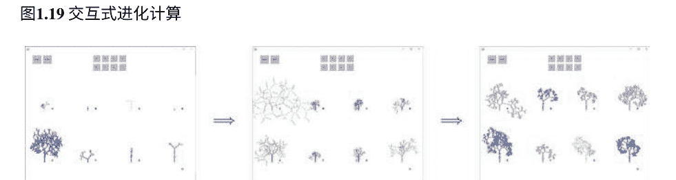

**图1.20 IEC演化的树**

基于用户的主观观点，IEC将其视为黑盒子。而原始的进化计算模拟了生存竞争的结果，IEC是一种获得改善农业和畜牧业质量的提示的方法，由人类进行。这种评估过程与性选择中的雌性评估过程相同。通过将其纳入图1.19中的评估循环中，预计将刺激和改变用户的思维。由此，我们可以期待评估者（用户）的进化。

我们尝试使用IEC（图1.20）创建一个植物CG合成演示。通过这个演示，我们基于L系统生成了一棵树形结构。在IEC中，生成树的参数和颜色的指定是一个GTYPE。向用户展示了八棵树。从那里，选择并点击几棵树，这些树成为生成子代的父代。当使用这个系统时，可以体验“养育”自己喜欢的植物的乐趣。

IEC应用于各个领域。例如，基于IEC的数字助听器自动校正[14]是一种旨在将人类感官和主观性整合到系统中的“人性化技术”应用。使用IEC格式，提出了一种基于用户自身听力状况调节信号处理参数的方法。据报道，约70%的用户回答说，与以前的格式（专业医生和技术人员根据听力测试调节参数的方法）相比，这种方法显著更好。对于处理用户感觉和偏好的工程应用，IEC的期望值是最高的，这些感觉和偏好很难以定量方式衡量。

与音乐相关的一个著名的IEC应用是即兴爵士乐演奏系统GenJam [2]，使用MIDI。通过GenJam，种群中的个体根据事先输入的节奏部分和和弦组合并演奏旋律。评估者在听到音乐时按下“好”按钮或“坏”按钮，并对每个项目进行评估。随着提供的评估结果，会生成具有更好（至少更接近评估者偏好）的颤音和乐句的个体。这相当于爵士乐手通过反复试错积累旋律创意。GenJam的制作人、资深爵士乐演奏家Biles正在与GenJam进行即兴演奏会话，通过这种方式对其进行改进。GenJam经常给我们带来惊喜，因为它重复进行人类通常不会考虑的演奏方式。

另一个基于IEC的作曲系统是CACIE（通过交互式EC进行的计算机辅助作曲系统）。图1.21是CACIE系统的界面[1]。每个球都有特定的旋律，相似的旋律使用相似的颜色来表示。作曲家将喜欢的旋律放在里面的球中，不喜欢的旋律放在外面的球中。在几代人的重复变化中，各个球继承了父代的特征，通过突变生成了不同的旋律。经过的代数越多，歌曲越精细。这个系统的一个优点是，即使不了解音乐的人也可以创作出有趣的歌曲。换句话说，只需听旋律并决定喜欢还是不喜欢，就可以完成一首歌曲。即使他们不会写乐谱，只要他们对自己想要做的事情有一个模糊的想法，他们就可以创作一首歌曲。这只是从许多不同的解决方案中提取出自己的偏好。实际上，当这个系统由钢琴初学者操作时，可以创作出易于演奏的音乐，比如Bayern。

另一方面，当CACIE被非常了解音乐的人使用时，可以提取出精美的和谐，并且内容被输入到几个比赛中。据了解，这取决于使用它的人，完成的歌曲出人意料地不同。这真的是互动进化计算中的一个重要点。系统要求的适应度根据进行输入工作的人确定。这样做的结果是，人类与系统融为一体，通过突变刺激自己的思维进行创作。

## 1.7 为什么要进行进化计算？

进化计算具有不同于其他人工智能方法和经典优化方法的优势。特别是，它的一个主要优势是可以高效地搜索大量候选组合。正如我们迄今所见，进化计算具有很高的适应性，只要

- 从GTYPE转换为PTYPE
- 适应度函数
- 遗传操作符

可以适当确定，它可以应用于问题而不需要过多的努力。在应用之后可以根据需要进行改进，并实际提高性能。因此，它可能对于人类无法想象的解决方案的进化是有效的。

与神经网络（或模拟退火方法）相反，由于可以使用结构的组合进行搜索，可以实现意想不到的解决方案。这是使用进化计算的一个亮点之一。如果能够进化出人类无法想象的解决方案和结构，这可能是有效的。在这种情况下，IEC，特别是呈现非预测和意外概念的概念，经常会被激发，这进一步加深了创造过程。

EA领域以与其他领域的强烈合作为特征，EA包含具有吸引力、竞争力和和谐性的项目的研究领域。正如Melanie Mitchell指出的[11]，“就像遗传算法是‘通用’的搜索方法一样，遗传算法研究人员必须成为通才，愿意走出自己的学科范畴，学习关于新学科的知识，以追求有前途的应用或模型。”EC研究的一个令人兴奋的特点是能够与各个领域互动，因此它允许逐渐与来自不同领域的科学家展开合作研究。

# 参考文献

1. Ando, D., Iba, H.: 通过音乐短语的树形表示手段进行交互式作曲辅助系统。在：IEEE 进化计算大会论文集，第4258-4265页（2007年）
2. Biles, J.A.: 与GenJam共处的生活：与音乐IGA的互动。在：1999年IEEE国际系统、人类和控制论大会论文集，第652-656页（1999年）
3. Bond, A.B., Kamil, A.C.: 蓝松鸟通过伪装选择产生平衡多态性的虚拟猎物。自然 395，594-596页（1998年）
4. Bond, A.B., Kamil, A.C.: 视觉捕食者选择虚拟猎物的隐蔽性和多态性。自然 415，609-613（2002年）
5. Dawkins, R.: 攀登不可能的山峰。W. W. Norton & Company，纽约（1997年）
6. Grant, P.R., Grant, B.R.: 物种如何以及为什么繁殖：达尔文雀的辐射。普林斯顿大学出版社，普林斯顿（2011年）
7. Iba, H., Aranha, C.C.: 进化计算在金融工程中的实际应用：预测，交易和对冲的稳健技术。斯普林格，柏林（2012年）
8. Keith, M.J., Martin, M.C.: C ++中的遗传编程：实现问题。在：Genetic Programming Progress, Kinnaird Jr., K.E. (编)，第285-310页。MIT出版社，剑桥（1994年）
9. Lipson, H., Pollack, J.B.: 机器人生物形态的自动设计和制造。自然 406，974-978（2000年）
10. Miller, J.F.（编）：笛卡尔遗传编程。斯普林格，柏林（2011年）
11. Mitchell, M.: 遗传算法导论。麻省理工学院出版社，剑桥（1998年）
12. Nilsson, D.-E., Pelger, S.: 眼睛进化所需时间的悲观估计。Proc.：Biol. Sci. 256（1345），53-58（1994年）
13. Parker, A.: 眨眼间：视觉如何引发了进化的大爆炸。基础图书，纽约（2004年）
14. Takagi, H., Ohdachi, M.: 基于IEC的助听器配戴。在：IEEE国际系统，人和控制论大会论文集（IEEE SMC99），pp. 657-662（1999年）
15. Duy, N., Iba, H.: 线性基因编程的经验和统计分析。在：系统，人和控制论大会论文集（SMC'99），pp.610-615（1999年）
16. Weiner, J.: The Beak of the Finch: A Story of Evolution in Our Time. Vintage, New York（1995）
17. Wilson, D.S.: Evolution for Everyone: How Darwin's Theory Can Change the Way We Think About Our Lives. Delacorte Press, New York (2007)

# 第二章 元启发式算法，机器学习和深度学习方法

> 我记得我第一次见到Edsger Dijkstra的时候... 他问我在做什么。也许只是为了引起一个难忘的对话，我说：“人工智能。”他立刻回答道：“为什么不研究我呢？”
>
> (Leslie Valiant, Probably Approximately Correct: Nature’s Algorithms for Learning and Prospering in a Complex, Basic Books 2014)

摘要 本章介绍了几种元启发式算法和学习方法，这些方法将在后面的章节中使用。这些方法将用于扩展后面章节中的进化计算框架。熟悉这些方法的读者可以跳过本章。

关键词 粒子群优化 (PSO) ·差分进化 (DE) ·k均值算法 ·支持向量机 (SVM) ·相关向量机 (RVM) ·k最近邻分类器 (k-NN) ·迁移学习 ·装袋 ·提升 ·Gröbner基 ·亲和传播 ·卷积神经网络 (CNN) ·生成对抗网络 (GAN) ·贝叶斯网络 ·循环信念传播

## 2.1 元启发式方法

### 2.1.1 PSO: 粒子群优化

“粒子群优化”(PSO) 是一种来自群体智能领域的算法。它最早由Eberhart和Kennedy在1995年作为遗传算法的替代方案进行描述[36, 37]。PSO算法的构想基于对低等级动物或昆虫的某些社会行为的观察。与使用遗传算法中使用的遗传算子修改遗传密码的概念相反，而在粒子群优化算法中，移动的个体（称为“粒子”）被考虑在内，个体的下一次移动由个体本身和周围个体的运动决定。已经确定粒子群优化算法在函数优化问题上具有与遗传算法相等的能力。已经进行了几项比较研究，比较了粒子群优化算法和标准遗传算法（参见[2, 19, 27, 38]）。

经典粒子群优化算法旨在应用于优化问题。它模拟了大量个体（或“粒子”）在多维空间中的运动[36]。每个个体都存储着自己的位置向量（$\vec{x}_i$）、速度向量（$\vec{v}_i$）以及个体获得最高适应度值的位置（$\vec{p}_i$）。

所有个体还共享关于群体中具有最高适应度值的位置的信息（$\vec{p}_g$）。

随着世代的进展，每个个体的速度会根据整个群体至当前时间为止获得的最佳位置和个体至当前时间为止获得的最佳位置进行更新。这个更新使用以下公式进行：

$\vec{v}_i = \chi \cdot (\omega \cdot \vec{v}_i + \phi_1 \cdot (\vec{p}_i - \vec{x}_i) + \phi_2 \cdot (\vec{p}_g - \vec{x}_i))$   (2.1)

这里使用的系数是收敛系数 $\chi$（一个介于0.9和1.0之间的随机值）和衰减系数 $\omega$，而 $\phi_1$ 和 $\phi_2$ 是每个个体和维度独特的随机值，最大值为2。

当计算得到的速度超过某个限制时，它会被最大速度 $V_{max}$ 替代。这个过程可以让我们在搜索过程中将个体保持在搜索区域内。

每一代中，每个个体的位置都会根据以下公式进行更新：

$\vec{x}_i = \vec{x}_i + \vec{v}_i$   (2.2)

PSO的整体流程如图2.1所示。现在让我们考虑每个个体的具体移动（见图2.2）。假设有一群鸟在飞行中。我们重点关注其中的一个个体（步骤1）。在图中，○符号和连接线段表示鸟的位置和路径。附近的⊙符号（在其路径上）表示个体路径上具有最高适应度值的位置（步骤2）。远处的○符号（在另一只鸟的路径上）标记着群体具有最高适应度值的位置（步骤2）。人们预计下一个状态将朝着步骤3中箭头所示的方向到达。向量①显示了之前步骤中的方向；向量②指向群体具有最高适应度的位置；向量③指向个体迄今为止获得最高适应度值的位置。因此，在步骤3中，所有这些向量，①，②和③，被求和以获得随后步骤中的实际移动方向（见步骤4）。

这种PSO搜索类型的效率确实很高，因为在一个相对简单的搜索空间中可以进行集中搜索以找到接近最优解的解。然而，经典的PSO算法在多峰问题中经常陷入局部最优解。

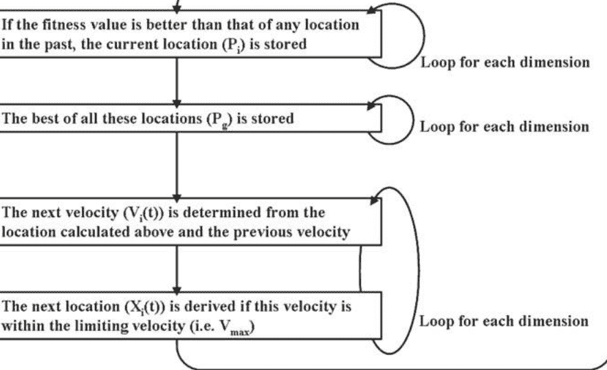

**图2.1 PSO算法的流程图**

问题。因此，在应用PSO解决具有多个尖峰的问题时，需要进行某种适应性调整。

为了克服上述限制，可以将类似遗传算法的变异与PSO结合起来[27]。这种混合PSO不遵循简单PSO中每个个体根据预定概率在搜索区域内移动到另一个位置的过程，而是在转移到下一代时保留了一定的不确定性，这是由于高斯变异的存在。个体根据预定概率被选择，并且它们的位置在高斯分布的概率下确定。在初始搜索阶段可以进行广泛的搜索，通过逐渐减少初始阶段高斯变异的出现比例，中间和最后阶段的搜索效率得到提高。图2.3显示了带有高斯变异的PSO搜索过程。在图中，$V_{lbest}$表示基于局部最优解的速度，即在公式(2.1)中的$\vec{p_i} - \vec{x_i}$，而$V_{gbest}$表示基于全局最优解的速度，即在公式(2.1)中的$\vec{p_g} - \vec{x_i}$。

PSO是一种随机搜索方法，与GA和GP一样，其调整方法与GA中的交叉类似。它还采用了适应度的概念，就像进化计算中一样。因此，PSO算法与进化计算（EC）方法密切相关。从概念上讲，可以将PSO放在GA和EP之间。

然而，PSO具有其他进化计算技术所没有的某些特性。GA运算符直接作用于多维搜索空间中的搜索点，而PSO作用于粒子的运动向量，进而更新搜索点（即粒子位置）。换句话说，遗传算子是位置特定的，而PSO运算符是方向特定的。PSO引起了很多关注的原因之一是其个体直接朝着目标前进的倾向。

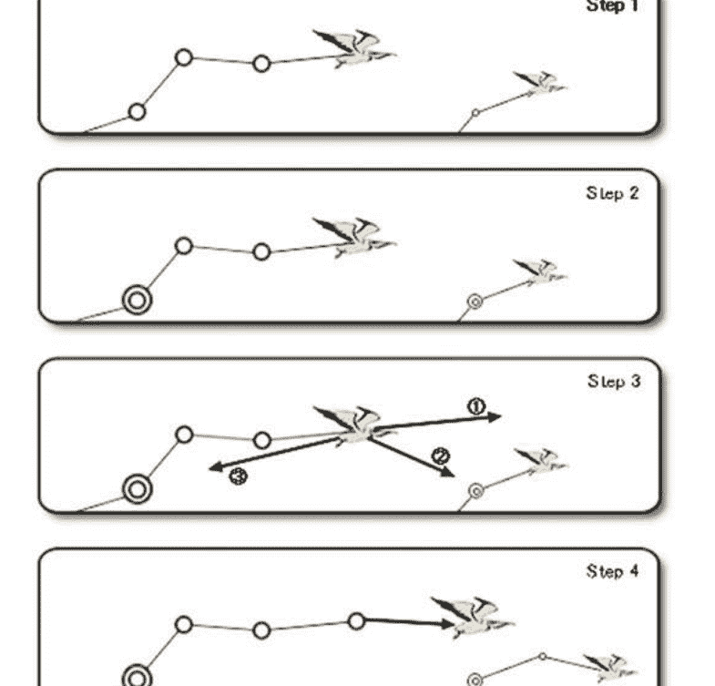

**图2.2 鸟是以何种方式飞行的？**

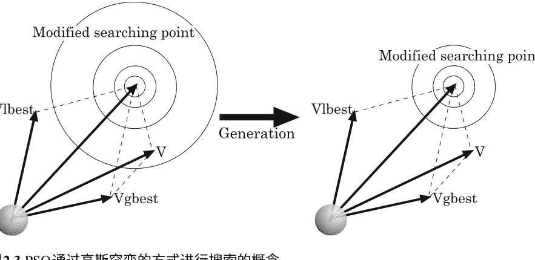

**图2.3 PSO通过高斯突变的方式进行搜索的概念**

在他的书籍[29]中的章节“试验的最佳分配”中，Holland将EC的成功归因于“开发”已知区域的搜索和“探索”未知区域的有限风险搜索的平衡。PSO擅长处理这种微妙的平衡。这些随机因素使PSO能够对相对有希望的区域进行彻底搜索，并且由于速度的动量，还能够对未知区域进行有效搜索。

### 2.1.2 DE: 差分进化

本小节介绍了另一种名为差分进化（DE）的EA，用于实数参数优化。在连续优化领域，DE算法在1995年由Rainer M. Storn和Kenneth V. Price提出后引起了广泛关注[65]。作为EA家族的一员，它使用一组解并通过随机搜索搜索空间。该算法之美在于其简单而紧凑的结构，非常容易理解和使用。尽管其原始架构，它展示了强大的搜索能力，已在各个领域中得到了许多实际应用。Storn和Price将DE提出为一族算法，而不是单一算法[65, 66]。

差分进化是肯尼斯·普莱斯和雷纳·斯托恩为解决切比雪夫多项式拟合问题而进行的研究的结果。使用常见的进化算法概念，他们将一个组合算法（肯尼斯·普莱斯开发的遗传退火算法）转化为数值优化器。因此，差分进化与进化算法的一般框架一起工作，并使用了许多进化算法的概念，如多点搜索、重组和选择算子。

与大多数进化算法一样，差分进化通过在多个随机选择的初始点上进行采样来探索搜索空间[59, 64]。然后，该算法通过重复的繁殖和选择循环将种群引导到全局最优解的附近。在“经典差分进化”中用于在连续的代数中改进候选解的代际交替模型与遗传算法或遗传编程框架中使用的模型几乎相同。从差分进化的整体框架来看，很难将该算法与任何普通的遗传算法区分开来，因为它与相同的常见组件进行迭代：初始化、评估、繁殖和选择。

然而，当我们在下面的章节中深入研究这些组件时，算法的独特特征将变得明显。在实施任何进化算法时，一个重要的问题是种群的初始化。实际上，这里有两个问题：“如何初始化每个基因？”和“在种群中使用多少个个体？”在这里，我们只讨论第一个问题。有关另一个问题的更多细节，请参见[33，第3.4.7.3节]，它与种群大小有关，这是DE等算法的一个关键参数。

进化算法通常使用在搜索范围内的均匀随机生成器来初始化每个染色体（个体）的每个基因。在这方面，DE并不例外。假设我们在一个N维问题中工作。那么DE种群的每个个体$P_G$将是一个N维向量，可以按以下方式初始化：

$x_j^{G=1} = \text{随机}(下界, 上界), (2.3)$

其中$x_j^{G=1}$表示第j个基因（j = 1, 2, ..., N）的第i个个体（i = 1, 2, ..., P）在第G = 1代中。下界和上界分别表示基因j的搜索范围的下限和上限，随机(a, b)表示返回一个在[a, b]范围内均匀分布的随机数。下标j用于说明每个基因在每个个体中都会抽取一个独立的随机数。

通常，EC中应用两种选择方法，即用于繁殖的选择和用于生存的选择[3]（参见图1.9）。第一种范式确定如何在种群中分配繁殖机会；后一种范式确定如何管理不同个体的寿命，以促进有前途个体的生存。不同的进化算法应用不同的这两种选择标准的组合和实现方式。

差分进化算法不使用“选择繁殖”机制，即没有个体相对于其他个体更有利于繁殖[59]。换句话说，可以说在差分进化算法中，每个个体都有机会通过与其他个体交配来产生自己的后代。下面我们解释一下如何选择辅助父母（与主要父母交配繁殖）的过程。

无论当前代的个体适应度如何，每个个体都成为繁殖的主要父母。参与繁殖的其他个体，即辅助父母，是从种群中随机选择的。具体来说，对于每个个体$x_i^G$，其中G表示当前代，从种群中选择三个其他随机个体$x_j^G$，$x_k^G$和$x_l^G$，使得j，k和l ∈ {1, 2, ..., P}且i ≠ j ≠ k ≠ l。这样，形成了一个由四个个体组成的父母池来繁殖后代。

DE仅在选择幸存者时施加选择压力。每个个体和其后代之间进行淘汰比赛，根据目标函数值确定性地选择赢家并晋升到下一代。因此，DE中的生存标准可以描述如下：

$x_i^{G+1} = \begin{cases} u_i^G & \text{如果 } f(u_i^G) \leq f(x_i^G); \\ x_i^G & \text{否则,} \end{cases} (2.4)$

其中f(.)表示正在优化的目标函数（此处为最小化）。DE中使用的一对一替换策略与通常观察到的进化算法不同。然而，实践这种一对一选择机制使DE能够对其种群进行精英主义操作。实际上，这种方案不仅保留了全局最佳（种群中的最佳个体），还保留了局部最佳（最佳个体）。

在任何索引处遇到的个体）。请注意，类似的精英主义也在PSO中使用，如第1.3节所述。

另一方面，使用一对一的幸存者选择标准，DE忽视了许多有前途的个体，而这些个体的利用可能加速搜索。由于其位置精英主义策略，它会丢弃一个比大多数当前种群更好但比其父代更差的后代。然而，这些被拒绝的个体可能对加速全局最优解的搜索有用（详见[53, 55]）。

在任何EA中，一组操作符被用来改变当前个体的遗传代码以提高其适应度。进化系统的成功与失败取决于精心选择的操作符。在EAs中最常用的操作符是变异和交叉。DE也使用这两个操作符。然而，正如我们将看到的，DE在使用这些操作符时保持其独特性。

DE从其应用于变异操作的个体突变中得到其名称。用于繁殖的辅助父代被用来生成突变个体。将两个辅助父代之间的比例差异加到第三个辅助父代上，以创建突变个体。这个操作被称为“差分突变”，并根据以下方程生成突变个体 v_i^G，对于主要父代 x_i^G:

```
\[ \vec{v}_i^G = \vec{r}_1 + F \times (\vec{r}_2 - \vec{r}_3), \quad (2.5) \]
```

其中 F，通常被称为缩放因子或放大因子，是一个正实数。通常情况下， \vec{r}_1, \vec{r}_2和\vec{r}_3是随机选择的。根据经验研究[59]，F的建议范围是(0,1)。一些研究表明，F小于0.3或0.4的值不太可靠，也没有任何用处[25, 71]。然而，有些例子表明，F < 0.3是优化的最佳选择[12, 54]。然而，可以推断出非常小的F值是非典型的，但并不是不实用的。

为了补充差异突变搜索策略，差分进化(DE)使用交叉操作，通常称为“离散重组”，其中突变个体 v_i^G 与主要父代 x_i^G 交配并生成后代或“试验个体” u_i^G。经典差分进化中使用的这种交叉操作也被称为“二项式交叉”，实际上是均匀交叉操作的稍微修改版本。在均匀交叉中，试验个体通过均匀随机概率从父代中选择基因来创建 C_r。差分进化中的均匀交叉，即二项式交叉，使用相同的策略，唯一的区别是至少有一个基因从突变个体 v_i^G 继承。

形式上， u_i^G 的基因从 x_i^G 和 v_i^G 继承，由交叉概率 C_r 参数确定，如下所示：

```
\[ u_{i,t}^G = \begin{cases} v_{i,t}^G & \text{如果 } r(t) \le C_r \text{ 或者 } t = rn(i) \\ x_{i,t}^G & \text{如果 } r(t) > C_r \text{ 并且 } t = rn(i), \end{cases} \quad (2.6) \]
```

其中 (t = 1, 2, ..., N) 表示个体向量的第 t 个元素。r(t)∈[0, 1]是均匀随机数生成器的第 t 个评估，rm(i)∈{1, 2, ..., N}是一个随机选择的索引，确保 u_i^G 至少从 v_j^G 中获取一个元素。最初建议从[0,1]中选择 C_r 的值；后来建议对于可分解函数使用0 ≤ C_r ≤ 0.2，对于不可分解函数使用0.9 ≤ C_r ≤ 1[59]。然而，许多不同的研究发现 C_r∈[0, 1]的其他设置也可以有效地进行优化[39, 52]。

## 2.2 机器学习技术

### 2.2.1 k均值算法

k均值算法是一种非层次聚类方法，它使用聚类的平均值将所有数据分类为k个聚类。给定n个数据点 x_j (j=1,...,n)，聚类的目标是找到最小化以下函数的聚类 X_i：

```
聚类误差 = \sum_{i=1}^{k} \sum_{\mathbf{x} \in X_i} \|\mathbf{x} - \mathbf{v}_i\|, (2.7)
```

其中不同的聚类是不相交的 (X_i ∩ X_j = ∅, i ≠ j)，所有聚类的并集覆盖了整个数据点集合，\|·\| 表示欧氏距离。聚类 X_i 的中心（通常取分配数据元素的平均值）是 v_i。换句话说，

```
\mathbf{v}_i = \frac{1}{|X_i|} \sum_{\mathbf{x} \in X_i} \mathbf{x}, (2.8)
```

并且 X_i 被称为质心。k均值算法的工作原理如算法2.1所示。

#### 算法2.1 k均值算法

```
将每个数据点 x_j 随机分配给聚类 (j = 1, 2, ..., k)。
update := TRUE
while update = TRUE do ▷当聚类分配没有变化时终止。
    update := FALSE
    根据数据分配计算每个聚类的质心 v_j (j = 1, 2, ..., k)
    通过计算每个 x_i 和每个 v_j (j = 1, 2, ..., k) 之间的距离，将每个 x_i 重新分配给最近的聚类。
    如果任何一个 x_i 改变了它之前的聚类那么
        更新 := TRUE
    结束如果
结束当
```

1. 将每个数据点 $x_j$ 随机分配给一个簇 $(1, 2, \ldots, k)$
2. 根据数据分配计算每个簇的质心 $v_j$ $(j = 1, 2, \ldots, k)$
3. 通过计算每个 $x_i$ 与每个 $v_j$ $(j = 1, 2, \ldots, k)$ 之间的距离，将每个 $x_i$ 重新分配给最近的簇
4. 当簇分配没有发生变化时，停止处理。
   当簇分配发生变化时，重新进行处理，根据新的簇分配重新计算质心 $v_j$。

该算法将簇的数量 $k$ 作为参数，因此需要另一种方法来选择最优的簇数量。$k$ 均值算法产生目标函数（即，方程（2.7））的局部最优解，但不一定是全局最小值。聚类结果受最初随机分配的初始聚类的影响。

### 2.2.2 支持向量机

支持向量机（SVM）[15, 69]是一种广泛应用于分类和回归分析的有监督学习方法，因其高泛化性能而受到广泛使用。我们首先以软间隔线性支持向量机作为一个简单的例子进行解释。提供多个特征向量，$\mathbf{x}_1, \ldots, \mathbf{x}_m$, 以及相应的标签，$y_1, \ldots, y_m$ $(= +1 \text{ 或 } -1)$，正例数据为 $y_i= +1$，负例数据为 $y_i = -1$。

学习的目标是找到能够分离这两个类别（即，$y_i= +1$ 或 $-1$）并生成未知数据分类器的分离超平面。如图2.4所示，软间隔线性支持向量机找到了一个分离两个类别的超平面。存在多个超平面候选解，但最理想的解是能够最好地对未知数据进行分类的解，即具有高泛化性能的解。

因此，寻找能够最大化个体训练数据间距离的超平面作为最优解。软间隔的概念被引入，以适当处理由于测量误差（例如）导致被错误分类的训练数据。错误数据受到惩罚，并且惩罚的总和被最小化。因此，软间隔线性支持向量机学习寻找一条超平面，以在间距最大化和惩罚最小化之间提供理想的权衡。

关于线性支持向量机的详细讨论，参考文献[20, 31]如下所示。令 $\mathbf{X} = \{(\mathbf{x}_i, l_i) \mid \mathbf{x}_i \in \mathbb{R}^d, l_i \in \{+1, -1\}\}_{i=1}^N$ 是一个 $d$ 维数据集，包含两个类别和 $N$ 个实例。对于一个线性可分的数据集，

```
$\exists \mathbf{w} \quad \text{s.t.} \quad l_i(\mathbf{w} \cdot \mathbf{x}_i + b) \geq 1, \quad \forall i = 1,2,\ldots,N.$
```

一个最优分离平面位于两个平面的中间 $P_1: \mathbf{w} \cdot \mathbf{x} + b =$ 最优分离平面的边界 $m$ 通过在平面 $P_1$ 和 $P_2$ 上分别取两个支持向量 $\mathbf{x}_1$ 和 $\mathbf{x}_2$ 来确定给定为

$$m = \left( \frac{\mathbf{w}}{\|\mathbf{w}\|} \right) (\mathbf{x}_2 - \mathbf{x}_1) = \frac{2}{\|\mathbf{w}\|}.$$

权重的范数，即 $\|\mathbf{w}\|$，必须最小化以最大化边界 $m$。因此，训练支持向量机变成了以下优化问题：

$$\begin{aligned} \min_{\mathbf{w}, b} \quad & \frac{1}{2}\mathbf{w}^T\mathbf{w} \\ \text{满足条件} \quad & l_i (\mathbf{w}^T\mathbf{x}_i + b) \geq 1, \quad \forall i = 1, 2, \ldots, N. \end{aligned}$$

对于一个不可分离的数据集，引入松弛变量 $\xi_i \geq 0$。引入松弛变量 $\xi_i$ 允许我们考虑错误分类数据点的误差范围。然后使用参数 $C > 0$，称为SVM的正则化常数，上述优化问题可以表示为：

$$\begin{aligned} \min_{\mathbf{w}, b, \xi} \quad & \frac{1}{2}\mathbf{w}^T\mathbf{w} + C \sum_{i=1}^{N} \xi_i \\ \text{满足条件} \quad & l_i (\mathbf{w}^T\mathbf{x}_i + b) \geq 1 - \xi_i, \quad \forall i = 1, 2, \ldots, N. \end{aligned}$$

训练SVM需要解决由等式(2.12)表示的优化问题，以找到权重 $\mathbf{w}$ 和偏置 $b$。训练阶段的计算复杂度为 $O(N \cdot d)$，与数据集的大小成线性比例。另一方面，测试一个样本 $\mathbf{x}_{\text{test}}$ 需要进行评估。

$$sgn(\mathbf{w}^T\mathbf{x}_{\text{测试}} + b).$$

测试阶段的计算复杂度为 O(d)，这使得线性 SVM非常快速。

在非可分数据集的情况下，可以通过将决策边界转化为线性决策边界来提高分类准确率，通过一些映射函数 φ: x → φ(x)。不幸的是，在许多情况下，线性决策边界只能在非常高维的特征空间甚至无限维的特征空间中获得。因此，方程式 (2.12) 中的内积可能需要大量计算或甚至不可能计算。为了解决这个问题，使用称为核函数的特殊函数，它们隐式地表示映射到更高维的向量的内积，即 k(x_i, x_j) = φ(x_i) φ(x_j)。

例如，以下内核经常被使用：

- 线性内核
  k(x_i, x_j) = x_i x_j (2.14)
- 多项式内核
  k(x_i, x_j) = (a × x_i x_j + b)^c (2.15)
- RBF（径向基函数）内核或高斯内核
  k(x_i, x_j) = exp(-σ||x_i - x_j||^2) (σ > 0) (2.16)

基于方程式 (2.12) 的线性算法必须进行调整，以便可以使用核函数。这种调整被称为内核技巧。为了使用核技巧，使用方程式 (2.12) 的对偶拉格朗日形式。考虑到特征向量的映射，对偶拉格朗日为

```
最大化
L(α_i) = ∑_{i=1}^N α_i - 1/2 ∑_{i,j=1}^N α_i α_j l_i l_j φ(x_i)^T φ(x_j) (2.17)
满足 0 ≤ α_i ≤ C, ∑_{i=1}^N α_i l_i = 0, ∀i = 1,2,...,N,
```

其中 α_i 是拉格朗日乘子。方程 (2.17) 是一个标准的二次优化问题，其中 α_i ≥ 0。这个对偶形式用于非线性支持向量机 [13]。

训练支持向量机需要解决由方程 (2.17) 表示的优化问题，以找到拉格朗日乘子 α_i。关于这个方程的一个有趣的事情是，所有点对 x_i 和 x_j 的内积都被使用。这需要计算 N × N Gram 矩阵。¹因此，训练的计算复杂度为 O(N^2 · d)，这对于大型数据集来说是不可接受的。因此，非线性支持向量机在准确性和速度之间存在权衡。另一方面，测试一个样本 x_test 需要评估

¹给定一组向量 v_1,...,向量 v 的格拉姆矩阵 G 是一个 n × n 的矩阵，其元素是两个向量的内积，即 G_ij = 向量_i · 向量_j.

$$\mathrm{sgn}\left( \sum_{i=1}^{N} \alpha_{i} l_{i} \phi(\text{变量} i) \cdot \phi(\text{测试变量}) + b \right). \quad (2.18)$$

因此，测试阶段的计算复杂度为 $O(N \cdot \text{数据集大小})$，并且随着数据集大小的增加呈线性增长。

### 2.2.3 RVM: 相关向量机

本节介绍了稀疏贝叶斯核方法，即相关向量机（RVM）。RVM是具有相同函数形式的广义线性模型，类似于SVM，并解决了上述缺点。在第4.4节中，我们展示了如何使用RVM在GP中找到合适的基函数。SVM具有以下缺点[68]：

- 预测不是概率性的。因为支持向量机输出一个点估计。
- 所需的核函数数量随着训练集的大小急剧增长。
- 支持向量机必须估计错误/边际权衡参数。

给定一个输入-目标对的训练集 $\{ \mathbf{x}_n, t_n \}_{n=1}^N$，我们假设目标值由输出的真实函数 $y(\mathbf{x}_n)$ 加上噪声 $\varepsilon_n$ 生成。真实函数由一组非线性基础（特征）函数的线性组合来近似表示 $\sum_{i=1}^M w_i \phi_i (\mathbf{x}_n)$:

```
t_n = y(\mathbf{x}_n) + \varepsilon_n = \sum_{i=1}^{M} w_i \phi_i (\mathbf{x}_n) + \varepsilon_n = \mathbf{w}^{\mathrm{T}} \phi(\mathbf{x}_n) + \varepsilon_n, \quad (2.19)
```

其中 $\varepsilon_n$ 被假设为从零均值高斯分布中独立采样的精度 $\beta$（方差 $\sigma^2 = \beta^{-1}$）。函数 $\phi_i (\mathbf{x})$ 是已知的固定非线性基函数。

概率上，我们假设实值目标变量 $t$ 在给定输入变量 $\mathbf{x}$、未确定的线性系数 $\mathbf{w}$ 和高斯噪声的精度参数 $\beta$ 的条件分布。目标变量 $t$ 的概率密度函数（pdf）的形式为：

```
p(t | \mathbf{x}, \mathbf{w}, \beta) = \mathcal{N}\left(t | \mathbf{w}^{\mathrm{T}} \phi(\mathbf{x}), \beta^{-1} \mathbf{I}\right), \quad (2.20)
```

其中高斯分布表示为 $\mathcal{N}$。对于 $D$ 维随机变量 $\mathbf{z}$，多元高斯分布的概率密度函数的形式为：

```
\mathcal{N}(\mathbf{z} | \boldsymbol{\mu}, \mathbf{C}) = \frac{1}{(2\pi)^{\frac{D}{2}}} \frac{1}{|\mathbf{C}|^{\frac{1}{2}}} \exp\left\{-\frac{1}{2} (\mathbf{x}-\boldsymbol{\mu})^{\mathrm{T}} \mathbf{C}^{-1} (\mathbf{x}-\boldsymbol{\mu})\right\}, \quad (2.21)
```

其中 $ \mu $ 是一个 $ D $ 维向量，被称为期望或均值，$ C $ 是一个 $ D \times D $ 矩阵，被称为协方差矩阵，而 $ |C| $ 表示 $ C $ 的行列式。由于我们假设目标上存在独立的噪声，给定数据的似然函数可以简单地写成每个单独概率密度函数在 $ t_n $ 上的乘积形式：

$$ p(t | \mathbf{X}, \mathbf{w}, \beta) = \prod_{n=1}^{N} p(t_n | \mathbf{x}_n, \mathbf{w}, \beta) $$

最大似然估计（MLE）是通过最大化似然函数来估计未知参数 $ \mathbf{w} $ 和 $ \beta $ 的方法。在这里，我们隐式地求取似然函数的导数，并将其置零以获得MLE的以下结果：

$$ \mathbf{w}_{\text{ML}} = (\mathbf{\Phi}^T \mathbf{\Phi})^{-1} \mathbf{\Phi}^T \mathbf{t} $$

$$ \beta_{ML}^{-1} = \frac{1}{N} \sum_{n=1}^{N} \{ t_n - \mathbf{w}_{\text{ML}}^T \phi(\mathbf{x}_n) \} $$

其中 $ \mathbf{\Phi} $ 是一个 $ N \times M $ 矩阵，被称为设计矩阵，其元素由 $ \Phi_{ni} = \phi_i(\mathbf{x}_n) $ 给出，即，

$$ \mathbf{\Phi} = \begin{pmatrix} \phi_1(\mathbf{x}_1) & \phi_2(\mathbf{x}_1) & \cdots & \phi_M(\mathbf{x}_1) \\ \phi_1(\mathbf{x}_2) & \phi_2(\mathbf{x}_2) & \cdots & \phi_M(\mathbf{x}_2) \\ \vdots & \vdots & \ddots & \vdots \\ \phi_1(\mathbf{x}_N) & \phi_2(\mathbf{x}_N) & \cdots & \phi_M(\mathbf{x}_N) \end{pmatrix} $$

我们的讨论遵循线性回归的贝叶斯处理，引入一个先验分布来描述线性系数 $ \mathbf{w} $。暂时地，我们将噪声精度 $ \beta $ 视为已知常数。由于方程 (2.22) 是 $ \mathbf{w} $ 的二次函数的指数，为了方便分析，我们引入了一个高斯先验分布来描述 $ \mathbf{w} $：

$$ p(\mathbf{w} | \alpha) = \mathcal{N}(\mathbf{w} | \mathbf{0}, \alpha^{-1} \mathbf{I}) $$

目前，我们引入了一个共享的精度参数 $ \alpha $，这是正态贝叶斯线性回归而不是RVM的假设。然而，首先需要解释我们在贝叶斯参数估计中使用的一般方法。在我们假设 $ \mathbf{w} $ 是一个零均值高斯分布之后，相应的后验分布应该与似然函数和先验分布的乘积呈正相关。我们选择一个共轭先验来对二次似然进行建模，这导致后验分布的形式非常清晰，仍然是高斯分布。对这个分布的评估应该通过完成指数项中的平方项，然后使用标准化高斯分布的标准结果来找到归一化系数。由于高斯变量的贝叶斯定理将再次被使用在在讨论RVM的时候，我们提供了一般的结果，这些结果引用自[4]。

假设有一个高斯边缘分布 $p(z_1)$ over $z_1$，和一个高斯条件分布 $p(z_2|z_1)$ over $z_2$。我们关注边缘分布 $p(z_2)$ over $z_2$，以及条件分布 $p(z_1|z_2)$ over $z_1$。边缘分布和条件分布可以用[4]表示为：

$$
p (z_1) = \mathcal{N}(z_1|\mu, \Lambda^{-1}), \quad (2.27)
$$
$$
p (z_2|z_1) = \mathcal{N}(z_2|Az_1+b, L^{-1}), \quad (2.28)
$$

其中$\mu$，$A$和$b$是控制期望（均值）的参数；$\Lambda$和$L$是精度矩阵，它们是协方差矩阵的逆。如果 $z_1$是一个 $M$维随机变量，而 $z_2$是一个 $D$维的变量，则矩阵 $\Lambda$的大小为 $D \times M$。

联合分布对贝叶斯理论至关重要。为了找到它，我们将其视为由[4]定义的联合向量 $\mathbf{z}$上的分布：

$$
\mathbf{z} = \begin{pmatrix} z_1 \\ z_2 \end{pmatrix}. \quad (2.29)
$$

然后，根据贝叶斯理论[4]，联合分布的对数应该由边缘分布和条件分布的对数之和给出：

$$
\begin{aligned}
\ln p (\mathbf{z}) &= \ln p (z_1) + \ln p (z_2 | z_1) \\
&= -\frac{1}{2} (z_1 - \mu)^T \Lambda (z_1 - \mu) - \frac{1}{2} (z_2 - A z_1 - b)^T L (z_2 - A z_1 - b) + \text{常数}. \quad (2.30)
\end{aligned}
$$

（2.30）这里，常数表示与 $z_1$和 $z_2$无关的冗余项。由于对数 $p (\mathbf{z})$ 的函数是 $\mathbf{z}$的二次函数， $p(\mathbf{z})$应该是一个高斯分布。因此，我们可以通过考虑方程 （2.30） 中的二阶项来找到该分布的精度矩阵，其表示为[4]：

$$
-\frac{1}{2} \begin{pmatrix} z_1 \\ z_2 \end{pmatrix}^T \begin{pmatrix} \Lambda + A^T L A & -A^T L \\ -L A & L \end{pmatrix} \begin{pmatrix} z_1 \\ z_2 \end{pmatrix} = -\frac{1}{2} \mathbf{z}^T \mathbf{R} \mathbf{z}. \quad (2.31)
$$

因此，通过比较高斯分布的概率密度函数 （即方程 （2.21） 和 （2.31） ），我们能够得出结论，联合变量 $\mathbf{z}$的分布具有由精度矩阵的逆给出的协方差矩阵[4]：

$$
\mathbf{Cov}[\mathbf{z}] = \mathbf{R}^{-1} = \begin{pmatrix} \Lambda^{-1} & \Lambda^{-1} A^T \\ A \Lambda^{-1} & L^{-1} + A \Lambda^{-1} A^T \end{pmatrix}. \quad (2.32)
$$

因此，高斯分布在 $\mathbf{z}$上的期望向量可以通过分析方程 （2.30） 中的线性项来确定，这些线性项由[4]给出：

$$
z_1^T \Lambda \mu - z_1^T A^T L b + z_2^T L b = \begin{pmatrix} z_1 \\ z_2 \end{pmatrix}^T \begin{pmatrix} \Lambda \mu - A^T L b \\ L b \end{pmatrix}
$$

同样，通过比较方程 (2.21) - (2.31)，可以找到 $\mathbf{z}$ 的期望向量，因为期望值只与概率密度函数中的指数的线性项有关。结果由[4]给出：

$$
E[\mathbf{z}] = \mathbf{R}^{-1} \begin{pmatrix} \Lambda \mu - A^T L b \\ L b \end{pmatrix} = \begin{pmatrix} \mu \\ A \mu + b \end{pmatrix}
$$

到目前为止，我们已经找到了协方差矩阵方程 (2.32) 和期望向量方程 (2.34)，这是关于联合变量 $\mathbf{z}$ 的高斯分布。接下来，将确定 $\mathbf{z}_2$ 的边缘分布。对于边缘分布，根据[4]，期望和协方差可以简单地用联合分布的分块协方差矩阵来表示：

$$
E[\mathbf{z}_2] = A \mu + b
$$

$$
\text{Cov}[\mathbf{z}_2] = L^{-1} + A \Lambda^{-1} A^T
$$

对于条件分布，结果如下[4]：

$$
E[\mathbf{z}_1|\mathbf{z}_2] = (\Lambda + A^T L A)^{-1} \{ A^T L (\mathbf{z}_2 - b) + \Lambda \mu \}
$$

$$
\text{Cov}[\mathbf{z}_1|\mathbf{z}_2] = (\Lambda + A^T L A)^{-1}
$$

利用方程 (2.37) 和 (2.38) 的结果，以及方程 (2.22) 和 (2.26)，我们得到关于 $\mathbf{w}$ 的后验分布：

$$
p(\mathbf{w} | \mathbf{t}) = \mathcal{N}(\mathbf{w} | \mathbf{m}, \Sigma)
$$

后验均值为：

$$
\mathbf{m} = \beta \Sigma \Phi^T \mathbf{t}
$$

后验协方差为：

$$
\Sigma = (\alpha^{-1} \mathbf{I} + \beta \Phi^T \Phi)^{-1}
$$

最大化这个后验分布将通过找到给定数据的最可能值来确定 $\mathbf{w}$。这种技术被称为最大后验（MAP）：

$$
\mathbf{w}_{MAP} = \mathbf{m}
$$

与仅共享一个 $\alpha$ 适用于所有权重参数 $w_i$ 的假设不同，RVM通过引入一个单独的超参数 $\alpha_i$ 来约束参数 $w_i$。因此，它导致了形式为[4]的广义形式的方程（2.26）：

$$p(\mathbf{w}|) = \prod_{i=1}^{M} \mathcal{N}(w_i|0, \alpha_i^{-1}), \tag{2.43}$$

其中 $\alpha_i$ 被视为相应参数 $w_i$ 的精度（逆方差），并表示为 $\boldsymbol{\alpha} = (\alpha_1, ..., \alpha_M)^T$。引入每个权重的个体超参数是该模型的主要观点。如果我们估计这些超参数，大多数结果为无穷大，并且相应的权重 $w_i$ 采用具有无限高精度（无限低方差）趋近于零的后验分布。与这些参数相关联的每个基函数因此乘以零权重，并对模型没有贡献，因此可以自动从模型中修剪掉。

为了估计这些未知的超参数，我们首先使用贝叶斯理论获得权重的后验分布：

$$p(\mathbf{w}|\mathbf{t}, \mathbf{X}, \beta) = \mathcal{N}(\mathbf{w}|\mathbf{m}, \mathbf{\Sigma}), \tag{2.44}$$

后验均值为：

$$\mathbf{m} = \beta \mathbf{\Sigma} \mathbf{\Phi}^{\mathrm{T}} \mathbf{t}, \tag{2.45}$$

以及后验协方差：

$$\mathbf{\Sigma} = (\mathbf{A} + \beta \mathbf{\Phi}^{\mathrm{T}} \mathbf{\Phi})^{-1}, \tag{2.46}$$

其中 $\mathbf{A} = \text{diag}(\alpha_i)$，即 $\alpha_i$ 在主对角线上的方阵。接下来，RVM的训练需要搜索后验超参数以最大化边际似然函数[4]:

$$p(\mathbf{t}|\mathbf{X}, \beta) = \int p(\mathbf{t}|\mathbf{X}, \mathbf{w}, \beta) p(\mathbf{w}|) \mathrm{d}\mathbf{w}. \tag{2.47}$$

这个积分涉及两个高斯函数的卷积，可以通过补全平方来解析地计算出来，给出了[4]中的对数边际似然:

$$\ln (p(\mathbf{t}|\mathbf{X}, \beta)) = -\frac{1}{2} \left\{ N \ln(2\pi) + \ln(|\mathbf{C}|) + \mathbf{t}^{\mathrm{T}} \mathbf{C}^{-1} \mathbf{t} \right\}, \tag{2.48}$$

其中，$N \times N$矩阵 $\mathbf{C}$ 由[4]定义：

$$\mathbf{C} = \beta^{-1}\mathbf{I} + \mathbf{\Phi}\mathbf{A}^{-1}\mathbf{\Phi}^{\mathrm{T}}. \tag{2.49}$$

我们的目标是最大化方程(2.48)关于超参数$\alpha_i$和 $\beta$ 的值。我们对边际似然关于每个 $\alpha_i$ 求导，即：

$$
\frac{\partial}{\partial \alpha_i} \ln \left(p(\mathbf{t} \mid \mathbf{X}, \beta)\right) = \frac{1}{2 \alpha_i} - \frac{1}{2} \Sigma_{ii} - \frac{1}{2} m_i^2.
\tag{2.50}
$$

其中 $m_i$ 是由方程(2.45)定义的后验均值的第 $i$ 个分量，$\Sigma_{ii}$ 是由方程(2.46)给出的后验协方差的第 $i$ 个对角分量。将这个导数设为零，我们得到以下方程：

$$
\alpha_i = \frac{1 - \alpha_i \Sigma_{ii}}{m_i^2} = \frac{\gamma_i}{m_i^2},
\tag{2.51}
$$

我们定义如下：

$$
\gamma_i = 1 - \alpha_i \Sigma_{ii}.
\tag{2.52}
$$

同样地，对于 $\beta$ 我们可以看到：

$$
\frac{\partial}{\partial \beta} \ln (p(\mathbf{t} \mid \mathbf{X}, \beta)) = \frac{1}{2} \left( \frac{N}{\beta} - \| \mathbf{t} - \mathbf{\Phi m} \|^2 - \mathrm{Tr}[\mathbf{\Sigma \Phi^T \Phi}] \right).
\tag{2.53}
$$

使用方程 (2.46)，我们可以将迹算子的参数重写为：

$$
\begin{aligned}
\mathbf{\Sigma \Phi^T \Phi} &= \mathbf{\Sigma \Phi^T \Phi} + \beta^{-1}\mathbf{\Sigma A} - \beta^{-1}\mathbf{\Sigma A} \\
&= \mathbf{\Sigma} (\mathbf{\Phi^T \Phi} \beta + \mathbf{A}) \beta^{-1} - \beta^{-1}\mathbf{\Sigma A} \\
&= (\mathbf{\Phi^T \Phi} \beta + \mathbf{A})^{-1} (\mathbf{\Phi^T \Phi} \beta + \mathbf{A}) \beta^{-1} - \beta^{-1}\mathbf{\Sigma A} \\
&= (\mathbf{I} - \mathbf{A\Sigma}) \beta^{-1}.
\end{aligned}
\tag{2.54}
$$

现在将方程(2.53)设为零，并将结果代入方程(2.54)，我们得到：

$$
\beta = \frac{\| \mathbf{t} - \mathbf{\Phi m} \|^2}{\mathrm{Tr}(\mathbf{I} - \mathbf{A\Sigma})} = \frac{\| \mathbf{t} - \mathbf{\Phi m} \|^2}{N - \sum_i \gamma_i}.
\tag{2.55}
$$

请注意，方程(2.51)和(2.53)是隐式解，因为 $\gamma_i$ 和 $m_i^2$ 取决于 $\boldsymbol{\alpha}$。因此，我们采用迭代过程，选择初始值 $\boldsymbol{\alpha}, \beta$，并使用方程(2.45)和(2.46)分别计算后验的均值和协方差，然后交替重新估计(1)超参数，使用方程(2.51)和(2.55)，以及(2)后验的均值和协方差，使用方程(2.45)和(2.46)，直到满足适当的收敛准则[4]。

### 2.2.4 k最近邻分类器

k最近邻 (k-NN) 分类器[16]是最近邻分类器[1]的扩展，长期以来一直被用于模式识别和机器学习的有监督分类任务。基本方法涉及存储所有的训练实例；

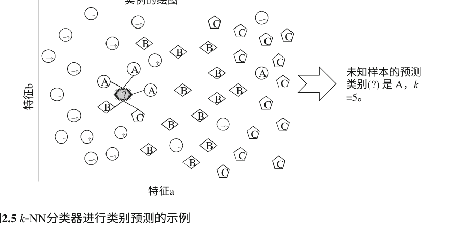

图2.5 k-NN分类器进行类别预测的示例

当测试实例被呈现时，检索与该测试实例最近的k个训练实例，并通过多数投票预测测试实例的标签。两个实例之间的距离$\mathbf{x}=(x_1, x_2, ...., x_n)$和$\mathbf{y}=(y_1, y_2, ...., y_n)$的计算如下：

$$d(\mathbf{x}, \mathbf{y}) = \sqrt{\sum_{i=1}^{n} w_i (x_i - y_i)^2}, \qquad (2.56)$$

其中 $n$ 是数据集中的特征数量， $w_i$ 是特征 $i$ 的权重。当 $w_i$ 设为1时，两个实例之间的距离变为欧氏距离。为了避免平局， $k$ 的值应为奇数（当然， $k$ 要小于训练样本的数量），用于二元分类。图2.5给出了一个k-NN分类器的示例。

如果在距离计算中仔细选择和加权特征，k-NN非常容易实现并且可以提供良好的分类准确性。

当实例的长度可变或为离散时间序列数据时，例如组织的健康检查和生活方式数据，不能直接应用上述公式（2.56）计算两个实例之间的距离。在[57]中，提出了两种方法，即聚合方法和滑动窗口方法，用于计算两个可变长度实例之间的距离并确定最近的邻居。

在聚合方法中，通过将特征的值在不同观测中聚合成一个值，使每个实例的长度相等，然后计算两个相等长度实例之间的距离。应用于特征的聚合方法取决于该特征的数据类型。如果特征是数值型的，则应使用返回数值的函数；如果特征是名义型的，则应使用返回名义值的函数。数值型特征的一些聚合函数示例包括平均值、最大值和最小值；名义型特征的一个聚合函数示例是返回最频繁值的众数。

在滑动窗口方法中，计算两个实例在较大实例的不同窗口位置上的距离，并选择具有最小距离的窗口作为最佳匹配窗口。窗口每次移动一个数据点，其中每个数据点可以是单个观测的值，例如时间 $t$ 时传感器的输出信号幅度，或者是单个观测下多个特征的值，例如一个人一年内的健康检查和生活方式数据。如果两个实例中的数据点数量分别为 $m$ 和 $n$ ($n \le m$)，则考虑的滑动窗口数量以找到最小距离为 $m - n + 1$。让我们举一个滑动窗口方法的例子，找到由以下数据点组成的两个实例之间的最小距离：$X_1X_2X_3X_4X_5$和 $Y_1Y_2Y_3$。为了找到最小距离，考虑了三个滑动窗口，并计算了 $X_1X_2X_3$和 $Y_1Y_2Y_3$；$X_2X_3X_4$和$Y_1Y_2Y_3$；以及 $X_3X_4X_5$和 $Y_1Y_2Y_3$之间的距离。

### 2.2.5 迁移学习

迁移学习[56]是机器学习中的一个框架，它利用相关问题的数据和派生知识来有效地解决目标问题。知识的发送者和接收者被称为源领域和目标领域。

人类从迁移学习中学到了各种各样的东西。例如，当一个会弹钢琴的人开始学习电子琴，而一个不会弹钢琴的人同时也开始学习电子琴时，前者比后者能更好地学会弹奏电子琴，并且用更短的时间。在迁移学习的框架中，钢琴是源领域，电子琴是目标领域，而在弹奏钢琴方面的熟练度有助于学习电子琴。迁移学习应用于各个领域，包括自然语言处理、语音识别和图像处理。

图2.6显示了迁移学习的大致流程。在这个例子中，源任务涉及对女性语音的训练，目标任务是识别男性的语音。通过使用与源领域和目标领域中的问题相关的数据和知识，进行学习，最终高效准确地解决目标领域的问题。通常假设源领域和目标领域之间存在某种结构关系。

当目标领域中的训练数据很少，而源领域中有大量数据时，迁移学习非常有效。此外，从与目标领域高度相似的领域转移知识会导致更高效的学习。相反，从低相似度的源领域转移知识会导致学习性能下降，这被称为负迁移。

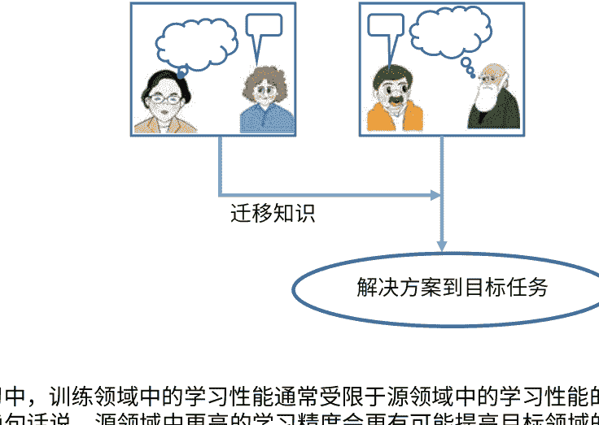

图2.6 迁移学习的图像

在迁移学习中，训练领域中的学习性能通常受限于源领域中的学习性能的最大限制。换句话说，源领域中更高的学习精度会更有可能提高目标领域的学习效率。

迁移学习中的一个重要问题是确定要转移的知识。如果需要源领域的数据，最明显的方法是适当地映射数据并在目标领域中使用它进行学习。另一方面，也可以转移源领域和目标领域中都存在的特征值或参数。可以转移哪些知识以及哪些知识成功起作用取决于每个领域，确定应用哪些知识是困难的。

### 2.2.6 Bagging和Boosting

Boosting和bagging是改善任何学习算法性能的一般重采样方法[22]。这两种方法通过在训练数据上的各种分布上重复运行给定的弱学习算法来工作。它们依赖于一种重采样技术，以获得每个分类器的不同训练集。Boosting理论上可以用来显著减少任何弱学习算法的错误，该算法只需要比随机猜测稍微好一点。所得到的分类器已被证明比组合中的任何单个分类器更准确[48]。

学习系统的数据应该由属性-值向量或实例组成。Boosting和bagging都是通过操作训练数据来生成不同的分类器。在[17， 60]的基础上，我们将在下面解释bagging和boosting的基本思想。

#### 2.2.6.1 Bagging

Bagging通过从训练实例中有放回地进行采样，生成重复的训练集。对于每次试验 $t = 1, 2, \ldots$ 在原始实例中，使用有放回地采样的方式，从中抽取大小为 $N$ 的训练集。这个训练集与原始数据集的大小相同，但是有些实例可能不会出现在其中，而其他实例可能会出现多次。学习系统根据样本生成一个分类器 $C^t$，并且最终的分类器 $C^*$是通过聚合这些试验中的 $T$ 个分类器得到的。为了对实例 $x$ 进行分类，每个分类器都会为类别 $k$ 记录一票，其中 $C^t(x) = k$，而 $C^*$则是得到最多票数的类别（平局将以任意方式解决）。

#### 2.2.6.2 Boosting

Boosting在每次重复中使用所有实例，但为训练集中的每个实例维护一个权重，反映其重要性，调整权重会导致学习器关注不同的实例并导致不同的分类器。在形成组合分类器时，bagging中的每个组件分类器具有相同的投票权，而boosting根据其准确性为组件分类器分配不同的投票强度。

让 $w_x^t$ 表示实例 $x$ 在第 $t$ 次试验中的权重。最初，对于每个实例 $x$， $w_x^1 = 1/N$。在每次试验中， $t = 1, 2, \ldots$ 对于给定的实例，在分布 $w^t$ 下构建一个分类器 $C^t$，就好像实例 $x$ 的权重 $w_x^t$ 反映了其出现的概率一样。该分类器的错误 $\epsilon^t$ 也是根据权重来衡量的，并且包括它错误分类的实例的权重之和。如果 $\epsilon^t$ 大于0.5，则终止试验，并将 $T$ 更改为 $t - 1$。相反，如果 $C^t$ 正确分类所有实例，使得 $\epsilon^t$ 为零，则终止试验，并将 $T$ 变为 $t$。否则，下一次试验的权重向量 $w^{t+1}$ 通过以下方式生成: (1) 将 $C^t$ 正确分类的实例的权重乘以因子 $\beta^t = \epsilon^t / (1 - \epsilon^t)$, (2) 进行归一化，使得 $\sum_x w_x^{t+1} = 1$。增强分类器 $C^*$通过将分类器 $C^1, C^2, \ldots, C^T$ 的投票求和获得，其中分类器 $C^t$ 的投票价值为 $\log(1/\beta^t)$ 个单位。

Freund 和 Schapire [22] 提出了一种增强算法的变体，称为AdaBoost，如果其性能略好于随机猜测，理论上可以显著减少任何学习算法的错误。AdaBoost的一个版本，即AdaBoost.R，将加权中位数作为最终回归结果 [17]。

### 2.2.7 Gröbner基

本节解释了处理几何概念（几何推理）所使用的推导方法，以及与之相关的代数方法。这里，“几何概念”指的是几何信息，例如欧几里得空间中的线和点（或其他适当的带有距离函数的空间），以及拓扑信息。

在直线的情况下，例如交点，在曲面的情况下，例如约束，这些都是信息。

使用代数方法进行定理证明和推导已经被数学界熟知很长时间，至少从1930年代的阿尔弗雷德·塔斯基开始。塔斯基证明了欧几里德几何是可判定的（即存在一种算法可以在有限步骤内判断命题的真假）。不幸的是，塔斯基的方法很复杂，需要大量的计算，并且实际上并未被使用。然而，他的方法已经以Collins等人讨论的形式复兴，他们提高了该方法的效率[35]。

代数推理和证明的代表性方法包括以下内容。

- 吴氏定理，
- 格罗布纳基，
- 量化消除（QE）。

对于这些不同方法的每一种，推理的目标领域（在数学意义上）都有所不同，证明的完备性保证的范围并不完全一致。

- （吴）由多项式的根形成的代数簇，
- （格罗布纳）由多项式生成的理想，
- （QE）由多项式的实根形成的流形。

因此，这些方法的优势和劣势取决于应用的范围。

QE（量词消除）是通过消除量词来简化数学逻辑中的陈述的方法。CAD（圆柱代数分解）是一种用于实封闭域的初等理论的QE方法（详见[11]）。

吴氏方法已成功应用于几何推理任务，如机器人技术、计算机图形学和计算机视觉（详见[32]）。例如，它可以解决以下两个圆问题（图2.7）。

找出所有线段 QT 的中点 P 的轨迹，其中端点 Q 和 T 分别位于 O₁ 和 O₂ 上（O₁ 和 O₂ 是两个外切圆，半径分别为 r₁ 和 r₂）。²

最近，提出了一个被称为“代数生物学”的领域，并且有大量的研究试图通过代数方法分析各种生物现象的机制。例如，Laubenbacher和Stigler [42] 尝试使用Gröbner基来推断遗传网络（具体来说，通过使用布尔代数来减少由因果关系表示的关系；有关GRN的详细信息，请参见第5.1节）。

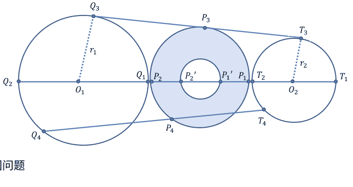

Gröbner基已被用于分析GP中的语义构建块[67]。在本节的其余部分，我们解释了思想和Gröbner基。这些相对容易实现，并且在GP的扩展版本中使用（请参见第4.2节）。给定一组多项式 $F=\{f_1, \ldots, f_n\}$，从 $F$ 生成的理想 $(f_1, \ldots, f_n)$ 可以表示为 $(f_1, \ldots, f_n)$ 或 $(F)$。因此，评估某个特定的多项式 $g$ 是否属于 $(f_1, \ldots, f_n)$ 对应于证明命题 $g$ 在假设 $\{f_1, \ldots, f_n\}$ 下的真实性。Gröbner基是这个评估的关键。我们将解释使用Gröbner基进行证明的方法。

以下解释从讨论几个重要事项开始，然后按照Buchberger [5–10]的思路进行。为每个多项式中的简单项（即单项式）定义一个全序（$<_T$）。满足以下两个条件的任何排序都是可接受的。

- **(T1)** $1 <_T t$ 对于所有 $t = 1$
- **(T2)** 如果 $s <_T t$ 那么 $su <_T tu$ 对于所有 $u$

以下是常用的双变量全序的示例 $<_T$（其中 $x <_T y$）。
*   总次序排序（写作 $<_{TD}$）
    $1 <_{TD} x <_{TD} y <_{TD} x^2 <_{TD} xy <_{TD} y^2 <_{TD} x^3 <_{TD} x^2 y <_{TD} xy^2 <_{TD} y^3 <_{TD} \cdots$ (2.58)
*   纯字典排序（写作 $<_{PL}$）
    $1 <_{PL} x <_{PL} x^2 <_{PL} x^3 < \cdots <_{PL} y <_{PL} xy <_{PL} x^2 y < \cdots <_{PL} y^2 <_{PL} xy^2 < \cdots$ (2.59)

接下来，我们定义以下函数。在这个定义中，$f$，$g$ 等都是多项式；$F$ 和 $G$ 是多项式集合；$x$ 和 $y$ 是变量。

- $Coeff(g, t)$: 多项式 $g$ 中项 $t$ 的系数。
- $LPP(f)$: 多项式 $f$ 相对于 $<_T$ 的主导幂乘积。
- $LM(f)$: 多项式 $f$ 相对于 $<_T$ 的主导单项式（即最大单项式）。
- $LC(f)$: 多项式 $LPP(f)$ 的主导系数。
- $LCM(f, g)$: 多项式 $f$ 和 $g$ 的最小公倍数。
- $GCD(f, g)$: 多项式 $f$ 和 $g$ 的最大公因数。

然后我们定义以下简化规则，通过将最高次项替换为较低次项来重写多项式。

#### 定义2.1 (简化)
$g$ 被简化为 $h$ 模 $(F)$: $g \rightarrow_F h \Leftrightarrow \exists f \in F, \exists b, \exists u$ s.t. $g \rightarrow_{f,b,u}$ 和 $h = g - buf$，其中 $g \rightarrow_{f,b,u}$（$g$ 可被 $f,b$ 和 $u$ 简化）等价于满足以下两个条件：

$$Coeff(g, uLPP(f)) = 0, \quad (2.60)$$
$$b = Coeff(g, uLPP(f))/LC(f). \quad (2.61)$$

换句话说，$g \rightarrow_F h$ 表示 $g$ 中的一个单项式被 $F$ 中的某个多项式 $f$ 的适当乘积 $buf$ 所抵消。例如，考虑 $F:=\{f_1,f_2,f_3\}$ 的情况。

$$F := \{f_1, f_2, f_3\} \quad (2.62)$$
$$f_1 := 3x^2y + 2xy + y + 9x^2 + 5x - 3 \quad (2.63)$$
$$f_2 := 2x^3y - xy - y + 6x^3 - 2x^2 - 3x + 3 \quad (2.64)$$
$$f_3 := x^3y + x^2y + 3x^3 + 2x^2 \quad (2.65)$$

在这里，$f_1$, $f_2$, 和 $f_3$ 按 $<_{PL}$ 排序，以便

- $LPP(f_1) = x^2y \quad LC(f_1) = 3$
- $LPP(f_2) = x^3y \quad LC(f_2) = 2$
- $LPP(f_3) = x^3y \quad LC(f_3) = 1$

现在考虑对以下多项式 $g$ 进行 $mod(F)$ 的约简。

$$g = 5y^2 + 2x^2y + \frac{5}{2}xy + \frac{3}{2}y + 8x^2 + \frac{3}{2}x - \frac{9}{2} \quad (2.66)$$

因此，我们有 $g \rightarrow_F h$ 对于以下的 $h$。

$$h = 5y^2 + \frac{7}{6}xy + \frac{5}{6}y + 2x^2 - \frac{11}{6}x - \frac{5}{2} \quad (2.67)$$

这是因为满足以下条件。

$$g \rightarrow_{f,b,u} \text{其中} \quad f := f_1, b := \frac{2}{3}, u := 1$$
$$Coeff(g, 1 \cdot x^2y) = 2 \neq 0$$
$$b = Coeff(g, 1 \cdot x^2y) / LC(f_1)$$
$$h = g - \left( \frac{2}{3} \right) \cdot 1 \cdot f_1$$

## 定义 2.2 (正常)
$h$ 在 $(F)$ 模下是正常的 $\Leftrightarrow$ 不存在 $h'$ 使得 $h \rightarrow_F h'$

## 定义 2.3 (正常形式)
$h$ 是 $g$ 在 $(F)$ 模下的正常形式 $\Leftrightarrow$ $h$ 是正常的且存在以下规约序列: $$g = k_0 \rightarrow_F k_1 \rightarrow_F k_2 \rightarrow_F \cdots \rightarrow_F k_m = h.$$

在之前的例子中，这是正常的 $mod(F)$。

给定一组多项式 $F$ 和一个多项式 $g$，找到 $g$ 的正规形式的算法被称为归一化算法，表示为 $S(F, g)$。以下是一个归一化算法的示例 $S$。

#### 算法2.2 归一化算法
输入: 正常的形式(F, g)
输出: 正常的形式
```
令 nf := g。
当存在 f ∈ F, b 和一个 u 使得 nf →_{f,b,u} 时
    选择 f, b, u 使得 uLPP(f) 相对于 <_T 最大。
    令 nf := nf - b*u*f。
结束循环
输出 nf。
```

#### 定义2.4 (Gröbner基)
$F$ 是一个 Gröbner 基 $\Leftrightarrow$ 对于所有 $g$, $h_1$, $h_2$, 如果 $h_1$ 和 $h_2$ 都是 $g \ mod(F)$ 的正规形式, 则 $h_1 = h_2$。

计算 Gröbner 基的方法是由 Buchberger 于 1965 年发明的，他是 Gröbner 的学生。这个方法被称为 Buchberger-Möller (BM) 算法[49]。此外，已知从点集计算 Gröbner 基或边界基可以在多项式时间内执行[10, 45]。最近，提出了近似 Buchberger-Möller (ABM) 算法[45]作为计算边界基的稳定数值方法[50]。

下面讨论 BM 算法的关键点。在此之前，以下定理作为准备工作非常重要。

#### 定理2.1 Gröbner性质和定理
如果 $S$ 是任意的归一化算法，则以下命题等价。
- (GB1) $F$ 是一个 Gröbner 基
- (GB2) $f-g\in Ideal(F) \Leftrightarrow S(F,f)=S(F,g)$
- (GB3) $\rightarrow_F$ 具有 Church-Rosser 属性

Church-Rosser 属性确保如果一个多项式可以通过多种方法进行简化，那么最终结果将是唯一确定的，与所使用的方法无关。

(GB3)暗示了 Gröbner 基和术语重写系统或 Knuth-Bendix 方法之间的相似性[47]。 事实上，S-多项式（如下所定义）可以被视为完成算法中的临界对[7]。

#### 定义2.5 (S-多项式)
多项式 $f_1$ 和 $f_2$ 的 S-多项式定义如下：$SP\left(f_{1}, f_{2}\right) := u_{1} f_{1} -\left(c_{1} / c_{2}\right) u_{2} f_{2}$， 其中 $c_{i} = LC\left(f_{i}\right)$, $s_{i} =LPP\left(f_{i}\right)$, $u_{i} =LCM\left(s_{1}, s_{2}\right) / s_{i}$。例如，对于方程（2.62）中的多项式 $f_{1}$ 和 $f_{2}$

$$SP\left(f_{1}, f_{2}\right) = 2 x^{2} y + \frac{5}{2} x y + \frac{3}{2} y + 8 x^{2} + \frac{3}{2} x - \frac{9}{2}. \tag{2.68}$$

## 定理 2.2 格罗布纳基的算法性质
如果 $S$ 是任意的归一化算法，则以下命题等价。
- (GB1) $F$ 是一个 Gröbner 基
- (GB4) 对于所有 $f_{1}, f_{2} \in F, S\left(F, SP\left(f_{1}, f_{2}\right)\right)=0$

给定一组多项式 $F$，找到满足 $Ideal(F) = Ideal(G)$ 且 $G$ 是格罗布纳基的算法如下所示。

让我们尝试找到方程式 (2.62) 的格罗布纳基。首先，选择 $\left\{f_{1}, f_{2}\right\}$ 然后

$$SP\left(f_{1}, f_{2}\right) = 2 x^{2} y + \frac{5}{2} x y + \frac{3}{2} y + 8 x^{2} + \frac{3}{2} x - \frac{9}{2}. \tag{2.69}$$

将这个多项式化简得到

$$\frac{7}{6} x y + \frac{5}{6} y + 2 x^{2} - \frac{11}{6} x - \frac{5}{2}. \tag{2.70}$$

将这个多项式乘以 $6/7$ ，使得 $LC$ 变为1，得到以下多项式 $f_{4}$ ，然后将其加入 $G$。

$$f_{4} = x y + \frac{5}{7} y + \frac{12}{7} x^{2} - \frac{11}{7} x - \frac{15}{7} \tag{2.71}$$

然后，选择 $\{f_{1}, f_{4}\}$ 得到

$$\begin{aligned} SP(f_{1}, f_{4}) &= 1 \cdot f_{1} - \frac{3}{1} \cdot x \cdot f_{4} \tag{2.72} \\ &= -\frac{1}{7} x y + y - \frac{36}{7} x^{3} + \frac{96}{7} x^{2} + \frac{80}{7} - 3. \tag{2.73} \end{aligned}$$

通过减去 $-(1/7) f_{4}$ 并调整使得 $LC$ 变为1，我们得到

$$f_{5} := y - \frac{14}{3} x^{3} + \frac{38}{3} x^{2} + \frac{61}{6} x - 3. \tag{2.74}$$

进一步减去 $(5/7) f_{5}$ 从 $SP(f_{4}, f_{5}) = 1 f_{4} - (1 / 1) x f_{5}$ 并调整使得 $LC$ 变为1，得到

$$f_{6} := x^{4} - 2 x^{3} - \frac{15}{4} x^{2} - \frac{5}{4} x. \tag{2.75}$$

最后，从 $SP(f_{1}, f_{3}) = x f_{1} - (3 / 1) 1 f_{3}$ 我们得到

$$f_{7} := x^{3} - \frac{5}{2} x^{2} - \frac{5}{2} x. \tag{2.76}$$

SP剩余对的约简在所有情况下都为0，因此基础的推导完成。例如，

$$SP(f_6, f_7) = \frac{1}{2}x^3 - \frac{5}{4}x^2 - \frac{5}{4}x \quad (2.77)$$

但通过减去 (1/2)f_7 可以将其减少为0。因此，得到的 Gröbner 基是 $G:=\{f_1, f_2, ..., f_7\}$。

#### 定义2.6 (简化Gröbner基)
$F$ 是一个(简化) Gröbner 基 $\Leftrightarrow$ $F$ 是一个 Gröbner 基且对于所有 $f \in F$ 和 $f$ 是正常的 mod($F-\{f\}$)。给定一个 Gröbner 基，可以通过首先删除可以由其他多项式减少为0的多项式，然后将剩余的多项式归一化，使 $LC$ 变为1来获得一个简化的 Gröbner 基。

在上面的方程中， $G=\{f_1, f_2, ..., f_7\}$ 不是一个简化的 Gröbner 基。这是因为 $f_1$ 可以使用 mod($\{f_2, ..., f_7\}$) 减少为0。此外， $f_1, f_2, f_3, f_4$ 和 $f_6$ 被减少为0， $f_5$ 被减少为以下多项式：

$$f'_5 := y + x^2 - \frac{3}{2}x - 3 \quad (2.78)$$

因此，简化的格罗布纳基变为

$$G' := \{f'_5, f_7\} \quad (2.79)$$

> **定理2.3 简化格罗布纳基的唯一性**
> 假设 $Ideal(F)=Ideal(F')$ 并且 $F$ 和 $F'$ 都是简化的格罗布纳基。在这种情况下， $F$ 和 $F'$ 作为集合是相同的。

让 GB 是一个返回满足以下条件的 $G$ 的函数，对于多项式集合 $F$。

- $G := GB(F),$
- $Ideal(F) = Ideal(G),$
- $G$ 是一个简化的格罗布纳基。

那么，对于 GB，以下关键定理成立。

#### 定理2.4 减少Gröbner基础的关键定理[8, p.194]
GB 对于所有的 $F$ 和 $G$ 满足以下命题。
- (SGB1) $Ideal(F) = Ideal(GB(F))$.
- (SGB2) 如果 $Ideal(F) = Ideal(G)$, 那么 $GB(F) = GB(G)$。
- (SGB3) $GB(F)$ 是一个减少的 Gröbner 基础。

Gröbner 基在计算理想基础中起着重要作用。下面的部分给出了一些 Gröbner 基础的示例应用。

#### 2.2.7.1 评估理想匹配和成员资格
考虑以下类型的问题。
1. 给定 $F$, $f$ 和 $g$, 评估是否 $f - g \in Ideal (F)$。
2. 给定 $F$ 和 $f$, 评估是否 $f \in Ideal (F)$。
3. 给定 $F_1$ 和 $F_2$, 评估是否 $Ideal (F_1) \subseteq Ideal (F_2)$。

可以使用 Gröbner 基来回答这些问题。
1. 假设 $G := GB(F)$ 那么 $f - g \in Ideal (F) \Leftrightarrow S(G, f) = S(G, g)$. (2.80)
2. 假设 $G := GB(F)$ 那么 $f \in Ideal (F) \Leftrightarrow S(G, f) = 0$. (2.81)
3. 假设 $G_2 := GB(F_2)$ 那么 $Ideal (F_1) \subseteq Ideal (F_2) \Leftrightarrow \forall f \in F_1 : S(G_2, f) = 0$. (2.82)

#### 2.2.7.2 代数表达式的可解性
让我们评估给定的 $F$ 是否可解。可解意味着存在某个代数扩展 $K$, 使得 $F$ 中的所有 $f(a_1, ..., a_n) =0$, 其中 $F$ 是一组关于 $x_1, x_2, ..., x_n$ 的变量多项式。

假设 $G := GB (F)$ 。然后，我们只需要使用以下属性。

$$F : \text{不可解} \Leftrightarrow 1 \in G \tag{2.83}$$例如，方程 (2.62) 中的 $F$ 是可解的。这是因为之前找到的 $G B(F)$（方程 (2.79) ）不包含 1。
相反，以下 $F$ 是不可解的。

$F := \{x^2y - x^2, x^3 - x^2 + y, xy^2 - xy + 2\} \tag{2.84}$

为了研究这个问题，我们首先采用 $<_{TD}$ 作为总排序来找到 Gröbner 基。
$S P (x^2y - x^2, x^3 - x^2 + y) = x^2y - x^3 - y^2 \to_F -x^3 - y^2 + x^2 \to_F -y^2 + y \tag{2.85}$
因此，我们将 $y^2 - y$ 添加到基础中。
$S P (xy^2 - xy + 2, y^2 - y) = 2 \tag{2.86}$
这不能再进一步简化，所以 1 包含在基数中。这意味着这 $F$ 是不可解的。

> $F$ 有有限数量的解。
$\Leftrightarrow$
对于所有的 $i (1 \leq i \leq n)$，存在一个 $G$ 中的多项式，使得 $L P P$ 具有以下形式 $x_{i0}^{k_i}$。

例如，方程 (2.62) 中的 $F$ 有有限数量的解。这是因为我们在上面找到的 $G B(F)$ 中的多项式的 $LPP$（即方程 (2.79) ）是
相比之下，以下的 $F$ 有无限多个解。

$F := \{x^2y - y^2 - x^2 + y, x^2 - y\} \tag{2.87}$

事实上，这个 $F$ 有无限多个解，因为 $F$ 已经是一个 Gröbner 基，但是没有多项式以其 $LPP$ 的形式 $y^j$ 存在。
接下来，给定一个有限解的可解 $F$，让我们尝试找到所有的 $F$ 的解。假设 $G := GB(F)$，采用 $p_L$ 作为全序。 那么 $G$ 只包含 $K[x_1]$ 的多项式。 为此，我们执行以下消元算法。
例如，考虑方程(2.62)中的 $F$，它是

$G B(F) := \{f := x^3 - \frac{5}{2}x^2 - \frac{5}{2}x, g := y + x^2 - \frac{3}{2}x - 3\} \tag{2.88}$

方程 $f =0$ 只包含变量 $x$，因此解为 0，$\frac{5 + \sqrt{65}}{4}$ 和 $\frac{5 - \sqrt{65}}{4}$。 将这些 $x$ 值代入方程 $g =0$ 中求解 $y$，我们得到三个解。

## 算法 2.4 消元算法

```
p := G ∩ K[x1]中的多项式.       ▷返回包含所有解的 X1。
X1:= {(a) | p(a) = 0}。
对于 i =1 到 n−1, 执行以下操作
   Xi+1 := ϕ。
   对于 Xi中的所有 (a1,...,ai), 执行以下操作
      H:= {g(a1,...,ai,xi+1) | g ∈ G ∩ K[x1,...,xi+1] − K[x1,...,xi]}。
      p := 多项式 H的最大公约数。
      Xi+1 := Xi+1 ∪ {(a1,...,ai,a) | p(a) = 0}。
   结束循环
结束循环
```

图2.8 逆向机器人运动学的示例

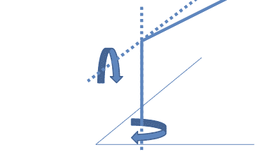

#### 2.2.7.3 应用于其他领域的示例

Gröbner 基已应用于其他领域。 以下是一些示例。

- 1. 机器人的力学特性解决方案,
- 2. 计算超椭球的交点,
- 3. 消除参数和逆向问题,
- 4. 检测奇点,
- 5. 证明几何定理,
- 6. 分析素理想。

图2.8展示了逆向机器人运动学的实际应用[63]。 这个问题涉及计算关节中距离和角度的约束，以引导末端执行器到达给定的位置和方向。 作为一个例子，考虑一个具有两个自由度的旋转关节的机器人，如图所示。 在这里，我们引入了表2.1中列出的变量。然后，根据图2.2列出了约束条件。这些变量可以分为以下几类：

- 1. 几何变量 $l_1, l_2$
- 2. 位置变量 $p_x, p_y, p_z, s f, c f, s t, c t$
- 3. 关节变量 $s_1, c_1, s_2, c_2$

逆向机器人运动学中的大多数问题可以用以下方式描述。

- 1. 给定几何变量。
- 2. 还给出了一些独立的位置变量。
- 3. 在这些条件下，对于剩余的位置变量和关节变量，找出与其他几何变量的依赖关系。

传统上，这些问题通常使用计算方法来解决，如数值解。Buchberger证明了一种使用 Gröbner 基泛化这些问题的方法。

现在考虑几何变量为 $l_1$ 和 $l_2$，位置变量为 $p_x$ 和 $p_z$ 的情况。对于这种情况，我们在 $\mathbb{Q}(l_1, l_2, p_x, p_z)[c_1, ..., s_p]$ 上找到 Gröbner 基，其中 $\mathbb{Q}$ 是有理数域。

对于排序，请使用

> $$c_1 < c_2 < s_1 < s_2 < p_y < c_f < c_t < c_p < s_f < s_t < s_p$$ (2.89)

结果显示在表2.3中。

以这种方式获得的 Gröbner 基具有以下优点。

- 1. $l_1, l_2, p_x, p_z$ 保持为变量，因此解决方案比数值计算方法更通用。

表2.1 机器人控制变量
| 变量 | 描述 |
|------|------|
| $l_1, l_2$ | 两个机器人臂的长度 |
| $p_x, p_y, p_z$ | $x, y, z$ 末端执行器的坐标 |
| $\phi, \theta, \psi$ | 欧拉角在末端执行器方向上的旋转 |
| $\delta_1, \delta_2$ | 旋转关节的旋转角度 |
| $s_1, c_1$ | 分别是 $\delta_1$ 的正弦和余弦 |
| $s_2, c_2$ | 分别是 $\delta_2$ 的正弦和余弦 |
| $s_f, c_f$ | 分别是 $\phi$ 的正弦和余弦 |
| $s_t, c_t$ | 分别是 $\theta$ 的正弦和余弦 |
| $s_p, c_p$ | 分别是 $\psi$ 的正弦和余弦 |

表2.2 机器人的约束条件
| 方程 | 方程 |
|------|------|
| $c_1 \cdot c_2 - c_f \cdot c_t \cdot c_p + s_f \cdot s_p = 0$ | $s_2 + s_t \cdot c_p = 0$ |
| $s_1 \cdot c_2 - s_f \cdot c_t \cdot c_p - c_f \cdot s_p = 0$ | $c_2 - s_t \cdot s_p = 0$ |
| $-c_1 \cdot s_2 - c_f \cdot c_t \cdot s_p + s_f \cdot c_p = 0$ | $s_1 - c_f \cdot s_t = 0$ |
| $-s_1 \cdot s_2 + s_f \cdot c_t \cdot s_p - c_f \cdot c_p = 0$ | $c_t = 0$ |
| $l_2 \cdot c_1 \cdot c_2 - p_x = 0$ | $l_2 \cdot s_1 \cdot c_2 - p_y = 0$ |
| $l_2 \cdot s_2 + l_1 - p_z = 0$ | $c_t^2 + s_t^2 - 1 = 0$ |
| $c_2^2 + s_2^2 - 1 = 0$ | $c_f^2 + s_f^2 - 1 = 0$ |
| $c_t^2 + s_t^2 - 1 = 0$ | $c_p^2 + s_p^2 - 1 = 0$ |

表2.3 获得的 Gröbner 基
| $c_1^2 + \frac{p_x^2}{p_z^2 - 2l_1p_z - l_2^2 + l_1^2} = 0$ | $c_2 + \frac{p_z^2 - 2l_1p_z - l_2^2 + l_1^2}{l_2} \cdot p_x \cdot c_1 = 0$ |
| $s_1^2 - \frac{p_z^2 - 2l_1p_z + p_x^2 - l_2^2 + l_1^2}{p_z^2 - 2l_1p_z - l_2^2 + l_1^2} = 0$ | $s_2 - \frac{p_z - l_1}{l_2} = 0$ |
| $p_y + \frac{p_z^2 - 2l_1p_z + p_x^2 - l_2^2 + l_1^2}{p_x} \cdot c_1 \cdot s_1 = 0$ | $c_f = 0$ |
| $c_f^2 - \frac{p_z^2 - 2l_1p_z + p_x^2 - l_2^2 + l_1^2}{p_z^2 - 2l_1p_z - l_2^2 + l_1^2} = 0$ | |
| $c_p + \frac{p_z^3 - 3l_1p_z^2 - l_2^2p_z + 3l_1^2p_z + l_1l_2^2 - l_1^3}{l_2p_z^2 - 2l_1l_2p_z + l_2p_x^2 - l_2^3 + l_1^2l_2} \cdot s_1 \cdot c_f = 0$ | |
| $s_f + \frac{p_z^2 - 2l_1p_z - l_2^2 + l_1^2}{p_z^2 - 2l_1p_z + p_x^2 - l_2^2 + l_1^2} \cdot c_1 \cdot s_1 \cdot c_f = 0$ | |
| $s_t + \frac{p_z^2 - 2l_1p_z - l_2^2 + l_1^2}{p_z^2 - 2l_1p_z + p_x^2 - l_2^2 + l_1^2} \cdot s_1 \cdot c_f = 0$ | |
| $s_p + \frac{p_z^4 - 4l_1p_z^3 - 2l_2^2p_z^2 + 6l_1^2p_z^2 + 4l_1l_2^2p_z - 4l_1^3p_z + l_1^4 - 2l_2^2l_1^2 + l_2^4}{l_2p_x^2 - 2l_1l_2p_x^2 - 2l_2p_z^2 + l_2p_x^2 - l_2^3p_x + l_1^2l_2p_x} \cdot c_1 \cdot s_1 \cdot c_f = 0$ | |

2. 所得到的基是三角化的。换句话说，基是以一种形式存在的，其中第一个表达式仅依赖于 $c_1$，第二个表达式依赖于 $c_1$ 和 $c_2$，第三个表达式依赖于 $c_1$、 $c_2$ 和 $s_1$，以此类推。这取决于第56页讨论的一般性质（理想消元，即 $G$ 仅包含关于 $K[x_1]$ 的多项式）。

3. 基数的度数不会变高。这个性质并不总是成立，但已经证明非主导表达式（第二个及后续表达式）通常是低度数的。

4. 所有解都可以通过数值代换得到。此外，不会得到无关的解。

图2.9展示了使用 Gröbner 基[14]证明几何定理的过程。这是辛普森定理的证明。

表2.4 辛普森定理的假设和结论
| 公式 | 描述 |
|------|------|
| $h_1 = 2u_1x_1 - u_1^2 = 0$ | $OA = OB$ |
| $h_2 = 2u_3x_2 + 2u_2x_1 - u_3^2 - u_2^2 = 0$ | $OA = OC$ |
| $h_3 = -x_3^2 + 2x_2x_3 + 2u_4x_1 - u_4^2 = 0$ | D在圆O上 |
| $h_4 = u_3x_5 + (u_2 - u_1)x_4 - u_3x_3 + (-u_2 + u_1)u_4 = 0$ | $DE \perp BC$ |
| $h_5 = (-u_2 + u_1)x_5 + u_3x_4 - u_1u_3 = 0$ | E、B和C共线 |
| $h_6 = u_3x_7 + u_2x_6 - u_3x_3 - u_2u_4 = 0$ | $DF \perp AC$ |
| $h_7 = -u_2x_7 + u_3x_6 = 0$ | F、A和C共线 |
| $g = (-x_4 + u_4)x_7 + x_5x_6 - u_4x_5 = 0$ | |

> **辛普森定理**
> 假设 D 是围绕 $\triangle ABC$ 的圆周上的一个点，E、F 和 G 是从 D 到(延长的)边 BC、CA 和 AB 形成的垂足。那么，E、F 和 G 共线，都位于一条被称为辛普森线的直线上。

在这里，我们建立如下的坐标系。
$A = (0, 0)$  $B = (u_1, 0)$  $C = (u_2, u_3)$  $O = (x_1, x_2)$
$D = (u_4, x_3)$ $E = (x_4, x_5)$ $F = (x_6, x_7)$ $G = (u_4, 0)$
有了这个，我们可以将假设表示为 $h_1, ..., h_7$ 并且有一个结论的表达式为 $g$，如表2.4所示。当我们找到 $h_1, ..., h_7$ over $\mathbb{Q}(u_1, ..., u_4)$（其中 $\mathbb{Q}$ 是有理数域）的 Gröbner 基时，结果如表2.5所示。在这里，$g$ 可以通过上述 Gröbner 基重写为0，从而证明命题。

### 2.2.8 亲和传播和聚类技术

亲和传播（AP）使用一种称为“消息传递”的过程，递归地计算数据点之间的值（消息），直到过程收敛[23]。消息是从一个数据点发送到另一个数据点的评估值，较高的值表示更好的评估。AP使用两种类型的消息，“责任”和“可用性”，这些消息是基于一个相似性函数派生的，该函数指示数据点对之间的相似程度。消息传递是指在所有数据点之间交换这两种类型的消息的过程。然后，基于在消息传递过程中收敛产生的消息的值，算法确定哪些数据点最好地代表聚类作为样本。

表2.5 获得的 Gröbner 基
| $x_7 - (u_3^2 x_3 + u_2 u_3 u_4)/(u_3^2 + u_2^2)$ |
| $x_6 - (u_2 u_3 x_3 + u_2^2 u_4)/(u_3^2 + u_2^2)$ |
| $x_5 - (u_3^2 x_3 + ((u_2 - u_1) u_3) u_4 + (-u_1 u_2 + u_1^2 u_3)/(u_3^2 + u_2^2 - 2 u_1 u_2 + u_1^2)$ |
| $x_4 - (((u_2 - u_1) u_3) x_3 + (u_2^2 - 2 u_1 u_2 + u_1^2) u_4 + u_1 u_3^2)/(u_3^2 + u_2^2 - 2 u_1 u_2 + u_1^2)$ |
| $x_3^2 - ((u_3^2 + u_2^2 - u_1 u_2) x_3 - u_3 u_4^2 + u_1 u_3 u_4)/u_3$ |
| $x_2 - (u_3^2 + u_2^2 - u_1 u_2)/(2 u_3)$ |
| $x_1 - u_1/2$ |

以及哪些示例聚类应包含剩余数据点的信息。这意味着使用AP算法，聚类的数量和形式是自动确定的，因为所有数据点都有可能成为示例，而且信息是以一种使示例与其聚类的其他成员之间的相似度尽可能高的方式传递的。

相似度表征了数据点对之间的相似程度，表示为 $s(i, j) (i, j = 1, 2, ..., N)$，较大的值表示较高的相似度。只要满足较大的值表示较高的相似度的条件，任何指数都可以用于相似度，因此可以使用一系列函数，例如欧氏距离、负值或倒数的平方误差，或Jaccard系数。$s(i, i)$ 的相似度值被称为偏好，聚类的数量根据对角线的大小而变化。通常，每个元素的中位数相似度值被用作其偏好。

责任是从集群成员 $i$ 发送到数据点 $k$ 的一条消息。这条消息的值表示 $k$ 作为 $i$ 的典型示例的适合程度。责任消息如下所示（见图2.10）：

$r(i, k) \leftarrow s(i, k) - \max_{k' \text{ s.t. } k' \neq k} (a(i, k') + s(i, k')). \quad (2.90)$

如果数据点 $k'$ （不是 $k$）对数据点 $i$ 的可用性值较大（即从其他点对 $i$ 的高评价），则方程（2.90）的值较小。换句话说，如果数据点 $i$ 从 $k$ 以外的点获得高评价，则从 $i$ 到 $k$ 的责任值变小。

可用性是从数据点 $k$ （一个示例候选）发送到数据点 $i$ 的消息，该消息指示数据点 $i$ 与示例候选 $k$ 分组的适当性。可用性消息如下（参见图2.11）：

$a(i, k) \leftarrow s(i, k) - \min \left\{ 0, r(k, k) + \sum_{i' \text{ s.t. } i' \notin \{i,k\}} \max\{0, r(i', k)\} \right\} \quad (2.91)$

$a(k, k) \leftarrow \sum_{i' \text{ s.t. } i' \notin \{i,k\}} \max\{0, r(i', k)\} \quad (2.92)$

方程式 (2.91) 和 (2.92) 使用来自数据点 $i'$ （即除了 $i$ 之外的点）到数据点 $k$ 的正责任之和。这表示其他数据点对数据点 $k$ 的评价有多高。换句话说，$k$ 作为一个节点的受欢迎程度越高，从 $k$ 到 $i$ 的可用性值就越大。

图2.10 发送责任
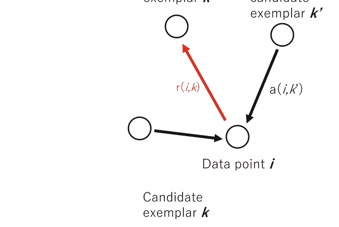

图2.11 发送可用性
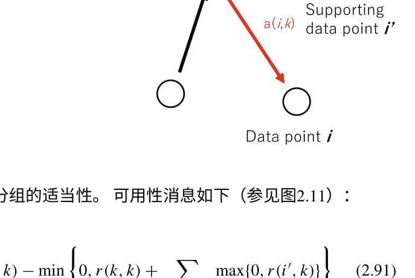

## 算法 2.5 亲和传播的计算过程

- 初始化 $R$（责任）和 $A$（可用性）为0
- 当终止条件未满足时
    - 通过方程 (2.90) 更新 $R$
    - 通过方程 (2.91) 和 (2.92) 更新 $A$
    - 找到满足方程 (2.93) 的样本 $k$
- 结束循环
- ▷聚类结束

AP通过递归计算责任和可用性来找到样本。成为样本的数据点满足以下关系：
$r(k, k) + a(k, k) > 0$。
递归终止的条件是样本节点在一定迭代次数内没有变化，或者递归深度达到一定限制。非样本数据点 $i$ 被分配到其样本数据点 $k$ 所在的簇，使得 $r(i, k) + a(i, k)$ 最大。算法2.5展示了AP的计算过程概述。

图2.12展示了亲和传播的示例过程。⁴不同颜色表示不同的簇。我们可以观察到随着迭代的进行，簇的自组织现象。注意到不同数量的簇逐渐形成。因此，用户无需事先设置簇的数量。

与以前的聚类方法（如 $k$-means算法（第2.2.1节））相比，AP具有以下几个优点：

- 不需要提前确定簇的数量，算法会自动确定。
- 与 $k$-means不同，不依赖于初始值，聚类中心的选择不会影响结果的变化。
- 相似函数 $s(i,j)$ 的约束较松：$s(i,j)$ 不需要满足交换律，也不需要满足三角不等式。

因此，AP已经被广泛应用于许多方法中，包括主动学习[30]、关键图像提取[46]、图像聚类[18, 34]和提取代表性图像[72]。

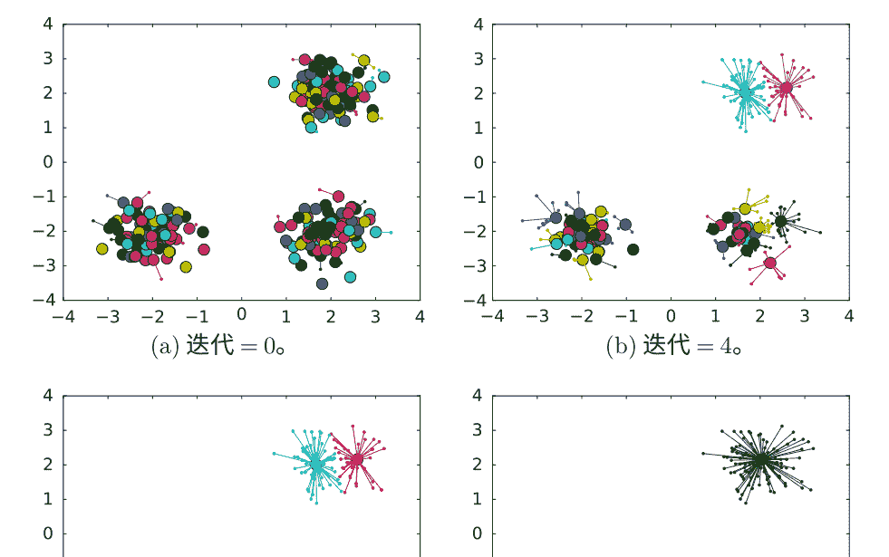

##### 图2.12 AP过程

## 2.3 深度学习框架

### 2.3.1 卷积神经网络和特征提取

当应用于图像处理或文本识别时，传统神经网络在相对于原始训练数据的翻译、旋转或扭曲的情况下往往会产生较差的结果。 这是因为这些神经网络仅使用原始数据进行训练，并忽略了输入数据的拓扑特征。

卷积神经网络（CNNs）被提出来解决这个弱点。 CNNs基于神经生物学的洞察，即视觉皮层包括神经元、LGN-V1-V2-V4-IT层（腹侧通路），这些神经元既具有位置选择性又具有方向选择性。 CNNs也有望成为视觉皮层中物体识别的模型。 这种方法涉及以局部感受野、简单细胞和复杂细胞的形式对视觉进行建模。 CNNs的起源可以追溯到Kunihiko Fukushima提出的新认知机方法[24]。 另一个早期模型是LeNet [44]。


#### 图2.13 卷积神经网络（CNN）示例

CNN是一种多层前馈神经网络，可以从图像中提取拓扑特征，并通过反向传播进行训练。这些网络被设计成能够直接从像素图像中识别视觉模式，几乎不需要任何预处理。这也使得处理各种各样的模式成为可能，例如手写文本。

图2.13显示了CNN的配置，包括递归的C和S层，如下所述：

-   C层：卷积层用于提取特征。
-   S层：池化层用于实现对平移和扭曲的拓扑不变性。

每一层通过整合或平滑来结合前一层的模式。通常，卷积神经网络可以将大图像压缩为少量的对局部变形具有鲁棒性的特征。

C层在输入图像的不同位置检测相同的特征。这意味着与某个特征相关的所有神经元共享相同的权重（但具有不同的偏置）。通过这种方式，前面的神经元对输入中不同位置的相同特征作出响应。然后，如果特征图中的某个神经元发生激活，这就像匹配一个模板（用于提取特征的模式）。这就是卷积发生的地方（见图2.14）。卷积是一种二元操作，它计算两个函数的滑动加权和，将一个函数放在另一个函数上并求和重叠部分。在二维图像处理中，这相当于将原始图像中的像素值与加权矩阵（也称为滤波器、掩模或核）相乘，并求和以获得结果。这使得原始图像可以被柔化或锐化。通常，卷积是应用于给定像素及其周围值的，使用一个小的滤波器矩阵，通常3×3像素大小。由于像素可以并行处理，因此可以非常快速地进行此处理。C层将卷积的结果写入特征图。这意味着通过准备各种滤波器可以生成多个特征图。

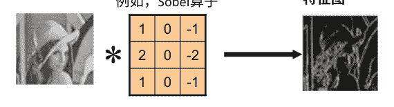

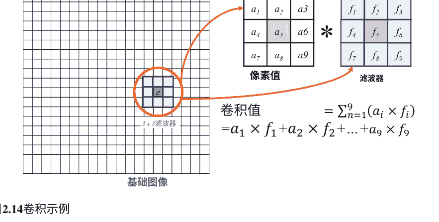

#### 图2.14 卷积示例

#### 图2.15 池化层示例

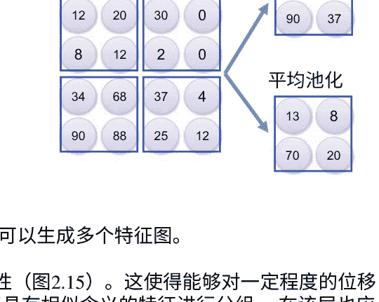

S层降低特征图的空间敏感性（图2.15）。这使得能够对一定程度的位移和扭曲具有鲁棒性。目标是将具有相似含义的特征进行分组。在该层也应用了权重共享，这使得能够减少噪声的影响。S层执行数据压缩和平滑处理。换句话说，这实现了对C层的输出具有鲁棒性，即使在S层的输入中存在变化（如小的位移）时，输出仍然相同。通常，这种处理在没有任何重叠的情况下找到模式的平均值或最大值。这一层处理被称为汇聚层，因为它从S层神经元中汇聚输出并将其输出到C层。

这两个层通常是手动创建而不是训练得到的。之后，使用训练数据进行监督学习[44]。这意味着输入数据需要一定程度的规律性和连续性。现实世界的图像具有这些特征，因此可以预期统计特征会持续存在。

让我们再次看一下图2.13中显示的CNN处理。输入图像使用三个可训练的滤波器和偏置进行卷积，生成C1层中的四个特征图。特征图中的每组四个像素加权并加到偏置值上，通过sigmoid函数生成S1层中的四个特征图。再次对这些特征图应用滤波器生成C2层。S2以与S1相同的方式生成，最后将这些像素值作为输入传递给一个普通的神经网络。

稀疏编码，即处理生物视觉信息的数值模型，与CNN机制相关。稀疏编码使用一小小组基向量，选择这些基向量使得给定的图像可以表示为这些基向量的线性组合。换句话说，稀疏编码从输入到神经网络的大量信息中提取出形成概念所必需的少量信息。随着CNN给出的隐藏层深度的增加，它们以更高维度的方式表达概念，从图像中的点到线条，从线条到轮廓，从轮廓到部分，从部分到整个图像。

一些研究人员尝试训练CNN从大量图像中提取高级特征，例如猫或人脸。[43][43]中使用的网络有九层，由三个子网络组成，每个子网络有三层和一个池化函数。输入了一千万张图像，并使用自编码器[28]对网络进行训练。结果，该网络成功识别出各种对象，如人脸和猫。这个识别设备对旋转、缩放或平移等变化也具有一定的鲁棒性。此外，已经形成了对高级特征（如人脸）具有特定响应的神经元。许多人脸的平均特征（大量的训练数据）被很好地捕捉到。这意味着这可以被视为通过人脸训练获得的神经网络的内部表示。

假设该网络需要训练约一千万个参数。相比之下，人类视觉皮层中的神经元和突触的参数是这个数量的百万倍。这个事实应该让人们对这个模型的实用性有所了解。然而，需要1000个集群机器（共16000个核心）三天的时间来训练这个网络。这是一个非常庞大的计算量。

在另一项研究中，一个卷积神经网络将一个高分辨率图像库（ImageNet [40]）中的120万个数据项分类为一千个不同的类别[40]。该网络由650,000个神经元和6000万个参数组成，分为五个卷积层^5和三个全局连接层，包括softmax激活函数。

5 这些层中的第一、第二和第五层与最大池化相连。

函数。输出层由1000个节点组成，每个节点对应一个图像分类。

以下两种方法被用来减少过拟合问题，这可能是一个问题。

-   数据增强：通过随机从原始图像中剪切一个相对较小的图像，然后进行平移或水平翻转来增加训练样本的数量，从而形成镜像图像。还创建了RGB强度略有变化的图像。
-   Drop out：隐藏层中节点的输出随机设置为0（概率为0.5）。被置零的节点不会对下游节点的输出产生影响，因此不参与反向传播。通过这种方式，每次呈现输入时都会使用不同的架构进行训练。

由于这些改进，神经网络在ILSVRC2012比赛中取得了非常好的结果。在两个GTX 580 3GB GPU上训练网络需要五到六天的时间。使用更快的GPU和更大的数据集可以提高性能。

卷积神经网络在瞬时物体识别方面取得了巨大的成功，不受背景或姿势的影响。这种处理方式与视觉皮层（腹侧通路）中的物体识别相似。与此同时，仍然有一些识别任务无法被卷积神经网络正确处理。例如，识别物体在空间中的位置（由背侧通路而不是腹侧通路处理）和视频识别。

### 2.3.2 生成对抗网络（GAN）和生成欺骗图像

近年来，深度学习作为一种生成模型取得了非常有趣的结果。特别是Goodfellow等人提出的GAN [26]，使得生成的图像比迄今为止被称为生成模型的变分自编码器更清晰。此后，提出了各种各样的变体，包括深度卷积生成对抗网络（DCGAN）[61]和带有GAN的变分自编码器（VAEGAN）[41]。

DCGAN是一种生成模型，它在特定形式上扩展了生成对抗网络（GAN）以进行图像生成。在GAN中，鉴别器和

```
softmax激活函数定义为  f_i(x_1,.............,x_d)=exp(x_i)/sum_j exp(x_j) (i=1,...,d)，其中d是该层的单元数。
```

对数据集中RGB值进行主成分分析，然后进行随机变化，以保留原始自然图像的基本特征。

8 ILSVRC2012数据集是ImageNet数据库的一个子集[40]。 它包含1,000个物体类别。训练集、验证集和测试集分别包含130万、5万和15万张图像。输入图像为224 × 224 × 3像素。

#### 图2.16 如何欺骗深度学习模型

生成器学习机器用于学习分布的形状本身而不提前给出训练数据集的分布，从而开发生成器生成与学习数据集不可区分的数据。从均匀分布中抽样得到的随机数 z 输入到生成器中，以此作为种子生成 x。判别器是一个分类器，用于确定输入是来自学习数据集还是由生成器生成的，使生成器学习。在 DCGAN 中，判别器使用普通的 CNN，生成器使用从 z 开始的反向 CNN。DNN 可以高可靠性地识别图像，但 DNN 很容易被欺骗。例如，如图 2.16 所示，Nguyen 等人的研究表明，实际对象的图像（左侧）和对象的模式（右侧）都被 DNN 以 99.9% 的置信度识别为“吉他”或“企鹅”。换句话说，尽管右侧的图像对人类来说只是一个无意义的模式，但 DNN 将其识别为有意义的对象。

-   右侧的图案是由遗传算法生成的合成愚弄图像，生成过程的细节如下。

1. 步骤1将图像表示为基因型，并进行交叉和突变。
2. 步骤2通过DNN模型识别新图像，并将识别结果的可靠性用作适应度值。
3. 步骤3选择显示所有类别的高识别水平的个体（即图像），并用于生成下一代。

普通遗传算法仅选择目标类别中适应度高的解决方案，以寻找最优解。例如，当目标是将对象识别为“吉他”时，选择被识别为“吉他”且具有高识别可靠性的图像。而在生成愚弄图像时，选择显示包括目标类别在内的所有类别中具有高可靠性的图像，而不是比起在目标类别中具有高识别可靠性的图像。例如，当目标是生成一张吉他的欺骗性图像时，选择了一张在所有类别中都显示出高可靠性的图像，包括“吉他”，“小提琴”和“琵琶”，而不是一张显示出“吉他”高可靠性的图像。在这项研究中，基于像素单元或CPPN（见第3.1.2节）的图像基因型被使用。进化计算成功生成了白噪声和条纹图案的欺骗性图像，展示了DNN模型的脆弱性。

在我们的研究中[70]，类似的过程被应用于原始语音数据，并尝试合成一种计算机可以识别但人类无法理解的语音。在这个实验中，使用遗传算法合成了虚假阳性语音。实验证明，即使对于人类只能听到白噪声的声音，计算机也能以高可靠性识别出有意义的单词。

### 2.3.3 贝叶斯网络和循环置信传播

置信传播（BP）[58]是一种用于树状图模型的推理算法，根据目标可以有一些变种。例如，最大和算法是BP的一个实例，有效地计算这些模型的最高联合概率。循环置信传播（LBP）是将BP应用于具有任意循环图结构的图模型，并近似和快速地推断出最可能的解（MPS）或边际概率。

术语循环最大和用于指代将最大和算法应用于循环图的情况。循环最大和重复更新消息，这些消息是局部计算的联合概率，并最终从消息中近似生成MPS。为了将循环最大和应用于贝叶斯网络，我们必须将它们转换为等效的因子图，这是一种图模型。可以将贝叶斯网络转换为等效的因子图。转换过程如图2.17所示。在贝叶斯网络中，没有父节点的变量节点具有先验概率，有向边表示条件概率。另一方面，在因子图中，因子节点表示先验和条件概率，无向边仅表示连接性。

循环最大和应用于转换后的因子图。设$x_i$为原型树中的第$i$个符号，$\theta$和$G$为一组参数和贝叶斯网络。那么个体和MPS可以用以下方程表示：

```
$\mathbf{x} = (x_1, x_2, \ldots)$ (2.94)
$\mathbf{x}_{MPS} = \arg\max_{\mathbf{x}} P(\mathbf{x}; \theta, G)$. (2.95)
```

设$\mu_{f \to x}$和$\mu_{x \to f}$为从因子节点到变量节点和从变量节点到因子节点的消息，$ne(X)$和$ne(X) \ Y$为

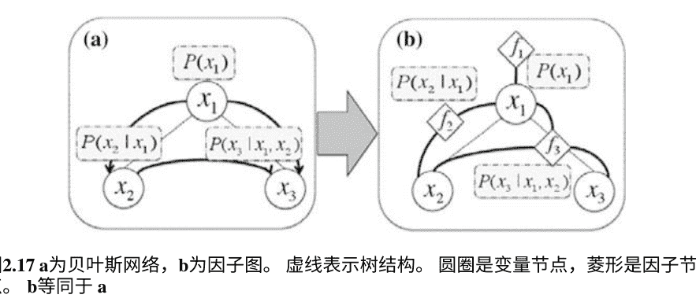

#### 图2.17 a为贝叶斯网络，b为因子图。虚线表示树结构。圆圈是变量节点，菱形是因子节点。b等同于a

分别是与X相邻的节点集合和与X除Y外相邻的节点集合。$f(x_0, \ldots, x_n)$表示因子f在其相邻变量节点为$x_0, \ldots, x_n$时的值。循环最大和的详细信息如下所述。

-   1. 初始化
    所有消息都初始化为0。

-   2. 传递消息
    重复执行消息传递，使用方程（2.96）-（2.99）。方程（2.96）和（2.97）表示来自叶节点的消息，方程（2.98）和（2.99）表示来自非叶节点的消息。

    $$
    \mu_{f \to x}(x) = \ln f(x), \quad (2.96)
    $$
    $$
    \mu_{x \to f}(x) = 0, \quad (2.97)
    $$
    $$
    \mu_{f \to x}(x) = \max_{x_1,\ldots,x_N \in ne(f) \setminus x} \left[ \ln f(x, x_1, \ldots, x_N) + \sum_{m \in ne(f_s) \setminus x} \mu_{x_m \to f}(x_m) \right], \quad (2.98)
    $$
    $$
    \mu_{x \to f}(x) = \alpha_{xf} + \sum_{l \in ne(x) \setminus f} \mu_{f_l \to x}(x), \quad (2.99)
    $$

    其中$\alpha_{xf}$是一个选择的归一化常数，使得$\sum_{x_n} \mu_{x \to f}(x) = 0$。

-   3. 检查终止条件
    如果满足终止条件，消息传递终止。否则，消息传递继续。

-   4. 获取最可能的解（MPS）
    使用公式（2.100）和（2.101）获取MPS。$x_i^{max}$是第i个变量节点周围消息计算出的最可能的实例。

$$x_i^{max} = \arg\max_{x_i} \left[ \sum_{s \in ne(x_i)} \mu_{f_s \to x_i}(x_i) \right] \quad (2.100)$$
$$\mathbf{x}_{MPS} \approx \mathbf{x}^{max} = (x_1^{max}, x_2^{max}, \dots) \quad (2.101)$$

LBP在许多实际应用中取得了成功[21]。 LBP已经在GP中用于概率模型构建[62]。

# 参考文献

-   1. Aha, D.W., Kibler, D., Albert, M.: 基于实例的学习算法。机器学习。6, 37–66 (1991)
-   2. Angeline, P.J.: 进化优化与粒子群优化：哲学和性能差异。In: Porto, V.W., Saravanan, N., Waagen, D., Eiben, A.E. (eds.) Evolutionary Programming VII, pp. 601–610. Springer, Berlin (1998)
-   3. Bäck, T., Fogel, D.B., Michalewicz, Z. (eds.): 进化计算1：基本算法和运算符。物理学出版社，布里斯托尔 (2000)
-   4. Bishop, C.M.: 模式识别与机器学习。Springer，柏林 (2006年)
-   5. Buchberger, B.: 在构建Gröbner基时检测不必要的约简的标准。在：国际符号和代数计算研讨会论文集 (EUROSAM'79)，第3-21页 (1979年)
-   6. Buchberger, B.: 关于构建Gröbner基的复杂性的注释。在：van Hulzen, J.A. (编) 计算机代数，EUROCAL 1983。计算机科学讲义，第162卷。Springer，柏林 (1983年)
-   7. Buchberger, B.: 环中有限生成理想的临界对完成算法。在：Borger, E., Hasenjaeger, G., Rodding, D. (编) 逻辑与机器：决策问题和复杂性。计算机科学讲义，第171卷。Springer，柏林 (1984年)
-   8. Buchberger, B.: Gröbner基：多项式理想理论中的一种算法方法。在：Bose, N.K. (编) 多维系统理论。D. Reidel Publishing Company，多德雷赫特 (1985年)
-   9. Buchberger, B.: Gröbner基在非线性计算几何中的应用。在：Jansen, R. (ed.) 计算代数的趋势。计算机科学讲义，卷296。Springer，柏林 (1987年)
-   10. Buchberger, B., Winkler, F.: Gröbner基和应用，卷251。剑桥大学出版社，剑桥 (1998年)
-   11. Caviness, B.F., Johnson, J.R. (eds.): 量化器消除和圆柱代数分解。Springer，柏林 (2013年)
-   12. Chakraborti, N., Misra, K., Bhatt, P., Barman, N., Prasad, R.: 使用遗传算法及相关技术进行Si-H团簇的紧束缚计算：差分进化研究。J. 相平衡 22(5), 525–530 (2001年)
-   13. Chang, C.-C., Lin, C.-J.: LIBSVM: 支持向量机库。ACM Trans. Intell. Syst. Technol. 2(3), 1–27 (2011)
-   14. Chou, S., Schelter, W.F.: 使用重写规则证明几何定理. J. Autom. Reason. 2, 253–273 (1986)
-   15. Cortes, C., Vapnik, V.: 支持向量网络. Mach. Learn. 20(3), 273–297 (1995)
-   16. Dasarathy, B.: 最近邻 (NN) 范数: NN模式分类技术. IEEE Computer Society Press, Los Alamitos (1991)
-   17. Drucker, H.: 使用增强技术改进回归. In: Proceedings of International Conference on Machine Learning (ICML97) (1997)
-   18. Dueck, D., Frey, B.J.: 无监督图像分类的非度量亲和传播。在：2007年IEEE第11届国际计算机视觉会议上，第1-8页。IEEE (2007年)

- 19. Eberhart, R.C., Shi, Y.: 遗传算法与粒子群优化的比较。 在：第七届进化规划年会论文集，第611-619页（1998年）
- 20. Fan, R.-E., Chang, L.-W., Hsieh, C.-J., Wang, X.-R., Lin, C.-J.: LIBLINEAR：用于大规模线性分类的库。机器学习研究杂志 9，1871-1874页（2008年）
- 21. Felzenszwalb, P.F., Huttenlocher, D.P.: 早期视觉的高效信念传播。国际计算机视觉杂志 70, 41-54页（2006年）
- 22. Freund, Y., Schapire, R.E.: 一个新的增强算法的实验。 在：国际机器学习大会(ICML96)会议论文集（1996）
- 23. Frey, B.J., Dueck, D.: 通过数据点之间的消息传递进行聚类。 科学 315, 972–976（2007）
- 24. Fukushima, K.: Neocognitron：一种不受位置偏移影响的自组织神经网络模型用于模式识别的机制。生物控制论 36(4), 193–202（1980）
- 25. Gämperle, R., Müller, S.D., Koumoutsakos, P.: 微分进化的参数研究。 在：国际智能系统、模糊系统、进化计算大会论文集，pp. 293–298（2002）
- 26. Goodfellow, I., Pouget-Abadie, J., Mirza, M., Xu, B., Warde-Farley, D., Ozair, S., Bengio, Y.: 生成对抗网络。 在：神经信息处理系统进展, pp. 2672–2680（2014）
- 27. Higashi, N., Iba, H.: 带有高斯变异的粒子群优化。 在：IEEE Swarm Intelligence Symposium (SIS03)会议论文集, 第72-79页（2003年）
- 28. Hinton, G.E., Salakhutdinov, R.R.: 用神经网络降低数据的维度。 Science 313, 504–507（2006）
- 29. Holland, J.H.: 自然和人工系统中的适应性。密歇根大学出版社（1975年）
- 30. Hu, R., Namee, B.M., Delany, S.J.: 一个良好的开始：使用聚类在主动学习中选择初始训练集。 在：Florida Artificial Intelligence Research Society Conference (FLAIRS)会议论文集（2010年）
- 31. Huang, C.-H., Wang, C.-J.: 基于遗传算法的特征选择和参数优化支持向量机。Expert Syst. Appl. 31, 231–240（2006）
- 32. Iba, H., Hirochika Inoue, H.: 基于代数约束导向方法的几何概念推理。 在：IJCAI会议论文集，第143-151页（1991年）
- 33. Iba, H., Noman, N.: 进化算法的新前沿：理论与应用。新加坡：世界科学出版公司（2011年）
- 34. 贾, Y., 王, J., 张, C., 华, X.-S.: 使用快速稀疏亲和传播找到图像示例。 在：第16届ACM国际多媒体会议论文集, 第639-642页。ACM（2008年）
- 35. Kapur, D.: 几何推理与人工智能：特刊导言。 Artif. Intell. 37（1988年）
- 36. Kennedy, J., Eberhart, R.C.: 粒子群优化。 在：IEEE国际神经网络会议论文集, 第1942-1948页（1995年）
- 37. 肯尼迪, J., 埃伯哈特, R.C.: 群体智能。摩根考夫曼出版社, 旧金山（2001年）
- 38. 肯尼迪, J., 斯皮尔斯, W.M.: 将算法与问题匹配：对多模态问题生成器上的粒子群和一些遗传算法进行实验测试。 在：IEEE进化计算大会（CEC）论文集，第78-83页（1998年）
- 39. Krink, T., Filipič, B., Fogel, G., Thomsen, R.: 嘈杂的优化问题-微分进化的一个特殊挑战？ 在：进化计算大会论文集，第332-339页（2004年）
- 40. Krizhevsky, A., Sutskever, I., Hinton, G.E.: 使用深度卷积神经网络进行ImageNet分类。 在：神经信息处理系统25（NIPS），第1097-1105页（2012年）
- 41. Larsen, A.B.L., Sønderby, S.K., Winther, O.: 使用学习的相似度度量进行像素以外的自编码(2015). arXiv:1512.09300
- 42. Laubenbacher, R., Stigler, B.: 一种计算代数方法用于逆向工程基因调控网络. J. Theor. Biol. 229, 523–537 (2004)
- 43. Le, Q., Ranzato, M., Monga, R., Devin, M., Chen, K., Corrado, G., Dean, J., Ng, A.: 使用大规模无监督学习构建高级特征. 在: 第29届国际机器学习大会论文集 (2012)
- 44. LeCun, Y., Bottou, L., Bengio, Y., Haffner, P.: 基于梯度的学习应用于文档识别. Proc. IEEE 86(11), 2278–2324 (1998)
- 45. Limbeck, J.: 计算近似边界基和应用, 博士论文, 帕绍大学, 帕绍大学, 博士学位论文 (2014)
- 46. Liu, Z., Li, P., Zheng, Y., Sun, M.: 通过聚类找到关键短语的示例术语. 在: 2009年经验方法在自然语言处理中的会议论文集, 卷1, 第257-266页. 计算语言学协会 (2009)
- 47. Loos, R.: 引言. 在: Buchberger, B., et al. (eds.) 计算机代数符号和代数计算. Springer, 柏林 (1982)
- 48. Maclin, R., Opitz, D.: Bagging和Boosting的实证评估. 在: 国家人工智能会议论文集 (AAAI97) (1997)
- 49. Müller, H.M., Buchberger, B.: 构造具有预分配零点的多变量多项式. 在: 欧洲计算机代数会议关于计算机代数的会议论文集, 第24-31页 (1982)
- 50. Mourrain, B.: 一种新的正规形式算法标准. 应用代数, 代数算法和纠错码, 第430-442页. Springer, 柏林 (1999年)
- 51. Nguyen, A., Yosinski, J., Clune, J.: 深度神经网络很容易被愚弄: 对于无法识别的图像有高置信度预测. 在: 2015年IEEE计算机视觉和模式识别 (CVPR) 会议论文集, 第427-436页 (2015年)
- 52. Noman, N., Iba, H.: 通过局部搜索提高差分进化在高维函数优化中的性能. 在: 遗传和进化计算会议 (GECCO2005) 论文集, 第967-974页 (2005年)
- 53. Noman, N., Iba, H.: 一种新一代的差分进化交替模型. 在: 遗传和进化计算会议 (GECCO 2006) 论文集, 第1265-1272页 (2006年)
- 54. Noman, N., Iba, H.: 经济负荷调度问题的差分进化算法. Elsevier Electric Power Syst. Res. 78(8), 1322–1331 (2008)
- 55. Noman, N., Iba, H.: 使用自适应局部搜索加速差分进化算法. IEEE Trans. Evol. Comput. 12(1), 107–125 (2008)
- 56. Pan, S.J., Yang, Q.: 迁移学习综述. IEEE Trans. Knowl. Data Eng. 22(10), 1345–1359 (2010)
- 57. Paul, T.K., Ueno, K., Iwata, K., Hayashi, T., Honda, N.: 基于遗传算法的健康风险因素识别方法, 旨在预防代谢综合征. In: Proceedings of the 7th International Conference on Simulated Evolution And Learning (SEAL’08). LNCS,vol. 5361, pp. 210–219. Springer, Berlin (2008)
- 58. Pearl, J.: 智能系统中的概率推理: 合理推断网络. Morgan Kaufmann, 圣马特奥 (1988年)
- 59. Price, K.V., Storm, R.M., Lampinen, J.A.: 差分进化: 全局优化的实用方法. Springer, 柏林 (2005年)
- 60. Quinlan, J.R.: Bagging, Boosting和C4.5. 在国家人工智能会议 (AAAI96) (1996年) 的论文集中
- 61. Radford, A., Metz, L., Chintala, S.: 无监督表示学习与深度卷积生成对抗网络 (2015年). arXiv:1511.06434
- 62. Sato, H., Hasegawa, Y., Bollegala, D., Iba, H.: 使用循环信念传播改进采样的概率模型构建遗传编程. Swarm Evol. Comput. 23, 1–10 (2015年)
- 63. Stifter, S.: 用于计算逆运动学的代数方法. 智能机器人系统杂志 11(1–2), 79–89 (1994)
- 64. Storn, R.: 通过约束适应和差分进化进行系统设计。IEEE进化计算杂志 **3**(1), 22–34 (1999)
- 65. Storn, R., Price, K.V.: 差分进化-一种用于全局优化连续空间的简单高效的自适应方案。ICSI技术报告TR-95-012 (1995)
- 66. Storn, R., Price, K.V.: 差分进化-一种用于全局优化连续空间的简单高效的启发式算法。全局优化杂志 **11**(4), 341–359 (1997)
- 67. Swann, J., Neumann, G.K., Krawiec, K.: 通过Grobner基分析语义构建块。在：Johnson, C., Krawiec, K., O’Neill, M., Moraglio, A. (eds.) 遗传编程中的语义方法(SMGP)在自然并行问题求解(PPSN XIV)会议上，斯洛文尼亚卢布尔雅那 (2014)
- 68. Tipping, M.E.: 相关向量机。神经信息处理的进展系统，第652-658页。MIT出版社，剑桥 (2000)
- 69. Vapnik, V.: 统计学习理论。Wiley, 纽约 (1998)
- 70. 杨，杨，伊巴：基于进化计算的愚弄语音。在：进化计算研讨会论文集，12月9-10日，日本北海道 (2017)
- 71. Zaharie, D.: 差分进化算法的控制参数的临界值。在：MENDEL 2002会议论文集，第8届软计算国际会议，第62-67页 (2002)
- 72. Zha, Z.-J., 杨，李，梅，王，王：视觉查询建议。在：第17届ACM国际多媒体会议论文集，第15-24页。ACM (2009)

# 第三章 演化方法在深度学习中的应用

> > 机器写的十四行诗会被另一台机器更好地欣赏。
> (艾伦·图灵)

摘要本章描述了一种演化方法在深度学习网络中的应用。我们首先解释了神经进化方法，该方法可以自适应地学习适合任务的网络结构和大小。神经进化的一个典型例子是NEAT。NEAT在大量问题上表现出优于传统方法的性能。然后，我们解释了几个关于深度神经网络与演化优化的研究，例如遗传卷积神经网络、使用遗传编程进行分层特征构建以及可微分的模式生成网络（DPPSN）。

关键词神经进化·神经进化增强拓扑（NEAT）超级NEAT·L-系统·组合模式生成网络（CPPN）

## 3.1 神经进化

“神经进化”是机器学习中的一个活跃研究领域。这种方法，也被称为演化人工神经网络（EANNs）[22]，将进化方法与神经网络相结合。演化神经网络的关键特点是对最优网络进行遗传搜索。这样可以节省通常需要用来搜索神经网络的工作量（例如通过试错构建网络）。

通过反向传播进行训练，这是训练神经网络通常使用的方法，但由于它基于梯度下降法，往往会陷入局部最优解。为了解决这个缺陷，已经提出了使用进化方法来学习使用哪些链接权重的方法。换句话说，这些方法将网络中的链接权重表示为基因型，然后使用进化计算来搜索最佳网络。在这种情况下，我们通过神经网络输出的误差（表示为基因型，较低的误差表示更好的适应度）来推导适应度值。 表示链接权重（基因型）的方法包括二进制字符串和数值向量。

还要注意的是，在训练神经网络时，需要提前提供网络结构。 相比之下，神经进化可以自适应地学习适合任务的网络结构和大小（节点数量）。 已经提出了两种不同的基因型表示方法来驱动网络结构的进化。

直接编码 直接表示网络结构的链接状态。间接编码 将生成网络的产生规则编码为基因型。

与直接编码相比，间接编码更接近生物模型。例如，直接编码可能将由 N个节点（N1，N2，..., NN）组成的网络表示为N ×N的邻接矩阵，其中每个元素取值为0或1，表示从N i到N j存在一条链接，值为0表示没有此类链接。

对于间接编码方法，关注的焦点是发育系统的编码。 这种方法利用发育生物学的观察结果（见第5.1节）作为创建自然发育的抽象模型的基础，以驱动进化计算算法。 这些模型涵盖了从低级细胞化学到高级语法重写系统的范围。

高级方法之一是使用L系统，这是Lindenmayer在20世纪60年代引入的数学模型，用于描述胚胎发育过程中细胞之间的相互作用[12]。 这些模型通过应用重写规则来描述形态突变。 例如，考虑以下重写规则。

```
F -> F[+F][-F]
```

如果我们假设F是初始符号，那么在前三次迭代中将产生以下字符串。

1. F[+F][-F]
2. F[+F][-F][+F[+F][-F]][-F[+F][-F]]
3. F[+F][-F][+F[+F][-F]][-F[+F][-F]][+F[+F][-F][+F[+F][-F]]][-F[+F][-F]][-F[+F][-F][+F[+F][-F]][-F[+F][-F]]]]

在这里，我们将F视为一个分支，方括号[和]表示分支分叉，+和-分别表示左侧（+36°）或右侧（-36°）的生长。这些字符串然后表示树的生长过程，如图3.1所示。添加更复杂的规则可以使我们渲染出更逼真的树木（图3.2）。例如，图3.2b使用了下面的重写规则，但是对于这个规则，+和-旋转现在是25°。

```
F -> FF+[+F-F+F]-[-F+F-F]
```

由于描述生物生长过程非常容易，L-系统已经被广泛应用于计算机动画等领域。这使得我们能够获得极其逼真的图像，人们从未想象过这是由计算机绘制的。

确定基因型后，使用以下过程对网络结构进行进化计算进行训练。

1. 通过解码每个个体的基因型找到表型（EANNs的网络结构）
2. 训练每个EANN。在这种情况下，根据预先确定的训练规则（如反向传播），改变权重。
3. 根据训练结果为每个个体确定适应度值。通常，使用相对于期望输出的平方误差来衡量。
4. 根据适应度值选择候选父代，然后通过对选定的父代应用遗传算子创建子代。
5. 如果终止条件尚未满足，则返回步骤1。

此外，尽管Hebb的规则通常用于神经网络的训练规则，但学习率和反向传播中的动量等参数并不容易调整，因为它们取决于任务。因此，人们积极研究使用进化方法来学习适当的参数，以及使用进化计算来搜索比Hebb规则更通用的训练规则。

### 3.1.1 NEAT和HyperNEAT

神经进化的一个典型例子是神经进化增强拓扑结构（NEAT）[16]，这是一种有效优化神经网络结构和参数的方法。NEAT在许多问题上表现出比传统方法更优越的性能。NEAT方法通过逐渐增加少量小网络的复杂性，使得演化可变的网络结构成为可能。第5.4节描述了基于ERNe的神经进化方法和具体应用，ERNe是NEAT的扩展。

图3.3展示了NEAT如何从基因型生成网络表型。基因型由两部分组成。

- 节点信息：输入节点、隐藏节点和输出节点的列表。
- 连接信息：连接节点对的弧的列表。

连接信息包含了弧的起始和结束节点的描述、连接权重、标志表示弧是否启用或禁用以及ID号。例如，在图3.3中有三个输入节点、一个隐藏节点和一个输出节点。还要注意，尽管连接信息中描述了七条弧，但第二条弧被禁用，因此在表型中不表现出来（网络中不存在对应的弧）。

NEAT包括两种类型的自发突变（见图3.3）。

- 节点添加。
- 弧添加。

在图3.3中，数组描述了基因内的链接信息。每个基因顶部的数字是ID号码。新基因的ID号码分配方式是严格递增的。在图3.4的顶部示例中，添加了一条弧。在这个例子中，新基因（弧）被分配了下一个可用的ID号码（在这种情况下是7）。在底部的例子中，要移除的弧首先被禁用，然后添加了两个新的弧基因（ID为8和9）。在这两个弧之间添加了一个新的节点，并将节点信息记录为新的基因（图中省略了节点信息描述）。

当基因交叉时，子代继承父母的基因并保留相同的ID编号。换句话说，ID编号不会改变。通过这种方式，表示法可以追踪每个基因的历史（祖先）。

图3.5展示了NEAT中基因交叉的工作原理。父代1和父代2具有不同的形状，但通过查看基因ID编号之间的共同性，我们可以确定哪些基因是匹配的。匹配的基因是随机继承的。相反，不匹配的基因（中间部分的非匹配基因）和多余的基因

（图3.1 树的生长过程）

（图3.2 L-系统生成的树木）

（图3.3 基因型到表型映射示例（摘自[16]））

**Genome (Genotype)**

| Node Genes | Node 1 | Node 2 | Node 3 | Node 4 | Node 5 |
| :--- | :--- | :--- | :--- | :--- | :--- |
| | Sensor | Sensor | Sensor | Output | Hidden |

| Connect. Genes | Col1 | Col2 | Col3 | Col4 | Col5 | Col6 | Col7 |
| :--- | :--- | :--- | :--- | :--- | :--- | :--- | :--- |
| | In 1<br>Out 4<br>Weight 0.7<br>Enabled<br>Innov 1 | In 2<br>Out 4<br>Weight -0.5<br>DISABLED<br>Innov 2 | In 3<br>Out 4<br>Weight 0.5<br>Enabled<br>Innov 3 | In 2<br>Out 5<br>Weight 0.2<br>Enabled<br>Innov 4 | In 3<br>Out 4<br>Weight 0.4<br>Enable<br>Innov 5 | In 1<br>Out 5<br>Weight 0.6<br>Enabled<br>Innov 6 | In 4<br>Out 5<br>Weight 0.6<br>Enabled<br>Innov 11 |

（图3.4 NEAT中的两种结构突变类型（摘自[16]））

| 父代1 | 父代2 |
|---|---|
| 1: 1->4 | 1: 1->4 |
| 2: 2->4 (DISAB) | 2: 2->4 (DISAB) |
| 3: 3->4 | 3: 3->4 |
| 4: 2->5 | 4: 2->5 |
| 5: 5->4 | 5: 5->4 (DISAB) |
| 8: 1->5 | 6: 5->6 |
| | 7: 6->4 |
| | 9: 3->5 |
| | 10: 1->6 |

基因（即末尾的不匹配基因）从具有更好适应性的父代继承。在图中，假设两个父代具有相同的适应性，因此在两种情况下基因都是随机继承的。禁用（或启用）的基因可能在将来变为启用（或禁用）状态。

通过应用于各种领域，NEAT的有效性得到了验证。例如，模块化NEAT在学习玩《Ms. Pac-Man》视频游戏（图3.6）方面表现出比传统方法更好的结果[13]。这种NEAT同时表达多个模块。每个模块学习不同的策略，并且在任何给定时间决定使用哪个策略也是通过进化过程获得的。输入采用特征值的形式，例如玩家和幽灵的位置。在像Pac-Man这样的游戏中，奖励和惩罚是延迟的，因此需要从长期的角度来判断条件，传统的强化学习也被指出无法胜任充分地。模块化NEAT通过训练“诱导模块”并根据情况适当选择使用哪个模块来得分（图3.6）。

### 3.1.2 CPPN和模式生成

NEAT通过一种称为组合模式生成网络（CPPN）的编码方法进行扩展，创建了超NEAT，这引起了很多关注。

CPPN是一种可以使用笛卡尔坐标表达复杂递归模式的发展系统模型。从根本上说，这是一个网络，其中坐标值作为输入，命名位置处的表型作为输出。

图3.7显示了二维情况下的行为示意图。在图3.7a中，基因型是一个函数 f，相应的表型是通过将二维坐标 (x, y) 作为输入传递给 f，并使用在 (x, y) 坐标位置得到的结果值作为输出生成的空间模式。为了表达这个函数 f，CPPN使用通过组合各种函数形成的网络进行编码。图3.7b显示了一个二维CPPN，其中输入是坐标 (x, y)，输出是在该坐标处获得的表型值。与神经网络一样，每个连接都有权重定义，并且给定节点的输出在成为下一个节点的输入值之前乘以连接权重。

CPPN可以使用原始函数（如高斯和正弦函数）来表达复杂的规律和对称性，如图3.8所示。请注意，这个图是通过交互式进化计算（IEC，见第1.6节）[15]得到的。

这里使用的原始函数模拟了发育系统中的特定现象。例如，高斯函数模拟了左右对称性，而周期函数（如正弦函数）模拟了身体分段的差异化。

生成的表型（图3.8）是自然界中观察到的几何重要特征。例如，(a) 中的图可以被视为脊椎动物中双侧对称性的模型，而 (b) 中的不完美对称性和递归可以被视为皮层中右手性和感受野的模型，(c) 中的递归伴随着变换可以被视为皮层柱或柱状结构的模型。¹

还有其他方法可以生成类似于CPPN产生的空间模式。一个基于IEC的图形艺术的例子是Sbart[20]，这是一个使用遗传编程生成二维图像的系统。Sbart根据对包括变量 x 和 y 的二维向量进行计算来渲染图像。将图像中每个点（像素）的 x 和 y 坐标代入公式中，然后适当地将得到的值转换为渲染信息，就可以得到令人惊叹的美丽二维图像²（见图3.9）。

> ¹大脑皮层中神经元具有相似特性的区域。在小鼠的感知领域中，相信每个单独的触须对应一个柱状结构。

> ²这个图像是由参考Sbart创建的LGPC for Art模拟器生成的。这个工具可以用来“培养”对其创作产生影响。请访问我们的网站了解有关安装和使用LGPC for Art的信息。

#### 图3.9 LGPC用于艺术

例如，在图中从左到右的第三个图表（表型）的基因型如下³：

```
$$RGB = \min(x \vec{0} y, \min(y \vec{x} 0, hypot(0 \vec{x} y, 0 \vec{y} x))) - \max(5.400, \frac{x \vec{y} 0}{\min(x \vec{y} 0, y \vec{x} 0)})$$
```

由三个相同实数值组成的三维向量作为常数项，而由图像坐标和常数0组成的三维向量作为变量项。在上述公式中，$y \vec{x} 0 = (y, x, 0)$, $0 \vec{x} y = (0, x, y)$等等。对于函数，对每个单独的元素计算值。

max和min函数通过比较每个向量中的第一个元素的值来进行处理。例如，如果 $x = (x_1, x_2, x_3)$ 和 $y = (y_1, y_2, y_3)$，那么max的定义如下：

```
$$\max(x, y) = \begin{cases} x & \text{当 } x_1 > y_1 \\ y & \text{否则}, \end{cases}$$
```

> ³这里 hypot 给出了两个维度上的欧几里得距离，定义为 $hypot(x, y) = \sqrt{x^2 + y^2}$。

其中，$x = (x_1, x_2, x_3)$和 $y = (y_1, y_2, y_3)$。在图4.9中，每个像素的RGB值是通过首先根据遗传编程生成的数值公式找到一个三维向量，然后取该向量的元素值来表示色调、亮度和饱和度。请注意，动画也可以通过包含一个时间变量来生成，其中0表示出现。

另一种更接近生物模式生成的方法基于图灵模型（图3.10）。这是一个复杂的模拟，通过虚拟化学物质的反应和扩散来解释生物体的形态发生学。通过改变生成和扩散参数，可以生成各种各样的模式，如图中所示（详见[5]）。这些模式类似于海贝壳上的图案或豹尾上的斑纹。

注意CPPN和神经网络之间的结构相似性。这意味着NEAT也可以应用于优化CPPN的结构和参数。这种方法被称为超NEAT。

超NEAT [17] 的基本思想可以总结为以下两点。

- 使用CPPN来表示神经网络的连接和权重。
- 使用NEAT来优化CPPN。

CPPN产生的空间模式可以被视为神经网络的连接模式。例如，如果一个四维CPPN对输入 (x1, y1, x2, y2)输出 w，那么可以解释为坐标 (x1, y1)的节点与坐标 (x2, y2)的另一个节点之间的连接权重为w。当 w 的绝对值低于某个值时，这表示节点之间没有连接（权重与0无法区分）。注意CPPN的输出值已经适当缩放。例如，将节点放置在一个5 ×5的格点上，使用一个以格点中心为原点的二维坐标系统。给定这些节点位置，通过将它们的坐标传递给CPPN来找到节点对之间的连接权重（图3.11）。回想一下CPPN产生的规则和对称的空间模式。这些模式为神经网络生成了规则的连接模式。

例如，CPPN可以轻松表达图3.12中所示的链接关系，例如对称性、不完全对称性、递归和递归伴随变换。

此外，神经网络的输入和输出层可以设置为任意位置。这使得可以使用更多的几何关系。例如，图3.13显示了输入层，机器人的输入传感器（I）和输出模块（O）可以放置在圆形或并行的位置。

通过精确排列神经元，可以使用CPPN编码实现几何规律。生物神经网络具有许多这样的功能。视觉皮层中的神经元与以视网膜中的光感受器相同的拓扑二维模式排列，这种排列被认为是通过与相邻神经元的简单递归连接获得局部性。

在某一群鱼中，众多金字塔形细胞被知道按照视网膜的曲面上的规则阵列排列。例如，四种不同的模式在斑马鱼的视网膜中可以观察到金字塔形细胞，每个细胞对蓝色、红色、绿色和紫外线的光波有不同的敏感峰值。

CPPN也具有相同的模式组合能力。事实上，几何上有效的信息为进化过程提供了领域特定的偏好，这往往超过了简单的优化方法。

#### 图3.11 基于超立方体的几何连接模式解释（摘自[17]）

#### 图3.12 CPPN输出图像（摘自[17]）

(a) 双侧对称

(b) 不完美对称

(c) 重复

(d) 重复并有变化

图3.13 放置输入和输出（摘自[17]）

HyperNEAT已经应用于Atari游戏[2]。它还被应用于视频游戏，如超级马里奥，并且对其有效性非常感兴趣。⁴近年来，提出了DeepNEAT，它是标准神经网络拓扑进化方法NEAT到DNN的最直接扩展[10]。

## 3.2 带有进化优化的深度神经网络

### 3.2.1 遗传卷积神经网络（Genetic CNNs）

谢等人[21]使用遗传算法对深度神经网络（DNN）进行了搜索。具有有限阶段的CNN处理预定义的组成元素网络，例如每个阶段都是卷积层和池化层。即使有这样的限制，可能的网络数量随着层数的增加呈指数增长，通过简单地计数来寻找最佳网络变得复杂。

这里处理的网络由 S个阶段组成，第 s个阶段由 K_s个节点组成。每个阶段内的节点是有序的，并且假设只有从编号较小的节点到编号较大的节点的连接。每个节点对应一个卷积操作，在每个节点上对所有输入节点（即编号较小的节点）求和后进行卷积元素。卷积后，进行批归一化[6]⁵和修正线性单元（ReLU⁶）的实现。请注意，这里处理的网络不是由所有连接组成的。图3.14显示了一个两个阶段的网络的示例（S = 2, (K1, K2) = (4, 5)）。基因型是一个二进制字符串。例如，第1个阶段的基因型是：

```
1-00-111
```

A0和A5分别是输入和输出节点。基因型编码了除了这些输入/输出节点之外的中间节点之间的连接。由于第一阶段的中间节点数量为4，基因型长度为3 × 2 = 6，分别描述了如下的邻接关系（1 = 存在关系，0 = 不存在关系）：

```
A1 → A2 | A1 → A3 | A2 → A3 | A1 → A4 | A2 → A4 | A3 → A4
```

此外，没有输入的中间节点与输入节点相连，没有输出的中间节点与输出节点相连。每个阶段的卷积滤波器数量是恒定的。在这个例子中，第一阶段有32个卷积滤波器，第二阶段有64个。空间分辨率保持不变（第一阶段为32 × 32，第二阶段为16 × 16）。每个池化层的下采样因子为2。

一般来说，当阶段 s 的中间节点数为 K_s 时，基因型长度为 $\frac{1}{2} K_s (K_s - 1)$，每个元素表示存在或缺乏邻接关系如下：

A₁ → A₂ | A₁ → A₃ | A₂ → A₃ | ... | A₁ → A_Ks | A₂ → A_Ks | A₃ → A_Ks | ... A_Ks-1 → A_Ks

这个基因型也可以代表VGGNet [14]， ResNet [3]， DenseNet [4]等等，在DNN中经常使用。图3.15展示了这些表型和它们的基因型。ResNet具有在层之间添加残差函数的结构。通过学习层的输入来学习残差函数，而不是学习在某一层得到的最佳输出，从而改善优化。

在学习中使用了CIFAR10数据集 [8]。这些数据包含32 × 32的RGB图像，共有十个类别。总共使用了50,000张图像作为训练样例，其中10,000张图像作为测试样例。GA的种群大小为20，最大迭代次数为50。每个个体的评估平均耗时为0.4小时，总执行时间为17个GPU天。实验中使用了十个GPU。

表3.1总结了计算实验的结果。CIFAR10是一个包含十个基本类别的分类问题，而CIFAR100是一个包含100个类别问题。SVHN数据集[11]的规模比用于数值识别的数据集要大，包括73,257个训练样本，26,032个测试样本和531,131个额外的训练样本。每个数据都是一个32 × 32的RGB图像。G-N后的GeNet表示第N代中的最佳个体。G-00是从随机生成的初始个体中选择出的最佳个体。此外，GeNet#1和GeNet#2是通过进化得到的最佳个体，该结构在图3.16中显示。为了比较，WRN中的GeNet是残差网络[23]的结果。

为了评估所得到的网络，执行了ILSVRC 2012分类任务（见第68页）。网络结构是固定的，参数适应仅进行了单独的实验。学习大约花费了20个GPU天。在前两个阶段中，应用了具有四个卷积层和两个池化层的VGGNet，并将数据维度改变为56 × 56 × 128。然后，通过应用图3.16所示的网络进行分类。

表3.2总结了实验结果，表明从小数据集（CIFAR10）学习得到的结构也适用于大规模数据集（ILSVRC2012）。通过进化得到的网络比VGGNet-16和VGGNet-19取得了更好的结果。这是因为原始的链式结构（即链式阶段）已被证明更有效的进化结构所取代。

> ⁴在训练过程中，每个层的输入都在当前小批量中进行高斯分布归一化（通常是零均值和单位方差）。已经证明它具有几个好处，例如更快的收敛速度，更容易逃离局部最优解，更稳健的网络。

> ⁵当输入为0或小于0时，输出为0；当输入大于1时，输出为输入本身。

#### 图3.14 具有两个阶段网络的基因型和表型示例（摘自[21]）

#### 图3.15 代表性的深度神经网络基因型（摘自[21]）

#### 表3.1 识别错误率的比较 (%)

| | SVHN | CIFAR10 | CIFAR100 |
|---|---|---|---|
| G-00后的GeNet | 2.25 | 8.18 | 31.46 |
| G-05后的GeNet | 2.15 | 7.67 | 30.17 |
| G-20后的GeNet | 2.05 | 7.36 | 29.63 |
| GeNet#1 (G-50) | 1.99 | 7.19 | 29.03 |
| GeNet#2 (G-50) | 1.97 | 7.10 | 29.05 |
| 来自WRN[23]的GeNet | 1.71 | 5.39 | 25.12 |

#### 图3.16 卷积神经网络中基因型和表型的示例（摘自[21]）

#### 表3.2 在ILSVRC 2012上的结果

| | Top-1 | Top-5 | # 参数 |
|---|---|---|---|
| AlexNet [9] | 42.6 | 19.6 | 62M |
| GoogLeNet [19] | 34.2 | 12.9 | 13M |
| VGGNet-16 [14] | 28.5 | 9.9 | 138M |
| VGGNet-19 [14] | 28.7 | 9.9 | 144M |
| GeNet#1 | 28.12 | 9.95 | 156M |
| GeNet#2 | 27.87 | 9.74 | 156M |

### 3.2.2 使用GP进行分层特征构建

Suganuma [18]等人提出了一种通过进化计算优化两种处理类型来识别特征构建的方法：

- 通过组合现有图像处理滤波器进行图像转换。
- 通过CGP构建的滤波器处理进行图像转换。

使用这种方法，可以通过将优化分为两个阶段而不是同时优化整个多层结构的参数来减少解空间，就像在CNN实现中所做的那样。

特征构建的第一阶段的处理流程如下：

- 使用现有的图像处理滤波器对输入图像进行图像转换（滤波层）。
- 池化处理（池化层）。
- 分类（分类层）。

在特征构建的第二阶段中，通过CGP（参见第1.5节）进行滤波处理，对第一步得到的转换图像进行图像转换。与第一步类似，转换后的图像经过池化处理，池化处理后的每个像素值作为特征量输入到分类器中。通过CGP构建滤波器，使得验证图像集的分类准确率较高。通过训练数据集对由CGP基因型定义的CNN进行训练，并将验证集的结果作为基因型的适应度值。接下来，通过进化搜索更合适的CNN结构。

图3.17展示了一个基因型和表型的示例。左侧的基因型定义了右侧卷积神经网络的架构。在这种情况下，左侧图表中的节点5处于非活动状态。CGP中使用的函数节点在表3.3中显示。

由于分类问题，最后一个输出节点是一个softmax函数（见第68页），具有类别数目，并且与所有输入元素完全连接。

在表3.3中，ResBlock是图3.15中显示的残差网络的描述。ConvBlock后跟一个普通的卷积操作，然后是批量归一化和ReLU函数（见第89页）。作为这个操作的结果，输入特征图 M × N × C被转换为输出特征图 M × N × C'。在这里，M，N，C，C'分别表示行数、列数和输入通道数。

连接函数连接具有不同维度的两个特征图。也就是说，如果两个特征图的行数或列数不同，较大的那个将通过最大池化进行缩小，一旦它们具有相同的维度，它们就会连接在一起。当两个输入尺寸为 M1 × N1 × C1 和 M2 × N2 × C2时，连接操作的输出特征图的尺寸为min(M1, M2) × min(N1, N2) × (C1 + C2)。

求和函数将两个特征图的每个元素相加。如果两个图的大小不同，则进行最大池化下采样。当通道数不同时，较小的通道数将被添加为全零值图像。也就是说，输出的特征图的大小为 min(M1, M2) × min(N1, N2) × max(C1, C2)。

Nagao等人使用CIFAR10数据集（见第91页）测试了该方法的有效性。采用了CGP参数：变异概率为0.05，列数（N_r）为5，行数（N_c）为30，回溯级别（l）为10。

他们在CGP函数节点上进行了以下两种类型的实验：

- ConvSet: ConvBlock, 最大池化, 平均池化, 求和, 连接。
- ResBlock: 最大池化、平均池化、求和、连接。

CGP的最大迭代次数为500（ConvSet）和300（ResSet）。在第一个实验中，从总共50000张图片中随机选择了45000张作为学习样本，剩下的5000张用于CGP的验证。表3.4（左侧）显示了完整数据集的结果。

所提出的方法显示在底部的两行中。为了比较，使用了两种常用的深度学习方法VGGNet [14]和ResNet [23]的数据。

#### 图3.17 基因型和表型的示例（来源：[18]）

#### 表3.3 CGP中的节点函数（C'：输出通道数，k：感受野大小或卷积核大小）

| 节点类型 | 符号 | 变化 |
|----------|------|------|
| 卷积块 | CB(C', k) | C' ∈ {32, 64, 128}<br>k ∈ {3 × 3, 5 × 5} |
| 残差块 | RB(C', k) | C' ∈ {32, 64, 128}<br>k ∈ {3 × 3, 5 × 5} |
| 最大池化 | MP | - |
| 平均池化 | AP | - |
| 求和 | 求和 | - |
| 连接 | 连接 | - |表3.4 CIFAR-10数据集的错误率比较

| 模型 | 完整数据 错误率 | 完整数据 #参数 (×10^6) | 小数据 错误率 | 小数据 #参数 (×10^6) |
|------|----------------|------------------------|--------------|----------------------|
| VGGNet [14] | 7.94 | 15.2 | 24.11 | 15.2 |
| ResNet [23] | 6.61 | 1.7 | 24.10 | 1.7 |
| CGP-CNN(ConvSet) | 6.75 | 1.52 | 23.48 | 3.9 |
| CGP-CNN(ResSet) | 5.98 | 1.68 | 23.47 | 0.83 |

也显示出。图3.18显示了作为进化结果获得的网络结构。 在第二个实验中，从总共5000个图像中随机选择了4500个图像作为学习示例，剩下的500个图像用于验证。 表3.4（右侧）显示了小数据集的结果。 图3.19显示了作为进化结果获得的网络结构。 实验结果表明，使用CGP的方法在分类准确性方面与传统方法相当。更重要的是参数的数量较少。换句话说，使用较小的网络结构可以获得相同的结果。这对于改善传统深度学习方法的缺点非常有意义，即由于参数数量庞大和网络结构的相当专门化设计而导致的学习时间巨大。

### 3.2.3 可微分模式生成网络

Fernando等人[1]提出了可微分模式生成网络（DPPN）框架，它是组合模式生成网络（CPPN，参见第3.1.2节）方法的扩展。DPPN使用与CPPN相同的节点类型。有两种输入节点方法，即

DPPN使用与CPPN相同的节点类型。有两种输入节点方法，即

- 与CPPN相同的身份节点。
- 一个完全连接的线性层，映射到相同维度的向量。

首先，DPPN的结构如图3.20所示进行初始化。该结构具有两个随机隐藏单元。

DPPN的目标任务是噪声去除。因此，使用了一个去噪自编码器。这是一个无监督学习的框架。该网络接收带有噪声的数据 $\hat{x}$ 与教学数据 $x$ 相对应，并通过网络层传递数据，如下所示：

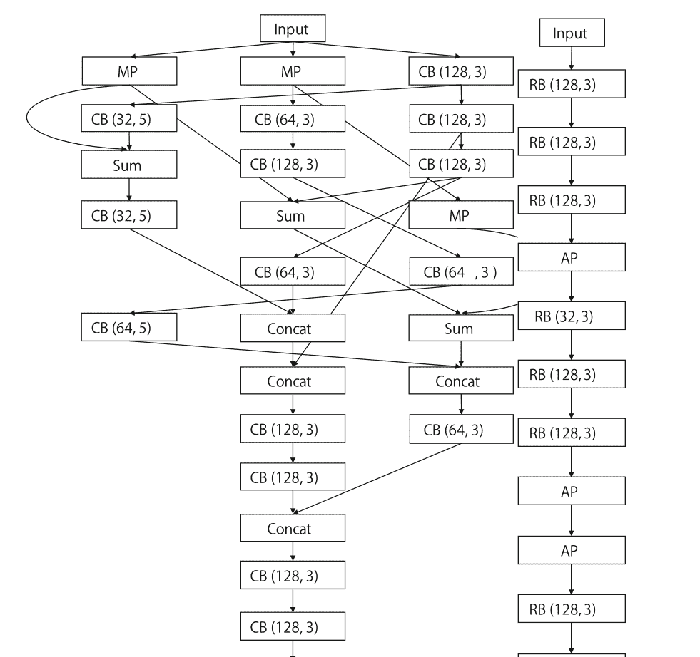

#### (a) CGP-CNN (ConvSet).

#### (b) CGP-CNN (ResSet).

#### 图3.18 基于完整数据集的进化卷积神经网络架构（摘自[18]）

$$ f_{\theta}(\tilde{x}) = f_{\theta_n}^{n} (f_{\theta_{n-1}}^{n-1} ( \cdots f_{\theta_1}^{1} (\tilde{x}) \cdots ) ), \quad (3.1) $$

其中 $\theta= \{\theta_1, \ldots, \theta_n\}$ 是一个参数。在这种情况下，计算出$x$和$\tilde{x}$的均方误差（MSE）和二元交叉熵（BCE$^7$）。在正常的深度学习中，

7 BCE是常用的二元分类损失函数$\mathcal{L}$的特例，它是多类交叉熵的一种特殊情况。定义如下：$\mathcal{L}(\theta) =$

图3.19 基于较小数据集的进化卷积神经网络架构（摘自[18]）

通过梯度方法来最小化误差。 在DPPN中，输出参数 $p$ 直接映射到去噪自编码器的参数 $\theta$。

$-\frac{1}{n} \sum_{i=1}^{n} \left[ y_i \log(p_i) + (1 - y_i) \log(1 - p_i) \right]$ 其中，$n$是样本数量，$y_i$是第$i$个样本的标签，$p_i$是对第$i$个样本的预测。较小的值表示更好的预测。

本质上，进化和学习算法都基于CPPN。然而，DPPN还采用了Lamarckian进化，并且学习到的特征会被继承。在计算适应度值时，使用了DPPN经过1000步的学习结果，每个步骤使用32个样本。

CPPN的权重变化基于损失函数的斜率进行反向传播，但DPPN使用自适应矩估计（即Adam [7]）来进行。这是一种使用梯度矩来自适应地改变学习率的方法。

目标任务是使用10%的参数集对MNIST数据进行重构[8]为0。DPPN的整体流程如算法3.1和图3.21所示。为了评估每个DPPN的适应度值，以下过程重复1,000次：

- 将DPPN的输出复制到自编码器中。
- 通过MNIST小批量进行自编码器的前向和后向传递。
- 通过DPPN对这些梯度进行反向传播。

DPPN间接学习全连接前馈去噪自编码器的参数。该网络具有以下特点：

- 一个具有sigmoid激活函数的编码层。
- 一个具有sigmoid激活函数的解码层。
- 一个由100个单元（10 ×10网格）组成的隐藏层。

8 http://yann.lecun.com/exdb/mnist/index.html。

图3.21 DPPN算法（引自[1]）

也就是说，参数（权重和偏置）的数量为28 × 28 × 10 × 10 × 2 + 28 × 28 + 10 × 10 = 157,684。参数的数量是相似问题的CNN的1000倍。DPPN给出了两层编码和解码这些参数的输出。为了获得这些参数，将157,684个输入提供给DPPN。DPPN的输入是自编码器的以下输入值：

其中 $x_{in}$ 和 $y_{in}$ 是输入神经元的坐标， $x_{out}$ 和 $y_{out}$ 是输出神经元的坐标。 $D_{in}$ 和 $D_{out}$ 是输入和输出神经元中心的距离。这个DPPN生成了157,684 × 2个参数。

$$(x_{in}, y_{in}, x_{out}, y_{out}, D_{in}, D_{out}, layer, 1), \quad\quad\quad (3.2)$$

然而，只有第一行的前28 × 28 × 10 × 10 + 10 × 10个元素和第二行的前28 × 28 × 10 × 10 + 28 × 28个元素被用来编码自编码器的参数。

学习后，取100个随机MNIST图像的负BCE（或MSE）值作为DPPN的适应度。在运行结束时，测试1000个随机MNIST图像并计算BCE或MSE值。

图3.22展示了DPPN对于种群大小为50时，重建手写图像“2”的进化过程。对于参数，交叉概率为0.2，初始个体的DPPN节点数为四个。图的右侧展示了拉马克进化，后代继承了学习到的权重。中间的图展示了巴尔德温进化。学习发生了，但获得的特征不会被继承。此外，左侧的图展示了达尔文进化，学习不会发生。突变

#### 算法3.1 DPPN训练算法

```
对于1,000次比赛 do
    选择两个DPPNs,  d1, d2 ∈ P          ▷ P: DPPNs的种群。
    f1 ← 获取适应度(d1)
    f2 ← 获取适应度(d2)
    从 d1和 d2中选择胜者 A和失败者 B
    B ← 变异(交叉(A, B))
结束循环
```

```
函数 获取适应度(DPPN d)
进行1,000 步 do
    参数     p ← d(c)          ▷ c: 一个输入向量, 方程 (3.2)。
    将 p 复制到去噪自编码器参数 θ
    选择小批量     x 的MNIST图像
    生成带噪声的小批量     x̃
    梯度     gi ← δl(x, fθ(x̃))/δwi    关于DPPN权重    ▷ l: 一个损失函数, BCE或MSE。
    使用Adam更新DPPN权重 {wi}使用 {gi}
结束循环
返回适应度 = -MSE对于1,000个MNIST训练图像
结束函数
```

在突变概率为0.001时，将其添加到权重上。达尔文进化是三种进化方式中最接近CPPN的。在这个例子中，均方误差（MSE）的值分别为0.0036（拉马克进化）、0.02（鲍德温进化）和0.12（达尔文进化）。因此，拉马克进化被发现表现最好。要识别的数字被插入到右侧的图形中（即目标）。每个图形显示了1000次锦标赛进化过程中生成的字符。图形每10次锦标赛进行一次采样，时间从左上角向右下角递增。

实验结果表明，DPPN比CPPN更高效。此外，相比于直接优化大规模网络权重的传统方法，可以进化出更简单的解决方案（即网络结构）。例如，使用DPPN为完全连接的去噪自编码器生成157,684个参数，获得了一个包含一个类似28 ×28权重矩阵的卷积神经网络结构。

这个斑点在隐藏节点的感受野中平滑移动。此外，由于进化的结果，网络还适应了图像裁剪和放大。例如，DPPN在仅有187个参数的MNIST测试数据上达到了0.09的BCE值。即使使用由Omniglot字符⁹或其他数据集组成的数据，也比直接编码网络的方式取得了更好的结果。

Lamarckian MSE = 0.0037 Params = 525

Baldwinian MSE = 0.018 Params = 657

Darwinian MSE = 0.07 Params = 130

#### 图3.22 手写“2”的图像重建（摘自[1]）

# 参考文献

1. Fernando, C., Banarse, D., Reynolds, M., Besse, F., Pfau, D., Jaderberg, M., Lanctot, M., Wierstra, D.: 通过进化进行卷积-可微模式生成网络。 在：遗传和进化计算会议2016年论文集 (GECCO16)，第109-116页 (2016年)
2. Hausknecht, M., Khandelwal, P., Miikkulainen, R., Stone, P.: HyperNEAT-GGP: 基于Hyper NEAT的Atari通用游戏玩家。 在: 遗传和进化计算会议论文集(GECCO 2012), 第217-224页 (2012)
3. He, K., Zhang, X., Ren, S., Sun, J.: 深度残差学习用于图像识别。 在: IEEE计算机视觉和模式识别会议论文集(2016)
4. Huang, G., Liu, Z., Weinbergerz, K.: 密集连接卷积网络。 在: 计算机视觉和模式识别会议论文集(CVPR2017) (2017)
5. Iba, H.: 基于群体的建模和仿真。 Chapman and Hall/CRC, 伦敦(2013)
6. Ioffe, S., Szegedy, C.: 批归一化: 通过减少内部协变量偏移加速深度网络训练。 在: 第32届国际机器学习大会论文集, 第37卷, 第448-456页 (2015)
7. Kingma, D.P., Ba, J.: Adam:一种随机优化方法。 在: 第三届国际学习表示会议(ICLR2015)论文集中
8. Krizhevsky, A., Hinton, G.: 从小图像中学习多层特征。 技术报告1。 多伦多大学计算机科学系(2009)
9. Krizhevsky, A., Sutskerver, I. Hinton, G.E.: 使用深度卷积神经网络进行ImageNet分类。 在: 神经信息处理系统25(NIPS)进展中, 第1097–1105页(2012)
10. Miikkulainen, R., Liang, J., Meyerson, E., Rawal, A., Fink, D., Francon, O., Raju, B., Shahrzad, H., Navruzyan, A., Duffy, N., Hodjat, B.: 进化深度神经网络(2017). arXiv:1703.00548
11. Netzer, Y., Wang, T., Coates, A., Bissacco, A., Wu, B., Ng, A.: 用无监督特征学习在自然图像中读取数字。 在: NIPS深度学习和无监督特征学习研讨会论文集 (2011年)
12. Rozenberg, G. (编) : L之书。 Springer, 柏林 (1986年)
13. Schrum, J., Miikkulainen, R.: 在Ms. Pac-Man中用模块化神经网络演化多模态行为。 在: 遗传和进化计算会议论文集 (GECCO 2014) , 第325-332页 (2014年)
14. Simonyan, K., Zisserman, A.: 用于大规模图像识别的非常深的卷积网络。 在: 国际学习表示会议论文集 (2014年)
15. Stanley, K.O.: 组合模式生成网络：一种新颖的发展抽象。 Genet. Program. Evolvable Mach. (发展系统专题) 8 (2) , 131–162 (2007)
16. Stanley, K.O., Miikkulainen, R.: 通过增加拓扑结构来进化神经网络。 Evol. Comput. 10(2), 99–127 (2002)
17. Stanley, K.O., D’Ambrosio, D.B., Gauci, J.: 基于超立方体编码的大规模神经网络进化。 Artif. Life 15 (2) , 185–212 (2009)
18. Suganuma, M., Shirakawa, S., Nagao, T.: 一种用于设计卷积神经网络结构的遗传编程方法。 在: 遗传和进化计算的论文集。 2017年遗传和进化计算会议 (GECCO2017) , 第497–504页 (2017)
19. Szegedy, C., Liu, W., Jia, Y., Sermanet, P., Reed, S., Anguelov, D., Erhan, D., Vanhoucke, V., Rabinovich, A.: 通过卷积深入研究。 在: 计算机视觉和模式识别会议 (CVPR2016) (2016)
20. Unemi, T.: SBART2.4: 繁殖2D CG图像和电影，并创建一种拼贴类型。 在: 第三届基于知识的智能信息工程系统国际会议论文集, 第288-291页 (1999年)
21. Xie, L., Yuille, A.: 遗传卷积神经网络。在：IEEE国际计算机视觉会议（ICCV）论文集
22. Yao, X.: 进化人工神经网络综述。智能系统国际期刊 **8**，539-567（1993年）
23. Zagoruyko, S., Komodakis, N.: 宽残差网络（2016年）。arXiv: 1605.07146

## 第4章 机器学习方法 进化计算

> 有趣的是，计算机科学家在谈论他们的程序时使用基因型和表现型这个术语。
（约翰·梅纳德·史密斯，《生命的起源：从生命的诞生到语言的起源》）

摘要 本章介绍了几种结合机器学习技术的进化计算方法。所使用的机器学习方案包括bagging、boosting、Gr bner基、相关向量机、亲和支持向量机和k最近邻。这些方法应用于遗传程序设计（GP）、差分进化（DE）和粒子群优化（PSO）的扩展。

关键词 BagGP·BoostGP·消失理想GP（VIGP）·Kaizen编程·RVM-GP·顺序稀疏贝叶斯学习算法·基于亲和传播的粒子群优化（PSOAP）·ILSDE·SVC-DE·DE的迁移学习（TRADE）·NENDE（k最近邻分类器用于DE）

## 4.1 BagGP和BoostGP

我们将整个GP种群划分为一组子种群 {P₁, P₂, ..., P_T}，以使用boosting和bagging技术。当GP应用于每个子种群 Pᵢ中的个体进化时，通过采样方法对训练集T Rᵢ进行采样。

BagGP使用装袋方法，在每个子种群中从原始实例中用替换采样大小为N的训练集。每个子种群中的最佳个体投票，以形成测试数据的综合输出。与最多票数相关联的输出值被视为最终输出。更准确地说，我们使用下面描述的加权中位数（步骤10）进行推导。

BoostGP使用基于AdaBoost.R [12]的以下采样方法。从第一个子种群 \( P_1 \) 到最后一个子种群 \( P_T \) 重复执行以下过程（步骤2–步骤8）。

1. 步骤1: 将 \( t \) 设置为1。每个训练模式被分配相等的权重，即，对于 \( i = 1, \ldots, N \), \( w_i = 1 \), 其中 \( N \) 是训练数据的总数。
2. 步骤2: 训练样本 \( i \) 被包含在训练集 \( T_{R_t} \) 中的概率是 \( p_i = \sum w_i \), 其中求和是对训练集中的所有成员进行的。使用替换的方式选择 \( N \) 个样本来构建训练集。
3. 步骤3: 对子种群 \( P_t \) 中的个体应用遗传编程，使用上述训练集 \( T_{R_t} \)。最好的进化树提出一个假设，即：\( x \rightarrow y \)。
4. 步骤4: 将训练集 \( T_{R_t} \) 中的每个成员通过这棵树 \( h \) 来获得一个预测值 \( y_i^{(p)}(x_i) \), 对于 \( i = 1, \ldots, N \)。
5. 步骤5: 计算每个训练样本的损失 \( L_i = L(| y_i^{(p)}(x_i) - y_i |) \)。损失函数 \( L \) 的定义稍后给出。
6. 步骤6: 计算平均损失，即 \( L = \sum_{i=1}^N \bar{L_i} p_i \)。
7. 步骤7: 计算预测器的置信度，即 \( \beta = \frac{\bar{L}}{1 - \bar{L}} \)。
8. 步骤8: 通过使用 \( w_i := w_i^{1 - L_i} \) 更新权重。
9. 步骤9: \( t := t + 1 \)。如果 \( t \leq T \)，则转到步骤2。
10. 步骤10: 对于测试数据中的特定输入 \( x_i \)，每个从子种群中获得的最佳进化个体，即最好的进化个体，进行预测 \( h_t \) for \( t = 1, \ldots, T \)。使用 \( T \) 个预测器获得累积预测。

$$ h_f = \min \left\{ y \in Y : \sum_{t:h_t \leq y} \log(1/\beta_t) \geq \sum_{t} \log(1/\beta_t) \right\} \tag{4.1} $$

在 Step5中，损失函数 \( L \) 可以是任何形式，只要 \( L \in [0, 1] \)。我们使用以下损失函数：

$$ L_i = \frac{| y_i^{(p)}(x_i) - y_i |}{\max_{i=1,\ldots,N} | y_i^{(p)}(x_i) - y_i |} \tag{4.2} $$

\( \beta \) 是对预测器的置信度的度量，即 \( \beta \) 值越低，置信度越高。在 Step9中，损失越小，权重减小的可能性越大，这使得下一个子种群选择该模式作为训练集成员的概率变小。Step10表示加权中位数。

假设每棵最佳树 \( h_t \) 对第 \( i \) 个模式有一个预测 \( y_i^{(t)} \) 和一个相关的 \( \beta_t \) 值，并且对于模式 \( i \)，预测被重新标记如下：

$$ y_i^{(1)} < y_i^{(2)} < \cdots < y_i^{(T)} \tag{4.3} $$然后将log(1/β^i)求和，直到达到最小的 t，使得不等式成立。从那棵最佳树中得到的预测 i 被视为最终预测。如果所有的β_i都相等，则与中位数计算相同。

我们通过实证研究了BagGP和BoostGP的性能。假设总人口规模设置为 N_psi_ze。这被分为10个子人口规模为 N_psi_ze/10 的子群体，用于运行BagGP和BoostGP。为了比较起见，我们还在规模为 N_psi_ze 的单一人口中运行了经典的GP，即没有任何采样方法的标准GP。实验中使用的参数如表4.1所示。

GP被应用于以下符号回归问题：符号回归的目标是估计一些给定数据的生成函数，并且符号回归出现在广泛的研究领域中（详见第4.2.1节）。

### 实验1 发现三角恒等式

Koza使用GP找到一个新的数学表达式，以符号形式表示，该表达式在其独立变量的所有值上都等于给定的数学表达式[Koza 92, 第10.1章]。在下面的实验中，我们的目标是发现三角恒等式，例如

$$\cos 2x = 1 - \sin^2 x. \tag{4.4}$$

训练数据包括100对，即{(x, cos 2x + ℜ)}，其中精确值上添加了随机噪声ℜ，随机噪声的范围在-0.01到0.01之间。测试数据包括100个输入-输出对，即{(x, cos 2x)}，输出值上没有添加随机噪声。

### 实验2 预测混沌时间序列

Mackey-Glass时间序列是通过积分以下延迟微分方程生成的，并被用作预测算法的标准基准：

$$\frac{dx(t)}{dt} = \frac{a x(t-\tau)}{1 + x^{10}(t-\tau)} - b x(t), \tag{4.5}$$

轨迹是混沌的，并位于一个近似2.1维奇异吸引子上。

为了比较起见，选择的所有参数与之前的研究[Oakley94, p. 380, Table 1 7.3]中的参数相同，只是终端集合包括十个过去的数据用于短期预测（见表4.1）。我们使用前100个时间序列作为训练数据，接下来的400个时间序列作为测试数据。

### 实验3 布尔概念形成（6-多路复用器）

为了展示作为布尔概念学习器的有效性，我们进行了一个简单的实验（6-多路复用器），其中目标函数是6个变量的多路复用器函数：

#### 表4.1 遗传编程参数

| 遗传编程的参数 | cos(2x) (实验1) | 混沌 (实验2) | 6-多路复用器 (实验3) |
|----------------|-----------------|--------------|----------------------|
| 问题名称 | cos(2x) | 混沌 (实验2) | 6-多路复用器 (实验3) |
| 终端符号 | {X,1,0} | {X(t-1), X(t-2), ..., X(t-10), ℵ} | {a0, a1, d0, d1, d2, d3} |
| 非终端符号 | {+, -, *, %, sin} | {+, -, ×, %, sin, cos, exp10} | {AND, OR, NAND, NOR} |
| 子种群数量 | 10 | 10 | 10 |
| 子种群大小 | 200 | 1024 | 1024 |
| 新树的最大深度 | 6 | 6 | 6 |
| 交叉后的最大深度 | 17 | 17 | 17 |
| 突变体的最大深度 | 4 | 4 | 4 |
| 生长方法 | GROW | GROW | GROW |
| 选择方法 | 锦标赛 | 锦标赛 | 锦标赛 |
| 锦标赛K值 | 6 | 6 | 6 |
| 交叉函数点比例 | 0.1 | 0.1 | 0.1 |
| 任意交叉点比例 | 0.7 | 0.7 | 0.7 |
| 适应度繁殖比例 | 0.1 | 0.1 | 0.1 |


#### 图4.1 实验结果（代 vs. 均方误差）

#### 表4.2 实验结果总结

| 问题名称 | cos(2x)（实验1）均方误差 | 混沌（实验2）均方误差 | 6-多路复用器（实验3）成功代 |
|----------|--------------------------|----------------------|---------------------------|
| GP       | 0.056606                 | 0.000375             | 5.15                      |
| BagGP    | 0.001051                 | 0.000244             | 4.80                      |
| BoostGP  | 0.019296                 | 0.000237             | 4.88                      |

$$f(a_0, a_1, d_0, d_1, d_2, d_3) = \overline{a}_0\overline{a}_1 d_0 \vee a_0\overline{a}_1 d_1 \vee \overline{a}_0 a_1 d_2 \vee a_0 a_1 d_3 \quad (4.6)$$

布尔6-多路复用器函数的输入由2个地址位 a_i 和2个数据位 d_i组成。输出是由多路复用器的地址位确定的特定数据位的布尔值。例如，如果 a_0=1且 a_1=0，则多路复用器选择数据位 d^2，因为10_2=2。

对于训练和测试数据集，我们使用完整的64对6个二进制输入变量的集合，即{(a0,a1,d0,d1,d2,d3)∈{0,1}^6}以及由等式(4.6)导出的输出值。

图4.1显示了实验结果，它绘制了平均平方误差（MSE）随世代的变化情况，取20次运行的平均值。图4.2绘制了BoostGP的标准适应度值随世代的变化情况。如图所示，BoostGP能够追踪振荡并快速适应新的训练数据。

表4.2总结了实验结果。该表比较了实验1和实验2最终世代的测试数据的平均平方误差值。对于实验3，列出了获得解决方案树的成功世代。所有这些值都是基于20次运行的平均值。这个比较清楚地显示了BagGP和BoostGP相对于标准GP的优越性。通过BagGP和BoostGP进化的树的鲁棒性得到了增强，即验证适应度值，即测试数据的平均平方误差得到了减少。BagGP和BoostGP之间的性能差异在统计上没有显著意义。

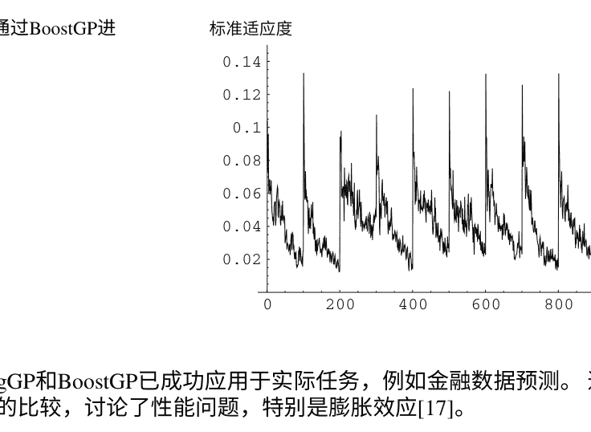

BagGP和BoostGP已成功应用于实际任务，例如金融数据预测。通过与传统GP的比较，讨论了性能问题，特别是膨胀效应[17]。

## 4.2 消失理想GP：代数方法应用于GP

本节介绍了一种新的GP方法（VIGP：消失理想GP[21]），其中在GP的评估阶段之前引入了一种通过理想基的约简阶段。VIGP可以应用于有相当表达能力的有理多项式的符号回归。因此，VIGP能够对各种函数类别实现良好的拟合。

### 4.2.1 符号回归和GP

GP在符号回归方面提供了一种强大的方法，因为它不需要固定的函数模型。然而，众所周知，GP遭受一种称为膨胀的现象，即候选函数在搜索过程中形式过于复杂，这在许多应用中是不可取的。

尽管大多数用于调节膨胀的方法引入了反膨胀的遗传算子或反膨胀的选择方案，但其中大多数都是基于启发式和/或需要调整良好的超参数。在本节中，我们描述了一种新颖的方法，即使用一组多项式（消失理想）作为基础，在搜索过程中减少遗传树的GP。这些多项式对于符号回归的数据点等于零。

在GP中，以树形式表示的函数在搜索过程中是随机生成、交配和变异的。正膨胀是一个众所周知的现象，在GP中，树在搜索过程中迅速变得复杂，导致搜索结果复杂化，导致效率低下且解过于复杂[28]。其中一个原因是，遗传编程中树的适应度是基于其对数据点的均方误差。换句话说，适应度仅基于函数在数据点上的行为。因此，当给定一个简单函数（例如图4.3a；实线）和一个复杂函数（例如图4.3a；虚线），只要它们在数据点上取相同的值，遗传编程将视它们为完全相同（图4.3b）。

关注数据点函数的行为，我们注意到有些函数在数据点上等于零（消失函数），但在代数意义上不等于零。VIGP的关键思想是通过利用这些消失函数，可以从复杂函数中获得简单函数。现在，主要问题是如何找到这些消失函数，以最有效地减少复杂函数。这是一个非常困难的问题，因为存在无限多个消失多项式。然而，当函数限制为多项式时，已知存在一组消失多项式对于数据点（消失理想[26]），也有无限多个元素，可以用一组消失多项式或消失理想的基来描述[5]。通过利用这个数学结果，我们通过除以消失理想的基（图4.3c）将复杂函数简化为简单函数。

假设我们有一个包含$N$个数据点的列表$\mathcal{X} = \{\boldsymbol{x}_1, \dots, \boldsymbol{x}_N\}$，以及在每个点上的目标值列表$\mathcal{T} = \{t_1, \dots, t_N\}$。我们的目标是找到一个 $n$元多项式 $f$满足以下条件：
$$t_i = f(\boldsymbol{x}_i), \quad \forall i \in \{1, \dots, N\}. \tag{4.7}$$
也就是说，要找到一个 $n$元多项式 $f$，在每个点上返回目标值。为了简化符号表示，我们在某些情况下使用 $f(\mathcal{X})$表示 $(f(\boldsymbol{x}_1), \dots, f(\boldsymbol{x}_N))$。

符号回归中的一个常见问题是，对于给定的数据集 $\{\mathcal{X}, \mathcal{T}\}$，满足方程（4.7）条件的解有无限多个。请注意，这个论证适用于一般函数，而在VIGP中，我们限制 $f$为多项式。现在，假设我们有一个满足方程（4.7）条件的函数 $f$。让我们考虑一个在数据点 $\mathcal{X}$上为零的函数 $g$，即 $g(\mathcal{X}) = \mathbf{0}$。在这种情况下，下面的函数 $\tilde{f}$也满足方程（4.7）：
$$\tilde{f} = f + hg, \tag{4.8}$$
其中 $h$是一个在数据点上不会趋于无穷大的函数。这个论证可以如下确认：
$$\begin{aligned}\tilde{f}(\mathcal{X}) &= f(\mathcal{X}) + h(\mathcal{X}) \circ g(\mathcal{X}), \\ &= f(\mathcal{X}) + h(\mathcal{X}) \circ \mathbf{0}, \\ &= f(\mathcal{X}), \end{aligned}$$
其中 $\circ$是一对向量的逐元素乘积。因为存在无穷多个这样的 $h$，所以也存在无穷多个 $\tilde{f}$。在大多数应用中，最简单的解决方案是首选的，而被认为简单的形式取决于应用程序（例如，低次数形式或由少量项组成的形式）。正如已经提到的，虽然遗传编程具有灵活性的优点，可以估计函数模型，但它容易产生过度复杂和不可取的函数。在本节中，我们描述了一种寻找简单解决方案的方法，即它们不包含作为方程式（4.8）中第二项的消失函数。

### 4.2.2 消失理想

设 $\mathcal{P}$ 为一组 $n$元多项式。一个数据点集$\mathcal{X}$的消失理想 $I_\mathcal{X}$是一组在 $\mathcal{X}$上为零的多项式：
$$I_\mathcal{X}= \{g \in \mathcal{P} \mid g(\mathcal{X}) = \mathbf{0}\}.$$
根据希尔伯特基定理，$I_\mathcal{X}$可以由一组有限的多项式 $\mathcal{G}= \{g_1, \ldots, g_s\}$生成[5]。也就是说，当 $I_\mathcal{X}$由一组多项式$G= \{g_1, \ldots, g_s\}$生成，并且满足以下条件时
$$\forall g \in I_\mathcal{X}, \quad g = \sum_{i=1}^{s} h_i g_i, \qquad (4.9)$$
其中 $h_i \in \mathcal{P}$，那么 $\mathcal{G}$被称为消失理想 $I_\mathcal{X}$的基。虽然方程式(4.9)对于 $I_\mathcal{X}$中的多项式是未定义的，但对于任意多项式 $f \in \mathcal{P}$，以下关系成立：
$$f = \sum_{i=1}^{s} h_i g_i + r, \quad \text{s.t. } \mathrm{LM}(f) \geq \mathrm{LM}(r), \qquad (4.10)$$
其中 $h_i, r \in \mathcal{P}$且 $\mathrm{LM}(\cdot)$是多项式相对于纯字典序排序的主导单项式（即 $<_\mathrm{PL}$，请参见第49页或本说明的详细信息）。在单项式排序意义上，$r$始终小于或等于 $f$在等式 （4.10） 中。

请注意，在等式 （4.10） 中，$f$和 $r$一般是不同的，但在数据点 $\mathcal{X}$上它们是等价的：
$$\begin{aligned}
f(\mathcal{X}) &= \sum_{i=1}^{s} h_i(\mathcal{X}) \circ g_i(\mathcal{X}) + r(\mathcal{X}), \\
&= \sum_{i=1}^{s} h_i(\mathcal{X}) \circ \mathbf{0} + r(\mathcal{X}), \\
&= r(\mathcal{X}).
\end{aligned}$$
因此，方程 （4.10） 可以解释为将$f$减少到$r$，同时完全保持数据点的行为。从遗传规划的角度来看，当适应度函数定义为与目标值的均方误差时，这些函数具有完全相同的适应度。正如已经提到的，大多数应用程序更喜欢简单的函数。因此，我们假设$r$比$f$更好，并引入了一种代数减少方法，而不是将惩罚项添加到适应度函数中，这是常见的做法。

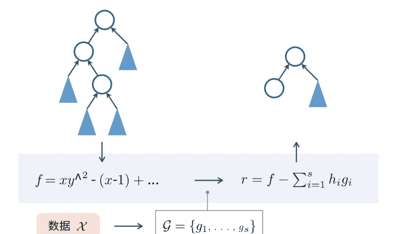

图4.4 消除消失多项式的流程。树被转换为多项式，然后使用数据点集的消失理想基进行简化，该基在事先计算，并最终重新转换为树。

### 4.2.3 VIGP: 缩减过程

在VIGP框架中，根据公式（4.10），在GP的评估阶段之前引入了一个缩减阶段。在这里，我们解释这个缩减步骤。假设我们有一个多项式$f$的树 $T$。然后，我们根据以下过程对树进行缩减：

- 1. 将树 $T_f$ 转换为多项式 $f$，并展开它。在这一步骤中，移除语义内含子^1。
- 2. 根据数据点集 $X$ 的消失理想 $I_X$，计算多项式 $f$ 的剩余多项式 $r$，如公式（4.10）所示。
- 3. 构建剩余多项式 $r$ 的树 $T_r$。

我们在图4.4中提供了该过程的流程图。接下来，我们提供该过程的第二步的详细信息。在这一步骤中，出现以下问题：

- * 如何获得消失理想的基础 $G = \{g_1, \dots, g_s\}$？
- * 如何使用基础 $G$ 将多项式$f$减少为剩余多项式 $r$，如 Eq. (4.10) 所示？

至于第一个观点，我们使用离散值数据点的符号回归的 BM 算法，并使用实值数据点的 ABM 算法（见有关详细信息，请参阅第 2.2.7 节和第 51 页。请注意，只需要计算一次基础 $\mathcal{G}$，因为它仅取决于数据点列表 $\mathcal{X}$。 在获得 $\mathcal{G}$ 之后，我们使用基于方程（4.10）在第 51 页描述的基础 $\mathcal{G}$ 将多项式 $f$ 减少为剩余多项式 $r$。请记住，使用 Gr"obner 基或边界基，多项式 $f$ 可以唯一地形式减少为 $r$。因此，可以从遗传规划的种群中删除重复的多项式。

在减少之后，将多项式转换为树形结构。此时，我们首先从每个单项式及其系数重构树形结构。如果多项式中有 $m$ 个单项式，则重构 $m$ 个树形结构。然后，按照从高到低的顺序使用加法运算符将它们连接起来。

尽管减少和重构可能会破坏在遗传规划中获得的结构，但当语义内含子和消失多项式都可以被删除时，执行它们是值得的。有些树只包含语义内含子，而没有消失多项式。在这种情况下，可能不执行减少操作，而是尽可能保留良好的树形结构。这种减少规则是 VIGP 的一个选项，在 VIGP 中，我们通过利用多项式 $f$ 的高度可以被其树形结构的高度限制来近似遵循它：
$$deg(f) \leq 2^{H(T_f)},$$
其中 $deg(\cdot)$ 是多项式的总次数，$H(\cdot)$ 是树的高度。根据这个界限和多项式中的最小总次数 $deg_{\min}(\mathcal{G})$，我们只对满足以下条件的树应用我们的规约：
$$\lceil \log_2 (deg_{\min} (\mathcal{G})) \rceil \leq H(T_f),$$
其中 $T_f$ 是多项式 $f$ 的树，$\lceil \cdot \rceil$ 是天花板函数，将实数映射到最接近的整数。这个规约规则保留了在遗传编程搜索中获得的良好树结构，同时保留了一些语义上的冗余部分。在我们的实验结果中，VIGP 与不使用此选项之间只有很小的差异。我们主要引入它是为了提高计算速度。

### 4.2.4 VIGP与GP的比较

在本节中，我们将 VIGP 与标准 GP 进行比较，并证明 VIGP 成功地调节了膨胀现象并实现了高效的搜索。首先，我们展示了 GP 中容易出现膨胀现象。在图 4.5 中，树的平均高度（实线；红色）和种群中最小适应度（虚线；蓝色）随着不同的交叉概率进行了绘制。请注意，这里的适应度被定义为均方误差（MSE），因此更小适应度的树优先于更高适应度的树。交叉概率从 0.1 到 0.9 变化，间隔为 0.1，并选择了使得变异概率之和为## 表4.3 实验条件

|  | 图4.5/4.6/4.7/4.9 |
| :--- | :--- |
| 种群大小 | 500/500/500/200 |
| 世代的数量 | 200/200/200/100 |
| 交叉概率 | -/0.9/0.9/0.9 |
| 突变概率 | -/0.1/0.1/0.1 |
| 精英比例 | 0.01/0.01/0.01/0.01 |

图4.5 树的平均高度(实线)和最小适应度(虚线)在遗传编程中的最终种群中。较小的适应度更好。交叉概率从0.1到0.9变化，间隔为0.1。在每个交叉概率下，平均高度非常大。也就是说，出现了膨胀现象。

每个点给出的值是五十次试验的平均值。

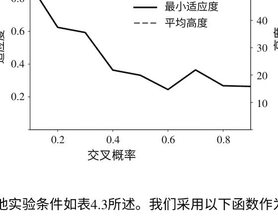

这两个概率之和等于一。其他实验条件如表4.3所述。我们采用以下函数作为目标函数：

$$ f_1^* = x^4 - x^3 + \frac{y^2}{2} - y, \quad (4.11) $$

这是一个用于符号回归的基准函数（Keijzer-12, [24]）。从 $-1.5 \leq x, y \leq 1.5$ 中均匀间隔采样了十六个数据点。每个交叉概率的得分都是五十次试验的平均值。如图4.5所示，不论交叉概率如何，种群中树的平均高度都非常大。换句话说，出现了膨胀现象。随着树的高度增加，节点数量呈指数增长，因此膨胀现象严重消耗内存资源。此外，函数节点的指数增长意味着在评估树时操作的指数增加，导致评估时间很长。

我们将VIGP的性能与符号回归中的GP进行比较，使用实值数据。对于 $N$ 个数据点 $\chi$ 及其目标值 $\mathcal{T}$，树 $T_j$ 的适应度定义如下：

适应度 $=\frac{1}{N} \sum_{i=1}^{N}\left(\hat{f}\left(x_{i}\right)-t_{i}\right)^{2}+\lambda H\left(T_{\hat{f}}\right)$, (4.12)

其中 $x_i \in \mathcal{X}$, $t_i \in \mathcal{T}$, $\lambda$ 是一个超参数，用于控制树高的惩罚权重。再次注意，这里更倾向于具有较低适应度值的树。我们将VIGP与 $\lambda$=0, $10^{-4}$, 0.01, 0.1, 1的GP进行了比较。对于VIGP，我们还给出了一个较小的 $\lambda$=$10^{-4}$，以选择具有完全相同MSE的两棵树中更简单的解决方案。实验条件总结如表4.3所示。对于目标函数，我们采用了方程(4.11)中的$f_1(x)$和以下函数：

$$ f_2^{*}=\frac{x^{3}}{5}+\frac{y^{3}}{2}-y-x, $$

这也是符号回归的基准函数之一（Keijzer-15, [24]）。从 $-1.5 \leq x, y \leq 1.5$ 中均匀间隔采样了16个数据点。结果如图4.6所示。图4.6中给出的平均高度和MSE表示二十次试验的平均值。从图4.6a、c可以看出，VIGP

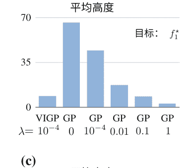

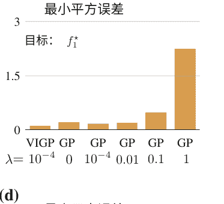

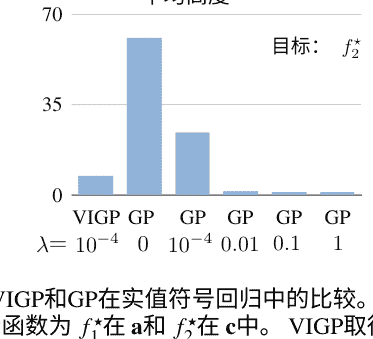

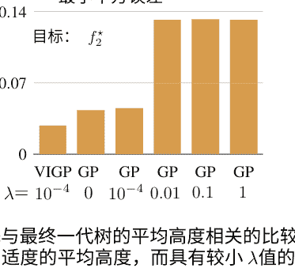

图4.6 VIGP和GP在实值符号回归中的比较。a,c与最终一代树的平均高度相关的比较，其中目标函数为 $f_1^*$在a和 $f_2^*$在c中。VIGP取得了适度的平均高度，而具有较小 $\lambda$值的GP导致正向膨胀，具有较大 $\lambda$值的GP导致负向膨胀。b,d与最终一代中最小MSE相关的比较，其中目标函数为 $f_1^*$在b和 $f_2^*$在d中。VIGP取得了最小的MSE。

成功地调节了树木的高度，而具有较小值的GP λ失败了。随着 λ值的增加，GP也实现了更短的平均树高。

然而，从图4.6b、d可以看出，虽然VIGP找到了一个具有较小均方误差的好解，但具有较大值的GP λ只找到了较差的解。通过比较这些结果，我们还可以观察到，在没有仔细选择每个问题的 λ值的情况下，GP的性能会下降，出现极短的平均树高，即所谓的负膨胀（例如，图4.6a、c中具有较大 λ值的GP），或者较大的均方误差（例如，图4.6b、d中具有较大 λ值的GP）。再次注意，这个问题在VIGP中不会发生，因为它不涉及超参数。消失理想的基础只是根据数据点计算得出的，当数据点暗示需要复杂的多项式进行良好拟合时，通过简化得到的基础会留下相当复杂的多项式。

在这里，我们使用的是训练数据而不是未见过的测试数据来测量均方误差 (MSE)。使用未见过的测试数据通常用来衡量估计解是否避免过拟合。在VIGP中，我们专注于调节膨胀，而过拟合是另一个独立的现象，正如[6, 34]所指出的。

### 4.2.5 有理多项式的VIGP

在前一节中，我们使用加法和乘法作为运算符。在这里，我们引入了一个除法运算符，以扩展函数类到有理多项式。有理多项式被认为是具有相当表达能力的函数类。尽管Taylor展开以多项式形式近似任意函数，但Padé近似以有理多项式形式给出了更好的近似[1]。因此，尽管VIGP目前仅限于有理多项式，但我们认为其表达能力对于实际应用已足够。

在VIGP的约简阶段，一棵树 $T$被转换成以下形式的有理多项式：

$$ f = \frac{f_{\text{num}}}{f_{\text{den}}} $$ (4.13)

其中 $f_{\text{num}}, f_{\text{den}} \in \mathcal{P}$。然后，分别使用一个消失理想的基础来约简分子和分母。最后，通过使用除法运算符将约简的有理多项式转换为树。我们将VIGP与GP在有理多项式的情况下进行了比较，结果如图4.7所示。最终世代的平均高度和最小MSE是二十次试验的平均值。实验条件见表4.3，并使用以下目标函数：

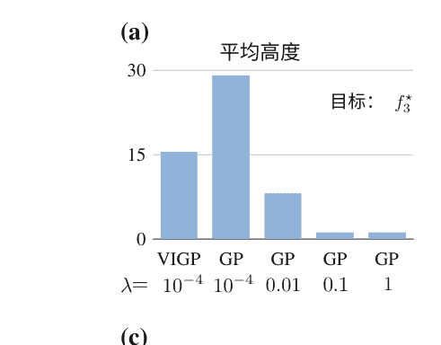

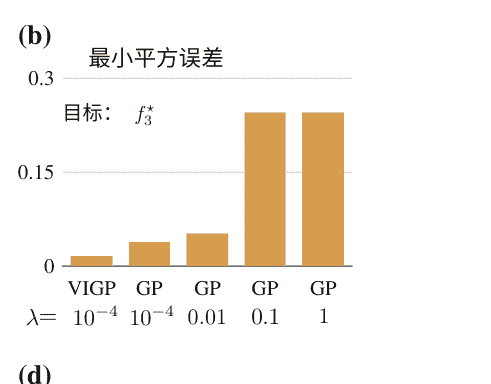

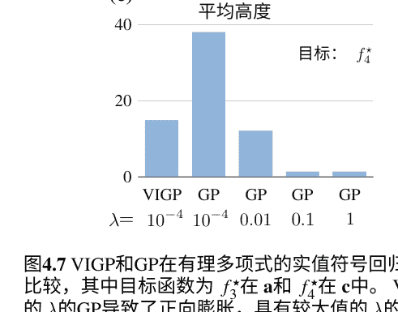

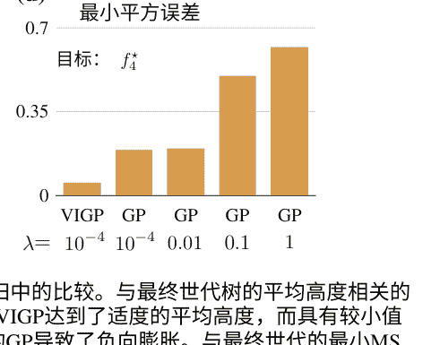

图4.7 VIGP和GP在有理多项式的实值符号回归中的比较。与最终世代树的平均高度相关的比较，其中目标函数为 f3*在a和 f4*在c中。VIGP达到了适度的平均高度，而具有较小值的 λ的GP导致了正向膨胀，具有较大值的 λ的GP导致了负向膨胀。与最终世代的最小MSE相关的比较，其中目标函数为 f3*在b和 f4*在d中。VIGP实现了最小的MSE。

$$ f_3^* = \frac{8}{2 + x^2 + y^2}, $$
$$ f_4^* = \frac{1}{1 + x^{-4}} + \frac{1}{1 + y^{-4}}, $$

它们分别是来自[24]到[27]的基准函数。从 -2 ≤ x, y ≤2均匀间隔采样了二十五个数据点。树的适应度定义为方程(4.12)。从图4.7a可以看出，当目标函数为 f3*时，VIGP在最终一代中达到了适度的平均高度，而具有不合适的 λ值的GP导致了正向或负向的膨胀。同时，VIGP在最终一代中实现了最小的均方误差(MSE)，而具有不合适的 λ值的GP只能实现较大的MSE（图4.7b)。当目标函数为 f4*时，可以观察到类似的趋势（图4.7c，d）。VIGP实现了适度的平均高度和最小的MSE，而具有过小或过大 λ值的GP则实现了显著较差的结果。由于在λ=0的情况下，树受到了极端正向膨胀的影响，并且计算在几天后仍未停止，因此省略了GP的结果。


图4.8 常规VIGP和仅删除语义内含子的VIGP之间的比较(VIGP-)。与最终一代树的平均高度相比较。VIGP成功调节了两个目标函数中树的平均高度。与最终一代中最小MSE相比较。VIGP在两个目标函数中实现了最小的MSE。

我们已经证明了VIGP成功调节了膨胀问题，并在MSE方面找到了更好的解决方案。然而，在VIGP中不仅删除了消失的多项式，还删除了语义内含子。因此，可能不仅是消失的多项式的删除，而是语义内含子的删除对结果起到了主要贡献。我们将VIGP与不删除消失的多项式的VIGP进行了比较。我们称后者为VIGP-。在VIGP-中，树被转换为多项式，扩展，并像普通VIGP一样重新转换为树，在此过程中删除了语义内含子。我们在前一节描述的实值符号回归案例中对它们进行了比较。所有实验条件与该实验相同。从图4.8可以看出，VIGP在两个目标函数中实现了更短的平均高度和更小的MSE。差异足够大，以至于我们可以得出结论，在实值符号回归中，消失的多项式的删除具有非常重要的影响。

### 4.2.6 VIGP用于6位奇偶问题

现在，我们将VIGP应用于6位奇偶问题[28]，其目标是构建一个逻辑函数，在六个输入中有偶数个为1的情况下返回1。一般来说，遗传程序设计的树的函数节点使用逻辑运算符（例如AND、OR）。逻辑函数可以映射到布尔多项式，即系数为零或一的多项式，在模二下进行计算。一般来说，逻辑函数和布尔多项式之间没有一对一的映射关系。在这种情况下，选择哪种映射并不是一件简单的事情，而且选择很大程度上影响遗传程序设计树的高度。为了避免这个问题，


图4.9 VIGP和GP在6位奇偶问题上的比较。与最终一代树的平均高度相关的比较。VIGP成功地调节了树的平均高度。与命中率相关的比较。VIGP的命中率低于GP的命中率。

为了效果，我们只使用了AND运算符和XOR运算符，分别对应布尔域中的乘法和加法。

为了比较，我们将命中率定义为解决6位奇偶问题的试验次数与总试验次数之比。结果如图4.9所示，并作为二十次试验的平均值给出。从图4.9a可以看出，VIGP在最终种群中的树的平均高度最短。然而，从图4.9b可以看出，VIGP在命中率方面的结果较差。这个结果的一个可能解释是，在6位奇偶问题中，函数只取两个值（零或一），并且从不发散。在实值情况下，树形式的复杂函数往往具有高度和复杂行为。因此，这样的函数在均方误差方面往往表现不佳。此外，当其中一些函数最终实现了较低的均方误差并在种群中繁殖时，从它们中找到更好的解决方案变得困难，因为这样的复杂函数对微小的修改非常敏感。也就是说，通过少数交叉或突变从复杂函数生成的函数具有与父代一样复杂的行为，但往往具有较大的均方误差。因此，它们很少能取代父代，并很快从种群中消失。换句话说，进化将陷入局部最优解。

另一方面，在6-奇偶问题的布尔情况下，即使是复杂的函数也只取零或一的值，因此对于修改不太敏感。因此，可以通过交叉或变异操作从中找到更好的解决方案。为了支持这个讨论，我们将在下面证明，GP找到的解决方案相当复杂，不是最简单的形式，而VIGP找到的解决方案是最简单的形式。

我们在图4.9b中观察到VIGP的命中率低于GP。然而，当我们仔细比较VIGP找到的解决方案与GP的解决方案之间的差异时，我们注意到解决方案的形式完全不同。在6-奇偶问题中，$ a_1 + a_2 + a_3 + a_4 + a_5 + a_6 + 1 $ 可以被认为是最简单的解决方案，其中 $ a_i $ 是变量。在这里，当解决方案由六个以上的运算符组成时，我们认为它们不是最简单的形式。


图4.10 VIGP和GP在6位奇偶问题的解的简单性方面的比较。a与最简单解（即，a1 + a2 + a3 + a4 + a5 + a6 +1）相比的命中率。b解中操作符的平均数量。a–b VIGP找到的解都是最简单的，而GP找到的解中包含更多的操作符。

如图4.10所示，VIGP找到的解始终是最简单的，而GP找到的解很少是最简单的。当我们从操作符数量的角度比较解时，我们发现VIGP构建的解的操作符数量约为GP的一半（图4.10b）。总之，VIGP比GP更频繁地找到了最简单的解。

## 4.3 改善编程

在本节中，我们介绍了在[7-10]中引入的改善编程（KP）。这是一种基于改善事件[18]和PLAN-DO-CHECK-ACT（PDCA）方法论[15]的符号回归求解的混合方法。在现实世界中，改善事件是专家提出他们的想法并测试它们来解决业务问题的事件（见图4.11）。

然后将许多想法结合起来形成解决问题的完整方案，这被称为标准。在改善事件中，采用PDCA方法来提高当前标准的质量，计划、执行、检查和行动进行调整。PDCA循环迭代，直到解决业务问题。由于在每个周期中每个动作对解决问题的贡献都基于特定的标准进行分析和评估，因此可以获得关于问题的更多知识。结果，专家从改进的信息中学习，并避免无用或有害的行动，并控制搜索过程，从而得到更好的解决方案。图4.12显示了高级KP的流程图。

为了解决回归问题，根据[10]，有三个基本模块对于KP来说是重要且必要的：

-   特征生成模块，用于提出回归特征的想法。
-   特征选择模块，用于评估和选择有贡献的特征。
-   模型生成模块，用于使用生成的特征创建完整的解决方案。

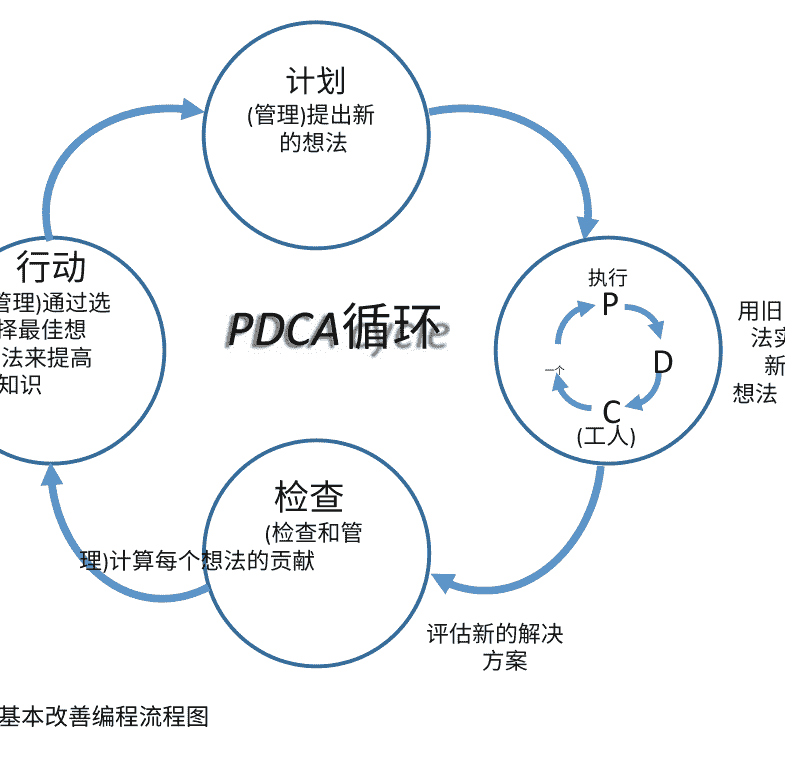

图4.11 基本改善编程流程图

特征生成模块定义了专家的实际形式，包括其数据结构和执行过程。专家将提出新的想法来解决问题，例如通过修改当前最佳解决方案中包含的一些想法。对于解决回归问题，一个想法可以是一个数学表达式，例如 $\frac{1}{2} x^3 + \sin x$，它等同于线性回归模型中使用的一个特征。

在特征选择模块中，评估新的想法以生成一个实际的部分解，可以将其视为一个 $N$ 维向量，其中 $N$ 是训练数据的数量。这些部分解与当前标准中的旧部分解相结合，形成一个由部分解组成的最终完整解。然后评估每个部分解以指示其对问题的贡献。由于这些部分解之间的关系，该步骤使用一个度量考虑每个部分解的独立质量以及它们之间的依赖关系。与传统的进化算法相比，KP的主要区别在于它们使用个体作为完整解。因此，在KP中，个体相互合作，因此种群的规模较传统的进化算法要小，个体之间必须相互竞争才能生存。

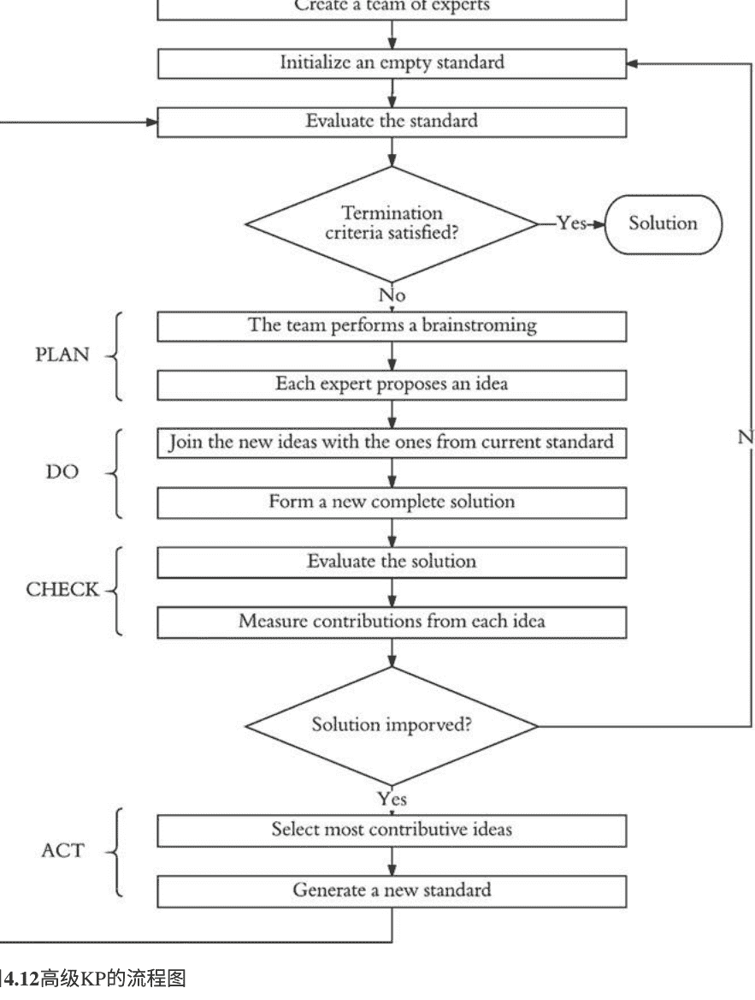

图4.12 高级KP的流程图

在模型生成模块中，基于上一个模型的结果生成标准（完整解）。例如，在从结构中选择了几个最重要的部分解之后，通过执行最大似然估计（MLE，参见下面的公式（4.17））将系数拟合到数据中，这相当于最小化均方根误差（RMSE）。还需要评估完整解的质量。其中一个原因是估计算法是否陷入了局部最优解。

根据[10]，PDCA循环起到鼓励专家提出有意义且有用于解决问题的想法的作用。这非常重要，因为评估贡献的标准取代了整个解决方案中的适应度。因此，执行第二和第三模块的方法应该是等效的，或者至少在逻辑上相互连接，一个例子是使用相同的标准选择特征来构建模型，更准确地说，用于解决问题的方法和用于评估部分解决方案贡献的方法是等效的。假设特征选择模块和模型生成模块无关，则在特征选择模块中使用的有意义的想法对最终解决问题的方法没有意义。

基于对问题的不断增加的知识，KP指导搜索过程向目标前进。因此，有必要使用技术提供这样的知识。因此，必须有效地使用机器学习技术或统计方法来处理KP的混合结构。如果没有这些技术的帮助，KP将变成一个简单的EC算法，其中搜索仅依赖于选择压力。

在这里，我们提供了一个简单的例子，说明了KP如何用于符号回归，参考文献[10]。KP的实现使用GP提供特征，使用MLE（最大似然估计，等同于最小化RMSE，参见第129页）构建测试解决方案，并使用NHST（零假设显著性检验，参见第128页）构建标准。假设真实目标函数如下：

$ y = x^3 + x, x \in \mathbf{R}. $ (4.14)

回归目标是根据给定的输入$x$预测输出$y$。输入-输出对的假设如下：

$ \{x_n, t_n\}_{n=1}^{N} = \{(0.0, 0.0) , (0.1, 0.101) , \ldots , (1.0, 2.0)\}, $ (4.15)

输入是在0.0到1.0之间均匀分布的序列。如果我们假设$t$是由一个常数项和一个线性项的总和给出的，线性回归模型的形式为：

$ y = w_0 + w_1 x, $ (4.16)

其中$w_0$和$w_1$是未知参数，它们的值需要从给定的数据中估计。这可以通过最小化误差函数来实现。在回归领域中，一个被广泛接受的误差函数是均方根误差（RMSE），表示为：

#### 表4.4 例子问题的系数和 p值 [10]

| $\phi_i$ | 系数($w_i$) | p值 $i$ |
|----------|-------------|---------|
| 1.0 | $1.18 \times 10^{-16}$ | 0.04 |
| $\phi_1 = x^2$ | $2.89 \times 10^{-13}$ | 0.15 |
| $\phi_2 = \sqrt{x}$ | $1.34 \times 10^{-12}$ | 0.14 |
| $\phi_3 = \log (x + 1)$ | $1.13 \times 10^{-12}$ | 0.15 |
| $\phi_4 = x^3$ | 1.00 | $5.07 \times 10^{-54}$ |
| $\phi_5 = x$ | 1.00 | $1.41 \times 10^{-48}$ |
| $\phi_6 = \sqrt{\log (x + 1)}$ | $-1.32 \times 10^{-12}$ | 0.14 |

p值 > 0.05表示统计上系数($w_i$) $\approx 0$。

地面真实方程：$y(x) = x + x^3$

输入输出对：{(0.0, 0.0), (0.1, 0.101), ..., (1.0, 2.0)}

当前种群：$\phi_1, \phi_2, \phi_3$

产生的后代：$\phi_4, \phi_5, \phi_6$

测试解：$y_{test} = w_0 \times 1.0 + \sum_{i=1}^6 w_i \phi_i$

更新后的解：$y = 1.34 \times 10^{-16} + 1.0 \times x + 1.0 \times x^3$。

请注意，均方根误差（RMSE）是一个非负量，只有当函数 y 恰好通过每个训练数据点时，才为零；因此，期望低误差值。通过对未知参数 w0 和 w1 求 RMSE 的导数，并将其设为零，我们能够确定与真实目标最佳逼近函数：

$$ y= -0.189 + 1.928x $$ (4.18)

使用公式（4.17）计算得到的逼近函数的适应度值为：

$$ RMSE[y] = 0.1345 $$ (4.19)

我们将解释如何使用KP来解决这个回归问题。对于KP，一个个体群体是进化和达到最终解的基础。假设当前的KP个体群体包含三个个体（见表4.4）：

$$ \{ind_i\}_{i=1}^3 = \{x^2, \sqrt{x}, \log(x+1)\}. $$ (4.20)

这些个体的适应度值通过RMSE计算得出：

$$ \{ \text{适应度} [ind_i] \}_{i=1}^3 = \{ RMSE [ind_i] \}_{i=1}^3 = \{0.5188979, 0.4121862, 0.576697\}. $$ (4.21)

对于KP问题，我们应该首先选择几个有前途的个体，并对它们应用遗传算子生成新的后代。在这里，我们假设选择和生成过程已经提前执行，结果产生了三个后代：

> $\{子代_i\}_{i=1}^3 = \{x^3, x, \sqrt{\log(x+1)}\}$. (4.22)

同样，在RMSE中计算它们的适应度是：

> $\{ 适应度 [子代_i]\}_{i=1}^3 = \{R M S E [子代_i]\}_{i=1}^3 = \{0.591608, 0.4240932, 0.4862297\}$. (4.23)

如果我们只是简单地选择当前种群中适应度值最小（因为它是错误）的三个个体和新生成的后代，那么得到的下一代包含：

- $\{下一个个体_i\}_{i=1}^3 = \{个体_2, 子代_2, 子代_3\} = \{\sqrt{x}, x, \sqrt{\log (x + 1)}\}$. (4.24)

不幸的是，这不是一个理想的结果，因为一个正确的部分解，即子代₁ = x³，在下一代中消失了。然而，如果给予足够的时间，或者采用另一种选择机制将其保留在种群中，子代₁通过GP系统可能会再次生成这个表达式。GP的问题仍然存在，其中一个重要的解决方案部分在进化过程中被竞争淘汰了。

幸运的是，KP将保留所需的子代₁，因为它通过部分解的合作来工作。在这里，我们假设KP正在使用GP作为特征生成模块。

从PLAN步骤开始（见图4.11），KP应该提出构建新测试解的新想法，选择三个个体${ind_i}_{i=1}^3$，并通过遗传算子进行修改以生成新特征，结果为${child_i}_{i=1}^3$。

接下来，DO步骤将所有个体组合成一组特征，对于回归问题引入一个常数项（称为偏差）作为补充是常见的，结果为：

> $\{ 特征_i \}_{i=1}^7 = \{ind_i\}_{i=1}^3 \cup \{child_i\}_{i=1}^3 \cup \{1\} = \left\{x^2, \sqrt{x}, \log(x + 1), x^3, x, \sqrt{\log(x + 1)}, 1\right\}$, (4.25)

然后，特征集在给定的输入数据上进行评估，并使用本节开头介绍的线性回归技术构建测试解决方案：

> 测试解 = $\sum_{i=1}^{7} w_i * 特征_i$, (4.26)

在CHECK步骤中，将分析在DO步骤中构建的测试解决方案，以评估每个特征在解决回归问题中的贡献或有效性。在KP中，通过零假设显著性检验(NHST)来评估贡献，这可以看作是一种特征选择的过程。

KP中使用的NHST基于学生t-分布，该分布是通过将具有相同期望但不同方差的无限多个高斯分布混合而得到的。与高斯分布相比，学生t-分布在描述真实世界数据时具有一个重要的性质，即鲁棒性。鲁棒性意味着它对少数异常数据的存在不太敏感。

学生t-分布的概率密度函数(pdf)如下所示：

$$St(x|\mu,\lambda,\nu) = \frac{\Gamma\left(\frac{\nu}{2}+\frac{1}{2}\right)}{\Gamma\left(\frac{\nu}{2}\right)} \left(\frac{\lambda}{\pi\nu}\right)^{\frac{1}{2}} \left[1+\frac{\lambda(x-\mu)^2}{\nu}\right]^{-\frac{\nu}{2}-\frac{1}{2}}, \quad (4.27)$$

其中，Γ(x)是伽玛函数，定义如下：

$$\Gamma(x) = \int_{0}^{\infty} y^{x-1} e^{-y} dy. \quad (4.28)$$

由于它基于学生的t-分布，KP中使用的NHST也被称为t-检验。为了评估线性回归模型中特征的贡献，t-检验实际上检查了该特征的相应系数的显著性。具体来说，对于每个系数w_i，提出了两个关于其显著性的假设：

H0: w_i = 0, \quad (4.29)
H1: w_i \neq 0. \quad (4.30)

接下来，测试将验证每个假设陈述的可靠性。如果H0更可靠，意味着w_i不显著，应该在统计上视为零；因此，相应的特征i乘以零系数，使其对解决方案没有贡献，并且应在最终模型中删除。显然，反之亦然。

在这里，为了简单起见，我们应该通过引入矩阵符号来重新阐述我们的讨论。如果我们采取

$$\mathbf{t} = (t_1, \ldots, t_N)^{\mathrm{T}}, \quad (4.31)$$
$$\mathbf{w} = (w_1, \ldots, w_7)^{\mathrm{T}}, \quad (4.32)$$
$$\phi(x) = (feature_1, \ldots, feature_7)^{\mathrm{T}}, \quad (4.33)$$
$$\boldsymbol{\Phi} = (\boldsymbol{\phi}^{\mathrm{T}}(x_1), \ldots, \boldsymbol{\phi}^{\mathrm{T}}(x_N))^{\mathrm{T}}, \quad (4.34)$$

那么未知参数的最大似然估计由以下方程给出：

$$\mathbf{w}_{\mathrm{ML}} = (\boldsymbol{\Phi}^{\mathrm{T}} \boldsymbol{\Phi})^{-1} \boldsymbol{\Phi}^{\mathrm{T}} \mathbf{t},$$ (4.35)
$$\beta_{\mathrm{ML}}^{-1} = \frac{1}{N} \sum_{n=1}^{N} \left\{ y (\mathbf{x}_{n}, \mathbf{w}_{\mathrm{ML}}) - t_{n} \right\}^{2},$$ (4.36)

其中 $\beta_{\mathrm{ML}}$是目标变量高斯噪声的估计精度。MLE结果的协方差矩阵的MLE由以下给出：

$$\operatorname{Cov}_{\mathrm{ML}} (\mathbf{w}_{\mathrm{ML}}) = \operatorname{Cov}_{\mathrm{ML}} \left( (\boldsymbol{\Phi}^{\mathrm{T}} \boldsymbol{\Phi})^{-1} \boldsymbol{\Phi}^{\mathrm{T}} \mathbf{t} \right) = \beta_{\mathrm{ML}}^{-1} (\boldsymbol{\Phi}^{\mathrm{T}} \boldsymbol{\Phi})^{-1}.$$ (4.37)

对于每个系数 $w_{i}$，我们得到相应方差的最大似然估计：

$$var_{\mathrm{ML}} (w_{i}) = [\operatorname{Cov}_{\mathrm{ML}} (\mathbf{w}_{\mathrm{ML}})]_{ii} = \left[ \beta_{\mathrm{ML}}^{-1} (\boldsymbol{\Phi}^{\mathrm{T}} \boldsymbol{\Phi})^{-1} \right]_{ii}.$$ (4.38)

而检验的t统计量为：

$$(t_{0})_{w_{i}} = \frac{w_{i}}{\sqrt{var_{\mathrm{ML}} (w_{i})}}.$$ (4.39)

因此，系数 $w_{i}$的 $p$值由以下公式得出：

$$(p\text{-}value)_{i} = 2 \times (1 - T(|t_{0}|)),$$ (4.40)

其中 $T(x)$是学生 $t$分布的累积分布函数（cdf）。$(p\text{-}value)_{i}$的结果验证了系数 $w_{i}$是否在统计上等于零。如果 $(p\text{-}value)_{i} > \alpha$（$\alpha$是假设检验的显著水平，传统上为0.05），那么假设 $H_{0}$更可靠，因此我们应该从模型中剪枝相应的$feature_{i}$。

对于示例问题，估计的系数 $w_{i}$ 和计算得到的 $(p\text{-}value)_{i}$列在表4.4中，参考自[10]。

最后一步是ACT，应选择有贡献的想法并形成一个新的标准。显然，在表中只有三个特征是有贡献的，它们是 $x$，$x^{3}$和1。因此，在执行特征选择后，简化模型为：

$$\text{简化的} Sol = 1.34 \times 10^{-16} + 1.0 \times x + 1.0 \times x^{3}$$ (4.41)

与GP找到的结果相比，这个解决方案更好地逼近了真实目标函数。如果设置一个更好的阈值（$\alpha$，显著性水平）为假设检验的结果（如0.04）可能导致目标的确切形式。
尽管示例中使用的目标相对简单，可能在几代之后由遗传程序找到，但对于遗传规划来说，只需要一次迭代。
然而，这个示例只考虑了原始标准（完整解决方案）为空的情况。因此，新的标准将简单地被等式（4.41）给出的结果所取代。只要原始标准不为空，就会有几个与所呈现示例不同的地方。首先，特征集将包括原始标准中的其他特征；其次，只有当缩减后的解具有更高的质量时，才会替换原始标准。为了评估质量，应引入一个适应于模型复杂性的适应度函数，因为缩减后的解可能包含不同数量的特征。在[7]中，使用R²值（等式（4.52））来比较模型，而不会被特征数量所误导。

另一个问题是KP采用的PDCA方法导致了一种爬坡法。因此，设置重新开始搜索的标准是很重要的，以避免陷入局部最优解。应该保留当前的标准，而不是被摧毁。在所有重新开始中发现的最佳标准将作为全局解返回。

我们认为KP存在一些需要进一步改进的局限性。主要的局限性如下：

- 1. 当使用MLE解决线性回归问题时，数据方差矩阵的奇异性问题会引起，必须得到适当处理。奇异性是由用于构建模型的相似或相同特征引起的，它将导致参数估计的困难。
- 2. 假设检验需要一个适当调整的显著性水平值。如果阈值过高，解的复杂性将过高增加，并且解中的冗余将影响我们获取内部知识。另一方面，过低的阈值将使得很难找到一个好的目标近似解。尽管在第一种情况下，我们可以通过限制使用的特征数量来控制复杂性的过度增长。但是，如果我们对问题没有先验知识，选择适当的限制仍然是有问题的。

## 4.4 RVM-GP：GP中的自动特征选择的RVM

本节介绍了一种基于稀疏贝叶斯核方法的符号回归新方法，即相关向量机（RVM，参见第2.2.3节）。我们将这种方法称为RVM-GP [13, 14, 29]，它集成了基于GP的树结构搜索和使用自动相关性确定（ARD）的贝叶斯参数估计。我们在KP的基础上扩展了基于RVM的特征选择模块。RVM-GP无需进行假设检验，因此不需要事先设置阈值。它还可以自动处理奇异性。

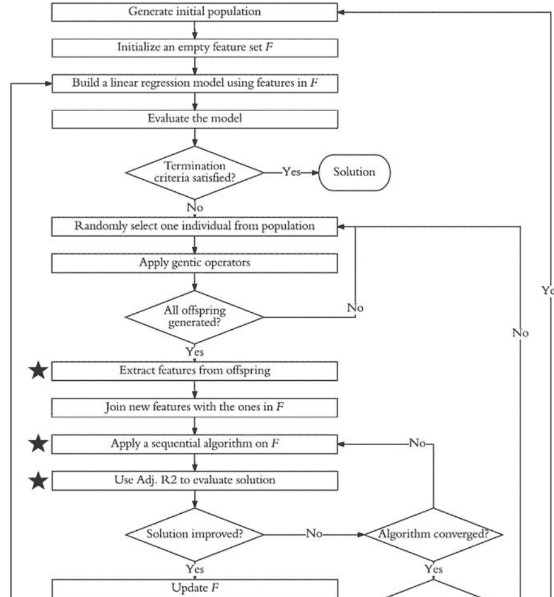

#### 图4.13 基于RVM的方法流程图

在传统的GP中，演化过程仅通过期望新的随机解具有比当前解更好的适应度来完成，没有确定性方法的指导。为了克服GP的主要困难，我们在[7]的KP工作基础上通过改进ARD的特征选择使用RVM进行扩展。因为RVM无需事先设置阈值并且可以自动处理奇异性问题，所以RVM-GP也克服了KP的局限性。图4.13显示了该方法的基本流程图。在下面的段落中，我们将描述三个关键步骤，这些步骤用星号标记（★）表示。

首先必须产生足够数量的候选特征，以确保回归模型的质量。在实验中，我们发现RVM-GP的性能受其所使用特征的多样性强烈影响。

候选特征的缺乏会降低适应度的增长速度，并增加陷入局部最优的风险。

由于我们不再将个体视为解决方案，GP的主要职责是生成特征函数。经验上，我们发现一个好的特征函数通常存在于个体的子树中。然而，由于从树到函数的映射非常复杂，树的最终行为可能会非常不同（例如，$e^{\sin(x^2)}$和$x^2$）。如果我们简单地将整个树作为一个特征函数使用，那么所有的子树都会被浪费，它们很难在未来的一代中再次出现。解决这个问题的一种方法是增加个体的数量，但这仍然会导致更多的子树被浪费。因此，正确的解决方案是对每棵单独的树进行遍历，提取出所有的子树函数。

遍历确保GP树的最大使用。另一方面，还应注意到函数的多样性。显然，我们不应该使用相似的或相同的函数作为特征。由于奇异性，RVM的训练将难以在重复的基础上收敛甚至失败。因此，在实践中使用计算代数库将原始树转换为符号表达式，这将简化函数（从而减少下一次评估的复杂性）并检查它们的唯一性。此外，由于表达式可能经常出现在过程中，实现了一个LRU（最近最少使用）缓存来保存已评估表达式的评估结果。

总之，GP原始树构建候选函数需要两个步骤。首先，将遍历整个树以生成所有子树函数。其次，所有子树将被转换为符号表达式并进行过滤，从而得到不同的函数。

### 4.4.1 顺序稀疏贝叶斯学习算法

在构建候选特征函数之后，下一步是将它们放入RVM进行训练。在实践中，采用了顺序方法来解决优化问题，这显著提高了训练速度。在这里，我们根据[33]简要解释了它的数学背景。继续从方程(2.48)开始，问题是确定超参数α和β[25, pp.5–7]:

$$\alpha^*, \beta^* = \argmax_{\alpha,\beta} (\ln p(\mathbf{t} | \mathbf{X}, \alpha, \beta)), \quad (4.42)$$

在这里，我们明确了边际似然的所有依赖关系，即方程(2.48)，然后明确优化它。为了做到这一点，我们首先从由方程(2.49)定义的矩阵 C 中提取出 α_i 的贡献，得到以下方程:

$$\mathbf{C} = \beta^{-1}\mathbf{I} + \sum_{j=i} \alpha_j^{-1} \boldsymbol{\varphi}_j \boldsymbol{\varphi}_j^T + \alpha_i^{-1} \boldsymbol{\varphi}_i \boldsymbol{\varphi}_i^T$$
$$= \mathbf{C}_{-i} + \alpha_i^{-1} \boldsymbol{\varphi}_i \boldsymbol{\varphi}_i^T$$
(4.43)

其中 $\boldsymbol{\varphi}_i$ 表示第 $i$ 列的 $\boldsymbol{\Phi}$。矩阵 $\mathbf{C}_{-i}$ 表示从基函数i中去除的矩阵 $\mathbf{C}$ 的贡献。使用Woodbury矩阵恒等式，$^2$ 可以将矩阵 $\mathbf{C}$ 的行列式和逆矩阵表示如下：

$$|\mathbf{C}| = |\mathbf{C}_{-i}|(1+\alpha_i^{-1} \boldsymbol{\varphi}_i^T \mathbf{C}_{-i}^{-1} \boldsymbol{\varphi}_i),$$
(4.44)

$$\mathbf{C}^{-1} = \mathbf{C}_{-i}^{-1} - \frac{\mathbf{C}_{-i}^{-1} \boldsymbol{\varphi}_i \boldsymbol{\varphi}_i^T \mathbf{C}_{-i}^{-1}}{\alpha_i + \boldsymbol{\varphi}_i^T \mathbf{C}_{-i}^{-1} \boldsymbol{\varphi}_i}.$$
(4.45)

利用这些结果，我们可以将对数边际似然函数方程（2.48）写成以下形式：

$$L(\boldsymbol{\alpha}) = L(\boldsymbol{\alpha}_{-i}) + \lambda(\alpha_i),$$
(4.46)

其中 $L(\boldsymbol{\alpha}_{-i})$ 只是省略了基函数 $\boldsymbol{\varphi}_i$ 的对数边际似然，而量 $\lambda(\alpha_i)$ 如下所定义：

$$\lambda(\alpha_i) = \frac{1}{2} \left( \ln(\alpha_i) - \ln(\alpha_i + s_i) + \frac{q_i^2}{\alpha_i + s_i} \right),$$
(4.47)

并且包含了对 $\alpha_i$ 的所有依赖。在这里，我们引入了两个量：

$$s_i = \boldsymbol{\varphi}_i^T \mathbf{C}_{-i}^{-1} \boldsymbol{\varphi}_i,$$
(4.48)
$$q_i = \boldsymbol{\varphi}_i^T \mathbf{C}_{-i}^{-1} \mathbf{t}.$$
(4.49)

其中 $s_i$ 被称为稀疏度，$q_i$ 被称为质量 $\boldsymbol{\varphi}_{i}$。正如我们将要看到的，$s_i$ 相对于 $q_i$ 的较大值意味着基函数 $\boldsymbol{\varphi}_i$ 更有可能从模型中被修剪掉。“稀疏度”衡量了基函数 $\boldsymbol{\varphi}_i$ 与模型中其他基向量的重叠程度，而“质量”表示了基向量 $\boldsymbol{\varphi}_i$ 与训练集值 $\mathbf{t}$ 和向量 $\mathbf{y}$ 之间误差的对齐程度。

当将向量 $\boldsymbol{\varphi}_i$ 排除在模型之外时，$\boldsymbol{\varphi}_i$ 的预测结果的向量$\boldsymbol{\phi}_i$的排除[2]。
对于 $\alpha_i$ 的边际似然函数，其稳定点出现在以下导数等于零的情况下：

$^2$对于所有正确尺寸的可逆矩阵A、B、C和D，$(A + BDC)^{-1} = A^{-1} - A^{-1} B (D^{-1} + CA^{-1} B)^{-1} CA^{-1}$ 成立。

$$
\frac{d(\lambda(\alpha_i))}{d(\alpha_i)} = \frac{\alpha_i^{-1} s_i^2 - (q_i^2 - s_i)}{2(\alpha_i + s_i)^2}
$$ (4.50)

有两种可能的解决方案。回想一下 $\alpha_i \ge 0$，我们可以看到如果 $q_i^2 < s_i$，那么 $\alpha_i \to \infty$ 提供了一个解决方案。相反，如果 $q_i^2 \ge s_i$，我们可以解出 $\alpha_i$得到以下方程：

$$
\alpha_i = \frac{s_i^2}{q_i^2 - s_i}.
$$ (4.51)

注意，这种方法已经为给定的其他超参数值提供了一个封闭形式的 $\alpha_i$ 的解决方案。这导致了一个实际的算法来优化超参数，它在算法4.1中显示出了显著的速度优势。

### 4.4.2 RVM-GP模型选择

RVM的主要缺点是训练过程涉及优化一个非凸函数。在训练阶段，会生成许多具有不同活跃函数数量的不同模型。一般来说，具有更多活跃函数的模型在训练集上表现更好。然而，如果两个模型的训练误差差异很小，则更倾向于选择更简单的模型。而且，RVM的复杂性与活跃基数的数量成比例，在实验中我们发现RVM-GP的速度受到保留的函数数量的显著影响。因此，在训练阶段比较生成的模型并选择其中最简单的模型是很重要的，这些模型超过了一定的质量度量。

在[7]中，使用调整后的 $R^2$进行模型比较，因为它不仅考虑适应度值，还考虑了活跃函数的数量与训练数据数量的比例。调整后的 $R^2$（以下简称 $\tilde{R}^2$）的计算公式如下：

$$
\tilde{R}^2 = R^2 - (1 - R^2) \times \frac{p}{N - p - 1},
$$ (4.52)

其中 $N$是训练模式的数量， $p$是模型中活跃函数的数量，而 $R^2$是确定常数，由以下公式给出：

$$
R^2 = 1 - \frac{\sum_{n=1}^{N} (t_n - y_n)^2}{\sum_{n=1}^{N} (t_n - \bar{t})^2},
$$ (4.53)

其中 $\bar{t} = \frac{1}{N} \sum_{n=1}^{N} t_n$，而 $y_n$是模型输出向量的第$n$个元素。

#### 算法4.1 顺序稀疏贝叶斯学习算法

- 设置 β₀。将所有 α_i 设为 ∞。
- 选择初始函数 φ₁。
- 使用公式(4.48)和(4.49)设置 q₁ 和 s₁。
- 使用方程(4.51)设置 α 为 α₁。
- 使用方程(2.23)-(2.25)评估 w 的后验。
- 当不收敛时执行以下操作：
  - 使用方程(4.48)和(4.49)评估所有函数的 q_i 和 s_i。
  - 选择一个候选函数 φ_j。
  - 如果 q_j^2 > s_j 且 α_j < ∞，则更新 α_j 使用方程(4.51)。
  - 如果 q_j^2 > s_j 且 α_j = ∞，则将 φ_j 包含到模型中。使用方程(4.51)初始化 α_j。
  - 如果 q_j^2 ≤ s_j，则从模型中移除 φ_j。设置 α_j = ∞。
  - 使用方程(2.30)更新 β。

> ▶注意 C_{-1} = βI。

在RVM-GP中，R̃²被用作从收敛模型中选择最佳模型的准则。与RMSE相比，R̃²的优势在于它是无量纲的，相对于问题的绝对目标值，该统计量的结果在（0，1）范围内，其中 R̃² = 1.0表示完美拟合，R̃² > 0.99表示高质量模型，R̃² > 0.95表示中等质量模型。

### 4.4.3 RVM-GP 性能

本节介绍了 RVM-GP 与传统 GP 和文献中提出的 KP 在解决符号回归基准函数方面的比较。实验证明，RVM-GP 可以胜过它们，在训练集和测试集上提供高质量的解决方案。第一个实验使用了几个基准测试[24]，第二个实验使用了几个基准测试[11]，这些基准测试在表4.5中定义，选择它们是为了与[7]中的结果进行比较。在表中，从均匀分布中随机抽取的点，范围限定在 [a, b]，被标记为 U[a, b, c]。范围限定在 [a, b]的点，以连续相等的间隔c标记为 E[a, b, c]。

为了比较，RVM-GP和文献中的其他方法[7]的配置如表4.6所示。关于KP、GP 50和GP 500的配置参考自[7]。最大迭代次数设置为使所有方法使用的个体总数保持平衡。为了获得统计结果。

#### 表4.5 基准函数与[7]中相同

| 函数 | 训练数据 | 测试数据 |
|------|----------|----------|
| **实验I（参考自[24]）** | | |
| keijzer 1 = 0.3x sin (2πx) | E[-1, 1, 0.1] | E[-1, 1, 0.001] |
| keijzer 2 = 0.3x sin (2πx) | E[-2, 2, 0.1] | E[-2, 2, 0.001] |
| keijzer 3 = 0.3x sin (2πx) | E[-3, 3, 0.1] | E[-3, 3, 0.001] |
| keijzer 6 = ∑_{i=1}^n 1/i | U[1, 50, 1] | U[1, 120, 1] |
| keijzer 7 = ln x | U[1, 100, 1] | U[1, 100, 0.1] |
| keijzer 8 = √x | U[1, 100, 1] | U[1, 100, 0.1] |
| keijzer 9 = sinh(x) | U[1, 100, 1] | U[1, 100, 0.1] |
| **实验二（参考文献[11]）** | | |
| nguyen 1 = x^3 + x^2 + x | U[-1, 1, 20] | |
| nguyen 2 = x^4 + x^3 + x^2 + x | U[-1, 1, 20] | |
| nguyen 3 = x^5 + x^4 + x^3 + x^2 + x | U[-1, 1, 20] | |
| nguyen 4 = x^6 + x^5 + x^4 + x^3 + x^2 + x | U[-1, 1, 20] | |
| nguyen 5 = sin(x^2) cos(x) - 1 | U[-1, 1, 20] | |
| nguyen 6 = sin(x) + sin(x + x^2) | U[-1, 1, 20] | |
| nguyen 7 = log(x + 1) + log(x^2 + 1) | U[0, 2, 20] | |
| nguyen 8 = √x | U[0, 4, 40] | |
| nguyen 9 = sin(x) + sin(y^2) | U[-1, 1, 100] | |
| nguyen 10 = 2 sin(x) cos(y) | U[-1, 1, 100] | |

在第一个实验中，RVM-GP在每个基准测试中执行50次，在第二个实验中执行100次，这与文献[7]中提到的其他方法相同。

在第一个实验中，如果达到最大迭代次数或当前全局解的适应度高于0.99999，则终止每种方法的执行。该实验基于keijzer基准测试，主要用于比较模型质量（适应度调整为模型复杂度）和计算复杂度。训练结果显示在表4.7中，测试结果显示在表4.8中。KP、GP 50和GP 500的结果参考自[7]。为了比较计算复杂度，显示了函数评估次数（NFEs）的结果。

对于七个keijzer函数，训练结果显示RVM-GP在两个函数（keijzer2和3）中取得了最高的适应度值，与KP并列第一（keijzer1、6、7、8和9），与GP（keijzer6和8）并列第二。然而，在并列情况下，RVM-GP的RMSE值较大。RVM-GP找到了高质量的模型（适应度中位数>0.99，适用于六个函数），而KP只找到了五个，GP（50和500）只找到了四个质量如此高的模型。

#### 表4.6 参数设置

| 参数 | RVM-GP和KP | GP 50 | GP 500 |
| --- | --- | --- | --- |
| **实验I.** | | | |
| 种群大小 | 8 | 50 | 500 |
| 最大世代数 | 2000 | 50 | 50 |
| 锦标赛选择 | 1 | 3 | |
| 交叉概率 | 1.0 | 0.9 | |
| 交叉运算符 | 单点 | | |
| 突变概率 | 1.0 | 0.05 | |
| 突变算子 | 90%均匀和10% ERC | 均匀 | |
| 最大深度 | 2 | 15 | |
| 基元 | +, ×, -n, n⁻¹, √(|n|) | | |
| 终端 | x, N(μ=0, σ=5) | | |
| 停止准则 | 最大世代或 R²>0.99999 | | |
| 试验 | 50 | | |
| **实验二** | | | |
| 节点评估的最大数量 | 100,000 | 空 | |
| 最大深度 | 8 | | |
| 基元 | +, -, ×, ÷, sin, cos, exp, log | | |
| 终端 | x, y, 常数 | | |
| 停止准则 | 节点评估的最大数量或所有情况下的绝对误差 <0.01 | | |
| 试验 | 100 | | |

对于简单问题，RVM-GP的表现与KP和GP一样好，当处理复杂函数（keijzer2和3）时，它的表现明显更好，其中KP可以找到质量低或质量差的模型，而GP只能找到非常差的结果。对于这些函数，RVM-GP所需的NFEs（中位数）要比其他方法低得多。值得注意的是，当处理非常简单的目标（keijzer 6、7、8和9）时，RVM-GP找到的模型非常稀疏，并且迅速满足停止准则（适应度>0.99999），这解释了RVM-GP的RMSE值较大，因为 R²奖励稀疏模型。

关于测试结果，我们可以看到RVM-GP的RMSE的最小值和中位数略大于KP（keijzer1、6、7、8和9）。然而，RVM-GP的最大误差远小于KP在keijzer1、2、3、7、8和9中，这解释了RVM-GP的结果比其他方法更稳定，在其他方面。

#### 表4.7 使用keijzer基准函数的训练结果

| 函数 | 统计 | RVM-GP 适应度 | RVM-GP RMSE | RVM-GP NFEs | KP 适应度 | KP RMSE | KP NFEs | GP 50 适应度 | GP 50 RMSE | GP 50 NFEs | GP 500 适应度 | GP 500 RMSE | GP 500 NFEs |
|------|------|---------------|-------------|-------------|-----------|---------|---------|--------------|------------|------------|---------------|-------------|-------------|
| keijzer1 | 最大 | 1.00E+00 | 2.06E-05 | 11,214 | 1.00E+00 | 2.28E-02 | 32,260 | 8.30E-01 | 1.09E-01 | 25050 | 5.34E-01 | 8.99E-02 | 32,170 |
| keijzer1 | 中位数 | 1.00E+00 | **4.14E-05** | 5311 | 1.00E+00 | 2.21E-04 | 9492 | 4.14E-01 | 8.97E-02 | 25050 | 4.14E-01 | 8.97E-02 | 30,450 |
| keijzer1 | 最小 | 1.00E+00 | 8.18E-05 | 532 | 1.00E+00 | 1.93E-06 | 328 | 1.40E-01 | 4.83E-02 | 25050 | 4.12E-01 | 8.00E-02 | 26,700 |
| keijzer2 | 最大 | 1.00E+00 | 1.09E-02 | 16,588 | 1.00E+00 | 2.19E-01 | 32,380 | 8.17E-01 | 2.37E-01 | 25050 | 1.84E-01 | 2.34E-01 | 32,310 |
| keijzer2 | 中位数 | 9.98E-01 | **9.04E-03** | 6654 | 8.99E-01 | 6.75E-02 | 32190 | 1.96E-01 | 2.16E-01 | 25050 | 1.39E-01 | 2.23E-01 | 30,550 |
| keijzer2 | 最小 | 9.95E-01 | 8.49E-04 | 1052 | 1.25E-01 | 5.42E-04 | 2880 | 3.44E-02 | 1.03E-01 | 25050 | 5.50E-02 | 2.17E-01 | 28,460 |
| keijzer3 | 最大 | 9.92E-01 | 2.42E-01 | 17,870 | 9.13E-01 | 3.36E-01 | 32,260 | 5.39E-01 | 3.64E-01 | 25050 | 1.53E-01 | 3.58E-01 | 31,950 |
| keijzer3 | 中位数 | **9.81E-01** | **9.75E-02** | **14,811** | 3.83E-01 | 2.65E-01 | 32,170 | 1.06E-01 | 3.44E-01 | 25050 | 7.05E-02 | 3.51E-01 | 30,300 |
| keijzer3 | 最小 | 9.56E-01 | 3.89E-02 | 11,130 | 1.26E-01 | 9.98E-02 | 32,100 | 0.00E+00 | 2.47E-01 | 25050 | 3.26E-02 | 3.35E-01 | 28,300 |
| keijzer6 | 最大 | 1.00E+00 | 1.27E-04 | 104 | 1.00E+00 | 1.18E-14 | 14,510 | 1.00E+00 | 9.90E-01 | 51 | 1.00E+00 | 9.90E-01 | 501 |
| keijzer6 | 中位数 | 1.00E+00 | **4.26E-04** | **19** | 1.00E+00 | **9.22E-16** | **56** | 1.00E+00 | 9.90E-01 | 51 | 1.00E+00 | 9.90E-01 | 501 |
| keijzer6 | 最小 | 1.00E+00 | **4.26E-04** | **7** | 1.00E+00 | 6.99E-16 | 56 | 1.00E+00 | 9.90E-01 | 51 | 1.00E+00 | 9.90E-01 | 501 |
| keijzer7 | 最大 | 1.00E+00 | 6.83E-03 | 43 | 1.00E+00 | 1.78E-02 | 224 | 1.00E+00 | 9.26E-01 | 25050 | 9.99E-01 | 2.51E-01 | 32,480 |
| keijzer7 | 中位数 | 1.00E+00 | **2.26E-03** | **8** | 1.00E+00 | **4.61E-04** | **80** | 9.98E-01 | 1.75E-01 | 25050 | 9.98E-01 | 1.81E-01 | 30,660 |
| keijzer7 | 最小 | 1.00E+00 | 1.32E-03 | 7 | 1.00E+00 | 2.96E-06 | 56 | 9.39E-01 | 6.07E-02 | 25050 | 9.96E-01 | 1.05E-01 | 28,590 |
| keijzer8 | 最大 | 1.00E+00 | 6.08E-03 | 38 | 1.00E+00 | 1.34E-02 | 160 | 1.00E+00 | 0.00E+00 | 101 | 1.00E+00 | 0.00E+00 | 501 |
| keijzer8 | 中位数 | 1.00E+00 | **5.61E-05** | **7** | 1.00E+00 | **3.50E-15** | **56** | 1.00E+00 | **0.00E+00** | **51** | 1.00E+00 | **0.00E+00** | **501** |
| keijzer8 | 最小 | 1.00E+00 | 1.03E-06 | 7 | 1.00E+00 | 7.91E-16 | 56 | 1.00E+00 | **0.00E+00** | **51** | 1.00E+00 | **0.00E+00** | **501** |
| keijzer9 | 最大 | 1.00E+00 | 9.19E-03 | 22 | 1.00E+00 | 2.91E-02 | 248 | 1.00E+00 | 1.01E+00 | 25050 | 9.99E-01 | 7.70E-01 | 32,050 |
| keijzer9 | 中位数 | 1.00E+00 | **5.41E-03** | **7** | 1.00E+00 | **1.59E-03** | **88** | 9.99E-01 | 1.71E-01 | 25050 | 9.99E-01 | 1.35E-01 | 30,300 |
| keijzer9 | 最小 | 1.00E+00 | 8.08E-04 | 7 | 1.00E+00 | 9.77E-06 | 56 | 9.48E-01 | 8.47E-02 | 25050 | 9.69E-01 | 1.12E-01 | 25,500 |

#### 表4.8 使用keijzer基准函数的测试结果

| 函数 | 统计 | RVM-GP RMSE | KP RMSE | GP 50 RMSE | GP 500 RMSE |
|------|------|-------------|---------|------------|-------------|
| keijzer1 | 最小 | 7.096E-03 | 1.067E-05 | 4.528E-02 | 7.876E-02 |
| keijzer1 | 中位数 | 2.564E-02 | **4.360E-04** | 8.260E-02 | 8.199E-02 |
| keijzer1 | 最大 | 1.000E-02 | 5.737E+06 | 2.423E+03 | 1.304E+00 |
| keijzer2 | 最小 | 9.769E-03 | 6.858E-04 | 1.729E-01 | 2.089E-01 |
| keijzer2 | 中位数 | 6.755E-02 | **6.849E-02** | 2.391E-01 | 2.217E-01 |
| keijzer2 | 最大 | 1.566E+00 | 8.229E+00 | 2.345E+01 | 1.002E+00 |
| keijzer3 | 最小 | 1.101E-02 | 9.673E-02 | 2.950E-01 | 3.412E-01 |
| keijzer3 | 中位数 | **5.022E-01** | 2.065E+00 | 3.889E-01 | 3.526E-01 |
| keijzer3 | 最大 | 1.302E+01 | 9.984E+01 | 9.999E+08 | 2.710E+00 |
| keijzer6 | 最小 | 6.867E-03 | 5.490E-16 | 9.958E-01 | 9.958E-01 |
| keijzer6 | 中位数 | 9.712E-03 | **8.808E-16** | 9.958E-01 | 9.958E-01 |
| keijzer6 | 最大 | 2.215E-02 | 8.030E-14 | 9.958E-01 | 9.958E-01 |
| keijzer7 | 最小 | 1.594E-03 | 3.888E-04 | 7.352E-02 | 1.063E-01 |
| keijzer7 | 中位数 | **1.828E-03** | 1.272E-02 | 2.040E-01 | 1.711E-01 |
| keijzer7 | 最大 | 4.416E-02 | 4.491E+02 | 9.995E+09 | 5.502E+08 |
| keijzer8 | 最小 | 1.029E-06 | 1.232E-15 | 0.0 | 0.0 |
| keijzer8 | 中位数 | 1.777E-04 | **6.077E-15** | **0.0** | **0.0** |
| keijzer8 | 最大 | 2.679E-03 | 1.628E+00 | 0.0 | 0.0 |
| keijzer9 | 最小 | 8.180E-04 | 4.739E-03 | 1.452E-01 | 1.393E-01 |
| keijzer9 | 中位数 | **4.545E-03** | 1.026E-01 | 3.650E-01 | 1.513E-01 |
| keijzer9 | 最大 | 9.635E-03 | 3.823E+09 | 9.995E+08 | 无穷大 |

在实践中，对测试集的鲁棒性比误差的小差异更重要。

在第二个实验中，终止条件设置为达到最大节点评估数。如果在任何一个训练案例中，绝对误差大于0.01，则终止将被视为失败。该实验基于nguyen基准函数。它在训练和测试中使用相同的间隔，但点集是不同的。RVM-GP的结果显示在表4.9中，并且与其他方法的比较参考并显示在表4.10中。表4.10显示了RVM-GP的平均结果。RVM-GP和KP在拟合目标曲线方面都很成功，因为每个测试的训练和测试的RMSE保持在较低的值。就效率而言，我们注意到每个测试的目标函数和节点评估数量也保持在较低的值，这意味着RVM-GP在找到正确结果方面更快。部分原因是缓存的实现，但更重要的是RVM-GP采用的稀疏核方法导致快速收敛。

#### 表4.9 使用nguyen基准函数的结果

| 函数 | 最大误差 | 原始适应度 | RMSE训练 | 函数评估 | 节点.评估 | RMSE训练 | 成功运行 |
|---|---|---|---|---|---|---|---|
| nguyen1 | 0.00283 | 0.0182 | 0.00112 | 21.14 | 20.63 | 0.05112 | 100 |
| nguyen2 | 0.00479 | 0.0236 | 0.00135 | 32.63 | 27.56 | 0.10625 | 100 |
| nguyen3 | 0.00399 | 0.0271 | 0.00172 | 45.73 | 36.68 | 0.83062 | 100 |
| nguyen4 | 0.00406 | 0.0275 | 0.00174 | 33.41 | 54.32 | 0.49868 | 100 |
| nguyen5 | 0.0006 | 0.004 | 0.0003 | 14.39 | 26.62 | 0.3641 | 100 |
| nguyen6 | 0.00264 | 0.0188 | 0.00118 | 18.17 | 29.14 | 0.099 | 100 |
| nguyen7 | 0.0022 | 0.0147 | 0.00093 | 8.07 | 14.04 | 0.28685 | 100 |
| nguyen8 | 0.00145 | 0.0095 | 0.0006 | 17.26 | 29.66 | 0.1638 | 100 |
| nguyen9 | 0.00352 | 0.0906 | 0.00114 | 75.29 | 177.5 | 0.70064 | 100 |
| nguyen10 | 0.00442 | 0.102 | 0.00133 | 129.5 | 311.7 | 0.20869 | 100 |

#### 表4.10 使用nguyen基准的成功运行次数

| 方法 | F1 | F2 | F3 | F4 | F5 | F6 | F7 | F8 | F9 | F10 |
|---|---|---|---|---|---|---|---|---|---|---|
| RVM-GP | **100** | **100** | **100** | **100** | **100** | **100** | **100** | **100** | **100** | **100** |
| KP | **100** | **100** | **100** | **100** | **100** | **100** | **100** | **100** | **100** | **100** |
| ABCP | 89 | 50 | 22 | 12 | 57 | 87 | 58 | 37 | 33 | 21 |
| SC | 48 | 22 | 7 | 4 | 20 | 35 | 35 | 16 | 7 | 18 |
| NSM | 48 | 16 | 4 | 4 | 19 | 36 | 40 | 28 | 4 | 17 |
| SAC2 | 53 | 25 | 7 | 4 | 17 | 32 | 25 | 13 | 4 | 4 |
| SAC3 | 56 | 19 | 6 | 2 | 21 | 23 | 25 | 12 | 3 | 8 |
| SAC4 | 53 | 17 | 11 | 1 | 20 | 23 | 29 | 14 | 3 | 8 |
| SAC5 | 53 | 17 | 11 | 1 | 19 | 27 | 30 | 12 | 3 | 8 |
| CAC1 | 34 | 19 | 7 | 7 | 12 | 22 | 25 | 9 | 1 | 15 |
| CAC2 | 34 | 20 | 7 | 7 | 13 | 23 | 25 | 9 | 2 | 16 |
| CAC4 | 35 | 22 | 7 | 8 | 12 | 22 | 26 | 10 | 3 | 16 |
| SBS31 | 43 | 15 | 9 | 6 | 31 | 28 | 31 | 17 | 13 | 33 |
| SBS32 | 42 | 26 | 7 | 8 | 36 | 27 | 44 | 30 | 17 | 27 |
| SBS34 | 51 | 21 | 10 | 9 | 34 | 33 | 46 | 25 | 26 | 33 |
| SBS41 | 41 | 22 | 9 | 5 | 31 | 34 | 38 | 25 | 19 | 33 |
| SBS42 | 50 | 22 | 17 | 10 | 41 | 32 | 51 | 24 | 24 | 33 |
| SBS44 | 40 | 25 | 16 | 9 | 35 | 43 | 42 | 28 | 33 | 34 |
| SSC8 | 66 | 28 | 22 | 10 | 48 | 56 | 59 | 21 | 25 | 47 |
| SSC12 | 67 | 33 | 14 | 12 | 47 | 47 | 66 | 38 | 37 | 51 |
| SSC16 | 55 | 39 | 20 | 11 | 46 | 44 | 67 | 29 | 30 | 59 |
| SSC20 | 58 | 27 | 10 | 9 | 52 | 48 | 63 | 26 | 39 | 51 |

表4.10比较了RVM-GP与KP以及其他技术在相同曲线拟合问题上的结果。⁴我们可以看到，RVM-GP和KP构建的线性模型优于其他方法。 而且RVM-GP的性能与KP一样好，都导致100%的成功运行。

总结一下，基于RVM的方法避免了奇异性和需要阈值的假设检验。 需要注意的是，虽然RVM通常被用作核技术，但它并没有限制在任何以特征函数线性组合表示的模型上的应用。

## 4.5 PSOAP：基于亲和传播的粒子群优化

在本节中，我们展示了如何通过使用聚类函数来扩展PSO，以在局部搜索和全局搜索之间取得良好的平衡。 这基于亲和传播（AP）（参见第2.2.8节）来对粒子群进行聚类，并根据这些聚类评估更新不同粒子的位置。 我们将这种方法称为PSOAP（即PSO+AP[32]）。

基本步骤如下。 首先，使用基于粒子群位置信息的AP聚类创建聚类，随机为聚类分配编号。 使用这些编号按顺序构建一个环形拓扑结构（图4.14），并将其作为聚类的拓扑结构。

接下来，找到每个簇的聚类评估值Cb_k（其中k是簇的编号）。 聚类评估值被定义为属于该簇的粒子的评估值的最优值。 我们引入了邻域最优值\vec{p}_n，它是粒子i的邻域中的最优值。 这里，邻域指的是与粒子i相同簇中的粒子，或者与该簇相连的簇中的粒子（采用环形拓扑结构）。 例如，如果包含粒子i的簇的编号是j，那么从Cb_{j-1}、Cb_j和Cb_{j+1}中选择最佳评估值，并使用产生该评估值的位置作为\vec{p}_n。

我们将方程（2.1）修改为下面的方程（4.54），以实现高速更新：

```
v_i = \chi \cdot \left( \omega \cdot v_i + \phi_1 \cdot (\vec{p}_i - \vec{x}_i) + \phi_2 \cdot \left( \frac{\vec{p}_g + \vec{p}_n}{2} - \vec{x}_i \right) \right) \quad (4.54)
```

与仅使用全局最佳解（\vec{p}_g）的传统粒子群优化（PSO）相比，在PSOAP中\vec{p}_n也有助于高速更新，算法相应地更不容易陷入局部最优解。

其他技术包括人工蜜蜂群编程（ABCP）、标准交叉（SC）的遗传编程（GP）、无相同配偶（NSM）的遗传编程、上下文感知交叉（CAC）的遗传编程、软孵化选择（SBS）的遗传编程、基于语义相似性交叉（SSC）的遗传编程。详见[20]。

#### 图4.14 环形拓扑

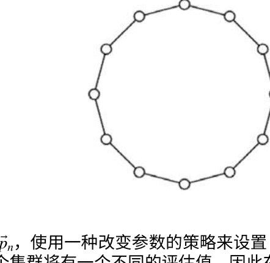

为了充分利用集群的优势，并引入 $\vec{p}_{n}$，使用一种改变参数的策略来设置集群基础上的快速搜索。自然地，每个集群将有一个不同的评估值，因此在全局搜索和局部搜索之间的相对重要性将根据这些不同的评估值而变化。因此，我们根据这种相对重要性为每个集群变化一个惯性系数 $\omega$ 的值。如果 $\omega$ 的值基本上很大，那么速度的变化将更大，因此粒子将在更广泛的区域内进行搜索。相反，较小的值会导致速度的变化较小，并且粒子将在较窄的范围内进行集中搜索。因此，基于这些考虑，我们为每个整个集群设置了 $\omega$ 的最小值如下：

$$ \omega_{\text{基准}} = \omega_{\text{最大}} - (\omega_{\text{最大}} - \omega_{\text{最小}}) \cdot \frac{g}{G}. \tag{4.55} $$

其中 $\omega_{\text{最小}}$ 和 $\omega_{\text{最大}}$ 分别是 $\omega$ 的基准值的最小和最大值，而 $g$ 表示当前的搜索迭代次数，$G$ 是搜索的最大次数。换句话说，随着搜索的进行，$\omega_{\text{基准}}$ 会逐渐减小。基于此，我们使用公式(4.56)来设置簇 $j$ 的惯性系数 $\omega$:

$$ \omega_j = \omega_{\text{基准}} + gap \cdot \frac{r_j - 1}{N - 1}, \tag{4.56} $$

其中 $gap$ 是 $\omega$ 的最大增量，$r_j$ 是簇 $j$ 的评估值在所有簇中的排名，$N$ 是簇的总数。换句话说，簇的评估值越高，$\omega$ 越小；相反，簇的评估值越低，$\omega$ 越大。通过以这种方式区分 $\omega$ 的值，我们在局部搜索和全局搜索之间取得了良好的平衡。

为了评估PSOAP的性能，我们进行了数值实验，使用基准函数比较了传统PSO（带有AP聚类）与带有 $k$ 均值聚类的PSO的解搜索性能。然后将搜索性能与三种非PSO方法进行了比较：萤火虫算法[37]，差分进化（见第2.1.2节）和人工蜂群算法[19]。对于基准函数，我们使用了表4.18中列出的以下四个函数：球函数（$F_1$），Schwefel函数（$F_3$），Rosenbrocks函数（$F_5$）和Rastrigin函数（$F_9$）。前两个函数（$F_1$和$F_3$）是单峰函数，而其余的函数（$F_5$和$F_9$）是多峰函数。

以下参数在所有测试中都是固定的：更新次数（800），粒子数量（25）和基准函数的排名（10）。$\phi_1$和$\phi_2$都固定为2.0，而惯性系数$\omega$随着更新次数的增加呈线性减小，从0.7减小到0.4。使用$k$-means算法的聚类数量固定为6。这个值6是通过AP进行聚类生成的聚类数量的平均值。为了确保比较测试的公平性，测试是这样进行的：每个函数被评估20000次。

实验结果如表4.11所示。使用$k$-means算法的PSO和PSOAP的解搜索性能明显优于非PSO方法。此外，尽管使用$k$-means算法和AP之间的性能没有明显差异，但总体上，PSOAP在平均评估值方面表现更好。这可能是因为AP使用与粒子当前状态匹配的聚类数量进行聚类，比使用$k$-means的PSO更有可能进行更合适的聚类。这使得使用AP进行聚类的情况下陷入较差的局部最优解的可能性较小。然而，将这种方法与非PSO方法进行比较，我们发现尽管PSO对于单峰函数（如$F_1$和$F_2$）的性能更好，但对于多峰函数的性能却不如其他方法。PSO对于多峰函数的性能不太好的一个可能原因是尽管进行了聚类，但仍然陷入了局部最优解。通过AP进行聚类确实在粒子分散时鼓励高效搜索，但一旦粒子聚集在一起，聚类函数就不再有意义，搜索就会停滞。因此，可能需要添加一个函数来检测粒子何时收敛并做出相应的响应。

集群的状态在不同的集群之间自然而然地有所不同，并且根据这种差异，全局或局部搜索集群的必要性的权重也会发生变化。因此，根据集群的状态改变速度更新公式的参数值是可以想象的。Zhan等人[38]提出了惯性系数$\omega$和加速度常数的参数调整。在这种方法中，根据粒子的分散状态，通过量化搜索状态来调整参数。

#### 表4.11 实验结果

| 算法 | 平均值 | 标准差 | 最小 | 最大 |
|------|--------|--------|------|------|
| 球函数（F1） |  |  |  |  |
| 粒子群优化 | 1.77E-16 | 3.17E-16 | 1.41E-18 | 1.20E-15 |
| 带有k-Means的粒子群优化 | 1.55E-31 | 1.91E-31 | 8.11E-33 | 7.89E-31 |
| PSOAP | 1.28E-31 | 2.00E-31 | 3.63E-33 | 7.39E-31 |
| Firefly | 9.46E-06 | 2.43.E-05 | 4.25E-07 | 8.22E-05 |
| DE | 9.14E-19 | 2.55E-19 | 5.43E-19 | 1.42E-18 |
| ABC | 1.71E-16 | 5.35E-17 | 9.02E-17 | 2.53E-16 |
| Schwefel函数（F3） |  |  |  |  |
| 粒子群优化 | 4.32E-08 | 4.82E-08 | 7.52E-10 | 1.91E-07 |
| 带有k-Means的粒子群优化 | 7.78E-12 | 1.16E-11 | 2.77E-15 | 4.14E-11 |
| PSOAP | 7.14E-12 | 1.08E-11 | 7.04E-14 | 1.65E-11 |
| Firefly | 8.89E-07 | 7.06.E-07 | 1.74E-07 | 2.62E-06 |
| DE | 6.15E-10 | 3.80E-10 | 7.41E-11 | 1.39E-09 |
| ABC | 5.75E+01 | 4.21.E+01 | 9.00.E+00 | 1.56.E+02 |
| 罗森布洛克函数（F5） |  |  |  |  |
| 粒子群优化 | 8.76E+01 | 1.20E+02 | 4.74E-01 | 3.33E+02 |
| 带有k-Means的粒子群优化 | 6.70E+00 | 7.47E+00 | 2.70E-02 | 3.00E+01 |
| PSOAP | 5.76E+00 | 6.00E+00 | 1.51E-03 | 2.47E+01 |
| Firefly | 8.96E+00 | 1.44.E-02 | 8.92.E+00 | 8.98E+00 |
| DE | 3.99E-01 | 1.19E+00 | 1.65E-17 | 3.99E+00 |
| ABC | 1.45E-01 | 1.41.E-01 | 1.27.E-03 | 4.15.E-01 |
| Rastrigin函数（F9） |  |  |  |  |
| 粒子群优化 | 3.58E+00 | 2.27E+00 | 9.95E-01 | 1.10E+01 |
| 带有k-Means的粒子群优化 | 2.29E+00 | 1.74E+00 | 1.66E-10 | 7.95E+00 |
| PSOAP | 1.84E+00 | 1.08E+00 | 0.00 | 2.98E+00 |
| Firefly | 8.66E-05 | 2.40.E-05 | 4.81E-05 | 1.41E-04 |
| DE | 9.95E-02 | 2.98.E-01 | 0.00 | 9.95.E-01 |
| ABC | 2.38E-09 | 7.01.E-09 | 1.78E-15 | 2.34E-08 |

## 4.6 用于差分进化的机器学习

差分进化（DE，[30]）是一种用于解决优化问题的进化算法类型。DE快速、稳健且易于使用，因此预计将用于解决许多优化问题。然而，在解决方案搜索过程中遇到的大量适应度函数评估是一个劣势，在DE的实际使用中成为一个问题。当每次评估的成本很大时，速度会受到影响，因此应该减少函数评估的次数。

这个问题的根源在于函数评估的设计。这个问题的来源存在于选择过程中的所有世代，对于通过突变和交叉生成的所有个体都是如此。换句话说，当种群中有N个个体时，需要进行N×G次函数评估，其中G是世代的数量。

当每个适应度函数评估的成本（时间）较小时，这不是一个问题。然而，当$f(\vec{x})$变得复杂并且每次评估的成本增加时，函数评估的大量影响对总体差分进化（DE）的影响就不能忽视了。结果，差分进化（DE）的解搜索速度和性能下降。在实际应用中，评估成本通常很高，因为$f(\vec{x})$复杂和/或$\vec{x}$的维度很大。在这种情况下，减少函数评估的数量会提高差分进化（DE）的性能，因为高评估成本导致性能下降的效果被抑制。

本节描述了使用机器学习改进差分进化（DE）性能的研究。这里要优化的问题被假定为足够困难，如上所述。这意味着计算评估函数所需的时间比例如分类器学习中所需的时间要长得多。正在研究的应用包括自然语言处理和信息搜索应用，其中处理大量文本数据[3]，以及机器人运动规划数据，模拟需要大量时间[16]。

### 4.6.1 ILSDE

在DE中生成变异向量时，随机选择$\vec{r}_1$，$\vec{r}_2$和$\vec{r}_3$（参见公式（2.5））。换句话说，变异向量是从这些随机选择的个体中派生出来的，它显著影响子向量的生成。通过使用优于随机选择的过程选择这三个个体，将导致生成优秀的变异向量和优秀的子向量。因此，解决方案的收敛速度应该增加（在较少的评估次数内找到解决方案）。

基于改进的学习策略的差分进化（ILSDE）[4]是基于这样一个思想开发的，即通过精心选择变异中的个体可以提高DE的性能。准确地说，根据以下策略选择三个个体向量，$\vec{r}_1$，$\vec{r}_2$和$\vec{r}_3$。

首先，随机选择K个个体来形成一个向量集合X（K是一个大于等于3的整数）。在X中，通过适应度函数评估最高的向量$\vec{x}_1$被选择为$\vec{r}_1$，第二高的向量$\vec{x}_2$被选择为$\vec{r}_2$。评估值最差的向量被选为$\vec{r}_3$。

因此，在ILDSE中对应于DE中的公式（2.5）的变异向量可以描述如下：$v_i = X_1 + F * (X_2 - X_w)$  (4.57)

将差向量（从差向量到好向量）添加到这一点的高评估值向量x1上，起到方向向量的作用。因此，期望生成一个评估值更好的变异向量。

交叉后的过程与标准差分进化相同，因此，ILSDE是DE，其中方程（2.5）被方程（4.57）所取代。仅仅这个改变就导致了在许多基准函数中ILSDE相对于标准DE的更高性能。因此，方程（4.57）通过使用更好的个体选择生成更好的变异向量。这个事实还表明了在差分进化性能改进中，个体选择（r1，r2和r3）的重要性。

#### 算法4.2 ILSDE算法

```
1: 初始化 (x)
2: 对于 g 等于 1 到 Gmax    ▷ Gmax：最大迭代次数
3:     对于 i 等于 1 到 N    ▷ N：种群大小
4:         随机选择K个向量 (x1, x2, ..., xK)
5:         best1 = argmin_y{ f(x1), f(x2), ..., f(xK) }
6:         best2 = argmin_{k≠best1}{ f(x1), f(x2), ..., f(xK) }
7:         worst = argmax_{x_i}{ f(x1), f(x2), ..., f(xK) }
8:         v[i] = best1 + F × (best2 - worst)    ▷突变
9:         DE交叉
10:        DE选择
11:    结束循环
12: 结束循环
```

### 4.6.2 SVC-DE

SVC-DE [35]是一种利用基于SVM的分类方法（见第2.2.2节）的方法。在选择过程中，通过对父向量和子向量进行函数评估来进行比较，这在公式（2.4）中明显可见。

即使子向量的评估值比父向量差，或者父向量在下一代中保持不变，函数评估仍然是必要的。在进行函数评估之前，如果我们能够知道子向量的评估值是比父向量更好还是更差，就可以通过阻止对父向量进行函数评估来减少函数评估的次数。

SVC-DE基于这个想法，使用一个分类器（SVM）对评估值进行预测。该算法的一般流程如下所示。突变和交叉阶段的过程与标准DE相同（除了获取训练样本的操作）。

1.  标准差分进化(DE)算法进行一定数量的迭代，以累积向量 $\vec{x}$ 和评估值 $f(\vec{x})$ 作为学习的训练数据。
2.  在选择过程中，从步骤1中累积的训练样本中找到与子向量 $\vec{u}_i$ 最接近的 $k$ 个训练样本。
3.  从 $k$ 个训练样本中确定正例和负例。将父向量 $\vec{x}_i$ (子向量 $\vec{u}_i$ 的父向量) 的评估值 $f(\vec{x}_i)$ 与提取的 $k$ 个训练样本的评估值进行比较。评估值 $f(\vec{x}_i)$ 较好或较差的样本被标记为正例或负例。
4.  对于在步骤3中标记的 $k$ 个训练样本，如果所有学习样本都是正例，则将 $\vec{u}_i$ 定义为正例；如果所有训练样本都是负例，则将其标记为负例。如果 $k$ 个样本中既有正例又有负例，则使用支持向量机(SVM)对 $\vec{u}_i$ 进行分类，判断其是正例还是负例。
5.  如果 $\vec{u}_i$ 被判断为正例，则计算函数 $f(\vec{u}_i)$ 的值，与父向量的计算值进行比较，并选择更好的向量用于下一代（与标准DE相同的过程）。此外， $(\vec{u}_i, f(\vec{u}_i))$ 被累积为新的训练样本。如果 $\vec{u}_i$ 被判断为负例，则不进行任何操作，父向量 $\vec{x}_i$ 在下一代中保持不变。

这种方法的基本原理是在选择阶段引入机器学习（使用分类器），以预测和分类哪些子向量应在函数评估之前进行评估。通过这种方法减少函数评估的数量成功地提高了DE相对于DE的性能。

Lu等人[23]比较了SVC-DE与其他方法在10个基准函数上的性能（详见第4.6.3节的详细定义）。比较的方法包括标准DE，支持向量回归DE（SVR-DE）（利用基于回归的选择），以及排名SVM-DE（RankSVM-DE）（利用基于排名的选择）。SVR-DE估计实际评估值，并根据估计值比较个体，而不仅仅确定一个个体是否优于另一个个体。RankSVM-DE对父个体、子个体和附近个体进行排名，并使用排名来判断父个体是否优于子个体。

Lu等人[23]进行的实验分配了表4.12中显示的SVC-DE参数。表4.13将SVC-DE与其他方法进行了比较。使用的基准函数在表4.18中描述。从表中可以看出，与DE、SVR-DE和RankSVM-DE相比，SVC-DE在九个、六个和八个函数中明显优越。此外，对于几乎所有函数，SVC-DE的性能几乎相同或更好。

例如，图4.15显示了来自基准函数F4的评估值的转换。水平轴表示适应度函数被调用的次数，垂直轴表示评估值的对数。这里的目标是找到函数的最小值；一个小的值表示得分更好。在创建数据库所需的几代之后，SVC-DE会收敛到较小的值，并在较少的评估次数后完成。

SVC-DE的性能比其他方法更好，因为它更适合DE算法，其中父代和子代是成对比较的。换句话说，在DE选择中，分类比回归和排序表现出更好的学习效率。

SVC-DE中的一个问题是可用的训练数据量很小。在启动搜索时没有训练数据，因此必须在进行与标准DE相同的过程时累积训练数据。建立数据库后，从最多为NP × G个数据组成的数据库中选择k个最接近的数据（将用作训练数据）。DE中新生成的子个体在很多情况下，子个体的评估值比父个体小，并且随着搜索的进行，这种趋势增加。

在SVC-DE中，无法提供比父个体更优的正例。因此，必须使用少量的训练数据进行学习。此外，在搜索的早期阶段，数据库中的数据量很小，并且数据在搜索空间中被认为是稀疏分布的。因此，可能会选择不够接近的数据作为训练数据，导致学习质量较低。

因此，下一节将讨论一种更准确的DE分类方法，并尝试实现一种高效的搜索机制。

#### 算法4.3 SVC-DE算法

```
1: 初始化(\vec{x})
2: 对于 g 从1到 G_c 循环执行        ▷ G_c ：集合的生成大小
3:     进行变异 - 交叉 - 选择
4:     将所有 (\vec{x}_i; f(\vec{x}_i)) 存档到 DB
5: 结束循环
6: 对于 g 从 G_c 到 G_max 循环执行    ▷ G_max ：最大迭代次数
7:     进行变异 - 交叉
8:     对于每个 \vec{u}_i 执行    ▷ 选择
9:         NB = 邻域(\vec{u}_i, DB, k)    ▷ DB: 数据集 (\vec{x}; f(\vec{x}))
10:        根据 NB 进行切换    ▷ NB: k 训练数据 (\vec{x}; f(\vec{x}))
11:        案例全部为正
12:            assert(类 = +1)
13:        案例全部为负
14:            assert(类 = -1)
15:        案例混合
16:            assert(类 = 支持向量机(\vec{u}_i, NB))    ▷邻域 \vec{u}_i
17:        如果 类 == +1 则
18:            将 (\vec{u}_i; f(\vec{u}_i)) 存入数据库
19:            如果 f(\vec{u}_i) < f(\vec{x}_i) 则
20:                \vec{x}_i = \vec{u}_i
21:            结束如果
22:        结束如果
23:    结束循环
24: 结束循环
```

表4.12 SVC-DE参数
| 参数 | 值 |
|---|---|
| D | 30 |
| NP | 100 |
| F | 0.5 |
| CR | 0.9 |
| 最大世代数 | 500 |
| 交叉迭代数 | 20 |
| k | 40 |

表4.13 SVC-DE与DE、SVR-DE和RankSVM-DE的比较（w：胜利，d：平局，l：失败）
| 函数 | 与DE对比 | 与SVR-DE对比 | 对比RankSVM-DE |
|------|----------|--------------|----------------|
| F1   | w        | w            | l              |
| F2   | w        | w            | w              |
| F3   | w        | w            | w              |
| F4   | w        | w            | w              |
| F5   | w        | d            | w              |
| F6   | w        | w            | w              |
| F7   | w        | w            | w              |
| F8   | d        | d            | d              |
| F9   | w        | l            | w              |
| F10  | w        | d            | w              |

图4.15 实验结果的比较 F4(摘自[23])
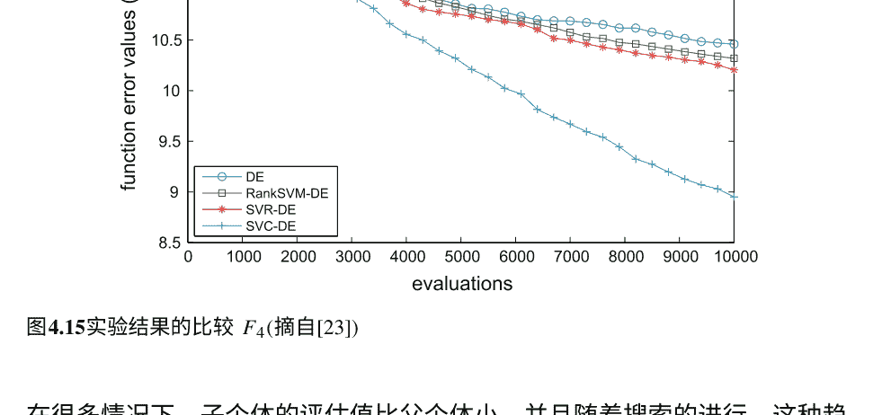

### 4.6.3 TRADE: DE的迁移学习

在SVC-DE中，无法保证有足够的训练数据用于分类器学习，正如Lu等人[23]所提出的。然而，增加学习中使用的样本数量可能会提高分类器的性能。本节介绍了一种名为TRADE（TRansfer learning for DE）的新方法。TRADE的目标与SVC-DE相同，即使用一个分类器来预测DE中个体之间的相对优劣，以减少评估函数计算的数量，并优化效率。

TRADE在分类器的学习过程中融入了迁移学习的思想，该分类器预测DE中个体之间的相对优劣。在DE中，新生成的子个体优于父个体的情况并不多见，并且随着搜索的进行，这种趋势会增加。因此，在SVC-DE中无法提供足够多的子个体优于父个体的正例。因此，必须使用少量的训练数据进行学习。然而，先前的研究声称，当目标领域中的样本数量较少时，迁移学习的有效性会提高，这对SVC-DE来说是一个很好的匹配。

SVC-DE分类器的特征向量是父向量（$\vec{x}$）和候选子向量（$\vec{u}$）的组合，即

$$V = (x_1, \ldots, x_D, u_1, \ldots, u_D), \tag{4.58}$$

其中 $\vec{x} = (x_1, \ldots, x_D)$和 $\vec{u} = (u_1, \ldots, u_D)$。然而，直接使用DE向量值几乎是不可能的。除非要优化的问题景观（$f_t$）和提供的问题（$f_s$）非常相似，或者最优解的坐标大致相同。从 $f_s$传输的数据不仅会降低预测个体间相对优势的分类器的性能，并进行无意义的分类，还会导致负面传输，降低整体搜索效率。

因此，TRADE使用适应度函数的一阶导数作为知识传递，即

$$V = \left( \frac{\partial f}{\partial x_1}, \ldots, \frac{\partial f}{\partial x_D}, \frac{\partial f}{\partial u_1}, \ldots, \frac{\partial f}{\partial u_D} \right). \tag{4.59}$$

然而，评估函数的导数很少被知道。此外，计算导数的成本通常比计算评估函数的成本更高。因此，要使用的导数是从附近的数据估计出来的。在子个体向量的位置处，微分是从目标子个体向量附近的父个体向量近似得到的。最简单的近似方法是从附近的向量中获得一个 $D$维超平面，并将其系数作为导数的值。

仅使用微分作为训练数据可能会降低学习效率，与SVC-DE相比；因此，在学习中，将微分旁边的向量也考虑为训练数据，即

$$V = \left( x_1, \ldots, x_D, u_1, \ldots, u_D, \frac{\partial f}{\partial x_1}, \ldots, \frac{\partial f}{\partial x_D}, \frac{\partial f}{\partial u_1}, \ldots, \frac{\partial f}{\partial u_D} \right). \tag{4.60}$$

TRADE算法基本上与SVC-DE相似，但是引入了迁移学习的思想，以增加分类器在学习时可以使用的样本数量。TRADE的整体流程如下所示：

1.  准备一个与要优化的问题（$f_t$）不同的问题，使用DE进行优化，并在DE过程中收集用于学习的数据。
2.  执行与SVC-DE中执行的相同的$f_t$的优化。
    (a) 数据库构建：前几代的处理方式与标准DE类似，以收集用于学习的数据。从第二代开始，可以使用来自$f_s$和少量来自$f_t$的训练数据进行分类器的搜索。
    (b) 通过分类器进行搜索：在从$f_t$和$f_s$积累了一定数量的数据后，进行SVM分类器学习，并使用个体之间相对优势的预测进行搜索。当分类器将所有示例判断为负例时，搜索将停滞不前，因此需要评估一定比例的被预测为负例的示例。

TRADE算法在算法4.4中展示。第1行和第14行的添加代表了TRADE算法和SVC-DE算法之间的主要区别。第1行是从$f_t$传输学习数据的过程，而第14行是将这些数据添加到用于学习的数据中的过程。这里，从$f_t$传输的数据是向量值之间欧氏距离较短的数据，而从$f_s$传输的数据是差分之间欧氏距离较短的数据。增加用于学习的数据量有望提高分类器的性能并减少不必要的评估函数计算次数。

再次，我们使用了表4.18中列出的基准函数。TRADE参数与SVC-DE中使用的参数相同，列在表4.14中。从$f_t$到$f_s$传输的训练数据量，即$k$，需要使用初步实验进行调整。我们在SVM学习中使用了RBF核函数（参见公式（2.16））。

表4.14 TRADE参数
| $D$ | 30 | $E_{max}$ | 10,000 |
| :--- | :--- | :--- | :--- |
| $NP$ | 100 | $GD_B$ | 20 |
| $F$ | 0.5 | $k$ | 40 |
| CR | 0.9 | $k_{s, \min}$ | 40 |

#### 算法4.4 TRADE算法

```
1: 收集源数据库 $DB_s = DE(Max G_s)$
2: $g = 0$, $eval = NP \times Max G_{DB}$, $DB = emptyDB$      ▷ 数据库构建与$f_s$到$f_t$。
3: 初始化种群 $pop_g = \{x_{i,g} | i = 1, ..., NP\}$
4: 将所有 $(x_{i,g}, f_t(x_{i,g}))$ 存档到 $DB$
5: 当 $g < Max G_{DB}$ 时
6:     $pop_{g+1} = \{x_{i,g+1} | i = 1, ..., NP\} \leftarrow Mutation\_Crossover\_Selection(pop_g)$
7:     将所有 $(x_{i,g+1}, f_t(x_{i,g+1}))$ 存档到 $DB$
8:     $g = g + 1$
9: 结束循环
10: 当 $eval < Max eval$ 时      $\triangleright$ 搜索 $f_t$ 空间。
11:     $upop_{g+1} = \{u_{i,g+1} | i = 1, ..., NP\} \leftarrow Mutation\_Crossover(pop_g)$
12:     for each $u_{i,g+1}$ do
13:         $NB_i = 邻域(u_{i,g+1}, DB, k)$
14:         $NB_i + = 邻域(u_{i,g+1}, DB_s, k_s)$
15:         if $SVC(u_{i,g+1}, x_{i,g}, NB_i) == +1$ then
16:             将 $(u_{i,g+1}, f_t(u_{i,g+1}))$ 存入 $DB$
17:             if $f_t(u_{i,g+1}) < f_t(x_{i,g})$ then
18:                 $x_{i,g+1} = u_{i,g+1}$
19:             其他
20:                 $x_{i,g+1} = x_{i,g}$
21:             结束如果
22:         其他
23:             $x_{i,g+1} = x_{i,g}$
24:         结束如果
25:     结束循环
26:     $pop_{g+1} = \{x_{i,g+1} | i = 1, ..., NP\}$
27:     $g = g + 1$
28: 结束 while
```

作为一个数值实验来展示TRADE的性能，从基准函数中选择了两个函数，即$f_t$和$f_s$，并进行了DE模拟，得到了以下组合：

1.  单峰函数$f_t$和单峰函数$f_s$
2.  单峰函数$f_t$和多峰函数$f_s$
3.  多峰函数$f_t$和多峰函数$f_s$

标准DE和SVC-DE仅在$f_t$中进行搜索，而TRADE在$f_s$中使用DE获取训练数据进行迁移学习后再在$f_t$中进行搜索。通过观察评估值随评估函数计算次数的变化来比较性能。

图4.16展示了一个TRADE模拟的结果，其中知识从一个单峰函数传递到另一个函数。在最简单的例子中， $F_1$和$F_2$分别选择为 $f_s$和 $f_t$。进行了五次模拟，并显示了平均值。根据图表，TRADE、SVC-DE和DE之间没有显著差异，但TRADE的结果在搜索的中后期略好一些。事实上，在经过10,000次评估之后，函数的最小值为

TRADE(5.286e+04) < DE(5.758e+04) < SVC-DE(6.195e+04)

因此，TRADE表现最好。分类器性能差可能是搜索性能不大提升的原因之一。因此，研究了分类准确率。正例是子个体优于父个体的情况，负例是子个体劣于父个体的情况。二分类结果可分为以下几类。

-   真正例（TP）：实际为正例且被正确预测为正例的样本，
-   真反例（TN）：实际为反例且被正确预测为反例的样本，
-   假正例（FP）：实际为反例但被错误预测为正例的样本，
-   假反例（FN）：实际为正例但被错误预测为反例的样本。

图4.17和图4.18分别展示了TRADE和SVC-DE的分类器性能。SVC-DE将十个案例中的八到九个案例预测为负例。另一方面，TRADE在早期阶段（当f为F2或F6）更倾向于预测更多的正例，但除此之外几乎所有案例都被预测为负例，与SVC-DE的情况相似。

TRADE在预测正例时基本上计算评估函数，就像SVC-DE一样。因此，大部分预测负例的分类器会导致评估个体数量极少，从而使搜索停滞不前。

作为DE的内在特征，很少有子个体优于父个体（正例），因此训练数据中正负例的数量不平衡。TRADE收集附近的正例和负例来解决这个问题。

#### 图4.17 TRADE在每一代的分类性能 (f_t, F_9; f_s, F_6)


#### 图4.18 SVC-DE在每一代的分类性能 (f_t, F_9)


根据特征向量和欧氏距离对其进行分类，然后根据相同数量的正负例进行学习。然而，这种方法并不总是最好的，分类器学会了预测许多负例。

解决这个问题的一种可能方法是将正例和负例的重心放在同一位置。首先，获取附近正例的重心，然后收集负例，使得重心相似。这将解决距离不平衡问题，并且预计还将解决对负例的分类偏见。此外，还有可用于评估或偏置评估函数的方法[22]。

下一节讨论训练样本的动态更新和分类器的扩展作为替代方法。

### 4.6.4 NENDE: DE的$k$-NN分类器

分类器精度的提高直接与DE性能的提高相关，如前一节所示。个体选择结果中正例和负例分类准确率的提高会导致解的收敛所需的函数评估次数降低。

被分类器预测为进化的个体（正例）会经历交叉和后续过程，而被预测为不进化的个体（负例）则不会。这意味着如果分类不正确，搜索性能不会提高。

因此，本节介绍了一种提高分类准确性的方法。准确地说，在突变过程中，采用了使用机器学习的分类方法来改进个体选择。个体选择是使用基于$k$最近邻（$k$-NN）算法的分类器进行的，因此，该方法被称为NENDE（DE的$k$-NN分类器）。整体算法的大致流程如下所述。

- 第一步：对于一定数量的世代，执行标准的差分进化算法以积累用于分类器的训练样本。
- 第二步：在积累完成后，使用分类器来选择突变中的个体（即$r_1$、$r_2$和$r_3$），并将它们分类为正例和负例。
- 第三步：被判定为正例的选定个体进行交叉和后续处理。被判定为负例的个体不再进行进一步处理。
- 第四步：在选择后返回第二步。直到函数评估次数达到预定数量为止，循环执行此过程。

该算法采用分类器来减少函数评估次数，通过移除已选择个体（$\vec{r}_1$, $\vec{r}_2$和$\vec{r}_3$），使生成的子向量的评估值更低。

NENDE与SVC-DE类似，但该算法在变异阶段使用了一个分类器。在个体选择阶段使用分类器而不是预测生成的子向量的评估值，有望产生更好的个体选择方法，提高解决方案搜索速度，并进一步改善性能。

NENDE的最重要的一点是分类器的分类准确率。关于选择的个体是否好的分类不好，不会产生好的子向量，也不会导致解决方案搜索速度的增加。要提高分类准确率，必须考虑以下三个要点：

- 分类方法，
- 积累训练样本的方法，
- 如何获取特征向量。

为机器学习提供适当的训练样本非常重要。如果在学习过程中分类标准不变，那么相同的训练样本可以连续使用。但这在DE中效果不好。

#### 图4.19 使用和不使用动态更新训练样本的性能变化

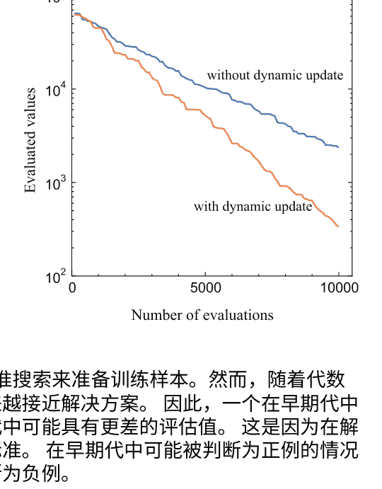

在DE中，通过在几代中进行标准搜索来准备训练样本。然而，随着代数的增加，向量逐渐演化，种群越来越接近解决方案。因此，一个在早期代中具有良好评估值的向量，在后续代中可能具有更差的评估值。这是因为在解决方案附近使用了更严格的判断标准。在早期代中可能被判断为正例的情况，可能在向量演化的结果中被判断为负例。

因此，考虑使用向量种群的演化动态更新训练样本。换句话说，旧的训练样本会被删除，新的样本会更积极地使用。这种方法的使用极大地提高了性能。

图4.19比较了使用基准函数 $F_1$ (参见表4.18的定义)的性能。分类方法是标准的 $k$-NN，没有进行修改，并且进行了训练集的动态更新（橙色线）或未进行更新（蓝色线）。特征向量由选定的个体 ($\vec{r}_1$, $\vec{r}_2$, 和 $\vec{r}_3$) 组成。动态更新后，解的收敛速度更快，而且在相同数量的评估（10,000次）之后，解的质量提高了一个数量级以上。

动态更新中的训练样本数量是一个问题。对于两个基准函数（参见表4.15），比较了存储数据的数量和相应的得分。这个表格显示，当存储的训练样本数量不足时，结果很差。另一方面，当样本数量为500-2,000时，评估值几乎没有变化。这意味着数据数量不足是一个问题，但是当样本数量超过一定数量时，性能变化不大。这是由于DE中向量种群的演化。分类的目标也在远离旧的训练数据的地方生成，并且删除旧的训练样本不会产生噪音。分类方法是$k$-NN；因此，只有新的训练样本在分类目标的中心附近使用。这表明存储所有新的训练样本不会引起问题。然而，存储过多的训练样本会增加k-NN分类的计算成本。因此，在后续实验中，训练样本的数量设置为1,000个。

#### 表4.15 随着存储的训练样本数量的变化评估值的变化

| 基准函数 | 100个样本 | 200个样本 | 500个样本 | 1,000个样本 | 2,000个样本 |
| :--- | :--- | :--- | :--- | :--- | :--- |
| $F_1$ | 4.27E+02 | 3.46E+02 | 3.13E+02 | 3.37E+02 | 3.33E+02 |
| $F_{11}$ | 5.47E+00 | 4.43E+00 | 4.04E+00 | 3.97E+00 | 3.85E+00 |

#### 表4.16 正例和负例的数量

| 基准函数 | 正例 | 负例 | 方差 |
| :--- | :--- | :--- | :--- |
| $F_1$ | 96.1 | 903.9 | 127.69 |
| $F_5$ | 38.6 | 961.4 | 92.84 |
| $F_9$ | 93.3 | 906.7 | 109.41 |
| $F_{10}$ | 106.5 | 893.5 | 49.65 |

在NENDE中的分类是将正例和负例进行二分类。在这种二分类中，训练集中正例和负例的比例应该是均衡的，即1:1。然而，如上所示，在DE搜索示例中并不存在这种均衡的比例。下表显示了一些基准函数（参见表4.16）中每1000个训练示例中的正例和负例数量。训练示例累积10次，并显示平均值。在所有基准函数中，正例与负例的比例偏向于1:9或更高。这种偏差可能导致错误的分类，因此，对训练示例进行某种形式的修正是可取的。

为此，我们将解释如何修改k-NN方法，以便根据正例和负例之间的偏差进行更严格的判断。每一代被选为正例的个体数量（表示为$p\_select$）是预先确定的，被判断为更接近正例的个体将按照可能性的顺序被判断为正例。其他个体被判断为负例。更接近正例的个体意味着在$k$个训练示例中有更多的正例。换句话说，选择在$k$个最近的训练示例中具有最多正例的$p\_select$个体，并将其判断为正例。

作为一个测试案例，假设 $k = 5$，种群中的向量数量为50，选择的$p = 10$。如果在最近的$k$个训练样本中有三个向量有五个正例，有五个向量有四个正例，有十个向量有三个正例，其余向量有两个或更少的正例，那么被确定为正例的向量有五个附近的正例（三个向量），有四个附近的正例（五个向量），以及有三个附近的正例（两个）。有十个向量，其中有三个正例，但是当向量数量超过p_select时，从十个向量中随机选择两个向量，这两个向量具有三个附近的正例。

一个重要的参数， $p_{select}$，使用以下方程定义：

$$ p_{select} = (N \times PN / TS) \times \beta, \quad (4.61) $$

其中 $N$是种群大小（每一代选择的训练样本数）， $P N$是训练集中正例的数量， $T S$是训练样本的总数。这旨在考虑训练样本中的偏差进行选择。 $P N / T S$是样本中正例的比例。因此，如果 $p_{select} = N \times P N / T S$，每一代中被选中的个体中正例判断的比例与训练样本中正例的比例相同。即使在正例与负例比例为1:9的偏斜训练样本中，将每一代中正例判断的数量设置为 $N$的1/10，结果也会趋向于偏斜。然而，在这种设置下，分类效果较差。因此，进一步乘以一个修正系数 $\beta$。尽管经验上采用 $\beta = 0.5$，但根据所考虑的函数， $\beta$的值可能需要进行调整。

为了确认将 $k$-NN方法扩展为上述所示的有效性，使用几个基准函数比较了以下三种方法的性能：

- 方法1：标准 $k$-NN。
- 方法2：带有 $p$选择的 $k$-NN（改进的 $k$-NN如上所述的 $p$选择）。
- 方法3：SVM（使用SVM-Light^5）。

纯SVM在学习样本中存在偏差，因此效果不好。因此，对样本进行修正，使正负样本数量相同。通过取正样本的平均值，并按接近平均值的顺序选择一半样本作为正样本实现这一目标。

上述实验对于 $F_1$的典型结果如图4.20所示。该结果显示改进的 $k$-NN提高了DE的性能，而SVM的性能比标准 $k$-NN差。造成这种情况的一个可能原因是在DE中个体不断进化，导致旧的训练样本无法使用。SVM是一种使用所有存储的训练样本的方法，因此旧的训练样本可能产生不利影响，最终导致显著降低的精度。因此，在DE等分类标准变化的情况下，进行全局判断的SVM方法不适用。相反，注重局部部分的方法（包括 $k$-NN）表现良好。

在标准分类器学习中，要分类的数据通过某些规则转换为特征向量，然后一对一对地映射到特征空间。然后根据特征空间上的位置和距离进行分类。

> 5 SVM-Light支持向量机，http://svmlight.joachims.org/。

#### 图4.20 各种分类方法的性能评估


因此，从数据中生成特征向量的方式，即如何适当地定义特征向量，对分类精度有重要影响。 不合适的特征向量设置会降低分类准确性，因此确定要使用哪些特征向量是分类器设计中的重要问题。

NENDE在突变过程中对个体进行分类选择，其中包括三个向量， $\vec{r}_1, \vec{r}_2, \vec{r}_3$, 必须被选择。 这三个向量可以分别进行分类。 然而，由于最终只生成一个突变向量，因此将三个向量合并在一起是合适的。 因此，特征向量是三个向量的某种组合。 $(\vec{r}_1, \vec{r}_2, \vec{r}_3)$ 合并成一个向量是合适的。 因此，特征向量是三个向量的某种组合。 分类的目标是选择优秀的个体，即生成一个优于父向量的突变向量，即使分类目标是 $\vec{r}_1, \vec{r}_2, \vec{r}_3$。 因此，可以通过使用除 $\vec{r}_1, \vec{r}_2, \vec{r}_3$ 之外的突变向量来生成有用的特征向量。 下面将比较和讨论一些特征向量的性能。

在这个分类中被认为有用的特征如下：

- 选择的向量 $\vec{r}_1, \vec{r}_2, \vec{r}_3$
- 突变向量 $\vec{v}$，参见公式（2.5），
- 父向量 $\vec{x}$。

性能比较如下五个定义的特征（表示为 $\vec{fv}_1-\vec{fv}_5$):

1.  $\vec{fv}_1 = (\vec{r}_1, \vec{r}_2, \vec{r}_3)$
    选择的个体被连接成一个特征向量。这个向量的维度是每个个体向量 $(\vec{r}_1, \vec{r}_2, \vec{r}_3)$ 的三倍。
2.  $\vec{fv}_2 = \vec{v}$
    突变向量 $\vec{v}$ 被用作特征向量。
3.  $\vec{fv}_3 = (\vec{v}, \vec{x})$
    突变向量， $\vec{v}$，和父向量， $\vec{x}$，被连接成一个特征向量。
4.  $\vec{fv}_4 = (\vec{r}_1, \vec{r}_2 - \vec{r}_3)$
    个体向量，$\vec{r}_1$，和差向量($\vec{r}_2 - \vec{r}_3$)被连接成一个特征向量。$\vec{r}_1, \vec{r}_2, \vec{r}_3$在差分进化中通常不被等同对待，而是被用作个体向量，$\vec{r}_1$，和差向量($\vec{r}_2 - \vec{r}_3$)如公式(2.5)所示；因此，采用了这个特征向量。
5.  $\vec{fv}_5 = (\vec{r}_1, \vec{r}_2 - \vec{r}_3, \vec{x})$
    $\vec{v}_4$和父向量在此特征向量中连接起来。

使用上述五个特征进行基准函数比较性能（定义见表4.18）。表4.17显示了10次运行的平均值。粗体数值显示了最佳性能（两个粗体数值表示在5%的显著性水平内没有显著差异）。这个结果表明，仅使用突变向量，$\vec{v}$，作为特征向量在几乎所有函数中都能获得最佳结果，其次是特征向量连接$\vec{r}_1$和差异向量($\vec{r}_2 - \vec{r}_3$)。包含父向量信息的向量结果，如$\vec{x}$，即$\vec{v}_3$和$\vec{v}_5$，并不是很好。

为什么包含父向量信息时性能会变差？当只关注一个向量时，进化会根据父向量和子向量的比较结果进行或不进行。然而，在差分进化中，整个向量群体逐渐朝着解决方案移动。生成的子向量应该在群体中优于父向量。如果选择的父向量在群体中不优秀，即使它优于父向量，子向量在群体中可能也不优秀。换句话说，添加父向量的信息使得分类标准变得不那么严格。

直接使用突变向量作为特征向量的最佳性能的主张仍然有待讨论。突变向量直接与子向量相关联；因此，在分类过程中检查突变向量会产生很大的影响。因此，在NENDE中采用了$\vec{v}_2$作为特征向量，即直接使用突变向量作为特征向量。NENDE可以总结如下：

- 训练样本的积累
  进行一定数量的代际演化以积累训练样本。累积的结果将继续用于动态更新训练样本。一旦存储了1,000个训练样本，旧的训练样本将被丢弃。

- 分类方法
  使用扩展的k-NN算法。在每一代中，根据与正样本的接近程度，选择正样本的p个示例（如公式（4.61）所定义）进行分类。

- 特征向量的选择
  突变向量$\vec{v}$被用作特征向量。

实际的NENDE过程可以总结如下（也参见算法4.5）：

1.  步骤1：进行一定数量的代际演化以积累分类器的训练样本。
2.  步骤2：对于每个向量$x_i$，随机选择个体（$\vec{r}_1$, $\vec{r}_2$和$\vec{r}_3$）。
3.  步骤3：从$\vec{r}_1$, $\vec{r}_2$和$\vec{r}_3$获得的突变向量$\vec{v}_i$作为该个体的特征向量。
4.  步骤4：对于每个特征向量$N$，选择最接近的$k$个训练样本，并计算正例的数量（从0到$k$）。
5.  步骤5：选择在训练样本中具有更多正例的$N$个特征向量，并将其分类为正例。其余的被分类为负例。
6.  步骤6：对被分类为正例的集合（$r_1, r_2$和$r_3$）进行交叉和后续处理。在下一代中，负例的父向量保持不变。
7.  步骤7：对于那些需要交叉和后续处理的个体（即在Step5中被归类为正例的个体），特征向量和从选择阶段结果中获得的类别被添加为训练样本（如果进化了，则为正例；否则为负例）。
8.  步骤8：从2到7的步骤重复，直到评估函数的计算值达到一定值。一旦累积了1,000个训练样本，旧的训练样本按照历史顺序被移除。

通过使用24个基准函数，将NENDE与以下方法进行比较来评估性能。

1.  DE: 标准差分进化算法,
2.  ILSDE（第4.6.1节）使用 $K=3$（参见公式（4.57））,
3.  NENDE具有以下限制条件：
    - 分类方法: 标准 $k$-NN ($k=5$),
    - 训练样本: 一旦确定，就固定下来,
    - 特征向量: ($\vec{r}_1, \vec{r}_2, \vec{r}_3$),
4.  NENDE
    - 分类方法: 扩展 $k$-NN ($k=5$),
    - 训练样本: 动态更新,
    - 特征向量: $\vec{v}$ (即, 突变向量)。

#### 算法4.5 NENDE算法

```
1: 初始化(\vec{x})
2: 对于 g =1到 G 执行    ▷收集训练数据
3:    对于 i =1到 N 执行
4:        选择 \vec{r}_1, \vec{r}_2, \vec{r}_3
5:        \vec{v}[i] = \vec{r}_1 + F × (\vec{r}_2 - \vec{r}_3)
6:        \vec{f}v = (\vec{x}[i]; \vec{v}[i]; \vec{r}_1, \vec{r}_2, \vec{r}_3, ...)    ▷ \vec{f}v: 特征向量
7:        进行交叉    ▷ \vec{u}[i]由DE过程生成, 方程 (2.6)
8:        \vec{x}[i]=选择( \vec{x}[i], \vec{u}[i])
9:        如果选择了 \vec{u}[i], 则
10:            类别= + 1
11:        其他
12:            类别= - 1
13:        结束如果
14:        存档 ( \vec{f}v) 到 D B
15:    结束循环
16: 结束循环
17: 当 (评估次数 < Emax) 时执行    ▷DE使用分类器
18:    对于 i =1到 N 执行
19:        选择 \vec{r}_1, \vec{r}_2, \vec{r}_3
20:        \vec{v}[i] = \vec{r}_1 + F × (\vec{r}_2 - \vec{r}_3)
21:        \vec{f}v[i] = (\vec{x}[i]; \vec{v}[i]; \vec{r}_1, \vec{r}_2, \vec{r}_3, ...)    ▷ \vec{f}v: 特征向量
22:        pc[i] = k-邻居 (\vec{f}v[i], D B)    ▷ pc: 正样本计数
23:    结束循环
24:    按照正样本计数的降序排列 pc[i]    ▷按照正样本计数的降序排列 pc[i]
25:    for i = 1 to pselect do
26:        cp =从排序后的\vec{f}v中弹出一个元素
27:        进行变异-交叉-选择    ▷ \vec{u}[i]由DE过程生成, 公式 (2.6)
28:        if (\vec{u}[i] 被选中) then
29:            类别= + 1
30:        其他
31:            类别= - 1
32:        结束如果
33:        将档案 (cp) 存档到D B
34:    结束循环
35: 结束循环
```

为了比较起见，我们将函数评估次数设置为10,000次，对所有方法进行了平均，并在10次运行中进行了平均。至于DE设置，我们使用向量种群N=100，差异向量权重F=0.8（公式（2.5）），交叉率CR=0.9（用于公式（2.6））。对于NENDE，我们将存储的训练样本数量设置为1,000，并将标准DE用于累积训练样本的代数G设置为10。

选择了两组基准函数进行性能评估。第一组是从参考文献[36]中获得的15个函数，即F1-F15。第二组是从参考文献[31]中获得的九个函数，即F F1-F F10，其中F F5被排除。表4.18和4.19显示了所有这些函数（参见图4.21、4.22和4.23）。在表4.19的方程中，偏置是一个用于偏移全局最优值的常数，被偏移的值是要被偏移的值，M是一个用于旋转的旋转矩阵。最小值## 表4.18 来自[36]的基准函数

| 函数名称 | 定义 | 范围 |
| :--- | :--- | :--- |
| F1 球体 | $\sum_{i=1}^{30} x_i^2$ | $[-100, 100]^{30}$ |
| F2 Schwefel的问题2.22 | $\sum_{i=1}^{30} |x_i| + \prod_{i=1}^{30} |x_i|$ | $[-10, 10]^{30}$ |
| F3 Schwefel的问题1.2 | $\sum_{i=1}^{30} (\sum_{j=1}^{i} x_j)^2$ | $[-100, 100]^{30}$ |
| F4 Schwefel的问题2.21 | $\max_{1 \le i \le 30} |x_i|$ | $[-100, 100]^{30}$ |
| F5 Rosenbrock | $\sum_{i=1}^{29} [100(x_{i+1} - x_i^2)^2 + (x_i - 1)^2]$ | $[-30, 30]^{30}$ |
| F6 步骤 | $\sum_{i=1}^{30} (|x_i + 0.5|)^2$<br>地板函数，$[x]$，给出小于或等于x的最大整数 | $[-100, 100]^{30}$ |
| F7 四次方程 (+噪声) | $\sum_{i=1}^{30} i x_i^4 + random[0,1)$ | $[-1.28, 1.28]^{30}$ |
| F8 Schwefel的问题2.26 | $-\sum_{i=1}^{30} (x_i \sin(\sqrt{|x_i|}))$ | $[-500, 500]^{30}$ |
| F9 Rastrigin | $\sum_{i=1}^{30} [x_i^2 - 10\cos(2\pi x_i) + 10]$ | $[-5.12, 5.12]^{30}$ |
| F10 Ackley | $-20\exp(-0.2\sqrt{\frac{1}{30}\sum_{i=1}^{30} x_i^2}) - \exp(\frac{1}{30}\sum_{i=1}^{30} \cos 2\pi x_i) +20 + e$ | $[-32, 32]^{30}$ |
| F11 Griewank | $\frac{1}{4000}\sum_{i=1}^{30} x_i^2 - \prod_{i=1}^{30} \cos(\frac{x_i}{\sqrt{i}}) + 1$ | $[-600, 600]^{30}$ |
| F12 Penalized(1) | $\frac{\pi}{30}\{10\sin^2(\pi y_1) + \sum_{i=1}^{29} (y_i - 1)^2[1+10\sin^2(\pi y_{i+1})] + (y_{30}-1)^2\} + \sum_{i=1}^{30} u(x_i, 10, 100, 4)$<br>$y_i = 1 + \frac{1}{4}(x_i + 1)$<br>$u(x_i, a, k, m) = \begin{cases} k(x_i - a)^m, & x_i > a \\ 0, & -a \le x_i \le a \\ k(-x_i - a)^m, & x_i < a \end{cases}$ | $[-50, 50]^{30}$ |
| F13 | $0.1\left(\sin ^2\left(3 \pi x_1\right)+\sum_{i=1}^{29}\left(x_i-1\right)^2\left[1+\sin ^2\left(2 \pi x_{i+1}\right)\right]+\left(x_{30}-1\right)^2\left[1+\sin ^2\left(2 \pi x_{30}\right)\right]\right)+\sum_{i=1}^{30} u\left(x_i, 5, 100, 4\right)$ | $[-50,50]^{30}$ |
| F14 | $\left[\frac{1}{500}+\sum_{j=1}^{25} \frac{1}{j+\sum_{i=1}^{30}\left(x_i-a_{i, j}\right)^{6}}\right]^{-1}$<br>$a_{i, j}=\left(\begin{array}{rrrrrrr}-32 & -16 & 0 & 16 & 32 & -32 & \ldots & 0 & 16 & 32 \\ -32 & -32 & -32 & -32 & -32 & -32 & \ldots & 32 & 32 & 32\end{array}\right)$ | $[-65.536, 65.536]^2$ |
| F15 | $\sum_{i=1}^{11}\left[a_i-\frac{x_1\left(b_i^2+b_i x_2\right)}{b_i^2+b_i x_3+x_4}\right]^2$<br>$a_i=\{0.1957, 0.1947, 0.1735, 0.1600, 0.0844, 0.0627, 0.0456, 0.0342, 0.0323, 0.0235, 0.0246\}$<br>$b_i^{-1}=\{0.25, 0.5, 1, 2, 4, 6, 8, 10, 12, 14, 16\}$ | $[-5,5]^4$ |

#### 表4.19 来自[31]的基准函数

| 函数名称 | 定义 | 范围 |
| :--- | :--- | :--- |
| FF1 平移的球体 | $\sum_{i=1}^{30} z_i^2$ | $[-100, 100]^{30}$ |
| FF2 平移的Schwefel问题1.2 | $\sum_{i=1}^{30} (\sum_{j=1}^{i} z_j)^2$ | $[-100, 100]^{30}$ |
| FF3 平移旋转的高条件椭圆 | $\sum_{i=1}^{30} (10^6)^{\frac{i-1}{30-1}} z_i^2$, $M$: 正交矩阵 | $[-100, 100]^{30}$ |
| FF4 移位Schwefel问题1.2(+噪声) | $\sum_{i=1}^{30} (\sum_{j=1}^{i} z_j)^2$, $z=x-o$ | $[-100, 100]^{30}$ |
| FF6 移位Rosenbrock | $\sum_{i=1}^{30-1} [100(z_{i+1}-z_i^2)^2 + (z_i - 1)^2] +$偏差, $z=x-o+1$ | $[-100, 100]^{30}$ |
| FF7 移位旋转Griewank (无界) | $\frac{1}{4000} \sum_{i=1}^{30} z_i^2 - \prod_{i=1}^{30} \cos(\frac{z_i}{\sqrt{i}}) + 1 +$偏差, $z=(x-o) \times M$: 线性变换矩阵 | $[0, 600]^{30}$ |
| FF8 移位旋转Ackley (全局最优在边界上) | $-20\exp(-0.2\sqrt{\frac{1}{n}\sum_{i=1}^{30} z_i^2}) - \exp(\frac{1}{30}\sum_{i=1}^{30} \cos 2\pi z_i) +20 +e +$偏差, $z=(x-o) \times M$: 线性变换矩阵 | $[-32, 32]^{30}$ |
| FF9 平移的Rastrigin函数 | $\sum_{i=1}^{30} [z_i^2 - 10\cos(2\pi z_i) + 10]$ | $[-5, 5]^{30}$ |
| FF10 平移旋转的Rastrigin函数 | $\sum_{i=1}^{30} [z_i^2 - 10\cos(2\pi z_i) + 10]$, $z=(x-o) \times M$: 线性变换矩阵 | $[-5, 5]^{30}$ |

#### 图4.21 来自[36]的基准函数（1）

#### 图4.22 来自[36]的基准函数(2)

#### 图4.23 基准函数[31]

#### 表4.20 来自[36]的基准函数的最小值

| 函数符号 | 函数名称 | 最优解 |
| :--- | :--- | :--- |
| F1 | 球体 | F1(0, . . . , 0) = 0 |
| F2 | Schwefel的问题2.22 | F2(0, . . . , 0) = 0 |
| F3 | Schwefel的问题1.2 | F3(0, . . . , 0) = 0 |
| F4 | Schwefel的问题2.21 | F4(0, . . . , 0) = 0 |
| F5 | Rosenbrock | F5(1, . . . , 1) = 0 |
| F6 | 步骤 | F6(0, . . . , 0) = 0 |
| F7 | 四次方程（+噪声） | F7(0, . . . , 0) = 0 |
| F8 | Schwefel的问题2.26 | F8(420.9678, . . . , 420.9678) = -12569.5 |
| F9 | Rastrigin | F9(0, . . . , 0) = 0 |
| F10 | Ackley | F10(0, . . . , 0) = 0 |
| F11 | Griewank | F11(0, . . . , 0) = 0 |
| F12 | Penalized(1) | F12(1, . . . , 1) = 0 |
| F13 | Penalized(2) | F13(1, . . . , 1) = 0 |
| F14 | 谢克尔的狐穴 | F14(-32, -32) ≈ 1 |
| F15 | Kowalik | F15(0.1928, 0.1908, 0.1231, 0.1358) ≈ 0.0003075 |

表4.18中的基准函数值显示在表4.20中，而表4.19中的基准函数的最小值为FFi(o) =偏差对于所有i。读者可以参考参考文献[31, 36]了解更多细节。

表4.21和表4.22分别显示了每个函数的10次实验的平均值和方差。对于所有函数，目标是获得最小值，结果中的较小值意味着性能更好。第一组基准函数的最小值为-1.26E+04在F8中，为1在F14中，为3.07E-04在F15中，否则为0。第二组（即FF1–FF10）的最小值为偏差（为了防止0成为最小值而添加的值）。尽管在解决方案搜索过程中计算中包含了这个偏差，但最小值在结果输出中通过减去偏差进行了修正为0。

四种方法中最佳结果以粗体显示。搜索设计为不超过表4.21和表4.22中设置的初始值范围。然而，对于FF7，没有对此约束进行强制，因为全局最优解在初始值范围之外。请注意，以下几点在表格中清楚地显示出来。

- 使用传统方法无法获得F4的结果。
- 根据双侧t检验（显著性水平为5%），在F2，F3，F4和F9方面，ILSDE和NENDE之间没有显著差异。

图4.24和4.25绘制了每个函数的搜索结果。每个图中的方法如下所示：

#### 表4.21 来自[36]的基准函数结果（左：平均值；右：方差）

| 函数 | DE_avg | DE_var | ILSDE_avg | ILSDE_var | 有限NENDE_avg | 有限NENDE_var | NENDE_avg | NENDE_var |
| :--- | :--- | :--- | :--- | :--- | :--- | :--- | :--- | :--- |
| F1 | 3.46E+03 | 2.99E+05 | 3.18E+02 | 1.10E+04 | 2.70E+03 | 3.20E+05 | 1.15E+01 | 1.50E+01 |
| F2 | 2.46E+01 | 8.77E+00 | 8.28E+00 | 1.61E+00 | 2.15E+01 | 4.10E+00 | 1.50E+00 | 3.79E-02 |
| F3 | 3.99E+04 | 3.14E+07 | 3.87E+03 | 7.63E+05 | 2.83E+04 | 3.83E+07 | 3.13E+02 | 2.89E+04 |
| F4 | 6.90E+01 | 2.53E+01 | 5.19E+01 | 1.75E+02 | NA | NA | 8.37E+00 | 3.45E+00 |
| F5 | 1.73E+06 | 1.20E+12 | 3.32E+04 | 4.70E+08 | 5.75E+05 | 5.81E+10 | 6.65E+02 | 1.93E+05 |
| F6 | 3.43E+03 | 6.18E+05 | 3.51E+02 | 7.64E+03 | 2.16E+03 | 3.49E+05 | 1.23E+01 | 1.02E+01 |
| F7 | 1.05E+00 | 9.43E-02 | 1.80E-01 | 4.12E-03 | 6.89E-01 | 3.45E-02 | 6.95E-02 | 3.54E-04 |
| F8 | -4.43E+03 | 5.00E+04 | -4.71E+03 | 7.03E+04 | -4.66E+03 | 2.23E+05 | -6.19E+03 | 7.02E+05 |
| F9 | 2.60E+02 | 1.11E+02 | 2.43E+02 | 3.84E+02 | 2.52E+02 | 2.52E+02 | 2.14E+02 | 1.41E+02 |
| F10 | 1.29E+01 | 8.01E-01 | 5.78E+00 | 3.39E-01 | 1.13E+01 | 6.43E-01 | 2.50E+00 | 1.65E-01 |
| F11 | 3.07E+01 | 1.54E+01 | 4.10E+00 | 7.92E-01 | 2.22E+01 | 4.37E+01 | 1.09E+00 | 4.21E-04 |
| F12 | 2.07E+05 | 1.84E+10 | 1.80E+01 | 4.83E+01 | 2.12E+04 | 1.28E+09 | 3.49E-01 | 1.79E-01 |
| F13 | 2.31E+06 | 2.90E+12 | 3.35E+03 | 2.37E+07 | 8.02E+05 | 1.43E+12 | 1.36E+00 | 4.08E-01 |
| F14 | 1.00E+00 | 0.00E+00 | 1.00E+00 | 0.00E+00 | 1.20E+00 | 1.60E-01 | 1.20E+00 | 3.59E-01 |
| F15 | 4.37E-04 | 7.13E-08 | 5.13E-04 | 1.30E-07 | 7.08E-04 | 1.56E-07 | 8.92E-04 | 5.25E-08 |## 表4.22来自[31]的基准函数结果（左：平均值；右：方差）

| 函数 | DE平均值 | DE方差 | ILSDE平均值 | ILSDE方差 | 有限NENDE平均值 | 有限NENDE方差 | NENDE平均值 | NENDE方差 |
|------|----------|--------|-------------|-----------|-----------------|---------------|-------------|-----------|
| FF1  | 2.22E+03 | 2.30E+05 | 2.14E+02 | 1.52E+03 | 2.15E+03 | 1.99E+05 | 1.67E+01 | 1.68E+01 |
| FF2  | 2.38E+04 | 2.47E+07 | 1.07E+04 | 6.44E+06 | 2.64E+04 | 2.77E+07 | 9.38E+03 | 2.83E+06 |
| FF3  | 1.31E+08 | 1.27E+15 | 3.86E+07 | 1.95E+14 | 1.21E+08 | 1.92E+15 | 4.76E+07 | 3.29E+14 |
| FF4  | 3.46E+04 | 3.00E+07 | 1.87E+04 | 3.00E+07 | 3.40E+04 | 2.51E+07 | 1.41E+04 | 2.78E+07 |
| FF6  | 1.13E+08 | 4.34E+15 | 1.39E+06 | 1.18E+12 | 4.66E+07 | 8.01E+14 | 7.27E+04 | 9.56E+08 |
| FF7  | 6.73E+02 | 9.04E+03 | 7.26E+01 | 6.21E+02 | 6.50E+02 | 2.37E+04 | 2.90E+01 | 7.55E+01 |
| FF8  | 2.11E+01 | 5.31E-03 | 2.11E+01 | 4.20E-03 | 2.11E+01 | 2.38E-03 | 2.11E+01 | 6.56E-03 |
| FF9  | 2.31E+02 | 3.01E+02 | 2.16E+02 | 1.39E+02 | 2.26E+02 | 1.77E+02 | 2.04E+02 | 1.29E+02 |
| FF10 | 2.75E+02 | 3.11E+02 | 2.39E+02 | 1.44E+02 | 2.67E+02 | 2.78E+02 | 2.24E+02 | 1.51E+02 |

#### 图4.24 来自[36]的基准函数结果

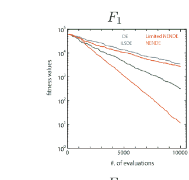

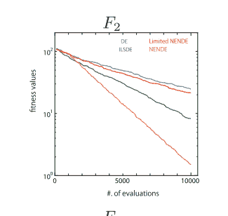

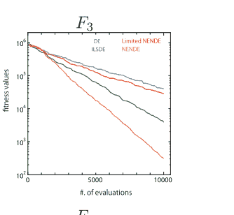

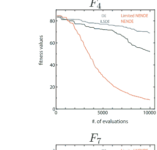

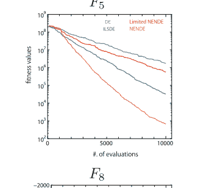

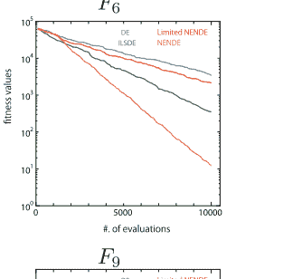

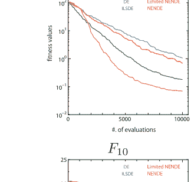

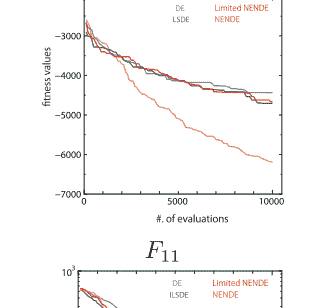

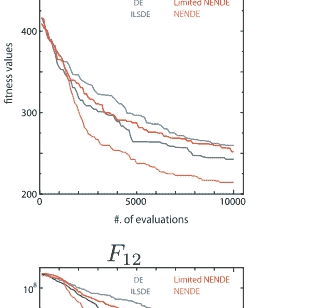

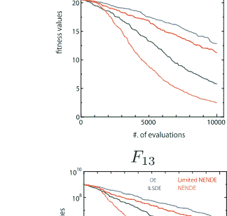

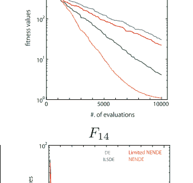

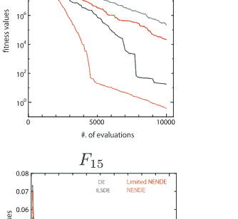

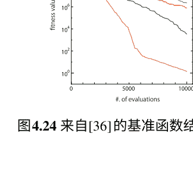

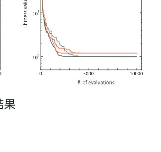

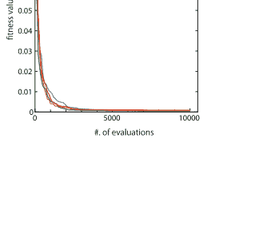

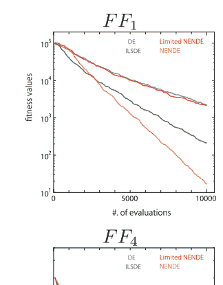

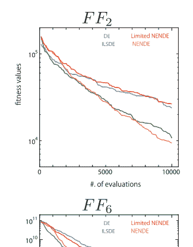

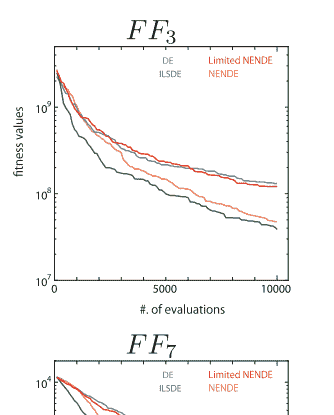

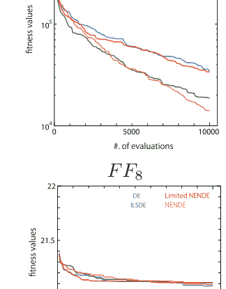

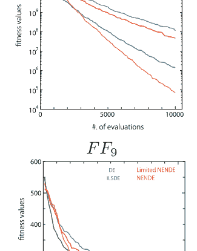

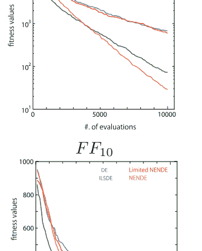

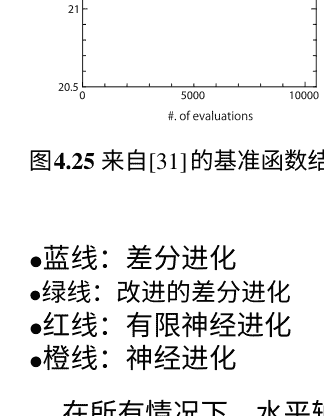

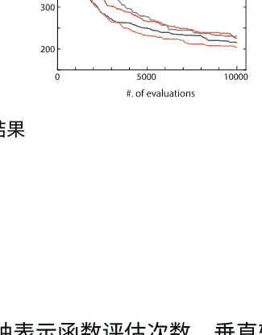

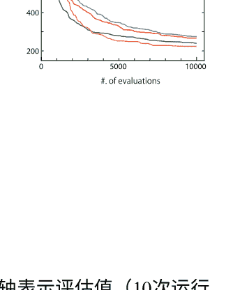

#### 图4.25 来自[31]的基准函数结果

- 蓝线：差分进化
- 绿线：改进的差分进化
- 红线：有限神经进化
- 橙线：神经进化

在所有情况下，水平轴表示函数评估次数，垂直轴表示评估值（10次运行的平均值）。当显示数字时，垂直轴是线性刻度，当显示幂时，垂直轴是对数刻度。因此，F4, F8, F9, F10和F15以及FF8, FF9和FF10是线性刻度，其余是对数刻度。

表4.21和4.22显示，从好到坏的搜索性能顺序是NENDE，ILSDE，有限NENDE和DE在大多数函数中。

传统方法略优于DE，但在改进后性能显著提高，并且优于ILSDE。

- F1-F7 这些函数是纯单峰函数，没有平移或旋转。结果显示，除了 F4和 F7之外，图形的形状几乎相同。

函数 F7包含噪声，因此，即使存在噪声，NENDE也被证明可以工作。然而，在超过6,000次评估后，图形的斜率变得适度。原因是过早收敛；当前值为0.1，已足够接近全局最优解0。理想情况下，从这种情况下，值应该更接近于0，NENDE在这方面仍有改进的空间。换句话说，一旦接近解决方案，适当的进化就不再进行。一个原因可能是选择了不合适的 pselect值。即使每代改进的个体数量变小， pselect的值仍保持不变。因此，对于某些情况，进化停滞不前。

使用传统方法无法获得F4的解决方案，因为进化在所有分类结果都变成负例的点停止了。这是由于训练样本中的偏差和选择标准k-NN作为分类方法引起的。改进的NENDE在分类过程中考虑了训练样本中的偏差，并设计为始终对一定数量的正例进行分类；因此，这个问题没有出现。

在这个函数中，NENDE展示了比其他方法更优越的性能，这个函数具有简单的结构，其中在向量的每个维度中获得最大值。

因此，当所有维度中的值都是类似的小值时，可以获得卓越的性能。NENDE在这种类型的函数中表现出色，因为当解决方案的结构简单时，机器学习是有效的。不仅对于F4，而且对于表4.18中的所有函数（除了F15）来说，全局最优解的所有维度的值都是相同的。因此，我们期望NENDE能够表现出良好的性能。

- F8-F13 这些函数是纯多峰函数，没有平移或旋转。结果显示在图4.24中，NENDE在所有情况下表现最好。在 F8中，ILSDE仅略优于DE，而NENDE在多峰函数中表现出远超DE的性能。

对于 F12和 F13，NENDE的搜索性能在大约5,000次评估和评估值小于100时下降。在那一点之后，斜率几乎与DE相同。这意味着收敛速度与DE不再有差异。一个原因是选择了一个不合适的p值，导致许多本应被分类为负例的正例被错误分类，就像在上述F7的情况中一样。

此外，种群中的偏差可能是另一个原因。函数 $F_{9}$（Rastrigin函数）是一个具有许多峰和谷的函数，如图所示，DE是一种容易收敛到局部最优解的搜索方法。因此，这个函数对于DE来说是困难的。只有很少数的个体在每一代中超过某个点与标准DE相比。NENDE在这种类型的函数中表现最好，但在某些点上解的搜索速度稍微减慢。

- $F_{14} - F_{15}$
这些函数是多峰函数，与 $F_{8} - F_{13}$不同，没有平移或旋转，但向量维度较小。维度数在2个 $F_{14}$中为2，在 $F_{15}$中为4。如图4.24所示，由于维度较小，达到全局最优解很简单，在所有方法中大约经过2,000-3,000个函数评估后达到全局最优解。尽管DE稍微差于其他方法，但收敛速度没有太大差异。

然而，在这两个函数中，NENDE在全局最优解之前收敛，因此NENDE的结果略差于DE。这种现象的原因是个体中存在偏差，这种偏差非常接近最优解，就像上面的 $F_{7}$的情况一样。

- $F F_{1} - F F_{4}$
这些函数是带有平移和/或旋转的单峰函数。图4.25显示NENDE产生了最好的结果，但在 $F F_{2} - F F_{4}$方面差别不大。NENDE的平均值在 $F F_{2}$和 $F F_{4}$方面略优于ILSDE，但在 $F F_{3}$方面略差，这些差异在5%的显著性水平下并不显著。NENDE的结果在 $F_{1} - F_{15}$中比类似函数差；因此，在带有平移和旋转的函数中，NENDE稍微较弱。当目标函数发生平移时，传统方法的性能变得和DE一样糟糕，但NENDE仍然具有可比较或更好的性能，优于ILSDE。

- $F F_{6} - F F_{10}$
这些函数是具有偏移和/或旋转的多峰函数。NENDE为 $F F_{6}$和 $F F_{7}$提供了最佳结果。在多峰函数中，NENDE的收敛速度比ILSDE快，因此具有高性能。$F F_{8}$、$F F_{9}$和$F F_{10}$具有许多局部最优解，因此是难以用DE解决的函数。特别是，在 $F F_{8}$中，所有方法提供的结果与DE的结果相似。该函数的最小值为零（不包括偏差）。在约为21的值处的收敛表示陷入了局部最优解。$F F_{9}$是一个偏移的Rastrigin函数，而$F F_{10}$是一个偏移和旋转的Rastrigin函数。这些也是DE难以处理的函数。NENDE再次提供了最佳结果。然而，尽管最小值为0，但经常会陷入约为200的局部最优解。尽管NENDE改善了DE在包括 $F F_{9}$在内的不擅长的函数上的结果，但仍有很大的改进空间。

上述结果表明，NENDE的整体性能高于ILSDE。

#### 表4.23 与SVC-DE的比较结果（左：平均值；右：方差）

| 函数 | DE (平均值) | DE (方差) | NENDE (平均值) | NENDE (方差) | SVC-DE (平均值) | SVC-DE (方差) |
|------|-------------|-----------|----------------|--------------|-----------------|---------------|
| FF1  | 2.22E+03    | 2.30E+05  | 1.67E+01       | 1.68E+01     | 1.07E-01        | 1.35E-03      |
| FF6  | 1.13E+08    | 4.34E+15  | 7.27E+04       | 9.56E+08     | 2.54E+03        | 9.67E+06      |
| FF8  | 2.11E+01    | 5.31E-03  | 2.11E+01       | 6.56E-03     | 2.08E+01        | 4.37E-03      |
| FF9  | 2.31E+02    | 3.01E+02  | 2.04E+02       | 1.29E+02     | 2.09E+02        | 1.71E+02      |
| FF10 | 2.75E+02    | 3.11E+02  | 2.24E+02       | 1.51E+02     | 2.15E+02        | 1.88E+02      |

接下来，对SVC-DE和NENDE进行比较。使用了四个（相对复杂的）基准函数，即FF1, FF8, FF9, FF10。在进行了10,000次函数评估后，得到的结果如表4.23所示。使用SVC-DE进行预测在函数简单时特别有效。例如，在最简单的函数FF1和简单的多峰函数FF6中，SVC-DE的评估值要好上一个或多个数量级。另一方面，在复杂函数FF8至FF10中，SVC-DE和NENDE几乎没有显著差异。这意味着在NENDE中，良好个体的选择的有效性在函数复杂性增加时变得明显，并导致性能提升。

# 参考文献

- 1. Baker Jr., G.A.: Pad 逼近方法的理论和应用. Adv. Theor. Phys. 1, 1 (1965)
- 2. Bishop, C.M.: 模式识别与机器学习. Springer, Berlin (2006)
- 3. Bollegala, D., Noman, N., Iba, H.: 使用差分进化学习信息检索的排序函数. 在: GECCO 11 Proceedings of the 13th Annual Conference onGenetic and Evolutionary Computation, pp. 1771–1778. ACM Press (2011)
- 4. Brest, J., Greiner, S., Bo kovi´c, B., Mernik, M., umer, V.: 差分进化中的自适应控制参数: 数值基准问题的比较研究. IEEE Trans.Evol. Comput. 10 (6), 646–657 (2006)
- 5. Cox, D., Little, J., O'shea, D.: 理想、变量、算法，第三版。Springer，柏林 (1992年)
- 6. Dabhi, V.K., Chaudhary, S.: 提高遗传编程解决方案泛化能力的技术调查 (2012年)
- 7. De Melo, V.V.: 改善编程。 在: 2014年遗传和进化计算 (GECCO) 会议论文集, 第895-902页 (2014年)
- 8. De Melo, V.V.: 通过Kaizen编程构建的特征改进的逻辑回归乳腺癌检测的混合方法。 在: IEEE进化计算大会论文集 (CEC) , 第16-23页 (2016年)
- 9. De Melo, V.V., Banzhaf, W.: 使用Kaizen编程构建的特征预测高性能混凝土抗压强度。 在: 2015年巴西智能系统会议论文集 (BRACIS) , 第25-30页。IEEE (2015年)
- 10. De Melo, V.V., Banzhaf, W.: 使用模拟退火的改进混凝土材料性能预测的Kaizen编程。 神经计算 246, 25-44 (2017)
- 11. Dervis, K., Ozturk, C., Karaboga, N., Gorkemli, B .: 用于符号回归的人工蜂群编程. Inf. Sci. 209, 1-15 (2012)
- 12. Drucker, H.: 使用提升技术改进回归。 在： 国际机器学习会议（ICML97）论文集（1997）
- 13. Feng, J.: 遗传编程中自动特征选择的相关向量机技术，东京大学信息与通信工程研究生院硕士论文（2017）
- 14. Feng, J., Iba, H.: 基于GP和RVM的基函数的进化构建。 在： 进化计算研讨会论文集，12月10-11日，千叶县九十九里，日本（2016）
- 15. Gitlow, H., Gitlow, S., Oppenheim, A., Oppenheim, R.: 提高质量的工具和方法。 商业定量分析的Irwin系列。 泰勒和弗朗西斯，纽约（1989年）
- 16. Hettiarachchi, D.S., Iba, H.: 一种用于人形机器人运动规划的进化计算方法。 国际高级机器人系统杂志 9（167） （2012年）
- 17. Iba, H.: 遗传编程中的装袋、增强和膨胀。 在： 遗传和进化计算会议论文集（GECCO-1999）（1999年）
- 18. Imai, M.: 改善（Ky'zen），日本竞争成功的关键。 麦格劳希尔，新加坡（1986年）
- 19. Karaboga, D., Basturk, B.: 一种强大而高效的数值函数优化算法： 人工蜜蜂群（ABC）算法。 全球优化杂志 39（3），459-471（2007年）
- 20. Karaboga, D., Ozturk, C., Karaboga, N., Gorkemli, B.: 用于符号回归的人工蜜蜂群编程。 信息科学 209，1-15（2012年）
- 21. Kera, H., Iba, H.: 消失的理想遗传编程。 在： IEEE进化计算大会论文集(CEC)，第5018-5025页(2016)
- 22. Liu, Y., An, A., Huang, X.: 用SVM集成提高不平衡数据集的预测准确性。 知识发现与数据挖掘进展(PAKDD 2006)。 计算机科学讲义，第107-118页(2006)
- 23. Lu, X., Tang, K., Yao, X.: 用于计算昂贵问题的分类辅助差分进化。 在： IEEE进化计算大会论文集(CEC2011)，第1986-1993页(2011)
- 24. McDermott, J., White, D.R., Luke, S., Manzoni, L., Castelli, M., Vanneschi, L., Jaskowski, W., Krawiec, K., Harper, R., De Jong, K., et al.: 遗传编程需要更好的基准。 在： 遗传和进化计算第14届年会论文集，第791-798页。 ACM（2012年）
- 25. 迈克尔，S.，利普森，H.： 从实验数据中提取自由形式的自然定律。 科学 324（5923），81-85（2009年）
- 26. 默勒，H.M.，布赫伯格，B.： 构造具有预分配零点的多变量多项式。 在： 欧洲计算机代数会议论文集，第24-31页（1982年）
- 27. 帕吉，L.，霍格维格，P.： 共同进化目标的进化后果。 进化计算。 5（4），401-418（1997年）
- 28. 波利，R.，朗顿，W.B.，麦克菲，N.F.，科扎，J.R.： 遗传编程指南，Lulu.com（2008年）
- 29. Rad, H.I.，冯，J.，伊巴，H.： GP-RVM： 使用相关向量机的高效基于遗传编程的符号回归，提交给2018年IEEE国际会议系统，人类和智能系统（SMC）（2018年）
- 30. Storn, R., Price, K.V.: 差分进化-一种简单高效的全局优化启发式算法。 J. Global Optim. 1 1(4), 341–359 (1997)
- 31. Suganthan, P.N., Hansen, N., Liang, J.J., Deb, K., Chen, Y.P., Auger, A., Tiwari, S.: CEC 2005特别会议关于实参数优化的问题定义和评估标准。 技术报告，第2005005号，新加坡南洋理工大学（2005）
- 32. Suzuki, K., Iba, H.: 利用亲和传播进行聚类的PSO算法。 在： 进化计算研讨会论文集，12月10日至11日，千叶九十九里，日本（2016）

33. Tipping, M.E., Faul, A.C.: 稀疏贝叶斯模型的快速边际似然最大化。在：AISTATS会议论文集，第1-8页（2003年）
34. Vladislavleva, E.J., Smits, G.F., den Hertog, D.: 非线性顺序作为通过帕累托遗传编程生成的模型的复杂性度量。IEEE Trans. Evol. Comput. **13** (2), 333-349 (2009年)
35. Xiaofen, L., Tang, K., Yao, X.: 用于计算昂贵问题的分类辅助差分进化。在：IEEE进化计算大会论文集（CEC），第1986-1993页（2011年）
36. Yao, X., Liu, Y., Lin, G.: 更快的进化编程。IEEE Trans. Evol. Comput. **3**, 82-102 (1999年)
37. Yang, X.-S.: 萤火虫算法、随机测试函数和设计优化。Int. J. Bio-Inspired Comput. **2** (2), 78-84 (2010年)
38. Zhan, Z.-H., Zhang, J., Li, Y., Chung, H.S.-H.: 自适应粒子群优化。IEEE Trans. Syst. Man Cybern. Part B (Cybern.) **39**(6), 1362–1381 (2009)

# 第五章 进化方法应用于基因调控网络

> 所有的生命都是问题的解决。 我经常说，从变形虫到爱因斯坦只有一步之遥。
（卡尔·波普尔）

摘要 本章介绍的基因调控网络（GRNs）最近引起了人们的关注，因为它可以以类似于神经网络的方式进行学习。 基因调控网络描述了生物体内基因之间的相互作用。 我们首先介绍了几种基因调控网络的推断方法。 然后，我们解释了基因调控网络在机器人运动学习中的实际应用。 我们展示了基因调控网络如何生成有效的特定人形任务的动作。 此后，我们解释了ERNe（进化反应网络），它产生了一种适用于生化系统的遗传网络类型。 通过几个体外和体内实验，如振荡器合成、XOR问题求解和倒立摆任务，证明了ERNe的有效性。

关键词 DREAM（逆向工程评估和方法对话） · INTERNe（基于IEC的基因调控网络推断与ERNe） · MONGERN（基因调控网络的运动生成） · ERNe（进化反应网络） · DNA PEN工具箱 · 物种形成

## 5.1 基因调控网络概述

由于最近Evo-Devo（进化发育生物学¹）的复兴，我们对生物的遗传控制网络的理解正在发生戏剧性的变化。 例如，在Hox基因（主控制基因，指定大多数节段）方面已经有许多令人惊讶的发现。

在这个领域中，研究生物体发生的过程是从进化的角度进行的。它的目的是全面和经验性地理解系统和个体的出现方式。

多细胞动物门的Hox基因存储在许多物种中，这些基因与动物体型的多样性有关。此外，Hox基因沿染色体排列，以便在胚胎的纵轴上以相同的顺序出现。Hox基因的突变会导致表型的大规模局部变化。然而，在与选择压力如何塑造基因的进化和多样性方面，还有许多不清楚的因素。与此同时，神经科学研究人员和进化生物学家认为，在表型和基因型水平上，模块化（功能链接结构的整合和无关结构的分离）对于发展复杂结构至关重要。此外，通过某些特征的分化和重叠，可以通过进化过程实现与复制特征不同的功能角色。这种过程被称为外适应。²在遗传水平上，这类似于基因重叠的功能。

基因编码的蛋白质会影响其他基因的活动。基因网络上的节点（基因）与其他提供活动的基因（通过弧线和边缘连接）结合在一起。因此，基因网络上的基因之间的结合是间接的。这是与神经网络的一个重要区别。在神经网络的情况下，神经元通过突触的直接结合相互影响。

在基因网络模型或基因调控网络（GRNs）中，我们应该注意到基因仅仅影响生长和发育，最终形态和功能的实现是涌现性地决定的。如果基因被激活，就会产生基因特异性物质，这有助于激活和停止单独基因的运动。通过这种方式，基因之间的相互作用得到促进。生长和发育受环境影响。个体的出现是基于一个基因网络，其中基因之间的相互作用展示了极其复杂的行为。因此，即使是相对小规模的网络，也能产生大量的复杂性。

例如，这适用于实现先前讨论的外适应。换句话说，通过个体的出现来验证基因网络的进化，并可用于新获得的功能。

基因网络模拟基因的相互作用，这是生命现象的基础。因此，分析基因网络有望使我们接近生命系统的基本机制。这其中的重要机制是鲁棒性和可进化性。

- 鲁棒性：在与随机突变相关的情况下保持功能性，例如由环境中的物理或化学变化引起的基因转换。
- 可进化性：由于基因转换，发生变化导致获得新功能并适应新环境。

> ²这是利用已经存在的结构来实现新功能。例如，据认为鸟类的羽毛是从恐龙进化而来，最初是为了保持温暖，后来演化成了用于飞行的翅膀。

这两种机制在从基因控制到生物适应性的各个生物层面上都有观察到。

遗传网络的稳健性和可进化性定义如下。

- 稳健性：当基因突变时，表型（发生的动作和功能）不变。
- 可进化性：由于基因突变而获得新的表型，这有助于生存。

Stuart Kauffman等人使用称为随机布尔图（RBG）的遗传网络详细分析了这些机制[10]。在RBG中，布尔函数的输入/输出关系采用网络结构。RBG简单地模拟基因的表达关系（活跃/非活跃）的控制关系。

RBG吸引子（力学中的平衡/恒定状态）被视为细胞的命运（最终状态）。这指的是基因表达的最终状态。吸引子的一个特征是它们是相对于小扰动稳定的状态，并且表明网络被拉回吸引子[1]。另一方面，有些突变会导致新的吸引子。具体来说，由于突变观察到以下几种网络变化：

- 身份：原始吸引子与变换后的吸引子之一完全相同。
- 扩展：原始吸引子在突变网络中获得更多的配置，并保留其所有旧配置。
- 收缩：原始吸引子在突变网络中失去一些配置。
- 创新：在突变网络中出现一个全新的吸引子。

Kauffman等人经验性地验证了如果RBG处于临界状态（位于有序和混沌之间的状态³），遗传变换具有鲁棒性和可进化性。换句话说，有序状态和临界状态的网络基本上是稳健的。此外，就可进化性而言，临界状态网络具有高概率展示这些特征。根据这项研究[1]，鲁棒性和可进化性是共存的，这有望加深我们对稳定生命系统多样性起源的理解。

生物过程非常复杂。通常，对于GRN模型，需要以下两个简化假设：

- 遗传表达控制在基因转录的调控中。
- 基因的表达和蛋白质的生成是连续进行的。

在简单的GRN模型中，一个细胞由一个基因组和几种类型的蛋白质组成。基因组由几个相互作用的基因组成，通过生成的蛋白质进行相互作用。每个基因都有一个调控单元和一个结构单元。调控单元规定了抑制或激活该表达的特定蛋白质。另一方面，结构单元描述了基因表达时生成的蛋白质。当基因表达，这意味着表达水平大于某个阈值。图5.1是一个双基因调控网络的示例。在这个图中，基因1的产物抑制基因2的表达，基因2的产物抑制基因1的表达。

#### 图5.1 GRN的一个例子，有两个基因

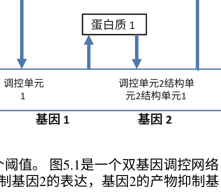

## 5.2 基于进化和深度学习的基因调控网络推断方法

### 5.2.1 推断遗传网络

DNA微阵列和寡核苷酸芯片等技术使得在各种条件下观察数千个基因成为可能（图5.2）。通过对基因组范围内的转录组进行全面监测，科学家们加深了对细胞发育不同阶段基因组活动结构和动态变化的理解。

推断遗传网络是一种逆问题，涉及根据每个基因的表达水平找到具有复杂相互连接的网络结构。多变量动态网络的逆问题计算上很困难。随着参数的增加，搜索空间的大小和所需数据量都呈指数增长，反映了问题的增加复杂性。

问题的困难也是由于数据的特性。使用当前技术，来自DNA微阵列实验的数据噪声水平据报道从30%到高达200%不等。此外，从单个反应过程中获得的时间序列非常短，只能捕获不到十几个离散数据点。进行实验的费用很高，并且尚未建立可以轻松重复实验的环境。这意味着只能接受不完整的数据或具有不同误差水平的数据。

#### 图5.2 测量基因表达的技术

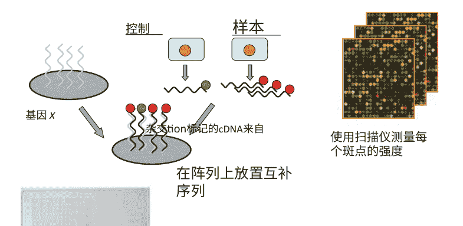

#### 图5.3 逆向工程流程图

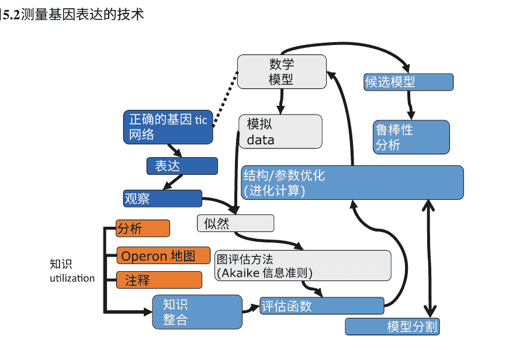

从给定数据中推断和创建结构的过程被称为“逆向工程”（图5.3）。设计是大多数工程领域中至关重要的过程，也是人工智能中一个有趣的主题。这是因为设计的过程是一种逆问题，涉及找到与规范相匹配的结构，而且没有通用解决方案。换句话说，生成满足规范的结构并平衡竞争标准、仔细考虑和修改备选方案需要复杂的智能。

分析基因表达数据的最终目标是阐明遗传控制网络的分子机制。然而，分析是否成功取决于实验数据的准确性和敏感性，以便进行识别底层生物系统。 如果可以找到遗传相互作用的动力学模型，那么推断遗传网络本质上等同于学习结构中的功能参数。

遗传网络是生物信息学中的重要课题。 研究这种系统的目标是通过将基因建模为相互作用网络来分解控制每个基因表达水平的系统。 这是根据由一组微分方程或线性模型确定的信号（物质）推断控制路径和权重的逆问题。 在这种设计问题中，结构和参数必须同时优化，因此使用传统方法（如共轭梯度下降或线性搜索）解决这些问题的不可行的。 由于分子构型不太清楚，只有有限的有用信息可用，必须满足动态反应的约束条件，逆问题非常困难。

存在不同的模型试图对基因调控网络进行建模[17, 18]。 例如，流行的S-System被提出用于建模小型网络。 这个模型已经通过不同的进化计算技术得到了解决，并取得了良好的结果。 然而，目前还没有模型能够完美重构网络。 我们实现了一种粒子群优化的变体，称为耗散粒子群优化（DPSO），用于优化模型。 我们发现S-System和DPSO的组合相对于先前使用的方法具有优势，并在更大更复杂的网络中呈现出有希望的结果（详见[19, 20]）。

还有其他几种人工智能方法正在研究基因调控网络（GRNs）的推断。 其中基于进化计算的方法，如遗传算法（GA）或遗传规划（GP），正变得越来越主流。 通过进化计算，可以同时优化结构和参数，无需提前提供原型。 基因网络的搜索空间包含许多局部最优解，因此多点搜索方法具有优势。 使用进化计算解释了基因调控网络的推断，详见[7]。

深度学习方法也被应用于这些推理问题。 例如，一项研究[4]使用深度学习从基因的表达水平中推断出感兴趣基因的表达。 当这种方法与基于微阵列的基因表达数据库（Gene Expression Omnibus dataset）进行验证时，结果优于传统方法（如线性回归）。

另一个例子是DeepBind [2]，它使用卷积神经网络预测哪些DNA和RNA结合蛋白质控制基因。 还有一项研究[15]使用信念网络（见第2.3.3节）。

基因网络推断已被用作人工智能和机器学习方法的基准问题。 其中一个被广泛关注的竞赛是DREAM项目。 DREAM（逆向工程评估和方法对话）的主要目标是鼓励集成研究网络推断，模型构建理论和湿实验。 DREAM正在尝试评估生物系统底层网络的实验预测和注释的质量。 研究人员使用各种优化算法和人工智能来推断生物网络的结构并预测其稳健性。 根据多个标准评估结果，并将每种方法的成功程度发布为排名。

DREAM项目已经评估了与微阵列数据相关的三十多个网络推断，包括大肠杆菌和金黄色葡萄球菌等细菌，以及酶和计算机模拟。 还证明了通过整合这些不同方法可以实现更好的性能[11]。 这类似于众包的方法，通过整合从异质推断方法得出的结果来得到最终结果。 通过巧妙地结合每种方法的优势，可以得到最终的推断结果，同时通过另一种方法来弥补任何特定方法的缺点。 使用的方法包括以下内容：

- 回归：使用线性回归特定于目标基因的转录元素选择，结合自助法和其他方法。
- 互信息：从互信息和相关性推断网络边缘。
- 相关性：基于皮尔逊相关系数或斯皮尔曼秩相关系数推断网络边缘。
- 贝叶斯方法：通过各种方法（如模拟退火或自助法）优化贝叶斯网络。
- 其他元启发式方法：使用Z分数、进化计算、随机森林搜索方法等。

通过将这些方法与民主原则相结合，研究人员成功地创建了可靠的方法论，产生了良好的结果。 这使得他们能够实现高度可靠的网络推断，对于大肠杆菌和金黄色葡萄球菌的1,700个转录控制标记，准确率达到约50%。

### 5.2.2 INTERNe：基于IEC的ERNe基因调控网络推断

本节描述了一种算法，该算法将交互式进化计算（IEC，参见第1.6节）和遗传算法（GA）集成到GRN推断中。 我们将这种方法称为INTERNe（带有ERNe的交互式进化计算）。 我们使用ERNe模型来表示GRN（参见第5.4节）。 在INTERNe中，遗传算法通过个体的交叉来搜索最优解。 交叉是通过选择基础个体和对应的父代，并将基础个体的每个元素与对应父代的元素进行更换来进行的。 突变会随机改变每个元素。在搜索过程中，遗传网络的初始浓度和反应系数使用前一篇参考文献[13]中的标准值进行搜索。INTERNe通过用户评估和适应度函数来优化遗传网络，具体方式如下：

1. 创建初始种群。
2. 使用适应度函数进行进化计算（遗传算法阶段）。
3. 交互式进化计算（IEC阶段）。
4. 返回遗传算法阶段。

我们将遗传算法种群设置为20个。交叉概率设置为0.3，而变异概率为0.1。通过大小为2的锦标赛方法选择对应的父代。

INTERNe中的IEC界面如图5.4所示。在右上方表格中为1的组件在搜索过程中是固定的。从α到α本身的提升和从α到β的提升是固定的。IEC用户预计是具有一些专业知识的生物学家，这些功能预计能够使搜索更加平滑。

#### 图5.4 基于IEC的GRN设计

为了推断锯齿波或Oligator（见209页），考虑以下两个适应度函数。第一个函数考虑了波的特性，定义如下：

$$\text{适应度}_1 = \frac{n^2}{\text{最大值}-\text{最小值}} \sum \left[ (A_{\text{最大值}} - A_{\text{最小值}}) \frac{\text{最大到最小}}{\text{最小到最大}} \right] \quad\quad (5.1)$$

其中，最大值是全局最大值，最小值是全局最小值（波形曲线的），$A$最大值是局部最大值，$A$最小值是局部最小值，最大到最小是从局部最大值到局部最小值的时间，最小到最大是从局部最小值到局部最大值的时间，$n$是振荡次数。

第二适应度函数适应度$_2$定义如下：

$$\text{适应度}_2 = \frac{\text{极限周期} \times SDE}{MSE} \quad\quad (5.2)$$

其中，极限周期定义如下：

$$\text{极限周期} = \frac{1}{(1+|\text{第一个峰值}-\text{最后一个峰值}|/\text{第一个峰值})^2} \quad\quad (5.3)$$

并且是对衰减的惩罚。在这里，第一个峰值是时间序列数据中的第一个振幅（局部最大值和最小值之间的差异），最后一个峰值是最后一个振幅。$SDE$是标准差误差，$MSE$是均方误差，即

$$MSE = \frac{1}{T} \int_{0}^{T} (\hat{x} - x)^2 dt \quad\quad (5.4)$$

其中$x$是实际值，$\hat{x}$是目标值。在获得波形后，该实验中的振幅和周期是自动确定的。

图5.5显示了INTERNe进化的波形。为了比较，使用普通遗传算法设计了相同的网络。该遗传算法的种群数量为200，迭代次数约为50次；个体评估约为10,000次。INTERNe在两种情况下经过几百次评估后得到了期望的波形；因此，评估次数有效地减少了。

为了进一步改进INTERNe，应考虑以下几点：

1. 为了避免用户疲劳，预计可以进一步减少评估次数，例如少于几百次评估，最多评估时间为一小时。
2. 相对评估（例如成对比较）比绝对评估（例如用户对个体进行评分）更可取。
3. 搜索空间可以通过利用用户的见解进行限制，例如，通过生物（专家）知识的方式固定一些促进和抑制作用。

#### 图5.5 进化的基因调控网络


(a) Waveform generated by using fitness1, GA: generation 31; IEC: generation 4.

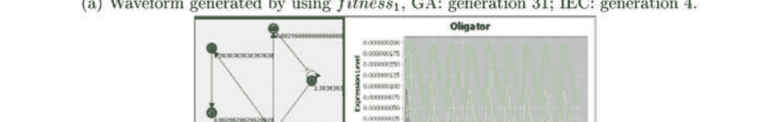
(b) Waveform generated by using fitness1, GA: generation 39; IEC: generation 5.

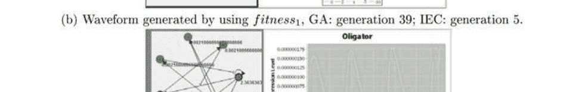
(c) Sawtooth wave generated by using fitness2, GA: generation 39; IEC: generation 2.

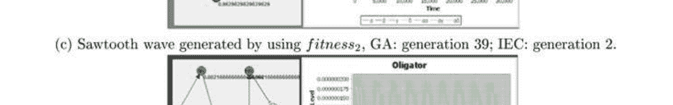
(d) Sawtooth wave generated by using fitness2,GA: generation 47; IEC: generation 4.

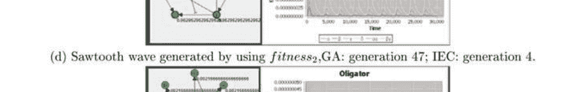
(e) Triangular wave generated by using fitness2,GA: generation 25; IEC: generation 3.

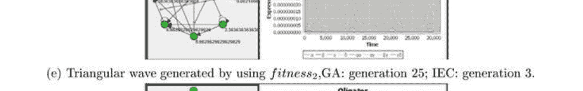
(f) Triangular wave generated by using fitness2,GA: generation 33; IEC: generation 3.

## 5.3 MONGERN：用于人形机器人的基因调控网络应用

### 5.3.1 进化机器人学和基因调控网络

进化机器人学[14]是通过进化过程产生自主机器人的方法。换句话说，进化机器人学是通过将机器人控制系统表示为基因型，然后应用进化算法搜索技术来训练适当的机器人行为的尝试。

进化机器人学是由Cliff、Harvey和Husbands [5]于1993年提出的，但在1980年代后半期已经开始进行具有传感器运动系统的人工物体的进化模拟。当时，生产机器人的控制需要特殊技能和高级编程能力。在与传统机器人设计明显不同的方向上，20世纪90年代出现了一代新的机器人，它们具有简单生物系统的特征。这些特征包括鲁棒性、简洁性、紧凑性和模块化。这些机器人被设计成易于编程和控制，即使是背景与传统机器人技术人员完全不同的人也可以操作。

近年来，进化机器人学受到了来自各个领域的研究人员的关注，包括人工智能、机器人学、生物学和社会行为科学。此外，进化机器人学与其他人工智能方法有许多共同之处。其中包括：

- 基于行为的机器人。
- 机器人学习。
- 多智能体学习和合作学习。
- 人工生命。
- 可进化硬件。

例如，Floreano等人通过对两个Khepera机器人（捕食者和猎物）进行进化实验，验证了红后效应⁷。每个机器人前部有六个红外传感器，后部还有两个。捕食者还配备了视觉传感器。猎物的最大速度是捕食者的两倍。如果猎物能够聪明地逃跑，它将永远不会被捕食者捉到。

为了对抗这一点，捕食者有更多的传感器信息可用于追踪猎物。通过EANN的直接编码（见第77页），捕食者和猎物的行为被表示为基因型，并进行共同进化。用于表征适应度的指标之一是猎物的存活情况。换句话说，猎物能够逃避捕食者的时间越长，猎物的适应度就越高。相反，捕食者能够捕捉猎物的速度越快，其适应度就越高。共同进化的结果是一系列令人着迷的追踪和逃避动作的连续出现，正如红后假说所预测的那样。这些行为的例子包括：

> ⁷红后效应是一种进化型的军备竞赛。这个名字源自《爱丽丝梦游仙境》。另见第4页。

“蜘蛛策略”（慢慢后退直到墙可见，然后在猎物靠近时捕捉）和像跳舞一样盘旋在一起。智能机器人在各种环境中执行各种任务的需求越来越大。人形机器人与人类具有相同的形态，因此可以在与人类相同的环境中工作，而无需改变环境，并且可以在各种情况下代替人类进行危险工作。因此，这些机器人可以执行比为特定目标开发的机器人更广泛的任务，并且引起了很多研究兴趣。

当控制人形机器人的运动时，需要处理关节角度的时间序列数据。这些机器人具有许多自由度，并且必须能够在整个机器人平衡在两只脚上时移动。需要进行复杂的力学计算来获得关节角度，控制运动是困难的。因此，正在进行研究，使用神经网络或强化学习来学习和生成机器人的运动，使得可以在不指定所有运动数据的情况下控制运动。

基因调控网络（GRNs）在机器人技术中的应用具有很高的期望，因为它们具有固有的稳健性和模块化性，以及复杂表达的演化和压缩的可能性。已经在机器人领域进行了使用GRN的研究，通过各种机器人形成模式，并且已经证明了其稳健性[9]。

人形机器人的缺点是两只脚行走不稳定且容易受到干扰，因此GRNs需要具备稳健性才能生成人形机器人的运动。使用稳健的GRNs生成人形机器人的运动可能比传统方法更能抵抗干扰。因此，将GRN应用于真实问题中的复杂任务，即人形机器人的控制，将证明GRN能够灵活学习并具有稳健性。

这些部分描述了通过差分进化学习GRNs来学习生成多个动作的网络，并使用模拟器和实际机器人验证网络是否正确生成动作。我们将这个系统称为MON-GERN（基因调控网络生成动作）。

### 5.3.2 如何表达动作

机器人的动作可以通过关节的时间序列运动来表达。因此，GRNs可以将GRNs的输出值与每个关节的角度相关联来表达机器人的动作。人形机器人具有许多自由度，动作的生成和记忆是困难的，因此使用模型来抽象动作的方法得到了广泛研究。使用的模型包括隐马尔可夫模型[8]和神经网络[22]，节点输出的值通常与关节的角度相关。

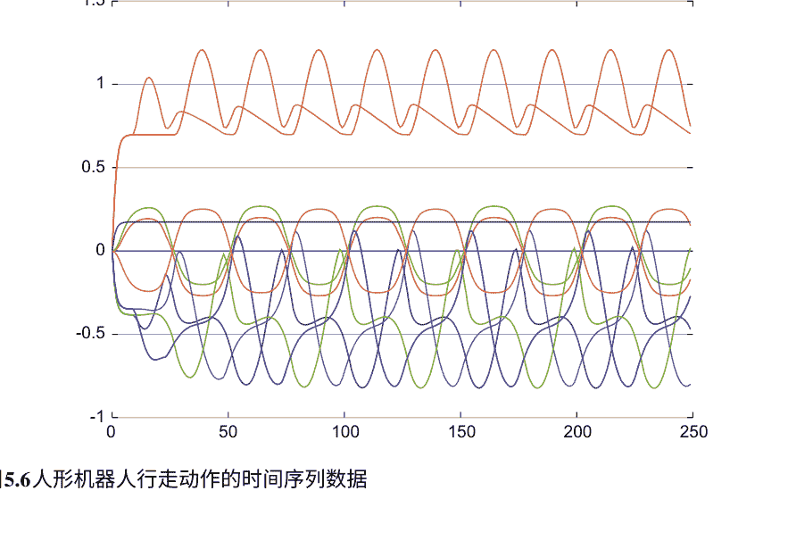

图5.6 人形机器人行走动作的时间序列数据

在使用GRNs进行人形机器人动作生成和学习模型时，需要将网络的输出转换为表达机器人动作的数据。人形机器人的动作通常可以表示为关节角度的时间序列数据。图5.6显示了人形机器人行走动作的示例。每个时间序列对应于每个关节的角度。因此，可以通过生成这样的时间序列数据来生成动作。如前所述，每个基因在GRNs中输出时间序列数据；因此，通过将这个输出输入到机器人中，GRNs可以生成动作。GRNs通过将每个基因的输出与人形机器人的每个关节相关联来生成人形机器人的动作。

图5.7显示了在MONGERN中生成运动的方法。网络输出的时间序列数据与关节相关，并转换为关节角度，通过提供关节角度来控制机器人。

在MONGERN中，GRN的输出被转换为关节角度，具体如下。GRN的每个基因首先与人形机器人的每个关节相关联。人形机器人中可移动关节的数量有限，GRN的基因与可移动关节相关联。原则上，一个基因与一个关节相关联，但通过将一个基因与两个对称运动的关节相关联，可以降低学习成本。网络中没有与之相关的基因的关节角度始终固定为某个特定值。

根据每个相关关节的指定方法，将网络输出的值进行转换。GRN的输出，即蛋白质的浓度，始终为正值，因此如果直接用作关节角度，关节的运动范围会受到限制。因此，MONGERN采用线性变换，允许机器人的每个关节在整个运动范围内运动，因此运动没有限制。

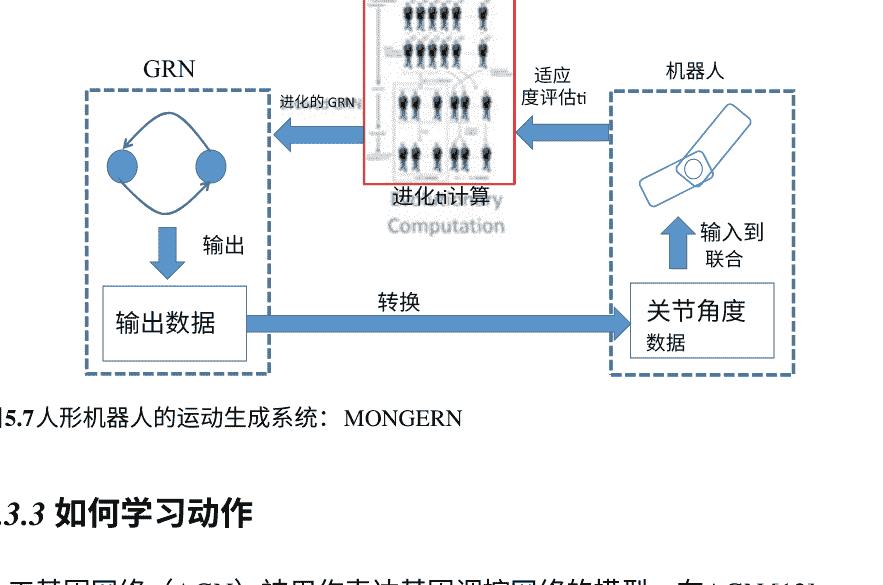

图5.7 人形机器人的运动生成系统：MONGERN

### 5.3.3 如何学习动作

人工基因网络（AGN）被用作表达基因调控网络的模型。在AGN [12] 中，基因网络中的基因之间的相互关系由以下同时微分方程表示：

$$ \frac{d G_i}{dt} = a_i \cdot \prod_j \left(\frac{K_{I_j}^n}{I_j^n + K_{I_j}^n}\right) \cdot \prod_k \left(\frac{A_k^n}{A_k^n + K_{A_k}^n}\right) - b_i \cdot G_i, \qquad (5.5) $$

其中 $i$ 表示基因的编号，AGN成为一个随着基因总数增长的同时微分方程。$G_i$的值是基因控制网络的输出，表示蛋白质浓度。因此，左侧表示基因合成的蛋白质浓度变化。

对于右侧，（表示抑制剂）$I$表示抑制第$i$个基因表达的蛋白质浓度，$A$（表示激活剂）表示促进第$i$个基因表达的蛋白质浓度。右侧的第一项表示蛋白质的合成，第二项表示蛋白质的分解。参数$a_i$和$b_i$分别表示合成速率和分解速率。常数$K_{I_j}$和$K_{A_k}$表示抑制剂或激活剂效果达到饱和值一半时的浓度。指数$n$调节曲线的S形度。

#### 表5.1 基因型（AGN中的参数）

| 参数 | 描述 | 范围 |
| :--- | :--- | :--- |
| n |  |  |
| a1 ... | 基因数 |  |
| b1 ... | 基因数 |  |
| KI1 KI2 ... <br> KA1 KA2 ... | (#.基因数) × 2 |  |

#### 表5.2 AGN参数范围

| 参数 | 最大值 | 最小值 |
| :--- | :--- | :--- |
| n | 1.5 | 5.0 |
| a | 0.0 | 2.0 |
| b | 0.02 | 0.15 |
| K | -1.0 | 1.0 |

#### 图5.8 基于GRN的运动学习中个体的评估


MONGERN使用差分进化（DE，见第2.1.2节）来学习机器人运动。要将差分进化应用于基因调控网络，必须将网络的结构转换为数值，并将其表示为可以用于DE的基因型。首先，生成GRN的参数序列（表5.1）作为初始个体，并对每个个体进行评估。参数在表5.2中所示的范围内随机生成。通过DE进行遗传操作，并通过适应度评估继续生成后代进行学习。

个体使用模拟器进行评估，如图5.8所示。模拟器中的机器人控制器从网络的参数序列计算时间序列数据，并控制机器人的关节角度。机器人控制器可以获得机器人的关节角度和传感器值，并记录评估所需的值。机器人控制器同时运行着一个监督控制器。监督控制器可以获得模拟器空间中物体的三维位置，并记录评估所需的值，如关节位置。一次模拟结束后，根据控制器记录的值计算适应度。为每个动作指定适应度函数来评估动作的达成程度。

### 5.3.4 如何制作稳健的动作

已知GRNs对环境变化具有稳健性。在这里，验证GRNs的稳健性意味着即使参数发生变化或系统受到干扰，网络仍能正确输出预期的结果。第5.3.2节中描述的运动生成方法不包括检测外部环境的传感器值；因此，GRNs始终输出相同的值，与外部环境无关。这并不意味着生成的动作利用了GRNs的稳健性。

本节描述了一种生成稳健动作的方法，该方法将关节角度的响应作为传感器进行了整合。GRNs的输出以同时微分方程的关系给出。因此，下一步的输出可以通过给定初始值和时间步长来计算，并且可以通过迭代这样的计算来生成时间序列值。MONGERN在每个步骤接收到机器人的关节角度作为响应，下一步的关节角度生成不是使用先前的输出，而是使用关节角度的响应。关节的指令和相应的响应可能不同，例如当机器人撞到障碍物或关节超出其运动范围时。通过将响应作为传感器进行整合，可以实现环境的稳健性。

在MONGERN中，输入值首先提供给基因调控网络（GRNs），然后将下一步的输出转换并作为关节角度的命令提供给机器人。获取关节角度的响应，将其转换并输入到网络中，然后获取下一步的输出。通过重复这个过程生成运动。

在这个阶段，学习方法使用差分进化（DE）。通过在许多环境中模拟个体，评估个体，并将评估值的总和作为该个体（即GRN）的评估值。定义人形机器人的鲁棒性的最重要因素是在不同环境中能够移动而不倒下的能力。人形机器人的稳定性可能会因一个关节的微小偏移而破坏，因此GRN的鲁棒性可能不会直接影响人形机器人的运动鲁棒性。在这种情况下，单一环境中的学习不会导致鲁棒的运动。在许多环境中进行学习将有助于寻找鲁棒的网络。

一般来说，当关节角度的命令和响应不同时，继续提供命令是不好的；需要根据情况进行控制。然而，处理这种异常情况是困难的。因此，强大的网络必须能够在响应困难时自主地进行正确的运动调整，而MONGERN应该实现这种鲁棒性。

#### 表5.3 HOAP-2的规格

| 规格项 | 详情 |
| :--- | :--- |
| 高度 | 约50厘米 |
| 重量 | 约7千克 |
| 关节自由度 | 6个自由度/腿 × 2 <br> 4个自由度/手臂 × 2 <br> 1个自由度/腰 × 1 <br> 1个自由度/手 × 2 <br> 2个自由度/颈 × 1 |
| 传感器 | 关节角度传感器 <br> 三轴加速度传感器 <br> 三轴角速度传感器 <br> 脚底压力传感器 |

### 使用MONGERN进行的仿真实验

下面的实验是为了证明MONGERN的有效性而进行的。我们使用了富士通自动化的人形机器人HOAP-2（见图5.12和5.13）。HOAP-2的主要规格如表5.3所示。学习的动作包括：（a）倒立，（b）行走，（c）弯曲和伸展，（d）起立，（e）踢，和（f）翻身。在所有的动作学习实验中，每一代有20个个体，DE中的变异缩放参数为0.6，交叉率为0.9。下面描述了每个动作中使用的适应度函数和关节。

表5.4显示了分配给每个动作关节的基因。

- **（a）倒立**
    适应度是模拟结束时脚趾与地面之间距离的平均值。使用的关节包括腰部（前/后方向）、髋部（右侧和左侧的前/后方向）、膝盖（右侧和左侧）、踝关节（右侧和左侧的前/后方向）。如果适用，同一基因用于表示右侧和左侧的关节。

- **（b）步行**
    适应度是初始和最终位置之间脚趾之间距离的平均值。当机器人在模拟过程中变得不稳定时，适应度会乘以一个校正时间的修正项——模拟时间。使用的关节是髋关节（前/后方向，右侧和左侧）、膝关节（右侧和左侧）和踝关节（前/后方向，右侧和左侧）。不同的基因用于不同的关节，因为右侧和左侧关节的运动不对称。为了稳定，右侧和左侧髋关节角度（前/后方向）给定为（膝关节角度）-（踝关节角度）。

#### 表5.4 关节基因分配

**(a) 倒立 和 (b) 步行**

| 基因 | (a) 倒立 | (b) 步行 |
| :--- | :--- | :--- |
| G0 | 腰部（前/后方向） | 左膝 |
| G1 | 髋关节（前/后方向，右侧和左侧） | 右膝 |
| G2 | 膝盖（右侧和左侧） | 左脚踝（前/后方向） |
| G3 | 脚踝（右侧和左侧的前/后方向） | 右脚踝（前/后方向） |

**(c) 弯曲和伸展 和 (d) 起立**

| 基因 | (c) 弯曲和伸展 | (d) 起立 |
| :--- | :--- | :--- |
| G0 | 髋关节（前/后方向，右侧和左侧） | 腰部（前/后方向） |
| G1 | 膝盖（右侧和左侧） | 髋关节（前/后方向，右侧和左侧） |
| G2 | 脚踝（右侧和左侧的前/后方向） | 膝盖（右侧和左侧） |
| G3 | 无 | 脚踝（右侧和左侧的前/后方向） |
| G4 | 无 | 肩膀（右侧和左侧的前/后方向） |
| G5 | 无 | 肩膀（右侧和左侧的右/左方向） |

**(e) 踢 和 (f) 翻身**

| 基因 | (e) 踢 | (f) 翻身 |
| :--- | :--- | :--- |
| G0 | 右髋（右/左方向） | 左髋（扭转） |
| G1 | 右脚踝（右/左方向） | 左髋（右/左方向） |
| G2 | 右髋（前/后方向） | 左髋（前/后方向） |
| G3 | 右膝 | 左膝 |
| G4 | 右脚踝（前/后方向） | 右肩膀（前/后方向） |

- **(c) 弯曲和伸展**
    准备了机器人坐下和站起的关键帧，并将关节角度视为标准数据。适应度被定义为与这些标准数据中关节角度的平方误差之和。当机器人在模拟过程中变得不稳定时，适应度会乘以一个校正时间的修正项。
    使用的关节是髋关节（右侧和左侧的前/后方向）、膝关节（右侧和左侧）和踝关节（右侧和左侧的前/后方向）。如果适用，同一基因用于表达右侧和左侧的关节。

- **(d) 起立**
    适应度是两只脚的足部传感器数值的平均值。使用的关节包括腰部（前后方向）、髋关节（右侧和左侧的前/后方向）、膝关节（右侧和左侧）、踝关节（右侧和左侧的前/后方向）以及肩膀（右侧和左侧的前/后方向和右/左方向）。如果适用，同一基因用于表达右侧和左侧的关节。

- **(e) 踢**
    适应度被视为模拟期间球的最大速度。当机器人在模拟期间变得不稳定时，适应度会乘以一个校正时间的修正项——模拟时间。使用表5.5中环境1中的球（直径14厘米，距离12厘米等）。使用的关节包括右髋关节（右/左方向）、右踝关节（右/左方向）、右髋关节（前/后方向）、右膝关节和右踝关节（前/后方向）。不同的基因用于不同的关节。

- **(f) 翻转**
    以连接两个肩关节的线为x轴，机器人面朝上放置，使得左肩关节的x坐标大于右肩关节的x坐标。适应度如下所示：
    x坐标 右肩关节的坐标 - x坐标 左肩关节的坐标。
    使用的关节包括左髋关节（扭转）、左髋关节（左/右方向）、左髋关节（前/后方向）、左膝关节和右肩关节（前/后方向）。不同的关节使用不同的基因。

每个动作的学习结果如下所示。

- **(a) 手倒立动作**
    手倒立动作的学习结果如图5.9a所示。机器人在两臂和头部接触地面后进行手倒立。需要一千五百代才能学习该动作。图5.10a显示了基因调控网络输出的时间序列数据，GRN的结构如图5.11a所示。
    演化的AGN同时微分方程如下所示。
    ```
    dG₀/dt = 1.8 * (1²/(G₀² + 1²)) * (G₁²/(G₁² + 0.5²)) * (0.9²/(G₂² + 0.9²)) * (0.4²/(G₃² + 0.4²)) - 0.1G₀
    dG₁/dt = 2 * (1²/(G₀² + 1²)) * (1²/(G₁² + 1²)) * (1²/(G₂² + 1²)) * (0.6²/(G₃² + 0.6²)) - 0.1G₁
    dG₂/dt = 0.4 * (0.9²/(G₀² + 0.9²)) * (0.3²/(G₁² + 0.3²)) * (0.5²/(G₂² + 0.5²)) * (G₃²/(G₃² + 0.7²)) * (0.5²/(G₄² + 0.5²))
    dG₃/dt = 1.9 * (G₀²/(G₀² + 0.3²)) * (0.4²/(G₂² + 0.4²)) * (1²/(G₃² + 1²)) * (0.7²/(G₄² + 0.7²)) - 0.1G₃
    dG₄/dt = 1.8 * (0.9²/(G₀² + 0.9²)) * (1²/(G₁² + 1²)) * (G₂²/(G₂² + 0.6²)) * (1²/(G₃² + 1²)) * (0.3²/(G₄² + 0.3²)) - 0.1G₄
    ```

- **(b) 行走动作**
    图5.9b显示了学习行走动作的结果。机器人拖着腿，但是每只脚轮流向前移动。进行了三千代的演化学习运动是必要的。图5.10b显示了基因调控网络输出的时间序列数据，GRN的结构在图5.11b中给出。

- **(c) 弯曲和伸展运动**
    图5.9c显示了学习弯曲和伸展运动的结果。机器人能够稳定地弯曲和伸展。需要2300代来学习这个运动。图5.10c显示了基因调控网络输出的时间序列数据，GRN的结构在图5.11c中给出。

- **(d) 上升运动**
    学习上升运动的结果显示在图5.9d中。机器人稳定地弯曲和伸展。需要九百六十代来学习这个动作。
    图5.10d显示了基因调控网络输出的时间序列数据，并且GRN的结构在图5.11d中给出。

- **(e) 踢球动作**
    学习踢球动作的结果显示在图5.9e中。机器人正在踢球。需要一千二百代来学习这个动作。
    图5.10e显示了基因调控网络输出的时间序列数据，并且GRN的结构在图5.11e中给出。

- **(f) 翻身动作**
    学习翻身动作的结果显示在图5.9f中。机器人从正面翻转到背面。需要六百代来学习这个动作。图5.10f显示了基因调控网络输出的时间序列数据，并且GRN的结构在图5.11f中给出。

### 5.3.6 使用MONGERN进行真实机器人实验

通过运动学习实验获得的网络用于操作一个真实的HOAP-2机器人。(b)行走和(c)弯曲和伸展动作的结果分别显示在图5.12和5.13中。机器人在两种情况下都能够移动而不倒下，表明它在真实环境中能够正确移动。在行走动作中，整个机器人面朝向向前移动的腿，每步的距离比模拟中的要短(参见图5.9b)。

### 5.3.7 使用MONGERN进行鲁棒性验证

进行踢球动作的学习以验证其鲁棒性# 图5.13 使用实际机器人进行(c)弯曲和伸展的验证

#### 表5.5 用于学习鲁棒踢球动作的实验环境

| 环境编号 | 类型 | 密度 (kg/m^3) | 直径 (厘米) | 距离 (厘米) |
|----------|------|---------------|-------------|-------------|
| 1 | 球 | 1000 | 14 | 12 |
| 2 | 球 | 3000 | 30 | 26 |
| 3 | 球 | 10,000 | 18 | 11 |
| 4 | 球 | 10,000 | 24 | 12 |
| 5 | 球 | 2000 | 40 | 20 |
| 6 | 块 | 2000 | - | - |
| 7 | 无 | - | - | - |

运动涉及单腿站立，当球改变时，机器人上的力会发生变化。该实验对同一对象在多个环境下进行评估，其中踢不同的物体。每个环境中踢的物体在表5.5中总结。为了适应许多条件，使用少量环境，采用了两个极端环境：环境6包括与墙对应的块，环境7中没有放置任何物体，机器人不踢任何东西。块的尺寸为高度15厘米，宽度30厘米，深度30厘米。表中给出的距离是从物体中心到机器人脚趾的距离。每个环境中的适应度是球的最高速度×不稳定时间模拟时间。将七个环境的适应度相加，得到个体网络的总适应度。使用的关节是左踝（右/左方向），右髋（前/后方向），右踝（前/后方向）和左髋（前/后方向）。不同的关节使用不同的基因。基因按照表5.6所示分配给关节。

在环境1的模拟结果如图5.14所示。图5.15显示了GRN学习后的时间序列数据输出，GRN的结构在图5.16中给出。具有相同网络的环境6的时间序列数据如图5.17所示。踢击与墙对应的重块会弯曲左髋关节（G3），从而抑制右髋关节（G1）。

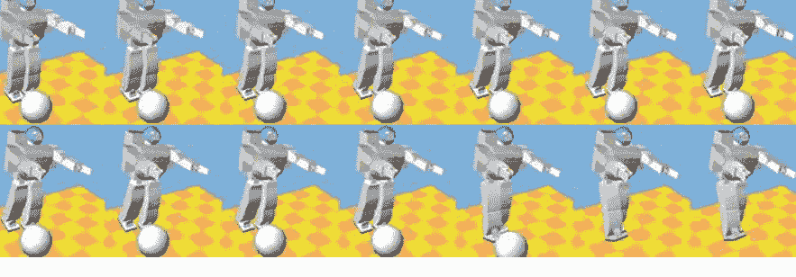

#### 图5.14 环境1中踢击动作的模拟结果

#### 图5.15 学习后基因调控网络（GRN）输出的稳健踢击动作

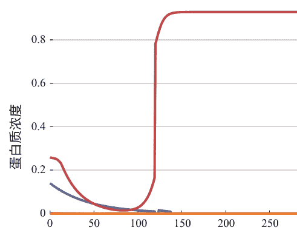

#### 图5.16 学习后稳健踢击动作的基因调控网络（GRN）结构

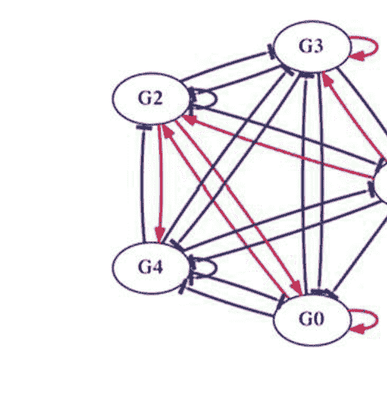

#### 表5.6 稳健踢击动作中关节的基因分配

| 基因 | 分配的联合 |
|------|------------|
| G0 | 左脚踝（右/左方向） |
| G1 | 右髋（前/后方向） |
| G2 | 右脚踝（右/左方向） |
| G3 | 左髋（前/后方向） |

#### 图5.17 基因调控网络（GRN）在学习环境6中学习到稳定的踢球动作后的输出

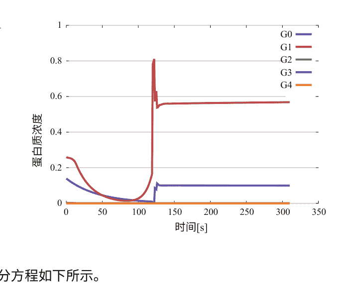

演化的AGN同时微分方程如下所示。

```
dG0/dt = 1.9 * (G0^5/(G0^5+0.9^5)) * (0.7^5/(G1^5+0.7^5)) * (G2^5/(G2^5+0.8^5)) * (0.1^5/(G3^5+0.1^5)) * (0.4^5/(G4^5+0.4^5)) - 0.1G0
dG1/dt = 1.7 * (0.5^5/(G1^5+0.5^5)) * (0.6^5/(G2^5+0.6^5)) * (0.1^5/(G3^5+0.1^5)) * (0.7^5/(G4^5+0.7^5)) - 0.1G1
dG2/dt = 0.6 * (G0^5/(G0^5+0.2^5)) * (G1^5/(G1^5+0.6^5)) * (0.6^5/(G2^5+0.6^5)) * (0.9^5/(G3^5+0.9^5)) * (0.3^5/(G4^5+0.3^5)) - 0.1G2
dG3/dt = 1.8 * (0.2^5/(G0^5+0.2^5)) * (G1^5/(G1^5+0.3^5)) * (0.9^5/(G2^5+0.9^5)) * (G3^5/(G3^5+0.4^5)) * (0.5^5/(G4^5+0.5^5)) - 0.1G3
dG4/dt = 1.7 * (0.8^5/(G0^5+0.8^5)) * (0.9^5/(G1^5+0.9^5)) * (G2^5/(G2^5+0.5^5)) * (0.8^5/(G3^5+0.8^5)) * (0.7^5/(G4^5+0.7^5)) - 0.1G4
```

通过研究与学习不同于学习中使用的球的其他球的稳定性，验证了进化的GRN的稳健性。在运动验证实验中使用了42个环境的组合，其中球的密度分别为1000、2000、3000、5000、7000和10,000（kg/m³），球的直径分别为10、15、20、25、30、35和40（cm）。这里，球的半径是球的中心到机器人尖端的距离。我们已经确认机器人在所有42种组合中成功稳定地踢球。


# **图5.18 通过GRN进化的陷阱运动**

我们已经进行了与其他传统方法的比较实验。为了比较起见，我们选择了两种目标运动。这些是倒立和陷阱运动（见图5.18）。在这个实验中，我们尝试进化胸部陷阱运动，这是陷住足球的四种主要方式之一（其他方式是头陷阱、大腿陷阱和脚陷阱）。MONGERN成功生成了如图5.18所示的陷阱运动。另一方面，已经知道这种陷阱运动很难通过传统方法生成，例如神经网络和强化学习，这些方法经常用于机器人运动学习。这部分是因为陷阱是指停止或减缓朝机器人方向运动的球的过程，这伴随着离散和突然的变化。因此，我们在这个背景下确认了MONGERN的有效性。

# ## 5.4 ERNe: 一种进化反应网络的框架

在本节中，我们解释了ERNe（进化反应网络[8]），这是一种扩展NEAT方法（参见第3.1.1节）以产生适用于生化系统的一种遗传网络的机制[6]。ERNe是一种专注于神经网络和生化网络之间相似性的方法，使用进化方法在硅中训练网络结构。事实上，ERNe在设计合成生物学中的遗传电路方面取得了成功。事实上，ERNe在发现已知振荡电路[13]、双稳态网络[16]和展现复杂行为的振荡电路方面比传统方法更快。ERNe的有效性还通过应用于各种搜索问题和生物系统中得到了证明。

# ### 5.4.1 DNA PEN工具箱

DNA PEN（动态网络组装聚合酶外切酶核酸酶）工具箱受到基因调控网络的启发[13]。在这种网络中，调控是通过基因表达和调控元件之间的相互作用来实现的。

#### 图5.19 DNA PEN工具箱的模块：激活、自催化和抑制

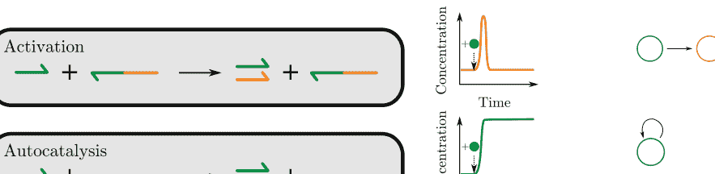

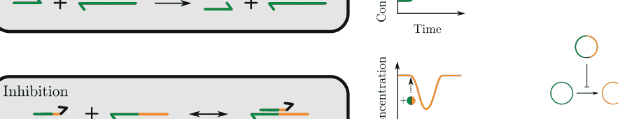


有两种形式：激活或抑制，分别增加和减少目标基因的表达。其中一个目标是在去除使用RNA、蛋白质和相关分子机制的复杂性的同时，重现这些机制。

该工具箱通过特定的DNA物种模拟调控机制，激活或抑制其他DNA物种的生成。激活剂通常被称为信号，而执行抑制的DNA物种简单地被称为抑制剂。通过第二类名为模板的DNA物种来进行激活。在粗粒度级别上，模板是存在于溶液中的DNA物种，从输入中生成输出，最终释放两者。输出本身可以是激活剂，从而实现多个反应的级联。在DNA PEN工具箱中，激活的确切机制基于聚合酶和切割酶的组合[13]。然而，其他机制，如Qian和Winfree的平衡门[21]，可以实现类似的功能。

DNA PEN工具箱中实现的激活和抑制以及自催化激活的示意图如图5.19所示。

在最低的抽象层次上，模板物种被视为黑盒子（图5.20）。这些盒子具有简单的现象学传递函数，受到Michaelis-Menten反应速率和竞争性抑制的启发。这个模型的理论基础是假设杂交和变性（两个互补的DNA链的结合和解离）达到平衡的速度要快得多。

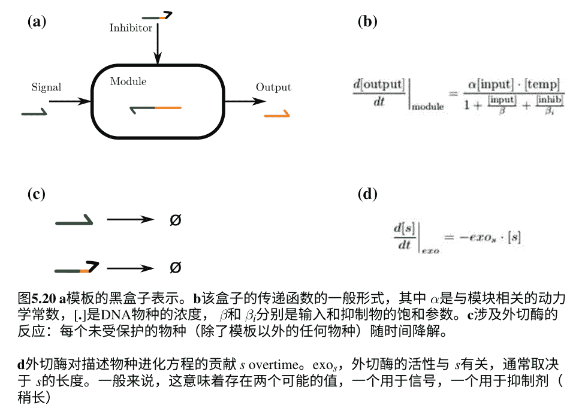

图5.20 a模板的黑盒子表示。 b该盒子的传递函数的一般形式，其中α是与模块相关的动力学常数，[]是DNA物种的浓度，β和βi分别是输入和抑制物的饱和参数。c涉及外切酶的反应：每个未受保护的物种（除了模板以外的任何物种）随时间降解。
d外切酶对描述物种进化方程的贡献s overtime。exos，外切酶的活性与s有关，通常取决于s的长度。一般来说，这意味着存在两个可能的值，一个用于信号，一个用于抑制剂（稍长）

比基于酶的反应更长。 这产生了图5.20b中的传递函数，对于每个模块。 因此，可以通过对生成给定物种的模板求和，加上对外切酶活性的一阶近似，从系统的图形表示轻松构建整个方程组

-exos[s](t)。

这个DNA PEN工具箱模型首次在Padirac等人的双稳态开关[16]中引入。由于方程的简单性，大型系统可以非常快速地进行模拟。 这个特性被用来演化复杂的DNA PEN工具箱系统，需要进行数千次独立评估。在这个过程中，算法[3]发现了有趣的模式（图5.21）。应用这个模型的原理，自催化模板的行为可以写成一个方程：

\[\frac{d[s]}{dt}(t) = \frac{\alpha \cdot [temp][s](t)}{1 + \frac{[s](t)}{\beta}} - exos \cdot [s](t)\]

### 5.4.2 ERNe 详细信息

DNA PEN 工具箱的分子网络概述在第5.4.1节中介绍，它依赖于将化学物质连接起来的活化或抑制化学过程的组合

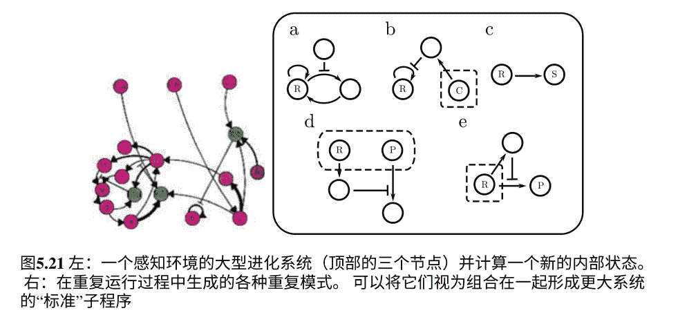

化合物被视为网络的节点。从这个意义上说，它们与神经网络具有结构上的相似性。因此，我们认为可能可以将现代人工神经网络（ANN）构建策略适应于生物化学系统的体外进化，从而可能大大提高搜索效率。我们在这个方向上使用了NEAT的扩展（第3.1.1节）。

人工神经网络（ANN）和反应网络之间的主要区别是添加了抑制链接和生化参数。因此，ERNe编码允许表示抑制并具有附加参数。此外，变异和交叉操作符也从原始NEAT算法进行了修改。在本节中，详细描述了算法，包括编码、变异和交叉的遗传操作符，以及物种形成过程。

我们的基因组由序列基因和模板基因组成。与NEAT的节点基因不同，每个序列基因可以表示系统中的信号序列或抑制序列，并包括名称、动力学参数和初始浓度。每个模板基因指定了起始节点、目标节点、模板浓度、启用位（指示模板是否启用）和创新编号（在系统中唯一标识每个模板）。

创新编号在交叉和物种形成的实现中起着重要作用，并根据以下规则为模板基因设置。
在进化过程中，每当一个模板被添加到系统中，我们会检查该特定链接是否存在于进化历史中；在这种情况下，它会采用原始链接的创新编号。否则，将分配下一个可用的创新编号给模板基因。为了使这种历史标记有效，应该仔细设计新添加序列的命名机制。理想情况下，在不同的系统中，具有相同名称的序列应承担相同的角色。然而，这几乎是不可能的。

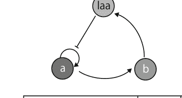

| Name | a | b | Iaa |
|---|---|---|---|
| Kinetic parameter | 3.873 | 3.873 | 0.0129 |
| Initial concentration | 1.0 | 0.1 | 0.1 |

| From | a | b | b |
|---|---|---|---|
| To | a | b | Iaa |
| Concentration | 30.5 | 10.3 | 15.4 |
| Enabled ? | True | True | True |
| Innovation | 1 | 2 | 3 |

图5.22 Oligator的图表示和相应的ERNc编码。节点代表序列，箭头代表模板；带有条头的箭头表示抑制。a和b是信号序列，而绿色节点Iaa是一个抑制序列；它抑制模板a→a（即a的自激活）。该系统有三个序列和三个模板。因此，它的ERNc编码中有三个节点基因和三个连接基因。

不可能保持理想条件，因为后续的突变可能会改变任何序列的作用。然而，一个简单的命名机制可以在一定程度上处理这个问题。我们使用一个列表来映射节点名称及其创建方式；例如，一个条目A→A到B表示每当在模板A→A的中间添加一个新节点时，它必须被命名为B。图5.22展示了描述Oligator的遗传编码的示例。

### 5.4.3 ERNe中的遗传操作

突变可以应用于改变参数和网络结构。我们有以下突变操作：仅参数、禁用模板、切换模板、添加序列、添加激活和添加抑制。它们在网络中的关系和影响如图5.23所示。
在参数突变中，每个参数都有一定的概率突变为一个新的随机值，计算方法如下：

```
newValue = oldValue × (1 + f₁ × rand₁) + f₂ × rand₂,
```

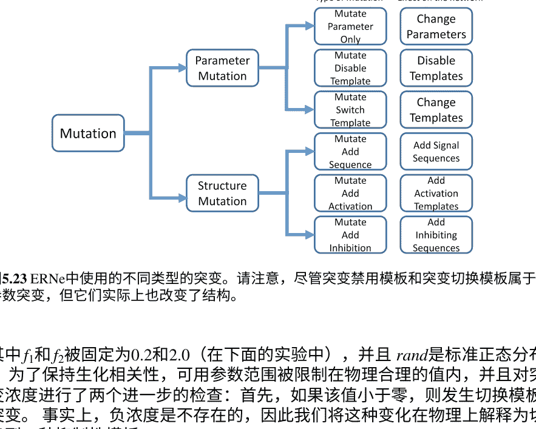

图5.23 ERNe中使用的所有类型的突变。请注意，尽管突变禁用模板和突变切换模板属于参数突变，但它们实际上也改变了结构。

其中f1和f2被固定为0.2和2.0（在下面的实验中），并且rand是标准正态分布。为了保持生化相关性，可用参数范围被限制在物理合理的值内，并且对突变浓度进行了两个进一步的检查：首先，如果该值小于零，则发生切换模板突变。事实上，负浓度是不存在的，因此我们将这种变化在物理上解释为切换到一种抑制性模板。

图5.24a展示了一个开关模板突变的示例。在图中，开关模板突变创建了结构(a)，其中模板b→a被禁用，添加了一个抑制节点Iaa，然后添加了一个新的创新编号为b→Iaa的模板。

假设模板b→a的浓度突变为负值，根据算法5.1描述，将对系统应用这些变化。其次，如果模板浓度的新值大于零但低于阈值（这里设置为1.0 [nM]），则有可能通过禁用模板突变来禁用它们。这些突变基于这样一个思想，即一旦连接没有意义（模板浓度接近零），就应该将其移除（禁用）甚至改变为反向极性。此外，因为每个模板都为ODE（常微分方程）模型带来一些变量，这些步骤有助于通过启用浓度非常低且与目标函数相关性可能很低的模板的移除来尽可能地保持结构简单。

在添加序列突变中，系统会添加一个新的信号序列。有两种方法可以执行这种类型的突变，如图5.24所示。第一种方法是

#### 图5.24 ERNe中的几种突变类型。左侧是原始结构

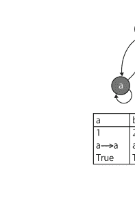

| a | b |
|---|---|
| 1 | a→a | True |
| 2 | a→b | True |
| 3 | b→a | True |

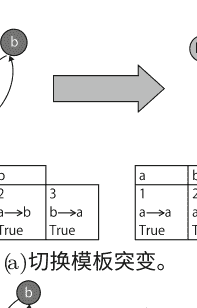

| a | b | laa |
|---|---|---|
| 1 | a→a | True |
| 2 | a→b | True |
| 3 | b→a | False |
| 4 | b→laa | True |

#### (a)切换模板突变。

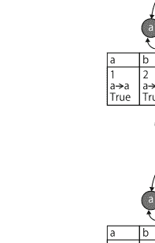

| a | b |
|---|---|
| 1 | a→a | True |
| 2 | a→b | True |
| 3 | b→a | True |

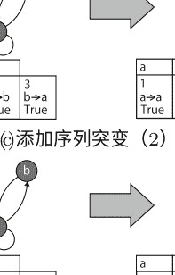

| a | b | c |
|---|---|---|
| 1 | a→a | False |
| 2 | a→b | True |
| 3 | b→a | True |
| 4 | a→c | True |
| 5 | c→a | True |

#### (b)添加序列突变（1）。

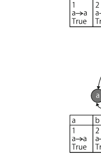

| a | b |
|---|---|
| 1 | a→a | True |
| 2 | a→b | True |
| 3 | b→a | True |

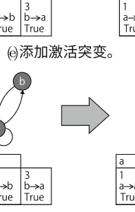

| a | b | c | lab |
|---|---|---|---|
| 1 | a→a | True |
| 2 | a→b | True |
| 3 | b→a | True |
| 4 | c→c | True |
| 5 | c→lab | True |

#### (c)添加序列突变（2）。

#### 算法5.1 切换模板突变

禁用模板b → a
如果没有创建a的现有模板则
  添加模板a → a
  选择模板a→ a
其他
  选择任何创建a的模板
结束如果
添加抑制序列Ixa以抑制之前选择的模板x → a
添加模板b → Ixa

选择一个现有模板，将其分割，并将新序列放在中间 (图5.24b)。第二种方法是添加一个具有自激活连接的新序列 (请记住，没有传入链接的节点是禁止的) 来抑制现有模板 (图5.24c) 或激活现有序列 (图5.24d)。在图中，添加序列突变创建结构 (b)，其中在现有模板a→a的中间添加了序列c，结构 (c) 中添加了序列c以抑制模板a→b，结构 (d) 中添加了序列c以激活序列b。

在添加激活突变中，随机选择两个未连接的序列，并在它们之间添加一个新模板 (图5.24e)。在图中，添加激活突变创建了结构 (vi)，其中添加了模板b→b。

图5.24f描述了Add Inhibition突变的示例。随机选择一个模板 (在示例中为a→a)，并创建相应的抑制节点 (Iaa)。然后，突变选择一个随机起始节点 (b)，并添加模板b→Iaa，完成模块。当序列a和b之间已经存在一个激活模板时，会出现特殊情况；在这种情况下，它会被简单地禁用 (突变等效于Switch Template突变)。ERNe编码和创新编号的使用使交叉变得简单直接。使用创新编号，将父代中的模板基因对齐，然后可以轻松应用一点交叉和两点交叉等交叉技术。图5.25展示了一个两点交叉操作的示例，这导致了循环大小的有趣增加。我们还需要决定如何为子代创建节点基因。目前，我们只需按创新编号顺序读取模板基因组，并选择提供连接的父代中相应节点的参数来重新构建它。

### 5.4.4 ERNe中的物种形成

在进化复杂系统时，保护拓扑创新非常重要。

事实上，较小的结构往往比较大的结构优化速度更快。此外，在图5.25 两个个体Parent 1和Parent 2的两点交叉。模板基因按创新编号的顺序排列。红线表示两个交叉点。孩子从Parent 1中获取基因编号1、2、5、6、7、8，从Parent 2中获取基因编号3、4。因此，我们得到了一个新的拓扑结构，其中包含了两个父代的一些部分。

在许多情况下，向系统中添加新的节点和连接最初会降低适应度。因此，新进化的结构很少能在一个世代中存活下来，尽管它们引入的创新可能对最终解决任务非常关键[19]。因此，我们利用物种的概念，将具有相似拓扑结构的个体分为同一物种。因此，个体主要在自己的生态位内竞争，而不是与整个种群竞争。

通过这种方式，拓扑创新得到保护并有机会进行优化。对于每个物种，我们称发现该物种的第一个个体为其代表。我们使用以下方式计算拓扑兼容性距离δ：

$$
\delta = \frac{M}{N}
$$

其中 M是两个个体之间不匹配的模板基因数量，N是较大基因组中的总模板基因数量。如果 δ低于物种形成阈值 δ_t，我们称这两个个体可以被归为同一物种。然后，我们使用以下方法确定新创建个体的物种。我们计算其与上一代中所有物种的最佳个体之间的距离。第一个匹配（距离低于物种形成阈值 δ_t）决定了其所属物种。如果找不到合适的物种，则考虑前几代中的所有个体。

如果仍然找不到合适的物种，则考虑演化历史中的所有物种，此时计算个体与物种代表之间的距离。如果经过所有这些步骤后仍无法确定物种，则创建一个新的物种，以该个体作为代表。

每个物种在当前一代中被分配的后代数量与其个体的平均适应度成比例。使用平均适应度，同一物种中的个体必须共享其生态位的适应度。换句话说，如果一个物种的所有个体的平均适应度更高，那么该物种被认为更好。此外，我们实施了一个上限机制，将物种的增长限制在整个种群的最多10%。这样可以防止一些暂时表现良好的物种过快地增长并接管整个种群，从而使其他物种优化的机会较少。

物种分化引入的另一个问题是每一代中的物种数量。如果物种过多，每个物种可能没有足够的空间进行进化。相反，物种数量较少意味着低多样性。实际上，物种数量取决于分化阈值 δ_t。具有较高兼容性阈值时，物种数量较少。在我们的初步尝试中，运行的性能关键取决于该参数的值。为了解决这个问题，我们实现了动态调整分化阈值的方法，使得物种数量向特定目标N_s移动：

$$
\delta_t = \begin{cases} \delta_t + \epsilon & \text{if 物种数量} > N_s \\ \delta_t - \epsilon & \text{if 物种数量} < N_s \end{cases}
$$

在这里 ε 被称为修改步骤。

### 5.4.5 ERNe如何演化GRNs

我们的初步测试证实ERNe可以轻松找到已知的振荡[13]或双稳态[16]网络。从一个单节点开始，只需要几代就能找到这些结构并优化它们的参数。

我们首先尝试找到与特定周期函数匹配的振荡生化系统：正弦、矩形和锯齿振荡。目标输出是生成的以合理的振幅和周期进行模拟。我们使用一个词典排序的适应度函数，首先检查振荡的存在，然后按照以下方式计算适应度：

$$
\text{适应度} = \frac{1000}{\text{MSE}} \times \text{极限周期},
$$

其中，$MSE$是信号序列$a$的浓度与目标函数之间的均方误差（对于两个不连续函数，使用几何均方误差），而极限周期通过比较信号序列$a$在观察区间（我们的实验中设置为300-1500分钟）的第一个和最后一个峰值的振幅来评估极限周期的接近程度。

目前还没有研究显示或提供关于如何获得这种精确形状的振荡的线索。因此，我们最初的尝试是对最近报道的可控振荡结构DNA PEN Toolbox中的Oligator进行参数优化。所使用的方法是标准的DE（见第2.1.2节），种群大小为40，迭代次数为1000。

我们最好的尝试是匹配正弦、矩形和锯齿振荡，结果分别为MSE为31.6079、34.3577和25.3381（时间曲线见图5.26），但结果令人不满意。看起来，在不改变拓扑结构的情况下，优化器无法同时满足周期、振幅和形状的要求。因此，我们认为这些目标时间轨迹只能由更复杂的结构生成，这些结构事先不可能或至少非常难以预测。在本节的后面，我们将展示我们发现的系统更好地匹配这些振荡。它们的结构确实更加复杂，并且在许多情况下与振荡器无关。

我们所有的运行都使用表5.7中显示的参数设置。这些参数设置是在不同问题上进行调整后决定的，可能不是最佳设置。然而，我们发现它对基准运行是有效的。对于精英主义，每个物种中的最佳个体都会无变化地复制到下一代。所有的运行都从一个只包含一个信号序列（因此具有自激活连接）的初始个体开始。

为了评估ERNe的哪些特征最重要，我们进行了一个实验，使用了最困难的问题之一，即矩形振荡。这个实验比较了四种算法，每种算法运行50次。前两种算法分别是带有交叉和不带交叉的ERNe。第三种算法使用了交叉，但没有物种分化（类似于在相关方法中广泛使用的简单遗传算法）。最后一个测试是使用原始NEAT交叉技术的ERNe。详细结果在图5.27中给出，显示了所有运行的代际性能。此外，我们定义了一个满意的适应度为500，其中一些示例系统的输出显示在图5.28中。然后，表5.8显示了发现满意适应度解所需的平均代数，并且表5.9显示了它们的统计检验结果。

这些$p$值表明完整的ERNe与其他方法在达到令人满意的解决方案所需的平均代数之间存在显著差异。从图5.27可以观察到，完整的ERNe与交叉相结合是最好的。在没有物种分化的情况下，性能显著下降。原始的NEAT交叉表现不佳，甚至比没有交叉更糟糕。

然而，使用ERNe进行单点交叉，平均可以比没有交叉快50%找到一个具有令人满意的适应度的解决方案。这些结果表明，如果适当使用交叉，可以加速进化过程，但也可以在没有交叉的情况下找到好的解决方案，但需要更长的运行时间。此外，原始的NEAT交叉在进化ANN时效果很好，但在这个问题上却具有破坏性，这表明ANN和生化反应网络之间的差异是显著的，不容忽视。

正如性能结果所示，具有交叉的ERNe表现出最高的性能。因此，我们在其余的实验中使用具有交叉的ERNe。对于三种振荡形状的每一种，算法运行了50次。重要的是，这三个问题使用完全相同的设置进行了处理，如表5.7所示。图5.29显示了正弦振荡问题的典型结果。观察到的输出与目标输出几乎完全匹配。该结构基于Oligator结构的扩展版本（图5.22），其中延迟线更长。

图5.26 通过应用标准DE来优化Oligator的参数，获得的最佳时间跟踪，包括正弦、矩形和锯齿振荡

负反馈回路。侧向前馈回路被嫁接到这个结构上，可能用于微调时间轨迹的形状。

图5.30显示了矩形振荡的结果。正如预期的那样，适应度值不如之前连续函数的结果好。有趣的是，大多数运行（40/50）收敛到了一个未报告的、不相关的振荡拓扑结构，其中三个自激活序列通过三个抑制序列连接在一起。

反应。 我们将这种拓扑结构称为开关振荡器，因为它倾向于产生快速切换，切换之间由平坦的平台分隔（图5.30（i））。在这40次运行中，发现34次包含扩展变体，其中信号序列a（我们正在跟踪的输出节点）不是自激活的，而是作为中间化合物（图5.30（ii）），而剩下的6次则有额外的逆时针反应激活也来自于一个（图5.30(iii)）。这种对精确拓扑特征的稳健收敛表明该框架在探索搜索空间方面是有效的。剩下的20%的运行结果属于长Oligator家族（图5.30(iv)）。即使经过密集调整，这类振荡器仍然无法准确匹配目标函数的恒定部分，并产生较低的适应度。

图5.30 新的开关振荡器（i）和矩形振荡问题的典型结果；40/50次运行收敛到从（i）派生的拓扑结构，其中三个自激活序列通过三个抑制反应连接在一起，并且包括一个扩展（ii，34次运行）或一个自抑制（iii，6次运行）位于阶段。其余的（10/50次运行）属于长寡核苷酸类别（iv），并且匹配程度不高

图5.31显示了锯齿振荡的结果。正如预期的那样，鉴于目标函数的松弛形式，所有的运行结果都收敛到了基于长Oligator的拓扑结构上（它是一个松弛振荡器）。我们再次观察到了对精确拓扑细节的重复收敛，例如目标序列既可以是自激活的（7/50个运行结果，平均均方误差为5.2004 ±1.3651，图5.31(i)），也可以是负反馈环路的最后一个序列（43/50个运行结果，产生显著更好的个体，平均均方误差为1.9422 ±0.5343，图5.31(ii)）。在这种情况下，侧分支还用于微调时间演化的形状。

图5.31锯齿振荡问题的典型结构及其样本输出。所有的运行结果都收敛到了延长的Oligator的拓扑结构，其中7/50个拓扑结构具有序列a作为自激活序列 (i)，而43/50个拓扑结构具有序列a作为负反馈环路的最后一个序列 (ii)。后者提供了更好的解决方案。

图5.32展示了一个匹配矩形振荡的进化示例。初始网络 (i，第0代) 通过在自激活a→a的中间添加一个新节点d进行突变，但适应度没有改善（没有振荡意味着适应度为零）。后来，激活a→d被切换为抑制，形成了Oligator模式 (iii，第2代)。这种结构与振荡兼容，但参数尚未优化。后来，通过添加一个新节点h，它突变为一个长的Oligator (iv，第3代) ——这是一个更强大的振荡器。系统 (iv) 在几代中优化了其参数，并在第8代达到了适应度为40.8673的强烈振荡。在第9代，系统添加了另一个新节点k，以延长反馈环路的长度。系统并导致系统(v)的结果。这种突变略微降低了适应度。最终结构是开关振荡器的衍生物（图5.30(i))，在第10代时发生了两次开关突变，分别是激活d→k和k→h。有趣的是，新结构经历了巨大的适应度下降（降至12.2585）。尽管它产生的振荡更类似于矩形振荡，但振幅和周期的不匹配导致了较高的均方误差。多亏了物种分化，这个结构能够保留在种群中，进行优化，并最终成为适应度为668.1365的最佳解决方案。在这里，我们只关注改变结构的突变。实际上，还有许多参数突变发生，这也起到了重要的作用。

图5.32矩形振荡网络的演化。只显示了拓扑结构的变化。事实上，在进化过程中进行了许多参数优化。

对于这次具体的运行，特化过程如图5.33所示，其中从左到右显示了各代，每一代的物种垂直显示。每个物种的高度与其在该代的种群成比例。可以清楚地看到，开关振荡器物种早期出现，种群规模较小，后来变得占主导地位。另一方面，长寡核苷酸物种始终表现良好，并占据了种群的稳定部分。有趣的是，在第10代之前，大多数初始物种都消失了，这表明简单的结构不适合解决这个复杂的问题。

图5.33 矩形振荡问题的样本运行的物种可视化。

### 5.4.6 ERNe的应用

考虑一个使用ERNe的简单布尔实验。首先，我们合成一个解决异或问题的反应网络，这常常用于测试神经网络。如图5.34所示，该任务涉及两位输入向量（即00、11、01、10）产生一位输出（即0、0、1、1）。为了解决这个任务，我们需要两个适当的输入节点和一个输出节点。我们运行网络，使得输入节点的浓度对于二进制0为0 [nM]，对于二进制1为25 [nM]，然后训练网络使得输出节点的浓度在一段时间后，输出值逼近图5.34中的输出值，并且反应已经稳定下来。

具体来说，我们通过考虑适当的阈值（在本例中为200 [nM]）将输出浓度转换为二进制值。图5.35显示了ERNe在XOR问题上的搜索结果。该图显示了每个世代的适应度值（转换为理想浓度时的误差，较大的值表示更好），以及在各个时间点获得的网络。

图5.34 线性不可分问题的示例：异或问题

表5.10显示了本实验中使用的ERNe参数。对于异或输入，使用a和b的浓度，而c的浓度是输出。在这里，我们可以看到ERNe准确地搜索到了结构。在这种情况下，正确答案的电路在经过61代后被找到。图5.36显示了这个网络（为异或问题进化而来的网络）随时间的反应进展。图中的虚线是预定的阈值（200 [nM]），用于将输出分类为0或1。从图中可以看出，一旦反应达到稳定状态，输出节点c的浓度表现出了排他性逻辑或的行为。

图5.35 适应度随世代的变化：异或问题

接下来，我们尝试解决控制倒立摆的问题（图5.37）。倒立摆是一种不稳定的结构，其中摆杆被倒置，但这里我们将考虑的是杆状摆杆而不是绳子。一个例子是试图在雨伞上保持平衡的游戏。

#### 表5.7 实验中使用的参数

| 参数 | 值 |
| --- | --- |
| **通用参数** |  |
| 种群大小 | 200 |
| 世代数 | 100 |
| 选择方法 | 锦标赛（大小为5） |
| 交叉技术 | 单点交叉 |
| **物种形成参数** |  |
| 首选物种数量 | 10 |
| 起始物种阈值 | 0.6 |
| 最小物种阈值 | 0.1 |
| 物种形成修改步骤 ε | 0.03 |
| **交叉和变异参数** |  |
| P(仅变异) | 0.5 |
| P(物种间交配) | 0.01 |
| P(交叉后变异) | 0.75 |
| **变异参数** |  |
| P(仅参数) | 0.9 |
| P(单基因突变) | 0.8 |
| P(结构-添加节点) | 0.2 |
| P(结构-添加激活函数) | 0.2 |

#### 表5.8 达到矩形振荡问题适应度高于500所需的世代数

| 方法 | 所需世代数 |
| --- | --- |
| 没有物种分化的ERNe | 145.6 ± 22.1 |
| 使用NEAT交叉的ERNe | 125.2 ± 45.9 |
| 没有交叉的ERNe | 84.2 ± 61.1 |
| 完整的ERNe | 59.6 ± 50.7 |

#### 表5.9 p值从表5.8计算得出的t分布

| 比较 | p值 |
| --- | --- |
| 完整的ERNe与没有物种分化的ERNe之间的比较 | 1.48E-09 |
| 完整的ERNe与使用NEAT交叉的ERNe之间的比较 | 2.59E-5 |
| 完整的ERNe与没有交叉的ERNe之间的比较 | 0.0310 |

#### 表5.10 XOR和倒立摆问题的ERNe参数

| 参数 | 值 |
| --- | --- |
| 种群大小 | 1000 |
| 最大世代数 | 100 |
| 选择 | 锦标赛（大小为20） |
| 交叉 | 单点交叉 |
| **共享参数** | **值** |
| 物种数量 | 20 |
| 开始共享的阈值 | 0.6 |
| 最小共享阈值 | 0.1 |
| 共享修改步骤 | 0.03 |
| **遗传算子的概率** | **值** |
| 交叉+变异概率 | 0.8 |
| 物种间的交叉 | 0.01 |
| 交叉后的变异概率 | 0.75 |
| 变异概率（无交叉） | 0.5 |
| 变异概率（单基因） | 0.8 |
| 节点添加概率 | 0.1 |
| 激活概率 | 0.4 |

#### 图5.36 网络反应 (XOR问题)

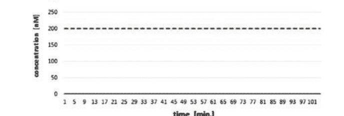

(a) a=0[nM] b=0[nM].

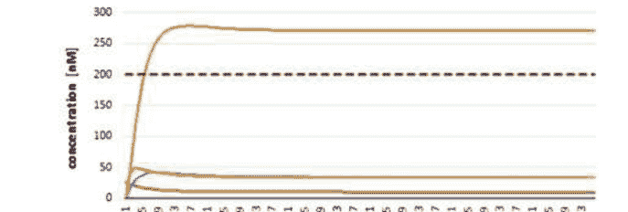

(b) a=0[nM] b=25[nM].

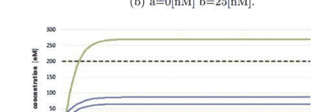

(c) a=25[nM] b=0[nM].

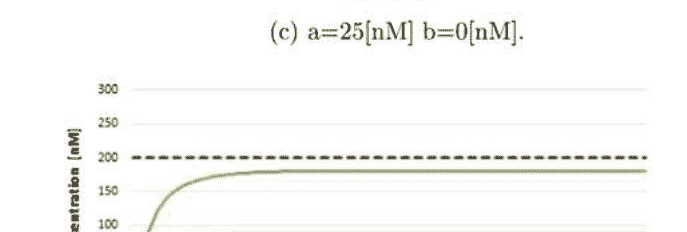

(d) a=25[nM] b=25[nM].

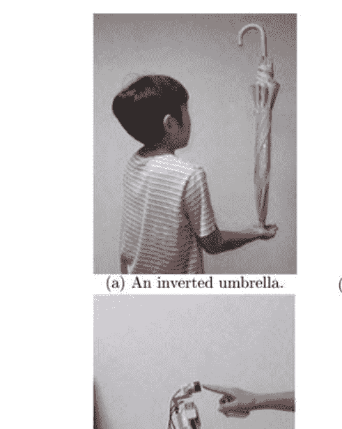

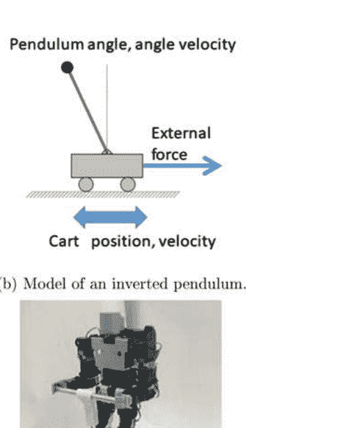

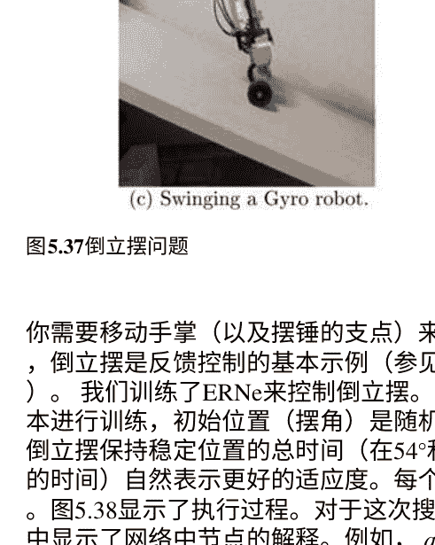

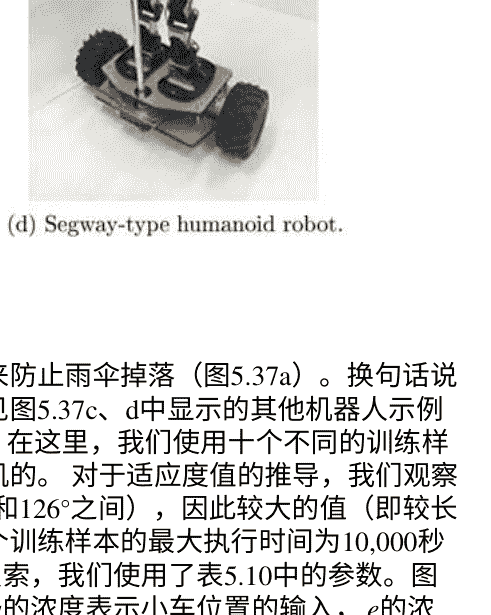

#### 图5.37 倒立摆问题

你需要移动手掌（以及摆锤的支点）来防止雨伞掉落（图5.37a）。换句话说，倒立摆是反馈控制的基本示例（参见图5.37c、d中显示的其他机器人示例）。我们训练了ERNe来控制倒立摆。在这里，我们使用十个不同的训练样本进行训练，初始位置（摆角）是随机的。对于适应度值的推导，我们观察倒立摆保持稳定位置的总时间（在54°和126°之间），因此较大的值（即较长的时间）自然表示更好的适应度。每个训练样本的最大执行时间为10,000秒。图5.38显示了执行过程。对于这次搜索，我们使用了表5.10中的参数。图中显示了网络中节点的解释。例如，a的浓度表示小车位置的输入，e的浓度表示施加在小车上的外力的输出。

在这种情况下，经过40代后找到了一个保持完美平衡的电路。换句话说，适应度值变为10 × 10,000 = 100,000。

#### Fitness value

- a: Input1 Cart position
- b: Input2 Cart velocity
- c: Input3 Pendulum angle
- d: Input4 Pendulum angle velocity
- e: Output External force to cart

#### 图5.38 适应度随代数的变化：倒立摆问题

接下来，我们实际上在体外验证了ERNe获得的电路。图5.39展示了使用ERNe设计基因电路来实现数值函数（如对数、高斯和二次方）并实际进行湿实验使用DNA PEN工具箱的结果之一。这里不重要的是生物化学的细节，但请注意ERNe获得的遗传反应网络在体外可以有实际应用。

本节讨论了ERNe机制的实际例子。图5.40显示了使用ERNe解决人工智能和机器人控制问题的框架。首先使用ERNe设计解决问题的遗传电路，然后在体外进行生化反应。这种方法与DNA计算不同，DNA计算侧重于基因并行处理，而ERNe通过设计基因电路主动诱导生化反应。

11图中的热循环仪是一种复制DNA片段的设备。

#### Circuit designed by ERNe

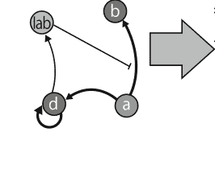

#### Realization with biochemical reactions

| Name | Sequences | Concentrations (nM) | Remarks |
| :--- | :--- | :--- | :--- |
| a | A*A*A*A*CGAGTC-GGG A | variable (from 0 to 40nM) | a phosphorothioate tail is added for protection U denotes dU |
| a→b | G*C*C*A*GACUCAC-TCCCGACTCGT-P | 31 | |
| d→d | T*G*T*G*GACUCAC-TGTGGACTCAC-P | 60 | |
| d→lab | T*T*-A*C*TCAC-TCCCGAC-ACTCGACTCGT-P | 9 | |
| a→d | T*G*T*G*GACUCAC-TCCCGACTCGT-P | 43 | |

#### Biochemical reactions

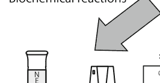

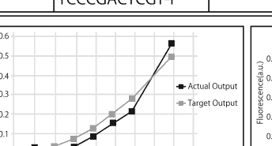

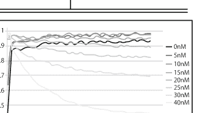

#### Concentration measurement

#### 图5.39 体外验证与ERNe

#### 通过ERNe进行自动设计

#### 设计的基因电路

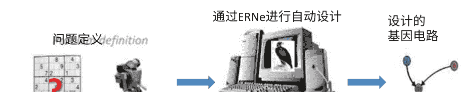

#### 问题定义

#### 机器人控制

#### 解决问题

#### 输入节点的浓度设置

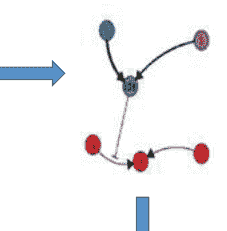

#### 输出浓度的解释

#### 生化反应


#### 输出节点的浓度测量

#### 图5.40 用于解决人工智能问题的ERNe

# 参考文献

1. Aldana, M., Balleza, E., Kauffman, S., Resendiz, O.: 遗传调控网络中的稳健性和可进化性。 J. Theor. Biol. 245(3), 433–448 (2006)
2. Alipanahi, B., Delong, A., Weirauch, W.T., Frey, B.J.: 通过深度学习预测DNA和RNA结合蛋白的序列特异性。 自然生物技术。 33, 831–838 (2015)
3. Aubert, N., Dinh, Q.H., Hagia, M., Iba, H., Fujii, T., Bredeche, N., Rondelez, Y.: 欺骗性基于DNA的玩家在剪刀石头布游戏中的进化。 在： 人工智能进展， ECAL， 卷12， 第1143-1150页 （2013年）
4. Chen, Y., Li, Y., Narayan, R., Subramanian, A., Xie, X.: 利用深度学习进行基因表达推断。 生物信息学 32 （12）， 1832-1839 （2016年）
5. Cliff, D., Harvey, I., Husbands, P.: 进化机器人学探索。 自适应行为 2， 72–110 （2000）
6. Dinh, Q.H., Aubert, N., Noman, H., Fujii, T., Rondelez, Y., Iba, H.: 在合成生物化学系统中进化反应网络的有效方法。 IEEE Trans. Evol. Comput. 18(2015)
7. Iba, H., Noman, N. (eds.): 基因调控网络研究中的进化计算。 Wiley Series in Bioinformatics. Wiley, Hoboken (2016)
8. Inamura, T., Nakamura, Y.: 基于模仿理论的模仿学习和符号发展的综合模型。 Brain Neural Netw. 12(1), 74–80 (2005)
9. Jin, Y., Guo, H., Meng, Y.: 自适应多机器人模式形成的分层基因调控网络。 IEEE Trans. Syst. Man Cybern. B Cybern. 42(3), 805–816 (2012)
10. Kauffman, S.A.: 秩序的起源，进化中的自组织和选择。牛津大学出版社，纽约 (1993)
11. Marbach, D., Costello, J.C., Kuffner, R., Vega, N., Prill, R.J., Camacho, D.M., Allison, K.R., the DREAM5 Consortium, Kellis, M., Collins, J.J., Stolovitzky, G.: 众包在稳健基因网络推断中的智慧。 自然方法 9(8), 796–804 (2012)
12. Mendes, P., Sha, W., Ye, K.: 人工基因网络用于分析算法客观比较。 生物信息学 19(增刊2), 122–129 (2003)
13. Montagne, K., Plasson, R., Sakai, Y., Fujii, T., Rondelez, Y.: 使用分子网络策略编程体外DNA振荡器。 分子系统生物学 7, 466 (2011)
14. Nolfi, S., Floreano, D.: 进化机器人学。 麻省理工学院出版社，剑桥 (2000)
15. Park, Y., Kellis, M.: 深度学习在调控基因组学中的应用. 自然生物技术。 33(8), 825–826 (2015)
16. Padirac, A., Fujii, T., Rondelez, Y.: 体外可切换记忆的自下而上构建. 美国国家科学院院刊 (PNAS) 109(47), E3212–E3220 (2012)
17. Palafox, L., Noman, N., Iba, H.: 基于种群增量学习进行基因调控网络的逆向工程。 在: IEEE进化计算大会论文集 (CEC), pp. 1–8 (2012)
18. Palafox, L., Noman, N., Iba, H.: 基于种群增量学习和K-means的基因调控网络逆向工程。 在: GECCO (Companion), pp. 1423–1424 (2012)
19. Palafox, L., Noman, N., Iba, H.: 利用耗散粒子群优化进行基因调控网络的逆向工程。 IEEE进化计算学报。 17(4), 577–587 (2013)
20. Palafox, L., Noman, N., Iba, H.: 利用狄利克雷过程扩展基于种群增量学习。 在: IEEE进化计算大会论文集 (CEC), pp.1686–1693 (2016)
21. Qian, L., Winfree, E.: 用DNA链位移级联扩展数字电路计算。 科学 332(6034), 1196–1201 (2011)
22. Zaier, R.: 基于递归神经网络生成多边形的人形机器人运动。 在: 第一届亚洲机电一体化研讨会论文集(2004)

# 第6章
## 结论

> > 我想到人们对雨林中这些生物知之甚少，以及在这个地方度过几个月、几年，甚至余生，直到我能够以名字认识每个物种并了解它们生活的每个细节，这将是多么令人满足。
>
> (Edward O. Wilson, 《生命的多样性》, 哈佛大学出版社, 1992)

摘要 本章对进化的一些总结和思考进行了总结。 正如我们在前几章中所看到的，我们主要可以使用进化机制来设计理想的结构，而不是为了纯粹的优化目的。 这是对进化作为进步的事实的常见误解。 进化是更好的构建模块的构造者，而不是简单解决方案的优化器。 这被称为“间断平衡”的概念。

关键词 优化与进化 · 间断平衡 · 斯蒂芬 · J · 古尔德 · 尼尔斯 · 埃尔德里奇 · 超达尔文主义者 · 自私基因 · 理查德 · 道金斯

本书提供了关于一种方法论的理论和实践知识，该方法论将多种人工智能技术，如深度学习和机器学习，进行了整合。 正如我在前言中提到的，进化算法具有以下特点:

- 并行性
- 可搜索性
- 多样性

其中，多样性是最重要的，就像我们在生物学中所看到的那样。 例如，有许多相互依存的关系案例（图6.1a是Vanderhorstia和抓虾的共存关系）。 完全不同类型的生物可以合作并共享工作。 还有一些社会昆虫合作筑巢的案例，比如蚂蚁和蜜蜂（图6.1b）。 换句话说，参考那些不容易理解的自然界机制，可能会

#### 图6.1 生物多样性的例子

可以对有机活动进行建模，并将其纳入进化计算中，从而带来新的发现。

关于多样性，群体由各种个体组成。在进化过程中，群体中表现优异的成员往往通过更高的生产力得以保留。然而，这并不意味着总是只组合高表现的精英成员就是好的。如果环境发生变化，这样做可能会导致整个群体的衰退。虽然从精英群体中诞生的相似后代在当前环境中表现良好，但它们适应新环境的能力往往不足。这种特性（对环境变化和噪声的敏感性）在工程术语中等同于“不稳健”，在设计系统中应尽量避免。因此，在群体中允许存在贫弱和劣等个体更好（也参见图1.8）。虽然它们通常是负担，但它们有可能成为未来群体的救星。

从这个角度来看，进化并不一定是寻找最优值，而是追求鲁棒性，以增加在环境中生存的机会。

在总结本书时，我们将讨论进化计算中的关键概念，即优化与进化之间的关系。

由于进化计算是以进化为模型，许多人认为“进步=优化”。因此，人们认为进化涉及持续发展。然而，有必要意识到“进化不是进步”。我们并不是通过优化来生存。

#### 图6.2 进化不是优化

让我们应用进化计算并像往常一样观察适应度的行为。适应度越大，越好。在这种情况下，你可以看到以下两种典型行为：

- 渐进变化（图6.2a）
- 间断平衡变化（图6.2b）

在情况（a）中，渐进变化（逐渐进化）非常适合进化计算。虽然现在放松可能为时过早。然而，这可以通过使用其他更简单的方法（例如，爬山法）来解决。在许多情况下，我们面临情况（b）。这种情况可能适合进化计算，但值得研究的是在步骤之间可以学到什么样的结构。换句话说，问题的本质在于停滞的时间。如果我们只是等待，这可能会有所改善。例如，在实际的实例中，我们可以看到在适应度的步骤中获得了重要的组成部分（即，子结构或有用的构建块）。这种知识可以是改进学习的重要一步。

在进化中，我们可以看到存在相同水平的适应度（长颈鹿的颈长，物种的复杂性等）和世代之间的关系如（b）所示。例如，我们在长颈鹿的祖先中发现了颈短的有机体化石，但我们还没有发现任何颈长中等的长颈鹿实例。这可能是“没有努力寻找”或者“颈部的骨骼和软骨不容易形成化石”的情况，但这对我们来说不太合适。为了回应这一点，史蒂芬·J·古尔德¹和他的同事尼尔斯·埃尔德里奇提出了“间断平衡”的假设。古尔德认为“停滞也是数据”，进化发生在物种分化的短时间内，在这些时间之间存在一段停滞期。停滞并不仅仅意味着什么都不做，它提供了非常有趣和珍贵的证据，并且可以被认为是由罕见的变化中断的。在停滞期间，中性基因重组经常发生，但由于环境的变化等一些触发器的影响，

¹一位美国古生物学家和进化生物学家（1941-2002年）。他每个月为美国科学杂志《自然历史》写文章，并出版了许多这些文章的合集，成为畅销书。他是另一位进化研究者理查德·道金斯的反对者（见第6页）。

#### 图6.3 错误的插图

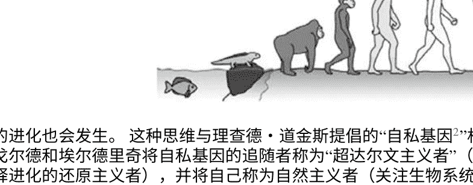

突然的进化也会发生。这种思维与理查德·道金斯提倡的“自私基因²”相对立，戈尔德和埃尔德里奇将自私基因的追随者称为“超达尔文主义者”（用基因解释进化的还原主义者），并将自己称为自然主义者（关注生物系统的层次结构）[2]。戈尔德批评“自私基因”背后的思维与遗传优势和进步性进化[1]（图6.2a中原始形式进化的思维）相关。

误解进化是进步（=optimization）的观念已经广泛传播。例如，古尔德批评了一幅插图（图6.3），仍然在进化教科书中使用，延续了这种错误的思维方式。人类并没有成为“最高”的生物形式或达到进化的终点，其他生物当然也不是低等的。可以说，地球上进化最高级的物种不是人类，而是病毒和细菌。换句话说，古尔德说，在进化方面，历史上繁荣最多的生物是细菌。

这种断续平衡理论动摇了长期统治着进化理论领域的新达尔文主义的主流理论。然而，关于这个问题的是非曲直的讨论至今仍在继续。

法国遗传学家弗朗索瓦·雅各布（Franoise Jacob）获得了诺贝尔奖，他（Franoise Jacob）说过：

> > 自然是一个修复者，而不是一个工程师。

事实上，进化不仅仅是一个随机搜索。它是一个构建设备，用于从过去的组件中创建一些次优的东西。我们应该记住，目标不是最优性，而是鲁棒性。

# 参考文献

1. 道金斯，R.：《魔鬼的牧师：对希望、谎言、科学和爱的反思》。水手图书，波士顿（2004年）
2. 埃尔德里奇，N.：《重塑达尔文：进化理论高桌上的伟大辩论》。约翰威利，纽约（1995年）

²这种思维认为基因巧妙地行为，以便成功繁殖并留下尽可能多的后代。基于这种思维，我们的生活是为了让寄生在我们身体中的基因存活下来，我们被视为让基因存活下来的载体（载体＝运输工具，媒介）。人们发现，许多生命现象可以用这种思维方式来解释。

# 符号

- 一个
  - ABCP, 141
  - ABM, 51, 114
  - ACT, 122, 129
  - AdaBoost, 47, 106
  - Adam, 99
  - AGN, 192
  - AI, 229
  - AlexNet, 93
  - ANN, 208, 216
  - AP, 60, 141
  - ARD, 130
- B
  - BagGP, 105
  - BCE, 97
  - BM, 51, 114
  - BoostGP, 105
  - BP, 70
- C
  - CAC, 141
  - CACIE, 24
  - CAD, 48
  - CGP, 21, 93
  - CHECK, 122, 128
  - CIFAR10, 91, 92, 95
  - CNN, 64, 93, 100, 101
  - CPPN, 70, 83, 96, 101
- D
  - DCGAN, 68
  - DE, 31, 144, 173, 216
  - DeepBind, 184
  - DeepNEAT, 89
  - DenseNet, 91
  - DNN, 89
  - DO, 122, 127
  - DPPN, 96
  - DREAM, 184
- E
  - EANN, 77, 189
  - ERNe, 185, 208
  - Evo-Devo, 179
- F
  - FN, 153
  - FP, 153
- G
  - GA, 7, 29, 185
  - GAN, 68
  - GoogLeNet, 93
  - GP, 16
  - GPU, 91
  - GRN, 180
  - GTYPE, 7, 25
- H
  - HyperNEAT, 86
- I
  - IEC, 22, 83, 185
  - ILSDE, 145, 173
  - ILSVRC2012, 92## 索引

- ImageNet, 67, 68
- INTERNe, 185

## K

- KP, 122, 135, 141

## L

- LBP, 70
- LeNet, 64
- LISP, 16
- LRU, 132

## M

- MAP, 41
- MLE, 39, 124, 125, 129
- MNIST, 99, 100
- MONGERN, 190
- MPS, 70
- MRJ, 15
- MRNA, 182
- MSE, 97, 101, 109, 115, 117, 118, 121, 187, 215, 221

## N

- N700, 13
- NASA, 15
- NEAT, 80, 208
- NENDE, 155, 173
- NFE, 136, 137
- NHST, 125, 128
- NSM, 141

## O

- ODE, 210

## P

- PDCA, 122, 125
- PLAN, 122, 127
- PSO, 27, 184
- PSOAP, 141
- PTYPE, 7, 25

## Q

- QE, 48

## R

- RankSVM-DE, 147
- RBF, 37
- ReLU, 90, 95
- ResNet, 91, 95
- RGB, 68, 86, 91
- RMSE, 124, 125, 135, 139
- RVM, 38, 130
- RVM-GP, 130

## S

- Sbart, 84
- SBS, 141
- SC, 141
- SSC, 141
- SVC-DE, 146, 151, 153, 176
- SVHN, 91
- SVM, 35, 146, 151, 158
- SVR-DE, 147

## T

- TN, 153
- TP, 153
- TRADE, 150

## V

- VAEGAN, 68
- VGGNet, 91, 92, 95
- VIGP, 110

## X

- XOR, 121, 223

## A

- 一个
- 加速常数, 143
- 激活器, 192
- 自适应矩估计, 99
- 邻接关系, 90
- 调整后的 R², 134
- 亲和传播, 60, 141
- 聚合方法, 44
- 代数生物学, 48
- 爱丽丝漫游奇境记, 189
- 祖先, 81
- 蚂蚁城堡, 232
- 近似布赫伯格-莫算法, 51
- 弧添加, 80
- 军备竞赛, 4, 12, 189
- 人工蜜蜂群体, 141, 143
- 人工基因网络, 192
- 人工生命, 189
- 人工神经网络, 208
- Atari游戏, 89
- 衰减, 187
  - 衰减系数, 28
- 吸引子, 181
- 自编码器, 99
  - 变分自编码器, 68
- 自动相关确定, 130
- 可用性, 60

## B

- 反向传播, 65, 77, 80
- 装袋, 47, 105
- 贝叶斯
  - 贝叶斯线性回归, 39
  - 贝叶斯方法, 185
  - 贝叶斯网络, 70
  - 贝叶斯参数估计, 130
- 贝叶斯理论, 40
- 信念传播, 70, 184
- 循环信念传播, 70
- 基准函数, 119, 143, 147, 152, 156, 158, 161-163, 165-173
  - Keijzer基准函数, 116, 117, 135, 136
  - Nguyen基准函数, 136, 139
- 偏差, 127, 162
- 二进制交叉熵, 97
- 生化反应, 228
- 膨胀, 110, 119
- 蓝鸟, 12
- 布尔值
  - 布尔概念形成, 107
  - 布尔函数, 181
  - 布尔多项式, 120
  - 随机布尔图, 181
- 提升, 47, 105
- 自助法, 185
- Buchberger-Möller算法, 51
- 构建模块, 233
- 子弹列车, 13

## C

- 封顶机制, 214
- 质心, 35
- 混沌, 181
  - 混沌时间序列, 107
  - 混沌边界, 181
- 子代, 17, 81, 146, 149
- 染色体, 7, 180
- Church-Rosser性质, 52
- 分类, 35
  - 二元分类, 44, 97, 153, 157
  - 分类准确率, 37, 155
  - 分类方法, 161
- 分类器, 46
- 聚类, 34, 60, 141
- 编码
  - 直接编码, 78, 189
  - 间接编码, 78
  - 稀疏编码, 67
- 共同进化, 4, 12, 189
- 共存, 231
- 合作, 4
  - 协作运输, 15
- 柱状结构, 84
- 竞争, 4
- 完整解决方案, 130
- 组合系统, 24
- 组合模式生成网络, 83
- 计算复杂性, 37, 136
- 连接, 95
- 浓度, 192, 210, 215, 225, 227
  - 初始浓度, 208
- 收缩, 181
- 收敛系数, 28
- 卷积, 42, 89
- 卷积神经网络, 64
- 合作, 231
- 相关性, 185
- 皮层柱, 84
- 成本, 145
- 协方差矩阵, 40, 129
- 临界状态, 181
- 交叉, 4, 10, 19, 81, 146, 185, 208
  - 交叉概率, 100, 116, 137, 186, 225
  - 交叉率, 162
  - NEAT交叉, 216, 217
  - 单点交叉, 20
  - 双点交叉, 212
  - 均匀交叉, 33
- 累积预测, 106
- 柱面代数分解, 48

## D

- 数据增强, 68
- 数据库, 148, 152
- 数据压缩, 66
- 差分进化, 见差分进化
  - 辅助父代, 32
  - 经典, 31
  - 初始化, 31
  - 主要父代, 32
  - 选择, 32
- 支持向量回归差分进化, 147
- 差分进化的迁移学习, 150
- 深度卷积生成对抗网络, 68
- 导数, 150
- 设计矩阵, 39
- 发育生物学, 78, 179
- 用于逆向工程评估和方法的对话, 184
- 可微模式生成网络, 96
- 差分进化, 31, 143, 144
- 鉴别器, 68
- 多样性, 231
- DNA
  - DNA计算, 228
  - DNA微阵列, 182
  - DNA PEN工具箱, 215, 228
  - DNA结合, 184
  - DNA酶, 209
- 背侧通路, 68
- 丢弃, 68
- 双拉格朗日, 37
- 动态更新, 156

## E

- 大肠杆菌, 185
- 淘汰算法, 56
- 精英, 232
  - 精英率, 12, 116
  - 精英策略, 10
- 出现, 7
- 欧几里得距离, 34, 44, 47, 61, 85, 151, 154
- 欧拉角, 58
- 进化
  - 鲍德温进化, 100
  - 达尔文进化, 101
  - 拉马克进化, 100
  - 进化人工神经网络, 77
  - 进化计算, 9, 12, 29
  - 进化因子, 143
  - 进化编程, 29
  - 进化机器人学, 15, 189
  - 可进化硬件, 189
  - 先适应, 180
  - 扩展, 181
  - 开发, 31
  - 探索, 31
- 眼睛, 5

## F

- 因子图, 70
- 假阴性, 153
- 假阳性, 70, 153
- 特征, 35, 44, 128
  - 特征生成模块, 123
  - 特征映射, 65
  - 特征空间, 158
  - 特征向量, 150, 155, 159
- 反馈, 221
  - 负反馈, 221
- 前馈网络, 21, 65, 101
- 滤波器, 65, 90, 93
- 金融
  - 金融数据预测, 110
  - 金融工程, 15
- 萤火虫算法, 143
- 适应度, 8, 22, 25, 79, 111, 116, 119, 126, 136, 137, 145, 147, 186, 189, 214, 215, 227
- 函数
  - Ackley函数, 163
  - 基函数, 42, 133
  - 天花板函数, 115
  - Gamma函数, 128
  - Griewank函数, 163
  - Kowalik函数, 164
  - 损失函数, 106
  - 映射函数, 37
  - 多模态函数, 143
  - 多峰函数, 152, 174
  - 周期函数, 84
  - 四次函数, 163
  - 径向基函数, 37
  - Rastrigin函数, 143, 163
  - Rosenbrock函数, 143, 163
  - Schwefel函数, 143, 163
  - Shekel's Foxholes函数, 164
  - Sigmoid函数, 99
  - 单峰函数, 152
  - 球函数, 143, 163
  - 阶跃函数, 163
  - 单峰函数, 143
- 交叉, 17
- 基因
  - 不相交基因, 81
  - Hox基因, 179
  - 致命基因, 19
  - 主控基因, 179
  - 不匹配基因, 81
  - 自私基因, 234
  - 模板基因, 208
- 基因表达组学数据集, 184
- 泛化, 35
- 世代, 9, 145, 221, 224
  - 初始世代, 186
- 生成对抗网络, 68
- 生成器, 69
- 基因调控网络, 180
- 遗传算法, 7, 29
- 遗传退火, 31
- 遗传电路, 228
- 遗传卷积神经网络, 89
- 遗传算子, 10, 19, 25, 28, 29, 79
- 遗传重叠, 180
- 遗传编程, 16
- GenJam, 24
- 基因型, 7, 21, 78, 79, 83, 90, 94, 180, 193
- 几何
  - 几何推理, 47
  - 几何关系, 86
  - 几何定理, 59
  - 基于超立方体的几何, 88
- Inversion, 17
- 长颈鹿的脖子, 233
- 互惠互利, 231
- Gmutation, 17
- GP
  - 笛卡尔GP, 21
  - GP算子, 19
  - GP参数, 107
  - 具有上下文感知交叉的GP, 141
  - 没有相同配偶的GP, 141
  - 基于语义相似性的交叉的GP, 141
  - 具有软孵化选择的GP, 141
  - 标准交叉的GP, 141
  - 线性GP, 17
  - 消失的理想GP, 110
- 渐变变化, 233
- 格拉姆矩阵, 37
- 语法重写系统, 78
- 图形模式, 70
- 最大公约数, 50
- Gröbner基, 47, 115
- 简化的Gröbner基, 54

## G

- 加拉帕戈斯群岛, 3
- 高斯
  - 高斯分布, 29, 38, 90, 128
  - 高斯函数, 42, 84
  - 高斯边缘分布, 40
  - 高斯突变, 29
  - 高斯噪声, 129

## H

- Hamelin Pool, 1
- Hebb的规则, 80
- 启发式算法, 110
- 希尔伯特基础定理, 113
- 爬山算法, 130
- 历史, 81
- 命中率, 121
- 人脸, 67
- 人性化技术, 24
- 人形机器, 15, 190
- 超参数, 42, 110, 117, 118, 132
- 超平面, 35, 150

## I

- 理想, 49, 55, 110
  - 理想消除, 59
- 身份, 181
- 身份证号码, 19
- 鬣蜥, 4
- 图像
  - 愚弄图像, 68
  - 手写图像, 100
  - 图像聚类, 63
  - 图像裁剪, 101
  - 图像提取, 63
  - 图像放大, 101
- 惯性系数, 142, 143
- 抑制, 187
- 抑制剂, 192
- 创新, 181
  - 创新编号, 208, 210
- 体外, 208
- 交互式进化计算, 22
  - 具有交互式进化计算的ERNe, 185
- 内含子, 22
  - 语义内含子, 114, 115, 120
  - 句法内含子, 114
- 逆向机器人运动学, 57
- 倒置, 10
- 倒立摆, 225
- 体外, 228, 229

## J

- Jaccard相似系数, 61
- 爵士乐, 24
- 关节, 57, 190

## K

- 改善编程, 122
- 核函数, 65
  - 贝叶斯核函数, 130
  - 高斯核函数, 37
  - 核技巧, 37
  - 线性核函数, 37
  - 多项式核函数, 37
  - RBF核函数, 151
- k均值算法, 34, 143
- k最近邻算法, 见k-NN
- k-NN, 155, 158, 161, 174
  - 用于DE的k-NN分类器, 155
- 淘汰竞争, 32
- Knuth-Bendix方法, 52

## L

- 拉格朗日乘子, 37
- 层
  - C层, 65
  - 分类层, 93
  - 卷积层, 65, 67
  - 过滤层, 93
  - 隐藏层, 67
  - 池化层, 65, 93
  - S层, 65
- 主导
  - 主导系数, 50
  - 主导单项式, 50, 113
  - 主导幂乘积, 50
- 学习
  - 主动学习, 63
  - 合作学习, 189
  - 学习率, 80, 99
  - 多智能体学习, 189
  - 强化学习, 190
  - 顺序稀疏贝叶斯学习, 135
  - 迁移学习, 45
- 最小公倍数, 50
- 最近最少使用, 132
- 艺术的LGPC, 85
- 极限环, 187, 215
- 逻辑运算符, 120
- 循环最大和, 70
- L系统, 23, 78
- 引诱模块, 83

## M

- Mackey-Glass时间序列, 107
- 多数投票, 44
- 流形, 48
- 边缘分布, 41
- 边缘似然函数, 42, 133
- 掩码, 65
- 最大似然估计, 39, 124, 125
- 最大后验, 41
- 均方误差, 97, 109, 113, 115, 187, 215
- 均方根误差, 124
- 消息传递, 60, 71
- 元启发式算法, 27, 185
- 拟态模式, 12
- 小批量, 99
- 三菱地区喷气机, 15
- 模型选择, 134
- 修改步骤, 214
- 动量, 80
- 单项式, 49, 113, 115
- 最可能的解, 70
- 飞蛾, 12
- 基因调控网络产生运动, 190
- 多维空间, 29
- 多模态问题, 29
- 6-多路复用器, 107
- 突变, 4, 10, 24, 146, 180, 185, 208, 210
  - 添加激活突变, 209, 212
  - 添加抑制突变, 209, 212
  - 添加序列突变, 209, 210
  - 差分突变, 33
  - 禁用模板突变, 209, 210
  - 突变概率, 101, 116, 137, 225
  - 突变向量, 145, 159
  - 参数突变, 209
  - 切换模板突变, 209, 212
- 互信息, 185

## N

- 命名机制, 209
- 自然主义者, 234
- 鹦鹉螺, 5
- 负例, 147, 153, 155, 157, 161
- 负迁移, 150
- 邻域, 148
- 新认知机, 64
- 新达尔文主义, 234
- 神经进化, 77
  - 拓扑结构的神经进化, 80
- 神经元, 65, 86, 100
- 节点添加, 80
- 噪声, 156
- 非编码区域, 22
- 不可分离, 36
- 线性不可分, 224
- 非终端, 16
- 正规形式, 51
- 归一化
  - 批归一化, 89, 95
  - 归一化算法, 51
  - 归一化常数, 71
- 零假设显著性检验, 125, 128
- 函数评估次数, 136
- 数值替代, 59

## O

- Oligator, 186, 209, 215, 216, 220
  - 延长的Oligator, 218
- Oligator模式, 221
- 寡核苷酸芯片, 182
- Omniglot字符, 101
- 最佳分离平面, 35
- 优化, 232
  - 函数优化, 28
- 最优
  - 全局最优, 35, 162, 174
  - 局部最优, 28, 35, 90, 124, 130, 141, 175
- 顺序, 181
- 排序
  - 纯词典排序, 49, 113
  - 全序, 49, 56
- 常微分方程, 210
- 原始标准, 130
- 物种起源, 5
- 振荡生化系统, 214
- 振荡, 187
  - 矩形振荡, 221, 223
  - 锯齿状振荡, 221
  - 正弦振荡, 216
- 振荡器, 209, 220
  - 松弛振荡器, 221
  - 开关振荡器, 223
- 过拟合, 68

## P

- Pac-Man, 82
- 粒子群优化（PSO）, 27, 33, 184
  - 耗散PSO, 184
  - PSO工作流程, 28
- 惩罚权重, 117
- 表型, 7, 22, 79, 85, 90, 94, 180
- 光趋性, 6
- 多项式, 48
  - 有理多项式, 118
  - 残差多项式, 114
- 池化
  - 平均池化, 95
  - 最大池化, 67, 95
- 正例, 147, 150, 153, 155, 157, 161
- 后验协方差, 43
- 后缀, 19
- 捕食者, 189
- 偏好, 22
- 前缀, 19
- 猎物, 189
- 概率模型构建, 72
- 概率密度函数, 38, 128
- 晋升, 186, 187
- 蛋白质, 192
- 间断平衡, 233

## Q

- 量词消除, 48

## R

- 随机森林搜索, 185
- 随机数, 69
- 感受野, 84
- 修正线性单元, 90
- 递归, 86
- 红后效应, 189
- 减少, 50, 113
- 回归, 35, 185
  - 线性回归, 130
- 正则化常数, 36
- 相关向量机, 38, 130
- 繁殖, 10, 13
  - 繁殖率, 12
- 责任, 60
- 视网膜, 6, 86
- 逆向工程, 183
- 环形拓扑, 141
- RNA结合, 184
- 机器人
  - 基于行为的机器人, 189
  - Khepera机器人, 189
  - 机器人控制, 228
- 鲁棒性, 66, 67, 90, 128, 180, 232
- 根, 16
- 旋转矩阵, 162

## S

- 饱和值, 192
- 金黄色葡萄球菌, 185
- 调度, 15
- 搜索
  - 搜索效率, 29
  - 搜索区域, 28
- 可搜索性, 231
- 选择, 10, 13
  - 一对一选择, 32
  - 轮盘选择, 10
  - 选择繁殖, 32
  - 选择压力, 180
  - 锦标赛选择, 10, 137
- 自激活, 221
- 自抑制, 220
- S表达式, 16
- 鲨鱼湾, 1
- 相似性, 60
- 辛普森定理, 59
- 模拟退火, 185
- 奇异点, 130
- 松弛变量, 36
- 滑动窗口, 44
- 平滑, 66
- 软间隔, 35
- Softmax, 67, 95
- 可解性, 55
- 源域, 45
- 稀疏性, 133
- 空间分辨率, 90
- 物种形成, 208, 212, 223
- 物种, 214, 223
  - 物种可视化, 223
- 语音, 70
- 蜘蛛策略, 190
- S多项式, 52
- S系统, 184
- 堆栈计数, 20
- 停滞, 233
- 标准偏差误差, 187
- 标准正态分布, 210
- 迭代次数, 128
- 子种群, 105- 子结构，233
- 求和，95
- 超级马里奥，89
- 监督学习，35，67
- 监督分类，43
- 支持向量机（SVM），35
- 线性SVM，35
- 非线性SVM，37
- 排名SVM-DE，147
- 群体智能，27
- 符号回归，110，122
- 对称性，84，86
- 突触，67

## T

- 目标领域，45
- 泰勒展开，118
- 终端，16
- 时间序列，187
- 混沌时间序列，107
- 时间序列运动，190
- 拓扑兼容距离，213
- 锦标赛，101，186
- 训练样例，158，160
- 训练集，105
- 转录，185
- 转录组，182
- 树，16，23
- 三角不等式，63
- 三角恒等式，107
- 真阴性，153
- 真阳性，153
- t-检验，128，160，169，215
- 图灵模型，86
- 双圆问题，48

## U

- 超级达尔文主义者，234
- 均匀分布，135
- 用户疲劳，187

## V

- 消失的理想，113
- 多样性，48
### 向量
- 坏向量，146
- 好向量，146
- 位置向量，28
- 2位输入向量，223
- 速度向量，28
- 车辆，234
- 腹侧通路，68
- 视觉皮层，67、84、86

## W

### 波
- 锯齿波，186
- 三角波，188
- 加权中位数，105
- 权重共享，66
- 众智方法，185
- 伍德伯里矩阵恒等式，133
- 吴氏方法，48

## Z

- 斑马鱼，87
- Z分数，185