# 机器学习的变分方法及其在深度网络中的应用


## 前言

这本书源于第一作者对不确定性的浓厚兴趣，将其视为一种自然思维方式。事实上，行为研究支持人类进行几乎最优的贝叶斯推断，有效地整合多感官信息，同时具有高效能的特点。与此同时，现代深度学习方法仍对过拟合敏感，并且缺乏不确定性估计，尽管在许多任务中取得了人类水平的结果。贝叶斯框架优雅地适用于解决这两个问题，同时提供了一个有原则的数学基础。

虽然贝叶斯机器学习和近似推断是非常广泛的主题，每个主题都有专门的书籍，但本文是一本自包含的现代贝叶斯神经网络（BNN）变分方法的介绍。即使在这个领域内，研究也在以难以跟上的速度迅速发展，并且许多算法也在通过贝叶斯视角重新解释。我们专注于相对容易理解或快速训练的实用BNN算法。我们还介绍了一种特定的变分技术用于生成建模的用途。

目标受众是那些已经熟悉机器学习和现代神经网络的人。虽然理解本书中的概念和推导需要基本的微积分、线性代数和概率论知识，但这些应该足够了。我们明确避免使用矩阵微积分，因为这部分内容本身可能很具挑战性，而且增加这种困难并不能真正帮助理解本书，反而可能让读者感到害怕。此外，我们不假设读者熟悉统计推断，因此会在整个文本中解释必要的信息。

大多数入门教材要么涵盖现代神经网络，要么涵盖机器学习的一般贝叶斯方法，但很少有同时涉及两者的工作至今。信息在研究博客文章和已发表论文的介绍中分散在各处，唯一深入研究的是尼尔在1996年的博士论文，但没有涵盖现代变分近似方法。从理论角度来看，从神经网络到贝叶斯神经网络的跨越变得困难：读者需要要么在学习贝叶斯方法之前或者决定学习什么内容以及哪些算法时，前者很繁琐，后者在自学情况下很麻烦。

本书的使命是填补这一空白，并帮助他人从一个领域跨越到另一个领域，不仅具备实际知识，还具备贝叶斯方法的理论基础的理解。

在介绍任何流行的机器学习技术之前，我们在第2章中介绍了许多学生现在缺乏的统计工具。我们讨论了什么是模型，如何衡量信息，什么是贝叶斯方法，以及统计推断的两个基石：估计和假设检验。即使那些对这个主题已经很熟悉的人也可以从复习中受益，同时适应符号表示法。

在第3章中，我们介绍了基于模型的机器学习（MBML）的构建模块。我们解释了它是什么，并讨论了它的主要支持技术：贝叶斯推断、图模型以及最近的概率编程。我们解释了近似推断，并介绍了确定性分布近似方法，重点介绍了变分贝叶斯、假设密度滤波和期望传播，并通过推导、优势、问题和现代扩展进行了讨论。

在第4章中，我们介绍了贝叶斯神经网络（BNN）的概念和优势。我们审查了该领域中四种最流行的算法：贝叶斯反向传播、概率反向传播、蒙特卡洛丢弃和变分Adam，涵盖了它们的推导、优点和问题。最后，我们通过一个一维示例和更复杂的场景来比较这些算法。

在第5章中，我们介绍了生成模型。我们特别关注了变分自编码器（VAE）家族，这是一个众所周知的深度生成模型。能够对生成观测数据的过程建模使我们能够模拟新数据、创建世界模型、掌握潜在的生成因素，并在很少或没有监督的情况下进行学习。从一个简单的例子开始，我们构建了基本的VAE，并指出了它的缺点和各种扩展，如条件VAE、β-VAE、分类VAE等。我们在本章中通过对两个图像数据集进行多个VAE实验，并提供了一个半监督学习的示例来结束本章。

我们借此机会感谢帮助我们写作这本书的教授和同事们。特别感谢Leonardo Nunes博士和Luis Alfredo de Carvalho教授首次提出其概念理念。我们还要感谢我们的亲人，在将这本书变成现实的挑战和有趣的时刻中一直支持我们。

巴西里约热内卢 Lucas Pinheiro Cinelli

巴西里约热内卢 Matheus Araújo Marins

巴西里约热内卢 Eduardo Antônio Barros da Silva

巴西里约热内卢 Sérgio Lima Netto

2020年9月

# 第1章 引言

## 1.1 历史背景

在过去的二十年中，贝叶斯方法在机器学习领域大多不受青睐。导致这种不受欢迎的原因是它们复杂的数学，这使得从业者难以理解和掌握，以及它们沉重的计算负担。相反，依赖于装袋和点估计的经典技术提供了廉价的替代方法来衡量不确定性和评估假设[9]。因此，贝叶斯方法仍然主要局限于（贝叶斯）统计学家和少数其他研究人员，他们要么从事相关领域的工作，要么受到数据量的限制。

例如，马尔可夫链蒙特卡洛（MCMC）方法是强大的贝叶斯工具[9]。在建模问题中，如果给予足够的时间，它们能够收敛到模型的真实分布。然而，这通常意味着比人们愿意等待的时间更长，尽管许多现代算法缓解了这个问题[6]，但情况仍然大致相同。MCMC是渐近精确且计算代价高昂的。这种效应随问题的维度增加而恶化。传统的贝叶斯方法在处理大量数据和高维情况下无法很好地扩展，而这些情况在大数据时代[2]中变得越来越常见。

人们可能认为丰富的数据量应该弥补对不确定性及其估计的缺乏，因为在无限样本的极限情况下，贝叶斯估计会收敛到最大似然点。尽管正确，但在实际情况下，这个极限还远未达到。正如我们在第2.4.1节中讨论的那样，大规模和统计上大规模的数据集之间存在重要的基本差异。一个仅仅是28×28的二进制图像具有784个维度和$2^{784} \approx 10^{236}$种不同的排列方式，远远超过了可观测宇宙中估计的原子数量（约$10^{80}$）[10]。即使在这样一个简单的情况下，统计上的大意味着拥有几乎无限数量的示例，这在实践中是不可实现的。自然地，人们经常假设存在一个潜在的低维结构解释观察结果。在第2章中，我们形式化了这个思想，在第5章中，我们回顾了一个将这个假设纳入的算法。

与概率视图的断裂的顶峰是标准的深度学习。它基本上是在理想情况下但并不经常的大量数据上训练的非常大的参数模型来拟合一个未知函数。现代硬件和计算库通过并行计算使计算成为可能。多亏了这种新的表示学习技术，在过去的十年左右取得了杰出的成果，突破了许多研究领域的瓶颈，例如语音[5]和视觉[8]。因此，深度学习领域成为一个热门领域，吸引了许多新手、媒体关注和行业投资。

所有这些积极的反馈都强化了忽视概率建模和推理的方法。毕竟，这似乎是有效的。然而，可靠的置信度估计对于许多领域至关重要，例如医疗保健和金融市场，标准的深度学习无法充分满足需求。此外，深度学习需要大量的数据，如果数据不可用，则会导致模型容易过拟合并且泛化能力差。相反，贝叶斯方法在数据稀缺的情况下表现良好，并且具有鲁棒性，尽管不免疫过拟合。

最近，研究人员发现许多机器学习模型，包括具有良好测试集性能的深度神经网络（DNN），都会被对抗性示例[3]所欺骗，这些对人类来说表面上正常的篡改图像被模型始终错误分类，尽管模型非常自信。此外，[3]中的作者描述了一种系统地创建对抗性示例的方法。

幸运的是，能够估计不确定性的方法能够检测到对抗性示例，更一般地，能够检测到在其训练领域之外的示例。

概率模型进一步适用于半监督和无监督学习，使我们能够利用未标记样本的性能。此外，我们可以使用主动学习，系统会提出对操作员最不确定的样本进行注释，从而最大化信息增益并最小化注释工作量。

总的来说，贝叶斯框架提供了一种构建概率模型、在不确定性下进行推理、进行预测、检测令人惊讶的事件和模拟新数据的原则性方法。它自然地提供了数学工具来进行模型拟合、比较和预测，但更重要的是，它构成了一种系统化解决问题的方式。

由于贝叶斯方法可能过于昂贵，我们专注于能够在合理的时间内实现合理性能的近似算法。从技术上讲，MCMC是这类算法之一，但它基于采样，并且收敛速度较慢。在这里，我们讨论变分方法，它们依赖于确定性近似。它们比采样方法快得多，因此非常适合处理大数据集并快速探索许多模型[1]。其速度的代价是性能较差，因此适用于有大量数据可用以弥补这种情况的场景。

## 1.2 符号表示

以下数学元素参与符号表示：

- 标量：$a$ 和 $\sigma$；
- 向量：$\mathbf{a}$ 和 $\boldsymbol{\sigma}$；
- 矩阵：$\mathbf{A}$ 和 $\boldsymbol{\Sigma}$；
- 集合：$\mathscr{A}$ 和 $\Sigma$。

我们用小写符号 $p$ 表示概率密度函数（PDF）和离散概率分布。虽然这是对语言的滥用，但我们决定简化符号。我们将从上下文中清楚地说明随机变量是连续还是离散的。然而，我们已经提到在整个文本中几乎没有离散随机变量，特别是在第4章中，其算法依赖于连续函数和变量。此外，我们总是用大写字母表示随机变量和累积分布函数（CDF），例如 $F(X) = P(X \leqslant x)$ 。

我们将参数化的分布族写为 $\mathscr{P}$，其中 $p$ 是族中成员的参数集 $\boldsymbol{\theta}$。例如，对于高斯随机变量 $z$，其概率密度函数为 $p(z; \mu, \sigma^2) = \mathcal{N}(z; \mu, \sigma^2)$，其中参数是均值 $\mu$ 和方差 $\sigma^2$。如果参数是随机变量，我们可以将条件分布写为 $p(\cdot \mid \boldsymbol{\theta})$，由于我们处理贝叶斯分析，这两种符号变得非常相似但不同。

在可能的情况下，变分参数将被写为 $\boldsymbol{\psi}$，模型参数为 $\boldsymbol{\theta}$，如果两者指的是同一实体，我们选择 $\boldsymbol{\theta}$。如果我们将参数视为随机变量，我们将它们用粗体大写字母表示，即 $\boldsymbol{\Theta}$ 和 $\boldsymbol{\Psi}$。类似地，隐藏单元或更一般地说是潜在变量为 $\mathbf{Z}$ 。

此外，对于一组变量的导数是一种简洁表示法，用于表示对该组变量的每个元素的导数。例如，假设 $f$ 是一个由 $\boldsymbol{\theta} = [\theta_1, \theta_2]$ 参数化的函数，根据这种表示法，我们有：

$$
\frac{\partial f(\boldsymbol{\theta})}{\partial \boldsymbol{\theta}} = \begin{bmatrix} \frac{\partial f(\theta_1, \theta_2)}{\partial \theta_1} \\ \frac{\partial f(\theta_1, \theta_2)}{\partial \theta_2} \end{bmatrix}.
$$## 参考文献

1. Blei DM, Kucukelbir A, McAuliffe JD (2017) 变分推断：综述. J Am Stat Assoc 112(518):859–877
2. Chen M, Mao S, Liu Y (2014) 大数据：一项调查. Mobile Netw Appl 19(2):171–209
3. Goodfellow IJ, Shlens J, Szegedy C (2015) 解释和利用对抗性示例. 在：国际学习表示会议论文集，圣地亚哥
4. Graves A (2011) 神经网络的实用变分推断. 在：神经信息处理系统进展，格拉纳达，第2348-2356页
5. Hinton G, Deng L, Yu D, Dahl GE, Mohamed A, Jaitly N, Senior A, Vanhoucke V, Nguyen P, Sainath TN, Kingsbury B (2012) 语音识别中的声学建模的深度神经网络：四个研究小组的共同观点. Sign Process Mag 29(6):82–97
6. Hoffman MD, Gelman A (2014) 无U-turn采样器：在哈密尔顿蒙特卡罗中自适应设置路径长度. J Mach Learn Res 15(1):1593–1623
7. Kingma DP, Welling M (2014) 自编码变分贝叶斯. 在：国际学习表示会议论文集，班夫
8. Krizhevsky A, Sutskever I, Hinton GE (2012) 使用深度卷积神经网络的ImageNet分类. 在：神经信息处理系统进展，Lake Tahoe，第1097-1105页
9. Murphy KP (2012) 机器学习：概率视角. MIT出版社，剑桥
10. Planck Collaboration, Ade PAR, Aghanim N, Arnaud M, Ashdown M, Aumont J, Baccigalupi C, Banday AJ, Barreiro RB, Bartlett JG等 (2016) Planck 2015结果. XIII. 宇宙学参数. Astron Astrophys 594:A13. arXiv:1502.01589
11. Ranganath R, Gerrish S, Blei D (2014) 黑盒变分推断. 在：国际人工智能和统计学会议论文集，雷克雅未克，第814-822页
12. Soudry D, Hubara I, Meir R (2014) 期望反向传播：连续或离散权重的多层神经网络的无监督训练. 在：神经信息处理系统进展，蒙特利尔，第963-971页

# 第2章 统计推断的基础知识

通过本章的学习，读者应该：

- 认识到统计推断作为流行机器学习的基础的重要性；
- 区分频率派和贝叶斯派对概率的观点；
- 理解指数族及其特性的优势；
- 理解熵和信息的概念；
- 能够实现用于估计的计算算法。

## 2.1 模型

模型可以呈现不同的形式和复杂性。物理学家对理解宇宙有不同的模型：天文学家关注广义相对论和天体之间的相互作用，而粒子物理学家则根据量子力学来表示；婴儿画出他们家人、房子等的简单图形；神经科学家研究果蝇（“小果蝇”）作为理解大脑的模型；驾驶员想象未来的变化以及如何决定下一步该做什么。

尽管所有这些例子看起来不同且可能有不同的用途，但它们都是对应真实世界实体的近似表示。模型是对世界（在给定层次上）的描述，因此它编码了我们对世界的信念和假设。具体而言，统计模型是对过程的数学描述，涉及样本数据以及对该过程的统计假设。

模型具有参数，这些参数可能是未知的，必须从可用数据中学习，以便我们能够发现其潜在原因或预测可能的结果。如果我们的模型与观察到的数据不匹配，我们可以驳斥这个命题，并寻找一个能更好解释它的模型。

统计推断是指我们根据观察到的数据推断出模型或其部分的任何所需概率分布（可能是边缘的或条件的）的一般过程。机器学习文献通常将学习和推断这两个术语分开，前者指的是模型参数估计，后者指的是对未知量（即模型输出）进行推理，已知参数已经估计出来。然而，在统计学中没有这样的区别，两者都是指估计均值。在本文中，它们可以互换使用，尽管我们更倾向于更常用推断这个术语，因为它与概率分布有直接关联。

### 2.1.1 参数模型

参数模型$\mathcal{P}$是一个由有限数量参数索引的分布族$f$。设$\theta$为参数空间$\Theta$的元素，$\mathbf{X}$为随机变量，我们定义参数模型的可能分布集合为
$$ \mathcal{P}_{\Theta} = \{ f(\mathbf{x};\theta) : \theta \in \Theta \}. $$
一个简单而清晰的例子是均匀分布$\mathcal{U}(a,b)$，定义为
$$ f(x;a,b) = \begin{cases} 1/(a-b), & \text{if } x \in [a, b] \\ 0, & \text{otherwise}. \end{cases} $$
注意，每对参数$\{a, b\}$定义了一个遵循相同函数形式的不同分布。

#### 2.1.1.1 位置-尺度族

我们还可以通过预定义的方式修改原始基本概率密度函数（PDF）来生成分布族，因此被称为标准PDF。简洁地说，我们可以通过平移、缩放或平移和缩放标准分布来生成新的分布族。

定理2.1 让$f(x)$成为一个概率密度函数，其中$\mu$和$\sigma>0$是常数。那么，以下函数也是概率密度函数：
$$ g(x;\mu,\sigma) = \frac{1}{\sigma} f\left( \frac{x - \mu}{\sigma} \right). $$
因此，在概率密度函数中引入尺度$\sigma$和/或位置$\mu$参数，并调整它们的值会产生新的概率密度函数。从这些过程生成的家族的示例包括许多众所周知的分布。图2.1a显示了伽马分布和高斯分布的位置-尺度家族的示意图。在我们对速率参数$\beta$进行参数化的伽马函数中，定理2.1中定义的尺度参数实际上是$\sigma = 1/\beta$。请注意，随着尺度$\sigma$的增加，分布在位置参数周围的集中程度会减少。特别地，当$\sigma$趋近于0时，$\lim_{\sigma \to 0} f(x; \mu, \sigma) = \delta(x - \mu)$。(a) 与形状参数 $\alpha = 2.2$ 的Gamma分布的同一尺度家族成员。(b) 属于同一位置-尺度家族的高斯分布的成员

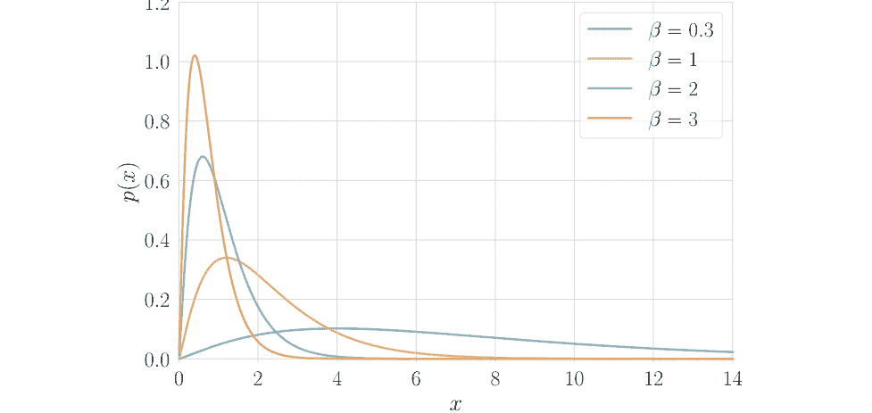

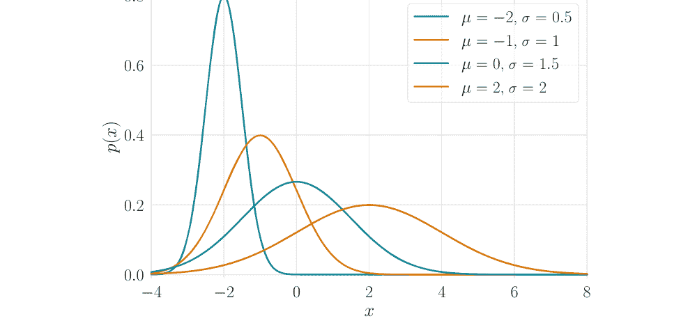

$$ f(x; \alpha, \beta) = \frac{\beta^{\alpha}}{\Gamma(\alpha)} x^{\alpha-1} e^{-\beta x} . \qquad (2.4) $$

同样，图2.1b展示了高斯分布 $N(\mu, \sigma)$，它是参数 $\mu$ 和 $\sigma$ 的位置-尺度家族，分别遵循
$$f(x; \mu, \sigma) = \frac{1}{\sqrt{2\pi\sigma^2}} e^{-\frac{1}{2}\left(\frac{x-\mu}{\sigma}\right)^2}.$$
(2.5)

### 2.1.2 非参数模型

非参数模型假设一个无限维参数空间 $\Theta$，而不是有限维空间。我们将 $\theta$ 解释为从随机过程中实现的一个实现，它定义了一个在 $\Theta$ 上的概率分布，并进一步使我们能够将 $\theta$ 理解为一个随机函数。

一个众所周知的例子是无限混合模型[6]，它可以有可数无限多个组件，并使用狄利克雷过程来定义分布[9]。该模型允许潜在组件的数量根据需要增长以适应数据，这是非参数模型的典型特征。

### 2.1.3 潜变量模型

给定观测数据 $\mathbf{x}$，我们应该如何建模分布 $p(\mathbf{x})$，以反映真实的现实世界人口？这个分布可能是任意复杂的，假设数据点 $\mathbf{x}_i$ 是独立同分布的似乎相当天真。毕竟，它们不能完全独立，因为它们存在的方式必须有一个潜在的原因，即使是未知的或潜在的。我们用变量 $\mathbf{Z}$ 表示这个隐藏的原因，从而得到联合分布 $p(\mathbf{x},\mathbf{z})$。自然地，通过对 $\mathbf{z}$ 进行边际化，我们得到
$$p(\mathbf{x}) = \int p(\mathbf{x}, \mathbf{z}) d\mathbf{z} = \int p(\mathbf{x} | \mathbf{z}) p(\mathbf{z}) d\mathbf{z}.$$
(2.6)
请注意，我们在使用潜变量和未知模型参数时可以互换使用。对于贝叶斯学派来说，模型参数和潜变量之间没有根本的区别，因为它们都是我们希望推断其值的随机变量。例如，如果我们的可观测变量 $X_i$ 是伯努利随机变量，则 $\mathbf{Z}$ 对应于成功的概率 $p \in (0,1)$。

### 2.1.4 De Finetti的表示定理

独立性是一个强假设。相反，我们可以利用无限交换性质。交换性是对称性的最小假设。如果一个有限的随机变量序列$(\mathbf{X}_1, \mathbf{X}_2, \ldots, \mathbf{X}_n)$的任意排列具有相同的概率分布[7]，则称其为可交换的。因此，序列的顺序对于确定联合分布或任何边缘分布都不相关。特别地，所有边缘分布都相等。如果每个有限子序列都是可交换的，则无限序列是无限可交换的。请注意，这比独立同分布性更一般。

De Finetti的表示定理[7]指出，如果随机变量序列是无限可交换的，则存在一个概率分布$p(\mathbf{z})$使得联合分布可以写成
$$p(\mathbf{x}_1, \mathbf{x}_2, \ldots) = \int \prod_i p(\mathbf{x}_i | \mathbf{z}) p(\mathbf{z}) d\mathbf{z}.$$
因此，我们可以将无限可交换随机变量序列的联合分布看作是表示一个过程，其中从某个（先验）分布中抽取一个随机参数，然后所有相关的可观测变量在给定该参数的条件下是独立同分布的。

表示定理展示了统计模型在贝叶斯上下文中的出现方式：在假设$\{\mathbf{X}_i\}_{i=1}^\infty$可交换的情况下，存在一个参数，给定其值后，可观测变量在条件下是独立同分布的，这个定理是贝叶斯参数模型的有力动机，尽管它并没有提及$p(\mathbf{z})$的任何信息。

在实际问题中，即使我们处理的是无序数据，随机变量的数量始终是有限的。因此，无限可交换性的假设可能是不切实际或错误的，但结果仍然在大的$n$下近似成立[5]。

### 2.1.5 似然函数

似然函数$L(\theta| \mathbf{x})$衡量参数$\theta$对随机变量$X$的观测值$\mathbf{x}$的解释程度。因此，它衡量了模型在不同$\theta$值下拟合观测数据的能力。这个定义类似于概率密度函数$f(\mathbf{x}; \theta)$，如下所示
$$L(\theta | \mathbf{x}) = f(\mathbf{x}; \theta).$$
它的值越高，给定的$\theta$值越有可能，表明$\mathbf{x}$相对于$X$的其他实现具有更高的概率。

尽管定义相似，似然函数将$\mathbf{x}$视为已知和固定的，而$\theta$视为未知变量。另一方面，概率密度函数将$\theta$视为固定的，$\mathbf{x}$视为变量。因此，似然函数不是概率密度函数，因此不一定总和为一。

通过一个例子，我们可以更实际地理解似然项$L(\theta|\mathbf{x})$的作用。假设$f(\cdot; w)$是一个由参数$w$参数化的回归模型，预测一个标量值$\hat{y}$，使得$\hat{y} = f(\mathbf{x})$。假设一个概率模型假设给定的噪声水平，因此我们在输出上放置一个观测噪声模型，使得观测到的输出受到已知过程$g(\cdot)$的干扰，例如方差为$\sigma^2$的加性高斯噪声。因此，现在我们的模型不再输出正确的值$f(\mathbf{x}; w)$，而是根据方差为$\sigma^2$的高斯分布输出围绕该值波动的值。对数似然函数的形式为
$$ \log L(w|y, \mathbf{x}) = \log \mathcal{N}(y; f(\mathbf{x}; w), \sigma^2) = -\frac{1}{2} \log (2\pi\sigma^2) - \frac{1}{2\sigma^2} (y - f(\mathbf{x}; w))^2. \quad (2.9) $$
我们希望最大化 $L(w|y, \mathbf{x})$，这意味着最小化 $(y - f(\mathbf{x}; w))^2$。因此，当 $y$ 越接近预测输出 $f(\mathbf{x})$ 时，$w$ 的值越可能。请注意，预测和噪声模型原则上可以是任何东西。

## 2.2 指数族

### 2.2.1 充分统计量

在使用统计模型时，需要从一组随机抽取的样本 $x_1, x_2, ..., x_n$ 中恢复一些或甚至全部参数。假设这些观测值是独立同分布的，并从概率密度函数 $f(x; \theta)$ 中采样，估计参数 $\theta$ 是许多统计学家和工程师的目标，有时也是一个真正的挑战。一个相当常见的方法是从观测中捕获和总结一些信息，并将其用于估计参数 $\theta$，而不是使用观测值本身。这种策略被称为数据降维，而工程师和计算机科学家称之为特征提取。

数据减少的问题是信息的丢失。我们如何确保通过从观察中计算的统计数据，称之为 $T(\mathbf{X})$，不会丢弃信息来估计 $\theta$？ 对于这个问题的答案由充分性原则提供，它将 $T(\mathbf{X})$ 定义为充分统计量，当对于任意两个样本 $\mathbf{x}_1$ 和 $\mathbf{x}_2$，其中 $T(\mathbf{x}_1) = T(\mathbf{x}_2)$，$\theta$ 的估计结果相同，尽管观察到 $\mathbf{X}=\mathbf{x}_1$ 或 $\mathbf{X}=\mathbf{x}_2$。

在大多数情况下，计算参数的充分统计量是一项相当困难的任务，但使用费舍尔-尼曼定理（也称为分解定理）可以简单地完成这项任务。

定理2.2（费舍尔-尼曼分解定理） 设 $\mathbf{x}_1, \mathbf{x}_2, \cdots, \mathbf{x}_n$ 是来自离散分布的随机观测值，其概率密度函数为 $f(\mathbf{x}; \boldsymbol{\theta})$，且 $\mathbf{x} = [\mathbf{x}_1, \mathbf{x}_2, \cdots, \mathbf{x}_n]'$。$\mathbf{T}(\mathbf{X})$是充分统计量当且仅当存在函数 $g(T(\mathbf{x}); \boldsymbol{\theta})$和 $h(\mathbf{x})$，使得 $h(\mathbf{x}) \geq 0$并且对于所有样本点$\mathbf{x}$和所有值$\boldsymbol{\theta}$，概率分布 $f(\mathbf{x}; \boldsymbol{\theta})$可以分解如下：
$$ f(\mathbf{x}; \boldsymbol{\theta}) = g(T(\mathbf{x}); \boldsymbol{\theta})h(\mathbf{x}). $$
例如，对于一个未知均值的一维泊松分布，如果我们抽取一个由独立同分布观测组成的样本$\mathbf{x}$，可以将概率函数写为：
$$ f(\mathbf{x}; \theta) = \prod_{i=1}^n f(x_i; \theta) = \prod_{i=1}^n \frac{e^{-\theta}\theta^{x_i}}{x_i!} = \frac{e^{-n\theta}\theta^{\sum_{i=1}^n x_i}}{\prod_{i=1}^n x_i!} = g(T(\mathbf{x}); \theta)h(\mathbf{x}), $$
其中 $g(T(\mathbf{x}); \theta) = e^{-n\theta}\theta^{\sum_{i=1}^n x_i}$，$h(\mathbf{x}) = 1/\prod_{i=1}^n x_i!$。所以，根据分解定理，$T(\mathbf{x}) = \sum_{i=1}^n x_i$是$\theta$的充分统计量。

### 2.2.2 定义和性质

指数族是一个参数化的族群，具有概率密度函数 $f(\mathbf{x}; \boldsymbol{\theta})$ 可以写成以下形式
$$ f(\mathbf{x}; \boldsymbol{\theta}) = h(\mathbf{x}) e^{\sum_{j=1}^k \eta_j(\boldsymbol{\theta})t_j(\mathbf{x}) - B(\boldsymbol{\theta})}, $$
其中 $h(\mathbf{x}) \geq 0$，$\eta_1, \eta_2, \cdots, \eta_k$ 被称为自然参数。 许多众所周知的分布，如泊松分布、贝塔分布和二项分布，都是指数族的成员，即它们的概率密度函数可以写成 (2.12) 的形式。让我们验证一下二项分布是否属于指数族：
$$ \begin{aligned} f(x; p) &= \binom{n}{x} p^x (1-p)^{n-x} \\ &= \binom{n}{x} (1-p)^n \left( \frac{p}{1-p} \right)^x \end{aligned} $$
$$= \binom{n}{x} e^{n \log(1-p)} e^{x \log \frac{p}{1-p}} = h(x) e^{\eta_1(p) t_1(x) - B(p)}, \quad (2.13)$$
其中 $h(x) = \binom{n}{x}$, $B(p) = -n \log(1-p)$, $t_1(x) = x$, 以及 $\eta_1(p) = \log \frac{p}{1-p}$。

现在，根据(2.12)并假设我们有 $n$ 个独立的观测，我们有
$$f(\mathbf{x}; \theta) = \prod_{j=1}^{n} h(x_j) e^{\sum_{i=1}^{k} \eta_i(\theta) t_i(x_j) - B(\theta)} = \left( \prod_{j=1}^{n} h(x_j) \right) e^{\sum_{i=1}^{k} \eta_i(\theta) \sum_{j=1}^{n} t_i(x_j) - n B(\theta) }, \quad (2.14)$$
在定理2.2的背景下，我们有
$$h(\mathbf{x}) = \prod_{j=1}^{n} h(x_j), \quad (2.15)$$
$$g(t(\mathbf{x}); \theta) = e^{\sum_{i=1}^{k} \eta_i(\theta) \sum_{j=1}^{n} t_i(x_j) - n B(\theta) }, \quad (2.16)$$
这意味着充分统计量$^{1}$ $T(\mathbf{x}) = (\sum_{j=1}^{n} t_1(x_j), \cdots, \sum_{j=1}^{n} t_k(x_j))$. 这个结果非常重要，因为它给了我们一个计算大量重要分布的充分统计量的公式。指数族还提供了两个方程，允许我们计算导数而不是积分[2]，通过改变期望值（它是一个积分）通常可以更容易地进行操作：
$$\mathbb{E} \left[ \sum_{i=1}^{k} \frac{\partial \eta_i(\boldsymbol{\theta})}{\partial \theta_j} t_i(\mathbf{x}) \right] = \frac{\partial B(\boldsymbol{\theta})}{\partial \theta_j}, \quad (2.17)$$
$$\mathrm{Var} \left[ \sum_{i=1}^{k} \frac{\partial \eta_i(\boldsymbol{\theta})}{\partial \theta_j} t_i(\mathbf{x}) \right] = \frac{\partial^2 B(\boldsymbol{\theta})}{\partial \theta_j^2} - \mathbb{E} \left[ \sum_{i=1}^{k} \frac{\partial^2 \eta_i(\boldsymbol{\theta})}{\partial \theta_j^2} t_i(\mathbf{x}) \right], \quad (2.18)$$
$\forall j \in \{1, 2, \cdots, d\}$.

## 2.3 信息度量

数据集对我们的参数提供了多少信息？一个随机变量可以携带多少信息？我们如何衡量从观察随机变量中获得的信息量？信息意味着什么？信息论回答了这些问题，其概念对于机器学习和信息系统（无论是用于量化、存储还是通信）都具有基本重要性。

在本节中，我们简要介绍了信息论的一些基本概念以及本书中需要的不同信息度量。

### 2.3.1 Fisher信息

费舍尔信息测量了参数空间中的分布 \(f(x;\theta)\) 对参数空间变化的方差。直观地说，它量化了随机变量 \(X\) 中关于 \(\theta\) 的信息量。

对于 \(k\) 维参数空间和具有概率密度函数 \(f(x;\theta)\) 的随机变量 \(X\)，费舍尔信息矩阵的元素为

$$I_{i,j}(\theta) = \text{Cov}\left( \frac{\partial}{\partial \theta_i} \log f(\mathbf{X}; \theta), \frac{\partial}{\partial \theta_j} \log f(\mathbf{X}; \theta) \right), \quad \quad (2.19)$$

其中 \(\text{Cov}(\cdot,\cdot)\) 是协方差函数。

向量 \(\nabla_\theta \log f(\mathbf{X}; \theta)\) 被称为得分函数，它指示了似然对参数 \(\theta\) 的敏感性。当似然函数 \(L(\theta | \mathbf{x})\)，对应于概率密度函数 \(f(\mathbf{x}; \theta)\)，对 \(\theta\) 的变化非常敏感时，更容易找到真实参数值的强候选者：即使 \(\theta\) 的微小变化足以导致观察结果明显不同。然而，由于得分函数的均值为零[9]，高的 \(I_{i,j}(\theta)\) 意味着得分函数通常较高，因此 \(\mathbf{X}\) 能够很好地区分 \(\theta\) 的可行值。我们说“通常”是因为作为得分的协方差，费舍尔信息是对所有可能的 \(\mathbf{x}\) 值的期望。

费舍尔信息编码了参数空间的曲率，在优化中起着重要作用。在第4章中，我们将看到一种依赖于费舍尔信息的方法，并在附录A.4中展示费舍尔矩阵是对数似然的Hessian矩阵的负值。

### 2.3.2 熵

熵是随机变量期望信息内容的非负度量。信息内容量化了特定结果的惊讶程度：事件的概率越低，信息越丰富。如果一个事件的概率为0或1，观察到（或未观察到）它都不会带来任何额外的信息。另一方面，如果一个事件非常不可能发生，但却发生了，那么这样的观察会带来很多有价值的信息。

正如暗示的那样，信息内容取决于特定事件的概率，因此熵取决于随机变量的概率分布。对于具有概率质量函数 \(p(x)\) 的离散随机变量，观察 \(x\) 的信息内容为

$$h(x) = - \log p(x). \tag{2.20}$$

因此，熵是随机变量的期望信息内容，定义为

$$\mathcal{H}(X) = - \sum_{i} p(x_i) \log p(x_i) = \mathbb{E}_{X} [ - \log p(x) ]. \tag{2.21}$$

如果概率分布是平坦的，所有事件都是等可能发生，我们无法确定任何特定的结果，因此熵达到最大值。

#### 2.3.2.1 条件熵

条件熵在已知 \(Y\) 的情况下，量化了随机变量 \(X\) 上剩余的熵。如果两个变量是独立的，那么关于一个变量的信息不应该影响我们对另一个变量的知识。因此，条件熵 \(\mathcal{H}(X \mid Y)\) 应该等于 \(\mathcal{H}(X)\)。

我们将条件熵定义为 \(X \mid Y\) 在联合分布 \(p(x, y)\) 下的期望信息内容，即

$$\mathcal{H}(X \mid Y) = - \sum_{i, j} p(x_i, y_j) \log p(x_i \mid y_j) = \mathbb{E}_{X,Y} [ - \log p(x \mid y) ]. \tag{2.22}$$

#### 2.3.2.2 微分熵

最初，克劳德·香农在通信理论中定义了熵[10]，这些符号在本质上是离散的。离散随机变量 \(Y\) 的熵，其概率质量函数无限逼近连续随机变量 \(X\) 的概率密度函数 \(f(x)\) 的熵给定为极限 \(\mathcal{H}(X) = - \sum_i f(x_i) \log (f(x_i))\)
= \(-\sum_i f(x_i) \log f(x_i) - \sum_i f(x_i) \log \epsilon_i\)
= \(-\int f(x) \log f(x) dx - \log \epsilon_i \int f(x) dx\)
= \(-\int f(x) \log f(x) dx + \lim_{\epsilon_i\to 0} - \log \epsilon_i \quad (2.23)\)
= \(-\int f(x) \log f(x) dx + \infty, \quad (2.24)\)

其中 \(\epsilon_i\) 是第 \(i\) 个离散化段的宽度。

香农熵发散，对于连续分布，我们通过 \(\lim_{\epsilon_i \to 0}\) 来抵消(2.24)中的极限连续扩展，称为微分熵，不是香农熵的直接等价物，也不具备一些原始特性，例如非负值，尽管公式看起来相似。

设 \(f(x)\) 为连续随机变量 \(X\) 的概率密度函数，则

$$\mathcal{H}(X) = - \int f(x) \log f(x) dx = \mathbb{E}_X [-\log f(x)]. \quad (2.25)$$

在剩余的章节中，我们将同时使用熵来表示香农熵和微分熵。上下文在两种情况下都很清楚，前者指的是离散随机变量，后者指的是连续随机变量。

尽管发散，但在连续情况下处理熵差异时，术语 \(\lim_{\epsilon_i \to 0} - \log \epsilon_i\) 仍然起作用。该项取消，然后发散消失。在接下来的章节中，我们将介绍基于熵差异的其他信息度量，可以应用于离散和连续随机变量。

### 2.3.3 Kullback-Leibler散度

与迄今为止所见的信息度量不同，Kullback-Leibler（KL）散度是一种相对度量，它评估了两个分布 \(p(x)\) 和 \(q(x)\) 在相同随机变量 \(X\) 上的不相似性。

$$D_{KL}(p||q) = \int p(x) \log \left( \frac{p(x)}{q(x)} \right) dx. \quad (2.26)$$

或者，我们可以将KL散度写成

$$D_{KL} \left( p \parallel q \right) = \mathcal{H}_q(p) - \mathcal{H}(p), \tag{2.27}$$

其中 \(\mathcal{H}(p)\) 是随机变量概率分布为 \(p\) 时的熵，\(\mathcal{H}_{q}(p)\) 是给定 \(p\) 和 \(q\) 的交叉熵，由以下公式给出

$$\mathcal{H}_q(p) = - \int p(x) \log q(x) dx. \tag{2.28}$$

熵 \(\mathcal{H}(p)\) 给出了传输随机变量 \(X\) 中的信息内容所需的预期消息长度，其分布由 \(p(x)\) 给出，而交叉熵 \(\mathcal{H}_{q}(p)\) 给出了在假设不正确的分布 \(q(x)\) 下传输 \(X\) 所需的预期消息长度[3]。从(2.28)我们可以理解KL散度是使用 \(q\) 而不是 \(p\) 时由于预期的额外长度引起的度量。因此，它既不能为负，也不能对称，(2.26)中的定义符合这些约束。

由于KL散度中log的参数是分布之间的比率，因此该量对于连续随机变量是良定义的。此外，它对仿射变换是不变的。然而，分布 \(p\) 和 \(q\) 必须具有相同的支持集，即它们必须在相同的事件集上定义。事实上，否则比较分布是没有意义的。

### 2.3.4 互信息

互信息 \(I(X; Y)\) 可以定义为条件熵 \(\mathcal{H}(X \mid Y)\) 相对于熵 \(\mathcal{H}(X)\) 的补集，如图2.2所示。因此，互信息量化了观察 \(Y\) 后对 \(X\) 的不确定性的预期减少。它是 \(X\) 和 \(Y\) 之间共同信息的度量。因此，它是它们联合分布的一个属性。

设 \(p(x)\) 和 \(p(y)\) 分别为 \(X\) 和 \(Y\) 的边缘分布，\(p(x, y)\) 为它们的联合分布。那么，互信息为

$$I \left( X ; Y \right) = D_{KL} \left( p(x, y) \parallel p(x) p(y) \right). \tag{2.29}$$

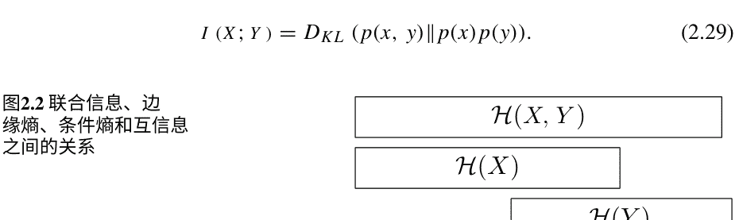

## 2.4 贝叶斯推断

请注意，(2.29)是 \(p(x, y)\) 和它们边缘分布的乘积 \(p(x)p(y)\) 之间的KL散度。我们可以将 \(I(X; Y)\) 理解为信息成本，即编码成对 \((X, Y)\) 所需的额外比特数。如果变量实际上是独立的，则 \(I(X; Y) = 0\)。

贝叶斯概率从贝叶斯规则中继承了它的名字：

$$P(z \mid X) = \frac{P(x \mid Z)P(z)}{P(x)} \quad (2.30)$$

尽管这个方程对于 \(z\) 和 \(x\) 可能代表的任何事件都是有效的，但我们考虑了一个常见的情况，即 \(Z\) 是未知随机变量的集合，\(X = x\) 是对应于现实世界过程的观测数据。

在上述表达式中，每个项都有明确的解释：

- \(p(z)\)——先验概率——它将我们可能拥有的先验信念或领域知识编码到模型中。如果对手头的问题一无所知，那么可以使用非信息先验[2]。
- \(p(x \mid Z)\)——似然函数——在第2.1.5节中已经介绍过，它是与参数而不是可能事件相关的概率密度函数。直观地说，它衡量了给定模型的观测数据的可能性有多大。
- \(p(z \mid X)\)——后验概率——它的名称反映了在考虑了我们的（新的）数据后，我们对参数的知识是如何更新的，因此它是给定这样的证据的条件下 \(z\) 的概率。
- \(p(x)\)——证据——如上所示，该术语指的是可观测数据，该分布作为一个归一化因子等于 \(\int p(x\mid Z)p(z)dz\)，使得后验分布对应一个合适的概率分布。

### 2.4.1 贝叶斯与经典方法

先验分布和后验分布的存在是贝叶斯框架的固有特征，其中参数和其他未知量被视为随机变量，而不是固定值。因此，所有未知量都被平等对待，它们之间没有区别。

贝叶斯观点是对概率本身及其含义的一种解释。频率主义者将其视为事件的相对频率，而贝叶斯派将其视为信念的量化。

在统计大数据集下，贝叶斯后验分布变得渐近狭窄并且与似然函数相似。直观地说，这种行为是有道理的：观察数据提供的证据变得如此强大，以至于先验知识的影响几乎可以忽略不计。在这些情况下，贝叶斯和经典方法给出了相似的结果。那么，如果结果最终相似，作为贝叶斯派的优势在哪里呢？关键在于“渐近”和“统计大”。在数据有限且传统方法容易过拟合的情况下，贝叶斯建模在参数的不确定性方面表现出色[1]。机器学习的最新革命依赖于非常大的数据集。然而，这些数据集仍然在统计上较小，例如，尽管ImageNet数据集[4]有超过1400万张图像，但对于图像中所有对象类别的外观，可能的配置几乎是无限的。因此，科学界一直在积极研究能够适应大数据集的贝叶斯推断方法。

### 2.4.2 后验预测分布

贝叶斯处理包括计算完整的后验分布 \(p(z|X)\)，而不仅仅是点估计，因此正则化常数在 (2.30) 中的重要性，即证据

$$\int p(x|Z)p(z)dz$$

这两个分布都允许我们生成潜在变量的点估计或区间估计，并构建新数据的预测密度。例如，在测试时，我们计算新数据 \(x'\) 的后验预测分布：

$$p(x'|x) = \int p(x' \mid Z)p(z \mid X = x)dz \quad (2.31)$$

直观地说，我们计算每个随机变量设置下的 \(x'\) 的概率 考虑到学习到的后验概率 \(p(z | X)\)，我们计算 \(z\) 本身的概率。

正如人们可能已经想象到的，在贝叶斯分析中，积分是核心操作。然而，这经常导致难以处理的解决方案，要么是由于高维度使得计算在合理时间内不可行，要么是由于不存在闭式解析解。在第3.2节中，我们介绍了一些处理这个问题的近似方法，在第4章中我们讨论了算法。


图2.3 3个阶段的分层贝叶斯模型。X 是一个观测随机变量，θ 是一个未知参数，控制其生成过程，μ 是一个确定随机变量θ 的分布的超参数。

用于在深度神经网络（一类参数模型）中执行贝叶斯回归。

### 2.4.3 分层建模

贝叶斯模型可以进一步分解为一个跨越多个层级的条件分布序列，遵循分层结构。贝叶斯分层模型具有多个层级的超参数，用于设置下游阶段的先验分布和超先验分布，以定义相应的分布。在图2.3的示例中，μ 是一个超参数，因为θ 已经是影响观测X 分布的参数。如果我们为μ 定义一个分布，我们就定义了一个超先验分布，如果我们想在推理过程中考虑这个分布，通过边际化μ，我们就执行了完全贝叶斯方法。另一方面，如果我们通过最大化由观测确定的μ 的似然来定义μ 的一个点值，我们就进行了经验贝叶斯。在第4章中，我们将使用分层建模来开发概率反向传播。

## 2.5 共轭先验分布

### 2.5.1 定义和动机

在第2.2节中，我们介绍了指数族的特殊特性以及使用该族中的概率密度函数的优势。根据前一节，在贝叶斯理论中，参数的先验知识与一些实验一起用于更新该参数的信念。从数学角度来说，我们有

$$p(z|X)\propto p(x|Z)p(z)。$$

因此，可以选择先验分布以保持后验分布在相同的族中。当 \(p(z|X)\) 和 \(p(z)\) 属于相同的分布族时，我们称 \(p(z)\) 为似然函数 \(p(x|Z)\) 的共轭先验分布。以这种方式，使用共轭先验可以节省很多时间，因为只需要计算更新的参数而不是整个分布。尽管共轭先验分布提供了一种更直接的计算后验概率的方法，但选择一个能够表示您对未知参数的信念的先验分布是至关重要的。

### 2.5.2 共轭先验示例

对于共轭先验的第一个例子，我们将展示用于计算它们的思考过程。假设我们有一个已知方差 \(\sigma\) 和未知均值 \(\mu\) 的正态分布：

> $$ p(x | \mu) = \frac{1}{\sqrt{2\pi\sigma^2}} e^{-\frac{1}{2}\left(\frac{x-\mu}{\sigma}\right)^2}. \tag{2.33} $$

然后，考虑 \(n\) 个独立观测：

> $$ \begin{aligned} p(\mathbf{x} | \mu) &= \prod_{i=1}^{n} p(x_i | \mu) \\ &= \prod_{i=1}^{n} \frac{1}{\sqrt{2\pi\sigma^2}} e^{-\frac{1}{2}\left(\frac{x_i-\mu}{\sigma}\right)^2} \\ &= \left(2\pi\sigma^2\right)^{-\frac{n}{2}} e^{-\frac{1}{2} \sum_{i=1}^{n} \left(\frac{x_i-\mu}{\sigma}\right)^2}. \tag{2.34} \end{aligned} $$

使用这个结果在(2.32)中，后验可以写成

> $$ p(\mu | X) \propto p(\mu) \left(2\pi\sigma^2\right)^{-\frac{n}{2}} e^{-\frac{1}{2} \sum_{i=1}^{n} \left(\frac{x_i-\mu}{\sigma}\right)^2}. \tag{2.35} $$

现在，我们可以注意到影响 \(\mu\) 参数的因子是一个同时包含 \(\mu^2\) 和 \(\mu\) 的指数，因此后验也将同时包含这两个项。因此，共轭先验必须同时包含这两个项，这表明它也必须是一个正态分布。假设它是一个均值为 \(\mu_0\) 和方差为 \(\sigma_0^2\) 的正态分布，我们有

> $$ \begin{aligned} p(\mu | X) &\propto p(\mu) \left(2\pi\sigma^2\right)^{-\frac{n}{2}} e^{-\frac{1}{2} \sum_{i=1}^{n} \left(\frac{x_i-\mu}{\sigma}\right)^2} \\ &\propto \frac{1}{\sqrt{2\pi\sigma_0^2}} e^{-\frac{1}{2} \left(\frac{\mu-\mu_0}{\sigma_0}\right)^2} \left(2\pi\sigma^2\right)^{-\frac{n}{2}} e^{-\frac{1}{2} \sum_{i=1}^{n} \left(\frac{x_i-\mu}{\sigma}\right)^2} \end{aligned} $$

$$
\propto e^{-\frac{1}{2}\left[\mu^{2}\left(\frac{1}{\sigma_{0}^{2}}+\frac{n}{\sigma^{2}}\right)-2\mu\left(\frac{\mu_{0}}{\sigma_{0}^{2}}+\frac{n \bar{x}}{\sigma^{2}}\right)\right]}.
$$
(2.36)

在(2.36)的最后一步中，我们首先忽略了与 \(\mu\) 无关的每一项，因为它们是常数，并将剩下的项分组为 \(\mu^{2}\) 或 \(\mu\)。此时，我们希望将 \(p(\mu \mid X)\) 也写成 \(N\left(\mu_{p}, \sigma_{p}^{2}\right)\) 形式的正态分布。

因此，
$$
p(\mu \mid X) \propto e^{-\frac{1}{2}\left[\mu^{2}\left(\frac{1}{\sigma_{0}^{2}}+\frac{n}{\sigma^{2}}\right)-2\mu\left(\frac{\mu_{0}}{\sigma_{0}^{2}}+\frac{n \bar{x}}{\sigma^{2}}\right)\right]}
=\left(2 \pi \sigma_{p}^{2}\right)^{-\frac{1}{2}} e^{-\frac{1}{2}\left(\frac{\mu-\mu_{p}}{\sigma_{p}}\right)^{2}}
\propto e^{-\frac{1}{2}\left[\mu^{2} \frac{1}{\sigma_{p}^{2}}-2 \mu \frac{\mu_{p}}{\sigma_{p}^{2}}\right]}.
$$
(2.37)

这意味着

$$\sigma_{p}^{-2}=\left(\frac{1}{\sigma_{0}^{2}}+\frac{n}{\sigma^{2}}\right),\tag{2.38}$$
$$\mu_{p}=\frac{\frac{\mu_{0}}{\sigma_{0}^{2}}+\frac{n \bar{x}}{\sigma^{2}}}{\frac{1}{\sigma_{0}^{2}}+\frac{n}{\sigma^{2}}}.\tag{2.39}$$

这个过程看起来很长，不像计算后验概率的简单方法，但另一种方法涉及积分，通常会导致更长的路径。

接下来，我们给出另一个在第3章和第4章中非常有用的例子。与其弄清楚共轭先验，我们只需证明Gamma分布是具有已知均值和未知精度（其方差的倒数 \(1/\sigma^2\)）的高斯分布的共轭先验，即

$$p(\mathbf{x} \mid \lambda)=\prod_{i=1}^{n} \mathcal{N}\left(x_{i} \mid \mu, \lambda^{-1}\right)=\left(\frac{\lambda}{2 \pi}\right)^{\frac{n}{2}} e^{-\frac{\lambda}{2}\sum_{i=1}^{n}\left(x_{i}-\mu\right)^{2}},\tag{2.40}$$
$$p\left(\lambda \mid \alpha_{0}, \beta_{0}\right)=\frac{\beta_{0}^{\alpha_{0}} \lambda^{\alpha_{0}-1} e^{-\beta_{0} \lambda}}{\Gamma\left(\alpha_{0}\right)}\propto \lambda^{\alpha_{0}-1} e^{-\beta_{0} \lambda}.\tag{2.41}$$

因此，根据(2.32)，我们有
$$p(\lambda \mid \mathbf{X}) \propto \lambda^{\alpha_{0}-1} e^{-\beta_{0} \lambda}\left(\frac{\lambda}{2 \pi}\right)^{\frac{n}{2}} e^{-\frac{\lambda}{2} \sum_{i=1}^{n}\left(x_{i}-\mu\right)^{2}}
\propto \lambda^{\alpha_{0}-1+\frac{n}{2}} e^{-\lambda\left(\frac{1}{2} \sum_{i=1}^{n}\left(x_{i}-\mu\right)^{2}+\beta_{0}\right)}$$$$ = Ga\left( \lambda \left| \alpha_0 + \frac{n}{2}, \frac{1}{2} \sum_{i=1}^{\Sigma} (x_i - \mu)^2 + \beta_0 \right. \right) \quad (2.42) $$

从(2.42)我们可以看到参数 $\alpha_0$ 和 $\beta_0$ 对后验的影响。 就好像我们已经收集了 $2\alpha_0$ 个样本方差为 $\beta_0/\alpha_0$ 的观测值一样。

## 2.6 点估计

点估计是从样本数据中确定与某个未知期望量的“最佳猜测”相对应的单个值的过程。 这个量可以是参数、函数或者随机变量的未来值。 我们认为样本的函数是估计量，当取样本时，估计值是实际值。

在本节中，我们简要回顾了最常见的点估计方法，其中一些方法在本书中后续使用。

### 2.6.1 矩法

矩估计方法很直接。 它依赖于解决由“匹配”产生的方程组，即将样本矩$\{m_i\}_{i=1}^k$与总体矩$\{\mu_i\}_{i=1}^k$相等。 后者通常是所求参数$\{\theta_i\}_{i=1}^k$的函数。 然后，我们有 $k$ equations:

$$ \left( m_i = \frac{1}{n} \sum_{j=0}^{\Sigma} X_j^i \right) = \left( \mathbb{E}\left[ X^i \right] = \mu_i \right), \forall 1 \le i \le k. \quad (2.43) $$

由于这种技术是通过匹配分布的矩来实现的，因此也被称为矩匹配。 我们将在第3.2.2节和第3.2.3节中使用它进行近似推断，这在第4章中将非常有用。 正如我们将看到的，当匹配矩时，最好使用类似的分布，否则可计算性会受到严重影响。

### 2.6.2 最大似然估计

最大似然估计（MLE）依赖于最大化似然函数，即找到使观测数据更有可能的单个参数值。 我们假设数据在给定$\mathcal{Z}$的情况下是独立同分布的，因此$\mathrm{p}(\mathbf{x}| \mathcal{Z})$可以分解为以下形式：

$$z_{MLE} = \arg\max_{z} p(\mathbf{x} \mid Z) = \arg\max_{z} \prod_{i} p(x_i \mid Z) = \arg\max_{z} \sum_{i} \log p(x_i \mid Z). \quad (2.44)$$

最后一个等式成立是因为对数是单调递增函数，因此优化问题是等价的。这种方法获得了参数的点估计（对应于最大值），并具有参数变换不变性和计算简便性。另一方面，它丢失了我们之前讨论的可变性信息，并且容易过拟合，尽管渐近最优。

### 2.6.3 最大后验估计

最大后验（MAP）估计执行了后验函数 p(z|X) 的最大化，该函数在公式（2.30）中定义。从参数的优化角度来看，证据是固定的，所以我们可以忽略它。因此，可以写成：

$$\mathcal{Z}_{MAP} = \arg\max_{z} p(z \mid X) = \arg\max_{z} \frac{p(x \mid Z)p(z)}{p(x)} = \arg\max_{z} (p(x \mid Z)p(z)) = \arg\max_{z} \left( \left[ \prod_{i} p(x_i \mid Z) \right] p(z) \right) = \arg\max_{z} \log \left( \left[ \prod_{i} p(x_i \mid Z) \right] p(z) \right) = \arg\max_{z} \left( \sum_{i} \log p(x_i \mid Z) + \log p(z) \right). \quad (2.45)$$

由于MAP还考虑了先验概率密度函数，它强制将Z视为一个随机变量。MAP得到的解与MLE不同，如图2.4所示。公式(2.45)是机器学习算法中常见的效用函数，例如在神经网络中使用。

图2.4 MLE和MAP的解通常不同。随着收集到更多的数据，似然函数变得更加表达性，后验概率也会向其靠近。

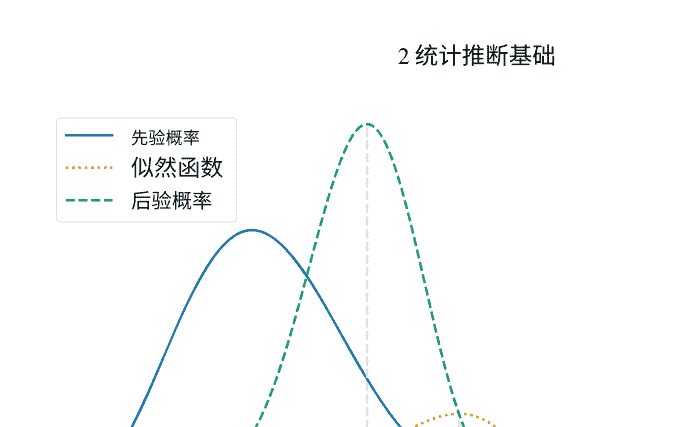

如果我们将先验概率设为标准高斯分布，那么这个项就变成了正则化项。

尽管这种方法更具贝叶斯的感觉，但MAP估计仍然是一个点估计，我们可能希望得到整个概率分布。此外，其结果对参数变换不具有不变性，这是不希望的，因为我们希望始终得到相同的点，即等价解。

### 2.6.4 贝叶斯估计

完全贝叶斯估计与先前的方法本质上不同，在先前的方法中，我们有一个特定的公式来计算点值。与MAP估计器类似，该过程首先定义我们希望推断的随机变量z的先验分布p(z)。然而，我们考虑边缘分布p(x)，以便获得完整的后验分布p(z|X)，而不是Z中的单个点。

自然地，选择Z中最合适的点的问题出现了。为了解决这个问题，决策理论定义了估计器δ的风险R，它是关于后验分布p(z|X)的损失函数L(δ, Z)的期望值。因此，我们可以写成

$$ R(\delta) = \mathbb{E}_{Z|X} [L(\delta, Z)]. \qquad (2.46) $$

风险的最小化 R(δ)导致估计器 δ其实现对应于 Z中的适当点估计。损失函数的选择取决于问题的特性：大误差和小误差一样糟糕还是更糟糕？这样的设计问题导致不同的估计器，例如：

- 平方损失$L(\delta, Z) = (\delta(X) - Z)^2$导致后验分布的均值；
- 绝对损失$L(\delta, Z) = |\delta(X) - Z|$导致后验分布的中位数；
- $0-1$损失$L(\delta, Z) = \mathbb{1}_{\{|\delta(X)-Z| > \epsilon\}}$导致后验分布的众数，就像最大后验估计一样；

### 2.6.5 期望最大化

期望最大化 (EM) 是一种迭代算法，试图找到参数$\theta$的最大似然估计。该方法将寻找函数最大值的优化问题转化为一系列涉及期望和最大化的简化问题，这些问题在每一步中交替进行。

该算法擅长处理缺失数据，这通常使计算变得困难，并且在计算统计学中被广泛使用。

我们可以将分布$f(x;\theta)$写成“完整数据”分布$f(x, z;\theta)$的边际分布。

$$f\left(x; \theta\right) = \int f\left(x, z; \theta\right) dz, \quad\quad (2.47)$$

其中Z是一个未观察到的随机变量，因此构成了缺失数据。

通过引入的条件分布$h(z|X, \theta)$，我们可以写成

$$\log h(Z|X, \theta) = \log f(X, z;\theta) - \log f(X;\theta). \quad\quad (2.48)$$

我们可以对未观察到的变量取期望值 $Z$， $(Z \mid X; \theta^{(0)})$在(2.48)中重新排列，得到

$$\log f\left(X; \theta\right) = \mathbb{E}_{Z} \left[ \log f\left(X, Z; \theta\right) \mid X, \theta^{(0)} \right] - \mathbb{E}_{Z} \left[ \log h(Z \mid X, \theta^{(0)}) \right]. \quad\quad (2.49)$$

右侧的第二项(2.49)可以在优化$f\left(X; \theta\right)$时忽略，只需最大化项 $\mathbb{E}_{Z} \left[ \log f\left(X, Z; \theta\right) \mid X, \theta^{(0)} \right]$.

因此，我们将计算分为两个步骤

1.  E步骤: $Q(\theta|\theta^{(r)}, X) = \mathbb{E}_{Z} [\log f(X, Z; \theta) | X, \theta^{(r)}]$;
2.  M步 $\theta^{(r+1)} = \text{argmax}_{\theta} Q(\theta|\theta^{(r)}, X)$.

E步计算缺失数据 $Z$ 在观测数据 $X$ 和 $\theta^{(r)}$ 固定时对对数函数的期望。“M步”找到最大值关于 $\theta$ 的 w.r.t.。

尽管我们故意忽略了(2.49)中的一个项，但该算法保证在每次迭代中改善参数的估计。我们通过展示 $\mathbb{E}_Z \left[ \log f(X, Z; \theta) \mid X, \theta^{(r+1)} \right] \ge \mathbb{E}_Z \left[ \log f(X, Z; \theta) \mid X, \theta^{(r)} \right]$ 和 $\mathbb{E}_Z \left[ \log h(Z \mid X, \theta^{(r+1)}) \right] \le \mathbb{E}_Z \left[ \log h(Z \mid X, \theta^{(r)}) \right]$。前者通过最大化该函数的M步骤来保证 后者通过注意到

$$\begin{aligned}
&\mathbb{E}_Z \left[ \log h(Z \mid X, \theta^{(r+1)}) \mid X, \theta^{(r)} \right] \le \mathbb{E}_Z \left[ \log h(Z \mid X, \theta^{(r)}) \mid X, \theta^{(r)} \right] \\
&\iff \mathbb{E}_Z \left[ \log \frac{h(Z \mid X, \theta^{(r+1)})}{h(Z \mid X, \theta^{(r)})} \mid X, \theta^{(r)} \right] \le 0 \\
&\iff \mathbb{E}_Z \left[ \log \frac{h(Z \mid X, \theta^{(r+1)})}{h(Z \mid X, \theta^{(r)})} \mid X, \theta^{(r)} \right] \le \log \mathbb{E}_Z \left[ \frac{h(Z \mid X, \theta^{(r+1)})}{h(Z \mid X, \theta^{(r)})} \mid X, \theta^{(r)} \right] \\
&\iff \mathbb{E}_Z \left[ \log \frac{h(Z \mid X, \theta^{(r+1)})}{h(Z \mid X, \theta^{(r)})} \mid X, \theta^{(r)} \right] \le \log \int \frac{h(Z \mid X, \theta^{(r+1)})}{h(Z \mid X, \theta^{(r)})} h(Z \mid X, \theta^{(r)}) dZ \\
&\iff \mathbb{E}_Z \left[ \log \frac{h(Z \mid X, \theta^{(r+1)})}{h(Z \mid X, \theta^{(r)})} \mid X, \theta^{(r)} \right] \le \log(1) = 0, \quad\quad (2.50)
\end{aligned}$$

在等式(2.50)的第三步中，我们应用了Jensen不等式，因为 $\log(x)$ 是凹的。

在第一次迭代中，对 $\theta$ 的任何猜测都足以启动算法。通常，我们从不同的随机起始点 $\theta^{(0)}$ 运行该方法多次，以减轻多模态问题固有的局部最优问题。虽然好的猜测可以加快收敛速度，但糟糕的猜测可能导致收敛速度较慢或局部最优。该算法本身通常很慢，E步骤是瓶颈，随着维度的增加，速度会变得更慢。此外，缺失数据越多，需要进行的期望值就越多，方法的速度就越慢。

尽管上述缺点，EM方法非常有用，并且在许多不同的情况下使用，其中计算MLE（或MAP）可能很困难：

- 分布混合；
- 非共轭先验；
- 缺失或未观察到的数据；
- 离散、连续或混合数据。

#### 2.6.5.1 EM示例

由于EM具有强大的数值组件，我们认为用一个例子来说明是合适的。

假设一个工厂生产n种不同的产品。令Yi表示产品i的注册故障项的计数，而缺陷的根本原因是每个i使用的原材料Xi中的杂质，其自然发生率为τi。我们假设制造过程通过因子β对所有材料产生相同的影响。

工厂的负责人对他们的机器质量表示怀疑，并且已经看到了一个为工厂参数β设定标准的研究。因此，他们想要估计自己工厂的效率，以决定是否应该投资新设备。不幸的是，测量哪些原材料低于所需纯度水平是一项昂贵的程序，并且由于预算原因，只能进行少量次数的化学分析（m < n）。此外，并非所有产品都有故障项的记录。尽管如此，负责人要求进行彻底的报告。

尽管我们可以简单地忽略所有我们没有原始杂质测量或故障记录的产品，但董事们不会接受这一点。因此，为了克服数据缺失，我们使用EM算法。

我们将故障物品的计数Yi和杂质材料的计数Xi建模为两个泊松过程，如下所示

$$ X_i \sim \text{Poisson}(\tau_i) \qquad (2.51) $$
$$ Y_i \sim \text{Poisson}(\beta\tau_i). \qquad (2.52) $$

完整的似然函数如下

$$ f (\mathbf{x}, \mathbf{y} \mid \beta, \tau) = \prod_{i=1}^{n} \left( \frac{e^{-\tau_i} \tau_i^{x_i}}{x_i!} \right) \cdot \left( \frac{e^{-\beta\tau_i} (\beta\tau_i)^{y_i}}{y_i!} \right). \quad (2.53) $$

为简单起见，我们考虑m = n - 1，其中x1缺失。此外，假设我们无法获得有缺陷物品的记录yn。我们将不完整数据的似然函数写为

$$ f (\mathbf{x}_{-1}, \mathbf{y} \mid \beta, \tau) = \prod_{i=2}^{n} \left( \frac{e^{-\tau_i} \tau_i^{x_i}}{x_i!} \right) \cdot \prod_{i=1}^{n-1} \left( \frac{e^{-\beta\tau_i} (\beta\tau_i)^{y_i}}{y_i!} \right). \quad (2.54) $$

如同方程 (2.48) 中所定义的条件 $h(x_1, y_n \mid \mathbf{x}_{-1}, \mathbf{y}_{-n}; \theta)$，其中 $\theta = (\beta, \tau)$，我们可以写成

$$ h(x_1, y_n \mid \mathbf{x}_{-1}, \mathbf{y}_{-n}; \theta) = \frac{f(\mathbf{x}, \mathbf{y}; \theta)}{f(\mathbf{x}_{-1}, \mathbf{y}_{-n}; \theta)} $$
$$ \Rightarrow \log f(\mathbf{x}_{-1}, \mathbf{y}_{-n}; \theta) = \log f(\mathbf{x}, \mathbf{y}; \theta) - \log h(x_1, y_n \mid \mathbf{x}_{-1}, \mathbf{y}_{-n}; \theta) $$

$$\Rightarrow \log f (\mathbf{x}_{-1}, \mathbf{y}_{-n}; \theta) = \mathbb{E}_{X_1, Y_n} [\log f (\mathbf{x}, \mathbf{y}; \theta) | \mathbf{x}_{-1}, \mathbf{y}_{-n}; \theta] - \mathbb{E}_{X_1, Y_n} [\log h(\mathbf{x} | \mathbf{y}; \theta) | \mathbf{x}_{-1}, \mathbf{y}_{-n}; \theta]. \quad (2.55)$$

EM算法允许我们通过期望和最大化来找到最合适的 $\theta$。首先，我们计算完整数据对数似然的解析公式

$$\mathbb{E}_{X_1, Y_n} [\log f (\mathbf{x}, \mathbf{y}; \theta) | \mathbf{x}_{-1}, \mathbf{y}_{-n}; \theta] = \sum_{i=1}^{n-1} [-\beta \tau_i + y_i(\log \beta + \log \tau_i) - \log y_i!] + \sum_{i=2}^{\Sigma} [-\tau_i + x_i \log \tau - \log x_i!] + \sum_{x_1=0}^{\infty} [-\tau_1 + x_1 \log \tau_1 - \log x_1!] \frac{e^{-\tau_1^{(r)}} (\tau_1^{(r)})^{x_1}}{x_1!} + \sum_{y_n=0}^{\infty} [-\beta \tau_n + y_n \log \beta \tau_n - \log y_n!] \frac{e^{-\beta \tau_n^{(r)}} (\beta \tau_n^{(r)})^{y_n}}{y_n!} = \left( \sum_{i=1}^{n} [y_i(\log \beta + \log \tau_i) - \beta \tau_i] + \sum_{i=2}^{\Sigma} [x_i \log \tau_i - \tau_i] + \sum_{x_1=0}^{\infty} [x_1 \log \tau_1 - \tau_1] \frac{e^{-\tau_1^{(r)}} (\tau_1^{(r)})^{x_1}}{x_1!} \right) - \left( \sum_{i=1}^{n-1} \log y_i! + \sum_{i=2}^{\Sigma} \log x_i! + \sum_{y_n=0}^{\infty} \log y_n! \frac{e^{-\beta \tau_n^{(r)}} (\beta \tau_n^{(r)})^{y_n}}{y_n!} + \sum_{x_1=0}^{\infty} \log x_1! \frac{e^{-\tau_1^{(r)}} (\tau_1^{(r)})^{x_1}}{x_1!} \right). \quad (2.56)$$

由于我们只计算期望以便能够最大化它关于θ的值，我们可以忽略不涉及 $\theta$的所有项，即(2.56)中的第二组括号。对 $\theta$求导并计算最大似然估计会导致

$$\hat{\beta}^{(r+1)} = \frac{\hat{\beta}^{(r)} \hat{\tau}_1^{(r)} + \sum_{i=1}^{n-1} y_i}{\sum_{i=1}^{n} \hat{\tau}_i^{(r)}} = \frac{\hat{\beta}^{(r)} \hat{\tau}_1^{(r)} + \sum_{i=1}^{n-1} y_i}{\hat{\tau}_1^{(r)} + \sum_{i=2}^{n} x_i}, \quad (2.57)$$

$$\hat{\tau}_1^{(r+1)} = \frac{\hat{\tau}_1^{(r)} + y_1}{1 + \hat{\beta}^{(r+1)}}, \quad (2.58)$$

$$\hat{\tau}_n^{(r+1)} = \frac{x_n + \hat{\beta}^{(r)} \hat{\tau}_n^{(r)}}{1 + \hat{\beta}^{(r+1)}}, \quad (2.59)$$等式(2.57)中的第二个等号来自于对(2.58)–(2.60)求和并将\(\hat{\beta}^{(r+1)}\)替换为(2.57)，如

$$\begin{align*}
\sum_{i} \hat{\tau}^{(r+1)} &= \frac{y_1 + x_n + \hat{\tau}_1^{(r)} + \hat{\beta}^{(r)} \hat{\tau}_1^{(r)} + \sum_{i=2}^{n-1} x_i + \sum_{i=2}^{n-1} y_i}{\hat{\beta}^{(r+1)} + 1} \\
&= \frac{\sum_{i=2}^{n-1} x_i + \sum_{i=2}^{n-1} y_i + \hat{\tau}_1^{(r)} + \hat{\beta}^{(r)} \hat{\tau}_1^{(r)}}{\sum_{i=1}^{n-1} y_i + \sum_{i=1}^{n-1} \tau_i^{(r)} + \hat{\beta}^{(r)} \hat{\tau}_n^{(r)}} \hat{\tau}^{(r+1)} \\
\Rightarrow \sum_{i=1}^{n-1} \tau_i^{(r)} = \sum_{i=2}^{n-1} x_i + \hat{\tau}_1^{(r)}. \tag{2.61}
\end{align*}$$

请注意，\(\tau\)的公式(2.58)以及\(\tau_n\)，即(2.59)，分别与\(\tau_i\)的一般公式(2.60)相似，对于所有的\(i = 1, \ldots, n\)。当观测不可用时，我们用相应随机变量的均值来替代，这是泊松过程的速率。

迭代方程(2.57)–(2.60)将导致稳定点，该点必须满足

$$\hat{\beta} = \frac{\hat{\beta}\hat{\tau}_n + \sum_{i=2}^{n-1} y_i}{\hat{\tau}_1 + \sum_{i=2}^{n-1} x_i}, \quad \hat{\tau}_1 = \frac{\hat{\tau}_1 + y_1}{1 + \hat{\beta}}, \quad \hat{\tau}_n = \frac{x_n + \hat{\tau}_n}{1 + \hat{\beta}}, \quad \hat{\tau}_i = \frac{x_i + y_i}{1 + \hat{\beta}} \quad \forall i = 1, \ldots, n. \tag{2.62}$$

解决了一组方程后，我们得到

$$\hat{\beta} = \sum_{i=1}^{n-1} y_i \bigg/ \sum_{i=1}^{n-1} x_i, \tag{2.63}$$

$$\hat{\tau}_1 = y_1 / \hat{\beta}, \tag{2.64}$$

$$\hat{\tau}_n = x_n, \tag{2.65}$$

$$\hat{\tau}_i = \frac{x_i + y_i}{1 + \hat{\beta}} \quad \forall i = 1, \ldots, n. \tag{2.66}$$

我们也可以通过计算不完整数据似然函数(2.54)的MLE来得到这个结果。

在这个简单的例子中，正如刚才指出的，我们可以直接从(2.54)中找到\(\theta\)的估计值。然而，在实际情况下，这通常不是这样的。

## 2.7 结语

在本章中，我们简要介绍了统计推断的一些基本要点。具体而言，我们重点讨论了参数模型和指数族分布。对于推断部分，我们介绍了常见的点估计方法，即最大似然估计(MLE)、最大后验估计(MAP)和矩估计方法。此外，我们还介绍了期望最大化算法(Expectation-Maximization) (EM) 算法，我们将在第3章中重新讨论。对于第3章的近似方法来说，KL散度是非常重要的，我们将其解释为在错误模型下传输信息的额外成本。

正如我们已经指出的，对于那些希望从事任何与机器学习相关领域的人来说，对这个主题有很好的理解是至关重要的。否则，所有的方法都会看起来像神秘的配方，问题解决将类似于炼金术。

关于统计学和统计推断的良好综合资源包括[2, 8, 11]。

# 参考文献

1. Bishop CM (2013) 基于模型的机器学习。 Philos Trans R Soc A: Math Phys Eng Sci 371 (1984) : 1-17
2. Casella G, Berger RL (1990) 统计推断。 Wadsworth and Brooks/Cole, Pacific Grove, CA
3. Cover TM, Thomas JA (2006) 信息论的要素。 Wiley-Interscience, 纽约
4. Deng J, Dong W, Socher R, Li L, Li K, Fei-Fei L (2009) ImageNet: 一个大规模的分层图像数据库。 在: 2009年计算机视觉和模式识别IEEE会议。 CVPR 2009年。 IEEE, 纽约, 第248-255页
5. Diaconis P, Freedman D (1980) 有限可交换序列。 Ann Probab 8 (4) : 745-764
6. Ghahramani Z (2013) 贝叶斯非参数和概率建模方法。 Philos Trans R Soc A: Math Phys Eng Sci 371
7. Migon HS, Gamerman D, Louzada F (2014) 统计推断: 一种综合方法。 CRC Press, Boca Raton
8. Murphy KP (2012) 机器学习: 概率观点。 MIT Press, 剑桥
9. Schervish MJ (1996) 统计学理论。 Springer, 纽约
10. Shannon CE, Weaver W (1963) 通信的数学理论。 伊利诺伊大学出版社, 香槟, 伊利诺伊州
11. Wasserman L (2010) 统计学的全部内容: 统计推断的简明课程。 斯普林格出版公司, 纽约

# 第3章 基于模型的机器学习和近似推断

通过本章的学习，读者应该：

- 了解基于模型的方法的各种优势，
- 理解贝叶斯推断的好处和问题，
- 能够理解和实现变分贝叶斯和期望传播，
- 了解均值场近似，
- 理解不同变分方法之间的关系，
- 了解随机和黑盒推断方法的现代发展。

## 3.1 基于模型的机器学习

基于模型的机器学习（MBML）旨在为每个应用提供特定的解决方案。它明确地将给定应用的一组假设编码到模型中。因此，在单个开发框架下，我们能够创建各种高度定制的模型。

模型的清晰图像将模型结构与学习（推理）算法解耦。这种分离允许它们独立地进行制定，并将相同的推理方法应用于不同的模型，反之亦然，从而产生大量可能的组合。统一的框架有助于快速原型设计和比较，允许将许多传统的机器学习技术推导为某些模型推理配置的特殊情况（见第3.1.1节中的示例）。

人们可能会质疑为什么我们要推断概率分布，甚至比起单一值的点估计有什么优势，点估计已经给出了答案。仅考虑最可能的解决方案的问题在于丢失模型的潜在变异性和鲁棒性的信息。让我们考虑一个简单的例子来说明这个问题：

例子：一辆救护车必须将一个垂危的人送到最近的医院，有两条可能的路线，A和B。A需要大约15分钟，而B需要17分钟。司机应该选择哪一个？现在，司机进一步考虑病人必须在20分钟内到达医院，A由常规城市街道组成，有信号灯和可能的交通堵塞，他的预计行驶时间可能变化多达八分钟，而B是医疗急救车道，估计时间变化不超过一分钟。选择还是一样吗？

上面突出的关键词让我们对问题的内在变异性有了一种感觉，忽视这些信息可能会误导。在上面的例子中，很明显平均时间不足以提供足够的信息，不确定性对于做出更明智的决策至关重要。概率论为建模不确定性提供了一个有原则的框架。正如我们在例子中看到的，概率模型使我们能够推理和进行决策，预测未来并做出相应的计划，检测意外事件等等；所有这些都是通过学习数据的概率分布来实现的。我们不仅可以通过概率的视角几乎理解所有的机器学习，还可以将其与其他计算科学联系起来[22，第2页]。

### 3.1.1 概率图模型

完整的联合分布通常是难以处理的。因此，我们转而使用结构化模型[4]，它们仅关联少量变量的概率分布，从而提供了相当大的计算简化。

一种灵活的范式是概率图模型 (PGM) [12]，它使用图形表示来紧凑地编码高维空间上的复杂分布[12]，如图3.2所示，其中最频繁出现的元素有：

- 顶点或节点：表示随机变量（也常称为节点），如果被观察到可以着色，否则为空；
- 边：捕捉顶点之间的依赖关系；
- 板块：表示封闭子图在右下角的下标所示的次数重复出现，如图3.1所示。

#### 3.1.1.1 有向无环图

设V为图的所有顶点的集合。将顶点i的父节点定义为指向i的顶点。进一步定义顶点i的父节点集Πi为所有作为顶点i的父节点的顶点的集合。

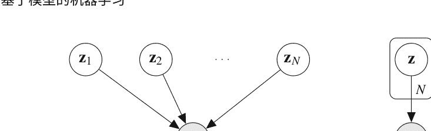

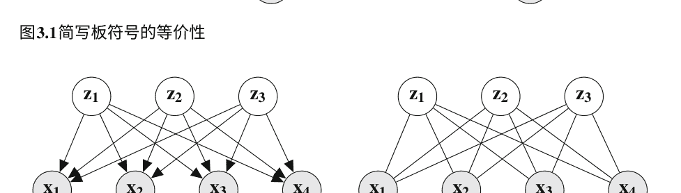

在有向无环图（DAG）方法中，如图3.2a所示，每个顶点 i ∈ V与其父集 Πi一起定义了与相应顶点i相关的随机变量x_i的局部概率分布p( x_i | Π i)。存在从 i 到 j的边表示 i 导致 j，而不存在边表示节点是独立的。

所有局部概率分布的集合p(x_i | Π_i)描述了模型的联合概率:

$$p(x_1, x_2, \ldots, x_{|\mathcal{V}|} \mid \mathcal{V}) = \prod_{i \in \mathcal{V}} p(x_i \mid \Pi_i) \tag{3.1}$$

尽管没有贝叶斯方法的内在需求，但这类模型经常被称为贝叶斯网络。它们被称为贝叶斯网络，是因为它们使用贝叶斯规则来定义概率分布[23]。

#### 3.1.1.2 无向图

与有向无环图不同，无向图（如图3.2b所示）的节点之间没有因果关系，不能描述生成过程。

与条件概率的全联合分布描述不同，无向图将联合分布分解为完全连接节点（最大团）的组𝒳_c，每个组由一个势函数ψ(𝒳_c)[12]来描述。一个组的势函数不是一个有效的概率分布，但所有这些组的集合C给出了联合分布。

$$p(\mathbf{x}_1, \mathbf{x}_2, \ldots, \mathbf{x}_{|\mathcal{V}|}) = \frac{1}{Z} \prod_{c \in C} \psi(\mathcal{X}_c), \tag{3.2}$$

其中Z是归一化常数。

#### 3.1.1.3 图模型的威力

许多传统的机器学习和信号处理算法可以作为图模型与适当的推理算法的特殊情况导出。

此外，许多算法可以用简单的图结构表示并轻松组合[4]。例如：

1. 主成分分析(PCA)可以被表述为一个生成过程，其中潜在变量z对应于主成分子空间(Fig. 3.3a)。观测值y是线性映射Wz+μ的噪声版本，其中τ是噪声精度，对所有方向都相同。假设所有分布都是高斯分布，使用最大似然估计确定W和μ，并取极限τ→∞，得到标准的PCA模型[3, ch. 12]。
2. 高斯混合模型（GMM）(图3.3b)用K个模式表示，由一个K维潜变量z组成，其遵循一个分类分布，混合权重由θ给出。每个模式都有自己的均值μ和方差σ。对于其他类型的混合模型，不同之处在于定义K个模式的参数类型，即μ和σ。PGMs可以轻松定制到特定的应用程序或在应用程序要求变化时进行修改。

概率编程是一种统计建模工具。

### 3.1.2 概率编程

它借鉴了计算机科学和常见的编程语言，构建了允许表示和评估推断问题的语言[32]。它使开发人员摆脱了复杂的概率推断低级细节，使其能够集中精力解决与问题相关的更具体的问题，如模型和推断方法的选择。与高级编程语言类似，它抽象掉架构特定的实现细节，它提高了系统性能和生产力。在图3.4中，我们将计算机科学、统计学和概率编程进行了类比。

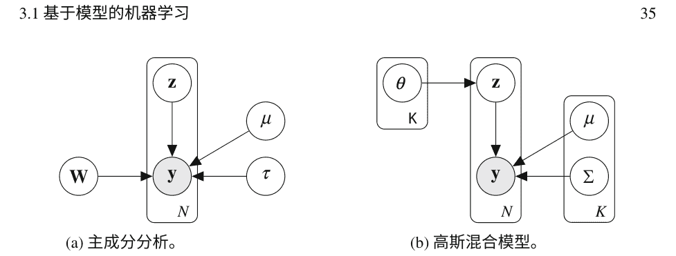

图3.3 传统机器学习算法的概率图模型。在PCA模型中（a），主成分子空间由潜变量z表示，无法直接观察到。我们只知道噪声观测值y是真实底层生成值y = Wz + μ + N(0, τ)的噪声观测值。在GMM（b）中，每个K模式都有一组未知的定义参数，即μ和Σ，并由潜指示变量Z选择，其观测概率为θ。

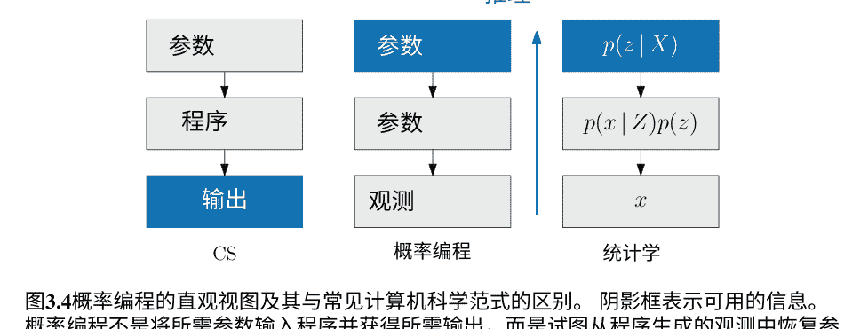

图3.4 概率编程的直观视图及其与常见计算机科学范式的区别。阴影框表示可用的信息。概率编程不是将所需参数输入程序并获得所需输出，而是试图从程序生成的观测中恢复参数。这个过程类似于统计推断。

深度学习成功的基石之一是开发了专门的编程库，以便于模型规范和自动求导，使用户不再需要手动推导优化的梯度。这类软件的广泛使用推动了深度学习的普及。

如今，不需要真正理解神经网络的基础知识，甚至微分计算，就可以尝试运行一个模型。然而，这并不意味着无论模型如何，它都会有用或有意义。概率编程旨在为概率机器学习实现相同的效果。它还可以快速原型设计和测试想法，推动领域的繁荣并促进行业采用。

现代概率编程语言提供了比PGM更强大的框架。计算机程序接受递归和控制流语句，这在其他情况下很难表示[7]。有无数种不同的语言，每种语言都有自己特定的特性：有些明确限制，有些专注于某种类型的推理技术，还有一些是通用的。

非详尽列表包括Pyro [2], Stan [6], WebPPL [8], Infer.NET [21], PyMC3 [28], Edward [30]和BUGS (来自1995年) [33]。

## 3.2 近似推理

如前一节中简要提到的，对于许多实际感兴趣的模型，计算后验分布和边缘分布通常是不可行的。在连续情况下，可能没有闭合形式的解析解，或者数值计算过于复杂。在离散情况下，虽然原则上可能对所有可能的配置求和，但如果组合总数呈指数增长，则可能不可行。

在这种情况下，我们有两个选择：要么逐步简化模型，直到可以进行精确推理，要么在原始模型中进行近似推理。关于这个问题，约翰·图基在[31, p.13]中说道：“对于一个模糊的问题，一个近似的答案要比一个精确的答案更好，而一个错误的问题总是可以变得明确。”

> 对于一个模糊的问题，一个近似的答案要比一个精确的答案更好，而一个错误的问题总是可以变得明确。

近似方案有两个广泛的类别：确定性和随机的。后者依赖于蒙特卡洛采样来近似给定分布上的期望。在给定无限计算资源的情况下，它们会收敛到精确结果，但在实践中，采样方法可能计算成本高昂。另一方面，确定性方法包括对后验分布的分析近似，因此无法生成精确结果。

因此，这两种方法是互补的。

在本章中，我们讨论确定性的变分方法。我们从其最著名的代表变分推断（VI）开始。随后，我们介绍一种称为期望传播（EP）的替代变分框架。

### 3.2.1 变分推理

VI，变分贝叶斯和变分贝叶斯推断是同一个算法的不同名称。它的目的是构建对后验分布的确定性分析近似。因此，它适用于大数据集和快速测试许多模型[5]。与其他贝叶斯方法一样，它通过概率分布描述变量的所有可用信息。图3.5显示了VI的工作原理：在指定的分布族Q中，它迭代地找到最佳分布$q^{*}$，给定一个不相似度准则D。

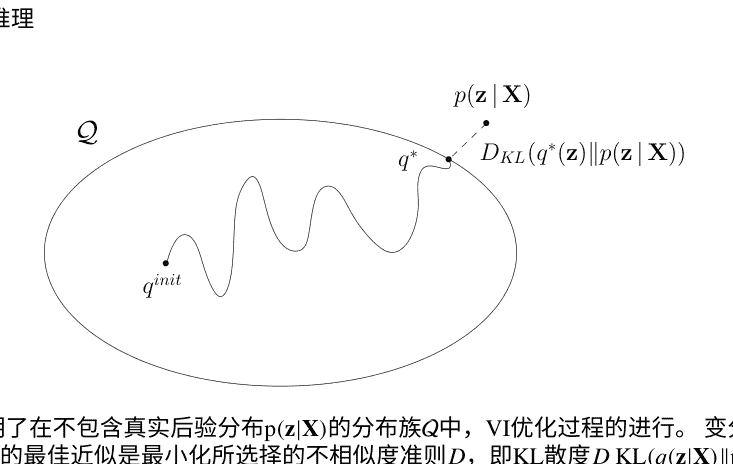

图3.5 说明了在不包含真实后验分布p(z|X)的分布族Q中，VI优化过程的进行。变分后验q*能够达到的最佳近似是最小化所选择的不相似度准则D，即KL散度D_KL(q(z|X)||p(z|X))。

VI的名字来自变分积分。常规微积分关注函数的极大值、极小值和导数，而变分积分则关注函数的泛函，即基本上是函数的函数。几个问题可以被视为泛函优化问题，而变分方法正是为了推理而做的：它们允许我们找到一个函数，即近似分布q，它最小化质量度量泛函D。

#### 3.2.1.1 证据下界

假设我们有一个模型，其联合分布为p(x,z)，覆盖了观测变量X和潜在变量Z。通常在贝叶斯设置中，我们希望计算其后验分布p(z|X)，假设其是难以处理的。我们考虑一个近似的可计算密度函数族P，覆盖了潜在变量，并尝试找到在KL散度意义下与精确后验“最接近”的成员q*，通过求解

$$q^*(z | X) = \arg\min_{q \in Q} D_{KL} (q(z | X) \| p(z | X)) \tag{3.3}$$

其中

$$D_{KL} (q \| p) = \int q(z) \log \frac{q(z)}{p(z)} dz \tag{3.4}$$

直接最小化KL散度是不可能的，因为我们需要真实后验的对数，log p(Z|X)，以及对数证据log p(x)，这是我们假设为难以计算的。为了摆脱这个项，我们进行了一些代数运算，得到

$$
\begin{align*}
D_{KL}(q(\mathbf{z}|\mathbf{X})||p(\mathbf{z}|\mathbf{X}))) &= \int q(\mathbf{z}|\mathbf{X}) \log \left( \frac{q(\mathbf{z}|\mathbf{X})}{p(\mathbf{z}|\mathbf{X})} \right) d\mathbf{z} \\
&= -\int q(\mathbf{z}|\mathbf{X}) \log \left( \frac{p(\mathbf{x},\mathbf{z})}{p(\mathbf{x})q(\mathbf{z}|\mathbf{X})} \right) d\mathbf{z} \\
&= -\left( \int q(\mathbf{z}|\mathbf{X}) \log \left( \frac{p(\mathbf{x},\mathbf{z})}{q(\mathbf{z}|\mathbf{X})} \right) d\mathbf{z} - \int q(\mathbf{z}|\mathbf{X}) \log p(\mathbf{x}) d\mathbf{z} \right) \\
&= -\int q(\mathbf{z}|\mathbf{X}) \log \left( \frac{p(\mathbf{x},\mathbf{z})}{q(\mathbf{z}|\mathbf{X})} \right) d\mathbf{z} + \log p(\mathbf{x}) \int q(\mathbf{z}|\mathbf{X}) d\mathbf{z} \\
&= -\mathbb{E}_q \left[ \log \left( \frac{p(\mathbf{x},\mathbf{z})}{q(\mathbf{z}|\mathbf{X})} \right) \right] + \log p(\mathbf{x}).
\end{align*}
$$

重新组织最后一个方程，我们得到

$$\log p(\mathbf{x}) = \mathbb{E}_q \left[ \log \left( \frac{p(\mathbf{x},\mathbf{z})}{q(\mathbf{z}|\mathbf{X})} \right) \right] + D_{KL}(q(\mathbf{z}|\mathbf{X})||p(\mathbf{z}|\mathbf{X})). \tag{3.6}$$

由于 $D_{KL}(q\|p) \geq 0$，根据方程（3.6）右侧的第一项是 $\log p(\mathbf{x})$ 的一个下界。因此，它被称为证据下界（ELBO）。这个观察结果导致了一个非常重要的结论：由于模型证据 $\log p(\mathbf{x})$ 是固定的，一旦我们知道 $\mathbf{x}$，通过最大化ELBO，我们等价于最小化 $D_{KL}(q\|p)$，我们的原始优化问题。这种等价性非常方便，因为方程（3.6）右侧不包含难以处理的证据对数。$\log p(\mathbf{x},\mathbf{z})$ 项可以分解为对数似然 $\log p(\mathbf{x}|\mathbf{z})$ 和对数先验 $\log p(\mathbf{z})$，我们可以处理。

或者，我们可以通过应用Jensen不等式来获得相同的界限，如下所示：

$$
\begin{align*}
\log p(\mathbf{x}) &= \log \int p(\mathbf{x},\mathbf{z}) d\mathbf{z} \\
&= \log \int p(\mathbf{x},\mathbf{z}) \frac{p(\mathbf{z}|\mathbf{X})}{q(\mathbf{z}|\mathbf{X})} d\mathbf{z} \\
&= \log \mathbb{E}_q \left[ \frac{p(\mathbf{x},\mathbf{z})}{q(\mathbf{z}|\mathbf{X})} \right] \\
&\geq \mathbb{E}_q \left[ \log \left( \frac{p(\mathbf{x},\mathbf{z})}{q(\mathbf{z}|\mathbf{X})} \right) \right].
\end{align*}
$$

通过与方程（3.6）进行比较，方程（3.7）左右两侧的差异正好是KL散度项，如图3.6所示。视觉描述清楚地说明了最小化 $D_{KL}(q(\mathbf{z}|\mathbf{X})||p(\mathbf{z}|\mathbf{X}))$ 和最大化ELBO(q)之间的等价性。

我们可以将ELBO重新排列成更易解释的形式：

ELBO(q) = E_q [log p(x, z)] - E_q [log q(z | X)]
= E_q [log p(x | Z) + log p(z)] - E_q [log q(z | X)]
= E_q [log p(x | Z)] - D_KL (q(z | X)||p(z)).      (3.8)

第一项是在分布q(z|X)下的期望似然，第二项是q(z|X)和先验分布p(z)之间的（负）差异。在最大化ELBO时，前者推动近似更好地解释数据，而后者作为正则化项将近似推向先验分布p(z)。

ELBO与统计物理中的变分自由能F~密切相关。

ELBO(q) = E_q [log p(x, z)] - E_q [log q(z | X)]
= E_q [log p(x, z)] + H[q]                     (3.9)
\tilde{F}(q) = -E_q [log p(x, z)] - H[q]
= -ELBO(q),                                    (3.10)

其中 -E_q[log p(x,z)]是分布下能量函数的平均值q(z|X)而H[q]是q(z|X)的熵[16, ch. 33]。事实上，在统计学习中使用变分自由能框架导致了变分推断方法。

关于方程（3.9）中项E的最优解是关于q的解[log p(x, z)]对应于p的MAP估计，最大化对数联合概率log p(x, z) 然而，熵项偏好于分散的分布 因此，解是这两个项之间的折衷

#### 3.2.1.2 ELBO的信息论观点

从本质上讲，速率失真理论建立了数据压缩和引起的失真之间的权衡关系[1]。速率表示每个样本传输数据所需的平均比特数。理想情况下，人们希望最大程度地压缩数据，实现具有低速率的紧凑表示，同时保留所有相关信息，使得重建的信号没有任何失真。然而，这些是相反的目标。

聚类算法可以自然地通过速率失真的视角来看待。在K-means [14]中，速率与质心数量相关，失真度量是原始数据点与其所属簇的质心之间的平方误差的总和。

速率失真理论断言，在给定最大失真级别 D的情况下，存在一个最小可实现的速率 R。因此，对于输入随机变量 X和压缩输出 Z，我们有

$$R(D) = \min_{q(\mathbf{z}|\mathbf{x})} I (\mathbf{X}; \mathbf{Z}) \quad \quad (3.11)$$
$$s.t. \mathbb{E}_{[p(\mathbf{x})]} \left[ \mathbb{E}_{[q[ d(\mathbf{Z}, \mathbf{x})]] } \right] < D,$$

其中$d(\cdot, \cdot)$是失真度量（例如，K-means中的平方误差之和），$I (\mathbf{X}; \mathbf{Z})$是互信息，$q(\mathbf{z}|\mathbf{X})$是我们希望优化的信道。在第2.3.4节中介绍的互信息$I (\mathbf{X}; \mathbf{Z})$量化了随机变量X和Z之间的依赖关系，即通过观察一个变量可以了解另一个变量的程度。直观地说，方程(3.11)试图尽可能地从X中删除信息，使其与Z无关。

为了使优化问题可管理，我们将互信息$I (\mathbf{X}; \mathbf{Z})$上界如下：

$$\begin{aligned}
I (\mathbf{X}; \mathbf{Z}) &= D_{KL} (q(\mathbf{z}, \mathbf{x}) || q(\mathbf{z}) p(\mathbf{x})) \n&= \mathbb{E}_{p(\mathbf{x})} [D_{KL} (q(\mathbf{z} | \mathbf{X}) || m(\mathbf{z}))] - D_{KL} (q(\mathbf{z}) || p(\mathbf{z})) \quad (3.12) \n&\leq \mathbb{E}_{p(\mathbf{x})} [D_{KL} (q(\mathbf{z} | \mathbf{X}) || m(\mathbf{z}))], \quad (3.13)
\end{aligned}$$

其中 $q(\mathbf{z})$是引发的边际 $q(\mathbf{z}) = \int q(\mathbf{z}, \mathbf{x}) p(\mathbf{x}) d\mathbf{x}$, $m(\mathbf{z})$是对 $q(\mathbf{z})$的近似，不等式来自KL散度的非负性。

对于潜变量模型，隐式定义的失真函数是 $d(\mathbf{X}, \mathbf{Z}) =$ 这种扭曲惩罚了无法忠实重构原始样本的潜在变量Z。如果我们进一步将边际近似$m(\mathbf{z})$设定为压缩随机变量Z的先验$p(\mathbf{z})$，优化问题变为

$$\min_{q(\mathbf{z}|\mathbf{X})} \mathbb{E}_{[p(\mathbf{x})]}[D_{KL}(q(\mathbf{z}|\mathbf{X})|| p(\mathbf{z}))] \quad (3.14)$$

## 3.2 近似推理

$$s.t. \mathbb{E}_{p(x)} [\mathbb{E}_q[-log p(x|Z)]] < D.$$

将方程(3.14)重写为最大化问题，并用拉格朗日乘子表示，得到

$$\max_{q(z|X)} \mathbb{E}_{p(x)} [\mathbb{E}_q[log p(x|Z)] - \beta D_{KL}(q(z|X)||p(z))], \quad (3.15)$$

其中β是拉格朗日乘子。

解方程(3.15)等价于最大化方程(3.8)中数据集D={X}_n的平均ELBO，其中D是经验分布p(d)，β=1。因此，我们可以将变分贝叶斯解释为对失真率函数的上界进行优化。而\mathbb{E}_q[log p(x|Z)]该术语衡量了压缩表示的保真度（负失真），KL项量化了表示X所需的额外位数与Z相比。这种连接使我们能够将信息论领域的见解应用于变分贝叶斯。例如，ELBO有一个上界，其值是真实数据分布的熵的负值。

#### 3.2.1.3 均场近似

无论推理算法的类型如何，我们通常对近似分布的族群Q施加限制，以便解决问题。

Q族应尽可能灵活，以便我们能够更好地逼近真实后验分布，唯一的限制是可处理性。分布族越丰富，q*(z|X)越接近p(z|X)。在Q包含真实后验且后者可处理的情况下，推理方法通常会收敛到精确分布。

有两种主要方法来约束模型的分布族：
- 通过为分布q(z|X;ψ)指定参数形式，其中ψ是变分参数集
- 通过假设q在分区Z的分解上S_i的Z中

$$q(z|X) = \prod_{i=1}^{M} q_i(z_{S_i} | X). \quad (3.16)$$

方程（3.16）的分解形式，其中每个分区是一个单一维度，称为均场变分推断（MFVI）。均场近似足够灵活，可以捕捉潜在变量的任何边际密度，但由于独立性假设，无法建模它们之间的相关性，如图3.7所示。这个假设是一把双刃剑，有助于可扩展的优化，但限制了表达能力[5]。因此需要其他类型的近似方法

例如，结构化均值场[10]，更丰富的协方差模型[15, 29]，归一化流[26]等。

#### 3.2.1.4 坐标上升变分推断

坐标上升变分推断（CAVI）是一种用于MFVI的算法。为了找到最优因子$q_{-i}^*(\mathbf{z}_{S_i})$，对于方程（3.16），我们可以求解由ELBO和约束条件组成的拉格朗日函数，其中因子$q_{-i}^*$必须总和为1。然而，我们并不求助于变分法。相反，我们采取了一种更加费力的方法，将方程（3.16）代入方程（3.9）并计算出数学结果（见附录A.2）

$$\log(q_{-j}^*(z|\mathbf{X})) \propto \mathbb{E}_{-j} \left[ \log p(\mathbf{x}, \mathbf{z}) \right] + \text{常数} \qquad \qquad (3.17)$$

$$q_{-j}^*(\mathbf{z}_{S_j}|\mathbf{X}) \propto \exp\left\{ \mathbb{E}_{-j} \left[ \log p(\mathbf{x}, \mathbf{z}) \right] \right\}. \qquad \qquad (3.18)$$

其中$\mathbb{E}_{-j}[\cdot]$表示对所有集合$S_{-j}$的期望，除了$S_{-j,0}$。最优因子之间的相互依赖性需要迭代方法。在每一步中，我们用修正后的估计值替换每个因子，同时保持其他因子不变（3.18）。CAVI将ELBO提升到局部最优。优化的另一种方法是通过梯度导向的更新，即算法在每次迭代时计算并跟随目标相对于因子的梯度。

尽管我们认为所有参数都在潜在空间中（$\mathbf{Z}$）内，但也有可能对我们进行点估计的参数$\theta$。即$p(\mathbf{z}|\mathbf{X}; \theta)$。在这种情况下，我们在两个不同的步骤之间交替进行：通过计算所有$s$的期望来逐次逼近后验分布，如公式（3.18）所示；

2. 在重新定义的分布qnew(z|X)下，对ELBO进行最大化，即对Θ进行最大化 Π即q*(zSi|X)。 这就是变分EM算法。VI可以理解为变分EM的完全贝叶斯扩展，在其中不再计算参数Θ的点质量（MAP估计，第2.6.3节），而是计算整个Θ和Z的分布。

#### 3.2.1.5 随机变分推断

随机变分推断（SVI）通过对梯度的噪声估计进行优化ELBO，因此得名。随机优化在现代机器学习中无处不在，因为它比评估大规模数据集要快得多，而这在现今很常见。

逼近有效的主要要求是：

- 1. 梯度估计器g应该是无偏的E [g] = E[g];
- 2. 步长序列{αi|i∈N}(学习率)应该被退火，以便将参数推向最优解

$$\sum_{i=0}^{\infty} \alpha_i = \infty \quad \text{和} \quad \sum_{i=0}^{\infty} \alpha_i^{\wedge}2 < \infty. \quad (3.19)$$

直观地说，步长的第一个条件与探索能力有关，使得算法可以在任何初始位置找到好的解。第二个条件保证其能量有界，以便能够收敛到解。

在计算期望步骤时，我们不是针对所有N个数据点（每次迭代）进行计算，而是针对一个均匀抽样（有放回）的大小为n的子集进行计算。根据这些新的变分参数，我们按照观察到数据点N/n倍的期望（或全局变分参数的期望）来计算最大化步骤，并根据公式（3.19）更新估计值，其理论上应该根据上述约束条件无限进行，步长越来越小。然而，在实践中，当ELBO收敛时，它会停止。

SVI是一种随机优化算法，最初用于完全因子化近似（MFVI）[11]，后来扩展到支持具有全局和局部变量之间任意依赖关系的模型[10]。

#### 3.2.1.6 变分推断问题

尽管变分推断框架被广泛采用，但仍存在一些重要问题。如此呈现，它仍然局限于条件共轭指数族，我们可以计算ELBO的解析形式。在这个族群之外，我们得到的分布无法写出优化公式。第3.2.4节简要介绍了解决这个问题的方法。

尽管最小化 $D_{KL}(q(\mathbf{z}|\mathbf{X})\|p(\mathbf{z}|\mathbf{X}))$ 和最大化ELBO是等价的优化问题，但KL下界为零，而ELBO没有任何界限。因此，观察KL接近零的程度可以告诉我们近似的质量以及它与真实后验分布的接近程度。另一方面，ELBO没有绝对的尺度可以进行比较，因此我们无法知道它与真实分布相差多远。尽管如此，它渐近收敛，因此我们可以用它来进行模型选择。

通过最小化KL散度并结合独立性假设，均值场近似使得近似分布与目标分布的单个模式匹配。此外，这种组合低估了目标密度的边际方差。

#### 3.2.1.7 变分推断示例

考虑一个一维线性回归问题，其中权重具有高斯先验分布，均值为$\mu$，精度为$\tau$。我们希望推断观测噪声精度的边际后验分布，其先验分布遵循Gamma分布。该模型给出如下：

$$\gamma \sim Ga(\gamma; \alpha_0, \beta_0) \quad (3.20)$$

$$W \sim \mathcal{N}(w|\mu, \tau^{-1}) \quad (3.21)$$

$$Y_i \sim Wx_i + \mathcal{N}(0, \gamma^{-1}), \quad 1 \le i \le N. \quad (3.22)$$

观察图3.8中的图形模型及其依赖结构，我们可以将联合分布写成

$$p(w, \gamma \mid y_1, \cdots, y_N, \mathbf{X}) = p(y_1, \cdots, y_N \mid W, \gamma, \mathbf{X})p(\gamma)p(w). \quad (3.23)$$

为了使用第3.2.1.4节介绍的CAVI算法，我们近似计算全局变量 $w$ 和 $\gamma$ 的后验分布 $q(\gamma, w|\mathbf{Y}, \mathbf{X})$，得到真正感兴趣的分布是边际分布 $q(\gamma)$。

根据公式(3.23)和独立同分布(iid)观测样本 $x_i$ 的假设，真实的后验分布为

$$ p(\gamma, w | \mathbf{Y}, \mathbf{X}) = \frac{p(\gamma) p(w)}{p(y_1, \cdots, y_N | \mathbf{X})} \prod_{i=1}^{N} p(y_i | W, \gamma, x_i), \quad (3.24) $$

在 $\gamma$ 上的边际是

$$ p(\gamma | \mathbf{Y}, \mathbf{X}) = \int p(\gamma | W, \mathbf{Y}, \mathbf{X}) dw. \quad (3.25) $$

为了计算CAVI的更新公式 $q(w)$，我们将方程(3.23)代入方程(3.18)，并将不涉及 $w$ 的所有项标记为常数，得到

$$ \begin{aligned} \log q^*(w) &= \mathbb{E}_{\gamma} [\log p(w, \gamma, \mathbf{y} | \mathbf{X})] + \text{常数} \\ &= \mathbb{E}_{\gamma} [\log p(y_1, \cdots, y_N | W, \gamma, \mathbf{X})] + \mathbb{E}_{\gamma} [\log p(w)] + \mathbb{E}_{\gamma} [\log p(\gamma)] + \text{常数} \\ &= \mathbb{E}_{\gamma} [\log \mathcal{N}(y_1, \cdots, y_N | \mathbf{W}^T \mathbf{X}, \gamma^{-1})] + \mathbb{E}_{\gamma} [\log \mathcal{N}(w | \mu, \tau^{-1})] + \text{常数} \\ &= \mathbb{E}_{\gamma} \left[ \frac{1}{2} \log \gamma - \frac{1}{2} \log 2\pi - \frac{\gamma}{2} (\mathbf{y} - w\mathbf{x})^T (\mathbf{y} - w\mathbf{x}) \right] \\ &\quad + \mathbb{E}_{\gamma} \left[ \frac{1}{2} \log \tau - \frac{1}{2} \log 2\pi - \frac{\tau}{2} (w - \mu)^2 \right] + \text{常数} \\ &= \mathbb{E}_{\gamma} \left[ -\frac{\gamma}{2} (\mathbf{y} - w\mathbf{x})^T (\mathbf{y} - w\mathbf{x}) \right] - \frac{\tau}{2} (w - \mu)^2 + \text{const} \\ &= -\frac{1}{2} \left\{ \mathbb{E}_{\gamma} [\gamma] \left[ (\mathbf{y} - w\mathbf{x})^T (\mathbf{y} - w\mathbf{x}) \right] + \tau (w - \mu)^2 \right\} + \text{常数} \\ &= -\frac{1}{2} \left\{ \mathbb{E}_{\gamma} [\gamma] \left( w^2 \mathbf{x}^T \mathbf{x} - 2w \mathbf{x}^T \mathbf{y} \right) + \tau w^2 - 2\tau w\mu \right\} + \text{常数} \\ &= -\frac{1}{2} \left[ (\mathbf{x}^T \mathbf{x} \mathbb{E}_{\gamma} [\gamma] + \tau) w^2 - 2(\mathbf{x}^T \mathbf{y} \mathbb{E}_{\gamma} [\gamma] + \tau \mu) w \right] + \text{常数} \\ &= -\frac{\mathbf{x}^T \mathbf{x} \mathbb{E}_{\gamma} [\gamma] + \tau}{2} \left[ w^2 - 2\frac{\mathbf{x}^T \mathbf{y} \mathbb{E}_{\gamma} [\gamma] + \tau \mu}{\mathbf{x}^T \mathbf{x} \mathbb{E}_{\gamma} [\gamma] + \tau} w \right] + \text{常数} \\ &= -\frac{\mathbf{x}^T \mathbf{x} \mathbb{E}_{\gamma} [\gamma] + \tau}{2} \left( w - \frac{\mathbf{x}^T \mathbf{y} \mathbb{E}_{\gamma} [\gamma] + \tau \mu}{\mathbf{x}^T \mathbf{x} \mathbb{E}_{\gamma} [\gamma] + \tau} \right)^2 + \text{const}, \quad (3.26) \end{aligned} $$

在这里，我们考虑$y = [y_1, \cdots, y_N]'$和$x = [x_1, \cdots, x_N]'$。请注意，方程(3.26)是高斯分布核的对数，因此我们写成

$q^*(w) = \mathcal{N}\left( w \middle| \frac{\mathbf{x}^T \mathbf{y} \mathbb{E}_\gamma[\gamma] + \tau \mu}{\mathbf{x}^T \mathbf{x} \mathbb{E}_\gamma[\gamma] + \tau}, \left( \mathbf{x}^T \mathbf{x} \mathbb{E}_\gamma[\gamma] + \tau \right)^{-1} \right)$

将相同的过程应用于$q(\gamma)$，我们得到

$\begin{align*} \log q^*(\gamma) &= \mathbb{E}_w \left[ \log p(\mathbf{y} | w, \gamma, \mathbf{x}) \right] + \mathbb{E}_w \left[ \log p(\gamma) \right] + \mathbb{E}_w \left[ \log p(w) \right] + \text{常数} \\ &= \mathbb{E}_w \left[ \log \mathcal{N}(\mathbf{y} | \mathbf{w}^T \mathbf{x}, \gamma^{-1}) \right] + \mathbb{E}_w \left[ \text{Ga}(\gamma; \alpha_0, \beta_0) \right] + \text{const} \\ &= \frac{1}{2} \log \gamma - \frac{\gamma}{2} \mathbb{E}_w \left[ (\mathbf{y} - w\mathbf{x})^T (\mathbf{y} - w\mathbf{x}) \right] \\ &\quad + \mathbb{E}_w \left[ \alpha_0 \log \beta_0 - \log \Gamma(\alpha_0) + (\alpha_0 - 1) \log \gamma - \beta_0 \gamma \right] + \text{常数} \\ &= \frac{1}{2} \log \gamma - \frac{\gamma}{2} \mathbb{E}_w \left[ (\mathbf{y} - w\mathbf{x})^T (\mathbf{y} - w\mathbf{x}) \right] + (\alpha_0 - 1) \log \gamma - \beta_0 \gamma + \text{const} \\ &= \left( \frac{1}{2} + \alpha_0 - 1 \right) \log \gamma - \left( \frac{1}{2} \mathbb{E}_w \left[ (\mathbf{y} - w\mathbf{x})^T (\mathbf{y} - w\mathbf{x}) \right] + \beta_0 \right) \gamma + \text{const.} \end{align*}$

请注意，方程（3.28）是Gamma分布核的对数，因此我们写作

$q^*(\gamma) = \text{Ga}\left( \gamma \middle| \alpha_0 + \frac{1}{2}, \frac{1}{2} \mathbb{E}_w \left[ (\mathbf{y} - w\mathbf{x})^T (\mathbf{y} - w\mathbf{x}) \right] + \beta_0 \right)$

CAVI算法包括初始化参数$q(w)$和$q(\gamma)$，例如，使用它们的先验值，并交替使用更新公式(3.27)和(3.29)直到收敛。

### 3.2.2 假设密度滤波

假设密度滤波（ADF）在统计学、人工智能和控制领域中独立提出[17]。它的核心思想是模型的联合概率$p(\mathbf{x}, \mathbf{z})$分解为独立因子$f_{-i}(\mathbf{z})$的乘积。

$p(\mathbf{x}, \mathbf{z}) = \prod_{i=1}^{N} f_{-i}(\mathbf{z})$

$$p(\mathbf{z}| \mathbf{X}) = \frac{1}{p(\mathbf{x})} \prod_{i=1}^{N} f_{-i}(\mathbf{z}), \tag{3.31}$$

其中因子 $f_{-i}$ 对 $\mathbf{x}$ 的依赖是隐含的。可分解分布的假设仍然相当普遍。例如，我们经常假设给定参数的观测数据是独立同分布的，这导致似然项的因子化。在考虑图模型时，分布可以根据其结构进行分解，其中因子表示节点集合。

分别逼近每个因子，并且只在最后将它们组合起来，往往会导致全局逼近效果差。因此，ADF序列通过每个因子，包括一个因子一个地加入到当前逼近 $q^{(i-1)}(\mathbf{z})$ 中，根据

$$q^{(i)}_{\text{倾斜}}(\mathbf{z}) \propto q^{(i-1)}(\mathbf{z}) f_{-i}(\mathbf{z}). \tag{3.32}$$

然而，$q^{(i)}_{\text{倾斜}}(\mathbf{z})$ 会被“轻微”扭曲，并且不能再由最初假设的密度族 $Q$ 来表示。因此，我们需要将其投影回 $Q$ 中的一个分布。投影的过程是最小化两个分布之间的KL散度，使得

$$\begin{aligned} q^{(i)}(\mathbf{z}) &= \mathop{\text{argmin}}_{q \in Q} KL\left( q^{(i)}_{\text{倾斜}}(\mathbf{z}) \| q(\mathbf{z}) \right) \\ &= \mathop{\text{argmin}}_{q \in Q} KL\left( \frac{1}{K_i} q^{(i-1)}(\mathbf{z}) f^{(i)}(\mathbf{z}) \| q(\mathbf{z}) \right), \end{aligned} \tag{3.33}$$

其中 $K_i$ 是归一化常数。在第 $i$ 次迭代中，$q^{(i)}(\mathbf{z})$ 是真实因子 $f_k(\mathbf{z})$，$1 \leq k \leq i$ 的近似。

#### 3.2.2.1 最小化前向KL散度

与3.2.1节不同，我们现在使用前向KL散度 $D_{KL}(p \| q)$ 来衡量近似的质量。参数排序的改变是ADF（以及3.2.3节的EP）与ADF行为如此不同的原因。KL是一种散度而不是距离，因此对称性不成立，交换参数会导致具有不同性质的不同函数。

在VI中使用的反向KL散度 $D_{\text{KL}}(q \| p)$ 严重惩罚了近似分布 $q$ 在概率较低的区域放置质量的情况。将方程(3.4)重写为

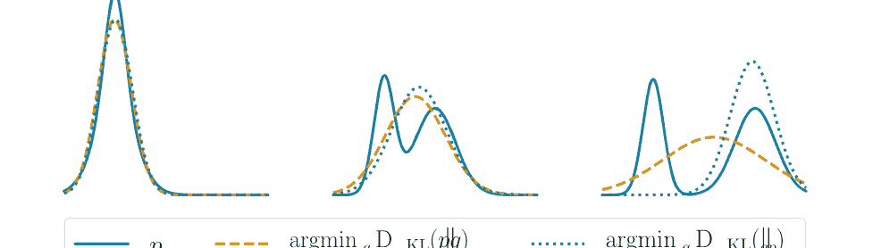

图3.9 在不同场景中比较KL散度的两种替代形式。蓝色实线曲线是两个高斯分布的混合，而在最左边的图中，它们的均值相交，导致单一模式，对于另外两种情况，分布变为双峰。绿色虚线曲线是以正向KL意义下最好逼近p的分布q，而红色虚线曲线是以反向KL意义上最好逼近的分布。随着p的模式越来越远，$D_{KL}(q\|p)$寻求最可能的模式，而$D_{KL}(p\|q)$则追求全局平均。

$D_{KL}(q\|p) = \mathbb{E}_q [\log q(x)] - \mathbb{E}_q [\log p(x)], \tag{3.34}$

我们可以注意到，对于这样的区域，$\log p(x)$这一项迅速趋向于$-\infty$。相反地，通过在方程(3.4)和(3.34)中交换$p$和$q$，我们得到

$D_{KL}(p\|q) = \mathbb{E}_p [\log p(x)] - \mathbb{E}_p [\log q(x)]. \tag{3.35}$

正向KL具有相反的行为，即它倾向于将$q$的质量分布在$p$的支持上。即使是$p$的低概率区域也必须分配质量给$q$，以避免从$p(x)$中获得$\log q(x)$趋向于$-\infty$的样本。图3.9清楚地说明了这两种KL形式的特性。

#### 3.2.2.2 指数族中的矩匹配

为了能够高效计算，后验分布必须简单易处理。因此，我们进一步限制$q_i$属于指数族：

$q_i(\mathbf{z}) = h(\mathbf{z}) g(\boldsymbol{\eta}) \exp (\boldsymbol{\eta}^T \mathbf{u}(\mathbf{z})), \tag{3.36}$

其中$\boldsymbol{\eta}^T$是该族的自然参数，$\mathbf{u}(\mathbf{z})$是充分统计量，$g(\boldsymbol{\eta})$是分区函数，而$h(\mathbf{z}) > 0$是载波函数。详见第2.2节。然后，前向KL散度简化为

$$\begin{aligned} D_{KL}(p\|q) &= \int p(\mathbf{z}) \log p(\mathbf{z})d\mathbf{z} - \int p(\mathbf{z}) \log q(\mathbf{z})d\mathbf{z} \\ &= \int p(\mathbf{z}) \log p(\mathbf{z})d\mathbf{z} - \int p(\mathbf{z}) \log \left( h(\mathbf{z})g(\eta) \exp\left(\eta^T \mathbf{u}(\mathbf{z})\right) \right) d\mathbf{z} \\ &= \int p(\mathbf{z}) \log p(\mathbf{z})d\mathbf{z} - \left( \mathbb{E}_p[\log h(\mathbf{z})] + \log g(\eta) + \eta^T \mathbb{E}_p[\mathbf{u}(\mathbf{z})] \right). \end{aligned}$$

我们感兴趣的是找到指定分布的自然参数 $\eta$，以使KL散度在指数族的假设成员中最小化。因此，我们设定

$$\begin{aligned} &\nabla_\eta D_{KL}(p\|q) = 0 \\ \implies &\nabla_\eta \left\{ \int p(\mathbf{z}) \log p(\mathbf{z})d\mathbf{z} - \left( \mathbb{E}_p[\log h(\mathbf{z})] + \log g(\eta) + \eta^T \mathbb{E}_p[\mathbf{u}(\mathbf{z})] \right) \right\} = 0 \\ \implies &-\nabla_\eta \log g(\eta) - \mathbb{E}_p[\mathbf{u}(\mathbf{z})] = 0 \\ \implies &\nabla_\eta \log g(\eta) = -\mathbb{E}_p[\mathbf{u}(\mathbf{z})]. \tag{3.38} \end{aligned}$$

从任何归一化分布的总和为1的事实出发，我们得到了指数族的以下一般结果：

$$\begin{aligned} &\nabla_\eta 1 = \nabla_\eta \left( \int h(\mathbf{z})g(\eta) \exp\left(\eta^T \mathbf{u}(\mathbf{z})\right)d\mathbf{z} \right) \\ \implies &0 = \int h(\mathbf{z}) \exp\left(\eta^T \mathbf{u}(\mathbf{z})\right)d\mathbf{z} \nabla_\eta g(\eta) + \int \mathbf{u}(\mathbf{z})h(\mathbf{z})g(\eta) \exp\left(\eta^T \mathbf{u}(\mathbf{z})\right)d\mathbf{z} \\ \implies &0 = \nabla_\eta g(\eta) \frac{1}{g(\eta)} \int g(\eta)h(\mathbf{z}) \exp\left(\eta^T \mathbf{u}(\mathbf{z})\right)d\mathbf{z} + \int \mathbf{u}(\mathbf{z})q_i(\mathbf{z})d\mathbf{z} \\ \implies &0 = \frac{1}{g(\eta)} \nabla_\eta g(\eta) \int q_i(\mathbf{z})d\mathbf{z} + \mathbb{E}_q[\mathbf{u}(\mathbf{z})] \\ \implies &0 = \frac{1}{g(\eta)} \nabla_\eta g(\eta) + \mathbb{E}_q[\mathbf{u}(\mathbf{z})] \\ \implies &0 = \nabla_\eta \log g(\eta) + \mathbb{E}_q[\mathbf{u}(\mathbf{z})]. \tag{3.39} \end{aligned}$$

方程(3.39)意味着我们可以通过对负对数分区函数关于η的导数进行计算来计算矩。将方程(3.38)代入方程(3.39)，我们得到

$$\mathbb{E}_q[\mathbf{u}(\mathbf{z})] = \mathbb{E}_p[\mathbf{u}(\mathbf{z})], \tag{3.40}$$

这意味着当用指数族的成员来近似任意分布时，我们应该匹配它们在充分统计量 $\mathbf{u}(\mathbf{z})$ 上的期望，例如一维高斯分布的第一和第二阶矩 $z$ 和 $z^2$ (见第2.2节)。因此，一切都归结为在每次迭代中将新包含的真实因子倾斜的旧近似的矩与新近似的矩匹配。为了计算这些矩，广泛地探索了方程式(3.39)。例如，如果我们考虑一个高斯后验近似 $\mathcal{N}(\mathbf{z}; \boldsymbol{\mu}, \boldsymbol{\Sigma})$，我们应该选择 $\boldsymbol{\mu}_i, \boldsymbol{\Sigma}_i$ 和 $K_i$ 作为分布 $q^{(i)}$ 的参数。

$$\boldsymbol{\mu}_i = \mathbb{E}_{q^{(i-1)} f_i}[\mathbf{z}], \qquad\qquad (3.41)$$
$$\boldsymbol{\Sigma}_i = \text{Cov}_{q^{(i-1)} f_i}[\mathbf{z}], \qquad\qquad (3.42)$$
$$\int q^{(i)}(\mathbf{z}) d\mathbf{z} = \frac{1}{K_i} \int q^{(i-1)}(\mathbf{z}) f_i(\mathbf{z}) d\mathbf{z} = 1, \qquad\qquad (3.43)$$

其中 $q^{(i-1)} f_i$ 是倾斜分布 $q^{(i)}_{\text{倾斜}}$ 的非标准化版本，定义在第3.32式中。

#### 3.2.2.3 ADF问题

尽管ADF的顺序方法优于独立逼近每个因子，但它取决于因子的排序。如果前面的因子导致了糟糕的逼近，ADF会产生一个糟糕的后验估计。我们可以通过在后续阶段修正初始逼近来缓解这个问题，但这会牺牲方法的在线特性，实际上是循环遍历所有因子。

与ADF类似，近似分布的方差受到分布因子化所需的独立性假设和前向KL的质量扩散特性的影响。然而，与ADF不同的是，ADF过高估计了边际方差，给出了比真实后验更大的不确定性估计和变异性。在选择解决给定问题的不同变分方法时，应考虑方差过高估计的特性。

#### 3.2.2.4 ADF示例

我们回到第3.2.1.7节的线性回归问题，其模型定义在方程(3.20)-(3.22)中给出，后验分布在方程(3.23)中给出。为了方便起见，我们在这里重新写出它们：

$$\gamma \sim \text{Ga}(\gamma; \alpha_0, \beta_0) \qquad\qquad (3.44)$$
$$w \sim \mathcal{N}(w \mid \mu, \tau^{-1}) \tag{3.45}$$
$$Y_i = w x_i + \mathcal{N}(0, \gamma^{-1}), \quad 1 \leq i \leq N, \tag{3.46}$$
$$p(\gamma, w \mid \mathbf{Y}, \mathbf{X}) = \frac{p(\gamma) p(w)}{p(\mathbf{y} \mid \mathbf{X})} \prod_{i=1}^{N} p(y_i \mid w, \gamma, x_i). \tag{3.47}$$

在这里，我们使用ADF算法来近似边缘后验概率 $p(\gamma | \mathbf{Y}, \mathbf{X})$ 给出

$$\begin{aligned} p(\gamma \mid \mathbf{Y}, \mathbf{X}) &= \int p(\gamma, w \mid \mathbf{Y}, \mathbf{X}) dw \\ &= \frac{p(\gamma)}{p(\mathbf{y} \mid \mathbf{X})} \prod_{i=1}^{N} \int p(y_i \mid w, \gamma, x_i) p(w) dw \\ &= \frac{p(\gamma)}{p(\mathbf{y} \mid \mathbf{X})} \prod_{i=1}^{N} p(y_i \mid \gamma, x_i), \tag{3.48} \end{aligned}$$

其中，单个观测值 $Y_i$ 的似然项 $p(y_i | \gamma; x_i)$ 是

$$\begin{aligned} p(y_i \mid \gamma; x_i) &= \int p(y_i \mid w, \gamma, x_i) p(w) dw \\ &= \int \mathcal{N}(y_i \mid w x_i, \gamma^{-1}) \mathcal{N}(w; \mu, \tau^{-1}) dw \\ &= \mathcal{N}(y_i; x_i \mu, \tau^{-1} x_i^2 + \gamma^{-1}). \tag{3.49} \end{aligned}$$

我们有 N个似然因子需要包括。 我们选择 $\gamma$ 具有Gamma先验，限制了近似后验 $q(\gamma)$ 遵循Gamma分布。 因此，在开始时后验分布为

$$q(\gamma) = \text{Ga}(\gamma \mid \alpha, \beta), \quad \text{其中} \quad \alpha = \alpha_0, \quad \beta = \beta_0. \tag{3.50}$$

接下来，我们将Eq. (3.49)的似然因子包括在 $q(\gamma)$ 中。 在包括一个这样的因子 $p(y_i | \gamma; x_i)$ 后，得到的偏移分布为

$$\begin{aligned} s(\gamma) &\propto \text{Ga}(\gamma \mid \alpha, \beta) \mathcal{N}(y_i; x_i \mu, \tau^{-1} x_i^2 + \gamma^{-1}) \\ &\propto \left[ \gamma^{\alpha-1} \exp\{-\beta \gamma\} \right] \left[ \left( \tau^{-1} x_i^2 + \gamma^{-1} \right)^{-1/2} \exp\left\{ -\frac{1}{2} \frac{(y_i - x_i \mu)^2}{\tau^{-1} x_i^2 + \gamma^{-1}} \right\} \right]. \tag{3.51} \end{aligned}$$

请注意，我们无法在我们为近似$q(\gamma)$建立的Gamma分布的函数形式下写出$\gamma$的$s(\gamma)$。我们必须将$\gamma$的$s(\gamma)$投影回假设的族群中。因此，我们计算负责匹配矩的更新方程。在移位分布下，$\gamma$的充分统计量没有闭合形式，因此我们只匹配第一和第二矩。

在继续之前，我们计算归一化常数 $K$，这是我们计算矩所需的。

$$
\begin{aligned}
K &= \int \text{Ga}(\gamma \mid \alpha, \beta) p(y_i \mid \gamma; x_i) d\gamma \\
&= \int \text{Ga}(\gamma \mid \alpha, \beta) p(y_i \mid z_i, \gamma; x_i) p(z_i \mid w; x_i) dz_i d\gamma \\
&= \int \text{Ga}(\gamma \mid \alpha, \beta) \mathcal{N}(y_i \mid z_i, \gamma^{-1}) \mathcal{N}(z_i \mid x_i\mu, x^2\tau^{-1}) dz_i d\gamma \\
&= \int \mathcal{T}_{2\alpha}(y_i \mid z_i, \beta/\alpha) \mathcal{N}(z_i \mid x_i\mu, x^2\tau^{-1}) dz_i \\
&\approx \int \mathcal{N}(y_i \mid x_i\mu, x_i^2 + \beta/(\alpha - 1)) \mathcal{N}(z_i \mid x_i\mu, x^2\tau^{-1}) dz_i \\
&= \mathcal{N}(y_i \mid x_i\mu, x_i^2\tau^{-1} + \beta/(\alpha - 1)),
\end{aligned}
$$

我们使用了事实，即对于Gamma分布的边缘化先验精度$\gamma$，高斯分布的观测$Y_i$是学生$t$分布$\mathcal{T}$，如式(A.34)所示。然后，我们用相同的均值和方差近似了分布$\mathcal{T}$为高斯分布。注意，归一化常数$K$取决于$\alpha$和$\beta$，我们通过写作$K_{\alpha,\beta}$来明确这一事实。在式(3.51)中，将高斯项标记为$g(\gamma)$，我们写出了第一矩

$\gamma$在偏移分布下的应用 $s$

$$
\begin{aligned}
\mathbb{E}[s][\gamma] &= \int \frac{1}{K_{\alpha,\beta}} \gamma \text{服从 Ga}(\gamma \mid \alpha, \beta) g(\gamma) dw d\gamma \\
&= \frac{1}{K_{\alpha,\beta}} \int \gamma \frac{\beta^\alpha}{\Gamma(\alpha)} \gamma^{\alpha-1} e^{-\beta\gamma} g(\gamma) dw d\gamma \\
&= \frac{1}{K_{\alpha,\beta}} \int \frac{(\alpha + 1)}{\beta} \frac{\beta^{\alpha+1}}{\Gamma(\alpha + 1)} \gamma^{(\alpha+1)-1} e^{-\beta\gamma} g(\gamma) dw d\gamma \\
&= \frac{1}{K_{\alpha,\beta}} \frac{\alpha}{\beta} \int \text{Ga}(\gamma \mid \alpha + 1, \beta) g(\gamma) dw d\gamma \\
&= \frac{K_{\alpha+1,\beta}}{K_{\alpha,\beta}} \frac{\alpha}{\beta}.
\end{aligned}
$$

第二矩遵循类似的过程

$$
\begin{aligned}
\mathbb{E}_{\gamma}\left[\gamma^{2}\right] & =\int K^{-1} \gamma^{2} \mathrm{Ga}(\gamma \mid \alpha, \beta) g(\gamma) d w d \gamma \\
& =\int \frac{\gamma^{2}}{K_{\alpha, \beta}} \frac{(\alpha+2)}{\beta^{2}(\alpha)} \frac{\beta^{\alpha+2}}{(\alpha+2)} \gamma^{(\alpha+2)-1} e^{-\beta \gamma} d \gamma \\
& =\frac{1}{K_{\alpha, \beta}} \frac{\alpha(\alpha+1)}{\beta^{2}} \int \mathrm{Ga}(\gamma \mid \alpha+1, \beta) g(\gamma) d w d \gamma \\
& =\frac{K_{\alpha+2, \beta}}{K_{\alpha, \beta}} \frac{\alpha(\alpha+1)}{\beta^{2}}.
\end{aligned}
$$

回顾Gamma分布的均值和方差公式，我们可以写成

$$
\begin{aligned}
\mathbb{E} &=\frac{\alpha_{n e w}}{\beta_{n e w}}=\frac{K_{\alpha+1, \beta}}{K_{\alpha, \beta}} \frac{\alpha}{\beta}, \\
\text { 方差 }(\gamma) &=\frac{\alpha_{n e w}}{\beta_{n e w}^{2}}=\frac{K_{\alpha+2, \beta}}{K_{\alpha, \beta}} \frac{\alpha(\alpha+1)}{\beta^{2}}.
\end{aligned}
$$

解方程组得到 $\alpha_{n e w}$ 和 $\beta_{n e w}$ 的解

$$
\alpha_{\text {新 }} =\left[\frac{K_{\alpha, \beta} K_{\alpha+2, \beta}}{K_{\alpha+1, \beta}} \frac{\alpha+1}{\alpha}-1\right]^{-1},
$$
$$
\beta_{\text {新 }} =\left[\frac{K_{\alpha+2, \beta}}{K_{\alpha+1, \beta}} \frac{\alpha+1}{\beta}-\frac{K_{\alpha+1, \beta}}{K_{\alpha, \beta}} \frac{\alpha}{\beta}\right]^{-1}.
$$

总结一下，算法从方程 (3.50) 的先验开始，然后对每个似然因子应用方程 (3.56) 和 (3.57) 一次，其中的分区函数为 $K$遵循方程 (3.52) 。
在[17]中给出了一个已建立的示例，作者演示了从杂波中恢复数据的ADF的使用，将高斯混合后验投影到单个高斯分布上。

## 3.2 近似推理

### 3.2.3 期望传播

正如前一节中提到的，ADF的一个弱点是对因素考虑顺序的敏感性。在批处理设置中，所有因素都可用，只看一次并不合理，需要反复改进近似。然而，直接循环通过一个因素$n$次会导致将该因素包含到近似分布中$n$次，而不是一次。这将人为地积累证据，使得似然函数集中在一个点附近。

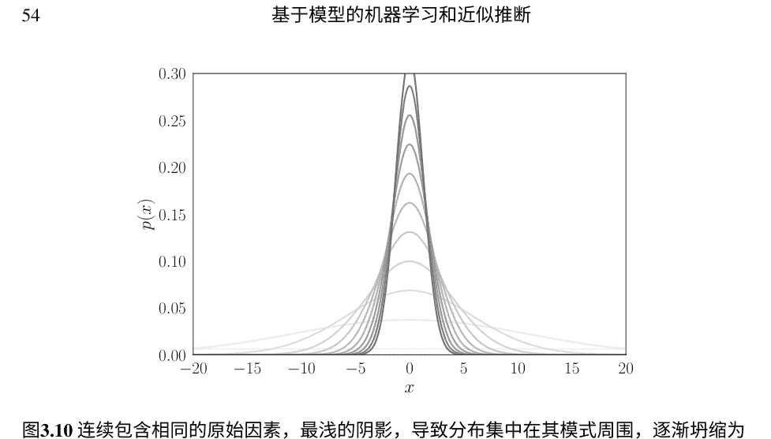

图3.10连续包含相同的原始因素，最浅的阴影，导致分布集中在其模式周围，逐渐坍缩为单个点，最终成为一个Dirac分布。

最终坍缩为单个点，如图3.10所示，这是非常不希望的。

#### 3.2.3.1 将ADF重新构造为近似因子的乘积

EP将ADF重新解释为近似每个新的真实因子$f_{-i}$与$\tilde{f}_{-i}$相似，其中

$$ q^{(i)}(\mathbf{z}) \propto q^{(i-1)}(\mathbf{z}) \tilde{f}_{-i}. \qquad (3.58) $$

近似因子$\tilde{f}_{-i}$可以在第$i$次ADF迭代结束时轻松获得

$$ \tilde{f}_{-i}(\mathbf{z}) \propto \frac{q^{(i)}(\mathbf{z})}{q^{(i-1)}(\mathbf{z})}. \qquad (3.59) $$

这种观点的转变意味着$q$可以被看作是近似因子$\tilde{f}_{-i}$的乘积，使得

$$ q(\mathbf{z}) \propto \frac{q^{(N)}(\mathbf{z})}{q^{(N-1)}(\mathbf{z})} \ldots \frac{q^{(1)}(\mathbf{z})}{q^{(0)}(\mathbf{z})} = \prod_{i=1}^{N} \tilde{f}_{i}(\mathbf{z}), \qquad (3.60) $$

其中 $q^{(0)}(\mathbf{z}) = p_0(\mathbf{z})$是先验分布。

在ADF中，初始因子缺乏上下文：几乎没有其他因子被观察到；因此它们容易产生较差的近似。另一方面，后续因子具有大背景和更好近似的潜力。EP通过观察整个上下文来处理这个问题，当近似$f_i$时，它使用$f^{\sim}_{-i}$。由于它在每次迭代中跟踪每个$f_i$和相应的$f^{\sim}_{-i}$，因此可以计算

$$q_{new}(\mathbf{z}) = \arg\min_{q\in Q} D_{KL} \left( \frac{1}{K_i} f_i(\mathbf{z}) \frac{q(\mathbf{z})}{\tilde{f}_i(\mathbf{z})} \| q(\mathbf{z}) \right), \tag{3.61}$$
其中$K_i$是归一化常数。请注意，现在，在任何给定的迭代$j$中，$q$不再是因子$1<k<j$的乘积，而是所有$N$个因子的乘积。这就是为什么我们在$q$中去掉了上标。

由于我们总是在包含$\tilde{f}_i$之前删除$f_i$，所以如果我们多次重复这个步骤，我们不会重复累积$f_i$的贡献。在根据公式(3.61)计算出$q_{new}$后，我们以类似的方式修正$\tilde{f}_i$，使得因子$\tilde{f}_i$负责从$q$到$q_{new}$的变化。然而，由于$q$是EP中所有因子的乘积，$\tilde{f}_i$的更新遵循

$$\tilde{f}_i(\mathbf{z}) = K_i \frac{q_{new}(\mathbf{z})}{q_{-i}(\mathbf{z})}, \tag{3.62}$$
其中$q_{-i}(\mathbf{z})$是未归一化的空腔分布，通过从$q$中删除因子$f_i$计算得到，如下

$$q_{-i}(\mathbf{z}) = q_i(\mathbf{z}) / \tilde{f}_i(\mathbf{z}). \tag{3.63}$$
请注意，根据上述定义，方程（3.62）导致

$$\frac{q_{new}(\mathbf{z})}{q_{-i}(\mathbf{z})} \propto \frac{\prod_j \tilde{f}_j(\mathbf{z})}{\prod_{j=i} \tilde{f}_j(\mathbf{z})} = \tilde{f}_i(\mathbf{z}). \tag{3.64}$$

广义地说，每次迭代都包括通过用真实因子$f$的贡献替代其近似$\tilde{f}_i$的方法来改进近似，并找到最小化KL散度的$q^{new}$。就像在3.2.2.2节中看到的ADF一样，KL最小化是通过将新分布$q_{new}(\mathbf{z})$的矩与倾斜分布$q_{tilt}(\mathbf{z}) = K_i^{-1} f_i(\mathbf{z}) q_{-i}(\mathbf{z})$的矩匹配来完成的。尽管EP一次近似一个因子，并且得到的$q$是一个有效的概率分布，但$\tilde{f}_i$本身和部分乘积不一定代表一个有效的分布。

EP算法总结如算法$^1$所示。图3.11简明地展示了EP和ADF在单次迭代中的差异：EP接收除了要更新的因子$f_{\sim j}$之外的所有近似因子$f_{\sim j}$，而ADF只接收之前看到的因子$f_{\sim j}$，这些因子通过$q(i^{-1}) \propto \prod^{(j=1 \text{ to } i^{-1})} f_{\sim j}$输入。

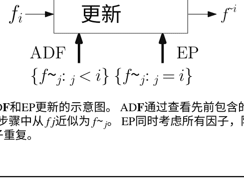

图3.11 单次迭代中ADF和EP更新的示意图。 ADF通过查看先前包含的因子来限制自身，这些因子在qj的投影步骤中从fj近似为f~j。 EP同时考虑所有因子，除了要更新的因子，避免了近似q中的因子重复。

##### 算法1: EP

1. 通过相应的参数设置初始化f~i=1，∀i
2. 当未收敛时
3. 选择一个要更新的因子f~i
4. 计算在(3.63)中定义的非归一化空腔分布
5. 在(3.61)中评估归一化常数Ki
6. 执行(3.61)的投影
7. 通过(3.62)更新因子f~i
8. 结束循环

#### 3.2.3.2指数族中的操作

将因子约束为指数族的函数形式使得因子的包含和排除变得简单和计算高效。只需添加和减去自然参数η，如

$$
q_i(z)/\tilde{f}_i(z) = (h(z)g(\eta) \exp(\eta^T u(z))) / (h(z)g(\eta') \exp(\eta'^T u(z))) = \exp((\eta - \eta')^T u(z)). \tag{3.65}
$$

#### 3.2.3.3 功率EP

并非每个分布都可以分解为简单的项。因此，整合这些因素以计算归一化项并不是一项简单的任务。因此，EP在计算效率上存在缺陷。功率EP[18]通过巧妙地将因子f-i提升到1/n-i的幂，消除了真实因子中存在的复杂指数，并使其更容易计算，从而解决了这个缺点。

该算法本质上与之前相同，只是我们在“分数因子”上执行它，即

$$
f_i'(\zeta) = f_i(\zeta)^{1/n_i} \tag{3.66}
$$
$$
\tilde{f}_i'(\zeta) = \tilde{f}_i(\zeta)^{1/n_i} \tag{3.67}
$$

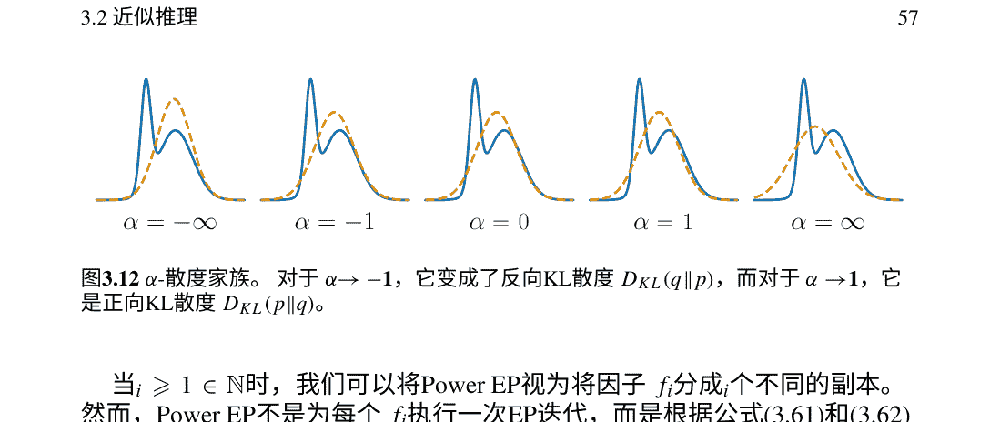

图3.12 α-散度家族。对于 α → -1，它变成了反向KL散度 D_{KL}(q||p)，而对于 α → 1，它是正向KL散度 D_{KL}(p||q)。

当 i ≥ 1 ∈ ℕ 时，我们可以将Power EP视为将因子 f_i 分成 i 个不同的副本。然而，Power EP不是为每个 f_i 执行一次EP迭代，而是根据公式(3.61)和(3.62)计算单个副本的更新，并假设结果对其他 i -1 个副本相同。

在EP中，将最小化的目标 D_{KL} (p||q) 替换为

$$
D_\alpha(p\|q) = \frac{4}{1-\alpha^2} \left(1 - \int p(x)^{(1+\alpha)/2} q(x)^{(1-\alpha)/2} dx\right) \tag{3.68}
$$

使用连续参数α的变分方法会得到与Power EP相同的固定点算法。因此，我们可以将Power EP视为最小化α-散度 D_α，其中α对应于特定选择的 1/n_i，即 α = 2(1/n_i) - 1。

正向和反向KL散度是由方程(3.68)定义的α-家族成员。具体来说，α → 1 给出正向KL散度，α → -1 给出反向KL散度，这可以通过记住 p(x)^γ = exp(γ log p(x)) 并使用L'Hôpital法则来验证不定极限的计算。如图3.12所示，α ≥ -1 会导致零强制行为，即对于任何 p(x)=0 的 x 值，q(x)=0。相反，α ≤ 1 是零避免的，对于 p(x) ≤ 0 的区域，强制 q(x) ≥ 0，并且通常 q 会延伸以覆盖所有 p。

理解许多消息传递算法的一种方法，包括我们讨论过的算法，是将它们视为具有不同能量函数的相同变分框架，这些函数对应于方程（3.68）中的不同α值[19]。

#### 3.2.3.4 EP问题

当然，EP提供的增强功能是有代价的。除了不适用于在线学习之外，它还必须将所有真实和近似因子存储在内存中。因此，内存消耗随着分布的因子数量线性增长。如果数据集过大，这可能是不够的，因为在优化过程中维护所有因子在内存中可能是不切实际甚至不可能的。

虽然VI中的每一步都保证减少ELBO，但所描述的EP算法没有收敛保证，迭代可能会增加而是增加了相关能量函数[3, p. 510]。尽管如此，稳定的EP固定点是优化问题的局部最小值[17]。

在多模态目标分布中，EP方法可能导致近似不准确因为正向KL散度导致q对所有模态进行平均[3, p. 510]。

#### 3.2.3.5 EP示例

再次考虑第3.2.2.4节和第3.2.1.7节的线性回归问题。与第3.2.2.4节的主要区别在于现在我们需要跟踪近似因子f̃。

我们使用参数α=1和β=0来初始化近似后验分布，以获得均匀分布。包含先验因子p(γ)将分布转移至

$$
s(\gamma) \propto \text{Ga}(\gamma|\alpha, \beta)\text{Ga}(\gamma|\alpha_0, \beta_0), \tag{3.69}
$$
$$
s(\gamma) = \text{Ga}(\gamma|\alpha + \alpha_0 - 1, \beta + \beta_0). \tag{3.70}
$$

我们看到，s(γ)是所假设的家族的成员，并且在这一步中没有近似。由于先验精度p(γ)的包含不会使近似后验q(γ)脱离所假设的家族，因此没有必要多次处理这样的因子。更新方程为

$$
\alpha_{\text{新}}=\alpha+\alpha_0-1 \quad \beta_{\text{新}}=\beta+\beta_0. \tag{3.71}
$$

另一方面，似然因子p(yi|γ;xi)的包含并不是精确的，如下所示：

1. 在推导Eq. (3.52)时，我们用高斯近似了学生的t-分布；
2. 在Eq. (3.51)中，我们只匹配了平移分布的前两个矩。因此，还有改进的空间，我们循环处理似然因子。我们方便地选择近似因子为

$$
\tilde{f}_i(\gamma) = \text{Ga}(\gamma|a, b). \tag{3.72}
$$

这种形式使我们能够轻松计算腔体分布

$$
q_{-i}(\gamma) \propto q(\gamma)/\tilde{f}_i(\gamma) = \text{Ga}(\gamma|\alpha, \beta)/\text{Ga}(\gamma|a, b) = \text{Ga}(\gamma|\alpha_{-i}, \beta_{-i}), \tag{3.73}
$$

其中

$$
\alpha_{-i} = \alpha - a + 1 \quad \beta_{-i} = \beta - b. \tag{3.74}
$$计算腔体分布 \( q_{-i} \) 后，我们将真实似然因子 \( p(y_i \mid \gamma; x_i) \) 包含在内，并将得到的分布投影回假设的 \( q \) 族中。包含和投影似然因子的步骤与ADF算法的第3.2.2.4节相同：分别更新 \( \alpha \) 和 \( \beta \) 的公式为(3.56)和(3.57)。

最后，我们根据近似因子 \( f_{\sim i} \) 修正

\[ a = \alpha - \alpha_{-i} + 1, \quad b = \beta - \beta_{-i} \quad (3.75) \]

### 3.2.4 进一步的实际扩展

在本节中，我们简要回顾了近似推断算法的三个现代扩展。虽然前两个解决了可计算性和可处理性问题，但最后一个旨在提高可用性，使VI更易于使用。

#### 3.2.4.1 黑盒变分推断

如第3.2.1.5节所示，SVI以闭式形式计算分布更新，这需要模型特定的知识和实现。此外，ELBO的梯度必须具有闭式解析公式。黑盒变分推断（BBVI）[25]通过估计梯度而不是实际计算梯度来避免这些问题。BBVI使用得分函数估计器[34]。

\[ \nabla_\phi \mathbb{E}_{q(\mathbf{z};\phi)} [f (\mathbf{z}; \theta)] = \mathbb{E}_{q(\mathbf{z};\phi)} \left[ f (\mathbf{z}; \theta) \nabla_\phi \log q(\mathbf{z}; \phi) \right], \quad (3.76) \]

其中，近似分布 \( q(\mathbf{z}; \phi) \) 是 \( \phi \) 的连续函数（见附录A.1）。使用这个估计器来计算Eq. (3.7)中ELBO的梯度，我们得到

\[ \nabla_\phi \text{ELBO} = \mathbb{E}_q \left[ (\nabla_\phi \log q(\mathbf{z}; \phi)) (\log p(\mathbf{x}, \mathbf{z}) - \log q(\mathbf{z}; \phi)) \right]. \quad (3.77) \]

Eq. (3.77)中的期望通过蒙特卡洛积分来近似计算。Eq. (3.77)中梯度估计器对模型的唯一假设是计算联合概率密度函数 \( p(\mathbf{x}, \mathbf{z}_s) \) 的可行性。采样方法和对数梯度都依赖于变分分布 \( q \)。因此，我们只需针对每个近似族 \( q \) 推导一次，并在不同的模型 \( p(\mathbf{x}, \mathbf{z}_s) \) 中重复使用它们。因此，这个方法被称为黑盒子：我们只需要指定模型 \( p(\mathbf{x}, \mathbf{z}_s) \)，并可以直接在其上进行变分推断。实际上，\( p(\mathbf{x}, \mathbf{z}_s) \)甚至不需要被归一化，因为归一化常数的对数在Eq. (3.77)的梯度中没有贡献。

我们通常在每次迭代中观察到可用数据的子集来执行随机优化。当考虑到方程（3.76）中的 \( f(\mathbf{z}; \theta) \) 时，得分函数估计器给出无偏估计。然而，由于对数函数的存在，方程（3.77）中的梯度估计不是无偏的。此外，估计器通常具有很高的方差，这可能会导致步长过小，使算法不实用。[25]中的作者进一步考虑了保持BBVI黑盒特性的方差缩减方法来解决这个问题。

#### 3.2.4.2 黑盒α最小化

黑盒α最小化[9]（BB-α）优化能量函数[19, 20]的近似。它不是考虑不同的局部兼容性函数 \( f_i \)，而是将它们绑定在一起，使得所有的 \( f_i \) 都相等，即 \( f_i = f \)。我们可以将其视为平均因子近似，用于近似原始 \( f_i \) 的平均效果[9]。

进一步将这些因素限制为属于指数族，相当于将它们的自然参数绑定在一起。因此，BB-α不再需要为每个似然因子存储一个近似站点，这在大数据集中节省了大量内存。这些固定点与功率EP不同，尽管在无限数据的极限下它们变得相等。

BB-α不需要双循环算法来直接最小化能量，并采用梯度下降方法来处理此问题。这与第3.2.3节的迭代更新方案形成对比。与其他设计用于大规模学习的现代方法一样，它采用随机优化来避免遍历整个数据集。此外，它通过蒙特卡洛采样来估计能量函数中近似分布 \( q(\mathbf{z}; \phi) \) 的期望。

与BBVI [25]不同，BB-α使用路径导数估计器[24]来估计梯度（见附录A.1）。我们必须能够将随机变量 \( \mathbf{z} \sim q(\mathbf{z}; \phi) \) 表示为基本随机变量 \( \epsilon \sim p(\epsilon) \) 的可逆确定性转换 \( g(\cdot; \phi) \)，以便我们可以写成

\[ \nabla_{\phi} \mathbb{E}_{q(\mathbf{z};\phi)} [f (\mathbf{z}; \theta)] = \mathbb{E}_{p(\epsilon)} [\nabla_{\phi} f (g(\epsilon; \phi); \theta)]. \]

这种方法不仅需要分布 \( q(\mathbf{z}; \phi) \) 是可重参数化的，还需要知道 \( f (\mathbf{z}; \theta) \) 是已知的，并且对于所有的 \( \mathbf{z} \) 值，它是 \( \phi \) 的连续函数。请注意，除了似然函数之外，还需要其梯度。然而，如果似然函数在解析上被定义并且可微分，我们可以很容易地使用自动微分工具获得它们。

正如在第3.2.3节中观察到的，方程（3.68）中的参数 \( \alpha \) 控制着发散函数。因此，该方法能够在VI（\( \alpha \rightarrow -1 \)）和类似于EP的算法（\( \alpha \rightarrow 1 \)）之间进行插值。有趣的是，作者[9]声称通常通过将 \( \alpha \) 设置为0（在VI和EP之间的中间值）来获得最佳结果。这个值对应于所谓的Hellinger距离，是 \( \alpha \) 族中唯一对称的成员。

#### 3.2.4.3 自动微分变分推断

自动微分变分推断（ADVI）提供了一种自动化VI计算的方法[13]。用户只需提供所需的概率模型和数据集。框架会处理流程中的所有其他部分。无需为每个逼近族和模型的特定组合推导目标函数及其导数。

ADVI应用一个将潜变量 \( \mathbf{z} \) 的支持映射到所有实数坐标空间 \( \mathcal{E} \) 的变换 \( T \)，使得模型的联合分布 \( p(\mathbf{x}, \mathbf{z}) \) 变为 \( p(\mathbf{x}, \xi) \)。然后，它用一个高斯分布来近似 \( p(\mathbf{x}, \xi) \)，尽管其他变分逼近族也是可能的。即使是简单的高斯情况也会在原始潜空间 \( \mathcal{Z} \) 中引入非高斯分布。如常，ELBO在不可计算的期望中定义（见式（3.7）））。ADVI利用式（3.78）中的路径梯度估计器，将变分分布转换为标准高斯 \( \mathcal{N}(0,1) \) 的确定性函数，从而实现自动微分。最后，它通过蒙特卡洛积分估计潜空间上的期望，产生ELBO的噪声无偏梯度，并进行随机优化[27]。

由于ADVI采用了路径梯度估计器，它只适用于可微分模型。对数联合概率的导数 \( \nabla_\mathbf{z} \log p(\mathbf{x}, \mathbf{z}) \) 必须存在。另一方面，BBVI [25] 计算变分近似 \( q \) 的导数，因此更通用，尽管可能存在高方差问题。

尽管生成的ADVI模型的性能可能不如手动实现的模型好，但ADVI在现代数据集上的大部分实际模型中表现良好。因此，它允许快速原型设计新想法和纠正复杂模型。

## 3.3 结语

在本章中，我们介绍了MBML的概念及其三个支柱：贝叶斯推断、图模型和概率编程，解释了每个部分如何连接以构建MBML领域，并阐明了在复杂问题中需要近似推断的原因。

我们已经解释了三种中心变分推断技术的内部工作原理，并举例说明了ADF、ADF和EP的优点和缺点。总结起来，

- VI: 最大化模型证据的下界（ELBO），倾向于拟合真实后验分布的单个模式，低估方差，并且保证收敛。
- EP: 匹配矩，需要定义近似后验分布族，倾向于总结整个真实后验分布，高估方差，并且不能保证收敛。
- ADF: EP的在线版本，无需迭代改进。

ADF、ADF和EP技术是许多现代方法的基础，例如第3.2.4节中的方法，并且广泛应用于许多算法中，我们在第4章中进行讨论，这说明了该主题的相关性。

# 参考文献

1.  Berger T (1975) 速率失真理论和数据压缩。 Springer Vienna，第1-39页。 https://doi.org/10.1007/978-3-7091-2928-9_1
2.  Bingham E, Chen JP, Jankowiak M, Obermeyer F, Pradhan N, Karaletsos T, Singh R, Szerlip P, Horsfall P, Goodman ND (2019) Pyro:深度通用概率编程。 J Mach Learn Res 20(28):1–6
3.  Bishop CM (2006) 模式识别与机器学习。 Springer, Berlin
4.  Bishop CM (2013) 基于模型的机器学习。 Philos Trans R Soc A: Math Phys Eng Sci 371(1984):1–17
5.  Blei DM, Kucukelbir A, McAuliffe JD (2017) 变分推断: 统计学家的综述。 J Am Stat Assoc 112(518):859–877
6.  Carpenter B, Gelman A, Hoffman M, Lee D, Goodrich B, Betancourt M, Brubaker M, Guo J, Li P, Riddell A (2017) Stan: 一种概率编程语言。 J Stat Softw 76(1):1–32. 文章
7.  Ghahramani Z (2015) 概率机器学习和人工智能. 自然 521(7553):452–459
8.  Goodman ND, Stuhlm ller A (2014) (电子版). 概率编程语言的设计与实现. 2021-4-5 检索自 http://dippl.org
9.  Hernandez-Lobato J, Li Y, Rowland M, Bui T, Hernandez-Lobato D, Turner R (2016) 黑盒子 alpha 散度最小化. 在: 机器学习国际会议论文集, 纽约, 卷 48, 页 1511–1520
10. Hoffman M, Blei D (2015) 随机结构化变分推断. 在: 人工智能和统计学国际会议, 圣地亚哥, 卷 38, 页 361–369
11. Hoffman MD, Blei DM, Wang C, Paisley J (2013) 随机变分推断. J MachLearn Res 14:1303–1347
12. Koller D, Friedman N, Bach F (2009) 概率图模型：原理和技术。麻省理工学院出版社，剑桥
13. Kucukelbir A, Blei D, Gelman A, Ranganath R, Tran D (2017) 自动微分变分推断。机器学习研究杂志18: 1-45
14. Lloyd S (1982) PCM中的最小二乘量化。IEEE信息论杂志28 (2) : 129-137
15. Louizos C, Welling M (2016) 结构化和高效的矩阵高斯后验变分深度学习。在: 国际机器学习大会论文集, 纽约, 第48卷, 第1708-1716页
16. MacKay DJ (2003) 信息论，推断和学习算法。剑桥大学出版社，剑桥
17. Minka TP (2001) 期望传播用于近似贝叶斯推断。在: 人工智能不确定性会议, 旧金山, 第362-369页
18. Minka T (2004) Power EP。技术报告，微软研究院
19. Minka T (2005) 散度度量和消息传递。技术报告，微软研究
20. Minka T (2007) EP能量函数和最小化方案。技术报告，微软研究
21. Minka T, Winn J, Guiver J, Zaykov Y, Fabian D, Bronskill J (2018) Inf. NET 0.3. 微软研究剑桥
22. Mohamed S (2018) 植入概率思维的种子：基础、技巧和算法。教程演示
23. Murphy KP (2012) 机器学习：概率观点。MIT出版社，剑桥
24. Price R (1958) 非线性设备具有高斯输入的一个有用定理。Trans Inf Theor 4(2):69–72
25. Ranganath R, Gerrish S, Blei D (2014) 黑盒变分推断。在：人工智能和统计学国际会议论文集，雷克雅未克，pp 814–822.
26. Rezende D, Mohamed S (2015) 具有归一化流的变分推断。在：国际机器学习会议论文集，里尔，卷37，pp 1530–1538.
27. Robbins H, Monro S (1951) 随机逼近方法。Ann Math Stat 22(3):400–407
28. Salvatier J, Wiecki TV, Fonnesbeck C (2016) 使用PyMC3在Python中进行概率编程。PeerJ Comput Sci 2:e55
29. Sun S, Chen C, Carin L (2017) 在贝叶斯神经网络中学习结构化权重不确定性。在：国际人工智能和统计学会议, Fort Lauderdale,vol 54, pp 1283–1292
30. Tran D, Kucukbir A, Dieng AB, Rudolph M, Liang D, Blei DM (2016) Edward: 一种用于概率建模、推断和评估的库。arXiv e-prints 1610.09787
31. Tukey JW (1962) 数据分析的未来。Ann Math Stat 33(1):1–67
32. van de Meent JW, Paige B, Yang H, Wood F (2018) 概率编程简介。arXiv e-prints 1809.107 56
33. Vidakovic B (2011) 使用Gibbs采样的贝叶斯推断—BUGS项目。Springer，纽约，页码73–745
34. Williams RJ (1992) 用于连接主义强化学习的简单统计梯度跟随算法。机器学习8(3): 29–256

# 第4章 贝叶斯神经网络


本章介绍了四种不同算法的思想、推导、优点和问题，用于贝叶斯神经网络(BNN)：

- 贝叶斯反向传播（BBB）[6]；
- 概率反向传播（PBP）[19]；
- 蒙特卡洛Dropout（MCDO）[13]；
- 变分Adam（Vadam）[26]。

每种方法以相当不同的方式解决问题。然而，它们都有一个共同的特点：它们都考虑对后验分布进行非结构化的近似。

通过本章的学习，读者应该：

- 了解BNN应具备的属性；
- 学习评估这些特征的度量；
- 辨别每种方法的好处和问题；
- 了解它们之间的差异；
- 能够选择最适合自己需求的方法；
- 知道在需要结构化贝叶斯神经网络时应该去哪里寻找。

## 4.1 为什么使用BNNs？

最近，贝叶斯神经网络在研究界重新引起了兴趣。正如大家现在可以想象的那样，贝叶斯神经网络本质上是使用贝叶斯方法增强的标准确定性神经网络。它们不是学习最优权重 \( \mathbf{w}^* \)，而是根据数据集 \( \mathcal{D} \) 推断出后验权重分布 \( p(\mathbf{w}|\mathcal{D}) \)。因此，分布的最大值 \( \mathbf{w}^* \) 只是整个支持集合中的一个点，如图4.1所示。

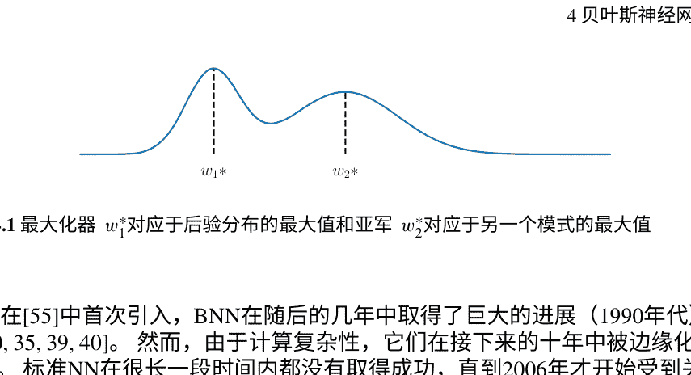

在[55]中首次引入，BNN在随后的几年中取得了巨大的进展（1990年代）[20, 35, 39, 40]。 然而，由于计算复杂性，它们在接下来的十年中被边缘化了。 标准NN在很长一段时间内都没有取得成功，直到2006年才开始受到关注[21]，并在2012年通过深度学习（DL）方法[30]在一项重要的图像分类竞赛[48]中大幅领先后才真正引起关注。 对于BNNs来说，情况肯定不会有所不同，它们面临着更加困难的情况。 在过去几年中，对BNNs的新实用方法[16, 57]以及对抗性攻击[43]引发的关注以及对一些实际应用中必不可少的确定性度量的呼声引发了对贝叶斯方法在DL中的兴趣。

晚期接受BNN（尚未到来）的主要原因是它们的计算复杂性阻碍了可扩展性。 现代模型和数据集具有数百万个参数和实例，因此除了非常简单的算法外，没有其他方法可以很好地处理这种大规模情况。 一个明显的例子是使用反向传播和一阶优化方法，尽管这并不意味着它们不是巧妙的。 因此，这个领域的最新研究集中在可扩展的（大部分时间）实用方法上，这些方法可以满足当前需求，并且对从业者来说是可理解的，或者至少可用的。

对于那些仍然不相信成为贝叶斯的好处的人，我们快速回顾一下现代深度学习的现状。 尽管反向传播和最大似然优化可以在大量数据上拟合大型非线性模型并在几个任务上取得成功，但它们对过拟合非常敏感，特别是在不太大的数据集上尝试这样的模型时。 采用常见的正则化技术，例如 \( \ell_1 \) 或 \( \ell_2 \) 惩罚，等效于最大后验优化（分别使用拉普拉斯和高斯先验）。 然而，尽管缓解了过拟合问题，但远未解决该问题。 更重要的是，它使解决方案依赖于参数化，也就是说，不同的参数化可能导致不同的最优点。 然后，问题就出现了，哪种参数化导致了最佳的解决方案，以及它有多敏感。

即使使用不变方法，我们仍然没有置信度的度量。 尽管引导法缓解了这个问题，但它并没有解决潜在的问题：它近似了观测数据的概率分布，将未知变量视为固定。 贝叶斯框架通过允许模型表示不仅是单点估计，而且是所有可能参数值的完整分布，一次解决了所有这些问题。 它为模型构建、推断、预测和决策提供了统一的框架。

此外，它提供了一种简单的方法来评分模型并在它们之间进行选择。BNN具有内置的正则化功能，提供了集成学习的优势，允许不确定性估计和持续学习，以及权重量化和压缩。

没有免费的午餐，正如上面已经暗示的那样，BNN的推断是繁重的。它们依赖于条件和边缘化，因此主要操作是积分。因此，高维和/或复杂模型对它们的部署构成了真正的障碍。我们讨论了通过使用分布逼近（第3.2节）来减轻这个问题的方法，以使计算变得可行。特别是，我们专注于那些不明确对权重施加结构的方法，而是假设它们是独立的（均值场逼近，第3.2.1节）。为了简化表示，我们将使用 \( \mathbf{w} \) 作为随机变量，而不是 \( \mathbf{z} \)。这种符号的改变不仅是为了与BNN文献保持相似性，还提醒我们的读者，这些分布是关于模型的权重（参数），而不是隐藏单元的。

## 4.2 评估不确定性质量

贝叶斯和更一般地说，概率模型输出一些不确定性的度量，我们依赖这些度量来做决策。我们真的可以相信这些模型吗？它们是否至少近似地反映了真相？接下来，我们介绍常见的方法来解决这些问题。

### 4.2.1 预测对数似然

如第2.4节所解释的，似然项 \( p(d|\mathbf{w}) \) 衡量了模型生成观测数据的特定配置的可能性。预测对数似然度量了模型对数据的拟合程度，考虑了预测的方差（或其他扩展度量）。它是模型对均值和不确定性拟合程度的估计。

直观地说，方差越低，预测应该越可靠，因此错误得分越低。然而，预测应该是可靠的，因此大方差也会得到较低的分数。

让我们以回归模型 \( f(\cdot; \mathbf{w}) \) 为例，其中 \( \mathbf{w} \) 为参数，它预测一个标量值 \( \hat{y} \)，使得 \( \hat{y} = f(\mathbf{x}) \)。我们的概率模型假设存在一定的噪声水平，因此我们在输出上放置了一个观测噪声模型，使得真实输出受到已知过程的损坏。对于方差为 \( \sigma^2 \) 的加性高斯噪声，对数似然估计的形式为

```
log p(y|x, w) = log N(y; f(x; w), σ^2)
               = -1/2 log(2πσ^2) - 1/(2σ^2) (y - f(x))^2    (4.1)
```## 4.2.2 校准

我们希望观测值 y 尽可能接近预测输出 f(x)，以使我们的模型与数据一致。请注意，预测和噪声模型原则上可以是任何东西。

尽管后验或预测的可信区间不一定是校准的，但它是一种自然的可靠性度量。在分类任务中，当模型给出 X% 的正确概率时，我们期望有 X% 的准确率。在回归设置中，我们希望真实值在 X% 的可信区间内的概率为 X%。具有这种覆盖性质的模型被称为校准良好，意味着贝叶斯可信区间与频率主义置信区间相一致。

这种主张在特定模型下进行推断应该是贝叶斯的，但模型评估可以并且应该涉及频率主义思想的方法被称为校准贝叶斯[33]。

校准的常见诊断工具是可靠性（或校准）图，在图4.2中显示。理想情况下，经验和预测的累积分布函数应该匹配，因此将一个绘制为另一个的图形应该尽可能接近恒等线 y = x。即对于每个与概率阈值 p_t 相对应的可信区间，我们绘制预测落在该区间内的观察次数（经验频率）。我们可以通过计算预测频率和经验频率之间的期望误差来数值化地衡量校准误差，对于 m 个不同的置信区间。

仍在分析图4.2，可以注意到除了恒等线之外还有两条曲线。红色的那条，带有三角形标记，是指未校准模型，蓝色的那条，带有方形标记，是在模型训练之后应用校准方法得到的。这是一个玩具示例，以便读者能够意识到校准过程的重要性，明显地将未校准的曲线移向恒等线。然而，该方法的性能因您正在校准的模型而异，正如[42]中的作者所指出的。在那篇论文中，作者还介绍和分析了两种已知的学习技术的行为，这些技术可以进行校准：Platt Scaling [45]和Isotonic Regression。校准对于一个良好的整体模型来说是不够的，预测也需要尖锐[31]。直观地说，可信区间在回归和分类中应该尽可能紧凑和概率尽可能二元。一个总是预测均值并相应调整置信度的模型在定义上是校准的，但没有用处。有各种方法来衡量扩展性，其中方差是其中之一。

![图4.2校准图的示例。灰色虚线是恒等线 $y = x$，红色曲线是未校准模型，蓝色曲线是经过校准的模型，使用了Platt方法[45]进行校准。理想情况下，我们希望蓝色和灰色的线重合，表示模型完全校准。](img/ef4b3b1a6349af7468425dcd7ad88bbc_79_0.png)

### 4.2.3 下游应用

值得注意的是，即使前面两个度量，预测对数似然和期望校准误差，是评估不确定性质量的标准度量，仍然重要考虑不确定性度量应用的上下文。人们还应该通过使用适当的相关度量来评估不确定性质量，评估感兴趣的下游应用的性能，例如异常值检测、主动学习或基于不确定性的探索。

## 4.3 Bayes by Backprop

BBB在之前有着相当长的历史。Bayes by Backprop [6]，简称BBB，延续了[16]关于神经网络实际变分推断的工作，而[16]又是基于[20]的工作，[20]首次提出了神经网络的变分推断。

BBB方法的本质是选择一个变分后验q，从中可以有效地抽取可能的样本，使其适用于蒙特卡洛（MC）积分。

指定一个对角高斯后验意味着所有网络权重$w_i$是独立的，需要单独的均值$\mu_i$和方差$\sigma_i^2$。因此，每个权重$w_i$由$\Psi_i = \{\mu_i, \sigma_i^2\}$来描述，所有参数的集合由$\Psi = \{\mu, \sigma^2\}$来描述。

我们通过q(w; ψ)来表示近似的变分后验分布。

$$q(w_i; \psi_i) = \mathcal{N}(w_i; \mu_i, \sigma_i^2).$$

$$\prod_i q(w; \psi) = \prod_i q(w_i; \psi_i) = \prod_i \mathcal{N}(w_i; \mu_i, \sigma_i^2).$$

$$\begin{aligned}
\mathcal{L}(q) &= -\text{ELBO}(q) \\
&= -\mathbb{E}_{q(\mathbf{w}; \boldsymbol{\psi})} [\log p(\mathcal{D} \mid \mathbf{w})] + D_{\text{KL}} (q(\mathbf{w}; \boldsymbol{\psi}) \| p(\mathbf{w})) \\
&= \mathcal{L}_{\text{data}} + \mathcal{L}_{\text{prior}},
\end{aligned}$$

我们明确了两个不同性质的成本函数的存在。第一个成本函数$\mathcal{L}_{\text{data}}$，也称为似然成本，是依赖于数据的，并量化了模型的误差量。第二个成本函数$\mathcal{L}_{\text{prior}}$，是依赖于先验的，并称之为复杂性成本。前者使模型朝着最好地解释数据的方向发展，而后者作为正则化项推动模型朝着先验$p(\mathbf{w})$的方向发展，正如在第3.2.1节中已经解释的那样。

对于成本函数$\mathcal{L}_{\text{data}}$及其关于$\mu_i$和$\sigma_i$的导数，对角高斯后验(4.2)导致了非闭合的解析形式，使得直接计算和反向传播变得不可行。为了解决这个问题，可以采用MC积分的方法，即从后验$q(\mathbf{w}; \boldsymbol{\psi})$中抽取不同的权重$w_i$，对每个样本执行所需的计算并对结果进行平均。[6]的主要贡献是提出了一种无偏梯度估计的重新参数化方法，实际上并不限于高斯分布。它依赖于重新参数化技巧(Sec. A.1)，用于变分后验$q(\mathbf{w}; \boldsymbol{\psi})$和成本函数$h(\mathbf{w}; \boldsymbol{\psi})$，两者都依赖于参数$\boldsymbol{\psi}$，根据以下方式进行。

$$\nabla_{\boldsymbol{\psi}} \mathbb{E}_{q(\mathbf{w};\boldsymbol{\psi})} [h(\mathbf{w}; \boldsymbol{\psi})] = \mathbb{E}_{p(\boldsymbol{\varepsilon})} \left[ \frac{\partial h(\mathbf{w}; \boldsymbol{\psi})}{\partial \mathbf{w}} \cdot \frac{\partial \mathbf{w}}{\partial \boldsymbol{\psi}} + \frac{\partial h(\mathbf{w}; \boldsymbol{\psi})}{\partial \boldsymbol{\psi}} \right],$$

在此之前，$\mathbf{w} = g(\boldsymbol{\varepsilon};\boldsymbol{\psi})$，其中$g(\cdot;\boldsymbol{\psi})$是一个平滑可逆的确定性变换，$\boldsymbol{\varepsilon}$是一个基本随机变量。

事实上，上述表示适用于任何可以重新表示为基本分布$p(\boldsymbol{\varepsilon})$的变换$g(\cdot; \cdot)$的分布$q(\mathbf{w};\boldsymbol{\psi})$。然而，目前的情况只涉及到参数为$\boldsymbol{\psi}=\{\boldsymbol{\mu}, \boldsymbol{\sigma}^2\}$的独立单变量高斯分布$q(\mathbf{w};\boldsymbol{\psi})$的乘积(4.2)。一个方便的变换选择是$g(\boldsymbol{\varepsilon};\boldsymbol{\psi})=\boldsymbol{\mu}+\boldsymbol{\sigma} \odot \boldsymbol{\varepsilon}$，其中$\boldsymbol{\varepsilon} \sim \mathcal{N}(\mathbf{0}, \mathbf{I})$，对于无相关的高斯情况，即对角协方差矩阵$\boldsymbol{\Sigma}$，这可以简化为$\boldsymbol{\mu}+\boldsymbol{\sigma} \odot \boldsymbol{\varepsilon}$。

在实际数值计算中，我们需要防止优化过程中$\sigma_i$从取负值。不是强制性的

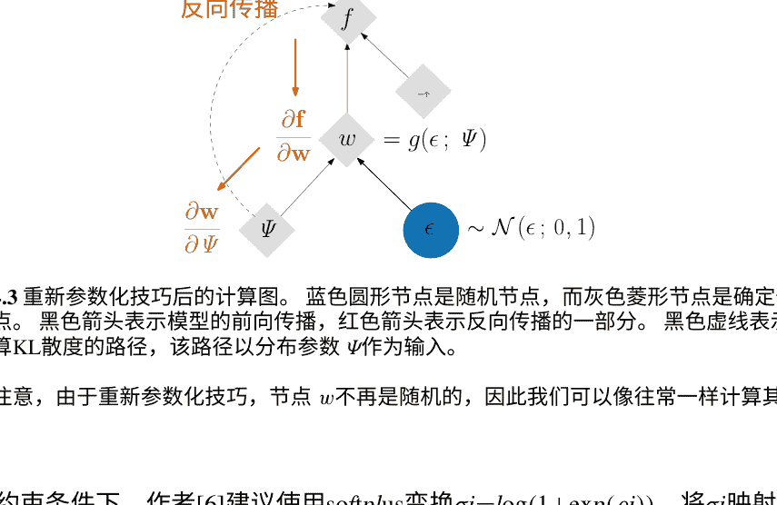

在约束条件下，作者[6]建议使用softplus变换$\sigma_i=\log(1+\exp(\rho_i))$，将$\sigma_i$映射到$\rho_i$，其值限制在$(0,\infty)$范围内。计算(4.4)对$\Psi=\{\boldsymbol{\mu},\boldsymbol{\sigma}^2\}$的导数，并使用选择的变换得到

$$\frac{\partial \mathcal{L}}{\partial \mu_i} = \frac{\partial h(\mathbf{w}, \boldsymbol{\Psi})}{\partial w_i} + \frac{\partial h(\mathbf{w}, \boldsymbol{\Psi})}{\partial \mu_i}, \quad (4.5)$$

$$\frac{\partial \mathcal{L}}{\partial \rho_i} = \frac{\partial h(\mathbf{w}, \boldsymbol{\Psi})}{\partial w_i} \cdot \frac{\exp(\rho_i)}{1+\exp(\rho_i)} + \frac{\partial h(\mathbf{w}, \boldsymbol{\Psi})}{\partial \rho_i}. \quad (4.6)$$

这种修改将随机组件从反向传播的梯度路径中移出，如图4.3所示，我们展示了一个计算函数$f$的计算图，该函数使用权重$\mathbf{w}$从输入激活$\mathbf{a}$计算得到。这种修改允许直接计算相对于$\mathbf{w}$和$\boldsymbol{\psi}$节点的梯度，就像在任何其他确定性节点中一样。

常见框架中提供的自动微分工具[1, 44, 53]可以透明地处理这个问题，唯一的实现差异在于需要在网络定义中显式地重新参数化权重$\mathbf{w}=g(\boldsymbol{\varepsilon}; \boldsymbol{\psi})$并指定$\boldsymbol{\Psi}=\{\boldsymbol{\mu},\boldsymbol{\rho}\}$作为可学习参数。更现代化的框架版本包含内置函数，可以隐式地执行这种重新参数化。

图4.4展示了具有独立高斯先验分布参数$\{\mu_p, \sigma_p^2\}$的BBB的最终图形模型，这是一个可以通过闭式解析解来计算(4.3)中KL项的例子。

$$\mathcal{L}_{\text{prior}} = \sum_{i}^{W} \log \frac{\sigma_p}{\sigma_i} + \frac{1}{2\sigma_p^2} \left[ (\mu_i - \mu_p)^2 + \sigma_i^2 - \sigma_p^2 \right], \quad (4.7)$$

对于$\sigma_i$和$\mu_i$的导数计算起来很简单。

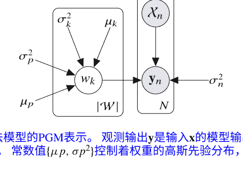

对于非共轭先验，例如高斯混合模型，我们可以从后验中抽样来数值计算KL散度。这种估计的优势是允许更多的先验和变分后验族的组合。尽管系统中现在有一个更多的近似，但可以使用更具表达力的先验，即非高斯先验，从而可能获得更好的结果。鉴于这种变化，我们不再将(4.7)代入(4.3)，而是写成

$$\mathcal{L} \approx \sum_{i=1}^{T} -\log p(\mathcal{D}|\mathbf{w}^{(i)}) + \log q(\mathbf{w}^{(i)};\boldsymbol{\Psi}) - \log p(\mathbf{w}^{(i)}) \quad (4.8)$$

其中$\mathbf{w}^{(i)}$表示从变分后验$q(\mathbf{w};\boldsymbol{\Psi})$中抽取的第$i$个Monte Carlo样本。

当使用小批量优化时，$\mathcal{D}=\{\mathbf{x}_j|1\leq j\leq M\}$，在目标函数中重要的是要相应地缩放复杂度成本$\mathcal{L}_{\text{prior}}$。方程(4.7)考虑了整个数据集，因此简单地计算损失$\mathcal{L}_j$在(4.3)M次将导致复杂度损失$\mathcal{L}_{\text{prior}}$计算M次而不是一次。

先验项应该被加权，使得$\mathcal{L}_{\text{prior}} = B_j \mathcal{L}_{j,\text{prior}}$。尽管均匀分布的权重$B_j=1/M$似乎是一个自然的选择，但只要$\sum_{j=1}^{M} B_j=1$，它们可以以不同的方式分布。在[6]中，作者提出$B_j=2^{M-j}/(2^{M} -1)$。在最初的迭代中，复杂度成本占主导地位，在后面的小批次中，经过更多数据的观察，数据似然成本$\mathcal{L}_{j,\text{data}}$逐渐变得更重要。数据逐渐变得更重要。

我们总结了优化BNN的结果算法，见算法1。我们所示例的情况是对角高斯变分后验，其参数为$\boldsymbol{\Psi}=\{\boldsymbol{\mu}, \boldsymbol{\rho}\}$，使用大小为1的小批次进行训练，复杂度项$\mathcal{L}_{\text{prior}}$在小批次之间以非均匀分布的权重进行加权。

### 算法1: 贝叶斯反向传播

| 步骤 | 描述 |
| :--- | :--- |
| 1: | 当未收敛时 |
| 2: | $\mathbf{w} \leftarrow \boldsymbol{\mu} + \log(1 + \exp(\boldsymbol{\rho})) \odot \boldsymbol{\varepsilon}$, 其中 $\boldsymbol{\varepsilon} \sim \mathcal{N}(\mathbf{0}, \mathbf{I})$ |
| 3: | 随机抽样一个数据示例$\mathbf{x}_i$ |
| 4: | $i \leftarrow (i + 1) \bmod N$ |
| 5: | $\pi_i \leftarrow 2^{N-i} / (2^N - 1)$ |
| 6: | 对于$\mathbf{s} \in \{\mathbf{w}, \boldsymbol{\mu}, \boldsymbol{\rho}\}$ |
| 7: | $\mathbf{g}_s \leftarrow -\nabla_s \log p(\mathbf{x}_i|\mathbf{W}) + \pi_i (\nabla_s \log q(\mathbf{w}; \boldsymbol{\Psi}) - \nabla_s \log p(\mathbf{w}))$ |
| 8: | 结束循环 |
| 9: | $\Delta \boldsymbol{\mu} \leftarrow \mathbf{g}_{\mathbf{w}} + \mathbf{g}_{\boldsymbol{\mu}}$ |
| 10: | $\Delta \boldsymbol{\rho} \leftarrow \mathbf{g}_{\mathbf{w}} \odot \boldsymbol{\varepsilon} /(1 + \exp(-\boldsymbol{\rho})) + \mathbf{g}_{\boldsymbol{\rho}}$ |
| 11: | $\boldsymbol{\mu} \leftarrow \boldsymbol{\mu} - k \Delta \boldsymbol{\mu}$ |
| 12: | $\boldsymbol{\rho} \leftarrow \boldsymbol{\rho} - k \Delta \boldsymbol{\rho}$ |
| 13: | 结束循环 |

期望值。这对于所有MC估计器通常都是正确的，并且可以通过增加样本数量来减轻。

### 4.3.1 实际变分推理

BBB算法[6]实际上是基于Graves [16]的工作，该工作以不同的方式解决了 $\mathcal{L}_{\text{data}}$ 的导数的非闭合解析形式问题。实际VI不使用重参数化技巧来计算导数，而是利用期望值是基于高斯分布的事实，并使用恒等式[7,46]。

$$\frac{\partial \mathbb{E}_q[f(\mathbf{w})]}{\partial \mu_i} = \mathbb{E}_q\left[\frac{\partial f(\mathbf{w})}{\partial w_i}\right], \quad (4.9)$$

$$\frac{\partial \mathbb{E}_q[f(\mathbf{w})]}{\partial \sigma_i^2} = \frac{1}{2} \mathbb{E}_q\left[\frac{\partial^2 f(\mathbf{w})}{\partial w_i^2}\right]. \quad (4.10)$$

在这里，通用函数 $f = -\log p(\mathcal{D}|\mathbf{W})$ 和其期望值 $\mathbb{E}_q[f(\mathbf{w})] = \mathcal{L}_{\text{data}}$，即(4.3)中的似然成本项。这些等式很有用，因为它们能够提供无偏梯度估计，并在进行MC积分时具有低方差。然而，(4.10)需要二阶导数，尽管均值场假设使我们免于计算完整的Hessian矩阵 $\nabla_{\mathbf{w}}^2 \mathcal{L}_{\text{data}}$，但其对角线仍然是必要的。

使用广义高斯-牛顿 (GGN) 近似 [8] 来近似(4.10)中的Hessian矩阵 (见附录A.3)，我们得到

$$\frac{\partial \mathbb{E}_q [f(\mathbf{w})]}{\partial \sigma_i^2} = \frac{1}{2} \mathbb{E}_q \left[ \frac{\partial^2 f(\mathbf{w})}{\partial w_i^2} \right] \approx \frac{1}{2} \mathbb{E}_q \left[ \left( \frac{\partial f(\mathbf{w})}{\partial w_i} \right)^2 \right]. \quad (4.11)$$

这种近似省去了二阶导数的计算，但会在梯度对方差的估计中引入偏差，即其期望值不再对应真实梯度。

将 $\mathcal{L}_{\text{prior}}$ 和 $\mathcal{L}_{\text{data}}$ 项的梯度组合在一起，我们有

$$\frac{\partial \mathcal{L}}{\partial \mu_i} \approx \frac{\mu_i - \mu_p}{\sigma_p^2} + \sum_{\mathbf{x} \in \mathcal{D}} \frac{1}{T} \sum_{k=1}^T \frac{\partial \log p(\mathbf{x} \mid \mathbf{W}^{(k)})}{\partial w_i}, \quad (4.12)$$

$$\frac{\partial \mathcal{L}}{\partial \sigma_i^2} \approx \frac{1}{2} \left( \frac{1}{\sigma_p^2} - \frac{1}{\sigma_i^2} \right) + \sum_{\mathbf{x} \in \mathcal{D}} \frac{1}{T} \sum_{k=1}^T \left[ \frac{\partial \log p(\mathbf{x} \mid \mathbf{W}^{(k)})}{\partial w_i} \right]^2, \quad (4.13)$$

其中 $\{\mathbf{w}^{(k)}\}_{k=0}^{T}$ 是MC样本，$\mathbf{x}$ 是数据点，即输入和目标对。

然后，我们使用梯度下降方法优化目标函数 (4.3)，$\boldsymbol{\psi}_{m+1} = \boldsymbol{\psi}_m - \eta \nabla_{\boldsymbol{\psi}} \mathcal{L}$。

我们在算法2中总结了使用实用ADF [16] 优化BNN的结果算法。我们展示的案例是对于具有参数 $\boldsymbol{\psi} = \{\boldsymbol{\mu}, \boldsymbol{\sigma}^2\}$ 的对角高斯变分后验和具有对角协方差矩阵 $\sigma_p^2 \mathbf{I}$ 的中心高斯先验进行训练，训练时使用大小为1的小批量和在小批量中均匀分布的复杂性项 $\mathcal{L}_{\text{prior}}$ 的加权。

#### 算法2: 实用ADF

| 步骤 | 描述 |
| :--- | :--- |
| 1: | 当未收敛时 |
| 2: | $\mathbf{w} \leftarrow \boldsymbol{\mu} + \boldsymbol{\sigma} \odot \boldsymbol{\varepsilon}$, 其中 $\boldsymbol{\varepsilon} \sim \mathcal{N}(\mathbf{0}, \mathbf{I})$ |
| 3: | 随机抽样一个数据示例 $\mathbf{x}_i$ |
| 4: | $\mathbf{g} \leftarrow -\nabla \log p(\mathbf{x}_i \mid \mathbf{w})$ |
| 5: | $\Delta \boldsymbol{\mu} \leftarrow (\boldsymbol{\mu} - \boldsymbol{\mu}_p \mathbf{1}) / (N \sigma_p^2) + \mathbf{g}$ |
| 6: | $\Delta \boldsymbol{\sigma}^2 \leftarrow (\boldsymbol{\sigma}^2 - \sigma_p^2 \mathbf{1}) / \left( N \sigma_p^2 \boldsymbol{\sigma}^2 \right) + (\mathbf{g} \odot \mathbf{g})$ |
| 7: | $\boldsymbol{\mu} \leftarrow \boldsymbol{\mu} - \eta \Delta \boldsymbol{\mu}$ |
| 8: | $\boldsymbol{\sigma}^2 \leftarrow \boldsymbol{\sigma}^2 - \eta \Delta \boldsymbol{\sigma}^2$ |
| 9: | 结束循环 |## 4.4 概率反向传播

概率反向传播（PBP）[19]以一种非常不同的方式解决了与BBB相同的问题。尽管前一节的算法依赖于优化VI方程的ELBO，但PBP采用了假设密度滤波（ADF）和期望传播（EP），分别在第3.2.2节和第3.2.3节中讨论。结果是一个无参数（甚至没有学习率）的完全贝叶斯方法，具有前向和后向阶段，就像常规反向传播一样。

但是，它不是在参数空间中执行梯度下降，而是在每次迭代中将新数据点的信息合并到后验近似中。尽管之前已经提出了另一种基于EP的方法[50]，但它专注于二进制权重，其连续扩展表现不佳，无法估计后验方差。

在PBP的出版[19]后的一年中，其他研究人员针对二元和多类分类问题[15]开发了一种变体。在[52]中，作者采用了PBP框架，提出了一种在线算法，该算法使用矩阵变量高斯分布模拟网络权重之间的相关性。

然而，在这里我们将仅关注其用于回归任务的原始公式，因为这已经足够了。PBP不使用通常的反向模式自动微分，并且需要非平凡的自定义实现，这是它没有被广泛采用的主要缺点和原因。我们开始本节，预告读者这是本书中最技术上困难的部分。

与之前的方法类似，PBP假设网络权重之间独立，并且存在加性高斯噪声 $N(\epsilon|0, \gamma^{-1})$的精度 $\gamma$破坏了观测结果。尽管在本章中的其他方法不需要指定网络架构，因为它们可以正确地处理任何无环或几乎没有适应性的有向无环图，但本方法专门用于具有修正线性单元(ReLU)[38]的全连接层，即max(0, x)作为激活函数。虽然将模型修改为符合不同的非线性是可能的，但这需要繁琐的数学推导，我们可以在本节中一瞥。

PBP的图模型如图4.5所示，其参数的完整后验分布为

$$
\begin{aligned}
p(w, \gamma, \lambda | \mathbf{X}) &= \frac{p(y | W, \mathbf{X}, \gamma) p(w | \lambda) p(\lambda) p(\gamma)}{p(y | \mathbf{X})} \\
&\propto p(y | W, \mathbf{X}, \gamma) p(w | \lambda) p(\lambda) p(\gamma), \quad\quad (4.14)
\end{aligned}
$$

其中 $p(y|X)$ 是模型证据， $p(y|W, X, \gamma)$ 是定义似然因子的观测模型， $p(w|\lambda)$是权重的先验分布，由具有精度 $\lambda$的单变量高斯分布组成，即

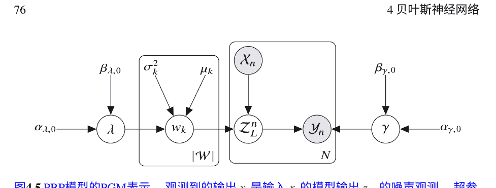

$$p(w_1, \cdots, w_{|W|} | \lambda) = \prod_{w \in W} N(w | 0, \lambda^{-1}), \qquad (4.15)$$

以及 $p(\lambda)$ 和 $p(\gamma)$ 是似然和权重先验的超先验分布，分别。 我们指定Gamma分布Ga(z | α, β)，给定

$$p(z | \alpha, \beta) = \frac{\beta^\alpha}{(\alpha)} z^{\alpha-1} \exp(-\beta z), \qquad (4.16)$$

对于两个超先验，我们在第2.5节中证明了Gamma是具有已知均值和未知精度参数的高斯分布的共轭先验。

通过分析超参数对Gamma后验分布(2.42)的影响，我们选择它们以施加弱先验，不影响后验分布。 对于超先验的推理完全相同γ。

PBP使用EP和ADF（分别在3.2.3节和3.2.2节）来更新近似分布的参数 $w_1, ..., w_{|W|}, \alpha_\gamma, \beta_\gamma, \alpha_\lambda$ 和 $\beta_\lambda$

$$q(w_1, ..., w_{|W|}, \lambda, \gamma) = \left[ \prod_{i=1}^{|W|} N(w_i | \mu_i, \sigma_i^2) \right] \text{Ga} (\lambda | \alpha_\lambda, \beta_\lambda) \text{Ga} (\gamma | \alpha_\gamma, \beta_\gamma), \qquad (4.17)$$

通过循环遍历 (4.14) 中的因子，并逐个包含它们。 因此，因子的总数是数据点的数量加上（超）先验，即权重的|W|加上两个精度。

由于EP需要存储近似因子来计算空腔分布，因此它在处理数据时无法很好地扩展。 它的内存消耗随数据集大小线性增长。 因此，PBP不是为了似然而执行EP更新，而是多次使用ADF，即不再经过每个数据点只计算一次，它包含相同的因素 N times。 虽然在计算上更高效，但这种方法存在低估参数后验方差的风险。 我们人为地观察到更多的数据，在无限数据的极限下，后验分布会坍缩到最大似然估计（MLE），因为我们假设数据点是（条件）独立且同分布的。 然而，当重复观察时，情况显然不是这样的。 因此，PBP 不应该运行很多个时期。 作者[19]建议少于100个时期，在我们的案例研究（第4.7节）中，我们运行了40个时期。

然而，PBP专门设计用于大数据集，因此在实践中这个限制并不重要。 然而，这一点很重要要记住。我们在这里分析的模型和原始工作中使用的模型都相对较小，根据当前标准，即一个具有50个单元的隐藏层，因此运行EP更新仍然可行。 确实，这是[19]中的作者提出的。 在现代网络中，通常包含数十万个参数，EP再次成为一个问题，而ADF是解决的方法。

ADF更新包括将真实因子 $f_i(w_1, ..., w_{|W|}, \lambda, \gamma)$ 纳入当前近似 $q(w_1, ..., w_{|W|}, \lambda, \gamma)$，使得更新后的近似为

$$ K^{-1}f(w_1, ..., w_{|\mathcal{W}|}, \lambda, \gamma)q(w_1, ..., w_{|\mathcal{W}|}, \lambda, \gamma), (4.18) $$

其中K-1是一个归一化常数，确保 $q(w_1, ..., w_{|\mathcal{W}|}, \lambda, \gamma)$ 仍然是一个合适的概率分布。 这一步通常会导致分布发生偏移，不再属于所期望的函数形式。 为了保持近似可管理，我们将其投影回到之前的相同分布类中，即最小化(4.18)中的项与 $q_{new}(w_1, ..., w_{|\mathcal{W}|}, \lambda, \gamma)$ 之间的KL散度，其中 $w_1, ..., w_{|\mathcal{W}|}, \lambda, \gamma$ 是新分布 $q_{new}$ 的参数。 如已在(3.40)中所示，这等价于匹配两个分布的矩，并且每次更新都包含一个迭代的确定性过程，因此没有学习率来调节步长，就像我们讨论的其他方法一样。

在开始时，我们没有任何信息，所以除非我们有先前的领域知识，否则我们将初始化参数，使得 q 有效地均匀。 这相当于设置 $\alpha_\lambda = \alpha_\gamma = 1$， $\beta_\lambda = \beta_\gamma = 0$，并且 $\mu = 0$， $\sigma^2 = \infty$ 对于每个权重 $w$。

本节的其余部分分为三个不同的小节，解释了如何将每种类型的因子包含到模型中。

### 4.4.1 将超先验p(λ)和p(γ)纳入

首先要纳入近似的因子是对γ和λ的先验。 如(2.42)所示，先验精度Gamma和正态分布的乘积导致具有与Gamma相同函数形式的分布。 这正是(4.14)的情况。

$$ q_{\text{new}}(w_1, \cdots, w_{|\mathcal{W}|}, \lambda, \gamma) \propto \left[ \lambda^{\alpha_\lambda - 1} \exp(-\lambda \beta_\lambda) \right] \left[ \lambda^{\alpha_{\lambda,0} - 1} \exp(-\lambda \beta_{\lambda,0}) \right] \propto \lambda^{(\alpha_\lambda + \alpha_{\lambda,0} - 1) - 1} \exp(-\lambda (\beta_{\lambda,0} + \beta_\lambda)). \quad (4.19) $$

因此，将Gamma先验因子包含在 q中，并考虑到 $\alpha_\lambda = 0, \beta_\lambda = 1$，相当于增加了参数 γ和λ的值

$$ \alpha_{\gamma,\text{new}} = \alpha_\gamma + \alpha_{\gamma,0} - 1 = \alpha_{\gamma,0}, \quad \beta_{\gamma,\text{new}} = \beta_\gamma + \beta_{\gamma,0} = \beta_{\gamma,0}. \quad (4.20) $$

其中我们使用了上述定义的值，即 $\alpha_\lambda = \alpha_\gamma = 0, \beta_\lambda = \beta_\gamma = 1$。由于这些关系中没有近似，因此没有信息损失，超先验只需要包含一次。

### 4.4.2 将权重的先验纳入考虑 p(w|λ)

接下来，我们将权重 $w \in W$的先验纳入考虑。在包含一个这样的因子后，未归一化的偏移分布为 $q(w_1,\cdots, w_{|W|}, \gamma, \lambda) \mathcal{N}(w_j|0, \lambda^{-1})$, (4.21)

归一化常数为

$$ K = \int q(w_1, \cdots, w_{|\mathcal{W}|}, \gamma, \lambda) \mathcal{N}(w_j | 0, \lambda^{-1}) d\mathbf{w} d\gamma d\lambda = \int \prod_{i=1}^{|\mathcal{W}|} \mathcal{N}(w_i | \mu_i, \sigma_i^2) \text{Ga}(\lambda | \alpha_\lambda, \beta_\lambda) \text{Ga}(\gamma | \alpha_\gamma, \beta_\gamma) \times \mathcal{N}(w_j | 0, \lambda^{-1}) dw_1 \cdots dw_{|\mathcal{W}|} d\gamma d\lambda = \int \mathcal{N}(w_j | \mu_j, \sigma_j^2) \left[ \int \mathcal{N}(w_j | 0, \lambda^{-1}) \text{Ga}(\lambda | \alpha_\lambda, \beta_\lambda) d\lambda \right] dw_j = \int \mathcal{N}(w_j | \mu_j, \sigma_j^2) \mathcal{T}_{2\alpha_\lambda}(w_j | 0, \beta_\lambda / \alpha_\lambda) dw_j, \quad (4.22) $$

我们在(A.34)中使用了一个结果，即Gamma分布和高斯分布的乘积的积分是t-Student分布，在(A.35)中定义。我们通过近似t-Student分布$\mathcal{T}_{2\alpha}$来继续计算$K$。我们将$(w_j|0, \beta_{\lambda}/\alpha_{\lambda})$用具有相同均值和方差的高斯分布来近似，正如我们在图A.1中看到的，对于足够大的自由度$\nu$，这是合理的。因此，继续计算$K$：

$$
\begin{aligned}
K &\approx \int \mathcal{N}(w_j|\mu_j, \sigma_j^2)\mathcal{N}(w_j|0, \beta_{\lambda}/(\alpha_{\lambda}-1))dw_j \\
&= \int \mathcal{N}\left(\mu_j \middle| 0, \sigma_j^2 + \frac{\beta_{\lambda}}{\alpha_{\lambda}-1}\right) \mathcal{N}\left(w_j \middle| \frac{\lambda(\alpha_{\lambda}-1)}{\beta_{\lambda}+\alpha-1}\frac{\mu}{\sigma^2}, \frac{\lambda(\alpha_{\lambda}-1)}{\beta_{\lambda}+\alpha-1}\right)dw_j \\
&= \mathcal{N}\left(\mu_j \middle| 0, \sigma_j^2 + \frac{\beta_{\lambda}}{\alpha_{\lambda}-1}\right) \int \mathcal{N}\left(w_j \middle| \frac{\lambda(\alpha_{\lambda}-1)}{\beta_{\lambda}+\alpha-1}\frac{\mu}{\sigma^2}, \frac{\lambda(\alpha_{\lambda}-1)}{\beta_{\lambda}+\alpha-1}\right)dw_j \\
&= \mathcal{N}\left(\mu_j \middle| 0, \sigma_j^2 + \frac{\beta_{\lambda}}{\alpha_{\lambda}-1}\right), \tag{4.23}
\end{aligned}
$$

我们利用两个高斯分布的乘积仍然是一个高斯分布的事实

$$\mathcal{N}(w_j \mid \mu_1, \sigma_1^2)\mathcal{N}(w_j \mid \mu_2, \sigma_2^2) = \mathcal{N}(\mu_1 \mid \mu_2, \sigma_1^2 + \sigma_2^2)\mathcal{N}(w_j \mid \mu, \sigma^2) \tag{4.24}$$

其中$\sigma^2 = (\sigma_1^{-2} + \sigma_2^{-2})^{-1}$ 而 $\mu = \sigma^2(\mu_1\sigma_1^{-2} + \mu_2\sigma_2^{-2})$.

### 4.4.2.1 更新 $\alpha_\lambda$ 和 $\beta_\lambda$ 的方程

更新后验近似意味着将其矩与移位分布的矩匹配。然而，$\lambda$的充分统计量没有闭合形式，因此我们通过仅匹配其一阶和二阶矩来修正其参数$\beta_\lambda$和$\alpha_\lambda$，这仍然可以产生良好的结果[36].

现在让我们推导出这些更新公式。我们首先注意到，$K$在(4.23)中是$\mu_j$、$\sigma_j^2$和$\beta_\lambda$以及$\alpha_\lambda$的函数，并通过写成$K(\beta_\lambda, \alpha_\lambda)$来明确这两个后续项的依赖关系。此外，为了简洁起见，我们将$q(w_1, ..., w_{|\mathcal{W}|}, \gamma, \lambda)$表示为$\mathcal{N}(w_j|0, \lambda^{-1})$的$f(\lambda)Ga(\lambda|\alpha_\lambda, \beta_\lambda)$，并计算

$$\begin{aligned}
\mathbb{E}_{q[\lambda]} &= \frac{1}{K(\beta_\lambda, \alpha_\lambda)} \int \lambda f(\lambda)Ga(\lambda | \alpha_\lambda, \beta_\lambda) d\lambda \\
&= \frac{1}{K(\beta_\lambda, \alpha_\lambda)} \int \frac{\alpha_\lambda}{\beta_\lambda} f(\lambda)Ga(\lambda | \alpha_\lambda + 1, \beta_\lambda) d\lambda \\
&= \frac{1}{K(\beta_\lambda, \alpha_\lambda)} \left[ \frac{\alpha_\lambda}{\beta_\lambda} K(\alpha_\lambda + 1, \beta_\lambda) \right]
\end{aligned}$$

$$= \frac{K(\alpha_\lambda + 1, \beta_\lambda)\alpha_\lambda}{K(\alpha_\lambda, \beta_\lambda)\beta_\lambda}$$

同样地，我们得到了第二矩的表达式

$$\mathbb{E}_q\left[\lambda^2\right] = \frac{K(\alpha_\lambda + 2, \beta_\lambda)\alpha_\lambda(\alpha_\lambda + 1)}{K(\alpha_\lambda, \beta_\lambda)\beta_\lambda^2}$$

回顾Gamma分布的均值和方差公式(4.16)，我们将它们与上述表达式相等

$$\frac{\alpha_{\lambda, \text{新}}}{\beta_{\lambda, \text{新}}} = \frac{K(\alpha_\lambda + 1, \beta_\lambda)\alpha_\lambda}{K(\beta_\lambda, \alpha_\lambda)\beta_\lambda}$$

$$\frac{\alpha_{\lambda, \text{新}}}{\beta_{\lambda, \text{新}}^2} = \frac{K(\alpha_\lambda + 2, \beta_\lambda)\alpha_\lambda(\alpha_\lambda + 1)}{K(\beta_\lambda, \alpha_\lambda)\beta^2} - \left[ \frac{K(\alpha_\lambda + 1, \beta_\lambda)\alpha_\lambda}{K(\beta_\lambda, \alpha_\lambda)\beta_\lambda} \right]^2$$

解上述方程得到 $\alpha_{\lambda,\text{new}}$ 和 $\beta_{\lambda,\text{new}}$，并缩写归一化系数 $K_0=K(\alpha_\lambda, \beta_\lambda)$，$K_1=K(\alpha_\lambda+1, \beta_\lambda)$，和 $K_2=K(\alpha_\lambda+2, \beta_\lambda)$，最终得到

$$\alpha_{\lambda, \text{new}} = \left[ K_0 K_2 K_1^{-2} (\alpha_\lambda + 1) \alpha_\lambda^{-1} - 1 \right]^{-1}$$

$$\beta_{\lambda, \text{new}} = \left[ K_2 K_1^{-1} (\alpha_\lambda + 1) \beta_\lambda^{-1} - K_1 K_0^{-1} \alpha_\lambda \beta_\lambda^{-1} \right]^{-1}$$

这是伽玛分布关于精度参数λ的更新方程。

#### 4.4.2.2 更新方程的μ和σ²

我们需要确定给定随机权重的均值和方差参数在将其先验分布纳入后验分布时如何改变。本节的推导与[17]密切相关。

我们首先注意到，移位后的分布可以方便地写成 $K^{-1}f(w_i)\mathcal{N}(w_i|\mu_i, \sigma_i^2)$ 的形式，其中 $f(w_i)$ 包括所有因子 $q(w_1, ..., w_{|W|}, \gamma, \lambda) \mathcal{N}(w_i|0, \gamma^{-1})$ 除了 $\mathcal{N}(w_i|\mu_i, \sigma_i^2)$ 之外，我们将其明确表示。对于 $\mu_i$，我们从易于验证的恒等式开始

$$\nabla_{\mu_i} \mathcal{N}(w_i|\mu_i, \sigma_i^2) = \sigma_i^{-2} (w_i - \mu_i) \mathcal{N}(w_i|\mu_i, \sigma_i^2)$$我们将其重新排列为

$$w_i N(w_i|\mu_i, \sigma_i^2) = \mu_i N(w_i|\mu_i, \sigma_i^2) + \sigma_i^2 \nabla_{\mu_i} N(w_i|\mu_i, \sigma_i^2). \qquad (4.33)$$

在两边乘以$K^{-1} f(w_i)$并对$w_i$进行积分得到

$$\int w_i K^{-1} f(w_i) N(w_i|\mu_i, \sigma_i^2) dw_i = \int \mu K^{-1} f(w_{\setminus i}) N(w_{\setminus i}|\mu_{\setminus i}, \sigma^2) dw_{\setminus i} \ + \int \sigma^2 K^{-1} f(w_{\setminus i}) \nabla_{\mu_i} N(w_{\setminus i}|\mu_{\setminus i}, \sigma^2) dw_{\setminus i} \qquad (4.34)$$

$$\mathbb{E}_{[s]}[w_{\setminus i}] = \mu + \sigma^2 K^{-1} \left[ \nabla_{\mu} \int f(w_{\setminus i}) N(w_{\setminus i}|\mu_{\setminus i}, \sigma^2) dw_{\setminus i} \right] \ = \mu + \sigma^2 K^{-1} \nabla_{\mu} K \ = \mu + \sigma^2 \nabla_{\mu} \log K. \qquad (4.35)$$

由于待更新分布$N(w_{\setminus i}|\mu_{\setminus i}, \sigma^2)$的一阶矩为$\mu_{\setminus i}$，更新公式为

$$\mu_{\setminus i, \text{new}} = \mu + \sigma^2 \nabla_{\mu} \log K. \qquad (4.36)$$

对于关于$\sigma_{\setminus i}^2$的导数，通过类似的恒等式：

$$\nabla_{\sigma_i^2} N(w_i|\mu_i, \sigma_i^2) = \sigma_i^{-2} \frac{-1 + \sigma_i^{-2} (w_i - \mu_i)^2}{2} N(w_i|\mu_i, \sigma^2), \qquad (4.37)$$

并且按照之前的步骤计算$\mu_i$，我们得到$\mathbb{E}_{[s]} [w_i^2] = \sigma_i^2 + (\sigma_i^2)^2 \nabla_{\sigma_i^2} \log K$。然后，偏移分布的方差为

$$\text{Var}(w_i) = \mathbb{E}_{[s]} [w_i^2] - (\mathbb{E}_{[s]}[w_i])^2 = \sigma_i^2 - (\sigma_i^2)^2 \left[ (\nabla_{\mu} \log K)^2 - 2 \nabla_{\sigma_i^2} \log K \right]. \qquad (4.38)$$

从中，我们得到了正态分布权重的方差更新公式

$$\sigma_{i,\text{new}}^2 = \sigma_i^2 - (\sigma_i^2)^2 \left[ (\nabla_{\mu} \log K)^2 - 2 \nabla_{\sigma_i^2} \log K \right]. \qquad (4.39)$$

虽然我们推导出了执行ADF的规则，即只包括模型的各个真实因素，而不会删除要更新的近似因素，但将它们适应于EP很简单。两个关键区别是：

- 1. 跟踪每个单独的近似因子的参数；
- 2. 在更新之前，从后验中移除对应于将被合并的真实因子的近似因子（空腔分布），实际上这意味着从后验的参数中减去它们的贡献。

### 4.4.3 合并似然因子 p(y|W,X,γ)

为了合并来自数据点的信息，我们将其向前传递到网络中。假设模型是一个全连接的多层网络，在输入之后的每一层，PBP使用具有相同均值和方差的高斯分布来近似生成的激活分布，以使得下一层的输入也是高斯分布。在最后一层，我们得到输出y_i给定x_i的分布，然后我们进一步应用观测模型，即具有精度γ的加性高斯噪声，这给出了p(y_i|x_i, W, γ)=N(y_i|f(x_i,W), γ^{-1})。然后，将似然因子通常地包含在后验近似中：我们通过将后验乘以考虑的数据点的似然因子来移动后验，计算结果分布的一阶和二阶矩，并更新参数以获得这些矩。

请注意，在推导更新公式（4.29），（4.30），（4.36），（4.39）时，我们没有假设任何特定的因子格式被包含在后验近似中。因此，相同的方程可以再次用于似然因子，唯一的变化是归一化常数K。接下来，我们揭示了似然因子N(y_i | f(x_i, W), γ^{-1})的K的表达式。

#### 4.4.3.1 归一化因子

我们考虑一个具有L层和每层V_l个单元的网络，接受矢量形式的输入x_i。因此，每层的输出z_l可以排列成一个向量，两个连续层之间的权重可以排列成一个维度为V_l×(V_{l-1}+1)的权重矩阵W_l，其中+1来自于包含偏置项。

一层的预激活的计算公式为a_l = W_l z_{l-1} / \sqrt{V_{l-1} + 1}，对于除了最后一层以外的所有层，这个值会经过非线性映射max(a, 0)，也就是ReLU [38]进行转换。

我们做出了简化假设，即网络最后一层的输出z_L服从高斯分布，并计算了相关偏移分布的归一化常数K。

$$
K = \int q(w, \gamma, \lambda) \sim N(y_i | f(X_i, w), \gamma^{-1}) dw d\gamma d\lambda
$$

$$
\begin{aligned}
&\approx \int q(\mathbf{w}, \gamma, \lambda) \sim N(\mathbf{y}_i | \mathbf{z}_L, \gamma^{-1}) N(\mathbf{z}_L | \mu_{\mathbf{z}}, \sigma_{\mathbf{z}}^2) \quad L, \sigma_{\mathbf{z}_L}^2 d\mathbf{w} d\mathbf{z}_L d\gamma d\lambda \\
&= \int \text{Ga}(\gamma | \alpha_\gamma, \beta_\gamma) N(\mathbf{y}_i | \mathbf{z}_L, \gamma^{-1}) N(\mathbf{z}_L | \mu_{\mathbf{z}_L}, \sigma_{\mathbf{z}_L}^2) d\mathbf{z}_L d\gamma \\
&= \int \mathcal{T}_{2\alpha_\gamma}(\mathbf{y}_i | \mathbf{z}_L, \beta_\gamma / \alpha_\gamma) N(\mathbf{z}_L | \mu_{\mathbf{z}_L}, \sigma_{\mathbf{z}_L}^2) d\mathbf{z}_L \\
&\approx \int N(\mathbf{y}_i | \mathbf{z}_L, \beta_\gamma / (\alpha_\gamma - 1)) N(\mathbf{z}_L | \mu_{\mathbf{z}_L}, \sigma_{\mathbf{z}_L}^2) d\mathbf{z}_L \\
&= N(\mathbf{y}_i | \mu_{\mathbf{z}_L}, \beta_\gamma / (\alpha_\gamma - 1) + \sigma_{\mathbf{z}_L}^2),
\end{aligned}
$$

在推导(4.23)中，我们按照相同的步骤和近似进行了计算。计算均值 $\mu_{\mathbf{z}}$ 和方差 $\sigma_{\mathbf{z}_L}^2$ 最后一层的输出 $\mathbf{z}_L$ 等于通过整个网络传播输入。如果我们假设第 $l-1$ 层的输出 $\mathbf{z}_{l-1}$ 服从均值和方差为 $\mu_{\mathbf{z}}$ 的对角协方差高斯分布和 $\sigma_{\mathbf{z}_{l-1}}^2$ ，那么我们可以根据以下公式计算下一层的预激活值 $\mathbf{a}_l$ 的均值和方差

$$
\begin{aligned}
\mu_{\mathbf{a}_l} &= \mathbb{E} \left[ \mathbf{W}_l \mathbf{z}_{l-1} / \sqrt{V_{l-1}+1} \right] = \overline{\mathbf{W}}_l \mathbf{z}_{l-1} / \sqrt{V_{l-1}+1} \\
\sigma_{\mathbf{a}_l}^2 &= \text{Var} \left( \mathbf{W}_l \mathbf{z}_{l-1} / \sqrt{V_{l-1}+1} \right) \\
&= \frac{1}{V_{l-1}+1} \left[ (\mathbb{E}[\mathbf{W}_l])^{2 \text{Var}} (\mathbf{z}_{l-1}) + \text{Var}(\mathbf{W}_l) (\mathbb{E}[\mathbf{z}_{l-1}])^{2} + \text{Var}(\mathbf{W}_l) \text{Var}(\mathbf{z}_{l-1}) \right] \\
&= \frac{1}{V_{l-1}+1} \left[ (\overline{\mathbf{W}}_l \overline{\mathbf{W}}_l) \sigma_{\mathbf{z}_{l-1}}^2 + \mathbf{V}_l (\mu_{\mathbf{z}_{l-1}} \odot \mu_{\mathbf{z}_{l-1}}) + \mathbf{V}_l \sigma_{\mathbf{z}_{l-1}}^2 \right],
\end{aligned}
$$

其中 $\overline{\mathbf{W}}_l$ 和 $\mathbf{V}_l$ 是 $\mathbf{W}_l$ 中权重的均值和方差矩阵，其值由模型的相应高斯因子确定。

如果层 $l$ 的输入数量 $V_{l-1}$ 足够大，并且我们进一步假设 $\mathbf{a}_l$ 的条目是独立的，我们可以引用中心极限定理，并声称预激活 $\mathbf{a}_l$ 服从上述均值和方差的正态分布[50]。

现在我们来考虑非线性激活函数对 $\mathbf{a}_l$ 的影响。 $\max(0, a_{i,l})$ 操作使得所有的概率密度都集中在零点上，如图4.6所示。得到的分布被称为修正高斯分布，其概率密度函数为

$$
\mathcal{N}^R\left(a_{i,l}; \mu_{i,l}, \sigma_{i,l}^2\right) = \Phi\left(-\frac{\mu_{i,l}}{\sigma_{i,l}}\right) \delta(a_{i,l}) + \frac{1}{\sqrt{2\pi\sigma_{i,l}^2}} e^{-\frac{(a_{i,l} - \mu_{i,l})^2}{2\sigma_{i,l}^2}} \mathrm{U}(a_{i,l}),
$$

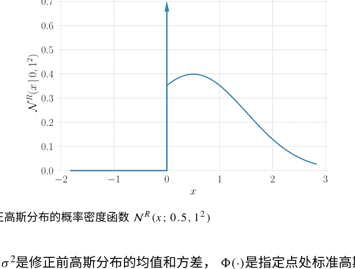

图4.6修正高斯分布的概率密度函数 $N^R(x; 0.5, 1^2)$

其中 $\mu, \sigma^2$是修正前高斯分布的均值和方差， $\Phi(\cdot)$是指定点处标准高斯分布的累积分布函数， $\delta(\cdot)$是狄拉克脉冲函数， $\mathrm{U}(\cdot)$是单位阶跃函数。其均值和方差为

$$\mu_{z_{i,l}} = \Phi\left(\frac{\mu_{a_{i,l}}}{\sigma_{a_{i,l}}}\right)\mu_{a_{i,l}} + \sigma_{a_{i,l}}\phi\left(-\frac{\mu_{a_{i,l}}}{\sigma_{a_{i,l}}}\right) \tag{4.44}$$

$$\sigma_{a_{i,l}^{2}} = m\left(\mu_{a_{i,l}} + \sigma_{a_{i,l}}\kappa\right)\Phi\left(-\frac{\mu_{a_{i,l}}}{\sigma_{a_{i,l}}}\right) + \Phi\left(\frac{\mu_{a_{i,l}}}{\sigma_{a_{i,l}}}\right)\sigma_{a_{i,l}^{2}}\left(1 - \kappa\left(\kappa + \frac{\mu_{a_{i,l}}}{\sigma_{a_{i,l}}}\right)\right), \tag{4.45}$$

其中 $\kappa = \phi\left(-\frac{\mu_{a_{i,l}}}{\sigma_{a_{i,l}}}\right) / \Phi\left(\frac{\mu_{a_{i,l}}}{\sigma_{a_{i,l}}}\right)$，而 $\phi(\cdot)$是指定位置的标准高斯分布的概率密度函数。

相应层的输出分布是一个高斯分布，其条目由上述公式确定，另外我们还附加了一个偏置项，其均值为 1，方差为 0。然后，找到值 $\mu_z$

一个到最后一层对每个数据点 $(x_i, y_i)$进行迭代计算公式(4.41)、(4.42)、(4.44)、(4.45)。

我们在表4.1中总结了构成PBP分布的许多因素，并突出了每个因素的数量。 ADF-update-only方法的步骤在算法3中可用。 我们将负责计算输出分布 $N(y_i|f(X_i, w), \gamma^{-1})$的前向传递压缩为第17行的单个步骤。

重要的是要注意，作者[19]假设输入已经归一化，即均值为零，方差为单位。 因此，在将数据点馈送到模型之前，我们需要对其进行归一化，然后对获得的输出进行反归一化。

## 4.4 概率反向传播

表4.1 PBP因素、分布和数量的总结
| 类型 | 符号 | 分布 | 数量 |
|---|---|---|---|
| 超先验 | p(λ) | Ga(λ|α_λ, β_λ) | 1 |
| 超先验 | p(γ) | Ga(γ|α_γ, β_γ) | 1 |
| 先验 | p(w_j | λ) | N(w_j | 0, λ^{-1}) | |W| |
| 似然 | p(y_j | W, X_j, γ) | N(y_j | f(X_j, w), γ^{-1}) | N |

算法3: 概率反向传播
1: 初始化参数 αλ, αγ, βλ, βγ, {μj, σj^2}_{j=0}^{|W|}
2: 对于 s ∈ {λ, γ}, 执行
3:   αs ← αs + αs,0^{-1}
4:   βs ← βs + βs,0
5: 结束循环
6: 当未收敛时执行
7:   对于 j=1 到 |W|, 执行
8:     对于 s=0 到 2 做
9:       Ks ← N(μj | 0, σj^2 + βλ/(αλ - 1 + s))
10:    结束循环
11:    αλ ← [K0K2K1^{-2}(αλ + 1)αλ^{-1} - 1]^{-1}
12:    βλ ← [K2K1^{-1}(αλ + 1)βλ^{-1} - K1K0^{-1}αλβλ^{-1}]^{-1}
13:    μj ← μj + σ^2∇_μ log K0
14:    σj^2 ← σj^2 - (σj^2)^2[(∇_{μj} log K0)^2 - 2∇_{σj^2} log K0]
15:  结束循环
16:  对于 j = 1 到 N 做
17:    μ_{zL}, σ_{zL}^2 ← f(X_j, W)
18:    对于 s = 0 到 2 做
19:      Ks ← N(y_i | μ_{zL}, σ_{zL}^2) + βγ/(αγ - 1 + s)
20:    结束循环
21:    αγ ← [K0K2K1^{-2}(αγ + 1)αγ^{-1} - 1]^{-1}
22:    βγ ← [K2K1^{-1}(αγ + 1)βγ^{-1} - K1K0^{-1}αγβγ^{-1}]^{-1}
23:    μj ← μj + σ^2∇_μ log K0
24:    σj^2 ← σj^2 - (σj^2)^2[(∇_{μj} log K0)^2 - 2∇_{σj^2} log K0]
25:  结束循环
26: 结束循环

## 4.5 MC Dropout

蒙特卡洛Dropout [13]，通常称为MC Dropout，源于将Dropout [51]重新解释为近似贝叶斯推断。因此，在训练和测试过程中都使用Dropout可以获得贝叶斯推断和模型不确定性度量的优势。

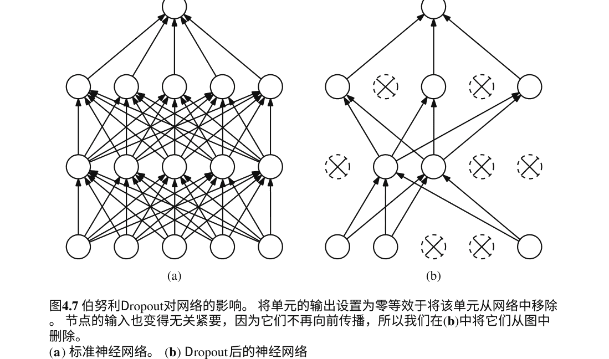

### 4.5.1 Dropout

首先，我们回顾一下Dropout [51]。简言之，它是一种随机正则化技术，用于避免过拟合数据。基本思想是在训练过程中用随机乘性噪声破坏模型的单元。从数学上讲，它相当于将层$l$的输入 $\mathbf{h}_l$ 逐点乘以一个随机向量 $\mathbf{r}_l$ 的实现，使得 $\hat{\mathbf{h}}_l = \mathbf{h}_l \odot \mathbf{r}_l$。

在伯努利丢弃的情况下，每个层的单元$h_{j,l}$都以概率$1-p$随机丢弃，即其输出值被设为零，在每次迭代中根据$r_{j,l} \sim \text{Bern}(p)$进行操作，如图4.7所示。丢弃单元会导致在每次迭代中使用具有较少参数的不同子网络（例如，图4.7中的12个而不是55个）。在测试时，所有单元都被保留，就好像在评估中使用了包含所有子网络的集合。

其他作品提出了其他类型的噪声。例如，在[28, 51]中，作者研究了用乘法高斯噪声破坏激活，在[56]中，独立地对每个权重进行注入噪声，而不是对输入进行注入。后一种技术被称为DropConnect。

### 4.5.2 贝叶斯观点

使用丢弃和近似贝叶斯推断模型优化模型会导致类似的目标函数和类似的随机梯度更新步骤。这种相似性非常强，以至于在某些条件下它们确实是等价的[13]。虽然我们只考虑伯努利丢弃，但其他类型的噪声也可以进行类似的发展。

让我们首先回顾一下标准确定性神经网络的成本函数 $f(\cdot; \Theta)$ 的情况：

$$
\mathcal{L} = \mathcal{L}_{data}(\mathcal{D}, f(\cdot; \Theta)) + \mathcal{L}_{reg}(\Theta), \tag{4.46}
$$

其中第一项是数据相关的，用于衡量模型的预测误差，第二项是正则化项，用于防止过拟合。考虑一个回归任务，数据点为 $\mathcal{D}=\{(\mathbf{x}_i, \mathbf{y}_i)|1 \leq i \leq N\}$，模型参数为 $\Theta=\{\mathbf{M}_l|1 \leq l \leq L\}$，并且 $\mathcal{L}_{reg}$ 是常规的 $L_2$ 范数，具有强度因子 $\lambda_{\mathbf{M}}$，(4.46) 变为

$$
\mathcal{L} = \frac{1}{|\mathcal{D}|} \sum_{(\mathbf{x},\mathbf{y})\in\mathcal{D}} \frac{1}{2} (\mathbf{y} - f(\mathbf{x}; \Theta))^2 + \sum_{\mathbf{M}\in\Theta} \lambda_{\mathbf{M}} \|\mathbf{M}\|_2^2. \tag{4.47}
$$

如果我们将 Dropout 重新解释为不是破坏层的输入，而是破坏相应的权重，对于任意的中间层 $l$，其激活函数为 $g_l(\cdot)$，表达式为

$$
\begin{aligned}
\mathbf{h}_l &= g_l \left( \mathbf{M}_l \hat{\mathbf{h}}_{l-1} \right) \\
&= g_l \left( \mathbf{M}_l \left( \mathbf{t}_l \odot \mathbf{h}_{l-1} \right) \right) \\
&= g_l \left( \mathbf{M}_l \left( \text{diag}(\mathbf{t}_l) \mathbf{h}_{l-1} \right) \right) \\
&= g_l \left( \left( \mathbf{M}_l \text{diag}(\mathbf{t}_l) \right) \mathbf{h}_{l-1} \right) \\
&= g_l \left( \mathbf{W}_l \mathbf{h}_{l-1} \right), \tag{4.48}
\end{aligned}
$$

其中，$\mathbf{M}_l$ 是确定性权重矩阵，$\mathbf{h}_{l-1}$ 是输入，$\mathbf{t}_l$ 是随机噪声，$\mathbf{W}_l=\mathbf{M}_l\text{diag}(\mathbf{t}_l)$。

我们已经证明，将输入乘以一个数等同于将即将到来的权重矩阵的列相乘。考虑在 $\mathbf{t}_l$ 的每个元素上使用伯努利分布，当其中一个元素的值为 0 时，它会将 $\mathbf{W}_l$ 的相应列置零（即 $\mathbf{W}_l=\mathbf{M}_l\text{diag}(\mathbf{t}_l)$）。将列置零等同于丢弃神经元的每个输入，这与丢弃神经元本身是相同的，如图 4.8 所示。

因此，在确定性神经网络上应用 dropout 可以解释为对权重进行从分布中采样的转换。

图 4.8 中，丢弃神经元的每个输入（左图）等同于丢弃神经元本身。


从这个角度来看，dropout 是使用 BNN 的一种方式。图 4.10 显示了在不同类型的噪声实现转换后的权重矩阵。

如果我们现在重新考虑 (4.47) 并考虑到这一点，并进行抽样，我们得到

$$
\mathcal{L} = \frac{1}{N}\sum_{i=1}^{N} \frac{1}{2}\left(\mathbf{y}_i - f^{(i)}(\mathbf{x}_i; \Theta)\right)^2 + \sum_{l=1}^{L} \lambda_l \|\mathbf{M}_l\|_2^2, \tag{4.49}
$$

其中符号 $f^{(i)}(\cdot;\Theta)$ 表示从数据点 $(\mathbf{x}_i, \mathbf{y}_i)$ 中抽取的随机参数样本。由于 $\Theta$ 现在定义了分布参数，我们用 $\psi$ 替换它，以便与我们的变分参数符号一致，并便于与其他方法进行比较。

根据 (4.1) 替换上述方程的第一项，我们得到

$$
\begin{aligned}
\mathcal{L} &= \frac{1}{N}\sum_{i=1}^{N} \sigma_n^2 \log p(\mathbf{y}_i \mid \mathbf{X}_i, \mathbf{W}^{(i)}) + \sum_{l=1}^{L} \lambda_l\|\mathbf{M}_l\|_2^2 - \frac{\sigma_n^2}{2} \log \left(2\pi\sigma_n^2\right) \\
&= -\frac{1}{N}\sum_{i=1}^{N} \sigma_n^2 \log p(\mathbf{y}_i \mid \mathbf{X}_i, \mathbf{W}^{(i)}) + \sum_{l=1}^{L} \lambda_l\|\mathbf{M}_l\|_2^2 + \mathrm{const}, \tag{4.50}
\end{aligned}
$$

其中 $\sigma_n$ 是观测噪声，$\mathbf{W}^{(i)}$ 是从分布中取样的一个样本。只依赖于 $\sigma_n$ 的项被视为常数，因为这个超参数是通过交叉验证设置的，而不是梯度下降优化。

方程 (4.50) 与 VI 成本函数 $\hat{\mathcal{L}}_{VI}$ 在 (3.8) 和 (4.3) 中定义的一样，经过 MC 积分近似后变为

$$
\begin{aligned}
\hat{\mathcal{L}}_{VI} &= - \frac{1}{T} \sum_{k=1}^{T} \log p(\mathbf{d} \mid \mathbf{W}^{(k)}) + D_{KL}\left( q(\mathbf{W}^{(k)}; \psi) \| p(\mathbf{W}^{(k)}) \right) \\
&= - \log p(\mathbf{d} \mid \mathbf{W}^{(1)}) + D_{KL}\left( q(\mathbf{W}^{(1)}; \psi) \| p(\mathbf{W}^{(1)}) \right) \\
&= - \sum_{i=1}^{N} \log p(\mathbf{y}_i \mid \mathbf{X}_i, \mathbf{W}^{(1)}) + D_{KL}\left( q(\mathbf{W}^{(1)}; \psi) \| p(\mathbf{W}^{(1)}) \right). \tag{4.51}
\end{aligned}
$$

对 (4.50) 和 (4.51) 的参数求导后，我们注意到它们具有相同的目标（只是一个常数因子的差异），只要我们确保

$$
\frac{\partial}{\partial \Psi} D_{KL}\left(q\left(\mathbf{W}^{(1)}; \Psi\right) \| p\left(\mathbf{W}^{(1)}\right)\right) = \frac{N}{\sigma_n^2} \frac{\partial}{\partial \Psi} \sum_{l=1}^L \lambda_l \|\mathbf{M}_l\|_2^2 \tag{4.52}
$$

这个条件是我们无法使用 dropout（或任何其他类似的噪声注入技术）作为近似贝叶斯模型的唯一障碍。为了使 (4.52) 成立，我们必须选择合适的超参数 $\sigma_n$ 和 $\Lambda = \{\lambda_l | 1 \leq l \leq L\}$，以便它们对底层变分分布 $q(\mathbf{W}; \Psi)$ 产生合理的先验分布 $p(\mathbf{W})$。在[12]的附录中，作者更深入地讨论了使等式 (4.52) 成立所需的条件，其中假设神经网络的权重是从一个中心化的高斯分布中采样得到的，即 $w_{j,l} \sim \mathcal{N}(0, \gamma_l^{-1})$。

让我们在这里停下来，消化这个结果。对于神经网络架构，没有做出具体的假设，除了在每个权重层之前有一个 Dropout 层。这是获得图 4.9 中模型的近似贝叶斯推断的唯一限制，其他限制很容易满足：对于每个 dropout 概率 $1-p_l$，观测噪声 $\sigma_n^2$（或者等价地，噪声精度 $\tau_n$）和正则化强度 $\lambda_l$，都对应着一个先验精度 $\gamma_l$（或者根据[13]一个先验长度尺度 $l_l$），无论其值是否对问题合理。对于其他网络架构，如卷积[12]和循环[14]，需要考虑一些额外的因素才能达到类似的结果。如果所使用的模型在每个层之间没有 Dropout，通常情况下在预训练模型中只有最后的全连接层具有 Dropout，我们可以将它们视为具有确定性特征提取器部分和随后的近似贝叶斯分类器。虽然不如强大，但如果我们想进行推断并且受限于给定的模型，这仍然是一个不错的解释。

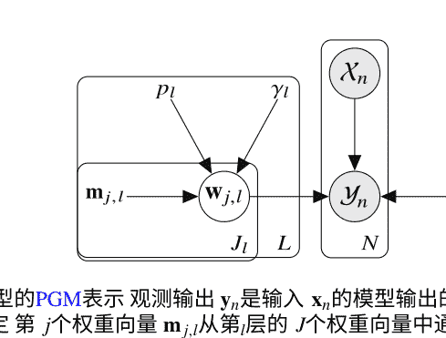

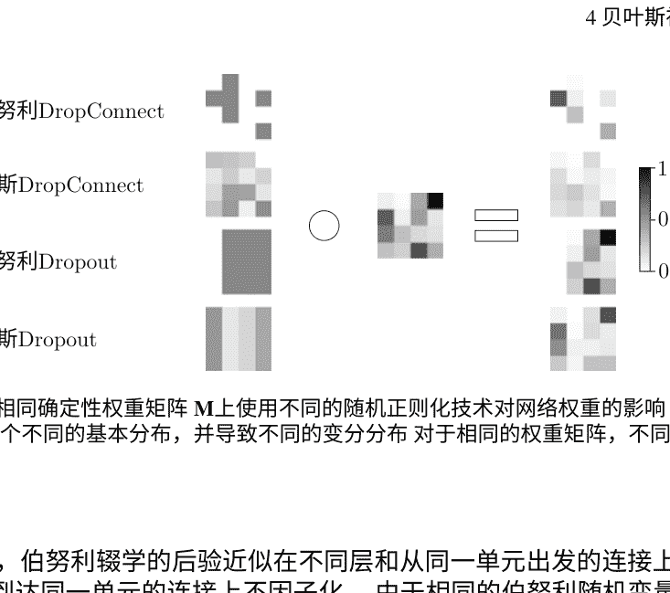

图4.10 在相同确定性权重矩阵 M 上使用不同的随机正则化技术对网络权重的影响。每种技术对应一个不同的基本分布，并导致不同的变分分布。对于相同的权重矩阵，不同的基本变分分布。

此外，伯努利辍学的后验近似在不同层和从同一单元出发的连接上因子化，但在到达同一单元的连接上不因子化。由于相同的伯努利随机变量作用于相同的权重矩阵列，它们自然不是独立的。本章的其他方法使用均值场近似来近似后验，完全忽略了权重之间的任何相互依赖关系。从这个意义上说，MCDO的限制较少。

然而，[12]的作者警告说，为了获得良好校准的不确定性估计，辍学概率也必须进行优化。由于这是一个变分参数，不能通过观察ELBO目标[12]直接选择它。然后，建议通过在验证集上最大化对数似然来设置它。

我们在算法4中总结了得到的过程，其中我们以大小为1的小批量训练伯努利辍学为例进行说明。然而，正如本节开头指出的那样，其他随机正则化器也可以通过类似的推导将其重新解释为执行近似贝叶斯推断，如图4.10所示。例如，对于DropConnect [56]，唯一的区别在于为每个权重使用单独的随机变量，而不是为权重矩阵的每列使用一个随机变量。重要的是要注意，并非所有的重新解释都没有问题，高斯辍学[51]作为具有对数均匀先验的贝叶斯推断[28]在[24]中指出了一些问题。如果我们不使用乘法噪声，而是为每个权重参数使用加法高斯噪声，我们就可以恢复到第4.3.1节的算法。

## 4.6 快速自然梯度

参数空间通常是Riemannian而不是Euclidean，因此学习方法应该考虑空间的结构[2]。自然梯度方法通过根据Fisher信息矩阵中编码的信息几何来扭曲梯度来实现这一点（见附录A.4）。因此，它们对参数化的变化是不变的（一阶近似），这与标准梯度下降方法形成鲜明对比，后者对参数化的效率和收敛速度敏感。

当前的框架主要关注MLE，并且将其适应于VI需要在代码中进行修改，增加开发时间、内存需求和计算成本。例如，第4.3节和第4.4节的算法与具有相同架构的确定性模型相比，参数数量增加了一倍，除此之外还需要额外的实现工作。自适应优化器进一步增加了成本，因为每个参数都有自己的缩放变量来调节学习率。

文献[26]的作者在高斯MFVI的自然梯度之前的工作[25]的基础上，提出了一系列逐渐更实用但不太准确的优化器。阅读所有细节需要花费很长时间，但绝对是值得努力的。在这里，我们回顾并重新推导了[26]的核心算法，命名为Vadam。

### 4.6.1 Vadam

在所有经过审查的方法中，Vadam [26] 是最新和实用的方法。与Adam优化器 [27] 类似，它是一种自然梯度方法（见附录A.4），专门为MFVI设计的具有动量的方法。从参数更新方程提议开始，作者[26]嵌入了几个近似定义不同的算法，直到达到他们命名为Vadam的方法，即变分Adam。

具有动量的梯度优化器将更新步骤建立为最陡下降方向和最后位移之间的线性组合[8]，如

$$
\mathbf{w}_{t+1} = \mathbf{w}_t - \bar{\alpha}_t \nabla_{\mathbf{w}} f(\mathbf{w}_t) + \bar{\gamma}_t (\mathbf{w}_t - \mathbf{w}_{t-1}) \tag{4.53}
$$

其中 $\{\bar{\alpha}_t\}$ 和 $\{\bar{\gamma}_t\}$ 形成一系列标量，确定每个项的贡献，并且必须满足第3.2.1.5节中讨论的收敛条件。

（4.53）中的后一项使算法沿着先前的搜索方向移动，因此被称为动量。从第一次迭代开始推理其动力学，每一步都可以理解为过去梯度的指数衰减平均值，因此倾向于在持续下降的方向上积累贡献，而振荡的方向倾向于抵消，或者至少保持较小[8]。

在[26]的作者提出的方法中，不再使用(4.53)，而是

$$
\boldsymbol{\eta}_{t+1} = \boldsymbol{\eta}_t - \bar{\alpha}_t \widetilde{\nabla}_{\eta} f(\boldsymbol{\eta}_t) + \bar{\gamma}_t (\boldsymbol{\eta}_t - \boldsymbol{\eta}_{t-1}), \tag{4.54}
$$

其中 $\widetilde{\nabla}$ 是自然梯度，优化是在指数族成员的自然参数 $\boldsymbol{\eta}$ 上进行的。对于这样的族群，自然梯度具有简单和高效的形式，需要更少的内存和计算。此外，它通过利用后验近似的信息几何改善了收敛速度。

将变分近似限制为指数族可以使用关系[3]

$$
\widetilde{\nabla}_{\eta} f(\boldsymbol{\eta}) = I^{-1}(\boldsymbol{\eta})\nabla_{\eta} f(\boldsymbol{\eta}) = \nabla_{\mathbf{m}} f(\mathbf{m}), \tag{4.55}
$$

自然参数的自然梯度等于均值参数的梯度，当 $f(\cdot)$ 根据 $\mathbf{m} = \mathbb{E}[\mathbf{u}(\mathbf{w})]$ 进行参数化时，等式(4.55)中的身份解放了我们不需要计算Fisher矩阵及其逆矩阵，这就是为什么它如此有用，许多其他实际的自然梯度算法都会使用它[22, 23, 25]。

在独立单变量高斯权重（均值场假设）的特定情况下，将(4.54)写成具有KL约束的最小化问题（参见附录A.4），使用(4.55)并解决得到的拉格朗日函数

$$
\mu_{t+1} = \mu_t - \frac{\beta_t}{1-\alpha_t}\sigma_t^{2} \nabla_{\mu}\mathcal{L}_t + \frac{\alpha_t}{1-\alpha_t}\sigma_{t+1}^2\sigma_{t-1}^{-2}(\mu_t - \mu_{t-1}), \tag{4.56}
$$

$$
\sigma_{t+1}^{-2} = \frac{1}{1-\alpha_t}\sigma_t^{-2} - \frac{\alpha_t}{1-\alpha_t}\sigma_{t-1}^{-2} + \frac{2\beta_t}{1-\alpha_t}\nabla_{\sigma^2}\mathcal{L}_t. \tag{4.57}
$$

更新方程组(4.56)和(4.57)是[25]的自然动量扩展。我们立即注意到 $\mu$ 的学习率被方差缩放。此外， $\sigma^2$ 可能会像第4.3节中的方法一样取负值，因此需要外部约束来规避这个问题。
到目前为止，算法中没有吸收任何关于代价函数 $\mathcal{L}$ 的具体知识。然而，现在我们考虑到代价函数是(4.3)中定义的负ELBO，并且指定了权重的单变量高斯先验分布 $p(\mathbf{w}) = \mathcal{N}(\mathbf{w}; \mathbf{0}, \sigma_p^2)$。回顾KL项的导数已经在(4.7)-(4.13)中计算过，并再次使用恒等式(4.9)和(4.10)，我们得到

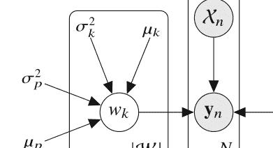

图4.11 Vadam模型的PGM表示。它与第4.3节中的相同。观察到的输出 y 是输入 x 的模型输出的噪声观测，其方差噪声由固定参数 $\sigma^2$ 确定。常数值 $\mu_p$, $\sigma_p^2$ 控制着权重的高斯先验分布，而 $\mu_k$, $\sigma_k^2$ 则控制着它们的后验分布。

$$
\nabla_{\mu} \mathcal{L} = N \mathbb{E}_q [\nabla_w h(w)] + \mu \sigma_p^{-2}, \tag{4.58}
$$

$$
\nabla_{\sigma^2} \mathcal{L} = \frac{N}{2} \mathbb{E}_q \left[ \nabla_{w^2} h(w) \right] + \frac{1}{2} \left( \frac{1}{\sigma_p^2} - \frac{1}{\sigma^2} \right), \tag{4.59}
$$

其中 N 是数据集大小，$h(w) = -\frac{1}{N} \sum_{i=1}^{N} \log p(y_i|x_i, w)$，平均负对数似然。

现在，在确定了权重的先验分布和后验分布之后，我们完全定义了底层的Vadam模型，如图4.11所示。它与第4.3节中使用的模型具有相同的结构（图4.4），两种方法之间的区别在于Vadam中包含的近似方法使其更加高效。

正如我们可能已经预料到的那样，在 (4.58) 和 (4.59) 中，我们使用单样本MC估计器来计算期望，并用它们的随机版本 $\nabla_w$ 和 $\nabla_{w^2}$ 替换了迄今为止从整个数据集计算出的梯度，这些梯度是从一个小批量中计算出来的。由于计算二阶导数的计算成本很高，除了 (4.59) 能够导致 $\sigma^2$ 为负值之外，我们还采用GGN近似来计算 $\nabla_{w^2}$（见附录A.3）。这最后一步需要计算每个小批量元素的一阶导数的平方；然而，现代框架在计算完导数后无法单独对批次中的每个元素进行操作。因此，我们还引入了另一种近似方法

$$
\nabla_w^2 h(w_t) \approx \frac{1}{M} \sum_{i=1}^{M} \nabla_w h(w_t; \mathbf{x}_i)^2 \approx \left( \frac{1}{M} \sum_{i=1}^{M} \nabla_w h(w_t; \mathbf{x}_i) \right)^2. \tag{4.60}
$$

在 (4.60) 中，第一个近似是GGN，最后一个近似被称为梯度幅度近似，并被几个常用的优化器所使用[11, 27, 54]。它导致 $\sigma^2$ 作为对角缩放，仅仅确保沿着 $\mu$ 的每个轴取得相等的进展，而不是紧密地近似曲率[8]（忽略更新方程中的动量项，该项通过偏好历史上的良好方向来抵消这种效果）。

梯度幅度近似比GGN更加偏向估计，其期望值介于GGN和完整批次的平方梯度之间。

随着小批量大小的增加，偏差也增加：如果使用整个数据集来计算这个近似值，那么所有的二阶信息都会丢失，而如果计算单个数据点，则等于GGN。因此，在偏置估计和快速收敛与“精确”（从GGN角度来看）但较慢之间存在折衷。随着小批量大小的增加，偏差也增加：如果使用整个数据集来计算这个近似值，那么所有的二阶信息都会丢失，而如果计算单个数据点，则等于GGN。因此，在偏置估计和快速收敛与“精确”（从GGN角度来看）但较慢之间存在折衷。

为了实用性，[26]中的作者定义了缩放的先验精度~λ=σp⁻²/N和新参数st=(σt⁻² - σp⁻²)/N。此外，他们任意地在缩放向量st的μ更新公式中应用了平方根，使得该方法更类似于Adam。尽管这种修改不会改变算法的固定点解，但它改变了动力学[26]。然后，Vadam权重更新方程为

$$
\mu_{t+1} = \mu_t - \bar{\alpha}_t \left[ \frac{1}{\sqrt{s_t + \widetilde{\lambda}}} \left( \hat{\nabla}_w h(w_t) + \mu_t \widetilde{\lambda} \right) + \gamma_t \left[ \frac{\sqrt{s_t + \widetilde{\lambda}}}{\sqrt{s_{t+1} + \widetilde{\lambda}}} \right] (\mu_t - \mu_{t+1}),
$$
$$
s_{t+1} = (1 - \bar{\alpha}_t)s_t + \bar{\alpha}_t \nabla_w^2 h(w_t),
$$
(4.61)
(4.62)

其中∇w和∇w^2分别是∇w和∇w^2的无偏随机近似。

通过展开这些更新方程，并使用不同的步长γ1和γ2来替代αt和(1 - αt)，我们得到算法5。请记住，比例因子st实际上与σt^2相关，即σt^2 = Nst + σp^2，而每个权重样本wt是从分布N(μt, σt^2)中抽取的。算法5中红色标出的与Adam [27]的实现差异是实现ADF的关键。

#### 算法5: Vadam

```
算法5: Vadam
1: 当未收敛时
2:  w ← μ + σ ⊕ □ where ~ N(0, I), σ ← 1 / √(Ns + σp⁻²)
3:  随机抽样一个数据示例xi
    g ← -∇ log p(xi|W)
5:  m ← γ1 m + (1 - γ1) (g + σp⁻² μ/N)
6:  s ← γ2 s + (1 - γ2) (g ⊕ g) 7:
    m̂ ← m/(1 - γ1^t),  ŝ ← s/(1 - γ2^t)
8:  μ ← μ - α m̂/(√ŝ + σp⁻²/N)
9:  t ← t + 1
10: 结束循环
```

在Vadam算法的开发过程中，考虑到算法已经在运行。因此，指数移动平均实际上会编码关于空间几何的信息。在初始迭代中，然而，这个估计会对起始点[27]有偏差。为了减少这种影响，作者[26]引入了一个指数衰减的偏差校正因子，随着优化的进行而衰减。

最终的方法确实与Adam [27]非常相似，但它具有提供由于隐式后验推断而产生的不确定性估计的优势。除了快速之外，Vadam还提供了一种即插即用的ADF执行方式。与本章的其他方法不同，用户只需将模型定义为确定性模型，并使用Vadam进行优化。没有万能的解决方案，这种简易性和速度的代价是较差的后验估计。

## 4.7 方法比较

在本节的剩余部分中，我们将比较本章研究的四种算法。我们从一维玩具示例开始，通过可视化分析预测曲线，更好地理解一些讨论的思想。接下来，我们将在更复杂的回归任务上对它们进行基准测试，其结果可以作为可能的实际场景的更好指导。

### 4.7.1 1-D Toy Example

作为第一个实验，我们评估从近似算法中获得的预测分布，其目标是玩具回归数据集。

其中 $y = -(x + 1)\sin(3\pi x) + 16$，其中 $\sigma = \mathcal{N}(0, 0.32)$。
(4.63)

对于这个任务，我们均匀采样了一个包含20个点和一个包含400个点的数据集。我们使用Adam优化器（除了Vadam算法，它本身就是一个优化器）训练具有100个单元的单隐藏层网络，直到收敛。图4.12显示了我们得到的结果。

首先让我们回顾一下我们对BNN的初衷：更好地建模和量化我们问题的潜在分布。因此，我们希望在样本稀缺的区域看到我们模型的不确定性增加。

从这个意义上讲，无论我们对函数的了解在图4.12的中心区域有多密集，我们在这些偏离中心的区域基本上并不了解太多，因此我们的不确定性估计在这些区域中不应该发生太大变化。相反，我们在给定区域内拥有的样本越多，我们的准确性应该越好，模型在该区域中应该越确定。

我们可以注意到，在400个样本的情况下，Vadam的不确定性仍然很高，而其他方法的估计与其20个样本的情况相比则明显缩小了很多。即使是BBB的预测看起来与Vadam的相似，但它在后验方差的估计上严重低估了，尤其是在400个数据点集上。

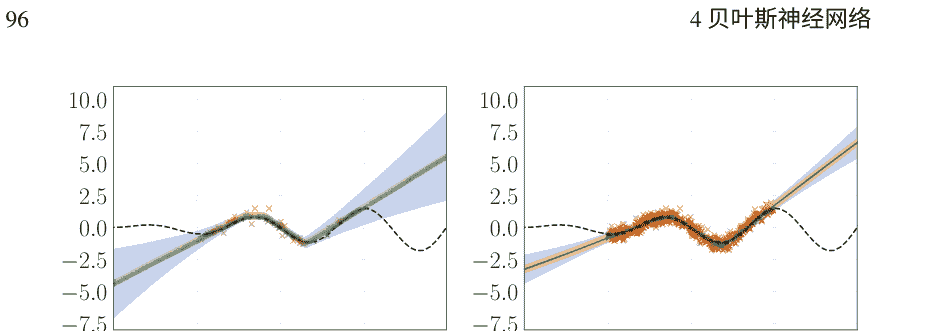

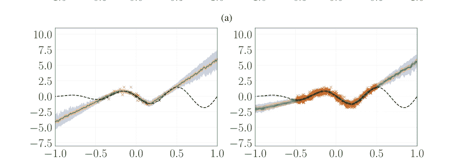

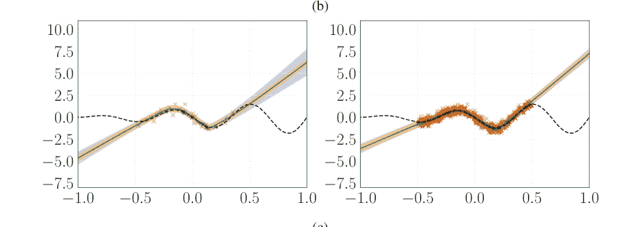

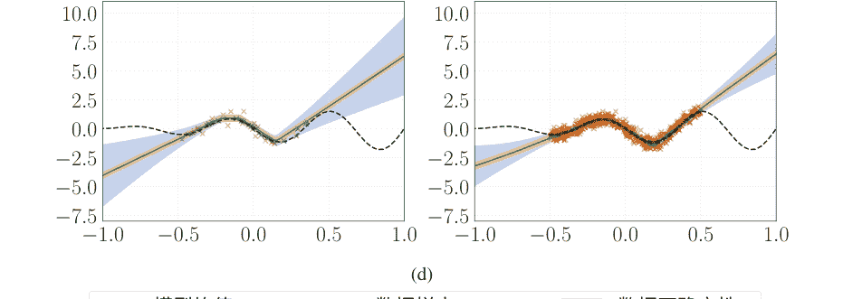


图4.12 通过(a) BBB，(b) MCDO，(c) PBP和(d)Vadam获得的一个一维玩具示例的预测分布比较，其中要么有40个数据点（左侧），要么有400个数据点（右侧）。

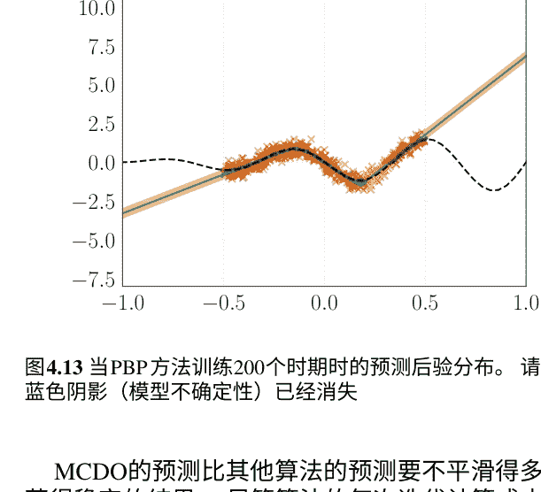

## 图4.13 当PBP方法训练200个时期时的预测后验分布。请注意蓝色阴影（模型不确定性）已经消失

MCDO的预测比其他算法的预测要不平滑得多，需要更多的MC样本才能获得稳定的结果。尽管算法的每次迭代计算成本较低，但需要更多的迭代来充分建模数据。即使只有少量样本，MCDO也能够对均值和方差进行良好的估计。即使只有少量样本，MCDO也能够对均值和方差进行良好的估计。

在较大的数据集中，只能对数据进行少于100次的遍历时，执行EP需要一个不合理的大内存占用，因此PBP实际上通过数据执行多次ADF遍历，将每个数据视为一个新的示例。这种方法的一个缺点是，在对数据进行过多次遍历时，可能会导致对后验方差的低估。与相同数量的样本相比，我们观察到图4.13中的行为与图4.12c中的行为不同。

### 4.7.2 UCI 数据集

现在，我们对UCI机器学习库[10]中的八个不同回归数据集中的算法进行基准测试，这个过程最近在相关文献中已经成为标准[13, 18, 19, 26, 34, 52, 58]。下面我们对每个数据集进行简要描述。

#### 4.7.2.1 波士顿住房

1978年由美国人口普查局收集的马萨诸塞州波士顿各郊区的房屋数据。任务是预测13个衡量房产和社区特征的变量中，自住房屋的中位数价值。

例如，每个住宅的平均房间数、一氧化氮浓度、人均犯罪率等。从现在开始，我们将其简称为波士顿。

#### 4.7.2.2 混凝土抗压强度

混凝土强度是混凝土中最重要的工程性质之一，对土木工程非常重要。它是一个高度非线性的函数，与年龄和成分有关，通常通过在压缩试验机下测试样品获得。数据集的目标是根据年龄和七种成分（如水泥、水、细骨料和粗骨料等）预测抗压强度。从现在开始，我们称之为混凝土。

#### 4.7.2.3 能源效率

在建筑设计过程中，进行模拟以估计其能源效率。任务是从八个属性（如玻璃面积、表面积、方向）中预测用两种不同指标（供暖负荷和冷却负荷）表示的效率。数据集由一组具有不同特征和12种不同形状的768个模拟建筑物组成。为简洁起见，我们将这个数据集称为能源数据集。

#### 4.7.2.4 Kin8nm

该数据集由一个8连杆全旋转机器人臂的关节角位置组成，已知其高度非线性。数据是通过对其正向运动学进行模拟生成的。目标是预测末端执行器与给定目标之间的距离。

#### 4.7.2.5 基于条件的海军推进装置维护

推进系统的主要组件的行为和相互作用不容易用先验物理知识建模。然而，持续监测推进设备并根据其状态做出决策非常重要。目标是使用输入特征（如船速、燃料流量、涡轮和螺旋桨的扭矩、进出压力和温度）预测压缩机衰减状态系数。该数据集是通过一个具有柴油电动和燃气推进装置的海军护卫舰的数值模拟器生成的。该模拟器经过微调和验证，使用真实数据进行验证。接下来，我们将这个数据集称为海军数据集。

#### 4.7.2.6 组合循环发电厂

该数据集的目标是预测发电厂每小时净电能输出。发电输出预测是管理发电厂及其与电网连接的重要组成部分。这些特征来自一个真实的发电厂，在该发电厂满负荷运行期间收集了超过6年的数据。它们包括温度、环境压力、相对湿度和排气真空的每小时平均值。从此时开始，我们将这个数据集称为发电厂数据集。

#### 4.7.2.7 葡萄酒质量

该数据集包含不同品牌的红葡萄酒和葡萄牙“绿葡萄酒”不同变种的11个物理化学特性。目标是预测葡萄酒的质量，评分介于0到10之间。此数据集以下简称为葡萄酒数据集。

#### 4.7.2.8 游艇水动力学

在初始设计阶段估计帆船的剩余阻力对于评估船舶性能和评估所需推进功率至关重要。该数据集包含来自22种不同船体形式的308个全尺寸实验的结果。输入特征是船体几何的各个方面。从现在开始，我们将这个数据集称为游艇数据集。

### 4.7.3 实验设置

对于第4.7.2节中的每个数据集，我们根据它们的训练时间、预测（高斯）对数似然（4.1）和均方根误差（RMSE）进行算法比较，其中RMSE定义为

$$
RMSE = \sqrt{\frac{\sum_{i=1}^{N} (y_i - \hat{y}_i)^2}{N}} \quad (4.64)
$$

虽然RMSE仅衡量预测准确性，评估预测与目标值的接近程度，但对数似然考虑了预测方差，因此将预测不确定性纳入评估中。直观上讲，方差越低，预测越可靠，因此错误的惩罚越高；但我们仍希望预测是可靠的，因此较大的方差也会受到较高的惩罚。否则，不断预测不确定的值将导致得分很高，尽管模型没有太大用处。

我们不直接测量结构不确定性，也就是模型引起的不确定性，这可以通过无限量的数据进行修正。然而，高度不确定的权重，即方差较大的权重，在每次绘制不同的权重值集合时，会导致相同输入产生非常不同的输出。因此，即使它们的均值是正确的，这些输出经常偏离真实值很远。这导致估计的预测对数似然理论上应该很高，但实际上很低。因此，这个指标间接地给我们提供了模型的不确定性的感知。

我们遵循[13]中提出的设置：对于每个数据集，在进行30次贝叶斯优化（BO）[49]的超参数搜索后，我们在20个随机的训练-测试拆分上运行模型。重要的是要注意，贝叶斯优化（BO）与先前讨论的用于训练BNN的方法无关，我们将其用作高效搜索超参数空间的工具。我们本可以使用随机或网格搜索，而本章中提出的论点仍然是相同的，我们的流程图如图4.14所示。

#### 4.7.3.1 用贝叶斯优化（BO）进行超参数搜索

贝叶斯优化（BO）是一种优化目标函数的黑盒方法，该函数需要很长时间或者评估成本很高。贝叶斯优化（BO）通过高斯过程回归构建目标的替代模型，并量化该替代模型的不确定性[47]。在每次迭代中，我们观察到一个新点（一个新的超参数配置）的目标值，更新描述每个点潜在目标值的后验分布，并采样一个新点，其值最大化给定的采集函数，即期望改进。贝叶斯优化（BO）考虑了之前观察到的所有配置，以决定要研究的参数空间的哪个点，从而在较少的迭代次数下获得良好的解决方案。另一方面，决定下一步在哪里评估使得每次迭代的计算成本很高，增加了开销。

我们使用相同的20个数据拆分来避免由于数据集的减小和不同拆分可能产生的结果波动。对于每个拆分，我们通过在训练集上运行30次贝叶斯优化（BO）来设置先验精度的最佳超参数配置 λ（或等效地，先验方差 σ^2_p）和观测噪声精度 γ，以及在MC Dropout情况下的丢弃概率 p，每次运行40个时期。此外，

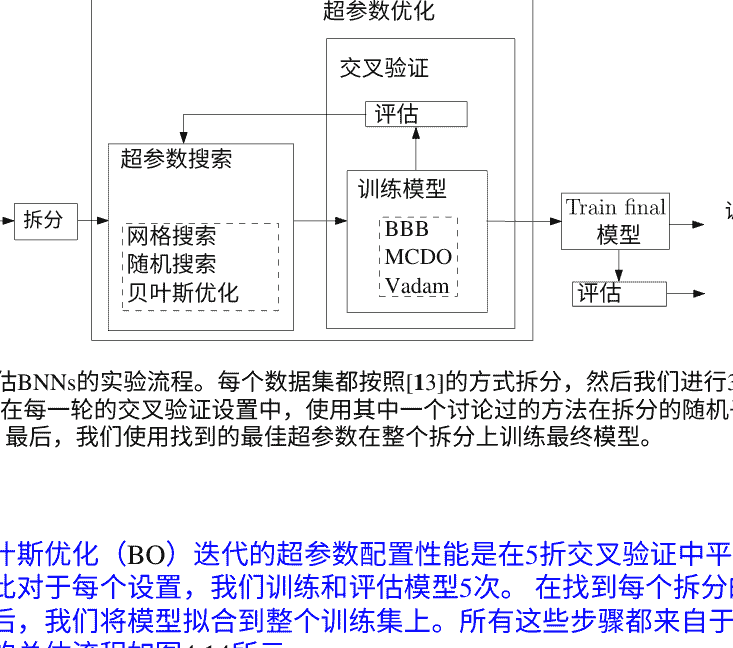

## 图4.14评估BNNs的实验流程。每个数据集都按照[13]的方式拆分，然后我们进行30轮超参数优化，在每一轮的交叉验证设置中，使用其中一个讨论过的方法在拆分的随机子集上训练模型。最后，我们使用找到的最佳超参数在整个拆分上训练最终模型。

每个贝叶斯优化（BO）迭代的超参数配置性能是在5折交叉验证中平均计算的，因此对于每个设置，我们训练和评估模型5次。在找到每个拆分的最佳配置之后，我们将模型拟合到整个训练集上。所有这些步骤都来自于[13]。该方法的总体流程如图4.14所示。

我们观察到，这种结构会迅速升级，因为对于每个数据集和模型，我们都有：

$$
20 \times \left( 30 \times \left(5 \times \frac{4}{5}\right) + 1 \right) \times 40 = 96800, \quad (4.65)
$$
拆分 BO迭代 CV迭代 完整运行 时期 时期

再加上每个贝叶斯优化（BO）迭代决定下一个测试点所需的时间。我们进行了小规模研究，使用50个隐藏层单元的单隐藏层网络，以保持计算时间在可行范围内。
PBP 2和Vadam 3的源代码来自作者的存储库。除了PBP是在Theano 1.0 [53]中实现之外，所有其他算法和支持代码都是在PyTorch 1.0 [44]中实现的。

表4.2 每个算法在训练过程中的MC样本数量。PBP不使用MC积分，而是使用解析近似方法。

| | 较小的数据集 | 较大的数据集 |
|---|---|---|
| BBBx1 | 10 | 5 |
| BBBx2 | 20 | 10 |
| MCDOx1 | 1 | 1 |
| MCDOx10 | 10 | 10 |
| Vadam | 10 | 5 |
| PBP | – | – |

### 4.7.4 训练配置

我们保持与[26]类似的训练配置。我们在四个较小的数据集（Boston，Concrete，Energy和Yacht）上使用大小为32的小批量，而在其他四个数据集（Wine，Powerplant，Naval，Kin8nm）上使用大小为128的小批量。表4.2中包含了每个算法在训练过程中使用的MC样本数量，对于评估，它们都使用100个MC样本。

我们以两种不同的条件运行BBB和MCDO，以进一步研究它们的行为。BBBx2在训练过程中绘制的MC样本数量是BBBx1的两倍。至于MC Dropout，我们的MCDOx1配置遵循原始的MC Dropout实现[13]，即在训练过程中只使用一个MC样本，并在超参数选择后进行更长的训练时间，即400个周期而不是40个周期，因为MC Dropout需要更长的收敛时间[13]。另一方面，MCDOx10的训练过程更类似于其他算法的设置：10个训练MC样本和40个周期。

在PBP的原始实现[19]中，我们使用的是逐个处理样本，但可以通过稍微降低性能的代价来进行小批量处理。
PBP也没有对权重后验进行蒙特卡洛近似，因为它通过层传播整个分布，从而进行其近似计算。

BBB、MCDO和Vadam使用梯度下降优化器。BBB和MC Dropout都使用Adam优化器[27]，而Vadam本身是一个（变分）优化器，并且实验中使用它代替Adam。根据[26]，在这三种方法中，我们将学习率k设置为0.01，并将移动平均参数γ1设置为0.99和γ2设置为0.9（而不是通常的γ1=0.9和γ2=0.999），以促进在40个周期内的收敛。后验近似的初始精度为10（注意，这不是先验精度），适用于BBB和Vadam。

### 4.7.5 分析

为了根据每个单独数据集中的性能比较算法，我们使用贝叶斯相关t检验[9]。这个测试用于分析交叉验证结果，并考虑由于重叠而产生的相关性。

表4.3每个算法完成整个训练周期所需的平均时间（以秒为单位），即从找到最佳超参数到找到最终的权重后验近似。

| 数据集 | 大小 | 维度 | BBBx1 | BBBx2 | Vadam | PBP | MCDOx1 | MCDOx10 |
|--------|------|------|-------|-------|-------|-----|--------|----------|
| 波士顿 | 506 | 13 | 1813 | 3279 | 2214 | 16 | 1286 | 1339 |
| 混凝土 | 1030 | 8 | 3510 | 6101 | 4333 | 28 | 2280 | 2442 |
| 能源 | 768 | 8 | 2680 | 4312 | 3283 | 20 | 1541 | 912 |
| Kin8nm | 8192 | 8 | 4563 | 8433 | 4985 | 190 | 4493 | 4631 |
| 海军 | 11,934 | 16 | 6923 | 14036 | 6835 | 279 | 6759 | 6916 |
| 发电厂 | 9568 | 4 | 5349 | 9993 | 6117 | 188 | 5356 | 5500 |
| 葡萄酒 | 1599 | 11 | 1009 | 2269 | 1226 | 41 | 1098 | 1076 |
| 游艇 | 308 | 6 | 1139 | 1634 | 1291 | 10 | 612 | 275 |

训练集[5]。因此，它非常适合我们的情况，我们有20个随机划分，其中90%用于训练，10%用于测试。
PBP通过贝叶斯框架自动设置所有超参数，因此不需要超参数搜索。在这种情况下，（4.65）中的数字从96800个时期减少到20 × 40 =800，即每个随机划分运行40个时期。表4.3显示了每个算法完成完整训练计划（包括贝叶斯优化（BO））所需的（挂钟）时间。图4.15展示了类似的信息，但以PBP训练时间为比例进行了可视化。

PBP超过其他所有方法，速度比亚军快34倍。这种差异是由于没有超参数调整所导致的，这使得该方法在最终适应整个训练集之前不需要运行相当于30×4=120次的好超参数配置。此外，贝叶斯优化推理还会增加额外开销。与需要计算机时间相反，PBP需要人工时间来计算其所有的推导和近似。然而，如果我们不进行超参数调整，PBP的优势将消失，实际上它将成为平均速度最慢的方法。实际上，有多种因素导致了这一点：

-   PBP的当前实现使用的是批量大小为1，将其增加到32，与其他方法相同大小，使得该方法再次成为最快的方法[4]，尽管优势不如之前那么大；
-   PBP使用的是Theano框架，该框架已不再得到官方支持，而其他三种方法是在Pytorch [44]中实现的，Pytorch是由Facebook人工智能研究部门开发的最新、发展迅速的框架，因此操作在GPU处理方面更加优化。

BBBx2是最慢的，平均训练时间比BBBx1多80%。尽管Vadam的平均性能比BBBx2差，如图4.16和4.17的性能条形图所示，但它的训练速度更快：只需16%的时间。

## 图4.15 训练每个算法相对于PBP所需的时间量，采用对数尺度。我们考虑超参数搜索和最终模型的训练。

比BBB×1慢，而不是80%。Vadam没有额外的参数来计算权重的方差；相反，它直接从用于归一化参数空间方向的中间变量中计算它们，这是优化器Adam已经做的事情。

两种MCDO配置所需的时间大致相同，并且具有类似的性能，如图4.15、4.16和4.17所示。MCDO×1的训练速度比MCDO×10慢10%，性能稍好。尽管这种差异很小，但是它是一致的。总体而言，MCDO×1在RMSE和对数似然度方面是最好的，MCDO×10紧随其后。PBP排名第三。

尽管其表现不太出色，但PBP不需要超参数搜索，并且训练速度非常快。PBP具有的另一个优势是继承自EP，它自然适合跨机器进行数据并行化，并且如果仅使用ADF更新，则适合在线学习。

我们将结论总结在表4.4中，以便于将来参考更加方便。它评估了BNN算法在三个基本实际方面的表现，没有任何数字或公式：

- 构建自定义解决方案的实现工作量；
- 模型预测的质量，包括准确性和不确定性；
- 训练模型所需的时间。

## 图4.16 UCI回归数据集的20个随机重采样拆分上的平均均方根误差（数值越低越好）。误差条代表20个随机拆分的标准差

最后，我们给那些需要为特定任务开发自定义解决方案的人一个一般性建议：使用Vadam [26]，它快速、开箱即用，并且性能合理。它仍然需要超参数调整，但在这一点上，几乎每个算法都需要。如果问题需要更好的预测准确性或不确定性估计，请使用MCDO或其他未涵盖在此处的方法，其中有几种在第4.9节中提到。

## 4.8 更多参考资料

尽管我们在这里只处理了不（显式地）建模权重之间相关结构的算法，但这也是一个活跃的研究课题，有许多有趣的作品，例如：

- 矩阵变量高斯先验[52]和后验近似[34]；
- 带有噪声自然梯度的结构化协方差[58]；
- 带有自然梯度的低秩协方差近似[37]。

## 图4.17 UCI回归数据集的20个随机重新采样分割的平均对数似然（较高的值更好）。误差条代表20个随机分割的标准差

## 表4.4 从业者表：对研究BNNs的变分方法进行粗略比较。尽管BBB×2的性能优于Vadam的，但训练时间更长，关于时间的公平比较应该包括BBB×1。

| 方法 | 努力 | 质量 | 时间 |
|------|------|------|------|
| BBB | 中等 | 差 | 慢 |
| PBP | 非常困难 | 好 | 非常快 |
| MCDO | 非常容易 | 好 | 好的 |
| Vadam | 无 | 好的 | 好的 |

尽管上述方法也依赖于VI、ADF或EP，但通过关注参数之间的结构建模，它们实现了更好的后验近似和不确定性估计。

还有一种完全不同的方法依赖于马尔可夫链MC对后验预测密度进行近似，这不是我们讨论的重点。尽管如此，我们还是列举了一些方法，以便感兴趣的读者知道从何处开始：

- Hamiltonian MC [41];
- 随机梯度Langevin动力学[32, 57];
- 后验分布蒸馏[29]。

## 4.9 结语

在本章中，我们讨论了BNNs，以及为什么要采用计算量更大的贝叶斯方法，而不满足于传统的点估计。贝叶斯模型具有许多优点，如对过拟合的鲁棒性、原则性模型比较以及不仅在输出中而且在所有参数中的不确定性估计。

此外，在本章中我们还回顾并实验比较了四种关键的变分算法。它们分别是Bayes by Backprop [6]，Probabilistic Backprop [19]，MC Dropout [13]和Vadam [26]。它们都考虑了对后验的非结构化近似。尽管MC Dropout [13]是唯一一个不依赖于均值场近似的方法，但它在一些权重重组之间假设了依赖关系，这种假设并不是很明确。

# 参考文献

1.  Abadi M, Agarwal A, Barham P, Brevdo E, Chen Z, Citro C, Corrado GS, Davis A, Dean J, Devin M, Ghemawat S, Goodfellow I, Harp A, Irving G, Isard M, Jia Y, Jozefowicz R, Kaiser L, Kudlur M, Levenberg J, Man D, Monga R, Moore S, Murray D, Olah C, Schuster M, Shlens J, Steiner B, Sutskever I, Talwar K, Tucker P, Vanhoucke V, Vasudevan V, Vi gas F, Vinyals O, Warden P, Wattenberg M, Wicke M, Yu Y, Zheng X (2015) TensorFlow:大规模异构系统上的机器学习。软件可从tensorflow.org获得
2.  Amari SI (1998) 自然梯度在学习中的高效性。神经计算 10(2):251–276
3.  Amari SI (2016) 自然梯度学习及其在奇异区域中的动态。 Springer Japan, 东京, 第279-314页
4.  Benatan M, Daresbury ST, Pyzer-Knapp EO (2018) 概率反向传播的实际考虑因素。在：贝叶斯深度学习研讨会（NeurIPS 2018），蒙特利尔
5.  Benavoli A, Corani G, Dem ar J, Zaffalon M (2017) 是时候改变了：通过贝叶斯分析比较多个分类器的教程。 J Mach Learn Res 18 (77) : 1-366.
6.  Blundell C, Cornebise J, Kavukcuoglu K, Wierstra D (2015) 神经网络中的权重不确定性。 在：机器学习国际会议论文集，里尔，第37卷，第1613-1622页
7.  Bonnet G (1964) 无记忆非线性系统中随机信号的变换。 Annales des T l Communications 19 (9) : 203-220
8.  Bottou L, Curtis FE, Nocedal J (2018) 大规模机器学习的优化方法. SIAM Rev 60(2):223–311. https://doi.org/10.1137/16M1080173
9.  Corani G, Benavoli A (2015) 一种用于比较交叉验证算法在多个数据集上的贝叶斯方法. Mach Learn 100(2-3):285–304
10. Dua D, Graff C (2017) UCI机器学习仓库. http://archive.ics.uci.edu/ml
11. Duchi J, Hazan E, Singer Y (2011) 用于在线学习和随机优化的自适应次梯度方法. J Mach Learn Res 12:2121–2159
12. Gal Y (2016) 深度学习中的不确定性. 剑桥大学博士论文
13. Gal Y, Ghahramani Z (2016a) Dropout作为贝叶斯近似: 在深度学习中表示模型不确定性. In: 机器学习国际会议论文集, 纽约, vol 48, pp 1050–1059
14. Gal Y, Ghahramani Z (2016b) 在递归神经网络中应用dropout的理论基础 在: 神经信息处理系统进展, 巴塞罗那, 第1019-1027页
15. Ghosh S, Fave FD, Yedidia J (2016) 用于学习贝叶斯神经网络的假设密度滤波方法 在：AAI人工智能会议论文集，凤凰城，第1589-1595页
16. Graves A (2011) 用于神经网络的实用变分推断 在：神经信息处理系统进展，格拉纳达，第2348-2356页
17. Herbrich R (2005) 最小化Kullback-Leibler散度。技术报告，微软研究
18. Hernandez-Lobato J, Li Y, Rowland M, Bui T, Hernandez-Lobato D, Turner R (2016) 黑盒alpha散度最小化 在：国际机器学习会议论文集，纽约，第48卷，第1511-1520页
19. Hernández-Lobato JM, Adams RP (2015) 概率反向传播用于可扩展学习贝叶斯神经网络。 在：国际会议论文集机器学习，里尔，卷37，页1861-1869
20. Hinton GE, van Camp D (1993) 通过最小化权重的描述长度来使神经网络简单化。 在：计算学习理论年会，COLT '93，圣克鲁斯，页5-13
21. Hinton GE, Osindero S, Teh YW (2006) 深度信念网络的快速学习算法。 神经计算18（7）：1527-1554
22. Hoffman MD, Blei DM, Wang C, Paisley J (2013) 随机变分推理。 J Mach Learn Res 14：1303-1347
23. Honkela A, Tornio M, Raiko T, Karhunen J (2007) 变分中的自然共轭梯度推理。 在：国际神经信息处理会议论文集，北九州，页305-314
24. Hron J, Matthews A, Ghahramani Z (2018) 变分贝叶斯丢弃：陷阱和修复。 在：机器学习国际会议论文集，斯德哥尔摩，第80卷，2019-2028页
25. Khan M, Lin W (2017) 共轭计算变分推断：将非共轭模型中的变分推断转化为共轭模型中的推断。 在：人工智能和统计国际会议，劳德代尔堡，第54卷，878-887页
26. Khan M, Nielsen D, Tangkaratt V, Lin W, Gal Y, Srivastava A (2018) 通过权重扰动在Adam中实现快速可扩展的贝叶斯深度学习。 在：机器学习国际会议论文集，斯德哥尔摩，第80卷，2611-2620页
27. Kingma DP, Ba J (2015) Adam：一种随机优化方法。 在：国际学习表示会议论文集，圣地亚哥
28. Kingma DP, Salimans T, Welling M (2015) 变分丢弃和局部重参数化技巧。 在：神经信息处理系统进展，蒙特利尔，第2575-2583页
29. Korattikara A, Rathod V, Murphy K, Welling M (2015) 贝叶斯暗知识。 在：神经信息处理系统进展，蒙特利尔，第3438-3446页
30. Krizhevsky A, Sutskever I, Hinton GE (2012) 使用深度卷积神经网络进行ImageNet分类。 在：神经信息处理系统进展，塔霍湖，第1097-1105页
31. Kuleshov V, Fenner N, Ermon S (2018) 使用校准回归进行深度学习的准确不确定性。 在：国际机器学习会议论文集，斯德哥尔摩，第80卷，第2796-2804页
32. Li C, Chen C, Carlson D, Carin L (2016) 预处理随机梯度Langevin动力学用于深度神经网络。 在：AAAI人工智能会议论文集，凤凰城，第1788-1794页
33. Little RJ (2006) 校准贝叶斯：贝叶斯/频率论路线图。 美国统计学家60(3)：213-223
34. Louizos C, Welling M (2016) 结构化和高效的变分深度学习与矩阵高斯后验。 在：国际机器学习会议论文集，纽约，第48卷，第1708-1716页
35. MacKay DJC (1992) 用于反向传播网络的实用贝叶斯框架。 神经计算4(3)：448-472
36. Minka TP (2001) 期望传播用于近似贝叶斯推断。 在：不确定性人工智能会议，旧金山，第362-369页
37. Mishkin A, Kunstner F, Nielsen D, Schmidt M, Khan ME (2018) SLANG:快速结构化协方差近似用于贝叶斯深度学习与自然梯度。在：神经信息处理系统进展，蒙特利尔，第6245-6255页
38. Nair V, Hinton GE (2010) 矫正线性单元改进了受限玻尔兹曼机。 在：机器学习国际会议论文集，海法，第807-814页
39. Neal RM (1993) 通过随机动力学进行贝叶斯学习。 在：神经信息处理系统进展，旧金山，第475-482页
40. Neal RM (1996) 神经网络的贝叶斯学习。 多伦多大学博士学位论文，多伦多
41. Neal RM (2011) 使用哈密顿动力学的MCMC。 在：马尔可夫链手册，第5章。蒙特卡洛，CRC出版社，博卡拉顿，第113-162页
42. Niculescu-Mizil A, Caruana R (2005) 用监督学习预测好的概率。 在：国际机器学习大会论文集，波恩，第625-632页
43. Papernot N, McDaniel P, Goodfellow I, Jha S, Celik ZB, Swami A (2017) 对机器学习的实际黑盒攻击。 在：ACM亚洲计算机与通信安全会议论文集，阿布扎比，第506-519页
44. Paszke A, Gross S, Massa F, Lerer A, Bradbury J, Chanan G, Killeen T, Lin Z, Gimelshein N, Antiga L, Desmaison A, Kopf A, Yang E, DeVito Z, Raison M, Tejani A, Chilamkurthy S, Steiner B, Fang L, Bai J, Chintala S (2019) PyTorch: 一种命令式风格、高性能的深度学习库。 在：神经信息处理系统进展，温哥华，第8024-8035页
45. Platt JC (1999) 支持向量机的概率输出及其与正则化似然方法的比较。 在：大边界分类器的进展，第61-74页
46. Price R (1958) 对具有高斯输入的非线性设备的一个有用定理。 Trans Inf Theor 4 (2) : 69-72
47. Rasmussen CE, Williams CKI (2005) 用于机器学习的高斯过程。麻省理工学院出版社，剑桥
48. Russakovsky O, Deng J, Su H, Krause J, Satheesh S, Ma S, Huang Z, Karpathy A, Khosla A, Bernstein M, Berg AC, Fei-Fei L (2015) ImageNet大规模视觉识别挑战。 Int J Comput Vis 115 (3) : 211-252
49. Snoek J, Larochelle H, Adams RP (2012) 机器学习算法的实用贝叶斯优化。 在：神经信息处理系统的进展，Lake Tahoe，第2951-2959页
50. Soudry D, Hubara I, Meir R (2014) 期望反向传播：连续或离散权重的多层神经网络的无参数训练。 在：神经信息处理系统的进展，蒙特利尔，第963-971页
51. Srivastava N, Hinton G, Krizhevsky A, Sutskever I, Salakhutdinov R (2014) Dropout: 一种简单的方法，用于防止神经网络过拟合。 J Mach Learn Res 15(1):1929–1958
52. Sun S, Chen C, Carin L (2017) 学习贝叶斯神经网络中的结构化权重不确定性。 在: 人工智能和统计国际会议，Fort Lauderdale，卷54，pp 1283–1292
53. Theano开发团队 (2016) Theano: 一个用于快速计算数学表达式的Python框架。 arXiv e-prints 1605.02688
54. Tieleman T, Hinton G (2012) Lecture 6.5-rmsprop: 将梯度除以其最近幅度的运行平均值。
55. Tishby N, Levin E, Solla SA (1989) 在分层网络中一致推断概率：预测和泛化。 在: 神经网络国际联合会议，卷2，pp403–409
56. Wan L, Zeiler M, Zhang S, Cun YL, Fergus R (2013) 使用 dropConnect 正则化神经网络。 在：机器学习国际会议论文集，亚特兰大，第28卷，第1058-1066页
57. Welling M, Teh YW (2011) 通过随机梯度 Langevin 动力学进行贝叶斯学习。 在：机器学习国际会议论文集，贝尔维尤，第681-688页
58. Zhang G, Sun S, Duvenaud D, Grosse R (2018) 噪声自然梯度作为变分推断。 在：机器学习国际会议论文集，斯德哥尔摩，第80卷，第5852-5861页

# 第5章 变分自编码器

以下各节的预期内容：

- 生成模型是什么以及其好处是什么，
- 如何评估生成模型，
- 变分自编码器（VAE）的详细解释，
- 增强VAE在不同方面性能的发展
- 这类模型的核心问题
- 讨论的VAE模型的示例和演示

在BNNs的密集章节之后，读者会发现这一章相对简单，因为所需工具实际上已经介绍过了。通过本章的学习，一个人应该：

- 能够对生成模型进行表征
- 了解它们何时有用
- 了解评估其质量时的挑战
- 掌握VAE核心思想的广度
- 理解其扩展背后的思想以及实际上发生了什么变化

## 5.1 动机

生成模型是试图从可观察到的数据中捕捉整个概率分布的统计模型，即从数据集$\mathcal{D} = \{X\}$中估计$p(\mathbf{x})$。它们是生成观测数据的概率模型的完整描述。拥有完整的模型后，我们可以对未见过的示例进行推断，生成新样本，推断关系和依赖性，进行预测等等。

与使用目标$\mathbf{Y}$作为监督信号来估计条件分布$\mathbf{Y}|\mathbf{X}$的判别模型不同，生成模型不需要## 5.2 评估生成网络

没有普适的度量标准来衡量生成模型的性能，因此评估其质量并不直接且常常具有误导性。通过优化相同的准则训练的模型在不同属性上表现良好且可以直接进行比较，即训练准则可以作为模型选择的客观度量标准。然而，对于不同的目标函数，模型比较变得困难。空间维度越高，度量之间的相关性越小[53]。

在模型中，我们可能希望具备许多不同的属性：高质量的样本、多样性的样本、紧凑的表示、有用的表示、可解释的表示等等。自然地，我们不能同时拥有所有这些属性，因此我们必须做出妥协。

一个模型可能具有较高的对数似然但平均匹配行为，导致其将概率质量分配给低密度区域。尽管近似方法整体上可能很好，但异常区域将会受到过多的关注，至少比正常情况下应该更多。因此，生成的样本更有可能与真实分布的样本非常不同，尽管近似方法的对数似然很好。尽管这一特性一开始可能看起来不理想，但它实际上取决于上下文。对于药物发现来说，这可能是很好的，因为这意味着我们正在探索空间的其他区域，在那里我们可以找到新的有用化合物。对于图像来说，这可能是一场灾难，因为生成的图像可能是无定形和奇怪的，或者根本不代表任何东西。然而，有多少抽象、奇怪的艺术作品最终变得非常有价值并受到赞赏呢？

另一方面，具有矩匹配行为的模型产生逼真的样本，但对于多模态分布的对数似然性能较差。近似拟合了单一模态，假设了单峰模型，并且错过了大量的信息。因此，生成的样本多样性也会很低。图像是空间上高度多模态分布的一个很好的例子：相邻像素和像素组（超像素）之间存在依赖关系，并且整个场景上也存在依赖关系，此外还有很多来自物理世界的内置结构。适用于单一模态的模型将难以混合图像元素的不同变化因素。

除了对数似然和样本质量传达不同的信息外，它们并不告诉我们样本的多样性，尽管它们是相关的。如果样本似乎来自真实分布，并且同时具有很大的多样性，那么可能两个密度整体上匹配得很好，这意味着模型的平均对数似然很好。样本的多样性与分布的熵有关。

平均对数似然已成为生成模型质量的事实标准度量。然而，计算可能不可能，至少在可行的时间范围内，这取决于模型类型。对于这种模型，无法直接测量对数似然，常常会采用Parzen窗估计[53]。Parzen窗方法是一种非参数方法，它包括从原始模型中抽取样本并构建一个可处理的近似模型，从而可以计算平均对数似然。然而，实验证明，使用Parzen窗估计进行评估与似然度和样本质量不相关，因此强烈不推荐使用[53]。

视觉样本检查是评估样本质量的自然度量标准，并且在处理图像合成时是首选的度量标准，因为它可以直观地了解模型中发生的情况。然而，这种方法只对视听样本有效。样本是一种有趣的诊断工具，但不应作为其他任务的代理[53]。

感知质量度量不考虑泛化能力。一个只输出训练样本而从不生成新样本的模型得分很高，但没有任何用处。对于检测生成样本是否与训练样本相似的最简单算法（如最近邻算法）并不有效：在感知上相似的图像可能存在很大的距离，例如，纹理丰富的图像的一个像素偏移。此外，过拟合的模型不一定能够复现数据集中的图像[53]。

评估模型性能的另一种方法是直接在替代任务上进行测量，如果目标是学习良好的特征表示，则特别有用。虽然间接，但测量模型在预期的下游应用中的效果恰好提供了人们所寻求的。例如，可以在学习的线性分类器上使用小容量的线性分类器，通过测试表示形成良好定义的聚类，可以通过高分类准确性来指示。社区最近一直致力于提出基于原则的评分，以包含这些方面并允许客观比较竞争算法之间的差异。对于图像，Inception分数[48]和Frechet Inception距离[16]是两个常用的指标，它们使用预训练的分类模型来比较生成的样本与保留的测试集。前者衡量清晰度和多样性，而后者衡量特征表示空间中的相似性。两者在感知样本质量方面都有很好的相关性。然而，仅当用于评估的分类器在与评估的生成模型相同的数据集上进行预训练时，Inception分数才有效[47]。总之，在高维空间中，没有一个普适的度量标准，样本质量、分类准确性和对数似然性质在很大程度上是独立的。因此，对模型性能的适当评估取决于应用：不同的应用需要不同的度量标准，例如内容生成需要样本质量，表示学习需要下游任务，而压缩和密度估计需要对数似然性。

## 5.3 变分自编码器

我们通过提出一个建模问题并逐步构建KL来开始本节。我们从观测集合$\mathcal{D} = \{\mathcal{X}\}_{i=1}^{N}$和潜变量模型开始，其值我们已经在第2.1.3节中讨论过。因此，我们有 $p(\mathbf{x}) = \int p(\mathbf{x}, \mathbf{z}) d\mathbf{z}$，其中$\mathbf{Z}$是未知的潜变量，我们假设它是观测$\mathbf{x}$的隐藏原因，而$p(\mathbf{x}, \mathbf{z})$是生成模型Fig. 5.1a的。

虽然KL原则上可以处理任何类型的数据，但我们在图像上使用它来说明我们的观点并保持讨论的吸引力。因此，$\mathbf{x}$对应于一张图像样本。这种类型的数据非常吸引人，直观，并且在现代编程框架（例如Pytorch [41]）上得到广泛支持。

我们可以根据条件概率的链式法则重写关于联合分布的积分，得到$p(\mathbf{x}, \mathbf{z}) = p(\mathbf{x} | \mathbf{Z}) p(\mathbf{z})$，其中$p(\mathbf{z})$是潜空间上的先验分布， $p(\mathbf{x} | \mathbf{Z})$是似然函数。对于除了非常简单的模型之外的所有模型，积分 $\int p(\mathbf{x} | \mathbf{Z}) p(\mathbf{z}) d\mathbf{z}$是不可计算的，无法通过解析计算；因此，我们通过蒙特卡洛（MC）采样来估计它，使用$T$个样本，例如

$$
p(\mathbf{x}) = \int p(\mathbf{x}, \mathbf{z}) d\mathbf{z} = \int p(\mathbf{x} | \mathbf{Z}) p(\mathbf{z}) d\mathbf{z} \approx \frac{1}{T} \sum_{i=1}^{T} p(\mathbf{x} | \mathbf{Z}^{(i)}), \quad (5.1)
$$

其中$\mathbf{z} \sim p(\mathbf{z})$。然而，在高维潜在空间中找到使得 $p(\mathbf{x} | \mathbf{Z})$较大的样本是具有挑战性的：我们需要数百万次抽样才能获得合理估计p(x)的值。那么，如何选择p(z)，以便我们能够获得z的合理值，使得p(x|Z)的概率很高？再次，我们将问题重写为

$$p(\mathbf{x}) = \int p(\mathbf{x}|\mathbf{z})p(\mathbf{z})d\mathbf{z} = \int p(\mathbf{x}|\mathbf{z})p(\mathbf{z})\frac{q(\mathbf{z}|\mathbf{X})}{q(\mathbf{z}|\mathbf{X})}d\mathbf{z} = \mathbb{E}_q \left[ \frac{p(\mathbf{x}|\mathbf{z})p(\mathbf{z})}{q(\mathbf{z}|\mathbf{X})} \right] \approx \frac{1}{T} \sum_{i=1}^{T} \frac{p(\mathbf{x}|\mathbf{z}^{(i)})p(\mathbf{z}^{(i)})}{q(\mathbf{z}^{(i)}|\mathbf{X})},$$

其中z∼q(z|X)，并用T个样本的无偏MC估计来近似积分。在这个新的视角下，采样过程按照提议分布q(z|X)进行，为了得到与之前相同的结果，我们需要将p(x|Z)的值按照p(z)/q(z|X)进行适当加权。现在的问题是找到合适的p(z)和q(z|X)的候选。 (5.2) 中的方法对应于重要性采样 (IS) [35]。这种技术通常用于减少估计量的方差，或者当从原始密度中模拟困难时，后者是当前情况。

最优的提议分布 q*(z|X)是

$$q^*(\mathbf{z}|\mathbf{X}) = \frac{p(\mathbf{x}|\mathbf{z})p(\mathbf{z})}{p(\mathbf{x})} = p(\mathbf{z}|\mathbf{X}),$$

对于单样本估计器 $\hat{p}_{T=1}(\mathbf{x})$，我们得到了我们寻找的真实分布。

$$\hat{p}_{T=1}(\mathbf{x}) = \frac{p(\mathbf{x} | \mathbf{Z}^{(1)}) p(\mathbf{z}^{(1)})}{q(\mathbf{z}^{(1)} | \mathbf{X})} = \frac{p(\mathbf{x} | \mathbf{Z}^{(1)}) p(\mathbf{z}^{(1)})}{\frac{p(\mathbf{x} | \mathbf{Z}^{(1)}) p(\mathbf{z}^{(1)})}{p(\mathbf{x})}} = p(\mathbf{x}).$$ (5.4)

然而，无法计算 $p(\mathbf{x}) = \int p(\mathbf{x} | \mathbf{Z}) p(\mathbf{z}) d\mathbf{z}$ 是我们寻找其他解决方案的原因。我们将分布参数化为$p(\mathbf{x} | \mathbf{Z}; \Theta)$和 $q(\mathbf{z} | \mathbf{X}; \Phi)$，并共同优化 $\Theta$ 和 $\Phi$。相应的概率图模型（PGM），即第3.1.1节中介绍的概念，在图5.1b中表示。后验分布 $q(\mathbf{z} | \mathbf{X}; \Phi)$允许推断与可观测变量相关的潜在分布，似然函数 $p(\mathbf{x} | \mathbf{Z}; \Theta)$在与先验配对时能够生成新样本，这实际上意味着从联合分布中进行采样。

我们将似然模型实现为一个神经网络（NN），通过最大似然估计器（MLE）来拟合其参数$\Theta$，而不是变分贝叶斯推断，尽管这是可能的。对于变分参数$\Phi$，我们需要为每个样本$\mathbf{x}_i \in \mathcal{D}$[3]计算局部估计。除了不具有良好的可扩展性外，它还意味着在估计潜在变量的后验分布之前，需要为每个测试数据计算新的变分参数。相反，我们优化一个称为识别模型的独立模型，以输出定义后验分布$q(\mathbf{z} | \mathbf{X}; \Phi)$的局部变分参数$\Phi$。因此，每个新的数据点$\mathbf{x}'$经过一个函数$f(\mathbf{x}'; \Psi) \rightarrow \Phi$。问题变成了解决定义映射$f(\cdot; \Psi)$的全局变分参数$\Psi$。我们还将在识别模型中使用神经网络。在具有大型数据集的情况下，共享数据点之间的变分参数的方法被称为摊销推断，因为它有效地摊销了推断成本，从而实现更快的训练和测试。

我们立即注意到，最优值$\Phi$是这样的，即$q(\mathbf{z}|\mathbf{X};\Phi)=p(\mathbf{z}|\mathbf{X};\Theta)$，或者尽可能接近它。我们已经到达一个熟悉的框架，在这个框架中，我们希望最大化证据$p(\mathbf{x}; \Theta)$，为此，我们做

$$\max_{\Theta} p(\mathbf{x}; \Theta) = \max_{\Theta} \log p(\mathbf{x}; \Theta) = \max_{\Theta,\Phi} \log \mathbb{E}_{q} \left[ \frac{p(\mathbf{x} | \mathbf{Z}; \Theta) p(\mathbf{z})}{q(\mathbf{z} | \mathbf{X}; \Phi)} \right].$$ (5.5)

应用Jensen不等式，就像我们在第3.2.1.1节中所做的那样，再次导致ELBO目标(3.7, 3.8)，我们在验证中确认

$$\log \mathbb{E}_{q} \left[ \frac{p(\mathbf{x} | \mathbf{Z}; \Theta) p(\mathbf{z})}{q(\mathbf{z} | \mathbf{X}; \Phi)} \right] \nabla \mathbb{E}_{q} \left[ \log \frac{p(\mathbf{x} | \mathbf{Z}; \Theta) p(\mathbf{z})}{q(\mathbf{z} | \mathbf{X}; \Phi)} \right] = \text{ELBO}(\Theta, \Phi).$$ (5.6)

尽管最终的效用函数与第4章中看到的形式相似，但存在一些微妙但重要的差异。在这里，我们执行变分推断（VI）对潜在变量进行估计，但对似然模型的参数θ进行点估计。在第4章中，我们对所有变量进行了VI，这些变量是全局的，因为它们对所有数据点都是相同的，并且没有局部潜在变量。关于完全变分贝叶斯版本的简要介绍可以在[23]中找到。

请注意，目标密度 p(x|Z; Θ) 在训练过程中会发生变化，不像第4章的目标密度是静态的。因此， q(z|X; f(x'; ψ)) 必须跟踪这种演变，以使近似保持“接近”真实（建模）分布。

从迄今为止开发的完整模型（如图5.2所示）中，我们可以观察到潜在空间 Z的分布位于识别模型和似然模型之间，如果 dim(Z) < dim(X)，则会产生信息瓶颈。一般来说，这是因为我们假设数据存在于比其定义的空间更低维的流形中。因此，我们可以将当前类别的模型解释为将x编码到一个较低维的空间 Z中，从而丢弃不必要的信息并保留有意义的信息，这实际上有助于解码器重构原始输入。因此， q(z|X; ψ) 可以被理解为概率编码器， p(x|Z; Θ) 可以被理解为概率解码器。事实上，如果我们以最常见的形式为数据集 D（包含N个样本）编写ELBO，我们有

ELBO(Θ, ψ) = ∑_{n=1}^{N} E_{q} [log p(x_n | Z_n; Θ)] - D_{KL} (q(z_n | X_n; ψ) || p(z)). (5.7)

(5.7) 中的第一项旨在最大化重建样本的似然性。另一方面，第二项作为正则化因子，对潜在空间施加结构。它必须被结构化，以使得条件概率在给定的 x_i 上尽可能与先验相似。与先验的偏差应该是有意义的，这样解码器才能实现更好的重建并弥补库尔巴克-莱布勒（KL）带来的代价。如果没有 KL项， (5.7) 将对应于MLE最大化，潜在分布将退化为一个点估计。这将涉及到一个传统的自编码器，它确定性地将数据点x映射到z，并确定性地重构它。因此，附近的潜在点不一定代表相似的数据点，就像在查找表中一样。因此，潜在空间没有明显的结构。在潜在空间中具有KL正则化项的自编码器被称为变分自编码器[23]。

从信息瓶颈的角度来看[54]，我们可以将重构误差视为失真的度量，将后验失配视为先验和后验分布之间的通信速率[1, 2]。事实上，在信息理论中，D_KL(q||p)可以解释为在针对p进行最优设计的编码方案下发送消息所需的额外比特数。当KL为零时，我们有q(z|D;Ψ)=p(z)，这意味着模型中没有关于输入x的信息流动，即潜在通道的容量为零。分布之间的重叠越大，后验对于输入x_i的信息越少，重构误差（失真）越高。这个约束强制使相似的数据点具有相似的后验分布，对潜在空间施加平滑性和局部性。

当尝试使用梯度下降来优化模型时，编码器和解码器之间的潜在分布会增加困难。我们无法对期望关于其分布的梯度进行数值计算；请参阅附录A.1进行深入讨论。然而，对于连续潜在分布和可微的似然模型，我们采用路径梯度估计器（附录A.1），更常被称为重参数化技巧[23]，在T次MC采样后得到

$$
ELBO_1(\Theta, \Psi) = \sum_{n=1}^{N} \frac{1}{T} \sum_{i=1}^{T} \left[ \log p(\mathbf{x}_n, \mathbf{z}^{(i)n} ; \Theta) - \log q(\mathbf{z}^{(i)n} | \mathbf{X}_n; \Psi) \right], \quad (5.8)
$$

其中\mathbf{z}^{(i)n} = g(\xi^{(i)}, \mathbf{x}_n; \Psi)是一个确定性变换，\xi^{(i)}是从基本分布p(\xi)中抽取的第i个样本。上述估计器等价于[4]中提出的BNNs的(4.8)式。

通过选择分布族p(\mathbf{z})和q(\mathbf{z}|\mathbf{X}; \Psi)，使得(5.7)中的KL项具有闭合解析公式，我们将估计器重写为(5.8)

$$
ELBO_2(\Theta, \Psi) = \sum_{n=1}^{N} \left[ \frac{1}{T} \sum_{i=1}^{T} \log p(\mathbf{x}_n | \mathbf{Z}_n^{(i)}; \Theta) - D_{KL}(q(\mathbf{z}_n|\mathbf{X}_n; \Psi) \parallel p(\mathbf{z})) \right], \quad (5.9)
$$

这是整个第4章中使用的形式。图5.3说明了应用于计算图中随机节点z的重新参数化技巧，其中KL散度被解析计算。

图5.3 重参数化技巧后的计算图。蓝色圆形节点是一个随机节点，而灰色菱形节点是确定性节点。黑色箭头表示模型的前向传播，红色箭头表示反向传播路径。黑色虚线表示计算KL散度的路径，它以分布参数 Ψ作为输入。请注意，由于重参数化技巧，节点 Zn不再是随机的，因此我们可以直接计算其梯度。

[23]的主要技术贡献是在2013年首次向深度学习（DL）社区介绍了重参数化技巧，以获得低方差的梯度估计器。广泛使用的KL模型只是这个估计器的一个用例示例，作者在论文[23]中中途给出了这个示例。图5.1a的通用形式的名称优化为（5.8）是自编码变分贝叶斯（AEVB）。在这里，我们考虑最常见的VAE实例： q(z| X; Ψ)和 p(x| Z; Θ)都是用前馈神经网络实现的。然而，我们也可以使用其他模块实现相同的通用模型，例如自回归模型。

稍后，在第5.6节中，我们将使用二进制图像进行工作。因此，我们将像素描述为独立伯努利分布的实现，并将生成NN的每个输出像素解释为原始样本中伯努利参数p的估计。

接下来，我们假设输入为实值图像，使用 N(μi, σi^2) 作为似然函数 p(x_i| Z; Θ)，并使用 N(0, I) 作为先验 p(z)。因此，(5.7)中的KL项简化为

D_KL(q(z^n| X^n; Ψ) || p(z)) = ∑_{i}^{|z|} ( log 1/σ_i + 1/2 (μ_i^2 + σ_i^2 - 1) ).  (5.10)

此外，用对角协方差矩阵的高斯分布近似后验概率 q(z_i| X_i; Ψ)。这些分布的选择并不是算法限制，而是出于它们的简单性的考虑。确定性变换 g( · ; x_n, Ψ)则是

g( · ; x, Ψ) = μ(f(x; Ψ)) + σ(f(x; Ψ)),  (5.11)

其中 ε~ N(0, I), f(·;Ψ)是识别模型，⊙表示逐元素乘法的操作符。

虽然我们始终使用相同的变换，但这并不意味着它是唯一可能的选择，只是恰好给定家族的标准分布的位置-尺度变换是简单且实用的。例如，另一个可行的选择是将g指定为所需分布的累积分布函数（CDF）的逆函数，并且ε~ U(0, 1)。虽然我们可以使用完全协方差的高斯后验概率，但优化问题变得更加困难，参数数量从O(K)增加到O(K^2)，其中K是潜在空间的维数，此外还需要确保协方差矩阵是半正定的。

实验上，作者[23]验证了当使用大小为M的小批量优化时，来自近似后验z⁽¹⁾~q(z|X;Θ)的一个样本足够大，例如100。然而，由于计算上的收益，即使小批量大小不是很大，实践者们也普遍使用一个样本。

我们在算法6中以高层次总结了（纯）VAE算法，其中使用了任意基础分布p（·）

- **算法6: VAE（或更一般地，AEVB算法）**
- 1: 当未收敛时
- 2:   随机抽样一个数据示例x_i
- 3: 从基本分布中随机采样 ε~ p(ε)
- 4:   计算ELBO估计量相对于 Θ和 Ψ的梯度
- 5:   使用梯度更新参数 Θ和 Ψ
- 6: 循环结束

### 5.3.1 条件变分自编码器

香草KL模型不允许我们约束生成的样本具有特定的特征：我们必须不断地绘制样本，直到获得所需的特征，这限制了它在实际应用中的有用性。例如，在实际染发之前，一个普通的任务是自动给照片中的人染发。然后就会出现一个问题，如何赋予模型以创建有针对性的样本而不是完全随机的样本。

我们真正希望的是将模型输出与某种信息Y进行条件约束，因此称为条件变分自编码器（CVAE）[50]。目标是为每个观测变量x_i最大化log p(x_i|Y_i)。按照与（5.6）和（5.7）相同的推导，我们得到

$$
\begin{align*}
\log p(\mathbf{x}_i | \mathbf{Y}_i; \Theta) &= \mathbb{E}_{q(\mathbf{z}| \mathbf{X}_i, \mathbf{Y}_i; \Psi)} [p(\mathbf{x}_i, \mathbf{z} | \mathbf{Y}_i; \Theta) - q(\mathbf{z}| \mathbf{X}_i, \mathbf{Y}_i; \Psi)] \\
&= \mathbb{E}_{q(\mathbf{z} | \mathbf{X}_i, \mathbf{Y}_i; \Psi)} [\log p(\mathbf{x}_i | \mathbf{Z}, \mathbf{Y}_i; \Theta)] \\
&\quad - D_{\text{KL}}(q(\mathbf{z} | \mathbf{X}_i, \mathbf{Y}_i; \Psi) \| p(\mathbf{z} | \mathbf{X}_i, \mathbf{Y}_i; \Theta)). \tag{5.12}
\end{align*}
$$

图5.4 CVAE模型的示意图。请注意，这基本上与KL相同，唯一的区别是包含了额外的条件信息 Y 到输入 x 和采样的潜变量 z 中。前者是为了让识别模型能够推断与该条件相对应的分布，后者是为了让生成网络也知道该分布所指的条件。

回想一下，对于KL散度，推理模型 $q(\mathbf{z}_{i}|\mathbf{X}_{i}; \Psi)$ 的输入是 $\mathbf{x}_{i}$，输出是 $\mathbf{z}_{i}$，很明显，对于条件对应的 $q(\mathbf{z}_{i}|\mathbf{X}_{i}, \mathbf{Y}_{i}; \Psi)$，我们只需要添加 $\mathbf{y}_{i}$ 作为输入。一种可能的方法是在通过推理模型之前，在 $\mathbf{x}_{i}$ 的末尾连接条件 $\mathbf{y}_{i}$。类似的推理适用于生成模型。因此，仅仅通过改变模型的输入，我们得到了一个CVAE [50]。

从实现的角度来看，我们可以将类别信息编码为独热表示，告诉模型输入（或潜在编码）中的类别是哪个。直观地说，先验被分成不同的区域，每个区域对应一个特定的标签，这使我们能够在它们之间进行选择。此外，通过将样本分成不同的类别，同一类别内的数据点变得更加相似，增强了CVAE的建模能力和样本质量（图5.4）。

### 5.3.2 β-变分自编码器

从（5.7）中可以看出，优化ELBO是在重构质量和后验与先验的对齐之间的折衷。根据应用的不同，我们可能希望优先考虑逼真的高质量样本，或丰富的潜在表示，或者介于两者之间的某种情况。然而，公式（5.7）对于个体目标没有控制能力。因此，更高的ELBO并不意味着学到的表示更好。因此，ELBO不是表示学习的合适目标函数[2]。

表示大小和保真度的困境在失真率理论中已经得到了很好的建立，已经在第.节中讨论过。理想情况下，我们希望模型在失真率平面的Pareto前沿找到一个解，这对应于最小解的集合。在β-KL的背景下，我们将保真度定义为模型输出的对数似然，并将速率的概念与散度联系起来。

由于不匹配，后验分布和先验分布之间存在差异，这导致需要通过信道发送额外的比特来纠正先验不准确编码的后验样本。

正如我们所展示的，写出等效最大化问题的Lagrangian函数会导致

$$\mathcal{F}(\theta, \phi, \beta) = \mathbb{E}_q\left[\log p(\mathbf{x} | \mathbf{Z}; \Theta)\right] - \beta D_{KL}(q(\mathbf{z}|\mathbf{X};\Psi) \| p(\mathbf{z})), \qquad (5.13)$$

其中$\beta$是Lagrangian乘子。方程(5.13)是$\beta$-KL算法[17]的目标函数，考虑到整个数据分布，它等于(3.15)。较大的$\beta$值，即$\beta > 1$，给后验不匹配赋予更高的权重，从而限制了潜在空间的表示能力，使得速率$R$对应的$\delta$较低。因此，数据局部性属性得到进一步鼓励，独立生成因素沿着不同的潜在维度对齐。潜在表示变得更好地解耦。后验分布的协方差矩阵的对角结构建模也有助于将变化因素与轴对齐。

由于保真度和压缩的权衡，对数似然不适合评估学习到的表示的质量。然而，我们可以使用低容量的线性分类器从潜在空间中预测标签，$p(y|\mathbf{Z})$。如果分类器达到高准确度值，这意味着潜在空间是线性可分的且容易解码，因此是解缠的[17]。

## 5.4 重要性加权自编码器

正如我们迄今讨论的，VAE目标严重惩罚未能解释数据的近似后验样本。在(5.7)中的对数似然项必须足够高，以抵消KL正则化所施加的错位惩罚。

VAE准则可能过于严格，限制了模型的灵活性。如果我们放宽这个约束，并对不太可能解释观察结果的样本更加宽容，我们可以获得更多的生成模型灵活性。

我们用其估计器的期望值替换了似然比的期望值$p(\mathbf{x}, \mathbf{z}; \Theta)/q(\mathbf{z}|\mathbf{X}; \Psi)$ 在(5.5)中因此，我们有(5.2)的重要性采样器的期望值，如

$$\log p(\mathbf{x}) = \log \mathbb{E}_q\left[\frac{1}{T}\sum_{i=1}^{T} \frac{p(\mathbf{x}, \mathbf{z}; \Theta)}{q(\mathbf{z} | \mathbf{X}; \Psi)}\right] \geq \mathbb{E}_q\left[\log \frac{1}{T}\sum_{i=1}^{T} \frac{p(\mathbf{x}, \mathbf{z}; \Theta)}{q(\mathbf{z} | \mathbf{X}; \Psi)}\right] = \mathrm{ELBO_{IS}}, \qquad (5.14)$$

再次应用了Jensen不等式，$T$是抽样的数量。

我们立即注意到(5.14)在T=1时等于(5.7)，因此可以理解为后者在重要性采样的视角下的一般化。通过取多个样本，我们逐渐得到更紧的界限和更低的方差[6]。实际上，重要性加权自编码器(IWAE)估计器的偏差和方差都以O(1/T)的速率减小，导致对真实似然p(x)的一致但有偏的估计[39]。因此，ELBOIS的梯度指向随着T增加而变得更好的方向。

IWAE的更新规则是样本的加权平均值，权重与重要性权重wi = p(x, z; Θ)/q(z | X; Ψ)成正比，如下所示

∇_Θ ELBO_IS = ∇_{ψ,Θ} E_q [ log (1/T) ∑_{i=1}^T p(x, z; Θ)/q(z | X; Ψ) ]
= E_{p(ε)} [ ∇_{ψ,Θ} log (1/T) ∑_{i=1}^T p(x, g(ε, x_n; Ψ); Θ)/q(g(ε, x_n; Ψ) | X; Ψ) ]
= E_{p(ε)} [ ∇_{ψ,Θ} log (1/T) ∑_{i=1}^T w_i ]
= E_{p(ε)} [ ∇_{ψ,Θ} ∑_{i=1}^T ŵ_i log w_i ], (5.15)

在这里，我们使用了重参数化技巧，z_n = g(ε, x_n; Ψ)且ε~ p(ε)，将梯度移入期望中，ŵ_i是归一化的重要性权重，ŵ_i = w_i / ∑_{i=1}^T w_i.

相对于(5.15)中的对数重要性权重，归一化权重ŵ_i可以看作是它们的softmax版本,

l̃_i = log(w̃_i) → w̃_i = e^{l̃_i} / ∑_{j=1}^T e^{l̃_j} = softmax(l)_i. (5.16)

重要性权重然后优先选择具有最高对数似然比的样本，即最能解释数据的样本。由于似然较低的样本被赋予较低的重要性，它们所带来的惩罚被减弱，而近似后验则在VAE约束方面具有更大的自由度，使其能够在真实后验的模态上分布并成为更好的近似。

然而，需要记住的是，该模型在从后验中抽取多个样本时具有更好的性能。因此，不能期望IWAE在使用单个样本的任务中具有良好的性能。使用IWAE进行训练将导致模型中每个单独样本通常具有较低的(标准)ELBO，这就是为什么如果我们希望使用近似分布的单个样本，IWAE可能不是一个好选择的原因。

下游任务的后验 此外，重要性加权估计在高维潜在空间中具有臭名昭著的缩放性问题[24]。

尽管ELBO $\text{IS}$ 随着更多样本$T$的使用变得更紧密，梯度方差变小，但其幅度变得更小。更准确地说，推理模型的信噪比实际上以$O(1/T)$[42]的速度收敛。因此，虽然$T>>1$对于生成模型来说很好，但它阻碍了推理模型的训练。通过对M个梯度样本进行平均，可以在一定程度上缓解这个问题，将收敛速度改为$O(\sqrt{M}/\sqrt{T})$[42]。

$\sqrt{M}/\sqrt{T})[42]$。然而，现在有两个样本大小需要调整：$M$调节梯度的方差，$T$调节界限的紧密度。在实践中，增加小批量大小具有类似的效果。还可以为每个模型使用不同的目标函数，生成和推理[42]。

## 5.5 变分自编码器问题

VAE及其变种是生成建模的重要工具，但它们并非没有缺点。 接下来，我们简要介绍它们已知的主要问题。

### 5.5.1 表达能力不足的后验分布

ELBO同时通过优化生成模型来拟合数据分布，并通过优化推理模型来执行摊销推理。 然而，由于容量有限，无法同时充分执行这两个任务，可能会出现失败，对ELBO施加权衡。

后验的独立高斯假设限制了模型的表达能力。 我们可以通过使用更灵活的后验近似族来规避这个弱点。 然而，如果我们希望处理大量数据，提议分布仍然必须同时具有高效的采样、计算和求导能力。

#### 5.5.1.1 完全协方差高斯

一个直接的可能性是用具有维度之间相关性的协方差矩阵替换具有各向同性的高斯。 任意的多元高斯具有完整秩的协方差，允许按轴缩放和旋转，在潜在空间中建立优先方向。

直接学习协方差是麻烦的，因为参数的数量随着潜在空间的维度$d$的增加而以$O(d^2)$的速度增长，并且我们需要确保矩阵$\Sigma$是半正定的。 或者，我们可以再次将其写成

潜在随机变量可以表示为基本随机变量的确定性变换。我们使用$\mathbf{z} = \boldsymbol{\mu} + \mathbf{L}\boldsymbol{\epsilon}$，其中$\mathbf{L}$是一个下三角矩阵，对角线上有非零元素，且$\boldsymbol{\epsilon}$服从$N(0, \mathbf{I})$分布。

#### 5.5.1.2 辅助潜在变量

我们可以使用辅助潜在变量$\mathbf{A}$来增强推断和生成模型[30, 43]，例如

$$q(\mathbf{z} | \mathbf{X}) = \int q(\mathbf{a}, \mathbf{z} | \mathbf{X}) d\mathbf{a} = \int q(\mathbf{a} | \mathbf{X}) q(\mathbf{z} | \mathbf{A}, \mathbf{X}) d\mathbf{a}.$$ (5.17)

这种分层规范允许潜在变量通过$\mathbf{A}$进行相关联，从而定义了一般的非高斯隐式边缘分布，同时保持了完全因子化模型的计算效率。

类似地，对于生成模型，我们有

$$p(\mathbf{z}, \mathbf{x}) = \int p(\mathbf{z}, \mathbf{x}, \mathbf{a}) d\mathbf{a} = \int p(\mathbf{a} | \mathbf{Z}, \mathbf{X}) p(\mathbf{z}, \mathbf{x}) d\mathbf{a}.$$ (5.18)

辅助VAE的ELBO目标遵循(3.7)在第3.2.1.1节的推导，得到

$$\begin{aligned}
\log p(\mathbf{x}) &= \log \int p(\mathbf{a}, \mathbf{z}, \mathbf{x}) d\mathbf{a} d\mathbf{z} \\
&\geq \mathbb{E}_q \left[ \log \frac{p(\mathbf{a} | \mathbf{Z}, \mathbf{X}; \boldsymbol{\theta}) p(\mathbf{x} | \mathbf{Z}; \boldsymbol{\theta}) p(\mathbf{z})}{q(\mathbf{a} | \mathbf{X}; \boldsymbol{\psi}) q(\mathbf{z} | \mathbf{A}, \mathbf{X}; \boldsymbol{\psi})} \right] \\
&= \text{ELBO}_{\text{aux}}.
\end{aligned}$$ (5.19) (5.20)

#### 5.5.1.3 正规化流

正规化流是一系列可逆映射，将初始的基本分布转化为复杂分布[45]。在每一步 $k$中，它通过变量的改变将分布 $q_{K-1}(\mathbf{z}_{k-1})$转化为 $q_K(\mathbf{z}_k)$，具体来说

$$q_K(\mathbf{z}_k) = q_{K-1}(\mathbf{z}_{k-1}) \left| \det \left( \frac{\partial f_k^{-1}}{\partial \mathbf{z}_{k-1}} \right) \right| = q_{K-1}(\mathbf{z}_{k-1}) \left| \det \left( \frac{\partial f_k}{\partial \mathbf{z}_{k-1}} \right) \right|^{-1},$$ (5.21)

在这里，$\frac{\partial f_k}{\partial \mathbf{z}_{k-1}}$是雅可比矩阵，$\det$是矩阵的行列式。

如果雅可比行列式可以计算，就可以通过从基本分布中采样并应用一系列映射 $f_1 \circ \cdots \circ f_K$ 来从估计的密度中采样。此外，由于映射是可逆的，我们还可以通过应用逆映射的相反顺序 $f_K^{-1} \circ \cdots \circ f_1^{-1}$ 来进行推断。

### 5.5.2 后验坍塌

后验坍塌是在VAE优化过程中实现不可取的局部最优解 $q(\mathbf{z} | \mathbf{X}; \psi) = p(\mathbf{z} | \mathbf{X}; \theta) = p(\mathbf{z})$ 的常见效果。在变分后验和真实模型后验坍塌为先验的状态下，后验不对输入 $\mathbf{x}$ 编码任何信息，也没有学到有用的潜在表示。KL散度为零，没有额外的比特被传输。这对应于在第5.3.2节和5.3.2节中讨论的失真率平面的 $(D,0)$。

真实的模型后验是推理网络的一个移动目标，因此它自然滞后，特别是在训练开始时，变量$\mathbf{X}$和$\mathbf{Z}$几乎是独立的，这是随机初始化的结果。

模型的参数。当 \(q(z|X;\psi)\) 和 \(p(z|X;\theta)\) 开始发散，但 \(Z\) 仍然独立于 \(X\)，使得 \(q(z|X;\psi)\approx q(z;\psi)\)，并且没有信息通过模型传递，ELBO目标中来自KL散度项的正则化信号可能与数据似然的弱信号相比过强[15]。因此，模型被鼓励忽略潜在编码并收敛到局部最优解 \(q(z|X;\psi)=p(z|X;\theta)=p(z)\)。然后，生成模型负责重建 \(X\) 并有效地最大化约束。

关于数据分布的信息可以编码在潜在空间表示和生成模型的权重上。过于强大的生成器会导致后验崩溃，因为它具有足够的容量在其权重中存储足够的信息。事实上，文献中经常报告自回归生成器容易出现这种效应[2, 15]。

自从首次检测到后验崩溃以来，已经提出了许多修改方法，例如在KL项上使用退火调度的加权因子[51]；修改ELBO目标以确保KL项平均具有最小值，从而保证最小的信息传输量[26]；使用β-VAE框架，其中β < 1[2]；并通过在内循环中优化来积极更新推理网络[15]。后者目前是最有希望的方法，对于推理和生成模型都能获得更好的性能，但计算成本更高，即慢2-3倍[15]。

### 5.5.3 潜在分布

VAEs依赖路径梯度估计器来计算计算图中随机节点的梯度，并使用自动微分工具。然而，该估计器假设期望下的分布是连续的，不能用于离散情况。这种特性限制了我们的建模能力，例如，我们不能在潜在空间中使用分类分布。

有一些工作使用得分函数估计器来估计梯度，例如[36, 37]。这些算法所依赖的替代估计器不对底层分布做任何假设，并且可以处理离散和连续数据，完全消除了问题。虽然更通用，如附录A.1所示，得分函数估计器具有较大的方差，因此需要使用方差缩减技术才能正常工作。

有关如何将离散随机变量重新参数化为连续分布的工作[19, 33]，并使用路径估计器获得目标函数的低方差有偏梯度估计。然而，这些方法的代价是引入一个新的温度参数，在训练过程中需要逐渐退火。

#### 5.5.3.1 连续松弛

类似于重新参数化技巧，我们通过对标准高斯随机变量进行变换，从任意高斯分布中进行采样，我们可以使用Gumbel-max技巧来允许我们从未归一化的 \(K\)-Categorical分布 \(K\) 中采样离散随机变量 \(X\)，其概率密度函数为 \(\pi_K(x)\)，使用连续分布[32]，如下所示

$$x = \underset{k}{\mathrm{argmax}} \log \pi_k(\cdot) + G_k, \qquad (5.24)$$

其中 \(G_k\) 是来自 \(K\) 个样本独立同分布的标准Gumbel分布随机变量序列中的一个元素。

Gumbel分布用于模拟指数族样本的极值分布，其累积分布函数由 \(F(x) = \exp(-\exp(-x))\) 定义。因此，我们可以使用反函数来获得

$$G = -\log(-\log(U)), \text{其中 } U\sim U[0,1], \qquad (5.25)$$

并将其与(5.24)结合起来，通过从标准均匀分布[32]中抽取离散样本来高效获取。

然而，\(\mathrm{argmax}\) 函数不可微分，不能在梯度学习环境中使用。因此，我们用 \(\mathrm{softmax}\) 函数替换它，以获得一个具有温度参数 \(\tau\) 的连续松弛概率单纯形[19, 33]，如下所示：

$$x = \mathrm{softmax} (\log \alpha + G). \qquad (5.26)$$

重新参数化的软化版本被称为Gumbel-softmax技巧，得到的分布被称为Concrete。温度 \(\tau\) 调节表示的离散性，使得 \(\lim_{\tau \to 0} \mathrm{Concrete}_{K(x)} = K(x)\)。较高的温度会导致更平滑的分布，但梯度的方差较低，而较低的温度会产生更准确的样本，但方差较高。额外的超参数 \(\tau\) 是稳健的，并且通常在优化过程中遵循从高温到低温的退火计划[19]。

#### 5.5.3.2 矢量量化

学习离散潜在表示的一种流行方法是矢量量化VAE，其中矢量量化将识别模型的输出映射到码本中最近的 \(M\) 个参考元素，然后传递给生成模型[58]。由于最近邻匹配不可微分，为了使算法正常工作，梯度必须从生成器输入复制到解码器输出，并使用最近邻查找更新码本以进行匹配。

尽管该算法取得了很好的生成结果，但原始和普遍的公式并不是概率性的：所有操作都是确定性的[58]。尽管如此，我们可以通过对K-Categorical分布进行采样来替换最近邻查找，该分布定义为

$$\boldsymbol{p}_{i}^{[x=i]}, \ i=1 \qquad (5.27)$$

其中 \([x = i]\) evaluates to 1 if \(x = i\), 0 otherwise. 概率 \(p\) 和 \(i\) 应该是识别模型输出 \(h(X)\) 与码本元素 \(\{c\}_M\)[52]之间的距离

$$q(\mathbf{z}|\mathbf{X}) = \mathcal{K}(\mathbf{z}|\mathrm{softmax}(\|\mathbf{c}_{-M}-h(\mathbf{X})\|_2)) \qquad (5.28)$$

## 5.6 实验

我们使用不同的潜在维度对VAE和CVAE方法进行训练和分析，使用两个著名的图像玩具数据集。 此外，我们研究了在(5.13)中改变KL项的权重β以及在后验分布上归一化流对失真率平面的影响。

### 5.6.1 数据集

#### 5.6.1.1 MNIST

MNIST数据集由60,000个训练和10,000个测试的28×28灰度手写数字图像组成。 每个样本代表10个可能性中的一个数字。 图5.5展示了每个数字类别的一个示例。

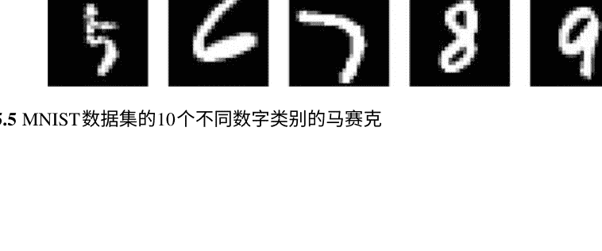

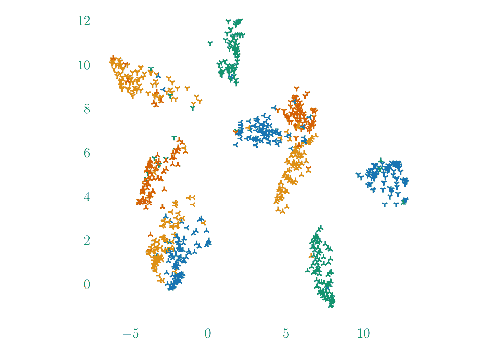

##### 图5.6 MNIST原始像素空间的UMAP 2D投影

统一流形逼近和投影（UMAP）[34]可以用作开箱即用的可视化工具，类似于t分布随机邻居嵌入（t-SNE）[31]，但速度更快，更好地适应高维度，并更好地保留全局数据结构的特征。 使用这种降维技术，我们在图5.6中观察到MNIST数据集的结构。它对于所有类别都有明确定义的聚类。

标准的机器学习算法在MNIST上可以获得超过97%的分类准确率，例如随机森林[5]和带有高斯核的支持向量机[49]，而深度学习模型可以达到99.5%以上[59]。 几乎没有空间供研究人员评估观察到的性能改进是否具有统计学意义。 因此，MNIST几乎没有用于基准测试，并且不再代表现代计算机视觉任务。 尽管如此，近年来它主要被用作玩具数据集进行健全性检查和算法原型设计。

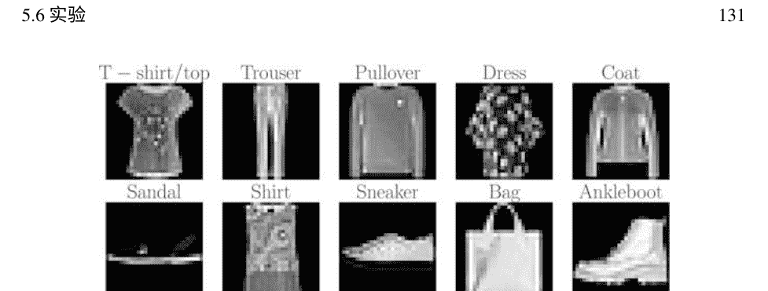

#### 5.6.1.2 Fashion-MNIST

Fashion-MNIST呈现相同的一般布局：60,000个训练和10,000个测试样本，28 ×28灰度图像，以及10个可能的独占类别[60]。它是作为MNIST的替代品构建的，每个类别都与不同的服装相关，如图5.7所示。图像中的细节水平更高，这是显而易见的。

将Fashion-MNIST数据集的原始像素结构与图5.6中的MNIST进行比较，我们可以看到前者具有部分重叠的相应身体区域服装的聚类。尽管简单，Fashion-MNIST并不像MNIST那样容易，仍有改进的空间[60]。

### 5.6.2 实验设置

我们将所有模型的编码器和生成器实现为全连接网络，使用ReLU激活函数和高斯分布来表示潜在空间。在所有实验中，我们将输入图像二值化为范围在[0, 1]之间的{0, 1}，使用阈值0.5，将每个元素j视为独立伯努利分布的实现。类似地，我们将输出建模为独立伯努利分布的参数 \(\hat{X}_{i,j}\)。因此，对数似然函数 \(\log p(x_i | Z_i; \Theta)\) 变为二元交叉熵，如下所示

$$H[p_i, \hat{p}_i] = \sum_{j \in |X_i|} -x_{ij} \log \hat{x}_{ij} - (1 - \hat{x}_{ij}) \log(1 - \hat{x}_{ij}), \qquad (5.29)$$

其中，\(p\) 是由二值化样本 \(x_i\) 引起的二项分布，符号\(\hat{}\)表示与模型输出相关的量。

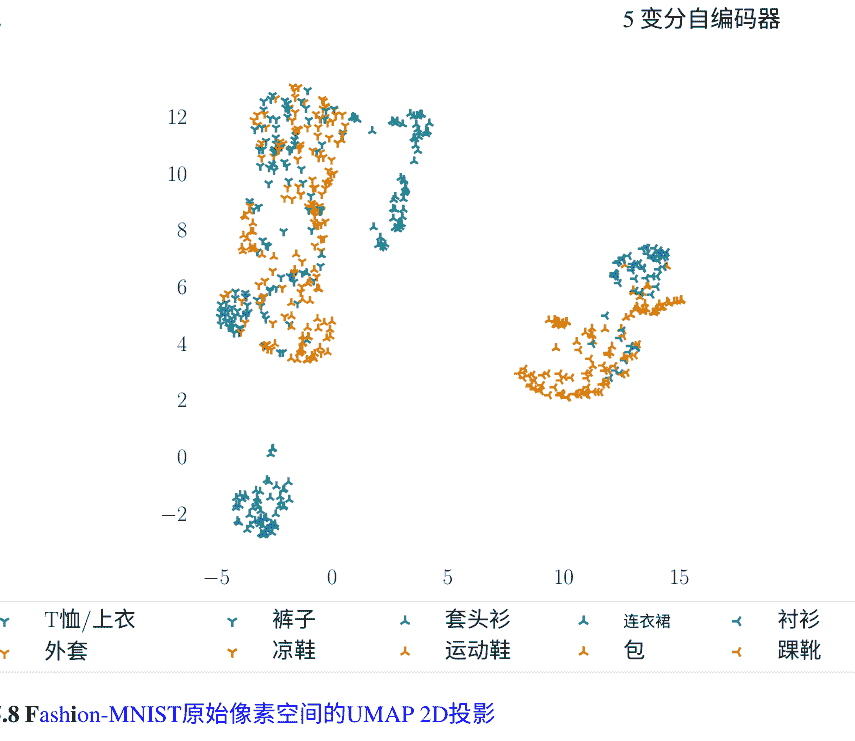

| T恤/上衣 | 裤子 | 套头衫 | 连衣裙 | 衬衫 |
| :---: | :---: | :---: | :---: | :---: |
| 外套 | 凉鞋 | 运动鞋 | 包 | 踝靴 |

此外，我们使用大小为128的小批量数据，对于每个输入示例，从潜在空间中抽取1个MC样本，并使用学习率为0.001的Adam [21]进行100个时期的训练。我们使用不同的潜在空间大小 \(d\) 来训练VAE和CVAE，其中 \(d=\{2, 8, 32, 128\}\)。由于MNIST数据集较简单，我们在编码器和生成器中使用1个隐藏层，而对于Fashion-MNIST，我们使用2个隐藏层。为了简化，我们将解码器设计为编码器的镜像版本。因此，构建的模型具有以下结构：

-   MNIST: 784 → 200 → d → 200 → 784;
-   Fashion-MNIST: 784 → 400 → 200 → d → 200 → 400 → 784。

### 5.6.3 结果

总体而言，VAE和CVAE模型在两个数据集上的行为相似，如图5.9所示。当潜在维度较少时，模型在压缩过程中丢失了很多信息，无法正确表示数据集的不同特征，这解释了图5.9中 \(d=2\) 时ELBO曲线较低的原因。增加潜在空间的维度 \(d\) 允许模型编码之前被忽略的相关信息，从而提高ELBO的表现。尽管性能的提升在较大的 \(d\) 值时会饱和，但对于过大的 \(d\) 值，即128维的ELBO几乎没有负面影响。

## 5.6 实验

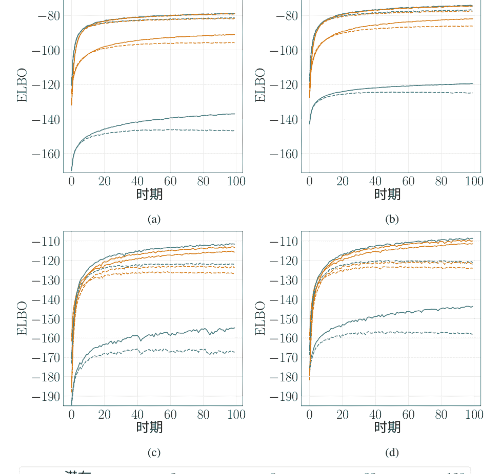

图5.9不同潜在维度空间下MNIST和Fashion-MNIST数据集的训练和评估ELBO。Fashion-MNIST的性能低于MNIST，并且CVAE模型的性能与VAE模型相似。(a) MNIST上的VAE模型。(b) MNIST上的CVAE模型。(c) Fashion-MNIST上的VAE模型。(d) Fashion-MNIST上的CVAE模型。

与图5.9a、b中32D模型相似，图5.9c、d中的模型稍微低一些。VAE对过拟合是鲁棒的，至少对于潜在空间的大小而言。

正如预期的那样，Fashion-MNIST模型的结果明显较差。事实上，我们可以通过观察图5.10中生成的样本来直观地确认这一点。虽然原始的MNIST样本在细节上不是很丰富，但对于Fashion-MNIST对象来说并非如此，而VAE在恢复更精细的细节和更复杂的形状方面存在困难。训练的CVAE模型不增加的主要原因

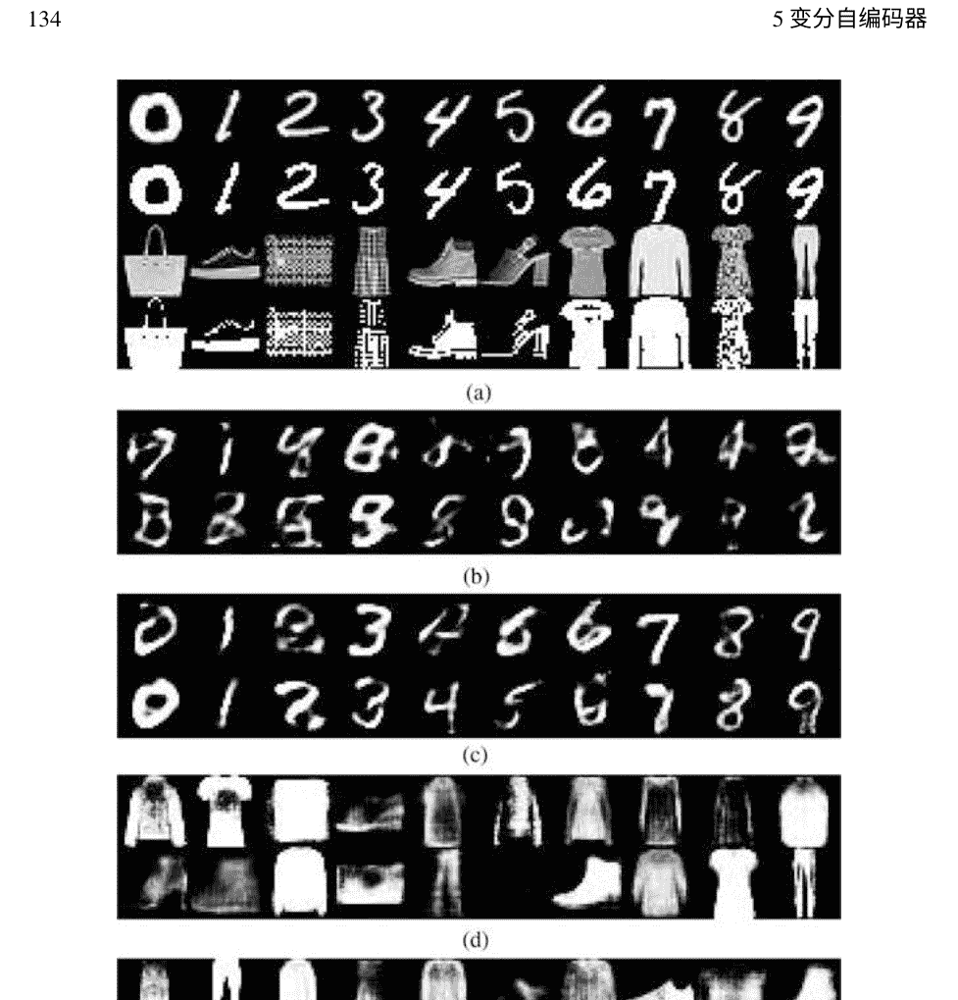

图5.10 由VAE和CVAE模型生成的样本，其中 \(d = 32\)。 (a) MNIST和FashionMNIST数据集的原始和对应的二值化样本。 (b) VAE模型-MNIST。 (c) CVAE模型-MNIST。 (d) VAE模型-Fashion-MNIST。 (e) CVAE模型-Fashion-MNIST。

在我们的实验中，性能的提升是因为在大多数情况下，即 \(d = \{8, 32, 128\}\), 增加潜在维度并不能转化为更好的ELBO。因此，为条件添加10个额外维度并不能使模型更具表达性。

尽管CVAE在生成新的MNIST图像方面做得更好，但通过比较图5.10b、c可以观察到对于Fashion-MNIST数据

由于图5.10e中的图像仅比VAE模型中显示的图5.10d中的图像稍微好一点，因此CVAE和VAE的样本质量无法区分。与图5.7中的真实样本相比，两个模型的质量都很差。

在构建VAE过程中的一个核心论点是潜在空间的结构。这个特性使我们能够在任意维度的不同潜在表示之间平滑地插值，从而创建新的图像样本。在图5.11a中，我们在相同的MNIST数字条件下，插值了一对随机绘制的高维潜在空间样本。我们可以看到样本逐渐变形，即0变得更细，而1同时变得更粗更直。

当 \(d = 2\) 时，我们可以跨越整个潜在空间并绘制其重构。图5.11b显示了从潜在高斯先验的均匀间隔百分位数生成的样本，在概念之间的过渡中具有平滑性。这些模型有效地将数据的变化因素编码到潜在空间中。

我们从图5.12中可以看出，数字4和9的样本的潜在表示，以及数字5和3的样本的潜在表示通常是重叠的，这表明模型无法正确区分它们。从潜在特征空间构建的分类器对于这些类别的样本的准确性很差。同样，如图5.8所示，套头衫、外套和衬衫类别大多分布在潜在空间的同一区域，这在直观上是有意义的，因为它们都是为同一身体部位设计的，因此具有相似的形状。由此可见，推理网络无法识别这些类别的独特特征，与我们之前讨论的模型不够强大的观点一致。更现代化的流动类型，如Sylvester流动[56]，是平面流动的一种推广，使用更强大的变换，更适用于实际应用。

在第5.5.1节中，我们讨论了获取更具表现力的后验概率的不同方法。归一化流是当今最重要的方法之一，有几项工作完全依赖它来高效地进行密度估计和样本生成[22, 26, 40]。在我们的实验中，我们使用它来增强变分推断，并获得具有良好后验逼近和更高似然度的模型。表5.1显示了VAE在MNIST和Fashion-MNIST上估计的边际对数似然，随着计划流中步骤数 \(K\) 的增加，其变换在(5.23)中定义。尽管对于 \(K = \{2, 4, 8\}\) 而言并没有统计显著性，但与普通VAE相比，性能提升是明显的。平面变换是一种基本情况，每个步骤只影响空间的一小部分，因此需要大量的步骤才能有效地获得所需的效果，特别是在高维空间中。

不幸的是，所有重建和生成的样本都模糊不清。模糊是VAE的一般特征，源于旨在最小化数据的平均对数似然的目标。平均而言，它们可能很好，但单独来看它们不够清晰。这种效果在时尚MNIST上更加明显，因为服装比数字更多样化且细节更多，这正是我们在图5.10和5.13中观察到的。然而，在输入样本上应用的二值化过程中，很多细粒度的细节都丢失了。我们可以使用

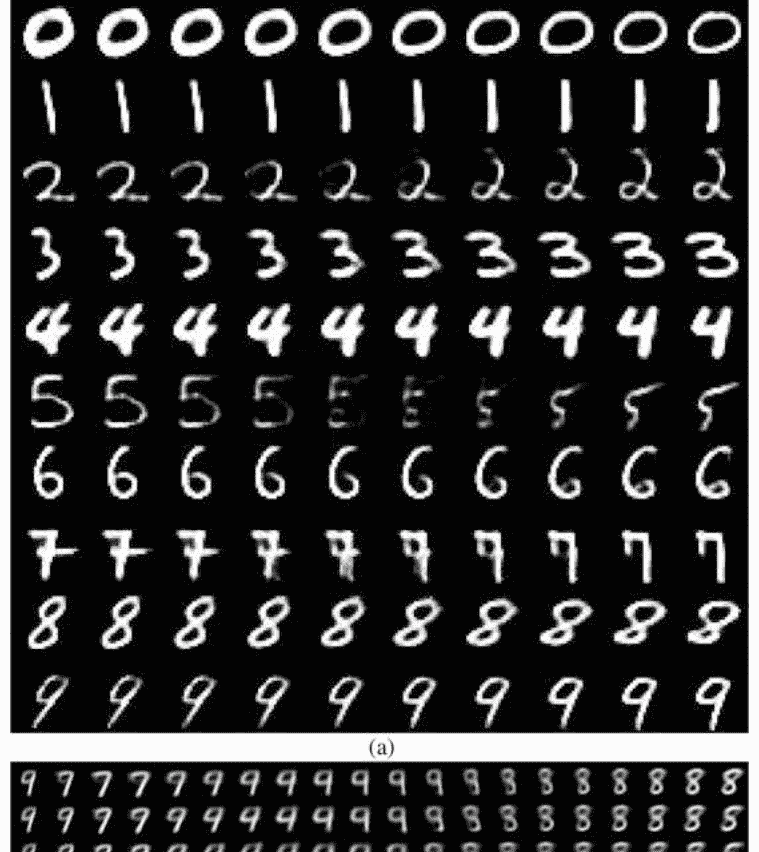

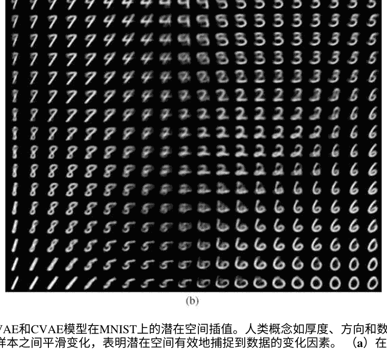

图5.11 VAE和CVAE模型在MNIST上的潜在空间插值。人类概念如厚度、方向和数字特定特征在样本之间平滑变化，表明潜在空间有效地捕捉到数据的变化因素。（a）在MNIST上使用 \(d=32\) 的CVAE模型。（b）在MNIST上使用 \(d=2\) 的VAE模型。

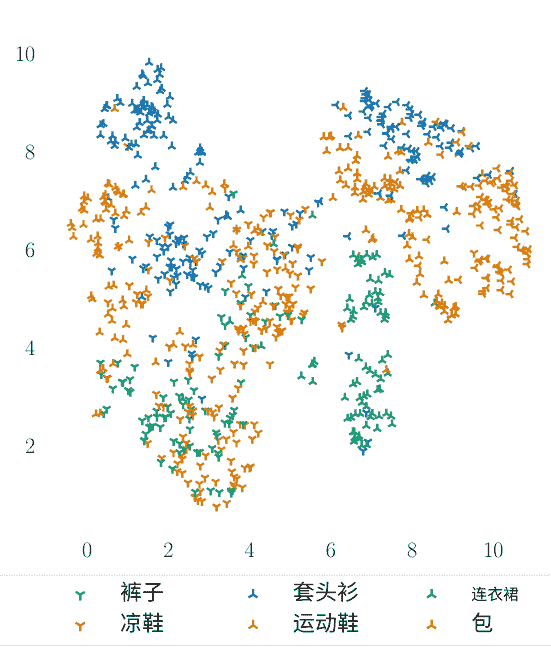

图5.12 显示了在Fashion-MNIST上训练的维度为32的VAE的2D投影可视化

### 表5.1 VAE模型的估计边际对数似然 \(p(X)\) 与变长 \(K\) 的平面归一化流 通过每个测试集实例的1024个重要性采样计算估计值

| 步骤 \(K\) | 边际对数似然 \(p(X)\) | |
| :---: | :---: | :---: |
| | MNIST | FashionMNIST |
| 0 | \(-73.4 \pm 0.2\) | \(-116.6 \pm 0.7\) |
| 1 | \(-71.4 \pm 0.1\) | \(-112.3 \pm 0.6\) |
| 2 | \(-71.7 \pm 0.6\) | \(-112.6 \pm 0.7\) |
| 4 | \(-71.8 \pm 0.2\) | \(-112.5 \pm 0.7\) |
| 8 | \(-71.8 \pm 0.3\) | \(-112.5 \pm 0.5\) |
| 16 | \(-71.0 \pm 0.3\) | \(-112.9 \pm 0.6\) |
| 32 | \(-70.0 \pm 0.2\) | \(-113.1 \pm 0.7\) |

原始灰度值不变，但由于伯努利对数似然导致的二元交叉熵不再适用，因此需要使用适当的连续实值分布之一，例如logit-正态分布。一般来说，为了获得更好的对数似然和样本质量，我们需要使用更好的模型。 事实上，普通的全连接网络在图像领域中已经被卷积架构所取代。

KL散度在整个训练过程中保持稳定，变化很小，如图5.14所示。虽然我们只展示了在Fashion-MNIST上训练的CVAE的情况，但这是所有实验中观察到的一般行为。 这是KL项对模型具有强大的正则化效果的结果，如第5.5.2节所示。学习后验分布在第一个时期就远离先验分布，即使尚未学到很多，如图所示。

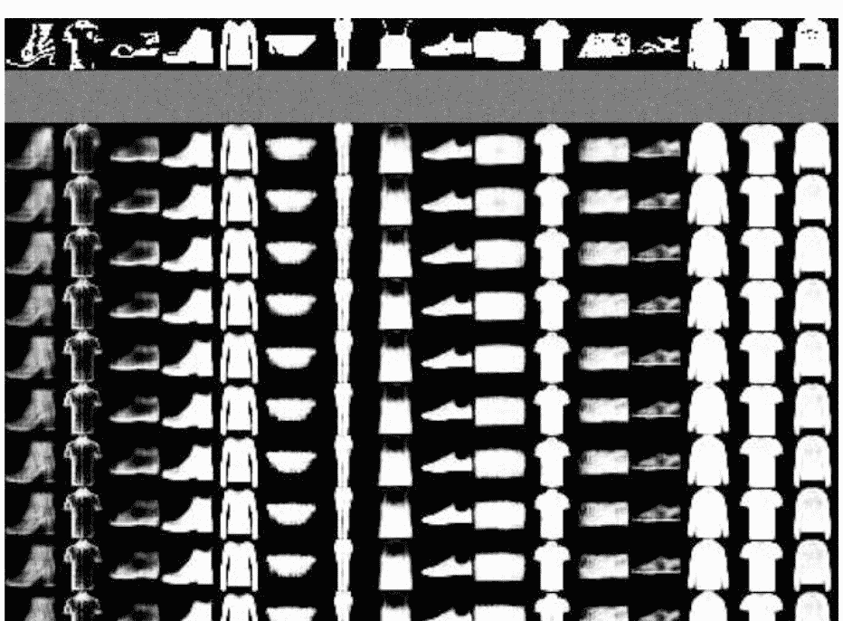

图5.13显示了在具有32个潜在维度的VAE模型训练过程中对Fashion-MNIST样本的重建。原始样本位于第一行，其他行是每10个时期的快照。大部分信息在前10个时期内学习到。然而，最后一行的图像中可以感知到更高级别的细节。

图5.13中，后验在优化过程的其余部分保持大致相同的“距离”。如果我们使用了一个具有更强大能力的生成器来重构输入，例如自回归模型，KL项的强度将能够使后验与先验保持一致，从而导致不希望的后验坍塌。规避这个问题最直接的方法是直接减小β-VAE模型中β的值。调整β的值允许我们权衡KL项对ELBO的正则化效果的相对重要性。这个超参数在模型的有限容量下平衡了失真、重构误差、通信速率和后验不对齐之间的折衷。这个特性可以从图5.15中观察到，在失真-速率平面上绘制了模型的性能。

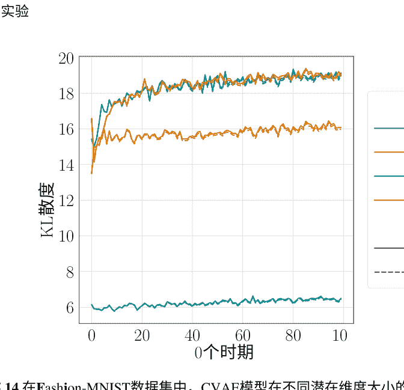

图5.14 在Fashion-MNIST数据集中，CVAE模型在不同潜在维度大小的训练和评估过程中的KL散度曲线

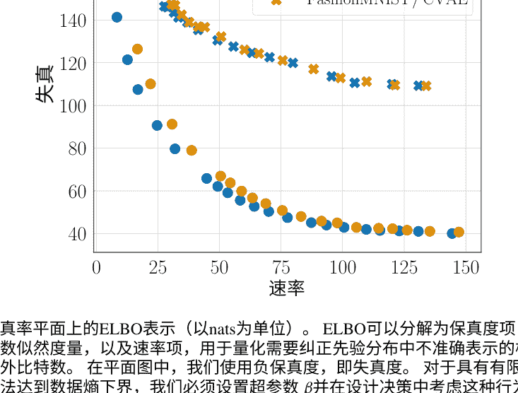

图5.15 失真率平面上的ELBO表示（以nats为单位）。ELBO可以分解为保真度项，通过数据集的对数似然度量，以及速率项，用于量化需要纠正先验分布中不准确表示的样本所需的平均额外比特数。在平面图中，我们使用负保真度，即失真度。对于具有有限容量的模型，无法达到数据熵下界，我们必须设置超参数 β 并在设计决策中考虑这种行为权衡。

### 5.7 应用：半监督生成模型学习

流行的现代机器学习方法依赖于具有数百万参数的模型，并且需要大量的标注数据，这是目前人工智能中最昂贵和最理想的资产。当标注数据不充分时，监督模型会过拟合已呈现的数据，并且泛化能力较差。生成模型使我们能够利用未标记样本的性能，有效减少对标注的依赖，这是我们所称的半监督学习方法。

我们可以优化一个判别分类器和一个VAE，共享它们的参数，并将它们用于目标变量 \(Y\) 的半监督学习[25, 30]。对于未标记的样本，我们将 \(Y\) 视为一个离散的隐性随机变量，根据分类分布进行分布，这使我们能够推断目标标签 \(Y\)。图5.16显示了生成模型和推断模型的PGMs。

请注意，我们使用 \(Y\) 来对隐变量 \(Y\) 进行条件约束，根据类别将潜空间分割成不同的区域，类似于第5.3.1节中的CVAE。图5.17说明了这种模型的高级计算图。

在MNIST数据集上，图5.17中更复杂的模型能够在每个类别仅使用10个标记图像的情况下，将平均分类错误率降低到1%以下，总共使用了训练集中可用的60,000个图像中的100个[30]。

辅助深度生成模型通过引入辅助潜变量（见第5.5.1.2节）扩展了上述VAE，使其成为一个两层的随机模型[30]。这增加了变分近似的灵活性，使其能够更好地适应复杂的潜在分布，从而改善了变分下界。

生成模型的基础PGM显示在图5.18a中，而推理模型显示在图5.18b中。它们与图5.18a基本相同，只是包括了辅助节点 \(a\)。图5.19说明了用于辅助深度生成模型的高级计算图。

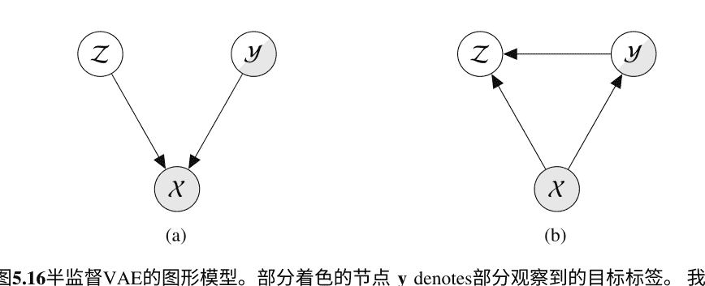

图5.16半监督VAE的图形模型。部分着色的节点 \(y\) denotes部分观察到的目标标签。我们假设在生成过程中 \(y\) 和 \(z\) 是条件独立的，因此 \(y\) 捕捉到数字的语义， \(z\) 捕捉到样式和位置。由于 \(z\) 从未被观察到，并且不同的数字具有不同的样式，因此在推断过程中使用 \(y\) 来估计 \(z\)，这种关系在(b)中由箭头 \(y \rightarrow z\) 表示。(a) 生成网络的图形模型。(b) 推断网络的图形模型。

图5.17半监督VAE模型的计算图示。x*是原始样本x的重构。对于有标签的样本，我们再次使用第5.3.1节中介绍的CVAE，其中ẑ表示z的估计值。然而，对于无标签的数据，y是未知的，必须首先从分类分布q(y|X)中推断出其估计值ŷ。尽管每个框都由一个单独的全连接神经网络实现，但完整的模型是同时优化的。(a) 有标签样本的图示。

(b) 用于无标签样本的图表

图5.18辅助深度生成模型的推理和生成部分的图形表示。部分着色的节点yd表示部分观察到的目标标签。与图5.16相比，新颖之处在于包含了随机节点a，这使得变分后验具有更大的灵活性。(a) 生成网络的图形模型。(b) 推理网络的图形模型。

半监督学习。尽管模型只添加了一个变量，但包括了两个分布：用于推理网络的q(a|X)和用于生成网络的p(a|X,Z,Y)。

在接下来的内容中，我们使用图5.17和5.16中的模型，即不包含辅助变量𝒜，来构建我们的示例。

我们将生成过程建模为也依赖于部分观测到的潜在类变量Y_i，该变量指定了数字。潜在变量Y和Z都是条件独立的，因此第一个捕捉到数字的语义，第二个捕捉到数字的风格，两者独立。因此，我们可以写成p(y_i, z_i|X_i)=

图5.19 辅助深度生成模型的计算图概述。与图5.17相比，上面以颜色显示的所有差异都源自辅助变量的引入，该变量表示推断过程中的中间步骤，在图5.18b中有所说明。然后，它们输入Y和Z编码器（q(·)块），以及X解码器（q(x|·)块）。类似于图5.17，x*和a*分别表示样本x和a的重构。（a）标记样本的图示。（b）未标记样本的图示。

我们定义先验p(y_i)为K-分类分布_K在类变量上，定义先验p(z)为多元标准高斯分布，类似于第5.3节。然后，一个样本的完整生成过程定义为

$$
p(x_i, z_i, y_i)=p(x_i|z_i, y_i)p(z)p(y) \quad (5.30)
$$

$$
p(y)=\prod_K(y|\pi) \quad (5.31)
$$

$$
p(z) = \mathcal{N}(z | 0, I) \quad (5.32)
$$

$$
p(x_i|z_i, y_i)=\prod_{j=1}^X p_j(x_i|z_i, y_i), \quad (5.33)
$$

其中π是一个概率向量，X的元素，即维度，是iid的。具体来说，我们使用伯努利变量来模拟二进制的黑白像素值。

优化这个模型涉及到观测和未观测类变量Y的边际似然，以及p(x,y)和p(x)。正如第5.3节所述，我们无法直接计算这些边际概率，因此采用了第3.2.1节介绍的变分框架。

## 5.7 应用：半监督学习的生成模型

$$
\log p(\mathbf{x}_{-i}, \mathbf{y}_{-i}) = \log \int p(\mathbf{x}_{-i}, \mathbf{y}_{-i}, \mathbf{z}_{-i}) d\mathbf{z}_{-i} \ 
\geq \mathbb{E}_{q(\mathbf{z}_{-i}|\mathbf{X}_{-i}, \mathbf{Y}_{-i}; \psi)} \left[ \log \frac{p(\mathbf{x}_{-i}, \mathbf{y}_{-i}, \mathbf{z}_{-i}; \theta)}{q(\mathbf{z}_{-i}|\mathbf{X}_{-i}, \mathbf{Y}_{-i}; \psi)} \right] = \mathcal{L}(\mathbf{x}_i, \mathbf{y}_i) \quad (5.34)
$$

$$
\log p(\mathbf{x}_i) = \log \int p(\mathbf{x}_i, \mathbf{y}_i, \mathbf{z}_i) d\mathbf{z}_i d\mathbf{y}_i \ 
\geq \mathbb{E}_{q(\mathbf{z}_i, \mathbf{y}_i | \mathbf{X}_i; \psi)} \left[ \log \frac{p(\mathbf{x}_i, \mathbf{y}_i, \mathbf{z}_i; \theta)}{q(\mathbf{z}_i, \mathbf{y}_i | \mathbf{X}_i; \psi)} \right] \ 
= \mathbb{E}_{q(\mathbf{y}_i | \mathbf{X}_i; \psi)} \left[ \mathbb{E}_{q(\mathbf{z}_i | \mathbf{Y}_i, \mathbf{X}_i; \psi)} \left[ \log \frac{p(\mathbf{x}_i, \mathbf{y}_i, \mathbf{z}_i; \theta)}{q(\mathbf{z}_i, \mathbf{y}_i | \mathbf{X}_i; \psi)} \right] \right] = \mathcal{U}(\mathbf{x}_i), \quad (5.35)
$$

其中 \(q(\cdot)\) 再次是由推理模型学习得到的提议分布。 有关如何获得(5.35)和(5.34)中的不等式的详细说明，请阅读第3.2.1.1节。

我们为每个潜变量训练一个识别模型，并假设它们的分布遵循

$$
q(\mathbf{y}_i | \mathbf{X}_i) = \Pi_K (\mathbf{y}_i | \pi(\mathbf{x}_i; \psi)) \quad (5.36) \ 
q(\mathbf{z}_i | \mathbf{Y}_i, \mathbf{X}_i) = \mathcal{N} \left( \mathbf{z}_i | \mu(\mathbf{x}_i, \mathbf{y}_i; \phi), \text{diag} \left( \sigma^2 (\mathbf{y}_i, \mathbf{x}_i; \phi) \right) \right). \quad (5.37)
$$

因此，我们能够使用 (5.37) 在潜在空间中进行推断，条件是附加属性 \(\mathbf{y}_i\)，类似于第5.3.1节中的CVAE。此外，我们可以通过 (5.36) 定义的分布推断出 \(\mathbf{x}_i\) 的未知标签。不幸的是，重参数化技巧不适用于 \(q(\mathbf{y}_i | \mathbf{X}_i)\)，因为该分布是离散的。我们可以使用梯度的得分函数估计器，但是它会产生高方差的估计（见附录A.1）。或者，我们可以在 (5.37) 中对 \(\mathbf{Y}_i\) 进行边缘化，并对每个 \(\mathbf{y}\) [25]的值进行推断，从而在 \(q(\mathbf{z}_i | \mathbf{Y}_i, \mathbf{X}_i; \psi)\) 上执行推断。然而，对所有类别进行边缘化的成本很高，因为需要重复相同的操作 \(K\) 次，其中 \(K\) 是K-Categorical分布中的类别数，定义如 (5.27)。另一个选择是使用Gumbel-softmax技巧[19, 33] (见第5.5.3.1节) 将离散分布 \(p(\mathbf{y})\) 和 \(q(\mathbf{z}_i | \mathbf{Y}_i, \mathbf{X}_i; \psi)\) 松弛为连续的近似，从而再次可以应用路径梯度估计器。连续松弛使我们能够使用MC样本而不是边缘化。

当使用1个MC样本时，通过实验证实，与边缘化相比，整体训练速度增加了2倍（对于10个类别）和10倍（对于100个类别）[19]。

在所提出的模型中仍存在一个实际问题：直接优化标签预测分布 \(q(\mathbf{y}_i|\mathbf{X}_i)\) 仅限于数据中未标记的部分（通过公式5.35）。设 \(S\) 为数据集中所有标记样本的索引集合。

### 测试集上的模型准确率
| 标签计数   | Fashion-MNIST 半监督 | Fashion-MNIST 监督 | MNIST 半监督 | MNIST 监督 |
|------------|----------------------|--------------------|--------------|------------|
| 6000 (10%) | 79.2                 | 77.1               | 93.6         | 91.4       |
| 3000 (5%)  | 77.9                 | 71.6               | 91.4         | 88.0       |
| 600 (1%)   | 72.0                 | 56.4               | 86.1         | 44.6       |
| 300 (0.5%) | 70.9                 | 46.7               | 81.7         | 30.1       |
| 100 (0.17%)| 63.5                 | 21.3               | 68.0         | 20.4       |

对于S中的i，模型不直接学习推断类别。因此，我们通过添加一个辅助的交叉熵项来扩充目标函数，该项将约束q(yi|Xi)为根据观察到的类别标签yi正确分类样本xi的分布，从而导致

$$
\mathcal{J} = \left[ \sum_{i \in S} \mathcal{U}(\mathbf{x}_i) + \sum_{i \notin S} \mathcal{L}(\mathbf{x}_i, y_i) \right] + \alpha \sum_{i \notin S} \log q(y_i | \mathbf{X}_i), \quad (5.38)
$$

其中权重α是一个超参数，用于平衡交叉熵项的正则化强度。

尽管我们在(5.38)中任意添加了交叉熵项以增强学习，但我们也可以通过从变分框架中推断参数π（5.36）并将其与对称狄利克雷先验p(π)耦合，而不是定义一个分类先验Y[25]，直接获得相同的结果。表5.2展示了在MNIST和Fashion-MNIST数据集上使用本节描述的半监督VAE获得的分类准确率在不同注释水平下的结果。

我们按照图5.17中的图表构建模型，对于每个模块，使用2个具有ReLU激活函数的隐藏层全连接网络[38]。对于分类分布Gumbel-softmax的近似k(yi|π(xi; ψ))，引入了一个温度超参数T_k，我们将其设置为T_k=0.6。此外，我们设置潜在空间维度d=32，从近似分布q(yi|Xi)和q(zi|Yi, Xi)中抽取T=1个MC样本，并使用正则化权重α=25。关于优化过程，我们使用Adam [21]优化器，以固定学习率lr=0.003和批量大小bs=128进行40个周期的训练。

生成方法允许利用未标记数据中的潜在信息，并在注释有效的角度上获得合理的性能。这意味着在商业和工业应用中，清理和标记是任何机器学习项目中最困难和最昂贵的部分，因此可以实现更便宜和更快速的开发周期。与主动学习一起，这种方法在系统向用户展示哪些样本应该被标注以获得最佳性能增益，半监督是一个有前景且令人耳目一新的领域，具有几个真实世界的应用案例。

## 5.8 结语

在本章中，我们讨论了VAE模型家族，以及这些模型如何通过应用VI到潜变量建模而产生，并且它们之间的关系。此外，我们介绍了它们的主要缺点，即表达能力不足的后验、后验崩溃和离散潜变量，以及缓解它们的不同方法。这些问题中的许多是当前的研究课题。

在我们的实验中，我们展示了VAEs及其主要变体的生成和推理能力，以及ELBO和潜在空间的特性。最后，我们展示了生成建模在半监督学习中的巨大潜力，这是一种利用很少标记样本并利用未标记样本的学习方法。

存在其他几种生成算法，最流行的是生成对抗网络[12]，其训练动态也可以通过概率角度来解释。最近，纯流动模型[9, 22]在研究界引起了很大关注，因为它们能够以令人印象深刻的快速和直接的训练方式进行推理和/或生成。

最后，我们想指出，在整本书中，我们看到了贝叶斯方法在概率建模中的价值，以及它如何通过边缘化和条件化操作无缝地允许我们在不确定性下进行推理、进行预测和模拟新数据。此外，模型拟合和比较自然地出现在该框架中，这也具有更好地处理数据稀缺情况的额外优势。

贝叶斯深度学习正在成为当前机器学习会议的核心主题，应用领域也在日益凝结：域外检测、对抗鲁棒性、复合探索、音频合成和图像超分辨率等等。从本书开始写作到出版的时刻，许多新的有趣应用和方法浮出水面，使得跟上科学界的进展变得不可能。然而，我们希望我们的介绍能够激发读者在这个领域自信地进一步探索。对于统计学家和机器学习从业者来说，这是一个令人兴奋的时刻，因为我们面前有一波新的创新浪潮。

## 5.9 最后的话

在整本书中，我们看到了贝叶斯方法在概率建模中的价值，以及它如何无缝地允许我们在不确定性下进行推理、进行预测和模拟新数据，所有这些都是通过边缘化和条件化操作实现的。 此外，模型拟合和比较自然地出现在这个框架中，这也有一个额外的优势，即更好地处理数据稀缺的情况。

贝叶斯深度学习正在成为当前机器学习会议的核心主题，应用领域也在不断形成：领域外检测、对抗鲁棒性、复合探索、音频合成和图像超分辨率等等。 从开始写这本书到出版的这一刻，许多新的有趣应用和方法浮出水面，使得跟上科学界的进展变得不可能。 然而，我们希望我们的介绍能够激发读者在这个领域自信地继续深入研究。 对于统计学家和机器学习实践者来说，现在是一个令人兴奋的时刻，因为我们面前有一波新的创新浪潮。

# 参考文献

1.  Alemi A, Fischer I, Dillon J, Murphy K (2017) 深度变分信息瓶颈. 在: 国际学习表示大会论文集, 法国图伦
2.  Alemi A, Poole B, Fischer I, Dillon J, Saurous RA, Murphy K (2018) 修复破损的ELBO. 在: Dy J, Krause A (eds) 机器学习国际会议论文集, 瑞典斯德哥尔摩, vol 80, pp 159–168
3.  Beal MJ, Ghahramani Z (2003) 变分贝叶斯EM算法用于不完整数据: 应用于评分图模型结构. 在: 贝叶斯统计学7: 第七瓦伦西亚国际会议, 西班牙特内里费, pp. 453–464
4.  Blundell C, Cornebise J, Kavukcuoglu K, Wierstra D (2015) 神经网络中的权重不确定性. 在: 机器学习国际会议论文集, 法国里尔,vol 37, pp 1613–1622
5.  Breiman L (2001) 随机森林。 机器学习 45(1):5–32. https://doi.org/10.1023/A:1010933404324
6.  Burda Y, Grosse R, Salakhutdinov R (2016) 重要性加权自编码器。 在: 国际学习表示会议论文集, 圣胡安, 波多黎各
7.  Burgess CP, Higgins I, Pal A, Matthey L, Watters N, Desjardins G, Lerchner A (2018)理解β-VAE中的解缠结。 arXiv电子打印版1804.03599
8.  Chen J, Chen J, Chao H, Yang M (2018) 基于生成对抗网络的图像盲去噪中的噪声建模。 在: 计算机视觉和模式识别会议论文集, 美国盐湖城
9.  Dinh L, Sohl-Dickstein J, Bengio S (2017) 使用真实NVP进行密度估计。 在: 学习表示国际会议论文集, 法国图伦
10. Eslami SMA, Heess N, Weber T, Tassa Y, Szepesvari D, k avukcuoglu k, Hinton GE (2016) 出席、推断、重复: 基于生成模型的快速场景理解。 在: 神经信息处理系统进展, 第3225-3233页
11. Eslami SMA, Jimenez Rezende D, Besse F, Viola F, Morcos AS, Garnelo M, Ruderman A, Rusu AA, Danihelka I, Gregor K, Reichert DP, Buesing L, Weber T, Vinyals O, Rosenbaum D, Rabinowitz N, King H, Hillier C, Botvinick M, Wierstra D, Kavukcuoglu K, Hassabis D (2018年) 神经场景表示和渲染。 Science 360 （6394） ： 1204-1210
12. Goodfellow I, Pouget-Abadie J, Mirza M, Xu B, Warde-Farley D, Ozair S, Courville A, Bengio Y (2014年) 生成对抗网络。 在：神经信息处理系统进展，加拿大蒙特利尔，第2672-2680页
13. G mez-Bombarelli R, Wei JN, Duvenaud D, Hern ndez-Lobato JM, S nchez-Lengeling B, Sheberla D, Aguilera-Iparraguirre J, Hirzel TD, Adams RP, Aspuru-Guzik A (2018年) 使用数据驱动的分子连续表示进行自动化化学设计。 ACS Central Sci4 （2） ： 268 -276
14. Ha D, Schmidhuber J (2018) 循环世界模型促进策略演化。 在：神经信息处理系统进展，加拿大蒙特利尔，第2450-2462页
15. He J, Spokoiny D, Neubig G, Berg-Kirkpatrick k T (2019) 变分自编码器中的滞后推理网络和后验崩溃。 在：国际学习表示会议论文集，美国新奥尔良
16. Heusel M, Ramsauer H, Unterthiner T, Nessler B, Hochreiter S (2017) 通过两个时间尺度更新新规则训练的GAN收敛到局部纳什均衡。 在：神经信息处理系统进展，美国长滩，第6626-6637页
17. Higgins I, Matthey L, Pal A, Burgess C, Glorot X, Botvinick M, Mohamed S, Lerchner A(201 7) β-VAE：通过约束的变分框架学习基本视觉概念。 在：国际学习表示会议论文集，法国图伦
18. Houthooft R, Chen X, Chen X, Duan Y, Schulman J, De Turck F, Abbeel P (2016)VIME：变分信息最大化探索。 在：神经信息处理系统进展，西班牙巴塞罗那，第1109-1117页
19. Jang E, Gu S, Poole B (2017) Gumbel-softmax的分类重参数化。 在：国际学习表示大会论文集，法国图伦
20. Kalchbrenner N, van den Oord A, Simonyan K, Danihelka I, Viny als O, Graves A,Kavukcuoglu K (2017) 视频像素网络。 在：机器学习国际会议论文集，悉尼，澳大利亚，第70卷，第1771-1779页
21. Kingma DP, Ba J (2015) Adam：一种随机优化方法。 在：国际学习表示大会论文集，美国圣地亚哥
22. Kingma DP, Dhariwal P (2018) Glow：具有可逆1x1卷积的生成流。 在：神经信息处理系统进展，加拿大蒙特利尔，第10215-10224页
23. Kingma DP, Welling M (2014) 自编码变分贝叶斯。 在：国际学习表示大会论文集，加拿大班夫
24. Kingma DP, Welling M （2019） 变分自动编码器简介。 Found Trends Mach Learn 12(4):307–392. https://doi.org/10.1561/2200000056
25. Kingma DP, Mohamed S, Jimenez Rezende D, Welling M （2014） 深度生成模型的半监督学习。 在：神经信息处理系统的进展，蒙特利尔，加拿大，第3581-3589页
26. Kingma DP, Salimans T, Jozefowicz R, Chen X, Sutskever I, Welling M （2016） 改进的变分推断与逆自回归流。 在：神经信息处理系统的进展，巴塞罗那，西班牙，第47 43-4751页
27. Lecun Y, Bottou L, Bengio Y, Haffner P （1998） 基于梯度的文档识别应用。 Proc IEE E 86(11):2278–2324
28. Ledig C, Theis L, Huszar F, Caballero J, Cunningham A, Acosta A, Aitken A, Tejani A, TotzJ, Wang Z, Shi W (2017) 使用生成对抗网络的照片级单图超分辨率。 在：计算机视觉和模式识别会议论文集，美国檀香山
29. Lee AX, Zhang R, Ebert F, Abbeel P, Finn C, Levine S (2018) 随机对抗视频预测。 arXiv电子打印 1804.01523

# 附录A
支持材料

在这个附录中，我们对书中只简要讨论但对整体理解非常重要的主题进行了扩展。具体来说，我们首先解释了评分函数和路径导数估计器，这对于任何基于梯度的方法都至关重要。我们进一步介绍了自然梯度，对其进行了动机解释并展示了一个粗略的数学推导。此外，我们详细介绍了

-   坐标上升变分推断（CAVI）算法，在第3.2.1.4节中介绍；
-   广义高斯-牛顿（GGN）近似，在第4.3.1节和第4.6节中用于推导贝叶斯神经网络（BNNs）的实用ADF [3]和Vadam [4]方法；
-   Bonnet和Price的定理，也被称为高斯梯度恒等式，同样适用于实际ADF [3]和Vadam [4]。

## A.1 梯度估计器

在推理问题中，以及其他领域中，我们经常遇到计算 ∇_φ E_{q(z; φ)} [ f(z; θ) ]。这是关于 φ的期望的梯度，函数 f(z; θ)在分布 q(z; φ)下，其中 θ和 φ分别是它们的参数。通常，我们无法直接计算这个梯度，因为期望是难以处理的。因此，我们假设某些条件，以便重新编写它并获得适当的实际估计器，我们通过蒙特卡洛积分来近似。

如果 q(z; φ)已知，并且它是 φ的连续函数，尽管不一定是 z的连续函数，我们通过 reinforce或score函数估计器[8]来推导出。

```
\nabla_{\phi} \mathbb{E}_{q(z; \phi)} [ f (z; \theta) ] = \nabla_{\phi} \left[ \int q(z; \phi) f (z; \theta) dz \right]
```

$$\begin{aligned}
= \int \nabla_\phi [q(z; \phi)] f(z; \theta) dz \\
= \int q(z; \phi) \nabla_\phi [\log q(z; \phi)] f(z; \theta) dz \\
= \mathbb{E}_{q(z;\phi)} [f(z; \theta) \nabla_\phi [\log q(z; \phi)]]. \quad (A.1)
\end{aligned}$$

注意第三个等式来自于对数导数技巧

$$\frac{\partial \log g(\xi)}{\partial \xi} = \frac{1}{g(\xi)} \frac{\partial g(\xi)}{\partial \xi} \quad (A.2)$$

而且我们对f(z; θ)没有做任何假设。它可能是不可微的，甚至是离散的。

相反，如果我们将随机变量Z ~ q(z; φ)表达为一个可逆的确定性可微变换g(·; φ)的基本随机变量ξ ~ p(ξ)，我们就得到了路径导数估计器[7]。

$$\begin{aligned}
\nabla_\phi \mathbb{E}_{q(z;\phi)} [f(z; \theta)] &= \nabla_\phi \left[ \int p(\xi) f(g(\xi; \phi); \theta) d\xi \right] \\
&= \nabla_\phi \left[ \mathbb{E}_{p(\xi)} [f(g(\xi; \phi); \theta)] \right] \\
&= \mathbb{E}_{p(\xi)} \left[ \nabla_\phi [f(g(\xi; \phi); \theta)] \right]. \quad (A.3)
\end{aligned}$$

这种方法不仅要求分布q(z; φ)可以重新参数化，而且要求f(z; θ)在z的所有值上都是已知且连续的。它也被称为重新参数化技巧，并在最近由[5]推广。

虽然这两种估计器都能产生无偏估计，但是由于对数函数的导数，得分函数估计器通常具有更高的方差。如果我们认为得分函数估计器仅在q上计算导数，并且不包含关于函数f(z;θ)的信息，这种行为是有道理的，因为这是目标函数。

## A.2 CAVI的更新公式

在不使用变分微积分的情况下，我们在第3.2.1节中推导了近似分布q(z|X)的最优因子的更新方程。

我们在这里重新写出了因子化近似分布的公式，该公式定义在方程(3.16)和ELBO中：

$$q(\mathbf{z} | \mathbf{X}) = \prod_{i=1}^{M} q_i(\mathbf{z}_{S_i} | \mathbf{X}), \tag{A.4}$$

$$\text{ELBO}(q) = \mathbb{E}_q [\log p(\mathbf{x}, \mathbf{z})] - \mathbb{E}_q [\log q(\mathbf{z} | \mathbf{X})]. \tag{A.5}$$

我们将方程(A.4)代入方程(A.5)并提取对一个因子$q_i(\mathbf{z}_{S_i} | \mathbf{X})$的依赖。简化符号从 $q_i(\mathbf{z}_{S_i} | \mathbf{X})$ 到 $q_i$，我们得到

$$\begin{aligned} \text{ELBO}(q) &= \int \left( \prod_i q_i \right) \log p(\mathbf{x}, \mathbf{z}) d\mathbf{z} - \int \left( \prod_k q_k \right) \log \prod_l q_l d\mathbf{z} \\ &= \int q_j \left[ \int \log p(\mathbf{x}, \mathbf{z}) \prod_{-j} (q_i d z_i) \right] d z_j - \sum_k \int \prod_l q_l \log q_k d\mathbf{z} \\ &= \int q_j \mathbb{E}_{-j} [\log p(\mathbf{x}, \mathbf{z})] d z_j - \sum_k \int q_k \log q_k \left[ \prod_{l=k} \int q_l d z_l \right] d z_k, \tag{A.6} \end{aligned}$$

其中第一项中的符号 $\mathbb{E}_{-j} [\cdot]$ 表示对所有变量 $\mathbf{z}_{S_i}$ 的 $q$ 分布的期望除了 $i = j$ 之外。由于第二项中的每个 $q_l$ 都是独立因子，因此它被归一化为总和为1。此外，我们定义一个新的分布 $\tilde{p}_{-j}$，使得$\log \tilde{p}_{-j} = \mathbb{E}_{-j} [\log p(\mathbf{x}, \mathbf{z})] + \text{常数项 } c$，其中常数项 $c$ 用于补偿归一化。然后，

$$\begin{aligned} \text{ELBO}(q) &= \int q_j \log \tilde{p}_{-j} d z_j - \sum_i \int q_k \log q_k d z_k + c \\ &= \int q_j \log \tilde{p}_{-j} d z_j - \int q_j \log q_j d z_j - \sum_{k=j} \int q_k \log q_k d z_k + c \\ &= \int q_j \log \left( \frac{\tilde{p}_{-j}}{q_j} \right) d z_j + c \\ &= -D_{KL}(q_j \| \tilde{p}_{-j}) + c. \tag{A.7} \end{aligned}$$

我们保持所有的 $q_{-j}$ 固定，并最大化关于 $q_j$ 的 ELBO。由于当KL项为零时，Eq. (A.7)的最大值出现，我们通过将其设置为等于 $\tilde{p}_{-j}$ 来找到最优的 $q^*$。

$$q_j^*(\mathbf{z}_{S_j} | \mathbf{X}) = \tilde{p}_{-j}(\mathbf{x}, \mathbf{z}_{S_j}), \tag{A.8}$$

对于变量集合 $S_j$, 求解 $q_j$ 对于方程 $(x)$, $\mathbb{E}_{-j} [\log p(\mathbf{x}, \mathbf{z})] +$ 逗号 \tag{A.9}

$$q_{-j}^{*}\left(\mathbf{z}_{S_{j}}|\mathbf{X}\right) \propto \exp \left\{\mathbb{E}_{-j}\left[\log p(\mathbf{x}, \mathbf{z})\right]\right\} \tag{A.10}$$

方程(A.10)对于每个潜变量集合 $S_j$ 是耦合的。因此，解决目标函数的问题需要迭代方法。在每一步中，根据(A.10)的要求，用其修正的估计值替换一个因子 $q_j$，并以循环方式进行。

## A.3 广义高斯-牛顿近似

高斯-牛顿方法是一种用于非线性最小二乘问题的经典方法，它用雅可比矩阵 $J_f$ 来近似函数 $f(\cdot)$ 的海森矩阵。当目标函数不是平方和的形式，而是任意的标量函数 $\ell(\cdot)$ 时，即负对数函数，我们进行

$$\begin{aligned}
\frac{\partial^{2} \ell(f(\mathbf{x}))}{\partial x_{j} \partial x_{i}} &=\frac{\partial}{\partial x_{j}}\left(\frac{\partial \ell(f(\mathbf{x}))}{\partial x_{i}}\right) \[6pt]
&=\frac{\partial}{\partial x_{j}}\left(\sum_{k=0}^{K} \frac{\partial \ell}{\partial f_{k}(\mathbf{x})} \frac{\partial f_{k}(\mathbf{x})}{\partial x_{i}}\right) \[6pt]
&=\sum_{k=0}^{K} \frac{\partial}{\partial x_{j}}\left(\frac{\partial \ell}{\partial f_{k}(\mathbf{x})}\right) \frac{\partial f_{k}(\mathbf{x})}{\partial x_{i}}+\sum_{k=0}^{K} \frac{\partial \ell}{\partial f_{k}(\mathbf{x})} \frac{\partial^{2} f_{k}(\mathbf{x})}{\partial x_{j} \partial x_{i}} \[6pt]
&=\sum_{k=0}^{K} \sum_{m=0}^{K}\left(\frac{\partial^{2} \ell}{\partial f_{m}(\mathbf{x}) \partial f_{k}(\mathbf{x})}\right) \frac{\partial f_{m}(\mathbf{x})}{\partial x_{j}} \frac{\partial f_{k}(\mathbf{x})}{\partial x_{i}}+\sum_{k=0}^{K} \frac{\partial \ell}{\partial f_{k}(\mathbf{x})} \frac{\partial^{2} f_{k}(\mathbf{x})}{\partial x_{j} \partial x_{i}}.
\end{aligned} \tag{A.11}$$

方程(A.11)中的第一项是由于 $f_k(\mathbf{x})$ 变化而产生的Hessian矩阵的分量，而第二项是由于 $x$ 变化而产生的。在损失函数的最小值附近，第二项可以忽略不计。因此，我们有

$$\frac{\partial^{2} \ell(f(\mathbf{x}))}{\partial x_{j} \partial x_{i}} \approx \sum_{k=0}^{K} \sum_{m=0}^{K}\left(\frac{\partial^{2} \ell}{\partial f_{m}(\mathbf{x}) \partial f_{k}(\mathbf{x})}\right) \frac{\partial f_{m}(\mathbf{x})}{\partial x_{j}} \frac{\partial f_{k}(\mathbf{x})}{\partial x_{i}} \triangleq G_{i j}. \tag{A.12}$$

得到的近似值就是我们所称的广义高斯-牛顿方法，当损失函数 $\ell = 0$ 时，该项在方程 (A.11) 中变为零。
然而，随着 $\ell$ 的增大，近似值变得越来越糟糕。
将GGN写成矩阵形式得到

$$G = J_f(\mathbf{x})^T H_{\ell}(f(\mathbf{x})) J_f(\mathbf{x}) \tag{A.13}$$

30. Maaløe L, Sønderby CK, Sønderby SK, Winther O (2016) 辅助深度生成模型。在：国际机器学习会议论文集，美国纽约，第48卷，第1445-1453页

31. Maaten Lvd, Hinton G (2008) 使用t-SNE可视化数据。 J Mach Learn Res 9:2579–2605

32. Maddison CJ, Tarlow D, Minka T (2014) A*抽样。 在：神经信息处理系统进展，加拿大蒙特利尔，第3086-3094页

33. Maddison C, Mnih A, Teh YW (2017) 具体分布：离散随机变量的连续松弛。 在：国际学习表示会议论文集，法国图伦

34. McInnes L, Healy J, Melville J (2018) UMAP：统一流形逼近和投影-降维。 arXiv电子打印 1802.03426

35. Migon HS, Gamerman D, Louzada F (2014) 统计推断：一种综合方法。CRC出版社，美国博卡拉顿

36. Mnih A, Gregor K (2014) 神经变分推断和信念网络中的学习。 在：国际机器学习会议论文集，中国北京，第32卷，第1791-1799页

37. Mnih A, Rezende D (2016) 变分推断用于蒙特卡洛目标。 在：国际机器学习会议论文集，美国纽约，第48卷，第2188-2196页。
38. Nair V, Hinton GE (2010) 矫正线性单元改进了受限玻尔兹曼机。 在：国际机器学习会议论文集，以色列海法，第807-814页。
39. Nowozin S (2018) 修正证据近似：重要性加权自编码器和杰克纳夫变分推断。 在：国际学习表示会议论文集，加拿大温哥华

40. Papamakarios G, Pavlakou T, Murray I (2017) 用于密度估计的掩码自回归流。 在：神经信息处理系统进展，美国长滩，第2338-2347页。

41. Paszke A, Gross S, Massa F, Lerer A, Bradbury J, Chanan G, Killeen T, Lin Z, Gimelshein N, Antiga L, Desmaison A, Kopf A, Yang E, DeVito Z, Raison M, Tejani A, Chilamkurthy S, Steiner B, Fang L, Bai J, Chintala S (2019) PyTorch: 一种命令式风格、高性能的深度学习库。 在：神经信息处理系统进展，温哥华，加拿大，第8024-8035页

42. Rainforth T, Kosiorek A, Le TA, Maddison C, Igl M, Wood F, Teh YW (2018) 更紧的变分界不一定更好。 在：国际机器学习会议论文集，斯德哥尔摩，瑞典，第80卷，第4277-4285页

43. Ranganath R, Tran D, Blei D (2016) 分层变分模型。 在：国际机器学习会议论文集，美国纽约，第48卷，第324-333页
44. Regier J, Miller A, McAuliffe J, Adams R, Hoffman M, Lang D, Schlegel D, Prabhat M (2015) Celeste：天文图像生成模型的变分推断。 在：国际机器学习会议论文集，法国里尔，第37卷，第2095-2103页
45. Rezende D, Mohamed S (2015) 具有归一化流的变分推断。 在：国际机器学习会议论文集，法国里尔，第37卷，第1530-1538页
46. Riesselman AJ, Ingraham JB, Marks DS (2018) 捕捉基因变异效应的深度生成模型。 自然方法15: 816-822

47. Rosca M, Lakshminarayanan B, Warde-Farley D, Mohamed S (2017) 变分方法用于自编码生成对抗网络的方法。 arXiv e-prints 1706.04987
48. Salimans T, Goodfellow I, Zaremba W, Cheung V, Radford A, Chen X, Chen X (2016) 改进的生成对抗网络训练技术。 在：神经信息处理系统进展，西班牙巴塞罗那，第2234-2242页。

49. Scholkopf B, Sung KK, Burges CJ, Girosi F, Niyogi P, Poggio T, Vapnik V (1997) 将支持向量机与高斯核与径向基函数分类器进行比较。 IEEE信号处理杂志45(11):2758–2765

50. Sohn K, Lee H, Yan X (2015) 使用深度条件生成模型学习结构化输出表示。 在：神经信息处理系统进展，加拿大蒙特利尔，第3483-3491页。

51. Sønderby CK, Raiko T, Maaløe L, Sønderby SK, Winther O (2016) 阶梯变分自编码器。在: 神经信息处理系统进展, 西班牙巴塞罗那, pp 3738-3746
52. Sønderby CK, Poole B, Mnih A (2017) 连续松弛训练离散潜变量图像模型。在: 神经信息处理系统-贝叶斯deep learning研讨会, 美国长滩
53. Theis L, Oord Avd, Bethge M (2016) 关于生成模型评估的一点说明。在: 国际学习表示会议论文集, 波多黎各圣胡安
54. Tishby N, Pereira FC, Bialek W (2000) 信息瓶颈方法。arXiv e-prints physics/0004057
55. Tschanne M, Agustsson E, Lucic M (2018) 用于分布-保持有损压缩的深度生成模型。在: 神经信息处理系统进展, 加拿大蒙特利尔, pp 5929-5940
56. van den Berg R, Hasenclever L, Tomczak J, Welling M (2018) Sylvester归一化流用于变分推断。在: 国际学习会议论文集, 美国蒙特雷
57. van den Oord A, Dieleman S, Zen H, Simonyan K, Vinyals O, Graves A, Kalchbrenner N, Senior A, Kavukcuoglu K (2016) WaveNet: 原始音频的生成模型。在: ISCA语音合成研讨会, 美国阳光城, 第125-125页
58. van den Oord A, Vinyals O, Kavukcuoglu K (2017) 神经离散表示学习。在: 神经信息处理系统进展, 美国长滩, 第6306-6315页
59. Wan L, Zeiler M, Zhang S, Cun YL, Fergus R (2013) 使用dropconnect的神经网络正则化。在: 国际机器学习会议论文集, 美国亚特兰大, 第28卷, 第1058-1066页
60. Xiao H, Rasul K, Vollgraf R (2017) Fashion-MNIST: 一个用于基准测试机器学习算法的新型图像数据集。 arXiv电子打印 1708.07747

它始终是半正定的。特别是当 $\ell(f(\mathbf{x})) = -\log f(\mathbf{x})$ 时，它变为
$$ G = J_f^T(\mathbf{x}) f\left(\frac{1}{\mathbf{x}}\right)^2 J_f(\mathbf{x}) = \nabla_{\mathbf{x}} f(\mathbf{x}) \nabla_{\mathbf{x}}^T f(\mathbf{x})。 \quad (A.14) $$

这种方法的缺点是丢失参数空间不同维度之间的二阶交互作用，这可能意味着曲率信息的丢失[2]。

## A.4 自然梯度和费舍尔信息矩阵

我们解释了自然梯度的动机以及它在我们的优化环境中的出现方式。推导过程与[6]密切相关。为了简洁起见，我们使用记号 $p_{\psi}$ 代替通常的 $p(\cdot; \psi)$ 来表示由参数化的分布族 $p$ 参数化的 $\psi$。

理想情况下，我们希望梯度下降算法中的更新步骤在训练过程中具有恒定的速度。然而，它在每次迭代中可能会突变，这会减慢甚至阻碍优化。无论是剪辑还是固定其大小，都不能保证对模型产生的变化施加明确的限制。此外，梯度取决于坐标系，因此约束其范数相当于在不同的坐标系中施加不同的限制。对于某些分布，参数的微小变化对模型表示的概率有很大影响，而对于其他分布则相反。如果我们希望在分布流形上以恒定的速度移动，无论其曲率如何，我们必须在分布空间中测量距离并加以限制。

假设我们想要最小化损失函数 $\mathcal{L}$ 对分布 $p_{\psi}(\mathbf{z})$ 的导数。因此，在每次迭代中，我们希望找到步骤
$$ \argmin_{\delta \psi} \mathcal{L}(\psi + \delta \psi) \quad (A.15) $$
$$ \text{s.t. } D_{KL}(p_{\psi} \| p_{\psi + \delta \psi}) = c, \quad (A.16) $$
其中 $c$ 是一个常数项。KL散度约束确保分布空间的变化是一个常数项。尽管由于其不对称性，KL散度不是一个合适的度量标准，但在 $\delta \psi \to 0$ 时渐近对称，这使我们仍然可以使用它。对于足够小的 $\delta \psi$，我们可以在 $\psi$ 附近用其二阶泰勒展开来近似KL散度，如下所示
$$ D_{KL}(p_{\psi} \| p_{\psi + \delta \psi}) \approx D_{KL}(p_{\psi} \| p_{\psi}) + \delta \psi \nabla_{\psi'} D_{KL}(p_{\psi} \| p_{\psi'}) \big|_{\psi'=\psi} + \frac{1}{2} \delta \psi^T H(\psi') \delta \psi \big|_{\psi'=\psi}, \quad (A.17) $$

其中 $H(\psi')$ 是在 $\psi'$ 处计算的 $D_{KL}$ 的海森矩阵的简写形式，其适当的公式为
$$ H(\psi') = \nabla^2_{\psi'} D_{KL} (p_{\psi} \| p_{\psi'}) = -\nabla^2_{\psi'} \mathbb{E}[\log p_{\psi'}]. \quad (A.18) $$
在 $\psi' = \psi$ 处，KL散度达到最小值，因此方程(A.17)中的第一项和第二项都为零，只剩下二阶项。然后，海森矩阵由以下给出
$$ \begin{aligned} H(\psi) &= -\nabla^2_\psi \mathbb{E}[\log p_\psi] \\ &= \mathbb{E}[ -\nabla^2_\psi \log p_\psi ] \\ &= \mathbb{E}_{p_\psi} [ -\nabla_\psi [ (1/p_\psi) \nabla_\psi p_\psi^T ] ] \\ &= \mathbb{E}_{p_\psi} [ (1/p_\psi^2) \nabla_\psi p_\psi \nabla_\psi p_\psi^T ] - \mathbb{E}_{p_\psi} [ (1/p_\psi) \nabla^2_\psi p_\psi ] \\ &= \mathbb{E}[ \nabla_\psi \log p_\psi \nabla_\psi \log p_\psi^T ] - \int \nabla^2_\psi p_\psi d\mathbf{z} \\ &= \mathbb{E}[ \nabla_\psi \log p_\psi \nabla_\psi \log p_\psi^T ] \\ &= \mathbb{E}[ \nabla_\psi \log p_\psi \nabla_\psi \log p_\psi^T ] - \mathbb{E}[\nabla_\psi \log p_\psi] \mathbb{E}[\nabla_\psi \log p_\psi^T] =0 \\ &= \text{Cov}(\nabla_\psi \log p_\psi, \nabla_\psi \log p_\psi) \\ &= I(\psi), \quad (A.19) \end{aligned} $$
其中 $I(\psi)$ 是费舍尔信息矩阵，最后一个等式来自其定义，如第2.3.1节所示。从方程(A.19)中，我们可以看出费舍尔矩阵是对数似然的Hessian矩阵的负值，因此 $I(\psi)$ 编码了流形的曲率。

从方程（A.17）和（A.19）可以得到方程（A.15）的拉格朗日形式
$$ \argmin_{\delta\psi} \mathcal{L}(\psi + \delta\psi) + \lambda \left( \frac{1}{2} \delta\psi^T I(\psi) \delta\psi - \text{const} \right). \quad (A.20) $$
如果我们进一步假设在 $\psi$ 的附近对 $\mathcal{L}(\psi+\delta\psi)$ 进行线性化是有效的，我们得到
$$ \argmin_{\delta\psi} \mathcal{L}(\psi) + \nabla_{\psi} \mathcal{L}(\psi)^T \delta\psi + \lambda \left( \frac{1}{2} \delta\psi^T I(\psi) \delta\psi - \text{const} \right). \quad (A.21) $$
最后，将对 $\delta\psi$ 的梯度设为零以解决问题，我们得到
$$ 0 = \nabla_{\psi} \mathcal{L}(\psi) + \lambda I(\psi) \delta\psi \Rightarrow \delta\psi = -k \widetilde{\nabla}_{\psi} \mathcal{L}(\psi), \quad (A.22) $$
在这里，我们定义 $\widetilde{\nabla}_\psi \mathcal{L}(\psi)=I^{-1}(\psi)\nabla_\psi \mathcal{L}(\psi)$ 作为自然梯度，$k=1/\lambda$ 作为步长。

因此，我们得到了一个算法，不仅对一对一的重新参数化具有鲁棒性（在Fisher矩阵中考虑），并且以恒定的速度沿着流形移动，还沿着最陡的下降方向移动[1]。

## A.5 高斯梯度恒等式

在这里，我们回顾Bonnet和Price定理（4.9）和（4.10）的推导。在这些证明之前，我们推导出另外两个中间有用的结果。

首先，给定一个多元高斯分布 $\mathcal{N}(\boldsymbol{\xi}|\boldsymbol{\mu},\mathbf{C})$，其中 $\text{dim}(\boldsymbol{\xi})=d$，对于 $\mu_i$ 的梯度可以重写为
$$ \begin{aligned} \nabla_{\mu_i} \mathcal{N}(\boldsymbol{\xi}|\boldsymbol{\mu}, \mathbf{C}) &= \frac{\partial \left( (2\pi)^{-d/2} |\mathbf{C}|^{-1/2} e^{-\frac{1}{2} (\boldsymbol{\xi} - \boldsymbol{\mu})^T \mathbf{C}^{-1} (\boldsymbol{\xi} - \boldsymbol{\mu})} \right)}{\partial \mu_i} \\ &= (2\pi)^{-d/2} |\mathbf{C}|^{-1/2} e^{-\frac{1}{2} (\boldsymbol{\xi} - \boldsymbol{\mu})^T \mathbf{C}^{-1} (\boldsymbol{\xi} - \boldsymbol{\mu})} \frac{\partial \left( -\frac{1}{2} (\boldsymbol{\xi} - \boldsymbol{\mu})^T \mathbf{C}^{-1} (\boldsymbol{\xi} - \boldsymbol{\mu}) \right)}{\partial \mu_i} \\ &= \mathcal{N}(\boldsymbol{\xi}|\boldsymbol{\mu}, \mathbf{C}) \left( \sum_{k=1}^d (\xi_k - \mu_k) l_{ik} \right), \quad (A.23) \end{aligned} $$
其中，$l_{i,i}$ 是 $\mathbf{C}^{-1}$ 的第 $i$ 列的第 $i$ 个元素。

类似地，我们有 $\nabla_{\xi_i} \mathcal{N}(\boldsymbol{\xi}|\boldsymbol{\mu},\mathbf{C}) = -\mathcal{N}(\boldsymbol{\xi}|\boldsymbol{\mu},\mathbf{C})\left(\sum_{k=1}^d (\xi_k - \mu_k) l_{ik}\right)$，所以
$$ \nabla_{\mu_i} \mathcal{N}(\boldsymbol{\xi}|\boldsymbol{\mu}, \mathbf{C}) = -\nabla_{\xi_i} \mathcal{N}(\boldsymbol{\xi}|\boldsymbol{\mu}, \mathbf{C}). \quad (A.24) $$
其次，我们得到了高斯函数关于其协方差矩阵元素的导数关系：
$$ \nabla_{c_{i,j}} \mathcal{N}(\boldsymbol{\xi}|\boldsymbol{\mu}, \mathbf{C}) = \frac{\partial \left( (2\pi)^{-d/2} |\mathbf{C}|^{-1/2} e^{-\frac{1}{2} (\boldsymbol{\xi} - \boldsymbol{\mu})^T \mathbf{C}^{-1} (\boldsymbol{\xi} - \boldsymbol{\mu})} \right)}{\partial c_{i,j}} $$
$$ \begin{aligned} &= (2\pi)^{-d/2} |\mathbf{C}|^{-1/2} e^{-\frac{1}{2}(\boldsymbol{\xi} - \boldsymbol{\mu})^T \mathbf{C}^{-1} (\boldsymbol{\xi} - \boldsymbol{\mu})} \frac{\partial \left( -\frac{1}{2} (\boldsymbol{\xi} - \boldsymbol{\mu})^T \mathbf{C}^{-1} (\boldsymbol{\xi} - \boldsymbol{\mu}) \right)}{\partial c_{i,j}} \\ &\quad + (2\pi)^{-d/2} e^{-\frac{1}{2}(\boldsymbol{\xi} - \boldsymbol{\mu})^T \mathbf{C}^{-1} (\boldsymbol{\xi} - \boldsymbol{\mu})} \frac{\partial |\mathbf{C}|^{-1/2}}{\partial c_{i,j}} \\ &= \mathcal{N}(\boldsymbol{\xi} | \boldsymbol{\mu}, \mathbf{C}) \left( \frac{1}{2} (\boldsymbol{\xi} - \boldsymbol{\mu})^T \mathbf{C}^{-1} \frac{\partial \mathbf{C}}{\partial c_{i,j}} \mathbf{C}^{-1} (\boldsymbol{\xi} - \boldsymbol{\mu}) \right) \\ &\quad + (2\pi)^{-d/2} e^{-\frac{1}{2}(\boldsymbol{\xi} - \boldsymbol{\mu})^T \mathbf{C}^{-1} (\boldsymbol{\xi} - \boldsymbol{\mu})} \left( -\frac{1}{2} |\mathbf{C}|^{-3/2} |\mathbf{C}| \operatorname{tr} \left( \mathbf{C}^{-1} \frac{\partial \mathbf{C}}{\partial c_{i,j}} \right) \right) \\ &= -\frac{1}{2} \mathcal{N}(\boldsymbol{\xi} | \boldsymbol{\mu}, \mathbf{C}) \left( -\sum_{k_1=1}^d \left( (\xi_{k_1} - \mu_{k_1}) l_{i,k_1} \sum_{k_2=1}^d (\xi_{k_2} - \mu_{k_2}) l_{j,k_2} \right) + l_{i,j} \right). \end{aligned} \quad (A.25) $$
现在，对 $\boldsymbol{\xi}$ 进行导数 $\nabla_{\xi_i}$ 对 $\xi_j$ 求导，我们有
$$ \begin{aligned} \nabla_{\xi_i, \xi_j} \mathcal{N}(\boldsymbol{\xi} | \boldsymbol{\mu}, \mathbf{C}) &= -\frac{\partial \mathcal{N}(\boldsymbol{\xi} | \boldsymbol{\mu}, \mathbf{C})}{\partial \xi_j} \left( \sum_{k=1}^d (\xi_k - \mu_k) l_{i,k} \right) - \mathcal{N}(\boldsymbol{\xi} | \boldsymbol{\mu}, \mathbf{C}) l_{i,j} \\ &= -\mathcal{N}(\boldsymbol{\xi} | \boldsymbol{\mu}, \mathbf{C}) \left( l_{i,j} - \left( \sum_{k=1}^d (\xi_k - \mu_k) l_{i,k} \right) \left( \sum_{k=1}^d (\xi_k - \mu_k) l_{j,k} \right) \right), \end{aligned} \quad (A.26) $$
这意味着
$$ \nabla_{c_{i,j}} \mathcal{N}(\boldsymbol{\xi} | \boldsymbol{\mu}, \mathbf{C}) = \frac{1}{2} \nabla_{\xi_i, \xi_j} \mathcal{N}(\boldsymbol{\xi} | \boldsymbol{\mu}, \mathbf{C}). \quad (A.27) $$

### 定理A.1 (Bonnet定理)
设 $f(\boldsymbol{\xi}) : \mathbb{R}^d \to \mathbb{R}$ 是一个可积且二次可微的函数。对于均值 $\boldsymbol{\mu}$，期望值为 $f(\boldsymbol{\xi})$ 的梯度在高斯分布 $\mathcal{N}(\boldsymbol{\xi} | \boldsymbol{\mu}, \mathbf{C})$ 下，对于均值 $\boldsymbol{\mu}$ 的梯度可以表示为 $f(\boldsymbol{\xi})$ 的梯度的期望，即
$$ \nabla_{\mu_i} \mathbb{E}_{\mathcal{N}(\boldsymbol{\mu}, \mathbf{C})} [f(\boldsymbol{\xi})] = \mathbb{E}_{\mathcal{N}(\boldsymbol{\mu}, \mathbf{C})} [\nabla_{\xi_i} f(\boldsymbol{\xi})]. \quad (A.28) $$

#### 证明
$$ \begin{aligned} \nabla_{\mu_i} \mathbb{E}_{\mathcal{N}(\boldsymbol{\mu}, \mathbf{C})} [f(\boldsymbol{\xi})] &= \int \nabla_{\mu_i} \mathcal{N}(\boldsymbol{\xi} | \boldsymbol{\mu}, \mathbf{C}) f(\boldsymbol{\xi}) d\boldsymbol{\xi} \\ &= - \int \nabla_{\xi_i} \mathcal{N}(\boldsymbol{\xi} | \boldsymbol{\mu}, \mathbf{C}) f(\boldsymbol{\xi}) d\boldsymbol{\xi} \\ &= - \int \nabla_{\xi_i} ( \mathcal{N}(\boldsymbol{\xi}|\boldsymbol{\mu}, \mathbf{C}) f(\boldsymbol{\xi}) ) d\boldsymbol{\xi} + \int \mathcal{N}(\boldsymbol{\xi}|\boldsymbol{\mu}, \mathbf{C}) \nabla_{\xi_i} f(\boldsymbol{\xi}) d\boldsymbol{\xi} \\ &= - \int_{\xi_1} \cdots \int_{\xi_n} \int_{\xi_i} \nabla_{\xi_i} ( \mathcal{N}(\boldsymbol{\xi}|\boldsymbol{\mu}, \mathbf{C}) f(\boldsymbol{\xi}) ) d\xi_i d\xi_n \cdots d\xi_1 \\ &= \left[ \mathcal{N}(\boldsymbol{\xi}|\boldsymbol{\mu}, \mathbf{C}) f(\boldsymbol{\xi}) \right]_{\xi_i=-\infty}^{\xi_i=+\infty} + \int \mathcal{N}(\boldsymbol{\xi}|\boldsymbol{\mu}, \mathbf{C}) \nabla_{\xi_i} f(\boldsymbol{\xi}) d\boldsymbol{\xi} \\ &= \left[ \int \mathcal{N}(\boldsymbol{\xi}|\boldsymbol{\mu}, \mathbf{C}) f(\boldsymbol{\xi}) d\boldsymbol{\xi}_{-i} \right]_{\xi_i=-\infty}^{\xi_i=+\infty} + \mathbb{E}_{\mathcal{N}(\boldsymbol{\mu},\mathbf{C})} [\nabla_{\xi_i} f(\boldsymbol{\xi})] \\ &= \mathbb{E}_{\mathcal{N}(\boldsymbol{\mu},\mathbf{C})} [\nabla_{\xi_i} f(\boldsymbol{\xi})], \quad (A.29) \end{aligned} $$
在从步骤1到步骤2的过程中，我们使用了恒等式(A.24)，并在从步骤2到步骤3的过程中使用了导数的乘积规则。在从步骤3到步骤4的过程中，我们重新写了第一项。在最后一步，我们消去了等于零的第一项。 $\square$

### 定理A.2 (Price定理)
在之前的相同条件下。在高斯分布 $\mathcal{N}(\boldsymbol{\xi}|\mathbf{0}, \mathbf{C})$ 下，对于函数 $f(\boldsymbol{\xi})$ 的期望的梯度关于协方差 $\mathbf{C}$ 可以用 $f(\boldsymbol{\xi})$ 的Hessian矩阵的期望表示
$$ \nabla_{C_{i,j}} \mathbb{E}_{\mathcal{N}(\mathbf{0},\mathbf{C})} [f(\boldsymbol{\xi})] = \frac{1}{2} \mathbb{E}_{\mathcal{N}(\mathbf{0},\mathbf{C})} [\nabla_{\xi_i, \xi_j} f(\boldsymbol{\xi})]. \quad (A.30) $$

#### 证明
$$ \begin{aligned} \nabla_{C_{i,j}} \mathbb{E}_{\mathcal{N}(\mathbf{0}, \mathbf{C})} [f(\boldsymbol{\xi})] &= \int \nabla_{C_{i,j}} \mathcal{N}(\boldsymbol{\xi}|\mathbf{0}, \mathbf{C}) f(\boldsymbol{\xi}) d\boldsymbol{\xi} \\ &= \frac{1}{2} \int \nabla_{\xi_i, \xi_j} \mathcal{N}(\boldsymbol{\xi}|\mathbf{0}, \mathbf{C}) f(\boldsymbol{\xi}) d\boldsymbol{\xi} \\ &= \frac{1}{2} \int \mathcal{N}(\boldsymbol{\xi}|\mathbf{0}, \mathbf{C}) \nabla_{\xi_i, \xi_j} f(\boldsymbol{\xi}) d\boldsymbol{\xi} \\ &= \frac{1}{2} \mathbb{E}_{\mathcal{N}(\mathbf{0},\mathbf{C})} [\nabla_{\xi_i, \xi_j} f(\boldsymbol{\xi})]. \quad (A.31) \end{aligned} $$
从步骤1到2，我们使用了恒等式(A.27)。从步骤2到3，我们两次使用了积分的乘法规则。 $\square$

## A.6 t-学生分布

在这里，我们详细说明了一项在整本书中多次使用的结果。考虑从均值为零且精度为λ的正态分布中随机抽取的w，如下所示

$$ p(w|\lambda) = \left( \frac{\lambda}{2\pi} \right)^{\frac{1}{2}} \exp \left( -\lambda \frac{w^2}{2} \right) \quad \text{(A.32)} $$

并且考虑λ是从参数为α₀和β₀的Gamma分布中抽取的

$$ p(\lambda; \beta_0, \alpha_0) = \frac{\beta_0^{\alpha_0}}{\Gamma(\alpha_0)} \lambda^{\alpha_0-1} \exp(-\lambda \beta_0), \quad \text{(A.33)} $$

我们可以将w的分布边缘化，使其仅依赖于α₀和β₀，如下所示：

$$ \begin{aligned} p(w | \beta_0, \alpha_0) &= \int_0^\infty p(w | \lambda) p(\lambda; \beta_0, \alpha_0) d\lambda \\ &= \int_0^\infty \left[ \frac{\beta_0^{\alpha_0}}{\Gamma(\alpha_0)} \lambda^{\alpha_0-1} \exp(-\lambda \beta_0) \right] \left[ \left( \frac{\lambda}{2\pi} \right)^{\frac{1}{2}} \exp \left( -\lambda \frac{w^2}{2} \right) \right] d\lambda \\ &= (2\pi)^{-\frac{1}{2}} \frac{\beta_0^{\alpha_0}}{\Gamma(\alpha_0)} \int_0^\infty \lambda^{(\alpha_0+\frac{1}{2})-1} \exp \left[ -\lambda \left( \beta_0 + \frac{w^2}{2} \right) \right] d\lambda \\ &= (2\pi)^{-\frac{1}{2}} \frac{\Gamma(\alpha_0 + \frac{1}{2})}{\Gamma(\alpha_0)} \beta_0^{\alpha_0} \left( \beta_0 + \frac{w^2}{2} \right)^{-\left(\alpha_0+\frac{1}{2}\right)} \\ &\quad \times \int_0^\infty \text{Ga} \left( \lambda \mid \alpha_0 + \frac{1}{2}, \beta_0 + \frac{w^2}{2} \right) d\lambda \\ &= (2\pi)^{-\frac{1}{2}} \frac{\Gamma(\alpha_0 + 1/2)}{\Gamma(\alpha_0)} \beta_0^{\alpha_0} \left( \beta_0 + \frac{w^2}{2} \right)^{-\left(\alpha_0+\frac{1}{2}\right)} \\ &= \frac{\Gamma(\alpha_0 + 1/2)}{\Gamma(\alpha_0)} (2\pi\beta_0)^{-\frac{1}{2}} \left( 1 + \frac{w^2}{2\beta_0} \right)^{-\left(\alpha_0+\frac{1}{2}\right)} \quad \text{(A.34)} \end{aligned} $$

将方程(A.34)与学生t分布的位置-尺度族进行比较 (以逆尺度参数λ为参数化)

$$ \mathcal{T}_\nu(x|\mu, \lambda) = \frac{ \Gamma\left( \frac{\nu+1}{2} \right) }{ \Gamma\left( \frac{\nu}{2} \right) } \left( \frac{\lambda}{\pi \nu} \right)^{\frac{1}{2}} \left( 1 + \frac{\lambda (x - \mu)^2}{\nu} \right)^{-\frac{\nu+1}{2}}, \quad \text{(A.35)} $$

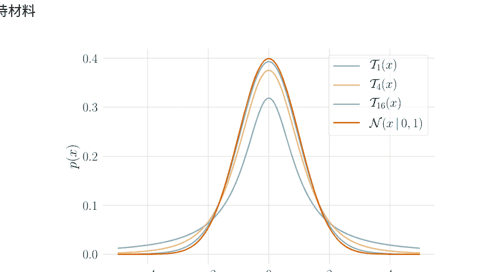

图 A.1 标准学生t分布 $\mathcal{T}_{\nu}(x)$ 的概率密度函数，对于不同的参数值 $\nu$。参数 $\nu$ 的值越高，分布越接近（以KL散度意义上的）高斯分布。标准族成员的位置 $\mu$ 和逆尺度 $\lambda$ 参数等于方程(A.35)中的 0 和 1，分别

它们的均值和方差分别为 $\mathbb{E}[X] = \mu$ 和 $\mathrm{Var}(X) = \frac{1}{\lambda} \cdot \frac{\nu}{\nu - 2}$。我们得出结论，$p(w|\beta_0, \alpha_0)$ 是一个学生t分布，即 $\mathcal{T}_{2\alpha_0}(w|0, \alpha_0/\beta_0)$，其标准概率密度函数如图A.1所示

# 参考文献

- 1. Amari Si (1998) 自然梯度在学习中的高效性。 神经计算 10(2):251–276
- 2. Bottou L, Curtis FE, Nocedal J (2018) 大规模机器学习的优化方法。SIAM评论 60(2):223–311。 https://doi.org/10.1137/16M1080173
- 3. Graves A (2011) 神经网络的实用变分推断。 在：神经信息处理系统进展，西班牙格拉纳达，第2348-2356页
- 4. Khan M, Nielsen D, Tangkaratt V, Lin W, Gal Y, Srivastava A (2018) 通过Adam中的权重扰动实现快速可扩展的贝叶斯深度学习。在：国际机器学习会议论文集，瑞典斯德哥尔摩，第80卷，第2611-2620页
- 5. Kingma DP, Welling M (2014) 自动编码变分贝叶斯。在：国际学习表示会议论文集，加拿大班夫
- 6. Pascanu R, Bengio Y (2014) 重新审视深度网络的自然梯度。 在：国际学习表示会议论文集，加拿大班夫
- 7. Price R (1958) 非线性设备具有高斯输入的一个有用定理。 传输信息理论 4 (2)：69-72
- 8. Williams RJ (1992) 用于连接主义强化学习的简单统计梯度跟踪算法。 机器学习8 (3)：229-256

# 索引

A
- ADF，参见假设密度过滤（ADF）
- ADVI，参见自动微分变分推断（ADVI）
- AEVB，参见自动编码变分贝叶斯（AEVB）
- 近似推断
  - ADF（参见假设密度过滤（ADF））
  - EP（参见期望传播（EP））
  - 进一步的实际扩展
- ADVI，61
  - 黑盒α最小化，60
  - 黑盒变分推断，59-60
- VI，36-46
  - 假设密度过滤（ADF）
    - 近似，77
    - 示例，50-53
  - 前向KL散度最小化，47-48
  - 问题，50
  - 矩匹配，指数族，48-50
  - 即插即用方式，95
  - 重新构建，54-56
- 蒙特卡洛（MC）积分，69
  - 非闭合解析形式，70
  - PGM表示，72
  - 实际VI，73-74
- 贝叶斯推断优势，85
  - 与经典方法对比，17-18
  - 分层建模，19
  - MC Dropout，85
  - 后验预测分布，18-19
  - 变分，116
- 贝叶斯神经网络（BNNs）
  - BBB，69-74
  - 方法比较分析，102-105
  - 实验设置，99-102
    - 1-D玩具示例，95-97
    - 训练配置，102
    - UCI数据集，97-99
  - 计算复杂度，66
  - 快速自然梯度Vadam，91-95
  - MC Dropout，85-90
  - 非线性模型，66
  - PBP（参见概率反向传播（PBP））
  - 参考文献，105-106
  - 标准确定性NNs，65
  - 不确定性度量，67-69
- 贝叶斯统计学，1
- BBB，参见贝叶斯反向传播（BBB）
- BNNs，参见贝叶斯神经网络（BNNs）
- 自动编码变分贝叶斯（AEVB），119，120
- 自动微分变分推断（ADVI），61

B
- 贝叶斯反向传播（BBB）
  - 计算图，71
  - 梯度路径，71
  - 小批量优化，72

C
- CAVI，参见坐标上升变分推断（CAVI）
- 坐标上升变分推断（CAVI），42-43，152-154

D
- 深度学习（DL），2，3，35，66，119，145
- DL，参见深度学习（DL）

E
- EM，参见期望最大化（EM）
- 熵
  - 条件熵，14
  - 差分熵，14-15
  - 边际熵，16
- EP，参见期望传播（EP）
- 期望最大化（EM），25-30，43
  - E步骤，26
  - 示例，27-29
- 期望传播（EP）
  - 数据并行化，104
  - 示例，58-59
  - 问题，57
- 指数族中的运算，56
  - 幂，56-57
  - 重塑ADF，54-56
- 指数族和CDF，1
  - 28
  - 定义和性质，11-12
  - 矩匹配，48-50
  - 运算，56
  - 充分统计量，10-11

F
- 费舍尔信息矩阵，13，91，155-157

G
- 高斯梯度恒等式，157-159
- 高斯-牛顿逼近，154-155
- 梯度估计器，43，59，61，118，119，143，151-152

I
- 信息度量
  - 熵，14-15
  - 费舍尔，13
  - Kullback-Leibler散度，15-16
  - 互信息，16-17

K
- Kullback-Leibler (KL), 15-17, 55-58, 114, 117

L
- 潜变量模型，8，40，115，145

M
- 机器学习（ML）
  - 深度学习，2
  - DNN，2
  - 无限样本，1
  - MCMC，1
  - 符号，3
  - 变分贝叶斯ML，3
- MAP，见最大后验（MAP）
- 最大后验（MAP），23-26，30，39，43，66
- 最大似然估计器（MLE），22-26，29，30，34，91，116，118
- MBML，见基于模型的机器学习（MBML）
- ML，见机器学习（ML）
- MLE，见最大似然估计器（MLE）
- 基于模型的机器学习（MBML）
  - 近似推断（见近似推断）
  - 内在变异性，32
  - 学习（推断）算法，31
  - 概率图模型
    - 有向无环图，32-33
    - 图模型的能力，34
    - 无向图，33-34
  - 概率编程，34-36
  - 概率分布，31
- 蒙特卡洛（MC）Dropout
  - 贝叶斯观点，87-90
  - dropout，86

P
- 参数模型
  - 位置-尺度族，6-8
  - 未知函数，2
- PBP，见概率反向传播（PBP）
- 点估计，42，117
  - 贝叶斯估计，24-25
  - EM，25-29
  - MAP，23-24
  - 矩估计法，22
  - MLE，22-23
- 概率反向传播 (PBP)
  - EP和ADF，76-77
  - 图模型，75
  - 超先验p（λ）和p（γ），77-78
  - 似然因子p（y|W, X, γ）
    - 归一化因子，82-85
  - 多类分类问题，75
  - PGM表示，75，76
  - 权重p（w|λ）的先验
    - α_λ和β_λ的更新方程，79-80
    - μ和σ²的更新方程，80-82
- 下游应用，69
- 预测对数似然，67-68
- VAE，参见变分自动编码器 (VAE)
- 变分自动编码器 (VAE)
  - AEVB，119
  - β-VAE，121-122
  - 计算图，119
  - 条件，120-121
  - 数据集
    - 时尚-MNIST，131
    - MNIST，129-130
  - 编码器和解码器，118
  - 实验设置，131-132
  - 生成网络，112-114
  - 图形表示，115
  - 重要性加权自动编码器，122-124
  - 无法表达的后验
    - 辅助潜在变量，125
    - 完全协方差高斯，124-125
    - 归一化流，125-126
  - 信息瓶颈视角，118
  - KL散度，114，117
  - 潜在分布
    - 连续松弛，128
    - 向量量化，128-129
  - 位置-尺度变换，120
  - 动机，111-112
  - NN和MLE，116
  - 后验崩溃，126-127
  - 结果，132-139
  - 采样过程，115
  - 半监督学习，140-145
  - 效用函数，116-117
- 统计推断
  - 贝叶斯推断，17-19
  - 共轭先验分布
    - 定义和动机，19-20
    - 示例，20-22
  - De Finetti的表示定理，9
  - 指数族，10-12
  - 信息度量，13-17
  - 似然函数，9-10
  - 模型
    - 潜变量，8
    - 非参数，8
    - 参数化，6-8
  - 点估计，22-29
- 随机变分推断 (SVI)，43，59
- 变分贝叶斯，3，36，41，117
- 变分推断 (VI)
  - CAVI，42-43
  - 证据下界，37-39
  - 示例，44-46
  - 信息论视角，40-41
  - 问题，44
  - 均场近似，41-42
  - SVI，43
- 变分方法，2，3，36，37，50，106
- VI，参见变分推断 (VI)
- t-学生分布，160-161
- UCI数据集
  - 波士顿住房，97-98
  - 联合循环发电厂，99
  - 混凝土抗压强度，98
  - 能源效率，98
  - Kin8nm，98
  - 海军推进装置，98
  - 葡萄酒质量，99
  - 游艇水动力学，99
- 不确定性
  - 校准，68，69