# 浅层和深度学习原理

# 前言

尽管自1920年以来已经知道许多数值解算法，但由于其极高的计算时间要求，它们一直被搁置在书架上，等待着方便的未来发展。 随着1950年后第一台计算机的出现，研究人员开始使用具有简单程序的Fortran语言的计算机来快速解决无聊的问题。 由于过去三十年来研究人员对智能系统的兴趣，先驱者们采用了具有单输入单输出（SISO）架构模型的随机模拟，后来采用了具有输入和输出层的多输入多输出（MIMO）系统，以模拟数据以在可接受的限度内获得已知数据的最佳预测。 这些是能够自主做出决策和表现的人工智能（AI）系统的先驱者。 因此，研究人员可以将决策过程转移到AI系统中，以实现更一致和更快速的决策目标。 今天，这些系统几乎在所有方便的学科中广泛应用，关注人工神经网络（ANNs）、机器学习和深度学习的内容，以及概率、统计学、随机模拟、优化技术、遗传算法、卷积和循环网络等方法。这些方法学是通过监督和无监督的训练方法应用的。 在经历了各个阶段的AI方法学的演变后，自上个十年以来，它被称为深度学习。

本书从科学哲学和逻辑（二值和模糊选项）命题的角度，基于经典和众所周知的不确定性原理，以及它们转化为计算机核心可写性的数学方程，介绍了浅学习原理的基础。 浅学习原理帮助研究人员理解众所周知和常见的数值方法学的词源、认识论和术语学内容，为更好地理解深度学习过程铺平道路。 事实上，学习是一个整体的过程，但是将其分类为浅学习和深度学习应该从模糊逻辑的角度来理解，模糊逻辑提供了两种学习方法之间的重叠。 不幸的是，许多学生、年轻科学家和建模初学者没有扎实的基础知识，即浅学习信息，他们可能使用现成的软件并获得解决方案的结果，但无法进行适当的解释。

因此，在本书中建议，为了在深度学习的海洋中安全游泳，应该坚定地深入研究浅学习原理，并结合科学哲学和逻辑原理。为此，本书建议人们应该坚定地深入研究浅学习原理，并结合科学哲学和逻辑原理，以便在深度学习的海洋中安全游泳。

除了某些（确定性）方法可以通过严格的规则（没有任何不确定性）解决各种问题之外，还有包含一定程度不确定性的随机优化方法。这两组方法的共同点是它们试图通过遵循系统化的方式来达到解决方案。这个系统化的路径由一系列步骤沿着一个轨迹进行。由于这种系统化的方法，无法确定这些技术是否真正产生了绝对优化的解决方案。为此，需要应用一系列试错顺序测试的标准。这可能会浪费时间，仍然得到不完全优化的解决方案。

通过遗传算法（GA）这种方法，可以消除传统方法中提到的缺点，从而找到解决方案。在这种解决方法中，扫描的是区域而不是线条，从而找到解决方案。可以用“保护表面而不是线条”这句话来概括。GA的操作完全是随机的，朝着目标前进。尽管方法本身存在随机因素，但GA可以在最短时间内找到绝对优化解决方案。

在工程和技术应用中，对所研究事件的模型进行建立，并确定其行为模式。并行建模方法是受人类大脑神经系统启发而开发的，被称为人工神经网络（ANN）。人工神经网络（ANN）是包含许多特征的，它不仅超越了回归和随机方法所建立的模型，这些方法在近年来被广泛使用，并且仍然在世界许多地方使用，而且它在开始时不需要对事件或数据做出一些假设。例如，在所有基于统计的方法中，除了数据或后模型误差必须符合正态（高斯）分布的必要性外，参数必须在时间上保持恒定，不能进行并行操作，依赖关系是线性的等等。然而，在人工神经网络中没有这样的假设，为了实现它们，至少需要建立三个层，包括细胞，其中一个是输入层，另一个是输出层，第三个是隐藏（中间）层。为此，需要开发一种不仅仅模拟数学规则，而只模拟控制事件和可能发生的反应变量的架构。

事实上，在我们所生活的时代，技术发展非常迅速。尤其是计算机领域的发展已经变得令人眼花缭乱。这些发展包括计算速度的提高，对最小（微观）和最大（宏观）领域的研究，信息生产的加速等等。它在科学和技术方面对人类有所帮助。这是因为计算机能够非常快速地处理为其准备的脚本。

人工智能（AI）在逻辑、理性逼近、感知、学习规划、机械化和自动化等方面的功能日益重要，以可持续的方式发挥作用。就像数学一样，基于思维原理、科学哲学和最终基于逻辑的理性，甚至可以出现更好的AI应用。如果按照逻辑规则，将各种生活人类智能转移到机器人和机器上，人工智能将继续前进。这里最重要的问题之一是，AI设备是否会取代人类的自然智能？

本书作者的想法是，这种情况永远不可能发生。

此外，机器学习为科学研究和技术发展带来了新的快速发展机会。这种学习基于计算机技术，通过软件实现，涉及概率、统计和算法等跨学科的理论方面，以加强和增强人工智能的特性。

在人工智能的大伞下，有机器学习（ML）、深度学习（DL）和人工神经网络（ANN）。可以说，深度学习是机器学习的一个分支，而机器学习是深度学习的一个分支。机器学习和深度学习之间很难做出明确的区分；机器学习拥有更多的算法。

深度学习（DL）是人工智能（AI）和机器学习（ML）概念的结合，有助于基于浅学习原理的自动科学和技术发展。一般而言，浅学习（SL）原理相当线性，基于描述性概念，导致可应用的公式和算法；深度学习过程相对抽象和复杂，基于数据挖掘统计过程，导致预测模型。特别是在数据收集、分析和解释方面，深度学习过程更加简单快捷。与深度学习方法相比，传统的机器学习算法是线性的，深度学习方法具有层次递增的发展、改进和抽象复杂性。

在这本书中，首先解释了哲学、逻辑、数学、概率和统计方法的原理以及与其他经典方法的相似之处，并通过给出必要的线索来引导读者对浅层学习主题和原理的热身。此外，通过解释经典浅层学习方法的相似之处，进一步解释了两种建模方法之间的相似之处，读者事先已经了解或者即使不了解也可以理解。实际上，读者可以根据经典系统进行建模，并在短时间内适应ANNs并进行应用。在对每个模型进行哲学讨论之后，根据哲学和逻辑规则，根据可能与之前方法的相似之处进行解释。通过给出的应用程序，努力更好地理解它们。其中一个主要目的是涉及到贯穿历史并持续发展的人工智能问题。

特别是在1950年之后，它呈指数增长。与此同时，它还包括了在国际文献中没有正确引用穆斯林思想家、哲学家和科学家对这一主题的研究成果。

伊斯坦布尔，土耳其
2022年8月25日

泽凯森


# 第一章 引言

## 1.1 概述

深度学习的概念已经进入了几乎所有的高等教育系统，没有受到太多的批评，并在基础概念理解不足的地方变得流行起来，因为现成的软件程序鼓励背景中的模糊应用。如何在不了解浅显基础知识和信息对的情况下深入学习和教学，这是所有科学学科和数学科学的根本呢？没有基础的定义、概念、假设、假设和相关的简化，理性的科学产出是无法实现的，这在浅显学习的领域中占据的比重。例如，没有传统的浅显学习原理，无法客观地把握机器学习对深度学习过程的影响。它以更浅、更狭窄的方法、奇迹和可持续的最终产品为深度学习领域提供了一个介绍，有时还有概念化。深度学习在分类和优化方法方面表现出色，前提是要有连贯使用浅显学习基础作为基石。不幸的是，浅显学习正逐渐失去受欢迎度；这并不意味着每个使用深度学习方法解决问题的人都越来越理解深度学习方法论。

关于深度学习过程的一个显著解释，从理论上来说不容易可视化和分析。通过浅层学习方法进行预测、分类、模式识别和优化研究，大型数据集中缺乏准确的分类。浅层学习方法被认为是核心解决方案，因此在处理大型数据集时存在障碍。浅层学习中的数据限制导致了现代深度学习方法的探索。

## 1.2 历史发展

在古希腊的书籍和知识宝库出现近千年后，一个全新的时代开始崛起，以伊斯兰的名义，这一次是在哲学、逻辑和理性的繁荣复兴和实验活动中。现代科学的原始种子开始在许多学科中扎根，这些学科主要基于几何、形状、形式、算法和地图可视化。正如之前所说，人类文明史上从未有过几何不起作用的时期。即使在今天，所有的想象屏幕都是基于可视化的，这是科学史上的第一步（图1.1）。代数和代数方程的出现使得语言关系首次以数学方程的形式表达出来，从而使数学成为现代原则的形式。许多数学表达式是通过基于几何的阿尔-花拉子米（780-850）算法解决的，但他的名字和伊斯兰文明在科学史上并没有得到足够的提及。Sarton的著作（1950年）对科学史做出了贡献，涵盖了所有文明，对于那些对这个主题深感兴趣的人来说，可以推荐阅读。

人类从存在的第一天起就与环境不断互动，并通过某些感知获得有用的信息。自古以来，技术发明比科学取得了更大的进步，通过开发一些工具、设备和装置，为人类提供了舒适。然而，3000年前出现了书写，可以将从一代传到另一代的信息进行口头传递。

## 1.3 信息和知识演化阶段

在人类文明的历史上，关于知识和信息有各种不同的定义。本节的主要目的是在初步解释之后，将科学定义作为最终产品。信息的简单定义是客体和主体之间的交流，以获取关于主体属性的任何理性知识。由于个人兴趣和感知的原因，这可能非常偏见。信息内容在感知、处理、传输和存储在记忆中等多个阶段。知识更多地涉及到对信息的心理理解，因为它与其他意义内容的整合。在这个阶段，理解两个术语概念很重要，即词源学和认识论。前者从语言学上处理词的根源（起源）及其意义在历史上的变化。其次，它涉及哲学和本书的内容，探讨有关有意义知识的理论和基本基础，如所提出的有意义内容的范围和有效性，以及它是否与自然有关。

图1.2 知识演化阶段

现象。认识论是坚持和了解事物的学问。它试图从范围、方法和有效性的角度区分信仰和理性。

在图1.2中，知识及其在人类历史中的演化分为过去的历史演化和未来的期望两部分。

信息和知识演化的最初阶段是关于获取知识，从不知道到只知道什么，没有详细的可知意义，只是简单地知道。最初的系统化信息收集是通过可视化进行的，因为人类试图通过狩猎获取食物，主要是在洞穴中避难和用动物皮毛制作衣物。

信息收集的第二阶段是通过听觉进行的，通过将视觉概念从专家传递给没有先前经验的听众。音频-视觉信息阶段已经持续了数千年，从古埃及、美索不达米亚（苏美尔、巴比伦、亚述、伊特鲁里亚和赫梯）、中国和印度文明开始。在这两个阶段之后，随着古希腊文明中基于哲学和逻辑原理的理性思考和质疑的扩展，哲学思维和质疑的时期开始了。以理论形式的行为解释开始将事件的发生机制与一组原则联系起来，尽管是推测性的、语言上的。知识的概念开始通过分类系统化，并结合了来自所有先前文明的数千年经验。这些发展使人们更好地思考、学习和了解，为什么？以及如何？从而提供早期浅层学习的原则。萨顿（1884-1956）提到，伊斯兰文明基于先前文明的信息和知识资源，有许多创新发展。最后的链条

图1.3 思维活动循环

在过去信息和知识评估的演变中，主导这些日子的是西方文明。毕竟，一个新时代已经开始出现，作为水平未来的愿望、期望和对更多创新革命性信息和深度学习知识阶段的渴望。深度学习是关于科学和技术的推理、评估、解释和预测。所有这些后续活动都是通过计算机与人类之间的交流变得可能的，这导致了更深入的人工学习。

图1.3展示了自然人类智能合理思维阶段的思维循环形式，维持人类智慧活动和持续思考过程。图1.3展示了人类感官器官之间的相互作用，以及它们以知识和信息的形式与内在思维活动之间的循环和信息获取与输出的过程。感官器官的输入被传输到大脑中，在那里它们首先被处理或存储在记忆中。

智力和记忆的相互作用通过推理触发人类的智能，因此可以通过哲学和逻辑工具得出合理和理性的推论。在这个阶段，当怀疑、批判性审查和可能的可证伪评估起作用时，合理性或非理性的验证成为重要问题。

这些评估的成功提供了科学上可接受的信息，直到通过类似于图1.3中的阶段进行删除或改进。那些能够对问题进行持续的批判性评估的人可能被称为科学家。

一般来说，人们通过批判性地学习和推理来认识自己所知道的东西，这被称为心智功能。具备这些特征的人，

心智是区别于人类与其他生物的现象。如下所述，理解、领悟、智力、记忆和思想等概念都与心智相关。确定从感觉器官到大脑的信号的比较和详细差异，并将它们在自身之间形成一个形式的过程被称为心智。通过心智，信号可以在最短时间内按需处理，转化为有用的信息，并通过消除人体作为反馈信号，从众多信号中分离出有用的信号，使其对个人和他人都有益。

一个人可以完成10或100个人可以完成的任务。只有心智通过组织现有信息来揭示有用的信息。心智通过实用和不知疲倦的信息揭示必要的信息以实现预期目标。换句话说，心智不会感到疲倦。它总是完成分配给它的任务。其他感觉器官如脚承受着无头的心智的重担。智力是造物主赋予人类的与生俱来的能力，不能改变或转移给他人。

人们的思维从不相同，就像指纹一样；每个人的智力能力都略有不同。在这方面，土耳其谚语“智者胜过智者”表明，我们不仅应该爱自己的思维，还应该从他人的思维中受益。通过咨询和讨论共同的问题，我们可以从聪明人身上受益。如果一个人无法克服问题，他可以向另一个他尊重且认为比自己更聪明的人寻求建议。当意识到某件事时，我们可以说我失去了理智。因此，人们在思维功能上可能相似。结果，因为理性的方式是一致的，人们彼此同意。当一个人的身体生病时，他们会通过一些物质药物恢复健康。然而，我们发现个体的心理疾病始于心理紊乱，其治疗基于一些精神建议。在这方面，宗教信仰起着最重要的作用。

将一个人的思想以正式的顺序表达出来被称为推理功能。重新演绎过去的事件被称为回忆。通过接受最终合理的结果和程序来概念化批评。结果表明，那些随心所欲的人是没有思考能力和组织心智功能的。当思维被某事所困扰时，问题无法克服，思维变得固执。

思维功能无法被具体衡量，但个性不能通过一些标准测试来管理。试图标准化思维是危险的，因为那些谈论思维的人的智力至关重要。思维从不受到税务算术运算的影响。因此，即使我们对一个类别的重要性高还是低不太了解，我们可以通过哲学和逻辑思维来做出更好的改进。任何愿意根据系统计划做出决策的人都会喜欢聪明人，并能够明确地表达所学和发展的知识，无论是书面还是口头表达。

我们称之为“常识”的概念在人们中间非常多样化，可以根据一个人的思考和考虑来呈现和设计。有必要调查这种常识是否

## 1.3 信息和知识演化阶段

始终正确。如果它超越了理性，人们更倾向于一种对道德、伦理和美德至关重要的技术方面。如图1.3所示，在记忆中有以前获得的视觉和听觉信息的存储，其中包含可以用于合理推断的信息。这里存储的信息是由人主动或被动感知和记忆的。几乎所有人类历史上获得的信息都存储在人类的记忆中，在早期时代。这些信息可能会时不时地保持静态，并通过引入更先进的信息而获得动态性；记忆始终对创新的知识发展敞开。例如，我们可以说历史是一门完全基于记忆的科学。从童年到老年的有趣事件的信息图像始终保存在记忆中。有时我们说有些人温和或者失去了记忆，而处于这种情况的人无法使用自己的思维进行合理推断。在某种程度上，记忆也可以被看作是一个记录过去知识、经验和情感的单元。人类具有遗传上不同的记忆能力，但随着时间的推移，也有可能发展记忆能力。

实际上，存储在记忆中的信息在激活思维方面起着基本作用，这是大脑的功能。顺便说一下，有一种称为智能的天赋，它基于优越或劣势观点，可能会不时地出现在记忆中。无论一个人的智力水平有多高，如果他不使用更时新和先进的信息，就无法改善他的记忆。

智力是记忆发展的必要条件，但并不足够。

在某种程度上，记忆也可以被定义为在思维中存储信息的能力。通常，在潜意识状态下，信息会在没有思考的情况下被隐藏和组织，自发地存储在记忆中，这可能与某个思维事件有关。记忆可以是短期、中期和长期的，也可以是感官和功能性的。以这些形式的混合方式，记忆中的信息开始主动或被动地发挥作用。

记忆的最重要功能之一是能够记住一段文字，并在需要时自动重复。例如，当朗诵一首诗、读一本小说、演讲或进行宗教仪式时，可以利用记忆。在我们的文化中，那些记住《古兰经》的人被称为哈菲兹（背诵者）。即使一个人不知道某个事物的意义，他也可以通过从记忆中提取的信息来记住并重复它。例如，如果一只鹦鹉重复它听到的短语，说明它有记忆力。记忆提供了回忆浅层和深层学习信息原理的能力。当需要时，应该随时能够立即披露这些信息，而不需要采取任何行动。一个记忆力强的人不应该在短时间内忘记他用感官给出的信息和信号。对于年轻人来说，存储信息可能很容易，因为记忆是新的而且相对空白。这个积累过程简称为记忆。以这种方式将信息存储在记忆中的人，期望他们将信息原封不动地传递出去，而不是对该信息进行处理并转化为其他形式。

检测大脑现有信息之间的差异的过程被称为观点或思想，它可以动态地改变，这种改变可能是由思维和智能通过新信息处理的结果，也可能是由于经验、与不同社群的逻辑摩擦以及可能的强制。对一个事件的合理讨论可以通过过滤新信息来改变一个人的想法，这是由于来自内心世界的冲动作为说服力导致思想的改变。可以将其与一个处理原材料作为输入的工厂中的机器进行比较。这些机器就像人脑的思维。在这些机器中，可以用不同的属性生产新材料，就像给予加工的原材料混合物一样。当人们没有知识时，他们可以说自己不知道，但有多少人能说自己没有思想？在公众中获取意见等同于从他人那里获取关于自己不了解的主题的信息。发表意见是为了教学而表达自己的想法。推测是从不同的角度对某事或情况表达自己的观点。有知识和思考能力的人是知识分子，其他人则没有受过良好教育。

推理和理解被称为认知。理解并保留由上述所有心理功能的实现产生的结果和信息，而不引起任何额外的思考或怀疑，被称为认知。

我们可以称之为无意识。现在所感知到的信息被铭刻在心中，就像刺绣在难以磨损的石头上一样，可以使用各种信息说服方法将该信息传达给他人，并使他们理解。

通过将上述所有脑功能以和谐的形状和比例结合起来，任何人都可以感知信息并在心中赋予它们各种清晰或模糊的含义。因此，从信息混合物中提取新信息变得相当容易。为了使大脑功能发挥作用，必须引起好奇心和欲望。出于这个原因，有必要确定个人或社会想要实现的目标。这些目标包括渴望甚至热情地控制他人，经济上更强大，社会上更受青睐，占据某些职位和控制某些中心，为造物主、祖国和人类服务，并乐于解决他们的问题。可以设定无数种目标。其中一个或多个可能成为不同时间和地点的某些个人或社群的目标。为了实现这一点，可能会有一些目标，如政治、贿赂和裙带关系，可以声称是基于理性和逻辑的，但它们像蜱虫一样侵蚀着社会。

在大脑和计算机之间进行类比是有用的。无论迄今为止取得了多少技术进步，人类智慧肯定从不同的生物、动物和无生命体中获得灵感。现在可以在大脑和计算机功能之间进行这样的类比。一个人的大脑是不同大脑功能产生的地方，同时也是计算机处理单元中可用信息（数据）作为软件进行处理的环境。在没有称为磁盘操作系统（DOS）的单元的情况下，无法操作计算机。就像在人体中没有大脑的情况下，与思维相关的功能无法执行。在计算机中，DOS单元对应于大脑中的思维。为了使DOS单元工作，需要数学处理器，即逻辑执行和内存单元。

计算机中如果进入了病毒，就无法执行任何操作，或者执行的操作结果不正确，同样地，如果无用、坏的或扭曲的信息进入人类记忆，作为逻辑、智能和心理活动的结果获得的信息将是错误的。

一个人在自己的世界里不时接触到关于不同观点、思想、意识形态、语言、宗教、知识、科学、政治、社会事件的不同信息，他会毫不考虑地纠正其中的一些信息，或者试图通过思维过滤器以提供动力来感知这些信息。任何事件都无法完全稳定或完全动态。换句话说，通过收集关于只能存储在记忆中（图1.3）并不时讨论的问题的非关键信息和数据，可以基于语言首先将相关信息传达给他人。这些人不利用他们思维的创造性功能，他们乐于存储可以达到学术水平的信息，但在科学或技术领域既没有创新也没有发明。

为了确保所获得信息的动态性，在从思维中滤除之前，必须通过预测动态性将感知到的知识牢记于心，而唯一的方法就是使用科学哲学和逻辑原则，并将它们与其他原则区分开来。上帝赐予人类的最伟大礼物之一就是拥有可以在思维启迪后被反思照亮的心灵。思维-心灵关系中最重要的工具是

> “思维。”事实上，先知穆罕默德最重要的话之一如下所述。

没有思维的人无法拥有宗教。

那么，在人类一生中如何有效利用思维的条件是什么？答案涉及基于哲学和逻辑的语言和思维。

## 1.4 确定性与不确定性

对于上个世纪发生的自然现象，一直存在着很多争论和好奇。这些讨论包括地球和大气科学以及物理学之间的比较，这不可避免地导致了自然界中确定性和不确定性的问题（Leopold和Langbein 1963；Krauskopf 1968；Mann 1970）。

科学理论的基础是“因果关系”的概念，在科学研究中几乎可以肯定。科学哲学家波普尔（1955年）说：

> 给出一个特定事件的因果解释意味着从一些普遍规律和一些特殊陈述中推导出解释该事件的陈述，其结论与前提之间必须有一种非常具体的联系，并且必须是演绎的。

这样，结论必然从前提出中得出。在任何数学形式化之前，前提和结论由可以转化为流程图、方法论架构、算法、图表甚至草图等形式的语言陈述组成。在演绎论证的每一步中，都可以得出关于陈述之间关系的逻辑结论。另一方面，“法律”概念对于演绎解释以及我们对特定事件的知识的准确性至关重要。

由于自然界的多样性、人类无法理解物理和工程系统中的所有因果关系，以及几乎每个问题都存在数据不足的问题，每个问题在某种程度上都存在不确定性。即使有大量的数据集，也无法在误差范围内预测工程事件或自然现象。由于不确定性，未来事件永远无法被研究人员完全预测。因此，研究人员必须考虑不确定性方法来评估特定事件的发生和数量，然后尝试确定其发生的概率。

庞加莱（1854-1912）以非技术的方式讨论了不可预测性的问题。对他来说，机遇和决定论与长期的不可预测性相关联。他通过说，

> 一个我们忽略的非常小的原因决定了我们无法忽视的重要影响，然后我们说这个影响是巧合造成的。

最近，方法论的科学进化表明，当研究人员试图澄清他们兴趣领域的边界时，他们会与其他研究领域变得模糊。例如，当地下水污染建模为人类面临的现代挑战之一时，他们需要有关含水层（地下水储层）的地质环境、地下水补给的气象和大气条件，以及水资源消耗实践的社会和传统信息。因此，在不同学科和数据处理中，许多共同的哲学、逻辑基础、方法论和方法都变得普遍，包括浅层学习和深度学习方法。科学家根据自己的专业领域可能使用相同、类似或不同的适当模型、算法或程序来解决问题。各种研究团队可能会提出一些常见的问题，下面将对其中一些问题进行讨论。这些问题中的许多已经由约翰斯顿（1989年）阐明。

- 事件或现象是否随时间稳定和确定性，没有随机元素？
- 如果存在复杂性，是否可以通过一组逻辑假设将其简化为可管理的形式？
- 是否存在与所关注变量密切相关的其他变量？
- 是否可以在求解之前制定逻辑规则，而不是求解数学方程？
- 是否存在可靠结果的相关数学表达式来解决问题？
- 是否存在类似的问题及其近似解决方案在另一个学科中？
- 均匀性和各向同性的假设是否有助于简化和解决问题？
- 问题是否需要分析、实验室或现场工作来得出所需的结论？
- 问题是否需要归纳或演绎的解决原则，具有整体可变性特征？
- 逻辑解决方法是什么？ 分析、概率、混沌、随机、人工智能方法等等？

### 1.4.1 随机性

随机和随机性是描述任何自然或工程现象的概率和统计术语，无法准确预测特定事件的结果。Parzen（1960）给出了一个关于随机性的启发性定义，如下所示：

> > 随机（或偶然）现象是一种经验现象，其特点是在给定一组条件下观察它的结果不会始终导致相同的观察结果（因此没有确定性规律性），而在这种情况下会产生不同的结果，因此存在统计规律性。

概率和统计规律性指的是大型数据集的群体和子群体行为，使得对每个群体的估计比个体预测更准确。例如，给定一个地方的长时间序列温度记录，可以有信心地说明明天会更热或更冷，而不是预测确切的摄氏度。正如本书中的整个文本所暗示的那样，统计规律性是一些天文、自然、环境、工程和社会影响的结果。例如，最近关于全球气候变化的讨论是基于化石燃料污染下层大气层（对流层）由人类活动导致的温室气体（GHG）排放浓度。气候变化的影响已经被不同的研究人员和人们表达出来，但即使在未来的时间段内也无法准确预测这种变化的强度。统计规律性意味着对单个事件更加完全的不可预测性。

确定性现象是在给定一组条件下，如果已知必要的初始条件，可以完全准确地预测个别事件的结果。在物理学、天文学和工程学中，确定性现象的本质是被传统上接受的。

因此，在使用这些方法时，假设和初始条件的有效性是必要的。在某种程度上，确定性科学研究通过理想化的概念、假设和简化，以算法、程序或数学公式的形式产生结果，必须谨慎使用。

考虑到限制条件。 确定性的本质是理想化和假设，以便通过数学程序来处理分析、概率和统计概念，从而把不确定的现象把握和应用起来。 在某种程度上，理想化和一组假设消除了不确定性的组成部分，将不确定的现象转化为概念上具体的确定性状态。 在这一点上，一个重要的问题是，

> 在工程和自然研究中，确定性方法在事件不确定的情况下是否没有用处？

对于这个问题的答案是肯定的，因为尽管简化假设和理想化，确定性方法仍然捕捉到了不确定现象的骨架。

## 1.5 逻辑

将上述部分中所解释的事物保持活跃或使其更加生动的唯一方法是通过逻辑工具将这些知识和观点转化为创新和发明的环境中。 如果我们解释逻辑这个谓词，我们首先可以理解到词语和句子是基本元素。 由于词语和句子也受语言的影响，可以得出结论，知识、信息、创新和发明不仅是受过教育的人的财产，而且任何试图用思维使自己的思想工作的人都可以得到他们的份额。 由此可得出结论，为了能够创新和发明，并不绝对需要经过正规教育。

如果没有科学哲学，尤其是逻辑原则来引发思考，正式的教育体系只能确保文凭和回归实践以一种模仿的方式在社会中发生，如图1.1所示。

### 1.5.1 二值（脆弱）逻辑

本书的作者一生都能够理解，纯粹的非系统化教育在向他人传授知识方面可能更加有效。 使人类智能、推理和功能能够达到合理推论的一套规则被称为逻辑规则库。 不幸的是，像工程这样严重依赖数字、数据集和公式的职业只能在正式教育中使用数学方程式，这表明创新和发明可能不会在那个社会中发生。

一个社会中专利发明数量较少甚至最重要的原因之一是过于依赖乏味和正式的实体，如公式、算法和现成软件。

为了通过逻辑推理达到创新和发明的水平，建议按照以下步骤进行，尽管不按顺序。

- 在语言、哲学和逻辑上思考一个现象或事件。
- 此外，心智必须首先了解研究对象现象的基本词（变量）是什么。在为此编写的著作中，有一系列称为关键词的词语。
- 在分析中，应该决定原因，即输入、结果和输出是什么。这意味着思考输入和输出之间的关系。
- 在确定原因-结果词的语义负荷（词源学）之后，有必要尝试决定每个原因和结果词之间的动词关系是两个思维原则，即真主（上帝）赐予每个人的原则。这些原则是，
  (a) 直接或反比例原理,
  (b) 线性或曲线（非线性）原理,
- 通过应用这两个原理，每个因果词之间产生了非数值但是语言关系。例如，对于人口和时间之间的关系的问题，我们得到了这样的句子：“如果时间增加，人口增加”，这是思维的第一个原理。通过第二个原理，我们可以得出结论，这种关系是曲线而不是线性的。实际上，通过这两个原理，人口和时间之间的数学关系以语言形式呈现出来，
- 在推理时不应忘记初始条件和边界条件。
例如，如果时间为零，人口永远不可能为零，甚至这个知识在推断数学关系的形式（线性、抛物线、多项式、指数、对数等）时也是有用的。
在寻找数学方程基础时，总是考虑到所有因果（输入）和效应（输出）变量（词语）之间的关系。

### 1.5.2 模糊逻辑

在模糊逻辑问题中，可以通过给因果词语分配形容词而不是整体二元推理（真-假，白-黑，美-丑，0-1，是-否等）来使关系更加可思考。例如，如果我们被问到力和加速度之间有什么样的关系，我们可以给出一个整体的答案，即“如果加速度增加，那么力也增加。”“力和加速度这些词语整体地描述了情况，但是如果考虑到这些整体词语的下级词语，就会出现模糊逻辑的集合。例如，如果我们将力想象为“少”和“多”，将加速度想象为“小”和“大”，那么就会得到一个模糊的情况，因为形容词“少”、“多”、“小”和“大”提供不确定性成分而不是精确度。所暗示的歧义

这里的词应理解为模糊规则和推理的第一步。现在，力和加速度之间有关系吗？不只是一个，而是四个逻辑规则作为备选答案出现在下面。

- 如果力是“小”，那么加速度是“小”。
- 如果力是“小”，那么加速度是“大”。
- 如果力是“大”，那么加速度是“小”。
- 如果力是“大”，那么加速度是“大”。

这里有四个选项。读者必须忽略那些没有意义的选项。因此，根据每个因果词的子定义，可以自动得出有多少规则基础，但并不是所有这些规则都有意义。通过这些规则，可以在不使用数学方程的情况下，通过语言学上达到对所研究情况的口头（哲学）和理性（逻辑）解决方案。如果有人问，他们可以说数学意味着逻辑，那么为什么不在数学的背景下提到逻辑原理，但如果提到，将会在数学和其他相关学科中引发更广泛的创新和发明。实际上，这可能是一个情况，一个懂数学的人可能不懂他正在学习的方程的逻辑，但一个懂事件逻辑的人可以解释和修改数学表达式以获得更好的改进。

### 1.5.3 二价-模糊区分

亚里士多德的脆逻辑（加减、黑白、某物及其对立）和扎德（1973年）的模糊逻辑都可以用数字0和1来表示。在严格逻辑的情况下，两个选择是0和1，但在模糊逻辑的情况下，任何值都可以在0和1之间，包括0和1。同样，真陈述被编码为1，假陈述被编码为0。仿佛没有这两种情况的混合，即部分真或部分假，并且正是基于人类思维，特别是在哲学思维中，中间情况被排除在外。

因此，脆逻辑在文献中也被称为排除中间情况。

模糊逻辑甚至会为科学信念（确认或否认的程度）分配程度，接受0和1之间的值。有人认为，科学知识或理论只能由逻辑实证主义者来验证。科学理论的可验证性和可证伪性之间的矛盾涉及到模糊的哲学基础，但许多哲学家通过亚里士多德逻辑得出了与科学发展的本质相当相反的结论。尽管许多科学家试图基于严格逻辑来解决问题，但考虑到分析和有时是概率性科学知识的限制，"模糊科学哲学"并不容易进入文献。科学家在证明科学限制或进展时无法完全客观，但模糊的组成部分是产生新理论的动力。

所有科学规则基础都应该通过模糊推理引擎进行测试，从而得到模糊科学结果。事实上，科学现象本质上是模糊的，特别是科学哲学的基础隐含着模糊的组成部分。在科学中，科学知识或信仰的教条性质是正式经典脆弱逻辑的结果，仿佛不敏感，而模糊逻辑则是未来改进和知识产生的科学。

自人类诞生以来，逻辑变得形式化并获得了二元（热-冷、白-黑、0-1等）的风格，这种情况几乎一直持续到70-80年前。人类的思维在日常生活中从不遵循二元逻辑，因为总是存在不确定性。 尽管包含这些不确定性的逻辑规则是由伊斯兰哲学思想家法拉比（870-950）提出的，但直到1960年代后才由洛特阿斯克尔扎德提出这些规则。

如今，当提到人工智能时，除了二进制逻辑外，还出现了一种基于模糊逻辑和其推理的更科学、尤其是技术方面的思想。

## 1.6 人类、社会和技术

这三个术语彼此之间和谐团结，显示出在从家庭生活到包括自然和人工智能在内的所有活动中的不同程度的有效性（图1.4）。

必须了解每个词的起源（词源学）和语义负荷（认识论）。 例如，生物是一个在每个社会中经常使用的短语，意思是上帝的创造。生物还包括所有无生命的存在，而不仅仅是有生命的事物（植物、动物和人类）。 如果没有这样的创造，人类、社会、科学和技术研究都无法出现。

从认识论的角度来看，“忘记”是有意义的，因为人们随着时间的推移可以忘记很多信息，因此可以通过回顾和记忆在适当的时间和地点使用这些信息。一个训练自己忘记特别是不好的信息的人可以达到平静和幸福，并在他周围灌输这些情况。人是一个三维的生物，因为他有一个身体、一个思想和一个灵魂。 身体承载着思想和灵魂，但它的美丽对于科学知识和技术的产生没有太大的贡献。 其他生物没有的一个特征是人类的良心，实际上是思想和灵魂以不同比例的混合物。 理性对于良心是必要的，但不足够，因为灵魂与人的非科学方面有关，是一种在良心方面更有重量的品质。 科学和技术研究的支柱是思想，但思想的舒适在人的灵魂中得到反映，这导致了更先进和创新的科学理论和技术发展的流畅路径。

上帝赋予的智慧是使人们能够进行合理推理的最重要能力之一。 没有愚蠢的人，但是根据自己的能力和能力，有必要了解使用的方法和方式。

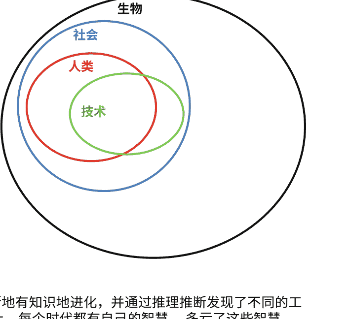

在整个历史中，人类不断地有知识地进化，并通过推理推断发现了不同的工具和设备。 在某种程度上，每个时代都有自己的智慧。 多亏了这些智慧，不同的文明可以在一定时期内保持其存在。

他们的智慧可以在社会、经济、环境、能源、战争和防御、健康、狩猎、营养、住所等方面使用。通过不断使用可用功能，这些水平有所改善，而不会随时间的推移而减少，而是略微增加。 人类还通过将他发明的工具和设备的一些智能用途归因于自然智能，从而产生了可持续的生活方式。

今天，社会这个词被理解为一群有着相同文化、传统、习俗和共同认知的人们相互尊重地相处。 社会由个体组成，他们从家庭中获取信息，然后通过小学和中学的教育系统确定特征。 如果有5%的高等教育毕业生能达到当前的科学技术水平，那个社会就能达到现代化的发展水平。 技术创新可以通过批判性地提供基本信息来满足人类思维和精神的需求，例如科学哲学、逻辑推理、科学史和几何形式等教育内容。

技术一词指的是发明设备、工具、软件和机器人等能够使人类生活的某些方面更加便捷、廉价、实用和自动化的东西。 那些从实际生活中发现这些技术并且没有接受过太高教育的人们会遇到一种发明家的职业。

技术的另一个方面是给那些受过高等教育并执行类似科学家职能的人的名字。

考虑到正规教育体系、社会、经济、环境、科学、技术等，尽管这些学科都有所教授，但科学、哲学和逻辑的规则并没有得到太多重视。了解带有符号的数学方程可以应用四则运算（加法、减法、乘法、除法），但可能无法对这些方程进行进一步的创新发展的意义和解释。尽管所谓的清晰（二值）逻辑和数学教学在教育组织中占据了比必要更多的空间，但几乎排除了构成其基础的科学哲学和逻辑。在数值培训中，口头主义仅用于方程、公式、算法和软件解释。在数学方程之前必须给出哲学思想和逻辑规则，几乎不可能达到与所需方程类似的口头结果。如今，众所周知，在大多数先进技术的开发者中，有许多具有创新和发明能力的人放弃了大学教育或从未上过大学。这其中最明显的主要原因之一是思想中的哲学和逻辑原则并不一定意味着它们可以通过教育获得。试图根据哲学和逻辑规则塑造思想的人比那些没有接受哲学和逻辑规则的古典教育的人能够取得更有成效的科学和技术成果。除了上述概述的结论外，以下几点是建议性的。

- 口头表达，尤其是解释、评论和批评，应该在教育中允许使用母语。
- 在数字教育部门中，解释科学的哲学和逻辑是有用的，可以导致精确和合理的算术。
- 哲学，尤其是科学哲学，在教育中应该被赋予重要性，以便能够产生某些解释和前瞻性观点，并且能够充满信心。
- 根据逻辑规则，根据哲学确定的知识集合的科学性和合理性，应该给予口头表达的价值。
- 在思考中，除了单一的精确逻辑规则，还应该使用多个选项，以达到模糊逻辑规则。

## 1.7 教育与不确定性

教育是通过一系列系统化的讲座来启发他人的术语，预期为学生提供一个通过某些关键概念进行反思的生活空间。当然，像教育一样，理性思维是富有成效的自由思维的本质。此外，教育有三个主要方面，必须相互作用，为富有成效甚至情感稳定的最终目标做出贡献。

图1.5展示了这三个组成部分在它们的互动课程中。

在一个有效的教育系统中，教育不仅仅意味着从教师到学生的信息流动。在一个有效的教育系统中，有时信息会突然而意外地从学生流向教师。

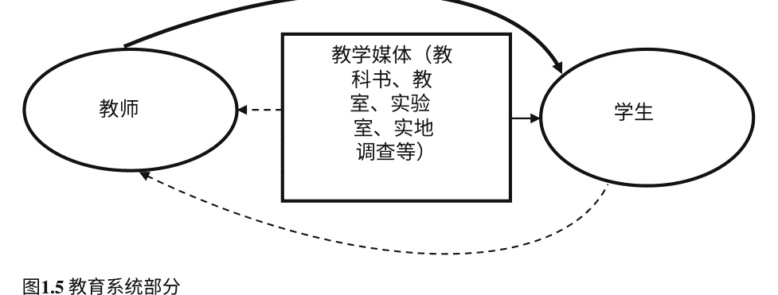

图1.5 教育系统部分

或者通过相互讨论出现新的信息。不幸的是，世界上许多地方，特别是发展中国家，存在非常传统的教育系统，它们提供大规模生产的本地有效证书，提供不容置疑和模糊的信息。任何传统教育系统中的缺陷可以列举如下：

- 1. 教师受到国家或习俗规则的指导，不给予自由的创造性思考。在这样的系统中，逻辑意味着对任何问题的答案要么是黑的要么是白的。这是对问题解决的经典逻辑态度。
- 2. 教学环境，也可以称为教育工具，多年来已成为不可或缺的组成部分，并且在生动而相当枯燥的方式下被滥用。事实上，在非英语为母语的社区中，这些设备很容易成为将学生的注意力从基本教育概念转移到技术探索上的陈列品。
- 3. 人们期望对教科书式问题提供现成答案，这些问题由不同的学习者和教师共享的信息组成，没有歧义。
- 4. 以科学确定性的方式清晰地呈现科学概念，仿佛只有一种思考方式可以解决问题。
- 5. 假设、假说和理想化是人们理解相关现象的常用工具，因此任何科学结论或方程在特定条件下都是有效的。

在现代创新的教育体系中，几乎所有概念，尤其是在高等教育中，都应该提供不确定性和灵活性。科学的漫长历史表明，不仅思想自由对于更好的进步是必要的，对科学结果的怀疑也是必要的。怀疑这个词本身就给予了对科学知识的期望和甚至不确定性。因此，在现代创新的教育体系中，应该考虑以下基本要点以及与传统教育相悖的要点。

## 1.7 教育与不确定性

- 1. 在创新的教育体系中，应该尽量减少或甚至去除传统和经典元素。
- 2. 教师不应完全依赖教育工具，学生应该通过讨论和问题推动教师更多地了解所呈现材料的限制。
- 3. 应该记住，每个科学结果都存在不确定性和怀疑，因此，需要进一步完善以产生创新的思想和变革。
- 4. 特别是在教育议程中，教师应保持逻辑原则和哲学基础，以便每个学生都能理解问题并根据自己的能力进行处理。
- 5. 在高等教育水平上，科学思维应该关注结果或理论的可证伪性，而不是确定性。

当所有这些要点综合考虑时，可以得出结论，现代和创新的教育应首先包括哲学思维，然后是逻辑安排，以区分科学教育中的非逻辑性。这意味着所得出的结论在一定程度上是理性可接受的，而不是完全确定的。毕业生必须确保他们在未来仍有机会进行有益的改进、发明和科学发现。否则，一个带有不确定性原则的传统教育体系将不会给未来的发展留下空间，因此，从这些体系毕业的人只能拥有证书和教条性知识。然而，随着时代的进步，他们可能会感到沮丧，因为他们在教育过程中获得的知识并不精确，并且随着时间的推移而变得更好。

传统或经典的教育体系可以让教师感到舒适，但不幸的是，在受尊敬的教师手中，它扼杀了年轻思维的发展，尤其是在发展中国家。在这种教育体系中，教师可能成为“思维杀手”，但受到上级机构的尊重，学生的意愿或代表性并不被认为是重要的。建议以下几点来改进当前教育体系的内容。

- 1. 口头知识库最好通过母语掌握，这样即使与普通人讨论也可以，而且可以突然出现触发性思路以实现最终目标。系统化的教育可以为数学、算法和物理打下基础。然而，如果口头背景不了解，可能无法产生新的思路和聪明的推理。
- 2. 不应低估无系统的、有时随机混合的知识和信息。有许多隐藏的、有用的信息集可以从有用的信息和启发性的文章中提取出来。
- 3. 只要怀疑性思维在任何人工智能（AI）生产中以科学和技术的方式进行引导，就总是存在进一步改进现有或新的可能性。
- 4. 更广泛地进入AI领域，从逻辑的角度解释手头的问题，值得注意的是，在模糊逻辑（FL）的明确甚至最近的原则之前，没有任何软件是无法达到的。
- 5. 从系统教育、教师、书籍、互联网或其他交流方式中学到的任何信息都不应该没有哲学和批判地记在脑中。不幸的是，在许多社会和国家中，系统教育意味着填充头脑而不是有效和富有成效的创意生成导向。
- 6. 在团队成员之间进行短期或长期的讨论后，应选择兼容的合作伙伴进行头脑风暴，以解决冲突和达成协议。每个技术产品、计算机硬件，尤其是软件技术，都应该通过丰富人类思维的认知过程进行检验。否则，可能无法通过陷入灵魂、思维、身体三个领域之一而达到一般解决方案，而不是AI领域。思维本身是一台没有边界的主要自然机器。但它的行动、产出和触发燃料取决于与主导智能概念的重新评估的合作。
- 9. 人工智能被认为是有效的，而不是个体的自然思维，不能导致完全独立、有生产力的创新思想。因此，建议团队中有不同思想的个体。否则，思想一致等同于一个人，
- 10. 动态地通过批判性和有争议的讨论、评论和辩论来解决专家系统，以产生更好的思想，而不是提供静态可转移和可记忆的知识的基于知识的系统。
- 11. 在掌握了语言基础之后，会出现数值数据信息生成，这需要各种科学函数，如数学、不确定性技术（概率、统计、随机、混沌）和专家系统方法。然而，作者建议首先制作简单的图形，以更好地解释每个数据集的特征。因此，它们之间的关系，它们的独立性、依赖性或部分关系可以被揭示出来。这些图形或任何简单的形状都是几何特征的形式，对人类智力比数学方程更重要。

因为这样简单甚至是解释性的图表在开始时提供非常有效和合理的信息，然后可能达到最复杂的数学方程。

## 1.8 未来科学与方法论发展

今天每个人都能理解的科学定义是探索超越人类周围的自然环境和人造设备工作背后原因的搜索。对这些因果关系的历史调查需要耐心和困难，这为人类带来了科学水平和技术生产（人类今天拥有的）。所有这些努力的核心是与人类思维和逻辑相容的推理。不同文化和不同时空的人们通过不断发展的科学思想和方法（第1.3节）将继续不间断地进行，而且未来将更加迅速。一般来说，人类的思想集中在三个群体中：改善与社会中的机构和个人的关系的想法，用物理对象外部的事件来审视的想法，以及进行评估的想法。这个内部群体，在这里看起来彼此分离，实际上是同一个人在同一时间或不同时间的思维过程，并得出一些推论。

然而，尽管科学和技术的发展是通过考虑实际情况来实现的，但从个人思维中完全隔离其他人是不可能的。这最重要的指标是，在科学的发展过程中，研究人员和思想家有时会通过将研究人员和思想家的发明从现实中剥离出来，然后其他人和研究人员成为自己发明的捍卫者来进行概括。然而，在科学的历史发展中，这样的思想和概括阻止了具有革命性结构的科学思想冻结和效率降低，但至少使其多样化和发展。在过去，在科学的发展过程中，另外两个群体反对实际的科学知识和思想。事实上，即使在今天，他们的思想也是不同的，研究人员并不否认这三个群体始终相互交织。毕竟，这是人类本性和创造力的结果。然而，能够使这三个思想群体保持和谐的个人和社会，已经能够达到今天的先进科学和技术水平。今天，这三种思想在世界上许多国家中不时发生冲突，导致这些社群以龟速推进他们的科学和技术进步。简而言之，确保各种自由思想存在于人类内心世界中，不仅是科学和技术发展的必要条件，也是形成一种能够使它们发芽和发展的心态的必要条件。

科学和人类历史上充满了许多生动的例子，可以作为这方面的一个例子。如果这三个观点在和谐的比例中找不到，即使极端也可能很快将科学带入突破，但它不能加速进步。由于这种过度事实思维，一些教条主义的固执迷恋一度延迟了科学的发展，在只有真理被赋予重要性的情况下。这个最好的例子可以被展示为牛顿定律的普遍有效性，它被认为是科学史上最伟大的革命，直到19世纪，现在已经成为一种信仰。根据这个观点，由于将来可以用力量、惯性和加速度来解释世界和宇宙中的所有现象，正如西蒙·德·拉普拉斯（1749-1827）强调的那样，如果一个有天赋的人能够在一个瞬间给出所有物体的位置和速度，这个优秀的生物将能够在时间上控制这些物体，并且从现在开始，他可以明确预见他可以采取的主题。同一人再次，我们可以以健康的方式确定实际事件的起始条件，并预测任何一系列事件的未来，并推断其过去。因此，时间和地点可以作为独立参数计算的观念已经盛行。后来同意的人认为他们的观点几乎可以应用于所有其他领域，并假设事件，特别是宇宙及其中的事物，非常简单，完全可控，独特，纯机械，并且像机械时钟一样均匀地运转。他们相信自己的假设，并说服了其他人。因此，一些机械性被添加到人类思维的追求中。结果，那些能够超越这个框架思考的人没有得到关注。对于这个例子，人在科学中所做的事情与他所做的事情是一样的。

对于牛顿的机械观点的第一个反对意见始于19世纪初，当时热力学定律出现，这些定律无法用这些机械定律解释。这些热力学定律通过显示牛顿的观点在所有领域都无效，引发了一场新的科学革命。自然地，人们发现了由奥古斯特·孔德（1798–1857）创立的机械主义和实证主义思想受到了动摇。热力学思想中最重要的观点是，如果将宇宙比作一台机器，那么它会随着时间的推移而磨损，就像每台机器一样，并且不再像以前那样有效地运行。根据这个观点，宇宙中的一切都会衰老，这个观点在古代的一些思想家中被提出，他们只使用了理性。其中，柏拉图（公元前478–423年）声称人们感知到存在的形象，实际上，对于每个存在，都有一个称为理想的绝对真理，并且这些理想不会随时间而改变，但我们感知到的形象总是随时间而改变。因此，我们可以说，所有今天有效的科学哲学定律和原则在未来必须改变。这些不断变化的背后是神圣的力量，作为自然的结果，人类将不得不通过不断追踪自然规律的发展来继续努力。在这一点上，对于我们的世界来说，通过今天的科学研究形成新的大陆是毫无意义的。例如，在4亿年前的相邻大陆的情况下，很明显地，地球的气候和对流在大气圈中的循环与现在不同。因此，当时有效的气象和气候特征的科学哲学规则和定律在今天不再有效。不需要成为一个先知，就能意识到今天的科学哲学论文在未来将不再有效，考虑到宇宙在剩余未来时间的扩张，以及地球的寿命，估计约为150亿年。因此，科学哲学发现应该被视为一套不断发展和变化的规则，既随着时间的推移，也由于信息不完整而变化。

另一方面，在科学和技术的发展中，人类思维系统，即哲学，提出了一些观点，并导致了今天的科学的形成和发展。人的本性总是渴望好的，容易的，简单的，美丽的，统一的，并试图理解许多事件。与此同时，他将无法简化的事物描述为丑陋、晦涩，甚至是无用的，并对此不感兴趣。事实上，这是最主导的观点之一在科学的发展过程中，确定性的原则和思想构成了上述机械主义和实证主义观点的基础。在某些社会和时代，这种观点及其思维方式已经走得太远，以至于那些人和社会已经因为寻求确定性的思想而变得盲目甚至聋哑。因为他们已经相信某种确定性，并且在他们的控制之下，甚至不允许科学批评。然而，就像历史上的社会事件一样，自由批评对于科学思维系统的发展和产生知识是必要的，但却在以科学的名义下被阻止。有时这种阻碍是无意识的，人类像按处方制备的药物一样服用药丸，以一种阻碍科学思维的方式。最好的例子就是大家非常熟悉的欧几里得几何学。这种几何学与人的本性相反，只涉及理想的点、线、平面和体积。欧几里得的假设在近两千年甚至更长时间内没有受到批评，即使有人批评，也有人为其辩护，阻止了人类科学进步所需的几何学的发现。尽管这些障碍有时会受到其他思想的冲击，但也可以看到，由于内部的偏见和教条化情况，科学发展并没有取得进展。

使用欧几里得几何学无法在自然界中绘制出树等形状。这只有在分形几何学的出现下才成为可能，该几何学是在20世纪70年代发展起来的。如今，多亏了这种几何学，它几乎与人类所做的无法区分。特别是从一个非常简单的想法开始，是否在欧几里得几何学（公元前330-325年）的点、线、平面和体积作为整数的0、1、2和3之间有任何小数的图形？他的原则中产生的分数（分形）几何学由曼德博（1924-2010）引入，为构建几乎与自然景观本身无法区分的人工自然界铺平了道路。

### 1.8.1 浅层学习

这种学习系统可能意味着简单地记忆基本知识和信息，而无法理性和主动地运用它们来解决问题。然而，在本书中，几乎所有传统的科学和技术基本方法都将在科学哲学和逻辑规则集的指导下进行解释。这种浅显的启蒙对于建立深度学习基础是必要的。浅层学习是机器学习的最简单形式，它提供了从给定的一组数值数据、图像、图形、算法和形状中推断的基本方法。浅层学习的主题包括概率、统计回归、聚类、分类和强化方法等不同的传统方法。这些方法都依赖于数值数据。此外，伯努利朴素贝叶斯、k最近邻、随机森林和支持向量机等方法提供了深度学习方法的基础（Manikandan和Sivakumar2018; Moe et al. 2019）。回忆和机械记忆是浅层学习活动的特点，一般而言，没有对现有方法或创新发展进行任何修改。如果浅层学习原则不是基于科学哲学，尤其是逻辑推理，那么知识注定会从记忆中消失，或者知识被

### 1.8.2 深度学习

最近发现深度学习方法在不提取特征或特征优化的情况下表现出了显著的性能提升（Krizhevsky等，2012年）。在浅层学习原理之后，通过深度学习来获取知识的现代方式是基于人工智能（AI）、机器学习（ML）、软件学习（SL）以及它们在高速计算机上的执行。这些阶段的应用取决于数据的可用性，通过逻辑规则、概率统计方法来分析数据，以提取可用数据的细节结构特征，以获得更好的估计和预测模型。深度学习的基础是机器学习或通过深度学习提出一个机器及其工作原理的建议。深度学习过程通过人工神经网络（ANN）等人工智能方法从大量数据中学习。通过深度学习，可以通过大量的数据输入、神经网络和层间权重以及偏差来模仿人脑。深度学习过程由每个相互连接的节点中的多个层组成，通过连续的前向传播函数的改进来预测、分类或优化给定数据集的内部结构特征。深度学习算法非常复杂，有不同的方法应用，例如卷积神经网络（CNN）和循环神经网络（RNN），这些在第9章中详细解释。

### 1.8.3 浅-深度学习关系

一般而言，浅学习过程被视为机器学习方法，已经接近饱和水平，为深度学习方法的产生奠定了基础。虽然浅学习中存在计算机建模活动，但深度学习过程更频繁、更密集、更计算导向。在逼近任何函数时，浅学习和深度学习方法都是有效的。为了更好的准确性，层次深的学习过程在经过大量计算结果、更具代表性和更精细的参数集以及相对复杂的模型结构后，会产生更高效的结果。在浅学习过程应用中，初步专家观点起到重要作用，而深度学习算法能够学习抽象的数值表示。通过不同的模型架构，以实现更好的分类和优化研究。

在数据集有限的情况下，浅学习方法比深度学习方法表现更好，能够得到初步结果，并且具有更简单和更少的计算要求。深度学习过程有助于处理大规模数据集，考虑到领先的浅学习原理，可以得到更好的结果。深度学习也是机器学习算法，但在复杂性、有效性和准确性方面更高级别。浅学习也涉及机器学习，但在更粗糙的尺度上。

在这两种学习系统中，都有一系列的层来进行学习，但是在深度学习过程中，层数相对较多，特征描述也更加复杂。有时候它们也被称为特征提取方法。在这两种学习过程中，第一层都包括可用数据和相关信息的输入，这些数据经过内部层的处理后，最终输出层产生所需的估计、预测或结果，具有更高的准确性。目标是分析可用的原始数据，得出有价值和逻辑可接受的有效深度学习结果。至于浅学习和深度学习的区别，并没有明确的界限，它们以模糊的方式交叉。第一个想法是，深度学习与数据（语言或数字）输入层之后的多个隐藏层有关。普适逼近定理可能暗示着在浅学习领域，入口层和结果层之间只需要一个中间层就足以解决问题，但对于深度学习解决方案来说，这是不够的。

Goodfellow等人（2013年）在深度学习的层次方面总结了以下内容。一个具有单层的前馈网络足以表示任何函数，但该层可能过于庞大，可能无法正确学习和泛化。在许多情况下，使用更深的模型可以减少表示所需函数的单元数量，并减少泛化误差的量。

过去，基于数值数据的模型设计中，概率和统计模型在预测目的上起着主导作用，并被视为浅层学习方法。最近，浅层学习和深度学习模型开始在通过密集回归方法进行广泛数据分析方面显示出潜力。

浅层学习的愿望主要是在不考虑或不活跃地思考科学方法的内部功能机制的情况下出现。一般而言，浅层学习被理解为记忆和忽视事实，而不是论证。另一方面，相反地，深度学习涉及更详细的数据探索，理解基本原理，并对个人但科学的方法论进行决策。

然而，正如本书的下一章节中将会解释的那样，浅层学习和深度学习过程之间总是存在相互作用。本书的目的

## 1.9 创新

发明意味着在智能软件、设备、科学知识和其他问题方面取得进步，以明显而有吸引力的方式。至于创新，引用一些观念、系统、科学知识、时尚、艺术和世界观，将它们当作不存在的东西，只不过是古老的。要做一些创新的事情，可以从某个地方借用所说的话，但是要以理性思维而不是转化为知识的表达方式来感知，并对其哲学进行知识的言语表达，然后根据逻辑规则进行批判，可以征服引导到有用的新信息领域的新方向。科学和技术发展可以通过纠缠来实现。

如果按照一个人或团队提供的信息来进行，可能会进入一个形成性的创新环境，但只有通过从共同的思维信息中揭示更好的信息，才能达到真正而动态的创新视野。接受过有关事件或现象的正规教育，甚至拥有大学学位或学术头衔，并不能说这个人在所做的事情上是新颖的。如图1.6所示，偏见的路线图中存在不同的元素。

当人们看到图1.6时，如果推理比先前已知的信息和技术更高级，那么可以谈论创新，并且可以理解这是通过反馈进入事件和事实环境或通过进入推理环境来揭示新情况，推理是生成性思维发电机的引擎。然而，模仿的结果却是死胡同的开始。不要忘记思维元素中最重要的工具是母语。谁能够理解并且更重要的是消化浅显的逻辑基础上的信息，他们的思维必然会产生新的创新思想在科学和技术领域。从这个角度来看，科学哲学的基础和逻辑原则则是教育的基本要素，尤其是大学本科科学教育的基础。不幸的是，这两个基本的知识生成方面几乎在每个世界范围内的大学中都缺失。

在过去的三十年里，“创新”这个词不仅在科学研究和技术领域中频繁出现，而且在许多工程和自然科学领域也经常被拼写。从一般意义上讲，创新是对已知知识和信息的重新发现、修改、改进或发展，并加入新的视野或扩展，可能导致进一步的方法论、技术或研究方向，带来额外的经济利益。尽管数学在许多教育层次上都被认为是重要的，但表达式、方程式、算法或程序的基础并没有建立在坚实的基础上。

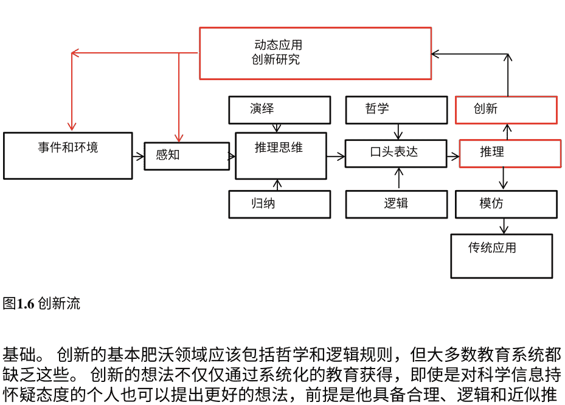

基础。创新的基本肥沃领域应该包括哲学和逻辑规则，但大多数教育系统都缺乏这些。创新的想法不仅仅通过系统化的教育获得，即使是对科学信息持怀疑态度的个人也可以提出更好的想法，前提是他具备合理、逻辑和近似推理的能力。不幸的是，在当前的教育系统中，数学课程很多，但缺乏几何背景和原理。

### 1.9.1 发明

发明和改进之间的一个重要区别是，改进并不意味着创新，因为它是根据需要进行添加以使某物更有用。不一定需要不断反思才能发明。一个思考并依赖于审视许多事实或事件的思维，即使在小规模上，它的解释也可以通过反思突然点燃一种情况，从而进行发明。这也被称为发现，它是揭示已经存在的某物并让其他人看到的一种发明。例如，批评爱因斯坦的特殊相对论和广义相对论可能是一种创新，但不是一种发明。引入亚粒子（量子）物理学是一种完全不同的发明，而不是一种创新。

从这个可以理解到，发明中创新维度的缺失也是可以接受的。为了能够发明，需要思考、哲学和逻辑，但这些需求是在某个发明想法浮现时必须激活的产生性思维元素，而不是为了制造一个发明。

### 1.10 书籍内容和阅读推荐

这本书是在伊斯坦布尔工业大学、伊斯坦布尔麦迪波尔大学、国内外医学院的讲座笔记基础上产生的。该书由10章组成，每一章都解释了科学哲学与逻辑规则原理的交织。在许多国家，科学哲学、逻辑推理原则、近似推理和合理性并没有以合理的顺序进行集体思考。作者通过哲学和逻辑原则对语言（口头）解释进行了经验和文献综述，并形成了自己的概念，这些概念在科学和技术培训中越来越有影响力。整本书中有一些主题鼓励工程专家在不同学科之间分享共同的兴趣。

本书强调创新生成性思想清单的重要性，这应该基于科学哲学、逻辑原则，并伴随工程方面的因素，这些因素作为任何人类的先天工具，他们希望发明新的想法、小工具、仪器、机器人，或者至少在一定程度上对它们进行修改。这些人类能力包括教育维度，它可以激发人们对现有想法的补充新想法，以及通过时间获得的经验和专家观点。在当今社会，创新发现几乎在生活的各个方面都获得了评级和经济利益，甚至包括服务行业。

在所有学科中，不同的思想和思维原则都很重要，知识类型和理性推理推断也很重要。在本书中，建议在人工智能（AI）、机器学习（ML）和深度学习（DL）领域中应用医学哲学和逻辑原则的以下重要观点。

- (a) 浅学习和深度学习程序之间的关系,
- (b) 与人工智能、机器学习和深度学习建模相关的基本和简要定义,
- (c) 人工智能的历史、类型和方法,
- (d) 哲学的定义及其对科学哲学的影响,
- (e) 逻辑原理和规则,
- (f) 语言和数值不确定性类型、推理和测量,
- (g) 人工智能建模中的语言谓词和推理,
- (h) 基于集合的清晰逻辑和模糊逻辑建模原理,
- (i) 概率和统计建模基础,
- (j) 回归技术和限制性假设,
- (k) 人机工程,
- (l) 数学建模和功能解释,
- (m) 遗传算法优化原理,
- (n) 人工神经网络作为浅层学习阶段,
- (o) 预测、语言、有意义的教育搜索,
- (p) 模糊逻辑推理系统和建模原则,
- (q) 机器学习原理作为深度学习的第一步,
- (r) 深度学习的要求和方法论原则
- (s) 卷积和循环神经网络建模原则

章节1提供了关于所有章节的覆盖内容的简要信息，并附带一些基本的考虑因素在基本信息内容中。本章的主要目的之一是反映本书的内容，并根据科学、哲学和逻辑基础重新考虑和重新建立教育基础知识和信息，从而引导人工智能（AI）的发展。解释了浅学习和深度学习的概念和原理以及它们之间的相互关系。

本章涉及人工智能（AI）的初步和基本方面，包括其历史演变、智能类型和AI基本建模原则。解释了不同版本的思想和思维，以便通过可能的便捷治疗决策达到合理的诊断，所有这些都是为了获得近似推理能力。

在第3章中强调了哲学和逻辑原则是科学进步的基础，应该是数学、物理、工程、社会、医学、金融和所有其他学科教学和学习的优先课程。通过考虑本章所描述的各种思维原则，可以从这些原则中推导出智能功能原则。

在第4章中以概率和统计方法在实际建模和数据描述研究中的使用为基础，客观地解释了科学研究中遇到的不确定性类型。试图通过近似推理和逻辑规则的基础，为读者提供解释不确定性建模过程、问题解决和验证的技能和能力。通过一系列与问题相关的同质性、各向同性、平稳性、等方差性、均匀性、线性性和许多其他假设，避免了现实生活中的不确定性。

基本概率和统计参数和方法被实际地解释。最后，趋势识别方法被详细解释。

本章以语言方式提供了最常用的数学函数的完整解释，然后给出了它们在实际应用中的可视化描述和使用的实用技巧。为此，以前的章节被用作基础，以科学的理性命题的形式进行解释，即“如果...那么...”。在本章中，概念、分析、经验和数值模型以口头方式进行解释，从而导致数学表达式。还解释了几何基础的重要性，包括微分方程的数学推导。

本章介绍了遗传算法（GA）在数值和随机序列的优化（最大化和最小化）问题中的原理，其解决方案比其他数学优化模型更快。在本章的开头，详细解释了十进制数系统的首次历史出现。结果表明，遗传算法方法的原理易于理解，只需进行算术计算即可获得结果，无需繁重的数学计算。无论如何，首先需要解释问题的口头方面。

哲学、逻辑和理性规则的框架。在整个文本中，考虑到读者对主题的雄心壮志和自我发展原则，通过给出必要的线索。通过数值应用给出不同的应用示例。

第7章通过考虑输入、隐藏和输出层的组合，对人工神经网络（ANN）的架构、数学和过程功能进行了全面的解释。ANNs和特别是线性感知器通过逻辑回归在分类方法中提出了分类过程的第一个例子，作为进入AI浅层学习领域的第一个入口。本书的前三章对于问题的ANN架构构建中的科学和逻辑思维基础进行了哲学和逻辑方面的解释。给出了各种ANN建模应用学科和一些实际应用。

机器学习（ML）原理在第8章中进行了讨论，支持深度学习软件应用和浅层学习基础。据说ML依赖于数学程序，但AI模仿和模拟人脑活动。ML依赖于人类思维，浅层学习技能和能力。在文本中，通过不同的损失函数类型提供了数据可靠性的路线图，随后通过模型输出预测验证来获得最佳（最小误差）的AI模型结果。通过哲学、逻辑和数学背景解释了清晰逻辑k-means和模糊逻辑c-means分类方法。

第9章集中讨论了深度学习（DL）的方法论程序，作为人工智能（AI）和机器学习（ML）规则的混合，涵盖了前几章中所解释的所有内容。在DL过程中，有两种具有权重的方法，即卷积神经网络（CNN）和循环神经网络（RNN），从模型架构的角度进行了解释。

尽管CNN在输入、隐藏和输出层的连续中具有前馈架构结构，类似于RNN方法，但前者具有卷积、池化和完全连接的一系列隐藏层结构，而后者在每个隐藏层中具有循环可能性，以获得更好的建模结果。在文本中，对CNN和RNN的训练、测试和预测阶段进行了比较详细的解释（图1.7）。

### 1.11 结论

本章的主要内容是通过对不同文明和世纪的知识和信息进行评估，从史前时代到现在，提供浅层学习和深度学习原理的基本概念。解释了外部（五感器官）和内部（思维、记忆、推理、智能和科学的理性近似推理思维路径）的各种脑活动。解释了科学思维的基础，以建立模型的可能性，涉及确定性与不确定性的问题。

## 浅层学习原理和深度学习

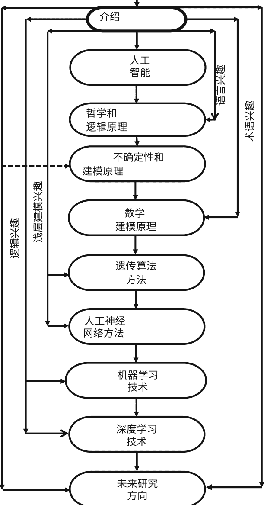

图1.7 书籍内容流程图

随机性、模糊性和创新与发明模式。简要介绍了清晰（二值）和模糊逻辑的初步规则，以便准备理解人工智能（AI）、机器学习（ML）和最后深度学习（DL）模型结构的发展和解决算法。最后，为了读者的利益，设计并解释了一份路线图，介绍了本书的内容。

为了高效的人工智能科学工作，建议通过批判性审查和讨论来掌握本章内容，以推进现有的程序。人工智能应用可以通过现成的软件来实现，但是为了创新改进，甚至需要探索其中的科学哲学和逻辑组成部分。

## 参考文献

- Goodfellow I等人（2013）深度玻尔兹曼机的联合训练用于分类。在：国际学习表示会议：研讨会
- Johnston RJ（1989）哲学、意识形态和地理学。在：Gregory D，Walford R（编辑）人类地理学的视野。MacMillan Education，伦敦
- Krauskopf KB（1968）十个岩浆体的故事。Bull Geol Soc Am 79:1-18
- Krizhevsky A，Sutskever I，Hinton GE（2012）使用深度卷积神经网络进行图像分类。Adv Neural Inf Proces Syst 5:1097-1105
- Leopold LB，Langbein WB（1963）地貌学中的关联性和不确定性。在：Albritton CC Jr（编）地质学的结构。Addison Wesley，Reading，pp 184–192
- Manikandan R，Sivakumar DR（2018）文本文档分类的机器学习算法：综述。Int J Acad Res Dev 3（2）：384–389
- Mann CJ（1970）自然界中的随机性。Bull Geol Soc Am 81: 95–104
- Moe ZH等（2019）朴素贝叶斯和支持向量机分类器在文档分类上的比较。在：2018年IEEE第七届全球消费电子会议（GCCE），pp 466–467
- Parzen E（1960）现代概率论及其应用。Wiley，纽约
- Popper K（1955）科学发现的逻辑。Routledge，纽约，第479页
- Sarton G（1884–1956）科学史导论（5卷）。华盛顿卡内基研究所出版物编号376。Williams and Wilkins，Co.，巴尔的摩
- Zadeh LA（1973）复杂系统和决策分析新方法概述。IEEE Trans Syst Man Cybern 2:28–44

## 第2章

人工智能


### 2.1 概述

所有基于观察和想象的人类智力活动都通过基于科学哲学和逻辑原理的概念化转化为可行和有用的最终产品。科学，尤其是技术的历史，充满了这样的智力发明，即各种文明以创新、有声望和可接受的结果积累的人类智力的不间断积累。从史前旧石器时代开始，人类思维借助于石器磨刀石、切割器、箭头、工具等首次发明而开始运作。当人类思维利用现有材料如石头、土壤、木材、铜、青铜和铁等创造出有用的作品时，这些活动就出现了。主要系统基于发现和发明基本上是历史性的概念（Newell 1982）。

到目前为止，只有少数几部作品，例如“Thinking Machines,”提供了除此之外的任何东西，而且仍然没有明确的历史学主张（McCorduck 1979）。人工智能（AI）是一门发展中的科学领域，具有执行逻辑等功能的能力，这增加了其在机器人化（将人类转变为机器人的过程）和机械化方向上的重要性。与数学一样，如果理解思维原理、科学哲学和基于逻辑的理性，甚至可以实现更好的人工智能应用。在逻辑规则的框架内，如果将各种人类智能转移到机器人和机器上，人工智能将继续前进。这里最重要的问题之一是，AI设备会取代人类的自然智能吗？本书作者的想法，和许多其他人一样，认为这种情况永远不会发生。随着人工智能的高级能力和复杂性，系统很可能在经济、金融、医药、能源、制造、生产、教育、工程、交通、军事、通信和公用事业等行业中被更频繁地使用。人工智能的一个重要阶段是将人类和机器紧密联系在一起。

在埃及金字塔的建造中使用了合理的语言规则。即使在那个时候，也是通过奴隶而不是机器和机器人使用自然智能。事实上，可以说这些金字塔中的设计是以自然智能（NI）作为人工智能（AI）的反映。

关于人工神经网络（ANNs）的第一批研究始于McCulloch和Pitts（1943年）。最初，神经元使用基于固定阈值逻辑元素的基本数学建模。后来，Hebb（1949年）为ANN开发了一种学习规则，并使该方法得到广泛应用。大约十年后，Rosenblatt（1958年）通过学习规则将所谓的单一线性感知器模型提升到了更高的水平。事实上，尽管人工智能在历史的每个时期都存在，但其正式引入文献并以这个名称提及是在McCarty（1960年）的国际研讨会上。在此之前十年，图灵（1950年）发表了一篇关于机器是否能够影响人类的文章。正如他所说，

> 虽然在建模生物神经系统方面取得了一些成就，但它们仍然无法解决建模直觉、意识和情感这些人类智能的重要组成部分的复杂问题。

他的主要奖励系统是建立在发现和创造基本上是历史性的概念上的（Newell 1982）。到目前为止，只有少数几部作品，比如“思考机器”，超越了这一点，但仍然没有明确的历史学主张（McCorduck 1979）。

特别是在1990年代之后，科学领域的专家系统开始受到讨论，并强调通过汇集不同专家对一个主题的观点可以取得更好的结果。由于在同一个应用领域中可能有多个专家拥有不同的经验和知识，因此需要从多个专家那里获取和整合信息，以生成一个有效的专家系统。提出了一种基于Delphi的方法来获取多个专家的信息。Delphi是由Delbecq等人（1975）定义的：

> 通过一系列精心设计的顺序问卷调查和先前得出的意见和回应的总结信息和反馈，系统地征求和收集关于特定问题的决策的方法。

与人工智能相关的最重要的问题之一是Zadeh在1965年、1973年、1979年开发的工作，他开发了模糊逻辑（FL）原理，这些原理代表了与自然逻辑非常接近而不是脆弱（二值）逻辑。这些逻辑原理和规则在它们首次出现在西方后被排除了多年，但在今天的人工智能应用中占据着非常重要的位置。

考虑到人类自然软能力向一些工具、软件、机器人和机器的转变，人工智能是造物主赐予人类的礼物。人类自古以来就对人工智能充满好奇，尽管是无意识的。早期的想法和它们的机械手段要么是未实现的想法，要么是简单的武器、工具和器具，要么是未实施的图纸。人工智能的基础在古希腊时期（阿基米德，公元前~159年）、口头描述性写作（海伦，公元前~50年）以及中世纪机械机器人的绘图和解释中出现。

在伊斯兰文明时期（阿卜·尔·伊兹·阿尔贾扎里，约1200年）。总的来说，人工智能思维的基础是将高度复杂的问题通过简单的语言、符号、数学、算法和逻辑解决方案降低和转化为人类可理解的水平。人工智能研究不仅可能需要正式的培训，还可能依赖于群体经验的个体性，这些个体性可以用语言术语来表达，并通过各种机器转化为机械活动。如今，人工智能探索人脑和心智功能、机器学习以及用于服务人类的医疗机器和机器人。

自数字计算机问世以来，人工智能的理论和实践研究和应用有所增加，这些研究通过近似推理模型处理不确定、可能、概率、不完整和缺失数据情况。计算机可以帮助可视化和实现人工智能配置，前提是人类智能可以通过一系列假设和简化转化为计算机软件。除了数值数据操作外，语法和知识还可以通过建模、推理和决策过程来表示。

人工智能的主要来源是人脑功能，它产生了旨在改善社会和经济生活的智能工具、设备和机器。人类智能是人工智能的主要来源，不仅在智能车辆和机器中，而且在任何基础或应用科学和技术研究中都是如此。科学和技术进步离不开将人类智能转化为人工智能，它可以以公式、方程、算法、软件、模型和机器的形式出现。

本章通过涉及这些形式来简要解释人工智能。本章的主要目的是从历史的角度触及人工智能问题，并在1950年后继续以指数级增长。

科学哲学的基础和逻辑规则在国际文献中没有得到完全的整合。

### 2.2 人工智能历史

人工智能的发展可以分为两个阶段，前文艺复兴时期和近期大约在1940年之后。这里的主要目的是以公正的视角反映人工智能任务的历史发展。不幸的是，人工智能被认为是西方文明的特权，但存在着古代文明，人类的自然智能可以产生人工智能。这一点已经有记录，并且人工智能被认为是整个人类的共同特征。

### 2.2.1 文艺复兴之前

特别是在早期文明中，技术的发展与哲学思想和科学原理相当独立。除了觅食，人们还尝试着通过提供庇护所、保护野生动物、地震、洪水、干旱、火灾和极端天气条件的保护措施，采取安全预防措施来应对危险的自然事件。中国、印度、美索不达米亚、古埃及、希腊、伊斯兰和西方等不同文明在整个历史上都以人工智能的原理对技术和科学发展做出了贡献。在人类历史的起源中，原始的技术发展已经在广泛的考古报告中得到确认。大规模的技术进步在连续的文明中有详细的书面记录。从古希腊开始，在大约12世纪之后，有许多研究者试图利用水力来操作一些简单但有效的设备，为人类提供服务。

在希腊化时期，赫罗（公元10-70年）和维特鲁威（公元前80-15年）是罗马帝国中最早使用水力进行不同人类活动（如水运、水磨和水钟）的思想家之一。大部分文献都是在伊斯兰文明之前，亚历山大的赫罗和维特鲁威的作品中轻描淡写地描述的。不幸的是，除了与智能使用相关的一些场景外，他们没有留下任何设计或图纸。另一方面，十二世纪的阿布·伊兹·阿尔贾扎里（公元1136-1206年）是水力驱动机器人的创始人，在许多方面对于科学写作向西方文艺复兴时期的过渡以及机器人、控制论和人工智能的基本根源和发展状态做出了重要贡献。阿布·伊兹·阿尔贾扎里在他的原始手写阿拉伯书籍《Kitāb fī ma-'rifat al-Hiyal al-handasiyya》中绘制了许多机械设计。

> يصناعة الاجهزة اللحية منيع ف

，由希尔（1974,1998）翻译成英文为“聪明的机械装置知识之书”。穆斯林思想家阿布·伊兹·阿尔贾扎里回顾了来自不同文化的先前研究者的所有工作，并解释了他自己关于水、动物或风力使用的令人赞叹的自动化物种的绘图、设计和装置。然而，尽管他是机器人学和控制论的先驱，不仅在西方世界，而且在他所属的伊斯兰世界中，他的名字几乎没有被听说过。他的作品在十九世纪的第一季度被德国历史学家和工程师发现。后来，一位名叫希尔（1974）的英国工程师将他的书从阿拉伯语翻译成英语，总结了从十二世纪开始的现代自动化和机器人设计。纳斯尔（1964）回顾了穆斯林思想家的技术、哲学和自然主义观点。关于阿尔贾扎里的首部也是最重要的著作是由维德曼和豪泽（1915）完成的。阿尔贾扎里的装置的制造即使在今天也是可能的，因为他清楚而详细地描述了元素的共同工作和各个方面。

在阿尔贾扎里之前，有几位穆斯林思想家，包括巴努·穆萨兄弟、哈里兹米和拉德万，他们通过思想创造了技术思想和工具。这三兄弟制造的设备后来被阿尔贾扎里修改并使用。这些兄弟评估了早期研究者提出的所有东西，尤其是维特鲁威和希伦。

自动机是欧罗巴复杂水钟的直接祖先，由水力驱动。伊斯兰教和后来的自动机制造欧洲是促使他们在理性主义和机械主义解释自然现象方面进行智力发展的因素之一，这种高度富有成效的态度在现代科学的发展中起到了重要作用。然而，阿尔贾扎里的巨大时钟展示了他最令人印象深刻的自动装置序列。

阿尔贾扎里描述了许多用于提水的全尺寸机器，它们都包含了机械技术史上非常重要的特征，甚至今天这些部件在任何机器中都是常见的使用部件。

在第一个机器人设计中，水力被用来抬起大象上的机器人人手。如图2.1所示。从右边的管道注入的水击中大象后面的工具的左边，抬起了机器人人的左手。

这是技术史上最简单的机器人初始设计。

另一个来自Al-Jazari的有趣机器对今天的技术非常重要，如图2.2所示。这台机器在蒸汽机和泵机的发展中占据重要地位。

该系统利用风力，通过放置在水平轴周围的面板将其转化为机械能。一个齿轮被安装在同一轴上，将旋转运动传递给另一个齿轮。在这个齿轮的外缘，有一个固定在垂直于表面的销子。这个销子进入一个槽杆，其底部在箱子下面旋转。通过转动这个齿轮，销子上下移动，结果槽杆从右向左移动。

图2.1 水射流工作的机器人平均


# 图2.2 活塞、圆筒和阀门

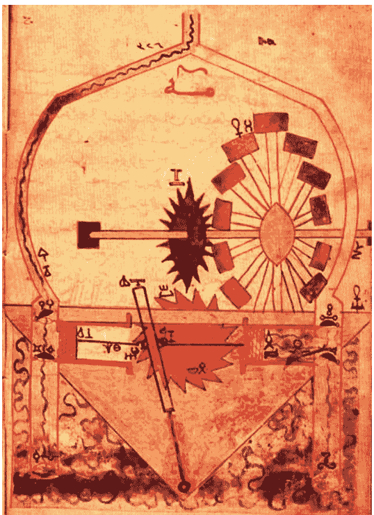

从左到右，另外两根杆通过环和冲头及配件连接到裂缝杆的两侧，每个杆的末端都连接有一个活塞。活塞在水平圆筒内移动。每个活塞都配有一个下降的吸管进入水中。分离活塞后，分配管道的直径缩小，并相互连接形成一个单一的出口。当裂缝杆振动时，一个活塞泵入水，另一个活塞吸入水。这种双作用原理的泵是回程活塞运动的一个很早的例子。

他的书包含了自动装置的全面方法和最新的机械信息。它系统地包括了各种装置和机械的技术发展，以及关于自动机和自动化知识和科学信息的深入解释。希尔（1974年）强调了阿尔贾扎里在工程学、控制论和自动化方面的重要性。他不仅吸收了非阿拉伯技术，而且直到19世纪都没有任何作品能够取代他的机器人设计。他们的发明对蒸汽机和内燃机的后续设计产生了明显的影响，为自动控制和其他现代机械铺平了道路。阿尔贾扎里的发明在现代机械工程中仍然有影响力（希尔1998年：II，231-2页）。

即使看着他书中手绘的机械装置（图1.1和1.2），并将其与今天的机器人进行比较，人们一眼就能看出他将水力机械设计为人工智能制品。 据称，他的思想和绘画在19世纪对机械化产生了直观的感觉（Sarton 1950）。

## 2.2.2 近代历史

在文献中，西方文明的创新人工智能原则，特别是从1940年开始，被呈现得好像之前的文明没有提出和设计过人工智能设备一样。 至少有两个文明，比如古希腊，没有做出太多贡献，但是基于伊斯兰文明中阿布·利兹·阿尔贾扎里的人工智能思想的实际设计具有控制论的根源。如今，人工智能这个术语还应该从工程、社会、经济、环境、国防、农业、工业、交通和不同领域的不同功能的智能机器人或机器的概念化角度来理解，随着其日益广泛的发展。

事实上，人工智能满足了研究自然人类智能功能的逻辑基础并推导出它们的规则并将其转移到机器人和机器上的所有工作。 这些研究的最终设计是为了揭示一个合理的理性水平。基于人工智能研究的基础上，通过和谐地结合人类思维中自然产生的一系列逻辑关系进行近似推理。 这就是人工智能的进展方式，因此通过进一步的阐述和加强理性，可以随着时间的推移提高其互操作性。 人工智能的发展将随着时间的推移而演变，重点是公众中的发明家和科学家的能力，但这种发展永远不会达到人类自然智能（NI）的水平。情感智能是AI无法检测到的思维建模，它是人类感知的表达，包括幸福、喜悦、悲伤、悲痛、恐惧等。在这方面，期望人工智能完美无缺并不是一个好主意。但它可以通过计算机软件编程继续发展，特别是通过不断进化。

现代人工智能的研究始于二战后不久，随着20世纪50年代计算机技术和工程的出现。 数字计算机为不同学科（工程学、经济学、社会学等）中自然现象的模拟提供了空间，因此，这些早期研究引发了人们对人工智能的思考。Russell和Norvig（1995）提供了这些最近发展的简要历史。

关于人工智能的第一句话是由约翰·麦卡锡在1960年说出的。 据说机器可以执行许多人类可以执行的动作和功能。今天，许多理性的思考和行为可以通过编程计算机软件进行科学模拟和建模。 随着时间的推移，机器对这些人工行为的改进已经达到了今天的人工智能水平，并将继续发展。解决各种问题需要人类智能以科学、理性和逻辑的规则，而机器和机器人则需要应用这些规则。 由于人工智能的第一个词指的是机器，第二个词指的是对于人类智力来说，第一个是人工的，第二个是自然的功能。

在过去的70-80年里，以下情况对AI的发展起到了作用，并且仍在发挥作用。 以下六项提供了从1950年到最近几年的信息：

- 1. AI的诞生（1952-1956）：在AI这个术语被创造出来之前，控制论和神经学领域有了一些发展。这些网络开始引起两者的注意，并在科学界和公众中产生了影响。 特别是1956年举行的达特茅斯会议，为AI领域的第一个案例提供了认定。因此，出现了一条路线图，引导了接下来几年AI的发展。
- 2. 人工智能（1956-1974）：除了解决代数和几何问题外，当时的计算机还进一步发展了人工智能，首次能够在一定程度上确定语音质量。
- 3. 人工智能（1974-1980）：在这个时期，人工智能的优势和劣势开始被提及。在这个有些动荡的时期，人工智能方法仍然能够继续发展。
- 4. 人工智能（1980-1987）：专家系统逐渐被引入解决特定问题，与此同时，被专家提出的类似Delphi的口头和调查般的专家意见开始被收集和用于人工智能。基于专家意见的逻辑规则始终作为一个整体发挥作用。在这个时代，人工神经网络（ANN）、遗传算法（GA）和模糊逻辑（FL）等方法开始出现。
- 5. AI（1987年-1993年）：随着台式机和笔记本电脑在接下来的几年中的使用，人工智能原理在不同学科中得到了爆炸性的应用，而不是只限于不容易被每个人访问的计算机中心，这种情况一直持续到现在。后来，在1993年至2000年之间，在某些领域开发了新的应用，并出现了“机器学习”的概念。
- 6. AI（2000年-今天）：在这个时期，特别是互联网和后来的网络成功地进入了人类生活。因此，一些新概念通过处理和转换大规模数据集（如“深度学习”和“数据挖掘”）得出有意义的推论。

## 2.2.3 人工智能教育

尽管许多研究中心和大学都在努力进行人工智能研究，但他们的大部分工作最初都是基于一些成熟的方法、机器、机器人等，通过近似推理来实现的。然而，许多机构，特别是大学，在他们的课程中并没有科学和逻辑原理的哲学，但是有一些数学变体（微积分、解析、线性、微分和积分方程、包括概率、统计、随机过程、混沌方法的不确定性问题），都具有智能触发思维和批判性的组成部分。

评估软件能力。 这就是为什么在许多社会中，技术转移是受欢迎的，而不会被更好的选择所改变、增强或替代。人工智能的进步导致了似乎远离人类智能的自动化，但最终它们倾向于接近人类固有的能力，类似于人类智能的思考、推理、推断和想象力。 值得注意的是，尽管人工智能中对数学原理的强调压倒一切，但几何学或形状可视化是人工智能的主要启动者。

在这里，人类思维、概念和想象力的一些部分，主观和客观维度被部分考察。 提到了一些人工智能方法，特别是模糊逻辑（FL）推理系统在详细解释（第3章）中，不仅数学符号，而且基本的语言逻辑规则基础在任何人工智能活动中起着最重要的作用。

现代人工智能业务的诞生起源于二战期间的科幻小说，并在1950年代的第一款软件中亮相，“机器能思考吗？”正是图灵（1950）提出了这个问题。 然后在1955年出现了第一个现代人工智能程序，并在1960年后开始了它的显著趋势。 今天，人工智能被视为过去4-5十年中涌现出的一门学科，涵盖了各种主题，介于数学和清晰（二值）逻辑、概率、统计、随机等之间。 总体而言，它们旨在模仿和模拟人类的认知能力。 人工智能的进步与提供处理复杂任务能力的计算设施密切相关，这是人类智能单独无法实现的。

## 2.3 人类和智能

这个世界上的所有活动都可以通过人类的思想、工作、实践和过程来思考。这些活动包括心理、社会、教育、研究与发展、经济、环境、军事、健康等。每个人都必须参与其中一些甚至更多的活动，以实现个人的目标，为社会的服务或提高和发展生活水平。 虽然人类具有作为感官器官的能力（第1章，第1.2节）有助于从外部获取知识和信息，但最好以主观或客观的方式加以处理。图2.3是一个简单的模型，描述了一个人在物质和在某种程度上精神环境中的情况。

最终目标是产生有用的信息、科学知识和技术工具，帮助人们过得更舒适。 这个图的输入部分受到人类生活的物质、社会和精神方面的影响最大。例如，洗衣机、洗碗机和类似的服务工具开始遵循模糊逻辑原理，以改善社会活动。 如今，智能被认为是表达生活的物质发展，而其他方面，如社会、文化和精神维度则被忽视。 任何对人工智能最满意的人也会对生活的其他支持方面感到满意。 如果三个输入组件之间保持平衡，就可以实现和平而富有成效的启蒙和人工智能。

其他最重要的软件是基于哲学和逻辑原理的。大量的知识、信息和实际技能可以在人们的日常生活中积累，但如果没有任何创新发展，它们可能会变得无效。如果人类的思维缺乏哲学和逻辑的追求，这一点尤其正确。特别是在没有科学的哲学和逻辑的情况下，知识和信息就像没有加固的混凝土一样。每个社会，无论是今天还是将来，都在寻找和鼓励具有创新思想的个人，并鼓励世代之间的改进和发展。人工智能科学不能没有哲学和逻辑思维的组成部分。此外，为了改进，人工智能必须对我们环境中的设备的行为持怀疑态度。

## 2.4 智能类型

智能提供了理性地获取知识和技能以进行生产应用的能力。它是学习、理解和提供有关相关事件的新知识的方式。在几乎每一个成功的人类世俗活动中，首先需要利用思维的存在，并发展它，并为可以创新的知识一代设置航行。我们可以说，理智的原因是从基本知识开始区分好坏，因为思维这个词的起源（词源学）意味着“连接”。它意味着通过人类思维的连接功能，通过经过近似的结论来表达观点。智能是看清现实并相应地提出解决方案的能力。聪明人的幸福源泉是成功。特别是将知识生产的幸福反映给他人，并激活他们的思维，给幸福增添了幸福。因此，可以通过批评现有的科学结果来努力达到高级知识水平。

上帝赋予的智慧是使人们能够做出明智推理的最重要能力之一。没有愚蠢的人，但是有必要了解方法和途径，并根据每个人的能力和才能来激发他们。在人类历史的漫长过程中，人类不断通过自己的思维进行推理，从而提供了不同的工具和设备的发现。从某种意义上说，每个时代都有自己的智慧。

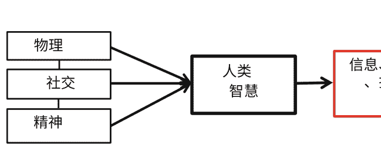

多亏了这些智慧，不同的文明得以在一定时期内保持存在。通过在连续函数中使用它们，它们提高了不会随时间减少，而是至少略微增加的水平。

人类还通过将一些智慧与他发明的工具和设备相连接，导致了可持续生活方式的出现。与思维不同，智慧是理解感兴趣事件、抓住现有联系并通过推理和合理解释找到问题的合理解决方案的能力。聪明人也被称为学者，他们的理解和理解能力非常高。即使一个人自己没有解决一个事件，如果他们理解解决方案的细节，他们会感到快乐，而这种快乐的感觉可以引导他们取得成功。

在上面所解释的情况下，一个聪明的人是否会出现概念上的困惑？可能会有一个问题。正如前面提到的，每个人都有智力，但他们的程度各不相同。通过教育和培训来提高思维水平，并根据图1.1中的功能图表，人的知识水平会提高，但每个人的智力水平的增长却大不相同。尽管教育对智力有所贡献，但个人的好奇心、学习欲望和有趣的情境也在主观上起到了作用。世界上没有标准的思维，就像没有标准的智力一样。但是，智力即使受到限制，随着时间的推移，可以打破记录，超越当前的限制。

如今，人工智能研究已经开始在不同的行业产生影响，并继续获得更多的重要性。类似的定义，如“天赋智力，”“情感智能”，“笛卡尔智能”，“主动智能”和“实践智能”都很重要。例如，那些具有实践智能的人，甚至那些没有受过高等教育的人，凭借他们的实践智能创造了许多被称为“发明家”的发明。在社会中，有必要重视他们，因为智慧不仅存在于受过教育的人中，也存在于那些根据自己的想法进行发明的人中，但是由于没有头衔，所以不受到赏识。

一个聪明的人通过做出聪明的决策来获得周围人的赞赏，可以开启他人的思维，或者受到羡慕的注视和谈论。智力在婴幼儿期和童年时期开始发展，并持续增长到一定年龄，但随着年龄的增长而下降。智力水平下降，与之相应的心理功能也下降。

智力现象也具有技术内容，因此在技术上可以测量，而心智没有技术现象。总的来说，智力大致有12种相互关联或混乱关联的类型。

- (1) 视觉时空智能：如第1.2节所述，视觉检查提供了信息收集。一个人感知并储存在脑海中的关于视觉感知的信息被称为视觉。短语“如果我没亲眼看到，我是不会相信的”向我们展示了视觉信息对智能的重要性。如果在演讲时只提供口头信息，那就被称为聊天。一个人可以在第一次听到口头信息时以一定程度的知识感知它，但不能说他能够将每个听到的词都在脑海中形象化。

口头信息可能在思维中保持抽象，但是视觉信息感知提供了具体化的方式。视觉信息可以来自现实，即自然界，也可以来自虚拟环境。古希腊哲学家亚里士多德（公元前384年-公元前322年）声称他能够用从眼睛发出的光看到东西。根据亚里士多德的论述，眼睛必须在黑暗的环境中看到东西。然而，1300多年后，穆斯林物理学家和光学的第一位大师伊本·海塔姆（965年-1040年）通过物体反射的光线作为光源发出的光束帮助人们看到，看到了亚里士多德的观点是错误的。光线反射是一种帮助人们看到的光束。

视觉感知信息也包含在称为视觉记忆的记忆中。这种记忆中的信息比口头信息更有意义，并在适当时有意识地使用。我们可以说这是一种开放的记忆。当然，口头心理基础与视觉心理有共同点。我们不能说它们彼此独立。

这两者一起工作的事实也意味着记忆得到了加强。因此，有形和无形的信息被一起保存，并且试图使无形的信息随着时间的推移更加具体。通过可视化一些不是视觉或听觉的想象视觉形状，人类记忆变得更加丰富和高效。例如，感到快乐既不是口头现象也不是视觉现象，它也被称为人类灵魂的心理舒适感。

作为视觉知识的基础，建议使用形态学而不是被称为几何学但仍然贫瘠的术语，因为提到几何学时，教育系统给出的经典信息会让人想到欧几里得（公元前330-325年）的平面几何学。人类通过从自然界的一切事物中获得形态学的图像，与丰富的口头知识一起发展自己的思维。在早期，人类通过利用自然界的物体来增加知识的财富，然后通过发展未知的几何形状来解决一些科学问题，并在其上建立科学创新。穆斯林思想家纳斯雷丁·图西（1202-1274年）首次从欧几里得几何学中发展出球面几何学。由于必需是发明之母，当穆斯林意识到他们无法用平面几何确定从他们所在地到麦加的方向时，他们发现了球面几何学，这在今天确定纬度和经度线中起着最基本的作用。飞机的航线也是根据这些确定的。

Lobachevski（1792–1856）奠定了双曲几何的原理，这个几何学以他的名字命名。Rieman（1879–195）在接下来的几年里，在西方实现了几何学的想象和具体呈现，这对于物理计算（如相对论）非常有用。

从上面所说的可以得出一个非常重要的结论，那就是在人类思维中，记忆语言、视觉和图形信息作为信使信息集比数字数据更重要。

数值研究和数学方程和模型一直建立在这些基础上。可以说，在未来，语言主义和形态学将必然像推土机一样开启启蒙之路。

尽管在今天的某些领域中，数字数据和数学原理被认为很重要，但后面将提到的语言主义、视觉性、形式性和哲学思想的种子以及从中进行合理推理的逻辑原则和规则也很重要。

- (2) 语言-语言智力：听觉通过耳朵感知，耳朵的三个部分，即外耳、中耳和内耳，使人能够听到声音。外耳是声音的接收器，将声音传递到中耳，内耳中的蜗牛状结构将声音振动传递给神经，将听到的声音传输到大脑。对第一条信息的感知始于听觉能力，因此，在一系列感觉之后，我们会自动将所听到的单词的意义与某个对象或图形联系起来。听觉的主要来源是每个人每天进行的交谈中的信息，随着时间的推移，人们甚至可以从语音中的音调为自己赋予意义，理解所听到的单词的发音意义。这个词使用时是礼貌的吗？是愤怒的吗？是音乐吗？是教训吗？是建议吗？这些建议是高度主观的，可以通过语言推断出来。从自然或人工声音中可以理解事件的含义。例如，我们通过立即感知和理解雷声、飞机噪音、喊叫声和身后车辆的靠近等事件的听觉信息来调整自己的行为。每个人的听觉能力与其他人不同，尤其是在年龄较大时，即使是部分听力丧失也是事实。由于听力能力中的偶发情况可能在健康方面不被视为重要，因为它们不会引起身体疼痛。在灾难、战争、地震等情况下，声音通告始终用于向公众提供信息。

存储口头信息的记忆可以称为口头记忆，但由于这种记忆中的一些内容无法体现在思维中，所以经常会出现遗忘。这种记忆可能会被填充着乏味的信息，称为记忆，这些信息是通过听觉获得的，其含义甚至不为人所知。例如，背诵诗歌、背诵《古兰经》以及背诵母语中单词和句子的含义都是口头知识，但它们不能产生创造性，只能通过建议和对话来传达。应该明白，一个人必须查阅称为词典的书籍，以了解他不知道的单词、术语、概念或定义。每种语言都有自己的语法和规则，这些规则存在于语法中。

- (3) 个人内省智力：这些人依赖于自己的思维，而不会被人际思维所困扰。他们通过反思独立学习。他们可以通过情感感受推测或理性地探索自己的内在运作。通过这种方式，他们明智地向内部寻找塑造他们的感情和动机，以达到最终解决问题的方案。他们可以智能地计划、运行、激活和管理自己的能力。他们思考自己想要实现什么以及如何实现目标。他们所依靠和产生的不仅仅是口头知识，还有用口头逻辑解释和解释的数值信息和数据解释。

- (4) 人际智能：一般来说，人们通过语言相处，动物通过嗅觉相处。这意味着人们可以通过词语和句子在语言上相互理解。为了克服意见分歧，语言交流有助于相互说服。口头和数字信息之间存在区别，当我们看历史知识的发展过程时，口头知识总是在数字数据之前在思想领域中发生。口头知识不仅可以用本地或外语表达，还可以用手、臂和身体的有节奏的动作表达。即使在今天，充满口头表达而不是数字信息的文本在书籍、科学文章、项目和研究中起着最重要的作用。在这方面，每个职业都有口头知识和丰富的信息。工程术语汇帮助专业人士在没有太多讨论的情况下相互理解。

在科学的不同领域中，口头信息是任何学科中最有效的，因为专业人士与客户沟通作为解决问题的初步途径。无论他们的专业知识有多强，专家都会通过提问来更好地理解客户的愿望。无论是谁首先提出请求，都会表达他们内心的愿望。即使在这样的请求中，也没有足够的解释和信息来完全理解问题的解决方案，倾听同样愿望的专家决定相应地制定解决方案。因此，专家为解决方案收集口头信息，确定适合客户的途径，并提供应用可能性的替代方案。多年来，通过听和说的经验，每种语言中的词汇在我们的思维中获得了意义，并成为社会的共同认知工具。人们每天都使用语言，因此立即理解常见词汇和短语的含义。作为理解的结果，思维通过听和阅读单词轻松地产生了对单词的意义的习惯，并在必要时传递给他人。每个词都是真实或想象对象的不同内部和外部属性的符号。主题的社群在没有人类思维的意识的情况下毫无意义。就像给新生儿取名字一样，给主题命名以便被人们知道。由于存在不同的语言，主题在不同语言中应该有不同的名称。

人们通过母语中的词语来认识物体，并相应地采取态度。

- (5) 自然主义智能：科学思想的萌芽最重要的影响始于人们对所遇到的物体图像的感知。连不会说话的婴儿和幼儿也可以通过制作视觉上出现的物体（如相机）来提高他们的想象力。

通过将不同形状的相似性归为一个单元，他们以更一般的命名方式进行分类，并通过对它们进行分类来丰富词汇，以便在可见环境的心智中达到它们的群体，并给它们一个名称，然后单独给该群体中的类似元素另一个名称。丰富的词汇倾向于通过积极地影响思维方式来确定它们之间的关系。同时，他们试图在记忆中处理一些单词，不仅通过视觉，还通过听觉，然后试图使它们具体化。自人类诞生以来，人类文明一直相互追随至现代时代（见图1.3）。作为智慧生物，他们始终与环境保持理性的关系。通过五种感官器官，日常的庇护、进食和穿着活动以及对原材料的搜寻都是从自然界中可用的合适来源中获得的，以维持人类种族的延续（第1.2节）。一些动物和树木生物以其在地质时间尺度的不同时期的存在而有所区别，但人类种族似乎自创造以来一直在持续存在，并且由于来自真主（上帝）的智慧的恩赐，似乎将继续存在。无论过去的自然条件如何，人类种族都能够通过智慧、理性、合理性和坚韧性适应现有条件。人类的自然智能（NI）坚持不懈，并找到了甚至对洪水、干旱、地震、龙卷风等最危险的自然事件的最低风险保护。这些例子中的轻微思考表明，信息是通过感官器官接收的，并且随后的信息通过心智功能过程转化为有意义和有用的信息。NI在其多年的经验中提供了许多选择和改进，以适应和拥抱自然环境，因此生存质量的提高导致了NI的持续增长。NI的支柱是思考生活的可见和不可见方面以及产生各种思想。如果问题是哪个感官器官帮助人类获取知识，那无疑是眼睛，它从形状、图形、几何、草图和风景中接收信息，尤其是在人类生活的早期阶段。这种类型的知识获取是本书中最基本的一种，被称为通过图像和图表的可视化之一的来源。读者应该记住，本书中的几何学逃避了所有通过视觉或心智的眼睛可见的形式和形状，甚至是那些永远无法转化为真实知识的想象形式。例如，所有史前洞穴壁画上的图片和图纸都与NI概念可视化相关，这些概念在经过眼部检查后以更理想的形式转化。人类在进入这个世界的第一阶段就带着五种感官器官出生，没有先前的知识来源（第1.2节，图1.2）。

时间的流逝是一种动态而有效的工具，通过这些感官提供了各种启发性的认知。最有效和发人深省的考察是通过视觉和听觉（听觉）的眼睛来实现的。虽然这两种早期的启发对思维产生了影响，但最突出的是视觉化的梦想，这是知识萌芽的真正源泉。这一点支持了人类通过形状和几何图形来掌握先前的知识的观点。婴儿开始通过看另一个人的脸（母亲、父亲、兄弟等）而微笑。虽然在这个最初的阶段他们的名字并不确切，但可以说通过几次重复，基本信息以激发学习的几何形状的方式保留在记忆中。用不同颜色和声音的玩具刺激婴儿以吸引注意力是一种常见的做法。这些原始的玩具提供视听的物理视觉和声音，使婴儿能够专注于获取知识，而不需要任何物体和主体的名称。可以肯定的是，首选的刺激是视觉第一，然后是声音。因此，可以得出结论，几何图形和形状，如素描、绘画、绘图、figures、图表、图解、图片、图像等，都是知识的信息反映，讨论信息、评论、批评等，这些都积累在头脑中作为进一步的物理、形而上学、数学和一般本体论活动的感知存储。亚里士多德（公元前384-323年）的哲学关注形式及其内部材料，如前所述，其中形式包括形状的选择。在日常生活中，看到不同几何形状的周围形状，并思考它们的存在，可以更好地概念化形成，并在更好的精神状态下获得灵感，例如自然景观，其中一些景观具有多种形状。在每个居住区（城市、城镇、村庄）都有各种颜色的理想形状在我们面前。读者可以比较这两个立场，并对形状作为理性、社会和哲学启发的原因发表个人评论。这一点表明，人类的思维受到形状的启发要比其他理想几何形状更多。你有没有一天没有遇到几何形状？因此，人类的思维接触到形状和几何图形要比其他现象多得多。通过这种方式，大脑进行更多的解释和计算，静态或动态地。在上面提到的一切之后，最重要的结论是，因为几何在NI中如此重要，更好地理解其深层含义，消化合理的信息，为更好地理解许多学科打开了通往“几何哲学”的道路。这是那些希望以非常生动、理性和明智的方式阐述思想的人的基石。在这一点上，应该提醒的是，几何哲学对许多人来说可能并不必要，但对于那些想要深入学习并在任何学科中建立争议性知识的根基的人来说，它提供了一种自动掌握的能力。它是学习和教学的关键，以便在任何教育体系中更好地启迪。

- (6) 音乐-节奏智能: 任何具备音乐智能的人都可以传递具有这些特征的节奏、声音和模式。通过基于灵感的创造性思维，可以参与到美术中，从而获得有关节奏的知识。美术，包括建筑设计，在这个智能类别中也被包括在内。

- (7)身体动觉智能: 这涉及到心智-身体配合、共同行动和协调。这种智能在运动激活中起着最重要的作用。运动感本身指的是肌肉器官在与身体的运动和张力和谐合作的感觉。具有身体动觉智能的人可以利用身体的物理能力来处理周围的物体。可以认识到身体的能力和物理限制，并可以通过肢体语言和行动来传达信息。

- (8)哲学逻辑智能: 一般而言，哲学在英语中被定义为在唯物主义框架内对知识和智慧的热爱，而在阿拉伯语中被称为Hikmah，也包括宗教知识。科学哲学排除了所有的精神、宗教和形而上学的概念，只关注唯物主义实体以达到理性和逻辑的科学推断。这种哲学被称为实证主义科学哲学。实证主义逻辑学家将哲学置于科学之下，这一观点并未完全得到本书作者的接受。由于哲学思想不仅仅是高度受教育人士的专属，而且是知识和智慧的结合，普通人也可以分享这种理解、讨论和思考的方式来寻求终极真理，但这仍然是模糊的、盲目的和不确定的。这些模糊的成分以怀疑的形式进入哲学领域，以便更好地理解和清晰地理解。在任何解释之前，从一开始，对“哲学”和“科学”的词源学和认识论特征的介绍有助于读者理解下一章的内容。不幸的是，这些词汇在学术圈中经常被使用，但缺乏清晰、简明和令人满意的见解。特别是科学哲学在每个学科中都起着重要的思想生成作用。哲学本身有五个核心分支，在某种程度上是相互包容的：本体论、伦理学、形而上学、认识论和美学。在寻求存在的过程中，本体论是主要的主题。图2.4展示了每个主题，其中本体论包含了哲学的所有其他分支。

图2.4展示了不同哲学学科之间的关系，对于不对科学哲学感兴趣的哲学专业人士来说。本体论是关于唯物主义和非物质主义（精神）的思维领域中最全面的领域，涉及到物质和非物质的实体、属性、概念等。非物质部分仅限于形而上学。伦理学是每个人在任何行动中的共同领域，但对于每个文明、社会、文化和宗教来说，道德身份在其中也有相对的方面起着最重要的作用。美学是一种非常特殊的哲学形式，可能对其他哲学活动没有强烈的影响。作为哲学的分支之一，哲学、认识论涵盖了知识的范围、意义、理解和逻辑内容，因此被称为知识的理论，在成熟为科学知识之前是科学知识的形式（第三章）。它还涉及对知识的性质、来源和有效性进行审查。为了探索认识论世界，可以提出两个重要的问题：“人们如何知道和理解？”和“什么是对的或错的？”正如前面提到的，思想内容的有效性也属于认识论的范畴。最终目标是产生可靠、可信赖和有效的信息。认识论，“现实可以被认识吗？”它寻求回答一些基本问题，例如：狭义怀疑主义是指人们声称自己没有可靠的信息，他们对真理的追求是徒劳的。这个观点被希腊的辩士戈尔吉亚斯（公元前483-376年）很好地表达了出来，他认为没有什么存在，我们也无法知道它是否存在[让-保罗·弗里德里希·里希特（1763-1825年）在外国文学、科学和艺术部门。12: 317. hdl: 2027/iau.3185 8055206621]。作为这个词的起源，哲学起源于希腊词“philo”和“sophia”。从某种意义上说，它可以字面上和明确地意味着“对知识的热爱”，但认识论有着更深层次的含义。

哲学也关注抽象概念和实体，包括最自由、古典和非凡的思想，因此它用理性的方法对它们进行一些推理。过去，人们认为所有种类的思维产生都属于哲学问题，直到18世纪。在这方面，哲学被用作一个概念包括科学。今天，哲学被视为与科学分开。这是一个潜在的错误，因为每个思想的根源都是语言、哲学和逻辑，它涵盖了所有的理性推理和推断。如果其中一个没有完全理解，科学知识就无法达到高效的生产力。人们认为科学主题不再像以前那样属于哲学的范畴，随着科学中出现了许多不同的分支，它们已经超出了哲学的范围。

但是哲学作为思维过程的根源，最初有些不合逻辑，但通过逻辑规则获得合理性，从而接近甚至达到可接受的结果。没有哲学，无法满足人们的需求，也无法满足科学或艺术的有效性。作为研究生学习的结果，最高学术称号是“博士”，即“博士学位的哲学”。这些话揭示了每个学科的博士学习都需要有哲学基础的必要性。对于在特定学科获得博士学位的人来说，理性地了解学科内容是至关重要的，而不是通过记忆和固定观念。

在脑内功能中，通过逻辑、比较和批判性操作，对信号和信息进行分类和建立关系可能是最重要的。在思维的自由思考中，无限的视野被逻辑所束缚。换句话说，逻辑意味着有用限制内的理性知识和思维活动。逻辑不一致或不符合逻辑规则的脑功能无法产生信息，也无法进行必要的解释。在这里，用于在一定规则内产生知识或将不同信息汇集在一起的组织被称为逻辑，其规则被称为逻辑规则。由于这些规则，逻辑的任务是通过收集信息并从中提取有用的推理来优化内存使用，并简单地将其保存在内存中。即使在人们之间，短语“有理性和逻辑”也表明理性先于逻辑。没有逻辑就没有理性，但是可以有逻辑而没有理性。在这种情况下，大脑存储了无关的信息。

- (9)科学智能：科学智能的主要目的是建立一个可靠、易于理解的知识和信息体系。它还为科学家之间的理性协议提供了基础，以便进行快速数据评估和简单的理性解释和探索。它从哲学的分段学科中选取了三个主题，即认识论、美学和伦理学，没有包括本体论和形而上学。

- (10)技术智能：当我们仔细观察人类的历史，可以看到最早的智能活动是技术研究。因为最早的人类需要各种工具和设备来保护自己的生命免受危险事件的影响。因此，他们为了生存而制造了技术工具。首先，他们尝试用几何形状和他们在墙壁或地面上看到或画出的形状来激活他们的思维，然后开始使用铜和青铜等材料，最后使用铁。在我们现代的研究中，技术智能的生产在图2.5中显示的连续阶段中变得越来越重要。

- (11)人工智能：过去，特别是在1980年代之后，“专家意见”没有被纳入大学课程中。因此，即使没有高等教育的发明家也受到社会的尊重。这是因为口头知识比数字信息更重要。根本问题是“语言知识是否是数字智能发明的主要来源？”人类智慧充满了想象力和语言推理，然后被转化为公式、算法流程图和计算机软件，所有这些都是人类思想的产物。专家或专家系统的自动化远离人类智能，因为有一句阿拉伯谚语说“连驴子都会在重复之后学会。”这并不意味着专家就像驴子一样，但如果不了解相关主题的主要功能方面，这个人就无法基于哲学、逻辑和近似推理将知识传授给他人。但即使没有这样的解释，这些专家也凭借他们的实践和自动能力为人们服务。这些人无法对他们正在研究的事件进行批判性的质疑。他们的最终目标不是朝着更好的人工智能方法发展，而是是否存在这样的进展，他们试图利用它们？真正的人工智能在视觉和科幻中得到了很好的体现，需要在基础研究上取得进展。这相当于说人工智能不仅仅关注性能的提升，以能够对整个世界进行建模。以下几点对于哲学成为一门有用的科学很重要。

- 1. 哲学是理解的研究。
- 2. 理解是给予观察以意义。
- 3. 通过将一组公理应用于他们的观察来获得意义。
- 4. 公理不是自然赋予的本能，在理解的一般化中决定人们应该或不应该做什么。
- 5. 推理是应用公理的过程。
- 6. 现实是通过理解构建的有意义的世界观。
- 7. 智慧是由知识的道德所决定的理解所采用的习惯。

人工智能是机器或软件展示的智能。它也是基于如何编写能够展示智能行为的计算机软件的学术领域的名称。科学方法操作，分析，int随机和各种人工智能方法是这些研究的唯一基础，但这并不完全正确va，因为还存在情感问题。an we以及这种系统和方法的方法。还需要揭示与所涉问题部分或某些相fu关的各种变量之间的模糊关系。以下是作者根据经验总结的一些建设要点。

- 1. 为了能够与许多人讨论主题，必须基于口头知识并最好通过母语来理解，一个触发的想法可能会突然出现以实现最终目标。
- 2. 系统化的教育可以在数学、物理和算法方面提供基础，但如果缺乏语言背景，可能无法发展新的思想和智能推理。
- 3. 不应低估无系统的、有时是随机的知识和信息的混合，因为有用的信息可能包含许多隐藏的、未被发现的有用信息从照亮的碎片中。
- 4. 在任何AI的生成过程中，如图1.2所示，都存在进一步改进现有或新的可能性，前提是将有问题的思维引导到任何科学和技术思维中。
- 5. 需要注意的是，在脆弱逻辑和最近的模糊逻辑原理之前，没有任何软件能够在逻辑上解释问题。在团队成员之间进行短期或长期讨论后，选择适合的合作伙伴来解决分歧和协议问题。
- 7. 从系统化教育培训、教师、书籍、互联网或其他交流方式中学到的任何信息都不应该被不合逻辑和不合理地记住。不幸的是，在许多社会和国家中，系统化教育意味着填充思想，而不是动态和富有创造力的思维导向。

每个技术产品、计算机硬件，尤其是软件技术，都应该通过丰富人类思维的认知过程来进行检查。

- 8. 否则，人工智能将成为一种集合了灵魂、思维和身体的人工智能，而不是基于数学的人工智能。泽凯·森浅学习与深度学习原理。
- 9. 心智本身是一种没有边界的主要自然机器，但它的运动、产生和触发燃料取决于与智能能力的主导观念的重新评估的合作，完全独立于其他专家无法带来有生产力的新智能想法。因此，建议具有不同想法的个体参与团队。
- 10. 有不同想法的个体参与团队。
- 11. 专家系统应该被动态地考虑，进行批判性和有争议的讨论、评论和辩论，以产生更好的想法，而不是提供静态可转移、可记忆的知识系统。
- 12. 在掌握了语言基础之后，数值数据知识生成出现，这需要各种科学函数，如数学、不确定性技术和专家系统方法，但作者首先建议进行简单的图形绘制，以更好地解释每个数据集的属性，从而可以确定它们之间的独立性、依赖性或部分关系。这些图形或任何简单的形状都以视觉几何属性的形式存在，这比数学方程更重要，因为这样简单甚至描述性的形状在开始时提供非常有效的合理信息，然后甚至可以编写最复杂的数学方程。

- (12)自然智能：在前面的人工智能文章中已经描述了，可以认识到人工智能局限于人类的自然智能，因此无法产生类似人类的个体，但许多人可以将工作转移到人工智能工具或机器人上。人工智能基于计算机软件，这类程序中有越多的逻辑基础，机器人工具就能越有效。从长远来看，人工智能是否能超越人类的自然智能存在一种普遍趋势（图2.6）。这种特征是站不住脚的，因为即使自然智能有无限的空间，人工智能仍然受限于自然智能的范围内。也许许多人认为人工智能可以超越自然智能的原因是，由于某些电子接触或随机行为的结果，人工智能的产出可能变得无法控制。例如，电力并不危险，它为人类服务，但它可能会接触或发生故障，给人类带来许多不便，如火灾、死亡和其他危险。这并不意味着电力已经超过了人类的生产者。

- (13) 最近全球存在一种趋势，即人工智能将超越自然智能，从而使人类生活面临无法克服的危险；这是一个无法接受的结果。尽管人工智能的原理、方法和技术发展有助于分析环境、工程、社会、经济、能源、服务等领域，并以最佳和最大的成功产生人类有益的结果，但人类自然智能无法取代时间和空间特性。特别是在机器人、电信、控制系统、图像识别、数据挖掘等许多活动中，人工智能可以过于简化和原子化，但不能指望人工智能在长期中取代人类智能。到目前为止，已经涉及了一些人工智能方法，特别是将详细介绍模糊逻辑推理系统。

### 2.5人工智能方法

正如之前提到的，AI这个术语与逻辑推理的规则直接相关，一个不能运用这些规则的人将不会成功。首先，由亚里士多德（公元前384-323年）提出的清晰（二元）逻辑在导致“符号逻辑”的整体推理中特别成功，通过数学方程和代数表达式首次由穆斯林思想家Al-Khwarizm（公元780-850年）引入。通过软化符号逻辑的严格限制，各种子方法在ANN概念、遗传算法（GA）、模糊逻辑（FL）和进化计算（EC）的方向上出现，成为更有效的方法。因此，“计算智能”是人工智能的一个子类。计算机、算法和软件简化了日常任务，我们无法想象没有它们我们的生活将如何管理。是否可以想象大多数方法论、算法和问题解决方法如何被管理没有人力和智能吗？人类自其存在以来就与自然共存，并通过受自然启发学到了许多解决方案。特别是人类利用自然资源来满足自己的需求，并尽可能与自然灾害作斗争。此外，他们试图基于思想、心智活动和情感来理解自然界发生的事件。除了当时的信息和技术，他们还试图研究事件的因果关系。在这些研究中，他们发展了许多方法。

由于1950年后人工智能技术的快速发展，基于数值计算的方法在过去几十年中取得了前所未有的进展。一些发展出来的方法受到了生物的启发。遗传算法（GA）和人工神经网络（ANN）可以作为试图用数学表达人类思维机制的方法的例子（Şen 2004a, b; Öztemel 2016; Satman 2016）。

模糊集、逻辑和系统的概念是由洛特·阿斯克尔·扎德在1965年引入的；他在控制领域的多年工作涉及了太多的非线性方程，无法获得他想要的控制，但却导致了复杂性和难以解决的问题。在文献中对模糊概念的引入存在一些不满。其中，一些研究人员接受了模糊性的观念，并鼓励对这一主题进行研究，但大多数人持相反意见。反对者认为模糊化不符合某些科学原则，甚至与科学相矛盾（Şen，2020年）。

### 2.5.1 理性人工智能

事实上，在我们生活的时代，技术发展非常迅速。特别是计算机领域的发展已经变得令人眼花缭乱。这些发展与计算速度、对最小（微观）和最大（宏观）领域的研究、知识产出的加速等有关。这些发展在很多方面对人类有所帮助，因为计算设施极大地提高了问题解决的速度。

人脑在看（可视化）、说话（交流）、纠错、嘈杂环境中的形状图像识别等方面非常成功，即使信息不完整。事实上，人脑在产生口头初步和高效的结果方面比计算机更出色。神经元，也被称为电化学脑处理元素，响应时间为毫秒（10^{-3}），而今天的电子技术产品响应时间为纳秒（10^{-9}）。尽管电子技术产品的工作速度快了10^6倍，但人脑在处理不完整信息和识别形状方面比计算机更高效的原因一直是一个长期的疑问。这种好奇心促使人们研究自己大脑的工作系统，从而开始出现了人工智能的方面。

通过对大脑及其组织的研究，确定了差异是由于信息处理系统。引人注目的结果显示，人脑中神经元的信息处理是并行的。基于科学家们意识到这一事实后，加大了他们的工作力度，以确保信息的处理是并行的，就像人脑一样，使其尽可能接近人类行为。研究集中在设计具有上述能力的方法、设备和机器上。最后，像遗传算法和人工神经网络这样的方法被开发出来，用于构建智能系统，从而为人类智能建模提供了基础。特别是在这些方法的帮助下，作为人工智能的一个分支，专家系统开始在许多领域得到应用。

现实世界总是复杂的，除非通过引入明确的科学规则对事物进行简化，因此即使在进行明智的思考和决策时，预测也不是绝对正确的。复杂性和不确定性等信息源通常以不同的形式出现，被称为模糊源（第4章）。

一个人对系统了解得越多，他就越能理解并减少系统中的复杂性，但并不能完全消除。如果没有足够的数据，系统的复杂性就包含了太多的不确定性。在解决方案中，使用模糊逻辑规则比使用清晰逻辑的替代方案可以从模糊的输入和输出信息中得出更有意义和有用的推断。

1970年后，模糊逻辑和系统在东方世界，尤其是日本、韩国、马来西亚、新加坡和印度等国家得到重视。在今天，模糊逻辑原则和规则在技术设备的构建和运行中被广泛接受。模糊逻辑在西方国家没有广泛应用的主要原因在于二进制逻辑中的不确定性原则，即亚里士多德逻辑，它接受由1或0表示的两个相反的选择作为绝对确定的真或假。

根据清晰（二进制）逻辑，在两个值之间不允许其他选择，因为它们不是绝对的。清晰逻辑也被称为中间排除逻辑。在西方，模糊一词意味着不确定性。东方有一种信念，即美可以在复杂或不确定性中找到。例如，即使在人与人之间建立必要的容忍度也取决于这种模糊（模糊、高度个人化）的观点。

### 2.5.2 方法论人工智能

在工程和技术应用中，根据事件行为模式寻求对问题事件的模型研究。因为这项工作最适合人脑完成，受到大脑工作系统启发的并行处理建模方法产生了人工神经网络作为人工智能程序的一部分。人工神经网络的一个最重要特点是包含了许多回归和随机方法的特征，这些方法在世界许多地方广泛使用，并对初始事件行为或数据做出一些假设。例如，在所有基于统计的方法中，参数必须在时间上保持恒定，不能进行并行操作，依赖性是线性的，同方差性等。实践中，至少构建三个连续的层：一个用于输入，另一个用于输出，以及第三层是一个中间（隐藏）层。为此，需要开发一个不仅能建模数学规则，还能控制事件的动作和响应变量的架构。

在这本书中，首先解释了经典方法的浅学习方面，读者可能事先知道或不知道，并提到了过渡到深度学习方法的相似之处。实际上，读者可能有可能根据经典系统进行建模，以便在短时间内熟悉ANN并进行应用。首先，在进行短暂的哲学讨论之后，建议重点关注AI模型的合理性，考虑到之前学习的浅层方法和逻辑规则的相似性。

## 2.6 人工智能方法

模型是通过将人类思维转化为一组逻辑表达式和几何形状，然后将其转化为数学，并最终与现实观察结果进行验证（如果可能的话，进行测量）来识别、模仿和修改解决方案的过程。每个模型都是如此易于理解，以至于可以用人类的自然智能（NI）来解决现实世界的问题（工程、社会、环境、经济、健康、能源、教育等）。

在建模的漫长历史中，出现了各种概率、统计、分析、混沌和人工智能的替代方案。所有类型的模型都基于NI，可以用理性句子来表达，这些句子可以转化为数学符号，从而得到数学分析、经验和微分方程。理性和逻辑表达对通过内置模型与计算机进行交流非常有用。模型的历史演变也是在数字计算机进入科学和技术研究领域之后开始应用的。

第一个智能模型是“黑盒子”类型的，其中输入和输出的数值数据以测量数据记录的形式提供。这导致研究人员需要搜索“数据库”来进行模型预测。第一个经典的黑盒子模型有三个组成部分，如图2.7所示，输入、输出和传输单元。

在获得输入和输出数据库之后，研究人员考虑使用传输系统从输入数据中复制输出模式。传输单元需要进行人工智能评估，以实现两个数据集之间的理想匹配。不幸的是，在这个阶段，许多研究人员在没有自己的智能贡献的情况下，纷纷采用现有的浅层方法来形成传输单元。

一般来说，传输单元的形式包括概率、统计学、随机过程、分析公式、经验方程、傅里叶级数、遗传算法、人工神经网络和其他类似方法。

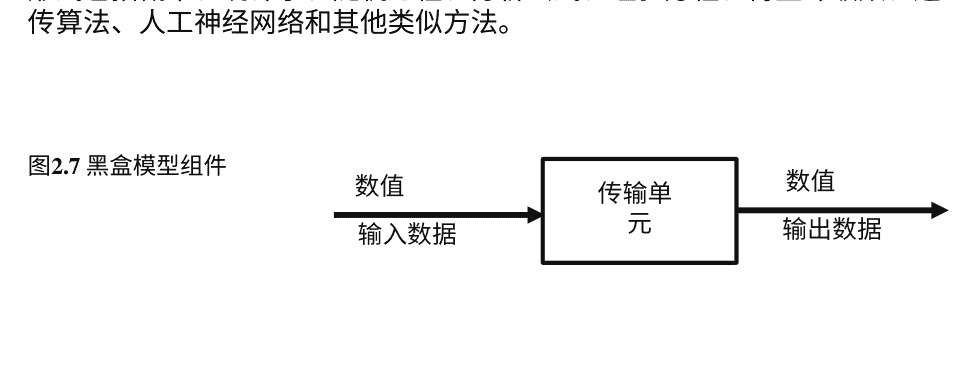

## 图2.8 模糊模型组件

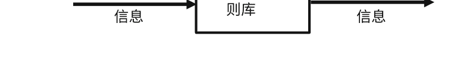

层次方法和许多类似的方法。这种浅层学习方式不能激活人类智能；它只能在一定的误差范围内给出现成的答案。

另一方面，积极的人类思维在学习每种经典浅层学习方法的哲学和逻辑基础之后，可以尝试引入另一种创新的建模技术，或者至少提出一些暗示其智力能力贡献的修改。这种人类智能的应用为模型制作提供了深度学习AI。

1970年代之后的另一种AI方法是模糊逻辑（FL）建模（Zadeh 1965），它完全依赖于个体或群体智能，因为它不需要一个“数据库”和导致哲学基础和一组建设性逻辑规则基础的合理推理。在人类智能的光辉下，近似推理在浅层学习AI推理中起到了最积极的作用。

模糊建模的一般部分如图2.8所示。另一方面，积极的人类思维在学习每种经典方法的哲学和逻辑基础之后，可以尝试引入另一种创新的建模技术，或者至少提出一些暗示其智力能力贡献的修改。这种人类智能的应用为模型制作提供了AI。基于人类智能的第一个机器学习工具提供了有效的数据挖掘程序，可以从中提取出显著适用的技术。

## 2.7 自然智能和人工智能的比较

一般来说，智能包括绝对或近似推理的心智能力，以解决问题，并使用机器人等教学工具为人类服务。自然智能（NI）的基本要素是将思维、推理、智力和智慧等认知能力与来自自然环境主体的观察有计划、有组织地整合在记忆中，这是创造者赋予每个人的礼物。

每个人都有一种与生俱来的智能，可以通过系统化和一些混乱的培训计划提供创新或先进思想，这是科学和技术繁荣发展领域的基本工具。各种NI程度构成了工具、实施、设备、机器和实用机器人的基础。

通过NI，人类试图将任何行动的系统化知识和生产机制转移到其他个体或机器中，这种情况下NI的细分开始形成AI。AI的丰富领域是NI的原则，这些原则在不同个体中通过模糊程度得到加强，但不允许通过整合个体的智慧来重叠智慧，但为了目的而进行集体改进。

最近，全世界存在一种趋势，即人工智能将超越自然智能，从而使人类生活陷入无法克服的危险之中；这是一个不可接受的结果。尽管人工智能的原则、方法和技术发展有助于分析工程、环境、社会、经济、能源和服务领域，并以最佳和最大的成功产生对人类有益的结果，但人类的自然智能不能完全被人工智能程序所取代。

特别是在机器人、电信、控制系统、图像识别、机器学习、深度学习数据挖掘等许多其他活动中，人工智能可以过于简化和原子化，但人工智能的产物不能指望在长期未来取代人类的自然智能。

本书的主要目的之一是探讨一些人类思想、概念和想象的主观和客观维度。介绍了一些人工智能方法，特别是模糊逻辑（FL）推理系统在第3章中详细解释，其中不仅数学符号，而且基于语言的逻辑规则基础在任何人工智能活动中起着最重要的作用。

在前几章中所描述的一切之后，可以认识到人工智能受限于人类智能，因此无法产生类似人类思维的能力，但许多人类可以将工作转移到人工智能工具或机器人上。人工智能基于计算机软件；这类程序的逻辑基础越多，机器人工具的效果就越好。关于人工智能是否能在长期内超越人类智能存在一种普遍趋势。这种特征是站不住脚的，因为人工智能仍然受限于人类智能。

也许许多人认为人工智能能超越人类智能的原因是由于一些无意的电子错误或随机行为导致人工智能产生无法控制的情况。例如，电对人类来说并不危险，就像火灾、地震、洪水、干旱和其他灾害一样。这并不意味着电已经超越了人类生产者。人类存在的各个方面如图2.9所示。

Şen (2020)指出，任何思维过程中都有三个连续的阶段，即想象、可视化和思想生成，如图2.10所示。在每个步骤中，都存在模糊的不确定性（不完整性、模糊性、不确定性等），为同一个问题提供了略有不同的决策空间。每个专家都可以根据自己的能力、知识、文化背景和经验找到最合适的解决方案（Şen 2014）。

想象阶段涉及为手头的问题建立适当的假设，可视化阶段的目的是澄清形状（草图表示）。研究人员经常使用不同类型的形状（几何形状、图形、图表、函数、绘图、计划等）来表示和证明假设。只有通过理解视觉表达，才能对一组假设进行合理化，并在必要时继续完善和修改假设。基于假设，决策者充当哲学家，产生相关的思想并将其传播，以包含新的甚至有争议的思想，以便其他专家可以超越并进一步阐述基本假设。

在任何符号和数学之前，参数都是以语言表达的抽象。特别是可视化阶段由算法、图表、图表、图形等表示，其中包含大量的语法。

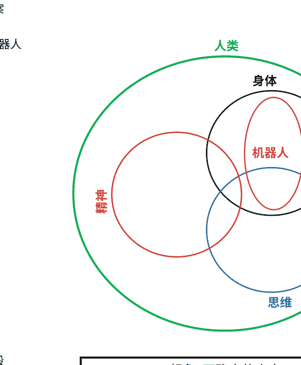

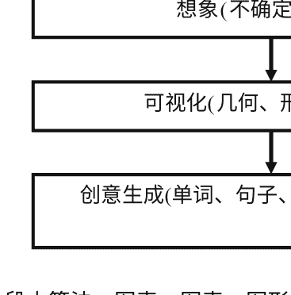

## 2.8 人工智能提案

以下是从作者的众多经验中得出的关于人工智能制作的几点观点。

- 1. 为了使这个话题在普通人中间得到讨论，必须以口头知识为基础，并最好通过母语来理解，这样一个触发点可能会突然出现，以实现最终目标。
- 2. 系统化的教育可以提供数学、算法和物理的基础，但如果没有掌握口头背景，就无法发展新的思想和智能推理。
- 3. 不应忽视不规则或随机信息，因为有用的信息可能隐藏在这些来源中并从中提取出来。
- 4. 如图1.2所示，在第1章中，任何AI生成都有进一步改进现有或新的可能性，前提是质疑的思维以任何科学和技术思维的方式进行引导。
- 5. 请记住，在清晰甚至更近期的模糊逻辑（FL）原理之前，越来越多地进入AI领域，没有逻辑地解释手头的问题，就无法实现任何软件。
- 6. 在团队成员之间进行短期或长期讨论后，选择适合的合作伙伴进行分歧和协议。
- 7. 从系统教育、教师、书籍、互联网或其他交流方式中学到的信息不应该是不合逻辑和不合理的。不幸的是，在许多社会和国家中，系统教育意味着用机械和静态的知识填满头脑，而不是动态和富有生产力的思维取向。
- 8. 每个技术产品和计算机硬件，尤其是软件技术，都应该通过丰富人类思维的认知过程来进行检验。否则，除了人工智能之外，人们可以在三个领域（精神、思维、身体）中保持略有重叠的人工智能。
- 9. 思维本身是一台没有边界的主要自然机器，但它的运动、产生和触发燃料取决于与主导智能能力概念的合作重新评估。
- 10. 一只手不能鼓掌，两只手可以，因此，个体的自然思维和完全独立于他人的思维不能导致富有成效的新智能思想。因此，建议在团队中拥有不同想法的人，否则如果他们都同意，那就相当于一个人。
- 11. 专家系统应该以动态方式处理，进行批判性和有争议的讨论、评论和辩论，以产生更好的思想，而不是提供静态可转移、可记忆的知识系统。
- 12. 在掌握了语言基础之后，需要各种科学函数生成数值数据信息，包括数学、不确定性技术、专家系统方法，但作者首先建议进行简单的图形绘制，以更好地解释每个数据集的特征，从而揭示相互关系、独立性、依赖性或部分关系。这些图形或任何简单的形状都是比数学方程更重要的几何属性形式，因为这样简单甚至描述性的形状最初提供了非常有效的理性信息，然后甚至可以得到最复杂的数学方程。

## 2.9 科学与技术中的人工智能

它由不同人类能力的和谐和比例连接组成，如智慧、理性、智力、直觉、雄心、兴趣、文化、信仰、科学知识疗法和上帝的类似天赋。每个人都有不同的智力尺度和水平。没有人能免于这些能力。智力可以处于静态水平，没有为社会人类的利益进行任何研究和发展。尽管人类的自然智力自亚当和夏娃（亚当和夏娃）创造以来就存在，但经过一系列哲学思想和逻辑命题，花了几个世纪才达到今天的智力水平。不幸的是，人类智慧对科学和技术的反映在许多学科和社会中被忽视，结果这些社会落后于发达国家。

本节从历史的角度和方法论（模型和机器）方面对人工智能的重要性进行了简要回顾和建议。建议人类智慧为创新发明提供指引，而不是采用经典、重复和模仿的方法，或者至少部分替代现有的科学和技术方法。

## 2.10 人工智能研究中的误用

许多科学论文以越来越快的速度发表，其中许多被称为‘科学病毒’，因为它们缺乏基本的理性和逻辑基础。科学研究需要适当的方法论，如分析、数值、概率、统计和随机技术，这些技术在科学学科的不同方面已经使用了近200年。在过去的30年中，遗传算法（GA）、人工神经网络（ANN）和模糊逻辑（FL）系统开始在建模、仿真、预测和决策活动中发挥有效作用。人工智能方法学越来越主导问题解决、仿真和预测过程。

这些技术中的许多都需要软件进行快速计算，在这一点上，滥用、误解和误导开始成为许多不同期刊的科学论文的一个组成部分。不幸的是，这种软件导致科学哲学、理性思维，尤其是逻辑被忽视。本节的主要目的是引起对这些人工智能方法学滥用的关注。特别是自适应神经模糊推理系统（ANFIS）方法在误解方面处于顶峰。

> “出版或灭亡”野蛮错误地将科学出版物特征化为纯机械的味道，即使在大多数最好的期刊中也是如此。特别是在最新的智能方法论被不加逻辑地使用的领域，但通过软件的机械需求增加了，质量却下降了，尽管发表率增加了。

早期人类在日常和生活活动中思考的环境是完全不确定的。可以说早期的信息和知识是从频繁的观察和经验中得出的概念。几个世纪以来，人类的思维得到了哲学著作、绘画、计算、逻辑和最终的数学计算的支持。与此同时，科学特别是在十八世纪的文艺复兴之后，与哲学在公理、假设、定律和最终的形式化方面有所不同。可以说，随着牛顿经典物理学的出现，科学进入了一个几乎完全确定性的世界，其中甚至不考虑不确定性作为科学知识。

然而，如今几乎所有科学领域都存在不确定性因素，许多科学的确定性基础开始以概率、统计学、随机、混沌和模糊的替代方案的形式呈现出不确定性。但是其他学科，如地质学和地球科学，从未经历过确定性阶段，但不幸的是，确定性已经影响了世界各地许多机构的各种教育体系。随着概率、统计学和随机原理等数值不确定性技术的发展，定量建模方面的科学进展取得了快速进展，但仍然忽视了只能通过不确定性原理来解决的定性信息和知识的来源。

最近，著名的哲学家和科学家开始阐述科学进步的不确定性和模糊性成分。例如，Russell和Norvig（1995）指出，

> 所有传统逻辑都假设习惯于使用精确符号。因此，它只适用于想象中的天体存在，而不适用于地球生活。

至于模糊理解，Zadeh（1965）说：

> 随着系统复杂性的增加，我们对其行为进行精确而有意义的陈述的能力，超出了我们的精确性和相关性（或相关性）几乎成为互相排斥的属性。

作为对东方思想的致敬，哲学对象可以通过逻辑前提和推理提升，并导致思想生成，以及类似于图2.10的三种基本的心理活动，即想象、概念化，然后理想化。

人类与自然互动，自然以物体和事件的形式提供了人类思维活动链的基本材料，这些物体和事件随着时间空间的变化而变化。在人类历史的早期阶段或任何个体的童年阶段，这些阶段以不同的速度发挥作用，并通过经验形成最终形态。思维过程中的每个链元素都包含不确定性，因为想象、概念化和理想化的阶段高度主观，取决于个体。

在人类思维演化的任何阶段，前因包含一定程度的不完整性、模糊性、概率、可能性和不确定性。在物理或机械建模的每个阶段，从思维过程中推导出数学结构似乎是确定的，但即使在今天，由于科学发展的结果，人们认识到每种情况都至少存在部分不确定性，即使在宏观尺度上也是如此。微观尺度。今天很明显，数学的概念化和理想化导致了对任何物理现实的满意数学构建，这往往是一个不现实的要求。正如爱因斯坦[2]所说，

> 只要数学定律涉及现实，它们就不是精确的。而且它们并不是指真理，而是确信的。

在思维活动的最基本阶段，活动对象被认为是某个或物理上合理的变化范围的成员或非成员。这考虑到包含可能后果或基础的聚类研究对象的现象。在形式科学中，如物理学和地质学，这些元素几乎总是自动地被认为是集合的全部成员或完全不属于同一集合。所有科学学科中的数学方程都是基于脆弱（二值，二值，亚里士多德）逻辑原则推导出来的。

本节简要介绍了人工智能在当今人类生活中的重要性，并强调这些技术在未来将变得更加重要。虽然每个人都有NI，但近年来每个人都开始将他们的个人智能活动加载到计算机可以处理的AI模型上，更准确地说是加载到由计算机程序分解为简单或复杂的逻辑规则集的计算机软件驱动的机器上。

本章指出，第一个目标是物理和机械人工绘图和解释起源于伊斯兰文明，尽管一些早期版本只是以一般的书面形式存在，没有理由和智力刺激。AI首先以NI的模型形式出现，最后包括机器，包括机器人。随着思维和创意生成领域没有限制，NI继续被越来越多地探索，但在AI领域，大部分是缺乏精神内容的心智和身体功能。AI可以在NI领域内逐渐而不频繁地扩展，加速或减速的速率并不总是可预测的。在这里，如果可能的话，即使是没有系统教育的发明家，或者正如历史上一直出现的那样，也可以利用AI的思维机会。

## 2.11 结论

本章介绍了人工智能（AI）浅层学习的概念，包括阿布·伊兹·阿尔贾扎里的原始机器人绘图及其历史发展始于1200年。从1950年开始，AI在计算机技术中对数值建模的快速执行做出了贡献，过去70年来，AI的发展逐渐成熟，特别是从1990年开始加速。

解释了人类自然智能（NI）与AI之间的关系，并建议AI保持在NI的范围内。根据理性和方法论的基础讨论了AI的类型和过程。提出了大约12种智能替代方案，包含词源学和认识论哲学内容。在这些问题的光线下，对教育系统进行了批评，并提出了建议，为了未来科学、哲学和逻辑思维、方法和建模目的而提出。顺序思维阶段被陈述为想象力、可视化和思想生成的可能性，以及批判性解释和评估。最后，介绍了一些人工智能概念和建模阶段的误用示例。

建议读者不仅从人工智能中受益，还应该从本章中描述的其他智能替代方案中受益，并相应地发展他们的思维能力和能力。

## 参考文献

- Delbecq AL, Van de Ven AH, Gustafson DH (1975) 程序规划的群体技术：名义组和Delphi过程指南。斯科特-福尔斯曼赫布DO (1949) 行为的组织。Wiley，纽约
- 希尔D (1974) 巧妙的机械装置知识之书。D. Reidel Publishing Company, Dordrecht-Holland/Boston
- 希尔DR (1998) 中世纪伊斯兰技术研究。在：大卫A (编) 国王。Ashgate, Variorum Collected Studies Series
- 麦卡锡J (1960) 符号表达式的递归函数及其机器计算。 I Commun ACM 3(4):184–195
- McArdle P (1979) 机器思考，语言，场景，符号和理解。W. H. Freeman，旧金山
- 纳斯尔 SH (1964年) 三位穆斯林圣贤。马萨诸塞州，剑桥
- 纽厄尔 A (1982年) 艺术史上的智能问题ficial intelligence。卡内基梅隆大学匹兹堡分校计算机科学系，宾夕法尼亚州，第45页
- Öztemel E (2016年) 人工神经网络。(artificial neural networks)。Papatya Bilim Yayıni，土耳其语，第232页
- 罗森布拉特 F (1958年) 感知器：大脑中信息存储和组织的概率模型。心理学评论65 (6 ) ：386
- Russel SJ, Norvig P (1995年) 人工智能现代方法。撰稿人：约翰 F. Canny, Jitendra M. Malik, Douglas D. Edwards，普林斯顿大学出版社，恩格尔伍德克利夫斯，ISBN 0-13-103805-2
- Satman MH (2016) 遗传算法(Genetic algorithms)。Türkmen Kitapevi，土耳其语，第216页
- Şen Z (2004a) 人工神经网络原理。(人工神经网络原理)。Su Vakfi Yayınları，土耳其语，第183页
- Şen Z (2004b) 遗传算法和优化方法。Su Vakfi Yayınları，土耳其语，第142页
- Şen Z (2014) 工程中的哲学、逻辑和科学视角。Springer，海德堡，第260页
- Şen Z (2020) 模糊逻辑原理和建模(工程和社会科学)。Su Vakfi Yayınları，土耳其语，第361页
- Turing AM (1950) 计算机与智能。Mind 49:433 –460
- Wiedemann E, Hauser F (1915) 关于伊斯兰文化领域的时钟。在：Nova Acto Academiae Caesareae Leopoldino，(德文)
- Zadeh LA (1965) 模糊集。Inf Control 8:338–353
- Zadeh LA (1973) 复杂系统和决策分析新方法概述。IEEE Trans Syst Man Cybern 2:28–44
- Zadeh LA (1979) 近似推理理论。在：Hayes JE, Michie D, Mikulich LI (eds) Machine Intelligence, vol 9。Elsevier，阿姆斯特丹，pp 149–194

# 第3章
科学中的哲学和逻辑原理

## 3.1 概述

自人类诞生以来，想象力和事实思维能力在启蒙和知识积累中起着稳定的作用，为社会的改善提供了无形的财富。上帝赋予的哲学和逻辑以及语言的提供，使这些启蒙财富在社会中传播，以应对环境、住房、健康和食品问题，实现可持续生活。为了适应性解决方案，基于一般哲学的想象力和事实思维，利用逻辑原理对其进行过滤，以产生更好的理性思想。自旧石器时代（旧石器时代）和第一农业时代（新石器时代）以来，技术改进一直以哲学和逻辑这对姐妹为基础，人类的需求通过物质发明新设备、工具和仪器得到满足，从石材开始，经过铜、青铜、铁、钢，到今天的许多新材料，但哲学和逻辑仍然起着重要的作用。哲学和逻辑以其独特的科学成分一直保持着共同存在，直到近18世纪。

科学在科学哲学、逻辑和系统性合理性以及方法论方面也需要哲学基础。因此，科学在实证主义观点下排除了本体论的非物质部分，并完全否定了形而上学的哲学分支。然而，即使在今天，科学仍然从形而上学哲学领域提供实证主义思想的征服。最近，教育体系已经淘汰了哲学和逻辑的真正原则，而是更多地以死记硬背和运输方式来思考，这可能导致哲学、逻辑和科学的停滞稳定，而不是积极的动力。

本书强调创新的教育体系，在数学、系统算法和软件之前，哲学有助于以理性的方式解决遇到的问题。通过这种方式，读者可以培养生成和分析思维能力。现代科学哲学坚持对现有科学结果进行伪证，因此，任何科学研究活动中都存在模糊、不完整、含糊和不确定性的空间。创新的教育体系应更加倾向于基于逻辑原则的科学问题解决的基本科学哲学。然而，文献中许多最近的出版物都是软件应用程序，没有提供语言和逻辑基础的基本原则。

任何创新研究都应该有改进、修改或创新的初始浅层学习软逻辑基础，以促进科学的进步。另一方面，在工程学中，将科学方法应用于各种社会经济和文明活动必须以哲学、逻辑、语言、美学和伦理组成部分的和谐为基础进行合理化。否则，即使应用可以是机械的，最终的好处可能只是为作者的简历增加一行。值得注意的是，对方法论、程序和算法技术的某种程度的内部探索应该在灰色层面上了解，而不是完全机械的工作或使用现成的软件。最好是在哲学、逻辑、语言和科学基础上研究主要组成部分。

并非所有的知识和信息都是精确的，而是包含一定的不确定性因素。在这本书中，建议在进行任何数学建模方法之前，通过逻辑程序对所有知识和信息进行语言学审查。在这个交叉点上，哲学原理和逻辑命题是进一步发展的初步基石。

几个世纪以来，人类的思想得到了情景、绘画、计算、逻辑和最后数学计算的支持。与此同时，科学在十八世纪后，通过其公理、假设、定律和公式与哲学分离开来。如今，人们认识到几乎所有科学领域都存在不确定性的因素，许多科学、商业和经济组织都试图在考虑一定的风险水平下做出决策。这些概念包括量子物理学、分形几何学、混沌理论和模糊模型推理。商业、经济、管理和社会科学从未达到显著的阶段。几乎所有领域（工程学、社会学、经济学、商业管理等）都可以找到概率、统计和随机原理（第4章）方面的数值不确定性技术的进展。这导致了这些领域的定量科学进步，但仍然忽略了可以通过模糊逻辑解决的定性信息和语言知识的来源。 Şen（2014）指出，在数值建模实践之前，任何思想都有三个连续的阶段，即想象、可视化和思想生成，如第2章图2.9所示。

## 3.2 人类思维

早期的知识和信息是从日常观察和经验中得出的概念。人类思维得到了想象力、脚本、绘画、逻辑和原始算术计算的支持。五个感官器官从环境中提供信息，因此决策是基于逻辑和理性判断的（第1章）。思维可以处理模糊的印象和概念。在给每个部分贴上“词”的标签（如名词、动词或形容词）之后，它将可见的环境现实分解为部分和类别，这是分类、分析和解释的基本要素，以达到合理的结论。这些词与现实的统一几乎没有关系——这是一个我们所有人都不可分割地属于的统一。常用词帮助在思维中想象相同或非常相似的对象。思维世界由感官、思想和感知的部分组成，它们共同用于提供关于感知世界的部分和因此扭曲的概念模型，代表了思维中的一个感知世界。这不是一个自然演化使我们存在并且我们通过生命的脐带与之紧密相连的世界。

所有的概念模型都处理某个环境中的部分，这些部分被认为是我们以自我为中心的思维认为有意义的东西。当然，这些有意义的部分之间存在着明显和隐含的相互关系，用于探索人类智力思维。无监督或有监督（训练过的）的思维，如科学家、工程师、经济学家、政治家和哲学家，对许多扭曲的概念模型适应进行关注，以预测现实的演变动态，这是我们无法确定地预测和控制的。然而，科学家和热心的思维试图“尽力将现实推入无意义的模型简化中。”

在这样做的过程中，思维依赖于关于现实的零碎信息。

思维面临着一个困境，因此，根据清晰（二值）逻辑选择一件事物并拒绝另一件事物，这训练思维以真或假的方式来思考建模现实。基于二元性的对现实的扭曲模型是指由亚里士多德（公元前382-323年）创立的清晰或二进制逻辑。尽管在亚里士多德之前，人类思维仅基于自然和固有的逻辑原则，但它受到了二元原则的选择的限制。思维的理性推理组成具有二元性的本质是如此强大，以至于思维本身无法超越它。因此，清晰逻辑不考虑模糊、不确定性、概率或可能性，因为一切要么是真的，要么是假的。错误。这种思维方式会使人的思维陷入例行公事、刻板印象、偏见和习惯中，很容易成为混乱的根源，最终使人无法获得真正的体验。这是因为人类的理解不断地从已经建立的心理模式中被过滤。狂热主义是这种强烈的模糊性的极端表现，因为当人类的能力试图超越既定教条时，它被完全阻碍。

另一方面，即使在今天，许多作品中仍然存在模糊、模棱两可、不确定、可能和可能的概念和方法。自然逻辑比清晰逻辑更广泛、更一般，因此被标记为模糊逻辑思维。在模糊或概率推理的情况下，可以以中间的替代方案程度上接受两个相反的观点。通过采用基于模糊逻辑的思维方法，人们可以在一定程度上同意他人的观点，这很容易导致顺从和犹豫不决。当每个人都是正确的时，对模糊性的不批判接受伴随着他人的思维，使得自己的理性思想变得困难。相反、矛盾和思想冲突的极性为人类思维提供了超越对立的必要动力。这些动力在思维中表现为超越对立的平面的冲动，没有这样的冲动，思维可能变得停滞不前，陷入重复之中，或者被疾病所吸引。

## 3.3 理性思维模型和推理

通过前面部分解释的建议和推理规则，为了一个人能够在他感兴趣的主题上产生新的想法，必须有一个知识库，或者他必须通过生活经验、教育和困难来获得它。在理性思维中，基本上有两种思维模式，即演绎和归纳。在这两种模型中，都有一个连接输入和输出的中间层思维系统盒子。在这个层次上，通过智力活动可以回答如何和为什么的问题。

在审视事件时，可以通过利用浅层知识或对其进行分类来提升到包含更多信息的更高层次。相反，可以通过如何和为什么的问题来达到更低的浅层知识和学习水平，将其削弱。因此，乍一看，思维模型系统可以分为两种：一种是从浅层到深层信息的，另一种是从深层到浅层信息的，以理解坚定地基本概念、定义和合理性。第一个选择被称为归纳，另一个是演绎。下面给出的归纳和演绎思维建模解释也可以被视为因果关系。如果一个人试图建立可以帮助探索这两种不同方法的思维模型，就会理解到每个模型都有一个输入层和一个输出层。为了在建模中取得成功，需要思考，为了在思考中取得成功，需要建模。在某种程度上，思考和建模可以被看作是一枚硬币的两面。历史上的伟大思想家能够揭示思维规则与有效的模型。人可以在感兴趣的主题上有所成果，有时候是用其中一种模型，有时候是用其他模型，有时候是用它们的混合。不幸的是，没有科学哲学和逻辑规则基础的模型被视为死记硬背或模仿的方式，不知道它们是如何以及为什么起作用。这种趋势似乎在现今更加增加，特别是随着计算机软件的广泛使用。

### 3.3.1 演绎

在演绎系统中，高层次事件被解释，并且每个人都可以根据个人能力将其划分为子类别，并且甚至可以通过建立这些类别之间的关系来实现归纳（图3.1）。需要强调的是，在任何教育系统中，如果试图为工程、医学和社会科学等直接建模的方式打开道路，而没有思维模型，就不可能取得很大的成功。最短和浅显的实际解决方案是最模仿、贫瘠和无生产力的。

阿尔法拉比（870-950）是穆斯林思想家之一，他将科学分为绝对和可能两部分。其中，他将与自然有关的所有事物都描述为可能性。绝对知识中最引人注目的是“死亡。”所有生物都会死亡的知识从未被否认，从这个角度来看，正如阿尔法拉比所说，这种知识是绝对的，并且根据今天的定义，它是“完全的”。在这里，基于这种演绎信息的逻辑规则进行的推理被称为“演绎。”作为演绎推理的结果，可以给出以下的一个例子：

+   1. 所有生物都是有限的。
    2. 樱花树也是活的。
    如果那样的话，那么
    3. 樱花树也会死亡。

这里有三个阶段，第一个是确定性信息，第二个提供了一个子信息，第三个基于之前的信息得出了一个结论。

全面的信息并不总是能够在任何时间和地点都被确定地知道。基于观察、实验和实际生活经验，现在可以根据获得的信息量将其视为完整的知识。例如，“液体是流动的”这样的知识具有作为自然现象的总体特征。

一些信息在时间上被视为一个整体，随着时间的推移而变成其他形式。例如，当最初的人类从地球上观察时，他们认为行星围绕地球旋转是完全的知识，并通过推理提出演绎推理。然而，后来，当太阳系的中心变为太阳时，行星绕太阳运转成为今天的完全知识。通过使用演绎逻辑进行合理推理始于人类历史的深处，并持续到最近的三到四个世纪。

由于通过这种方式通过推理得出的推理结果导致浅层尺度上的清晰度，因此也可以称为‘子信息生成’方式。

### 3.3.2 归纳

归纳意味着在不同国家的教育系统中给出的思维模型，在这个系统中，将部分内容解释给接受者，并希望通过将它们组合在一起达到最初的浅层但有成效的知识水平。

图3.2代表了归纳型理性思维模型。一个学生应该对他感兴趣的学科的基础知识有所了解，同时也应该对其他相关学科有所了解，这样他/她才能得到关于如何和为什么的答案。通过结合密切相关的学科？如今，教育变得刻板，被明确的界限所分割，因为专家们在观点上没有太多的差异。因此，归纳教育系统是低效和无生产力的。许多年轻人产生认知信息的能力，可以说是萎缩和受损的。归纳教育模式导致了统一的思维社区。

如果信息是零散的，那么通过试图通过有意义地收集支持彼此的信息来达到整体的推理，这被称为总体到达理性推论。

通过在不同对象下在相同环境条件下重复相同实验的知识，可能符合一个共同的法则，因此可能得出一个普遍的结论。最著名的例子是金属在加热时的延展，得出以下判断：

+   IF
    铁金属在加热时膨胀。
    铜金属在加热时膨胀。
    铝金属在加热时膨胀。

### 3.3.3 演绎和归纳结论

有些论证是这样的，即前提的真实性对于结论的真实性是必要且充分的。从现有传统的逻辑结论的意义上讲，这种“命令能力”区分了演绎有效性和归纳有效性。在归纳有效的论证中，前提的（普遍）真实性非常可能（但不是必要的）导致结论的真实性。一个归纳有效的论证是这样的，它使得前提的结论更有可能或更有说服力，正如经常被认为的（鉴于前提的普遍真实性，结论可能不是真的），下面的论证在逻辑上是无效的，因为前提不是对于结论来说必要且充分的，可以是沉重的。

+   - 到目前为止，观察到的所有岩石都很重。
    - 燧石是一种岩石。
    - 因此，燧石很重。

可以对不同的归纳论证进行区分，其中一些似乎相当合理，而其他一些则不太合理，因此模糊推理进入了场景。有许多不同的方法来尝试分析归纳结果。可以考虑前提使结论更有可能（不确定、概率或模糊阅读），或者检查前提为真时是否也使结论为真的最常见条件。以下三个例子说明了不从真前提推导出假结论的推理：

+   - 阿里分析了艾哈迈德是否带来了样本，艾哈迈德带来了样本，所以阿里分析了它
    - 每个地质学家都很有才华，每个水文地质学家都是地质学家，所以每个水文地质学家都很有才华
    - 地球科学家在田野中，所以一个在田野中的人是地球科学家

在这种情况下，思考者通过肯定的条件性主张来承担不确定性风险，即如果前提为真，则结论也为真。结论立即从前提中得出，没有进一步的假设可能会被证明为假。相比之下，以下三个例子说明了从真前提到错误结论至少存在一定风险的推理：

沙是土壤，冲积是土壤，所以冲积可以耕种。不是每一个生物都存在于前寒武纪，所以不是每一个生物都会存在于漫长的未来。假设第一个陈述是冲积可以变成不可耕种的土壤，这个陈述缺乏证明性质。虽然自然法则可能阻止永生，但最后推理的结论超出了其前提，即使从某种意义上说，抵制这种推理是愚蠢的。
对逻辑形式的引用出现在试图更多地了解这种直观区分的背景下，这种区分涉及到邀请安全和即时性的隐喻的完美推理以及从真实到假的推理的风险。动机既是实践的，也是理论的。经验告诉我们，一个推理可能比起最初更安全；如果我们知道哪些推理是无风险的，我们可以更加小心地避免犯错误。即使风险是可以容忍的，这种警惕也是有价值的。正如我们将看到的，关于推理的主张与关于思维的本质、它与语言的关系以及普通语言“隐藏”思维基本结构的可能性密切相关。这就是为什么我们想要知道一个推理（如果有的话）是无瑕疵的。最常见的建议是，某些推理由于其逻辑形式而是安全的，尽管形式的概念随着逻辑和语言的概念的发展而不断演变。

### 3.3.4 比例规则

如果存在的话，可以全面地欣赏两个变量之间的逻辑关系，作为对以下两个后续问题的心理反应：

+   1. 两个变量之间是否存在可能的关系。
    2. 如果存在可能性，这种关系是否符合直接或反比例原理。例如，温度和热量之间是否存在关系？当然，存在一种关系，这意味着直接比例原理。随着温度的升高（降低），热量也会增加（减少）。

### 3.3.5 形状规则

必须进行批判性思考的另一个链条是线性原理，在许多问题中都遵循这一原则。几乎所有科学定律都包含线性原理。这是因为人类最简单和线性的思维能力。自然事件行为中的线性可能在短时间内和小空间中有效。然而，长时间和大空间中存在非线性。计算机中的非线性数值解受到初始条件中的一百万分之一差异的影响，表现为混沌行为。(Lorenz 1972). 在这种情况下，明显的方程解可以在完全混沌的轨迹上找到，这些轨迹被称为奇异吸引子。因此，可以理解科学本身，被认为能够提供非常明确的结果，甚至在方法上也可能引起不确定性。为了进一步发展未来的科学研究和产行，有必要简要考虑以下几点：

+   1. 科学发现并非神圣法则。必须永远不要忘记自然界中的所有事件和目前被视为确定性的发现都处于发展状态，必须不断努力改进它们的建模表示。
    2. 研究人员最大的错误是认为现有知识是 firm，不容批评。这对于地理上的发现可能是正确的，但对于科学发现来说是错误的。
    3. 不应忘记，在科学史上，有必要尝试将已经确定的结果归纳为一般性的，或者根据不断变化的条件改进推理。有必要通过批评来寻找科学方法论中的伪证性。
    4. 特别是，“不确定中的确定性”在科学上被称为混沌行为，但模糊性将始终起到作用。将来，科学家将面临挑战，也许会被那些无法批评科学、相信科学的不可侵犯性、将其视为教条并声称一切都是“科学证明”的人所驱逐。
    5. 有必要揭示科学在人性和社会生活中的局限性。即使认为在科学中，事实和人工设备以及机器人的发展没有限制，人们也应不断努力超越这些限制，征服新的知识。

## 3.4 哲学

一般来说，哲学是人类的一种普遍思维工具，没有限制，并且它为本体论的广泛领域中的任何事件、现象提供了充分的思考自由。因此，本体论提供了哲学的主要研究对象，可能不以这个名字为人所知，但每个人都会想象一些想法，并试图形象化和理解其演变和形状；然后根据自身能力，在有意义的推理形式中进行估计、预测或预测，可能会得出远见的观点。没有任何人类的思维活动是没有哲学基础的，因为对一个人来说，思考这些特征在个人的内外环境之外迫使他产生一些思考，这些思考可以通过语言的方式逻辑地首先传递给其他个体，而不需要任何数学表达式。

哲学也可以被定义为逐渐发展或消退的思想积累，作为思想解释的结果，最终达到一个结论并向其他个体解释并接受他们的批评。在过去，哲学的研究对象中接受了各种思维产生方式，直到18世纪。在这方面，哲学曾经是一个包括科学在内的概念。如今，哲学被视为与科学孤立开来。这是一个很大的偏离，因为在每一个思维的根源中，哲学应该被看作是涵盖语言、逻辑、命题和推理的主题。如今，人们认为科学主题不再属于哲学的范畴，就像过去一样。然而，哲学作为一种系统性思维过程，是所有科学和艺术的根源。

哲学和科学的根源是人类对知识的渴望。另一方面，技术的根源取决于对人类舒适性所必需的事物。科学具有方法论、系统性、实验、客观性、逻辑、假设等等，这些都是有效的。

哲学，简而言之，意味着系统性思考，通过思维替代方案（演绎、归纳、类比）进行推理，以产生可接受的思维产物。在逻辑规则确立之前，即在大约2500年前的古希腊时期之前，人们就对这些问题进行了哲学探讨并寻求答案。哲学也具有科学信息内容。如下小节中所解释的，它有五个不同的分支。

### 3.4.1 本体论

本体论是关于我们所谈论的一切事物，无论是物质的还是非物质的。实际上，即使是那些不存在的事物也属于本体论的范畴。例如，“空”也是一种本体论存在，因为我们谈论它。如果本体论的事物是可理解和可见的，那么它们就存在。存在的事物可能具有太小以至于肉眼无法看到或者对人类来说太大而无法理解的尺寸。在这里，思想的事实存在，但不能从物质上考虑，并且彼此之间没有和谐。现有的思想超出了理解范围，但有助于提出关于现有存在状态的观点。今天，即使是最先进的科学理论也承认人类存在始于所有无生命存在之后。这种理解不仅在科学界，而且在圣经等宗教书籍中也是共同的观点。另一方面，在唯物主义思想家提出的进化场景中，更进一步是可能的，即人类通过机遇从物质存在中产生，或者通过时间的发展，生物成为人类。简而言之，所有无生命物体都是原始的，甚至在数十亿年前就存在。今天，在存在方面有两种不同的观点，对于每个人来说都足够简单。第一种观点是基于创造，另一种观点是生物经历了从非生物到生物的进化。人类的能力是有限的，但受到科学、技术和智慧的支持。至于哲学的本体论分支，以下几点是重要的：

+   1. 根据科学理解，科学家通过法则和理论解释现有事件和现象，以进行初步估计，然后这些理论和法则必须通过观察和实验进行验证。
    2. 科学家不能明确地触及假设、观察、实验、定律、理论和验证。这些项目通过科学哲学获得它们的存在。
    3. 一些哲学家将形而上学和推测性存在排除在科学范围之外，他们认为科学发展将会继续。
    4. 哲学和科学在确认现有事物方面使用不同的方法和方法论。
    5. 科学哲学试图回答“科学是什么？”的问题 first on the ontological grounds.

### 3.4.2 形而上学

作为哲学的另一个分支，形而上学集中研究实际和想象的时间空间领域中存在、现实、身份和变化的原始原则。它探索真实甚至想象中的事件，包括科学、宗教、社会事务等的因果关系、必然性和可能性。它的主要关注点是将心智功能与物质联系起来，以更好地了解自然。形而上学源于实证主义思维科学活动，但它仍然在人类事务中发挥作用，无论是科学的还是其他的。它的关注范围扩展到人类理解领域之外，并试图将一些超出物理学范畴的事件带入物理世界，因为科学关注这些事件。在科学领域之外的影响范围内，每一种人类感知活动都有形而上学的功能。例如，尽管在大爆炸之前有许多物理概念，但在触发之前没有科学上有效的解释，只有宗教信仰。从形而上学到物理领域的转变越多，科学的发展、进步和创新贡献就越多。

### 3.4.3 认识论

正如在前几章中已经提到的那样，虽然形而上学试图解释自然的起源和范围，但有意义的解释只能通过认识论来实现，认识论等同于知识论，即人类思维与现实之间的关系，从而导致合理的结论。真理、信念和正当化等方面属于认识论的范畴。在感知和可视化某些存在之后，人们通过语言认识论规范。一般来说，认识论是关于知识的理论，涉及到其原始来源和不同类型的收集，以达到和谐和详细的系统知识状态。对现有知识的质疑是认识论的关注点。

认识论的根源是词源学，它暗示了每个词的根源，基于这样的知识，认识论提供有意义的句子，为进一步的知识创新和改进铺平了道路。经验主义和理性主义是认识论中关于知识生成功能的两个主要分支。认识论的解释对批判性思维、辩论、讨论和评论都持开放态度，以改进关于任何现象的知识内容。

### 3.4.4 美学

除了哲学的其他分支外，美学关注的是主观性较强的美和品味问题，但哲学为不同个体之间的共识和更好的美感铺平了道路。艺术和艺术作品的解释和评价属于哲学美学的范畴，它追求更高水平的美术、建筑作品、音乐和社会事务。可以说美学关注个体的自然美的提升。它也关注看起来好看的东西，因此人们会感到舒适。它意味着主题的愉快、积极或艺术化的外观。在一个社会中，幸福来自于审美的感受、外貌、听觉和对话。

### 3.4.5 伦理学

伦理学关注的是区分善恶、道德与不道德、正义与不正义的指导和规则。伦理学是在社会或专家群体中普遍可接受的行为准则的集合。它相当于社会中的合法行为。其中的哲学方面既不是关注也不是不关注清晰的界限，而是模糊和部分可争议的问题。具有无私、正义、道德、自尊、诚实和忠诚的人是伦理学的范畴，甚至不需要职业尊重和参与规则和法规。决策和行动可以通过伦理行为传达给他人。善、正、错和恶属于伦理学的范畴，因此一个社会可以在没有重大问题的情况下拥有和平和舒适。

## 3.5 科学

科学表达以简洁的逻辑方式提供，就好像只有一种思考和解决问题的方式一样。 假设、假设和理想化是人类理解自然现象的常见手段，因此，任何科学结论或方程在某种理想化条件下都是有效的。 请记住，每个科学结论都存在不确定性和怀疑，因此需要进一步的改进，以产生创新的思想和修改。 在任何关注之前，了解科学标准的基本原则是首要要求。

在高等教育水平上，科学思维必须针对结论或理论的可证伪性，而不是精确性。 必须从不同的哲学角度解释所考虑现象的一般行为，这表明语言在规划和解决任何问题中的重要性。

在问题的展示和定义阶段，研究者必须积极参与各种讨论、评论和批评。问题的因果效应需要通过所有可能的细节和变量的语言附加来进行识别。在因果效应中，一个感兴趣的单一变量被描绘为问题的主题，因此存在许多因果变量。

包括前提在内的逻辑命题是由因果变量的子类构成的，随后，每个前提都与因果变量的合理、理性和逻辑的结果部分相关联。

### 3.5.1 现象学

它关注对人类经验的描述、理解和解释，以构建初步的哲学和逻辑原则，以达到科学目的。 人类经验是现象学思维的主要来源。 这是一种搜索各种真实事件之间经验关系的方法，可能会使初步但理论的思想成熟为科学上有效的理论结论。 它为进一步的科学特征铺平了道路。 它的基础是通过物理哲学思考来得出合理的结论。

### 3.5.2 逻辑基础

任何社会、医学、文化、经济、环境、工程学科在数字数据库、语言和口头辩论之前都需要通过哲学思维和逻辑推理原则进行解释。

权威研究人员基于现成的法律和传统规则，这可能不利于富有成效的理性思考。在这样一个研究系统中，所有类型的答案都基于清晰（二值）的亚里士多德（公元前384年 - 公元前322年）逻辑，没有任何参考阿尔法拉比（公元870年 - 公元950年）的概率逻辑或扎德（1965年）的模糊逻辑，这些逻辑方法用于处理不确定性。研究硬件，尤其是计算机软件，被视为不可或缺的，而科学哲学和逻辑等人类软件思维组成部分则被忽视，甚至部分被忽略。因此，道路被铺设成记忆、传输、复制粘贴和机械化研究系统的可持续性。

知识是从书籍中获取的，没有怀疑，没有关心任何不确定性成分的批判性质疑。这意味着许多研究人员接受了已经建立的科学范式，他们被库恩（1962）称为正常研究人员，并进行传统的科学研究。科学内容可能是来自总体人口的一个小样本，因此，通过具有相似愿望的国家或国际团队中不同的研究人员的共同合作，可以获得对总体的更多覆盖。

通过这种方式，可以减少对现象解释的一些模糊性，从而使对现象的解释和理解甚至可以覆盖非专家领域。

### 3.5.3 客观性

从认识论的角度来看，客观性是科学的主要特征之一，因此，科学的研究结果和知识可以在批判性审查和信息内容扩展的改进中被许多人接受。科学知识是完全客观的，它在进入科学领域时保持不变，但可以通过新的思想、改进和创新的研究行动进一步增加其客观性程度。客观性不依赖于信仰或个人观点。偏袒不进入科学领域，因为它是主观的。科学客观方法依赖于无偏的实验，不依赖于有利的解释，也不依赖于证据，因此，通过演化，科学知识变得更加精细。

### 3.5.4 可测试性

所有科学知识必须根据科学标准可测试，并且在世界上的任何时间和地点下都可以重复。这需要通过技术工具进行实验，从而进行测量，并且它们必须符合科学假设和方程组在一系列假设下。实验有助于验证任何科学假设的有效性，因此，许多人可以在他们的科学领域中理性地说服。

兴趣。实验细节提供了修改现有信息水平并获得精细科学知识的未来可能性。科学中的任何假设都必须通过实验进行验证。如果所涉及的事件不可测试，则无法进入科学范畴。

### 3.5.5 选择性

在科学研究中，可能会有不同的选择，这些选择可能会给出几乎相同的结果。在这种情况下，可以根据科学特性选择最佳的一个。有时候，无法克服二元性，在这种情况下，选择可能是根据方便性。例如，从科学角度来看，光既可以是波动形式，也可以是无质量的光子。在这种情况下，根据分析的目的，可以选择并依赖这两种选择之一。

### 3.5.6 伪造

科学及其相关属性永远不完全可验证，但是可以伪造，模糊，因此，预知、传统科学和偶发的革命性科学的进一步发展在任何时间和空间都是有效的。哲学和科学是孪生兄弟；每个人都需要另一个人来改进思维、诊断、治疗、康复和从模糊陈述中推断。逻辑原则就像专家教师，可以得出合理的结论，即使它们是近似推理的产物。波普尔（1955年）提出了科学证据的可伪造性原则，正如第1章中已经提到的那样。库恩（1962年）提出了科学革命的结构基本概念。

### 3.5.7 限制性假设

一组限制性假设和与环境隔离的科学信息，将问题置于确定性的世界中，忽视了所有的不确定性。专家、研究人员或决策者会将最终结果乘以一个安全系数，因为存在“过度估计”或“低估”的可能性。任何安全系数都考虑了数据或建模计算中的不完美因素。

没有完全准确的公式可以从一组简化的假设、假设和实验室（环境）条件中推导出来。例如，在工程学中，特别是在土木工程中，所使用的“安全系数”包括由于排除了所有不确定的工程设计信息而产生的“无知系数”。

（Sen，2014年） 在数学建模中，将产品与实际测量结果进行比较，作为初步判断，如果相对误差小于±5%或最大±10%，则结果被认为在可接受的范围内。

推理是人类大脑功能中最重要的部分，它导致了对思想、方法、算法和结论的概括，以及持续的研究和开发过程（研发）。只要刺激初步定向的心智能力，推理阶段就可以达到，这种刺激可以来自科学、工程、贸易、公司或商业等方面的参与。对现象的反思带来了物理或心理效应，试图控制所关注事件的发生。这些效应依赖于对事件的想象力以及对想象力的第一次简单几何图形或部件以及它们之间连接的绘制（Sen，2014）。通过这种方式，思想被凝结并以语言形式传达给其他人，接受他们的批评、评论、建议或对思维的改进和最终决策的支持。在任何问题解决中，决策是推理的重要组成部分，因为它是根据一组可能包含不同不确定性来源的信息对一个案例的可观察方面进行推断的应用。

特别是在自然科学中，除了领域或实验室测量产生数值数据之外，经验是最有价值和最重要的知识，而且在语言上很容易获取。许多经验无法用数学模型、方程式或基于确定性清晰（二进制）逻辑的算法来表达。因此，需要回答的问题是：是否有必要将人类思维转化为清晰的逻辑原则，还是修改逻辑命题和推理以考虑不确定性？例如，在工程和经典教育系统中，在解决问题之前需要做一些假设，以避免不确定性（见图3.3）。

均匀性、各向同性、一致性、线性性，即现实的理想化，是自然和工程现象的概念建模的约束条件。几乎不可能在没有假设的情况下推导出方程或建立数学模型。不幸的是，即使在今天，研究机构，尤其是工程科学领域，仍然寻求具有基本假设的确定性方程，尽管相关现象包含不确定性。许多学科通过清晰的逻辑原则（真或假）以及经典物理原理、数学和统计方法来培养其成员。是时候改变这种观点了，以模糊逻辑原则为基础，在不确定数据处理和人工智能（AI）方法论的指导下。为此，应该基于哲学思想和以语言逻辑表达为基础的系统形状可视化，而不是传统的方法论来进行创新研究。

我们在社会、经济、行政、管理、工程、医学和科学等领域的所有行动都发生在一个复杂的世界中，复杂性往往源于不确定性形式的模糊性。研究人员和工程师在潜意识中-

| 不确定（模糊）的世界 | 确定（确定性）的世界 |
| :--- | :--- |
|  <br> **异质的** |  <br> **同质的** |
|  <br> **不规则的** |  <br> **规则的** |
|  <br> **不均匀的** |  <br> **均匀的** |

假设

## 图3.3 模糊性与确定性

有意识地处理复杂和不确定性问题，因为这些无处不在的特征主导着人类面临的最自然、社会、技术和经济问题。计算机处理复杂和不确定性问题的唯一方法是通过人工智能模糊逻辑原理、系统化和控制和决策程序。第4章介绍了各种不确定性方法，包括概率、统计和随机方法。

## 3.6 科学与哲学

虽然对于哲学有不同的定义，但是当涉及到科学哲学时，由于科学的结论必须是客观和可测试的，科学哲学的推论并不总是普遍有效的。根据库恩（1962）的观点，有一种革命性的科学研究可以改变常规范式。这意味着科学哲学的推论可能在一段时间内保持不变；然而，通过研究人员或团队成员的创新观点和贡献，它失去了有效性，并通过对先前观点的补充或修改而进入另一个停滞期，以取而代之更好的观点，或者引入更进化和成熟的状态。

### 3.6.1 科学哲学

如今，许多毕业生并不密切关注科学哲学的原则，因此他们既无法提供创新研究，也无法在科学技术方面取得进展。事实证明，没有受到科学哲学指导的思维陷入了停滞的信息水平。然而，科学哲学应该像发电厂产生电力一样，允许信息在思维中产生新的信息。这个过程的第一个触发因素是在科学框架内努力确保哲学思想的成熟和发展。

博士学位的缩写Ph.D.（哲学博士）作为科学事务中的最高学位，意味着持有这样的学位的人能够根据对方的语言理解水平向任何人解释他所拥有的特定知识。现代科学哲学坚持对当前科学结果的伪证，任何科学研究活动中总是存在以下不确定性梯度的空间：

- 1. 歧义：它有多个含义、解释或解答，关于一个词、句子、短语、结论或解决方案，这是有争议的。任何有可疑和可疑含义的意图都是模棱两可的。
- 2. 模糊：这对应于不清楚和不精确的语言使用。它只是清晰和具体的相反。如果任何决定、描述或知识都没有清楚地解释，那么它具有模糊的信息内容，意义可以以可疑的方式解释。没有明确解释的词语、句子和短语是迟钝的，不能客观地表达。
- 3. 不精确：没有准确性和精确性的任何测量或思考都是不精确的。在表达中，存在着缺乏正确性的混淆。
- 4. 模糊性：任何不能准确理解、听到或说出的事物的质量，是因为在语言信息和知识中存在一些不精确、不完整、模糊和模糊的东西。在本章中，通过模糊逻辑原理，特别详细地介绍了模糊性。
- 5. 不确定性：这个术语包括以前的所有不明确性形式，包括怀疑、疑惑、怀疑、缺乏确定性、怀疑、对知识的完全或部分缺乏信念。

不幸的是，在世界各地的许多研究机构中，学生们在没有基本科学哲学和逻辑的情况下接受培训。因此，最终目标将是在可怕的“发表或灭亡”思想中，不允许现有的方法论得到改进或修改，而是通过软件在许多应用中盲目使用。例如，人工神经网络（ANNs）是许多研究人员在将给定的输入数据集与输出数据匹配时使用的工具，而不知道这两个层之间发生了什么。不幸的是，传统的教育体系是基于一个多系统、清晰和有组织的框架，基于几个世纪以来的两个替代方案，就像黑色和白色，也就是真或假。然而，现实生活和科学在几乎每个数据和信息源的角落都有灰色的前景和背景。如何处理灰色，也就是不确定的信息源，以便以可接受和决定性的逻辑原则得出科学结论，这是一个巨大的困境。在有数值数据的情况下，这种不确定性可以通过概率原则来处理（第4章），但在没有数值数据的情况下，模糊逻辑（FL）原则通过语言上有效的命题和相当模糊的范畴为相关现象提供了坚实的科学基础（Zadeh 1973）。第一步是对现象进行真正的逻辑和模糊的概念化，通过脆弱（整体性）或模糊（部分性）逻辑命题将因果变量结合起来。这种方法不仅有助于逻辑上可视化不同变量之间的关系，还提供了关于现象机制的哲学背景，可以在没有数学处理的情况下以语言方式呈现。

为了科学哲学能够在科学知识生产的框架内发展和繁荣，首先必须理解“科学”这个词是什么意思（第3.5节）。除了哲学上的定义之外，不同的人对科学的定义也有一些基于特征的定义，但是基于特征的定义总是具有误导性。因此，直到今天，还没有一个被所有人接受的科学定义。例如，一个纯粹的哲学定义声称科学是寻找真理的一种方式。如果这被接受为模糊的信息，那么

首先要问的是，这个定义作为基础是否是真理，这个问题无法完全回答。这个定义带来了许多思考和问题，不仅涉及科学哲学，还将其带到了一般哲学的领域。科学定义中的一个基本基石是“物质”；因此，一个打算进行科学研究的人必须在这个句子中接受这个观点。

科学哲学，即使他/她不能完全理解这句话的意义。
当我们说物质不会从存在中产生，也不会从
存在中消失时，立即出现以下信息序列：

- 1. 既然被接受它不是从无中存在，也不会从
存在中消失，那么物质的数量是固定的。
- 2. 如果它不是从无中存在，也不会从存在中消失，那么物质可以从一种状态
转变为另一种状态。例如，水（液体）可以变成固体（冰）或气体，但
根据上述原理，数量保持不变。
- 3. 由于数量是恒定的，部分中的总量也应该是恒定的。例如，如果将物质看
作是一个体积，这个体积可以转变为其他体积，但物质的数量始终保持不
变。

**科学是唯物主义的**
**和**
**物质经历变化**

在将这些点从上述的一般哲学框架转化为科学哲学时，我们必须首先考虑到在科学的定义中绝对需要两个词，它们是

第二个命题具有最大的权重，这意味着物质的时间或空间
变化没有额外的生成或破坏，而是从
一个状态转换到另一个状态。因此，有四个维度，三个空间维度（x、y和z）
和时间维度用于物质变化。没有变化就没有科学内容。在接受哲学原则之后，可以进入科学哲学的领域
原则如下：

**物质不会从无中产生，也不会从存在中消失**

在任何科学研究中，作为科学推理，可以陈述以下
一般性陈述，这是必要的：
初始状态和最终状态之间的差异 *final*物质量等于
这两个状态之间的物质量

所有的口头、语言、逻辑和哲学 *findings*都可以通过每个变量的符号表示
转换为数学表达式，在本书的不同章节中进行解释，特别是在第5章。例如
，如果物质的数量是输入，I，阶段和输出，O，阶段，那么物质的变化量是
±ΔS，因此，根据连续性原则，可以用数学方式写出

```
I - O = ± ΔS
(3.1)
```

这个表达式在物理学中被称为质量、动量、能量守恒原理，在工程学中被
称为连续方程，在经济学中被称为预算。

无论是浅层学习还是深度学习领域的方法论如何，这个表达式背后的哲学概念是有效的。在这些学习过程中，输入信息通常以数字数据的形式可用，
输出条件和原则也被设定好，但在输入信息到输出之间的变化组成部分的结构是必需的，以便在可用的输入数据和输出数据估计或预测之间保持平衡。

能够在建模过程中建立变换（变化阶段）而不需要机械和模仿的人可以取得成功的研究成果。对于这样的能力，科学、哲学和逻辑的语言推理原则为理性的科学成功铺平了道路。科学的哲学应该拒绝科学的哲学应该拒绝

**铭记在心**

并且应该基于

**植入在心中**

因为实施意味着基于哲学、逻辑和科学的知识共享。

### 3.6.2 对科学哲学的影响

由于哲学是一种无限看不见的“思维”活动，它在过去是有用的，在现在是有用的，并将在未来继续发挥作用。特别是在科学哲学中，有必要对主观变量进行分类，以便研究人员可以将其视为有趣的好奇事件。作为一个简单的例子，如果考虑到下雨的事件，至少要口头考虑可能导致下雨的几个因素。科学和哲学思想在逻辑解释之后得出合理的结论。作为科学哲学，人们可以得出一些非常普遍、健康、无偏见、可批判和被每个人接受的规则。根据科学哲学，每个思想家都可以口头表达自己的想法，然后将其翻译成另一种语言、几何和数学。虽然一般哲学中的怀疑主义可能会波动很大，但在科学哲学中，怀疑主义的范围非常狭窄，因为一些束缚被加在结果上，但怀疑主义仍然存在且不缺乏。科学怀疑主义可能会随着正常思维的发展而产生创新，但在突然跳跃的情况下很少发生，这被称为革命性创新。即使在任何革命性创新中，怀疑主义仍然存在。为了思考科学哲学，有必要记住以下四点：

- 1. 存在事实（物质）存在（石头、土地、铁、砂浆、水、空气、火等）。
- 2. 了解这个实体在时间和空间中的位置。
- 3. 同一资产具有或暴露于变异性，即变化。
- 4. 寻找不同实体之间的关系如何以及为什么变化。

如果两个或多个变量之间存在影响，则需要找出它们之间存在什么样的关系。作为客观知识积累的结果，科学哲学确保达到随时间增长的知识库。科学哲学提供的信息是思维的产物和对问题思考所得到的信息，这些可以归类为理性科学信息。为了确定未知因素，应该通过询问导致结果的效果的主要原因是什么来寻找因果关系。科学哲学中的另一个原则是认同在相同条件下事件将产生相同的结果，这被称为

**“平稳性原则”**，因此不确定性完全排除了理性推论。为了这种否定，必须做出一些假设，以便科学思想能够向科学哲学迈进。科学永远无法找到绝对真理，也无法达到绝对真理，这意味着科学结果中总是存在不确定性，因此有必要对现象的生成机制进行假设。

另一个期望是，每个事实（物质）事件都有一个可以用数字表示的度量，这被称为**“可测量性原则”**。特别是，接受自然事件之间不会相互产生矛盾的事实，这是我们可以称之为**“一致性原则”**的接受。正如之前所说，有些人和社会认为科学知识是不容置疑或无法被证伪的。这是对科学发展最危险的思想，因为科学的结果可以在任何时候、在任何条件下被证伪，因此在科学哲学中有一个最重要的接受，即**“可证伪性原则”**（波普尔，1955年）。那些不忠于所有这些原则的人不能被称为思想家或科学家，但许多人在学术生活中获得了他们想要的头衔；在最后一个头衔之后，他们达到了他们的水平，即“把筛子挂在墙上”，也就是说，没有进一步的研究活动。

知识符合科学原则并不意味着它不能被批评或怀疑，因为为了使科学知识随着时间的推移不断成熟并产生更好的结果，它必须始终受到怀疑。

科学最重要的特点之一是它不遵循投票，尤其不具有“民主”性质。在科学史上，因其离群知识和科学哲学而被社会排斥的思想家，即使在死后也对整个世界产生了影响。

科学哲学的目的是揭示一般情况下因果关系的联系。如果我们把思维放在一个盒子里，并在处理输入的信息后，我们得到图3.4中的情况作为基本建模概念。

## 图3.4心智功能

为了让每个人在相同的条件下获取外界信息，必须假设研究者表现出完全独立于主观性的行为。通过观察周围的人，他/她可以从他们那里获取一些信息信号，发表评论，对其中一些人比其他人更感兴趣，并努力获取更多的细节和原因。

观察是一种以推理形式获取信息的方式，其中细节不会立即得知，也许结论仍然与它们有关，而没有内部细节。它为在公元前的古代文明中一样，开辟了推测性知识提取的道路。然而，如果通过提出“如何”和“为什么”问题来提出问题，这次思考的路径将转向整体，其中“因果关系”原则发挥作用，导致结果，如图3.4所示。通过这种思考和研究获得科学知识首次出现在古希腊和中世纪时期的穆斯林思想家和科学家的研究中。然而，在了解详细原因之后，可以对事件进行预测并产生科学知识。

图3.4的另一种解释是从已知（原因）中推导未知（结果）的一种形式方法。为了解释未知的原因，需要确定它们之间可能存在的相关性。因此，在面对“未知的原因是什么”的问题时，首先必须口头确定引起因素，这被称为“因果关系”原则。

在这里，大脑从外界接收的信息，主要是语言和数字，是通过推理功能在内部世界中处理这些信息，产生语言、图形或数字结果。可以用大脑生成的其他机制代替中心的思维。这些机制可能包括不同的数学运算、模型或模拟。由于本节的主题是科学哲学，最初的思想家和科学家没有软件、实验室和设备，因此他们使用的是不同的方法和观察来研究自然现象。

像今天这样的金融手段，它们总是通过用头脑对自然或物体进行合理推理的方式奠定了今天科学的基石，就像图3.4中所示。他们只是在进行哲学和随后的逻辑推理，类似于上面解释的科学哲学。

除了来自外部世界的语言和数字信息外，还有形状、味道、气味、听觉等信息。为此，形状也可以在笛卡尔坐标系中给出，这最早由穆斯林思想家阿尔-比鲁尼（973-1048）口头陈述，但由勒内·笛卡尔（1596-1650）几何地展示，这对于思维活动非常有用，有助于可视化理性思考。这种符号系统实际上是二维的，也就是说，它用于显示一个原因和一个结果之间的关系（图3.5）。

图3.5 心智平面的因果关系

图3.6 两因一果关系的心智平面

当将这个图与图3.4进行比较时，立即可以看出两者实际上具有相同的排列。图3.5与图3.4的一因一果情况相关。可以说图3.5更适合于理性思维推理，而图3.4对于当今复杂的模型结构更有效。类似于图3.5，人们也可以想象一个三维坐标系（图3.6）。在最简单的形式中，人们可以进行一因一果的理性推理，但是一些有天赋的人甚至可以想象在两因一果的情况下推理模式会是什么样子。在进行口头推理推断时，可以按照一因一果的方式进行，这在科学哲学上是推荐的。如果有必要，还可以进行两因一果或一般多因多果的推断。

尽管图3.4和3.5中的空格被数学表达式填充，但本书主要通过言语来阐明填充这些空格的方式，通过浅层学习水平的推理使用思考和理性，然后通过逻辑解释，这是寻找因果关系变量之间数学关系的工具。

## 3.7 逻辑

逻辑是一种提高推理能力的方法，以正式（系统化）的方式理解事实，并揭示因果关系变量之间的有效关系。因此，可以说逻辑是正确思考的指南，通过科学哲学过程传递的信息提供的结果将是一致的。它有助于确定不构成非理性的规定，因为它是包括接受、理想化和简化的证明功能，这些功能与理性一致。因此，有必要理解所做的推理是接近真理的近似结果。由于无法通过这样的假设达到真理，应牢记科学推理是近似推理的结果。

在科学的历史中，概率逻辑、多值逻辑以及它的各种变体，都是在亚里士多德之后，由阿尔法拉比（870-950）提出的，虽然有更多的研究尝试了这些理论，但是清晰（二值）逻辑的压倒性优势尚未被超越。逻辑概率的一种解释是，在真和假之间存在事件的中间值。

> 先知穆罕默德在这个问题上最重要的说法是
> 最好的工作是两个极端之间的那个

> 另一方面，根据纳斯雷丁·霍贾（1208-1284）的论述，这种逻辑是
> 抱怨者和被抱怨者都有权利

代表着中间状态，这句话的内容是灰色的。模糊逻辑被解释为具有自然逻辑规则（Zadeh 1973），并且在每个工作中都不是绝对真或假，始终可以有效。

逻辑将有理的规定从哲学的海洋中筛选并确定出来。它的主要任务是建立区分有理与无理的系统和标准，这些标准表达了推理，即从已经建立的命题中产生新命题的过程。它提供了一种扩展知识的机制。

逻辑是一个简单的词，但它的定义无疑是不可能的，也无法得到精确的定义。许多人甚至不尝试提供一个定义，因此，逻辑的定义在文献中相当模糊。不同的学派对逻辑给出了不同的定义。按时间顺序，逻辑的简单定义大致如下：

- 1. 区分对错的手段（阿维罗伊斯，1126-1198）。
- 2. 推理科学教授在与论文相关的未知真理的搜索方法（基尔沃德比，2015年）。
- 3. 艺术还引导思维，使其在推理或认识的过程中不会出错（Poinsot 1955）。
- 4. 通过了解事物进行推理的艺术（安托万·阿尔诺，1612–1694）。
- 5. 在追求真理的过程中正确使用理性（瓦茨，1736–1819）。
- 6. 推理的科学和艺术（韦利，1787–1863）。
- 7. 理解的操作科学，受证据评估的影响（米尔，1904）。
- 8. 辩证思维法则的科学（麦考什，1811–1894）。
- 9. 真理最一般法则的科学（弗雷格，1848–1925）。
- 10. 指导思维运作以达到真理的科学（乔伊斯，1908年）。
- 11. 分析推理模式并从一组前提中得出结论的哲学分支（柯林斯英语词典）。
- 12. 官方系统研究有效推理和合理推理原则（企鹅百科全书）的学科。

与亚里士多德的二值逻辑不同，模糊逻辑原则通过进一步的科学技术成就在基本人类思维中发挥作用（Zadeh 1999）。二值逻辑允许通过选择纯二进制选项之一（如真-假，是-否，A-B，0- 1，白-黑等）进行推理。不幸的是，这种逻辑使人们陷入“与我世界观相同”的双重选择或“不同”的选择，而在这种情况下，无法谈论和解、相互容忍或对话。

### 3.7.1 逻辑规则

逻辑是研究论证的学科，源自古希腊的logos，最初指的是词语或口头论证，意味着思考或理性（逻辑）。它的主要任务是建立区分理性论证和非理性论证的系统和标准。论证表达推理，即从已经建立的论证中生成新的主张的过程。它是新产生的主张与已经建立的主张之间的形式关系，其中“形式”意味着这些关系独立于主张本身。同样重要的是探索推理的有效性，包括各种可能的有效性定义和确定的实际条件。因此，逻辑在认识论中扮演着重要的角色，因为它为知识的扩展提供了一种机制。作为副产品，逻辑为推理提供了规范，即人类以及其他智能生物、机器和系统应该如何推理的规范。自19世纪中叶以来，逻辑在数学中广泛研究，甚至在计算机科学中更近期。作为一门科学，逻辑探索和分类陈述、论证、设计和编码方案的结构。

因此，逻辑的范围可以非常广泛，包括对因果关系、概率和模糊性的推理。

逻辑在文本或段落中寻找有意义的命题。并非所有的句子都有逻辑结构，只有逻辑命题才能引导思考，但不同类别之间的相互关系有助于做出最终决策。因此，在特定文本中定义逻辑表达式或在思考过程中对其进行结构化需要一些准则。搜索逻辑表达式的最简单方法是找到以下一个或多个逻辑词：

- 1. “AND”是连接两个类别或表达式的连词，使得两者都包含在最终决策中。这在经典集合论中被称为“交集”。本书中我们将使用“ANDing”这个短语。由于在教科书中将其教授为交集，因此它仅被理解为两个或多个几何上共有的维恩图集合的重叠区域，并非逻辑的概念。
- 2. “或”是另一个连词，它同时考虑两个类别，并导致一个共同的决策，使得这两个类别的部分成为推论的组成部分。在经典集合论中，它被称为“并集”操作。在本书中，它将被用作“或运算”。
- 3. “非”是原始类别的否定。例如，如果“树”是类别的名称，则“非树”包括任何不是树的东西。这在经典集合论中被称为“补集”，但在本书中将被称为“非运算”。
- 4. 如果...（前提，P）...那么...（结论，C）...是一个包含非常严格的逻辑表达式的命题，其中包含输入（前提）和输出（结论）类别之间有用的关系。这里有两个部分，一个由IF和THEN之间的P表示，表示前提、输入或先验知识；另一个部分由THEN后面的C表示，包含基于前提的结论、输出、结果、最终决策或推论。如后面所示，任何形式为“如果....那么....”的表达式将被称为相关事件的逻辑规则。

一个有效的逻辑命题是指其结论从其前提中推导出来的。同样重要的是要知道结论（结论）从前提中以何种方式推导出来。结论是从前提中推导出来的意思是什么？这些问题在清晰逻辑和模糊逻辑系统中都是非常核心的。

关于同一个命题可以有很多不同的说法，但大多数人会同意，如果我们不含糊（如果前提和结论中的术语意思相同），那么命题是有效的，因此结论是从命题的结构中演绎出来的。这并不意味着结果是正确的。也许前提不是真实的。然而，如果前提是真实的，逻辑上结论也是真实的。

模糊逻辑是不必要的，模糊逻辑学家认为。据说任何使用模糊逻辑的东西都可以用经典逻辑轻松解释。例如，真（白色）和假（黑色）是离散的。模糊逻辑认为真和假之间可以有灰色的版本。经典逻辑认为术语的定义是错误的，与陈述的真实真理相对立。

### 3.7.2 逻辑要素

逻辑的一般要素是语言，尤其是母语。逻辑的基本要素总是表达事实、情况、事件或现象的词语、术语和命题（句子）。

#### 3.7.2.1 二值（脆弱）逻辑词

世界上所有语言的最基本部分是音节。通过音节的组合，可以产生有意义和无意义的词语、术语、连词、形容词、俚语、咒骂、美言以及具有理性和非理性含义的词语。从某种意义上说，如果将每种语言的每个音节都视为一个整数（即以数字形式表示），那么我们可以说我们思维的基本结构由音节组成。虽然可能存在单音节的有意义和无意义的词语，但更多的是多音节的词语。例如，在英语中，一般存在无数个单音节的词语，例如，可以说“throw, and, ask, hold, pass, come, stop, give, drink, eat”等等词语。我们不需要知道它们首次出现或在历史上演变的原因。

知道每个单词都加载了两种信息有助于动态使用存储在大脑中的单词。如果这两种信息负载不被知晓，那个单词就注定在心中保持机械和静态，这在心中构建了一道墙，阻碍了从该单词的内容中产生其他信息的能力。这两种信息负载中的第一种是确定学习单词的“起源”（词源学），另一种是确定“意义负载”（认识论）是什么。

虽然许多单词包含信息，但也有一些单词本身不包含太多信息，也没有意义。当它们出现在两个其他单词和句子之间或之前时，它们起着重要的作用。

为了给这些在逻辑上无法产生太多感知的单词赋予意义，它们通过图3.7中表示为两个部分重叠的圆的情况来解释，每个圆代表一个单词。

通过这种方式，一个在图3.7a中描述为两个实体的对象、事实、单词或句子可以被考虑，并且在思考结束时需要决定在它们之间进行何种逻辑操作。

正如从图中可以看出的那样，正如之前提到的，有三种类型的逻辑操作，它们是ANDing（交集）、ORing（并集）和NOTing（排除）

与上述两个主题（A、B）可能出现的逻辑基本操作类似，建议读者分析如果有三个（A、B、C）或更多的主题，可能会发生什么样的逻辑操作。成功做到这一点的读者将能够理解逻辑的基本操作，从而能够将后面将要解释的更复杂的现象的分析作为数学的准备来处理。

### 3.7.3 逻辑句（命题）

任何语言都有自己的语法规则，如主语、宾语和谓语（动词、形容词、连词等）。其中，主语主动地，宾语被动地表示句子结构中的功能。

命题类型表示主语和宾语之间存在的知识或关系的种类。一个简单的句子结构，比如英语是

```
主语 AND 宾语 THEN 谓语
```

可以用AND运算逻辑来解释它。从这可以清楚地看出，只有AND运算存在于一个完整的句子中。一个句子中也可能有OR运算逻辑，但这意味着表达的是与第一个句子中的信息内容不同的选项。复合句结构产生于

通过使用逻辑运算AND、OR和NOT来构建简单的句子。以下结构是复合句的示例：

- (主语 AND 宾语 AND 谓语) AND (主语 AND 宾语 AND 谓语)
- (主语 AND 宾语 AND 谓语) OR (主语 AND 宾语 AND 谓语)
- (主语 AND 宾语 AND 谓语) (主语 AND 宾语 AND 谓语) NOT

因此，为了解释一个事件或现象，需要一系列可以用不同逻辑运算连接的句子。正如后面将看到的，一旦理解了这样的结构，用符号而不是词语来表达知识将变得非常容易。基于逻辑的数学非常有趣和可爱。因此，句子结构的最重要部分是用AND、OR和NOT的逻辑运算将不同的元素连接在一起。

当上述语言句子的元素（主语、宾语和前提）被表示现象或变量状态的情况所取代时，就会出现符合人类思维的逻辑句子。一个简单的逻辑陈述具有至少一个AND连接的结构。例如，

温度低且压力高

这是一个简单的逻辑句子，并连接了自然界中的一些情况，如图3.7b所示，但目前还没有规定，以便思维可以根据它们进行逻辑推理。对判决和推理的解释将在后面进行。对于复合逻辑词，必须在不同句子的结构中存在AND、OR或NOT的情况，如下面的例子所示：

- (温度低且压力高) AND (降水量高且流量大)
- (温度低且压力高) OR (降水量高且流量大)
- (温度低且压力高) (降水量高且流量大) NOT

一个对母语的句子结构理解得很好的人，通过运用逻辑规则，可以将逻辑句子与其他句子分离开来，从而可以将几页的文本缩减为很少的几段逻辑上的内容。

由于逻辑几乎应用于各个领域，特别是科学和技术研究中，阅读文章、论文和书籍时，应该质疑的不是像读小说一样，而是要确定哪些句子是符合逻辑的。划出符合逻辑的句子可能会在未来的研究中通过考虑它们得出结论，并通过更具生成性的思考进行推理。

### 3.7.4 命题和推理

命题句子的结构中还涉及到两个词，可以帮助进行逻辑推理，即“如果”和“那么”。通过在句子中识别这两个词，可以理解到一个逻辑命题位于其前面。

读者。在命题的结构中，“原因”出现在IF之后的词之后，而“推论”，即THEN之后的词。一个简单命题的一般形式如下：

IF “原因”然后 “结果”

在数学建模过程中，另一种形式的输入和输出如下所示：

IF “输入”然后 “输出”

为了进一步阐明这些简单的命题句，可以在THEN之后加上更具体的条件（原因、输入）信息。例如，

IF “钱太多”然后 “开销也可能很多”

根据情况不同，不同的结果（输出）可以被写成简单命题中的输出。在这里，对于一个没有工作但喜欢旅行的人，逻辑命题可以表达为

IF “钱太多”然后 “旅行太多”

简单逻辑命题通常被简称为“因果关系”以下命题具有更多的科学内容：

IF “降水量大”然后 “可能会发生洪水”

复合逻辑句子用于命题和推理也经常出现。 它们只是由简单句子与AND、OR和NOT等简单类型的组合而成。以下是一个例子：

> IF “降水量高且地面渗透性强且植被稀少，则多余的水分渗入地下。

在科学和技术领域，经常会遇到复合命题和推理。 命题可能不明确地包含IF-THEN词语。例如，

只要我有钱，我就可以花更多。

它在其内部隐藏了IF-THEN。

### 3.7.5 逻辑电路

特别是在真或假的清晰逻辑选项中，这些选项完全互斥且具体明确，如“开”和“关”开关替代品，根据电路的结构有许多不同的选项。 与AND和OR相关的电路分别显示在图3.8a-d中。

如前所述，根据清晰逻辑，使用与门或或门词有两种选择或集合。在这些 figures中，有两个键（A和B）正在等待进行与门或或门操作。图3.8a的情况非常明显，因为两个开关都是打开的，因此无法将知识从输入传输到输出。如果只有一个开关关闭，如图3.8b、c所示，则无法获得输出信息。在图3.8d中的最后一种选择中，如果两个开关关闭，即它们表示与门，那么可以理解为右侧可以获得信息作为输出。

在图3.9中，可以通过串行与门或并行或门逻辑词来获得一些基本信息。

在图3.9a中，如果两个平行开关都打开，就无法获得任何信息。 然而，这次，如果两个开关中的一个关闭，就像图3.9b或c中一样，就可以获得信息。这些信息是部分的，因为它只通过一种方式传递。当两个开关像图3.9d中一样关闭时，可以获得完整的输出信息。

图3.10所示的电路有一个输入点和两个输出点。 建议读者使用与AND、OR和NOT逻辑规则相结合的不同可选推理方法来得出输出信息。

考试事件中的逻辑规则可能有一组不同的命题。

图3.9 ORing电路

### 3.7.6 逻辑类型

逻辑是基于哲学思维从知识和信息源的海洋中进行合理推理的主要工具。在人类历史上，思维进步在不同阶段发展，从亚里士多德（公元前384-322年）的初始替代开始，作为清晰的逻辑。后来，逻辑根据需要采取了不同的替代方案。

#### 3.7.6.1 清晰逻辑

当思维遇到困境或二元性时，根据清晰逻辑，它选择一个并拒绝另一个。它训练思维以真和假的方式思考，作为模拟现实的第一种方法。理性推理组成部分的双重性质非常强大，单靠理性无法克服它。我们能做的最好的事情就是调和对立面。因此，在两值清晰逻辑的内容中没有模糊、歧义或概率，因为一切要么完全真实（白色），要么是假的（黑色）。思维的经典真假思维方法很容易使人陷入例行公事、固定观念、偏见和不适合真实经验的习惯中。以下观点与经典清晰训练系统相反：

- 1. 授权的知识必须谨慎使用，解决方案不应完全依赖于知识工具，科学家应通过讨论和问题来突破清晰信息的边界。
- 2. 任何科学结论都存在不确定性和怀疑，因此，创新思想和修改需要进一步完善。
- 3. 科学家必须将逻辑原则、规则和初步的哲学基础纳入议程，以便每个问题都可以得到专家贡献的解决。
- 4. 科学思维必须针对结论或理论的可证伪性，而不是轻易可接受的结论。

## 3.7.6.2 多值逻辑

这是多值逻辑，其中存在多个选择，例如包含中间状态，在两值清晰逻辑中缺失。为了进行富有成果的研究和创新结果，建议超越清晰逻辑和约束的限制，无论相关现象是多么模糊或明显，都存在许多矛盾的选择，这为科学上最方便的选择提供了决策。

## 3.7.6.3 概率逻辑

科学结论依赖于命题，这些命题是相关现象的逻辑有效规则。这些比例是口头或语言表达，因此在最初的哲学思想中涉及到模糊和不确定性。随着获得更多的科学证据，无论是理性上还是经验上，这些命题的有效性增加或不确定性比例减少。在科学哲学中，迄今为止，科学陈述被接受为具有一定概率的真实陈述。然而，将客观概率附加到科学陈述是一项困难的任务，因此在许多不确定的实际问题解决中考虑主观（贝叶斯）概率陈述（第4章）。

> > 所有传统逻辑习惯上都假设使用的是精确的符号。因此，它不适用于这个地球生活，只适用于想象中的天上存在。
> > 
> > (Bertrand Russell, 1948年)

> > 随着系统复杂性的增加，我们对其行为进行精确而又有意义的陈述的能力会减弱，直到达到一个阈值，超过这个阈值，精确性和意义（或相关性）几乎成为互相排斥的特征。
> > 
> > (Zadeh, 1973年)

## 3.7.6.4 符号逻辑

这是另一种类型的语言，将哲学和逻辑推理转化为一种符号语言系统。所有数学方程、表达式和算法都属于符号逻辑的范畴，其中逻辑思想可以用符号来表达。符号逻辑方法将理性思想转化为带有算术运算的数学表达式。在任何现象的科学建模中，输入和输出变量通常用字母符号表示，因此，每个数学方程将独立的输入变量转化为输出。例如，短语“两个变量直接且线性相关”暗示了许多众所周知的科学定律，如力（电压、应力、热量）变量与质量（电流、变形、温度）之间的关系可以用F=ma，V=RI，σ=Eε和H=Dt等符号形式表示。这里，F、m、a、V、R、I、σ、E、ε、H、D和t分别表示力、质量、加速度、电压、电阻、电流、应力、弹性、应变、热量、扩散系数和温度变化。

## 3.7.6.5 逻辑、工程和计算机

在理解逻辑的基础知识之后，了解工程在哲学、逻辑、科学和技术方面的作用是必要的。工程是将科学原理应用于将自然资源转化为结构、机器、产品、系统和过程的最高效方式的过程（《大英百科全书》主编第341页）。将科学研究和研究结果转化为技术和应用，以满足社会的具体需求的系统研究的整体被称为工程（《拉鲁斯百科全书》第8440页）。一个重要的问题是“今天的人是知道今天的工程师并保持在技术员水平上的人吗？”……“是否有那些通过不断质疑自己所知的内容，在任何人之前引导自己进行批判性思考，或者能够对已经发现的内容进行一些改进以促进更好的发现的人呢？”……“没有不包含哲学思想元素的人类思维活动。否则，就无法谈论批评、怀疑、创新和不断发展和传播的启蒙。由于它与工程启蒙有关，因此它也应该具有哲学元素。今天，不幸的是，我们看到工程教育已经成为一个不包含哲学和逻辑问题，只试图通过数学表达式的形式提供服务的职业生涯。在第2章中，图2.5显示了工程工作的重要阶段。

逻辑和工程应该自由解释，因为工程是关于完成任务的，通常是建造基础设施来实现预定目标。逻辑是形式先验真理的领域，涵盖了数学和支持抽象或数学模型的构建和使用的一切。这对工程至关重要。工程被认为是一门越来越掌握建模技术的学科，它允许在实际实施之前对设计进行构建和评估。

工程问题解决和建模工作的智力内容日益增强，基本上是纯粹的逻辑。支持这些智力活动的软件在建立在坚实的逻辑基础上时更加有效。逻辑革命几乎没有被预见，它源于知识应该如何表示的基本要求，只有这样我们才能有效地操纵它。

数字化是计算机信息处理的先决条件，工程师们使用它。可以对可用信息和数值数据做什么取决于计算机。静态图像作为位图可以显示，但比具有更多结构信息的数据表示方式更难以有效地操作。具有动态三维体验的电影可以表示为一系列位图，但需要更复杂的表示方式才能实现交互式导航。最终，计算机需要理解数据操作并推理系统描述的行为和外观。一个明智的方法是以开放的方式表示系统的功能，以适应多种不同类型的软件的目的和整体工作。

## 3.8 集合和聚类

逻辑过程是工程知识表示中的一个自然步骤，允许明显的利用和操作。一种奇特而不太可能的发展，是经济上的必要性，不仅用于工程目的，还用于教育和娱乐，其中模型的重要性不可否认。

为了进行各种逻辑操作，特别是模糊逻辑操作，必须非常了解集合的概念，因为集合是包含一组词元素的结构。聚类是科学研究中用词语表达的概念、术语和定义的更具体形式（Dunn1973）。概念、术语或定义是基于一个对象的整体或部分。整体论包括与该对象相关的所有单数形式。在部分性中，根据某些特征表示整体的一部分。在这里，由单一元素组成的整体被称为总体集合，其中的一部分是子集。集合似乎是一个抽象的概念，被认为包含许多元素，但在日常生活中可以遇到许多具体的例子。为此，只需看以下示例即可。

### 3.8.1 清晰集

当有人提到伊斯坦布尔的年轻人时，指的是一个包含城市中所有年轻人的总体或普遍性，这是一个整体集合或社区群集。为了使这样一个社区的感知在脑海中更加具体，可以问一个问题，“谁是年轻人？”由于答案与年龄有关，必须确定一个对年轻人群体有效的年龄范围。例如，这就是为什么18岁到23岁之间的任何人都是年轻的。为了更好地理解这种推理，可以使用图3.11中的词语。

在图3.11a中，以一种抽象的方式考虑了一个通过人类思维的青年社会。人们无法知道有多少年轻人，也无法怀疑这样一个群集的存在。由于年轻一词立即让人想到年龄状态，因此给出了这个抽象集合的适当数值形式，即图3.11b中表示18岁到30岁之间的年轻人群体。在这里，对集合的隶属度用数字1表示，不隶属用数字0表示。因此，出现了一个双值逻辑集合，这个集合中的每个人都是同样年轻，没有任何区别。这样的集合是经典的、脆弱的和双值的。它被称为经典，因为它由矩形表示；它被称为脆弱，因为在其中下限和上限处突然从0到1或从1到0转变；它也是双值的，因为存在两个隶属度，即0和1。

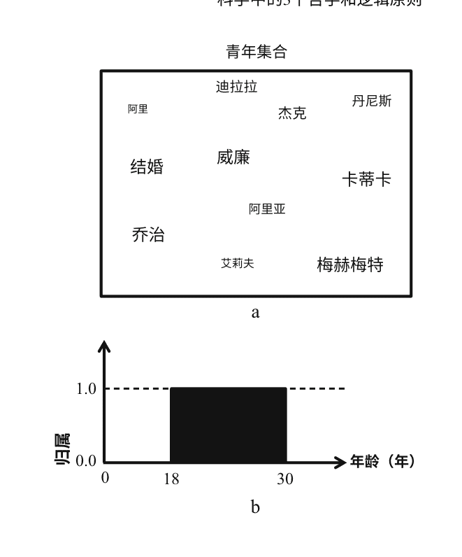

#### 3.8.1.1 子集

概念、术语和定义的子集，以及人口集合的子集，规模和影响力比子集更大。上述青年人口集合有许多子集。例如，如果我们说“年轻人”，它指的是一个子集，它的名称是“年轻”。如果我们说“几乎年轻”，那是另一个子集的名称。“年轻”出现。在图3.12中，人口集合被显示为一个矩形，类似于图3.11，子集被表示为圆圈或椭圆。这种几何表示被称为维恩图。如果我们用符号P表示人口集合，其子集为A、B、C、D和其他许多未在此处显示的子集。

如图所示。这样，有重叠的子集（A、B和C），也有不重叠的离散子集（D）。

为了使人类和计算机进行交流，人类的口头逻辑表达需要转换为数字，这可以通过集合实现。这个方向上最早的研究是由布尔（1815-1864）推进的。因此，经典逻辑已经完全确定性，思维中的模糊和不确定性完全被排除。

通过用0或1表示元素属于集合，元素之间的质量差异消失，逻辑变得限制性、清晰、二值和绝对确定（不模糊）。例如，一个P植物集合的元素可以写为：

## 图3.12 维恩图表示总体和子集

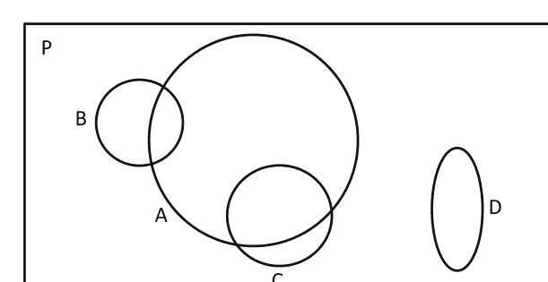

P = {梨、樱桃、西瓜、无花果、葡萄、大蒜、甜瓜、榴莲、大麻、栗子、野玫瑰果、生菜}

众所周知，每个植物在概念和质量上都非常不同。从这里开始，我们用C作为1来表示植物，其他植物用0表示。

```
P = {0, 1, 0, 0, 0, 0, 0, 0, 1, 0, 0}
```

因此，通过数字表示得到了社区集合。在这个集合中，植物之间的属性已经完全消失，我们只能通过数字逻辑来判断是否存在以C开头的两个类（1值）和非开头的类（0值）。

从上述解释中可以理解，清晰的、即两值逻辑是非常限制的。在数学和计算机操作和函数的实际应用中，清晰逻辑的原则和规则有很多好处。例如，计算机不使用十进制数，而是使用二进制（0和1）数系统。人类将十进制数数据输入计算机，计算机首先将这些数字转换为它能理解的二进制逻辑（0和1序列）。在二进制数系统中快速执行操作的计算机将其输出转换为十进制系统。集合中元素的隶属度，如0和1，被称为隶属度（特征）值或隶属度（MD）。人类和计算机共同理解具有MD值为1的元素属于所考虑的集合。通过显示每个元素是否属于集合的状态（见图3.11b），它在笛卡尔坐标集中以Venn图的形式呈现集合的显示。

## 3.8.2 模糊集合

模糊逻辑将MD分配给科学信念（确认或否认的程度），接受0到1之间的值，包括0和1。科学理论的可验证性和可否认性之间的矛盾涉及模糊的哲学基础，但许多哲学家用清晰的逻辑结束了他们的工作，这与科学发展的本质完全相反。尽管许多科学哲学家试图通过考虑科学知识的限制以及科学发展的可能性和有时的概率来解决这个问题，但不幸的是，“模糊科学哲学”虽然在很多年前就被Zadeh（1973）提出，但多年来并没有进入文献中。

关于科学知识的限制和模糊逻辑在科学进展过程中可以做出解释。科学家在证明科学限制或进展时不能完全客观，但模糊性的组成部分是产生新理论的动力。所有科学和逻辑规则库必须经过模糊推理引擎的测试，这导致了模糊科学领域。

科学现象本质上是模糊的，尤其是科学哲学的基础隐含着模糊的成分。在科学中，科学知识或信仰的教条性质，就像是不敏感的，是形式严谨逻辑的结果，而模糊逻辑则是未来有效的理性改进和知识产生的科学方法。

对于模糊建模来说，有必要了解每个成员函数（MF）与数据的运作方式。水平轴上的集合与垂直轴上的模糊度（MD）相关的变化范围。从某种意义上说，模糊函数是将数据值转换为模糊度（MD）或给定的模糊度（MD）转换为数据值。例如，在图3.13中，“低”类别是靠近原点的梯形模糊集的一个例子。有三个数据值落在“低”成员函数（MF）的定义域内，因此，分别以0.3、0.8和1触发（激活）该函数。这意味着这三个数据值都是“低”，但是具有不同程度的低度。一个会员评级为1的人完全是低的，但是一个会员评级为0.3的人至少是“低”。这意味着有很多数据值的MD都落在“低”类别范围内。另一方面，右侧的两个数据值不在该类别范围内，这意味着它们在“低”规范中没有MD。因此，每个类别的数据可以被归类为触发器和非触发器。非触发器的MD为零，但是触发器的成员度从0到1不等。同样，图3.14是一个具有两个触发值和相应的“高”模糊集的图。

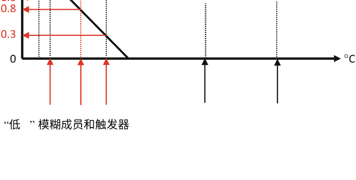

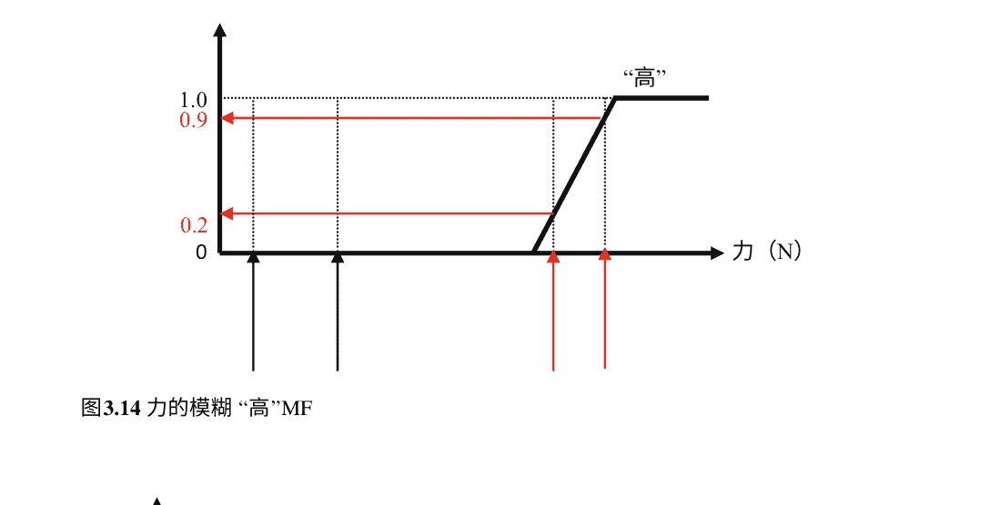

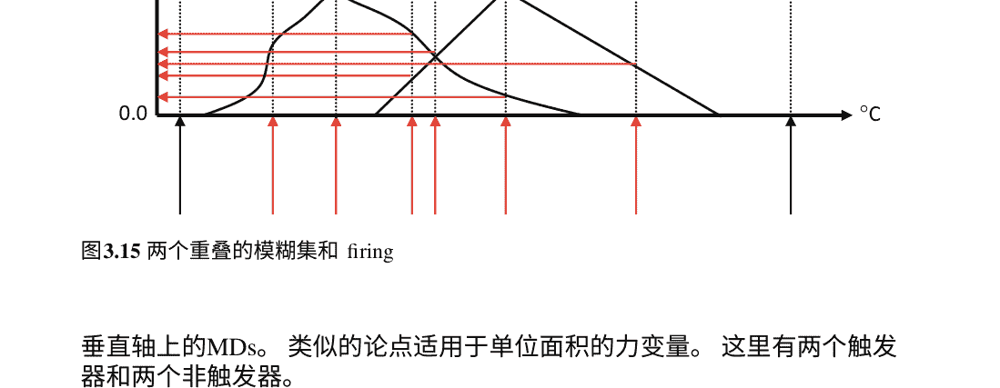

垂直轴上的MDs。类似的论点适用于单位面积的力变量。这里有两个触发器和两个非触发器。
MFs的形状不一定是规则的三角形或梯形，但它们可以是任何形状，只要它们在两侧或至少一侧等于1后继续下降。图3.15说明了这样的情况，其中垂直箭头表示多个数据条目。

在这种情况下，一些输入数据触发MFs，一些不触发。如果数据值落在两个连续MFs的公共区域中，则每个数据值触发不仅一个，而是两个具有不同MD的MFs函数。对于相同的数据，这两个度量中的一个始终大于另一个。可以认为这些MDs提供了数据值触发两个MFs的程度的度量。当然，对于相同的数据值，具有较高MD的MF比其他MF更重要。

### 3.8.2.1 成员函数

成员函数（MFs）是模糊集输入变量的基本组成部分，应具备以下特征：

-   1. 它们呈现向下凸形状。
-   2. 它们的MD（隶属度）值在0到1之间，包括0和1。
-   3. 模糊集的基底位于0 MD水平上，被称为支持度，对应于一个具有最小和最大值的区间数。
-   4. 模糊集的顶点具有MD值为1，形式上是另一个区间数的单个点，位于支持度内。这些顶点值被称为核心。
-   5. 输入模糊集在0到1的MD值之间不能有任何下降部分。每个模糊集的MD值从支持度的极端开始连续增加，直到达到两侧核心的极端。
-   6. 具备所有这些特征的模糊集被标记为“正常”模糊集。否则，它是非正常的，不能被视为模糊逻辑建模研究中的输入MF。

图3.16将所有这些特征集体地呈现为正常和非正常的模糊集。

读者可以在上述六点的光下欣赏图3.16中模糊逻辑建模输入MF的有效性和外观是否正常。

接下来，将以图形方式和数学方式分别介绍最常用的输入模糊集（MF）以便与计算机进行通信。一般来说，有两种线性（三角形和梯形）MF，但也有几种非线性的。

(a) 三角形MF：图3.17呈现了一个正常的三角形模糊集，它是许多模糊逻辑建模推理系统中最常用的输入集。为了进行数学表达式推导，水平轴上的变量值用x表示，垂直轴上的对应MD用y表示。它在0 MD轴上有三个参数a、b和c。

从左侧的两个相似三角形的考虑可以简单地得到y值的一般表达式。因此，相似边的比例得出了计算机的以下方程：

```
$$
y = 
\begin{cases}
0 & \text{当 } x \text{ 小于 } a \\
\frac{x - a}{b - a} & \text{当 } a \text{ 小于 } x \text{ 小于 } b \\
\frac{c - x}{c - b} & \text{当 } b \text{ 小于 } x \text{ 小于 } c \\
0 & \text{当 } x \text{ 大于 } c
\end{cases}
$$
(3.2)
```

子类层次结构被定义用于简化模糊集的生成。由这组子类可以形成的模糊集代表了一个相当完整的集合常见形状。用户可以生成其他类型的子类以满足特定需求。

(b) 梯形MF：这在所考虑的变量的极端位置经常使用，偶尔也在中间位置使用。其符号表示如图3.18所示，用于计算机通信的数学表达式推导。

该MF具有四个参数，分别为a、b、c和d。

再次考虑左侧和右侧的相似三角形，然后得到以下方程：

## 图3.18 梯形MF的数学表示

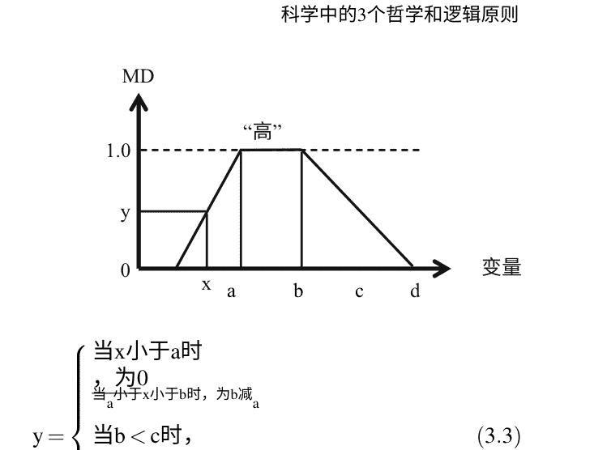

```
y = \begin{cases} \text{当x小于a时为0} \\ \text{当a小于x小于b时，为b减a分之x减a} \\ \text{当b < c时，x减c为1} \\ \text{当b < x < c时，d减c为0} \\ \text{当x > d时，为0} \end{cases}
```

(c) 高斯MF：它具有对称的钟形外观，有两个参数a和b，分别表示位置和偏离位置的程度。图3.19是高斯MF的示意图。

这个MF的数学表达式与高斯概率分布函数非常相似，其表达式如下：

```
y = e^{-\left(\frac{x-a}{b}\right)^2}
```

(d) Sigmoid MF：这也依赖于两个参数a和b，并在图3.20中给出了图形化表示。

这个MF的数学方程在0和1之间提供了所需的变化，符合模糊集的要求。对于不同的a和b值，有许多形状。在图中，只呈现了两组a和b的集合。根据参数a的符号，S型MF本质上是右开放或左开放的，因此适合表示“太大”或“太负”的概念。更传统的MF可以通过两个不同的S型MF的乘积或差来构建。

(e) Bell-shape MF：广义钟形函数取决于三个参数a，b和c，如下所示：

## 图3.19 高斯MF数学符号

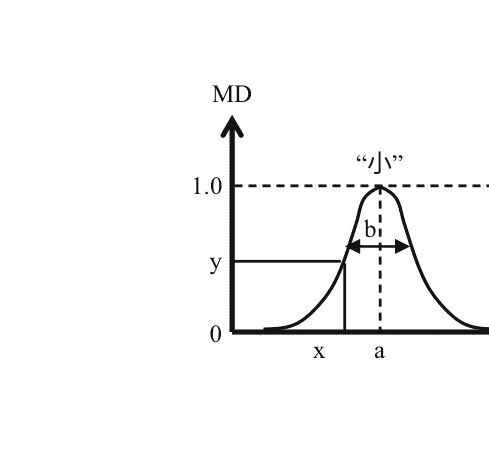

## 图3.20 Sigmoid MF数学符号

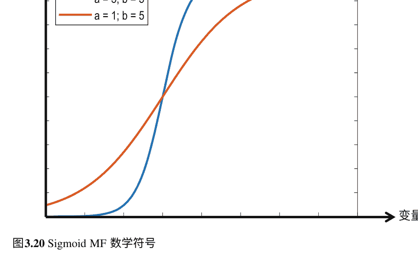

```
$$y = \frac{1}{1 + \left| \frac{x-c}{a} \right|^{2b}}$$
```

其中参数b通常为正数。参数c确定曲线的中心。输入参数向量params，作为gbellmf的第二个参数，向量的条目分别为a，b，和c。该MF的图形如图3.21所示。

这里的c表示MF的位置，b表示位置周围的偏差度量。

(f) 双峰高斯MF：其函数是两个参数的组合，与之前解释的高斯MF方程（3.4）类似。其各种形状如图3.22所示。

## 图3.21 钟形MF数学符号

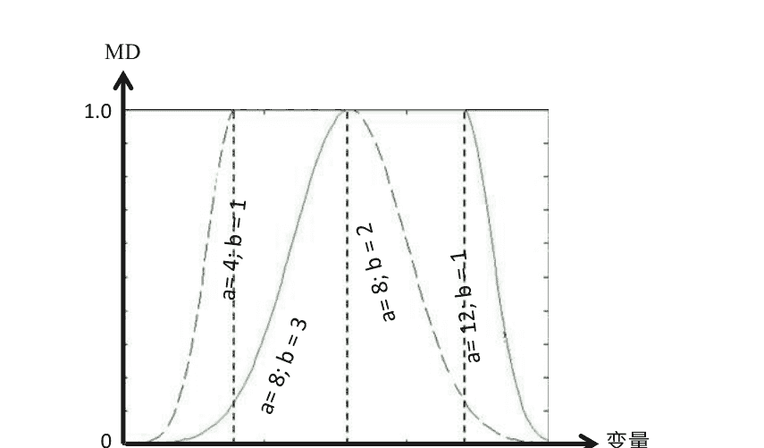

## 图3.22 数学中的两个高斯MF符号

第一个（第二个）函数，由a=4；b=1（a=12；b=1）指定，决定了最左边（最右边）曲线的形状。当a < b时，该MF达到最大值1。否则，最大值小于1，这样的MF是非正常的，不能用于输入模糊集表示。

(g) S形MF：它也有两个参数a和b，这些参数有助于定位曲线斜坡部分的极值。数学表达式如下：

```
$$
y=\left\{\begin{array}{ll}
\text{当}x \leq a\text{时, 为}0 & \\
2\left(\frac{x-b}{b-a}\right)^{2} & \text{对于}a \leq x \leq \frac{a+b}{2} \\
1-2\left(\frac{x-b}{b-a}\right)^{2} & \text{对于}\frac{a+b}{2} \leq x \leq b \\
1 & \text{对于}x \geq b
\end{array}\right.$$
(3.6)
```

根据这个表达式，在a = 1 和 b = 8 的情况下，如图3.23所示，出现了以下形状：

(h) Z形状的MF：类似于S形状的MF，它也有两个参数a和b；其数学函数与前一个MF表达式相似，只是第二行和第三行互换位置，如下所示：

```
$$
y=\left\{\begin{array}{ll}
0 & \text{对于}x \leq a \\
1-2\left(\frac{x-b}{b-a}\right)^{2} & \text{对于}\frac{a+b}{2} \leq x \leq b \\
2\left(\frac{x-b}{b-a}\right)^{2} & \text{对于}a \leq x \leq \frac{a+b}{2} \\
1 & \text{对于}x \geq b
\end{array}\right.$$
(3.7)
```

图3.24显示了Z形状的MF，在左侧具有较高的MD，并向右侧递减。

根据应用方式的不同，确定方法广泛分为几类。

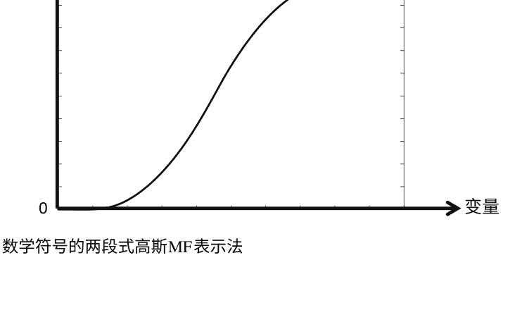### 图3.24 数学符号的两段式高斯MF表示法

- 1. 主观评估和引导：由于模糊集通常用于模拟人的认知状态，因此可以通过简单或复杂的引导过程来确定它们。至少，被试只需根据给定问题绘制或指定不同的MF曲线。这些被试通常是问题领域的专家。他们可以从一组更受限制的可能曲线中进行选择。在更复杂的方法下，可以使用心理学方法对用户进行测试。

- 2. 临时形式：尽管可能存在许多（几乎无限）可能的成员函数（MF）形式，但大多数真正的模糊控制操作都来自一小組不同的曲线，例如简单的模糊形式。这简化了问题，例如只需选择中心值和两侧的斜率。

- 3. 转换的频率或概率：有时，以频率直方图或其他概率曲线的形式接收的信息被用作构建MF的基础（第4章）。有几种可能的转换方法，每种方法都有其数学和方法论的优势和劣势。然而，应始终记住MF并不一定是概率。

- 4. 物理测量：模糊逻辑的许多应用使用物理测量，但几乎没有直接测量MF。相反，通过另一种方法提供MF，然后从中计算数据的各个MF。

- 5. 学习和适应：这个问题是模糊真值和概率之间的关系是什么？应该用两种方式回答。
  (a) 模糊理论在数学上与概率理论有何不同？
  (b) 在解释和应用上有何不同？

在数学层面上，模糊值经常被误解为概率，或者模糊逻辑被解释为处理概率的新方法，但事实并非如此。情况并非如此。概率的最低要求是它们是可加的，必须加到1，或者密度曲线的积分必须为1（第4章）。这通常不适用于MF，尽管它们可以通过考虑概率密度来确定，但还有其他与频率或概率无关的方法。

从语义上讲，模糊逻辑和概率论之间的区别与概率概念和隶属度之间的差异有关。概率陈述是关于结果可能性的。一个事件要么发生要么不发生，人们可以对其进行赌注。在模糊性中，无法确定一个事件是否发生，而是试图对事件发生的程度进行建模。

MF估计问题可以看作是一个模式识别问题（Bezdek 1981）。将轨迹样本划分为类别可以得到吸引区域。一般来说，无法确定类别之间的清晰边界，因此模糊划分是一种首选的方法学。此时，有两种方法可以进行：

- 1. 利用问题的先验知识，并建议合理的类别原型，通过近似极点来模拟吸引区域，如图4.3所示。根据适当的距离度量和适当的分析表达式或某个目标函数（可能或可能不是针对假设的原型进行优化）计算MF。
- 2. 另一种方法是无监督模式识别，这是由于对物理过程缺乏精确知识而产生的。然后，通过适当的无监督模糊划分方法来估计MF。

## 3.8.2.2 模糊运算

经典集合论对集合定义了三个基本运算，即补集（NOTing）、交集（ANDing）和并集（ORing）运算，并且可以与模糊集合相关联。还有许多操作和操作可以应用于模糊集合，而这些操作不适用于清晰集合。通常，模糊值具有相应的能力，但必须观察模糊值的论域或x值范围，并且对于ANDing和ORing等二元操作，两个模糊值必须是相同的模糊变量。

### 模糊ANDing

图3.25显示了两个样本模糊集A和B的交集的可视化表示。一个集合具有梯形形状，另一个集合具有三角形形状。如第3.7.2.1节中已经解释的那样，ANDing操作应该同时发生在两个集合中，这被称为两个集合的交集。两个模糊集的ANDing操作被定义为在任何x值处的隶属度值是两个模糊集的隶属度值的最小值，它们是MD(A)和MD(B)。随着x从左到右移动，这两个MD改变它们的值，最小值对应于ANDing操作的位置。这意味着ANDing MD应根据以下表达式获得：

```
MD(AND) = min[ MD(A), MD(B) ] (3.8)
```

在同一图中，蓝色边界表示结果模糊操作，它是MF A和B的组合。在模糊逻辑文献中，ANDing操作符号为∧。

根据经典集合论，两个集合的ANDing是满足两个集合所表示的概念的连接的结果。然而，在模糊集合论下，一个项目可以以不同的MD属于两个集合，而不必在交集中。因此，交集的定义是两个集合中较小的成员资格。

### 模糊或运算

两个模糊集的或运算的可视化表示如图3.26所示。两个模糊集的或运算被定义为在任何x值处的MD值是两个模糊集的隶属度值的最大值。因此，类似于方程（3.8），可以写成

```
MD(或运算) = max[ MD(A), MD(B) ] (3.9)
```

根据最大化过程，最终的或运算模糊集在图中以蓝色显示：

根据与逻辑操作类似的论证，两个集合的或运算具有较大的隶属度。或运算的符号是V，因此最终的模糊集是A∨B。

### 模糊非运算

它根据以下数学表达式来补充模糊集合中的MD，(MD)A值的设定点：

```
MD非运算 = 1 - MD(A) (3.10)
```

给定一个模糊集合A，非运算的符号表示为 ¬A。最终的非运算模糊集合在图3.27中用蓝线表示。

## 3.9 模糊逻辑原理

与清晰逻辑相反，每个人在日常工作中都有模糊、不确定、模棱两可、可能和可能的概念和方法。这种自然逻辑比清晰（二值）逻辑更广泛、更普遍，因此被称为模糊思维和推理，其中可以以一定程度的成员资格接受两种对立观点。通过遵循基于模糊逻辑的思维方法，人们可以部分地同意一切，这很容易使专家陷入和谐和犹豫不决的境地（Dimitrov和Korotkich 2002年）。

推理是基于分级概念的，即一切都是程度问题，也就是说，一切都是模糊的（灵活性）。模糊逻辑理论在扎德（1965年）的早期出版物中形成了其一般形式。他希望通过0到1之间的隶属度来推广传统的集合概念，而不是两个隶属度（等于1或0），并将其命名为隶属度（MD）。真实情况并不清晰和稳定；因此，它们无法完全定义。对于一个真实系统的完整描述通常需要比人类同时处理和理解的更详细的数据。这被扎德（1963年）称为“不兼容原理”，意味着越接近真实世界的问题，它们就越模糊。

所有决策必须用可以转化为基于数学、统计学或概率原理的普遍使用的符号逻辑表达的语言来表达（第4章和第5章）。这就是为什么模糊逻辑总是跟随符号逻辑（包括数学）的原因。

主观性在依赖个人思想的感知阶段非常明显，当进入可视化领域时，主观性减少，在最后阶段客观性成熟并变得更加逻辑，尽管仍然存在一些不确定性（模糊性、不完整性等）。因此，最终决策仍然不明确。物理学和工程学中的不确定性可以通过一组限制性假设来最小化，但在工程建模、社会、文化、经济、商业等领域中始终存在。

经典科学问题解决方法基于两值（白-黑、开-关、是-否等）的清晰逻辑，使用整齐有序的数值数据。然而，在日常生活的各个角落，无论是科学的还是非科学的，都可以使用灰色前景和背景的近似推理来进行有效推理。如何处理灰色信息以便使用明确和确定性的原则得出决定性推论是一个大难题。模糊逻辑原则提供了一个基于语言有效命题和模糊分类的评估这种信息的坚实基础。对于更广泛的推理和逻辑推导可能性，初步步骤是模糊逻辑概念化科学公理，系统地考虑命题的前提和结论部分的不确定性。这种方法不仅有助于可视化不同属性之间的关系，还通过考虑科学哲学的词源学和认识论内容中的语义和句法含义，为科学现象描述、命题和公理特征提供了推测性细节。最终可以通过转化为清晰的逻辑数学公式得出语言推论。

模糊逻辑的概念由Zadeh（1965年）提出，并且不是作为控制方法论，而是通过允许部分成员资格（归属）集合而不是清晰（两值）逻辑的数据处理。在1970年代之前，这种方法没有应用于控制系统，因为在那个时候计算机能力不足。Zadeh（1921–2017）认为人们不需要精确的数值输入信息，但却具有高度适应性的控制能力。如果反馈控制器能够接受嘈杂和不精确的输入，那么它将更加高效，也许更容易实现。

### 3.9.1 日常事务中的模糊性

如上所述，没有脆弱的边界。不确定性或不确定性原则，由海森堡（1927）提出的陈述，表明：

> 一个物体的位置和速度不能同时精确测量。

这个陈述意味着人类永远无法在科学中达到确切的真理，不确定性将始终存在于所有时间和地点。所以我们生活在一个不确定的，或者更好地说是一个模糊和朦胧的世界。现在让我们问问，当他们说是或不是时，到底是谁给出了一个确定的答案？你确切地知道明天的天气会是什么样子吗？电视屏幕上给出的温度是准确的吗？还是它们是近似值？毕竟，我们明白在我们的生活和追求之间总是存在一种模糊性，即在某种程度上存在不确定性。当涉及到不确定性时，我们不应该考虑数值，而是特别考虑口头表达。

另一方面，当提到模糊性时，个人偏好也会发挥作用。例如，喜欢的颜色，有品味，为了品味给小费，为慈善事业提供帮助，都涉及个人偏好。在这方面，几乎所有使用的词语和短语都是模糊的。例如，当说到“好”时，存在着因人而异的相对性。对于一些人来说，完美和理想的“好”可能与其他人认为不那么重要的“好”相对立。在这方面，善良这个词在人的思维中有一定的变化范围。

这意味着在这个世界上没有绝对的善良。这个词“好”表示一种模糊的事务。如果将美丽这个词理解为给每个人带来相同的美感，那么与美丽这个词相关的现象总是被认为是完全相同的。在这种情况下，假设人们对美丽这个词的感知总是处于相同的水平，并且远离了真实世界。然而，在现实生活中，美丽这个词在人与人之间有着不同的成员位置，介于“丑陋”和“非常美丽”之间。如果一个集合中有不同的模糊度，它们被称为模糊集，它们的模糊度可以取0到1之间的任意小数。然而，在0到1之间，有一个最能代表该词的模糊度，或者在有效集合基础上有许多比这个值更小的相邻情况。例如，这个词“美丽”具有脆弱和不同的模糊集选项。通过反思每一个，读者可以以某种方式弄清楚脆弱集和模糊集之间的第一个区别，并用他（她）的思想来思考。

### 3.9.2 模糊逻辑思维模型

不幸的是，传统的教育体系基于一个非常系统化、脆弱和有组织的框架，基于二十三个多世纪前的亚里士多德逻辑，只有绝对真和绝对假两种选择。许多科学几乎在每一个信息源的灰色前景和背景中都有存在。如何处理灰色信息源以使用脆弱和确定性的逻辑原则得出科学结论是一个大困境。

具有语言上有效的命题和相当模糊的分类的模糊逻辑原则为相关现象提供了坚实的基础。初步步骤是对现象进行真正的逻辑和不确定性概念化，包括其因果（前提）和结果（结论）变量，这些变量通过模糊逻辑命题进行组合。

这种方法不仅有助于逻辑上可视化不同变量之间的关系，还提供了一个可以用语言解释给任何人听的现象机制的哲学背景，而不需要数学处理。在本书中，强调了在创新教育系统中，应该先从语言上给出基本的科学哲学和模糊逻辑的解决问题的原理，然后再是数学或系统算法。通过这种方式，学生们可以在曾经研究过或至少在类似方向工作过的教师的支持下，培养他们的生成性分析思维能力。由于现代科学哲学坚持对现有科学结果进行伪证，因此在许多科学研究活动中总会存在模糊、不一致、模棱两可和不完整的空间。创新教育系统应更倾向于基于模糊逻辑原则的科学问题解决的基本科学哲学。

自然科学相当自明，不同专家对同一现象的结果总是有一些部分重叠，这取决于他们的背景和经验。意见的不同在自然科学的教育和研究活动中引发了潜在的问题。所有这些不确定性概念都是进一步讨论的基础，因为没有系统的方法来评估、控制和被不同方面接受。能做的最好的办法是使用概率、统计和随机过程等不确定性技术，但它们的应用需要相当大量的数值数据（第4章）。

本书涵盖的视角是在工程和自然科学中使用创新的模糊逻辑原理进行语言建模研究。在复杂问题解决中，模糊系统非常适合描述一般和特定的特征。本书介绍了模糊思维在问题解决中的基础，而不是科学的绝对准确性。模糊逻辑捕捉了科学的定量和经验知识，通过建模原理实现了多个过程和非线性关系的同时模拟。

理解生命复杂性带来的问题时，模糊概念无法在问题出现时的知识水平上解决。但是当我们的意识提升到更高的水平时，紧张感就会减少，问题也不再是问题。

模糊思维的哲学基础是基于粒度概念，这意味着一切都是程度的问题，即柔软（灵活）。Zadeh（1963）希望推广传统集合和表达式的概念，允许模糊度和真值。这些努力是由于在对真实世界进行建模时出现的复杂问题。

- 1. 真实情况并不清晰稳定，因此无法完全描述。
- 2. 对于一个真实系统的完整描述通常需要比人类能够同时识别、处理和理解的更详细的数据。

扎德的不和谐原则陈述很重要，因为它传达了一个信息：越是仔细地观察一个现实世界的问题，解决方案就越模糊。

### 3.9.3 模糊逻辑的需求

模糊逻辑（FL）的概念是由扎德（1921-2017）提出的，并且并不是作为一种控制方法论，而是作为一种通过允许部分集合成员资格而不是精确集合成员资格来处理数据的方法。这种对非成员集合理论的方法直到20世纪70年代才被应用于控制系统，原因是计算机容量不足。他认为人类不需要精确的数值输入信息，但却具有高度适应性的控制能力。如果反馈控制器能够接受嘈杂和不精确的输入，那么它将更加高效，也许更容易实现。在这种情况下，FL是一种问题解决的控制系统方法论，可以应用于从简单的、小型的嵌入式微控制器到大型的、网络化的、多通道的个人电脑或工作站数据采集和控制系统。它可以在硬件、软件或两者的组合中实现。FL提供了一种简单的方法，可以根据不确定、模糊、不精确、嘈杂或不完整的输入信息得出明确的结论。FL检查问题的方法模仿了一个人做决策的方式，但速度更快。

> 软计算的指导原则是利用精确性、不确定性和部分真实度容忍来实现可追溯性、鲁棒性和低分辨率成本。模糊逻辑的重要性在于人类推理和概念形成很大程度上与模糊规则的使用有关。通过为模糊规则计算提供一个系统框架，模糊逻辑大大增强了人类推理的能力（Zadeh，1967年）。

与许多方法论不同，模糊逻辑的益处可以从以下几个方面来说明：

- 1. 模糊逻辑系统高效地利用信息；利用所有可用证据，扩展到最终澄清，适用于不确定、不完整或损坏的数据。
- 2. 模糊逻辑编码了人类专家知识/启发式方法；常识，易于解释，自然地应用限制。
- 3. 模糊逻辑系统廉价，不需要训练数据，不需要模型或组合/条件概率分布。
- 4. 它的设计和实现相对简单。
- 5. 模糊逻辑没有任何模糊之处。
- 6. 模糊逻辑与概率概念不同。
- 7. 相对于其他建模方法，模糊集的设计相对容易。
- 8. 模糊系统稳定、易于调整，并且传统上可验证。
- 9. 模糊逻辑不仅仅处理控制问题。
- 10. 模糊逻辑是一种表示和推理过程。

我们在社会、经济、管理、行政、工程、医学和科学等领域所做的所有工作都发生在一个复杂的世界中，复杂性往往源于不确定性，因为人们可以思考并下意识地处理复杂性和不确定性问题。普遍的不确定性主导着大多数科学、社会、技术和经济问题。计算机处理复杂和不确定问题的唯一方式是通过模糊逻辑思维、系统化、检查和决策程序。模糊逻辑影响许多学科，并在洗衣机、地铁系统运营、水资源管理、自动变速器、工厂操作、烤面包机、吸尘器等许多工业模糊控制过程等不同领域提供了技术进步。模糊消费品和模糊应用的数量以及相关的新专利正在迅速增长。

### 3.9.4 模糊性的源头是思维

最大的模糊性源头是我们的思维。这个强大的理性思考者从不停止解构整个现实，以便分析、分类和标记它，然后将其组合或废弃，以粉碎与现实的不可分割完整性几乎无关的世界 -这是我们不可分割的整体。

我们从感知、感觉和思维的碎片中组合起来的世界，只能提供现实的部分和因此扭曲的模型。这些模型代表了一个被感知的世界，一个人造的世界，而不是一个我们通过生命和不可分割的联系而被束缚的世界，这种联系的自然演化使我们存在。我们所有的模型都处理我们感知为环境的部分，这些环境被认为是我们以自我为中心的思维认为有意义的东西。

一支由科学家、工程师、经济学家、政治家和哲学家组成的军队参与了将许多扭曲的模型调整为预测和控制现实动态的过程。虽然我们知道现实的复杂动态超出了我们的预测和控制能力，但我们“尽力”削弱现实，以便将无意义的还原主义模型推入无法渗透的床垫。

这些模型的应用使得自然界和社会现实都变得脆弱；这在今天的生态灾难和不断恶化的社会经济条件中是显而易见的，而这些条件正影响着社会中最大且不断增长的群体。

思维永远无法超越二元性 – 它要么选择某个事物而拒绝其对立面（如使用二进制逻辑时的黑白思维），要么在某种程度上接受两个对立面（如使用模糊或概率推理时的模糊思维）。理性推理组成部分的二元性质如此强大，以至于单靠思维无法超越它；我们能做的最好的事情就是调和对立面。

通过遵循“真或假”的思维方法（要么A，要么非A），我们很容易陷入例行公事、刻板印象、偏见和习惯中，最终变得模糊不清，使我们无法真正体验自己的“理解”不断地从已经建立的心理模式中过滤出来。狂热主义是这种强烈的模糊状态的极端表现，当人类超越既定教条的能力完全被阻碍时。通过采用基于模糊逻辑的思维方法（“既是A又非A”在一定程度上），我们同意别人说的一切，这很容易使我们趋于一致和犹豫不决。当其他人都是对的时，对其他人思维中伴随的模糊性的盲目接受使我们难以产生自己的创造性思想。正是对立的极性 – 意见的矛盾和冲突 – 为人类思维提供了超越对立所必需的动力（力量和能量）。这些动力在思维中表现为超越对立冲突平面的冲动；没有这样的冲动，思维可能变得停滞不前，陷入重复，或者被幻想的思想和梦想所迷惑。

幸运的是，模糊逻辑的工程应用使用了一种称为“去模糊化”的过程来保持软计算系统的稳定程度在一个有效的操作水平上 - 模糊系统的控制机制随时准备生成非模糊动作，也就是在任何时候都可以跳转到一个简单的清晰（二进制）解决方案（第3.10节）。“不要拒绝任何东西！但不要留在任何东西上！超越！在我们的背景下，这些智慧的话语说：“在寻求理解的同时，要准备超越逻辑规则和约束，无论是多么柔软（模糊的，概率的）还是清晰（二进制的，确定性的）！”

### 3.9.5 模糊命题

每个模糊命题可以由两部分组成，即THEN之前和THEN之后。THEN之前的部分是前提（前件）部分，而THEN之后的部分是结论部分。通过考虑每个变量的子规格，这些二进制模糊逻辑表达式被仔细地分成三个、四个等等部分。例如，假设问题的前提整体变量有四个具体规格，如“低”，“中”，“高”和“极端”。如果有三个整体变量，每个变量有四个子规格，那么这些子类别的组合将有4×4×4＝64种不同的组合，每个组合将与整体输出变量的三个子类别相加。

事实上，任何关系都会导致一个条件语句，即如果某些输入变量的状态是这样的，那么输出状态可能是这样的。在这个语句中，有两个词提供了逻辑关系的形式方式，它们就像在清晰逻辑情况下一样，是“如果”和“那么”，因此，从现在开始，任何模糊逻辑术语中的关系都将以IF-THEN命题的形式陈述，其中包含模糊集合。此外，在任何控制或逻辑语句中，人类知识也以模糊的IF-THEN规则的形式表达。这些是条件逻辑语句，如：

```
如果（前件模糊组合）那么（后件模糊规范）
```

以这种方式，它是模糊输入和输出变量之间的连接或关系。每个逻辑语句都暗示着输入和输出变量之间的关系，在模糊术语中是这些变量的子域之间的关系。模糊语句可以分为两种类型：原子模糊命题和复合模糊命题。前者是一个单一的陈述，后者由几个单一的陈述组成，这些陈述以本章前面提到的三个逻辑合取词连接在一起，它们分别是“AND”，“OR”和“NOT”。这些合取词分别对应于经典集合的补集、交集和并集运算。原子命题由语言中的一个动词分隔成两个部分。第一个部分是模糊变量v，第二部分是原子模糊词w_f。它的一般结构是：

```
v是w_f
```

在科学中有许多原子命题，例如：

- 降雨强度大
- 力量强大
- 能源昂贵
- 面包便宜
- 葡萄甜美
- 他很高
等等，等等，等等。

复合模糊命题是由原子（简单）模糊命题（s₁, s₂, s₃, ..）组成的组合，它们通过逻辑连接词相互连接。它的一般形式可以写成：

```
s₁ AND s₂ OR s₃ NOT s₄
```

以下是一些复合模糊命题。它们的数量几乎可以无限扩展。

- 降雨缓慢而补给少
- 价格高而质量好或口感中等
- 她很高而体重重而头发金黄

请注意，复合语句中的语言变量不相同。它们也彼此独立。此外，复合命题中的每个原子命题都表示了所有语言变量的部分变化域。

同时考虑的变量及其相应的模糊子集。因此，任何复合模糊命题都可以被视为模糊关系。问题是如何确定这些模糊关系的MF？根据之前的解释，可以给出以下答案。

1. 逻辑连接词“AND”对应于交集，因此，在计算复合命题的MD时，交集或AND运算符开始执行复合命题，如
x是A且y是B
这被解释为模糊关系 $A \wedge B$的MF为
$$\mu_{A \wedge B} (x, y) = t[\mu_A(x), \mu_B(y)]$$
(3.11)
其中t表示t-共轭（Ross 1995）。

2. 如果逻辑连接词是OR，则可以根据并集计算MD。ORing复合命题的一般形式是
X是A或者y是B
这应该被解释为模糊关系$A \vee B$与相应的MF为
$$\mu_{A \vee B} (x, y) = s[\mu_A(x), \mu_B(y)]$$
(3.12)
其中s表示s-范数之一（Ross 1995）。

3. 模糊补运算用于复合命题中的逻辑连词非。在这些命题中，每个“NOT”都会导致每个集合被其补集替换。

由于第n个模糊命题被解释为模糊关系，因此人们想知道如何解释IF-THEN规则，即逻辑命题。一般来说，规则可以写成
如果p那么q

在经典的清晰逻辑中，命题变量可以是真（T）或假（F）。表3.1显示了从p和q的真值推导出的最终真值。

在模糊的IF-THEN规则中，p和q命题被模糊命题替代。因此，模糊的IF-THEN规则可以通过在以下方程中将与“NOT,”“OR,”和“AND”相对应的运算符，∨和 ∧替换为模糊补、并集和交集来解释（第3.8.2.2节）：

表3.1 真值

| p | q | 如果p那么q |
|---|---|------------|
| T | T | T          |
| T | F | F          |
| F | T | T          |
| F | F | T          |

$\bar{p} \lor q$ (3.13)
或
$p \land q \quad \bar{p}) \lor$ (3.14)
是等价的。这两个最后的方程都共享相同的真值表（表3.1）。在文献中提出了各种各样的模糊补、模糊并集（s-范数）和模糊交集（t-范数）运算符的不同解释模糊IF-THEN规则的方法（Ross，1995）。为了总结这些运算符，假设p和q被模糊命题（FP₁）和（FP₂）替代，其中假设FP₁是在U = U₁x U₂x...xUₙ中定义的模糊关系，和 FP₂作为 V = V₁x V₂x...xVₙ。如果模糊关系由Q表示，则 Zadeh（1973年），Lukasiewicz（1878–1956年）和Gödel（1906–1978年）提出
$\mu_{QZ} x, y =) \max \{ \min [\mu_{FP1}(x), \mu_{FP2}(y)], 1 - \mu_{FP1}(x) \}$ (3.15)
$\mu_{QL} x, y =) \min [1, 1 - \mu_{FP1}(x) + \mu_{FP2}(y)]$ (3.16)
$\mu_{QG} x, y =) \begin{cases} 1 & \text{如果 } \mu_{FP1}(x) \leq \mu_{FP2}(y) \\ \mu_{FP2}(y) & \text{否则} \end{cases}$ (3.17)
和
$\mu_{QD} x, y =) \text{最大 } \{ 1 - \mu_{FP1}(x), \mu_{FP2}(y) \}$ (3.18)
分别。另一方面，最常用的Mamdani（1974）蕴涵是最小化乘积运算符，如
$\mu_{QM} x, y =) \min [\mu_{FP1}(x), \mu_{FP2}(y)]$ (3.19)
或
$\mu_{QM} x, y = \mu_{FP1}(x) \mu_{FP2}(y)$ (3.28)
分别。这两种蕴涵是模糊系统和控制研究中最广泛使用的。以IF-THEN规则的人类知识各不相同，因此出现了不同的蕴涵运算。选择最合适的蕴涵运算取决于问题的类型和问题解决的专家观点。

## 3.9.6 模糊推理系统 (FIS)

在语言模糊性问题之后，模糊性可以通过一组具有模糊逻辑基本原理的逻辑规则系统地表示（Zadeh，1967年，1973年）。由于读者在整个教育过程中接收到的信息是基于二值清晰逻辑的，因此了解它与模糊逻辑的区别是有用的。许多教育系统根据清晰逻辑教育学生，而不是根据甚至是穆斯林哲学家和思想家Al-Farabi（870-950年）首次提出概率的概率逻辑。

亚里士多德（双值）、Al-Farabi（概率）和Zadeh（模糊）逻辑都将基本上按集合进行分组的情况。根据清晰逻辑，属于一个集合的所有元素对该集合的归属度相同，并且这通过数字1来表示。这意味着如果它是属于该集合的元素，则其归属度为1，否则为0。因此，“极端值的右和左”被称为“过度和低估”被认为是存在的。图3.28显示了所有三个聚类的状态。

如上所述，在清晰的逻辑中，集合中的所有元素的MD都等于1；在Al-Farabi集合中，MD在0和1之间间断变化；最后，在Zadeh集合中，0和1之间有稳定的增加然后减少。由于这里的主题是模糊逻辑，输入集必须像第3.8.2.1节中提到的那样正常。

图3.29显示了经典的、对称的和非对称的模糊集。可以说经典集总是对称的，因为元素的MD没有差异，因为它们都具有MD等于1。

在这个图中，我们讨论的是一个包含2到4之间所有数字的集合。虽然在经典逻辑中无法确定这个范围内的数字哪个最重要或最有效，但可以确定可能性，并且至少一个模糊集的成员最重要。虽然经典逻辑构成了西方文化的基础，但模糊逻辑是东方的产物。

最好的事情是中间的那一个
这意味着既有概率又有模糊逻辑集。这意味着，如图3.29a所示，集合元素没有明显的优势情况。在这方面，脆弱逻辑也被称为排除中间的逻辑，如前所述。


因此，可以得出结论，没有中间偏好的逻辑在日常生活中几乎没有意义。几乎所有事物都有一个折中的地方。

模糊集合中元素的概率和隶属度在0到1之间，因此可以理解模糊逻辑集中存在不等式。这表明，与二进制逻辑相比，人类与自然行为模式更加兼容。

模糊属性也存在于许多科学哲学关键词（术语）中，尤其是在日常语言中。例如，当考虑到词“疾病”时，这个词涵盖了许多不同疾病之间的许多子集，这些子集与清晰逻辑相关。在疾病这个词的子类中，有“轻微的”、“少量的”、“一点点的”、“轻微的”、“大的”和“极端的”患者群体。图3.30a根据清晰二进制逻辑显示了它们的集合，即使存在将它们彼此分开的边界，可以理解这些边界是相邻类别之间的锐利过渡线。在质疑一个“小的”疾病在治愈过程中如何突然转变为“轻微的”状态的最后，得出结论逐渐发展比突然发展更合理。在这种情况下，模糊聚类形成如图3.30b所示。

通过过滤这两种逻辑类型，可以得出以下重要结论：

1. 考虑图3.30a中的经典（双值）逻辑，可以得出这是不可行的结论，因为可以理解到子集之间的转变是突然的。此外，令人奇怪的是，在子集元素中没有MDs方面的差异。
2. 如果诊断出疾病主要在“轻度”组中，根据清晰逻辑，它与其他子集没有区别。不幸的是，疾病程度彼此相等。

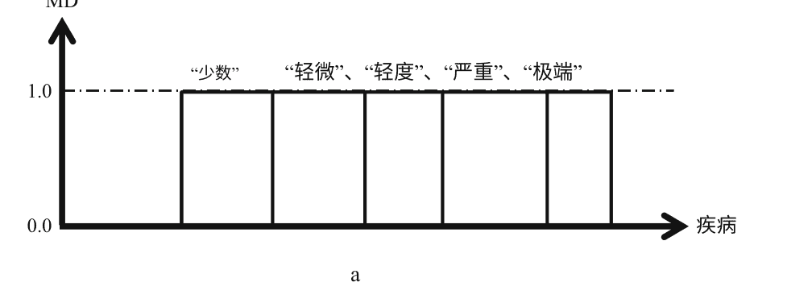

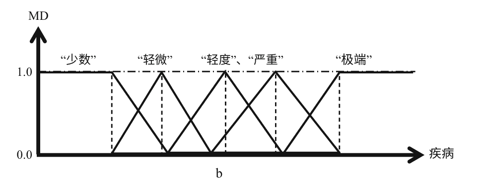

图3.30 逻辑疾病分类（a）经典，（b）模糊

3. 如果落入同一亚疾病群体的人的疾病水平相同，预计给予每个人相同的剂量，这不是一个逻辑解决方案，因为每个患者的免疫系统都不同。
4. 根据图3.30b中的模糊集分类，已经为前三个项目提供了解决方案。
5. 根据模糊集分类，可以理解同一疾病类别中的人与其他人之间存在差异。
6. 根据经典逻辑进行诊断的医生不可能像根据模糊逻辑进行职业的医生那样成功。

如果一个人在日常生活中被问到磁盘、圆柱体和杆之间的区别，他必须观察并形象化地回答这个问题。 否则，机械地、机械地和传输信息地回答问题可能会误导任何人。可以通过考虑几何形状尺寸，比如两个模糊词“长度”和“直径”，来看到这三个词之间的差异。

经典上，我们遇到了两个模糊的词来描述圆盘，例如，“大”直径和“短”长度。此外，还有其他包含模糊性的词，比如“小”，“长”，“中等”。 圆盘的高度是“短”，而圆柱体的高度是“中等”，但与其他物体相比，杆的高度是“长”。

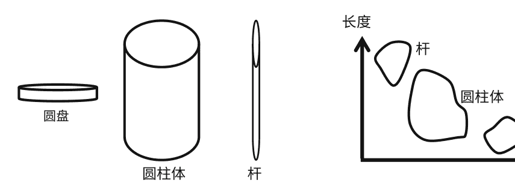

图3.31 圆盘，圆柱体，杆

图3.31b中的代表性区域显示直径和长度存在重叠。然而，在清晰逻辑中是不允许重叠的。寻找重叠意味着排除清晰逻辑，引入模糊逻辑原则。在模糊逻辑中，重叠是允许的。

## 3.9.7 模糊建模系统

为了分析一个科学问题，首先，制定一个关于其工作机制的设计是有用的。否则，将无法通过自然智能（NI）的自然信息在机械和运输教育系统中引入人工智能（AI）功能，并将其加载到机器人和机器中。为了构建一个模糊人工智能系统，必须考虑以下几点：

1. 在完全建模真实事件的教育系统给出的具体方程之前，应该努力以自由思维来口头上可视化有关事件生成机制的初步信息，而不受数学方程的限制。由于要研究的事件非常复杂，可能无法用精确的数学方程来解决。事实上，每个数学方程都在一定的假设和一组假设的光线下有效，但事件的运作可能并不完全符合这些假设。出于这些原因，研究人员自然而然地可能更倾向于选择近似但具有可解性的方法，即使它们不是精确的方法，其中模糊逻辑原理是最具口头表达和代表性的人工智能方法。
2. 数学方程用近似的方式表达研究的事件，如果认为它们真的绝对有效，那就是有偏见的，并且与数学方程并不完全正确相矛盾。
3. 考虑到在自然和工程研究中获得的结果的有效性总是存在风险（地震、洪水、强度计算等），因此建议将获得的结果乘以一个大于一的数以确保安全，并称之为“安全系数”。实际上，它是覆盖不确定性的无知系数。
4. 由于“知道为什么”的“技术知识”在当今信息时代是有效的，口头信息在所有数学、物理等建模事务中都被使用。应始终考虑到它比数值信息更重要（第1章）。
5. 例如，在地震研究风险计算之前，需要口头陈述建筑物的年龄、楼层数、材料质量、地面条件等情况。因此，FL原理和尤其是系统在将建筑物分类为“无损坏”、“低损坏”、“中度损坏”方面非常有用。“轻微损坏”，“拆除”

我们在人们学会开车并获得驾照时最常见地见证了AI研究中的FL。一个人在不知道任何数学方程的情况下学会开车的FL原则。试图用清晰（二值）逻辑来学习这一点会增加车祸的数量。一个人只能通过感知口头信息来学会开车。在这个学习过程中，例如以下两个FL规则非常有效：

1. “如果速度低，则猛踩油门”
或者
2. “如果速度高，则减少加速度”

一般来说，经典和模糊逻辑规则的经典模型设计在图3.32中分别作为输入（原因、变量）和输出（结果）给出。

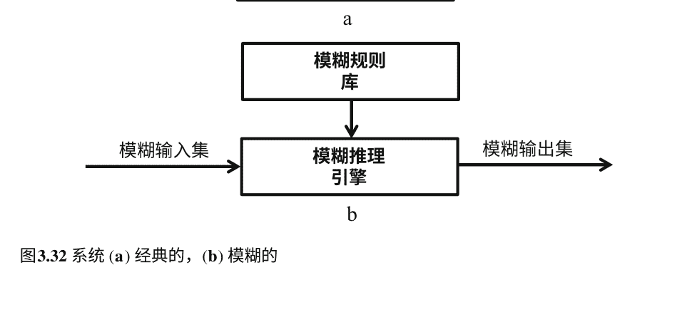

另一个重要的观点是，经典系统的功能是通过假设和假设来实现的，而模糊逻辑系统是通过一些逻辑规则库来实现的。另一方面，在经典系统中，输入和输出必须是数值数据形式，而在模糊逻辑系统中，这些可以用数字或用词语来表达。从图3.32b中可以看出，数学模型被规则库取代，然后通过使这些规则库运行来获得输出。从两个系统的比较中可以得出以下几点：

1. 在模糊逻辑系统中，除了数学原理之外，还使用逻辑规则来模拟涉及语言不确定性的情况；而在经典系统中，确定性和数学规则，即方程式，是必不可少的。
2. 那些习惯于在经典系统中工作的人尝试用机械方法解决问题，使用特定的方法，如数学表达式（普通或偏微分、经验、概率、统计、随机等方程），因为他们接受了基于显著性的教育。他们试图通过使用基于清晰逻辑原则的数学方程和公式来推断解决方案，而不是逻辑规则。
3. 另一方面，使用FL系统的人首先确定他们所研究事件的基本逻辑规则，并提供一种基于逻辑规则的方法，这种方法已经构成了数学公式的基础。因此，他们可以继续在人工智能领域以富有成效、健康、和平、科学和创新的方法前进。

从下面的单元的功能来考虑，可以详细说明系统方面的差异。

1. 输入：该单元提供对系统的入口，确保将有关事件的所有已知数字和口头信息输入到系统中。
2. FL规则库：该单元位于输入单元和输出单元之间，是包含它们之间关系的FL规则库的一部分。以下是本章中在不同位置上描述的IF-THEN规则。每个规则在逻辑上将输入空间的一部分连接到输出空间的一部分。
3. 模糊推理引擎：它是一个机制，通过收集输入和输出模糊集之间建立的所有部分关系的模糊规则库的形式，确保系统以输出的方式行为。该引擎用于通过收集每个规则的含义来确定整个系统在输入下将产生什么样的输出。
4. 输出单元：指通过知识和模糊规则库与模糊推理引擎的交互所获得的输出值的集合。

在上述单位中，中间两个单位被替换为一个中间单位，在其中数学方程位于清晰的逻辑系统中。

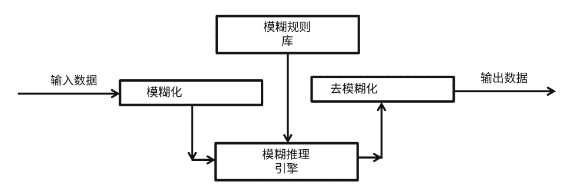

图3.33模糊逻辑通用推理系统

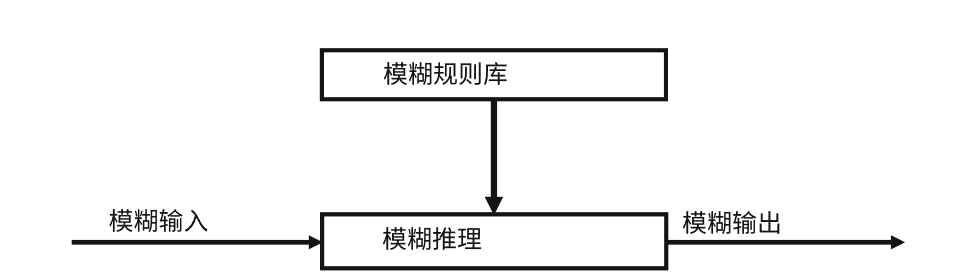

图3.34纯模糊系统

在最一般的形式中，即使输入在FL系统中是重要的数字，将其转换为口头不确定性的数字称为“模糊化”，并且系统如图3.33所示。可以同时看到模糊输入和FL规则库的功能，并在其输出中具有模糊特性。将这些模糊输出转换回数值的过程称为去模糊化。

### 3.9.7.1 纯模糊（Mamdani）系统

在任何模糊系统中，与经典对应物相比，应该有两个盒子而不是一个，就像经典系统中一样，因为系统描述不能仅通过数学方程或模糊逻辑命题来提供。这些盒子中的第一个代表模糊规则库集合，另一个用于触发或推断结果，称为推理引擎。因此，在下面的模糊系统中有四个盒子（见图3.34）：

### 3.9.7.2 部分模糊（Sugeno）系统

与前一个系统的不同之处在于它在规则基础的整体效果中涉及算术平均过程。概念系统模型如图3.35所示。

### 3.9.7.3 通用模糊系统

与之前的系统的不同之处在于输入通过模糊化单元进行模糊化，输出通过另一个单元转换为清晰形式，即去模糊化部分。因此，在概念模型中还包括了另外两个方框，如图3.36所示。

图3.37展示了两种不同类型的模糊推理系统，即最小化和产生式，以及触发集合。

### 3.10 去模糊化

去模糊化是模糊化的逆过程。 将单词描述符的输出模糊集合转换为实数。 如果需要输出一个数字供使用，则可能需要这样做。图3.38显示了两个规则的代表性模糊结果。尽管有不同的去模糊化方法，但在实际应用中通常使用相当简单的方法。 直观上，模糊化和去模糊化是可逆的。 如果要进行去模糊化，这会对用于将输入变量模糊化为推理过程中使用的模糊集合的MF形状产生影响，最终导致输出模糊集合的去模糊化。

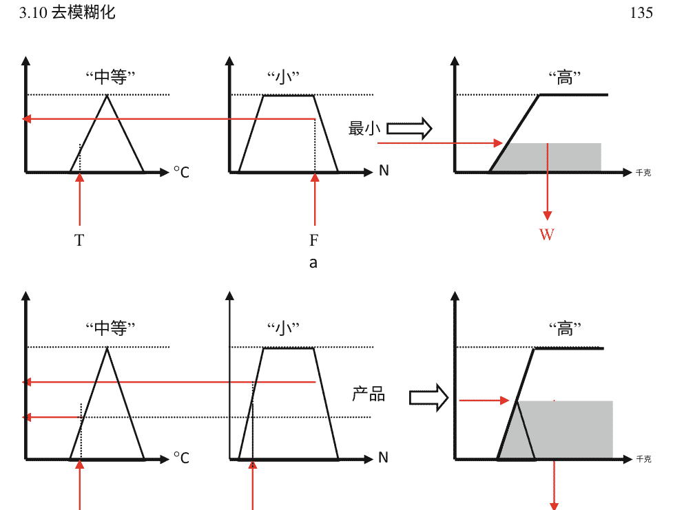

图3.37 模糊规则触发和推理（a）最小化，（b）乘法

更一般地，MFs被定义为输出模糊集，并使用去模糊化命令。 对于模糊控制，有许多去模糊化过程可供选择，但是模糊推理应用通常可以满足少数选项 (Ross 1995)。

MF的最佳形状取决于其用途。如果最终输出是非数值的，具有相邻函数和最大重叠的平顶MF通常是最好的选择。另一方面，如果需要数值输出，通常最容易处理的是在半满置信度处相交的峰值函数。

模糊集的去模糊化过程需要知道与每个模糊集成员对应的代表值。 每个模糊集成员的代表值乘以该成员的程度，乘积之和，再除以MD的总和。代表值选择的选项有平均最大（max）方法和中心方法。

或者，规则可以被写成实现几乎任何期望的去模糊化方案。 至于在去模糊化时模糊的数字，输入模糊集的MF应该通常在半满置信度处达到峰值并相交。

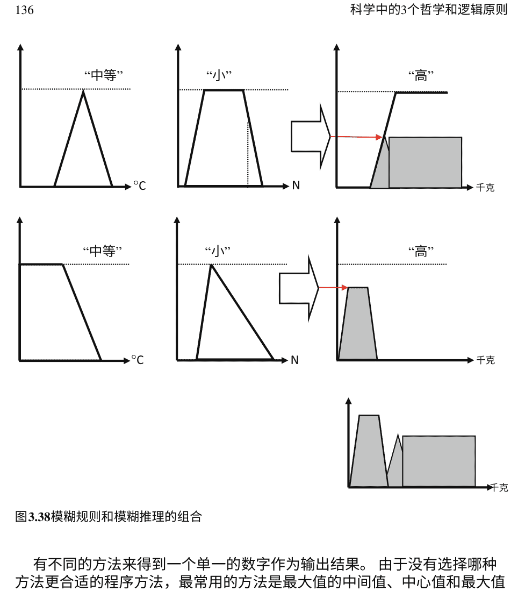

图3.38模糊规则和模糊推理的组合

有不同的方法来得到一个单一的数字作为输出结果。由于没有选择哪种方法更合适的程序方法，最常用的方法是最大值的中间值、中心值和最大值。

在图3.39中作为不规则形状的最终结果后，近似推理算法的最后一步是去模糊化，即选择输出变量的精确值。在Mamdani模型中，模糊推理算法得到一个具有可能的数值值的输出模糊集。去模糊化将这些信息压缩成一个输出值。

在大多数应用中，建议科学家们查看各个变量值的MD，并根据其中一个标准选择其中之一“最小最大值，”“最大最大值，”“重心，”“最大值范围的平均值，”等等。根据手头的问题，甚至可以自己做出选择例如，在经济危机研究中，最终模糊集的最小部分可能被接受为输出。

图3.39 最大-最小合成的去模糊化

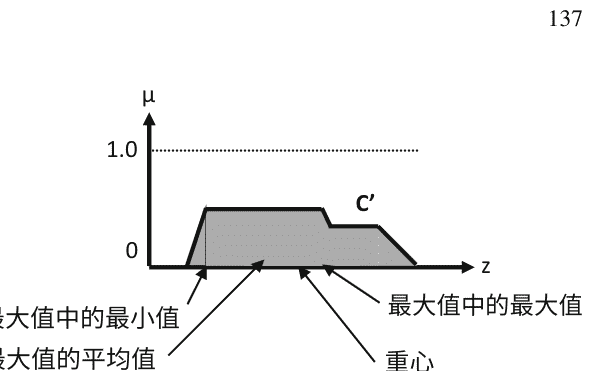

在图3.39的近似推理中，模糊化结果按升序排列，将是“最大值中的最小值，”“最大值的平均值，”和“重心”和“最大值中的最大值。”

去模糊化会导致大量信息丢失。因此，在任何工作中，建议科学家考虑一些其他属性。

除了形式上的澄清方法，还需要考虑最终的组合模糊集。在经典专家系统中，规则仅来自人类专家。然而，在模糊逻辑的基于规则的系统中，规则的生成是通过专家意见和数值数据共同完成的。通过模糊概念和系统，可以将仪器记录的数值数据与专家揭示的语言信息相结合。

模糊模型的开发需要多次迭代，第一步定义规则集和相应的输入和输出MF。执行模型后，将结果与已有的输出数据进行比较，根据需要对MF或规则进行修订，以进行必要的训练和纠正。然后，按顺序对模型进行修正，包括规则和/MF等，以进行进一步的训练和验证。可以将模型构建过程分为两个连续的部分，训练和估计。在训练阶段，完成了先前提到的MF或基于规则的更改。在估计阶段，将输出值与现有数据进行交叉验证，如果需要，将应用MF或规则基础的调整。模糊逻辑专家系统甚至可能不需要用于模型构建的数据，包括MF分配和基于规则的制定。这个阶段完全是逻辑的，被称为专家意见阶段。简而言之，模型的开发可以总结如下：

1. 除了模糊逻辑规则库之外，专家知识被用来构建模型结构，包括相关的输入和输出变量。在模型构建中，这一步骤不需要任何数据，因此被称为逻辑步骤。应该使用相关实验的数值数据来检验这个模型。
2. 数值数据在训练和测试阶段分为两部分处理。现有的数据集可以启发性地分为两部分。在许多研究中，建议将大约70%的数据作为训练数据，30%作为测试数据，本书也是如此。在训练阶段，根据上述设置MF和规则库。通常，一些规则会被删除，因为它们可能不会被现有数据触发；一些规则可以合并，如果它们产生相似的输出；还有一些规则可以被修改。

3. 在测试部分，观察模型交叉验证与预测误差。例如，可以根据最小二乘法进一步调整MF和规则库以实现误差最小化。如果总体预测误差小于10%，或者最好小于5%，则采用该模型进行预测。

图3.40展示了两种不同类型的加权平均澄清方法。首先使用隶属度，然后使用每个模糊子集的面积作为权重。

## 3.11 结论

本章的主要关注点是清晰和模糊逻辑词语、短语和集合的基本方面，这些是人工智能建模研究中的重要部分。创新教育系统中的哲学和逻辑定义、概念以及它们在浅层学习和深度学习语言建模规则中的合理含义提供了第一阶段。如果将现有的科学表达式、方法论、算法和模型视为改进知识内容的候选项，则知识获得科学外衣。详细解释了演绎、归纳、类比及其混合作为合理思维模型和近似推理。两个互斥的寻求有理关系的原则被赋予人类，即比例关系（直接或间接）和形状（线性或非线性），这是真主（上帝）的恩赐。解释了哲学和科学哲学之间的区别，以及每个概念的有效分支。通过图表和数值示例讨论了清晰和模糊逻辑原理的合取词（AND; OR; NOT）和逻辑句子结构，如IF....THEN.... 命题。

根据本章所描述的内容，它为读者提供了发展生产力和分析思维能力的工具。

## 参考文献

> Aydin AC, Tortum A, Yavuz M (2006) 使用自适应神经模糊推理系统预测混凝土弹性模量。 土木工程与环境系统23 (4) : 295-309
Bezdek JC (1981) 具有模糊目标函数算法的模式识别。 普列纳姆出版社，纽约

> Dimitrov V, Korotkich V (eds) (2002) 模糊逻辑：新千年的框架。Physica Verlag, 海德堡
Dunn JC (1973) ISODATA过程的模糊相对关系及其在检测紧凑且分离的聚类中的应用。J Cybernetics 3: 32-57
Fraile-Ardanuy J, Zufiria PJ (2007) 基于神经模糊网络和遗传算法的自适应电力系统稳定器的设计和比较。 Neurocomputing 70: 2902-2912
Heisenberg W (1927) 关于量子力学的直观内容的论述。Z Phys 43: 172-198

> Iphar M, Yavuz M, Ak H (2008) 通过自适应神经模糊推理系统预测露天矿山爆破引起的地面振动。 环境地质学。 [https://doi.org/10.1007/s00254-007-1143-6](https://doi.org/10.1007/s00254-007-1143-6)

> Jang JSR (1993) ANFIS: 自适应网络模糊推理系统。 IEEE Trans Syst Man Cybern 23:665–685。 [https://doi.org/10.1109/21.256541](https://doi.org/10.1109/21.256541)
Jang JSR, Mizutani E (1996) Levenberg-Marquardt方法用于ANFIS学习。 在北美模糊信息处理学会双年会上—NAFIPS, 第87–91页
Kilwardby R (2015) Notulae libri Priorum, Ed. And trans. Paul Thom和John Scott Oxford
Kuhn TS (1962) 科学革命的结构。 芝加哥大学出版社，芝加哥
Lorenz, E. N., (1972). 可预测性：巴西的一只蝴蝶扇动翅膀是否会引发德克萨斯州的龙卷风? 美国科学促进会第139次会议, 12月29日

> Poinsot J (1955) 约翰·圣托马斯的物质逻辑：基本论文。由约翰·J·格兰维尔、G·唐纳德·霍伦霍斯特、伊夫·R·西蒙编辑。由约翰·J·格兰维尔、G·唐纳德·霍伦霍斯特、伊夫·R·西蒙翻译。芝加哥大学出版社，芝加哥
Popper K (1955) 科学发现的逻辑。 Routledge, 纽约, 第479页
Reddy MJ, Mohanta DK (2007) 数字继电保护的小波神经模糊组合方法。 Int J Electr Power Energy Syst 29:669–678
Ross TJ (1995) 工程应用中的模糊逻辑。Addison Wesley

> Singh TN, Kanchan R, Verma AK, Saigal K (2005) ANN和神经模糊的动态常数预测的比较研究。 J Earth Syst Sci 114(1):75–86
泽恩 Z (2004) 水科学中的模糊逻辑和系统模型。 土耳其水基金会，伊斯坦布尔
泽恩 Z (2006) 讨论“应用模糊理论和遗传算法插值降水”。
J Hydrol 331:360–363
Şen Z (2007) 讨论 “Takagi–Sugeno模糊推理系统用于建模阶段-流量关系 ”. J Hydrol 337:242–243
Şen Z (2014) 工程中的哲学、逻辑和科学视角。 Springer, 海德堡, 第260页

> Zadeh LA (1965) 模糊集合. Inf Control 12:94–102
Zadeh LA (1973) 复杂系统和决策分析新方法概述。 IEEE Trans Syst Man Cybern 2:28–44

> Zadeh LA (1999) 模糊集合作为可能性理论的基础. Fuzzy Sets Syst 100:9–34.https:// [doi.org/10.1016/S0165-0114(99)80004-9](doi.org/10.1016/S0165-0114(99)80004-9)

> Zio E, Gola G (2008) 一种用于故障诊断的神经模糊技术及其在旋转机械中的应用. Reliab Eng Syst Safety. [https://doi.org/10.1016/j.ress.2007.03.040](https://doi.org/10.1016/j.ress.2007.03.040)

## 第四章
不确定性和建模原则


### 4.1 一般

关于自然现象，已经进行了很多讨论和好奇，其中包括地球、大气和物理科学之间的不确定性比较，这不可避免地导致了自然和工程建模方面的确定性和不确定性问题（Leopold和Langbein 1963; Krauskopf 1968; Mann 1970a, b）。在科学理论和研究的核心是绝对不确定性的“因果关系”概念（第3章）。根据科学的现代哲学家波普尔（Popper 1955）的说法，

给出某个事件的因果解释意味着从两种前提中推导出解释该事件的陈述：一些普遍定律和一些特定或具体的陈述。我们可以称之为某些初始条件。

因果解释（逻辑命题）的前提和结论之间必须有一种非常特殊的联系，并且必须是演绎的。这样，结论必然从前提出发。在任何数学公式之前，前提和结论都由口头（语言）陈述组成。演绎论证的每一步都必须通过引用关于输入和输出变量之间关系的逻辑规则来证明。另一方面，“法律”概念对演绎解释以及我们对事件的知识的精确性至关重要。

最近，方法论的科学演变表明，随着研究人员试图澄清他们兴趣领域的界限，它们与其他研究领域变得更加模糊。例如，当气候学家试图将气候变化影响建模为人类面临的现代挑战之一时，他们需要有关地下水补给的气象和大气条件、含水层的地质环境以及社会条件的信息。因此，许多共同的哲学、逻辑基础、方法论和方法在不同学科中变得共同，并且数据处理是可以应用于各种学科的最重要的主题之一。 地球、环境、大气和工程学科的问题形式各不相同，但解决算法可能涉及相同或至少相似的过程。 各种研究小组可能提出的一些常见问题如下所述。 这些问题中的许多已经由约翰斯顿（1989年）阐明。

任何自然现象或类似事件在一个地区广泛发生，因此在不同地点的记录或观察引发了一些问题， 例如，各个地点的现象之间是否存在关系？ 在这样一个问题中，时间似乎被冻结，研究了问题现象在田野和地点之间的行为形成 。对这个问题的回答可以用语言、主观和模糊的术语来描述，即使非专家也能理解。 但是它们的量化需要客观的方法，这也是本书的一个目的。 在地球、环境、大气科学和工程学中，可以在研究开始时提出另一个问题，即地点在现象发生方面是否不同？ 这些问题是许多人对这个主题感兴趣的源泉。

任何科学思想的基础都包含各种不确定性，可以广泛地分为语言和数字形式。 在社会、金融、文化、宗教、科学、行政和日常生活的许多方面，每个人都面临着语言歧义。 这种不确定性使生活充满活力、活跃和繁荣。 因此，每个人都有与个人当前生活一样多的不确定性世界。 这种不确定性通过减少先前信息源中的不确定性量并导致新的未来不确定性领域或正在讨论的问题的知识产生，可能会伴随其他不确定性源，包括概率。 可能性是用来描述口头不确定性、不精确、怀疑和不完整信息的术语。 在日常生活中会遇到一系列的不确定性。 例如，非常常见的问题

“你好吗？”将人置于语言歧义之前，现成的答案很少是确定的，甚至回答“我很好”可能会被问题理解为“真的吗？ 或者“你确定吗？”等类似的问题。 另一个例子是“明天天气会怎样？”这个问题可能含糊地等待着像这样的回答，“天气会很好，”“可能会下雨，”“天气会有些多云，”还有很多其他的选择。

如果一个人思考他日常使用或遇到的句子，他就能理解语言歧义的含义。 根据日常生活，任何语言中都有许多词的反射。 例如，在英语中，诸如“慢慢地，”“几乎，”“大约，”“多多少少，”“相当多，”“也许，”以及类似的表达方式都表达了言语的模糊和问题，回答，短语，暗示，句子，因此根据问题的背景可以直观地理解其中的不确定性。 尽管语言的歧义无处不在，但在相关情况下总是存在未知和某些已知的限制。 阴天有两个极端，多云和晴朗，所有其他类型的分类或描述都介于这两个极端之间。 因此，正如本章后面将要解释的那样，如果在这两个极端之间添加一些逻辑数值，其他数值必须在这两个添加之间。

| 表4.1 确定性-不确定性 | 现实（不确定性） | 科学Ⅱ抽象（确定性） |
| --- | --- | --- |
| | 复杂性 | 同质性 |
| | | 各向同性 |
| | | 异质性 |
| | | 均匀性 |
| | 混沌 | 同质性 |
| | 非线性 | 线性 |
| | 湍流 | 各向同性 |

读者可以从自己的日常生活中提出许多语言不确定性的例子。即使今天所有的不确定性都以数值不确定性的形式存在，但仍然存在语言上的不确定性。

在这个阶段，可以说语言的歧义是无法完全避免的，这是一个重大问题。可以说科学并不揭示绝对真理，因此其结果是由于不确定性而被讨论的。在经典科学研究中，通过一系列假设来避免语言的歧义，就像表4.1中所示。在经典科学研究中，通过一系列假设来避免语言的歧义，就像表4.1中所示。

除了语言的歧义性外，还存在着数值的歧义性，这主要由科学家、工程师和许多其他职业在精确设计中用于量化和尺寸概念。一些语言上的不确定性在上下限约束方面是开放的，但其他则暗示了不能精确确定的近似数字。

本章的主要目的是提出数值不确定性的方法论，以模拟任何类型（社会、经济、工程等）的不确定现象。为了将不确定性技术用于任何建模或设计目的，必须建立在逻辑基础上的四个基本算术运算（加法、减法、乘法和除法）。这些算术运算的基础是逻辑运算，如与运算、或运算和非运算，称为逻辑运算符（第3章）。因此，再次确认每个运算都有一个语言基础，然后数值字符在实际应用中变得重要。如果一个人在面对问题时不理解语言上发生了什么，那么唯一明显的处理这类问题的方式就是通过数值解来进行数学公式推导，这是非常受限制的理性和生成性思维的使用，但通常几乎是盲目推导出的配方，可能不需要产生可行的解决方案。工程教育关注清晰的表达，尤其是在没有进一步考虑语言信息的模糊来源的情况下进行公式化。

在科学研究和应用事务中，存在许多情况下的不确定性问题。在这一点上，Poincare在Ruelle（1991）中引用说

> 一个我们无法察觉的非常微小的原因决定了一个我们无法忽视的相当大的效应，我们会说这个效应是由于偶然性。

如第3章所述，在基于清晰逻辑的整体系统中，存在着简单性、复杂性、确定性和偶然性，这些可以通过个体测量进行量化，但它们的测量序列在大多数情况下会产生不确定性。在科学的任何分支中，往往不是采用分析和确定性方法，而是研究人员只能通过数据测量序列来进行科学合理的估计、预测和预测，这些方法必须通过一些经验性的不确定性方法来推导。可以尝试在一系列限制性假设、理想化和线性化概念之后解决所面临的问题，但由于误差百分比较高，结果可能无效。模型不确定性包括偏差、差异、近似、对基本问题的了解不足、模型与现实之间的差异以及由于模糊值和实验不可控性而导致的参数估计不确定性。几乎任何复杂问题都有相应的软件，但模型参数并不确定，因此大部分时间应用者通过参数优化或任何方式进行模型输出的调整以适应记录的测量结果。编写复杂的数学模型软件可能存在算法不确定性源。在现场或实验室的实验工作中，由于观察、测量和不确定性的误差，总会存在实验不确定性。

通过理论概率分布函数（PDF）在区间内可以评估测量或模型数值输出的模糊性。通过误差带可以实现与测量结果的比较，误差带可以用均方根、估计标准误差和百分比相对误差限（±5%或±10%）来表示（Benjamin和Cornell 1970年）。

广泛使用的箱线图基于四分位距上的正态（高斯）PDF，包括中位数和异常值（Spear 1952年；Tufte 1983年）。

概率、统计和随机建模过程提供了在一定误差限内的不确定性数据集的客观性。在应用这些方法之前，研究人员应该对所涉问题的科学哲学、逻辑和理性语言解释有所了解，并对预测和解释的论证有所认识（第3章）。由于固有的随机性，研究人员也可能无法预测具体事件（Mann 1970a，b）。例如，有限长度的时间序列应被视为来自所关注事件的随机样本，因此它们具有多个重复而不是唯一的绝对已知的行为特征。概率和统计工具通过百分比和有意义的参数（如算术平均值、标准偏差、偏度和峰度）从测量集中提取参数化信息。每个参数都与所关注现象的某种物理行为相关。因此，多个参数的收集提供了关于数据的时间或空间发生的深入信息。

本章的主要目的是提供概率和统计建模的基础知识，以及它们在不同科学背景下的使用，涉及不确定性的范畴。每种方法都以基本假设和示例进行介绍。鼓励读者从一些基本参考文献（Kendall和Stuart 1979; Maity 2018）中寻找更多信息。

在日常生活中，即使每个人都希望按照计划进行工作，他们会意识到日常工作的不确定性，因为面对意外情况，他们不得不改变自己的计划。其中一些不确定性的出现不在人的掌握之中。有时，人们会感觉到，如果稍微有些干扰，它会在程序的其他地方产生随机效应。我们中的许多人经历过这样的经历，我们的计划被认为是正式（系统化）的，但由于自然和社会事件的干扰，我们甚至遭受了财务损失。从某种意义上说，生活充满了不确定性。谁能保证我们开车时不会遇到事故？无论我们在交通中多么小心，充分考虑和意识到，如果其他人不小心，不遵守交通规则，我们有50%的机会不发生事故。在可能发生的事故中，有一半的危险是保持安全甚至失去生命。在交通中的每个司机都可能感到自己可能会卷入事故中，就像一个迷失在玩家一样。在交通系统良好、司机们试图通过理性和逻辑遵守规则的国家，这个比例向安全方向倾斜，危险率降低。例如，可以转化为95%的安全状态。无论司机和交通规则多么规范，降雨、温度、雾、气象事件、道路湿滑、道路修复、行人或动物穿越道路以及意外的不确定性情况可能会突然发生。

在日常生活中，家庭账户与市场不匹配的事实证明了人们生活在一个不确定性的环境中。不确定性方法的使用延迟是因为人们不愿意学习和应用以不确定性形容词开头的方法，并且如果结果得到的话，结果也不完全可靠。总的来说，在许多社会中，不确定性原则和概率的表述都受到了怀疑。后来，人们意识到不确定性方法的结果更加普遍，并且它们的平均值给出了通过具体方法找到的结果。因此，用客观的数学语言表达了在应用具体方法后可以计算出结果的误差有多大。

在过去的一个世纪里，几乎所有的科学革命都包括了不确定性原则和由此产生的方法。例如，在二十世纪末，当物理学家想要通过说从现在开始物理学没有什么可做的了，一切都可以用牛顿和爱因斯坦的原则和定律来解释，这些都是确定性的方法时，研究分子和亚原子结构的物理学家得出结论，确定性方法无法描述这些事件。他们的到来引起了物理学家的不安。在接下来的几年里，量子物理学出现了，彻底改变了传统的经典物理学，即牛顿和爱因斯坦的物理学。正如第3章中提到的，海森堡（1927）指出，如果人类存在，无法同时测量亚原子粒子的位置和速度而不产生误差。因此，物理学变得不确定，然后，量子物理学基于概率和统计等不确定性方法。

在不同的学科和研究中，概率方法可以回答不同的问题。在这里，我们不可能知道和写下所有可以用概率原理回答的问题。以下是其中一些。然而，读者可以根据自己的主题决定与其相关的可能性事件，并利用本书中的方法。

- (a) 通过概率计算评估与各种运气相关的事件和预测。例如，每场比赛获胜的概率是多少？为了不受伤害，一个人应该继续游戏多长时间？
- (b) 保险公司最关心的问题是了解它所处理的事件的危险（风险）有多大，以便可以相应地向客户要求付款。危险（风险）一词从字面上讲是一个概率陈述。
- (c) 预计价格会在多长时间内出现波动？某些期望的概率是多少？
- (d) 一个地区可能发生地震的概率以及震级是多少？这些可能事件相隔多少年发生一次？
- (e) 在高交通量的高速公路上，特定公里数之间发生事故的概率是多少？
- (f) 天气预报的误差限度是多少？明天下雪的概率是多少？
- (g) 在进行石油勘探时，如果之前有钻过的油井，决定下一个井应该在哪里仍然存在不确定性。确定下一个井是否会干井还是湿井存在不确定性。
- (h) 对电子信号中的干扰或噪声所产生的干扰振荡进行数字化处理。
- (i) 确定农业天气明天是雨天还是晴天，以及必要时雨期有多少天。
- (j) 在开放海域建造的石油平台在一定时期内可能遭受的风和浪的次数以及倒塌的危险（风险）是多少？
- (k) 能够决定具有两个或更多选项的事件，哪一个会在一段时间内导致可能的期望结果。
- (l) 在机场设计中利用随机风测量来确定跑道的方向和长度。
- (m) 污染物浓度的引入河流会根据流量的多少而变化。在这方面，尽管工业排放的污染物数量保持不变，但浓度根据流速和降水量的多少会随机变化。乍一看，人们会想到在大流量期间会引入大量污染物到河流中。

在这方面，不确定的降水和径流测量被用来调整污染物浓度。

确定湖泊中有多少鱼种的确定性数学模型是无用的。概率计算被用来近似计算这个问题。

为了衡量不仅是算术平均值，还有多少波动在其中，需要制定一些标准，这些标准适用于随机和不确定的调查，就像上述事件一样。

本章的目的不是详细介绍概率理论，而是为读者提供洞察力，以便掌握推理和逻辑规则，以及如何构建自然和社会事件的概率模型。详细信息由 Sen (2002) 提供。

### 4.2 百分比和概率原理

百分比的概念为人所熟知，许多比较、预测、赌博、游戏都围绕着这种理解展开，因此最终的产品或结果以百分比表示。它反映了某个数量与某个确定或已知数量的比例；这是某个定性规格数量与相同规格总量的比率。问题总是“在给定或已知的总体或人口中，某种质量的百分比是多少？”例如，“伦敦大学的土耳其学生百分比是多少？”“你儿子在伊斯坦布尔大学入学考试中成功的机会是多少？”“明天下雨的概率是多少？”这些问题中的每一个都可以根据目的以语言或数字方式回答。如果主要目标是进行更多计算或在数值建模技术中使用百分比信息，则答案应以百分比形式给出。否则，相同的问题可能有口头回答，但接收者可能会主观地或基于专家意见添加百分比值。伦敦大学的土耳其学生百分比可能是“非常低”或数值上的0.05%（0.05%）。当然，数值回答更客观，不留下太多解释的余地，但是“太低”的口头回答本身就包含了歧义。在数值回答中，答案反映了伦敦大学的土耳其学生百分比水平，但口头回答存在两个不确定性来源：语言不确定性和其主观转化为数值不确定性。百分比可以定义为某物的一部分与其总体的比例。根据最后一句话，百分比可以定义为任何形状及其部分，如图4.1所示。每个标有T的白色形状表示变化或集合的总面积，标有黑色的补丁是总面积内的尖锐子领域，因此黑色补丁小于总白色区域。

如果问题是每个白色区域中黑色斑块的百分比是多少，答案就是黑色区域与总白色区域的比值，这样的比值具有以下特性：

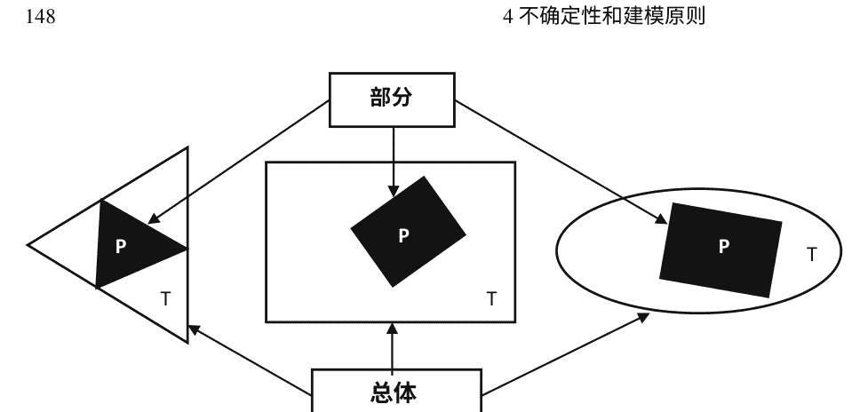

图4.1 总体和部分领域

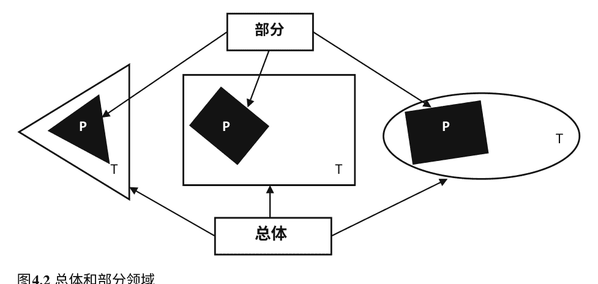

图4.2 总体和部分领域

- 1. 以这种方式定义的百分比取值范围在0到1之间（包括0和1）。
- 2. 无论斑块和领域的单位如何，它都是无量纲的。
- 3. 如果百分比保持不变，但黑色斑块在总体领域内的位置不同，作为容器的扩展是相同的。例如，图4.2中的百分比定义与图4.1中的百分比相同。

比较这两个图形可以看出，斑块区域在总区域内的位置对于百分比计算没有任何影响。
像补丁位置的等价性这样的属性可以称为等度性，因此有一个且仅有一个百分比，它与位置无关，但百分比随着补丁区域在总域内的增加（减少）而增加（减少）。

**例子1**

还要注意，百分比定义是相对于总域的。
在图4.1和4.2中，总面积内有两个子区域，黑色补丁子区域和剩余的白色子域；两者之和等于总面积。
如果这两个子区域中的任何一个被视为主要子域，那么另一个将成为补充域。同样，主要百分比和补充百分比也可以被定义，并且这两个子领域具有以下属性：

- 1. 这两个子域在边界上是清晰且精确的。
- 2. 任何一个子域中的任意点都不属于补充域。
- 3. 它们的总和等于总面积，因此百分比的总和等于1。
- 4. 这些发散和互补的子域被称为互斥子域。

在这些观点之后，可以推断出关于互补的两个子领域的以下陈述：

- 1. 任何子域的百分比等于从1中减去互补子域的百分比。
- 2. 两个互补子领域的总和等于总面积的概率，即等于1。

**例2**

现在是时候将两个互补子域推广到n个互补子域，它们是互斥的，但可以同时包含在总域中。这些一般的互补子域在图4.3中呈现。

这里有七个子域，它们覆盖整个域，由于任何部分中的任何点都不属于任何其他部分，因此子域再次是清晰且互斥的，并且所有七个部分都是互补的。每个部分都有总域的百分比覆盖，并且这些百分比的总和等于1。

**图4.3 补充和互斥子域**

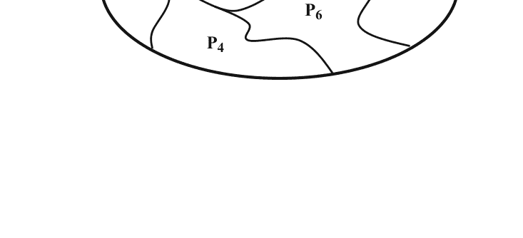

**图4.4 土地利用划分**

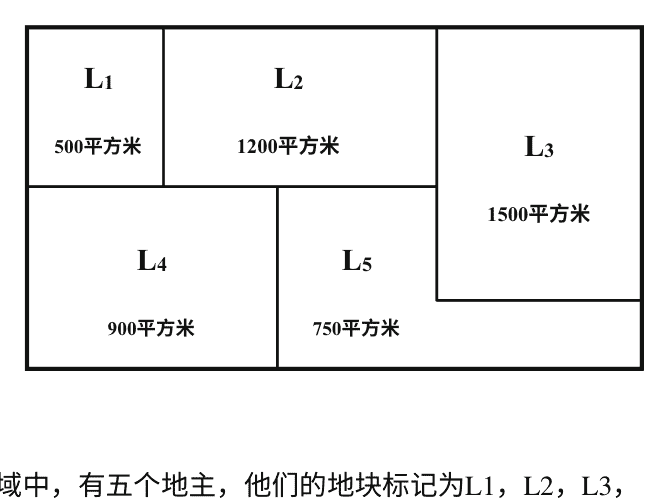

**例子3**

如图4.4所示，在一个区域中，有五个地主，他们的地块标记为L1，L2，L3，L4和L5，以及对应的面积（单位为平方米）。因此，计算每个地主的土地比例。总面积为4850平方米，因此比例分别为p1 = 500/4850 = 0.1031，p2 = 1200/4850 = 0.2474，p3 = 1500/4850 = 0.3093，p4 = 900/4850 = 0.1857，p5 = 750/4850 = 0.1545。这些比例的总和为1，在地块的边界上固定，并且在地块边界发生变化之前不会改变。然而，陆地是互斥的，这个特性使得百分比总和等于1。

**例子4**

下表显示了土耳其海峡伊斯坦布尔出口处的30个速度测量值。在必要的评论之后，找出超过和不超过120 mm/s的百分比。当前速度测量是不精确的，并且每次取样都会有所变化，从而存在由随机波动引起的不确定性。图4.5显示了速度随样本数量的变化，一眼就能看出其随机行为。如图所示，120 mm/s是一个确定的水平，对应于这个水平，所有的测量值现在都是不确定的，因为没有固定的变化趋势。如果当前速度被视为一个范围变量，那么下限和上限分别为3.6 mm/s和156.3 mm/s，如表4.2所示。现在的问题是根据前一节的解释来确定范围变量的类型。作为一个假设，基于表4.2中给出的测量值，可以说当前变量可以被视为一个闭合范围，意味着在任何建模或设计工作中都不会低于3.6 mm/s或高于153.2 mm/s。然而，考虑到测量中的不确定性，并记住自然界中相同位置的当前速度测量可能会随时间随机变化，更有意义的是基于开放范围的变量基础上工作，双手都可以创造出更低和更高的数值记录。这种方法需要更多关于如何处理不确定现象的方法论，例如当前速度测量。

**表4.2 当前速度测量**
| 样本编号 | 当前速度 (mm/s) | 样本编号 | 当前速度 (mm/s) | 样本编号 | 当前速度 (mm/s) |
| :---: | :---: | :---: | :---: | :---: | :---: |
| 1 | 30.8 | 11 | 88.7 | 21 | 116.8 |
| 2 | 18.8 | 12 | 116.1 | 22 | 83.7 |
| 3 | 3.6 | 13 | 85.1 | 23 | 126.9 |
| 4 | 23.3 | 14 | 144.0 | 24 | 138.4 |
| 5 | 53.5 | 15 | 133.7 | 25 | 113.0 |
| 6 | 51.1 | 16 | 122.6 | 26 | 137.2 |
| 7 | 34.1 | 17 | 128.2 | 27 | 153.2 |
| 8 | 59.5 | 18 | 95.5 | 28 | 122.6 |
| 9 | 98.0 | 19 | 70.1 | 29 | 122.6 |
| 10 | 76.5 | 20 | 137.9 | 30 | 128.9 |

另一方面，在120 mm/s的水平上，所有数据都可以被分类为较小和较大的数据，并且甚至可以定义每个类别中的精确数据值。为了计算百分比，只需要知道小于和大于120 mm/s的数据（而不是数据值）的数量即可。数据的总数为30，大于120 mm/s的数据数量为11，因此小于120 mm/s的数据数量为19。因此，如果数据大于120 mm/s的百分比为11/30 = 0.37，因此较小值的百分比是该值的补集，即19/30 = 0.63，这两个百分比的总和等于1。

值得注意的是，在计算百分比时，重要的不是它们的实际数据值，而是与给定水平相比的出现次数。因此，百分比可以定义为特定发生次数的比率。

### 4.3 概率测度和定义

尽管概率等同于日常使用的百分比，但实际上的问题是如何定义这个百分比。为了定义概率，需要对相同数据有不同的类别。任何概率研究中的基本问题是：某一类数据的百分比是多少？这个问题可以根据数据的可用性、概念模型、枚举和对现象的个人信念以以下三种方式回答。

#### 4.3.1 频率定义

这是最常用的定义，需要有测量数据的可用性；否则，无法使用。除了数据的可用性外，还应考虑特定数据值或设计数量。例如，给定数据集X_i (i=1, 2, ..., n) 和设计水平X_0，可以轻松进行经典概率计算。设计值的重要性在于它将给定数据分为两部分，即大于设计值的数据值 (X_i > X_0) 和其他较小的数据值。如果较大的数据值的数量为n_G，则可以计算百分比或概率p_G如下：

$$ p_G = \frac{n_G}{n} \quad (4.1) $$

同样地，第二类数据小于设计值的概率可以写成

$$ p_S = \frac{n_S}{n} \quad (4.2) $$

这个定义也被称为类的相对频率。众所周知，求和等于一 (p_G + p_S = 1)。除了两类之外，可能还有很多类，每个类的概率可以通过落入该类的数据数量与总数据数量的比率来计算。

#### 4.3.2 经典定义

这个定义基于现象的概念演变，即使没有数据可用，也可以定义百分比或概率。在这里，再次考虑现象的不同结果类别。例如，可以通过考虑这三个类别（火成岩、沉积岩和变质岩）来回答父岩石类型的概率是多少，即火成岩 p_I、沉积岩 p_S 和变质岩 p_M，每个概率均等于1/3。

再次，这三个类别的概率之和为1，如下所示：

$$ p_I + p_S + p_M = 1.0 \quad (4.3) $$

一般来说，概率的频率定义在数据量非常大时趋近于经典定义。

#### 4.3.3 主观定义

在主观解释中，概率被视为专家对现象发生的信念程度或定量判断。这对于未来几天的降水情况来说是有意义的百分比。因此，两个个体对于一个事件可能有不同的主观概率，而不一定都是错误的。然而，这两个人的偏好是相近的。他们的建议取决于他们对相关现象的长期经验。主观概率并不意味着个体可以自由选择任何数字并称之为主观概率。主观概率应与本章中的概率公理一致，因此应与这些公理所暗示的概率性质一致。

### 4.4 概率的类型

任何复合概率表达式都可以从这些基本概率定义中推导出来。对这些概率表达式的概念理解提供了它们之间的逻辑关系的导数。这样的关系在至少两个不同的事件或现象的情况下是可能的。

#### 4.4.1 共同概率

概率的基本定义与一个现象相关，但在实践中通常存在两个或更多事件。对这些现象的互补处理导致了一些常见的概率定义。如果两个事件表示为X_i (i=1, 2, ..., n_X)和Y_j (j=1, 2, ..., n_Y)，它们的联合概率可以根据p_XY的基本概率进行定义。然而，对于概率定义，需要为每个事件设置分类级别，分别为X_0和Y_0。每个事件可以分为两个类别，即(X_i > X_0)与其补集(X_i <= X_0)，以及(Y_i > Y_0)和(Y_i <= Y_0)。基于这四个基本类别，可以创建四个常见类别，即[(X_i > X_0), (Y_i > Y_0)], [(X_i > X_0), (Y_i < Y_0)], [(X_i < X_0), (Y_i > Y_0)]和[(X_i < X_0), (Y_i < Y_0)]。每对代表来自两个不同事件的常见类别，因此有四种不同类型的常见类别和概率问题。例如，事件[(X_i > X_0), (Y_i < Y_0)]的共同概率是多少？根据概率的经典定义，可以根据这个共同事件的数量n_XY给出答案。

$$ P(X_i>X_0,\ Y_i<Y_0) = \frac{n_{XY}}{n_X + n_Y} \quad (4.4) $$

#### 4.4.2 条件概率

它的定义也需要两个不同的序列，就像普通概率的情况一样。然而，问题不同，即给定另一个事件的分类的概率是什么。在前一小节中的符号表示的情况下，给定 (Y_i < Y_0) 的情况下 [(X_i > X_0) and (Y_i < Y_0)] 的概率是多少？这是 [(X_i > X_0) and (Y_i < Y_0)] 事件数量与另一个事件 (Y_i < Y_0) 数量的比率。在表达式 [(X_i > X_0) and (Y_i < Y_0)] 中，该数字是可以表示为 (X_i > X_0) 和 (Y_i < Y_0) 同时发生的事件。如果 (Y_i < Y_0) 是事件的数量，则条件概率被定义为

$$ P(X_i>X_0|Y_i<Y_0) = \frac{n_{(X_i>X_0) \text{ 和 } Y_i<Y_0}}{n_{(Y_i<Y_0)}} \quad (4.5) $$

#### 4.4.3 边际概率

这也是基于至少两个事件，并且问题是，在完全考虑另一个事件时，一个事件类的百分之多少发生？这相当于说，无论其类别如何，类别（X_i > X_0）的边际概率在整个Y事件发生期间都会发生。因此，符号上，这个边际概率可以写成

$$ P_{(X_i>X_0)/Y} = \frac{n_{(X_i>X_0)}}{n_Y} \quad (4.6) $$

### 4.5 概率公理

如图4.6所示，样本空间及其组成事件没有任何数值标签，但可以通过数字、概率公理和它们的含义建立关系。

样本空间中事件之间的相对连接规则是从逻辑考虑中推导出来的，基本上有三个概率的逻辑公理。这些公理可以粗略地陈述为

- 1. 事件的概率不能为负数。
- 2. 样本空间的概率，即复合事件S的概率，等于1。
- 3. 两个互斥事件中任意一个发生的概率是它们各自概率的和。

这些公理是概率数学构建的逻辑基础。从这些基本公理可以推导出概率的所有数学性质。这些数学性质中的许多将在本章后面介绍。概率解释在工程、地球、环境和大气科学中被认为是可接受和有用的，就像量子物理学中电磁辐射性质的粒子-波二象性一样。

**图4.6 维恩图**

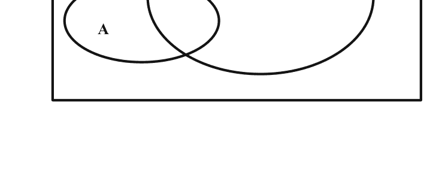

Venn图是几何上展示事件概率非常有用的工具。图4.1中样本空间的面积被认为是一个无维度的单位，即1，根据第二公理。另一方面，第一个公理说没有场可以是负的。最后，第三个公理说非重叠部分的总面积是这些部分面积的总和。一组数学概率性质从这些公理中逻辑上得出。所有这些特征都可以用Venn图来可视化。

#### 4.5.1 概率依赖和独立性

任何工程、地球科学、大气或环境变量的过去或未来值通常与其当前值具有统计依赖关系。依赖性可以定义为同一变量连续事件发生之间的顺序效应的存在。在正（负）依赖的情况下，变量的大值往往后面跟随相对较大（小）的值，而同一变量的小值往往后面跟随相对较小（大）的值。在大多数地球物理事件中，这种沿时间轴的依赖关系是正的。

例如，如果今天的温度高于平均值，预计明天的温度也会高于平均值。

为了评估任何事件的序列依赖性，需要估计类型为P（当前事件/上一次事件）的条件概率，其中/表示“给定”。这种类型的依赖系数已经被定义为 Sen (1977年)。重新排列方程中的条件概率表达式，得到两个事件E1和E2的以下一系列方程：

$$ P\{E_1 \cap E_2\} = P(E_1/E_2)P\{E_2\} = P(E_2/E_1)P\{E_1\} \quad (4.7) $$

如果一个事件的发生不会影响另一个事件的概率，则称这两个事件是独立的。

为了量化概率，例如，如果在相同条件下观察到一个事件重复n次，并且观察到该事件发生n_i次，则该第i个项目的概率，称为相对频率，通过将频率除以项目数来获得，发生的概率P_io计算如下：

$$ P_{io} = \frac{n_i}{n} \quad (4.8) $$

这种定义的比率范围从零到一，永远不会是负数。这些值被称为事件的百分比、相对频率或概率。这些比率构成了概率论的基础。同样的事件不发生的概率计算为（百分比）

$$ P_{in} = 1 - \frac{n_i}{n} \quad (4.9) $$

在这里 P_in 被称为概率的补集，P_io。事实上，通过求和方程 (4.8) 和 (4.9)，得到以下简单的表达式。

$$ P_{io} + P_{in} = 1 $$

在本节中，我们尝试通过百分比权重找到事件的相关概率，即确定类元素之间优先级的数字。为每个项目提供这些权重的数字被称为该项目的概率标准。

概率使由机会引起的事件能够进行科学解释。尽管概率原理的物理基础非常有意义和合乎逻辑，但在进行计算时需要谨慎。为了更好地说明可能性，让我们考虑以下简单问题。明天出门时是否应该带伞？为此，需要假设有一定的降水量，例如90%的概率。因此，在有90%降水几率的情况下，会带上伞。在这种情况下，没有降水的概率（补集）为10%。我们日常生活中的这些固定百分比总是帮助我们做出一些决策。通常，概率被表示为0到100之间的数字。在数学中，这个数字必须在0和1之间。其中，概率为0意味着事件不可能发生，概率为1意味着它将发生。然而，如果一个事件的概率落在这两个确定的极限值之间，就存在不确定性。例如，可以理解到具有0.000001概率的事件可能会发生一次在一百万次中。

在开始时，有三个不同的定义，它们彼此独立，可以根据情况应用于每个元素的概率数。其中第一个是概率的经典概念。

在这里，事件的后果被称为有限数量的元素。例如，湖中存在七种不同类型的鱼，表示每种鱼有七种可能性（选项）。这七个元素（状态）之间的发生率为1/7。因此，可以理解每个七个项目的概率可以取1/7。考虑到这一点，概率的经典定义是被认为是所考虑项目数与总项目数的比率。概率的三个基本特征在第4.4节中通过三个陈述的项目中提出。

在给定湖泊中的鱼类物种的例子中，每个项目（1/7）的概率值是相等的。这意味着每次捕捞到一种物种（项目）与其他物种的出现没有优势；它们是等可能的。然而，在经典概率中，项目之间并不总是不同的。例如，湖中的鱼类物种非常相似，2和3种物种被表示为2。如果4、5和6种物种被表示为3，7被表示为4，那么一开始就有四组完全不同的鱼类物种从七种物种中被认为是不同的。

$$ T = \{ 1, 2, 2, 3, 3, 3, 4 \} $$

换句话说，这个集合中有四个不同的元素。让我们来研究一下对于这样一个湖泊，经典概率值是固定的。由于湖中有七种鱼类，总数等于7。然而，这些面所代表的元素是4个。在不同时间钓鱼后，1的比率是1/7，2的比率是2/7，3的比率是3/7，最后，4的比率是1/7。与前面的例子相比，虽然有七种鱼类，但概率值已经改变。这三个属性列出的上述内容没有改变，概率之和仍然等于1。从中可以得出的结论是，为了计算经典概率，必须知道可能性的数量和元素的数量。一般来说，经典概率被定义为物品数量与可能性数量的比率（参见公式4.8和4.9）。为了进行经典定义，必须准确地知道概率，这对于自然事件来说是不可能确定的。可能性的数量可以是无限的。经典概率定义适用于有限集合。自然事件的可能性是无限的。例如，将一个地方的降水量表示为小数而不是离散数，就无法基于点概率进行经典概率定义。在这里，必须对概率计算进行新的定义。

实验的所有可能结果的集合被称为该事件的抽样集。在这些结果中，其中一个被称为该集合的元素，这个元素被称为样本。因此，可能性的集合被称为事件的样本集。在实践中，以往年份的降水或任何事件的记录构成了该事件的总体的一个例子。降水是一个包含最小降水量P_s和最大降水量P_b之间所有数字的无限集合。为了在应用中使用这样的集合，它们必须被划分为有限数量的子范围。方程（4.8）定义的比率再次是概率的定义，在实践中经常使用，被称为概率的相对频率定义。这个定义将成为确定随机变量的统计特性的基础，将在本章的后面部分中看到。

为了能够对上述可能性进行定义，需要有数值数据。然而，通过对事件的经验，可以预测将来相同事件发生的概率，即概率。对于某个主题有丰富经验的专家可以对与该主题相关的事件的概率值表达自己的观点。这样，由人们的经验和观点确定的百分比是主观概率，在实践中也被广泛使用。

#### 4.5.2 概率假设

如果一个主要的样本空间S和该空间中事件A的概率用P(A)表示，它必须符合以下假设：

- 1. 对于每个事件，0 < P(A) < 1。
- 2. 全集的概率等于1，因此P(S) = 1。

## 3. 如果事件A和B是不相容的，也就是说，它们是两个互斥的事件没有共同的元素，那么，

P(A和B) = P(A) + P(B) (4.11)

因此，互斥事件的概率是相加的。为了证明这一点，让我们观察一下实验被重复进行了n次，考虑到概率的相对频率定义，结果是，事件A和B发生了n₁和n₂次。根据n次重复实验的相对频率定义，不相容的组合事件A和B发生了n₁+n₂次：

P(A和B) = (n₁ + n₂)/n = n₁/n + n₂/n = P(A) + P(B) (4.12)

两个事件不能在同一时间和地点共存的属性是有效的。在相容事件的情况下，这个表达式是无效的。就像等式(4.12)一样，可以为一组不相容的事件（如Aᵢ (A₁, A₂, ..., Aₙ)）写下以下表达式：

P(A₁和A₂和...和Aₙ) = n₁/n + n₂/n + ... + nₙ/n (4.13)

在这里，n₁，n₂，...，nₙ是每个事件发生的次数。

在概率计算中，除了不相容事件的概率和规则之外，还有一个乘法规则。如果事件彼此独立，乘法规则是有效的。例如，如果还有一个与事件A同时发生的B事件，如果它们不会对彼此产生物理影响，即它们完全独立，那么它们同时发生的概率表达式如下：

P(A和B) = P(A)P(B) (4.14)

如果有一系列事件，它们彼此完全独立，那么它们的共同概率可以表示如下：

P(A₁ 和 A₂ 和 ... 和 Aₙ) = P(A₁)P(A₂)...P(Aₙ) (4.15)

## 4.6 数值不确定性

不确定性包括概率论、模糊逻辑、随机集合论、粗糙集、灰色系统等。关于每个不确定性原则的边界存在很多重叠甚至混淆，许多人认为边界是精确的，但本书并非如此。当然，作者的观点并不意味着它们是可验证的，但如果有更好的改进方向，它们是可以被证伪的。

（第三章）。每个工程师和建模者都应该考虑到精确解决方案是不可能的，因此，结果需要从不同的角度进行质疑。例如，“安全系数”的概念消除了哲学问题进入工程研究的可能性，更多地是一种“无知”的因素；无知是指将所有责任都归咎于这个因素而不再深思熟虑。

在不确定性领域中寻找解决方案。

### 4.6.1 不确定性定义

作为一个通用术语，“不确定性”有很多不同的含义，专家们对此有不同的理解。根据一些人的观点，它是一堆完全未知和不可预测的信息，对于其他人来说，由于人们信息和知识的不完全，它总是存在的，没有办法完全摆脱它。即使在日常生活中，个人对于相同现象的解释在很大程度上可能与他人重叠，但仍然存在差异，因此，这些差异可能不被他人理解，因此，仍然不清楚。专家意见的差异源于初始信息和知识是基于频繁观察和经验的主观概念。在科学活动中，总是有自己的公理、假设、定律和最终表述的哲学思想。通过牛顿经典物理学，可以说科学进入了一个几乎完全确定性的世界，其中甚至在科学知识中也不考虑不确定性。然而，如今几乎所有科学领域都存在不确定性因素，许多科学的确定性基础在随机、概率、统计学、混沌、分形、随机、量子和模糊推理方面变得不确定。另一方面，环境、大气、地球和社会科学等从未经历完全确定性的阶段。

不幸的是，决定论主导着世界上许多机构的教育系统。随着数值不确定性技术（如概率、统计和随机过程）的发展，定量建模在科学上取得了快速进展，但仍然忽视了只能通过模糊原理来解决的定性信息和知识来源（第3章）。

著名的哲学家和科学家解释了不确定性和模糊组成部分是科学进步的基础。例如，罗素

> (1924) 陈述：

所有传统逻辑通常假设使用精确的符号。因此，这仅适用于想象中的天体存在，而不适用于地球生活。

另一方面，当涉及口头和语言模糊概念时，扎德

> (1965) 说：

随着系统复杂性的增加，我们对其行为进行精确而重要的陈述的能力减弱，直到达到一个阈值，精确性和意义（或相关性）几乎成为互相排斥的属性。

在人类思维的演化过程中，前提包括不确定性的元素，如模糊性、不完整性、概率、可能性和模糊性。从心智思维过程中推断数学结构可能看起来是确定的，但即使在今天，由于科学发展的结果，人们认识到在微观尺度上的物理或机械建模的每个阶段，至少存在一部分不确定性，即使不是在宏观尺度上。今天清楚地认识到，导致满意的数学构建任何物理现实的数学概念化和理想化通常是一个不现实的要求。正如阿尔伯特·爱因斯坦（1879-1955）所指出的，

> > 只要数学定律涉及真理，它们就不是精确的。它们并不像它们确信的那样与真理相关。

本书在第3章中介绍了一些不确定性原则和模糊逻辑原则的作用。除了模型适应和确定参数之后的这些阶段之外，还有一个“验证”阶段，该阶段寻求所选模型与观测序列的适应性。当然，定义阶段包括理论上寻找合适的模型，估计模型参数，并检查模型的适应性。然而，在任何研究中最重要的阶段是识别后的预测。实际上，这两个阶段是相互紧随其后的。

## 4.7 预测：估计

基本的估计工作是由高斯在19世纪初完成的，他试图通过使用最小二乘法作为任何不确定性事件评估和随机过程建模的基础准则，来拟合散点的最合适曲线。近两个世纪以来，最小二乘法的成功实施归功于以下因素：

+ (i) 最小化平方误差的和导致了一个易于解决且不需要广泛理论的线性方程组。
+ (ii) 平方和在许多不同的背景下有不同的解释，如在工程学、物理学和能源中，它表示为平方和；在力学中表示为转动惯量；在统计学中，它提供了拟合曲线关于均值的方差；因此，可以用作拟合测试的优度度量。
+ (iii) 假设精确清晰的分析形式来表示观测数据，构成了经典最小二乘法的基本应用。
+ (iv) 可以在不提供明确的分析表达式的情况下，将LST应用于过滤问题。例如，已知的微分方程可能表示相关现象。同样，平衡和连续性方程是许多学科中现象的明确表达式。
+ (v) Wiener（1949）建立了LST的不同实现版本，假设观测序列的有用信号和噪声成分具有一定的统计特性。Wiener’s方法的重要区别在于，有用部分和噪声部分不是通过分析形式来表征的，而是通过统计特性（如均值为零或归零，以及串行和交叉自相关性）来表征的。
+ (vi) Carlton和Follin（1956）建议在1950年后使用自适应LST来减轻计算负担。

要建立一个模拟任何事件的动态模型，需要有一个有限的过去观察记录。给定一个历史记录，估计过程包括在任何时间计算感兴趣变量的估计值，其相对于观察期的位置引发三种类型的估计问题（§en 1980）：

+ (i) 在观察期内的任何时间，条件估计在统计学中被称为“校正”，在数学中被称为“插值”。
+ (ii) 在最后观察时刻估计状态被称为“滤波”。
+ (iii) 在最后观察之后的某个时刻指定变量估计被称为“预测”在不确定性领域中，或者在数学领域中被称为“外推”。

## 4.8 种类的不确定性

一些研究人员将不确定性暂时分为两大类：当前不确定性和未来不确定性；他们追求未来的预测模型。过去的记录，如果有的话，将与其结构中的不确定性一起考虑，并且不确定性的类型由概率、统计和随机过程确定，然后通过向马尔可夫和自回归积分移动平均（ARIMA）等模型添加随机分量来获得未来的模拟研究（Box和Jenkins 1974）。过去的观察，以及其中嵌入的不确定性，是这些建模估计中宝贵且不可或缺的信息。无论其问题和日常生活，人类都处于当前的不确定性之中。即使是日常议程也充满了当前的不确定性，因此总是有一系列的会议和讨论来决定一个共同的解决方案；这可能甚至不是确切的，但可以减少不确定性。不确定的解决方案已经被海森堡（1927）称为不确定性原理，被波普尔（1955）称为可证伪原理（第3章）。健康问题也是日常的不确定性之一，尽管科学和技术的发展，许多疾病如癌症似乎仍然不确定。所有类型的研究都涉及不确定性，因此研究人员试图减少不确定性的程度，以便即使在微观尺度上也能取得科学进步。对哲学问题和逻辑推理的思考基础都与不确定性的各个方面相关。我们每天都生活在不确定、不完整和不确定性内容中不定量但定性的可疑思想和感觉，是模糊的（Zadeh 1965）。因此，模糊性是当前不确定性领域中随时间演变的一部分。

未来不确定性最受质疑的方面是随机性、概率事件、可能性和风险添加剂，作为概念和定量模型，预计能够在一定误差范围内实现客观预测。

基本上，模糊、灰色、随机、粗糙和不确定性与过去的模糊性无关。在心理上，如果某些事件用精确的数字表示，比如绝对精确度为1，绝对不确定性为0，就像在清晰逻辑的情况下（第3章），那么所有模糊特征都将落在这两个极限之间。如果事件接近精确度，其编号将接近于1，否则接近于0。

“模糊、灰度、随机性、粗糙度和不确定性”是同一个东西的不同名称，还是它们只是不同事物的花哨名称？换句话说，这些术语到底指的是什么？首先，答案是这些术语相关但不同义，因为每个术语都指涉了各种现象。

根据哲学家路德维希·约瑟夫·约翰·维特根斯坦（1889-1951）的观点，这些术语可以通过家族相似性来定义，而不是通过必要和充分条件，其中家族的一些成员可以用一个或多个其他词语来描述。

另一个问题是，“模糊、灰度、随机性、粗糙度和模糊性”是心理还是物理现象？乍一看，它们是心理现象，但每一个像“几乎红色的石头”、“相当高的人”、“贪婪的狗”等都指示了物理主体中的一些形容词后缀。

我们周围发生许多复杂的现象，它们相互影响，但程度未知。因此，“这些现象之间或彼此之间有什么关系？”答案并不明确，而是模糊的，因为通过理性思考，可以找到这两个现象之间的模糊关系。例如，问题是事故数量和酒精含量之间的关系是什么？这里有两个变量：“事故数量”和“酒精含量”。理性思考得出两者之间的直接比例关系，并认为零酒精含量并不意味着事故数量为零，而是最小事故数量。关于这两个事件之间的关系，可以用图4.2a中的模型来说明。

第二个问题是，“关系是否可能是线性的，如图4.7a所示？”如果思考两个现象及其之间的关系，人们会得出结论，关系应该是非线性的，如图4.7b所示。到目前为止，一切似乎都很完整和准确，但需要注意的是，虽然图4.7b中的非线性关系是可以接受的，但它是模糊的，因为其确切位置尚未确定。存在许多像图4.7b中那样的非线性曲线，甚至没有一个可以绝对和完全定义，因此，最终决策仍然存在模糊性。

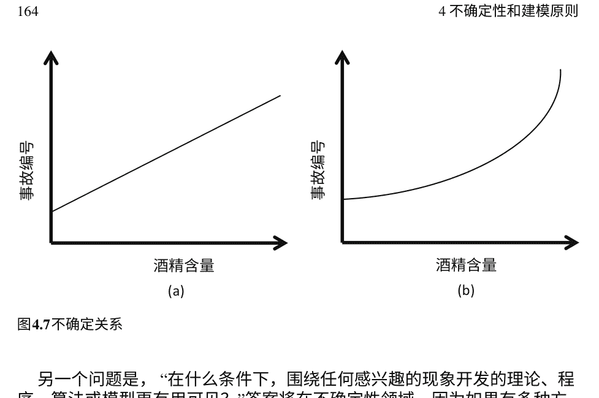

另一个问题是，“在什么条件下，围绕任何感兴趣的现象开发的理论、程序、算法或模型更有用可见？”答案将在不确定性领域，因为如果有多种方法，根据相同的误差准则，可以根据实际可接受的误差量来确定最佳方法。误差越小，方法越好。平均绝对误差（MAE）、均方根误差（RMSE）、相对误差（RE）等是几种常用的误差评估准则。

另一个问题是，“数据收集器是否可以测量相关现象，以帮助发现事件的内部形成结构？”在图4.7中给出的例子中，没有进行测量，但基于理性和逻辑推理的心理实验仍然以相关关系模糊地出现。类似的理性和逻辑推理可以用来研究现象发生的机制。所测量的内容取决于测量可以帮助解决的问题类型。可以从现有数据中得出一些实际和经验性的结论。例如，如果存在关于相关现象的不确定行为的时间序列数据，那么人们可能会对顺序数据是否相互影响感兴趣。这可以简单地通过将数据图形视为“当前”和“下一个”，如图4.8所示来回答。这样，有三种选择，每种选择都有一组数据点。

乍一看，很明显连续点之间没有确定性和清晰的关系，这意味着即使在数据中也存在不确定的梯度，可能存在测量误差、关于现象的不完善信息和知识，以及现象的行为可能是不稳定的等等。图4.8a显示了最简单的线性关系形式，而图4.8b中的关系是非线性的。这两种关系都可以用数学方程来表示，将无限关系转化为绝对的确定性。换句话说，任何数学表达式的应用都可以消除不确定性。然而，在图4.3c中，没有任何类型的数学关系可以消除歧义，相反，每个聚类中都存在无限散布。

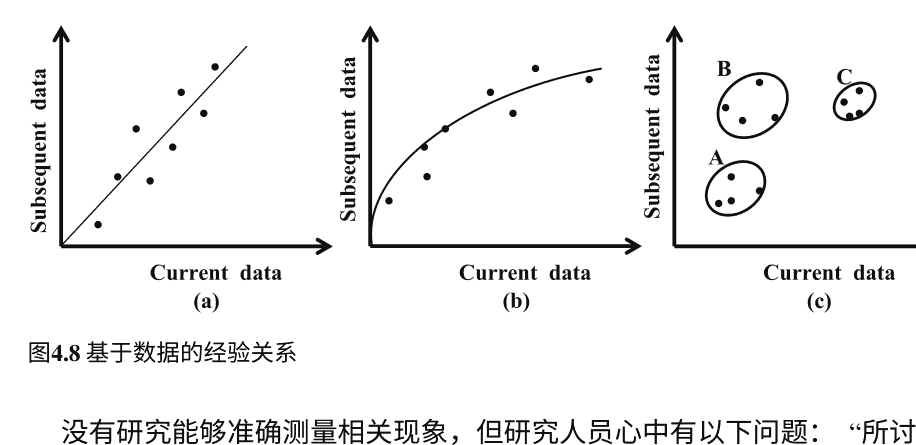

没有研究能够准确测量相关现象，但研究人员心中有以下问题：“所讨论的现象（心理或物理）是否能够被准确测量（定量化）？在没有测量的情况下，物理现象之间的关系可以在头脑中描述，精确程度取决于问题的性质和测量值之间的关系，以及该值如何帮助解决问题。

### 4.8.1 混沌不确定性

任何科学研究的最重要问题是在建立可靠模型之后对相关现象的未来预测。虽然预测涉及未知的未来情况，但建立阶段完全依赖于过去观察到的系统变量的数值记录。任何研究的关键步骤是确定适当的模型并修改它，以尽可能准确地表示过去的观测序列和模型行为。并非所有开发的模型在实际应用中都成功。在许多科学预测领域，研究人员仍然在寻找合适的模型方面落后。通过物理原理以及各种简化假设，可以用普通和偏微分方程解释许多经验现象系统，但是它们的应用，例如用于预测目的，需要对初始和边界条件进行时空测量和定义。

不幸的是，大多数调查案例都没有提供足够合理的数据。在模型不现实或数据稀缺的情况下，有必要采用其他简单但有效的方法。在大多数情况下，为了表示所涉及的系统，推导出偏微分方程可能看起来很简单，但其结果受到数据与模型的不兼容或数据不足的影响。

在许多应用中，一个简单但有用的模型是直接从数据中定义的，而不是从偏微分方程和基本物理原理中定义的。例如，尤尔提出了这样的简单模型，考虑了有序的结构可用数据的行为。它的目的是将数据视为基于随机过程原理的时间序列。后来，这样的序列被认为是研究人员未知的许多可能性中的一种可能的实现。最近，动力系统的混沌行为也表现出与随机过程中的经典随机性非常不同的随机样式。因此，一个问题出现了，如何区分混沌行为和随机行为？

尽管混沌行为在平均时间上呈现出一种基本的长期模式，以奇怪的吸引子的形式，但它暗示了短期预测的可能性（Lorenz 1972）。任何时间序列格式的数据可能看起来像是一个随机序列，但可能包含具有多个自由度的潜在短期相干性。例如，虽然流体流动沿时间轴表示出混沌行为，但当限制在一个时间独立的状态空间表示中时，理论上和实验上都显示出一个低维吸引子。对于任何现象存在这样的奇怪吸引子的情况，时间演化会产生一个隐藏混沌残留的时间序列。

一个动力系统由一个相空间图描述，其轨道显示了从初始状态开始的演化。要进入这个轨道，需要相当精确地知道初始状态。即使是不同的初始状态，彼此之间的微小差异也会进入奇怪吸引子，并经过连续的多步骤，覆盖整个奇怪吸引子的混沌转换。因此，与经典时间序列的另一个偏差是，在混沌行为中，连续的时间步骤是随机的，但连续的点仍停留在同一轨迹上。在混沌行为中，不仅需要精确确定奇怪吸引子，还需要对将保持在吸引子上进行预测的连续跳跃进行建模。

无论初始条件如何，轨道都会以有意义的几何模式收敛到整个空间内的一个子空间，然后吸引子被捕获。否则，行为不是混沌的，而是随机的不吸引人的。简而言之，奇怪的吸引子由占据相空间小比例的点组成，但随机或完全随机的行为随机覆盖整个相空间。子覆盖意味着混沌时间序列的维数小于相空间的嵌入维数。

## 4.9 不确定性

根据不确定性的概念，事件（某些事件或某些类型的事件）不是由先前事件决定性地（因果地）引起的。它是确定性的相反，与运气有关。这让人想起一个问题，“海森堡不确定性原理与模糊、灰色、随机性（概率）、粗糙性和/或不确定性专家所采取的立场有关吗？”海森堡不确定性原理对于原子水平的事件至关重要，而模糊事件则归因于比原子粒子更大尺度的事件。因此，海森堡原理并不直接与这些现象相关，但该原理可以在隐喻意义上应用。

正如阿尔伯特（1992年，1994年）所解释的那样，物理学家们并没有发现任何特殊的电子性质，这些性质通过测量其他性质来扭曲其自旋值。因此，关于收益变化的法则在测量方面不能是确定性的。理论家可以通过简单地引用一组电子来以概率的方式引入这种不确定性。但是，他/她无法制定一个给定电子的两个自旋值的确定性法则。不确定性原理表明，同时确定一个粒子的位置和动量是不可能的。一旦实验者知道粒子的位置，实验者的仪器就会不可预测地影响粒子的动量，反之亦然。这个原理不是由于人类手段的不足而无法确定现实的不可能性，而是关于现实并不由占据一定位置并具有一定属性的物理实体组成。波姆（1978年，1980年）指出，物质不断从抽象空间移动到具体空间，因为其状态的模糊性消散（Khalil 1997年）。当物理学家考虑到许多粒子时，他们只能通过被称为薛定谔波函数的概率分布来表达潜在状态的不确定性。不确定性被转化为确定性，也就是机会，这在风险分布中得到表达，但只有当物理学家放弃预测单个粒子行为的想法，转而关注代表性粒子时，才能实现。代表性粒子是从众多粒子行为的平均值中提取出来的虚构实体（Khalil 1997）。

然而，代表性粒子的统计描述与从硬币的翻转结果得到的状态的统计描述截然不同。没有必要借助“代表性”硬币来得出它们状态的概率分布。硬币状态的概率分布不是由个体决定的，就像量子粒子一样。相反，概率分布是由观察者的局限性所决定的。原则上，物理学家可以确定某次投掷结果是正面还是反面，而且可以百分之百确定。结果取决于投掷的力量和方向、空气摩擦、硬币落地的表面等因素。拉普拉斯（1951年）指出，物理学家无法确定结果。唯一的原因是拉普拉斯（1951年）指出，物理学家无法确定结果的确定性。

混沌理论的不确定性本质，可以互换地称为“运气”或“风险”，与抛硬币的不确定性本质上没有什么不同。爱德华·洛伦兹（1963a, b, 1964）和鲁埃尔（1991），现代混沌理论的先驱，是一位气象学家。天气是最佳的起点，因为它的波动挑战了几个世纪以来的可预测性。洛伦兹认为，非概率预测的不可能性是由于对人类感知力逃脱的足够小的“初始条件的敏感性”。

初始数据的微小变化可能会导致完全不同的结果。当递归反馈参数在一定范围内时，对初始条件的敏感性会发生。洛伦兹半开玩笑地说，理论上，一只在巴西拍动翅膀的蝴蝶可以通过自动反馈引发德克萨斯州的龙卷风。如果最初的条件被最精确地知道，暴风结构的精确行为可以以不可思议的精度预测，就像一个拉普拉斯恶魔一样。但人类不是拉普拉斯恶魔，无法追踪所有初始条件和外星变种。由于完美知识的巨大成本，人们必须采用概率估计的形式。

因此，混沌不确定性（风险）与量子不确定性有根本的不同。风险或机会是由于观察者的信息不完整而产生的。相反，不确定性是由于对象作为一个潜在实体其属性没有完全解释而产生的不完整信息。混沌机会的概率是由于现象的事实规模，而量子不确定性的概率是由于粒子最初不是一个确定的、局部的现象。

在模糊推理中，许多词语可以从许多不同的角度有模糊的解释。因此，有必要将对不确定性原理感兴趣的不同学科的人们聚集在一起，以得出更有意义的解释。如果来自同一学科的研究人员聚集在一起讨论“词汇内容”，他们将无法进入内部混乱的循环。

## 4.10 科学中的不确定性

可以说，早期的信息和知识是从频繁的观察和经验中得出的概念。几个世纪以来，人类的思想得到了文字、绘画、计算、逻辑和最终的数学计算的支持。与哲学不同，科学在启蒙运动后的十八世纪以后，通过其公理、假设、定律和最终的表述与哲学有所区别。通过牛顿经典物理学，可以说科学进入了一个几乎完全确定性的世界，在这个世界中，甚至在科学知识中也不考虑不确定性。然而，如今几乎所有科学领域都存在不确定性因素，许多科学决定论者对基本模糊修正变得模糊不清。这些概念包括量子物理学、分形几何学、混沌理论和模糊逻辑原理。然而，一些学科，如地质学，从未经历过决定论阶段，但不幸的是，决定论的教育体系也影响了世界各地许多机构的地球科学教育。随着概率、统计和随机原理等数值不确定性技术的发展，定量科学的科学进步取得了快速进展，但仍然忽略了只能通过模糊逻辑原理处理的定性信息和知识的来源。

作为对东方思想的认可，哲学对象可以通过逻辑命题和推理提升，从而导致思想生成，以及三种基本的心智活动，即想象力、概念化和理想化。

自从地球上有生命存在以来，人类就与自然互动，自然以物体和随时间和空间变化的事件的形式为人类的思维活动链提供基本材料。在人类历史的早期阶段或任何个体的童年时期，这些阶段以不同的速度发挥作用，并通过经验形成最终的形态。最终形态是通过经验形成的。思维过程中的每个链元素。都包含不确定性，因为想象力、概念化和理想化的阶段高度主观，取决于个体的技能和能力。在人类思维演化的任何阶段，前因都包含一定程度的模糊、不确定性、概率、可能性和不确定性。从心智思维过程中推断出数学结构可能看起来是确定的，但即使在今天，由于科学发展的结果，人们认识到在微观尺度上，无论是在宏观尺度还是在每个物理或机械建模阶段，都存在至少一部分的不确定性。今天清楚地认识到，导致对任何物理现实的满意数学构建的数学概念化和理想化往往是不切实际的要求。正如爱因斯坦所指出的，

> 只要数学定律指的是真理，它们就不确定。而且它们并不像确定那样指的是真理。

在最基本的思维阶段，活动对象被认为是一个或物理上合理的变化范围的成员或非成员。这考虑到包含可能后果或现象基础的集合。在形式科学中，如物理学、地质学等，这些元素几乎总是自动地被认为是集合的完全成员或不属于同一集合。因此，用于科学建模的是一对真或假；正或负；是或否，黑或白，一或零等的清晰逻辑。然而，Zadeh（1965）建议在0和1之间包括成员资格的连续性，而不是确定性的评估。因此，模糊集在思维活动链的每个阶段都具有直观合理的哲学基础。

庞加莱（1904年）以非技术性的方式讨论了不可预测性的问题。根据他的观点，长期的不可预测性使机会和决定论得以和解。他通过说

> 我们无法察觉的一个非常微小的原因决定了一个我们无法忽视的重大影响，然后我们说这个影响是由机会引起的。

这一观点后来得到了混沌理论的支持，混沌理论是数学的一个分支，专注于高度敏感于初始条件的动力系统的行为，任何微小的初始或边界条件的变化都会导致解进入系统性的不确定领域，人们无法从先前的数值信息中估计下一步的值。

尽管有许多确定性建模方程在使用中，特别是对于许多事件，由于自然现象内部遗传或外部激发的随机成分，结果可能无法捕捉到绝对的准确性，这已经由许多研究人员在先前的章节中进行了解释。在实践中，一方面存在模型不确定性，如模型偏差、模型差异、模型近似、对基本问题的了解不足、模型与现实之间的差异。另一方面，还存在参数不确定性，如模型参数的影响、未知值（精确、正确、最佳）和实验无法控制的因素。此外，还存在数值不确定性、误差、近似以及为计算机执行编写的数学模型软件。

## 图4.9 不确定性来源

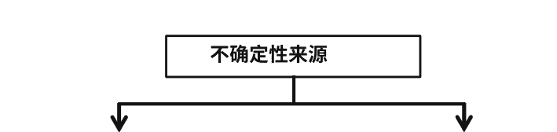

是算法不确定性来源之一。还有实验不确定性，包括观测误差、实验测量变异性和不确定性。最后，还有插值不确定性，如缺乏可用数据、插值或外推结果，最后但并非最不重要的是方法选择。可以将不确定性来源分为两个类别，如图4.9所示。

每当有一系列的测量时，科学家和研究人员尝试通过计算一些数量来做出最佳估计，假设某个精确值存在，考虑到测量等于最佳估计和一个不确定性项的总和。在最佳估计和不确定性项之间存在一种统计不确定性，即每次运行的差异，无法通过模型改进来消除。在任何研究的最终产出中，认知的不确定性（系统性不确定性，已知但不可行的原则，即不足的测量或建模，缺失的数据，可以通过更好的模型和更准确的测量来减轻）和随机的不确定性（统计不确定性，每次运行的差异，无法通过模型改进来消除）起到作用。在统计不确定性中，常见的表示和概率分布函数（PDF）近似是可视化的一部分。

测量和合成生成的数据不是没有不确定性的，在许多学科中通过不同的建模过程来反映。世界各地的不同研究中心可能有不同的模型，并且它们的输出构成了一系列结果，被统称为集合。集合是参数空间探索的多次运行模拟的集合，用于减轻模型误差，初始条件覆盖范围以及多个模型输出的组合。它们还有助于收集数据集、成员、实现以及在输入条件下为每个参数集进行完整的模拟运行。集合可以是多维的、空间的和/或时间域的，可以模拟许多变量和每个变量或位置的许多值。通过数值区间也可以获得不确定性的模糊性，该区间预计不包含关于概率分布函数（PDF）的任何假设。信息不确定性在许多现象建模中起作用，这些现象被认为是定性而不是定量信息指示（Streit等，2008年）。广泛使用的箱线图基于正态（高斯）概率分布函数，包括四分位范围、中位数和异常值（Spear 1952; Tukey 1977）。

在不确定性方法中，概率、统计和随机过程在工程、大气、地球和环境科学领域的过去六十年中稳步增长。只要这些领域中存在不确定性嵌入的数值数据，研究人员就会寻求以有效的定量方式表示、处理和解释他们的数据。任何具有数学背景的研究人员都能够了解如何获得足够的知识，通过概率、统计和随机过程来描述自然现象，并对预测和解释的论证进行评估。

## 4.11 统计学的重要性

通过对自然现象的描述和对预测和解释的论证的理解，不确定性方法得以应用。

由于固有的随机性（Mann1970a，b），研究人员可能无法预测具体事件。从统计意义上讲，随机和随机性有助于描述任何现象，这些现象对于特定事件是不可预测的，并且是确定性现象。在任何给定的情况下，如果所需的初始和边界条件已知，个别事件的结果是可以完全确定的。时间序列元素的测量只是自然事件的随机样本，因此它们具有多个重复而不是唯一的已知行为特征。事实上，随机性是自然界中最终和最深刻的物理概念。

## 4.11 统计学的重要性

随机和随机性是两个在统计意义上用来描述任何现象的术语，这些现象对于特定事件的不确定性是不可预测的。著名统计学家帕尔森（1960）提供了一个关于随机性的启示性定义

> 随机（或偶然）现象是一种经验现象，其特点是在给定一组条件下观察它并不总是导致相同的观察结果（因此没有确定性的规律性），而是以一种统计规律的方式导致不同的结果。

统计规律意味着许多测量的群体和子群体行为，以便可以比个体预测更准确地对每个群体进行预测。例如，如果在某个地点有一长串的温度观测数据可用，那么可以更有信心地说明天的天气将是温暖、凉爽、寒冷还是炎热，而不是通过预测来准确地指定摄氏度的程度。正如将在后面的章节中解释的那样，统计规律是一些天文、自然、环境和社会影响的结果。全球气候变化的讨论是基于化石燃料温室气体（GHG）排放到低层大气中的人为活动。气候变化效应由不同的研究人员甚至普通人表达，但这种变化的强度在未来的时间段内无法确定。统计规律还意味着对单个事件的完全不可预测性。

在工程系统规划、运营、估计、投影和模拟工作中，统计方法应用的重要性和意义是至关重要的，因为它们客观地处理了任何测量或集合空间和时间序列中的不确定性成分，并得出可靠的结果。

统计学处理不确定的数据，并识别出实际应用中的数据特征。这些方法有助于设计实验数据收集网络，注册数据特征识别，正确分析并得出可解释的结果。除了统计技术，没有其他方法可以评估未来事件的风险。它们有助于推导出科学发现，基于数据的适当决策和预测。统计学帮助更深入地理解所涉及的现象，基于测量结果。

除了任何统计分析的好处外，还应该牢记避免它们的陷阱。统计结果的整体质量取决于正确选择和测量数据、抽样技术、样本大小和选择最方便的统计方法。即使一个人认为自己已经尽力了，但是任何对这些原则的轻微偏离都可能导致不可靠的结果。在任何统计建模过程中，应牢记以下几点。

- 1. 偏见效应：样本必须以一种方式收集，使得任何偏见效应都必须在程序之外。为此，数据必须针对任何偏见进行检查，例如系统误差、测量误差、非标准测量，这意味着数据测量必须通过相同的仪器进行，并且在任何仪器检查中，新仪器（或旧仪器）必须与其他仪器进行校准。
- 2. 因果效应：在决定方法论和其应用之前，研究人员应该对因果关系有充分的了解，即输入和输出变量之间的关系。为此，至少他/她应该深入思考两个原则。一个是比例（直接或间接）关系，然后下一步是对关系的线性或非线性有一些印象（第3章）。这对于成功应用任何统计模型（如单一或多重回归）非常重要，这些模型在许多研究中经常使用。
- 3. 正确性效应：由于大多数统计分析都在寻找关系，所以一个或多个输入变量的决策应该是可能的。在几乎所有统计方法模型中，实际上都考虑了平均值，但最好考虑众数值，有时候也考虑中位数值。研究人员可以通过查看每个变量的直方图来决定这一点。另一个陷阱是线性 fit到非线性关系。
- 4. 过度概括效应：从一组数据中得到的结果不能推广到另一组数据，因为它们可能具有不同的行为和因此不同的总体模型。在人口行为方面，应该注意它们最适合的理论概率密度函数的区别。
- 5. 限制效应：统计推断不能轻易地推广，因为它们有限制，人们应该欣赏任何统计模型的限制特性。
- 6. 假设效应：在统计学中，几乎所有方法学对模型、样本特性和变量都有限制性假设。一般来说，“中心极限定理”被考虑在内，但它的考虑有一些特定条件需要注意。违反其中一个假设可能导致误导性的结论。
- 7. 数据效应: 如果一切都被正确应用，结果可能是不正确的，取决于单个测量集。必须运行不同的数据集来运行模型，并且结果必须被提交给显著性测试。
- 8. 参数效应: 有不同的方法来估计模型参数例如矩，最大似然和类似的过程。然而，在实际应用中，最可信赖的方法是最小二乘法，它提供了最好的结果。

这些要点可能隐藏在准备好的软件中，因此，任何软件的输出必须在这些要点的光下进行质疑，然后才能得出可靠的结论's接受。

### 4.12 数据处理前的基本问题

统计工具是从不同目的的相关数据中提取和压缩信息的手段。统计工具对数据的处理取决于一些限制性的假设或假设。尽管它们的使用相当直观和易于应用，但用户必须对每种统计方法具有统计实践信息。统计工具对数据集进行描述和更好的描述方式，以及在开始时具有合理的物理解释非常有用。请记住，任何统计参数都与现象的某种物理行为相关联，这导致了以测量为单位的全局值。只有通过对数据集的这些初步检查，才能实现对现象的进一步详细分析。通常，兴趣通常不在个体值上，而在于从中获得的现象的集体描述。通过各种统计参数对数据集进行检查，可以得出关于变量的联合特征的一般想法。统计参数代表数据的显著特征。以下问题是任何数据处理处理中最常遇到的类型，无论可用数据的类型如何。

- 1. 一个现象在所需位置的时间平均值是什么？与这个平均值有什么偏差？在这个地点可能出现的极值水平是什么，它们的发生风险是多少？
- 2. 在一个区域内的所有可用站点在特定的时间段内（如日、月、季节和年）的总体面积行为是什么？这些行为能以地图的形式展示吗？
- 3. 可能的影响因素有哪些，它们之间的关系如何？
- 4. 基于历史记录，是否可以从可用数据中进行短期未来的可能预测？
- 5. 不同位置的相同类型变量数据是否具有相似的行为方式？它们是均质的还是异质的？
- 6. 如何在数据集中计算各种可能的周期性变化？
- 7. 在给定的时间序列中是否存在趋势（增加或减少）？如果存在，如何从整体数据序列中检测和识别这些趋势？

为了回答这些问题，不仅要考虑数据值的个别性，还必须计算相关的统计参数，以便更好地进行口头和数值推断。

## 4.13 简单概率原理

在科学和工程领域，当面临不确定性起重要作用的问题时，往往会求助于概率论。在没有除概率论之外的处理不确定性的工具时，这种传统是正确的，但如今情况已经不同了。

人们通常没有意识到的是，有许多不确定性的方面无法用标准的概率论来充分解决。普遍的观点，让我们称之为充分观点，是概率论足以处理任何类型的不确定性。正如著名贝叶斯学派学者林德利（1923–2013）所说，能力的信念可以表达为

> 唯一令人满意的不确定性定义是概率。我的意思是，每个不确定性表达式都必须以概率的形式表示；多个不确定性应该使用概率规则进行组合；概率的计算足以处理涉及不确定性的所有情况...概率是唯一的逻辑定义不确定性的方法，对于涉及不确定性的所有问题都足够了。

任何可以用模糊逻辑、信任函数、上下概率或任何替代概率的方法来完成的事情，都可以用概率更好地完成。

有些人认为这种差距反映了传统数学——即精确定义的点、函数和集合、概率测度的数学——在生物系统分析方面的根本无能。对于这种通常比人造系统复杂数个数量级的系统，我们需要一种完全不同的数学，即模糊或不确定的数量的数学，这些数量不能用概率分布来定义（第3章）。事实上，即使在无生命系统领域，对这种数学的需求也越来越明显，因为在大多数实际情况下，先验数据和人造系统性能评估标准一样不精确，或者说不是精确已知的概率密度函数（Zadeh 1965年）。

## 4.14 统计原理

我们的思维已经被欧几里得几何所预设，因此普通人必须将长度、宽度和深度视为三维空间中的附加维度，同时还要考虑时间作为第四个维度。所有工程、地球、环境和大气科学的变量都沿着这四个维度变化。如果不考虑时间的变化，就被认为是时间冻结，因此仍然沿着时间轴演化，但所讨论的变量在空间上有变化。一个很好的例子是地质事件，它们在数百万年内发生变化。岩石中的铁含量在不同点之间变化相当随机，因此被认为存在空间变异。另一个例子是在许多气象站点上测量降水量，这些站点位于一个不规则的区域，即通过冻结时间来寻找空间变化，并制作地图。

另一方面，自然现象也存在时间上的变化。对于这种变化，只需在某个地方测量事件，就像在任何气象站一样。根据事件是否在时间上连续，因此可以获得时间序列记录。时间序列是对任何自然事件在规律的时间间隔内进行系统测量的结果。根据这个时间周期，时间序列被称为小时、日、周、月或年时间序列。

与时间变化不同，除非在非常特殊的情况下，否则无法想象以规则间隔保存记录的空间系列。例如，如果沿着一条河每隔1公里取一次水样品，这些测量结果提供了一系列距离的规律性。实际上，距离系列非常有限，就好像没有这样的数据系列一样。另一方面，根据事件的相关性，存在包含时间数据的系列，但由于同一事件连续发生之间的时间间隔的不规则性或随机性，它们不是时间序列。洪水、干旱和地震事件对应于这种情况。一般来说，这些现象的未来行为无法准确预测。

任何自然现象都在人类视觉的四维领域中发展，因此，它的记录必须包含时间和空间变异的特征。具有这种属性的任何记录都被称为时空随机变量。

## 4.15 统计参数

参数是从所有可用数据值计算出的单个值。它反映了记录中的某个特征的单个值。位置、离散度和许多行为取决于一个或多个称为参数的常数。参数的计算，如平均值和变异度的测量，与统计测量相关。样本函数（SF），即数据系列可以通过一组参数进行总结。统计参数以某种方式是所有数据值的函数，任何数据值的变化都会导致参数估计的变化。SF越长，数据变化对参数值的影响越小。每个参数都回答了关于SF行为的一些问题。以下是一些问题：

- 1. SF指示波动的平均水平是多少？
- 2. 偏离平均值的意义是什么？ 以及它们如何表示每个SF？
- 3. 如何比较两个或多个SF？
- 4. 大多数数据是低于平均值还是高于平均值，还是相等的？ 如果是这样的话那么SF的波动可以具有对称的情况。 如果低于和高于平均值的数据数量不相等，则SF是倾斜的。
- 5. 在整个SF中，哪个数据值（或哪些数据值）的出现频率最高？
- 6. 哪个数据值包括一半以上的数据数在上方，另一半在下方？
- 7. 后续数据值对彼此有任何影响吗？ 或者它们彼此之间完全无效？
- 8. 时间对数据测量有任何影响吗？ 数据沿时间轴的某部分是时间的函数吗？ 这意味着SF中存在趋势。
- 9. 数据值的极值和数据值变化的范围是多少？
- 10. 在某个设计目的的兴趣区间内，有多少数据落在其中？ 有多少数据的百分比大于（小于）所需值？
- 11. SF是否受地理、天文或环境确定性影响？
- 12. 两个SF之间是否有干扰？
- 13. 类似的问题可以针对一个确定的时间段（月份、季节）和感兴趣的子区域提出。

在接下来的部分中，将介绍回答这类问题的参数，并进行解释。

### 4.15.1 中心测量参数

在一个缩放轴上排列不同的数据值X_i（i＝1，2,...,n），如图4.10所示，呈现出相当随机的散布，中心位置密集。因此，存在一个中心值，可以告诉数据密度位置的大致位置。为了描述数据在缩放轴上的这些密集部分，需要有被称为位置或中心测量参数的度量。密集位置被量化为被测量变量的单个值，以某种方式作为数据的简要代表。

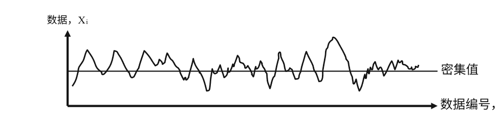

这 fi图表示密集值和与其正负偏差的数据。在下面的续篇中，所有统计参数都由密集值和与该值的偏差来定义。

#### 4.15.1.1 算术平均

它显示数据值 fi围绕其波动的恒定水平。它是通过将所有数据值相加然后除以数据的数量n来计算的。

$$ \overline{X} = \frac{1}{n} \sum_{i=1}^{n} X_i \qquad (4.16) $$

这意味着当算术平均值乘以数据的数量nX时，结果是数据的总和。算术平均值统一了所有数据，而不提供有关偏差尺度的任何线索。方程 (4.16) 给出了每个数据值相同的权重，没有区别。因此，一个或两个极端值可能主导结果，因此，算术平均概念可能不是整个数据的最佳代表性中心值。例如，图4.11中的数据样本不能用算术平均值表示。在图4.11a，b中，SF不稳定，并且有少数极端值，这些值会影响算术平均值的计算。极端值使算术平均值偏离数据变化的密集区域。在图4.11c中，数据变化有两个密集值，同样，算术平均值无法代表整个数据，因为出现了突变。如果数据结构中存在季节性 fluctuations，如图4.11d所示，算术平均值也不能代表。最后，如果数据中存在递增、递减的线性或非线性趋势，则不能使用算术平均值作为代表性的中心趋势值。所有这些例子表明，在使用算术平均值之前，有必要以SF的形式对数据进行视觉检查，然后决定是否可以使用算术平均值。在许多应用中，研究人员没有考虑这些要点，因此，他们的结论是有偏见的。从所有这些讨论中可以得出结论，在使用数据之前，必须从数据中分离出以下要点，以获得代表性的算术平均值：

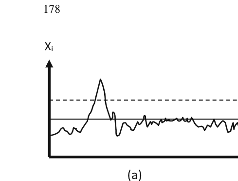

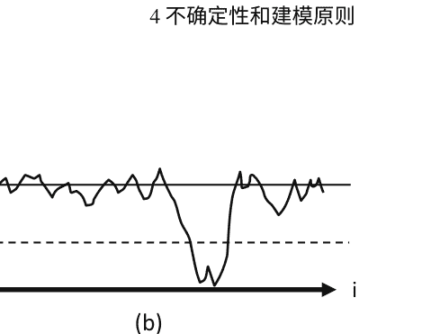

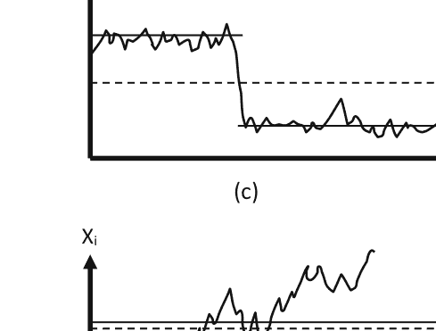

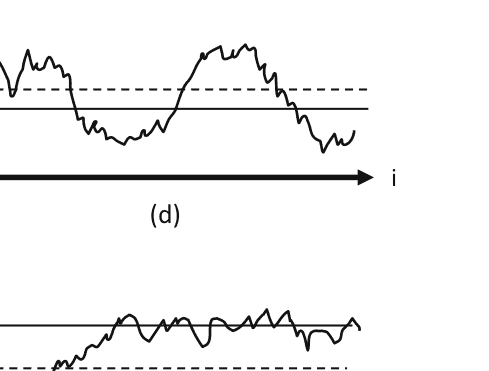

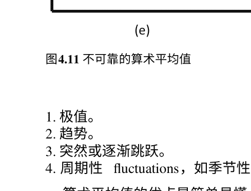

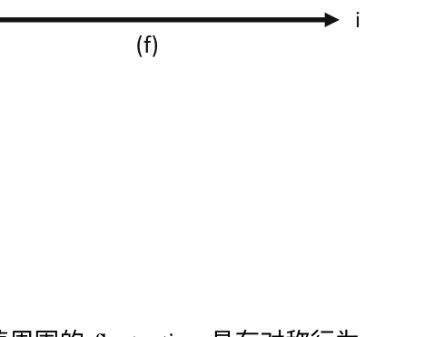

## 图4.11 不可靠的算术平均值

- 1. 极值。
- 2. 趋势。
- 3. 突然或逐渐跳跃。
- 4. 周期性 fluctuations，如季节性。

算术平均值的优点是简单易懂，当稠密值周围的 fluctuations具有对称行为时，容易解释。否则，在实际研究中不应使用算术平均值。它的优点更多地体现在理论研究中，其中 fluctuations被认为是对称的，这在本章后面将会解释，表现为对称的直方图或正态（高斯）概率密度函数。这个条件还意味着一阶平稳数据结构。

## 4.15 统计参数

关于算术平均值的其他实际上重要的一点是，从该值的偏差的总和等于零，无论数据结构如何（包括极值、趋势等）。这可以从方程（4.16）中以算术方式写出。

$$
\sum_{i=1}^{n} (X_i - \bar{X}) = 0 \quad (4.17)
$$

因此，第一个变异性的度量以差异的形式出现在这个表达式中。这个表达式中的每一项表示数据值与算术平均值的相似性或不相似性。任何数据值与数据算术平均值之间的差异越大（小），不相似性（相似性）越大（小），即变异性越大（小）。

算术平均数的另一个实际观点可以被看作是一个移位运算符，即从每个数据值中减去算术平均数，如公式（4.17）所示，因为整个数据可以被认为是在样本函数（SF）中没有几何变化的情况下变化；它可以被看作是围绕零水平轴的波动，如图4.12所示。

图4.12a表示数据围绕其算术平均值的波动，而图4.12b表示相同的样本函数没有任何结构性变化。函数在零水平轴周围波动。如果数据具有大的值，移位过程有助于处理小的数字。

1.  它是将数据值线性转换为单个值的转换（参见方程式4.16）。
2.  如果从每个数据值中添加或减去一个常数值C，并且得到一个新的数据系列 \(Y_i = X_i \pm C\)，则该新系列的算术平均值为 \(\bar{Y} = \bar{X} \pm C\)。根据这个规则，在移位后的算术平均值为 \(Y_i = X_i \pm \bar{X}\) 变为 \(\bar{Y} = \bar{X} \pm \bar{X} = 0\)。

这种转换的图形表示如图4.13所示。

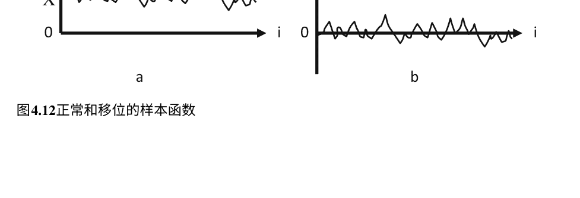

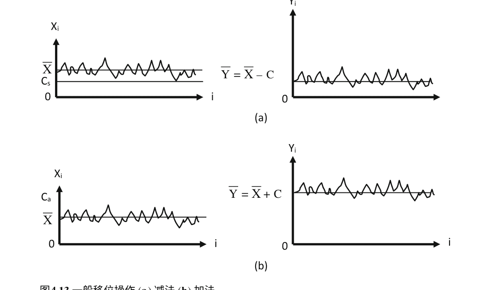

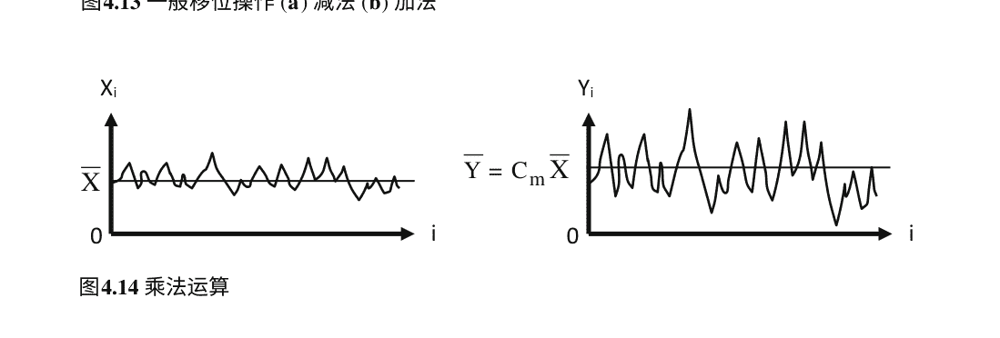

如果数据值乘以一个常数C，导致一个新的序列为 \(Y_i = CX_i\)，则由于算术平均值计算的线性性质，新序列的算术平均值为 \(\bar{Y} = C\bar{X}\)。如图4.14所示，在乘以一个常数值后，围绕其新算术平均水平的数据波动（fluctuations）增加。

在数据除以一个常数C的情况下，如 \(Y_i = X_i/C\)，新的算术平均值可以计算为 \(\bar{Y} = \bar{X}/C\)。与图4.14类似的形状将得到，但围绕新的算术平均值的偏差较小。除法操作的另一个好处是新的数据值变得无量纲，因此可以将不同的数据类型进行比较。

最后，只要变换保持线性，就可以根据常数减法 \(C_s\) 和常数除法 \(C_d\) 来移动和缩放任何给定的数据，然后以下公式成立：

$$
Y_i = \frac{X_i - C_s}{C_d} \quad (4.18)
$$

它的算术平均值是

$$
\bar{Y} = \frac{\bar{X} - C_s}{C_d} \quad (4.19)
$$

这个最后的变换有助于获得一个新的无量纲数据序列，被称为统计标准化，在本章中将多次使用这个表达式。

### 4.15.1.2 中位数

可以根据数据数量而不是数据值来寻找密集数据水平，使得落在该常数值上方和下方的数据数量相等，即等于 \(n/2\)。如果数据数量是奇数，则中位数 \(X_{med}\) 的值等于按升序排列的数据列表中间的值。另一方面，如果数据数量是偶数，则两个中间值的算术平均值被采用作为中位数。中位数值的定义意味着大于或小于中位数的数据值的百分比等于50%。特别是在数据中存在极值的情况下，中位数是更可靠的中心度量，因为它不受极值的影响（参见图4.15）。

在这个图中，由于存在较低的极端值，算术平均值被向下绘制，而中位数是密集数据的唯一代表。中位数与原始数据具有相同的单位，与算术平均值的比较提供以下实用信息：

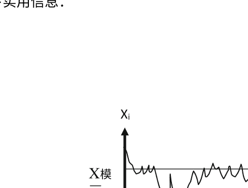

1.  如果中位数大于（小于）算术平均值，\(X_{med} > \bar{X}\)（\(X_{med} < \bar{X}\)），那么高于（低于）平均值的数据比低于（高于）平均值的数据更多（更少）。这意味着密集数据位于算术值之上。这两种情况都暗示了数据分布在变化范围内的非对称性以及算术平均值的不可靠性。
2.  如果中位数在理论上等于平均值，\(X_{med} = \bar{X}\)，那么在使用中位数或算术平均值时没有区别，但由于其更简单的计算过程，更倾向于使用算术平均值。这个条件还意味着数据围绕算术平均值的分布（fluctuation）是对称的，并且如果数据结构中没有趋势，可能也是稳定的。

### 4.15.1.3 模式

它是样本或总体中最常出现的值，可以是个体值，也可以是数据变异领域中的某个子类中的值。这应该是任何应用中最优先的数据中心度量。由于与之前的中心度量参数相比，直接计算困难，因此不宜直接使用。

如果 \(X_{med} = \bar{X}\)，则模式应该等于这些值。否则，如果 \(X_{med} > \bar{X}\)，则 \(X_{mode} > X_{med} > \bar{X}\)；或者当 \(X_{med} < \bar{X}\) 时，则 \(X_{mode} < X_{med} < \bar{X}\)。

### 4.15.1.4 百分位数

已经说明中位数将数据分为两个相等的部分，即50%。同样，可以通过提问来概括这个概念：在更细的百分比中，数据的百分比是多少？如果细分的百分比是25%，则称为四分位数；如果是10%，则称为十分位数；然而，如果是1%，则称为百分位数。这是一种非常精细的数据搜索和解释方法，在实际研究中很少使用。相反，频率、相对频率和直方图的概念被使用，并且将在本章后面进行解释。

### 4.15.1.5 统计加权平均

这个平均值给每个数据点和一组样本分配了一定的权重。例如，在图4.11c中，有两个不同的水平，每个水平都有其代表性的算术平均值，在图4.16中重复出现。设算术平均值为 \(\bar{X}_1\) 和 \(\bar{X}_2\)，它们的有效子组数据数量分别为 \(n_1\) 和 \(n_2\)。在这种情况下，加权平均值 \(\bar{X}_w\) 可以表示为

图4.16 中位数

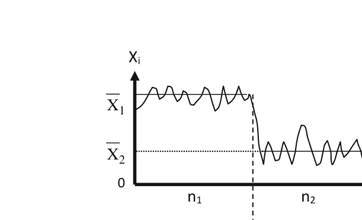

$$
\bar{X}_w = \frac{n_1 \bar{X}_1 + n_2 \bar{X}_2}{n_1 + n_2}
$$

或

$$
\bar{X}_w = \frac{n_1}{n_1 + n_2} \bar{X}_1 + \frac{n_2}{n_1 + n_2} \bar{X}_2
$$

通过将数据的百分比定义为 \(p_1 = n_1/(n_1 + n_2)\) 和 \(p_2 = n_2/(n_1 + n_2)\)，最终形式变为

$$
\bar{X}_w = p_1 \bar{X}_1 + p_2 \bar{X}_2
$$

这意味着加权平均值可能根据数据在整个数据集中出现的百分比（概率）而具有偏好附加项。因此，如果有 \(m\) 个子数据组，加权平均值可以被概括为

$$
\bar{X}_w = p_1 \bar{X}_1 + p_2 \bar{X}_2 + \ldots + p_m \bar{X}_m
$$

很明显

$$
p_1 + p_2 + \ldots + p_m = 1
$$

在实际研究中，每个百分比可以根据手头问题给予不同的上下文。例如，在计算空间数据的面积平均值时，每个测量位置应该有一个影响区域，如 \(A_1, A_2, ..., A_m\)，如图3.9所示。

### 4.15.1.6 物理加权平均

图4.17显示了一系列层，其中每个层之间水平方向上的热量流动没有任何交换。水平方向上的总热量流动被视为输出。由于在通过各个层时没有增加或减少热量，质量守恒原理导致各个层中的热量总和 \(Q_1, Q_2, Q_3, ...\) 的求和。

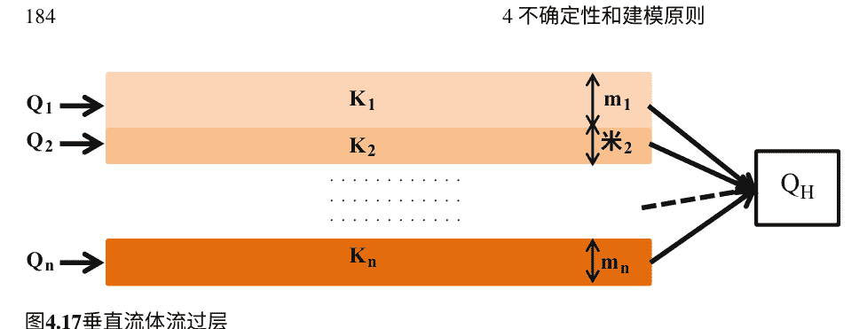

## 图4.17 垂直流体流过层

在各个层中的数量 \(Q_1, Q_2, Q_3, ...\) 的求和，在各个层中的数量 \(Q_n\) 的求和

$$
Q_H = \sum_{i=1}^{n} Q_i \quad (4.24)
$$

另一方面，对于单位宽度（\(w = 1\)）的含水层横截面，个体排水量可以用达西定律（Şen 1995）表示，

$$
Q_i = K_i m_i h \quad i=1, 2, \ldots, n \quad (4.25)
$$

其中 \(K_i\) 是第 \(i\) 层的水力导率，\(h\) 是每层的水力梯度。

将方程 (4.25) 代入方程 (4.24) 得到

$$
Q_H = h \sum_{i=1}^{n} K_i m_i \quad (4.26)
$$

水平方向的比流量为 \(q_H = Q_H/A = Q_H / \sum_{i=1}^{n} m_i\)，因此将方程 (4.26) 代入该表达式得到

$$
q_H = \frac{\sum_{i=1}^{n} K_i m_i}{\sum_{i=1}^{n} m_i} \quad (4.27)
$$

这个最后的表达式意味着水平水力导率是各个水力导率的加权平均，其中层厚度是权重。有趣的是，如果各层具有相同的厚度，那么方程 (4.27) 的形式为

$$
q_H = \frac{1}{n} \sum_{i=1}^{n} K_i \quad (4.28)
$$

其中 \(n\) 是层数。这个最后的表达式意味着只有在层厚相等的情况下，谐波平均等于算术平均；否则，对于不等层厚，这个说法从来都不准确。如果厚度不相等，算术平均会导致低估。

### 4.15.1.7 几何平均

它是 \(n\) 个数据值的乘积的 \(n\) 次方根。反过来，它是数据值的对数的算术平均的指数，可以写成

$$
\overline{X}_{G} = \sqrt[n]{X_{1} X_{2} \ldots X_{n}} \quad (4.29)
$$

通过两边取对数，可以看出

$$
\ln \overline{X}_{G} = \overline{(\ln X)} \quad (4.30)
$$

或

$$
\overline{X}_{G} = \exp \left( \overline{(\ln X)} \right) \quad (4.31)
$$

这里，对数的算术平均表示为

$$
\overline{(\ln X)} = \frac{1}{n} \left( \ln X_{1} + \ln X_{2} + \cdots + \ln X_{n} \right) \quad (4.32)
$$

这意味着它是数据值的对数的算术平均值。

在计算几何平均值之前，以下重要点是有效的。

1.  所有数据值必须大于零。如果数据中有一个值接近零，几何平均值就不可取。
2.  几何平均值始终小于统计算术平均值，即 \(X_G < \bar{X}\)。

几何平均值的另一个常见应用领域是将对数分布的数据转化为具有希望正态（高斯）概率密度函数的新变量。如果原始数据是具有对数分布的 \(X_i\)，则 \(Y_i = \ln X_i\) 将具有正态分布函数。其对数遵循正态分布的变量被称为对数正态分布，其均值由几何平均值表示。

### 4.15.1.8 谐波平均值

这在平均过程中使用，当涉及的现象与某个参考系统（如时间或空间）具有单位，并且问题的要求可能需要其使用。为了使读者熟悉，让我们考虑垂直数量 \(Q_V\)，通过 \(n\) 个沉积层序列的情况，如图4.18所示。让厚度和水力导度分别为 \(m_1, m_2, m_3, ..., m_n\) 和 \(K_1, K_2, K_3, ..., K_n\)，其中 \(n\) 是多个含水层中不同层的数量，如图4.18所示。首先考虑具有总排放量 \(Q_V\) 的垂直流动。

## 图4.18 垂直流体通过层流动

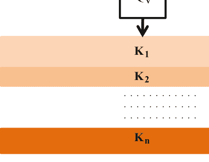

由于在通过各个层时没有水的增加或减少，可以使用质量守恒原理。在其中，总排量等于各个排量 \(Q_1, Q_2, Q_3, ..., Q_n\) 在各个层中的总和。总体水力梯度等于各个水力头的总和除以总厚度（见图4.18）。

$$
i_V = \frac{H_V}{m} = \frac{\sum_{i=1}^{n} H_i}{\sum_{i=1}^{n} m_i} \qquad (4.33)
$$

每个层允许相同的总垂直排放量 \(Q_V\) 通过，因此每个层中的比渗透排放量 \(q_v\) 相同。在每个层中应用达西定律（方程4.25）给出各个头损失为

$$
\begin{aligned}
H_1 &= \frac{m_1}{K_1} q_v \\
H_2 &= \frac{m_2}{K_2} q_v \\
&\vdots \\
H_n &= \frac{m_n}{K_n} q_v
\end{aligned}
\qquad (4.34)
$$

将方程（4.34）代入方程（4.33）得到

$$
q_V = \frac{\sum_{i=1}^{n} m_i}{\sum_{i=1}^{n} \frac{m_i}{K_i}} \quad (4.35)
$$

这相当于说，垂直水力导率 \(K_v\) 的方程如下：

$$
K_V = \frac{\sum_{i=1}^{n} m_i}{\sum_{i=1}^{n} \frac{m_i}{K_i}} \qquad (4.36)
$$

在沉积岩中，多层经常出现。事实上，它们在水力导导率方面通常是各向异性的，因为它们包含颗粒，这些颗粒不是球形的，而是呈不同形状的细长形状。在沉积过程中，这些颗粒以它们最长的轴水平沉降，这通常导致单层中的水平水力导导率大于垂直导导率。然而，当考虑到许多层时，沉积物的总水力导导率通常远大于垂直导导率。为了证明这一点，可以通过仅考虑两层并考虑前面的方程，将比值 \(K_H/K_V\) 写成

$$
\frac{K_H}{K_V} = \frac{m_1^2 + \left(\frac{K_1}{K_2} + \frac{K_2}{K_1}\right)m_1m_2 + m_2^2}{m_1^2 + 2m_1m_2 + m_2^2} \quad (4.37)
$$

分母中的水力导率比项始终大于2，因为如果 \(x\) 是任意数，则 \(x + (1/x) > 2\)。因此，总是 \(K_H > K_V\)。这也适用于冲积沉积物，通常由交替的砂和砾石层或偶尔的黏土组成。

## 4.15.2 偏差参数

这些也被称为离散参数，它们指示了不同幂次与算术平均值的平均偏差。在所有偏差参数中，统计基于的算术平均值被用作偏差的参考，因此也是变异性的度量。

### 4.15.2.1 数据范围

范围 \(R\) 定义为最大值 \(X_{max}\) 和最小值 \(X_{min}\) 之间的差值：

$$
R = X_{max} - X_{min} \quad (4.38)
$$

范围越小，对变量未来行为的预测就越好。所有数据值都在100%的范围内。中位数 \(m\) 将范围分为两个相等的部分，50%的数据在这个值之上。如前所述，这是数据值大于或小于中位数的概率。这意味着在区间 \(X_{max} - m\) 和 \(m - X_{min}\) 内的数据数量相同，等于 \(n/2\)，其中 \(n\) 是数据的数量。中位数将范围分为两个相等的部分，如图4.19所示。

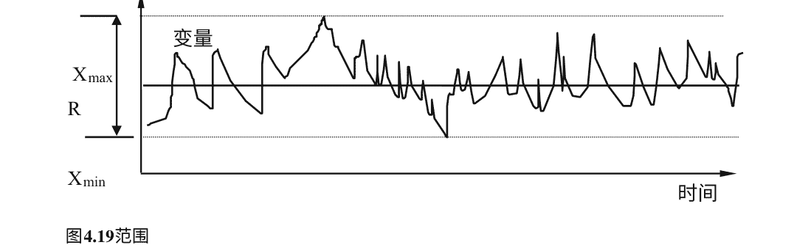

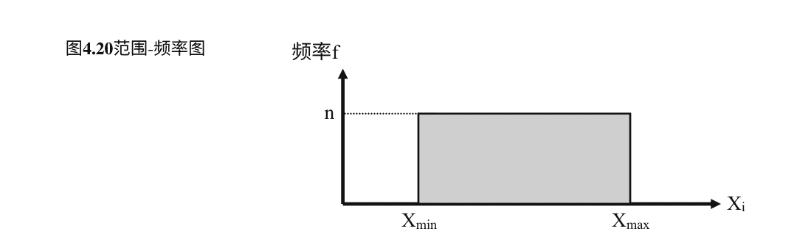

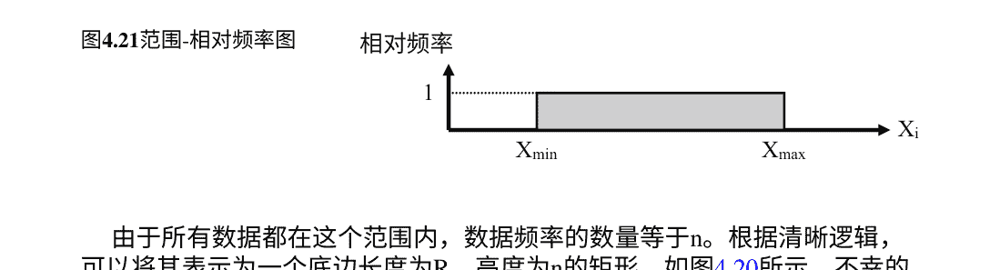

由于所有数据都在这个范围内，数据频率的数量等于 \(n\)。根据清晰逻辑，可以将其表示为一个底边长度为 \(R\)，高度为 \(n\) 的矩形，如图4.20所示。不幸的是，这个频率图并不能告诉我们关于内部数据变异性的任何信息。

为了拥有数据数量无关的图形，相对频率被定义为落在某个范围内的数据数量与总数据数量的比值。因此，在这里，范围是数据的变异范围，根据这个定义，相对频率等于1，并且相应的相对频率图表在图4.21中呈现。

### 4.15.2.2 偏差

在统计参数定义中，偏差总是从算术平均值定义的。已经说明偏差的总和等于零（参见公式4.17）。因此，这样的总和不能作为数据序列中偏差的度量，因为正偏差的总和总是等于负偏差的总和，从而互相抵消。为了得到最简单的变异度量定义，可以考虑正偏差的总和和负偏差的绝对值，这表明绝对总和越小，数据的变异性越小。另一方面，也可以通过考虑与平均值的绝对偏差的最大值来测量整体数据的变异性。同样，这个最大值越小，数据的变异性越小。这两个定义都需要绝对值符号，这在数学推导和积分运算中相当困难。

### 4.15.2.3 平方偏差和

为了减轻数学运算，方便起见，可以考虑数据变异性的平方偏差之和。在实践中，目的是使平方偏差之和尽可能小，这被称为最小二乘分析。平方和 \(SS\) 的定义为

$$
SS = \sum_{i=1}^{n} (X_i - \bar{X})^2 \quad (4.39)
$$

\(SS\) 的单位是原始数据单位的平方。

### 4.15.2.4 方差

随着数据量的增加，平方和 \(SS\) 也会增加，但更希望有一个平均的变异度量。因此，平方偏差的算术平均值被称为方差 \(V(X)\)，

$$
V(X) = \frac{1}{n} \sum_{i=1}^{n} (X_i - \bar{X})^2 \quad (4.40)
$$

这是数据偏差相对于算术平均值的非线性（幂、抛物线）变换。如果每个数据值都相等，则它等于零，这意味着根本没有数据变异性。极端值对方差的影响与算术平均值相同。

### 4.15.2.5 偏度系数

与方差定义类似，可以通过增加一次幂来增加功率，从而获得数据的各种特征。因此，偏度系数，\(\gamma(X)\)，以三次幂定义为

$$
\gamma(X) = \frac{1}{n} \sum_{i=1}^{n} (X_i - \bar{X})^3 \quad (4.41)
$$

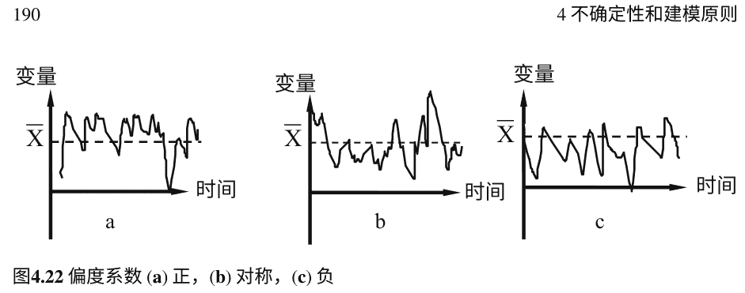

这也是一种非线性偏差转换，它放大了高偏差的影响。通过偏度系数，\(\gamma\)，可以回答有多少数据量在算术平均值上方和下方。这只是简单地定义为

$$
\gamma = 1 - 2 \frac{n_b}{n} \quad (4.42)
$$

其中 \(n_b\) 是低于算术平均值的数据数量。该参数的取值范围在 \(-1\) 到 \(+1\) 之间，如果等于零，则表示样本函数（SF）中没有偏斜。在任何数据序列中，如果高于算术平均值的数据点数量多于低于算术平均值的数据点数量，则意味着未来将发生极端事件。上述偏斜度的定义并未考虑数据值的整体和大小，而只考虑了数量。然而，更好的偏斜度系数定义如下：

$$
\gamma = \frac{1}{n} \sum_{i=1}^{n} (X_i - \bar{X})^3 \quad (4.43)
$$

如前所述，与算术平均值一样，偏差的立方可能具有正值或负值。因此，偏斜度系数可以是正数、零或负数。如果等于零，这意味着围绕算术平均值的波动几乎对称。在正（负）偏斜度系数的情况下，离平均值的偏差的大小在上方（下方）更为显著。偏斜度系数的三个位置如图4.22所示。

### 4.15.2.6 峰度系数

这个统计系数，\(\delta(X)\)，被定义为偏离算术平均值的四次方：

$$
\delta(X) = \frac{1}{n} \sum_{i=1}^{n} (X_i - \bar{X})^4 \quad (4.44)
$$

这表示数据变异性的尖锐程度。峰度系数越大，数据值越集中在算术值周围。

## 4.15.2.7 标准差

方差具有原始数据单位的平方，因此无法将数据偏离算术平均值与此统计系数进行比较。为了实现这种比较，可以取方差的平方根，这就是标准差S(X)的定义。

$$S(X) = \sqrt{\frac{1}{n} \sum_{i=1}^{n} (X_i - \overline{X})^2} \quad (4.44)$$

标准差通过考虑算术平均值周围的1、2和3个标准差限制来提供关于总偏差的概念，如图4.23所示。

很明显，大多数数据都落在第一个标准差范围内，即在\(\overline{X} - SX\)和\(\overline{X} + SX\)之间。标准差在预测中起着非常重要的作用。SF的标准差越小，预测结果越好。

在统计研究中，给定时间序列数据(Xi)与X的算术平均值之间的偏差非常显著。这些偏差构成了方差、协方差、相关系数和回归方法的基本定义。可以根据与算术平均值上下的标准差距离对整体时间序列进行分类，如图4.24所示。在这个图中，σ表示总体时间序列的标准差。

通过1、2和3个标准差限制，给定的时间序列可以分为七个类别，如下表所示，具有不同的规格（表4.3）。在实践中，大多数时间序列值都在正常限制范围内，而极端值则在正常极限之外、之上和之下。对于正态（高斯）概率密度函数，考虑围绕算术平均值的1、2、3和4个标准差值，得到以下数值百分比。

| 截断 | 规格 |
| :--- | :--- |
| $\bar{X} + 3\sigma < X$ | 超过正常极限 |
| $\bar{X} + 3\sigma < X < \bar{X} + 2\sigma$ | 相对超正常极限 |
| $\bar{X} + 2\sigma < X < \bar{X} + \sigma$ | 超过正常 |
| $\bar{X} + \sigma < X < \bar{X} - \sigma$ | 正常 |
| $\bar{X} - \sigma < X < \bar{X} - 2\sigma$ | 低于正常 |
| $\bar{X} - 2\sigma < X < \bar{X} - 3\sigma$ | 相当次正常极端 |
| $X < \bar{X} - 3\sigma$ | 低于正常极端 |

在区间内，

$-1 < x_i < +1$，占68.269百分比，即概率为0.68269

$-2 < x_i < +2$，占95.450百分比，即概率为0.95450

$-3 < x_i < +3$，占99.730百分比，即概率为0.99730

$-4 < x_i < +4$，占99.994百分比，即概率为0.99994

在图4.25中，显示了具有零算术平均值和单位方差的标准正态（高斯）概率密度函数，并根据标准偏差进行了分类划分。

## 4.15.2.8 变异系数

为了能够比较两个不同单位的数据系列，需要具有无量纲的系数值。基于最简单的两个系数，即算术平均值和标准差，变异系数$C_V(X)$被定义为标准差值除以算术平均值。

$$C_V(X) = \frac{S(X)}{\bar{X}} \quad (4.45)$$

## 4.15.2.9 标准化变量

变异系数提供了全局上两个数据系列的比较，但无法实现逐项比较，这是实际研究中最常用的方法。 为了能够有这样的机会，数据值必须转化为无量纲系列，如方程(4.18)所示。 标准化操作实际上是从每个数据值中减去算术平均值，然后除以标准差。

$$x_i = \frac{X_i - \bar{X}}{S_X} \qquad (4.46)$$

这个标准化系列具有以下应该注意的特性：

- 1. 标准化变量的平均值为零。
- 2. 标准化变量具有单位方差和标准差。
- 3. 它具有正负值， 总和也等于零。
- 4. 它是无量纲的。

数据处理中最常用的概念之一是标准化系列。 无量纲性质有助于比较具有不同原始尺度的两个不同数据系列。 例如，在气候学中，温度和降雨系列的比较是不可能的，但经过标准化操作后，它们可以直接进行比较。

### **图4.26 样本函数（ a）原始，（b）标准化**

## 4.15.2.10 无量纲标准系列

将公式（4.46）应用于每个标准函数，得到的标准函数的算术平均值都为零，标准差为单位，它们可以相互比较。图4.26显示了相同数据系列的正常和标准化标准函数。从每个数据值中减去算术平均值将水平轴移动到零点，通过标准差除以标准差改变比例尺。最后，正常和标准化标准函数在不同比例尺上具有相同的形状。

## 4.15.2.11 偏度: 峰度图

在数据标准化之后，仍然保持非标准化的两个统计参数是偏度和峰度，它们共同提供了一个图表，用于识别潜在数据序列的可能概率分布。Gherghe在图4.27中呈现了这样的图表。

## 4.15.2.12 工程截断

与统计截断不同，还有其他对各种人类活动有用的截断。在这些截断中，考虑到人类的舒适和利益。这些在此称为工程截断。例如，为了人类的舒适，温度不能低于15 °C，植物生活不能低于7 °C。伊斯坦布尔市的日供水需求为3 × 10^6 m^3，这是伊斯坦布尔市供水项目的截断水平。

### 图4.27 偏度-峰度关系

### 表4.4 SF截断和规范

| 条件 | 温度 | 降雨量 | 径流 | 湿度 | 云 | 一般 |
|------|------|--------|------|------|----|------|
| If X_i < X_0 | 寒冷 | 多雨的 | 干燥的 | 潮湿的 | 打开 | 亏损 |
| X_i > X_0 | 炎热的 | 非雨天 | 湿润的 | 非湿润的 | 关闭 | 盈余 |

在前面的解释中，任何截断水平的下方和上方的值都以数字、百分比或概率的形式给出。然而，如表4.4所示，也可以用不同的词来指定不同的现象。

这些双变量规范在许多不同的人类工程和社会活动中起着重要作用。

## 4.16 直方图（百分比频率图）

只要给定数据集的范围已知，就可以将其分成一组类别，以了解落入每个类别的数据的数量和百分比。这被称为频率图，当考虑百分比时，它就是直方图。通常选择类别数，即5到15之间的任何数字，这在研究人员中几乎是共同约定的经验性选择。在图4.28a中，考虑了七个类别，其中有50个数据值（Almazroui和森2020年）。

图4.28b显示了落在每个类别中的数据数量，通过从左向右水平查看数据来确定垂直轴上的数据。为了将其转化为经典教科书的形式，图4.28b被旋转90°，得到图4.28c。这种频率图的重要性在于识别样本数据的理论概率密度函数（PDF）的总体表示。图4.29显示了一个与频率图对应的理论PDF。

### 4.16.1 数据频率

在统计数据处理中，一个最重要的问题是落在预定子区间内的数据数量。例如，在实际研究中，数据在平均值x上下1、2和3个标准差 σx的距离内的频率是整体数据评估中的重要因素。这些区间是x − σx和x + σx；x − 2σx和x + 2σx；x − 3σx和x + 3σx。在任何数据处理中，落在区间内的数据数量非常重要，因为它导致数据的百分比、概率或相对频率。在实践中，数据范围被分成几个相邻的等长类别，并从给定的数据序列中评估每个类别中的数据数量。进行这样的评估需要以下步骤：

- 1. 在给定样本函数（SF）或时间序列或数据系列中，范围内的数据总数为n。
- 2. 如果范围被分为两个相等的类别，落入这两个类别的数据数量（在此称为频率）是不相等的。只有在对称的SF中，这两个类别的频率才相等。在不对称的SF中，这两个数字是不同的。如果每个类别中的频率为n1和n2 (n1≠n2)，则必须满足n1 + n2 = n。
- 3. 如果数据范围R被分为m个类别，则每个类别的长度a可以计算为

$$a = \frac{R}{m} \tag{4.47}$$

每个类别中的频率之和等于总数据数：

$$n_1 + n_2 + \ldots + n_m = n \tag{4.48}$$

如果每个类别都用其中间值表示，则会有m个中间值X_j (j = 1, 2, ..., m)，对应的频率值n_j (j = 1, 2, ..., m)。如果将它们相互绘制在一起，就会出现一个图形，如图4.30所示；这在统计学中被称为频率图。在这个评估中，关键问题是如何选择类别数m。在实践中，必须满足5 < m < 15。

如果数据数量在10到20之间，则采用5个类别数，每增加10个数据数量，m增加1。例如，如果n = 55，则根据这个规则，m = 9。

根据数据行为，在实际应用中有不同的频率图。在图4.31中，展示了其中六个。

频率图被定义为子类中频率的变化。它以可视化方式展示了数据值内的频率变化。每个类的中点在图4.31中显示。在图4.31e中，几乎所有的频率都是相等的。这样的频率图被称为均匀频率图。它意味着所涉及的现象完全随机变化。另一方面，在图4.31f中，有两个最大频率值。这意味着在数据生成中，存在两个明显的原因。在图4.31b中，频率图几乎是对称的。在这种情况下，平均值、中位数和众数的值应该相等。图4.31c和4.31d中的频率图分别向右和向左倾斜。在前一种情况下，众数≤中位数≤平均值，但在后一种情况下，众数>中位数>平均值。

## 4.16 直方图（百分比频率图）

如果在图4.31中逐步添加相对频率，则得到累积频率图，如图4.32所示。

累积频率图永远不会减少，而且总是增加。 如果将图4.31中的频率图应用相同的累积过程，则每种情况都会出现类似的累积频率。 累积频率图（CFD）的好处如下：

- 1. 每个CFD末尾的最终值等于数据的数量n。
- 2. 在CFD中，与水平轴上的数据值相对应的垂直轴上的任何值都是小于所采用数据的数据数量。
- 3. 可以找到落在任意所需数据范围内的数据数量。
- 4. 水平轴上的n/2数据值对应于垂直轴上的中位数值。

通过将频率数字按照方程（4.48）中所示的方式除以总数据数量，可以将垂直轴带入任何频率或累积频率图中，从而得到一个与数据数量相关的形式。

$$ \frac{n_1}{n} + \frac{n_2}{n} + \dots + \frac{n_m}{n} = 1 \quad (4.49) $$

如果左边每个项都被定义为相对频率f_j (j = 1,2, \dots, m)，那么最后一个表达式变为

$$ f_1 + f_2 + \dots + f_m = 1 \quad (4.50) $$

相对频率也可以表示为百分比或概率值。因此，它们的值被限制在0和1之间。同样，累积频率图也可以转换为与数据数量无关的情况，这时它被称为累积相对频率图，如图4.33所示。

### 4.16.2 子区间和参数

如果有很多数据值，比如超过1000个，累积频率图的概念将它们最大程度地分为15个类别，因此数据值大大减少。问题是如何从这样的分组数据中找到数据的统计参数？在构建频率图之后，有两个序列对进一步计算非常重要。它们是：

x_m - 类中点

n_m - 类频率

或相对频率

f_m - 类相对频率

其中 f_j = n_j / n。在存在两个序列的情况下，可以使用加权平均的概念，这将导致

$$ \bar{x} = \frac{\sum_{i=1}^m x_i n_i}{n} = \sum_{i=1}^m x_i f_i $$

这等于给定SF的算术平均值。一般来说，方差是离均值的偏差的平方的算术平均值，在这个定义的光下，可以写成

$$ V = \frac{\sum_{i=1}^m (x_i - \bar{x})^2 n_i}{n} = \sum_{i=1}^m (x_i - \bar{x})^2 f_i $$

通过考虑加权平均概念，可以以相同的方式计算其他统计参数。

## 4.17 正态（高斯）检验

在许多不确定事件的测量中，数据显示正态（高斯）概率密度函数（PDF）。其他可以通过应用各种转换（平方根、对数等）将其转化为正态形式。许多数据处理中的显著性测试是通过正态PDF应用实现的。因此，一个人应该了解正态分布的特性：

- 1. 如果相对频率分布呈对称形式，则数据被认为来自可能的正态PDF。
- 2. 在正常的PDF中，只有一个峰值（模式）值，大致等于中位数和算术平均值。
- 3. 正常的PDF只需用两个参数表示，即算术平均值和标准差。
- 4. 大多数数据接近对称轴上的最大频带。向右和向左，数据的相对频率减小。
- 5. 理论上，正常的PDF以及所有的PDF的面积都等于1。
- 6. 有两个极端区域作为尾部，分别位于右侧和左侧。这些尾部从 -∞ 到 +∞ 延伸，但在实际工作中，最小值和最大值是有限的。

数学上，正态分布函数的数学表示为

$$ f(X) = \frac{1}{\sqrt{2\pi}\sigma} \exp\left[ -\frac{1}{2} \left( \frac{X-\mu}{\sigma} \right)^2 \right] $$

其中 μ和 σ²是数据的算术平均值和方差。这个表达式的几何展示如图4.34所示。由于从这个表达式计算面积在数学上是不可能的，所以面积是通过数值技术计算并以表格形式给出在许多教科书中或者在互联网上可以找到。表中的面积从-∞到变量值x。从∞中减去这些面积得到显著性水平值。通过表格，如果给定显著性水平，则可以找到相应的面积。为了使用表格，在使用正态（高斯）概率密度函数确认数据后，必须对数据值进行标准化，使得算术平均值等于0，方差等于∞。对于正态分布测试，必须执行以下步骤：

- 1. 数据序列必须使用其算术平均值和标准差进行标准化。这个标准变量被称为测试量。标准化会产生无量纲的数据值，使其具有零均值和单位方差。标准正态分布的概率密度函数具有以下形式，没有明确的参数值：

   $$ f(x) = \frac{1}{\sqrt{2\pi}} e^{-\frac{1}{2}x^2} \quad (4.54) $$

- 2. 需要决定置信区间。为此，显著性水平可以取5%，或者在一些近似工作中可以取10%。

自1960年代以来，科学中使用不确定性技术（如概率、统计和随机方法）的研究人员迅速增加，大多数研究人员都希望在这些学科中获得更多的培训，以更好地定量处理不确定性。科学研究中的许多专业期刊、书籍和技术报告都包含了处理不确定性技术的重要部分，用于处理不确定的自然现象。然而，在这些学科中，相对较少的科学家和工程师具有扎实的学校数学背景，因此问题是他们如何能够获得足够的不确定性方法知识，包括概率、统计和随机过程，以描述自然、社会和工程现象，并理解他们必须阅读并消化的论证，以便成功地应用于预测和解释。

曼恩（1970a，b）指出，无法预测特定事件可能源于自然本质上的随机性。根据他的说法，随机和随机性在统计意义上用于描述任何无法以任何不确定性程度预测的现象，对于特定事件和确定性现象，相反，对于在任何给定情况下都可以完全确定地预测个体事件的结果，如果所需的初始条件已知。在这种方法中，自然被认为是随机的。因此，随机性被认为是自然的终极和最深刻的物理概念。在本质上随机的自然中，预测将是不可能的，但持续的预测失败并不意味着确定性的问题。

此外，几乎可以肯定地说，经典力学不是一个确定性的理论，如果这个说法仅仅意味着实际测量结果仅仅近似地或仅在某些统计上表达的限制内确认了理论的预测。任何以数学上连续变化的量（如速度）来表述的理论，必然是统计的，而不是在这个意义上完全确定性的。因为通过实验测量得到的物理量（如速度）的数值从来不会形成一个数学上连续的系列；通过这种方式获得的任何一组值都会在从理论计算出的值周围显示一定的离散度。然而，一个理论被标记为完全确定性，前提是它的内部机制分析显示系统在一个瞬间的理论状态逻辑上决定了该系统在任何其他瞬间的唯一状态。从这个意义上说，就系统的理论定义的机械状态而言，力学无疑是一个确定性的理论。因此，正如拉普拉斯（1747–1825）所说，当一个预测者被引入到确定论的哲学讨论中时，它不是一个人类，而是一个“超人智能。”人类预测者无法解决确定性的问题，因为无论世界真实如何，他们都无法预测物理事件。

## 4.18 统计模型效率公式

在文献中，所有模型效率标准指标都依赖于三个基本的统计参数，其中包括测量值和模型预测值的算术平均值，M和P；标准偏差，SM和Sp以及测量和模型预测序列之间的交叉相关性，CM, po 此外，测量值和预测值之间的回归线有两个参数，即截距I或回归线中心点（M和P）的坐标以及斜率S。

简单而必要的数学效率度量是偏差BI，它衡量了测量值和模型预测值之间的距离，如下所示

$$BI = \frac{1}{n}\sum_{i=1}^{n}(P_i - M_i) = \bar{P} - \bar{M} \quad (4.55)$$

模型效率的理想值是BI =0；尽管这个条件是必要的，但还不足够。第二个度量是均方误差（MSE）

$$MSE = \frac{1}{n}\sum_{i=1}^{n}(P_i - M_i)^2 \quad (4.56)$$

理想值为MSE = 0，但在任何科学模型的效率中，这个条件都不成立，因为总会存在随机误差。这就是为什么最佳模型的MSE应该在所有其他选择中具有最小水平的主要原因。

方程。（4.56）隐含地包括测量和预测之间的标准偏差和交叉相关性。

Nash-Sutcliffe效率（NSE）测量包括MSE与测量数据比例的标准偏差，如下所示：

$$NSE = \frac{\sum_{i=1}^{n}(M_i - \bar{M})^2 - \sum_{i=1}^{n}(P_i - M_i)^2}{\sum_{i=1}^{n}(M_i - \bar{M})^2} = 1 - \frac{\sum_{i=1}^{n}(P_i - M_i)^2}{\sum_{i=1}^{n}(M_i - \bar{M})^2} \quad (4.57)$$

另一方面，直线回归截距 I 和斜率 S 的值可以根据以下表达式计算：

$$\overline{P} = S\overline{M} + I$$

和

$$S = \frac{n\sum_{i=1}^{n} P_i M_i - \sum_{i=1}^{n} P_i \sum_{i=1}^{n} M_i}{n\sum_{i=1}^{n} M_i^2 - (\sum_{i=1}^{n} M_i)^2}$$

分别。

除了上述模型效率测量之外，还有其他一些被提出用于纠正的。其中一个最早的版本是由 Willmott 提出的，他给出了一致性指数 d，如下所示：

$$d = 1 - \frac{\sum_{i=1}^{n} (P_i - M_i)^2}{\sum_{i=1}^{n} (|P'_i| + |M'_i|)^2}$$

其中 $P'_i = P_i - \overline{P}$ 和 $M'_i = M_i - \overline{M}$ 分别是与各自算术平均值的偏差。分母中的表达式被称为潜在误差（PE）。

d 的意义在于它衡量了模型预测的无误程度，其值介于 0 和 1 之间；其中 1 表示测量和预测之间的完全一致，这在实际应用中是不可能的，因此研究人员将最接近 d=1 的值作为模型效率的接受标准，但没有客观指标来表示接受和拒绝之间的界限，因此在其他效率度量中存在主观性。方程（4.61）可以用均方误差（MSE）重新表示如下：

$$d = 1 - \frac{n \text{MSE}}{\text{PE}}$$

方程（4.55）-（4.62）包括了在视觉检查和数值分析方法（VINAM）模板的构建中有用的所有必要数值量，将在以下章节中进行解释和应用。

## 4.19 相关系数

在数学中，当两个变量相互关联时，它们在笛卡尔坐标系上的变化或图形不会呈现为水平或垂直线，而是在每个曲线点上具有许多斜率的线。最简单的依赖形式是线性依赖，它在统计或随机建模工作中始终被使用。因此，为了找到定量表示的方法依赖性，必须以某种方式在笛卡尔坐标轴上绘制 SF。如果有两个不同的 SF，则可以将它们相互绘制，从而可以可视化这两个变量之间的图形关系。

因此，通过用肉眼评估点的散布，可以判断依赖关系是高、小还是没有。如果散点围绕着一个规律的趋势分布，那么依赖关系就很强，否则就很弱。

### 4.19.1 皮尔逊相关系数

这适用于两个变量之间的线性相关度测量。该方法的基础要么没有任何偏移，要么有一些滞后偏移，如滞后-1、滞后-2、滞后-3 等。皮尔逊相关系数可以在单个时间序列内串行使用，也可以在两个时间序列之间交叉使用。在图 4.35 中，展示了滞后-2 的串行相关系数计算机制。

$$\rho_k = \frac{1}{n - k} \sum_{i=k}^{n - k} x_i x_{i+k} \quad (4.63)$$

其中 $x_i$ 是标准化时间序列。这可以解释为两个时间序列的点积的算术平均值。这表明线性相关性，因为在图 4.36 中的点散布中存在直线。在这个图中，直线的斜率等同于皮尔逊相关系数。滞后一相关系数理论分布的算术平均值和标准差由 Anderson（1942）给出

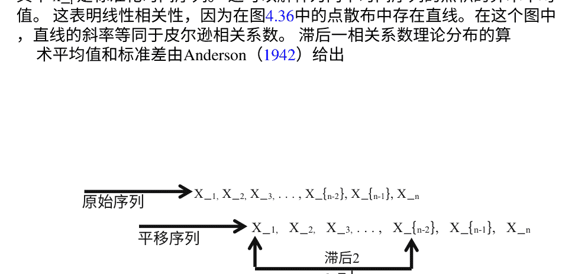

## 图 4.36 皮尔逊相关系数

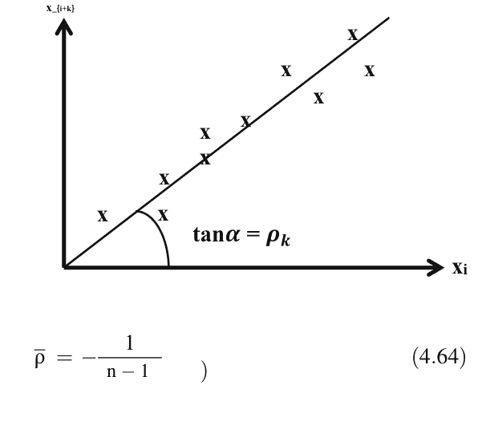

$$ \bar{\rho} = -\frac{1}{n-1} $$

和

$$ V_{\rho} = \frac{1}{n-1} $$

分别。从理论上的表述中可以得出一个隐含的假设，即样本的一阶相关系数具有正态（高斯）概率密度函数，其均值为 $\rho$，方差为 $V_{\rho}$。

两个不同时间序列（$X_i$ 和 $Y_i$）之间的互相关系数 $\rho_c$，$i=1,2,\ldots, n$ 可以定义如下：

$$ \rho_c = \frac{1}{n} \sum_{i=1}^{n} \left( \frac{X_i - \overline{X}}{\sigma_X} \right) \left( \frac{Y_i - \overline{Y}}{\sigma_Y} \right) $$

其中 $\overline{X}$ 和 $\overline{Y}$ 分别是每个序列的算术平均值，$\sigma_X$ 和 $\sigma_Y$ 分别是它们的标准差。相关系数被称为皮尔逊相关系数，它的取值范围是从 -1 到 +1。在中值为零的情况下，相关系数表示完全独立。否则，接近 +1（-1）的值表示正相关，即直接成比例（负相关，即反比例）的强相关性。总之，在上述解释的基础上，可以得出以下重要观点：

1. 在两个变量之间存在非线性关系的情况下，皮尔逊相关系数不适用，因为它只对线性相关情况有效。
2. 方程 (4.64) 和 (4.6) 提供了偏差值，如果样本函数中存在一个或多个极端值，那么皮尔逊相关系数就不能代表相关性。
3. 如果数据的概率密度函数（PDF）与正态（高斯）PDF 不一致，那么皮尔逊相关系数就不能代表记录。需要将非正态 PDF 转换为正态情况，以计算皮尔逊相关系数，但在这种情况下，相关系数不能真正代表原始时间序列。即使进行反向转换也不能保证相关系数等于原始值。在文献中，存在不依赖于 PDF 类型的自相关系数定义（Şen 1977 年）。
4. 皮尔逊相关系数需要方差恒定，即同方差性；否则它就不具有代表性。
5. 在模糊不确定性方法中（Ross 1995），皮尔逊相关系数不能使用，因为它依赖于一个单一的数字，而不是语言和语义数据。

在将皮尔逊相关系数应用于任何时间序列之前，需要检查这些点。Anderson (1942) 提供了一个显著性检验，用于接受显著的皮尔逊相关系数。正如 Feller (1967) 所述，它绝不是一个普遍的依赖度量，因为它涉及许多假设，但在许多应用中大多数假设都没有被考虑。

相关系数的取值范围在 -1 和 +1 之间。相关系数越接近零，两个 SFs 越随机，即独立，否则，接近 +1（-1）的值意味着正（负）强相关。正相关意味着成比例，负值表示不成比例。在正相关的情况下，高（低）值跟随高（低）值，而在负相关的情况下，高（低）值跟随低（高）值。通过公式（4.63）计算的相关性是串行相关或自相关系数。它的取值范围在 -1 和 +1 之间，中间值在表 4.5 中给出了具体的解释。不需要记忆这个表格，因为它们是本作者的主观意见。其他作者可能会因为他们的经验而偏离这个表格的具体规定，但这些偏差在实际工作中并不重要。这个相关系数是衡量两个变量之间线性依赖关系的指标。如果相关性不是线性的，那么这些定义就是无效的。在完全正相关（$\rho_p = +1$）的情况下，两个 SFs 直接成比例，否则在完全负相关的情况下（$\rho_p = -1$），它们是反比例关系。在这两种情况下，两个变量之间存在完全的数学关系。在根据公式（4.66）进行任何计算之前，将两个变量的散点图可视化在笛卡尔坐标系上非常有用。如果散点图的关系给出线性的印象，那么只有在数值计算时才应使用公式（4.66）。否则，直接进行数值计算可能导致不必要的结论，没有任何好处。表 4.5 中给出了各种相关系数值的语言具体规定。

以下是皮尔逊相关系数在实际应用中的不足之处：

1. 即使相关性不是线性的，根据公式（4.63）计算的相关值将出现在 -1 和 +1 之间。这可能没有逻辑和物理意义，因为它仅对线性关系有效。
2. 如果 SF 中存在一个或多个极值，则这些值会以某种方式影响方程(4.63)，使得相关系数出现偏差和/或不具代表性。
3. 数据必须符合正态概率密度函数，否则相关系数没有意义。
4. 为了得到有意义和可靠的相关系数，数据的标准差必须是恒定且有限的，即同方差性。
5. 方程(4.63)和(4.66)中的相关系数定义不能用于口头和语言数据。
6. 如果数据通过任何方式进行转换，转换后的数据的相关系数将不同于原始数据。即使进行反向转换，也不能保证相关系数等于观察到的相关值。

综上所述，皮尔逊相关系数的定义域相当受限，在使用之前必须注意所有必要的假设以确保其有效性。通过安德森检验可以确定该相关系数的显著性。

大多数实证研究明显属于这两个一般类别之一。在相关研究中，我们不会（或者至少尽量不会）影响任何变量，而只是测量它们并寻找它们之间的关系（相关性）。在实验研究中，我们操纵某些变量，然后测量这种操纵对其他变量的影响；例如，研究人员可能人为地增加血压，然后记录胆固醇水平。实验研究中的数据分析也归结为计算变量之间的“相关性”，具体而言，是那些被操纵的变量和受操纵影响的变量之间的相关性。

然而，实验数据可能提供更好的定性信息。只有实验数据能够确切地证明变量之间的因果关系。

### 4.19.2 非参数相关系数

在参数统计学中，相关系数被称为皮尔逊相关系数，定义如公式（4.63）中的乘积矩阵。在非参数统计学领域，类似于皮尔逊相关系数的是斯皮尔曼等级相关系数。皮尔逊相关系数要求两个变量都符合正态分布，而这在许多科学研究中并不成立。

### 4.19.2.1 斯皮尔曼等级相关

这是一种非参数相关计算过程，其中给定的时间序列分别按升序排列，并分别获得排名 $R(X_i)$ 和 $R(Y_i)$。斯皮尔曼相关系数不要求数据服从正态（高斯）分布，并且对极端值具有鲁棒性。如果两个序列中的排名在每个时刻都相等，则两个变量之间存在完美的相关性。否则，如果相应的排名之间存在差异，则斯皮尔曼相关性在数学上定义为差异的总和。然后，斯皮尔曼等级系数被缩放到 -1（完美的负相关）和 +1（完美的正相关）之间。在中间，有一个等于零的值表示没有相关性。以下是这个等级相关计算的步骤：

1. 零假设 H0，将完全独立定义为零相关系数，$\rho_h = 0$。
2. 除了零秩相关外，其他值都属于备择假设 HA。
3. 检验统计量 $\rho_s$，以秩和每组数据数量 n 表示：

$$\rho_{s}=1-6\frac{\sum_{i=1}^{n} \left[ R(X_i) - R(Y_i) \right] }{n(n^2-1)} \qquad(4.67)$$

与皮尔逊相关系数不同，$\rho_s$ 不表示线性关系指标。

### 4.19.2.2 自动运行（Şen）测试

一般认为，如果一个系列是相关的，这意味着高（低）值倾向于跟随高（低）值。对于相关系列，这个陈述应该有不同的解释；具体来说，盈余期（正向运行）和亏损期（负向运行）往往比独立系列的情况更大。(Feller 1967)。这种属性被称为“持久性。”科学家们通过三种方法，即自相关函数、频谱分析和重标度范围分析（Hurst 1951）来测量“持久性”。盈余和赤字的拼写与各种研究者的解释有直接关系（Mood 1940; Swed and Eisenhart 1943; Şen 1976）。

自相关分析是一种测量任意两个观测值之间线性依赖关系的方法。正如 Feller（1967）所述，这绝不是一种普遍的依赖度量，因为它涉及到前一节中提到的所有假设。另一方面，通过经典的周期图法对序列模式进行频谱分析已经使用了很多年。最后，重标度范围分析是由 Hurst（1951，1956）引入的一种比其他任何技术更为稳健的方法，对边际概率密度函数不太敏感。

Şen（1979）提出了基于中位数的特殊情况的自动运行系数，该系数对应于超过概率 $p =0.50$。广义自动运行系数适用于任何概率水平 $0 < p <1$。在下面，将简要回顾自动运行方法的定义，并提出新的公式建议。

联合概率和条件概率也是依赖度的度量（第 4.4.2 节和第 4.5.1 节）。一般来说，联合概率等于条件概率乘以边际概率（Feller 1967）。如果 $x_i$ 和 $x_{i-k}$ 是两个相互独立的事件，其联合概率密度函数为 $P（x_i，x_{i-k}）$，则它们的条件概率密度函数表示为 $P（x_i/x_{i-k}）$。在这里，k 被称为滞后，并表示两个事件之间的时间差，如果 $P（x_{i-k}）$ 是事件 $x_{i-k}$ 的边际概率密度函数，则以下概率语句在这两个概率之间成立。

$$P(x_i, x_{i-k}) = P\left(\frac{x_i}{x_{i-k}}\right) P(x_{i-k}) \tag{4.68}$$

此外，条件概率由 Şen (1976) 定义为自相关系数，$r = P (x_i/x_{i-k})$，因此，方程(4.68)得出

$$r_k = \frac{P(x_{i-k}, x_i)}{P(x_i)} \tag{4.69}$$

更详细地说，如果时间序列被截断到一个任意的常数水平 $x_0$，那么这个表达式可以用超过概率的更明显的方式来定义

$$r_k = \frac{P(x_{i-k} > x_0, \ x_i > x_0)}{P(x > x_0)} \tag{4.70}$$

Şen (1976) 为中位数 m 的截断水平定义了一个特殊情况，其中 $P (x_i > m) = 0.5$。在这里，$p = P (x_i >m)$ 是超过概率。非超过概率，即 $q = 1 - p$。因此，一般来说，自动运行系数的定义变为

$$r_k = \frac{P( x_{i-k} > m, \ x_i > m)}{p} \tag{4.71}$$

评估总体自动运行系数所需的信息是相隔 k 个观测值的联合概率密度函数。不幸的是，在实践中，变量的总体概率密度函数不可用，而是可能有一系列测量值可用。因此，自动运行系数的样本估计必须从测量数据中估计出来。

可以通过考虑教科书中的公式（4.71）以及经典概率定义，简单地提出对 $r_k$ 的估计，即 $\hat{r}_k$。根据这个定义，概率 $P(x_i)$ 是通过计算在自动运行情况下超过的总次数 $n_x$ 来确定的，因此可以简单地定义如下。

$P(x_i > x_0) = n_x / n$  (4.72)

换句话说，$P(x_i)$ 是有利选择与总数 n 的比率，即有利选择与总选择数 n 的比率。另一方面，在联合事件（$x_i > m, x_{i-k} > m$）的情况下，在一系列 n 次观察中，存在 $n-k$ 个可能的选择，这些选择同时大于 m。因此，如果长度为 n 的给定序列中的联合事件数为 $n_k$，则可以从等式（4.72）中得到

$P(x_i > m, x_{i-k} > m) = n_k / (n - k)$  (4.73)

将其代入等式（4.71）中得到 $r_k$ 的小样本估计值为

$\hat{r}_k = n_k / (p(n - k))$  (4.74)

这个表达式的分子是一个整数值的随机变量，而分母是给定 n、k 和 p 的固定值。因此，估计值 $\hat{r}_k$ 的随机特性可以从随机变量 $n_k$ 的特性中得到。例如，如果已知期望值 $E(n_k)$ 和方差 $V(n_k)$ 的值，那么可以通过以下表达式分别计算 $\hat{r}_k$ 的期望值和方差：

$E(\hat{r}_k) = E(n_k) / (p(n - k))$  (4.75)

和

$V(\hat{r}_k) = V(n_k) / (p q (n - k)^2)$  (4.76)

基于概率的频率解释，估计 $\hat{r}_k$ 可以通过以下步骤的连续执行来计算：

1. 超过概率 p 及其对应的截断水平 $x_0$ 是从给定序列 $x_1$，$x_2$，...，$x_n$ 计算得出的。
2. 该序列在 $x_0$ 水平被截断，因此，超额（$x_i > x_0$）和不足（$x_i \le x_0$）的序列被识别出来。
3. 计算重叠连续超额对（相隔 k 个观测）的数量 $n_k$。
4. 然后，根据公式（4.74）计算出 $\hat{r}_k$ 的估计值。

有趣的是，在这个阶段要指出的是，这四个步骤中的计算都是无分布的。当历史数据的长度理论上趋近于无穷大时，$r_k$ 变为

$$r_k = \lim_{n \to \infty} \frac{2n_k}{n - k} = 2P( \ x_i > m, \quad x_{i-k} > m) \tag{4.77}$$

与自相关相反，自运行分析不会扭曲所考虑序列的依赖结构。此外，自运行系数的计算比自相关系数更容易。此外，自运行分析与运行特性直接相关，对各种工程问题起到了有效的作用。使用一阶马尔可夫过程进行了大量的模拟研究，并根据公式（4.75）计算了合成序列的自运行函数。

## 4.20 经典回归技术

许多统计预测的本质依赖于预测误差平方和最小的原则。在此，预测误差被定义为观察值与预测值之间的差异。下面将介绍统计最小二乘技术的简单修订。

关于天气预报员和地球科学家的详细介绍可以在 Koch 和 Link（1971）以及 Davis（2002）的教科书中找到。在回归方程参数估计中有六个限制性假设，应在任何应用之前考虑：

1. 线性性：回归技术通过数据点的散点图拟合一条直线趋势，相关分析测试这条直线的“拟合程度”。显然，如果趋势不能用一条直线表示，回归分析将无法准确描述它。在存在明确趋势的情况下，使用交叉相关是必要的，并且它通过定义引入了线性限制。
2. 正态性：普遍认为线性回归模型的使用需要变量具有正态（高斯）分布。尽管如此，要求的并不是原始数据服从正态分布，而是残差的条件分布应服从正态分布。如果条件分布是正态的，那么几乎可以确定，因变量和自变量的分布也是正态的。因此，有必要测试数据是否服从正态分布，以确定正态条件分布的先决条件是否存在。
3. 条件分布的均值：对于每个自变量的值，由公式（4.17）得到的测量值和预测的全局因变量值之间的差异的均值必须为零。如果不是，则回归方程的系数（a 和 b）是有偏估计。此外，从这个假设的重大偏离可以推断出散点图中的趋势不是线性的。
4. 同方差性：这意味着条件分布的方差相等，这是一个重要的假设。如果不满足这个假设，回归方程的系数（a 和 b）可能会严重偏倚。为了测试同方差性，数据必须被分成三个或更多组，并计算每组的方差。如果这些方差之间存在显著差异，则数据具有同方差性。
5. 自相关性：这个假设的关键是独立变量的每个观察值的值与其他所有值都是独立的，因此如果知道时间 i 的变量值，就无法预测时间 i-1 的变量值。对于这个假设的重要性有两种解释：一种是实质逻辑的，另一种是统计逻辑的。自相关性的统计解释与线性假设有关。
6. 缺乏测量误差：这个假设要求因变量和自变量的测量都没有误差。如果不是这种情况，并且误差的大小未知，则回归方程的系数可能存在无法估计的偏差。

如果没有进行必要的测试并且数据没有准备好，上述所有解释都会对回归系数的估计产生怀疑。在实际研究中，全球范围内的研究人员往往不关心或者甚至不考虑这些限制性假设，因此系数的估计可能会存在偏差。甚至全局偏差的大小都不知道，因此无法定义和应用偏差校正程序。

因此，参数估计仍然存在怀疑。为了避免所有这些限制性假设，与应用具有一组限制性假设的程序性回归分析相比，在许多实际研究中，保留因变量和自变量数据的算术平均值和方差可能更可取。毕竟，算术平均值和方差是任何设计工作中最重要的统计参数。

## 表 4.5 相关系数类别

| 数值区间 | 语言解释 |
| --- | --- |
| $\rho_p = -1.0$ | 完全负相关 |
| $-1.0 < \rho_p < -0.9$ | 强烈负相关 |
| $-0.9 < \rho_p < -0.7$ | 相当负相关 |
| $-0.7 < \rho_p < -0.5$ | 弱负相关 |
| $-0.5 < \rho_p < -0.3$ | 非常弱负相关 |
| $-0.3 < \rho_p < -0.1$ | 不显著负相关 |
| $\rho_p = 0.0$ | 完全独立 |
| $0.1 < \rho_p < 0.3$ | 不显著正相关 |
| $0.3 < \rho_p < 0.5$ | 非常弱的正相关性 |
| $0.5 < \rho_p < 0.7$ | 弱正相关性 |
| $0.7 < \rho_p < 0.9$ | 强正相关性 |
| $\rho_p = 1.0$ | 完全正相关性 |## 4.20.1 散点图

如果问题是寻找两个变量之间的关系类型，那么实际答案只能通过在笛卡尔坐标系上绘制两个样本函数（SFs）的相应值来给出。因此，两个SFs的数据值会产生散点，如图4.37所示，这提供了视觉检查、初步感觉和考虑两个变量之间关系类型的方法。 这样的带有数据点的坐标系在统计学术语中被称为散点图。

将散点图与函数关系进行比较，可以直观地提供关于确定性关系形式（数学函数）类型的第一个观点，它显示了两个SF值之间的一般趋势。

$$Y = a_{yx} + b_{yx}X$$ \quad (4.78)

这个模型也被称为简单回归技术，因为在这里X被回归到Y上。在任何实际的预测模型中，都会有多个预测变量，但是简单线性回归的思想可以很容易地推广到多元线性回归。 在笛卡尔坐标系上表示方程（4.78）得到的是数学意义上的一条直线，但在统计意义上是散点，其中每个点与数据对（X_i, Y_i）相关联，对应于n个数据对（i = 1,2,...,n）。 直线的相对位置必须是

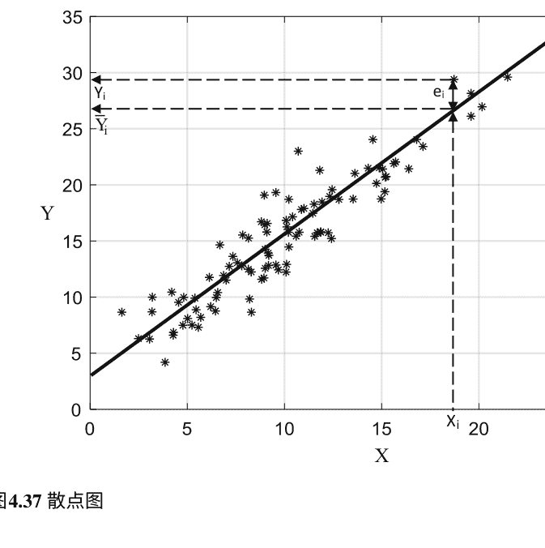

以使每个点到这条直线的偏差平方和最小。 在这里，偏差被视为误差的同义词。如图4.37所示，这些偏差可以是水平、垂直或垂直距离。 然而，在实际研究中，垂直偏差平方和最小化是通过散点图上的回归线来决定的。 选择平方误差和的准则不仅方便于得到最佳模型，而且在数学上易于处理。 因此，散点图对于确定变量之间的功能关系非常重要。 在任何功能关系中，例如方程（4.78）中，都有参数a_{yx}和b_{yx}。参数a_{yx}和b_{yx}的下标表示Y变量（预测变量）是由X预测变量预测的。 在确定最佳关系形式后，从可用的SF数据值中确定或估计模型参数非常重要。 估计中的原则是误差（在任何预测的Y^i 和测量值 Y_i）平方和的值最小。参数取决于SFs*数据，可以隐式表示。

a_{yx} = f_1(X, Y) \quad (4.79)

和

b_{yx} = f_2(X, Y) \quad (4.80)

最后，整个问题现在是如何获得模型参数的显式表达式。为此，使用回归过程，将在下面的续集中解释。

### 4.20.2 数学线性回归模型

在本节中，只考虑直线模型。回归过程是寻找Eqs的显式表达式的搜索过程。(4.79)和(4.80)。为了更加深入地理解问题，让Eq. (4.78)表示为第i个数据对。

Y_i = a_{YX} + b_{YX}X_i \quad (4.81)

在图4.38中，展示了不同模型参数集的不同直线形式。

在图4.38a中，有一个相当陡峭的斜坡。这意味着方程（4.81）中的b_{yx}参数具有一个较大的值。以这种方式，X的增加导致Y的增加。然而，在图4.38b中，情况恰恰相反，X的增加导致Y的减少。前者对应于正相关，后者对应于负相关。因此，b_{yx}参数表示直线的斜率，并且在图4.38c中以几何方式表示。对于沿X轴的某个β距离，对应的在Y轴上的垂直距离是α，因此斜率可以表示为。

$$b_{YX} = \alpha / \beta$$ (4.82)

如果β=1，则Y轴上的α值直接给出了斜线的斜率，该斜率等于b_yx。这个参数被称为回归系数。它是因变量Y对独立变量X的每个单位增量所对应的变化。在图4.38c中，a_yx对应于在Y轴上的截距点的纵坐标。到目前为止，回归参数（a_yx和b_yx）在数学上完全独立于SF数据值进行了解释。已经说明这些参数应该被确定为使偏差（误差）平方和最小化。

### 4.20.3 统计线性回归模型

直线参数必须从散点图中最佳拟合中估计出来，如图4.37a所示。这意味着拟合的直线必须尽可能接近整体散点。这句话中的“尽可能”意味着点到直线的方差必须达到最小值。一般来说，在任何经典的直线模型中拟合，偏差被采用作为垂直于Y轴的垂直误差，如图4.37a所示。因此，基于n个数据点的误差平方和的最小化可以用数学方式表示为

$$最小值 \sum_{i=1}^{n} \left( \hat{Y}_i - Y_i \right)^2$$ (4.82)

其中 Ŷ_i 表示对应于第i个数据点 X_i 的预测Y值。方程（4.82）中的表达式被称为回归方法中的最小二乘程序。在任何回归程序中，主要问题是因变量和自变量（Y_i和X_i）的方差之间的关系。有了这些信息，让我们集中在图4.38中的各个Y_i和X_i点上。为了更好地理解，在算术平均值X̄和Ȳ之后，点1和点2对总方差S_X^2和S_Y^2的贡献，即u、v、s和t的偏差，在图4.39a中显示。在图4.39a中，点1对S_X^2和S_Y^2的贡献分别为u^2和v^2。这样，点1和点2由于与算术平均值X̄和Ȳ相比较远的位置，对方差S_X^2和S_Y^2有着显著的贡献，而点3的贡献非常小。为了共同考虑这些贡献，需要发展协方差的概念。一般来说，协方差被定义为偏差与平均值的乘积的平均值。因此，

$$\text{Cov}(X, Y) = \frac{1}{n} \sum_{i=1}^{n} (X_i - \bar{X})(Y_i - \bar{Y}) \quad (4.83)$$

例如，在图4.39a中，点1和点2的协方差贡献分别为

$$(X_1 - \bar{X})(Y_1 - \bar{Y}) = uv$$
$$(X_2 - \bar{X})(Y_2 - \bar{Y}) = ts$$

分别。对于这两个点，根据公式（4.83），协方差可以表示为如下

$$\text{Cov}(X,Y) = \frac{1}{2}(uv + ts)$$

在图4.39b、c、d中，回归线的斜率出现为这个协方差与自变量的方差 $S_X^2$ 之间的比值，即

$$b_{YX} = \frac{\text{Cov}(X,Y)}{S_X^2} \quad (4.84)$$

从图4.39中可以明显看出，整体回归线穿过与点（X，Y）对应的所有 $X_i$ 和 $Y_i$ 数据的重心。有了这个信息，可以轻松计算出直线在Y轴上的截距点纵坐标，即参数 $a_{YX}$，从而得到

$$\bar{Y} = a_{YX} + b_{YX} \bar{X} \quad (4.85)$$

和

$$a_{YX} = \bar{Y} - b_{YX} \bar{X} \quad (4.86)$$

回归参数必须基于“最小误差和平方来确定。”为此，基本直线可以通过考虑误差项 e_i 来重新表示第 i 个数据点

$$Y_i = a_{YX} + b_{YX}X_i + e_i \quad (4.87)$$

因此，第 i 个数据值的误差为

$$e_i = Y_i - (a_{YX} + b_{YX} X_i) \quad (4.88)$$

此外，误差平方是

$$e_i^2 = [Y_i - (a_{YX} + b_{YX} X_i)]^2 \quad (4.89)$$

最后，所有可用数据的误差平方和为

$$H_T = \sum_{i=1}^{n} e_i^2 = \sum_{i=1}^{n} [Y_i - (a_{YX} + b_{YX} X_i)]^2 \quad (4.90)$$

为了最小化这个表达式，在数学上，需要对未知数（这里的未知数是 $a_{yx}$ 和 $b_{yx}$）进行偏导数，并将其置零，如下所示：

$$\frac{\partial \mathrm{H}_{\mathrm{T}}}{\partial \mathrm{a}_{\mathrm{YX}}}=\sum_{\mathrm{i}=1}^{\mathrm{n}} 2 \left[ \mathrm{Y}_{\mathrm{i}}-\left(\mathrm{a}_{\mathrm{YX}}+\mathrm{b}_{\mathrm{YX}} \mathrm{X}_{\mathrm{i}}\right) \right] (-1) =0 \quad(4.91)$$

和

$$\frac{\partial \mathrm{H}_{\mathrm{T}}}{\partial \mathrm{b}_{\mathrm{YX}}}=\sum_{\mathrm{i}=1}^{\mathrm{n}} 2 \left[ \mathrm{Y}_{\mathrm{i}}-\left(\mathrm{a}_{\mathrm{YX}}+\mathrm{b}_{\mathrm{YX}} \mathrm{X}_{\mathrm{i}}\right) \right] \left(-\mathrm{X}_{\mathrm{i}}\right)=0 \quad(4.92)$$

简化后，

$$\sum_{\mathrm{i}=1}^{\mathrm{n}} \mathrm{Y}_{\mathrm{i}}=\mathrm{n} a_{\mathrm{YX}}+\mathrm{b}_{\mathrm{YX}} \sum_{\mathrm{i}=1}^{\mathrm{n}} \mathrm{X}_{\mathrm{i}} \quad(4.93)$$

和

$$\sum_{\mathrm{i}=1}^{\mathrm{n}} \mathrm{Y}_{\mathrm{i}} \mathrm{X}_{\mathrm{i}}=\mathrm{a}_{\mathrm{YX}} \sum_{\mathrm{i}=1}^{\mathrm{n}} \mathrm{X}_{\mathrm{i}}+\mathrm{b}_{\mathrm{YX}} \sum_{\mathrm{i}=1}^{\mathrm{n}} \mathrm{X}_{\mathrm{i}}^{2} \quad(4.94)$$

将这些方程除以数据数量n，可以得到以算术平均数表示的表达式

$$\overline{\mathrm{Y}}=\mathrm{a}_{\mathrm{YX}}+\mathrm{b}_{\mathrm{YX}} \overline{\mathrm{X}} \quad(4.95)$$

和

$$\overline{\mathrm{YX}}=\mathrm{a}_{\mathrm{YX}} \overline{\mathrm{X}}+\mathrm{b}_{\mathrm{YX}} \overline{\mathrm{X}}^{2} \quad(4.96)$$

很明显，方程(4.95)等价于之前得到的方程(4.85)，另一方面，将方程(4.95)中的$\mathrm{a}_{\mathrm{yx}}$代入方程(4.96)后进行必要的代数运算，可以得到

$$\mathrm{b}_{\mathrm{YX}}=\frac{\overline{\mathrm{YX}}-\overline{\mathrm{X}}\cdot\overline{\mathrm{Y}}}{\overline{\mathrm{X}}^{2}-\overline{\mathrm{X}}^{2}} \quad(4.97)$$

这应该与方程(4.84)有类似的解释。

### 4.20.4 最小二乘法

许多统计天气预报的本质依赖于这个原则，即预测误差平方的总和应该最小。在这里，预测误差被定义为观测值和预测值之间的差异。

下面介绍了统计最小二乘法的简单修订技术。关于天气预报和地球科学的详细内容可以在Wilks（1995）、Neter等人（1996）和Fuller（1996）的教科书中找到。

### 4.20.5 简单线性回归过程

在这个标题中，线性关系意味着任意两个变量之间的最简单线性关系。其中一个变量被称为“独立”或“预测”变量，另一个变量被称为“依赖”或“预测目标”变量。一般来说，预测目标Y可以用预测变量X表示为。

$$Y = a + bX \tag{4.98}$$

其中a和b是简单模型的系数。该模型也被称为简单回归技术，因为在此模型中，X被回归到Y上。在任何实际的预测模型中，都有更多的预测变量，但是简单线性回归的思想很容易推广到多元线性回归的复杂情况。在笛卡尔坐标系上表示方程（4.98）得到的是数学意义上的一条直线，但在统计意义上是点的散布，其中每个点与数据对（$X_{i}, Y_{i}$）相关联，共有n个数据对（$i=1,2,\dots,n$）。直线的相对位置必须以使每个点到该直线的平方偏差之和最小为目标确定。在这里，偏差与误差是同义词。如图4.37所示，这些偏差可以被定义为垂直、水平或垂直距离。尽管从理论上讲，通过考虑垂直距离作为误差可以得到最佳的直线拟合情况，但是计算它们需要时间和精力，因此在实际研究中，通常通过最小化垂直偏差来确定回归线。垂直偏差对应于给定预测变量值的预测结果。最小二乘回归的基础是选择平方误差准则。选择平方误差和作为准则不仅方便，而且在数学上易于处理。如图4.37所示，在假设模型参数a和b已知的情况下，给定预测变量值$X_{i}$，预测的Y值为$\hat{Y}_i$，根据方程（4.98）可以得到落在直线上的点。

$$\hat{Y}_i = a + bX_i \tag{4.99}$$

数据点$Y_i$与预测器相同$X_i$值对应的直线上的点$\hat{Y}_i$之间的垂直距离是误差量$e_i$，也被称为残差，它被客观地定义为。

$$e_i = Y_i - \hat{Y}_i \tag{4.100}$$

因此，对于每个数据对（$X_i$， $Y_i$），都有一个单独的误差量$e_i$。根据数据点在图4.37中位于直线上方还是下方，误差项具有正负号。

通常在统计学中是常见的惯例，但在大气科学中却相反，观测值低于预测值（线在点下方）被认为是负误差，反之亦然（Wilks 1995）。由于最佳拟合线的定义是基于平方残差，符号约定并不重要。带有误差的回归方程和数据值可以写成。

$$Y_i = a + bX_i + e_i (4.101)$$

这个表达式表示，预测变量的真实值等于预测值和残差在给定预测变量的情况下的总和。同样，这个表达式给出了误差及其平方，给定数据的所有平方误差的总和为

$$T = \sum_{i=1}^{n} (e_i)^2 = \sum_{i=1}^{n} (Y_i - \hat{Y}_i)^2 = \sum_{i=1}^{n} [Y_i - (a + bX_i)]^2 (4.102)$$

其中，T表示总平方残差。这个方程是确定模型参数表达式的基础，以给定的数据值为基础。为了达到这个目的，需要对总平方残差项关于a和b进行求导，并将这两个表达式置零。如果进行必要的代数简化，最终可以得到

$$a = \overline{Y} - b\overline{X} (4.103)$$

和

$$b = \frac{n\sum_{i=1}^{n} X_i Y_i - \sum_{i=1}^{n} X_i \sum_{i=1}^{n} Y_i}{n\sum_{i=1}^{n} (X_i)^2 - (\sum_{i=1}^{n} X_i)^2} (4.104)$$

必须注意到，斜率参数b等于皮尔逊相关系数，截距参数a在方程(4.103)中表示回归直线通过数据散点的质心。这相当于说回归线通过预测变量和被预测变量的算术平均值。因此，计算截距参数非常简单，只需要计算算术平均值。如果考虑到被预测变量和预测变量序列的标准变量，斜率参数的计算可以简化。假设这两个标准变量为x_i和y_i，则斜率参数简化为

$$b = \frac{1}{n} \sum_{i=1}^{n} x_i y_i = \overline{xy} (4.105)$$

这句话的意思是斜率参数等于标准预测变量和预测变量的交叉乘积的算术平均值。

### 4.20.6 残差属性

通过数据点的散点图拟合最佳直线需要上述数学过程的解释。为了成功应用回归方法，残差应具有一些特性。其中最重要的是残差的总和根据定义等于零，并且预期残差的方差是恒定的，即不随预测变量的值而变化。此外，在任何回归技术中，残差还应该是独立分布的。通常，还假设这些残差服从高斯分布。

由于残差的总和等于零，同样地，残差的算术平均值也等于零。这个陈述并不提供关于回归线周围的偏差的任何想法，因此可以通过残差的标准差来评估平均偏差。残差预计会随机散布在某个均值周围。因此，根据假设，给定的残差，无论是正的还是负的，大的还是小的，都有同样的可能性出现在回归线的任何部分。残差的分布比Y的分布更集中，这意味着它们的方差比Y的分布小，反映出对Y的对应X值的不确定性较小。为了在回归设置中进行统计推断，需要从残差样本中估计残差的恒定方差估计，如方程（4.100）所定义。由于在残差方差的计算中，残差的样本算术平均值等于零，必须考虑两个自由度（因为已经估计了a和b）

$$V(\epsilon) = \frac{1}{n-2} \sum_{i=1}^{n} e_i^2      (4.106)$$

在任何回归模型中，总方差等于回归预测方差和误差方差的总和。由于这些都是方差，因此因子1/n相互抵消，最终得到以下结论。即总数据平方和SST等于回归预测平方和SSR和误差平方和SSE的总和。这可以表示为。

$$SST = SSR + SSE      (4.107)$$

这个表达式还意味着被预测变量Y的变异性以及由回归表示的部分和由残差变异性表示的未表示部分的分割。方程（4.107）中各项的显式形式可以写为以下形式：

$$SST = \sum_{i=1}^{n} (Y_i - \bar{Y})^2 = \sum_{i=1}^{n} Y_i^2 - n\bar{Y}^2      (4.108)$$

$$SSR = \sum_{i=1}^{n} (\hat{Y}_i - \bar{Y})^2$$

和

$$SSE = \sum_{i=1}^{n} e_i^2$$

通过重新排列方程（4.107），误差方差也可以被定义为

$$V(\epsilon) = \frac{1}{n-2} (SST - SSR) = \frac{1}{n-2} \left\{ \sum_{i=1}^{n} Y_i^2 - n\bar{Y}^2 - b^2 \left[ \sum_{i=1}^{n} X_i^2 - n\bar{X}^2 \right] \right\}$$

在回归方法的理论背景中，有六个基本假设，如前面的第4.19节所提到的。

## 4.21 聚类回归分析

这种分析方法学是由Şen等人提出的，作为传统方法的一种替代方法，但具有线性模型的聚类结构。在下面的延续中，大部分文本都是从这篇文章中反映出来的。

近年来，逐渐（趋势）或突然（转变）的气候变化问题受到了关注（对温室气体对气候的影响引起了越来越多的关注）；大部分研究都是基于温度和降水数据，但在本节中，湖泊水位变化记录被用于聚类回归分析的实际应用，该方法可以应用于任何其他时间序列记录，甚至在工业中也可以应用。Slivitzky和Mathier对这一点进行了详细评估 (1993)。在这一研究领域中，Hubert等人(1989年)，Vannitsem和Demaree(1991年)和Sneyers(1992年)使用统计方法表明，非洲和欧洲的温度、压力和径流序列在本世纪和上个世纪发生了多次变化。另一方面，正如Slivitzky和Mathier所指出的(1993年)，大湖水位和径流序列的大多数建模都假设时间序列具有平稳性，使用了Box和Jenkins(1974年)引入的自回归移动平均(ARIMA)过程。假设湖泊水位的波动没有平稳性属性，因此，经典模型如ARIMA过程不能可靠地模拟湖泊水位。

使用月度湖泊变异性的多变量模型未能充分复制流域资源的统计特征和持续性(Loucks 1989; Irvine和Eberhardt 1992年)。水位的频谱分析指出湖泊水位水文变量可能存在显著趋势(Privalsky 1990; 风等1990年)。几乎所有这些科学研究都严重依赖于自相关系数作为湖泊水位时间中长期持续性的指标系列。然而，许多研究人员已经表明，平均湖泊水位的变化可能引入不现实和虚假的自相关性。这就是为什么经典统计模型经常无法重现统计特性的主要原因。然而，Mathier等人（1992年）能够充分重现一个平均值变化模型的统计特性。在本节中，我们将开发一个聚类线性回归模型，然后用它来模拟月度湖泊水位波动，以保留统计特性和相关系数。该方法应用于土耳其东部的凡湖水位波动。

### 4.21.1 研究区域

凡湖是世界上最大的苏打湖，位于土耳其东部的安纳托利亚高原上（38.5°N和43°E）（图4.40）。凡湖地区的冬季非常严寒，气温常常低于0 °C。大部分降水在冬季以雪的形式降落，而大雨则在春末发生。

在春季融雪期间，产生了高径流率，其中超过80%的年径流量流入湖泊。夏季（7月至9月）炎热干燥，平均温度为20°C。每日温度变化约为20°C。凡湖拥有一个面积为12,500平方千米的大流域。湖面目前平均面积为3600平方千米（Kempe等人, 1978年）。湖面海拔约为1650米。湖泊周围环绕着山丘和山脉，最高可达4000米。

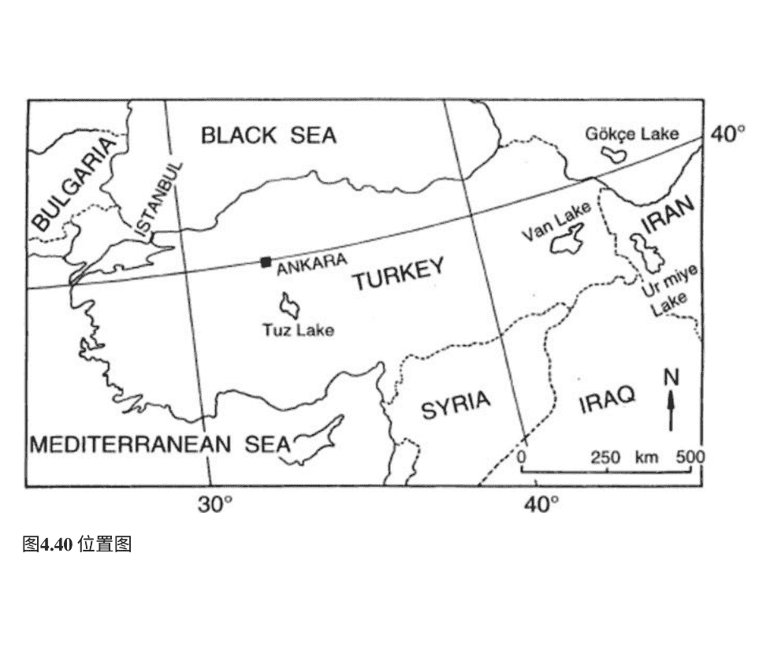

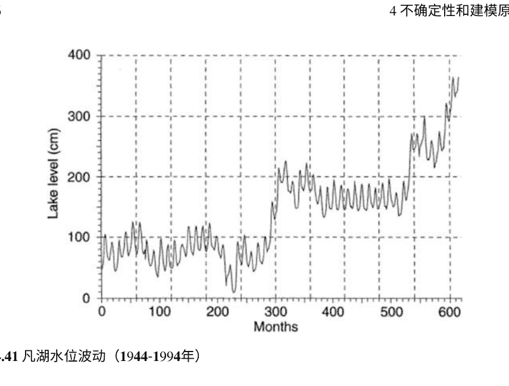

过去十年里，凡湖水位上升了约2米，导致沿海低洼地区现在给当地行政人员、政府官员、灌溉活动和居民的财产带来问题。图4.41显示了1944年至1994年每年1月至6月的50年湖泊水位波动情况，水位在下半年上升和下降。

### 4.21.2 聚类回归模型

经典回归分析对残差的正态性和独立性有几个假设。此外，在大多数回归线实现中，忽略了一个隐含的假设，即散点应均匀分布在一条线周围。不幸的是，这个假设经常被忽视，特别是如果没有绘制散点图的话。如果原始记录是同质且稳定的，沿着线均匀分布点是可能的，没有任何偏移、趋势或季节性。如果随时间发生水平变化，散点图将包含沿回归线的点簇。这种点簇的确认在图4.42中明显可见，该图显示了来自凡湖的月度记录的滞后一期散点图。

从散点图的解释中可以得出以下结论：

- (a) 滞后一期散点图显示了连续湖水位出现之间的一般直线关系。这样一条线的存在对应着月度湖泊水位时间序列中的一阶自相关系数。因此，湖泊水位的持续性可以通过这条直线来维持。
- (b) 点围绕直线散布在一个狭窄的带内，这意味着在数据没有发生变化的情况下，近期水位的预测与当前水位不能有太大差异。
- (c) 沿直线存在不同的聚类区域。 这些聚类在经典回归方法中是不被期望的，但是这些聚类的存在将经典回归分析转化为聚类回归分析，本节将介绍其基础。 不同的聚类对应于水位发生变化的时期。
- (d) 经典回归分析提供了通过径流估计水位的基础，但是在聚类回归线方法中，只有考虑到聚类形成的概率才能得到可靠的估计。 在这里，关于在预测中应该选择哪个聚类的问题引起了争议。 未来的预测应该保持在同一个聚类中吗？ 从一个聚类到另一个聚类的任何转变都意味着水位的变化。 因此，我们需要了解各个聚类之间的转变概率。 聚类回归不仅显示自相关系数，还显示每个聚类在水平轴上的影响域，如图4.42所示的A、B、C和D。 影响域有助于计算原始水位记录中各个聚类之间的转变概率。
- (e) 对于任何当前的聚类，可以使用回归线方程预测未来的正常湖水位。

通过聚类回归分析，需要以下步骤来获得可靠的估计：

- 1. 首先决定应该考虑哪个影响域（A、B、C或D），可以使用一个均匀分布函数，在0到400厘米之间取随机值。生成一个均匀分布的随机数，并根据其决定下一个聚类，考虑影响域。例如，如果均匀分布的随机数是272，则当前聚类将属于图4.42中影响域C。
- 2. 生成另一个均匀分布的随机数，如果水位仍然在同一聚类中，则使用回归方程进行估计。否则，取新聚类中的平均水位值。新水位将被视为图4.42中聚类区域的中点。更好的估计应该基于从每个聚类的变化空间内约束的均匀分布重新生成随机变量。此外，以这种方式找到的值将与随机残差值相加。这将为同一聚类区域内的未来水位估计提供基础。

### 4.21.3 应用

在这里，采用了聚类回归方法来分析凡湖的水位波动。为此，将连续水位的不同滞后散点图绘制在图4.43和图4.44中。这些图表的概览表明了聚类回归方程步骤在前一节中提到的适用性。所有图表都有直线，并且表4.6中给出了A、B、C和D之间的过渡边界，以及不同滞后期内每个聚类的边界。

在这里，A被认为是一个低水位聚类，只允许从低水位到低水位的过渡。B和C分别指的是较低中等水位聚类和较高中等水位聚类，最后，D是仅包含最高水位的聚类。从表4.6可以明显看出，A和B之间以及B和C之间的过渡限制在所有滞后期内基本保持不变，分别为129和219。然而，C和D之间的上限过渡随着滞后值的增加而增加。第一和第九滞后期之间的差异相对误差百分比为100×(308－285)/308＝7.4，对于实际目的来说可以认为是很小的。

图4.43和图4.44中的散点图给出了以下具体评论：关于凡湖水位的波动。

- (a) 散点图有四个簇，簇A中点的密集程度最高，代表着较低的水位，其次是低水位。水位波动的极值在簇D中发生的频率最低。
- (b) 无论滞后值如何，散点图中的点都在一个狭窄的带内偏离回归线。这表明一旦水位处于一个簇内，它将很可能保持在这个簇内，这将在本节后面讨论。此外，簇之间的转换预计会非常罕见，实际上只会在相邻的簇之间发生。
- (c) 在任何散点图中，水位从一个簇转移到另一个非相邻的簇是不可能的。这可以从计算的过渡矩阵元素中验证，因为主对角线和两个对角线上都没有元素。在这里，只考虑一阶回归线来建模湖泊水位，同时考虑相邻簇之间的过渡概率。从1944年到1994年，凡湖的月水位时间序列数据产生了一个一阶过渡概率矩阵[M]，如下所示：

```
M =
[ A   B   C   D ]
A [291  2   0   0 ]
B [ 1  233  4   0 ]
C [ 0   3  54   2 ]
D [ 0   0   1  20 ]    (4.112)
```

该矩阵中的对角线值是每个簇内的传递次数。例如，在簇A内有291次从低水位到低水位的过渡。在同一矩阵中，簇间过渡沿对角线发生得相当少，例如从簇B到C的四次过渡。在经典随机过程中，过渡矩阵元素的计算基于一个基本假设，即过程是可逆的。这相当于说A → B的转换与B → A的转换是相同的。因此，得到的矩阵应该是对称的。然而，在提出的聚类回归方法中，只允许沿时间轴向未来的单向转换。这意味着沿时间轴的转换是不可逆的。因此，过渡矩阵不是对称的。因此，方程（4.112）中的矩阵不是对称的；从C到B的转换是3，而不是4。在非对角线旁边的零值表示水位只能移动到相邻的聚类中。因此，可能的转换只有A、B、C和D。

例如，从B到聚类C的转换可以发生四次，从前一个C可以发生54次，而从D只能发生一次（因此总共59次转换）。列值表示从其他聚类到正在考虑的聚类的转换，转换概率可以通过将列中的每个值除以列总数来计算。因此，转换概率矩阵[P]来自方程（4.112）如下。

|   | A     | B     | C     | D     |
|---|-------|-------|-------|-------|
| A | 0.9932| 0.0068| 0     | 0     |
| B | 0.0042| 0.9790| 0.0168| 0     |
| C | 0     | 0.0508| 0.9152| 0.0339|
| D | 0     | 0     | 0.0476| 0.9524|

通过图4.44中的聚类散点图，可以得到关联两个连续水位W_i和W_{i-1}的线性回归线

$$W_i = 0.9858W_{i-1} + 1.45918 + \varepsilon_i (4.114)$$

其中ε_i表示回归线上的垂直随机偏差。从理论上讲，这些随机偏差应该服从正态（高斯）分布函数，以使回归线有效，图4.45显示它们服从正态分布。

为了采用带有聚类散点的方程（4.114）进行估计，必须考虑以下步骤：

- (a) 由于最常出现的水位限制在聚类A中，初始状态W_0是从该聚类中的实际水位随机选择的。
- (b) 是否转移到下一个聚类的决策由方程（4.113）中矩阵[P]给出的转移概率提供。根据以下规则进行转移：
    1. 只有从簇B转移到簇A或保持在同一簇的水平才可能发生转变。从转移矩阵中，它们的概率分别为0.9932和0.0042，它们的和等于1.0。为了决定这两个簇中哪一个将在下一个时间步骤中起作用，需要生成一个从零到一之间的均匀随机数n_i。
    如果n_i < 0.9932，则水位将保持在簇A中，否则对于0.9932 < n_i < 1.0，从簇A转移到簇B。在第一种情况下，在生成一个正态分布随机数后，使用等式(4.114)中的簇回归模型生成新的水位值ε_i。然而，在后一种情况下，水位将从簇B的水位范围内随机选择。
- 2. 在从两个相邻的聚类（A或C）到聚类B的转换可以在任何时候发生。从A和C的过渡概率分别为0.0068和0.0508，聚类B的补充概率为0.9790。现在，转换决策到B将具有三个独立的均匀分布区域，即，如果0 < n_i < 0.0068，则从A到B发生转换，或者如果0.0068 < n_i < 0.9858，则水位保持在聚类B内，最后，如果0.9858 < n_i < 1.0，则从C到B发生转换。如果水位保持在聚类B内，它将作为一个正态变量 ε_i 产生，并使用方程（4.114）中的回归表达式来预测下一个水位。
在过渡状态中，水位从当前水平随机选择。
- (c) 转移到簇C的过渡显示出与簇B类似的机制，但具有不同的过渡概率但相同的生成机制。
- (d) 最后，除了停留在同一簇中，只有从簇C到簇D的过渡是可能的。将所有这些程序和步骤应用于凡湖月度水位变化，得到了合成过渡矩阵[M_s]。

|   | A  | B  | C  | D  |
|---|----|----|----|----|
| A | 287| 2  | 0  | 0  |
| B | 1  | 230| 3  | 0  |
| C | 0  | 4  | 56 | 2  |
| D | 0  | 0  | 0  | 19 |

在方程（4.112）和（4.113）中显示了两个矩阵之间的相应元素比较，其相对误差小于5%。这表明，在预测的湖泊水位上，过渡数作为概率的保持与实际水位数据无法区分。使用方程（4.113）和（4.114）得出的合成簇散点图在图4.46中显示，回归线具有以下形式：

$W_i = 0.978W_{i-1} + 1.47 + \varepsilon_i$

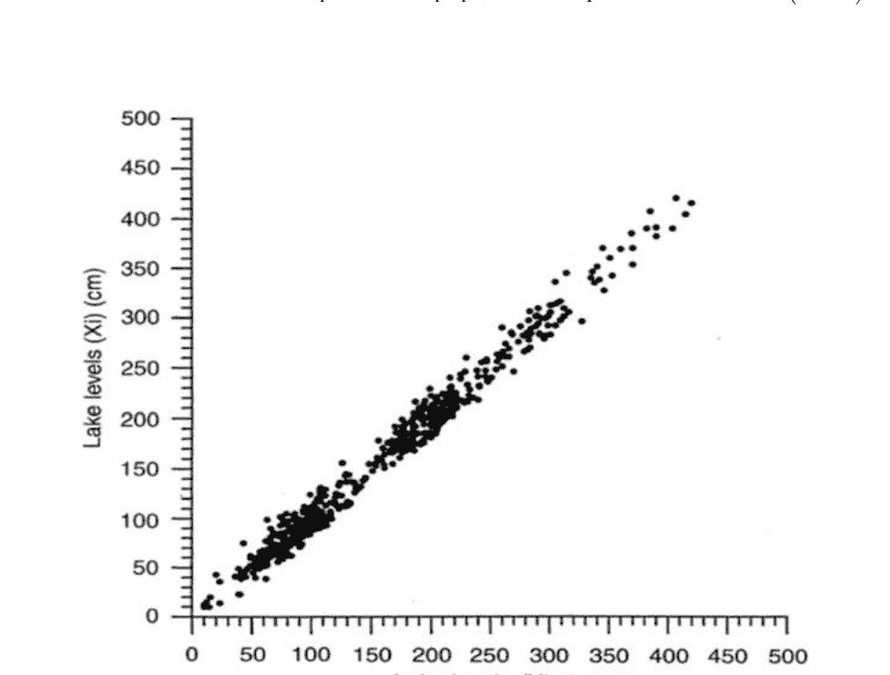

图4.46 合成的滞后一期水位波动

再次，将这个表达式与方程（4.114）进行比较，可以看出相应的系数的相对误差小于5%。换句话说，在估计水位时，自相关系数在原始数据的变动下仍然保持不变。

## 4.22 趋势识别方法

在不同学科中，最重要的技术之一是确定给定时间序列中趋势倾向的可能系统变化。如前所述，任何时间序列记录通常具有三个独特的部分，即周期性（季节性）、系统性（趋势）和随机性（不确定性）组成部分。趋势方法涵盖了研究人员和从业人员在不同学科研究中与自然事件的非平稳性相关的大部分常见关注点。在所有方法中，一个时间序列被认为是具有n个测量值的，符号表示为X_i（i = 1, 2, ..., n）。

### 4.22.1 Mann-Kendall (MK) 检验

这是一种非参数趋势检验方法，用于通过整个记录长度找出一个整体且单调的直线。这个方法最初由曼恩提出，后来由肯德尔（1975）进行了一些修改，并由赫希和斯拉克（1984）进行了额外的改进，加入了季节性组件。肯德尔的tau系数用于计算，它衡量了两个排名样本之间的关联性，前提是数据具有独立结构。MK检验统计量S的定义如下：

$$S = \sum_{i=1}^{n-1} \sum_{j=i+1}^{n} \text{sign}(X_j - X_i) \qquad (4.117)$$

其中

$$\text{sign} = \begin{cases} + 1 & \text{if } (X_j - X_i) > 0 \\ 0 & \text{if } (X_j - X_i) = 0 \\ - 1 & \text{if } (X_j - X_i) < 0 \end{cases}$$

S的概率密度函数应该服从正态（高斯）分布，其长期算术平均值为零，方差为

$$V(S) = \frac{1}{18} \left[ n(n-1)(2n+5) - \sum_{k=1}^{m} t_k (t_k-1)(2t_k+5) \right] \qquad (4.118)$$

其中k是绑定集的数量，t_k是第k组的大小。测试统计量可以通过将S变量标准化得到，其中使用参数进行标准化，这导致

$$Z = \begin{cases} \frac{S-1}{\sqrt{V(S)}}, & \text{如果 } S > 0 \\ 0, & \text{如果 } S = 0 \\ \frac{S+1}{\sqrt{V(S)}}, & \text{如果 } S < 0 \end{cases} \quad (4.119)$$

根据这些统计量，在许多教科书中给出了MK检验的假设决策（Naghe ttini 2016）。趋势的斜率可以通过回归线来估计，但是通过Sen过程来估计会更好，如下一节所述。在应用之前，必须满足以下假设，否则其结果将受到质疑。

- 1. 测量值应具有独立结构（至少一阶Pearson相关性必须几乎为零），并具有相同的概率密度函数。
- 2. 数据量不应少于30，以避免偏倚估计。
- 3. 通常，（高斯）概率密度函数根据理论可以得到更好的结果，但这并不是非常严格的假设。

即使记录中可能存在缺失值，这种趋势方法仍然适用，但是这些事件会对测试的性能产生不利影响。

### 4.22.2 Sen 斜率 (SS)

MK趋势检验没有斜率计算方法，只能判断时间序列中是否存在任何趋势。Sen提出了一种简单而有效的斜率计算方法，考虑了任意一对数据之间的所有可能斜率，然后取这些斜率的中位数作为单一斜率S的值。

$$S = \text{中位数} \left( \frac{X_j - X_i}{j - i} \right) \quad \text{for } j > i \quad (4.120)$$

MK单调趋势的数学表达式是一个具有斜率S和交叉点的线性函数，交叉点是记录的一半时间和数据值的算术平均值。

### 4.22.3 回归方法 (RM)

这是一种用于趋势识别的参数化方法。这是一种常用的统计评估方法，已在第4.8节中进行了解释。给定一个时间序列，将线性回归线拟合到数据中，这提供了数据平均值随时间的系统变化。这种方法在趋势识别中经常使用，但是再次没有考虑到底层的限制性假设，如第4.19节中已经解释的那样。

### 4.22.4 斯皮尔曼相关系数检验 (SR)

这是另一种非参数化方法，用于比较两个时间序列的相似性。为此，两个序列按升序排列，然后根据有序数据的比较计算Spearman's Rho，计算公式如下（Spearman 1904）。由于应用这种方法需要两个单独的时间序列，因此为了考虑趋势识别，给定的时间序列被分为两部分，即“早期”和“晚期”时间段。这种方法与Spearman's等级相关性相同，如第4.18节中所解释的那样。

### 4.22.5 Pettitt 变点检验

Pettitt (1979) 认为，如果给定的时间序列在时间点τ处具有变点，则该点之前和之后的概率密度函数具有不同类型。这种方法不要求先前确定时间点的变化发生在哪里。其零假设是时间序列中没有变点。与MK检验类似，符号矩阵元素定义如下:

$$D_{i,j} = \text{sign}(X_i - X_j)$$

矩阵D i,j 的子矩阵 U t,n 的和得到Pettitt统计量:

$$U_{t,n} = \sum_{i=1}^t \sum_{j=t+1}^n D_{i,j}$$

该统计量对于从1到n的t值进行计算，可以通过以下表达式（Rybski和Neumann 2011）实现:

$$U_{t,n} = U_{t-1,n} + \sum_{j=1}^{n} \text{sign}(X_t - X_j)$$

该测试是双尾的，Pettitt统计量用于最终决策，其表达式如下:

$$K_n = \max_{1 \le t \le n} |U_{t,n}|$$

关于给定时间序列中变点搜索的更详细信息，Şen (2017) 通过连续平均法 (SAM) 进行了介绍。

### 4.22.6 创新趋势分析 (ITA)

这是最新的技术，首先通过主观视觉检查，然后通过客观数值分析进行趋势分析。与斯皮尔曼的Rho检验类似，ITA还考虑了给定时间序列的早期和晚期部分。每个半序列都按升序排列，然后将水平轴上的早期部分与晚期持续时间部分绘制在一起，从而提供了散点图。散点图采用相等的坐标轴形式，每个轴上的刻度相同。这样的散点图被称为ITA模板，其无趋势对角线为1:1（45°）的直线。上（下）三角区域表示增加（减少）趋势的发生，如图4.47所示。

正如Folland等人(2001)所示，气候变化的经典指示是通过两个概率密度函数(PDFs)的相对位置给出的，其中一个PDF向热或冷温度方向移动以表示单调递增和递减趋势线，如图4.48所示。

相应的代表性ITA模板位于每个PDF气候变化图下方。Donat和Alexander使用他们60年数据的相应PDFs，使用两个30年期间显示变量的PDF在后期与第一期相比明显向更热的值偏移。这相当于说60年持续时间(1950–2010)的时间序列被分为两个相等的部分，即1950–1980和1981–2010，这与Sen(2012,2014)已经提到的概念相同。仔细观察这个figure，可以得出以下对未来应用中方法论发展至关重要的主要观点：

- 1. 两个不同的PDF意味着两个不同的时间序列（X₁, X₂, …, Xₙ/₂）和（Xₙ/₂ + 1, Xₙ/₂ + 2, …, Xₙ）分别表示给定时间序列（X₁, X₂, …, Xₙ）的两个半部分，其中n是数据的数量。每个半部分的算术平均值，X̄₁ 分别为m₁和m₂。
- 2. 如果两个时间序列的概率密度函数形状相同且没有时间上的偏移，则时间序列具有平稳性属性，即统计参数不随时间变化。这也意味着给定时间序列中没有趋势。
- 3. 对于趋势检测而不是考虑概率密度函数，比较算术平均值是等效的。如果它们之间存在显著差异，则可以得出给定时间序列中存在趋势的结论。趋势斜率与算术平均值的差异 ±Δμ 有关，如第4章第4.22.6节图4.48所示。显著差异的度量可以通过相对误差百分比 α 来表示，其定义如下：

    $$
    \alpha = \pm 100 \frac{\Delta \mu}{\mu} \quad (4.124)
    $$

    如果α < ±5%，那么没有显著的趋势。

- 4. 还需要知道两个概率密度函数之间的时间偏移Δt，实际上对应于时间序列的偏移时间。每单位时间的算术平均值变化等于趋势斜率S_μ，即

    $$
    S_\mu^\pm = \frac{\mu - \mu \pm \Delta \mu}{\Delta t} = \pm \frac{\Delta \mu}{\Delta t} \quad (4.125)
    $$

    根据创新趋势方法（Şen 2012, 2014），可以从图4.40右侧的时间序列中逻辑地确定算术平均值随时间的变化。

    $$
    S_m = \frac{m_2 - m_1}{\left(\frac{n}{2}\right)} \quad (4.126)
    $$

    其中m1和m2是两个半段的算术平均值，n是给定时间序列中的数据数量。根据公式（4.126）中的符号，可以判断趋势是增加（正）还是减少（负）。公式（4.126）中的趋势斜率是曼-肯德尔趋势分析中经典的Sen斜率S的替代计算方法。

    $$
    S = \text{中位数}\left( \frac{X_i - X_j}{i - j} \right) \text{对于 } i > j \quad (4.127)
    $$

    其中 X_i (X_j) 是第 i个 (j个) 时间序列值。从哲学和逻辑上讲，这与第(4.127)式中提出的曲线形式有概念上的区别。

标准差相对于 A (B 和 C 的概率密度函数) 的位置是给定时间序列中变异性的指标。标准差之间的显著差异基于相对误差百分比，与第(4.124)式类似，意味着时间序列结构的变异性。每个时间段标准差的变化是变异性斜率的定义，因此从逻辑上讲，与第(4.125)式类似，可以将变异性斜率表示为

    $$
    S_\sigma^\pm = \frac{\sigma - \sigma \pm \Delta \sigma}{\Delta t} = \mp \frac{\Delta \sigma}{\Delta t} \quad (4.128)
    $$

从实际角度来看，变异性的斜率Sv可以逻辑上写成Eq. (4.129)，考虑到两个标准差s1和s2，在图4.2的右侧时间序列中显示了第一和第二半部分的情况

    $$
    S_v = \frac{s_2 - s_1}{\left(\frac{n}{2}\right)} \quad (4.129)
    $$

数学上，方程(4.126)和(4.129)在n→∞时可能被错误地解释为斜率为零。这不是一个有效的陈述，因为每个公式都定义了每个时间间隔的斜率。

## 4.23 未来方向和建议

虽然有一些统计技术在数据处理中有助于识别给定时间序列的整体特征，但其中许多技术都有基本的限制性假设，这些假设可以通过未来的方法论发展或者对这些假设进行仔细的关注来缓解。 以下是一些关于精细统计计算的建议和推荐。

- 1. 在应用任何统计方法之前，申请人应了解假设并尽力按照可靠的计算和结论行事。
- 2. 强烈建议在进行任何统计方法之前，通过散点图进行数据的视觉检查，这提供了语言信息，为方便的统计方法选择提供了指导。
- 3. 统计检验涉及显著性检验，这取决于某些概率密度函数（PDFs），因此，在统计方法应用之前，有必要搜索最合适的PDF并将其与基本假设进行比较。例如，在某些方法中，正态（高斯）概率密度函数是必需的。
- 4. 在使用用于统计数据处理目的的现成软件时，研究人员应对所使用的统计方法有扎实的背景，否则他/她将无法进行合理的解释，而只能达到经典的、机械的和常见的知识。
- 5. 不幸的是，在某些圈子中，统计学被视为撒谎者之一，这表明了统计学的无知，因为统计学是一种可靠的方法，可以提取有意义的解释，从而得出实际可应用的结论。
- 6. 必须记住，每个统计参数、测试和方法都有逻辑基础，一旦不理解，就会陷入无效解释的统计陷阱中。

在数据处理工作中，尤其是在气象学、气候变化和水文学文献中，使用统计技术非常重要，这在许多出版物中由于对基本限制性假设和限制的粗心关注而缺失。 本章提供了在数据处理中使用统计技术的共同兴趣，具有逻辑、比例、物理和合理的原则。 在文本中，解释了使用统计方法的原因，即它是处理给定数据集中的不确定性最方便的数值技术。在气象学、气候变化和水文学、水文资源研究中，排除统计方法是不可能的，因此，从业者和研究人员都必须考虑方法的基本科学哲学、逻辑和实际方面。 在本章中，详细解释了基本的统计参数，并进行了数学和物理应用。 最广泛使用的统计方法，如回归技术和特别是趋势识别方法，以最简单的方式进行了解释。 最后，提出了对现在和将来的研究的建议，希望遵守这些原则能够以最佳方式铺平研究道路。

## 4.24 结论

日常生活甚至物理现象存在于不确定性的世界中，可以用各种工具（如概率、统计、逻辑规则、数学方程和人工智能（AI）或其他建模风格）来近似表示精确组件。据说最好的模型是具有最小不确定性组件的模型。不确定性以随机性、模糊性、歧义性、复杂性、模糊性、混沌性、非线性和湍流性的形式存在。在分析建模中，这种不确定性组件通过许多假设（如均匀性、各向同性、均匀性、稳定性、线性、同方差性和理想化）从可视化和概念化中消除。概率和统计方法被简单地解释为浅层学习原理，这是进一步复杂建模的基础。在本章中，将通过示例解释经典回归和趋势确定方法。

如果采用监督学习过程，鼓励读者注意关键假设和简化考虑，如数据可靠性、模型构建和模型输出与测量值之间的误差最小化。

## 参考文献

- Albert DZ (1992) 量子力学与经验。哈佛大学出版社，剑桥，马萨诸塞州
- Albert DZ (1994) 波姆的量子力学替代方案。Sci Am 70 (5) : 58–67
- Almazroui M, Şen Z (2020) 水文气象记录中的趋势分析方法。地球系统环境4 (1) : 713。 https://doi.org/10.1007/s41748-020-00190-6
- Anderson RL (1942) 串行相关系数的分布。Ann Math Stat 13: 1–13
- Benjamin JR, Cornell CA (1970) 土木工程师的概率、统计和决策。麦格劳-希尔，纽约
- Bohm D (1978) 内含秩序：物理学的新秩序。Process Stud 8 (2) : 73–102
- Bohm D (1980) 整体性和内含秩序。Routledge and Kegan Paul, 伦敦
- Box GEP, Jenkins GM (1974) 时间序列分析预测与控制。Holden-Day, 旧金山, 加利福尼亚州, 第489页
- Carlton AG, Follin JW (1956) 最近在固定和自适应滤波方面的发展, Agardograph, 第21卷
- Davis JC (2002) 统计与数据分析, 第3版。Wiley, 纽约, 第257页
- Feller W (1967) 概率论及其应用导论, 第1卷, 第527页
- Folland CK, Rayner NA, Brown SJ, Smith T M, Shen SSP, Parker DE, Macadam I (2001) 自1861年以来的全球温度变化及其不确定性。 Geohys Res Lett 28:2621–2624
- Fuller WA (1996) 统计时间序列导论, 第2版。Wiley/UVC, 纽约, 第689页
- Heisenberg W (1927) 关于量子力学的直观内容的动力学和力学。Z Phys 43:172–198
- Hirsch RM, Slack JR (1984) 具有序列依赖性的季节性数据的非参数趋势检验。水资源研究20: 727–732。 https://doi.org/10.1029/WR020i006p00727
- Hubert P, Carbonnel JD, Chaouche A (1989) 水文气象系列的分割: 应用于降水和西非流量系列。水文学110: 349–367
- Hurst HE (1951) 水库的长期储存能力。 Trans Am Soc Civil Eng 116: 770–808
- Hurst HE (1956) 水库长期储存的使用方法。 Proc Inst Civil Eng 5: 519
- Iruine KN, Eberhardt AK (1992) 伊利湖和安大略湖水位的乘法季节性ARIMA模型。 Water Reso Bull 28 (3) : 385–396
- Johnston RJ (1989) 环境问题：自然、经济和国家。 悉尼麦考瑞大学
- Kempe S, Khoo F, Guerleyik Y (1978) 凡湖及其流域的水文学。 在: DegenET, Kurtman F (eds) 凡湖地质。 土耳其矿产研究与勘探研究所, pp 30–45。 Rep. 169
- Kendall MG (1975) 等级相关方法, 第4版。 查尔斯 · 格里夫fin, 伦敦
- Kendall MG, Stuart A (1979) 统计学的高级理论。 Butler and Turner Ltd., 伦敦
- Khalil EL (1997) 混沌理论与海森堡's不确定性: 风险、不确定性和经济理论。 美国经济学41 (2) : 27–40
- Kite V (1990) 对伊利湖水位的时间序列分析。 在: Hartmann HC, Donalhue MJ (eds) Proc Great Lakes水位预测和统计学研讨会。 Great Lake Commission, 安阿伯, pp 265–277
- Koch GS, Link RF (1971) 变异系数; 采样矿床的指南。 Econ Geol 66(2):293–301
- Krauskopf KB (1968) 十个岩浆岩的故事。 Bull Geol Soc Am 79: 1–18
- Laplace PS (1951) 概率的哲学论文。 多佛, 纽约
- Leopold LB, Langbein WB (1963) 地貌学中的关联性和不确定性。 在: Albritton CC Jr (编) 地质学的结构。 Addison Wesley, Reading, pp 184–192
- Lorenz EN (1963a) 确定性非周期性 flow。 大气科学杂志20: 130–141
- Lorenz EN (1963b) 摆动力学。 大气科学杂志20: 448–464
- Lorenz EN (1964) 从控制方程中推导气候问题。 Tellus 16: 1–11
- Lorenz EN (1972) 可预测性: 巴西的一只蝴蝶的振翅是否会引发德克萨斯州的龙卷风？ 论文发表于: 美国科学促进会
- Loucks ED (1989) 对大湖水文水力系统进行建模。 博士学位论文, 威斯康星大学麦迪逊分校
- Maity R (2018) 水文学和水候学中的统计方法。 Springer, 新加坡
- Mann CJ (1970a) 自然界的随机性。 Bull Geol Soc Am 81:95–104
- Mann HB (1970b) 非参数趋势检验。 Econ Soc 3:245–259
- Mathier L, Fagherazzi L, Rasson JC, Bobee B (1992) 通过随机方法模拟大湖流域供水。 INRS-Eau Rapp Scienti®que 362, INRS-Eau, 圣福瓦, 95页。
- Mood AM (1940) 连续分布理论。 Ann Math Statist 11:427–432
- Naghetini M (2016) 统计水文学基础。 Springer。 ISBN: 978-3-319-43561-9
- Neter J, Wasserman W, Kunter MH (1996) 应用线性回归模型, 第4版。 IRWIN BookTeam, 美国
- Parzen E (1960) 现代概率论及其应用。 Wiley, 纽约, 第464页
- Pettitt AN (1979) 一种非参数方法解决变点问题。 Appl Statist 28:126–135
- Poincaré H (1904) L'état actuel et l 'avenir de la physique mathématique. Bull Sci Math 28:302 – 324. http://henripoincarepapers.univ-lorraine.fr/chp/hp-df/hp1904bs.pdf
- Popper K (1955) 科学发现的逻辑。 Routledge, 纽约, 479页
- Privalsky V (1990) Lake Erie水位变化的统计分析和可预测性。 In: Hartmann HC, Donalhue MJ (eds) Great Lakes水位预测和统计学研讨会。 Great Lake Commission, 安阿伯, 第255–264页
- Ross TJ (1995) 工程应用中的模糊逻辑。 Addison Wesley
- Ruelle D (1991) 机会与混沌。 Princeton University Press, 普林斯顿
- Russell B (1924) 伊卡洛斯, 或科学的未来。 E. P. Dutton
- Rybski D, Neumann J (2011) 对Pettitt检验的综述。 在: Kropp J, Schellnhuber HJ (eds) In extremis。 Springer, 柏林, 第202–213页
- Şen Z (1976) 年度 flow 系列的湿润和干燥时期。 ASCE J Hydraul Div 102 (HY10)： 1503–1514
- Şen Z (1977) 年度 flow 系列的运行总和。 J Hydrol 35： 311–324
- Şen Z (1979) 年度水文数据的自动运行测试应用。 J Hydrol 42： 1–7
- Şen Z (1980) 年度水文时间序列中极端湿润和干燥时期的数值计算。 Bull Hydrol Sci 25:135–142
- Şen Z (1995) 年度科学家和工程师的应用水文地质学。 CRC Lewis Publishers, Boca Raton, 444
- Şen Z (2002)概率计算原理 Bilge Kültür Sanat，伊斯坦布尔（土耳其语）
- Şen Z (2012)创新趋势分析方法 ASCE J Hydrol Eng 17(9):1042–1046
- Şen Z (2014)趋势识别模拟和应用 ASCE J Hydrol Eng 19(3):635–642
- Şen Z (2017)创新趋势显著性测试和应用 Theor Appl Climatol 127(3):939–947
- Şen Z, Şişman E, Kızılöz B (2021)模型效率性能的新创新方法 Water Sci Technol Water Supply 22(3):589–601 https://doi.org/10.2166/ws.2021.245
- Slivitzky M, Mathier L (1993) Laurentian Great Lakes上的20世纪气候变化及其对水文制度的影响 NATO Advanced Study Institutes
- DeauailleSneyers R (1992)统计分析在客观确定气候变化中的应用 Meteorol Z 1:247–256
- Spear ME (1952)统计图表分析。麦格劳-希尔
- Spearman C (1904) 两个事物之间关联的证明和测量。美国心理学杂志 15 (1)： 72–101。 https://doi.org/10.2307/1412159
- Streit T, Van B, Brown R (2008) 一种电子表格方法以促进信息不确定性的可视化。 IEEE Trans Vis Comput Graph 14 (1)： 61–72
- Swed FS, Eisenhart C (1943) 用于测试序列中分组随机性的表格。 Ann Math Stat XIV (1)： 66–87
- Tufte E (1983) 定量信息的视觉展示。图形出版社
- Tukey JW (1977) 探索性数据分析。Addison-Wesley
- Vannitsem S, Demaree G (1991) 撒哈拉以南地区干旱的检测和建模-提出一种新的方法论。水文控制6 (2) ： 155–171
- Wiener N (1949) 平稳时间序列的外推、内插和平滑。Wiley, 纽约
- Wilks DS (1995) 大气科学中的统计方法。学术出版社, 第 160–176页
- Zadeh LA (1965) 模糊集。信息与控制, 第8卷, 第338–352页。第一部分, 第519–542页

## 第5章 数学建模原理

## 5.1 概述

正如前几章所解释的，科学哲学观点和逻辑原理始终是研究人员共享的思想和观点的共同领域。在哲学思想中，没有考虑科学客观性、概括性、选择性或可测试性。随后，逻辑通过思想的过滤来产生更加理性和富有成果的子领域。逻辑不是雄辩的艺术，而是从对话、辩论和讨论中进行智能科学推理的艺术。这种艺术用于寻找影响事件的因素之间的相互作用以及在检查事件期间发生的影响。口头结论的原因和结果导致了理性的数学表达式。逻辑就像是一种必要的工具，不仅存在于科学中，而且对于试图进行理性推理的任何人都是开放的。逻辑原理构成了科学的基础，因为科学推理是理性的，并且只能通过观察、实验或测量的事实来进行测试。

在验证原则的光下，科学推论的可测试性可以得到验证，因此总是有可能得出更接近现实的结果。科学的可测试性只能通过严格应用逻辑规则来实现。从前几章的解释中可以理解，逻辑可以在没有科学原理的情况下生存，但科学在逻辑规则之外永远无法获得功能和创新。

任何人都可以通过哲学和日常对话来向他人解释思想，甚至在没有逻辑欣赏的情况下写作。从这一点来看，牧羊人和受过高等教育的人之间没有区别。逻辑是每个人的财产，但依赖于逻辑的数学是理性思维者和科学家的特权和选择。当考虑科学的历史时，逻辑原则的应用先于数学，尽管在原始文明中已经存在逻辑，但它是在古希腊文明中以正式的方式书写并由亚里士多德（公元前382-公元前323年）首次解释为“工具”。今天，在几乎每个国家，无论是自愿还是非自愿，逻辑总是与清晰逻辑（第3章）相关联，导致数学表达式和位置的概念，模糊或不确定逻辑的想法在某种程度上被阻止。然而，逻辑运算和函数始终存在于日常生活的每个阶段和主题中。

数学是处理符号逻辑、数字和集合的思维领域，在科学研究的最后建立方程式的关系；它用于将逻辑推理从一种语言转化为一组符号的形式，从哲学思想通过方程式、算法和方法以理论和实际符号表达的形式开始。最早的简单算术运算发源于美索不达米亚（底格里斯和幼发拉底河之间）、苏美尔和巴比伦，以及尼罗河沿岸的古埃及文明，距公元前4000-5000年，随着时间的推移，它逐渐发展到现在的状态。今天，几乎没有研究，特别是科学发展，不涉及或不得不依赖数学。数学是一个包含哲学，尤其是科学界研究的事件或现象的逻辑基础的学科。根据 Yıldırım（1988）给出的定义，数学中的准确性是逻辑的，而不是事实的。数学根据逻辑原则，将科学调查对象的内部和外部生成机制的理解所得出的结论转化为符号语言的翻译。

在发芽之前，数学就开始使用数字来测量、称重、交易、建筑等，以一种非常简单的方式来应对日常实际生活中的问题和不同的工作。这种情况通过一些语言关系揭示了一些有用的情况。因此，可以理解数学发展始终与逻辑有关，进入数学领域之前必须口头理解逻辑推理。想要进行数学研究的人，不应该只是理解抽象的数学表达式，而应该首先对构成数学基础的逻辑原则、规则和推理有良好的口头理解。然而，在工程等纯实践职业中，数学公式在实际生活中被使用，可能并不涉及逻辑原则，因为它们已经嵌入到数学表达式中，无论是分析的还是经验的。

还有一种被试图使其独立于人类语言的逻辑，被称为符号逻辑，也构成了数学表达式的基础。当一个命题在任何语言中被提出时，它会被翻译成其他语言，词语的表达方式会改变，但逻辑保持不变。为了使这种不变性与语言无关，前提、后继和连接词如“和”、“或”、“非”（第3章）都用字母和一些算术运算符号表示，如加法+、减法－、除法/和乘法×。因此，出现了一种像数学语言一样的逻辑语言，被称为符号逻辑。这种逻辑在于它是脆弱逻辑（二值逻辑，真－假）并且整体地假设变量。从基于二进制的基础来看，所有提取的模型都给出了近似结果，这是由于假设所导致的（第3章）。

在本章中，为了达到数学表达式，首先建议彻底分析逻辑的原则和规则，并揭示思想世界中的有意义的词语和句子，特别是包含IF-THEN命题的词语和句子，即因果关系，并揭示事实与观察、领域和实验室工作或心智实验的逻辑一致性，如第3章中已经详细解释的那样。在逻辑规则口头建立之后，可以通过将其转化为符号方程来遇到数学表达式。所有这些初步特征都在前一章中介绍。

## 5.2 概念模型

在我们的思维中，每个现象的描述部分都被标记为“词语”，如名词、代词或形容词，它将可见的环境现实分成部分和类别，以进行精确的推理，产生模糊的印象和概念。这些词语与现实的统一关系很小；这是我们所有人都不可分割的统一。共同的词源学有助于在思维中想象相同或非常相似的对象。词语是感觉、思想和感知的基础。它们共同用来呈现关于现实的部分和因此扭曲的概念模型，这些模型代表了人类思维所产生的感知世界。自然环境是一个我们通过由生命力和不可分割的联系构成的情境而相互连接的世界（Dimitrov和Korotkich 2002）。

所有的概念模型都涉及到人类思维所感知到的环境的一部分，被认为是我们以自我为中心的思维认为有意义的东西。当然，这些有意义的部分之间存在着明显和隐含的相互关系，这些关系存在是为了探索人类思维的工作方式。在任何科学、工程、经济、政治和哲学等学科中，无监督或有监督（经过训练的）思维研究包含许多不确定性的概念模型，以预测和应用对不断演变的现实动态的影响力。

### 5.2.1 知识和信息

教育或个人经验帮助人们以知识的形式意识到或理解所获得的主题。它为得出结论提供客观和相关的信息。信息是与任何事件的要素相关的基本概念，无法系统地纳入知识中。例如，可以观察并知道天空多云时降水的概率发生；这是基本知识。然而，为什么会发生这种情况是另一种需要更系统地连接基本信息的知识来源。

为了获得知识，有不同的信息来源。信息通过感官获取，并在心理上进行处理，以达到更好的结果。早期人类在完全不确定的环境中思考他们的日常和重要活动。可以说早期的信息和知识是从观察和经验中得出的概念。

### 5.2.2 观察

每个人在日常生活中观察到许多小规模和大规模的事件。然后，尝试在没有任何数值、算术或数学基础的情况下发表一些评论。一切都取决于心智功能、逻辑和个人兴趣。初步结果是语言的，因此，所有主题在某种程度上都包含模糊性。观察使人能够将对观察到的现象的印象表达出来。例如，一个村民可能观察到在他的地区，河流的流量有一种模式，高（低）流量跟随高（低）流量。这样，它暗示了后续流量数量之间的正相关关系。

### 5.2.3 经验

经验意味着任何事件的某种行为经常发生，因此观察者通过重复基本信息来学习。例如，学习我们的母语需要不断重复。经过重复，人们会习惯于给我们的味蕾带来经验的当地菜肴的口味。同样，从事相同领域的工作，随着时间的推移，一个人会积累经验，这意味着如果一个人反复观察同一现象，他可以自动提出一套语言命题。

### 5.2.4 视听

获取知识和信息的另一种方式是通过听和听觉，这是我们时代最常见的信息和知识来源（第1章）。例如，整个教育系统中超过95%的信息和知识都是通过听老师讲授获得的。通过这种方式，不幸的是，一个人可以依赖已经组织好的知识，如果没有集体或个体的批判性讨论，学习过程将成为例行程序，只会产生证书，而不会有科学思想的改进和发展。这种类型的学习比之前提到的观察和经验的收获更加危险。

## 5.3 数学

数学是解决问题的艺术，通过运用数字或形态的特性，并通过推理的方式来达到结果。从语言推理中获得的客观信息表达方式被称为数学，这种方法构成了科学和技术研究的基础。

在数学的体系中，首先通过直觉获得的信息经过逻辑的过滤。在获得正确性和概念基础之后，进行分析、归纳，最终形成一个正式的数学结构。逻辑在数学中的重要性在于证明数学命题。

数学的基础是寻找基本概念和逻辑结构。因此，可以达到人类知识的奇点。最重要的数学概念包括数字、定义、形状、集合、函数、算法、方程和数学证明。数学原理在所有科学研究中都被使用，但很多使用它的人并不知道数学本身的含义。我们可以说数学是数量的科学。它提供了依赖于算术、测量和物体形状描述的科学结构、秩序和关系。

每个思想中都有推理，但这个思想应该转化为每个人都能感知的形式，并且推理应该具有客观性而不是主观性。一般来说，日常生活中有很多推理思想和推断，可能没有那么多逻辑。

数学的发展过程通过一贯、形式化、逻辑和理性的方式达到了当前的水平。没有任何一门科学与数学的体系分离并获得声望。数学与其他科学分支不同，它已经成为一棵巨大的树，在这个过程中它的结构不断增长。数学具有非常强大和牢不可破的结构，其基础是逻辑规则严格执行。这些规则首先基于合理的基础，这些基础是通过健全的思考和推理得出的，即使是近似的。作为数学基础的逻辑，通过在各种比较之后将提出的命题放在坚实的基础上，始终能够保持其准确性。

数学是一门不断孕育新规则的科学，这些规则将根据逻辑从一组明确的规则中推导出不同主题的启示。正确思维的原则进入逻辑领域，并通过这些原则的应用，数学在通过科学和技术为人类服务方面发挥着越来越重要的作用。

> 德国逻辑学家戈特洛布·弗雷格（1848-1925），当代逻辑和哲学的创始人，曾说过：
>
> 数学是逻辑的应用领域。
>
> 基于他的观点，他认为数学可以建立在逻辑的公理系统之上。

在逻辑和后来的数学起源中，人类思维活动中的思想是最重要的第一动力和生产要素。在思想通过语言传递给他人之前，数学的发展是在思想经过成熟后实现的，语言中单词的起源（词源学）和语义负荷（认识论）被详细地可视化，并且理性的意义被感知。在思想进入数学领域之前，它们必须通过逻辑的过滤器，并获得准确性和组织性。有多种方式可以将具有准确性和组织性的逻辑思维引入这些模式中。由此可见，逻辑是触发人类思维活动的科学基石。与日常对话中的句子不同，逻辑命题包含将原因与效果相连接的理性句子。

为了让公众能够在每个命题中轻松理解，需要明确或隐含地在其结构中包含各个部分“如果……那么……”。由此可知，有必要将句子以命题的形式加以考虑首先是逻辑，然后是数学。在这组逻辑句子中进行合理推理的努力被称为推理。在推理过程中，必须首先以具体的方式将结果与原因联系起来，然后以口头方式表达出来。

### 5.3.1 算术运算

已经指出，逻辑规则构成了数学原理的基础。一般来说，可以通过算术运算（加法、减法、乘法和除法）进一步推广它们。算术运算的逻辑规则是什么？ANDing？ORing？还是NOTing？读者对这些问题有什么先前的想法吗？还是只将它们视为纯粹的算术运算？

现在让我们假设2 + 2等于4。逻辑上等价于“加号”符号的是什么？这个符号是ANDing还是ORing？为此，让我们根据第3章中解释的逻辑规则选择以下其中之一。

- 2 OR 2等于四！
- 不是2而是2等于四！
- 2 AND 2等于四！

当考虑第一个选项时，会出现三个独立的结果；第一个是2，第二个仍然是2，第三个是4（图3.7c），其中哪个是可接受的？当然是最后一个，但人们可能并不总是能够决定哪一个是有效的，因为使用ORing将始终有三个选项。第二个选项中的NOTing操作没有任何意义；它完全被排除在外，因为它不合逻辑。在第三种情况下，ANDing总是只产生一个结果，即4。因此，逻辑上等价于“加号”符号的是ANDing（图3.7d）。结果是，基于清晰逻辑规则的数学方程中的所有符号都是AND运算。如果解决方案中有多个结果，则可能涉及OR运算，具体取决于情况。

### 5.3.2 逻辑关系

为了通过数学推理得出概括，只需进行两个互补的不同查询即可。如果这两个连续的关系确定规则基于逻辑基础进行应用，就可以推断出在整个教育系统中看到的所有基本方程。甚至不需要受过教育就能知道这两个关系构建规则。这些是每个人对人类思维工作的基本思考。明显地，通过在两个不同的词语、事实或事件之间进行质疑，以及在逻辑规则之间进行质疑，这两个规则都可以简单易行地付诸实践。通过根据这两个规则进行质疑，可以得出关于两个对象之间关系的类型和形式的结论。这两个规则在第3章中详细讨论过。

- 1. 比例规则：这个规则是质疑在考虑的两个变量之间是否存在关系的原则。可以给出两个不同的答案。可以将这些命名为“直接”或“反比例”。简单来说，直接（反比例）关系表明如果一个变量增加，另一个变量也会增加（减少）。
- 2. 线性规则：通过质疑前面规则确定的关系类型是否呈直线形式（线性）或曲线形式（非线性），可以进行推断。

实际上，这两个规则用于逻辑上揭示两个不同变量之间关系的形状（函数）。由于每个规则中都有两个不同的选项，当它们匹配时，会出现四种不同的选择，对于合理的推断没有其他选择。仅使用两个变量的名称表明它们各自被视为整体，没有子集，因此使用这些规则的组合操作只是一种推理推断。图5.1显示了与比例和关系几何有关的四种不同配对（a、b、c和d）。

如果水平轴上的变量是输入I，垂直轴上的变量是输出O，那么在笛卡尔坐标系中，有四种替代方案，每种方案对应的情况如图5.2所示，图5.1中的字母表示。

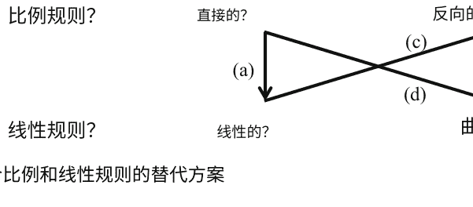

图5.1 联合比例和线性规则的替代方案

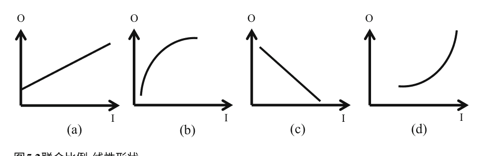

### 5.3.3 方程

在每个方程的背后，都有一个理性的思考，然后逻辑规则可以从这个思考中产生。在研究一个事件时，就像试图在思想的丰富性中寻找一样，思想的海洋中有多少智能的逻辑推理，保留它们并获得方程是口头信息。

方程是一个数学表达式，它有两个方面。通常，左边是输出（结果）变量，右边是与逻辑命题相关的输入（原因）变量。如果导致事件的变量是 x，其输出是 y，最简单的数学方程可以用以下形式表示。

$$y = f(x)$$ (5.1)

这个隐式表达式对数学家和逻辑学家来说是有意义的，对于从事实践工作的人来说可能暗示着类似的信息，但是这个方程的显式表达式必须特别在工程应用中揭示出来。这个方程的许多输入是 x，z，u，v，... 因此，在多个变量的情况下得到了最一般的表达式

$$y = f(x, z, u, v, \dots)$$ (5.2)

在这些隐式方程的情况下，既不关注输入和输出变量之间的关系，也不关注输入变量之间的关系。这里重要的是只有输入变量被认为影响输出变量，但是这种影响的比例（直接的、反比的）和形状（线性的、曲线的）都不重要，只写成闭合形式。应该知道数学方程出现在科学和工程研究中，应该考虑以下几点在它们的推导中：

- 基于可能成为科学基础的事件或现象。
- 确定可能影响此事件或现象的至少一个变量。
- 如果有的话，应考虑变量的时间变异性。
- 如果有的话，还应考虑变量的空间变异性。
- 考虑变量在时间和空间上的变异性。

通过考虑数学比例的几何形状和与逻辑规则的关系，可以进行输出和输入变量之间的推断。在前面的步骤中，通过分别与输出变量对话输入变量，通过将它们集体组合起来得到最终方程。

不应忘记每个方程的背后都有一些假设和假设的理想化和线性化。

## 5.4 几何和代数

Al-Khwarizmi（780-850）发明了代数方程，因此在哲学科学和数学等式表达的历史上首次出现。他还建议通过几何原理解决二次方程的多项式根解，如图5.3所示。读者可以按照这个图形中的概念建模步骤来达到最终的根解。

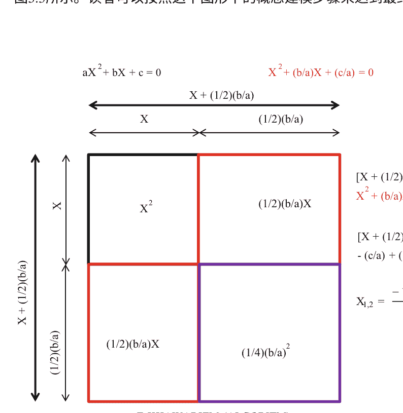

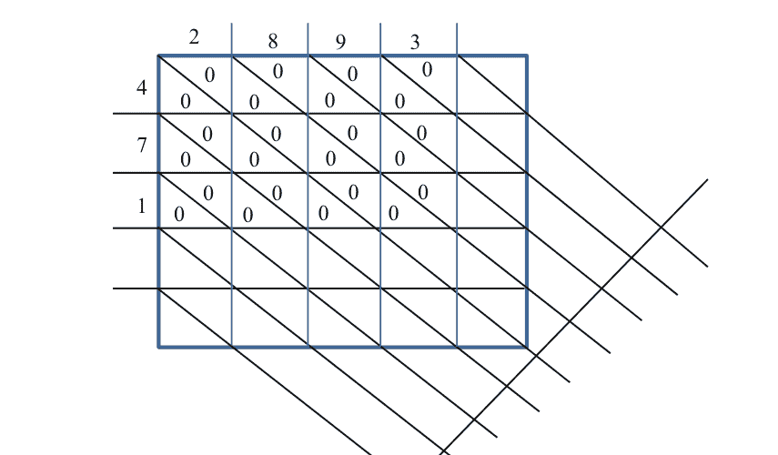

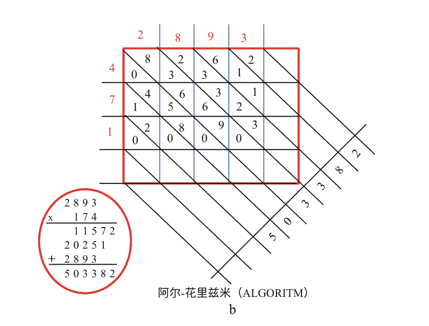

图5.4 Al-Khwarizmi乘法几何

在教育系统中，我们被要求记住今天的知识，而没有任何逻辑推理的背景。这个图是数学方程解基于几何草图原理的第一个证明。

根据相同的几何设计原理，他还详细介绍了乘法过程，如图5.4a、b中的模板所示。在这个模板中，两个数字相乘，一个来自上方水平线，另一个来自

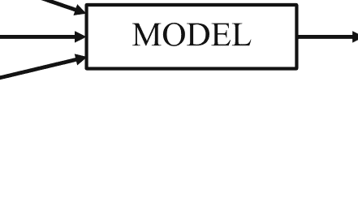

图5.5 黑盒模型

从左侧垂直端点开始，以两个小数结束。十进制数字写在共同正方形的下半部分，另一个写在上三角形中，例如，4乘以8等于32；在图5.4中，它的样子是显而易见的。

读者可以思考并填充其他与其他数字对应的方块的乘法。最后，主对角线方向上的数字求和得到结果，如图5.4b所示。

## 5.5 建模原则

在进行任何建模之前，应该提出以下问题，然后考虑图5.5中的黑盒概念模型元素。

- 要建模的事件是什么？
- 期望的输出是什么？
- 原因（因果关系）和变量是什么？

一般而言，尽管与职业无关，但有一些思维模式是根据职业塑造的，并通过对自然和社会事件处理的速度变化而由专家感知的浅显但合理的教学方法进行简化。这些方法基于限制性假设，这些假设根据处理自然和社会事件的速度而有所不同。无论有多少不可控事件，为了分析促进者的情况，简化和逼近理想情况，都会做出一些假设。这些假设在不同的设计中得到保留。因此，无论是演绎模型还是归纳模型，都非常强调因果关系。这些模型非常有限，它们的有效性可能不是普遍的，但情况可能会随时间而变化。因此，即使在最简单的建模过程中，人们也试图从原因中得出结论（参见图3.2和3.3）。在建模过程中，以下三种情况会有所不同：

- (a) 如果模型的输入未知，但实际行为的描述和输出已知，则称之为滤波或平滑。
- (b) 如果模型的输入和输出已知，只有行为模式确定，则称之为模型识别。从某种意义上说，可以说原因是根据结果详细分析的。
- (c) 如果模型已知是由其输入定义的，这种建模也被称为预测建模。在这里，可以轻松地对不同原因下可能的结果进行各种场景的研究。

一般来说，实际中的数学模型和本书中的模型有助于进行估计和预测。如果一个模型没有一些限制性的假设，那么它将无法成功，因为自然和人工事件中总是存在不完整性、模糊性、模糊性和不确定性。特别是事件的几何形状和数学近似是导致假设的初始思想之一。这些假设不仅简化了整体事件行为的合理性，而且有助于通过释放一些初始假设来获得早期结果，这些假设是减少不确定性的必要条件，从而将可能的复杂性降低到人类理解的水平，然后推导出数学方程。

在几何假设中，最理想和简单的形状总是首选（如果是线，则为直线或圆，如果是面积，则为正方形或圆，如果是体积，则为球体、圆柱体或长方体）。19世纪初，卢瑟福德（1871–1937）能够将原子视为电子在核心周围的圆形轨道上运动。事实并非如此，但它有助于形象化事件，并且因此，计算结果与测量结果非常接近或相同。在建模许多与物质相关的现象时，对几何形状的最有趣的假设是一个具有非常小尺寸的长方体，如图5.6所示。这个物质可以是固体、液体或气体。

与第3章中的思维模型不同，物质沿着垂直的x、y和z轴系统变化，符合笛卡尔-欧几里德几何学。这个长方体也被称为“控制体”，它是许多分析研究的核心模型。这个长方体始终是这些研究的基础。

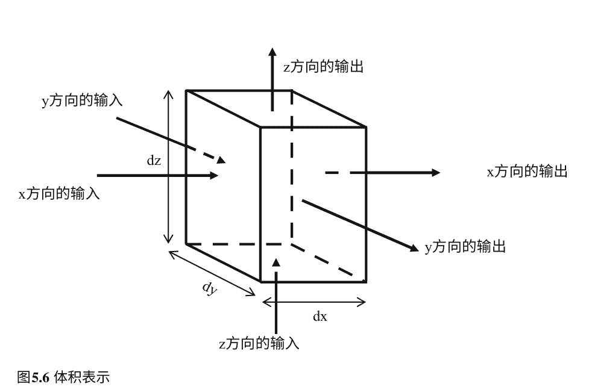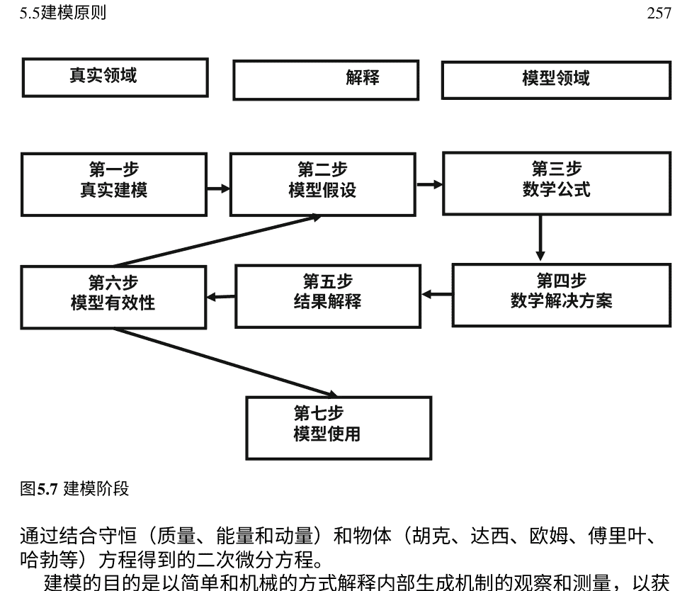

图5.7 建模阶段

通过结合守恒（质量、能量和动量）和物体（胡克、达西、欧姆、傅里叶、哈勃等）方程得到的二次微分方程。建模的目的是以简单和机械的方式解释内部生成机制的观察和测量，以获得决策的预测。为了以系统的方式实现最终产品，将现实和具体的世界行为转化为抽象的数学符号是合适的。对于建模，首先定义问题的变量，然后研究它们之间可能的关系。

所有简化的假设和变量之间的关系首先构成了数学建模的基础。因此，对于研究对象的思考、它们的运作和行为方式被转化为相关的数学方程，这在推理解决方案中起着重要的作用。在找到最终解决方案之后，通过合理的方法、它们的解释以及测量来再次检查预测的可靠性。结果的解释意味着在图5.7的步骤中，从抽象的数学世界中检查出真实世界的推论。在这个阶段，通过将理论上获得的模型结果与实际观测和测量结果进行比较来确定其准确度。

对于模型的有效性控制，建议首先使用相对误差的概念。如果模型的预测结果和测量结果分别为Rm和RM，则相对误差α以百分比表示：

```
α = 100 \frac{R_M - R_m}{R_M}

(5.3)
```

在实际应用中，相对误差应小于 ±5% 或 ±10%。 如果有很多测量和模型预测，那么算术相对误差的平均值应小于这些限制。可以通过在笛卡尔坐标系上进行相应测量来调整模型结果，使得绘图的散点应该围绕着45°线，如图5.8所示。

如图5.9所示，与完美模型直线存在不同的偏差可能性。例如，可能会遇到模型过度（低估）预测的情况，如图5.9a、b所示。类似的情况出现在图5.9e、f中，图5.9c、d对应部分过高估计和低估计的情况。

如果模型无法得出良好的预测结果，则应重新考虑从真实世界到建模世界的简化假设以及变量之间的关系。通过引入必要的改进来继续重建可以逐步修订模型结构。直到模型在适当的百分比相对误差范围内预测测量结果为止（±5或±10）。

在科学研究中，人们对测量结果与模型预测输出之间的关系感兴趣，这可能是以单输入单输出（SISO）形式或多输入多输出（MIMO）模型的各种版本。在文献中，有一组标准系数，通过一组单参数值提供测量和预测之间的一致性。在大多数情况下，作者报告称他们的模型基于考虑测量和模型输出数据序列的统计参数比较，其中包括一些已建立的一致性或相关性度量标准，其中最常用、被接受和推荐的是偏差（BI）、百分偏差（PBI）、确定系数（R²）、均方误差（MSE）或均方根误差（RMSE）、相关系数（CC）、纳什-苏特克利夫效率（NSE）和一致性指数（d）（Pearson 1895; Nash & Sutcliffe 1970; Willmott 1981; Gupta et al. 2002; Santhi et al. 2001; Van Liew et al. 2007; Moriasi et al. 2007; Tian et al. 2015; Zhang et al. 2016; Dariane and Azimi 2018）。在文献中，还有其他版本，如修正的一致性指数（Legates and McCabe1999）、预测效率（Pe）（Santhi et al. 2001）、持续模型效率（PME）（Gupta et al. 2002）、均方根误差-观测标准差比率（RSR）（Moriasi et al. 2007）和Kling-Gupta效率（KGE）（Gupta et al. 2009）。

正如Willmott（1981）所述，几乎所有的模型都有难以捉摸的预测，这些预测不能通过模型效率度量来解释，甚至通常也不能通过显著性检验来解释。Freedman等人（1978）提到，统计显著性检验是一个必须持怀疑态度看待的概念。沿着同样的思路，Willmott（1981）指出，测试一种一致性度量并报告一个显著性水平下的检验统计量的值可能是合适的，但是显著性水平和不显著性水平之间的区别完全没有合理的依据。例如，如果将显著性水平设定为0.05，那么0.049、0.048、0.047和0.051、0.052、0.053之间有什么区别呢？此外，这样的显著性水平取决于用于描述最合适的理论概率分布函数（PDF）的数据数量。尽管ASCE（1993）强调了明确定义模型评估标准的必要性，但尚未建立起广泛接受的指导方针，只有少数性能评级和具体统计数据被使用（Saleh等人，2000；Santhi等人，2001；Bracmort等人，2006；Van Liew等人，2007）。

为了更客观地评估模型的效率、校准和验证，测量关联和比较视觉检查必须是更好洞察、解释和模型修改可能性的初步条件。

基本的统计参数，如算术平均值、标准差，以及测量（自变量）和模型预测（因变量）数据之间的回归关系，通过散点图进行可视检查，对于识别系统性和随机性成分非常重要。不幸的是，大多数情况下，模型效率的衡量是通过可用软件获得的，该软件不提供任何有信息量的可视检查和评估。尽管有大量关于模型校准和验证，很难比较建模结果（Moriasi等，2012年）。校准和验证的许多模型已成为科学家和专家讨论的主题（ASCE 1993；Van Der Keur 2001；Li等，2009年；Moriasi等，2012年；Harmel等，2013年；Ritter和Muñoz-Carpena 2013年；Pfannerstill等，2014年；Larabi等，2018年；Rujner等，2018年；Swathi等，2019年）。Şen等（2021年）提出了视觉检查和数值分析方法（VINAM），用于有效的模型效率和理想的验证，如果必要，可以对模型预测进行修正或校准以符合测量结果。

### 5.5.1 模型输出的平方图解释

为了对与测量相关的模型预测进行视觉检查，可以将测量视为独立变量，模型预测视为依赖变量，并将它们绘制在坐标系上。在理想情况下，两个系列完全匹配，预期它们会落在1:1（45°）的直线上，就像图5.10中的对角直线一样，类似于图5.7和5.8。

这条直线将正方形区域分为两个半三角形，上（下）三角形代表模型过高估计（低估）的区域，前提是所有散点完全落在其中一个三角形中。散点也可能部分位于每个三角形中，这种情况下模型有一些点被过高估计或低估。理想模型效率的数学表达式为1:1线。

P_i = M_i (5.4)

在图5.11a和b中，系数fi对应于测量和预测中的最小值和最大值。一个正方形模板最显著的特点是它能够在一个图表中反映出几乎所有先前定义的效率准则属性。例如，在图5.10a中，点的散布显示在上三角区域（过高估计），但测量和预测散点之间没有线性趋势，它们是随机分布的。这表明模型无法完全代表测量结果。有必要尝试使用另一个合适的模型来建模测量结果，这个模型必须在散点之间至少具有一定的一致性。

例如，在图5.11b中，散点具有线性趋势，这是第一次指示模型适用于预测，因为散点分布在回归线周围。以下特征是此图中最重要的信息片段。

- 1. 回归线上的质心点（M和P）与理想预测线之间的距离为D。

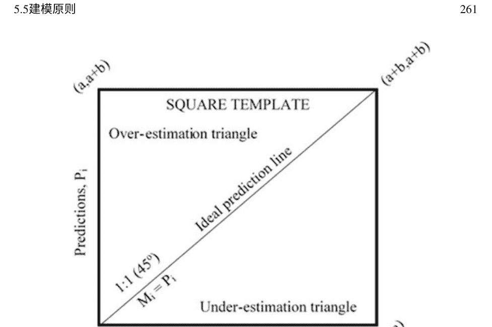

图5.10 VINAM的方形模板

- 2. 同一直线与水平轴有一个斜率S，其值可以计算。
- 3. 图中的回归直线在垂直轴上有一个截距I。它还从质心点（M和P）穿过。
- 4. 直线通过质心点。
- 5. 确定回归直线表达式后，可以计算每个散点与理想预测线的垂直偏差，这构成了误差序列ε_i。

Tian等人（2015年）建议在本文中用以下符号表示直线，而不需要任何视觉解释：

```
P_i = S M_i + I + ε_i (5.5)
```

其中 ε_i表示与完美直线的偏差。这正是图5.11b中回归线的反射。在本文中，S被称为旋转误差，I被称为位移误差。从图5.11b中可以明显看出，每一个都是对理想预测线的系统偏差。不用说，图5.10c是图5.11b的低估替代方案。

图5.11d，e是部分模型过度估计（低估）情况，其中回归线质心的中心点与理想预测重合。

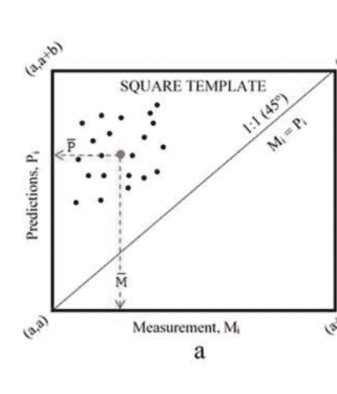

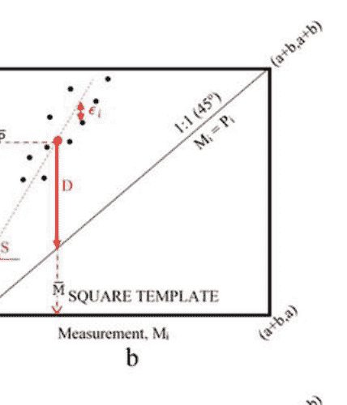

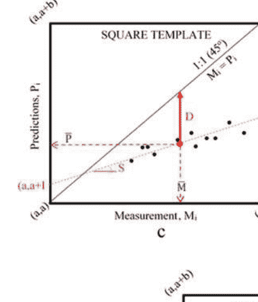

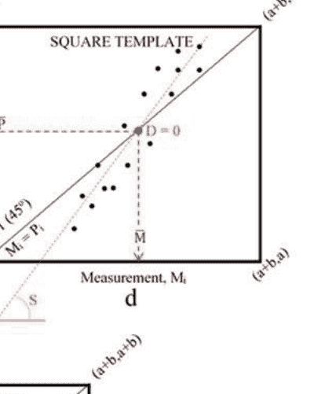

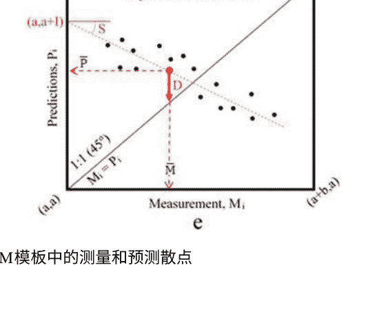

图5.11 各种VINAM模板中的测量和预测散点

线（D =0），以及离理想线的距离。在前一种情况下，没有位移误差，而在另一种情况下，根据上述解释，一切都是不言自明的。

根据建议的模板和算法，测量数据被接受为常数，并试图系统地接近这些测量数据的预测结果，或者确定获得的模型结果与测量之间的重新校准操作，以获得最佳和最优效率的模型。

当将被接受为独立变量的测量数据显示在水平轴上，将预测数据作为依赖变量显示在垂直轴上时，可以通过依次执行数学运算来实现旋转和平移。通过减小系统误差，以此方式制作更接近实际测量值的模型预测或校准。在这种情况下，由于与理想线的垂直距离的变化，会发生畸变。这个结果是无法避免的，以做出更好的预测。由于本研究中的新方法，通过考虑所有可用数据，实现了总垂直变化的优化。通过通过六个不同的性能指标控制所得结果，可以看到建议方法的积极贡献。

### 5.5.2 模型修改

在前一节的所有解释之后，一个重要的问题是“是否可能提高模型性能，以及如何提高其效率？”在VINAM模板回归线上进行平移和旋转操作后，可以实现最佳和最优效率。到达最佳解决方案需要以下步骤：

- 1. 将中心回归点垂直平移，使其位于理想预测线上（1:1）。为保持测量不变，只能进行垂直平移。
- 2. 在平移后，根据旋转角度（1-S）旋回归线，使其与理想预测线（1:1）重合。
- 3. 如果没有其他选择使VINAM回归线与理想预测线重合，这两个操作是首选的。

在移动操作中，没有问题，因为整个散点都会向下或向上移动D的距离。移动操作的数学表达式是

```
P'_i = P_i \pm D \quad (5.6)
```

至于旋转操作，每个散点的水平位置必须保持不变，以免干扰测量值。通过以下表达式可以实现这样的旋转，其中P''_i是最终数据。

```

P''_i = P_i - I - SM_i 	(5.7)

```

本研究提出的方法旨在通过减少模型预测结果中的系统误差与预测测量之间的差异来提高模型性能。在分析准确性和可靠性水平时，可以看到预测和测量之间存在系统误差和随机误差。这些误差因模型师的经验、数据质量和选择的建模方法等因素而异。除了各种性能指标外，还可以根据图5.8中描述的常用的方形模板中给出的理想线进行误差评估。当评估模型研究的初始结果时，可以看到可能出现不同的选择（图5.11）。预测结果的垂直差异由测量和预测的均值之间的一致差异、模型和预测之间预期的1:1理想线之间的角度以及根据最小二乘法得到的测量和模型预测之间的回归线以及最后的随机差异组成。这三个组成部分显示了模型的质量、准确性和可靠性。依赖于前两个组成部分的模型性能可以通过建议的方法显著改善。为了通过发展第三个组成部分的预测来改善模型性能，需要修订模型设计。

### 5.5.3 讨论

在附录A中，给出了所有VINAM步骤的应用所需的软件。VINAM过程的应用是针对两个著名模型进行的，即人工神经网络（ANN）和自适应基于网络的模糊推理系统（ANFIS）。这些应用是基于饮用水配水系统中的水损失测量的，其中水损失预测是水压控制中最重要的问题之一（Şişman和Kizilöz, 2020年）。在评估水配水系统的水损失方面，最重要的组成部分是非收入水（Kizilöz和Şişman, 2021年）。Jang和Choi利用ANN方法建立了一个模型来计算韩国仁川市的非收入水（NRW）比率。当最佳模型被检查时，R^2的值为0.397。可以看出，当测量值和模型预测的散点图沿着回归线出现时，模型可以得到改进，如图5.9中已经解释的那样。

通过ANN和ANFIS对土耳其科贾埃利地区的NRW比例进行建模，并对建议的VINAM方法的实施进行类似模型输出的进一步改进。通过建模过程，开发了总共八个模型（四个ANN和四个ANFIS），其中包括九个输入测量。水需求量、家庭用水储罐、网络故障次数、服务连接故障次数和故障比例、网络长度、水表、节点数和平均管道直径是模型的输入参数。所有模型都通过VINAM方法进行验证，并根据BI、MSE、CC、R²、d和NSE的统计值进行模型效率评估。

对于ANN模型的性能，55%的可用数据被安排为训练集，35%为验证集，10%为测试集。这些模型采用了包含四个神经元的隐藏层，并采用前馈反向传播训练过程和Levenberg-Marquardt反向传播算法的支持进行开发。至于ANFIS模型的实施，66%的获得数据被用作训练集，剩余的34%用于验证（测试）目的。对于该模型，考虑了各种成员函数（MFs），包括三角形（Trimf）、高斯钟形（gbellmf）和梯形（trammf），分别为“低”、“中”和“高”语言术语。ANN和ANFIS模型的输入组件和模型输出的统计特性在表5.1中给出。 ANN模型版本的VINAM图在图5.12中呈现，表5.2中给出了模型的经典和VINAM改进的效率。在这项研究中，通过ANN和ANFIS方法计算了所选模型在九个不同参数上的NRW预测率。通过表5.3给出的三种不同输入参数组合进行NRW比例预测的性能指标结果，结果似乎不达到预期水平。另一方面，当NRW比例预测通过VINAM图表进行分析，如图5.13所示，可以看到由某些系统误差确定的组合可以进行良好的预测。因此，通过建议的方法，通过校准模型（根据理想线）对经典方法进行了相当大的改进。可以通过仅使用三个参数来预测具有特定水平的非收益水比率，并评估WDQ、WM、FR等三个参数的网络损失。

第二个应用图表与测量和ANFIS模型的VVA图表相链接，如图5.13所示。表5.3中提供了经典效率和VINAM改进的信息。

表5.1 输入输出参数

| 类别 | 参数名称 | 缩写 | 范围 | 单位 |
|------|----------|------|------|------|
| 输入 | 用水需求量 | WDQ | 315.445–2.844.526 | m³ |
| 输入 | 家庭用水储存罐 | DWST | 4000–85.901 | m³ |
| 输入 | 网络故障次数 | NNF | 34–628 | 数量 |
| 输入 | 服务连接故障次数 | NSCF | 23–541 | 数量 |
| 输入 | 故障比率 | FR | 0.01–3.43 | – |
| 输入 | 网络长度 | NL | 306–1600 | 公里 |
| 输入 | 水表 | WM | 15.124–160.135 | 数量 |
| 输入 | 交汇点数量 | NJ | 9.616–52.565 | 数量 |
| 输入 | 平均管道直径 | MPD | 108–159 | 毫米 |
| 输出 | 非收益水比率 | NRW | 0.13–0.54 | – |

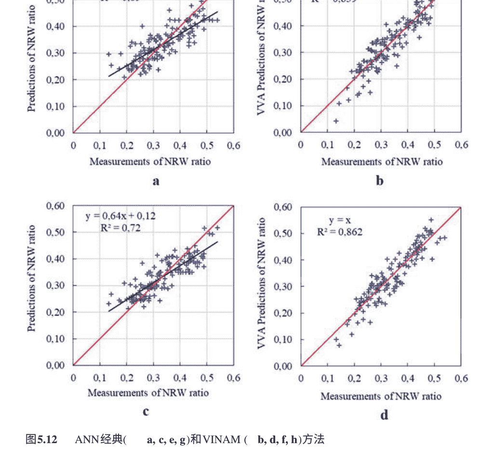

图5.12 ANN经典(a, c, e, g)和VINAM(b, d, f, h)方法

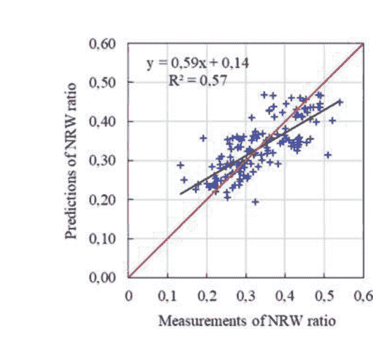

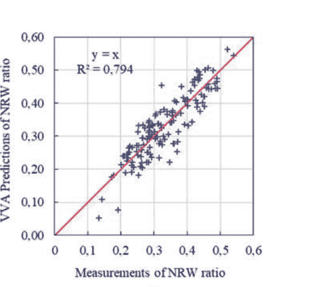

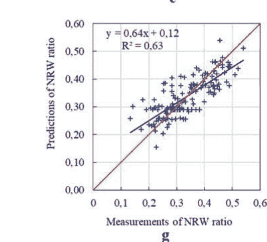

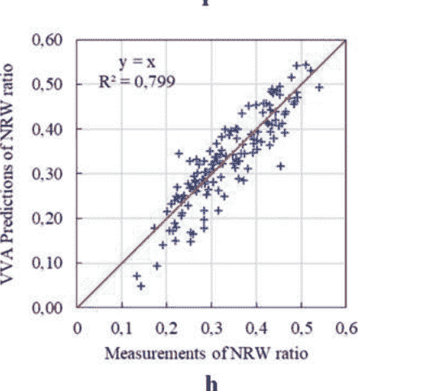

图5.12(续)

表5.2 ANN和VINAM ANN模型结果

| 模型编号 | 输入组合 | R² | MSE | NSE | BI | CC | d |
| :--- | :--- | :--- | :--- | :--- | :--- | :--- | :--- |
| ANN 1 | WDQ – MPD – NNF | 0.65 | 0.0028 | 0.648 | -0.0014 | 0.808 | 0.874 |
| ANN 2 | WDQ – NL – NNF | 0.72 | 0.0022 | 0.715 | -0.0024 | 0.851 | 0.901 |
| ANN 3 | WDQ – WM – FR | 0.57 | 0.0034 | 0.572 | -0.0022 | 0.757 | 0.851 |
| ANN 4 | WDQ – DWST – FR | 0.63 | 0.0290 | 0.625 | 0.0018 | 0.791 | 0.877 |
| VINAMANN 1 | WDQ – MPD – NNF | 0.84 | 0.0015 | 0.809 | -0.0004 | 0.916 | 0.955 |
| VINAMANN 2 | WDQ – NL – NNF | 0.86 | 0.0013 | 0.839 | -0.0004 | 0.928 | 0.962 |
| VINAMANN 3 | WDQ – WM – FR | 0.79 | 0.0020 | 0.740 | -0.0004 | 0.891 | 0.940 |
| VINAMANN 4 | WDQ – DWST – FR | 0.80 | 0.0020 | 0.745 | -0.0049 | 0.894 | 0.941 |

表5.3 具有三个输入的ANFIS模型

| 模型编号 | 输入组合 | R² | MSE | NSE | BI | CC | d |
|----------|----------|----|----|-----|----|----|---|
| ANFIS 1 | WDQ – MPD – NNF | 0.52 | 0.0051 | 0.523 | -0.0014 | 0.724 | 0.825 |
| ANFIS 2 | WDQ – NL – NNF | 0.007 | 0.0138 | -0.292 | 0.0086 | 0.258 | 0.536 |
| ANFIS 3 | WDQ – WM – FR | 0.24 | 0.0081 | 0.238 | 0.0031 | 0.491 | 0.621 |
| ANFIS 4 | WDQ – DWST – FR | 0.15 | 0.0093 | 0.123 | -0.0011 | 0.384 | 0.575 |
| VINAM_ANFIS 1 | WDQ – MPD – NNF | 0.79 | 0.0028 | 0.738 | -0.0012 | 0.89 | 0.939 |
| VINAM_ANFIS 2 | WDQ – NL – NNF | 0.607 | 0.0075 | 0.296 | -0.0224 | 0.779 | 0.856 |
| VINAM_ANFIS 3 | WDQ – WM – FR | 0.823 | 0.0024 | 0.776 | -0.0095 | 0.907 | 0.948 |
| VINAM_ANFIS 4 | WDQ – DWST – FR | 0.804 | 0.0026 | 0.756 | -0.002 | 0.897 | 0.944 |

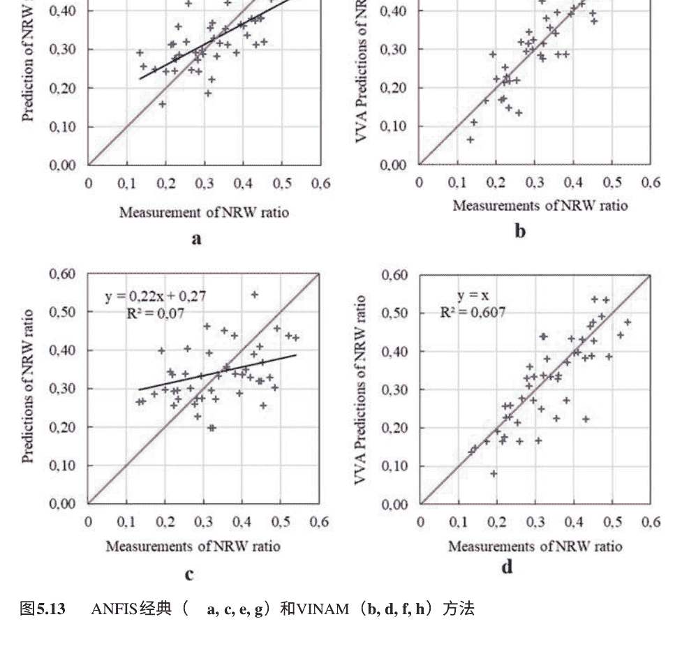

## 5.6 带有逻辑的方程

达到数学方程的最简单、最快、最经济和无麻烦的方法是找到至少可以近似的方程的清晰表达式，考虑之前提到的逻辑和数学规则。为了这个目的，读者必须先关注一个问题。在这里，有一个逻辑推导人口增长基本方程的例子，这对所有人都有吸引力。因为目标是获得一个数学方程；必须先获得口头逻辑信息（第2章，第3章）。如果只以时间为基础考虑人口增长的变化，做出以下假设有助于在最简单的逻辑规则之后获得数学方程。

1.  如果将某个时间作为人口的起始时间，则必须在此时间找到一个初始人口。让我们用t₀表示起始时间，并用P(t₀)表示当前的人口数量。
2.  在接下来的T时期内，人口可能如何随时间变化？如果在此期间没有战争、流行病或迁移，让时间t（t < T）时初始人口的值表示其变化为P(t)。
3.  由于通常会有人口增长，表达式P(t) > P(t₀)表示人口增长会随时间继续。
4.  人口随时间的增加将如何继续？应该回答这个问题，它是线性的还是曲线的。理性的思考者说这永远不会是线性的。
5.  曲线的增长是凹还是凸也取决于理性思考。在这里，人口的增长是否逐渐增加或减少应该决定。
6.  在图5.14中，同时给出了凹和凸形状的曲率。这取决于读者选择其中之一。

如果在经过以上所有步骤后，对两条不同曲线（凹和凸）的数学方程提出质疑，那么将会发现这是一个指数函数。Sen（2002）推荐指数函数的经验法则是曲线与一个轴相交，另一端渐近延伸。即使不知道这个规则，如果将图3.9中的曲线展示给数学家，那么可以得出以下明确的数学表达式：

```
N(t) = a e^{b t}   (5.8)
```

在这个方程中有两个未知常数a和b。由于人口在初始时间为N(t₀)，通过在前一个方程中替换t₀和N(t₀)的值，可以得到a = N(t₀)e^{-b t₀}的结果，这是一个简单算术运算的结果。通过将其代入方程(5.8)中，可以得到

```
N(t) = N(t₀) e^{b (t - t₀)}   (5.9)
```

因此，唯一的未知常数是b，确定它需要显示随时间变化的年度数据。

上述给出的人口方程是通过先前解释的逻辑和数学规则得到的。正确理解这里描述的步骤的读者现在至少可以通过逻辑和简单的数学规则达到时间、空间或时空变化的事件或现象的几何形状，就像图5.14中所示的那样，即输入变量的输出如何变化。这并不需要成为一个数学家，但需要以动态方式理解逻辑和简单的数学规则。

### 5.6.1 通过实验得到的方程

在前一节中，通过提供恒定的初始条件，找到了输入和输出变量之间的关系，从而得到了相等性。在某些情况下，比例和关系可以通过理性确定，但建立完全相等性所需的常数系数无法通过理性和逻辑规则确定。在这种情况下，需要进行实验来确定相等性常数。举个例子，当对弹性杆施加一定的拉伸或压缩力时，伸长或缩短（称为变形比或应变）与力直接成正比。考虑到与施加力垂直的杆截面积，如果单位面积上的力被定义为应力，则可以得出应力和应变成正比的结论。口头地，可以得出以下命题句。

随着压力的增加，应变也以直接比例增加。

值得注意的是，IF-THEN这些词语（第3章和第4章）表示判断，在最后的陈述中是隐藏的。为了写出这个数学表达式，如果应力和应变分别用符号 σ 和 ε 表示，那么比例关系可以表示如下：

```
σ α ε (5.10)
```

其中 α 表示比例性质。因此，这个表达式不是一个方程；它只是口头命题的符号形式。要将这个表达式转化为等式，必须引入一个系数 E，使得方程变为以下形式：

```
σ = Eε (5.11)
```

这里，E是一个常数，提供了两个变量之间的平衡。在材料工程中，它被称为弹性模量。这个常数是通过逻辑思维确定的，但为了确定其数值，至少需要知道一个应力 σ₁ 和应变 ε₁ 的测量值。在这种情况下，E的数值计算为E1 = σ1 / ε1。在许多应力和应变测量的情况下，仅在获得不同的E1值后取算术平均值可以被视为E的数值。

### 5.6.2 从数据中提取方程

无法通过理性和逻辑方法和规则来确定某些事件，如上所述。即使是最简单的两个变量之间存在何种关系也隐藏在测量或实验数据中。特别是可以通过逻辑规则找到关系的直接或反比例关系。另一方面，能够从数据中确定这两个变量之间的关系形式被称为方法。

“从数据中提取方程，”这被称为经验公式。为此，需要知道输入的数值数据（I1，I2，...，In）和相应的输出（O1，O2，...，On）来自测量工具记录。如果这两个序列在I-O平面上相互垂直的两组坐标轴上标记，就会出现一组点，称为散点图。通过一起查看这些点，可以确定两个变量之间是否存在关系，或者可以确定关系的形状。图5.15显示了可能出现的一些最常见的不同选项。

在本节中提出的数学方程提取中，输入和输出变量的单位不需要相同。在基于经验（即数据、经验）的方程中，不追求维度。下面详细介绍了从图5.15中给出的散点图中提取数学表达式的方法。

在图5.15a中，点散布得无法看清，无法辨别它们之间的关系。因此，可以得出结论，水平和垂直轴上的输入和输出变量之间没有关系。

这里没有数学关系，因为无法得出符合逻辑原则和规则的语言推理。这样的数据散布可以进行聚类分析，以描述可能的群组（第4章）。

在图5.15b中，人们可以理解I和O之间存在直接的比例关系，因为可以得出逻辑规则：如果变量I增加，则变量O也增加。人们想知道这个直线比例是沿着一条直线还是有曲率。这个问题的答案可以通过肉眼判断，不需要进行任何数学运算，并且可以画出一条通过这些点的直线。所分配的正确答案因人而异，但它们非常接近。因此，如果没有涉及数学原理，基于主观性的真理之球就会在人们之间出现。然而，在数学中，已经确定了一个方程形式

```
O = a + bI \qquad (5.12)
```

为了从可用的I和O数据中获得a和b系数，通过线性回归的方法计算得到了一条被所有人接受的公共直线方程（第4章）。

点的散布表明O随着I的增加而减小（参见图5.15c）。这意味着I和O之间存在反比关系。这个反比关系是沿着直线吗？还是有曲率？每个人都得出结论是沿着直线，但主观上它是一个数学表达式，如

```
O = a - bI \qquad (5.13)
```

这里的系数a表示O轴上截距点的O值，b表示直线的斜率。

在图5.15d中，点之间的散射再次显示出反比例关系。由于观察到反比例关系具有曲率，因此可以口头上得出结论，它可以用适当的曲线而不是直线来表示。更详细地研究后，可以理解这条曲线与O轴相交，但在其左侧几乎与I轴平行。仔细观察者可以主观地确定通过这里的最合适的曲线，作为一簇（束）彼此接近的曲线。为了使主观性获得客观性，有必要引入数学运算。一个知道一条曲线与一个轴相交并且对另一个轴显示出平行性（渐近线）将是一个递减指数数学表达式的人，将会发现这是一个数值数据计算出的系数a和b的数学方程，如下所示（Şen，2011年）。

```
O = ae^{-bI} \qquad (5.14)
```

在图5.15e的散点图中，观察到存在直接比例和曲率。此外，根据最后部分与水平轴的相交和平行关系，可以推断其为指数曲线。在这种情况下，通过将前一个方程中的减号替换为加号，得到了数学方程的形式。

```
O = ae^{bI} \qquad (5.15)
```

图5.15f中的散点显示出与两个轴平行或相切（渐近线），比例关系被颠倒，并且存在曲率。通过这么多信息，可以得知它将是一个类似双曲线的曲线（Şen，2011）。这个口头信息包括逻辑原则和规则。在数学世界中，对应于这个口头描述的双曲线表达式为：

```
O = \frac{a}{b + I} \qquad (5.16)
```

从图5.15g可以看出，散射点按照一定的方式排列在两个臂上，并且它们在一个臂上呈现出反向，在另一个臂上呈现出正确的比例。因此，这种方式也存在一个谷（或者可能是峰）点。观察中发现，两个臂都在不断增加，但增长速度在减小。这里还隐藏着逻辑规则。建议读者通过考虑之前解释的逻辑原则和规则来得出这些。具有这些特性的数学表达式称为抛物线（二次多项式），其数学符号如下所示。

```
O = a + bI + cI^2 \qquad (5.17)
```

图5.15h显示了波浪点的散射。可以得出结论，这个数学表达式由正弦曲线和余弦曲线组成。
图5.15i中的点的散射与水平轴平行，没有斜率。这意味着I和O变量之间存在着恒定的关系，或者说O输出通过一个常数与I输入相连。在最后的图5.15j中，与之前不同，O与I之间是通过一个常数相连的。

### 5.6.3 从尺寸中提取方程

在前一节中，已经解释了即使在没有单位的情况下，也可以从手头的测量数据中得到可用于实际应用的方程（经验上、实验上）。在某些情况下，还可以从基本术语的复杂单位中推导出与之相关的方程。例如，了解将排放定义为单位时间内的流体（水、气体）体积的人也可以从中推导出一些基本方程。如果排放量为Q，体积为V，时间为t，则口头定义变成了一个数学方程:

```
Q = \frac{V}{t} \qquad (5.18)
```

这个定义的单位是$m^3/s$；可以将这个单位分成可能的子单位，例如，$m^2 \times (m/s)$；由于这里的两个单位在物理上是面积A和速度v，因此前面方程的定义采用以下表达形式:

```
Q = A v \qquad (5.19)
```

因此，得到了一个全新的方程。

## 5.7 逻辑数学推导

这个原理在科学界被称为“质量守恒”，也被称为“平衡方程”，“连续方程”，或者“预算方程”(第3章)。在所有科学方程的根本上，都是简单思维和逻辑原则和规则的口头表达。在这里，将提出一种推理，以吸引那些没有太多教育但希望通过理性思考、逻辑和怀疑批判来得出合理结论的人。

考虑到通过观察、实验或想象来研究的现象或事件的几何形状，特别是为了得出科学结果，有很多好处。为此，考虑一个宽度、高度和长度都不变的弹性但不可压缩的长方体，如图5.16所示。在这里，公众对“不可压缩”原理的理解是指在受力后其体积不会改变，如图所示。

如果可变形的棱镜突然（排除时间因素）受到力F的压缩，如图所示的方向，那么逻辑上形状会发生变化，但体积不会。人们认为力作用方向会发生缩短，其他方向会发生延伸。

延伸和缩短的量是不同的。长度方向的缩短会导致该方向上的体积减小；宽度和高度方向的体积增加。在各个方向上都有体积变化，但总体积不变。如果将这些口头表达整理得更整洁一些，就会得到以下句子的加法运算。

长度方向的体积变化 + 宽度方向的体积变化 + 高度方向的体积变化 = 0

以另一种方式书写，就变成了下面框架中的口头数学表达式。

上述表达式仅通过运用理性和逻辑原则口头解释和获得，是一种数学方程。为了将这个通过逻辑得出的结果转化为数学，必须使用一些符号。如果长度表示为l，宽度表示为w，高度表示为h，体积表示为V，而变化，即差异，用d符号表示，则高度、宽度和高度的变化分别表示为dV/dl，dV/dw和dV/dh。因此，上述口头解释以以下符号方程的形式出现：

$$
\frac{dV}{dl} + \frac{dV}{dw} + \frac{dV}{dh} = 0 \quad (5.20)
$$

同样，数学假设之一是，如果一个事件取决于多个维度（其中体积取决于高度、宽度和高度），则应该使用符号 ∂来表示部分变化指示，而不是d，因此，先前的数学方程变为

$$
\frac{\partial V}{\partial L} + \frac{\partial V}{\partial W} + \frac{\partial V}{\partial H} = 0 \quad (5.21)
$$

在上述思维实验中，如果作用在棱镜上的力是缓慢施加的，而不是突然施加的，那么随着时间的推移，体积的变化也会发挥作用。与之前的解释类似，如果将时间（第四维度）纳入体积变化工作中，最终的表达式将如下所示：

$$
\frac{\partial V}{\partial L} + \frac{\partial V}{\partial W} + \frac{\partial V}{\partial H} + \frac{\partial V}{\partial T} = 0 \quad (5.22)
$$

在这个最后的陈述中没有逻辑上的缺失，人们可以认为它是恰当的。然而，长度、宽度和高度是空间的维度，被认为与时间维度不同，因此，我们在这个最后的方程中加入了苹果和梨。苹果和梨不能相加，但在科学中它们可以被合理地相加。为此，必须将苹果转换为梨或将梨转换为苹果。由于最后一个数学表达式的前三项显示了体积随长度的变化，即单位长度内的体积变化，即导数，而第四项显示了单位时间内的体积变化，因此体积变化的单位与空间和时间有关彼此不同。需要一个系数fi来将其中一个不同的单位转换为另一个单位。如果这样的系数fi被表示为 α，从时间单位转换为空间单位的最准确的数学方程如下所示。

$$
\frac{\partial V}{\partial L} + \frac{\partial V}{\partial W} + \frac{\partial V}{\partial h} + \alpha \frac{\partial V}{\partial T} = 0 \quad (5.23)
$$

建议在进行数学运算之前，先进行逻辑原则、规则和语言推理，然后通过符号化单词和句子来得到数学表达式。

### 5.7.1 电路的逻辑建模

考虑到清晰逻辑原则的初始解释（第2章），推理可能是真或假的。一般来说，工程和自然科学的表述依赖于前面章节中解释的清晰逻辑原则，大多数情况下，事件包含模糊性、不精确性和不确定性，因此，模糊逻辑更适合以口头方式消化不确定性，然后用模糊逻辑进行数值推理（第2章）。尽管有许多处理数值数据的方法，如概率和统计方法，但研究人员往往不关心它们的基本假设，并直接应用现有的方便公式。我们可以用图5.17中显示的电路来表示逻辑推理是可验证的或可否定的。有一个开关，可以在两个点之间进行通信，例如A和B。如果这个开关关闭，是的，如果它打开，就没有。我们可以将其视为点A和点B之间电流的存在或不存在。然而，在实践中，通过增加串联（图5.18）、并联（图5.19）和串并联（图5.20）中给定的开关数量，会出现更复杂的电路。在这种情况下，电路是否可靠工作或不可靠工作（危险、风险）存在不同的情况。

## 5.8 风险和可靠性

在实践中，验证被视为“可靠性”，伪造被视为“风险。”应考虑到上述电路中的开关由同一家公司制造，并且它们的可靠性R（以百分比表示）即超过概率或风险r，是互补事件。当这些风险和可靠性的数量以百分比（可能性）表示时，它们的总和必须等于1。以下表达式同时对每个键有效。

$$
R + r = 1 \quad (5.24)
$$

利用这些基本的可靠性和风险可能性，两个开关必须同时关闭（验证，即AND操作），才能使电流从A流向B，通过图3.8（第3章）所示的串联开关。由于关闭其中一个开关不会对关闭另一个开关产生任何影响，也就是说，开关之间相互独立，因此概率的乘法规则适用。因此，给定两个串联开关的电流流动的概率为

$$
R_{1-2} = R_1 R_2 \quad (5.25)
$$

如果在A和B之间有m个具有相似特性的开关串联，通过这个电路的电流流动的概率可以通过以最一般的方式推广前面的表达式来计算。

$$
R_{1-2-.....m} = R_1 R_2 ...... R_m \quad (5.26)
$$

根据图3.9a-d（第3章）中给出的开关并联连接情况，电流从A点到B点有三种可能的情况。第一种情况是只有开关a闭合，第二种情况是只有开关b闭合，第三种情况是两个开关同时闭合。如果满足这三个条件中的一个、两个或全部，电流将从A点流向B点。因此，由于只有开关a必须闭合，也就是说，在图3.9（第3章）中，只有当a闭合且b打开时，系统才能正常工作，根据概率的独立性原理，可以将乘法R(1-R)的概率写成。同样，如果b闭合但a打开，电流仍然会通过系统，这种情况的联合概率是R(1-R)。在最后一种情况下，由于两个开关都闭合，根据概率的乘法原理，根据概率独立性计算的结果。

在这种情况下，系统通过电流的可能性始终存在，并且情况下，借助这三种不兼容情况的ORing和概率计算的加法原理的帮助下，

$$
R_{OR} = R(1-R) + R(1-R) + RR = 2R^2(1-R) \quad (5.27)
$$

最后，在图3.15（第3章）中，有一些情况，其中开关b和c与开关a串联，并且再次与开关d并联。可以通过根据之前描述的两态概率计算，分别考虑并联和串联连接，为这样一个复杂系统编写有效的概率模型。这里有一些可能出现的选项 first，其余的留给读者来完成：（a）对a和b进行AND操作。

-   (b) 使用 a 对 b 和 c 进行 OR 运算。
-   (c) 对 a、b、c 和 d 进行 AND 运算。
-   (d) 对 a 和 d 进行 AND 运算。
-   (e) 其他。

假设所有的键都由同一家公司制造，质量相同。作为第一步，如果 b 和 c 开关并联连接，根据公式 (5.26)，如果它们有一个组合概率，它们可以将流量传输到 B 点。这种组合可能性

$$
R_{bc} = 2R(1-R) + R^2 \quad (5.28)
$$

让我们用符号表示它。现在，假设开关 a 与这个并联系统（开关 b 和 c）串联连接，根据公式 (5.24)，可以得到以下表达式：## 5.9 数学函数的逻辑

由于这个最后得到的概率值（键a、b和c）将与键d并联，考虑到方程（5.28），因此可以得到一个相当复杂的表达式。

尽管这个最后的陈述可能看起来很复杂，但是如果按照推导过程中的步骤明智地进行，读者可以很容易地推断出电流的概率模型，即使是通过更复杂的电路形式。

## 5.9 数学函数的逻辑

本节所解释的内容包括书中所解释的主题。
这本书是由Şen（2011）用土耳其语写的“科学与科学研究原则”。
由于在中学和高等教育中接受的数学教育，学生们对一些函数的形状和属于它们的符号表达式机械地掌握了，但是“我想知道它们的逻辑基础是什么？”“它能否被放置在质疑的机械思维系统的末尾？”例如，他们可能知道导数和积分计算是一系列机械操作，但他们是否也能回答这样的问题：它们的逻辑基础是什么？你可以在下面的解释中找到所有这些问题的答案。在教育结束时，如果没有合理性（理性）、批判性（不确定性）、怀疑和对逻辑原则和定义的感知，即工作的基础，一个人就会陷入记忆、迟钝、教条主义和无意识地传递的道路中。下面以支持动态理性的方式解释了一些基本数学图形（几何、函数）的逻辑基础。本书的作者根据自己的经验，阐述了将信息与其原因一起传达给学生的必要性。在数学领域，中学和高等教育阶段所学到的方程的通用名称以及在实际生活中最常用的方程在图5.21中给出。

读者应该考虑平面几何环境下的所有情况如下所述。这意味着形状存在于一维、二维和三维空间中，即欧几里德几何领域。然而，在过去的40年里，还有一些十进制空间，其名称为分数（分形）几何，并且已经被排除在本章之外（曼德博1982年）。

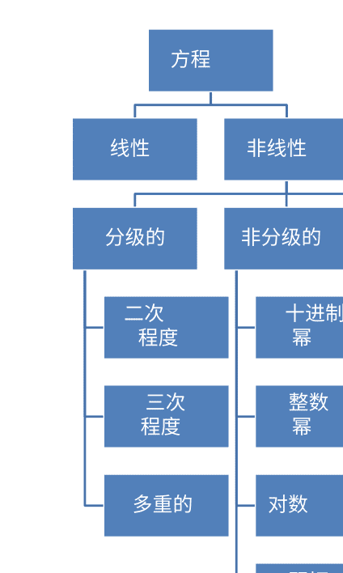

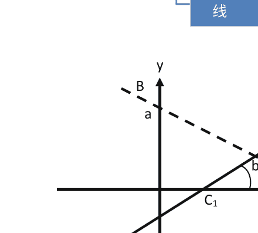

### 5.9.1 直线

每个人，无论受教育与否，都认为只要知道两个点就足够画一条直线。这意味着只需要两个点就可以画出直线。通过点A和点B的直线如图5.22所示。至少两个变量之间的逻辑关系是直接比例和线性的，一般来说表达式为

在建模中，x是输入变量（科学哲学中的原因，数学中的自变量，工程中的预测变量），y被称为建模中的输出变量（科学哲学中的结果，数学中的因变量，工程中的预测变量）。

```
y = a + bx      (5.31)
```

直线方程中有两个常数值。其中，a表示当x = 0时在y轴上的截距值，b表示直线的斜率。我们也可以将这个斜率看作y增加与x增加的比例。由于方程（5.32）有一个对应于y = 0的根，即C1 = -a/b，根据根的定义，

```
y = b(x- C1)      (5.32)
```

如果常数a > 0（a < 0），则几何（函数）情况A（B）如图5.21所示。

到目前为止，科学上提出的所有物理定律方程（牛顿、欧姆、哈勃、胡克、达西等）都被表示为一条带有a = 0的直线方程。因此，人们可以将方程“y = bx”视为所有这些定律的方程，每个变量都有不同的口头表达。前面方程的最一般形式是，如果在n维空间中有n个输入变量（x1，x2，x3，... xn），则它是一个单点。这些输入变量是不同人工神经网络（ANN）架构中的主要输入变量（见第7章）。

```
y = a + b*x1*x1 + b*x2*x2 + b*x3*x3 + ... + b*xn*xn = a + ∑(i=1 to n) bxi*xi      (5.33)
```

在这里，每个bxi表示第i个变量在其他变量中所占的斜率大小。从几何角度来看，如果这个表达式只包含x1变量（如Eq.5.32），它代表二维空间中的一条直线。

如果只考虑到x2项，它代表三维空间中的一个平面。一般来说，在n维空间中，无法在脑海中想象出直到xn项的平面，但可以在每个方向上思考和表达直接的比例和线性关系。

```
y = a + bxi*xi      i = 1, 2, ..., n      (5.34)
```

用线条或在任何三维空间中

```
y = a + bxi*xi + bxj*xj      i ≠ j; i = 1, 2, ..., n and j = 1, 2, ..., n      (5.35)
```

再次，我们可以用可以被视为交叉-部分的平面在我们的脑海中可视化它。只需看一下图5.23，就可以用符号来可视化这个最后的陈述。

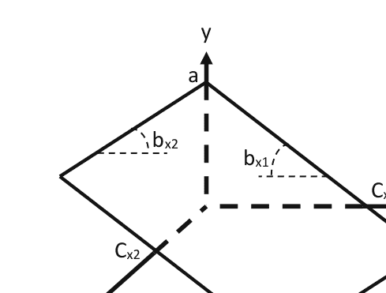

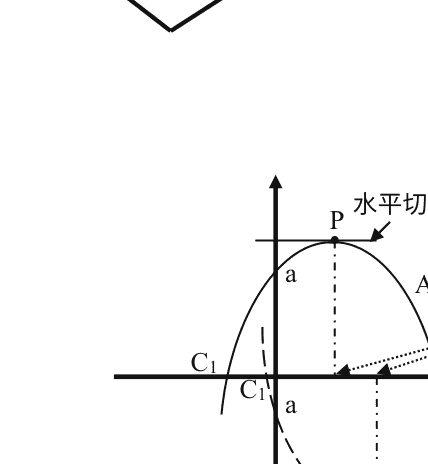

此外，方程（5.36）的根在x1和x2轴上的交点，可以被视为方程的根，分别为Cx1= -a/bx1和Cx2= -a/bx2（图5.23）。此外，方程（5.34）是用n的根来表示的。

$$y = a \sum_{i=1}^{n} (x - C_i) \qquad (5.36)$$

### 5.9.2 二次曲线（抛物线）

这是通过在上述直线方程中添加另一个带有整数指数的项而产生的情况（图5.24）。

```
$$ y = a + b_1x + b_2x^2 $$
```

所有变量与之前的直线方程相同。
在这里，一个新的二次项前面是一个斜率常数，$b_2$。
这个方程有两个根，$C_1$和$C_2$，它们与x水平轴相交。
根据根的方程也可以写成

```
$$ y = a(x-C_1)(x-C_2) $$
```

在图中，图A（B）显示了常数a > 0 (a < 0) 的状态，分别对应于峰值P和谷底T。 这的实际意义是二次表达式中存在一个转折点（峰值P或谷底T） （图5.24）。转折点的特点是存在水平切线，即在这些点上斜率等于零。

由于导数在基本定义上表示斜率，所以dy/dx的导数在这里必须等于零。
通过简单地对方程 (5.38) 求导

```
$$ \frac{dy}{dx} = b_1 + 2b_2x $$
```

通过将这个导数设为零，我们可以得到顶点或低谷点在水平轴上的投影位置。 投影点的值为
$x = -b_1/2b_2$ (图5.24)。 根据这个值是正还是负，可以得到关于峰值或低谷点在垂直轴右侧或左侧的口头信息。方程 (5.40) 可以转化为人们容易理解的直线方程，可以给出方程 (5.32) 的形式。为此，可以通过用t等另一个变量来描述导数来获得。

```
$$ t = b_1 + 2b_2x $$
```

通过与方程 (3.21) 进行比较，可以通过给出的所有解释来得到b_1和b_2斜率的口头感知。

### 5.9.3 立方曲线

通过将下一个整数指数变量项添加到二次方程中，可以得到其数学表达式如下：

```
$$ y = a + b_1x + b_2x^2 + b_3x^3 $$
```

图5.25显示了该表达式的几何（函数）和所需符号的状态。 一般而言，它有三个根。 因此，将前面的方程写成根的形式，得到如下形式：

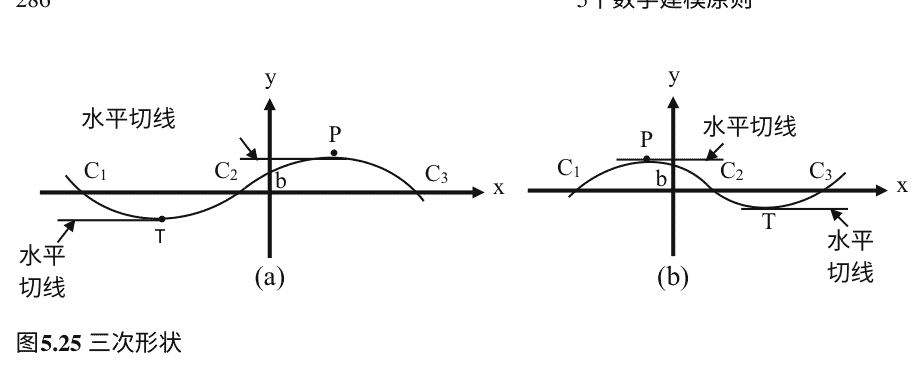

表5.4 度转折点数关系

| 方程的次数 | 转折点的数量 | 线性化导数的数量 |
| :--- | :--- | :--- |
| 1 | 0 | 0 |
| 2 | 1 | 一阶导数 |
| 3 | 2 | 二阶导数 |

```
y = a(x - C₁)(x - C₂)(x - C₃)			(5.42)
```

图5.25a, b分别显示了几何形状，根据a的正负值，这被称为形状参数。从这个图中可以看出，几何形状的Eq. (5.42)中存在连续的峰值和低谷，即两个转折点。

通过将其与之前给出的一阶和二阶导数进行比较，可以推导出表5.4中的规则，然后进行概括。可以从地标概念中获得额外的信息。由于转折点的定义是导数等于零，通过对Eq. (5.42)进行求导得到一个二次方程：

```
t = b₁ + 2b₂x + 3b₃x²			(5.43)
```

通过将其与上述二次方程进行比较，可以对其进行解释。因此，在这个方程中，可以给出b1、b2和b3的斜率以及其口头意义。这种情况留给读者自己判断。在另一个情况中，通过对方程（5.44）再次求导

```
u = 2b₂ + 6b₃x			(5.44)
```

通过得到这个表达式，可以得到一条直线方程。由于u是导数的导数，它被称为二次导数，即d2y/dx2，以主要变量为基础。通过将其与方程（5.32）进行比较，这次可以将b2和b3在u-x空间中赋予必要的口头意义。

从这里可以得出另一个规则；数学是通过连续求导来线性化具有整数指数的方程。然后，通过连续求导直到拐点，可以线性化基本方程。

### ### 5.9.4 多次曲线（多项式）

具有n次整数项指数的方程，这是前面步骤中给出的最一般形式，可以写成如下形式:

```
y = a + b*x1*x + b*x2*x^2 + b*x3*x^3 + ... + b*xn*x^n   (5.45)
```

通过表5.4的概括，我们可以得出一个结论，即在n次多次方程的形状（几何）中，必须有n-1个交点。根据这个结论，例如，一个五次方程的一般和根基数学是有序的。

```
y = a + b*x1*x + b*x2*x^2 + b*x3*x^3 + b*x4*x^4 + b*x5*x^5   (5.46)
```

和

```
y = a (x - C_1) (x - C_2) (x - C_3) (x - C_4) (x - C_5)   (5.47)
```

根据主要和导数，这个最后的方程所暗示的形式（以及动词表达）留给读者。强烈鼓励读者这样做。对于这样做的读者，口头表达这样的方程或表达给定方程的困难消失了，读者达到了科学的幸福，因为理性信息在思维中起到了作用。

### ### 5.9.5 带有小数指数（幂函数）的方程

在实际应用中经常使用的数学符号之一是 y = a x^2 的整数幂的小数形式，这是二次方程的最简形式。

```
y = a x^b   (5.48)
```

图5.26显示了值y相对于x的几何（函数）关系。对于 b > 2 的基本二次（抛物线）方程的值，有像手风琴一样的闭合，而对于 b < 2，则有开口。在这里，一个系数可以被称为标量，因为它的大小可以根据其大和小的值来改变比例。虽然 a 可以在图中显示，但是不可能显示 b。

## 图5.26 十进制幂形状

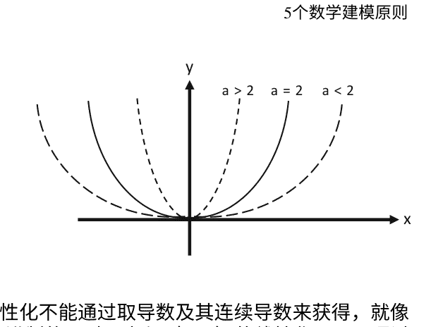

这个经常使用的方程的线性化不能通过取导数及其连续导数来获得，就像之前的方程那样，因为b是十进制的。对于方程（5.49）的线性化，可以通过定义一个新变量u = bx并将其转化为y = au来简单地实现。这样的转换并不提供关于b的语言信息。

另一方面，对方程（5.49）两边取对数可以给出新的状态线性的线索。

$$\log y = \log a + b \log x \quad (5.49)$$

由于对于通过在表达式右侧对变量y取对数得到的新变量u，尺度常数u和a的对数将是常数，如果将其定义为对log(x)的新变量，即A和x的新等价物，所需的最简线性方程就是所需的线性方程的形式：

$$u = A + b v \quad (5.50)$$

通过将y和x的值与以b的对数为纵轴和以A的对数为纵轴的y变量进行比较，可以得出结论，如果等于零，则b = -A/v或者b在v轴上。可以推断出它必须等于 -A/log(x)，从而得出A = -a log(x)。

如果需要开发一种实际解决上述操作的方法，回到方程(5.50)将会很有用。这个方程表明，在[log(x), log(y)]对数空间中，会出现一条具有斜率b和截距b = log(a)/log(x)的直线，而不是在(x, y)正常空间中。因此，可以得出结论，如果直接将坐标轴取为对数直线几何，将不会有任何困难地得到结果。图5.27显示了一组具有对数坐标轴的正交坐标轴。

在这篇论文中，有一个在两个轴上以10的间隔显示的顺序，并在其中分为六个子间隔。根据公式（5.50），给出了直线和反比例线的示例，这两种线在其中有两个选项。在这里，一个值在图中被表示为斜率。由于为了理解方程中a的值意味着什么，不能给y一个零值，

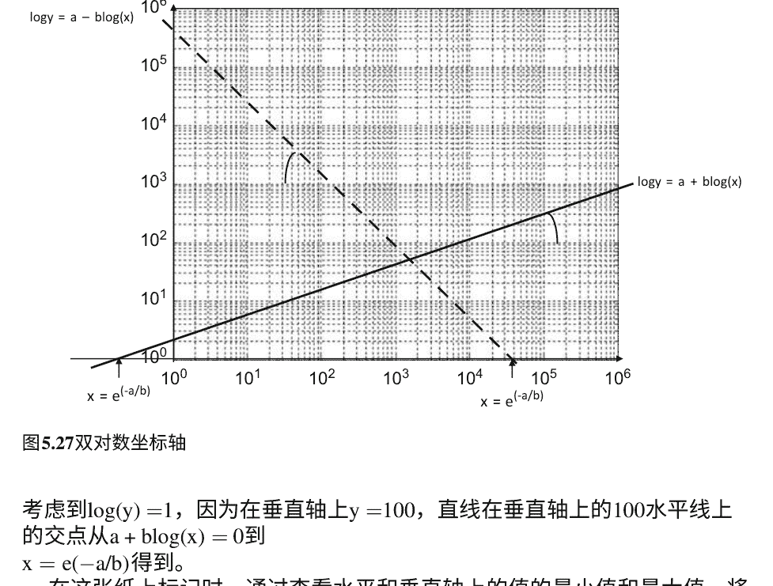

## 图5.27 双对数坐标轴

考虑到log(y) =1，因为在垂直轴上y =100，直线在垂直轴上的100水平线上的交点从a + blog(x) =0到 x = e^{(-a/b)}得到。 在这张纸上标记时，通过查看水平和垂直轴上的值的最小值和最大值，将这些值写成10的幂，并查看10的指数来给区间赋值。 例如，假设x数据的最小（最大）值为0.012（2457.8），y数据的最小（最大）值为27.9（379.8）。要在双对数纸上标记数据，数据必须写成10的幂。因此，通过根据基数10评估x轴和y轴的最大值和最小值，找到1.2 × 10^{-2}（2.4578 ×10^{3}）和2.79 ×10^{1}（3.798 ×10^{2}）。

示例在图5.28中给出的双对数纸上追踪表5.5中给出的x和y数据。

### 5.9.6 指数曲线

在实践中经常遇到的另一种不断增加或减少的曲线是指式曲线，它与其中一个轴相交，并在非常大的值处与另一个轴相切（如果在无穷大处有渐近线，就像有一个无穷大的实际性）如下所示：

```
y = ae^{-bx} (5.51)
```

表5.5 x和y数据
| x | y | x | y |
|---|---|---|---|
| 1 | 3.2 | 1 × 10⁰ | 3.2 × 10⁰ |
| 3 | 82.944 | 3 × 10⁰ | 82.944 × 10⁰ |
| 5 | 11.06998 | 5 × 10⁰ | 11.06998 × 10¹ |
| 7 | 12.7713 | 7 × 10⁰ | 127.713 × 10¹ |
| 9 | 14.6277 | 9 × 10⁰ | 146.277 × 10¹ |
| 11 | 20.3283 | 1.1 × 10¹ | 203.283 × 10¹ |
| 13 | 24.9082 | 1.3 × 10¹ | 249.082 × 10¹ |
| 15 | 23.3904 | 1.5 × 10¹ | 233.904 × 10¹ |
| 17 | 26.7909 | 1.7 × 10¹ | 267.909 × 10¹ |
| 19 | 29.1216 | 1.9 × 10¹ | 291.216 × 10¹ |
| 21 | 30.3917 | 2.1 × 10¹ | 303.917 × 10¹ |
| 23 | 31.6082 | 2.3 × 10¹ | 316.082 × 10¹ |

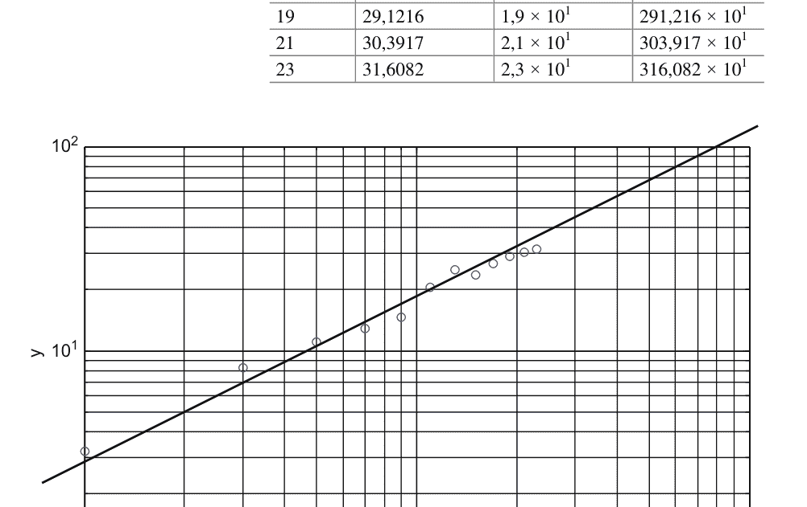

这里，a是缩放常数，b是分支常数。为了在口头表达中保持连续性，当在一个轴上切割时与另一个轴相切的大值信息存在时，使用图5.29中所示的不同常数集合会产生不同的曲线集合。

在图5.29a中设置的几何（函数）集合是由方程（5.52）表示的曲线集合。可以以类似的方式找到其他曲线的方程。例如，图5.29b的数学表达式是

x = ae^{-by} (5.52)

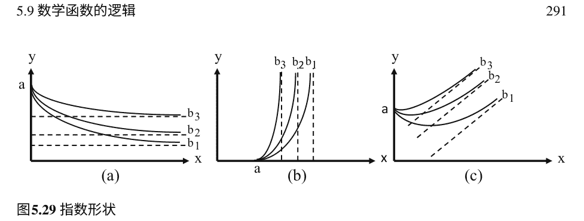

## 图5.29 指数形状

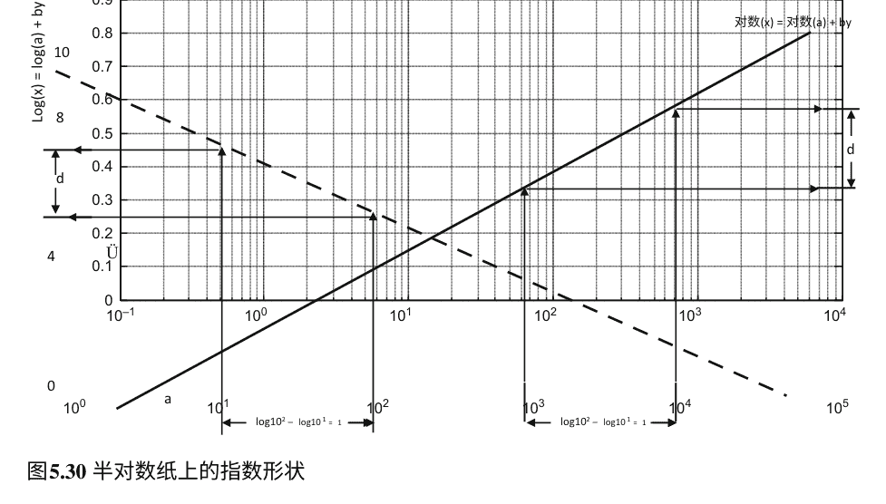

## 图5.30 半对数纸上的指数形状

这个表达式的线性化可以像之前的曲线一样用对数来完成，在这种情况下，

```
$\log x( ) = \log a( ) - by$
```

如果在这里定义u =log(y)和A = log(a)

```
$u = A - by$
```

这是正确的方程。将其与方程(5.32)进行比较，提供了必要的口头表达。根据方程(5.54)，只从变量中取y的对数，根据u的正负号在半对数纸上显示的线条如图5.30所示。由于b在半对数空间中显示线的斜率，所以这个斜率是通过对相邻边和对边的比率得到的，根据一般斜率定义。

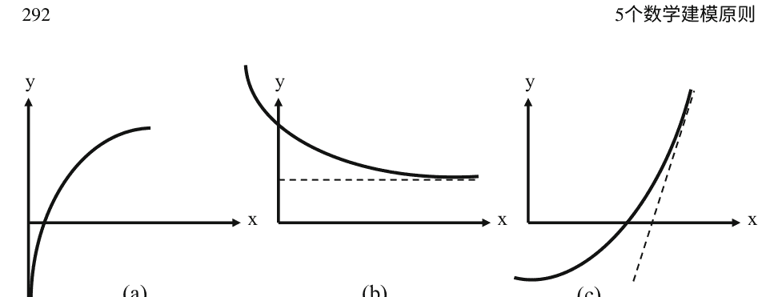

对于半对数空间中的斜率，沿着对数轴进行一次完整的旋转。例如，它的长度为log10^2 - log10^1 =1等等（例如，log10^5 -log10^4 =1等等）；它始终等于1。在图3.25中，显示了log10^2 - log10^1和log10^4 -log10^3。与这些电路相对应的垂直轴上的差异给出了斜率d。另一方面，通过在方程（5.53）中取y =0, 得到log(x) =log(a)或x =a对应于这个值被获得。

### 5.9.7 对数曲线

在一个轴的大值处，它是切线（在无穷远处的渐近线），在与之垂直的另一个轴上，曲线在大值处取得越来越大的值，并且不通过垂直轴的原点，这种曲线被称为对数曲线，这个口头定义的数学在以下表达式中以符号形式出现：

```
y = a + b log x( )          (5.55)
```

这个模型与指数模型最重要的区别是它不经过零点，变量x不能取负值。

根据口头定义，这条曲线的几何形状在图5.31中显示。

### 5.9.8 双渐近曲线（双曲线）

口头上，它是指在两个轴上与它们相切于大值处的曲线的名称，它的最简单数学形式（在两个垂直轴上的大值处相切）可以用以下符号表示（图5.32）：

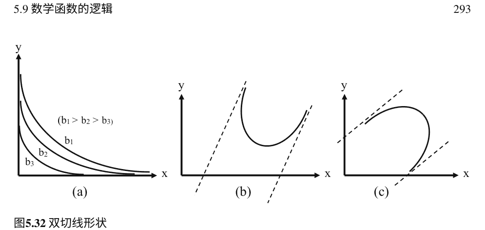

图5.32 双切线形状

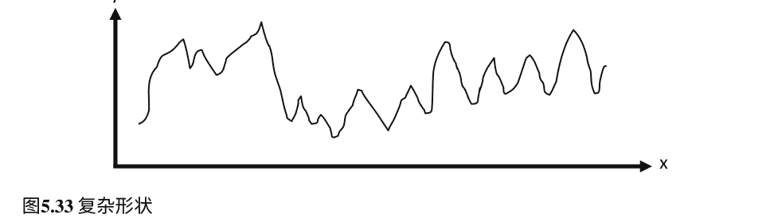

图5.33 复杂形状

```
$$y = \frac{d}{x} \quad (5.56)$$
```

在这个表达式中，d作为分布系数提供了一个聚类曲线。随着这个系数的减小（增长），在大值处与两个轴相切的曲线变得更小（增长）。

## 5.9.9 复杂曲线

上述多阶曲线方程可以用来建模非常复杂的形状。通过观察这一点，可以计算里程碑，以便应用许多数学符号；比这个少一个（图5.32）。在这种情况下，随着非常详细的里程碑的加入，方程中的项数可能会增加，使其非常难以管理。相反，甚至最复杂的形状也可以通过叠加不同尺度和振幅的正弦和余弦波来建模，这更加方便、快速和简单（图5.33）。

## 5.10 数学逻辑和语言

正如之前提到的，数学的基础是逻辑，逻辑思维的表达可以通过语言实现。二进制和模糊逻辑原理的重要性在第三章中有所解释。

### 5.10.1 从语言到数学

在之前的章节中，通过在脑海中形象化地可视化待检验事件的几何形状，并利用推理和直觉的方式进行推断，提到了从几何形状中进行推断的好处，以产生科学知识。在这样的推断中，使用了演绎或归纳，并强调了主要推断的重要性。对一些事件进行口头表达会导致在检验中出现口头规则。在这样的研究中，应该尝试提取所调查事件的形状信息（几何学）。首先想到的是研究二维空间中的变异性，也就是我们在教育中学到的作为形态学的函数。即使读者第一次听到函数是几何形状，他在未来的研究中也可以通过注意这一点来进行健康而明智的科学推断。要使一个现象具有科学性，必须同时具备以下几点：

- 现象的实质（空气、水、石头、土壤、混凝土、铁、木材等）
- 现象行为随时间和/或位置的变化（距离、面积或体积）。

第二点的意义是在研究事件的出现或行为时，在许多因素的影响下，希望有一个感兴趣的输出，并从输入中预测出来。在进行这样的预测之前，有必要从语言上理解事件的时间和位置的可变性。出于这个原因，如果可能的话，首先要尝试可视化所需输出或输入变量的时间和/或位置的可变性。如果我们将输出变量表示为O，时间表示为t，距离表示为D，面积表示为A，体积表示为V，在图5.34的两个变量fields中搜索形状（关系）。

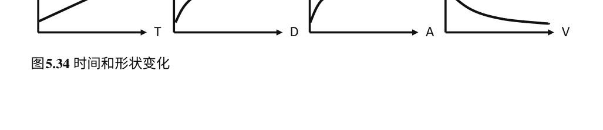

在进行研究时，作为第二种口头询问方法，展示它作为输入和输出变量之间的有理二元关系匹配（矩阵）是有用的。这个匹配矩阵类似于初步建模部分中概述的那个，但重要的是要看到这两个关系是如何形成的（图5.35）。

|   | G1 | G2 | G3 | G4 | C |
|---|---|---|---|---|---|
| G1 | ○ | ↑→ | ↑→ | ↑→ | ↑→ |
| G2 |   | ○ | ↑→ | ↑→ | ↑→ |
| G3 |   |   | ○ | ↑→ | ↑→ |
| G4 |   |   |   | ○ | ↑→ |
| C  |   |   |   |   | ○ |

图5.35 二元关系匹配

在两种形式环境中的示例，现在是将它们转化为数学的时候了。为此，首先需要了解数学符号的语言学。表5.6显示了这些翻译。

### 5.10.2 从数学到语言

与前一节中得出的数学表达式相反，能够从数学翻译成语言可以在未来的研究中获得额外的详细信息。当考虑给定的数学公式时，就好像使用了演绎推理，因为这涉及到进一步的细节。这种科学翻译成语言既有口头的，又有理性的视觉益处。

表5.6 英语-数学词典

| 英语 | 数学 | 解释 |
| --- | --- | --- |
| 加 | + | 与运算 |
| 减 | - | 与运算 |
| 乘法 | × | 与运算 |
| 除法 | / | 与运算 |
| 普通导数 | Dy/dx | 斜率，y变化每单位x变化 |
| 偏导数 | ∂y/∂x | 条件斜率（对于y的变化，除了x的变化外，其他变化都被视为常数） |
| 平方根 | √ |  |
| 幂 | x^a | 幂或指数 |
| 普通对数 | Log(x) | x的普通对数 |
| 自然对数 | Ln(x) | ln(x) |
| 绝对值 | \|x\| | x的绝对值 |
| 大于 | x > y | X大于y |
| 小于 | x < y | X小于y |
| 相等性 | x = y | X等于y |
| 大约 | x ≈ y | X大约等于y |
| 错误 | ± 5% | 正负5%的误差 |
| 无限 | ∞ | 没有限制 |
| 差异 | Δx | x的差异 |
| 派（π）数 | π | 3.14 |
| 极限 | 极限（x → y） | x在大值时趋近于y |

从数学角度翻译的人必须首先了解公式中符号的语言含义。此外，还应该知道一些符号（导数、积分等）的含义（表5.6）。

例5.1 将以下方程翻译成英文，并以图形方式显示输入和输出变量之间的关系。让我们假设在这个方程中，p代表压力，t代表温度，h代表湿度，v代表风速，最后r代表降雨量。知道这些符号的名称对于展示给定表达式如何翻译成英文非常重要。可以直接将这些变量以隐式数学形式写成如下形式：

```
r = f(p, t, h, v) (5.57)
```

明确表达这个方程的第一步是通过考虑右侧的输入变量来揭示输出变量r之间的关系，将其他输入变量视为常数。为此，我们需要应用之前提到的两个标准（比例和几何），牢记在心。其中一个是直接或反比例关系，另一个是线性（线性）或曲率（非线性）。

- 1. r-p关系：存在直接比例和曲率，形式为幂函数，因为p的指数不等于1。
- 2. r-t关系：存在直接比例和线性关系。这里的线性关系是由于t的幂等于1。
- 3. r-h关系：存在反比例和曲线关系。曲线关系来自两个来源。第一个是一个双曲线形状的曲线，因为h在分母中。第二个是在之前曲线的基础上加上了平方根的额外曲线。
- 4. r-v关系：反比例和线性是有效的。它与其前面的负号成反比。这意味着随着v的增加，r减小。

通过这些观点，可以得出方程的语言逻辑原则，并获得关于不同关系类型的口头信息。使用这些口头关系，至少可以将给定方程的一般形式写成以下形式：

```
y = a \frac{x^b u}{z^c} - v \quad (5.58)
```

在这里，系数a被称为等化常数。另一方面，b和c是曲率的表达式，它们的数值是难以想象的。因此，需要实验研究、测量和数值（数据）来确定b和c的值。从上述观点给出的方程中，可以推断出输入变量之间的语言关系是基于相同的思想。为此，除了考虑所考虑的两个输入变量之外，其他输入和输出变量保持不变（图5.34）。因此，给出了p、t和v之间二元关系的语言逻辑表达式如下：

- 1. r-p关系：它们之间存在直接比例和曲线关系。
- 2. r-t关系：它们之间存在直接比例的线性关系。
- 3. r-v关系：它们之间存在反比但是线性关系。

我们可以通过图5.36使模型关系与给定的方程匹配。从这个中可以理解关系的形状，即几何（函数）的外观。上面给出的所有语言关系在这里以可视化的方式展示。

例5.2 热传导、地下水流动、污染物分布等。通过使用语言推理原则，在前一节中推导出了表达非常小控制体积中事件变化的方程。一般形式为

|   | x | p | t | v | h |
|---|---|---|---|---|---|
| x | circle | decreasing curve | increasing curve | increasing curve | increasing curve |
| p |   | circle | increasing curve | linear | linear |
| t |   |   | circle | increasing curve | decreasing curve |
| v |   |   |   | circle | decreasing curve |
| h |   |   |   |   | circle |

图5.36 方程(5.58)的关系匹配

表示这些事件的微分方程如下。如果我们假设T是温度，t是时间，这个方程给我们提供了什么样的口头信息？

$$
\frac{\partial^2 T}{\partial x^2} + \frac{\partial^2 T}{\partial y^2} + \frac{\partial^2 T}{\partial z^2} = \alpha \frac{\partial T}{\partial t}
$$

通过更详细地写出这个表达式，可以得到以下情况：

$$
\frac{\partial}{\partial x}\left(\frac{\partial T}{\partial x}\right) + \frac{\partial}{\partial y}\left(\frac{\partial T}{\partial y}\right) + \frac{\partial}{\partial z}\left(\frac{\partial T}{\partial z}\right) = \alpha \frac{\partial T}{\partial t}
$$

可以理解括号中的部分是偏导数，如表5.6所述。我们可以将左括号的口头表达解释为温度相对于x、y和z方向的斜率，或者是单位方向长度的变化。如果我们用符号sx、sy和sz分别表示它们的方向斜率，并用符号st表示时间方向的斜率，那么前面的表达式将简化为形式，

$$
\frac{\partial s_x}{\partial x} + \frac{\partial s_y}{\partial y} + \frac{\partial s_z}{\partial z} = \alpha s_t
$$

从最后一个案例可以清楚地看出，左侧每个项都表示斜率的斜率。

如果事件是多样的（异质的），由于每个方向上的特征都不同，可以通过引入三个方向上的不同系数来进行概括。在这种情况下，以下方程可以很容易地写成

$$
C_x \frac{\partial^2 T}{\partial x^2} + C_y \frac{\partial^2 T}{\partial y^2} + C_z \frac{\partial^2 T}{\partial z^2} = \alpha \frac{\partial T}{\partial t}
$$

在这里，Cₓ，Cᵧ和C_z分别表示与所研究事件的附加变异性相关的系数。除了事件本身的变异性外，这些系数还显示了事件发生环境的情况。例如，在与热相关的问题中，它们是导热系数，在地下水调查中是水力渗透系数，在空气污染中是扩散系数，在材料强度中是弹性系数。

## 5.11 数学模型

数学基于科学哲学和逻辑规则。数学由在自己的世界中找到的符号表达式组成，甚至在严格有限的非物理事件之外。历史上第一次，穆斯林思想家Al-Khwarizmi-Algorithm（780-850）通过代数等式系统地表达了思想，并提供了问题的解决方案。

这是科学史上的第一次。通过代数解，他提出了符号逻辑，它构成了今天通过不同分析方法进行数学发展的基础。被称为函数的符号和尤其是代数表达式只不过是数学模型。模型化的本质是以某种方式揭示事件的几何形状，并以逻辑、视觉或代数方式表达它。实际上，在数学中抽象地教授的所有函数都代表着几何形状。每个数学函数都用于以其他变量的形式表达一个变量。可以将它们的图形绘制为因变量与自变量的关系。绘制的每个图形都给出了变量之间的关系，可以是曲线或曲面。

我们在数学课上学习的不同类型的函数都有它们可以在物理上表示的现象。本书中提取的模型基于数学中已知的经典函数。因此，在本节中，将回顾数学函数的性质，这些性质在建模方面可能具有实际重要性。

### 5.11.1 闭合数学模型

在数学中，将一个变量y用另一个变量x的最简形式表示为

$y = f(x)$

这样的表达式在符号上可以表示多变量几何形状的建模。首先，如果将x视为输入变量，将y视为输出变量，这个符号拼写字面上意味着将输入变量转换为输出变量。在图5.37中，出现了一个模型，通常可以用于所有这类隐式数学方程。在这里，使用f(.)机制进行转换。

人们认为数学中的所有隐式方程都可以用这样的模型来表示。这样一个封闭的模型对数学家来说很重要，但对实践者来说几乎没有用处。在隐式形式中，系统如何将输入变量转换为输出估计并不清楚。

工程师、社会科学家或研究人员总是希望知道，统计回归模型中可以通过使用测量值来做出决策，包括经验和理性。并不总是可能通过理性和对所调查事件的推理来揭示隐含数学表达式的显式状态。为此，个人必须对自己迄今为止学到的一些基本数学方程进行吸收，不仅仅是符号上的，还要通过理性和逻辑的解释。这一点在纯数学课程中被忽视了。然而，数学表达式在工程、物理等领域特别有用和可用，因为它们代表了一个事件的程度。

### 5.11.2 显式数学模型

我们在数学中学到的所有不同函数都被清晰地写出来，如果需要，可以进行它们的导数和积分。例如，一个不知道或不总是考虑到导数意味着斜率，积分意味着面积或体积的人无法从明确的数学模型中获得益处，也无法从中得出有生产力的信息。应该知道数学中每个方程在口头上的意义。如果方程能与物理事件相关联，数学在应用中的重要性将增加。此外，如果一个人知道该方程的几何形状以及它如何通过口头表达、不同的化学、物理、工程、社会学等，可能可以对主题上的事件进行适应或者用数学方程表达这些事件。

在数学中，除非有口头表达支持，否则不应该期望从中获得任何建模的好处。至少在明确的表达中，需要了解将输入变量、参数和独立变量转化为依赖变量的系统行为形式。通过考虑两个或三个相互垂直的坐标轴集合来可视化明确的数学模型。如果有两个相关的变量，x为独立变量，y为依赖变量，自从大约1600年以来，将它们表示在一个垂直的双轴系统中已经变得司空见惯，并且它们被称为笛卡尔坐标轴，因为它们最早由勒内·笛卡尔（1596-1650）提出。图5.38展示了这样的建模情况。

沿着这个轴，该变量的值被写入和读取。在数学中，轴分别被称为横坐标和纵坐标。在高中教育中，每个基本数学方程都必然给出了工程、自然科学或社会科学中一个理想化事件或行为的解决方案。从另一个角度来看，每个模型都是一个具有输入、系统行为和输出三个组成部分的数学模型。

#### 5.11.2.1 原点通过的线性模型

在其最简单的形式中，它表示当两个变量中的一个增加时，另一个变量会线性增加或减少。如果自变量是x，因变量是y，那么方程表示线性模型的最简版本。

```
y = ax
(5.64)
```

在笛卡尔坐标系中的表示如图5.38所示。

从这个图中，可以推断出以下重要点。

- (a) 变量x的增加（减少）值对应于y的减少（增加）值。
- (b) 自变量x取零值，因变量y取零值。
- (c) 如果x增长（缩小），y增长（缩小）。
- (d) x的两个连续值之间的常数差对应于y中的常数差值。这个差值放在x轴上，y的对应差值始终保持不变。垂直轴上的差异，对应于水平轴上的差异Δx，是Δy。
Δy与Δx的比值给出了方程（5.64）中参数a的值。这被简称为曲线的斜率矩。因此，这条线的斜率是

```
a = Δy/Δx
(5.65)
```

在方程（5.64）中给出的最简单的直线模型中，a也可以被称为比例系数。因此，可以说x和y变量以间接比例的方式变化。

- (e) 方程（5.64）中的常数被称为其唯一参数。随着参数值的变化，对应于x的y值按照参数比例变化。在图5.39中给出了适用于不同参数值的直线模型。

在这个方程中，a =1意味着y =x。这条线将笛卡尔坐标系的领域分为两部分，一部分是a >1，另一部分是a <1。方程（5.67）中的线性模型不一定要经过原点。将b常数添加到方程（5.68）的右侧可以得到更一般的版本。因此，最一般的线性数学模型变为

```
y = ax + b
```

在这里，第二个参数b可以取任何值，如果x =0（即在y轴上），它表示点的横坐标，即直线与y轴的交点（见图5.38）。

它还解释了线性模型的其他特征，这对于建模物理现象有益。模型中的参数a也被称为缩放参数，除了斜率之外。实际上，如果参数x（a <1）很小（a >1），参数a具有放大效应。模型中的参数b用于移动设置了比例的值；在这方面，参数b也可以被称为移动参数。另一方面，参数a在公式（5.68）中被定义为斜率，可以写成a = tan α，因为根据这个方程，对边是直角三角形中的对边αy与邻边 αx的比率。这里α denotes表示直线模型的倾斜角度（以度为单位）。

现在，线性模型如何在科学研究中使用？让我们试着找到这个问题的答案。在过去，研究人员在许多科学领域中使用了线性模型，尤其是在其最简单的形式中，如方程（5.64）中的形式。我们可以列举一些如下：

- (a) 在物理学中，力F与加速度a成正比。直接比例系数在物理学中称为质量m。因此，牛顿首先提出了运动定律。
F = ma
这是一个线性数学模型。这的口头表达是，如果质量恒定，力与加速度呈线性且成比例变化。这个表达式中右边的‘线性变化’是必要的。仅仅‘比例’这个词可以代表许多数学方程。例如，f = m√a, F = ma^0.2, F = ma^3等，在这个定律中都是无效的。在所有这些表达式中，力和加速度是直接成比例的，但在每个表达式中，力与加速度的变化不是线性的。
- (b) 在地球科学中，地下水速度v与水力坡度i成正比，呈线性变化。在这里，比例系数表示地质岩石的渗透系数k，该定律为
v = ki
- (c) 在材料科学中，应力σ与应变ε成正比，应力与应变呈线性变化。比例系数在这里被称为弹性模量E；如此霍克定律被表述为：
σ = Eε
除了这些数学线性模型，所有其他模型都是非线性的。这意味着在笛卡尔坐标系中，y和x之间的几何图形不是直线，而是呈现曲线。

### 5.11.3 多项式模型

最常用且易于理解的数学模型是以x为独立变量，y为依赖变量的形式

```
y = a0 + a1x + a2x^2 + a3x^3 + ... + anx^n (5.67)
```

这被称为n阶多项式。这里，a_i (i = 0, 1, 2, ..., n)表示多项式的系数。要成为多项式，n必须是大于1的整数。这个一般多项式有一些特殊情况，它们很简单但在实践中被使用。其中最重要的是直线方程，它在前一节中有解释，并通过考虑等式(5.69)右边的前两项得出。

此外，它包括了这个多项式的各种简单非线性模型。读者通过了解它们的明确特征和图形形状，可以在应用确定为实验方法的方法中非常有用，这种方法可以通过对各种科学主题进行的测量获得。在这里，我们将重点关注这些数学模型的形状和一些有意义的属性，而不是数学中重要的导数和微分。

#### 5.11.3.1 抛物线模型

它是通过考虑一般多项式方程右侧的三个项得到的最简单的非线性模型：

```
y = a0 + a1x + a2x^2 (5.68)
```

该模型有三个参数，可以通过实验或观测得到的x和y数据利用最小二乘法计算得到，下一章将对此进行解释。与抛物线方程不同，也可以图5.40带有低谷的抛物线

写成这个软件中的形式，α和β的值表示y = 0时抛物线的根。

$$Y = a_2 (x - \alpha)(x - \beta) \tag{5.69}$$

本章后面将介绍如何通过阿尔-花拉子米算法（780–850）以几何合理的模型找到这些根。根据方程（5.69）中的参数，可以总结关于抛物线形状的信息如下。

- (a) 一般来说，如果一个多项式的次数是n，它的图形表示有(n-1)个拐点。由于抛物线是二次的，所以有一个拐点，表示它达到了最大值或最小值。
- (b) 如果a₂>0且α<β，则对于区间α < x < β，对应的y值都是负数。在这种情况下，当y趋于无穷大时，x趋于∞或者当y趋于-∞时（图5.40）。
- (c) 如果a₂<0且α<β，则在区间α < x < β中，所有的y值都是正数。在这种情况下，当y趋于-∞时，x趋于∞或x趋于-∞。这种情况下的抛物线图形如图5.41所示。

## 5.12 结论

数学模型是在相关事件的几何概念化之后推导出来的，或者反过来，在数学方程的情况下，应该能够从科学的哲学和逻辑原理的语言背景上进行可视化。首先，通过数学（概率、统计或分析）表达式，建立一个具有相互关联的输入和输出部分的概念模型是很重要的。几何概念化和设计在解决数学方程的过程中非常重要。例如，二次多项式根解法是由El-Khawarizm（算法）在大约1200年前提出的，本章节中详细解释了这个解法以及其他代数方程。乘法的算术运算也通过基本的几何设计和操作进行了说明，包括方形网格和主对角线元素的设计。甚至对微分方程的分析推导也以语言方式呈现，并最终推导出相应的方程。在系统误差的情况下，通过平移和旋转过程可以改进验证和校准程序，这些程序在七个步骤中展示出来。常用的数学基本方程的语言解释被呈现出来，以便读者一目了然地记住方程的类型。

在附录A中给出了应用所有VINAM步骤所需的软件。

## 附录A: VINAM Matlab软件

```
function [PDG,MSER,MSEG,MSEP] = VINAM(ME,MO)
% 这个程序是由泽凯·森于2019年6月7日编写的
% ME    : 测量时间序列
% MO    : 模型输出时间序列
% MI    : 模型改进
% PDG   : 伪旋转位移数据
% MESR: 回归均方误差
% MESG: 全局位移均方误差
% MESP: 伪旋转位移均方误差
n=length(ME);
%
% 测量和模型输出之间的回归方程
%
b= (mean(ME.*MO)-mean(ME)*mean(MO))/(mean(ME.*ME)-mean(ME)*mean(ME));
a=mean(MO)-b*mean(ME);
% 散点图：测量数据与模型输出
图
scatter(ME,MO,'k*')
hold on
xlabel('测量数据')
ylabel('模型输出')
title('正方形模板图（STG）')
grid on
box on
hold on
% 调整正方形绘图框架
mME=min(ME);
MME=max(ME);
mMO=min(MO);
MMO=max(MO);
m=min(mME,mMO);
M=max(MME,MMO);
% 绘制回归线
X=mME:0.1:MME;
Y=a+b*X;
plot(X,Y,'Color','k','LineWidth',2)
mm=mean(ME); % 测量均值
om=mean(MO); % 模型均值
scatter(mm,om,'kd')
axis([m M m M]);
line([m M],[m M],'Color','r','LineWidth',2);
legend('回归数据','回归线','回归质心点',...,
        '完美效率线','位置','西北')
%
% 回归的均方误差（MSE）计算
%
RP=a+b*ME;                          % 对应于测量的回归点
MSER=(1/n)*sum(RP-ME)^2;             % 回归的均方误差
%
% 模型全局偏移操作
%
图
D=mm-om; % 偏移量。如果为正（负），向下（向上）
如果 D > 0
    MOS=MO+D; % 模型输出向上偏移
    mos=mean(MOS);
    scatter(ME,MOS,'b*')
    hold on
    YY=a+b*X-D;
    plot(X,YY,'Color','b','LineWidth',2)
    YYY=MOS-a-b*ME-D;
    PDG=ME-YYY;                     % 点伪旋转偏移数据
else
    MOS=MO-D; % 模型输出向下偏移
    mos=mean(MOS);
    scatter(ME,MOS,'b*')
    hold on
```

```
YY=a+b*X+D;
plot(X,YY,'Color','b','LineWidth',2)
YYY=MOS-(a+b*ME+D);
PDG=ME-YYY;                % 点伪旋转偏移数据
end
hold on
xlabel('测量值')
ylabel('全局偏移模型输出')
title('平方模板图（STG）')
grid on
box on
scatter(mm,mos,'bd')
axis([m M]);
line([m M],[m M],'Color','r','LineWidth',2);
legend('全局偏移数据','全局偏移线','全局偏移质心',...
      '完美效率线','位置','西北')
%
% 全局偏移的均方误差（MSE）计算
%
GP=a+b*ME-D;               % 与测量值对应的全局偏移点
MSEG=(1/n)*sum(GP-MOS)^2;  % 全局偏移的均方误差（MSE）
% 模型点的伪旋转位移操作
图
scatter(ME,PDG,'r*')       % 最终散点图
%scatter(ME,MOS,'r*')      % 最终散点图保持
xlabel('测量值')
ylabel('伪旋转数据')
title('平方模板图（STG）')
grid on
box on
hold on
m=min(MME,mMO);
M=max(MME,MMO);
axis([m M M]);
line([m M],[m M],'Color','r','LineWidth',2);
mpdg=mean(PDG); % 伪旋转数据均值
scatter(mm,mpdg,'rd')
legend('伪旋转数据','完美效率线','位置','西北')
%
% 计算点位移的均方误差（MSE）
%
MSEP=(1/n)*sum(PDG-ME)^2;   % 点伪旋转位移的均方误差（MSE）
%
% 所有情况都在一个图中
%
图
scatter(ME,MO,'k*')
hold on
xlabel('测量')
ylabel('伪旋转数据')
title('方形模板图（STG）')
grid on
box on
plot(X,Y,'Color','k','LineWidth',2)
scatter(mm,om,'kd')
scatter(ME,MOS,'b*')
plot(X,YY,'Color','b','LineWidth',2)
scatter(mm,mos,'bd')
scatter(ME,PDG,'r*')     % 最终散点图
%scatter(ME,MOS,'r*')    % 最终散点图axis([m M]);
line([m M],[m M],'Color','r','LineWidth',2);
legend('数据','回归线','回归质心点',...
      '全局偏移数据','全局偏移线','全局偏移质心',...
      '点偏移数据','完美效率线','位置','西北')
end

```

## 参考文献

- ASCE (1993) 评估流域模型的标准（流域管理委员会、灌溉和排水部门对流域模型评估标准的定义）。J Irrig Drain Eng 119(3):429–442
- Bracmort KS, Arabi M, Frankenberger JR, Engel BA, Arnold JG (2006) 结构性BMPs的长期水质影响建模。Trans ASABE 49(2):367–374
- Coulibaly P, Anctil F, Bobée B (2000) 使用停止训练方法的人工神经网络进行每日水库入流预测。J Hydrol 230(3–4):44–257
- Dariane AB, Azimi S (2018) 通过结合神经网络和模糊模型使用先进的输入变量选择方法进行流flow预测。J Hydroinf 20（2）：520–532
- Dimitrov V, Korotkich V (2002) 模糊逻辑：新千年的框架。Springer，Heidelberg，第249页
- Freedman D, Purves R, Pisani R (1978) 统计学。W.W. Norton and Co，纽约
- Gupta HV, Sorooshian S, Yapo PO (2002) 水文模型的自动校准现状：与多级专家校准比较。J Hydrol Eng 4（2）：135–143
- Gupta HV, Kling H, Yilmaz KK, Martinez GF (2009) 均方误差和NSE性能准则的分解：对改进水文模型有重要意义。J Hydrol 377（1–2）：80–91
- Harmel RD, Smith PK, Migliaccio KW (2013) 修改了好坏-fit指标，以在模型校准和验证中考虑测量和模型不确定性。Trans ASABE 53（1）：55–63
- Kermani BG, Schiffman SS, Nagle HT (2005) Levenberg-Marquardt神经网络训练方法在电子鼻应用中的性能。Sensors Actuators B Chem 110（1）：13–22
- Kizilöz B, Şişman E (2021) 非收入水和性能的超额概率分析。Int J Environ Sci Technol：1–12。 https://doi.org/10.1007/s13762-020-03018-y
- Larabi S, St-Hilaire A, Chebana F, Latraverse M (2018) 使用功能数据分析来校准和评估水文模型的性能。J Hydrol Eng 23（7）：1–12
- Legates DR, McCabe GJ (1999) 评估在水文和水文气候模型验证中使用的‘好度量fit’的效果。Water Resour Res 35（1）：233–241
- Li Z, Liu W, Zhang X, Zheng F (2009) 土地利用变化和气候变异对中国黄土高原农业集水区水文的影响。J Hydrol 377（1–2）：35–42
- Mandelbrot BB (1982) 分形几何与自然。WH Freeman and Company，旧金山
- Moriasi DN, Wilson BN, Douglas-Mankin KR, Arnold JG, Gowda PH (2012) 水文和水质模型：使用、校准和验证。Trans ASABE 55（4）：1241–1247
- Moriasi DN, Arnold JG, Van Liew MW, Bingner RL, Harmel RD, Veith TL (2007) 模型评估指南：系统量化流域模拟准确性。Trans ASABE 50(3):885–900
- Nash JE, Sutcliffe JV (1970) River flow forecasting through conceptual models part I - a discussion of principles。J Hydrol 10(3):282–290
- Pearson K (1895) Notes on regression and inheritance in the case of two parents。Proc R Soc Lond 58(347–352):240–242
- Pfannerstill M, Guse B, Fohrer N (2014) Smart low flow signature metrics for an improved overall performance evaluation of hydrological models。J Hydrol 510:447–458
- Rahman M, Ningsheng C, Islam MM, Dewan A, Iqbal J, Washakh RMA, Shufeng T (2019) Flood susceptibility assessment in Bangladesh using machine learning and multi-criteria decision analysis。Earth Syst Environ 3:123
- Ritter A, Muñoz-Carpena R (2013) 水文模型的性能评估：统计学意义对于减少好坏适应性评估中的主观性。J Hydrol 480:33-45
- Ruiner H, Leonhardt G, Marsalek J, Viklander M (2018) 高分辨率模拟草地沟渠对径流的响应。
> Saleh A, Arnold JG, Gassman PW, Hauck LM, Rosenthal WD, Williams JR, McFarland AMS (2000) SWAT模型在北博斯克河上游流域的应用。 Trans Am Soc Agric Eng 43(5):1077-1087
> Santhi C, Arnold JG, Williams JR, Dugas WA, Srinivasan R, Hauck LM (2001) 在一个大河流域上验证SWAT模型。 J Am Water Resour Assoc 37(5):1169-1188
> Swathi V, Srinivasa Raju K, Varma MR, Sai Veena S (2019) 自动校准SWMM使用NSGA-III和划分尺度对城市集水区的影响。 J Hydroinf 21 (5) : 781–797
> Şen Z (2002) 科学思维和数学建模原则。 Su Vafi Yayınları 184。 （土耳其语）
> Şen Z (2011) 科学和科学研究原则。 Su Vakfı Yayınları, p 201。 （土耳其语）
> Şen Z, Şişman E, Kızılöz B (2021) 一种新的创新方法用于模型效率性能。 水科技水供应 22(3)。 https://doi.org/10.2166/ws.2021.245
> Şişman E, Kizilöz B (2020) 人工神经网络系统分析和Kriging方法用于非收入水比例的估计。 水科技水供应 20(5):1871 –1883
> Tian Y, Nearing GS, Peters-Lidard CD, Harrison KW, Tang L (2015) 性能指标、误差建模和不确定性量化。 Mon Weather Rev 144(2):607–613
> Van Der Keur P, Hansen S, ScheIde K, Thomsen A (2001) 修改DAISY SVAT模型以潜在使用遥感数据。 Agric For Meteoriol 106(3):215–231
> Van Liew MW, Veith TL, Bosch DD, Arnold JG (2007) SWAT在农业研究服务水域的保护效果评估项目中的适用性比较。 J Hydrol Eng 12(2):173–189
> Willmott CJ (1981) 模型验证。 Phys Geogr 2(2):184–194
> Yildirim C (1988) 数学思维。 Remzi Kitabeui, İstanbul. （土耳其语）
> Zhang R, Moreira M, Corte-Real J (2016) 物理基础、空间分布的SHETRAN水文模型的多目标校准。 J Hydroinf 18(3):428–445

## 第6章 遗传算法

## 6.1 概述

在过去的四十年中，针对各种主题的建模、仿真、优化和未来行为预测出现了一些有趣的方法，这些方法受到自然事件运作和行为方式的启发。其中，生物行为模式在遗传算法（GA）方法的出现中起到了非常重要的作用。总的来说，与其他方法相比，适用于解决优化（最大化和最小化）问题的GA在数值和随机顺序上可以在短时间内获得更好的解决方案。

术语“数值模式”和“随机顺序”在最近发展起来的现代方法中指的是包括人工智能（AI）在内的最重要的特征。

不可能用分析或数学方法找到或接近每个问题的解决方案。对于这样的解决方案，有必要确定问题的数学表达式，但并非每个问题都可以通过数学函数来表达。在这种情况下，采取了数值算法的发展方向。在这些方法中，将微分和积分方程的数值解转化为有限差分、元素和边界离散化公式是最重要的先驱者之一。1950年后，随着计算机能力的增加，数值分析已成为当前的解决方案算法。这些数值方法的解空间几何形状必须具有严格的模式（矩形或正方形网格，三角形或多边形形式的有限元）。在组织和系统化之后，可以达到解决方案。然而，严格的模式意味着在计算过程中引入许多冗余的网格点或子 fields，对最终解决方案没有显著贡献。为了避免这种情况，最终解决方案是以随机顺序逼近的。这些算法更加卓越、有效和快速地达到所追求的解决方案。在本章中，将详细介绍其中最现代的遗传算法（GAs）。

> > 遗传算法的基本原理已经在土耳其的一本书中由Sen（2004）解释过。

## 6.2 十进制数系统

19世纪，在一个名为布尔代数（1815-1864）的数学分支中，发展出了一种仅基于0和1的二进制数系统。直到那时，在数学的历史发展中，人类认识到最接近人类本性的数系统是十进制系统。人类手和脚上有10个手指的存在也导致了这种数系统的发展。基于从1到9的10个数字（包括零），很容易生成具有未知结尾的数字。尽管这种数系统非常方便，但在进行算术运算时，尤其是乘法表，需要通过系统记忆来学习。如果将乘法表中的每个数字与其他数字相乘作为规则，大约需要记忆36个规则。其中一个规则是，例如，8乘以7等于56。一个人在年幼时去记忆这个乘法表，随着时间的推移，通过重复类似的操作，他逐渐吸收并达到了无需思考就能应用这些规则的成熟阶段。在某种程度上，反复应用后记住这些基本规则变得自动化。在乘法阶段之后，随着除法运算的发展，可以在纸上用铅笔进行两位或多位数的算术运算，依靠这些规则。因此，所有类型的数值运算都需要四个基本算术规则（加法、减法、乘法和除法）。

不提到代数的创始人和奠基人，阿尔-花拉子米（780-840）是不可能的，他是伟大的伊斯兰学者之一，他的名字在拉丁语发音中是Algorithm。这个名字也被赋予了科学的过程，称为算法，它是当今计算机软件编程的主要理论和应用活动的基础（Ifrah 1994）。因此，阿尔-花拉子米在整个世界上留下了相当大的印记和不竭的影响。这位科学家为人类带来的最重要的操作之一是将36个基本的两个数字乘法的乘积系统地转化为一种算法框架，考虑到今天的数字。在这样做的同时，他使用几何图形来解释他的思想，如图6.1所示。例如，考虑数字9和75的乘积。阿尔-花拉子米如下解释答案。在这里，每个数字的位数被逐个考虑并逐个相乘。这意味着两个数字以一定的方式匹配。这样的基本和简单的映射在遗传算法的操作中起着核心作用。对于一般的乘积，可以首先将0到9的两个基本数字的乘法表显示为图6.1中的表格。在这里，第一行从左到右包含了基本的十进制数字，第一列从下到上。任意两个整数的乘积可以很容易地用这个表格中的系统表示。例如，如果一个人想知道7×8是多少，他可以通过在乘法表中考虑7在第一行和8在第一列的交叉点找到乘法的答案。问题的答案显示在图6.2中（也可参见第5章）。

|   | 0   | 1   | 2   | 3   | 4   | 5   | 6   | 7   | 8   | 9   |
|---|-----|-----|-----|-----|-----|-----|-----|-----|-----|-----|
| 9 | 0\n9 | 0\n8 | 1\n7 | 2\n6 | 3\n5 | 4\n4 | 5\n3 | 6\n2 | 7\n1 | 8\n0 |
| 8 | 0\n8 | 0\n6 | 1\n4 | 2\n2 | 3\n0 | 4\n8 | 5\n6 | 6\n4 | 7\n2 | 8\n0 |
| 7 | 0\n7 | 0\n4 | 1\n1 | 2\n8 | 2\n5 | 3\n2 | 4\n9 | 5\n6 | 6\n3 | 7\n0 |
| 6 | 0\n6 | 0\n2 | 1\n8 | 1\n4 | 2\n0 | 3\n6 | 3\n2 | 4\n8 | 4\n4 | 5\n0 |
| 5 | 0\n5 | 0\n0 | 1\n5 | 1\n0 | 2\n5 | 2\n0 | 3\n5 | 3\n0 | 4\n5 | 4\n0 |
| 4 | 0\n4 | 0\n8 | 0\n2 | 1\n6 | 1\n0 | 2\n4 | 2\n8 | 2\n2 | 3\n6 | 3\n0 |
| 3 | 0\n3 | 0\n6 | 0\n9 | 0\n2 | 1\n5 | 1\n8 | 1\n1 | 2\n4 | 2\n7 | 2\n0 |
| 2 | 0\n2 | 0\n4 | 0\n6 | 0\n8 | 0\n0 | 1\n2 | 1\n4 | 1\n6 | 1\n8 | 1\n0 |
| 1 | 0\n1 | 0\n2 | 0\n3 | 0\n4 | 0\n5 | 0\n6 | 0\n7 | 0\n8 | 0\n9 | 0\n0 |
| 0 | 0\n0 | 0\n0 | 0\n0 | 0\n0 | 0\n0 | 0\n0 | 0\n0 | 0\n0 | 0\n0 | 0\n0 |

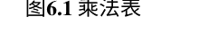

通过在图6.1的乘法表中考虑与数字7和8对应的方块，可以得到答案。答案56是在交叉小方块的对角线上，两个数字分别在主对角线的上方和下方。对其他整数的乘法也适用相同的系统。

因此，读者可以立即从图6.1的乘法表中找到任意两位数乘法的答案。

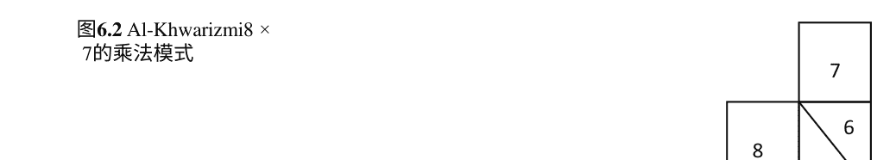

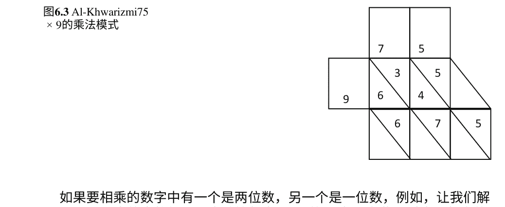

如果要相乘的数字中有一个是两位数，另一个是一位数，例如，让我们解释一下图6.3中的表格如何用来计算数字75和9的乘法。为此，对应于数字的对角线乘法结果7和5被写成行（列）并排（一个在另一个下面）。如果我们考虑数字75在第一行并排写在一起，乘法过程如下所示，包括要乘的数字（9）在第一列。

要找到结果，如果从右侧开始将粗线上对角线之间的数字相加，答案将在图6.3下方的行中找到。现在，让我们尝试根据Al-Khwarizmi表示法以改变顺序的方式找到9×75的乘积。在这里，如果数字9形成Al-Khwarizmi展示的列，需要两行来表示数字7和5。为此，问题是数字75应该从下到上还是从上到下书写。两种情况都在图6.4中显示。然而，可以理解到正确答案将在图6.4b的顺序中获得，即从下到上书写数字75。

在记住自下而上的规则之后，现在可以用各种数字相乘。例如，让我们展示如何按照Al-Khwarizmi符号表示法相乘数字97×78。同样，通过利用图6.1中的乘法表，图6.5中的Al-Khwarizmi软件出现了。

这种乘法系统，最早由Al-Khwarizmi展示，也导致了今天的乘法运算的出现。为了解释这一点，让我们分别看一下图6.5中的Al-Khwarizmi表示法的各个部分。为此，分别在图6.6中显示了8×97和7×97的乘积。

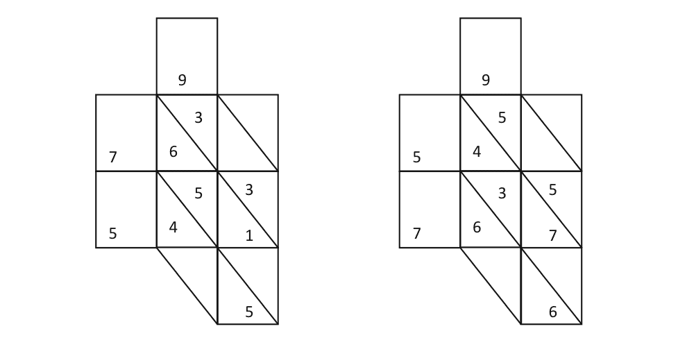

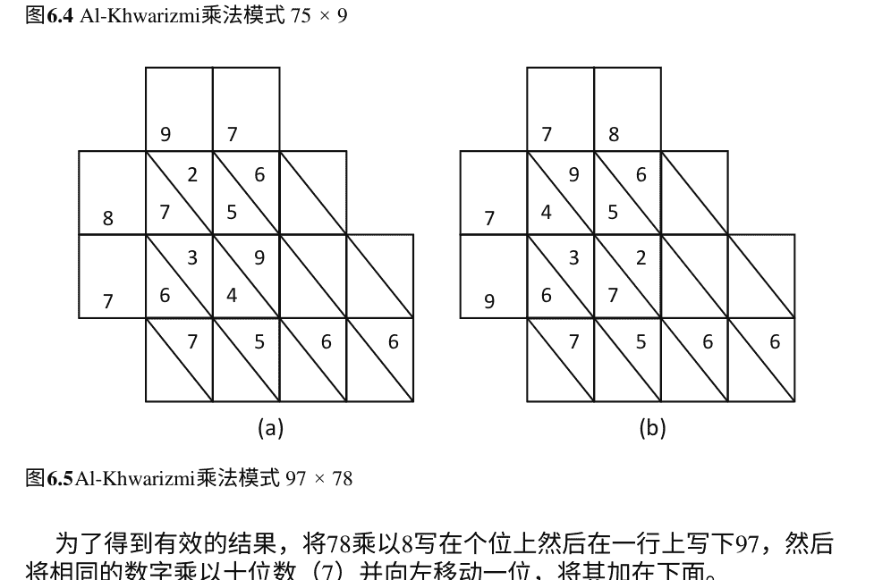

为了得到有效的结果，将78乘以8写在个位上然后在一行上写下97，然后将相同的数字乘以十位数（7）并向左移动一位，将其加在下面。

## 6.3 二进制数系统

几个世纪以来，人们习惯了十进制数系统，将只有0和1的二进制数系统视为布尔运算的幻想和不必要的工作。因此，二进制系统在很长一段时间里被埋没在黑暗中。然后，人们意识到与十进制数系统相比，二进制数系统具有以下优点。

- 1. 二进制数系统中没有规则，而十进制系统中必须记住36条规则。在提到乘法规则时，只有2条规则。这些是0×1=0（1×0=0）和1×1=1。然而，由于这些不需要记忆，可以说没有规则。
- 2. 处理过程中不需要纸和笔，只需写下处理结果。
- 3. 与十进制数系统中的4种综合算术运算相比，二进制数系统中只有加法和乘法运算非常容易执行。

与十进制相比，二进制数系统有一些缺点。从实际角度来看，这些并不是非常不可取的情况。例如，在二进制数系统中表示一个数量的表达式中，由0和1组成的数字位数较多。十进制数91在二进制数系统中由1011011位数字（7位）组成。另一个问题源于人们的习惯。由于人们习惯于十进制数系统，他们发现改变自己的习惯到二进制系统是一件麻烦的事情，他们可能无法或不愿意进行这种转变。

然而，在规则中存在着一个二进制顺序，可以称之为脆弱（二值）逻辑，基本上它表明一切都可以用其相反的方式来表达。例如，加-减（不是几乎加），美丽-丑陋（不是几乎美丽），是-否（不是几乎是），太少（不是太多），长-短（不是高）都在二值逻辑领域内。这些对应于没有中间值，只有极端值的原则。总是存在着一个困境，比如，或者简单地说“某事-无事”。如果采用二值逻辑，那么任何人都必须根据这两个选项调整所有的思维。已经有两个脆弱逻辑运算。这些被称为AND（与运算）或（或运算）（第3章）。

要理解十进制和二进制数系统之间的关系，就需要理解每个数字位的含义。例如，可以将数字432口头表达为“4百”，“3十”，“2个单位”。由于这些词“百位数”，“十位数”，和“个位数”都可以写成 \(4 \times 10^2 + 3 \times 10^1 + 2 \times 10^0\) 基于十进制系统，其中x符号与算术中的乘法相同。如果考虑这个系统，数字1098将按照以下方式写入。

```
1 × 10^3 + 0 × 10^2 + 9 × 10^1 + 8 × 10^0
```

另一方面，一个详细给出的数字，例如，\(5 \times 10^4 + 9 \times 10^3 + 0 \times 10^2 + 5 \times 10^1 + 0 \times 10^0\) 这个十进制软件的简写是59050。在这里不能忘记的另一点是，10的幂是整数，它们必须从最大的数连续减小到最小的整数0。

现在，利用这种十进制数的简写，根据二进制系统，从适当的最大整数到最小整数0的数幂系统应保持不变，其中数字2是基数。在二进制数系统中，以2为底的幂数将以数字0或1开头。根据这个，数字 \(1 \times 2^5 + 1 \times 2^4 + 0 \times 2^3 + 1 \times 2^2 + 0 \times 2^1 + 0 \times 2^0\) 的详细展开写作“110100”。实际上，这个数字是通过在开放软件中执行必要的数学运算来计算的。

```
1 × 32 + 1 × 16 + 0 × 8 + 1 × 4 + 0 × 2 + 0 × 1 = 52
```

这相当于十进制数。因此，十进制数52的二进制等价物是“110100”。十进制和二进制数系统之间的转换是遗传算法方法的基础。建议读者在头脑中选择数字时，切换从一个系统到另一个系统，以便能够实际掌握过渡。

## 表6.1 十进制和二进制数系统的比较

| 十进制 | 二进制 |
|--------|--------|
| 0      | 0000   |
| 1      | 0001   |
| 2      | 0010   |
| 3      | 0011   |
| 4      | 0100   |
| 5      | 0101   |
| 6      | 0110   |
| 7      | 0111   |
| 8      | 1000   |
| 9      | 1001   |

十进制转二进制或从二进制转十进制。他甚至可以通过使用他熟悉的软件语言编程来开发简单的算法软件。十进制数系统中10个数字在二进制数系统中的对应关系如表6.1所示。

二进制数系统中的数字可以被视为有限长度的0和1的序列。使用这个表格，在二进制数系统中执行不同数字的算术运算很容易得到与十进制数系统相同的结果。每个数系统中的算术运算规则都是相同的。例如，将二进制数系统中的5（即“101”）和6（即“110”）应用于算术乘法规则，得到以下操作结构。

```
  101
x 110
---
  000
 101
101
---
11110
```

在二进制系统中，数字“11110”对应于十进制系统中的数字30。这相当于十进制数系统中的5乘以6等于30的乘积。结果在两个系统中都是相同的，但符号不同。从上面的交叉乘法可以看出，只有数字1和0的乘法。尽管对于人类来说，二进制系统非常简单，但最终的解决方案会导致一长串的1和0。不需要记忆详细的乘法表，即乘法规则，就像十进制系统一样，只需进行0和1的乘积形式的运算，就可以快速得到结果。以“1000”（8）和“1001”（9）作为加法的例子。

```
  1000
+ 1011
------
 10011
```

再次从右边开始，连续的数字被收集起来。如果数字的总和是1 + 1的形式，由于总和大于1，在写入0之后，通过说“手头有1”在其前面写入数字1。因此，1 + 1 = 10，从表6.1中可以看出，这对应于十进制数2。通过使用“手头有1”的规则，二进制数“1000”和“1001”可以得到为“10001”。如果注意到，所得到的数字比收集到的数字多一位。二进制数的十进制替代“10001”的十进制替代是17（8 + 9 = 17）。因此，从我们在十进制数系统中的知识可以得出操作是正确的。

从上面的解释可以看出，二进制系统中的运算是根据十进制数系统的规则进行的。计算机作为完全服从的搬运工，是根据二进制数系统设计和编程的命令接受机器人。必须有一个单位来提供人类（习惯于十进制系统，可以被视为外部世界）与根据二进制系统工作的计算机（可以称为内部世界）之间的交流。它也被称为“转换器”，意味着一种将十进制转换为二进制或反之亦然的单位。因此，在第一阶段，计算机将人类给出的十进制数转换为二进制系统。然后，它根据二进制系统执行必要的算术和数学运算，并以可以被十进制世界理解的格式输出结果。

这样的转换器系统对于遗传算法（GA）也是必需的，因此，计算机对于GA分析更加兼容和高效。与十进制和二进制数系统一样，也可以基于每个数字生成不同的系统。例如，大约3000年前的苏美尔人开发了基于6的计数系统，但在日常数学或建模过程中不使用。然而，今天的6进制系统及其许多倍数以不同的形式出现，例如，已知60秒等于1分钟，60分钟等于1小时。另一方面，广泛使用的是360°也对应于圆的周长。此外，三角形的三个角度的数值和被假设为180，这是6的30倍。

## 6.4 随机数

问题的解空间中的数字可以选择系统地或随机地。到目前为止，我们大多数人都习惯了始终系统地组织。有一种观点认为，如果在科学研究中不使用正式的数字，结果将不可靠。自然事件以中等规模组织起来，可能是为了促进人类的感知，但在非常小的和尤其是亚原子尺度上，一切都按照人类的感知随机进行。在这里，我们必须说也存在着不同程度的随机性。例如，地震将在何时何地以何种强度发生；它将造成多少死亡；多少建筑物将被摧毁，无法居住等等。无法提前知道会发生什么。在自然界中，即使在大尺度上，事件的数值也呈随机分布，但这对于将该事件数字化或揭示其事实没有任何作用。因此，可以说自然、社会、经济、心理、医学、工程等事件具有随机性。

数学或经典物理学中的所有变量都涉及确定性，并且可以通过适当的函数精确计算变量之间的关系。例如，当速度v和时间t由函数给出时，v = gt^2（其中g是重力常数），可以准确计算出任何所需t值对应的v值。这种关系的几何视图如图6.7a所示。如果两个变量之间的几何视图包含随机振荡，如图6.7b所示，由于没有确切的关系，无法进行精确计算，即使在某个时间点的值已知，下一个时间点也无法确定。具有这种随机特性和相当复杂几何形状的变量是随机的。如图6.7b所示，显示这些变量随时间或空间轴的变化的图形被赋予不同的名称，如信号、时间序列或样本函数（§在2002年）。

不确定事件的结果有许多可能性、概率和随机数值。例如，这些事件中包括工程结构在其寿命期间所受到的风载值；高速公路上某段路程之间的事故数量；政党在大选中提名的议员数量；一天内出生的儿童数量；海浪的高度；亚原子粒子的位置和动量；每月来水量；未来10年内最严重的风险事件；里氏震级的强度等。许多事件具有随机行为，因此具有随机可测量的变量。

最简单的情况是概率值是随机数的概率，这被称为状态随机性。有降水或无降水的日子，有雾或无雾的日子，有阳光或无阳光的日子；钻孔是否干燥或湿润；胜利、失败或者足球比赛中的得分；交易是否盈利或亏损等。这些状态都是随机状态的例子。

最后，尽管状态（可能性）是有限的，但只有它们的数量是随机的。例如，如果抛一枚硬币，它可能是正面或反面，在概率空间中，如果抛95次，正面和反面的总数是已知的，但它们是随机数，因为不知道有多少次抛掷会以正面结束。对于随时间变化的不确定事件，例如一系列雾测量中被视为可能性的日期是具体的；然而，无法准确知道哪一天会出现多少量。这种第三类的随机性被称为强度或数量的随机性。数量随机性的一个例子是在一个雨天会下多少雨的不确定性。每天都有温度和湿度等整体变量。它们的每日强度，也就是它们的数量将是多少，具有随机的变化。在这方面，温度和湿度等变量也被称为随机变量。

在遗传算法分析方法中，使用了随机性的状态和大小。在该算法的运行过程中，需要生成随机数来使用。由于现在许多软件都免费提供生成随机数的程序，因此不会在这里讨论如何生成随机数。在某些情况下，需要考虑随机数的相对频率分布。

在遗传算法分析中，使用了两种类型，一种是均匀分布，另一种是正态分布。常用的类型是均匀分布，表示在两个数a和b之间的所有实数都以相等的概率被选择，没有一个比另一个更有优势。这种随机数的相对频率图（直方图）由一个矩形组成，该矩形包含给定下限和上限（a和b）之间的随机数，但高度等于1/(b-a)，如图6.8所示。该矩形下的面积定义为1。

遗传算法中偶尔使用的另一种随机数分布是在理论上取值介于负无穷大和正无穷大之间，并围绕着一个均值μ以及一定的标准差σ波动的数值。这些被称为具有正态（高斯）概率密度函数的数值。如果均值等于零，标准差等于一，那么这些数值的相对频率（概率）分布如图6.9所示，呈现出标准的钟形曲线。可以看出，正态数值的概率并不相等。对于接近均值的数值，概率较大，但是当数值偏离均值时，概率变小。偏离均值意味着随机数取得了极端（极大或极小）的值。这被称为标准随机数的相对频率。然而，非标准随机数 $S_r$，其均值 $\mu$ 与标准差 $\sigma$ 不同一的情况下，可以根据以下简单的方程从标准正态变量 $s_r$ 生成。

$$ S_r = \mu + \sigma s_r \quad (6.1) $$

### 6.4.1 随机选择

在进行遗传数操作时，必须从一组随机数或数字的位数中进行随机选择。在这里，上述随机数用于在一组数字中进行随机选择。随机选择可以通过卡片、轮盘或随机方法中的一种方式进行。

### 6.4.1.1 抽卡

这种方法在计算机不可用的时代或地方非常常见。可以将其与打牌进行比较。将每个数字集合写在相同大小、形状和颜色的卡片上。然后，如果这个集合的卡片被随机洗牌，就会产生一个可以称之为随机数池的随机数集合。在这里，从这个池中随机抽取的卡片上的数字代表随机数。如果不希望在抽取中出现相似的数字，则不将抽取的数字放回池中，以防止再次抽取。通过继续第二、第三和所需数量的抽取，可以获得一系列随机数。在这样的序列中没有相同的数字。然而，在这里，抽取次数不能超过放入池中的卡片数量。

第二种方法是每次从初始卡片数量中继续抽取，将抽取的卡片放回池中。这种放回的抽取将得到相同的数字。如果需要，可以继续进行抽取。通过从池中抽取卡片来确定随机数的过程中存在以下缺点。

- 1. 无法获得除池中卡片上写的数字以外的数字。例如，如果过去发生的事故数量写在一张卡片上并放入池中，如果将来的事故被认为是通过随机选择来预测的，那么假设未来的事故将不会与过去的值有所不同。
- 2. 如果卡片不放回池中，每张卡片的概率（机会）将不同。
- 3. 当卡片放回池中时，抽取每张卡片的概率将相同。
- 4. 无法调整两种选择类型中的随机程度。然而，正如之前所说的，即使在随机性中也存在一定程度的依赖性。
- 5. 无论卡片上写的数字大小如何，每个数字被选择的概率都是相同的，因此一个数字并不比另一个数字有优势。然而，在解决实际问题时，根据数字与解决点的接近程度，将优先选择数字。在每个优化分析中，如遗传算法，应优先选择大数以最大化，小数以最小化。

为了消除这里列出的许多缺点，使用了如下所述的轮盘赌选择方法。

### 6.4.1.2 轮盘赌

在这里，选择原则是基于旋转轮盘并等待它随机停在一个切片上。在这里，轮盘赌的切片取代了先前的选择过程中的卡片。每个切片根据数字在数字集合中的重要性进行调整。轮盘周长长度L和期望的数字N1, N2, ..., Nn, 应满足以下方程。## 图6.10 轮盘

$$N_1 + N_2 + \cdots + N_n = L \quad (6.2)$$

将两边除以L后，可以得到以下方程。

$$P_1 + P_2 + \cdots + P_n = 1 \quad (6.3)$$

因此，每个数字被选中的概率 (P₁, P₂, ..., Pₙ) 出现。在这种情况下，轮盘的标准长度等于1。根据概率值，轮盘的周长被分成n个切片。例如，如果n = 5，那么有5个不同的切片 (s₁, s₂, s₃, s₄, s₅)，如图6.10所示。轮盘选择的方式也被称为随机选择方法。在这里，每个概率值可以被看作是从饼图中获得一个切片。然后，生成一个介于0和1之间的随机数，并选择该随机数所在的数字。

为了更好地理解这个主题，表6.2展示了从中选择的10个数字及其概率。这些概率显示了每个数字在饼图中的份额大小。选择的概率是通过将适应度(数字) 除以总适应度来获得的。

例如，如果要从一个包含6个元素的数字集合中进行选择，首先从0到1的均匀分布中生成6个独立的随机数。假设这些随机数是r₁ = 0.81 ; r₂ = 0.32; r₃ = 0.96; r₄ = 0.01; r₅ = 0.65和r₆ = 0.42。根据这些随机数和表6.2中的最后一行数据，在图6.11中的标准长度的扩展轮盘中决定选择哪些决策点。因此，数字7、2、9、1、5和3被选为种群的成员。这些序列对应的数字分别是0.6、0.7、3.0、1.2、2.1和1.2到1.9 (表6.2) 。

### 6.4.1.3 随机选择

这种选择方法没有偏差且扩散最小。在图6.11中，每个决策点都用一条线段表示 (见图6.12) 。选择的点与要选择的数量之间的间隔相等，并按顺序选择。

表6.2 数字和被选中的概率

| 序列号码 | 1 | 2 | 3 | 4 | 5 | 6 | 7 | 8 | 9 | 10 |
| :--- | :---: | :---: | :---: | :---: | :---: | :---: | :---: | :---: | :---: | :---: |
| 数量 | 3.0 | 2.1 | 1.9 | 1.6 | 1.2 | 1.5 | 0.6 | 0.3 | 0.7 | 0.4 |
| 选择概率 | 0.225 | 0.158 | 0.143 | 0.120 | 0.090 | 0.113 | 0.045 | 0.023 | 0.053 | 0.030 |
| 累积概率 | 0.225 | 0.383 | 0.526 | 0.646 | 0.736 | 0.849 | 0.894 | 0.917 | 0.970 | 1.000 |

首先是随机点。每个等间距点所在的间隔对应的数字被视为种群的成员。如果要选择n个点，则第一个点的位置是0到1/n之间的随机数，并且在随机选择后，等间距点的中间距离被放置为1/n。类似于上述情况，当从独立均匀概率密度函数中选择点之间的等距离为0.1时，图6.12中的结构出现，该等距离在1/6 = 0.167和（0, 0.167）之间选择6个数字，与上述情况类似。

通过在初始选择为0.1后每次添加0.1667来找到其他随机数位置对应的数字，分别为1、2、3、4、6和9。从表6.2中对应的数字为3.0、2.1、1.9、1.6、1.5和0.7。

## 6.5 遗传数

在决定使用上述任何一种十进制或二进制数字系统之前，GA决定解决问题，解决方案需要通过使用随机数生成进行一些自处理。为此，在工作开始时必须彻底了解一种称为遗传数系统的基本结构。对于遗传数系统，最好先了解问题的最佳解决方案结构。每个优化问题都有以下组成部分。

- 1. 变量代表问题，并称为决策变量，
- 2. 约束规定了这些变量的变化限制，指定了问题的有效解决方案（决策）空间限制，常数是问题的不变量，
- 4. 目标函数由决策变量和常数的混合组成，一种最优解算法将优化（最小化或最大化）这个函数。

在本章中，由于优化方法将是GA，因此前面的步骤应该以适合它的结构准备好。虽然决策变量在数学意义上是连续的字符（如x，y，z），但由于GA方法将以数值方式解决问题，它们必须用数字表示。在GA数字系统中有四种具有特殊名称的数字类型。

- 1. 在GA数字系统中，决策变量数字的每个数字在本章中将被称为“数字”。因此，在GA数字中，与其他数字系统一样，最小的元素是数字。在二进制数字系统中，每个数字要么是1要么是0，在十进制数字系统中，0到9之间的10个数字中只有一个。因此，每个决策变量根据一个数字系统进行编码。通常，GA分析的编码格式基于二进制数字系统；因为这与计算机的工作系统相同。
- 2. 当数字在一系列中组合在一起时产生的结构被称为GA术语中的“基因”。因此，每个决策变量的数值构成一个基因。在问题中，基因的数量与决策变量的数量一样多。基因中序列的长度，即数字的数量，被称为该基因的长度。
- 3. 通过将基因一个接一个地排列而形成的基因序列被称为“染色体”。从这可以理解，在染色体中，问题的每个决策变量都是连续的。
- 4. 由两个或更多染色体组合而成的所有数字被称为遗传算法种群。

在遗传数字构建中，基因中每个数字的顺序都很重要。每个数字都有其特殊的意义。遗传算法数字化（突变）操作将在第6.14节中解释，它是基于基因数字的。染色体结构中基因的顺序对于遗传算法分析来说并不重要。只需要知道每个基因在染色体中代表哪个决策变量即可。在随机选择的初始种群中，染色体的顺序也是无关紧要的。在使用遗传算法进行问题求解时，所有遗传数字都将在过程中经历演化，即它们的值将逐步更新，最终通过逼近解来停止优化。从哲学角度来看，数字、基因和染色体需要按照遗传算法的原则进行处理，以获得更好的结果。

为了对GA数有一个良好的理解，让我们假设一个人想要用一定的金额P购买食物F和服装C。在这里，未知变量是F和C。每个变量都限制在0和P之间。从数学上讲，将所有的钱花在这两种物品上可以表示为，

P = F + C

其中限制条件为0 < F < P和0 < Y < P。如果食物和服装的单位价格分别为P_F和P_C，那么总花费S为，

S = P_F F + P_C C

这被称作目标函数，其优化是可取的。这是一个线性目标函数，对于其分析，可以使用经典的线性优化方法，而不需要使用GA方法。对于GA来说，曲线（非线性）目标函数更合适，例如以下目标函数。

S = P_F F^{0.5} + P_C C^2

假设初始金额为1050欧元。现在，为了根据遗传算法解决问题，应考虑上述具有4个步骤的基因数系统。一个人想要根据我们作为人类所习惯的十进制数系统来解决这个问题。由于解决方案将是数值的，因此必须首先确定决策变量F和C的解空间的边界。在这个例子中，该空间被限制为0 < F < 1050和0 < C < 1050。解决方案必须是这个空间中的一对数字（F和C）。例如，如果我们说F = 528欧元，C = 3欧元，在这个空间中，它们是一个解的情况，因为它们在有效空间内。

在这里，“抛弃”一词意味着在定义解空间边界后选择一个随机数留在这个空间中。因此，在最开始的时候，随机性首次出现在揭示构成遗传算法基础的遗传数字中。正如后面将要解释的那样，这是遗传算法分析中的一个重要点。根据上面关于遗传数字的讨论，考虑到F1 = 528欧元和C1 = 3欧元，人们可以理解决策变量F是3位数，C是1位数。变量中的下标1表示它们是解空间中的第一组解。这里有两个基因，528和3。

在进行数字和基因解释之后，让我们来看一下构成问题解的染色体。根据上述定义，染色体可以是基因序列5283或3528，因为顺序不重要。从现在开始，染色体将以大括号{ }的符号形式表示。然后，问题的染色体可以选择为{5283}或{3528}。第一个带有符号的是{F1C1}，第二个是{C1F1}。在遗传算法操作过程中，接受的染色体内的基因顺序不应该改变。

现在，为了形成可能的解决方案的种群，可以再次将其从解决方案空间中排除，例如，F₂ =132，C₂ =913。如果选择了另外三个候选团队，例如F₃ =1，C₃ =71，F₄ =19，C₄ =623，可以理解它们分别从3、3、1、2、2、3个数字中产生的基因中产生。从这三对中，可以获得另外三个染色体。在这个阶段，染色体结构中的决策变量顺序必须与第一个染色体中选择的顺序相同。如果染色体的遗传数在第一个染色体中以F决策变量然后是C决策变量的顺序形成，分别从这些新集合的基因中写入{132913}，{171}和{19623}染色体的遗传数。利用手头的这些遗传数，可以写出遗传种群的数量。将[ ]括号用于种群表示。在这些括号中，每个染色体将一个接一个地排列，而不是并排。这表明从中选择的每一行都构成了解决问题的一个选项。然后，根据上述设计的染色体结构和手头的信息，可以如下所示地呈现遗传种群。

[
  5283
  132913
  171
  19623
]

因此，与花钱相关的问题的基因数（基因，染色体，种群）被确定。在所有这些解释之后，一些问题浮现在脑海中。

- 1. 基因长度应该多长？
- 2. 每个基因的长度应该不同（不同的数字个数）吗？还是它们都应该有相同的数字个数更好？
- 3. 在解空间中进行头部拍摄是否有帮助？
- 4. 种群基因数应该有多少个染色体？

为了回答这些问题中的第一个，有必要了解问题的解空间限制。请注意，上面的示例中使用了整数。如果使用小数，那么有多少位数字的问题就变得更加重要。数字的位数是根据期望的敏感性和数字的含义来确定的。在上面给出的示例中，如果要在处理整数时，可以理解基因最多有四位数。对于小数，可以根据物理意义决定需要取多少位数。例如，如果一个决策变量是5.3241567米，小数点后的数字超过三位没有实际意义。因此，决策变量最好只包含小数点后最多三位数字，因为在实践中可能需要毫米级的精度。如果要估计一个山的高度，可能需要小数点后1或2位数字。如果决策尺寸是星星的距离，小数点后不应该有数字。由此可见，读者应根据问题的规模决定数字的位数。同时，需要注意的是，随着数字位数的增加，计算时间也会增加。

回答上面的第二个问题时，如果一个人希望保持系统性，他应该注意所有基因的长度都相同，也就是说，都有相同的位数。然而，如果某些决策变量比其他变量更敏感，那么可以采用不同的基因长度。作为一个建议，在没有非常具体的专业知识的情况下，基因的长度最好相同。因此，染色体的长度是相同的，不会引起混淆。染色体是进行遗传算法分析所需的成员。如果在一个群体中考虑了N个染色体和每个染色体中的N个基因，整个群体可以用一个N乘以N的群体矩阵来表示，其中包括染色体和基因。

$$ T = \left[\begin{array}{ccccc} g_{1,1} & g_{1,2} & g_{1,3} & \cdots & g_{1,N_{\text{gen}}} \\ g_{2,1} & g_{2,2} & g_{2,3} & \cdots & g_{2,N_{\text{gen}}} \\ g_{3,1} & g_{3,2} & g_{3,3} & \cdots & g_{3,N_{\text{gen}}} \\ \vdots & \vdots & \vdots & \cdots & \vdots \\ g_{N_{\text{kro}},1} & g_{N_{\text{kro}},2} & g_{N_{\text{kro}},3} & \cdots & g_{N_{\text{kro}},N_{\text{gen}}} \end{array}\right] \quad (6.4) $$

因此，可以将染色体表示为与矩阵相同的形状。该矩阵的每个元素对应一个基因。此外，每一行表示一个染色体（成员）。

在解空间中过度思考非常有用，因此在该空间中进行随机抽样。人的头与计算机生成随机数是同义词。因此，在遗传算法解决方案中除了十进制或二进制数系统之外，还需要随机数操作。虽然遗传算法操作在第6.3节中有所解释，但也会理解到随机数操作在其他方面也是必需的。在人口中找到具有遗传特征的染色体数量的必要性是影响遗传算法解决时间和灵敏度的因素。这里没有严格的规则可以给出。然而，这将取决于解空间的大小和目标函数的平滑程度，下一节将讨论这种变化的点。没有具体的普遍规则适用于每个人。可以用于每个问题。随着时间和知识、技能和专业知识的增加，可以做出更好的决策。没有规定染色体越多，解决方案就越好。然而，建议染色体的数量不应低于15–20。

### 6.5.1 遗传算法数据结构

在尝试用遗传算法解决问题时，应首先完成以下五个连续步骤。

- 1. 应该尽量获取关于问题的详细初步信息，并收集口头和特别是数值数据，尽可能多地收集，
- 2. 决定可能与GA解决的问题相关的变量的染色体结构，并准备数据，
- 3. 为了从决策变量到染色体的转换准备所有可能需要的基础设施，
- 4. 根据决策变量确定与问题相关的目标函数的分析表达式，
- 5. 为了确定从目标函数到每个决策集（染色体）所产生的度量的转换。

在准备阶段的研究可以以串行或并行的形式进行。在收集口头和数字信息后，应该尝试确定它们之间的逻辑关系。

#### 6.5.1.1 数字转换器

如果决定使用二进制数系统工作，则需要考虑在开始时使用转换器，以确保决策变量是人类可理解的十进制数、遗传算法理解的二进制数系统，或者反之亦然。它是一个数字转换处理器，将使人类和遗传算法程序之间达成一致。

#### 6.5.1.2 目标函数

这样一个函数是目标值，它对应于决策空间中决策变量共同取值的十进制系统中的值。在简单优化问题中，目标函数的决策变量是十进制数，而在多目标优化问题中，它们可以是向量。值得注意的是，即使对于相同的决策变量，目标函数的值与适应度的程度也不相同（第6.3节）。一般来说，有n个目标值从目标函数计算得出。这些n个值可以用以下形式表示为列矩阵。

$$ T = \begin{bmatrix} t_{1,1} \\ t_{2,1} \\ t_{3,1} \\ \vdots \\ t_{n,1} \end{bmatrix} $$ (6.5)

实际上，这里的每一行都属于一个染色体。方程（6.5）包括染色体，是等式（6.4）中以基因形式显示的矩阵的列等价形式。

### 6.5.1.3 适应度函数

适应度值是通过缩放或排序（从大到小）操作从目标函数中获得的。由于每个成员只有一个适应度，它们由下面的列矩阵表示。虽然目标值由公式（6.5）表示为带有负号的值，但适应度始终是带有正号的数字。

$$ D = \begin{bmatrix} d_1 \\ d_2 \\ d_3 \\ \vdots \\ d_N \end{bmatrix} $$ (6.6)

如果目标函数只给出正值，不需要额外的适应度函数。如何从目标函数中推导出适应度函数在第6.3节中解释。

## 6.6 优化方法

人类自古以来就与自然共同生活在一起。在这种统一中，自然一直是人们的灵感之源。例如，飞机的建造和雷达的发明都是从自然事件中获得的人类技术发现的灵感。技术发展是通过研究自然和生物来实现的。在研究自然过程中，已经开发出许多方法来解决一些问题。遗传算法是其中之一，但它们也是最新的方法。霍兰德（1975年）在机器学习方面的研究中，尝试在虚拟环境中对生物进行遗传操作，并解释了这些过程的有效性。对于最初被认为没有实际用途的遗传算法的兴趣，随着霍兰德的学生戈德堡获得国家科学基金会博士论文的青年研究员奖以及他在4年后发表的经典作品，逐渐增加（Goldberg1989）。本节将对经典优化（CO）方法和遗传算法进行比较解释。

### 6.6.1 遗传算法的定义和特征

由于已知该算法是受到进化理论的启发而开发的，首先需要一些能够进行这种进化的“生物体”。这些生物体必须能够生育和死亡。它们在出生后会将一些行为作为遗留在新生物体中。还需要衡量这些生物体的能力，也可以称之为适应度。本书将在其中阐述这些能力。然而，通过适应度的值，可以理解新生物体之间的优势。在它们之间，强者存活并进入下一个群体，而一些弱者可以通过与同类的另一个生物体合并来形成更强大的生物体。在一个遗传群体中，当两个生物体结合时，不仅仅形成一个新的后代，而是形成两个新的后代。在遗传算法的方法中，当前一节中描述的基因中的某个数字发生变化时，会出现一个新的后代。由此可见，遗传算法中的生育与人类生活中的生育是不同的。

每个生物都从其创造者那里继承了混合遗传物质。在遗传算法中，试图提供具有最佳遗传物质的联盟。其中一些生物在生存了很长时间后，与其他生物融合以获得新的特征（变得更强大），并可能达到下一个种群（世代）。因此，随着每一代的更新，更强大的生物出现，种群变得更加健康。这意味着接近数值优化点。在这个演化过程中，很少或没有生物能够在没有其他生物残留物的情况下生存。

遗传算法的工作原理是基于进化理论，并寻求给定问题的最佳解决方案或解决方案。它通过在决策变量空间中从许多初始点开始，并通过一系列并行操作共同朝着最佳方向前进。在决策空间中的这些点不需要除适应度度量之外的任何信息。社会中的这些点的发展，通过随机性的原则，以并行方式朝着优化方向提供。

遗传算法的本质是基于自然选择和遗传规律。这些规则应该被视为对最适应环境的生物的生存和对不能适应环境的生物的淘汰。遗传算法方法是一种优化方法，旨在通过同时使用这两个规则来寻找最佳解。遗传算法需要简单的计算，但它们的效率并不因其简单而降低。与许多其他优化方法不同，遗传算法不需要连续性和可微性。在其应用中不需要使用复杂的数学知识。与随机搜索方法不同，遗传算法使用概率原理作为在决策变量空间中执行遗传操作的工具。以下是遗传算法与其他传统方法的区别。

- 1. 遗传算法通过编码（转换为二进制数制）使用决策变量进行分析，根据前面部分中解释的遗传数制。在这个数制中，决策变量的基因集体上代表决策空间中的一个点。
- 2. 在遗传算法中，不是一个点，而是同时存在的一组点。由于遗传算法的发展，种群逐渐演化，最终达到了优化解。在这个演化过程中，系统不会陷入局部最优解。
- 3. 在遗传算法的演化过程中，使用决策变量指定的点的目标函数值。由于不需要导数和积分运算，因此不需要对初始条件和边界条件进行一些经典假设。
- 4. 遗传算法的演化操作基于不确定性（随机性、概率性）规则，而不是确定性。选择操作是根据概率原理进行的（见第4章）。

除了用于优化的经典方法外，还可以使用更简单、数学更少、目标更明确的遗传算法方法。遗传算法中的随机方法确保最终解不会陷入局部最优解。根据Adeli和Hung（1995）的研究，遗传算法可以分为五个步骤，包括编码、初始条件、适应度度量、演化性能度量和工作参数。遗传算法基于遗传机制原理来模拟自然事件的发展。最初，解的候选者可以根据一定的规则进行基因发展，通过向最佳解靠近来得出结论（Goldberg1989）。遗传算法与经典方法在以下几点上有所不同（Buckles和Petry 1992）。

- 1. 在其发展过程中，遗传算法试图通过利用决策空间中此时可用的信息来寻找最佳解。
- 2. 遗传算法在其结构中嵌入了并行计算方法。通过这种方式，它也从许多起点开始，逐步接近解空间中的最佳点。
- 3. 遗传算法是随机算法。它使用概率原理来得出结论。因此，在研究过程中需要一个随机数生成器。遗传算法同时对许多解候选进行操作。在这个过程中，它通过从邻近和之前的点以及随机操作中收集的信息，朝着更好的解移动。

## 6.6.1.1 优化

任何思考一个事件的人都会收集不同的信息并产生想法，并且为了优化而朝着解决方案前进。随着信息的增加，事件开始被更好地理解。同样，当工程师或科学家增加对所处理问题的主题的了解时，他可以找到或揭示相同问题的不同解决方案。有几种作为分析方法开发的算法，可以尽快找到最佳解决方案，并且最佳解决方案的确定取决于情况和条件。其中最好的例子是具有不确定边界和初始条件的微分方程。例如，解决一个热传导问题的解析方程通常以常数α出现在形式上。

$$
\frac{\partial^2 h}{\partial x^2} + \frac{\partial^2 h}{\partial y^2} + \frac{\partial^2 h}{\partial z^2} = \alpha \frac{\partial h}{\partial t} \quad (6.7)
$$

然而，为了确定最合适的解决方案，即最佳解决方案，需要了解初始条件和边界条件。

即使了解这些条件，不同的问题也可能出现，例如“这是最优解吗？”或“是否存在其他解决方案，如果存在，如何在它们之间做出最佳选择？”可能会一直占据议程。有这样的问题是很自然的。如果没有，结论可能是自然和静态的。

在这里，人们需要揭示他对优化的理解或期望。一般来说，优化以最小化或最大化的形式出现。然而，除此之外，还可以考虑到达所需平均值或特定目标的优化。在贸易中，交易员试图最大化利润，而买家试图最小化开支。因此，可以说不同的优化方法之间可能存在竞争，甚至总是存在竞争。

最佳结果可以通过非常具体的信息获得，或者可能需要使用尚未完全明确的初步信息进行，即不完整或不确定的信息。通常情况下，简单的优化方法使用清晰的信息。因此，如果包含一些不确定性的数据是确定性的，可以使用优化方法得出解决方案。在现实生活中，没有什么是完全确定的。因此，当使用概率、统计和随机过程来处理不确定性的优化方法时，现在更常用的是使用遗传算法。

在优化中，“最佳”一词具有相对含义，并意味着解决问题的解决方案不仅仅有一个选项。每个解决方案（经济、社会或技术）的价值取决于情况而不同。它根据所做的接受、接受的容限（显著性）限制和使用的方法而变化。某种程度上，最佳解决方案甚至可能取决于解决问题所涉及的观点。

## 6.6.1.2 优化阶段

优化是为了使一个职业变得比它本来可以达到的更好而进行的所有努力。研究人员和工程师在脑海中构想一个事件后，他们会尝试通过优化来开发它，以便根据时间和可能性获得更好的结果。对一个事件的优化是根据其最大化或最小化的方面进行发展。确定了目标后，优化是通过考虑利用现有信息和数据所能获得的附加信息，寻找能够以最完美的方向接近目标的解决方案。即使在日常生活中，每个人也会为了优化而进行不同的活动。例如，即使一个人根据自己的食物注意调整体重，也可以被视为一种优化方法。在没有确定的方法的情况下，人们的思想、行动和他们试图进行优化的尝试是相对的。在解决问题时，可能不只有一个解决方案。在这种情况下，为了获得最佳解决方案，可以通过将每个解决方案都按照相同的标准进行优化，从而得到一个单一的解决方案。今天，优化过程是最有效、最有用、最高效和最合适的方法论，由三个部分组成（见图6.13）。对于优化过程，需要对链条的第一个和最后一个环节有先前的了解。

如果一个人在获得新机会时通过审视情况进行优化，他每天都可以安全地达到比前一天更好的位置。先知穆罕默德的话也指向了优化过程。

> 拥有两天相等的人是亏损的

由于一个不进行优化的人不会有一个合理的目标，他可能会在浪费手头的机会时走向最坏的情况，甚至可能都没有意识到。即使在最糟糕的道路上也必须有一个明确的目标。否则，结果可能会非常悲伤和无效的重复。

在图6.13的第一阶段确定可能性和最后阶段确定目标之后，需要在中间阶段对这两者进行调整。为此，必须快速处理口头信息和必要的思考，并且特别是为了从今天的计算机中受益，有必要进行符号化，即编写数学规则。所有这些规则都被编写并转移到计算机上，并且为了解决优化问题而进行的所有过程都被称为优化过程。当从数学角度接近这个词时，就会明白需要从一组规则的方法中受益。在将口头表达转化为数学方程（第5章）之后，可以进行导数计算和优化（最小化或最大化）操作可以执行。由于在事件无法用连续数学函数表达的情况下无法使用数学运算，因此在过去的100年中遇到了数值工作方法的发展。其中最新的是称为GA的现代优化方法。该方法具有许多优点。

优化可以被定义为将输入信息转化为目标输出的方法，如图6.13所示。将输出视为更好理解优化过程的成本是有用的。因为每天人们都在金钱相关问题上展示他们最敏感的思想，并不断尝试在这个问题上进行优化交易。以下土耳其短语不过是一个优化警告

> > 根据你的被子伸展你的脚

然而，今天这句话被一个现代的但没有任何优化的基于信用卡的取代了。

> > 根据你的信用卡伸展你的脚

优化意味着一个问题有多个不相等但非常接近的解决方案。优化分析与以下几点密切相关。

- 1. 最佳解决方案是相对于手头的问题而言的。
- 2. 最佳解决方案也是相对于所选择的方法而言的。
- 3. 最佳解决方案也是相对于所接受的近似容限而言的。
- 4. 最佳解决方案也是相对于研究人员解决问题的技能、知识和方法而言的。

优化解决方案的识别包括教育、观点、支持和抽取等道德因素，以及疲劳、失眠和紧张等不道德因素。它还可能取决于宗教和良心等精神功能。对于篮球运动员来说，解决方案是将球投进篮筐。这个入口的形状非常不同，因为球的直径小于篮筐的直径。在这里，容限取决于球的最大横截面积在篮筐区域内的不同位置。

一个人每天上下班的最佳路线并不总是物理上最短的。如果目标是尽快到达工作岗位，优化过程的解决方案是不同的。天气可能是雪天、雾天、雾霾天、雨天、刮风等，最佳解决方案取决于天气状况。在事故或恐怖主义事件中，存在不同的解决方案。因此，优化还显示了在不同条件下对问题进行何种分析是有效的。通过优化过程，可以找到一个国家或公司在未来5年规划中应该优先考虑和排名的项目。在设计中，通过考虑最轻、最便宜、最耐用和最需求材料等多个目标进行优化分析。


图6.13 优化阶段

## 6.6.1.3 什么是优化？

在一个人的日常生活中，可能会遇到多个机会。人们可能需要通过评估不同的选择来决定其中之一。实际上，人们总是首先进行优化，尽管只是口头上的。生活受到非线性、混沌、不确定甚至偶然事件的驱动。即使是初始条件的微小偏差或波动也可能导致未来解决方案的巨大差异（Lorenz (1963)）。例如，未能按时兑现承诺可能会极大地影响一个人以后的行为或日程安排。这种影响可能会影响一个人的收入甚至健康。因此，为了在所有情况下得到最佳解决方案，有必要以计划和编程的方式行事。每个人都在解决或试图解决晚上需要多长时间睡眠才能在第二天更有活力的问题。一个准备考试的学生应该学习多少工作，也是一个优化问题。在所有这些优化思考和问题中，个人都有输入和期望输出信息。输入应该包含一些信息，以便大致了解问题的解决方案。在方法部分，有一个称为目标或适应度（活力）的函数。输出选择了最佳解决方案。在这里，目标可能是需要最小化的函数。要使某物最大化，只需改变其符号。

在这样的符号变化之后，最小化变成了最大化操作。例如，在范围 $-1 < x < +1$ 中最大化 $x^2$ 等同于在相同范围内最小化这个函数的相反符号 $(-x^2)$。

在数学中给定一个二次方程的根或归零是一种优化方法（第5章）。由于它们是基于数学的，它们不包含不确定性，它们的解是确定的。为了找到逻辑零点，如前一节所述，在该点的右侧必须有一个负（正）值，在该点的左侧必须有一个正（负）值。因此，重置中需要两个点。在最大化或最小时，至少需要将三个点的值进行比较（见图6.14b）。本章将始终讨论最小化，而不是最大化。无论如何，读者现在明白最大化是通过符号差异来最小化的。

确定优化分析中得到的结果不是局部最优点而是绝对最优点也非常重要。找到的最小化点可能是局部的，这也需要进行检查。要么找到所有局部最优点，通过再次最小化来达到绝对最小点，要么在开发的优化算法结构中自动找到绝对最小点，不留任何余地进行第二次优化。

在这里，使用遗传算法方法直接找到绝对最小化点。

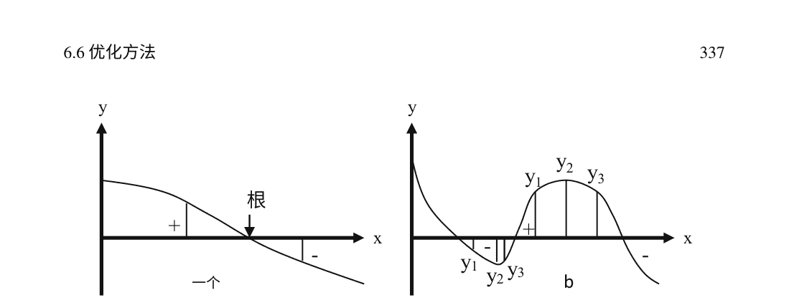
图6.14 寻找根的操作

数学近似根查找研究可以作为数学优化操作的一个例子，其基本原理是根必须在一个接近负值和正值的范围内。通过近似这些接近根的负值和正值，当实际接近根的负值和正值被找到时，可以说优化分析处于这个范围内（见图6.14）。如果最大（最小）点是三个连续的值 $y_1 < y_2 > y_3$ ($y_1 > y_2 < y_3$)，则从 $y_1$ 到 $y_3$ 寻找根。需要知道三个连续值的相对位置，其符号为负-正-负或正-负-正。

这些是寻找根和极值（最大和最小）点所需的语言表达式。根据这些陈述，发展和分析了数值优化方法。另一方面，如果已知要找到根的函数的数学表达式，可以通过将其设为零来精确计算所需的根。然而，上述标记的方法是通用的，适用于所有情况。为了使用遗传算法优化过程，目标函数或初始信息不需要用数学函数表示。因此，遗传算法不需要像数学优化那样进行导数运算。

在优化过程中遇到的最重要的问题之一是找到的解是局部还是全局的。在实践中，希望找到绝对优化解。正如后面将解释的那样，遗传算法不受此类问题的困扰，因为它通过随机扫描一个区域来实现其分析，而不是按照某个确定的轨迹进行。在这里，也可以看到“线性防御，而不是表面防御”的有效性。事实上，遗传算法不是线性的轨迹；通过从一个区域的所有可能点进行采样，它可以在很短的时间内达到绝对目标，而不会陷入局部泥沼。

另一个经典优化方法的死胡同是近似计算在有限小区间上是线性的。在曲线优化问题中使用了一些科学技巧来达到结果。然而，这种技巧的代价在时间和交易量方面太高。如图6.15所示，为了紧密地跟随非线性轨迹，需要保持步长非常小。步长越小，跟踪的采样点越多在目标函数上。因此，即使是目标函数中非常复杂的地方也可以用更频繁的采样来表示。这意味着步数增加，同时也增加了交易次数。换句话说，这些研究非常耗时。尽管很多人不在意，但可以得出结论，如果考虑到计算机使用的时间成本，将得到非常昂贵的解决方案。

由于遗传算法方法中没有追踪轨迹，尽管步长较大，但达到结论所需的时间相对较短。在经典方法中，这个步长在优化分析搜索过程中通常保持不变。在遗传算法解决方案中，步长会随机变化。

## 6.6.1.4 优化类别

可以使用六种相互兼容的不同类别之一进行优化操作。

- 1. 试错优化：在这种类型的优化中，通过给决策变量系统或随机赋值，在问题的解空间中首先获得一个解候选点。然后，搜索是否可能改进这个点。如果可以考虑解空间中所有决策变量的值，则在其中选择最小值将给出问题的最小化解。例如，在寻找值为2的情况下首先从头脑中给出一些近似方便的值，并检查其平方是否等于2的平方根 √。由于获得精确的相等性需要大量的试错，因此通过接受一定的误差百分比来寻求解决方案。当这个误差开始保持在限制范围内时，意味着已经得到了解决方案。今天，这种类型的优化操作被用于计算机中求一个数的平方根。这种优化方法是由伊斯兰学者Al-Kereci（953-1029）提出的，甚至今天在计算机软件中被用作现成的子程序函数。

通过SQRT命令，可以自动求出所需数字的平方根，而不知道基数是多少。然而，El-Kereci在本章前面提到的Al-Khwarizmi代数中使用了这个问题的解决方法。

首先，他将未知的平方根记为x，由于它的平方必须等于所需的数字，例如3，他巧妙地将方程 $x^2 = 3$ 写成 $x = 3/x$，确保方程两边都有相同的决策变量。因此，这个最后的方程只能通过试错法来解决。要解决这个方程，如果首先考虑 $x=1$，将其代入方程得到 $1=3/1=3$，这永远不是一个等式，而是一个不等式 ($1<3$)。那么，作为接近等式的第二步，应该选择什么值作为x的取值？如果再次看一下主方程（$x=3/x$），就会明白新的值需要大于1。例如，如果 $x=2$，结果是 $2=3/2=1.5$。这不是一个等式，而是一个形式为 $2>1.5$ 的不等式。然而，由于不等式的方向根据前一个不等式而改变，预计平方根解将是1和2之间的一个数。如果再次选择 $x=1.7$，结果是 $1.7=3/1.7=1.76$，所以几乎达到了所期望的等式。如果根据已经说过的内容再做几个选择，结果将更加精确。对于精确解，如果考虑小数点后两位，$x =1.73$ 绝对解得到。由于优化过程是在各种解决方案中选择最合适的一个，这种选择是通过试错而不是正式的方式得到的。事实上，通过在人类生活中通过试错学习必要的价值观、判断和知识，他可以通过经验很容易地达到最佳（适当的）解决方案，
- 2. 多维优化：如前一步骤所述，如果只有一个决策变量，问题的解决方案可以通过试错而不需要太多时间来获得。然而，随着规模的增加，分析时间也增加。在这方面，应该尽量减少多维优化研究的维度，并最好将其转化为一维情况。可以通过找到问题产生的因素之间的关系来减少变量的数量。为此，可以使用回归、主成分、傅里叶、光谱等经典分析方法。
- 3. 动态优化：在这里，问题的解决方案取决于时间。随着时间的推移，解决方案预计会发生变化。否则，就会涉及到与时间无关的静态优化。例如，确定一个人的工作地点与工作点之间的最佳交通路线。首先，从地图上找到两点之间的最短路径，这被称为静态优化解决方案。这个解决方案在时间无关的情况下是正确的。然而，当许多人独立于时间思考并走这条最短路线时，对于特定时间段内交通流量的增加或减少的经验和知识使其具有动态性。在这种情况下，静态优化不能给出最优解。解决方案需要考虑诸如交通流量、事故、天气条件等因素，这些因素是与时间相关的，即随着时间的推移影响从家到工作地点的通勤情况，
- 4. 离散优化：如果一个问题的决策变量取离散值，即整数值，那么决策变量空间包括有限点。对于优化，可以单独考虑每个点。然而，变量是连续的事实要求考虑无限多种情况。离散值优化也可以看作是组合计算，因为试图从有限数量的情况中确定最佳情况的数量。例如，可以通过将变量转化为不连续的变量来使用优化方法，以在给定的有限范围内最大化连续函数。如果一个地方存在5种不同的天气和3种不同的地面条件可能造成危险，如果两者都起作用，那么将有 $5 \times 3 =15$ 个选项。在这些选项中，可以通过离散优化过程找到最危险的一个。
- 5. 受限优化：在优化问题中，常数和决策变量的变化范围是有限的。在现实生活中，没有什么是永恒的。有限数量对优化算法施加了约束。在这方面，我们可以从两个角度来看待优化方法，即受限或无约束。大多数工程问题都是通过约束优化算法来解决的。
- 6. 初始参数值优化：在许多情况下，必须以某种方式确定初始决策变量的值，以便优化方法能够达到解决方案。这些方法很容易陷入局部最小值，并且很快就会到达那里。这些是经典的优化方法，通常基于微分和积分计算。

## 6.7 最小化方法

这些方法最重要的方面是寻找问题在解空间中具有最小值的点。解位于与变量数量相同的维度空间中。考虑到区域中所有点的纬度、经度和海拔高度都已知，为了更好地理解该方法，可以理解应该考虑一个三维解空间与这些数据。为了在这样的区域中最小化，一个人必须从一个随机点出发，不断地向周围观察，寻找较低的点。当行者意识到他终于到达一个海拔不能再降低的点时，这个位置就是一个最小化的点。在所需的解决方案区域中是否存在更小的海拔点？为了回答这个问题，是否可能通过看到最小海拔点周围的山脉的背面，根据局部最小点或整体解决方案区域的最小点来决定。由于并非所有生物都具有这样的天赋，科学方法必须以一种能够看到山脉背后并将其考虑在内的方式进行合理发展。一般来说，由于所有经典和早期的优化方法都是基于这种类型的行走，它们的解决方案通常是局部最小解点。如果地形完全呈碗状，行者会意识到他到达的点是整体海拔最低的解决点。

在实际研究中，可能无法确定地找到优化解。在许多情况下，人们可能只能接受最接近最佳解的解决方案。这可能是因为时间和交易量很多，问题的决策变量很多且关系复杂。在所有优化分析中，都有描述决策变量或解空间域的变量，以及这些变量的函数目标变量。除此之外，决策变量可能还受到物理和数学约束。从一组优化决策变量开始，首先计算相应的目标值，然后通过顺序更新决策变量来使目标值更接近优化点。这样，人们在决策空间中沿着一条未预定路径行进。就像每条道路或旅程都有一个终点一样，优化旅程也必须以某种方式结束。绝对的终点实际上是达到100%的最佳点；但这只是一个理论期望而已。因此，必须建立一个标准来停止优化旅程。这个标准要么是限制步骤的数量，要么是根据专家意见做出模糊决策，要么是客观要求连续进展中目标值之间的差异小于预定的数量或百分比。

考虑到已经说过的一切，一般来说，优化研究中的逻辑流程操作是根据图6.16所示的方案进行的。如果停止准则没有满足，新选择的决策变量总是在有效（受约束）的决策空间和目标函数中循环。

进行计算。只要决策空间保持在有效区域内，即使决策变量集合以正式或随机的方式选择，重要的是目标函数的新值及其相对于先前目标函数的状态。如果新的目标值比先前的值更小（在这里假设优化是最小化），则继续重新选择下一组决策变量。如果新的目标值大于先前的值，则可以随机选择新的决策团队，或者根据决策变量指定的方向从不同方向进行选择决策团队。总之，在所有优化方法中的共同点是，决策集独立于目标函数选择，即使是随机的，在保持有效决策空间的条件下选择，然后根据此计算目标函数值。

在决策空间中可能存在许多最小点，其中一个必然是目标函数值最好的。当几乎所有优化方法都陷入其中之一时，无法正式脱离那里。对此最有用的方法是选择一个随机的决策集。从这个角度来看，遗传算法可以在其他优化方法中最有效地达到绝对最小点，而不会陷入局部最小点。特别是最大梯度下降（最小化）或类似的爬山（最大化）方法会陷入局部最小化点。

## 6.7.1 完全系统的研究方法

这些方法非常困难，因为它们是系统的，并遵循一定的规则，它们的基本思想是通过将目标函数分成非常小的决策变量采样部分，并在它们之间进行比较来实现最小化。在这种方法中，由于测试了许多不直接对解决方案有贡献的中间示例，所以需要很多时间、精力和耐心。例如，如果目标曲面是三角函数形式的，解决区域中将会有太多的山谷、山丘和山脊。为了找到绝对最小点，必须了解整个解决空间中目标函数的图像。这种情况可以在三维中直观地观察到。例如，目标函数

$$
f(x, y) = x \sin(1.5x) + 2.3 \cos(y) \quad (6.8)
$$

如果采取这种方法，所得到的复杂解曲面如图6.17所示。在这里，计算 $f(x, y)$ 值是通过 $x$ 和 $y$ 方向上的间隔数的乘积来完成的。例如，如图6.17所示，沿着 $x$ 和 $y$ 轴取100个子间隔，那么应该计算 $100 \times 100 = 10000$ 个 $f(x, y)$ 值。在所有这些点中，具有最小 $f(x, y)$ 值的点是解决方案的一个选择。这些选择中绝大多数都是无用的。

在这种方法中，需要探索所有的点。为了更好地理解## 6.7.2 分析优化

如果一个问题可以用目标函数的决策变量在数学上表达，那么可以用微分计算方法进行优化分析。 这与寻找给定函数的极值点（最小或最大值）是相同的。 这里使用的数学表达式通常如下：

\[ \frac{\partial f}{\partial x} = 0 \quad (6.9) \]

根据本书的主题，f代表目标函数x中的决策变量。 这意味着目标函数的斜率是水平的，即角度为零。 实际上，在连续变量的情况下，最大（峰值）和最小（谷值）点的斜率都等于零。 决策变量的数量决定了需要进行的操作，就像方程（6.9）一样，将目标函数对每个决策变量的偏导数取零。 因此，将目标函数的斜率取零得到的非线性方程组必须同时求解。 搜索是在可能是峰值或谷值的点周围进行的。 这种方法的缺点如下：

-   目标函数必须可微分： 否则，无法通过分析方法得到解决方案。 然而，由于从现实生活中获得的数据中不时存在不连续性，数据中也存在噪声（干扰、误差）。
-   非线性方程组非常难以求解。 可以在初始条件和边界条件下得到解。 根据初始值的不同，现有的解可能是混沌的（第4章）。
-   由于搜索将在可能是峰值或谷值的点周围进行，所以这种方法对于只有一个谷值的几何形状（如图6.21a）可能效果很好，但对于图6.21b可能效果不佳。 该方法可能会陷入局部最佳而不是绝对最佳（最小值）。 该方法从局部角度进行。

微分积分学在寻找不同目标函数的最小点方面提供了非常有吸引力的解决方案。 正如从教育培训中很容易知道的那样，对于决策变量，通过对该函数进行一阶导数运算使目标函数为零，以找到其最小点（方程6.9）。 因此，找到的点给出了决策变量和目标函数的值。 如果二阶导数大于零，则为最小化点：

$$ \frac{\partial^2 f}{\partial x^2} \geq 0 $$ (6.10)

然而，为了使用解析解法，给定的方程必须是连续的，或者如果它们是离散的，必须通过拟合找到最合适的连续曲线。其中一些在图6.22中显示。在有许多决策变量的情况下，首先取一阶偏导数，假设所有其他决策变量都固定并等于零，然后通过将这些决策变量的值代入目标函数来确定解空间中最小目标函数点的位置。

如果目标函数f的数学表达式依赖于决策变量x和y，则如下所示：

$$f = 1.2 + 3.5yx^3 - 2.4x^2y^2 \quad (6.11)$$

那么在x（y固定）和y（x固定）方向上的斜率表达式为：

$$\frac{\partial f}{\partial x} = 10.5yx^2 - 4.8xy^2 = 0 \quad (6.12)$$

和

$$\frac{\partial f}{\partial y} = 3.5x^3 - 4.8x^2y = 0 \quad (6.13)$$

分别。通过这些方程的同时解，得到y = 3.5/4.8 = 0.729和x = (4.8/10.5) × 0.729 = 0.33的决策变量。在这一点上，f有最优解。然而，为了确定它是最大值还是最小值，需要通过查看二阶导数来决定。在同一方向上，二阶导数可用以下形式表示：

$$\frac{\partial^2 f}{\partial x^2} = 21yx - 4.8y^2 \quad (6.14)$$

和

$$\frac{\partial^2 f}{\partial y^2} = -4.8x^2 \quad (6.15)$$

由于在上面替换计算出的x和y值后的求和结果带有负号，决定优化解是最大化。

## 6.7.3 最陡上升（下降）法

这种优化搜索可以直接应用。在这种搜索形式中，首先对最小化点的位置进行估计。从任意（或随机）选择的初始决策变量点开始，搜索继续进行。

从这一点开始，沿着最陡峭的斜率方向寻找局部最佳点。这种方法的缺点是：

-   该方法从局部角度出发。因此，对于图6.21a可以得到良好的结果，但对于图6.21b来说，可能会陷入局部最佳点。
-   目标函数必须是可微分类型。否则，该方法将无法进行搜索。

然而，遗传算法是一种在连续下降的同时不需要导数的方法，与解析方法并行的计算机支持。

大多数最小化方法都基于线性最小化。解决方案从决策空间中随机选择的点开始。通过这个点有无限多个方向。可以将这些方向分为两个主要类别，一个是可变的，另一个是平行线追踪。在确定了一个方向之后，它会继续逐渐减小，直到目标函数在该方向上的解决方案表面线开始增加。在目标函数开始增加之前的那个点，方向会改变，并尝试确定新的解决方向。在图6.23中，从点A开始，方向在连续的过程中改变到点B、C、D、E、F、G和H。如果在B之后继续沿着A开始的方向，目标函数值在这条轨迹上再次开始增加。

因此，解决方案会持续进行，直到达到最小点解。在图6.23的决策空间中，最小解点的位置被标记为H。为了使算法快速运行，必须适当选择解决方向。在这里，根据目标函数曲面的形状选择最陡下降（上升）方向；从每个点的不同方向给出一般决策。

在这种方法的最原始版本中，选择一个随机点后，只改变一个变量来最小化目标函数。只改变一个决策变量并保持其他变量不变需要方向与改变的决策变量的轴平行。然后，通过改变其他变量，继续这个可以称为平行轴的最小化过程，直到找到最小点。在所有变量都按顺序进行之后，变量会周期性地一个一个地改变（参见图6.23）。一般来说，这种方法速度较慢，需要很长时间才能达到解决方案。如果有两个独立的控制目标函数的变量，如x和y，分别沿笛卡尔坐标轴平行改变它们，如图6.24所示。

在决策变量空间中，在从点A开始优化过程后，依次在x方向和平行于y轴的方向上搜索最小化点。在图6.24中，每个箭头的末端给出了沿着该箭头方向进行时目标函数的最小值。当希望从这些点进一步前进时，选择最大化的方式就是选择最小化的相反方式。这样，连续的最小化点是A，B，...在获得J之后，达到了点K，它甚至比所有点都要小。这是决策变量x和y具有最小目标函数值的地方。如果在这一点再次改变方向，那么理想的最小化点已经达到，因为会有一个几乎可以忽略不计的小位移。

然而，应该怀疑这一点是整个决策空间中的绝对最小点。因为，通过沿着连续的线进行优化过程，也可以达到局部最小值。为了确保这一点，应该在决策空间中选择几个随机起始点，并以类似的方式继续优化操作。如果所有考虑的线优化操作结果都是相同的点，则可以得出结论已经达到了绝对最小化点。线优化操作的数量越多，具有不同起始点，就越能够自信地达到绝对最小点。重复（串行）重复这样的优化操作，使用许多起始点，使得在已经非常缓慢和耗时的方法中更加缓慢地达到绝对最佳点。在图6.25中，展示了使用不同起始点获得的线优化方法的结果。

由于在图6.25a中从不同的起始点（A、B和C）始终到达相同的分辨率点H，可以推断出该点可能是全局最小化点。然而，在图6.25b中，由于在变量方向解中达到了三个不同的最小化点，如H1、H2和H3，因此在这里没有绝对的解决方案点。然而，可以说在这三个不同的线路解决方案中，最小目标值点更接近绝对最小点。为了获得真正的绝对最小点，必须通过选择几个起始点来继续进行线路优化过程。然而，将这种方法反复应用于同一个问题对于研究人员来说是繁琐的，对于计算机来说非常耗时。从这里可以得出以下重要观点：

-   用最陡的斜率进行优化方法必须在直线上取得进展才能得出结论。
-   为了用这些方法找到绝对解，需要从不同的点反复应用相同的分析方法，这些方法既繁琐又耗时。
-   在敏感情况下，由于舍入误差，无法获得足够准确的绝对解。

应该使用一种能够克服这些缺点的方法。这种方法应该在领域内取得进展，而不是在直线上，不应该繁琐耗时，应该通过一系列并行操作捕捉到绝对解，并最终实现所需的精度。包括所有这些特点的方法论是遗传算法方法，这是本章后续部分的主要内容。

决策空间中每个初始决策集的轨迹是相互独立的。由于这个独立原则，如果一个轨迹找不到绝对最小点的概率是P，n个轨迹的概率是Pₙ：

Pₙ = 1-Pⁿ (6.16)

n越大，找到绝对最小点的概率就越高，因为Pₙ < 1。如果在有效的决策空间中，研究的优化问题有N个最佳点，那么在没有其他信息的情况下，找到绝对点的概率是P = (N-1)/N。因此，要以0.90的概率找到绝对最佳点，需要满足以下不等式：

[1 - ((N-1)/N)^n] ≥ 0.9 (6.17)

因此，可以得到：

n ≥ 0.9 / (log N - log(N-1)) (6.18)

因此，如果在一个有效的决策空间中有10个最小点，那么需要选择21个独立的初始决策集才能以0.90的概率找到绝对最佳点。在遗传算法优化方法中，需要在开始时选择独立的决策集（染色体）。

一个让人想到的问题是，如果一个人同时采取这些不同的初始决策集，从这些点开始，他能否通过并行计算达到绝对最小点？答案是肯定的。然而，即使尝试使用串行操作，也无法用笔画方法完成这个最大斜率，因为这样做需要太长时间。这就是遗传算法优化方法对研究者的帮助所在；因为在这种方法中，可以通过基于随机选择的初始决策集进行并行计算来达到绝对最小点。

## 6.8 模拟退火（SA）方法

在最大下降或上升（爬山）方法中，下一步是朝着最大斜率的方向迈进，如果只有一个山谷（山），则可以达到最佳解。 然而，当山谷（山）的数量很多时，如果进入错误的山谷（山），通常无法达到绝对最佳解。 在这种情况下，柯克帕特里克（1983）开发了模拟退火（SA）优化方法，类似于金属熔化后逐渐冷却（退火）过程中的能量变化。

SA优化方法基于铁慢慢冷却（最小化）或加热（最大化）的想法，就像铁的退火和锻造一样。如果金属加热到熔点以上，然后自行缓慢冷却，这种方法就像最小化能量概率分布函数（PDF）来形成晶体一样。这种晶体结构由数百万个节点组成，排列在一个规则的网格中。 它们通过在彼此之间以有序和和谐的方式自然地完成最小化过程。 如果自然冷却加速，将会出现非常无定形的情况，看不到良好的秩序和和谐，因为能量冻结得比最佳状态更高。 晶体形成的关键是允许变量温度降低或适当控制。

类似地，在优化算法中，选择初始预测状态后，我们可以称之为参数的变化为“加热”它们。 在这里，“目标函数”表示物质的能量水平。 模拟退火方法的关键点是添加一个称为温度变量的控制变量，这将导致解的优化。 这个变量的任务是调整方法的速度到目标函数的最小点。 这个控制变量以这样的方式确定步长，以便在开始时，算法强制发生变量值的大变化。 随着时间的推移，算法将远离优化解。这使得算法能够搜索决策空间的新区域。 经过一定次数的重复后，控制参数的值减小。 这允许在变量中采取更小的步骤。 通过缓慢减小控制参数的值，算法在到达最小点之前达到了绝对最小点的山谷。

在熔融金属的缓慢冷却（退火）的情况下，能量在不同温度下均匀减少。由于高温下金属分子的速度和动能很高，即使是最小的干预也可能产生不同的模式。 通过逐步退火可以获得最佳的稳定结构。 在忽略退火过程的突然冷却中，会得到脆弱的结构，这对于实际用途几乎没有用处。 退火过程可以被视为最大斜率下降或上升方法的概率近似解。 在这里，最适合的解决方案是通过随机选择来达到的 SA优化方法可以被视为通过最大斜率下降或上升方法进行的序列解的概率近似。

在给定能量（目标）函数的温度下，决策集被设定，这是问题的本质。从现有决策集到新的决策变量的接受取决于当前温度和产生的能量变化。决定这个过程并采取下一步类似的步骤取决于温度参数的持续降低。在SA优化方法的操作中，一方面，温度参数不断降低；另一方面，是决定要去哪个新的决策集。因此，在SA优化方法中，有两个阶段，一个是进行移动，另一个是决定是否接受此移动。

选择一个新的决策集总是在先前决策变量的紧邻处进行。如果决策集由0和1组成的6位数组成，例如（100110），只有其中一个数字被替换为相反的值，例如（101110），保持在先前的附近。这里的数字变化与GA方法中的数字变化（突变）相同。如果连续进行这种单个数字的替换，就可以从一个团队移动到附近的团队。这种数字变化操作既不依赖于温度参数，也不依赖于能量（目标）函数。如上所述，这只是独立于它们导航有效决策空间。实际上，这类似于GA正式优化系统中的数字替换（突变）操作，稍后将进行解释（第6.9.11节）。

在SA方法中，转换被认为是能量减少的情况，就像最大梯度下降方法中的梯度减少一样。然而，有时候存在能量增加的转换的可能性。根据接受概率P、温度参数T和能量水平old、new的计算如下：

P = e^{(E_O - E_N)/T} （6.19）

温度越高，接受的概率就越大。这一点代表了自然金属的熔化，在高温下容易改变形状，随后退火。温度参数的增加也意味着过程中噪声的增加。随着旧能量和新能量水平之间差异的缩小，这种可能性也增加。尽管在高温下，每个决策集成为解的概率相等，但在低温下，低能量的决策集具有更高的概率值。随着过程的继续，达到饱和状态，就好像决策集的概率只取决于其能量一样。由于检查是否达到这种状态需要进行繁重的计算和长时间的持续，实际应用中，随着温度的降低，过程会持续更长的时间。如果在一个温度水平上进行长时间的操作，这个算法最终会给出符合玻尔兹曼分布的决策集，其数学表达式为当前状态j的能量为Ej的概率，计算如下：

通过绘制f(x,y)值的等值线得到了图6.18中显示的地图。现在情况发生了转变，在地形图上找到最小的凸起点。

通过检查这个等价地图，计算出最小的f(x,y)值为-5.5094，对应于f(51,51)点。对于整体搜索方法中的4个或更多维度的最小化问题，不可能使用这种视觉方法。使用这些方法找到绝对最小解点所花费的时间可能非常长，以至于人们会失去耐心。图表和地图在可视检查中非常有用，但仅限于三个维度和变量。在更多变量的情况下，应该使用数值方法。

在研究中，不总是可能找到像上面那样的数学表达式，以便以正式方式执行优化过程。在实际研究中，三个变量之间的关系通常是离散的。例如，根据纬度和经度，可以绘制等高线地图来了解地理上不同点的海拔高度。

同样，可以使用三个不同但同时测量的变量来代替地形高程。例如，从与水质相关的钙（Ca）、镁（Mg）和碳酸氢根（HCO₃⁻）测量中，分别基于另外两个变量的三维表面和二维等效碳酸氢根（HCO₃⁻）值如图6.19和6.20所示。这些图形提供了关于碳酸氢根浓度如何随着钙和镁测量值变化的重要视觉信息。此外，可以通过视觉和近似方法确定哪些钙和镁值对应于碳酸氢根的最大绝对值和局部值。在这里，碳酸氢根是目标变量，钙和镁是决策变量。

通过绘制如图所示的等碳酸氢根曲线，可以通过比较曲线的相对位置推断出碳酸氢根的变化情况。这些地图可以一眼看出最优化点（最大和最小值）的位置。在图6.20中，绝对值最大的

图6.19 三维碳酸氢盐浓度曲面

最大碳酸氢盐值用星号表示。本地最大碳酸氢盐值用1和2标记。为了将这样的地图转移到数字环境中，必须完成以下步骤：

| 步骤 | 描述 |
| :--- | :--- |
| 1. | 应将感兴趣区域的纬度和经度度数（或两个决策变量）分成m和n个子部分。在图6.20中，Ca和Mg值被视为决策变量，而不是纬度和经度。 |
| 2. | 因此，一个具有mxn个节点的网络经过决策变量区域。 |
| 3. | 通过分别读取或计算每个节点的碳酸氢盐浓度作为目标变量，将该地图数字化。 |
| 4. | 这三个变量（两个决策变量和一个目标变量）的数据被输入到计算机中。 |
| 5. | 在每个决策（节点）点上，将其值与其他值按顺序进行比较，并找到所需的优化值。 |
| 6. | 如果有k个决策变量而不是两个变量，比如纬度和经度，每个变量都有n1，n2，n3，...，nk；n1 × n2 × n3 × ... × nk。在提供一个由nk个子范围节点划分的多空间网络的情况下，x n k获得决策点。即使对于这3-5个变量，也会达到很大的数量。在这种情况下，由于超过三个决策变量的地图无法被人类直观地感知，寻找优化解决方案将非常困难。为此，需要开发数值方法。在这方面最先进的方法是遗传算法。 |

另一个问题是，完全系统的研究方法所得到的优化分析结果取决于较低区间的长度。区间长度越小，节点数量越多，计算量越大。这在实际中是不可取的。此外，如果不能从一开始选择合适的子区间长度，就无法找到绝对优化解点，甚至可能无法完全获得一些局部解。从较大的区间长度开始，确定可以找到绝对优化分析的区域。然后，似乎可以使用较小的子区间长度重新扫描这些区域。

这些过程既繁琐又需要大量的时间和精力。另一方面，这种方法构成了所有优化方法的基础。从一个节点到另一个节点考虑节点点太繁琐和繁重。许多节点并不直接对优化分析有贡献。那么，如何选择能够对优化过程有贡献的点的问题的答案可以列举如下：

-   而不是系统地扫描所有节点，应该按照特定的方向进行扫描吗？如果是这样，应该如何选择这些方向？为了应对这个问题，已经开发出了线性优化方法。其中最著名的是最陡下降或最陡上升的方法。
-   在系统地考虑所有点时，应该系统地选择一个起始点进行比较。实际上，在网格的左上角开始进行比较是一种常见的优化分析方法。然而，从网格的任何一点开始，都会得到相同的结果。这就引出了是否应该随机开始的问题。如果研究人员根据经验对某个区域有偏好，从那里开始对于减少计算是很重要的。
-   在保持子范围长度恒定的情况下，是否应该每次都取不同的长度？对于不同的变量，是否应该采取不同的长度？对于所有这些问题的答案都是肯定的。然而，在这种情况下，如何决定区间长度就成了一个问题。
-   子范围长度是否足够不同？此外，改变它们的方向是否更有益呢？是的，改变方向可以使方法在更短的时间内转向目标点。
-   另一个问题是，是否更合适系统地确定节点的数量和位置，而不是随机或不规则地确定它们？答案是肯定的，而且最好的方法是遗传算法。

从上述观点中产生的一个普遍问题是，是否应该在方法中引入一些随机性，以便达到优化分析最短且最可靠的方法，而不是按系统方式进行。 事实上，在遗传算法（GA）的优化分析过程中，存在很多随机性，并且在分析过程中包含专家意见。$$P_j=\frac{\mathrm{e}^{-E_i / T}}{\sum_{i=1}^{\mathrm{n}} \mathrm{e}^{-E_i / T}}$$ (6.20)

当SA优化方法达到绝对最佳解时，玻尔兹曼分布中的温度变为0，概率变为1。不幸的是，要达到这个结论需要很长时间和非常缓慢的温度降低。如果达到局部最小解点，则不能保证用这种方法在少数步骤内达到绝对优化点。为了改进这一点，可以使用SA优化方法中解释的指数温度冷却的方法，将前一个温度减小到小于1的数。在极慢的冷却方法之外，可以使用SA优化方法选择其中的最佳解点，在开始时进行快速冷却，并在结束时使用最大斜率下降法。

## 6.8.1 应用

将图6.26中给出的6节点网络分为两个具有相等边的部分是一个优化问题。这里的每个节点可以用与节点一样多的二进制位表示。例如，由于有5个节点，第二、第三和第四个节点（100011）形成一个以符号0为部分，其他节点形成第二部分。将其分为两个部分意味着这样一个数字序列中始终有3个0和3个1。由于这里需要具有相等边的条件，根据给定的例子，0部分的能量为E₀=4，1部分的能量为E₁=7。这意味着在考虑的解（100011）的情况下，根据公式（6.19），移动到更高能量状态的概率为，

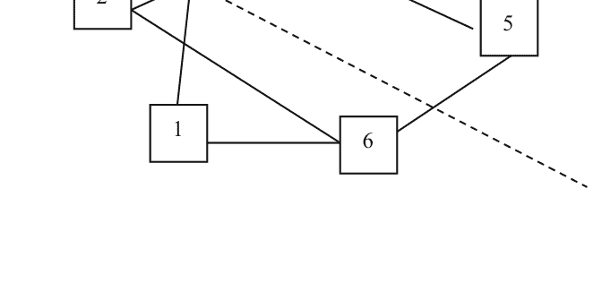

$$ P = e^{(4-7)/T} \quad (6.21) $$

由于必须连续存在两个相等的部分（100011），因此通过在每一步中将其中一个0变为1，将其中一个1变为0来保持这个条件。由于每个选项的能量水平都不同，运动被接受的概率也会发生变化。因此，在起始（100011）决策团队之后，团队可以是（010011），（001011），（000111），（110001），（101001），（100101），（110010），（101010）和（100110）。考虑到某个时间点的决策集合为（010011），其能量为E_O =6。如果考虑过渡到（100011），其能量将为E_N =4 < E_O =6。如果团队（100110）前进，E_N =8，其被接受的概率将取决于温度。

$$ P = e^{(6-8)/T} \quad (6.22) $$

如果温度选择为50，该方程给出了接受的概率 P =0.96。另一方面，对于T =10，P =0.96，对于 T =1，P =0.13。从这里可以看出，在高温下，具有较高能量水平的解集以高概率通过。

### 6.8.2 随机优化方法

初始决策集的目标值在有效决策空间中随机选择，没有任何正式的研究结构。在下一步中，将其与另一个随机选择的决策集的目标值进行比较。如果下一个目标值小于前一个目标值，则忘记前一个目标值，并基于新的决策集和其目标值进行下一个最佳点搜索。如果新选择的决策集的目标值大于前一个目标值，则忘记这个新选择的决策变量和目标值，再次随机计算有效决策空间中的另一个点及其目标值，作为与前一个目标值的比较结果，决定哪一个将被遗忘，进程将继续。

因此，在随机串行操作中，优化是连续在有效决策空间的多个点上进行的，并且最终可以达到最佳绝对点。对这种方法的批评是，随着交易量和时间的增加，决策空间中总是存在随机点，并且它们之间没有联系。缺乏明确的方法并不使其成为一种理想的方法。这种方法在实践中对决策空间进行完全随机抽样，被称为蒙特卡洛方法。任何在结构上具有一定形式性（系统性）的方法都比完全随机的方法更可取。

如果这种随机方法的解空间是m维的，并且决策变量空间仅基于0和1的整数，那么有2m个不同的随机选择案例。

随机选择的情况。 在经过n步之后达到绝对最佳点的概率为

$$P=1-(1-1/2^m)^n$$

因此，如果m=10，n>2356，必须以P=0.90的概率获得最佳点。这甚至超过了2^10=1024的内存。因此，使用完全随机的决策团队选择方法进行优化实际上是不可能的。

另一方面，在GA优化方法中，初始决策团队同时随机选择，由于每个团队之间存在关系，将团队带到决策空间的下一个点，计算限制极大地减少，并保持在实际限制之下。

为了稍微改进随机优化方法，不再在决策空间的所有边界上连续步骤中等概率选择决策集，如果更有可能选择靠近获得的最佳点，计算量将减少。在这里，重点是局部最佳点周围的区域，而不是整个决策。因此，通过在前面步骤中获得的局部最小点周围随机搜索，而不是按顺序到达绝对最佳点并忘记之前的点，可以达到绝对最佳解。

## 6.9 二进制遗传算法（GA）

在前面的章节中描述的数值优化方法中，通常从一个点开始以不同的方式顺序过渡到下一个较小的目标值点。它们通常捕捉到局部最小点。在过去的35–40年中，出现了具有有效和新方面的算法。其中最新的是基于进化理论和自然选择的GA方法。在这里，随机分布的起始点被 first间隔在解空间中。基于这些，通过利用进化过程理论程序，试图使决策变量点更接近目标。GA通过使用概率方法执行优化过程。在某种程度上，这就像从解决方案表面的不同点中随机抽样。然而，这里的随机过程与经典意义上的随机性非常不同。在经典随机性（第6.8节）的基础上，添加了一个系统的数值演化过程，其顺序和独特的演化过程已在前一节中描述。在决策空间中实现了一种演化，以便任何阶段的点都能更好地（更小的目标函数值）到达下一个解决方案候选点。这种演化的个体是遗传数系统，如本章的 first部分所解释的。

### 6.9.1 遗传算法（GA）的好处和后果

在用于建模高度复杂目标函数的遗传算法中，有不同的子集代表生物发展。在遗传算法中，首先允许一群不同的个体（染色体）存在。这个群体通过一定的规则改变目标函数，使其更加优化。虽然一些染色体会死亡并离开过程，但其他染色体会更加健康地继续生存。用遗传算法解决优化问题的一些好处如下：

- 1. 可以使用离散或连续变量进行优化，
- 2. 不需要导数，
- 3. 在解空间中，可以同时从许多点开始研究广泛的区域，
- 4. 可以使用多个变量进行优化，
- 5. 非常适合并行计算，
- 6. 即使在目标函数具有太多极端（最大和最小，极值）值的情况下，也可以进行优化，可以跳过局部最小值，
- 8. 它不仅可以给出绝对最佳的解决方案，甚至可以给出最佳解决方案的列表，
- 9. 通过编码决策变量，在编码世界中进行优化，
- 10. 它与根据遗传数系统产生的数字一起工作。 这些 can是实验数据或分析函数。

不能从这里得出结论，GAs应该在每个优化问题中使用。在存在平滑目标函数和少量变量的情况下，应优先选择数学的经典优化方法，以便快速简单地找到解决方案。

GA或进化算法是一种受到进化理论启发的方法，旨在尽快找到优化问题的最佳解决方案。通过使用用遗传数序列编码的决策变量和解决方案选项之间的进化过程，试图接近最合适的解决方案。GA解决方案算法与经典优化方法非常不同。GAs基于随机抽样，因此是一种非确定性方法。GAs中使用不确定性方法，算法的操作没有明确性。在这里，可以将不确定性定义为概率、机会游戏或随机的。作为这一自然结果，当相同的GA模型在不同时间用于同一问题时，可能会给出稍微不同的结果。然而，线性、动态或曲线（非线性）的正式优化方法都是明显的方法。在它们的操作中没有随机性，并且在相同的问题和条件下，它们的结论总是相同的。

遗传算法的一个缺点是最佳解相对于已知解是相对的。它可能不允许检查是否达到了最佳解。因此，当不确定解决方案是什么时，遗传算法是最好的选择。

自然地，进化（遗传）算法不知道何时停止以获得最佳解。 必须设置停止准则。人们可以理解遗传算法决策空间将完全随机地被扫描，而在经典优化方法中必须遵循一个方向或系统的轨迹。 在这里，可以列举一些这种随机优化研究方法相对于其他方法的优点。

- 1. 遗传算法在决策空间中同时并行评估许多点，而在经典方法中，这种情况只是一个单点和方向，
- 2. 遗传算法的操作永远不需要进行数学导数和积分等计算，所有计算都基于算术运算。 在决策空间的扫描过程中，唯一重要的影响是目标函数和结果的适应度，
- 3. 在遗传算法操作中使用概率和随机转换，而不是确定性的。
- 4. 在遗传算法中，变量可以具有它们的二进制编码等效物，而不是它们的实际十进制值。 然而，它已经在使用十进制值的遗传算法中得到了发展。

遗传算法方法对于给定问题产生了太多可行解。 在这些解中，研究人员可以自行选择最合适的解。 建议使用遗传算法方法，而不是可能陷入局部优化点的方法。

最简单的遗传算法机制由Goldberg（1989）提出。 该机制的一般结构在图6.27的流程图中简要给出。在该图中，符号t用于表示随时间变化的种群。 初始种群为P(0)，时间t的种群为P(t)。总之，遗传算法包括以下步骤。

- 1. 用遗传数表示问题的可能解
- 2. 通过改变初始解集生成新的解集

### 图6.27简单遗传算法步骤

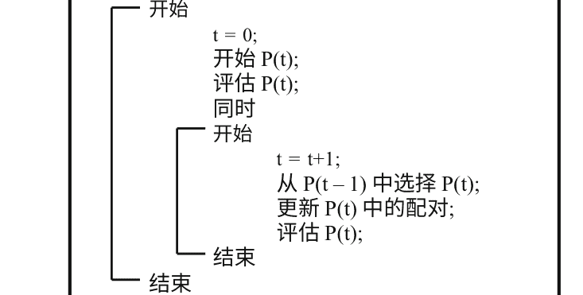

- 3. 确定问题目标并从中获得适应度评估的函数
- 4. 一组遗传操作（交叉、变异等）以改善解的结构
- 5. 计算在遗传算法中使用的变量值

许多大规模优化问题可以在短时间内使用遗传算法解决。 遗传算法是一种在计算机上理论上和人工上执行自然遗传继承行为的随机技术。 遗传算法与经典优化方法不同，它们具有定向和随机搜索特性。

这些算法从一个点开始，并且在决策空间中不遵循任何路径，直到找到最佳解决方案。相反，它们从许多点随机进入决策空间，并且决策点通过彼此之间的进化规则发展，生成具有更高适应度的新种群，即接近解决方案，并达到最佳解决方案。根据进化论的理论，每个种群都是前一个种群的一种形式。在任何种群中，决策点距离解决方案越近，它就越有活力，越有可能相应地生存下来。因此，该决策点（染色体）可以在后续种群中继续生存。根据图6.27中给出的步骤，在一个迭代时间内，遗传算法具有包含可能成为解决方案的候选人T(t)的种群。为每个染色体计算适应度值。适应度值是衡量染色体是否能在下一次社会进化中生存的指标。

### 6.9.2 遗传算法的定义

受生物进化理论的启发，遗传算法方法通过随机地轰炸解决方案区域来寻找最佳解决方案。为了达到解决方案，首先在决策变量空间中随机选择一组点，然后根据即将展示的规则在这些点之间进行匹配，一些种群成员消失，新的成员取而代之。通过将新成员加入种群，确保种群比之前更健康，即更接近目标。通过在种群成员之间应用必要的遗传过程，得到一个新的种群，可以说，更适应目标，更接近目标。因此，目标从许多方向和短路径接近，而不是沿着一个方向或路径，如前面的部分所解释的。这个种群的每个成员由一个编码的遗传数字序列表示。在本文的前几节（第6.3节）中，这些数字序列被称为染色体。由于遗传算法通常使用二进制（0和1）数制工作，它们的空间被称为二进制空间，人们的空间被称为十进制空间系统。尽管遗传算法的编码是根据二进制数制进行的，但也可以根据十进制数制进行，如第6.4.1节所述。

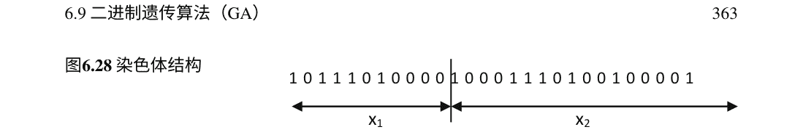

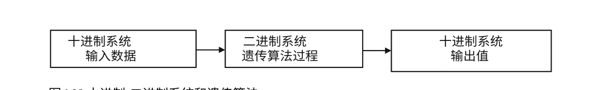

然而，由于其计算简便性，二进制系统被广泛使用。如果在解决问题时存在两个变量，如x1和x2，在基于二进制系统中，它们的染色体结构如图6.28所示。

在这个染色体中，x1和x2分别用10和18位表示。这些位是染色体的最小构建单元，也被称为“位”。在图6.28中，染色体中表示两个决策变量的0和1序列也被称为基因，类似于生物学研究。

染色体由基因组成。上述染色体本身没有意义。在图6.28中，染色体以二进制数系统给出。为了使人类能够理解这个数字，染色体中的x1和x2变量的值必须转换为十进制系统，x1 = 744，x2 = 729993。

在遗传算法研究中，输入和输出是十进制遗传算法，而遗传算法的内部运作是在二进制数系统空间中进行的（见图6.29）。

在遗传算法操作过程中使用包含编码数字的染色体。在通过染色体对决策变量进行编码后，应该分别计算种群中每个染色体的适应度。应该有一个目标函数来计算成员的适应度。根据手头问题的类型选择目标函数。根据目标函数标准，作为种群成员的染色体要么继续存在，要么必须离开该种群。目标函数最重要的特点是通过匹配选择会导致种群中出现更强壮的成员。

在每个更新阶段，种群中的染色体在进行任何工作之前根据其目标函数获得适应度。然后，这些分数用于繁殖更强壮的染色体。那些具有较高适应度的染色体在进行任何工作之前，种群中的染色体根据其目标函数获得适应度。这些分数用于繁殖更强壮的染色体。适应度较高的个体更有可能在种群中存活多代，而适应度较低的个体则不太可能留在种群中。每个个体的适应度以相对比例的方式表示整个种群的适应度。

通过遗传算法的过程和对染色体基因进行操作，决定一些个体将留在未来的种群中，因为它们具有强大的基因。通过在两个或多个基因数对之间执行遗传算法操作（进化），为下一个种群做好准备。

### 6.9.3 二进制遗传算法

图6.30总结了生物和二进制数进化之间的相似之处。它从具有随机成员的初始种群开始。假设左侧显示的每个二进制数对应于一群马的种群。如果最好的嘶声马要留在种群中，而其他马要被淘汰，这看起来是一种优化准则（Haupt和Haupt 1998）。这些马继续以被认为相关的二进制数在种群中生活。从中随机选择两个个体并在它们之间进行交换，产生两匹新马。这些马有可能发出更好的嘶声。

他们的父母是那种会嘶鸣的人。新一代中的每个人都继承了母亲和父亲的一些特征。新生的马中，嘶鸣得更好的马会排除掉两匹嘶鸣较差的马。假设会有同样数量的新马出现，以保持种群的规模不变（相同数量的染色体）。

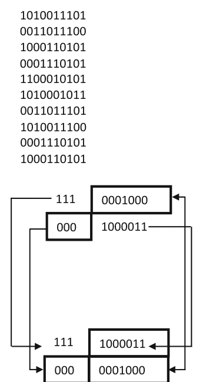

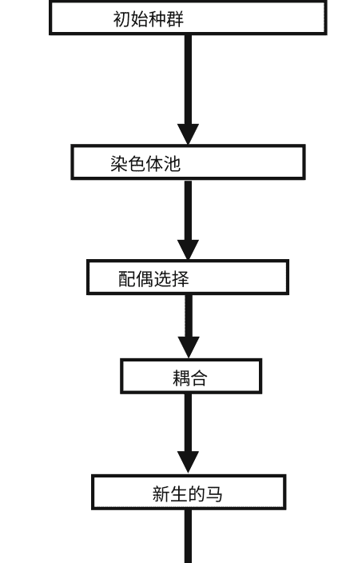

### 图6.30数值和生物遗传算法的相似之处

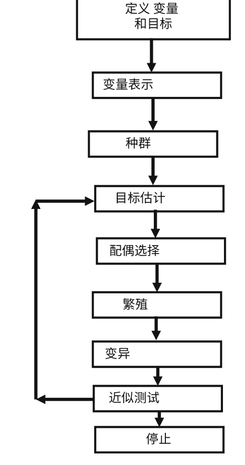

### 图6.31 基于二进制数系统的遗传算法流程图

染色体数量）。如果这个再生过程连续进行，就可以得到一个更好的嘶鸣马种群。与其他优化方法一样，遗传算法中的优化分析从将选定的决策变量替换到目标函数开始。这样继续进行下去，最终，如果最佳解的近似仍然在一个固定的误差限度内，就会终止。除此之外，遗传算法与传统的优化方法非常不同。在图6.31中，展示了在计算机上执行遗传算法优化的当前步骤的流程。每个方框中的主题将作为本章的一部分进行详细解释。

目标函数是由一般情况下变量确定的空间中的复杂曲面，具有峰值、谷值、脊和槽。在三参数情况下，这就像是一张地形图。优化过程通过 finding 其中一个最经济的谷底来解决。优化方法用于 find 峰值处理目标函数的最大化。例如，在寻找土耳其最高峰阿拉拉特山的山顶时，情况类似。

### 6.9.4 变量和目标函数的选择

目标函数通过将问题的变量结合起来生成一个输出曲面。在遗传算法中，变异体对应于染色体上的基因（第6.1节）。目标函数可以是数学表达式，也可以是实验结果或由系统规则组成的曲面。这里的目标是通过改变变量的方式找到优化点。例如，在洗澡前给浴缸注水时，目标是通过实际水温和期望水温之间的差异的优化来达到。在这种情况下，问题是，应该如何可变地打开热水龙头和冷水龙头？在这种情况下，通过 finding适当的温度来获得实验结果。龙头的开启量与达到期望温度之间存在恒定的关系。当期望温度发生变化时，龙头的开启量也会发生变化。

遗传算法的第一阶段是生成代表所需最佳解的染色体序列。这是一个优化问题，试图获得使目标函数h()最佳的这些变量的值。在第6.1节中，解释了三角形的每个决策变量的值称为基因。假设问题具有d1, d2, ...

dNgen变量（gens），染色体被写成一个由C个元素组成的序列，每个元素由0和1组成，因此染色体可以写成如下形式。

```
C = [d1, d2, ..., pN基因]      (6.24)
```

例如，如果目标是在一个区域中找到最高峰，那么将会有两个变量，一个是纬度Lat，另一个是经度Lon，形式为（Ngen = 2）

```
C = [纬度, 经度]      (6.25)
```

每个染色体都对应一个目标值T，该值可以从其目标函数中找到。该值的定义由以下方程给出。

```
T = t(C) = f (d1, d2, ..., dNgen)      (6.26)
```

如果想要在某个地区找到最高峰，问题可以通过将海拔高度y写成负值来转化为最小化问题。为此，简要地可以写成.

t(纬度, 经度) = - y (6.27)

一般来说，目标函数的值会越来越小，就像最大化汽车相对于燃料消耗所行驶的距离一样。在这种情况下，模型制造者必须决定哪个专家变量具有最高优先级。太多的变量会影响遗传算法的效果。有时候，通过专家判断或少量试错计算，可以找到最必要的变量。几乎所有优化问题都有变量的上下限。应该明确确定研究案例的维度。

如果期望一个马尺寸的维度，应该知道它不会超过2-3米。对于问题中几乎所有变量和值的现实预测对于个人非常有益，这些变量和值需要进行优化。

一些优化问题的变体可能是相互依赖的。例如，一个人的身高和体重通常是相关的。同样，径流量取决于降水量。在变量相互依赖的优化问题中，应该使用前面描述的经典最小化算法，而不是遗传算法。遗传算法主要用于解决具有中等或弱相关变量的优化问题。如果依赖性太大，纯随机优化分析是合适的。

优化问题中最困难的一步是确定目标函数。问题在于目标是一个还是多个？这将取决于变量。例如，在制造汽车时，公式t = (行驶距离)/(燃料消耗)是否是最佳的目标函数？否则，如果汽车制造的投资成本i、运营成本c取决于汽车重量w和体积v（Haupt和Haupt 1998），则目标的总体价值将取决于变量。

t(w, v) = i + c (6.28)

如果投资和运营成本都很重要，在优化问题中使用标准成本是合适的。考虑标准成本中变量的最小值（i_min, c_min）和最大值（c_max, c_max），t被定义为

t = (i-i_min)/(i_max-i_min) * (c-c_min)/(c_max-c_min) (6.29)

现在，这个标准成本等于0到2之间的一个数字。一般来说，标准成本包括投资权重a_p和运营权重a_c。在这里，a_i+ a_c = 1。

h = a_p(i-i_min)/(i_max-i_min) * a_c(c-c_min)/(c_max-c_min) (6.30)

有时目标函数可能非常复杂和耗时，难以计算。因此，有必要尽量以少量计算为基础来解决问题。由于目标函数的计算是基于染色体的，应避免相同的染色体。为了避免双胞胎染色体，需要在初始种群的建立过程中消除相同的染色体。

在基于进制的遗传算法中，相同的染色体很常见。而在十进制的遗传算法中，这种情况很少见，将在第6.4节中进行解释。为了确保每个染色体都不同，让我们考虑以下8个染色体。如果希望前三位数字彼此不同，由于组合的数量是2^3=8，可以在确定性地进行组合计算后，将剩下的5位数字完全随机地排列。即使在这种随机排序中偶然出现相同的序列，由于前三位数字不同，染色体仍然是不同的。

```
000101010
001101010
010010101
011001100
100110011
101000111
110111000
111011011
```

通过确保这些的前三位数字彼此不同，初始种群中的所有染色体都不同。在这里，只确保第一个基因彼此不同。为了使其在其他基因上与其他染色体不同，关键是如果一个染色体由每个三位数的3个基因组成，那么在8个不同的序列中，可以调整每个基因的第一个数字以使其不同，以使所有染色体彼此完全不同。在这里，由于希望每个基因的第一个数字严格不同，因此得到了以下染色体结构。每个严格设置的基因的第一个数字以斜体显示。

```
101110110
101110010
101010110
101010010
001110110
001110010
001010110
001010010
```

因此，在目标函数计算中阻止了初始种群中相同染色体的两个或更多计算。这意味着不能保证相同的染色体会出现在后来的种群中。为了不用相同的染色体重新计算目标函数，在下一阶段出现的新染色体上进行目标计算，未改变的染色体的目标值保持不变。这意味着随着新的染色体出现，它们选择计算目标值的方式。

## 6.9 二进制遗传算法（GA）

这种方法适用于目标函数计算不困难且耗时不多的情况。

另一种方法是知道新出现的染色体与之前的染色体不同。如果目标值计算所花费的时间比在种群中搜索相同染色体的时间更长，应首先检查染色体是否相同，否则不采用这种方法。只有在遗传算法计算的任何阶段出现的不同染色体才需要计算目标值。

简化成本计算的另一种方法是简化目标函数本身。例如，目标和遗传算法计算是在粗略间隔的网络上进行的，通过从中获得的信息增加网络的分辨率进行精确计算。在第一步中，执行粗略网格目标函数和染色体计算。随着下一步的进行，通过增加分辨率来继续计算。首先考虑一个粗略的网格。

首次获得更精确的网格间隔解的迹象，所需计算量较少，时间较短。例如，在初始阶段使用100 × 100的解决区域，后续阶段可以逐渐考虑相同解决区域中的500 × 500网络来进行解决。

遗传算法结构中有4个不同的参数值。其中第一个是生成种群的选项数。然后必须确定每个选项中的基因数。除此之外，这四个参数还与交叉和变异概率值一起完成。通常情况下，交叉概率选择较高（例如0.7），但数字交换的概率选择较低（0.001）。

还存在一个环境，其中遗传算法事件以每个选项的活力发生。应该知道或明确说明至少有些选项优于其他选项，即使只是口头上。遗传算法运行的必要步骤可以解释如下。

1.  在每次迭代（电路）中选择n个随机选项，称为染色体，
2.  计算它们每一个的活力，
3.  用轮盘赌随机选择两个选项，
4.  通过交叉概率将这两个选项相互匹配，产生两个新选项，
5.  对这些新选项中的每一个应用数字变换操作的数字变换概率，
6.  用由新选项产生的种群替换旧种群。

### 6.9.5 目标函数和活力测量

为了指示决策空间中不同点处循环的种群染色体与所寻求的解之间的接近程度，需要一个目标函数t(x)。根据优化的方向，即最小化或最大化，希望达到目标函数的小值或大值。

为了计算GA种群中每个染色体（成员）的相对活力，需要它们在目标函数中的绝对（仅正值）活力值。需要以某种方式获得一个函数v(x)，该函数将给出从目标函数中获得的活力程度。这两个函数之间的闭合关系可以表示为，一个可以展示它们之间的闭合关系，

$$ v(x) = F(t(x)) $$

在这里，F变换应该使得给出活力度的函数值对于所有决策变量都是正的。这个最后陈述的显式形式，其中v(x_i)是第i个决策变量的活力值，可以如下计算。

$$ v(x_i) = \frac{t(x_i)}{\sum_{j=1}^{N_U} t(x_j)} $$

所有目标函数值都有正号的事实，活力度给出了该决策变量在种群中的百分比（概率）。这可以称为相对活力度。这个定义的最大缺点是它不能考虑目标函数的负值。为了消除目标函数可能出现的缺点，另一种活力度分配的显式表达式是线性的，如下所示。

$$ v(x) = at(x) + b $$

在这里，a和b分别是缩放和平移系数。a的符号在优化最小化的情况下取负号，在优化最大化的情况下取正号。然而，b的值是为了确保将出现的活力系数不为负。方程（6.33）中的运算也称为线性缩放。

另一种提出的方法是根据从最小到最大排列的活力度数的目标函数值来确定。

### 6.9.6 变量的表示

二进制遗传算法在一个非常大但有限的解空间中运行。由于这个特性，当变量取有限个值时，遗传算法分析非常有用。如果一个变量是连续的，在应用遗传算法之前必须进行离散化处理。为此，变化范围被分成有限数量的子区间。落在任何一个区间上的值被认为是该区间的中点。这里的划分类似于在直方图研究中获取类别（第4章）。这种类型的研究在优化方法中是最合适的。可能发生的错误数量也是最大的。最小化最大的错误确保较小的错误变得更小。已经说过，在二进制系统中，表示每个变量的数字序列称为基因（第6.1节）。根据以下公式实现给定d、n变量的二进制数编码或反编码。

$$ d_{norm} = \frac{d_n - d_{min}}{d_{max} - d_{min}} $$
(6.34)

这里，d_min和d_max分别是变量值（基因）的最小和最大值。这个最后的陈述也被称为标准化操作。因此，给定的变量值被标准化为介于0和1之间。要找到二进制数系统中这个值的相反数，必须按照以下步骤进行。

1.  首先，决定二进制数系统将使用多少位数。在坚持一个系统的情况下，二进制数有2、22、23、...、2位数。在这里，随着上限数字的增加，使用更详细和健康的数字系统。遗传算法应用通常使用M = 23 = 8或M = 24 = 16位数字。位数不一定是2的系数。
2.  由于从方程（6.34）得到的标准变量的变化间隔为1，将其除以M并找到与二进制数系统的每个数字对应的间隔长度，得到
3.  计算并写入表6.3的第一列中的标准变量子范围的下限和上限值。第一个范围的限制是0 – 1/M，第二个范围是1/M – 2/M，第三个范围是2/M – 3/M，第M个范围是(1 – 1/M) – M。M = 8的结果见表6.3。

$$ \Delta a = \frac{1}{M} $$
(6.35)

| 类边界 | 区间序列 | 二进制数 |
| :--- | :--- | :--- |
| 0 – 1/8 | 0 | 000 |
| 1/8 – 2/8 | 1 | 001 |
| 2/8 – 3/8 | 2 | 010 |
| 3/8 – 4/8 | 3 | 011 |
| 4/8 – 5/8 | 4 | 100 |
| 5/8 – 6/8 | 5 | 101 |
| 6/8 – 7/8 | 6 | 110 |
| 7/8 – 1 | 7 | 111 |

4.  如果将其他数按顺序写入以给予第一个范围数字0，那么在最后一个范围中会找到7个范围数字(M –1)。这些值写在表的第二列中。因此，第一列中的十进制数与第二列中的十进制数之间存在相互一致。
5.  第三列包括第二列中十进制数的二进制系统等价物。
6.  第一列和第三列相互显示标准数据值在二进制数系统中对应的内容。因此，所有标准值都用二进制数表示。
7.  第一列中与第三列中的二进制数对应的范围内有许多值。换句话说，没有一对一的一致。为了解决这个问题，应该假设范围的上限、中间值或下限与第一列中的二进制数相对应。在实际研究中，这个一致是中间值。
8.  通过接受中值，可以理解使用二进制系统的遗传算法结果只是十进制数系统的近似值。
9.  随着二进制数系统中数字M的位数增加，前一步骤中指定的近似值减小，但计算量大大增加。

遗传算法通常使用二进制数系统，但目标函数需要使用十进制数系统。例如，对于遗传算法优化分析，考虑到有三个不同的变量（Ngen = 3），每个变量在二进制数系统中有10位数（N digit = 10），在适当的染色体中变为

```
C = [11110010010011011111……..0000101010]
```

粗体数字串是gen1，斜体数字串是gen2，以此类推，最后的10位数字串表示Ngen。在这样的染色体中，有二进制数0或1，称为“位”，总共有NbitNgen = 10Ngen个。

为了找到一个地方最高峰的位置，需要取128×128个高程点。纬度Lat和经度Lon是找到这里最高峰所需的变量值，它们被表示为两个基因。如果将每个基因视为N位数字（N=7位），则由于纬度和经度的每个值都有2的7次组合，可以考虑不同的值。因此，在随机选择的染色体中，每个变量的二进制数有7位，染色体总共有14位。例如，

```
C = [11100011000110]
```

前面的七位是纬度，剩下的是经度的二进制表示。

### 6.9.7 初始种群

正如前面所说，遗传算法的初始种群通常至少有15-20个染色体，最好更多。如果在这个种群中找到N个染色体，则会得到一个大小为Nchr x Ngen x Nbit的矩阵，由0和1组成（见第6.3节）。如果将其称为初始种群矩阵SPOP。

```
SPOP = 随机N ( chr, Nbit ) ( )
```

在这里，“随机(Nchr,Nbit)”命令生成一个大小为Nchr×Nbit的矩阵，其中元素均匀分布在0和1之间。这样的标准随机数生成函数在任何计算机软件中都可以找到。这里的“Round[]”命令将生成的随机数四舍五入到最近的整数（0或1）。该矩阵的每一行对应一个染色体。

然后，通过将变量放入目标函数中计算目标值。巨大的解空间允许在遗传算法中进行良好的随机抽样。在表6.4中，

| 序号 | 染色体 | 目标值 | 排名 | 活力度 |
|------|--------|--------|------|--------|
| 1 | 10111000101010 | -11818 | 6 | 0.059508 |
| 2 | 00111000101010 | -3626 | 21 | 0.018258 |
| 3 | 10111000101011 | -11819 | 5 | 0.059513 |
| 4 | 10111001101010 | -11882 | 4 | 0.059830 |
| 5 | 10101000101010 | -10793 | 7 | 0.054347 |
| 6 | 11111000101010 | -15924 | 2 | 0.080183 |
| 7 | 01110000100010 | -7202 | 17 | 0.036265 |
| 8 | 01010000100010 | -5154 | 19 | 0.025952 |
| 9 | 01110000101010 | -7210 | 11 | 0.036305 |
| 10 | 01110110100010 | -7586 | 12 | 0.038198 |
| 11 | 01110100100010 | -7458 | 15 | 0.037554 |
| 12 | 01000110100010 | -4514 | 20 | 0.022730 |
| 13 | 00110110100010 | -3490 | 22 | 0.017573 |
| 14 | 01110010101010 | -7338 | 16 | 0.036950 |
| 15 | 01100100100010 | -6434 | 18 | 0.032398 |
| 16 | 01110110100010 | -7586 | 14 | 0.038198 |
| 17 | 01110110101110 | -7598 | 13 | 0.038259 |
| 18 | 01111000110010 | -7730 | 9 | 0.038923 |
| 19 | 11111110101010 | -16298 | 1 | 0.082067 |
| 20 | 01110101011101 | -7517 | 10 | 0.037851 |
| 21 | 00101110001010 | -2954 | 23 | 0.014874 |
| 22 | 00101011001010 | -2762 | 24 | 0.013908 |
| 23 | 10000110101010 | -8618 | 8 | 0.043395 |
| 24 | 11101110110100 | -15284 | 3 | 0.078961 |

由上一节中提到的纬度和经度基因组成的染色体的初始种群以Nchr =24的目标值随机显示。当每个基因有7位数字时，由于有两个决策变量，染色体中共有2 × 7 =14位数字。在同一张表的第4列中，根据公式（6.32）计算目标值的顺序（按从小到大的顺序）和活力度，并显示在最后一列。

遗传算法与许多决策点一起工作，这些决策点可以同时成为一个解，所有这些决策点都根据二进制数系统进行编码，并形成种群。首先应该问的问题是初始种群中应该有多少染色体（解决方案备选项）？这个问题的答案只能通过研究的观察结果给出，但是在开始时至少应该取10－15个染色体是合适的。也可以将这个数字增加到50－60个。

想要真正理解遗传算法的读者应该尝试通过简单的优化示例和不同的种群数量来解决同一个问题，以了解需要多少染色体。

在每个遗传算法的准备过程中，问题的每个决策变量都被视为一串二进制数。包含决策变量的染色体是通过将所有决策变量的整个数组依次排列而得到的。

下一步是如何选择要放入构成种群的染色体中的数字（0或1）。为此，使用完全独立的均匀随机数生成方法。由于初始种群中染色体的数量为Nchr，因此可以理解为整个种群中需要与Ngen xNbit xNbtop一样多的位数。在这里，使用均匀和完全随机的数生成器来将这个数字的位数位置填充为0或1。如果对问题的解决方案没有线索，最好最初完全随机地探索决策空间。如果对所需优化点的大致位置有线索，最好在这样一个解决方案点周围随机选择染色体值，但在一个较窄的决策空间内。

在遗传算法工作过程中，甚至部分方向都不应该被遵循。点通过随机进化过程从其位置移动到新位置。随着初始种群的建立，在后期有三个基于概率原理的连续遗传算法操作。其中之一是从种群中进行选择，另外两个是交叉和变异（改变数字）操作，进一步加强种群中的染色体。选择是在解决方案选项中选择下一阶段中能够更好的染色体的过程。

在选择过程中，应该注意选择具有高活力的染色体。具有高度活力的人更有可能在下一个种群中发挥作用。由于在这种类型的选择工作中，具有最高活力的人可以获得最大的份额，因此选举是通过将第6.1节中描述的轮盘赌与蛋糕进行比较来进行的。

尽管在所有经典方法中有一个最佳解，我们可以称之为唯一的解，但在遗传算法中有一个准备成为解的种群。只有

### 6.9.8 选择过程

这个目的是为了选择在当前种群中稍后的种群中要考虑的染色体，以便进行遗传算法处理。由于在公式（6.33）中给出的线性缩放中快速获得活力度数，可能会错过最佳解。在这个选择中，一个染色体可以被一个小数替换多次，但它必须转换为整数。可以直接进入下一个种群或在至少经过一个遗传算法处理后进入下一个种群的染色体应该从种群中随机选择。为了进行这种类型的选择，可以使用前面描述的不同方法，如第6.4.1节所述。

解决方案点（染色体）将构成下一个人口，将在人口决策点之间进一步改进的形式下进化，根据其活力（接近最佳解决方案）随机选择。这样的选择过程确保了人口的进化和发展变得更好。

可以将人口定义为基因库，是对染色体适应性进行评估并进行选择过程的池。在二进制遗传算法中，0或1表示一个数字，它们的混合序列表示一个基因，基因序列表示染色体（第6.4.1节）。例如，如果染色体00111、11100和01010的目标函数值分别为t(00111)=0.1、t(11100)=0.9和t(01010)=0.5，则根据公式(6.32)计算活力值为v(00111)=0.0667、v(11100)=0.6000和v(01100)=0.3333。在遗传算法过程中，选择具有较高活力值的染色体并复制到具有较低活力的染色体上。在接下来的步骤中，染色体将经历交叉和突变（数字变化）过程，如下一节所述。

这里的目标是通过消除活力较小的染色体，让较大的染色体感受到它们的重量，从而生成一个新的种群。从种群中选择染色体的过程可以通过将较大的染色体覆盖在较小的染色体上和/或使用轮盘赌的方式来完成。染色体的特征根据它们的活力值来确定。这样，具有Npop个染色体的种群可以分为Ngood和Nbad两组。在实践中，通常将Ngood ≈ Nbad = Npop/2。

在遗传算法研究中，改变Ngood染色体的数量也是有用的。如果将交叉率记为Rc，则确定要考虑进行配对的染色体数量可以使用以下表达式。

表6.5 遗传算法种群

| 序号 | 染色体 | 目标值 | 排名 | 活力度 |
| :--- | :--- | :--- | :--- | :--- |
| 19 | 11111110101010 | -16298 | 1 | 0.082067 |
| 6 | 11111000101010 | -15924 | 2 | 0.080183 |
| 24 | 11101110110100 | -15284 | 3 | 0.078961 |
| 4 | 10111001101010 | -11882 | 4 | 0.059830 |
| 3 | 10111000101011 | -11819 | 5 | 0.059513 |
| 1 | 10111000101010 | -11818 | 6 | 0.059508 |
| 5 | 10101000101010 | -10793 | 7 | 0.054347 |
| 23 | 10000110101010 | -8618 | 8 | 0.043395 |
| 18 | 01111000110010 | -7730 | 9 | 0.038923 |
| 20 | 01110101011101 | -7517 | 10 | 0.037851 |
| 9 | 01110000101010 | -7210 | 11 | 0.036305 |
| 10 | 01110110100010 | -7586 | 12 | 0.038198 |

$$ N_{good} = R_{c}N_{pop} $$
(6.37)

如果交叉率很高，种群染色体不可能累积在一个染色体中。另一方面，在低交叉率下检查目标表面也没有太大的用处。

除了上述标准之外，还可以开发和使用文献中未提及的方法。因此，即使在这本书中所写的内容也不要认为是乏味和刻板的。考虑到它们的活力值，从表6.5中选择了最适合的12个初始种群。

其中的前6个构成了N个种群的两个相等部分，N个好的在前面，但N个坏的在后面。为了使这些新形成的遗传算法种群染色体通过自身之间的交配变得更加有活力，应该随机选择应用交叉和数字交换（突变）遗传算法操作。这里有几条可以遵循的路径。

1.  其中第一条是保留表6.5中的N个好染色体不变，并在剩下的N个坏染色体中随机选择配对伙伴，通过在所有染色体之间进行匹配而不进行这种区分来应用遗传算法交叉和数字交换操作。

### 6.9.9 配偶选择## 6.9.10 交叉

通过配偶的融合产生新产品被称为遗传算法的交叉阶段。在这里，遗传算法首先研究目标表面。这被称为发现阶段，因为遗传算法仍然使用染色体值。只要染色体数目保持不变，遗传算法就能够接近优化问题的解决方案。

在解决方案搜索过程中，通过两个不同的候选解决方案空间点之间的交叉，揭示出两个比之前更好、更接近最优解的新解决方案点（决策点）。这两个新的解决方案点是从之前的点继承而来的。因此，解决方案群体中的决策点会不断进化变得更好，从而创建一个新的种群。在这里，两个解决方案点的数值交叉一些位数，从而产生新的解决方案点。这与生物有机体的DNA交叉类似地实现。为了进一步增强染色体的活力，还有另一种选择，即突变（数字变化）。这是一个允许染色体互相交换基因的过程。首先，随机选择要交叉的染色体对。然后，再次随机选择这些染色体对将被切割的基因。交叉基因在染色体对之间进行交换。这里的目标是从现有种群中获得不同的群体（代）。在这个过程中，要交叉的染色体对和它们将被交叉的基因是随机确定的。在这方面，通过以下四个操作进行不同的操作。每个染色体表示的十进制数值显示在箭头右侧。

### 6.9.10.1 单切割交叉

在这里，两个匹配的染色体生下了双胞胎，保持染色体编号不变。首先，随机确定一个交叉点，位于两个染色体的第一个和最后一个数字之间。一个染色体交叉点左侧的所有数字都被另一个染色体替换。首先，两个父染色体中的一个的交叉点左侧的所有数字传递给新生儿的染色体。同样，另一个染色体交叉点左侧的数字传递给另一个新生儿染色体。然后，第一个主要染色体交叉点右侧的数字移动到第二个新生儿的前面数字的右侧。因此，第一个新生儿的染色体是完整的。同样，第二个主要染色体交叉点右侧的数字也放置在第一个新生儿的右侧。因此，这两个新生儿染色体部分包含了前一个染色体的数字。主要染色体应该导致总共N个不良新生儿，以保持种群大小恒定（Npop = constant）。这些被称为简单或单一交叉点交付。在这个过程中，染色体从一个随机位置切割，然后用相关基因替换。

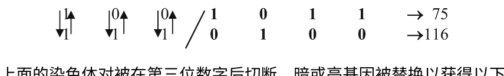

上面的染色体对被在第三位数字后切断，暗或亮基因被替换以获得以下新的染色体。从上面的解释中可以理解，每个染色体对应一个数字，而这些数字会随着染色体中基因的变化而改变。

```
1 0 0 0 1 0 0 → 68
1 1 1 1 0 1 1 → 123
```

通过单切交叉，只能获得两个彼此不同的新染色体。

### 6.9.10.2 双切交叉

与之前相同的过程重复进行，切口沿着染色体的两个位置进行。

```
1  /  0↑   ↓1↑   ↓1↑   0   /  1     1     → 75
1     /    ↓1     ↓0     1   /    0     0     → 116
```

在这里，染色体对从两个不同的位置切断，并进行交叉。暗基因已经交叉。

```
1  1  1  0  1  1  1  → 119
1  0  0  1  0  0  0  → 72
```

可以看到，由于新形状的染色体，它们所代表的数字再次发生了变化。在两点交叉中，每个染色体被分为三个部分。通过同时交叉这些部分，可以得到6个不同的染色体。下面显示了经过两点交叉的染色体的三个部分：直线、斜体和粗体部分。

```
000010111000110
000111100001001
```

分别在普通、斜体和粗体部分之间穿插，不同的染色体在直线部分之间。

```
001010111000110
000111100001001
```

在斜体部分之间

```
000111100000110
001010111001001
```

最后，在粗体部分之间有6个形状。

```
000010111001001
001111100000110
```

不需要使用所有新的染色体。在这个选择中，可以替换普通、斜体或粗体部分，并且可以随机选择多达6个新的染色体参与种群。

### 6.9.10.3 多段交叉

通过在多个对角线位置随机切割染色体来替换基因。

```
1  /|0↑  |0↑ / 1  0  /|1↑/ 1  →75
1  /|↓1|  |↓1| / 0  1  /|↓0| / 0  →116
```

由于这种交叉，新的染色体和数字如下。

```
1 1 1 1 0 0 1 →121
1 0 0 0 1 1 0 →70
```

在对立部分之间也可以通过交叉获得许多新的染色体。如果n表示片段的数量，则可以获得n²个新的染色体。

### 6.9.10.4 均匀交叉

这个过程的核心是在两个染色体之间交换随机数字。

```
1  ↓0↑  0  ↓1↑  0  1  ↓1↑  →75
1  ↓1↑  1  ↓0↑  1  0  ↓0↑  →116
```

在这里，每个数字都抛一枚硬币。例如，如果出现正面，则进行交叉应用，在出现反面的情况下不进行交叉。对于深色基因，对这些基因进行交叉并且染色体的新形状如下。

```
1 1 0 0 0 1 0 →100
1 0 1 1 1 0 1 →93
```

在均匀交叉中，随机查看前两个染色体数字。确定随机数字后，数字进行交换。为此，首先生成一个随机基数。该基数是一个随机包含0和1的序列，并且具有起始染色体的长度。如果页脚中对应的数字为0，则将对应染色体数字传递给第一个染色体。如果底部数字为1，则将染色体上的对应数字传递给第二个新染色体。下面给出一个例子。

```
00101011000110
01111100001100
Base 00110110001110
00111101001100
01101010000110
```

对于下面给出的底物，均匀交叉将是一种切割交叉。

```
Base 00000011111111
```

同样，在底物上，可能会导致双点交叉的形式。

```
Base 00000011110000
```

由此可见，均匀交叉是单点、双点和其他交叉的一般化。许多研究表明，均匀交叉比单点或双点交叉更有效。事实上，更具体地说，得出的结论是双点交叉也比单点交叉更高效。

在多重交叉中，只有随机选择的数字进行交换。然而，在均匀交叉操作中，每个数字都同样容易进行交叉。

通过均匀交叉，新染色体的两个中间染色体数字是通过取第一个染色体中对应数字而不是数字1，并取第二个染色体中对应数字0的值来形成的。在形成第二个新染色体时，将第二个染色体的数字取为中间染色体的1，并将第一个染色体的数字取为第二个染色体的0。

### 6.9.10.5 反转

反转与之前的过程完全不同，是指当基因序列从右向左读取时，染色体发生的倒置。在这种情况下，与之前染色体所代表的数字完全不同。例如，

```
1 1 0 0 0 1 0 → 98
```

如果像这样反转染色体，将得到以下新的染色体。

```
0 1 0 0 0 1 1 → 35
```

### 6.9.10.6 混合交叉

首先，在单点交叉中，不再按照相同顺序用数字替换染色体的前部分，而是从开头开始用完全独立和均匀的随机数生成器填充0或1，但如果主要染色体的后部分保持不变，则称为混合交叉。因此，新染色体的起始部分彼此完全独立。例如，

| | | | | | | | |
|---|---|---|---|---|---|---|---|
| 1 | 0 | 0 | / | 1 | 0 | 1 | 1 | → 75 |
| 1 | 1 | 1 | / | 0 | 1 | 0 | 0 | →116 |

通过染色体的混合交叉得到的结果。

| | | | | | | | |
|---|---|---|---|---|---|---|---|
| 0 | 1 | 0 | / | 1 | 0 | 1 | 1 | → 43 |
| 1 | 0 | 1 | / | 0 | 1 | 0 | 0 | → 84 |

### 6.9.10.7 互连交叉

如果希望产生与染色体接近的其他染色体，则可以根据下面的方程从两个染色体中取适当的部分并将它们组合在一起来产生新的期望染色体。两个主要染色体C1和C2通过α混合，得到一个新的成员形式。

$$C_y = C_1\alpha(C_2 - C_1)$$

根据研究，α应选择为$-0.25 < \alpha < 1.25$之间的随机数。在组装过程中，应对两个染色体的相对基因应用方程式（6.41），同时α的值应再次随机选择。以这种方式产生的新染色体在决策空间中的位置几何上不能离父染色体太远（参见图6.32）。这些相似性根据α的值而变化。

### 6.9.10.8 线性关联交叉

这类似于先前的交叉，但所有耦合状态都是使用 α的固定值获得的。如图6.33所示，在决策空间中，新染色体是在连接第一个染色体的直线上获得的。这以以下方程的形式表示为一条直线。

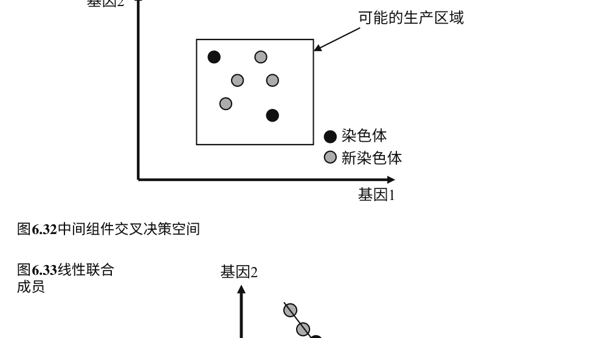

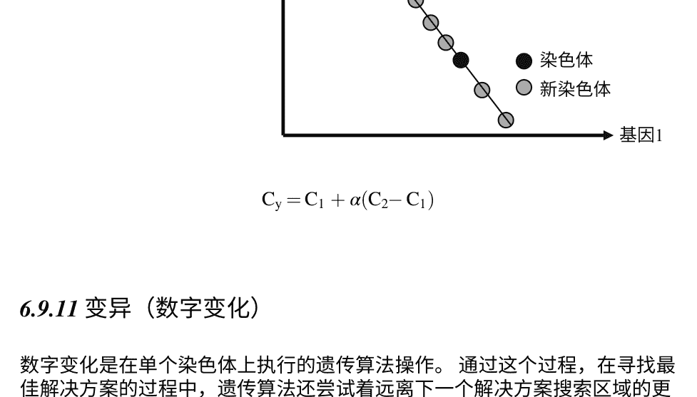

$$Cy = C1 + \alpha(C2 - C1)$$

### 6.9.11 变异（数字变化）

数字变化是在单个染色体上执行的遗传算法操作。通过这个过程，在寻找最佳解决方案的过程中，遗传算法还尝试着远离下一个解决方案搜索区域的更好或更差的解决方案。即使算法出现问题，它也可以通过在下一步中进行一系列数字替换来尽快地重新捡起并接近最佳解决方案。这种机会在传统方法中是不存在的，因为它们都在预定的系统内在决策空间中进行下一步。尽管这样的突破并不总是成功的，但由于算法的随机更新，这可能不是浪费时间。数字变化（突变）是将染色体的一个数字的0值变为1或1值变为0的过程。这个操作可以在染色体的一个数字或多个数字上进行。因此，即使只改变一个数字，也会产生一个非常不同的数字。

当染色体中的一个或多个数字的位数被替换为相反的数字类型时，这个过程就会发生。通过数字位移，遗传算法探索第二类目标函数的表面。因此，通过获得在开始时未发现的新染色体类型，它还阻止了遗传算法在优化过程中迅速接近解决方案。如果对染色体应用一位数字的变化，则数字‘1’会转换为数字‘0’或者反之亦然。将进行数字变化的数字位置是从N_pop x N_bit x N_ge ntotal digit population中随机选择的。增加数字变化点的数量使得遗传算法自然地扫描解决方案空间，这是经典遗传算法方法无法触及的部分。通常，在迭代过程中交换的数字占总数的1%到5%。在最后一次迭代中，数字不再改变。通常情况下，即使在最佳解决方案中，也不允许进行数字变化。例如，在除了最佳染色体之外的数字中，有5%或0.05%的数字发生变化。前面提到过（第6.5节），人口被表示为一个二维矩阵。在这种情况下，根据上面给出的示例，需要生成七对随机数，以确定将要改变数字的位置的行和列。例如，如果第一个随机对是（4,11），则需要对第4行和第11行进行数字化。在这个位置上的数字“0”被转换为数字“1”。这在下面的染色体中以粗体显示。

```
`0001011000010 → 00010110001010`
```

此外，还需要进行6个更多位数的变化。它们的位置可以是(9,3), (2,2), (2,1), (5,14), (8,10)和(5,8)这些随机数对。大多数数字变化都会增加染色体的目标值。这种情况偶尔会发生，比如目标值下降。数字变化染色体在解决路径之外的点进行搜索，这在遗传算法中很常见，并且会导致对解决方案表面进行更详细的研究。

与交叉不同，数字交换是将单个染色体上随机确定的数字替换为相反的数字，而不是两个染色体。这里的目标是通过改变数字的值，将数字0变为1，将数字1变为0，以寻找最佳的局外解。数字变化值，即要交换的数字数量，保持较小，因为不希望出现随机性。例如，

```
`1 0 0 1 0 1 1 → 75`
```

如果染色体中的数字变化应用于第三个数字，则可能得到先前染色体的新形式。

```
`1 0 1 1 0 1 1 → 91`
```

在进行遗传算法操作期间检查数字替换时，应考虑两种情况。这些是数字变化的类型和比率。数字变化应该是多少？更改数字中的一个数字可能会导致相应变量值的变化率达到50%。可以使用以下公式计算更改数字的数字的预期数字变化。

$$E(G) \neq \frac{1}{n} \sum_{i=1}^{n} \frac{1}{2^{i}} \quad \quad (6.42)$$

因此，在4位基因中使用0.25的比率，可以预期数字变化为(1/4)(0.5+0.25+0.0125+0.0675) =0.23563。 另一方面，在8位基因中预期的2位数字变化量为(2/8)(1/2+1/2^2+1/2^3+1/2^4+1/2^5+1/2^6+1/2^7+1/2^8) =0.24902。一般来说，根据基因中的数字数量改变数字不会对变量值造成太大的改变。遗传算法对于数字变化率的选择非常敏感。

在随机选择染色体中的一个数字位置后，如果该数字在该位置上被转换为相反的数字，则得到一个新的染色体。 这会随机跳到决策空间的另一个部分。由于在遗传算法操作过程中很少进行数字变化过程，因此会以较低的概率应用。 实际研究表明，这个概率值在0.01到0.001之间变化。

## 6.10 GA交易的概率

遗传算法操作中最简单的是交叉。 这是两个染色体之间相同长度部分的交换。例如，假设有两组染色体，

```
1 0 1 1 1 0 0 1  →   185
和
0 0 1 0 1 0 1 0  →   42
```

如果用L（这里L =8）表示染色体长度，则必须以均匀随机的方式从1到8中选择一个数字进行交叉操作。假设在交叉变化选择中选择3，则可以得到两个新的染色体，这两个染色体的前3个基因进行交叉变化，如下所示。

```
0 0 1 1 1 0 0 1  →   57
和
1 0 1 0 1 0 1 0  →   170
```

因此，通过交叉操作，可以看到先前的数字跳跃的位置。 上述任意选择的3位数交叉操作通常应该以染色体百分比（概率）的方式进行。 如果显示找到交叉操作的概率在染色体中的位点 P_C，其值必须事先确定以进行遗传算法操作。例如，在前面的例子中，P_C = (3/7) ~ 0.472。这个概率值指的是遗传算法中的初始随机性。

不需要对种群的所有成员都应用交叉操作。为此，决定在人口中有多少成员将以P_C显示的百分比（比例，概率）进行交叉。这意味着如果人口中有N个成员，则应选择N×P_C进行交叉。这些成员的选择必须完全随机地从所有成员中进行。因此，可以理解在执行遗传算法操作时的第二种可能选择是P_C。

遗传算法中的第三种可能性概念是数字突变，它通过改变染色体中的任何数字来工作。数字变化中的0变为1或1变为0。为了决定在染色体中进行数字变化的位置，应随机选择一个介于0和1之间的数字作为表示为P_D的数字变化的概率。例如，如果上述染色体将改变与概率P_D =0.23对应的数字，则首先，由于染色体中的基因为8，数字变化的位置为8 × P_D =8 × 0.23 =1.8 ~ 2，从左边开始。如果小数部分大于等于5，则将小数结果四舍五入为较大的整数，否则为较小的整数。

因此，如果染色体的第二位数字发生变化，则得到以下情况。

```
11111001 → 249
```

在遗传算法中，数字变化最重要的原因是进入解空间的可能子解空间，并在那里寻找解决方案。因此，通过优化操作，确保算法达到绝对（全局）解而不是局部解。

上面，我们了解了成员如何编码以及如何通过交叉和变异操作成为值。在这些解释过程中，返回到十进制系统的好处是将染色体值放入目标函数中，并首先确定目标值（在目标值为负的情况下）以及必要时确定活力程度。随着过程的进行，可以发现连续的染色体在解空间中随机移动。为了理解这一点，有必要看一下上述交叉和变异操作在x₁和x₂决策空间中如何跃变。为此，在笛卡尔坐标系中，图6.29显示了上述阶段。如果使用其他交叉和数字交换操作，可以看到点会随机跳转到决策空间的不同部分，并几乎遍历整个决策空间的每个部分。作为对决策变量的这种变化的响应，目标函数的值也会发生变化。通过具有随机机制的遗传算法操作，决策变量几乎会在决策空间的各个地方循环，这是在短时间内捕捉到绝对优化目标点的优势，因为决策变量将几乎遍布整个决策空间。在以这种方式遍历决策空间时，会检查目标函数的不同值。必须有一个结束遗传算法随机循环的准则。希望最后两个连续最小目标函数值之间的相对误差α小于5（5%）。

α = 100 * |T_i - T_{i-1}| / T_i

如果α < 5，则终止遗传算法操作。否则，通过交叉和变异新种群中的数字以及其中的数字，试图在决策空间中达到不同的点（图6.34）。

## 6.11 格雷码

使用经典二进制数表示变量可能会减慢遗传算法分析的速度。例如，让我们考虑（用粗体数字表示）交叉点COG，它位于下面给出的两个不同染色体的中间基因的中间位置。

```
...10000000......128...
...01111111......127...
```

这里，它表示1的中间基因0000000染色体。通过根据十进制数系统对该基因进行编码，可以找到右侧的数字128。新形成的染色体COG交叉在数字3和4之间的值如下所示。

```
...10011111 ...   ...159 ...
...01100000 ...   ...96 ...
```

伙伴染色体是更好的染色体，但由交叉过程产生的染色体的目标值与之前的目标值相距更远。这些二进制数表示是彼此相反的，与之前的目标值128和127非常接近的情况相反。因此，从这些染色体中诞生的个体彼此之间非常不同。在这种情况下，参数值为159和96。虽然预期变量值会相互接近，但实际情况并非如此。尽管这是一个极端情况，但在遗传算法分析中可能会遇到。增加变量表示中的数字会加剧这个问题（图6.35）。

为了避免这些情况，变量必须进行格雷编码，即定义二进制数，使得它们之间的汉明距离等于1。汉明距离定义为两个染色体相反位数的数字之差。让我们将之前的例子视为格雷编码而不是二进制数。如果将两个基数编码定义为01000000表示127，11000000表示128，则COG变为以下状态。

```
...11000000 ...   ...128 ...
...01000000 ...   ...127 ...
```

染色体由COG切割。因此，可以将COG之间的数字3到4写成新的染色体如下：

```
...11000000 ...   ...128 ...
...01000000 ...   ...127 ...
```

染色体是一个好的解决方案。从这里可以得出结论，新的染色体将是 fine，因为使用了格雷编码。将二进制数进行格雷编码的过程如图6.36所示。

在表6.6中，给出了0到7之间整数的二进制和格雷编码的相反数。

请注意，在格雷编码中，相邻整数的汉明距离等于1。然而，在将整数3和4编码为二进制数系统时，汉明距离等于3。问题的解决方法更加接近

## 图6.35 二进制数到格雷码的转换图

## 图6.36 格雷码到二进制数的转换图

在使用灰码系统进行GA操作时，可以快速进行。在Caruana和Scheffer（1988）以及Hinterding等人（1989）进行的研究中，观察到灰码GA可以节省10%至20%的时间。

### 表6.6 二进制和格雷编码数字

| 整数 | 二进制数 | 格雷 |
| :--- | :--- | :--- |
| 0 | 000 | 000 |
| 1 | 001 | 001 |
| 2 | 010 | 011 |
| 3 | 011 | 010 |
| 4 | 100 | 110 |
| 5 | 101 | 111 |
| 6 | 111 | 100 |
| 7 | | |

## 6.12 方法行为的重要问题

编码遗传算法信息在基因中的成功以不同形式出现，来自这些组合和选择最成功的结果，特别是通过交叉。遗传算法的一些重要特点可以总结如下。

- 1. 染色体可以被看作是携带问题解决所需信息的基因集合。虽然染色体数量的增加会增加工作时间，但数量的减少会消除多样性，
- 2. 数位变化是一种用于达到最理想解决方案的过程。它允许系统通过跳跃来检查不同的区域。保持数位变化率高会增加随机性，并使达到理想点变得困难。
- 3. 通常交叉点只有一个。在某些问题中，多点交叉得到更好的结果，
- 4. 根据二进制数系统进行编码被广泛使用，
- 5. 每个种群都与前一个种群相关联，
- 6. 一般来说，虽然遗传算法中的初始种群是随机的，但如果了解事件的物理特性，也可以从接近解决方案的染色体中选择初始种群。在这种情况下，计算时间减少了。

上面详细解释的遗传算法的一般操作可以逐步解释如下。

- 1. 首先，随机选择种群的染色体。如果了解事件的物理特性，可以根据专家意见选择组成种群的染色体。这种选择使得达到目标更容易，
- 2. 染色体的活力通过公式（6.32）计算，
- 3. 通过观察染色体的活力，那些适应了环境的人将其特征传递给未来的种群，而那些无法适应环境的人则被淘汰（选择算子）

## 6.13 收敛性和模式概念

通过保持在期望误差范围内或达到预定的迭代次数来获得使用遗传算法的优化解决方案。一段时间后，所有染色体及其目标值将彼此接近。在这里，数值的变化使这种方法更加健康地减少。在遗传算法的运行过程中，还会保留种群统计数据，包括算术平均值、标准差和最小目标值。这些数据用于判断是否已经以某种方式接近解决方案。为了达到解决方案，目标函数计算是通过添加以下数字确定的

```
初始种群 + 交叉 + 突变 ) × 迭代次数 = 交易总数
```

这意味着解空间已经被探索了大约 100 × 总和/（总和x总和）的百分比。
遗传算法是否接近解决方案？没有数学证明或保证它们会找到最小的一般点。Holland（1975）提出了一个方便的证明称为模式定理。一个图表包含随机放置的数字和根据二进制数系统的数字。除了0和1，还存在一个字符，表示为空。”例如，在像10ee00这样的图表中，中间的两个空白数字可以是0或1。通过填充空白，出现了四个不同的基因。这些是100000、100100、101000或101100基因。模式定理指出，“具有高于平均活力的短模式在下一个种群中更频繁出现”，或者反之，“具有低于平均活力的模式在下一个种群中出现较少。”这意味着“最合适的模式在下一个种群中存活。”通过在整个遗传算法解决方案的生命周期中遵循最佳模式，逼近最佳染色体。例如，假设给定的c_i图表在时间t的种群中。可以在下一个（t+1）图表中找到的模式数量可以表示为，

$$c_{t+1} = c_t P_{cs} (1 + P_{ct}) R_t \quad (6.44)$$

在这里，$P_{cs}$表示所选择的模式在下一代中存活的概率，所选择的模式交配的概率，以及在$R_t$中无法被交叉或改变破坏的模式的概率。如果$P_{cs}(1 + I_{ct}) < 1$，则模式消失。活着的模式按照以下规则传播。

$$c_{t+1} < (P_{ct} P_{c_{t+1}} \dots P_{c_1}) [(1 + P_c)(1 + P_{c_{t-1}} \dots (1 - P_{c_1})](P_{ct} P_{c_{t-1}} \dots P_{c_1}) c_1$$

在这里假设模式从一代到下一代的概率发生变化。对于初始种群，$P_{cs}(1 + P_{ct})$可以大于1。从长远来看，这种模式几乎无法存活。为了使模式存活，对于所有的世代，$P_{cs}(1 + P_{ct})$大于1。在实践中，何时应该停止这个算法？这就是使用遗传算法时的模糊性。以下是一些最好的可能性。

- 1. 正确答案：这可能听起来很傻或很简单。通过查看最好的染色体，必须确保这是最佳解决方案。如果这是最佳解决方案，则停止。
- 2. 无法改进的情况：如果种群继续使用相同的最佳染色体X次，它们也应该停止。这意味着算法已经达到了最佳点或局部最低点。在这里必须小心一点。有时候看似最佳结果的解决方案会持续几个世代，然后通过交叉或交换数字可以获得更好的解决方案。
- 3. 统计学：如果总体目标函数的均值或标准差达到一定水平，则应停止算法。这意味着数值将不再改变，
- 4. 预先确定迭代次数：如果由于上述原因无法停止算法，则算法将运行到预先确定的最大迭代次数。如果不这样做，算法可能会无限继续。

如果算法无法接近一个好的解，可以改变种群数量和遗传算法的数位变化率。也许使用另一种交叉或从连续变量遗传算法切换到二进制算法可能会得到更好的解决方案。虽然罕见，但有时可能导致比其他经典方法更弱和更慢的结果。

## 6.14 遗传算法参数选择

选择遗传算法的大小，如种群大小和变化率，是一个多选问题，非常棘手。遗传算法在选择种群大小、交叉和数位化率时涉及初始随机性。另一方面，有不同类型的交叉和变异。染色体的老化和灰度编码是可能的。通过单独测试所有这些选项来确定最佳选项可能耗时且不可能。经过各种测试，De Jong (1975) 表示，有两个标准可用于选择最佳遗传算法参数。其中一个是使用从初始种群到最后一个种群的所有种群的活力平均值。对于太多的弱解决方案，遗传算法受到惩罚，而最低活力值受到奖励。其次，考虑到任何迭代中找到的最佳活力值的种群。二进制数遗传算法具有不同的复杂性。

- 1. 简单遗传算法：使用轮盘赌选择、简单交叉和变异，
- 2. 在先前的算法中添加了精英主义，
- 3. 从染色体中产生新染色体的预期数量，
- 4. 将前两个步骤和第三个步骤考虑在一起，
- 5. 选择拥挤因子，
- 6. 从随机种群中选择一小部分。

### 6.14.1 基因大小

遗传算法接近解决方案所需的时间和解决方案的健康状况取决于用于表示变量的位数或基因的大小。当生成解决方案时，计算机用户不必追求极端的精度。为此，即使在逗号后没有意义，他们考虑许多小数位数。对于小数中的每个小数位数，基因中需要约3.3个位数。因此，如果需要精确到8位小数，变量基因应由8 × 3.3 = 26.4或27位数字组成。例如，如果有10个变量，则染色体长度应为27 × 10 = 270位数字。从这里开始，在遗传算法分析中，它只会带来更多的伤害，因为期望的敏感性过高。为此，应事先考虑从问题解决方案中期望的精度程度。

### 6.14.2 种群大小

在GA的初始和后期阶段决定种群大小非常重要。在这里，种群大小和GA近似所需的迭代次数之间存在权衡。在最坏的情况下，计算所需目标值的初始集合迭代以找到解决方案必须至少如下。

$$\mathrm{N}_{\mathrm{pop}}+\mathrm{M}_{\mathrm{iter}}\left[\mathrm{N}_{\mathrm{bad}}+\mu\left(\mathrm{N}_{\mathrm{good}}-1\right)\right]$$

在这里，$\mathrm{M}_{\mathrm{iter}}$表示GA近似所需的迭代次数（种群），而 $\mu$是好和坏染色体的混合比例。在这个方程中，考虑到染色体数量的变化只会发生在染色体数量上，并且每个染色体中都会有一个COG。应该考虑多少个GA变量，以使目标函数的计算最小化？

在小人口中，遗传算法在很短的时间内接近局部最小点。因为COG这样的社会不能充分展示解决方案区域。另一方面，在大集合中，找到最佳解决方案所需的时间变得非常长。根据Goldberg (1989) 提出的规则，非常小的集合对于解决串联问题非常有用，而大集合对于解决并联问题非常有用。Syswerda (1991) 建议根据以下规则确定人口规模。

一般的合理性表明，大集合的解决速度会更慢，但最终会得到比小集合更好的解决方案。研究结束时得到的经验表明，这个粗略的规则并不总是正确的。最佳人口规模应根据问题的行为进行调整。初始人口如何采样目标表面也很重要。这取决于使用的FGG和基因切割率。为了更好地理解人口规模，让我们首先考虑一个双变量问题的人口规模，即16。解决方案目标表面可以以不同的方式进行采样。这些可以是不同示例的形式，在下面的解释中。

- 1. 均匀的：在这里，解决方案表面在两个参数上以相等的间隔进行采样。因此，解决区域的所有边都用相等的点进行扫描（图6.37）。
- 2. 随机的：解决方案表面的一侧可能比另一侧有更多的采样点（图6.38）。
- 3. 部分随机的：在这里，两个方向上的参数都以相等数量的随机数进行采样（图6.39）。
- 4. 逆随机的：在这里，一半的染色体是随机采样的，另一半是前一半的补集（见图6.40）。

在这里，完成意味着将1转换为0或0转换为1。通过以下示例，更好地理解这种技术的应用。

```
随机\left\{\begin{array}{rrrrrrrrrrrrrr} 0 & 1 & 1 & 1 & 1 & 1 & 0 & 0 & 0 & 0 & 1 & 1 & 0 \\ 0 & 1 & 0 & 1 & 0 & 0 & 1 & 0 & 1 & 0 & 0 & 0 & 0 \\ 0 & 0 & 1 & 0 & 1 & 0 & 0 & 1 & 0 & 0 & 0 & 1 & 0 \\ 0 & 0 & 1 & 0 & 1 & 0 & 1 & 1 & 0 & 0 & 0 & 1 & 1 \end{array}\right.
```

## 图6.37 等范围采样

## 图6.38 随机采样

$$
\text{补充 } 1010110 \begin{cases}
0\ 0\ 0\ 0\ 0\ 0\ 1\ 1\ 1\ 1\ 0\ 0\ 1 \\
1\ 0\ 1\ 1\ 1\ 1 \\
1\ 1\ 0\ 1\ 0\ 1\ 1\ 0\ 1\ 1\ 1\ 0\ 1 \\
1\ 1\ 0\ 1\ 0\ 1\ 0\ 0\ 1\ 1\ 1\ 0\ 0
\end{cases}
$$

特别是在算法的解决方案表面提供足够的采样，确保在未来的种群（迭代）中减少了到解决方案的时间。初始种群$N_{ipop}$的大小大于每个后续种群$N_{pop}$的大小。这意味着在彻底采样解决方案表面 first之后，对该 first阶段采样的子样本进行其他阶段（种群）的研究。改变COG和数字会增加算法的采样空间。如果集合足够大，每种采样方法几乎等频地采样解决方案表面。为此，只需将100个采样点与同一部分的采样方法进行比较即可

如图6.41中的figures所示。

## 图6.41 100点采样

一个简单的控制可以用于最佳种群大小。对优化不同函数的遗传算法的算术平均值及其100个独立使用结果进行采样。$N_{ipop} = N_{pop}$和$M_{iter} \times N_{pop}$如表6.7所示保持不变。种群的大小也因种群而异。除此之外，还可以考虑染色体的老化（Michalewicz 1992）。染色体的寿命是它保持不变的种群（代）数量。健康的染色体比较弱的染色体寿命更长。

因此，通过从种群中排除死亡染色体的数量，种群的大小因种群而异。延长染色体寿命有三种方法：比例、线性和双线性。它们的定义如下表所示。变量的定义如下。

## 图6.41 100点采样

### 表6.7 获得相同目标函数值所需的数量 (Haupt和Haupt 1998)

| 使用(运行) | 1   | 2   | 3   | 4   | 5   | 6   |
|------------|-----|-----|-----|-----|-----|-----|
| M迭代      | 160 | 80  | 40  | 20  | 10  | 5   |
| N种群      | 4   | 8   | 16  | 32  | 64  | 128 |

## 6.14 遗传算法参数选择

### 表6.8 增加染色体的寿命 (Haupt和Haupt 1998)

| 分配 | 寿命 | 利益fit |
| :--- | :--- | :--- |
| 比例 | 最小{lifetime_max, lifetime_max - ηtarget/B_target} | 寿命 α(1/st.) |
| 线性 | lifetime_max - 2η(target_i-target_min)/(target_max - target_min) | 像最好的目标 |
| 二进制线性 | target > B_target for lifetime_min - 2η(target_eb-target_i)/(target_max - target_min)<br>target < B_target for 0.5(lifetime_min + lifetime_max) + 2η(B_target-target_i)/(B_target - target_min) | 好的调解人 |

### 表6.9 使用具有长寿命染色体的GA进行测试的能力 (Haupt和Haupt 1998)

| 数量 | 函数 | 边界 |
| :--- | :--- | :--- |
| 1 | -xsin(10π) + 1 | -2 < x < 1.0 |
| 2 | integer(8x)/8 | 0.0 < x < 1.0 |
| 3 | xsgn(x) | -1.0 < x < 2.0 |
| 4 | 0.5 + {[sin²(x² + y²)]⁰·⁵ - 0.5}/[1 + 0.001(x² + y²)]² | -100 < x < 100 |

- 1. 寿命最小=最小寿命，
- 2. 寿命最大=最大寿命，
- 3. η = 0.5(寿命最大 - 寿命最小)，
- 4. 目标最小=人口中最小的目标染色体，
- 5. 目标最大=人口中最大的目标染色体，
- 6. B_目标 = 目标的期望值。

已经了解到，在表6.8中显示的不同活力函数下，变化的人口规模比固定的人口规模产生更好的结果。这里的结果是基于20次独立运行给出的。线性方法给出了最佳平均值（算术平均），活力最低。为此，计算了最大函数数量。二进制线性方法的函数计算最少，而最差的平均值是额外的小目标值。比例原则处于中间位置。

在一个世代中保留一半的染色体总是好的吗？这个平均值适用于粗糙的活力函数，但对于更粗糙的情况需要更多的染色体，对于更少粗糙的情况需要更少的染色体。在实践中，当从一个种群转移到另一个种群时，保留一半的染色体的原则会产生非常有利的结果（表6.9）。

首先，我们可以回答这个问题。这并不总是正确的。在几乎所有的优化方法中，越好的第一次授精，解决方案越快接近。

### 6.14.3 简单遗传算法示例

在函数 f(x) = x² 的范围 0–31 中，x 的峰值（最大值）是多少？由于遗传算法将根据决策解空间中的一些点（这里是 0 < x < 31）进行解的搜索，这些点将用一个 5 位二进制数系统表示。对于遗传算法，执行以下操作。

- 1. 初始阶段：在这个阶段，决策变量的解候选人必须随机分配。在这里，初始种群中的解点应该被确定。如果种群大小为 4，则应该分配 4 个随机决策变量值。让这 4 个决策变量分别为 13、24、8 和 19，在决策空间的边界内（0 < x < 31）。它们在 5 位二进制数系统中的表示分别为 01101、11000、01000 和 10011。

- 2. 评估阶段：计算这些解候选人的目标函数值。这些值分别为 13² = 169、24² = 576、8² = 64 和 19² = 361。

- 3. 活力阶段：在这个阶段，将这些解候选人之间进行比较，并根据最接近解的那个给予活力程度。种群中每个解点的百分比值是概率，因此可以计算活力。根据这个，由于四个决策点的总和为 1170，可以根据公式（6.21）计算出每个的活力程度：169/1170 = 0.144 (14.4%)、576/1170 = 0.492 (49.2%)、64/1170 = 0.055 (5.5%) 和 361/1170 = 0.309 (30.9%)。在这种情况下，根据十进制数系统和二进制数系统，最具活力的解候选人是 19，活力程度为 30.9%。

- 4. 现在，如果选择一个介于 1 和 1000 之间的随机数 r，根据这些候选解的百分比，应该选择第一个进入下一个种群的决策点如下：
    - 如果 r < 144，则应选择 01101，
    - 如果 145 < r < (144+492 = 636)，则应选择 11000，
    - 如果 637 < r < (637 + 55 = 692)，则应选择 01000，
    - 如果 693 < r < (693 + 309 = 1002)，则应选择 10011。
    使用随机数，选择了 01101、11000、11000 和 10011。从这个结果可以看出，01000 系列不能通过死亡进入新的种群。因此，出现了一个新的种群。

- 5. 交叉：从这个新的种群中随机选择两个决策点，然后随机选择一个决策点的二进制位。这个第二次随机选择表示交叉点在序列中的位置。交换这个交叉点之前的部分，得到两个新的染色体。在随机选择结束时，根据新的二进制数系统，从种群中选择的 01101 和 11000 决策点的值分别为 01100 和 11001。如果交叉点是 2，则从字符串 11000 和 10011 中得到字符串 11011 和 10000。

- 6. 数字变化（突变）：这是在决策点的染色体中改变一个数字的计数器变化。如果变化位上的数字是 1，则为 0，如果是 0，则为 1。数字的变化是以千分之一的低概率进行的。在这个例子中，数字没有发生变化。

- 7. 重新评估：在第四步的交叉后，由于新社会的决策点是二进制的 01100、11001、11011 和 10000，它们的十进制等价物分别是 12、25、27 和 16。

- 8. 迭代：最后，通过从这里进入第二步并重复下一步，可以在过渡到每个社会时获得新的人口和更好的决策点。

上面给出的例子非常简单。从目标函数计算出的值具有单调结构。然而，情况并不总是如此。然后，上述使用的百分比强度等级无法使用。数字交换是一种随机搜索方法，但并不总是发生。搜索方法的有效性取决于人口和表示决策点的染色体的大小。人口越大，原始人口中的代表性决策点越多，并且它们分布在决策空间上。随机强大的原则同样适用。此外，在人口较大的情况下，多次迭代增加了解决方案的相关性，并导致更好的解决方案。

### 6.14.4 基于十进制数的遗传算法

在第 6.3.7 节中，它说当将十进制数转换为二进制数系统时，通过取区间的中间值进行近似计算，这会影响结果。虽然在大多数实际工作中这样的近似计算并不重要，但在某些敏感情况下，这样的近似计算可能是不必要的。在这种情况下，为了获得更好的结果，可能希望直接使用十进制数系统进行计算，禁用十进制和二进制数系统之间的转换。在这种情况下，应直接使用十进制数系统，放弃根据二进制数系统表示每个变量。如果使用二进制数系统，为了可靠的方法，染色体长度必须非常大。

当变量是连续的时，使用十进制数系统和分数。由于二进制数的精度受限，计算机允许的精度可以通过十进制数系统实现。此外，由于十进制数所需的内存量较少，还涉及计算机优化。另一方面，由于无法像前面的章节中那样将十进制数转换为二进制数及其反向转换，因此计算机所需的时间更少。

### 6.14.5 连续变量遗传算法元素

图 6.42 显示了具有十进制数变量的 GA 操作的连续步骤。稍后将详细解释这些阶段。

### 6.14.6 变量和目标函数

与基于二进制数系统的 GA 方法类似，根据变量集合寻找目标函数的最小值。如果 d₁, d₂, ..., d<sub>N<sub>var</sub></sub>，则有 N<sub>var</sub> 个变量，包括 d<sub>N<sub>var</sub></sub>，它们是 1×N<sub>var</sub> 大小的染色体，如下所示。

$$ C = [d_1, d_2, ..., d_{N_{var}}] \quad (6.46) $$

在这里，每个变量都表示为一个十进制数。根据给定染色体的目标值函数 g()，寻找对应的目标值。

$$ G = g(C) = g(d_1, ..., d_{N_{var}}) \quad (6.47) $$

定义这两个方程和变量的变化范围的限制，并表示优化问题的解空间。为了解释十进制变量 GA 方法，以一个例子来说，目标函数如下所示：

$$ G = g(x, y) = x \sin(4x) + 1.1 y \sin(2y) \quad (6.48) $$

设变量的限制为 0 < x < 10 和 0 < y < 10。在这种情况下，染色体通常具有染色体中的 x 和 y 变量，

$$ C = [x, y] \quad (6.49) $$

这意味着 N<sub>var</sub> = 2。目标函数的等效线图如图 6.43 所示。

### 6.14.7 参数编码、准确性和限制

与基于二进制的遗传算法一样，这里不考虑变量的表示需要多少位数。变量以小数形式表示，其数值落在变化范围之间。尽管十进制变量可以接受任何数字，但它们的位数现在由计算机处理器的位数表示。在这里，他们利用计算机处理器中的二进制数将十进制变量转换为具有最高精度的形式。现在，变量的精度等于计算机的舍入误差。他们使用 2⁴=16 位二进制数系统进行单精度计算。他们的双精度为 2⁵=32 位。在一些超级计算机上，这可以高达 2⁶=64 位的精度。

由于遗传算法是一种探索方法，必须很好地确定每个问题的决策变量的空间边界。如果边界未知，则通过保持决策空间较宽来搜索最佳解决方案。

### 6.14.8 初始种群

包含与 N<sub>ipop</sub> 相同数量的元素的染色体必须被选择来启动 GA 优化过程。为此，考虑一个具有 N<sub>ipop</sub> 行的矩阵，每行的大小为 1×N<sub>var</sub> 的染色体。最初，通过给出 N<sub>ipop</sub> 个种群染色体生成随机数，并根据以下规则构建 N<sub>ipop</sub>×N<sub>var</sub> 大小的矩阵。

$$ IPOP = (d_{max} - d_{min}) \times Random[N_{ipop}, N_{var}] + d_{min} \quad (6.50) $$

这里 IPOP 代表初始种群，d<sub>min</sub> 和 d<sub>max</sub> 是最小和最大值，Random[] 表示从 0 到 1 之间的均匀分布的维度 N<sub>ipop</sub>×N<sub>var</sub> 的随机值。在前一节中，‘Round’顺序用于仅获取随机变量产生的值 0 和 1 中的一个。在这里，不需要进行这样的四舍五入，因为 GA 操作将使用小数进行。例如，要生成一个包含每行 4 个基因的 8 个染色体的种群，首先创建一个随机矩阵，该矩阵由 0 到 1 之间的 4×8 个元素的数字组成。可以使用任何合适的现成软件获得这样的矩阵。这个形式可以得到如下：

$$
\text{随机生成的4个8[=]}
\begin{bmatrix}
0.4451 & 0.8462 & 0.8381 & 0.8318 \\
0.9318 & 0.5252 & 0.0196 & 0.5028 \\
0.4660 & 0.2026 & 0.6813 & 0.7095 \\
0.4186 & 0.6721 & 0.3795 & 0.4289 \\
0.3046 & 0.3028 & 0.3784 & 0.4966 \\
0.1897 & 0.5417 & 0.8600 & 0.8998 \\
0.1934 & 0.1509 & 0.8537 & 0.8216 \\
0.6822 & 0.6979 & 0.5936 & 0.6449
\end{bmatrix}
$$

如果问题变量的最小值和最大值为 d<sub>min</sub>=3 和 d<sub>max</sub>=18，则通过 Eq. (6.50) 计算得到该矩阵，结果如下：

$$
IPOP = (18 - 3) \times Random[8, 4] + 3 =
\begin{bmatrix}
9.6764 & 15.6933 & 15.5718 & 15.4769 \\
16.9772 & 10.8773 & 3.2946 & 10.5422 \\
9.9899 & 6.0397 & 13.2192 & 13.6421 \\
9.2797 & 13.0821 & 8.6922 & 9.4334 \\
7.5693 & 7.5415 & 8.6756 & 10.4483 \\
5.8448 & 11.1251 & 15.9002 & 16.4965 \\
5.9015 & 5.2631 & 15.8048 & 15.3244 \\
13.2333 & 13.4685 & 11.9034 & 12.6737
\end{bmatrix}
$$

在最后一个矩阵中，每个元素显示了决策空间中变量的数值（基因），这些数值介于 3 和 18 之间，并且同时考虑每行中的 4 个数字，显示了问题最优解的候选染色体。

染色体之间没有所谓的民主。每个染色体的优先级根据目标值的大小确定。根据前一节（第 6.3 节）给出的例子，d<sub>min</sub>=0 和 d<sub>max</sub>=10。由于 Eq. (6.48) 中的目标函数非常复杂，应增加染色体的数量。解空间中目标曲面越平滑，染色体的数量可以越小。在这个应用中，通过取 N<sub>ipop</sub>=24，确定了初始种群矩阵的大小为 24×2，与之前的矩阵形成相同。

$$\text{IPOP} = \begin{bmatrix}
8.1797 & 3.4197 \\
3.4119 & 7.2711 \\
6.6023 & 2.8973 \\
5.3408 & 3.0929 \\
8.3850 & 3.7041 \\
5.4657 & 6.9457 \\
5.6807 & 7.0274 \\
4.4488 & 6.2131 \\
7.9482 & 5.2259 \\
1.7296 & 2.7145 \\
9.5684 & 8.8014 \\
9.7975 & 2.5233 \\
8.7574 & 1.3652 \\
8.9390 & 2.9872 \\
7.3731 & 0.1176 \\
1.9914 & 6.6144 \\
2.8441 & 0.6478 \\
5.8279 & 5.1551 \\
4.6922 & 9.8833 \\
4.2350 & 3.3395 \\
4.3291 & 5.7981 \\
5.2982 & 2.0907 \\
2.2595 & 7.6037 \\
6.4053 & 3.7982
\end{bmatrix}$$

该矩阵的每一行都是方程（6.48）的解染色体。第一列表示 x，第二列表示变量 y。表 6.10 中给出了染色体（x, y）和对应于该种群的目标函数值。遗传算法达到解决方案所需的迭代次数与初始种群中的染色体数量之间存在关系。在图 6.44 中，显示了初始社会中一些点的位置，用星号表示。从这里可以看出，染色体的位置分散在整个解决区域。

### 6.14.8.1 自然选择

现在必须决定哪些起始染色体足够强大，可以传递给下一个种群。为此，从 N<sub>ipop</sub> 染色体中进行排序，根据它们的目标值从大到小排序。将第一个种群传递给下一个种群。假设其余的染色体因被排除在种群之外而死亡。在遗传算法的所有后续迭代（种群）中都应该应用这个过程，以便更好的染色体可以继续它们的生命，基于目标函数的迭代次数逐渐接近最佳解。在所有后续迭代中，染色体编号被视为 N<sub>pop</sub>。

然后，剩余的 N<sub>pop</sub> 个染色体中的一部分将被用于配偶选择和交叉操作。其中一部分用于本工作，而其余的 N<sub>bad</sub> 个染色体用于交叉和变异操作以生成新的物种。这意味着：

$$ N_{pop} = N_{good} + N_{bad} \quad (6.51) $$

在这个例子中，起始种群中 48 个染色体的目标值的算术平均值为 1.8902，最佳目标值为 -13.92。通过排除一半的染色体，即 N<sub>good</sub>，染色体种群的算术平均值为 -4.27。因此，将使用 N<sub>pop</sub> = 24 个染色体进行遗传算法操作。其中 N<sub>good</sub> = 12 个用于配偶选择和交叉，但其他的会死亡。自然选择后剩下的染色体及其目标值如表 6.11 所示。

### 6.14.8.2 交叉

在染色体中，选择了 N<sub>good</sub> = 24 个最好的染色体，如上所述。其中 12 个染色体可以看作是 6 个母亲和 6 个父亲，随机选择并进行交叉。每对染色体都会生成两对带有自身残余的新对。此外，父母留在种群中参与下一代的发展。母亲和父亲越相似，从他们产生的染色体越相似。有不同的方法通过分解染色体来产生新的后代。这里不会重复描述，因为在前两个基本遗传算法解释中已经描述了三种不同的方法。

在这个例子中，使用了加权目标值选择，其权重是概率，并且结果显示在表 6.12 中。母亲和父亲很少从基层中选择，因为他们的目标值很低。假设使用随机数生成器生成了 6 个随机数对，分别为 (0.4679; 0.5344), (0.2872; 0.4985), (0.1783; 0.9554), (0.1537; 0.7483), (0.5717; 0.5546) 和 (0.8024; 0.8907)。从前一张表的最后一列中随机选择要交叉的母体和父体染色体如下。

## 6.14.9 遗传算法参数选择

表 6.10 染色体和目标值

| 编号 | x | y | 目标 |
|------|------|------|------|
| 1 | 8.1797 | 3.4197 | 13.7214 |
| 2 | 3.4119 | 7.2711 | 5.8807 |
| 3 | 6.6023 | 2.8973 | 1.1969 |
| 4 | 5.3408 | 3.0929 | -1.8813 |
| 5 | 8.3850 | 3.7041 | 9.3703 |
| 6 | 5.4657 | 6.9457 | 3.5177 |
| 7 | 5.6807 | 7.0274 | -3.5299 |
| 8 | 4.4488 | 6.2131 | 10.0463 |
| 9 | 7.9482 | 5.2259 | 13.0192 |
| 10 | 1.7296 | 2.7145 | 7.7105 |
| 11 | 9.5684 | 8.8014 | 8.9454 |
| 12 | 9.7975 | 2.5233 | -1.7783 |
| 13 | 8.7574 | 1.3652 | -8.6221 |
| 14 | 8.9390 | 2.9872 | -0.8747 |
| 15 | 7.3731 | 0.1176 | -9.7865 |
| 16 | 1.9914 | 6.6144 | 4.0073 |
| 17 | 2.8441 | 0.6478 | -7.7977 |
| 18 | 5.8279 | 5.1551 | 6.9498 |
| 19 | 4.6922 | 9.8833 | -8.3377 |
| 20 | 4.2350 | 3.3395 | 8.4416 |
| 21 | 4.3291 | 5.7981 | -4.8037 |
| 22 | 5.2982 | 2.0907 | -12.7438 |
| 23 | 2.2595 | 7.6037 | 10.6310 |
| 24 | 6.4053 | 3.7982 | 2.8903 |

表 6.11 N<sub>pop</sub> 染色体排序
| 序号 | x | y | 目标值 |
| :--- | :--- | :--- | :--- |
| 1 | 9.0465 | 8.3097 | -16.2555 |
| 2 | 9.1382 | 5.2693 | -13.5290 |
| 3 | 7.6151 | 9.1032 | -12.2231 |
| 4 | 2.7708 | 8.4617 | -11.4863 |
| 5 | 8.9766 | 9.3469 | -10.3505 |
| 6 | 5.9111 | 6.3163 | -5.4305 |
| 7 | 4.1208 | 2.7271 | -5.0958 |
| 8 | 2.7491 | 2.1896 | -5.0251 |
| 9 | 3.1903 | 5.2970 | -4.7452 |
| 10 | 9.0921 | 3.8350 | -4.6841 |
| 11 | 0.6059 | 5.1941 | -4.2932 |
| 12 | 4.1539 | 4.7773 | -3.9545 |
| 13 | 8.4598 | 8.8471 | -3.3370 |
| 14 | 7.2541 | 3.6534 | -1.4709 |
| 15 | 3.8414 | 9.3044 | -1.1517 |
| 16 | 8.6825 | 6.3264 | -0.8886 |
| 17 | 1.2537 | 0.4746 | -0.7724 |
| 18 | 7.7020 | 7.6220 | -0.6458 |
| 19 | 5.3730 | 2.3777 | -0.0419 |
| 20 | 5.0071 | 5.8898 | 0.0394 |
| 21 | 0.9073 | 0.6684 | 0.2900 |
| 22 | 8.8857 | 9.8255 | 0.3581 |
| 23 | 2.6932 | 7.6649 | 0.4857 |
| 24 | 2.6614 | 3.8342 | 1.6448 |

表 6.12 等待池中的染色体和它们的值
| 序列数字, n | 概率, P<sub>n</sub> | 累积和概率, ∑<sub>i=1</sub><sup>n</sup> P<sub>i</sub> |
| :--- | :--- | :--- |
| 1 | 0.2265 | 0.2265 |
| 2 | 0.1787 | 0.4052 |
| 3 | 0.1558 | 0.5611 |
| 4 | 0.1429 | 0.7040 |
| 5 | 0.1230 | 0.8269 |
| 6 | 0.0167 | 0.8637 |
| 7 | 0.0308 | 0.8945 |
| 8 | 0.0296 | 0.9241 |
| 9 | 0.0247 | 0.9488 |
| 10 | 0.0236 | 0.9724 |
| 11 | 0.0168 | 0.9892 |
| 12 | 0.0108 | 1.0000 |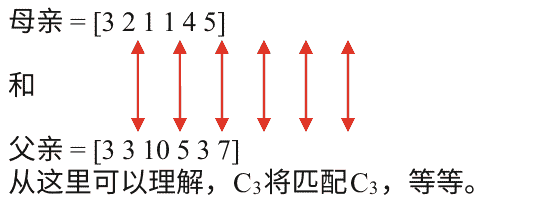

从这里可以理解，C₁将匹配C₁，等等。

## 6.14.8.3 等待池

与前一节描述的基于二进制数的遗传算法一样，由两个染色体融合产生的两个新染色体将部分保留前一染色体的残余部分。对于十进制参数遗传算法方法，已经提出了不同的交叉点检测方法。最简单的方法是将染色体上的一个或多个点作为交叉点。

这些点之间的参数在母亲和父亲之间进行交换。例如，我们将两个不同的染色体表示如下。

```
配偶A = [d_{a1}, d_{a2}, d_{a3}, d_{a4}, d_{a5}, d_{a6}, ..., d_{aN_{var}}]
```

和

```
配偶B = [d_{b1}, d_{b2}, d_{b3}, d_{b4}, d_{b5}, d_{b6}, ..., d_{bN_{var}}]
```

让a代表母亲，b代表父亲，从下标中可以看出。如果在随机选择交叉点之后交换中间位置（这里第2个是第4个位置），则会得到以下情况。

```
子代_1 = [d_{a1}, d_{a2}, d_{b3}, d_{b4}, d_{a5}, d_{a6}, ..., d_{aN_{var}}]
```

和

```
子代_2 = [d_{b1}, d_{b2}, d_{a3}, d_{a4}, d_{b5}, d_{b6}, ..., d_{bN_{var}}]
```

在极端情况下，选择多达N_{var}点，决定将其元素分配给每个情况的染色体也是随机选择的。通过转到染色体列表的基础并随机选择每个变量，决定是否在两个配偶之间交换信息。这被称为均匀交叉，如前面已经解释过。例如，当交换第1个和第6个参数时，会得到以下两种情况。

> 子代₁ = [d_{a1}, d_{a2}, d_{b3}, d_{b4}, d_{a5}, d_{a6}, \dots, d_{aN_{\text{var}}}] 和 子代₁ = [d_{b1}, d_{b2}, d_{a3}, d_{a4}, d_{b5}, d_{b6}, \dots, d_{bN_{\text{var}}}]

在这种交叉中，不能引入新的信息，初始种群中随机选择的连续变量值进入下一个繁殖阶段（种群，迭代）中的不同组合。

相反，已经开发出更加高效的混合方法。在这里，新的子代通过混合父母中的信息获得。单个变量值d_new是根据两个配偶染色体的混合比例获得的。

> $$ d_{\text{new}} = \alpha d_{\text{mother}} + (1-\alpha) d_{\text{father}} \quad (6.52) $$

这里 α是权重变量，它的取值范围在零和一之间，是母体染色体d_mother和父体染色体d_father中的第n个变量。第二个子代的相同变量直接是补充的 first（即 α和 1-α的和等于1）。如果 α =1，d_mother在自己身上消散，但是d_father死亡。相反，如果 α =0，d_father在自己内部传播，d_mother死亡。然而，当 α =0.5时，子代的结果是父母的算术平均值。

确定哪种变量选择适合良好的混合是另一个挑战。有时，线性混合是在交叉点的右侧或左侧进行的，适用于所有变量。每个变量可以使用相同的 α值进行混合，也可以为每个变量选择不同的α值。所有这些混合不允许出现可能超出种群中极值的值。为此，必须应用一种外部扩展（外推）方法。其中最简单的是线性交叉。在这种情况下，从母亲和父亲产生三个不同的子代。

这些再次是它们的权重之和等于1。

> $$ \begin{cases} d_{\text{new1}} = 0.5 d_{\text{mother}} + 0.5 d_{\text{father}} \\ d_{\text{new2}} = 1.5 d_{\text{mother}} - 0.5 d_{\text{father}} \\ d_{\text{new3}} = -0.5 d_{\text{mother}} + 1.5 d_{\text{father}} \end{cases} \quad (6.53) $$

任何超出范围的变量都将与其他两个变量一起被排除。然后选择两个最佳子代的进一步扩散。在这种方法中，0.5变量不是唯一可用的变量。它可以用于有助于不同理解的交叉。为此，在范围[0,1]内随机选择 α，并定义子代参数为。

> $$ d_{\text{new}} = \alpha (d_{\text{mother}} - d_{\text{father}}) + d_{\text{mother}} \quad (6.54) $$

在这种方法的另一种形式中，可以选择一定数量的变量并为每个变量分配不同的α值。在这种方法中，两个父母对导致了新的孩子的出现，这些孩子与他们不同。有时参数可能超出允许的解决方案范围。在这种情况下，忽略孩子，并以α的值重复操作，以使其保持在解决方案范围内。在为混合物选择α值之后，确定了两个主要对之外的距离。这种方法使得遗传算法能够考虑那些偏离解决路径的情况，而不会偏离太多。在实践中，通常也会优先考虑外推和交叉的联合使用。这与交叉相反，从第一个主染色体对中随机选择一个变体开始。

```
\alpha = \text{ceil}(\text{random}() \times N_{var}) \quad (6.55)
```

可以从这里得到以下内容。

配偶1 = d_{a1} d_{a2} ... d_{a\alpha} ... d_{aN_{var}}
配偶2 = d_{b1} d_{b2} ... d_{b\alpha} ... d_{bN_{var}}

考虑这些选定变量的组合会产生新的子代。

d_{new1} = d_{mother, \alpha} - \alpha [d_{mother, \alpha} - d_{father, \alpha}]

和

d_{new2} = d_{father, \alpha} + \alpha [d_{mother, \alpha} - d_{father, \alpha}]

最后阶段应以染色体交叉形式完成，如前所述。

子代1 = [d_{mother,1} d_{mother,2} ... d_{new1} ... d_{father,N_{var}}]
子代2 = [d_{father,1} d_{father,2} ... d_{new2} ... d_{a,N_{var}}]

如果选择染色体的第一个变体，则交换该变体右侧的变体。如果选择染色体的最后一个变体，则交换该变体左侧的变体。使用这种方法，直到α>1，参数不会出现在基本协变量之外。

在这个例子中，第一组配偶是相同的，并产生自己的部分。第二对染色体给出为,

C₂ = [5.2693; 9.1382 ]
C₁ = [9.1032; 7.6151 ]

## 6.14 遗传算法参数选择

随机数选择d₁作为交叉点。第二个随机数是α=0.7147。在这种情况下，新的子代可用如下，

```
Child_1 = [5.2693 - 0.7147 × 5.2693 + 0.7147 × 9.1032; 7.6151]
```

```
Child_2 = [9.1032 + 0.7147 × 5.2693 - 0.7147 × 9.1032, 9.1382]
```

如果这些过程继续进行，另外四个配偶将会产生八个孩子。

## 6.14.8.4 变异（数字变化）

如果不注意，它会迅速接近遗传算法目标值范围的一个点。
如果这个位置在整体最小区域内，就没有问题。与使用的目标值函数一样，在许多情况下存在太多的最小化部分。如果他们不能找到一个解决这个快速逼近的方法，遗传算法优化可能会陷入一个不理想的局部区域。为了避免这种情况，需要通过变异来比较分析遗传算法，探索解空间的其他部分。这些数字变化应该通过随机方法进行。在二进制数遗传算法中，可以通过在随机位置上将数字从“1变为0”或从“0变为1”来实现。在具有十进制变量的遗传算法中，数字变化的比率（概率、百分比）在1%到20%之间是有用的，就像其他情况一样。如果将数字变化的比率乘以变量的总数，就可以得到需要改变的变量数量。然后，选择矩阵的行和列来确定要改变的变量，并使用一个新的随机变量来确定将改变数字的变量。这里使用了4%（0.04）的基因变化率。由于交叉之前有12个染色体，然后有24个染色体，需要将2个变量数字化（0.04×24×2）约为2。C₇中的p₁变量和C₂₂中的p₂变量已经被数字化。因此，虽然C₇中的变量p₁被删除，但它会被0到10之间的新随机变量替换。

```
C_7 = [2.7271; 4.1208]
```

```
C_7 = [3.1754; 4.1208]
```

下面的图表显示了第二代变量目标值的顺序，从最好到最差，新的子代后数字发生变化。这个集合的算术平均值是-8.51（表6.13）。

经过七个种群（世代）的演化，使用遗传算法方法找到的最小目标值为 -18.5。

| x | y | 成本 |
|---|---|---|
| 9.0465 | 8.3128 | -16.2929 |
| 9.0465 | 8.3097 | -16.2555 |
| 9.1382 | 5.2693 | -13.5290 |
| ... | ... | -... |
| ... | ... | -... |
| 4.1208 | 3.1754 | -2.6482 |

## 6.15 一般应用

本节展示了在前几节中解释的原则和规则的应用以及遗传算法方法的应用。这里提供的每个示例都构成了在不同主题上进行优化交易的基础。

### 6.15.1 函数最大化

函数的最大化或最小化是遗传算法中最常用的领域之一。连续函数的导数优化可以通过解析方法轻松完成。在这里，将介绍一种无需导数的最大化函数的示例。为此，将使用以下三次函数。

$$ f(x) = x^3 \quad (6.56) $$

对于简单的遗传算法应用，需要以下步骤。

1.  例如，让我们完全随机确定6个x值，并将这些x值转换为二进制（0和1）。由此可知，遗传算法的初始种群选择了6个成员（染色体）。由于只有一个决策变量，每个x数字对应的二进制软件是否表示一个染色体？在这个简单的例子中，每个染色体等于一个基因。让这些染色体的长度选择为6。换句话说，每个染色体中有6个数字（基因）。表6.14显示了这些x值及其染色体。
2.  让我们计算通过在函数中用每个染色体替换X数值找到的y数值的总和，然后从公式（6.32）计算出每个染色体的活力值（百分比）。所得结果如表6.15所示。

这些百分比中的每一个都显示了表中染色体所代表的数字的概率值。换句话说，这些百分比是衡量染色体的活力（强度）的一种方式。

**表6.14 GA第一代种群**

| 决策变量 | 染色体 |
|---|---|
| 如果x=5，则编码为 | 0 0 0 1 0 1 |
| 如果x=13，则编码为 | 0 0 1 1 0 1 |
| 如果x=1，则编码为 | 0 0 0 0 0 1 |
| 如果x=7，则编码为 | 0 0 0 1 1 1 |
| 如果x=16，则编码为 | 0 1 0 0 0 0 |
| 如果x=21，则编码为 | 0 1 0 1 0 1 |

**表6.15 GA目标和活力值**

| 决策变量 | 目标值 | 活力度 |
|---|---|---|
| x₁= 5 | 125 | 0.00780 |
| x₂=13 | 2197 | 0.13712 |
| x₃= 1 | 1 | 0.00006 |
| x₄=7 | 343 | 0.02141 |
| x₅= 16 | 4096 | 0.25563 |
| x₆=21 | 9261 | 0.57798 |
| 总体 | 16023 | 1.00000 |

**表6.16 染色体选择**

| 决策变量 | 染色体 |
|---|---|
| x₁= 21 | 0 1 0 1 0 1 |
| x₂= 21 | 0 1 0 1 0 1 |
| x₃= 16 | 0 1 0 0 0 0 |
| x₄= 13 | 0 0 1 1 0 1 |
| x₅= 21 | 0 1 0 1 0 1 |
| x₆= 21 | 0 1 0 1 0 1 |

染色体在其在种群中生存的斗争中起着重要作用。例如，第6个染色体是最强的，第3个染色体是最弱的。

3.  考虑一个轮盘赌，其百分比值如第1章第1.4.1.2节所述。通过旋转轮盘赌6次，选择表6.16中给出的染色体。需要注意的是，在这种选择中，弱（活力小）的染色体无法通过随机轮盘赌选择。再次在表6.16中获得了一个由6个成员组成的再生GA种群，其中大部分是强染色体。在这样的轮盘赌游戏中，第6个染色体，即数字21，有望以最高的概率出现。
4.  表6.16中出现的染色体按顺序进行交叉以逐渐发展。例如，要交叉的染色体对在开始时随机确定，并在表6.17中呈现交叉的基因编号。

染色体在表格的第一列中匹配，并且要交叉的数字数量显示在第二列中。例如，两个染色体之间的交叉，如x₄和x₅，可以在下面的详细信息中看到。

表6.17 交叉操作准备工作
| 用于交叉的染色体对 | 交叉的数字 |
| :--- | :---: |
| x₆和x₂染色体 | 3 |
| x₅和x₄染色体 | 2 |
| x₁和x₃染色体 | 5 |

表6.18 交叉遗传算法种群
| 染色体 | 决策变量 |
| :--- | :--- |
| 010001 | x₁=17 |
| 010101 | x₂=21 |
| 010101 | x₃=21 |
| 011101 | x₄=29 |
| 000101 | x₅=5 |
| 010101 | x₆=21 |

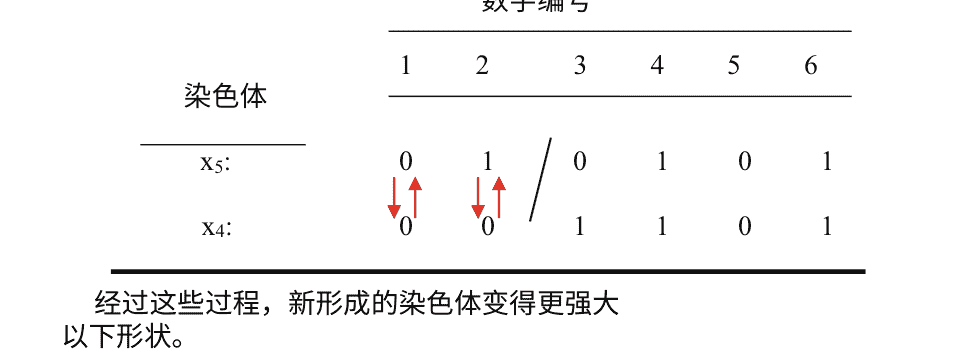

经过这些过程，新形成的染色体变得更强大以下形状。

x₅ : [0 0 0 1 0 1]
x₄ : [0 1 1 1 0 1]

完成所有交叉操作后得到的结果显示在表6.18中。

将这个交叉种群与之前的表6.16进行比较，可以发现表6.18中的种群染色体变得更强大。

5.  最后，让我们应用突变（数字变化）操作。同样，将随机选择要进行数字更改的染色体的数字。为此，在1和6之间的数字中进行的随机整数选择是1。从表6.19的种群中随机选择，可以看到将更改数字的染色体是3。因此，将更改数字的位数是第3个染色体的第1位。完成此过程后，上述染色体群体将呈现新的形式。

从这个染色体集合可以看出，染色体3的值达到了53，函数值在数字更改后达到了53³。然而，最初的最佳染色体是21，因此函数值是21³。因此，遗传算法所需的所有步骤都已完成。如果迄今为止的步骤以类似的操作重复一段时间，可以看到GA达到的最佳染色体是[1 1 1 1 1 1]（63），最佳函数值将是63³。

表6.19 改变的GA种群

| 染色体 | 决策变量 |
|---|---|
| 010001 | x₁=17 |
| 010101 | x₂=21 |
| 110101 | x₃=53 |
| 011101 | x₄=29 |
| 000101 | x₅=5 |
| 010101 | x₆=21 |

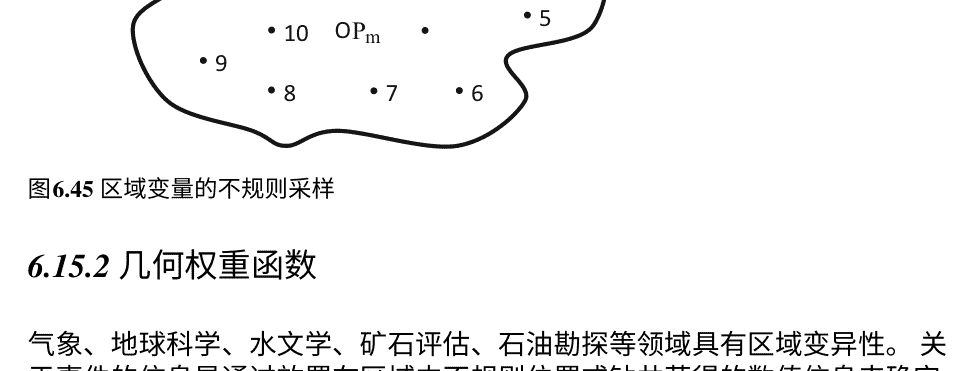

### 6.15.2 几何权重函数

气象、地球科学、水文学、矿石评估、石油勘探等领域具有区域变异性。关于事件的信息是通过放置在区域内不规则位置或钻井获得的数值信息来确定的。出于经济原因，需要进行初步建模，以提高区域变量或利用可用信息进行钻井的价值。在这里，需要对称为预测点的区域变量进行最佳估计，而该点没有测量数据。如图6.45所示，获得信息的站点位置是随机分布的。

这里的问题是使用包括一组站点上测量变量值的加权平均值的计算来估计预测点P_m的值。具有n个测量点的权重值为w_{i,P}, (i=1,2,3,...,n)。因此，预测点值P_m的计算公式为:

$$ P_m = \frac{\sum_{i=1}^{n} w_{i,P} P_i}{\sum_{i=1}^{n} w_{i,P}} \quad (6.57) $$

其中 P_i是每个站点 i 的测量值。各种研究人员已经提出了解决这个区域预测问题的解决方案，通过考虑确定性地作为站点间距离函数的权重函数。这些函数仅依赖于站点的几何布局。然而，这些函数没有考虑区域值的测量结果。

它们只是通过逻辑和几何得到的形状。因此，所找到的权重系数不能反映实际的区域依赖关系。Thiebaux和Pedder（1987）建议根据以下表达式给出加权系数，而不考虑变量的实际变化。

$$ w_{i,T}=\begin{cases} \left(\frac{R^2-r_{i,T}^2}{R^2+r_{i,T}^2}\right)^{\alpha} & \text{对于 } r_{i,T} \leq R \\ 0 & \text{对于 } r_{i,T} \geq R \end{cases} \quad (6.58) $$

这里 R 表示影响半径，α表示平滑系数。这个最后的方程是经典Cressman（1955）方法的一般版本，其中平滑系数等于1。影响半径R和软化系数α的参数是根据个人经验和与研究问题相关的能力主观确定的。文献中给出的另一个α数值是4（见图6.46）。在实际研究中，确定α存在困难。Sasaki（1960）和Barnes（1964）用另一种几何权重函数的形式替换了方程（6.58）的建议。

$$ w_{i,P}=\exp\left[-4\left(\frac{r_{i,P}}{R}\right)^{\alpha}\right] \quad (6.59) $$

其中 r_{i,P}是预测点与第i个测量点之间的距离。

权重函数应该反映区域变量的特征，并且还应该考虑站点的几何配置。Şen（2004）提出了累积半变异图技术作为区域依赖函数的另一种选择，如图6.46所示。

通过使用实验得到的权重函数（Şen 2004），GA被用来找到Eqs.（6.58）和（6.59）中的R和α参数。这些方程式通过遗传算法来表示区域变异性。对于这个应用，使用了16个染色体和16个基因。目标函数是考虑实验权重值与Eqs.（6.58）和（6.59）给出的权重函数之间的差异（误差）的平方和。应用程序的流程是通过执行第6.14.5节中给出的所有步骤来完成的。计算结束时得到的结果如图6.47所示。

该应用程序可以自动给出R、α和估计误差E。观察到Barnes方程比Cressman（1955）方法更好地表示土耳其马尔马拉地区的月降水数据。

所有结果都在表6.20中呈现。

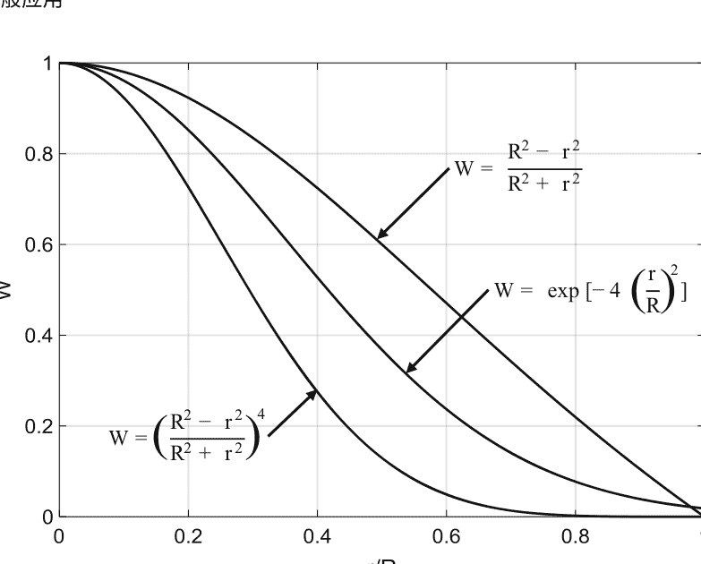

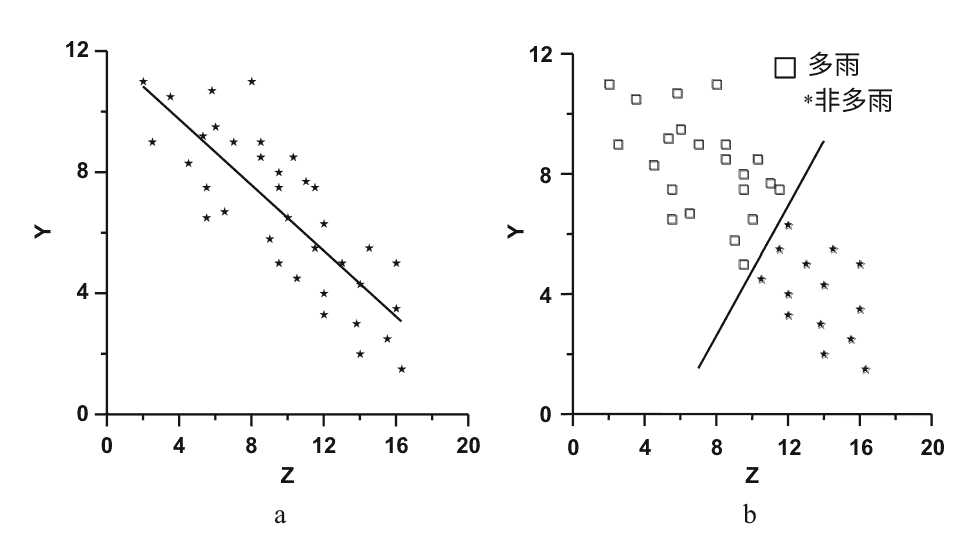

### 6.15.3 降水条件分类

将自然事件分为存在或不存在于研究自然事件的科学分支中非常重要。为此，通常使用逻辑回归（第7章）和分离方法。

表6.20 计算的软化系数（α）和影响半径（R）。

| 月份 | 克雷斯曼 | | | 巴恩斯 | | |
| :--- | :--- | :--- | :--- | :--- | :--- | :--- |
| | α | R | 误差 (10^-2) | α | R | E (10^-2) |
| 一月 | 2.47 | 0.98 | 6.65 | 2.28 | 0.79 | 4.35 |
| 二月 | 16.23 | 2.32 | 8.68 | 2.28 | 0.75 | 6.97 |
| 三月 | 30.81 | 2.75 | 8.56 | 1.89 | 0.73 | 8.00 |
| 四月 | 28.74 | 2.68 | 7.74 | 1.85 | 0.75 | 6.91 |
| 五月 | 25.35 | 3.14 | 6.17 | 1.82 | 0.95 | 4.72 |
| 六月 | 22.70 | 3.23 | 4.05 | 2.00 | 0.96 | 4.04 |
| 七月 | 28.38 | 2.95 | 7.19 | 2.12 | 0.75 | 6.63 |
| 八月 | 1.50 | 0.80 | 7.70 | 2.42 | 0.79 | 3.84 |
| 九月 | 2.07 | 0.93 | 7.97 | 2.31 | 0.81 | 4.90 |
| 十月 | 1.25 | 0.75 | 24.30 | 3.15 | 0.69 | 5.15 |
| 十一月 | 1.52 | 0.76 | 5.28 | 2.26 | 0.78 | 3.71 |
| 十二月 | 1.69 | 0.77 | 21.70 | 3.03 | 0.63 | 5.30 |
| 平均 | 13.50 | 1.83 | 9.66 | 2.28 | 0.78 | 5.37 |

注：误差表达式表示误差的平方和。

统计学。然而，这些方法需要数据提供一系列假设。例如，这些假设包括方差的恒定性（同方差性）、平稳性、均匀性、符合正态（高斯）分布等。另一方面，遗传算法的应用中没有这样的假设。这些方法根据一定的规则处理数据的数值，最终得到一个数学表达式，从而进行相应的分类。例如，露点温度和垂直气流速度在降水或无降水的分类中起到作用。统计方法通过将散点图分为两部分，将这两个变量在散点图上的点附上多雨和非多雨的词语，而不详细说明这些变量之间的物理关系。

在二维笛卡尔坐标系中，一般给出了要进行分类的表示，如图6.48所示。

在这里，事件x的分类取决于另外两个变量y和z；因此，根据y和z的值，x的值属于1（雨天）或0（非雨天）类。遗传算法进行分类所需的步骤如下。

- (a) 图6.48a展示了一些y和z数据的散点图。这被称为训练散点图。如果只想找到这两个变量之间的关系，可以使用经典回归方法。然而，这不能进行准确的分类。
- (b) 散点图中的每个点都根据x的语义值（下雨或不下雨）进行标注。因此，在方法应用之前，通过观察将散点图分为两类。在图6.48b中，方块表示下雨的点。

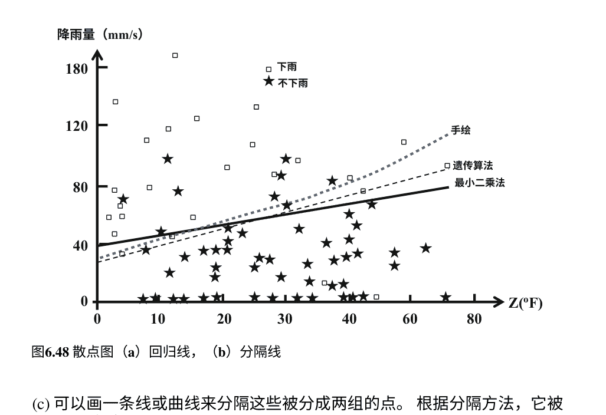

图6.48 散点图 (a) 回归线, (b) 分隔线

- (c) 可以画一条线或曲线来分隔这些被分成两组的点。根据分隔方法，它被用作直线分隔器。
使用传统方法很难找到分隔符，但使用遗传算法可以更容易地找到，无论是弯曲还是正确的。这里的目标是在分类数量上有最小的错误。

### 6.15.4 两个独立数据集

这里展示了遗传算法在两个独立数据集上的应用。其中一个是来自文献的24小时降水数据（Panofsky和Brier 1968）。这里的分类是基于垂直速度Y（mm/s）和露点温度z（°F）。在这个例子中，91天中有28天下雨（见表6.21）。它们的散点图如图6.49所示。
使用遗传算法应用于找到分隔下雨和非降水情况的线的步骤如下。

- (a) 由于需要找到一条线性表达式，因此有两个决策变量，常数a和斜率b。首先，在计算机上生成两个随机数列，这些数列被认为代表了线的截距和斜率。
假设序列a1，a2，…，an代表所寻找的分割线的交点，序列b1，b2，…，bn代表斜率。在这种情况下，GA的种群大小为n²。
- (b) 这两个序列ai和bi的对应元素分别用二进制数系统编码为决策变量，每个单位长度为m（位数）。如果有两个变量，即基因，那么染色体的长度将为2m。在整个GA过程中，应该记住，染色体的一半代表分割线截距的部分，另一半代表斜率。

表6.21 雨天和非雨天条件数据

| 露点温度 | 垂直速度 | 降水 | 露点温度 | 垂直速度 | 降水 |
| :--- | :--- | :--- | :--- | :--- | :--- |
| 7.08 | 155.88 | 1 | 20.80 | 40.55 | 2 |
| 3.00 | 136.64 | 1 | 20.86 | 49.95 | 2 |
| 24.99 | 134.46 | 1 | 21.86 | 52.28 | 2 |
| 15.93 | 125.17 | 1 | 22.93 | 46.64 | 2 |
| 11.10 | 117.84 | 1 | 24.86 | 24.13 | 2 |
| 8.05 | 110.53 | 1 | 25.94 | 28.59 | 2 |
| 6.12 | 97.47 | 1 | 26.95 | 28.60 | 2 |
| 2.96 | 76.42 | 1 | 29.01 | 17.51 | 2 |
| 8.12 | 79.21 | 1 | 31.03 | 58.65 | 2 |
| 24.92 | 107.49 | 1 | 32.00 | 49.67 | 2 |
| 20.67 | 92.18 | 1 | 33.12 | 26.45 | 2 |
| 15.06 | 58.57 | 1 | 33.18 | 14.42 | 2 |
| 3.96 | 65.72 | 1 | 37.06 | 26.79 | 2 |
| 4.02 | 58.35 | 1 | 38.13 | 28.73 | 2 |
| 1.99 | 57.41 | 1 | 36.13 | 40.83 | 2 |
| 3.02 | 46.31 | 1 | 39.14 | 30.76 | 2 |
| 31.93 | 97.06 | 1 | 41.23 | 32.80 | 2 |
| 28.09 | 87.82 | 1 | 40.07 | 44.11 | 2 |
| 40.18 | 84.02 | 1 | 41.22 | 52.71 | 2 |
| 42.20 | 76.97 | 1 | 40.13 | 60.07 | 2 |
| 48.29 | 108.96 | 1 | 43.29 | 67.58 | 2 |
| 55.34 | 93.08 | 1 | 36.56 | 11.23 | 2 |
| 12.10 | 45.30 | 1 | 39.12 | 14.69 | 2 |
| 16.99 | 48.79 | 1 | 47.19 | 24.58 | 2 |
| 20.98 | 53.18 | 1 | 47.13 | 34.49 | 2 |
| 4.14 | 32.68 | 1 | 52.22 | 37.07 | 2 |
| 36.00 | 11.52 | 1 | 7.13 | 0.79 | 2 |
| 44.33 | 1.52 | 1 | 9.25 | 0.61 | 2 |
| 11.17 | 99.04 | 2 | 12.12 | 1.25 | 2 |
| 4.12 | 71.68 | 2 | 13.54 | 1.06 | 2 |
| 13.16 | 76.74 | 2 | 14.00 | 0.46 | 2 |
| 10.07 | 47.30 | 2 | 16.85 | 1.00 | 2 |
| 8.08 | 36.06 | 2 | 17.37 | 1.01 | 2 |
| 12.14 | 46.31 | 2 | 18.99 | 1.13 | 2 |
| 30.10 | 98.55 | 2 | 24.93 | 1.50 | 2 |
| 29.10 | 85.61 | 2 | 27.91 | 1.43 | 2 |
| 28.04 | 71.05 | 2 | 31.75 | 1.47 | 2 |
| 30.06 | 65.11 | 2 | 32.37 | 1.78 | 2 |
| 37.12 | 83.68 | 2 | 32.98 | 1.59 | 2 |
| 12.12 | 20.35 | 2 | 33.56 | 1.70 | 2 |
| 14.04 | 32.69 | 2 | 34.24 | 1.80 | 2 |
| 16.88 | 35.66 | 2 | 39.05 | 1.76 | 2 |
| 18.89 | 36.39 | 2 | 40.22 | 2.18 | 2 |
| 18.85 | 23.76 | 2 | 42.05 | 1.89 | 2 |
| 18.92 | 16.99 | 2 | 55.28 | 2.25 | 2 |
| 20.93 | 35.50 | 2 | | | |

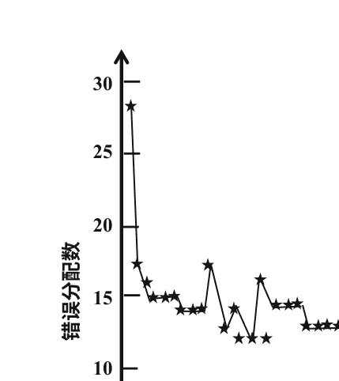

- (c) 种群中每个染色体的重要性是通过误差函数确定的。如下所述，每个染色体都使用百分比误差的定义。完成这个和前两个步骤后，GA初始化过程也完成了。
- (d) 因此，种群中的染色体已经准备好进行GA操作。之后，染色体经过选择、交叉和变异（数字变化）过程。这里使用轮盘赌法进行选择。误差越小，该染色体进入下一个群体的概率就越大。这里的目标是排除不良染色体或将它们与其他染色体结合以产生更健康的染色体。为此，使用交叉操作（第3.10节）。
- (e) 在这一系列操作中，应接受±5%的误差范围。如果错误落在这些误差限度之间，遗传算法操作将停止，并找到结果。
- (f) 最终，a和b序列的匹配是以遗传算法误差最小的方式出现的。根据上述解释，图6.49中的数据对于GA应用来说，由一个长度为n²=100 (n=10) 和m=16的染色体表示。
- (g) 根据步骤(b)，每个染色体都有32个数字，种群大小为100。在这个例子中，交叉和数字变换操作的概率值分别为0.80和0.01。完成上述步骤后，GA和分离线由Öztopal (1998)确定。

$$ y = 27.83 + 1.12z $$ (6.60)

然而，作为统计线性分析的结果，Panofsky和Brier（1968年）给出：

$$ y = 37.53 + 0.75z $$ (6.61)

在图6.49中，实线是Panofsky和Brier（1968年）找到的分离线，虚线是GA方法。比较这两条线揭示了以下差异。

- (a) GA判别线具有更陡的斜率。这意味着当露点温度z接近零时，会发生大量降水。
- (b) 回归分离线导致了15个错误分类。因此，错误百分比为15/91 = 0.16。然而，GA判别线只导致12个错误分类。因此，错误百分比为12/91 = 0.13。因此，GA比统计判别线给出更好的结果。
- (c) GA方法通过减少错误分类来执行连续更新操作。GA的连续误差减少如图6.50所示。在回归判别线方法中，不可能遵循这种连续误差减少。

现在将相同的数据分为两个独立的部分。其中，前45个数据被随机选择作为GA的训练数据。图6.51显示了分离线和数据。这里有5个GA的错误分类。
统计判别线只能进行7次错误分类。
图6.52显示了训练后剩余46个数据的判别线（GA和回归）。

与GA方法相比，这里回归方法的降水和非降水预测误差更多。

例如，为了展示GA在降水预测中的有效性，给出了对凡湖站降水的GA建模。为此，根据下面方程中给出的数学表达式，通常使用前3个月的降水量线性模型来计算一个月的降水量。

$$ Y_t = aY_{t-1} + bY_{t-2} + cY_{t-3} + \varepsilon $$ (5.6)

在这里，a、b和c是模型参数，而ε是一个没有内部或外部依赖关系的随机项。在使用前346个月（28年）的数据进行遗传算法优化后，模型参数被确定为a = 0.49，b = 0.15和c = 0.14。然后，使用公式（5.6）中的表达式，估计其他月份的降水量，并与测量值一起显示在图6.53中。从这个图中，我们可以看到估计值和测量值是如何紧密跟随彼此的。

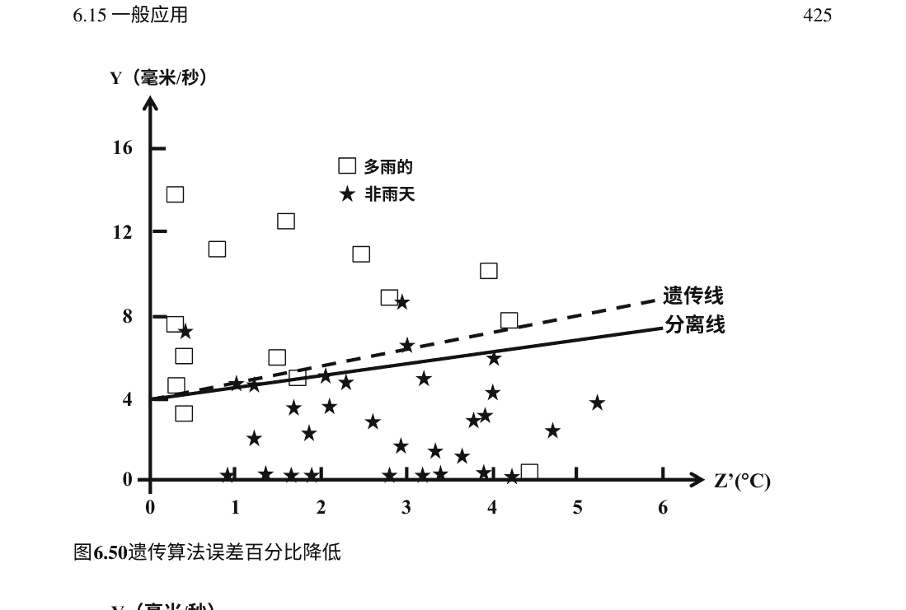

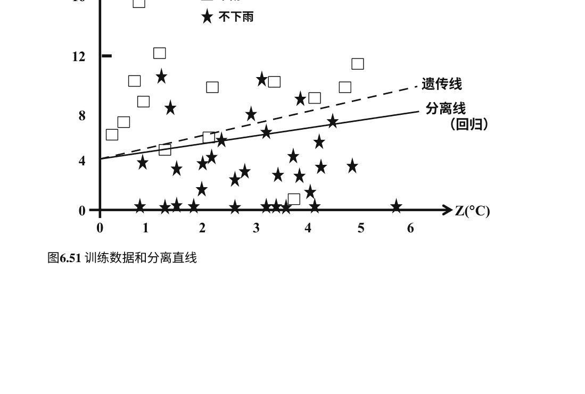

图6.52 遗传算法误差百分比下降模式

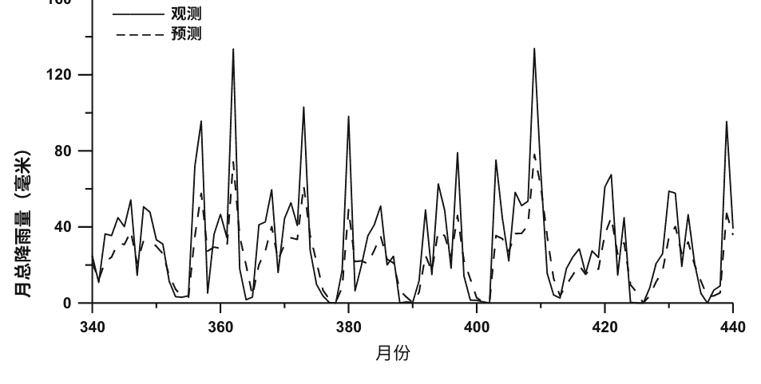

图6.53 预测和观测的月降水数据

## 6.16 结论

研究中最重要的问题之一是优化原则、努力和研究是否能产生可靠的结果。这是因为可用的机会（材料、时间和空间）是有限的，并且通过服务的优化形式提供了显著的经济效益。除了系统（确定性）方法（第5章）提供了各种问题的解决方案，没有任何不确定性的精确方程之外，还有一些系统的、但是概率和统计方法（第4章）涉及一定程度的不确定性。
遗传算法（GA）模型通过消除传统方法的不足，提供了解决方案的机会。尽管该方法本身存在随机因素，但GA可以在最短时间内达到绝对优化解。GA方法易于理解，因为它只需要进行算术计算即可得出结果，而不需要详细而繁重的数学知识。还提供了关于GA建模应用的所有基本原则，包括其组成部分、它们的组合以及实际示例。

在这一章中，解释了遗传算法哲学与其他经典方法的原理、逻辑和相似之处，并通过给出必要的线索来考虑读者对主题和自我发展原则的喜爱。

## 参考文献

- Adeli H, Hung SL (1995) 机器学习-神经网络、遗传算法和模糊系统, John Wiley & Sons, Inc.
- Barnes SL (1964) 一种在数值天气图分析中最大化细节的技术。 J Appl Meteor 3:396–409
- Buckles BP, Petry FE (1992) 遗传算法, 华盛顿: IEEE计算机学会出版社, 技术系列
- Caruana RA, Schaffer JD (1988) 表示和隐藏偏差: 灰度编码与二进制编码在遗传算法中的比较, 论文发表于第五届国际机器学习大会, 密歇根大学, 安娜堡
- Cressman GP (1955) 一种操作目标分析系统。 Mon Wea Rev 87, 10:367–374
- De Jong KA (1975) 对一类遗传自适应系统行为的分析。 博士论文, 密歇根大学, 安娜堡
- Goldberg DE (1989) 遗传算法在搜索优化和机器学习中的应用。 Addison-Wesley, Reading
- Haupt RL, Haupt SE (1998) 实用遗传算法。 Willy, 177页
- Hinterding R, Michalewicz Z, Peachey TC (1989) 用于数值函数的自适应遗传算法。 进化算法的修改和扩展：适应性、分群和进化算法中的隔离。 国际并行问题求解自然PPSN 1996：自然问题求解的并行问题- PPSN IV：420-429
- Holland J (1975) 遗传算法, 科学美国人, 七月, 第44-50页
- Ifrah G (1994) 伊斯兰世界中的印度数字。 数字的普世历史（伊斯兰世界中的印度数字）。 （土耳其语）TÜB İTAK, 159页
- Kirkpatrick JB (1983) 建立自然选择优先级的迭代方法: 塔斯马尼亚的一个例子。 生物保护25 (2) : 127-134
- Lorenz EN (1963) 确定性非周期流动。 大气科学20: 130-141
- Michalewicz Z (1992) 遗传算法 + 数据结构 = 进化程序。 Springer, 第三版, 383页
- Öztopal A (1998) 遗传算法在气象应用中的应用。 M. Sc. 论文, 伊斯坦布尔工业大学, （土耳其语）
- Panofsky HA, Brier GW (1968) 统计学在气象学中的一些应用, 宾夕法尼亚州立大学出版社, 224页
- Sasaki Y (1960) 用于原始方程的确定初始条件的客观分析, 技术报告, （参考文献60-16T）。 德克萨斯A&M大学, 学院站
- Syswerda G (1991) 使用遗传算法进行调度优化。 在：Davis L (编) 遗传算法手册。 Van Nostrand Reinhold，纽约，第332–349页
- Thiebaux HJ, Pedder MA (1987) 空间客观分析。 学术，299页
- Şen Z (2002) 概率计算原理。 Bilge， Kültür ve Sanat yayincilik， Istanbul， 147页
- Şen Z (2004) 遗传算法和优化方法 (Genetic Algorithms and Optimization Methods). (in Turkish) Su Vakfi, İstanbul, 142 pp

## 第7章 人工神经网络

## 7.1 概述

自从创造以来，人类一直与自然共存，并从中学到了许多解决方案通过灵感。人们尽可能地与自然灾害作斗争，同时利用自然资源来满足需求。此外，人们试图通过物理或想像的纯粹思想、心智活动和感受来理解自然界发生的事件。他们尽可能地研究事件的因果关系，以及当时的知识和技术。在这些研究中，他们开发了许多方法。

由于1950年后计算机数值计算的快速发展，研究的方法在过去几十年中取得了前所未有的进展。一些开发出的方法受到了生物的启发。人工神经网络(ANN)和遗传算法(GA)可以作为试图用数学表达人类生物机能的方法的例子。

事实上，在我们生活的时代，技术发展非常迅速。特别是计算机领域的发展已经变得令人眼花缭乱。这些发展加速了计算速度，检查最小（纳米）和最大（宏观）领域，加快了信息产生等。这些在科学和技术方面帮助了人类。这是因为计算机能够非常快速地处理输入数据的基础。

另一方面，人脑在嘈杂的环境中以及信息不完整的情况下，在视觉、语言、错误纠正和形状识别方面非常成功。在这些过程中，人脑能够产生比计算机更高效的结果。尽管被称为电化学脑处理元素的神经元对毫秒级（10^{-3}）的过程作出反应，而今天的电子技术产品对纳秒级（10^{-9}）的过程作出反应。尽管电子技术产品的工作速度快了10^6倍，但大脑在处理不完整信息和识别形状长期以来一直是一个引人好奇的问题。这种好奇心导致人们研究他们大脑的工作系统。

通过对大脑及其组织的研究，确定了差异是由信息处理系统引起的。获得的惊人结果表明，人脑中的神经以并行方式处理信息。

基于这个事实，科学家加快了研究，使信息以并行方式处理，尽可能接近人类行为。研究集中在具备这些能力的方法、设备和机器的设计上。最后，为了建立能够模拟人类行为的智能系统，开发了人工神经网络（ANN）和遗传算法（GA）等方法。特别是在这些方法的帮助下，引起了极大兴趣的专家系统已经在许多领域中得到应用。

通过对神经系统的建模，人工神经网络显示出与生物神经系统相似的并行工作和学习能力特征。除了其他特点外，人工神经网络之所以比其他方法更具吸引力，是因为它能够由于其并行操作而快速处理信息，并且其硬件可以轻松实现。这就是为什么人工神经网络仍然被广泛用于分类、模式识别、控制、预测（理解事件的内部工作原理）计算、图像处理、语音识别等领域。它在许多领域中被广泛使用。虽然人工神经网络刚刚开始在许多领域中使用，但它们的使用领域正在逐日增加。

## 7.2 生物结构

人类的神经系统由称为神经的细胞组成。神经是进行生物体的重要活动的最小单位。估计一个人体内大约有10^{10}-10^{11}个神经，它们不仅分布在人脑中，还遍布于中枢神经系统的全身。构成大脑通信系统的神经的任务是接收信号，并在神经网络内部处理和传输电化学信号。

人工神经网络无非是应用技术和科学研究方法，忽略了今天关于生物神经系统的一些细节。人工神经网络由相互并行通信的层组成，每一层都包含足够的神经元。这些层和它们的细胞之间的通信可以被认为是相当复杂的，通过根据研究对象的性质确定的权重系数来实现。正如Lippman（1987）所述，反向传播误差的原则通常被用作人工神经网络的建模准则。图7.1显示了生物神经元的结构。从中可以理解，一个细胞由细胞体、突触（连接）、树突（入口）和轴突（出口）组成。尽管细胞内有一个细胞核，但细胞体的大小在5到130微米之间变化。也有更大的细胞。神经系统的基本单元是神经元，它们将信息传递到人体的不同部位。

突触是连接神经元输出和相邻神经元输入的通信通道。树突负责将从突触接收到的信息传递给细胞体。当细胞体中收集到的信息超过兴奋阈值时，细胞被刺激，并通过轴突发送信号到其他细胞，轴突是传输线路。轴突和树突可以从功能上进行比较。轴突比树突更长。此外，它们具有较少的分支，因此具有规则的结构。另一方面，树突更像自然树木，因为它们具有更不规则的表面和许多分支（Freeman 1995）。

### 7.3 人工神经网络定义和特性

受到1940年代生物神经元结构的启发，人工神经元模型表明可以通过数值建模逻辑合取、析取和否定（第3章）。因此，研究生物神经系统并开发像它们一样工作的人工神经网络模型已成为不同领域研究人员的共同工作。

人工神经网络（ANN）可以被解释为信息处理手段，也可以被描述为一个根据给定输入产生输出的详细黑盒模型。虽然人工神经网络被定义为由提供信息流的神经元组成的类似于神经系统的结构，但它也被定义为由强烈的并行连接简单元素组成的网络（通常是可适应的，可重复的，可迭代的）（Kohonen 1988; Kung 1993）。人工神经网络由于其特性与传统的信息处理方法不同。在某些特性方面，它比许多方法给出更可靠的结果。

其中一些特性可以被定义为并行性、容错性、可学习性和易实现性。由于人工神经网络中的信息处理是并行进行的，传输的信息是相互独立的。此外，由于同一层中的连接之间没有时间依赖性，它们可以同时工作，从而提高了信息流的速度（Bkum 1992）。

由于并行工作原理，任何单元中发生的错误不会对整个系统造成显著的错误。只有与细胞的权重成比例的影响。因此，整个系统受局部故障的影响最小。

在人工神经网络中，学习以连接权重的更新形式进行，学习信息被存储。通过这种方式，可以长时间存储获得的信息。 此外，学习能力使得能够通过人工神经网络解决那些没有完全定义的问题。在解决许多问题时，首选并行运行的人工神经网络模型，因为它包含简单的操作而不是复杂的函数，并且具有简单的架构。

人工神经网络由并行运行的简单神经元组成。 这些元素受到生物神经系统的启发。与自然一样，元素之间的通信是通过网络实现的。 通过用权重表示元素之间的连接活动，在这样的网络中，它们根据输入和输出数据进行训练，并且单独计算输出的贡献率。

在确定数据类型和ANN网络的目标之后，通过顺序方法训练来确定该网络中的未知连接值，以便从输入中获得预期的输出。 ANN的一般结构如图7.2所示。在这里，将第一次计算得到的输出与预期输出进行比较后，当它们在可接受的误差范围内相互逼近时，ANN的训练终止。 否则，训练将继续进行。 因此，可以通过学习和训练来驱动网络流程。

通过反馈训练，根据输出数据（预期值）和ANN输出之间的误差量来改变网格连接权重和常数贡献。 为了改进先前的训练步骤，需要对每个训练步骤进行连续更新和迭代执行，这将在第7.5.1节中详细解释。这种顺序改进有时被称为“即时”或“刷新”训练。 如今，比经典计算机和人类更复杂的模型可以通过ANN（第9章）来解决。

除了使用教师培训方法外，一些ANN网络的训练还使用无监督训练技术或直接设计方法。 例如，无监督教育方法用于对数据进行分组。 一些线性网络，特别是Hopfield（1982）开发的ANN设计，是无需教师进行训练的，即无监督训练。 由此可见，在ANN模型的开发和使用中存在不同的训练和直接使用机会。

ANN网络可以分为两个部分进行研究，一个是其架构（结构），另一个是使该架构正常工作的数学函数。一般来说，架构由输入层、隐藏层（中间层）和输出层的神经元以及它们之间的连接以及具有恒定贡献的细胞组成。在隐藏层中，存在一种称为激活函数（处理器）的内部工作，即触发处理器。人们可以将ANN操作视为两个数学函数，即内部操作和外部操作。ANN的内部工作由隐藏层中的激活函数提供。其外部操作是在连续层细胞之间随机分配连接值，然后通过反馈输出预测误差等来提供，通过最小化和交易进行更新。这些数学操作承担了学习、训练、记忆和不断检测新信息并更新ANN网络连接的任务。ANN通过将所有输入分解为简单组件，然后组合它们，而不是像时间序列和统计数据处理方法那样按顺序进行，以并行方式获得所需的输出。我们可以将ANN架构比作一个可以将入射光分解为其组成部分的棱镜。在ANN网络中，它通过其架构和数学将数据分割成不同简单性的部分，然后根据所需的输出重新组合它们。在某种程度上，ANN就像是计划、建设、运营和从河流的建设点到对岸的另一点的桥梁的利益。起始岸上的信息代表输入数据，对岸上的信息代表输出，而连接这两者的桥梁代表ANN的架构。桥梁中的柱子、梁、电缆、板等是如何构造的？有单元存在，如果每个单元都与特定的数学和物理规则相关联，ANN试图在层和细胞之间提供这样的连接。

## 7.4 历史

人工神经网络的第一项工作被认为始于1943年。McCulloh和Pitts（1943年）首先通过描述人工神经元来开发了细胞模型。在这项研究中，神经元被建模为具有固定阈值的逻辑元素。这个模型的结构中具有固定的连接权重，也被称为算术逻辑计算元素。

1949年，当学习研究变得更加强烈时，科学家们增加了对人类学习过程建模的努力。Hebb（1949年）提出了一条可以被认为是人工神经网络学习起点的规则。这个学习规则在当时给出了神经网络如何执行学习任务的想法，同时也奠定了许多至今仍然有效的学习规则的基础。Rosenblatt（1958年）通过感知器（单一线性传感器）模型和学习规则在人工神经网络领域取得了第二个突破。这个模型也成为了今天机器学习算法的基础（第8章）。感知器模型是一个可以用于复杂迭代行为的学习机器。最大的感知器模型的缺点是它只能解决可以通过线性多维平面分离的问题。 它无法解决非线性（曲线）问题。

Windrow和Hoff（1960年）在20世纪60年代初开发了自适应线性元素（ADALINE）模型作为一种新方法，当时研究加速进行。 它也可以被称为单递归线性神经网络。 除此之外，Widrow-Hoff学习规则被提出作为一种新的强大学习规则。 这个规则最重要的特点是它旨在通过整个训练过程中最小化总误差。

对人工神经网络的兴趣增加只是在20世纪60年代进行了一些新的研究。 首先的方法过于薄弱，无法解决复杂的计算问题，因此阻碍了对这一主题的研究进展。 1969年，数学家明斯基和帕佩特（1969年）的反感性出版物大大降低了对人工神经网络特别是感知器模型的兴趣。 因为在他们的书中称为“感知器”的书中，他们在数学上证明了它的结构无法执行AND/OR（XOR）和许多其他逻辑函数（第3章和第6章）。

通过证明感知器模型在许多方面都不足以停止了对人工神经网络的研究。 事实上，这些发展甚至让许多研究人员感到失望。 这种停滞从20世纪70年代早期持续到80年代。 在这段时间内，尽管一些科学家继续进行个人努力的研究，但没有取得显著的进展。

随着20世纪80年代初的研究，人工神经网络再次广泛应用。 霍普菲尔德（1982年）开发了非线性（曲线）网络，这是最早的迹象。 他特别关注关联人工神经网络的架构。 然而，科霍宁（1982年）和安德森（1983年）的研究使得无监督学习网络的发展再次获得了动力。 因此，这些年是人工神经网络再次受到关注并进行深入研究的年代。

Rumelhart等人（1986年）开发了一种训练算法，称为“反向传播”用于多层感知器类型的网络。 虽然这个算法很强大，但它是基于非常复杂的数学原理的。 此外，这个算法使得有效学习的能力完全引起了注意。 这个算法的引入，仍然是最常用的教学系统之一，为ANN领域开辟了新的道路。 如今，世界上关于ANN的研究与深度学习（第9章）一起以快速的速度进行。 经常会提出关于不同学习算法和网络架构的新提案。

## 7.5 ANN原理

在实践中，使用具有不同架构结构的ANN来实现利用可用数据进行学习、建立关系、分类、泛化和优化的一个或多个过程。 在架构结构中，从输入层到输出层有一条并行流的信息流。 这样的流是由并行放置的单元提供的。

当输入数据被输入到人工神经网络中时，在第一次训练之后，可以通过最小化输出数据与预期值之间的均方误差（MSE）来更新权重的强化或削弱方法来进行权重的更新（第6章）。如果MSE不小于预期水平，则通过反馈方法更新人工神经网络中的权重。

反馈和网络连接值将持续刷新，直到MSE达到满意的水平。人工神经网络计算中有两个步骤：一个是将前向输入转化为输出，另一个是通过反向生成权重以减少误差。因此，希望模型在误差空间中接近绝对最小值，但这很难保证。人工神经网络也可能达到局部最小值点，导致产生最佳情况的错觉。避免这种情况的唯一方法是使用不同的初始权重分配多次运行相同的人工神经网络。如果每次都达到相同的最小误差值，则可以得出结论，这对应于所寻求的绝对最小误差。如果每次都获得单独的局部最小误差，则应将它们之间的最小局部误差位置作为最佳解决方案。

为了使人工神经网络模型能够可靠地进行未来预测，必须从不同的角度进行测试。例如，在训练过程中可能达到一个非常小的误差值，但这可能只是一个随机情况。因此，在单次训练之前，将数据输入到一个随机的最小误差区域中，另一个在测试过程中，第三个在测试之前。因此，它应该被分成被称为和谐的部分。Smith (1982) 建议将这种分离分别为40%，30%和30%。

### 7.5.1 人工神经网络术语和用法

为了对一个主题有清晰的认识，必须清楚地理解一些基本概念。在一个集群中使用具有相同含义的词是有用的。在许多作品中，相同的概念、方法或解释用不同的词语和专门的术语来表达。如果不知道某些术语在相同的意义上使用，读者可能会感觉自己正在学习一种与他所了解的方法不同的东西。

首先，人工神经网络具有架构。在这个架构中有两个重要的元素，即方框和它们之间的连接。然而，这两个元素的存在并不能构成该架构的人工神经网络模型。例如，在图7.3中，给出了不同的架构，非常简单。

图7.3a展示了三个变量相乘的操作——x、y和z。可以通过将三个不同的变量相加、相乘并找到结果来解释这个操作。因此，三个输入方框与单个操作（输出）方框之间的连接指向将乘法操作带到一个公共位置（方框），而不改变输入。如果连接将它们的输入移到另一侧而不进行任何更改，那么这些架构都不能成为人工神经网络模型。同样，存在一种架构解释了在图7.3b中旅行的某些条件的必要性。在这里，连接也没有数值，只是用于信息流。因此，人工神经网络模型不是架构。在图7.3c中，这是一个流程图，连接不能被视为人工神经网络模型的架构，因为它们只显示了流动方向。然而，在图7.3d的形式中，输入方框和输出之间的连接具有权重值，并且它们在将输入数据传输到输出中起着积极的作用。只有在这种情况下，才能将架构视为人工神经网络架构。因此，连接中没有权重值的架构不是人工神经网络模型。在图7.3中，方框故意以有时是矩形，有时是圆形的形式显示。尽管一些出版物说它们之间存在细微差异，但一般情况下，本书将使用矩形方框。在了解了方框的含义之后，研究将它们制作成三角形、梯形或任何其他所需形状是没有问题的。

然而，在国际文献中，矩形和圆形被广泛使用。图7.3中的架构中暗示方向不重要。

ANN架构中的每个方框都有不同的名称，例如节点、单元、细胞和人工神经。然而，在生物学中，所有这些术语的等效术语是神经。在本书中，单词“细胞”是通用的。

### 7.5.2 ANN应用领域

虽然第一批ANN研究始于大约50年前（第2章），但在过去20年中观察到了它们的广泛应用和持续发展。然而，许多控制系统和优化方法的原则、数学方法、术语和规则已经建立起来，多年来没有发生变化。ANN方法与模糊逻辑（FL）和遗传算法（GA）方法（第6章）一起，构成了高等教育、研究、工业和技术发展的非常成功的基础。它们在许多不同的领域都有应用。同时，ANN具有易于理解和操作的简单性，可以在短时间内适应各种应用。

为了成功地进行ANN应用，必须非常了解其原理和工作过程。不幸的是，在这种情况下进行的大多数研究都只是机械应用，无法通过。在机械研究中，ANN方法的所有部分，甚至数学部分，都是从其他基本来源正确书写的。在应用结果的解释和评估中使用了错误、不完整和有时不合逻辑的词语。

ANN几乎可以应用于每个学科和科学领域；它们的用途与每种方法论相关联，如下所述。

- 1. 分类：在科学研究中，我们的日常分类习惯仍然存在，并且可以根据二值逻辑（第3章）将所研究的事件分成不重叠的类别，从而进行评论。例如，根据这样的分类，每人每年的用水量超过10,000立方米的国家被认为是富裕的，10,000到5000立方米之间的国家被认为是较富裕的，5000到1000立方米之间的国家被认为是贫穷的，少于1000立方米的国家被认为是非常贫穷的。在这样的分类的基础上，如果给出一个国家的人均年用水量，很容易确定它属于哪个类别。ANN也可以实现这样的分类，这种分类属于监督学习过程。

- 2. 聚类：尽管在分类中边界是事先确定和给定的，但在聚类中不需要这样的信息，因为它意味着搜索在同一组中彼此相似的模式（输入数据）。ANN可以通过给定一组模式（数据、向量）来训练，以便将其分成不同的子集。然后可以决定将要给出的不属于训练数据的模式属于哪个聚类。

ANN的输出层中的每个单元都可以发展成表示不同聚类的形式。这样的ANN实现了自组织聚类。从进一步的解释中可以看出，聚类的相似性通常取决于两个数据集之间的欧氏距离，或者表示这两个数据的向量之间的角度，因此，统计学中的相关性概念是适用的（第4章）。

- 3. 向量数字化：在这里，将许多数据分离成少量具有相同特征的数据的过程变得重要起来。在经典研究中，与此相关的是接受或实际的程序。例如，在使用有限元建模和求解微分方程时，假设在其有效空间中的每个有限元的特性在该空间中的所有点上都是相同的。因此，由于数百万个点的特性由一个数字表示，数据量大大减少。通过数字化过程，例如，可以将一个区域划分为不重叠的子域。从欧洲国家地图上看，可以看到每个国家都有自己的边界。这些是通过向量化数字化将其分离为子域的过程。ANNs可以执行类似于人类思维的操作，如下所述。如下一节将会解释的那样，为此已经开发了特殊的方法和算法（第7.6.2节）。

- 4. 模式兼容性：通过将一个给定的模式与之前存储在ANNs内存中的完整模式进行叠加，即使是损坏的、磨损的、过时的或不完整的模式，ANN也可以输出正常的模式。这个过程被称为模式搜索和注册过程。这可以类比于从嘈杂的时间序列中提取出平滑曲线，例如使用傅里叶分析。正是这种接近圆形的人类思维塑造了非常接近圆形的理想化，并被接受为圆形。

- 5. 功能性方法：有许多数学表达式未知的形状。在这种情况下，可以通过重叠其他简单和规则的形状来接近所需的形状。通过人工神经网络，可以以一些基本的方式来逼近给定的函数。

- 6. 预测：一般来说，通过研究过去数据的行为，了解事件的内部和外部运作后，可以预测未来。股市波动、天气事件、洪水等的预测始终是这种类型的函数。虽然不可能做出完美的估计，但可以利用人工神经网络模型从现有数据中做出最佳估计。例如，根据Lee等人（1989）的研究，使用人工神经网络模型可以预测每11年一次的太阳黑子的经典出现。实际上，估计就像前一步中提到的功能性方法一样。

- 7. 控制问题：存在着内部关系过于复杂，无法与制造业中许多工具和设备的运行进行数学模型比较。人类对这些关系的建模被称为自动控制或自动化。控制可以被定义为从给定的输入值中获得期望的输出行为。为了达到这个目的，已经成功地在不同的研究中使用了人工神经网络模型。还可以进行迭代（自适应）检查，包括随时间的变化。

- 8. 优化：在给定的约束条件下，最大化（或最小化）所研究事件的目标被称为优化过程（第6章）（Sen, 2004）。尽管在以前的研究中已经开发了许多经典方法来进行优化，但在没有限制性数学假设的情况下，使用人工神经网络模型进行优化是有用的。在第6章中，介绍了各种遗传算法优化过程。

## 7.5.3 人工神经网络与经典方法的相似性

在人工智能（AI）应用中，也可以通过人工神经网络实现广泛使用的搜索方法。几乎所有之前提到的点都是搜索操作。

目前，越来越多的人倾向于将其视为科学文章，但即使在世界范围内，几乎关于这个主题的任何东西，大部分文章都注定成为不会被引用的非永久性文章。由于即使在世界范围内，从业人员在这些事务中的数量也很少，所以几乎所有写的东西都会被印刷出来。为了从这本书中受益并进入享有声望的科学研究中，请不要忽略每一行科学分析（通过科学哲学、逻辑和理性进行过滤）。人工神经网络模型的主要优点如下：

- 1. 统计学和其他建模技术不需要与数据相关的假设。
- 2. 非线性多输入多输出（MIMO）系统可以很容易地建模。
- 3. 变量的自动转换。

然而，人工神经网络也有一些需要注意的缺点，主要包括以下几点：

- 1. 如果它拟合得太好，可能是随机的。
- 2. 无法了解输入和输出变量之间的二元关系。每个人工神经网络模型都是一个详细的黑盒子，将在下面的章节中进行解释。无法给出可能与事件的物理相关性有关的相关值的含义。
- 3. 需要大量数据才能获得可靠的结果。

尽管人工神经网络具有独特的架构，但揭示它们与经典方法（如分类、控制、预测等）的相似之处将有助于更好地理解该主题。建模可以通过多种方式进行。这些方法包括矩阵和向量计算、回归和相关概念、卡尔曼迭代（自适应）滤波器实时调整、随机过程和时间序列分析、多元回归方法、频谱分析等。人工神经网络在某种程度上包含了这些方面。在本节中，将提到人工神经网络与这些方法的关系，从而更好地理解它们在架构结构和功能方面的相似之处。为了确定最合适的替代方案，将说明方法的有效性和应用条件以及所需的数据。

人工神经网络也被称为链接架构、并行分布处理和细胞结构系统。这些经常相互连接，是受哺乳动物大脑功能启发的并行结构信息处理框架。此外，由于其架构中的数学激活函数，它们进行转换，将它们感知到的信息转化为有用的输出，就像生物神经系统的行为一样。这些系统最独特的方面是它们的信息处理能力。这些细胞彼此之间通过互连器相互关联，通过连接器交换加权信息，形成了类似于生物体内信息流动的情况。人工神经网络通过训练学习它们感知到的信息，通过犯错误来获得知识，就像人们通过重复训练和学习来最小化错误，然后在面对新情况时使用这些知识。在成功通过训练后，人工神经网络现在通过测试来决定是否接受或拒绝它们感知到的新信息。在训练过程中，连接中的权重不断变化和改善，通过良好的调整与训练和后测试相辅相成，就像生物感知一样。婴儿在开始说话之前，通过感觉器官接收一些信号，并根据他们的感知和错误调整整个神经系统，经过一段时间后，在某些情况下不犯错误，在其他情况下犯少量或几乎可以忽略的错误。人工神经网络的功能确保它们的信息被用于更有用的目的。通过在连接中积累错误和重复后的信息，人工神经网络也可以在未来实现可靠的结果。

人工神经网络在1950年首次提到，但由于遇到的困难，它们在实际和技术应用中的使用直到1980年后才增加。如今，在所有学科中，它们的使用在操作数量和复杂性方面不断发展和增加。通过这些，可以识别出模式，进行无偏的分类，并且即使信息有些不足，也可以进行概括以达到完整的结果。在使用人工神经网络对事件进行建模时，数据中的所有信息都以最详细的方式使用。例如，即使在寻找x和y数据之间最简单关系时，如果使用传统方法，往往会遇到以下假设由数据提供，即使没有，也会假设模型满足这些假设：

- 1. 数据中剩余项或它们之间的关系必须符合正态（高斯）概率分布函数（PDF）的要求（第4章）。
- 2. 数据中的统计参数在数据量增加时不发生变化的必要性，即均值、方差等假设参数是恒定的（第5章）。
- 3. 模型后的误差彼此线性独立。
- 4. 数据的散点图中必须存在一定的数学模式。
- 5. 所做的测量是没有误差的。

然而，在使用人工神经网络对同一问题进行建模时，没有先决条件或接受条件，即使在没有经典分析算法或解决非常复杂的问题的情况下，也可以直接使用人工神经网络。进行人工神经网络建模不需要事先了解事件的物理学。因此，人工神经网络模型通常提供多输入多输出的关系。

## 7.6 向量和矩阵相似性

人工神经网络在信息处理中至少有三个连续的层次。这些层次包括从外部环境中感知信息的输入层；中间的信息处理层；以及最终将信息以人类可以理解的方式从人工神经网络环境中输出的输出层。每个层次中还有并行工作的细胞（见图7.4）。在这里，输入I的权重、输出O的权重以及连接它们所需的连接数也由a<sub>i,j</sub>和c<sub>ij</sub>表示。由于每个人工神经网络通常对应于数学中的一个函数，因此可以将输入变量视为独立变量，表示它们不受任何影响，将输出变量视为依赖变量，因为它们基于输入，最后将每个连接视为连接这两个变量的数学表达式的权重（常数、参数）。

每个人工神经网络对应于一个函数的扩展状态，例如 O =f(I)。可以说，对于每个人工神经网络，它提供了因变量和自变量之间关系的解释。在这种关系矩阵符号表示中，它的形式如下：

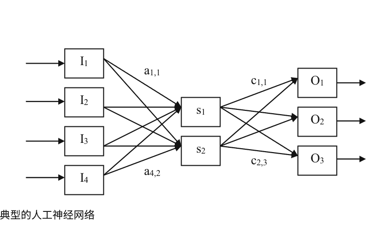

```
\begin{bmatrix}
O_1 \\
O_2 \\
\vdots \\
O_m
\end{bmatrix}
=
\begin{bmatrix}
a_{1,1} & a_{1,2} & \cdots & a_{1,n} \\
a_{2,1} & a_{2,2} & \cdots & a_{2,n} \\
\vdots & \vdots & \ddots & \vdots \\
a_{m,1} & a_{m,2} & \cdots & a_{m,n}
\end{bmatrix}
\times
\begin{bmatrix}
I_1 \\
I_2 \\
\vdots \\
I_n
\end{bmatrix}
\quad \text{(7.1)}
```

它是具有 n 个元素的输入向量 I，具有 m 个元素的输出向量 O，以及连接这两个向量之间的 (n×m) 个元素的系数矩阵。这个矩阵包含了人工神经网络中的权重。方程 7.1 相当于一个没有中间层、只有输入层和输出层的人工神经网络结构。在这种表示中，输入和输出变量之间只有线性关系。在只有一个输出的情况下，这个方程可以写成：

```
O = [a_{1,1} \ a_{1,2} \ a_{1,3} \ \ldots \ a_{1,n}] 
\begin{bmatrix}
I_1 \\
I_2 \\
I_3 \\
\vdots \\
I_n
\end{bmatrix}
\quad \text{(7.2)}
```

这个矩阵结构对应于单一线性探测器（感知器），将在第 7.8 节中解释。在方程式 7.2 中，数学结构是纯线性的，其经典数学形式可以写成如下形式：

```
O = a_{1,1} I_1 + a_{1,2} I_2 + a_{1,3} I_3 + \ldots + a_{1,n} I_n
\quad \text{(7.3)}
```

在这个向量计算中，它实际上就是两个向量的数量积，即 I_s 和 A_s，a_{i,j}'s [在方程式 7.2 中，I 是列向量，A 是行向量]。因此，线性感知器的结构是两个向量的数量积，可以表示为：

```
O = \vec{A} \cdot \vec{I}
\quad \text{(7.4)}
```

如果这些向量被归一化，方程 7.4 给出了线性相关系数在统计学中。如果结果为零，这些向量完全独立；如果为 +1 (−1)，则它们完全依赖；在 0 和 +1 (−1) 之间，则它们部分正向（负向）依赖。

在感知器中，输出要么是 1，要么是 0，如第 7.8.3 节中所解释的那样。因此，感知器进行两种不同的分类。经过所有这些解释，可以理解感知器结构具有与图 7.5 中的单个输入层和输出单元相同的结构。

## 图7.5 感知器结构

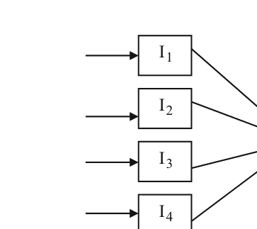

与感知器不同的人工神经网络架构的两个最重要的特征，将在第7.11.1节中解释，即：第一，输入层和输出层之间有一个第三个中间（隐藏）层，其次，数学运算是非线性的。由此可得出结论，具有上述矩阵结构的人工神经网络只能执行线性操作，并且最多有两个层。具有输入和输出层以及输出层中仅有一个单元的人工神经网络称为感知器。在矩阵数学中，作为变量向量之间转换器的矩阵称为系数矩阵。然而，在人工神经网络中，这被称为权重矩阵。在这里，1950年提出的第一个简单神经网络实际上就是将方程7.1转换为双层单元（块）的形式，如下所示，带有权重a<sub>ij</sub>（i=1, 2, ..., n; j=1, 2, ..., m）（图7.6）。使用连续的系数矩阵，还可以编写将构成三层或更多层人工神经网络的矩阵方程。例如，在存在两个系数矩阵A和C的情况下，架构结构采用以下形式。

```
\begin{bmatrix} O_1 \\ O_2 \\ \vdots \\ O_m \end{bmatrix} = \begin{bmatrix} a_{1,1} & a_{1,2} & \cdots & a_{1,k} \\ a_{2,1} & a_{2,2} & \cdots & a_{2,k} \\ \vdots & \vdots & \ddots & \vdots \\ a_{m,1} & a_{m,2} & \cdots & a_{m,k} \end{bmatrix} \times \begin{bmatrix} c_{1,1} & c_{1,2} & \cdots & c_{1,n} \\ c_{2,1} & c_{2,2} & \cdots & c_{2,n} \\ \vdots & \vdots & \ddots & \vdots \\ c_{k,1} & c_{k,2} & \cdots & c_{k,n} \end{bmatrix} \times \begin{bmatrix} I_1 \\ I_2 \\ \vdots \\ I_n \end{bmatrix} \quad (7.5)
```

有三个层，其中包括输入层和输出层，还有一个中间层。然而，这个新的三层人工神经网络无法避免线性计算。在这一点上，世界上的研究人员思考了很多，由于只能用线性运算来进行人工神经网络，他们在25-30年间没有取得任何进展。

通过记住操作流是从右到左的，可以通过在等式7.5中给出的矩阵结构上进行中间操作来使其更加详细。首先，通过将输入I与权重C相乘，我们可以线性地写出一个新的中间变量（向量）S或中间输出，如下所示。

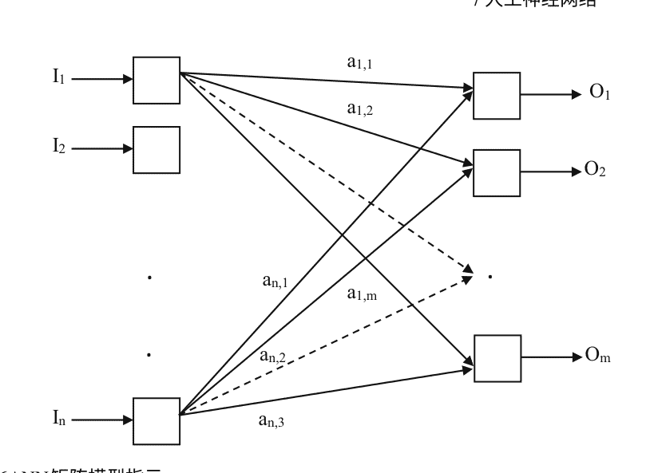

## 图7.6 人工神经网络矩阵模型指示

```
$$
\begin{bmatrix}
H_1 \\
H_2 \\
\vdots \\
H_k
\end{bmatrix}
=
\begin{bmatrix}
c_{1,1} & c_{1,2} & \dots & c_{1,m} \\
c_{2,1} & c_{2,2} & \dots & c_{2,m} \\
\vdots & \vdots & \ddots & \vdots \\
c_{k,1} & c_{k,2} & \dots & c_{k,m}
\end{bmatrix}
\times
\begin{bmatrix}
I_1 \\
I_2 \\
\vdots \\
I_m
\end{bmatrix}
\quad\quad\quad (7.6)
$$
```

其人工神经网络架构结构如图7.7所示。通过考虑方程 7.6，方程 7.5的形式如下，其中H<sub>i</sub>, (i = 0, 1, 2, . . ., k)表示中间隐藏层元素。

```
$$
\begin{bmatrix}
O_1 \\
O_2 \\
\vdots \\
O_n
\end{bmatrix}
=
\begin{bmatrix}
a_{1,1} & a_{1,2} & \dots & a_{1,k} \\
a_{2,1} & a_{2,2} & \dots & a_{2,k} \\
\vdots & \vdots & \ddots & \vdots \\
a_{n,1} & a_{n,2} & \dots & a_{n,k}
\end{bmatrix}
\times
\begin{bmatrix}
H_1 \\
H_2 \\
\vdots \\
H_k
\end{bmatrix}
\quad\quad\quad (7.7)
$$
```

简单的人工神经网络的架构可以如下所示（图7.8）。在这最后两个图中，前面的人工神经网络的输出与后面的输入相同。通过重叠它们，可以得到图7.9中给出的统一的架构结构。

因此，通过将矩阵代数方程转化为人工神经网络结构，出现了三层人工神经网络架构。然而，这里存在一个问题。如果隐藏（中间）层中的H个单元遵循上述相同的矩阵计算，从输入生成输出将保持线性操作。为了避免这种情况，要么非线性地改变系数，要么对H单元或两者都进行偏斜（放置非线性数学运算符）。在实践中，这三个选项中最简单的是使用少量的H单元构建结构。

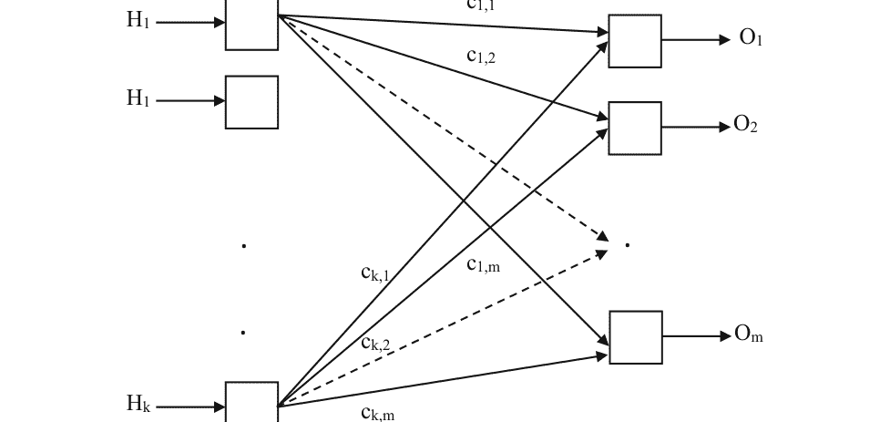

## 图7.7 隐藏层和输出层之间的左侧人工神经网络结构

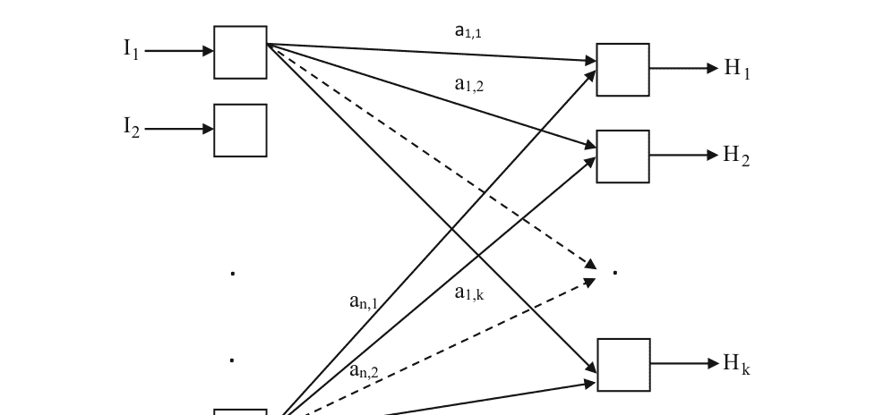

## 图7.8 隐藏层和输出层之间的左侧人工神经网络结构

每个内部都有非线性数学处理器。对于这个选项，问题是什么是放置在隐藏（中间）层的单元格中的激活函数的数学表达式。人们可以立即看到H单元格有两个功能。第一个功能是收集来自输入层单元格的加权部分，即在单元格左侧的加法器运算符，然后在同一单元格的右侧放置另一个激活函数作为非线性运算符（激活函数）来处理这些收集到的信息。

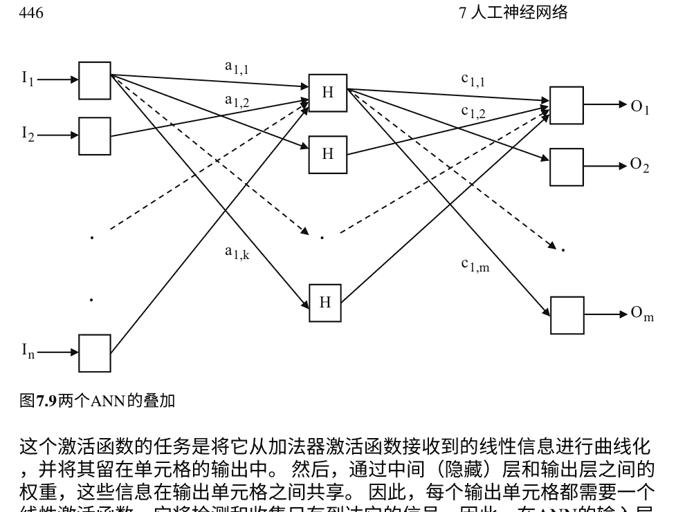

## 图7.9 两个人工神经网络的叠加

这个激活函数的任务是将它从加法器激活函数接收到的线性信息进行曲线化，并将其留在单元格的输出中。然后，通过中间（隐藏）层和输出层之间的权重，这些信息在输出单元格之间共享。因此，每个输出单元格都需要一个线性激活函数，它将检测和收集只有到达它的信号。因此，在人工神经网络的输入层中没有处理器的情况下，在中间层单元格中有两个加法器和曲线激活函数，在输出单元格中有线性加法器处理器。在说完所有这些之后，人工神经网络的架构（拓扑结构）被定义（参见第7.11.1节）。

对于线性激活函数，没有问题。这些是执行简单算术加法的单元。然而，曲线算子（在人工神经网络中称为激活函数）需要确定。在这里，可以在每个隐藏层单元中放置不同的激活函数，它们都放置在相同的激活函数中，以提供计算速度和简便性。这个主题将在第7.11.1节中详细解释。

### 7.6.1 与卡尔曼滤波器的相似性

卡尔曼（1960）滤波器是回归分析的动态可重复线性版本。作为一般结构，它有两个部分：一个是系统，另一个是测量方程。这两部分分别用矩阵方程表示。其中，系统方程表示系统中状态变量在连续时间之间的相互依赖和内部工作。如果一个系统的状态变量用D（d1, d2, ..., d）向量表示，系统方程的关系可以写成以下形式。

```
\[
\begin{bmatrix}
d_1 \\
d_2 \\
\vdots \\
d_n
\end{bmatrix}_t
=
\begin{bmatrix}
a_{1,1} & a_{1,2} & \cdots & a_{1,n} \\
a_{2,1} & a_{2,2} & \cdots & a_{2,n} \\
\vdots & \vdots & \ddots & \vdots \\
a_{n,1} & a_{n,2} & \cdots & a_{n,n}
\end{bmatrix}
\times
\begin{bmatrix}
d_1 \\
d_2 \\
\vdots \\
d_n
\end{bmatrix}_{t-1}
+
\begin{bmatrix}
\varepsilon_1 \\
\varepsilon_2 \\
\vdots \\
\varepsilon_n
\end{bmatrix}_t
\]
(7.8)
```

在这里，\(\varepsilon_i\)'s表示系统在时间t的误差。权重矩阵是一个方阵。这个矩阵形式的方程具有类似于图7.4所示的人工神经网络架构。卡尔曼滤波器的测量方程以矩阵形式写为如下。

```
\[
\begin{bmatrix}
m_1 \\
m_2 \\
\vdots \\
m_m
\end{bmatrix}
=
\begin{bmatrix}
1 & 1 & 0 & 0 & 1 \\
0 & 1 & 0 & 1 & 1 & 0 \\
0 & 0 & 0 & 0 & 0 & 0 \\
\vdots & \vdots & \vdots & \vdots & \vdots & \vdots \\
0 & 0 & 0 & 0 & 0 & 0
\end{bmatrix}
\times
\begin{bmatrix}
d_1 \\
d_2 \\
d_3 \\
\vdots \\
d_n
\end{bmatrix}
+
\begin{bmatrix}
\varepsilon'_1 \\
\varepsilon'_2 \\
\vdots \\
\varepsilon'_n
\end{bmatrix}
\]
(7.9)
```

在这个展开式中，M表示测量（输出）值和测量误差\(\varepsilon_i\)'s。这里，大小为 (m x n) 的系数矩阵由1和0元素组成。其中的1表示哪些状态变量直接影响输出值。0表示没有这样的贡献。根据这些观点，卡尔曼滤波器的完整架构如图7.10所示。

在这个图中，测量方程中的每个系数矩阵元素表示状态变量和测量之间的相关值。在卡尔曼滤波器的隐藏层和输出层的每个单元中都没有曲线运算符，只添加了随机独立误差。因此，系统方程中的误差项 \(\varepsilon_i\)'和测量方程中的也包含在图7.10的结构中。然而，随机误差的添加并不改变卡尔曼滤波器的线性操作，只是变得随机。在图7.10中还需要注意的一点是卡尔曼滤波器中隐藏层和输出层之间的连接权重是完全确定的。将这个卡尔曼滤波器架构与图7.9进行比较，可以看出它们之间有多么相似。

### 7.6.2 与多元回归的相似性

如果有很多与问题相关的变量，最常用的方法是使用多元回归分析来表达其中一个变量在剩余估计变量中的期望（第4章）。在其最一般的形式中，可以写成如下形式：

```
\[O = a1I1 + a2I2 + a3I3 + \cdots + anIn + \varepsilon\]
(7.10)
```

控制理论中的预测变量。

在这里，$r_i$ ($i = 1, 2, ..., n$) 在数学中被称为自变量。... $a_1, a_2, ..., a_n$ 另一方面，有三个依赖或预测输出变量 $O$。 从数学表达式中可以理解，为了使该方程成立，$\Pi'$必须完全独立于彼此。 就人工神经网络结构而言，任何输入和输出之间只能有一个连接。 在这种情况下，方程7.10的结构应如图7.11所示。 结果表明，回归结构等同于将在第7.8节中解释的感知器结构。然而，连接值存在差异。在多元回归中，连接值（相关系数）等于输入和输出之间的连接值。 然而，为了使这些相关系数对于多元回归有效，数据必须符合一些重要的假设。

- 1. 假设输入变量在彼此之间完全独立。
  这在实践中几乎是罕见的情况。因此，输入变量经过一些转换，使得它们之间的相关系数变为零。这些转换包括主成分分析（PCA）和傅里叶分析方法。因此，图7.11中给出的结构对于主成分和傅里叶分析中的转换输入变量也是有效的。
- 2. 模型中的误差项 $\epsilon$ 应该符合高斯（正态）概率密度函数。
- 3. 数据应该是平稳的，即不应包含趋势、周期性波动、跳跃或尖峰。
- 4. 数据的方差应该是恒定的（同方差性）。

因此，可以说多元回归方法就像具有人工神经网络的建模架构，如果输入和输出数据满足所有这些假设。

## 7.6 向量和矩阵相似性

### 7.6.3 与随机过程的相似性

我们可以说，随机过程经常用于对许多自然和人工事件进行建模，特别是在信号和图像处理领域，与人工神经网络结构显示出类似的情况。一般来说，随机过程由两部分组成，一部分是确定性的，另一部分是随机的。最简单的随机过程，即k阶马尔可夫过程的数学表达式如下：

```
d_t = a_1 d_{t-1} + a_2 d_{t-2} + a_3 d_{t-3} + a_k d_{t-k} + ε_t \quad (7.11)
```

这个方程将时间t时刻的状态变量的值与其所有历史值 (d_{t-1}, d_{t-2}, ..., d_{t-k}) 线性连接起来。这里，ε_t表示不确定性部分。在随机过程中，一些假设必须符合理论。其中包括平稳性和遍历性的条件。此外，还有假设错误具有高斯（正态）概率密度函数，并且它们的结构没有周期性。以向量形式表示的方程7.11可以写成如下形式：

```
[d_t] = [a_1 \quad a_2 \quad a_3 \quad ... \quad a_k] \begin{bmatrix} d_{t-1} \\ d_{t-2} \\ d_{t-3} \\ \\vdots \\ d_{t-k} \end{bmatrix} + ε_t \quad (7.12)
```

它的类似ANN的架构也类似于图7.5中给出的感知器架构。

### 7.6.4 与黑盒模型的相似性

虽然ANN是受到人类神经系统中的细胞的生物启发，但可以用工程建模的术语来解释。任何自然或社会现象都有一个将输入转换为输出的处理器。在其最简单的形式中，可以将其表示为一个黑盒模型，如下图所示。

凭借这种结构，它已经在许多不同的环境、社会、工程和心理建模中得到了应用，并取得了可靠的结果。这的本质是科学哲学中的原理，即每个事件在某些原因下都有后果（第3章）。在图7.12中，肥沃的部分被称为处理器。黑盒模型在研究具有一个输入和一个输出的事件方面特别成功。就输入和输出而言，可以将黑盒模型分为四个主要组别：单输入单输出（SISO）、单输入多输出（SIMO）、多输入单输出（MISO）和多输入多输出（MIMO）。感知器模型是实际应用中最常见的类型。在其他类型中，拥有各种各样的处理器更为自然。由于图7.12中符合SISO模型的处理器盒子，可以称之为三盒模型。这里的第一个盒子包含了单个输入变量的属性，将其连接到单个处理器盒子。在这个盒子中，它统一处理的输入最终产生一个输出。从这里可以得出合理的推断，如果输入、处理器和输出是多个的，例如，2个盒子、3个盒子、15个盒子等，就会出现多盒模型。

在继续解释其他多模型之前，应该注意到图7.12中的模型有一个输入，另一个输出，并且在形状上它们之间有一个分离或隐藏的盒子。因此，即使在最简单的单变量情况下，也有三个不同的盒子，或者说每个盒子有一个单元的三个层，类似于ANN架构。输入盒子是测量输入，输出盒子是预测的输出变量，处理器盒子是一个隐藏（中间）盒子，其处理器尚未知晓。可以像输入变量一样测量输出。事实证明，隐藏盒子中未知处理器的操作对于输出结果的生育并不知晓，但其行为必须根据输入和输出数据确定。

在这个方向上开发的方法之一是最小二乘回归方法。在这里，通过将散点图中显示的输入变量放在笛卡尔坐标系的水平轴上，将输出变量放在垂直轴上，适应最合适的直线或曲线，可以确定有生产力的处理器（见图7.13）。其他方法（傅里叶、沃尔什、小波、波动、谱、随机过程、多元回归、主成分分析等）可以反映处理器的行为。在这个方向上，谱分析和小波分析是当今最广泛使用的方法。

现在，如果考虑存在多个输入、隐藏或输出盒子的情况，就会明白图7.12中给出的三层但是一个细胞（有边框）的部分是不够的。例如，如果有两个输入-单输出（2ISO），一个盒子在输入部分是不够的。如果在这里放置两个盒子，就像图7.14所示，就会出现一个稍微更详细的盒子模型。

在这个模型中，将信息从输入盒子传递到隐藏（处理器）盒子的箭头（链接）被显示出来。由于在输入盒子中不对数据进行处理，这些箭头将盒子的输出传递到隐藏层。应注意，每个链接在这里都有一个值。如果在输入层中有更多的输入数据而不是两个盒子，每个盒子将以一定的速率将数据传递给处理器盒子。因此，再次强调在输入盒子中不采取任何操作。在这个模型中，处理器以某种方式处理来自两个输入盒子的消息，并将它们转换为输出变量。这就像是三重回归。在这种情况下，依赖的输出变量是用独立的输入变量来表示的。这意味着输出变量的一部分来自一个输入变量，而另一部分来自第二个输入数据。因此，隐藏盒子以不同的比例混合输入，产生输出。如果输入层中有太多的盒子，就得到了图7.13中模型的最一般版本，即2ISO模型。图7.15显示了一个三重回归模型。

# 图7.15 三重关系

虽然在之前的模型中有两个输入变量，但它们的混合是在一个单一的盒子中完成的。如果将隐藏盒子分成两个部分，就会出现2ISO模型的多处理器（MP）状态。 这种建模的结构如图7.16所示。

在这个模型中，一部分输入被传输到隐藏层的较低处理器，另一部分输入被传输到较高处理器。 输出可以被看作是来自各个处理器盒子的数量的总和 。 因此，在这个模型中，输出值是通过将盒子添加到输出层上来找到的。这个模型与之前的模型的不同之处在于，在输入和输出层的盒子中进行了一些操作。 不应该得出这样的结论，即隐藏盒子应该和输入盒子一样多。例如，在图7.17中，隐藏盒子少于输入盒子。通常，在实际研究中，隐藏层中的盒子数量少于输入层中的盒子数量。

在最一般的建模中，输入层的盒子数量等于输入变量的数量，输出层的盒子数量等于要预测的输出变量的数量。 隐藏层的盒子数量层的确切数量未知，但不应过多。作为一个经验法则，隐藏层中的盒子数量应少于输入层中的盒子数量。同样，在实际研究中，隐藏层中盒子的最大数量应为3–5。在许多实际应用中，隐藏层中的盒子数量最初被设定为三个。现在，让我们以最一般的形式展示模型，例如，使用五个输入数据，四个预测和三个中间盒子，如下图所示。

# 图7.16 2I1O 二进制模型

# 图7.17 5I4O和三重模型

从这个 fi图中可以看出，随着不同层中的盒子数量增加，模型变得更加复杂，但其基本原理如上所述非常简单。到目前为止，已经介绍了模型的结构。以这种方式出现的模型与ANN模型的架构非常相似。在图7.17所示的模型中，构成层间元素的盒子中的每个处理器都是一个令人好奇的问题。如前所述，这个处理器可以通过简单的最小二乘（回归）分析在具有SISO的模型中检测到。随着模型变得更加复杂，处理器中没有复杂性。层间盒子中的处理器通过一种数学处理方式处理接收到的输入，生成输出。如果仔细思考这个过程，就会理解在隐藏层的处理器盒子内必须有两种处理器，一种用于线性相加输入，另一种用于将它们以曲线形式发送到输出层盒子中。

（非线性）处理器。因此，这些处理器的第一个任务是通过线性聚合处理输入，并将输出分配给输出盒子。此外，输出盒子收集到达它们的数据并预测输出。

## 7.7 人工神经网络结构

在上述经典方法和盒子模型的相似之后，让我们关注如何在文献中切换到人工神经网络模型。上述模型与人工神经网络方法之间存在一对一的对应关系。在人工神经网络术语中，所谓的细胞（见图7.18）可以用圆圈代替盒子。在下面的图中，展示了一个具有多个输入、两个隐藏层细胞和多个输出的模型，这是经典人工神经网络模型架构的基础，受到迄今为止描述的盒子模型的启发。在这种类型的建模中，会出现以下问题。

- 1. 代表神经元的输入连接在ANN模型中不起作用。
- 2. 每个细胞只有一个输出值，它与其他细胞连接在一起，即与下一层的细胞以不同的方式连接在一起。
- 3. 所有输入数据也会到达输入层的细胞，并从那里传播出去，没有延迟。
- 4. 传入隐藏层细胞的信息通过曲线处理器（激活函数）经过，并形成这些细胞的输出。
- 5. 输出层的每个细胞线性地收集隐藏层细胞的信息并给出预期的输出。
- 6. 预期输出和测量输出之间的差异被识别为错误，如果这个错误不小于期望的限制，错误将向后分布到每个连接中，如第7.13.5节所述。
- 7. 通过类似的过程，直到达到期望的错误限制，ANN的训练将继续进行。

### # 7.8感知器（单一线性传感器）

在前面的章节中，解释了线性建模可以在大多数经典示例中完成。考虑到这些基本信息，首先将详细介绍可以通过线性操作进行聚类的人工神经网络。理解这些将有助于理解下一章节中深度学习方法的更复杂类型的人工神经网络。在本节中，将介绍单一线性传感器的基本知识，即感知器。感知器是一种单一限制、具有简单结构并能够进行线性聚类分离的人工神经网络。在英语中，这种传感器被称为“感知器”，如前所述。

### 7.8.1 感知器原理

在进入数学细节和人工神经网络架构之前，通过一个思维实验来解释感知器的基础。使用感知器的第一步是将数据分成聚类。了解给人类的图片会进行何种聚类将会很有用。为此，让我们看一下图7.19中给出的二维空间中由两个不同点（星星和圆圈）组成的模式。

在可能的情况下，数据应该总是转化为散点图，以显示输入和输出变量之间的关系。通过自己的理解、思考和解释，人们可以尝试从数学之外进行推理，通过可视化来理解。通过仔细观察散点图，可以得出以下可视化解释。

- 1. 有两种不同的模式：一种是星形，另一种是圆形。
- 2. 星形为5，圆形为6。
- 3. 星形和圆形具有x和y值。它们的坐标在表7.1中给出。否则，通过阅读这个图，即使是近似的，也可以获得坐标。
- 4. 星形模式在左侧较窄，圆形模式在右侧较宽。
- 5. 通过肉眼，我们可以用一条近似的线将两个模式区域分开，而无需进行任何计算（见图7.20）。
- 6. 如果需要，还可以提取出这条直线的近似方程。经过简单的近似计算，得到分离线的方程为：

```
x-0.22y-0.3=0 (7.13)
```

- 7. 这是唯一的分离线吗？答案立即是否定的。如果经过深思熟虑，可以看到还有其他直线（甚至是折线）可以将这两种不同的模式分开。例如，在图7.21中用数字I、II和III表示的虚线可以区分这两种模式。可以尽可能增加这种虚线的数量。

表7.1 模式类型、数量和坐标

| *类 | | o类 | | *类 | | o类 | |
|---|---|---|---|---|---|---|---|
| x | y | x | y | x | y | x | y |
| 0.12 | 0.85 | 0.47 | 0.16 | 0.12 | 0.85 | 0.47 | 0.16 |
| 0.17 | 0.63 | 0.53 | 0.72 | 0.17 | 0.53 | 0.53 | 0.72 |
| 0.23 | 0.33 | 0.63 | 0.26 | 0.23 | 0.63 | 0.63 | 0.26 |
| 0.30 | 0.69 | 0.72 | 0.84 | 0.30 | 0.72 | 0.72 | 0.84 |
| 0.37 | 0.40 | 0.82 | 0.31 | 0.37 | 0.82 | 0.82 | 0.31 |

直线）可以将这两种不同的模式分开。例如，在图7.21中用数字I、II和III表示的虚线可以区分这两种模式。可以尽可能增加这种虚线的数量。

- 8. 那么，是否存在一个必须保持在分割线内的区域，可以称之为无限数量？对于这个问题的答案是肯定的。可以得出结论，所有落在图7.22右侧和左侧粗线所示区域内的直线都可以作为分离线使用。

在这种情况下，如果由方程7.13给出的直线表达式中的x和y系数发生变化，但它们仍然保持在粗边界之间的区域内，那么每条直线都可以被接受为有效的分隔线，至少与其他直线一样。那么，无限多个分隔线的一般数学表达式可以写成：

```
a1x + a2y + b = 0 (7.14)
```

# 图7.20 判别直线

# 图7.21 各种判别直线

如果一个人解释这个方程中的系数，他可以说变量x对a1的贡献是变量y的权重，就像a2一样。最后，b可以被称为常数或偏置常数，它确保直线不通过坐标的起点（如果b≠0）。方程 7.14可以被通过任意丢弃系数来建立 然而，可以通过在图上绘制来看出这条直线方程是否能够分离给定的模式7.22。 如果直线落在粗线所示的区域内，则将其接受为分离线；否则，应丢弃这些系数，并尝试其他直线。 对于这个主题的专家会带着一定的意识进行头脑投掷。 不要忘记，在这里，对于人类来说，“走出你的头脑”意味着在与计算机一起工作时使用“随机数”。

- 9. 在无限数量的分离线中寻找最合适的一个就像钓鱼一样。 耐心的人通过捕捉大或小的鱼来达到目标。为什么不让我们的计算机来完成这样的搬运工作呢？ 由于计算机不能像人类一样进行无系统的思考，它们绝对需要一个能够逐步执行类似操作的系统和算法（方法）。 在这一点上，最简单的人工神经网络（ANN）方法——感知器方法——来帮助我们。根据上述讨论，我们可以开发一个名为感知器的系统和方法。 在解释中需要强调的最重要的一点是，分隔符将是一条带有恒定系数的直线，但系数是随机变化的。暂时将这一点记在心里，

- 10. 在上述过程中，可以提出什么样的方法呢？ 如果有人问起，他可以在不知道任何方法的情况下回答方程式7.14和图7.22的考虑。
  - (a) 首先，将系数a1、a2和b随机抛出，然后使用方程式7.14在图7.22上绘制所选线条。
  - (b) 如果这条直线不在图7.22中定义的有效区域内，则其系数逐个或逐两个或逐三个增加或减少，或者有些增加有些减少。
  - (c) 如果新的直线仍然不在期望的区域内，可以以类似的方式继续改变系数。
  - (d) 继续这样进行，经过一定的努力，找到一条在有效区域内保持的直线，从而找到了一条分离线，所有这些步骤被称为感知器方法。
- 11. 完成所有这些操作后，根据给定的计算过程得到方程式7.14的常数。 然后使用这个方程式来决定新点属于哪个模式。在这里，也可以选择两种路径：
  - (a) 当给出新模式点的x和y坐标时，如果使用这些标记点，如果它在分割线的右侧，它将属于星形模式，如果它在圆圈的左侧，
  - (b) 由于有方程，他不需要标记点。 将此点的x和y值代入分隔符方程，结果可以是正数（>0），负数（<0）或等于零。 如果是正数，该点将属于圆圈，如果是负数，它将属于星形模式。 在实践中，即使很少见，在零的情况下，研究人员可以通过抛硬币来决定它属于哪个簇。 然而，如果在第一个零的情况下添加了星形模式，则在所有其他零的情况下都应坚持这一点。
- 12. 上一步的最后部分是一个圆吗？还是一个星星？ 在决策时，研究人员可以将它们中的一个称为白色，另一个称为黑色，同时使用数字1或0对最终决策进行编码，以便计算机能够像人类一样理解并根据清晰（二进制）逻辑分离模式（第3章）。

### 7.8.2 感知器架构

考虑到前一节中所说的，由于方程式7.14类似于一个双变量回归模型，它的架构如图7.23所示，将x和y作为变量x1和x2考虑进去。

如果方程式7.14在感知器架构之后进行数学综合，可以理解到以下几点在这个方程式中被隐含了。

- 1. 方程式中有两个数学运算，一个是加法，一个是乘法（在常数和变量之间）。乘法运算的优先级更高。
- 2. 变量值x₁和x₂应作为同一方程的输入给出，以便计算方程的数值作为输出。
- 3. 在同一方程中，除了带有变量x₁和x₂的项外，还有常数（a₁、a₂和b）。
- 4. 这个方程由两部分组成，一部分是变量，另一部分是常数。
- 5. 明显有输入变量（x₁和x₂），其他的是随机常数a₁和a₂的权重和偏差b。
- 6. 由于有两个输入，如图7.23所示，如果将两个方框（单元格）作为输入，x₁和x₂的值将被输入到方框中。然后，Fig.7.24的第一个结构就像Fig.7.23一样，首先表示Eq.7.14的变量部分为乘法，然后为这两个乘法的和。这被称为变量部分的架构结构。
- 7. 在变量部分添加常数b后，得到一个函数f（见图7.24）。
- 8. 输入框中的X表示输入将与感知器框输出中的权重相乘。在接下来的部分中，输入单元格中将不使用乘法符号。第一个圆圈中的+号表示将权重乘以输入后相加。到目前为止，这部分代表方程式7.14的变量部分。
- 9. 加入固定部分后，左侧现在由一个简单的架构a₁x + a₂y + b表示。先前步骤中计算的方程值大部分时间不会等于零。因此，结果为

f = a₁x + a₂y + b

现在，根据f的值进行集群分配。如前所述，由于星星（圆圈）将用1（0）的二进制值表示，f的给定数据系列（模式）也必须分为两部分。为此，在输出单元中放置了一个称为处理器的输出单元。实际上，这只是一个将输入转换为1或0的函数。

# 图7.23 感知器架构

这里还有另一个表格，描述了不同模型的分类：

| 模型类型 | 描述 |
|---|---|
| SISO | 单输入单输出 |
| SIMO | 单输入多输出 |
| MISO | 多输入单输出 |
| MIMO | 多输入多输出 |
| 2ISO | 两输入单输出 |
| 2I1O | 两输入一输出 |
| 5I4O | 五输入四输出 |

以上内容是根据OCR文本处理后的结果，纠正了明显的OCR错误，合并了跨页段落，识别了标题和列表项，并转换了表格格式。

为了实现这一点，如图所示的阈值处理器被放置在输出单元中（见图7.25(a)）。因此，对于 f > 0 的输出为1，对于 f < 0 的输出为0。同样，考虑图中（图7.25(b)）的相反极性阈值运算符，可以得到值+1或 -1。

因此，当感知器将输入模式引入到其输出的一个聚类中时，问题就得到解决。在二进制聚类中，1代表一个合适的聚类，而0代表另一个聚类。

10. 由于输入模式被研究人员称为星星或圆圈，并且通过编码为1和0，感知器必须为每个已知输入提供已知输出。如果提供了，程序将以类似的方式继续，参考另一个条目。

11. 如果没有提供，这意味着在圆圈（星星）模式上出现了代码1（0）作为输出。在这种情况下，由于输入 x_1 和 x_2 不能更改，通过改变系数 a_1 和 a_2 和/或常数 b 来搜索新的直线。因此，通过改变这些数字并重新聚类，该过程继续直到获得适合输入模式的输出代码。这是迭代训练，最终感知器学会了聚类。如何改变系数的信息将在下面给出。

12. 这些过程将持续进行，直到所有已知数据（模式）用尽。因此，感知器现在根据数据自动调整自身（权重、常数）。到目前为止的所有步骤都被称为感知器训练或浅学习阶段。感知器现在可以自动地找到其集合未知的模式。

图7.25 将处理器分为两类

上述解释是针对具有两个输入变量的线性分离器方程。如果变量的数量通常为n，则分离器方程的形式如下

$$a_1x_1 + a_2x_2 + a_3x_3 + \cdots + a_nx_n + b = 0 \quad (7.15)$$

根据前面所说的哲学，这个方程的架构可以类似于图7.24绘制。图7.23中的处理器和图7.24中的输出单元中将输入值分为两类的处理器被称为硬件或阈值处理器。

相反极性阈值处理器根据加号（f>0）和减号（f<0）的编码，将输入的模式分为两个模式集。加号阈值处理器将正输入值编码为1，负值编码为0，如图7.24所示。这些处理器在一些出版物中也被称为严格阈值函数。

### 7.8.3 感知器算法

这里是感知器的数学运算，其基本原理和架构根据前一节的解释进行展示。为此，必须按顺序执行以下步骤：

- **1. 初始权重值的分配**：小的随机数被分配给固定值的整体权重和分界线。

- **2. 可变部分的计算**：当感知器检测到一个模式时，通过将输入与分配的权重值相乘并相加的结果计算出可变部分的值：

$$\sum_{j=1}^{n} a_{ij}x_{ij} \quad (7.16)$$

在这里，第一个指数（i）表示数据（模式）的顺序，第二个指数（j）表示第i个数据中的j分量。例如，第五个模式（1, 3.8, 0.3）的a51=1，a52=3.8，a53=0.3。

- **3. 固定值加法**：当将这样一个常数值添加到方程式7.16中时，进入处理器的感知器值为：

$$f = \sum_{j=1}^{n} a_{ij}x_{ij} + b$$

初始时，将一个固定值分配为一个小的随机数。

- **4. 处理器输出**：通过将上一步的值输入到阈值处理器（相反或正向）之一，进行聚类的结果为：

$$F_h(f) = \begin{cases} 1 & \text{if } f > 0 \\ 0\text{或}-1 & \text{否则} \end{cases} \quad (7.17)$$

- **5. 检查**：由于事先知道输入模式属于哪个集合，需要检查这个结果是否与之相同。如果相同，感知器感知到的模式将被放置在适合它的簇中。在这种情况下，通过转到下一个模式执行类似的操作，而不对权重和常数值进行任何更改。如果感知器将检测到的模式放入相反的簇中，则应更改为该模式选择的权重值。

- **6. 权重训练**：现在需要调整随机选择的权重，直到将检测到的模式放入适当的簇中。在这里不再可能随机分配。根据感知到的数据（模式结构），权重有一个正式的调整。正式性要求新的权重与之前的权重有一定的联系。最合理的做法是稍微改变（增加或减少）先前的权重值。通常情况下，如果增量表示为 Δa_{ij}，则可以写成以下表达式

$$a_{ij}(k + 1) = a_{ij}(k) + \Delta a_{ij} \quad (7.18)$$

在这里，k+1和k是两个连续训练阶段（下一个和上一个）的计数器。问题是如何计算Δa_ij。

- **7. 错误修正**：由于感知器检测到的模式的每个元素对输出的贡献将不同，权重增量值必须不同。如果输出不符合预期的集合，错误将是h=1-0=1或h=0-1=-1，因此j元素的权重增量的形式如下。

$$\Delta a_{ij} = hx_{ij} \quad (7.19)$$

通过将其代入方程式7.18，得到错误更新模式如下：

$$a_{ij}^{k+1} = a_{ij}^{k} + hx_{ij} \quad (7.20)$$

这意味着在一个简单的感知器人工神经网络中，所有的权重都被加上或减去作为它们的输入。

- **8. 聚类迭代**：如上所述，感知器的最简单训练将继续进行，直到所有模式都被正确聚类。这里需要注意的一个非常重要的点是，在每次聚类错误发生后，所有的设计都将以它们更新的权重值重新引入到感知器训练系统中。改变一个模式的权重并不意味着之前正确聚类的模式将在没有被这些新权重替换的情况下保持在同一个聚类中。一般来说，一些先前模式的聚类已经发生了变化。然后，训练过程应该继续，直到所有的模式都以相同的权重和常数值收敛到合适的聚类中。

- **9.** 在感知器将所有模式分配到它们已知的合适聚类中，如前一步骤所述之后，它现在可以用于对未知模式集的聚类。

### 7.8.4 感知器实现

为了使用感知器进行聚类，有必要解释数据和模式的概念之间的差异。数据不仅指一个变量的数值，还指多个变量的组合。例如，一个地方的降水、湿度和蒸发变量代表一个数据集。假设伊斯坦布尔的平均降水量为620毫米，湿度为80%，蒸发量为700毫米，那么这被视为数据，表示为(620, 0.80, 700)。不同年份的这样一组数据形成数据系列。然而，这种情况不仅发生在时间上，也发生在空间上。对于城市的集合也表示另一组数据。

模式的概念更多地被理解为被称为像素的区域的非常小部分的数值。这些数值根据二进制系统可以取0或1的值。例如，如果一个8×8区域中的26个像素位置为1（黑色），其余为0（白色），则会出现一个模式。

#### 7.8.4.1 数据聚类

为了完全理解前一节中描述的步骤，最好逐步执行数据序列的应用步骤。假设三个数据在笛卡尔坐标系中的分量，其中两个属于集合1，三个属于集合0，分别为(1.3, 0.5), (2.5, 0.6)和(1.8, 3.4)。让我们将每个数据的第一个元素作为输入i₁，第二个元素作为输入i₂。假设我们有关于第一个数据属于聚类1，其他数据属于聚类0的信息。根据上述感知器原理的所有计算可以逐步获得如下。

- **1.** 首先，让我们看看它们在笛卡尔坐标集中是如何分散的。由于这些数据在二维空间中，可以在笛卡尔坐标集中显示它们。否则，如果有超过三个数据分量，则无法进行这样的表示。根据数据，三个数据的散点图如图7.26所示，其中第一个是“*”，其他两个是“o”符号。

通过一次性查看所有点，人们可以立即看出根据第7.6.1节中描述的步骤，分割线将通过哪些点。然而，由于计算机没有这样的能力，应确保它们逐个查看每个点。与人类相比，这需要很长时间，但人类永远无法感知太大的数据。

- **2.** 由于这里要使用的感知器的架构如图7.23所示，因此应将两个权重值分配为随机小数以开始计算。这些值分别为 a₁₁ =0.2 和 a₁₂ =0.7。此外，b =1 被随机选取为固定值。这里，第一个索引表示第一个数据，第二个索引表示数据的结果。还给出了这些数据属于编码簇的信息。然后，人们应该期望使用给定的数据和权重进行感知器处理后得到1的值。在前一节中给出的公式7.20给出的值为 f₁ = 0.2 × 1.3 + 0.7 × 0.5 + 1 = 1.61。由于 f₁ >0，O₁ =1，并且不需要更改此模式的权重，因为感知器已将此数据分配给了正确的簇。

- **3.** 现在让我们来获取第二个数据，通过感知器进行检测。它的集合已知为0。所以 f2 = 0.2 × 2.5 + 0.7 × 0.6 + 1 = 1.92，具有相同的权重系数。由于结果大于0，可以得出结论它的集合为1。然而，预期的集合为0。因此，误差为 e2 = 0 – 1 = –1。在这种情况下，根据公式7.20，权重需要根据输入值进行减小。因此，新的权重为 a21 = 0.2 – 2.5 = –2.3 和 a22 = 0.7 – 0.6 = 0.1。最后重新计算后，由于f2= –2.3 ×2.5 + 0.1 ×0.6 + 1 = –4.69 <0，聚类为0，第二个数据根据这些权重被放入正确的聚类中。然而，在处理第三个数据之前，应该检查前面的数据是否根据这些新的权重系数仍然属于同一个聚类。为此，由于前面的数据根据新的权重系数给出的值为f1 =2.3 ×1.3 + 0.1 ×0.5 + 1 = –1.94 <0，使用这些权重的集合被扭曲了。因此，为了将其恢复到集合中，如果根据Eq.7.20增加新的权重系数，考虑到e1 =1 – 0 = 1，a11= –2.3 + 1.3 = – 1.0，和a21=0.1 + 0.5 =0.6。相应地，由于f1 = 1.0 ×1.3 + 0.6 ×0.5 + 0.1 = 0.001 >0，同样的模式回到了聚类中。人们想知道新的权重是否将第二个模式留在了集合中？为此，由于使用相同权重的第二个集合的值为f2 =1.0 ×2.5 + 0.5 ×0.6 + 1 = –1.2 <0，可以理解集合没有发生变化。因此，第一个和第二个数据使用相同的权重值找到了正确的聚类。

- **4.** 现在，如果我们考虑第三个数据，它的期望集合是0。由于使用最新的权重计算得到的结果是f3= –1.0 ×1.8 + 0.6 ×3.4 + 1.0 = 1.24 >0，所以聚类无法正确完成，o3 =1，e3 = 0 – 1= –1。然后，如果根据方程式7.20更新权重，减小最后一个数据的分量，得到a31= –1.0 –1.8 = – 2.8和a2 = 0.6 – 3.4 = – 2.8。使用这些新的权重，最新的数据被正确地放置在了聚类中，因为f₃= -2.8×1.8 - 2.8×3.4 + 1.0 <0。人们不禁想知道，这些新的权重是否会影响到之前的集合？为此，首先进行聚类计算，得到f₁= -2.8×1.3 - 2.8×0.5 +1.0 <0，所以f₁= 1 - 0 =1。不幸的是，模式又改变了聚类。权重需要像之前的一样进行补充，通过增加 a₁₁= -2.8 +1.3 = -1.5 和 a₂= -2.8 +0.5 = -2.3。根据这些权重值，f₁仍然有一个负号，所以它无法回到数据集中。再次，权重需要根据数据组件的数量进行增加。所以 a₁₁= -1.5 +1.3 = -0.2 和 a₂= -2.3 +0.5 = -1.8。通过这些，它在第一个数据集中，因为 f₁ = -0.2×1.3 - 1.8×0.5 +1.0 = 0.36 >0。再次想知道它是否保留在之前放置在正确集合中的第二个和第三个数据集中。为了检查这一点，第二个数据计算使用权重 f₂= -0.2×2.5 - 1.8×0.6 +1 >0 改变了聚类和新的权重为 e= -1 a₁= -0.2 -2.5= -2.7 和 a₂= -1.8 -0.6= -2.4。通过这些，第二个集合返回到集合中，因为 f₂= -2.7×2.5 - 2.4×0.6 +0.1 <0。想知道在这种情况下第一个数据做了什么？自从新的权重以后，计算发生了变化，因此 f₁= -2.7×1.3 - 2.4×0.5 +1.0 <0。所以，权重必须通过增加 a₁₁= -2.7 +1.3 = -1.4 和 a₂= -2.4 +0.5 = -1.9 来更新。由于使用这些系数的第一个数据仍然无法返回到集合中，新的权重是 a₁₁= -1.4 +1.3 = -0.1 和 a₂= -1.9 +0.5 = -1.4。使用这些权重，它可以返回到第一个数据集，但第二个数据呢？由于 f₂ = -0.1×2.5 - 1.6×0.6 +1.0 < -0.21，它返回到集合中。这些权重保持其集合中的第一和第二个数据，但第三个数据呢？因此，如果用权重来观察第三个数据，由于 f₃ = -0.1×1.8 - 1.6×3.4 +1.0 <0，训练好的感知器的权重将是结果，因为相同的权重将第三个数据保持在其集合中。

### 7.8.4.2 模式分离

感知器也用于模式检测和聚类。因此，在感知器检测到输入的模式之后，它应该能够区分输出将产生哪个聚类。作为一个非常经典的例子，模式（+1 +1），（-1 +1），（+1 -1）和（-1 -1）被分为两组。让第一组中有（+1 +1），第二组中有（-1 +1），第三组中有（+1 -1），第四组中有（-1 -1）。让一个感知器被开发出来，当第二组捕捉到[（+1 -1）和（-1 -1）]时，它产生+1，并对其他情况产生-1。尽管感知器在这样一个简单的分离过程中的优越性并不被广泛知晓，但当模式的数量很大时，它们的优越性变得明显。与其他经典的分离方法相比，感知器可以在更短的时间内区分许多模式。感知器可以区分的模式数量被称为其判别能力。

为了理解感知器的线性判别能力，可以使用 （+1 +1），（-1 +1），（+1 -1），和（-1 -1）这些模式，例如，对于（-1 +1）来说，+1，而在模式（+1 +1），（+1 -1），和（-1 -1）中的其余0。可以将这四个模式表示在一个二维平面上，变量为x1和x2。因此，这四个模式从一开始就显示了四个对称的点（见图7.26）。一般来说，二维平面空间是 x2 = mx1 + b 可以通过一条直线将其分为两部分。可以通过这种区分方式，使每个部分只包含一个模式。如果感知器处理器能够做到这一点，我们可以称之为模式分离器。因此，可以理解系数m和b必须表示为依赖于感知器的函数。如果可以开发出参数m=1.5和b=-1.1的感知器，它将是一个可以分离四个给定模式的函数，即表示真实性。 x2 = 1.5x1 - 1.1 由于这显示了一个非常简单的应用，因此也有许多解决方案，因为可以有许多可以分离四个给定模式的m和b系数。一般来说，解决方案在图7.27中以几何方式呈现。为了与感知器进行上述区分，操作如下。让我们考虑一个具有两个输入神经元的设计，如图7.23所示，当超过临界阈值时感知器的结果为1，因为没有超过则为0。可以用来自感知器的输出来表示阈值Θi的值，具体表达式如下： Oi = x1ai,1 + x2ai,2 - Θi = 0 (7.21) 在这里，ai,1，ai,2和第i个模式分别表示感知器结构中的两个权重和常数值。根据方程式7.21，通过进行必要的简单运算，可以找到 x2 = - (ai,1/ai,2)x1 + Θi/ai,2 = ax1 + b (7.22) 在这里，a= -ai,1/ai,2是分界线的斜率，而b = Θi/ai,2是该线与x2轴相交的点。通过这两个表达式，可以找到参数 Θi，ai,1和ai,2。如果a = 1.1， b = 0.8，那么 Θi =0.7是阈值。ai,1 =0.875 和 ai,2= -0.9625。上面解释了分离线的斜率和截距（常数）值的含义以及它们如何依赖于模式值，并通过给出斜率和常数值来显示模式的计算。然而，为了从模式值中找到斜率和常数，步骤必须重复，类似于前一节中描述的数据系列。

### 7.9 单一循环线性神经网络

这个结构在英语中被称为自适应线性元素（ADALINE）。它类似于Widrow和Hoff开发的简单线性神经网络（1960年），是一个可以重复自身并且比感知器稍微先进的神经网络。它只有一个处理器，其学习规则基于最小化均方误差（MSE）的原则，其总体结构如图7.27所示。不容忽视的是，它的架构与感知器类似。两者之间的区别只在于学习规则。

该算法与感知器的另一个重要区别是，即使模式保持在正确的集合中，均方误差的最小化也会影响权重的变化。

图7.28的输出，给定第i个模式（Ii,1， Ii,2， ...， Ii,n）和相应的输出Oi，权重为aij'的情况如下：

$$NET_i = \sum_{j=1}^{n} a_{ij} I_{i,j} + \Theta_i \qquad (7.23)$$

期望的输出值为Oi，误差的平方E计算如下：

$$E_i = \left[ O_i - NET_i \right]^2 \qquad (7.24)$$

对权重系数的导数导致如下结果：

$$\frac{\partial E_i}{\partial a_{ij}} = - [O_i - (NET)_i] I_{ij} \quad (7.25)$$

从这里开始，权重的增量值是这个误差斜率的一定百分比，即 α，它被定义为：

$$\Delta a_{ij} = \alpha [O_i - (NET)_i] I_{ij} \quad (7.26)$$

通过这种方式增加权重后找到的NET值最终通过阈值处理器和聚类结果为：

$$C_i = \begin{cases} \text{如果 NET} \geq 0\text{, 则为}1 \\ \text{如果 NET} \leq 0\text{, 则为}0 \end{cases} \quad (7.27)$$

当网络的期望输出用符号O（0或1）表示时，前向计算误差e_i的结果为：

$$e_i = O_i - C_i \quad (7.28)$$

应该以最小化这个误差的方式更新权重。为了减少误差而进行权重再生，以下关系成立。

$$a_{ij}^{new} = a_{ij}^{old} + \alpha (O_i - C_i) I_{ij} \quad (7.29)$$

在这里，α被定义为学习系数。如果这个系数为1，ADALINE就变成了感知器。同样地，当初始值为1时，使用一个恒定的系数：

$$\Theta_{新} = \Theta_{旧} + O - C \quad (7.30)$$

## 7.9.1 ADALINE应用

如果考虑到一个自动分离器，使得宰杀的鸡和公鸡不会混在一起，我们会遇到两种类型的模式。假设有一些组件代表这些模式，并且这些组件中包含了重量、长度、形状和大小等测量值。通过测量每个组件，可以得到模式组件的数值。让我们用o_c = 1和o_r = -1来表示鸡和公鸡物种的聚类。从前面的讨论中，我们可以理解，在ADALINE结构中，将会有两个输入单元和一个表示聚类的输出单元，在其中将会有一个中间处理器，如图7.28所示。

让给定的模式预先确定为鸡的(1,0)和公鸡的(0,1)。为了解决这个问题，首先重置初始权重，a1=0.4, a2=0.2；假设常数b=0.3和学习率α=0.5。其中，权重和常数系数被分配为小的随机变量。如果有来自以前经验的知识，学习系数应相应选择，或者如果没有知识，可以将其视为0.5，就像是半教学和半非教学的情况（部分有老师）。在增加专业知识的情况下，实际研究采用α<0.5,最好在0.2左右。可以利用所有这些数据开始迭代。

- 公鸡模式：如果在ADALINE架构中检测到其中一个模式，例如(1,0)(公鸡)，则网络值（方程7.21）为o_c = 1，因为NET = 0.4 × 1 + 0.2 × 0 + 0.3 = 0.7 > 0。然而，由于公鸡预期聚类的值为-1，因此其之间的误差为e = -1 - 1 = -2。根据方程7.21，权重必须进行更新。通过这样做，

$$
\begin{bmatrix} a_1 \\ a_2 \end{bmatrix}_{\text{new}} = \begin{bmatrix} 0.4 \\ 0.2 \end{bmatrix}_{\text{old}} + 0.5 \times -2 \times \begin{bmatrix} 1 \\ 0 \end{bmatrix} = \begin{bmatrix} -0.6 \\ 0.0 \end{bmatrix}
$$

常数系数计算如下：

$$
\Theta^{\text{new}} = 0.3 + 0.5 \times -2 \Rightarrow -0.7
$$

这些新的权重和常数值能正确地将公鸡聚类吗？如果问到，根据方程式7.23，由于NET = -0.6 × 1 - 0 × 0 -0.7 <0, ADALINE这次将公鸡放入了正确的聚类中。然后可以继续下一个模式。

- 鸡模式：由于鸡模式是(0,1)，NET值是最后一个权重值和NET= -0.6 × 0 - 1.0 × 1 - 0.7 <0, 由于o_c = -1和鸡的数量是+1，它们之间存在不兼容性。错误是e = 1 - (-1) = 2。因此，权重必须更新。为此，可以从方程式7.30中得到以下结果：

$$
\begin{bmatrix} a_1 \\ a_2 \end{bmatrix}_{\text{new}} = \begin{bmatrix} -0.6 \\ 0.0 \end{bmatrix}_{\text{old}} + 0.5 \times (2) \begin{bmatrix} 0 \\ 1 \end{bmatrix} = \begin{bmatrix} -0.6 \\ 1.0 \end{bmatrix}
$$

常数系数的计算如下

$$
\Theta_{\text{new}} = -0.7 + 0.5 \times 2 = 0.3
$$

通过这些，我们从方程7.21中找到NET = -0.6×0 + 1.0×1 + 0.3>0，以查看鸡的模式是否变回了鸡舍。这意味着o_c = 1。这些最终的权重和常数是有效的，因为它们与给定的聚类数1相符。人们想知道公鸡是否会留在这个聚类中。根据最新的数值

$$
\text{NET} = -0.6 \times 1 + 1.0 \times 0 + 0.3 < 0
$$

找到了，因此，o_r = -1。由于这与鸡舍的数量一致coops -1，这些 final权重和常数值有助于区分鸡和公鸡。

因此，ADALINE’的参数值用于将鸡和公鸡模式分成适当的聚类，a_1 = -0.6，a_2 = 1.0，Φ = 0.3，学习速率为α = 0.5。

## 7.9.2 多线性传感器 (MLS)

在这种情况下，感知器再次分离三个或更多的模式，其位置由两个变量（x和y）定义。如图7.29所示，必须有多个具有不同权重和常数的分离器直线方程。

在这里，A_1，A_2和A_3分离线通过视觉方式分开模式。与二进制模式（感知器）的步骤类似，描述在前一节中，完全取决于读者将口头解释 first然后将其转化为数学上正确的方程。真正想理解问题的读者应该思考这个问题，以便他们可以将来轻松应用，轻松向他人解释这些问题，甚至在这些问题上开辟新的视野。

## 7.9.3 多自适应线性元 (MADALINE)

神经网络在其结构中具有两个或更多ADALINE基础设施的ANN被称为（图7.30）。在这里，从每个ADALINE系统获得的输出通过一个带有AND（与）或OR（或）的非活动单元传递（第3章）；结果输出为+1或-1。

对于这个的教学规则与ADALINE单元相同。最后，两个ADALINE输出通过AND或OR组合以获得MADALINE的输出。根据二值逻辑规则，AND OR组合器的真值表如下所示。

## 7.9.4 ORing问题

本节介绍的所有简单ANN都具有线性结构，无论是在将数据或模式从输入层移动到输出层时所执行的操作，还是在模式空间中进行判别时。因此，它们无法解决一些问题。其中最著名的是ORing操作。逻辑的一个最重要的规则是ORing（第3章），如果给定两个独立的信息片段。在表7.2中给出了一个例子。我们可以将这个图表中的ORing看作是给定了四个模式。假设这些模式是（1,1），（0,0），（0,1）和（1,0），在区分前两个聚类和其他聚类之前，可以将其看作是在笛卡尔坐标系中的情况，输出为0和其他为1。如果聚类1中的那些是“o,”，情况如图7.31所示。让我们首先用思维来口头解释这个情况。星形图案位于一个正方形的角落，在45°线上的两个轴上保持在圆圈中。希望的是这两个集合被一条直线分开。

无论人类如何努力，都不可能通过一条直线来分开这两个集合。因此，ANN研究在很长一段时间内陷入了死胡同（大约30-35年），因为它们无法在这些架构中实现这一点。

## 表7.2 MADALINE输出表

| ADALINE | ADALINE | MADALINE | ADALINE | ADALINE | MADALINE |
|---------|---------|----------|---------|---------|----------|
| 1       | 1       | 1        | 1       | 1       | 1        |
| 1       | 0       | 0        | 1       | 0       | 1        |
| 0       | 1       | 0        | 0       | 1       | 1        |
| 0       | 0       | 0        | 0       | 0       | 0        |

然而，这两个集合可以通过曲线而不是直线轻松分开。在这方面，为了发展ANN，需要开发能够进行曲线分离的架构。通过对接下来将介绍的ANN架构进行OR运算，可以轻松进行聚类。

## 7.10 多层人工神经网络和管理原则

在前面的部分中，我们解释了最简单神经网络的基础、结构和使用领域，本节将详细介绍能够模拟更广泛曲率（非线性行为）的多层感知器的结构。这些多层感知器具有多层和多细胞的结构，这是由前面描述的许多简单神经元的组合产生的。

与之前的神经网络相比，最重要的区别之一是在输入和输出之间至少有一个称为隐藏层或中间层的额外层。因此，它们被称为多层感知器或多层传感器。在这种实现中，隐藏层的所有细胞通常使用相同的处理器。与之前的阈值处理器不同，这些处理器的值不仅在-1（和0）到+1之间变化，而且还不断变化。输出值范围从-1到+1的处理器是双曲正切函数，输出值范围从0到+1的处理器是Sigmoid函数。常用的处理器是Sigmoid函数。多层感知器中也可以使用线性处理器。到目前为止，观察到只有单个隐藏层的标准多层感知器可以表示许多工程问题。

无法准确确定隐藏层中的细胞数量。关于在第7.5.3节中描述的盒子模型中的层间盒子数量的说法在这里也适用吗？一般来说，在图中，有输入层、隐藏层和输出层，分别由n、k和m个细胞组成。其中，输入层细胞与隐藏层细胞相连，隐藏层细胞与输出层细胞相连，使用一组权重系数。第一个连接集用字母a_{ij}表示，第二个连接集用字母c_{ij}表示。从这些解释中，我们了解到信息的流动自然地从左到右，即向前。

## 7.11 人工神经网络属性

从网络的几何形状、一般的架构结构（拓扑）和连接类型的确定中可以理解。在这里，一般来说，确定隐藏层和其他层中的细胞数量是重要的问题。

图7.32中的层具有以下特性：

- 输入层：该层中的方框称为输入单元或细胞。它们代表了网络对输入信息的感知。每个输入单元在给定时刻具有输入数据的值。输入单元不处理数据，只是将其中包含的信息分发给隐藏层单元。
- 隐藏层：这里的方框包含隐藏单元或细胞。它们不能直接观察到。这些单元具有提供曲线（非线性）行为的处理器。
- 输出层：这里的方框也是输出单元或细胞。它们代表任何数据（模式）的输出预期值。例如，每个输出单元都可以有一类输入数据。

连接相邻层单元的权重可以向前或向后传递，可以是对称的或非对称的。它们的定义如下：

- 前馈网络：所有权重都提供了从输入到输出的正确信息流动。
- 反馈网络：这些表示信息流动（馈送），可以是可逆的或循环的。
- 对称连接：信息从一个单元流向下一个单元，再回到第一个单元。如果它们在两个方向上的权重相等，则称为对称连接。如果它们在两个方向上的权重相等，则称为对称连接。
- 如果连接不对称，如前一步所述，则称为非对称连接。

多层人工神经网络用于在输入和输出单元之间建立数学并行处理桥梁（关系）。连接的微小变化（权重）值的微小变化，在其操作过程中可以被视为参数，有时可能导致重要甚至无法控制的结果。这意味着人工神经网络的运行可能对某些参数值表现出非平稳或混沌行为。我们可以将人工神经网络建模中的重要要点列举如下：

- 网络的架构
- 网络中的层数
- 每层中的神经元数量
- 教学算法的选择
- 训练过程中的迭代次数
- 每次迭代中的计算次数
- 群体或模式识别速度
- 网络的性能
- 学习后ANN的有效性
- 是否需要常数项
- 处理器函数的选择
- 尽可能选择权重值
- 结果是稳定的

## 7.11.1 人工神经网络架构

将一定数量的神经元以使信息流动成为可能的方式连接在一起所形成的结构称为ANN拓扑结构、结构或架构。ANN架构包括神经元、连接权重和处理器。这种结果拓扑结构可以具有平滑或不规则的几何形状。

正如人脑中的神经元会死亡并建立新的连接一样，ANN也可以更新其架构结构。为了方便计算，假设细胞之间以平滑的几何形状相连，并且没有结构上的变化。

尽管在研究开始时选择的拓扑结构在整个研究过程中保持不变，这在计算方面提供了很大的便利，但也带来了一些限制。因为在这种情况下，只有人工神经网络的内部权重可以在训练过程中改变，而没有结构上的变化。因此，尝试使用最初设计的网络来达到解决方案。这种情况被李（1991）称为结构问题，有时会导致无法达到解决方案或者在过度训练的结果下达到解决方案。这是因为在没有改变由设计网络的研究人员确定的结构的情况下，尝试达到解决方案。只有在网络设计人员选择最合适的架构时，所有这些问题才能被消除。

在选择包含许多人工神经元的网络时，有许多选项，如图7.33a–d所示。在这些图中，细胞用圆圈表示。在本书中，方形或矩形被优先选择。

从这个图中可以理解，可以有单层或多层的架构。一般来说，确定表示输入（输出）变量的第一（最后）层中人工神经元的数量没有问题。主要问题是中间层有多少个单元，这为多层ANN架构的运算增加了曲率（非线性）。此外，还需要考虑隐藏层的数量。一般来说，最初的研究中采用一层隐藏层。在ANN中，建模应注意选择架构和元素，因为研究人员希望通过理解自然进行评估。在ANN的数学分析中应考虑以下几点。

多层和前馈架构

两层前向和反馈架构

图7.33 自解释的ANN架构

+   1. 根据要解决的问题，ANN应该具有多少细节？
2. ANN中将存储多少信息并在以后使用？考虑到影响问题的变量的重要性，应该在建模中予以考虑。
3. 在应用中如何选择最合适的ANN架构？
4. 如何提供最佳的ANN行为？
5. ANN应该学习得有多快？
6. 在输入提交后，多久后应该有关于输出的信息？
7. 在什么条件下ANN会学习错误？

如果输入数据是离散的，每个数据可以表示为单个输入单元。数字1对应于处理器值“是”或“真”，而数字0对应于“否”或“假”。如果处理器值介于0和1之间，则表示该值的概率。连续输入数据可以用不同的方式表示。在实践中，连续变量通常设置为介于0和1之间。将连续变量离散化是通过将其分成相邻的非重叠子区间来完成的。例如，如果考虑变量a和b之间的连续性，则变化范围通过k + 1个点分为k个子区间。这些子范围是m0，m1，m2，...，mk-1，mk；然后m0 = a和mk = b。在数据表示中将x作为路径的输入数据情况下，如果mi < x < mi+1，则在单元编码中，该范围具有处理器值为1，而其他范围预期具有值为0。在另一种方法中，如果且仅当该范围的下限等于或小于x时，一个单元可以具有处理器级别为1。第二种方法还将触发一个或多个单元来编码一个单一值。由于第二种方法更分散，因此可以理解它会比第一种方法产生更少的噪音（噪声，错误）

在第三种方法中，单位的处理与其与值的接近程度成比例。这又是一个分布式处理器，被称为基于知识的人工神经网络。另一方面，可以用二进制数系统代替十进制数来表示连续值（§en 2004）。例如，8用0111这样的四位数表示，而7用1000表示。在这个系统中，可以理解为由于彼此接近的数字并不看起来接近，因此无法给出物理意义。通过这种方式，它构成了根据二进制系统进行表示的概念基础。

## 7.11.2 分层人工神经网络

如前所述，人工神经网络的架构是通过一层或多层的帮助而出现的。该层由一定数量的神经元相互连接而成，具有平滑或不规则的几何形状。选择分层结构来解决问题是根据上述分层人工神经网络的特性来决定的。在本节中，将简要介绍两层和多层人工神经网络的相关信息。

### 7.11.2.1 两层人工神经网络

一个两层的人工神经网络由一个输入层和一个输出层组成，如图7.34所示。由于没有中间层提供曲率，这种结构主要用于线性表示（见第7.8节）。正如在这里所看到的，连接输入层中的每个单元与输出层中的单元的权重值被称为权重（a11，a12，a1m，...，a1，an2，anm）。输入层接收到的第i个模式组件与连接的权重相乘 I_ij (i =1,2,...,n) 并传递给输出层中的每个单元。每个单元中收集的信息经过加法器函数处理，得到输出O_ij (j =1,2,...,p) 。

一个显著的观点是，虽然同一层的神经元之间没有信息流动，但是输入层的每个神经元向输出层的神经元传递信息。所携带信息的值是通过乘以和求和层之间的权重值来找到的，就像之前的那个一样。

## 7.11.2.2 多层ANN

这是一个前馈网络，在输入层和输出层之间至少有一个中间层。中间层由称为隐藏单元的神经元组成，它们直接连接到输入层和输出层的神经元。这些由隐藏单元组成的层也被称为中间层或隐藏层。多层ANN的能力源于其分层结构和隐藏层神经元输出中非线性处理器的使用。

多层感知器的一个示例如图7.35所示。隐藏层仅在输入层和输出层之间传递信息。在图中，虽然隐藏层中的神经元仅将信息传递给下一隐藏层中的神经元，但层间的信息传递也是可能的。

给出一个明确的答案是否在输入层和输出层之间放置一个隐藏层或增加隐藏层数量会增加效率是错误的。然而，普遍观点是双层感知器在线性和曲线（非线性）描述中给出良好的结果。通过多层感知器结构，可以在动态模型中实现未知或未表达的非线性函数。

关于使用多少层的感知器来解决任何问题的问题可能会出现在脑海中。虽然对于层数的数量进行概括是错误的，辛普森（1992年）指出，使用单隐藏层的三层人工神经网络能够成功地进行许多非线性表示。在发现人工神经网络的过程中，考虑以下步骤是有用的：

- 确定网络属性：这些属性包括网络的几何形状、连接类型、连接顺序以及权重的变化间隔。
- 细胞特性：处理器限制和类型。
- 系统动力学的确定：它是确定初始权重值、处理器计算和误差分布训练的过程。

### 7.11.3 系统动力学

在确定ANN架构之后，层之间的连接和隐藏层中要放置的处理器形状的确定被视为确定该ANN的系统动力学。通过检测这些，ANN现在可以检测到要输入的输入并执行前向操作。

根据决定的ANN架构选择初始权重值需要考虑一些特殊因素。通常，这些值被视为随机的小数。ANN中最重要的步骤是学习规则，在第7.5.1节中将进行解释。该规则确定了如何改变链接权重以优化网络。它展示了如何在每一步中进行链接权重的修正。

在这里，使用学习规则进行的所有操作，直到输出值接近先前已知的值，被称为ANN训练。当使用ANN解决问题时，解决方案是处理器和输出单元训练后达到的值。例如，假设使用ANN将水果分为橙子、苹果和柠檬。在这里，网络应该有三个单元来表示每种水果的类型。每种水果类型的单元。将未知类型的水果放入该网络，并要求确定其类型。在输入单元检测到信息后，将其转发。如果输出单元中对应于苹果的单元达到最大激活值，则可以得出水果类型为苹果。从这个例子中可以理解如何调整网络中的激活水平。通常，在训练ANN时，将输出单元中的值与测量值之间的差异计算为误差。通过考虑这些误差来修正连接权重。

不同层之间的所有链接称为层间链接或权重。同一层中的单元之间的连接也称为层内连接。从一个单元到自身的链接称为自链接。至少有一层之间的连接，不是顺序的，也称为跨层连接。在全连接的情况下，一层中的每个单元都连接到下一层的所有单元。否则，提到的是部分连接。高阶链接是从多个单元中合并信息的链接。输入数据的数量决定了连接的数量。网络的秩等于其中最高链接的秩。除非另有说明，ANNs始终是一阶的。连接权重可以是整数或小数。这些在网络训练过程中会发生变化。根据情况，其中一些可以保持不变。

根据上述定义，ANN中的层、每个层中的单元以及它们之间传递信息的连接似乎形成了一个信息网络。如图7.35所示，这样的网络包含具有其中单元的并行层以及提供级联连接的通信路径。例如，图7.32显示了三层ANN架构。这里，三个并行层包含一定数量的单元。如果用索引I、H和O表示这些层，层I被称为“输入”，层H被称为“隐藏或中间的”和层O被称为“输出”层。

在这里，类比于“黑盒子”模型（见第7.6.4节），导致输入层输出发生的初始信息；层间，过程的内部部分，调整其与输出的连接；输出可以被视为给研究人员提供所需信息的层，例如预测结果或人工值。

图7.32中网格中连续层之间的加权连接由(a_i1, a_i2, a_i3..., a_in)和(c_i1, c_i2, c_i3..., c_in)表示。在这样的网络中，虽然输入和输出值是已知的，但是ANN中的权重系数是经过训练的，并且为这些输入和输出开发了适合的内部结构，采用了顺序方法。在这样的过程中，在经过必要的步骤之后，ANN架构以使误差最小化的方式进行目标定位，现在经过训练并准备好进行预测的架构找到了未来的值。通常，所使用的方法被Rumelhart等人（1986年）描述为广义的Delta规则（见第7.5.1节）。在ANN的运行过程中，首先确定可以输入的变量数量以及相应的输入层中的单元格数量。例如，如果问题是预测未来的时间序列值，首先需要决定要预测多少个过去的时间数据。这一步骤是否是像时间间隔（滞后）一样随机过程？两个？或者有多少个时间间隔？对于这个决定。如果决定在估计未来值时使用过去三个记录，则输入层中的单元格数将为三个。每个单元格的输入将是这三个历史降水值。通过使用测量输出值来进行ANN的训练。通常，输出层只有一个单元格。根据ANN设计者的知识、技能和经验，决定中间层需要多少个单元格。知识、技能、咨询和经验越多，建立ANN架构时使用的单元格数量就越合适。这在连续层之间连接单元格的通信线和权重系数方面提供了经济性。因此，根据可用信息，通常使用具有少量单元格的ANN。这意味着可以正确计算所需的通信权重系数，并最小化训练所需的时间。在这种实施方式中，通过以下表达式计算从第i个输入数据数组（模式）到下一层的第m个单元格的值之和。

> NET_m = \sum_{j=1}^L a_{ij} I_{ij} + \Theta_i \quad (7.31)

在这里，I_ij表示第i个数据数组的第j个分量，该层中的单元格总数为L，并具有固定值作为内部贡献。每个中间和输出层中的单元格以7.31式的形式处理输入信息并产生输出值。在具有f(.)激活函数的单元格中收集的信息后，输出值以其最终形式呈现。

> O = f(NET) \quad (7.32)

这里使用的f(NET)激活函数可以根据研究使用不同的数学函数表示。

## 7.12 激活函数

ANN中输入和输出数据之间的描述（映射）由激活函数的数学函数提供，也被称为激活函数。因此，选择激活函数对于进行最合适的描述非常重要。首先，需要决定描述是否为线性的。为了在研究中达到最佳解决方案，需要选择最合适的描述类型。在多层ANN中，隐藏层单元格可以使用多种激活函数。隐藏层的不同单元格可以使用不同的激活函数，但在实践中，除非必要，否则始终使用相同的激活函数以避免在开始时选择时出现问题。

### 7.12.1 线性

图7.36中显示的线性函数对应于任何输入值I，其中α是一个标量数，如下所示：

f(NET) = αNET (7.33)

如果α=1，隐藏层单元接收到的信息在激活输出时保持不变。因此，由于没有进行曲率操作，ANN返回到前一节中描述的MADALINE架构。另一方面，如果α≠1，单元的输入仅通过改变比例（增加或减少）来输出，但保持线性。

读者应该将线性激活函数的概念与本章前面提到的线性进行比较。例如，感知器中的线性与分离模式的线性相关。这样的感知器的激活函数之一是激活（阈值）函数，将在下面解释。这里对线性激活函数的输出没有限制。输出值不断变化，不是0和1（或-1）。它可以输出小于零或大于一的值。

### 7.12.2 阈值

这个最重要的特点是它只对所有输入值产生两种输出结果（图7.37）。如果输入值NET超过阈值Θ，它将以常数值α作为输出，否则为β。激活函数的数学函数形式如下：

```
f(NET) = 
\begin{cases}
\alpha & \text{if } NET \geq \Theta \\
\beta & \text{if } NET \leq \Theta
\end{cases} \quad (7.34)
```

在ANN中，α、β和Θ的值可以根据研究类型确定。到目前为止，在许多研究中，β=0和δ=1，Θ=0（Simpson 1992）。

### 7.12.3 斜坡

当两个前面的激活函数同时出现时，它会发生（图7.38）。这里，它显示了范围内的线性运算符和范围内的阈值运算符。斜坡激活函数的数学函数形式如下：

```
f(NET) = 
\begin{cases}
\alpha & \text{如果 } NET \geq \gamma \\
\frac{\gamma - \delta}{\alpha - \beta}NET + \frac{\alpha \delta - \beta \gamma}{\alpha - \beta} & \text{如果 } \beta \leq NET \leq \alpha \\
\delta & \text{如果 } NET \leq \beta
\end{cases} \quad (7.35)
```

这种激活函数主要用于二进制集合（第3章）。此外，γ和δ的值被称为上饱和值和下饱和值。对于每个值，激活函数分别只取γ和δ的值。在实际研究中，γ和δ的值通常为γ=+1和δ=0（或-1）。

### 7.12.4 Sigmoid

Sigmoid函数是斜坡函数的连续状态。由于函数呈S形状，通常被称为S函数。它的数学形式如下：

$f(NET) = \frac{1}{1 + e^{-\alpha NET}}$ (7.36)

根据α的值，该激活函数在不同曲线上出现，如图7.39所示。它的输出范围是以Sigmoid函数表示的，如方程7.36所示。如果需要，可以调整函数的输出，如图中所示，或使其落在指定范围内。由于Sigmoid运算符表示连续函数，它在非线性表示中最常用。这是因为根据参数（方程7.23），需要轻松计算NET变量的导数。这将在第7.5.1节中看到，即误差反向传播部分。

### 7.12.5 双曲正切

双曲正切运算符函数（图7.40）没有参数。其数学表达式如下：

$f(NET) = \frac{e^{NET} - e^{-NET}}{e^{NET} + e^{-NET}}$ (7.37)

这个激活函数可以很容易地进行微分。然而，由于它没有参数，所以它不像Sigmoid激活函数那样有弹性。

### 7.12.6 高斯

如图7.41所示，高斯激活函数的方差大于零，并且关于通过其顶部的与f(NET)轴平行的轴对称。具有方差 σ 的数学表达式如下所示：

```
f(NET) = exp( - (NET^2) / σ^2 )      (7.38)
```

由于上述最后三个激活函数是连续的，因此它们在需要进行微分的分析研究中被使用。然后可以使用其中之一根据误差反向传播中的最小二乘原则开发所需的应用方程。通常习惯使用Sigmoid激活函数。

## 7.13 人工神经网络建模前的关键点

在考虑前面部分解释的简单人工神经网络时，在进行广泛的建模研究之前，应该详细思考事件和数据属性，并做好准备。

- 1. 数据收集：需要收集有关要研究的问题的数据，并决定哪些数据将作为输入和输出。这里的数据质量不仅仅是数值和数据的数量，而是首先要调查将有多少变量作为输入和输出。因此，将决定在设计的人工神经网络架构中输入和输出层将有多少个单元。
- 2. 将数据分成子数据：一部分数据将用于训练人工神经网络，一部分数据将用于研究其适用性，剩余的数据将用于测试。因此，数据被分成了三个子组，分别占总数据的40%，30%和30%。如果数据集的序列（内部顺序依赖性）属性不重要，那么这种分割的随机化会产生良好的结果。不要忘记，人工神经网络的权重分配是随机进行的，就像在生成遗传算法（GA）（第6章）的初始种群时，使用蒙特卡洛等技术一样。
- 3. 人工神经网络架构：通常，在输入和输出层之间有一个中间（隐藏）层，用于确保非线性变换。这一层中的单元数也应该确定。在这里的建议是，在开始时至少包括三个单元。因此，人工神经网络架构完成。
- 4. 数学软件：应该确定用于隐藏层的激活函数的数学函数。激活函数是可微分类型对于进行计算是有用的。因此，sigmoid、双曲正切或高斯算子是有吸引力的（见图7.39、7.40和7.41）。在人工神经网络训练期间，预先确定学习率和内存系数也是有用的（第7.5.1节）。对于它们的选择没有严格的规定。然而，通过随着时间的推移获得经验或从以前的研究中受益，研究人员可以对这些系数的大小有一个概念。即使它们在开始时给定随机值，在训练过程中如果被认为合适，它们可以根据情况进行更改。在某些情况下，甚至需要进行更改，这将在后面解释。
- 5. 初始权重值：将输入-隐藏层和隐藏-输出层之间的连接分配为小的随机数是合适的。此外，对于固定阈值的严格激活函数，上下限被取为0和1或-1和1。
- 6. 前向计算（前馈）：完成上述步骤后，可以将其与ANN架构和软件一起使用。首先，在数据插入输入层后，使用连接权重（方程7.31）进行聚合，并进行必要的曲线（非线性）变换。在每个隐藏层单元中使用激活函数（方程7.32）和常数值 Θᵢ 进行添加，如果有的话。因此，隐藏层中每个单元的最终值将带着其分配的权重传递给输出层单元。 在每个输出单元中求和后计算输出值。
- 7. 反向计算（反馈）： 如果输出值与预先测量数据不同，则需要更新人工神经网络的连接权重。 为此，通过计算每个输出单元中出现的误差的平方的算术平均值得到一个误差值。 这个误差必须按照其输入数据大小与所有权重成比例地分配。 这也被称为反馈过程，其详细信息将在后面解释。
- 8. 迭代： 在反馈后获得的更新连接值通过再次执行前馈操作与相同的输入值重复。 如果新期望输出与相应的测量值之间的误差平方的平均值不小于先前接受的限制，则返回反馈步骤并重复这些过程。
- 9. 暂停： 直到计算的误差低于一定水平，前向反馈阶段，即训练，将继续进行。 当达到所期望的水平时，最新的人工神经网络结构训练完成。
- 10. 控制： 完成上述步骤后，被定义为40%的训练数据的重要性已经结束。 这个最终版本的ANN（权重系数）将使用30%的适应性数据进行重新训练。 在这里，如果输出的误差没有显著差异，就可以得出结论，ANN已经准备好以绝对最小的误差进行使用。 如果存在差异，这次将使用相同的ANN计算以上述适应性数据进行更新。
- 11. 用法： 在完成所有上述步骤后，ANN现在可以从输入中预测未知的输出。

### 7.13.1 人工神经网络审计

在评估任何ANN架构、数学和输出时，应寻找以下问题的答案：

- 1. ANN如何学习给定的数据系列，并在之后给出什么结果？ 在这里，学习的速度、质量和数量以及其功能都很重要。
- 2. 在其训练过程中，人工神经网络对未使用的数据有何反应？ 能够获得令人满意的输出吗？
- 3. 人工神经网络将使用多少计算机内存和时间？ 在算法应用过程中会遇到哪些困难？ 如何使这些困难更易理解和解决？
- 4. 是否可能使用更简单的经典方法来完成人工神经网络的工作，并获得更有效的结果？
- 5. 考虑到所研究的事件，是否可以在人工神经网络的架构和数学方面进行评论和推断？

为了增加人工神经网络使用结束时所得结果的可靠性，需要进行一些测试。根据人工神经网络的状态，可以使用以下测试来进行更好的确认：

#### 1. 欧几里德距离测试

通过计算期望输出 $b_i$ 和人工神经网络输出之间的欧几里德距离得到的误差 $E$，可以作为基础，对 $O_i \ (i=1,2,\dots,n)$ 数据（模式、向量）进行评估。

$$E = \sum_{i=1}^{n} (b_i - O_i)^2 \quad\quad (7.39)$$

误差越小，结果越好。这个误差准则一直被视为以前的解释的基础。

#### 2. 绝对距离测试

这被定义为输入和输出模式的对应元素之间差值的绝对值之和。

$$E_M = \sum_{i=1}^{n} |b_i - O_i| \quad\quad (7.40)$$

#### 3. 相对误差测试

以前的误差定义在不区分ANN的输出单元的情况下进行。然而，每个单元都有自己的故障。最大误差的相对值小于一定百分比（$\pm5\%$ 或 $\pm10\%$）表明建模是可靠和令人满意的。如果最大误差在第 j 个输出单元中，其相对值计算如下：

$$E_j = 100 \times \frac{|b_j - O_j|}{b_j} \quad\quad (7.41)$$

如果 $E_j < 5$，则已经达到了期望的结果。

#### 4. 分类错误测试

与上述不同，通过人工神经网络进行的分类时，分类错误被计算为：

$$Ec = \frac{W_c}{T_c} \quad\quad (7.42)$$

在这里，$W_c$ 是错误的分类数，而 $T_c$ 是总分类数。这消除了错误分类的可能性。概率越低，人工神经网络的工作效果越好。在实际应用中，希望将其保持在小于0.05以下。

## 图7.42 人工神经网络计算模型

前馈链接
返回链接

如果人工神经网络在特定数据上给出良好的结果，但在新的独立数据上给出不理想的结果，则不能称之为普遍性。为某个事件开发的人工神经网络应该在与该事件相关的所有数据中表现出类似的行为。

### 7.13.2 人工神经网络数学计算

人工神经网络是一种在并行分布中许多细胞相互连接时出现的网络。这种连接从一个细胞到另一个细胞有权重值来表示其影响。下面的图形用来解释人工神经网络的最简单的结构和行为。在这里，有三层，一层用于输入，一层用于输出，在这两者之间有隐藏层（图7.42）。到目前为止，已经解释了不同的人工神经网络及其训练、学习、更新、迭代以及前向和后向计算过程。

在这里，将介绍人工神经网络的架构以及在数学硬件中可能遇到的一些细微之处，并对其进行强调。

为此，给出以下问题和答案：

- 1. 如何分配权重的初始值？ 在人工神经网络检测到输入数据后，在计算的第一阶段需要连接的权重系数。正如之前一直说的那样，这些权重被随机分配为小数值。然而，并不总是必要这样做。如果读者给权重赋予任意的初始值，人工神经网络模型仍然可以工作，但可能需要很长时间。在分配初始值时，最可靠的方法是专家对所研究主题的意见。通过专家意见，可以显著缩短人工神经网络的处理时间。在没有这样的观点的情况下，初始值通常被随机分配在-1和+1之间。在这一点上，读者不仅应该关注使用现成软件的人工神经网络的输出，还应该关注权重如何逐步变化。它们达到稳定状态的数值，需要多少个训练周期（迭代）才能实现，人工神经网络中有多少层，每层有多少个神经元，并进行必要的评论。否则，使用机械化软件无法进行专业化，许多人工神经网络模型的困境，甚至文章作者的困境，都源于对这些问题不够重视。考虑到这些，对事件机制的推断和评论将在专家意见的指导下以及输出结果的支持下得到加强。在分配初始值时，研究人员不需要是专家，但通过听取专家的意见进行数值分配可以节省时间并提高经验。对于在非常大的值和非常小的值处达到饱和的激活函数，如sigmoid函数，初始值略微远离 -1和+1的限制是有益的。在这种激活函数中，极端值会立即使人工神经网络达到饱和状态，导致后续交易无法正常发展。因此，一些研究人员建议选择初始权重值在 -0.5和+0.5之间。如果输入数据之间的差异不大，则适合使用均匀随机分布的初始值。数据之间存在很大的差异，例如，如果有一两个数据值与其他值相比过大，均匀随机选择可能会偏向于较大的输入值，从而给予其更多的的重要性。
- 2. 在每个新的数据字符串呈现给输入层后，是否需要更新权重？还是应该在一定的规则或不规则的间隔之后进行更新？对于数据数组中的元素之间差异不大的情况，可以在一定的间隔内更新权重，但对于复杂数据，应在每个数据序列（模式）被输入层检测到后进行权重更新。在每个模式输入或在执行最初允许的最大训练周期之后，可以通过每次刷新达到最小误差状态，或者在没有达到此目标的情况下停止ANN训练。如果数据的顺序不重要，并且在开始时已知类似的模式以及它们大致属于多少个簇，可能需要更新权重以便在短时间内获得成功的结果。在ANN计算中，最耗时的部分是权重的更新。
- 3. 学习率应该是多少？ 学习率，η，在训练过程中是衡量ANN从输入中学习的速度的一种方式。这个比率表明，在每一步中权重的净变化都包含在权重替换的计算中，并通过一定的比例调整进行减少。如果希望在更新中保持近连续性，这个值应该保持非常小。 保持这个比率高（小）会导致ANN学习得快（慢）。 需要通过避免两种情况来找到一个折中的方法。从理论上讲，这个比率不可能大于1且小于0。由于需要避免两个极限值，根据世界上所有研究的经验，这个比率被取为0.1 < η < 0.8。一般来说，每个ANN在开始时都很快，但随着它了解数据，它会朝着学习能力更慢的方向发展。对于这个在ANN训练中，不应该使用一个恒定的学习率，因为这需要很长时间，而是应该使用最初较大但逐渐接近0.1的递减学习率。虽然在选择这个比率时没有通用规则，但迄今进行的研究中有以下几点值得注意。

- (a) 减少测试方法：在训练开始时，保持较大的 η值，随着时间的推移逐渐减小。在这里需要考虑的一般规则是权重的增加不应过度。否则，权重的恢复可能会出现振荡。这些振荡可能会在接近局部最小误差点时增加，尤其是。
- (b) 增量和有害测试方法：如果ANN的行为在每次设计后有所改善，则相对于其先前值增加 η，但如果行为不好，则减小η。
- (c) 双倍增量：在ANN错误变得更糟之前，学习率加倍。

## 4. 记忆系数的值应该是多少？

当权重被更新时，这个系数是衡量之前的权重值在新的权重值中有多少反映的一个度量。如果在ANN训练过程中存在连续的局部最小点，这些点在训练电路（迭代次数）中的误差变化上与彼此不同，那么为了避免在权重更新过程中出现局部最小点，误差项的斜率也应该被考虑进去。因此，在时间（t+1）时刻，权重的增量除了包含反向传播误差项，还会带有一个记忆系数 α的项，下面的表达式被使用。

$$a_{ij}(t+1) = a_{ij}(t) + \eta \alpha \Delta a_{ij}(t) \quad (7.43)$$

在ANN计算中，预测参数的值非常困难。然而，可以通过试错的过程来获得一些想法。类似的学习率方法可以应用。内存参数越小（大），先前权重值对权重再生的影响越小（大）。

## 5. 泛化能力：

如果一个ANN模型过度训练，就无法从中受益，因为它不具备泛化能力。过度训练的最简单标准是，ANN无法识别额外的数据，或者虽然对训练数据系列给出了良好的答案并将其隐藏在其内部，但对其识别非常差。因此，Hecht-Nielsen（1990）建议使用训练模式和数学来开发ANN，但应持续使用测试数据错误进行检查。在某些情况下，即使ANN错误的持续减少被训练数据隐藏，训练也会终止，即使最小错误点尚未达到。从稍后使用的测试数据的较大错误水平开始，如果ANN错误逐渐减少，它可以达到最小化点。在这种情况下，ANN根据测试数据进行优化。

特别是当层次中有许多架构元素和层中的单元时，训练数据可能不足以训练人工神经网络的数学模型。在这方面，通常可以选择具有较少元素的人工神经网络架构。在某些情况下，可以人为地向相同的训练数据中添加错误，并使用它们来更新权重，以检查人工神经网络的普适性。根据研究的需要，需要多少层和单元以及多少训练数据数组来进行训练，只能通过试错的方法来回答这个问题。通过注意这些研究的细节，可能可以获得能够在较短时间内以较少的努力工作的人工神经网络架构，并通过为类似研究获得专业知识。

## 6. 应考虑多少隐藏层和多少个单元？

为了回答这个问题，需要进行特殊和额外的试验测试。为此，从具有许多元素的架构中逐个减少元素，分别减少元素直到获得最小误差的情况下，获得最合适的层和单元数量，并将得到的人工神经网络误差与先前的架构结构进行比较，继续减少元素直到达到最小误差。也可以做相反的操作。换句话说，从具有非常少元素的架构开始，逐个增加元素，再次跟踪误差，可以获得最合适的架构和其元素。不幸的是，由于这些方法非常繁琐、耗时且不经济，许多研究人员满足于使用第一个元素和其配置以及他们拥有的数据来训练人工神经网络，甚至不查看错误，也能得到令人满意的结果。建议本书的读者通过使用不同的元素组合进行比较的方式，耐心地找到合适的人工神经网络设计，即使这需要花费很多时间。根据手头的数据和期望的输出类型，在输入和输出层中的单元数量没有问题。问题在于隐藏层的数量和每个隐藏层中的单元数量。在实际研究中，除非有逻辑上的必要，通常只使用一个隐藏层。在这种情况下，只需找到这个隐藏层中的最佳单元数量。在这里，根据以前的研究，通常使用具有三个或五个隐藏层单元的人工神经网络架构是有用的。如Lippmann (1989) 在图7.43中所示，第一个隐藏层中的每个单元存储来自输入层的信息，并作为分隔线工作。因此，可以根据分类问题中预期的类别数量来确定隐藏层中的单元数量。

## 7. 一个好的训练需要多少个数据集（模式）？

回答这个问题相当困难。通常，期望拥有比权重链接数量多五到十倍的数据字符串。根据Baum和Haussler (1989)，N_t是训练数据的数量，N_w是需要更新的权重的数量，而α的预期置信度数被表示为：

$$N_t \geq \frac{N_w}{1 - \alpha} \quad (7.44)$$

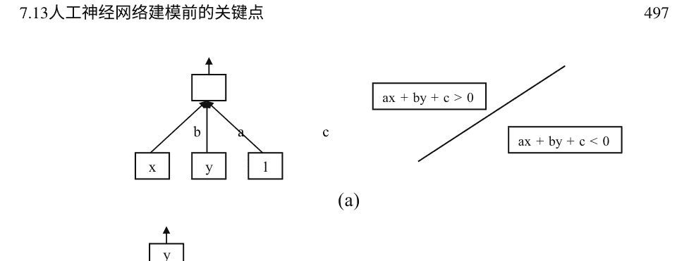

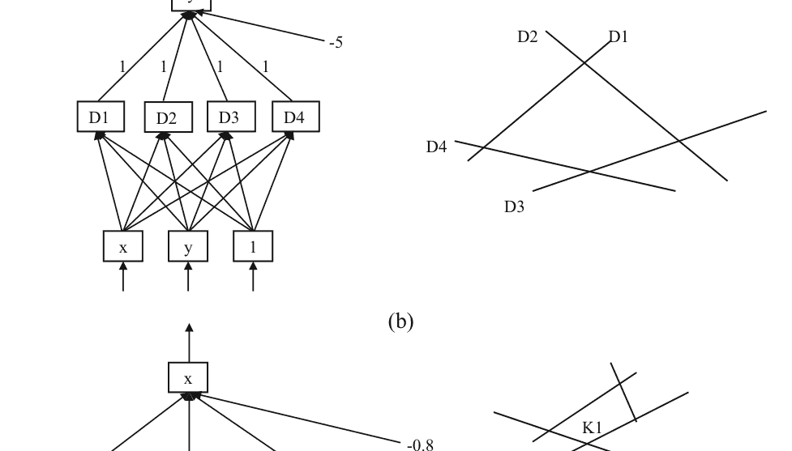

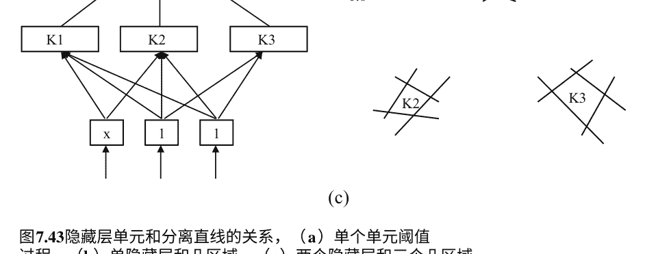

图7.43 隐藏层单元和分离直线的关系，（a）单个单元阈值过程，（b）单隐藏层和凸区域，（c）两个隐藏层和三个凸区域的联合（Mehrotra等人，1997年）

例如，如果ANN架构中有36个连接，并且希望以0.95的可靠性获得结果，则在训练中需要使用的数据数量至少为720。将细胞数n纳入工作中后，建议使用以下公式：

$$N_t \ge \frac{N_w}{1 - \alpha} \log \frac{n}{1 - \alpha} \quad (7.45)$$

如果在上述示例中有八个细胞，则训练数据的数量至少为1587。所有这些理论计算导致理论与实践不一致，就像家里的账户与市场不符一样。因为在实践中收集和处理这么多数据是一个单独的问题。因此，训练数据的数量是通过最佳方法选择的，或者使用可用的数据满足要求。

### 7.13.3 使用人工神经网络进行训练和建模

在前面的章节中，解释了ANN的基本原理、架构结构和激活函数。在所有初始准备工作完成后，是时候训练ANN然后进行测试了。ANN最显著的特点之一是其学习能力。学习被定义为计算可用样本（数据、模式、向量）之间的链接权重，以使结构表现良好。在前一节中，ANN中的学习也被定义为改变细胞之间的连接权重，以实现输入和输出信息之间最合适的描述。这些变化主要包括以下几点：

1. 建立新的连接
2. 替换现有的权重
3. 破坏一些链接权重

ANN将在学习过程中获得的信息存储为神经元之间的连接权重。这些权重值包含了ANN成功处理数据所需的信息（Freeman 1994）。由于信息存储在整个网络中，单个网络的连接值本身没有意义。要理解其含义，必须考虑一组连接权重（Özmetel 2003）。然而，为了使ANN显示出智能行为，所有细胞间的连接都必须具有适当的值。人工神经元在学习期间和通过神经元之间的连接权重存储信息方面类似于人脑。

人工神经网络学习中的一个重要点是选择能够实现学习的训练集。在这个选择中存在一些误解，即选择更大的训练集，教练就会更好。然而，应该选择能够以最少的信息提供最佳学习效果的训练集（Sönmez和Şen1997）。在生成训练集时，选择不同和独立的信息而不是相似的信息可以提供更高效的学习。

已经期望训练集能够对之前未经训练的输入值给出合理的输出。学习中寻求的这种特征被称为泛化。例如，从I1到I5的数据显示了输入和相应输出的实际数据值。图7.44a中的曲线是相同的，但采样用于人工神经网络训练的方式不同。第一次采样是随机的，而第二次采样是正式的。应该优先选择随机采样以获得最佳的人工神经网络训练。它在随机地获取输入数据结构的变化方面具有不同的特点。这种类型的采样没有偏见。

## 7.13 人工神经网络建模前的关键点

### 7.13.4 人工神经网络学习算法

为了开发具有人工神经网络（ANN）的人工智能（AI）程序，必须按照以下步骤进行：

1. 根据问题的情况选择合适的ANN架构
2. 根据应用选择ANN特性（激活函数、连接权重）
3. 根据选定的模型和给定的特性对系统进行训练
4. 使用训练好的系统进行推理，即测试。如果无法获得合适的结果，则必须重新调整之前的一步或多步。

如果在问题中存在n个连续的训练序列（模式），则可以通过在完成以下过程后对ANN进行训练来获得期望的结果：

1. 在第一步（i =1）中选择初始权重。
2. 输入层检测适用于i = 1的数据。
3. 通过使用推理算法（前向传递），可以获得输出单元的激活函数水平。如果人工神经网络的预测结果在一定的误差范围内满足要求，则停止运行。
4. 否则，根据学习规则调整权重。
5. 如果i =n，则i =1。否则，将i增加1并转到第二步。

为了了解所选模型和应用是否令人满意，需要通过最小化实际数据与模型输出层数据之间的误差和来优化人工神经网络。其中一个用于此目的的标准是最小化误差平方和。

误差平方和可以表示为：
$$E_T = \sum_{i=1}^n \sum_{j=1}^m (b_{ij} - O_j)^2 \quad (7.46)$$

在这里，$b_{ij}$和$O_j$分别表示在时间i（或输入第i个数据字符串时）的输出单元j的期望值和网络输出值。此外，还尝试使用交叉熵来优化人工神经网络，交叉熵的公式如下（Hinton 1989）：
$$- \sum_{i=1}^n \sum_{j=1}^m [O_j \log_2(O_j) + (1 - b_{ij}) \log_2(1 - O_j)] \quad (7.47)$$

为了从给定的训练序列中进行推理，必须完成以下步骤：

1. 将输入数据输入到ANN输入层单元中。
2. 计算ANN隐藏层和输出层中每个单元的激活函数水平。
3. 在前馈ANN中，当计算完所有输出层单元的激活函数水平后，过程终止。在反馈情况下，如果每个输出层单元的激活函数水平达到接近恒定值，处理过程终止。否则，返回到步骤2。如果ANN无法达到稳定状态，则ANN架构不成功。

### 7.13.5 人工神经网络教育

由于所有ANN训练都没有确定性，一些哲学方法受到质疑。在计算ANN权重时，所有顺序前向-后向传递过程称为训练。希望训练以误差最小化结束。可以通过检查训练的质量来验证。

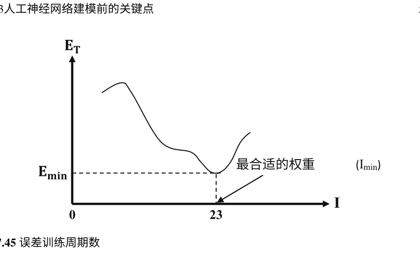

图7.45 误差训练周期数

显示正向馈送迭代次数与误差变化的图表。这样的图表在图7.45中呈现。总的来说，误差的平方和的算术平均值很大，因为权重在开始时是随机选择的。在训练过程中，预计随着高级馈送（训练）的迭代次数I的增加而减少。

从这个图中可以看出，只有在第23次训练之后才达到最小误差的情况。如果相对误差百分比α小于 ±5%，则训练周期终止。数学表达式可以计算如下：

$$\alpha = 100 \frac{|E_{i-1} - E_i|}{E_{i-1}} \quad (7.48)$$

在这种情况下，权重具有最优化的值。这是在经过多次训练周期后实现的。Imin经历了几个训练周期。通过考虑相对误差计算，可以回答以下问题。

1. 问题1：最小误差是否只是局部情况？还是已经达到了绝对（全局）误差？影响计算误差的第一个量是可以改变的权重初始值'coefficients'的选择。因此，通过选择与先前训练电路开始的coefficients完全不同的其他权重值来重新训练ANN，并保持其他条件不变。因此，根据Eq. 7.48再次达到最小误差值。如果这个新的最小误差值与之前的几乎没有区别，那么可以得出结论，权重coefficients是根据训练结束时的绝对最小误差获得的。在这种情况下，新训练的权重值与之前的权重值之间没有显著差异。然而，新的最小误差可能在不同数量的训练周期结束时达到。这也是可以预料的。如果新的最小误差与之前的误差非常不同，那么可以理解它们都没有达到绝对最小值。重新训练是通过选择第三组权重初始值开始的。通过几次不同的训练，最终决定是否达到了绝对最小值。

2. 问题2：影响误差的另一个因素是隐藏层中的单元数。如果我们减少或增加它们的数量，能否减小误差？答案是肯定的，可以减小误差。因此，为了找到最佳的隐藏单元数，这次需要观察误差随单元数N_c的变化。可以用图7.46来图形化地展示这一点。然而，如果想要通过计算机计算得出这个结果，可以使用公式7.48计算顺序相对误差。这些计算是基于层间单元数的，从两个单元开始，得到最小误差，然后逐个增加单元数进行类似的计算。对于每个隐藏层单元数，找到一个预定的最小误差。当连续单元数之间的相对误差小于±5%时，就找到了最合适的隐藏层单元数。从图7.46可以看出，最佳的层间单元数是4。

人工神经网络中输入层和输出层的细胞数量是根据所研究问题的性质来确定的。然而，确定隐藏层中细胞数量更加困难，而且在这方面没有具体的方法。通过逐步改变隐藏层中的细胞数量，可以通过试错法找到使误差平方最小的最佳结果。然而，这需要大量的计算时间。

3. 问题3：影响误差的另一个因素可能是激活函数吗？这可能是答案的一部分。在这种情况下，通过为不同的激活函数制定单独的训练电路，可以达到最小误差。在这些函数中，选择使误差最小的激活函数用于人工神经网络。

4. 问题4：如果在人工神经网络训练之前考虑了学习系数，它会影响学习系数吗？问题的答案可能是肯定的。因此，可以通过最小化基于Eq.7.48的误差来确定这一点。从理论上讲，是可以的，但由于这是一个介于0和1之间的数字，选择它作为专家意见而不经过繁琐的误差计算是可行的。然而，在人工神经网络中，只有在其他条件保持不变的情况下，才能找到不同学习系数下最小误差的变化，并且可以获得对应于其中最小误差的学习系数。对于记忆系数也是如此。在实践中，最好在人工神经网络中一开始就将其作为专家意见加入。

在使用神经网络之前，必须使其架构在第7.11.1节中给出，并且对于所检查的事件具有免疫力，使用可用数据。这意味着在对所研究的事件进行估计时，使用的数据估计了在连续层的细胞之间进行信息传递的权重系数，也就是找到了适当的值。这样的过程被称为神经网络的训练阶段。在训练中，以正式的方式将所需的输入数据提供给输入层的细胞后，如果需要，对于权重系数可以随机赋值，即使对于第一次。因此，如前一节所述，通过操作神经网络来执行输出细胞或细胞中的预测。对于每个可用的n个数据集进行估计后，通过数值方法找到了误差平方和。在这里，对应于这些误差平方和最小的情况的权重集合构成了所研究事件的神经网络架构权重。通常，E_i被表示为第i个数据值的期望（$o_{i1}$，$o_{i2}$，$o_{i3}$，...，$o_{im}$）神经网络模型输出之间的总误差值，以及测量值（$O_{i1}$，$O_{i2}$，...，$O_{im}$)的值是通过以下表达式找到的：

$$E_i = \sum_{j=1}^{m} (o_{ij} - O_{ij})^2 \quad (7.49)$$

然后，这些错误的总和计算为p个数据输入和输出形式，如下所示：

$$E_T = \sum_{k=1}^{p} E_k \quad (7.50)$$

所有权重和阈值都是随机选择的，例如，在-1和+1之间。这在ANN操作过程中没有任何缺点。作为这一自然结果，很容易理解ANN得到的估计结果将与数据值不同。因此，通过顺序改进的“反向误差传播”得到的权重值对应的错误代表了这些权重形成的空间中的一个点。在这里，表面上有峰和谷。

神经网络中权重变量产生的错误。这个表面上的凹陷代表了错误最小的地方。“最陡梯度下降”方法在数值和系统研究中用于达到低谷点 (Şen, 2004)

这与数学中的方法相反，函数的导数为零。在寻找连续最小斜率点的过程中，最初选择了一个靠近顶点的位置。然后，通过对相互连接的权重集进行连续错误减少的研究，逐步向最低点前进。这个过程在数学上表示为：

$$\Delta a_{ij} = -\eta \frac{\partial E}{\partial a_{ij}} \quad (7.51)$$

在这里，$\Delta a_{ij}$是不同层之间的误差变化；$\eta$表示学习速率的比例系数，而$\partial E / \partial a_{ij}$表示该点处误差曲面的斜率。学习速率保持较小，以确保在训练过程中权重系数的变化不会振荡。通过采用较高的学习速率可以缩短训练时间。完成这些过程后，根据以下表达式更新权重。

$$a_{ij}^{\text{new}} = a_{ij}^{\text{old}} + \Delta a_{ij}^{\text{old}} \quad (7.52)$$

在实际应用中，根据公式7.51计算权重增量：

$$\Delta a_{ij}^{\text{old}} = \delta_i E_T O_j \quad (7.53)$$

在这里，$\delta_i$表示第i个单元的误差项，$O_i$表示来自上一层到该单元的值。Rumelhart等人 (1986) 建议根据所考虑的单元是否在输出层或隐藏层，取不同的$\delta_i$值。

## 7.14 训练规则描述

在ANN的训练过程中，有几个规则可以从中受益。其中第一个规则是由Hebb (1949) 以最简单的方式提出的。后来的规则则根据需要进行了一些改进。这些规则中的大部分都以第一个出价者的名字命名。通常使用的训练规则有几种不同的，这取决于将用于刷新权重值并以使ANN为决策做准备的数学方法。对于自然神经网络的训练规则，人类的了解是有限的，不是全面的。这里介绍的ANN学习规则必然比自然规则简单得多。这个主题还有待研究。迄今为止已经开发和使用的主要规则如下：

1.  Hebb's (1949)规则：这是第一个也是最好的训练规则。如果一个神经元从另一个细胞接收到信息，并且两者都非常活跃（数学上具有相同的符号），则这两个细胞之间的连接值应该被加强，也就是说，权重值应该增加。否则，需要减弱权重值。总之，这个规则是基于改变权重值的符号（+或-）以及预定的固定大小（见第7.8.3节）。
2.  Hop field (1982)规则：这个规则与前一个规则类似。它们之间的区别在于，这个规则中的权重值改变的幅度不同于符号。因此，如果期望输入和输出细胞的符号相同，即活跃或都不活跃，那么权重值将增加教学速率（coefficient）η；否则，它将减少相同的数量。这里的规则与之前的规则不同，还包括一个训练系数，由ANN设计者选择的一个大小，通常在0和1之间，经常在0.2和0.4之间。在赫布的规则中，这个比例等于1。
3.  Delta规则：这是最广泛使用的规则，也是基于赫布规则的。在这里，它是一种通过不断改变先前的权重值（我们可以称之为delta，δ，差异，受数学启发）的学习方法，直到连接值的ANN输出接近于输出数据值。它基于最小化ANN输出的均方误差和恢复权重的过程。错误在连接权重中从最后一层开始，向第一层传播。这被称为反馈过程，意味着错误的回传。这个过程一直持续到达第一层（输入层）。使用这种类型的学习训练的架构可以称为误差分布反馈ANNs。这个规则在文献中也被称为Widrow-Hoff（1960）或最小均方学习规则。
4.  Kohonen (1988) 规则：这个规则受到生物系统中的学习规则的启发。在这里，神经细胞负责学习和在自身内部再生权重。输出最大的细胞被宣布为获胜细胞。虽然这个细胞影响它的邻居，但它完全不影响其他细胞。只有获胜细胞输出，但在连接的更新中，邻近细胞通过更新它们的权重参与其中。Kohonen规则不需要输出数据数组。因此，他通过无教师训练完成了他的训练（无监督）。为此，存在中心细胞效应和邻近性。因此，出现了一个自我调节的ANN。这些规则的算法将在第7.13.5节中解释。

### 7.14.1 监督训练

对于这种类型的训练，人工神经网络（ANN）输出层中的输出数据应该以数字形式给出。这种认知使得整个ANN能够学习网络，并且甚至可以以输入与输出完全相反的方式记忆输出。

在这种训练过程中，ANN输出一个数值。由于这个数值是已知的，就好像一位教师将输出与应该得到的结果进行比较，并决定结果是否可接受。在这个决定中，ANN得到的数值与数据数值越接近，可接受性就越高。就像每位教师的评分有所不同一样，这位教师根据自己的标准确定了一个误差限度，如果ANN输出与数据数值之间的差距在这些限度之间（比如±5%），教师就接受这样的误差。因此，ANN的训练就终止了。通过将ANN结构中的神经连接（权重）值计算为最小化这些误差的平方和，输出就会逐渐接近最小误差。

通过将输入向输出的方向传递，将得到的结果与输出数据值（测量值）进行比较，观察到差异作为误差。通过计算ANN结构中的神经连接（权重）值，使这些误差的平方和最小化，输出就会逐渐接近测量值。在这里，从输入到输出将会有一个正向流动，如果误差项不在期望的限度内，将会有一个从输出到输入的反向流动（反馈）。然而，在这些正向和反向的过程中，输入变量永远不会改变其值，但输出变量将始终以更接近测量值的方式改变其值。如果这些正向和反向的相对误差小于期望值，例如±5%或±10%，则ANN的运行将终止。因此，ANN可以通过计算下一个输入数据的输出来进行预测。在这个过程中，通过最小化误差的平方和来进行学习。

例如，学习一门外语时，听到老师说一个单词后会重复它。如果从老师那里听到的声音在脑海中保留，一个人会通过重复（来回）使用它，即使发音与听到的发音不完全相同，但如果非常接近，一个人会相信自己已经正确地发音了那个单词。因此，在监督训练中，应该有一个学生和一个老师。

在有监督的训练中，有一个从外部干预学习的老师。这个过程完全在训练者的控制之下。老师决定确定训练集，训练将进行到什么阶段，以及如何进行。有监督训练的最重要特点是在训练过程中使用实际值（Kosko 1990）。有监督的训练可以分为两类：老师给出正确结果的训练和老师只给出奖惩的训练。

### 7.14.1.1 训练中教师告知正确结果

在这里，首先，训练者只向人工神经网络提供输入信息。允许人工神经网络生成输出信息。接下来，教师还提供了期望的输出信息（实际数据）。因此，人工神经网络通过比较输出数据值来更新连接权重，以达到期望的输出值。在教师的监督下，这个过程会继续进行，以使人工神经网络的训练达到最小误差。

### 7.14.1.2 仅由教师给出奖惩的教育

在训练过程中，教师只会声明人工神经网络找到的结果是真或假，而不是给出确切答案。人工神经网络根据这些警告来调整连接权重进行训练。

### 7.14.2 无监督训练

在没有输出信息的人工神经网络建模中，不再有教师来控制输出的质量。人工神经网络只从输入层获取信息，并根据自身的处理将其分成簇。在这里，用户可以自由进行自己的聚类。因为不需要教师，所以它也被称为自学习。在这种训练中，只提供输入信息。人工神经网络可以生成输出。由于网络从未提供期望的输出，因此不考虑误差（Kosko 1991）。

输入的信息由ANN和分析器处理。解耦的目标是尽可能识别出许多不同的聚类。因此，链接权重仅根据输入数据而改变。分离准则可能以前未知。在这种情况下，网络必须制定自己的分类规则。然而，应注意这种类型的学习只适用于有限数量的ANN模型。

在这种类型的训练中，学生必须自己做一些事情，没有老师。同样，关于ANN的输出，即类似于从河流的已知点过桥的情况，也没有信息。在这种情况下，ANN架构接受一些输入值，并在并行操作后将它们分成一些组或模式。如果以后有输出状态，将通过这个帮助给组或模式赋予新的状态。在没有这样的信息的情况下，可能得到一个组或模式，甚至可能完全是任意的。如果有人给某人土壤，那个人可以主观地将其分为砾石、沙子和粉砂三类。如果他后来再给他一个样本，并且它属于这三个组中的一个，他就将其分配给该组，但如果不属于任何组，他就建立一个新组。每个新的信息都会导致对先前存在的组之一进行分类，或者会揭示新的组（聚类）。

尽管无监督训练不需要输出数据，但了解一些关于输出的提示是有用的。在没有这些线索的情况下，无监督训练可能会失败，也可能会成功。就像婴儿可以通过时间对知识进行分类、比较和聚合，而不需要老师，随着年龄的增长和从环境中获得的视觉和听觉信息，他们可以通过使用给予他们的数据来进行聚类、推理和预测。具有这种工作原理的人工神经网络被称为无监督人工神经网络。这些神经网络的最重要特点是它们甚至不需要在隐藏层中使用特殊的激活函数。

这些无监督神经网络可以训练哪些人？许多可以通过人类思维和一些先前已知的经典方法进行的聚类操作可以以一种不同且更有效的方式进行。特别是在聚类过程中，尽可能将相似的数据放在一起，将不相似的数据尽可能远离（第9章）。通过利用给定的数据（向量、模式）序列集，可以找到不同的想法来找到其子集。以下是主要的几个：

-  1. 依赖原则：只要两个数据集相互依赖，它们应该放在同一个簇中。具有相同数量元素的两个数据数组，假设为n，在n维空间中表示两个点。如图7.47所示，(x11, x12,..., xn1)和(x21, x22, ..., xn2)数据也可以表示为具有相同起点的向量。它们彼此越接近，它们之间的角度越小，它们越相似。因此，它们可以放在同一个簇中。

通过计算两个向量之间的夹角的余弦值，α，可以将它们的数量积写为：
$$ \cos \alpha = \frac{\vec{a} \cdot \vec{b}}{|\vec{a}| \cdot |\vec{b}|} \quad (7.54) $$

这个表达式的分母表示向量的强度。对于标准化向量的情况，由于每个向量的大小都等于一，方程式7.54的形式如下。
$$ \cos \alpha = \vec{a} \cdot \vec{b} \quad (7.55) $$

由于方程式7.55在口头上表示两个向量的倒数分量的乘积之和，可以明确地写成：
$$ \cos \alpha = \sum_{i=1}^{n} x_{1i} x_{2i} \quad (7.56) $$

这在经典统计学中被称为相关系数（第4章）。它的值范围从−1到+1，如果值接近+1，则可以说这两个向量几乎处于相同的方向且彼此接近。实际上，方程式7.56可以被视为将输入数据（模式）通过权重从输入层传递到下一层的单元（隐藏或非隐藏）。为了看到这一点，例如，由于向量x₂₁的位移导致了权重向量元素的变化，ai变为：
$$ \cos \alpha = \sum_{i=1}^{n} x_{1i}a_i \quad (7.57) $$

这就像是方程7.31，并且可以写成：
$$ \text{NET} = \sum_{i=1}^{n} x_{1i}a_i \quad (7.58) $$

从这里可以得出一个非常重要的结论，如果输入向量和权重向量彼此接近，可以使用权重向量代替输入向量。在Kohonen (1988)人工神经网络中考虑这个原理，一组输入模式可以通过自学习分配给不同的聚类（第7.6.1节）。

-  2. 距离原则: 同样，可以认为前面提到的两个数据序列的相似性是通过它们之间的距离来衡量的。点A和点B之间的距离如图7.47所示。可以理解距离准则比角度准则更可靠。因为即使角度为零（平行向量），由这两个向量确定的点可能不重叠。然而，如果距离为零，这些点会重叠在一起。因此，计算方法需要提供一个距离准则。尽管有不同的距离准则，但为了可微分性，通常使用欧几里得距离定义。因此，两个数据序列（模式、向量）之间的距离计算如下：
$$ U = \sqrt{\sum_{i=1}^{n} (x_{1i} - x_{2i})^2} \quad (7.59) $$

在这里，如果其中一个向量被一个权重向量替换，将得到以下结果：
$$ U = \sqrt{\sum_{i=1}^{n} (x_{1i} - a_i)^2} \quad (7.60) $$

这在许多ANN计算中用于聚类（参见第7.6.1节）。

### 图7.48子区域计算方法

-  3. 常见数字化原理：在另一个可以定义为聚类的过程中，它是确定域的过程。这些研究在不同的学科中使用Voronoi区域，在数值分析中使用有限元覆盖的区域（§en 1998）。如图7.48所示，通过连接测量站与相似区域的中垂线确定的子区域中的所有事件都被包括在计算中，就好像它们具有相同的行为。如果没有这样的交易，例如，如果每个区域内的每个点的平均税款都相同，那么将执行聚类操作。

有效场的检测在人工神经网络中的向量数值分解方法中找到了对应物（第7.6.1节）。通过这种方法，极大的数据可以用很少的聚类来表示。例如，在地球科学中，通过将岩石分类为火成岩、沉淀岩和变质岩制作地质图，不仅将岩石在有限点上的属性分为三组，还有助于人类的理解和解释。

-  4. 效率原则：在这里，通过确定关于所调查事件的不同数据系列中哪个更有效，即优先级，进行一种聚类。而不是前一步骤中描述的空间活动。从收集到的数据中，还可以推断出那些与所研究事件不太相关的数据的消除。如果在比较不同国家时存在语言因素，这个变量在考察土耳其人时将失去其效力，并且在考察中不予考虑。因为每个土耳其人都会说土耳其语。在考察来自土耳其的土耳其人时，土耳其不被视为一个领域，因此，一些变量被消除，而将土耳其人从土耳其划分为不同的群集（社会、经济、文化、起源、宗教等）的有效变量被考虑。因此，输入变量的数量减少了，更容易了。

### **图7.49主要成分**

可以进行建模。

-  5. 主要成分：与之前的不同，还使用了一些变换来减少变量的数量。例如，在主要成分分析中，通过将其减少到较小数量的变量的转换所得到的数据被用来代替真实数据。图7.49给出了两个变量x和y的散点图。

可以用图中s方向上的一个变量来表示，而不是这两个独立变量。状态可以被看作是将输入x和y连接到输出s的人工神经网络。实际上，点在与s垂直的t方向上也有投影，但由于它们与s方向的比例要小得多，所以只考虑s方向。通过调整权重值，这两个变量变得共同。通常情况下，n个变量的状态也可以分解为m < n个主要变量。

### 7.14.2.1 海明网络

在这里，将包括一些基本的人工神经网络原理，这些原理对于实现聚类和类似的操作是必要的。在人工神经网络中，每个单元代表学习中使用的重要特征。因此，网络中的每个单元都是独立重要的。它们都保持了效率原则，并显著减少了大量数据的大小。在这里，将解释未经训练的教育人工神经网络单元，这些单元是通过使用非常简单的方法提出的。这些是海明、最大和简单竞争学习网络。

在大多数可以进行无监督训练的人工神经网络中，距离计算及其相互比较是一个问题。海明距离是一种衡量元素为0或1的数据字符串之间的距离的方法。在图7.50中显示的海明人工神经网络中，有输入层和输出层以及它们之间的权重连接。

这些权重链接用于存储输入层给定的不同数据集。例如，大小为n的第k个0 -1输入数组的第i个元素是I_i1, I_i2, ... , I_in。因此，输入层和输出层应分别有n个和k个单元。输入层的第j个单元与输出层的第i个单元之间的权重相关值为a_{i,j} = I_{ij}/2。权重和阈值向量的元素，假设输出层的每个单元的阈值值为 -n/2，可以写成：
$$ A = \frac{1}{2} (I_1, I_2, \ldots, I_k) \tag{7.61} $$
和
$$ E = -\frac{n}{2} (1, 1, \ldots, 1) \tag{7.62} $$

当在已经数字化的ANN中检测到像I这样的数据系列时，可以将输出值写为 :
$$ O = AI + E = \frac{1}{2} (I_1.I - n, I_2.I - n, I_3.I - n, \ldots, I_k.I - n) \tag{7.63} $$

由于I_i.I表示两个向量的数量积，其各个分量的乘积之和计算如下：
$$ \sum_{j=1}^{k} I_{ij} I_j \tag{7.64} $$

### 7.14.2.2 应用

如何使用Hamming向量，I_1 = (1, -1, -1, 1, 1), I_2 = (-1, 1, -1, 1, -1), 和 I_3 = (1, -1, 1, -1, 1) 存储在ANN中吗？由于有三个模式和 five个元素，Hamming ANN的架构呈现为两层，其中 five个输入和三个输出单元。从这里可以看出，权重和阈值值以以下矩阵形式出现：
$$ A = \frac{1}{2} \left( \begin{array}{ccccc} 1 & -1 & -1 & 1 & 1 \\ -1 & 1 & -1 & 1 & -1 \\ 1 & -1 & 1 & -1 & 1 \end{array} \right) $$
和
$$ E = -\frac{5}{2} \left( \begin{array}{c} 1 \\ 1 \\ 1 \end{array} \right) $$

当这个ANN首次检测到数据时，三个输出单元的输出变得可用，如下所示：
$$ \frac{1}{2} \times 1 - \frac{1}{2} \times 1 - \frac{1}{2} \times 1 - \frac{1}{2} \times 1 - \frac{1}{2} \times 1 - \frac{5}{2} = -4 $$
$$ -\frac{1}{2} \times 1 + \frac{1}{2} \times 1 - \frac{1}{2} \times 1 - \frac{1}{2} \times 1 + \frac{1}{2} \times 1 - \frac{5}{2} = -3 $$
$$ \frac{1}{2} \times 1 - \frac{1}{2} \times 1 + \frac{1}{2} \times 1 - \frac{1}{2} \times 1 + \frac{1}{2} \times 1 - \frac{5}{2} = -2 $$

这些是输入和隐藏向量之间的汉明距离的负值。从这里，可以找出哪个隐藏模式更接近于输入模式，通过输出的最大值。为此，在输出层之后需要添加最大的ANN。

### **7.14.3 强制监督**

在这种训练方式中，输出端应该有几个神经元。因此，可以决定输出是否与现有的神经元相同。对于每个给定的输入，使用ANN获得一个输出。监督者说这个输出是成功的还是不成功的，而不是说它属于以下哪个类别。因此，使用二进制逻辑规则。在监督者表示不成功的情况下，ANN会继续训练，直到通过反复处理输入来确定它是成功的决策。

### **7.15 竞争性教育**

尽管这类似于无监督训练，但人工神经网络中的特征操作和架构略有不同。这里的输出处有一些人工神经元当有输入时，人工神经网络机制会尽量使输出至少接近其中一个目标。这个输出神经元现在成为一个主要群体，而其他神经元则不重要。在另一个输入的情况下，另一个输出神经元变得活跃，以便工作可以继续进行。可以说竞争性训练就像聚类。如第7.6.1节所示，Kohonen人工神经网络接受竞争性训练。基本原理是胜者通吃，即不给其他人留下任何东西。在数据的归一化状态下，竞争性训练中的获胜细胞是具有最大激活函数输出的细胞。在没有归一化的情况下，根据第7.14.3节中解释的距离原理（欧几里得距离），确定获胜细胞。

### 7.15.1 半教师训练

如果在ANN建模中输出值未知，则放弃先前的训练，但应选择两个选项之一。其中一个选项是对输出进行口头信息，或者根本没有任何信息。半指导训练可以获得口头知识。在这种知识中，通常有好坏、美丑、是非、对错等二进制逻辑。由于教师在这里没有完全的知识，他只能部分地指导ANN。在这种训练之后，教师帮助ANN获得分为两类的输出。

### 7.15.2 学习规则算法

根据各种研究的结果，已经开发出了许多学习规则，如第7.14.1节所述。在研究中无法实现期望的行为时，有时会同时使用监督和无监督训练规则（Hsieh和Chen 1993）。由于ANN中的学习可以通过更新连接权重来实现，训练是逐步进行的。在这里，只提到最常见的使用的感知器、Widrow-Hoff、Hebb和delta学习规则。

在将要提到的训练算法中，有一些符号表示如下。向量 A_i = [a_i1 a_i2 ... a_in]^T 是网络中第 i 个单元的 n 个输入的链接权重向量。同样，向量 I = [I_1, I_2 ... I_n] 表示输入数据（模式、向量）。此外，O_i 和 B_i 分别是从第 i 个单元获得的输出值和期望的输出值。最后，η 是学习率，表示一个固定的数值。

### ### 7.15.2.1 感知器学习规则

正如之前提到的，感知器是由Rosenblatt（1958）提出的线性人工神经网络。感知器学习规则是一种有监督算法，试图找到输入和输出之间的链接权重向量。

输出值可以表示为：
$$ O_i = \text{sgn}(A_i^T I) \quad (7.65) $$

另一方面，考虑到 O_i和 B_i，在第 (k + 1) 次迭代中，权重值如下更新：
$$ A_i(k + 1) = A_i(k) + \eta \{B_i(k) - \text{sgn}[A_i^T(k) I(k)]\} I(k) \quad (7.66) $$

请注意，权重的变化仅在 B_i ≠ O_i 的情况下有效。也就是说，当输出值得到错误值时，权重将被更新。否则，由于括号将为零，A_i(k + 1) = A_i(k)。

### ### 7.15.2.2 Widrow-Hoff 学习规则

Widrow-Hoff (1960) 训练规则也是一种有监督规则。该规则最重要的特点是它独立于激活函数的工作。该规则仅基于最小化实际输出值与 ANN 给出的输出之间的误差的原则。权重系数根据以下表达式进行更新：
$$ A_i(k + 1) = A_i(k) + \eta [B_i(k) - A_i^T(k) I(k)] I(k) \quad (7.67) $$

这被认为是增量学习算法的一个特殊情况，将在第7.14.3节中详细解释。

### ### 7.15.2.3 Hebb学习算法

Hebb算法是一种无监督训练方法。基本思想是通过扩大导致细胞突然生成的连接的权重系数来增加效果。权重恢复如下：
$$ A_i(k + 1) = A_i(k) + \eta [A_i^T(k) I(k)] I(k) \quad (7.68a) $$

换句话说，它可以显示为：
$$ A_i(k + 1) = A_i(k) + \eta O_i(k) I(k) \quad (7.68b) $$

在方程式7.68b中，如果输出和输入值的乘积为正，向量A_i将增加；否则，将减少。这个学习规则已经应用于第7.8节的感知器架构中。

## 7.15.2.4 Delta学习规则

这是一种有监督的学习规则，只有在激活函数的导数被考虑时才有效。在这个学习规则中，当权重被更新时，导数被包含在计算中。虽然它是最常用的，但另一个名字是梯度下降规则。连接权重被更新为：

```
$$a_{ij} (k+1) = a_{ij}(k) - \eta \frac{\partial H_i}{\partial a_i (k)}$$  (7.69)
```

在这里，第k次迭代的总误差计算如下：

```
$$H(k) = \frac{1}{2} \sum_{i} (B_i (k) - O_i (k))^2 = \frac{1}{2} \sum_{i} [B_i (k) - (f(\sum_{j} a_{ij}(k) I_j(k)))]^2$$  (7.70)
```

根据连接权重的变化来表达误差的变化：

```
$$\frac{\partial H(k)}{\partial a_i (k)} = - \sum_{i} (B_i (k) - O_i (k)) \frac{\partial O_i (k)}{\partial a_i (k)}$$  (7.71)
```

在这里，a_i的变化方向与误差曲面的斜率相反。因此，目标是在误差函数形成的曲面上找到误差最小的位置。

## 7.15.3 反向传播算法

Minsky和Paperts（1969）表明，与单层感知器相比，两层前馈网络消除了许多限制，但他们无法提供如何改变层间连接权重的解决方案。由于在ANN的训练过程中无法找到解决方案，多年来进行的研究没有取得进展。因此，ANN进入了一个衰退期，直到20世纪80年代保持沉默。

Rumelhart等人（1986年）提出了反向传播算法，引起了对人工神经网络的兴趣复苏。尽管该算法是一种正式的方法，但它基于复杂的数学基础。此外，该算法为许多问题提供了更好的解决方案，例如输入输出描述、聚类和泛化，这些问题在以前并不成功。因此，反向传播算法被认为是人工神经网络中的一个转折点，它使得解决许多问题成为可能，并实现了许多成功的应用。

反向传播算法是隐藏层人工神经网络中使用的一种强大的学习算法。其基础是由可以完全和有效地计算的子系统组成的人工神经网络的反向传播算法，这使得可以使用人工神经网络来学习复杂、非线性和过程参数之间的关系（Verbos 1994）。

反向传播算法中有两个基本的流程。第一个是网络中的前向信息流，第二个是反向误差传播。在前向流程中，使用加权系数获取输入与输出（见第7.12节）。在反向流程中，通过计算模型输出与真实数据之间的差异来传播误差，并改变权重。

与所有学习方法一样，反向传播算法的目的是获得连接权重，以提供最合适的输入和输出数据之间的描述。反向传播算法在具有如图7.32所示拓扑结构的网络上逐步进行，具体步骤如下：

- 1. 首先，确定人工神经网络的拓扑结构，包括每个层中的单元数。
- 2. 为上述表达式中的常数参数赋值。
- 3. 随机分配层之间的权重关系A和C的值。
- 4. 使用分配的连接权重，对于每个输入向量，计算输出，其中n是测量次数， c_{kj} (i = 1,..., n; j= 1,...,m)。
- 5. 从输出层和隐藏层之间的连接权重开始，通过反向传播错误来更新c_{ij}值，如下所示：
- 6. ANN 给出的输出值 O_{kj} 和 a_{kj}是使用模型输出值 o_{ij}计算的，总误差值计算如下：
- 7. 为了逐个权重系数地更新每个权重系数，通过对 E_T 根据连接权重逐个求导：

> a^{ij \text{ 新 }}= a^{ij \text{ 旧 }}-\eta \frac{\partial E}{a_{ij}} \quad (7.72)

其中 η 是一个非零数值。为了更新权重系数 a_{ij}，首先，根据连接权重计算误差值和误差值的导数应该被计算。

> E_{\mathrm{T}}=\sum_{i=1}^{n} \sum_{j=1}^{m}\left(O_{i j}-o_{i j}\right)^{2} \quad (7.73)

> \frac{\partial E_{\mathrm{T}}}{\partial a_{i j}}=\frac{\partial}{\partial a_{i j}}\left[\sum_{k=1}^{n} \sum_{j=1}^{m}\left(O_{k j}-o_{i j}\right)^{2}\right] \Rightarrow \frac{\partial E_{\mathrm{T}}}{\partial a_{i j}}=2 \sum_{k=1}^{n}\left(O_{k j}-o_{i j}\right) \times-\left(f^{\prime}\left(o_{i j}\right) y_{i}\right) \quad (7.74)

由于sigmoid函数被用作激活函数，它的导数可以表示为：

```
$f'(o_{ij}) = o_{ij}(1 - o_{ij})$
```

因此，在完成所有操作之后，a_ij连接权重将被更新。

- 8. 错误必须以与连接权重a_ij相同的方式传播到c_ij上。因此，c_ij连接权重的更新类似于第7.72式，并按照以下方式进行：

```
$c_{ij}^{\text{new}} = c_{ij}^{\text{old}} - \eta \frac{\partial E}{\partial c_{ij}}$
```

- 9. 借助链式法则，E_T项对c_ij连接权重的变化如下所示：

```
$\frac{\partial E_T}{\partial c_{ij}} = \frac{\partial H_T}{\partial o_{ij}} \frac{\partial o_{ij}}{\partial a_{ij}} \frac{\partial a_{ij}}{\partial c_{ij}} \Rightarrow \frac{\partial E_T}{\partial c_{ij}} = 2 \sum_{i=1}^{n} \sum_{j=1}^{q} (O_{ij} - o_{ij}) \times -[ f'(o_{ij}) a_{ij} f'(a_{ij}) a_{ij} ]$
```

因此，由于A和C的连接值完全更新，它们将与初始随机分配的值不同，因此ANN的训练完成一次。ANN可以通过类似的方式重复相同的操作来进行训练。请注意，由于训练的结果总是向后传播总误差，因此误差值将减小。每次训练后误差值的减小表明适当的加权系数被逼近，这将执行输入和输出数据之间的描述。

为了可靠地进行网络训练，初始随机分配的连接权重非常重要。这些权重决定了训练的起点。这个起点离真实解决方案非常接近还是很远，完全取决于在开始时确定的值。亚历山大和诺顿（1992）指出，如果训练过程从给权重分配相等的值开始，训练过程将不会进行。原因是当相同的误差值以相同的值传播到链接权重时，链接权重将不会彼此取不同的值。

神经网络中的一个重要点是决定训练的持续时间（见第7.5.3节）。完成训练过程有两个选项。其中之一是冒一定的错误容忍度并继续训练直到达到更低的错误值。因此，在这种情况下，错误的数量比训练次数更重要。在这里，错误容忍度必须在一定范围内合理的限制。 否则，无论训练次数增加多少，都很难达到所期望的错误值以下。 另一种选择是选择一个固定的训练次数。 在这种情况下，训练者接受将得到的错误作为特定训练次数的结果。 训练者从一开始就根据要完成的工作决定如何进行训练。

综合考虑方程7.72和7.76，可以看到误差对连接权重的导数出现在方程的右侧。 由于训练结束时误差值会减小，这些导数将逐渐减小，预期在理想情况下达到零值。 在这种情况下，无论训练过程持续多长时间，aij和cij的值都不会发生变化，即连接值将保持不变。 对于这种理想情况，训练停止阶段是误差项达到零的时刻。

然而，除非在特殊情况下，误差项几乎不可能达到零。 在输入和输出变量之间描述零误差是不可能的，特别是在不确定性也起作用的自然事件中。 误差曲面通常是一个同时具有局部点和整体最小点的曲面。

训练人工神经网络的目的是在这个曲面上达到一般最小点。

在训练过程中，不应期望误差值始终减少。 有时候，可以观察到误差增加。 这通常是远离解决方案的迹象。 如果在误差曲面上达到局部最小点时继续训练，误差值会增加一定量，直到局部最小点消除为止。 然后，当它向另一个最小值移动时，误差值开始再次减少。 然而，误差值增加而不减少表明这一点是一个一般最小点的指示。 尽管如此，在解决方案期间没有关于误差曲面的任何信息，所以是否达到局部最小点呢？ 还是一个一般最小点？ 很难判断它是什么。 因此，在许多研究中，一旦误差值开始增加，训练过程就会终止。

人工神经网络训练中的另一个重要参数是学习率，η的选择。 这个比率控制着连接权重的变化量。 为了选择一种高效的学习方式，选择适当的学习率非常重要。 适当的 η值可以导致在很少的训练次数后得到解决方案，而不适合的 η值将导致需要过多的训练才能达到解决方案。

学习率可以表示为在误差函数上逼近最小值时所采取的步长大小。 如果将这个比率值设置得很小，连接权重和误差值的变化将很小，因此需要进行大量的训练才能达到真正的解决方案。 在这种情况下，由于变化量非常小，通常可以停止训练，认为已经达到了最小点。 Haykin（1994）提出，如果选择的η值很大，连接权重将出现突然而剧烈的变化，这将导致不稳定性。

为了以最佳方式确定学习率，应注意错误曲面上点的斜率。 如果斜率很小，增加步长，也就是选择较大的学习率，有助于达到最小点。由于错误曲面的变化非常小，采取大步长没有任何害处。如果斜率很高，这时应尽量采取小步长。在朝最小值方向前进时，在斜率较高的地方选择较大的步长可能会导致不稳定，因为会引起跳跃。

如上所述，根据斜率来确定η的值是困难的，因为关于误差曲面的信息不多。因此，在研究中通常将一个介于0和1之间的值分配给它，最好是在0和0.2之间。此外，根据训练过程中出现的不确定情况，可以通过控制来确定η的值。值得注意的是，选择适当的η值可以在较少的训练中完成描述。

尽管反向传播算法是一种强大的学习算法并且被广泛使用，但它也有一些缺点。其中，例如，不能保证网络可以被训练。人们可能认为只需扩大网络就足以进行训练。保持网络的规模并不能保证学习的困难程度。由于网络的扩大会增加更多的处理负荷，以有限的时间内进行训练的概率会降低（Morgan和Scofield 1991年）。

### 7.15.3.1 无监督人工神经网络

除了前面描述的常见人工神经网络之外，本节还将介绍具有向量分离、递归振荡理论和径向基函数的人工神经网络。这些人工神经网络通常没有隐藏层，或者如果存在隐藏层，则具有特殊的激活函数，与之前的神经网络不同。本节将介绍在实践中广泛使用的线性向量分段、再生振荡理论和径向基激活函数的人工神经网络。

### 7.15.3.2 线性向量片段

在第7.2节中讨论了ANN和其他模型的比较时，我们说过简单的ANN系统函数的形式如下矩阵：

```
latex
\begin{bmatrix}
\phi_{i1} \\
\phi_{i2} \\
\vdots \\
\phi_{im}
\end{bmatrix}
=
\begin{bmatrix}
a_{1,1} & a_{1,2} & \ldots & a_{1,n} \\
a_{2,1} & a_{2,2} & \ldots & a_{2,n} \\
\vdots & \vdots & \ddots & \vdots \\
a_{m,1} & a_{m,2} & \ldots & a_{m,n}
\end{bmatrix}
\times
\begin{bmatrix}
\gamma_{i1} \\
\gamma_{i2} \\
\vdots \\
\gamma_{in}
\end{bmatrix}
\quad (7.78)

```

这个矩阵也可以用向量的部分来详细解释。就ANN而言，我们可以谈论三个不同的向量：

- 1. 最右列中的第i个输入向量，I_ij (j =1, 2,..., n)。
- 2. 最左列中的第i个输出向量，O_ij (j =1, 2,..., n)。
- 3. 在系数矩阵的每一行中，有m个权重向量（行向量），将输入向量的元素连接到每个输出单元。

因此，总共有（m + 2）个向量，其中两个是列向量，m个是行向量。值得注意的是，输入向量和权重向量的大小相同。此外，系数矩阵可以被视为列向量，但在前面的部分中，这些并不重要。从这些解释中，可以得出结论，ANN架构是一组向量的集合。

这些向量中的每一个执行线性操作，没有曲线操作。根据权重向量元素的值，输入分别分布在输出单元中。一个问题是，在这种分布中，输出层的哪个单元会占据最大份额。

具有最大权重数组元素的权重向量将输入向量移动到具有最大权重的相应输出单元。因此，输出单元被分类为最重要的；其次重要的可以相应排序。在这种情况下，将输入数据中的信息传递到输出单元的权重向量中，哪个权重向量可以使这种传递量最大，输出中大多数单元的重要性相应降低。权重向量中的权重值并不是已知值。由于这些值在开始时是通过随机分配确定的，并且输入信息被移动到输出单元，因此不可能调整这些权重向量的权重，使其中一个承载最多的权重。明确的答案是“是的”，但是应该开发什么方法来正式实现这一点呢？假设这样做，例如，可以通过具有两个输出（单元）的输出层来表示输入向量。因此，将输入向量分成少量的权重向量，以获得输出单元中的状态。具有这种理念的方法被称为线性向量量化（LVQ）。

### 7.15.3.3 线性向量片段人工神经网络

自从Kohonen（1988）首次开发以来，这种人工神经网络方法也被称为Kohonen人工神经网络。基本概念是将输入向量分割为子向量，如上所述。在这种人工神经网络中，权重必须经过训练，使得由权重指示的向量最接近输入向量。在训练这种人工神经网络时要考虑的学习规则是开发权重向量，这将使得每次权重更新时更接近输入向量的收敛。在这种方法的最后，如果一个权重向量与输入向量非常接近，由于可以将它们都归为同一类别，例如，可以给予其输出单元代码1；因此，一个聚类被打开。如果相同的权重或略有不同的权重逼近其他输入数据，则可以决定它们也可以放在同一类别中。相反，如果权重向量最接近输入向量，但它们之间的距离很重要，则通过分配权重向量来打开一个新的聚类

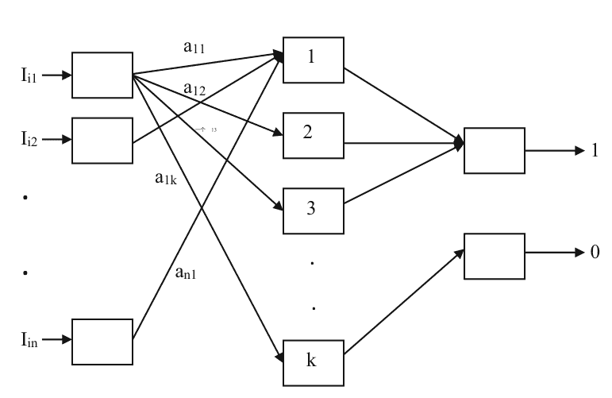

图7.51 LVP YSA

将值从0传递到输出层的单元，即为该权重向量的输出。因此，得到了一个包含两个单元的输出层，其输出被称为0或1。在所有这些都说完之后，可以得出结论：LVQ作为ANN架构中有两个层。输出层除了显示聚合状态外，没有其他功能。输入层感知所有功能，信息传递到隐藏层，该层的单元之间存在接近输入向量的竞争，表明该层具有主动功能。LVQ ANN架构如图7.51所示。该架构中的隐藏层称为Kohonen层。

在这些ANN中，仅存在输入层和隐藏层之间的相关性。Kohonen层和输出层之间的关系都等于1。Kohonen层中的每个单元分别被描述为1和0。Kohonen层中的权重向量数量与单元数相同。LVQ ANN的操作按照以下步骤进行：

- 1. 数据收集和质量控制。
- 2. 在这个网络中，通过仅确定Kohonen（中间，隐藏）层中的细胞数量，ANN架构如图7.51所示。为了在训练过程中更新链接权重，必须确定一个学习系数。
- 4. 权重的初始值应该被分配为小的随机数。
- 5. 将一组数据插入输入层进行检测。
- 6. 计算已知权重和输入数据，分别对Kohonen层中的每个细胞进行计算。

NET_i = \sum_{j=1}^{n} a_{ij} I_{ij} \quad\quad (7.79)

- 7. 确定Kohonen层中NET值最大的细胞。
- 8. 更新将该细胞与输入层细胞连接的绑定权重，忽略除该细胞以外的所有细胞。
- 9. 在所有数据集输入LVQ ANN之后，对每个数据集应用上述步骤（从步骤5开始）。

通过训练所有数据集，应确定重要的参考向量（输入Kohonen层的细胞连接）。

### 7.15.3.4 LVQ ANN的学习规则

根据先前的解释，作为训练规则，在找到最能代表输入向量的Kohonen层细胞后，应调整与该细胞的连接权重接近输入向量。在这里，接近性被理解为最小化两个向量之间的距离（参见第5章，第7.14.1节）。如果Kohonen层中的第i个细胞代表的输入向量比其他细胞更多，那么计算权重向量a_ij (j=1, 2, ..., n) 和 I_ij (j=1, 2, ..., n) 之间的欧氏距离为：

$$u_i = \|A_{i,j} - I_i\| = \sqrt{\sum_{j=1}^{n} (a_{ij} - I_{ij})^2}$$  (7.80)

当科亨层中的所有单元格完成类似的过程后，就会得到n个距离值（u_i; i = 1, 2, ..., n）。在这里，与它们之间距离最小的单元格的权重值代表着第一个参考向量。从现在开始，只考虑该科亨单元格的权重，以使这个最小距离变得更小。对于这个获胜的单元格，有两种状态，即“true”(1) 或“false”(0)。这两种情况之间的差异需要进行训练。考虑到获胜单元格首先位于正确的聚类中，权重应该稍微靠近输入向量。在训练过程中更新权重时，使用学习系数 α 作为以下表达式。

$$a_{ij}^{new} = a_{ij}^{old} + \alpha \left( I_{ij} - a_{ij}^{old} \right)$$  (7.81)

为了使缩放后的向量在彼此非常接近之后不再发散，需要随着时间的推移将学习系数逐渐减小到零。另一方面，如果获胜的单元在错误的集合中，权重向量必须从输入向量中移除。当ANN再次检测到相同的数据集时，为了不让相同的单元获胜，需要从输入向量中移除权重向量。为此，在训练过程中应使用前一个方程的负号。

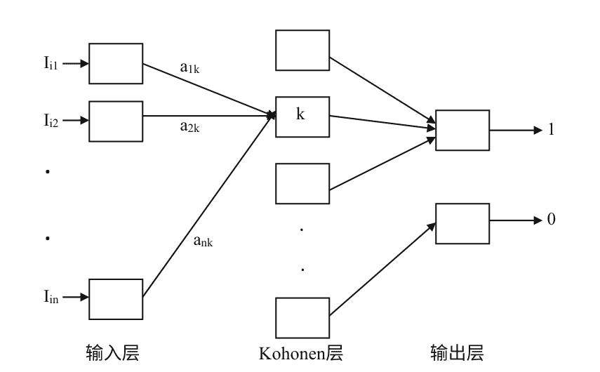

图7.52 参考向量

```
a_{ij}^{new} = a_{ij}^{old} + (I_{ij} - a_{ij}^{old}) \quad (7.82)
```

在这里，也需要随着时间的推移将学习系数逐渐接近零。这种ANN的主要缺点如下：

- 1. 调整学习系数使其随时间逐渐减小到零的困难。
- 2. 由于在解决某些问题时，始终有相同的参考向量获胜，人工神经网络的灵活性就会丧失。
- 3. 如果存在两个类作为结果，并且离两个边界的距离相同，则在客观上决定将向量包括在哪个类中变得困难。 在消除这些缺点的研究中，提出了各种LVQ人工神经网络。

### 7.15.3.5 LVQ人工神经网络的训练

训练这些网络的目的是确定与输入向量最接近的权重参考向量。Kohonen层中每个单元格中进入的权重形成的向量称为参考向量。例如，在图7.52中，仅显示了从顶部到第二个单元格的权重在Kohonen层中的情况。

Kohonen (1988) 试图对标准LVQ人工神经网络进行一些改进以克服其缺点。为了决定将非常接近聚类边界的向量包括在哪个类中，相同的LVQ人工神经网络架构仅在训练中进行了一些改变。假设两个接近I向量的权重向量分别为A1和A2，如图7.53所示。同样，它被显示为用于分类的标准距离。

这样，A₁是最接近输入向量的，A₂是次接近的权重向量。A₁在错误的类别中，A₂在正确的类别中。输入向量也在A₁和A₂之间的一个中心确定的范围内。在这两种情况下，A₁和A₂的权重在同一训练周期内必须被改变。新的权重像之前的教学规则一样，通过以下表达式计算：

```
a_{i1}^{new} = a_{i1}^{old} + α(I_{i1} - a_{i1}^{old})
```

和

```
a_{i2}^{new} = a_{i2}^{old} + α(I_{i2} - a_{i2}^{old})
```

还必须决定输入向量是否在两个权重向量之间。为此，如果u₁和u₂分别是向量A₁和A₂到输入向量的距离，则：

```
s = \frac{1 - u_s}{1 + u_s}
```

变量定义后，输入向量位于两个权重向量之间。

```
\min\left(\frac{u_1}{u_2}, \frac{u_2}{u_1}\right) \geq s
```

在解决这个问题时，应首先使用标准LVQ ANN训练，然后进行这个新训练。因此，标准LVQ ANNs确定了聚类，这里的训练应该用来将这些边界内的向量分离到正确的聚类中。

在实现标准LVQ ANNs时，另一个问题是一些权重向量经常重叠，使得网络的灵活性变差。由此产生的影响是，其他可以作为参考向量的权重向量无法获得这种资格。虽然不同的权重向量应该代表输入向量的不同方面，但事实并非如此。为了解决这个问题，可以在训练过程中对获胜的权重进行惩罚。这样可以防止相同权重的连续增益。通过将权重向量与输入向量之间的距离d添加到权重向量中来实现惩罚。这里的d值应该根据权重向量与输入向量的重叠次数来确定。

权重向量赢得了这种方法。例如，d_i从输入向量到第i个单元的权重向量的距离的增加量被计算为：

```
d_i = \left( p + \frac{1}{n} \right) \quad (7.87)
```

这里，C表示用户指定的常数，第i个单元获胜的概率为p_i。括号中的1/n表示Kohonen层中每个n个单元的初始概率。后续训练电路中p_i的再生根据以下表达式计算：

```
p_i^{new} = p_i^{old} + \beta (y_i - p_i^{old}) \quad (7.88)
```

其中β是一个用户分配的系数，用于避免数据中的任何波动。这没有一个明确的值，分配是基于经验的试错结果。在公式7.88中，y_i表示输出值（0或1）：

```
y_i = \begin{cases} 1 & \text{个细胞赢得了比赛} \\ 0 & \text{个细胞无法赢得比赛} \end{cases} \quad (7.89)
```

在惩罚驱动的LVQ ANN训练过程中，将d值添加到输入和权重向量之间的距离中进行计算：

```
u_i^{\text{新}} = u_i^{\text{旧}} + d_i \quad (7.90)
```

Kohonen细胞之间的竞争应考虑到这些新的距离值。

## 7.16 自适应振荡理论（ROT）人工神经网络

前面描述的所有ANN都需要在训练过程中使用完整或部分的教师。自适应振荡理论（ROT）将ANN根据处理输入数据（模式）作为自己的教师而无需教师的需求划分为适当的类别。这些最初由Goldberg（1989）在自适应共振理论（ART）网络的名称下开发。在多层ANN中，1和0两个集合在LVQ ANN的输出层起到部分教师的作用。这里不需要教师。只有当输入模式进入ROT ANN网络时，它才会通过内部过程放置在适当的聚类中。

为了记住为什么这些两层网络在操作期间被称为“重复振荡”，在开始输入数据的研究过程中，数据通过两层之间的振荡被放置在适当的聚类中。在每次振荡（往返）期间，数据的形状会更新，并且结果会逐渐接近。这些人工神经网络的另一个特点是它们在短期内保留一些信息在记忆中，通过进行短期回忆来遗忘其他信息，这些信息在之前的回忆中不存在。如果将这视为旋转神经网络的遗忘特性，人们可以理解它的功能非常接近人类的本性。人是一个健忘的生物，但他并不会忘记他所学到的一切。这意味着在人类记忆中短暂保留一些信息后，由于其重要性已经结束而被遗忘。这些人工神经网络的另一个类似人类的方面是它们通过重复学习。实际上，“振荡”这个词意味着它在输入和输出层之间反复揉捏信息。最终，将其感知为最终形式意味着通过聚类和增加聚类的数量和质量作为后续输入的初步准备。这些振荡（往返）通过重复本身展示了详细的学习。这些人的情况就像一个名为“海伊·宾·耶克赞”的婴儿的学习故事，他在一个荒芜的地方独自生活，在伊斯兰思想家伊本·西那（阿维森纳）（950–1030）的一篇文章中写道。

在他出生后，这个人掉进了一个荒岛，在那里一只鹿照顾着他。通过从他和他的自然环境中获取信息，并在短时间内忘记一些信息，长时间记住一些信息，理解如何在没有老师的情况下烹饪、埋葬死者、以不同方式将类似的事物聚类等，通过不断地获取新信息并根据它们的位置（重复）进行教育，他通过不断改进而在没有老师的情况下学习。然后他在生活的不同阶段使用它们。实际上，这篇伊本·西那的哲学（理论）文章无非是对旋转神经网络的解释。

从所有这些解释中，旋转神经网络具有短期和长期记忆，在没有老师的情况下进行自我训练（无监督），在输入和输出层之间进行往返，对给定数据进行最合适的聚类，将该数据放入适当的聚类中以便将来与其他输入数据进行比较。人们可以理解它具有与输入数据连续工作的过程。它将新进入的数据与其短期记忆进行比较，但通过其输出的长期记忆确定最后适当的聚类。与人类行为类似，它在振荡过程中对该模式免疫，如果之后出现类似的数据，它会立即将其放入其聚类中，有时甚至不需要振荡。旋转神经网络甚至可以考虑到最细微的细节。因此，它也可以非常细致地分离。因此，我们可以看到这些神经网络广泛应用于甚至最复杂事件的聚类，并预计它将在未来越来越多地被使用（第9章）。

### 7.16.1 ROT人工神经网络与其他网络的差异

这些人工神经网络非常适合数据聚类、分类和识别（Carpenter和Grossberg，1988年）。除了上述描述的特点之外，旋转神经网络还具有许多与其他神经网络不同的特点，因此具有吸引力。可以列举如下几点：

1. 由于其快速而详细的聚类能力，旋转神经网络是ANN聚类实时数据的快速解决方案。
2. 尽管其他人工神经网络必须从外部环境获取支持来做出决策，但旋转神经网络仅通过输入数据与外部连接。除此之外，它在不需要任何外部信息的情况下继续其功能。因为它是根据自身设置输出，而不是从教师那里获取输出。
3. 最后，它进行自我稳定的聚类，并快速决定新数据是否可以进入这些聚类之一。如果新数据无法进入ANN事先确定的聚类中，同一ANN将为其打开一个新的聚类，这次会导致ANN随时间更新自身。
4. 尽快检测类似的聚类中的细节，并迅速将它们放入长期记忆中的一个类别中，并事先确定。
5. 对于振荡过程，如果将这个ANN的两层视为一层在另一层下面，则分类操作从右向左发送，如果右侧没有适合放置的聚类，则继续进行分类操作，直到通过对其进行附加操作在长期记忆中找到适合的聚类为止。由于这两种通勤方式，存在两组连接网络。从左到右的那些通过将短期记忆中的聚类与输入数据进行比较来确定权重。从右到左的连接权重表示每个长期集合。因此，从左到右的信息与上面的信息进行比较。如果两个知识群体相同或相似，则将模式放入适当的集合中。否则，如果在不同的往返（振荡）后无法将其包含在适合的长期记忆类别中，则为该数据打开一个新的聚类。
6. 在这些人工神经网络的结构中，还应该有一个名为“增益”的单元，以防止不属于同一类别的条目进入该簇，与短期记忆信息进行比较。它的工作是防止重新进入的数据条目影响聚类权重。因此，先前进行的聚类权重得到保留。这使得ROT人工神经网络能够通过它们不断学习。
7. 在这些人工神经网络生成足够的簇之后，如果长期记忆中存在与传入输入数据相似的簇，它会在很短的时间内将该数据放入其类别中，而不会产生任何振荡（返回）。然而，如果在长期记忆中没有找到与相当不同的数据相匹配的簇，它会继续振荡一段时间以确定一个新的簇。最后，它会通过自学将其放入一个新的簇中。

### 7.16.2 ROT人工神经网络架构

正如之前所说的，在这些人工神经网络中有两个层次：输入层和分类层（图7.54）。在每个层次中，都有短期记忆（STM）和长期记忆（LTM）连接这两个层次。

在这些人工神经网络的运行过程中，有连续的振荡，首先从左到右，然后从右到左。输入（模式）首先给到输入层。通过输入层的STM，生成一个带有该簇权重的活动数据。

旋转人工神经网络受益于以不同数量的簇给出的数据数组的聚类。与其他聚类方法的不同之处在于，从第一个数据开始聚类后，如果后续数据与之没有一定的相似度，就会产生新的簇。确定给定数据是否与之前用ANN创建的簇相似的设置。ANN中使用了一种称为的度量方法。

“监视参数。”这个ANN的结构中有两层。第一层同时执行输入和比较操作。这被称为输入或基准层。第二层包含不同的聚类，被称为识别或输出层。ROT ANN既没有中间件，也没有第7.11.1节中描述的激活函数。在输入层中，检测给定数据所需的元素数量为N个。另一方面，输出层中的单元数为M，即将开发和出现的不同聚类的数量，直到所有训练数据完成。为了决定输入数据将与预先存在的哪个聚类相似，输入层和输出层之间存在振荡。如果在这些振荡期间输入的数据通过提供监视因素与识别层中的某个聚类相似，则该模式将被包含在其中。

### 7.16.3 ROT人工神经网络教育

通过处理ROT ANNs的训练，比较层和识别层之间的出发和到达权重进行调整。在这些往返过程中，根据下面的规则更新ANN权重系数，并持续进行直到它们变得稳定。在一个变得稳定的ROT ANN中，连接系数不再改变，并且从外部世界的比较层选择最合适的聚类数据用于每个被比较层检测到的数据。在进一步的研究中，如果ROT ANN架构无法将新输入分配给识别层中的任何聚类，则增加识别层中的单元数。因此，这个ANN随着时间的推移显示出改进。

在实际研究中，引入了两个类似的教育系统，ROT1和ROT2。其中一个是二进制的，另一个根据十进制数制工作。在这之前，将解释ROT1的训练。

从前一节中描述的往返行程中可以推断出，将找到出站和返回的权重。其中，输入（从限制层到识别层）的权重系数将与返回的权重系数不同。前进的权重系数显示了达到识别层所需的输入数据的权重。它们出发起始值的分配，I_ij，被认为是输入数据中元素数量N的倒数再加一。

```
I_ij = 1 / (1 + N)  (7.91)
```

旋转权重系数d_ij的初始值始终为1。

```
$d_{ij} = 1 \quad (7.92)$
```

需要注意的是出站和返回的权重不相等（$I_{ij} \neq d_{ij}$）。假设识别层中的聚类数为M，则 i =1, 2, N 和 j =1, 2,..., 是 M。如前所述，M 可以随时间变化。其中，一个具有权重 $I_{jl}$ 的 ROT ANN 用于组织从输入层到输出层的学习，而 $d_{jl}'$ 从输出层到输入层。当给定一个 X 数据到输入层时，根据以下计算基于权重将其给到这个识别（输出）层作为 $y_j$:

```
$y_j = \sum_{i=1}^{N} I_{ij} x_i \quad (7.93)$
```

这被称为相似性系数，因为它是向量 $I_{ij}$ ($i =1, 2,..., N$) 和向量 $x_i$ 之间相似性的度量。在为输出层中的每个单元进行这些计算的最后，具有最大相似性的单元被确定为在识别层中最好地代表输入数据的聚类。数据属于该聚类的最终决定取决于监视参数的值。为此，在识别层元素中使用从被认为最好代表该数据的聚类返回权重获得返回数据，它们如下获得：

```
$z_l = d_{i,j} x_l \quad (7.94)$
```

这里是观察参数p，用于将此返回数据与输入数据进行比较；计算方法如下：

```
$p = \frac{\sum_{l=1}^{n} z_l}{\sum_{l=1}^{n} x_l} \quad (7.95)$
```

如果该参数值大于预定的观察值，则判断两个数据相似。在这种情况下， $I_{ij}$ 和 $d_{ij}$ 权重会被改变，以使返回数据和输入数据尽可能相似。

### 7.16.3.1 应用

为了更好地理解人工神经网络，应按照下面给出的应用步骤进行。假设二进制数基础聚类如下所示：

1, 1, 0, 0, 0, 0, (          )
0, 0, 1, 1, 1, 1, (          )
1, 0, 1, 1, 1, 1, (          )
0, 0, 0, 1, 1, 1, (          )
和
1, 1, 0, 1, 1, 1, (          )

作为附加信息，如果观察参数也是0.7，让我们找出这些模式将进入多少个不同的聚类，没有其他信息的情况下。

根据以下步骤可以进行ROT ANN操作：1. 模式元素的数量为N =7个单元，在双层ROT ANN架构的输入层中，但输出（识别）层中没有单元，因为尚未进行聚类。但为了开始，假设识别层中有一个单元（M =1）。

2. 根据方程7.91和7.92，初始时刻两层之间的出站和返回连接权重的初始值为$ I_{1,1}(0) =1/(7 + 1) = 1/8 $和$ d_{1,1}(0) = 1 $。
3. 在输入层检测到第一个模式(1, 1, 0, 0, 0, 0, 1)后，根据方程7.93，将其移动到识别层的单个单元格中，得到：
分子中的数字3是模式中1的总和。由于识别层中没有其他单元格，因此将具有此值的当前单元格视为获胜者。
4. 在这种情况下，使用返回权重，返回模式与输入模式相同，因为返回权重都等于1。
5. 观测参数根据方程式7.95计算，$ p = 3/3 = 1 $得到。由于这个值大于最初给定的0.7观测值，可以得出结论输入模式将与识别层中的第一个单元聚类。
6. 在这种情况下，出站和返回连接分别根据它们的语句进行更新：

```
$$ y_1 = \frac{1}{8} \times 1 + \frac{1}{8} \times 1 + \frac{1}{8} \times 0 + \frac{1}{8} \times 0 + \frac{1}{8} \times 0 + \frac{1}{8} \times 0 + \frac{1}{8} \times 1 = \frac{3}{8} $$
```

```
$$ I_{j,1}(k) = \frac{d_{1,j}(k-1)(x_1)}{0.5 + \sum_{l=1}^{n} d_{1,j}(k-1)(x_1)} $$
```

```
$$ d_{1,j}(k) = d_{1,j}(k-1)(x_1) $$
```

这里，k代表步数。根据可用数据，更新的出站和返回权重系数简要表示为G(1)和D(1)如下：

$$ G(1) = \left[ \frac{1}{3.5} \quad \frac{1}{3.5} \quad 0 \quad 0 \quad 0 \quad 0 \quad \frac{1}{3.5} \right] $$

$$ D(1) = \left[ 1 \quad 1 \quad 0 \quad 0 \quad 0 \quad 0 \quad [1 \right] $$

因此，第一个模式被放置在簇中，并且返回权重被更新以从输入层到达该簇并返回。

7. 现在是检测第二个模式并开始聚类过程的时候了。首先，需要确定它是否属于上述指定的簇。为此，必须将(0, 0, 1, 1, 1, 1, 0)元素与它们的输入加权系数一起传输到识别层。在添加这些模式元素的输入加权系数和它们的倒数乘积后，得到y₁=0。将最后一个输入模式的倒数分量与返回权重相乘，将其作为返回模式的分量传递给输入层(0, 0, 0, 0, 0, 0)。乍一看，返回模式与入口模式完全不同。然而，使用方程式7.94客观地得到p=0，它不能被包括在模式识别层的簇中，因为它小于预定的观察值0.7。由于将在其中确定一个簇，因此在识别层中打开第二个单元。如果按照步骤6中给出的公式设置该单元的出站和返回权重，则可以找到：

$$ G'(2) = \left[ 0 \quad 0 \quad \frac{1}{4.5} \quad \frac{1}{4.5} \quad \frac{1}{4.5} \quad \frac{1}{4.5} \quad 0 \right] $$

$$ D'(2) = \left[ 0 \quad 0 \quad 1 \quad 1 \quad 1 \quad 1 \quad [0 \right] $$

8. 由于识别层中有两个聚类单元，前往和返回这些单元的权重以单个矩阵的形式共同表示为：

$$ G(2) = \left[ \begin{array}{ccccccc} \frac{1}{3.5} & \frac{1}{3.5} & 0 & 0 & 0 & 0 & \frac{1}{3.5} \\ 0 & 0 & \frac{1}{4.5} & \frac{1}{4.5} & \frac{1}{4.5} & \frac{1}{4.5} & 0 \end{array} \right] $$

```
$$ D(\mathbf{x}) = \begin{bmatrix} 1 & 1 & 0 & 0 & 0 & 0 & 1 \\ 0 & 0 & 1 & 1 & 1 & 1 & 0 \end{bmatrix} $$
```

9. 由于识别层中有两个聚类单元，前往和返回这些单元的权重以单个矩阵的形式显示如下：

```
$$ G(\mathbf{x}) = \begin{bmatrix} \frac{1}{3.5} & \frac{1}{3.5} & 0 & 0 & 0 & 0 & \frac{1}{3.5} \\ 0 & 0 & \frac{1}{4.5} & \frac{1}{4.5} & \frac{1}{4.5} & \frac{1}{4.5} & 0 \end{bmatrix} $$
```

和

```
$$ D(\mathbf{x}) = \begin{bmatrix} 1 & 1 & 0 & 0 & 0 & 0 & 1 \\ 0 & 0 & 1 & 1 & 1 & 1 & 0 \end{bmatrix} $$
```

10. 当在输入层中检测到第三个模式（1,0,1,1,1,1,0）时，如果将G(2)矩阵的每行分量相乘并相加以将其传输到输出层，则新模式可以属于识别层中的两个聚类单元。因此，由于y2 > y1，对于这个最后的模式，第二个聚类单元是获胜者。这个聚类单元会接受新模式吗？为了回答这个问题，如果将前一步给出的旋转矩阵的第二行分量与输入模式的相应分量相乘，就可以得到旋转模式（0,0,1,1,1,1,0）。

首先，当这个模式与输入模式进行比较时，可以得出结论，除了前两个元素之外，其他都是相同的，因此，它可能主观上属于第二组。为了使这个客观化，如果从方程式7.95计算出观察系数，得到p = 4/5 =0.7。由于这个值与一开始给出的煎饼值相等，决定输入的模式将属于第二组。在这种情况下，由于前步骤中给出的输入和返回权重没有改变，它们自动成为G(3) =G(2)和D(3) =D(2)。

11. 通过在ANN中检测第四个模式(0,0,0,1,1,1,0)并执行类似的操作，可以实现相同的ROT。同样，第二个聚类单元是获胜者，并且返回模式为(0,0,0,1,1,1,0)。因此，由于观察参数p = 1 >0.7，在这个设计中它可以被包括在第二个聚类中。根据第6步给出的权重更新操作，根据第二组的出站和返回权重的更新，计算出新的矩阵：G(4) = 
[ 
  [1/3.5, 1/3.5, 0, 0, 0, 0, 1/3.5], 
  [0, 0, 0, 1/3.5, 1/3.5, 1/3.5, 0] 
]

和

D(4) = 
[ 
  [1, 1, 0, 0, 0, 0, 1], 
  [0, 0, 0, 1, 1, 1, 0] 
]

12. 在将最后一个模式 (1, 1, 0, 1, 1, 1, 0) 引入输入层后，通过类似操作的结束，获胜的聚类细胞再次是第二个，因为 y₂ > y₁₀。这个聚类细胞会接受新的模式吗？为了回答这个问题，首先找到从这里得到的返回集合 (0, 0, 0, 1, 1, 1, 0)。
由于观察参数 p = 3/5 = 0.6 < 0.7，第二个获胜的聚类细胞无法接受这个新模式。有必要问一下，识别层中的第一个聚类细胞能否接受新的模式？通过使用第一个聚类细胞的旋转元素，得到旋转模式 (1, 1, 0, 0, 0, 0, 0)。由于从这里计算得到的观察参数为 p = 2/5 = 0.4 < 0.7，输入模式不能成为该集合的成员。然后需要打开一个新的识别单元。

13. 当根据第6步中的方程计算出这个新的第三个聚类单元的传播和返回权重时，可以得到：

G'(5) = [1/5.5, 1/5.5, 0, 1/5.5, 1/5.5, 1/5.5, 0]

和

D'(5) = [1, 1, 0, 1, 1, 1, 0]

然后，在输入所有模式之后，ROT ANN的传播和返回矩阵的最终形状如下：

G(5) = 
[ 
  [1/3.5, 1/3.5, 0, 0, 0, 0, 1/3.5], 
  [0, 0, 0, 1/3.5, 1/3.5, 1/3.5, 0], 
  [1/5.5, 1/5.5, 0, 1/5.5, 1/5.5, 1/5.5, 0] 
]

和

D(4) = 
| 1 | 1 | 0 | 0 | 0 | 0 | 1 |
|---|---|---|---|---|---|---|
| 0 | 0 | 0 | 1 | 1 | 1 | 0 |
| 1 | 1 | 0 | 1 | 1 | 1 | 0 |

14. 最后，所有模式都重新输入到ROT ANN中，并进行计算。
第一个模式（1, 1, 0, 0, 0, 0, 1）是获胜者，因为识别层达到了具有值 y1 = 3/3.5，y2 = 0 和 y3 = 2/5.5 的聚类单元。在采取必要的操作后，可以看出由于这个模式而出现的传播和返回权重没有变化。输入第二个模式（0, 0, 1, 1, 1, 1, 0）得到的值是 y1 = 0，y2 = 3/3.5 和 y3 = 3/5.5，其中第二个聚类单元是获胜者。同样，可以看到权重不会发生变化。输入第三个模式（1, 0, 1, 1, 1, 1, 0）后，识别层的第二个单元是获胜者。因为输入模式的相似度数值为 y1 = 1/3，y2 = 3/3.5 和 y3 = 4/5.5。在这种情况下，基于第二个聚类单元，由于观察参数为 p = 3/5 < 0.7，输入模式不能包含在第二个聚类中，因此应该检查其相对于识别层中的其他单元（1和3）的状态。

第三个单元是赢家，因为 y3 > y1。由于相应的观察参数为 p = 4/5 = 0.8 > 0.7，输入聚类包含在第三个识别层聚类单元中。因此，通过更新出站和返回权重，分别得到以下矩阵：

G(8) = 
| 1/3.5 | 1/3.5 | 0 | 0 | 0 | 0 | 1/3.5 |
|-------|-------|---|---|---|---|-------|
| 0 | 0 | 0 | 1/3.5 | 1/3.5 | 1/3.5 | 0 |
| 1/4.5 | 0 | 0 | 1/4.5 | 1/4.5 | 1/4.5 | 0 |

和

D(4) = 
| 1 | 1 | 0 | 0 | 0 | 0 | 1 |
|---|---|---|---|---|---|---|
| 0 | 0 | 0 | 1 | 1 | 1 | 0 |
| 1 | 0 | 0 | 1 | 1 | 1 | 0 |

之后，用户可以看到，引入第四个和第五个模式到ROT ANN架构中，这个新的权重矩阵不会改变任何东西。因此，决定上述ANN架构和数学已经变得稳定，之后将根据这个架构继续进行相似模式的必要聚类。

## 7.17 具有径向基函数激活函数的人工神经网络

在所有以前的ANN中，隐藏层单元的激活函数要么是双极性（阈值），要么是根据输入值逐渐增加的类型。这些是数学函数，将大值分配给大操作数，将小值分配给小操作数。当输入数据中没有聚类或分类时，使用这样的激活函数。然而，如果数据或模式中存在一些聚类，隐藏层激活函数应具有这样的结构，以反映这一点。这样的聚类操作在实际应用中经常遇到。因此，径向基激活函数（RBP）ANNs用于ANN隐藏层激活函数，以处理预聚类数据。

一般来说，具有n个元素（x1， x2， …， xn）的向量表示n维空间中的一个点。例如，如果这是三维的（x1 =3.1， x2 =1.2， x3 = 2.5），其表示如图7.55所示。

向量对应于许多点，而点可以根据它们的接近度和距离进行分组。例如，在图7.56中，我们可以看到从12个向量中获得的12个点在视觉上分为三个名为A、B和C的簇。当注意力集中时，落在每个簇中的点之间的距离非常接近，但簇之间的距离要大得多。如果我们需要从这里推导出一个逻辑规则，那么每个集合中的点都非常接近由它们的向量的算术平均值指示的点。因此，为了对点进行聚类，首先必须知道它们的距离可以计算的算术平均点。在这个过程中，首先需要事先知道点集将被分成多少个簇。在图7.56这样的视觉情况下，人们可以立即理解将会有三个簇。然而，人们无法看到输入计算机的数百个点将被分成多少个簇。需要一种方法来理解这一点。确定方法后，可以通过方便的软件将其转移到计算机上，从而可以在计算机上自动执行。

### 7.17.1 K-Means

将数据分成簇的最简单方法是所谓的k-means方法。将数据分成两个簇是通过提取每个数据与至少两个预定的固定点之间的最小距离来实现的。为了以最简单的方式解释这一点，假设沿着x水平轴有七个点-1.3、7.2、4.5、6.8、15.2、11.7、0.3。由于至少需要两个簇来开始聚类过程，例如当数字3和10作为簇中心时，想要将这七个数字分成两个簇，首先要做的是计算每个数字到数字3和10的距离。由于一个轴上的距离是差值的绝对值，因此它们的值为：

7个点到3的距离分别为：4.3、4.2、1.5、3.8、12.1、8.7、2.7
7个点到10的距离：11.3, 3.8, 5.5, 3.2, 5.2, 1.7, 9.7
根据这两个序列的倒数元素的最小化，我们可以找到哪些七个数字序列的元素将参与三中心聚类。通过这个比较，我们可以理解第一、第三和第七个元素将被包括在三中心集合中，因为它们离数字3更近。其他的（7.2, 6.8, 15.2, 11.7）将与10个中心一起被包括在簇中。

对于可以在两个或多个轴上表示的点，通常使用欧几里得距离来测量距离。如果有两个向量 (x11, x12, ..., xn) ， (x21, x22, ... x2n) , 那么这两点之间的距离D可以从方程7.59计算出来。字面意思是找到它们互为倒数的差的平方和的平方根，这是衡量两个向量或模式相似性（接近度）的方法。

然而，当给出许多模式时，尚未确定它们将如何聚类。对于聚类，需要事先确定与向量（模式）大小相同的聚类中心，即使是近似的。在k-means方法中，它始于事先知道聚类数的原则。为了发展K-means方法，首先应该定义一些符号。如果要聚类的n维向量（模式、数据）的数量为N，让第i个模式表示为x(i)（i=1,2,...,N）。确定聚类数为K后，让n维聚类中心的第j个表示为z(j)（j=1,2,...,K）。根据此，我们可以列出k-means方法的步骤如下：

1.  在选择了聚类数K之后，会随机选择具有n维的K个聚类中心，前提是它们在开始时保持在输入值的范围内。由于这些初始值将在下一步中更新，第1步中聚类中心向量的值为 $\{z_1(1), z_2(1), ..., z_K(1)\}$。
2.  根据确定的聚类中心，根据最小距离将模式分配给K个聚类中的第一个聚类。在这里，要使 $x^{(i)}$ 加入第j个聚类，需要满足其与同一模式的其他聚类中心的距离小于其他聚类中心的距离。数学软件根据以下表达式显示 $D_{ik}$ i-th模式与第k个聚类中心之间的距离：
    $$D_{ik} < D_{ij} \quad j=1, 2, ..., k \quad (i \neq k)$$
    然后模式 $x^{(i)}$ 属于第k个簇。在距离比较中，i从1变为K，前提是i≠k的条件成立。在这里， $P_k(l)$ 表示在第1步中属于第k个集合的模式的集合。因此，将会有K个社区。
3.  为了计算新的簇中心，计算每个社区中找到的模式的算术平均值：
    $$z_k(l+1) = \frac{1}{N_k} \sum_{i=1}^{N_k} x^{(i)} \quad (7.96)$$
    在这里， $N_k$ 表示在前一步中得到的第k个簇中找到的模式的数量。
4.  作为最后一步，检查簇中心的顺序计算是否稳定。理论上完全稳定的条件可以根据以下表达式确定：
    $$z_k(l+1) = z_k(l),k=1,2,...,K \quad (7.97)$$
    然而，在实际研究中，希望将这种方法保持在相对误差的某个百分比α以下：
    $$E = 100 \frac{z_k(l+1) - z_k(l)}{z_k(l+1)} \quad (7.98)$$
    如果 E < α，则计算终止，因此，最初给出的 N 个模式被分成 K 个聚类。在这方面，实践中使用的误差百分比应该是 ±5% 或 ±10% 最大。

K-means 聚类方法的两个最重要的特点是顺序训练是无监督的，并且它可以自组织其结构。

K-means 的更多解释在第9章中提出。

### 7.17.2 径向基函数激活函数

为了确定一个未测量点的值，例如，在气象站所在的区域，尝试通过考虑最近的三个测量点的测量值来估计该点的气象变量。为了处理这种聚类或有限时间或空间问题，最好在 ANN 的隐藏层中设置激活函数，以在最开始时包含所需的聚类。因此，与隐藏层中不断增加的激活函数相比，更倾向于使用具有一定定义域的激活函数，如图7.57所示。

这样的激活函数可以是三角形、梯形、半圆形等。它可以具有类似的形状，或者更适合于后续的理论和实际计算，以便能够在数学上推导出一种曲线。因此，高斯（钟形曲线）激活函数通常更受青睐。其表达式为：

$$I(r) = e^{ - \frac{ (r - \mu)^2 }{ \sigma^2 } } \quad (7.99)$$

在这里，r表示应用中变量的数据值，σ表示峰值周围变量的平均域的半径μ。在这些参数中，μ被称为中心，σ被称为分布参数。径向激活函数在r=μ时取得最大值，I(μ)=1。当远离这个值时，径向激活函数的值在所有方向上都会减小。在这里，μ表示聚类的中心，它是预先确定并给定给激活函数的。然后，径向激活函数将已知的聚类中心(μ)与未知的r值(数据)进行比较。从逻辑上讲，r越接近μ，模式就越属于这个聚类。标准(μ=0,σ=1)的高斯曲线如图7.58所示。如果参数不是标准的，就会得到类似的钟形曲线，在水平尺度上变窄或变宽。在人工神经网络术语中，这些被称为径向基函数(RBFs)，因为在径向上每个等距离的高斯值都相同。从这里可以理解，它具有从径向基短语中产生的圆形效应。

为了更清楚地看到为什么需要聚类激活函数，让我们看一下图7.59中的两个簇散点图。在这里，小空心圆的簇被填充圆圈包围。通过先前的ANN架构和数学，至少需要四个正确的分隔符来区分这两个簇。考虑到每个分隔符对应隐藏层中的一个运算符，可以得出结论，在经典的ANN隐藏层中至少需要四个单元。然而，如果使用径向基函数激活函数被认为是在小空心圆的群集中间的顶点，它可以单独分离两个群集。由此可见，如果隐藏层中有一个单元，并且其激活函数是RBF，那么聚类问题可以简单地解决。这个例子展示了径向基函数激活函数的经济性。特别是在具有两个以上变量的空间中，这变得更加重要。在这里，隐藏层中具有径向激活函数的人工神经网络被称为RBF人工神经网络。

像RBF这样的研究在经典文献中经常出现。这里的主要问题是通过使用从采样中的测量点获取的值来估计在没有测量的点上的值。问题是，离估计点有多远的测量点会被考虑？例如，在气象学领域，Cressman（1959）提出了这个问题，需要考虑距离预测点周围500公里或750公里的所有站点。因此，他确定了上述影响圈的半径。这是一个非常主观的观点，与事实不符。相反，不同的研究人员提出了不同的观点。

在地质学和矿床估计中，可以通过Matheron（1963）的半变异图和Şen（1989）的总半变异图来确定影响半径。上述所有努力都是为了使用局部最佳（最优）插值方法进行估计。最佳插值的基本方程如图7.60所示，考虑到测量和预测点的配置为：

$$ P_N = \frac{\alpha_1 m_1 + \alpha_2 m_2 + ... + \alpha_n m_n}{\alpha_1 + \alpha_2 + ... + \alpha_n} \quad (7.100) $$

在这里，P_N是预测值，而m_i (i = 1, 2, ..., n)表示最近n个点上的测量值。每个α_i表示m_i测量对整体预测值的贡献（权重）。这个方程也可以写成：

$$ P_N = \alpha_1 m_1 + \alpha_2 m_2 + ... + \alpha_n m_n \quad (7.101) $$

在这里，α'被解释为每个测量对整体预测的贡献的百分比。预测值的权重必须相加等于1。

$$\alpha_1 + \alpha_2 + ... + \alpha_n = 1$$

从方程式7.100可以看出，预测（输出）值由测量（输入）值的线性组合组成。

进入此计算并接近预测所需点的n个点形成一个聚类。自然地，测量点距离预测点越近（越远），权重值就越大（越小）。如果从高斯曲线和权重中根据这个曲线获得这个接近度，可以使用方程式7.99中的激活函数进行估计。基于这种逻辑，建立了径向基激活函数的人工神经网络。

### 7.17.3 径向基函数人工神经网络架构

尽管图7.61中给出的具有径向基激活函数的人工神经网络被视为具有三层，但可以视为具有两层的人工神经网络，因为训练操作在隐藏层和输出层之间进行。

可以说，这个人工神经网络的隐藏层输出是由其细胞中的径向基函数的组合形成的。每个输入层传递给隐藏层的数据序列或模式都直接转移到隐藏层，并从这里生成输出。因此，每个隐藏细胞都有自己的输出。这些输出是介于0和1之间的数字。径向基函数在经典人工神经网络的隐藏层细胞中起到激活函数的作用。在公式7.99中给出的径向基函数的数学公式中，σ²与高斯曲线的展宽有关。这个实际意义是将其值取得很小（大），用于分布在狭窄（宽广）区域的聚类。如果用 $O_{ri}$ 表示隐藏层中第i个径向基函数的输出，在输出层中用 $O_j$ 表示第j个输出，如果隐藏层和输出层之间的权重为 $A_{ji}$ ，则它们之间满足以下关系：

$$O_j = \sum_{i=1}^{n} a_{ji} O_{ri} \quad (7.103)$$

这意味着它是非线性RBF输出的线性组合，类似于Eq.7.101。因此，可以得出结论RBF ANN不是线性的，这由RBF提供。

### 7.17.4 径向基函数人工神经网络训练

人们可以将RBF ANN的训练过程分为两组，一组是根据Eq. 7.99训练隐藏层中径向基算子的参数μ和σ，另一组是训练隐藏层和输出层之间的权重。其中第一个是无监督训练，第二个是有监督训练，如第6.7.1节所述。这个训练需要回答以下基本问题：

1.  隐藏层应该有多少个神经元？ 这意味着需要将数据分成多少个簇。
2.  如何找到径向激活函数的中心参数μ的值？
3.  如何找到径向算子的分布参数σ的值？

确定RBF参数有不同的方法。其中最原始的方法是根据那些对模式或数据有专业意见的人提供的信息来确定μ和σ的值。客观地说，可以使用上述描述的k-means聚类算法来确定中心参数。使用这个算法，分布参数是中心周围偏差平方的算术平均值，在找到参数μ后，可以计算出σ的值如下：

$$\sigma^2 = \frac{1}{n} \sum_{i=1}^{n} (r_i - \mu)^2 \quad (7.104)$$

这个表达式等于统计数据处理方法中的方差。在权重被分配为随机小数之后，整个RBF ANN的数值结构就确定了。因此，在为径向激活函数参数和权重分配初始值之后，可以使用其中一种监督训练方法（例如反向传播算法，第7.14.3节）进一步改进这些值，以进一步改进网络。

从上述解释中，可以推断出在训练RBP ANN时需要以下步骤：

1.  隐藏层参数最初通过聚类操作确定，权重通过随机分配小数来找到。
2.  通过将数据（模式）输入到输入层，计算隐藏层的每个单元的输出。
3.  输出层的输出（方程7.103）是根据径向基激活函数的输出计算得出的。
4.  权重是根据随时间的权重增量计算得出的，表示为 $\Delta a_{ij}$ ，并根据以下表达式计算： $a_{ij}(t+1) = a_{ij}(t) + \Delta a_{ij}$
5.  权重变化基于反向传播原理，根据以下表达式计算： $\Delta W_{ij} = \eta \delta_i C_i$ 这里，η是学习率， $\delta_j$ 是第j个输出单元的误差，即输出与观察之间的差异。该误差定义为： $\delta_j = I_j - O_j$
6.  上述步骤将持续进行，直到达到收敛。

## 7.18 回收利用的人工神经网络

前面描述的所有人工神经网络都采用前馈训练，而且许多网络还采用了反馈训练电路。 然而，它们中没有一个单独的单元用于同一层中的细胞之间的循环或交换。 人们会想到一个问题，即“除了从隐藏层细胞中循环使用值之外，通过前馈方式增加输入层细胞的能力是否可能呢？”另一方面，人们会想知道同一层的细胞是否无法相互通信。 挑战这一点的人工神经网络被称为竞争训练网络。 允许这种额外输入的人工神经网络被称为可逆神经网络。在第9章中，将介绍与此相关的最先进的人工神经网络替代方案。

### 7.18.1 Elman人工神经网络

具有整个多层人工神经网络结构并额外包含隐藏层输出作为并行输入层的类型被称为Elman（1990）人工神经网络。其结构如图7.62所示。在这种人工神经网络的第一项研究中，它从仅接收输入数据的输入层开始。Elman通过将隐藏层的第一个值返回并插入到额外的输入层中来启动人工神经网络。 由于返回是延迟的，所述额外层将被称为“滞后输入层”从现在开始。

回收可以是一次性的，也可以是两次或更多次的间歇性。因此，这个人工神经网络被称为一次滞后、两次滞后等等。就像随机过程中的间隔（滞后）建模一样，有1、2、3等滞后。 图7.62中Elman人工神经网络中每一层的任务如下：

- 1. 在输入层中，有与数据元素数量相同的单元进行检测。

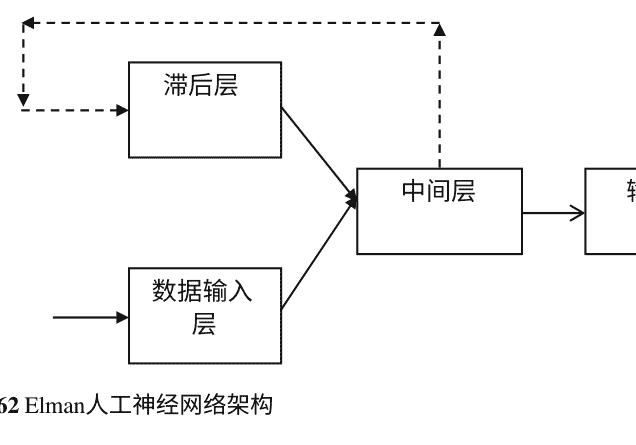

- 2. 在隐藏层中，有一个激活函数从输入单元收集信息，然后进行曲线化（将线性信息转化为非线性形式）。
- 3. 在输出层中，有与输出数据元素数量相同的单元，每个单元内部有一个加法激活函数线性地收集接收到的信息。
- 4. 滞后层中的隐藏层单元数与细胞数一样多。它们只有检测特征。隐藏层的每个单元与滞后层中相应的单元之间的连接是通过单权重连接器实现的。这意味着滞后层的细胞会将隐藏层的信息感知为它们本身。然而，也可以通过给权重系数赋予小于1的值来减弱返回。

### 7.18.2 Elman人工神经网络训练

从哲学上讲，这种人工神经网络的训练与第7.11.1节中描述的多层人工神经网络的训练相同。此外，由于滞后层的存在，还会有一些额外的教育内容。在训练开始时，除了在输入和隐藏层单元之间以较小的数目随机选择连接权重之外，还会随机分配连接权重，即 aij 输入-隐藏，在滞后层和隐藏层单元之间的连接权重是随机分配的。如果将一次延迟的Elman人工神经网络表示为第一个返回值，则 Ii^{input}_{t-1} 那么在时间t的一个中间层细胞中的输出量被计算为：

$$ NET_i(t) = \sum_{j=1}^{n} a_{ij}^{输入-隐藏} I_{ij}(t) + \sum_{j=1}^{k} a_{ij}^{输入-隐藏} I_{ij} t-1 \quad (7.105) $$

这里，n和k分别表示输入层和滞后层中的细胞数。这个人工神经网络的输出是通过对输入到输出细胞的信息进行线性求和得到的。如果将中间层和输出层之间的权重表示为a^{hidden-output}_{ij} ，那么第i个输出细胞的输出被计算为：

$$ O_i(t) = \sum_{j=1}^{m} a_{ij}^{hidden-output} NET_i(t) \quad (7.106) $$

如果这些输出与期望输出Oi不匹配，所有前向权重都会在网络中更新，就像在多层神经网络中一样（参见第7.5.1节），通过利用误差量进行反馈。通常情况下，时间t的误差被表示为：

$$ e_i(t) = o_i(t) - O_i(t) \quad (7.107) $$

如果输出函数是sigmoid函数，则要分配给权重的错误量在时间t，使用方程7.75，手头的符号可以进行如下计算：

$$ \delta_i(t) = O_i(t) * (1 - O_i(t)) * e_i(t) \quad (7.108) $$

反馈中要遵循的计算应与多层ANNs（第7.5.1节）中所述的完全一样。

可回收的ANN在建模动态事件方面非常有用，因为它们考虑时间滞后。凭借这些特性，它们可以替代随机过程类型，如马尔可夫、ARIMA（自回归积分移动平均）等模型。尽管随机建模中存在一些基于数据和建模的假设，但可逆ANN中没有任何先验假设。

## 7.19 Hopfield人工神经网络

人工神经网络（ANNs）经常用于模式分类，最早由Hopfield（1982）开发。这些人工神经网络主要用于优化操作。在这个人工神经网络中，输入和输出由单层中的细胞完成。细胞根据二进制（清晰、两值）逻辑工作，开放（+1）和关闭（-1）。根据细胞中的激活函数是连续的（sigmoid和双曲正切函数）还是不连续的（阈值函数），可以将其分为两部分。

每个细胞的输出被返回给其他细胞作为输入。因此，Hopfield人工神经网络也是一种可逆的人工神经网络（见图7.63）。以前的输出以权重的形式分布给细胞作为输入。

每个入口点到细胞的相关性都有一个权重系数fi(t)。一般来说，a_ij(t)表示从第i个点到细胞j的关系权重。如果将这种类型在时间t的输入表示为I，则有：

$$ I_i(t) = \Sigma_{j≠i}^{n} a_{ij} O_{ij}(t-1) - \Theta_i \quad (7.109) $$

在这里，Θ_i表示第i个单元的常数。同一个单元的输出根据激活函数可以是离散的或连续的，分别如下：

$$ O_{ij}(t) = sgn[I_{ij}(t)] \quad (7.110) $$

或

$$ O_{ij}(t) = sigmoid[I_{ij}(t)] \quad (7.111) $$

由于sgn是一个阈值函数，所以公式7.110的激活函数与公式7.35类似，可以写成：

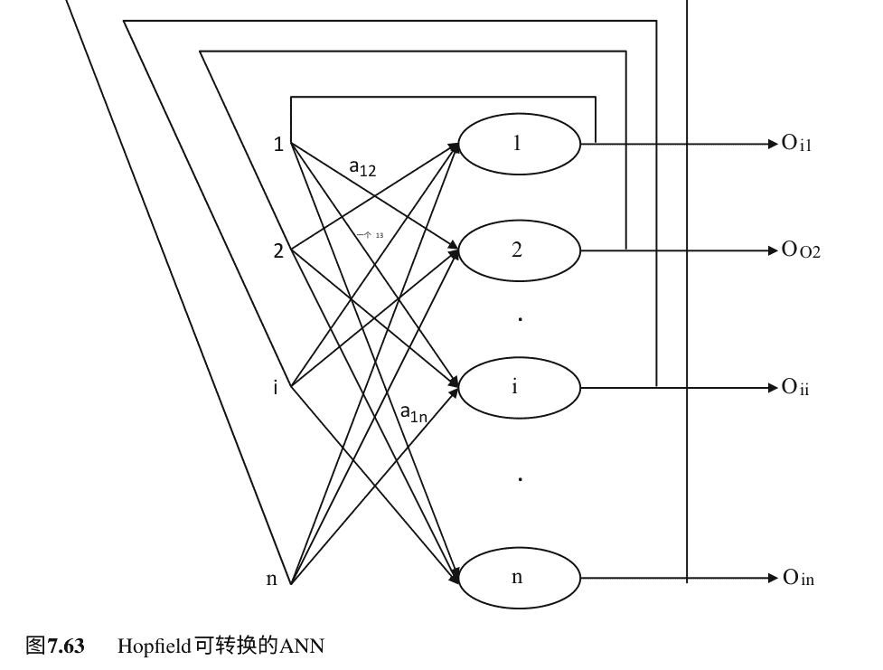

### 图7.63 Hopfield可转换的ANN

$$ O_{ij}(t) = \begin{cases} +1 & \text{if } \Theta_i I \\ -1 & \text{if } \Theta_i I \\ O_{ij}(t-1) & \text{否则} \end{cases} $$

在这里，Θi表示设计师分配的阈值。在Hopfield变换ANN的训练中，有两个阶段，即重建权重（反馈）和获取输出（前馈），就像多层ANN一样：

$$ a_{ij}(t) = \begin{cases} \frac{1}{n} \sum_{k=1}^{n} m_{ik} m_{jk} & \text{if } i \neq j \\ 0 & \text{否则} \end{cases} $$

在这里，n表示ANN中要检测的样本集的数量，m_i表示样本数据中第i个元素的测量值。为了以平衡的方式确保稳定性，给ANN提供了一个之前没有感知到的示例。这个样本的缺陷，可能是缺失的数据，应该由Hopfield ANN填充。将这个样本插入到网络中后，预期网络在连续迭代的最后变得稳定。网络的迭代如公式7.109所示：

为此，网络的输入必须被分配为初始值。网络变为稳定状态的能量公式如下：

$$ O_i (t+1) = \text{sgn} \left[ \sum_{j \neq i}^{n} a_{ij} \, O_{ij}(t) - \Theta_j \right] \tag{7.114} $$

$$ E(t) = -\frac{1}{2} \sum_{i=1}^{n} \sum_{\substack{j=1 \\ j \neq i}}^{n} a_{ij} \, O_{ij}(t) \, O_{ij}(t) + \sum_{i=1}^{n} O_i(t) \tag{7.115} $$

在网络运行期间，此公式必须保持稳定或减少。权重的补充根据赫布规则进行。其他人工神经网络的另一个优点是在更新权重时不需要太多迭代。它们分为两种类型，离散和连续，如下所述。

### 7.19.1 离散Hopfield人工神经网络

在这里，输入模式元素的值为 -1 或 +1。层中的单元数等于模式中的元素数。它通过将来自外部和其他单元的输入与权重经过阈值运算符在每个单元中进行处理，确保单元输出为 -1 或 +1。K个输入模式，每个模式用n维表示，$I_1, I_2, \ldots, I_k$。另一方面，让’s表示第j个单元在t时刻后的输出$O_{kj}(t)$。从单元j到单元i的相关系数（权重值）记为$a_{ij}$。如果第i个单元输入了第k个模式$D_{ki}$，则在t+1时刻的单元输出值可以写为：

$$ O_{kj} (t+1) = \text{sgn} \left( \sum_{i=1}^{n} a_{ji} O_{ki}(t) + D_{kj} \right) \tag{7.116} $$

如果 $x \geq 0$，则 $\text{sgn}(x) = +1$；如果 $x < 0$，则 $\text{sgn}(x) = -1$；如果 $x = 0$，则 $\text{sgn}(0)=0$。另一个经典 Hopfield 神经网络的特点是细胞的输出是异步更新的。这意味着每个时间间隔都会更新一个细胞的输出；选择哪个细胞进行更新是通过随机选择来完成的。为了获得可靠的结果，每个细胞在选择中应该有相等的机会。对要更新的细胞进行排序可以在开始时完成并按顺序放置。同时更新也可以根据奇偶细胞编号之间的区别交替进行。也可以同时再生所有细胞。

### 7.19.2 应用

考虑一个具有模式 (1, 1, 1, 1) 和 (−1, −1, −1, −1) 在内存中。 如果给它提供了一个扭曲的模式，例如 (1, 1, 1, −1)，那么四个细胞的外部输入分别为 D1 =1, D2=1, D3=1, D4=−1。 如果第二个细胞是随机选择的，它的净输入根据公式 7.116 计算。

$$ a_{21}I_1 + a_{22}I_2 + a_{23}I_3 + a_{24}I_4 + D_2 = 1 + 1 - 1 + 1 = 2 $$

因此，它的输出是 sgn(2)=1，因此，它的状态不会改变。 其次，如果将第四个细胞随机选择为刷新，由于其输入值为 1 + 1 + 1 - 1 =2，状态从 -1 变为 1，sgn(2)=1。 因此，由于从内存中带来了模式 (1, 1, 1, 1) 而不是损坏的模式，混乱被消除。

### 7.19.3 连续Hopfield人工神经网络

如果细胞输出可以在-1和+1之间连续取任意值，那么霍普菲尔德人工神经网络就会被考虑。 这些人工神经网络与离散的霍普菲尔德人工神经网络有以下区别：

- 1. 细胞操作符应该是一个连续函数，而不是一个离散的阈值函数。
- 2. 由于时间上是连续的，细胞的输入和输出是不断更新的。
- 3. 在非常小的时间增量中，细胞输出中不会突然出现非常小的变化。 在这方面，随时间的变化（导数） ∂O(t)/∂t在连续的霍普菲尔德人工神经网络中是重要的。 与方程7.116不同，使用以下表达式：
$$ \frac{\partial O_{i}(t)}{\partial t} = \eta f \left( \sum_{i=1}^{n} a_{jk} O_{k}(t) + t \Delta_{k} \right) \tag{7.117} $$
在这里，η代表学习百分比，f(.)代表连续激活函数之一（sigmoid，双曲正切等）
- 4. 细胞输出值是有限的。 对于非常大和非常小的值，它会达到饱和状态。 在大多数研究中，可以看到细胞输出被限制在-1和+1之间。 因此，更新过程使用以下方程进行：

$$\frac{\partial O_k(t)}{\partial t} = \begin{cases} 0 & \text{if } O_k = 0 \text{ 和 } f\left(\sum_{i=1}^n a_{jk} O_i(t) + t D_k\right) \geq 0 \\ \emptyset & \text{if } O_k = 0 \text{ 和 } f\left(\sum_{i=1}^n a_{jk} O_i(t) + t D_k\right) \leq 0 \\ \eta f\left(\sum_{i=1}^n a_{jk} O_i(t) + t \Delta_k\right) & \text{否则} \end{cases}$$

## 7.20 简单竞争学习网络

在这些人工神经网络中，有n个细胞输入和m个细胞输出层以及连接它们的权重。与以前的人工神经网络不同，输出层中的细胞之间也可以找到连接（参见图7.64）。

在这里，为了迭代地确定权重，首先需要决定从ANN中看到了什么。例如，如果希望将输入层中的模式序列聚类到输出层的每个单元中，那么每个输出单元都希望表示一些模式集合。输入层中的单元数等于模式中的元素数。从输入层到输出层的每个单元都有相同数量的连接，每个连接都有一个权重值。这两个向量之间的距离可以看作是输出单元权重向量与输入数据的相似度。从同一输入模式到每个输出单元都有权重连接。因此，无论这些权重连接中哪一个与输入模式最接近，输出单元都被声明为获胜者，并且其输出被假定为1。因此，权重值

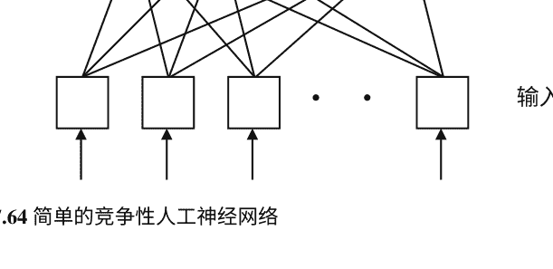

### 图7.64 简单的竞争性人工神经网络

这些获胜的输出单元根据一定的规则进行更新，并且尝试使连接向量尽可能接近输入向量。这意味着尝试最小化两个向量（权重和输入模式）之间的距离。对于权重的更新，学习率η(t)根据以下公式确定：

$$ a_{ij} (t+1) = a_{ij}(t) + \eta(t) [x_i(t) - a_{ij}(t)] $$

权重更新过程将继续，直到计算变得稳定。
由于这可能需要很长时间，在实践中，要么在连续的权重差小于一定误差百分比时终止进程，要么在预定的迭代次数之后终止进程。

### 7.20.1 应用

给出了五个训练模式，分别为I_1=(1.1, 1.7, 1.8)， I_2=(0, 0, 0)， I_3=(1, 0.5, 1.5)， I_4=(1, 0, 0) 和 I_5=(0.5, 0.5, 0.5)。在这种情况下，让我们从输入和输出层开始，每个层都有三个单元，即A、B和C的单元。假设将它们的权重初始值设置为介于0和1之间的随机数，如下所示：

$$ A = \begin{pmatrix} 0.2 & 0.7 & 0.3 \\ 0.1 & 0.1 & 0.9 \\ 1.0 & 1.0 & 0.0 \end{pmatrix} $$

- 1. 将第一个数据集检测到输入层，并将权重连接到单元A，根据公式7.59计算出该输入与欧氏距离：

$$ D_{A1} = \sqrt{(1.1-0.2)^2 + (1.7-0.7)^2 + (1.8-0.3)^2} = \sqrt{4.1} $$

同样地

$$ D_{B1} = \sqrt{4.4} $$

和

$$ D_{C1} = \sqrt{1.1} $$

由于这些值中最小的是单元C的值，因此它是胜者，并且其输出被设为1。通过学习率为η=0.5的权重迭代，新的权重矩阵变为：

$$ A = \begin{pmatrix} 0.2 & 0.7 & 0.3 \\ 0.1 & 0.1 & 0.9 \\ 1.05 & 1.35 & 1.4 \end{pmatrix} $$

- 2. 当第二个数据（模式，向量）（0, 0, 0）被输入层检测到时，类似的距离计算结果为 D_{A2} = 0.6 和 D_{C2} = \sqrt{4.9}。从这里开始，由于最小距离属于 A，新的权重矩阵在权重更新后变为：

$$ A = \begin{pmatrix} 0.1 & 1.35 & 0.15 \\ 0.05 & 0.05 & 0.90 \\ 1.05 & 1.35 & 1.4 \end{pmatrix} $$

从这里可以看出，每个新模式输入时，只有权重矩阵的一行发生变化。

- 3. 当检测到第三个模式（1, 0.5, 1.5）时，最小距离为 D_{B3} = 0.5，权重矩阵的第二行值发生变化，变为以下形式：

$$ A = \begin{pmatrix} 0.1 & 1.35 & 0.15 \\ 0.05 & 0.25 & 3.21 \\ 1.05 & 1.35 & 1.4 \end{pmatrix} $$

- 4. 由于第四个数据的最小距离为 D_{A4} = 1.0，通过更新第一行权重值，权重矩阵变为：

$$ A = \begin{pmatrix} 0.55 & 0.35 & 2.10 \\ 0.05 & 0.25 & 3.21 \\ 1.05 & 1.35 & 1.4 \end{pmatrix} $$

- 5. 通过将最后一个数据字符串插入输入层，细胞A获胜并且权重矩阵采用以下形式：

$$ A = \begin{pmatrix} 0.25 & 5.35 & 0.3 \\ 0.05 & 0.25 & 3.21 \\ 1.05 & 1.35 & 1.4 \end{pmatrix} $$

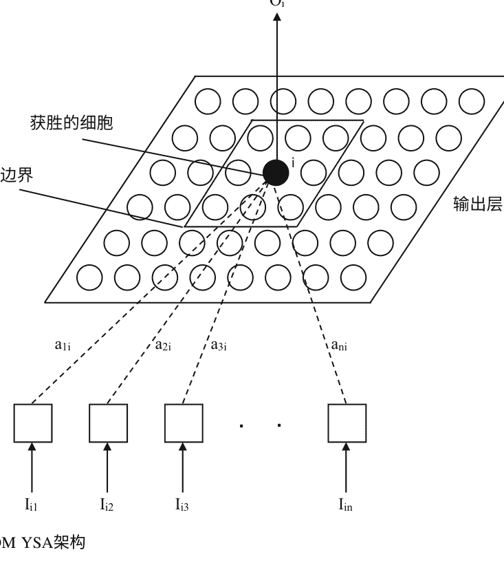

### 图7.65 SOM YSA架构

## 7.21 自组织映射人工神经网络

这种方法由Kohonen（1988）提出，称为自组织映射（SOM）。需要清楚理解这里每个词的含义。在SOMANN中，输入层是一维的，与之前的相同，但输出层是二维的。输入层的细胞排列成一行，而输出层的细胞排列成一个平面（见图7.65）。这个ANN可以称为双层网络。从输入层的细胞到平面上的每个输出细胞的连接完全存在。

图中只显示了从输入层细胞到输出细胞（j）的连接。首先，这个ANN中的map一词的存在是由于在二维平面上绘制的地图。这个ANN最重要的特点是，当在输入层检测到数据时，不需要教师进行训练，也不需要向输出层提供真实数据。因此，它被用于解决输出未知的问题。这相当于说这个ANN是根据无监督训练工作的。输出平面上的细胞通过竞争来获胜。最后，当其中一个细胞获胜时，它会将其周围最近的细胞都带走。因此，当一个细胞获胜时，例如在图7.65中显示的由九个细胞组成的细胞集合中，有八个细胞是最接近获胜细胞的。

获胜的细胞将输出1，其他细胞输出0。然而，在训练过程中，权重在相邻细胞中进行训练。

### 7.21.1 SOM人工神经网络训练

在归一化输入和时间t的情况下，随机分配的权重系数进入SOM ANN，首先通过以下两种方式之一找到获胜输出细胞。主要在二维输出层中，每个细胞的输入和连接权重按照以下表达式进行线性乘积和求和。

$$ O_i = \sum_{j=1}^{n} I_{ij} a_{ij} $$

具有最大输出值的细胞被确定为获胜细胞。这样一个细胞的输出被设为1，其他细胞设为0。

另一种确定获胜细胞的方法是，首先如第7.6.1节中已经提到的对于Kohonen ANN，通过欧几里得距离计算确定最接近输入模式的加权细胞。为此，计算每个加权模式与输入层之间的距离，计算公式如下：

$$ u_j = \|I_i - A_{ij}\| $$

具有较小距离的输出细胞将赢得竞争。确定获胜细胞后，需要更新其与最近邻之间的权重。为此，使用以下方程：

$$ A^{\text{new}}_i (t) = A^{\text{old}}_i (t) + \alpha k_{i,l} \left( I_i (t) - A^{\text{old}}_i (t) \right) $$

在这里，α表示需要随时间减小的学习系数。另一方面，根据k(i,l)邻域函数，其表达式为高斯分布函数：

$$ k(D) = \exp\left( -\frac{D^2}{2\sigma^2} \right) $$

在这里，D表示获胜细胞i与其中一个邻近细胞j之间的距离。在这个方程中，σ表示邻域区域的宽度，研究人员在初始分配后需要随时间减小。如果表示这两个邻居位置的向量为P_i和P_j，则它们之间的差异计算如下：$D = \| \mathbf{P_i} - \mathbf{P_j} \|$ (7.123)

确定获胜单元及其邻居的两种方法，其权重将一起改变。其中一种方法是将单元周围的邻居围成一个正方形或矩形。在简单的情况下，可以通过图7.65来展示这种情况。第二种方法是确定以获胜单元为中心的正多边形中的邻居（参见图7.66）。

## 7.22 内存一致人工神经网络

这里要解释的人工神经网络有助于找出哪些数据（模式）适合存储器中的哪些数据（模式）。尽管输入模式部分缺失或损坏，这些人工神经网络可以确定存储器中最接近的规则模式。这就像一个人理解一个破碎的土耳其语说话者的意思是什么，就像是正确的土耳其语一样。它以正确的土耳其语模式的形式存在于我们的记忆中。与这些模式的任何分离，即部分缺陷或缺陷，都可以立即被人感知为平滑的。在感知不完整和/或损坏的土耳其句子中的两个略有不同的模式的识别或匹配被称为记忆一致（MC）人工神经网络。从这个简短的解释中，可以理解MC人工神经网络将有两个阶段，其中之一是

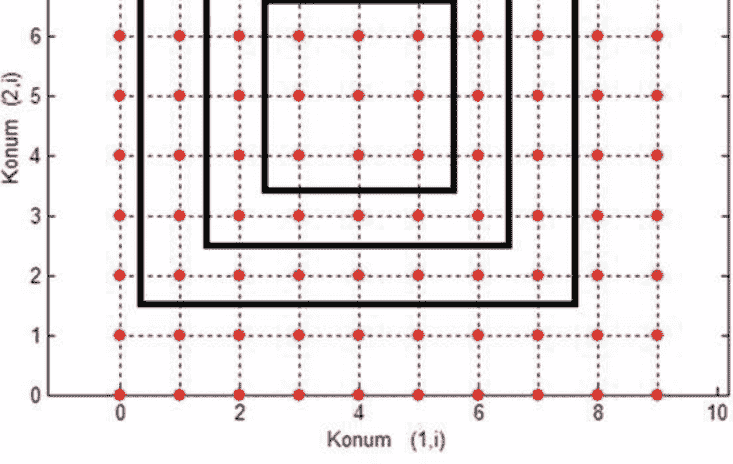

图7.66多边形邻域区域 (a) 矩形, (b) 六边形, (c) 随机

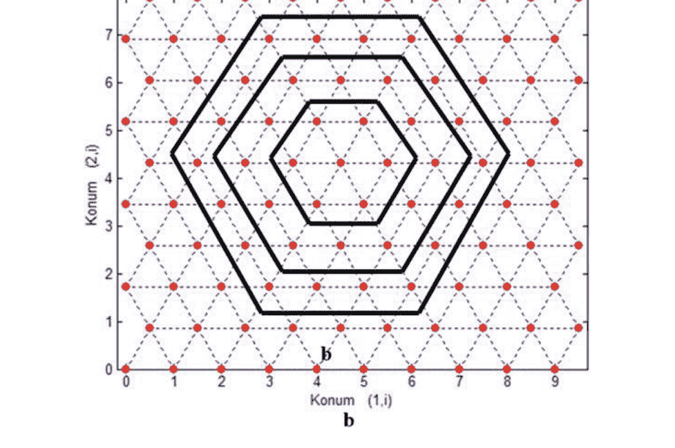

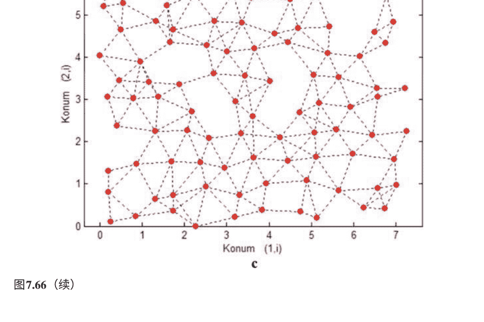

### 图7.66（续）

在记忆中放置规则模式的权重分配和在记忆中搜索一个模式是否与该ANN中的模式匹配，这是两种不同的方法。

其中之一被称为模式存储在记忆中，另一个被称为从记忆中提取模式。

MC ANNs中有两种类型的 fit，即不同-fit和相同-fit。输入和记忆中的模式类型在不同的和谐中与彼此不同。
例如，从土耳其语翻译成英语或反之亦然时，模式之间的和谐属于不同和谐的类别。 然而，土耳其语的缺陷或不足与土耳其语的匹配，即相同类型的模式，属于相同一致性类别。 MC ANNs在模式中存在不规则性且可能对应于破碎模式的几个规则模式的情况下使用。 它们还可以用于确定给定模式是否与记忆中的任何模式都不匹配。

### 7.22.1 矩阵拟合记忆方法

通过将输入和输出模式矩阵相乘得到的权重矩阵在这里很重要。 权重矩阵元素的计算是根据赫布规则进行的：

$$a_{jk} = \sum_{i=1}^{n} I_{ji} O_{ki}$$

简而言之，以矩阵形式表示的此软件是通过逐行乘以包含输入模式的I矩阵和逐行乘以包含输出模式的O矩阵的转置来实现的：

$$A = IO^T$$

#### 7.22.1.1 应用

找到一个包含两个输入模式和两个输出模式的矩阵 fit内存是直接的。 例如，对于(1, 1)和(1, −1)输入模式以及(−1, 1)和(−1, −1)输出模式，得到的权重矩阵如下：

$$A = \begin{pmatrix} -1 & -1 \\ 1 & -1 \end{pmatrix} \begin{pmatrix} 1 & 1 \\ 1 & -1 \end{pmatrix} = \begin{pmatrix} -2 & 0 \\ 0 & 2 \end{pmatrix}$$

当将第一个输入模式输入到装备有这些权重的ANN中时，输出模式如下所示：

$$ O = \begin{pmatrix} -2 & 0 \\ 0 & 2 \end{pmatrix} \begin{pmatrix} 1 \\ 1 \end{pmatrix} = \begin{pmatrix} -2 \\ 2 \end{pmatrix} $$

通过阈值运算，找到了(-1, 1)模式。这个输出(1, 1)是与输入模式匹配并正确找到的模式。

类似的操作可以在第二个输入模式中进行。如果将一个新的模式(-1, -1)给这个ANN，那么：

$$ O = \begin{pmatrix} -2 & 0 \\ 0 & 2 \end{pmatrix} \begin{pmatrix} -1 \\ -1 \end{pmatrix} = \begin{pmatrix} 2 \\ -2 \end{pmatrix} $$

通过阈值运算，得到了模式(1, -1)。这是一个在记忆中不存在的模式。

#### 7.22.1.2 最小二乘法

在这里，通过最小化输入模式和记忆模式之间差异的平方来找到权重矩阵。如果A是权重矩阵，那么第k个输出模式由输入模式I_k通过矩阵乘法得到：

$$ O_k = A I_k $$

因此，误差为：

$$ e = \sum_{k=1}^{n} (d_k - O_k)^2 $$

在这里，权重矩阵被计算以最小化这个误差definition。为此，只需将e对A的导数设为零即可。推理的详细信息在第7.5节和第7.14.3节中介绍。最后，权重矩阵变为可用：

$$ A = \frac{ \left( \sum_{i=1}^{n} d_i I_i^T \right) }{ \left( \sum_{i=1}^{n} I_i I_i^T \right) } $$

在这里，字母T表示模式的转置。也就是说，它将行形状的数据向量转换为列形状。在公式7.127中，分子表示内存中模式与输入模式的对应元素的乘积之和。分母是输入模式元素的平方和。

#### 7.22.1.3 应用

从前一节给出的两个输入模式和输出模式中找到最小二乘权重矩阵。由于，$I_1=(1,1)$，$I_2=(1,-1)$，$d_1=(-1,1)$和$d_2=(-1,-1)$:

$$a_{11} = d_1 I_1^T = -1 \times 1 + 1 \times 1 = 0$$
$$a_{12} = d_1 I_2^T = -1 \times 1 + -1 \times 1 = -2$$
$$a_{21} = d_2 I_1^T = (-1) \times 1 + -1 \times 1 = -2$$

和

$$a_{22} = d_2 I_2^T = -1 \times 1 + -1 \times (-1) = 0$$

因此，权重矩阵的最终形式如下：

$$A = \begin{pmatrix} 0 & -2 \\ -2 & 0 \end{pmatrix}$$

## 7.23 一般应用

在本书的前几节中，介绍了一些人工神经网络的应用。本节中的应用需要计算机软件。接下来，将详细解释数据类型和人工神经网络的架构结构，以表格和图形形式呈现。

### 7.23.1 缺失数据补充应用

在这个例子中，数据分析有助于解决地球科学等许多科学领域的问题。为此，在应用阶段之前，需要确保数据完整且连续。然而，由于测量缺失等原因，数据在某些时期之间可能存在不完整的情况。这些不完整可能是单个变量的，也可能是同一时期内多个变量的不完整。

如果存在缺失数据，则必须首先完成这些数据以进行研究。在这项研究中，假设在某个日期之后的测量站的温度参数数据存在不完整的情况，并尝试使用ANN方法来填补这些缺失数据。

所选的气象参数包括温度、大气压力、水汽压力、相对湿度和风速。1996年3月1日至4月20日期间的这些参数的日均值如表7.3所示。由于无法进行或记录测量，假设自3月28日起温度数据未被记录。因此，在50天的时间段内，温度参数的27天数据值已知，但接下来的23天数据不完整，但其他变量的数据没有缺失。

为了完成缺失的数据，首先使用ANN方法在温度和其他变量之间进行架构设计。为此，使用了前27天的数据，其中完整记录了数据。选择了一个由输入层、输出层和一个隐藏层组成的三层ANN模型，如图7.67所示。在模型中，Z和W分别表示输入-隐藏层和隐藏层-输出的连接权重。

在输入层中，使用了四个单元格来存储气压、相对湿度、风速和水蒸气压力数据，在输出层中，使用了一个单元格来存储温度记录。隐藏层中放置了三个单元格。在隐藏层单元格的输出中使用了sigmoid激活函数。

在ANN模型的训练中，采用了一种由训练者告知正确结果的学习方法，即在训练者的帮助下进行学习的一种分支（第7.15.3节），并使用了反向传播算法（第7.14.3节）。模型中选择了学习率值为0.04，并使用了一种将温度和其他数据集之间进行泛化的方法，进行了9000次迭代。

在图7.68中，经过提出的人工神经网络模型应用和训练完成后，显示了温度测量和温度模型值。从图中可以看出，温度模式彼此紧密相随。

温度测量和人工神经网络模型值之间的绝对误差值可以计算如下：

$$E = \sum_{i=1}^{50} |T_{i \text{观测}} - T_{i \text{人工神经网络}}| \quad (7.128)$$

得到的值为15.82 °C，表示总绝对误差；当除以数据数量时，平均绝对误差值为0.62 °C。为了能够仔细分析误差值，图7.69显示了测量和人工神经网络模型预测值的散点图。

由于回归分析，实际温度值和预测温度值之间的相关性为：

$$T_{\text{人工神经网络}} = 0.01 \times T_{\text{观测}} + 0.07 \quad (7.129)$$

结果表明，可以通过其他变量对温度进行可靠的预测。问题是模型如何准确地完成缺失的温度值？

为了找到这个问题的答案，选择前27天的数据作为训练集。然后，训练图7.67中的ANN模型，并在此之后

表7.3 Göztepe/Istanbul 气象站每日数据
| 温度 (°C) | 大气压力 (mb) | 水汽压力 (mb) | 相对湿度 (%) | 风速 (m/s) | 温度 (°C) | 大气压力 (mb) | 水汽压力 (mb) | 相对湿度 (%) | 风速 (m/s) |
|---|---|---|---|---|---|---|---|---|---|
| 3.6 | 1008.0 | 5.8 | 82.3 | 4.6 | 5.7 | 1016.6 | 7.3 | 77.7 | 1.2 |
| 2.9 | 1004.1 | 5.3 | 68.3 | 1.5 | 8.1 | 1014.2 | 7.8 | 80.0 | 1.7 |
| 2.4 | 1005.3 | 5.6 | 77.0 | 2.4 | 12.6 | 1012.5 | 10.8 | 70.7 | 2.0 |
| 3.3 | 1012.5 | 4.9 | 65.0 | 1.6 | 11.7 | 1002.3 | 11.8 | 72.3 | 1.8 |
| 4.2 | 1010.2 | 5.3 | 71.7 | 3.9 | 8.2 | 1004.0 | 9.7 | 91.0 | 1.5 |
| 3.5 | 1012.0 | 5.0 | 64.7 | 5.3 | 12.9 | 1006.9 | 9.6 | 88.7 | 2.7 |
| 3.3 | 1016.9 | 6.1 | 74.7 | 4.3 | 8.9 | 1012.0 | 8.7 | 81.7 | 3.6 |
| 2.3 | 1021.6 | 6.4 | 82.5 | 3.6 | 9.2 | 1016.3 | 8.5 | 73.6 | 3.0 |
| 2.3 | 1020.1 | 6.7 | 84.3 | 3.2 | 11.9 | 1014.6 | 9.4 | 63.7 | 2.3 |
| 2.4 | 1016.0 | 6.7 | 95.3 | 4.1 | 7.9 | 1010.9 | 9.1 | 82.3 | 5.1 |
| 5.1 | 1017.1 | 6.6 | 81.3 | 3.7 | 7.1 | 1004.8 | 9.8 | 92.7 | 2.2 |
| 6.5 | 1014.5 | 7.8 | 74.0 | 4.9 | 6.6 | 1003.6 | 8.8 | 94.7 | 2.1 |
| 6.3 | 1012.4 | 7.6 | 80.0 | 3.5 | 6.2 | 1009.1 | 9.0 | 92.7 | 1.8 |
| 6.2 | 1013.7 | 7.9 | 79.3 | 4.3 | 5.7 | 1014.3 | 7.7 | 87.3 | 2.4 |
| 6.3 | 1014.9 | 7.8 | 83.3 | 3.5 | 6.4 | 1016.0 | 7.9 | 85.7 | 1.6 |
| 5.1 | 1012.4 | 8.1 | 82.3 | 3.4 | 9.1 | 1012.4 | 7.6 | 65.7 | 1.6 |
| 3.1 | 1007.2 | 6.8 | 92.0 | 3.1 | 8.8 | 1007.5 | 8.9 | 79.3 | 3.5 |
| 3.2 | 1011.9 | 5.9 | 89.0 | 2.8 | 8.6 | 1006.4 | 7.5 | 69.0 | 3.2 |
| 4.5 | 1013.5 | 6.8 | 77.3 | 2.7 | 7.3 | 1010.9 | 7.4 | 69.7 | 1.5 |
| 5.5 | 1012.7 | 7.1 | 80.7 | 2.9 | 11.2 | 1010.1 | 7.2 | 52.7 | 1.2 |
| 5.1 | 1013.4 | 7.0 | 77.7 | 3.2 | 11.2 | 1003.2 | 9.3 | 70.7 | 1.6 |
| 4.7 | 1014.9 | 7.3 | 78.3 | 4.5 | 8.7 | 1005.7 | 7.7 | 69.0 | 1.8 |
| 4.7 | 1015.5 | 7.1 | 83.0 | 3.8 | 8.2 | 1002.8 | 7.9 | 77.7 | 2.0 |
| 5.3 | 1018.8 | 7.1 | 72.3 | 3.6 | 5.8 | 1008.2 | 8.6 | 92.7 | 2.2 |
| 7.8 | 1013.3 | 10.1 | 92.7 | 2.1 | 8.4 | 1013.6 | 9.6 | 79.3 | 1.6 |

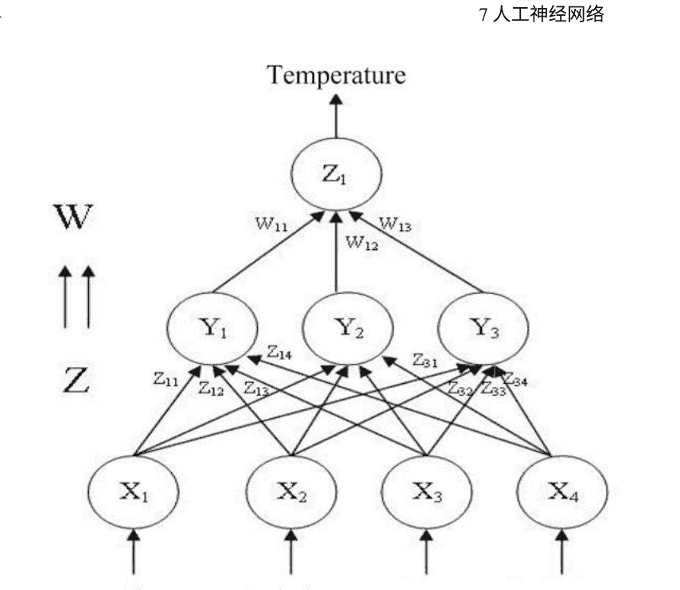

### 图7.67 示例ANN架构

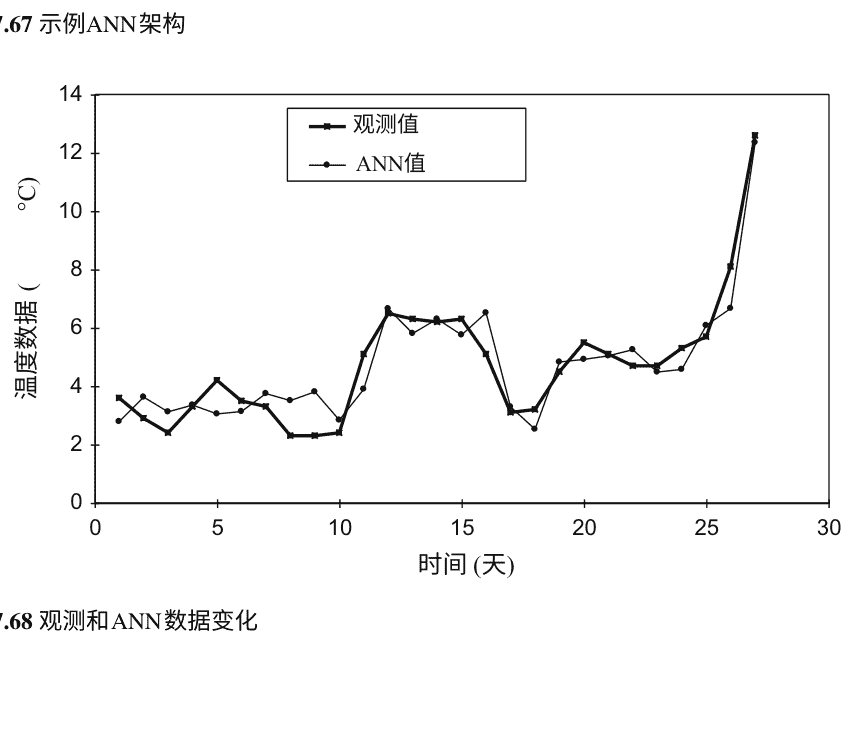

### 图7.68 观测和ANN数据变化

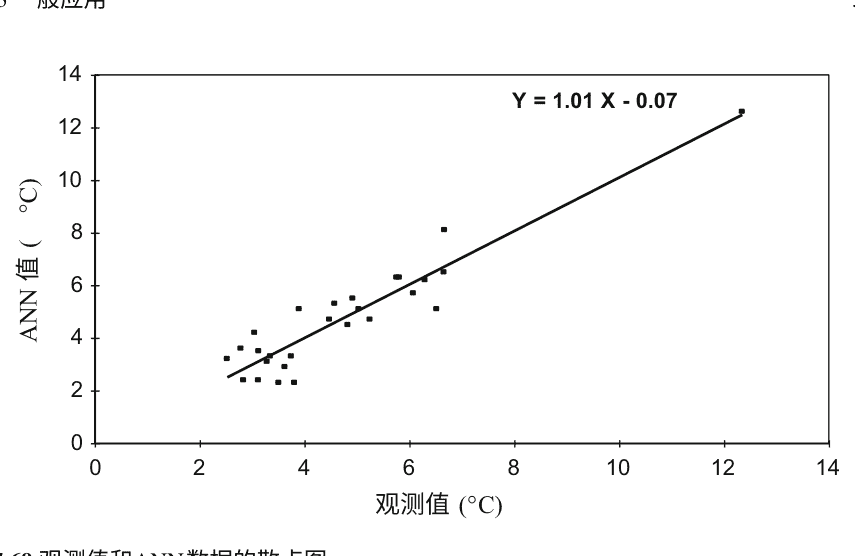

训练完成后，除了3月28日后的温度之外的变量被作为输入数据提供给ANN。每个输入数据集的输出值是该天的日温度值。因此，用训练集训练的ANN模型得到了所需时间间隔内缺失的温度数据的ANN值。图7.70显示了用训练集产生的ANN模型的值来补全缺失数据。

在这幅图中，得到了与图7.68中的图形接近的结果。尽管保持了总体趋势，但误差值仅在最大和最小点处增加。此外，与之前的方法相比，在某些转折点处观察到更明显的过渡。这次，仅针对测试区域的平均绝对误差为0.64 °C。实际温度与ANN模型温度值的散点图如图7.71所示。

同样，借助ANN，也可以在空间上完成缺失的信息。例如，基于时间序列进行的上述泛化可以借助ANN使用区域内一组不规则位置的测量完成。

### 7.23.2 分类应用

人类对分类的研究可以追溯到古代，这是为了对动物、植物、声音等进行分类的首次，今天，在不同的领域和不同的数值方法中，对分类问题的研究仍在继续。对分类的深入研究导致了许多数学模型的引入。随着技术的发展，分类研究为机器，特别是机器学习技术提供了帮助。机器分类提供了解决许多以前难以解决的问题的可能性。

许多统计方法被用来分解不同的数据组。例如，属于温度等变量的两个不同事件组。

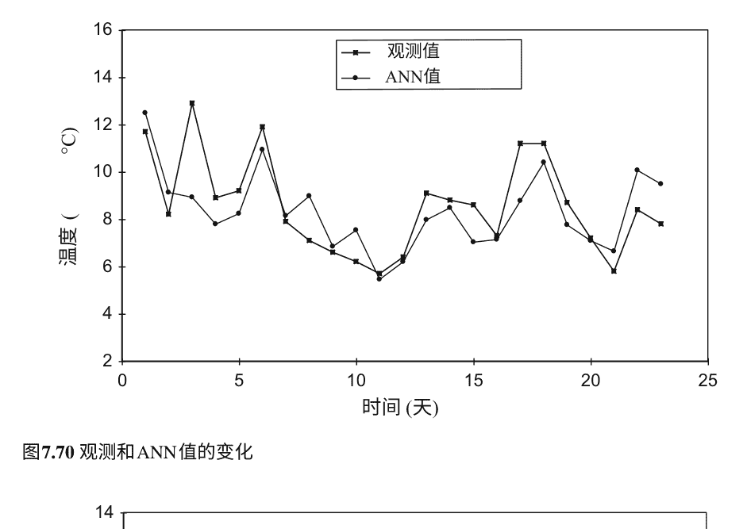

图7.70 观测和ANN值的变化

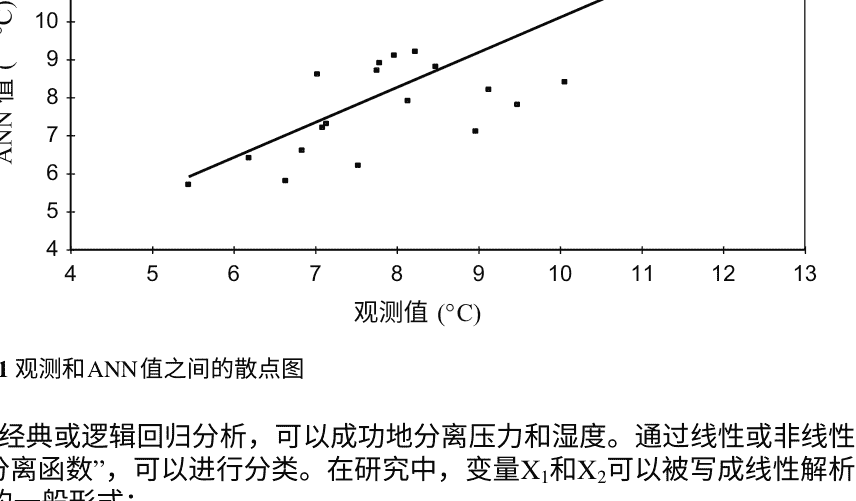

图7.71 观测和ANN值之间的散点图

通过经典或逻辑回归分析，可以成功地分离压力和湿度。通过线性或非线性的“分离函数”，可以进行分类。在研究中，变量X₁和X₂可以被写成线性解析器P的一般形式：

$$P = b_0 + b_1X_1 + b_2X_2 \quad (7.130)$$

Panofsky和Brier（1968）使用垂直速度、露点温度差和降水数据进行了一项分类研究。在纽约州奥尔巴尼进行的91次测量中，28次有降水，63次没有降水

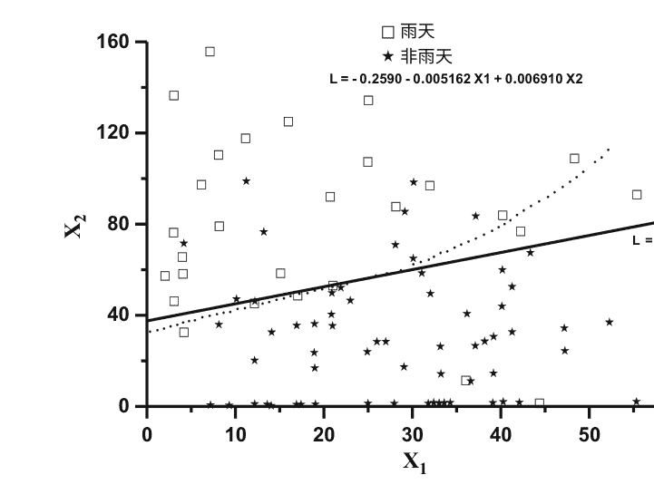

### 图7.72通过L条直线进行线性分离

数据。图7.72显示了垂直速度、露点温度差和降水数据的散点图。通过尝试获得最低误差率，正确地将具有和不具有降水的两个不同数据组分开。

$$P = -0.2590 - 0.005162X_1 + 0.006910X_2 \quad (7.131)$$

对于任何垂直速度和露点温度差值的响应，它表示P > 0 (P <0) 的雨天（和非雨天）区域。研究结果，共有15个点被包括在错误的组中；其中九个在雨天区域，六个在非雨天区域。

Lippmann（1989）指出，在分类问题中，人工神经网络与统计方法非常不同，并且由于其处理速度、可训练性和易用性等特点，能够取得更好的结果。尽管感知器只能线性分离两个不同的类别，但Tattersall等人（1989）指出，多层人工神经网络模型可以成功地分解多于两个不同的类别。首先，在执行分类过程时，只处理未分类的数据，而不是处理所有数据。此外，能够逐步跟踪分类步骤是另一个特权特点（Antognetti和Milutinavic 1991）。

在这项研究中，使用相同的数据，通过三层ANN架构模型解决了分类问题，如图7.73所示。在输入层中，使用了两个神经元，即垂直速度和露点温度差。隐藏层中有八个神经元，输出层中有一个神经元。在隐藏层和输出层中，选择了Sigmoid作为细胞输出的激活函数。对于每个输入对，输出值大于0.5的被归为雨天组，小于0.5的被归为非雨天组。

因此，使用反向传播算法进行2000次迭代进行训练。因此，每个垂直速度和露点温度降低点都可以获得从0到1的值。

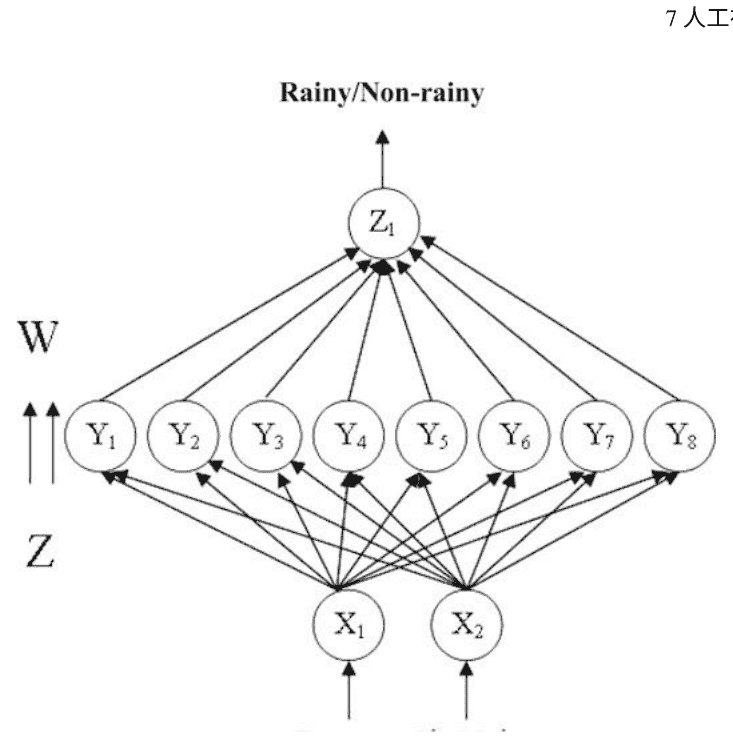

并且露点温度降低点。考虑到所有点的值，在研究区域绘制等值线图，但只显示0.5等值线图。在上部和下部，获得大于0.5的值。

通过0.5等高线将两个不同的数据组分开，雨天部分在顶部，非雨天在底部。通过这种分离，错误组中的点的数量减少到12个，其中10个在雨天区域，2个在非雨天区域。将直线分解和人工神经网络分解进行比较时，人工神经网络分解包含更少的错误点。在数据组分离中使用非线性解析器而不是线性解析器在这个结果中起到了作用。使用曲线解析器可以在无法线性分离的数据组中获得更好的结果。由于人工神经网络中可以使用非线性函数作为单元输出，因此可以使用非线性解析器分离数据组。

### 7.23.3 温度预测应用

大气现象直接影响我们的一些日常需求，如衣物和交通。由于这些需求，人类一直在思考# 图7.74 人工神经网络和曲线分离

自古以来，人们一直在问大气事件的下一步是什么。因此，预测气象参数的问题从最初的人类开始就一直存在，没有失去其重要性。在无法进行测量的早期，人类只满足于观察大气。因此，第一次预测是基于通过这些观察所获得的经验。随着技术发展的加速，许多模型和预测方法已经开发出来，基于数值计算。

本研究尝试预测气象参数之一的温度变量。换句话说，研究了过去几天观察到的温度值对于准确预测下一天的温度值的帮助程度。

在研究中，考虑了1966年5月和6月属于安卡拉省下午14:00的温度测量数据。61天的数据如表7.4所示。

在这61天的数据中，有40天用于训练，其余的用于测试。利用训练数据，确定了需要多少天前的数据才能预测到t + 1时刻的数据，并最终在21个测试集上进行了测试。在应用中，考虑了一个三层的人工神经网络架构模型，如图7.75所示。使用反向传播算法作为训练算法。首先，将间隔数（N）取为1，并使用t =0时刻的数据来预测t + 1时刻的数据。通过将t =0作为输入数据，t + 1时刻的数据作为输出数据，对模型进行训练。在进行了1万次迭代的训练后，将重新训练集作为测试集输入到模型中。因此，旨在了解人工神经网络在t =0和（t + 1）之间的数据泛化能力。为此，利用以下表达式计算测量值与人工神经网络模型输出值之间的平均绝对误差，其中L是滞后数。

# 表7.4 安卡拉温度数据

| 序列 | 温度(℃) | 序列 | 温度(℃) | 序列 | 温度(℃) | 序列 | 温度(℃) |
|------|---------|------|---------|------|---------|------|---------|
| 1.   | 18.4    | 17.  | 19.7    | 33.  | 26.6    | 49.  | 25.0    |
| 2.   | 19.7    | 18.  | 21.8    | 34.  | 31.0    | 50.  | 24.0    |
| 3.   | 16.2    | 19.  | 23.8    | 35.  | 24.8    | 51.  | 23.6    |
| 4.   | 14.2    | 20.  | 17.0    | 36.  | 21.1    | 52.  | 26.4    |
| 5.   | 17.4    | 21.  | 19.0    | 37.  | 24.2    | 53.  | 28.0    |
| 6.   | 21.0    | 22.  | 16.8    | 38.  | 26.8    | 54.  | 25.8    |
| 7.   | 22.4    | 23.  | 19.7    | 39.  | 27.6    | 55.  | 24.3    |
| 8.   | 23.4    | 24.  | 11.3    | 40.  | 27.0    | 56.  | 24.8    |
| 9.   | 23.1    | 25.  | 18.0    | 41.  | 23.8    | 57.  | 27.6    |
| 10.  | 18.8    | 26.  | 18.0    | 42.  | 24.6    | 58.  | 26.1    |
| 11.  | 18.4    | 27.  | 21.5    | 43.  | 19.2    | 59.  | 18.6    |
| 12.  | 23.6    | 28.  | 24.0    | 44.  | 17.0    | 60.  | 24.6    |
| 13.  | 18.8    | 29.  | 22.4    | 45.  | 20.2    | 61.  | 30.0    |
| 14.  | 18.8    | 30.  | 21.8    | 46.  | 22.6    |      |         |
| 15.  | 17.0    | 31.  | 21.4    | 47.  | 25.5    |      |         |
| 16.  | 18.0    | 32.  | 23.4    | 48.  | 27.4    |      |         |

# 图7.75用于预测的人工神经网络模型

$$E_N = \frac{1}{40 - L} \sum_{i=L+1}^{40} |T_i^{观测} - T_i^{人工神经网络}|$$

相同的操作会重复进行，直到N=2, 3,...根据间隔数，使用公式(7.132)计算得到的平均绝对误差值为7和平均绝对误差值。图7.76显示了间隔数和平均绝对误差值之间的振荡情况。

需要注意的是，在训练过程中，输入层中的单元格数量会随着N的每个新值而改变。例如，对于N=3，由于将在(t+1)时刻的温度值和t=0, (t-1)和(t-2)时刻的值之间进行预测，因此输入层中使用了三个单元格。平均绝对误差值随间隔数的增加而减小，在第五个间隔处，平均误差值达到最低值8.28，随着间隔数的增加，平均误差值开始再次增加。因此，为了预测时间t+1的温度值，应该使用属于五个步骤之前的每个值进行预测。

在确定间隔数为5之后，模型在21个温度值上进行测试，这些值之前作为测试集保留，并且没有经过任何处理。例如，在图7.77的ANN模型中，输入了第36、37、38、39和40个数据，以预测第41个数据。

同样，通过测量真实值观测到的第37天、第38天、第39天、第40天和第41天的数据，用于温度的预测。

# 图7.76滞后数变化的平均相对误差

# 图7.77 观测和ANN预测变化

42天。 通过重复这些过程，逐个计算出21天的预测结果。结果与测量值接近。模型和测量模式相互接近。

由于计算，真实值和ANN预测值之间的平均绝对误差为2.52。考虑到该研究中使用了仅有40个数据的小样本进行训练，并且仅使用过去测量的温度值进行预测，结果是合理的。

## 7.24 结论

在早期的工程和技术应用中，寻求一种类似人类获取数据的事件、行为模式的模型。 并行过程建模方法受到大脑工作系统的启发，原始且非常浅显的人工神经网络（ANN）方法已经在文献中占据了一席之地。 其特殊属性通过回归和随机方法来解释，这些方法在近年来被广泛使用，并且仍然在世界上许多地方使用。

在开始时对事件或数据没有任何假设。 在本章中，首先通过解释经典方法的相似之处来解释这两种建模类型的相似之处，即使读者之前不了解或不知道 。 实际上，按照经典系统进行建模的读者可能很快适应ANN并进行应用。 在对ANN模型的展示风格进行简要的哲学讨论之后，考虑到它与以前方法的相似性以及哲学、逻辑和合理性规则，对ANN模型的原因和必要性进行了解释。 通过给定的应用程序努力更好地理解它。 为了实现ANN，必须建立至少三层与细胞一起的体系结构，其中一个是输入层，另一个是输出层，第三个是隐藏（中间）层。 为此，需要开发一个不仅模拟数学规则，而且仅控制事件和可能发生的反应的动作和响应变量的体系结构。

## 参考文献

-   亚历山大一世，诺顿H（1992年）神经计算导论。 查普曼和边界行， 第137–142页
-   安德森JA（1983年）认知和心理计算与神经模型。 IEEE Trans Syst Man Cybernet SMC-13(5):799–814
-   安托格内蒂P，米卢蒂纳维奇V（1991年）神经网络，概念，应用和实现。 普林斯顿大学出版社，恩格尔伍德克利夫斯
-   鲍姆EB，豪斯勒D（1989年）什么样的网络能够进行有效的泛化？神经计算。为了完整起见，我们在此重新印刷了完整版本，并获得了麻省理工学院出版社的友情许可
-   Bkum A（1992年）C++中的神经网络。 威利，纽约
-   卡彭特GA，格罗斯伯格S（1988年）自适应模式识别的艺术。计算机（三月）：77–88
-   克雷斯曼GP（1959年）一种操作目标分析系统。 月份天气评论87（10）：367–374
-   埃尔曼JL（1990年）在时间中找到结构。认知科学14：179–211
-   Freeman JA (1994) 模拟神经网络。 Addison-Wesley Publishing Company，第8–13页
-   Freeman WJ (1995) 神经系统中的大规模行动。 学术，纽约
-   Goldberg DE (1989) 遗传算法。 Addison-Wesley，雷丁
-   Haykin S (1994) 神经网络：全面的基础。 Prentice Hall PTR，Upper Saddle River
-   Hebb D (1949) 行为的组织。 Willey，纽约
-   Hecht-Nielsen R (1990) 神经计算。Addison-Wesley，雷丁
-   Hinton GE (1989) 连接主义学习程序。 Artif Intell 40:185–234
-   Hopfield JJ (1982) 神经网络和具有新兴集体计算能力的物理系统能力。 Proc Natl Acad Sci 79:2554 -2558
-   Hsieh KR, Chen WT (1993) 结合无监督和监督学习的神经网络模型。 IEEE Trans Neural Net w 4:357–360
-   Kalman RE (1960) 线性滤波和预测问题的新方法。 Trans ASME Ser D J Basic Eng 82:35–45
-   Kohonen T (1982) 自组织形成正确特征映射的拓扑。生物控制论 43:59–69
-   Kohonen T (1988) 神经计算导论。 神经网络1:3–6
-   Kosko B (1990) 噪声中的无监督学习。 IEEE Trans Neural Netw 1 (三月) :44–57
-   Kosko B (1991) 随机竞争学习。 IEEE Trans Neural Netw 2 (九月) :522–529
-   Kung SY (1993) 数字神经计算。 PTR Prentice-Hall, Inc./Simond and Schoster Company, pp 1–5
-   Lee LS, Stoll HM, Tackitt MC (1989) 连续时间光学神经联想记忆。Opt Lett 14:162
-   Lee TC (1991) 神经网络的结构层适应性。 Kluwer Academic Publishers, 页码3–10
-   Lippman R (1987) 神经网络计算导论。 IEEE ASSP Man 4:4–22
-   Lippmann RP (1989) 使用神经网络的模式分类。 IEEE Commun Magaz 27 (11月) : 47–64
-   Matheron G (1963) 地质统计原理。 Econ Geogr 58:1246–1266
-   McCullogh WS, Pitts WA (1943) 神经活动中内在思想的逻辑演算。 Bull Math Biophys 5:115–133
-   Mehrotra K, Mohan CK, Ranka S (1997) 人工神经网络的要素。麻省理工学院出版社，剑桥，马萨诸塞州
-   Minsky M, Paperts S (1969) 感知机. MIT出版社, 剑桥, 马萨诸塞州
-   Morgan DP, Scofield CL (1991) 神经网络和语音处理。 Kluwer Academic 出版商, 第 141–145页
-   Özmetel E (2003) 人工神经网络。 Papatya Yayıncılık Eğitim (土耳其语) , 232页
-   Panofsky HA, Brier GW (1968) 统计学在气象学中的一些应用。 地球和矿产科学继续教育, 地球和矿产科学学院, 大学公园Rosenblatt F (1958) 感知器: 大脑中信息存储和组织的概率模型。 Physchol Rev 65:386–388
-   Rumelhart DE, Hinton GE, Williams RJ (1986) 通过反向传播误差学习表示。自然 32:533 -536
-   Şen Z (1989) 区域化变量的累积半变异图模型。 Int J Math Geol 21:891
-   Şen Z (1998) 按百分比加权多边形方法计算平均面积降水量。 J Hydrol Eng ASCE 3:69–74
-   Şen Z (2004) 遗传算法和优化方法。 Su Vakfı Yayınları (土耳其语) , 142页
-   Simpson P (1992) 神经网络基础。 In: Sanchez-Sinencio E (ed) 人工神经网络。IEEE出版社, 第1–25页
-   Smith BC (1982) 语言和计算语义学。 Xerox, Palo Alto, Ca。 Sönmez İ, Şen Z (1997) 用人工神经网络进行流量预测。 Meteorolojik Karakterli Doğal Afetler Sempozyumu, 安卡拉 , 第445–457页 (土耳其语)
-   Tattersall GD, Foster S, Linford P (1989) 单层查找感知器。 在: 第一届IEE国际人工神经网络会议, 会议出版物号313Verbos PJ (1994) 反向传播的根源。 Wiley-Interscience出版物, 纽约, pp169–173
-   Windrow G, Hoff ME (1960) 自适应开关电路, IRE西部电子展和对流。 对流记录, pp 96–104

## 第8章 机器学习

## 8.1 概述

计算机程序对于人们对现象的思考提供了机器学习（ML）原理的基础，试图推断大型数据集的最显著的内部特征，以形成特征、标签、聚类或分类的目的。 ML的演绎推理系统类似于AI的推理。

机器学习方法的区别在于它们对表示和适应性的处理，以达到最终的标签输出产品。 学习信息在知识表示形式中的存储属性是归纳假设，它采用模型的形式。 机器学习的两个主要任务是根据输入数据集中的特征和标签进行分类和回归预测。 如果数据类型是名义或序数格式，则分类过程是方便的机器学习过程；否则，回归分析是机器学习过程的角色。 分类和回归过程都是基于先前标记的训练样本集的监督学习方面。 建议的模型结构可以在大型数据集中学习到最佳的潜在模式。 此外，聚类过程是一种无监督学习任务，它将相似的对象分组在一起。 因此，存在相似和不相似的聚类。 这与统计学中的聚类分析非常相似。

在人工智能的范畴下，包括机器学习、遗传算法、人工神经网络和深度学习（DL）。可以说浅层学习是机器学习的一个分支，而机器学习又是深度学习的一个分支。 很难对机器学习和深度学习进行明确的区分；机器学习比深度学习拥有更多的算法。 机器学习是一种吸引人的科学研究方法，但在没有提供活跃的浅层信息的情况下，使用起来并不直接。

计算算法为机器学习提供了基础，通过生动的教育系统或个人模糊的渴望来模拟人类自然智能（NI）与大规模数据集的工作。 机器学习技术成功地可用在计算机视觉、模式识别、空间研究、工程、娱乐、医学、金融、社会学等多个学科中。

Carbonell等人（1983年）指出“学习是一个多方面的现象，包括通过指导或实践获得新的陈述性知识，通过观察和实验发现新的事实和理论，以及通过指导或实践发展运动和认知技能，组织新知识，有效地表示。”自新计算机时代开始以来，研究人员一直在努力在计算机中实现这种能力。解决这个问题仍然是人工智能工作中最具挑战性和迷人的长期目标。学习过程及其多种表现形式的计算机建模研究构成了机器学习的主题。“在人工智能程序中，机器学习依赖于基于大数据集的计算机编程科学，并通过机器模仿人类算法，即使是近似的，也可以逐渐提高准确性。

在其最基本的层面上，机器学习是指任何一种可以自行学习的计算机程序“学习”是指计算机可以在没有人类明确编程的情况下自行学习的能力。这个短语（及其潜在的思想）起源于几十年前，可以追溯到艾伦·图灵于1950年发表的论文“计算机与智能”中的一个部分，其中介绍了他的著名“学习机器”，它可以欺骗人类以为它是真实的。今天，机器学习是一个广泛使用的术语，涵盖了许多涉及分析和数据挖掘的大型数据集的程序。在一天结束时，大多数预测程序的“大脑”——包括垃圾邮件过滤器、产品推荐器和欺诈检测器——都是机器学习算法。

数据科学家应该熟悉有监督和无监督的机器学习过程之间的差异，以及使用多种技术和半监督学习方法进行集成建模的方法。在其最基本的层面上，机器学习是指任何一种可以自行学习的计算机程序，而无需人类明确编程。机器学习技术并不新鲜，因为它是多年研究的积累，但由于人工智能和数字创新研究的结果，它变得越来越有吸引力。随着时间的推移，机器学习与人工智能有了很大的不同，并且在深度学习过程中必将发挥重要作用。

一般来说，任何数据点都可以通过特征和标签的组合来描述。尽管通过机器学习自动化来识别特征相对容易，但标签的识别则需要人类专家的推理。机器学习通过学习特征，尤其是二维大型数据集的特征，来进行预测。机器学习过程通过连续的试错过程，将可用的大型数据集与模型和损失函数相结合，直到找到最合适的数据表示。在数据来源的现象方面，需要对假设（模型）进行持续的适应。最终产品被称为数据点的标签。假设映射适用于数据的低级属性，被称为数据特征。研究人员应该意识到数据集的便利性可能存在的假设映射。假设映射与数据之间的对应关系的度量是损失函数，该函数在试错过程结束时应具有最小值。如后面将会解释的那样，在本章中，针对假设地图和可用数据集之间的不同匹配属性，存在不同类型的损失函数。通过数据集源与模型和损失函数的最和谐的组合改进，可以获得最佳结果。在机器学习过程中，两种非常常用的方法是深度学习过程，将在下一章中进行解释，以及线性或非线性回归模型。 下图显示了数据集与模型和损失函数之间的和谐一致的成就。

从图8.1可以明显看出，存在两个试错循环，一个用于单一模型，可能被专家研究人员认为是根据类似的先前经验最合适的模型，因此第一个循环解决了手头的问题。 如果存在多个模型可能性，则机器学习过程将围绕多种模型进行旋转，并最终以整体最小损失函数值的最佳结果出现。

科学原理的“试错”在机器学习方法中起着重要的作用*实现。 这些方法通过最小化损失函数来持续验证和优化模型，以生成与观测数据（数据集、测量）最匹配的数据预测。

# 图8.1机器学习结合了三个主要组成部分：数据、模型和损失函数在机器学习的范畴下，基本上有一套浅层学习技术，如第1、2、3、4和5章所述，这些技术集中于帮助计算机学习并在各种训练过程中自我适应。

在前几章中，我们解释了浅层学习方法的逻辑、不确定性和数学基础，以及浅层人工神经网络和遗传算法的过程。由于计算机提供的高性能设施，DL技术在近年来变得更加流行。DL程序可以处理大量非结构化的特征，以更高的能力和可操作性从给定的数据集中进行识别。人工智能和深度学习方法的能力是通过将数据集通过多个隐藏层逐步提取特征并传递到下一层来实现的。初始层提取浅层特征，然后将其组合成完整的表示，以便更好地识别特征。

本章的主要目的是介绍它的工作原理，以及它与浅学习和深度学习过程的联系。机器学习依赖于前几章提到的一组算法，包括数值数据，并且由于经验的提升和显式的计算机编程语言的进步而得到了多年的发展。为了执行特定的任务，机器学习过程需要不同但方便的算法来解决手头的问题，以便进行数据集结构模式的检测。

## 8.2 机器学习相关主题

在浅层学习过程中，存在各种基于数值和语言的方法，这些方法在机器学习应用的可能性中得到了解释，其中大部分在前几章中已经解释过。假设读者通过本科和可能的研究生培训期间熟悉许多这些基本方法。

学习是一种有效的培训过程，任何有雄心壮志的个人都可以在理性消化的指导和实际应用中发展认知技能，以及以陈述性方式获取新知识、组织和展示新的实际、理论或可获得专利的发现，以及自动有用于社会和个人的浅层和特别是深层方面的增强能力。随着计算机硬件和尤其是软件的出现，自1950年以来，这些活动不断加速。机器学习提供了一个领域，可以基于数据集和观察结果自动提供有趣的问题解决方案，这些观察结果提供了语言信息和个人或团队合作经验，使用了已经在前几章中解释过的人工智能方法。

无论是浅层还是深度学习的知识内容，最终的机器学习产品都归结为计算机软件，这是用于机器学习和人工智能问题解决的最基本的专业知识。通过这种方式，旧日繁琐的手工编程问题解决程序变得更加复杂，因此，人类从浅层学习到深度学习过程中，智能获取了迷人的挑战性特征。

随着机器学习的出现，最初面向工程的程序进入了许多不同学科的话题，如工程学、医学、生物学、心理学、人类学习和社会科学。为了在这些领域中产生可接受的成果，有必要关注知识获取，以实现对任何相关主题的技能提炼。因此，可以更敏感地预测物理世界的行为问题，并将其转化为对人类有益的功能。从浅层学习领域过渡到深度学习是通过对现有信息进行理性提炼，以获得更准确、更优化和更有益的最终产品。

在今天的教育体系中，无论是什么主题，都有各种学习过程，正如本书的不同章节中所提到的，包括死记硬背、指导性、类比、示范性、观察性、实验性、经验性、发现性和批判性审查。

至于分析和实证程序，机器学习技术中的参数是代数和科学数学表达式中的参数，可能需要线性代数、计算机科学、优化、模拟、信息内容、概率、统计、决策树、形式语言语法、图表、流程图、科学哲学和合理逻辑原理、框架、方案、分类法、标签、散点图、数据集、概念分析和数值模型以及基本微积分原理。尽管它们是相互关联的，但机器学习与人工智能有不同的方面，因为机器学习比深度人工智能方法更容易，因为它是前身。最大的区别在于，机器学习提供了数学布局，如第3、4和5章所述，而人工智能是通过机器学习的帮助来模仿和模拟人类行为。此外，机器学习原则支持人工智能程序与人类进行交流、理解语言和进行对话。以此方式，人工智能根据机器学习的背景不断积累经验而不断改进。自从从1950年开始在数值计算中使用计算机以来，人类开始通过各种数学、概率、统计和人工智能方法从可用数据集中学习所关注现象的行为。在这个阶段，模糊逻辑原则和规则的重要作用在与计算机和机器进行交流方面不容忽视。人类从数据集中学习一直处于浅层学习水平，但通过机器学习解决方案算法，人工智能将这一水平大大提高到更高水平。

机器学习技术可能非常智能，但其最终产出可能不完美可接受。人类干预有助于改进学习方法，以便更好地识别模式。例如，学习方法可能无法克服数据集的某些部分，可能会陷入困境，但人类干预支持算法以更好地识别，因此最终可以获得更可靠的输出模式。这一点意味着机器学习技术无法达到人类的理解水平。人类激活辅助对机器学习技术的干扰提高了最终标签识别的准确性，从而使机器学习算法更加自我意识地进行训练过程。因此，通过人类干预可以避免令人生畏的情况。人们不应该期望基于机器学习的机器人表现完美，因为最佳组合是可以实现的。当机器人的表现与人类的帮助相结合时。通过数据标记为机器学习模型提供数据或纠正预测中的不准确性，人类的帮助提高了最终产品的准确性。因此，机器学习和人类智能的合作以自适应的方式提高了最终产品的效率。

## 8.3 机器学习和人工智能的历史背景

机器学习始于对算法描述的研究，这激发了解决相当困难和复杂问题的愿望，最初主要涉及模式、数字和字母的识别。沿着同样的方向，时间序列的时间、空间或时空模拟，以及未来预测方法都得到了创新的机器学习技术的支持。过去，许多方法论算法和初级的计算机程序员和科学家并不了解机器学习的术语。

1959年，艾伦·图灵提出了图灵测试的一个奇妙想法，即计算机是否能够模拟人类智能。塞缪尔（1953年）写道 首个计算机程序；因此，机器学习的实现开始进入科学文献。通过在计算机上玩同样的游戏，相关算法改进了人机之间的交流，因此，获胜的步骤被确定了。罗森布拉特（1958年）提出了首个神经网络计算机软件设计，考虑到了人类思维模拟的可能性。最近邻算法在计算机中实现了相对简单但有启发性的基本模式识别可能性。后来，德容（1981年）提出了基于解释的学习程序原理，使计算机能够训练和测试数据，从而提出了数据集分析和不重要数据的建议。大约4年后，不再是个别研究人员，一个名为AT&T（1985年）的机器学习研究小组进行了一系列机器学习会议，通过专家系统的支持，在研究人员中传播了早期的机器学习表示和进一步的认识，增强了机器和人类之间的交流。通过计算机程序。

通过这种方式，真实世界的问题取代了理论方法，用于对嘈杂数据集中的隐藏模式进行表征和识别。在语音识别中，科克斯等人（2000年）首次提出了语音识别自动化的概念，其中马尔可夫模型和特别是隐马尔可夫模型起到了初步作用。瓦普尼克（1998年）提出了包括支持向量机技术在内的统计学习理论，为大规模分类预测提供了支持。哈夫纳（1998年）和AT&T团队的研究人员提出了卷积神经网络（CNN）架构的第一个形式，用于快速模式识别工作，并具有大量数据可用性（第9章）。在所有上述发展之后，直到2005年才开始被称为“深度学习”。与此同时，决策树方法处理了非结构化数据应用。2006年，深度学习概念在神经网络的能力和准确性增加的推动下得到了显著发展。2011年，深度神经网络以及一系列新算法提供了在大量示例的试错研究之后训练模型的可能性，这些模型优于所有众所周知的先前技术。

机器学习模型的过程是为了模仿、泛化和预测大型数据集。在机器学习的过程中，有各种模型、算法和技术被用来达到期望的目标。这些过程通过学习数据集来进行模式识别。机器学习不是为了将给定的模式适应数据集，而是在数据集结构存在一些不确定性的情况下，识别出最佳模式。机器学习过程中没有确定的具体规则或方法论，但研究人员必须根据问题解决的目的选择最合适的模型和算法。在这样的决策中，数据集的类型、数量和范围在监督或无监督结构的基础上起着主要作用。对于可能的模式或事件识别问题，有人标记的数据中的监督学习是解决方案的便利选择。这种情况下，输入和输出数据是已知的。为此，算法从输出数据中学习输入数据集的某些特征，并经过多次前馈和反向传播迭代，算法在实际可接受的误差限度内识别出最佳解决方案，这些误差限度在实际研究中通常为±5%或±10%。在多次尝试之后，人们试图减少误差百分比。例如，通过经过多次尝试后，可以通过监督学习将数据分类到已知的组别中。

将输出近似于输入。对于学习，算法必须了解可能的图像、文本或语音。类别数量的增加会导致成千上万次的尝试才能达到可接受的准确性。另一方面，无监督学习使用未标记的数据，机器在没有任何先验信息的情况下识别一组模式。在聚类的情况下，无监督训练可以很好地工作，以从数据集中找到相似的群组。

通过深度神经网络（DNN），可以建立强大的学习系统，它们是ANN（第6章）的继任者。它们添加了几个隐藏层，用于立即提取表示。这些网络特别是在2010年后进入了深度学习领域，这是由于并行硬件结构的出现以及易于获取的开源软件（Sze等，2017年）。此外，循环神经网络（RNN）在架构构建中为每个隐藏层发送反馈信号。卷积神经网络（CNN）适用于视觉或图像识别目的，作为前馈ANN的替代方法（第9章）。

## 8.4 机器学习的未来

虽然在机器学习和人工智能领域有许多未来发展的可能性，但它们依赖于目前可用的方法论和算法过程。对于机器学习系统的智能性存在怀疑。智能水平可以随时间提高。通过机器学习技术改进数据集的结构感知，预计能够实现更准确和精确的预测和模式识别。与此同时，还预计会有更多的专业知识增加，这将有助于更好地组织机器学习技术与人类的协作。不同类型的数据和更大的数据可能性必将带来更好的算法选择和准确性改进。

为了在机器学习领域获得专业知识，并以最佳方式实现机器学习，必须在智力上完成以下五个步骤：

- 1. 科学哲学和逻辑：这是理解任何问题的基础关键，用于语言前提和基本主题的合理近似推理原则（第1、2和3章）的基石。
- 2. 浅学习技能：数学、概率和统计的确定性和不确定性原则必须在之前的步骤中建立，通过遇到它们的符号表示，然后将它们的哲学和逻辑背景转化为理性智能的陈述（第4章和第5章）。
- 3. 计算机编码技能：从之前的步骤中获得的知识和信息是为了人类的内部智能，但是计算机对它们的快速消化需要软件编程能力。这种能力不仅提供了软件编写的能力，还提供了将任何感兴趣的软件翻译成人类交流和反之亦然的能力。这个阶段基本上是为了与计算机进行通信。
- 4. 机器学习理论：机器学习是一门密集的数学学科，所以如果有人计划修改机器学习模型或从头开始生成新模型，熟悉基本的数学概念对于这个过程是必不可少的（第5章）。了解机器学习理论的基础可以为进一步建立提供基础，并帮助解决问题。
- 5. 项目设计和路线图：通过机器学习获得实践经验是测试知识的最佳方式，所以不要害怕早期就参与简单的合作或教程来进行一些实践。

机器学习方法在许多社会、艺术、医学、金融、科学和工程领域都是活跃的工具。如前所述，机器学习方法的成功需要数据、方法和不确定性三个组成部分的和谐统一。它们的成功组合是通过计算上高效的试错连续激活来实现的。了解数据生成机制对于持续适应以达到预期目标至关重要。在机器学习过程中有相关的假设，以获得可靠和合理的预测结果。机器学习的方法部分已在前几章中作为浅层学习过程进行了解释，损失函数将在第9章中进行解释。因此，在这里只对数据集部分进行简要说明。

### 8.4.1 数据集

机器学习中最重要的输入元素是数据集；通常，它们是二维的，并且以像素为原子单位充满了个体数据点，每个数据点都包含与其他数据点不同的信息。数据点可以是传感器记录的时间序列、文本、照片、图片、随机变量、地图、森林和风景等等。在不同的学科中，有不同的数据集可用。例如，对于图像处理工作，每个数据点，即像素，被视为图像。作为初步方法，许多机器学习方法仅通过对重叠或非重叠移动窗口（如2×2、3×3、5×5或一般的nxn）中的一定区域数据点进行平均来提供感兴趣数量的估计，这些区域被称为样本大小或子样本大小。众所周知，数据越多，平均值越好。在大多数应用中，人们可能无法访问每个简单的微观数据点。

不同的数据点组有不同的数据属性。这些属性可以是特征或标签。特征是数据点的低级属性，可以通过某些自动化手段轻松测量或计算。特征可以用各种术语关键词来表示，如输入变量、独立变量、解释变量和协变量。相反，标签是具有某种请求质量的数据点属性。为了确定它们，需要专家人工干预。标签数据点的一些同义词是响应变量、目标和输出变量。特征和标签之间没有明确的界限；它们在某些重叠部分上模糊不清。因此，同一数据点可以用于特征，而对于其他建模应用则用作标签。在缺失数据的情况下，特征和标签之间的模糊性变得明显。一般来说，每个数据点可以由几个属性来描述。每个属性都有可能被用作特征。然而，某些属性在某些数据点上可能缺失，因此每个属性对于每个数据点都不完整。具有缺失属性的数据点可以被定义为标签点。这些属性可以从可用于所有数据点的特征数据集点中定义。确定缺失属性值被称为插补（Rogier et al. 2006）。在图像处理中，由于硬件故障，一些像素可能具有损坏或缺失的数据。可以从相邻像素估计这样一个像素的颜色强度。在某些情况下，数据field的一部分可能具有损坏或缺失的属性；然后可以定义补丁中的每个数据像素，并将中心像素适应为该补丁的标签。

## 8.5 不确定性来源和计算方法

估计并尽可能减少任何数据集中的不确定性是一个重要问题。这些应该针对输入数据集和其中的一般趋势进行，并且应该使用可靠的方法论方法进行计算。

以下几点在不确定性研究中变得重要。

- 1. 必须单独确定每个变量数据的不确定性。
- 2. 如果使用多个变量，则需要计算可能由所有变量引起的不确定性。
- 3. 数据中的一般趋势（识别趋势成分中的不确定性）。
- 4. 按重要性确定不确定性，并在数据收集研究中进行改进。除了可以在统计上排除的不确定性之外，还可能存在其他不确定性。例如，这些包括遗漏、重复拼写或枚举、遗漏或术语上的歧义。在建模过程中也应考虑这些因素。

在排除95%置信区间之外的不可靠数据之后，理论概率密度函数（PDF）最能匹配数据集。在将数据用于模型或计算之前，了解其类型（如平稳、均匀、独立、同方差、无趋势等）是有用的。在不确定性的主要来源中，以下几点值得考虑：

- 1. 缺乏完整性的不确定性：这是由于与所关心的主题相关的测量方法尚未开发出来，或者其功能的过程尚未被定义。因此，对数据集的理解是不完整的。因此，可能会产生一种有偏见的观点，研究人员可能会陷入完全随机的模糊状态。
- 2. 模型不确定性：为了更好地表示手头的数据集，模型通常会变得复杂。由于各种原因，可能会出现关于概率密度函数计算和推导的有偏或随机的不确定性：
  - (a) 模型通常近似于真实结构的简化操作机制，因此是不完整的。其中，时间和/或空间特征无法精确表示，无法达到所需的分辨率，并且在复杂方程的数值解中无法获得稳定的情况。
  - (b) 由于每个模型在输入变量的数据范围内使用估计（插值），根据计算中间值的接受方法获得近似值，因此会产生不确定性的来源。
  - (c) 不确定性产生的原因是模型通常基于外部估计（外推）或扩展（投影），其有效性无法在数据集范围之外进行检验。
  - (d) 还有另一种不确定性的来源，即在数学模型中使用不同的表达式可能得到不同的结果。
  - (e) 使用有限数量的数据对模型输入相关的一些参数进行估计，除了模型的不确定性之外，还存在其他不确定性。例如，数据的数量在统计参数计算中起着重要的作用。
- 3. 数据可用性：在某些问题的处理方法中，可能无法获得数据集。在这种情况下，可以使用在类似情况下找到的数据。为此，可以使用内部（内插）或外部（外推）计算方法，但会引入另一种不确定性。
- 4. 缺乏代表性数据：当存在不完全符合本地要求的数据集时，会产生另一种不确定性来源。最好的例子是，如果一个设施的数据是在完全运行状态下获得的，那么这些数据与实际情况不匹配。在该设备中启动（预热时间）或减速状态。在这些情况下，存在偏差的不确定性。
- 5. 测量误差：这些误差可以是规律性（系统性）的或随机的。这些误差可能发生在测量、记录和通信情况下。例如，当根据一个设备进行测量时，用更敏感的替代品替换该设备会产生前一次测量和新测量之间的另一种不确定性源。基于对测量或其处理的近似假设的方法的使用也包括不确定性。
- 6. 统计随机抽样误差：获得的有限数据集是其整体（总体）的一部分，随着数据量的增加，算术平均值变得恒定，但需要更多数据来固定方差。因此，由于数据数量限制，产生了一种不确定性类型。在这里，还需要理解波动性和不确定性之间的区别。数据量越大，参数计算中获得的常数值越多，从而消除了参数估计中的不确定性，但数据集中始终存在变异性。
- 7. 注册错误或错误分类：这里的不确定性包括基于不完整、不一致或不正确的定义的数据。这种不确定性会导致偏倚的结果。
- 8. 缺失数据：由于不同原因，有时或某些位置的数据系列可能无法进行测量。在这种情况下，通过应用一些方法来完成缺失数据的估计。其中一种方法是：
  - (a) 如果只有一个数据缺失，则取相邻两个数据的算术平均值。
  - (b) 如果连续超过两个数据缺失：
    - (i) 在获得手头数据集的理论概率密度函数（PDF）之后，根据该PDF生成随机数，并通过生成随机数的方式完成缺失数据的填充过程；
    - (ii) 在考虑数据的顺序行为模式时，对于相互依赖的数据集，可以在马尔可夫或自回归积分滑动平均（ARIMA）随机过程的基础上填充缺失数据。

### 8.5.1 不确定性的减少

在应用模型之前，应尽可能减少数据集中上述不确定性，以获得更好的表示。应优先考虑对研究事件表示有影响的变量，并且可以忽略一些影响较小的因素，例如在应用研究中影响小于5%的因素。在减少不确定性时建议注意以下几点。

- 1. 进一步发展概念：应努力消除模型结构中有效变量的歧义，以获得更好的概念。例如，使用精细化的时间或低分辨率的空间数据会隐藏详细的概念、特征、标签等。
- 2. 改进模型：尽可能尝试改进模型结构和参数，以消除规律性（系统性）和随机性的不确定性。因此，对建模的哲学和逻辑背景的理解将带来更详细的洞察可能性，从而大大减少不确定性。
- 3. 表征改进：对于这个目的，进行详细和逐步的研究是有益的。例如，在图像处理、分类、回归和聚类预测、模拟和识别研究中进行这样的改进是有益的。例如，通过进行连续测量来减少采样误差并获得有关事件及其建模结构改进的额外见解，可以进一步减少不确定性。
- 4. 使用更精确的测量方法：通过避免简单假设并使用更精确的测量方法和工具，可以显著减少测量误差。
- 5. 收集更多的测量数据：增加数据量有助于减少随机抽样中的不确定性。因此，偏差和随机不确定性得到减少。
- 6. 为了消除偏差不确定性：应将用于此的测量设备放置在代表性良好的位置，并定期检查其设置。
- 7. 提高知识状态：在测量和检查事件及其数据集时，通过更好地理解事件及其部分，可以减少缺失状态的改进。

### 8.5.2 概率密度函数 (PDF)

以下几点在通过检查数据集的行为模式来进行必要的推断时变得重要，这是建模研究的基础。

- 1. 确定算术平均值、方差、标准差和偏度系数作为数据集整体行为评估的统计参数。
- 2. 确定内部依赖（相关）系数，因为数据集是1D时间序列或2D空间图像、地图、特征和模式形式。因此，如果需要，可以根据马尔可夫或ARIMA随机过程（第4章）通过增加有限数量的模拟来确定更可靠的统计参数值。
- 3. 为了进行风险和可靠性分析，必须确定数据集的理论概率密度函数（PDF）并对其位置、尺度和形状参数进行检查。

这些观点可以应用于可能包含不确定性的任何数据集结构。特别是在累积分布函数（CDF）方面，需要确定理论概率密度函数（PDF），因为它们提供了可靠和不可靠数据值的可视化和数值支持。在实践中，可靠性分析中使用正态（高斯）、对数正态、两参数伽马、广义极值和威布尔累积分布函数（CDF）。一般来说，给定的数据集不符合正态概率密度函数（PDF）。在附录中，给出了用于确定给定数据集最合适的PDF的Matlab程序。这些PDF的数学表达式和解释可以在不同的教科书中找到（Feller 1967; Kendall and Stuart 1974; Benjamin and Cornell 1970）。建议按照以下步骤进行理论概率密度函数（PDF）的计算。

- 1. 首先，简单地将数据集按升序排列，并根据以下表达式计算风险R：
   \( R = \frac{r}{n+1} \quad 0<R<1 \) (8.1)
   这里，r是每个数据的排名，n是数据的数量。在这个阶段必须记住，风险与超越概率具有同义的意义。
- 2. 将排名后的数据集与风险值在垂直轴上绘制，从而得到一个递减（或递增）的散点图。
- 3. 通过最小二乘法等方法，将最佳拟合的理论概率密度函数（PDF）识别出来，以最小化误差。
- 4. 基于这个理论累积分布函数（CDF），得到一组风险水平下的最大可能数据集值。

执行这些步骤会得到一个代表性的理论CDF和散点图，如图8.2所示，其中包含数据集中的一组风险水平值。

### 8.5.3 置信区间

建议在95%的置信区间内的数据集是可靠的。这意味着图8.2的右侧和左侧各有2.5%的区域表示异常值。例如，考虑可靠的数据集并排除异常值可能是模型输入的特征数据集之一。当置信区间为95%时，不可靠的区域被认为是低数据的0.025和高数据的0.975。在这个图中，重要的点是数据的散点图（*分数），理论累积分布函数曲线，以及根据0.975和0.025的显著性水平绘制的左侧和右侧的垂直线。可靠的数据集位于垂直线之间，异常值数据值位于垂直线之外。

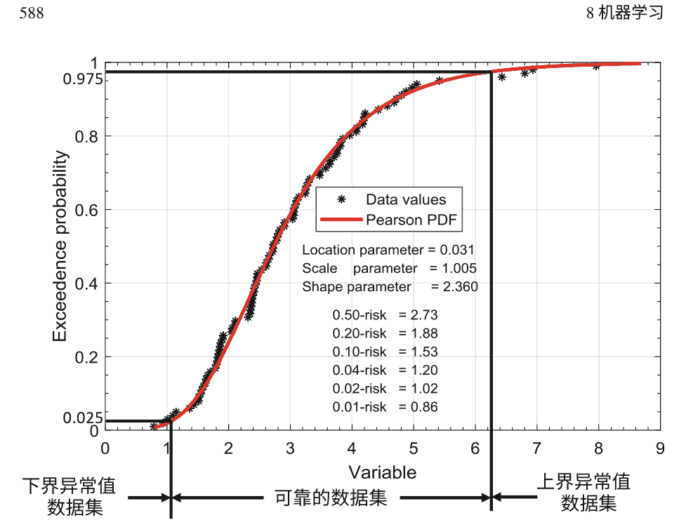

## 图8.2 累积分布函数示例

### 8.5.4 不确定性路线图

在本节中解释的所有内容之后，在图8.3中，提出了一种路线图，以确保数据在被视为输入数据集之前的可靠性。

这个 flowchart的每个部分都必须根据本节中所解释的内容进行实施。

## 8.6 特征

它们在设计ML应用程序的设计属性方面类似于数据点，并且可以被视为可以轻松计算的浅学习元素之一，但在ML应用程序之前，它们的决策选择是非常具有挑战性的。例如，在图8.4a中，时间序列X_i (i = 1, 2, ..., n)在时间域中给出。其在相对频率域中的等效性显示在右侧（图8.4b）。除了频率指示外，还可以将给定的数据集转换为各种其他数值特征，例如点最小值、最大值、平均值、标准差、一些百分比等。这些特征可以作为数据点粘贴在一维或二维向量和矩阵形式中。在大多数应用案例中，它们通过线性代数过程进行处理，这可能会出现在几何特征的形式。代数和尤其是几何特征在模式的形式中提供了具有期望特性的元素搜索的高效搜索可能性。管理模型错误的一个困难问题是高效地处理在不同应用中的机器学习便利性。另一方面，可以与机器学习结合的特征数量是另一个问题。只有专家才能为机器学习应用提供方便的特征数量。通常情况下，在任何机器学习模型训练中，标签数据点数nL大于数值特征数nF（nL > nF）。

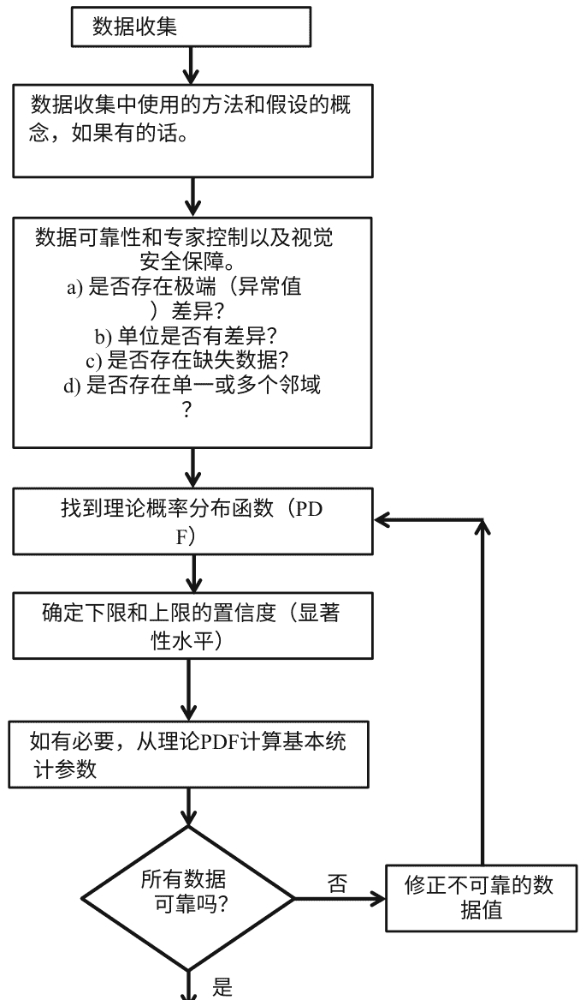

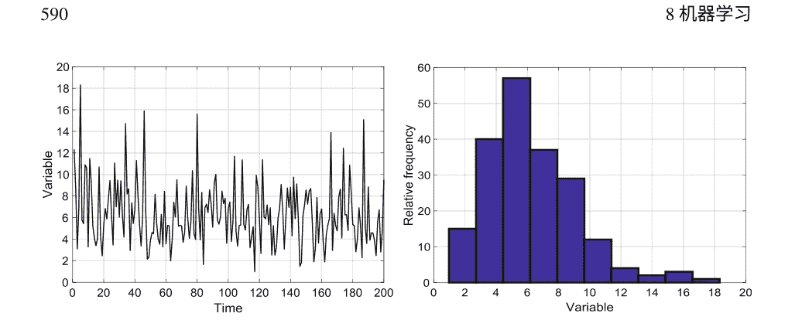

图8.4 数据点可视化，（a）时间序列线图，（b）频谱图

## 8.7 标签

除了数据特征模式之外，每个数据点可能还具有不同类型的属性，这些属性可能代表更高级的事实或数量，被称为标签。标签也以向量形式显示，就像特征向量形式一样。通常，机器学习方法尝试基于同一数据集中的特征为每个数据点找到高效的近似预测。标签属性可以通过专家人员的交互来确定，并且它们与特征之间没有明确的分离，因为两个属性之间存在模糊的干扰（第3章）。回归和分类之间的联系的一个显著例子是逻辑回归（第7章）。例如，人类表示的数据点可以根据二值（清晰）逻辑原则，通过其标签定义为0或1。逻辑回归方法是一种二元分类应用，通过线性回归实现类别之间的分离。

### 8.7.1 数值标签：回归

为了应用机器学习方法，标签 field的数据点必须包含所有可能的标签值。在前几章中已经介绍了使用机器学习方法进行数值标签估计的可能性，特别是在第4章中。

### 8.7.2 分类标签：分类

在一些机器学习应用中，数据点的标签可能暗示着分类或分类可能性，这种情况下会使用分类方法进行应用。最简单的分类过程是二元的，即双值（清晰）逻辑分类，其中每个数据点属于两个不同的类别之一，要么是1，要么是0。还有多类分类过程，其中每个数据点根据模糊逻辑原则（第3章）可能属于多个类别。数据点也可以同时属于多个类别。多标签分类考虑到给定输入可能属于多个标签的预测。

在这里，分类是相互包含的，与数值标签相反，在数值标签中，类是相互排斥的。

### 8.7.3 序数标签

这些是介于数值和分类标签之间的值，来自有序的有限集合。Nam等人（2014）提出，与数值标签一样，序数标签取自有序集合的值。例如，这样一个有序的标签空间表示1公里乘1公里大小的矩形区域。这样一个数据点的特征x可以通过堆叠表示该区域的卫星图像的RGB像素值来获得。

除了特征向量之外，每个矩形区域还由一个标签y来描述，

- y = 1: 该区域不包含树木。
- y = 2: 该区域部分覆盖树木。
- y = 3: 该区域完全覆盖树木。

口头上，可以说标签值y = 2比标签值y = 1“更大”，标签值y = 3比标签值y = 2“更大”。值得注意的是，像“更大”这样的描述在模糊逻辑领域中是包容的，如第3章所解释的。在许多机器学习应用中，尽管特征数据点可以很容易确定，但它们的标签只对少数点知道，因为这样的数据非常稀缺。即使可能没有任何点数据标签，机器学习的教学过程可以从特征数据中提取相关信息。这些是无监督的机器学习方法（第7章）。数据集的散布和其概率模型已在第4章中解释。

### 8.8 应用学习

理论上的想象力是激发思维和批判性思考的必要条件，以寻求创新知识生成的穆斯林思想家之一阿布·依兹·阿尔贾扎里（1136–1206）是创新机器人和其他机械设备设计的先驱者，他曾说过没有任何应用的信息处于虚假和真实之间。在混乱的信息碎片和以前的思想家言辞分类之后，更好、更简单的科学推断是可以实现的。科学事务可能会面临困难，但通过系统分类可以解决这些困难。

因此，他建议任何工作都不能停留在理论形式上，而必须转化为有用的技术服务。知识必须转化为应用和技术，以便除了真实性或虚假性之外，它们对人类有用和有帮助。他的所有建议即使在今天仍然有效，因为他说了许多经过几个世纪仍然有效的事情 (Şen 2022年)。

机器学习基于可改进的计算机算法和软件应用，经过多次试验和错误程序后，可以通过经验和观察进行改进，如果需要的话。

## 8.9 预测验证

预测验证与时间或空间质量度量相关。许多科学家对于什么构成一个好的猜测存在不同的意见 (Murphy 1993)。所有的预测验证程序都试图以某种方式将预测变量与误差或损失函数最小化原则上的观测进行比较。一般来说，根据某些标准，预测值与观测值越接近，预测就越好。在这些标准中，有许多主观和客观的估计措施。例如，可以根据估计问题的性质选择个人判断和概率、统计、参数或非参数基础作为关键标准。无论标准如何，专家的意见和评论可能看似无价，但它们是补充和支持性的信息。简而言之，任何预测验证程序都必然涉及匹配的预测对和相关的观测之间的比较。空间和时间估计应与估计过程的改进相比较，以减少不确定性并增加增量趋势的精度。比较来自不同来源的估计结果也很重要，特别是在二维研究中。因此，可以通过任何计算机软件评估竞争估计器或估计系统的相对优点。专家可以就预测性能提供额外的反馈，以期获得更好的未来预测。

预测验证的目标是识别任何预测过程中的薄弱点，并通过日常知识和技术发展来改进它们。在预测和时间参考过程中，包含最新信息和诊断检查可以带来更好的预测。在预测验证过程中，将指导估计器进行改进预测的最重要变量是通过概率和统计方法以及其不确定性特征量化的误差序列。

### 8.9.1 参数验证

如前所述，在回归直线技术（第4章）中，误差序列必须具有零算术平均值。这种状态的逻辑结果是，在很长一段时间内，应该没有显著的随机正负偏差。

#### 8.9.1.1 频率分布

前面已经提到，任何不确定变量的频率分布不仅提供了变量的概率性行为，还提供了统计参数行为（见图8.2）。在成功的估计过程中，预测值和观测值的频率分布函数应该接近。预测验证中的频率分布可以通过两种不同的方式实现。

- 1. 预测和观测的联合分布对于预测的验证至关重要。
- 2. 预测误差序列的频率分布是预测和观测的综合表达，即两者之间的差异。在实际的预测过程中，预测和观测是分开的变量。实施时，通过Yi数据值进行的预测可以取序列Y1， Y2， ...中的任何值。相应的观测值为Xi，可以取值X1， X2， ...， Xn。利用这些符号，预测的公共概率密度函数P(Xi， Yi)可以表示如下（第4章）：

```
P(X_i, Y_i) = P(X_i | Y_i) P(Y_i) i = 1, 2, ... , m; j = 1, 2, ... , n
```

通过为每个m×n可能的预测和观测组合关联一个概率，可以从给定的数据集中导出双变量概率密度函数。Murphy和Winkler（1987）将方程8.2命名为校准改进分解。这种分解的一部分包括一组m个分布，P(Xi/Yi)，每个分布由Xi的所有n个结果的概率组成，给定其中一个预测Yi。 这个条件概率密度函数指示了在发布单个Yi预测时每个可能事件发生的频率，或者每个Yi预测的校准程度。 然而，方程8.2中的无条件概率部分，P(Yi)，具体说明了每个预测值Yi的相对频率，或者每个可能的预测值Yi被使用的频率。 也可以将方程8.2等价地写成以下形式：

```
P(Xi, Yi) = P(Yi/Xi) P(Xi) (8.3)
```

这被称为基于似然比分解的方法（Murphy和Winkler，1987年）。 右边的条件概率表示在观察到事件Xi之前，每个允许的预测值的概率。预测误差的相对频率分布函数也是评估预测质量的基本量。 这个分布函数的方差越小，估计越好。 此外，这个概率密度函数为估计的可靠性提供了基础。 使用预测误差的相对频率分布函数，可以推导出预测值的置信度（图8.2和第4章）。

### 8.9.2 预测技巧

在定义估计技巧时，需要有两个不同的基准进行比较。 预测技巧指的是一组预测的相对准确性。两个基准缩短估计和一组标准控制或参考估计。在实际估计过程中，通常选择三个参考估计值如下。

- 1. 在永久预测中，预测值和上一个时间段的值。
- 2. 根据数据集相对频率进行随机预测。
- 3. 估计技能的定量度量是技能得分（SS），定义为相对于参考估计的百分比改进：

```
SS = 100 * (A - Ar) / (Ap - Ar) (8.4)
```

该公式在准确度的度量具有正向（较大的A值更好）或负向（较小的A值更好）的情况下都能给出一致的结果。 当Ap = A时，SS达到最大值100%，当A r =A时，SS达到最低值0%。

### 8.9.3 条件表

两个或多个分类数据的比较以表格的形式进行，例如，将数据集的绝对频率或计数显示在一个mxn条件表中，该表显示了mxn个可能的估计和观察组合。条件表中包含每个分类位置的相对频率，即每个表格条目的值除以样本大小。

这样的表格与前面在相对频率估计验证部分提到的条件和组合概率量有相似之处。表8.1显示了概率表与估计和观察的联合分布之间的一对一致性，对于m = n =2的情况。双向列联表提供了关于两个分类变量计数的信息。在这样的表格中，行（列）是用于一个（另一个）变量的。

数据集中预测/事件对的总数等于n = a + b + c + d。常见概率由每个可能的预测/事件对出现的相对频率组成，并通过样本大小除以原始计数的列联表获得。该表标记为“是”和“否”，因此成功的“是”猜测的相对频率为P(X,Y) = a/n。

在列联表中包含边际率也是常见的做法。这些只是行和列的总数，在这种情况下，每个事件的发生次数“是”或“否”预测或观察。在假定完美预测的情况下，2 ×2列联表中的非对角线项将为零。这对应于事件之后的所有“是”预测，而不是事件之后的所有“否”预测。然而，在实际情况下，交叉对角线值预计尽可能小以获得准确的预测。命中率或效果率计算是从给定列联图验证预测的最简单的度量标准。这是预测案例的一个简单部分，其中分类预测准确地预测下一个事件或没有（Wilks 1995）。通过表8.1中的示例，命中率H被定义为：

$$H = \frac{a + d}{n} \qquad (8.5)$$

这个定义同样给予了正确的“yes”和“no”预测以相同的信用。此外，命中率同样惩罚了两种类型的错误。最差的命中率等于零，最好的命中率等于一。可以通过将方程式8.5乘以100来确定预测错误的百分比。

表8.1一个列联表

| | 是 | 否 | 总体 |
| :--- | :--- | :--- | :--- |
| 强 | a | b | a + b |
| 温和 | c | d | c + d |
| 总体 | a + c | b + d | N = a + b + c + d |

基于列联表的另一个预测验证指标是关键成功指数（CSI），当要预测的事件发生的频率明显低于非发生事件时，它非常有用。它通过考虑观察值和预测值中除了“no”情况之外的所有2×2列联表条目来定义。事实上，CSI是在除了观察到的和预测到的“no”情况之外的所有输入中正确“yes”预测的百分比。因此，它由以下符号定义：

$$ CSI = \frac{a}{a + b + c} \quad (8.6) $$

在排除正确的情况下，这可以被视为对预测数量的命中率“不”猜测从评估中排除。它也在零和一之间变化，包括关键成功指数。

从2×2列联表中，另一个有用的预测验证度量是检测概率（POD），定义为发生预测事件的情况下的案例比例。这是在方程8.3中给出的概率表达式的另一种表达方式。考虑表8.1中的符号条目，POD可以表示为：

$$ POD = \frac{a}{a + c} \quad (8.7) $$

在完美预测的情况下，POD等于一。还可以根据条件概率表达式P(X/Y)进行另一种有用的预测验证度量的定义。这个度量被称为误报率（FAR），定义如下：

$$ FAR = \frac{b}{a + b} \quad (8.8) $$

与以往的预测验证定义相反，FAR越小，预测越好。基于列联表，可以进行另一种比较平均预测与平均观测的测量，这被称为列联表偏差（B），定义如下：

$$ B = \frac{a + b}{a + c} \quad (8.9) $$

它简单地是“是”预测次数与“是”观测次数的比率。在无偏预测的情况下，即所需的质量，B =1表示事件被预测的次数与观测到的次数相同。B可以取大于1的值，表示事件被预测的次数多于观测到的次数，这被称为过高估计。同样，小于1的偏差值表示观测到的次数少于预测的次数，这对应于低估。

尽管2×2的概率表有助于理解其解释和使用中的基础哲学系统，但分类预测不仅限于2×2的条件表。

### 8.10学习方法

科学研究和技术创新在机器学习方法论原则的指导下加快了速度。在机器学习方法中，通常有三种类型的学习过程，无监督、有监督和强化有监督的替代方案。这些学习系统基于计算机技术，通过软件实现，涉及概率、统计和算法等跨学科的理论方面，以加强和提升人工智能的属性。各种浅层学习训练方法已在第7章中进行了解释，包括无监督和有监督训练及其不同版本。

#### 8.10.1监督学习

有监督学习与问题相关的标签关联在一起，这被认为是回答问题的方法。在离散标签情况下，任务是分类问题，而在重新评估标签的情况下，回归方法是重点。

在机器学习的方法论中，监督学习是相对浅显的学习技术（第7章）。在其结构建立中，研究人员或工程师必须先制定相关便利的理性言辞和逻辑陈述，然后进行学习。机器依赖于信息技术学习原理，以监督方式执行相关陈述，可以通过输入和输出组件之间的架构结构或使用数学公式来实现。通过完全模拟手头问题，机器可以基本上通过监督学习获得学习能力。

通过这种方式，监督学习方法达到了系统组织和管理水平，因此，如果有可用的数据集，可以用于即时分类、模拟、预测、估计和回归等方法论解决方案。

监督机器学习被归类为浅学习原理，因为它代表了相对基础的学习方法。在将其用于计算机之前，人类必须至少确定口头学习原则。在目标考虑下，需要收集关于数据的基本信息，包括数值和语言方面。与其他学习方法的比较表明，它可以模拟常见的机器学习。机器学习研究人员可以解决一些分类和回归问题，如第3、4和5章中已经解释的那样。在经典的学习方法中，有k最近邻（KNN）、支持向量机（SVM）和贝叶斯网络（BN）方法论。在这个学习过程中，学习内容更加系统化，有一定的规律性。

### 8.10.2无监督学习

这是另一种浅层学习的替代方法，用于监督学习过程。在这种方法论中，机器在整个学习过程中不知道内容。机器自身调整学习原理的提取，从可用数据中。这样，机器对数据信息分析拥有完全的权威。在学习过程中，机器不依赖于特定的方向来完成工作。操作方法帮助机器学习问题的基本内容、概念，从而以基本原理的自由形式进行一系列内容学习。机器学习通过连续的学习阶段不断改进，并作为人工智能的一个分支，旨在模仿人类的智能能力和技能。机器学习通过人工智能方法论在应用统计原理后，归纳地理解上下文，以揭示大型数据集中的隐藏模式。无监督学习的主要目的是推断隐藏的模式规律，例如以聚类的形式，检测数据集中的局部和全局异常。有关无监督学习的更多信息已在第7章中介绍。

### 8.10.3强化学习

至于强化学习（RL），它基于心理启发来识别数据的特征行为。通过一系列的试错工作可以确定理想的结果。在试验过程中，选择某些行动以获得期望的模式。损失函数经常用于机器学习过程中对不同假设进行评估和比较。如果未来数据点的生成预测受到假设的影响，则在应用中使用强化学习过程。

这种学习型应用提供了代表不同时间点的可编程系统状态的数据点。与无监督机器学习类似，强化学习方法通常必须在没有任何标记数据点的情况下学习假设。与其他学习方法相反，强化学习无法评估不同假设的损失函数。从数学角度来看，对于最先进的预测，可以对当前假设进行逐点损失函数评估。

样本数据集是监督学习过程的基本梯度，而强化学习（RL）与环境进行交互（Mnih等，2015年）。这也被称为半监督学习。在强化学习系统中没有具体的损失函数。对于优化，没有直接访问函数，因此对交互有疑问。另一方面，如果状态与相关环境集成，输入需要前面的动作（Al-Dulaimi等，2019年）。对于强化学习，问题的执行范围很重要并且还支持空间。在许多参数优化的情况下，这种方法很有用。参数在学习中影响计算速度。对于使用强化学习过程，有一些特定的特征，它能够在较长时间内确定最佳动作；它有助于确定动作需求；对于更好的解决方案，它能够找到最佳方法。如果数据集不足，不建议使用它，因为它可能导致计算量大和时间消耗多。图8.5显示了强化学习系统中的关键概念。

行动相当于环境中的移动，在行动空间A内进行，该空间是环境中可能的移动集合。这些移动是离散的。根据在环境中发生的行动，可以理解观察结果。观察结果以状态的形式返回和感知。状态随时间和空间变化，其阶段示例如时间t的状态s(t)和时间t+1的状态s(t+1)。代理的行动可以通过成功或失败来衡量，这被称为奖励。有时，奖励可能会延迟，没有即时的响应。代理可以记录的总奖励R_t（回报）可以用以下简单的数学表达式表示：

$$R_{t}=\sum_{i=t}^{\infty} r_{i}$$

还有折扣总回报作为返回值，R_d，根据以下数学表达式：

$$R_{d}=\sum_{i=t}^{\infty} \gamma^{i} r_{i}$$

其中 \(\gamma\) 是一个折扣数。它的重要性在于使未来的回报小于当前的回报，因此它是一个介于0和1之间的数。它与经济学中的折扣率非常相似。在强化学习中，还有另一个概念叫做Q函数，它反映了在执行某个动作a之后，代理在状态之后的预期R_t。其隐式形式的有效表达式为：

$$Q(s_{t}, a_{t}) = \mathbb{E}[R_{t} | s_{t}, a_{t}]$$

这等于说Q函数代表了一个条件奖励，R；在给定的状态s_t；和动作a_t，在相同的状态和动作特征下。如果给定一个Q函数，如何采取行动？如何利用这个Q函数更好地考虑？为了决定这个方面，需要一个策略p(s)，取决于当前状态以选择最佳的行动作为其状态s。为此，需要有一个firm策略，使得策略可以选择一个行动来最大化未来的奖励。为了获得最佳奖励，应该有一组相同行动的状态可以进入Q函数，因此，对于每个阶段，根据Q函数有一个回报，所期望的结果是最大化Q函数，如下所示：

$$P'(s) = \max_a Q(s, a)$$

其中P'(s)是最优解策略。深度强化学习算法包括价值学习和策略学习两个模块，如下所示。

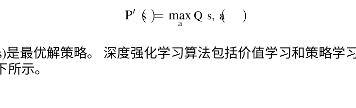

用于价值学习的Q函数

## 8.11目标和损失函数

损失函数教会机器如何学习。它有助于评估特定算法模型对给定数据集的适用性。在回归问题解决中，以下是一些损失函数的示例。

-   1. 平均绝对误差（MAE）：这是一种用于回归问题的鲁棒损失函数，在极端数据集值的情况下可能是非高斯形式。该损失函数不考虑不现实的高或低值。其定义是模型输出M_i和测量值m_i数据集（i=1,2,...,n）之间绝对差值的算术平均，其中n是数据的数量：

$$\text{MAE} = \frac{1}{n} \sum_{i=1}^{n} |M_i - m_i| \quad (8.10)$$

-   2. 均方误差（MSE）：这是实践中最常用的损失函数。它是模型和测量值之间差异的平方的平均值，数学定义如下：

$$\text{MSE} = \frac{1}{n} \sum_{i=1}^{n} (\text{M}_{i} - \text{m}_{i})^{2} \quad (8.11)$$

在完美匹配中，这在实际建模方法中是不可能的，MSE等于零。

-   3. 平均偏差误差（MBE）：这是用于计算假设模型和可用测量数据之间的平均偏差的。它显示了高估（正值）或低估（负值）的情况。根据最终的MBE值，可以更新模型。其计算公式如下：

$$\text{MBE} = \frac{1}{n} \sum_{i=1}^{n} (\text{M}_{i} - \text{m}_{i}) \quad (8.12)$$

这不是经常使用的损失函数，因为正负误差可以相互抵消。

-   4. 均方对数误差（MSLE）：为了减小根据先前的损失函数产生的巨大差异，可以考虑MSLE概念。它的计算方式与MSE类似，只是将真实值替换为其对数，如下所示：

$$\text{MSLE} = \frac{1}{n} \sum_{i=1}^{n} \left[ \log(\text{M}_{i}) - \log(\text{m}_{i}) \right]^{2} \quad (8.13)$$

### 8.11.1分类的损失函数

对于给定的数据集分类问题，存在将其分为少数或多个类别以进行识别和比较的问题。根据不同的参数，数据被划分为不同且唯一的类别。以下损失函数可用于分类问题。

#### 8.11.1.1 二元交叉熵损失（BCEL）

熵是任何信息内容中包含的随机性的度量，包括数据集，在两个随机变量之间的随机性差异。这种方法适用于二元分类任务，即能够用两个备选选择0和1回答问题的任务。在两类情况下，这是最常用的损失函数。随着预测概率与实际标签的偏离增大，BCEL增加，导致高损失值。如果对数损失等于零，模型完美预测数据集模式。BCEL的数学表达式如下所示：

$$J = -\sum_{i=1}^{n} M_i \log h_{\theta}(m_i) + (1 - M_i) \log (1 - h_{\theta}(m_i)) \quad (8.14)$$

其中\( M_i \)是真实标签，\( h_{\theta}(m_i) \)是基于假设的预测。由于二进制意味着类别取两个值0和1，如果\( M_i = 0 \)，则该项不存在，如果\( M_i = 1 \)，则\( (1 - M_i) \)项为零。

#### 8.11.1.2 分类交叉熵损失

这是对前一小节中解释的二进制交叉熵损失的多元变量情况的扩展。在这个损失函数中，向量中只有一个元素为非零，其他元素乘以零。这个特性扩展到了一个被称为软最大值的激活函数。

另一方面，铰链损失（HL）在支持向量机（SVM）的情况下方便地用于计算超平面到类别的最大间隔。它惩罚错误的预测，因此，目标标签得分大于所有不正确标签的总和至少一个边际。HL用于最大间隔分类，尤其是用于SVM。损失函数在凸形式中不可微分，并且在ML过程中使用。其数学形式如下：

$$\text{SVMLoss} = \sum_{j \neq M_i} \max(0, s_j - s_{M_i} + 1) \quad (8.15)$$

> 参见：https://www.section.io/engineering-education/understanding-loss-functions-in-machine-learning/#introduction

## 8.12 优化

优化是基于数学过程的ML的一个重要组成部分，通过模型参数的数值计算来揭示未知数据特征，用于决策系统。学习问题导致一组参数，这些参数是相对于给定数据集最优的。ML设计原则需要优化数学形式化过程。例如，下面的天气预测问题可以被形式化为一个优化（最小化）问题。优化技术的数学和统计计算框架是优化的直接应用手段之一。图8.6显示了优化和损失函数之间的主要区别。

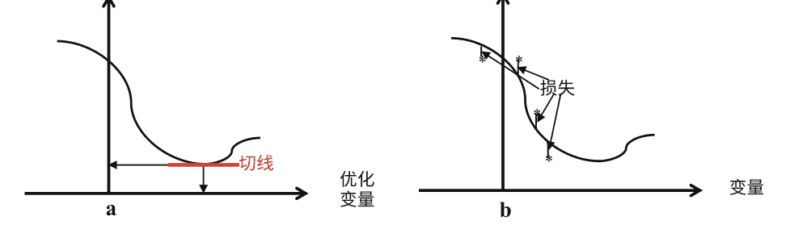

图8.6 （a） 优化目标函数， （b） 损失函数

图8.6a中的曲线显示了一个简单的优化问题，具有最小的优化值和目标函数值。图8.6b代表了通过损失函数最小化来学习假设的机器学习方法。应该考虑到平均损失是最终目标的嘈杂版本，在大量数据的情况下等同于期望，并且其概率密度函数是可识别的。

## 8.13机器学习和简单线性回归

线性或多元统计回归方法在机器学习的监督训练中用于对给定数据集进行分类。其主要结构旨在通过统计最小二乘法从一组独立输入变量中预测依赖变量。在经典回归分析中，有以下一组假设：

-   (a) 输入变量被视为彼此独立。
-   (b) 输入和输出变量具有不确定、模糊、随机和不完整的组成部分，并且它们的概率密度函数被假设为正态（高斯）概率密度函数。
-   (c) 在最小化平方和的条件下，将方便的数学函数拟合到散点图上。
-   (d) 回归方法需要数值数据，并且有助于基于一组先前数据预测或解释数值。

线性回归具有最简单的数学表达式，它将输出变量O与输入变量Ii (i=1, 2, ..., m) 相关联，其中m是输入变量的数量，ai是未知参数：

$$O = a_0 + a_1 I_1 + a_2 I_2 + ... + a_m I_m \quad (8.16)$$

### 8.13.1最小二乘法

许多统计模型的本质是基于预测误差的平方和应该最小的原则。在这里，预测误差被定义为观察值和预测值之间的差异。统计最小二乘法技术的简要复习在第4章中有解释。

### 8.14分类和分类

分类也是处理一组输入数据的预测输出的机器学习方法之一。一般来说，输出以二值逻辑的形式呈现，即“是，1”或“否，0”，尽管不仅限于两个互斥的选择。例如，在地质图中，有三种岩石类型：火山岩、沉积岩和变质岩，因此，一个方便的分类方法应用可以明确地将这三种类型标识为“0”、“1”和“2”，或者分别用三种不同的颜色表示。逻辑回归是最简单的分类方法之一，它使用线性线条将不同的类别分开（第6章和第7章）。这里的形容词回归并不是指统计回归，而是基于输入概率估计输出的概率回归。

例如，如果有一组水样品被送到实验室进行质量评估，每个样品都会有不同的值，并且会出现一组数字，逻辑回归可以将这些值作为输入，根据每个化学成分的标准基值估计水的“好”或“坏”质量的概率。因此，逻辑回归的输出要么是0，要么是1。如果基本概率被固定为0.3，那么得分大于0.3的水样品可以被视为“好的”，剩下的则属于“坏”的分类。

分类是将给定数据集按照相似对象划分为几个组的分类过程，以便以后的新数据可以自动识别为其中一个组。在双值逻辑的情况下，已经在第3章中解释过，存在互斥且穷尽的组。至于模糊逻辑，组是相互包容但部分嵌套的。如第3章中已经提到的，在任何语言中，分类始于像“低”，“中”，“高”这样的词，与经典的“是或不是”二元逻辑相对立，但在一定范围内。

### 8.15聚类

这个关键词在无监督学习过程中被认为是特别重要的，用于在一组无标签数据中寻找结构组成。例如，如前所述，k-means过程和c-means过程将在本章后面进行解释；两者都与无监督学习过程用于聚类有关。

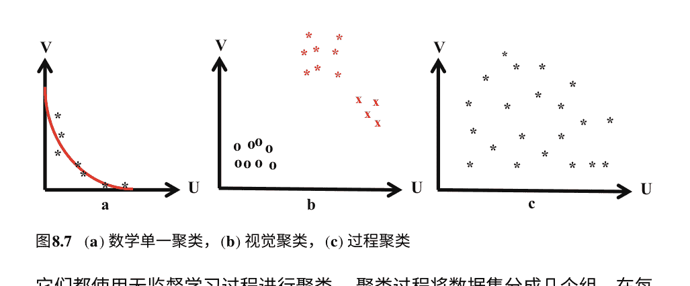

图8.7 (a) 数学单一聚类, (b) 视觉聚类, (c) 过程聚类

它们都使用无监督学习过程进行聚类。聚类过程将数据集分成几个组，在每个组中，根据某个标准，存在相似的元素。从某种意义上说，它是一种将具有相似特征属性的对象收集到一组中，而将不相似的对象收集到其他组中的过程。聚类可以简单地定义为“将对象组织成成员在某种程度上相似的组的过程”。图8.7提供了这种聚类过程的视觉印象，可以在任何计算机软件应用程序之前通过视觉检查进行主要分组。

图8.7a的散点分布在一个可以用数学表达的模式周围，并且可以通过基于最小二乘方法的回归分析（第4章）获得其表达式。散点可能没有这样一个明确的特征，但在图8.7b中可以明显地看到可识别的聚类。这种模式甚至可能不需要应用聚类技术，因为o、x和*符号显示了三个明显可见的群组。

最后，图8.7c没有提供明显和可视的模式，因此，将其划分为一组群集取决于研究人员及其计算机程序对群集及其编号的识别。为此，在本书中，建议研究人员从两个群组开始进行聚类，然后根据需要选择k-means或c-means过程。如果由于逻辑和合理的原因需要超过两个群集，则可以逐个增加群组编号应用相同的过程。然后，研究人员可以决定哪个群集编号提供了数据集的最佳特征。最简单的相似性准则称为基于距离的准则，如前面在第6章中提到的。

另一种聚类过程被称为概念替代，如果对象具有所有对象的共同概念，则它们属于同一簇。这意味着对象不是根据客观相似度测量进行分类，而是根据它们的描述性概念进行分类。例如，人们可以根据每个词对于分类的认识含义将其分为“年轻的”，“中年的”和“年老的”年龄类别。在任何聚类过程中，正如本章前面提到的，有两个基本原则适用。

-   1. 簇中心之间必须尽可能远离彼此。
-   2. 每个簇中心必须聚集所有最近的元素。

### 8.15.1 聚类目标

主要目标是将未标记的数据集识别为内在群组的簇。在这种过程中，不能期望获得与最终目的无关的最佳聚类准则。最初，希望根据某个准则将数据集聚类为几个群组，即使这可能与特定目的有关。在科学文献中，有一些程序，如同质性、异常值检测、数据有用性、稳定性、数据降维、趋势识别等。众所周知，聚类在不同的学科中都有应用，如市场营销中寻找相似的客户群体，植物和动物分组中的生物学，保险中的保单持有人毕业证明，城市规划中的住房群体，地震中的震中识别危险区域，地质学中的断层和故障识别等。

在识别聚类时，需要考虑一些要求，然后再应用任何过程。这些要求包括属性差异、维度、噪声、异常值、独立性、输入参数的决策、聚类形状确定和可扩展性等。在应用开始之前，必须考虑到几个问题。有必要考虑聚类过程是否能够充分满足研究者的所有要求；在处理大型数据集时，必须小心使用聚类过程，确定相似度测量的距离准则，并从不同的角度评估聚类的解释。

### 8.15.2 聚类算法

一般来说，有四个聚类组，如下所述的子节。其中包括独占、重叠、分层和概率性的选择。第一个选择是以独占方式进行聚类，每个对象属于一个组。这种情况下的一个简单例子如图8.8所示。可以应用直线分割，就像第6章和第7章中描述的逻辑回归方法一样。在独占聚类中，没有差异，每个组中的所有点的MD值都等于1。

至于重叠聚类方法，聚类是相互包含的，因此，聚类与每个点同时属于多个聚类。换句话说，数据集中的每个对象可以属于两个或更多具有不同MD的聚类。图8.9展示了这样一个简单的模糊聚类。

两个聚类A和B重叠，红色的对象属于两个不同的聚类，具有不同的MD。当然，每个点都根据模糊逻辑原则（第3章）有一个MD。

# 图8.8 独占聚类

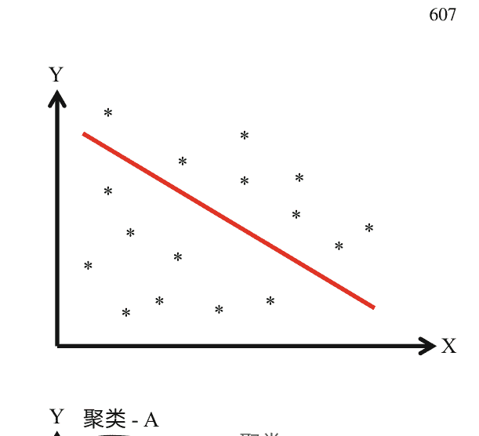

# 图8.9 重叠聚类

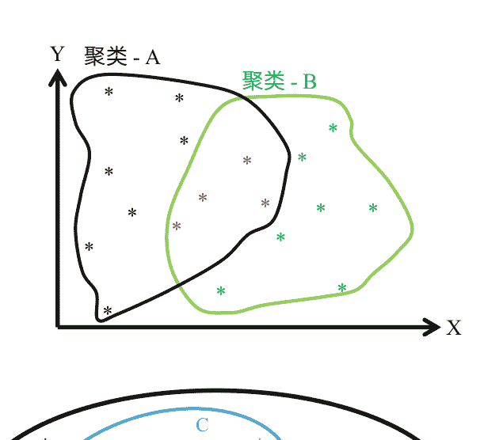

# 图8.10 分层聚类

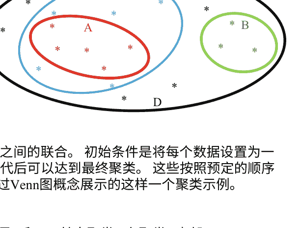

分层聚类是最近两个聚类之间的联合。初始条件是将每个数据设置为一个聚类。因此，经过一些迭代后可以达到最终聚类。这些按照预定的顺序从上到下生成。图8.10是通过Venn图概念展示的这样一个聚类示例。

在这个图中，初始聚类是A和B，其中聚类A在聚类C内部，并且它们都在没有聚类的数据集的保护伞下。

第四个聚类完全是概率性的，最常用的替代方法是k-means和c-means，这些方法在后续章节中详细解释。这种聚类属于前三种聚类类型之一。

简单说来，k-means是一种特殊的聚类过程，而模糊c-means是一种重叠聚类算法，因为聚类中的每个对象都有多个MD。

### 8.15.3 聚类距离度量

在每个聚类过程中，任意两个数据点之间或者数据点与提议的聚类中心之间的距离度量是主要组成部分。在相同数据集的情况下，可以直接计算距离；否则，数据集可以转换为已经在第4章中解释过的标准化数据值。当然，不同的缩放可能导致不同的聚类结果。图8.11对比了原始数据集和缩小后数据集中的聚类。因此，缩放操作可能导致有偏的聚类结果。

从图形上明显可以看出，在缩放后聚类发生了变化，但是另一个问题来自于用于将数据特征向量的单个分量之间的距离组合成可用于聚类目的的唯一距离度量的数学公式过程，因为不同的公式（缩放过程）会导致不同的聚类结果。因此，必须为方便和可靠的结果适应合适的距离度量过程。

在许多应用中，使用欧氏距离度量，它将距离表示为直角三角形的斜边长度。这个简单的表达式已经被Minkowski推广为距离度量，即D(X_i, X_j)，表示两个数据集X_i和X_j（i,j =1, 2,..., n）之间的距离如下：

$$D(X_i, X_j) = \left( \sum_{k=1}^{n} |X_{i,k} - X_{j,k}|^p \right)^{\frac{1}{p}} \quad (8.17)$$

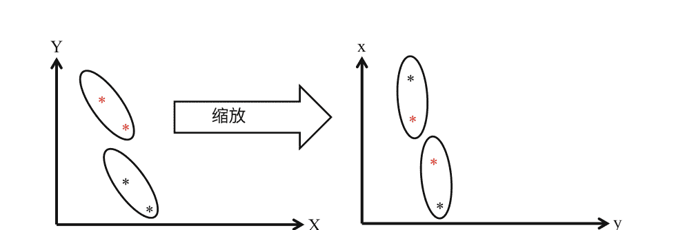

图8.11 缩放和聚类

对于p =1，这个距离度量减少到曼哈顿度量，对于p=2，减少到欧几里得距离度量。在实际问题解决中，在距离计算中可能存在1 < p <2之间的任意数，但没有关于选择哪个值的指导。

聚类方法不需要输出数据，但输出是从输入数据集中自动识别的。这些方法的性能可以通过可视化来跟踪输出的质量。在聚类研究中经常使用两种聚类方法学。一种依赖于清晰逻辑，被称为k-means，另一种依赖于模糊逻辑，被称为c-means。

## 8.16 k均值聚类

这是将给定数据集分成几个聚类的最简单的无监督学习过程（MacQueen 1967）。其初步解释在第7章中给出。

根据研究人员或专家的经验，聚类数必须预先确定。因此，聚类数k是预先确定的。主要目标是找到代表性的聚类中心，根据手头的数据散点固定。聚类中心的第一个猜测要么根据专家意见，要么在没有初步建议的情况下随机分配。

下一步是考虑每个点到最近的聚类中心的接近程度。通过这种方式确定聚类后，计算并修正落入同一聚类的点的算术平均值。如果新的聚类中心不在之前的质心上，那么重新计算相同原则，并且因此，另一个新的聚类元素被识别出来。类似计算的重复可以在循环内完成，直到新的聚类中心稳定或者最终步骤和之前的聚类质心位置之间的相对误差差保持在±5%的限制范围内。最终，k-means算法旨在通过最小二乘过程来最小化目标函数（距离接近度）。目标函数J的表达式可以写成如下形式：

$$J = \sum_{j=1}^{k} \sum_{i=1}^{n} \left\| X_{i}^{j} - C_{j} \right\|^{2} \qquad (8.18)$$

其中 \(\left\| X_{i}^{j} - C_{j} \right\|^{2}\) 是数据点X_{i}^{j}和聚类中心C^{j}之间的距离度量。完成k-means方法需要以下执行步骤。

-   1. 根据以前的经验或者向领域专家咨询，决定聚类的数量。

2. 根据对现象的合理推测，选择第一组聚类中心，否则随机分配。
3. 计算每个数据点到每个聚类中心的距离，并将该点分配给最近的聚类。对所有可用的数据点执行相同的过程。
4. 通过计算每个聚类的算术平均值来重新计算聚类中心的新位置。
5. 重复步骤2–4，直到新的中心点不再移动，或者使用之前解释的百分比误差准则。

尽管执行所有步骤后，该过程将以没有移动或可接受的误差限制准则的聚类中心结束，但这并不意味着找到了最佳配置。人们不能忽视结果对初始随机聚类中心分配的敏感性。为了避免这种情况，建议使用不同的聚类中心随机化多次运行k-means过程。下面是k-means的一个简单过程应用。假设存在一个数据集X_i (i=1, 2, ..., n)，具有k个 (k << n) 聚类搜索可能性，一般情况下。初始聚类中心为C_k (k=1, 2, ..., k)。

任何点X_i都属于簇C_j，前提是 ||X_i - C_j|| 是所有距离中的最小距离。此外，需要找到落在各簇中的点的平均值。在通过步骤1–4解释的过程步骤执行后，应注意以下事项：

1.  在每一轮后计算算术平均簇中心；因此，有m_1, m_2, ..., m_k个簇中心。
2.  估计的均值用于将样本分类到新的簇中。
3.  根据前面提到的标准继续，直到最终点。

图8.12以假设的方式展示了簇中心的连续进展和它们之间的分割线。这里，线性线只是整体簇边界的一部分。

因此，人们可能会注意到新的质心在每一步中改变它们的位置，直到不再出现显著的变化，这意味着质心不再显著移动。在这里，重要性必须通过某种标准客观地定义。例如，如果最后的质心位置与前一质心位置的相对误差距离小于5%，则可以停止寻找新质心的循环过程。

k-means过程的最大弱点是从一开始就没有明确的通用解决方案来决定聚类的数量。如前所述，保证是使用不同的初始随机聚类质心分配运行相同的过程，并尝试从两个开始的不同聚类数运行相同的过程，直到获得最佳聚类数。

## 8.17 模糊c均值聚类

这种聚类方法允许数据集元素属于两个或多个具有不同模糊度的聚类组，每个数据点的总和等于1。模糊聚类技术的基础由Dunn（1973）和Bezdek（1981）提出，并在模式识别应用中经常使用。相互包容性使k-means过程在优化中引入了另一个维度，要求每个聚类的每个点的模糊度总和等于1。因此，Bezdek（1981）将其称为模糊c-means。它是一种迭代的聚类方法，类似于k-means。

然而，c-means使用模糊隶属函数而不是0和1的硬值。目标函数也被称为损失函数，并且与k-means过程相似，如下所示：

$$J_{m} = \sum_{i=1}^{n} \sum_{j=1}^{c} u_{ij}^{m} \| X_{i} - C_{j} \|^{2} \quad 1 \leq m < \infty \quad (8.19)$$

其中m是大于1的任意实数，u_{ij}是集群j中x_{i}的MD，X_{i}是多维测量数据的第i个，c_{j}是集群的多维中心，\|*\|是表示任意测量数据与中心之间相似性的任意范数。模糊聚类需要沿以下表达式迭代优化目标（损失）函数。在迭代过程中，连续适应MDs，u_{ij}和集群中心C_{j}如下获得：

$$u_{ij} = \frac{1}{\sum_{k=1}^{C} \left( \frac{\| X_{i} - C_{j} \|}{\| X_{i} - C_{k} \|} \right)^{\frac{2}{m-1}}} \quad (8.20)$$

和

$$C_{j} = \frac{\sum_{i=1}^{n} u_{ij}^{m} X_{i}}{\sum_{i=1}^{n} u_{ij}^{m}} \quad (8.21)$$

当 $max_{ij} |u_{ij}^{(k+1)} - u_{ij}^{(k)}| < \epsilon$ 满足条件0 < ε < 1后的k次迭代后，迭代步骤完成。模糊C均值算法的有效适用步骤可以总结如下。

1.  将MD值随机或系统地初始化为U^{(0)}矩阵，其中包含值，使得0 < u_{ij} < 1 (i= 1,2,...,n) 且 (j =1,2,...,k)。指数m方便地取为2。
2.  经过k次迭代，根据公式8.21计算聚类中心。
3.  更新U^{(k)}，直到满足上述ε条件。
4.  计算 $u_{ij}^{(k)}$ 和 $u_{ij}^{(k+1)}$ 之间的最大差异作为ε，如果不满足0 < ε <1，则返回步骤2。

## 8.18 频率-k均值-c均值关系

直方图用于分类，而k-means和c-means用于聚类。为了区分它们之间的概念，让我们考虑图8.13中给出的简单数据集。

在图8.13中的所有图表中，可以识别出两个簇，分别位于两个簇中心附近。从图8.13的第一眼看，可以看出有两个视觉簇A和B，而不需要应用任何机器学习程序。计算机无法像人类一样通过视觉感知，但可以通过人工智能程序进行视觉检查。让我们首先考虑频率图的概念，如第4章所解释的，这是一种分类方法。为此，数据集在水平轴上的投影范围R被分为五个类别，如图8.13b所示。对于k-means和c-means应用，数据集在水平轴上的投影被考虑在内。在k-means算法中，使用双值逻辑，所有数据点的隶属度为1（参见图8.13c）。至于图8.13d中的c-means方法，相同的数据集不属于清晰的簇，而是沿着更平滑的线显示出MDs，表明一些数据集可能属于两个（或多个）具有不同MDs的簇。

## 8.19 维度约简

这种方法对数据中的一些相对不重要的维度变量进行了消除。最简单的例子是线性回归线。图8.14显示了点的散布和最佳直线。

通过最小二乘原则拟合（I-I方向）。对于许多研究人员来说，这是回归分析的终点，但是有一个观点被忽视了。以下两点对于从维度角度进一步解释这条直线很重要。

6.  在I-I方向上的维度具有最大的数据点投影散布。
7.  第二个方向，II-II，垂直于I-I方向，数据点的投影散射相对非常小，因此可以被认为是可以忽略的。

回归线对应于从两个（x和y）方向降维到仅沿I-I方向轴的过程。

在实际应用中，有许多维度的数据分布在几列中，这些列被统称为“特征”。如果有n列，数据的每一行对应于n维空间中的一个点。就像图8.14中的二维散点图一样，n维空间中也有散点。就像经典的回归分析一样，可以将n的维度降低到几个具有不同方向上散点投影显著性的方向。

以下步骤将导致最终的维度降低。

1.  在n维空间中，找到数据投影散射最大的方向。由于寻求最大的散射，最好的度量是方差，$V_{I-I}$。
2.  在确定最大投影散射方向为主要方向之后，存在许多与I-I方向垂直的方向，并确定下一个最大方差 $V_{II-II}$，数据点沿II-II方向的散射投影。
3.  这两个方向在数据散射空间中定义了一个平面；因此，第三个方向垂直于该平面，然后通过方差 $V_{III-III}$ 找到沿该方向的下一个最大数据点投影散射，该值定义了第三个维度Ⅲ-Ⅲ。
4.  可以像前面的步骤一样继续进行第四步（$V_{IV-IV}$）、第五步（$V_{V-V}$）和其他附加方向的操作，因此，在每次应用步骤后，都会确定一个新的方向，并且维度的数量增加，在降维搜索过程中，需要根据各个维度的总方差与总方差的百分比来确定何时停止。
5.  数据的方差比例百分比 $V_D$ 被计算出来，当这个比例超过90%时，这一步的维度就被减少了。
6.  根据以下方差比例的计算顺序，计算 $V_R$ 的百分比：

$$ V_{R1} = 100 \frac{V_{I-I}}{V_D}; V_{R2} = 100 \frac{V_{I-I} + V_{II-II}}{V_D}; V_{R3} = 100 \frac{V_{I-I} + V_{II-II} + V_{III-III}}{V_D} \dots \text{等等} $$

所有这些百分比理论上都在0和1之间，但随着新的维度添加到之前的维度中，总方差稳步增加。

7.  当最终的方差比例计算超过90%时，这个数字m < n，维度对于解释数据特征很重要，剩余的维度变得多余。

一个图像可能包含数千个像素，这就需要减少总数。这样一个庞大的数据集可能通过降维变得可管理。上述所解释的步骤在文献中被称为主成分分析（PCA），用于降维。主成分分析（PCA）方法可以显著降低原始数据的维度，同时不会丢失太多信息。文献中还有另一种有效的方法，即t-随机邻居嵌入（t-SNE），它可以通过非线性降维来帮助降维。

## 8.20 集成方法

集成的含义是一组被视为个体项目的集合。通过集成方法，可以通过监督机器学习方法将几种替代方法组合起来解决同一问题，从而获得比每个单独方法更高质量的预测。例如，随机森林算法就是一种集成方法，它将许多使用不同数据集样本训练的决策树组合在一起。

另一个例子是使用方便的随机模式进行合成生成，以模拟自然事件。随机方法提供了一组替代方案，通过一种过程将这些替代方案组合起来得到最终解决方案。

在单一机器学习中，通过集成方法应用可以减少方差和偏差。通过这种方式，可以平衡精度的质量。集成中的多个选择提供了适应具有一定风险或可靠性水平的选择。

## 8.21 神经网络和深度学习

神经网络由至少三个连续的层组成，包括输入层$I_1$，$I_2$，$I_3$（数据）和输出层O（预测，分类），由隐藏层连接。隐藏层具有一组节点，提供非线性功能，如图8.15所示。根据所需的解决方案精度，隐藏层的数量可以增加到更多，每个隐藏层之间都有连接权重，这是不同类型（卷积，循环）的深度学习架构神经网络的主要基础。

即使需要大量复杂的计算机算力，也能实现最佳的深度学习性能。深度学习神经网络结构提供了许多自动调节参数来完成任务。在对音频、视觉、文本和图像分类执行详细和精细识别复杂数据中的隐藏模式时，深度学习技术非常成功。

### 8.21.1 学习

在许多实际应用中，数据挖掘和机器学习方法经常以浅层学习的形式使用（第3、4、5、6和7章）。在这种传统方法中，考虑了一组合合理的假设，用于数据训练、测试以及概率和统计特征检测。后来发现，在机器学习研究中，一些众所周知的假设是无效的，例如数据集的同质性、平稳性、同方差性、正态性和独立结构的假设。特别是当训练数据稀缺、昂贵且不容易获取时，机器学习过程无法顺利应用。始终希望能够通过更容易获取的数据生成高性能的训练器，并与其他有意义的数据建立关联。Weiss等人（2016）将所有这些方法论方法称为迁移学习。为了匹配数据特征预测的特征模式，获取匹配数据训练存在困难和昂贵。因此，需要从相关数据集中生成一个针对目标域训练的高性能学习器，从而满足迁移学习过程。

## 8.22 结论

本章的主要目的是提供关于机器学习（ML）过程和人工智能（AI）模型的基本信息，这些过程和模型可以通过计算机软件进行管理，通过尝试从大量数据中提取最明显的内部属性来捕捉专家对现象的看法，以获得模式、分类或标签描述的最终产品。介绍了人工智能（AI）、机器学习（ML）、深度学习（DL）和人工神经网络（ANN）之间的关系。描述了关于数据、模型和损失函数的三个机器学习阶段，通过最小化损失函数来实现最佳模型校准和验证。给出了机器学习和人工智能之间历史联系的很好解释。可以说机器学习是将浅层学习过程与深度学习方法论方法相连接的支柱。机器学习的最重要的学习组成部分包括科学哲学和逻辑、数据收集路线图、浅层学习（第3章和第4章）和计算机编码技能。详细解释了不确定性类型计算方法及其在实践中的应用。比较地解释了无监督、监督和强化监督学习过程。讨论了不同类型的损失（误差）函数，并推荐最佳的均方根误差度量。介绍了双值（清晰）和模糊逻辑分类系统，分别作为k均值和c均值过程进行分类。

建议阅读第3、4、5、6和7章，以获得对机器学习过程的扎实理解和实践。

## 附录：数据可靠性分析所需软件

```matlab
function [SS, I] = ErrorCheckByCDF(D,Xtitle,StName,Unit)
% 这个程序是由泽凯·森编写的
% 这个程序提供了不在90%置信区间内的数据集的识别，还可以
% 预测一组风险水平下的数据风险值。
% Istanbul Medipol University: 电子邮件: zsen@medipol.edu.tr
% 这个程序考虑了Gamma、Log-Normal、极值（EV Gumbel）和广义
% 极值（GEV, Pearson）概率分布函数（PDFs）
% 这个程序为任何给定的时间
% 时长产生强度-频率曲线
% D            : 数据集
% Xtitle       : 数据集名称
% R            : 风险水平
% StName : 标题
% SS           : 它是概率偏差的最小平方和
%
% I            : 概率分布函数（PDF数字）
%               如果I = 1 伽玛PDF
%               如果I = 2 对数正态PDF
%               如果I = 3 极值（甘贝尔）PDF
%               如果I = 4 广义极值（皮尔逊III）PDF
%               如果I = 5 Weibull PDF
Risk=0.001:0.001:0.999;
R=[1-Risk(500) 1-Risk(200) 1-Risk(100) 1-Risk(40) 1-Risk(20) 1-Risk(10) 1-Risk(4) 1-Risk(2)];
n=length(D);
DM=1.1*max(D);
Dm=min(D);
x=Dm:0.1:DM;
pp=(1:1:n)/(n+1); % 数据概率按升序排列
p=1-pp'; % 数据概率按降序排列
SD=sort(D); % 按升序排列的时间序列
pgam=gamfit(D); % Gamma概率密度函数参数
ygam=1-gamcdf(x,pgam(1),pgam(2));
ptgam=1-gamcdf(SD,pgam(1),pgam(2));
ppt2gam=(p-ptgam).^2;
GTest=mean(ppt2gam);
plon=lognfit(D); % 对数正态分布概率密度函数参数
ylon=1-logncdf(x,plon(1),plon(2));
ptlon=1-logncdf(SD,plon(1),plon(2));
ppt2lon=(p-ptlon).^2;
LNTest=mean(ppt2lon);
pevd=evfit(D); % 极值分布概率密度函数参数
yevd=1-evcdf(x,pevd(1),pevd(2));
ptevd=1-evcdf(SD,pevd(1),pevd(2));
ppt2evd=(p-ptevd).^2;
EVTest=mean(ppt2evd);
pgev=gevfit(D); % 广义极值分布概率密度函数参数
ygev=1-gevcdf(x,pgev(1),pgev(2),pgev(3));
ptgev=1-gevcdf(SD,pgev(1),pgev(2),pgev(3));
ppt2gev=(p-ptgev).^2;
GEVTest=mean(ppt2gev);
pwbl=wblfit(D); % Weibull分布概率密度函数参数
ywbl=1-wblcdf(x,pwbl(1),pwbl(2));
ptwbl=1-wblcdf(SD,pwbl(1),pwbl(2));
ppt2wbl=(p-ptwbl).^2;
WBLTest=mean(ppt2wbl);
rgam=gaminv(R,pgam(1),pgam(2));
rlon=logninv(R,plon(1),plon(2));
revd=evinv(R,pevd(1),pevd(2));
rgev=gevinv(R,pgev(1),pgev(2),pgev(3));
rwbl=wblinv(R,pwbl(1),pwbl(2));
[SS I]=min([GTest LNTest EVTest GEVTest WBLTest]);
if I == 1
    yf=ygam;
    rf=rgam;
    pr=pgam;
    PR='Gamma概率分布';
    LC=gaminv(0.025,pr(1),pr(2));
    UC=gaminv(0.975,pr(1),pr(2));
elseif I ==2
    yf=ylon;
    rf=rlon;
    pr=plon;
    PR='对数正态概率分布';
    LC=norminv(0.025,pr(1),pr(2));
    UC=norminv(0.975,pr(1),pr(2));
    LC=exp(LC);
    UC=exp(UC);
elseif I == 3
    yf=yevd;
    rf=revd;
    pr=pevd;
    PR='Gumbel概率分布';
    LC=evinv(0.025,pr(1),pr(2));
    UC=evinv(0.975,pr(1),pr(2));
elseif I == 4
    yf=ygev;
    rf=rgev;
    pr=pgev;
    PR='Pearson概率分布';
    LC=gevinv(0.025,pr(1),pr(2),pr(3));
    UC=gevinv(0.975,pr(1),pr(2),pr(3));
end
```else
    yf=ywbl;
    rf=rwbl;
    pr=pwbl;
    PR='Weibull概率分布';
    LC=wbllinv(0.025,pr(1),pr(2));
    UC=wbllinv(0.975,pr(1),pr(2));
end
UG=100*(rf(1)-UC)/rf(1); % 根据理论均值计算上置信限百分比
AG=100*(rf(1)-LC)/rf(1); % 根据理论均值计算下置信限百分比
figure
scatter(SD,p,'k*')
title(StName)
xlabel(Xtitle)
ylabel('超过概率')
hold on
grid on
box on
plot(x,yf,'LineWidth',2,'Color','r') % 理论概率密度函数图
text(DM/2,0.80,['位置参数 = ' num2str(pr(1))])
text(DM/2,0.75,['尺度参数 = ' num2str(pr(2))])
text(0.60*DM,0.60,[' 0.50 风险 = ' num2str(rf(1)),' ',Unit])
text(0.60*DM,0.55,[' 0.20 风险 = ' num2str(rf(2)),' ',Unit])
text(0.60*DM,0.50,[' 0.10 风险 = ' num2str(rf(3)),' ',Unit])
text(0.60*DM,0.45,[' 0.04 风险 = ' num2str(rf(4)),' ',Unit])
text(0.60*DM,0.40,[' 0.02 风险 = ' num2str(rf(5)),' ',Unit])
text(0.60*DM,0.35,[' 0.01 风险 = ' num2str(rf(6)),' ',Unit])
text(0.60*DM,0.30,[' 0.004 风险 = ' num2str(rf(7)),' ',Unit])
text(0.60*DM,0.25,[' 0.002 风险 = ' num2str(rf(8)),' ',Unit])
if I == 4
    text(DM/2,0.70,['形状参数 = ' num2str(pr(3))])
else
end
m=min(D);
M=max(D);
hold on
line([LC LC],[0 0.975],'LineWidth',2)
line([UC UC],[0 0.025],'LineWidth',2)
legend('数据值', PR, '下置信限 (0.025)',...
    '上置信限 (0.975)','--','位置','东北')
text(m,0.05,['上置信限和平均值之间的百分比=',num2str(AG)])
text(m,0.10,['下置信限和平均值之间的百分比=',num2str(UG)])
end

## 参考文献

Al-Dulaimi A, Zabihi S, Asif A, Mohammadi A (2019) 一种用于剩余寿命估计的多模态和混合深度神经网络模型。 Comput Ind 108:186–196

Benjamin JR, Cornell CA (1970) 概率、统计和决策对于土木工程师来说。 麦格劳-希尔，纽约

Bezdek C (1981) 使用模糊目标函数算法的模式识别。 普鲁门出版社，纽约

Carbonell JG, Michalski RS, Mitchell TM (1983) 机器学习概述。 Tiogo 出版公司，帕洛阿尔托，23

Cox RV, Kamm CA, Rabiner LR, Schroeter J, Wilpon JG (2000) 面向下一千年通信服务的语音和语言处理。 Proc IEEE 88（8）：1314–1337。 https://doi.org/10.1109/5.880086

Dejong G (1981) 基于解释的概括。在: 第七届国际合作-人工智能联合会议论文集。Morgan Kauffman, 温哥华, 第67-69页

Dunn JC (1973) ISODATA过程的模糊相对关系及其在检测紧凑且分离良好的聚类中的应用。J Cybern 3: 32-57

Feller W (1967) 概率论及其应用导论, 第1卷。Wiley, 499页

Haffner P (1998) 基于梯度的学习应用于文档识别。Proc IEEE.http://yann.lecun.com/exdb/publis/pdf/lecun01a.pdf

Kendall MG, Stuart A (1974) 统计学的高级理论, 卷1。Hafner

MacQueen J (1967) 一些多元观测的分类和分析方法。在: 第五届伯克利数学统计和概率学研讨会论文集, 卷1。加利福尼亚大学出版社, 281-296页

Mnih等 (2015) 通过深度强化学习实现人类水平的控制。自然518 (7540) : 529-533。https://doi.org/10.1038/nature14236

Murphy AH (1993) 什么是好的预测? 关于天气预报中善良本质的论文。Am Meteorol Soc 8:281-293

Murphy AH, Winkler RL (1987) 预测验证的一般框架。Mon Weather Rev 115:1330-1338

Nam J, Kim J, Mencia EL, Gurevych I, Fürnkranz J (2014) 大规模多标签文本分类——重新审视神经网络。在: Calders T等人 (编辑) ECML PKDD 2014, 第二部分, LNCS 8725。Springer, 柏林/海德堡, 第437-452页

Rogier A, Dondersa T, Geert, van der Heijdenc JMG, Stijnend T, Moons KGM (2006) 缺失值插补的简介。J Clin Epidemiol 59:1087-1091

Rosenblatt F (1958) 感知器: 大脑中信息存储和组织的概率模型。心理学评论65 (6) : 386

Samuel AL (1953) 逐位计算或简化数字计算机。Proc IRE 41 (10) : 1223。https://doi.org/10.1109/JRPROC.1953.274271. S2CID 51652282

Şen Z (2022) 医学中的科学哲学和原则。Bentham Science Publishers Pte. Ltd. (印刷版)

Sze V, Chen Y-H, Yang T-J (2017) 深度神经网络的高效处理: 教程和调查。麻省理工学院电气工程与计算机科学系, 剑桥, 马萨诸塞州

Vapnik VN (1998) 统计学习理论。Wiley Interscience

Weiss K, Khoshgoftaar TM, Wang D (2016) 转移学习调查。J Big Data 3:9。https://doi.org/10.1186/s40537-016-0043-6

Wilks DS (1995) 大气科学中的统计方法, 国际地球物理学系列, 第59卷。Academic, 464页

# 第9章 深度学习

## 9.1 概述

深度学习（DL）是人工智能（AI）和机器学习（ML）概念的结合，有助于基于浅层学习（SL）原理改进的自动科学和技术发展的道路。一般而言，SL原理相当线性，基于描述性概念，导致适用的公式和算法，而DL过程则相对抽象、复杂，并基于数据挖掘统计过程进行预测模型。特别是，DL过程可以更轻松、更快速地处理大量的数据收集、分析和解释。与DL方法相比，传统的ML算法是线性的，DL方法具有层次递增的发展、改进和抽象复杂性。关于深度学习的最初工作可以追溯到Ivakhnenko和Lapa（1965年），他们在监督式深度前馈多层感知器的算法学习方面进行了研究（第7章）。后来，Ivakhnenko（1971年）描述了一个具有八层的深度网络，在不同学科中仍在使用。

深度学习过程比简单的传统软学习方法更依赖于计算机软件。其过程遵循一种由连续的非线性变换组成的架构结构，这些变换导致统计上的最终模型输出。与浅层应用中的情况类似，连续层的内部动态通过迭代规则持续进行，直到最终预测保持在一定的可接受误差范围内，如±5%或±10%，根据需要。这个词“深层”意味着数据集必须通过多个处理层才能达到最终的预测结果。

在经典机器学习中，学习动态通常由监督者指导以达到期望的结果。这个过程是为了未来的提取，需要在辛苦的工作之后花费很长的时间。前提是监督原则被合理准确地应用。相反，深度学习有优势地自行构建特征模式，无需监督。非监督提供更快速且更准确的处理。通常，准备好的软件以数据集、图像、地图、特征、模式或图形的形式提供给训练数据。软件使用训练数据集信息执行内部程序，并在误差限制内生成类似的预测特征。软件只是简单地寻找像素的模式。连续的模型迭代以更准确的方式预测改进先前的特征。深度学习算法在几分钟的时间内对大量图像进行排序，找到与输入模式特征兼容的图像。大数据、数据挖掘、机器学习和云计算程序通过复杂的统计模型实现对一组其他模式中的输入模式的可接受准确度水平的识别，从而在多次迭代后达到输出模式的机会。图像、文本和声音是通过深度学习原理支持的机器学习适用于学习分类任务的初步数据集。

深度学习与表面学习不同，表面学习只有几层，如第7章所述，而深度学习则有许多隐藏层，每个层都有不同的任务。

本章的主要目的是为了培养给定数据集的基本概念、理性、过程、数学、逻辑和结构组成，以识别出有意义的隐藏模式和特征，并产生可靠的输出标签。

## 9.2 深度学习方法

有一组可用于生成可接受的深度学习方法的方法，最初是基于表面学习过程的。在这些方法中，有学习速率衰减、层间迁移学习、从头开始训练和输出阶段。学习速率衰减是一种控制系统的过程，根据一组假设和条件来控制学习过程之前的系统操作。通过模型权重的改变，深度学习原理帮助控制模型在经过多次迭代后对估计误差的变化程度。学习率过高可能导致模型结构不稳定，从而产生次优的预测结果。另一方面，学习率过小可能导致长时间训练后停滞不前。在训练过程中，最常见的学习率调整技术包括随时间减小学习率的技巧。

在连续层之间的信息传递被称为迁移学习，它寻求通过下一步的完善来改进先前训练的模型。在将数据集引入系统并进行必要的调整后，可以通过更具体的分类能力实现新的任务性能。需要的数据量较少，因此可以减少计算时间。研究人员应该尝试为大数据集开发网络架构模型。从头开始进行这样的训练可能需要几天或几周的时间来训练大量的数据，然后进行预测。过拟合问题（如果有的话）可以通过在神经网络训练过程中丢弃单元和系统连接来解决。这被称为dropout模型，有助于改善监督学习工作中神经网络的性能。

### 9.2.1 深度学习神经网络

人工智能神经网络（ANN）是一种先进的机器学习算法，为深度学习提供了基础。除了传统的ANN（第7章），还存在不同版本的ANN，其中包括卷积神经网络（CNN）、循环神经网络（RNN）和前馈神经网络（FNN）。

它们的功能几乎相似，输入数据集进入一组隐藏层后，通过执行，得到一定范围内的可接受误差限制内的输出模式。通常情况下，神经网络通过大量的数据集进行工作，并在经过反复试错的迭代过程后达到最终结果。通过专家的近似猜测，以结构化和系统化的方式考虑最初的几次迭代，可以在相对较短的时间内以更敏感和准确的方式获得最终结果。深度学习方法在训练后提供了一种有效的分析方式，以达到可接受的准确度水平。

基于浅层学习的深度学习过程与人类思维有相似之处，因此，只要有足够的数据集，这些过程可以应用于几乎所有问题。最常见的应用领域包括图形、图像和地图识别，自然语言处理（NLP）包括模糊逻辑原理、语言翻译、医学诊断和股票市场事务。深度学习过程通过智能软件在人类和机器之间提供了广泛的交互。

### 9.2.2 限制和挑战

由于深度学习算法、过程和模型无法处理缺失的观测和测量数据集，因为它们只能推断输入数据集中的可用信息，并相应地提供输出结果的估计和预测。

深度学习模型最大的限制是通过观测进行训练阶段。深度学习中的一个大问题是偏见问题。任何带有偏见的数据集都可以通过深度学习模型进行训练，但训练过程将吸收这种偏见，并最终将偏见效应以一定百分比包含在结果中。

深度学习中的另一个问题是学习率问题。在高学习率下，模型会迅速收敛，但可能产生次优的预测估计。否则，该过程可能会陷入困境，甚至无法达到可接受的结果。另一个可能的限制与硬件可能性的可用性有关，例如随机存取存储器容量和硬盘驱动器。在深度学习过程中，执行效率的提高在短时间内是可取的。然而，这样的要求可能导致昂贵的投资，以及大量的能源消耗。正如前面所述，深度学习需要大量的数据集，因此需要更多有效的参数包含。训练过程之后，深度学习模型可能会陷入不灵活和不可逆的结论中。即使有大量的数据集可用，浅学习原则也必须以合理和系统的方式制定，以获得可接受的准确性限制的有效解决方案。这相当于说，如果模型构成的内部结构在建筑上没有良好的构造，用户不能期望深度学习软件产生可接受和敏感准确的结果。否则，任何现成的深度学习软件程序都是盲目为用户服务，没有逻辑和理性的基础，这导致类似的应用结果以记忆的方式进行，因为浅学习原则可能没有得到有效考虑。

## 9.3 深度学习和机器学习

就问题解决而言，深度学习仍然是机器学习的一个子集，需要专家的观点来识别与问题相关的大多数特征。主要的区别之一是深度学习试图逐步识别问题特征，而无需专业知识，因此深度学习过程需要更长的训练执行时间，通常需要几分钟或几小时。然而，机器学习在测试过程中所需的时间较短。深度学习算法的测试时间要求随着数据规模的增加而增加。

总的来说，科学家们更倾向于在大多数数据集的问题解决中使用传统的机器学习算法，因为这些算法的内部结构和输出相对较简单且更易解释，提供了更敏感的解决方案。机器学习的过程应用不需要大量的数据量。

深度学习作为一种机器学习技术，通过经过有效开发的软件进行训练，经过一系列层次的执行来估计、预测或分类输入数据。根据浅学习原理，深度学习过程类似于人脑、记忆和推理活动。深度学习也是人工智能领域的一个子集，意味着学习类似于人脑的功能，而机器学习则使计算机在较少的人为干预下思考和行动。

## 9.4 不同的神经网络架构

关于神经网络的最详细和通用信息在第7章中介绍了人工替代方案，为卷积神经网络铺平了道路。在接下来的章节中，读者必须基于该章节中的SL原则来理解和深入理解深度学习神经网络的过程。

## 9.5 卷积神经网络（CNN）

关于CNN算法的初步基本信息可以从Hubel和Wiesel（1959）那里获得。在这一年之后，文献中出现了几种手写数字识别过程。这些早期的尝试为与计算机进行快速计算铺平了道路。原始的模式识别过程只能通过前向传递操作来实现，这需要在提出的方法论内进行改进，以达到可接受的解决方案。后来，内部模型结构的改进在前向传播后开始激活，然后进行反向传播工作，直到获得实际可接受的解决方案。当然，反向传播过程在监督训练的情况下是支持性的，如第8章所述。由于计算机设备不足、数据可用性有限、训练和计算机软件不足，CNN过程的应用最初是受限的。由于大量数据以及对模式识别的自然语言概念，CNN过程的应用在计算机硬件和软件改进后成为可能。

CNN算法通过在隐藏层中包含少量卷积层来搜索有用的分类、聚类、分割和图像处理过程。通过卷积层，最终的最优解决方案可以实现输入数据集的移位，并为过滤提供系统化的扫描可能性。因此，CNN的架构结构提供了连续的移位、扫描和激活过滤操作。这些深度学习算法通过视觉检查来激发灵感，以在短时间内执行内部操作，以达到更好的解决方案改进。CNN中的另一个支持性特征是语言处理的可能性，类似于第3章中解释的模糊逻辑规则库。在初始阶段，基于数据集特征的视觉检查和灵感是重要的指导工具。建议计划使用CNN算法解决问题的人，首先研究人员必须通过任何方便的SL程序评估数据特征，如第3、4和5章已经解释的那样。CNN技术的架构结构类似于第7章中解释的SL ANN程序。作为对经典ANN的偏离，CNN的卷积层作为骨干提供了通过监督学习过程对输入数据集模式特征进行细化的机会。卷积层除了几个核函数外，还具有可学习的filters。这样的结构提供了在大量计算后详细识别不同特征图的机会。CNN隐藏层中使用类似于第7章和第8章中解释的非线性激活函数，因此输入特征通过核函数进行识别。这些层还通过参数共享过程帮助减少复杂性。从卷积层输出的子样本被用来生成输出。实践中最常用的子采样过程是最大池化、平均池化和最小池化技术，有助于减少计算参数数量和网络平移不变性。卷积层输出的一小部分被池化和子采样过程作为输入，进行下采样，从而产生一个单一的输出。CNN中隐藏层的最后部分架构结构是指在前馈过程应用期间活动的全连接（FC）层；它们对输入部分进行操作，每个输入与所有神经元相关。FC层的数量可以根据输出细化请求而定，可以是一个或多个。FC层的主要作用是将卷积层的输出传输到CNN模型的最终输出。在CNN算法应用中，对于图像分类，特征提取和分类部分由CNN架构组合在一起。通过特征提取机制实现卷积和分类部分以及常见激活。在上述解释的基础上，人们可以将DL过程中的激活、归一化、目标（损失）函数（第8章）、正则化速度、分割、检测、分类和优化等相互关联的活动暴露出来。

卷积神经网络的架构结构包括一个或多个卷积池化层块，然后再 到一个或两个全连接层。主要关注的是卷积层，它试图学习输入特征表示，并由几个其他可学习的卷积层组成，每个卷积层用于计算输入和输出层之间的不同特征图。每个具有特征图的卷积层将知识传递给下一个池化层。卷积结果通过应用非线性激活函数进行降维。通过参数共享属性，可以降低模型复杂度。池化层的主要作用是通过降维对输入特征进行下采样，其前一卷积层的维度减小。CNN的最后部分有一个或几个全连接层，这通常存在于前馈神经网络中。最终池化层的输出作为输入进入全连接层，因此，CNN的输出产品以特征图的形式呈现。尽管层设计是CNN架构中的一个重要步骤，但为了取得成功的结果，还有其他不同的步骤，如激活函数、归一化、优化（损失函数）和计算速度的满足。CNN方法可处理的三个主要领域是图像分类、物体检测和分割。除了这些主要领域，CNN应用目前还可应用于不同的学科，如文本检测、语言处理、视觉问答等。

### 9.5.1 卷积神经网络基础

正如前一节中已经提到的，最初的开创性工作是由Hubel和Wiesel（1959）提出的，他们研究了动物视觉皮层细胞并从中获得了灵感。

Fukushima（1980）提出了新认知机的概念，它构成了首先，LeCun等人（1990年）提出了卷积神经网络（CNN）的理论模型基础。随后，他们为手写数字识别提出了CNN的架构框架。Krizhevsky等人（2012年）进一步改进了CNN的架构结构。一般来说，CNN模型由单层或多层的卷积和池化组成，还包括后续的一个或多个全连接层。最终，一个输出层（Fukushima 1980）。

## 9.5 卷积神经网络（CNN）

CNN结构可以学习高度抽象的特征，并将其转化为更高效的可识别特征。在之前的解释下，CNN的简单块图概念模型如图9.1所示。

对于多层CNN结构，卷积和池化的两层可以方便地重复使用，以改善输出质量。对于计算机视觉而言，CNN比传统的ANN更可取，原因如下：

- 1. 系统中有减少可训练参数数量的权重共享特性。这个特性有助于通过泛化改进避免过拟合。
- 2. 分类和特征提取层共同学习，因此CNN模型的输出根据提取的特征更有组织性。
- 3. 有助于实现大型网络的实施，这在其他神经网络中相对困难。

### 9.5.2 CNN网络层

根据以下小节的解释，可以相对简单地解释图9.1中的层序列。

#### 9.5.2.1 输入层

与许多神经网络过程一样，数据以表示视觉模式的数字形式由该层输入。CNN模型的输入是多通道图像，在图9.2中，给出了一个3通道类型的灰度图像。

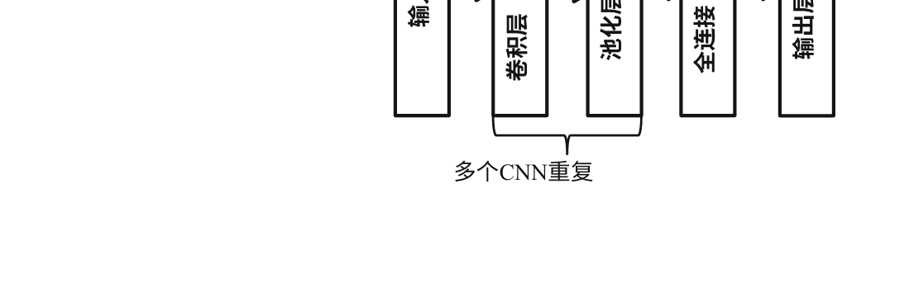

图9.2 RGB（红-蓝-绿）图像

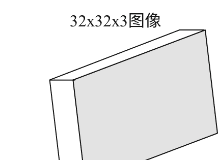

图9.3 2D卷积核

| -3 | 1 |
| :---: | :---: |
| 2 | 0 |

图9.4 灰度图像 4×4

| -3 | 0 | 2 | 1 |
| :---: | :---: | :---: | :---: |
| 1 | 4 | 3 | 2 |
| -1 | 0 | -1 | 1 |
| 2 | 0 | 1 | 0 |

## 9.5.2.2 卷积层

它由卷积核（filters）组成，将输入数据转换为输出特征生成图。一组具有已知权重的离散值网格构成了一组卷积核，如图9.3所示。最初，每个卷积核都由随机数分配的值，然后调整以提取有意义的特征。尽管存在多维 filters，在图中，显示了2D filter：

## 9.5.2.3 卷积操作

为了理解卷积操作，在图9.4中展示了一个4×4维度的灰度图像，并在图9.3中使用2×2的内核进行了随机初始化。卷积操作的第一步是将2×2的内核滑动到整个4×4图像上，以扫描所有可能性。建议按照系统化的方式首先水平移动内核窗口，然后垂直移动。相应的值是乘法器，然后写在最终的窗口模式上，本例中为3×3。在3次移动和相应单元格乘法值求和后，得到的模式网格如图9.5所示。

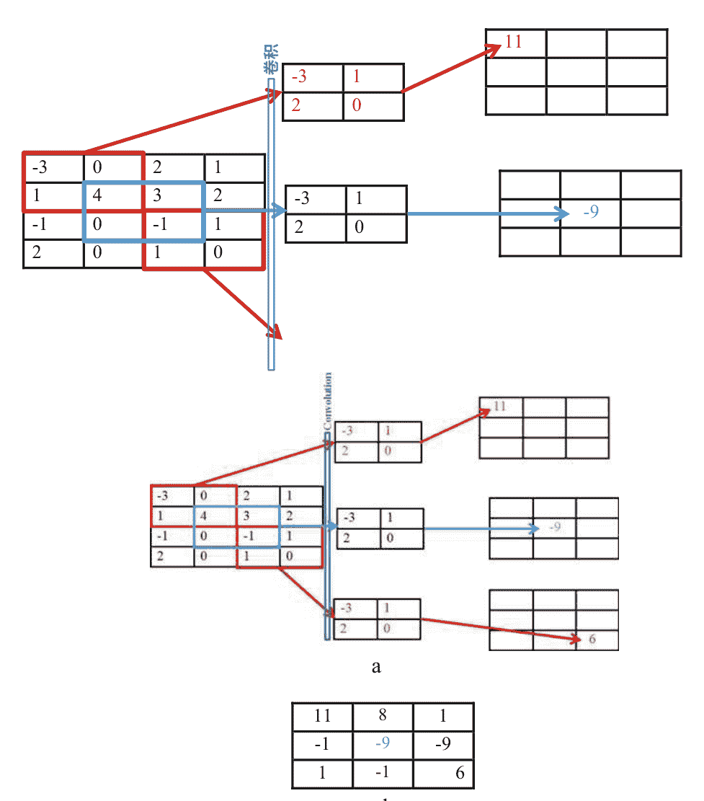

图9.5 卷积计算，(a) 三个示例，(b) 完整结果

在这些计算中，使用了水平和垂直扫描的步幅为1，但也可以使用其他步幅值。显然，增加步幅值会导致较小的网格结果，可能不在可接受的范围内。如果填充提供了边界大小信息，图像可以通过填充操作进行改进；否则，边界特征会逐渐消失。输入图像的大小可以通过填充操作增加，以便输出的特征图也可以增加。例如，可以使用零填充和三步幅值来实现卷积操作，类似于图9.5中显示的卷积过程，通过考虑所有可能的替代方案，在水平和垂直方向上进行非重叠的移位过程。

在卷积操作之后，可以根据以下公式找到输出特征图的大小：

$$ h' = \frac{h - f + p}{s} + 1 \quad (9.1) $$
$$ w' = \frac{w - f + p}{s} + 1 \quad (9.2) $$

其中 h'和 w'分别是输出特征图的高度和宽度。这里，h和f是输入图像的高度和宽度；p是卷积操作的填充；s是卷积操作的步长。

- 在卷积层的主要优势中，以下两点具有重要意义：
- 1. 在传统的人工神经网络中，每个神经元与下一层的每个神经元相连。在卷积神经网络模型中，通过稀疏连接属性，少量的权重在两个层之间起到重要作用。这提供了内存的充分利用，因为计算机存储中只保留了少量的权重和连接。使用点乘法而不是矩阵乘法可以在短时间内进行快速计算。
- 2. 所有神经元都与输入矩阵的每个像素单独工作，因此神经元之间不需要专门的权重连接。可以为所有输入学习一组权重，而不是为每个神经元学习新的权重。这被称为CNN模型的权重共享属性。

#### 9.5.2.4 池化层

这些层有助于对大尺寸的特征图进行子采样，并缩小为较低尺度的特征图。在每个池化步骤中，最显著的特征被保留。

池化操作在指定池化区域大小和卷积操作步幅应用之后，类似于之前解释的内容。有不同类型的池化，如最小值、平均值、最大值门控、树状池化等。

在这些操作中，最大池化过程是最常用的应用之一。有时，池化层会降低整体CNN性能。这是因为池化层花费时间来在给定的输入图像中找到特定的特征。

在下面的例子中，将一个4×4矩阵（图9.6a）作为初始输入数据。如果使用一个2×2 filter，并考虑到最大池化算子在输入矩阵上的最大池化过程，则输出结果如图9.6b所示。最大池化是一个基于样本的离散过程，如图9.6c、d所示，其主要目的是对给定的输入数据集进行降维处理，并允许对子区域中的特征进行一些方便的假设。在CNN池化层中，架构用于计算机执行期间的子采样、降维和计算减少的参数估计。

在卷积层特征学习模式之后，池化层在CNN过程中用于特征合并。有三种池化操作。

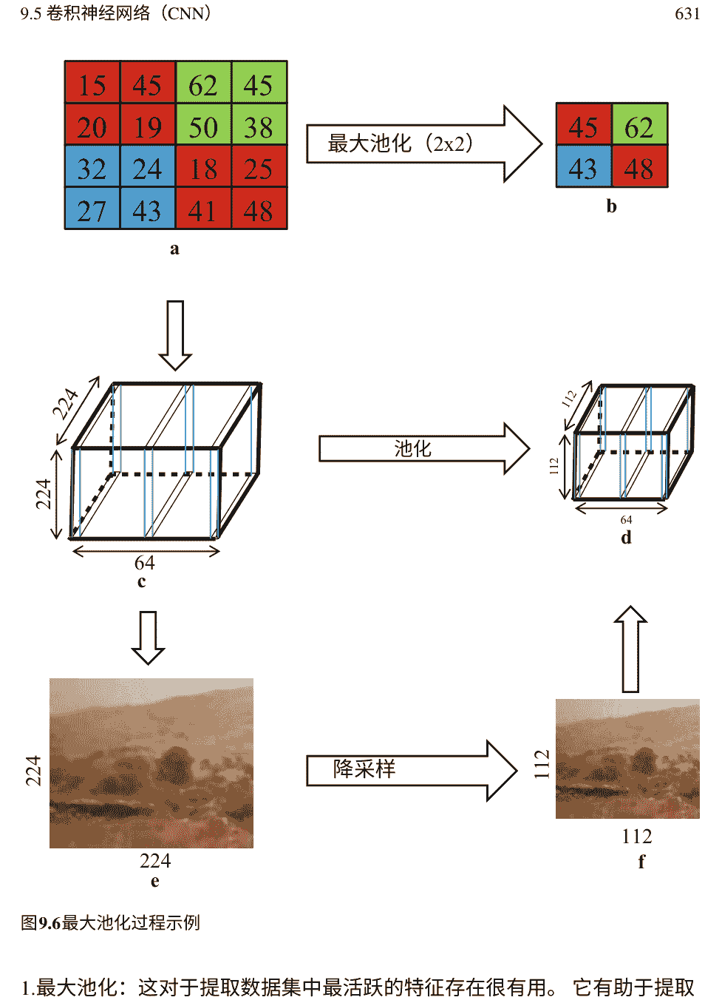

- 1.最大池化：这对于提取数据集中最活跃的特征存在很有用。它有助于提取低层次的特征，如边缘、点等。这是CNN方法中最常用的运算符，尤其适用于图像分类任务。
- 2.平均池化：这对于总结原始数据集中的平均特征存在很有用。
- 3.最小池化：与最大池化相反，它对于提取最小像素值很有用。

池化层专门用于卷积层之后，用于非线性（激活函数）应用程序到特征图输出的过程。

最大池化过程类似于图9.6中呈现的点乘过程。唯一的区别是考虑网格移位的最大值而不是点乘。在这种情况下，可以根据以下公式计算池化操作后的输出特征图大小：
根据以下公式可以找到池化操作后的输出特征图大小：

$$ h' = \frac{h - f}{s} + 1 \quad (9.3) $$
$$ w' = \frac{w - f}{s} + 1 \quad (9.4) $$

这两个表达式中每个术语的含义在本节的前面已经给出。

## 9.6 激活函数

这些函数的主要目的是将输入映射到输出。通常情况下，输入值是通过神经元输入的权重和有时通过添加偏置因子来计算得到的，如果需要的话。这些函数有助于决定给定输入是否为神经元的输出产生。在任何CNN模型中，在学习层之后，都会使用非线性激活层进行分类过程。非线性性支持CNN的架构结构来学习复杂的模式，并在输入和输出层中提供非线性管理。激活函数的另一个非常重要的属性是在模型训练中区分反向传播误差。在任何ANN中，最常用的激活函数在第7章中已经解释过，但在这里，一些激活函数在以下子节中重复出现，并附带了一些新的信息。

### 9.6.1 Sigmoid

任何范围的输入，从大的负数到大的正数，都被限制在0和1之间。根据以下数学公式和图9.7的结果形状，它呈现出S形状：

$$ f(x) = \frac{1}{1 + e^{-x}} \quad (9.5) $$

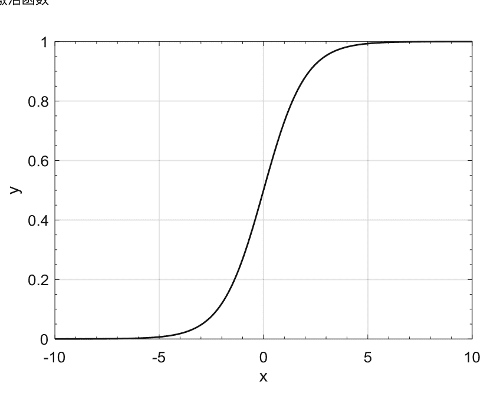

### 9.6.2 双曲正切

根据以下数学表达式和图9.8的图形，该激活函数将实数限制在－1到+1之间：

$$ f(x) = \frac{e^x - e^{-x}}{e^x + e^{-x}} \quad (9.6) $$

### 9.6.3 矩形线性单元（ReLU）

在CNN模型中，这是最常用的激活函数，因为它将输入值转换为正数。它的一个优点是与其他函数相比，计算时间要求最小。以下是该函数的数学表达式和图9.9的结果图形：

$$ f(x) = \max(0, x) \quad (9.7) $$

ReLU激活函数在梯度较大的情况下可能会出现一些严重问题，并且一些神经元可能无法再次激活。这个问题可以通过下面解释的ReLU替代激活函数来解决。

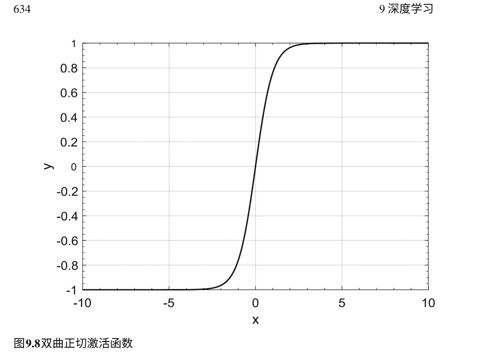

图9.8 双曲正切激活函数

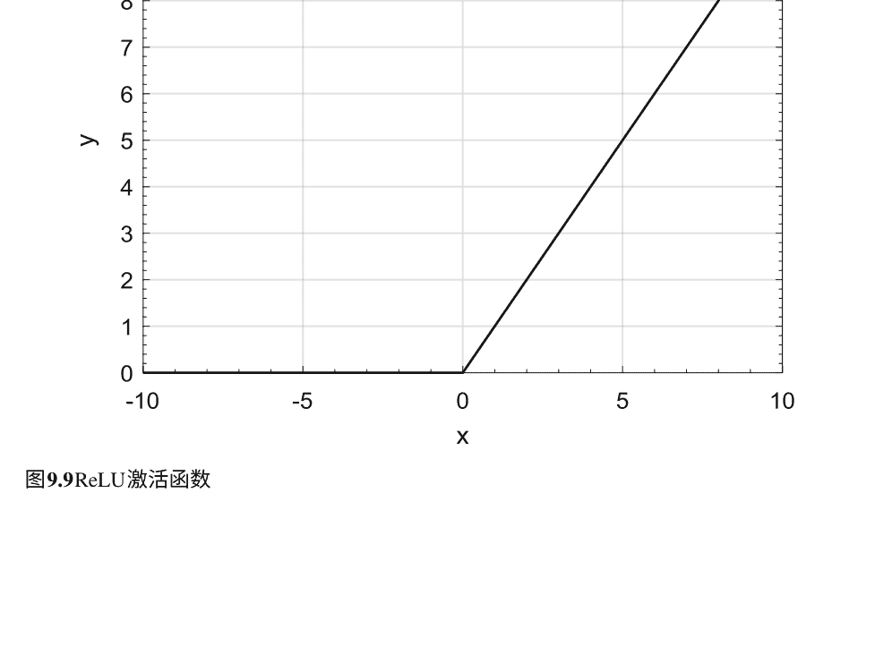

图9.9 ReLU激活函数

### 9.6.4 渗漏ReLU

这个激活函数不完全忽略负输入值，因为它会对这些输入值进行缩放。它的数学表达式和图形表示在图9.10中以数学和图形的形式给出：

$$ f(x)=\begin{cases} x & \text{如果 } x>0 \\ mx & \text{如果 } x\leq0 \end{cases} \quad (9.8) $$

在图中，m被调整为2，但可以考虑不同的值，并且可以得到类似的两部分线性线。

### 9.6.5 噪声ReLU

这是ReLU激活函数的噪声形式，根据正态（高斯）概率分布函数加载噪声。其数学表达式和图形表示如下（见图9.11）：

$$ f(x)=\max(0, x) + \varepsilon \quad (9.9) $$

其中$\varepsilon$是随机变量，根据标准（高斯）概率密度函数，均值为零，方差为一。

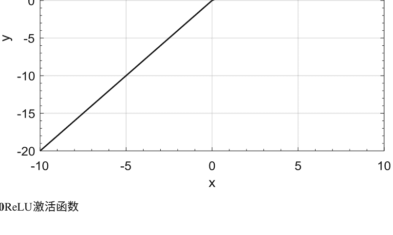

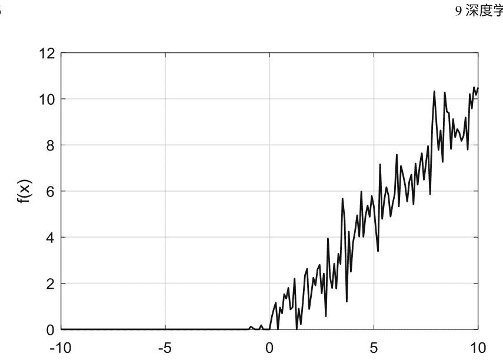

### 9.6.6 参数化线性单元

尽管它与Leaky ReLU激活函数非常相似，但泄漏因子的调整是在训练过程中实现的。其数学公式如下，其中 α 学习权重为：

$$ f(x) = \begin{cases} x & \text{如果 } x > 0 \\ \alpha x & \text{如果 } x \leq 0 \end{cases} \quad (9.10) $$

## 9.7 全连接（FC）层

这些层构成了任何CNN模型架构的最后部分，该层的每个神经元与其前一层的神经元相连。最后的FC层是分类输出层。FC层的操作方式类似于传统的ANN系统，遵循传统的多层感知器（MLP）神经网络。它们的输入来自最后的卷积或池化层，以未来地图的形式生成矩阵作为向量，供FC层使用。

最终CNN输出如图9.12所示。二维池化特征模式被转换为单一线性特征作为线性向量的输入，这是用于图像分类的FC层的输入。它是前馈神经网络架构结构的组成部分，位于CNN架构结构的最后几层，从卷积层和池化层获取信息，然后进入FC层，进入输出层进行最终模式识别。

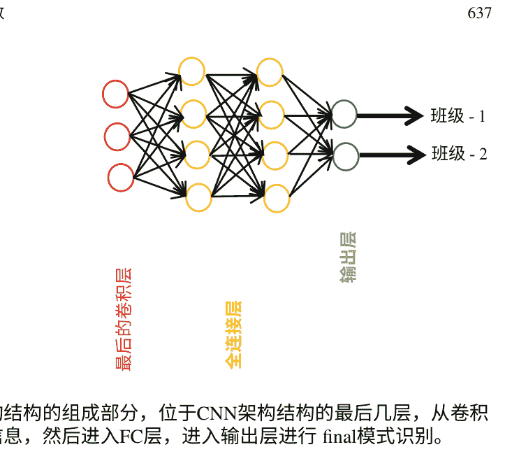

图9.12 FC层架构

## 9.8 优化（损失）函数

在CNN模型应用中，最重要的阶段之一是通过测量前向和后向训练的效率来检查最终输出产生的有效性，以评估拟合的质量，并通过检查预测误差来进行优化。为了实现这个目的，根据所涉及问题的不同损失函数的类型，有不同的函数可用。尽管在第8章中提出了一些经典的损失函数替代方案，但在下面的小节中，还解释了其他一些简要的解释。

### 9.8.1 软最大损失函数（交叉熵）

这个测量标准基于输出的概率p，并经常用作多类别分类问题中的平方误差函数的替代方法。在这里，p是每个输出类别的概率，y是期望的输出。因此，每个类别的概率根据以下表达式定义：

$$ p_i = \frac{e^{\alpha_i}}{\sum_{k=1}^N e^{\alpha_k}} \quad (9.11) $$

在这里，N是输出层神经元的数量，$e^{\alpha_i}$是网络结构中前一层的非归一化输出。因此，交叉熵$H(p,y)$被定义为：

$$ H(p,y) = -\sum_{i=1}^N y_i \log(p_i) \quad (9.12) $$

### 9.8.2 欧几里得损失函数

这相当于统计拟合中经常使用的均方误差（MSE）。这是卷积神经网络输出层中每个神经元的预测输出$p \in R^N$和实际输出$y \in R^N$之间的差异，被定义为：

$$ H(p,y) = \frac{1}{2N} \sum_{i=1}^N (p_i - y_i)^2 \quad (9.13) $$

### 9.8.3 合页损失函数

它在向量支持机（VSM）中最常用于二分类问题。通过优化过程最大化两个目标类之间的差异。其数学表达式如下：

$$ H(p,y) = \sum_{i=1}^N \max[0, m - y_i [p_i]] \quad (9.14) $$

在这里，m是边界，通常设置为1。

## 9.9 卷积神经网络训练过程

卷积神经网络训练过程包括以下四个连续可执行的步骤：

- 1. 数据预处理和增强
- 2. 参数初始化
- 3. 卷积神经网络结构调整
- 4. 优化器的选择

数据的预处理对于原始数据的人工转换、清洁度、更好的特征表示和方便的统一格式是必要的。这是在数据输入卷积神经网络结构之前实现的。

卷积神经网络的性能与训练数据的数量成正比，因为高效的好数据可以提高卷积神经网络模型的准确性。数据预处理需要以下几个阶段：

- 1. 从数据集中减去算术平均值$X$可以得到新的数据集，其值围绕零变化，如图9.13所示。以下表达式用于零居中过程：
$$ X' = X - \bar{X} \quad (9.15) $$
其中
$$ \bar{X} = \frac{1}{N} \sum_{i=1}^{N} X_i \quad (9.16) $$
- 2. 下一步是对零均值数据进行标准化，使得标准差等于一。数学表达式如下：
$$ X'' = \frac{X'}{S} \quad (9.17) $$
在这里，标准差的定义与统计计算中的定义相同：
$$ S = \sqrt{\frac{1}{N} \sum_{i=1}^{N} (X'_i)^2} \quad (9.18) $$
标准化过程如图9.14所示。转换后的数据的零均值和单位标准差也是无量纲的；因此，CNN过程适用于这样的转换数据集。

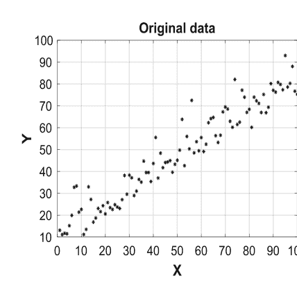
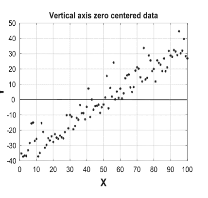
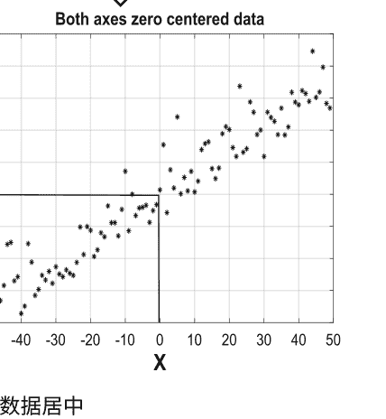

图9.13 零数据居中

- 3. 为了扩大训练数据集的规模，可以使用数据增强技术，通过对样本数据集进行不同的操作转换，生成一个或多个新的数据样本用于训练过程。有不同的数据增强过程，包括缩放、对比度调整、平移、裁剪、旋转、翻转等（第5章）。其中的一些可以单独或集体应用。
数据增强有助于避免CNN模型过拟合问题。

## 9.10 参数初始化

任何ANN中最重要的初始化过程是首先建立和决定其架构结构，然后进行参数学习的训练。一般来说，完整的过程包括参数初始化、优化算法选择以解决问题、前向传播、成本（优化）函数计算、输出标签识别以及基于成本函数的梯度计算等一系列步骤。

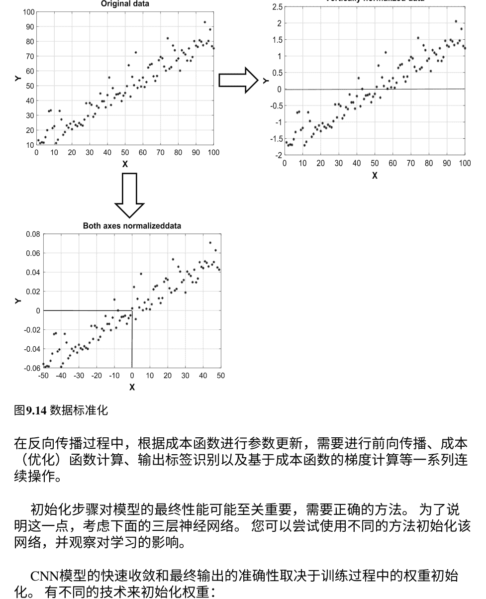

图9.14 数据标准化

在反向传播过程中，根据成本函数进行参数更新，需要进行前向传播、成本（优化）函数计算、输出标签识别以及基于成本函数的梯度计算等一系列连续操作。

初始化步骤对模型的最终性能可能至关重要，需要正确的方法。为了说明这一点，考虑下面的三层神经网络。您可以尝试使用不同的方法初始化该网络，并观察对学习的影响。

CNN模型的快速收敛和最终输出的准确性取决于训练过程中的权重初始化。有不同的技术来初始化权重：

- 1. 随机初始化：卷积和全连接层的权重是随机初始化的，一般来说，每个数字都不同。为此，可以使用正态（高斯）概率密度函数（第4章）或任何其他概率密度函数，但标准差值非常低，如0.1或0.01，并且算术平均值为零。随机初始化的主要问题是梯度消失或梯度爆炸的可能性。一些随机初始化方法包括高斯、均匀和正交过程。

### 2. Xavier初始化

这适用于神经网络权重初始化中使用sigmoid或tanh激活函数的情况（Glorot和Bengio2010）。其主要概念是根据一个包含值的均匀概率密度函数进行随机参数化，这些值取决于节点的输入数量n，在−1/sqrt(n)和+1/sqrt(n)之间。另一个版本是基于节点输出数量m的标准化Xavier初始化，与传统版本也有关系，取决于节点的输入数量n，为−sqrt(6)/sqrt(n + m)和+sqrt(6)/sqrt(n + m)。

### 3. He初始化

He等人（2015年）通过考虑ReLU激活函数提供了Xavier方法的扩展版本，该过程的数学形式可以通过以下表达式实现：

$$ y^i = W_j^i ReLU(x^j) + b_i \quad (9.19) $$
$$ z^j = ReLU(x^j) \quad (9.20) $$
$$ Var(y^i) = \sum_{i=1}^n E[(z^i)^2] Var(W_j^i) = \sum_{j=1}^n (1/2) E[(x^j)^2] Var(W_j^i) \quad (9.21) $$

同样的作者建议这些公式可以在前向和后向情况下采用。

## 9.11 CNN的正则化

如果CNN模型在训练数据上表现出色，就会出现过拟合现象，这被称为泛化。否则，如果模型没有从训练数据中学到足够的知识，就会出现欠拟合的结果。如果模型通过适当的学习从训练和测试数据中表现良好，则产生了合理的拟合结果。通过考虑以下直观的想法，正则化过程有助于避免过拟合的结果。

### 9.11.1 Dropout

在每个训练周期中，神经元会随机被丢弃，以平均分配给所有神经元，从而在特征选择过程中强制模型学习多个独立特征。任何被丢弃的神经元在前向或后向传播操作中都不起作用。然而，在测试过程中，预测是通过完整的网络进行的。

### 9.11.2 丢弃权重

与前一种情况类似，但这里在每个训练周期中随机丢弃权重。

### 9.11.3 $L^2$ 正则化

这种正则化的主要思想是将权重逐渐衰减至零，并添加一个与损失函数的平方幅度相等的惩罚项系数。通过在目标函数中添加$0.5\lambda ||w^2||$，较大的权重向量会受到严重惩罚，其中 $\lambda$是一个参数，与惩罚强度有关。对于输出层的N个神经元，$y_n$ 和 $p_n$ 分别表示实际数据值和预测值，则以下表达式适用于欧几里德目标成本函数C：

$$ C = \text{损失} + 0.5\lambda||w^2|| \quad (9.22) $$

和

$$ C = \sum_{m=1}^{M} \sum_{n=1}^{N} (p_n - y_n)^2 + 0.5\lambda||w^2|| \quad (9.23) $$

在这里，M是训练数量。最后，基于$L^2$正则化的权重增量规则可以表示如下：

$$ \text{权重增量} = \underbrace{\text{argmin}}_{\mathbf{w}} \sum_{m=1}^{M} \sum_{n=1}^{N} (p_n - y_n)^2 + \lambda||w|| \quad (9.24) $$

### 9.11.4 $L^1$ 正则化

这与之前的方法几乎相似，唯一的区别是将绝对值大小系数考虑为损失函数的惩罚项，而不是平方大小：

$$ C = \text{损失} + \lambda||w|| \quad (9.25) $$

## 9.11.5 提前停止
为了更早地控制停止阶段，采用交叉验证过程对20–30%的训练数据集部分进行性能行为评估。随着新的尝试恶化，可以停止。

## 9.12 循环神经网络
这些网络对于顺序数据建模非常有用。在顺序执行中，采用深度前向策略过程，为每个序列使用特定的参数。对于序列中的每个元素，都附有相同的权重，因此参数数量大大减少。RNN方法论也适用于以图形和空间模式形式存在的二维或多维数据集。ML过程的概念在RNN中也是有效的，例如特征类型、分类和类似的训练过程。通过多个隐藏多层感知器，可以进行前馈子-后馈训练趋势。多层感知器在第7章中进行了讨论，除了之前的CNN在前几节中，它们在各种任务中具有非常高效的预测能力。在几乎所有任务中，词序列以自然语言、语音识别和视频字幕的形式出现。

为了成功的策略决策，需要仔细遵循顺序数据，然后应用RNN方法。在策略中，除了变长序列参数化独立于序列长度之外，还必须具备元素排序能力任务。在元素级模型中，所有序列元素共享相同的参数。序列中的上下文信息被捕捉到，从而得到一个输出，该输出作为同一序列中后续元素的上下文。在完成所有这些任务之后，达到了最终的元素级输出，因此，编码信息对于类别预测变得有用。通过另一个RNN过程，可以进行机器翻译、语音识别和类似的工作的解码。

### 9.12.1 RNN架构结构
RNN与CNN的主要区别在于隐藏层中至少存在一种反馈可能性，以形成循环回路，以获得更好的模型激活。
例如，MLP是RNN结构中的标准部分，除了循环之外，还提供了非线性，以实现更好的时间预测，并将其保存在内存中。有一些结构，每个神经元都通过随机激活函数与其他神经元相连。在随机的情况下激活函数，模拟退火过程（第7章）似乎更合适。图9.15提供了一个简单的RNN架构结构。

必须为手头的问题选择一个方便的时间步长，并且它必须对应于真实的网络操作过程。在下一个时间步骤中，激活函数保持指令需要一个延迟单元。如果输入-隐藏层、隐藏-隐藏层和隐藏-输出层的权重分别表示为$W_{ih}$、$W_{hh}$和$W_{ho}$，则可以将隐含的非线性隐藏和输出激活函数h(t)和o(t)隐式地表示为：

```
h(t) = f_h( W_{ih} x(t) + W_{hh} h(t-1) )
```

和

```
o(t) = f_out( W_{ho} h(t) ) (9.27)
```

在这里，状态的定义是通过隐藏单元激活h(t)进行的，除了输入和输出空间之外，还有一个状态空间。动态系统的维度由状态空间和隐藏单元的数量组成。在解释了所有内容之后，关于RNN架构模型仍然存在重要问题，就像其他模型一样，关于稳定性、可控性、可观测性和可管理性等方面的问题。对于稳定性而言，重要的部分是神经网络输出随时间无限增长，并且可能对输入或权重的微小变化作出响应，这是动态系统的特点。RNN的可控性与初始状态在有限的时间步骤内能否控制到任何状态有关。在稳定性和可控性检查之后，可观测性涉及观察结果的可能性。

最后，在所有之前的稳定性、可控性和可观察性步骤之后，管理性是可能的检查。

RNN系统的另一个特点是，在具有足够数量的sigmoid隐藏层的情况下，可以以任意所需的精度进行近似，而对状态空间的紧凑性没有任何限制，这也是计算能力的指标系统。通过在时间上展开，可以将递归网络转换为前馈网络。在图9.16中，通过考虑每个时间步骤，更明确地呈现了RNN的结构组成部分。

常见的反向传播过程版本学习算法在RNN系统中是有效的，通过时间的反向传播与梯度下降搜索相结合，以达到展开网络完成的最优解。假设RNN的训练从初始时间开始，并在t时间后结束，则总损失函数（成本函数，目标函数）等于每个时间步骤的标准误差函数$E_{sse/ce}(t)$的总和，如下所示：

$$E_{\text{总计}}(0, t_1) = \sum_{0}^{t_1} E_{\text{sse/ce}}(t) \qquad\qquad (9.28)$$

众所周知，梯度下降权重更新在每个时间步骤中的计算如下（第7章）：

$$\Delta w_{ij} = -\eta \frac{\partial E_{\text{total}}(t_0, t_1)}{\partial w_{ij}} = -\eta \sum_{t_0}^{t_1} \frac{\partial E_{\text{sse/ce}}(t)}{\partial w_{ij}} \quad (9.29)$$

在最后一个表达式中， $\partial E_{\text{sse/ce}}(t)/\partial w_{ij}$ 取决于前一时间步的输入和隐藏层激活函数。在实际上不可接受的错误情况下，不应通过时间向后传播到网络中。尽管像RNN这样的神经系统模型存在复杂性，但通过时间的反向传播过程提供了一种有效的学习算法。

在图9.17中，图9.16中的RNN截断显示为仅有一个时间步长的简单RNN架构，这与已在第7章中讨论的Elman网络非常相似。

在这个图中，每个权重集只出现一次，这表明可以通过梯度下降方法进行部分反向传播过程的应用。

还有另一种RNN的替代版本，被称为具有外部输入的非线性自回归（NARX）模型，它具有单个输入和输出，考虑到输入上的延迟线，并通过另一个延迟线将输出反馈到输入，如图9.18所示，其中MLP单元起到重要作用。

这种结构对于从x(t+1)预测y(t+1)的时间序列预测非常有用。

读者可以将这种结构与卡尔曼滤波器和第6章中提到的各种随机过程结构进行比较。

Glorot和Bengio（2010）提出，RNN对于梯度爆炸和梯度消失问题的敏感性是这种方法的主要问题之一。

由于大或小的导数重复，梯度在训练过程中可能会呈指数级爆炸或衰减。由于长短期记忆（LSTM）的修正过程，可以在长时间内获得准确性，因为它具有多个存储容量记忆单元。此外，还有用于信息流控制的门控单元。这种系统中的基本单元如图9.19所示，是其最明确的形式。

在这个图的上半部分是RNN系统的一个简化部分，它的核心在底部以垂直箭头表示的更大比例中显示，其中 $x_t$ 是输入层，$h_t$ 是隐藏层，$c_t$ 是卷积层代表变量。关于系统的必要公式在以下表达式中提出，涉及遗忘、输入门和输入节点：

```
f_t = σ[(w_{fh}·h_{t-1}) ⊙ (w_{fx}·x_t) + b_f] (9.30)
i_t = σ[(w_{ih}·h_{t-1}) ⊙ (w_{ix}·x_t) + b_i] (9.31)
g_t = tanh[(w_{gh}·h_{t-1}) + (w_{gx}·x_t) + b_g] (9.32)
c_t^i = i_t·g_t (9.33)
c_t = c_t^i + c_t (9.34)
o_t = σ[(w_{oh}·h_{t-1}) ⊙ (w_{ox}·x_t) + b_o] (9.35)
和
h_t = tanh(c_t) + o_t (9.36)
```

使用四种权重完成LSTM方法，其以列矩阵形式给出如下：

$$w = \begin{bmatrix} w_f \\ w_i \\ w_g \\ w_o \end{bmatrix}; \quad b = \begin{bmatrix} b_f \\ b_i \\ b_g \\ b_o \end{bmatrix}; \quad h = \begin{bmatrix} w_{fh} \\ w_{ih} \\ w_{gh} \\ w_{oh} \end{bmatrix}; \quad g = \begin{bmatrix} f_t \\ i_t \\ g_t \\ o_t \end{bmatrix}$$

### 9.12.2 RNN计算时间序列
在每个时间步骤中使用相同的权重矩阵。在图9.20中，通过前馈和反向传播过程显示了损失函数生成机制，在RNN系统中进行迭代操作。

初始步骤是通过从输入和先前状态更新细胞状态并生成输出来向前跨越时间。下一步是按顺序计算各个时间步骤的损失值，然后将每个单独的损失相加以获得总损失值。虽然在单个时间步骤中通过单个前馈网络进行误差反向传播是可能的，但最好通过每个单独的时间步骤向开始方向反向传播总损失值，因此所有的错误都会回到过去，这就是为什么它被称为反向传播的原因。

黑色箭头表示前向传播操作
红色箭头表示反向传播
图9.20 损失函数操作机制

更详细地观察梯度在h₀，h₁，h₂等之间的执行方式在h盒子中的序列（参见图9.20）中，需要注意梯度下降重复迭代时的减速情况。在每一步之间，必须执行涉及$W_{hh}$的矩阵乘法。$h_0$的初始单元格值也涉及许多因素，包括权重矩阵。对于时间t的梯度计算，$h_0$有许多$W_{hh}$和重复的梯度计算因素。

在某些步骤的梯度计算中，梯度可能大于（小于）1，这被称为梯度爆炸（梯度消失）；因此，有必要裁剪梯度。特别是在某些梯度连续小于1的情况下，会导致梯度消失问题，需要在前向步骤执行之前解决它。这可以通过改变激活函数和网络架构调整以及权重初始化来实现。在循环神经网络的序列建模中，可以考虑以下三种选择：

- 多输入单输出，MISO（情感分类）
- 单输入多输出，SIMO（文本生成，图像字幕）
- 多输入多输出，MIMO（翻译，预测，音乐生成）

在主要的设计准则中，建议考虑以下几点以获得改进的结果：

- 可变长度序列处理
- 长期依赖性
- 按顺序保持信息
- 序列间参数共享

## 9.13 长期依赖问题
梯度消失是由于0到1之间的小数的连续乘法，因此，每个反向时间步骤的梯度将逐渐变小。应记住有助于捕捉短期依赖关系的偏置参数。

首先，需要确定短期而不是长期依赖关系。为了捕捉长期依赖关系，可以尝试通过选择ReLU、tanh和sigmoid等最方便的激活函数来进行改变。

在实践中观察到，当x >0时，ReLU导数防止梯度收缩。避免收缩问题的另一种方法是将参数初始化为具有初始零偏置值的单位矩阵。

最后，门控单元被用作更复杂的循环单元门，以控制信息的传递。这个操作能够相当快速地捕捉到数据中的长期依赖关系。RNN中最常用的方法是门控单元概念及其应用。在跟踪信息经过多个时间步骤的过程中，长短期记忆（LSTM）方法依赖于门控单元的组合。

### 9.13.1 LSTM网络
由于其有效性，LSTM网络已经引起了不同学科的研究人员的密切关注。Sherstinsky (2020) 根据信号处理概念解释了RNN和LSTM的基本原理。这种方法依赖于门控单元来在许多时间步骤中提取信息，并且非常方便地维护数据集中的长期依赖关系。

图9.21 标准RNN单元

有效建模序列数据。这些网络在大多数序列建模任务中对于深度学习非常重要。让我们考虑一个标准RNN单元中的简单计算节点，如图9.21所示。这是一个重复模块，包含一个标准RNN中的简单计算节点。在这个图中，黑线表示权重矩阵乘法，tanh表示非线性激活函数。

还有一种链式结构，如图9.22所示，其中内部重复模块中的循环单元非常复杂。LSTM单元的主要职责是跟踪信息经过多个时间步长。在LSTM的更精细的细节中，细胞通过细胞门来添加或删除信息，例如通过sigmoid神经网络。

有不同的相互作用层，这些层通过非线性激活函数定义了标准神经网络的操作。它们通过这些LSTM单元控制信息的流动。LSTM通过四个阶段工作：

- 遗忘
- 存储
- 更新
- 输出

第一步是从先前状态中遗忘不相关的信息，这是通过考虑先前状态并将其通过一个sigmoid门传递来实现的。在遗忘状态之后，重要的是回顾可用的信息并决定保留和存储哪些部分，在这里，时间t的输入出现在先前的图中。

上图显示了先前的情况。LSTM将相关信息存储到细胞状态中。最后一步是输出门控制，将信息发送到下一个时间步。这一步对于输出y和h对于下一步很重要。通过这个结构进行信息的添加或删除被称为门，它们通过方便的激活函数传递信息。在上述关于LSTM过程的所有解释之后，以下总结简要反映了它们的功能。

- LSTMs从输出的信息中保持一个独立的细胞状态
- 信息流由以下四个门控制：
  (a) 遗忘门用于摆脱不相关的信息
  (b) 从当前输出中存储相关信息
  (c) 细胞状态更新选择
  (d) 输出过滤后的细胞状态版本
- 反向传播在梯度流计算中可以无中断地进行

关于LSTMs的前述解释的完成，通过RNN进行建模，即使是关于梯度下降，也不会引起任何问题。LSTMs构成了成功的RNN建模工作的基础。

## 9.14 自编码器
Rumelhart等人（1985年）首次将自动编码器作为基于无监督学习的DL架构引入。这种技术对于数据压缩和学习抽象非常有用。它们主要有助于发现数据的隐藏特征结构，通过最小化输入数据集中的噪声来生成更好的新数据。与CNN相结合，它们适用于通用或图像数据。Hinton和Salakhutdinov（2006年）提出了用于数据维度降低的自动编码器过程。

这些是一种具有相同输入和输出特征的前馈神经网络类型。第一步是将输入数据集编码为低维代码表示，从而从该表示中获得输出重构。代码以压缩输入数据集的形式存在，也被称为潜空间表示。在其结构中，有三个操作单元，即编码器、代码和解码器。一般来说，它的结构如图9.23所示。在这个图中，第一层是原始数据集的输入，最后一层是包含重构输入的输出层。自编码器将输入数据集映射到潜空间进行降维，然后将潜空间表示编码回输入数据集，就像输出数据集一样。

输入数据集通过降维将其编码为潜空间，然后将潜空间表示编码回输入数据集，就像输出数据集一样。自编码器压缩学习过程后的重构误差减少结果。这是一个被视为无监督深度学习的过程，也被文献中称为表示学习。它的概念与第4章中讨论的主成分分析（PCA）非常相似。PCA是一种统计过程，将大量数据集处理并将其转化为独立形式的新变量数据集形成。

根据每个新变量的方差，它们按升序排列，并且连续方差的总和表示为原始总方差的百分比。接受一定百分比的数据，比如90%，数据的数量n减少到m个新的独立数据集（m < n）。在实际研究中，m通常甚至小于n的三分之一。因此，主成分分析（PCA）本质上是与自动编码器相反的线性转换，自动编码器是非线性复杂的功能建模过程。PCA特征是完全不相关的分量，因为它们是在正交基上的投影。

另一种无监督的深度学习神经网络类型是自动编码器模型，它的隐藏层用于分解并重新生成输入。它们的应用包括降维、分类预处理和从输入数据集中滤除任何噪音，以识别关键的输入元素（第8章）。自动编码器与主成分分析（PCA）有相似之处，最简单的建模背景如图9.24所示。

图9.26 PCA和AE比较

PCA通过方差对应的箭头长度从原始数据集中得出正交方向的主成分。PCA的缺点包括以下几点：

- PCA特征是从原始数据中以线性关系导出的，而其中一些可能具有非线性趋势。
- 可能存在复杂的非线性性，因此，PCA可能无法产生最佳的低维表示，最终，最佳表示可以以许多其他方式不同于PCA基于方差的定义来定义。

图9.25显示了自动编码器架构结构的三个部分，类似于浅层学习ANN结构，在第7章中有解释。可能有多个隐藏层。编码对应于原始数据集，而解码是原始数据的重构，可能包含一些不相关或不重要的点。解码器是编码器的镜像，反之亦然。

与PCA相比，自动编码器可以通过非线性激活函数和多个隐藏层执行非线性变换。自动编码器的基本思想是生成一个具有较低维度表示的原始数据集的架构。自动编码器可以进行编码和解码。编码器是将数据压缩为较低维度域的平均值，也称为潜在空间。表示学习需要所有维度的数据彼此独立，就像PCA元素的情况一样；否则，无法学习较低维度的表示。图9.26展示了自动编码器（AE）和PCA方法之间的区别。

可以说编码器等效于使用线性激活函数的PCA。自动编码器可以通过反向传播过程进行训练。有一个损失（优化）函数，表示误差E(x, x')，即原始数据和重构数据之间的差异。理想的自动编码器在重构过程中对输入数据应该足够敏感，并且对过度拟合的可能性不敏感。为了避免过度拟合，错误数据必须通过正则化组件进行支持，即“E(x, x') + regularization”。

### 9.14.1 深度卷积自编码器（DCAE）
对于成功应用自动编码器，需要考虑几个要点：

- 深度卷积自动编码器（DCAE）具有类似的架构
- 包含卷积层
- 编码器由卷积层 + ReLU激活函数 + 批归一化组成
- 解码器由卷积转置层 + ReLU激活函数 + 批归一化组成。

潜在空间有助于保留最重要的输入数据属性，而潜在空间的利用则导致了几个有趣的任务表现。自动编码器在数据生成、异常检测、噪声避免等方面非常有用。

## 9.15 自然语言模型
这个模型通过统计工具来预测和识别人类语言单词。它们是非常有用的神经语言处理模型，可以用于语音识别、情感分析、音频转文本、拼写检查、摘要等各种任务。一个标记的字母表可以被表示为一个概率分布函数（PDF）在一个序列上作为语言模型。语言模型可以从示例中学习，其中包括以几个字符或单词形式提供的自动补全器、根据词源或认识论内容猜测一个词的手写识别、语音识别、拼写检查和语言翻译。虽然以前有统计语言模型，但最近出现了一种新趋势，即神经语言模型，它结合了深度学习和循环学习两种最新的神经网络方法，具有最先进的准确性。

一个令牌序列，$t_1$，$t_2$，...，$t_n$ 由联合概率密度函数$P(t_1, t_2, ... , t_n)$表示。问题是从数据集的训练集中学习这些概率。让我们考虑给定所有先前数据的条件概率$P(t_n|t_2, ... , t_{n-1})$。然后可以将整体概率分解为连续条件概率乘积的链式形式（第4章）。

$$P(t_1, t_2, ... , t_n) = P(t_1) P(t_2|t_1) P(t_3|t_1, t_2) ... P(t_n|t_1, t_2, ... , t_{n-1}) \quad (9.37)$$

语言建模将学习方法作为下一个标记预测问题，这对应于监督学习。值得注意的是，输出是一个固定长度的概率序列，即概率向量。另一方面，输入没有固定长度的向量，因为其长度是可变的。由于存在成千上万个概率，该问题提供了一个非常困难的解决方案可能性。寻找解决方案，有必要进行假设，因为没有假设，解决方案是难以处理的。例如，如果有$n=10$个数据，字母表只有0和1两个选择，则整个可能的解决方案数量等于$2^{50} = 1.1259e+15$，这几乎是一个不可能的计算连续结果的数字。解决方案是这些数字之一，但其搜索是复杂且几乎不可能的。从统计学上讲，最常见的假设是马尔可夫序列结构，它将顺序串行记忆长度降低到k个实例，其中k是一个小数。因此，$P(t_n|t_{n-2},...,t_{n-1})$被替换为$P(t_n|t_{n-k},...,t_{n-1})$。这意味着下一个事件的概率取决于上一个k个实例或标记。在实际研究中，k被固定为一个小数，如2或3，最大为5。关于这种还原主义方法有令人信服的文献例子（Movshovitz-Attias和Cohen 2013；Bowman等人2015；Liu等人2019）。

## 9.16 结论

深度学习（DL）过程依赖于机器学习（ML）和人工智能（AI）方法的组合，关于这些方法的必要信息在第2章和第8章中提供给关键组件。DL过程与浅层学习的人工神经网络（ANN）建模原理类似，但具有用于处理更大数据集的附加功能，以便在较短的时间内完成分类和回归工作，以满足手头问题的最终要求。最突出的AI DL方法是卷积神经网络（CNN）和循环神经网络（RNN）。首先，CNN方法特定的隐藏层以卷积和池化对系列进行处理，然后是全连接层，最后是输出层。然而，RNN在隐藏层中具有反向传播迭代，可以更快地捕捉数据中的非线性行为。

尽管使用现成的软件来解决问题，但建议读者尝试理解卷积神经网络（CNN）和循环神经网络（RNN）的哲学和逻辑内部结构。如果没有这种内部审计，就不可能朝着改变现有方法或用更好的改进或创新方面来替代它们的方向前进。

## 参考文献

Bowman S, Angeli G, Potts C, Manning CD (2015) 用于学习自然语言推理的大型标注语料库。在：2015年自然语言处理会议论文集中

Fukushima K (1980) Neocognitron：一种不受位置偏移影响的自组织神经网络模型。生物控制论36:193–202

Glorot X, Bengio Y (2010) 理解训练深度前馈神经网络的困难。在: 第十三届国际人工智能与统计学会议论文集, 第9卷。PMLR, 第249-256页

何K, 张X, 任S, 孙J (2015) 深入研究整流器: 超越人类在ImageNet分类上的性能。在IEEE国际计算机视觉会议论文集中, 第1026-1034页

Hinton GE, Salakhutdinov RR (2006) 用神经网络降低数据的维度。科学313 (5786): 504-507

Hubel DH, Wiesel TN (1959) 猫的视觉皮层单个神经元的感受野。生理学杂志148: 574-591

Ivakhnenko AG (1971) 复杂系统的多项式理论。IEEE Trans Syst Man Cybern 4: 364-378

Ivakhnenko AG, Lapa VG (1965) 控制预测设备。CCM信息公司

Krizhevsky A, Sutskever I, Hinton GE (2012) 用深度卷积神经网络进行ImageNet分类。Adv Neural Inf Proces Syst 25: 1097-1105

LeCun Y, Boser BE, Denker JS, Henderson D, Howard RE, Hubbard WE, Jankel LD (1990) 使用反向传播网络进行手写数字识别。Adv Neural Inf Proces Syst 2: 396-404

Liu X, He P, Chen W, Gao J (2019) 通过知识蒸馏改进多任务深度神经网络, 用于自然语言理解。arXiv预印本arXiv:1904.09482

Movshovitz-Attias D, Cohen WW (2013) 用于预测编程注释的自然语言模型。在: 计算语言学协会第51届年会论文集, 保加利亚索菲亚, 2013年8月4-9日。c 2013计算语言学协会, 第35-40页

Rumelhart DE, Hinton GE, Williams RJ (1985) 通过误差传播学习内部表示。加州大学圣地亚哥分校拉霍亚认知科学研究所技术报告

Sherstinsky A (2020) 机器学习和动力系统基础的特刊: 循环神经网络 (RNN) 和长短期记忆 (LSTM) 网络。Phys D:Nonlinear Phenom 404

# 索引

- 算法，2，35，68，142，265，311，433，575，621
- 近似，24，25，91，119，130，144，169，170，255，256，336–338，355，365，372，394，395，401，432，645
- 架构，58，432，580，622
- 人工智能，vii–ix，5，11，15，19，20，23，24，28–30，32–66，69，75，82，85，130，138，241，256，264，283，429–572，617，621，623，624，639，657
- 假设，35，68，143，333，438，585，622

- 生物学，363，436，579，606
- 大脑，viii，6–8，24，30，35，45，48，51，56，57，82，429，430，439，450，477，498，573，576，624

- 分类 fi，vii，1，23，25，30，129，142，152，154，419–421，424，430，434，437，439，440，442，492，496，507，524，527，528，537，548，564–568，575，580，581，586，590–592，597，601，602，604，605，610，612，613，616，617，622，625–627，631，632，636–638，644，650，654，657
- 聚类，65，103，147，272，435，575，625
- 计算机，24，35，71，311，429，575，621
- 卷积，vii，24，29，30，580，581，616，625–630，632，636，637，641，649，656，657

- 相关性，89，191，205–213，222，225，235，236，248，259，437，439，442，447，448，509，512，522，548，550，562，586

- Crisp，ix，8，14，15，17，25，28，30，32，34，41，53，55，57，62，69，70，72，78–80，82，85，91–94，97，98，100，101，103–106，115，117–120，123–125，127，128，130–132，134，138，144，149，163，169，188，246，250，278，316，317，459，548，575，590，591，609，612，617

- 交叉，369，374–376，378–383，385–389，391–394，400，401，408，410–413，416，423

- 数据，1，35，81，151，259，324，429，575，621
- 十进制，23，105，158，255，312，480
- 推理，70，71，76，89，93，118，174，251，294，575，584
- 深度，vii–ix，1，5，7，10，23–26，28–30，32，40，48，58–60，69，70，86，138，434，455，575，578–581，600，616，617，621–657

- 教育，1，33，67，168，247，336，432，575
- 工程，viii，10–12，26，28，29，33，38，39，46，55，57，58，60，68，71，79，81，82，86，102–103，118，120，122，123，131，141–143，155，156，160，161，170，171，174，175，194–195，203，213，246，247，252，271，278，283，300，301，320，341，450，475，573，576，579，582

# F

- 健身，330–333，338，361–363，491
- 公式，ix，10–12，29，35，52，58，64，68，81，118，137，141，143，160，168，181，207，211，216，235，239，272，278，306，311，371，584，594，597，601，602，608，621，630，632，636，649
- 全连接 (FC)，30，626，636–637，657
- 函数，5，39，77，167，259，311，431，593，624
- 模糊，8，52，68，160，246，342，437，579，623

# G

- 遗传学，七，八，二十八，二十九，四十，五十五，五十六，三百一十一-四百二十七，四百九十

# H

- 隐藏，七，五十三，一百七十三，二百六十五，四百三十三，五百八十，六百二十二直方图，一百一十四，一百七十二，一百七十八，一百八十二，一百九十六-二百零一，三百二十一，三百七十一，六百十
- 人类，二，三十三，六十七，一百七十五，二百四十六，三百三十二，四百二十九，五百五十五，六百二十三

# I

- 归纳，七十一-七十三，七十六，二百九十四
- 智能，五，三十三，七十六，二百零三，三百三十一，四百三十九，五百七十六，六百二十一

# L

- 层，十一，五十八，七十，一百七十一，二百六十五，四百三十，五百七十八，六百二十
- 学习，一，五十八，二百四十一，二百四十八，三百三十二，四百三十，五百七十五，六百二十一语言学，十，二十八，三十五，四十六，五十二，六十八，七十七，七十九，八十五，一百零一，一百二十四，一百三十七，一百三十八，一百四十一-一百四十三，一百四十七，一百六十一，二百零八，二百零九，二百四十，二百四十八，二百六十五，二百九十五，三百六十六逻辑，九，十八，十六，二百四十五，三百三十六，四百三十一，五百七十九，六百二十三逻辑斯蒂，三十，四百五十九，五百六十六，五百九十，六百四损失，四十五，一百三十七，一百八十六，二百六十四，二百六十六，三百二十，三百三十五，五百八十二，六百一六百三，六百一十一，六百十七，六百二十六，六百四十九，六百五十五损失函数，三十，五百七十六，五百七十七，五百七十八，五百九十二，五百九十八-六百三，六百一十，六百十七，六百二十六，六百三十七，六百四十三，六百四十六，六百四十九，六百

# M

- 机器，vii，ix，1，8，16，20，22–25，28，30，32–35，37，39–41，52，54，57，59，60，62，63，65，69，92，102，122，130，332，430，433，565，575–617，621，623，644，657数学，2，33，68，157，246，312，429模型，10，34，68，141，311，430，575，621突变，326，356，362，369，374–376，379，384–388，392，394，408，413，416，423

# N

- 自然，2，33，69，141，247，311，429，575，623网络，29，40，85，171，264，265，346，429，580，621神经，vii–ix，24，28–30，34，40，85，264，283，430，433，434，443，469，474，504，506，580，581，616，617，623，624，626，627，636，637，641，642，645，647，652–654，656，657

# O

- 优化，1，144，263，311，434，579，626

# P

- 参数，22，57，108，259，440，579，624
- 感知器，30，34，433，434，442，443，448–450，455–470，472，485，514–516，567，621，636，644
- 哲学，2，33，67，168，283，427，439，617
- 池化，30，625–627，630–632，636，637，657
- 人口，13，80，144，269，324，490，585
- 概率，14，40，68，145，247，320，440，579，635
- 命题，vii，29，63，68，76，79，82，85，86，93–98，101，118，120，123–126，133，138，141，168，246–250，252，271

# R

- 随机选择，322，323，376，379，400，412，494，547，550循环，vii，24，29，30，581，616，623，644–652，656，657
- 回归，25，57，172，259，340，439，575，657关系，9，39，70，141，246，317，434，616，655
- 风险，68，73，74，131，146，163，167，168，172，173，278，279，518，586，587，615机器人，ix，28，33–35，38–40，54，59–61，65，75，130，319，579

# S

- 科学，2，33，67，141，245，417，437，576
- 浅，vii–ix，1，7，10，23–26，28–30，58，59，65，68–72，86，90，138，241，255，461，573，575，578，579，582，588，597，598，616，617，621，655，657
- 软件，viii，ix，1，8，12，16，17，20，24，26，30，32，34，35，39，41，42，52–55，60，62，63，68，71，80，85，89，102，121，144，169，173，240，259，264，305，312，314，317，318，321，339，373，405，414，490，493，494，537，539，548，559，561，576，578，580–582，592，597，605，617–619，621–625，657
- 统计学，vii，ix，20，40，41，58，64，68，83，118，120，132，144，145，160–162，168，170–172，198，203，210，215，222，234–236，240，241，259，334，392，393，419，437，439，442，509，575，579，583，597
- 监督，506，621
- 符号，17，41，46，58，60，64，96，101，160，246，249，257，271，275，277，283，285，287，292，293，295，296，298，317，318，328，357，361，470
- 系统，1，33，67，145，248，312，430，575，622

# T

- 目标，8，327，432，575，638
- 技术，viii，ix，9，15–17，20–23，26，33，35，37，39，41，54，56，57，62，63，65，76，84，96，97，102，249，429，430，565，573，576，579，592，597
- 思考，4，35，67，160，249，458
- 翻译，246，263，295，306，330，370，582，623，625，640，644，656
- 趋势，29，41，54，55，60，71，150，174，176–179，182，206，213–215，224，226，234–241，260，448，565，583，584，592，606，644，655，656
- 试错法，339，340，367，495，496，502，526，576，577，580，582，592，598，623

# U

- 不确定性，10，40，68，160，246，321，449，578
- 无监督学习，69，115，621