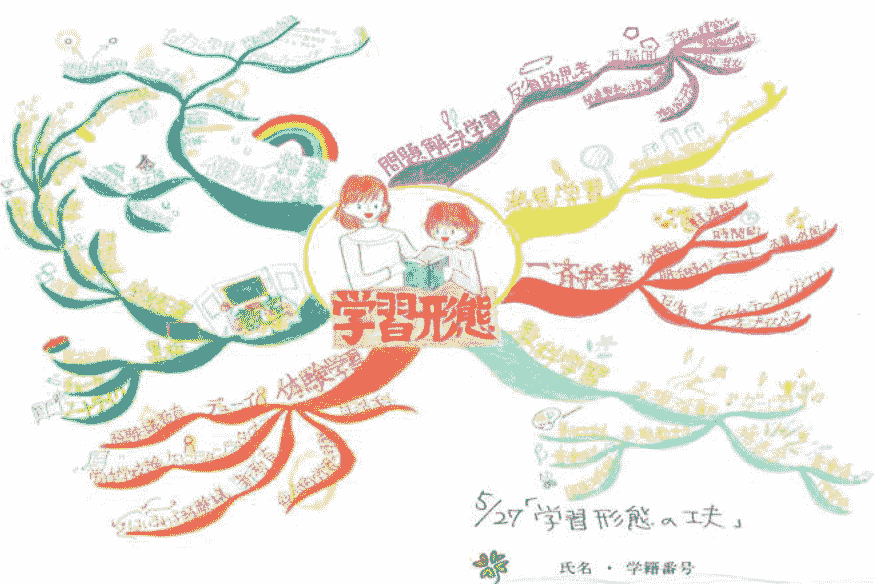
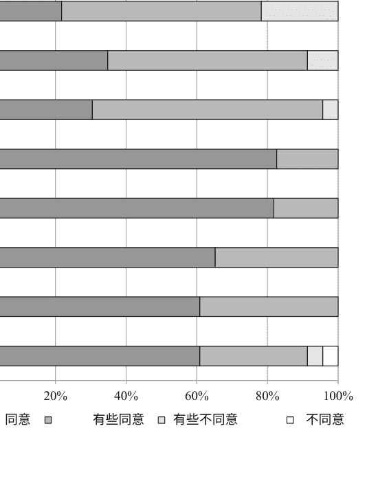

# 深度主动学习

松下佳代编辑

朝着更深入的大学教育

深度主动学习

松下佳代
编辑

# 深度主动学习

朝着更深入的大学教育

编辑
松下佳代
京都大学推进卓越教育中心京都市
左京区日本

ISBN 978-981-10-5659-8	ISBN 978-981-10-5660-4 (电子书)
DOI 10.1007/978-981-10-5660-4

国会图书馆控制号: 2017946640

本书基于日文原版, Dīpu akutibu rāningu: Daigaku jugyōo shinka saseru
tameni, © MATSUSHITA Kayo, KYOTO UNIVERSITY Center for the Promotion of Excellence in
Higher Education, 2015 (Published by Keiso Shobo Publishing Co., Ltd.) All Rights Reserved.
© Springer Nature Singapore Pte Ltd. 2018
第4章最初在下面的书中，并为本书进行了修订。
Marton, F. (2007). 走向学习的教育理论。在N. Entwistle和P. Tomlinson (Eds.) ,
学生学习和大学教学（第19–30页）。英国莱斯特：英国心理学会。
此作品受版权保护。 出版商保留所有权利，无论是全部还是部分
材料，特别是翻译、重印、插图重用、
朗读、广播、微缩胶片复制或以任何其他实体方式复制、传输
或信息存储和检索、电子适应、计算机软件或类似或不同
的方法学，现在已知或今后开发的方法学。
在本出版物中使用一般描述性名称、注册名称、商标、服务标志等
并不意味着，即使在没有具体声明的情况下，这些名称不受
相关保护法律和法规的约束，因此可以自由使用。
出版商、作者和编辑可以安全地假设本书中的建议和信息在出版日期时是真实准确的。 出版商
、作者或编辑对本书中所包含的材料不提供任何明示或暗示的保证，也不对可能存在的任何错
误或遗漏负责。 出版商在发表的地图和机构affiliations方面保持中立。

采用无酸纸印刷

这是Springer Nature出版的Springer印记
注册公司是Springer Nature Singapore Pte Ltd.
注册公司地址为： 152 Beach Road, #21-01/04 Gateway East, Singapore 189721, Singapore

## 前言

自21世纪的第一个十年以来，主动学习一直是日本关注的焦点，被视为将大学教育从以教师为中心转变为以学习者为中心的关键。2012年8月，日本文部科学省的中央教育委员会发表了一份名为《为建设新未来而进行大学教育的质的转变》的报告，将主动学习列为改革大学教学的关键词之一。在日本，主动学习一直被视为一个泛指，用于指代将学生的积极参与纳入教学和学习方法的总称。实际上，主动学习通常局限于整合小组工作、讨论和演示等教学形式的层面。

现在需要的不仅仅是主动学习，而是深度主动学习。
而主动学习关注学习的形式，深度学习则关注学习的质量和内容。

深度主动学习是指学生在与世界作为学习对象互动的过程中，与他人互动，帮助学生将所学内容与他们之前的知识和经验以及未来的生活联系起来。

那么，深度主动学习是如何发生的呢？哪种课程、教学方法、评估和学习环境有助于深度主动学习的发生？我们相信，本书将理论与实践联系起来，提供了一些答案。

日本京都
2014年8月

松下佳代

## 英文版前言

本书是第一本将主动学习和深度学习概念结合起来的书籍。 本书讨论了这些概念的理论和实践，作者是从事高等教育研究的学者。

在三个国家（日本、美国和瑞典）的教育、心理学、学习科学、教师培训、牙科和商业等领域中，深度主动学习已经得到了广泛的读者支持。日本版于2015年1月首次在日本出版，截至2017年5月已经进行了九次印刷，仍然受到广大读者的喜爱。

在日本，主动学习的概念和方法最初被应用于大学教育。 然而，现在，主动学习已经成为从小学到大学的教育改革的关键词，并且在教育工作者中引起了极高的兴趣和激情。 在这本书首次出版时，主动学习刚刚开始流行起来，我们预测只有它的表面方面会得到广泛的认可。 这本书中的警告影响了日本的教育政策，目前，主动学习正在以“独立、对话和深度学习”的形式在教育环境中越来越受欢迎。

如今，深度学习这个词已为大众所熟知，作为最新人工智能研究的基础概念；然而，它的起源可以追溯到本书的贡献者之一Ference Marton教授（第4章），以及他的同事们在20世纪70年代用来描述学生学习方法之一的术语。 在本书中，深度学习的含义已扩展到包括深度理解和深度参与。

Marton教授 我和我的同事之一Chap. 5的作者Shinichi Mizokami长期关注深度学习的概念，并在我们所属的组织——京都大学卓越教育推进中心的支持下，组织了以下关于这一主题的国际研讨会：“基于深度学习的高等教育”（2011年12月）与Ference Marton等人合作；“通过同伴教学加深主动学习”（2012年10月）与Eric Mazur等人合作；以及“学习评估和技术以增强深度主动学习：专注于学习催化剂”与Eric Mazur和其他人于2013年10月合作。

Elizabeth F. Barkley教授，第3章的作者，于2013年1月参加了一个国际研讨会名为“网络时代高等教育的推进：维持学习和教学的相互演进”。其他作者也参加了这些研讨会，并同意探索主动学习和深度的交叉点。Marton教授在这本书的总体主题上包括了他自己以前发表的最相关的文章，并在文章重新发表时进行了小的修订。同样，Mazur教授为我们的日文版撰写了关于同伴教学的文章，尽管由于版权限制，它没有包含在这个英文版中。

教授Barkley为我们的书写了一篇新文章。 因此，这本书真正成为了国际合作的结果。 这个英文版不仅仅是原版日文版的翻译。 我添加了一个介绍，并且附加在Mizokami的章节中的TomokoMori关于翻转课堂的文章已经扩大为一个新的章节（第6章）。 随着这些变化，书籍的结构已经重新组织。 此外，贡献者为每一章节增加了一些对外国读者的解释。

巧合的是，在2012年，美国国家研究委员会发布了一份名为“教育与生活：发展可转移的知识和技能”的报告，强调了深度学习对培养21世纪能力的重要性。 2015年，该报告以《深度学习：超越21世纪技能》的书名出版（J. A.Bellanca,编）。 显然，关注教育的教育工作者已经构建了一个专注于深度学习和更深层次学习的国际教育网络。

这本书是日本研究人员在三个国家的各个学术领域合作的结果的信息。 除了英文版，我们正在准备出版中文版。 我很高兴通过这些翻译版将这本书带给更广泛的读者。

日本京都 松下佳代
2017年5月

## 目录

- 1 引言
松下佳代
页码：1

# 第一部分 深度主动学习的理论基础

- 2 深度主动学习的邀请
松下佳代
页码：15

- 3 参与条款：理解和促进学生在今天's大学课堂中的参与
伊丽莎白・巴克利
页码：35

- 4 朝向学习的教学理论
费伦斯・马顿
页码：59

- 5 从主动学习的角度看深度主动学习理论
水上真一
页码：79

### 第二部分在各个领域的尝试

- 6 翻转课堂：一种教学框架促进主动学习的课堂设计
森智子
页码：95

- 7 基于高学生参与度的课堂设计合作：朝着带来深远影响的课堂发展
安永智
页码：111

- 8 使用概念地图的深度学习：实验在入门哲学课程中
田口真奈和松下佳代
页码：137

## 9课程设计促进有意义的学习：引导学生参与课程作为有意义的实践

一位有能力的教师

关田和三村正和

## 10个PBL教程将课堂与实践联系起来：专注于评估作为学习的一部分

关注评估作为学习的一部分

小野和香代松下

## 11 新领导教育和深度主动学习

Mikinari Higano

# 作者索引

# 主题索引

## 编辑和贡献者

### 关于编辑

松下香代博士自2004年起担任京都大学卓越教育推进中心和教育研究科的教授。她在京都大学获得教育学博士学位。在完成京都大学教育学博士课程后，她曾任教于京都大学教育学部助理教授和群马大学教育学部副教授。她一直致力于高等教育和学校教育的教学与学习发展研究。她目前的研究重点是学习评估，特别是绩效评估形式。她是《绩效评估》（日文版，日本标准，2007年）的作者，《能力新概念改变教育吗：学力、读写能力和能力？》（日文版，Minerva Shobo，2010年）的编辑，《高等教育网络建设：走向教师发展的未来》（Maruzen Planet，2011年）、《从高中到大学到工作的过渡》（日文版，Nakanishiya，2014年）和《主动学习评估》（日文版，Toshindo，2016年）的合编者。她是日本大学教育协会的主编和理事会成员，日本教育研究协会、日本课程研究学会和全国教育方法研究协会的理事会成员，也是日本科学委员会的成员。

### 贡献者

- **Elizabeth F. Barkley** 音乐历史，Foothill College，洛斯阿尔托斯，加利福尼亚州，美国
- **Mikinari Higano** 高等教育研究中心（CHES），早稻田大学，东京，日本
- **Ference Marton** 哥德堡大学名誉教授，哥德堡，瑞典；哥德堡大学教育学、课程和专业研究系，哥德堡，瑞典
- **Kayo Matsushita** 高等教育卓越促进中心，京都大学，京都，日本
- **Masakazu Mitsumura** 草叶大学教师教育专业研究生院，八王子，东京，日本
- Shinichi Mizokami 高等教育卓越促进中心，京都大学，京都，日本
- Tomoko Mori 关西大学教育发展推进部，大阪，日本
- Kazuhiro Ono 新泻大学医学与牙科学研究生院，新泻，日本
- Kazuhiko Sekita Soka大学教育学部,东京八王子,日本
- Mana Taguchi 卓越教育推进中心, 京都大学,京都,日本
- Satoru Yasunaga 文学院, 久留米大学, 久留米, 日本

# 第一章
引言

松下佳代

### 日本教育中的主动学习热潮

对主动学习理念和方法的关注在日本高等教育中开始于2000年代初的普及阶段 (Trow 1974)。然而，对主动学习的兴趣最初仅限于一个狭窄的专家圈子。

其在全国教职员工中的传播动力是一份名为《为建设新未来而进行大学教育的质的转变》的报告，该报告于2012年8月由教育部咨询机构教育中央委员会发布，该委员会审议日本的教育政策。

该报告将主动学习定义为“一种将学习者的主动参与融入学习中的教学方法，与仅由教师单方面讲授的教育不同。”主动学习方法的特点包括启发式学习、问题导向学习、体验式学习和探究式学习，以及小组讨论、辩论和团队合作。

从2014年末开始，主动学习这个术语被引入了小学和中学教育政策中，自那时起成为日本教育改革的关键词之一，引发了一场大热潮。

在日本的大学图书馆数据库CiNii Books中搜索“主动学习”，从2010年开始共有244个结果。然而，在这些结果中，有228个是在2015年之后出版的（截至2017年3月）。

正如前言所述，我们的书不仅关注学习的格式，这是围绕主动学习的繁荣所典型的，而且还通过深度学习的概念探索学习的质量和内容。

通过结合这两个概念，提出了一种新的深度主动学习的概念。

深度主动学习的理论和实践在第一部分和第二部分中进行了详细讨论，而本介绍描述了日本高等教育的现状，作为理解我们的书的背景。

#### 日本高等教育的现状

##### 大学入学率的变化

图1.1描述了日本大学入学率在5年间隔内的变化。
在二战后的短暂时期内，大学入学率一直低于10%，但随着1960年代的高经济增长，它迅速上升，到20世纪70年代中期超过25%。随后，在高中毕业后提供另一条路径的专门培训学院的建立，使大学入学率停滞了大约15年。然而，在20世纪90年代初期之后，它再次开始上升，直到2000年后半期超过50%。这就是日本高等教育进入普及阶段的方式。

近年来，许多国家的学术资格水平提高，大学入学率上升（OECD 2014，第340页）。因此，日本可能被视为另一个这样的案例。然而，值得注意的是，大学入学率的增加伴随着18岁人口的下降（分母）。另一个重要因素是长期的经济衰退，对高中毕业生的就业机会产生了负面影响，促使他们寻求大学教育。

##### 新入学生的年龄分布狭窄

日本大学的另一个特点是成年学生的比例较低，伴随着新入学生年龄分布的显著狭窄。图1.2显示了使用20th、50th和80th百分位数的新入学生年龄分布（OECD 2011）。在日本的情况下，几乎所有的入学者都在18到19岁之间，要么在高中毕业后立即入学，要么在一年后入学。而在OECD平均值为25岁以上的入学者占比为18%，在日本仅为2%（参见OECD 2014, p. 339）。换句话说，我们可以说日本大学的学生在年龄和缺乏生活经验方面是一个同质化的群体。尽管日本的大学入学率近年来有所上升，但仍低于OECD平均水平（截至2009年为59%）。一个原因是大学入学的时间窗口较小。

最初，Trow（2000）的通用模型意味着一个通用访问模型（即，一个可以在生活的任何阶段希望接受高等教育的任何人都可以获得机会）。
另一方面，日本的普及化功能作为一种普遍出勤模式（即，每个人几乎被迫在某些高等教育机构注册）。换句话说，大学并不履行提供的角色

图1.2 新入学生的年龄分布（2009年）。来源 OECD（2011年，第311页，图表C2.2）。注由于原始图中80th和20th百分位数的符号相反，作者根据数据源重新调整了它们的位置

终身学习的机会，而不仅仅是学校教育的延伸。这就是日本普及教育的区别所在。

#### 高完成率

日本的大学教育不仅在入学时独特，如上所述，在毕业时也是如此。图1.3显示了进入高等教育并获得学位的学生比例，即完成率（OECD 2013年）。而经济发达国家中，日本的平均完成率为89.6%，是最高的。

然而，这样高的毕业率并不一定意味着日本大学教育的高质量水平。相反，低毕业率可能反映出多种因素，例如大学设定的标准未达到；兼职学生发现继续学习困难；学生转学到另一所大学；他们在毕业前找到了一份有利可图的工作机会；部分在职学生只对某些特定学科感兴趣，而不是学位。日本的高毕业率也有其不利之处。
即大学的标准设定模糊或不够高；相对容易获得学分；大多数学生是全日制学生；转学困难；辍学生难以找到就业机会；在职学生比例极低。这些是日本大学的特点。

#### 大学毕业生的期望

为什么对于日本大学缺乏明确的标准并且毕业很容易的事实没有更多的关注呢？ 原因是雇主只对员工所毕业的大学和所在的系感兴趣，而对他们实际学到的知识和技能不关心。 这种趋势在人文社会科学学生中尤为明显。

日本劳动政策的领先专家Hamaguchi（2013）将西方国家描述为“以工作为导向的社会”，而日本则是“以成员为导向的社会”。在以工作为导向的社会中，人们根据他们要执行的工作来寻找；在以成员为导向的社会中，人们根据他们对特定社群（例如公司或政府办公室）做出贡献的潜力来寻找，一旦被雇佣，灵活地分配各种任务。 实际上，日本对于“寻找就业”和“进入公司”几乎可以互换使用。
在这个以会员为导向的社会中，通过常规招聘流程的新毕业生不需要展示他们的职业特定技能，而重要的是他们未来任务的潜在能力。 此外，由于在职培训（OJT）和工作轮换是公司培训的基本组成部分，进入公司之前的大学教育或职业培训通常不会受到太多关注。

然而，滨口（2013）指出，这样的以会员为导向的社会在全球范围内是相当独特的，即使在日本，这种安排也只在20世纪60年代开始的大约40年间顺利运作。 如何从一个越来越不起作用的以会员为导向的社会过渡到以工作为导向的社会的问题在日本越来越受到关注。

#### 主动学习传播的背景

#### 大学应该培养什么样的能力？

正如上面提到的，主动学习在日本传播的背景是普及阶段的开始，新入学者的学术能力和学习动机水平较低，变异性较大。 因此，传统的90分钟讲座式课堂教学变得越来越困难。 与政府教育政策的强力推动相媲美，主动学习的快速传播的直接原因是上述强力推动。

那么，主动学习是如何成为一项政策的呢？ 原因在于，主动学习被视为实现能力或学习成果的有效方法。 在日本的教育政策中，以结果为导向的教育首次在2008年由中央教育委员会的报告《走向建立本科教育》中明确提出。该报告提出了“毕业能力”的概念，即“我国本科教育力求在所有大学实现的学习成果。”“毕业能力”的实质与美国大学与学院协会（AAC&U）的基本学习成果（AAC&U 2007）非常相似，这很可能是灵感的来源。请参见表1.1。此外，在这份2008年的报告中，为了确保学习成果的获得，所有大学都被期望通过制定招生、课程和文凭政策来制定系统的本科教育计划。从2017财年开始，法律规定所有大学都要制定并公布这三项政策。通过更加强调学生在大学学到的知识和能力，基于结果的教育的引入是对从以成员为导向的社会向以就业为导向的社会转变的挑战的一种回应。

同时，MEXT要求日本科学院的学科特定委员会，这是日本的代表组织

表1.1 AAC&U的基本学习成果和MEXT的学力

| 基本学习成果 | 研究生能力(学力) |
| :--- | :--- |
| **对人类文化和自然世界的了解** • 通过学习科学和数学、社会科学、人文学科、历史、语言和艺术 | **知识和理解** • 对不同文化的知识和理解 • 对人类文化和社会以及自然界的知识和理解 |
| **智力和实践技能** • 调查和分析 • 批判性和创造性思维 • 书面和口头交流 • 数量素养 • 信息素养 • 团队合作和解决问题 | **通用技能** • 沟通技巧 • 数量技能 • 信息素养 • 逻辑思维 • 解决问题 |
| **个人和社会责任** • 公民知识和参与—本地和全球 • 跨文化知识和能力 • 道德推理和行动 • 终身学习的基础和技能 | **态度和倾向** • 自我控制 • 团队合作 • 领导力 • 道德意识 • 作为公民的社会责任 • 终身学习 |
| **综合学习** • 在一般和专业研究中的综合和高级成就 | **综合学习体验和创造性思维** • 能够将所掌握的知识、技能和态度以综合的方式应用于新提出的问题并解决它们 |

参考来源AAC&U (2007, p. 12) 和 CCE (2008, pp. 12–13)# 1 引言

科学家社区为构建每个学科的学位计划创建其基准陈述。 截至2017年3月，已有25个学科宣布了它们的基准陈述。

### 学生应该以何种方式学习？

在2008年的报告基础上，2012年由中央教育委员会发布的《关于建设新未来的大学教育质量转型》报告提出了主动学习作为质量改革的关键概念之一，如上所述。 主动学习成为政策上认可的一种获取表1.1中所示各种技能和态度的方法。主动学习格式一“启发式学习、问题导向学习、体验学习和探究学习”以及“小组讨论、辩论和小组工作”——为培养通用技能，如沟通技巧和解决问题能力，以及培养态度和倾向，如团队合作和领导力，提供了易于理解的布局。

然而，当通用技能、态度和倾向与知识和理解分离开来，只强调学习的形式时，学习质量和内容被忽视的风险越来越大。

### 我们的书的概念及其在日本的影响

我们在2013年3月制定了我们的书的日文版计划。 尽管2012年的报告已经发布，但“主动学习”这个术语仍然只为大学教育专家所知，涉及小学到高等教育的热潮尚未到来。

深度主动学习是我创造的一个词组。 随着主动学习成为政府政策的关键术语并开始推广，我感到一种警惕，如果事情继续按照现在的方式发展，主动学习可能最终成为包括小组工作、讨论和演讲等活动在内的课堂形式的另一种变体。 在来到当前学院之前，我主要研究的是小学和中学教育。 主动学习的课堂形式已经广泛应用于小学，在那里，“许多活动和少量学习”正在成为一个问题。

因此，很容易想象在大学环境中出现类似的结果。 尽管积极学习在提供重新审视现有以讲座为主的课堂形式的机会方面具有价值，但如果仅仅停留在这一点上，临时的活力可能是它为课堂提供的唯一好处。 此外，高质量学习的术语不应仅限于积极学习。 内容的深度和学习的质量同样重要。

基于这个想法，我将重点放在深度学习的概念上，以相对化积极学习。深度学习可能主要被认为是人工智能的理念，例如AlphaGo程序，在最近的比赛中击败了顶级人类围棋选手。 然而，深度学习的概念自20世纪70年代以来就存在于学习理论领域。 主要问题是如何将侧重于学习形式的积极学习与侧重于学习质量和内容的深度学习相结合。 我们的书在总共11章中提供了理论和实践建议。

我们的书于2015年1月首次出版后，经历了九次重印（截至2017年5月），在日本的大学图书馆中存档了516本（根据CiNii图书）。

文部科学省对国家课程的修订（旨在规范小学和中学教育的目标和内容）已经持续了2年。在这个过程中，本书被用作参考资料之一，因此，主动学习被解释为“独立、对话和深度学习”。

### 章节介绍

本书大致分为两个部分。 第一部分，“深度主动学习的理论基础”，是一系列理论讨论章节，旨在建立深度主动学习的基础。在第2章，“深度主动学习的邀请”中，我提出了以下问题：为什么学习应该是深度的和主动的？这里的“深度”是什么意思？如果我们加上“深度”，那与仅仅的主动学习有何不同？我首先指出，主动学习往往会产生问题，例如知识（内容）和活动之间的差异。 为了理解和解决这些问题，我介绍了活动系统和学习循环的理论（Engeström 1994），这些理论有助于描述学习活动的结构和过程。 基于这些理论框架，高阶思维和认知过程的外化被认为是主动学习的基本特征，而其基本前提是知识的获取和理解（内化）。 此外，我对关注深度的学习理论进行了分类和研究，包括深度学习、深度理解和深度参与。 接下来的两章分别与深度参与和深度学习有关。

在第三章中，“参与度的条件：理解和促进学生参与的大学课堂，” Elizabeth F. Barkley主要从神经科学和认知心理学等领域进行了学生参与课堂的理论研究。 她提出了促进学生深度参与的三个条件：（1）设计适当具有挑战性的任务，（2）帮助每个学生感到自己是学习社区中的重要成员，以及（3）通过整合多个领域（认知、情感和动作/心理运动）来进行整体学习的教学。

在这里，我想补充一下，这些想法已经通过她在硅谷的Foothill College与不同种族和背景的学生进行广泛互动的实践得到了验证，该学院以其高教育标准而闻名。

Ference Marton是第四章的作者，题为“学习的教学理论，” 他是一位心理学家，早在1970年代就涉足了当前的深度学习理论。 虽然深度学习与表面学习方法的对比描述和分析了学习者之间的差异，但第四章提出的变异理论强调了让学生在学习对象中体验变异和不变性的重要性。 讨论可能看起来回到了概念形成的起点，但它可以被看作是一个警告，即当代大学教育过分强调学习的间接对象（能力）会削弱对学习的直接对象（内容）的兴趣。

-   1. 评估课外学习时间，
-   2. 反向设计，
-   3. 课程开发，
-   4. 每周多个班次，
-   5. 构建主动学习环境，
-   6. 翻转课堂。

第二部分，“各个领域的尝试”，是一本关于深度主动学习特点的实践经验集合。这些领域包括自然科学（水文学，信息科学），语言技能，哲学，教师培训，牙科和商业（领导理论），而实际应用的重点也各不相同。在日本，近年来最迅速传播的主动学习趋势之一是翻转课堂。 第6章，“翻转课堂：促进主动学习的教学框架”，由森友子分析了当前翻转课堂的两种模式，即调查模式和知识获取模式，并说明了这些模式在水文学和信息科学课堂中的实践。 基于这些分类，森指出翻转课堂正在成为一种普遍的学习模式，重新关注主动学习中知识的重要性，并通过与他人的互动将对个体学生的初步理解重构为真正的理解。 关于主动学习的断言与对知识的理解完美地重叠，与本书中描述的深度主动学习相吻合。

正如我上面提到的，巴克利在第三章中提出了促进深度参与的三个条件：任务设计、学习社区和整体学习。其中条件之一，安永智在第七章中，“基于高度学生参与的合作式课堂设计：迈向引发深刻发展的课堂”，专注于第二个条件。 他介绍了超越小组学习技术的合作学习方法，并描述了一个逻辑语言技能课程的示例，同时建立了一个学习社区。（作者是巴克利合作学习技术的首席翻译。）

### 第八章，“使用概念地图进行深度学习：在入门哲学课程中的实验应用”

由田口真奈和我描述了一种所谓的主动学习技术在入门哲学课程中的实验应用，这被认为是难以与该技术兼容的。此外，最后一堂课中使用的概念地图表明，这些地图不仅可以作为学习工具，还可以作为深度主动学习的评估工具。评分表被用来评估学生在概念地图中展示的学习成果，并且本章还解释了基于学生作品创建评分表的程序。

### 第9章，“课程设计促进有意义学习：引导学生参与有意义实践成为有能力的教师”

由关田和三村撰写，分为两个部分：关田的实践实施报告和三村的验证部分。最终结果是关于实践应用和定性研究的报告的结合。在本章中，作者提出了有意义学习的概念作为深度主动学习的一种形式。这是一种学习方式，其中（1）学生目前学习的内容与他们自己相关（有意义），（2）他们希望应用和尝试他们所学的知识，以及（3）他们所学的知识对他们自身的成长有贡献（通过学习变得有能力）。作者提出了几种激发有意义学习的方法。虽然第8章和第9章只涉及一门课程，但第10章，“将课堂与实践联系起来的PBL教程：以评估为学习为重点”，由小野和我撰写，研究了牙科学院整个本科课程，并报告了以问题为核心的学习（PBL）课程的实施情况。PBL存在的问题是如何兼顾知识获取和问题解决的权衡，以及如何进行评估。

我们采用了让学生在课外个人学习或与课程并行的讲座中获得解决问题所需的知识的方法，而这些知识则通过课堂上的小组问题解决练习来加深。在评估方面，他们开发并实施了改进的三级跳方法，并分析了其有效性。这可以被视为建构对齐（Biggs和Tang 2011）的一个很好的例子，将目标、课程、教学和评估联系起来。

## 最后一章是第11章，“新的领导教育和深度主动学习”，

由Higano Mikinari撰写。它描述了立教大学商学院商业领导项目（BLP）的结果支持的领导培训理论，该项目在Kawaijuku教育机构（2014年）的调查中得到了高度评价。作者将领导定义为“一种行为通过让其他人参与，共享愿景或目标”无论权力或地位如何。根据这种理解，主动学习可以被重新定义为“通过学生的领导力来学习。此外，他对于深度学习的指标是，学生可以在课堂或大学之外组织学习，并且在毕业后，不需要任何来自教师的“支持”（支撑）。立教大学商学院的课程就像自行车的两个轮子，通过BLP的领导力研究和选修课程所获得的专业知识一起工作，就像逐渐去除“支撑”一样，学生可以为自己主张领导地位。

尽管牙科和商业是两个完全不同的领域，但PBL和BLP—这两种既能获得知识又能解决问题的方案—可以被视为相似的。它们是深度主动学习的课程实践。

如果我基于上述章节的内容来定义深度主动学习，我的定义将是“学生在与他人互动的同时，将世界作为学习对象，帮助学生将所学内容与他们之前的知识和经验以及未来的生活联系起来的学习方式。”“本书的章节采用了多种主动学习的方法。然而，随着主动学习在学术界的迅速传播，所有这些章节共同的特点是将深度融入到主动学习中，无论是明确还是隐含。

我希望读者能够通过本书中描述的各种理论和实践努力，对深度主动学习有一些了解。

## 参考文献

> 美国大学与学院协会（2007年）。面向新全球世纪的大学学习：来自全国领导委员会的报告，自由教育与美国承诺。华盛顿特区：AAC&U。

> Biggs, J., & Tang, C. (2011).高质量大学教育教学(第四版)。英国伯克郡：高等教育研究协会和开放大学出版社。教育中央委员会。(2008).学士课程教育的建设方向 (报告).

> 教育中央委员会。(2012).为了实现新未来的大学教育质的转变：大学培养终身学习和独立思考能力的能力（报告）.

> Engeström，Y. (1994)。变革的培训：工作中教学和学习的新方法。法国巴黎：国际劳工组织。

> Hamaguchi, K. (2013)。青年与劳动：从“入职制度”的视角解开问题。日本东京：中央公论新社。

> Kawaijuku教育机构 (Ed.)。(2014)。“学习”的积极化：三年间的全国大学调查δ从/保证质量的积极化的“学习”：来自日本各地大学三年调查 /。日本东京：Toshindo。

- OECD. (2011). 教育概览2011年：OECD指标. 巴黎，法国：OECD。
- OECD. (2013). 教育概览2013年：OECD指标. 巴黎，法国：OECD。
- OECD. (2014). 教育概览2014年：OECD指标. 巴黎，法国：OECD。
- Trow, M. (1974). 从精英教育到大众高等教育的问题。在OECD（编），高等教育政策（第51–101页）。巴黎，法国：OECD。
- Trow, M. (2000).从大众高等教育到普及教育：美国的优势. 研究和临时论文系列：CSHE.1.00.

## 作者简介

博士 松下佳代自2004年起担任京都大学卓越教育促进中心和教育研究科的教授。她在京都大学获得教育学博士学位。在完成了京都大学的博士教育项目后，她曾在京都大学教育学院担任助理教授，也曾在群马大学教育学院担任副教授。她一直致力于高等教育和学校教育的教学和学习研究和发展。她目前的研究重点是学习评估，特别是绩效评估形式。她是《绩效评估》的作者（日文版，日本标准，2007年），《能力新概念改变教育吗：学力、读写能力和能力？》的编辑（日文版，明石书店，2010年），《高等教育网络建设：走向教师发展的未来》的合编者（丸善星球，2011年），《从高中到大学和工作的过渡》（日文版，中西屋，2014年），以及《主动学习评估》（日文版，教育进修，2016年）。她是日本大学教育协会的主编和理事，日本教育研究协会、日本课程研究学会和全国教育方法研究协会的理事，以及日本科学院的成员。

# 第一部分 深度主动学习的理论基础

## 第二章 深度主动学习的邀请

松下佳代

我们在这本书中想要传达的核心信息是，大学教育不仅应该是积极的，还应该是深入的。 为什么学习既要积极又要深入？ 在这里，“深入”是什么意思？ 如果我们加上“深入”，那和仅仅的积极学习有什么不同？ 在这个引言章节中，我将回答这些问题，同时为深度主动学习打开大门。

### 什么是积极学习？

首先，积极学习是什么意思？ Bonwell和Eison的《积极学习：在课堂上创造激情》（1991）是一部开创性的作品，阐述了积极学习的原则，是最常被引用的作品之一，即使在今天仍然如此。 在这篇文章中，作者列举了以下作为积极学习的一般特征：

-   (a) 学生参与的不仅仅是听讲。
-   (b) 不再强调传递信息，而更注重培养学生的技能。
-   (c) 学生参与高阶思维（分析、综合、评价）。
-   (d) 学生参与各种活动（如阅读、讨论、写作）。
-   (e) 更加强调学生对自己态度和价值观的探索。

此外，主动学习被定义为“让学生参与做事情，并思考他们所做的事情。””（Bonwell and Eison 1991， p. 2）。换句话说，主动学习是行动后通过反思来学习的过程。哈佛大学的Eric Mazur说过：“就像你不能通过在电视上观看马拉松比赛来成为一名马拉松选手一样，对于科学，你必须经历进行科学思维的过程，而不仅仅是观察你的教师。”在这里，也强调了为了学习“进行科学思维”而需要在实际尝试后（行动和反思）自己意识到这些过程的重要性。

根据中央教育委员会于2012年8月发布的《关于大学教育的定性转型报告：培养终身学习和独立积极思考能力的大学》（简称定性转型报告）和大学教育重建加速计划（AP）的结果，日本高等教育中的主动学习成为一种正式的教育方法。这促使其被广泛采用。在定性转型报告中，主动学习被定义为

> “是一种教学和学习方法的总称，它将学习者的主动参与纳入学习过程中，与基于单向讲授的教育不同。”基于这一基础，它旨在培养包括认知能力、道德能力、社交能力、文化修养、知识和经验在内的通用能力。”通过与Bonwell和Eison提出的五个特征进行对比，我们可以看到它强调了（a）、（b）和（d），并且清楚地强调了与“基于单向讲授的教育”相对的对比。

在本书的第5章中，Mizokami将主动学习定义为“超越仅仅单向传授知识的讲座式课堂（=被动学习）的各种学习方式。”它需要参与各种活动（写作、讨论和演讲）并将认知过程外化到这些活动中（第79页）。在这个定义中，Mizokami除了上述特征外，还关注“将认知过程外化到活动中”这一特点。

在本章中，我采用了Bonwell和Eison对主动学习的全面定义，并在他们的一般特征（a）到（e）的基础上添加了第六个特征：

-   （f）它需要将认知过程外化到活动中。
此外，我还想讨论为什么大学水平的学习不仅应该是主动的，还应该是深入的问题。

## 主动学习的问题 从调查和案例研究中

鉴于普及大学教育的需求和各种新的能力，如“毕业生能力”（文部科学省：MEXT）和“成年人基本技能”（经济产业省：METI），主动学习已经出现并广泛应用于结束以前在日本大学盛行的“仅输入、单向、被动讲座”形式，并转变为以学生为中心的范式。

然而，主动学习并非改革大学教学的“万能药”。事实上，主动学习并没有必然产生期望的效果。相反，有几个证据甚至可能表明它产生了与期望相反的结果。

1.  2013年，日本主要教育服务公司Benesse对全日本各地的5000名大学生进行了调查，以进行第二次大学生学术和日常生活调查。根据这项调查，尽管积极学习型课程的可用性，包括小组合作，讨论和演示，有所增加，但认为“我喜欢容易获得学分的课程，即使我对它们不太感兴趣”的学生人数，相对于“我喜欢我感兴趣的课程，即使它们更困难”的学生人数从48.9%（2008年）增加到54.8%（2012年）。此外，在日常生活中，认为的大学生数量也增加了“大学教师应提供建议和支持”而不是“事情应该留给学生自己的主动性”大幅增加，从15.3%增加到30.0%。这些结果讽刺地表明，越是普及主动学习风格的课程，学生对学习和生活方式的被动态度就越强。

2.  麻省理工学院（MIT）以其使用技术启用的主动学习（TEAL）而闻名，该学习环境在日本的机构中，包括东京大学驹场校区的驹场主动学习工作室（KALS）（参见本书第5章）。TEAL教室包含13个圆桌，每个桌子可容纳九名学生，学生使用联网计算机、点击器、多功能屏幕、白板和其他工具进行互动、合作和主动学习。 但是，并不是所有学生都接受TEAL。当TEAL在《纽约时报》上被描述时，引发了激烈的赞成和反对的争论。得到最多支持的是：“可能，学校应该提供两种选择（主动学习和讲座）。有些人最好是安静地、深思熟虑地、独自学习，并跟随一位熟练的 … 教员一起发展一个想法，而不是在一个喧闹的环境中进行主动学习，这可能会分散注意力。但对于任何人来说，自主学习的机会 …肯定是更好的时间利用方式，学以致用的机会也是如此。”

事实上，麻省理工学院不仅提供基于主动学习的TEAL课程，还提供将TEAL与讲座和复习课（将班级分为几个小组进行讨论的课程）相结合的课程，以及教授理论上复杂的内容的课程。

3.  根据参与各种主动学习课程的经验，Mori（本书第6章）指出，即使主动学习也没有解决讲座式课程中学生学习质量不均的问题。 Mori还指出了“自由骑车者”的出现，小组工作的停止以及思维和行动之间的差距等新问题在主动学习中出现。这些言论在很多方面与我在大学课堂教学和观察中的经验一致。

### 双重罪过

为什么会发生这些情况？课程研究者Wiggins和McTighe（2005）将“以内容为重点的教学”和“以活动为重点的教学”称为教学的“双重罪过”（第3页）。以内容为重点的教学是试图在没有遗漏的情况下教授教科书和讲义中的所有内容，而以活动为重点的教学旨在通过让学生参与各种活动来促使他们学习，而不仅仅是听讲。

正如我们已经看到的，主动学习出现在以讲座为基础的教学或者说以内容为重点的教学的对立面。然而，现在的情况是否已经摆到了另一边，朝着以活动为重点的教学？正如“双重罪过”一词所示，无论是以内容为重点的教学还是以活动为重点的教学都不能产生有效的学习，它们是同一个硬币的两面。

在引入主动学习后，仍然存在一些未解决的问题和一些新出现的问题下面描述了这些问题。

### 知识（内容）与活动之间的差异

当引入主动学习到课堂中时，会为活动指定时间，从而减少了传授知识（内容）的时间。此外，为了使学生进行高阶思维，他们必须获得适合此类思维的知识（内容）。如何将这两者联系起来，确保既传授知识又参与活动的平衡发生？我们如何在两者之间取得平衡？

### 被旨在主动学习的课程引起的被动性

在主动学习中，活动是有结构的，并且学生在很大程度上受到强大的压力来参与这些活动，他们不再被要求决定是否愿意自愿参与。此外，主动学习经常以小组活动的形式出现，因此每个个体的责任变得难以定义。那么，为了实现最初旨在鼓励的主动参与，需要什么呢？

### 学习风格的多样性

鉴于主动学习课程优于讲座式课程的价值判断，不喜欢主动学习的学生可能被视为无法改变他们对学习的传统观点，或者不愿意在学习上花费自己的时间和精力（参见Cain 2012年）。主动学习是否充分考虑了学习风格的多样性？

深度主动学习特别关注知识（内容）和活动之间的差异问题，并旨在重建主动学习。我将从质疑被认为是主动学习基础的理论和概念开始。

### 知识和活动之间的联系

### 学习活动的结构

在各种学习理论中，学习被描述为三个结构要素之间的关系：学习者（自我），对象和他人。例如，日本的学科和学习领域的领先学者佐藤学（Manabu Sato）将学习定义为“重构三种关系：学习者与对象世界之间的关系，学习者与他人之间的关系，以及学习者与自己之间的关系。”他将其称为“三位一体学习理论”（Sato 1995）。

赫尔辛基大学的Yrjö Engeström，他根据活动理论阐述了一种基于活动理论的学习模型，将上述三个要素描述为主体、客体和社区，并将它们联系在一起的中介要素描述为工具、分工和规则（Engeström 1994, 2015）。工具不仅包括物理和外部工具，还包括符号和内部工具，如语言、符号和知识。分工指的是工作和角色的分工以及社区成员之间的权力关系。规则是关于行动和互动的明确规定或暗示的规章制度、规范和习俗。

主体使用工具对客体进行操作并将其转化为结果，并与社区的其他成员共享工作和角色。在共同的规则下，主体也参与社区活动。Engeström将学习理解为这种活动（图2.1）。如果我们从这个角度解释讲座和主动学习的区别，结果如下。

在讲座中，作为活动主体的实体是讲师，而对象是学生。讲师使用教科书和黑板等工具向学生传授知识，并通过测试和报告来评估结果。在大多数日本大学的一个学期中，讲师和学生最多每周见面一次（参见本书第5章），除了形式上的社区外，没有其他社区存在。讲师和学生之间的分工是这样的，讲师在黑板上讲话和写字，学生听讲并做笔记。规则，比如规定学生需要参加多少次课程以及迟到和私下交谈的程度，要么直接由讲师传达，要么暗示。

相比之下，主动学习将学生置于主体的位置。课程描述了学生所做的事情以及他们所能做的事情。例如，在问题导向学习（PBL）中，问题是目标，选择与学生所面对的价值观和现实相关的问题（参见本书第10章）。学生解决问题所需的工具要么是他们自己通过寻求而学到的课外知识或通过课堂讲座提供给他们的知识。此外，PBL对分工有明确的规定，学生在小组中以指导教师为协调者学习，然后在课外独立学习，与课堂过程一致。因此，如果学生在教师的支持下解决问题，他们就能取得成果。当学生和教师在一个学期中反复进行PBL过程时，他们更有可能形成一个真正的社区，而不是基于讲座形式的课程。

然而，请注意，这些是被认为是成功的主动学习案例。虽然小组活动可以促进学生的学习，但它们也可能抑制学习。例如，有些情况下，小组内存在一种心照不宣的理解，即为了达到平庸的结果而只付出一半的努力（一种心照不宣的规则）。此外，小组内的分工可能不公平，使得一些成员成为搭便车者。此外，如果学生在接触主题时没有足够的知识，他们将花费过多的时间在任务上，却无法得出除了表面上的结果之外的任何东西。

因此，使用这个模型可以很容易地理解主动学习的特点和潜在的问题。

### 学习活动的过程

我们上面所看到的是学习活动的结构，但是学习活动的过程如何在理论上表述呢？在这里，我们可以参考Yrjö Engeström的思想。这是因为他的理论融合了深度学习（Marton和Säljö1976年所描述的）并且与深度主动学习有很高的相关性。

Engeström（1994）描述了学习活动的六个步骤的过程，如图2.2所示。

学习循环的起点是学生遇到的问题与他们现有的知识和经验之间产生的冲突（动机）。换句话说，学习者面临的情况是无法使用他们之前获得的知识和经验来解决一个即时问题。这些学生开始参与学习活动，目的是解决冲突（定向）。然后，他们获得完成任务所需的知识（内化）。随后，他们实际应用知识来解决冲突（外化），但通常不仅仅停留在知识的应用上，他们发现当他们应用并被迫重构知识的极限时（批判），最后，他们回顾迄今为止的过程序列，并在进入下一个学习过程（控制）之前进行修订，如有需要。

### 内化和外化

这个学习活动过程也将主动学习的特点和潜在的陷阱展现得淋漓尽致。一个例子是内化和外化。如前所述，（f）“它要求在活动中外化认知过程”是主动学习的一个特点。在基于单向知识传递讲座的课堂上，大部分时间都花在内化知识上，唯一的外化元素是学生在测试中复述记忆的知识。相比之下，主动学习在学习活动中恰当地放置了认知过程的外化。这是主动学习的一个重要成就。

然而，仅仅内化而没有外化并不奏效，同样地，仅仅外化而没有内化也是如此。没有内化的外化是盲目的。没有外化的内化是空洞的。

在批评仅涉及内化的讲座时，主动学习往往贬低内化。从学习循环的角度来看，Bonwell和Eison在本章开始时提供的主动学习定义“让学生参与做事情并思考他们所做的事情”侧重于外化和控制。

相反，深度主动学习的问题在于如何结合内化和外化。实际上，本书讨论的所有深度主动学习的例子都试图结合内化和外化，例如课外知识获取与课堂内的问题解决和讨论，如第6章中的翻转课堂和第10章中的PBL。

确实，内化和外化之间的关系并不是从前者到后者的单向进展。学生在内化知识后，通过外化活动重新构建它，例如使用它来解决问题、与人交谈或写作，从而加深他们的理解。在知识内化阶段，活动系统模型将其定位为一个对象（例如，在“理解视角”这种情况下），“视角”是“理解”的对象。然而，在外化阶段，它变成了一个工具（例如，在“以视角分析艺术作品”这种情况下，“视角”是分析的工具）。因此，将知识用作工具进一步加深了学生的理解。

### 学习周期的跨度

学习周期可以在各种时间跨度内发生，无论是一个课堂时间、一个学期的课程还是一个为期四年的本科学位课程。例如，一个常见的单节课的设计包括首先提出问题，然后传达关于问题的知识，最后讨论并做出关于问题的演示和呈现，使用所学的知识。在美国大学中，一个常见的课程设计是每周三个50分钟的课程。在课程中包括讲座、讨论和练习，可以很容易地结合内化和外化。

将这一点扩展到为期4年的本科学位课程，大多数日本大学和本科部门在课程中提供了更多的时间，并为学生在他们的最后一年处理外化问题提供了各种方式。最后一年。这些包括撰写论文、做演示和参加口试，与他们的毕业论文和毕业研究项目相关。为了确保高质量的外化，学生必须对他们通过课堂和独立学习内化的知识有深入的理解。

通过班级、课程或者项目，可以实现学习循环。但是，我想指出学习循环应该是可见的，不仅对教师而且对学生也是如此。例如，一些科学和技术领域的教师声称他们需要在本科教育的早期阶段将基础数学和物理知识灌输给学生，以便他们能够进行高质量的毕业研究项目。在这种情况下，4年的学习循环对教师是可见的，但不一定对学生是可见的。使学习循环对学生可见的有效方法可能包括使用课程地图或让学生与已经完成毕业或硕士研究项目的学长学姐互动，以便让他们感受到基础课程的重要性。在4年的时间范围内嵌入更短的学习循环可能会更加有效，让学生有自己重复的学习经验，并让他们掌握这种学习模式。就像立教大学商学院一样，一些大学建立了领导力项目和专业选修课程，使课程平衡领导力和专业知识，就像自行车的两个轮子一样（Kawaijuku教育机构2014年；参见本书第11章Higano）。新泻大学牙科学院也以PBL为核心构建其课程，相关讲座和研讨会围绕这一核心安排，以便学习循环可以多次重复（参见本书第10章）。

## 学习理论的谱系关注深度

到目前为止，我们已经看过了主动学习的特点和潜在陷阱，为深度主动学习的讨论铺平了道路。那么，在这个背景下，“深度”是什么意思？接下来，我想介绍一下关注深度的学习理论的谱系，这是深度主动学习的理论基础。

### 深度学习

深度主动学习的基础概念包括深度学习和深度学习方法（Matsushita 2009）。由哥德堡大学的Ference Marton、爱丁堡大学的Noel Entwistle及其同事提出的理论形式，已经在英国、某些斯堪的纳维亚国家和澳大利亚等国家的高等教育中得到广泛应用。

### 深度学习方法

这项研究的起点是Marton和Säljö（1976）的以下研究。学生们被要求阅读一篇文章，并被告知之后会被问到相关问题。学生们对这个任务的方法可以明显地分为两种类型。一些学生关注文本试图全面理解其意义。其他学生关注可能出现在考试中的信息片段，并试图逐字记忆它们。Marton和他的同事将前一种方法称为“深度方法”，将后一种方法称为“表面方法”（见表2.1）。在后续研究中，通过结合Pask（1976）关于学习策略的理论，Entwistle（2000）确定了深度方法中的两种策略：整体策略，学生试图在思想之间建立联系并识别整体模式和原则的深度策略，以及试图使用证据并检查论证逻辑的串行策略。恩特维斯尔及其同事（恩特维斯尔等人，2000年）还提出了战略方法的概念，与冷漠方法相对。深度方法以对内容和主题的兴趣为特征，战略方法以学习的自我调节和对评估要求的警觉性为特征。恩特维斯尔（2000年）以2.3图的形式呈现了他的研究成果。

尽管从这个图中很难看出来，战略方法不仅与深度方法有关，还与表面方法有关。例如，那些对主题不完全理解但擅长考试的学生可能会采用表面战略方法。

教学和评估的影响

学习方法与学习风格不同。学习风格是在学习情境中获取和处理信息的特征模式。一些先天因素参与其中，这些因素很难改变（Entwistle等人，2000年; Aoki，2005年）。相比之下，学习方法是学生在特定学习情境下相对可能采取的行动方式。因此，学习方法是学生与学习情境之间相互作用的结果。

深度、策略性的学习方法通常会导致更高水平的学习成果，但前提是评估方法能够准确评估学习者对概念的理解。相反，当评估方法不能评估对概念的理解时，表面、策略性的学习方法会产生更好的结果，但这并不会导致持久的、高质量的学习。因此，为了鼓励学生采取深度学习方法，需要有适当类型的教育，不仅涉及教学（课程和教学），还涉及评估。约翰·比格斯将教师希望学生掌握的学习与教学和评估之间的联系称为“建构性对齐”（Biggs和Tang，2011年），这个概念也适用于学习方法。

### 学习对象和变异理论

马顿与恩特维斯尔一起发展了学习方法的理论，最近更加强调学习的对象来促进深度学习（参见本书第4章）。马顿区分了三种形式，即预期的学习对象，实施的学习对象和实际的学习对象，并将它们与学习目标、学习空间和学习结果相结合。从教育的角度来看，它们对应于目标（课程）、教学和评估的领域。

此外，通过将学习内容定位为间接学习对象，将能力定位为间接学习对象，马顿试图将内容和能力整合到学习对象的概念下。例如，在学习目标（预期的学习对象）为“能够解二次方程”、“理解光合作用”、“能够看到不同形式的政府之间的相似性和差异性”、“能够看到不同宗教在统一和差异方面的特点”等情况下，这些目标是学习的直接对象。另一方面，像“能够解决...”、“理解...”和“能够从...的角度看到...”这样的能力是学习的间接对象。因此，学习对象可以从两个维度来理解，即“预期的”、“实施的”和“实际的”，以及“直接的”和“间接。”

马尔顿试图通过学习方法的理论来理解学习对象的变化是如何通过不同的学习方法与相同的文本产生的。相比之下，本书中的变异理论着重于直接的学习对象，并试图阐明对学习对象的理解如何因其呈现方式的变化而变化。换句话说，可以说同时关注预期的学习对象和实施的学习对象将使我们在构建教育学理论方面更进一步。

在他的《学习的大学：超越质量和能力》一书中，与澳大利亚的约翰·鲍登共同合著，马顿对基于能力的高等教育改革发出了警告。相反，鲍登和马顿（1998）认为，在低可预测性时代，具备辨别和专注于关键情境的能力尤为重要，超越了通用技能。变异理论是与这一论断相关的理论尝试。

### 深度理解

关于学生学习的第二个深度血统，我想提到的是深度理解。理解是深度学习的特征，深度学习理论和深度理解理论之间存在重叠。

即便如此，我将深度理解视为一个不同的血统，因为我想照亮超越“深度”和“表面”二分法的理解深度轴。

麦克蒂格和威金斯（2004年）以他们的著作《理解的设计》（2005年）而闻名，在图2.4中以图形形式展示了知识的结构。

在最表面的层次上是事实知识和离散技能。更深入的是可转移的概念和复杂过程。然后，原则和概括位于最深层次。可转移的概念、复杂过程和原则与概括构成持久的理解。

Wiggins和McTighe所指的持久理解是指理解问题的理解，即“我们希望学生在几年后忘记细节后能够理解和运用的内容”它们是学科的核心，并且可以应用于新的情境”(Wiggins和McTighe 2005年，第342页)。

我特别想提到Wiggins和McTighe提出的理解概念。当他们提到理解时，他们指的是一个复杂的概念，包括六个方面：解释、解读、应用、观点（批判性和有洞察力的观点）、共情（能够理解他人的感受和世界观）以及自知（知道自己的无知以及自己的思维和行动模式如何影响和偏见理解）（Wiggins和McTighe 2005年，第4章）。

### 知识结构

#### 美国历史

主题： 第二次世界大战

#### 事实知识

- 希特勒的权力崛起
- 战争前后美国公众的情绪（孤立主义与干预主义）
- 绥靖政策与德国的冲突
- 珍珠港和与日本的冲突。...

#### 离散技能

- 做笔记
- 制定时间表
- 阅读和分析历史文献
- 解读地图、图表和图表。...

#### 可迁移概念

- "正义"战争
- 战争中的手段与目的（例如，原子弹）
- 战争的"商业"-经济影响
- ...

#### 复杂的过程

- 历史调查
- 写作以提供信息和说服

#### 原则和概括

- 有些战争被认为是"正义"战争，因为人们认为他们必须面对邪恶的敌人。
- 战争具有经济和技术后果。
- ...

图2.4 知识结构的示例。来源改编自麦克泰格和威金斯（2004年，第66页）

这种理解方式与主动学习理论不同。大多数主动学习理论似乎遵循布鲁姆的认知层次结构，将认知领域视为一个由知识、理解等组成的分层结构。

布鲁姆的分类法是由本杰明·S·布鲁姆等人开发的教育目标分类法。它最初是作为大学教育中创建测试项目的理论框架而开发的，由三个领域组成：认知领域（1956年出版）、情感领域（1964年出版）和运动领域（不完整）。其中，最有影响力的领域，也是与主动学习直接相关的领域，是认知领域的分类法。后来，布鲁姆的同事（安德森和克拉思沃尔2001年）修订了布鲁姆的分类法（认知领域），并结合了认知心理学等领域的研究结果，创建了修订版的布鲁姆分类法。修订版的一个重要特点是，知识被重新定位为与认知过程无关的维度，而在原始版本中，它被归类为低阶认知。此外，认知过程维度已经从“知识、理解、应用、分析、综合、评价”修订为“记住、理解、应用、分析、评价和创造”（Ishii 2011）。例如，Bonwell和Eison所描述的“高阶思维（分析、综合、评估）”不过是Bloom分类法中的高阶认知过程。另一方面，Bloom分类法将“知识”和“理解”定位为低阶认知过程。我认为这是知识和理解在主动学习理论中没有得到重视的一个远因。然而，Bloom分类法目前正在修订中（Anderson和Krathwohl 2001），知识正在适当地被重新定位为独立于认知过程的知识维度。

Wiggins和McTighe所描述的理解与Bloom分类法中的理解不同。它涉及智力的整体运作，包括解释和应用等高阶阶段，以及程序知识、元认知知识和概念知识。

正如先先前述，深度主动学习认为通过反复内化和外化来加深理解。Wiggins和McTighe提倡的理解概念可以成为这种深度主动学习的理论基础。

### 深度参与

学生学习的第三个层次是学生参与的深度。学生参与（或涉入）首次引起高等教育的关注是在1990年代初，当时Pascarella和Terenzini发表了《大学如何影响学生》（1991）。在北美，这一概念传播的动力是1999年首次进行的全国学生参与调查（NSSE）。这项调查研究了学生在大学资源、课内外学习机会（包括常规课程、课外学习项目如留学或服务学习，以及俱乐部和其他课外活动）中投入时间和精力的程度，以及这些资源和机会对他们的学习和发展产生的影响。对于NSSE来说，学生参与不仅意味着参与常规课程，还包括参与课外和课程外的机会。调查对象是 first年级和四年级学生。收集了关于本科课程中学生发展的数据，并对本校与其他类似类型的大学进行比较。这些数据可以用来评估大学。请参阅NSSE网站（http://nsse.iub.edu）。

课堂内外的学习。然而，在本书中，我们特别关注常规课程中的课堂。Elizabeth F. Barkley在本书第3章中将大学课堂中的学生参与定义为“一个连续体验和结果，是由动机和主动学习之间的协同作用产生的”（本书第3章，第40页）。她将学生参与描述为由动机和主动学习构成的双螺旋模型。

这里的重点是，学生参与被理解为一个连续体。换句话说，参与的深度范围从不参与到表面参与到深度参与。深度参与接近于心理学家Csikszentmihalyi（1997）所称之为 flow的状态。这是一种热情、沉浸和真正的恍惚状态。在大学课堂上可能不太可能遇到这种参与，但大多数人可能经历过一节课非常有趣，时间似乎过得很快。这种主观的时间感是深度参与的指标之一。

Barkley将学生参与视为动机和主动学习之间的相互作用。她将动机定义为期望（“我认为我可以完成这个任务”）和价值（“这个任务值得做”）之间的相互作用，将主动学习定义为思维的积极参与。值得注意的是，动机是深度学习（深度学习方法和深度理解）中隐藏的主题， here引起了对深度轴情感因素的关注。另一个值得注意的观点是，Barkley更多地将主动学习理解为思维上的参与，而不是实践上的参与。她作为合著者参与了一本关于协作学习技巧的手册（Barkley et al. 2005），这使得她的定义更有权威性。

### 深度主动学习的意义

鉴于关注深度的不同但相互关联的学习理论的渊源（深度学习、深度理解和深度参与），主动学习中的活跃性可以从内部和外部两个方面来看，并以二维形式呈现，如图2.5所示（Matsushita 2009）。

巴克利对主动学习的定义与当前主动学习的状态形成对比（容易与身体活动混淆），它强调了活动的内部方面（A或B）。也就是说，深度参与是一个表达活动内部深度的短语。

图2.5 活动的内部和外部方面

| 外部方面\内部方面 | 低 | 高 |
|-------------------|----|----|
| 低                | D  | B  |
| 高                | C  | A  |

表2.1 定义学习方法的特征

| 方法 | 特征和结果 |
| :--- | :--- |
| 深度方法 | 寻求意义 意图——理解自己的想法 将想法与先前的知识和经验联系起来 寻找模式和基本原则 检查证据并将其与结论联系起来 谨慎和批判性地检查逻辑和论证 必要时使用死记硬背的学习方法 结果就是 意识到自己的理解随着发展而变化 对课程内容更加积极地感兴趣 |
| 表面方法 | 复制 意图——应对课程要求 将课程视为无关的知识片段 机械地记忆事实或执行固定程序 学习时不反思目的或策略 结果就是 在理解新思想方面遇到困难 对课程或任务的价值或意义看不到 感到过度压力和担忧工作 |
| | 来源改编自恩特维斯尔（2009年，第36页）. |

图2.3 学习和学习方法的学生态度。来源Entwistle (2000, p. 4)

另一方面，正如Wiggins和McTighe指出的，以活动为重点的教学是一种以学生在内部方面不活跃为结果的教学，即使他们在外部方面是活跃的。以覆盖内容为重点的教学是一种以既不活跃于外部方面也不活跃于内部方面为结果的教学，因为它只关注内容的覆盖。

深度主动学习是一种强调不仅在外部方面而且在内部方面都活跃的学习方式。使用“深度”一词是对强调外部方面活动而忽视内部方面活动的主动学习课程的暗示性批评。

尽管如此，深度主动学习并不是一种新提出的理论或实践。相反，它是一种试图识别和阐明作为主动学习提出的理论和实践中深度维度的考虑的尝试。

### 总结

- 主动学习被认为是通过行动然后通过对自己行动的反思来学习。在国家教育政策的推动下，这种新的教育方法正在迅速传播到日本的大学中，以应对普及化和能力导向教育的挑战。
- 主动学习作为单向、以讲座为基础的知识传递的对立面出现，但由于对以覆盖为重点的教学的过度批评，我们最终遇到了由以活动为重点的教学引起的问题。
- 基于活动系统和学习循环的理论，更容易掌握主动学习的特点和可能的陷阱，分别描述了学习活动的结构和过程。高阶思维和学生认知过程的外化是主动学习应该具备的基本特征，但实现这一点的基本前提是知识的获取和理解（内化）。讲座课和主动学习课并不对立，而是相互补充。它们在整个学习循环中强调内化或外化的程度上有所不同（或者是知识的获取或利用知识进行高阶思维）。学习循环可以延伸到单个课堂时间、一个学期的课程，甚至是一个四年的项目。然而，教师和学生都需要认识到并意识到学习循环。
- 深度主动学习强调学习的深度，但这个“深度”的上下文可以指深度学习、深度理解或深度参与。如果我们从内部和外部两个方面理解活动，那么通过深度主动学习，我们不仅强调外部方面的活动，还强调内部方面的活动。

## 参考文献

Anderson, L. W., & Krathwohl, D. R. (Eds.). (2001). 《学习、教学和评估的分类法：对布鲁姆的教育目标分类法的修订》。纽约，纽约州：朗曼出版社。

青木克己（2005年）。《学习风格的概念和理论：从美国和欧洲的研究中学习》。多媒体辅助教育研究杂志，2（1），197-212。

Barkley, E. F., Cross, K. P., & Major, C. H. (2005年). 《协作学习技术：大学教师手册》。旧金山，加利福尼亚州：Jossey-Bass出版社。

Benesse (2013年). 《大二学生的学习和日常生活状况调查》。检索自http://benesse.jp/berd/center/open/report/daigaku_jittai/2012/hon/index.html

Biggs, J., & Tang, C. (2011). 《高质量大学教育(第四版)》。Berkshire, 英国: 高等教育研究协会和开放大学出版社。

Bonwell, C. C., & Eison, J. A. (1991). 《主动学习：在课堂上创造激情》。ASHE-ERIC高等教育报告第1号。

Bowden, J., & Marton, F. (1998). 《学习的大学：超越质量和能力》。伦敦, 英国: Kogan Page.

Cain, S. (2012). 《宁静：内向者在一个无法停止交谈的世界中的力量》。纽约, 纽约：百老汇图书。

教育中央委员会。(2012). 《为了实现新未来的大学教育质的转变：大学培养终身学习和独立思考能力的能力（报告）》。

Csikszentmihalyi, M. (1997). 《内在动机和有效教学：一种flow分析》。在J. Bess (Ed.)的《教学得当且喜欢它：激励教职员工》(pp. 72-89). 巴尔的摩，马里兰州：约翰霍普金斯大学出版社。

Engeström, Y. (1994). 《变革的培训：工作中教学和学习的新方法》。法国巴黎：国际劳工组织。

Engeström, Y. (2015). 《扩展学习：发展性研究的活动理论方法 (第二版)》。纽约：剑桥大学出版社。

Entwistle, N. (2000). 《通过教学和评估促进深度学习：概念框架和教育背景》。将在2000年11月在莱斯特举行的TLRP会议上提交的论文。检索自http://www.tlrp.org/acadpub/Entwistle2000.pdf

Entwistle, N. (2009). 《大学的理解教学：深度方法和独特思维方式》。纽约：Palgrave Macmillan。

Entwistle, N. J., McCune, V., & Walker, P. (2000). 《高等教育中的概念、风格和方法：分析抽象和日常经验》。在R. J. Sternberg & L.-F. Zhang (Eds.)的《思维、学习和认知风格的视角》(pp. 103–136). 纽约：Routledge。

石井, T. (2011). 《现代美国的学力培养论的发展：以标准为基础的课程设计的理论发展》。日本东京: Toshindo.

河井塾教育机构 (Ed.). (2014). 《“学习”的质量保证的积极学习：从全国大学调查中 /来自日本各大学的三年调查结果/》。日本东京: Toshindo.

Marton, F., & Säljö, R. (1976). 《关于学习的质量差异：I 结果和过程》。英国教育心理学杂志，46, 4–11.

松下光（2009年）。《“自主的学习”的根源：从学习理论的角度来看大学课堂上的学习》。日本自由与通识教育学会杂志，31(1)，14–18。

松下光, 大山美, 波多野恭, & Shô, K. (2014). 《哈佛大学，麻省理工学院[关于哈佛和麻省理工学院的现场调查报告]》。京都大学高等教育研究图书馆，33, 366–385。

松下, K., & 田口, M. (2012年). 《大学教育[课程设计]》。 在京都大学卓越教育促进中心 (编). 《成长中的大学教育[大学教学与学习的新理论]》 (第77–109页). 京都，日本: 中西屋。

McTighe, J., & Wiggins, G. (2004). 《理解设计：专业发展工作手册》。亚历山大里亚, VA: 协会监督和课程发展。

Pascarella, E., & Terenzini, P. (1991). 《大学如何影响学生》。旧金山, CA: Jossey-Bass.

Pask, G. (1976). 《学习的风格和策略》。英国教育心理学杂志，46, 128–148.

Sato, M. (1995). 在Y. Sayeki, H. Fujita和M. Sato (Eds.) 中, 《Manabi e no izanai [Invitation to learning]》(pp. 49–91). 东京，日本: 东京大学出版社。

Wiggins, G., & McTighe, J. (2005). 《理解设计 (扩展第二版)》。亚历山大里亚, VA: 协会监督和课程发展。

## 作者简介

博士 松下佳代自2004年起担任京都大学卓越教育促进中心和教育研究科的教授。她在京都大学获得教育学博士学位。在完成了京都大学的博士教育项目后，她曾在京都大学教育学院担任助理教授，也曾在群马大学教育学院担任副教授。她一直致力于高等教育和学校教育的教学和学习研究和发展。她目前的研究重点是学习评估，特别是绩效评估形式。她是《绩效评估》的作者（日文版，日本标准，2007年），《能力新概念改变教育吗：学力、读写能力和能力？》的编辑（日文版，明石书店，2010年），《高等教育网络建设：走向教师发展的未来》的合编者（丸善星球，2011年），《从高中到大学和工作的过渡》（日文版，中西屋，2014年），以及《主动学习评估》（日文版，教育进修，2016年）。她是日本大学教育协会的主编和理事，日本教育研究协会、日本课程研究学会和全国教育方法研究协会的理事，以及日本科学院的成员。

## 第三章 参与条款：理解和促进学生参与在今天的大学课堂中

伊丽莎白·巴克利

当我开始我的大学教学生涯几十年前，我从未听说过“学生参与”这个词组。事实上，如果有人告诉我“学生参与”是我应该在课程中促进的事情，我会感到非常惊讶。我和我的大多数同事都认为大学教师的工作是讲课，而大学生的工作是听课、学习和考试。

然后我休了十年做管理工作，当我在1990年代中期回到教室时，教学环境已经发生了变化。坐在我面前的学生们似乎大多不想在那里。尽管我努力地让他们参与到激动人心的讨论中，他们却用各种表情看着我，从完全冷漠到彻底敌对。情况变得更糟。学期开始三周后，被聘为我的替代者的院长把我叫到他的办公室。我感到震惊，听着他从一张法律大小的便笺上读出了一份看似无穷无尽的投诉清单，来自一对特别不满意的学生。我曾经热切期待着回到教学，但现在感到困惑和羞辱。尽管我在十年前是一位成功和受欢迎的教师，但很明显，“旧办法”已经不再奏效。因为我还年轻，无法退休，所以吸引学生的参与成为了我的核心关注。

我的经验并不罕见。美国以及其他国家的大学教师告诉我，如今的教学可能很艰难。我们大多数人选择了自己学术领域，是因为在某个时刻我们对它产生了热情。在学术界从事职业的吸引之一就是有机会与他人分享我们的热情，甚至可能招募新的学科门徒。因此，当我们看到课堂上那些毫不掩饰自己的无聊和冷漠的学生时，感到非常沮丧。

同样令人痛心的是，有些学生过分关注他们的分数，却似乎对这些分数所代表的学习毫不在意。为什么有些学生如果对我们所教的内容不感兴趣，还要注册这门课程呢？为什么有时候让学生思考...关心...参与起来这么难呢？这些问题以及类似的令人困扰的问题，是当今国际学生参与对话的一部分。

对话的要素各不相同，主要是因为当今高等教育的多样性。虽然目前关注的重点似乎是大班课中数百名学生的参与，但在平均班级规模为十二人的课程中，参与可能是一个挑战。虽然一些教师正在寻找方法来挑战学生的高阶思维，但其他教师却在努力让学生上课，或者让他们把手机收起来，或者把耳机从耳朵里拿出来，以便他们能够足够集中注意力发展基本的学术成功技能。虽然许多教师在传统的面对面课程中努力吸引学生的参与，但越来越多的教师正在寻找在部分或完全在线教学的课程中吸引学生参与的方法。

统一的主题是“参与度”，但是“学生参与度”是什么意思呢？答案是：对不同的人来说，它有不同的含义。鲍文在一篇适当命名为“参与学习：我们是否都在同一页面上？”的文章中观察到，尽管有越来越多的强调参与度的迹象，如愿景陈述、战略计划、学习成果和改革议程，力图创造参与学习和参与学习者，“但是对于我们实际上对参与度的含义或者为什么它重要的明确共识仍然缺乏”（2005年，第3页）。本章的目的是通过首先探讨该短语的背景，然后提出一个基于教学的模型，来构建一个理解学生参与度的概念框架，以在大学课堂的背景下解释它的含义。

### 定义术语“学生参与度”

在学生大学期间，最早将参与度与学习联系起来的一次是在Pascarella和Teren zini的著作中：“可以得出的最强烈的结论也是最不令人惊讶的。”简单地说，学生在学术工作或大学学术经历中的参与或投入越大，他或她的知识获取和一般认知发展水平就越高。”(1991)。十年后，Russ Edgerton指出学生需要“从事学科专家进行的任务”才能真正理解学科概念，在他有影响力的高等教育白皮书中提到(2001, p. 32)。在同一篇论文中，Edgerton创造了“参与的教学法”这一短语：“‘关于事物的学习’并不能使学生获得他们在21世纪所需的能力和理解。”

我们需要新的参与教育方式，这将培养出美国现在所需要的富有资源和参与度的工作者和公民”(p. 38). 在Edgerton等人的基础上，Shulman将参与度置于他的学习分类法的基础上：“学习始于学生的参与度...(2002, p. 2).

在美国，国家学生参与度调查(NSSE)和相关努力，如社区学院学生参与度调查(CCSSE)旨在衡量学生的参与度。他们将参与度定义为学生参与代表有效教育实践的活动的频率，并将其构想为在课堂内外以及整个学生大学生生涯中参与各种活动和互动的模式。“学生的参与度有两个关键组成部分,”NSSE的副主任Jillian Kinzie解释道，“第一个是学生在学习和其他活动中投入的时间和努力，这些活动导致构成学生成功的经历和结果。第二个是学校分配资源和组织学习机会和服务的方式，以促使学生参与并从这些活动中受益”(Kinzie 2008)。

当谈到国家和机构层面的整体趋势时，这些术语“参与”都很好用，但对于试图在日常学术中与学生进行互动的大学教师来说，它们并不是很有帮助。因此，让我们更仔细地看一下在单个大学课堂中构成学生参与的内容。

#### 朝向基于课堂的学生参与模型

当大学教师描述学生参与时，大多数人倾向于以两种方式来处理。第一种方式是使用诸如“参与的学生真的关心他们正在学习的内容；他们想要学习”或“当学生参与时，他们超越了期望，超出了所要求的范围”或“对我来说，描述学生参与的词语是激情和兴奋”（Barkley 2009）的短语。这些短语反映了一种根植于动机的参与观点。词语“参与”的词源可以为我们提供这种观点的线索。“参与”是一个古法语词，意为承诺一生和荣誉，也意味着迷人或迷住某人的能力。

sufficiently 以至于它们成为一个盟友。这两个意义都 resonates with teachers’ motivation-based view of student engagement: 我们希望学生能分享我们对学术学科的热情，并且我们的课程能够吸引他们，以至于他们愿意、事实上热情地投入到心思到学习过程中。

许多大学教师描述学生参与的第二种方式是用诸如“参与的学生正在尝试理解他们所学的内容”或“参与的学生正在参与当前的学术任务，并运用高阶思维技能，如分析信息或解决问题”(Barkley 2009)等短语来描述。这些教师将参与与主动学习联系起来。

他们认识到学习是一个动态过程，它通过将新信息与已有知识相连接来理解和赋予意义。Bonwell 和 Eison 简明地将主动学习定义为“做我们认为正确的事情，并思考我们正在做的事情”(1991)。Edgerton 观察到，要真正为了理解一个概念...学生必须能够进行各种表现涉及这个概念...学生通过阅读和听讲座了解化学，但要真正理解化学，学生需要参与化学家进行的任务。”他补充说，一些教学方法（如问题导向学习、合作学习和本科研究）是“参与式教学”，因为它们要求学生在学习的同时积极参与他们‘做’学科任务（Edgerton 2001, p. 32）。鲍文指出，NSSE评估这些教学法的使用程度，已经成为参与的一种实际操作定义”(2005, p. 4)。

无论教师主要考虑学生参与的动机因素还是主动学习元素，他们都迅速指出两者都是必需的。一个充满热情和积极性的学生的教室是很好的，但如果没有学习的结果，教育上是没有意义的。相反，那些积极学习但不情愿和不满的学生是没有参与的。因此，学生的参与是动机和积极学习的产物。它是一个产物而不是一个总和，因为如果其中一个元素缺失，它就不会发生。它不仅仅是由其中一个元素产生，而是在动机和积极学习的重叠空间中生成的（见图3.1）。虽然结合动机和积极学习可以促进基本的学生参与，但一些教师正在推动更多：他们希望学生在教育经历中真正得到转变。

尽管任何学习都会导致一定程度的变化，但转化性学习是深度和彻底的变化。Cranton（2006）将转化性学习定义为“一个过程，通过该过程以前未经批判地吸收的假设、信念、价值观和观点受到质疑，从而变得更加开放、渗透性和更好地得到证明”（第vi页）。它要求学习者“审视问题的参照框架，使其更具包容性、区分性、开放性、反思性和可变性”，并且可以“由一个事件引发……或者可以逐渐并累积地发生”（第36页）。

变革性学习发生在学生面临强烈挑战时，创造了佩里所描述的智力和道德上的成长发展。 根据佩里的观察，大多数大一新生进入大学时都是二元论者，认为有明确、客观、对/错的答案。 大学教育的目标之一是帮助学生超越二元思维，进入更复杂的阶段，以应对不确定性和相对主义。 随着经验挑战他们的思维，学生开始意识到真理是情境性和相对的，由于没有一个单一正确的答案，“每个人都有权利表达自己的观点。最终，他们意识到一个问题可能有多个答案，但并不是所有答案都是平等的，具体的标准如经验证据和逻辑一致性可以帮助他们评估知识主张的有用性和有效性。

在佩里的第四和最后阶段，学生开始意识到他们必须做出需要客观分析和个人价值观的个人选择（佩里1998年）。 当学生的思维发展到这种复杂程度时，它是真正具有变革性的。 有趣的的是，鲍文观察到学生经常抵制教师促进变革性学习的尝试，正是因为这种学习“必然威胁到学生当前的身份和世界观”，并引用了一项在一所精英文科学院进行的研究，发现大多数学生在感到充分准备捍卫自己坚定立场之前不愿参与讨论（鲍文2005年）。 一些教师认为变革性学习是参与式学习的一部分，但它可能不是一个必需的元素，而更多是持续参与或达到更高个人强度的结果。

动机和主动学习相互协同作用，它们相互作用，逐步增加参与度。 从这个角度来看，与其将参与度描述为主动学习和动机的重叠部分的维恩图，从而限制了每个部分的影响力，参与度可能更好地被描述为一个双螺旋结构，其中主动学习和动机是协同工作的螺旋，逐渐增强，并创造出一个超过它们各自效果之和的流动和动态现象（见图3.2）。

因此，参与度是一个连续的过程：它始于动机和主动学习的交集，但这两者协同工作并逐渐增强。在连续的另一端是转变性的、高峰体验，它们构成了教育中珍贵的里程碑。尽管这些体验非常吸引人，但它们在持续的基础上是不可持续的—它们会太过劳累。作为大学教师，我们可以努力增加深度参与的体验，减少缺乏参与度的冷漠和无动于衷的情况，并关注我们可以调整教学方法以增强参与学习的各种方式。

因此，在大学课堂的背景下，我提出以下定义：学生参与是一个连续体验和产物，是动机和主动学习之间相互作用的结果。

从动机和主动学习的研究和理论中理解基本原理可以为如何促进学生参与提供见解。因此，让我们从我们的双螺旋模型中探索第一个要素：学生动机。

### 参与和动机

密歇根大学的杰里·布罗菲将课堂上的动机定义为“学生学习中投入注意力和努力的热情程度”（2004年，第4页）。让我与你分享我早期激励学生的尝试之一：‘优秀学生奖励’。我在学期初给予学生这个奖励，并列出他们必须保持奖励的行为：

如果你：
- 对自己的学习负责。你上大学的主要原因之一应该是因为你想得到更好的教育。我不能让你学习，你必须自己决定这样做。
- 在向我提问之前，请先查看课程大纲是否已经回答了你的问题。
- 合理安排时间，不要请求延期。
- 仔细阅读任务说明，并使用评分标准指导你完成任务，然后尽力而为。这样做不仅能让你学到更多，还能获得更好的成绩。
- 不要争论你的成绩。

这个奖励帮助我奖励那些大多数是“好学生”并且以这些方式行为的学生。当一个学生没有做到这些行为之一时—例如，问我关于课程大纲中明确有答案的信息的问题，我可以回答：“我可以回答你的问题，但答案已经在课程大纲中了，因此你将失去好学生奖励。你还想让我回答你的问题吗？”

### 价值和期望的相互作用

关注期望或价值都可以帮助我们增加学生的动机，但了解这两个组成部分如何相互作用可能特别有用。例如，

- 低价值/低期望：如果学生不期望成功并且不重视任务，他们很可能会拒绝它。如果他们既没有关心成功的理由，也没有相信即使尝试也能完成任务的自信心，他们只会变得被动或感到疏离。
- 低价值/高期望：当成功期望高但任务价值感低时，逃避很可能发生，即学生们相信自己能够完成任务，但却没有任何理由去做，而是会做白日梦，与同学讨论与课程内容无关的话题，思考自己的个人生活等等。
- 高价值/低期望：当学生意识到任务的价值，但感到自己无法完成任务，因为他们不确定该做什么，如何做，或者怀疑自己能否做到时，就会发生伪装。然后他们找借口，否认困难，假装理解，或者参与其他旨在保护自尊心而不是发展与任务相关的知识和技能的行为。
- 高价值/高期望：当学生既重视任务又期望通过合理的努力能够成功完成时，就会发生参与。基本上，我们可以通过采取措施来增加学生对学习的价值，并帮助学生对自己成功的能力持有积极的期望，从而提高学生的动机。

动机是参与的门户。了解激励背后的复杂性可以指导我们努力创造条件，增强学生的学习热情。也就是说，重要的是要意识到动机是内在的和个体的一我们不能“激励学生”，但我们可以创造一个更大比例的学生会感到有动力的环境。我的课堂参与模型认为，参与是通过动机和主动学习之间的协同作用而发生的，所以让我们把注意力转向这个模型的另一个组成部分：主动学习。

### 参与和主动学习

尽管“教学”和“学习”通常是成对出现的，但我们这些教师知道学生并不总是学到东西。当我在教学生涯的早期抱怨这一点时，一位经验丰富的同事责备我说：“‘说:我教了学生一些东西，他们只是没有学到’就像说‘我卖了车给他们，他们只是没有买’一样。作为教育工作者，帮助学生学习是我们的首要目标，我们应该如何最好地实现这一目标呢？最简单的答案可能是创造条件来促进主动学习。主动学习将半个多世纪的研究成果付诸实践，这些研究表明，要真正学到东西，我们需要将一个想法、概念或问题解决方案融入到我们的个人知识和经验中。

主动学习已经成为一个涵盖各种教学方法的总称，例如合作学习、问题导向学习、服务学习和本科研究。很容易将主动学习与身体活动混淆，例如错误地认为只要将班级分成小组，更多的学生就有机会参与，就会有更多的学习。认识到合作学习等教学法更有可能促进学生的参与，但不能轻易得出结论，即如果学生彼此交谈，他们就在学习。同样冒险的是，认为学生在听其他学生讲话时就在学习。主动学习意味着思维活跃。因此，当学生独立工作，甚至在听讲座时，如果他们在思考、处理和将新信息与现有知识联系起来，就可以进行主动学习。

就像动机一样，支持主动学习的认知过程非常庞大，需要比本章更多的时间。因此，我将只讨论几个我希望能有所帮助的方面。

神经科学家正在做出令人瞩目的发现，帮助我们理解学习时大脑内部发生的事情。为了更好地理解主动学习的发生，至少需要对其神经基础有基本的了解。现在有几本书向教育工作者和普通读者解释大脑的功能，以下是几个来源（Wlodkowski 2008; Sousa 2006; Ratey 2002; Diamond and Hopson 1998），以及Barkley等人（2005）和Cross（1999）提供的信息综合。

#### 我们从神经科学中了解到的知识

大脑由称为神经元的细胞组成。神经元起初是圆形细胞体，然后每个细胞体都会长出多达100,000个称为树突的短分支，以及一个称为轴突的长根。神经元就像微小的电池一样，通过树突接收信息，将其作为信号沿着轴突发送，在称为突触的间隙中释放称为神经递质的化学物质。

突触被另一个神经元的树突接收。当神经递质进入相邻神经元的树突时，它引发一系列电化学反应，导致接收神经元通过轴突“fire”。这个过程和反应会继续进行，直到形成一系列神经元连接的模式 firing together。

我们的大脑每时每刻都会受到成千上万个刺激，这些刺激会引发这些事件，神经元会保持几个小时甚至几天的准备状态。如果这个模式不再被刺激，神经网络会衰退，感知会丧失。这样做是为了防止我们的大脑被无用的信息所淹没。另一方面，如果在这个待机期间重复这个模式并且相关的神经元网络再次 fires together，连接的网络会变得更加稳定。每个神经元及其成千上万个邻居相互交织在一起，形成一个极其复杂、相互连接的纠结，大约有100万亿个不断变化的连接。通过重复，一些连接会变得更加强化，我们‘学习’，而很少或从不使用的连接会被消除，我们‘忘记’。

因此，树突是神经元获取信息（学习）的主要途径，轴突是神经元发送信息（教授）的主要途径，我们所知道和理解的一切都被保存为我们大脑中的神经元网络。

成年人学习时，他们建立或修改已经通过以前的学习和经验创建的网络。如果新信息与旧信息很容易融合，就称为同化。如果新信息挑战现有信息，以至于需要修订现有结构，就称为适应（Svinicki 2004b，第11页）。一个人拥有的树突越多，用于吸收或附加新信息的能力就越强，学习和保留新信息就越容易。一个人拥有的基本神经网络越多，形成更复杂网络就越容易。从神经科学的角度来看，学习是神经元和现有神经网络的持久性变化。当我们促进主动学习时，我们帮助学生生长树突，并激活和建立现有的神经网络。

#### 我们从认知心理学中了解到的

神经科学的发现与认知心理学家所设想的工作思维模型相一致，他们假设了一种被称为模式的思维结构，或者以复数形式，模式。“模式是一个认知结构，由事实、思想和关联组成，组织成一个有意义的关系系统。例如，人们对事件、地点、程序和人物都有模式。一个人对于一个地方（比如大学）的模式可能包括位置、声誉、学生群体的特点、校园建筑风格，甚至是校园停车场的位置。因此，模式是一组有组织的信息片段，共同构建了每个人对大学的概念。当有人提到大学时，我们‘知道’我不知道那是什么意思，但是这个形象在每个人的脑海中可能有所不同”(Cross 1999, 第8页)。人们可以很容易地想象出一个‘丰富’的架构，这个架构存在于那些曾经在大学任教或上过大学的人的脑海中（包括课程、教室、教授等的记忆），并将其与那些仅仅听说过这所大学的人的相对稀疏的架构进行对比。如果一个人将这所大学与另一所名字相近的大学或者同名但位于不同州的大学混淆，那么错误和误解的可能性也是显而易见的。

一个良好发展的模式的价值在于对新手和专家学习差异的研究中得以展现。对于任何学科的专家来说，新信息能够迅速以可用的形式掌握，因为与现有知识的连接很多。相比之下，新手的学习是费力且缓慢的，这并不是因为新手比专家更笨，而是因为新信息与现有模式之间的连接稀疏——没有可以挂接新信息的钩子，没有组织它的方式（Cross 1999, p. 8; de Groot 1966）。每个模式都会随着生活中的新事件而改变和成长，通过感知被过滤成模式，被组织并连接到现有结构中以创造意义。因此，只有当新信息与学习者心中已有的内容相连接时，才会产生有意义的学习，从而导致代表我们理解的网络发生变化。

#### 转移在主动学习中的作用

当激活先前的学习以理解新的事物时，大脑会搜索与新学习相似或相关的任何过去的学习。如果这些经验存在，相应的神经网络或模式将被激活，加强已存储的信息，并帮助解释和赋予新信息意义。Svinicki（2004a, b, 第99页）指出，文献中讨论了许多类型的转移，但对于教学目的来说，有两种类型最为重要。第一种是正向与负向转移。如果连接准确，搜索结果将产生“正向”转移，有助于学习者理解和整合新的学习。另一方面，如果连接不正确，结果就是负向转移，会导致混淆和错误。例如，当教授罗曼语系给英语人士时，教师经常遇到正向转移（例如，西班牙语中的“mucho”听起来类似于英语中的“much”）和负向转移（例如，法语中的“librairie”听起来像“library”，但意思是“书店”）（Sousa, 第138-139页）。第二种转移类型是近距离与远距离转移。这种区别是指任务的类型：近距离转移任务是非常相似并遵循相同响应规则的任务，而远距离转移任务是将相同规则应用于不同环境的任务。“远距离转移”需要学习者更多的思考。Svinicki提到驾驶中级自动车以轿车为例：如果你开过一辆，你可以轻松驾驶其他任何一辆，因为方向盘、换挡杆、雨刷器和转向灯都长得一样，位置也一样。另一方面，如果你坐进一辆非常不同的车（比如敞篷车、手动挡跑车），你的正常驾驶反应不会立即触发，你必须停下来，弄清楚一切在哪里。规则是一样的，但车子看起来不同。在不同的中级自动轿车之间移动是一个近距离转移任务，从中级自动轿车转移到手动挡跑车是一个远距离转移任务（Svinicki，第100-101页）。

有几个因素影响转移的质量：相似性/差异性、关联性以及原始学习的背景和程度。

#### 相似性和差异性

先前遇到的情境与新情境的相似程度会影响转移。有趣的是，大脑通常将新信息存储在具有相似特征或关联的网络中，但通过识别与该网络中其他项目的不同之处来检索信息。例如，我们认识的人的视觉外貌似乎存储在人类外貌的网络中（例如，躯干、头部、两只手臂、两条腿），但如果我们试图在人群中找到一个认识的人，我们将寻找与其他人区别开来的特征（例如，面部特征、身高、声音等）。显然，当相似性高且差异少时，区分两者变得更加困难（Sousa，第143页）。因此，当概念、原则和数据或这些信息的标签相似时，负迁移的潜力更高。例如，在音乐中，“全音”和“全音符”听起来相似，但这些术语代表着非常不同的概念（全音是两个音高之间的特定距离，而全音符是单个音高的节奏时值）。

#### 协会

将两个项目一起学习，使得这两个项目相互关联或关联也会影响转移，当中一个项目被回忆起时，另一个项目也会自动回忆起来。当我们听到或阅读“罗密欧”，我们会下意识地添加“和朱丽叶”，或者当我们想到像麦当劳的金色拱门或苹果的苹果标志这样的商标符号时，我们会立刻想到相关的产品（Sousa 2006，第145页）。由于我们所知道和理解的一切都被保存为一系列关联，我们建立的关联越多，我们就有越多的潜在位置来附加新信息，我们学习和保留这些信息就越容易。

简而言之，我们学习和保留的越多，我们就能学习和保留的越多。

我甚至创建了一些惩罚措施来阻止我不喜欢的行为。例如，在阅读看起来像是临时完成的作业后，我创建了一个“垃圾努力惩罚”，其中包括以下声明：“如果你忽视了基本的指示，或者在作业中没有付出大学水平的思考，或者提交了带有多个语法和拼写错误的作业，那么这是浪费我的时间，也是浪费你的时间，你将会受到-200分的惩罚。”我发现我的课程已经变成了奖励和惩罚的复杂矩阵，有加分和扣分，所有这些都是为了激励学生努力学习，阻止他们懒散。我的奖励和惩罚策略源于行为主义的激励模型。这种行为主义模型认为，教师可以通过强化构成优秀工作的期望学习行为（课堂上的专注，作业的认真和彻底，对讨论的深思熟虑和频繁贡献）来培养有动力的学生，从而鼓励学生继续这些行为。如果学生不能立即参与这些行为，如果正确的行为得到强化，不兼容的行为通过非强化或必要时通过惩罚被抑制，他们将逐渐改善。

许多教师和我一样，发现激励学生投入时间和精力学习课程的最简单直接的方法是通过使用奖励策略，如我刚才描述的奖金，高分，赞扬，激励措施（例如，如果你获得了x分，就不需要参加期末考试），以及成就认可（“最好的三个项目是由学生x，y和z完成的”）。这种方法的问题是学生可能开始关注获取奖励和避免惩罚，而忽视了学习的重点。科恩（Kohn）在他的著作《奖励惩罚》（1999）中批评了这些方法，因为这些策略被视为贿赂学生，将学生的注意力从重视任务本身转移到重视任务完成的后果上。

他引用了一项研究，该研究提供了证据，即如果你为人们已经出于自己的原因而做的事情提供奖励，可能会降低他们的内在动机和表现质量，因为他们会尽可能用最少的努力获得最多的奖励。例如，这在选择“轻松A”的课程而不是更具挑战性的课程以保持GPA的学生行为中是显而易见的。简而言之，虽然提供外在奖励的策略可以快速增加动机，但对于我们帮助学生培养与真正参与学习相关的内在动机可能是适得其反的。

在20世纪60年代，认知动机模型开始取代行为主义模型，强调学习者的主观体验。强化仍然很重要，但其影响通过学习者的认知来介导。在认知模型中，需求模型首先得到发展。这些模型，如马斯洛的需求层次理论，认为行为是对感知需求的回应，意味着在满足更高层次的需求（如归属感）之前，必须先满足基本生理需求（如睡眠）。就课堂而言，这意味着在学生能够专注于大学水平的学习之前，必须首先满足较低层次的需求。换句话说，因为他们匆忙之间感到饥饿而没有吃饭，或者因为他们在兼职工作或为考试整夜学习而感到疲倦，学生会被这些基本需求分散注意力，无法集中精力进行课程学习。

或者举个例子，基本的安全感会阻止学生参与讨论并表达他们真实的想法或感受，如果他们对同伴的拒绝或教授的批评感到焦虑的话。

行为主义和需求理论都将动机描述为对外部奖励或内部需求的反应。理论家逐渐开始承认人类的行为不总是被推动或拉动，而有时更加积极主动，导致了“目标”模型。目标理论认为，学生的动机可以通过性能目标（保持自我认知或公众声誉作为有能力的个体）、学习目标（试图学习教师任务旨在教授的内容）甚至是避免工作目标（拒绝接受任务中固有的挑战，而是专注于最小化完成任务所需的时间和精力）来激发。目标理论研究者和其他动机研究者的研究为预测学生在成就情境中采取不同目标倾向的情境特征提供了大量信息。

要将目标理论应用于大学课堂，教师应尝试建立支持性关系和鼓励学生采取学习目标而不是性能目标的合作/协作学习安排，并尽量减少使学生倾向于性能目标或避免工作目标的压力。当在课堂中创造出这些条件时，“学生能够专注于学习，而不会被尴尬或失败的恐惧、对他们认为毫无意义或不适当的任务的愤怒所分散注意力”（Brophy 2004年，第9页）。在20世纪80年代，内在动机理论结合了需求和目标模型的元素。

自我决定论（Deci和Ryan 1985, 2002）例如，建议我们有时候从事行为只是因为我们想要。促进内在动机的环境满足三个内在需求：自主性（自主决定做什么和如何做），能力（发展和运用操纵和控制环境的技能），以及相关性（通过社会关系与他人建立联系）。在促进这三个特征的课程中，学生很可能具有内在动机。

今天关于动机的理论结合了需求和目标模型的要素，并强调个体内在因素的重要性。Brophy（2004）和Cross（2001）观察到，研究人员发现的许多内容可以在期望×价值模型中组织起来。这个模型认为人们愿意在任务上投入的努力是他们期望能够成功完成任务的程度（期望）和他们评价奖励以及参与执行任务所涉及的过程的程度（价值）的乘积。与我们将参与视为产品而不是总和的模型一样，动机也被视为产品而不是总和：假设如果期望或价值中的任何一个元素完全缺失，人们将不会投入任何努力。人们不会愿意投入精力去做他们不喜欢的任务。

### 价值

我认为在教学中，价值包括两个方面：产品（我们希望学生学到什么）和过程（我们如何设计任务或学生学习的方式）。在理想的情况下，学生既重视产品又重视过程。不幸的是，我们的许多学生对这两者都没有价值感。例如，在我进行的调查中，大多数学生说他们选择这门课程不是因为对所学内容感兴趣，而是因为这门课程是他们必须完成的毕业要求之一。

Csikszentmihalyi（1993年，1997年）的“流”概念描述了深度内在动机的状态，当我们高度重视我们正在做的活动时，它听起来很像深度参与。Csikszentmihalyi提出，当我们经历“流”时，行动和意识融合在一起。我们如此专注于手头的任务，以至于无关的刺激从意识中消失，烦恼和担忧暂时消失。我们失去了时间的概念；事实上，时间似乎过得更快。

这种活动变得自我目标导向-值得为了它本身而做。Wlodkowski（2008年）指出，帮助学生实现一种“流”的感觉比许多教师意识到的更有可能，他确定以下特征是促进因素：（1）目标明确且相容，使学习者能够在任务困难时集中注意力；（2）反馈是即时、持续且与活动相关的，使学生清楚自己的表现如何；（3）挑战平衡技能或知识与扩展现有能力（Wlodkowski 2008年，第267-268页）。Brophy观察到，虽然有些人似乎具有追求挑战并乐于在限制中挑战自己的“流”个性，但其他人很少经历“流”，因为他们害怕失败并避免挑战性的情境（2004年，第11页）。因此，增加学生动机的一个核心策略是帮助学生看到他们所学习的价值。因此，在继续阅读本章之前，请考虑停下来思考以下问题：“您或您监督的教师是如何帮助学生看到他们所学习的价值的？”

### 期望

关于动机的当代理论认为，除了价值外，你需要高期望，简单来说就是相信你会成功。期望是复杂的，至少基于三个因素：过去的经验，自信心和任务的感知难度。伯克利的马丁·科文顿发现了关于学生期望的四种典型模式。

- 1. 以成功为导向的学生：这些学生是认真的学习者，希望表现出色，他们通常能够做到。他们倾向于参与并在具有挑战性的任务中找到个人满足感，因为他们习惯了成功并且能够在偶尔失败的情况下保持对自我价值的认知。
- 2. 过度努力的学生：这些学生也很成功，会接受具有挑战性的任务，但他们对自己的能力并不完全自信，通常是因为过去有一些失败的经历。因此，他们担心他们的成绩和表现，担心新的学习任务可能会暴露出较低的能力水平。他们通过付出大量努力来确保他们能够成功，并且很可能是那些要求我们将他们的成绩改为更高分数的人。
- 3. 失败回避者：像过度努力者一样，失败回避者也会感到焦虑，但是因为他们在学校中经常遇到困难（也许他们有学习障碍，或者他们是动觉学习者试图在偏爱听觉-视觉学习者的系统中应对），他们害怕如果在特定的学习活动中失败，就会表明他们缺乏成功的能力。为了保持自尊，他们避免那些过于具有挑战性的任务，并且希望和需要非常明确的指导和期望。
- 4. 接受失败者：这些学生已经习惯并接受了学业上的失败，他们感到绝望。他们对学习任务漠不关心，甚至持敌对态度。这些通常是我们处于风险中的学生群体中的学生，由于长时间与学习过程脱节，他们很难被激励。

考虑一下你作为学生的经历—你会如何描述自己？

期望是复杂的—例如，是由于一般的、普遍的自尊心还是具体的情境？我们都知道有些学生对自己学习某个学科非常有信心，但对另一个学科却没有信心。如果是情境相关的，有哪些影响因素？即使是一个对自己学习数学没有信心的学生，例如，可能会因为一个教数学方法支持性且与他的学习风格更符合的老师而变得更有信心。在我自己的课程中，早在我理解理论意义之前，我就已经开发出了一种我现在认识到解决期望问题的策略。在学期开始之前，我总是发送一封电子邮件，其中包括以下内容：“感谢您选择我的课程。我很高兴你在这里。多年来，成千上万的学生都上过这门课并取得了成功，我有充分的理由相信你也会成功。”与我们所知道的那些喜欢宣传他们的课程非常难只有少数人能通过的教授相比，这种策略可能对于成功导向型的学生有效，但可能会让一个过度追求成功的人感到恐惧并填满失败感。避免或接受失败的学生感到恐慌和绝望。因此，在继续阅读本章之前，请考虑停下来思考以下提示：“你或你监督的教师如何帮助学生期望通过努力能够成功？”

### 原始学习的背景和程度

情感关联对转移有特别强大的影响，因为情感通常比认知处理更具优先级，以引起我们的注意。诸如堕胎、酷刑和恐怖主义等词汇通常会引起强烈的情感反应。数学焦虑——恐惧和紧张情绪干扰了一些学生处理数字或解决数学问题的能力——是将负面情绪与内容领域关联的一个例子。数学焦虑的学生会尽量避免涉及数学的情境，以避免与之相关的负面情绪。相反，人们会花费数小时在爱好上，因为他们与这些活动相关的愉悦和满足感（Sousa，第145页）。

毫不奇怪，原始学习的质量也强烈地影响着对新学习的转化质量。如果原始学习是彻底、深入和准确的，它的影响将比起初表面的学习更具建设性。在大学阶段，我们与K-12的累积“先前学习”一起工作，而我们对此几乎没有控制权。因为我们在大学阶段（尤其是在专业/学位层面）对学生的学习有更大的控制权，所以我们应该特别注意帮助学生将积极的感受与新的学习联系起来，并确保基础知识的教授得当，因为这些课程中学到的一切都成为未来转化的基础。

### 记忆在主动学习中的作用

一旦学生学会了某件事，我们希望他们记住它。目前有几种不同的模型描述记忆，但一个基本且普遍被接受的分类将记忆分为两种主要类型：短期记忆和长期记忆。

### 短期和长期记忆

短期记忆使我们能够在每一刻之间保持连续性，并通过保持我们正在处理的数据，每天完成数百个任务，然后让它离开，以便我们的大脑可以将注意力转向其他事物。
短期记忆是大脑处理新信息的地方，直到它决定是否以及在哪里更持久地存储它。虽然短期记忆由短暂的神经网络支持，并且作为临时存储，长期记忆则保留更长的时间——几天、几十年，甚至一生。它在结构上与短期记忆不同，因为它由分布在整个大脑中的神经连接创建的永久细胞变化来维持。我们希望学生能够长期记住重要的新学习，那么短期记忆如何变成长期记忆呢？

研究表明，在这个过渡期间有一个特殊的时间窗口：神经元合成所需蛋白质的时间“长时程增强”（LTP）。初始刺激触发两个神经元之间的突触通信；进一步的刺激导致细胞产生与突触结合的关键蛋白质，巩固记忆。如果记忆要持续超过几个小时，这些蛋白质必须与特定的突触结合，并实际改变细胞结构。

### 感知和意义对长期记忆的重要性

短期记忆确定信息是否应该存储为长期记忆的标准是复杂的。与生存相关的信息或具有强烈情感成分的信息有很高的永久存储可能性。在教室中，这两个因素通常很少或不存在，其他因素起作用。一个重要因素是信息是否“有意义”；是否与学习者已有的对世界运作方式的了解相符合？当学生说他们不理解时，意味着他们无法理解他们正在学习的内容，因此可能不会记住它。另一个重要因素是信息是否“有意义”——是否相关，学习者是否有记住它的理由？

我们之所以记住一些信息，只是因为它有意义，即使对我们来说并不特别有意义（这是人们在做填字游戏或玩诸如《博学追求》之类的游戏时可能会记得的数据）。我们也会记住一些对我们来说没有意义的信息，只是因为它有意义（为了通过考试，我们需要记住它）。在这两个标准中，意义更为重要。例如，告诉学生在你们学校的学术专业中需要x个学分才能获得学位，而在另一个州的不同学校中需要y个学分，这样的说法‘有意义’，但学生更有可能记住自己学校的学分数量，因为它对她的教育计划更有意义和相关性。脑部扫描显示，当新的学习容易理解（有意义）并且可以与过去的经验联系起来（有意义），记忆力显著提高（Sousa，第49-51页）。

### 保留

长期记忆将学习保留下来的过程，以便将来可以准确地找到、识别和检索，被称为‘保留’。保留受许多因素的影响，但一个关键因素是充足的时间来处理和重新处理信息，以便将其从短期转移到长期记忆中。

长期记忆。从短期到长期记忆的编码过程需要时间，通常发生在深度睡眠期间。由于关于保留的研究表明，新获得的信息或技能在最初的18-24小时内丧失最多，如果学生在24小时后仍然记得这些信息，那么它现在很可能存储在长期存储中。如果学生在那段时间后无法记住这些信息，那么它很可能没有永久存储，并且不会被保留。

学习是一个动态过程，在这个过程中，学习者通过不断地建立和改变新知识与已有知识之间的联系，实际上在构建自己的思维。深度、长期的学习发生在改变的连接导致重新组织的神经网络中。尽管我们（以及学生们！）希望认为我们作为教师可以将知识直接传授给学习者的大脑，但这是不可能的。学生需要付出努力来学习。在完成本章之前，考虑对以下提示进行反思：

> “你或者你监督的教师为帮助学生成为自己积极参与学习的主体，从而在参与学习所需的程度上“构建”自己的思维，做了哪些工作？”

### 促进深度参与的三个条件

在我对学生参与的模型中，动机和主动学习是相互协同作用的双螺旋。我们如何促进这种协同作用？我提出，在课堂上有一些条件，它们在双螺旋螺旋的两侧之间起到了类似于阶梯或横梁的作用。这些条件因为融合了动机和主动学习的元素，有助于促进更高水平的参与度。

#### 条件一：任务必须适当具有挑战性

学习的一个基本原则是任务必须足够困难，以提出挑战，但不能太难以至于破坏尝试的意愿。在最佳挑战水平上工作会产生协同效应，因为在积极学习方面，做我们已经知道如何做的事情是排练和练习（加强学习），但它不是新的学习；而试图做那些难以置信的困难的事情会导致失败和沮丧，而不是学习。就动机而言，当我们的学生面对具有挑战性的任务但不指望成功时，他们会感到焦虑；当期望值很高但任务不被重视或具有挑战性时，学生会感到无聊；当挑战和技能水平都很低时，学生会变得冷漠。

这三个特质——焦虑、无聊和冷漠——破坏了动机并表现出缺乏参与度。

我在自己的课堂上使用的一种促进最佳挑战的策略是差异化，这是由卡罗尔·安·汤姆林森在弗吉尼亚大学开发的教学策略（汤姆林森1999年，2001年；汤姆林森和艾德森2003年；汤姆林森和斯特里克兰2005年）。在差异化的课堂上，教师会特别努力去理解、欣赏和建立在学生差异上，并设计课程来鼓励所有学生以适当的挑战水平工作，以实现最大的成长和个人成功。例如，在我的课程中，我区分了两个核心要素：

- 1. 材料：我将我的内容组织成模块，然后挑战那些已经了解部分材料的学生转移到新的、更高级的模块。
- 2. 交付方式：所有的学习材料和活动都可以线下和线上进行，并且我鼓励学生选择最适合他们个人学习风格的方法。

这些只是考虑差异化课程时要考虑的许多变量之一。鼓励读者参考汤姆林森及其同事撰写的作品，这些作品提供了围绕差异化原则组织课程的概念和实践背景。

#### 条件二：社区感

创造条件，使学生作为学习社区的成员相互交流，也促进学生参与并在动态学习中创造协同效应。从动机的角度来看，它满足了成为社会群体一部分的基本人类需求。从积极学习的角度来看，它鼓励学生成为自己学习的积极参与者，他们共同构建、重构和建立自己的理解。此外，如果我们只有自己对学生使用手机的观察作为证据，我们将知道社区对今天的学生很重要，但“团队导向”也被认为是今天大学生的核心特质之一。

我在自己的课程中采用的一个策略是试图摆脱过于专制的角色。这是因为在真正的学习社区中，教师和学生是学习过程中的伙伴。尽管我个人没有准备完全改变我在课堂上的互动方式，但已经做出了一些小的改变，希望能够向学生传达我想要促进社区意识的愿望。例如，我尽量在我的教学大纲和作业说明中减少严厉、指令式的语言，并且我始终尊重我的学生。即使是这些微小的语气转变也在学生参与我的课程中产生了显著的差异。

#### 条件三：教导学生能够全面学习

作为大学教授、管理员和工作人员，我们在‘思考’的世界中茁壮成长。当我们考虑大学水平的学习时，我们很容易理解抽象思维。布鲁姆认知领域的分类法，将知识获取和综合等行为分为一系列的层次，为我们设计和开发课程提供了指导。但学习不仅涉及理性思维，今天的神经科学家挑战我们接受一种超越逻辑思维的学习概念。哈佛临床心理学家约翰·雷蒂观察到，大脑和身体系统分布在整个人体上，我们无法将情感、认知和身体分开。事实上，将这些功能分开被认为是荒谬的。我知道很多数学教师告诉我，在补习班中，他们不得不花费大量时间处理学生对学习的情绪焦虑，然后才能帮助他们真正学习。

以促进综合学习为目标的教学——尽量整合认知和情感领域，同时在可能和适当的情况下考虑动力/精神运动领域甚至道德领域，可以促进协同效应，因为它支持主动学习（学习者思考和关心他们正在做的事情，并做他们正在思考和关心的事情），并增强动机（许多学生发现跨领域的活动本质上更有趣和愉快，其他学生发现跨领域的活动对于成为更成功的学习者是必要的）。

例如在我的课程中，我尽量让学生使用多种处理模式。我们大多数人多年来听说过讲座不如积极学习教学法有效。研究普遍表明，记忆保持的程度与学生在学习活动中的动态参与程度相对应。例如，在讲座中，学生被动地坐着，学生主要集中精力处理口头信息，仅仅足够将听到的内容转化为书面笔记。如果讲师在演示中补充使用视觉信息（例如使用PowerPoint幻灯片）或演示（从而使用身体动作），学生将同时处理口头和视觉信息，记忆保持增加。因此，我在讲座中增加幻灯片、视频、音乐、演示和表演，以在课堂时间内促进尽可能多的处理模式。学生不仅欣赏这种多样性，而且根据Sousa（2006）对他自己和其他人的研究对各种教学方法对记忆保持的影响的总结，他们的记忆保持很可能增加。

> > 再次，考虑暂停并反思以下提示：“你或者你监督的教师是如何帮助学生（1）在他们的最佳挑战水平上工作（既不太难也不太容易），（2）感觉自己是学习社区中有价值的成员，以及（3）全面学习的？”

### 结论

总结一下，我建议大学教师可以通过创造条件来促进学生在课堂上的参与度，这些条件可以创造动机和主动学习之间的协同作用。此外，有三个条件可以促进这种协同作用：设计适当具有挑战性的任务，建立社区，以及为全面学习而教学。学生参与是复杂的，我对我学生参与的模型只是对于关于学生参与的意义以及我们作为大学教师可以做些什么来促进学生参与的持续讨论的一个贡献。我们的理解将随着国内外的对话的继续而不断发展和深化。

### 总结

- 尽管“学生参与度”已成为高等教育中的一个重要问题，但对于“学生参与度”到底意味着什么还没有共识。为了帮助试图在当今大学课堂中引导学生参与的大学教师，我将学生参与度定义为“一个在连续中体验到的过程和产物，是动机和主动学习之间协同互动的结果。”因此，我提出了一个基于课堂的学生参与度理解模型，以双螺旋的形式呈现，其中动机和主动学习是协同工作的螺旋。
- 有许多关于动机的理论，但一些学者观察到研究人员发现的许多内容可以在期望值 x 价值模型中进行组织。期望值是学生相信自己能够取得成就的信念；因此，如果学生相信他们的努力会取得成功，他们更有动力学习。价值涉及产品和过程，因此，如果我们以有助于学生重视他们正在学习的内容（产品）和学习方式（过程）的方式进行教学，我们更有可能创造出激发学生积极性的条件。
- 虽然很容易将主动学习与身体活动混淆，但主动学习的真正意义是大脑积极参与。为了理解主动学习的认知过程，了解教育神经科学和认知心理学的基本发现是有帮助的。从教育神经科学和认知心理学的角度来看，学习是一个动态过程，从连接新信息到先前知识开始，并导致重构的神经网络（从神经科学的角度来看）或图式（从认知心理学的角度来看）。帮助学生将学习转移到新的环境中，并以能够准确地在将来定位、识别和检索的方式将新学习保留在长期记忆中也非常重要。
- 为了促进动机和主动学习之间的协同作用，从而增加学生的参与度，请考虑以下三个条件：设计适当具有挑战性的任务（既不太困难也不太容易）；帮助每个学生感到自己是学习社区中的重要成员；通过整合多个领域（认知、情感和动力/心理运动）来进行整体学习。

## 参考文献

Barkley, E. F. (2006a). 捕捉变化：两个投资组合的故事。 http://gallery.carnegiefoundation.org/gallery_of_tl/castl_he.html

Barkley, E. F. (2006b). 十字路口：寻找学习目标和结果之间的交集。 http://web.mac.com/elizabethbarkley/CoursePortfolio/Portfolio_Entrance.html

Barkley, E. F. (2006c). 尊重学生的声音，给予学生选择权：赋予学生成为自己学习的建筑师的能力。国家教学与学习论坛，15(3)，1–6。

Barkley, E. F. (2008). 定义学生参与（教师和学生的观点：来自国际教学与学习学会（ISSOTL）学生参与特别兴趣小组的反馈）。由E. Barkley根据电子邮件回复和与教师的对话编制，并发布在http://groups.google.com/group/issotl—student-engagement-special-interest-group/web

Barkley, E. F. (2009). 教师谈话：关于学生参与的观点。学生参与技巧的网页。http://web.me.com/elizabethbarkley/Student_Engagement_Techniques/Teachers_Talk.html

Barkley, E. F. (2010). 学生参与技巧：大学教授的手册. 旧金山，加利福尼亚州：Jossey-Bass.

Barkley, E. F., Cross, K. P., & Major, C. H. (2005年). 协作学习技术：大学教师手册. 旧金山，加利福尼亚州：Jossey-Bass出版社.

Bonwell, C. C., & Eison, J. A. (1991). 主动学习：在课堂上创造激情. 华盛顿特区：乔治华盛顿大学教育与人类发展学院.

Bowen, S. (2005). 参与式学习：我们是否都在同一页面上？同行评审 7(2), 4–7. http://findarticles.com/p/articles/ml_ga4115/is_2000501/ai_n13634584. 检索日期：2008年9月13日.

Brophy, J. E. (2004). 激发学生学习的动力. Mahwah, NJ: Lawrence Erlbaum Associates.

Cranton, P. (2006). 理解和促进转型性学习: 教育者指南 成人(第2版). 旧金山, 加利福尼亚州: Jossey-Bass.

Cross, K. P. (1999). 学习是关于建立联系. Cross Paper 3. Mission Viejo, CA: 创新联盟社区学院.

Cross, K. P. (2001). 动机: er....那会出现在考试中吗?. Mission Viejo, CA: 创新联盟社区学院.

Csikszentmihalyi, M. (1993). 进化的自我: 第三千年的心理学. 纽约, 纽约州: Harper Collins.

Csikszentmihalyi, M. (1997). 内在动机和有效教学 ：一种 flow分析 . 在J. Bess (Ed).的教学得当且喜欢它: 激励教职员工(pp. 72–89). 巴尔的摩, 马里兰州: 约翰霍普金斯大学出版社.

de Groot, A. (1966). 感知和记忆与思考: 一些旧观点和最近发现. 在B. Kleinmuntz (编辑) , 问题解决. 纽约, 纽约州: 约翰·威利出版社.

Deci, E., & Ryan, R. (1985年). 内在动机和自我决定在人类行为中。 纽约, 纽约州: 普鲁门出版社.

Deci, E., & Ryan, R. (编辑). (2002年). 自我决定研究手册. 罗切斯特，纽约州：罗切斯特大学出版社。
- Diamond, M., & Hopson, J. (1998年). 心灵的魔法树. 纽约，纽约州：达顿出版社。
- Edgerton, R. (2001年). 高等教育白皮书. 未发表的论文，为Pew慈善信托基金会准备。
- Kinzie, J. (2008年). 私人电子邮件往来。
- Kohn, A. (1999年). 奖励惩罚. 波士顿，马萨诸塞州：霍顿·米夫林出版社。
- Pascarella, E., & Terenzini, P. (1991年). 大学如何影响学生. 旧金山，加利福尼亚州：Jossey-Bass出版社。
- Perry, W. G. (1998). 大学年代的道德和智力发展形式: 一种方案. 旧金山，加利福尼亚州: Jossey-Bass.
- Ratey, J. J. (2002). 大脑的用户指南: 感知，注意力和大脑的四个剧院. 纽约，纽约州: Pantheon Books.
- Shulman, L. S. (2002). 制造差异: 一张学习表 Change, 34(6), 36–44.
- Sousa, D. A. (2006). 大脑如何学习. 千橡，加利福尼亚州: Corwin Press.
- Svinicki, M. D. (2004a). 真实评估: 在现实中的测试. 在M. V. Achacoso和M. D. Svinicki (Eds.)的评估学生学习的替代策略. 旧金山，加利福尼亚州: Jossey-Bass.
- Svinicki, M. D. (2004b). 学习和动机在高等教育课堂中. Bolton, MA: Anker.
- Tomlinson, C. A. (1999). 差异化教室: 满足所有学习者的需求. Alexandria, VA: Association for Supervision and Curriculum Development.
- Tomlinson, C. A. (2001). 如何在混合能力的教室中差异化教学. Alexandria, VA: Association for Supervision and Curriculum Development.
- Tomlinson, C. A., & Eidson, C. C. (2003). 实践中的差异化教学: K-5年级差异化课程资源指南. Alexandria, VA: Association for Supervision and Curriculum Development.
- Tomlinson, C. A., & Strickland, C. A. (2005). 实践中的差异化教学: 差异化课程资源指南. Alexandria, VA: Association for Supervision and Curriculum Development.
- Wlodkowski, R. J. (2008). 增强成年人学习动机: 教授所有成年人的全面指南。加利福尼亚州旧金山: Jossey-Bass出版社。

## 作者简介

伊丽莎白・F・巴克利博士是一位国际知名的学者、教育家和顾问，以自己四十年的创新和反思性大学教师经验为荣。她的特别兴趣包括通过积极和合作学习来吸引学生；将现场和在线课程转变为满足不同学习者需求的课程；教学和学习的学术研究；以及将学习目标与成果和评估相连接。她始终试图将理论与实践相结合，她的书籍《学习评估技术》、《合作学习技术》（与Claire H. Major合著）、《学生参与技术》（Jossey-Bass，2016年、2014年和2010年）旨在帮助像她一样的大学教授在今天的大学课堂中面对的挑战找到实用但基于研究的解决方案。她还是三本音乐史教科书的作者，现在通过Kendall-Hunt/Great River Technology提供数字交互式学习环境。

# 第四章
走向学习的教育理论

费伦斯·马顿

本章描述了学习理论的早期阶段，为当前支撑教学和学习的观点提供了一种替代视角。它不仅仅适用于高等教育；事实上，它主要是基于学校层面的工作而发展起来的。然而，这些想法足够普遍，适用于大学层面的教学和学习，并且已经有一些基于这一理论的大学研究的例子。由于它仍在发展中，尚未达到“理论”的地位：所提供的更好地被视为一种“框架，”是一种在教育环境中思考学习的方式。它的重要性在于引导教师的注意力集中在学习的具体对象上 - 学生预期要学习的实际内容。该理论还以一般性的方式提出了使学习成为可能所需的条件，因此被称为变异理论的教学理论，原因将变得清楚。

# 学习对象的变化的重要性

这项工作源于现象学研究，描述了学生在学习中遇到的重要概念、原则或现象的不同看法和理解方式（Marton和Booth 1997）。通常，这些调查确定了受访学生群体中存在的五个或更多不同的概念。然而，在那个阶段，研究基本上是描述性的，没有为教师提供关于教学意义的直接帮助。 这个新理论有助于解释我们如何学习以不同的现象、方面和类别来理解周围的世界。 它描述了我们如何学习以不同的方式看待世界，并且与现象学和其他学习理论相辅相成。 最重要的是，它让教师在思考他们如何呈现主题以及如何确保学习对学生来说更容易时，能够进行批判性思考。

传统的学习方式存在一个问题，即对人类记忆的看法过于机械化，将其想象为各种不同的方式‘盒子’可以根据需要访问，以将先前编码的材料从长期记忆转移到工作记忆中。我们的方法是从意识的角度思考，并认识到我们对过去事件的感知，以及我们的记忆，不断地通过反思这些事件来进行修正。因此，我们的理论从探索以重要的新方式看待现象或主题所涉及的意识的本质开始，并引发了关于我们需要做什么才能以更强大的方式处理新情况的问题。如果我们能够以更强大的方式处理情况，我们必须首先以强大的方式看待它，即辨别其关键特征，然后通过同时将它们整合到我们的思维中来考虑这些方面，从而整体地看待它们。此外，为了辨别这些关键特征，我们必须经历学习对象的某种变化和不变性的模式。例如，医学生在能够理解所听到的差异之前，必须听许多不同患者的心脏声音，而要对某种葡萄酒的口感说出有趣的事情，我们必须首先品尝许多不同的葡萄酒。

理论的实际意义随着学习的具体对象而改变。关于学习最基本的事情是我们学习不同的东西。作为一种教育理论，要实际有效，必须对所学内容敏感，这正是变异理论所提供的。 它关注学习对象中的变异的重要性，没有这些变异，理解是逻辑上不可能的。 例如，要了解民主的意义，学生必须经历一定的变异和不变性模式。他们必须熟悉除了民主之外的其他形式的政府，也必须了解不同形式的民主。然而，要培养同理心，需要一种完全不同的变异和不变性模式。他们必须尝试从不同的角度看同一件事情，从同一角度看不同的事情，而要理解数学证明的概念，他们必须至少看过两种不同的证明。我们理论的目标是为分析在某些情况下实现特定学习目标的必要条件的程度提供理论工具。

然后，这些工具也可以用来创造实现这些目标的必要条件。在教育机构中关于学习和教学的讨论通常是关于什么一般条件对学习有利或不利，但变异理论是不同的。不同。当对学生成功或失败的原因提出问题时，通常假设原则上所有学生都有可能学到正在教授的内容。然而，在实践中很少发生这种情况。如果一个人从未遇到过任何问题，没有老师在那里解释应该如何解决问题，那么他们就无法学会解决新问题。如果一个人之前只在一个情境下写作，那么他们就无法调整自己在书面语言中表达的方式以适应不同的情况。如果老师在黑板上证明了勾股定理，并且只做了这一点，学生将无法理解“证明数学命题”的意义，因为数学证明的概念无法与特定命题的单一证明区分开来。至少需要两个证明来做到这一点，如果要引发同一命题可能有不同证明的想法，则需要至少两个不同的证明。

### 学习和辨别

学会辨别概念、问题或情境的关键特征是高等教育中至关重要的学习形式。此外，这是许多学生在学术学科中难以掌握的能力。学会辨别、区分和创造新的区分，在隐喻意义上，等同于学会以不同且更具启示性的方式看待事物。我们辨别和关注一个想法或主题的不同方面的能力是相当有限的。我们一次只能辨别和关注几个方面，而人们在视为显著的方面上存在差异。

一种视角可以根据同时辨别和关注的方面来定义，因此人们可能分享相同的观点，也可能有完全不同的观点。变异理论关注的是学会以新的方式看待某事物，但当然还有其他重要的学习形式。

我们不仅需要学会区分颜色，还必须能够以一致的方式命名它们。我们不仅需要理解民主的概念，还必须记住不同国家存在的具体形式。理解数学证明的概念是不够的，我们还必须能够拼写“毕达哥拉斯”。教育涉及学习事实和细节，但在这里我们只关注改变我们看待世界重要方面的学习类型。

### 变异和同时性

为了能够辨别差异，我们必须首先经历变异。然而，那种变异也必须以使我们能够将实例与其他实例相互比较的方式来体验，换句话说，同时性。要体验绿色与红色截然不同，这两种颜色必须同时存在于我们的意识中。 如果我们一次只关注其中一种颜色，而不知道或记住另一种颜色，我们将永远无法体验到任何差异、任何变异。 如果一个女人在我们眼中显得高大，那是因为她与我们之前遇到的所有其他女人形成了背景，并且在我们的意识中共存。 如果我们要体验一段旋律，也需要这种体验中的同时性，一种随时间而存在的同时性。 不同的曲调必须在我们的意识中共存，否则我们将只听到每个曲调本身，而无法听到任何可区分的旋律。

然而，还有另一种同时性是必要的，以便以某种方式看到某物。由于通常有几个特征我们必须辨别和关注，以便以某种方式看到某物，同时性在体验这些不同方面时是必要的在同一时间点，而不是随着时间的推移而是在时间中。 如果两个人看着同一件事并辨别出相同的关键特征，但其中一个人同时关注所有这些特征，而另一个人一次只关注一个，那么这两个人以两种非常不同的方式看到同一件事。

### 学习的对象和学习的空间

学习总是学习某事。 正如我们所见，这个某事是学习的对象。 这通常仅从内容的角度来看：二次方程，光合作用，政府形式，最常见的宗教等等。 这些确实可以是学习的对象，但我们需要注意在课堂环境中学习对象存在的不同意义。

学习的内容可以被看作是学习的直接对象，但通常老师希望学生学会如何使用或与该对象一起工作。 如果学生的注意力要集中在他们预期学习的内容上，老师还必须关注学生应该发展的能力。 他们预期能够用直接对象做什么？ 预期能力的性质是学习的间接对象。 学习的对象整体上包括间接对象和直接对象—学习的如何和什么，如现象学所描述的（Marton和Booth 1997）。

学习的对象将能力和内容结合在一起，例如‘解二次方程的能力’，‘理解光合作用’，‘能够看到不同形式的政府之间的相似性和差异’，‘能够从统一和差异的角度看待不同的宗教’。‘能力，例如‘解题能力…’，‘理解能力…’，‘从…的角度看…’，是间接对象。

在这个阶段，我们所拥有的是从教师的角度来看的学习对象—预期的学习对象。 然而，预期的学习目标必须在实践中实现。 学习对象不仅仅是关于应该学习什么，还关乎在课堂环境中可以学到什么。 尽管现在非常强调制定精确的学习目标或者‘预期的学习成果’，但影响学生的不是目标本身，而是学习对象在讲座、辅导或其他教学活动中的呈现和实践—学生所遇到的才是使其学习成为可能的因素。

我们称之为实施的学习对象，它由教师和学生共同构成，在教学活动中形成。教师和学生的共同行动创造了一个学习可以发生的‘空间’，这在《课堂话语与学习空间》（Marton和Tsui 2004）中有更详细的描述。教师和学生的行动共同创造了一个学习可以发生的‘空间’，这在《课堂话语与学习空间》（Marton和Tsui 2004）中有更详细的描述。

为了找到有效的学习安排方式，研究人员首先需要解决每种情况下应该学习什么以及不同的条件对不同类型学习有利的问题。只有当我们对学习者预期学习的内容、他们在这些情境中实际学到的内容以及为什么在某种情境下学到某些东西而在另一种情境下没有学到有一个公正的理解时，教学法才能成为一套相对合理的人类活动。换句话说，我们需要在确保我们设置的情境中真正有可能让学生学习的方面变得更加分析和系统化。为此，重要的是能够用理论来描述学习的实施对象。而且，这样的理论应该清楚地告诉学生什么值得注意，什么不值得注意。

学习的实施对象因此应该指示在给定条件下可能学习的学习对象的哪些方面。因此，根据我们之前的论证，对于每个学习对象，都必须能够确定学习者必须经历的一定的变化和不变性模式，以便有效地学习。这并不意味着这是唯一的必要条件，因为教学和学习之间存在着教师和学生之间的相互责任。学生还需要积极地将注意力集中在学习对象上。这两个条件并不是相互独立的：如果提供的条件使学生能够理解并适应学习对象，他们就能更好地将注意力集中在学习对象上。然而，在这里，我们只关注变化模式，这是学习发生的必要条件，但不是充分条件。

到目前为止，学习的实施对象从一个理论的角度来看，已经被描述出来了，这是一个外部观察者从理论的角度来看待情景。然而，我们还必须问一下，从学生的角度来看，学习的对象是什么样子的，换句话说，是什么样的学习对象。如果我们要发现某种视角是如何发展的，我们必须考虑学生对学习对象的哪些方面有所察觉并同时关注。换句话说，这是一个描述研究者如何借助这些理论工具来感知学生体验学习对象的方式的描述（即他们如何同时察觉和关注哪些方面）。

正如我们所见，学习者如果在某个方面的维度上体验到变化，就能察觉到学习对象的某个方面。当学生察觉并关注到学习对象中那些在特定情境中可以识别的关键方面时，他们的学习对象就等同于实施的学习对象。这种一致性并不总是存在的，然而，由于学生并不总是充分利用情境所提供的所有可能性，所以情况并非如此。

我们现在指出了学习对象的三种不同形式及其等价物：

- 预期的学习对象 - 学习目标
- 实施的学习对象 - 学习空间
- 实际的学习对象 - 学习结果

当然，我们可以尝试不使用“学习对象”这个术语，但我们想强调我们必须处理这同一事物的三种不同形式。

但是这个“同一事物”是什么？学习对象包括原则上可以辨别出的所有可能维度，但由于我们无法指定某物可以被看作的所有不同方式，“学习对象”仍然是一个理论概念，其中不同形式只是其部分。

### 学生学习的关键是什么？

教育讨论通常涉及学习的组织方式。关于讲座、小组工作、个人学习等，什么是最好的方式？项目工作、问题导向学习有多好？现在应该很明显，首先，一种特定的学习组织方式不能适用于所有形式的学习，即无论目的如何都是最好的。其次，重要的是教学内容的教授方式。在问题导向学习中，即使具有相同的学习目标，问题的质量以及学生的学习可能会有很大的差异。这也适用于其他教学形式，例如讲座，在其中相同的内容可能以完全不同的方式处理，从而导致学生的学习差异。

自1998年以来，我们在香港的学校进行了大量的研究（Chik和Lo 2004; Marton和Tsui 2004）。在所有这些研究中，我们研究了如何处理不同教室（两个或更多）中的相同学习对象，并且在大多数情况下，我们还调查了学习结果并进行了比较不同班级之间的差异。在每项研究中，我们成功建立了学习对象的处理方式与学生从课堂中学到的内容之间的密切关系，即实施和实际学习对象之间的关系。在某些班级中，课程证明对于某个学习对象具有更高的‘学习价值’，因为学生能更好地理解学习对象。当我们比较具有相同预期学习对象但在学习价值方面有所不同的课程时，我们发现结果的变化是内容或主题的教学维度提供的变化的函数。我们永远不能说一节课比另一节课更好，但我们可以说其中一节课对于特定的学习目标来说是更好的资源。

尽管大部分使用变异理论的工作都是在学校中进行的，但我们可以举两个在高等教育中使用了部分演化原则的研究实例。至少有一些演化原则被应用于这些研究中。第一个例子来自医学教育的研究，而第二个例子则来自一篇博士论文，该论文研究了会计学教师之间的差异。

#### 医学教育

这项研究并不是基于变异理论本身，而是采用了一种比较和对比学习对象关键特征的方法。Hatala等人（2003）比较了学习心电图解读技能的两种条件。在依次呈现三种典型心电图诊断（心肌梗死、室壁肥厚和束支传导阻滞）的基础上，每种诊断都有两个例子进行说明，两组学生在两种不同条件下进行这些诊断的实践。其中一种条件被称为'非对比'：学生们需要检查4个新病例，每个病例都代表一种诊断，每次只检查一种诊断类别（总共12个病例）。另一种条件则被称为'对比性的，'相同的12个案例被混合在一起，鼓励学生进行比较。在非对比条件下，学生主要关注每个诊断类别的共同点，而在对比条件下，学生的关注点必然是诊断类别的差异。在使用六个新病例进行诊断测试时，对比组的学生明显优于非对比组的学生。

> > [在对比性实践中]，鼓励学生比较和对比竞争诊断之间的特征差异 ...[这在帮助学生注意到区分竞争诊断替代方案的特征类型方面]相对更有效 ...对比方法适用于其他感知和/或诊断领域，其中注意到特征是任务的重要组成部分，并且给定诊断的竞争替代方案列表有限（Hatala等，2003年，第23–24页）。

#### 会计教育

在这个第二个例子中，可以更直接地从变异理论的角度解释这项研究。重点是研究对待主题的方式的差异如何影响学生对主题的理解。

Rovio-Johansson（1999）跟踪了三位大学会计讲师，为每个不同的主题录制了三个平行的2小时讲座视频。每节讲座结束后，她采访了五名学生关于所讲主题的问题。通过对数据的分析，她能够发现三位教师教学方式中的一个模式。正如Bowden和Marton（1998）在对研究的早期阶段进行评论时所解释的那样，其中一位讲师以具体的技术水平来讲解主题，旨在培养学生解决预先定义的某些类型的问题的能力。 第二位讲师试图在讲座中将每个主题置于理论框架中，旨在深入理解所使用的概念和原则，而第三位讲师则在一般表述和相同问题的具体实例之间移动，旨在培养学生进行和基于理性的经济决策的能力。

这些差异可以通过与第一次研究主题一生产中的限制因素进行对比来说明。 这指的是生产过程中的因素，它限制了总产能（假设其他因素相对较多）。 这三位教师一起计划了讲座。 在介绍之后，教师们提出了一个问题，并进行了解答。 讨论主要由教师进行，之后讲座结束。 在这个问题中，限制因素被确定为可用的机器工时，然后需要做出一个决策，即通过购买现成的东西而不是自己生产来减少对机器工时的需求 ‘in-house。 ’选择必须基于对利润的最优贡献。

尽管讲座的内容明确，员工们一起计划并解决了同一个问题，但是在这三位教师之间发现了明显的差异。 此外，讲座的内容可以被认为是相当基础和直接的。 然而，这些差异是显著的。 第一位教师在黑板上讲解问题的同时，专注于问题本身。 教师在问题中涉及的实际生产过程和解决问题的方法之间移动。 因此，重点是解决问题的过程，而不是在一个明确定义的背景下的具体解决方案。

第二位老师在介绍中开启了几个变化维度，并讨论了不仅与实际问题直接相关的成本概念，还讨论了决定将成本分配给生产过程中不同组成部分的不同方式。 这位老师还指出了会计系统本身的相对性，解释了不同的系统将提供不同类型的信息，因此‘开启’了一个与计算结果设置方式相对应的变化维度，通过展示可以用不同的方式完成。

第三位老师给出了几家公司的不同示例（这无疑是一个变化维度），并开启了一个与确定成本方式相关的变化维度。 像第二位老师一样，他还介绍了不仅适用于实际情况成本核算的不同成本概念。 此外，他指出除了微积分外，还有其他设置价格的方法，并且找到适当的方法可能因情况而异。

因此，被视为理所当然的事物和被开放为变化维度的事物之间存在差异。 这些差异在与学生的访谈中得到了反映。 当讨论限制因素时，听过第一个老师讲课的五个学生中有四个学生专注于给出的具体例子，而听过另外两个老师讲课的学生则更多地从更一般的角度来处理这个问题。因此，对于被视为理所当然的事物和被开放为变化维度的事物之间存在差异。听过另外两个老师讲课的学生则更多地从更一般的角度来处理这个问题。此外，在访谈中，学生们在解决关于限制因素的问题时也存在明显的差异。然而，为了解决这个问题，必须准确判断限制因素对利润和盈利能力之间的关系产生的影响，而听不同讲师讲课的学生则以不同的方式来处理这个问题。第一个老师的学生从生产过程对利润贡献的影响的角度看待问题；第二个老师的学生则集中于限制因素对成本或费用（如可变费用和增量费用）以及对利润贡献的影响；而第三个老师的学生则更关注限制因素对成本和定价以及对利润贡献的影响（Rovio-Johansson 1999年）。

从这个例子中，我们可以得出结论，教学的组织方式（讲座、项目工作、问题导向学习等）并不是最重要的，而是内容的组织方式对学生的学习至关重要。然而，关键不在于特定的组织形式（变异和不变性的模式）是否比其他形式更好，也不在于更多的变异是否比较少的变异更好。关键在于内容的变异和不变性，这是内容组织方式中最重要的方面；而内容的组织方式决定了学习可能或不可能发生的条件（有关学习实际理论的详细处理，请参见Bowden和Marton 1998年；Marton和Tsui 2004年）。

### 条件之间的差异和个体之间的差异

在我们有意设置条件来测试变异理论的学校教室的详细研究中，实验组中并非所有学生都能有效学习，而在比较组中，根据变异理论，学习应该是不可能的，但仍然有些学生能够学习。当然，这并不令人惊讶，但对于理论来说确实存在问题。然而，我们必须记住，表达式“不可能学习”是指“不可能辨别”，而“不可能辨别”意味着

> ‘在那个特定的情况下，从学习者可以体验和辨别的东西中几乎不可能分辨出来。’

当然，一些学生可能已经能够辨别出在特定情况下不变的某个方面。例如，之前见过不同颜色的人肯定会注意到在一个没有任何对比的房间里，一切都是相同的绿色。对比存在于之前的经验中，与此刻的所有绿色一起存在于意识中。

学习者也有可能辨别出以前从未被辨别出来的东西，在实际情况下无法辨别。以‘理解数学证明的概念’为例，至少需要两个实例来将数学证明的概念与学生碰巧遇到的具体证明分开。在其最基本的层面上。显然，至少需要两个实例来将数学证明的概念与学生碰巧遇到的具体证明分开。例如，想象一场只呈现一个证明的讲座，因此无法实现将证明的概念与实际证明分开。

然而，想象一下一个只看过一次数学证明的学生，因此从未意识到数学证明的概念。现在，如果这个学生遇到另一个例子，并且同时意识到之前看过的证明，突然间就可以将证明与证明的概念分开。这个过度简化的例子指出了一个有趣的原则，即学生之前经历的变化与他们在某种情况下可以经历的变化之间的互补关系。如果在讲座之后，学生能够辨别出学习对象的某个关键方面，那可能是因为之前已经做过，因为在讲座期间学到了，或者是之前和讲座期间的经历共同创造了必要的条件。

### 使学习成为可能

如果我们能够判断在某些特定条件下学习是否可能，那么我们也应该能够创造使某种类型的学习成为可能的条件。这样做也意味着将理论付诸实践。已经有一些这样的尝试，并取得了显著的成果。这些研究（Holmqvist等，2005年; Lo等，2005年; Marton和Pang，2006年）首先显示，当学习者有机会体验学习某种东西所必需的变化模式时，他们的成功程度要远远超过没有提供必要变化模式的情况。这听起来可能是自相矛盾的，但它确实显示了每个学习对象都有一定必要的变化模式，学生们被介绍到其中，并且在每个特定情况下都找到了适当的变化模式。

该理论在所有学习目标属于我们所讨论的类型的情况下都应该有用。然而，问题在于理论的含义随着学习对象的不同而变化。它的含义必须针对每个特定情况和每个具体的学习对象进行解释。而唯一的方法就是确保教师们自己参与到这项工作中。

> > 寻找不同学习对象的必要变化模式的方法类似于日本的“课程研究”，斯蒂格和希伯特（1999）在提出这个可能的解释时引起了国际关注，认为这可能是日本学生在数学和科学方面取得独特成就的原因之一。

‘课程研究’是日本教师在职培训的一种传统形式。一组教师，他们教授相同的科目并共同工作，选择一个具体的学习对象（学习目标）并尝试实现该目标。找到帮助学生活应它的最佳方法。他们为此目的设计了一节或一系列课程，并制定了合作课程计划。小组的一名成员然后在自己的班级上进行课程，其他人观察课程，分析和讨论所发生的事情，然后制定一个新的设计和课程计划，小组的另一名成员再次进行课程，再次被其他人观察。经过又一次的分析和讨论，他们以一种其他教师可以从中受益的方式记录他们的经验。即使“专家”从外部被邀请加入小组，与课程研究的工作仍然根植于教师们自己的经验，而不是任何理论。此外，通常没有外部系统评估。

“设计实验”的想法，由科林斯（1992年）和布朗（1992年）引入，基于这样的前提，即你不能使用科学实验（一次改变一个因素，同时保持其他因素恒定）来测试关于教学的猜想，因为教学中的因素无法分解。设计中存在一整套相互作用的因素。因此，我们需要通过与其他设计的比较和通过系统的一系列调整来积累经验，寻找这种设计的效果。设计实验是基于理论的，旨在测试有关教学现实复杂情境的理论猜想。

通过结合课堂研究和设计实验的思想，我们发现了一种新的开发教学洞察力的方式，即学习研究（Lo等，2005年）。它由一组教师和研究人员一起进行，旨在实现特定的教学目标或学习目标。该组尝试通过几个改进周期来找到一种有效的实现这一目标的方法，沿着课堂研究模型的方向进行，但在这种情况下，工作是基于特定的理论。此外，课前会对学生已有的知识进行测试，之后会对他们实际学到的知识进行测试。所有这些都类似于设计实验方法，只是在这里教师们自己进行研究；他们选择学习对象和处理方式，但在理论的指导下并得到研究人员的支持。

不同的课程当然是以不同的方式进行的。学习对象的这种变化可以与学习的实际对象相关联，也就是与学生的结果相关联。最后，产生了一份对教师实践和持续研究都有用的文件。每一项研究都是试验基于理论的猜想的一种方式。

“学习研究”对涉及的三个群体都有好处：学生对学习对象有更好的理解，教师了解如何处理学习对象，研究人员了解理论在具体情况下的运作方式。学习研究并不是以特定的学习对象或特定的理论来定义，而是假设存在某个对象和某个理论。变异理论的优势在于它随着学习对象的变化而变化，如果能以足够清晰和全面的方式表达出来，它对教师（以及研究人员）在处理众多不同的学习对象时构成了强大的资源。

关于高等教育的学习研究尚无研究结果可用，但课堂研究的理念目前被用作主要工具用于改善威斯康星大学的学习和教学质量（参见http://www.uwlax.edu/sotl/lsp）。然而，有很多理由可以解释为什么课堂研究——或者更好的是学习研究——在高等教育中对学生学习产生了显著影响。如果处理内容的方式是限制学习效果最重要的因素，那么让大学教师了解“处理内容的不同方式”的想法将是有益的。此外，为了认识到这个想法的重要性，他们必须能够看到处理相同内容的方式变化所产生的影响。

当大学教师开始观察自己教过的同事处理相同内容的方式，并且当处理内容的方式成为他们的谈话话题时，那么改善大学教学和学习的重要一步将会被迈出。课堂研究和学习研究只是实现这一目标的两种方式之一。

## 学习的变异理论

正如本章开头所述，变异理论旨在为教师自己提供理论工具。这个理论并不是被看作关于现实的一系列永恒真理陈述，而是作为一种处理现实的工具，为特定目的提供比不使用这些工具更强大的方式。目标是实现一种学习形式，即通过开发看待某些现象或某些情境类别的新的、更强大的方式来实现学习。这种学习形式被认为是不同事物的意义如何发展和改变的基础。然而，我们的例子实际上是否涉及这种学习形式？

以某种方式看待某事物取决于同时辨别出某些关键特征并将它们集中在意识中。这种意识并不是对我们所经历的世界的整体性的认知，而是对于我们在学习对象方面所需的必要和关键的认知。辨别关键特征区别了对某事物的看法，而且通常提供了一种更强大的看待同一事物的方式。与现象学不同，这个理论既不旨在捕捉经验世界的丰富性，也不试图描述人类智力的结构和运作，如认知心理学所做的。这个理论的驱动力是对教育知识的兴趣，即为什么有人学到了某些东西而其他人没有学到。

原因部分可以在遗传倾向、先前知识、动机等方面找到，但变异理论描述了需要适应特定学习对象的条件。我们并不想争论这些条件是最重要的因素，但我们确实说它们是必要的，并且为教师创造这些条件在学校或高等教育中是核心的（参见Carlgren和Marton 2000年）。

因此，最终，变异理论关注的是人类之间和人类内部的能力差异。我们认为这些能力差异是必要的与人们一起通过体验世界各个方面的差异来进行学习，这就是我们所说的变异的两个方面。庞（2002）提到了一个事实，即我们所谓的变异理论描述了人们如何在周围世界的不同方面体验变异，因此以不同的方式体验这个世界。它源于现象学的研究计划，该计划还描述了人们看待和体验自己世界的方式中的变异（即差异）。现象学的严格描述性研究方法正在转变为一种解释先前描述性结果的理论。这意味着，希望我们在发展一种教学学习理论方面迈出了一些步伐，这对教师和研究人员都很有价值，并且可以用来鼓励教学同事之间在探索重要概念的关键特征和这些特征中的变异方面进行合作，并且需要明确地向学生解释，以提高他们的学习质量。

### 总结

- 如果我们能够以更强大的方式处理一种情况，我们必须首先以强大的方式看待它，即识别其关键特征，然后同时关注它们。为了做到这一点，我们必须经历一定的变化和不变性模式在学习对象中。例如，要了解民主的含义，学生必须熟悉除民主外的其他形式的政府，以及不同形式的民主。
- 学习对象有三种形式：预期的学习对象，实施的学习对象和实际的学习对象。这对应于学习目标，学习空间和学习结果。同时，学习对象包括间接对象和直接对象——学习的方式和内容。例如，“理解光合作用”中，“光合作用”是直接对象，而“理解…”是间接对象。因此，学习对象的概念将内容（what）和能力（how）结合在一起。
- 变异理论是关于学习对象的变异性和和不变性的理论。学生所经历的变异性和和不变性是内容组织方式中最重要的方面，因此它是学习的必要条件。然而，教师无法控制学生所经历的所有变异。他们依赖于学生在课前和课堂期间所经历的变异之间的互补性。
- 我们通过结合日本的课堂研究和设计实验的思想，创建了学习研究的方法。我们正在通过积累来自不同学习研究的发现，将变异理论发展为一种教育学理论的道路上。

### 附录：重新解释学习方法

本章的主要焦点是从教学的角度探讨学习的教育学理论的步骤。但这项研究是基于先前对大学水平学习中的质量差异的研究。在本附录中，将尝试简要说明迄今为止概述的变异框架也适用于这些差异（参见Marton 2015）。

#### 深入多样的学习方法

马顿和Säljö（1976年）对学习的两种方式进行了区分，即深度学习和表面学习。前者指的是学习者专注于所阅读的文本（“符号”），后者指的是学习者专注于文本的意义（“所指的”）。这种区别是基于学习者对自己学习方式的描述，即他们如何体验自己的学习尝试。在某种情况下，他们似乎将努力指向能够复述文本，而在另一种情况下，他们将努力指向以自己的话来叙述文本的内容。采用表面学习方式的人在阅读时似乎并不积极地寻找文本的意义，而采用深度学习方式的人则会这样做。前一种情况下，意义的变异维度没有被打开，而后一种情况下则有。当回答关于文本内容的问题时，采用表面学习方式的人会尽可能地紧密固守文本，即尽可能保持不变，而采用深度学习方式的人则会打开措辞的维度，但保持找到的意义不变。因此，学习的这两种方式之间的区别可以用经历的变异和不变性模式之间的差异来描述。Silén（2000年）在问题导向学习项目的背景下调查了医学生的学习方式，从学生对自己学习的责任和独立性的角度进行。她得出结论：

> 挑战一个人的观点，寻找替代解释，比较不同的观察方式，寻找新的角度并尝试以不同的方式理解和做事，这些都是学生主动采取的行动。这意味着这是学习的一个重要和基本组成部分。有趣的是，在当前的背景下（学生对自己学习的责任），寻求变化在很大程度上成为学生必须做的事情（第265页，翻译为我的）。

几年后，在相同的背景下，由Fyrenius等人（2007年）对同一类学生进行了后续研究。在这种情况下，对16名医学生进行了采访，了解他们对某些生理现象的理解以及他们学习这些现象的方法。在16个案例中的10个案例中，研究人员发现学生努力改变观点，并有意地创造充满变化的情境或行动（第156页）。这通常用隐喻的方式表达：谈论转变、扭曲、观察来自不同角度的知识对象（在下面的记录中，S11表示第11位学生，S20-97表示1997年班级的第20位学生，依此类推）。

> （S11）它[教程]对于你应该如何运用知识起到了贡献，就像是临床‘为什么这种治疗方法比那种更好？为什么它不起作用？同一种类型，但它应该起作用’...然后你有更多的，比如应用它，甚至更加扭曲和转变它，更加应用它和解剖它 ...（第157页）。

在下面的引用中，我们可以看到相同的“转动和扭曲”隐喻在“重复中的变化”的背景下：

> （S12）如果你多次思考一个想法，以便你对它有一种熟悉的感觉，它就会以某种方式扭曲和转变，然后更好地记住它（第157页）。

另一位学生以以下方式表达了需要提出不同选择（或打开一个变化的维度）的需求：

> （S7）[事实]与其他事实进行测试，并且一直在不断质疑，这与这个问题有什么潜在关联？然后，也许你会想出一些替代方案，其中一些比其他方案更有可能，有些则有潜力（第157页）。

S12的上述引文类似于中国学生学习的一种方式。他们将理解和记忆相结合（变化和重复）。他们阅读关于同一事物的不同描述，并且以不同的方式多次阅读相同的描述。

与他们对高中学生的研究相比，Marton等人（2005）认为，理解和记忆在年轻的高中学生的描述中没有区分开来，而在年长的高中学生中经常被分开甚至对比，而在许多大学生中则以互补的关系结合在一起。在中国一所精英大学的各个学科领域的二十名学生在第一个半年中被跟踪。他们中的许多人提到了获得理解的变化的重要性，以及差异的核心作用越来越重要。

一些学生指出了称为泛化的变化和不变性的模式。学习对象的关注方面是不变的，而其他方面是变化的：

- 从不同的案例中提取出共性（S20-97）。
- 你和事物处于同一个世界。它已经存在于你的脑海中。我可能无法说出来，但如果我遇到这个词，脑海中会出现一个画面，我知道大致的意思（S3-99）。
- ...你知道你所学的东西，扩展这种知识，并从一个实例中推断出其他情况（S6-97）。
- ...越来越深入，从表面到本质（S7-99）。
- ...你不能停留在所学内容的表面。在学习过程中，你应该融入自己的想法。这样你就可以进一步消化所学的内容 ...在学习之后形成自己的想法（S5-97）。

其他学生称之为变化和不变性的模式对比。学习对象的关注方面会有所变化，而其他方面则保持不变：

> > ...换个角度，或者从另一个角度思考，并尝试从那个人的角度思考（S6–99）。

> > 你会从不同的角度接近它，然后深入研究，最后得出结论（S14–99）。

> > 我将首先把握其意图和范围，然后把握其特征，找出它与其他事物的区别。这个区别非常重要 ...

> > 通过比较，例如当我掌握一个概念时，我会首先阅读它的概要和关键点，然后将关键点与这个概念与其他概念之间的差异进行比较（S20–99）。

> > 例如，我需要理解三种知识，A、B、C。A是已学习的知识，而B和C是未知的知识。然后我将使用A来分析B。在理解B并比较A和B之后，我获得了知识AB。然后我可以使用AB来分析C，从而获得知识ABC。在这个连续的过程中，没有明确的结束，也没有明确的起点。理解和记忆混合在一起，这扩大了我们的知识（S20–99）。

> > 尝试从他人的角度思考（S8–97）。

> > ...知识变得更加深入。...如果我想理解某个东西，首先我应该对它产生兴趣。然后我会寻找它的特点以及为什么它与其他事物不同（S18–99）。

> > （如果你想理解某个东西，你会怎么做？）我首先会思考，查阅参考资料，然后与同学讨论，将我的观点与他们的观点进行比较 ... （S15–99）。

> > (Marton等人，2005年，第310页)

经验丰富的变化和不变性模式揭示了深度学习的特点。

为了开发一种强大的看待事物的方式，学习者必须将学习对象进行分解并重新组合。这种分解有两种方式：一方面是通过界定部分和整体，另一方面是通过辨别关键方面。为了实现这一目标，学习者必须创建必要的变化和不变性模式。这就是基于变异理论的深度学习方法。

#### 表面和较少变化的学习方法

那么，在这种情况下，深度学习方法的替代方案是什么呢？Marton等人（2005年）在研究开始时发现了三名学生，其中一名学生在研究结束时也代表了这种替代方案。关于他的问题，最常见的答案是学习的方式是‘我会一遍又一遍地阅读’(S12-99)。当被问及是否有特定的准备论证性问题（而不是简答题）的方法时，他说：

> > 我会记住关键点，比如以‘首先，’‘其次，’开始的那些点以及讨论和阐述。
(你认为你有一些特殊的记忆方法吗？)
没有。我只是多次阅读它们。
(例如，如果你阅读某个东西三次，每次都一样吗？意义会改变吗？)
是一样的。我只是重复它直到我能记住它。
(没有区别吗？)
没有。(S12-99) (Marton et al. 2005, 第300页)。

处理学习任务的重复（不变）方式也可以通过Boulton-Lewis和他的同事（2004年）研究中的一些访谈摘录来说明，这些摘录展示了一群澳大利亚学生如何应对大学的要求，尽管他们的学术背景相对较弱；

> > 我：那么对你来说，学习实际上意味着什么？
学生：可能就是真正地学习材料。真正地坐在那里为了考试……如果我必须为了考试而学习，我会抄写答题纸并一遍又一遍地阅读，你知道的，大概在考试前一周开始这样做，这样我就能熟悉了。
我：那么在你重写你实际上正在学习的内容之后，接下来的过程是什么？
学生：我觉得对我来说最简单的方法可能是再写一遍并自己读出来，然后读，读，读（学生1-97）。
我：你试过背诵它们吗？
学生：是的。我一遍又一遍地在纸上写下它们，科学术语和它们的意思。在我能记住之前，我过去常常写一整张纸。我以前也尝试过那种方法，只是去那里说出粗体字和定义并阅读它，我两种都做，像读其他的和我不明白的那些，我一遍又一遍地写，直到我记住为止（学生2-97）。
我：你是如何实际记忆它的？
S：一遍又一遍地阅读，然后我回过头来，然后我把它盖住，看看我是否记得然后我会看一下，如果我是对的，我会继续，但如果我错了，我会再次阅读一遍又一遍，直到我记住为止（S10-97）（Boulton-Lewis等，2004年）。

这些引语说明了布鲁索（1997年）关于“教学契约”的悖论性质，从学习者的角度来看：通过努力履行教学契约，即能够回答教师的问题，学生们使自己无法履行教学契约，即使他们对所教授或阅读的思想有所了解。

## 参考文献

- 1.  Boulton-Lewis, G. M., Marton, F., Lewis, D. C., & Wilss, L. A. (2004). 一项关于一群澳大利亚土著大学生学习的纵向研究：不协调的概念和策略。*Higher Education*, 47, 91–112.
- 2.  Bowden, J., & Marton, F. (1998).学习的大学. 伦敦：Routledge Falmer.
- 3.  Brousseau, G. (1997).数学教学情境理论. 多德雷赫特：Kluwer.
- 4.  Brown, A. L. (1992). 设计实验：在课堂环境中创建复杂干预的理论和方法挑战。*学习科学杂志*, 2, 141–178.
- 5.  Carlgren, I., & Marton, F. (2000). *Låra rare av imorgon*. 斯德哥尔摩：Lärarförbundet.
- 6.  Chik, P. P. M., & Lo, M. L. (2004). 同时性和学习对象的实施。在F. Marton & B. M. Tsui (Eds.), *Classroom discourse and the space of learning* (pp. 89–110). Mahwah, NJ: Lawrence Erlbaum.
- 7.  Collins, A. (1992). 教育设计科学的发展。在E. Scandlon和T. O. Shea (Eds) 的《教育技术的新方向》中，(第15–22页)。柏林：斯普林格。
- 8.  Fyrenius, A., Wirell, S., & Silén, C. (2007). 学生实现理解的方法—学习方法的再探讨。*高等教育研究*, 32(2), 149–165.
- 9.  Hatala, R. M., Brooks, L. R., & Norman, G. R. (2003). 实践使完美：混合实践在ECG解读技能习得中的关键作用。*健康科学教育的进展*, 8, 17–26。
- 10. Holmqvist, M., Gustavsson, L., & Wernberg, A. (2005).学习模式。在欧洲学习与教育研究协会第11届双年会议上发表的论文，尼科西亚，塞浦路斯，8月23–27日。
- 11. Lo, M. L., Pong, W. Y., & Chik, P. P. M. (Eds.). (2005).为每个人：通过学习研究满足个体差异。香港：香港大学出版社。
- 12. Marton, F. (2015).学习的必要条件。纽约：*Routledge*。
- 13. Marton, F., & Booth, S. (1997).学习和意识。马瓦，新泽西州：劳伦斯埃尔巴姆。
- 14. Marton, F., & Pang, M. F. (2006). 关于学习的一些必要条件。*学习科学杂志*, 15, 193–220。
- 15. Marton, F., & Säljö, R. (1976). 关于学习的定性差异：I—结果和过程。*英国教育心理学杂志*, 46, 115–127。
- 16. Marton, F., & Tsui, A. (Eds.). (2004).课堂话语与学习空间. Mahwah, NJ: Lawrence Earlbaum.
- 17. Marton, F., Wen, Q. F., & Wong, K. C. (2005). “读一百遍，意义就会出现...”：中国大学生对学习时间结构观点的变化。*Higher Education*, 49, 291–318.
- 18. Pang, M. F. (2002). 变异的两面。*Scandinavian Journal of Educational Research*, 47, 145–156.
- 19. Rovio-Johansson, A. (1999). *Being good at teaching: 探索在高等教育中处理相同主题的不同方式*. Göteborg: Acta Universitatis Gothoburgensis.
- 20. Silén, C. (2000). *Mellan kaos and kosmos-Om eget ansvar och självständighet i lärande [Between chaos and cosmos: On the learners’ own responsibility and independence]*. Linköping:Linköpings Universitet.
- 21. Stiegler, J., & Hiebert, J. (1999).教学差距：改善课堂教育的世界’s教师的最佳思路。纽约：自由出版社。

## 作者简介

博士。Ference Marton 曾在哥德堡大学担任副教授和教授，现为名誉教授。他根据他的变异理论进行学生学习的定性研究。他还进行了实验和实践研究。他的研究活动在国际上非常有名，因为他在瑞典以外的地方进行了研究活动，如澳大利亚、英国和香港。他是《学习的必要条件》(Routledge, 2015)的作者，《学习的经验》(Scottish Academic Press, 1997)的合著者，《学习和意识》(L. Erlbaum Associates, 1998)的合著者，《学习的大学：超越质量和能力》(Routledge Falmer, 1998)的合著者。

“学习者对学习对象的初步理解和学习资源的互动提供”（《教学科学》，第41卷（6），1065–1082，2013年）和《课堂话语和学习空间》的合著者（L. Erlbaum Associates，2004年）。

## 第五章
## 从主动学习理论的角度看深度主动学习

水上真一

主动学习（AL）是深度主动学习的基础。在本章中，我将首先解释什么是主动学习以及它与从教学到学习的范式转变的关系。其次，我将提出六个实用建议来提高基于主动学习的教学质量：（1）评估课外学习时间，（2）反向设计，（3）课程开发，（4）每周多个班次，（5）建立主动学习环境，以及（6）翻转课堂。最后，我将从主动学习理论的角度讨论深度主动学习的必要性。

### 什么是积极学习？

#### 定义

主动学习是一个总称。人们一直认为很难找到一个被所有人接受的定义。考虑到这一点，这是我的定义：

主动学习包括各种形式的学习，超越了仅仅通过讲座式课堂传授知识（即被动学习）。它需要参与各种活动（写作、讨论和演示），并将认知过程外化到这些活动中。

> ¹认知过程指的是使用感知、记忆、语言和思维（逻辑/批判/创造性思维、推理、判断、决策、问题解决等）等认知进行信息处理的过程。我们理解信息处理是在写作、讨论和演示等活动过程中进行的。

Bonwell和Eison（1991）是这个概念的早期倡导者。在他们的文章主动学习中，他们论述了定义主动学习的困难。他们提出了以下两个教育传统主义者提出的关键评论，以更加深入地了解主动学习。

+   (A) 首先，被动学习是否存在？
+   (B) 听讲座不是也算主动学习吗？

评论（A）可能是基于以下关于行动的三段论推导出来的，根据这个推导，任何形式的学习都是主动的，而不是被动的：

+   学习是行动。
+   行动是主动的。
+   因此，学习是主动的。

另一个解释是，当你在一个静止的物体上采取一个位置（T1），然后你看到物体开始移动（T2），你观察到从T1到T2的逐渐移动。这种移动是行动，因此是主动的。从这个观点来看，学习（行动）总是主动的，被动学习是不存在的。

虽然我们可能理解行动本身是什么，但我们不能确定什么样的行动对于主动学习是重要的。我们受到一些标准的激励，因此我们需要考虑上下文来确定主动学习中的主动性。然而，什么是标准呢？条件已经在上述定义的第一部分中提出：基于单向传递知识的讲座式课堂（=被动学习）（Biggs和Tang 2011; Meyers和Jones 1993; Prince 2004）。如果我们接受上述关于行动本身的解释，听也会被认为是一种行动，因此是主动的。然而，根据我们对主动学习的操作定义，我们认为听是被动的，需要某种形式的主动参与。

那么，我们将听讲课程定义为被动学习的依据是什么呢？答案是从教学到学习的范式转变(Barr和Tagg 1995; Tagg 2003)。基于学习范式提出了主动学习，与依赖于单向传递知识的教学范式相对立，例如听讲师中心的讲座。然而，我们仍然不确定如何最好地描述主动学习中的主动组成部分。定义的后半部分已被操作化为“参与活动(写作、讨论和演示)并在活动中外化认知过程。”写作、讨论和演示是主动学习的具体示例，表示从教学到学习的范式在活动层面上的转变。

除了活动之外，如写作、讨论和演示等，“外化认知过程”的组成部分同样重要，这对于定义主动学习至关重要。事实上，有相当多的从业者并不明白认知过程如何参与学生的活动。然而，主动学习通过促进认知、人际关系和社交技能以及能力，反映了不断变化的社会变革。

这就是为什么对于主动学习的定义特别强调活动与外化认知过程之间的充分互动。

根据上述讨论，很明显在评论（B）中的学习不是主动学习。听力，无论是专注还是松散，代表了教学范式中的被动学习。如果你试图直观地理解主动学习，并且没有设定一个标准，类似于评论（B）的反对意见可能会出现。

然而，主动学习不仅仅是一种主动学习，而是一个技术术语，在操作上进行了定义。 Bonwell和Eison（1991）批评了主动学习的直观方法。

### 从定位A到定位B的转变

关注主动学习与1980年代美国高等教育的大规模化和学生多样化有关。然而，一旦主动学习和学习范式被接受，两者都超越了有效学习（方法），以克服教授不听课的不同学生的困难。主动学习和学习范式不断发展，增加了更多的发展目标，特别是培养认知、人际和社交技能和能力，以及学习如何学习。这在Bonwell和Eison（1991）的主动学习中是个案例。Fink（2003）通过将其纳入他的显著学习经验理论中，大大推进了主动学习。

在日本，自上世纪90年代中期开始逐渐接受主动学习。大学教师努力鼓励学生积极参与课堂，通过使用小论文或评论表、测验、学生课程评估等方式，在课堂结束时进行。如今很明显，仅仅为了克服学生的被动学习习惯而进行的主动学习实践是不够的。当时的教师在他们的主动学习技巧中没有发展性的观点。然而，最近的主动学习已经融入了发展性的观点，正如2012年中央教育委员会报告中所提倡的大学教育的定性转变所示。该报告指出，主动学习的主要目标之一是培养学生的通用技能和能力、道德、文化、知识和经验。

为了澄清早期主动学习和最近主动学习之间的区别，让我们采用动态定位的概念。定位被定义为相对于其他事物、人物等采取位置。我们可以从不同的位置看到同一件事情的不同之处。采用这个概念，主动学习在历史上至少从两种不同的定位角度来看待：定位A和定位B（见图5.1）。在定位A中，只有在你在以教师为中心的讲座中采取被动学习的立场后，主动学习才能开始。

主动学习相对于传统的被动学习而出现的一种新的立场。在这种立场中，教师们努力鼓励学生积极参与课堂活动

通过使用小论文、评论表、测验、学生课程评估等方式，教师们努力让学生积极参与课堂活动。相比之下，B立场中的主动学习旨在积极培养学生的通用技能、能力、道德、文化、知识和经验，正如2012年中央教育委员会报告中所述（倡导大学教育的质量转型）。它也比A立场中的主动学习更加积极，因为它不仅仅是对应高等教育的大规模普及和学生多样化的回应，而且还积极地融入学生的发展视角。因此，B立场对于学生学习和发展范式来说是一个新的、不断发展的立场。

Fink（2003）的重要学习经验旨在培养学生的“基础知识，”“应用，”“整合，”“人的维度，”“职业-能力，”和“学习如何学习”。他的学习理论不仅涵盖了知识的获取和认知能力的发展，还包括了更广泛的人的发展。他系统全面地讨论了学生的学习和发展。最近，许多其他有用的学习理论和促进学生发展的策略已经被提出（Ambrose等，2010年；Bain2004年；Biggs 2003年；Biggs和Tang 2011年；Ramsden 1992年，2003年），所有这些理论和策略都根植于学生的学习和发展范式，无论它们是否有意识地

### 提高基于AL的教学质量的实用建议

- 在本节中，我将提出六种实践方法来提高基于AL的教学质量：（1）评估课外学习时间，（2）反向设计，（3）课程开发，（4）每周多次课程，（5）建立积极学习环境，以及（6）翻转课堂。

深度主动学习（DAL）是本书的主题，也是一种将积极学习与深度学习相结合的实践。然而，由于DAL已在第2章中进行了解释，我将在这里回顾其他六种实践方法。

### 评估课外学习时间

许多基于AL的教学都是全面设计的，不仅包括课堂学习，还包括准备、复习、家庭作业、任务、论文等课外学习（Fink 2003）。Mazur的同行指导（PI）是基于学生在课前阅读作业的基础上进行的。其他学习理论和策略，如讨论式学习（LTD）（Yasunaga 2006, 2012）或问题导向学习（PBL）（例如，Albanese和Mitchell 1993; Barrows和Tanblyn 1980），也试图结构化课堂内外的学习。并不总是花费更多时间就越好。相反，过少的课外准备时间也是有问题的。因此，为了提高基于AL的教学，教师需要评估学生在课外的学习时间，以了解需要多少时间才能达到预期的学习成果。

定性评估同样不可或缺。大多数基于主动学习的指导提供各种不同的任务，例如写作练习、小组讨论或演讲，教师需要以快速的速度分配给学生。因此，学生常常缺乏课堂时间来吸收所呈现的信息和深入思考课题。学生不应该把他们所有的课外时间都用于毫无意义的准备、复习和作业。相反，他们必须重新审视自己的理解，尝试将其与先前的知识和经验联系起来，查找在课堂上出现的新单词和术语，从而积极提升对所学内容的理解质量，并创造他们自己的“个体学习时间/空间”。同样，教师需要评估课外学习的质量，以便提高主动学习的质量。

### 反向设计

我对提高基于主动学习的教学质量的第二个建议是使用Wiggins和McTighe（2005）的反向设计，强调以结果为导向和以评估为基础的教学设计。

反向设计的概念是在他们的真实评估理论中提出的，该理论不仅评估学习和活动在学校环境中的情况，还直接评估与真实社会和生活问题相关的表现和活动，通过以下三个阶段：（1）确定期望的结果，（2）确定可接受的证据，以及（3）计划学习经验和教学。

反向设计和传统课程设计在方向上有很大的不同。传统课程或教学是基于什么教和如何教的基础上设计的。相反，反向设计侧重于结果。

具体而言，教师首先确定期望的结果作为学习成果，然后确定可接受的评估证据，最后为接下来的课程计划学习经验和教学。到目前为止，评估和评价主要通过课程结束时的测试或论文进行。测试问题或论文题目可能在课程中间（或接近课程结束时）确定。然而，在反向设计中，教师首先确定评估的证据，这为计划学习经验和教学提供了基础。

反向设计并不是直接提高基于主动学习的教学质量的一个想法。然而，高等教育正在从教学向学习和发展的范式转变，这要求教师不仅提供知识，还要培养学生的认知、人际和社交技能以及适应不断变化的社会的能力和素养。反向设计使教师能够在关注期望结果的同时设计他们的课程和教学。

### 课程开发

第三个建议是采用课程开发。基本上，主动学习或基于主动学习的教学涉及课堂和课程层面的教学和学习，而不是课程层面的教学和学习。然而，最近政府要求大学教师为期望的学习目标设定教学和学习目标。

从自主学习理论的角度看深度主动学习

根据本科教育改革的三项政策，在他们的课程中制定基于三项政策的本科教育改革的教学和学习目标。在这个背景下，也涉及到倒退设计。因此，一旦你开始思考课堂和课程中的教学和学习、基于主动学习的教学、设计等，讨论总是涉及到期望的学习目标，最终涉及到课程开发。

在这个背景下，应该更加关注通过课程来培养学生的认知、人际关系和社交技能以及能力。在过去的十年中，政府提出了“毕业能力”（gakushiryoku）的概念，以帮助建立本科教育。它不仅包括知识和理解，还包括通用技能、态度和取向、学习经验的整合以及创造性思维。因此，大学不仅需要构建或重构他们的课程，还需要构建或重构教师的教学方法。这里涉及到基于AL的教学。教师们需要从课程的角度将以教师为中心的教学方式转变为基于AL的教学方式，以培养学生的认知、人际关系和社交技能以及能力，从而提高基于AL的教学质量。

### 每周多个班级

美国的许多课程每周提供多个班级。一些以讲座为主的课程，通常在大一的课程中可以提供两到三个讲座小时，还有一个由助教主持的研讨会小时。相比之下，在日本，大多数以讲座为主的课程只提供90分钟的讲座，没有研讨会或讨论环节。此外，在日本的大多数大学中，讲座课程和研讨课程之间的区别是严格定义的。

从主动学习的角度来看，每周一次讲座和研讨会的课程形式在美国通常很有吸引力，并且有潜力提高基于主动学习的学习质量。每周结合讲座和研讨会的多个课程是对学生有帮助的系统，因为课程之间很近，学生可以专注于他们的工作。

教师可以提出更多必要的问题，分配任务，并根据学生的形成性评估来添加或修改学习内容。相比之下，在大多数日本课程中，教师最近被要求通过将90分钟的课程分为一小时的讲座和一小时的研讨会（主动学习）来创建基于主动学习的教学。建立一个每周由讲座和研讨会（主动学习）组成的几个课程的课程形式可能更好，尽管这并不意味着只有课程形式能解决围绕基于主动学习的教学的各种问题。

2所谓的三项政策（招生、课程和学位政策）是由政府的2005年中央教育委员会（日本未来高等教育）首次发布的。

### 构建一个主动学习的环境

第五个建议是为支持学生的主动学习建立一个学习环境。林（2011）指出大学需要建立以下三种学习环境：（a）主动学习工作室，（b）学习共享空间，和（c）交流空间。我将在下面解释前两个。

关于（a）主动学习工作室，林介绍了麻省理工学院的TEAL项目（TEAL：技术支持的主动学习）。为此建立的工作室提供了一个使用圆桌、笔记本电脑、投影屏幕、白板、点击器等支持学生思考、讨论和演示的主动学习环境。林（2011）还介绍了东京大学的KALS（小矶山主动学习工作室）和嘉悦大学的KALC（嘉悦主动学习教室）。这些并不总是有效的主动学习所必需的，但如果可用，可以为学生提供多样化的学习方式和机会。对于教师、学生和其他利益相关者来说，工作室可以传达大学和学院在组织上推动主动学习和基于主动学习的教学的信息，从而提高基于主动学习的教学的质量。

（b）学习共享空间是通过整合图书馆、信息技术和其他学术支持的功能来建立的。它们为学生提供了一系列关于学习的服务，引导他们到正确的地方，提供功能和动态的空间进行探究、合作、协作、讨论、咨询等。（麦克马伦，2008年）

Somerville和Harlan（2008）指出，学习共享空间通过将其与高等教育中的从教学到学习的范式转变相连接，已经发展成为一个学习环境。这个想法源于图书馆功能的全面扩展，包括学习共享空间，以促进学生合作和独立学习。在不久的将来，预计图书馆员和教师之间的更多合作将用于发展学习共享空间并提高主动学习和基于AL的教学的质量。

### 翻转课堂

最后一个建议是翻转课堂，在日本最近很流行。翻转课堂（或倒置课堂）被定义为一种颠倒传统课堂教学和课外学习的教学和学习方式。也就是说，传统上在课堂上教授的内容被移到课外学习中，而传统上在课外学习中学到的内容被移到课堂上，以加深对内容的理解、深入思考和通过合作学习解决问题。这种教学和学习方式的实现得益于计算机和家庭在线学习的巨大进步。最近，在网站上提供了大量的在线视频材料。

例如YouTube与开放式课程（OCW）和大规模在线开放课程（MOOCs），例如Coursera和edX在高等教育中（Shigeta 2014）。学生可以通过观看在线材料来为课堂做准备，这些材料传统上在课堂上教授。

我想将翻转课堂添加到其他基于主动学习的教学形式中，因为它使教师能够在课堂上有足够的时间设计基于主动学习的教学。翻转课堂是基于主动学习的教学在B位置而不是A位置，因为教师可以在课堂上有足够的时间为学生发展做准备。此外，翻转课堂比普通的基于主动学习的教学在B位置更加基于主动学习，因为它在课堂上提供了更多的时间进行主动学习，由于课程内容的大部分都是以在线材料的形式提供的。翻转课堂的设计虽然困难，但它在提高基于主动学习的教学质量方面非常有价值。

### 为什么深度主动学习是不可或缺的？

深度主动学习（DAL）通过更深入的学习和理解，可以提高主动学习的质量。从这个意义上说，它应该在前一节中被提及。然而，由于这是本书的核心主题，并且已经在前一章中解释过，我将从不同的角度来处理它。

### 深度学习方法

深度学习方法的概念可以追溯到瑞典学者Marton和Säljö（1976年）。在他们的实验中，他们要求参与者阅读教科书和一篇报纸文章的章节。然后，五到六周后，他们检查参与者理解了多少内容以及他们能记住多少阅读过的内容。结果揭示了两种阅读方式。在一种方式中，参与者只是阅读教科书和文章，而没有正确理解内容。他们只是通过阅读一些看起来相关的段落来寻找研究人员提供的问题的答案。他们在理解测试中得分不高。相反，另一种类型的参与者在阅读整个文本的同时，关注作者的意图、主旨、结论等。在测试时，他们表现出色，即使经过五到六周。从那时起，对学习的两种不同方法——深度学习方法和表面学习方法——有了更深入的理解（Entwistle等，2010年）。深度学习方法追求意义，而表面学习方法试图在不深入参与的情况下完成给定的任务，只关注单词和事实。这些方法有时被简称为深度学习。

### 表5.1深度学习和表面学习的特点

| 深度方法 | 表面学习方法 |
|----------|--------------|
| • 将思想与先前的知识和经验联系起来 | • 将课程视为不相关的知识片段 |
| • 寻找模式和潜在原则 | • 记忆事实并例行执行程序 |
| • 检查证据并将其与结论联系起来 | • 在理解新的想法时遇到困难 |
| • 谨慎而批判地审查逻辑和论证 | • 对课程或任务的价值或意义看不到 |
| • 在学习过程中意识到理解的发展 | • 没有对目的或策略进行反思的学习 |
| • 对课程内容产生积极的兴趣 | • 对工作感到过度压力和担忧 |

来源改编自Entwistle等人（2010）

图5.2 学习方法的特点是学习活动的‘动词’。 来源改编自John Biggs和Catherine Tang，《教授优质学习》©2011年。经Open University Press友情授权转载。版权所有

表面学习。表5.1说明了深度学习和表面学习之间的区别。

Biggs和Tang（2011）通过学习活动的动词（见图5.2）对深度学习和表面学习进行了描述。该 figure显示深度学习以更高的认知动词为特征，例如‘反思，’‘应用：远离问题，’‘假设，’‘与原则相关，’等等，而表面学习方法的特点是重复、非反思、程序化的解决问题的动词，如“记忆”、“识别、命名”、“理解句子”、“改写”、“描述”等。真正有价值的只有深度学习方法，它利用了所有的动词，包括重复、非反思、程序化的解决问题的动词。对于深度学习方法，学生也可以使用“记忆”、“理解句子”和“改写”。从这个意义上讲，表面学习方法的问题在于缺乏更高层次的认知动词（Biggs和Tang，2011年）。

### 不是学习风格，而是学习方法

Biggs（2003）警告说，深度学习和表层学习取决于教学和学习情境，因此应该独立于学生的学习风格（Pask 1976）进行构建。教师应该创造学习情境和环境，让学生采用深度学习方法，尽管他们自己的学习风格。如果教师只是进行传统的讲座，学生只能采用表层学习方法，即使通常采用深度学习方法的学生也无法避免采用表层学习方法。相反，如果教师采用深度学习方法提供战略性的AL（主动学习）指导，即使通常采用表层学习方法的学生也将不得不采用深度学习方法。

图5.2还表明，在课堂上有一些学生不太会自发采用的动词（学习活动）。例如，“解释”和“争论”是与他人一起完成的活动，与内部处理的动词（如“关联”和“与原则相关”）非常不同。如果教师不设计诸如“解释”和“争论”之类的活动，学生就不会自发参与这些活动。诸如“应用：远问题”和“应用：近问题”之类的活动，被称为“知识应用”，在没有仔细的课程设计的情况下也会受到忽视。因此，一些深度学习方法的活动甚至可以在传统讲座中出现，但其他活动只有在提供更多战略性的AL（主动学习）指导时才会出现。将主动学习和深度学习相结合的DAL（深度主动学习）比深度学习（深度学习方法）更全面、实质性的理论和实践。

### 总结

- * 主动学习被定义为超越仅仅单向传授知识的各种学习方式（即被动学习）。它需要参与活动（写作、讨论和演讲）并将认知过程外化到这些活动中。
- * 随着高等教育的大规模普及和学生的多样化，对主动学习的关注也在增加。然而，一旦主动学习和接受了这种学习范式后，两者都成为了克服教授多样化学生不专心听讲困难的有效学习方法。两者也在不断发展，增加了更多的发展目标。在本章中，通过使用定位A（与教学范式相对）和定位B（针对学习和发展范式）来解释这种转变。

- 为提高基于主动学习的教学质量提供了六个实用趋势：
  1. 评估课外学习时间
  2. 反向设计
  3. 课程开发
  4. 每周多个班次
  5. 建立主动学习环境
  6. 翻转课堂。
- 根据Biggs和Tang（2011）的说法，通过使用学习活动的动词来描述深度学习和表层学习的特征，表层学习的问题在于缺乏高级认知动词，例如“反思，”“应用：远距离问题，”“假设，”和“与原则相关。”其中一些动词只能通过战略性的基于主动学习的指导来应用，因此需要进行深度主动学习（DAL），而不仅仅是深度学习。

## 参考文献

- Albanese, M. A., & Mitchell, S. (1993). 基于问题的学习：关于其结果和实施问题的文献综述。Academic Medicine, 68(1), 52–81.
- Ambrose, S. A., Bridges, M. W., DiPietro, M., Lovett, M. C., & Norman, M. K. (2010).学习如何工作：智能教学的七个基于研究的原则（R.E. Mayer撰写的前言）。旧金山，加利福尼亚州：约翰威利和儿子公司。
- Bain, K. (2004).最好的大学教师做什么. 剑桥，马萨诸塞州：哈佛大学出版社。
- Barr, R. B., & Tagg, J. (1995). 从教学到学习：本科教育的新范式 Change, 27(6), 12–25.
- Barrows, H. S., & Tamblyn, R. M. (1980).基于问题的学习：医学教育的一种方法 纽约，纽约州：斯普林格出版社.
- Biggs, J. (2003).大学质量学习教学(第二版)。纽约，纽约州：高等教育研究协会和开放大学出版社.
- Biggs, J., & Tang, C. (2011).高质量大学教育(第四版). Berkshire, 英国: 高等教育研究协会和开放大学出版社.
- Bonwell, C. C., & Eison, J. A. (1991).主动学习: 在课堂上创造激情. ASHE-ERIC高等教育报告第1号.
- Entwistle, N., McCune, V., & Walker, P. (2010). 高等教育中的概念，风格和方法：分析抽象和日常经验在R. J. Sternberg和L.F. Zhang (Eds.) 的《思维，学习和认知风格的视角》(第103–136页)。纽约，纽约州：劳特利奇出版社.
- Fink, L. D. (2003). 创造有意义的学习体验：设计大学课程的综合方法..旧金山，加利福尼亚州：Jossey-Bass出版社。
- Hayashi, K. (2011).世界的アクティブラーニングと東京大学KALSの取組 [世界のアクティブラーニングと東京大学KALSの取組]. In Kawaijuku (Ed.), アクティブラーニングでなぜ学生が成長するのか：経済系、工学系の全国調査から見えてきたこと / アクティブラーニングでなぜ学生が成長するのか：経済系、工学系の全国調査から見えてきたこと (pp. 231–250). 東京：Toshindo出版社。
- Marton, F., & Säljö, R. (1976). 关于学习的定性差异：I: 结果和过程。英国教育心理学杂志，46, 4–11.
- Mazur, E. (1997).同伴教学：用户手册。Upper Saddle River, NJ: Prentice Hall.
- McMullen, S. (2008).美国学术图书馆：今天学习共享模式。图书管理员出版物，论文14. 检索自http://docs.rwu.edu/librarypub/14/
- Meyers, C. & Jones, T. B. (1993).促进大学课堂的主动学习：策略。.旧金山，加利福尼亚州：Jossey-Bass。
- Pask, G. (1976). 学习的风格和策略。英国教育心理学杂志，46 (2), 128–148。
- Prince, M. (2004). 主动学习有效吗？研究综述。工程教育杂志，93(3), 223–231。
- Ramsden, P. (1992).高等教育中的教学学习.伦敦：Routledge.
- Ramsden, P. (2003). 高等教育中的教学学习（第二版）。伦敦，英国：RoutledgeFalmer.
- Shigeta, K. (2014). 反转课堂：信息与通信技术推动的教育改革 [Flipped classroom: Educational reform by information and communication technology].情报管理 [Information & Documentation], 56(10), 677–684.
- Somerville, M. M., & Harlan, S. (2008). 从信息共享到学习共享和学习空间：演化背景。在B. Schader (Ed.),Learning commons: Evolution and collaborative essentials (pp. 1–36). 牛津：Chandos Publishing.
- Tagg, J. (2003).学习范式学院. Bolton, MA: Anker.
- Wiggins, G., & McTighe, J. (2005).理解设计(扩展第2版)。上河岸，新泽西州：皮尔逊梅里尔普伦蒂斯霍尔。
- Yasunaga, S. (2006).实践有限公司讨论学习法/通过讨论学习的实践实施/。京都，日本：中西屋。
- Yasunaga, S. (2012).活跃学生参与的课堂设计：合作学习的鼓励。东京：医学书院。

## 作者简介

博士。Shinichi Mizokami是京都大学卓越教育推进中心和教育研究科的教授，也是东学园的顾问。他在神户大学获得心理学学士学位，并在京都大学获得心理学博士学位。他的研究重点是青少年自我/身份形成，心理学和学生学习与发展，积极学习，以及从学校到工作/社会生活的过渡在高等教育和高中大学衔接中的自我分散。他是自我形成心理学（日文版，世界思想社，2007年），当代青少年心理学（日文版，有斐阁，2010年），积极学习和教学与学习范式变革（日文版，东新堂，2014年）的作者，以及“身份资本模型的跨文化有效性的研究”（青少年心理学杂志，46，76-85，2016年），“身份视野在教育到工作过渡中的作用”（身份，15，263-286，2015年）。他是日本青少年心理学学会和日本大学教育学会的执行理事会成员。他曾担任日本青少年心理学杂志的编辑成员，以及青少年心理学杂志的编辑委员会成员。

# 第二部分 各个领域的尝试

## 第六章
## 翻转课堂：促进主动学习的教学框架

森智子

感谢日本的倡议，将范式从教学转变为学习，实施主动学习活动的翻转课堂得到了快速推广。

在本章中，我提供了几个设计主动学习的翻转课堂的示例，区分了两种模型类型，即调查模型和知识获取模型。

你会发现通过准备的视频讲座，翻转课堂可以弥补主动学习中普遍存在的思维和行动之间的差距，并且翻转课堂通过反复内化-外化的过程确实有助于成功设计学习策略。

因此，翻转课堂是实现和深化主动学习活动的最有效形式之一。

### 什么是翻转课堂？

翻转课堂起源于20世纪下半叶的美国，是电子学习和面对面课堂教学的结合。翻转课堂是一种教学模式，鼓励学生在课前进行自主学习，在课堂上进行练习，以促进对所学知识的深入理解和吸收，或者进行高级内容的学习。近年来，随着大规模开放在线课程（MOOCs）的出现，翻转课堂的概念已成为教育改革运动中的一个关键词。

翻转课堂据说起源于Baker（2000）提出的“课堂翻转”一词。随后，高中化学教师Bergmann和Sams（2012）开始使用“翻转课堂”一词，并设计了更典型的方法。当Aaron Sams访问日本时，他解释了这种方法的原因：他和Bergmann希望用学生为中心的课堂取代以传授知识为重点的以教师为中心的课堂，让学生以动态方式进行活动。也就是说，翻转课堂不仅仅是一种新的教学格式，将课堂教学和在家自学颠倒过来；它似乎是将范式从教学转变为学习的倡议之一。

这种方法在2012年开始在日本高等教育中广泛实施，有四个可以想象的主要原因解释了为什么它像在美国一样成为一种基层现象：

1.  已经建立了可以轻松引入翻转课堂的学习环境。学习管理系统（LMS）已经在高等教育中得到推行，并且与此趋势并行，学生们开始携带可以作为用户友好终端的智能手机。
2.  它作为一个特定的准备系统是合适的，这个系统已经作为教育政策得到推广。让学生观看视频使得能够保证他们投入实质性的准备时间。
3.  它满足教师的需求。有几份报告表明，翻转课堂使学生对材料的理解达到了更深层次的水平（Bergmann和Sams 2012; Khan 2012）。这种方法在学生基本学术能力下降的班级中特别成功。
4.  最后，在高等教育改革的背景下，这对于主动学习来说是一个很好的 fit。事实上，在使用翻转课堂取得巨大效果的课程中，学生们在面对面的课堂上建立了互补的关系，在这些课堂上引入了学习活动，这就是主动学习的本质。

### 翻转课堂有什么新意？

为了从各个角度帮助理解翻转课堂的特点，我们创建了表6.1，展示了翻转课堂课程设计与传统讲座式课程设计之间的比较，重点关注学生在课程中的学习过程。

| 课程顺序 | 学生活动 | 传统课程设计 | 翻转课堂课程设计 |
| :--- | :--- | :--- | :--- |
| 预备自学 | 活动机构 | 可选的 | 学生 |
|  | 学习活动 |  | 观看视频（可能重复） |
|  | 主动单元 |  | 个人 |
| 课堂会议 | 主要活动机构 | 讲师 | 学生 |
|  | 学习活动 | 听讲演讲 | 练习，参与项目学习 |
|  | 主动学习单元 | 个人 | 同学 |
| 复习 | 活动机构 | 学生 | 可选的 |
|  | 学习活动 | 练习 |  |
|  | 主动单元 | 个人 |  |

在讲座课中，预备学习在大多数情况下是可选的。因此，学习始于课堂，这是每个人都参与的地方。课堂以教师为中心的讲座为基础，这是学生们首先接触到课程内容的地方。这类课程的一个主要特点是学生之间的互动很少，最终的学习活动仅仅是个体听讲。仅仅通过观察他们很难确定所有学生对讲座内容的理解程度或他们知识构建的程度。然后，学生们通过完成课后作业来保留和利用他们在课堂上听到的内容。通常，当他们开始思考和做作业时，他们首先意识到自己有问题或者对内容理解不够。然而，在那时，他们与能够回答他们问题的教师或同学相距甚远。这些普通的学习活动，教师教学生学习，构成了日本中等教育的标准模式，这种学习模式深深地根植于大多数学生心中。

那么，在翻转课堂中会发生什么？实际上，在传统课程设计中，与之相比并没有太大的区别。在听完以教师为中心的讲座后，学生们会按照一定的进程保留并应用所学的知识。这一点可以从表6.1中清楚地看出。然而，实际的学习活动并不是从课堂开始，而是从准备学习开始。从这个意义上讲，更恰当地称这个过程不是“翻转”，而是“滑动”。只是以这种方式推进学习过程具有重要意义。重要的是同学们在上课时做些什么。听讲已经在家庭学习期间进行了个人活动。因此，学生们在独立学习中保留并应用所学的知识。在课堂上进行的活动，学生们在这里聚集并与讲师交流。在这种情况下，即使学生们不理解某些内容，他们可以通过互相教导和互相学习来解决问题，也可以向讲师请教。这可能与日本高等教育改革背景下指出的主动学习效果有着重要联系。翻转课堂是一种主动学习课程设计，通过与他人互动中的自主学习，促进更深入的理解和多项能力的培养。

### 翻转课堂作为一种主动学习的类型

翻转课堂与日本的主动学习有着深刻的联系，但我们需要对主动学习进行一些思考。由于大规模进入高等教育的时代，人们对如何保证学习质量的问题的认识不断增强，因此开始推荐它作为一种教育政策，这引发了学生学术能力和学习动机的广泛差异。解决这个问题不仅需要为学生提供知识，还需要培养他们各种能力，使他们能够运用所学的知识。因此，教育方法不应该只以单向讲座为中心，而需要融入主动学习，其中包括认知过程的外化（Mizokami 2015）。然而，随着主动学习在学术界的迅速传播，它在教育环境中的实施出现了一些问题。在本章中，我们对这些问题进行分类。

主动学习的问题可以分为两类：(1)与外部化有关的问题和(2)与内部化有关的问题。目前在教育环境中，我们听到的问题主要与外部化有关，尤其是与小组合作有关。例如，存在着仅仅依赖其他小组成员成果的搭便车者，这导致对小组合作进行更严格的结构化，以避免这种现象的发生。也有学生只关注他们个人负责的部分的案例。主动学习的问题还包括小组合作从未“活跃起来”的情况(Mori 2017)。活跃的面对面课堂在很大程度上依赖于事先精心构建的课程设计和教师在课堂上的引导。

然而，从我作为一个实际参与课堂并研究学生学习活动的人的角度来看，问题不仅仅出在学生身上。在许多主动学习的课堂上，问题是即兴分配的，要求学生在没有足够准备时间的情况下进行主动外部化。目前的做法是期望学生即兴思考和表达，这凸显了主动学习最严重的问题，即内部化不足。为了进行外部化，学生应该有他们想要外部化的内容，但如果内容缺乏主动性时，思维和行动之间就会产生鸿沟。因此，以外化为中心的主动学习主要被理解为以项目为基础的学习，旨在培养能力。因此，人们普遍认为很难将其引入本科课程的基础学科中，这些学科旨在深入理解和保留知识。

这些是Wiggins和McTighe（2005）也强调的“双重罪恶”（Matsushita 2015）。一个班级可能会有活跃的活动，但思考被忽视，重点在于方法。另一种类型的课程是基于使用教科书和讲义进行知识传授，重点在于内容的覆盖。换句话说，在传统的课程设计中，学习发生在教学之后，无法保证有足够的学习活动，但是，如果我们只强调在主动学习课程中的学习，那么理解和思考的部分将会缺失。在这种情况下，Matsushita（2015）推荐深度主动学习，旨在同时实现知识的获取和技能的培养。作为教师在课堂环境中努力解决这两个问题的结果，翻转课堂简单地说就是一种完整的课程设计，体现了深度主动学习的理念，并结合了准备和复习，以及教学和学习的和谐平衡。

### 翻转课堂的设计与实施

主动学习通常根据其活动的形式进行分类，但在这里我们想强调课堂的目标。我们将其广泛分为两种类型：（1）调查模型和（2）知识获取模型。在设计翻转课堂时，区分这两种类型是有效的。

调查模型是一种强调主动学习本质的方法，即培养能力。目标是提供一个几乎是一个“社会”，通过让学生利用现有知识并与他人和谐合作解决问题和开展项目来培养各种能力。这包括基于项目的学习，通过解决问题学习和服务学习。在这种情况下，需要评估的不仅是所获得的知识，而且还有基于该知识的能力表现，因此需要开发新的评估方法。截至2012年，93.5%的日本大学已经实施了第一年教育计划。在这些课程中，高达73.8%的课程旨在通过演讲、小组讨论和其他形式的外部化培养能力和技能。²尽管获得学术知识技能是一个目标，适应学习和生活在大学校园中已经被提到作为第一年教育计划的影响，因此有必要建立可以作为学习基础或通过团体活动促进团结发展的社区。

另一方面，知识获取模型试图使用主动学习来促进对知识的理解和保留。但是，事实上，在那些目标并构成本科教育核心科目中，很少有主动学习的机构。一个原因是重要的内容通常以(1)由讲座和练习或实践培训组成的一系列课程的形式提供，或者以(2)连续编号课程的形式提供。此外，正因为这些课程构成了本科教育的基础，它们是基于教学的，学生需要保持准确的知识。然而，迄今为止，学术界还没有多少与学习相关的领域已经证明，只有通过自主学习才能获得更深入的理解和记忆。在这方面，教育目标和方法之间可能存在差距。

接下来，我们将介绍这些模型的实验实施示例。

### 知识获取模型

知识获取模型是一种旨在使所有学生达到课程内容规定水平的方法。在这个模型中，首先给学生准备作业，然后通过面对面的课堂活动来复习和回顾作业内容，以验证学生是否学到了他们应该学到的内容，并进一步提高学习水平。在这个模型中，教师的个人专业知识在教学干预的成功或失败上有较少的发挥空间，只要满足一定的条件，任何教师都相对容易将该模型应用于任何给定的课程。需要满足的条件包括（1）创造一种让学生产生意识的情境。通过预备视频讲座的方式理解，通过面对面课堂小组讨论来质疑和打破这种自以为是的理解，通过犹豫和困惑的过程重新构建学生的更新和健全的理解。这种教学模式在自然科学学术领域取得了重大成功，其中系统积累基础知识至关重要。让我们看一个实际案例，这种模式已经被实践。

### 案例1：自然科学学院的基础水文学课程

A大学的B教授将翻转课堂引入了一门名为基础水文学的专业课程，该课程涉及水流动的基本原理。时间紧迫是实施翻转课堂的主要障碍。教师在准备学习材料方面遇到了困难。为了完成这项任务，他们使用了软件，可以在他们已经为常规课程制作的PowerPoint演示文稿中添加手写笔记和解释性音频，创建大约15分钟的PPT幻片演示。成绩是根据学期内三次课堂测验的总分计算的，而不是一次性的期末考试，以便更加重视学习过程。

表6.2显示了该课程的整体设计。一项课堂调查显示，每个课程模块的准备学习平均时间略长于2小时。在90分钟的面对面课堂中，教师简要介绍后，学生们开始合作小组学习，彼此教授和学习，以确保每个小组成员都理解之前布置的任务。我们观察到，即使是起初相互之间有些尴尬的小组，那些没有完全理解准备任务的学生也渴望利用其他学生来提升自己的理解能力。

以下对话是在2014年1月30日进行的一堂课中观察到的一个很好的小组内互动的例子。

学生A：嗯？你为什么在那里使用那个计算？
学生B：嗯，好吧，这里是一个示例问题。
（这两个学生一起解决这个问题。）
学生A：但是压力是相同的，所以这不是正确的答案吗？
学生B：哦，是的，你是对的。就是这样。

在小组工作期间，讲师和一名助教在教室里走动，就学生的进展情况给予建议，并检查他们的理解水平。他们回答每个小组的问题，有时引起笑声，让我更多地想起了老师和学生之间的非正式办公室互动，而不是正式的课堂教学。

在课堂的最后10分钟，讲师以讲座形式解释了问题的答案。由于这种讲座式的解释是在学生自己思考之后进行的，他们非常专注地听讲师讲解，并表现出浓厚的兴趣。比较学生的最终成绩在这方面有所提高。

表6.2 基于知识获取模型的课程设计示例

| 教育活动 | 学习活动 |
| :--- | :--- |
| 自学准备1 | • 观看视频讲座 |
| 自学准备2 | • 记录相关信息 |
| 自学准备3 | • 回答练习问题 |
| 面对面小组合作活动（每组四名学生） | • 继续练习 |
|  | • 由讲师进行个别检查 |
|  | • 讲解练习问题的答案 |与前一学年的常规讲座型课堂相比，我们发现平均分数有所提高。这可能表明，在面对面课堂会议期间提供自学准备机会和合作活动的情况下，学期开始时在动力学方面表现不佳的学生的表现水平有所提高。

### 调查模型

而在第一种类型，即知识获取模型中，学生在面对面课堂会议中通过反复复习和思考问题来完全吸收他们在自学准备期间应该学到的知识，而这种教学模式的主要目标是让学生在面对面课堂会议中运用并进一步发展他们在自学准备期间学到的知识。这种模式最适合涉及实践练习和研究的学术领域，但也可以引入到其他领域的多个版本的主动学习课程中，例如项目式学习（PBL）。这种模式的一个优点是，基础知识的提供和共享意识的构建可以纳入视频材料并成为自学准备的一部分，从而使大部分课堂时间用于面对面的主动学习。尽管这种模式对于需要学生具备一定先前知识水平的主动学习非常有效，但学习结果在很大程度上取决于负责面对面课堂会议的教师的能力。教师能力越差，调查模型下的主动学习课程越有可能遇到与前一节中描述的问题相同的问题。以下是一个实际案例的简要描述，说明了这种特定模式的实际应用。

### 案例2：信息科学中的课程：人机交互

C大学的D教授将翻转课堂的方法引入了信息科学中的一门专业课程，即人机交互课程，其目标是让学生学习从理论到实践的基本信息，以构建用户友好的计算机系统。

该课程由15个课程模块组成，分为讲座和PBL环节，课程设计上有一定的变化。在讲座部分，讲师通过为课程准备好的PowerPoint演示文稿添加解释性音频，制作了每个约20分钟的视频，并建议学生在面对面上课之前观看这些视频。根据每个模块的内容，相关的YouTube视频也被包含在准备性作业中。

表6.3 基于调查模型的课程设计示例

| 教育活动 | 学习活动 |
|----------|----------|
| 自学准备1 | - 观看视频讲座 |
| 自学准备2 | - 进行理解检查测验 |
| 面对面的课堂活动（每组四名学生进行合作活动） | - 项目活动 - 由教师进行个别检查 - 小组展示 - 同伴评估 |

还为每个模块准备了一个简单的理解检查测验，以确保学生理解模块的内容。这些检查测验对学生的最终成绩没有直接影响。学生可以确认他们理解了模块的内容。相反，它们被用来促进学生的理解，并且可以重复多次直到理解为止。在课堂上的PBL环节中，设置了两个小组项目，主题分别是“规划一个天气应用程序用于智能手机”和“识别不方便的用户界面。”对于“天气应用程序”项目，每个小组被指示：（1）确定和整理用户的需求，（2）将可能的操作顺序组织成一个故事板，（3）草拟提出的解决方案（用户界面），以及（4）从用户的角度审查提出的解决方案，并进行必要的修改和/或改进。最后，每个小组向班级展示他们的解决方案（即思维过程和产品的可视化），然后进行了互评（表6.3）。

在观察每个课堂会议并记录学生学习状态的过程中，我们注意到了一些事情，并用田野笔记记录下来。尽管在知识获取模型中学习活动变得活跃，但我们注意到小组成果中出现了搭便车者的现象。

当存在封闭式解决方案时，如知识获取模型中，很容易理解由一个团队进行的活动的结果是好还是坏，并且结果可以向他人展示。然而，在开放式模型中，如调查模型中，活动的结果可能难以理解，同时，很难引出个体结果；因此，可能会出现搭便车的情况。在这种情况下，教师需要采取措施，使学生更加投入到小组工作和学习的过程中。在知识获取模型中，学生的活动自然地围绕一个解决方案进行，因此教师的活动更多地是支持学生的理解；但是，在调查模型中，教师需要一种以前不需要的教学技能：支持学生对需要多样化解决方案的开放式解决方案的动力。

### 避免思维和行动之间的差距（内化和外化之间的路径）

在这里，我们将注意力集中在内化和外化的课程设计方面，内化是主动学习中的一个问题之一。

对几个主动学习课程的观察，不仅限于翻转课堂，揭示了实施中存在的共同特点，即内化不足。如前所述，如果在实施主动学习之前内化质量较差，那么主动学习活动往往不太活跃。

与内化和外化的认知过程相关的概念是基于将人际功能转化为个体功能的转化，正如Vygotsky（1978）所描述的那样。以数学教育为例，Sfard（1998）比较了将知识和概念变为自己的获取隐喻和在社区参与中利用知识的参与隐喻。通过这样做，他提供了一个关于如何在这两个明显矛盾的隐喻之间进行调解的建议。同样，Engeström（1994）提出了“探索性学习循环”的概念，其起点是学习者在实践活动中出现的实际问题和冲突，因此学习循环包括六个步骤：（1）动机，（2）定向，（3）内化，（4）外化，（5）批判和（6）控制。在Engeström的学习循环中，内化和外化有一种有序的趋势，尽管这不是单向连接，而是一个双向路径，正如Matsushita（2015）所示。“双向路径”意味着学习者将外化的对象带入内部并积极地对其进行内部处理，以便纠正和扩展现有知识，这实质上是内化的新阶段。因此，内化和外化可以从各种学习理论的角度来理解，但在本章中，我们简化问题，使内化指的是理解和获取知识，而外化指的是利用知识（在这个过程中发生的表现）。

我们可以尝试将其应用于上述知识获取模型的案例研究中。知识获取模型已经在许多基础学科中得到应用，但实际上，本章所介绍的课程在知识保留和活跃的小组合作目标方面比其他实施方式表现出更高的效果。那么，它与其他实施方式有何不同？可以说，翻转课堂中的知识获取模型是一种旨在开发已经存在的知识的理解和保留的课程设计，而在课堂上提出的问题可以聚合为一个封闭式答案。

首先，基础知识以讲座视频的形式呈现。在这些课程中，除了观看和听讲视频外，准备工作还包括做笔记，这有助于学生整理他们所理解的内容。讲师通过视频传授的知识是虽然不够充分，但这是一种旨在外化学生理解的活动在当时。如果学生对某些内容不理解感到焦虑，他们可以无数次地回顾视频并确认自己对内容的理解。此外，面对面课堂的标准流程是让教师检查学生的笔记，因此学生自然而然地在假设自己的笔记将被阅读的情况下写笔记。尽管这是一种有点外在的动机，但每个人都可以在课前构建一个暂时的理解，除了观看和听视频这些旨在内化的被动行为。

之后是面对面的课堂。对于封闭式问题的回答汇总成一个答案，但学生通过不同的理解过程得出这个答案。个人的暂时理解成为多样性中的一种变化。通过逐个审查这些变化，确认它们，并批评它们，课堂成为一个个体将其暂时理解重构为真正理解的环境。讨论中的这门课程，即案例研究中的课程，认为45分钟足够完成这个过程。这门课的另一个特点是，在课堂的最后一部分，讲师解释了所谓的正确答案。换句话说，即使在一个主动学习的课堂上，讲师也会教授。实际上，Schwartz和Bransford（1998）得出结论在适当的时机传达发现现有知识的方法是重要的。这个适当的时机可以描述为“学习后再教授。”实际上，这正是学生的需求所在。在几个翻转课堂的前后调查中，我们分析了学生的开放性回答（共有217名学生回答）。结果显示，基于知识获取模型的课程的学生表示他们希望被告知正确答案，或者他们对内容的理解还不够好。在完成封闭式问题的作业时，仅仅使用主动学习可以让学生将他们的暂时理解重构为真正理解，但是一定数量的学生对仅仅通过与同学互动来获得真正理解感到不安。

在案例研究的课堂上，与其他实施方式相比，当教师决定根据自己的过去经验在课堂结束时进行教学时，效果上出现了重大差异。

这告诉我们，在以內化知识为目标的课堂中，遵循这种学习过程是有效的：

1. 观看视频（內化）
2. 做笔记（外化）
3. 如果仍然不理解，回顾视频（內化）
4. 查看并讨论作业（外化）
5. 互相教学和学习（外化）
6. 讲座（內化）

表6.4 基于知识获取模型的课程设计，包括内化和外化的概念

| 教育活动 | 教育设计 | 内化和外化 |
|----------|----------|------------|
| 自学准备1 | - 观看视频讲座（约15分钟） | 内化 |
| 自学准备2 | - 记录相关信息的笔记 | 内化和外化 |
| 自学准备3 | - 解答练习题 | 外化 |
| 面对面的课堂活动（小组合作活动，每组四名学生） | - 继续练习 - 教师的个别检查 - 对练习问题的答案进行讲解 | 内化 |

在内化和外化之间来回循环的过程中，可以在每次外化时检查自己的理解。这种方法还非常有效地培养了元认知能力。

此外，正是翻转课堂使得活动1-4成为准备的一部分，这种策略减轻了面对面课堂的压力（表6.4）。

翻转课堂通过视频进行内化，然后通过课堂教学进行外化，可以使得教学更加有效。此外，对LMS日志的调查表明，课后学生自愿观看他们刚刚学过的内容的视频。在课后，学生们不会放弃外化和内化的循环，可以随时返回讲座，这促进了自主学习。设计翻转课堂需要结合内化和外化，使学生能够在课程内容和自身之间来回切换。然而，这不仅限于翻转课堂。所有包含主动学习或讲座的课程设计都是如此。

### 重新考虑主动学习

在今天的知识型社会中，我们每个人所需的知识和能力的性质已经发生了重大变化。与其接受教师呈现的固定知识并迅速复制，不如尽可能准确地说，学生将被期望能够随着时代的变化做出回应，具备将自己现有的知识与新信息联系起来并重构知识的能力。无论他们的学习有多彻底，如果知识仍然固定不变，他们将无法将所掌握的知识应用到实际中。通过与他人的互动，将自己的肤浅理解重构为更深入和更有意义的东西的过程，有时会引起相当大的情感干扰和困惑，这确实是适用于终身学习概念的普遍模型。虽然在大学教育的更大框架内，在翻转课堂中“学习如何学习”是一个巨大的优势，但通过主动学习过程获得和重构的这种深度知识在未来的年份中只会变得更加重要。此外，这种新型学习不仅限于传统课堂环境；它还可以扩展到各种教育场所和机会，如在职培训、实践研讨会、企业员工培训或通过MOOCs进行终身学习。翻转课堂确实将“翻转”传统学习过程，并为基于知识的主动学习提供了新的设计框架。

### 总结

- 翻转课堂被认为是将范式从教学转变为学习的一项举措之一，不仅仅是一个颠倒传统课堂讲座和自学在家的教学格式。通过遵循政府高等教育改革，日本的翻转课堂经常通过学生之间的互动来实施主动学习活动。翻转课堂被认为是促进深入理解和多项能力培养的主动学习课程设计，通过自主学习和与他人的互动来实现。
- 设计主动学习的翻转课堂可以广泛分为两种类型，取决于课堂的目标：调查模型和知识获取模型。前一种模型是一种强调培养能力的方法，利用现有知识并与他人合作解决问题和完成项目。后一种模型利用主动学习来促进理解和知识保持，旨在通过所有注册学生在课程中获得一定水平的知识。
- 设计一个翻转课堂，让每个学生通过预备性自学构建一个暂时的理解，这对于克服主动学习中的思维和行动之间的差距是有效的。通过内化和外化的重复，可以将一个暂时的理解重构为真正的理解。
- 重构个体学生的暂时理解为真正理解的过程，通过与他人的相互作用，特别是经历情感的打破和困惑，确实是一种普遍的学习模式，也适用于终身学习。通过与他人的相互作用，特别是经历情感的打破和困惑，将个体学生的暂时理解重构为真正的理解的过程，确实是一种普遍的学习模式，也适用于终身学习。

## 参考文献

Baker, J. W. (2000). “翻转课堂”: 使用网络课程管理工具成为辅导员的指导者。在J. A. Chambers (编), 选定论文来自第11届国际大学教学与学习会议 (第9-17页)。佛罗里达州杰克逊维尔: 佛罗里达社区学院杰克逊维尔分校。
Bergmann, J., & Sams, A. (2012).翻转课堂：每天都能触及每个学生. 俄勒冈州尤金：国际技术教育学会.
Engeström, Y. (1994).变革培训：工作生活中教学和学习的新方法. 巴黎：国际劳工局.
Khan, S. (2012). 一个世界的学校：重新构想教育.. 伦敦：霍德和斯托顿.
Matsushita, K. (2015). Dīpu akutibu rāingu eno Izanai [深度主动学习的邀请]. 在K. Matsushita (Ed.)的《Dīpu akutibu rāingu: 大学教育深化的方向》中(pp. 1-27). 东京：经典书坊.
Mizokami, S. (2015).积极人工智能和教育的范式转变 /从教学到学习的新范式/. 东京：Toshoindo.
Mori, T. (2017). 理解的初衷与真正的理解：翻转课堂的学习方式。在T. Mori和S. Mizokami (Eds.) , 积极学习型翻转课堂：理论篇 [Flipped classroom based on active leaning: Part. 1 Theory](pp. 8-16). 京都：Nakanishiya.
Schwartz, D. L., & Bransford, J. D. (1998). 讲述的时机. 认知与教学, 16(4), 475-522.
Sfard, A. (1998). 关于学习的两个隐喻及只选择一个的危险. 教育研究者, 27(2), 4-13。
Vygotsky, L. S. (1978).心智在社会中的发展：高级心理过程的发展. 剑桥，马萨诸塞州：哈佛大学出版社.
Wiggins, G., & McTighe. J. (2005).理解设计（扩展第二版）。亚历山大里亚，VA：协会监督和课程发展。

## 作者简介

博士。森友子是关西大学教育发展推进部门的教授，自2015年起。她在大阪大学获得了博士学位。在担任关西大学英语语言教学中心博士后研究员后，她担任了島根大学的副教授。她现在专注于学习研究，特别关注基于合作学习调查主题的实践研究。过程。她 是《基于主动学习的翻转课堂：第一部分理论和第二部分实践》（日文版，中西屋，2017）的合编者，也是《第一年研讨会的教学设计》（日文版，《第一年经验：现状和未来展望》，世界思想社，2013）的作者。她的文章包括《第一年教育的民族志》（日文版，《日本教育研究》，33，31-40，2009），《由学院和中心进行的第一年学生课程设计研究：基于学习科学的新型FD形式》（日文版，《京都大学高等教育研究》，16，1-11，2010）。

## 第七章
基于高学生参与度合作的课堂设计：朝着促进深度发展的课堂

安永智

近年来，日本大学开始关注主动学习，受到国家大学教育体制改善和改革的推动。主动学习是日本教育界的一个新概念。对于主动学习，没有固定的定义，也没有具体技术的指示。人们普遍理解有意地将主动学生参与的活动纳入课堂形式（Mizokami 2007, 2013）。为了促进学生写作、口语表达、自我表达、辩论、身体活动和操作事物的可见和具体活动，教师们开始设计各种以小组活动为中心的课程，如同伴教学、角色扮演、问题导向学习、研究导向学习和体验式学习。

然而，这种设计课程的方法并不一定成功。对于那些融入小组活动的课程过于关注，甚至可以找到一个极端的观点，即如果学生需要参与某种形式的小组活动，那就构成了主动学习。有时候，即使课程形式是主动学习的，也会出现学习效果不佳的情况。

因此，在本章中，将从合作学习的视角探讨改善以小组学习为中心的课程的教学方法。首先，我将概述合作学习的理论和技术，然后将探讨合作学习可以产生的效果以及如何评估这些效果。接下来，我将介绍一些关于如何设计基于讨论学习（LTD）的课程的思考，这是合作学习的一种策略，并且还会添加一些应该记住的改善课堂质量的要点。
最后，我将证明通过基于合作学习的课堂设计可以实现深度主动学习所期望的学习类型。

## 合作学习理论

合作学习是一种教学和学习理论，旨在使个体学生能够与同学一起体验学习的乐趣和满足，并在个体变化和成长中共同发展扎实的学术技能。 它不仅仅是一种团体学习的技术。

### 合作学习的传播

关于设计能够引发学生积极参与的小组活动的课程，已经有大量的研究成果和实践案例存在。
合作学习¹(Johnson和Johnson 2005)，基于社会相互依赖理论等，被认为是一种高度可靠和有效的理论。
自1950年代后半期以来，合作学习的实证研究在日本和其他国家开始了实质性的发展 (Johnson等，1991年；Shiota和Abe，1962年；Sueyoshi，1959年)。 从那时起，合作学习在设计增加学生积极参与的课程中起着核心作用。

多年来，在许多国家的理论和实践研究中已经证明了合作学习的有效性，并且已知基于合作学习的课程可以在认知和态度方面取得收益 (Cohen等，2004年；Johnson等，2002年；Shibata，2006年；Sugie，1999年；Yasunaga，2013年)。

直到最近，大多数关于基于合作学习设计课程的实际实施发生在小学或初中水平。 然而，自进入21世纪以来，将这种方法引入大学环境已经变得司空见惯 (Johnson等，1998年)。 这种方法的动力正在稳步增长，全球范围内正在进行如何利用合作学习的理论和技术促进主动学习的研究。

例如，基于合作学习的主动学习和体验学习已经在教育水平较高的国家，如西方国家和东亚国家，无论学校类型如何，都得到了推广 (Hmelo-Silver等，2013年；Millis，2010年)。 学生中心的课程也正在得到推广

¹协作学习是一个类似的概念。 在Sekita和Yasunaga (2005年) 以及Barkley等人 (2005年) 的著作中，详细解释了协作学习和合作学习之间的区别。

### 基于合作精神的课堂设计

我指的是基于合作学习理论和技巧的课堂设计，旨在提高学生积极参与的程度，通过合作实现高度学生参与的课堂设计。这些是所有学生根据合作精神共同努力实现共享学习目标的课程，对自己和同学的学习过程做出深刻贡献，并自发地积极地互相教学和学习。在这样的课堂中，每个学生都可以感到自己已经获得了扎实的学术技能，并且发生了变化和成长。

合作精神在这些课程中尤为重要。我所说的合作精神是指学生们与同学们共同思考、共同努力，为了实现学习目标而刻苦学习。以自我为中心的态度“只要我没问题就行”被否定了。为了实现与同学们共享的学习目标，要求学生们积极参与，尽可能做出贡献，并采取具体行动。当然，并不是所有的学生都能正确理解合作精神的意义和价值。

相反，合作精神是在学生们通过与同学们的互动中逐渐培养起来的，他们意识到互相教导、互相学习的重要性。

在与同伴一起深入理解课程内容的同时，注意力不可避免地集中在学习过程上。同学们会意识到彼此的理解程度，并试图通过提供和分享适当的建议来加速学习。目标是创造一个班级环境，学生们在意识到自己的学习过程的同时，通过相互学习的持续发展来进行独立和主动的学习。

合作精神不仅在团体活动情境中起着重要作用，而且在没有使用团体的课堂情境中也起着重要作用。如果学生具有合作精神，推动他们与同学一起实现学习目标，实际的学习形式基本上并不重要。即使没有包括团体活动，我们也可以将这种学习称为合作学习（Jacobs等，2002年）。关于这一点， Sugie（2011年）指出：“合作学习不是关于进行课堂教学技巧的理论。它是关于支持儿童在所有学校情境中学习的基本原则的理论。”

Shikanai（2013年）宣称合作学习是创设课堂的哲学基础。

因此，准确理解合作学习，不仅仅作为一种技巧，而且作为课堂创设的理论基础，是基于合作设计课堂的基础。当教师能够理解和接受合作学习作为一种理论时，他们对其技巧的理解会更加深入，不受表面学习格式的限制，他们能够设计出与学生实际情况相关的富有想象力和独创性的灵活课堂。

### 合作学习的基本要素

为了区分与常规小组学习相融合的合作学习，约翰逊等人（2002年）强调了以下五个基本要素²：

1.  正向相互依赖：合作学习要求所有学生充分展示自己的优势，并与同学们建立基于相互信任的基本关系，以实现小组的学习目标。当这种相互依赖推动学习者更接近实现目标时，它是积极的；但当它阻碍目标的实现时（例如在社交懒散的情况下），它就变成了负向相互依赖。
2.  促进性互动：即使存在积极的相互依赖关系，如果学生不采取主动的态度，就不会产生学习效果。合作学习假设学生面对面地交流思想，互相教学和学习。
3.  个人责任：每个学生有两个责任。一个是对自己的学习负责；另一个是对同学们的学习负责。如果一个学生的同学们不理解材料，那么学生需要反思自己是否提供了足够的支持，并采取积极的方式来支持其他学习者。
4.  人际和小组技能：在一个小组中，需要两种技能来相互学习：学习技能和人际技能。如果学生没有掌握这些技能，就需要指导他们并鼓励使用这些技能。
5.  小组处理：为了提高使用小组形式的学习活动的质量，合作学习需要对这些活动进行建设性评估。教师让学生回顾他们自己和同学们在学习活动中的言行，并要求他们自己决定应该继续什么，应该舍弃什么。

目标不是区分同学们或批评他们。

²基本元素的名称已经部分修订，但内容保持不变。

满足这些基本要素的小组学习通常被称为合作学习，以区别于常规小组学习。当然，一开始它并不包含所有的要素。特别是，即使学生在智力层面上理解了积极互助和个体责任，将这些概念转化为行动也是困难的。学生们需要意识到这些想法，并在日常课堂上实践它们。因此，无论程度如何，只要学生们意识到并努力满足上述五个要求的任何形式的小组学习都可以称为合作学习。

Kagan (1994) 将包含以下四个基本要素的任何形式的小组学习称为合作学习：积极互助、个体责任、平等参与和同时互动。在这些要求中，积极互助和个体责任与Johnson等人（2002）的要求相同。鉴于两位不同的理论家将这些视为合作学习的基本要素，它们被认为是特别重要的。另一方面，平等参与和同时互动可以作为决定引入课堂的小组活动是否构成合作学习的易于理解的标准。

平等参与表示所有同学在相互学习活动中以相同程度参与的条件。这里“平等”意味着，如果一个人说一次话，他的同学们每个人都有机会说话。如果一个人一直说个不停，那就不是平等了。合作学习的基本技巧是为了保证参与的平等性而设计的。

同时互动意味着参与课堂的大多数学生在同一时间进行具体、可见、互动的活动。例如，假设学生们需要互相交谈。如果他们是成对工作，那么50%的学生应该同时进行交流的互动过程。如果他们是以四人小组工作，那么25%的学生应该这样做。设计增加同时活动的小组活动是引发有效合作学习的基础。

在追求同时互动的过程中，需要牢记从互动活动中获取的信息量需要保持平衡。如果我们注重同时性，那么具有最高同时性的小组合作是最理想的形式。然而，三人或更多人的小组可以获取更多的信息。另一方面，随着小组成员数量的增加，活动中的同时性水平下降，学生变得不太活跃。信息量和同时性之间存在着反比关系，因此在确定参与活动的人数时，必须考虑到根据小组活动的目标平衡这两个因素。

反复经历包含合作学习的基本要素的小组活动，培养了基本的信任感，形成了一个支持性的环境，学生可以坦率地谈论他们可能怀有的任何疑虑和他们不理解的事情。通过这样做，他们获得了实现学习目标的满足感，同时分享他们的思想和优势。他们对合作的意义和价值的认识加深了，他们的合作精神得到了培养。

### 合作学习技术

为了增加学生在实际课堂中的积极参与，有必要了解合作学习理论及其技术，在实际情况中加以完善，并正确地将这些技术应用于实践中。

### 技术类型

合作学习技术是根据合作学习理论构建的一套学习程序。 Barkley等人（2005）将合作学习（协作学习）的技术分为五个类别——讨论技术、互助教学技术、问题解决技术、使用图形信息组织者的技术和专注于写作的技术，并提出了30种技术。轮流发言³和思考-配对-分享⁴，这两种是合作学习的基本技术，属于讨论技术的范畴。其他著名的技术包括一只流浪者，三个留下⁵和拼图学习。⁶还有更多的基于合作学习的复杂学习技术，如讨论学习（Rabow等，1994年；Yasunaga，2006年；Yasunaga和Sudo，2014年），小组调查（Sharan和Sharan，1992年），基于项目的学习（Newell，2003年）和基于问题的学习教程（Yoshida和Onishi，2004年）。

> ³轮流进行的顺序是任务的澄清、独立思考和集体思考。在讲师向整个班级讲解他或她想要传达的内容之后，他或她会给学生适当的问题或任务来帮助他们理解任务的内容。学生们独立思考并准备他们自己的问题答案。接下来，学生们组成小组，每个学生轮流描述他或她的答案。然后，学生们作为一个小组讨论问题，寻求更好的答案。如有必要，整个班级一起研究问题，这样小组可以分享他们的答案。

> ⁴思考-配对-分享的基本步骤与轮流进行的步骤相同。两者之间的区别在于参与者的数量。后者适用于涉及三个或更多学生的小组活动，而前者适用于成对活动。

> ⁵一只流浪狗的程序，三只留下的程序如下：例如，使用轮流法，将组's first将回应蒸馏成一个共享的群体理解。然后，他们指定一个成员作为记者，派他或她去其他小组听取他们的答案。剩下的成员接收其他小组'的记者。记者们收集他们被派遣到的小组的信息，然后返回自己的小组，与其他成员分享他们从其他小组学到的东西。

> ⁶在拼图学习中，基本技术是将要学习的内容平均分配给每个小组（拼图小组）的成员数量。每个成员负责学习自己所负责的部分，并向小组的其他成员解释该部分。具体步骤如下：（1）每个人都独立学习自己的内容部分，（2）然后与被分配相同内容部分的其他小组成员一起加入，以加深对内容的理解并考虑解释自己部分内容的方法，从而成为该信息的专家组。最后，（3）个人回到原来的拼图小组，并向彼此教授在各自的专家组中学到的知识，直到每个人都理解所有内容。

合作学习的技术有几个共同点。它们每个人都有一个基本结构，考虑到“任务的澄清！独自思考！共同思考”的顺序（Yasunaga，2012年）。在学生们在小组中互相学习之前（共同思考），他们必须追求自己的学习（独自思考）。学习小组中的每个个体通过独自思考获得自己的观点，以促进更深入的相互学习。此外，在独自思考或共同思考之前，定义“什么，如何以及到什么程度”，即思考的目的和过程（任务的澄清），鼓励独立和主动的学习活动。如果没有任务的澄清，学生无法感知课堂活动的顺序，他们总是等待教师的指示。这不培养独立性。

### 实施技术的关键点

建议初次尝试实施合作学习的教师应从与课堂目标相适应的简单技术开始。

如果学生理解技术的步骤和关键点，并忠实地按照程序进行，他们的活动水平将会提高，学生将能够达到合作学习所期望的结果。

反复使用相同的技术将逐渐加深教师和学生对合作学习技术及其背后概念的理解，这些技术和概念的价值将随着经验的积累而增加。随后，教师们挑战自己尝试更复杂的技术，将能够对合作学习的世界有更深入的理解。

接下来，我将解释在课堂中实施合作学习技术时教师应牢记的要点（Barkley et al. 2005; Yasunaga 2006, 2012; Yasunaga and Sudo 2014）。

1.  **准备**: 在上课前，教师应确定组成小组的方法和每个小组的学生人数，查阅教材，制定任务，审查任务呈现的方法，提出活动程序，并估计活动所需的时间，牢记课堂目标。
2.  **开始**: 在课堂上启动小组活动时，教师应清楚地口头和视觉上明确指示任务，可以用文字或幻灯片呈现。这个演示应包括活动的目标和程序，任务的明确定义，合作的强调，以及对小组和个人的评分方法。只有在这之后，教师才应指导学生开始工作。如果学生们没有立即开始工作，教师可以认为自己在说明任务时做得不好。在这种情况下，教师应让所有小组停止工作，然后再次说明任务。
3.  **干预**: 在小组活动期间，教师应该在学生的桌子之间走动，以监控每个小组的活动。然而，请注意，教师应尽量避免不必要的干预。即使存在长时间的沉默，或者学生的讨论偏离了主题，最好也不要干预。基本原则是让小组在小组活动期间解决出现的问题。如果教师在给出建议时考虑到小组的独立性，小组将会获得促进自己活动的技能，其生产力也会提高。如果教师确定需要干预，他或她不应单独指出某个特定的小组。相反，教师应告诉所有小组停止他们正在做的事情，然后给出建议。
4.  **评估**: 在小组活动结束时，教师应为每个小组提供总结活动的机会。例如，如果小组完成了一次性的活动，让他们向整个班级报告，并留出时间进行问答。如果小组活动跨越多个课堂，一种可能的选择是安排小组向对活动内容特别感兴趣的人报告活动结果的机会。
5.  **结尾**: 最后，是时候进行‘回顾’阶段了。这是学生们自己分析和评估学习活动和所学内容，并表达他们自己改进小组合作学习方面的想法的地方。

仅仅把学生分组并给他们一个任务并不是合作学习。正如上面所提到的，合作学习技巧的正确实施需要教师在准备和教学技巧方面的细致准备。

### 教师所需的教学技巧

即使多个教师使用相同的技巧，该技巧的有效性也取决于每个教师的教学技巧。至少，教师所需的技巧可以分为感知技巧、修改技巧和实际应用技巧（Yasunaga 2012）。

> Yasunaga 2012

感知技能是使教师能够意识到整个课堂会话并发现和识别隐藏问题的技能。问题的定义取决于教师对合作学习和课堂会话目标的认识。修改技能是指在课堂会话中发现的问题和问题的解决所需的具体技能。在合作学习的情况下，它们包括利用合作学习技巧的能力。实际应用技能使教师能够在不断变化的课堂环境中运用自己的感知技能和修改技能来引导班级实现目标。如果教师仅仅按照协议引入合作学习技巧作为修改技能，很难获得预期的结果。首先，有必要对相关学生的情况有适当的了解，选择与课堂目标相适应的适当技术，根据需要安排技术，并引入它们。接下来，教师需要对课堂会话的流程非常敏感，并具备解决问题的领导能力，根据情况要求即时解决问题。

掌握这里介绍的三种教学技能是提高教师在实际课堂实施中技能的基础。这些技能不是一天就能获得的，它们是通过在课堂上每天重复有意识地使用和不断反思来获得的。获得这些技能的有效方法是与同事合作共同发展。

### 合作学习的效果和评估

如果教师理解合作学习的理论并在课堂上不断运用其技巧，学生可以获得显著的成果。接下来，我将讨论合作学习可以带来的效果以及评估方法。

### 合作学习的预期效果

如果教师基于合作开展高度活跃的课堂，就有可能在课程中同时获得认知和态度的提升。

认知增益指的是理解课程内容和其他整体认知方面，以及实际/操作技能。众所周知，合作学习增加了一个主要的认知指标，即学生的成绩，无论学生的学术能力高低（Barkley等人2005年）。此外，可以期望提高学习技能、阅读技能、沟通技能、人际交往技能和其他技能（Mandel 2003；Yasunaga和Fujikawa 1998；Yasunaga等人1998年）。

态度包括合作意识、学习动机和对学习、同学和学校的看法。反复参与合作学习提高了合作意识，增强了学习动机，改善了对学术工作和人际关系的认识（Nagahama等人2009年；Yamada 2011年）。教师从中获益匪浅，因为设计具有合作学习的课程可以同时获得认知和态度。过去人们普遍认为学习一个学科的指导发生在课堂上，而其他类型的实践和学生指导发生在课外。然而，在合作学习中，可以同时提供学术和学生指导，无论主题或内容如何。这对于当代高等教育特别重要，因为大学入学已经普及，学校正在接纳更多种类的学生。

### 合作学习中的评估

在课堂上，评分是一个不可避免的问题，评分标准对学习行为有着重要影响。这就是为什么在课程开始时向学生解释评估标准是必要的。在那时，教师需要传达学习结果的哪些方面将通过什么方法进行测量，以及测量结果如何反映在成绩中，考虑到课程的学术目标。

通常，通过传统的书面考试来评估课程内容的理解和知识。在这种情况下，教师不仅应该检查学生对课堂上直接教授的内容的基本理解，还应该评估每个学生利用这些知识的能力。

已经证明，合作学习不仅能够提供学科的基本基础，还能够使知识得以应用，实现深度学习（Sudo和Yasunaga，2011年）

根据所测量的内容，已经开发了各种评估态度和技能的量表，以便教师可以使用最适合特定课程目标的评估量表。作者和其他研究人员已经开发了合作工作意识量表，该量表评估合作学习的基础，即合作意识（Nagahama等，2009年）；讨论形象量表，该量表评估学生的讨论形象（Yasunaga and Fujikawa 1998）; 和评价讨论技巧的量表，评估讨论所需的技能 (Yasunaga et al. 1998)。最近，通过标准和作品集进行评分变得流行起来，这种方法可以用于采用合作学习的课程的评分。

在采用合作学习的课程中，教师面临的问题是是否应该将小组成绩加到学生的个人成绩中，如果是的话，应该给予多少权重。这应该根据课程的目标来确定。例如，如果课程优先考虑个人学生的理解水平，那么不应该将小组成绩加到个人成绩中。然而，在旨在培养与他人合作和沟通能力的课程中，教师可以将小组成绩加到个人成绩中。在这种情况下，个人和小组成绩的权重问题由教师自行决定。如果教师希望激励学生参与小组活动，最好的方法是将小组成绩加到个人成绩中 (Slavin 1995)。

此外，当将小组成绩加到个人成绩中时，教师们纠结于是否根据个人的贡献来改变加成绩，例如。对于这一点没有明确的答案，但基本原则是给予所有小组成员相同的成绩。在合作学习中，假设所有成员都会尽可能地做出贡献，以促进小组所有成员之间的理解。由于小组成绩是根据所有小组成员积极努力地投入到小组工作中的程度来确定的，我们认为给予所有小组成员相同的成绩是合适的。

### 使用讨论学习法进行课堂设计

许多不同类型的课堂形式都采用了合作学习。没有单一的标准格式。教师们具有对合作学习理论和技巧的全面知识，可以导致重大的格式变化。在这里，我们想介绍一种近年来在高等教育界引起轰动的方法，即基于讨论学习 (LTD) 方法的积极学生参与合作的课堂设计。

### 有限公司方法

LTD方法 (Rabow等, 1994年; Yasunaga, 2006年) 是一种复杂的合作学习技术。LTD的目标是选择一篇指定的阅读材料，并与同学们一起深入分析。

为了做到这一点，学生们首先独立地学习指定的阅读材料（独立思考），然后在随后的课堂上互相学习（共同思考）。在这种情况下，学生们的准备和课堂会议应该遵循表7.1中所示的八步*LTD*小组过程计划。除了第1步和第8步，基本结构是相同的。

**表7.1 LTD小组过程计划（用于课堂会议）和OECD阅读过程中相应的阶段**

| 阶段 | 步骤 | 时间⁰a (分钟) | OECD阅读过程 |
| :--- | :--- | :--- | :--- |
| 准备 | 第1步 签到 | 3 | 检索文本并访问/解释和整合文本 |
| 理解 | 第二步 词汇 | 3 | |
| | 第三步 作者的一般陈述 | 6 | |
| | 第四步 主题或子主题的识别和讨论⁰b | 12 | |
| 联系 | 第五步 将材料应用于其他作品 | 15 | 反思和评估文本 |
| | 第六步 将材料应用于自己 | 12 | |
| 评估 | 第七步 评估作者的表达 | 3 | |
| | 第八步 评估小组和个人表现 | 6 | |

⁰a标准LTD会议持续60分钟
⁰b主题或子主题表达支持作者的推理

在准备文本时，个人按照步骤阅读并创建一份准备笔记。首先，他或她阅读并反复阅读文本（步骤1）。其次，学生提取文本中不理解的任何单词，查找其含义，并在准备笔记中总结（步骤2）。接下来，学生再次仔细阅读文本，并用自己的话简洁总结作者的主要观点（步骤3）。然后，个人按顺序阅读文本，以确定支持该观点的主题或子主题（原因和论证），并用自己的话总结这些主题或子主题（步骤4）。

现在，学生将在步骤1到4中阅读的内容与自己的现有知识（步骤5）和自身联系起来，并在准备笔记本中总结所有内容。直到第6步，学生只是接受作者的信息，可能不提供任何批评或评估。第7步是学生被允许提供有益评价以改进指定文本的第一个阶段。在这一步中，学生将这些要点写在准备笔记本中。在第8步中，学生将预测即将到来的课堂会议情况下，使用笔记本作为指南，并排练要说的内容。

在班级会议中，学生根据LTD小组流程计划，以四人或五人一组共同阅读分配的文本，使用自己的准备笔记本作为指南。在那种情况下，每个步骤都有时间限制，所以他们在指定的时间范围内完成各个步骤的活动。在班级会议期间，第一步用于在开始时设定基调，第八步用于对会议进行反思。

> 上述过程计划是LTD学习活动的基础，可以分为两个部分：步骤1到4，学生阅读指定文本的内容；步骤5到8，他们加深对所读内容的理解。如果我们将这个过程与OECD赞助的2000年国际学生评估计划（PISA）调查中用作评估框架的阅读过程进行比较，第一部分对应于“检索文本并访问文本”和“解释和整合文本”，而第二部分对应于“反思和评估文本”。这种LTD方法可以预期会提高阅读和理解文本的能力，与同学进行对话并相互学习，以及改善人际关系。大多数引入和实施LTD的课程都是在大学层面上进行的，该方法的有效性已经得到证明（Furushô2013; Mineshima 2014; Yasunaga2005; Yasunaga and Nakayama 2002）。Sudo和Yasunaga（2014）报道了使用LTD方法设计课程的实际示例“逻辑思维”，护理学生的第一年课程。这个基于合作的高度活跃的班级示例总结如下。

### 问题和目标

课程“逻辑思维”的智力目标是获得基于逻辑的语言技能（认知目标）。在该类别中的一个具体目标是使每个学生具备写一篇能够传达思想给他人的逻辑文章的能力。我们采用了合作学习的理论和技术作为教学方法。我们还期望在态度方面有所增长，例如同学之间的信任关系、对同学的认可以及通过合作学习获得的对团体活动的贡献（态度目标）。为了实现这些班级目标，整个班级分为三个相互关联的阶段：阅读、论证和写作（表7.2）。这个实际实施的三个特点是依赖于合作学习，采用分段式LTD（Sudo和Yasunaga 2011），以及基于LTD进行课堂教学。

首先，这个实际实施是基于依赖合作学习的课程设计。也就是说，我们旨在培养合作学习的基本概念以及小组所需的对话和人际交往技巧。

表7.2 进行课堂教学的三个阶段和主要学习内容

| 阶段 | 会议 | 主要学习内容 |
| ---- | ---- | ------------ |
| 阅读 | 1 | 熟悉、课堂目标、倾听和模仿 |
| 阅读 | 2 | 合作学习的基本要素；论证的基本原则 |
| 阅读 | 3 | LTD小组流程计划，LTD准备步骤1-4的目标和方法 |
| 阅读 | 4 | LTD准备步骤2-3，拼图学习 |
| 阅读 | 5 | LTD准备步骤3，拼图学习 |
| 阅读 | 6 | LTD准备步骤4 |
| 阅读 | 7 | LTD会议方法，LTD会议步骤2-4 |
| 阅读 | 8 | LTD准备步骤5-8的目标和方法，LTD准备步骤5-6 |
| 阅读 | 9 | LTD准备步骤5-8 |
| 阅读 | 10 | LTD会议步骤5-8 |
| 论证 | 11 | LTD总结；关于辩论，循环辩论 |
| 论证 | 12 | 标准辩论格式；准备进行一场实践辩论 |
| 论证 | 13 | 实践辩论：“即食食品” |
| 论证 | 14 | 为辩论决定问题，准备辩论问题1和问题2 |
| 论证 | 15 | 问题1辩论：“暑假期间的作业” |
| 论证 | 16 | 问题2辩论：“婚姻所需的条件” |
| 作文 | 17 | 复习之前的课程和自我评估；计划写一篇文章 |
| 作文 | 18 | 写一篇文章：标题，中心主题，主题 |
| 作文 | 19 | 写一篇文章：句子构成，连接主题 |
| 作文 | 20 | 写一篇文章：草稿，修订 |
| 作文 | 21 | 写一篇文章：修订，整理稿 |
| 作文 | 22 | 文章的最终呈现，总结 |

通过系统地安排合作学习的技巧，并让学生反复体验这些技巧（表7.2），这个应用是高等教育中分段式LTD的首次引入。分段式LTD基于以下假设：LTD的解释、准备和会议都将在课堂上进行，并且在LTD小组过程计划的每个步骤中，重复解释-准备-会议的顺序。这种分段式LTD适用于小学课堂，传统实施方法引入LTD较为困难。

Sudo和Yasunaga（2011）在日语课堂上引入分段式LTD给予了小学五年级学生，他们证实这种方法提高了学业成绩和人际关系。

最后一个特点是根据LTD小组的应用进行课堂教学流程计划。在早期的实际实施研究中（例如，Furushô2013; Yasunaga 1995, 1999), 重点是将LTD引入大学课程。然而，在我们的实际实施中，LTD的引入已经被假定，因此重点转向了如何有效和高效地实现课程目标，使用学生已经掌握的LTD小组过程计划。

在我们的实际实施中，使用上述三个特征，我们研究了通过培养阅读技能与LTD相结合获得的逻辑语言能力是否也能有效地指导学生进行逻辑表达和写作。

### 课程概述及其组成

该班级由51名一年级学生（39名女性，12名男性）组成，他们在当地医学协会赞助的护理学校上夜班。他们的年龄从20岁到39岁不等（20多岁的学生39人，30多岁的学生12人），平均年龄为26.2岁。几乎所有学生都在医院担任执业护士的白天工作。尽管他们的学习愿望和学术能力都超过了标准水平，但我们意识到他们之间的个体差异并不可忽视。

课程每周一次，每次100分钟。我们组成了10个由五到六名学生组成的小组，年龄和性别混合。在课程的第8和第17次上课期间，我们重新组合了小组。我们尝试以对话为基础进行所有课程的教学，以合作为导向（Yasunaga 2012）。基本格式包括介绍、预习、复习上一节课内容、发展、复习当前课程，并按照以下步骤进行：

-   1. 介绍：在向整个班级问候后，每个小组互相交流问候，告诉彼此身体和心理健康状况以及最近的事件。这是通过小组活动促进相互学习的策略。
-   2. 预习：在介绍之后，我们使用幻灯片展示来描述课程内容和目标以及班级的组成。分享课程的预习使学生能够独立和积极地参与学习。
-   3. 复习上一节课内容：每个学生在阅读每节课的课程通讯（Yasunaga 2012）后（独立思考），小组互相交换意见（共同思考），最后整个班级确认必要的事项（全班对话）。由于每周只上一次课，这个活动有助于学生回顾上一节课的内容，并作为连接当前课程内容的桥梁。
-   4. 发展：我们采用下面课堂发展中呈现的内容，并在课堂中付诸实践。这是我们反复使用合作学习技术，如思考-配对-分享、轮流发言和拼图学习的时候。课堂的这个阶段有时可能包括在LTD小组过程计划中进行连接实践（步骤5和6）。
-   5. 回顾本节课程：在课堂结束时，我们使用课堂记录表（Yasunaga 2012）进行回顾，这是一张A4纸。在正面，学生用五分制自我评价课堂（16个项目），在背面他们自由地写下自己的意见、感受和问题。我们整理和编辑自由描述的内容，并发布一份“课堂公报”。

为了将自我评价用于课堂记录表中，作为评估课堂发展和效果的指南，我们根据自我评价项目的内容，将16个项目中的12个分为五个类别：理解、参与和贡献、信任、情感和认可。⁷在第17和21次课程中，我们回顾了自由描述。我们将之前几次课程的课堂记录表归还给学生，并让他们根据记录表中自由描述的内容，对自己进行评价，评价标准包括写作行数、论点的有无以及论点的支持理由的有无。此外，在自我评价之后，我们要求学生回顾之前的课堂，并自由地写下他们的感受。

### 课堂的发展

如表7.2所示，课堂分为阅读阶段、论证阶段和写作阶段。具体细节如下。

### 阅读阶段

在这个阶段，LTD小组处理计划被用作指导，帮助学生理解逻辑语言技能的特点。也就是说，结构是LTD是这样的，学生首先要理解作者的信息（步骤3），然后理解支持作者信息的主题或子主题（步骤4），最后在步骤5和6中进一步发展作者信息的内容。实施这个过程计划使学生对逻辑语言技能有了实践性的理解。

为了训练学生进行LTD小组过程计划，我们使用了前两个会议来培训他们所需的基本态度和技能，以进行合作学习。此外，我们引入了分段LTD使用拼图学习。在这个场合，我们使用了“支持性沟通”（Kimura 1992）作为指定的文本。我们在第3步中使用了拼图学习，“理解论文。”我们将指定的文本分成五个部分，分发给小组成员，并加入了一个活动，让学生学会理解他们所负责的文本部分，并向其他小组成员解释。

在这个实际例子中，我们将八步骤的LTD小组过程计划分为两个部分，每个部分包括四个步骤。

### 论证阶段

我们利用LTD准备并进行辩论。由于学生们没有辩论经验，我们解释了辩论的概念，辩论中的四个过程（确定命题，收集和分析文件和数据，构建逻辑论证，进行实际辩论），以及辩论的影响。然后，我们使用循环辩论的方式来练习提出反对观点。

接下来，为了进行真实的辩论，我们按照顺序让学生们写下命题的优点和缺点，写下正方和反方论点的推理（主题或子主题，第4步），并添加有效的联系（第5和第6步），以增强推理（主题或子主题）的说服力。我们以小组为单位进行了三场辩论，并每次更换小组的角色分配（正方辩手，反方辩手，主持人，评委，观众）。

### 写作阶段

我们使用LTD来分配每个学生写一篇大约1200个日文字符（约450个英文单词）的文章的任务。具体的顺序是给小组提出一个辩论命题，让每个人都想出赞成的论点和反对的论点。首先，成员A陈述一个赞成的观点“X。”然后，成员B陈述一个相反的观点：“A说X，但我认为那是错误的，因为事实是Y。”这样，每个小组成员轮流陈述一个观点，否定前面一个成员所说的观点。每个小组成员发言后，顺序反转，每个成员陈述一个与他或她最初提出的观点相反的观点。步骤包括 (a) 确定标题、信息 (第3步) 和主题或子主题 (第4步) ; (b) 组织句子和连接主题或子主题 (第5和6步) ; (c) 写一份草稿并进行修订 (第7步) ; (d) 写一份干净的副本; 和 (e) 向同学们展示完成的文章。在每个阶段，我们给学生提供了写易于理解的句子的技巧，使用日式作文纸和修订方法的建议。

### 班级成绩

我们分析的48名学生在22个课堂上的平均出勤率为98.1%。在11个课堂上，包括第1-8个课堂，出勤率为100%。

我们研究了每个先前提到的类别 (理解、参与和贡献、信任、好感和认可) 在自我评估中的平均分数变化。在课堂记录表上的自我评估中，结果显示，在所有类别中，当小组重新洗牌时，分数暂时下降，但基本上随着我们接近最后一堂课而上升。在详细分析变化过程时，我们发现学生们首先开始喜欢在小组内交谈，因此他们日益亲近的关系培养了信任感。我们相信，在这些亲密交流中，学生们第一次感受到了“认可”的感觉，这得到了信任感的支持。我们相信，学生们第一次在这些亲密交流中感受到了“认可”的感觉，这得到了信任感的支持。

在第17和21次评估中，我们发现在第21次评估中，课堂记录表上的自由写作量明显增加，与第17次评估相比。我们还发现，当他们讨论一条信息时，学生们能够提到支持该信息的推理。我们还从学生们那里得到了以下关于课堂的反馈。在第17次评估中，评论包括：“我觉得自己独立思考很有趣。这门课让我重新意识到思考确实需要集中注意力的力量。”和“作为一个小组一起讨论并听取其他小组的意见对我来说非常有刺激。”我们的总体印象是学生们对自己的思维变得更加广泛和深入感到满意。第21次评估的评论包括：“我认为我们进行了一些非常有意义的对话，以改进彼此的文章。”、“一起学习逐渐加深了小组成员之间的联系。”和“在课堂上给我留下最深刻印象的词语 (在第17次评估后) 是‘竞争与合作’，我认为如果我们能继续这样下去，互相完善自己和彼此将是理想的。”也就是说，他们提到了与同学们的联系。

所有48名学生都能够完成一篇论文。这些论文在一个10分制的评分标准上进行评估。学生如果写了一条信息、主题和联系，就可以得到6分的及格分数，句子结构、兴趣程度和字符数量会增加或减少分数。结果，所有学生都获得了及格分数。其中8名学生得到6分，9名学生得到7分，18名学生得到8分，13名学生得到9分。平均分为7.75分。获得9分的13篇论文（占总数的27.1%）与其他论文相比几乎不需要修改，并显示出很高的完整性。其中12篇论文（一名学生拒绝参加）参加了全国性的第八届护理学生论文比赛：论文部分，该比赛由《护理教育》杂志（由医学书院出版）赞助。其中两篇在比赛中获得了很高的名次，然后被选中并发表在2010年8月的《护理教育》杂志上。该杂志称，论文部分共有64篇参赛作品，其中8篇被选中。

这为我们证实了在我们的课堂上培养的高水平逻辑语言技能，并使我们能够确定我们已经实现了课堂的最终认知目标，即使学生能够获得这些技能。

### 实际实施的讨论

这个实际实施旨在设计一个基于LTD方法的积极学生参与的课堂。我们的课堂设计和实际实施以三个要点为中心：依赖合作学习，采用分段LTD，并基于LTD进行课堂教学。接下来，我们将分别讨论这三个因素。

### 依赖合作学习

在引入LTD到课堂时，要求学生提前了解合作学习的理论和技巧，并提供指导以便执行。如表7.1所示，LTD根据过程计划组成，本身就很复杂。此外，学生需要花费很长时间互相交谈。这就是为什么教师需要确保学生在合作精神的前提下提前掌握所需的概念和具体的小组活动技能。这不仅限于LTD，而是适用于所有小组学习。这对于基于项目的学习、问题导向学习和其他以学生为中心的长期学习方法尤为重要，在这些方法中，教师很难提供直接的监督或指导。

一旦获得的合作学习理论和技巧不会无限保留。对于每个小组活动，教师需要让学生从合作的角度进行评估，让他们欣赏合作的优点，并反复要求他们思考小组活动的理想，以保持效果。在这个实际实施中，我们从第一次会议到最后一次会议进行了各种小组活动，但每次都会进行回顾。

### 采用分段式LTD

在我们对LTD的实际实施中，我们采用了分段式LTD（Sudo和Yasunaga 2011），尽管当时我们是与护理学生一起工作。这个决定是基于这样的想法，为了让学生系统地理解LTD小组过程计划中的每个步骤，最简单的方法就是在课堂时间内重复解释！准备！会议的顺序。

决策还基于大多数学生在白天工作，所以他们很难在课外时间准备LTD。

在这个实际实施中，我们没有将每个步骤分割。相反，我们将过程计划分为两个部分，但我们的经验证实了分段LTD对护理学生的有效性。在这个实施之前，步骤的复杂性被认为是实施LTD的一个问题。然而，在分段LTD中，指定了具体的文本来解释LTD，并且准备工作是在课堂上完成的。结果，他们能够充分准备，并且会议质量很高。

### 基于LTD进行课程教学

在我们的实际实施中，我们让学生在第一阶段学习LTD（阅读），在第二阶段（辩论）中让他们学习辩论，在第三阶段（写作）中我们指导他们写作论文，同时不断遵循LTD小组流程计划。在每个阶段，我们不断提醒他们结构“信息（步骤3）！主题或子主题（推理，步骤4）”，并让他们反复练习建立联系（步骤5和6），从而加深他们对LTD小组流程计划的理解。特别是，表现出对顺序“信息！主题或子主题（推理）！联系”的说话和写作方式直接与日常护理职责相关，因此增加了护理学生的学习动力。

在实际实施中采用的三个阶段的顺序方面，我们确定在最后一个阶段要求学生写一篇文章在以下两个方面是有效的。

首先，写一篇文章在很大程度上是一个个人任务，但在这个实际实施中，学生通过与同学的对话合作来设置主题、发展概念、修正内容和校对。此外，由于其性质，论文要求个人展示内心世界。这就是为什么彼此学习的同学之间建立起信任关系如此重要。如果在合作学习中无法保证积极互助的关系（Johnson和Johnson，2005年），个人无法在学习环境中展示自己的内心世界。从这个意义上说，他们在第一阶段（阅读）通过合作学习学习LTD，在第二阶段（辩论）中，积极互助的关系在他们体验到需要从对方的立场观察和分析事物的辩论中形成。我们相信这导致学生撰写具有深度内容的论文。

此外，这些论文要求学生以易于理解的方式写出自己的经验，并阐明内容在当代背景下的意义。这种活动与LTD的第6步中的联系完全对应。灵活地建立联系需要训练，学生在第1阶段（阅读）和第2阶段（论证）中反复经历了这种训练。因此，当他们在第3阶段（写作）写论文时，他们已经习惯了建立联系，所以我们认为这种技巧是有效的。通过将这种类型的论文作为最终课堂作业，我们给予学生们以新的眼光看待自己和同学的机会，并确定这对提高群体意识是有效的。

此外，我们认为将论文提交给全国比赛的可实现目标为课堂提供了明确的目标，并增加了学生的动力。

我们相信这个实际实施展示了一个基于LTD的旨在培养逻辑语言技能的系统和多层次模型。未来，我们的目标是不断改进和完善这个模型。

### 旨在实现深刻和实质性变革和增长的课程

在本章中，我们讨论了使用合作学习的理论和技术创建主动课程的方法。在我们的实际示例中，我们展示了基于LTD的课程的设计和实施，以及其学习成果。在本章中，我们确认了合作学习的理论和技术对于设计具有主动学生参与的课程是有效的，并且可以实现深度主动学习所期望的结果。

从本章的讨论中可以推断出，由于许多因素的影响，进行课程是复杂的。在本章中，我们只提到了其中的一些因素。为了实现我们想要传达的课程，我们需要考虑更多的因素。因此，设计基于合作学习的课程时，教师需要记住的两个重要因素是“价值”和“合作”，我将在这里进行简要总结。

在设计课程时，价值指的是内容和形式的教育实用性。在设计基于合作学习的课程时，教师需要让学生理解将课堂重点放在独立学生小组活动上的价值，除了课程内容的价值。因此，教师应该谈论课程的价值，同时将其与学生的生活经验联系起来，不仅仅满足于概念上的理解，还要让学生感受到它作为他们日常生活的一部分。如果学生不能理解和接受课程的价值，他们的学习动力不会增加。无论教师使用什么创造性的技巧，都无法实现基于合作的积极学生参与的课堂。

如果他们能够分享课堂的价值，如果课堂的目标和方法对他们来说是清晰的，学生就可以开始独立和主动地学习。为了让他们与同学们一起体验学习的好处，也就是合作的好处，教师需要在每个课堂情境中与同学们建立合作关系。反复体验与同学们合作实现自己无法独自实现的目标，可以提炼学生的合作精神，提高他们对合作的意识。因此，学生在学术领域和人际关系方面对大学的适应能力得到了提高（Yamada 2011）。

最后，我想强调与同事们合作设计课程的重要性。人们普遍认为课程应该由指定的教师独自设计、教授和评估。我认为这受到只有教师有权授予学分的事实的影响。

然而，学生不仅仅通过一个教师的课程来成长。相反，他们通过参加大学不同教师提供的多门课程来成长。因此，可以说学生的成长是整个大学的共同责任。个别教师不应根据自己对教学和学习的任意观点或方法来教学。相反，他们应该讨论课程之间的相互关联。

如果同事们成为一个团队，并共同设计课程，以帮助学生改变和成长为共同目标，组织氛围将会完全改变（Sasaki 2013）。与同事们合作设计课程将使合作学习的效果传达给这些同事，他们将共享合作的好处。

曾经体验过合作的教师将与同事们一起设计和实施基于合作精神的积极学生参与的课程。教师和学生都可以体验到学习的乐趣，并尝到与同事和同学合作的满足感。重复这样的经历将带来一个充满喜悦的学习社区。如果本章的讨论有助于形成这样一个学习社区，我将感到非常高兴。

### 总结

-   合作学习是一种关于在每个学习情境中支持学习的理论，但它不是一种简单的小组学习技术。合作学习的精神是合作的基础。学生可以通过反复进行具有合作学习基本要素意识的小组活动来培养合作精神。
-   理解基于合作学习理论并适应实际课堂环境的技术，并在课堂情境中恰当地使用它们，可以带来可靠的深度和主动学习所期望的学术能力，并促使个体的变化和成长。
-   基于讨论学习法的学习通过讨论（LTD）方法进行系统和多层次的课程，可以期望培养逻辑语言能力的发展。设计基于合作的积极学生参与的课程无法在单个课堂时间内完全完成。教师将需要根据课程内容和学生的成长和发展，设计和实施采用各种学习技巧的课程。
-   除非领导课程的教师对合作的价值有深刻的理解，否则他或她将很难实施合作学习。如果教师获得同事的情感支持和合作，并努力设计基于合作的积极学生参与的课程，他们可以构建一个学习社区，在这个社区中，不仅学生而且教师也可以期望改变和成长。

致谢本文的发表和其中记录的研究部分得到了日本学术振兴会科学研究补助金（C）的资助；项目编号：25380908（主要研究员：安永悟，研究主题：“设计基于讨论学习的课程，构建从中等教育到高等教育的核心”）。

## 参考文献

- Barkley, E. F., Cross, K. P., & Major, C. H. (2005年)。协作学习技术：大学教师手册。旧金山，加利福尼亚州：Jossey-Bass出版社。
- Chichibu, T. (2013)。学生间互相学习的课程的现状和问题：共同学习的设计[Current conditions and issues in classes based on mutual learning: Designing classes in which students study together and enhance one another].小学教育材料，2013年5月2–5日。
- Cohen, E. G., Brody, C. M., & Sapon-Shevin, M. (2004).教授合作学习：教师教育的挑战。纽约州立大学出版社。
- Furushô, T. (2013). LTD hanashiai gakushûhô [通过讨论学习]。在日本大学和学院的第一年经验协会（编）, Shonenji kyôiku nogenjôte mirai [第一年教育的现状和未来]（第237–249页）。京都：Sekaishisosha。

Hmelo-Silver, C. E., Chinn, C. A., Chan, C. K. K., & O’Donnell, A. M. (2013). 合作学习国际手册。纽约，纽约：Routledge。

IDE大学协会。(2011). 体验型学习的可能性[The possibilities of experiential learning], No. 530. 东京: IDE.

Jacobs, G. M., Power, M. A., & Inn, L. W. (2002). 合作学习教师手册: 实用技术、基本原则和常见问题. 千橡, 加利福尼亚州: Corwin.

日本大学和学院一年级体验协会(编)。(2013). 少年寺教育的现状和未来[The Current state and future of first year education]. 京都:世界思想社.

Johnson, D. W., & Johnson, R. T. (2005). 社会相互依赖理论的新发展. 心理学专题, 131(4), 285–358.

Johnson, D. W., Johnson, R. T., & Smith, K. A. (1991). 主动学习: 大学课堂中的合作. Edina, MN: Interaction Book Company.

Johnson, D. W., Johnson, R. T., & Smith, K. A. (1998). 合作学习回归大学: 有证据证明它有效吗? Change, 30(4), 26–35.

Johnson, D. W., Johnson, R. T., & Holubec, E. (2002). 学习的圈子: 课堂中的合作(第5版)。Edina, MN: Interaction Book Company.

Kagan, S. (1994). 合作学习(第2版)。圣胡安卡皮斯特拉诺, 加利福尼亚州: 教师资源。

Kimura, H. (1992). 支持性沟通: 从咨询师的角度看. 在津村俊夫和山口美树 (编), 人际关系培训 (第84–87页)。京都: 中西屋。

Mandel, S. M. (2003). 合作工作小组. 千橡, 加利福尼亚州: Corwin Press.

Millis, B. J. (2010). 为什么教师应采用合作学习方法. 在 B. J. Millis (Ed.), 高等教育中的合作学习: 跨学科, 跨学院 (pp. 1–9). Sterling, VA: Stylus.

Mineshima, M. (2014). 在采用合作学习的大学中的英语教育: 通过讨论学习效果的验证]. 中部英语语言教育学会 (出版) Kiyo (公告), 43, 281–286.

Mizokami, S. (2007). 积极学习的实际问题 [Practical issues with the introduction of active learning]. 名古屋高等教育研究 (Nagoya Journal of Higher Education), 7, 269–287.

Mizokami, S. (2013). 什么构成深度学习: 积极学习和评估 [What constitutes deep learning? Active learning and assessment]. 在河井塾教育机构 (Ed.), “深层学习”与积极学习全国大学的学科调查和课程设计的问题 [Active learning that leads to “deep learning”: A report on a survey of undergraduate departments in universities nationwide and issues in curriculum design] (pp. 277–298). 东京: Toshindo.

Newell, R. J. (2003). 学习的热情: 项目学习如何满足21世纪学生的需求. Lanham, MD: Scarecrow Press.

Nagahama, F., Yasunaga, S., Sekita, K., & Kouhara, S. (2009). 共同作业信念尺度的开发 [Development of a scale to measure belief in cooperation]. The Japanese Journal of Educational Psychology, 57, 24–37.

OECD. (2000). 测量学生知识和技能: PISA 2000阅读、数学和科学素养评估. 巴黎: OECD.

Rabow, J., Charness, M. A., Kipperman, J., & Radcliffe-Vasile, S. (1994). William Fawcett Hill's 通过讨论学习. Thousand Oaks, CA: Sage.

Sasaki, M. (2013). 京王学堂学生が変わる: 学生の学び合いと教師の同僚性 [The students change with cooperative learning: Students learning from one another and collegiality of instructors]. Nursing Education, 54(8), 656–661.

Sekita, K., & Yasunaga, S. (2005). 京王学堂の定義と関連用語の整理 [Defining cooperative learning and organizing its related terminology]. Cooperation and Education, 1, 4–18.

Sharan, Y., & Sharan, S. (1992). グループ調査を通じた協同学習の拡大. New York, NY: Teachers College Press.

Shibata, Y. (2006). 培养批判性思维: 授课和学习小组的实践 [Fostering critical thinking: Practical implementation of classes and learning groups]. 东京: 日本标准.

Shikanai, Y. (2013). 制作和使用合作学习工具: kanzu方法 [Making and using cooperative learning tools: The kanzu approach]. 京都: 中西屋.

Shiota, Y., & Abe, T. (1962). Buzz学习法 : 防止辍学的教育 [Buzz learning method: Education that does not produce drop-outs]. 名古屋: 黎明书房.

Slavin, R. E. (1995). 合作学习(第2版). 波士顿, 麻省: Allyn & Bacon.

Sudo, F., & Yasunaga, S. (2011). 基于讨论的阅读理解培养LTD花式学习 [Cultivating reading comprehension through discussion-based LTD discussion learning: Practical implementation in fifth grade classes in the Japanese language]. 日本教育心理学杂志, 59, 474–487.

Sudo, F., & Yasunaga, S. (2014). LTD讨论学习法在护理学生语言技术教育中的应用 [Application of the LTD discussion learning method in language technical education for nursing students]. 日本大学一年级经验协会杂志, 6(1), 78–85.

Sueyoshi, T. (1959). 小组学习研究. 东京：明治图书.

Sugie, S. (1999). 嗡嗡学习研究：基于合作原理的学习指导的理论与实践. 东京：风马书房.

Sugie, S. (2004). 教育学院中的合作学习 [Improving classes with cooperative learning]. 日本教育心理学年报, 43, 156–165.

Sugie, S. (2011). 教育学院中的合作学习导论: 基本的理解和51个有用的提示. 京都: 中西屋.

Yamada, E. (2011). 合作的信念与学校适应的关系：以初中一年级为线索 [The relationship between belief in cooperation and school adjustment: Taking clues from the first year of junior high school gap] (未发表的硕士论文). 久留米大学心理学研究科, 久留米.

Yasunaga, S. (1995). LTD讨论学方法の導入方法：参加者評価または提案時に注意すべき事项 [Introduction to the LTD discussion method: Points to note when evaluating or suggesting to participants]. 久留米大学文学院公报，人文科学，7 & 8， 49–69。

Yasunaga, S. (1999). LTD讨论学应用于高等教育：课程表和效果 [Application of the LTD discussion method to higher education: Curriculum and effects]. 久留米大学文学院公报，15，45–47。

Yasunaga, S. (2005). 通过讨论和不确定性导向学习. 在S. Mizokami和T. Fujita（Eds.），心理学家挑战高等教育 (pp. 159–188)。京都：中西屋出版。

Yasunaga, S. (2006). 实践有限公司讨论学方法 {通过讨论进行学习的实践}. 京都：中西屋。

Yasunaga, S. (2009). 教育高等教育的改善 [高等教育中的课堂改革：合作学习的应用综述] 日本教育心理学年报，48，163–172。

Yasunaga, S. (2012). 活跃学生参与的课堂设计：合作学习的鼓励。东京：医学书院。

Yasunaga, S. (2013). 合作学习：设计课堂的基础理论. 在日本大学和学院一年级体验协会（编），少年寺高等教育的现状和未来[一年级教育的现状和未来]（第69–81页）。京都：世界思想社。

Yasunaga, S., & Fujikawa, M. (1998). ディスカッションイメージ尺度の再検討 [Re-examination of the discussion image scale]. Bulletin of the Faculty of Literature of Kurume University, Human Sciences, 12 & 13, 34–41.

Yasunaga, S., & Nakayama, N. (2002). LTD はなしあい学習法の過程分析：不確定指向性の影響 [Process analysis of the LTD discussion learning method: The influence of uncertainty orientation]. Bulletin of the Faculty of Literature of Kurume University, Human Sciences, 19, 49–71.

Yasunaga, S., & Sudo, F. (2014). LTD はなしあい学習法 [Learning through discussion]. 京都：中西屋。

Yasunaga, S., Ejima, K., & Fujikawa, M. (1998). 議論スキル尺度の開発 [Development of a discussion skill scale]. 久留米大学文学部通报，人文科学，12 & 13, 43–57.

Yoshida, I., & Onishi, H. (2004). 实践型PBL导论指南 [Practical problem-based learning tutorial guide]. 东京：南山堂.

## 作者简介

博士。 Satoru Yasunaga在九州大学获得教育心理学博士学位。自1996年以来，他一直是久留米大学文学部的教授。他专攻教育心理学，对合作教育的教学法特别感兴趣。他现任日本大学新生体验协会主席，也是日本合作教育研究协会的理事。他的研究和实践基于以合作学习为基础的积极学生参与设计课程的主题。他是《增强课堂活动的教学设计：合作学习导论》（日文版，医学书院，2012年）的作者，也是《大一教育的现状与未来》（日文版，世界思想社，2013年）的合著者。他还是《通过讨论学习》（日文版，中西屋，2014年）的合著者。

## 第8章 使用概念地图的深度学习：在入门哲学课程中的实验

田口真奈和松下佳代

“大规模讲座”教学方法可能是最高效和有效的课堂形式之一，前提是满足某些条件，例如有积极主动的学生和优秀的教学技能。然而，即使在进行良好的大规模讲座的情况下，学生也应该参与超出仅仅听讲的活动。输出活动有时可能会在课堂时间之外自发发生，但是，如果教师没有学生的输出数据，就无法确定学生学到了什么以及学得有多彻底。学生在课堂上的面部表情和行为是一种输出，可以从这些指标中推断出学生的理解程度，在一定程度上。然而，如果教师的目标是改进课堂，就需要更详细的输出数据。输出不仅为教师提供反馈，还可以在学生学习中发挥重要作用。

在众多从学生那里引出各种类型输出的技术中，我们专注于一种被称为“概念图”的工具。我们选择这种技术是因为它相对容易融入课堂，即使是大规模讲座课，而且它作为学生的学习工具非常有效，因为它帮助他们以自己的方式理解和消化各种概念。

在本章中，我们将介绍一个关于将概念图引入所谓的“传统”讲座课程的案例研究，利用概念图作为促进深度主动学习和制定概念图评估标准的工具。

本文是对Matsushita等人（2013a）的重制，增加了重要的内容。

M.田口（✉）·K.松下 京都大学卓越教育推进中心，日本京都，电子邮件：taguchi.mana.3z@kyoto-u.ac.jp

### 本案例研究的背景

我们不是哲学专家，但自2008年以来，我们一直深入参与京都大学文学部提供的入门哲学课程。我们合作的动力是一个名为“Pre-FD项目”的项目，即Preparing Future Faculty（PFF）。FD代表“教师发展”，“pre-FD”是日本制造的英文术语，用于准备大学教师加入教职前的活动。在文学研究科PFF项目中，作为博士后教师的职业支持的一部分，我们研究了两个问题：如何支持博士后教师，以及如何提高他们负责的课程的质量（Taguchi等，2013年）。

博士后教授所教授的课程是文学院六个专业课程中为一年级和二年级学生开设的入门研讨会，这些课程的内容由几位讲师轮流讲解。讲师们选择了自己的研究课题作为课堂主题，内容非常有趣，但课堂形式非常单向，类似大规模讲座。这是可以理解的，因为讲师们自己从未经历过这种类型的课堂。此外，由于这种讲座形式对讲师们进入博士课程有很好的效果，他们对这种教学方式很可能没有任何疑问。

通常，在日本大学的大规模讲座中，学生们会进行私下交谈，从而干扰课堂秩序。然而，在京都大学文学院，即使是大规模讲座类型的课程，这种行为并不常见。课堂上没有学生之间的私下交谈，即使是对讲座不感兴趣的学生也会把头放在桌子上睡觉，玩手机，或者读书，以“远离”课堂环境。因此，没有任何事情会阻碍这种课堂的进展。此外，即使是“远离”课堂的学生也很容易填写“课堂反思表”，给人一种他们能够在合理程度上理解课程内容的印象。

因此，当讲师们阅读反思表时，大多数人会认为他们的学生在很大程度上理解了课程内容。

确定学生学到了多少知识需要持续反馈，但是在这些课程中对学生学习的评估是基于学期末报告的，因此结果只有在所有课程结束后才会知道。此外，报告任务是根据每位讲师的讲座主题设定的，因为学生只能选择一个主题，所以评估仅限于确定学生对单个主题的理解深度。

鉴于我们项目支持课堂设计改进的性质，我们需要一种工具来使学生的学习可见。如果不能确定学生是否学得足够以及他们在哪些方面学得不够充分，我们就无法在改进课程方面取得进展。我们引入的课堂反思表（一张A4纸的一面，学生可以自由地写关于课程内容和教学方法的内容）项目的开始被证明是一个有效的工具，但我们从中学到的有限，我们觉得它不是一个足够的工具来使学生的学习可见。 如上所述，传统的报告任务也有其局限性。 因此，我们提出的解决方案之一是引入概念图，因为我们相信创建概念图不仅可以使学生更深入地学习，而且评估完成的概念图还可以帮助教师评估学生对材料的理解程度。

然而，值得注意的是，除了自然科学之外，关于概念图在其他领域的使用的研究结果很少，部分原因是这个工具最初是用于科学教育，部分原因是即使现在，它们只在具有明确概念结构的领域中广泛使用。 事实上，对人文学科中使用概念图的研究最近才开始（Kandiko等，2013年）。 概念图的评估方法仍未得到确定。 因此，当我们引入概念图时，我们还必须同时开发评估方法。

### 深度学习和概念地图

概念地图是一种通过节点、链接和连接词绘制概念之间关系的图表。 通常，在图表的中心放置一个焦点问题。 换句话说，概念地图是一种以层次网络结构的图形表示形式，表示围绕中心主题（焦点问题）的概念之间的链接。康奈尔大学的J.D. Novak等人是20世纪70年代概念地图的主要开发者。 在20世纪90年代初，日本开始使用概念地图，这是在发表了《学习如何学习》（Novak和Gowin 1984）的日文翻译之后。 最初，概念地图主要用于小学和初中科学教育，但最近也开始在大学教育中使用。

特别是伦敦国王学院的D.B. Hay等人正在积极研究利用概念地图进行大学教育的方法。 Hay认为概念地图可以用于多种方式，例如课程规划、变化的测量、小组工作的组织以及知识和理解的共享。他将概念地图的教育用途分为以下八个类别（表8.1）。 此外，Hay等人还提出使用概念地图评估深度学习，并开发了几种方法。 图8.1是用于识别概念地图中学习质量的模式图。 如果知识结构保持不变，则被视为“非学习”。如果没有新的链接，或者如果添加的概念与先前的知识结构没有链接，即使存在删除等变化，也被视为“非学习”。

**表8.1 概念映射方法的使用**

| 使用 | 解释 |
|------|------|
| 在学习过程中评估变化 | 学生在学习过程中反复描述相同的主题来制作概念图 将概念和链接进行比较以评估发生的变化 |
| 识别学生的误解 | 通过分析用于描述个体理解的命题，可以展示出持久的误解 |
| 教学实践 | 通过使用概念映射，教师和学生之间的对话质量可以得到提升，因为这种方法促进了个体知识和理解的交流 |
| 课程规划 | 教师可以使用概念地图来规划课程：首先绘制自己的理解，然后使用地图来组织他们将要呈现的知识和信息 |
| 评估 | 概念地图可以用于测试知识和理解，用于形成性和总结性评估的目的 |
| 认知类型学 | 概念地图已被用来展示不同人使用的认知结构，以组织和整理他们的思维 |
| 专业知识的识别 | 概念地图可以用来展示专家和新手之间的可衡量差异 |
| 团队合作 | 通过使用概念映射，可以管理和整合不同的知识、理解和团队角色 |

> 来源改编自David Hay、Ian M. Kinchin和Simon Lygo-Baker的文章，Making learning visible: the role of concept mapping in higher education，2008年出版（第303页），Taylor & Francis Ltd. Journal’s 网站：www.tandfonline.com

并且概念的添加，被视为“表面学习。”如果新的概念被添加到原始的知识结构中，或者新的链接被添加，那就被视为“深度学习。”通过分析学生在课前和课后实际绘制的概念图，Hay等人（2008a）发现学生的现有知识结构很难改变。

概念图是一种基于D. Ausubel的有意义学习理论（Ausubel等人，1978年）的心理基础的方法。有意义学习是一种与机械学习相对的学习模式，这两种模式的区别与深度学习和表面学习的对比重叠（Engeström，1994年；Hay和Kinchin，2008年）。因此，使用为有意义学习开发的概念图作为评估深度学习的工具是一个自然的结果。

此外，概念图是一种工具，可以在多层次或复杂的情况下轻松组织概念。它们不仅可以作为教师的评估工具，如上所述，还可以作为学生深入理解的学习工具。正如Hay等人（2008a）在实际实施中所述，在课前和课后分别创建概念图，使学生自己能够检查他们的理解深度。

此外，与简答测试不同，它不是一种统一的方法，这意味着每个学生都可以表达自己的理解程度，并且具有|          | 干预前 | 干预后 |
|----------|---------------------|--------------------|
| 非学习 | 图示：层级结构，顶部黑色概念，下方白色概念 | 知识结构保持不变 |
| 表面学习 | 图示：顶部黑色概念，下方白色概念，部分虚线表示拒绝 | 一些先前概念被拒绝，新增了一些概念，但没有建立新的链接，新增概念也未与先前知识结构相连接 |
| 深度学习 | 图示：顶部黑色概念，下方白色概念，有连接 | 新概念与保留的知识结构相连接，并在保留的先前知识结构部分之间建立了新的链接 |

图例：顶部（组织性）概念 ●，被拒绝的概念 ◎，保留的概念 ◯，新增的概念 ◉

图8.1 学习过程中变化测量的框架 来源 Hay等人（2008a，第225页）

学生们互相展示他们的概念地图，形成了一种相互评估的形式：它帮助他们欣赏到其他人理解的不同性质，并重新评估自己的理解。

最后，我们想要补充的是，概念地图的优点是很容易融入课堂。Hay等人声称，创建概念地图的方法可以在十到二十分钟内教授，并且大多数学生可以在二十到三十分钟内创建一个合适的概念地图（Hay等人，2008年b，第302页）。我们决定在这个场合引入这个工具的一个重要原因是，不需要特殊的教室或设备，也不需要额外的人员，只需要讲师。

### 设计一个使用概念地图的课程

### 课程大纲

在学期开始之前，我们向文学研究生院的PFF项目的协调教师介绍了概念地图的优点。如上所述，负责课程的博士后有机会创建概念地图。然后，我们在2012年开始的入门哲学课程中首次引入了概念地图。该课程由五位讲师轮流教授。

如果一个有多位讲师的课程设计得好，它具有处理广泛内容的优势，而一个讲师无法涵盖所有内容。然而，有时候会出现对主题之间联系的认识不足的情况，导致课程变成了一系列狭窄的主题的随机组合。为了防止这种情况发生，设计整个课程一次性完成是必要的，而不是每个课堂单独设计。在入门哲学课程的第一次上课中，协调教师解释了本学期将进行的课程的目标，每位讲师都对自己的课堂进行了总结。在课堂上，有很多情况下一位讲师提到了另一位讲师的内容，所以我们认为他们对于课堂之间的联系有相对较高的认识。

即使如此，由于课程的目标是介绍各种专业，所以涉及的讲师经常将自己的研究课题作为课堂主题，如前所述（参见表8.2），这门课程是一系列内容相当专业且彼此之间没有强烈联系的课程。

因此，仅仅让学生独立地在主题之间建立联系是不够的，因此有必要设置一个课堂环节来总结材料。此外，当学生们写作时——在学期结束时，他们被要求选择并讨论总共五个报告任务中的一个，这些任务由教师分配。如前所述，对于这种报告任务，即使可以评估最终报告以确定学生是否彻底理解了五个主题之一，但很难评估学生是否在所有材料的各个部分之间建立了联系，并以适合入门课程的方式理解了课程内容。鉴于这些情况，我们预计概念地图将为学生提供全面理解整个课程的机会，并弥补评估具有深入但狭窄主题的报告的劣势。

### 表8.2 介绍性哲学课程总结（2012年第二学期）

| 会议 | 讲师 | 课堂主题 | 最后一节课中呈现的关键概念 |
|------|------|----------|----------------------------|
| 1-3 | A | 伦理学是什么？彼得·辛格引起的争议 | 彼得·辛格，功利主义，贫困，动物，安乐死 |
| 4-6 | B | 思考宗教 | 当代宗教哲学，虚无主义，虚空，宗教间对话，宗教体验 |
| 7-9 | C | 思考理解其他人 | 对他人的怀疑，翻译的不确定性，容忍原则，解释功能 |
| 10-12 | D | 日本早期女性形象 | - |
| 13-14 | E | 神话哲学导论 | 神话哲学，神话解构，象征形式，神圣（灵力），情感和投入（情绪） |
| 15 | E | 使用概念地图进行复习 |  |

注意：讲师D无法参加最后一堂课，因此没有显示关键概念

### 课程计划

概念地图在第二学期（第4、5和6周）的中间和最后（第15周）被用于AY2012课程。在第4、5和6周，B讲师尝试使用它们的目的是确定学生是否彻底理解了他的讲座内容，并将它们应用于实际使用，以便反思他的讲座。

在最后一节课上，概念地图被用来鼓励学生自己识别五位讲师提出的不同主题下的内容之间的联系。学生通过将每个概念与本课程的中心主题（焦点问题）相互连接来复习课程。

中心主题（焦点问题）是与讲师协商确定的适合入门课程的主题，即“哲学思考”。此外，学生被要求在每位讲师向他们介绍四或五个概念关键词（共19个，如表8.2所示）后绘制概念地图，以解释和总结课程。学生被告知他们可以使用任意数量的概念，并且还可以添加自己的概念。

根据表8.3中的顺序进行了最后一堂课。班上有23名学生，大多数是一、二年级的学生，其中14名学生获得了学分。有15名学生参加了最后一堂课。

首先，<1>我们对课程的顺序和概念图进行了简单的解释，然后<2>四位讲师（第五位缺席）总结了他们负责的课程，并在黑板上写下了四或五个关键概念。接下来，<3>当天参加的15名学生被分成了七个由两到三名学生组成的小组，并被要求绘制一个概念图。为了完成这个任务，我们给每个小组分发了两张（60 cm × 80 cm）可以写和擦除的纸板。我们指导他们在并排的纸板上绘制概念图，并在小组内讨论任务（照片8.1）。<5>我们选择了其中四个小组，并给予每个小组约五分钟来展示他们绘制的概念图，并且讲师们添加了评论（照片8.2）。<6> 课程的协调员（一位哲学教授）随后展示了自己的概念图，并给出了一个连接五个主题的解释。最后，<7> 就像其他每个课堂一样，学生们填写了一张课堂反思表，自由地提供了他们对（1）内容（给他们留下印象的要点，未解答的问题等）和（2）方法论（对当天课堂使用的组成部分和方法的意见，他们对课堂的期望等）的意见。他们还自由地提供了他们对概念图的意见和感受。还要求讲师们以书面形式表达对概念图的想法。

### 表8.3 最终课堂的顺序

| 分段 | 时间(min) | 内容 |
|------|-----------|------|
| <1>  | 5         | 解释今天课堂的顺序和概念地图 |
| <2>  | 15        | 总结之前的课程并列出关键概念，由四位讲师进行 |
| <3>  | 5         | 分组 |
| <4>  | 30        | 每个小组创建一个概念地图 |
| <5>  | 25        | 学生小组展示概念地图，并接受讲师的评论 |
| <6>  | 5         | 课程协调员（教授）展示创建的概念地图 |
| <7>  | 5         | 填写课堂反思表 |

照片 8.2 学生小组的概念图展示和讲师的评论

因此，最后一堂课结合了小组工作、展示、讨论和概念地图的创建，旨在实现深度主动学习的特点。

### 概念地图作为学习工具的重要性

部分原因是因为B讲师已经介绍了这个想法，概念地图的实际创建进展顺利，所有小组都能够在规定的时间内完成他们的概念地图。

从课后调查中，我们能够推断出学生和讲师都认为概念地图作为一种学习工具具有重要价值。首先，这里是学生在他们的评论中透露出的一些观点和印象：

- [a] 我感觉自己仿佛重新经历了那十五堂课。这是一个有意义的总结。
- [b-1] 作为一对的一部分创建概念地图比我自己创建一个要花更长时间，但它很有教育意义，因为我获得了自己无法获得的想法。
- [b-2] 听到和看到其他小组的想法，我理解了自己从未想到的概念和联系。
- [c-1] 将我认为有点零散的五堂课总结成一堂课真是一种享受。
- [c-2] 在创建概念地图的过程中，我能够注意到很多不同的事物。

我们发现学生们也意识到了概念图的三个功能：[a] 反思，[b] 知识分享，[c] 知识创造。

同样，讲师们提到了概念图对于统一理解概念和作为学习哲学的工具的重要性。

起初，我对于这门由多位讲师授课的课程是否有一致性持怀疑态度，但我很高兴发现现在这种复习课上确实存在一致性。

讲师们提到的所有关键概念都是专业的、深层次的概念。我认为学生们能够添加更高层次的概念、反思和总结是很棒的。

追求思想并将其与其他主题联系起来的经历是哲学上的一次很好的锻炼。

讲师和学生对概念图没有任何负面意见。他们高度评价概念图作为促进深度学习的工具。

在哲学领域中，概念图被认为是一种重要工具。

学生小组创建的七个概念图中，图8.2和图8.3展示了两个例子。小组1创建的概念图（图8.2）在下面描述的评估中获得了最高评分，而小组4创建的概念图（图8.3）获得了最低评分。尽管属于创建了评分最低的概念图的小组，学生们仍然能够理解概念图作为学习工具的重要性。正如一位学生所说：

> “创建概念图后，我注意到其中一个基本主题是‘理解他人。’我觉得有趣的是，即使人们得到相同的关键词，他们也会用不同的词语来连接它们。”

图8.2 由1组创建的概念图

图8.3 由第4组创建的概念图

### 概念图作为评估工具

如上所述，学生们将一个学期的多个教师所讲授的几个不同主题和关键概念联系起来，以回答哲学领域的一个基本问题：即“思考哲学意味着什么？”通过这样的任务，学生们加深了对概念的理解，并重构了概念结构，同时反思了整个学期的课堂体验。换句话说，这些作业不仅仅是为了评估而进行的练习：它们还具有促进学生学习的评估性质（Earl 2003）。那么，概念图作为评估工具的效果如何？

从一开始就肯定了概念图作为评估工具的有效性（Novak和Gowin 1984），并且对其使用的建议包括直接使用概念图的结构特征进行评分（Novak和Gowin 1984），通过观察课前和课后准备的概念图的变化来理解学习质量的差异的方法（Hay 2007），以及与专家绘制的主图进行比较的方法（McClure等人1999；Plummer 2008）。然而，这些方法存在问题，如复杂性或执行困难，或无法有效评估学习质量。因此，我们研究了使用评分表来确定概念图质量的方法（Matsushita等人2013a）。评分表是评估学生表现（作品和课堂表现）的工具，通常采用评估标准表的形式，包括多个标准和级别，以及解释它们的描述符（Matsushita 2012）。

在评估概念图时，连接词的处理是有问题的，因此我们希望就语言和概念图之间的争议点添加一些备注。这是因为大多数关于概念图的先前研究是在讲英语的国家进行的，而在英语中，语言命题的排序和概念图是一样的。相反，在日语中它们不匹配，在绘制概念图时，必须改变词序（参见图8.4）。在Hay’s (2007) 的评估方法中，没有连接词的链接不受评估，因为它们缺乏意义。然而，当我们考虑英语和日语之间的差异时，这个标准太严格了。实际上，即使没有连接词，也有很多情况下概念之间的联系是可以理解的。因此，在这些情况下，我们认为没有连接词的链接适合评估。但是，这并不意味着忽视连接词的重要性。毫无疑问，连接词是概念之间理解的重要指标，并且这个想法在下面讨论的评分标准中得到了表达。

### 为评估概念地图开发评分标准

我们使用常见标准开发了一个用于评估我们引入的概念地图的评分标准。为了做到这一点，我们需要有熟悉课程内容的专家明确评估标准。因此，我们首先举行了一个“概念地图评审会议”。我们使用该会议中获得的对话数据开发了一个评分标准，并为了验证其适用性，我们让新的评估员使用该评分标准进行评估。

为了验证其适用性，我们让新的评估员使用该评分标准进行评估。具体步骤如下。

### 概念地图评审会议

概念地图评审会议在最后一堂课后的三周举行。目标是让几位专家评估学生创建的七个概念地图，并获取创建评分标准的信息。评估员包括该课程的讲师、即将成为讲师的人员和助教，总共八人。他们都已经完成了博士课程，并且是该课程内容的专家。

概念地图复习会分为两个阶段：预会议评估和会议当天的调整。首先，在会议之前，我们将七个概念地图分为三个阶段进行评估，并要求评估者写下评估的基础。

表8.4显示了概念地图的结构特征和八个评估者的评分分布。对于1、4和7组，所有八个评估者给出了一致的评分，但2、3、5和6组的评分存在较大差异。

在复习会议当天，我们首先让每个评估者解释他们对概念地图的评分及评分依据。然后，在向参与者展示评分分布和评估（标准）观点差异的同时，我们进行了调整任务，这些观点差异是我们事先编制的。通过调整，我们不仅对评估做出了最终决策，还做出了关于五个标准和四个级别的决策。五个标准分别是：对概念的理解（学生是否理解与课程相关的概念？）；概念的创造（学生是否创造了新的概念来连接课程？）；链接结构（学生是否适当地连接了概念之间的关系？）；连接词的适用性（学生是否用适当的词语表达了概念之间的关系？）；以及与中心主题的关联（学生是否将课程内容与课程的中心主题联系起来？）。此外，尽管班级中所有学生准备的概念地图都达到了要求的水平，但我们认为可能还有其他未达到该水平的学生，因此我们将未达到第一级别的定义为第零级别。因此，我们最终确定了四个级别：第三级别（优秀），第二级别（良好），第一级别（满意），第零级别（不满意）。复习会持续大约两个小时三十分钟。

### 表8.4 概念地图的结构特征和八个评估者的评分分布

| 学生组 | 1 | 2 | 3 | 4 | 5 | 6 | 7 |
| --- | --- | --- | --- | --- | --- | --- | --- |
| 概念地图的结构特征：概念数量 | 26 | 19 | 22 | 18 | 47 | 19 | 17 |
| (显示的概念数量) | (14) | (11) | (11) | (15) | (15) | (11) | (9) |
| 链接数量 | 40 | 12 | 29 | 25 | 51 | 22 | 28 |
| 连接词数量 | 18 | 6 | 13 | 2 | 12 | 15 | 8 |
| 评分分布 | | | | | | | |
| 3分 | 7 | 2 | 3 | 0 | 4 | 2 | 1 |
| 2分 | 1 | 5 | 4 | 3 | 3 | 3 | 7 |
| 1分 | 0 | 1 | 1 | 5 | 1 | 3 | 0 |
| 平均值 | 2.88 | 2.13 | 2.25 | 1.38 | 2.38 | 1.88 | 2.13 |
| 标准差 | 0.33 | 0.60 | 0.66 | 0.48 | 0.70 | 0.78 | 0.33 |
| 最终评分 | 3 | 2 | 2 | 1 | 2 | 2 | 2 |
| 注： “(显示的概念数量)”指的是概念地图中使用的概念数量，这些概念是在最后一堂课中呈现的十九个关键概念之一。

### 创建评分标准

基于我们从“概念地图审查会议”讨论中收集到的对话数据，我们由两名教师和一名研究生组成的小组创建了一个评分标准。由于我们已经决定建立五个标准和四个层次，这次我们的任务是在表格的每个单元格中编写描述符。

首先，我们阅读了在调节任务期间获取的对话数据记录，提取了作为评估基础的地方，并将描述符写入最有可能对应的标准和层次的单元格中。接下来，我们通过删除重复内容并组织句子，使得标准之间的差异清晰明了，完成了评分标准。

根据松下等人（2013b）的研究，建立评分标准层次的方法包括条件型（逐渐增加条件）、数量型（使用表达数量的词语和短语逐渐增加数量）、动词型（使用动词逐渐增加可取程度）、形容词和副词型（使用形容词和副词逐渐增加可取程度）。这些特定评分标准的层次主要是通过数量型和形容词副词型的组合来确定的。

表8.5是我们创建的评分标准的最终版本。在“深度学习和概念地图”一节中，我们描述了几种评估概念地图的方法：然而，我们创建的评分标准是基于概念地图的结构特征的直接评分方法（Novak和Gowin 1984）所制定的方法。例如，Novak等人的方法侧重于“概念理解”，“链接结构”和“链接词的适当性”等特征，我们也将它们纳入了我们的评判标准中。

### 表8.5 概念图评估评分标准

| 评判标准 | 解释 | 3 优秀 | 2 良好 | 1 合格 | 0 不合格 |
|----------|------|--------|--------|--------|----------|
| 概念理解 | 学生是否理解与课程相关的概念？ | 从每个课程中融合了大量概念，并适当地使用 | 大部分适当地使用了所呈现的概念，但很少使用其他课程的概念 | 很少的概念或包含了一些不恰当的概念 | 未达到一级标准 |
| 创造概念 | 学生们是否创造了新的概念以在课程之间建立联系？ | 创造并有效地使用独立概念来建立课程之间的联系 | 创造了独立概念来建立课程之间的联系，但效果不佳 | 几乎创造没有独立概念来建立课程之间的联系 | 未达到一级标准 |
| 链接结构 | 学生们是否适当地将概念之间的联系进行了链接？ | 绘制了一些适当的链接，它们的层次结构清晰，具有多个分支结构和几个交叉链接 | 绘制了适当的链接，但数量很少没有足够的层次结构或分支结构，只有一个有限的交叉链接 | 链接已经绘制，但是它们不合适，几乎没有层次结构或分支结构的证据。 | 未达到一级标准 |
| 链接词的适当性 | 学生是否用适当的词语表达了概念之间的联系？ | 一些适当的链接词使连接的含义清晰 | 很多链接词，但在几个案例中链接的含义不清楚 | 很少的连接词，或者使用不当的连接词 | 未达到一级标准 |
| 与中心主题的关联 | 学生是否将课程内容与课程的中心主题联系起来？ | 将大部分课程内容与中心主题紧密联系起来 | 将部分课程内容与中心主题联系起来，但联系不够紧密或全面 | 很少或几乎没有将课程内容与中心主题联系起来 | 未达到一级标准 |

| 评判标准的解释 | 0 不合格 | 1 合格 | 2 良好 | 3 优秀 |
| :--- | :--- | :--- | :--- | :--- |
| **与中心主题的联系的评判标准** | 未达到一级标准 | 试图链接课程内容，但与中心主题不一致 | 在课程内容和中心主题之间创建的链接，但仅适用于部分概念图的一部分 | 根据中心主题在课程内容之间创建的链接，并且它们在整个概念图中以一致的方式显示连接 |
| **交叉链接是连接一个课程主题与另一个课程主题的链接** | | | | |

我们创建的评分标准。 另一方面，并没有特定的重点 “概念的创造”或“与中心主题的联系。”……然而，在我们的实际应用中，我们认为这些是适当和有效的标准，在每个学生不仅理解课程内容，还要创建自己对整个学期进行的所有课程的概述的情况下。 换句话说，在使用概念地图进行反思和知识创造的期望下，这个评分标准被认为是适当的。

### 使用评分标准进行评估

完成评分标准后，我们请两位没有参加概念地图审查会议的专家使用评分标准评估七个概念地图。两位专家都是之前学期教授同一门入门哲学课程的讲师。 他们有使用概念图的课程经验，但他们没有参与或观察第二学期的最后一堂课。 换句话说，他们只被要求评估概念图，而没有任何关于使用的词语或课堂中发生的行为的信息。 我们还对这两位评估员进行了半结构化访谈，询问了他们对使用评分标准进行评估以及概念图作为评估方法的优缺点的看法。 每次访谈持续约两个小时。

通过比较两位评估员在使用和不使用评分标准时的可靠性水平，我们发现使用评分标准可以提高概念图评估中评估员之间的可靠性水平，保证一定水平的可靠性（Matsushita等，2013a）。 这表明使用评分标准可以在评估学生使用概念图学习时保证评估员之间的可靠性。

### 概念图作为深度主动学习工具的有效性

到目前为止，我们一直在讨论一个真实的课堂，其中包括了概念图。我们的 final部分将总结概念图作为深度主动学习工具时的有效性。

首先，正如我们在开始时所述，总体上，这些课程都是作为大规模讲座课程进行的。“大规模讲座课程。”在这些课程中获得的学习并不肤浅，但也不是主动学习。参加我们课程最后一节的文学研究科的一位教师表达了他的兴奋之情：“在课堂上看到学生在课程中四处游荡——这是文学院成立以来的第一次。”这可能有点夸张，但事实上，无论是在这个课程还是在其他任何课程中，无论是教师还是学生都没有太多的主动学习经验。

然而，概念图的引入很容易打破现有的课堂形式，即讲师整个时间站在前面，学生整个90分钟坐着听。两三个人组成的小组创建概念图引发了讨论，并通过各个小组展示他们的概念图进行了演示。此外，由于参与课程的所有讲师都参与其中，因此存在团队教学的元素，最后一堂课以动态的方式展开。

在课堂上，讲师在展示给学生新的概念图链接时进行评论，并以更结构化的方式解释概念之间的链接。在课堂的结束部分，作为文学研究院的教授，协调员展示了自己的概念图，向学生展示了该领域的广度和深度，并超越了讲师的评论。

作为PFF项目的对象，博士后负责最后一堂课，即使没有特殊的准备或实践，他们也能够通过利用概念图的特点来实现主动学习，这使学生能够表达和分享他们的理解。

概念图在深度学习评估工具中是否有效？如“深度学习和概念图”部分所述，Hay等人的研究是众所周知的，但是我们开发的评估方法使用的评分标准与Hay等人有何不同？

Hay等人（2007年），Hay和Kinchin（2008年）试图通过概念图在课前和课后的变化中了解深度学习、表面学习和非学习之间的差异。相比之下，我们的实验将深度学习视为能够以超越主题的方式整合一组概念的问题，并且我们使用评分标准作为成就水平的评估标准。尽管这些课程的内容属于入门级别，但它们非常专业和深入，学生主要是一、二年级的学生，在每个主题上的先前知识水平较低，因此在课前和课后比较概念图的方法可能不会很好地发挥作用。

此外，Hay等人没有明确指定谁应该进行评估，并且似乎他们没有考虑执行可行性的问题。与此相反，在我们的实验中，包括参与课程的讲师在内的领域专家进行了评估。也就是说，专家的鉴赏力（Matsushita 2010）在评估中得到了体现，我们还考虑了执行的可行性，以便教师可以每天使用评分标准进行评估。事实上，在我们进行的使用评分标准的评估的访谈中，两位评估员都表示，即使在有100名学生的班级中，概念地图也可以以相同的形式用于评估，并且他们希望尝试使用它们。

到目前为止，概念地图还没有被确立为一种有效的评估方法。如上所述，在直接转换的方法中将概念地图的结构特征转化为分数（Novak和Gowin 1984），并不总是可能评估学习质量。此外，Hay和Kinchin（2008）提出将概念地图分为网络类型、辐射类型（呈自行车轮辐状）和链式类型，根据其形状，但无法从形状中确定学习质量。

最终，我们需要专家评估代表概念的节点和代表概念之间关系的链接的适当性进行评估。另一方面，我们不应该将评估完全交给凭直觉进行评估的专家。明确地以标准和级别的形式写出评估的重要观点和范围，可以进行连贯的评估，并且易于向他人解释。

因此，我们可以自信地说，概念地图结合评分表可以充分用作评估大学教育中的深度主动学习的工具。

### 总结

- 1. 在本章中，我们描述了将概念图应用于哲学入门课程的一个示例。虽然这是一个由多个讲师轮流授课的讲座课程，在最后一节课中，我们采用了一个涉及小组创建和展示概念图的主动学习格式。这门课程回顾了学期内的课堂内容，与“哲学思考”这一中心主题建立联系，为学生在课堂上学到的概念提供了一个结构，并促进了深度学习。换句话说，概念图被证明是深度主动学习的有效学习工具。
- 2. 另一方面，概念图也可以是评估深度主动学习的有效工具。它们并不打算取代在大学教育中仍然经常使用的论文测试或报告，但它们是确定和评估学生对各种内容的结构性理解深度的有效方法。
- 3. Hay等人研究了使用概念图评估深度学习的方法，但我们开发了一种使用评分表评估学生绘制的概念图的方法。评分表包括五个标准—概念理解、概念创建、链接结构、链接词的适用性和与中心主题的联系—以及四个层次。它们被清晰地布置出来，以使“专家的鉴赏力”可以轻松地传达给其他人。
- 4. 结合评分表，概念图可以作为大学教育中深度主动学习的评估工具。

## 参考文献

Ausubel, D. P., Novak, J. D., & Hanesian, H. (1978). Educational psychology: A cognitive view (2nd ed.). New York, NY: Holt, Rinehart & Winston.

Earl, L. M. (2003). Assessment as learning: Using classroom assessment to maximize student learning. Thousand Oaks, CA: Corwin Press.

Engeström, Y. (1994). 变革培训：工作生活中教学和学习的新方法. 巴黎：国际劳工局.

Hay, D. (2007). 使用概念图来衡量深度、表面和非学习成果. 高等教育研究, 32(1), 39–57.

Hay, D. (2008). 发展对话式概念图作为电子学习技术. 英国教育技术杂志, 39(6), 1057–1060.

Hay, D., & Kinchin, I. (2008). 使用概念图来衡量学习质量. 教育与培训, 50(2), 167–182.

Hay, D., Wells, H., & Kinchin, I. (2008a). 大学水平学生学习的定量和定性衡量. 高等教育, 56(2), 221–239.

Hay, D., Kinchin, I., & Lygo-Baker, S. (2008b). 使学习可见: 概念图在高等教育中的作用. 高等教育研究, 33(3), 295–311.

Kandiko, C., Hay, D., & Weller, S. (2013). 在人文学科中进行概念映射以促进反思：外化公共和个人学习之间的关系. 艺术和人文学科在高等教育中, 12, 70–87.

Matsushita, K. (2010). 学习的评估. 在Y. Sayeki (总编辑) 和S. Watabe (编辑) 的《学习的认知科学百科全书》中, Manabi no ninchi kagaku jiten [Encyclopedia of the cognitive science of learning] (pp. 442–458). Tokyo: Taishukan.

Matsushita, K. (2012). 通过绩效评估评估学习质量：基于学习评估类型的分析. 京都大学高等教育研究, 18, 75–114.

Matsushita, K., Taguchi, M., & Oyama, M. (2013a). 深层学习的概念图作为评估工具的有效性: 通过哲学导论课程的行动研究[Effectiveness of concept maps as a tool for assessment of deep learning: Through action research in a course of introductory philosophy]. 日本自由与通识教育学会杂志, 35(2), 121–130.

Matsushita, K., et al. (2013b). VALUE rubrics的意义和问题: 基准和级别的分析[The significance and issues of Value rubrics: Analysis of criteria and levels]. 第19届大学教育研究论文集, 46–47.

McClure, J. R., Sonak, B., & Suen, H. K. (1999). 概念图评估课堂学习：可靠性、有效性和实际可行性. 科学教学研究杂志, 36(4), 475–492.

Novak, J. D., & Gowin, D. B. (1984). 学习如何学习. 纽约，纽约：剑桥大学出版社.

Plummer, K. (2008). 概念图评估：课堂可访问概念图评估的可靠性和有效性. Saarbrücken : VDM Verlag Dr. Müller. 田口, M., Deguchi, Y., & 高等教育卓越促进中心, 京都大学 (编). (2013). 未来の大学教员を育てる：京の大文学部、プレFDの调查 / Developing the university instructors of the future: The challenge of pre-faculty development in the Faculty of Letters, Kyoto University]. 东京：光荣书房.

## 作者简介

博士 田口真奈自2008年起担任京都大学卓越教育推进中心和教育研究科的副教授。 在获得大阪大学博士学位后，她曾任职于国立多媒体教育研究所的副教授。2003年至2004年期间，她还是哈佛大学德里克·博克教学与学习中心的访问学者。现在她专注于教育技术和高等教育。 她是《未来大学教师的培养：京都大学文学部的前教职员工发展挑战》（日文版，慶應書房，2013年）的合编者和合著者，也是《高等教育中的网络建设：走向教职员工发展的未来》（丸善星球，2011年）的合著者。

松下香代博士自2004年起担任京都大学卓越教育促进中心和教育研究科的教授。她在京都大学获得教育学博士学位。在完成京都大学教育学博士课程后，她曾任教于京都大学教育学部助理教授和群马大学教育学部副教授。她一直致力于高等教育和学校教育的教学和学习研究与发展。她目前的研究重点是学习评估，特别是绩效评估形式。她是《绩效评估》（日文版，日本标准，2007年）的作者，《能力新概念改变教育吗：学力、读写能力和能力？》（日文版，Minerva Shobo，2010年）的编辑，《高等教育网络建设：走向教师发展的未来》（Maruzen Planet，2011年），《从高中到大学到工作的过渡》（日文版，Na kanishiya，2014年）和《主动学习评估》（日文版，Toshindo，2016年）的合编者。她是日本大学教育协会的主编和理事会成员，日本教育研究协会、日本课程研究学会和全国教育方法研究协会的理事会成员，以及日本科学委员会的成员。

## 第9章

## 课程设计促进有意义的学习：引导学生参与课程作为有意义的实践，成为一名有能力的教师

关田和三村正和

在我们确信学习的重要性的同时，学习也是我们生活中有意义的一部分。如果我们盲目地记忆某些东西而不考虑其意义，它将无法留在我们的脑海中。同时，教师无法完全控制学生对某些事实和信息赋予何种意义。有时候，教师自己也不确定所传达的知识和信息对学生是否真正有意义。即使在这种情况下，幸运的是，鼓励学生学习事实和信息，并赋予教师培训课程的利用以意义相对容易。

即使对于难以理解的内容，教师可以利用技巧，例如让学生向他们的小组成员解释内容以澄清理解。即使学生不理解所学内容的重要性或学习本身的意义，他们也会立即理解教导朋友的行为的意义。在这种情况下，学生将通过完成作业来学习，以便能够教导他人。

本章分为两个部分：第一部分是由主要作者Sekita进行的课堂实践介绍，第二部分是由次要作者Mitsumura进行的影响研究。通过引导学生参与课程作为培养一般课堂教师能力的有意义的实践，Sekita旨在实现对学生有意义的学习。为了评估学生的意义生成过程，Sekita利用了五个良好课程的基本特征。

正如POD前主席Dee Fink所指出的，这对于本研究是一个有用的基准。 Fink (2003)指出，“好的课程是那些...”

- 挑战学生进行重要的学习。
- 使用主动学习的形式。
- 拥有关心科目、学生以及教学和学习的教师。
- 与学生良好互动的教师。
- 拥有良好的反馈、评估和分级系统。”(第28页)

### 实践：教学方法的创新

#### 教学方法学，教师培训课程

在我的教学方法学课程中，大多数学生是大三的学生，他们的目标是成为初中或高中教师。 在过去的几年里，第一学期（四月至七月）开设了两门课程，总共约有100名学生参加了这门课程。 大多数学生在成为大四学生后会参加学生教学，而大多数正在上我的课程的大三学生还没有形成实际课堂教学的形象。

因此，大多数学生在成为教师时很难把握课堂活动的意义。 另一方面，在本学期之前或期间经历过学生教学的学生认识到他们在这门课程中所学的意义，并表现出增加的动力。

该课程包含了一群学生，他们希望获得数学、科学、日语、英语和社会研究的教学许可证。 他们已经修过或正在修读几门专门的课程，以掌握学科内容和教学方法。 因此，在这门课程中，我试图将一定程度上具有概念性且高度多样化的内容融入其中。 具体而言，目标是通过实际设计课堂来帮助学生掌握教学设计的基础知识。 该课程的目的是让学生学习课堂设计的概念和课堂的组成部分，以及如何将这些组成部分与少量的学习活动和评估方法相结合。

通过这门课程，到学期结束时，学生们预计能够根据自己的教育理念规划和设计一堂考虑到学科教学目标的课程（他们将能够为他们即将教授的课程编写教案）。

#### 我的意图（或愿望）

教学方法学课程，本研究的重点不是通过教科书解释来传授知识。我试图为已经参加过多个教师培训课程的学生提供成为教师的想象机会。此外，我希望学生能够提高他们的实际教学技能。出于这个原因，我设计并提供了这门课程，并带有以下期望。

- i. 首先，我希望学生能够磨练他们的自我管理技能，以便他们能够充分利用学生教学经验，并在成为教师后“生存”。教师职业是忙碌的（根据当前OECD调查，日本教师的平均工作时间在OECD国家中最长），每天放学后可能无法为第二天的课程做准备。因此，对于一个新招聘的教师来说，如果他对学年的进展没有太多了解，要高效处理工作的期望是非常困难的。从大学生的角度来看，他们不仅忙于学习，还忙于课外活动和兼职工作。因此，如果他们能够培养时间管理技能来完成本课程的作业并保持他们的生活方式，那么当他们真正成为教师时，他们更有可能能够生存下来。
- ii. 此外，我希望为学生提供练习基本教学技能的机会。例如，我希望他们培养快速准确地浏览学生论文或作业并给予反馈的能力。我还希望他们学会观察学生的外貌，必要时询问他们的状况，关心他们的心理和身体健康。即使是一名初级教师，也必须注意学生的外貌和语调等各种迹象，并做出适当的回应。我希望学生能够缩小解释的重点，并磨练他们传递出富有调节性的叙述的技巧。如果他们在课程中反复练习这些技能，他们应该能够取得进步。
- iii. 最后，我希望我的学生通过经验理解合作的积极教育效果。我非常重视团体中固有的教育力量。特别是从学习者合作并共同完成学习任务中产生的活力，这是一位教师应该理解的。作为一项人类服务的教学职业需要高超的人际关系技巧。在这门课程中，我多次强调通过与小组成员互动来关心彼此的学习的重要性。

#### 实现目标的举措

在这门课程中，学生几乎每节课都需要提交两到三个作业。每个作业的得分（两到五分）很小，但学生能否按要求提交作业变得很重要。此外，学生在某些作业中可能会犯错误，除非他们仔细阅读教学大纲（例如，课程安排表中的准备范围与教材顺序不同），这将促使他们适当地完成自己的工作（附录9.1）。通常，每周需要一到两个小时的课外学习时间[参见Sekita（2013 a）关于作业量概念]。

在学期开始时，我明确表示我要求学生按时提交所有作业，希望能提高他们的自我管理能力，但同时，我强调判断是否提交所有作业是学生发展的重要技能。如果学生身体或心理状况不好，可能很难完成他们的作业。特别是，我告诉学生有时可能需要优先处理其他课程的作业。当我告诉他们时，许多学生都感到惊讶，“如果你做了一份草率的工作，会给你的小组成员带来麻烦，同时也会使你在其他课程中难以取得成果。如果你打算花两个小时来获得五分，在这门课程中，你应该积极考虑将时间用于更有价值的事情上。如果你以低质量的课程内容交付，并且仅仅辩解自己努力了，你将陷入学校的困境。”这是我在学期初向学生传达的信息。

在这门课程中，我旨在提高学生对合作学习和作业结构的教育影响的认识，为此提供了几种激发学生参与的工具。以下四个作业是主要的：

- i. 对话日志（以及评论的实践）
“对话日志”是合作学习的一种教学策略，由巴克利等人（2005）引入大学。学生回顾他们在课堂上学到的内容，并考虑与他们以前的知识的重要性和关系。他们在接下来的一周将自己的日志带到课堂上，让另一个学生阅读并评论。相互评论需要练习，学生们被期望诚实而适当地写作（见附录9.2）。他们从五分钟的评论开始，并反复练习，以便在学期结束时能够在三分钟内完成写作。

学生被要求提供评论，使日志作者能够注意和接受，并在日志中提到的事项上提供鼓励。此外，被评估的学生还会阅读同伴的评论，并口头给予反馈。如果评论不明确，鼓励他们明确告诉对方。

我鼓励他们改进评论，因为当他们成为教师并为学生写评论时，这可能会成为问题。

- **准备思维导图**
几乎每周，学生们需要根据教科书的指定章节（附录9.3）绘制一张准备思维导图。学生们用颜色在A3纸上绘制他们的思维导图，并解释他们学到了什么给他们的同伴们听。这提供了一个多层次的过程，让他们在阅读时理解文本内容，创建一个代表文本的思维导图，并对其进行解释（评论），同时也听取对方的解释（详细信息请参见Sekita等人2016年的研究）。这主要是以两人一组的形式进行的，一个人花费四分半钟（两人为九分钟）解释一打页的内容（如果一个小组有三个成员，每个人花费三分钟解释）。

- **协作测试（并练习制作问题）**
“协作测试”是一种基于网络的任务，每个成员都要针对指定的文本部分创建多个选择题，解答组内其他成员的问题，并检查问题的准确性和适当性。随后，他们会提交（在在线系统中输入）两个或更多被小组认为是好问题的问题。除非所有小组成员在反映学生个人努力水平的系统中准备问题并相互评估，否则无法完成（Takagi等，2010年）。教师会从每个小组收集到的问题中精心挑选，并用它们在课堂上进行实际测试（Sekita，2013b年）。此外，一旦收集到问题，它们会提前公开，有动力的学生可以提前使用这些可能的测试问题来练习解答。

- **使用作品集进行同伴评估：家长-教师-学生角色扮演会议**
该课程还利用由Yoshida (2006) 引入的作品集进行家长-教师-学生会议的角色扮演，该作品集已经针对教师培训项目中的学生进行了修改。在这门课程中，学生使用A4大小的文件夹准备学习作品集，每周积累学习成果。学期开始时，学生使用一种名为“学习开始表”的表格设定自己的目标（附录9.4）。学期结束时，他们准备一份名为“我的学习之旅”的反思表（附录9.5）。学习成果将被归档在这个作品集中。在家长-教师-学生会议中，学生扮演学生、教师和监护人的角色进行角色扮演，学生扮演学生的角色使用作品集向扮演监护人的学生解释自己的学习情况。扮演教师角色的学生充当主持人，协助学生。

在实施这个角色扮演之前，大多数学生对家长-教师-学生会议持有负面印象（通过举手的方式进行视觉确认）。但是在实施角色扮演之后，超过一半的学生表现出了更积极的反应。大多数学生对使用作品集持积极态度。

### 我的主动学习
作为教师培训的必修课程，该课程旨在促进学生朝着教学职业发展。该课程的目标是提高学生成为教师的意识。我教学的重点是这门课程作为教师培训教育是否为学习者提供了有意义的经验，以及我如何使其成为学生的有意义的经验。

我经常使用成对和小组活动，即合作学习，这样学生花在彼此交流上的时间比我对他们讲话的时间更多[参考Sekita（2004, 2005）对于我对合作学习的立场]。因此，我在课堂上可以提供和解释的信息是有限的。

课程的基本信息都包含在教科书中，学生在课前阅读教材是足够的。然而，在课堂上，我尝试从不同的角度处理课题，与教科书不同。课堂的流程如下：我花大约30分钟为学生做准备工作，包括合作学习，确认他们的准备情况，然后花大约60分钟进行整个班级和小组学习的结合，他们可以提问、思考、交流和确认。我以这种方式采用主动学习，这明确而有效地提供了学生自愿进行学习活动的机会。

此外，我一直在努力提高主动学习的质量，让学习者意识到这门课程与他们的职业发展有关。出于这个原因，我一直试图有意识地叙述以下任务和活动的重要性。

当学生们在课堂开始时互相问候时，我会问他们，“你能照顾好你们班上同学的学习而不关心你们班上朋友的学习吗？”在日记交流中，我会提示他们，“你能通过想象你的学生在阅读后变得开心而写下评论吗？”在心智图的相互解释中，我告诉他们，“你能在短时间内以简单易懂的方式叙述关键点是作为一名教师必备的技能。利用心智图中的关键词作为线索，稳步磨练你清晰简明地解释事物的能力。”

通过展示和实践“如何教学”（如何解释、如何提问、如何表扬等），学生们提高了他们对“课堂学习”的意识。

#### 本节摘要
到目前为止，我主要讨论了课程中使用的一些教学技巧和策略。我希望读者不仅仅将我的部分视为这些技巧的解释，而是将其视为课程设计的描述，包括如何安排作业和让学生完成作业。

这有效吗？根据学期末对学生进行的课程评估调查，这门课程的课外学习时间平均每周超过两个小时，学生对课程的满意度在4.5分（在1-5分的李克特量表上），这个结果在过去几年一直保持一致。相对而言，在我所在机构的类似班级规模的课程中，这种评估在以讲座为基础的学科中排名靠前。我们大学的课程对任何想参观的人都是开放的，虽然很少有人参观，但参观者普遍高度评价该课程，承认确实进行了主动学习。然而，仅仅观察一节课无法知道学生对教材内容的熟悉程度以及学习经验的转化程度。因此，本节通过定性分析来分析所考虑的课程的影响，即“验证：审查课程”部分。

### 验证：课程回顾
#### 方法
在本章的“实践: 教学方法的倡议”部分中，主要作者Sekita从课程教师的角度解释了他自己在教授教学方法课程中的教学活动。本节“验证: 课程回顾”的目标是让次要作者Mitsumura从学习者（已经修读了Sekita的教学方法课程的学生）的角度分析Sekita的教学活动。Mitsumura在努力首先掌握课程内容的过程中，回顾了2011学年第一学期主要修读该课程的50名学生的作品集。作品集整理和整合了学习者在学期初设定的目标（学习开始表），记录了课程中采用的学习活动（思维导图、对话日志和家长-教师-学生会议角色扮演）以及学期末回顾（我的学习之旅）。这些作品集以时间顺序全面地提供了检查学习者在整个学期中的学习和成长的必要资源。随后，Mitsumura专注于那些包含所有学习成果的作品集，并对其进行了详细审查，试图解释课程的学习结果。对话日志描述了学习者的学习和反思，这不是每节课内容的总结，而是对实现的思考，它为回顾学习过程中的变化（学习方式），学习质量的提高以及学习者成长过程提供了良好的机会。在分析学习者作品集描述时，Mitsumura试图提取每个学习者学习过程的精髓，以把握Sekita的教学设计特点。完成作品集分析后，Mitsumura参加了Sekita的另一门课程《教育研究与统计学》（2013学年秋季学期），并在整个学期中观察了这门课。这次课堂观察有助于理解后来进行的面试调查中研究参与者的证言。此外，Mitsumura还采访了一组学习者，他们参加了《教学方法学》课程。采访的目的是获得学习者对课堂观察和作品集分析中出现的研究问题的看法，以及对Sekita的教学设计和教育效果进行多层次分析。对过去五年内参加过该课程的七位受访者进行了约1小时的半结构化面试，让他们叙述他们在课程中的经历：（一）课程中发生的学习类型；（二）Sekita采用的教学方法及其对他们学习的影响；（三）课程对他们至今的影响（如果有的话）。七位受访者中，五位是学生（四位本科生和一位研究生），他们希望成为小学和中学教师，另外两位是在本科水平教授英语的助教。语音数据使用IC录音机录制，使用自动语音识别软件转换为字符数据，并进行定性分析。

#### 讨论
Mitsumura对参加教学方法课程的学习者的教育经验进行了深入调查，并验证了学习经验对学习者的持续影响的潜在效果。更具体地说，他试图探索课程中发生了哪些学习，发现了什么样的意义，并研究了学习之后的影响。对参与访谈的前学生进行定性分析（以下简称“前学生”），得出了以下三个概念类别：（一）“学习责任”，（二）“学习动机”，以及（三）“学习反思”。基于这些类别，还提供了一些访谈者的评论。

##### 学习责任
首先，前学生列举的一个有意义的学习经历是学习者之间的责任共享。换句话说，每个学习者都对自己的学习和对伙伴的学习负有责任感，通过实际经验展示了学习的教育效果。正如Sekita在“实践：教学方法的倡议”一节中提到的，除非个体学习者共享形成班级意识的责任，否则班级不会前进。一位前学生描述了一堂课的结构为“80%由学习者负责，约20%由授课者负责”（采访对象1，个人交流，2013年11月14日）。其他受访者也有类似的观察。上述评论支持了Sekita的教学方法只有在学习者认识到自己作为学习社区成员的责任时才能发挥作用的信念。例如，学习者需要通过绘制思维导图（Sekita等，2016年）来概念化下一堂课的内容，为课堂做准备。此外，他们还在对话日志中记录他们学到的和意识到的内容，并将这些经验带到下一堂课。每节课开始时，学生的思维导图和对话日志都会向对方公开。每个学习者都需要对概念思维导图中的思想发展进行概述。关于对话日志，每个学习者需要在3-5分钟内阅读对方的日志，然后写下对内容的回应。在这些学习活动中，除非每个学习者在课前完成任务，否则学习本身是不切实际的。乍一看，这可能在读者眼中是一种强制性的相互依赖关系，但从前学生的证言中可以确认，他们最终建立了一种自发的相互依赖关系，尽管它是被强制触发的。在使用准备思维导图的小组活动中，学习者首先试图倾听彼此交付成果的解释，然后进行反馈交流。许多前学生表示，他们从这种相互交流中学到了很多，这激发了他们改进自己思维导图准备的积极愿望。此外，通过对话日志，一些前学生将其描述为“对方的每个词都增强了我的自信心”（采访对象2，个人交流，2013年11月12日），并且认为学习者的肯定感随着对方接受他们自己的学习和意识而增长，这促使了相互的善意和支持，帮助学习者感到“我想给出尽可能有用的评论”（采访对象3，个人交流，2013年11月7日）。在这些活动中，设计了合作和互惠的学习活动，旨在增强每个学习者的责任感，并鼓励他们以建设性的方式参与彼此的学习，可能有助于培养独立学习能力。

这种学习责任并不表示学习者仅仅接受单方面从教师传授的知识的情况，而是由学习者主动创造或在学习者之间相互交流中产生的。受访者的回答表明，Sekita成功地提供了共同体经验以实现这一责任。也就是说，学习者通过将权力尽可能地委托给学生社群，从而摆脱了对教师的依赖，学习者相互支持，培养了独立的态度。学生的评论强调了这些观点。

> 我觉得在论坛中，正在上课的人之间的关系被赋予了很高的重要性。可能会以各种形式传播类似于‘你们是主要角色’的信息（采访对象3，个人交流，2013年11月7日）。

> 班级只有学生采取行动才能发挥作用，这给我留下了与其他课程完全不同的印象（采访对象4，个人交流，2013年11月15日）。

> 我觉得课程内容的主要部分完全由学生完成（采访对象5，个人交流，2013年11月15日）。

通过研究关于教学方法课程中引入的学习活动机制，将合作的理念置于其基础，这促进了学生之间的合作价值。这个过程证明了合作教育本质旨在培养独立学习者。虽然合作教育是一种试图纠正课堂教学者与学习者之间权力平衡的尝试，挑战传统的教育模式，其中权威集中在教学者身上，但它同时注重赋予个体学习者权力。通过合作行为，即与他人的联系和相互支持，合作教育旨在使每个个体变得更加强大。简而言之，参加课程的学习者认识到对自己和他人的学习负责，并通过积极参与自己和他人的学习来共同成长。通过这种经历，他们培养了独立思考的能力，主动学习并挑战了被动学习的倾向，仅仅依赖于教学者。

##### 学习的动力
其次，前学生们也发现学习经历中有意义的地方在于，教师的行动激发了他们自己的学习动力。学习者们描述说，关于教师的态度，Sekita的启发使他们更加投入学习内容。此外，这种经历似乎为如何在未来的教育活动中激发孩子们的学习动力提供了线索。

本节重点是课程中教师与学生互动的性质。前学生们的证词表明，Sekita独特的说话方式具有积极的教育效果。他的话语特点可以总结为三种方法：（1）共情的话语，（2）鼓励内省的话语，（3）关怀的话语。正如前一节所述，Sekita的教学方法课程的一个特点是学生之间互动的高水平。然而，教师积极正面地与学习者互动也是不容忽视的。根据前学生们的证词，Sekita首先尝试认可学习者提供的任何评论，并且从不否认它们。他总是称赞学习者的发言，认为这对正在进行的课堂讨论的进展有益。

这种共情的态度培养了一个学习者感到安全和舒适的环境，使他们能够发表评论。

> 无论我们说什么，他都不会否认我们，他会支持我们而不否认，并且会说类似于‘是的，有这样的观点’的话（采访对象1，个人交流，2013年11月14日）。

> 他给人一种强烈的印象，他似乎在努力与我们产生共鸣。像这样的事情当然对我们起到积极的作用（采访对象6，个人通信，2013年11月15日）。

强调与教师-学生互动相关的下一个要点是“鼓励内省的话语。”这个过程始于一个问题，引发学习者意识到自己的学习目标，例如“你今天来这里学什么？”在每节课的开始。这表明Sekita在促使学习者考虑每个学习活动在未来教育活动中的意义。这种方法符合学习者在学习经验中重新认识或重构教育意义的过程，通过意识到每个学习活动与未来教育活动的联系来实现。更具体地说，可以推断出Sekita通过让学习者想象当前学习的可行性和适用性，从而在他们面前的学习中激发他们的自愿动机，使其能够在未来得到应用。

> 教授Sekita顺利地引出了我们内心深处原本就有的重要意图，即我们希望将来成为一名教师并担任教育工作者，他慷慨陈述时，确保为每个问题赋予意义，说到像这样的事情在成为教师时也很重要（采访对象2，个人交流，2013年11月12日）。

> 令人非常震撼的是，我们总是在开始时被问到，‘你今天来学什么？你来这里是为了什么？你打算学什么？’其他教授从不会说这样的话（采访对象3，个人交流，2013年11月7日）。

> 我从他关于如何提取或者巧妙提取学生内在潜力的讲话中学到了很多（采访对象4，个人交流，2013年11月15日）。

此外，几位学生的证词表明，“关怀的话语”（不一定与学习内容相关）在他们的记忆中很突出。例如，当学生迟到时，他随意、热情的言辞，或者他提到学生缺席上一节课的记忆。教师对学习者的状况和对他们微小变化的反应（看或不看得出他们的状态和态度）的准确把握，使学生产生了一种安全感，即教师确实认识到他们的存在，并且他们对教师的关注和信任感。这是教师和学生之间的交流，通常在高等教育中并不被重视。但是前学生解释说，他们之所以想要回应他的话语，是因为他关心学习者，他的行动激发了他们更高的学习动机和更进一步的参与。

激励学习者也是Sekita与学生互动的重点。激励理论大致可以分为外在和内在两种方法。在当前高等教育的背景下，我们可以观察到一种观念的转变，从外在的提示（课程大纲、编号、GPA系统等）转向内在的动机，重点是如何培养能够自主激励、计划和评估学习的独立学习者。前学生们表示，Sekita的叙述和行为的影响甚至在几年后仍然存在。例如，一位随后进行学生教学实践的学生说：“在孩子面前，我脑海中浮现的是Sekita教授。我实际上想象并模仿了他的风格，他说话的方式以及他对我们的称呼。”（采访对象3，个人通信，2013年11月7日）。可以说Sekita在学习者中起到了建模的作用。

因为他非常关心我们，如果学习者没有回应他，我们会感到抱歉。Sekita教授对我们有这么大的希望（采访对象2，个人交流，2013年11月12日）。

我觉得他可能使用这种说话方式，是因为我们在实际教学时，从减少与初中生、小学生和高中生等的距离的角度来考虑，我们都希望成为一名教师（采访对象4，个人交流，2013年11月15日）。

##### 反思学习
强调的第三点是，反思自己学习的活动为学生提供了重新考虑个人学习经验和教育价值的机会。在Sekita的教学设计中，学习者有机会反思他们的学习，例如学期初的目标设定，每周的对话日志，期中复习和学期末作品集，这些机会定期贯穿整个学期。学习者需要利用这些循环的机会进行反思，不仅是为了连接过去学习和当前学习的轨迹（有时填补差距），还要通过努力将当前自我和未来自我（他们渴望成为的样子）连接起来，积极地改变自己。同伴学习者的存在对于培养这种意愿是不可或缺的。在他的教学方法课程中，所有的反思作品都是通过合作的方式完成的。

也就是说，通过向其他学习者披露自己的反思账户并阅读他们的账户，创造了一个积极的空间，学习者们试图相互成长。这也 有助于加深他们个人的反思工作。正如前面的段落所证明的那样（“i.学习责任”），通过Sekita进行的合作活动中可以确认一种以成长为导向的相互依赖或相互评估机制。

我了解到我们可以通过这种方法在学生之间进行评估，而不是与老师之间（采访对象1，个人交流，2013年11月14日）。

我认为我们每周与每个人分享评论或者与每个人一起做评论，对我和每个人都有益处（采访对象2，个人交流，2013年11月12日）。

此外，根据前学生的评论，似乎反思学习的实践有助于将他的教学方法学课程中的各个部分连接起来。更具体地说，学习者们觉得Sekita的课程确保了课程的连续性（与其他老师的课程相反，其他老师的课程每节课都感觉像是一个独立的体验）。一位前学生评论说，每节课都有机地连接在一起，因为课程的部署方式是在前几节课的基础上进行复习并深入学习。这个反思的过程也与知识、技能和态度的元认知工作密切相关，它作为一个催化剂，将临时学习与可持续学习联系起来。特别是，每周的日志不仅仅是以描述性的方式整理课堂要点，而是被认为是一种寻找学习行为的内部对话，作为一种原始的人类活动。它对学生个人生活的意义非常明显，强烈鼓励从认知和情感领域深入理解学习的轨迹。

这可能是好事，它（日志）不是课堂简单总结的简单概述...你可以写下一些杂思，比如‘今天发生了这件事，’以及我对课程内容的想法，所以我觉得它在你的脑海中更加深入，并且能够更好地引导下一步而不是留下一些未完成的事情（采访对象7，个人交流，2013年11月15日）。

#### 本节摘要
在“验证：回顾课程”一节中，对曾经学习过关于Sekita教学方法的学生的叙述进行了组织和分析，从学习者认为有意义的经验的角度进行了研究。同时，考虑了Sekita的教育理念和课程设计以及对学习者的影响。这项研究证实，当学习者认识到以下两点时，他们会共享有意义的学习经验：

+   （a）他们是自愿参与的学习经验；
+   （b）这种学习经验对学习者产生了持久的影响。

“学习的责任感，学习的动机，以及学习的反思”被证明是引发有意义学习经验的重要因素。

关于学习者的参与促进了对教师角色的多方面理解，教师作为课程设计者的角色也得到了强调。例如，教师作为学习环境的方面可以被指出，而不仅仅局限于课程内容的安排和分析以及学习活动的设计。

从教育技术中获得的知识建议在课程设计中进行范式转变，从教授课程的人应该教什么转变为学习者应该学到什么。然而，传统的教育技术侧重于所谓的教学系统的构建（即使预计替换教授课程的人），它并没有质疑教授课程的人的人性。然而，稻垣和铃木（2011）强调，关注和考虑教师的行为，如声音、目光、面部表情和态度，对于使课堂对学习者有吸引力是必要的。回顾关于教学方法的研究，关于教师的个性在他的言语和身体暗示中起到了重要的作用，最终学习者接受了他基于合作的教育理念。

因此，学生们积极主动地参与了这些活动。因此，很明显，教师的个性、教育理念和合作的课程设计是相辅相成的。

> 在他的教学方法中我能够接受我们必须基于那个系统来做，因为关于合作的理念，以及他关心我们的事实，是紧密相连的。如果Sekita教授不关心我们，我认为我们不会接受这个系统（采访对象2，个人交流，2013年11月12日）。

Fink（2003）详细描述了好课程的性质，用以下短语进行说明“显著学习经验”。根据他的说法，显著学习经验分为以下六个类别（第31-32页）。他认为融入这些学习经验的课程是好课程（课程设计）。

- “基础知识”提供了其他类型学习所需的基本理解。
- “应用”对其他类型学习有用。
- “整合”提供了学习者特定形式的智力能力，使他们能够解释不同事物之间的联系。
- “人文维度”鼓励学习者意识到自己和他人的重要性，以便他们更有效地相互交流。
- “关怀”加深了学习者对某事的关心程度，使他们能够更有活力地学习。
- “学习如何学习”成为一个自主学习者。

显然，这些学习经历不能在一个课堂上体验到。相反，我们应该期望深度主动学习和重要的学习经历在一个学期和终身学习的旅程中累积起来。我的课程可以通过使用作品集进行每节课和每学期的复习。也就是说，我设计课程时会在每节课中融入值得包含在作品集中的学习经历，这样学生们（自己）在回顾经历时会感到他们的学习是有意义的。深度主动学习的成功依赖于课程设计中的创造力，这是基于对整个学期的清晰展望而制定的。

### 总结

- 即使学生在学习内容本身中难以找到意义，仍然可以赋予学习活动以意义。在教师培训课程中，提高学生作为有效教师的功能意识是一个主要目标。关键在于学生在处理这些活动时能传达出什么样的隐喻。
- 有各种工具和方法可以帮助学生复习他们的学习，使他们能够实现自己的成长。然而，正确使用这些工具和方法是很重要的。例如，如果你使用作品集，每个班级的评论累积使学生能够对整个学期进行反思。换句话说，在每个班级中融入值得包含在作品集中的学习经历，并设计课程，使学生（自己）能够感到他们的学习是有意义的，这就展现了作品集的优势。

我相信深度主动学习或重要的学习经验是在整个学期的学习经验的积累中培养出来的，以一种学生可以认识到的形式呈现。深度主动学习的成功取决于基于整个学期前景的课程设计的创造力。

### 附录9.1：课程大纲

2012年第一学期
讲师：Kazuhiko Sekit
联系方式：sekita@ ...

#### 教学方法学大纲

#### 课程目标

当我们谈论教育职业时，你想教什么和你想教的学校类型是不同的。在这门课程中，我不想回应这些个体需求，而是希望你掌握任何领域和学校类型都通用的基本知识。特别是，我们将学习教学设计、教学发展方法以及评估方法。

#### 课程安排

| 日期 | 主要活动/主题 | 协作测试流程 | 备注 (可交付成果) |
| :--- | :--- | :--- | :--- |
| 4月9日 | 导论（课程大纲和自我评估评分表的解释） | | |
| 16 | 思维导图绘制练习，协作测试指导 | 小组调整调查 | 教材总结 |
| 23 | 教学设计1：教学设计基础 | 小组组建 | 期刊 1，思维导图 1 |
| 30 | 教学设计 2：教学设计的技巧 | | 期刊 2，思维导图 2 |
| 5月7日 | 教学设计 3：评估策略 | 问题提交截止日期 | 期刊 3，思维导图 3 |
| 14 | 教学方法 1：整班教学 | 协作测试 1 | 期刊 4，思维导图 4 |
| 21 | 教学方法 2：个体差异 | | 期刊 5，思维导图 5 |
| 28 | 教学方法 3：项目式学习 | | 期刊 6，思维导图 6 |
| 6月4日 | 教学方法 4：合作学习 | | 期刊 7，思维导图 7 |
| 11 | 教学方法 5：体验学习 | | 期刊 8，思维导图 8 |
| 18 | 学习评估 1：评估和分级 | | 期刊 9，思维导图 9 |
| 25 | 学习评估 2：纸质测试构建 | 问题提交截止日期 | 期刊 10，思维导图 10 |
| 7月2日 | 学习评估3：真实评估 | 协作测试2 | 日志11，反思 |
| 9 | 学习评估4：投资组合会议角色扮演 | | 提交投资组合 |
| 16 | 结束，学生，课程评估 | | 返回投资组合 |

#### 作业和评估

- 对话日志 22分（2分 ×11次）
- 准备思维导图30分（3分 ×10次）
- 协作测试 28分（14分 ×2次）
- 学习投资组合 9分
- 反射 6分
- 总结论文 5分

#### 教科书

> Inagaki, T., & Suzuki, K. (2011). 授课设计手册[教学设计手册] 日本京都: 北大寺书店.

**作业详情：**

对话日志在每节课上写下你学到的东西（不是课程内容本身，而是你学到的和思考到的东西，或者你意识到的东西），写在一张规定的纸上，就像写日志一样。在下一节课中，小组成员对彼此的日志进行评论。在规定的时间内没有得到评论的日志将获得一分。

总结论文 阅读教科书的第1章和第15章，并分别在一张A4纸上总结每章的内容。两个章节总结得到五分。如果你只完成了其中一个章节的总结，最多只能得到两分。

准备思维导图 用思维导图总结教科书中的每个指定章节。在每节课开始时，与班上其他学生一起解释总结图的内容。如果你在规定的时间内充分解释给对方，你将得到三分，否则扣一分。

注意1：如果你提交了在课堂上原本需要提交的准备思维导图和对话日志，那么只有在下一节课提交的作业才会得分，得分会减少50%，之后提交的作业不会得分。

通过使用名为Collab-Test的计算机系统，在小组中准备与测试范围内容相关的问题，并从中提交好的问题。从提交的问题组中选择一些好的问题来实施真正的测验。

- Collab-Test 1准备问题的部分：教科书第1页-第50页；Collab-Test 2准备问题的部分：教科书第51页-第97页和第111页-第143页

学习作品集学习成果（日志、思维导图等）已经在整个学期中完成的作品都放在一个文件夹file中，这就是学习作品集。你可以在百元店购买一个文件夹 file，你需要自己准备一个。

学习作品集得到七个积分，其中包括“Manabi-hajime Sheet”以及课堂上分发的所有讲义，必须填写所需项目。根据未完成、丢失或不完整项目的比率，减少一到两个点。未按时完成的项目将被给予零分。在家长-教师-学生会议期间使用。如果正确使用，将增加两个点。（总共九个点）。

反思这是课程的一次总体回顾，持续大约三个月，是对你在课程中获得了什么样的能力进行自我评估。将分发有关详细程序的单独资料；这是一项任务，通过使用与项目相关的材料和作品集中积累的线索来回顾自己的学习。如果按照程序正确描述，将给予满分（六分）。对于粗糙或不完整的作品，将减少分数。如果在提交时作品集中没有包含，将给予零分。

- 注2：学生因合法缺席而未能提交课程作业的，不会自动扣分，只要在下一节课之前提交即可。然而，学生在离开参加学生教学之前需要向老师解释情况并获得批准。
- 注3：如果学生计划在学期间参加学生教学实践，他/她可以用单独规定的个人作业替代缺席课程中的学习作业。如果学生希望完成替代作业，他/她必须在学生教学实践前两周与老师咨询。未经事先咨询完成的此类作业将不会被评分。

替代作业如果你有正当理由缺席，你可以向这位讲师请教是否可以提交一份替代作业来弥补。

这是一个替代作业的示例：从1980年代由向井幸山先生撰写的作品中选择一篇（不包括编辑的作品），并撰写一篇800到1000字的报告，内容包括你开始阅读时的期望、你学到了什么以及你对自己的学习的看法（相当于六个要点）。

## 附录 9.2：对话日志

| 对话日志 | 编号 |
|---|---|
| 姓名：________ 学生ID号码：________ | 准备日期：________ 输入评论的人的姓名：________ |
| 学生在日志中应该根据教师的意图写什么。我通常指导他们记住课堂上听到、看到、写下、做过和思考过的事情，并记录下当时对它们的想法，而不是把它变成笔记的草稿，并且在再次复习笔记时添加他们的思考和认识。  如果有很多学生写得不多（达不到要求的字数），我可能会让他们多次回答我提出的问题，看看情况如何。问题示例： i. 你认为这次课堂上最重要的是什么？为什么这样认为？ ii. 你觉得在这门课上学到的东西对你的生活有益（你想要利用）吗？为什么这样认为？ | (空白单元格) |

### 附录9.3：准备思维导图示例

### 附录9.4：Manabi-Hajime表

| **Manabi-hajime表** | **日期：** |
|----------------------|------------|
| 简要陈述您希望通过参加本课程实现的目标（您希望理解的内容，您希望获得的技能等）。  请将您目前的动力评分（满分100分） 分 | |
| 解释为何努力实现上述目标的重要性（如果您实现目标会发生什么好事，您将为之努力工作等）。 | |
| 写下您希望挑战和/或谨慎记住以实现上述目标的事项。 | |
| 描述您可以使用的资源（以前的经验，个人支持等）以实现目标（希望使用的资源）。 | |
| **确认签名** 我在阅读课程大纲并理解和接受课程政策和作业后才选择参加本课程。 签名 ______ | |

*请在您参加的第一堂课后的一周内填写此表格，并将此表格放入作品集中。

### 附录9.5：准备反思论文的指导

我的学习之旅：让我们写一篇反思论文
学期即将结束，您的作品集（也称为学习 file）的内容必定已经很丰富。有多种使用作品集的方式，而我们在这里写一篇反思论文，以从这个 file中提取您的学习（成长）的精髓。

我的学习之旅
作品集中充满了许多回忆（您努力工作的报告和准备思维导图，朋友们温馨评论的日记等）。它们是您通过这门课程逐一创造的。这些积累的学习成果是您学习的重要证据。

话虽如此，当你仔细看着那唯一宝贵的足迹时，每天学习的足迹会回到你的脑海中。

在学期开始时，你心里想要选修这门课程的是什么？当你们聚集在第一堂课上，当你们完成第一项作业时，以及当你们购买教材时，你们有什么感受，你们在寻求什么？通过这门课程，你们希望获得什么样的知识和技能？
在课程进行过程中，你们为了获得自己所追求的东西做出了什么样的努力？肯定会有各种冒险和挑战，也会有各种会面和考验。完成一项重要的任务后，你此刻的感受如何？旅程即将结束，所以你将再次确认你所获得的知识和技能。为了做到这一点，详细列出以下项目（基于已有的事实）。使用文字处理软件，将其整理在一到两页A4纸上。

1. 你在学期初设定的目标（通过课程获得的知识和技能）和中期评估后修订的目标
2. 为实现目标而牢记并努力的事项
3. 通过再次仔细观察所积累的学习成果（现在你能做到什么，现在你能理解什么，你对什么有了思考，以及未来的目标），体现出你自己的成长。

“前言”和“结语”的结构
首先，写下你在使用学习档案进行反思后的感受。这是你故事的“结语或结束语”。然后，给你的学习档案起一个好听的标题。在这样做时，写一篇前言，包括标题的来源以及你在其中反映的思考。这将成为你的“前言”。它的长度并不重要，但请重视你的学习。我希望你对自己诚实。

学习。我希望它能够成为你宝贵学习的巅峰，这是世界上独一无二的。将“前言”和“结语”分别打印在纸张上，并放在作品集的开头和结尾。

## 参考文献

- Barkley, E. F., Cross, K. P., & Major, C. H. (2005). 合作学习技术：大学教师手册。. 旧金山: Jossey-Bass。
- Fink, L. D. (2003). 创造有意义的学习体验：设计大学课程的综合方法.. 旧金山，加利福尼亚州: Jossey-Bass出版社。
- Inagaki, T., & Suzuki, K. (2011). 授業設計マニュアル：教師のためのインストラクショナルデザイン[Class design manual: Instructional design for teachers]. 京都：北大路書房。
- Sekita, K. (2004). 共同学習のすすめ：互いの学びを気遣い合う授業を目指して[Recommendation of cooperative learning: With the aim of enabling a course in which students care for each other's learning]. In S. Sugie, K. Sekita, S. Yasunaga, & N. Miyake (Eds.), 大学授業活性化する方法[Methods to vitalize college courses](pp. 57–106). 日本东京：玉川大学出版社。
- Sekita, K. (2005). Shūchūkōgi “kyōiku shinrigaku” ga jukōsha no shinriteki taido ni ataeru eikyō [The impact of intensive course Educational Psychology on the students' psychological attitude]. Soka Educational Studies学报, 56, 71–78.
- Sekita, K. (2013a). 学生の授業外学習時間増やしに貢献するような創意工夫課題の提案: 共学習の視点からのいくつかの提案 [Ingenuity in preview and review assignments that contribute to an increase in students' learning time outside of class: Several recommendations from the perspective of cooperative learning]. Soka Educational Studies学报, 64, 125–137.
- Sekita, K. (2013b). Nijū tesuto hōshiki to kurikk ā o heiyo shita korabo tesuto no un ’yō kaizen [使用双重测试方法和点击器改进Collab Test的操作]. 检索于2016年8月13日，来自日本大学计算机教育协会网站。 http://www.juce.jp/archives/kaizen_2013/c-05.pdf
- Sekita, K., Yamasaki, M., & Ueda, S. (2016). 授業を活性脳図/主動学習/。京都：中西屋。
- Takagi, M., Sakabe, S., Mochizuki, M., & Teshigawara, Y. (2010). 作文演習システム “協作テスト”の考察対象とその評価 [应用于创建练习系统 “Collab-Test”及其评估]。教育信息与系统学报，27(1)，74–86。
- 吉田，S. (2006)。仅仅测试无法衡量！“評価”で人間を育てる価値。东京：NHK出版。

## 作者简介

博士。Kazuhiko Sekita在伊利诺伊大学获得博士学位。自2005年以来，他一直是教育学院的教授，现任Soka大学卓越教育发展学院助理院长和学生表现加速中心主任。他专攻教育心理学，对教育中的合作教学法特别感兴趣。他是日本合作教育研究协会的前任主席，也是日本大学一年级协会的理事。

经验。他是《激活大学课堂的技巧》（日语版，玉川大学出版社，2004年）、《教育心理学入门》（日语版，明日香书房，2010年）的合著者，也是《大学教育评估导论》（日语版，中西屋，2013年）的合译者。

博士。 Masakazu Mitsumura在印第安纳大学布鲁明顿分校获得教学系统技术硕士学位，并在亚利桑那州立大学获得课程与教学博士学位。他专攻多元文化教育、戏剧在教育中的应用和欺凌预防。他通过参与式戏剧的方式进行研究和实践，以培养教师对少数群体问题的认知和意识为主题。他是《通过主动学习策略改变日本小学语文课程》（日语版，明治图书，2017年）的合编者，他的文章包括《参与式戏剧作为变革性教育：美国高等教育中的多元文化教师教育案例研究》（日语版，草叶大学和平研究，第28期，73-94页，2014年）、《日本校园欺凌的现状和挑战：对欺凌中的隐形现象进行考察》（日语版，草叶教育研究，第67期，93-115页，2016年）。

## 第十章
PBL教程：将课堂与实践联系起来，重点关注评估作为学习的一部分

小野和香代松下

对大学教育进行定性转型的需求引起了对问题导向学习（PBL）的关注，PBL是一种以解决问题为重点的主动学习形式。PBL已经被纳入了一系列学科，并且一些大学甚至将其作为通识教育课程引入。另一方面，一些早期采用PBL的医科大学现在已经放弃了PBL，这表明不仅在这种特定的学习模式上，而且在PBL的功能性方面还有一些关键问题需要解决。

本文讨论了PBL在新潟大学牙科学院的实施以及作为直接评估问题解决能力手段的改进的三级跳。我们观察到，为了使PBL产生教育效果，需要正确评估学习成果，并且评估过程需要包括不仅仅是学习评估。它还应该是学生的学习经验，换句话说，评估作为学习的一部分（Earl 2003）。

## 两个PBLs

近年来，大学被要求进行质的转变。2008年12月，中央教育委员会发布的一份报告《走向本科教育建设》确定了本科教育的许多预期学习成果，不论学生的特定情况如何。

系或专业。这些不仅包括知识和理解，还包括逻辑思维能力、解决问题能力和沟通技巧；团队合作、领导能力和作为公民的社会责任的态度和倾向；以及综合学习经验和创造性思维。换句话说，大学被要求培养学生不仅掌握知识，还要能够运用知识的能力。2012年8月发布的另一份CCE报告被称为“走向建设新未来的大学教育质的转变：大学培养终身学习和独立主动思考能力”，代表了大学教育质的转变的更具体的推动，其中主动学习成为一个关键词。

作为这一推动的一部分，一种形式的主动学习引起了关注，即问题导向学习（PBL），它专注于问题解决。PBL是两种教育方法的缩写：问题导向学习，主要在医学教育背景下于1960年代发展起来；以及项目导向学习，主要在工程教育背景下于1990年代发展起来。在这两种情况下，学习都是基于建构主义理论的基础上设计的——即知识是由学习者积极构建的概念，并且两种PBL都共享一个活动框架，小组与真实问题进行互动，学生管理自己的学习，教师作为促进者支持这个过程。然而，在问题导向学习中，学习过程在活动设计中明确定义和反映，而在项目导向学习中，学习过程委托给每个具体的实践（Yuasa等，2011年）。

本章重点介绍基于问题的学习，以新泻大学牙科学院的PBL实施为例，探讨如何引导学生朝着深度主动学习的方向发展，特别是从评估的角度来看。

### 实践中的PBL

#### PBL与课程

新泻大学牙科学院成立于1965年，是一所日本国立大学牙科学院，最初只设有培养牙医的本科课程。然而，2004年，口腔健康与福利系成立，培养既具备牙科卫生师技能又具备社会工作者技能的专业人才。其目标是基于口腔健康、牙科和福利的合作，提供综合服务，以满足超高龄社会的需求。如今，该学院包括牙科学系和口腔健康与福利系。牙科学系为6年制课程，口腔健康与福利系为4年制课程，前者每年招收40名学生，后者每年招收20名学生。基本理念是两个部门的共同点是，本科教育是终身学习的第一阶段，作为口腔保健提供者，重点放在培养解决问题的能力上，培养能够在研究生阶段和社会中发展自己专业知识的专业人才。为此，我们将“通用技能”添加到“知识和理解”、“专业知识”和“态度和倾向”中，这是我们期望学生在毕业时获得的学习成果。截至2004年，也就是我们在牙科学院内成立口腔健康与福利系的时候，我们引入了问题导向学习（PBL）到课程中，以培养学生在牙科教育背景下的问题解决能力（Ono等，2006年，2011年）。

新潟大学牙科学部的PBL遵循瑞典马尔默大学口腔学院（Rohlin等，1998年）制定的公式，其中课程采用学生以七八人小组解决问题的形式，并由导师协助。首先，从案例中确定事实，并讨论由这些事实引发的问题和想法。然后，学生确定他们缺乏哪些知识来解决问题和测试假设，并设定学习任务。课外，学生个别完成他们的学习任务。一周后，他们再次集体讨论他们的研究结果，讨论他们的假设是否有效，并解决问题。因此，在PBL中，学习是一个三步骤的过程，包括课堂上的小组学习，课外的个人学习，以及再次的小组学习（图10.1）。因为学生通过与小组合作解决从情景中衍生出的问题的过程中学习，所以PBL导致了深入的知识和理解的获得。

涵盖各学科范围，并培养分析和解决问题的能力、人际交往能力和持续学习的愿望（Barrows 1998）。

问题导向学习在口腔医学系的第五年使用，在口腔健康与福利系的第二年到第四年使用。在这里，我们研究口腔健康与福利系的问题导向学习课程。学年分为两个学期，每个学期为15-16周。学期被视为一个大的基本学习单元，每个学期确定了关键学习内容，并且每个学期包括5到16门相关课程。每个学期的学习内容根据当前社会状况选择，并且从简单到复杂，或从口腔科学到与个人健康和更广泛社会背景相关的学科进行结构化（表10.1）。在每个学期中，除了第一年外，课程不一定按照日本大学传统的每周一节课的格式进行；换句话说，每个科目的教学顺序是由学习内容决定的，即模块化课程。

课程通过适当的PBL、讲座、实习和研讨会进行教授。在第一学年的第一个学期，学生在“学习技巧”研讨会中获得学习技能和逻辑思维能力。然后，从第二年到毕业，PBL被用来帮助学生获得综合知识，提升他们的问题解决能力和人际交往能力。从大学入学后的早期阶段，学生还不断有机会与实际患者互动，培养他们作为口腔保健提供者的职业身份和适当的态度。PBL、讲座、实习和研讨会有机地联系在一起，确保每个学习内容相关。尽可能地，具有相关内容的课程会在同一时间段内进行，无论形式如何，这样学生就可以立即将他们在课堂上学到的模型应用到实践中，或者观察他们在临床或福利环境中学到的知识。

第二年学生的课程年度计划如图10.2所示，作为一个具体的例子。

第二年的第一个学期是学生们真正接触专业教育的开始。重点是让学生理解和实施PBL，掌握牙科卫生师和社会工作者的实际角色和职责，了解口腔的结构和功能，了解口腔疾病的发病机制和病理学，并学习感染控制措施。在第一个学期的‘PBL导论’课程中，学生学习PBL学习方法，然后将PBL方法应用于他们的学习中。在‘人体机制’和‘口腔科学’课程中，学生参观综合医院、公共卫生中心、社会福利办公室和特殊养老院等地，与患者/用户和工作人员互动，获得实践经验。在第二学期，学生利用第一学期所学的知识和技能来解决‘牙科卫生’和‘牙科卫生实践I’等PBL课题，学习如何诊断、治疗和预防轻度口腔疾病。

#### 表10.1 每学期的核心学习

| 年份 | 第一学期 | 第二学期 |
|------|----------|----------|
| 第一年 | 高等教育学习技巧和个人成长 学习技巧和自主学习态度的获取 文科修养 与各种人交流，包括患者/用户 |  |
| 第二年 | 口腔健康促进和作为口腔健康护理提供者的自我意识 了解口腔的结构和功能 了解口腔健康的重要性 学习如何控制感染 作为口腔健康护理提供者的自我意识 | 轻度口腔疾病的诊断、治疗和预防 在普通成年患者中诊断、治疗和预防轻度牙齿龋齿和牙周疾病的理论和实践 个体口腔卫生指导的理论和实践 获得保守牙科基本辅助技术 |
| 第三年 | 高级口腔疾病的诊断、治疗和预防 对社会福利和社会保障的基本理解 普通成年患者诊断、治疗和预防晚期龋齿和牙周疾病的理论与实践 团体口腔卫生指导的理论与实践 获得儿童牙科和正畸学的基本辅助技术 了解社会福利和社会保障 | 了解和处理老年人和残疾人 了解和处理老年人和残疾人的身体和心理特征 获得口腔外科和修复学的基本辅助技术 了解儿童、老年人和残疾人的福利 |
| 第四年 | 从个人和社会的角度进行实用口腔健康促进 通过临床实践和社会福利情境中的实践综合知识、技能和态度 了解和实践社区口腔卫生服务 了解医疗保障制度和医疗保险制度 作为口腔健康护理提供者的意识增强 |  |

#### 图10.2 年级课程

学年基本上由两个学期组成，但由于课程的组织旨在促进学生学习，结果也可以描述为一个松散的四分之一结构。

接下来我们转向每周的课程，以第二年第一学期为例（图10.3）。

星期一下午的课程是‘口腔科学’PBL（图10.4），在第四节课中，学生确定问题，提出假设并制定学习任务。他们利用没有课程的时间或者回家后进行自学，并从互联网和技术书籍中收集学习任务的信息。星期三下午的‘口腔科学’是关于学习任务相关主题的研讨会。在每隔一周的星期一第三节课的‘口腔科学’中，学生利用他们新获得的知识解决问题（图10.5）。在第四节课中，学生开始下一个情景，启动下一个学习周期。

### 情景设计

教师根据实际案例设计情景。为每个情景制定目的、目标和期望的学习任务。重要的是让学生考虑学习任务及其解决顺序。

图10.3 周级别课程

> **要提取还是不提取，这是个问题。**

女士铃木亚矢子是新潟大学牙科学院的二年级学生。她从两个月前开始去牙医那里。有一天，牙医在看她的全景X光片时告诉她：“嗯。你的下颌智齿受到了影响，为什么不在下次就诊时拔掉呢？”她知道自己右边有智齿，因为她能看到第二磨牙后面一点点的牙冠，但是对于左边的智齿没有意识到。尽管如此，她从未出现过任何并发症或症状。她记得学校的一个学长告诉她，拔除受影响的智齿可能非常困难和有风险。

图10.4 课程中的一个场景示例‘口腔科学’

通过各种情景的积累学习，学生最终达到了该学科的教育目标或理解了疾病概念。例如，为了帮助学生理解某种特定的疾病，我们首先创建一个概念地图，考虑我们希望学生掌握概念地图的哪些部分以及以什么顺序，寻求将新知识嵌入学生现有的认知结构中并以一种自然的方式推进学习，使学生自然地认识到疾病概念。情景设计中的其他关键点包括真实性（情景是否在一般牙科实践中经常遇到），难度水平是否适合本科课程，是否可能通过多个基础和临床学科进行综合学习，学习任务是否过多而时间不足以进行自学，以及是否努力融入音频和视觉媒体以激发学生的兴趣。

#### 星期一下午第四节的小组学习

1.  学生应该从情景中识别出事实。然后，他们讨论那些他们无法准确回答的问题和基于这些事实应该解决的问题。
    -   例如，
        -   为什么牙医建议拔除受影响的智齿？
        -   拔智齿有哪些风险以及原因？
        -   对于Ayako来说，是否拔牙是一个非常困难的决定。
2.  学生应该根据自己的知识和经验通过小组讨论回答问题，并提出假设和解决方案。
    -   例如，
        -   口腔微生物可能引起炎症。
        -   我听说下颌智齿的拔除可能导致下唇感觉异常。
        -   当彩子能够准确理解拔牙的必要性和风险时，她可以决定自己该怎么做。
3.  为了证明他们所提出的假设和解决方案的有效性，学生们应该设定一些学习任务。
    -   例如，
        -   口腔炎症的病因、症状和传播。
        -   下颌神经束及其名称。

#### 课外个人学习

4.  学生们应该从互联网和技术书籍中收集关于学习任务的信息。

#### 下周一第三节课进行小组学习

5.  每个学生应该把他们搜索到的结果带回小组，并通过讨论来提高他们的理解。
    -   例如，
        -   信息可靠吗？
6.  学生们应该验证他们的假设和解决方案。
    -   例如，
        -   彩子应该接受拔除智齿吗？
        -   她决定是否拔牙还缺少哪些信息？

图10.5 在图10.4的情景中的PBL练习

### 促进者发展

因为PBL是基于小组学习的，所以需要很多教师，所有牙科学院的教师和研究生（不仅仅是口腔健康与福利系的，还包括牙科系的）都担任促进者的角色。让每个人都参与其中，无论他们专攻基础学科还是临床学科，无论他们是教授、副教授、讲师还是助理教授，都能减轻个人负担，并且平均分担工作负荷使得获得他们的合作更加容易。我们拥有各种各样的学术人员，有些人专注于研究，而其他人则更加注重临床实践，但在牙科学院，担任促进者被视为最低的教育贡献，并且在终身职位评审中也被高度评价为教育成就。然而，这也意味着每个小组中参与的促进者经常变动，这引起了学生们的抱怨。

因此，促进者发展和教学连续性是重要问题。我们在每个学年开始时举行一次促进者简报会，解释促进者的角色，PBL的工作方式以及指导学生的关键要点，并以促进者指南的形式提供这些信息。每次小组学习的内容也都被记录下来，并存储在促进者指南中，以便下一次使用。指导者将了解上一次小组学习会议上讨论的内容。此外，例如，与福利相关的情景可能对不是福利专家的指导者来说很难理解，因此指导者指南还包含情景评论作为教学参考。

2004年引入PBL时，我们为所有教职员工举办了为期多天的培训研讨会，但我们得出结论，作为指导者的能力最终只能在课堂上培养，因此不再举办这些研讨会。通过实际实践进行指导者发展似乎更加有效，例如让新的教职员工与经验丰富的指导者一起工作，或者在他们参与小组学习后为指导者之间讨论教学方法提供机会。自从引入PBL以来已经过去了近10年，我们现在也有通过基于PBL的本科培训的研究生参与指导者工作，他们似乎将自己的本科经验和反思带到了这里。

### 学生如何看待PBL

为了充分了解学生对PBL的看法，对口腔健康与福利专业的毕业生进行了一项调查（Ono等，2011年）。

该调查共针对56名学生：2007年第一届毕业生17名，2008年第二届毕业生20名，2009年第三届毕业生19名。在三月份，向已完成毕业评估的四年级学生发放了关于课程和课堂的问卷调查。该调查采用四分制多项选择题和自由回答问题的形式，收集学生的观点，关注课程满意度以及基于PBL的课程的意义。

向学生解释了调查的目的，并告知他们可以自由选择是否参与调查。共有50名学生（89.3%）同意参与：第一届17名（100%），第二届18名（90.0%），第三届15名（78.9%）。

就课程满意度而言，学生的回答普遍积极，三个班级的学生中有70.0%给出了积极的评价（即“满意”或“有些满意”）。他们给出的原因包括：“PBL课程”，“小组学习形式”，“因为该项目涵盖了口腔健康/牙科和福利”，“课程允许充足的自学时间”，以及“课程的重点不是国家考试。”一些学生也表达了不满意，例如“没有足够的讲座”，“有些年份比其他年份更忙”，以及“没有做足够的准备我们参加国家考试。”

总体而言，学生们认为积极、整合和经验为基础的学习是有价值的，82.0%的受访者同意PBL是重点，其中来自第一班的88.3%、第二班的77.8%和第三班的80.0%。课程是“有价值的”或“有些有价值的。”许多评论表达了PBL的重点建立了自学的习惯和提升了解决问题的能力和人际交往能力，例如“我习得了自己研究和学习的习惯，”“我习得了参与问题讨论的能力，”“我保留了所学的知识，”和“参与讨论使我更加积极主动。”

此外，正如前面所提到的，牙科系在第五年也引入了PBL，2004年和2005年的第五年学生评估结果显示，83.7%和84.6%的学生认为这种经历是“有价值的”或“有些有价值的”(Ono等，2006年)。2005年完成牙科临床培训的第五年学生调查显示，高达79.1%的学生认为这种经历是有价值的，其中的评论包括“学会自己进行研究和学习对于在诊所面临问题时很有用，”“通过自主学习帮助我记住了信息，在培训期间回忆起来很好，”和“我学会了与他人合作”(Ono等，2009年)。

因为学生在小学和中学阶段都是通过知识传授的方式接受教育，所以最初人们担心他们在以小组为基础的学习环境中会遇到困难（前田等人，2003年），但实际上许多学生都接受了问题导向学习。问题导向学习的文献综述指出，也有报道称学生更喜欢问题导向学习而不是讲座式教学（Albanese和Mitchell，1993年）。

### 问题导向学习成果评估

#### 能力评估问题

口腔健康与福利系的50多名毕业生被要求填写一份关于毕业时期预期学习成果的问卷调查，具体而言，包括从知识和理解、专业知识、态度和倾向以及通用技能四个标准中的29个项目的成就水平，调查对象可以从四分制中选择“理解”，“有点理解”，“不太理解”和“不理解”。尽管不同毕业班之间存在一些差异，但总体上有很高的学生比例回答说他们要么“理解”，要么“有点理解”。“超过80%的学生（包括回答“理解”和“有点理解”的学生）认为他们可以“独立地识别问题，收集、分析和整合必要的信息，并解决问题”(Ono等，2011年)。

因此，学习成果的评估可以包括间接评估，例如学生被问及他们认为自己能做什么的评估。然而，这种间接评估的结果实际上能够反映学生的能力的程度存在疑问。需要学生进行直接评估的评估方法展示他们能做是非常重要的。在新潟大学牙科学院，学生的知识和理解通过学期末的书面考试来评估，而问题解决能力和人际交往能力则在小组学习会议期间由指导者进行评估。然而，当一个指导者同时评估七八个学生并提供学习支持时，是否能进行适当的评估存在一些疑问。此外，在小组学习期间无法评估沉默的学生是不可能的。引入PBL，但同时无法对通过该学习发展起来的能力进行适当评估，可能会降低学生的动力，因此必须尽快开发一种新的评估方法，以确保能力目标和评估之间的一致性。

顺便提一下，全国牙科卫生师考试的通过率为从第一到第三类，全国社工考试的通过率为98.0%，牙科卫生师考试的通过率为85.0%。从这些数据来看，学生们似乎普遍掌握了牙科卫生师和社工所需的基本知识。

### ‘改进的三级跳评估法’的发展

三级跳评估法是麦克马斯特大学于1975年提出的一种评估PBL中问题解决和自主学习能力的方法（Blake等，1995年）。它由个体学生和导师以与常规PBL学习过程相同的格式进行的三步练习组成，其中导师替代了团体学习的第1步和第3步，并相应地评估个体学生。具体而言，在第1步中，学生阅读情景描述并从情景中给出的事实中确定问题，并提出解决策略。学生可以向导师询问他们认为必要的额外信息，导师也会为情景准备额外的信息。在第2步中，为了测试他/她的解决策略，学生去图书馆收集可靠的信息并进行自主学习。在第3步中，学生回到教室，将第2步获得的知识与他们已有的知识相结合，向导师解释他/她的解决方案。

三重跳跃评估的有效性，特别是面向有效性，在评估中反映了常规的PBL格式，被认为是高的。此外，让各种专家共同开发三重跳跃场景和/或将材料提交给专家审查被认为可以确保高的内容有效性。然而，由于评估过程中的主观性、学生和教师之间的交流缺乏同行评审、教师在口头交流过程中可能会漏掉学生的解释、评估材料的质量、学生的个性（例如外向或内向）以及评估者的技能水平（Mtshali和Middleton 2011），可靠性被认为普遍较低。此外，由于三重跳跃需要学生进行自主学习的时间，评估也是耗时的，给学生带来了相当大的压力，对教师的负担（Newman 2005）。因此，三级跳评估法这几天往往受到很少关注，并且在很少的大学中使用。然而，由于尚未找到可以替代三级跳评估法的有效、可靠和可行的评估方法，我们在2012年开始研究如何修改三级跳评估法，以开发一种新的PBL评估方法。我们特别强调在过程中制定一个形成性评估，并使评估对学生来说具有意义的经验。

与原始三级跳评估法相同，改进后的三级跳评估法的第一步要求学生从场景中识别出一个问题，提出解决策略并确定学习任务，但这个过程必须在60分钟内写在工作表上。在第二步中，学生有一周的时间不仅进行必要的研究，还要根据他/她的研究结果考虑解决策略，并制定一个解决方案，这个过程再次记录在工作表上（图10.6）。与原始三级跳评估法的1-3步骤相比，改进后的三级跳评估法从工作表而不是口头交流中评估第1和第2步，评估时使用了一个评分表。在改进后的版本的第3步中，通过学生-教师角色扮演再次重现了场景，并再次使用评分表来评估实施解决方案的过程。整个过程，包括对评估结果的反馈，通常在15分钟内完成（图10.7）。将工作表引入第1和第2步，可以同时检查多个学生，虽然评估工作表需要时间，但教师在评估现场的时间要短得多。在第1和第2步中再次使用评分表，然后在第3步中再次使用评分表，有望提高评估的可靠性。事实上，正如我们将在下面探讨的那样，当学生使用这两个评分标准进行评估时，评估者的可靠性普遍较高，这表明改进后的三级跳评估问题已得到解决（Ono等，2014年）。

#### 图10.6 PBL过程和改进后的三级跳步骤

#### 图10.7 改进后的三级跳的结构

### 将改进后的三级跳评估引入课程

在2013年第一学期，对口腔健康与福利系的24名二年级学生进行了改进后的三级跳评估。如前所述，该学期的课程是“人体机制”和“口腔科学”，因此我们为三级跳评估创建了与学习内容相关的新场景（图10.8），以及用于评估步骤1和2的工作表（图10.9），用于评估工作表回答的评分标准（表10.2），以及用于评估角色扮演的步骤3的评分标准（表10.3）。因为学生在实施解决方案时可以向与他们合作的教师询问他们认为必要的额外信息，所以我们也准备了额外的信息。

步骤1和步骤2的评分标准跟踪PBL学习过程的六个阶段(1)识别问题，(2)构思解决策略，(3)设定学习任务，(4)学习结果和资源，(5)检查解决策略，以及(6)提出解决方案—这些阶段从识别问题开始到设定学习任务等同于步骤1，学习结果和资源到提出解决方案等同于步骤2。提供了三个级别的描述符，但因为不满足第1级要求的学生被评估为第0级，所以实际上有四个级别。第3级是大学期望学生在口腔健康与福利系完成教育时达到的水平—换句话说，是四年级学生。 这是一个通用的、纵向的评分标准，可以应用于各种评估任务（Matsushita 2012年）。

#### 作为一名牙科学生，我是个失败者吗？

你是新泻大学牙科学部的二年级学生。你的专业课从四月份开始，你正在学习解剖学和生理学。然而，你还没有适应新的PBL方法，而且科目内容似乎突然变得更加困难，所以目前你正在应对工作量和焦虑。

一天，你在大学社团认识的朋友佐藤明来找你，他是工学部的三年级学生，左脸肿了起来。显然，他三天前在附近的牙科诊所拔掉了左下颌的智齿，但他的下唇仍然感到左侧麻痹，所以他甚至无法判断嘴唇上是否有面包屑。自从手术以来，他的嘴巴也无法张得很开，吞咽时左侧喉咙疼痛，所以他吃东西有困难。

因为你是一名牙科学生，他希望你能告诉他为什么会发生这种情况，但你不知道如何回答他，所以你什么都没说。他看起来很担心，说：“也许下次吧”，然后去找另一个朋友说话。看着他走开，你后悔自己作为一名未来的牙科卫生师，竟然连几句建议或同情的话都没有说出口。

图10.8 修改的三级跳情景

#### 第1步

1.1 列出这个情景中呈现的事实。使用圆圈和箭头表示这些事实之间的关系。

1.2 基于这些事实，描述这个情景中的问题，并解释为什么它是一个问题。

#### 第二步

2. 确定你在与问题相关的目标（希望实现什么）并描述你的解决策略（为实现该目标而做什么）。解释产生你的解决策略的思维过程，将其与你迄今为止的学习和经验联系起来。

3. 确定解决问题所需的知识和信息，并解释为什么需要学习它。

4. 描述你的学习结果，并记录你的信息来源（技术书籍和其他引用的出版物，网站等）。

5.1 考虑你的解决策略的有效性和可行性。如果你需要额外的知识和信息来达到这个目的，请进行额外的学习。

5.2 如果你决定没有一个解决策略是合适的，请回到第2步的工作中，重复设计解决策略和参与学习的过程，并用红笔添加这些信息。

6.1 基于你在第5步的工作，描述你对问题的解决方案。

6.2 如果你需要导师的额外信息来更有效地实施你在第6.1步中的解决方案，请记录该信息以及你为什么需要它。

图10.9 修改后的三级跳练习表格，适用于步骤1和2

第三步评分表评估了提议解决方案的角色扮演实施情况，包括四个维度：收集额外信息（收集额外信息和重新定义问题），信息整合（整合额外信息和纠正现有解决方案），同情态度（对伙伴的同情）和沟通（以伙伴能理解的方式表达解决方案）。因此，这是一个任务特定的评分表

| 尺寸 | 解释尺寸 | 1. 辨认问题 | 2. 构思解决方案策略 | 3. 设定学习任务 | 4. 学习结果和资源 | 5. 审查解决方案策略 | 6. 提出解决方案 |
| :--- | :--- | :--- | :--- | :--- | :--- | :--- | :--- |
| 第三级别 | 根据情景事实确定并解释问题，包括潜在原因 | 提出了一些解决方案策略，并解释了它们的开发过程，将它们与学生的学习和经验联系起来 | 清楚地确定学习任务，并从与提出的解决方案策略的关系中解释了它们的必要性 | 根据它们的可利用性和可信度选择各种可用资源，获取正确的信息 | 比较了几种可能的解决方案策略，考虑了每种策略的有效性和可行性，同时注意到它们的局限性 | 提出了一个合理的解决方案，适用于情景情境，并意识到需要额外的信息来有效实施解决方案 |
| 二级 | 根据情景的事实，确定并解释了问题 | 提出了解决方案策略，并解释了它们的开发过程 | 识别学习任务并从与提出的解决方案策略相关的角度解释其必要性，但遗漏了一些关键的学习任务 | 根据可利用性和可信度选择资源并通常获得正确的信息 | 比较多种解决方案策略的有效性和可行性 | 针对情景提出合理的解决方案 |

#### 表10.2（续）

| 尺寸 | 一级 | 0级注释 |
| :--- | :--- | :--- |
| 1. 辨认问题 | 识别问题，但提供了不充分的解释 | 这种情形下的问题是学生无法理解对方的不安并给出恰当的回答。原因可能是学生不习惯问题导向学习，在学习解剖学和生理学时还没有适应 |
| 2. 构思解决方案策略 | 提出解决方案策略，但对其开发过程的解释不充分，或者只提出了一种解决方案策略 | 解决这种情形的策略是：以解剖学术语解释智齿拔除和下颌神经传导麻醉如何导致下唇脱敏；以生理学术语解释 |
| 3. 设定学习任务 | 学习任务模糊不清，学生未能准确定位需要学习的内容，或者学生未能充分解释已识别学习任务的必要性 | 有四个关键的学习任务：提取下颌智齿（包括麻醉）和可能的并发症的解决方法：下颌神经束及其供应区域；炎症的扩散和区域解剖学（肌肉、空间）；以及同情的态度 |
| 4. 学习结果和资源 | 在选择可信资源方面不够重视，或者没有获取中存在各种错误 | 各种可用资源包括学术论文、技术书籍、教科书、专家和互联网 |
| 5. 审查解决方案策略 | 在解决策略方面没有给予足够的考虑，或者没有比较多种解决策略 | 如果所有提出的解决策略被认为不合适，并且学生重复学习过程，则对其进行评估（以红色表示） |
| 6. 提出解决方案 | 无法提出解决方案，或者在提出的解决方案、学习结果和/或结论之间存在矛盾和不合逻辑的跳跃 | 这种情况的解决方式是学生从专家的角度解释智齿拔除后下唇脱敏、牙关紧闭和因疼痛可能的原因，同时表现出同情 |

#### 表10.2（续）

| 尺寸 | 1. 辨认问题 | 2. 构思解决方案策略 | 3. 设定学习任务 | 4. 学习结果和资源 | 5. 审查解决方案策略 | 6. 提出解决方案 |
| :--- | :--- | :--- | :--- | :--- | :--- | :--- |
|  | 对所获得的知识有深入的理解 | 从炎症传播的角度来看，智齿拔除后牙关紧闭和吞咽疼痛的机制，以及对他人焦虑和进食困难的同情心 |  |  |  | 焦虑。就额外信息而言，学生可能会询问智齿的状况、传导麻醉的使用、拔牙过程以及症状的发展 |

| 维度 | 7. 实施解决方案 | 7-1. 收集额外的信息（收集额外的信息并重新制定问题） | 7-2. 信息整合（整合额外的信息并纠正现有解决方案） | 7-3. 同情态度（对伙伴的同情） | 7-4. 沟通（以伙伴能理解的方式表达解决方案） |
| :--- | :--- | :--- | :--- | :--- | :--- |
| 解释维度 | 通过与朋友的对话，学生收集所需的额外信息，以解释出现的症状，并在必要时重新制定问题 | 学生综合有用的信息，以解释出现的症状的原因，包括额外的信息。在必要时修改提出的解决方案 | 学生对朋友的焦虑和饮食困难表示同情 | 学生用简单的术语解释了朋友症状的原因 |
| 第三级别 | 准确收集所有额外的信息，以解释出现的症状，包括智齿的状态、传导麻醉的使用、拔牙过程和症状的进展 | 通过综合从朋友那里获得的额外信息，学生从智齿拔除与下颌神经束之间的关系以及咀嚼肌间隙与智齿拔除引起的炎症传播之间的关系，实现了对症状的深入和灵活的理解 | 对朋友的焦虑和进食困难作出回应，表达同情和鼓励，并回答朋友的问题，表示愿意随时提供进一步的帮助 | 根据内容和相关性考虑如何组织主题，并提供一个简单的解释，以便理解 |
| 二级 | 收集一些额外的信息，以解释出现的症状，包括智齿的状态，传导麻醉的使用，拔牙过程和症状的进展 | 通过部分综合从朋友那里获得的额外信息，学生从智齿拔除和下颌神经束之间的关系以及咀嚼肌空间和传播之间的关系中获得了足够的理解 | 通过表达同情和鼓励，并回答朋友的问题，回应朋友的焦虑和进食困难 | 通常能够适当地组织主题，但在确保理解方面存在一些表达和技术语言使用上的问题 |

表格 10.3 (续)

| 项目 | 一级 | 0级 | 注释 |
| :--- | :--- | :--- | :--- |
| **7. 实施解决方案** |  |  |  |
| 7-1. 收集额外的信息（收集额外的信息并重新制定问题） | 只收集了解释症状所需的额外信息的一小部分，包括智齿的状态、传导麻醉的使用、拔牙过程和症状的进展 | 不满足1级标准的学生将得到零分 | 检查学生是否只是进行对话，而是有意提出问题 |
| 7-2. 信息整合（整合额外的信息并纠正现有解决方案） | 在不综合从朋友那里获得的额外信息的情况下，学生只能从智齿拔除和下颌神经束之间的关系以及咀嚼肌间隙和智齿拔除引起的炎症传播之间的关系来理解症状 | 评估学生的解释内容 |  |
| 7-3. 同情态度（对伙伴的同情） | 只是意识到朋友的焦虑和进食困难，并主要专注于回答朋友的问题 | 从口头和非口头的角度评估学生 |  |
| 7-4. 沟通（以伙伴能理解的方式表达解决方案） | 主题的组织方式令人困惑，解释难以理解，或者学生只是读出事先准备好的内容 | 在评估中不包括语言习惯、语调或对话速度等因素 |  |

依赖于情景（Matsushita 2012）。为了进行额外的信息收集和信息综合，评估学生是否根据角色扮演伙伴提供的额外信息重新审视和修订提出的解决方案的思维过程。虽然该过程基本上与步骤1和2相同，但由于更接近临床情况并要求学生即兴思考，因此步骤3具有较高的难度。

在向学生解释了修改后的三级跳的目的和程序之后，我们在引入PBL的学期的三个月后，在普通课外时间内一起进行了所有学生的第1步。在第1步之后，学生被指示自己完成第2步，并告知何时何地提交他们的工作表。我们在工作表提交截止日期后一周开始了第3步，每天评估六名学生，为期四天，学生可以选择他们的考试日期。工作表和角色扮演的评估由三名曾参与教授口腔健康与福利专业学生的教师进行。本文的一位作者是学生角色扮演的伙伴。虽然修改后的三级跳是一种形成性评估，但学生参与是参加学期末考试的要求，该考试包括总结性评估。

#### 改进的三级跳跃的学习效果

为了评估改进的三级跳跃的学习效果，我们在第三步完成后进行了学生问卷调查。向学生解释了调查的目的和自愿参与的性质，并告知他们在调查中的合作以及他们的回答性质对他们的成绩或晋级没有任何影响。

调查提供了四个回应级别—“同意,” “有点同意 ,” “有点不同意”和“不同意”—对八个陈述进行回应：（1）情境很有趣；（2）工作表在学习方法方面是一个有用的指南；（3）评分标准对于学习和反思第1步和第2步是有用的；（4）第3步中的角色扮演加深了我的学习；（5）在角色扮演过程中，老师的反馈加深了我的学习；（6）三级跳是一次有意义的经历；（7）三级跳使我能够了解我的问题解决能力；（8）我的三级跳经历将帮助我进一步的PBL学习。在调查结束时，学生被要求提供他们的观点和印象。

在24名学生中，有23名提交了他们的回答，回答率为95.8%。总体而言，大多数评论都是积极的，特别是超过80%的学生选择了“同意”作为对问题（4）和（5）的回答，而没有人回答“有些不同意”或“不同意”。超过60%的学生选择了“同意”作为对问题（6）、（7）和（8）的回答，其中包括那些回答的学生“有些同意”，占总体的90%以上（图10.10）。通过分析16名学生对改进后的三级跳远的观点和印象，我们将其分为五个类别

- 1. 这个情景很有趣。
- 2. 这个工作表在学习方法上是一个有用的指南。
- 3. 这个评分标准对于学习和反思第1步和第2步很有用。
- 4. 第3步中的角色扮演加深了我的学习。
- 5. 在角色扮演过程中，老师的反馈加深了我的学习。
- 6. 三级跳是一次有意义的经历。
- 7. 三级跳让我能够了解我的问题解决能力。
- 8. 我的三级跳经验将帮助我进一步的PBL学习。

图10.10 修改后的三级跳的学习效果

（1）紧张和成就感；（2）想象实际实践和加深学习；（3）理解PBL学习方法和学生自身的能力；（4）希望积极参与未来的PBL；（5）认识到三级跳远是一次有意义的经历。换句话说，学生们在三级跳远中感到紧张和成就感，这种经历想象了实际实践的感觉并加深了他们的学习。它有助于他们理解PBL学习方法和自己当前的能力，以及巩固他们积极参与PBL的愿望，使学生们认为三级跳远是一次有意义的经历（Ono等，2014年）。

### 走向深度主动学习

当上述CCE报告“走向本科教育”将本科学习成果标记为“研究生素质”并呼吁对这些研究生素质进行评估时，学习成果的概念开始引起日本高等教育的广泛关注。该报告标志着以学生学习为重点而不是以教师教学为重点的基于结果的教育正式引入日本高等教育（Matsushita 2012）。

### 总结

- 2004年，新泻大学牙科学院引入了问题导向学习（PBL）课程，以培养学生在牙科教育背景下的问题解决能力。PBL与学期和每周的讲座、实习和研讨会相结合，旨在使学生能够将从讲座和其他课程中获得的知识整合到他们的PBL中，以达到深入理解。
- PBL的成功不仅依赖于课程，还依赖于创造具有适当难度水平的真实场景，以及在整个教学团队中分享教学负担并发展他们的教学技能。
- 针对毕业生的问卷调查结果显示，学生喜欢基于PBL的课程，并且很大比例的学生认为他们已经达到了预期的学习成果。然而，对问题解决和其他高阶综合能力的适当评估的缺乏培养了我们开发了改进的三跳作为直接评估PBL中问题解决能力的手段。改进的三跳是一种绩效评估，它将基于工作表的书面任务与角色扮演的绩效任务相结合，使用两种不同类型的评分表。它为学生能力的评估带来了更高的可靠性，同时工作表的引入减轻了教师的评估负担。
- 学生问卷调查的结果显示，改进的三跳不仅作为学习的评估，而且作为学习的评估，评估过程本身为学生提供了学习经验，并引导他们朝着深度学习的方向发展。评估在推动主动学习进入深度主动学习阶段方面具有重要作用。

## 参考文献

- Albanese, M. A., & Mitchell, S. (1993). 基于问题的学习：关于其结果和实施问题的文献综述。学术医学，68, 52–81.
- Barrows, H. S. (1998). 问题导向学习的要点。牙科教育杂志，62, 630–633.
- Blake, J. M., Norman, G. R., & Smith, E. K. (1995). 麦克马斯特的成绩单：一个基于问题的医学院的学生评估。柳叶刀，345, 899–902.
- Earl, L. M. (2003). *Assessment as learning: Using classroom assessment to maximize student learning*. Thousand Oaks, CA: Corwin Press.
- Maeda, T., Senda, A., Matsukubo, T., Murakami, T., & Yoshiyama, M. (2003). 问题发现解决型教育研究。日本牙科教育协会杂志，19, 212–219.
- Matsushita, K. (2007).*Pafōmansu asesumento* [绩效评估]. 东京: 日本标准.
- Matsushita, K. (2012). Pafōmansu hyōka ni yoru gakushūno shitsu no hyōka: Gakushū hyōka nokōzō no bunseki ni motozuite [通过绩效评估评估学习质量:基于学习评估类型的分析].京都大学高等教育研究，18, 75–114.
- Mtshali, N. G., & Middleton, L. (2011). 三级跳评估：对齐学习和评估。在T. Barrett & S. Moore (Eds.), 新的问题导向学习方法：在高等教育中恢复您的实践(pp. 187–200). 纽约, 纽约: Routledge.
- Newman, M. J. (2005). 问题导向学习：方法的介绍和概述.兽医医学教育杂志, 32, 12–20.
- Ono, K., Matsushita, K., & Saito, I. (2014). PBL中的问题解决能力的直接评估展望：基于问题导向学习的改进三级跳。日本自由与通识教育学会杂志，36，123–132.
- Ono, K., Ohuchi, A., & Maeda, T. (2011). 学生主导的PBL课程的建立：新潟大学口腔健康与福祉学科七年的经验。新潟牙科杂志，41，1–12.
- Ono, K., Ohuchi, A., Uoshima, K., Hayashi, T., Nishiyama, H., Ajima, H., 等 (2006). Shikaigaku k yōiku e no PBL thûtoriaru no dó nyû: Niigata daigaku shigaku bu no kokoromi[引入问题导向学习到新潟大学牙科学部本科教育].The Journal of Japanese Dental Education Association, 22,58–71.
- Ono, K., Yagi, M., Ohuchi, A., Uoshima, K., Hayashi, T., Saito, I., 等 (2009). 新潟大学牙科学部牙科科的新教育过程及其评价 [对新潟大学牙科学部本科生课程的评价].Niigata Dental Journal, 39, 29–40.
- Rohlin, M., Peterson, K., & Svensäter, G. (1998). 马尔默ô模型：本科牙科教育中的问题导向学习课程。欧洲牙科教育杂志，2，103–114。
- Yuasa, K., Oshima, J., & Oshima, R. (2011). PBL设计的特ô及其效果研究 [问题导向学习和项目导向学习的特点和效果].静冈大学信息学研究，16，15–22。

## 作者简介

博士。小野和宏自2005年起担任医学和牙科学研究生院的教授。在从新潟大学获得博士学位后，他曾在新潟大学担任助教、讲师和副教授。他还曾在瑞典马尔姆大学作为教育部短期海外研究员进行研究。他专攻口腔外科和牙科教育。他是“写作评估标准的开发和可靠性检验”的合著者（日本自由与通识教育学会杂志，35，107-115，2013年）和“问题解决能力直接评估的前景：问题导向学习中修改的三次跳跃的开发”（日本自由与通识教育学会杂志，36，123-132，2014年）的合著者。

博士 松下佳代自2004年起担任京都大学卓越教育促进中心和教育研究科的教授。她在京都大学获得教育学博士学位。在完成了京都大学的博士教育项目后，她曾在京都大学教育学院担任助理教授，也曾在群马大学教育学院担任副教授。她一直致力于高等教育和学校教育的教学和学习研究和发展。她目前的研究重点是学习评估，特别是绩效评估形式。她是《绩效评估》的作者（日文版，日本标准，2007年），《能力新概念改变教育吗：学力、读写能力和能力？》的编辑（日文版，明石书店，2010年），《高等教育网络建设：走向教师发展的未来》的合编者（丸善星球，2011年），《从高中到大学和工作的过渡》（日文版，中西屋，2014年），以及《主动学习评估》（日文版，教育进修，2016年）。她是日本大学教育协会的主编和理事，日本教育研究协会、日本课程研究学会和全国教育方法研究协会的理事，以及日本科学院的成员。

## 第11章 新的领导教育和深度主动学习

Mikinari Higano

2006年，我在日本推出了一门本科领导力课程，这是日本第一门包含必修课程的课程（Higano 2013）。虽然直到2010年左右我才熟悉主动学习的概念，但回顾起来，我当时的意图和实际实施的都是真正的主动学习体验给学生。在本章中，我想讨论以下命题：（a）新的领导教育是主动学习的一个很好的例子，（b）几乎所有的主动学习和领导教育实际上是同源的，（c）（深度）主动学习可以从学生领导力的角度重新定义，（d）所谓的“深度”学习意味着学习成果可以随时随地地利用，不需要教师的支持（“训练轮”），以及（e）新的领导教育理论可以成为（深度）主动学习理论的有力工具。

### 什么是新领导力？

“当你想到一个领导者时，你会想到谁？”这是一个典型的问题，用于开始MBA学生和商科本科生的领导力课程的第一节课。在这种情况下，学生通常会举出各种个人例子，包括著名的武士指挥官織田信长或美国民权组织者马丁·路德·金。其他人可能会提到他们的父母或他们以前的高中老师。领导力老师会进行分类，从多个角度（权威、愿景等）来分析这些例子，以突出学生对领导者的想法，然后转向领导力和领导者之间的差异的话题。然而，许多日本公司的领导力培训可能不需要这样的介绍，因为对他们来说，领导者是具有权威的人或管理层中的某人，而领导力通常被定义为这样一个人应该具备的技能和知识。

然而，逐渐明确的是，组织的最高层（或仅仅是上层阶级）构成的领导力无法迅速适应环境的剧变或创造必要的创新变革。

因此，一些公司最近已经摒弃了只有具有权威的人才能行使领导力的观念，转而要求每个人都行使领导力。

对于外国公司来说尤其如此。如果每个人都展现领导力，这意味着即使没有权威发号施令的人也应该展现领导力，这与日本对领导力的普遍理解不同。然而，即使在日本公司中，跨国团队中的领导力在越来越多的情况下也可能是必需的，因此预计无需权威就能行使的自发领导力将成为全球标准。因此，我认为更好的做法是改变领导力的定义，使其与全球标准保持一致，而不仅仅符合日本本土的意义。

### 新兴领导力

一个没有权威的人如何行使领导力？当一个组织必须实现某些目标时，有人意识到他/她应该与同事合作和共同工作。这里的组织可以是公司、家庭或地方社区。领导力有时会在完全陌生的人中出现（例如，当有人突然在街上倒下时，一个旁观者立即呼叫救护车，而第二个旁观者则通过进行人工呼吸等行动作出回应）。这种没有权威的领导力被称为新兴领导力，与被任命的领导力（由权威任命时发生的领导力）和选举产生的领导力（当领导人通过选举选择时）有所区别。通常有多个人行使这种新兴领导力，因此情况可能导致“共享领导力”。

2010年，立教大学商学院进行了一项名为“企业的领导力开发”的调查（调查对象为500家上市日本公司、500家非上市日本公司、200家外国公司等）。根据调查，公司要求员工行使领导力的职位类别包括：高管（86.1%）、经理（94.1%）和中层和年轻员工（79.2%），此外，34.7%的公司还要求新员工行使领导力。

### 太多的厨师...

当一个日本人听到可以有多个领导者是可以接受的时，他/她立刻想到了那句古话，“一个船上有太多的船长会爬上一座山。”这是一个日本版的“太多厨师会糟蹋汤”的意思，可能意味着如果一艘船上有太多的船长，会在指挥链中引起混乱并使船搁浅。然而，一艘有多个船长的船不能正常航行的原因不仅仅是因为它有太多的领导者，而且还因为船长们缺乏真正的领导能力（Iga 2012, pp. 68–70）。如果在安全地将船航行到特定港口方面存在完全的共识，具有真正领导能力的船长将致力于与普通船员相同的任务，而不管是谁下令。但是，如果有一个船长将自己下达命令的乐趣置于船舶的成功运营之上，也就是说，缺乏领导能力的船长，这种情况就不会发生。相反，当一个组织中的所有成员都具备领导能力时，没有任何障碍被视为不可逾越的。事实上，当有更多成员行使真正的领导能力时，一个团队实现目标就更容易。

### 无权力的领导力

根据对本文早期草稿的评论，“新兴（和共享的）领导力”的概念与日本传统领导力的概念如此不同，以至于最好完全避免称之为领导力。然而，我不同意。我认为继续称之为领导力，并解释领导力实际上与不容置疑的权威无关，这是更可取的条件。省略“领导力”这个词只是回避了问题；而且，没有更好的词可以代替，因为共享领导力正在成为全球的规范。那些声称新兴领导力不应该被称为领导力的人通常假设领导力与个人魅力和/或权威有关。

虽然“领导力”这个词并不总是指新兴领导力，但观察发现，即使在美国，领导力更常常指的是“权威”（而不是个人魅力）——尤其是在日本。（作为一个间接的例子，“领导力”在英语中甚至可以是一个集体名词，意思是“领导者”或“那些负责管理的人”）换句话说，两国人民往往将领导力误解为权威的应用。

在公司中，如何在权威框架之外展现领导力？让我们从暂时将领导力定义为通过让他人参与来分享愿景或目标开始。

首先，当领导力在同级员工之间发生时，可以称之为与职位无关的领导力，或者是没有权威的领导力。

此外，下级对上级或长辈行使的领导力（例如，下级可能提出一个想法，然后请求合作和上级或资深人员的支持）也是一个例子。当年轻员工在公司范围的项目团队中对其他员工，包括其他部门的上级，展示这种类型的领导力时，也可以这样说。那么在公司之外的情况呢？在与公司客户的关系中，客户可能类似于上级、下级或平等的关系。在每种情况下，员工和客户之间都会应用共享领导力。

简而言之，领导力必须在公司内外的任何时候都要发挥作用。然而，行使领导力所带来的个人风险取决于组织是否正式推荐这种领导力。如果尚未推荐，但有人试图无论如何施加共享领导力，可能会不受欢迎，即使它从市场上带来了良好的结果。如果紧急领导力无法产生期望的结果，情况将变得更糟。相比之下，如果一家公司正式推广无权威的领导力，这样的组织可能会为年轻员工提供领导力培训，并在招聘时传达和强调领导力的重要性。

### 领导力的三个最小要素

如果领导力不依赖于权威、头衔或个人魅力，那么需要什么来证明这个描述“领导力”呢？虽然我们可能需要定义领导力的条件，但在这方面没有一个真正的理论存在。然而，在应用某些理论之前，你不能开始领导力培训。由于没有决定性的理论可用，从教育的角度来看，这是可取的，首先教授一个易于理解并让学生用它来整理自己的经验并交流反馈的理论，然后在以后的某个时候再教授另一个理论。从这个意义上讲，最理想的首先教授的理论可能是三角洲（1966年）的领导力绩效维护（PM）理论。但是，使用这个理论时，我们经常面临这样一种情况，即很难确定两个要素（绩效或维护）应该用于对特定行动进行分类，因为行动通常对应于两者。出于这个原因，我想解释一下领导力的三个最低要素。我从库兹斯和波斯纳（1988年）那里改编了这些要素，它比PM理论更为人所知，所以对于进行小组工作的学生来说，他们可以自己学习和复习这个理论，或者给同伴提供反馈更容易。我在这里做的不是提出一个新的领导理论，而只是为了特定目的从现有理论中提取一部分。它不适用于其他目的，我当然预料到会有关于领导力还有其他重要要素的争论。

领导力的三个最低要素之一是确定和建立一个明确的目标（“设定目标”）的第一个元素。如果没有目标，就没有必要进行领导。这个目标可以是个人自己想出来的，也可以是别人最初提出的。作为一个团队行动的过程也可以涉及按时间段划分的多层次目标。作为一个一小时会议的目标，通过明天的目标，或者通过下周的目标。

第二个要素是通过亲自行动来明显地引导他人达到目标（“树立榜样”）。当然，如果过程到此为止，那么这个人就是在独自追求目标，这不能被称为领导力。

第三个要素是分享目标，使得不仅仅是个人自己，而且还有其他行动的人，帮助消除使其他人难以行动的因素（“使他人能够行动”）。

如果一个人缺乏这三个要素中的任何一个，就不能说这个人在学生团队工作中发挥了领导作用，但只要满足这三个条件，就可以说这个人至少承担了某种领导角色。

> 在学生的团队工作中，我们有时会看到这样的情况，一个人满足了第一和第二个条件，但无法满足第三个条件，结果他/她几乎独自完成任务，并认为其他团队成员是“搭便车者”或“社交懒汉”。这些通常是那些独自完成任务的人发现自己独自前进的情况，因为他/她未能让其他人意识到目标，或者未能为其他人提供实现目标所需的支持。

如上所述，领导力还有许多其他要素或条件，例如韧性和做出艰难决策的能力。但是我们刚刚讨论的这三个要素是如此重要，以至于如果其中任何一个缺失，那么这个术语，“领导力”根本不适用。这就是为什么我们称之为“最小”元素的原因。

### 新的领导力教育在广义上产生了主动学习

一些商学院，无论是研究生还是本科生，都提供领导力课程。有些课程是互动式的，提供了主动学习的机会，但有些课程则不是，主要由公认的政治和商业领袖讲授。仅仅讲课不能促进我们所理解的主动学习。这对于除了商业和领导力之外的每个专业领域也是如此。相比之下，要使新意义上的领导力发展变得有效，有必要采用主动学习方法来实施课程。教师通常会设计课程，使得以下PDCA（计划、执行、检查和行动）循环发生：

首先，学生们自己尝试展示领导力
- 他们接受其他学生和教师关于他们表现的反馈
- 他们根据反馈对自己的领导表现进行回顾
- 他们制定自己的领导力改进计划，
- 他们采用改进的领导行为和
- 该过程重复进行。

这是一种将学生领导力融入学习的教学方法。

### 深度学习可以在新的领导教育课程中发生

#### 与其他课程的联系

如果某个学院提供了一个旨在培养新领导力的课程，将其与专业课程联系起来的一种方式是为学生安排一个解决问题的项目，并提出一个需要应用其他专业课程知识来解决的问题。例如，在商学院，您可以设计一个项目，让学生可以利用他们在市场营销和会计等专业课程中的知识。换句话说，专业课程是输入，领导力课程是学生将预先存在的知识用作输出的地方。确实，利用那些知识对学生来说是一个重要且令人兴奋的元素，但他们应始终牢记课程的最终目标是领导力发展。

#### 作为职业教育的重要性

领导力教育还在除了与其他课程的知识链接之外的情况下促进了深度学习。例如，学生可能感到与某些队友合作不舒服，从而使合作变得困难。这种情况经常发生。但是，如果学生在教师的帮助下意识到问题发生是因为队友和/或学生自己简单地缺乏领导技能和/或知识，那该怎么办呢？然后，如果他们两个能够成功地达成共同目标并进入领导力的另外两个要素，他们可能会成为一个好团队。这样的经历可以对他/她的职业生涯做出宝贵的贡献，因为它可以改变一个学生对生活的态度，不仅仅是在课堂上，还包括毕业后。这本质上是深度学习，因为它可以改变一个人解释过去经历和随后生活方式的方式（Matsushita 2009; Mizokami 2013）。

在这个意义上，只要领导力课程在学生中培养出领导力，深度学习就可以发生，即使该课程不是在一个专业部门或学院内提供，而是跨越几个不同的校园，或者作为一个课外课程由学生事务设施或学生咨询中心提供。

#### 与体育和音乐活动的联系

领导力发展课程可以与体育活动，如大学和校际体育活动，或音乐比赛相结合实施。要实现领导力的深度学习，重要的是设定一个高目标，行动起来，给予和接受反馈，并在以前的经验基础上不断改进。在体育活动中，有明确的赢得比赛的目标，并且成员在比赛和训练中需要为团队做出贡献，承担领导角色，即使他们没有传统任命的权威角色，就像在领导力课程中为团队做出贡献的学生一样。

#### 主动学习基于学生的新领导力

如果班级中只有一部分学生展示了新的领导力而没有权威，那么他们更容易推动主动学习，即使在领导力课程之外的不同环境中也是如此。当其中一个学生提出问题、表达疑虑或分享想法时，他/她会毫不犹豫地发声，这将激发其他学生，他们也会开始提供意见和其他相关的评论。那些共同追求整个班级学习最大化的学生（设定目标）会大胆发言（树立榜样），这将促进整个班级共同追求学习最大化的目标，并且明白大胆发言是安全的。这种感觉会在整个教室中传达，将学术环境转变为学习共同体（激发他人）。而这一切都可以由任何展示这种领导力的学生开始。从这个意义上说，这是一种没有权威的新兴领导力。在这种情况下，基于权威和职位的领导力将是由教师任命或选举产生的学生领导力（班级领导者）。即使这两种类型的领导力共存，也不会对学习造成问题。（诚然，如果班级领导者感到自己的角色受到干扰并抵制，那么这只意味着领导力的质量较差）。

再次，这个想法几乎可以应用于任何课堂环境。如果教室里只有两个学生渴望学习并且能够引导其他学生参与，他们的影响力甚至超过老师。每个教师都可能有一个充满活力的教室的记忆，这通常会让他/她想起一些特别的学生。那些学生不渴望学习，他们的热情对学生没有影响力吗？如果一个教室里有这样的学生——不一定是一个非常出色的学生，甚至一些影响力较小的学生发表观点——这也会使得课堂变得出色。这正是学生们的领导力和同伴学习的意义。从这个意义上说，积极学习假设学生在其中发挥领导作用。无论老师如何努力促进成功的课堂，除非一些学生承担领导角色，否则积极学习将不会发生。

> 有些学生可能举手是出于其他原因，比如炫耀目的。举手的初衷不一定是“分享目标。”如果在课堂上的领导过程中共享了课堂的最终目标，也是可以接受的。

因此，大学（以及初中和高中）课程设计必须考虑一些影响，例如，如果学校希望通过积极学习激发课堂活力，那么也许需要学生（以及教师！）获得基本的领导技能或者创造一个能够促进新领导力的环境。

当然，如果学生领导力仅限于课堂内部，也意味着领导力没有得到深入学习。然而，当在课堂中学会展示领导力的学生将这些技能带到日常生活的其他领域并加以利用时，深度学习就会显现出来。因此，如果学生只能在特定老师的课堂中发言，那么目标仍未实现。

有必要将新的领导力提升到学生可以在学校内外行使的水平。当这一目标实现时，可以称之为通过领导力教育实现的深度学习。

### 支持主动学习作为领导力教育的一种替代定义

从我们迄今为止讨论的内容可以明显看出，支持主动学习与领导力教育非常接近。换句话说，教师为促进主动学习所做的准备几乎与促进学生在课堂上发挥领导作用的准备相同。这包括教师获得行动学习、咨询和辅导等技能。

从这里我们可以进一步探讨一个替代概念：通过学生领导力实现的主动学习。学生（通常在教师的帮助下）设定了通过勇敢地观察和评论以及提问（树立榜样）来最大化课堂学习的目标，从而加深了他/她的理解。受到第一个学生行动的影响，其他学生将通过自己的观察和探究为班级做出贡献。因此，实现了主动学习。这个过程本身就是领导力。此外，这个主动学习的定义不是来自基于格式的理论，比如那些指定“包括小组工作、讨论和演示等活动的课堂格式”的理论。相反，这是一个明确包括学生通过相互行动学习的定义，使其本质上比“将学生的主动参与纳入教学和学习方法的总称”（Mizokami 2013）更重要。排除“学生的相互行动”这个要素，将会暗示一个愿景，即学生在大型场所（如讲堂）中参加单向课堂，在课堂结束或办公时间期间积极主动地（但个体化地）去找老师。但是，这些真的是之前讨论的学生参与主动学习的例子吗？

此外，将主动学习的概念作为通过领导力学习的方式，允许教师逐一检查现有课堂情况与领导力的三个最低要素相比较，从而便于他/她理解已经取得的成就和尚未取得的成就。一个检查清单将包括以下问题：（1）是否共享在课堂上最大化每个人理解的目标（以及实现主要目标所需的子目标），（2）是否有学生首先观察或提问，以及（3）是否还有其他学生发表评论和提问，以及是否提供必要的帮助促进这种参与。这使得教师可以根据缺失的内容采取具体措施。如前所述，这些措施与领导力教育本身非常相似。也就是说，如果学生们共享在课堂上最大化学习的目标，并获得帮助来行使领导力，这将立即促进主动学习。当然，领导力只是课程学习目标的一部分，但如果教师在教授专业内容的同时尝试在课堂上创造主动学习，那么教师为此目的提供的支持必须具备一些领导力教育的要素。

#### “训练轮”隐喻的意义：深度学习的含义

现在，深度学习在主动学习课堂中是如何发生的？让我从以主动学习方式教授的领导力课程开始。关键问题是课堂是否对学生的观念和行为产生了影响。一旦学生走出教室，就没有老师鼓励他们发言，也没有同伴竞争。他们是否仍然能够在课堂外展示领导力将决定领导力课程是否实现了深度学习。即使实现了深度学习，当这样的学生在将来参加单向讲座式课程时会发生什么？他/她会是第一个举手提问的学生吗？当与朋友一起度过时间、工作时，他/她会如何在讲堂外行动？兼职工作或实习，或者在家与父母或家人互动？如果学生能够在这些情况下展示领导能力，我们可以说领导教育带来了深度主动学习——换句话说，与他人深入学习目标世界，将所学知识与先前的知识和经验联系起来，并将其延续到后续生活中。在领导教育课程中，如果领导问题仅在课堂内理解或展示，学生将仅基于教师的准备进行实践和运作，这种情况类似于骑带有训练轮的自行车。但是，如果学生能够在课堂外行使领导职能，学生就是在骑没有训练轮的自行车。

我在“新领导教育课程中可以进行深度学习”一节中解释了新领导教育很可能产生深度主动学习。我还举了职业教育、与专业课程的联系以及运用于体育等方面的潜力作为例子。然而，这些也是与骑没有训练轮的自行车有关的情况——即在课堂和课程之外扮演领导角色。（在一个以严格的等级关系为特点的大学运动俱乐部中展示领导能力的大三学生就像是摘掉训练轮并在陡峭而蜿蜒的道路上蹬车，这是一个高级的步骤）。

那么，如果一个人能够不经过训练就能骑自行车，他/她的生活会发生什么变化呢？关于领导力本身，他/她将能够向陌生人（或者在权威上更高的人）展示领导力。此外，由于这个人在入门物理课程（或者可能是历史、法律、写作等）中经历了主动学习，并且知道它是有效的，这个人意识到通过聚集人群并一起学习可以使学习新知识和技能变得有效，这提高了参与度，他/她将自愿担任组织主动学习的促进者的角色——这是深度主动学习的另一个有益之处。

为了进行这样的学习，调整训练轮是很重要的。一个刚学会骑自行车的孩子很难保持平衡，训练轮经常触地。然而，随着孩子的适应，训练轮触地的频率会减少，而某人（通常是父母）会逐渐将训练轮的支撑物稍微抬高，这样除非自行车倾斜得很厉害，否则它们不会触地。结果，孩子很少使用训练轮，但仍然感到安全，因为知道自行车不太可能倒下，因为训练轮仍然在那里。最后有一天，训练轮会被拆除，孩子将能够在没有任何物理帮助的情况下骑自行车。

训练轮的隐喻与认知心理学中的“脚手架”非常接近。然而，出于两个原因，我仍然希望在这里使用训练轮。第一个原因是，除非你踩踏它，否则自行车不会动，因此非常适合动态概念，如领导力。第二个原因是，这个隐喻（前轮和后轮）在解释领导力课程与其他专业学科之间的关系时非常方便。

该研究得到了2014年至2018年私立大学战略研究基金的MEXT支持计划的财政支持。

M. Higano (✉)
高等教育研究中心（CHES），早稻田大学，东京，日本
电子邮件：mhigano@gmail.com

训练轮可以与教师提供的安全和鼓励相比，以便学生可以在课堂上行使领导力。如果它运作良好，学生可以自由提供意见和问题，教师必须逐渐提高辅助轮。也就是说，减少鼓励的频率和降低安全网的水平。

无辅助轮的课堂（Heifetz和Linsky 2002; Parks 2005）可以用来在课堂上创造一个没有辅助轮的环境。通常，在精心准备的环境中学习领导力的后半学期的一天，教师来到教室，但坐下来什么也不说。在这一点上，如果学生展示了他们在课堂上取得的成就，并组织一个互相学习而不从教师那里得到帮助的活动，那就是辅助轮被移除的条件，他们有潜力在离开教室后仍然做同样的事情。相反，如果课堂陷入混乱状态或学生要求教师说些什么，他们仍然需要辅助轮。教师通过这个沉默的课堂传达了一个信息，即一旦学生毕业，每天都会像这个沉默的课堂一样，他们必须自己行使领导力来继续学习。（或者，教师可以在学期开始时进行沉默的课堂，并让学生认识到在那时他们没有教师就无法学到任何东西）。有一种方法可以将主动学习扩展到课堂外和毕业后，而不是将其局限在课堂内，并引导进入深度主动学习。这就是教师和学生在课堂上认识到辅助轮（教师的准备和安排来帮助学生展示领导力）只是一组辅助轮。从那里开始，双方同意逐渐减少对辅助轮的依赖。沉默的课堂是传达这个想法的明确方式。

与突然进行沉默课堂等极端方法不同，领导力教育中还有其他方法，作为逐渐提高/取消辅助轮的过程的一部分。
例如：
1. 有一种方法是正式允许学生处理课堂的运行。这相当于提前通知学生下周将有一节沉默课，并决定谁将成为引导者。
2. 学生可以保持一份领导力日志（课堂日志）。当学生能够在讨论小组或课堂中的其他情境中展示领导力时，他/她记录自己展示了什么样的领导行为。此外，学生可能会在过去的一周与某些同伴或整个班级分享这些信息，然后接收旨在鼓励他/她在课堂外或学院/学校外行使领导力的反馈。最初，人们往往会看到学生被迫展示领导行为，以便将其记录在日志中，这就像本末倒置。然而，从使展示领导力成为一种习惯的角度来看，它仍然具有重要的影响。

### 安静的人和主动学习

最后，我想提到深度主动学习是否是通往深度学习的唯一途径。深度学习的定义不包括领导力或社交学习，例如与朋友一起学习。一个擅长独自静静学习和思考的人（一个聪明的内向者）可能更容易通过单向课程实现深度学习。如果这是真的，那就意味着实现深度学习的最佳途径并不总是通过主动学习。即使主动学习对许多学生有效，也有一些学生不需要它，甚至有些学生会感到困扰。因此，如果教师或教学设计师明确打算提供主动学习的帮助，那将更好。然而，如果教师或教学设计师没有这样做，可能会迫使一些学生走一条不必要的弯路来实现深度学习（即遵循一条迫使他们获得非学习目标的领导技能的路径）。

似乎内向的人经常被建议尝试变得更加外向，但内向并不是一种异常或需要治愈的疾病。此外，鉴于相当多的内向者在认为重要时可以采取与外向者类似的行动的论点，对内向者来说接受领导力教育可能非常有价值（而不是努力成为外向者）。这是我未来想要探索的一个话题。

### 总结

- 本章提倡的新领导力与职称、权威或魅力无关。如果采取行动来引导他人指出目标，那么这可以被描述为领导力。这种领导力包括三个最低要素：（1）设定目标，（2）树立榜样，（3）使他人能够行动。
- 培养新领导力的课程自然地促进了主动学习。此外，一般的主动学习是基于学生在课堂上的领导力，而教师在其他课程中帮助学生主动学习实际上类似于领导力发展课程的导论部分。
- 因此，通过学生的领导力来学习是主动学习的另一种定义。这个定义包括了学习的社交方面，并且有助于准备一个帮助学生所需元素的清单。
- 深度主动学习的成功取决于学生是否能够在大学毕业后，在没有教师帮助的情况下，通过逐渐去除辅助轮来组织学习。
- 然而，对于内向的学生来说，强迫他们参与主动学习而不包括领导力培养作为学习目标可能会是一种困扰，对这样的学生来说，这可能是一种困扰的绕路。相反，对于内向的学生来说，教授领导力教育并在明确分享和解释学习目标之后，可以有很大的价值。
- 正如刚才所描述的，领导力教育理论是一种强大的、新的工具，用于主动学习理论和深度学习理论。

致谢我要感谢泽美子泉谷（Nourish Japan）、编辑松下佳代（京都大学）和匿名审稿人对他们的有益评论。

## 参考文献

Cain, S. (2012).宁静: 内向者在一个无法停止交谈的世界中的力量. 纽约, 纽约: 百老汇图书.

Heifetz, R., & Linsky, M. (2002).领导力在前线。马萨诸塞州波士顿: 哈佛商学院出版社。

Higano, M. (2013).大学教育创业：新时代的领导力培养。京都：中西屋。

Iga, Y. (2012).招聘标准。东京：戴阿蒙多。

Kouzes, J. M., & Posner, B. Z. (1988).领导挑战.旧金山, 加利福尼亚州: Jossey-Bass.

Marquardt, M. J. (2004).优化行动学习的力量.帕洛阿尔托, 加利福尼亚州: Davies-Black Press.

Matsushita, K. (2009). “自主的学习”在大学教室中的根源：从学习理论的角度 [Self-directed learning in university classrooms: From the perspective of learning theories]. 日本自由与通识教育学会杂志，31(1), 14–18.

Mizokami, S. (2013). 何构成深度学习？主动学习和评估 [What constitutes deep learning? Active learning and assessment]. 在河井塾教育机构 (Ed.), “深层学习”与主动学习全国大学的学科调查报告和课程设计的问题 [Active learning that leads to “deep learning”: A report on a survey of undergraduate departments in universities nationwide and issues in curriculum design] (pp. 277–298). 东京: Toshindo.

Misumi, J. (1966).新しいリーダーシップの行動科学 [Behavioral science of group leadership]. 東京: ダイヤモンド.

Parks, S. D. (2005).领导力是可以教授的：对复杂世界的大胆尝试. 波士顿，马萨诸塞州: 哈佛商学院出版公司.

## 作者简介

博士。Mikinari Higano自2016年起担任早稻田大学教授。他在东京大学获得了经济学博士学位，并在东京都立大学任职（1983-2005），然后转到了立教大学。在立教大学，他创办了商业领导力项目（BLP），这是日本第一个包括必修课程的本科领导力项目，并且还开办了一个独立的全校范围的领导力项目（GLP）。2016年，他转到了早稻田大学，并在那里开展了另一个全新的领导力发展项目(LDP)。他专注于学生领导力发展和大学创业教育。他是《商业领导力导论》（日文版，日本评论社，2007年）的编辑和合著者，以及《大学教育创业》的单一作者。
(在日本，中西屋，2013年)。

# 作者索引

**A**
- 奥苏贝尔, D.P., 140

**B**
- 贝克, J.W., 96
- 巴克利, E.F., 8, 9, 30, 37, 112, 116, 162
- 伯格曼, J., 96
- 比格斯, J., 10, 80, 88–90
- 邦威尔, C.C., 15, 16, 22, 29, 37, 80, 81
- 鲍登, J., 65, 67
- 鲍恩, S., 36, 38, 39
- 布兰斯福德, J.D., 105
- 布罗菲, J., 40, 42, 43
- 布朗, A.L., 69

**C**
- 凯恩, S., 19, 218
- 柯林斯, A., 69
- 科温顿, M., 44
- 克兰顿, P., 38
- Cross, K. P., 8, 9, 30, 42, 112, 116, 162
- Csikszentmihalyi, M., 30, 43

**E**
- Edgerton, R., 36, 37
- Eison, J. A., 15, 16, 22, 29, 37, 80
- Engeström, Y., 8, 20, 21, 104, 140
- Entwistle, N., 24–26

**F**
- Fink, D., 81–83, 160, 173

**H**
- Hamaguchi, K., 5
- Harlan, S., 86
- Hay, D., 139–141, 147, 148, 154, 155
- Hayashi, K., 86
- Heifetz, R., 217
- Hiebert, J., 68
- Holubec, E., 114, 115

**I**
- Inagaki, T., 172

**J**
- Johnson, D. W., 114, 115
- Johnson, R. T., 114, 115

**K**
- Kagan, S., 115
- Khan, S., 96
- Kinchin, I., 139–141, 154
- King, M. L., Jr., 207
- Kinzie, J., 37
- Kohn, A., 41
- Kouzes, J. M., 210

**M**
- Major, C. H., 8, 9, 30, 112, 116, 162
- Marton, F., 9, 24, 26, 27, 59, 62–65, 67, 72–74, 87
- Matsushita, K., 24, 99, 104, 148, 153, 150, 154
- Mazur, E., 16, 17, 83
- McTighe, J., 18, 27, 99
- Mizokami, S., 9, 16, 98, 111
- Mori, T., 98

**N**
- Novak, J. D., 139, 147, 150, 155

**O**
- Oda, N., 207

**P**
- Pang, M. F., 71
- Pascarella, E., 36
- Perry, W. G., 38, 39
- Posner, B. Z., 210

**R**
- Ratey, J., 54
- Rovio-Johansson, A., 65, 67

**S**
- Säljö, R., 24, 72, 87
- Sams, A., 96
- Sato, M., 20
- Schwartz, D. L., 105
- Sekita, K., 112, 172
- Sfard, A., 104
- Shulman, L. S., 36
- Somerville, M. M., 86
- Sousa, D. A., 46, 48–51, 54
- Stiegler, J., 68
- 铃木, K., 172
- 斯维尼基, M. D., 48

**T**
- 田口, M., 138, 147, 153
- 唐, C., 88
- 特伦齐尼, P., 36
- 汤姆林森, C. A., 53
- 特劳, M., 1, 3

**V**
- 维果茨基, L. S., 104

**W**
- 威金斯, G., 18, 27, 29, 31, 84, 99
- 沃德科夫斯基, R. J., 43, 46

**Y**
- 安永, S., 83, 112
- 吉田, I., 163

# 主题索引

**A**
- 主动学习, 1, 5, 7-11, 15-22, 28-31, 37-40, 46, 47, 52-55, 80, 111-113, 133, 164, 165, 172-174, 207, 211, 213-219
- 主动学习工作室, 86
- 以活动为重点的教学, 18, 31
- 活动系统, 8, 20, 22, 31
- 分段式LTD的采用, 130
- 能力目标与评估之间的对齐, 193
- 学习目标与评估之间的对齐, 204, 205
- 作为学生领导力的替代概念主动学习, 214
- 主动学习的替代定义, 214, 219
- 学习方法, 25, 72
- 论证, 123, 124, 127, 130, 131
- 论证阶段, 126
- 评估, 10
- 作为学习的评估, 183, 184, 204, 205
- 评估负担, 205
- 评估方法, 193, 194, 205
- 学习评估, 183, 204, 205
- 评估可靠性, 194
- 评估工具, 147
- 美国学院和大学协会 (AAC&U), 6
- 态度和倾向, 7
- 真实评估, 84
- 真实性, 189
- 权威, 209
- 意识, 60, 62, 67, 70

**B**
- 反向设计, 79, 83, 84
- 合作学习的基本要素, 114, 115, 124, 133
- 布鲁姆的分类法, 28, 29, 54
- 商业领导计划 (BLP), 10, 11

**C**
- 能力, 62, 70, 71
- 中央教育委员会 (CCE), 1, 6, 7, 16, 183, 184, 203
- 魅力, 209, 210, 218
- 任务的澄清, 116, 117
- 课程设计, 112, 113, 121, 129, 131
- 课堂反思表, 138, 144
- 课堂实践, 159
- 动机的认知模型, 41
- 认知心理学, 47, 55
- 合作/协作学习, 42, 46
- Collab-Test, 163, 174-176
- 能力, 81, 82
- 基于能力的教育, 31
- 基于能力的高等教育改革, 27
- 完成率, 4
- 作文, 124, 127, 131
- 概念图, 10, 137, 139-155, 189
- 概念图绘制方法, 140
- 建构对齐, 10, 26
- 建构主义理论, 184
- 合作, 113, 116, 118-123, 125, 128-130, 132, 133, 161, 168, 170, 172
- 合作教育, 168
- 合作学习, 10, 111-121, 123, 124, 126, 129, 131-133, 162, 164, 174
- 课程设计, 165, 171–174
- 以覆盖为重点的教学, 18, 31
- 学习的创造者, 167

**D**
- 深度主动学习, 2, 8–11, 15, 19, 21–23, 29, 31, 79, 83, 87, 90, 112, 131, 137, 145, 153, 155, 184, 204, 205
- 深度和表面学习方法, 89
- 深度方法, 24–26, 30, 72, 74, 89
- 深度参与, 8, 9, 30, 31, 40
- 学习的深化, 203
- 深度学习, 1, 8, 9, 11, 21, 24, 26, 30, 31, 83, 87, 89, 90, 139–141, 146, 154, 155, 204, 205, 212–215, 218, 219
- 深度理解, 8, 23, 27, 30, 31, 204
- 牙科教育, 185, 204
- 描述符, 148, 150, 195
- 设计实验, 69, 71
- 对话, 170
- 对话日志, 162, 165, 167, 171, 170, 175, 177
- 差异化, 53
- 直接评估, 192, 204
- 学习的直接对象, 9, 26, 62, 71
- 辨别力, 61, 70, 74
- 知识（内容）和活动之间的差异, 19
- 学生多样化, 81, 82
- 双螺旋模型, 30

**E**
- 八步LTD小组过程计划, 122
- 新兴领导力, 208, 210, 213
- 内部视角, 165
- 共情话语, 169
- 实施的学习对象, 26, 63, 64, 71
- 持久的理解, 27
- 参与式学习, 36, 39
- 参与度, 79, 80, 111–113, 116, 121, 129–133
- 平等参与, 115
- 基本学习成果, 6
- 期望, 42, 43, 55
- 期望 x 值模型, 42
- 外部因素, 30, 31
- 外部化, 8, 21–23, 29, 31, 98, 99, 104–107
- 外部化认知过程, 79, 80

**F**
- 促进者, 184, 190, 191, 193
- 远距离转移, 48
- 翻转课堂, 9, 79, 86, 87
- 流动, 30, 43
- 形成性评估, 140, 194, 202
- 搭便车者, 18

**G**
- 通用评分标准, 195
- 通用技能, 7, 27, 81, 82, 85
- 目标理论, 42
- 研究生能力 (gakushiryoku), 6, 17, 85
- 基于小组的学习, 192, 193
- 小组调查, 117
- 小组学习, 185, 190, 191, 193
- 小组处理, 114

**H**
- 日本的高等教育, 2
- 高阶、综合能力, 204
- 高阶思维, 15, 19, 31
- ‘整体’学习, 54, 56

**I**
- 间接评估, 192
- 学习的间接对象, 9, 26, 62
- 个体责任, 114, 115
- 个体学习, 185
- 教学设计, 160, 166, 170, 174
- 预期学习对象, 26, 62, 64, 71
- 价值和期望的互动, 45
- 内在方面, 30, 31
- 内化, 8, 21–23, 29, 31, 98, 104–107
- 人际和小组技能, 114
- 人际技能, 186, 192, 193, 204
- 内在动机, 170
- 内向的学生, 219
- 内向者, 218
- 不变性, 60, 63, 67, 71–74
- 调查模型, 9

**J**
- 拼图学习, 116
- 以工作为导向的社会, 5, 6

**K**
- 河合塾教育机构, 10
- 知识获取模型, 9

**L**
- 领导力, 10, 184
- 领导力教育, 207, 211–216, 218, 219
- 在此进行领导力培训, 208
- 无权领导, 209
- 学习共享空间, 86
- 学习社区, 8–10
- 学习循环, 8, 21–23, 31, 104
- 学习环境, 86
- 学习时间, 83
- 学习管理系统, 96
- 学习成果, 5, 6, 131, 183, 185, 192, 203, 204
- 学习范式, 81
- 学习作品集, 163, 175, 176
- 学习研究, 69–71
- 学习风格, 89
- 通过讨论学习 (LTD), 83, 111, 121–125, 127, 129–131, 133
- 学习工具, 137, 140, 145, 146, 155
- 课堂研究, 68, 70
- 学习的实际对象, 26, 63, 64, 69, 71
- 逻辑思维, 123
- 纵向评分表, 195
- 长期记忆, 50, 55
- LTD小组流程计划, 122–127, 130

**M**
- 学习开始表, 163, 165, 176, 178
- 麻省理工学院 (MIT), 17
- 马斯洛的需求层次理论, 41
- 高等教育的大规模化, 81, 82
- 大规模开放在线课程 (MOOCs), 87, 96, 107
- 有意义的学习经验, 167, 171
- 会员导向型社会, 5, 6
- 思维导图, 163, 164, 167, 174, 175
- 文部科学省, 1, 6, 8, 17
- 修改技巧, 119
- 修改后的三级跳跃, 10, 183, 194, 195, 202, 204, 205
- 模块化课程, 186
- 动机, 30, 38–40, 43, 45, 52–55, 131
- 学习动机, 166, 168, 171
- 学习动力, 120, 130
- 音乐活动, 213
- 我的学习之旅, 163, 165, 179

**N**
- 全国学生参与调查 (NSSE), 29, 37
- 近转移, 48
- 负迁移, 48
- 神经网络, 47, 52
- 神经科学, 46, 55
- 新领导力, 207, 212–214, 218
- 新泻大学, 23
- 新泻大学牙科学院, 183–185, 193, 204
- 非学习, 139, 141, 154

**O**
- 学习对象, 9, 26, 59, 60, 62–65, 67–71, 73, 74
- OECD, 2–4
- 一只走散, 三只留下, 116
- 开放式课程 (OCW), 87
- 基于结果的教育, 5, 6, 203

**P**
- 从教学到学习的范式转变, 80, 86
- 被动学习, 16, 79–81
- 基于问题的学习课程, 191, 204
- 基于问题的学习课程, 186, 191
- PDCA, 211
- 参与式教学法, 36, 38
- 同伴指导, 83
- 感知技能, 119
- 绩效目标, 42
- 现象学, 60, 62, 71
- 作品集, 163–166
- 定位, 81–83, 87
- 积极互助, 114, 115, 131
- 实际应用技能, 119
- 准备思维导图, 163, 167, 175, 177, 179
- 基于问题的学习 (PBL), 1, 10, 11, 17, 20, 21, 23, 46, 64, 72, 83, 102, 117, 129, 183, 184, 204
- 基于问题的学习教程, 117
- 解决问题, 193, 204
- 解决问题的能力, 183–186, 192, 193, 202, 204, 205
- 促进性互动, 114

**Q**
- 安静的人, 218

**R**
- 阅读指导, 119
- 真实性, 189

**S**
- 安全网, 217
- 情景学习, 168
- 科学思维, 123
- 二级主题, 165
- 自我评估, 163, 176, 178
- 自我导向, 170
- 沉默的课堂, 217, 218
- 模拟, 119
- 单向教学, 218
- 社交技能, 186
- 软技能, 185, 186, 192, 193, 204
- 苏格拉底式提问, 119
- 学习风格, 89
- 主题索引, 224
- 认知目标, 195
- 认知领域, 28
- 转变的起点, 165
- 学习的结构, 104
- 学习风格, 89
- 学习目标, 28, 29, 42, 83, 194, 195, 204, 219
- 表层方法, 25, 26, 72, 74, 89
- 表层学习, 89
- 表层学习方法, 89
- 促进性互动, 114
- 综合, 123, 124, 127, 130, 131
- 综合阶段, 126
- 系统化, 123, 124, 127, 130, 131
- 系统化阶段, 126

**T**
- 任务澄清, 116, 117
- 教学范式, 80, 86
- 教学策略, 160, 166, 170, 174
- 三人一组讨论, 116
- 三级跃升, 194, 195, 202
- 培训轮, 217, 218
- 迁移, 46–49, 55
- 理解的转移, 48
- 信任, 44, 55
- 信任评估, 194
- 双重目的, 121

**U**
- 不良学习, 48
- 大学教育创业, 10, 210, 220
- 大学学习, 160, 171

**V**
- 价值, 42, 43, 45, 55
- 价值 x 期望模型, 42
- 视听材料, 119

**W**
- 水蛭式问题, 120
- “写下来”的方法, 116

**Y**
- 年轻人, 207## R

- 阅读，124，130，131
- 阅读技巧，125
- 阅读阶段，126
- 真正的理解，9，105，108
- 反思，138，145，170，175，176，179
- 对学习的反思，171
- 对学习的反思，166
- 可靠性，193，194，205
- 学习责任，114，166，167，171
- 修订后的布鲁姆分类法，28
- 立教大学，10，11，23
- 角色扮演，194–196，202
- 轮流发言，116
- 评分标准，10，137，147–151，153–155，194–196，202，204

## S

- 场景，185，188，189，191，193–195，198，202，204
- 模式，47，48，55
- 分段式LTD，123，124，127，129，130
- 自决理论，42
- 自学能力，193
- 社区感，53
- 共同领导，208–210
- 从教学到学习的范式转变，84
- 短期记忆，50
- 学习的重要性，159，169
- 重要的学习，10，172–174
- 重要的学习经验，81，82
- 小组学习，190
- 合作精神，113，114，116，129，132，133
- 体育，213
- 战略方法，25
- 知识结构，27
- 学生参与度，8，29，30，35–38，40，55
- 学生输出，137
- 总结性评估，140，202
- 表面方法，24，25，72，87
- 表面学习，88，140，141，154

## T

- 任务特定的评分标准，198
- 教师作为学习环境，172
- 以教师为中心，81，85
- 教师培训课程，159，173
- 技术支持的主动学习（TEAL），17，18
- 初步理解，9，105，107
- 合作工作意识，120
- 专家的鉴赏力，154，155
- 独自思考，116，117，122，125
- 共同思考，116，117
- 思考-配对-分享，116
- 评估工具，140，147，155
- 人多势众，209
- 训练轮，207，215–217，219
- 转化性学习，38
- 三位一体学习理论，20
- 信任，114，115，123，126，128
- 导师，185，193，204
- “教学的双重罪”，18

## U

- 普遍接触，3
- 普遍出席，3
- 普遍化，3，17，31
- 普遍阶段，5
- 大学入学率，2，3
- 威斯康星大学，70
- 关心的话语，169
- 鼓励内省的话语，169

## V

- 有效性，193
- 价值，42，43，55
- 变异，60–64，66–69，71–74
- 变异理论，9，26，27，59–61，65，67，70，71

## W

- 回避工作目标，42
- 工作表，194，195，202，204，205