# 深度学习、人工智能和机器人中的进展


# 网络与系统讲义249辑

Luigi Troiano · Alfredo Vaccaro · Roberto Tagliaferri · Nishtha Kesswani · Irene Díaz Rodriguez · Imene Brigui · Domenico Parente 编辑

第二届深度学习、人工智能和机器人国际会议 (ICDLAIR) 2020年会议论文集

# 网络与系统讲义

## 第249辑

### 系列编辑

Janusz Kacprzyk, 波兰科学院系统研究所, 华沙, 波兰

### 咨询编辑

Fernando Gomide, 计算机工程与自动化系, 电气与计算机工程学院, 坎皮纳斯大学, 圣保罗, 巴西

Okyay Kaynak, 电气与电子工程系, 博阿齐奇大学, 伊斯坦布尔, 土耳其

刘德荣, 伊利诺伊大学芝加哥分校电气与计算机工程系, 美国芝加哥

中国科学院自动化研究所, 中国北京 Witold Pedrycz, 阿尔伯塔大学电气与计算机工程系, 加拿大阿尔伯塔

波兰科学院系统研究所, 波兰华沙 Marios M. Polycarpou, 塞浦路斯大学电气与计算机工程系, 塞浦路斯尼科西亚 KIOS 智能系统与网络研究中心

Imre J. Rudas, 布达佩斯 Obuda 大学, 匈牙利

王军, 香港城市大学计算机科学系, 香港九龙

《网络与系统讲义》系列出版物快速、非正式且高质量地发布网络与系统领域的最新发展。

在会议记录和后续记录中报告的原始研究是 LNNS 的核心。

LNNS 出版的卷涵盖网络与系统领域的所有方面和子领域，以及新的挑战。

该系列包含了系统和网络方面的会议记录和编辑的专著，涵盖了物理系统、自主系统、传感器网络、控制系统、能源系统、汽车系统、生物系统、车联网和连接车辆、航空航天系统、自动化、制造业、智能电网、非线性系统、电力系统、机器人、社会系统、经济系统等领域。对于投稿者和读者来说，短时间内的出版和全球范围的分发和曝光都具有特殊的价值，这使得研究成果能够广泛而迅速地传播。

该系列涵盖了与系统和网络、决策、控制、复杂过程及相关领域相关的理论、应用和前景，这些领域嵌入在跨学科和应用科学、工程学、计算机科学、物理学、经济学、社会科学和生命科学等领域中，以及它们背后的范式和方法论。

由 SCOPUS、INSPEC、WTI Frankfurt eG、zbMATH、SCImago 索引。

该系列中的所有图书都提交给 Web of Science 进行考虑。

有关该系列的更多信息，请访问 [https://link.springer.com/bookseries/15179](https://link.springer.com/bookseries/15179)

编辑: Luigi Troiano · Alfredo Vaccaro · Roberto Tagliaferri · Nishtha Kesswani · Irene Díaz Rodriguez · Imene Brigui · Domenico Parente

## 深度学习、人工智能和机器人技术的进展

第二届深度学习、人工智能和机器人国际会议 (ICDLAIR 2020) 论文集

编辑

Luigi Troiano
管理与创新系统系
萨莱尔诺大学
意大利费切拉诺

Roberto Tagliaferri
管理与创新系统系
萨莱尔诺大学
意大利费切拉诺

Irene Díaz Rodriguez
计算机科学系
奥维耶多大学
西班牙希洪

多梅尼科·帕伦特
管理与创新系统系
萨莱尔诺大学
意大利费切拉诺

阿尔弗雷多·瓦卡罗
工程系
圣尼奥大学
意大利贝内文托

尼什塔·凯斯瓦尼
计算机科学系
中央拉贾斯坦大学
印度阿杰梅尔

伊梅娜·布里吉
埃马里昂商学院
法国埃库利

ISSN 2367-3370
网络与系统讲义
ISBN 978-3-030-85364-8
https://doi.org/10.1007/978-3-030-85365-5

ISSN 2367-3389（电子版）
ISBN 978-3-030-85365-5（电子书）

© 编辑（如适用）和作者，独家授权给 Springer Nature Switzerland AG 2022
本作品受版权保护。出版商独家授权所有权利，无论是全部还是部分内容，包括翻译、重印、重用插图、朗诵、广播、微缩胶片复制、或以任何其他实体方式复制，以及传输或信息存储和检索、电子适应、计算机软件，或通过类似或不同的已知或今后开发的方法。

在本出版物中使用一般描述性名称、注册名称、商标、服务标志等，并不意味着即使在没有具体声明的情况下，这些名称也不受相关保护法律和法规的约束，因此可以自由使用。

出版商、作者和编辑可以安全地假设本书中的建议和信息在出版日期时被认为是真实和准确的。出版商、作者或编辑对本文所包含的材料不提供明示或暗示的保证，也不对可能存在的错误或遗漏负责。出版商在发表的地图和机构隶属方面保持中立。

这个 Springer 印记由注册公司 Springer Nature Switzerland AG 出版，注册公司地址为：瑞士 Cham 市 Gewerbestrasse 11 号。

### 组织

#### 程序主席

| 姓名 | 机构 |
|------|------|
| Roberto Tagliaferri | DISA-MIS, 撒莱诺大学, 意大利 |
| 阿尔弗雷多·瓦卡罗 | 意大利萨尼奥大学 |
| 拉吉夫·米斯拉 | 印度理工学院 |
| 伊雷内·迪亚斯·罗德里格斯 | 奥维耶多大学 |
| 路易吉·特罗亚诺 | 意大利萨莱尔诺大学 |
| 伊梅娜·布里吉 | 埃姆里昂商学院 |
| 尼什塔·凯斯瓦尼 | 印度拉贾斯坦中央大学 |

#### 程序委员会

| 姓名 | 机构 |
|------|------|
| Roberto Tagliaferri | DISA-MIS, 撒莱诺大学, 意大利 |
| 阿尔弗雷多·瓦卡罗 | 意大利萨尼奥大学 |
| 伊雷内·迪亚斯·罗德里格斯 | 奥维耶多大学 |
| 玛丽-埃莱娜·阿贝尔 | 科皮尼技术大学海迪亚西克 |
| 路易吉·特罗亚诺 | 意大利萨莱尔诺大学 |
| 伊梅娜·布里吉 | 埃姆里昂商学院 |
| 尼什塔·凯斯瓦尼 | 印度拉贾斯坦中央大学 |

### 前言

第二届深度学习、人工智能和机器人国际会议（ICDLAIR 2020）由意大利萨莱尔诺大学与美国国际学者协会（IAASSE）合作举办，并于2020年12月举行。

由于COVID-19的爆发，今年的会议以全虚拟形式举行。这是一个难得的机会，我们计划将来继续尝试这种会议形式。为了准备ICDLAIR 2020，组织委员会、审稿人、分会场主席以及所有作者和演讲者都做出了很多努力和贡献。非常感谢您对会议的一贯支持。没有您的辛勤工作和奉献，我们无法成功举办这次大会。

本次会议的论文集包含了会议的结果。本次会议的范围包括人工智能的所有子领域，广泛涵盖传统主题，如机器人技术、统计学习和深度学习技术。然而，组织委员会明确鼓励在工程领域，包括计算机电子学、电气、机械、化学、纺织以及医疗保健、农业、商业和社交媒体等重要领域中应用深度学习和人工智能的工作。

会议欢迎以下（但不限于）研究主题的论文：

- 深度学习：在各种工程领域中应用深度学习、神经信息处理系统、训练方案、GPU计算和范式、人机交互、遗传算法、强化学习、自然语言处理、社交计算、用户定制、嵌入式计算、汽车设计和生物信息学。
- 人工智能：自动控制、自然语言处理、数据挖掘和机器学习工具、模糊逻辑、启发式优化技术（基于膜的分离、废水处理、过程控制等）和软计算。
- 机器人技术：工程中的自动化和先进控制应用、低功耗设备上的神经网络、人机交互和通信、认知、发展和进化机器人技术、故障诊断、虚拟现实、太空和水下机器人技术、仿生机器人技术、电缆机器人、认知机器人、协作机器人、集体和社交机器人以及人形机器人。

这是一个供学术专家、研究人员和企业专业人士合作的平台，用于在工程领域的各个领域进行研究，如机器人技术、数据采集、人机交互、遗传算法、情感分析以及在各种工业挑战应用中使用人工智能和高级计算，如用户定制、增强现实、语音助手、反应堆设计、产品配方/合成、嵌入式系统设计、基于膜的环境保护和废水处理、用于微处理工业中的牛顿和非牛顿流体的流变性质估计以及故障检测。

ICDLAIR 2020 旨在成为深入讨论最新和创新的想法、研究项目和实践的首届一指的国际会议，涉及人工智能在多个领域的应用，包括机器人技术。如今，世界以前所未有的速度发展，这只有在各个科学和工程领域取得进展的情况下才可能实现。我们非常高兴能为这一重要的全球努力做出贡献。我们真诚希望学术界和工业从业者能继续支持我们的努力，为我们提供更多有意义的会议，进行众多关键思想交流，提供多样化的有益网络机会，促进未来合作和国际合作。

| 意大利费切拉诺 | Luigi Troiano |
| 意大利贝内文托 | Alfredo Vaccaro |
| 意大利费切拉诺 | Roberto Tagliaferri |
| 印度阿杰梅尔 | Nishtha Kesswani |
| 西班牙希洪 | Irene Díaz Rodriguez |
| 法国埃居利 | Imene Brigui |
| 意大利费切拉诺 | Domenico Parente |
| 2021年1月 | |

### 目录

## 基于深度学习的本地菠菜识别系统

Mirajul Islam, Nushrat Jahan Ria, Jannatul Ferdous Ani, Abu Kaisar Mohammad Masum, Sheikh Abujar, 和 Syed Akhter Hossain

#### 深度学习特征融合用于野生动物检测

Anamika Dhillon 和 Gyanendra K. Verma

## 使用包络预测峰值负载下的极端CPU使用率：EM半监督学习

Nitin Khosla 和 Dharmendra Sharma

## 分类案例事实并预测印度中央信息委员会的法律决定：一种自然语言处理方法

Arvind Kalia，Naveen Kumar 和 Nischay Namdev

#### 智能车辆语义模型实现导航

Alessandro Correa Victorino 和 Marie-Hélène Abel

#### 在马哈拉施特拉邦（印度）Gangapur地区评估干旱条件的二十年：使用遥感指数

Rashmi R. Nitwane, Vaishali D. Bhagile 和 R. R. Deshmukh

#### 教师教育资源推荐系统：为什么和如何？

Nader N. Nashed, Christine Lahoud 和 Marie-Hélène Abel

#### 智能城市应用的混合云原生框架

阿米特·卡尔

#### 用于物联网的两阶段入侵检测系统（TIDS）

Monika Vishwakarma 和 Nishtha Kesswani

#### 使用深度卷积神经网络进行乳腺癌检测：网络和树莓派3板

Iman Elawady, Abdel Kamal Bensaada 和 El Mostafa Litim

#### 一种改进的去除MR图像中盐和胡椒噪声的方法

Monika Jyotiyana, Nishtha Kesswani 和 Anupam Agarwal

#### 双通道深度卷积神经网络用于离线书写者识别

Naresh Purohit 和 Subhash Panwar

#### 用于工业模拟器设计的多智能体系统

Kenza Redjimi 和 Mohammed Redjimi

#### 当前卷积神经网络的比较：用于损坏和未损坏汽车分类的架构

Yavuz Ünal, Saban Öztürk, Muhammed Nuri Dudak 和 Mehmet Ekici

#### 用于多用户偏好获取的智能代理

Ons Nefla, Iméne Brigui, Meltem Ozturk 和 Paolo Viappiani

#### 使用卷积神经网络从X射线图像上自动评估膝骨关节炎的Kellgren-Lawrence量表评分

Sudeep Kondal, Viraj Kulkarni, Ashrika Gaikwad, Amit Kharat 和 Aniruddha Pant

#### 使用深度学习和机器人技术实现农村教育的鲁棒模型

Sailesh Iyer

#### 使用迁移学习和深度架构进行动作识别的异常检测

Francisco Luque Sánchez, Siham Tabik 和 Francisco Herrera

#### 个性化联邦学习与BERT微调：关于Twitter情感分析的案例研究

Jose Antonio Ruiz-Millán, Eugenio Martínez-Cámara, M. Victoria Luzón 和 Francisco Herrera

#### 在人力资源管理中使用人工智能：将机器学习算法应用于智能化招聘系统

Said Achchab 和 Yassine Khallouk Temsamani

#### 结合主动半监督学习和罕见类别检测

Rohan Loveland 和 Noah Kaplan

### 作者索引

# 基于深度学习的分类识别本地菠菜系统

Mirajul Islam, Nushrat Jahan Ria, Jannatul Ferdous Ani, Abu Kaisar Mohammad Masum， Sheikh Abujar 和 Syed Akhter Hossain

摘要 深度学习模型通过从训练数据集中学习，在图像处理方面取得了令人难以置信的结果。菠菜是一种富含维生素和营养物质的叶菜。在我们的研究中，我们使用了一种深度学习方法，可以自动识别菠菜，该方法拥有包含3785张图像的五个菠菜物种的数据集。我们使用了四个卷积神经网络（CNN）模型来对我们的菠菜进行分类。这些模型为图像分类提供了更准确的结果。在应用这些模型之前，需要对图像数据进行一些预处理。对于数据的预处理，需要进行一些方法。

这些方法包括RGB转换、滤波、调整大小和缩放以及分类。在应用这些方法之后，图像数据被预处理并准备好在分类器算法中使用。这些分类器的准确率在98.68%至99.79%之间。在这些模型中，VGG16的准确率最高，达到99.79%。

M. Islam (✉) · N. J. Ria · J. F. Ani · A. K. M. Masum
计算机科学与工程系，达福迪尔国际大学，达卡1209，孟加拉国
e-mail: merajul15-9627@diu.edu.bd

N. J. Ria
e-mail: nushrat15-9771@diu.edu.bd

J. F. Ani
e-mail: jannatul15-10483@diu.edu.bd

A. K. M. Masum
e-mail: mohammad15-6759@diu.edu.bd

S. Abujar
计算机科学与工程系，孟加拉独立大学，达卡1229，孟加拉国
e-mail: sheikh.csesets@iub.edu.bd

S. A. Hossain
计算机科学与工程系，孟加拉自由艺术大学，达卡1207，孟加拉国
e-mail: akhter.hossain@ulab.edu.bd

关键词 菠菜识别 · 卷积神经网络（CNN） · 深度学习 · 图像分类 · 评估指标

# 1 引言

菠菜是人体的一种有益食物。它增强了我们身体的骨骼。它产生维生素A、维生素C、维生素E、维生素K、钾、镁、铁、钙、铜、磷、锌、硒、叶酸、甜菜碱、叶酸、蛋白质、烟酸、ω-3脂肪酸等许多重要营养物质[1]。它极大地增强了我们抵御疾病的能力。此外，一些品种对我们的头发、眼睛、心脏、肾脏和皮肤非常重要。菠菜在孟加拉国的农村地区非常受欢迎。孟加拉国有107种菠菜[2]。

虽然许多这些在农村地区市场上都有，但在城市地区只有少数几种。菠菜看起来非常相似，所以大多数人和新一代的孩子通常无法辨认它们。甚至他们都不知道这些菠菜的名字。作为解决方案，我们使用了几个卷积神经网络（CNN）来基于菠菜的叶子自动分类不同的菠菜品种。我们在这项研究工作中使用了五种菠菜品种。这些是本地称为Pat Shak的Jute菠菜（Corchorus olitorius），本地称为Pui Shak的马拉巴尔菠菜（Basella alba），本地称为Lal Shak的红菠菜（Amaranthus gangeticus），本地称为Kochu Shak的芋菠菜（Colocasia esculenta），本地称为Kolmi Shak的水菠菜（Ipomoea aquatica）[2]。我们对数据进行了预处理，然后为这个分类训练了四个不同的模型。我们使用了InceptionV3、Xception、VGG19和VGG16来识别这些菠菜。

基于CNN的图像分类取得了巨大的进展。图像分类有两种类型，一种是有监督的，另一种是无监督的。深度神经网络在图像分析中起着最重要的作用。图像分类是主要领域，深度神经网络正在被使用。该模型接收给定的输入图像，并为识别图像是否代表特定类别提供分类输出图像。CNN模型对不同图像的图像分类准确性非常高。Inception V3架构是图像数据分析中最好的模型之一。Inception V3实现了人类在效率上的表现。CNN架构使用三维卷积来读取不同的输入图像。CNN是图像分类中最新的最先进方法。CNN可以学习自然图像，展现出强大的性能，并达到人类专家系统的准确性。最后，这些陈述得出结论，CNN可以更准确地将不同的图像分类到不同的类别中。

本文的剩余部分组织如下：第2节描述了与我们工作类似的一些工作。第3节描述了我们的数据集、预处理步骤和整个过程。第4节展示了每个模型的结果和图表，并进行了比较。第5节描述了我们的工作总结和未来工作。

## 2 相关工作

在叶片识别和分类领域，我们研究了一些相关的研究工作。吴等人[3]提出了一种具有数据处理技术和图像的概率神经网络（PNN）。首先，他们捕捉了数字叶片图像。然后对这些图像进行了处理。他们从图像中提取了特征。这些特征通过主成分分析（PCA）进行正交化处理。之后，他们在概率神经网络（PNN）中训练了数据，然后在概率神经网络（PNN）中进行了测试。最后，他们展示并比较了结果。王等人[4]提出了一种用于自动准确估计病害严重程度、病害管理和产量损失预测的深度学习方法，用于诊断植物病害严重程度。该方法使用基于图像的植物病害识别，本文提出了基于图像的植物病害严重程度自动诊断的深度学习模型。他们在该方法中使用了VGG16模型，因为该模型的性能优于其他模型。VGG16模型的准确率达到90.4%。孙等人[5]提出了一种利用BJFU100数据集和深度学习模型进行植物识别的方法。该模型包含了10,000张100种装饰植物物种的图像。BJFU100通过移动设备从自然场景中收集数据。该方法使用了深度残差网络方法来自动识别分类所需的表示。该模型是一个由8个残差构建块组成的26层深度学习模型，用于无控制植物识别。该模型在BJFU100数据集上的识别准确率为91.78%。近年来，朱等人[6]提出了一种利用高光谱成像技术在不同温度下鉴别菠菜新鲜度的可能性的系统。他们应用了三种模型。但是，ELM模型表现最佳，ELM模型在4℃和20℃下保存的菠菜叶片新鲜度检测中的准确率达到100%。在本文中，Yalcin和Razavi [7]主要使用卷积神经网络（CNN）模型对不同植物物种进行分类和识别。他们提出的CNN架构可以自动分类16种植物的图像，并达到97.47%的准确率。Kaya等人[8]在植物分类模型（2019年）中，将机器学习算法深度神经网络（DNNs）应用于不同的数据集。他们设计并实现了包括基线模型（端到端CNN模型）在内的五个分类模型，通过在基于深度学习的模型上应用四种迁移学习策略。Priya等人[9]通过kNN方法实现了植物叶片识别。首先，分类器使用Flavia数据集和真实数据集进行了测试，然后与KNN方法进行了比较。KNN方法产生了较高的准确率和较短的执行时间。

## 3 研究方法论

在我们的工作中，首先我们使用原始图像准备数据集，然后将这些图像分成两部分，一部分是训练集，另一部分是测试集，如表1所示。这五种菠菜分别在训练集和测试集中分开（图1）。然后，将两个集合中的图像进行预处理，以便输入模型，如图2所示。然后，使用我们的训练集数据训练了四个CNN模型来对菠菜进行分类。我们使用了四个CNN模型来对数据进行分类，并评估它们的性能。模型的准确性是通过对测试集中的数据进行分类来衡量的。这四个模型是InceptionV3 [10, 11]，Xception [12]，VGG19 [13]和VGG16 [13]。

### 3.1 数据集的收集和属性

我们总共收集了3785张五种新鲜菠菜叶子的图像。这些图像是从当地的菜市场和菠菜田采集的。所有图像都是在固定的背景下拍摄的。这些图像被分成两部分。训练集包含80%的图像，测试集包含20%的图像用于测试模型，如表1所示。从数据分布来看，这是一个稳定的数据集，我们可以传达。

### 3.2 数据预处理

数据预处理是一种常见的方法，用于处理数据以实现模型。在预处理中，我们采用原始图像，然后应用不同的技术来准备输入数据以供下一阶段使用。图像预处理的主要目的是提高数据信息的质量，以便机器能够轻松理解和分析这些数据。在这个数据预处理过程中，

表1 将数据分为训练集和测试集，并说明菠菜类别与标签之间的关系

| 类别 | 总图像数 | 用于训练集 | 用于测试集 | 目标标签 |
| :--- | :--- | :--- | :--- | :--- |
| 黄麻菠菜 | 750 | 600 | 150 | 0 |
| 马齿菜 | 758 | 606 | 152 | 1 |
| 红菠菜 | 761 | 609 | 152 | 2 |
| 芋头菠菜 | 772 | 618 | 154 | 3 |
| 空心菜 | 744 | 595 | 149 | 4 |
| | 3785 | 3028 | 757 | |

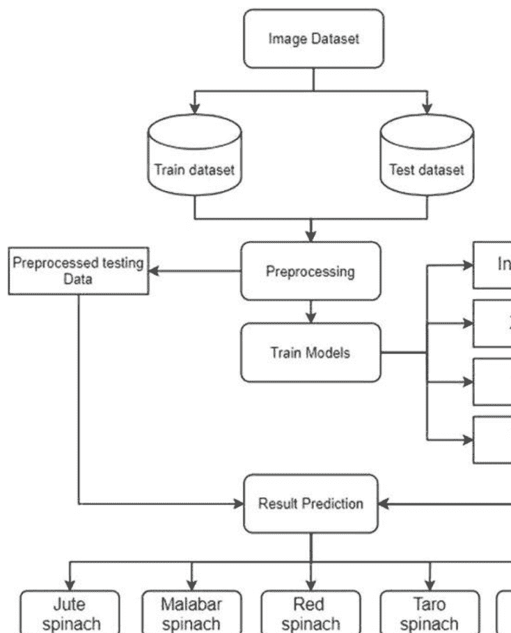

图像已转换为RGB图像。然后我们过滤或减少原始图像的噪声。然后调整和缩放这些数据以进行处理，然后对输入数据进行分类。然后数据经过预处理，准备好在模型中进行训练。准备好我们的数据集后，为了输入所有图像到模型中，所有图像都被调整为高度224、宽度224和RGB颜色通道3。因为我们的数据集包含不同大小的图像。224 x 224 x3是我们模型的输入形状（图2）。

然后进行图像数据生成器，这是图像预处理的主要部分（图3）。首先，训练集和测试集中的所有图像都被重新缩放到0和1之间的值。这个过程被称为最小-最大归一化（MMN）[14]。通常，RGB图像的值在0和255之间。MMN的方程如下。

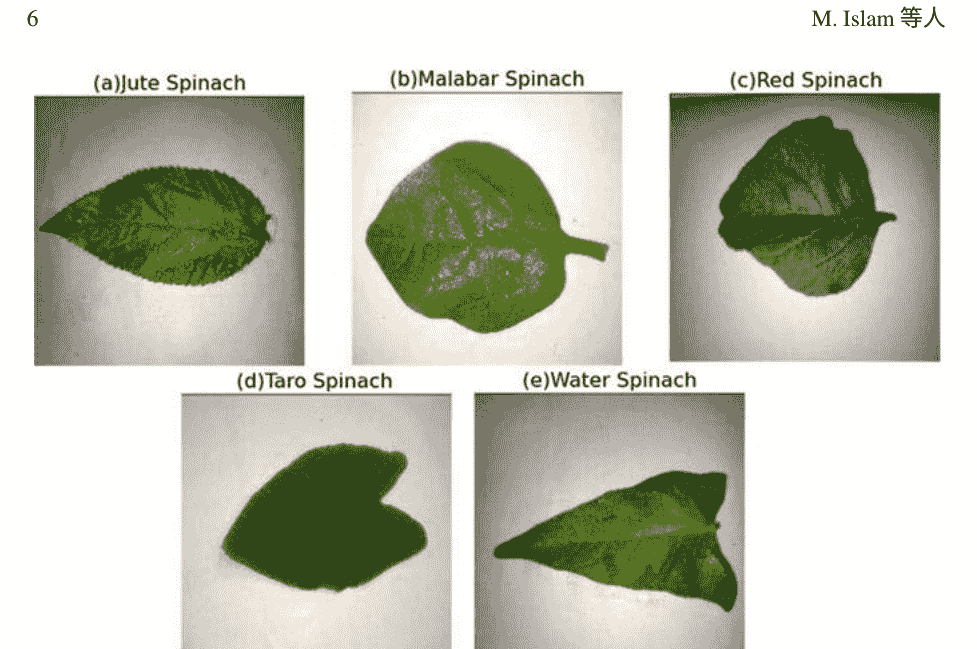

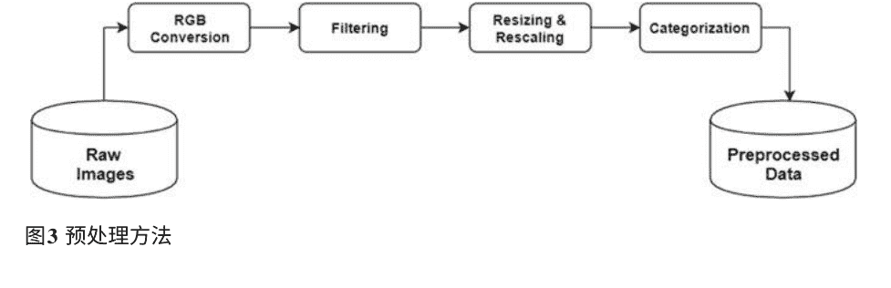

公式(1): x(缩放) = (x - 最小值(x)) / (最大值(x) - 最小值(x)) * (n 最大值 - n 最小值) + n 最小值

其中n最大值，n最小值是最大和最小值。

## 4 实验和输出

在本文的这一部分中，我们将分析所有的结果，并将它们与彼此进行比较，以确定哪个模型最适合我们的分类，并在我们的数据集上表现最好。

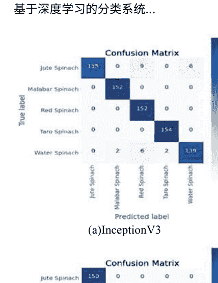

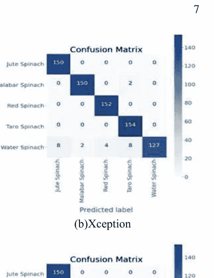

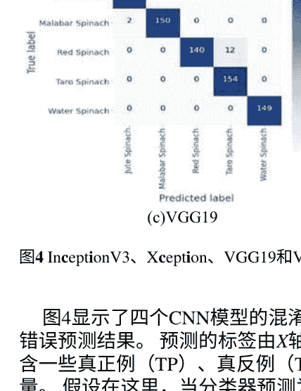

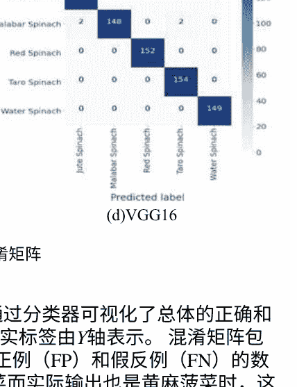

图4显示了四个CNN模型的混淆矩阵。通过分类器可视化了总体的正确和错误预测结果。预测的标签由X轴表示，真实标签由Y轴表示。混淆矩阵包含一些真正例（TP）、真反例（TN）、假正例（FP）和假反例（FN）的数量。假设在这里，当分类器预测为黄麻菠菜而实际输出也是黄麻菠菜时，这是真正例（TP）。

从表2中我们观察到，马拉巴和芋苗菠菜的准确率为99.74。这意味着InceptionV3模型可以比其他模型更好地对这两种菠菜进行分类。由于其0.33%的误报率和0%的漏报率。相反，由于误报和漏报的总数为16，水菠菜的准确率最低，为97.89%。

Xception（表3）得到的结果告诉我们，它在马拉巴和红菠菜分类中的准确率更高，为99.47%。这两种菠菜的误报和漏报数量都为4。因此，误报率和漏报率的总和相等。与InceptionV3一样，它在水菠菜类别中的准确率最低，为97.10%。

表2 InceptionV3的评估指标

| 菠菜类别 | 真正阳性(TP) | 真正阴性(TN) | 假阳性(FP) | 假阴性(FN) | 精确度(%) | F1值(%) | 敏感性(%) | 特异性(%) | 假阳性率(FPR)(%) | 假阴性率(FNR)(%) | 准确度(%) |
|----------|--------------|--------------|------------|------------|-----------|---------|-----------|-----------|------------------|------------------|-----------|
| 黄麻     | 135          | 607          | 0          | 15         | 100       | 94.74   | 90.00     | 100       | 0                | 10               | 98.02     |
| 马拉巴   | 152          | 603          | 2          | 0          | 98.70     | 99.35   | 100       | 99.67     | 0.33             | 0                | 99.74     |
| 红色     | 152          | 590          | 15         | 0          | 91.02     | 95.30   | 100       | 97.52     | 2.48             | 0                | 98.02     |
| 芋头     | 154          | 601          | 2          | 0          | 98.72     | 99.35   | 100       | 99.67     | 0.33             | 0                | 99.74     |
| 水       | 139          | 602          | 6          | 10         | 95.86     | 94.56   | 93.29     | 99.01     | 0.99             | 6.71             | 97.89     |

表3 Xception评估指标

| 类别 | 真正阳性(TP) | 真正阴性(TN) | 假阳性(FP) | 假阴性(FN) | 精确度(%) | F1值(%) | 敏感性(%) | 特异性(%) | 假阳性率(FPR)(%) | 假阴性率(FNR)(%) | 准确度(%) |
|------|--------------|--------------|------------|------------|-----------|---------|-----------|-----------|-------------------|-------------------|------------|
| 黄麻 | 150          | 599          | 8          | 0          | 94.94     | 97.40   | 100       | 98.68     | 1.32              | 0                 | 98.94      |
| 马拉巴 | 150          | 603          | 2          | 2          | 98.68     | 98.68   | 98.68     | 99.67     | 0.33              | 1.32              | 99.47      |
| 红色 | 152          | 601          | 4          | 0          | 97.44     | 98.70   | 100       | 99.34     | 0.66              | 0                 | 99.47      |
| 芋头 | 154          | 593          | 10         | 0          | 93.90     | 96.86   | 100       | 98.34     | 1.66              | 0                 | 98.68      |
| 水   | 127          | 608          | 0          | 22         | 100       | 92.03   | 85.23     | 100       | 0                 | 14.77             | 97.10      |

表4 VGG19评估指标

| 菠菜类别 | 真正阳性(TP) | 真正阴性(TN) | 假阳性(FP) | 假阴性(FN) | 精确度(%) | F1值(%) | 敏感性(%) | 特异性(%) | 假阳性率(FPR)(%) | 假阴性率(FNR)(%) | 准确度(%) |
|----------|-------------|-------------|------------|------------|-----------|---------|-----------|-----------|------------------|------------------|-----------|
| 黄麻     | 150         | 605         | 2          | 0          | 98.68     | 99.34   | 100       | 99.67     | 0.33             | 0                | 99.74     |
| 马拉巴   | 150         | 605         | 0          | 2          | 100       | 99.34   | 98.68     | 100       | 0                | 1.32             | 99.74     |
| 红色     | 140         | 605         | 0          | 12         | 100       | 95.89   | 92.11     | 100       | 0                | 7.89             | 98.41     |
| 芋头     | 154         | 591         | 12         | 0          | 92.77     | 96.25   | 100       | 98.01     | 1.99             | 0                | 98.41     |
| 水       | 149         | 608         | 0          | 0          | 100       | 100     | 100       | 100       | 0                | 0                | 100       |

关于VGG19的结果（表4），我们可以注意到它在水菠菜类上达到了100%的准确度。这比其他类别更高。这里的黄麻菠菜、芋头菠菜和水菠菜这3个类别的敏感性为100%。因此，马拉巴菠菜、红色菠菜和水菠菜的精确度和特异性均为100%。该模型对红色和芋头菠菜类的准确度较低，为98.41%。

VGG16给出的结果（表5）显示它在红菠菜和水菠菜方面达到了100%的准确率。而对于马拉巴菠菜，准确率最低，为99.47%。对于马拉巴菠菜、红菠菜和水菠菜类别，我们观察到它们被正确识别的特异性和精确性都达到了100%。而对于黄麻菠菜、红菠菜、芋头菠菜和水菠菜类别，敏感性为100%。

我们实验的主要性能总结已在表6中呈现。VGG16达到了最高的99.79%准确率。在测试集的757张图片中，这个分类器成功地正确分类了753张图片。只有4张马拉巴菠菜类别的图片被错误预测，如图4d所示。同时，它的精确度、F1分数、敏感性为99.47%，特异性为最高的99.87%。这张表还告诉我们，在我们的实验中，InceptionV3的准确率最低，为98.68%。在25张图片的情况下，InceptionV3分类器做出了错误的预测。另一方面，Xception模型对24张图片做出了错误的预测。结果是，它给出了第二低的98.73%准确率。与InceptionV3模型相比，准确率只相差0.5%。VGG19模型给出了第二高的99.26%准确率。

它正确分类了743张图像，并且在14张图像上分类错误，如表6所示。通过分析所有这些结果，我们可以说VGG16模型在我们的实验中表现最佳。

## 5 结论和未来工作

在本文中，我们提出了一种使用CNN模型的本地菠菜分类方法，可以自动分类本地菠菜。四个分类器证明了关于相似外观的菠菜可以被分类，并且可以通过这些分类器给出高输出。我们使用几个基于深度学习的卷积神经网络对我们的数据集进行了训练。然后我们使用四个不同的模型来比较它们之间的准确性。它们都对我们的数据集给出了高准确性。我们用无噪声或少噪声的图像训练了这些模型，所以如果图像有噪声，这个模型将无法给出最佳性能。由于这些模型具有高性能，我们期望这些结果将有助于进一步的研究。此外，它将有助于通过应用程序开发图像应用，普通人可以对可食用的本地菠菜进行分类。

表5 VGG16的评估指标

| 菠菜类别 | 真正阳性(TP) | 真正阴性(TN) | 假阳性(FP) | 假阴性(FN) | 精确度(%) | F1值(%) | 敏感性(%) | 特异性(%) | 假阳性率(FPR)(%) | 假阴性率(FNR)(%) | 准确度(%) |
|---|---|---|---|---|---|---|---|---|---|---|---|
| 黄麻 | 150 | 605 | 2 | 0 | 98.68 | 99.34 | 100 | 99.67 | 0.33 | 0 | 99.74 |
| 马拉巴 | 148 | 605 | 0 | 4 | 100 | 98.67 | 97.37 | 100 | 0 | 2.63 | 99.47 |
| 红色 | 152 | 605 | 0 | 0 | 100 | 100 | 100 | 100 | 0 | 0 | 100 |
| 芋头 | 154 | 601 | 2 | 0 | 98.72 | 99.35 | 100 | 99.67 | 0.33 | 0 | 99.74 |
| 水 | 149 | 608 | 0 | 0 | 100 | 100 | 100 | 100 | 0 | 0 | 100 |## 表6 四个CNN模型的评估指标

| 模型 | 真正阳性 (TP) | 真阴性 (TN) | 假阳性 (FP) | 假阴性 (FN) | 精确度 (%) | F1值 (%) | 敏感性 (%) | 特异性 (%) | 假阳性率 (FPR) (%) | 假阴性率 (FNR) (%) | 准确度 (%) |
| :--- | :--- | :--- | :--- | :--- | :--- | :--- | :--- | :--- | :--- | :--- | :--- |
| Inception3 | 732 | 3003 | 25 | 25 | 96.70 | 96.70 | 96.70 | 99.17 | 0.83 | 3.30 | 98.68 |
| Xception | 733 | 3004 | 24 | 24 | 96.83 | 96.83 | 96.83 | 99.21 | 0.79 | 3.17 | 98.73 |
| VGG19 | 743 | 3014 | 14 | 14 | 98.15 | 98.15 | 98.15 | 99.54 | 0.46 | 1.85 | 99.26 |
| VGG16 | 753 | 3024 | 4 | 4 | 99.47 | 99.47 | 99.47 | 99.87 | 0.13 | 0.53 | 99.79 |

致谢我们衷心感谢计算智能实验室提供的GPU支持。我们还要感谢达菲尔国际大学计算机科学与工程系。此外，感谢匿名审稿人的宝贵意见和反馈。

#### 参考文献

- 1. Roughani, Mehdi, M.S.: 菠菜：一种重要的绿叶蔬菜和药用植物。在：第二届药用植物、有机农业、天然和药用成分国际会议 (2019)
- 2. Islam, R., Ara, T.: 孟加拉国的叶菜。UBN: 015-A94510112010, Photon ebooks (2015)
- 3. 吴, S.G., 鲍, F.S., 徐, E.Y., 王, Y., 常, Y., 向, Q.: 一种基于概率神经网络的植物分类叶片识别算法。在：2007年IEEE国际信号处理和信息技术研讨会，第2007卷，第11-16页。吉萨 (2007年)
- 4. 王, G., 孙, Y., 王, J.: 基于图像的植物病害严重程度自动估计的深度学习。计算智能神经科学。2017, 1-8页 (2017年)
- 5. 孙, Y., 刘, Y., 王, G., 张, H.: 自然环境中的植物识别深度学习。计算智能神经科学。2017, 1-6页 (2017年)
- 6. 朱, S., 冯, L., 张, C., 鲍, Y., 何, Y.: 利用高光谱成像技术识别不同温度下储存的菠菜叶片的新鲜度。食品 8, 356页 (2019年)
- 7. Yalcin, H., Razavi, S.: 使用卷积神经网络进行植物分类。在：2016年第五届农业地理信息学国际会议 (农业地理信息学)，第1-5页。天津 (2016年)
- 8. Kaya, A., Keceli, A., Catal, C., Yalic, H., Temucin, H., Tekinerdogan, B.: 基于深度神经网络的植物分类模型的迁移学习分析。计算机与电子农业学报。158, 20-29 (2019年)
- 9. Priya, C.A.T., Balasaravanan, A., Thanamani, S.: 一种用于植物分类的高效叶片识别算法，使用支持向量机。在：国际模式识别、信息学和医学工程会议 (PRIME-2012)，第428-432页。塞勒姆，泰米尔纳德邦 (2012年)
- 10. Szegedy, C., Liu, W., Jia, Y., Sermanet, P., Reed, S., Anguelov, D.: 用卷积深入研究。在：IEEE计算机视觉和模式识别会议 (CVPR)，第1-9页。马萨诸塞州波士顿 (2015年)
- 11. Szegedy, C., Vanhoucke, V., Ioffe, S., Shlens, J., Wojna, Z.: 重新思考计算机视觉的初始架构。在：2016年IEEE计算机视觉和模式识别会议 (CVPR)，第2818-2826页。拉斯维加斯，内华达州 (2016年)
- 12. Chollet, F.: Xception：深度学习与深度可分离卷积。在：IEEE计算机视觉和模式识别会议论文集，第1251-1258页 (2017年)
- 13. Simonyan, K., Zisserman, A.: 用于大规模图像识别的非常深的卷积网络。ArXiv预印本arXiv:1409.1556 (2014年)
- 14. Dalwinder, S., Birmohan, S.: 研究数据归一化对分类性能的影响。Appl. Soft Comput. 105524 ISSN: 1568–4946 (2019)

## 深度学习、人工智能和机器人技术的进展


Anamika Dhillon和Gyanendra K. Verma

摘要 本文提出了一种基于特征融合的新型特征提取方法。 在目标分类和检测模型中，特征融合可以更容易地提取出迁移学习的更多优势。 在提出的方案中，首先使用两个深度学习模型：DenseNet201和ResNet101提取特征，然后应用基于邻域分量分析（NCA）的特征选择方法来降低特征的维度。 然后通过应用连接过程来融合特征，最后使用SVM对数据集进行分类。 在相机陷阱野生动物数据集上的实验结果表明，我们的方法可以对具有巨大变化和极端遮挡的野生动物进行分类。 此外，我们的准确率达到了98.07%，高于采用单一网络和其他现有最先进技术的算法。

关键词 深度学习 · CNN模型 · DenseNet201 · ResNet101 · NCA · SVM · 目标检测

## 1 引言

在计算机视觉领域，目标检测是一个关键问题之一，其目的是在图像中检测和分割目标对象。 它被广泛应用于包括模式识别、图像分类、语义分割、人脸识别等众多与对象相关的应用中。利用深度学习[1]应用来解决目标检测问题[2]成为一个新的研究领域。 特别是深度卷积神经网络（CNN）[3, 4]被认为是解决计算机视觉问题的流行技术之一，因为它具有自动提取特征的出色能力。 DCNN模型能够提取特征的细节并绘制更高层次的信息。

在图像处理领域中，提出了各种特征融合[5]技术，它们利用图像的多个特征，然后将它们融合在一起以实现更好的检测性能。 通过应用特征融合技术，可以实现全聚焦图像，其中多个部分聚焦图像被融合在一起。

在这项工作中，我们使用DenseNet201 [6]和ResNet101 [7]提取输入图像的特征。 DenseNet 201具有各种引人注目的优点：它鼓励特征的重复使用，缓解了梯度消失问题，并增强了参数和计算效率。 然而，通过利用ResNet101可以提高训练速度和强大的表征能力。然后，我们利用邻域组件分析（NCA）[8]进行可视化和降低复杂度的分类。 最后，通过应用连接过程融合特征，然后应用SVM分类器对目标图像进行分类。

本文的其余部分安排如下：第2节介绍相关工作。第3节提供了所提出框架的详细信息。第4节描述了实验结果和分析。第5节得出了结论。

## 2 相关工作

目前在一般类别中进行目标检测的最先进技术通常依赖于深度卷积神经网络（DCNNs）。 [9-11]最近考虑了相机陷阱图像中的动物分类和检测。2019年，韩等人[10]提出了一种基于牲畜检测的方法，该方法利用了U-net和Google Inception-v4网络，并获得了比Faster RCNN和YOLOV3更好的结果。Huang和Weinberger [6]提出了DenseNet，其中每个层都与前向传递方式下的其他层密集集连接，使得探索新特征成为可能。

ResNet是由He和Sun [7]提出的，它利用跳跃连接来轻松学习残差函数。Goldberge等人[8]提出了一种监督学习方法，将多变量数据分类为几个类别。他们通过找到输入数据的线性变换来学习距离度量。Laghmati等人[12]提出了一种用于分类患有乳腺癌的患者的方法。 在这篇论文中，他们使用了乳腺癌威斯康星数据集，并通过NCA选择了特征。Muhammad Attique Khan等人[13]利用了模糊C均值和NCA的集成方法来识别肿瘤。 他们的论文中描述了三个步骤：增强肿瘤可见性，分割肿瘤和通过NCA进行特征降维。

## 3 提出的模型

图1显示了所提出技术的主流设计。 在本文中，首先通过DenseNet 201和ResNet101模型学习和提取输入图像的特征。 然后应用NCA对提取的特征进行处理，以得到最佳结果。

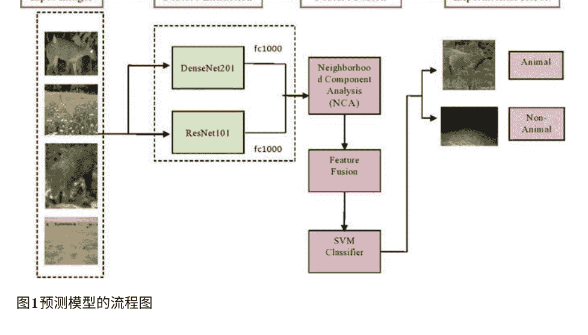

### 图1预测模型的流程图

通过利用随机最近邻算法可以实现准确性。NCA授权对数据进行分组，无论维度减少多少，只要数据在外观上有意义。然后将特征进行连接以融合它们，最后使用SVM分类器进行分类目的。

### 3.1 特征提取

我们使用了两个预训练的CNN模型，DenseNet201和ResNet101。在DenseNet201中，每一层都直接与前一层相连。而ResNet101在增加深度时避免了负面影响。显然，DenseNet和ResNet非常相似，但两个网络的输入格式不同，这导致它们具有明显不同的行为。两个网络之间的差异在表1中呈现。因此，它们的特征融合有助于框架收集全局和局部信息，以区分动物。

### 3.2 NCA和特征融合

在特征提取之后，应用邻域成分分析（NCA）[14]对提取的特征进行选择和降维。NCA是一种统计技术，对图像分类的轮廓没有任何假设。它的主要优势是在特征降维的同时不会丢失任何信息。

表1 两种模型的各种特征比较

| 特征 | DenseNet201 | ResNet101 |
| :--- | :--- | :--- |
| 将前一层的特征传递给其他层的格式 | 通过连接 | 通过求和 |
| L层网络中的总连接数 | L(L + 1)/2 | L |
| 解决梯度消失问题的方法 | 使用密集连接 | 使用随机深度 |
| 性能改进 | 利用深度架构的优势 | 利用特征重用的优势 |

并使用基于梯度的优化器来保证光学目标函数。 NCA使用向量集合作为输入集合。描述为：{x1, x2, ... , xN} 其中 xi ∈ R^m，等价标签表示为：{y1, y2, ... , yN}，其中 yi ∈ L。通过NCA获得一个投影矩阵A，其的维度为 p × m，其中 Q = A^T A 并且它描述了马氏距离如下

公式1：
d(x_i, x_j) = (Ax_i - Ax_j)^T (Ax_i - Ax_j) （1）

对于每个测试点j分配给其邻居i的概率P_ij被赋值。随着i和j之间的距离增加，概率减小，如公式2所示：

P_ij = exp(-||Ax_i - Ax_j||^2) / Σ_{k=i} exp(-||Ax_i - Ax_k||^2), P_ij = 0 （2）

通过利用这种方法， P_i可以轻松计算，其中i的定义如方程3和4所示：

P_i = Σ_{j∈C_i} P_ij （3）

和

C_i = {j | y_i = y_j} （4）

最终的优化函数被描述为正确分类的概率，并且给出如下： f(A) = Σ_i P_i
最后，f(A)的梯度描述如下方程5：

$$\frac{\partial f}{\partial A} = 2A \sum_{i} \left( P_i \sum_{k} P_{ik} X_{ik} X_{ik}^{T} - \sum_{j \in C_i} P_{ij} X_{ik} X_{ij}^{T} \right) \quad (5)$$

在这个降维过程之后，通过使用连接操作来融合特征，以便学习它们丰富的内部信息。在CNN架构中，全连接层充当分类器。在文献中，许多文章[15-17]使用SVM分类器通过CNN或深度CNN提取的特征来对数据进行分类，因为相对于CNN完全连接层，SVM具有更好的性能。由于我们使用了特征级融合，所以我们采用SVM作为分类器以获得更好的性能。

## 4 实验和分析

### 4.1 数据集

在本文中，图像来自于相机陷阱数据集[18]，并以红外和可见光格式捕获，这些图像的背景非常杂乱。该数据集包含大约5000张图像，每个图像的尺寸各不相同。图像的尺寸从1920 × 1080到2048 × 1536不等，但最终调整为224 × 224。它们被分为两类，即正样本和负样本。正样本包含具有不同背景的野生动物，而负样本中则没有野生动物。从该数据集中，75%的图像用于训练目的，其余25%用于测试目的。

### 4.2 结果

软件实现在安装了8 GB RAM的Intel Core i7上的MATLAB R2020a平台上进行。在这个阶段，我们研究了用于野生动物分类的提出的特征和模型融合技术的性能。首先，将进行训练过程，其中通过结合深度学习模型DenseNet201和ResNet101的全连接层的信息来提取特征。图2展示了我们数据集训练阶段的一些输入图像。

然后，对提取的特征应用非线性距离度量学习模型NCA，其目标是最大化回归和分类算法的准确性。它有助于选择和降低特征的维度，从而给出集成特征的紧凑表示。然后，在测试阶段，通过应用连接过程来融合提取的特征。

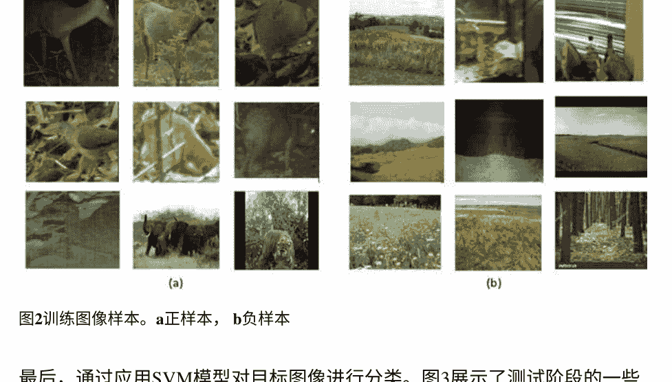

图2训练图像样本。a正样本，b负样本

最后，通过应用SVM模型对目标图像进行分类。图3展示了测试阶段的一些图像，而图4展示了具有分类准确性的一些测试图像。

表2说明了DenseNet201在野生动物数据库上实现了94.80%的准确率，而ResNet101实现了93.95%的准确率。显著地，我们的方法将准确率提高到了98.07%，比DenseNet201高出3.27%，比ResNet101高出4.12%。所提出的方法当然可以用于野生动物摄影中的动物检测。然而，系统必须经过野生动物数据库的训练才能进行准确的检测。

混淆矩阵是数据集每个类别的分类准确率的图形显示。列代表预测类别，行代表真实类别。对于n类别的分类问题，混淆矩阵是一个 n × n 矩阵。利用这个矩阵，可以计算数据对象的正确识别率 $R_i$ 和错误识别率 $W_i$：

$$R_i = \frac{n_{ii}}{\sum_{j=1}^{k} n_{ij}}$$

$$W_i = 1 - R_i$$

这里类别集合被定义为 $C = C_1, C_2, \ldots$ 给定 $C_k$，其中，$n_{ii}$ 是混淆矩阵中被准确识别的数量，$n_{ij}$ 表示分类器将 $C_i$ 识别为 $C_j$。在图5中，展示了所提技术的混淆矩阵。

实验结果比较：我们将我们的模型与其他框架进行比较，比较的指标包括模型、数据集类型和准确性，如表3所示。我们在动物数据集上取得了比当前最先进技术更好的结果，准确率为98.07%。Basulaim [19] 在已知的人脸数据集上使用了NCA方法，FERET数据集上的准确率为95.80%，而Sun等人[20]在Caltech 256数据集上通过应用PCA和SVM进行维度缩减，准确率为85.33%。

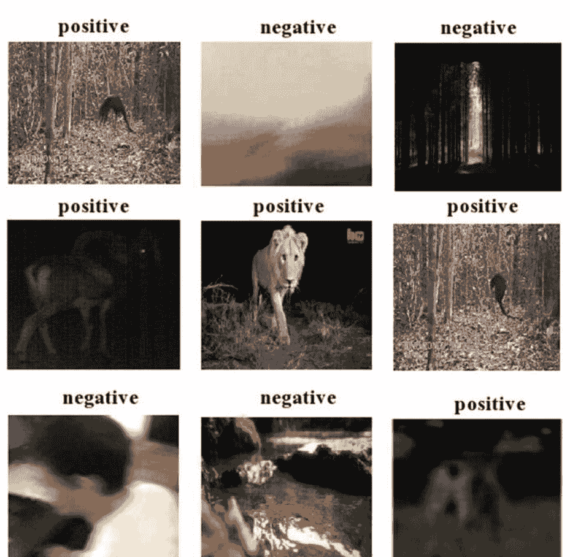

图3 测试阶段生成的图像

## 5 结论

近年来，在计算机视觉领域中采用了特征融合技术。在本文中，我们提出了一种基于两个深度学习模型（NCA和SVM分类器）的新型特征融合技术。通过应用DenseNet201和ResNet101模型提取特征，并利用NCA对其进行降维处理，最后通过SVM分类器进行分类。实验结果表明，我们的方法达到了98.07%的准确率，基于这些结果，通过我们的实验结果表明，我们的框架比其他最先进的融合技术更有效。


# Negative, 91.9%

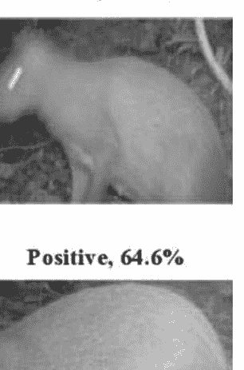

# Positive, 92.1%

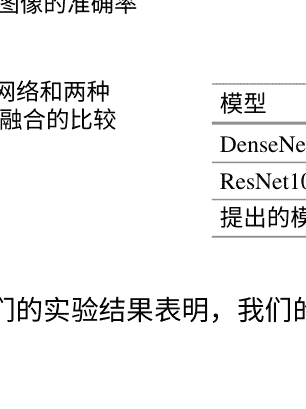

# Negative, 99%

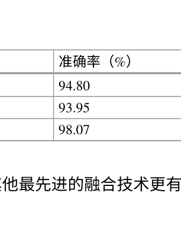

# Positive, 64.6%

### 图4 测试图像的准确率

### 表2 单一网络和两种技术特征融合的比较

| 模型 | 准确率（%） |
|------|-------------|
| DenseNet201 | 94.80 |
| ResNet101 | 93.95 |
| 提出的模型 | 98.07 |

图5 提出模型的混淆矩阵

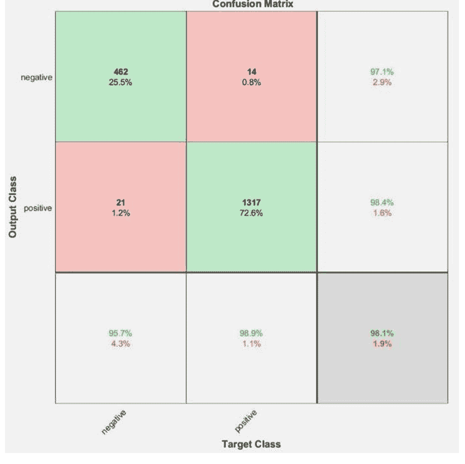

### 表3 与最先进的方法比较

| 作者 | 模型 | 数据集 | 准确率（%） |
| :--- | :--- | :--- | :--- |
| Basulaim [19] | NCA | FERET | 95.80 |
| Sun et al. [20] | PCA | Caltech 256 | 85.33 |
| 提出的工作 | NCA和SVM | 野生动物 | 98.07 |

参考文献

- 1. Liu, L., Ouyang, W., Wang, X., Fieguth, P., Chen, J., Liu, X., Pietikäinen, M.: 深度学习用于通用目标检测的综述. Int. J. Comput. Vision 128(2), 261–318 (2020)
- 2. Kim, D., Lee, G.: 告诉我他们拿着什么：从人-物互动中传递的可迁移知识进行弱监督目标检测（2017年）
- 3. Dhillon, A., Verma, G.K.: 卷积神经网络：模型、方法和物体检测应用综述。人工智能进展 9(2) (2019年)
- 4. Votis, K., Giakoumis, D., Tzovaras, D., Chen, L., Hamzaoui, R.: 使用卷积神经网络进行人体活动识别的特征学习：以惯性测量单元和音频数据为例。CCF交互计算期刊 2(1), 18-32 (2020年)
- 5. Lu, X., Duan, X., Mao, X., Li, Y., Zhang, X.: 使用深度卷积神经网络进行人脸检测的特征提取和融合。2017(2017年)
- 6. Huang, G., Weinberger, K.Q.: 密集连接的卷积网络（2017年）
- 7. He, K., Sun, J.: 深度残差学习用于图像识别. 第1-9页 (2016)
- 8. Goldberger, J., Roweis, S., Hinton, G., Salakhutdinov, R.: 邻域成分分析 (2004)
- 9. Kellenberger, B., 学生会员, Marcos, D., Lobry, S.: 使用深度卷积神经网络和主动学习在无人机图像中高效检测动物的0.5%标签足够了. IEEE Trans.Geosci. Remote Sens. 1-10页 (2019)
- 10. Han, L., Tao, P., Martin, R.R.: 使用完全卷积网络在航空图像中检测牲畜. 5(2), 221-228页 (2019)
- 11. Dhillon, A., Verma, G.K.: 使用深度残差网络从高度杂乱的森林图像中检测野生动物. 国际智能人机交互会议. (2018)
- 12. Laghmati, S., Cherradi, B., Tmiri, A., Daanouni, O., Hamida, S.: 使用邻域成分分析和监督机器学习技术对乳腺癌患者进行分类. (1) (2020)
- 13. Rajinikanth, P.V.: 智能医疗系统的信号和图像处理技术（2021）
- 14. Siddique MA, Sakib S, Rahman MA.: 深度自编码器和NCA维度 reduction技术与KNN，ENN和SVM分类器的性能分析。在：2019年第二届国际工程与技术创新会议（ICIET），第1-6页。IEEE（2019）
- 15. Basly, H., Ouarda, W., Sayadi, F.E., Ouni, B., Alimi, A.M.: 基于CNN-SVM学习方法的人体活动识别。Springer国际出版社（2020）
- 16. Leng, J., Li, T., Bai, G., Dong, Q., Dong, H.: Cube-CNN-SVM：一种新的高光谱图像分类方法。1027-1034（2016）
- 17. Jiang, S., Hartley, R., Fernando, B.: 核支持向量机和卷积神经网络. 在：2018数字图像计算:技术与应用(DICTA), pp. 1–7 (2018)
- 18. Zhang, Z., He, Z., Cao, G., Cao, W.: 使用时空对象区域提案和补丁验证的场景. 18 (10), 2079–2092 (2016)
- 19. Basulaim, K.O.: 使用可训练的Gabor滤波器和NCA提高性别识别性能. pp. 0–4 (2019)
- 20. Sun, Y., Li, L., Zheng, L., Hu, J., Li, W., Jiang, Y., Yan, C.: 基于PCA的图像分类多视图深度表示. J. Vis. Commun. Image Represent. 62, 253–258 (2019)

## 使用包络EM半监督学习预测峰值负载下的极端CPU使用率

Nitin Khosla 和 Dharmendra Sharma

摘要 本文中，基于期望最大化（EM）的包络半监督神经网络学习方法的主要目标是在具有数百个实时应用程序的大型企业应用环境中，开发一个用于预测在不可预测的网络流量（负载条件）下的峰值CPU使用率的模型。这种提出的方法通过分析来自实时IT应用程序的传入网络流量突增导致的CPU压力，预测了极端峰值响应时间的可能性，并预测了在极端负载（峰值）条件下的CPU利用率。企业复杂的IT基础设施同时运行许多应用程序。在分析与IT应用程序的关键事务相关的数据中隐藏的需求的CPU负载模式后，提取特征。该方法通过模拟虚拟用户并在测试环境中执行关键事务来生成合成的CPU负载配置文件。该模型用于预测在峰值CPU条件下的过度峰值利用率。我们使用包络期望最大化分类器方法进行强制学习，试图提取和分析在边缘化未知标签后最大化模型可能性的参数。这导致减轻系统故障的风险，并使我们能够在3天内从7天内管理IT容量。该模型有助于IT容量规划和最小风险下现有IT基础设施的最佳使用。

- 半监督学习
- 性能和峰值负载测试
- 神经网络
- 机器学习

## 1 引言

基于云和数据中心的IT应用的使用在过去十年中大幅增长，我们对基于云的解决方案的依赖性正在每天增加，考虑到新兴技术和动态用户期望。

经常情况下，互联网流量或应用程序的点击量在短时间内呈指数增长（互联网流量突增）。由于有限的或固定的CPU峰值，系统的峰值利用率急剧增加，导致企业应用系统变慢甚至在峰值负载时崩溃。在企业大型环境中，由于IT基础设施无法承受峰值（极高负载）条件下的过大负荷，IT系统在许多场合崩溃。观察到许多关键应用程序突然停止提供服务，例如海关清关、机票预订、紧急医院服务和天气预报系统在紧急情况下（例如森林火灾、海啸警报等）。有时，由于不可预测的高负载或高互联网流量，IT系统会随机崩溃，并且由于有限的峰值可用性，这会导致效率下降并对生产力产生不利影响。很多时候，系统警报没有被注意到，对于大型企业组织来说，采取任何补救措施（例如负载均衡等）实际上非常具有挑战性。由于交易速率极高且随机波动，IT系统变得无响应且无法处理大量的交易请求。

## 2 研究目标

本研究论文的主要目标是设计和实施基于标签的期望最大化半监督神经网络方法，以预测在不可预测的高互联网流量情况下的CPU（峰值）利用率。

研究了工作负载配置文件和模式，以识别过去一年不同时间段的CPU（峰值）利用率模式。利用这些模式，开发了测试场景，并在测试环境中设计了测试，以进行验证目的。我们还收集了测试数据，分析并从原始事务日志中提取负载模式。使用数据挖掘追踪了极端CPU利用率，这使我们能够识别瓶颈并帮助我们估计在测试环境中进行实验的预期负载。我们利用这些信息用于预测真实世界（生产）环境中CPU（峰值）利用率的方法。我们开发了一个预测模型，用于预测大型企业应用设置中极端峰值条件（压力）下的CPU（峰值）性能。

### 企业环境和问题

大型公共服务部门和大型企业包括不同类型的系统架构（最新和遗留），例如智能移动应用程序、云计算等。我们的实验数据来自一个大型且复杂的环境，包括超过350台服务器。这些服务器大多分布在多个地点（国家）。我们的验证实验是在一个测试环境（预生产环境）中进行的，该环境是整个企业设置的子集，包含所有最新版本的应用程序，但数据集有限。这个测试环境还用于模拟分布在全球52个海外岗位的所有应用程序的系统。

### 3.1 当前实践中的性能问题

计算机应用程序是基于用户需求和期望开发的，期望主要是动态的。用户不断变化的需求对评估当前实践中的IT应用性能造成了许多关键限制，例如：

- 基于风险的方法：性能测试主要针对关键（高优先级）事务或高风险的用例进行，因为测试每个场景或组合非常耗时和昂贵。因此，无法发现隐藏的缺陷。
- 不稳定：缺乏实用且稳定的方法，可以在短时间内提供有用的结果。这主要是由于易变且不可预测的网络流量。
- 不可靠：在高网络流量情况下，系统的响应预测（例如CPU响应时间、性能等）是不可靠的。

## 4 工作负载模式和特征提取

在IT基础设施的不同层次上创建和配置了配置文件点，并且这些配置文件点在预定义的时间间隔上持续存储数据。我们从数据日志/文件中收集了事务数据，这些数据是在固定的时间间隔生成的周期性间隔。捕获了不同的事务数据，例如TRT（事务响应时间），峰值利用率百分比，内存使用情况等。性能和峰值实验用于验证，在称为“预生产环境”的IT测试环境中进行。

验证测试环境配置成模拟真实世界的场景或系统行为。使用配置文件点来监视事务，收集响应时间数据并存储关键事务参数在服务器响应路径上（服务器到客户端和客户端到服务器）。这些CPU利用率随时间变化的时间序列由模式和/或周期性组成。

图1显示了一个遵循循环模式的CPU工作负载模式。我们在两个峰值间隔期间捕获了数据，在这期间我们可以观察到典型的模式。在峰值CPU利用率期间，我们还收集了一些与硬盘使用率、数据库访问次数、内存使用情况等相关的数据，并对这些模式进行了分析，以找到预测建模的见解。层次依赖性和次要事务的影响超出了当前工作的范围，将作为当前工作的扩展进行研究。

## 5 个信封EM半监督学习

我们使用了基于信封的EM半监督学习方法来训练我们的模型。在这种方法中，我们使用了标记数据和一定数量的未标记数据[2]。这项研究工作的一些关键优势包括：

- 它是一种可靠且可扩展的预测方法。
- 它生成了一个模拟CPU负载模式类比的预测模型，该模型基于来自不同数据配置点的捕获数据。
- 通过及时预测可能避免系统故障的趋势，以提高响应时间和准确性的效率。

假设：为了使我们的EM半监督学习方法工作，我们做出了一些假设，例如。如果两个不同的点$d_1, d_2$很接近，那么可能会有相应的输出$y_1, y_2$。如果没有这些假设，使用训练数据来预测一组无限数量的主要是未知或不可预测的测试用例将是具有挑战性的[3, 4]。

我们使用了一些有用的参数，如努力、时间、工具限制和资源利用。考虑到此结果的潜在实施研究工作，基于包络EM半监督学习和强制训练方法[1,5]，已经提供了一些有用的结果，因为它是基于

- 强制训练的假设可以减少训练时间。
- 对带有标记和未标记数据集的数据进行训练。

假设特征向量 $x$ (1维) 由 $d \times 1$表示，表示在实际环境中的CPU使用情况的利用模式。假设 $X$是标记样本的 $J \times d$特征矩阵， $X_{u}$是未标记样本的矩阵 $U \times d$。假设 $y$是包含标签的 $L \times 1$向量，表示 (编码) 在{0,1}之间的CPU使用特征， $w$表示我们分类器的权重向量。

$$L_s(w) = \sum_{i=1}^{J}(x_i^T w - y_i)^2 + \mu w^2$$

上述目标函数的最小化器为,

$$w = (X^T X + \mu I)^{-1} X^T y$$

新对象的阈值标签为$\frac{1}{2}$,

$$c_w(w) = \begin{cases} 1, & x^T w > \frac{1}{2} \\ 0, & \text{otherwise} \end{cases}$$

引入一个变量 $u$到目标函数 (方程1) 中，以包括未标记的对象。修改后的目标函数为,

$$L_u(w, u) = \left\| X_c w - \begin{bmatrix} y \\ u \end{bmatrix} \right\|^2 + \mu w^2$$

其中 $X_c$是 $X$和 $X_{u}$的连接。

在对函数 (方程4) 进行梯度下降和最小化标记后，每个表示CPU峰值利用率百分比的标签可以投影到{0, 1}上。

## 6 实验设置和验证方法

我们的CPU模式通过模拟不同时间间隔的不同交易来代表真实世界的情况。测试环境具有表示实际应用程序中的大数据的子集。在测试环境中安装了大约139个实时且完全功能的应用程序。这个过程包括在测试环境中代表真实应用环境。

- 在过去一年中，定期短间隔内收集和提取工作负载需求模式的数据。
- 在我们的测试环境中生成合成工作负载模式。
- 在测试环境中运行压力和峰值测试，使用大量虚拟用户使用应用程序，就像真实世界的情况一样。
- 通过从集成环境中的应用程序线程、节点和CPU层提取数据来验证所得到的结果。
- 使用半监督学习方法（深度学习范式期望最大化）[6]训练包络EM模型。
- 预测由于网络流量突增而导致CPU极端使用率的可能性[7, 8]。

我们在测试环境中实施了一个虚拟负载实验设置，用于进行负载实验和验证。

- (i) VU（虚拟用户）生成器：这些VR用户用于模拟关键的终端用户业务交易。
- (ii) 控制系统：用于管理、控制和监视具有指定的逐渐增加和逐渐减少策略的负载测试的执行。
- (iii) 负载生成器：这些负载生成器设置在服务器上，用于生成虚拟负载并在使用大量虚拟用户时模拟CPU工作负载模式。这些用户同时生成Web流量突发。

图2显示了具有典型虚拟用户组（在峰值条件下）的CPU负载配置文件，具有不同的VU用户逐渐增加和逐渐减少的斜率。上述设置用于在测试环境中验证我们的结果。

## 7 个预测CPU使用率

我们已经计算出每个模式的聚合需求差异，并进行了比较。我们使用了修改后的指数平滑（ETS）算法，其中ETS点预测等于预测分布的中位数。这种方法使我们能够分析CPU使用率的趋势（图4）。

表1显示了我们使用不同的学习算法执行测试时的结果。观察到包络EM半监督学习算法（NDSM）具有最小百分比最小二乘损失。

图3显示了一个标记的包络EM半监督神经CPU模型（EM），用于预测突发网络流量下的百分比CPU使用率[3, 9]。

我们的预测模型和新方法现在是我们监控和资源管理过程的一部分，并用于评估工作负载需求模式。

##### 表1 不同机器学习算法的比较

| 学习算法 | 权重衰减 | % 均方损失 |
|---|---|---|
| 监督最小二乘分类器 | 0.1 | 15.415 |
| 监督EM最近均值分类器 | 0.1 | 13.0554 |
| 半监督EM学习分类器 | 0.1 | 11.5892 |
| 半监督包络分类器（NDSM） | 0.1 | 11.0056 |

我们的环境。我们的新模型为系统架构师提供有用的信息，使他们能够及时设置警报并采取补救措施，例如重新分配现有的CPU和内存资源，以避免系统故障。

## 8 结论

我们设计并实施了一种新的实用方法，用于预测复杂且高度集成的环境中，在压力和峰值条件下，具有不可预测的互联网流量突发情况下的峰值CPU利用率百分比。测试环境中有超过139个完全功能和实时的基于Web的应用程序。在压力条件下模拟了数千个虚拟用户（VU），产生负载。集成企业环境具有分布式系统，超过350个服务器同时为超过1000个客户提供服务。使用包络半监督神经CPU方法，所提出的方法预测了复杂企业IT基础设施中由于Web流量突发而导致的CPU利用率的急剧增加。基于我们的实验的数据分析使系统架构师和IT系统容量规划师能够适时分配负载并进行负载平衡。观察到过去6个月，该模型降低了潜在系统故障的风险，并提高了系统的性能和效果。

这种新的实用方法帮助实施缓解策略，与以前的做法相比，实施时间缩短到几个小时（3-4小时），而以前需要一周时间。我们的结果在集成测试环境中进行了验证，并且该模型用于在综合服务器的CPU利用率超过75%的临界限时生成警报。

## 9 未来工作

作为进一步的工作，我们已经开始研究一种层次包络EM半监督学习模型，以预测工作负载模式。我们将考虑其他参数，例如硬盘故障、数据库读写和复杂事务，并设计一种加速的包络EM半监督学习方法来进行预测建模。

#### 参考文献

1.  John, K., Michael, S.: 预防Windows应用程序的内存泄漏。 在：Microsoft Windows文档 (2018年)
2.  Iqbal, M.F., Zahid, M.Z., Habib, D., John, K.: 实时应用程序CPU流量的高效预测。 J. Comput. CPUs Commun. 2019 (2019年)
3.  赵, H., 安萨里, N.: 基于小波变换的CPU流量预测：一种快速在线方法。 计算机与信息技术杂志 20(1) (2012)
4.  聂, L., 江, D., 于, S., 宋, H.: 基于深度置信CPU的CPU流量预测 无线网状骨干CPU。 在：IEEE无线通信和CPU会议 美国 (2017年)
5.  于, C., 王, D., 杨, T.: 自适应塑形强化学习代理通过人类奖励。 在：PRICAI会议第一部分，Springer (2018年)
6.  Kingma, D.P., Rezende, D.J., Mohamad, S., Welling, M.: 半监督学习与深度生成模型。 在：神经信息处理系统的论文集 (NIPS)，康奈尔大学，美国 (2014年)
7.  王, X., 张, M., 任, F.: DeepRSD：一种用于序列数据的深度回归方法。 在：PRICAI会议第一部分，Springer (2018年)
8.  Gmach, D., Rolia, J., Cherkasova, L., Kemper, A.: 企业数据中心应用的工作负载分析和需求预测。 在：IEEE第10届工作负载特征化国际研讨会，美国波士顿 (2007年)
9.  Diederik, K., Danilo, R., Shakir, M., Welling, M.: 基于深度生成模型的半监督学习。 在：神经信息处理系统 (NIPS) 会议论文集 (2014年)
10. Oliver, A., Odena, A., Raffel, C., Cubuk, E.D. et al: 半监督学习算法的实际评估。 在：第6届学习表示国际会议，加拿大温哥华 (2018年)
11. Liu, Y., Krichhoff, K.: 基于图的半监督学习用于电话和片段分类。 Interspeech, 法国 (2013年)
12. Rezende, D.J., Mohamed, S., Wierstra, D.: 随机反向传播和深度生成模型中的近似推理。 在：第31届国际机器学习大会，中国北京 (2014年)
13. Sankar, A., Zhang, X., Chang, K.C.-C.: Meta-GNN：半监督学习中的元图神经CPU。 在：IEEE 2019/ACM国际社交CPU分析和挖掘ASONAM会议 (2019年)
14. Miyato, T., Maeda, S., Koyama, M., Ishii, S.: 虚拟对抗训练：一种用于监督和半监督学习的正则化方法。IEEE模式分析与机器智能交易。41（8）（2019年）
15. Bastidas, G., Abda i, S., Shah, N., Papalexakis, E.E.: 基于内容的半监督虚假信息检测通过张量嵌入。IEEE/ACM国际社交网络分析与挖掘ASONAM会议（2018年）

## 对印度中央信息委员会的案件事实进行分类和预测法律决策：自然语言处理方法

Arvind Kalia，Naveen Kumar 和 Nischay Namdev

摘要 全球法律组织面临的主要挑战之一是减少待决案件的挑战。在印度，待决法律案件的问题严重，导致司法延迟。本研究提出了一个框架，可以通过案件事实来预测案件结果。使用印度中央信息委员会的案件数据，预测案件结果是否违反印度议会的RTI法案。案件事实从印度中央信息委员会的废弃案件文件中提取。本研究将案件结果的预测定义为二元分类问题。使用三种特征表示方法（词袋模型，Word2vec和Sentence-BERT）和四种学习模型（支持向量机，朴素贝叶斯，K最近邻和决策树），利用准确度指标进行性能比较和分析。本研究还将探讨上述特征表示方法在不同机器学习模型中的性能。这是在印度法律背景下对法律案件结果预测领域进行的首批研究之一。因此，预计本研究将填补机器学习和法律两个领域之间的一些空白。

关键词 人工智能·机器学习·自然语言处理·法律

### # 1 引言

世界各地的法律组织以案件文件的形式产生了大量的数据。随着廉价数据存储和网络技术的发展，这些组织产生的法律数据量也在增长。2009年至2018年，印度最高法院每年平均立案约75,000件[1]。如此庞大的法律案件数量导致法院中存在大量未决案件，导致司法延迟。但是，法院产生的大量数据可以用于开发机器学习模型，通过预测案件结果来解决法院未决案件问题。该研究设想法官可以将这些模型作为辅助工具，加快裁决过程，律师可以协助他们的客户。该研究提出了一种使用自然语言处理和机器学习方法提取和分类案件事实以预测印度中央信息委员会案件结果的方法。印度中央信息委员会（ICIC或CIC）是根据2005年印度议会信息权法设立的法定机构[2]。该委员会有权裁决根据RTI法第19条第3款提起的上诉，并在中央公共信息官（CPIO）或第一上诉机关未提供所请求的信息时下令提供该信息[3]。该研究的目标是根据从CIC案件文件中提取的案件事实预测是否违反了RTI法。该研究声称，根据RTI法标记为违反或未违反的已发表案件事实可以帮助预测未来案件的结果，即违反RTI法。这与法律先例的原则非常相似。普通法律系统非常重视根据一致的原则性规则来决定案件，以便类似的事实会产生类似和可预测的结果。因此，法官必须遵循先例。这个原则也被称为Stare Decisis[4]。

预测CIC案件的问题被视为二元分类问题。从CIC数据库中抓取的案件文件中提取的案件事实被用于构建学习模型。使用了三种不同的文本特征表示方法：

- 句子-BERT
- Word2vec
- 带有TF-IDF值的词袋N-gram。

然后使用上述方法生成的特征来训练朴素贝叶斯、决策树分类器、K最近邻和三种不同核函数的SVM（线性、径向基函数和多项式）。使用不同模型的准确度指标进行性能比较，结果显示具有n-gram特征的线性SVM仍然大幅优于最先进的句子-BERT和Word2vec。

## 2 相关工作

在法律案件结果预测领域最早的研究之一使用了简单的统计预测方法。Martin等人使用基于过去美国最高法院判决信息的统计预测模型构建了一个分类树，并将其与法律专家分类的案件进行了比较。观察发现，统计方法的表现优于法律专家16.8% [5]。Brininghaus和Ashley提出了一种使用SMILE（智能索引学习器）+ IBP（基于问题的预测）集成来预测案件结果的方法[6]。

在这个领域中最有影响力的工作是由Aletras等人完成的。使用词袋模型和SVM模型中的主题，该框架可以以总体准确率79%预测欧洲人权法院案件的结果。观察发现，文档的事实部分在预测结果方面起到了重要作用，相比其他部分[7]。Sulea等人首次将文本分类方法应用于法国最高法院的法律文本，并首次进行了时间文本分类。该研究使用词袋模型和SVM分类器来预测案件的结果。该研究的三个主要目标是预测案件的法律领域，基于案件描述的法院裁决以及裁决数据的估计。该研究在法律领域预测方面取得了90.2%的F1分数[8]。Virtucio等人提出了一个模型，可以高度受到[7]的菲律宾最高法院决定的影响。提取的n-gram和主题被用来训练SVM以创建学习模型。SVM对n-gram的决策预测达到了45%，而对于主题则达到了55%。但是，随机森林分类器对n-gram的决策预测准确率最高，达到了59%[9]。

然而，最新的趋势表明，深度学习在预测法律案件方面起着重要作用[10]。肖等人介绍了一个用于判断预测的大规模法律数据集。数据集是中国人工智能与法律挑战赛数据集（CAIL2018）的一部分。数据集包含了中国人民法院发布的超过260万个刑事案件。李等人应用了卷积神经网络（CNN）对法律文本进行分类，用于预测案件的结果。该研究使用Word2vec嵌入作为输入来训练CNN。研究得出结论，该模型比传统的神经网络模型更高效[11]。

严等人提出了一种基于深度学习的法律条文预测模型。该模型是使用基于神经网络的TEXT-CNN模型开发的[12]。该研究利用案件的处理事实描述作为输入，法律条文作为标签。CAIL数据集用于模型的创建。将Text-CNN模型的性能与传统模型进行比较，结果显示Text-CNN的F1得分为86.27%[13]。

在法律案件结果预测领域的工作可以帮助解决全球法院案件积压的更大挑战。这将导致更快的司法和高效的法律系统。法官可以将这样的系统用作辅助工具，以便高效快速地进行司法裁决。这项研究是第一批为印度任何司法机构设计法律案件结果预测框架的研究之一。在这种情况下，它是印度中央信息委员会（ICIC或CIC）。人们相信这项研究将成为各种企业和研究人员解决与法律领域相关的现实问题的催化剂。

## 3 方法论

研究中使用的方法论分为四个部分，如图1所示。数据收集部分详细介绍了从CIC数据库获取数据的方法。数据准备和标记讨论了数据预处理和标记的方法。最后，最后两个部分描述了研究中使用的特征提取方法和分类模型。

### 3.1 数据收集

该研究使用从印度中央信息委员会（ICIC或CIC）数据库收集的数据[2]。印度中央信息委员会于2005年10月12日生效，根据《信息权利法案》成立。

委员会的管辖范围涵盖整个印度中央公共机构。CIC受理与《信息权利法案》2005年相关的第二次上诉案件。《信息权利法案》是印度议会的一项法案。该法案赋予公民从公共机构获取信息的权利。通过《信息权利法案》，任何印度公民都可以向大多数公共机构索取信息，除了一些与军事、核能等相关的例外情况[14]。

研究中利用了从CIC数据库通过网络提取的案例决定[2]。CIC的网络界面提供了四种排序案例决定的功能，如下所示：

-   类型—单一法官决定，全体法官决定，调度决定
    -   如果选择单一法官决定，则可以选择负责该决定的法官
-   文件类型—上诉或投诉
-   决定类型—临时，主要，勘误，合规令

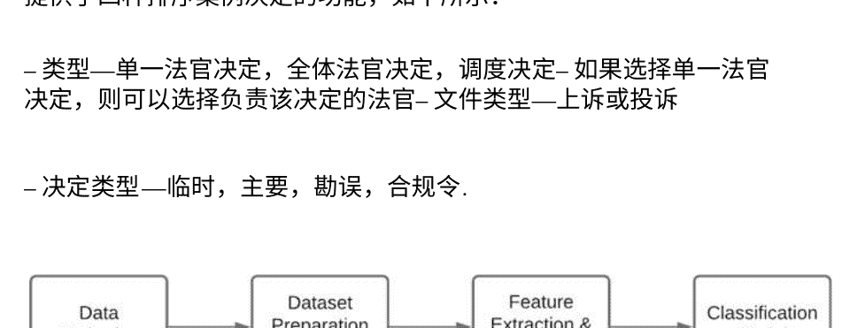

所使用的选项是：

-   决定类型—单一法官决定
-   文件类型—上诉
-   决定类型—主要

主要决定意味着它们是CIC的最终决定，不得再上诉。从数据库中收集的文件以PDF格式存储（便携式文档格式）。收集了CIC的11位法官约1300份案件文件。可能是因为收集到的案件文件只属于单一法官，但这将导致对该特定法官的固有偏见，从而降低分类模型的效率。因此，考虑所有法官是合理的。决定文件存储在以法官姓名命名的目录中。

### 3.2 数据集准备和标记

现在，案件文件以PDF形式存储在目录中，按照法官进行排序。但更大的挑战还在前面。将PDF文件标记为违反或非违反RTI法案的挑战。为此任务，选择了领域专家的知识（在本案中是一名律师）。领域专家阅读了所有1300个文件，浏览了不同法官的目录。然后根据他们的领域专业知识对决策进行了排序。法官目录进一步扩展，增加了两个目录（违反和非违反）。违反目录包含违反RTI法案的法官决策。非违反目录包含非违反RTI法案的法官决策。在上述步骤之后，PDF格式的决策文件只剩下1108个。下一步是从剩下的1108个案件文件中提取案件事实。通过手动查看每个案件文件并从中提取案件事实来实现。需要注意的一点是，一些案件文件包含了下级法院的决定。在研究中，认为先前的法院决定构成了案件的事实。

根据先例原则，最终决定应该从案件事实和下级法院的先前听证/决定中得出。最后，所有文档都被转换为文本格式文件。然后，将文本加载到Pandas数据框的列中，第二列作为标签[15]。标签零（0）表示非违规，一（1）表示违规。在数据集中删除空白或NaN值后，数据集中只剩下1105个实例。违规文本的总数为561个，非违规为544个。值得注意的是，数据集中几乎没有类别不平衡[16]。两个类别之间的实例差异仅为16个。

### 3.3 特征提取和表示

该研究使用了三种不同的特征向量表示方法。特征向量表示是指将文本数据转换为数值向量，以便机器学习模型能够理解。这三种方法在应用于机器学习分类器时的性能进行了比较和分析。

**带有TF-IDF值的词袋模型**
词袋（BOW）模型已经被用来从文本数据中获取数值特征。词袋是一个描述语料库中单词出现次数的模型。词袋模型将文本表示为其单词的多重集合（可以是一元组或N元组）。词袋模型忽略了文本的语法和单词顺序。这些数值特征可以作为机器学习模型的输入[17]。该研究使用了词频-逆文档频率（TF-IDF）方法来表示文本，而不是简单的词频计数。词频-逆文档频率（TF-IDF）是衡量单词在语料库中对文档的重要性的一种方法[18]。与词袋模型中使用的简单计数频率相比，TF-IDF在机器学习模型中表现出更好的结果。在该研究中，仅使用了n = 1和n = 2的n-gram。文本数据被分词为单词。从语料库中删除停用词和数字字符以减少噪音。可以计算TF-IDF值如下：

$$ TF = \frac{\text{术语t在文档中出现的次数}}{\text{文档中的术语数}} \quad (1) $$

$$ IDF = \log\left(\frac{N}{n}\right) \quad (2) $$

其中 N是文档数，n是术语t出现的文档数。

**Word2vec**
Word2vec是一种基于神经网络的预训练特征提取方法。它使用神经网络来学习文本语料库中的词关联。Word2vec将每个单词表示为长度为一百的数值向量。数学相似性函数（例如余弦相似性函数）用于为每个单词创建一个向量。因此，该向量表示文本中单词之间的相似性。

Word2vec可以使用skip-gram或连续skip-gram模型[19]。该研究使用数据集的1105个实例中每个单词向量的平均值，每个实例创建一个单一向量，然后将其输入到机器学习模型中。最终矩阵的形状为（1105，100）。

**Sentence-BERT**
Sentence-BERT（双向编码器表示转换器）是自然语言处理中最先进的特征提取方法。Sentence-BERT不使用单词，而是使用句子从文本语料库中提取特征。对于每个句子，它产生一个长度为768的向量[20]。

该研究使用从案例生成的多个句子向量的平均值文本形成一个长度为768的单一向量。作为输入到机器学习模型的矩阵的形状为(1105, 768)。

### 3.4 分类模型

为了研究，创建了六个学习模型：

-   SVM的三个核函数（线性、多项式和RBF核函数）[21]。
-   朴素贝叶斯[22]。
-   K最近邻算法[23]。
-   决策树分类器[24]。

使用准确度指标进行性能比较和测量。数据按照80:20的比例进行划分。80%的数据用于训练模型，剩余的20%用于测试。随后，在每个学习模型中应用了前一节中描述的三种特征表示方法进行比较分析。对于训练模型，非违规文本标记为'0'，违规文本标记为'1'。

## 4 结果和讨论

本节介绍了结果和讨论。它还描述了为什么在性能分析中选择准确度指标而不是F1分数。

### 4.1 性能比较分析

使用不同特征表示方法的六个模型的性能已使用准确度指标进行分析。使用准确度作为性能指标的原因是，在类别不平衡或几乎没有类别不平衡时，准确度的表现更好，真正例和真反例更重要。

可以使用F1分数来衡量模型的性能，但是当数据中存在巨大的类别不平衡且假阴性和假阳性更重要时，F1分数的表现更好。可以使用混淆矩阵[25]来轻松计算准确度。模型的准确度可以计算为：

$$准确度 = \left( \frac{真正例 + 真反例}{真正例 + 真反例 + 假正例 + 假反例} \right)$$

其中TP是真正例的数量，TN是真反例的数量，FP是假正例的数量，FN是假反例的数量。简单来说：

$$准确率 = \frac{正确预测的数量}{总预测数量} \quad (4)$$

表1显示了不同特征表示方法的每个模型的准确率。

**表1 学习模型的准确度**

| 分类器 | 核函数 | 词袋模型 | Word2vec | 句子-BERT |
| :--- | :--- | :--- | :--- | :--- |
| 支持向量机 | 线性 | 70% | 53.4% | 66.0% |
| | 多项式 | 66.0% (d = 2) | 55.5% (d = 3) | 65.3% (d = 6) |
| | 径向基函数 | 64.6% | 54.8% | 62.0% |
| 朴素贝叶斯 | - | 64.6% | 47.2% | 59.2% |
| K-最近邻 | - | 67.5% (K = 1) | 58.1% (k = 5) | 63.8% (K = 1) |
| 决策树 | - | 64.9% | 50.1% | 53.4% |

从表1可以看出，使用词袋模型的线性核SVM的性能优于其他学习模型和特征表示方法。上表中的三个特征表示方法列（词袋模型、Word2vec、句子-BERT）显示了SVM的线性核在词袋模型和句子-BERT列中优于其他方法，而K-最近邻在Word2vec列中优于其他方法（k = 5）。而Word2vec在所有特征表示方法中表现最差。深入研究最佳模型并分析每个类别的预测准确率。观察到违规案例的预测准确率高于非违规案例。对于违规案例，准确率达到76.8%，对于非违规案例，准确率为61%。还分析了学习模型中权重最正和最负的特征。表2显示了权重最正和最负的前10个特征。

### 4.2 讨论

结果表明，带有BOW的线性SVM内核仍然优于最先进的Sentence-BERT。Aletras等人使用带有BOW特征的线性SVM内核，能够达到79%的准确率[7]。从结果中还可以清楚地看出，在最佳性能模型中，违规案例的准确率比非违规案例高出很多。因此，违规案例比非违规案例更容易预测。前15个预测特征也在某种程度上验证了结果。前15个负面特征包括不满意、要求、订购等词语。前15个正面特征包括信息，采取行动，提供，直接回应者等。这些词表明这些特征属于其中一个类别。还观察到从案件事实中删除名词可以提高每个类别的预测准确性。像地名和城市名这样的名词在决定案件决策时是无关紧要的，但它们在前15个预测特征中占据了位置。删除名词可以提供清晰度并改善分类模型的准确性。Virtucio等人还建议通过完全自动化的方式准备数据集可以提高模型的性能，因此研究处理数据集准备的方式限制了可扩展性以及可以从案件文件中提取的数据。

**表2 前15个正面和负面权重特征**

| 前15个正面预测特征 | 前15个负面预测特征 |
| :--- | :--- |
| 信息 | 要求 |
| 兰契 | 订购 |
| 采取行动 | 适当回复 |
| 信息上诉人 | Cic |
| 贷款 | 适当提交 |
| 贷款 | 学校 |
| RTI申请 | 经理 |
| 提供 | 养老金 |
| 生态银行 | 提供 |
| 直接回应者 | 上诉人在场 |
| 上诉人提交 | 提供上诉人 |
| 关于 | 通过 |
| 提交 | 不满意 |
| 提供信息 | 提供回复 |
| 警察 | 上诉人仍在 |

## 5 结论

这是印度任何司法机构对法律案件预测的首次研究之一。从印度中央信息委员会数据库中获取了案件数据。从案件文件中提取的案件事实被用于预测违反《信息公开法》的情况。预测问题被定义为二元分类问题。使用三种特征表示方法和创建了六个学习模型来比较和分析这些方法和模型的性能。研究中表现最好的模型是带有词袋（带有TF-IDF值）特征的线性核SVM模型。它达到了70%的准确率。比第二好的基于线性核SVM模型的Sentence-BERT模型高出近4%。

还观察到违反案件具有更好的预测准确性，而非违反案件则没有。前15个正负权重特征还揭示了在预测案件结果时重要的词语。

最终，人们相信这项研究将成为印度和国外的研究人员和行业领导者开启法律领域人工智能潜力的催化剂。该研究创建的数据库可以帮助研究人员进一步发展他们的学习模型，并改善该研究的性能。像这样的研究面临的主要挑战之一是数据的标记，以在学习模型中使用。标记需要领域专业知识。领域专业知识可能代价高，并且可能成为这类研究的限制因素。印度法律机构生成的大多数案件文件没有明确的结构，这使得从中提取案件事实变得困难，这是其中一个主要挑战。人们还意识到该研究有很大的改进和未来工作空间。人工神经网络可以提高模型的性能。此外，大规模数据集可以显著提高性能。像这样的框架有朝一日可以成为法官加快司法程序和律师为客户提供优质服务的工具。

#### 参考文献

1.  法律与政策研究中心：2018年最高法院观察员统计数据包，2019年7月。https://clpr.org.in/wp-content/uploads/2019/07/Supreme-Court-Statistics-Pack pdf（2019）[在线]. 访问日期：2019年12月4日
2.  中央信息委员会：已上传决定。https://dsscic.nic.in/cause-list-report-web/view-decision/（2020）[在线]. 访问日期：2020年9月20日
3.  中央信息委员会：第二次上诉。https://cic.gov.in/second-appeal（2020）[在线]. 访问日期：2020年9月20日
4.  道格拉斯，W.O.：判例法。哥伦比亚法律评论 49(6), 735–758 (1949)
5.  马丁，A.D.，奎因，K.M.，鲁格尔，T.W.，金，P.T.：预测最高法院决策的竞争方法。政治视角 2(4), 761–767 (2004)
6.  Brininghaus, S., Ashley, K.D.：从案例文本中生成法律论据和预测。在: 第10届国际人工智能与法律会议论文集，第65-74页。ACM (2005年)
7.  Aletras, N., Tsarapatsanis, D., Preoțiuc-Pietro, D., Lampos, V.：从自然语言处理的角度预测欧洲人权法院的司法决定。PeerJ Comput.Sci. 2, e93 (2016)
8.  Sulea, O.M., Zampieri, M., Vela, M., Van Genabith, J.：预测法国最高法院案件的法律领域和决定。arXiv预印本arXiv:1708.01681 (2017)
9.  Virtucio, M.B.L., Aborot, J.A., Abonita, J.K.C., Aviante, R.S., Copino, R.J.B., Neverida, M. P., Osiana, V.O., Peramo, E.C., Syjuco, J.G., Tan, G.B.A.：使用自然语言处理和机器学习预测菲律宾最高法院的决定。在: 2018年IEEE第42届计算机软件与应用会议（COMPSAC），第2卷，第130-135页。IEEE (2018年)
10. Bansal, N., Sharma, A., Singh, R.：深度学习在法律领域应用的综述。在: IFIP人工智能应用与创新国际会议，第374-381页。Springer (2019年)
11. Xiao, C., Zhong, H., Guo, Z., Tu, C., Liu, Z., Sun, M., Feng, Y., Han, X., Hu, Z., Wang, H., 等：CAIL2018: 用于判决预测的大规模法律数据集。 arXiv预印本 arXiv:1807.02478 (2018年)
12. Kim, Y.: 用于句子分类的卷积神经网络。 CoRR， vol. abs/1408.5882 (2014年)
13. Yan, G., Li, Y., Shen, S., Zhang, S., Liu, J.: 基于深度学习的法律文章预测。 在：2019年IEEE第19届软件质量、可靠性和安全性国际会议 附录(QRS-C)，第281-284页。IEEE(2019)
14. 法律与司法部。(立法部)：2005年信息公开法。 https://rti.gov.in/rti-act.pdf (2005). [在线]. 访问日期：2020年10月19日
15. Pandas开发团队：Pandas-dev/pandas: pandas, 2020年2月
16. Ling, C.X., Sheng, V.S.: 类别不平衡问题，第171-171页。 Springer US, Boston, MA (2010)
17. Salton, G., Wong, A., Yang, C.-S.: 自动索引的向量空间模型。 Commun. ACM 18(11)， 613-620 (1975)
18. Sammut, C., Webb, G.I. (eds.): TF-IDF，第986-987页。 Springer US, Boston, MA (2010)
19. Mikolov, T., Chen, K., Corrado, G., Dean, J.: 在向量空间中高效估计单词表示。arXiv预印本 arXiv:1301.3781 (2013)
20. Reimers, N., Gurevych, I.: Sentence-BERT: 使用Siamese BERT网络进行句子嵌入. 在2019年自然语言处理实证方法会议论文集中. 计算语言学协会 (2019)
21. Cristianini, N., Ricci, E.: 支持向量机, 第928-932页. Springer US, 波士顿, 麻省 (2008)
22. Webb, G.I.: 朴素贝叶斯, 第713-714页. Springer US, 波士顿, 麻省 (2010)
23. Laaksonen, J., Oja, E.: 使用学习k最近邻进行分类. 在国际神经网络会议(ICNN'96)论文集中, 第3卷, 第1480-1483页 (1996)
24. Fürnkranz, J.: 决策树, 第263-267页. Springer US, 波士顿, 麻省 (2010)
25. Ting, K.M.: 混淆矩阵, 第260页。 Springer美国， 波士顿， 马萨诸塞州 (2017年)

## 关于智能车辆导航语义模型的实现

Alessandro Correa Victorino和Marie-Hélène Abel

摘要 本文考虑了多动作智能车辆在与乘客和环境交互中导航相关的问题，通过对与移动相关的语境的语义建模和描述来实现。也就是说，正式定义导航语境的语义模型，如障碍物、行人、环岛、车辆本身的信息（负载、功率等）。这种语义建模通过对自主车辆的各种传感器收集的信息进行“推理”，从而为后者构建导航语境，产生了额外的抽象程度。这种导航语境能够为自主或半自主车辆提供决策支持（与驾驶员的交互）。在本文中，我们通过定义和选择车辆上下文创建中的相关信息，对初始建模结果进行展示，对上下文信息进行结构化，以便能够对其进行推理，并动态更新车辆所处的上下文；通过选择适当的数据持久性模型来保持信息，以便能够高效地查询先前的模拟。

关键词 语义导航 · 上下文建模 · 自主导航

## 1 引言

在未知环境中执行任务的自主机器人车辆的安全导航需要感知附近环境，与该环境中的任何空间和时间变化进行交互，并根据这种动态重新安排任务。第一个所需的功能是在事先未知的环境中自主实现移动，避开障碍物。

目前关于机器人车辆自主导航的研究考虑了车辆在局部环境中的位移（道路监控，避障等），并基于对环境的感知。在[1]中，通过将基于视觉的导航方法与基于动态窗口方法的障碍物避免方法相结合，提出了一种导航方法。其他研究考虑了在管理交叉口和环岛[2, 3]的完整行程中的全局导航问题。这些导航方法使得自动驾驶车辆能够通过各种传感器以“经验”的方式检测障碍物，但并不“理解”这些障碍物的本质。

因此，构建语义建模可以通过对自动驾驶车辆的各种传感器收集的信息进行“推理”，从而为后者构建导航上下文，从而产生额外的抽象程度。

最终，这种导航上下文应该能够为自动驾驶或半自动驾驶车辆提供决策支持（向驾驶员提供信息）。

上下文是一个复杂的概念[4]。根据[5]，它是帮助智能实体理解周围世界中事件如何影响其行为的关键要素。它的定义非常模糊，文献中的定义过于依赖于它们自身的上下文[6]。后者取决于应用领域[7]，例如：

- 上下文是围绕事件或对象的一组情况[6]。这个定义在心理学领域被广泛使用。
- 上下文是模型化底层领域中的显式变量集，例如时间、地点、环境、设备、场合等[8]。这个定义来自推荐系统。
- 上下文是决定应用程序行为或事件发生的环境状态和参数的集合，对用户来说是有兴趣的[9]。这个定义通常在上下文计算领域中使用。

还要注意，在心理学领域中，上下文的概念经常以以下方式使用：被处理对象所包含的情境元素集合[10]。

我们研究中处理的基本问题是通过考虑导航上下文的语义模型来结合这些方法，其中包括障碍物、行人、环岛、交叉口、车辆本身的信息（负载、功率等）。一方面，需要正式定义可以从道路的视觉感知和车辆周围元素（通过车载摄像头或车辆间通信）获得的导航上下文元素，另一方面展示它们在决策支持过程中的使用，例如在超车任务、紧急停车和进出环岛的情境中。车载系统将根据其所处的语义上下文（自身＋环境）进行导航。

在本文中，我们介绍了智能车辆导航的语义上下文的初步结果，通过定义和选择与车辆创建上下文相关的信息，在上下文中对信息进行结构化，以便能够对其进行推理并动态更新车辆所处的上下文，并选择适当的数据持久化模型，以便能够高效地维护信息并查询先前的模拟。

## 2 上下文定义

为了开发语义上下文模型，有必要确定构成与车辆位移相关的上下文的元素。

我们对空间上下文感兴趣。后者可以分为三个维度：

- 静态空间上下文：可能对用户环境产生影响的信息；
- 动态空间上下文：由不同类型的传感器收集的地理参考信息；
- 内部空间上下文：可以从本地设备（如GPS）访问的信息。

对于智能车辆而言，将时间性纳入系统中以定义拥挤时期似乎也是相关的。这些时间数据与空间数据相结合，将使车辆能够预测将要遇到的交通密度，从而相应地调整驾驶方式。我们的模型没有考虑到上下文的时间性，但在长期来看，当驾驶员在与驾驶助手相关的应用程序上指示他的路线时，可以考虑到这一点。

### 2.1 上下文建模

模拟导航场景是由一个Python脚本生成的。我们决定将导航场景中的上下文分为以下几类，如图1所示。

- 长期信息（图1中的StaticInfo类）：与旅行条件有关的一切。这些信息可以在旅行之前输入，并可能涉及以下内容：
  - 乘客：人数、老年人、婴儿或孕妇等的存在；
  - 车辆：类型、型号、技术性能等；
- 从车辆传感器中检索的实时信息：
  - 车辆的当前速度；
  - 天气条件；
  - 在时间t上所采取的道路类型和相关的授权速度；
- 车辆在时间t遇到的障碍类型：
  - 行人过街；
  - 铁路道口。

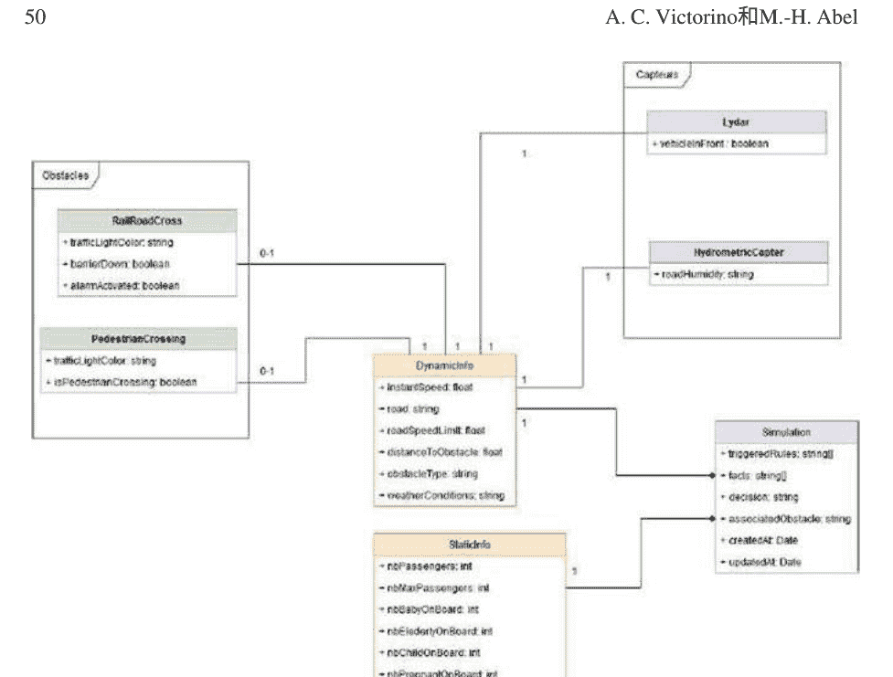

图1 上下文的持久性

在目前的情况下，这些元素仅限于上述列出的内容，但可以进行补充。

### 2.2 发展和技术实施

技术选择开发POC版本的技术选择受到两个主要因素的指导（如图2所示）。

- 在服务器端，希望能够高效地查询存储在数据库中的数据，以便轻松检索先前建模模拟的上下文信息以及车辆的最终决策。因此，我们构建了一个后端，模仿可以从外部查询的API服务模型以访问数据。通过将GraphQL¹与Node.js服务器耦合，根据可用的文档，完成了这个操作。图3展示了这个模型在从多个表中检索数据时的优势。关于通用数据基础系统（GSDB），我们选择了使用MySql的关系型方法。

- 在客户端上，我们使用面向对象的编程范式，用Python实现了模拟生成脚本。为了将我们脚本的面向对象编程范式与MySql/ GSDB中的数据持久化联系起来，我们采用了对象关系映射（ORM）：Sequelize，这是最广泛记录和首选的node.js ORM。

技术实现图4以图解的方式展示了语义导航模型的开发和技术实现。

使用Python进行场景模拟每次新的模拟都由一组变量参数来描述，以便定义一个独特的上下文。这些随机生成的上下文参数涉及以下内容：

> ¹由Facebook开发的强类型查询语言，自2015年以来以开源许可证发布。

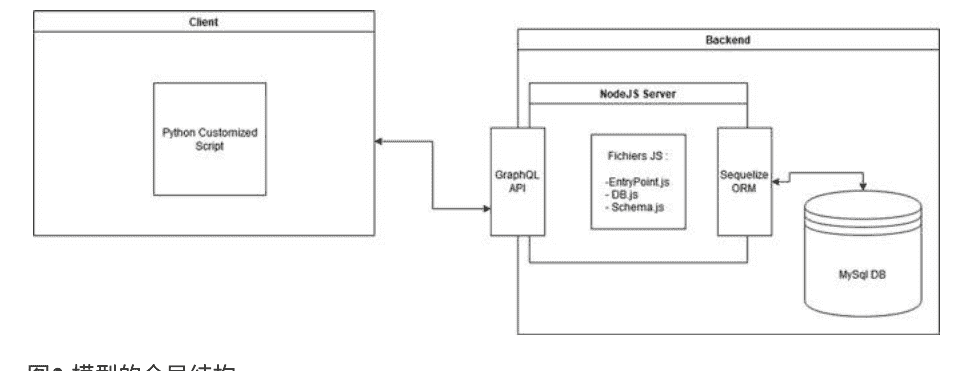

##### 图2 模型的全局结构

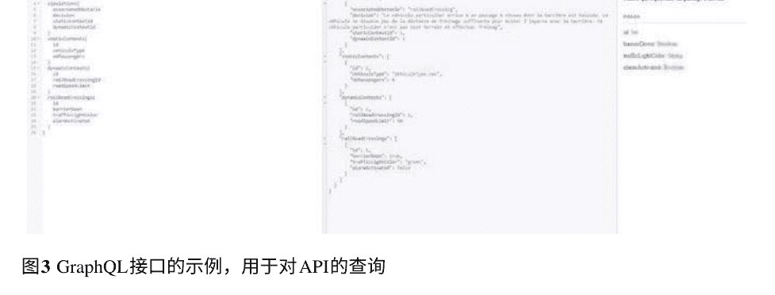

##### 图3 GraphQL接口的示例，用于对API的查询

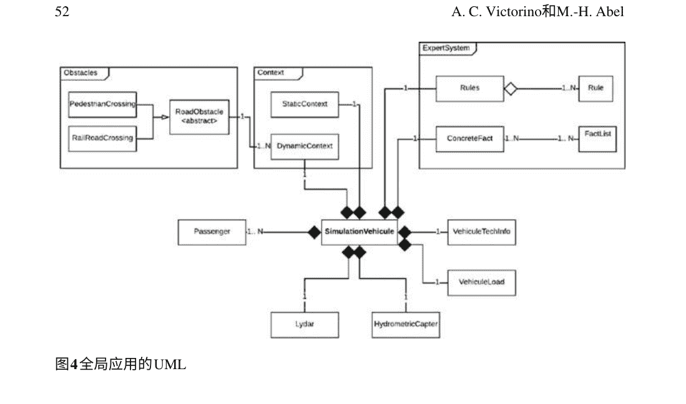

## 图4全局应用的UML

- 模拟中的虚拟车辆，考虑以下因素：
  - 车辆类型（汽车、摩托车、货车）；
  - 车辆类别（私人车辆、公共干预车辆）；
  - 技术特征（加速度、速度）。
- 模拟中遇到的障碍物。
  - 每个障碍物对应一个具有自己特征的类（存在交通灯、栅栏、声音信号、地面上的物理减速器、分隔符等）。
- 具有特定检测标准的车辆乘客数量：
  - 老年人或虚弱婴儿的年龄；
  - 潜在的疾病或伤害；
  - 一个女性乘客可能怀孕的可能性。
- 车辆的负载加总重量：
  - 模拟期间与车辆相关的传感器；
  - 湿度传感器；
  - 瞬时车速；
  - 激光雷达。

尽管数据是随机生成的，但显然需要进行验证，以避免出现某些荒谬的情况（如怀孕的女性乘客，摩托车乘客超过2人等）。我们首先随机生成每次模拟的新数据集，以便为每次模拟构建一个新的上下文。由Python客户端脚本（见图2）随机生成的信息被指定为在每次新模拟开始时向用户提供此信息。正是这些信息我们将在数据库中保留。

除了这些感知数据外，还有一个专家系统（见图3），根据获得的模拟结果为驾驶员提供行动建议。导致这个决策的推理也将被保留。

## 3 专家系统实施

专家系统是一种能够在特定领域中复制专家的认知机制的工具。它由三个部分组成（见图3）：

- 事件基础：推理引擎介入之前可用的信息；
- 规则基础：由专家知识得出的一组规则；
- 推理引擎：将规则与事实进行对比，使专家系统能够通过推理从已有的事实中动态推导出新的事实。

推理引擎实现以下形式逻辑：

- 0阶：事实是一个命题，真或假；
- 0+阶：事实是一个值；
- 1阶：事实是一个变量。

在我们的案例中，推理引擎是类型0的正向链接，也就是说，我们从前提开始得出新的结论。这些发现丰富了知识库，并可能成为其他规则的前提。

基于一组规则，触发特定事件。

## 4 结论

我们在本文中提出了一种建模车辆导航语义上下文的想法。所提出的语义模型使用模拟器数据来识别与给定时刻车辆导航相关的元素，并将这些信息持久化，以便能够突出显示能够识别障碍物的相关信息。模拟重点是获取相同障碍物的不同配置，以生成与该障碍物相关的上下文信息（交通灯颜色、道路平交道闸杆位置、行人过街道是否存在等）。建立了一个能够模拟专家认知机制的专家系统。基于一组事件和一组规则，推理引擎将规则与事实进行对比，以从已有的事实中推断出新的事实。

#### 参考文献

- 1. Lima, D.A., Victorino, A.C.: 一种用于城市环境中基于视觉的自主车辆导航的混合控制器。IEEE智能交通系统杂志 **17**(8), 2310–2323 (2016)
- 2. Pereira, E., Lima, D.A., Victorino, A.: 自主车辆全球导航方法，结合基于传感器的控制和数字地图。IEEE国际机器人与仿生学会议（ROBIO'2014），印度尼西亚巴厘岛（2014）
- 3. Kenmogne, I.-F., Lima, D.A., Victorino, A.C.: 一个应用于城市环境中自主机器人的全球导航管理架构。 在：第18届国际智能交通系统会议（ITSC'15），西班牙加那利群岛（2015）
- 4. Adomavicius, G., Jannach, D.: 上下文感知推荐系统专题前言。用户模型。用户适应。互动。 **24**, 1-5 (2013)
- 5. Kofod-Petersen, A., Cassens, J.: 使用活动理论建模上下文感知。 在：建模和检索上下文，第1-17页。Springer, 柏林，海德堡（2006）
- 6. Bazire, M., Brézillon, P.: 在使用上下文之前了解上下文。在：国际和跨学科建模和使用上下文会议，第29-40页。Springer, 柏林，海德堡（2005）
- 7. Palmisano, C., Tuzhilin, A., Gorgoglione, M.: 使用上下文改进个性化应用中的客户预测建模。IEEE Trans. Knowl. Data Eng. **20**(11), 1535–1549(2008)
- 8. Adomavicius, G., Tuzhilin, A.: 上下文感知推荐系统。 在：推荐系统手册，第217页（2011年）
- 9. Chen, G., Kotz, D.A.: 上下文感知移动计算研究综述。技术报告，达特茅斯学院，汉诺威，NH，美国（2000年）
- 10. Bastien, C.: 上下文和情境。 在：Houdé, O., Kayser, D., Koenig, O., Proust, J., Rastier, F. (eds.) 认知科学词典，PUF, 巴黎（1998年）

## 通过遥感指数评估马哈拉施特拉邦奥兰加巴德地区甘加普尔地区的干旱情况已有二十年

Rashmi R. Nitwane, Vaishali D. Bhagile和R. R. Deshmukh

摘要 干旱是自然界最严重的灾害之一。任何类型的干旱都会影响国家的经济，无论是农业干旱、气象干旱还是水文干旱。在印度，有一些地区连续面临干旱，马哈拉施特拉邦的马拉特瓦达地区就是其中之一，过去几十年一直饱受农业干旱之苦。奥兰加巴德西部的甘加普尔地区是一个塔鲁卡地方，总土地面积为130,846公顷。本文分析了从2000年5月到2020年4月的奥兰加巴德地区甘加普尔地区的干旱情况。干旱分析针对印度的两个主要种植周期——卡里夫和拉比进行。使用基于MODIS的植被状况指数（VCI）进行多时相分析，以找到干旱发生期、干旱持续时间和干旱严重程度。我们发现VCI在有效检测两个种植周期的干旱条件方面非常有用。

- 植被状况指数
- 干旱
- 时间分析
- 机器学习
- 遥感

## 1 引言

农业干旱指的是作物生长阶段土壤湿度的缺乏。当作物生长周期的任何阶段出现作物歉收时，这不仅对农民造成经济损失，还对国家的经济增长产生不利影响。印度经济主要以农业和农产品为基础，因此全国任何地区的反复干旱情况都是灾难性的。印度有三个主要的种植季节，它们是卡里夫、拉比和扎伊德。卡里夫季节的作物通常是依赖降水的，而拉比季节的作物种植仅限于有灌溉设施的土地。在印度，卡里夫作物的种植面积最大。

这些作物在季风期间播种，每年的5月最后一周或6月第一周开始播种。对应的年份日(DOY)是5月最后一周(145/146)，收获在9月最后一周进行，对应的DOY是273/274。而拉比作物的播种期从每年的10月开始，对应的DOY是289，收获在1月份。马哈拉施特拉邦的马拉特瓦达地区在过去几十年中一直遭受干旱。本文选择马哈拉施特拉邦奥兰加巴德地区的Gangapur作为研究区域，分析干旱情况。在MODIS13Q1数据集中，我们选择了卡里夫作物的播种和收获的对应年份日为(145和273)，而拉比作物的对应年份日为(289和017)。

### 1.1 文献综述

在干旱监测、评估和预测的背景下，各种研究人员已经开发并正在开发干旱指数。这些指数分为三类，分别是气象、农业和水文干旱指数[1]。除了这些指数，还有一些研究人员利用遥感和机器学习开发了综合干旱指数[2]。Peng Sun等人利用多源数据（气象、土壤湿度和遥感数据）开发了综合干旱监测模型[3]。Pesaresi等人开发了用于分析大型遥感数据的符号机器学习模型。观察到遥感数据在干旱监测中具有广泛的空间覆盖，表1列出了三十多年来开发的一些遥感干旱指数。

在本研究中，我们评估了植被状况指数分析冈加普尔地区在过去二十年（2000-2020年）的干旱影响能力。

表1 一些由遥感获取的干旱指数
| 干旱指数 | 组成部分 | 遥感数据 | 参考文献 |
|----------|----------|----------|----------|
| VCI      | NDVI/EVI | MOD13Q1  | Kogan [4] |
| TCI      | LST      | MOD11A2  | Kogan [4–6] |
| TVDI     | NDVI/LST | MOD09A1/MOD09A2 | Sandholt et al. [7] |
| VTCI     | NDVI/LST | MODIS数据 | Sun et al. [8] |
| PDI      | NIR,RED  | MODIS数据 | Ghulam et al [9] |
| MPDI     | NIR,RED  | ETM + , MODIS数据 | Ghulam et al. [9] |

## 2 数据和方法

### 2.1 研究区域

Gangapur的研究区域是马哈拉施特拉邦奥兰加巴德县的一个塔鲁卡地方，在奥兰加巴德-艾哈迈达巴德高速公路的西侧。研究区域的地理位置是19.699 N 和75.010E。Gangapur的总土地面积为1,30,846公顷，其中农业用地总面积约为94,298公顷。政府机构在农业普查中宣布2006年、2007年、2012年为严重干旱年份[10, 11]。该地区主要种植的作物有小麦、棉花、大麦等。由于该地区降雨变化不定，马拉特瓦达对干旱非常敏感。多年来，严重和轻微的干旱影响了作物产量的质量。下图显示了马哈拉施特拉邦奥兰加巴德地区冈加普尔的图像（图1）。

### 2.2 数据

本研究使用的遥感数据是Didan [12]提供的中分辨率成像光谱仪16天MODIS植被指数（VI）产品（EVI），分辨率为250米，时间范围为2000年5月至2020年4月。MODIS VI产品（MOD13 Q1）提供了全球植被状况的一致的空间、时间时间序列比较[6, 13]。MODIS植被指数产品增强植被指数（EVI）在高生物量区域具有改进的灵敏度，并通过解耦合背景信号和减少大气影响来改进植被监测能力。EVI结合了大气阻力概念，并根据SAVI对植被指数中由土壤亮度引起的变化进行了解决。为了解决EVI在亮目标上的不稳定行为问题，3波段EVI被2波段EVI备份算法替换，该算法不使用蓝波段。3波段EVI的公式如下

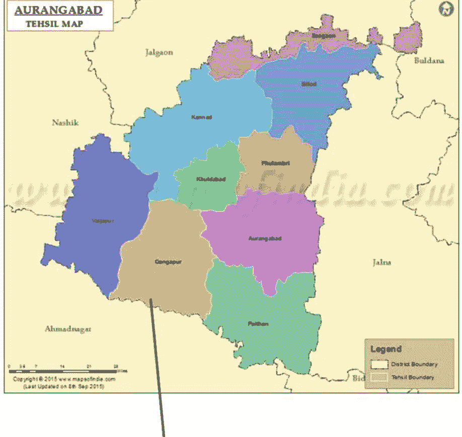

图1 甘加普尔地区（奥兰加巴德区）来源Z.P奥兰加巴德，马哈拉施特拉邦

$$EvI = G \frac{NIR - RED}{NIR + C_1 RED - C_2 Blue + L} \quad (1)$$

其中，NIR、RED和Blue是完全或部分大气校正的地表反射率，L是冠层背景调整，C1和C2是气溶胶抗性项的系数，G是增益或缩放因子。

而EVI 2波段公式是

$$EvI = 2.5 \frac{NIR - RED}{NIR + 2.4RED + 1} \quad (2)$$

### 2.3 方法

在这项研究中，我们在时间序列数据集上实施了VCI。植被状况指数（VCI）由Kogan [6, 14]提出，已在许多案例中证明其用于干旱检测和跟踪的有效性。验证结果表明，VCI在检测干旱和测量其发生时间、强度、持续时间和对植被的影响方面具有出色的能力。VCI不仅为明确、持久、广泛和强烈的干旱提供准确的信息，还为非常局部、短期和不太明确的干旱提供准确的信息。根据[15-17]给出的工作流程图，将VCI实施在MODIS的EVI产品上，如下图所示。数据准备、图层堆叠和预处理的整个过程使用R Studio软件进行。下一节将对VCI进行简要介绍。

### 2.4 植被状况指数

植被状况指数首次由[4,6]提出，并目前在伊朗运行。VCI是一个代表湿润状况的指标，重点关注干旱对植被的影响。它最初是通过将长期记录中计算得出的最小和最大NDVI值进行缩放，将NDVI值从0到1进行开发的，尽管VCI适当地反映了干旱的空间分布和发展，但在某些情况下，基于NDVI的VCI表现不佳，但基于EVI数据集（MOD13 Q1）的VCI显示出一些优势，如下所列。

- 在植被下方的空气颗粒或地面覆盖物引起的反射光没有失真。
- 与NDVI相比，EVI数据产品不会在观察雨林和大量叶绿素时饱和。

VCI的计算方式为

$$
\text{VCI} = \frac{\text{EVI}_C - \text{EVI}_{\text{Min}}}{\text{EVI}_{\text{Max}} - \text{EVI}_{\text{Min}}} * 100
$$

其中，
EVI_C = EVI * 云掩膜。
即应用云掩膜的单层堆栈。
EVI_Max = 计算每个像素的层堆栈的最大值。
EVI_Min = 计算每个像素的层堆栈的最小值。

因此计算得出的VCI值表示给定月份的干旱百分比。VCI值接近0-35%表示严重干旱状况，而VCI百分比超过50%表示植被的正常或以上正常状况。

在这项研究中，数据以16天为间隔，每年的每一天表示为001-353，层堆栈根据天数形成。

图2 VCI在R中的工作流程（UNSPIDER知识门户）

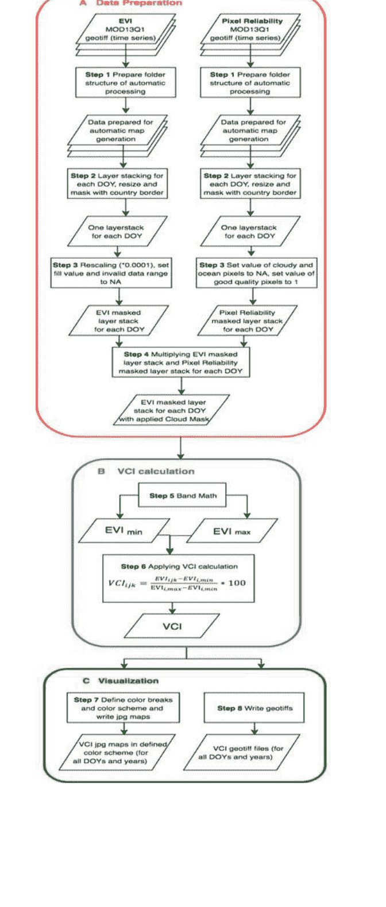

EVI Geotiff文件和像素可靠性Geotiff文件同时处理，在图层叠加重新缩放完成后，通过(0.0001)进行处理。接下来计算每年的EVI掩膜图层堆栈。然后对每天的EVI掩膜图层堆栈和像素可靠性掩膜图层堆栈进行处理，最终计算出VCI。执行代码后生成的地图结果以及进一步的分析结果如下所示。生成的地图显示在下一页上。

## 3 结果与讨论

印度的Kharif作物播种周期始于每年的5月底和6月初。MODIS数据集(MOD13Q1)包含从001-353开始的总共26个Day Of Year(DOY)，它们之间以16天的间隔，每个DOY从2000年5月到2020年4月都有20个样本。为了保持分析的一致性，我们将DOY 145作为Kharif播种开始日期并将DOY 273作为Kharif收获开始日期。同样，我们将DOY 289作为Rabi播种开始日期并将DOY 017作为Rabi收获开始日期。

VCI计算结果显示，2001年、2004年和2016年在Kharif播种周期开始时存在严重的干旱条件。此外，2001年、2002年、2015年和2018年在收获开始日期时显示出干旱条件的严重性，这清楚地表明了该地区在作物生长周期内缺乏适当的季风降水。即使2004年和2016年在收获周期中没有出现严重的干旱，由于季风的初始延迟和干旱状况，作物产量受到影响。在这两个十年中，整个Kharif作物在2001年、2002年、2003年、2004年严重受影响，在2017年和2018年受到中度影响。

每年10月份开始的Rabi作物在马哈拉施特拉邦，下面显示的DOY 289证明了2003年、2004年和2018年在两个季节中都是干旱年，2013年和2016年是中度干旱年，其余年份在全年都显示出部分干旱条件。结果显示，2019年对作物来说是好年景，无论是Kharif作物还是Rabi作物。有必要对这些结果进行预测测试，并进行全面的研究以制定适当的预测策略。

卡里夫农作物季节循环播种期年份第145天（五月）20年 (2000-2019)

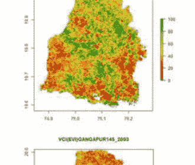

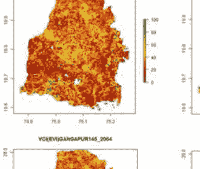

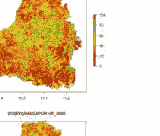

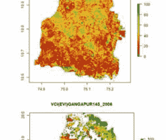

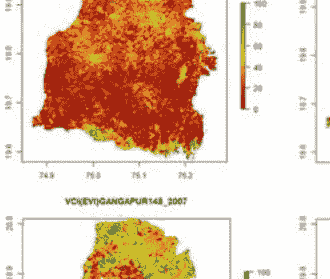

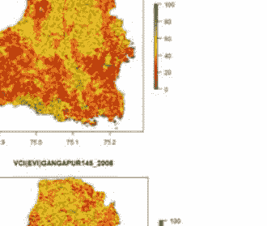

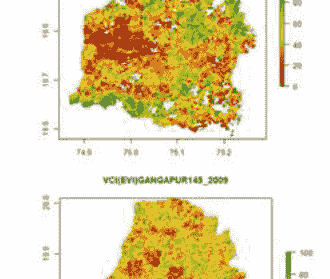

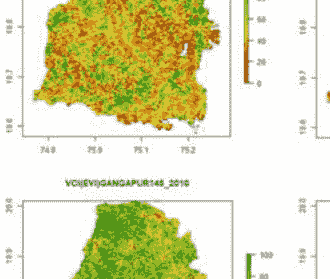

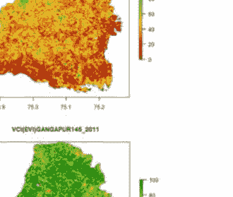

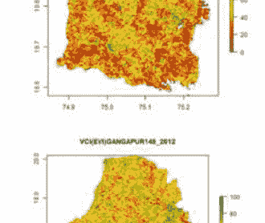

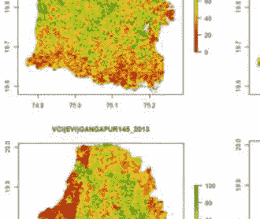

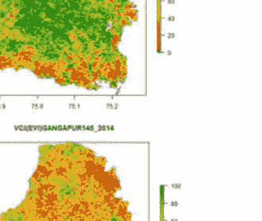

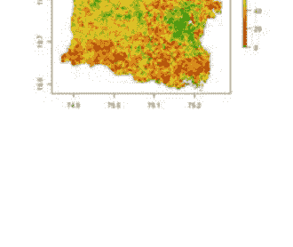

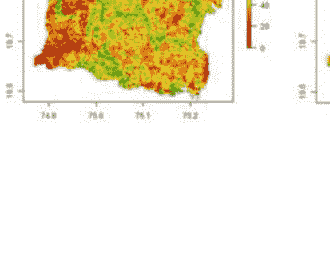

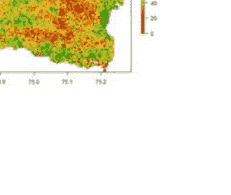

##### 对干旱条件进行二十年的评估……

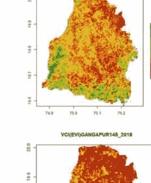

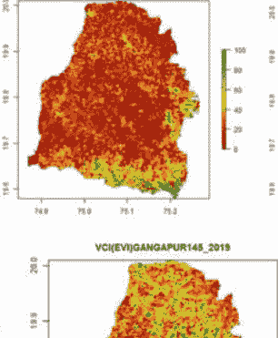

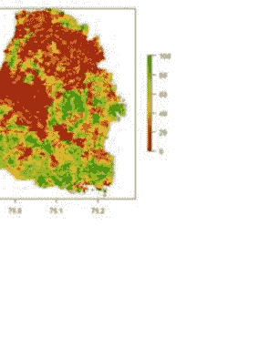

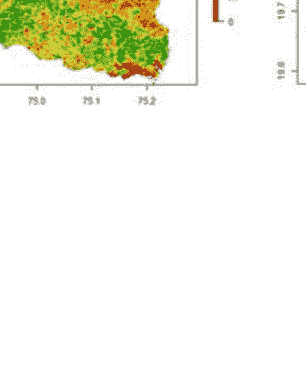

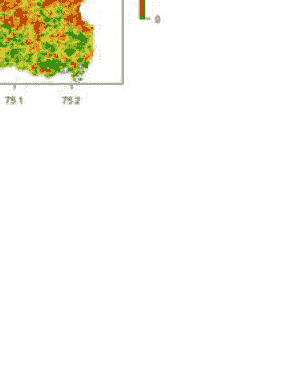

##### 卡里夫农作物收获期年份第273天（九月）20年 2000-2019

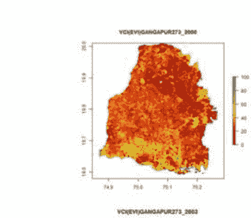

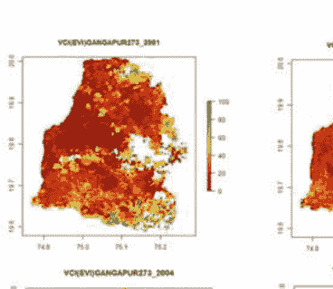

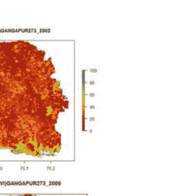

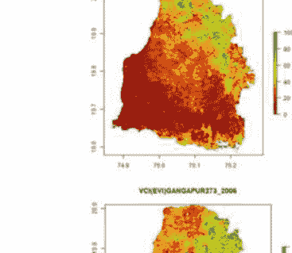

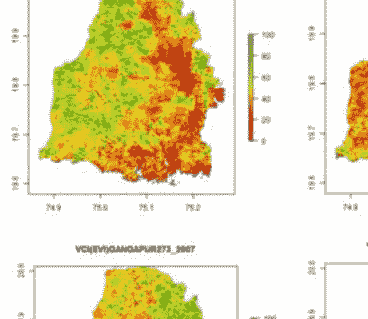

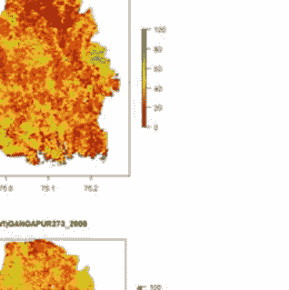

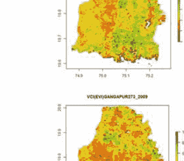

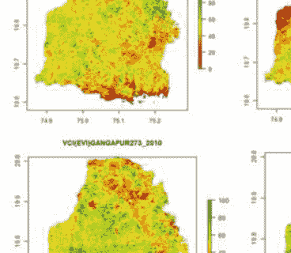

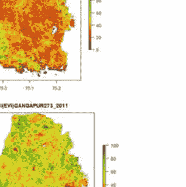

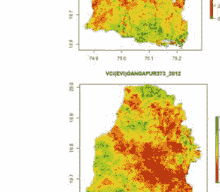

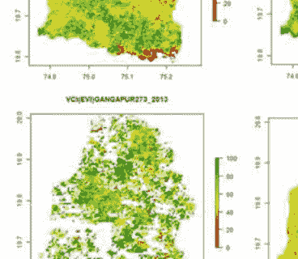

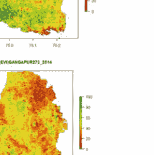

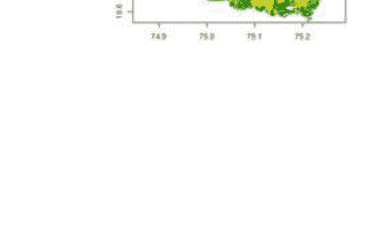

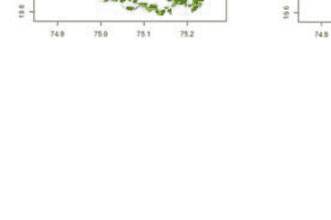

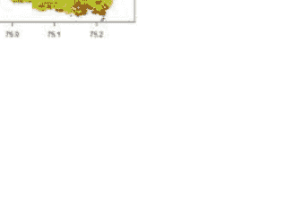

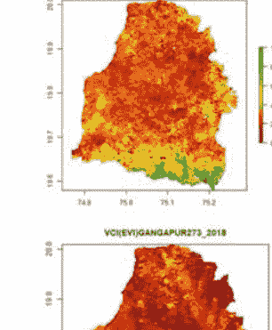

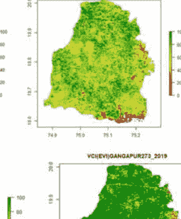

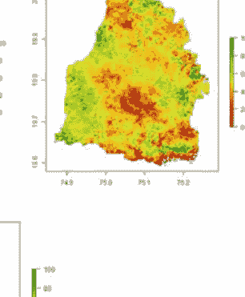

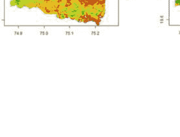

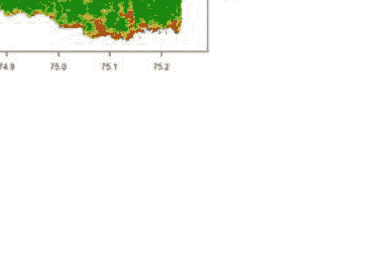

##### 拉比农作物播种期年份第289天（十月）20年2000-2019

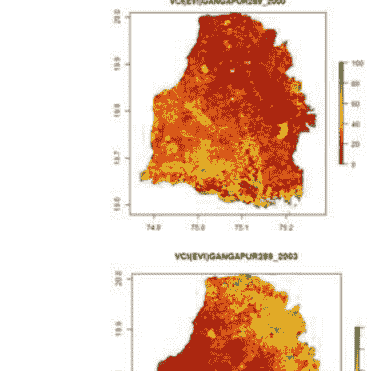

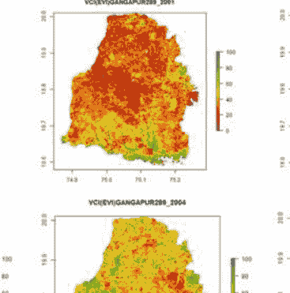

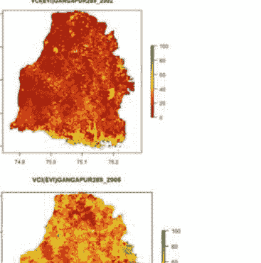

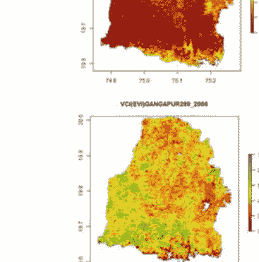

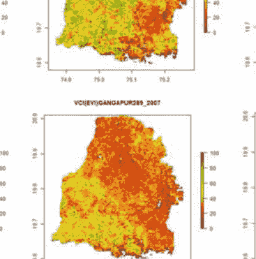

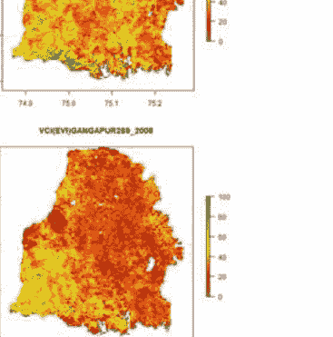

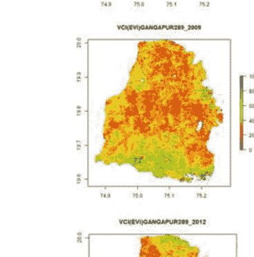

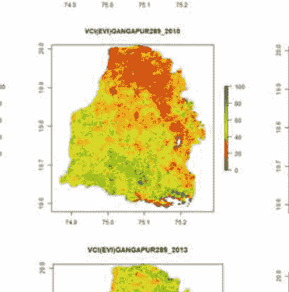

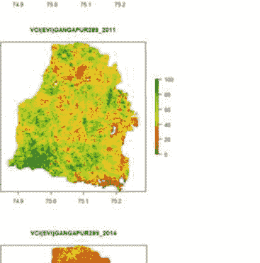

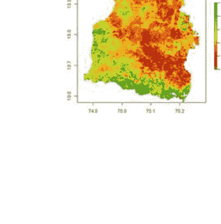

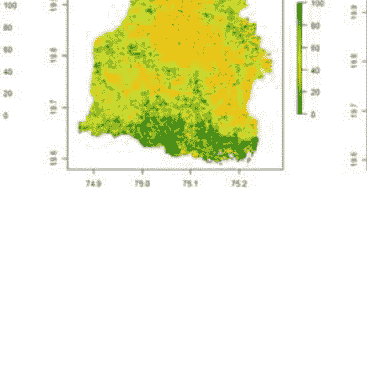

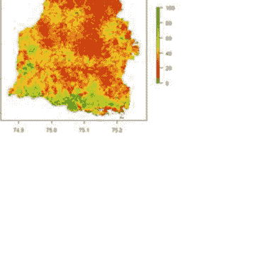


##### VCI(EVI)GANGAPUR289_2015

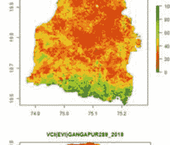

##### VCI(EVI)GANGAPUR289_2016

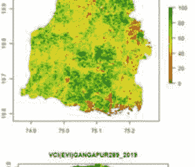

##### VCI(EVI)GANGAPUR289_2017

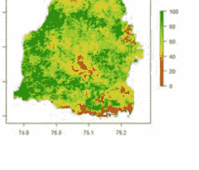

##### VCI(EVI)GANGAPUR289_2018

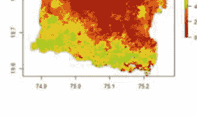

##### VCI(EVI)GANGAPUR289_2019

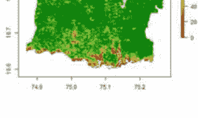

##### 拉比农作物收获期年份第017天（一月）20年 2001-2020

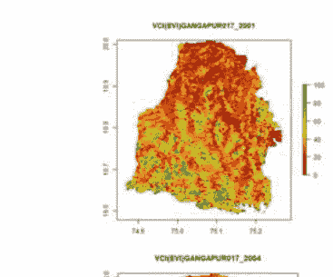

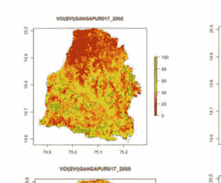

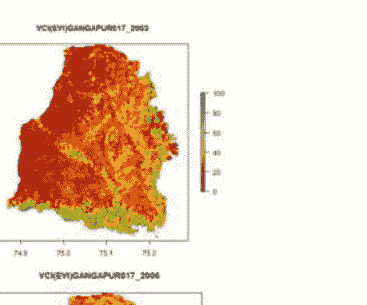

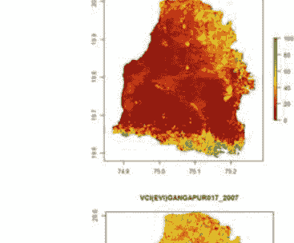

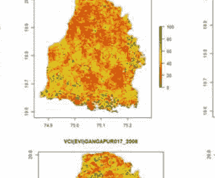

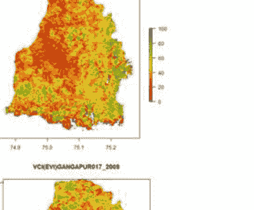

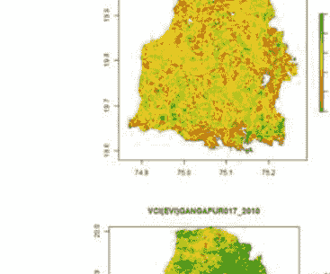

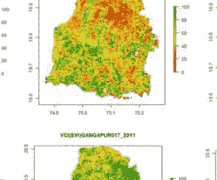

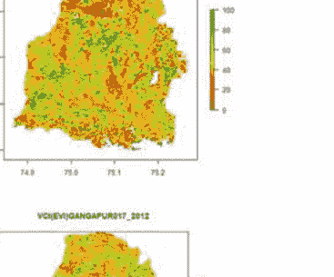

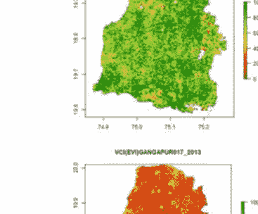

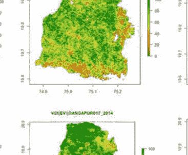

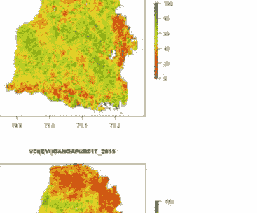

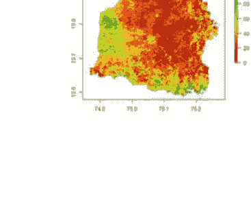

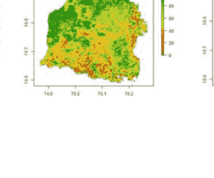

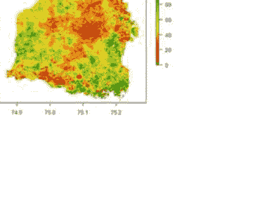

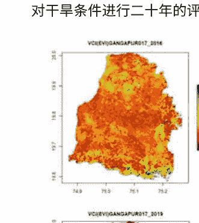

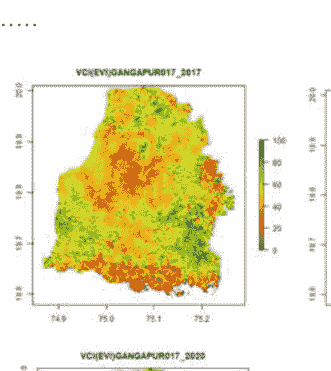

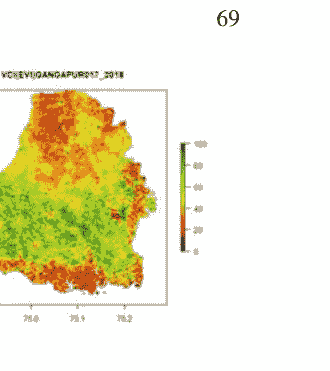

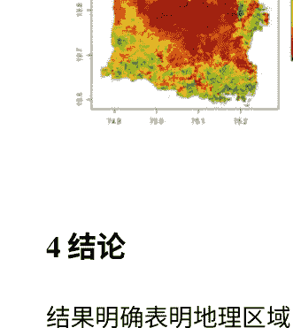

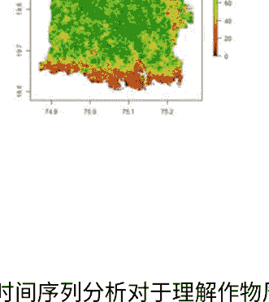

## 4 结论

结果明确表明地理区域的时间序列分析对于理解作物周期的变化以及为干旱预测建立健壮的方法非常有用。因此，有必要对这些结果进行预测测试，并进行全面的研究以制定适当的预测策略。这项研究的未来范围是基于遥感数据和机器学习工具的集成，为预测乡镇级别的干旱提供算法。

#### 参考文献

- 1. Aswathi, P., Nikam, B., Chouksey, A., Aggarwal, S.: 使用气象和遥感指数评估和监测马哈拉施特拉邦的农业干旱。 Isprs Ann.Photogramm. Remote Sensing Spatial Inf. Sci. IV(5), 253–264 (2018). https://doi.org/10.5194/isprs-annals-IV-5-253-2018
- 2. Sun, P., Zhang, Q., Wen, Q., Singh, V. P., Shi, P.: 基于多源数据的中国淮河流域综合农业干旱监测。 J. Geophys. Res. Atmosph. 122(10), 751–772. (2017). https://doi.org/10.1002/2017JD027186
- 3. Pesaresi, M., Syrris, V., Julea, A.: 通过符号机器学习分析大型遥感数据 (2016).
- 4. Kogan, F.N.: 应用植被指数和亮温检测干旱, Adv. Space Res. 15(11), 91–100。 https://doi.org/10.1016/0273-1777(95)00079-T。 ISSN0273-1177。 http://www.sciencedirect.com/science/article/pii/027311779500079T
- 5. Seiler, R.A., Kogan, F., Sullivan, J.: 基于AVHRR的干旱检测植被和温度条件指数在阿根廷。 Adv Space Res. 21(3) 481–484。 (1998).https://doi.org/10.1016/S0273-1177(97)00884. ISSN 0273-1177。 http://www.sciencedirect.com/science/article/pii/S0273117797008843
- 6. Kogan, F.N.: 全球干旱监测。 Bull. Amer. Meteor. Soc. 78，621–636 (1997)。 https://doi.org/10.1175/1520-0477(1997)078%3c0621:GDWFS%3e2.0.CO;2.
- 7. Sandholt, I., Rasmussen, K., Andersen, J.: 用于评估地表湿度状态的表面温度/植被指数空间的简单解释。 遥感环境。 79,213–224 (2002). https://doi.org/10.1016/S0034-4257(01)00274-7
- 8. Sun, W., Wang, P.-X., Zhang, S.-Y, Zhu, D.-H., Liu, J.-M., Chen, J.-H., Yang, H.-S.: 使用植被温度条件指数进行时间序列干旱监测在关中平原，中国国际遥感。 29(17–18), 5133–5144. https://doi.org/10.1080/01431160802036557
- 9. Ghulam, A., Qin, Q., Kusky, T.: 对垂直干旱指数的重新考察. 国际遥感杂志 29,6037–6044 (2008). https://doi.org/10.1080/014311608022358110.
- 10. http://krishi.maharashtra.gov.in/Site/Upload/Pdf/latur_cdap.pdf
- 11. http://krishi.maharashtra.gov.in/Site/Upload/Pdf/MSAAPC.pdf
- 12. Didan, K.: MOD13Q1 MODIS/Terra植被指数16天L3全球250 m SIN网格 V006 [数据集: Aurangabad]. NASA EOSDIS Land Processes DAAC. https://modis.gsfc.nasa.gov/data/dataprod/mod13.php (2015)
- 13. MODIS VI用户指南: http://vip.arizona.edu/MODIS_UsersGuide.php
- 14. 梁，李，孙，秦，罗，王，张，邓，迪，刘：基于植被状况指数的中国植被干旱的长期时空变化。生态圈 8(8), e01919 (2017)。 https://doi.org/10.1002/ecs2.1919
- 15. Jain, S.K., Keshri, R., Goswami, A., Sarkar, A., Chaudhry, A.: 使用NOAA AVHRR数据识别干旱易受影响区域。国际遥感杂志 30(10), 2653–2668 (2009)。 https://doi.org/10.1080/01431160802555788
- 16. Thiruvengadachari, S., Gopalkrishna, H.R.: 用于评估干旱的集成PC环境。国际遥感杂志 14(17), 3201–3208 (1993)。 https://doi.org/10.1080/01431169308904434
- 17. 杜，M., 刘，Y.: 利用MODIS数据进行区域干旱监测和分析——以云南省为例。IFIP Adv. Inf. Commun. Technol. 345, 243-251 (2010年)。 https://doi.org/10.1007/978-3-642-18336-2_29# 教师教育资源推荐系统：为什么和如何？

Nader N. Nashed, Christine Lahoud和Marie-Hélène Abel

摘要：在一个充满差异的世界中，教师通常在巨大的压力下工作，尤其是在郊区和农村地区的严峻条件下工作的教师。解决帮助缓解辛勤工作条件的关键是将适当的教育资源与课程内容相结合。此外，在通过网络提供的大量未组织的数据中搜索辅助教育资源可能是一项困难的任务。

因此，他们需要经过一条艰难的道路来分配适当的资源以促进教育过程。本研究旨在定义教育推荐系统（ERSs）对解决教师问题的重要性以及为他们推荐个性化教育资源的方法论；无论是经验丰富还是年轻，无论是在城市还是农村地区，无论是教授小学生还是大学生。

- 语义网
- 机器学习
- 推荐系统
- 教育

## 1 引言

教师在教育事业初期的挣扎可能导致失败，甚至在他们的第一步就结束职业生涯。因此，早期发现和解决这些困难是教师成功的核心，也是将他们引上正确道路的关键[1]。年轻人进入教学职业对他们未来几年的职业发展有重要影响。我们可以通过多个方面来定义任何教师的工作困难，这些方面涉及到教师本人或者学习者。许多研究旨在更好地理解和定义这些困难，以改进对教师的支持。然而，困难的定义会根据教师的经验、教师工作的领域和学习者的教育水平而变化[1, 2]。大多数情况下，这些困难与学习者对学习过程的不情愿相关，并与他们的社会和文化环境有关。一般来说，年轻教师，尤其是在农村地区工作的教师，比经验丰富的教师更加困难[3]。通过考虑社会文化环境，可以模糊这些困难的影响。因此，我们必须从每个教师的背景中进行有效的推断，以引入适合的教育方法来帮助这位教师，通过提供个性化的培训课程或资源推荐的形式。在教学过程的背景下，教育资源可以定义为将制定的教育材料以多媒体、教材、课程、活动、事件和专家人员的形式传递给学习者的工具[4]。这些资源的主要目的是激发学习者的动力，扩展创造力，并获得额外的技能。这些教育资源可以用于教学和学习过程。我们可以根据其教育用途将这些资源分类为教学、协作、实践和评估资源[5]。如今，我们注意到为教师提供所需帮助的大量课程和资源并没有很好地组织起来。一些资源被视为教育机构的知识产权，而其他资源是开放源代码材料，任何人都可以使用而无需承担任何义务[5]。为了达到预期的结果，我们需要回答多个问题：为什么选择教育资源作为解决方案？以及如何适应这些资源以使每个教师受益？

## 2 问题定义

一般来说，教师的问题根据以下三个因素来定义：学习者缺乏动力，教师的职业与个人生活平衡，以及教师的准确自我评估[1]。缺乏动力的问题影响着学习者，无论学习者的社会条件如何，这使得学习者与教育机构的关系至关重要。这个问题最终导致教师付出更多的努力和精力来保持学习者的兴趣水平高。教师所付出的这种努力会导致一种无法分割的职业和个人生活的工作瘾。为了找到职业与个人生活的平衡，教师应通过适当的培训资源获得自我评估技能，以引入高效的方法论。

此外，在农村地区工作的年轻教师面临着三个额外的困难：学习者在教育机构中的纪律和行为，工作区域的文化和传统，以及学习者在农村地区的便利性[3]。在农村地区，教育过程成功的一个重要因素是保持对知识的渴望，而纪律的缺失会影响这一点。结果，年轻教师经常抱怨学生因为保持秩序和纪律而失去了雄心壮志。另一个影响农村地区学习进展的困难是学生到教育机构的流动性。这个问题有两个原因；一个是学生失去了继续教育的动力和兴趣，另一个原因是他们的家庭从一个地方搬到另一个地方。文化是先前问题中的最后一个问题，它涉及学生和教师的文化。从学生的角度来看，他们很难跟上教育机构提供的大量新信息[6]。另一方面，教师很可能对他们工作地区的文化没有先前的了解。

所有这些困难之间存在相互关联，因此建议采用累积解决方案来同时解决多个问题。图1显示了教师问题之间的关联，并提出了解决每个关联的累积解决方案的建议。简而言之，年轻教师需要适当的教育资源推荐和适当的培训课程，以在早期阶段取得显著的工作成果。因此，从社会角度来看，我们的关注点是找到一个解决方案，帮助具有不同背景和资历的教师。

为了科学地找到解决方案，我们发现教育推荐系统（ERS）的存在将使教师能够随时访问，并适应教师的偏好和搜索操作的上下文。系统对教师偏好的适应可以通过监控教师活动和收集代表独特特征的数据来实现。和教师输入细节。这个过程有助于定义教师搜索过程的上下文。因此，为了实现所需的个性化水平，系统应考虑一些特征，如图2所示：工作环境和文化、教师的经验以及目标学生的背景。工作环境可以是城市或农村地区，具有不同的文化背景和传统，而教师的经验代表教育水平和从教年限。另一个因素，学生的背景，可以是教育水平或学位。最后一个因素是从教师提供的细节、他们与系统互动时的活动以及资源特征[7]收集的数据，这创建了一个多标准问题[8]。

## 3 相关工作

在过去五年中发表的综述论文[9–11]中，讨论了从2010年到2018年的教育推荐系统趋势，其中只有3篇论文、1篇论文和1篇论文将教师作为目标用户，并且没有一个系统考虑到所有提到的因素。我们调查了过去十年中为教师提供教育资源或培训课程的教育资源推荐系统。经过大量搜索，只有34个教育资源推荐系统中的11个满足搜索条件，如表1所示，而被省略的系统既不提供前两种类型的推荐，也不针对学习者和教师。为了总结构建高效推荐系统的基本标准，应讨论四个关键点：用户个性化体验、推荐系统模型、数据来源和项目可衡量性，如图3所示[12]。每个教师根据教师个人资料和活动获得资源推荐，为教师创造了一个真实的体验[13]。从调查的论文中，只有4个教育资源推荐系统为教师提供个性化体验[7, 14–16]。由于我们的问题具有多个方面，因此使用一个推荐系统策略来解决所有问题是不够的。

| 论文 | 年份 | 项目 | 数据模型 | 方法 |
|------|------|------|----------|------|
| Manouselis等人[20] | 2010 | 当前资源的评估 | European Schoolnet门户数据模型^a | 基于协作的 |
| Bozo等人[18] | 2010 | 学习对象 (LOs) | IEEE学习对象元数据 (IEEE LOM) [21] | 混合 |
| Zhao等人[14] | 2014 | 教学资源 | 知识树 | 基于知识的 |
| Sergis等人[7] | 2014 | LOs | IEEE LOM | 基于能力的 (混合) |
| Rodriguez等人[15] | 2015 | 教育资源 | 本体论 | 基于知识的 |
| Sabourin等人[16] | 2015 | 教育资源 (SAS) | 描述性模型 (SAS Enterprise Miner) | 混合 |
| Sergis和Sampson[13] | 2015 | 学习对象仓库 (LORs) | – | 基于能力的 (混合) |
| Pursel等人[19] | 2016 | 开放教育资源 (OER) | – – | 基于设计的 (混合) |
| Villalba等人[22] | 2017 | LOs | IEEE LOM | 基于协作的 |
| Ali等人[23] | 2017 | 教育资源 | MEMORAE SoIS [24] | 混合 |
| Iniesto和Rodrigo[25] | 2019 | 对MOOC课程的修改 | 大规模开放在线课程(MOOCs) [26] | 基于协作的 |

这些方面。两种策略的混合是实现可接受结果的必要条件[17]，其后是我们列表中的3个ERSs[13, 18, 19]，但没有一个考虑到问题的地理维度。所有11个ERSs只使用一个教育资源数据集来源，这限制了资源的可用性和多样性。数据来源的多样性为用户提供了可靠的体验[20]。

最后要讨论的是教育资源的可测量性，这对于向目标教师提供正确的资源很重要。只有一个ERSs[15]考虑了这个重要标准。

## 4 我们的方法

教育资源推荐系统的目标是为不同领域的教师提供与搜索过程上下文和教师个人资料相匹配的教育资源。为了实现这个目标，需要一个语义表示系统上下文的本体，其范围是教师的上下文。这个本体模型了教师个人资料、学习者个人资料、资源，以及最重要的是地理信息和文化性质方面的工作和生活环境。系统还将教师的活动，如资源查看、搜索历史和互动行为存储到本体中。本体通过将工作环境与生活环境以及教师个人资料与学习者个人资料相匹配，促进了系统的推荐过程。资源数据库是由多个来源合并而成的，包括提供不同类型教育资源的开源教育平台。教育资源，全球可在线获取的数据集，大学提供的课程和材料，以及其他教师分享的个人经验。

为了进行高效的推荐，应该结合两种方法来构建一个能够为教师提供动态体验的混合推荐系统。首先，需要基于知识的方法，根据每种资源类型的预配置选择因素来推荐资源，在多准则决策问题中。由于教育资源的多因素测量和教师的个人资料，引入了多准则决策方法。多准则决策方法通过评估多个选择标准来搜索语义数据集，以找到与用户输入最匹配的资源。支持资源推荐的多个因素包括资源支持的语言，学习者的年龄类别，使用成本，评级和受欢迎程度，教师的技术专长水平，教师的教育水平，地理接近度和位置，以及是否存在其他支持工具。在计算相关性得分时，每个因素根据资源类型具有不同的权重，如公式（1）所示，其中 \(u_i\) 是因素 \(i\) 的效用函数，\(w_i\) 是相应的权重。因素的权重是根据提供的专家评级获得的，并根据教师在系统使用中的个性化体验而可变。

\[\sum_{i=0}^{n} w_i \cdot u_i \tag{1}\]

然后，教师与之前方法提供的资源进行互动，触发基于内容的方法。这种方法应该使用各种机器学习技术，可以通过神经网络（NN）或深度神经网络（DNN）来根据教师选择的资源决定下一个个性化推荐。NN和DNN能够通过发现某个教师的选择模式来预测资源因素的重要性。根据两种方法的输出，获取的结果必须不断更新并重新排列。最后，所有教师的互动必须作为用户反馈存储，以供将来系统使用。在下面的示例中，介绍了教师使用系统的场景。

##### 场景：一个具有教师角色的用户正在搜索资源

- 1. 教师输入某种资源类型的搜索关键字或选择所有类型。
- 2. 通过将关键词与教师的个人资料合并构建查询。
- 3. 然后处理查询，并根据每个资源对应的因素权重检索和排序结果。
- 4. 向教师显示资源列表。
- 5. 教师选择或收藏喜欢的资源（用户评级）。
- 6. 将资源选择数组存储到数据库中以进行用户个人资料。
- 7. 然后处理选择数组，计算教师选择与专家因素的匹配程度。例如，
  - a. 教师选择了一种事件类型的资源。一般来说，事件具有最高权重的距离因素。
  - b. 系统发现所选事件与教师的位置非常远。
  - c. 计算并比较两个位置之间的差异与先前可接受的教师和事件位置之间的平均距离。
  - d. 根据比较结果，应用并存储新的因素权重（增加或减少）到教师的偏好中。（个性化因素权重）
- 8. 在之前的机制之后，生成第二轮推荐。
- 9. 根据因素权重的变化和内容为基础的方法的运行，检索到新的结果以找到与所选/收藏的资源相似的资源。
- 10. 结果页面会动态更新，显示新的推荐资源（图4）。

## 5 结论和展望

本文的目标是提出一种适当的教育推荐系统方法，可以为教师生成逼真的推荐，无论他们的教育水平、工作环境或目标学生如何。首先，我们确定教师在周围环境中的主要困扰，以及这些困扰中哪些最阻碍教师的职业发展。在确定了这些困扰之后，我们为教师推荐适当的教育方法和培训课程，以提供合适的解决方案。最后，我们提出了教育资源推荐系统的主要特点，为教师提供合适的解决方案。

在审查与所提出系统相关的所有ERS之后，我们得出结论帮助教师克服教学生涯中面临的困难可以通过满足所有讨论的标准的系统来实现。这个推荐系统必须包括以下几点;

- 将多个数据源合并成一个语义数据集
- 根据目标学生引入教师个人资料。
- 预定义加权因素以实现准确的资源可测量性
- 结合推荐方法的混合组合，同时考虑教师资源匹配和教师个人资料。

目前，一个考虑以下几点的系统正在进行实施和测试过程。

#### 参考文献

- 1. Natale, J.A.: 为什么教师离职。执行教育。 **15**， 14-18 （1993）
- 2. Veenman, S.: 初任教师的问题。教育研究评论。 **54**， 143-178 （1984）
- 3. Monk, D.H.: 在农村地区招募和留住高质量教师。 在: 《儿童的未来》， 155–174页 （2007年）
- 4. Bušljeta, R.: 教学和学习资源的有效使用。 捷克-波兰历史教育学杂志 **5**, (2013年)。 https://doi.org/10.2478/cphpj-2013-0014
- 5. Hylén, J.: 开放教育资源：机遇与挑战。 在：《开放教育》会议论文集，4963页（2006年）
- 6. Auduc, J.-L. 培训教师在被认为困难的学校工作。 Citeseer (1998年)
- 7. Sergis, S., Zervas, P., Sampson, D.G.: (2014年)基于教师ICT能力概况的学习对象推荐。 在: 2014年IEEE第14届国际高级学习技术会议，534–538页。IEEE (1998年)
- 8. Lakiotaki, K., Matsatsinis, N.F., Tsoukias, A.: 多准则用户建模在推荐系统中。IEEE智能系统 26, 64–76 (2011)
- 9. Dutt, A., Ismail, M.A., Herawan, T.: 教育数据挖掘的系统性综述。 Ieee Access 5, 15991–16005 (2017)
- 10. Vaidhehi, V., Suchithra, R.: 教育中推荐系统的系统性综述。国际工程技术杂志 7, 188–191 (2018)
- 11. George G, Lal, A.M.: 基于本体的电子学习推荐系统综述。计算机教育 142, 103642 (2019)
- 12. Manouselis, N., Drachsler, H., Verbert, K., Duval, E.: 学习的推荐系统。Springer Science & Business Media (2012)
- 13. Sergis, S., Sampson, D.G.: 基于引出的ICT能力概况的教师学习对象推荐。IEEE Trans. Learn. Technol. 9, 67–80 (2015)
- 14. Zhao, M., Ni, W., Zhang, H., Lin, Z., Yang, Y.: 面向中小学远程教育教学平台的基于知识的教学资源推荐模型。 在: 医学和教育信息技术的前沿和未来发展, pp. 511–521. Springer (2014)
- 15. Rodriguez, A.C., Gago, J.M.S., Rifón, L.E.A., Rodriguez, R.P.: 非传统教育资源的推荐系统:语义方法。J. Univ. Comput. Sci. 21, 306–325(2015)
- 16. Sabourin, J., Kosturko, L., McQuiggan, S.: 下一步去哪里？学习对象库导航推荐策略的比较。 在: 用户建模, 适应和个性化国际会议, pp. 208–215. Springer (2015)
- 17. Burke, R.: 混合推荐系统: 调查和实验。User Model. User-Adap.Inter. 12, 331–370 (2002)
- 18. Bozo, J., Alarcón, R., Iribarra, S.: 根据教师的上下文模型推荐学习对象。 在: 欧洲技术增强学习会议上, 第470-475页。Springer (2010)
- 19. Pursel, B., Liang, C., Wang, S., Wu, Z., Williams, K., Brautigam, B., Saul, S., Williams, H., Bowen, K., Giles, C.L.: BBookX: 一个用于创建开放式学习内容的自动化基于网络的推荐系统的设计。 在: 第25届国际万维网会议伴侣论文集上, 第929-933页 (2016)
- 20. Manouselis, N., Vuorikari, R., Van Assche, F.: 协作推荐电子学习资源: 一个实验研究。J. Comput. Assist. Learn. 26, 227-242 (2010)
- 21. RISK, U. 学习对象元数据的草案标准 。IEEE标准1484 (2002):
- 22. Villalba, K., Cuba, S.C., Deco, C., Bender, C., García-Peñalvo, F.J.: 基于学习目的的开放教育资源推荐系统。 在: 2017年第12届拉丁美洲学习技术会议 (LACLO), 第1-4页。IEEE (2017年)
- 23. Ali, B., Majd, S., Marie-Hélène, A., Elsa, N. 在学习生态系统中推荐教学资源。 在: 第9届数字生态系统管理国际会议论文集, 第14-21页 (2017年)
- 24. Abel, M.-H., Benayache, A., Lenne, D., Moulin, C.: E-MEMORAe: 面向内容的电子学习环境。 在: 电子学习网络化环境和架构, 第186-205页。Springer (2007年)
- 25. Iniesto, F., Rodrigo, C.: YourMOOC4all: 基于协同过滤的MOOC推荐系统实现UDL。 在: 欧洲技术增强学习大会, 第746-750页。Springer (2019年)
- 26. Porter, S.: MOOC还是不MOOC: 在线学习如何帮助建设未来的高等教育? Chandos Publishing (2015年)

## 混合云原生框架用于智能城市应用

阿米特·卡尔

摘要智能城市当局通常将物联网应用程序托管在本地数据中心或部分托管在云端，具体取决于应用程序的类型、规则、法规和数据安全性。智能城市服务是免费提供给市民的，因为大多数服务是为市民而设的。在本地数据中心管理众多物联网应用程序会带来巨大的成本和应用程序管理困难。有必要将其中一些应用程序迁移到云端，以优化成本并简化操作。本文的目标是通过成本效益的云原生解决方案构建可持续的智能城市。本文旨在分析智能城市解决方案的云原生方法，与传统智能城市架构进行比较，并提出一种混合方法，以实现成本效益的未来智能城市解决方案。

关键词物联网 · 云 · 数据中心

## 1 引言

通过提供智能解决方案，将城市转变为智能城市，以改善市民的生活。将城市转变为智能城市需要正确的愿景，通过不同的智能解决方案和服务来改善生活。智能城市的目标是通过提供智能解决方案和服务来影响经济增长和改变市民的生活。

基于物联网（IoT）的全球智能城市解决方案正在改变市民的日常生活。我们生活在一个异常网络化的世界。在当前时代，物联网（IoT）设备的快速增长使得情况变得更加复杂。可持续发展的智能城市是一个不断采用新的创新模式并增强其解决方案以高效服务市民的城市。在当前的COVID大流行中，人们意识到了技术的重要性以及适应云技术、人工智能/机器学习、物联网的重要性。其他不断发展的技术以提高效率、灵活性和效果。云采用速度加快，并展示了应对不断增长的基础设施、更快部署、弹性和运营费用的方法。

企业正在积极关注他们的资本支出和运营支出，因为需求波动，并愿意将他们的应用程序托管在云上，而不是之前的自有基础设施。通过公共云提供商（AWS/Azure/GCP）提供的按需付费模式，包括基础设施即服务（IaaS）、平台即服务（PaaS）和软件即服务（SaaS），更容易以规模化方式提供、维护和部署应用程序，从而创建高效的基础设施。

云平台在软件定义网络、安全性、虚拟化、容器、自动备份、弹性等方面已经成熟，并且给予了组织在完全公共或混合（公共 + 私有）环境中移动的信心。

智能城市应用有不同的使用和可用性场景，并没有一种全能的适配模型。带宽要求高、延迟低的应用程序必须靠近源头。以计算机视觉应用为例（人脸识别、物体检测、徘徊、人群检测等），需要对视频流进行处理并需要即时处理。

同样，随着客户/公民数量的增加，物联网应用也逐渐增加。智能水表和智能电表是一些随着消费者基数增加而增加的应用。这些应用程序也可以部署在公共云基础设施上，以提供更好的资源灵活性和效率。

智能城市管理机构通常在本地数据中心或部分云端托管物联网应用程序，具体取决于应用程序的类型、规则和数据安全性。智能城市服务是免费提供给市民的，因为大部分服务都是为市民而设的。在本地数据中心管理众多物联网应用程序会带来巨大的成本和应用程序管理上的困难。将一些应用程序迁移到云端非常重要，以优化成本并简化操作。

本文的目标是通过成本效益的云原生解决方案建立可持续的智能城市。本文旨在分析云原生智能城市解决方案与传统智能城市架构的差异，并为未来智能城市提出混合方法。在本研究中，使用云原生和数据中心技术对智能能源计量系统、智能交通、票务和停车系统以及智能垃圾检测和收集系统进行了成本估算。

## 2 方法论

通常，完整的智能城市解决方案部署在多个层次，如物联网/传感器层、网络层和应用/IoT平台层（图1）。

传感器通过网络层连接到应用层。这些服务或应用程序，如智能停车、智能照明、智能垃圾管理系统、自动交通控制系统、智能健康系统、监控、智能能源和安全系统，是智能城市解决方案的一部分，并由中央的本地数据中心进行监控和管理。

在大多数情况下，这些应用程序的性质是单体的，并且托管在本地数据中心中，如上图1所示。在某些情况下，一些这些单体应用程序托管在公共云中，但它消耗了大量的基础设施。因此，这给智能城市管理机构带来了很大的成本。

本文提出了一种未来主义的方法，通过将遗留应用程序与基于云的微服务应用程序结合起来，在本地数据中心中获得最大的效益。

在这个案例研究中，遗留的单体应用程序被容器化以实现可扩展性，而基于微服务的应用程序则被迁移到云端。通过这样做，整个解决方案都能够获得完全的云原生优势。通过灵活的运营、成本竞争力和可扩展性，有效的云原生应用程序被确定出来。

案例研究包括智能能源计量系统、智能交通、票务和停车系统以及智能垃圾检测和收集系统，考虑了成本竞争力的估计。

## 3 讨论

### 3.1 智能城市与云原生应用之间的连接

智能城市包括互联的物品和多个应用，从智能停车、智能计量、智能照明到通过摄像头的智能执法。智能城市所涵盖的应用列表是详尽的，有时很难维护。管理智能城市运营的机构面临着城市基础设施和人口增长所带来的挑战，产生多个事件、警报和见解需要采取行动。

智能城市应用可以广泛分为以下几类：

- 电子治理（公民应用，政府对公民的服务门户）
- 移动性（智能交通，自动车牌识别）
- 环境（智能环境传感器，污染传感器）
- 安全（人脸识别，视频分析，入侵检测，物体检测）
- 生活（智能用水，智能计量，废物检测，水和污水泄漏）

新兴技术和云原生应用是智能城市应用的完美推动力，需要可扩展、开放、互联的系统，以提供近实时的服务和大数据分析。云计算可以帮助智能城市的领域：

- 敏捷性（更快地部署应用变更）
- 更快的部署（基于微服务的应用程序，CI/CD—例如Covid应用）
- PaaS（平台即服务—容器，数据库等）
- 开放平台（基于API，例如政府到公民服务）
- 安全性和合规性（根据当地法规的要求）
- 更低的TCO（按需提供和可扩展性，例如在大型社交聚会、节日活动、集会等活动期间对安全应用服务器基础设施的需求增加）

### 3.2 混合云原生架构

在评估云原生用于智慧城市解决方案的方法时，发现一些应用程序从设计和性质上更倾向于云原生。在部署大型智慧城市应用程序时，许多服务和物联网应用程序将根据市民/城市组织的在线请求数量进行部署。在云平台上运行的微服务将为应用程序提供灵活性和规范化的访问。底层的弹性基础设施按水平和垂直方向进行扩展，以满足不断增长的需求，将为容器化物联网应用提供平台。一些消费者驱动的智能解决方案，如智能停车、智能罚单系统和人脸识别系统，需要即时扩展和缩减底层硬件基础设施。现代应用程序，如视频分析（VA）/视频管理系统（VMS），正在不断发展。这些应用程序已经转移到微服务和容器，以实现资源的高效利用和可扩展性。

例如，如果城市中发生了一个需要从人群中分析面部的事件，那么情况要求对人脸识别系统（FRS）进行即时负载和即时扩展。微服务将使系统能够独立扩展，而不影响其他VA应用程序（目标检测、徘徊等）。在本地数据中心或云上投资于可能需求的永久硬件会导致巨大的成本。图2显示了云原生智能解决方案的模型架构。

通过将这些应用程序转移到基于微服务的云上，可以获得云的好处，例如由于按需付费模式而实现的成本优化，根据需求的变化进行的可扩展性，以及开发和更新应用程序的任何模块的灵活性。

图2 智能城市解决方案的混合云原生架构

### 3.3 成本估算：案例研究

基于微服务架构的云原生应用程序正在改变应用程序部署、扩展和复制的方式。这些架构模式可以有效地为智能城市提供应用程序堆栈，可以在多个类似的城市中复制，并且可以将一个城市的经验应用于另一个城市。

安全性是智能城市的关键要求之一，包括多个应用程序，如人脸识别、物体检测、人群检测、徘徊和许多其他妇女安全应用程序。智能城市政府组织希望根据需要在任何摄像头上运行这些应用程序，以监控特定区域/事件。不需要每个单独的应用程序都以其最大潜力运行，并且需要根据需求进行扩展，这在微服务架构中可以轻松实现。这有助于减少与信息和通信技术相关的基础设施的资本成本和运营成本。

垃圾检测和收集系统、智能交通、票务和停车系统以及智能能源计量系统的估计成本分别列在表1、表2和表3中。

面向市民的应用程序，如智能水/能源计量应用程序，需要逐渐在多年内逐步采购基础设施，可以通过采用云部署模型而不是传统的本地数据中心，在5年内节省近500万美元。（假设：智能电表安装从1到10万逐年递增）。

其他类似的面向市民的应用程序和潜在的节省：
- 智能垃圾管理应用程序：在5年内减少约150万美元（假设：逐年逐渐增加100到1.2千个传感器，利用率为50%）

表1 智能垃圾检测和收集系统成本估计（800个垃圾箱和400辆车）
| 项目运营年份 | 计算 (以核心为单位) | 内存 (以GB为单位) | NVMe固态硬盘 (以GB为单位) | 公共云 (以USD为单位) | 本地数据中心 (以USD为单位) | 成本差异 (以USD为单位) |
| :--- | :--- | :--- | :--- | :--- | :--- | :--- |
| 第一年 | 16 | 32 | 400 | $3479 | $72,055 | $68,576 |
| 第二年 | 32 | 64 | 800 | $6957 | $21,781 | $14,824 |
| 第三年 | 64 | 128 | 1600 | $13,914 | $21,781 | $7867 |
| 第四年 | 96 | 192 | 2400 | $20,871 | $21,781 | $909 |
| 第五年 | 128 | 256 | 3200 | $27,828 | $21,781 | $-6048 |
| 在5年期间的成本节省 | | | | | | $86,128 |

注意上述公共云成本来自亚马逊云估算计算器https://calculator.s3.amazonaws.com/index.html (在c5d.4xlarge上运行Linux，利用率为50%)。它可能因云供应商而异。

表2 智能交通、售票和停车系统的成本估算（800辆车）
| 项目运营年份 | 计算 (以核心为单位) | 内存 (以GB为单位) | NVMe固态硬盘 (以GB为单位) | 公共云 (以USD为单位) | 本地数据中心 (以USD为单位) | 成本差异 (以USD为单位) |
| :--- | :--- | :--- | :--- | :--- | :--- | :--- |
| 第一年 | 16 | 64 | 600 | $3306 | $108,205 | $104,900 |
| 第二年 | 32 | 128 | 1200 | $6612 | $29,219 | $22,607 |
| 第三年 | 64 | 256 | 2400 | $13224 | $29,219 | $15,996 |
| 第四年 | 96 | 384 | 3600 | $19,835 | $29,219 | $9,384 |
| 第五年 | 128 | 512 | 4800 | $26,447 | $29,219 | $2772 |
| 在5年期间的成本节省 | | | | | | $155,659 |

注意上述公共云成本来自亚马逊云估算计算器https://calculator.s3.amazonaws.com/index.html (在m5ad.4xlarge上运行Linux，利用率为70%)。它可能因云供应商而异。

表3 智能能源计量系统成本估算（10L智能电表）
| 项目运营年份 | 计量器连接到住户 (百万计计量器) | 计算 (以核心为单位) | 内存 (以GB为单位) | NVMe固态硬盘 (以GB为单位) | 公共云 (以USD为单位) | 本地数据中心 (以USD为单位) | 成本差异 (以USD为单位) |
| :--- | :--- | :--- | :--- | :--- | :--- | :--- | :--- |
| 第一年 | 1 | 48 | 384 | 1800 | $17,507 | $456,205 | $438,699 |
| 第二年 | 2.5 | 96 | 768 | 3600 | $35,013 | $100,877 | $65,864 |
| 第三年 | 5 | 192 | 1536 | 7200 | $70,026 | $100,877 | $30,850 |
| 第四年 | 7.5 | 288 | 2304 | 10,800 | $105,039 | $100,877 | $-4,163 |
| 第五年 | 10 | 384 | 3072 | 14,400 | $140,052 | $100,877 | $-39,176 |
| 在5年期间的成本节省 | | | | | | | $492,075 |

注意上述公共云成本是从亚马逊云估算计算器https://calculator.s3.amazonaws.com/index.html (在r5ad.12xlargem上运行Linux，100%利用率) 中获取的。它可能因云供应商而异。

其他类似的面向市民的应用程序和潜在的节省：
- 智能交通和售票系统：在5年的时间内，TCO减少了100万美元（假设：逐年逐渐增加100到800个传感器，利用率为70%）

从当前的案例研究中可以看出，由于数字化，智能能源计量应用正在根据即时需求进行扩展。因此，无法在本地数据中心上扩展即时的底层硬件。在云中，可以立即分配额外的硬件。根据成本组成部分，在很长一段时间内，为智能能源计量应用所需的底层硬件可能不是有利的。

智能城市中的多个互联系统需要一个中央仪表盘，该仪表盘从命令和控制中心接收的数据提供洞察力和可操作的见解。集成的命令和控制中心（ICCC）是智能城市运营和基础设施的核心。将系统迁移到统一的私有/混合云架构将提供一个集中的可共享数据存储库，并使多个城市能够在彼此之间消费和共享数据。

统一云将使智能城市应用程序标准化，并为城市提供有限预算的按需服务。标准化还将使城市服务、应用程序更容易融入新技术，并采用经过验证的智能城市解决方案。

## 4 结论

需要创建更加灵活的智能城市架构，以适应不同的环境、增加的设备数量、用户和服务。为了管理来自不同供应商的各种设备，管理多个协议和各种应用程序，微服务架构在许多基于物联网的解决方案中越来越受到采用。

微服务架构导致云原生方法，其中包括松耦合的服务、可扩展的组件，从而实现了服务的轻松维护和发布。将微服务捆绑在容器中，并在云上部署，可以在多个数据中心/位置上复制相同的环境，具有按需扩展的能力，提供额外的优势。现代应用程序正在采用微服务和基于容器的部署，但是存在无法立即转移到微服务的传统应用程序。这些传统应用程序可以被容器化（快速单片应用程序），以实现更快的部署和一致的体验。

混合方法不仅有助于使智能城市可持续发展，还能为公民和所有利益相关者带来快速的好处。成本、可扩展性和部署的灵活性在选择混合架构时起着重要作用。

## 物联网的两阶段入侵检测系统（TIDS）

Monika Vishwakarma和Nishtha Kesswani

摘要在强调数据驱动决策的背景下，使用物联网设备收集数据的使用显著增加。由于体积小，物联网设备可以轻松部署在无法连续监测的偏远地区。为了检测这些问题，我们提出了一种两阶段入侵检测技术，用于识别网络上的攻击，例如远程本地访问和用户对根访问。我们提出的模型使用朴素贝叶斯分类器作为入侵检测的第一步，然后将伪装成正常的记录传递给分类器的第二阶段，即k-means算法。我们基于NSL-KDD标准数据集展示了结果。结果表明，所提出的方法的准确率为86.46%。

关键词 入侵检测系统 · 物联网 · 两阶段分类 · R2L · U2R

## 1 引言

互联网在当今时代对生活方式产生了重大影响。互联网的一项重大革命性技术，物联网[9]能够将数十亿台设备和系统连接到互联网。然而，当前的物联网网络由于连接到网络的智能设备的多样性而容易受到网络攻击[20]的威胁。对物联网的网络或架构的任何入侵[13]都可能导致严重问题，并违反数据的保密性、完整性和可用性等安全策略。

入侵检测系统（IDS）主动监视网络上的恶意活动，并在检测到攻击时发出警报。根据最著名的用于IDS的数据集：KDD、KDDCUP99和NSL-KDD数据集[7]，攻击被分离出来基于网络入侵的四个主要类别。攻击类别如下：

- 探测：攻击者扫描网络设备以确定其漏洞。
- 拒绝服务（DoS）：有意尝试干扰网络的正常流量，并试图使网络资源繁忙或使其对预期用户不可访问。
- 用户到根（U2R）：未经合法权限获取本地机器的超级用户权限。
- 根到本地（R2L）：未经合法权限从远程机器获取访问权限。

主要的挑战任务是在预处理的NSL-KDD数据集中识别U2R和R2L攻击。由于测试数据中存在未知于训练数据集的新攻击，并且由于数据集的不平衡性，U2R和R2L攻击在网络上开始表现得像正常行为，这对IDS非常有害。许多研究人员通过应用各种机器学习算法实现了合理的准确率，但是像U2R和R2L这样的攻击被忽视了。因此，我们提出了一个主要针对U2R和R2L攻击的两阶段入侵检测系统。

在本文中，我们使用机器学习算法以实现更好的结果，并且低计算复杂度是资源受限的物联网设备的一个重要因素。

本文的其余部分组织如下。第2节描述了相关工作。在第3节中讨论了提出的两阶段入侵检测系统（TIDS）。第4节介绍了实验设置和结果。结果表明，与其他现有技术相比，我们提出的TIDS模型的性能有所提高。

## 2 相关工作

一些研究人员尝试为物联网设备提供入侵检测系统的建议。

Pajouh等人[17]提出了一个模型，在该模型中，他们在称为PCA、LDA和Naive Bayes、CF-KNN的两层中进行了维度缩减和分类。他们确定了四种类型的攻击，如DoS、Probe，主要针对U2R和R2L。为了减少恶意活动，Moustafa等人[14]提出了一种基于已建立的统计流特征的集成IDS，特别针对物联网网络中的MQTT、DNS和HTTP协议的僵尸网络攻击。李等人[11]提出了特征提取，包括一个带有入侵检测技术的深度学习模型，用于智能城市。实验是在KDD CUP 99数据集上进行的。Aljawarneh等人[3]提出了一个基于混合模型。首先，他们使用信息增益的投票算法过滤数据，选择关键特征。然后，他们使用J48、Bagging、Random Tree、REPTree、AdaBoostM1、DecisionStump、Naïve Bayes分类算法来分类异常。

Anthi等人[4]提出了一个用于物联网网络的三层IDS进行网络攻击检测。通过将四种主要攻击扩展到12种攻击来估计架构的影响。这四种攻击是DoS、中间人/欺骗、回复和侦察。

Li等人[12]提出了一种基于人工智能的入侵检测方法，通过软件定义技术实现了两阶段的检测。他们使用随机森林对流量进行分类，并通过加权投票机制自适应改变样本权重。

Chaudhary等人[6]设计了检测和预防算法，包括关键匹配算法和基于簇的方法，用于检测物联网网络中的路由攻击，即选择性转发和汇聚攻击。他们通过提出基于簇的算法[5]改进了对同一攻击的检测率。

Kesswani和Agarwal[10]提出了一种基于簇的智能家居入侵检测系统。该系统可以检测网络内外的恶意事件。

文献中提到的大多数入侵检测机制无法检测到少数攻击。这包括NSL-KDD训练数据集中R2L和U2R攻击的分布，这些攻击类别的数量远低于正常和其他攻击类别，如图1所示。这可能会影响入侵检测系统的检测能力。为了解决这些问题，我们提出了一个针对U2R和R2L攻击的模型。

图1 NSL-KDD数据集类别分布

| | Normal | DoS | Probe | U2R | R2L |
|---|---|---|---|---|---|
| Train | 67343 | 45927 | 11656 | 52 | 995 |
| Test | 9711 | 7460 | 2421 | 67 | 2885 |

## 3 两阶段入侵检测系统（TIDS）

所提出的两阶段IDS模型包括维度缩减的两个阶段和分类技术的两个阶段，如图2所示。它在数据预处理中使用1表示TCP，2表示UDP，3表示ICMP，为每个名义特征分配一个唯一值。每个特征的值都使用公式1进行标准化。

```
z = (x - \mu) / \sigma
```

其中x是输入值，$\mu$和$\sigma$分别表示相应特征的均值和标准差。

在将数据应用于分类器模块之前，我们需要将数据转换为较低维度空间，以解决高维数据问题。我们同时使用了主成分分析（PCA）和线性判别分析（LDA）（即一种多元无监督降维技术和有监督降维技术）来选择最相关的特征进行分类。PCA [1]通过按降序排序特征向量并选择前k个特征来从数据中提取几乎所有相关特征。PCA转换后的数据不适合分类，因此我们利用LDA预测建模算法进行多类分类。LDA [2]检查类别标签并将数据转换为$N_c - 1$维度，其中$N_c$是主要攻击类别的数量。

因此，新映射的特征将只有四个维度lda1，...，lda4。图3显示了通过LDA重构的映射原始NSL-KDD训练和测试数据集的四个维度。

接下来，在两阶段IDS中，我们部署了朴素贝叶斯分类技术和K-means聚类技术[18]来提高IDS的性能。朴素贝叶斯分类器是一个简化的、强大的贝叶斯分类模型[15]。朴素贝叶斯被使用的原因是一个特征的概率不会影响另一个特征的概率。方程2计算每个类别级别y与每个特征值x的概率。

```
P(x_i | y) = \frac{1}{\sqrt{2\pi\sigma_y^2}} e^{-\frac{(x_i - \mu_y)^2}{2\sigma_y^2}}
```

其中‘$\mu$’代表平均值，‘$\sigma$’代表标准差。

在将数据传递给分类器的第一阶段检测异常后，我们将正常类型的数据传递给第二阶段以提高效率，即检测率，我们使用了K-means聚类技术。在K-means模型中，我们首先使用k-means++为每个主要攻击（例如DoS， Probe，R2L，U2R和Normal）设置质心，以避免局部最优解。

图2 提出的入侵检测系统

## 4 实验设置和结果

### 4.1 NSL-KDD数据集

NSL-KDD [8]数据集是KDD-99数据集的改进版本。NSL-KDD记录中有40个预定义属性，如持续时间、源字节和目标字节，标记为39种不同类型的攻击。NSL-KDD数据根据攻击类型分为四类，即DoS、Probe、U2R和R2L。如表1所示，NSL-KDD测试数据集包含17种新攻击，这些攻击在训练数据集中不存在。

### 4.2 模型评估

在我们的实验中，我们通过计算准确率、精确度、召回率和F-score来评估我们的模型，这是确定模型性能的适当指标。

表1 NSL-KDD数据集中训练和测试数据的攻击标签

| 攻击 | 训练数据集中的子攻击 | 测试数据集中的新子攻击 |
|---|---|---|
| DoS | neptune, back, land, pod, smurf, teardrop | worm, apache2, processtable, mailbomb, udpstorm |
| 探测 | ipsweep, satan, portsweep, nmap | saint, mscan |
| U2R | buffer_overflow, loadmodule, perl, rootkit | xterm, ps, sqlattack |
| R2L | ftp_write, spy, warezclient, warezmaster, imap, guess_passwd, multihop, phf | httptunnel, snmpguess, sendmail, named, snmpgetattack, xlock xsnoop |

准确率表示所有数据记录中正确预测的攻击数量。

$$
\text{准确率} = \frac{T_P + T_N}{T_P + T_N + F_P + F_N}
$$

$T_P$ = 真正例, $T_N$ = 真反例
$F_P$ = 假正例, $F_N$ = 假反例。
精确率表示预测的攻击中有多少是相关的。

$$
\text{精确度} = \frac{\text{真正例}}{\text{真正例}+\text{假正例}}
$$

召回率表示算法正确分类的总相关结果。

$$
\text{召回率} = \frac{\text{真正例}}{\text{真正例}+\text{假反例}}
$$

F-分数通过同时使用精确度和召回率来评估模型，并在存在不平衡类分布时给出更好的度量。

$$
F_{\text{分数}} = 2 \times \frac{(\text{精确度} \times \text{召回率})}{(\text{精确度} + \text{召回率})}
$$

### 4.3 结果

在本节中，我们讨论了在NSL-KDD数据集上进行的实验结果。将提出的IDS的准确性与其他现有方法进行了比较。图4显示了获得的精确度、召回率和F-分数，表2显示了提出的IDS和其他现有方法对攻击类别的整体检测率。

在TIDS中，通过在第一次提取过程中使用主成分分析（PCA）将41个特征投影到21个特征，将复杂性减少了一半。在特征选择的第二阶段，LDA根据类标签将21个特征转换为四个特征，这对于进一步的分类过程来说非常少。朴素贝叶斯分类算法的复杂度为$O(n_r \times f)$，其中$n_r$表示数据集中的记录数，f表示特征数（即仅有四个特征）。在分类的下一个阶段，K-means的复杂度为$O(n_c \times n_c)$，其中$n_c$表示数据集中的记录数，这非常少，因为我们只传递那些在分类器的第一阶段被分类为正常的记录。

图4 在不同攻击类别下的精确度、召回率和F分数

| 类别 | Normal | DoS | Probe | U2R | R2L |
| :--- | :--- | :--- | :--- | :--- | :--- |
| **Precision** | 0.99 | 0.80 | 0.70 | 0.53 | 0.75 |
| **Recall** | 0.92 | 0.92 | 0.90 | 0.52 | 0.49 |
| **F-score** | 0.95 | 0.86 | 0.79 | 0.53 | 0.59 |

表2 所提出模型和其他现有方法的准确度

| 方法 | 准确度 | 正常 | DoS | 探测 | U2R | R2L |
| :--- | :--- | :--- | :--- | :--- | :--- | :--- |
| 提出的TIDS | 86.46 | 92.1 | 92.3 | 90.5 | 52.2 | 49.2 |
| TDTC [17] | 84.86 | 94.43 | 88.20 | 87.32 | 70.15 | 42 |
| DBN [19] | 80.58 | 95.64 | 87.96 | 72.97 | 0 | 0 |
| S-NDAE [19] | 85.42 | 97.73 | 94.58 | 95.67 | 2.70 | 2.82 |
| 两层 [16] | 82 | 94.56 | 84.68 | 79.76 | 67.16 | 34.81 |

## 5 结论

在本文中，我们讨论了与少数攻击相关的问题，包括R2L和U2R。为了解决假装自己是网络上正常行为的物联网网络上的攻击，我们提出了一种两阶段入侵检测系统技术。它接收网络流量并使用PCA和LDA进行降维，只考虑高吞吐量特征进行进一步处理。第一阶段使用朴素贝叶斯分类，第二阶段使用k-means聚类，达到86.46%的准确度。

未来，我们将改进特征工程技术，并将此方法实时部署用于网络流量分析并评估性能。

#### 参考文献

1. Abdi, H., Williams, L.J.: 主成分分析. Wiley Interdiscip. Rev. Comput. Stat. 2(4), 433–459 (2010)
2. Aburomman, A.A., Reaz, M.B.I.: 基于PCA和LDA的二进制SVM分类器集成特征提取用于入侵检测。 在: 2016年IEEE高级信息管理、通信、电子和自动化控制会议(IMCEC), 第636-640页。IEEE (2016)
3. Aljawarneh, S., Aldwairi, M., Yassein, M.B.: 基于特征选择分析和构建混合高效模型的异常检测系统。 J. Comput. Sci. 25,152–160 (2018)
4. Anthi, E., Williams, L., Slowińska, M., Theodorakopoulos, G., Burnap, P.: 用于智能家居物联网设备的监督入侵检测系统。 IEEE Internet Things J. 6(5), 9042–9053(2019)
5. Choudhary, S., Kesswani, N.: 基于集群的物联网入侵检测方法。 在: 2019年IEEE/ACS第16届国际计算机系统和应用会议 (AICCSA), 第1-8页 (2019年)
6. Choudhary, S., Kesswani, N.: 物联网中路由攻击的检测和预防。 在: 2018年第17届IEEE计算与通信中的信任、安全和隐私国际会议/第12届IEEE大数据科学与工程国际会议 (TrustCom/BigDataSE), 第1537-1540页。IEEE (2018年)
7. Choudhary, S.,Kesswani, N.: 使用深度学习在物联网中分析KDD-Cup'99、NSL-KDD和UNSW-NB15数据集。 Procedia Comput. Sci. 167, 1561-1573页 (2020年)
8. Dhanabal, L., Shantharajah, S.: 基于分类算法的NSL-KDD数据集入侵检测系统研究。 Int. J. Adv. Res. Comput. Commun. Eng. 4(6), 446-452页(2015年)
9. Evans, D.: 物联网：下一代互联网如何改变一切。 思科白皮书 1 (2011), 1-11 (2011)
10. Kesswani, N., Agarwal, B.: SmartGuard: 基于物联网的智能家居入侵检测系统。 智能信息系统数据库国际期刊 13 (1), 61-71 (2020)
11. Li, D., Deng, L., Lee, M., Wang, H.: 基于深度迁移学习的智能城市物联网数据特征提取和入侵检测系统。 信息管理国际期刊 49, 533-545 (2019)
12. Li, J., Zhao, Z., Li, R., Zhang, H.: 基于人工智能的软件定义物联网网络的两阶段入侵检测。 IEEE物联网杂志 6 (2), 2093-2102 (2018)
13. Liao, H.J., Lin, C.H.R., Lin, Y.C., Tung, K.Y.: 入侵检测系统：一项综合回顾。 J. Netw. Comput. Appl. 36(1), 16–24 (2013)
14. Moustafa, N., Turnbull, B., Choo, K.K.R.: 基于提出的统计流特征的集成入侵检测技术，用于保护物联网的网络流量。 IEEEInternet Things J. 6(3), 4815–4830 (2018)
15. Mukherjee, S., Sharma, N.: 使用朴素贝叶斯分类器进行入侵检测，具有特征减少。 Procedia Technol. 4, 119–128 (2012)
16. Pajouh, H.H., Dastghaibyfard, G., Hashemi, S.: 两层网络异常检测模型：一种机器学习方法。 J. Intell. Inf. Syst. 48(1), 61–74 (2017)
17. Pajouh, H.H., Javidan, R., Khayami, R., Ali, D., Choo, K.K.R.: 一种用于物联网骨干网络中基于异常的入侵检测的两层降维和两层分类模型。 IEEE Trans. Emerg. Top. Comput. Intell. (2016)
18. Peng, K., Leung, V.C., Huang, Q.: 基于小批量kmeans的入侵检测系统的聚类方法。 IEEE Access 6, 11897–11906 (2018)
19. Shone, N., Ngoc, T.N., Phai, V.D., Shi, Q.: 一种用于网络入侵检测的深度学习方法。 IEEE Trans. Emerg. Top. Comput. Intell. 2(1), 41–50 (2018)
20. Yang, Y., Wu, L., Yin, G., Li, L., Zhao, H.: 一项关于物联网安全和隐私问题的调查。 IEEE Internet Things J. 4(5), 1250–1258 (2017)

# 使用深度卷积神经网络和树莓派3板进行乳腺癌检测

Iman Elawady, Abdel Kamal Bensaada和El Mostafa Litim

摘要 大约8分之1的妇女（13%）在其一生中被诊断出侵袭性乳腺癌，39分之1的妇女（3%）会死于乳腺癌[1]。通过早期和准确的筛查可以降低高死亡率。数据显示早期检测与低死亡率密切相关。不同国家的筛查措施和指南各不相同，但可以分为两大类，即成像技术和活检。虽然通常女性被引导使用快速但不太准确的成像技术，但当成像技术无法给出明确结果时，医生通常会建议进行活检。本文使用卷积神经网络，在树莓派单板计算机上训练了一个活检数据集，以推进计算机辅助诊断，帮助医生获得第二意见，而无需转诊给多个医生，医生们同时提供高假阳性率，健康妇女可能会受到虚假诊断的困扰，并可能遭受心理和经济问题。医生会向系统介绍一些活检细胞的图片，系统会返回一份报告给医生，给出患者是否有恶性细胞（致命的癌细胞）或良性细胞（非癌细胞）的估计。现今病理学家的准确率为85%；创建一个能将准确率提高到90%并减少假阴性的系统将极大地增加早期检测和患者的生存机会。

- 乳腺癌
- 图像处理
- 深度卷积神经网络
- 树莓派3板

## 1 引言

随着计算机硬件的改进：更精确和更快的处理单元，人们可以使用更快的计算机。这导致了新的软件进步-然后为计算机创造了更多创新的用途。其中之一是人工智能（AI）的发展，它在我们生活的各个领域变得越来越普遍。当与大型医学数据集结合使用时，人工智能可以帮助提高准确性和精度，并减少假阳性，同时减少医生所需的时间，因为它只会提高可疑细胞。在过去的五年中，计算机领域的人工智能（AI）革命主要由深度学习和卷积神经网络的改进推动，也渗透到了自动乳腺癌检测领域。尽管人工智能已经取得了很大的进展，但它们的性能如何与乳腺筛查放射科医生相比，在真实的筛查领域中还不清楚，这只能在大规模筛查试验中进行评估[2]。计算机辅助诊断（CAD）现在在放射科医生解读乳腺摄影检查时同时使用。具体而言，一旦放射科医生发现有疑虑的发现物，并决定是否足够可疑以进行召回，当医生无法做出决定时，可能会请求AI的意见。这是由于同质数据集的有限可用性引起的，这些数据集因使用的设备而异：相机；镜头；焦点；编码类型（灰度/RGB，每像素位数，数据格式）；患者数量和人为干预引入的其他错误[2，3]。这些不一致性导致了更多的假阳性和假阴性。尽管我们无法消除数据集中的所有不一致性，但一些医学实验室已经尝试创建大型数据集，以帮助研究人员开发准确和精确的乳腺癌检测和诊断算法和模型。在本文中，我们关注构建一个能够帮助医生检测乳腺癌的系统，为了实现这个目标，我们的论文组织如下：首先，我们提供一些关于乳腺癌和卷积神经网络的定义，然后我们将转向实施和模型创建，最后评估和结果以及一些展望。

### 1.1 乳腺癌

乳腺癌是一组乳腺组织中的细胞发生不受控制的改变和分裂，通常导致肿块或肿块。大多数乳腺癌始于乳腺小叶（乳腺腺体）或连接乳腺小叶与乳头的导管（图1和图2）。

## 1.2 卷积神经网络

卷积神经网络（ConvNet）是一种深度学习算法，可以接收输入图像，为图像中的各个方面/对象分配可训练的权重和偏差，并能够区分它们。与其他分类算法相比，ConvNet中所需的预处理要低得多。在原始方法中，滤波器是手工设计的，经过足够的训练，ConvNet能够学习这些滤波器/特征[5]。

输入图像通过多个卷积（空间滤波器）层，使用多种类型的滤波器（上、下、对角线等），这些卷积层的结果输出可能通过池化层进行处理，池化层负责减小卷积特征的空间大小。这导致了数据处理所需的计算能力降低，因为维度减少了。有两种类型的池化：

- 最大池化：它从图像的一部分中返回最大值，该部分被卷积核覆盖。
- 平均池化：它返回图像的一部分中所有值的平均值，该部分被卷积核覆盖。

卷积层和池化层的组合可以根据数据和输入的大小在同一模型中多次使用。

在数据的大小变得可管理之后，最后一个池化层的输出与全连接网络连接，这些最后的层逐渐减少每层的神经元数量，从输入的数量（通常我们将数据展平以便访问）到所需类别的数量（图3）。

##### 图3 一个用于识别数字的ConvNet示例[5]

##### VGGNet

在我们的论文中，我们将使用VGGNet来减少卷积层中的参数数量。VGGNet只使用3 × 3的卷积核，并使用不同数量的卷积核来复制具有更大卷积核的相同效果，从而大大减少可训练参数的数量，这导致创建者添加了卷积层并获得更好的准确性和精度，同时模型对过拟合更加稳健。

完全训练后的结果模型只有大约25 MB，非常适用于内存和处理能力有限的嵌入式系统。

## 1.3 工作环境

在进入实施和结果部分之前，我们介绍一下工作环境，包括硬件和软件。一般来说，我们使用了：

- 树莓派3型B+：因为成本低廉、易得，并且主要原因是其规格与实施要求非常接近。
- GPIO（通用输入/输出）：是允许与其他电路通信的输入/输出引脚，我们将在项目中使用它们。
- 液晶显示屏（LCD）：用于显示程序的状态，使用户能够轻松使用并消除一些早期结果和错误。
- RGB LED：与LCD类似，RGB（红绿蓝）LED（发光二极管）用作程序识别的视觉指示器。颜色表示产品的以下状态：
  - 红色表示系统已连接电源并等待开始处理数据。
  - 橙色表示系统正在对数据运行代码以创建结果文件。
  - 闪烁的橙色表示系统由于某些错误而未能完成代码运行。错误可以通过错误文件进行查看。
  - 绿色表示代码成功运行并创建了结果文件。
- 按钮：用于在插入数据时启动代码。
- Google Colaboratory：在这个项目中使用Google Colab来进行“繁重工作”，换句话说，它用于在Google Cloud上训练我们的模型，而不必使用个人计算机或树莓派的有限规格。
- Python：我们不必使用树莓派来训练模型的主要原因是其内存和处理能力有限，与Google Colab会话的系统规格相比。
- 使用的库：OpenCV，NumPy，TensorFlow，Keras，Pickle模块，MatPlotLib。

### **乳腺癌数据集来自：**

- 数字乳腺X光图像数据集[6]
- 乳腺癌组织病理数据库(BreakHis)[4]

## 1.4 实现和结果

原理图和PCB设计是由AutoCad Eagle(v4.2.2)创建的。为了与LCD屏幕通信，我们需要将LCD的相关引脚连接到能够发送数据的树莓派GPIO引脚。只使用了4个数据位(DB4, DB5, DB6, DB7)，其他数据位连接到地(GND)，因为我们只需要写入数据，所以将R/W位连接到地。

负责对比度水平的VO引脚连接到可变电阻以调节对比度水平。电源引脚适当连接。RGB LED(绿色，红色，蓝色)引脚连接到GPIO引脚11，13，15，对应于GPIO 17，GPIO 27，GPIO 22。使用安全电阻保护LED免受高电流损坏。K引脚连接到地。一个按钮连接到RPI，输入引脚连接到引脚7，对应于GPIO 4(图4)。

##### 图4 项目原理图

印刷电路板：使用两层来创建印刷电路板。它有一个7.5 ×7.5 cm²的表面(图5)。

##### 模型

此实现中使用的模型是VGGNet模型的变体。由于数据集较小，我们的系统只需要对良性和恶性进行分类，因此它是一个较小的模型。该模型仅包含6个卷积层，所有卷积层的大小为3×3，步幅为1，填充方式相同，唯一的区别是每层中的滤波器数量（分别为32、64、64、128、128、128）。它还只有3个池化层，使用2×2的核来减少可训练参数的数量，使其少于1000万（图6）。

该模型使用较小的卷积核复制较大的卷积核，使用两个3×3的卷积核创建一个5×5的卷积核，使用三个3×3的卷积核创建一个7 ×7的卷积核。这种方法减少了所需权重的数量：对于一个5 ×5的卷积核减少了28%，对于一个7 ×7的卷积核减少了45%。考虑到每个训练周期中所需的迭代次数很多，这有助于大大加快训练和测试过程的速度。

在这个模型中使用了两种优化方法：

- 批量归一化
- 丢弃

使用这两种技术可以加快训练速度，使模型更加稳健，理论上应该比非优化模式具有更多的模式。

##### 训练

在创建模型之后，下一步是进行长时间而繁重的训练任务，使用Google Colab来加速训练。在这个实现中使用的数据是Break His数据集。该数据集仅使用了40×放大因子，因为它显示了细胞的更好视图，而其他放大因子只显示了部分细胞，因此系统收敛所需的时间更长，其他放大因子可以通过图像增强来虚拟创建。可用的图像被分为两组：训练和评估，我们在不同的步骤中使用它们，下表显示了分布情况（表1）。

我们将在稍后讨论验证测试，现在我们将解释训练。这是通过使用前一节中提到的模型进行的，并按照以下步骤进行：

1. 加载图像，将其调整为固定大小，并根据图像分配标签（良性或恶性）。
2. 通过将数据除以255来对数据进行归一化，使输入在[0, 1]之间成为浮点数。
3. 将数据分为两部分：训练和验证，验证数据用于确保模型收敛到一个好的位置，在将数据分为两部分后，包含图像的向量将被随机化以增加系统的鲁棒性。
4. 将标签从良性和恶性更改为0和1（此步骤称为序列化）。
5. 增强图像，对数据中的一些图像应用随机效果（旋转、平移、缩放、翻转等），这些随机效果有助于使我们的系统更加稳健，尤其是在数据相对较小的情况下，并减少非收敛和过拟合的可能性。由于小数据集中的图像，特别是在计算机辅助诊断中，看起来相似，添加的随机效果可以帮助重新创建不同的实际效果，如缩放、裁剪和翻转。
6. 使用所需的参数构建我们的模型：图像的大小和需要区分的类别数量。
7. 设置训练方法，这里使用了随机梯度下降（SGD）与动量。该方法尝试估计从随机选择的数据子集（批次）和上一批次中的每个权重的变化（梯度），因此具有“记忆”偏差的动量，这种偏差有助于提高准确性，在Keras中，它采用初始学习率（INIT_LR），并且动量（衰减）可以设置为小的常数衰减 = INIT_LR / EPOCHS，其中Epochs是训练重复的次数。
8. 设置模型应考虑的重要指标，例如准确率（ACC），假阳性率（FPR），假阴性率（FNR）等。
9. 使用已构建的待训练模型编译模型，训练方法，批量大小，INIT_LR和阶段数（EPOCHS）。
10. 模型会引入一个批次（训练数据的一部分），评估根据指标计算梯度（使用SGD），更新神经元的权重，并重复此过程，直到完成所有训练数据。之后，使用验证数据再次更新权重。这意味着它完成了一个Epochs。
11. 编译的模型将重复步骤10，直到完成用户设置的EPOCHS数。
12. 训练结束后，程序会保存模型、相应的标签和用户认为重要的指标的演变图。

从训练步骤中，我们可以检测到固定数量的训练参数，改变这些参数将会改变模型的度量结果，这些参数包括：

- 输入图像的尺寸：高度、宽度和深度，例如：100 × 100 × 3
- 测试（验证）大小，步骤3，例如：30%
- 初始学习率，步骤7，例如：0.001
- 训练阶段的数量，步骤9
- 批量大小，步骤10

在固定这些训练参数之后，模型将被训练，并得到一个完全训练好的模型。

##### 评估

在本节中，我们将讨论如何评估完全训练好的模型。保存模型后，使用另一个代码上传了前一节中提到的评估数据，这些数据之前从未被引入到模型中，因此可以客观地对模型进行评判。将数据引入模型后，通过一些基本度量指标对其进行评判，这些指标有助于计算其他更高级的指标。基本度量指标可以总结为4个：

- 真正的正例（TP）：当系统预测引入的图像是恶性的，并且实际上是恶性的时，真正的正例样本。
- 真正的负例（TN）：当系统预测引入的图像是良性的，并且实际上是良性的时，真正的负例样本。
- 假正例（FP）：当系统预测引入的图像是恶性的，但实际上是良性的时，假正例（或误报）样本。
- 假负例（FN）：当系统预测引入的图像是良性的，但实际上是恶性的时，假负例样本。

完美的模型将没有假负例和假正例。

这些基本统计数据的数量可以用来计算更高级的指标，这些指标有助于评估模型。高级统计数据包括：

- 真正例率（TPR）：也称为敏感性[7]和召回率，它衡量正确识别的阳性的比例，计算公式如下：TPR = TP/P = TP/(TP + FN)
- 真负率（TNR）：也称为特异性[7]，它衡量了正确识别的负例的比例，计算公式如下：TNR = TN/N = TN/(TN + FP)
- 精确度：也称为阳性预测值（PPV），它回答以下问题：如果测试结果为阳性，患者真的患病的可能性有多大？计算公式如下：PPV = TP/(TP + FP)
- 阴性预测值（NPV）：该指标回答以下问题：如果测试结果为阴性，患者真的健康的可能性有多大？计算公式如下：NPV = TN/(TN + FN)
- 准确度（ACC）：可以定义为模型产生正确结果的频率，当已知已讨论的基本指标时，可以使用以下公式轻松计算：ACC = (TP + TN)/(P + N) = (TP + TN)/(TP + TN + FP + FN)
- F1得分：F1得分是精确度（PPV）和敏感性（TPR）的调和平均值，因为该指标试图在它们之间取得平衡，它类似于准确度，但考虑了不均匀的类分布（大量的实际负例）[8]，它的计算公式如下：F1 = (2 × TPR × PPV)/(TPR + PPV)

这些指标并非全部，还有其他补充指标，例如：

- 假阳性率（FPR）：FPR = 1 - TNR
- 假阴性率（FNR）：FNR = 1 - TPR
- 假发现率（FDR）：FDR = 1 - PPV
- 假遗漏率（FOR）：FOR = 1 - NPV

在评估数据中的所有图像经过代码处理后，将计算上述指标，然后我们将判断模型的好坏。

##### 系统的工作原理如下

1. 医生会对通过活检程序获取的细胞进行多次成像（与手术开放活检一起使用效果更好）。
2. 医生会通过USB或通过SSH通信将这些图像导入树莓派，图像将被放置在一个特殊的文件夹中。
3. 树莓派将对所有图像运行预测算法，并通过LCD返回一个值，如果出现问题，则通过LCD和RGB LED返回错误信息。
   a. 红色表示系统已连接电源，并等待数据开始处理。
   b. 橙色表示系统正在对数据运行代码，以创建结果文件。
   c. 闪烁的橙色表示系统由于某些错误而未能完成代码运行。错误信息可以通过错误文件读取。
   d. 绿色表示代码成功运行，并创建了结果文件。

##### 测试

输入参数是随机选择的，只是为了测试系统，我们的系统显示出良好的结果，与现有系统相比，也有可能获得较高的准确性（现在的病理学家准确率为85%）。根据所呈现的结果，我们似乎可以达到超过85%的准确性。下面的图表显示了一些测试样本，其准确性水平取决于输入参数（图7）。

##### 图7 4个测试样本及其预测准确性的结果

## 2 结论

实时诊断系统已成功实施和测试，所提出的系统在有限的硬件系统上显示出高性能，我们的下一步是明智地研究输入参数，以获得最高的准确性，此外，进行一些调查以获得更好的ConvNet算法参数。此外，如果我们使用像FPGA这样的高性能硬件来实现我们的系统进行图像处理，可以提升我们的诊断模型的性能。

#### 参考文献

1. 美国癌症学会杂志，CA：临床癌症杂志，乳腺癌事实和数字，2019-2020
2. Sechopoulos, I., Jonas T., Ritse M.: 乳腺癌检测的人工智能在乳腺X线摄影和数字乳腺摄影术中的应用现状。癌症生物学半月刊（2020）
3. Rodriguez-Ruiz, A., et al.: 乳腺X线摄影检测乳腺癌：人工智能支持系统的影响。放射学 290, 305–314
4. Spanhol, F., Oliveira, L.S., Petitjean, C., Heutte, L.: 乳腺癌组织病理学图像分类数据集。IEEE生物医学工程学报（TBME） 63(7), 1455–1462 (2016)
5. Saha, S.: 卷积神经网络的全面指南-ELI5方式。走向数据科学。走向数据科学（2018）
6. https://www.bcsc-research.org, https://www.bcsc-research.org/data/mammography_dataset. 最后访问日期为2020年9月8日
7. https://en.wikipedia.org/wiki/Main_Page, https://en.wikipedia.org/wiki/Sensitivity_and_specificity. 最后访问日期为2019年1月
8. Koo PS.: 准确度、精确度、召回率还是F1？走向数据科学。走向数据科学，15（2018）

# 一种改进的去除MR图像中椒盐噪声的方法

Monika Jyotiyana, Nishtha Kesswani和Anupam Agarwal

摘要 完全去除噪声是最复杂的过程，因为它有时会破坏图像的视觉效果和细节。因此，去除噪声对于图像的更好质量是必要的。噪声像素还会占用内存；这个空间是为无意义的数据而保留的。图像采集过程中通常会添加噪声。在本文中，我们提出了一种使用改进的加权均值滤波器去除椒盐噪声的高效方法。它包括从磁共振图像中识别和去除噪声的过程，并生成增强的去噪图像。在提出的方法中，我们使用余弦定理来检测噪声像素，并用它们的均值替换在一个3×3的窗口大小内。类似地，我们对各种滤波器（如alpha修剪滤波器、均值、模式和中值滤波器）应用了提出的方法，所有滤波器都给出了有希望的结果。实验结果表明，在去除椒盐噪声方面，该方法比其他方法更有效。

- 盐和胡椒噪声
- 去噪
- 加性噪声
- 加权均值滤波器

## 1 引言

数字图像在图像采集和扩散过程中经常受到脉冲噪声的干扰。脉冲噪声通常被称为盐和胡椒噪声，并且它在动态范围[1]中被标记为最小值和最大值，并以黑白斑点的形式显示，因此被称为盐-盐和胡椒噪声。它破坏了图像的质量和外观，因此有效地从MR图像中去除脉冲噪声，以进行准确的诊断和研究目的。

噪声是图像中多余的部分。它通过干扰像素的值来降低图像的质量。大多数图像都会在传输通道中随机添加噪声而变形。去除噪声一直是图像处理单元的主要任务[1-7]。在图像中引入这种噪声有几个原因。噪声可以通过自然或人工方式在图像中引入。同样，例如，电子传感器、温度、雾、物体的运动以及其他原因，如数据通信中的失误、模拟到数字转换中的失误、电子设备传感器中像素的故障、内存位置不足、数字化过程中的时间失误等，都是引入图像噪声的重要来源。因此，获得图像的最佳质量始终是去除噪声的必要功能。

盐和胡椒噪声是图像中最常见的噪声。它是脉冲噪声的商标，也象征着强度峰值。在盐和胡椒噪声的情况下，像素的值变为最大或最小值，即0或255。在uint8图像中，盐噪声的值为255（用白色表示），胡椒噪声的值为0（用黑色表示）。有许多现有的滤波器来减小加性噪声的影响，例如均值、中值、众数和alpha修剪滤波器以及加权中值滤波器（WMF），还有许多其他滤波器，因为上述滤波器在影响噪声和原始像素方面具有一些主要缺点，导致时间和空间复杂度的增加。原始像素值的改变也会影响图像信号所携带的信息。本研究在尝试解决前述问题并引入一种新的方法来保持图像的真实性方面承担了重要任务。本研究采用的方法是曲线三角形法，因此我们将我们的提出的方法命名为C-trigon方法。

在RGB彩色图像中，RGB光束组合形成一种新的颜色，所有这三个光束合并形成一个类似曲线三角形的结构[8]。这是提出的C-trigon方法的基础。该方法的功能将重点放在检测噪点像素并进行修复上，而不涉及原始像素。它尽可能地保持图像的原始性。

本文按照以下方式进行系统化。第2节描述了背景。第3节展示了数据集和分析描述。第3.1节包括方法论。第4节实验和结果，第5节总结了本文。

## 2 背景

在过去几十年中，已经提出了许多方法[9-16]来消除脉冲噪声。非线性滤波器的性能比线性滤波器更好，并且扩展-广泛使用的中值滤波器易于理解且高效。然而，中值滤波器的性能与噪声密度成反比。因此，已经提出了许多改进的中值滤波器[12, 13]。加权中值滤波器[13]使用邻近像素，因此即使在高密度噪声下，它也能提高中值滤波器的质量[9-12, 17]。

自适应中值滤波器可以提高中值滤波器的性能[15]，因为它可以根据噪声内容调整滤波窗口的大小，并且这些滤波器在整个图像上均匀应用。因此，所需的信息可能会丢失。切换中值滤波器可以克服这个问题，它包括两个阶段，即噪声检测和噪声去除。一种高效的自适应切换中值滤波器是切换中值滤波器的示例[18]。后来，为了去除高密度噪声，引入了一种改进的切换中值滤波器，它是基于加权中值滤波器构建的[19]。

所有这些基于切换的中值滤波器在高密度噪声下的图像质量下降时都比标准中值滤波器表现更好，因为它们依赖于小邻域像素内的局部统计信息来去除脉冲噪声。因此，会破坏图像的细节。Buades等人[20]引入了非局部均值滤波器（NLM），基于决策的非局部均值滤波器（DNLM）比非局部均值滤波器更高效，但DNLM具有更高的计算复杂性[21]。作为解决方案，引入了切换非局部均值滤波器（SNLM）来去除脉冲噪声，因为使用大尺寸的滤波窗口会导致滤波后的图像模糊。改进的中值滤波器（IMF）[19]使用由1D Laplacian算子获得的四个卷积的最小绝对值。上述方法提高了中值滤波器的性能，但需要一些参数和更多的处理时间。此外，为了去除脉冲噪声，还提出了模糊滤波技术和总变差方法[22]。

在2014年，Danni等人讨论了11种新的去噪滤波器，其中NLM和BM3D是最重要的。在本文中，他们讨论了HOSVD方法，该方法减少了不实用的3D图像的MR数据量，并且已经包含了其中的重要信息，因此在去噪过程中，他们去除了相当有用的数据大小，在数据传输过程中。

在2014年，Mohan等人讨论了各种3D图像去噪方法，如空间和时间滤波、各向异性扩散滤波、非局部均值滤波、域和范围滤波技术的组合、小波变换、曲线变换、轮廓变换以及许多统计方法[23]。

在2017年，Zhang等人讨论了使用卷积前馈神经网络工具进行噪声去除的新技术，并将DnCNN技术与现有技术的基准和CBM3D进行了比较。DnCNN在高斯去噪、单图像超分辨率和JPEG图像去块效果上表现更有效[24]。

阿里在他的书中讨论了各种去噪滤波器[25]，他讨论了自适应维纳滤波器，并提出了修改中值滤波器的方法，这种方法比中值滤波器效果更好。

Panighrahi等人提出了一种使用NLM和引导图像滤波器的新型滤波器。所提出的方法结合了曲波域中的硬阈值处理，以保留图像的细节、边缘和纹理，并应用于引导滤波器。它可以用于彩色和灰度图像[26]。

最近提出了许多去噪方法，如CNN [27]、DNN和其他深度学习模型。此外，许多研究人员正在从事这方面的工作，因为随着新技术的发明，噪声和错误也在不断增加，使其成为一个永无止境的研究领域。

## 3 数据集和分析描述

我们使用了MRI数据进行实验，数据可以在www.adni.loni.usc.edu上免费获取，该组织提供数据供研究和学习目的。我们使用了阿尔茨海默病（AD）患者的数据进行去噪处理。噪声是任何图像中不需要的部分，去除图像中的噪声对于获取最大的有益信息至关重要。我们使用了12张MRI图像进行实验，MRI图像的大小较大，因为它们携带了大量的信息。为了加快处理速度，我们选择了少量图像进行实验。我们进行实验的系统要求是4GB RAM英特尔i5处理器（第7代）和MATLAB R2016b。

### 3.1 方法论

非线性形态学滤波器可以去除高密度脉冲噪声，但性能不够有效。在形态学滤波器中，结构元素具有固定的形状和大小，可以创建或去除图像的重要细节。为了克服这些问题，我们提出了一种方法。所提出的方法基于余弦定理进行噪声像素检测。在噪声去除阶段，只有经过修改的加权均值滤波器处理的噪声像素。

##### 第一阶段：噪声检测

图像的动态范围是最大值或最小值，位于（即0到N – 1）之间。这可以用以下方程表示。
$0 \leq f(i,j) \leq N-1$，且$i \leq M$且$j \leq N$，其中$[M,N]=\text{size}(f)$。

##### 第二阶段：去除噪声

应用C-trigon方法检测值为0的像素；这将给出受影响像素的位置，并应用滤波器（WMF/alpha median等）修复噪声像素。

##### 第三阶段：应用滤波器

我们使用C-trigon方法应用了均值、众数、中位数、alpha-trimmed和加权中位数滤波器。并且在每个滤波器中都取得了显著的改进。

##### 第四阶段：计算PSNR和SSIM

在最后阶段，我们计算PSNR和SSIM，并比较不同的方法。

## 4 实验和结果

在现有方法中，大多数滤波器在整个图像上实施均匀。因此，通常会删除图像的必要细节。因此，针对该问题，在提出的C-trigon方法中，我们将考虑小尺寸的滤波窗口，并仅选择图像中的噪声像素。我们使用了均值、众数、中位数、WMF和alpha trimmed滤波器进行实验。结果如图1、2和3所示。

在图1、2和3中，我们展示了使用提出的C-trigon方法的WMF滤波器和alpha修剪滤波器的结果，我们可以通过使用PSNR和SSIM值轻松测量差异，即使在改变噪声密度和alpha值的情况下，C-trigon方法的性能也非常出色。

在图4、5和6中，我们展示了均值、众数和中值滤波器的结果，以及使用这些现有滤波器的提出的C-trigon方法的结果。通过使用PSNR和SSIM值，我们可以很容易地发现，即使在改变噪声密度的情况下，C-trigon方法的性能也比现有滤波器要好。

如图7所示，提出的C-trigon方法在不同噪声密度下的性能比现有滤波器要好，这证明了提出的方法在去除噪声方面的能力优于现有方法。

##### (a) WMF滤波器

| Image Name | PSNR (N=0.01) | PSNR (N=0.02) | PSNR (N=0.05) | PSNR (N=0.1) | SSIM (N=0.01) | SSIM (N=0.02) | SSIM (N=0.05) | SSIM (N=0.1) |
|---|---|---|---|---|---|---|---|---|
| 1.png | 18.4542 | 16.4333 | 13.3425 | 10.4173 | 0.4482 | 0.4465 | 0.4435 | 0.4411 |
| 2.png | 18.4333 | 16.4173 | 13.3245 | 10.3943 | 0.4465 | 0.4448 | 0.4422 | 0.4398 |
| 3.png | 18.4173 | 16.3943 | 13.3055 | 10.3753 | 0.4448 | 0.4432 | 0.4408 | 0.4385 |
| ... (更多行) | | | | | | | | |

##### (b) 使用C-trigon方法的WMF

| Image Name | PSNR (N=0.01) | PSNR (N=0.02) | PSNR (N=0.05) | PSNR (N=0.1) | SSIM (N=0.01) | SSIM (N=0.02) | SSIM (N=0.05) | SSIM (N=0.1) |
|---|---|---|---|---|---|---|---|---|
| 1.png | 18.4542 | 16.4333 | 13.3425 | 10.4173 | 0.4482 | 0.4465 | 0.4435 | 0.4411 |
| 2.png | 18.4333 | 16.4173 | 13.3245 | 10.3943 | 0.4465 | 0.4448 | 0.4422 | 0.4398 |
| 3.png | 18.4173 | 16.3943 | 13.3055 | 10.3753 | 0.4448 | 0.4432 | 0.4408 | 0.4385 |
| ... (更多行) | | | | | | | | |

图1 a显示了WMF滤波器的结果， b显示了使用提出的方法的WMF滤波器的结果

##### (a) Alpha修剪滤波器的PSNR值

| Image Name | N=0.01 | N=0.02 | N=0.05 | N=0.1 | N=0.2 | N=0.5 | N=1.0 | N=2.0 |
|---|---|---|---|---|---|---|---|---|
| 1.png | ... | ... | ... | ... | ... | ... | ... | ... |
| 2.png | ... | ... | ... | ... | ... | ... | ... | ... |
| ... (更多行) | | | | | | | | |

##### (b) Alpha修剪滤波器的SSIM值

| Image Name | N=0.01 | N=0.02 | N=0.05 | N=0.1 | N=0.2 | N=0.5 | N=1.0 | N=2.0 |
|---|---|---|---|---|---|---|---|---|
| 1.png | ... | ... | ... | ... | ... | ... | ... | ... |
| 2.png | ... | ... | ... | ... | ... | ... | ... | ... |
| ... (更多行) | | | | | | | | |

图2 a显示了Alpha修剪滤波器的PSNR值， b显示了Alpha修剪滤波器的SSIM值

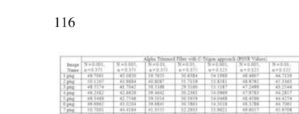

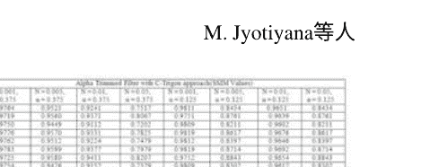

图3 a显示了使用C-trigon方法的Alpha修剪滤波器的PSNR值，b显示了使用C-trigon方法的Alpha修剪滤波器的SSIM值

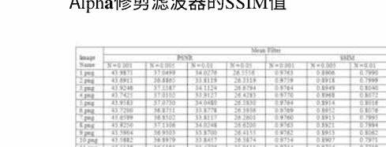

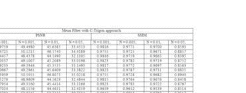

图4 a显示了平均滤波的结果，b显示了使用提出的C-trigon方法的平均滤波结果

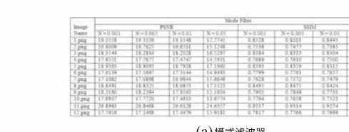

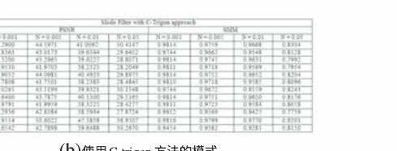

图5 a显示了模式滤波的结果，b显示了使用提出的C-trigon方法的模式滤波结果

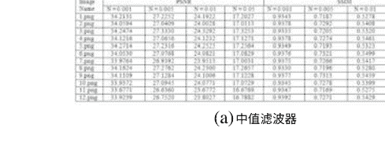

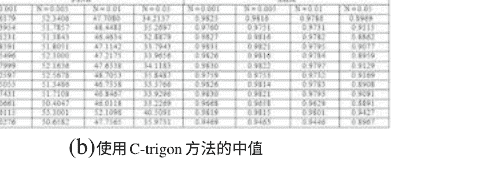

图6 a显示了中值滤波的结果，b显示了使用提出的C-trigon方法的中值滤波结果

## 5 结论

噪声是任何数字图像中不需要的部分，它通常存在于每个图像中。在本文中，我们提出了一种新的方法来去除数字图像中的高密度脉冲噪声。本文定义了一个非常简单的噪声检测机制，它不仅对脉冲噪声的去除非常有效，而且保留了图像的原始性，只选择了滤波后的噪声像素。

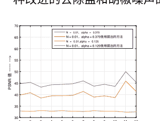

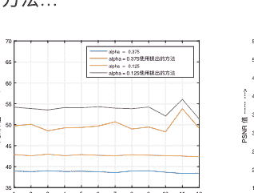

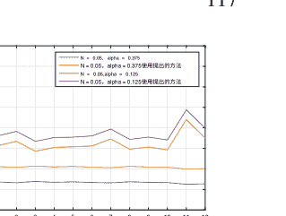

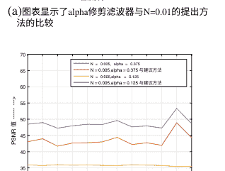

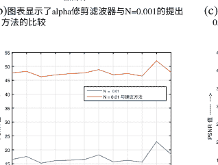

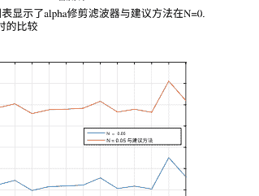

图7图表a, b, c和d分别显示了alpha修剪滤波器和C-trigon方法在噪声密度(N) = 0.01, 0.001, 0.05和0.005时的比较，图表e和f显示了WMF滤波器和C-trigon方法在噪声密度(N) = 0.01和0.05时的比较

窗口。结果显示了所提出方法的效率。我们还使用均值、众数和中位数滤波器进行实验，所有这些滤波器在所提出的C-trigon方法中也给出了更好的结果。所提出的方法具有积极的优势，不需要调整任何特定参数。

#### 参考文献

- 1. Gonzalez, R.C., Woods, R.E.: 图像处理。数字图像处理。 2，1 (2007)
- 2. Gonzalez, R.C., Woods, R.E., Eddins, S.L.: 使用MATLAB的数字图像处理。Pearson Education India (2013)
- 3. Rani, V.: 各种噪声模型和滤波技术的简要研究。全球研究计算机科学。 4(4), 166–171 (2013)
- 4. Verma, R., Ali, J.: 各种类型的图像噪声和高效去噪技术的比较研究。国际高级研究计算机科学软件工程。 3(10), 617–622 (2013)
- 5. Aguilar-Gonzalez, P.M., Kober, V., Diaz-Ramirez, V.H.: 使用噪声训练图像的非重叠场景中的自适应复合滤波器进行模式识别。模式识别信件。 41,83–92 (2014)
- 6. Singh, P., Arora, A.: 图像滤波技术的分析分析。工程创新国际杂志(IJEIT) 3(4), 29–32 (2013)
- 7. Patidar, P., Gupta, M., Srivastava, S., Nagawat, A.K.: 不同噪声的图像去噪。计算机应用国际杂志 9(4), 45–50 (2010)
- 8. Brown, W.J., Wilton, D.R.: 电场积分方程中的奇异基函数和曲线三角形解法。IEEE天线和传播杂志 47(2), 347–353 (1999)
- 9. Windyga, P.S.: 快速脉冲噪声去除。IEEE图像处理杂志 10(1), 173–179 (2001)
- 10. Chan, R.H., Ho, C.W., Nikolova, M.: 通过中值型噪声检测器和保留细节的正则化方法去除椒盐噪声。IEEE图像处理交易。 14(10), 1479–1485(2005)
- 11. Srinivasan, K.S., Ebenezer, D.: 一种新的快速高效的基于决策的算法用于去除高密度脉冲噪声。IEEE信号处理通信。 14(3), 189–192 (2007)
- 12. Ko, S.J., Lee, Y.H.: 中心加权中值滤波器及其在图像增强中的应用。 IEEE电路与系统交易。 38(9), 984–993 (1991)
- 13. Dong, Y., Xu, S.: 一种新的方向加权中值滤波器用于去除随机值脉冲噪声。IEEE信号处理通信。 14(3), 193–196 (2007)
- 14. Zhang, S., Karim, M.A.: 一种新的用于切换中值滤波器的脉冲检测器. IEEE信号处理通讯 . 9(11), 360–363 (2002)
- 15. Ibrahim, H., Kong, N.S.P., Ng, T.F.: 一种用于去除高度损坏图像中脉冲噪声的简单自适应中值滤波器.IEEE消费电子交易. 54(4), 1920–1927 (2008)
- 16. Ng, P.E., Ma, K.K.: 一种带有边界判别噪声检测的切换中值滤波器，用于极度损坏的图像.IEEE图像处理交易. 15(6 ), 1506–1516 (2006)
- 17. Fabijanska, A., Sankowski, D.: 一种基于噪声自适应切换中值滤波器，用于极度损坏图像的脉冲噪声去除. IET图像处理. 5(5), 472–480 (2011)
- 18. Nalla perumal, K., Varghese, J., Saudia, S., Arulmozhi, K., Velu, K., Annam, S.: 使用自适应切换中值滤波器去除椒盐脉冲噪声. 在: OCEANS 2006-Asia Pacific,2006年5月, pp. 1-8. IEEE (2006)
- 19. Wang, S.S., Wu, C.H.: 一种新的脉冲检测和滤波方法用于去除广泛范围的脉冲噪声。模式识别 42(9), 2194–2202 (2009)
- 20. Buades, A., Coll, B., Morel, J.M.: 一种用于图像去噪的非局部算法。 在：2005年IEEE计算机学会计算机视觉和模式识别会议（CVPR 05），2005年6月，卷2，第60-65页。IEEE (2005)
- 21. Zhang, X., Zhan, Y., Ding, M., Hou, W., Yin, Z.: 基于决策的非局部均值滤波器用于去除数字图像中的脉冲噪声。信号处理 93(2), 517–524 (2013)
- 22. Wang, G., Zhu, H., Wang, Y.: 用于彩色图像去噪的模糊决策滤波器。Optik 126(20),2428–2432 (2015)
- 23. Mohan, J., Krishnaveni, V., Guo, Y.: 对磁共振图像去噪方法的调查生物医学信号处理与控制 9, 56–69 (2014)
- 24. Zhang, K., Zuo, W., Chen, Y., Meng, D., Zhang, L.: 超越高斯去噪器：深度卷积神经网络的残差学习用于图像去噪。IEEE图像处理期刊 26(7), 3142–3155(2017)
- 25. Ali, H.M.: 基本滤波器对MRI医学图像去噪。在：高分辨率神经影像学-基本物理原理和临床应用, pp. 111–124. InTech(2018)
- 26. Panigrahi, S.K., Gupta, S., Sahu, P.K.: 基于曲线多尺度去噪的非局部均值和引导图像滤波 .IET图像处理期刊 12(6), 909–918 (2018)
- 27. Jifara, W., Jiang, F., Rho, S., Cheng, M., Liu, S.: 利用卷积神经网络进行医学图像去噪：一种残差学习方法。J. Supercomput. 75(2), 704–718 (2019)

# 离线笔迹识别的双通道深度卷积神经网络

Naresh Purohit和Subhash Panwar

摘要：笔迹识别是一个基于少量手写文本的挑战性问题。它也是文件取证分析中的一个重要研究课题。为此，提出了一种卷积神经网络（CNN）来解决笔迹识别任务。在这项工作中，我们提出了一种双通道CNN来从给定的输入手写文档图像补丁中提取局部特征图，并通过Softmax损失函数对作者进行分类。实验是在IAM英语语言数据集上进行的，准确率达到92.7%。

- 笔迹识别
- 深度学习
- 特征提取

## 1 引言

手写仍然是表达个体独特性的有效方式，并在生物识别中起着重要作用。在文档图像分析和识别中，由于人类书写风格的强烈变化，写手识别问题是一个激动人心的任务。写手分类是对查询文档的写手进行分类的过程。它分为两个部分（a）离线（b）在线。在离线写手识别中，我们处理静态手写扫描图像中的文本字符、行和段落。在线写手识别同时考虑到写作角度、压力和速度，这些信息是由鼠标或光笔设备生成的。写手识别任务基于文本相关或文本无关的方法。在文本相关方法中，比较不同写手写的相同数据，而文本无关方法则比较不同写手写的不同数据内容。文本无关方法具有广泛的适用性，但与文本相关方法相比，其准确性不高[1]，我们提出的模型基于文本无关的离线写手识别任务。

图1展示了任何写手识别系统的基本模块，包括预处理、特征提取和分类。预处理包括数据清理操作，如从图像数据中去除噪声，将图像分割成小块，对图像块进行归一化和形态学操作。图像数据的特征是通过传统的基于手工特征或深度学习方法提取的。在最后阶段，使用分类器来预测查询图像文档的写手。在本文中，我们提出了双通道深度CNN模型，该模型从原始和骨架图像块中提取特征图。我们提出的模型基于卷积神经网络（CNN）的基本架构。在计算机视觉中，CNN是一种常用的深度学习算法，可用于识别和分类图像中的特征。基本的CNN架构（受LeNet-5启发）有两个主要部分。第一个部分用于特征提取，第二个部分用于分类目的，如图2所示。

卷积层（CL）和池化层（PL）是CNN特征提取阶段的一部分。CL通过在输入图像上应用不同的滤波器生成多个特征图。PL对CL生成的特征图进行下采样，并保留最重要的信息。在最后的池化操作后，2D下采样的特征图被转换为1D向量，并传递到全连接层进行分类处理。最后使用概率损失函数（Softmax）来预测测试查询文档的作者类别。

因此，本文的其余部分组织如下：第二节讨论相关工作，第三节详细解释了提出的数据预处理和双通道CNN模型的方法。第四节评估了实验结果，最后在第五节总结了结论和未来的工作。

## 2 相关工作

在本节中，我们回顾了几种典型的离线书写者识别方法。在深度学习和神经网络时代之前，传统的手工特征方法被使用。在基于手工特征的方法中，通常我们考虑图像数据的纹理和形状特征。Bulacu等人[2]使用了从手写图像中提取的六种不同的概率分布函数（PDFs），用于识别查询文档上的书写者，并且在两种纹理（方向共现PDF和行长度PDF）和一种字形（字母发射PDF）特征的组合下获得了良好的准确性。在2011年，Jain等人[3]提出了一种改进性能的新方法，使用了K-相邻段（KAS）特征。他们还对KAS特征应用了样本聚类，并使用欧氏距离进行书写者分类，然后在IAM数据集上获得了89.6%的准确率。同一作者在2014年进一步将KAS特征与SURF和轮廓梯度描述符相结合，将准确率从89.6%提高到94.1%[4]。Xiangqian等人[5]在HIT-MW中文数据集上使用了LoG滤波器和SIFT描述符来提取文档中的单词区域，并获得了95.4%的准确率。

基于深度学习的算法通常比基于手工特征的方法表现更好。原因是大量的数据和大量的特征。卷积神经网络（CNN）是一种能够识别和分类图像数据中特征的深度学习算法。CNN的基本架构如图2所示。近年来，几个结合了一些操作（如VLAD编码、SVM等）的CNN深度学习模型在提取特征并进行作者识别方面取得了良好的准确率。在Xing等人的研究中，他们在IAM数据集上使用了类似LeNet-5的CNN结构，包括5个卷积层（CL）和3个最大池化层（MP）来提取特征图。Christlein等人提出了另一种技术，他们利用从图像数据中提取的SIFT（尺度不变特征变换）关键点进行聚类，构建聚类索引，并将其作为图像目标用于他们的CNN模型。一些深度学习模型还可以在无标签数据上进行，如Shiming Chen等人提出的一种使用加权均匀标签分布方法的模型，称为加权标签平滑正则化（WLSR）。他们使用了ResNet-50，这是CNN的另一种变体，在CVL数据集上达到了99.2%的准确率。

## 3 方法论

在本节中，我们讨论了基于扫描手写图像块使用CNN深度学习模型的离线写作者识别的提出的流程。 该流程包括以下阶段：

- 对来自IAM数据集的扫描手写图像数据进行预处理。
- 使用提出的双通道深度CNN模型对预处理的图像数据进行特征提取。
- 使用Softmax进行写作者类别预测。

### 3.1 预处理

数据预处理是为了通过消除不需要的数据和提高可读性信息来增强图像质量，以构建适合的图像。 我们在本文中使用了IAM手写数据库。 IAM数据集包含来自300多位作者的手写扫描文本图像，以行和段落图像的形式呈现。 我们考虑IAM中显示的单行手写扫描图像数据集，如图3所示。

在将这些文本行图像传递给提出的CNN模型之前，我们对这些文本行图像应用了一些预处理操作。 首先，将所有文本行扫描图像转换为单通道，即使用Otsu方法进行二值化。 在对文本行图像进行二值化之后，我们还找到了该图像的骨架。 图像的骨架是形态学操作，它提供有关图像中形状的有用信息。 这两个操作在图4中显示。

在对IAM数据集的所有文本行扫描图像进行分析后，我们发现所有图像的高度和宽度都不同，其中所有图像的宽度都大于高度。 由于所提出的CNN模型始终将输入作为正方形图像，即输入图像的宽度和高度应相同。 因此，为了处理非正方形文本行图像，我们使用了一种裁剪补丁策略。 在裁剪补丁技术中，有以下两个阶段，如图5所示。

- 将所有文本行图像调整为固定高度113px，并保持其相应的宽度与高度比例。
- 从调整大小的图像中裁剪出113×113的图像块。

对于单行文本图像，将裁剪过程应用于它们的二值化和（二值化+骨架化）图像。因此，在预处理阶段，每个单行文本图像都有许多113×113个单通道骨架图像块。这些方形图像块作为输入传递给提出的CNN模型。

### 3.2 双通道深度CNN

我们的CNN模型的主要网络结构受到AlexNet结构的启发[9]。提出的CNN架构由两个路径（路径I、路径II）组成，因为它是一个双输入CNN。路径I以二值化的方形图像块作为输入，路径II以骨架化的二值化方形图像块作为输入。两个路径都是我们双输入CNN模型的特征提取阶段的一部分。在特征提取阶段，模型在每个卷积层之后生成局部特征图，然后通过池化层进行下采样。两个路径具有相同的卷积和池化层配置，包括五个卷积层，在第二个和第五个卷积层之后有三个最大池化层，以增加网络的深度，并且有两个全连接（稠密）层。第一个卷积层的卷积核/滤波器大小为5×5，其余卷积层为3×3。步长为1。

对于所有的卷积层，我们使用2个池化层。所提出模型的配置如图6所示。

为了保持网络中的神经元激活，我们在每个卷积和全连接层之后使用ReLU（修正线性单元）函数。如果神经元的输入值低于阈值，则它们会死亡或失活。ReLU在遇到任何负输入值时返回0，并对于任何正值返回该值。因此可以写成：

ReLU(x) = max(0, x)。 (1)

在提出的模型中，我们在每个卷积层之后使用核大小为3×3，步长为2的最大池化层来对特征图进行下采样。两个路径中都使用了总共五个连续的卷积层和最大池化层，使用不同的输入图像块。两个路径从二值化和骨架化的图像块中生成了几个不同的局部特征图。在两个路径中的最后一个池化层之后，将下采样的局部特征图转换为2D矩阵形式的1D向量数组，使用扁平化操作。在扁平化之后，我们将路径一和路径二的1D向量数组合并为一个单独的1D向量数组。这个合并后的1D向量作为输入传递给下一个全连接层。如图6所示，在提出的模型中有两个隐藏层，分别具有512个和128个节点的全连接层。这两个稠密层构成了多层感知机网络，用于训练网络。通过合并的扁平化的1D向量输入，稠密层训练网络。为了减少过拟合，我们在每个稠密层之后使用50%的丢弃层。网络训练后，最后一层是Softmax，用于多类别分类，预测查询图像文档的作者类别[12]。

## 4 实验和结果

在本节中，提供数据集的详细信息，我们模型的实验设置和结果。 我们使用IAM数据集来训练和测试我们提出的模型。 该数据集包含来自657个不同作者的手写英文文本，使用不同的笔。他们分别提供整个文档和分割线的手写扫描图像，格式为PNG。 我们使用包含每个句子的行图像的分割线数据集。 实验和模型构建是在Google共同实验室环境中实施的。 Google共同实验室是一个免费且开源的平台，提供25-36GB的虚拟RAM和12GB的GPU内存。 我们根据我们有限的虚拟资源修改了IAM数据集。

根据(70:30)的比例，每个作者贡献的句子图像被分为训练集和测试集。 双通道深度CNN使用大约120,000个来自20个不同作者的图像补丁，达到92.7%的准确率。

TensorFlow和Keras库被用于实现和训练提出的模型。 在预处理阶段使用了OpenCV和skimage库进行了一些形态学操作。 该模型在总共30-40个epochs的训练和验证数据中进行训练，比例为（70:30）。 模型训练后，训练和验证数据的准确率和损失曲线的可视化如图7所示。

我们还对正方形图像块的大小变化进行了研究。 表1显示了图像块大小的减小也会影响模型的准确性。 我们还将我们提出的模型性能与其他模型和最先进的方法进行了比较，如表2所示。 双通道CNN的准确率比Sheng等人[10]和Bulacu等人[2]高。

表1 图像块大小比较
| 补丁尺寸 | 准确率 % |
| :--- | :--- |
| 113 × 113 | 92.7 |
| 82 × 82 | 89.8 |

表2 与其他方法的比较
| 参考文献 | 特征 | 准确率 % |
| --- | --- | --- |
| Sheng等人[11] | 自适应CNN | 85.2 |
| Sheng等人[10] | FragNet CNN | 85.1 |
| Bulacu等人[2] | 概率分布函数 | 89.9 |
| 提出的 | 双通道CNN | 92.7 |

## 5 结论

本文提出了一种基于二进制和骨架图像输入补丁特征图提取的双通道CNN网络用于作者识别。所提出的方法应用于修改后的IAM数据集，该数据集包含来自不同作者的分割线扫描图像。为了提高模型的准确性，我们分析了模型提取的图像补丁的特征。为了获得更高的模型准确性，图像的尺寸和质量也起到了一定的作用。因此，在模型训练之前，我们对图像数据进行预处理。在图7中，验证数据的准确率曲线（蓝色）和损失曲线（黑色）在模型训练过程中上下波动。这表明我们仍然需要改进模型的配置。我们的方法可以扩展到其他脚本。未来我们计划将这种方法扩展到其他数据集。我们还将研究补丁提取策略和过拟合问题，因为它们也会影响模型的性能。

#### 参考文献

1. Sreeraj, M., Idicula, S.M.: 一项关于作者识别方案的调查。国际计算机应用杂志 25(12), 23–33 (2011)
2. Bulacu, M., Schomaker, L.: 使用文本特征和书写特征的无关文本作者识别和验证。IEEE模式分析与机器智能杂志。 29(4), 701–717 (2007)
3. Jain, R., Doermann, D.: 使用K-相邻段进行离线作者识别。 在：2011年北京国际文档分析与识别会议，2011年，第769–773页
4. Wu, X., Tang, Y., Bu, W.: 基于尺度不变特征变换的离线无关文本作者识别。IEEE信息安全取证与安全杂志。 9(3), 526–536
5. Jain, R., Doermann, D.: 结合本地特征进行离线书写者识别。 在：2014年希拉克利翁举行的第14届国际手写识别会议上，2014年，第583-588页。
6. Xing, L., Qiao, Y.: Deepwriter：一种用于无文本独立书写者识别的多流深度卷积神经网络。 在：2016年深圳举行的第15届国际手写识别会议(ICFHR)上，2016年10月，第584-589页。
7. Christlein, V., Gropp, M., Fiel, S., Maier, A.K.: 无监督特征学习用于书写者识别和书写者检索。在国际文件分析和识别会议(ICDAR)上，卷1，第991-997页，2017年。
8. Chen, S., Wang, Y., Lin, C.-T., Ding, W., Cao, Z.: 半监督特征学习用于改进书写者识别(2018年)
9. Krizhevsky, A., Sutskever, I., Hinton, G. E.: 使用深度卷积神经网络的Imagenet分类。 在：神经信息处理的进展（2012年）
10. He, S., Schomaker, L.: 使用深度片段网络的作者识别。 IEEE Trans. Inf. Forensics Secur. 15, 3013–3022 (2020)
11. He, S., Schomaker, L.: 基于单手写字图像的作者识别的深度自适应学习。 Pattern Recogn. 88, 64 – 74 (2019)
12. Fiel, S., Sablatnig, R.: 使用卷积神经网络的作者识别和检索。 在：图像和模式的计算机分析，第26–37页。 Springer
13. Rehman, Naz, S., Razzak, M.I., Ibrahim, H.A.: 作者识别的自动视觉特征：一种深度学习方法。 IEEE Access 7, 17149–17157 (2019)
14. Keglevic, M., Fiel, S., Sablatnig, R.: 使用三元组CNN学习用于作者检索和识别的特征。 I CFHR, pp. 211–216, 2018
15. Adak, C., Chaudhuri, B.B., Blumenstein, M.: 划掉文本对作者识别的影响。 在：Proceedings of 30th International Joint Conference on Neural Networks (IJCNN), pp. 1465–1471, 2017
16. Nguyen, H.T., Nguyen, C.T., Ino, T., Indurkhya, B., Nakagawa, M.: 使用卷积神经网络进行无文本作者识别。 Pattern Recogn. Lett. 121, 104–112 (2019)
17. Simonyan, K., Zisserman, A.: 用于大规模图像识别的非常深的卷积网络。 arXiv:1409.1556, 2014
18. He, K., Zhang, X., Ren, S., 等： 深度残差学习用于图像识别。 arXiv:1512.03385, 2015
19. Ciresan, D., Meier, U., Schmidhuber, J.: 用于图像分类的多列深度神经网络。 在：2012年IEEE计算机视觉和模式识别（CVPR）会议上，第3642-3649页。IEEE（2012年）
20. Christlein, Maier, A.: 编码CNN激活用于作者识别。 在：第13届IAPR国际文档分析系统研讨会（DAS）论文集，第169-174页，2018年4月

#### 用于工业模拟器设计的多智能体系统

Kenza Redjimi和Mohammed Redjimi

摘要：工业系统在我们的日常生活中非常重要。它们通常以大量相互作用的元素为特征。其中一些是关键的，如果停止运行将会对工厂造成非常重大的财务损失。观察这些系统的运行过程是基于它们的建模。这个任务通常基于对较简单组件的细分。每个组件可以单独建模然后进行模拟。在本文中，我们提出了一种自上而下的建模方法，采用多智能体系统的方法。因此，整个系统被视为一组相互作用的代理。全局系统的行为是由其部分的行为产生的。这种方法被应用于阿尔及利亚一家气体工厂的液化天然气处理过程（脱碳）。模拟结果可用于培训该工厂的新员工。

- 多智能体系统（MAS）
- 工业系统建模和模拟
- 代理/群组/角色（AGR）模型
- Aalaadin
- Madkit

## 1 引言

如今，工业系统采用先进技术来开发复杂的工业流程。绝大多数这些系统可以被认为是复杂的，因为它们由大量相互作用的元素组成。

为了开发这样的系统，在开始构建它们之前预测它们的行为，或者进行教育培训，这些系统被建模并经历一系列测试。

使用计算机工具进行建模的优势在于构建一个非常忠实于所考虑系统及其部分的计算机模型。然后通过注入一组数据来判断所得模型的行为。输入。 这使得处理、观察和改进对其行为的理解成为可能，并避免了对其未来演化可能出现的任何错误。

- 途。 某些所谓关键系统的关闭可能会造成物质和财务损失。
- 途。 对于这些系统，使用代表它们的模型非常有帮助。
- 途。 实际上，不需要停止整个或部分工厂的运行，只需考虑代表它们的模型即可。
- 途。 例如，工业锅炉就是这种情况，其关闭可能导致整个依赖于它的工厂部分的关闭。途。

系统的概念是几个领域和学科的核心。 系统由一组相互通信和相互作用的元素所特征化。 系统接收输入并产生结果。 可以设想各种系统，如工业系统、经济系统、政治系统... 用于表征系统复杂性的常用度量标准。

系统建模已经成为许多研究和研究的主题，考虑到其对实现的现象的重要影响。 Fishwich [1] 将建模视为一组隐喻和类比，以更好地理解任何现象。对于Oussalah [2]，建模是系统和模型之间的转换，以提供其结构和行为的简化和可观察的表示。

模型的实验可以被视为其模拟。 实际上，模拟是模型的执行阶段 [3]。 给定一组相关数据作为模型的输入，该阶段包括演化模型并观察和分析所获得的结果。 因此，可以将工作视为实验室中实际案例的建模。

复杂系统的模拟可能需要数小时甚至数天，并且消耗大量的CPU时间。 这就是为什么建模者会采用复杂度降低的方法。 其中包括并行模拟[4]，将现象分解为较简单实体[5]，或使用快速且并行的CPU[6]。

对于高保真度、精度和适应性的追求要求选择建模和模拟数据处理工具时要非常谨慎。 它们在建模和模拟领域的使用非常广泛，以合理的成本不断改进，确保卓越的品质。

在文献中已经使用并继续使用多种建模方法、方法和工具。 Petri网（PN）[7]是最高效和广泛使用的工具之一。 尽管它们已经存在了62年，但它们仍然在今天具有重要意义。这些网络尽管简单，但可以表示系统的动态。 已经开发了多种变体和扩展，如彩色Petri网（CPN）和定时Petri网[8，9]。

UML状态图是其他强大的半正式工具，可以表示系统的行为[10]。 在更高的层次上，多Agent系统（MAS）是一种建模工具，具有将真实复杂系统细分为一组组件的优势。 全局系统的行为是由其实体的行为决定的。 代理的概念指代一个实体其功能是自主的，并能够执行一组任务[11, 12]。由于其灵活性、简单性、效率和可扩展性，这些系统在计算机系统中的使用越来越多。

此外，人类观察者可以轻松理解MAS所提供的描述。本文的其余部分组织如下：第2节介绍基于多Agent系统的方法。第3节专门介绍了提出的方法。第4节介绍了工业系统仿真的一个用例，最后，第5节总结了本文。

## 2 多智能体系统 (MAS)

多智能体系统 (MAS) 提供了建模分布式系统的高级工具。如今，它们的应用非常广泛，并且在各个领域，特别是基于人工智能的领域中取得了成功。一组自治代理在执行共同目标的过程中合作和协作。所有这些代理的行为共同构成了系统的整体行为[11-20]。

### 2.1 代理定义

关于代理这个术语没有共识。一般来说，代理是一个与普通程序不同的实体（硬件或软件），它具有在与其他代理共享的环境中自主运行的能力[12, 16]。代理能够通过获取环境发出的信息并对其进行操作来在环境中演化。代理的架构从简单的由产生规则组成的结构到非常复杂的结构都有，其中代理可以具备高级的认知和推理机制，被称为具有联想和社会性特征的代理[21]。

## 3 提出的方法

本研究关注的工作与石油化工领域中工业过程模拟器的开发相关。这涉及为技术人员提供教育支持，使他们能够理解过程的不同阶段。

提出的方法是自上而下的方法，因此从整体过程开始，然后根据基本单元进行划分（见图1）在确定它们之后。

切割过程的步骤如下：

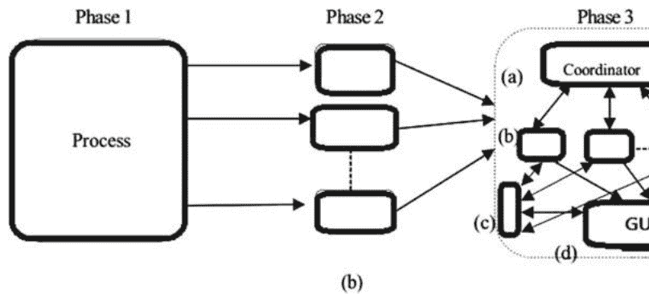

1.  对过程进行详细研究。明确其操作原理。
2.  根据过程的详细技术图表，确定构成过程的不同单元（b）。
3.  将每个单元隔离出来进行单独建模，并将得到的单元组装成全局图表。

模型中添加了三个额外的控制和通信单元：

-   a. 协调员的角色是控制和管理整个系统的执行。
-   b. 一个输入接口，用户可以对系统进行操作。
-   c. 一个用于根据用户发送的输入来可视化进程进展的界面。

### 3.1 系统设计工具

对于这种模拟器的设计，使用多智能体系统的解决方案非常合适。每个单元都代表一个智能体。协调员、输入接口以及显示界面也是如此。

现在，有几种基于多智能体系统的方法非常适合对系统进行建模和仿真。同时，有各种各样的多智能体平台可供选择。在现有的方法中，AGR（Agent-Group-Role）模型在系统模块化方面取得了非常好的结果。在AGR模型中，一个智能体可以在一个或多个组中扮演一个或多个角色。

AALAADIN元模型是基于AGR概念的多智能体系统建模的组织模型。AALAADIN提供了一套用于基于多智能体系统实现应用程序的概念工具。AALAADIN是在蒙彼利埃（LIRMM）的计算机科学、机器人和微电子实验室开发的[22-24]。

### 3.2 MADKIT平台

多智能体开发工具包平台（MadKit）是一款用于设计和模拟多智能体系统（MAS）的免费软件[25-29]。MadKit是一套Java类的包。它实现了一个精简的智能体内核，各种消息、探针和智能体库。此外，Madkit还包括一个实用的图形开发环境和许多其他智能体处理系统。Madkit根据AGR模型实现了不同的智能体、群组和角色管理工具。该平台基于AALAADIN元模型。

## 4 用例

纯天然气（NG）由于存在杂质，尤其是水和二氧化碳（H₂O和CO₂），不适合消费，从而降低了其热值。NG的液化需要冷却到约−165°C。知道水的冰冻温度为0°C，CO₂的冰冻温度为−20°C，这将在液化过程中堵塞机器的管道。正因为这些原因，NG在液化操作之前必须经过处理（脱碳和脱水）。脱碳是从天然气中提取二氧化碳CO₂的过程，脱水是从中提取水的过程。有几种工业方法可以执行脱碳。[30]介绍了本研究采用的过程。

### 4.1 天然气脱碳过程

这个用例是脱碳过程的两个操作：(i) 洗涤操作，旨在用M.E.A（C₂H₅ONH₂）从天然气中提取CO₂，(ii) 再生阶段，洗涤操作的结果进入再生塔，释放CO₂并恢复MEA溶液。图2和图3展示了专用设备。根据图1所示的故障系统阶段，在研究和分析整个系统后，如图3和图4所示，可以得出以下四个要点：

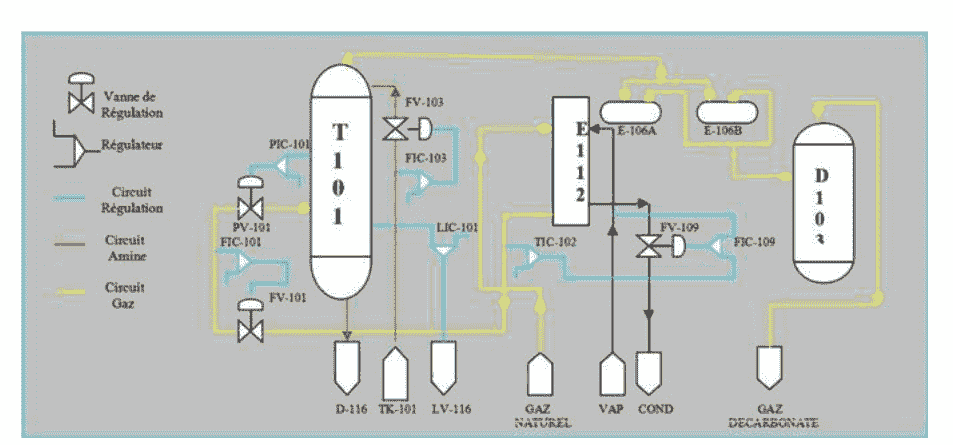

图2 洗涤过程的技术图纸

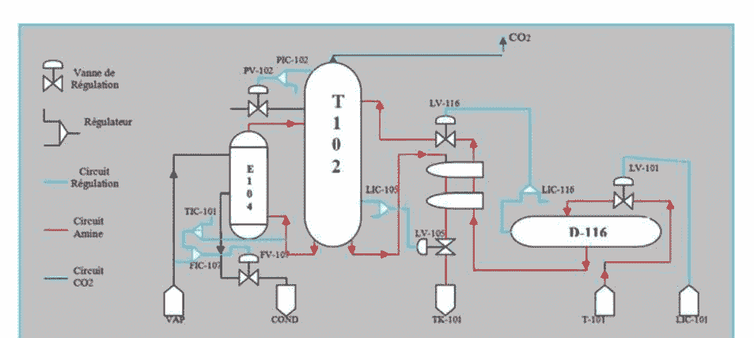

图3 再生过程的技术图纸

-   有序的系统：脱碳过程。它包含一组器官(T-101、T-102、D-116、E-112、E-104等)，用于进行各种化学反应，以实现天然气的脱碳。
-   控制系统：这是天然气脱碳过程的分布式控制系统。它由一组自治、模块化和分布式的仪器组成。它们用于对过程进行控制和调节。
-   洗涤部分：它包括调节阀（FV-109、FV-103、FV-101、PV-101），由控制系统调节，其中包含不同的调节回路。

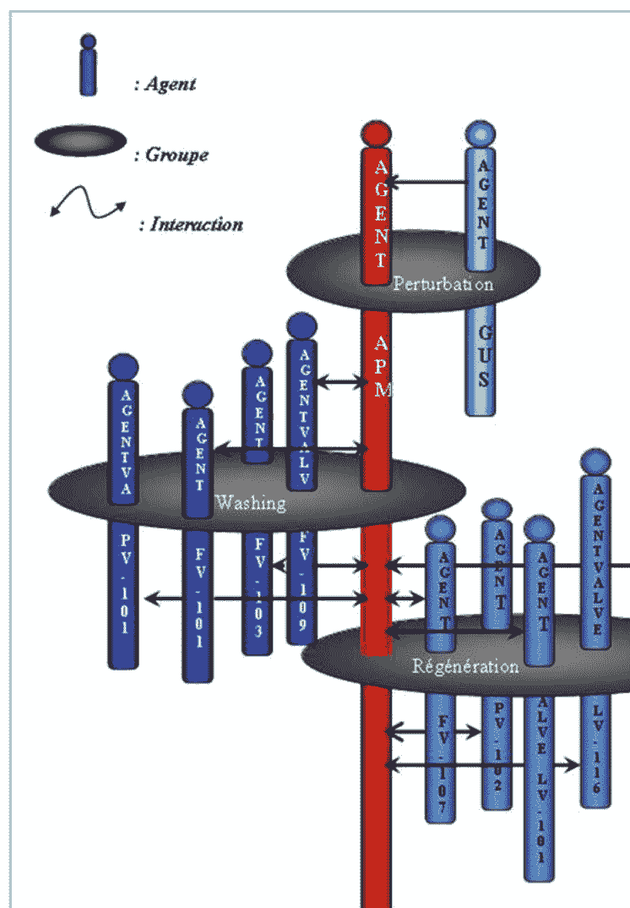

图4 模拟器的AALAADIN模型

-   再生部分：也包含一组控制阀（FV-107、PV-102、LV-116、LV-105、LV-101），由同一控制系统调节。为了进行这个调整，控制系统基于一组指令。

| Id_组 | Id_代理 | 指定           | 角色                     |
| :---- | :------ | :------------- | :----------------------- |
| 扰动  | GUS     | 图形用户系统   | 与系统交互               |
|       | APM     | 代理进程管理器 | 获取指令                 |
| 洗涤  | APM     | 代理进程管理器 | 调节洗涤组               |
|       | FV-103  | 流量阀代理     | 控制胺流量               |
|       | FV-101  | 流量阀代理     | 检查天然气流量           |
|       | PV-101  | 压力阀代理     | 检查T-101的压力          |
|       | FV-109  | 流量阀代理     | 检查E-102的蒸汽流量      |
| 再生  | APM     | 代理进程管理器 | 设置再生组               |
|       | FV-107  | 流量阀代理     | 检查E-104的蒸汽流量      |
|       | PV-102  | 压力阀代理     | 检查T-102的压力          |
|       | LV-101  | 水位阀代理     | 检查T-101的水位          |
|       | LV-116  | 水位阀代理     | 检查D-116的水位          |
|       | LV-105  | 水位阀代理     | 检查T-102的水位          |

### 4.2 提出的AGr模型

为了构建一个交互式模拟器，用于上述工业气体过程，已经区分了如表1所示的三个组。请注意，这一点对应于所提出的模拟方法的第2阶段：这种分解是在对NG脱碳过程以及材料结构和相互作用的安排（压力、水平、流量控制等）进行细致研究后得到的。本文不会详细介绍系统的工作原理。

APM代理确保不同单元之间的时间同步。这个特殊的代理（APM）在系统中充当协调员。

### 4.3 Aalaadin模型

整个模型及系统中所有组件（代理）之间的链接如下图4所示。该图不描述每个代理的角色。这一步骤对应于所提出的方法的第3阶段。

### 4.4 系统实施

该模拟器是基于AALAADIN模型，使用基于Mad-Kit代理平台开发的。项目的两个主要界面如图5所示

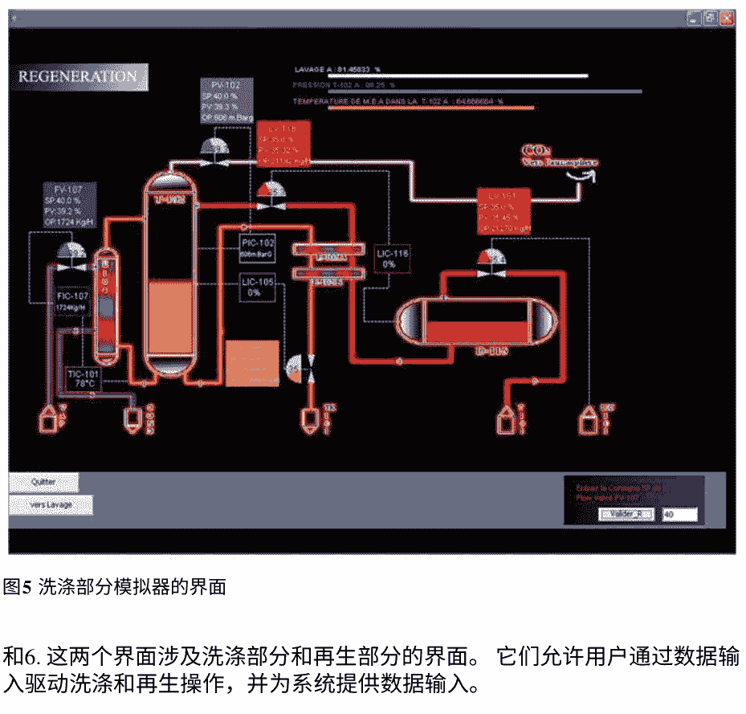

图5 洗涤部分模拟器的界面

和6。这两个界面涉及洗涤部分和再生部分的界面。它们允许用户通过数据输入驱动洗涤和再生操作，并为系统提供数据输入。

### 4.5 讨论

本工作旨在实现代理之间的合作、协作和同步的MAS机制。这些工具用于设计和实现工业模拟器。这里介绍和实现的用例可以作为教学支持，巩固和验证了所提出的方法。

## 5 结论

本工作关注工业模拟器设计的一些概念。本工作回应了提供一个工具的真实需求，使公司的初学者能够理解工业过程的演变。在这种情况下，它是液化天然气脱碳过程。提供设备

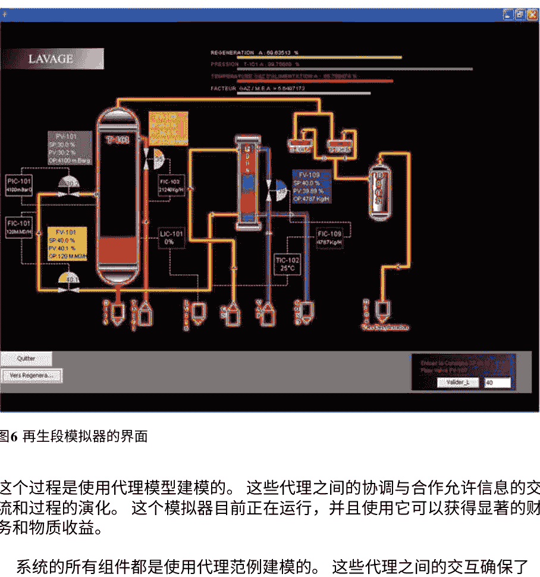

这个过程是使用代理模型建模的。这些代理之间的协调与合作允许信息的交流和过程的演化。这个模拟器目前正在运行，并且使用它可以获得显著的财务和物质收益。

系统的所有组件都是使用代理范例建模的。这些代理之间的交互确保了系统的演化和全局行为从局部代理的执行中产生。使用一致和连贯的工具（例如AALAADIN和MADKIT）对于获得高效的软件产品非常有意义，就像在这里一样。在未来的工作中，我们计划将这种方法扩展到分布式系统建模。

#### 参考文献

-   1. Fishwick, P.: 模拟模型设计与执行。构建数字世界 (1995年)
-   2. Oussalah, C.: 用于技术领域推理支持的多视图层次模型。技术报告 (1988年)
-   3. Fishwick, P., Paul. A.: 计算机模拟: 通过扩展实现增长. Trans. Soc. Comput. Simulat. Int. 14(1), 13–23 (1997)
-   4. Mubarak, M., Carothers, C.D., Ross, R.B., Carns, P.: 实现大规模HPC网络系统的并行模拟. IEEE Trans. Parallel Distrib. Syst. 28(1), 87–100 (2016). https://
-   5. Wainer, G., Liu, Q., Jafer, S.: 在PCD++中并行模拟DEVS和Cell-DEVS模型. Discrete-Event Modeling and Simulation 20115630, 223–270 (2016)
-   6. Martínez-del-Amor, M.A., Riscos-Núnez, A., Pérez-Jiménez, M.J.: 使用GPU并行模拟P系统的调查. Bulletin Int. MC Soc. 55–68 (2017)
-   7. Juranic, J., Pavkovic, N., Naumann, T., Marjanovic, D.: 用Petri网建模设计参数动态。在：DS 87-2第21届国际工程设计会议(ICED 17)第2卷： 设计过程， 设计组织和管理， 091-100。加拿大温哥华(2017)
-   8. Jensen, K., Kristensen, L.M.: 彩色Petri网， Springer， 柏林海德堡(2009)。https://doi.org/10.1007/b95112
-   9. Jensen, K., Kristensen, L.M., Wells, L.: 彩色Petri网和CPN工具用于并发系统的建模和验证。Int. J. Softw. Tools Technol. Transfer 9(3-4), 213–254(2007)。https://doi.org/10.1007/s10009-007-0038-x
-   10. Sunitha, E.V., Samuel, P.: 从UML状态图生成自动代码. IEEE Access 7, 8591–8608 (2019). https://doi.org/10.1109/ACCESS.2018.2890791
-   11. Mess, M., Guerrits, B.: 多智能体系统， 物流讲义， 611–636。 (2018). https://doi.org/10.1007/978-3-319-92447-2-27
-   12. Ferber, J.: 多智能体系统： 走向集体智能. 计算机科学， 人工智能， Intereditions Paris (1995)
-   13. Chen, F., Ren, W.: 关于多智能体系统的控制： 一项调查 Foundat Trends Syst Control 6(4), 339–499 (2019)
-   14. Weiss G. (ed): 多智能体系统—分布式人工智能的现代方法. MIT Press, Cambridge, MA (1999)
-   15. 王, B., 王, J., 张, B., 李, X.: 面向工业应用的多智能体系统在执行器饱和条件下的全局合作控制框架。IEEE Trans. Syst. Man Cybernet. Syst. 47(7), 1270–1283 (2016年)
-   16. Ferber, J.: 多智能体系统。Addison-Wesley， 分布式人工智能导论 (1999年)
-   17. Shoham, Y.: 面向代理的编程。Artific.l Intell. 60(1), 51-92 (1993年)
-   18. Franklin, S., Gasser, A.: 它是一个代理还是一个程序？自主代理的分类法。在： Muller, W., Jennings (eds)。智能代理III。代理理论， 架构和语言， 21-35。Springer Verlag (1997年)
-   19. Wooldridge, M., Jennings, N.R.: 代理理论、架构和语言。在： Wooldridge, 和 Jennings, (eds)。智能代理, 1-22。Springer Verlag (1995)
-   20. Russell, S., Norvig, P.: 人工智能： 现代方法。Pearson (2010)
-   21. 叶, P., 王。 S., 王, F.: 基于代理的建模在人工社会中的通用认知架构。IEEE Trans. Comput. Soc. Syst. 5(1), 176-185 (2018)。https://doi.org/10.1109/TCSS.2017.2777602
-   22. Ferber, J., Gutknecht, O., Michel, F.: 从代理到组织， 多代理系统的组织视角。面向代理的软件工程 (AOSE) IV， P, 2935, 214-230(2004)
-   23. Souidi, M.E.H., Songhao, P., Guo, L., Lin, C.: 基于AALAADIN组织模型扩展的多智能体合作追踪. J. Exp. Theor. Artif. Intell. 28(6), 1075–1088(2016). https://doi.org/10.1080/0952813X.2015.1056241
-   24. Russell, S.J.: 理性与智能. Artif. Intell. 94, 57–77 (1997)
-   25. Ferber, J., Gutknecht, O.: Aalaadin: 一种用于多智能体系统分析和设计的元模型. In: Demazeau Y (ed). ICMAS (国际多智能体系统会议), 128–135. IEEE Press, 巴黎 (1998)
-   26. Chebout, M.S., Mokhati, F., Badri, M., Babahenini, M.C.: 监控开放式多智能体系统: 基于面向方面的编程方法. Multiagent Grid Syst. 15(2), 155–177 (2019). https://doi.org/10.3233/MGS-190307
-   27. http://mansour.saber.free.fr/termadkit/site/madkit/doc/devguide/devguide.html。于2020年9月24日访问
-   28. Gutknecht, O., Ferber, J.: MadKit代理平台架构。蒙彼利埃计算机、机器人和微电子实验室（2000年）。
-   29. http://www.madkit.net/madkit/。于2020年9月24日访问
-   30. https://patents.google.com/patent/WO2014199036A2/en。于2020年9月24日访问

## 当前卷积神经网络架构的比较用于损坏和未损坏汽车的分类

Yavuz nal, Şaban zt rk, Muhammed Nuri Dudak, 和Mehmet Ekici

摘要 深度学习算法是近年来最热门的话题之一，在许多领域中经常遇到。其中之一是交通。通过深度学习算法成功地进行了许多应用，如使用交通中通过各种成像方法获得的图像进行车辆识别和损坏检测。本研究使用当前的卷积神经网络架构来检测损坏和未损坏的汽车图像。本研究使用了公开发布的名为损坏汽车数据集（DCD）-2。该数据集包括80个正常和80个事故车辆图像。初步分析中图像数量较少，因此我们增加了数据（图像增强）。随着数据的增加，图像数量增加到了400辆损坏车辆和400辆完好车辆。从迁移学习算法中应用了VGG-16、VGG-19、Inception V3、NasNetLarge、DenseNet201到增加的数据集上。

在应用程序结束时，使用VGG-16的分类准确率为84.11%，使用VGG-19的分类准确率为81.96%，使用Inceptionv3的分类准确率为94.11%，使用NasnetLarge的分类准确率为98.39%，使用Densenet201的分类准确率为97.14%。

关键词 深度学习 ·车祸 ·迁移学习

## 1 引言

深度学习是机器学习的一个分支之一。在机器学习的发现之后，人工智能的需求和使用领域逐渐增加，最常用的人工智能算法和深度学习架构如今已经出现。随着深度学习架构的发展，出现了许多解决人工智能问题的深度学习方法。它能够在许多领域中产生可应用的解决方案，如工业、医学、机器人技术、图像处理、计算机视觉、目标检测、声音处理和识别、翻译、未来预测、金融等[1]。

卷积神经网络（CNN）是解决图像处理问题最有效的深度学习架构。由于层数和神经元数量过多，CNN 训练的计算成本很高。此外，并不总是可能拥有问题特定的训练集。从使用大规模和全面的训练数据集训练的 CNN 的层中进行权重转移是常用的方法[2]。

当使用相同数据集进行类似研究时，Ravindran等人[5]提出了一种新的方法系统，该系统在研究中使用了(DCD)-1和(DCD)-2数据集来检测自动道路事故。因此，他们使用了五种不同的支持向量机，使用梯度直方图（HOG）和灰度共生矩阵（GLCM）特征。他们在DCD-1数据集上实现了81.83%的分类准确率，DCD-2数据集上实现了64.37%的准确率。在Patil等人[3]进行的研究中，他们通过对自己的事故车辆数据集进行深度学习，对7种不同类型的事故车辆进行了分类。由于他们拥有的图像稀缺，他们首先进行了数据增强，然后使用Inception、Alexnet、VGG-19、VGG-16、Resnet迁移学习算法进行了分类。Dhieb等人在他们的研究中通过深度学习检测了被撞车辆的损坏部位。首先，他们通过数据增强增加了损坏车辆的图像。然后他们使用Inception-Resnet-V2进行了分析。

在这项研究中，旨在确定一个能够自动区分无事故和有事故车辆的分类器。因此，本文使用了文献中最强大的图像处理方法之一，即CNN架构。分类过程使用VGG-16、VGG-19、Inception V3、NasNetLarge和DenseNet201网络进行。在这个过程中，这些预训练的网络会与数据集进行轻微的训练。在微调过程之后，比较了当前CNN架构的性能。所得到的结果表明了原始CNN架构在这个过程中的可用性。

本研究的组织如下。第二部分介绍了本研究的理论基础、使用的数据库和方法。第三章给出了所得到的结果。第四节给出了结果和建议。

## 2 材料和方法

本节介绍了用于DCD-2数据集中汽车分类所需的技术信息和数据的详细信息。使用的深度学习方法包括深度特征提取和迁移学习。在研究中，使用了预训练的VGG-16、VGG-19、Inception V3、NasNetLarge和DenseNet201模型进行实验研究。分别给出了所使用的CNN模型的理论解释和提出的方法。图1显示了提出的框架的操作。因此，首先对数据中的图像进行图像增强处理。在增强过程中，应用了90度旋转、270度旋转、镜像、添加噪声等过程。使用增强后的数据集获得后，CNN架构按顺序进行训练。然后，这些经过训练的CNN架构被测试以衡量崩溃检测性能。结果是，比较了每个CNN架构的性能。

### 2.1 迁移学习

迁移学习是机器学习中的一个研究问题，重点是存储解决问题所获得的信息，然后将其应用于不同的问题[6]。

### 2.2 VGG-16

VGG-16深度学习算法是由牛津大学视觉几何组使用的13个卷积层和3个全连接层的网络，用于在ILSVRC2014竞赛中取得更好的结果。总共有41个层，包括最大池化层、全连接层、ReLU层、Dropout层和Softmax层。输入层中包含的图像大小为224 × 224 × 3。最后一层是分类层。这是一个在ImageNet数据库中达到89%准确率的深度学习算法[7]。

### 2.3 VGG-19

VGG-19深度学习算法是由牛津大学视觉几何组使用的16个卷积层和3个全连接层构成的网络，用于在ILSVRC2014竞赛中取得更好的结果。总共有41个层，包括maxpool、fullconnectedlayer、relulayer、dropoutlayer和softmaxlayer层。输入层中包含的图像大小为224 × 224 × 3。最后一层是分类层。这是一个在ImageNet数据库中达到89%准确率的深度学习算法[7]。

### 2.4 Inception-V3

Inception-v3是一个深度神经网络模型。使用简单配置的网络很难训练，并且需要很长时间。Tensorflow提供了一个教程，用于使用迁移学习重新训练Inception的最后一层以适应新的类别。它使用了迁移学习方法，保留了之前层的参数，并移除了Inception-v3模型的最后一层，然后重新训练最后一层[8]。

### 2.5 NasNetLarge

NASNet-Large是一个使用ImageNet数据库上超过一百万张图像进行训练的CNN网络。网络、图像、键盘、鼠标、笔等被分类为1000个不同的对象。网络的图像输入尺寸为331 ×331像素[9]。

### 2.6 DenseNet201

DenseNet CVPR2017是由Huang等人提出的，因其获得了最佳论文奖而声名鹊起。Densenet-201模型也是DenseNet组模型之一，用于图像分类。Densenet-121模型与模型的大小和准确性之间的主要区别[10]。

### 2.7 数据集描述

本研究使用了公共数据集损坏车辆数据集-2 (DCD-2) [11]。该数据集中有两个类别。该数据集总共包含160张图像，其中包括80张损坏车辆和80张完好车辆的图像。数据集中的一些图像如图2所示。

## 3 结果

本研究中使用的CNN模型和分类结果详见表2。实验结果计算是在Colab环境中通过Keras库分配给的一个具有2个Intel Xeon CPU核心、12 GB内存和16 GB Nvidia Tesla T4 GPU的虚拟服务器上进行的。用于迁移学习的网络是从ImageNet训练的网络中选择的。所使用的网络有VGG-16、VGG-19、Inception V3、NasNetLarge、DenseNet201以及这些网络的参数详见表1。表1中的网络非常深，训练深度网络所需的标记样本数量很高。数据集中标记样本的数量不足以训练任何网络。因此，通过数据增强的方式增加了数量。因此，该网络的性能值未在表2中呈现。

表1 使用的CNN网络

| 模型 | 尺寸 | TOP-1准确率 | 参数 | 深度 |
| :--- | :--- | :--- | :--- | :--- |
| VGG-16 | 528 MB | 0,713 | 138,357,544 | 23 |
| VGG-19 | 549 MB | 0,713 | 143,667,240 | 26 |
| InceptionV3 | 92 MB | 0,779 | 23,851,784 | 159 |
| DenseNet201 | 80 MB | 0,773 | 20,242,984 | 201 |
| NasNetLarge | 343 MB | 0,825 | 88,949,818 | - |

表2 5个模型的训练准确率

| 模型 | 准确度 (%) | 时间 (秒) |
| :--- | :--- | :--- |
| VGG-16 | 84.11 | 1600 |
| VGG-19 | 81.96 | 1600 |
| InceptionV3 | 94.11 | 1400 |
| NasNetLarge | 98.39 | 4200 |
| DenseNet201 | 97.14 | 2000 |

图3显示了VGG-16的训练和验证性能，图4显示了VGG-19的训练和验证性能，图5显示了Inception V3的训练和验证性能，图6显示了NasNetLarge的训练曲线和验证性能，图7显示了DenseNet201的训练曲线和验证性能。

图5 InceptionV3训练曲线

图6 NasNetLarge训练曲线

## 4 讨论

所进行的工作为事故无事故车辆的检测产生了有希望的结果。但数据集中的图像数量非常少。通过增加数据集中的图像数量，可以提供产生更清晰性能结果的研究。因为使用增强技术复制的图像几乎是原始数据的4倍。因此，目前对于实时系统的性能预测没有意义。另一方面，该数据集非常适合比较人工增加数据数量的性能。

## 5 结论

本研究提出了一种利用深度学习对受损和稳健车辆进行分类的系统。为此，使用了公开发布的损坏车辆数据集（DCD）-2数据集。该数据集包括总共160张图像，其中80张完好无损，80张受损。为了增加数据集中的图像数量，使用图像增强技术获得了400张受损车辆图像和400张完好车辆图像。我们尝试了多种基于深度学习的技术。应用了基于CNN的迁移学习算法VGG-16、VGG-19、InceptionV3、Densenet201和NasNetLarge。使用NasNetLarge获得了最佳的分类准确率为98.39%。在未来的研究中，预计可以通过图像来确定事故中受损部位的类型。

#### 参考文献

- 1. Do`gan, F., Türko`glu, `I: 深度学习模型和应用领域综述. Dicle Univ. J. Eng. **10**(2), 409–445 (2019)
- 2. Firildak, K., Talu, M.F.: 探究卷积神经网络中使用的迁移学习方法. 安纳托利亚计算机科学杂志 **4**(2), 88–95 (2019)
- 3. Patil, K., Kulkarni, M., Karande, S.: 基于深度学习的损伤分类. 在: 2017年第16届IEEE国际机器学习与应用会议(ICMLA), pp. 50–54 (2017)
- 4. Dhieb, N., Ghazzai, H., Besbes, H., Massoud, Y.: 用于车辆损伤检测和定位的非常深的迁移学习模型. 微电子学(ICM)2019年第31届国际会议, pp. 158–161, (2019).
- 5. Ravindran, V., Viswanathan, L., Rangaswamy, S.: 一种利用机器视觉技术自动检测道路事故的新方法. Int. J. Adv. Comput. Sci. Appl. (IJACSA) **7**(11),235–242 (2016)
- 6. Pan, S.J., Yang, Q.: 迁移学习综述. IEEE Trans. Knowl. Data Eng. **22**(10), 1345–1359 (2010)
- 7. Chen, C.L., Mahjoubfar, A., Tai, L.C., Blaby, I.K., Huang, A., Niazi, K.R., Jalali, B.: 无标签细胞分类中的深度学习. Sci. Rep. **6**, 21471 (2016)
- 8. Qian, Y., et al.: 利用inception-V3进行新鲜茶叶分类. In: 2019 IEEE第二届信息通信与信号处理国际会议(ICICSP),pp. 415–419, 中国威海 (2019)
- 9. 凯明, H., 翔宇, Z., 绍勤, R., 健, S.: 深度残差学习用于图像识别. 在: IEEE国际计算机视觉会议论文集 (2015年)
- 10. 黄, G., 刘, Z., 范德马滕, L., 温伯格, K.: 密集连接卷积网络. 在: CVPR会议论文集, 第2261-2269页. 美国夏威夷檀香山 (2017年)
- 11. DCD, [在线]. 可用: https://github.com/vaishnavi29/DCD。访问日期2020年9月5日

## 多用户智能代理偏好引导

Ons Nefla, Iméne Brigui, Meltem Ozturk和Paolo Viappiani

#### 摘要

偏好引导是人工智能中的一个核心问题，包括一些方法，如成对偏好学习。偏好在个体决策和集体决策中都很重要，如社会选择或谈判。在这个背景下，智能代理有助于建模人类行为并以增量和自主的方式学习偏好。在本文中，我们旨在基于多智能体系统自动化偏好引导过程。我们的多智能体架构由一组自治用户代理组成，它们与相关的人类用户进行通信以学习他（她）的偏好。引导过程使用增量MR-Sort方法进行序数分类问题。所提出的方法是一个增量过程，逐个询问“您将替代方案x分配到哪里？”的问题。每次回答后，都会处理一个新的决策模型，并使用不同的代理策略找到要问的“最佳”问题。使用投票策略聚合多个代理的不同偏好。还构思了一种成本效益的框架，用于计算最有效的引导，以改进群体决策。

关键词 多智能体系统·偏好获取·序数分类·MR-Sort

## 1 引言

偏好引导解决了开发决策支持系统的问题，能够通过准确建模用户的偏好和/或生成推荐来帮助用户。

几种偏好引导方法[1-4]允许通过精心选择的问题逐步引导用户的偏好。这些方法包括贝叶斯方法[5]和集合最大间隔优化[3]。贝叶斯方法通过顺序提问信息丰富的问题来改善决策者的预期效用。它通过向决策者提问相对较少的问题来得出相关的推荐。然而，它的计算成本很高。集合最大间隔优化也被提出来逐步引导用户的偏好。这种方法有几个目的：它产生一组“多样”的备选方案，用于向用户提问信息丰富的问题；它鼓励以权重组合的形式来稀疏化效用函数；它通过考虑收集到的信息来优化推荐；它处理与决策者响应不一致的情况。通过解决一个受限制的优化问题来进行推荐。

这些工作侧重于获取单个用户的偏好。然而，在一些真实领域中，如电子商务、管理和工业，同时与多个用户进行交互。此外，这些用户可能对他们的偏好提供很少的信息。因此，利用类似用户的可用偏好是很重要的。一些工作同时考虑了一组用户的偏好问题[4, 6, 7]。然而，他们没有使用多智能体理论。

多智能体理论[8]已经在多个研究工作中被用于推断偏好模型，主要是在推荐系统[9]和聚类[10]方面。这些方法允许根据用户的互动和用户之间的相似性推断用户的偏好。在本文中，我们考虑基于多智能体理论同时获取多个决策者的偏好的问题。首先，我们提出了一个分布式通用多智能体架构。然后，我们将重点关注代理的策略，使用我们的多准则方法：增量MR-Sort [11]逐步引导人类偏好。

本文结构如下。在第2节中，我们简要介绍背景，然后在第3节中介绍我们的多智能体架构，用户代理引导模块在第4节中介绍。最后，在第6节中，我们提供一些最终的评论和展望。

## 2 背景

### 2.1 准备工作

设 $X = \{1, \ldots, m\}$ 为有限对象集。在 $X$ 上的二元关系表示为 $\succeq$, $x \succeq y$，表示 $x$ 至少和 $y$ 一样好。我们用 $\succ$ (或 $\sim$) 表示 $\succeq$ 的反对称 (或对称) 部分: $x \succ y \iff x \succeq y \text{ 且 } y \nsucceq x$ (或 $x \sim y \iff x \succeq y \text{ 且 } y \succeq x$)。关系 $\succ$ 表示严格偏好，关系 $\sim$ 表示无差别。

$X$ 的对象根据一组标准 $Cr = \{cr_1, cr_2, \ldots, cr_n\}$ 进行评估。我们假设，不失一般性，每个标准的性能都要最大化。$x$ 的评估是一个向量 $(x_1, x_2, \ldots, x_n)$；不同标准的评估可能在不同的尺度上定义。每个标准 $cr_i$ 与一个权重 $w_i$ ($w_i \in W$) 相关联，直观地表示其重要性。

类别集合用 $C = \{C_1, C_2, \ldots, C_p\}$ 表示。类别是有序的，$C_1$ 是最差的，$C_p$ 是最好的。每个类别 $C_h$ 由两个“虚构”的对象 $b^h = (b_1^h, \ldots, b_n^h)$ 和 $b^{h+1} = (b_1^{h+1}, \ldots, b_n^{h+1})$ 来描述；它们被称为类别 $C_h$ 的极限轮廓，并由 $B = \{b^1, b^2, \ldots, b^{p+1}\}$ 表示这样的极限轮廓集合。极限轮廓起到类别 $C_h$ 的下界和上界的作用。它们通过支配关系 $\succ_D: \forall i \in \{1, 2, \ldots, p\}, b^{i+1} \succ_D b^i$ 进行排序，这意味着 $\forall k, b_k^{i+1} \ge b_k^i$，并且存在 $j, b_j^{i+1} > b_j^i$。有两个特殊的极限轮廓，$b^1$ 和 $b^{p+1}$，它们分别定义为最小值 (最大值) : $b^1 = (b_1^1, \ldots, b_n^1)$，其中 $\forall i, b_i^1 = \min_{x \in X} (x_i)$ (相应地, $b^{p+1} = (b_1^{p+1}, \ldots, b_n^{p+1})$，其中 $b_i^{p+1} = \max_{x \in X} (x_i)$)。

我们将 $x \in C_h$ 或 $cl(x) = C_h$ 来表示将备选项 $x$ 分配给类别 $C_h$。学习备选项集合用 $LS$ 表示，而 $AS$ 提供了关于学习备选项分配的信息: $AS = \{(x, C_h), x \in LS, cl(x) = C_h\}$。

### 2.2 MR-Sort

MR-Sort [12, 13] 是一种多准则序分类方法，可以将备选项分配给有序类别。分配过程基于 $X$ 的对象之间的成对比较和限制概要: 如果对象 $x$ 至少与下限概要 $b_h$ 一样好，并且不至少与上限概要 $b^{h+1}$ 一样好，则将其分配给类别 $C_h$:

$$x \in C_h \iff x \succeq b^h \text{ 和 } x \nsucceq b^{h+1}$$

对于最佳类别的上限概要 ($x \sim b^{p+1}$)，分配给 $C_p$ 的对象 $x$ 是无差别的。

二元关系 \(\succeq\) 基于加权多数原则，如下所示：

$$x \succeq b^h \iff \sum_{i: x_i \geq b_i^h} w_i \geq \lambda$$

参数 \(\lambda\) 被称为多数阈值。

## 3 多智能体架构

我们使用多智能体理论来应对决策支持系统中关键的通信和协作问题。代理还能够通过调整策略来学习自己的过去经验，从而改进其决策过程。因此，代理的行为可能会根据部署环境的不同而发生变化。

此外，代理人还具有一些共同约定的特性，包括自主性、主动性、响应性和适应性。当代理人与人类用户互动时，它们还能够了解和学习用户的偏好。[14]代理人通常对其环境具有部分控制能力。就像在现实生活中的情况一样，每个代理人都有有限的视角和不完整的信息。没有全局系统控制，信息完全分散。

为了以分布式的方式、实时地、逐步地解决多个用户的偏好引导问题，我们提出了一个多代理系统。因此，第一步是通过定义每个代理人的结构和行为以及它们之间允许的交互来指定其架构和通信协议。

图1展示了我们的系统架构。我们观察到每个涉及的代理人都有一个通信模块，用于根据通信协议调节代理人之间的消息交换。这样的通信协议规定了允许的交互类型和它们在引导过程中被授权进行的操作。

### 3.1 用户代理

#### 3.1.1 角色

每个用户代理与人类用户进行通信，并使用递增引导方法学习其偏好参数，该方法将在下面的部分中进行说明。然后，它将结果返回给中介代理。

## 3.1.2 过程

每个用户代理（ua）专门用于通过与用户逐步交流来引导给定的人类用户的偏好。它具有一个决策模块，允许选择“最佳”策略以选择“最佳”问题，因为我们尝试通过询问最有可能提供信息的问题来节省引导工作。该模块的输出是向人类用户提问的最佳问题。后者回答问题，响应将发送到引导模块，该模块将更新引导方法（选择的引导方法将在下面的部分中讨论）。我们在提问k个问题后停止该过程。在过程结束时，ua将其输出数据发送给中介代理（ca）（图2）。

## 3.2 中介代理

### 3.2.1 角色

中介代理（ca）收集从用户代理接收到的结果，识别它们之间的相似性，并返回结果，以便它们能更快地收敛到其用户的偏好。

### 3.2.2 过程

在引导过程中，每个ua向中介代理发送请求，以帮助它们检测与其他用户代理的相似性。中介代理具有决策模块，可以根据特定的度量标准计算代理之间的相似性。然后，它将结果返回给ua，以便它能更快地收敛到它所代表的人类用户的偏好。

在引导过程结束时，每个ua将其最终结果发送给cu，后者相应地更新其数据。

## 4 用户代理的引导模块

为了引出人类的偏好，我们选择增量MR-Sort作为偏好引出方法，假设偏好可以通过MR-Sort进行建模。我们的引出过程从一个小的学习集开始，逐个添加新的分配示例。我们尽量以尽快学习用户的偏好的方式选择“新”的分配示例，从而减少引出的工作量和时间。

请注意，MR-Sort模型由以下参数定义：权重（w₁, …, wₙ）、限制配置文件（b¹, …, bᵖ⁺¹）和多数阈值（λ）。我们在引出开始之前，定义多数阈值和限制配置文件。默认情况下，多数阈值将被固定为0.55，但如果需要可以进行更改。极限轮廓的定义方式是最大化差异 $b_i^{h+1} - b_i^{h}$，对于所有的 $i \in \{1, \dots, n\}$，对于所有的 $h \in \{1, \dots, p\}$。因此，权重是唯一需要学习的参数（图3）。我们方法的主要步骤在算法1中呈现。

```
算法1：MR-Sort-Inc算法。K是问题的数量，X是备选项集合，C是类别集合，LS是学习备选项，AS是学习分配。

1: 过程 MR-Sort-Inc(K, X, C, LS, AS)
2: LC ← 线性约束编码 AS
3: 对于 j ← 1, K 做
4:     对于 x ∈ X \ LS 做
5:         对于 Ci ∈ C 做
6:             LC' ← LC ∪ {x ∈ Ci}
7:             wx,Ci ← Solve_LP(LC') 用于策略 s
8:         结束循环
9:         计算分数 s(x)
10:    结束循环
11:    x* ← arg max_x(score_s(x))
12:    Cx* ← Answer(x* ∈ ?)
13:    LC ← LC ∪ {x* ∈ Cx*}
14: 结束循环
15: w结果 ← wx*,Cx*
```

我们从学习集中获取少量数据（学习替代方案及其分类），并将它们作为约束条件包含在我们的线性规划（LP）中。之后，我们使用“策略”测试每个对象分配到每个类别的情况（不同的策略将在下一节中讨论），并为每个对象定义一个分数。

对象。选择得分最高的对象：询问用户关于该对象的分配情况，并相应地更新学习集。这个过程会一直进行下去，直到达到停止条件（在我们的实验中，当我们达到固定数量的问题时停止，但在实际应用中，终止可能由用户决定）。最后一个线性规划包含了计算得到的学习集的所有分配情况。因此，它提供了我们正在寻找的权重。

### 4.1 寻找“最佳”问题的策略示例：疑问数量

接下来，我们将介绍一个例子，展示了如何根据一种策略选择下一个要问用户的问题。这个例子说明了算法1的一个应用。通过这种策略，我们的目标是询问关于可能分类的分配情况更不确定的备选方案的问题：

- 我们从学习集中获取数据，并将它们作为约束添加到我们的线性规划中（LP）。
- 我们选择一个替代方案 x 并将 x 分配给类别 C_i 作为LP的新约束条件。我们使用函数 Solve_LP 来测试LP的可行性，通过添加这个约束条件。如果LP是可行的，我们增加了疑问的数量。我们通过测试将替代方案 x 分配给所有可能的类别来迭代这一步骤，以获得其表示可以分配给的类别数量的最终得分，我们用 score_{doubt}(x) 表示这个得分。
- 步骤2被迭代以计算集合 X \ LS 中所有替代方案的最终 score_{doubt}。我们询问关于最大化 score_{doubt} 的分配的问题。然后，用户的回答被添加为我们初始LP的固定约束条件。
- 我们在 K 个问题后停止该过程。最后一个LP找到的权重被用来预测剩余替代方案的分配。

## 5 实验

用户代理的引发模块在JADE平台上实现。它是一个符合FIPA标准的代理平台，为一组代理的合作建立规范规则，并具有用于开发JAVA代理的软件包。代理之间的交互是通过发送内容以ACL（代理通信语言）表示的消息来完成的。我们根据接近MR-Sort模型的输入数据进行实验，并使用均匀分布生成随机数据。模拟的步骤如下：

i. 对于每个参数，我们使用均匀分布生成替代方案的性能表，替代方案的性能表（假设每个标准的范围在0到10之间），权重向量 w，多数阈值 λ。我们应用MR-Sort方法来找到生成的替代方案的分配。我们将这些分配称为模型1的分配。

ii. 我们使用一些模型1的分配作为学习分配，应用增量引出算法1。我们应用增量MR-Sort，根据论文中的策略向用户提问，与随机选择对象 $x$ 从 $X$ 的策略进行比较（我们使用这个策略来突出Number of doubt策略的性能），这些问题的答案也来自模型1的结果。我们生成一个表示人类用户偏好的权重向量 $w'$ 作为输出。

iii. 利用限制配置文件、我们引出过程的多数阈值和最终权重向量 $w'$，我们提供剩余备选方案的分配。我们称这些分配为模型2的分配。

iv. 最后，我们根据模型1和模型2的分配差异计算错误率。我们选择一种指标来计算错误率：

$$\text{错误}_i = \sum_{x \in X} \text{错误}_i(x)/m$$
其中 $m$ 是备选项的数量，$i \in \{1, 2\}$。

$$\text{错误}_1(x) = \begin{cases} 0 & \text{如果 } cl_{\text{模型}_1}(x) = cl_{\text{模型}_2}(x) \\ 1 & \text{否则。} \end{cases}$$

图4展示了我们模拟的结果。请注意，即使在第10个问题之后，随机方法也没有达到收敛。另一方面，疑问数量策略表现出良好的性能。在5-6个问题之后，我们收敛到人类用户的偏好。类别数量越多，我们收敛的速度越慢，因为更多的类别意味着更多的不确定性。

## 6 结论

在本文中，我们介绍了我们的多代理体系结构，使用我们的偏好引导方法：增量MR-Sort来引导多个用户的偏好。我们详细介绍了最小化提问数量以推断每个用户决策模型权重的算法。我们进行了实验分析来说明所提出的方法。在未来的工作中，我们的目标是实现新的代理策略，并对几种引导方法进行比较实验分析，并测试不同的代理行为（自私代理与利他代理，同质人群与异质人群等）。

#### 参考文献

1.  Sobrie, O., Mousseau, V., Pirlot, M.: 学习非补偿排序模型的参数。在：算法决策理论国际会议，第153-170页。Springer (2015年)
2.  Sobrie, O., Mousseau, V., Pirlot, M.: 一种基于人口的算法，用于学习具有联合否决的多数规则排序模型。在：进化多准则优化国际会议，第575-589页。Springer (2017年)
3.  Teso, S., Passerini, A., Viappiani, P.: 通过集合最大间隔学习进行构造性偏好引导。arXiv: 1604.06020, 2016年
4.  Teso, S., Passerini, A., Viappiani, P.: 用于多个用户的构造性偏好引导与集合最大间隔。在：算法决策理论国际会议，第3-17页。Springer (2017年)
5.  郭, S., Sanner, S., Bonilla, E.V.: 高斯过程偏好引导。在：神经信息处理系统的进展，第262-270页 (2010年)
6.  Garcia, I., Pajares, S., Sebastia, L., Onaindia, E.: 群体推荐系统的偏好引导技术。Inf. Sci. 189，155-175页 (2012年)
7.  Tyler, L., Boutilier, Craig: 投票协议中的稳健近似和增量引导。IJCAI 1，287-293页 (2011年)
8.  Woodridge, M., Jennings, N.R.: 智能代理：理论与实践知识工程评论 (1995年)
9.  Brigui-Chtioui, I., Caillou, P., Negre, E.: 智能数字学习：基于代理的推荐系统。在：第9届国际机器学习和计算会议论文集，第71-76页。ACM (2017年)
10. Brigui-Chtioui, I., Caillou, P.: 多维决策模型用于学习者分类：大规模在线开放课程（MOOCS）的案例。决策系统杂志26(2)，170-188 (2017)
11. Nefla, O., Öztürk, M., Viappiani, P., Brigui-Chtioui, I.: 交互引导的多数规则排序模型与最大边界优化。In: 国际算法决策理论会议，第141-157页。Springer (2019)
12. Bouyssou, D., Marchant, Thierry: 非补偿排序方法在MCDM中的公理化方法，ii: 超过两个类别。欧洲运筹学杂志178(1)，246-276 (2007)
13. Leroy, A., Mousseau, V., Pirlot, M.: 学习多准则排序方法的参数。In: 算法决策理论-第二届国际会议，ADT 2011, Piscataway, NJ, USA, Oct 26-28, 2011。论文集，第219-233页 (2011)
14. Jennings, N.R., Wooldridge, M.: 智能代理的应用。在：代理技术，第3-28页。Springer (1998年)

# 使用卷积神经网络对Kellgren-Lawrence骨关节炎在Kellgren-Lawrence尺度上进行自动分级

Sudeep Kondal, Viraj Kulkarni, Ashrika Gaikwad, Amit Kharat和Aniruddha Pant

摘要 膝关节骨关节炎的严重程度使用5级Kellgren-Lawrence尺度进行分级，其中健康的膝关节被分配为0级，随后的1-4级代表疾病的严重程度逐渐增加。尽管近年来已经提出了几种方法来开发能够自动预测给定X射线片的Kellgren-Lawrence级别的模型，但大多数模型都是在非印度数据集上开发和评估的。这些模型在印度患者的X射线片上表现不佳。在本文中，我们提出了一种使用卷积神经网络自动对Kellgren-Lawrence尺度上的膝关节X射线片进行分级的新方法。我们的方法分为两个相互连接的阶段：在第一阶段，一个目标检测模型将单个膝关节从图像的其余部分分割出来；在第二阶段，一个回归模型自动对每个膝关节在Kellgren-Lawrence尺度上进行分级。我们使用公开可用的骨关节炎倡议数据集来训练我们的模型，并证明在对来自私立医院的数据集进行评估之前对模型进行微调可以显著降低相应的平均绝对误差。此外，我们比较了为同一任务构建的分类和回归模型，并证明回归模型优于分类模型。

- 膝关节骨关节炎
- Kellgren-Lawrence分级
- X射线
- 卷积神经网络
- Mask RCNN
- Densenet-121
- 迁移学习

## 1 引言

膝关节骨关节炎是一种疼痛的关节疾病，阻碍了膝盖的自然运动。其主要表现包括关节间隙变窄、骨赘形成和硬化[1]。这种疾病最常见于45岁以上的人群，肥胖者或久坐不动的人群。由于目前没有已知的治愈方法对于逆转膝关节骨关节炎，早期诊断对患者来说至关重要，以便通过行为和生活方式的改变来防止其进一步发展[2]。尽管存在先进的医学影像技术，如磁共振成像（MRI）和计算机断层扫描（CT），但膝关节X射线仍然是诊断骨关节炎最广泛使用的方法。疾病的严重程度根据Kellgren-Lawrence（KL）分级标准[1]进行评估，其中0级表示没有放射学特征表明有骨关节炎；1级表示关节间隙变窄（JSN）可疑和可能的骨赘；2级表示明确的骨赘和前后位负重放射照片上可能的JSN；3级表示多个骨赘，明确的JSN，硬化，可能的骨畸形；4级表示大的骨赘，明显的JSN，严重的硬化和明确的骨畸形[3]。

尽管KL分级系统被广泛使用，但在评估放射照片时存在读者主观性问题[4-6]。计算机辅助诊断可以通过提供自动评估来减轻这种主观性，以帮助放射科医生做出最终决策。在本研究中，我们提出了一种建立卷积神经网络（CNN）系统自动评分膝关节X射线照片的方法，采用KL分级。我们首先开发了一个预处理网络，该网络以膝关节X射线照片为输入，并输出两个图像：一个只包含左膝的图像，另一个只包含右膝的图像。第二个网络以单个膝关节图像为输入，并输出预测的KL分级。对于这个第二个网络，我们考虑了两个选项 - 分类和回归 - 并观察到回归比分类效果更好。

大多数关于自动诊断膝骨关节炎的先前工作是基于从印度以外的患者收集的数据集，特别是包含4447张图像的骨关节炎倡议（OAI）数据集[7-9]和包含3026张图像的多中心骨关节炎研究（MOST）数据集[8-10]。我们证明了使用OAI数据集开发的模型在印度一家私立医院收集的数据集（以下简称为目标数据集）上表现不佳。然而，当模型在目标数据集上进行微调后，性能显著提高。

在本文中，我们提出了一种使用卷积神经网络自动评分Kellgren-Lawrence标度下的膝关节X射线的新方法。我们展示了使用迁移学习来适应在具有不同图像特征的不同领域上训练的模型的用途。我们还比较了为相同任务构建的分类和回归模型，并证明回归优于分类。本文的其余部分组织如下：第2节调查了与这个问题相关的先前工作；第3节详细描述了数据和方法；第4节讨论了实验结果；第5节做出了结论性的评论并提及未来的工作。

## 2 相关工作

机器学习[11]已被广泛用于检测和评分膝骨关节炎。Kotti等人[12]使用数据点（如平均值、推力时间和垂直、前后和中侧地面反作用力的斜率）在一个小数据集（94个受试者）上构建了一个回归模型。Bandyopadhyay等人[13]认为应该使用软骨的特征来诊断膝骨关节炎；他们从膝关节X射线图像中分割出软骨，提取了统计矩、纹理、形状等特征，并使用随机森林[14]分类器预测膝骨关节炎的严重程度，分类准确率为87.92%。Brahim等人[15]使用OAI数据集中的图像来预测膝骨关节炎的严重程度，使用圆形傅里叶滤波器和多元线性回归等图像预处理技术，并使用独立成分分析提取重要特征；这些提取的特征进一步用于训练朴素贝叶斯[16]和随机森林分类器。Orlov等人提出了Wndchrm [17]，一种图像分类器，它使用基于多项式分解、对比度、像素统计和纹理以及执行图像变换获得的特征。

然而，手动设计和选择相关特征需要大量的领域知识[20]，而像[13]中的图像处理技术则不稳定且容易受到噪声的干扰。卷积神经网络（CNN）[21]则可以自动从训练图像中学习相关特征，无需人工干预，并且在最近的许多图像分类任务中取得了最先进的性能[22]。Antony等人[7, 8]研究了使用著名的CNN模型，如VGG 16层网络[23]、VGG-M-128[24]和BVLC参考CaffeNet[25]来对膝关节X光片进行分类，并证明它们的性能优于使用手工特征的现有最先进方法。Tiulpin等人[9]通过生成区域提案并使用支持向量机模型对其进行评分来提取膝关节；在下一步中，使用Siamese CNN[26]来预测这些提取的图像块的KL分级。他们还展示了突出影响网络决策的放射学特征的注意力图。

机器学习方法，一般而言，尤其是神经网络，已知在泛化到除训练数据集之外的数据集时面临困难。我们在这项研究中展示了在OAI数据集上训练的模型在用于评估来自目标数据集的图像时表现不佳。我们进一步展示了当模型随后在目标数据集上进行微调时，性能显著提高。先前的研究工作考虑了两种方法：分类方法将不同的KL等级0-4视为离散的无序类别；回归方法将KL等级视为连续的响应变量，取值范围为[0, 4]。我们对比了这两种方法的性能，并得出回归方法优于分类方法的结论。我们提出的方法在图1中以图形方式描述。

表1 将图像分布到KL分级
| KL分级 | 0 | 1 | 2 | 3 | 4 | 总计 |
| :--- | :--- | :--- | :--- | :--- | :--- | :--- |
| OAI数据集 | 3493 | 2319 | 1595 | 1177 | 310 | 8894 |
| 目标数据集 | 335 | 150 | 199 | 194 | 297 | 1175 |

## 3 数据和方法

在本节中，我们描述了数据集、构建模型所使用的方法以及结果。

### 3.1 数据

我们从OAI获得了一组4447张以DICOM格式的膝关节X光片，同时包含了左右膝关节的KL分级。该数据集包含了45至79岁的男性和女性的图像。我们还从印度一家知名私立医院获得了包含1043张膝关节X光片的目标数据集。这两个数据集都包含了前后位的图像。表1显示了这两个数据集中不同KL分级样本的分布情况。

### 3.2 从X光片中分割膝关节

我们随机选择了1000张OAI数据集中的图像。使用VGG图像标注工具（VIA） [27]，我们在这些图像中绘制了每个膝关节的边界框。这1000张包含2000个标注膝关节的图像被用来训练一个能够从给定的X光片中分割出两个膝关节的Mask R-CNN模型[28]。除了分割膝关节，该模型还被训练用于区分不同的图2 膝关节X光片样本作为膝关节分割模型的输入

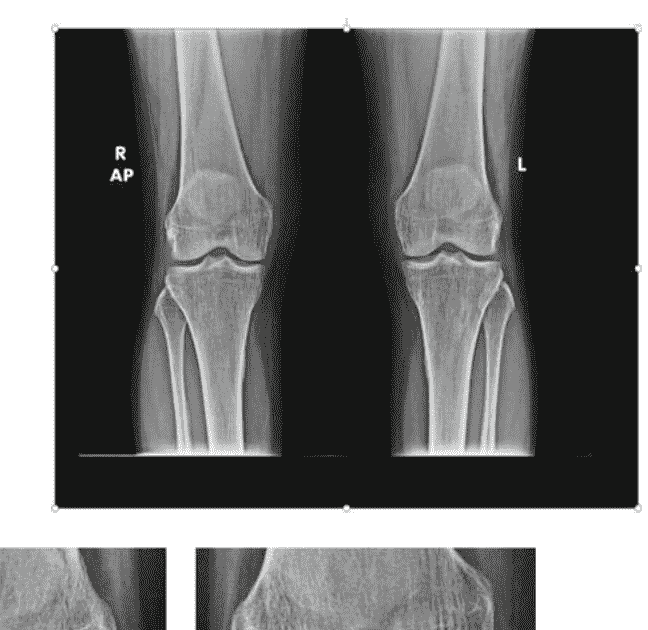

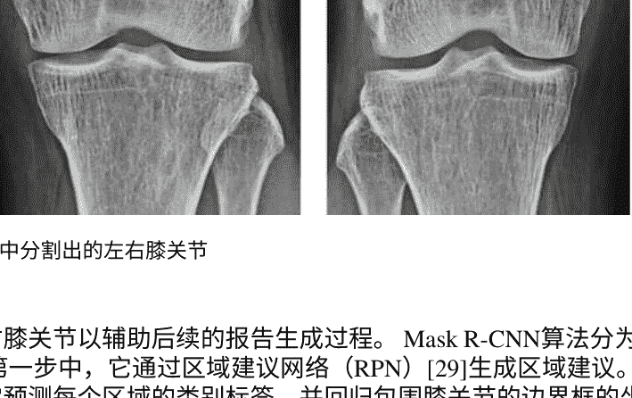

图3 从图2中分割出的左右膝关节

区分左右膝关节以辅助后续的报告生成过程。Mask R-CNN算法分为两个步骤。在第一步中，它通过区域建议网络（RPN）[29]生成区域建议。在第二步中，它预测每个区域的类别标签，并回归包围膝关节的边界框的坐标。该模型在OAI数据集中随机选择的100张图像上进行了测试。边界框回归的均方误差（MSE）为0.0507，膝关节分割的DICE分数为0.93，将分割的膝关节分类为左右的准确率为99%。使用这个模型，我们从OAI数据集的其他图像中分割出了膝关节（见图1、2和3）。

| KL分级 | 精确度 | 召回率 | F1得分 | Kappa |
|--------|--------|--------|--------|-------|
| 0      | 0.67   | 0.88   | 0.76   | 0.57  |
| 1      | 0.57   | 0.01   | 0.02   | 0.02  |
| 2      | 0.63   | 0.47   | 0.54   | 0.41  |
| 3      | 0.68   | 0.54   | 0.60   | 0.55  |
| 4      | 0.18   | 0.95   | 0.31   | 0.27  |
| 平均值 | 0.55   | 0.57   | 0.45   | 0.36  |

## 3.3 从分割的膝盖图像预测KL等级

使用最小-最大归一化对分割的膝盖图像进行归一化，以确保像素强度值在[0,255]范围内。OAI数据集按比例分为训练集、验证集和测试集，比例为70:10:20。KL等级的分级基于关节间隙变窄，两个连续等级之间的差异在外观上非常微妙。在传统的CNN中，每个层只与其相邻层连接。然而，在DenseNet [30]中，每个层都与其他每个层连接；这使得网络能够从更少的数据中学习更好的特征。

我们使用DenseNet-121架构训练了一个分类模型，将每个输入膝盖图像分类为来自离散、无序类集合{0, 1, 2, 3, 4}中的一个类。交叉熵被用作训练模型的损失函数。我们得到了0.55的平均类别精确度和0.57的平均类别召回率（详见表2的详细结果）。

KL等级之间存在自然排序。为了利用这种排序，我们将分类网络的输出层替换为两个全连接层。倒数第二层有128个节点，采用ReLU激活函数，而最后的输出层有一个节点，采用线性激活函数。图4展示了分类和回归的架构。该模型使用均方误差作为损失函数进行训练，以预测KL等级作为实数。

模型输出被四舍五入到最接近的整数，范围为[0, 4]，以获得最终预测等级。基本上，我们将问题从分类转化为回归，希望获得更好的结果。平均类别精确度为0.84，平均类别召回率为0.82（详见表3的详细结果）。

## 3.4 对目标数据集进行微调模型

在目标数据集上评估时，基于OAI数据集训练的回归模型的平均类别精度为0.46，平均类别召回率为0.33。表4显示，基于OAI数据集训练的回归模型在目标数据集上的性能下降。尽管分析造成这种情况的原因超出了本文的范围，但我们推测这两个数据集的图像存在差异，可能包括但不限于不同的图像捕捉设置、不同的成像设备以及可能的不同患者人口特征。

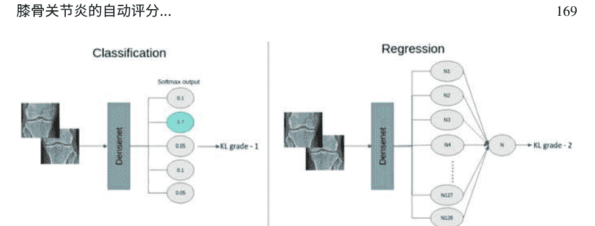

| KL分级 | 精确度 | 召回率 | F1得分 | Kappa |
|--------|--------|--------|--------|-------|
| 0      | 0.93   | 0.91   | 0.92   | 0.86  |
| 1      | 0.71   | 0.74   | 0.73   | 0.66  |
| 2      | 0.85   | 0.87   | 0.86   | 0.80  |
| 3      | 0.85   | 0.85   | 0.85   | 0.83  |
| 4      | 0.84   | 0.76   | 0.80   | 0.79  |
| 平均值 | 0.84   | 0.82   | 0.83   | 0.79  |

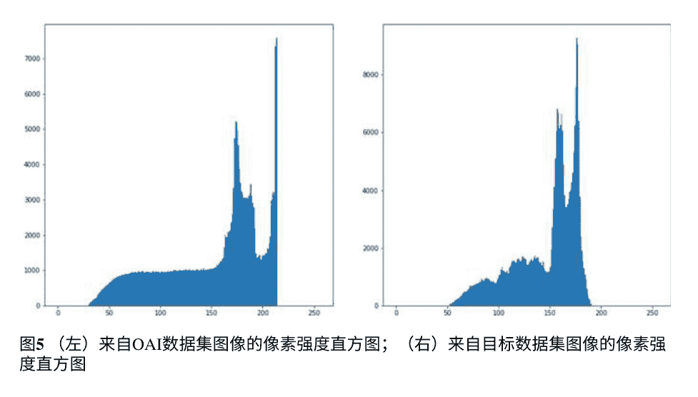

性能下降超出了本文的范围，我们推测这两个数据集的图像存在差异，可能包括但不限于不同的图像捕捉设置、不同的成像设备以及可能的不同患者人口特征。OAI数据集和目标数据集之间的差异在图5中以可视化方式呈现。

表4 在OAI数据集上训练并在目标数据集上微调的回归模型性能

| KL分级 | 精确度 | 召回率 | F1得分 | Kappa |
| :--- | :--- | :--- | :--- | :--- |
| 0 | 1 | 0.02 | 0.04 | 0.03 |
| 1 | 0.17 | 0.09 | 0.12 | 0.03 |
| 2 | 0.22 | 0.43 | 0.29 | 0.09 |
| 3 | 0.22 | 0.53 | 0.31 | 0.10 |
| 4 | 0.70 | 0.57 | 0.63 | 0.52 |
| 平均值 | 0.46 | 0.33 | 0.28 | 0.16 |

表5 在OAI数据集上训练的回归模型性能在目标数据集上评估时

| KL分级 | 精确度 | 召回率 | F1得分 | Kappa |
| :--- | :--- | :--- | :--- | :--- |
| 0 | 0.90 | 0.79 | 0.84 | 0.79 |
| 1 | 0.52 | 0.70 | 0.59 | 0.52 |
| 2 | 0.63 | 0.68 | 0.65 | 0.58 |
| 3 | 0.67 | 0.64 | 0.65 | 0.59 |
| 4 | 0.91 | 0.86 | 0.88 | 0.85 |
| 平均值 | 0.73 | 0.73 | 0.73 | 0.66 |

为了提高模型性能，我们使用迁移学习[31]在目标数据集上对模型进行了微调。我们计算了预测的KL分级和实际KL分级之间的平均绝对误差（MAE）。在微调之前，在OAI数据集上训练的模型在目标数据集上评估时的MAE为1.09（95% CI: 1.03-1.15）。微调后，MAE降低到0.28（95% CI: 0.25-0.32）。表5显示了这个微调模型的评估指标。

## 4 讨论

我们的实验发现了OAI数据集和目标数据集之间的图像特征差异。在OAI数据集上训练的模型在目标数据集上表现不佳。然而，当我们在目标数据集上对模型进行微调时，观察到了显著的性能提升。

由于Kellgren-Lawrence系统假设其等级之间存在隐含的顺序，我们认为该等级应被视为一种序数变量而不是名义变量。使用交叉熵作为损失函数训练分类模型会对错误分类施加相等的惩罚，无论是邻近等级之间的错误分类还是远离等级之间的错误分类。然而，将其定义为回归问题并使用均方误差作为损失函数会对邻近等级之间的错误分类施加较低的惩罚，并逐渐增加对实际等级和预测等级之间距离的惩罚。随着实际等级和预测等级之间距离的增加，惩罚逐渐增加。在对目标数据集上评估微调模型时，分类模型中所有错误分类中有68%是邻近等级之间的，而回归模型中所有错误分类中有87%是邻近等级之间的。

由于膝关节骨关节炎的不同阶段需要不同的干预措施，因此识别影响患者的骨关节炎等级非常重要。通过自动准确地为膝关节X射线片分配KL等级，所提出的方法可以帮助（1）减轻评估X射线片时人为主观性的影响；（2）减少放射科医师的工作负担；（3）提高报告时间。

## 5 结论

我们证明了通过使用迁移学习对模型进行微调，可以减轻在测试数据集上模型性能不佳的问题，因为测试数据集具有与训练数据不同的图像特征。我们还表明，将KL分级视为连续响应变量而不是离散的无序类别，显著提高了性能。在我们的工作中，我们可以访问测试数据集的标签。在测试数据集没有标签的情况下，可以考虑使用无监督领域适应技术[32–36]。我们将这留待将来的工作。

#### 参考文献

1.  Kellgren, J., Lawrence, J.: 骨性关节炎的放射学评估。《风湿病学年鉴》16(4), 494 (1957)
2.  Ji, X., Zhang, H.: 早期骨性关节炎治疗的当前策略。《机械工程前沿》5, 57 (2019)
3.  Kohn, M.D., Sassoon, A.A., Fernando, N.D.: 简述: Kellgren-Lawrence骨关节炎分类（2016年）
4.  Gossec, L., Jordan, J., Mazzuca, S., Lam, M.-A., Suarez-Almazor, M., Renner, J., Lopez-Olivo, M., Hawker, G., Dougados, M., Maillefert, J., et al.: 对于1759张膝关节骨关节炎X光片的三种半定量放射学分级技术的比较评估：oarsi-omeract任务组的报告。骨关节炎软骨16(7), 742–748 (2008)
5.  Sheehy, L., Culham, E., McLean, L., Niu, J., Lynch, J., Segal, N.A., Singh, J.A., Nevitt, M., Cooke, T.D.V.: 多中心骨关节炎研究（MOST）的X光图像用于膝关节骨关节炎放射学评估的三个评分的有效性和敏感性的验证和变化。骨关节炎软骨23(9), 1491–1498 (2015)
6.  Culvenor, A.G., Engen, C.N., Øiestad, B.E., Engebretsen, L., Risberg, M.A.: 定义放射性膝关节骨关节炎的存在：Kellgren和Lawrence系统与oarsi图谱标准的比较。膝关节外科运动创伤学。关节镜23(12), 3532–3539(2015)
7.  Antony, J., McGuinness, K., O’Connor, N.E., Moran, K.: 使用深度卷积神经网络量化放射性膝关节骨关节炎的严重程度。在：2016年第23届国际模式识别大会（ICPR），第1195-1200页。IEEE (2016)
8.  Antony, J., McGuinness, K., Moran, K., O'Connor, N.E.: 使用卷积神经网络自动检测膝关节并量化膝关节骨关节炎的严重程度。 在：国际机器学习和数据挖掘模式识别大会，第376-390页。 Springer (2017年)
9.  Tiulpin, A., Thevenot, J., Rahtu, E., Lehenkari, P., Saarakkala, S.: 基于深度学习的普通X射线自动诊断膝关节骨关节炎方法.科学报告 **8**(1), 1–10 (2018)
10. Tiulpin, A., Thevenot, J., Rahtu, E., Saarakkala, S.: 一种新的膝关节普通X射线自动定位方法. In: 斯堪的纳维亚图像分析会议, pp. 290–301. Springer (2017)
11. Alzubi, J., Nayyar, A., Kumar, A.: 从理论到算法的机器学习: 概述. J. Phys. Conf. Ser. **1142**, 012012 (2018)
12. Kotti, M., Duffell, L.D., Faisal, A.A., McGregor, A.H.: 使用随机森林检测膝关节骨关节炎及其判别参数. 医学工程物理学 **43**, 19–29 (2017)
13. Bandyopadhyay, S.K., Sharma, P.: 使用膝关节X射线图像分析检测骨关节炎: 一种基于机器视觉的方法 (2016)
14. Breiman, L.: 随机森林. 机器学习 **45**(1), 5–32 (2001)
15. Brahim, A., Jennane, R., Riad, R., Janvier, T., Khedher, L., Toumi, H., Lespessailles, E.: 一种用于早期检测膝关节骨关节炎的决策支持工具，使用X射线成像和机器学习：来自骨关节炎倡议的数据。 计算机医学成像图形 **73**, 11–18(2019)
16. Anderson, J.R., Matessa, M.: 探索一种增量贝叶斯算法用于分类。 机器学习 **9**(4), 275–308 (1992)
17. Orlov, N., Shamir, L., Macura, T., Johnston, J., Eckley, D.M., Goldberg, I.G.: Wnd-charm:多用途图像分类，使用复合图像变换。 模式识别信件**29**(11), 1684–1693 (2008)
18. Shamir, L., Orlov, N., Eckley, D.M., Macura, T., Johnston, J., Goldberg, I.G.: 用于生物学和医学的源代码。 Source Code Biol. Med. **3**, 13 (2008)
19. Shamir, L., Ling, S.M., Scott, W., Hochberg, M., Ferrucci, L., Goldberg, I.G.: 使用计算机辅助分析早期检测放射性膝骨关节炎。 骨关节炎软骨 **17**(10),1307–1312 (2009)
20. 李, H.: 通过稀疏分层表示进行无监督特征学习，第20卷。 斯坦福大学 (2010)
21. LeCun, Y., Haffner, P., Bottou, L., Bengio, Y.: 基于梯度的目标识别。 在: 计算机视觉中的形状、轮廓和分组，第319–345页。 Springer (1999)
22. Sultana, F., Sufian, A., Dutta, P.: 使用卷积神经网络进行图像分类的进展。 在：2018年第四届计算智能与通信网络研究国际会议 (ICRCICN)，第122–129页。 IEEE (2018)
23. Simonyan, K., Zisserman, A.: 用于大规模图像识别的非常深的卷积网络。 arXiv:1409.1556 (2014)
24. Chatfield, K., Simonyan, K., Vedaldi, A., Zisserman, A.: 深入研究卷积神经网络的细节：魔鬼的回归。 arXiv:1405.3531, 2014
25. Jia, Y., Shelhamer, E., Donahue, J., Karayev, S., Long, J., Girshick, R., Guadarrama, S., Darrell, T.: Caffe: 用于快速特征嵌入的卷积架构。 在：第22届ACM国际多媒体会议论文集，第675-678页, 2014年
26. Chopra, S., Hadsell, R., LeCun, Y.: 以区分方式学习相似度度量，应用于人脸验证。 在：2005年IEEE计算机学会计算机视觉和模式识别会议 (CVPR'05)，第1卷，第539-546页。 IEEE (2005)
27. Dutta, A., Zisserman, A.: VGG图像注释器 (通过)。 arXiv :1904.10699, 2019
28. He, K., Gkioxari, G., Dollár, P., Girshick, R.: Mask r-cnn. 在：IEEE国际计算机视觉会议论文集，第2961-2969页，2017年
29.  Huang, G., Liu, Z., Van Der Maaten, L., Weinberger, K.Q.: 密集连接卷积网络. 在: IEEE计算机视觉与模式识别会议论文集，第4700-4708页，2017年
30. Tan, C., Sun, F., Kong, T., Zhang, W., Yang, C., Liu, C.: 深度迁移学习综述. 在: 国际人工神经网络会议，第270-279页。斯普林格，2018年
31. Ben-David, S., Blitzer, J., Crammer, K., Kulesza, A., Pereira, F., Vaughan, J.W.: 不同领域学习的理论。机器学习。**79**(1-2), 151-175 (2010年)
32. 王, M., 邓, W.: 深度视觉领域适应: 一项调查。神经计算 **312**, 135-153 (2018年)
33. Ganin, Y., Ustinova, E., Ajakan, H., Germain, P., Larochelle, H., Laviolette, F., Marchand, M., Lempitsky, V.: 神经网络的领域对抗训练。机器学习研究。**17**(1), 2030-2096 (2016年)
34. Long, M., Zhu, H., Wang, J., Jordan, M.I.: 无监督领域适应与残差传输网络. arXiv:1602.04433, 2016
35. Tzeng, E., Hoffman, J., Saenko, K., Darrell, T.: 对抗性判别领域适应. 在: IEEE计算机视觉和模式识别会议论文集,pp. 7167–7176, 2017

# 利用深度学习和机器人技术的农村教育鲁棒模型

Sailesh Iyer

摘要 农村教育对村庄的整体发展至关重要。全国成就调查(NAS)在印度的许多州调查并报告了政府学校系统中从三年级到八年级学生的数学、语言和科学学习水平持续下降的情况。只有识字水平和基础设施得到显著改善，智慧村庄才有可能实现。本文旨在通过比较包括印度在内的不同农村地区，并研究相关工作，对情况进行现实检验。本文提出了一个鲁棒的农村教育模型，通过开发一个智能人形机器人，采用深度学习方法、人体识别、物体识别和语音识别。数据集包括来自5个村庄的约10,000名学生(5年)的小学和中学生数据。该提出的模型将在可学习性、决策能力、灵活性和成本效益等参数上与现有模型进行比较。实施该模型将有助于降低辍学率，评估学生并为他们提供基于其特征的学习平台，增加适应性和自主学习。该模型还可以用于农村成人教育和技能培训，以实现智慧村庄的概念成为现实。

关键词 农村教育·人形机器人·深度学习·人脸识别·物体识别·语音识别·可学习性·鲁棒性模型·自适应学习·智能村

## 1 引言

整个教育场景都得到了快速改善，带来了许多挑战，如技术适应性、学生期望、行业竞争激烈，从而保持就业能力。农村教育面临着技术基础设施问题、缺乏适当的资金、低识字率等更大的挑战。技术类毕业生的就业率不到30%。

令人担忧，技能发展处于新低，教育机构强调技能发展和项目学习。 根据《印度快报》国家成就调查报告（NAS）进行的农村学校调查表明，学生的学习水平存在严重差距，不到30%的学生能够识别100以上的数字[1]（图1）。

农村学生面临的其他问题包括距离、极度贫困、家长对教育的态度、缺乏互联网和电力。另一个重要发现是农村学校人手不足，现有人员被用于文书和行政工作。 2019年中央政府预算目标是到2025年实现15万个智能村庄，确保无线网络和其他基础设施连接[2]（图2）。

印度国际学校[3]和北京的Keeko机器人[4]进行了一些令人耳目一新的实验。人形机器人的实施在学校[3, 4]中，学生对人形机器人辅助教育的概念表示欢迎，并产生了好奇心。

## 2 相关工作

Erich等人对教育中使用的不同机器人进行了调查，并发现NAO机器人比其他机器人更有效[5]。Baxter等人通过实验和针对3岁左右年龄组的调查发现，定制机器人比普通机器人更受欢迎[6]。Henkemans等人得出结论，对于7-12岁的年龄组使用NAO机器人充满了知识，并将学习过程变得充满乐趣[7]。Yi等人参与了大学生的研究，并发现机器人在学习过程和实践培训中非常有效[8]。Fernández-Llamas等人观察了6至16岁学生的经验，并发现他们更喜欢机器人教学而不是普通教师[9]。

Rosi等人在他们的实验中报告了对8-19岁年龄组的对比结果，发现机器人对教学学习过程没有影响[10]。Huskens等人在8-12岁年龄组进行了设计实验，并得出结论说机器人互动能激发学生的创造力[11]。Shiomi等人发现在9-13岁年龄组的学生中，机器人并不能增加好奇心[12]。Boboc发现机器人可以作为导游在教育机构中吸引学生[13]。Wainer等人关注学校教师的调查，并确定大多数教师对机器人在教育中的辅助持积极态度，并认为机器人的存在会产生积极的氛围[14]。Chin等人在小学生中使用机器人，并发现所有学生都希望在课堂上有机器人，并且与教师相比，他们对机器人更放松[15]。Bacivarov和Ilian在对小学生进行研究后得出结论，人形机器人导致了61%的更高参与度，80%的更高表现，创造性思维，0.81倍的更高社会影响，100%的课程出勤率和零辍学率[16]。

Bahishti和Adam研究了在社会上使用人形机器人的影响，并发现技术将主导初中教育的方式[17]。

对已完成的工作和传统教育的文献综述，教师们在行政、文书和教学负担过重的情况下，很难集中精力有效地教学。传统农村教育中存在的问题:

- 缺乏优质教育和标准学习材料。
- 缺乏与领域相关的专业知识。
- 基础设施和连接问题。
- 缺乏面向行业的技能和ICT进展。
- 缺乏基本设施。
- 资金利用。
- 人员不足和在其他行政工作中过度利用。
- 利益相关者的心态。
- 低识字率

各种研究发现，引入人形机器人来支持教师可以在增加学生兴趣和激发学生在实践知识方面的实际经验方面发挥重要作用。

## 3 提出的系统

对现有模型进行广泛审查和传统教育模型的缺点形成了提出强大的人形机器人模型的基础，该模型消除了传统问题，并提供了成本效益、本地化和有效的学习人形机器人来辅助农村教育。提出的模型还从学生的心理角度考虑学习的各个方面，并在使用技术实施系统时考虑地区多样性。提出的模型的步骤如下:

1.  识别学生特征和行为参数。根据学生的年龄和学习行为记录农村学生数据。我们专注于过去5年的数据来构建我们的模型。
2.  研究人形机器人市场和功能，并选择最适合我们需求的。
3.  编程人形机器人根据学生面部图像捕捉来识别学习习惯，并将其映射到学生特征。
4.  基于处理的机器人将根据学习模式建议学习路线图，包括自适应学习、自定学习，根据学习模式制定在线测试，并协助教师为学生提供个别辅导。
5.  教师的角色将起到关键作用，教师将分析结果，这被称为知识分析。这将有助于为学生提供未来的指导路线。
6.  评估工具旨在提供绩效状况，并帮助知识定向和使评估过程以学生为中心和友好的方式进行。

数据集包括艾哈迈达巴德附近的5个村庄，古吉拉特邦，并收集了过去5年约10,000名学生的学校记录，这些学生是1-8年级的学生。数据预处理已经完成，现在根据图3中的步骤进行了学习者鲁棒模型的进展。人形机器人的获取过程处于最后阶段。这个模型的主要重点是提供一种经济高效的解决方案，可以处理现有模型的缺陷，并提供区域语言引导机制，使学生能够根据能力和需求进行实践学习。

## 4 结果和讨论

已经提出和实施了各种模型，用于城市学校，在那里机器人仅用于协助教师进行测验或批改作业。

该模型侧重于使用深度学习算法的机器人，以提供学习路线图并监控学生的进展。报告将定期每15天提供给教师，以便教师可以记录学生在前两周的进展。该模型相对于现有模型的显著特点是成本效益高，鼓励学生行为导向学习，灵活且自主学习。

以下是提出模型所带来的好处：
1.  增加自适应和自主学习的概念。
2.  使用游戏、测验和其他技术的互动教程，以增加学生的参与度。
3.  根据学生特点识别和认知学习路径。
4.  可视化管理界面，用于理解具有挑战性的科目。
5.  通过仪表盘监控教职人员对学生的每两周进展和评估。
6.  除了主要教学语言外，还使用区域语言作为交流方式。
7.  在区域语言中实施MOOC和其他开源学习资源，使学生能够进行专家级学习，无论他们所在的位置如何。
8.  低成本模型可以大力推动智慧村概念。

图3提出的用于农村教育的稳健人形机器人模型

## 5 结论和进一步工作

现有模型的比较研究结果表明，在农村地区的教育预期参数存在巨大差距。机器人已经作为教学助手开发出来，但未能解决农村教育在第4节中讨论的主要问题和挑战。已经收集了约10,000多个的建议模型数据收集和预处理。

在过去的5年中，深度学习算法/模型正在开发中。该提议的模型原型将在2021年12月实施，最终适应版本将在2022年12月实施。该提议的模型提供了一种低成本、区域语言的学生进展路线图，通过仪表盘、定期学生评估来监控学生。未来的工作包括将同样的模型扩展到成人农村教育，并将该模型映射到其他农村村庄，通过低价有效的解决方案使村庄在智能教育方面自给自足，这些解决方案可以由各个地区政府承担。

致谢作者希望承认这是一个正在进行中的农村教育项目，预计将于2022年12月完成。

#### 参考文献

1.  https://indianexpress.com/article/education/hardlook-state-of-education-in-gujarat-part-ii-5166122/
2.  https://www.deccanherald.com/business/budget-2019/budget-2019-big-plans-for-rural-india-745227.html
3.  https://www.livemint.com/technology/tech-news/robots-turn-teachers-in-bengaluru-school-thanks-to-ai-1567336339210.html
4.  https://www.thehindu.com/sci-tech/technology/robot-teachers-in-chinas-kindergartens/article24812421.ece
5.  Erich, F., Hirokawa, M., Suzuki, K.: 一项关于使用人形机器人进行社会辅助机器人实验的系统文献综述。 康奈尔大学，第1-6页（2017年）
6.  Baxter, P., Ashurst, E., Read, R., Kennedy, J., Belpaeme, T.: 在一个实地小学研究中的机器人教育伙伴：个性化促进儿童学习。 Plos One 12, e0178126 (2017)
7.  Henkemans, O.A.B., Bierman, B.P.B., Janssen, J., Looije, R., Neerincx, M.A.: 设计和评估一个与1型糖尿病儿童玩自我管理教育游戏的个人机器人。
8.  Yi, H., Knabe, C., Pesek, T., Hong, D.W.: 在DARwIn-HP人形教育机器人的发展中的经验学习. J. Intell. Rob. Syst 81, 41–49 (2016)
9.  Fernández-Llamas, C., Conde, M.A., Rodríguez-Lera, F.J., Rodríguez-Sedano, F.J., García, F.:我可以教你吗？当机器人与人类教师讲课时，学生的行为. Comput.Human Behav. 80, 460–469 (2018)
10. Rosi, A., Dall’Asta, M., Brighenti, F., Del Rio, D., Volta, E.: 在小学营养教育中使用新技术的试点研究. Public Health 140, 50–55 (2016)
11. Huskens, B., Palmen, A., Van der W erff, M., Lourens, T., Barakova, E.: 改善自闭症谱系障碍儿童与兄弟姐妹之间的合作游戏. 基于乐高®疗法的机器人介入的有效性. J. Autism Dev. Disord. 45, 3746–3755(2015)
12. Shiomi, M., Kanda, T., Howley, I., Hayashi, K., Hagita, N.: 一个社交机器人能在教室里激发科学好奇心吗？ Int. J. Soc. Rob. 7, 641–652 (2015)
13. Boboc, R.G.: 一个教育性的人形导游机器人。 Proc. Soc. Behav. Sci. 424–430 (2014)
14. Wainer, J., Dautenhahn, K., Robins, B., Amirabdollahian, F.: 一个与自闭症儿童合作玩耍的人形机器人KASPAR的试点研究。 Int. J. Soc.Rob. 6, 45–65 (2014)
15. Chin, K., Wu, C., Hong, Z.W.: 一个人形机器人作为小学教学助手。 在: 第五届遗传与进化计算国际会议, pp. 21–24 (2011)
16. Bacivarov, I.C., Ilian, V.L.: 在教学过程中利用机器人的范式：一项比较研究。国际技术设计教育杂志 22, 531–540 (2012)
17. Bahishti, Adam, A.: 人形机器人与人类社会。社会科学进展杂志 1(1), 60–63 (2017). https://doi.org/10.21467/ajss.1.1

# 使用迁移学习和深度架构进行异常检测的动作识别

Francisco Luque Sánchez, Siham Tabik和Francisco Herrera

摘要 自动视频监控是一个新兴的研究领域，每天都有大量的出版物涉及该领域。 然而，仍然有很大的改进空间，因为目前的最新成果仍然有限。 解决这个问题的主流方法是使用深度模型进行动作识别和弱监督微调。 然而，目前还没有对该过程中不同步骤的重要性进行系统研究。 在这项工作中，我们的目标是确定这些模型的关键方面，并评估构成最终解决方案的不同部分的重要性。

关键词 动作识别 · 异常检测 · 深度学习 · 迁移学习

## 1 引言

自动视频监控是一个新兴的研究领域。 不断增长的犯罪和恐怖主义率以及全球人口的增加，使得对这一任务的高效准确模型的需求越来越大[12]。 特别是，在无约束的场景中，人群异常检测已被证明是一种有用的方法。 这种范式旨在学习正常行为的模式并建立相似度的度量。

F. L. Sánchez (✉) · S. Tabik · F. Herrera
计算机科学与人工智能系，格拉纳达大学，格拉纳达，
西班牙
电子邮件：fluque@decsai.ugr.es
S. Tabik
电子邮件：siham@decsai.ugr.es
F. Herrera
电子邮件：herrera@decsai.ugr.es

模式之间的关系。如果一个新的模式与学习到的正常行为有很大的偏差，那么该模式将被标记为异常。然而，由于正常视频中可能存在的巨大变异性，很难在模型训练的数据集中表示所有可能的正常模式，这些方法通常会出现高误报率的问题。

为了缓解这个问题，一种可能的方法是以监督的方式训练这些模型，从而同时学习正常和异常模式。然而，这种方法的问题在于需要对训练视频进行时间标注。这个过程既昂贵又繁琐，因为它需要遍历数据集中的所有帧，并为每个帧指示标签（正常或异常）。此外，公开可用的数据库通常很小，这在训练深度模型时是一个严重的问题[7]。

为了克服这些限制，最近的一个趋势是将动作识别的迁移学习与弱监督的微调相结合，用于异常检测。通过使用迁移学习，可以大大减少异常检测数据集的大小，并且用于动作识别的公共数据集足够大，可以预训练深度学习模型[1, 11]。

弱监督的微调是指使用视频级别的注释而不是帧级别的注释。使用这种方法，标记数据集所需的专家时间大大减少，因为每个视频只需要一个标签。然而，需要一个特定的训练策略，因为我们的目标是仅使用视频级别的信息来学习识别帧级别的异常。

考虑到这些讨论，本研究的目的是评估在设计异常检测系统时所做的不同决策的重要性，以便发现当前模型可能存在的缺陷。我们提出了使用迁移学习和弱监督的深度模型分析标准流程。进行了关于流程中不同决策重要性的实验研究。

本文的其余部分组织如下。第2节简要讨论了与本研究相关的主题。第3节解释了提出的实验框架。第4节展示了当前的结果。最后，在第5节中解释了从研究中得出的结论，并提出了可能的未来研究方向。

## 2 相关工作

在本节中，我们的工作依赖的主要主题被描述了。对这些主题的简要解释和现有技术的分析被执行。

### 2.1 基于深度学习的动作识别

动作识别是视频分类的一个子任务，我们的系统旨在为数据集中的每个视频分配一个标签，使用一组预定义的代表人类行为的类别。它是一个更一般的任务的特例，称为视频分类，其中预定义的类别是通用的，不仅限于显示人的视频。这个问题已经被广泛研究，许多工作尝试使用经典模型来解决这个任务[8]。

深度学习在该领域的出现产生了突破性的改进。由于这个事实，在过去几年中，提出了大量的深度学习模型用于动作识别[4]。

一个视频可以被看作是一系列具有强烈时间关系的图像。因此，在预测中利用时间信息通常会改善结果。为此，CNN用于空间特征提取，而RNN（特别是LSTM模型）用于特征的时间聚合，是最早尝试的方法之一，并且已经提出了许多模型[16]。类似的方法是使用3D CNN，它是经典CNN的扩展，也在时间维度上应用卷积。据我们所知，3D CNN的第一个提议可以在[15]中找到。

另一种典型的趋势是将独立的模型组合起来进行空间和时间预测。这些模型通常使用CNN对原始帧进行空间信息提取，并使用光流堆叠图像上的CNN进行时间信息提取。文献中可以找到许多这种模型的例子[1, 10, 17]。

所列模型的主要问题是它们对计算的高要求。这些模型大多数都需要大量的计算资源，因此不适用于实际应用。最近的研究集中在保持先前模型的分类能力的同时，显著减少所需计算量。许多研究提出了对先前列出的模型进行修改以达到这个目标[2, 6]。

### 2.2 视频异常检测

人群异常检测是一项旨在从视频镜头中识别人类异常事件的任务。与动作识别相比，这个任务的主要目标是区分正常的、预期的行为和事态与事先不预期的情况。

这个问题在过去几年中引起了很多关注，解决这个问题的出版物数量每天都在增加。关于这个问题的详细综述可以在[7]中找到。

### 2.3 弱监督学习

视频异常检测问题已经通过非常不同的方法来解决。解决该问题的首次尝试之一是使用监督方法对模型进行训练[13]。训练数据集由正常和异常视频组成，每个帧被标记为正常或异常，或者每个视频只由正常或异常帧组成。这种方法的主要问题是标记所需的时间量，因为每个帧都必须正确标记。由于这个事实，在这种方式下没有大型数据集被正确标记。

另一种趋势是使用单类无监督范例对模型进行训练。在这种情况下，训练集仅由正常镜头组成，系统学习对正常视频中的模式进行特征化。然后，将这些模式与测试集中提取的特征进行比较，产生异常分数。

这种方法的示例是[3]，其中学习了基于深度提取特征的高斯模型，或者是[9]，其中使用视频片段的重构误差作为异常分数。这种方法的问题是正常场景中存在的变异性。由于正常视频中可能出现的不同设置非常多，很难在训练数据集中正确表示所有这些信息。由于这个事实，一个与训练集中学习的模式差异很大的正常模式很容易出现，从而产生误报。

为了解决这些问题，提出了弱监督学习。视频中的弱监督假设只有视频级别的注释可用于训练。然而，视频的未修剪特性导致异常序列也包含正常镜头。由于这个事实，必须开发特殊的模型训练策略，这些策略可以在文献中找到。

Sultani等人提出了一种多实例学习方法。在这种方法中，视频被分割成片段，每组片段组成一个样本袋，每个样本袋只有一个标签。对于正常样本袋，所有样本都属于正常类别。对于异常样本袋，一些样本属于异常类别，而其他样本则属于正常类别。然后，优化过程旨在最大化模型在异常样本袋中最异常片段和正常样本袋中最异常片段之间的异常分数差异。通过最大化这个差距，网络学习预测正常片段的低异常分数和异常片段的高分数。

另一种方法可以在[18]中找到。在这种情况下，问题被表述为在嘈杂标签下的学习问题。训练过程中涉及两个模型。行为识别模型，经过修改用于异常分类，预测视频片段的异常分数。另一方面，图卷积网络[5]使用高置信度片段的时间和外观相似性来纠正低置信度片段的预测。两个模型都训练到收敛。

##### 弱监督人群异常检测的流程

在本节中，我们提出了我们实验中使用的实验框架。

框架的关键部分是本节中解释的流程。使用这个流程，使用弱监督进行人群异常检测的工作可以通过指定三个不同的方面来总结。之后，解释了用于评估异常检测任务的数据集。最后，我们在实验中做出的不同选择进行了评论。

#### 3.1 流水线

在对解决视频异常检测问题的作品进行彻底审查后，我们确定了大部分作品中共享的常见流水线：

1.  选择一个动作识别模型。
2.  使用一个动作识别数据集对模型进行预训练。
3.  使用预训练模型进行特征提取。
4.  使用弱监督方法对提取的特征进行异常检测模型的微调。
5.  对测试子集进行最终模型的评估。

鉴于先前的标准化，所有的解决方案都可以通过指定三个元素来描述:
- 动作识别模型。
- 用于预训练的动作识别数据集。
- 用于微调的弱监督策略。

所提出的流程图如图1所示。鉴于这些解决方案的简化，我们的下一个目标是评估在流程的不同点上所做决策的重要性，即：
- 选定的模型如何影响最终性能？
- 最终结果是否取决于预训练数据集？
- 微调策略是否具有影响力？

#### 3.2 异常检测数据集

用作基准的异常检测数据集是UCF-Crime数据集[14]。该数据集是从监控视频摄像头中获取的未修剪视频的集合。

图1 提出的流程。黄色标记的元素可能影响性能。最佳观看效果为彩色。

图2 UCF-Crime数据集中不同帧的示例。存在着巨大的环境、光照条件和摄像机角度的变异。此外，视频中异常的来源也是多样的，因此我们的模型应该能够很好地泛化并适应不同的环境和情况。最佳观看效果为彩色。

在不同的设置中，数据集的几个帧如图2所示。可以看出，数据集中可以找到的环境的多样性是重要的。此外，异常的来源也是多样的，这迫使我们的系统在非常不同的情况下正确运行。

该数据集由1900个视频组成，正常和异常视频均匀分布。训练集包括800个正常视频和810个异常视频，而测试集包括剩余的150个正常视频和140个异常视频。异常进一步分为13个不同的类别，但在这项工作中将被忽略，因为我们关注的是异常检测，而不是进一步的分类。

## 3.3 管道中的选择

正如之前所述，我们对每个决策对管道的影响感兴趣。为此，我们进行了一系列实验，每个阶段选择了不同的方法。我们使用的不同元素如下：

动作识别数据集我们在两个不同的动作识别数据集上预训练了我们的模型：

- UCF101数据集[11]: 包含来自101个类别的13,320个视频。
- Kinetics-400数据集[1]: 包含来自400个类别的306,245个视频。

动作识别分类器作为特征提取器使用的动作识别分类器如下：

- C3D [15]: 该模型使用3D卷积神经网络从视频片段中提取特征。
- 时序段网络（TSN）[17]: 该模型使用连续帧中的RGB和光流图作为输入，通过卷积从视频片段的不同部分提取信息。
- I3D [1]: 这种方法通过扩展2D卷积核来创建一个3D卷积网络，利用图像数据集的预训练。
- 时间移位模块 [6]: 从先前帧中提取的特征在特征提取过程中被移动到后续帧中，以丰富特征图中的先前信息。
- SlowOnly [2]: 视频通过几个网络进行处理，每个架构的帧率取决于其深度。在这个模型中，只使用最深的网络。

微调策略已经探索了两种不同的微调策略：

- 多实例学习 [14]: 这种微调策略提议将视频分割成片段，并最大化正常视频和异常视频之间的最大异常分数之间的距离。为此，提出了一种基于Hinge损失的特定损失函数，同时还有平滑性和稀疏性限制。
- 图卷积噪声清理 [18]: 这种方法提出了一种替代的优化框架。它交替训练异常检测器和图卷积网络，后者学习使用时间邻接性和特征相似性对视频片段进行分组。

## 4 实验结果

在本节中，使用列出的选择进行实验研究，以验证提出的流程。对于每个组合的预训练数据集 - 动作识别模型 - 微调策略，计算以下指标：预训练数据集中的Top-1和Top-5准确率，这给出了模型的能力；异常检测数据集中的ROC曲线下面积和平均精度，这表明最终模型的性能检测异常情况；以及异常检测数据集中正常视频的误报率，这表明模型在不同环境中忽略正常情况的鲁棒性。

得到的结果总结在表1中。

正如我们所观察到的，这个框架极大地简化了方法之间的比较。例如，根据我们在表中观察到的结果，我们可以得出关于测试模型性能的几个结论：使用TSN作为动作识别模型的模型表现稳定，不论预训练数据集和微调策略如何。这种行为在异常检测任务中的指标稳定性中得到了体现。

表1 根据流程中的决策获得的结果

| 微调策略 | 数据集 | 模型 | Top-1准确率 | Top-5准确率 | AUC | 平均精确度 | FAR |
| --- | --- | --- | --- | --- | --- | --- | --- |
| MIL | UCF-101 | C3D | 83.29 | 95.64 | 70.20 | 14.08 | 3.23 |
| MIL | UCF-101 | I3D | 81.52 | 96.05 | 76.29 | 17.96 | 0.18 |
| MIL | UCF-101 | SlowOnly | 83.32 | 94.77 | 75.26 | 16.74 | 0.53 |
| MIL | UCF-101 | TSN | 82.18 | 97.09 | 77.98 | 18.00 | 0.12 |
| MIL | UCF-101 | TSM | 85.04 | 96.67 | 75.47 | 17.64 | 0.30 |
| MIL | Kinetics400 | C3D | 61.13 | 85.24 | 75.19 | 20.02 | 27.00 |
| MIL | Kinetics400 | I3D | 72.85 | 90.75 | 77.03 | 17.83 | 1.41 |
| MIL | Kinetics400 | SlowOnly | 75.55 | 92.04 | 79.18 | 20.99 | 0.49 |
| MIL | Kinetics400 | TSN | 71.80 | 90.17 | 77.93 | 18.74 | 3.17 |
| MIL | Kinetics400 | TSM | 70.25 | 89.66 | 75.78 | 18.74 | 3.31 |
| GCN | UCF-101 | C3D | 83.29 | 95.64 | 71.91 | 15.28 | 4.16 |
| GCN | UCF-101 | I3D | 81.52 | 96.05 | 75.69 | 16.71 | 1.79 |
| GCN | UCF-101 | SlowOnly | 83.32 | 94.77 | 74.34 | 16.69 | 0.95 |
| GCN | UCF-101 | TSN | 82.18 | 97.09 | 78.14 | 17.91 | 2.30 |
| GCN | UCF-101 | TSM | 85.04 | 96.67 | 75.92 | 17.18 | 0.77 |
| GCN | Kinetics400 | C3D | 61.13 | 85.24 | 75.08 | 19.41 | 25.59 |
| GCN | Kinetics400 | I3D | 72.85 | 90.75 | 78.13 | 19.46 | 2.53 |
| GCN | Kinetics400 | SlowOnly | 75.55 | 92.04 | 78.06 | 22.65 | 2.89 |
| GCN | Kinetics400 | TSN | 71.80 | 90.17 | 77.17 | 17.33 | 4.60 |
| GCN | Kinetics400 | TSM | 70.25 | 89.66 | 75.51 | 20.55 | 3.99 |

所有结果以百分比表示。除了FAR之外，指标越高越好。在FAR的情况下，指标越低越好。

C3D模型在预训练数据集上受到很大影响，这表明该模型在学习特征时不够稳健，尽管它是文献中使用最广泛的模型之一。测试的两种微调策略对于每个模型的结果都相似。这种情况可能表明在流程中这一步骤的影响较小。可以找到预训练性能和异常检测性能之间的相关性。特别是，在预训练的Top-5准确率是最终性能的良好代理。数据集具有影响力。大多数模型受益于在更大的数据集上进行训练，因为使用Kinetics 400进行预训练的结果始终比使用UCF-101进行预训练的结果更好。在正类别上仍有很大的改进空间。结果可以解释为在AUC方面相当不错，这是在这个问题中通常使用的指标，但是观察系统在正类别上的平均精度时，结果远远不令人满意。在正常视频上计算的误报率相当低，这表明我们的模型能够正确忽略正常情况，并且仅为异常视频生成警报。这种情况表明模型对环境变化具有鲁棒性。

## 5 结论

本文概述了使用迁移学习和弱监督进行人群异常检测的实验框架。使用提出的流程，可以用三个不同的参数描述使用迁移学习和弱监督进行微调的模型；预训练数据集、动作识别模型和弱监督方法。使用该流程进行了大量实验，得出了关于每个阶段影响的几个结论。

根据当前研究，出现了几个问题作为未来工作的可能路径，旨在验证本研究中提取的结论；模型能从更大的数据集中受益吗？目前只测试了两个数据集，但有更大的数据集可用，这可能会导致更好的结果；更智能的微调策略能进一步改善结果吗？在我们的案例中测试的策略对大多数模型产生了类似的结果，但使用其他预训练策略会产生不同的结果。

致谢 本工作得到AI-MARS项目（CIEN CDTI计划，IDI-20181108）的支持。Francisco Luque Sánchez和Siham Tabik分别得到了西班牙政府奖学金计划Formación de Profesorado Universitario（FPU19/04640）和Ramón y Cajal（RYC-2015-18136）的支持。

#### 参考文献

1. Carreira, J., Zisserman, A.: Quo vadis, action recognition? 一个新模型和动力学数据集。 在：IEEE计算机视觉和模式识别会议论文集，pp. 6299-6308 (2017)
2. Feichtenhofer, C., 等： Slowfast网络用于视频识别。 在： IEEE国际计算机视觉会议论文集，第6202-6211页 (2019年)
3. Feng, Y., Yuan, Y., Lu, X.: 学习深度事件模型进行人群异常检测。 神经计算 **219**, 548-556 (2017年)
4. Herath, S., Harandi, M., Porikli, F.: 更深入地进行动作识别：一项调查。图像视觉计算 **60**, 4-21 (2017年)
5. Kipf, T.N., Welling, M.: 使用图卷积网络进行半监督分类。arXiv预印本arXiv:1609.02907 (2016年)
6. Lin, J., Gan, C., Han, S.: TSM：用于高效视频理解的时间移位模块。 在：IEEE国际计算机视觉会议论文集，第7083-7093页 (2019年)
7. Luque-Sánchez, F., 等： 通过深度学习重新审视人群行为分析：分类、异常检测、人群情绪、数据集、机会和前景。信息融合 (2020年)
8. Poppe, R.: 基于视觉的人类动作识别综述. 图像与视觉计算 **28(6)**, 976–990 (2010)
9. Ramchandran, A., Sangaiah, A.K.: 用于拥挤场景中本地异常事件检测的无监督深度学习系统. 多媒体工具与应用. 1–21 (2019)
10. Simonyan, K., Zisserman, A.: 用于视频中动作识别的双流卷积网络. 高级神经信息处理系统. 568–576 (2014)
11. Soomro, K., Zamir, A.R., Shah, M.: UCF101: 野外视频中的101种人类动作类别数据集. arXiv预印本 arXiv:1212.0402 (2012)
12. Sreenu, G., Saleem Durai, M.A.: 智能视频监控: 通过深度学习技术进行群体分析的综述. 大数据杂志 **6(1)**, 48 (2019)
13. Sudhakaran, S., Lanz, O.: 使用卷积长短期记忆学习检测暴力视频。 在： 2017年第14届IEEE国际高级视频和信号监控会议(AVSS)，第1-6页。IEEE (2017)
14. Sultani, W., Chen, C., Shah, M.: 在监控视频中进行真实世界的异常检测。 在： 计算机视觉和模式识别IEEE会议论文集，第6479-6488页(2018)
15. Tran, D., et al.: 使用3D卷积网络学习时空特征。 在： IEEE国际计算机视觉会议论文集，第4489-4497页(2015)
16. Ullah, A., et al.: 使用深度双向LSTM和CNN特征对视频序列进行动作识别。 IEEE Access **6**, 1155-1166页(2017)
17. 王，L等： 时间段网络：朝着深度动作识别的良好实践。在： 欧洲计算机视觉会议，第20-36页。Springer (2016)
18. 钟，J.-X等：图卷积标签噪声清除器：为异常检测训练一个即插即用的动作分类器。 在：IEEE计算机视觉和模式识别会议论文集，第1237-1246页 (2019年)

## 个性化联邦学习与BERT微调。Twitter情感分析案例研究

Jose Antonio Ruiz-Millán, Eugenio Martínez-Cámara, M. Victoria Luzón, 和Francisco Herrera

摘要 联邦学习是一种机器学习方法，许多客户端在中央服务器的协调下共同训练模型，同时保持客户端上的数据隔离。它可以保护数据隐私并达到更高的学习泛化能力。此外，联邦学习的全局模型必须适应客户端数据的特殊性。我们提出使用微调作为一种个性化方法，将全局联邦学习模型适应新客户端的数据。我们以情感Twitter数据为案例研究，并展示微调的使用改善了全局模型和客户端的性能。

- 个性化联邦学习
- 微调
- 情感分析

## 1 引言

人工智能（AI）方法需要数据来实现其目标，尤其是深度学习方法，它们对数据非常渴望。目前，用户要求个性化的AI服务，这可能需要使用他们的个人数据。然而，由于对保护隐私的意识不断增强，他们不愿意将个人数据共享给中央服务器。因此，我们需要一种能够从不同用户的数据中学习并保护数据隐私的学习范式。

联邦学习（FL）是一种新兴的机器学习范式，许多客户端（指电子设备或整个组织）在一个中央服务器的协调下共同训练模型，同时保持其数据分散在数据存储中心中[13]。联合模型或FL模型仅使用客户端学习模型的模型参数进行迭代构建。因此，FL能够开发保护数据隐私的人工智能服务，因为数据由数据所有者或客户端保密。

由于FL能够使用更多数据来构建学习模型，这些模型将具有更高的泛化能力。然而，全局FL模型必须考虑到客户端数据分布的特殊性，尤其是在没有参与全局FL模型训练的客户端存在时。因此，FL模型还必须能够个性化以满足客户端数据的特殊性[13]。

FL模型的个性化类似于将学习模型适应于特定领域，因此使用迁移学习作为个性化FL模型的方法[1]。多任务学习也旨在将一组任务的知识转移到目标任务上，在FL中被应用于将知识从一些客户端转移到新客户端[17]。另一方面，FL的特殊性可能推荐为FL开发特定的个性化方法，但是需要从客户端数据中获得一定程度的知识可能会导致不严格遵循FL定义，例如在[18]中通过在客户端和服务器之间共享少量数据。

语言的使用是每个人的特点。同一语言的说话者通常在语言使用上有一些细微的差异，例如来自西班牙和美国的西班牙语使用者。因此，自然语言处理任务（NLP），如Twitter上的情感分析（SA），需要在FL中进行一定程度的个性化。

在本文中，我们关注FL环境中新客户的数据。我们提出采用微调方法，将FL模型的知识转移并适应这些新客户数据的特点。我们基于BERT预训练语言模型[8]构建了我们的微调个性化FL环境。我们首先在客户子集（训练客户）上训练模型，然后在不同的客户集合（测试客户）上评估FL模型，这些客户只使用一小部分数据来微调FL模型。

我们以Twitter上的情感分析作为案例研究任务，并在Sentiment140数据集的LEAF FL基准[3]上评估我们的微调个性化FL环境。我们将我们的微调个性化方法与其他两种没有个性化层的FL环境进行比较。结果表明，基于微调的个性化能够提高新加入客户的性能，并减少它们之间的性能差异。

本文的其余部分安排如下：我们在第2节中简要回顾了与个性化联邦学习相关的最新工作。第3节专门讨论用于个性化联邦学习的微调，并在第4节中定义了实验设置。然后，在第5节中展示了实验结果，并在第6节中强调了本文的结论。

## 2 关于个性化联邦学习的背景

PFL是将FL全局模型在推理时适应客户数据特点的特定FL设置[13]。有一些情景需要对FL模型进行个性化，包括：（1）当客户的数据分布不是独立同分布时；（2）当客户数据的特征空间不同；（3）当客户数据的标签空间存在差异；（4）当特征和标签空间存在差异；（5）当需要在FL模型的生命周期中不同时间加入新的客户端时。

我们发现在联邦学习中有两种解决个性化问题的方法：（1）调整用于领域适应或从一个任务转移知识的方法，以及（2）设计新的专门用于个性化联邦学习模型的方法。

### 2.1 现有的机器学习方法适应于联邦学习

用于领域适应或转移知识的机器学习方法被利用来提供联邦学习的个性化能力。接下来，我们重点介绍了文献中迄今为止使用的方法：

多任务学习[4]：它允许将一个任务的知识应用到目标任务中，从而提高目标任务的性能。这种方法在联邦学习中被用来将知识从一组客户端（被视为任务）转移到需要个性化的客户端中。在[6]中，作者提出了一种名为VIRTUAL的联邦多任务学习方法，该方法适用于非凸模型，其中联邦设置被设置为一个星形贝叶斯网络，并且使用近似变分推断进行学习。在[24]中提出了MOCHA方法，该方法将多任务学习方法应用于解决联邦学习问题。

元学习[20]：它类似于多任务学习，因为它也通过使用其他任务的经验来学习如何执行任务。在联邦学习中，它将每个客户端视为独立的任务，因此它使用每个客户端的学习来个性化联邦学习模型。在[5]中提出了FedMeta算法，用于替代FedAvg [19]，以适应MetaSGD [15]或MAML [11]，从而提供一定程度的个性化。在[10]中，作者提出了Per-FedAvg算法，该算法应用元学习的形式来解决联邦学习问题。

知识蒸馏[12]：它提出将一个学习模型的知识蒸馏到另一个模型中，因此通过蒸馏FL模型来适应FL设置。FL模型到需要个性化的客户端模型。FedMD模型在[14]中提出，它为每个客户端使用一个唯一的模型，因此它使用服务器和所有客户端共享的数据集。此外，它使用每个客户端的预测来聚合服务器上的客户端模型。FedDF方法在[17]中提出，它类似于FedMD，但它使用模型参数来聚合FL模型，然后使用共享数据集上的预测来重新训练所有客户端。我们强调之前的方法并不严格遵循FL定义，因为它们在服务器和客户端之间共享数据。

迁移学习[21]：它用于领域适应问题，将知识从一个任务转移到其他目标任务。因此，它在联邦学习中用于将知识从一组客户端传输给其他客户端。FedPer方法提出于[1]，为联邦学习中的深度前馈神经网络提供个性化层。个性化层不与联邦学习服务器共享，而深度前馈神经网络的其余架构则共享。LG-FedAvg模型[16]采用了FedPer的反向方法，因为个性化层与联邦学习服务器共享，而深度学习模型的其他层保留在客户端。

### 2.2 专门为联邦学习设计的个性化方法

我们在文献中发现了一些专门为联邦学习提供个性化能力的方法。其中一些方法包括：

- **超级集群[18]**：它对FL设置的客户端进行聚类，然后为每个客户端群集保留一个FL模型，因此该方法为每个客户端群集提供了个性化能力。
- **pFedme[9]**：个性化是在客户端上执行的，通过调整客户端学习模型与FL模型的更新的规范项来实现。
- **APFL[7]**：它采用了与pFedme类似的方法，但在这种情况下，每个客户端动态设置客户端学习模型的更新级别。
- **DAPPER[18]**：它提出了一种个性化方法，不严格遵循FL的定义，因为它是在由共享全局数据和每个客户端的本地数据组成的数据集上训练客户端的学习模型。

## 3 用于个性化联邦学习的微调

微调可以将一个数据集的底层知识转移到在其他数据集上训练的学习模型中。因此，微调通常用于利用在大型数据集中预训练的模型来解决缺乏机器学习任务的问题。

图1 PFL设置。左边是FL模型的训练。右边是新客户的微调步骤。

大型数据集。因此，它可以用于个性化FL模型到客户的数据，并将少量训练数据的客户集成到FL设置中。我们建议在前一种情况下使用微调方法。

基于微调的PFL需要预训练的全局模型（PGM），一部分客户进行训练（训练客户），在我们的情况下是Twitter上的情感分析（SA），以及一部分客户进行训练模型的测试。因此，PFL设置将包括：（1）将PGM广播给训练客户，并根据需要运行多轮学习[23]；（2）将训练好的PGM部署到测试客户，他们只需对其数据的一个小子集进行单轮训练，以个性化PGM。图1描述了基于微调的PFL设置。

## 4 实验设置

我们进行了两个实验来评估我们基于微调的PFL。在第一个实验中，我们将10个客户端设置为训练客户端，在第二个实验中，我们将6个客户端设置为训练客户端。在两个实验中，我们将6个客户端设置为新客户端或测试客户端，因为我们评估以下内容：（1）微调是否能够使用很少的来自这些新客户端的数据来适应训练的FL模型，以及（2）个性化是否取决于训练客户端的数量。¹

我们使用FL基准LEAF [3]中的Sentiment140数据集进行评估。这是一个平衡的数据集，包含160万条正面和负面推文，用于二元极性分类。我们将约25%的数据集（36,000条推文）分配给测试客户端，其余的推文由训练客户端使用。

图2 训练和测试客户的数据分布

表1 实验中使用的参数，其中lr是学习率

| 模型 | 批量大小 | 周期 | 轮次 | 优化器 |
| --- | --- | --- | --- | --- |
| 前馈 | 64 | 5 | 20 | Adam |
| BiLSTM | 264 | 3 | 10 | Adam |
| 基于BERT的PFL | 32 | 1 | 5 | Adam(lr = 2e-5) |

训练客户的数据被分为80%用于训练，20%用于评估训练客户的性能。另一方面，测试客户只使用20%的数据来微调FL模型，80%的数据用于测试。

我们按照非独立同分布的方式将数据分配给训练和测试客户，如图2所示。我们强调数据分布显示了PFL特别是FL的一个挑战，即某些客户可能缺乏任何分类标签的示例。例如，图2b中的客户5没有任何负面推文。

我们将我们基于微调的PFL与两个FL基准模型进行比较，即：

前馈神经网络。它建立在一个词嵌入查找层上，一个使用ReLU函数激活的全连接层和一个sigmoid分类层。它使用在Google News 200B语料库上训练的一组预训练词嵌入[2]。

双向LSTM神经网络。与前一个模型一样，它使用一个词嵌入查找层，后面跟着一个dropout层，一个CNN层，一个双向长短时记忆层，两个使用ReLU函数激活的全连接层，在它们之间有一个dropout层，以及一个sigmoid分类层。它使用预训练的词嵌入GloVe [22]。

我们使用BERT语言模型作为我们的微调基于PFL的预训练学习模型，我们称之为基于BERT的PFL模型。因此，它由两层组成：（1）BERT语言模型和（2）一个sigmoid分类层，用于将BERT微调到SA分类任务。表1显示了每个模型在实验中使用的参数。

我们使用准确率作为评估指标，因为它在SA和其他文本分类任务中被广泛使用。我们在三个学习时刻评估PFL模型的性能：（1）当客户端模型在服务器上聚合时从Sentiment140数据集中独立测试子集（准确率g1）；（2）当客户端使用客户端的测试子集更新服务器的聚合模型时（准确率g2）；以及（3）在客户端进行微调训练轮后（准确率l）。

## 5 实验结果

本节中，我们介绍了我们评估的结果。我们运行了三个FL模型6次，并展示了评估指标的平均值。

我们首先展示了模型在训练阶段达到的结果，因此测试客户端没有被使用。图3展示了十个训练客户端场景的结果。在这种情况下，非BERT模型的性能相似，而我们基于BERT的PFL模型从第一轮训练开始就达到了最高的结果。图4展示了当训练客户端数量为六时的结果。在这种情况下，存在一个额外的困难，即存在缺少一个分类标签的推文的客户端。这个事实是结果波动的原因，尤其是BiLSTM神经网络模型的性能。基于BERT的PFL模型在三个评估指标上再次优于两个基准模型，并且其行为波动较小。

图5显示了每个测试客户端（即需要FL模型个性化的客户端）的结果，当训练客户端数量为10时。结果显示与先前评估相似的趋势，我们基于BERT的PFL模型优于两个基准模型。此外，基于BERT的PFL模型使得六个文本客户端具有类似的行为。图6显示了六个文本客户端在训练客户端数量为六时的结果。基于BERT的PFL模型再次优于两个基准模型，并且六个文本客户端与其他两个基准模型相比具有更稳定的性能。

表2总结了基于BERT的PFL模型在两个实验（10个和6个训练客户端）中达到的结果。结果之间的差异不大，但它们表明当有更多的训练客户端时，结果更高。同样，测试客户端的准确性标准差（acc.l）显示出当有更多的训练客户端时，它们之间的差异更小。因此，训练客户端的数量影响个性化的性能。

结果表明，在FL环境中，使用微调作为个性化方法来为新客户提供服务，可以提高这些新客户的性能。同样地，我们已经证明了训练客户的数量对个性化的性能有影响。

表2 评估新客户的结果

| 模型 | 准确率g1 | 准确率g2 | 准确率l |
| --- | --- | --- | --- |
| BERT FT-10 | 0.834 (±0.00208) | 0.844 (±0.00200) | 0.867 (±0.00216) |
| BERT FT-6 | 0.831 (±0.00164) | 0.838 (±0.00108) | 0.858 (±0.00315) |

## 6 结论

我们认为FL模型的泛化能力需要根据客户的数据进行个性化或调整，这在新客户加入FL环境时至关重要。因此，我们提出了基于微调的PFL设置。我们在两种不同的训练案例和一个测试案例上评估了PFL设置，并将其与两个深度学习模型在Twitter情感分析任务上进行了比较。结果显示：

- 在FL中使用预训练的语言模型可以提高FL模型的性能。
- 当存在具有不同标签的客户端时，所有模型的性能都会变差。
- 训练客户端和数据的数量与结果相关。
- 在进行预测之前进行训练轮次（微调）可以提高客户端的性能。

因此，我们得出结论，微调可以用于个性化的联邦学习模型。

致谢 本研究工作部分得到了与SHERPA Europe S.L.的合同OTRI-4137的支持，以及西班牙政府项目TIN2017-89517-P的支持。Eugenio Martínez Cámara得到了西班牙政府的Juan de la Cierva Incorporación (IJC2018-036092-I)奖学金计划的支持。本文中描述的实验使用了Sherpa.ai FL框架进行开发。https://github.com/sherpaai/Sherpa.ai-Federated-Learning-Framework.

#### 参考文献

- Arivazhagan, M.G., Aggarwal, V., Singh, A.K., Choudhary, S.: 具有个性化层的联邦学习。CoRR abs/1912.00818 (2019)
- Bengio, Y., Ducharme, R., Vincent, P., Janvin, C.: 一个神经概率语言模型。J. Mach. Learn. Res. 3, 1137–1155 (2003)
- Caldas, S., Duddu, S.M.K., Wu, P., Li, T., Konečný, J., McMahan, H.B., Smith, V., Talwalkar, A.: Leaf: 一个联邦设置的基准测试。CoRR abs/1812.01097 (2018)
- Caruana, R.: 多任务学习。Mach. Learn. 28(1), 41–75 (1997)
- Chen, F., Luo, M., Dong, Z., Li, Z., He, X.: 具有快速收敛和高效通信的联邦元学习。CoRR abs/1802.07876 (2019)
- Corinzia, L., Buhmann, J.M.: 变分联邦多任务学习。CoRR abs/1906.06268 (2019)
- Deng, Y., Kamani, M.M., Mahdavi, M.: 自适应个性化联邦学习。CoRR abs/2003.13461 (2020)
- Devlin, J., Chang, M.W., Lee, K., Toutanova, K.: BERT: 深度双向转换器的预训练语言理解。在: 2019年北美计算语言学协会会议论文集: 人类语言技术, 4171–4186页 (2019)
- Dinh, C.T., Tran, N.H., Nguyen, T.D.: 带有Moreau包络的个性化联邦学习。CoRR abs/2006.08848 (2020)
- Fallah, A., Mokhtari, A., Ozdaglar, A.: 个性化联邦学习: 一种元学习方法。CoRR abs/2002.07948 (2020)
- Finn, C., Abbeel, P., Levine, S.: 无模型元学习用于深度网络快速适应。在: 第34届国际机器学习大会论文集, 机器学习研究论文集, 第70卷, 第1126-1135页 (2017年)
- Hinton, G., Vinyals, O., Dean, J.: 提取神经网络中的知识。在: NIPS深度学习和表示学习研讨会 (2015年)
- Kairouz, P., McMahan, H.B.: 联邦学习的进展和开放问题。Found. Trends® Mach. Learn. 14(1) (2021年)
- Li, D., Wang, J.: FedMD: 通过模型蒸馏进行异构联邦学习。CoRR abs/1910.03581 (2019年)
- Li, Z., Zhou, F., Chen, F., Li, H.: Meta-SGD: 快速学习少样本学习。CoRR abs/1707.09835 (2017)
- Liang, P.P., Liu, T., Ziyin, L., Allen, N.B., Auerbach, R.P., Brent, D., Salakhutdinov, R., Morency, L.P.: 本地思考，全球行动: 具有本地和全局表示的联邦学习。CoRR abs/2001.01523 (2020)
- Lin, T., Kong, L., Stich, S.U., Jaggi, M.: 集成蒸馏用于联邦学习中的稳健模型融合。CoRR abs/2006.07242 (2020)
- Mansour, Y., Mohri, M., Ro, J., Suresh, A.T.: 三种个性化方法及其在联邦学习中的应用。CoRR abs/2002.10619 (2020)
- McMahan, H.B., Moore, E., Ramage, D., Hampson, S., Arcas, B.A.: 分散数据的通信高效学习深度网络。CoRR abs/1602.05629 (2016)
- Nichol, A., Achiam, J., Schulman, J.: 关于一阶元学习算法。CoRR abs/1803.02999 (2018)
- Pan, S.J., Yang, Q.: 转移学习综述。IEEE Trans. Knowl. Data Eng. 22(10), 1345–1359 (2010)
- Pennington, J., Socher, R., Manning, C.: GloVe: 用于词表示的全局向量。In: 2014年经验方法在自然语言处理中的会议论文集, pp. 1532–1543 (2014)
- Rodriguez-Barroso, N., Stipcich, G., Jiménez-López, D., Ruiz-Milán, J.A., Martínez-Cámara, E., González-Seco, G., Lucena, M.V., Veganzones, M.A., Herrera, F.: 联邦学习和differential privacy: 软件工具分析, sherpa.ai FL 框架和数据隐私保护的方法论指南。Inf. Fusion 64, 270–292 (2020)
- Smith, V., Chiang, C.K., Sanjabi, M., Talwalkar, A.S.: 联邦多任务学习。在: 神经信息处理系统进展, 第30卷, 第4424-4434页. Curran Associates, Inc. (2017)

# 人力资源管理中的人工智能应用：对智能招聘系统应用机器学习算法的研究

Said Achchab 和 Yassine Khallouk Temsamani

摘要 今天，人才和价值创造几乎是同义词。在越来越多的企业中，市场资本化的飙升百分比反映了无形人力资本的直接影响（Hesketh, A.: 研究报告评估您的人才CIPD. 人力资源与发展特许学会, 2014年）。人力资源管理应该重点关注的首要领域之一是“执行”。问题陈述围绕“执行”展开，尽管组织有明确的愿景、出色的战略和合适的人才（Mangipudi, M.R., Vaidya, R.: 人力资源管理数字化及其在人力资源战略和政策执行中的有效性研究. Helix 8, 42 20–4222, 2018年）。今天的人力资源专业人员正在努力优化人工和自动化工作的结合，以获得简单、无缝和直观的工作环境。这为他们提供了创造力、智能和同理心的时间，以提供更好的候选人和员工体验。德勤人力资源转型实践负责人Richard Coombes表示，使用人工智能进行招聘可以消除人际互动中可能发生的行为和感知偏见。本文介绍了一种在招聘中应用人工智能的方法，通过预测申请人未来成功的可能性。

- 人力资源数字化·人力资源技术·数字化招聘·预测性招聘·人工智能·机器学习

## 1 引言

现在，人力资源职能的重要性来自于在所有类型的组织中人的因素的重要性。人力资源职能，像许多商业和管理领域一样，经历了变革和发展。人力资源管理的实践受许多因素的影响，如组织理论、全球化和工业革命，包括当然的3.0和4.0工业[1]。

所有组织都追求盈利能力，但要实现这一目标就意味着减少和消除所有浪费时间、精力和金钱的来源。采用IT工具和数字化转型传统人力资源方法和流程对于任何组织来说都是一个重要的关键，可以在消耗更少的情况下产生更多的产出。

人力资源管理实践的核心是招聘、发展和留住组织所需的人才。采用数字化意味着采用数字化招聘、数字化职业发展以及管理员工之间和员工与组织之间关系和互动的数字化流程和程序。

从上面可以看出，数字化或数字化转型对于组织，特别是企业和银行来说是一个巨大的机遇，但是威胁呢？

数字化确实可以从根本上改变人力资源职能，但我们不能谈论数字化而不提到人工智能。人力资源中需要人工智能的原因是什么？

组织采用人力资源数字化的最佳方式是从招聘开始。在这里要问的问题是如何将数字化引入招聘流程？人工智能在招聘中的作用是什么？数字化招聘对人力资源职能和组织有什么影响？

## 2 人工智能

### 2.1 人力资源的人工智能

如今，人工智能的能力被用于增强业务运营和消费者解决方案。人力资源中的人工智能被应用于解决紧迫的业务挑战，吸引和培养新技能，改善员工体验，提供强有力的决策支持，并尽可能高效地利用人力资源预算。人工智能在人力资源管理中的影响正在扩大。它从招聘流程开始，直到员工离职流程，包括培训、参与度、福利、记录等等。这里强调了一些影响。因此，人力资源中的人工智能可以在整个人才生命周期中应用（吸引、招聘、参与、留任、发展、成长、服务）。

招聘领域目前正在发生很多变化。创新技术正在改变招聘的工作方式。推动招聘领域创新的主要驱动力是数据、人工智能（AI）和预测分析（PA）的使用。

在招聘中，人工智能/预测分析的潜力是无限的：从职位广告和预选到入职和漏斗优化，几乎可以通过适当的人工智能/预测分析招聘解决方案来简化和优化招聘的方方面面[2]。

## 2.2 人力资源预测分析（HRPA）的人工智能

人力资源分析是一种多学科方法，旨在整合方法论，以改善与人员相关的决策质量，从而提高个人和组织绩效。人力资源分析有多个可互换使用的术语，如人才分析、人员分析和劳动力分析[3]。

因此，HRPA能够通过传统基准测试无法获得的见解，因为HR分析是一种反应性的、基于证据的决策系统，而HRPA是一种主动性的、基于事实的决策系统[4]。三个重要的变化真正引发了对人力资源预测分析的渴望[5]。

- 计算能力的大幅提升及其可负担性。
- 通过云存储使HR大数据数字化可访问以进行处理。
- 全球人才战争以保护和追求人才流。

以下是在招聘过程中可以使用预测分析和人工智能的一些方法[2]。

- 评估哪些资格要求最有可能与良好的工作表现长期相关。
- 考虑哪些软技能对候选人的成功程度影响最大。
- 在候选人比较中更加分析性。
- 估计哪些候选人更有可能接受工作邀约。
- 在利用背景调查期间更加客观地利用收集到的信息。
- 根据过去的数据评估最成功的招聘方法。
- 更准确地筛选出那些“看起来很好但在组织中表现不佳”的候选人。

## 3 预测性招聘和机器学习

##### 招聘流程

Jean-Marie Peretti [6] 提出了一个包含四个主要阶段的招聘流程，如下图所示。

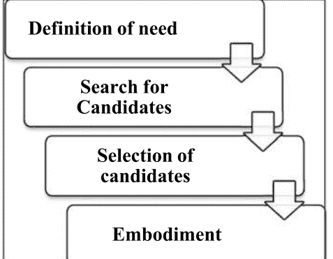

> Jean-Marie Peretti, Gestion des Ressources Humaines, Magnard-Vuibert, Juin 2016, pp. 64.

在这个过程的第一阶段，招聘人员从部门经理那里收到招聘请求（需求公告），然后得到批准，这使得招聘人员和经理可以开始撰写职位定义和所需的资格。

在搜索阶段，招聘人员选择招聘方法（内部或外部招聘），然后进入第三阶段，旨在选择最适合空缺职位的候选人。选择技术是多种多样的；Peretti [6] 只提到了四种：

- 第一轮选拔（初选）；
- 调查；
- 面试；
- 测试。

在具体化的最后阶段，招聘人员与其他利益相关者一起做出最终决策（列出选定的候选人），与新人进行合同谈判，剩下的最后一步是整合。

##### 预测性招聘

本文重点关注选择环节，以解决预测性招聘和预测工作绩效的问题。

实际上，很难知道一个人的哪种素质最重要，以确定他们的成功程度。组织可以在招聘过程中更直接地关注这些特征，或许对预期影响较小的资格要求关注程度较低。组织还可以查看对员工未来成功产生最大影响的软技能，然后更加注重寻找具备这些技能的候选人。这甚至可以包括利用人格评估结果，以预测一个候选人的成功程度。

招聘团队将能够更好地评估软技能和经验的组合，以确定谁真正是最佳选择，招聘人员可以通过关注重要因素来提高效率。

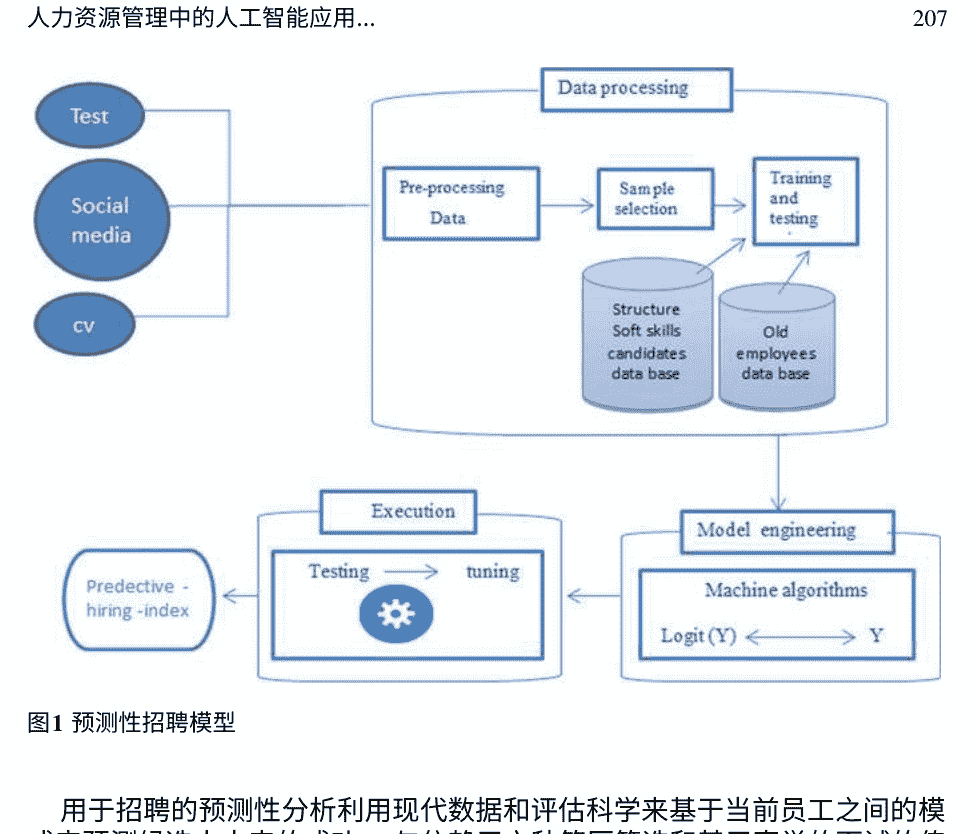

##### 图1 预测性招聘模型

用于招聘的预测性分析利用现代数据和评估科学来基于当前员工之间的模式来预测候选人未来的成功。与依赖于六秒简历筛选和基于直觉的面试的传统招聘不同，预测性招聘依赖于更丰富的数据集和智能算法，向招聘人员和招聘经理推荐最佳选择的候选人。

我们提出了下面的预测性招聘模型（图1）。

首先，该模型中的数据获取取决于候选人获取阶段的结果，我们建议使用智能问卷和语义搜索引擎在专业社交网络（LinkedIn、视频等）、招聘平台或简历库中搜索候选人，然后提取候选人的简历并使用属于人工智能的文本挖掘技术对其进行分类，例如：公司的IT项目经理等。所有这些步骤将使我们拥有一个结构化的候选人数据库，我们将将其与员工数据库集成作为这个性能预测性招聘分析的输入。

其次，我们将使用机器学习算法来计算一组招聘预测因子，我们的模型将基于五个主要的软技能（创造力、好奇心、共情、批判性思维、合作能力）。

数据采集将进行预处理以进行样本选择，然后进行数据集训练，为机器学习例程的执行做准备。

接下来是模型训练阶段，将一组学习数据分配给模型，以对新的或未经训练的数据进行可靠的预测。最后是模型评估阶段，对模型的性能和有效性进行评估。

执行阶段中，经过处理和驱动的数据将通过Web应用程序或Web服务调用传输，用于执行人力资源信息系统（HRIS）中招聘团队使用的机器学习例程。最后是部署阶段，我们将使用数据可视化和实时模型调用技术，以获得更好的结果可视化，用于决策支持。

##### 机器学习

机器学习是计算机科学的一个子领域，它使计算机能够在没有明确编程的情况下学习。计算机不是通过推理学习的，而是通过算法学习的。机器学习是人工智能的许多子集之一。当我们使用其中一个子集时，我们就处于人工智能领域。如今，文献中提出了许多机器学习算法。它们可以根据学习过程中使用的方法进行分类。主要有四种分类：有监督学习、无监督学习、半监督学习和强化学习。最常用的机器学习方法是有监督学习和无监督学习。

##### 有监督学习

有监督学习是指算法提供训练数据和正确答案的情况。机器学习算法的任务是根据训练数据进行学习，并应用所获得的知识使用真实数据，我们注意到数据库必须有标签。有监督学习技术有两种类型：分类和回归。

分类是预测离散类别标签或类别的过程。回归是预测连续值的过程，而不是预测分类值。

##### 无监督学习

机器学习算法没有训练集（Celebi和Aydin 2016）。它们被提供一些关于真实世界的数据，并应该自己从这些数据中学习。无监督学习算法主要关注于发现数据中的隐藏模式。在无监督学习中，我们有聚类等方法。

聚类是最流行的无监督机器学习技术之一，用于将某种程度上相似的数据点或对象分组，主要用于发现结构、总结和异常检测（图2）。

## 4 机器学习模型

在机器学习算法的庞大空间中不迷失的关键是意识到它由三个组成部分的组合组成：学习 = 表示 + 评估 + 优化[8]。

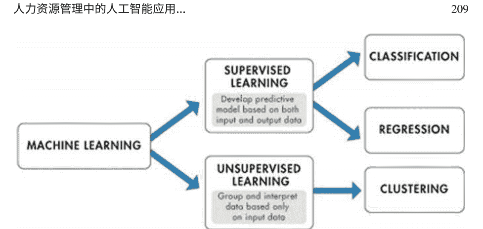

## 4.1 预处理

在创建模型之前，我们将数据集分为训练集（80%）和测试集（20%）。我们将这个数据集分为训练集，因为这是我们将要提供给逻辑回归模型的数据集，这是我们训练模型的方式。当模型创建完成后，我们将使用测试数据集对该模型进行验证。

## 4.2 模型的表示

在本文中，我们将使用树分类算法（逻辑回归、KNN和SVM）来预测候选人在实体中的表现（图3）。

## 5 模型的机器学习算法表示

逻辑回归（LG） 逻辑回归是一种二分类方法。它用于将数据集中的点分为两个不同的类别。为了简单起见，我们将它们称为A类和B类。该模型将给出一个给定点属于B类的概率。如果概率低（低于50%），则将其分类为A类。否则，它属于B类。还需要注意的是，与使用阈值的线性回归相比，逻辑回归更适用于这个目的，因为阈值需要手动设置，这是不可行的。逻辑回归将创建一种类似S曲线的形状（使用Sigmoid函数），这也有助于显示确定性，因为逻辑回归的输出不仅仅是0或1。这是标准的逻辑回归方程式

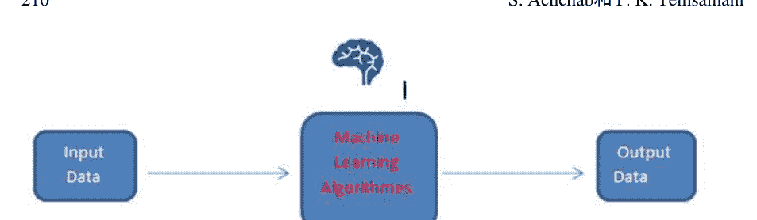

| Soft skills     | Encoding |
|-----------------|----------|
| Creativity      | 5        |
| Curiosity       | 4        |
| Empathy         | 2        |
| Critical mind   | 4        |
| Collaboration   | 3        |

##### 图3 机器学习技术的基础

请注意，函数的输出始终在0和1之间，但永远不会达到这两个值。

##### Sigmoid函数（逻辑函数）

逻辑回归算法也使用线性方程和独立预测变量来预测一个值。预测值可以在负无穷到正无穷之间的任何位置。我们需要算法的输出是类变量，即0—否，1—是。因此，我们将线性方程的输出压缩到(0-1)的范围内。为了将预测值压缩在0和1之间，我们使用sigmoid函数[python机器学习，AMIRSINA TORFI著]。

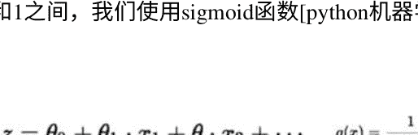

我们将线性方程的输出（z）输入函数g(x)，得到一个压缩值h，该值将在0-1的范围内。为了理解sigmoid函数如何将值压缩在范围内，让我们可视化sigmoid函数的图形。

##### 成本函数

由于我们正在尝试预测类别值，所以不能使用线性回归算法中使用的相同成本函数。因此，我们使用对数损失函数来计算错误分类的成本[来自数据科学家Rohith Gandhi]。

- 对数损失（对数损失函数）：衡量分类模型的性能，其中预测输入是介于0和1之间的概率值。我们的机器学习模型的目标是将这个值最小化。

##### K最近邻（K-NN）

KNN是用于分类和回归的最简单的机器学习算法。它基于整个训练数据集进行决策。不需要花时间训练算法，只需进行预处理和测试。该算法通过计算输入样本与每个训练实例之间的相似性来进行预测。该算法对映射函数的形式没有强烈的假设，因此是非参数化的。简单来说，通过不做假设，算法可以自由地从训练数据中学习任何功能形式。

K代表着训练数据点中与我们将要使用来找到类别的测试数据点相邻的数量。

##### 支持向量机（SVM）

支持向量机（SVM）是一种非常强大和多功能的机器学习模型，能够进行线性或非线性分类、回归甚至异常值检测。它是机器学习中最受欢迎的模型之一，任何对机器学习感兴趣的人都应该将其放入工具箱中。SVM特别适用于复杂但规模较小或中等大小的数据集的分类[9]。

## 6 模型评估

##### 混淆矩阵[10]

目标是产生一个尽可能准确预测分类变量Y取值的模型。评估模型质量的首选方法是将预测值与Y的真实值进行比较：这就是混淆矩阵的作用（图4）。

在我们的研究背景下，混淆矩阵中的条目具有以下含义：

- a和d分别表示真负和真正的预测
- c和b分别表示假负和假正的预测


## 图4混淆矩阵

| Actual \ Predicted | Negative | Positive |
|--------------------|----------|----------|
| Negative           | a        | b        |
| Positive           | c        | d        |

##### 准确度

准确率（AC）是预测正确的总数占总预测数的比例[10]。它可以使用以下公式确定：

准确率 = 正确预测数 / 总数

准确率为80%，我们可以推断该模型提供了正确的预测。

##### 召回率或真正例率

召回率或真正例率（TP）是正确识别的正例占正例总数的比例[10]。

假正例率（FP）是被错误分类为正例的负例占负例总数的比例。

##### 真负例率（TN）和假负例率（FN）

##### 精确度

精确率（P）是预测为正例的正确预测数占预测为正例的总数的比例[10]。

精度 = 真正的正确性 / (真正的正确性 + 假正确性)

##### Roc曲线

AUC ROC是任何分类模型性能的最重要评估指标之一。ROC（接收器操作特性）曲线告诉我们模型在区分两个事物方面的表现如何。更好的模型可以准确地区分这两个事物。最佳的AUC值为1，而最差的值为0.5（即45°的随机线）。任何小于0.5的值意味着我们可以简单地执行与模型建议相反的操作，将值提高到0.5以上[11]。

##### F1得分

F1分数，简单地说就是精度和召回率的调和平均值[11]。

F1分数 = 2 * 精度 * 召回率 / (精度 + 召回率)

##### 均方误差（MSE）

预测值与实际目标变量之间差的平方，除以数据点的数量。数学上表示为[9]。

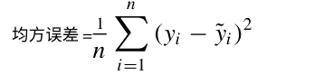

在文献中，我们还发现了平均绝对误差（MAE）和马修斯相关系数（MCC）。

## 7 优化

## 7.1 正则化

正则化是一种用于避免过拟合问题的技术。过拟合发生在模型学习训练数据中的细节和噪声，以至于对新数据的模型性能产生负面影响[9]。

## 7.2 梯度下降

梯度下降是一种用于寻找函数最小值的一阶迭代优化算法。梯度下降的一般思想是迭代地调整参数以最小化成本函数[9]。

## 8 模拟

我们的模型使用三种机器学习算法进行模拟的结果总结在表1中。

所有算法表现良好，但SVM是最完美的算法适用于我们的情况。从这个总结表中可以得出什么结论呢，准确率达到95%，非常低的MSE，召回率和高精确度，训练和测试之间的准确率范围很小，我们可以得出结论，模型表现完美，我们能够对抗过拟合。

##### 表1 三个模型的性能评估

| 指标         | KNN        | 逻辑回归 | 逻辑回归 | 支持向量机 | 支持向量机 |
|--------------|------------|----------|----------|------------|------------|
|              |            | 优化前   | 优化后   | 优化前     | 优化后     |
| 准确率-测试  | 0.95(95%)  | 0.85(85%)| 0.95(95%)| 0.95(95%)  | 0.95(95%)  |
| 准确率-训练  | 0.83(83%)  | 0.83(83%)| 0.85(85%)| 0.92(92%)  |            |
| 召回率       | 0.94       | 0.83     | 0.95     | 0.944      |            |
| 精确度       | 1.0        | 1.0      | 1.0      | 1.0        |            |
| 均方误差     | 0.05       | 0.15     | 0.05     | 0.1        |            |
| 平均绝对误差 | 0.05       | 0.15     | 0.05     | 0.1        |            |
| F1得分       | 0.95       | 0.87     | 0.95     | 0.954      |            |
| AUC ROC曲线  | 0.972      | 0.91     | 0.972    | 0.972      |            |
| 相关性       | 0.793      | 0.577    | 0.69     | 0.80       |            |

## 9 结论

在本文中，我们处理的三个算法都取得了良好的结果，并且相似。然而，在我们的情况下，由于训练和测试之间的误差值最小，SVM似乎是最好的选择。基于人工智能的人力资源应用提高了员工的生产力。它具有分析、预测、诊断和成为更有能力的资源的能力，同时关注员工的需求和结果。

然而，存在着隐私、人才缺口、维护、集成能力或有限的已证实应用等挑战。但是，在部署人工智能服务时要谨慎行事，以解决不必要的问题。人工智能系统必须谨慎管理，找到可靠的学习数据集，使用正确的实施方法，寻求清晰度，消除偏见，并考虑无意的后果[12]。

#### 参考文献

1. Shamim, S., Cang, S., Yu, H., Li, Y.: Industry 4.0的管理方法：人力资源管理视角（2016年）
2. Neelie: 招聘中预测分析的介绍，2018年2月12日。https://harver.com/blog/hr-tech-trend-an-introduction-to-predictive-analytics/
3. Mishra, S.N., Lama, D.R., Pal, Y.: 组织中的人力资源预测分析（HRPA）. Int. J. Sci. Technol. Res. 5(05)（2016年）
4. Handa, D., Garima: 人力资源（HR）分析：人力资源管理（HRM）中的新兴趋势。IJRCM 5(06), ISSN：0976-2183（2014年）
5. Ladimeji, K.: 人力资源预测分析实际上会预测出的5件事情。招聘者第一部分，第1页（2013年）
6. Peretti, J.-M.: 根据Jean-Marie Peretti的招聘方式，Vulbert出版社（2016年）
7. Bunker, R.P., Thabtah, F.: 用于体育比赛结果预测的机器学习框架（2019年）
8. Domingos, P.: 关于机器学习的几个有用的知识（2012年）
9. Géron, A.: 使用Scikit-Learn和TensorFlow进行实践机器学习：构建智能系统的概念、工具和技术（2017年）
10. Kohavi, R., Provost, F.: 术语词汇表。在：机器学习 30（2-3）（1998年）
11. Fawcett, T.: ROC分析简介。模式识别通讯 27(8), 861–874 (2006)
12. Christopher, A.: 人力资源管理中的人工智能应用。在: ACM Woodstock会议WOODSTOCK'18，ISBN: 978-1-4503-0000-0/18/06。美国德克萨斯州埃尔帕索(2018)
13. Hesketh, A.: 研究报告《评估人才价值》CIPD。人事与发展特许学会 (2014)
14. Mangipudi, M.R., Vaidya, R.: 人力资源管理中数字化的研究及其在执行人力资源战略和政策方面的有效性。 Helix 8(6), 4220–4222 (2018)

#### 结合主动半监督学习和罕见类别检测

Rohan Loveland和Noah Kaplan

摘要：探索数据集的任务太大，无法对所有实例进行个别检查，因此需要新的工具来识别和分组有趣的类别。本研究通过先前开发的Farpoint算法，调查了一种同时进行罕见类别检测和主动半监督聚类的混合系统。先前的算法仅关注罕见类别检测，而当前的研究则结合了同时获得高聚类准确性的能力。我们研究了两种约束聚类方法。一种方法是K-Means的约束变体，偏向于紧凑的聚类，而另一种方法是一种基于约束违规确定截断阈值的新颖层次凝聚聚类变体。我们使用人工偏斜的MNIST数据，通过实证比较了两种新方法与原始Farpoint算法的相对性能。结果显示聚类准确性有了显著提高。

关键词：半监督学习·罕见类别检测·约束聚类

## 1 引言

“罕见类别检测”（RCD）问题的形式化定义如下：“给定一组未标记的示例集合 S= {x1, . . . , xn}, xi ∈ ℝd, 这些示例来自 m distinct类别, 即 yi∈ 1, . . . , m, 目标是通过尽可能少的标签请求找到每个类别的至少一个示例”[5]。半监督学习类似，它与标记数据一起使用未标记数据，但目标不同，即构建更好的分类器/聚类器[16]。以前的Farpoint算法严格用于执行RCD，而不考虑聚类准确性[8]。在实际应用中，RCD和准确的聚类都是现实数据探索中可取的。例如，如果在天文数据集上使用RCD发现了一个UFO，那么很可能希望使用同时开发的半监督聚类器来识别其他UFO。在本文中，我们修改了以前的Farpoint算法，创建了一个混合算法，既提供了良好的聚类准确性，又不牺牲RCD性能。

为了进行这个改变，将约束聚类集成到原始算法中，通过将未标记的点分配给最近的标记点来分割聚类。接下来，我们将原始算法进行比较，这里称为Farpoint-NQ，它是根据“最近查询”命名的，与其他两个变体Farpoint-COP K和Farpoint-HA进行比较。这些分别是根据“约束K均值”和“层次凝聚”约束聚类算法命名的。

我们在人工偏斜的MNIST数据集[7]上评估算法的性能。这样可以控制地研究由于类别的相对频率不同（“类别概率”）和特征空间中固有的类别结构差异而导致的性能差异。

## 2 相关工作

在这里，我们提供了以前的工作摘要和对以前的Farpoint算法的回顾。

### 2.1 之前的工作

数据的结构被用来寻找罕见的类别。以前的例子包括使用基于特征向量建模的无趣数据（DEMUD），它基于主成分建模和重构误差[15]。DBSCAN [1]使用了一种类似的基于密度的聚类方法。然而，在许多情况下，也可以从用户（oracle）那里获得信息。当这些信息可用时，可以用它来提高RCD的性能并找到有趣的异常[10]。

Hospedales [6]指出：“在许多领域中，发现罕见类别并对其进行分类是一个重要的数据挖掘问题，但完全监督学习罕见类别分类器的成本过高。”因此，越来越多的人对主动发现和最小监督学习产生了兴趣。”新的Farpoint算法通过使用半监督聚类算法来实现这一目标。因此，通过使用半监督聚类算法，新的Farpoint算法实现了这一目标。

# 2.2 基于Farpoint算法

Farpoint-NQ算法是一种主动学习半监督聚类算法，基于最初未标记数据集的层次划分，形成越来越精细的聚类[8]。

假设我们有一组数据点 $X = \{x_1, \dots, x_n\}, x_i \in \mathbb{R}^d, i \in \{1, \dots, n\}$。这些点来自 $m$ 个不同的类别，具有相应的标签 $y_i \in \{1, \dots, m\}$ 最初未知。通过查询获得标签，我们将其指定为查询函数 $Q_{RY}(i)$，其中 $Q_{RY}(i) = y_i$。$Q_{RY}(i)$ 表示向用户展示具有索引 $i$ 的数据样本并要求标签的过程；假设得到的答案始终是正确的。

Farpoint从一个划分 $P_0 = \{C_0\}$ 开始，其中初始 $C_0 = X$，即所有数据点的集合。随着算法的继续和更多的查询，划分被细化，通过分割现有的聚类。然后 $P_k = \{C_0, C_1, \dots, C_j\}$，其中 $j \le k$，其中 $k$ 是查询的数量。

首先确定数据集边缘附近的点的索引 $q_0$。然后通过查询该点的标签，将其标记为 $C_0$，得到聚类标签 $l_0 = Q_{RY}(q_0)$。一般情况下，$q_k$ 是最近查询的点在 $X$ 中的索引，其中 $q_k \in \{1, \dots, N\}$，而 $l_j$ 是 $C_j$ 的标签。$C_0$，以及更一般地，任何聚类 $C_j$，都可以看作是两个不相交子聚类的并集，即 $C_j = I_j \cup O_j$。$I_j$ 包含已知标签的点（通过查询获得），而 $O_j$ 包含没有已知标签但被假设为 $C_j$ 一部分的点。最初，$I_0$ 只包含起始点，即 $I_0 = \{x_{q_0}\}$。所有其他点都被分配给 $O_0$，所以 $O_0 = \{x_i | \forall i, i = q_0\}$。

然后假设一个算法 $FP(C_j)$，它返回聚类 $C_j$ 的最远点 $f_{p_j}$ 的索引，即 $O_j$ 中距离所有点最远的点。数学上，$f_{p_j} \in O_j$ 具有最小距离 $\min\{|f_{p_j} - x_a|\} \ge \min\{|x_b - x_a|\}$，对于所有 $x_a \in I_j$，对于所有 $x_b \in O_j$。

（算法 $FP()$ 的详细信息将在下面讨论。）假设远点是最不可能属于当前聚类的点，因此它用于确定下一个查询的聚类 $C_j$。

然后使用 $FP(C_0)$ 来找到 $O_0$ 中要查询的点，使用 $q_1 = FP(C_0)$。对于 $x_{q_1}$，相应的标签为 $y_{q_1}$。然后使用 $Q_{RY}(q_1)$ 来确定其对应的标签为 $y_{q_1}$。

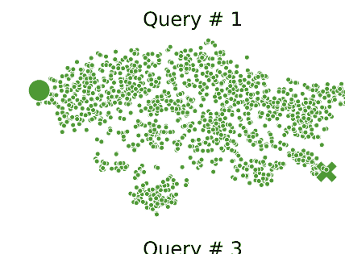

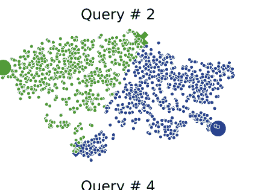

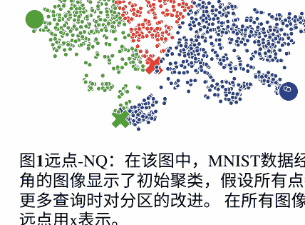

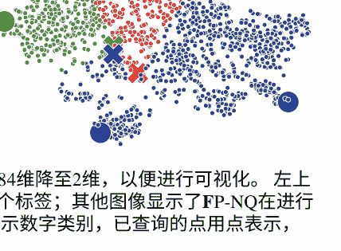

图1 Farpoint-NQ: 在该图中，MNIST数据经过tSNE从784维降至2维，以便进行可视化。左上角的图像显示了初始聚类，假设所有点都属于同一个标签；其他图像显示了FP-NQ在进行更多查询时对分区的改进。在所有图像中，颜色表示数字类别，已查询的点用点表示，远点用x表示。

否则，如果 $y_{q_1} = l_0$，那么这个点属于一个新的簇，$C_0$将需要被分割。更一般地，如果新查询的远点的标签与簇的当前标签不匹配，即 $y_q = l_j$，当前簇 $C_j$将需要被分割。Farpoint-NQ通过创建一个新的簇 $C_{j+1}$来实现这一点，相应的$I_{j+1}$最初设置为只有 $\{x_q\}$。然后根据$I_j$或$I_{j+1}$中最近的先前查询点，将$O_j$中的点分割到$O_j$和$O_{j+1}$中。

一旦查询被处理，如果一个新的簇被创建，那么分区$P_0$将被更新，此时$P_1 = \{C_0, C_1\}$。否则，$P_1 = \{C_0\}$，但$C_0$将有一个新的$f_{p_0}$来查询。

查询过程继续进行。为了选择下一个要查询的簇，使用函数$FPD(C_j)$来计算每个簇的$f_{p_j}$到相应$I_j$中最近点的距离。然后选择具有最大$FPD(C_j)$的簇。使用索引$F P(C_j)$找到要查询的特定点，然后按照之前描述的方式处理该簇。

查询过程将根据用户提供的标签数量继续进行。图1显示了算法的基本流程。算法也在下面的伪代码中描述为算法1。

###### 算法1 Farpoint-NQ

- 要求：
- $X$: 一个未标记的数据点集合
- $P_k$: 一个包含一组聚类的分区
- $C_j$: 一个包含的聚类对象：
- $l_j$ - 聚类 $C_j$的标签
- $I_j$: 一个分配给 $C_j$的数据点集合，具有已知标签 — $\{x_r | x_r \text{ 已经被查询过之前}\}$
- $O_j$: 一个没有已知标签的数据点集合 — $\{x_s | x_s \text{ 之前没有被查询过}\}$
- $f p_j$: $C_j$中的一个远点 $f p_j \in \{O_j\}$
- $Q RY(i)$ — 一个函数，用于获取点 $x_i$的标签 $y_i$
- $F P(C_j)$ — 一个函数，用于获取$C_j$中远点$f p_j$在 $X$中的索引
- $F P D(C_j)$ — 一个函数，用于获取$f p_j$到 $C_j$中已知点的最大距离

- 目标：在找到 $X$中的所有类别时，尽量减少查询次数
- 1: 形成初始分区 $P_0$和聚类 $C_0 = X$
- 2: 找到边缘上的一个点的索引 $q_0$，并设置 $l_0 = Q RY(q_0)$
- 3: 初始化 $I_0, O_0$，并计算 $f p_0 = F P(C_0)$
- 4: 当用户继续搜索更多类别时执行
- 5: 通过选择具有最大$F P D(C_j)$的聚类来找到下一个查询的索引 $j^*$
- 6: 执行查询，设置 $l_{new} = QRY(FP(j^*))$
- 7: 如果新的查询标签等于聚类标签，即 $l_{new} = l_{j^*}$，则
- 8:   将$f p_{j^*}$分配给 $I_{j^*}$，并从 $O_{j^*}$中移除
- 9:   使用$f p_{j^*}$重新计算$f p_{j^*} = F P(C_0)$
- 10: 否则，如果新的查询标签不等于聚类标签，即 $l_{new} = l_{j^*}$，那么
- 11:   将 $C_{j^*}$ 分成两部分，创建 $C_{j^*+1}$
- 12:   将$f p_{j^*}$分配给 $I_{j^*+1}$
- 13:   基于 $I^*$和 $I_{j^*+1}$中最近的点重新分配 $O_{j^*}, O_{j^*+1}$个点
- 14:   更新两个聚类中的远点$f p_{j^*}, f p_{j^*+1}$
- 15: 结束如果
- 16: 结束循环

前面的描述依赖于算法$F P(C_j)$的存在，该算法用于计算$f p_j$的索引。找到此索引的过程如下所示，伪代码如下所示，作为算法2。

## 3个算法

之前的算法FP-NQ严格针对RCD。这在分割策略中得到了反映。

当集群$C_j$由于查询$f p_j$返回与当前集群不同的标签（即 $yq= l_j$）而被分割时，重新评估属于当前集群的未验证点 $O_j$的分配。在FP-NQ算法中，它们只是被分配给 $I_j$或$f p_j$中距离更近的点。

这种分割策略没有考虑聚类中点的结构$C_j$。如果远点$f p_j$属于一个不同的、明显分离的子聚类，FP-NQ将无法识别，并且会继续均匀分割。

## 算法2 寻找聚类远点 - F P(C_j)的算法

- 要求： $C_j$: 一个具有以下特点的集群：
- $I_j$: 一个被分配给 $C_j$的具有已知标签的数据点集合 — $\{x_r | x_r \text{ 之前已经被查询过}\}$
- $O_j$: 一个没有已知标签的数据点集合 — $\{x_s | x_s \text{ 之前没有被查询过}\}$

- 输出： 返回 $f$: 一个指向 $X$ 的索引，确保距离 $\min\{|x_f - x_a|\} \geq \min\{|x_b - x_a|\}$，对于所有的 $x_a \in I_j$，对于所有的 $x_b \in O_j$

- 1. 对于每个 $x_b \in O_j$执行以下操作
- 2. 将距离 $\|x_b - x_a\| \forall x_a \in I_j$ 存储到一个列向量中
- 3. 将列向量连接成一个表
- 4. **结束循环**
- 5. 对于表中的每一列执行以下操作
- 6. 寻找最小值
- 7. 将最小值存储在行向量中
- 8. **结束循环**
- 9. 将 $f$设置为行向量中最大值的索引

（大约）从 $O_j$中获取的点，因此错误地将其中相当数量的点分配到错误的簇中。这可能不会影响RCD的性能，但对聚类准确性有着显著影响。

因此，在分裂过程中引入聚类算法可以保持Farpoint算法的RCD性能，同时提高聚类准确性。用户提供的标签要求使用约束聚类算法，因为标签隐含的必须链接（ML）和不能链接（CL）约束必须得到保留。

一般来说，聚类的类型包括基于质心和基于连接性。我们在Farpoint的分裂步骤中尝试了每种类型的一个算法——COPK和HA。COPK是基于质心的，因此偏好球形簇。HA是基于连接性的，允许延长的簇。考虑到真实世界数据集中非球形类边界的频繁出现，我们预计HA在一般情况下会有更好的性能。

### 3.1 Farpoint-NQ

我们使用基本的Farpoint算法作为基准，评估COPK和HA聚类算法在分类性能上的改进。Farpoint-NQ无标签点分配策略在正常意义上不是一种聚类算法，因为它没有考虑底层的连接性或密度。

### 3.2 Farpoint-COPK

COPK是一种约束K均值算法，它将成对的必连和不可连约束融入到正常的K均值迭代结构中。具体而言，在给定的迭代中，它将每个数据点分配给最近的现有聚类质心，以确保分配不违反任何约束条件[11, 13]。在Farpoint-COPK中，每个标签点以及聚类的远点都被用作初始种子。

### 3.3 Farpoint-HA

基于连接性的聚类算法可以找到非球形的延长结构。一些方法，如DBSCAN和Mean-shift，需要事先指定一个参数，如ϵ或核半径[2, 3]。这样的参数必须以适当的方式进行缩放，这取决于数据集，并且对于用户来说可能很难确定。这与模型选择问题有关，例如在K-Means中必须指定聚类的数量[4]。

为了避免这种情况，我们提出使用分层凝聚（HA）聚类方案。HA方法允许通过明确指定聚类数目或指定最大聚类间距的截断阈值来确定聚类数目。聚类间距可以有几种可能的定义；我们使用最小距离，即一个聚类中的任意点与另一个聚类中的任意点之间的最小距离，$= \min\{d(x_a, x_b)|x_a \in C_a, x_b \in C_b\}$。通过允许截断阈值为不违反约束的最大可能值，可以避免指定聚类参数的规范化。

图2展示了使用合成数据集的这个过程。在图的左侧，我们有总共八个二维数据点。最初假设它们都属于即将被查询的同一个聚类 $C_j$。我们可以假设最左边的蓝色点已经被标记，所以它属于 $I_j$，这意味着右边的橙色点是 $C_j$ 的远点$f p_j$。查询将导致对$f p_j$的不同标签，与聚类标签 $I_j$不匹配，因此聚类将被分割，所有其他当前属于 $O_j$的蓝色和橙色点都需要被分配到一个聚类中。

树状图显示橙色点将被聚类，以及除了异常值之外的所有蓝色点。异常值被孤立，因为在它被分配之前，违反约束的截止值已经达到。截止值存在是因为我们知道包含远点（右侧）的橙色聚类具有CL约束，阻止其与左侧的蓝色聚类合并。

一旦达到了约束截止阈值，没有违反约束的情况下无法进行进一步的HA聚类。然而，这可能会留下一些孤立点，它们距离太远无法被HA分配到任何一个聚类中。在图中，这是蓝色的异常值。在这种情况下，我们根据单链接距离准则将孤立点分配给最近的聚类。

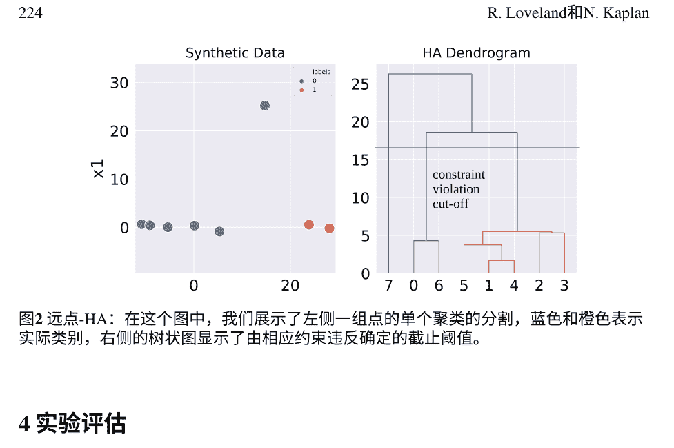

图2 Farpoint-HA：在这个图中，我们展示了左侧一组点的单个聚类的分割，蓝色和橙色表示实际类别，右侧的树状图显示了由相应约束违反确定的截止阈值。

## 4 实验评估

为了获得一个包含罕见类别的数据集，MNIST数据集在多次试验中被人为地扭曲，改变了每个类别的概率。对于给定的试验，数据集是根据大约2的幂次关系随机抽样的10个类别之一。

最常出现的类别与最少出现的类别的相对频率约为500:1，提供了广泛的变化。在MNIST中，具有很多共同特点的类别（例如4和9）具有相似的结构，这超出了稀疏性带来的挑战。为了理解特征空间中稀疏性和结构的影响，希望在所有相对频率水平上检查每个类别。

覆盖所有类别/概率表示的整个空间在计算上是非常昂贵的；大约有360万（即10的阶乘）种不同的可能性。然而，通过随机选择1000次运行，每个（类别/概率）对在大约100次运行中出现，根据以前的经验证明，这是足够的[8]。

FP-NQ和FP-COPK算法分别运行了1000次，而HA运行了200次。这是因为FP-HA算法的计算成本更高。简而言之，由于在每个N-1次迭代中需要对N×N的距离矩阵进行穷举扫描，因此朴素的聚类算法的时间复杂度为O(n^3)。

在某些情况下，算法会溢出，需要超过分配的最大1000次查询才能找到最稀疏的类别。具体来说，我们观察到FP-NQ约为13%，FP-COPK约为9%，FP-HA约为3%。考虑到算法的随机性，这很可能是由于种子初始化不良导致的，可以重新运行。

算法的时间复杂度在NQ和COPK之间大约相差三倍，然后在HA上大约相差1000倍。这在表1中有所总结。

表1 每次试验的平均计算时间
| 算法 | NQ | COPK | HA |
| :--- | :--- | :--- | :--- |
| 寻找10个类别 | 20 | 72 | 53,000 |
| 1000个查询 | 60 | 107 | 70,000 |

给出的运行时间是近似值，因为计算是在不同的计算机上运行然后进行汇总的。虽然FP-NQ和FP-COPK在几分钟内运行，但FP-HA需要几个小时。由于我们对RCD和聚类准确性都感兴趣，我们在两者上比较了所有三种算法的性能。

## 5 性能

### 5.1 稀有类别检测

RCD的目标是尽可能少地找到所有类别。每种方法的性能，按每个数字计算，如图3和图4所示。通常，我们预计需要更多的查询来找到稀疏表示的类别（即具有较低类别概率的类别）。这在所有三个图中都得到了明确的证明。找到不同数字类别的困难程度明显不同。在所有三个图中，十个类别中的五个类别的困难程度保持相同的顺序。最困难的两个类别，一个是1，一个是9，在每个图的顶部都可以看到。最不困难的三个类别在图的底部也可以类似地看到：0，2，然后是6。总的来说，1是最难找到的，并且在所有3个图中具有最高的方差。我们认为这是因为数字'1'的形状，具有单个居中的竖直笔画，与所有其他数字最相似。我们假设方差是由于对其他类别的表示水平的依赖性。9在困难程度上紧随其后；这可能是因为数字'9'在外观上与'4'非常相似。相反，零通常是最容易找到的。这可能是因为数字‘0’中间没有任何东西，因此与其他数字共享的像素位置较少。在找到各个数字类别所需的查询数量方面，数字类别的一致大变化清楚地表明结构和稀疏性在确定所需的查询数量方面起着关键作用。图5显示了三种算法在所有数字上平均RCD性能的比较。这清楚地表明所有FP-NQ、FP-COPK都是如此。

图3 Farpoint-NQ:

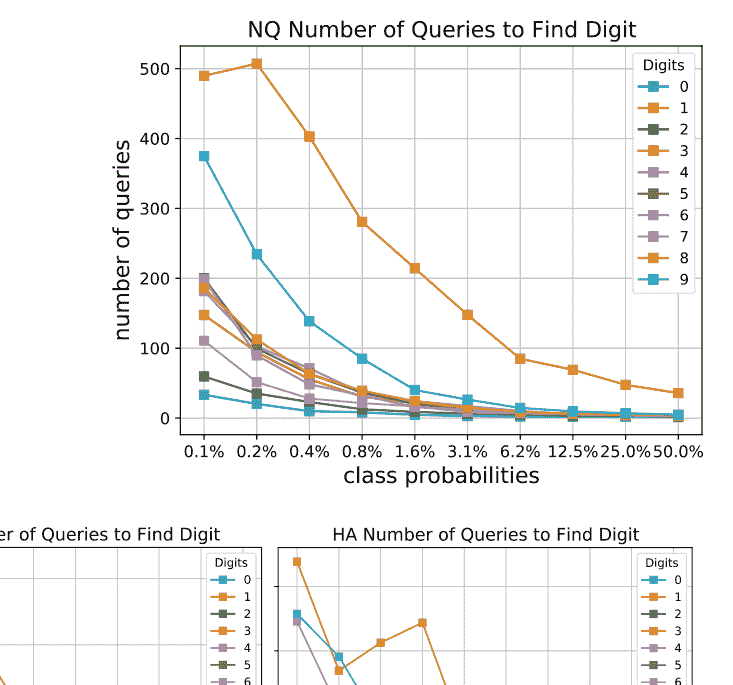

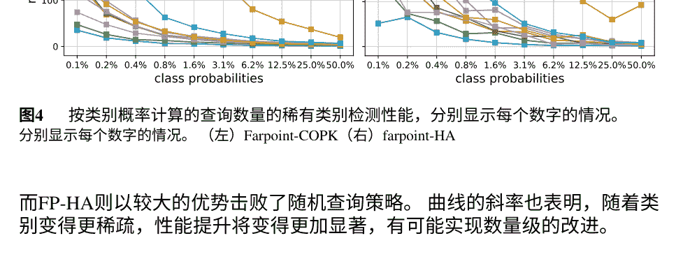

图4 按类别概率计算的查询数量的稀有类别检测性能，分别显示每个数字的情况。（左）Farpoint-COPK（右）Farpoint-HA

而FP-HA则以较大的优势击败了随机查询策略。曲线的斜率也表明，随着类别变得更稀疏，性能提升将变得更加显著，有可能实现数量级的改进。

在这三种算法中，COPK相对于NQ稍微好一些，而两者相对于HA有很大的优势（表2）。

### 5.2 聚类准确度

半监督学习的目标是利用无标签数据的结构来提高分类/聚类的准确性。每种方法的性能都以类别概率为基础，如图6和图7所示。这里是数字的性能

表2 Farpoint算法和随机策略的平均查询次数：将随机策略与三种Farpoint算法变体进行比较的性能
| % | 0.1 | 0.2 | 0.4 | 0.8 | 1.6 | 3.1 | 6 | 12 | 25 | 50 |
| :--- | :--- | :--- | :--- | :--- | :--- | :--- | :--- | :--- | :--- | :--- |
| Rdm | 1K | 500 | 250 | 125 | 63 | 31 | 16 | 8 | 4 | 2 |
| NQ | 182 | 127 | 87 | 59 | 40 | 27 | 15 | 14 | 8 | 6 |
| COPK | 156 | 100 | 68 | 54 | 36 | 25 | 17 | 12 | 8 | 5 |
| HA | 256 | 164 | 132 | 96 | 59 | 44 | 31 | 23 | 10 | 11 |

这在图5中有图示

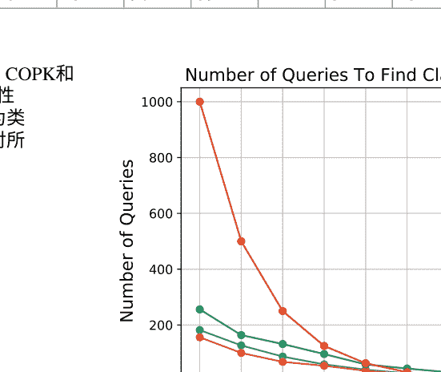

已经进行了平均处理，并且显示的类别是类别概率。这些图表显示了三种情况下相似的行为，即最常见的类别具有最高的准确性。

有趣的是，最简单的方法NQ在低查询数量时似乎具有更高的聚类准确性。这很可能是因为将整个数据集分类为一个类别可以轻松达到50%的聚类准确性。在短期内，COPK和HA这两种更复杂的聚类策略更加重视稀疏类别，导致性能较差，但随着查询的进行，这些差异会弥补。这在图8中更清楚地展示，该图显示了对所有数字进行平均的结果。

图8显示了按类别概率进行平均的准确性。在这种情况下，我们可以看到FP-NQ和FP-COPK的性能非常相似，而FP-HA在300个查询之后明显胜出。在1000个查询时的准确性为：NQ — 82.5%，COPK — 84.9%，HA — 95.9%。这表示FP-HA相对于FP-COPK减少损失方面的改进近4倍。

图6 Farpoint—按查询的聚类准确性，每个数字分别显示，平均1000次试验。Farpoint-COP K（左），farpoint-NQ（右）

图7 Farpoint-HA：按查询的聚类准确性，每个数字分别显示，平均200次运行。

图8 Farpoint-NQ，COPK和HA：按查询的聚类准确性，平均所有数字。

## 6 结论

很明显可以开发出一种混合算法，既可以进行RCD，又可以进行准确的聚类。对于这两个任务，FP-COPK比FP-NQ略好，计算时间增加大约2倍，对于许多情况来说可能微不足道。FP-HA在RCD方面稍差，但在准确性能方面提供了显著的改进。不幸的是，时间复杂度的增加是相当大的，因此在不简化算法的情况下，对许多应用来说可能是不切实际的。结果还表明，在所有情况下，稀疏性和结构都非常重要。仅研究稀疏性的实验并不能揭示全部情况。这三种算法的性能都明显优于随机查询选择策略，在大偏斜值的情况下可能有数量级的改进。

#### 参考文献

1. 陈，Z.，李，Y.F.：基于改进的DBScan算法的异常检测。 Procedia Eng. 15，178–182（2011年）
2. 程，Y.：均值漂移，模式寻找和聚类。 IEEE Trans. Pattern Anal. Mach. Intell. 17（8），790–799（1995年）
3. Ester, M., Kriegel, H.P., Sander, J., Xu, X., 等：一种基于密度的算法用于发现大型空间数据库中的聚类和噪声。在：KDD，卷96，pp.226–231（1996年）
4. Fory, E.W.：多变量数据的聚类分析：效率与分类的可解释性。 Biometrics 21，768–769（1965年）
5. 何，J.，Carbonell, J.G.：基于最近邻的稀有类别检测的主动学习。 在：神经信息处理系统的进展，pp.633–640（2008年）
6. Hospedaes, T.M., Gong, S., Xiang, T.：寻找稀有类别：具有生成和判别模型的主动学习。 IEEE Trans. Knowl. Data Eng. 25（2），374–386（2011年）
7. LeCun, Y., Cortes, C.：MNIST手写数字数据库（2010年），http://yann.lecun.com/exdb/mnist/
8. Loveland, R., Amdahl, J.：远点算法：用于稀有类别检测的主动半监督聚类。 在：第三届国际视觉、图像和信号处理会议论文集。ICVISP 2019。 计算机协会，纽约，纽约（2019年）。 https://doi.org/10.1145/3387168.3389117
9. Lowell, D., Lipton, Z.C., Wallace, B.C.：部署主动学习的实际障碍。 arXiv预印本 arXiv:1807.04801（2018年）
10. Pelleg, D., Moore, A.W.：用于异常和稀有类别检测的主动学习。 在：神经信息处理系统的进展，第1073-1080页（2005年）
11. Svehla, J.: PCKM。 https://github.com/open-nlp/active-semi-supervised-clustering（2018年）
12. Van Craenendonck, T.: 交互式半监督聚类（2018）
13. Wagstaff, K., Cardie, C., Rogers, S., Schrödl, S., et al.: 带有背景知识的约束k均值聚类。 在：ICML，卷1，pp.577-584（2001）
14. Wagstaff, K., Lu, S.: 新领域中的高效主动学习。 在：ICML Workshop on Real World Experiment Design and Active Learning（2020）
15. Wagstaff, K.L., Lanza, N.L., Thompson, D.R., Dietterich, T.G., Gilmore, M.S.: 使用DEMUD解释指导科学发现。在：第二十七届AAAI人工智能大会论文集。AAAI'13，第905-911页。AAAI Press（2013）
16. Zhu, X.J.: 半监督学习文献综述。技术报告。 威斯康星大学麦迪逊分校计算机科学系（2005）

### 作者索引

**A**
- Abel, Marie-Hélène
- Abujar, Sheikh
- Achchab, Said
- Agarwal, Anupam
- Ani, Jannatul Ferdous

**B**
- Bensaada, Abdel Kamal
- Bhagile, Vaishali D.
- Brigui, Iméne

**D**
- Deshmukh, R. R.
- Dhillon, Anamika
- Dudak, Muhammed Nuri

**E**
- Ekici, Mehmet
- Elawady, Iman

**G**
- Gaikwad, Ashrika

**H**
- Herrera, Francisco
- Hossain, Syed Akhter

**I**
- Islam, Mirajul
- Iyer, Sailesh

**J**
- Jyotiyana, Monika

**K**
- Kalia, Arvind
- Kaplan, Noah
- Kar, Amit
- Kesswani, Nishtha
- Kharat, Amit
- Khosla, Nitin
- Kondal, Sudeep
- Kulkarni, Viraj
- Kumar, Naveen

**L**
- Lahoud, Christine
- Litim, El Mostafa
- Loveland, Rohan

**M**
- Martínez-Cámara, Eugenio
- Masum, Abu Kaisar Mohammad

**N**
- Namdev, Nischay
- Nashed, Nader N.
- Nefla, Ons
- Nitwane, Rashmi R.

**O**
- Ozturk, Meltem
- Öztürk, Şaban

**P**
- Pant, Aniruddha
- Panwar, Subhash
- Purohit, Naresh

**R**
- Redjimi, Kenza
- Redjimi, Mohammed
- Ria, Nushrat Jahan
- Ruiz-Millán, Jose Antonio

**S**
- 夏尔玛, 达梅恩德拉
- 桑切斯, 弗朗西斯科·卢克

**T**
- 塔比克, 西哈姆
- 特姆萨马尼, 亚辛·卡洛克

**U**
- 乌纳尔, 亚武兹

**V**
- 维尔马, 贾南德拉·K.
- 维亚皮亚尼, 保罗
- 维多利亚·卢森, M.
- 维克托里诺, 亚历山德罗·科雷亚
- 维什瓦卡尔玛, 莫妮卡