# 深度学习与大数据分析的融合

## 关于作者

Murad Khan 于2008年从巴基斯坦白沙瓦大学获得计算机科学学士学位。他在韩国庆北大学计算机科学与工程学院获得计算机科学与工程博士学位。他发表了60多篇国际会议和期刊论文，并在Springer和CRC Press出版了两章。他还曾担任世界知名会议的TPC成员和多个期刊的审稿人，如Future Generation Systems (Elsevier)和IEEE Access。2016年，他因设计智能家居控制系统而获得庆北大学的高通创新奖。他还因在ACM SAC 2015（西班牙萨拉曼卡）上关于多标准基础切换技术的杰出工作而获得铜牌奖。他是ACM、IEEE和CRC Press等各种社区的成员。他的专业领域包括自组织和无线网络、物联网架构设计、智能城市和家居通信协议设计、大数据分析等。

Bilal Jan 于2010年和2015年分别从都灵理工大学控制与计算机工程系（DAUIN）获得硕士和博士学位。他在知名期刊和会议上发表了多篇论文。他目前在巴基斯坦达拉亚当赫尔FR科哈特法塔大学计算机科学系担任助理教授和系主任。他是多个领先期刊的审稿人。他的研究兴趣包括通用GPU编程、高性能计算、无线传感器网络、物联网（IoT）、深度学习和大数据。

Haleem Farman 于2008年从伊斯兰堡国际伊斯兰大学获得硕士学位。他目前在巴基斯坦白沙瓦大学计算机科学系攻读博士学位，并在伊斯兰教大学计算机科学系担任讲师。巴基斯坦白沙瓦。他在受人尊敬的期刊和会议上发表/合著了20多篇研究论文。此外，他还担任多个期刊的邀请审稿人，如爱思唯尔可持续城市与社会。他的领域包括无线传感器网络、物联网、大数据分析、隐私、优化技术和无线网络的服务质量问题。

## 图目录

图1.1 大数据的三个层次 9
图2.1 数据增长从1970年到2020年（预测） 15
图2.2 从大数据中提取有价值知识的大数据处理阶段从大数据中 16
图2.3 Laney’s基于基本特征的3V模型的BD. 19
图2.4 大数据生命周期的阶段及相应的技术. 20
图3.1 一个完全连接的前馈深度神经网络 33
图3.2 AlexNet卷积神经网络架构 34
图3.3 RNN中单个循环单元的架构 34
图3.4 简单自编码器的架构，显示编码器部分和解码器部分 35
图3.5 IR系统的典型框架 39
图3.6 具有硬参数共享的MTL 40
图3.7 具有软参数共享的MTL 41
图4.1 大数据的挑战以四个V的形式呈现 51
图5.1 深度网络与数据量增加之间的性能关系原始幻灯片由安德鲁·吴教授提供. 55
图5.2 a (Di Cataldo等, 2014; Ul-Islam, 2014) 传统机器学习与领域专家进行特征工程的端到端深度卷积学习 b深度CNN端到端学习 56
图5.3 一个一个前馈网络（或MLP）具有输入层，隐藏层和输出层和b在单个计算中具有输入和输出激活的神经元 57
图5.4 不同的激活函数显示在aSigmoid, bTanh, cReLU和dLeaky ReLU. 57
图5.5 世界卫生组织报告的平均死亡率为百万 60
图5.6 典型的BMS部署以监测生命体征病人的 61- 图5.7 典型的BMS部署 61
- 图5.8 无线身体区域网络的应用（应用的WBAN 2018）62
- 图5.9 无线身体区域网络的未来应用（未来的WBAN 2018应用）63
- 图5.10 WBAN中路由协议的分类 66
- 图5.11 IEEE 802.15.4的超帧结构（重新绘制）68
- 图5.12 WBAN大数据框架（Du等人，2015年）70
- 图5.13 基于云集群的WBAN数据收集系统（Quwaidер，2014年）71

## 第1章
引言

Bilal Jan， Haleem Farman和Murad Khan

摘要 最近，深度学习技术被广泛应用于大数据分析。 深度学习的概念在大数据分析中非常有利，因为它能够实时处理庞大而庞大的数据。 本章简要介绍了机器学习概念及其在大数据中的应用。

类似地，还讨论了机器学习的各个子部分，以支持对大数据分析的一致研究。 还介绍了大数据分析的深入研究以及处理大数据所需的工具，并参考了一些现有的知名作品。 此外，通过将深度学习与大数据分析相结合，填补了在处理大型数据集时使用机器学习的空白。

## 缩略词列表

- 人工智能（AI） 人工智能
- ANN 人工神经网络
- HDFS Hadoop分布式文件系统
- M2M 机器对机器
- IoT 物联网
- CPS 网络物理系统
- ICN 信息中心网络
- WSN 无线传感器网络

## 1.1 机器学习

当基于人工智能（AI）的系统面临硬编码程序的困难时，人们感到了机器学习的需求，并建议机器应该能够自己从数据中提取模式，而不需要人类或程序的参与来完成特定任务。 机器学习的概念是1959年由Arthur Samuel（领域专家）引入，计算机不再为特定任务编程，而是能够自主学习（BMC博客，2018年）。机器学习是人工智能的一个子集，在大量数据的支持下，系统可以调整自己的活动并对特定情况做出反应（Ahmad等人，2018a，b）。在机器学习中，系统被训练以相行动。这些系统提供了许多与任务相关的示例，并识别出统计结构，从而使系统为特定任务定义规则。机器学习处理大量的数据集（Khumoyun等人，2016年），例如，包含数百万患者图像的医疗数据集，用于不同的疾病。机器学习有许多应用，例如使用机器学习的推荐和导航系统可以提供更准确和高效的结果，相比之下，硬编码程序更加困难。机器学习分为监督学习和无监督学习（BMC博客，2018年）。

### 1.1.1 监督学习

在监督学习中，机器根据给定的输入数据进行训练，并相地得出输出。通过机器学习算法来近似输入数据和期望输出之间的关系。简单来说，监督学习基于我们对输出的先前知识。通常，监督学习有两种方式，分类或回归。在分类中，输入被映射到输出标签，而在回归中，输入被映射到连续的输出。这两种方式的目标都是找到输入数据中的结构，可以转化为有效、准确和正确的输出。在现实世界中，并不总是数据标签总是正确的情况。错误的数据标签会导致无效的输出，并明显影响模型的有效性。

最常见的算法是朴素贝叶斯、人工神经网络、支持向量机和逻辑回归（Towards Data Science 2018）。

### 1.1.2 无监督学习

无监督学习仅通过不考虑标记输出来处理输入数据。它在没有预期输出的情况下在数据中找到结构。由于生成输出而不需要先前知识，无监督学习算法复杂且耗时。聚类、降维和表示学习是无监督学习中最常用的任务。无监督学习中最常用的算法是K均值聚类、自编码器和主成分分析。降维和探索性分析是无监督学习的两个最常见的用例。在降维分析中，特征或列被减少以表示数据，而在探索性分析中，可以使用无监督学习自动识别数据中的结构。

随着机器学习在医疗保健、金融服务、车辆自动化和零售等领域的广泛应用，机器学习的趋势越来越大。 数字形式的数据以巨大的数量和多样性产生。 重要的不是收集更多的数据，而是如何有效地利用这些数据是需要解决的问题。 机器学习系统真正帮助公司管理、分析和从如此庞大和多样的数据中产生输出。 机器学习系统可以识别数据中的隐藏模式，并可以识别客户偏好，以推动业务、市场趋势和许多其他提升业务的方式。 随着数据的不断增长，像Facebook和Google这样的公司对客户行为更感兴趣，以改善他们的服务。 为了处理大数据，使用了机器学习的一个子集，即深度学习，以更有效和高效地利用可用数据。

## 1.2 深度学习

深度学习使用了受到人脑神经元启发的人工神经网络（ANN）。 它由多层组成，而深度一词指的是层数的深度（Ahmad等，2018a，b）。 最初，深度一词指的是很少的层数，但由于深度学习在复杂问题中的使用，层数已经达到了数百甚至数千层。 深度学习在图像处理、医疗保健、交通运输和农业等许多领域都取得了很大的成功；借助深度学习，越来越多的数据可以得到最佳利用，并且由于训练数据集的可用性而越来越受欢迎，例如ImageNet（Deng等，2009）包含了数千张图像。 其次，低成本的GPU被更多地用于训练数据，并且还可以利用云服务。 像Facebook、亚马逊、谷歌和微软这样的巨型公司每天都在使用深度学习技术来分析大量的数据。

深度学习不仅受到研究人员的高度关注，也受到技术公司的关注。 社交媒体公司如Facebook、Twitter和YouTube每天产生大量数据，这是由于它们拥有的用户数量所致（Jan等人，2017年）。 对于它们来说，处理这些海量数据非常重要，通常被称为“大数据”。 使用传统的数据分析工具，很难从中获得对数据的深入洞察和提取有意义的数据。 即使是机器学习技术也无法达到所需的高效率；因此，使用深度学习来分析网络中的深层信息以提取有意义、准确和精确的信息。 在接下来的章节中，我们将详细研究深度学习。

## 1.3 传统数据处理技术

数据处理是将原始数据转化为有意义的信息或洞察力的一系列步骤，以明文文件、表格/电子表格、图表和图形、地图/矢量或图像文件的形式输出，从而解决问题或改善现有情况。它导致解决问题或改善现有情况。数据收集、准备适当的输入、处理、输出和解释以及存储是数据处理的一些核心步骤。对于需要在业务数据经过重复处理后产生大量输出的企业和科学操作来说，处理数据非常重要，而科学数据则需要快速生成的输出来控制众多计算。以下是一些传统的数据处理技术的简要介绍（BMC博客2018年；Ahmad等人2018a，b；Khumoyun等人2016年；Towards Data Science 2018年）：

- 手动数据处理：在这种数据处理方法中，所有逻辑操作、计算、数据从一处传输到另一处以及所需结果的获取都不需要任何工具或机器的干预。手动数据处理在小型企业和政府机构中进行，用于手动完成任务，但由于容易出错、耗时和劳动密集的特性，避免使用这种处理方法。技术的缺乏或高昂的成本促使人们使用手动数据处理，但技术的进步已经大大减少了对手动技术的依赖。
- 机械数据处理：这种方法比手动数据处理更准确和更快，使用机械打印机、打字机或其他机械设备来为印刷厂或考试委员会工作。更加复杂和更好的计算机设备超越了它们。
- 电子数据处理：这是一种现代数据处理技术，非常快速和准确，涉及到一台根据提供的一组指令自动处理数据的计算机。计算机是电子数据处理机器的另一个名称。批处理、在线处理、实时处理、多处理、时间共享和分布式处理是一些通过电子手段进行数据处理的方法。以下是一些简要讨论的方法：
    - 批处理：这是一种最简单的数据处理形式，适用于大量数据，如果数据可以分为一两个类别；例如，商店的日常或每周交易可以进行批处理，并将结果发送到总部。
    - 在线处理：在这种方法中，直接连接到计算机和互联网的设备被利用，允许数据存储在一个地方，并在不同地方进行处理。这种处理方式在云计算中使用。
    - 实时处理：对于即时反馈，这种方法比批处理更快；例如，在取消预订或购买机票时需要立即更新记录。
    - 分布式处理：在一个服务器与远程工作站连接的场景中广泛使用，例如，ATM机，其中固定软件位于特定位置，而所有终端机都使用相同的指令和信息。
    - 数据挖掘：数据挖掘从不同来源收集数据并将其组合分析，以找到模式，对相似观察进行分组，根据历史数据预测先前未知实例的类别标签，并识别与正常值偏离的值。
    - 神经网络，非线性数据建模工具，被自动化地用于存储、识别和在数据库中查找模式，或者解密输入和输出之间的复杂关系。

## 1.4 数据挖掘技术：大数据分析方法

由于信息技术的巨大扩张，可用的数据量巨大，这引发了对数据挖掘技术的强烈需求，这些技术在使用统计学、人工智能、数据库系统和机器学习技术分析数据方面起着重要作用。数据挖掘是一种计算过程，用于探索大型数据集以发现有趣的模式。它主要有三个步骤（Towards Data Science 2018; Jan et al. 2017; Five Data 2018）：

- 浏览数据：确定数据的性质，并在浏览所有收集到的数据后将其转换为适当的形式。根据经验猜测和不同类型的插补方法，如回归替代、平均插补和多重插补，用于替换缺失数据的值。
- 识别模式：通过理解要提取的信息，检查可能导致预测的模式。
- 结果规划：在这里，期望的结果是具有手头模式的规划。

在完成数据挖掘过程后，可以将其应用于许多应用程序，例如基于发现的模式推荐新产品，并帮助识别显示数据内相似性和差异性的聚类，并对数据进行分类以从中获得有用的见解。有许多数据挖掘技术可实现业务目标（Ahmad等，2018a，b）。

- 关联规则学习：在这里，分析经常出现的项目或变量以及两个或多个项目之间的关联或关系，以揭示大型数据集中的隐藏模式。可以利用这种技术进行各种应用，例如，通过分析顾客购买记录中香蕉和谷物一起购买的趋势，可以更好地决定将香蕉放在谷物附近的货架上，以促进这些物品的销售。此外，可以跟踪优惠券或促销活动对销售的影响。
- 聚类分析：将表现相似行为的相似对象分组并进行分析，这是一种古老但流行的无监督数据挖掘技术。K-means聚类、凝聚聚类和层次聚类是一些著名的聚类方法。
- 分类分析：这是一种通过根据历史数据库中的值对未知实例预测类标签来对大量数据进行分类的有监督方式。 换句话说，它有助于找到数据所属的类别。分类方法利用决策树和神经网络技术。模型是通过将数据分为两个数据集来构建的，一个用于训练或构建模型，另一个用于测试构建的模型，然后将其与预测值进行比较以进行评估。 例如，我们的电子邮件提供商通过根据电子邮件或附件中的某些特定词语对我们的传入电子邮件进行分类分析，以将其分类为合法或垃圾邮件。
- 回归分析：它探索了变量之间的依赖关系，假设一个变量对另一个变量有单向因果效应。 与相关性相比，这里的依赖性不一定是双向的；一个变量可以依赖于另一个变量，但反之则不一定。
- 异常或离群点检测：采用各种技术来检测、分析和理解数据中的异常、离群点或异常情况，这些数据偏离了特定的数据集。

数据挖掘中数据的不断演变促使我们需要通过扩展已有的数据挖掘技术来开发新的分析技术（Khumoyun等，2016年）。 社交媒体数据以评论、点赞、浏览行为、推文、意见、电子商务和医疗数据的形式存在，是大数据的一些数字来源。众多传感器的重要贡献也在大数据的增长中起到了关键作用（Jan等，2017年）。

大数据分析的生命周期包括问题定义、基于现有技术解决问题、人力资源需求估计、数据获取、数据清洗和存储，然后对数据进行探索性分析以选择决策模型，最后将设计和评估的模型转化为实施（Deng等，2009年；数据处理和数据处理方法，2018年）。

传统的数据库管理工具无法存储和处理大量的大数据（Jan等人，2017年）。 Hadoop和Mahout是流行的大数据分析工具。

Apache Hadoop是基于MapReduce编程模型的框架，通过支持分布式数据处理提供解决方案。 大型数据集在计算机集群中并行处理。 Hadoop分布式文件系统（HDFS）和MapReduce是Hadoop的两个主要组成部分，前者是一个由成千上万个节点组成的分布式文件系统，主要用于大数据存储，而后者是一种软件，可以并行或同时处理这些节点并以更快的速度检索数据。 分类算法在Apache Mahout中实现，这些算法应用于MapReduce范式，以估计所考虑主题的值。

MapReduce是一种编程模型，包括用户定义的map和reduce两个操作，用于生成和处理存储在HDFS中的大规模数据集，从而实现并行大规模计算，提高速度和可靠性。分而治之是其基本技术，其中将给定的大数据问题分成较小的块，进行洗牌和减少以获得所需的结果作为输出。更具体地说，所有复杂的业务规则、逻辑或昂贵的代码都首先在Map阶段中指定，然后在第二个Reduce阶段中指定轻量级处理，例如求和或聚合。Hadoop MapReduce通过不同的组件进行多个数据处理阶段的讨论如下（Jan等人，2017年；Explain three methods，2018年）。

1. 第1步。 用户分叉并处理了一个主进程，由多个工作进程处理。
2. 第2步。 Map和Reduce任务由主进程分配给工作进程。
3. 第3步。 用户程序将输入文件分割成16-64 MB的块，使用MapReduce库。一个或多个输入文件块分配给每个Map任务。
4. 第4步。 然后，这些Map任务将数据块转换为键值对的序列，以供映射器读取。
5. 第5步。 映射器从前一阶段产生的输入记录中生成中间键值对。 中间输出与输入对完全不同，并且将其转发给组合器进行下一步处理。
6. 第6步。 组合器作为小型减少器，通过最小化减少器和映射器之间的数据传输来聚合映射器的输出，并将输出转发给下一个实践步骤。
7. 第7步。 在MapReduce中，根据键对组合器的输出进行分区，以均匀分布映射输出到减少器。
8. 第8步。 在这个阶段，数据的物理移动，也称为洗牌，通过网络传输到减少器节点，并且中间输出被合并、排序，然后作为输入发送到减少阶段。
9. 第9步。 在这个阶段，由映射器生成的中间键值对被认为是减少器的输入，并且减少器函数被应用于每一个键值对，以产生存储在HDFS上的最终输出。
10. 第10步。 在最后阶段，RecordWriter将减少器阶段产生的输出键值对写入输出文件。 输出格式指定了在HDFS上写入这些输出键值对的方法。

虚拟机是一个用于分析和处理数据的大数据处理平台（数据处理2018年）。它是一个针对云端优化的机器学习和分析平台。

## 1.5 大数据分析

在过去的20年中，由于各种形式的互联设备（如机器对机器（M2M），物联网（IoT），网络物理系统（CPS）和信息中心化网络（ICN）），数据量大幅增加。然而，非常正式的定义最早由D. Laney在2001年由META Group引入，将大数据的三个V架构定义为容量、速度和多样性(Laney 2001)。十年来，研究人员一直遵循三个V架构；然而，在2010年之后，Dave Beulke和Associates在2011年引入了五个V架构，包括容量、速度、价值、真实性和多样性(Associates 2011)。大数据的定义包括企业战略集团在2012年提出的6个V架构(Group 2012)。同样，Vorhies在2014年引入了8个V的概念，即容量、速度、价值、可变性、真实性、粘性、病毒性和多样性。然而，并不是所有类型的数据都遵循上述标准的任何架构。这完全取决于从事数据提取的研究人员、科学家和学术界的目的。同样，大数据不仅用于处理数据并得出必要的结果。它还用于找到正确的工具，并确定大数据在智能环境中的应用，如智能家居、智能城市、智能电子健康系统。大数据被定义为大量数据，因此传统的数据工具和处理应用程序不足以分析大数据。大数据市场涉及三个处理层，即1)基础设施层(特别是与硬件和物理设备相关的层)，2)数据管理、组织和分析层，以及3)服务层。基础设施层包括云设施、网络服务、通信技术等硬件组件。数据的收集、采集和获取通常发生在基础设施层。有时候需要传感器的帮助，进一步需要优化和高效的无线传感器网络(WSN)。在基础设施层收集到数据后，使用底层技术将数据传输到管理层。管理和分析层对数据进行各种活动，如存储、决策、模式识别。最后，通过服务层将数据传播给用户。服务层还提供其他功能，如定义应用程序和接口，用户可以连接到系统检索所需信息。图1.1显示了所有三个层提供的功能和概念。

大数据分析涉及各种挑战，例如实时处理数据，在用户之间传播数据，并为他们提供接口。同样地，最近的大部分文献都将大数据用于不同的应用，例如智能家居、城市和建筑物的能源管理以及城市规划。然而，除了上述三个层面之外，目前没有通用的标准可用于分析大数据。

需要针对分析和处理大数据的标准解决方案和规定。世界著名的组织如ACM和IEEE正在努力制定大数据的共同和通用标准。然而，在这个阶段，我们将对研究人员、科学家和学术界在这方面的努力表示赞赏。此外，大数据是数据科学的一部分，我们不能说有一个特定的算法可以用来处理大数据。大数据是一个线性过程，在每个步骤中，可以使用特定类型的算法来解决问题。随着时间的推移，研究人员采用了各种算法和方法，使分析大数据的过程对用户更加高效和便利。

## 图1.1 大数据的三层

实时数据处理需要高计算资源和高效算法，如深度学习、机器学习和迁移学习。然而，在实时环境中实现这些技术是一项具有挑战性的工作，研究人员正在寻找各种计算机制，如人工智能和量子计算。随着计算系统的不断进步，未来有可能达到实时处理数据的某个水平。例如，如果将太空船或太空飞行器发送到火星收集并实时处理数据，就需要高端编程和模式匹配技术。除了计算能力之外，数据分析也非常重要，而传统数据分析方法是不可能实现的。类似地，Hadoop生态系统中使用的传统MapReduce架构主要用于处理离线数据，因此几乎不可能用于处理实时数据。Hadoop生态系统与Spark一起在某种程度上解决了实时数据处理的问题。然而，当涉及到以PB级计量的大量数据时，Spark的性能也会呈指数级下降。因此，可以使用由Spark组成的集群系统来处理PB级数据（Silva等，2017）。类似地，整合数据源来解决问题或回答问题需要进行大数据分析。例如，了解为什么每年降雨量低于平均降雨量的模式可能需要从卫星、传感器和机载设备获取数据，并将它们融合在一起以得到更好的方法。同样，获取在某些特定道路上移动的车辆数据并将它们结合起来进行分析可能会产生各种模式，例如为什么在某个特定时间段内汽车数量很多等等。所有这些上述讨论的挑战都可以通过适当的数据分析技术、工具和方法来解决。

## 1.6 大数据分析中的深度学习

机器学习最近被广泛研究，用于实时处理大数据。同样，机器学习技术可以被视为大数据分析过程的重要组成部分。在这个过程中，计算机系统通过训练来找到一个模式，然后在整个数据中找到相同的模式或类似的模式。计算机系统在开始时接受教导的这种特定类型的学习被称为监督学习。然而，即使有成百上千个例子，实时训练计算机系统也是一项具有挑战性的任务。另一方面，在无监督学习方法中，应用一种过程对非结构化文档中的信息进行分类和管理。类似地，可以进行分析以找到数据中的自然分割和聚类。此外，无监督学习寻找数据中的内在序列和模式，并将它们分组在一起。此外，在这种过程中，可以识别出离群值，以便将数据分组到特定序列或模式之外。

同样，无监督学习可以应用于现有数据，以找到实时解决方案，应对灾害、暴雨等。已经提出了许多方法，将机器学习与Hadoop和MapReduce架构一起用于大数据集（Dean和Ghemawat 2004; Shvachko等2010年）。同样，在线和深度学习也与机器学习一起应用于克服大数据的挑战。总结使用机器和深度学习处理大数据时面临的挑战，我们遇到了来自异构源的非结构化数据，高速流数据，嘈杂和质量差的数据，高维数据以及带有有限标签的数据（Najafabadi等2015年; Sukumar 2014年）。在将机器学习技术应用于大数据分析之前，人们可以对统计方法和信号处理技术有足够的了解。信号处理技术在分类来自异构源和输入的数据中起着重要作用。Qiu等人提出了一项工作，用于识别信号处理技术，以解决各种挑战，如大规模、不同数据类型、高速数据、不完整和不确定数据以及数据密度（Qiu等人2016年）。然而，使用机器学习处理大规模数据需要高内存。因此，需要高效的系统来解决高内存需求的问题。Al-Jarrah等人对处理大规模数据的低内存需求的系统进行了综述（Al-Jarrah等人2015年）。

作者主要关注处理大数据的分析方面。然而，他们没有解决计算复杂性，这是主要的高内存需求的组成部分之一。因此，仍然需要进行更全面的研究，以正确应对使用机器学习进行大数据分析领域中存在的挑战。

## 参考文献

- Ahmad J, Muhammad K等 (2018a) 基于视觉特征的增强分类用于实时选择性除草剂喷雾系统。计算机工业 98:23-33
- Ahmad J, Muhammad K等 (2018b) 使用傅里叶分解将深度特征高效转换为紧凑二进制码，用于多媒体大数据。IEEE Trans Industr Inf 14(7):3205-3215
- Al-Jarrah OY, Yoo PD, Muhaidat S, Karagiannidis GK, Taha K (2015) 大数据的高效机器学习：一项综述。大数据研究 87-93
- Associates DB (2011年11月) 大数据对数据管理的影响：大数据的5个V。从 http://davebeulke.com/big-data-impacts-data-management-the-five-vs-of-big-data/ 检索
- BMC 博客 (2018) https://www.bmc.com/blogs/machine-learning-data-science-artificial-intelligence-deep-learning-and-statistics/
- 数据处理和数据处理方法 (2018年) https://planningtank.com/computer-applications/data-processing-data-processing-methods
- 数据处理：含义，定义，步骤，类型和方法 (2018年) https://planningtank.com/computer-applications/data-processing
- Dean J, Ghemawat S (2004年) MapReduce：大规模集群上的简化数据处理。在：第6届操作系统设计和实现研讨会论文集，第137-149页
- Deng J, Dong W等 (2009年) Imagenet：大规模分层图像数据库。在：IEEE计算机视觉和模式识别会议上发表的论文，迈阿密，佛罗里达州，美国，第20-25页
- 解释数据处理的三种方法 (2018年) https://ww w.kenyaplex.com/questions/16977-explain-three-methods-of-data-processing.aspx
- 五种数据挖掘技术帮助创造商业价值 (2018) https://datafloq.com/read/data-mining-techniques-create-business-value/121
- ES小组 (2012年8月) 6个vs：BI/分析游戏发生变化，所以微软改变了 Excel。从 http://www.esg-global.com/blogs/the-6-vs-the-bianalytics-game-changes-so-microsoft-changes-excel/ 检索
- Jan B, Farman H等 (2017年) 深度学习在大数据分析中的应用：一项比较研究。计算机电子工程。https://doi.org/10.1016/j.compeleceng.2017.12.009
- Khan M, Han K, Karthis S (2018a) 基于物联网和大数据分析的智能控制系统设计。无线个人通信 1683-1697
- Khan M, Iqbal J, Talha M, Arshad M, Diyan M, Han K (2018b) 智能城市中使用软件定义物联网进行大数据处理。国际并行程序设计 1-14
- Khumoyun A, Cui Y等 (2016年) 基于Spark的分布式深度学习框架用于大数据应用。在塔什干举行的国际信息科学和通信技术会议上发表的论文，乌兹别克斯坦，第2-4页。
- Laney D (2001年) 3D数据管理：控制数据量，速度和多样性。应用交付策略，META集团
- Najafabadi MM, Villanustre F, Khoshgoftaar TM, Seliya N, Wald R, Muharemagic M (2015年) 深度学习在大数据分析中的应用和挑战。J Big Data 1-21
- Qiu JW, Ding G, Xu Y, Feng S (2016年) 大数据处理的机器学习调查。EURASIP J Adv Signal Process 1-16
- Shvachko K, Kuang H, Radia S, Chansler R (2010年) Hadoop分布式文件系统。在2010年IEEE第26届大规模存储系统和技术研讨会论文集中1-10页。
- Silva BN, Khan M, Han K (2017) 大数据分析嵌入智能城市架构，通过实时数据处理和决策提高性能。无线通信移动计算 1-12
- Sukumar SR (2014) 大数据时代的机器学习：我们已经到达了吗？在：第20届ACM SIGKDD数据挖掘与知识发现会议论文集：社会公益数据科学研讨会
- Towards Data Science (2018) https://towardsdatascience.com/supervised-vs-unsupervised-learning-14f68e32ea8d
- Vorhies W (2014年10月) 大数据中有多少个V？定义大数据的特征。Data Science Central。检索自 http://www.datasciencecentral.com/profiles/blogs/how-many-v-s-in-big-data-the-characteristics-that-define-big-data

# 第2章 大数据分析

Bhagya Nathali Silva, Muhammad Diyan和Kijun Han

摘要 在过去的几十年中，随着智能物品的出现和嵌入式设备的技术进步，大数据（BD）和大数据分析（BDA）在工业和学术领域得到了广泛推广。本章的初始部分旨在提供对BD和BDA的一般性了解。在后面的部分，将讨论更具体的BD和BDA细节。事实上，BD的概念以其独特的特点而闻名，如大量的数据、高速数据生成以及数据类型和来源的广泛多样性。考虑到这些特点有助于确定潜在的数据处理技术。因此，本章进一步阐述了关键的BD分析场景。此外，描述了BD的应用、BD分析工具和BD的数据类型，以便让读者了解这个广泛的主题领域。最后，本章通过确定BD和BDA面临的潜在机遇和挑战来总结。

## 缩写列表

- 物联网：物联网
- BD：大数据
- BDA：大数据分析
- ML：机器学习
- DL：深度学习
- MR：MapReduce
- TB：千兆字节
- PB：拍字节
- EB：艾字节
- ZB：泽字节
- YB：尧字节
- 关系数据库管理系统
- XML：可扩展标记语言
- WSN：无线传感器网络
- CPS: 网络物理系统
- MM: 多媒体
- AI: 人工智能
- DM: 数据挖掘
- OLAP: 在线分析处理
- BPM: 业务绩效管理
- NLP: 自然语言处理
- 命名实体识别: 命名实体识别
- 数据库管理系统: 统一资源定位符
- 非关系型数据库: Hadoop分布式文件系统

## 2.1 概述

智能设备和连接网络的出现开创了物联网(IoT)的概念，在过去几十年中加快了数据生成速度(Khan等人, 2016年, 2017年; Silva等人, 2017b年)。根据国际数据公司(IDC)在2011年的报告，年度数据量在五年内增长了近九倍，达到了1.8ZB，并且他们估计数据量的增长速度将在每两年翻一番，直到2020年(Gantz和Reinsel, 2011年)。

图2.1简明地说明了过去几十年数据增长的演变。

大数据(BD)的概念是由来自各种运营领域的海量数据洪流所引发的，例如互联网、传感器网络、管理系统、金融系统和用户生成的数据。自首次披露以来，BD一直备受关注，吸引了技术专家和公众的注意，并因此被许多领域专家从不同的角度和视角进行了定义(Silva等人, 2018b年)。起初，BD被用作一个词来定义庞大的数据集。然而，BD并不仅仅是关于数据的大小或数量。道格·莱尼将BD定义为一个3V模型，考虑到独特的BD特征，即容量、速度和多样性(Khan等人, 2018年; Laney, 2001年; Silva等人, 2017a年)。

纯粹的数据大小由体积表示，而速度术语用于描述数据的快速创建，而多样性定义了不同数据源和数据类型之间的差异。IBM另一个广为接受的定义将3V模型改为4V模型，引入真实性作为任何BD模型的第四个V(Gandomi和Haider 2015)。真实性指的是庞大数据的不确定性(Khan等人, 2018年)。

数字数据的快速增长推动了研究界进行数据驱动的实验，影响了社会动态的各个方面(Silva等人, 2018a年)。然而，如果没有适当的知识发现机制，收集大量的数据将是徒劳的。随着数据的快速增长，对于数据工程师来说，庞大数据分析以进行知识发现变得乏味和具有挑战性。

专家。大数据分析中，数据源和数据类型之间的极端变化进一步加剧了庞大的数据管理任务。因此，大数据的概念被扩展到大数据分析（BDA），旨在从大型数据集中发现有价值的知识，并进行智能决策。因此，组织机构的目标是拥有高效的数据处理机制，将高速异构数据转化为有价值的信息。正如Laridis和Jagadish (Laridis和Jagadish 2012)所报道的，从大数据中提取有价值的数据可以分为五个阶段，如图2.2所示。这五个阶段可以作为数据管理和数据分析的组合（Gandomi和Haider 2015）。数据管理涉及数据获取、存储、准备和检索，用于分析。数据分析是指从大数据中提取智能的各种方法、技术和算法。因此，分析可以被视为整个大数据处理任务的一个子过程。

然而，传统的数据分析技术和算法无法处理高速数据，因此需要与其他相关技术相结合，能够整合先进的知识发现机制。

由于多个领域之间的合作和增强的计算能力，知识发现过程得到了拓宽和加强。例如，机器学习（ML）和数据工程领域的专家已经确定了将ML和BD相结合以提高BDA性能的潜力。与传统分析中的浅层学习技术相比，ML-converged BDA采用深度学习（DL）技术从BD中发现智能。考虑到时间需求，BDA被分为实时分析（流式/在线）和归档分析（批处理/离线）。实时分析假设数据价值与数据相关。

图2.2从大数据中提取有价值知识的处理阶段

新鲜度 (Tatbul 2010)。在流式分析中，数据以高速连续到达。由于内存限制，特别是从流中存储和检查的小数据部分，以确定近似模式中的潜在知识。流式分析广泛用于需要更高响应性和最高准确性的实时应用。Spark、Storm和Kafka是几个主要的开源系统，支持流式分析。与在线数据分析相反，批处理在存储后分析数据。MapReduce (MR) 是最广泛使用的批处理方法 (Silva et al. 2017a)。MR将大型数据集分成较小的部分，以便对每个部分进行并行和分布式处理。通过小部分分析获得的中间结果合并在一起，确定最终结果。

由于发现的模式和知识的潜在适用性，许多组织和行业已经欢迎并嵌入了BDA到组织的运营框架中。因此，BDA问题涉及社会管理、世界经济、科学研究等领域的变化 (Chen和Zhang 2014)。一方面，正如Manyika等人在麦肯锡的报告中所报道的那样 (2011年)，BDA在各个领域的积极参与使其有能力促进全球经济的繁荣。另一方面，麦肯锡的报告 (Manyika等人2011年)声称，通过引入模式识别和知识映射等BDA功能到公共服务部门，可以实现社会管理的改进。

本章的其余部分将提供与BD特征、BD分析问题、数据处理方法、机遇和挑战、BD应用、BD数据类型和BD工具相关的描述性信息。

## 2.2 大数据的特征

尽管大数据这个术语最初是在1990年代中期提出的，但由于包括IBM在内的知名技术组织（Gandomi和Haider，2015）的大量努力，该术语在2011年左右变得流行起来。

然而，随着越来越多的人接受，大数据的定义迅速演变，从而引发了一些困惑。尽管存在这些定义的变化，Laney的3V模型（Laney，2001）基于大数据的基本特征被工业界专家和学术界公认。从那时起，体积、速度和多样性这三个维度被视为大数据管理的核心要素。

正如术语所示，体积指的是数据的大小。2012年，IBM对1144名参与者进行了一项调查，了解他们对大数据的熟悉程度，并发现大多数参与者认为大数据是超过一TB（1 TB = 2^{40}字节）大小的数据。随着数据的快速生成，TB时代已经演变为PB、EB、ZB和YB时代。

正如(Beaver等人, 2010年)所报道的，在Facebook上每秒处理大约1600万张照片，相当于1 TB。据估计，Facebook存储了超过2600亿张照片，大约占据了20 PB（1 PB=2^{50}字节）。值得注意的是，BD的数量定义与相应的属性（如数据类型、时间和来源）成比例且相关。因此，过去被认为是BD的数据集在当前存储容量和数据获取方法的背景下可能不再被视为BD。同样，当前时代的BD可能无法超过未来BD的数量阈值。数据类型是定义BD级别阈值时的另一个考虑因素。尽管两个数据集（包括一个表格数据集和一个视频数据集）的数据大小可能相等，但数据类型决定了每个数据集的记录数。因此，我们可以理解，在解释BD时，为数据量定义一个阈值级别是不切实际的。

随着通信技术、智能设备和传感器网络的进步，数据采集过程遇到了异构数据类型。

数据集中数据的极端异质性描述了BD的各种特征。随着技术的进步，数据可以是结构化的、半结构化的或非结构化的。关系数据库管理系统（RDBMS）和电子表格中的数据被认为是结构化数据，因为它符合严格的标准以支持机器可读性。然而，只有大约10%的数据属于结构化数据类别。缺乏结构组织的数据类型，如图像、音频、视频和文本，被归类为非结构化数据。

半结构化数据松散地跨越结构化和非结构化类型。可扩展标记语言（XML）是一种常见的半结构化数据形式，广泛用于Web数据交换。半结构化数据不遵循严格的标准。例如，用户定义XML文档的数据标签，以支持机器可读性。在现代世界中，许多组织从传感器网络和社交媒体中积累了非结构化数据。尽管数据囤积不是一个相对较新的概念，但新的分析技术使得利用积累的数据改善业务流程变得新颖和美丽。例如，零售商可以利用人脸识别技术确定客户的购买模式和店铺流量详情。这些宝贵的信息帮助组织做出有利可图的决策，如人员管理、良好的摆放和吸引人的促销活动。

速度意味着数据生成速率，并且相应的数据分析速度需要做出适当的决策。由于智能设备和传感器网络的出现，非凡的数据生成速度引起了对实时数据分析和数据驱动决策的关注。随着智能设备使用呈指数级增长，数据分析需要分析数千个流数据源。然而，传统的数据处理技术无法处理同时进行数据输入的巨大数据处理任务。作为解决方案，大数据分析技术开始扮演传统数据处理技术的角色，处理相当大规模的数据集。值得注意的是，大数据分析技术比传统技术更高效，因为它们可以从海量原始数据中实时发现智能信息，无论是批处理还是流式处理。

除了这些关键特征，其他几个BD的特征，即真实性、可变性和价值，也被知名技术组织所确认。IBM定义的真实性是4V模型的第四个V。这意味着BD的不确定性和不可靠性因素。SAS研究所定义的可变性维度表示随时间变化的数据流速变化，出现峰值和低谷。除了流速变化，这个特征还包括由异构数据源引起的复杂性因素。Oracle将价值作为BD的另一个特征。总的来说，BD的价值较低，并且与数据量不成比例。

然而，对海量数据进行广泛分析有望提高数据价值。

## 2.3 大数据处理

正如之前讨论的，原始形式的大数据价值较低。通过适当的数据分析可以得到增值的智能。然而，从大量数据中发现智能是一项繁琐而具有挑战性的任务，并涉及许多其他阶段。本节将数据处理任务分为三个阶段，即数据获取、预处理和分析，如图2.3所示。

数据获取是初始阶段，从各种现实世界的对象、设备和传感器中收集原始数据。良好设计的数据收集过程确保数据处理程序后的结果的有效性。值得注意的是，数据收集设计应考虑数据生成器的特性以及后续的数据分析目标。传感器、日志文件和网络爬虫是一些常见的数据采集技术（胡等，2014年）。传感器通常用于以机器可读的数字格式获取物理测量数据，例如温度、湿度和颗粒浓度。扩展传感器网络可以是有线或无线的。然而，在过去几十年中，无线传感器网络（WSN）在有线传感器网络中获得了显著的流行度。

系统由一组传感器组成，被称为网络物理系统（CPS）（施等，2011年）。日志文件是另一种广泛使用的数据采集方法，记录预定义的文件格式中的活动。例如，Web服务器日志文件跟踪Web用户执行的每个活动。除了Web服务器，股票应用程序、金融应用程序、交通管理系统和许多其他应用程序都使用日志文件进行数据采集。网络爬虫是为搜索引擎存储Web页面的软件（Cho和Garcia-Molina，2002年）。网络爬虫在基于Web的应用程序中执行数据收集。除了上述技术之外，还有许多其他数据采集方法。关于不同BD数据类型的描述性解释可以在（陈等，2014年）中找到。

一旦数据被获取，收集到的数据经过预处理，以解决来自异构源的噪声、一致性和冗余的变异性问题。随着数据传输和存储设施成本的上升，对数据预处理的需求变得重要起来。为了保持存储的原始数据的质量，引入了预处理技术到大数据系统中。集成、清洗和冗余数据消除是大数据系统中常用的一些预处理技术。数据集成将从各种来源获取的数据合并起来，以便实现对数据的集体视图（Lenzerini 2002）。尽管传统的数据管理采用了数据仓库方法和数据联邦方法，但这两种技术的“存储和提取”特性限制了它们在高速实时应用中的适用性。因此，在流式引擎（Tatbul 2010）和搜索引擎（Cafarella等人2009）上利用集成技术将是有益的。数据清洗识别出不确定、不完整或模糊的数据，并对其进行修改或删除，从而提高数据的质量。考虑到清洗技术的复杂性，嵌入它们应该谨慎进行，以获得数据的准确性，而不影响计算速度。冗余消除技术减少了重复和多余数据的数量，以提高数据传输和存储的利用率。

图2.4 大数据生命周期的阶段与相应的技术

可靠性和数据一致性。与其他方法类似，冗余消除也有好处和权衡。因此，谨慎使用可以在数据压缩和解压缩过程中提高数据质量，而不会对系统造成压力。事实上，没有一种技术能够保证在广泛的大型数据集上进行最佳预处理。因此，对数据特征、需要解决的问题和分析目标的综合考虑对于选择适当的预处理机制至关重要（图2.4）。

数据分析是从大数据中获取智能的最重要阶段。数据分析的最终目标是发现支持决策的隐藏知识。根据Zhang等人的说法，数据分析可以分为六个主要研究领域，即结构化数据分析、文本分析、网络分析、多媒体分析和移动数据分析（Zhang等人，2014年）。

尽管数据分析的目标在不同领域中各不相同，但一些数据分析方法，即数据可视化、机器学习、神经网络、统计分析、模式识别、信号处理和数据挖掘，在每个领域中都是有益且方便使用的（Khan等，2018年）。数据可视化方法以图形形式提供有价值的信息。

由于在软件设计和算法开发方面的好处，BD可视化已经被许多利益团体研究。机器学习（ML）是人工智能（AI）的一部分，它设计算法以通过实验数据学习计算行为。机器学习不仅能够实现自动知识发现和智能决策，而且将机器学习与深度学习相结合，开创了深度机器学习（DML）作为一种新的研究前沿。统计分析是另一种常见的数据处理方法，它收集、整理和解释数据。统计分析方法可以识别各种数据属性之间的一般关系和有价值的相关性。然而，一般统计方法在BD分析中的适用性不足为大规模统计分析和大规模统计算法铺平了道路。数据挖掘（DM）在BD处理中备受青睐，可以从非常大的数据集中提取隐藏的知识。换句话说，DM可以表示为机器学习和统计学的整合。大数据挖掘比传统数据挖掘更具挑战性，并且需要处理庞大的数据集。根据Wu等人（2008）的研究，Apriori、K-means、朴素贝叶斯、Cart等算法被认为是大数据挖掘的有前途的算法。

随着大数据时代的到来，专家们热衷于快速提取有价值的数据，使用大规模的数据集。为了达到这个目的，许多组织使用哈希、索引、布隆过滤和并行计算技术。哈希将数据转换为索引值或固定长度的数值，以提高读取、写入和查询的速度，索引用于降低读取和写入的成本，提高插入、删除、更新和查询过程的速度。索引的美妙之处在于它可以应用于包括结构化、半结构化和非结构化数据在内的所有形式的数据。布隆过滤器是另一种大数据处理技术，它由一组哈希函数和数据组成，以实现有损数据压缩。随着数据处理需求的增加，许多计算资源同时进行并行计算。与传统的串行计算相比，并行计算将一个计算任务分割成多个较小的任务，并将它们分配给不同的计算资源进行协同处理。

## 2.4 大数据中的数据分析问题

如第1.3节所述，BD分析问题可以广泛分为六个主要领域，即结构化数据分析、文本分析、Web分析、多媒体分析、网络分析和移动数据分析。

商业组织和科学界生成了大量的结构化数据。结构化数据分析高度依赖关系型数据库管理系统（RDBMS）、在线分析处理（OLAP）、业务绩效管理（BPM）和数据仓库。深度学习已成为结构化BD分析中的一名活跃参与者。DL结合的ML算法在学习多层次数据表示模型（Hinton 2007）方面发挥了重要作用。此外，基于数学模型的ML在复杂的结构化应用领域中得到了应用，例如能源管理和故障检测（Baah et al. 2006; Moeng and Melhem 2010）。

文本是存储在文档、网页、电子邮件和社交媒体中的常见数据形式。考虑到其广泛性质，文本分析被认为比传统的结构化数据分析更为重要。文本挖掘是指从非结构化文本数据中发现知识的另一个术语，也称为文本分析。

文本分析问题涉及机器学习、统计学、数据挖掘、计算语言学和自然语言处理（NLP）技术。NLP技术使计算机能够理解文本、分析文本数据并生成文本信息。自动知识提取涉及基于特定主题或主题的信息提取。命名实体识别（NER）在这种情况下被广泛应用于确定与预定义类别相关联的数据。摘要提取是文本分析问题的另一种解决方法，它可以对报告进行总结，提取对于一些关键句子。基于图的文本挖掘也被用于根据主题或话题对文本数据进行分类。

由于网页数量的爆炸性增长，过去二十年间，网络分析成为焦点。从网络资源中发现知识和智能提取被认为是网络分析的最终目标。网络分析涉及数据检索、提取和数据评估。网络分析进一步分为内容挖掘、使用挖掘和结构挖掘（Pal等人，2002年）。网络内容挖掘可以使用数据库方法或信息检索方法（Hu等人，2014年）。挖掘由Web会话生成的二次数据属于Web使用挖掘。使用挖掘考虑用户详细信息、用户注册、用户查询、服务器日志、浏览器和代理。发现网站内部或不同网站之间的图链接定义了Web结构挖掘。

随着社交媒体的异常流行，多媒体数据随之迅速增长，同时普遍可访问。因此，多媒体分析成为一个新兴的研究领域，旨在从任何形式的多媒体数据中提取新知识，即音频、视频和图像。由于多媒体数据类型的可变性，多媒体分析具有挑战性和繁琐性。然而，与结构化数据和文本数据相比，多媒体数据包含更多的信息。因此，学术界和工业界的专家提出并研究了许多感兴趣的领域，例如多媒体注释、检索、索引和摘要，以解决多媒体分析的关键挑战。多媒体注释为多媒体文件分配标签，概述文件内容。索引和检索技术帮助人们轻松快速地发现有意义的多媒体文件。多媒体摘要提取最显著的音频内容或视频内容，最好地描述原始文件。

连接网络和社交网络的爆炸性增长将传统的文献计量网络分析扩展到社会网络分析（Watts 2004）。社交网络由内容数据（文本、图像、视频等）和类似图形的链接数据组成。事实上，社交媒体的内容数据和链接数据非常丰富，蕴含着隐藏的知识。然而，这些有利可图的数据的极端复杂性已成为社交网络分析的挑战。社交网络分析包括两个主要研究领域，即内容数据分析和链接数据分析。关于内容分析和链接分析的更详细解释可参见（Aggarwal and Wang 2011）。正如所述，社交媒体包含多种异构数据类型；因此，每种大数据分析方法都可以应用于社交网络分析。然而，这些方法应根据时间限制、数据的噪声性和社交网络的动态属性进行调整。

移动分析随着移动计算的进步而迅猛增长。然而，移动数据分析面临移动数据特征带来的挑战，如噪声、数据冗余、位置感知和活动感知。为了确保用户满意，移动分析应该在实时基础上促进智能决策。由于移动分析提供的知识发现，利用经验数据构建复杂的移动系统变得更加可靠和简单。

## 2.5 大数据的应用

大数据应用通过大量数据分析帮助小型和大型企业做出智能决策（Hilbert 2016; Sagiroglu and Sinanc 2013）。互联网点击、Web服务器日志、活动报告、社交媒体内容、手机历史记录、客户电子邮件文本和传感器数据是数据的主要来源。组织的不同利益迫使大数据应用通过探索大量数据记录来揭示隐藏信息。本节将介绍不同领域的大数据应用（Clegg 2009）。

### 2.5.1 医疗保健

在医疗保健系统中生成的数据并不少见。由于能力不足和标准化的缺陷，医疗保健行业涵盖了大数据分析。在医疗保健中使用大数据分析已经革命性地使个性化药物治疗变得简单和智能化。对于特定疾病，研究人员正在竞相在特定时间间隔内提供合适的治疗方法，分析数据模式以识别药物副作用和未来的治疗方法，并降低治疗成本。对于健康问题，即电子健康、移动健康和可穿戴设备，产生了大量的数据，包括图像、记录、传感器数据和患者数据。医疗保健中另一个潜在的应用是通过映射健康和地理数据来预测某些疾病受影响的特定地区。由于准确和及时的预测，医生可以主动制定计划、诊断和提供疫苗和血清。

### 2.5.2 制造业

在生产和制造领域应用大数据分析的一个关键潜在好处是获得透明度和零停机时间。为了实现这个目的，需要大量的数据以及最新的分析工具，以便实时处理数据并从大量原始数据中提取有价值的知识。以下是制造和生产领域的主要领域，利用大数据应用来提高性能。

- 生产力和容忍度跟踪
- 供应链规划与管理
- 能源效率
- 新产品的测试和仿真过程
- 大规模制造的定制化

### 2.5.3 政府

通过采用BDA概念可以提高政府运作的性能。一组特定的数据在多个应用程序以及多个管理部门之间共享，以提取知识。创新应用在多个领域的电子治理中起着重要作用。以下是一些治理领域，BD和BDA在其中发挥作用以提升性能的领域。

- 网络安全和情报
- 税务合规
- 犯罪识别及其预防措施
- 交通管理
- 天气
- 研发

### 2.5.4 物联网

物联网是BD的另一个广泛应用领域，与此同时，它也是BD创建的来源，拥有庞大数量的连接传感器、物品和设备。物联网收集传感器和执行器数据，然后在各种环境中使用这些数据。

## 2.6 大数据的数据类型

BDA中存在多种数据类型，包括网络数据、链接数据、事件数据、时间序列数据、自然语言数据、实时媒体数据、结构化数据和非结构化数据。随着数据不断增长，区分有价值的数据已成为现代科学时代的重要需求。然而，从模糊、嘈杂和被误解的数据中确定有价值的数据仍然是全球数据科学家面临的挑战。本节提供了关于上述数据类型的简明描述。

1. 结构化数据：以行和列存储的数值数据，每个数据元素都有定义，被称为结构化数据。大约10%的总数据量属于这种类型的数据，可以通过数据库管理系统（DBMS）访问。政府部门、房地产和企业、组织以及交易在各自的运营过程中生成结构化数据。
2. 非结构化数据：除了具有定义的数据元素的表格数据之外的任何数据都属于非结构化数据类别。图像、音频、视频和文本形式的数据被视为非结构化数据。这种类型的数据占到90%总数据量的。在过去几十年中，社交媒体的流行增加了更多的非结构化数据，这些数据无法使用传统的数据存储和处理方法进行存储和处理。这些数据可以存储在适当的数据库中。NoSQL系统是适合存储非结构化数据的一种合适的存储方式。CouchDB和MongoDB被许多组织广泛使用作为NoSQL存储库。
3. 地理数据：从地理信息系统（GIS）生成的数据，即地址、工作场所、建筑物、交通路线和道路系统，属于地理数据。这些数据元素可以通过部署的传感器和GIS轻松收集。在数据收集之后，进行修改、处理和分析任务，以从原始数据中提取知识。此外，地质统计学被用于监测环境条件。
4. 实时媒体：流媒体数据或存储的媒体数据会产生实时媒体。事实上，由于其流媒体的特性，存储和处理实时媒体一直是一个挑战。有许多来源会产生音频、视频和图像数据。举几个例子，Flickr、YouTube和Vimeo是主要的实时媒体生成来源。视频会议是实时媒体数据的另一个来源，它实现了无缝全双工通信。
5. 自然语言数据：人们以口头对话的形式生成数据。这种类型的数据的编辑质量和抽象水平是不同的。语音捕捉设备、物联网、手机和固定电话是自然语言数据的主要来源。
6. 时间序列：按时间顺序对特定索引进行测量或观察的数据被视为时间序列。一般来说，时间序列数据是在等时间间隔下观察到的。时间序列数据被分析以从收集到的时间数据中提取隐藏的知识。信号处理、统计学、地震预测系统、模式识别等许多其他领域都使用时间序列数据类型。
7. 事件数据：事件数据是通过外部数据和时间序列数据之间的相关性生成的。事件数据类型的最终目标是在无数事件中区分有价值的事件。事件数据的三个组成部分是动作、时间间隔和状态。所有三个组成部分的组合构成了一个事件数据。事件数据具有嵌套、重归一化和无模式特征。
8. 网络数据：像Twitter、YouTube和Facebook这样的大型网络生成网络数据。其他信息网络、生物网络和技术网络也是网络数据的来源。网络数据可以表示网络节点之间的一对一或一对多关系。节点可以是用户、数据项、互联网设备、神经细胞等。保持节点和网络结构之间的连接被认为是网络数据的主要挑战。
9. 链接数据：链接数据类型包括Web技术中的URL。计算机、嵌入式设备和其他智能设备可以共享和查询语义信息。可以使用链接数据类型读取和共享数据。

## 2.7 大数据工具

持续发展的业务运营高度依赖于对大数据的彻底调查。数据分析在智能决策以及组织的发展和福祉方面起着重要作用。然而，借助传统的数据处理工具处理大量数据是不可行且效率低下的。因此，近年来引入了各种大数据工具。大数据工具可以有效且经济地帮助组织和数据科学家进行基于知识的决策。实践者使用各种大数据分析工具来促进数据存储、数据管理、数据清洗、数据挖掘、数据可视化和数据验证。本节简要介绍了广泛使用的大数据分析工具。

### 1. NoSQL

一般来说，SQL广泛用于处理和查询结构化数据。然而，非结构化数据的巨大增长推动了非结构化数据分析工具的出现。随后，不仅SQL（NoSQL）被开发出来有效处理非结构化数据类型。NoSQL数据库在存储非结构化数据时不特别遵循模式。因此，表的列值随着每个数据记录（行）而变化。由于这种无模式的特性，NoSQL存储在一致性、速度、容错性和可用性之间做出了妥协。尽管在过去几十年中NoSQL获得了巨大的流行度，但低级查询语言和缺乏标准化接口仍然存在挑战。

### 2. 卡桑德拉

Apache Cassandra是一个NoSQL、开源、分布式数据库，能够在多个服务器上管理非常大的数据集。卡桑德拉的美妙之处在于它没有单点故障，确保在任何情况下都具有高可用性。因此，当可扩展性和可用性特性至关重要而不影响性能时，卡桑德拉备受专家组的青睐。此外，卡桑德拉可以在多个云或数据中心之间复制数据，以确保较低的延迟和容错性。

### 3. Hadoop

Hadoop是一个框架，由一系列软件库组成，采用各种编程模型，以便于对大型数据集进行分布式处理。可扩展性是Hadoop带来的另一个好处。Hadoop提供的分布式存储设施单独被称为Hadoop分布式文件系统（HDFS）。Hadoop不依赖硬件来实现高可用性。相反，它通过软件库在应用程序层面检测、识别和处理故障点。Hadoop框架包括Hadoop Common（通用库）、HDFS（存储）、Hadoop YARN（调度计算资源）和Hadoop MapReduce（处理大型数据集）。

### 4. 风暴

Storm是一个实时的开源分布式计算系统。Storm管理大量的流数据，类似于Hadoop的批处理。Storm的优点是可以使用任何编程语言进行处理。为了确保适当的实时分析体验，Storm集成了现有的队列机制和数据库技术。Storm的流处理在每个计算阶段都需要复杂而任意的分区。Storm提供了实时分析、持续计算和在线机器学习等关键服务。

### 5. Spark

Spark是一个通用的开源分布式集群计算框架。Spark在流数据处理和批处理方面保证了更高的性能。Spark集成了SQL、GraphX、MLib和Spark Streaming组件。Spark可以从各种数据源访问数据，并在Hadoop、Mesos和Yarn等各种平台上运行。与Storm相比，Spark被认为是成本效益高的，因为可以使用相同的代码集进行实时处理和批处理。然而，Storm在延迟方面具有更高的优势，并且限制较少。

### 6. Hive

Hive是一个在Hadoop上运行的跨平台数据仓库软件。Hive可以对存储在多个存储和文件系统中的数据进行数据分析和查询。为了在分布式文件系统上进行查询，Hive通过HiveQL提供了SQL抽象，这是一种类似SQL的查询语言。因此，应用程序不需要使用低级别的Java API来实现查询。HiveQL会将查询透明地转换为Spark、Apache Tez和MapReduce。此外，Hive还提供索引来提高查询执行速度。

### 7. OpenRefine

OpenRefine是一个开源的独立应用程序，以前被称为Google Refine。在当前数据驱动的世界中，OpenRefine被广泛用于清理嘈杂的原始数据，并将数据从一种形式转换为另一种形式。OpenRefine在某种程度上类似于典型的关系数据库管理系统（RDBMS）表，它将数据行存储在列下面。然而，它与传统情况有所不同，因为在列下面的单元格中不存储公式。在OpenRefine中，公式用于转换数据，并且它们只会被转换一次。

## 2.8 机遇和挑战

与其他领域一样，大数据拥有其好处、优势和机遇，随之而来的是挑战。一方面有着显著的机遇，另一方面大数据分析面临重大挑战。本节简要讨论了潜在的机遇和已确定的挑战。

美国国家科学基金会（NSF）和美国国立卫生研究院（NIH）最近确认，在决策过程中采用大数据分析已经证明了未来努力的潜在好处（Chen和Zhang 2014年）。事实上，大数据时代已经改变了每个人的生活方式，对社会和经济发展产生了影响。大数据分析的兴起将人们的行为主义从被动变为主动，随后加强对可能发生的事件的预防措施。由于通过智能知识发现获得的好处，大数据将成为许多组织吸引熟练员工的决策者，同时在关键决策中与其他竞争对手竞争。随着大数据分析的出现，Hadoop技术取得了显著的流行和成功。然而，未来这些技术可能无法足够处理高速大数据。因此，专注于复杂的处理技术和分布式数据库等存储技术将产生重大突破。此外，大数据分析与物联网、移动计算和云计算等其他技术的共存创新了技术进步，以协助高效的数据获取、数据存储、数据分析和数据保护。新颖的数据表示方法是与大数据分析成熟同时出现的机遇领域之一，因为分析结果的说明是智能决策中最重要的因素之一。未来，扩展大数据研究机会有望提高，因为大数据被视为人类大脑的延伸，而不是大脑的替代品。

大数据分析面临着不同的挑战，贯穿整个大数据生命周期。具体而言，数据收集、数据存储、数据处理、数据分析、结果表示等方面的挑战可能抑制了大数据分析的全部能力。大数据的极端复杂性降低了分析算法的适用性和持续进展。大数据分析的缓慢演化始终伴随着3V模型所表示的大数据特征。大量的数据集会产生无数个输出类别和自由参数，对处理时间和复杂性产生不利影响。为了应对这些挑战，专家们已经将大数据分析扩展到与并行计算相结合，包括CPU和GPU的集群。数据类型的异质性极大地影响了大数据分析的复杂性。因此，大数据分析技术应严格关注缓解极端数据多样性带来的挑战的机制。整合异构数据类型进行机器学习过程是大数据多样性特征所面临的另一个关键挑战。大数据分析还面临着快速数据生成速率的挑战。高速数据需要实时处理以支持决策。然而，关于在线学习过程与大数据的研究工作很少，因此需要更多的发展。专家们预见到支持并行处理的小批量处理技术将成为管理高速大数据分析的有希望的技术。与高速度相关的极端非稳态性是实时大数据分析的另一个阻碍因素。

## 2.8 机遇和挑战

经过全面的文献综述，我们确定了与大数据相关的上述机遇和挑战。随着技术的不断发展，许多专家对大数据分析的潜在好处表示乐观。因此，他们声称技术进步将能够克服大数据的容量、速度和多样性所带来的障碍。

## 参考文献

- Aggarwal CC, Wang H (2011) 社交网络中的文本挖掘。 在：社交网络数据分析。斯普林格，第353-378页
- Baah GK, Gray A, Harrold MJ (2006) 部署软件的在线异常检测：一种统计机器学习方法。 在：第3届国际软件质量保证研讨会论文集，2006年。ACM，第70-77页
- Beaver D, Kumar S, Li HC, Sobel J, Vajgel P (2010) 在大海捞针：Facebook的照片存储。 在：OSDI，2010年，第1-8页
- Cafarella MJ, Halevy A, Khoussainova N (2009) 关系网络的数据集成。 Proceed VLDB Endowment 2:1090–1101
- Chen CP, Zhang C-Y (2014) 数据密集型应用，挑战，技术和技术：关于大数据的调查。 Inf Sci 275:314–347
- Chen M, Mao S, Liu Y (2014) 大数据：一项调查。 Mob Netw Appl 19:171–209
- Cho J, Garcia-Molina H (2002) 并行爬虫。 在：第11届国际会议论文集- ence on World Wide Web，2002年。ACM，第124-135页
- Clegg B (2009) 大爆炸之前：我们宇宙的史前。 St. Martin's Press
- Gandomi A, Haider M (2015) 超越炒作：大数据概念，方法和分析。 Int J Inf Manage 35:137–144
- Gantz J, Reinsel D (2011) 从混乱中提取价值。 IDC iView 1142:1–12
- Hilbert M (2016) 发展的大数据：承诺和挑战综述。 Dev Policy Rev 34:135–174
- Hinton GE (2007) 学习多层表示。 Trends Cogn Sci 11:428–434
- Hu H, Wen Y, Chua T-S, Li X (2014) 面向大数据分析的可扩展系统：技术教程。 IEEE Access 2:652–687
- Khan M, Silva BN, Han K (2016) 基于物联网的能源感知智能家居控制系统。 IEEE Access 4:7556–7566
- Khan M, Silva BN, Zheng C, Han K (2017) 基于 ZigBee传感器网络的上下文感知智能家居控制系统。 KSII Trans Internet Inf Syst 11:1057–1069
- Khan M, Silva BN, Han K (2018) 使用深度学习算法实时高效处理大数据。 在：深度学习创新及其与大数据的融合。IGI Global，第61-78页
- Labrinidis A, Jagadish HV (2012) 大数据的挑战与机遇。 Proceed VLDB Endowment 5:2032–2033
- Laney D (2001) 3D数据管理：控制数据的容量、速度和多样性。 META Group Res Note 6:1
- Lenzerini M (2002) 数据集成：一个理论视角。 在：第二十一届 ACM SIGMOD-SIGACT-SIGART数据库系统原理研讨会论文集，2002年。ACM，第233-246页
- Manyika J, Chui M, Brown B, Bughin J, Dobbs R, Roxburgh C, Byers AH (2011) 大数据：创新、竞争和生产力的下一个前沿
- Moeng M, Melhem R (2010) 将统计机器学习应用于多核电压和频率调整。 在：第7届ACM国际计算前沿会议论文集，2010年。ACM，第277-286页
- Pal SK, Talwar V, Mitra P (2002) 软计算框架中的Web挖掘：相关性，现状和未来方向。IEEE Trans Neural Netw 13:1163–1177
- Sagiroglu S, Sinanc D (2013) 大数据：一项综述。在：2013年国际合作技术和系统会议论文集(CTS)。IEEE，第42-47页
- Shi J, Wan J, Yan H, Suo H (2011) 一项关于网络物理系统的调查。在：2011年国际无线通信和信号处理会议上。IEEE，第1-6页
- Silva BN, Khan M, Han K (2017a) 将大数据分析嵌入智能城市架构与RESTful物联网相结合，以实现高效的服务提供和能源管理。未来的一般计算系统
- Silva BN, Khan M, Han K (2017b) 物联网：启用技术、架构和挑战的综述。IETE Tech Rev 1–16
- Silva BN, Khan M, Han K (2018a) 走向可持续智能城市：智能城市中的趋势、架构、组件和开放挑战的综述。Sustain Cities Soc 38:697–713
- Silva BN等 (2018b) 城市规划和智能城市决策管理通过实时数据处理使用大数据分析。传感器18。https://doi.org/10.3390/s18092994
- Tatbul N (2010) 流数据集成：挑战和机遇
- Watts DJ (2004) 六度：一个连接时代的科学。WW Norton & Company
- Wu X等 (2008) 数据挖掘中的十大算法。知识信息系统14: 1–37

# 第三章
## 深度学习方法与应用

贾米尔·艾哈迈德，哈利姆·法曼和扎胡尔·贾恩

摘要 本章介绍了深度学习范式下存在的各种方法，它们的复杂细节以及在各个领域中的应用。由于大数据的可用性和优秀的学习算法，深度学习大大提高了计算设备的预测能力。它使得将机器学习与图像识别、物体检测、自动驾驶汽车、药物发现和疾病检测等复杂应用相结合成为可能和实用。深度学习方法的卓越可靠性吸引了各个科学领域的研究人员的注意，他们利用其优势来解决问题。除此之外，深度学习中的知识重用也是这项技术的一个有趣方面，将在本书中讨论。

## 缩略词列表

- 卷积神经网络
- 深度神经网络
- 循环神经网络
- 长短期记忆网络
- 信息检索
- 词袋模型
- 基于内容的图像检索
- 自然语言处理
- 机器学习
- 多任务学习

## 3.1 背景

科学家们从1979年开始研究深度神经网络；然而，它在2006年作为一种新的机器学习研究领域出现，当时它被用于以无监督的方式降低数据的维度（Hinton 和 Salakhutdinov 2006）。2012年，它在 ImageNet 比赛中以巨大的优势击败亚军，引起了研究人员的关注。深度卷积神经网络（CNN）被用于自动从大量图像中提取视觉特征，然后进行图像分类（Krizhevsky 等人 2012）。

从那时起，深度学习一直在积极研究中，以解决几乎所有研究领域中的复杂问题。特别是在图像识别、语音识别、语义图像分割、自然语言处理和许多其他任务中，取得了最先进的性能。

深度学习是一组机器学习算法，试图自动从原始数据中学习重要特征。与传统的神经网络类似，深度神经网络（DNN）也由人工神经元组成，排列成输入、隐藏和输出层的形式（Hinton等，2012年）。然而，与传统的神经网络不同，深度网络中隐藏层的数量通常超过一个。深度神经网络的分层性质使其能够在多个层次上学习特征，其中每个层次对应于特定的抽象级别。

基本特征在初始层学习，然后在更深的层次上聚合，构建更高级别的概念。它可以直接应用于各种数据，包括图像、音频和文本（LeCun等，2015年）。

深度学习受欢迎的最重要原因是硬件的高度改进的并行处理能力，特别是通用图形处理单元或GPU，可用于训练的数据量大大增加，以及机器学习算法的最新进展。这些进展使得深度学习方法能够有效地利用复杂的、组合的非线性函数，通过有效地利用有标签和无标签的数据来自动学习分布式和分层特征。

## 3.2 深度学习网络的分类

与机器学习类似，深度学习也包括了一系列从数据中学习的方法。深度神经网络的分层架构可以以多种方式用于解决不同的问题。总的来说，深度学习可以分为三个不同的组别。

## 3.3 用于监督学习的深度网络

这些网络为模式分类和回归提供了判别能力。根据提供的数据标签，网络试图学习不同类别之间的差异。在分类和回归任务中，网络学习将输入映射到预期输出（标签）。监督学习的常见架构包括DNN、CNN和循环神经网络（RNN）。

在DNN中，每一层都由多个神经元组成，形成一个层次结构。上一层的输出成为下一层的输入，以此类推。每个后续层在输入数据中学习越来越复杂的模式。较低的层级通常学习低级特征，而较深的层级学习数据中的高级抽象。DNN在结构上是最简单的，因为它们是具有多层的前馈神经网络，如图3.1所示。另一个用于监督学习的著名架构是CNN，它主要用于图像和视频等视觉数据处理。然而，它们已被证明对几乎任何类型的数据都非常有用，包括视觉数据（Ahmad等人，2018a），音频数据（Badshah等人，2017）甚至文本数据（Glorot等人，2011）。CNN由三种不同类型的层组成，包括卷积层、池化层和全连接层。卷积层试图通过在训练阶段调整滤波器/卷积核的系数来学习数据中可能出现的重要特征。每个滤波器都单独对输入进行卷积，以获得特征图，其中特征的位置用较高的激活值标记（Ahmad等人，2017a）。与DNN类似，CNN中的较低层学习基本特征，随着网络的深入，卷积核学习越来越复杂的特征。池化层降低特征图的维度，并引入一些网络中的平移不变性程度。卷积和池化层构成了网络中的特征提取流程，用于检测输入中的局部特征。然后，全连接层将局部特征组合起来得到全局特征（Ahmad等人，2017b）。

CNNs于1979年引入；然而，这些网络在2012年赢得了著名的ImageNet挑战赛，取得了很大的声誉。这个网络，被称为AlexNet，包含了五个卷积层，三个池化层和三个全连接层，如图3.2所示。

DNN和CNN都是用于分析非顺序数据的强大架构；然而，它们不适用于检测时间序列数据中的模式。为了这个目的，开发了一种新的架构，称为循环神经网络（RNN）（Zaremba等人，2014）。RNN中的每个单元都包含循环连接，以便网络可以在更长的时间段内保留信息。这使得RNN能够识别顺序数据中的模式，如语音、视频和文本。一种更近期和先进的RNN形式被称为长短期记忆（LSTM）网络，它提高了RNN的模式识别能力（Ullah等人，2018）。RNN和LSTM单元的架构如图3.3所示。

## 3.4 深度网络用于无监督学习

无监督学习是指在学习过程中没有任务特定的监督信息（例如目标类标签）的学习方法。无监督学习的最常见方法包括深度自编码器（Hinton和Salakhutdinov 2006）和深度玻尔兹曼机（DBM）（Lu等人2017）。自编码器和深度瓶颈网络由两部分组成。第一部分试图将输入数据压缩为相对较短的表示。然后，第二部分用于从这个短表示中重构原始输入。

在训练过程中，自编码器试图得出这样一个紧凑的表示，以便以最小的损失重构原始数据。这样，它以无监督的方式学习训练数据的高度显著特征。由自编码器导出的紧凑表示通常用作高维输入的特征向量，并可用于各种目的，包括聚类、索引和搜索，甚至降维或特征嵌入。图3.4显示了具有编码器和解码器部分的典型自编码器。

DBMs是由多层随机隐藏变量组成的概率生成模型。顶部两层之间有无向对称连接，而较低的层从上面的层接收自上而下的有向连接。

## 3.5 混合方法

在混合方法中，目标可能是歧视，这往往可以通过生成式或无监督深度网络的结果在很大程度上得到帮助。通过更好的优化和正则化深度网络，可以实现这一目标。例如，在无监督学习方法中可以使用大量未标记的数据来学习后续监督学习任务的初始参数。当使用有监督学习的判别准则来估计任何深度生成式或无监督深度网络中的参数时，该方法也可以使用无监督学习。

## 3.6 迁移学习技术

这是一种机器学习方法，其中为一个任务开发的模型被重复使用作为另一个任务模型的起点。这是深度学习中的一种流行方法，其中使用预训练模型的权重来初始化计算机视觉和自然语言处理任务的模型参数。这样做可以使训练算法通过轻微调整来优化权重以适应新的领域。在计算机视觉领域，从ImageNet等非常大的数据集中获得的预训练模型用于初始化分类模型，然后在目标数据集（如放射学图像）上进行微调。

例如，Ahmad等人使用预训练的ImageNet模型通过迁移学习方法对放射学图像进行分类（Ahmad等人，2017b）。

在计算机视觉问题上使用迁移学习时，通常有两种常用方法。

首先，如果有足够数量的图像（例如，每类>1,000张图像）可用，则可以使用在不同数据集上训练的模型的权重来初始化模型的权重。在训练过程中，大多数层将保持不变（通常是第一个卷积层），而更高层的参数将被优化。在这种情况下，迁移学习的目标是减少需要优化的参数数量，同时重用较低层级的层。无论问题领域如何，较低层级的层被视为通用的特征提取器，而模型可以自由地组合更高层级的层以解决特定问题。

在第二种情况下，如果可用图像的数量很少（<1,000），那么重新训练现有模型很可能会导致过拟合。需要优化的参数数量相对于可用图像的数量来说太大了。无论如何，只要数据在视觉上与大型数据集中的图像相似，就可以使用大型预训练网络（在该大型数据集上训练）作为特征提取器。更具体地说，预训练网络的最后N层（通常为N=1或N=2）将被移除，并且最终深层的输出将被用作图像的特征表示。这又一次说明基于预训练网络中的第一层学习问题无关特征的假设。然后可以将这些特征与传统的机器学习或计算机视觉方法结合使用。

### 3.6.1 同质转移学习

当源领域和目标领域共享相似的特征空间时，被称为同质转移学习。

### 3.6.2 异质转移学习

在转移学习场景中，如果源领域和目标领域不属于相同或相似的特征空间，则被称为异质转移学习。

## 3.7 深度学习的应用

深度学习已经应用于计算机视觉、语音识别、娱乐、游戏、恶意软件检测、欺诈检测、教育、制造业、农业和自动驾驶汽车等各个领域。高度可靠的算法以及大数据的可用性为研究人员构建尖端技术打开了巨大的机遇。以下小节中重点介绍了这些领域的一些突破性进展。

深度学习方法，特别是CNNs、RNNs和LSTMs，非常适合处理多媒体内容以解决复杂问题。CNNs非常适合处理图像和视频帧，用于图像分类、目标检测和识别、分割、增强和恢复。另一方面，RNNs和LSTMs设计用于处理序列数据，如视频事件识别、语音识别和图像到文本的翻译。这两种架构也可以结合使用来解决复杂的问题。例如，在Ullah等人（2018）中，CNNs被用作特征提取器，然后使用LSTMs来识别视频帧中的模式以进行事件/动作识别。两者可以分别在预定任务上进行训练，然后在推理阶段进行组合。近年来，我们在这些方法中取得了巨大的进展，我们也希望在未来几年看到进一步的改进。

### 3.7.1 计算机视觉

计算机视觉是深度学习中首个取得突破性进展的领域之一。它使计算机能够以超人水平进行图像识别、目标检测和图像分割。第一个显著的成就出现在1989年，当时使用卷积神经网络从蜗牛邮件中读取手写数字（LeCun等，1989年）。该系统非常稳健和准确；然而，除此之外，在2012年之前没有其他显著的成就被注意到。AlexNet在ImageNet竞赛中以巨大的优势击败了其他团队。自那时以来，它吸引了全世界研究人员的注意，并在接下来的几年中取得了快速进展。

在最近的ImageNet竞赛中，具有残差连接的CNN在图像分类方面达到了人类水平的准确性，甚至在使用多个网络进行集成时超过了人类水平的准确性（He等，2016年）。计算机视觉的巨大改进仅仅是由于过去5-6年来研究人员的努力，这使得它能够在自动驾驶汽车和疾病检测等关键应用中使用。由深度学习驱动的计算机视觉在皮肤癌检测（Esteva等，2017年）、胸部X射线诊断（Rajpurkar等，2017年）和使用各种扫描仪检测疾病（Litjens等，2017年）方面达到了专家级的准确性。除此之外，它还使计算机能够给黑白照片上色（Zhang等，2016年）、从低分辨率输入生成高分辨率图像（Dong等，2016年）、实时姿势估计（Jain等，2014年）以及为图像和视频生成字幕（Xu等，2015年）。所有这些进展都是由于CNN的推动，CNN是计算机视觉非常强大的架构。

### 3.7.2 信息检索

信息检索（IR）的目的是以高效的方式允许人们访问相关的信息。信息可以是图像、音频或文本的形式。无论如何，机器学习和深度学习在实现IR目标方面起着重要作用。IR的典型框架如图3.5所示。用户以文本、图像甚至音频剪辑的形式发出查询。然后IR系统在数据库中进行搜索，并使用机器学习确定内容相关性或相似性，检索与查询最相关的信息。

基于文本的信息检索系统是最简单的，因为内容匹配过程非常直接。然而，IR系统在处理像图像、视频和音频这样的高度复杂数据时面临挑战。在这些情况下，以有效的方式获取内容的有效表示是至关重要的，以便进行比较。对于图像检索，研究人员以前依赖于手工设计的特征提取算法，如词袋（BoW）（Yang等，2012年），尺度不变特征变换（SIFT）（Lowe，2004年）和GIST（Oliva和Torralba 2001）等等。然而，随着深度学习方法的兴起，由CNN自动学习的特征展现出了巨大的表示能力，并超越了所有手工设计的方法。因此，卷积特征在图像检索专家中变得非常流行。神经元在更深的卷积或全连接层中的激活被用作以内容为基础的图像检索（CBIR）系统中的特征来表示图像。然后，直接使用基本欧氏距离比较图像对的特征向量以确定它们的相似性。

考虑到图像和视频数据集的不断增长，高效检索相关信息也成为一个重要问题。为此，开发了基于哈希的表示方案，其中图像在汉明空间中由短哈希码表示，使得语义相关的图像彼此靠近（Ahmad等, 2017a）。在这种情况下，可以在不必耗尽整个数据库的情况下检索相关图像。这个特性使其在处理非常大的数据集时非常有用。已经开发了几种有监督和无监督的方法来生成图像的哈希码。最近，Ahmad等人引入了一种有效的方法，使用傅里叶分解将高维特征转换为紧凑的二进制码，不需要任何训练（Ahmad等人, 2018b）。

### 3.7.3 自然语言处理

自然语言处理（NLP）被认为是信息时代最重要的技术之一。理解复杂的语言表达是人工智能的一个非常关键的组成部分。NLP有广泛的应用，因为人们几乎用语言来进行各种交流：网络搜索、广告、电子邮件、客户服务、语言翻译、放射学报告等。NLP应用由机器学习驱动。最近，深度学习方法在包括NLP在内的许多不同任务上取得了最先进的性能。这些语言模型通常可以使用单个端到端模型进行训练，不需要传统的、任务特定的特征工程。CNNs而且RNN已经被用于理解文本数据，无论是短文本还是长文本，从情感分析和观点挖掘到文本摘要和文档识别以及语言翻译（Collobert和Weston 2008）。

### 3.7.4 多任务学习

在机器学习（ML）中，我们通常训练一个单一模型或一组模型来执行我们所需的任务。我们还可以尝试微调模型参数，并调整这些模型，直到达到所期望的性能，或者性能不再提高。虽然通过完全专注于单一任务可以达到可接受的性能，但有时我们会忽略可能帮助我们在关心的度量上取得更好成绩的信息。具体来说，这种信息来自其他相关任务的训练信号。通过在这些相关任务之间共享表示，我们可以在我们的目标任务上实现更好的泛化。这种方法被称为多任务学习（MTL）。

多任务学习（MTL）已成功应用于机器学习的多个领域，从自然语言处理（Collobert和Weston 2008）和语音识别（Deng等人2013）到计算机视觉（Girshick 2015）和药物发现（Ramsundar等人2015）。MTL也被称为联合学习、学习如何学习以及带辅助任务的学习。一般来说，当你优化多个损失函数时，你实际上在进行MTL。在这种情况下，思考你试图以MTL的方式明确地做什么，并从中获得洞察力会有所帮助。

即使有人在优化一个损失函数，辅助任务也有可能进一步帮助改善主要任务。Rich Caruana（Caruana 1997）简洁地总结了MTL的目标：“MTL通过利用相关任务的训练信号中包含的领域特定信息来提高泛化能力。”MTL有两种方法，即“硬参数共享”和“软参数共享”。硬参数共享通常通过共享隐藏层来应用于所有任务，同时保留几个任务特定的输出层，如图3.6所示。这种方法极大地降低了过拟合的风险。

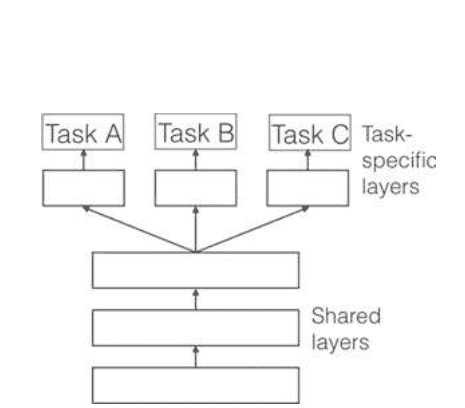

另一方面，在软参数共享中（如图3.6所示），每个任务都有自己的模型和参数。然后，通过正则化模型的参数之间的距离，以鼓励参数之间的相似性。例如，(Duong等, 2015)使用ℓ2范数进行正则化，而Yang和Hospedales (2016)使用迹范数。用于DNN中软参数共享的约束受到了为其他模型（图3.7）开发的MTL的正则化技术的极大启发。

## 参考文献

Ahmad J, Muhammad K, Baik SW (2017a) 使用高度反应的卷积特征在频域中生成紧凑二进制码的医学图像检索。J Med Syst 42:24。 https://doi.org/10.1007/s10916-017-0875-4

Ahmad J, Sajjad M, Mehmood I, Baik SW (2017b) SiNC: 注入显著性的神经编码用于医学放射照片的表示和高效检索。PLoS One 12:e0181707Ahmad J, Muhammad K, Bakshi S, Baik SW (2018a) 面向细粒度图像检索的面向对象卷积特征在大型监控数据集中的应用。Future Gener Comput Syst 81:314-330。 https://doi.org/10.1016/j.future.2017.11.002

Ahmad J, Muhammad K, Lloret J, Baik SW (2018b) 利用傅里叶分解将深度特征高效转换为紧凑二进制码，用于多媒体大数据。IEEE Trans Ind InfBadshah AM, Ahmad J, Rahim N, Baik SW (2017) 利用深度卷积神经网络从频谱图中识别语音情感。在：2017年平台技术和服务国际会议 (PlatCon)，2017年。IEEE, 页1-5Caruana R (1997) 多任务学习。机器学习28: 41-75

Collobert R, Weston J (2008) 用于自然语言处理的统一架构: 深度神经网络与多任务学习。在：第25届国际机器学习大会论文集, 2008年。ACM, 第160-167页。

Deng L, Hinton G, Kingsbury B (2013) 语音识别和相关应用的新型深度神经网络学习: 概述。在：2013年IEEE国际会议声学、语音和信号处理(ICASSP), 2013年。IEEE, 第8599-860 3页Dong C, Loy CC, He K, Tang X (2016) 使用深度卷积网络进行图像超分辨率。 IEEE模式分析与机器智能杂志38:295-307
Duong L, Cohn T, Bird S, Cook P (2015) 低资源依存句法分析: 神经网络解析器中的跨语言参数共享。在：第53届年会的会议记录- 计算语言学和自然语言处理国际联合会议论文集第2卷（短文），2015年，第845-850页

Esteva A, Kuprel B, Novoa RA, Ko J, Swetter SM, Blau HM, Thrun S (2017) 用深度神经网络对皮肤癌进行皮肤科医生级别的分类。自然542:115

Girshick R (2015) 快速R-CNN。 在计算机视觉国际会议论文集中，2015年，第1440-1448页

Glorot X, Bordes A, Bengio Y (2011) 大规模情感分类的领域自适应：一种深度学习方法。 在第28届国际机器学习会议（ICML-11）论文集中，2011年，第513-520页

He K, Zhang X, Ren S, Sun J (2016) 图像识别的深度残差学习。 在计算机视觉和模式识别IEEE会议论文集中，2016年，第770-778页

Hinton G et al (2012) 语音识别中的声学建模的深度神经网络：四个研究小组的共同观点。IEEE信号处理杂志29:82-97

Hinton GE, Salakhutdinov RR (2006) 用神经网络降低数据的维度。科学313: 504-507

Jain A, Tompson J, LeCun Y, Bregler C (2014) Modeep: 一种使用运动特征进行人体姿势估计的深度学习框架。 在： 2014年亚洲计算机视觉会议。斯普林格，pp302-315

Krizhevsky A, Sutskever I, Hinton GE (2012) 使用深度卷积神经网络进行ImageNet分类。 在： 第25届国际神经信息处理系统会议论文集，第1卷，内华达州塔霍湖

LeCun Y, Boser B, Denker JS, Henderson D, Howard RE, Hubbard W, Jackel LD (1989) 应用于手写邮政编码识别的反向传播。 神经计算1: 541-551

LeCun Y, Bengio Y, Hinton G (2015) 深度学习。自然521: 436-444

Litjens G等 (2017年) 关于医学图像分析中深度学习的调查。医学图像分析42:60-88

Lowe DG (2004年) 尺度不变关键点的独特图像特征。 计算机视觉国际期刊60:91–110。 https://doi.org/10.1023/B:VISI.0000029664.99615.94

Lu N, Li T, Ren X, Miao H (2017年) 基于受限玻尔兹曼机的运动想象分类的深度学习方案。 IEEE Trans Neural Syst Rehabilitation Eng 25:566–576

Oliva A, Torralba A (2001年) 对场景形状的建模：空间信封的整体表示。 计算机视觉国际期刊42:145–175

Rajpurkar P等 (2017年) Chexnet: 基于深度学习的胸部X射线肺炎检测，达到放射科医师水平。 arXiv预印本arXiv:171105225

Ramsundar B, Kearnes S, Riley P, Webster D, Konerding D, Pande V (2015) 用于药物发现的大规模多任务网络。 arXiv预印本 arXiv:150202072

Ullah A, Ahmad J, Muhammad K, Sajjad M, Baik SW (2018) 使用深度双向LSTM和CNN特征的视频序列动作识别。IEEE. Access 6:1155–1166

Xu K et al (2015) 展示、关注和描述:带有视觉注意力的神经图像标题生成。 在:国际机器学习会议,2015, pp 2048–2057

Yang W, Lu Z, Yu M, Huang M, Feng Q, Chen W (2012) 基于视觉词袋表示的单相和多相增强CT图像的基于内容的肝脏病灶检索。 J数字图像 25:708–719. https://doi.org/10.1007/s10278-012-9495-1

Yang Y, Hospedales TM (2016) 迹范数正则化的深度多任务学习。 arXiv预印本arXiv:160604038

Zaremba W, Sutskever I, Vinyals O (2014) 循环神经网络正则化。 arXiv预印本 arXiv:14092329

Zhang R, Isola P, Efros AA (2016) 彩色图像上色。 在： 2016年欧洲计算机视觉会议上，Springer出版社，第649-666页

# 第4章
大数据和深度学习的整合

Muhammad Talha, Shaukat Ali, Sajid Shah, Fiaz Gul Khan和Javed Iqbal

摘要 传统的人工智能和神经网络算法在实时处理大数据方面存在许多限制。因此，研究人员引入了深度学习的概念来解决上述挑战。 然而，大数据分析需要一个包含多个步骤的过程，在每个步骤中可以使用一个或一组算法。本章解释了机器学习在处理大数据以满足各种应用和用户需求方面的作用。类似地，研究了各种深度学习技术，以展示它们如何用于解决大数据的各种挑战和问题。类似地，还讨论了其他类似的技术，如迁移学习，以支持深度学习的研究。

## 缩略词列表

- CNN 卷积神经网络
- DBN 深度置信网络
- GPU 图形处理单元
- RBM 受限玻尔兹曼机
- DSN 深度堆叠网络
- RFID 射频识别

### 4.1 大数据分析中的机器学习

公司以不同的速度、容量和格式收集了大量的数据。数据的容量并不是那么重要，真正重要的是对这些数据的使用。在当今数字化的世界中，当涉及到客户数据时，大数据起着非常重要的作用。但是，如果这些数据没有与具有高计算能力的机器学习系统配对使用，那么这些数据将毫无用处。机器学习系统可以对客户数据进行真正的洞察，并可以以更高效的方式使用。

满足组织的需求。 大数据与机器学习真的可以推动组织业务，并提升长期业务重要性。
大数据的独特特点，如巨大的容量、不同的种类、高速、复杂、非结构化和不准确，确实对传统的数据挖掘和统计技术提出了挑战，这些技术主要是为小数据集开发的。 数据科学家倾向于使用机器学习技术来探索大数据中隐藏的模式和结构，并从中提取更多有用的信息。机器学习分为有监督学习和无监督学习，在第1章已经讨论过。流行的机器学习方法包括支持向量机、分类树、朴素贝叶斯和K最近邻算法。

#### 4.1.1 机器学习和大数据应用

机器学习广泛应用于不同学科的不同实际应用中。 在我们有大量结构化和非结构化数据的地方，使用机器学习是必要的。 最近，它吸引了来自不同领域的科学家，例如在植物科学中使用机器学习来分析大型数据集（Ma等，2014年）。 生物医学和医疗保健领域的数据每天都在产生，分析这些数据需要最高的准确性和最短的响应时间（Chen等，2017年）。 机器学习与大数据一起在医疗保健领域用于改善患者护理和监测、早期疾病检测以及帮助医生预测患者健康问题。 汽车、金融服务、智能交通系统、国家安全、计算机视觉等领域都在使用机器学习来提取他们所需的数据（数据科学，2018年）。

在这个数字化世界中，数据以如此庞大的体量产生，种类繁多且真实性不一，对于组织来说，高效处理数据成为当务之急。 影响是公司正在重组基础设施，并转向大数据以增加自动化和智能设备的使用，以最佳方式提高生产力并向客户提供服务。 具有高计算和存储能力以及智能的机器学习系统可以提供这样的服务，大公司已经整合了机器学习和大数据。

### 4.2 大数据分析中的高效深度学习算法

正如前面讨论的，深度学习是机器学习的一个子领域，几乎在涉及大数据的每个领域都被采用。 预计到2020年，互联网上产生的数据量将超过35万亿GB。现在，人们可以想象出面临什么样的挑战。

### 4.2 高效的深度学习算法在大数据分析中

根据组织的需求，它将带来提取有用信息的能力。深度学习是回答与这些大量数据相关的许多问题的方法。深度学习使用机器学习技术自动学习原始数据中隐藏的模式和结构。由于其特点，深度学习不仅吸引了来自不同领域的研究人员，而且在工业界也很受欢迎，像Facebook、Apple、Google和YouTube等公司都在推动深度学习应用于他们的服务和产品中（Chen和Lin 2014）。例如，苹果的Siri（Efrati 2017）是虚拟个人助理，Google在Google翻译、Google街景、图像搜索引擎和语音识别中使用它（Jones 2014）。

一些深度学习模型和算法包括深度置信网络、递归神经网络、卷积神经网络、卷积深度置信网络和深度玻尔兹曼机。然而，在深度学习中常用的两种架构是深度置信网络（DBN）和卷积神经网络（CNN）（Chen和Lin 2014）。

深度置信网络有潜力使用监督和无监督技术学习结构化和非结构化数据的特征表示。它由输入层、隐藏层和输出层组成。受限玻尔兹曼机（RBM）使用DBN构建一个由两个完全连接的层组成的模型（Raina等人，2009年）。在文献中，许多研究人员使用DBN模型高效准确地处理大数据。M. A. Raina提出了一个基于图形处理单元（GPU）的模型，使用堆叠的RBM并行处理大量数据，同时最小化处理时间（Raina等人，2009年）。深度学习的优势在于它可以同时训练和处理数百万个参数。深度堆叠网络（DSN）是由D. Y. L. Deng提出的，它由许多专门的神经网络（模块）组成的单隐藏层。这些模块与输入并行化，每个模块的输出构成DSN（Deng等人，2012年）。张量DSN是用于并行计算的修改后的深度架构，由CPU集群组成（Hutchinson和Yu，2013年）。

通过最大化计算能力，可以加快训练过程，这在使用深度学习进行大数据分析中非常重要。使用多个处理核心，每个核心处理数据的一个子集。另一种方法是将隐藏单元和可见单元分割到n台机器上，以加快处理速度。基于FPGA的实现也被用于大规模深度学习。卷积神经网络是另一种常用的架构，其中深度学习方法是局部连接的。 它以分层的方式由特征图和分类层组成。从输入层接收数据的层称为卷积层，负责卷积操作（Deng and Yu 2014）。该层的输出被转发到采样层，以减小即将到来的层的大小。CNN在具有GPU实现的多个核心上实现，以支持大量的层。

CNN架构已广泛应用于计算机视觉、图像和语音识别等不同领域。A. Krizhevsky提出了两个GPU，具有五个卷积层和三个分类层，以实现高速处理（Krizhevsky 2012）。作者提出，一半的层由一个GPU处理，另一半由另一个GPU处理，以在不影响处理负载的情况下分配负载。 主机内存。 卷积神经网络已经在不同领域中被使用，如火灾检测、视频监控、灾害管理、计算机视觉。

### 4.3 从机器学习到深度学习：一种比较方法

机器智能是人工智能领域的一个分支，指的是计算机通过编程展示的智能。然而，当我们转向大数据时，传统的机器学习技术转向了更强大、易于实现和高效处理来自最近数据驱动业务的大量数据的深度学习技术。 深度学习是机器学习方法的一个子集，是一种分析大数据的新而复杂的方式。 深度学习使我们能够解决以前无法解决的问题。 因此，深度学习是一种实现机器学习技术的方法。 有一些任务，机器可以比人类更好地完成；例如，在图像分类方面，计算机的结果比人类更好。 2015年，ImageNet的获胜作品ResNet在比传统方法更低的错误率下，比人类水平获得了更高的准确性。

我想通过一个例子来解释传统机器学习和深度学习之间的比较；在这个例子中，系统需要识别一张动物的图片。为了通过机器学习方法解决这个问题，需要考虑所有特征，比如动物是否有胡须等，同样，领域专家会定义所有重要的特征。 与机器学习相比，深度学习会重复选择用于动物分类的特征。以下是用于比较传统机器学习和深度学习的重要因素：

#### 4.3.1 数据规模的性能

深度学习和机器学习的性能取决于数据集的大小。 当数据量增加时，深度学习算法比传统机器学习算法执行速度更快。 然而，在小数据集的情况下，传统机器学习方法比深度学习算法表现更好。

#### 4.3.2 硬件要求

深度学习算法在很大程度上依赖于强大的计算机；另一方面，传统的机器学习算法也可以在低功率设备上工作。这是因为深度学习算法本质上执行了一个大规模的矩阵乘法。

#### 4.3.3 特征选择

在机器学习中，几乎所有的特征都是由领域专家识别出来，然后根据环境和数据类型进行硬编码的。而在深度学习中，算法从源数据中执行高级特征的学习过程。因此，深度学习减少了程序员的任务，并为这些问题提取了新的特征。例如，CNN在早期阶段尝试学习低级特征，如边缘和线条，然后学习人脸的部分，最后学习人脸的高级表示。

#### 4.3.4 问题解决方法

当我们使用机器学习算法解决问题时，通常会将问题分解为多个部分。它分别解决这些部分，并在解决问题时将它们组合起来并得到结果。相比之下，深度学习从头到尾解决问题。

#### 4.3.5 执行时间

通常，深度学习算法需要更多的时间来训练，相比之下，传统的机器学习需要较少的时间来训练。机器学习的训练时间范围从几秒钟到几个小时不等。然而，在测试阶段，深度学习方法所需的时间比机器学习要少得多。

### 4.4 深度学习和迁移学习在大数据中的应用

迁移学习是一种相对较新的方法，通过使用从不同已知类别标记数据任务和领域中获得的知识来改进数据学习（Yang 2008）。迁移学习是利用现有知识 从一个有大量已知类别标记数据可用的任务中学到的知识，应用于那些只有少量已知类别标记数据可用的数据。传统的机器学习模型根据从训练集中学到的模式对未知数据进行泛化。而在迁移学习中，泛化过程是从其他不同任务中学到的那些模式开始的。机器学习方法需要训练数据集，测试数据集应具有相同的特征空间和相等的分布。相比之下，迁移学习方法允许用于训练和测试的任务和数据集的分布可能不同。通常在训练数据不足以进行适当的数据建模时使用。知识从其他任务的相关训练数据中转移，以丰富目标任务的数据特征。在迁移学习中，集成更多的数据特征将会得到更好的学习结果（Yang和Chu 2015）。

深度学习在许多领域取得了巨大的成功和成就，例如图像识别和分析、语音识别和文本挖掘。它可以作为一种有监督和无监督的学习策略，用于学习多层次的特征和表示，用于分类和模式识别任务。

在最近的时代，传感器网络和通信技术的进步产生了大量的数据。然而，这些大数据为工业控制、电子商务和智能医疗等领域提供了巨大的机遇。由于其大量、多样、快速和真实性的特点，它在数据挖掘和信息处理方面也存在许多问题。

深度学习在大数据分析中起着重要的作用（张等，2018年）。深度学习技术可以用于并行化不同的数据驱动应用程序，以实现最佳性能。例如，Hern ndez等人（2017年）在Grid5000测试平台上使用了15个Spark应用程序的基准，并声称在使用推荐的并行性设置时性能提高了51%。

#### 4.4.1 医疗保健

深度学习可以作为医疗从业者和研究人员的助手，从与医疗保健相关的数据中提取隐藏的关系，并以更好的方式提供服务。医生可以利用深度学习来准确分析许多疾病，并从深度学习中获得帮助以更好地治疗这些疾病。在药物发现方面，深度学习可以帮助发现新的药物或开发现有药物。深度学习技术可以分析患者的病史，并为他们提供最佳治疗建议。此外，可以利用患者数据从患者症状和检测结果中获取洞察力，以预测未来的模式。

深度学习技术可以应用于医学影像学，如MRI扫描、CT扫描和心电图，用于诊断危险疾病，例如心脏病、癌症和脑肿瘤。它帮助医生更好地分析危险疾病，以为患者提供最佳治疗。深度学习可以用于早期检测癌症类型疾病。

在患者保险计划中，可以通过分析医疗保险和欺诈索赔数据来检测欺诈行为的深度学习方法。它可以预测未来可能发生的欺诈索赔。深度学习还可以通过分析患者数据来推动医疗领域的保险业发展。

#### 4.4.2 金融

金融是一个计算密集型领域，当我们处理金融模型时需要大量计算。这是因为经济领域复杂且非线性，有大量因素影响其他因素。在这种情况下可以使用深度学习技术。这些技术可以用于风险管理、定价，甚至用于未来交易的预测。

深度学习方法可以用于提供更好的客户服务。可以根据忠诚度对客户进行分类，为他们提供更好的服务和设施。在金融事务中，欺诈检测是最具挑战性和重要性的任务之一。可以使用机器学习技术和大数据来分析并检测欺诈行为。

### 4.5 大数据中的深度学习挑战

处理大数据是一项具有挑战性的工作，许多研究人员和数据科学家仍在同一领域工作。我们周围的数据以高速生成，并且其容量每天都在增加。因此，我们需要先进的算法来处理大数据，以免其超出现有算法的范围。在详细讨论大数据挑战之前，我们将对数据从各种来源生成进行全面分析。这些来源包括但不限于现有的结构化和非结构化数据集和数据库。

#### 4.5.1 物联网（IoT）数据

正如我们所知，在2011年世界经济论坛上，数据被称为世界的新石油。因此，我们需要适当和高效的数据分析来关注大数据的各个方面。然而，随着物联网概念的引入，数据的性质在大小、形状上完全改变，并需要统计方法来解决数据分析的问题。每天，由于互联网上数百万个连接设备的存在，产生了数百万GB的数据。这些设备通过传感器网络、射频识别（RFID）、蓝牙和Wi-Fi等各种技术进行连接。其中一个主要问题是在这些技术上进行通信期间使用复杂的技术来处理数据。同样，物联网仍处于初级阶段，我们需要标准和法律来规范物联网的使用。

#### 4.5.2 企业数据

最近的研究表明，企业数据是世界上生成大数据的主要来源。最重要的来源包括互联网上运营的网站和社交网络网站，如Facebook和Google。然而，要处理这些设备每天产生的如此庞大的数据量，需要适当的能源管理。可以使用绿色技术进行能源管理。然而，我们仍然需要进一步的评估和方法，以提出适用于绿色计算的正确方法和技术。

#### 4.5.3 医疗和生物医学数据

生物医学数据具有多种属性，如异构结构、大量数据和生物概念。处理这样的数据可以为医学研究和处理新疾病带来有益的结果。然而，这仍然是一个具有挑战性的领域，研究人员和数据科学家正在努力使用适当的工具和技术来取得更好的结果和成果。

除了这些生成源和其挑战之外，大数据的四个V结构在各种论坛上得到了广泛的研究和解决。图4.1显示了以四个V的形式呈现的挑战。

同样，传统的学习算法并不适用于处理连续的数据流。因此，大数据的这些特性导致了另一个维度的大数据，即实时处理。使用Hadoop和MapReduce结构处理离线数据是可能的。然而，使用Hadoop生态系统无法实时处理在线数据或生成的数据。

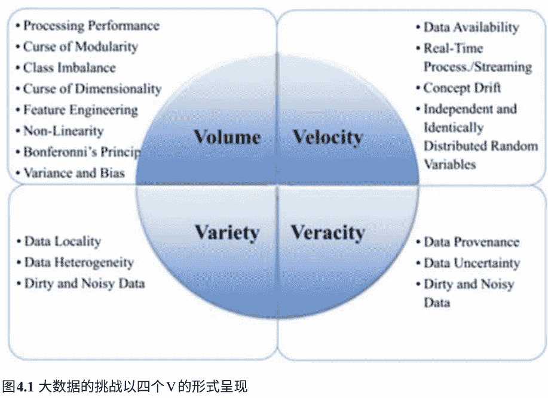

## **图4.1 大数据的挑战以四个V的形式呈现**

## 参考文献

Chen X-W, Lin X (2014) 大数据深度学习：挑战与展望. IEEE Access 2:514–525

Chen M, Hao Y et al (2017) 通过机器学习对来自医疗保健社区的大数据进行疾病预测. IEEE Access 5:8869–8879

Deng L, Yu D (2014) 深度学习：方法与应用. Found Trends Sig Process 7:197–387

Deng L, Yu D, Platt J (2012) 可扩展的堆叠和学习用于构建深度架构. 在：论文发表于2012年3月25日至30日的IEEE国际会议上，日本京都

Efrati A (2017) 苹果公司的深度学习工作，超越了. https://www.theinformation.com/苹果公司的深度学习工作-超越

Hernández AB, Perez MS等 (2017) 使用机器学习优化大数据应用程序中的并行性. Future Gener Comput Syst 86:1076–1092

Hutchinson LDB, Yu D (2013) 张量深度堆叠网络. IEEE Trans Pattern Anal Mach Intell 35:1944–1957

Jones N (2014) 计算机科学：学习机器. Nature 505:146–148

Krizhevsky A, Sutskever I等 (2012) 使用深度卷积神经网络进行图像分类. 在：论文发表于神经信息处理系统的进展，塔霍湖，内华达州，美国2012年12月3日至8日

Ma C, Zhang HH等 (2014) 植物中的大数据分析的机器学习. Trends Plant Sci 19:798–808

Raina R, Madhavan A, Ng AY (2009) 使用图形处理器进行大规模深度无监督学习. 在：第26届国际机器学习年会论文集中发表的论文，蒙特利尔，魁北克，加拿大，2009年6月14日至18日

Towards Data Science (2018) [https://towardsdatascience.com/supervised-vs-unsupervised-learning-14f68e32ea8d](https://towardsdatascience.com/supervised-vs-unsupervised-learning-14f68e32ea8d). 于2018年9月14日访问

杨Q (2008) 转移学习简介. ADMA
杨L，楚Y等 (2015) 大数据上的迁移学习. 在：第10届国际数字信息管理会议 (ICDIM) . IEEE
张Q，杨LT等 (2018) 深度学习在大数据中的调查. 信息融合42:146-157

# 第5章 大数据和深度学习对无线体域网的未来

Fasee Ullah, Ihtesham Ul Islam, Abdul Hanan Abdullah和Atif Khan

摘要 深度学习是机器学习中一组创新的算法，从数据中提取特征的工作需要最少的人工工程。它能够使用反向传播算法找到网络层的最佳参数集，从而对数据分布中的复杂结构进行建模。此外，深度学习架构在处理文本和时间序列数据等顺序数据方面取得了巨大的性能提升。在这方面，大数据技术是现代企业的一项资产，如果能由智能自动化驱动，将会非常有用。大数据涉及到可以通过机器学习（如深度学习）算法来分析的大规模数据集，以发现有深度的模式和趋势。借助现代机器学习和大数据技术，组织可以比以往更成功地推动其长期商业价值。大数据的潜在实际应用不仅限于医疗保健、零售、金融服务和汽车行业。这样，深度学习对于分析来自无线身体区域网络（WBANs）的患者数据具有重大影响。WBAN是医疗保健中的新兴技术，利用生物医学传感器来监测患者的生命体征。

监测数据传输给医生，以便在危急情况下进行最佳治疗。在本书的结尾，讨论了WBAN和大数据中的开放性研究问题。

## 缩略词列表

| 缩写 | 全称 |
| :--- | :--- |
| BMS | 生物医学传感器 |
| CAP | 争用访问期 |
| CNN | 卷积神经网络 |
| CEP | 复杂事件处理 |
| CGOC | 合规、治理和监督委员会 |
| CFP | 无争用期 |
| CS | 传统服务器 |
| CSMA/CA | 带冲突避免的载波侦听多路访问 |
| DNN | 深度神经网络 |
| EAP | 独占访问阶段 |
| ECG | 心电图 |
| EEG | 脑电图 |
| EMG | 肌电图 |
| IEEE | 电气和电子工程师学会 |
| IP | 非活动期 |
| GPU | 图形处理单元 |
| GSM | 全球移动通信系统 |
| GST | 保证时间槽 |
| HDFS | Hadoop分布式文件系统 |
| LOS | 视线 |
| LSTM | 长短期记忆 |
| MLP | 多层感知器 |
| MAC | 介质访问控制 |
| NLOS | 非视线 |
| PHY | 物理层 |
| QoS | 服务质量 |
| RAP | 随机访问阶段 |
| RNN | 循环神经网络 |
| SPO2 | 外周毛细血管氧饱和度 |
| TDMA | 时分多址介质访问 |
| VC | 虚拟化云端 |
| WBAN | 无线体域网 |
| WHO | 世界卫生组织 |
| WSN | 无线传感器网络 |
| TG6 | 任务组6 |

### 5.1 引言

机器学习是一种现代技术，它使用统计技术使系统能够从经验中学习，在涉及到编程计算任务的情况下很难明确地进行编程。它利用数据创建智能程序，在几乎所有行业都有广泛的应用，包括医疗保健、银行、金融、农业、制造业和自动化等。从社交网络的内容过滤到自动驾驶汽车，它逐渐应用于手持设备和消费品。机器学习系统的具体目标可以是识别显微图像中的生物细胞，将语音转换为命令，将文本翻译为不同的语言，或者推荐下一部要观看的电影。

最近，这些应用程序被一类基于神经网络的算法所革命，称为深度学习。先进的工具和技术已经戏剧性地改变了传统神经网络算法，以至于它们可以超越人类。简单的神经网络设计只允许2-3层，而深度网络可能包含数百层。深度网络的成功设计和适用性是由于三项主要技术的存在。首先，大量标签数据集的可用性使其能够捕捉到实际模式的分布。其次，配合高性能GPU和增加的内存，它使得用大量数据训练深度网络的时间从几个月缩短到几个小时成为可能。最后但并非最不重要的是，预训练模型可以用较小的数据集重新训练，这种技术被称为迁移学习，它可以节省训练时间和精力，同时不影响性能。图5.1显示了深度网络与数据量增加之间的性能关系。

很明显，传统机器学习很难从数据规模的增加中受益。

深度学习直接从图像、文本和声音中提取特征，在网络的多个层次上定义复杂特征，这些特征是由简单的低级特征组成的分层层次结构。然后，它还学习一个将特征映射到所需输出的函数，并且随着更多的数据，深度学习可以实现更高的准确性，被称为端到端学习算法。这与其他机器学习算法相反，其他算法只学习将输入特征映射到所需输出的函数。因此，机器学习工作流程需要人工工程师进行显式的特征工程或特征提取步骤，从而产生被称为手工特征的特征。参见图5.2。

本章的其余部分构建如下：第5.2节介绍基于前馈网络模型的深度学习框架。第5.3节讨论了深度学习在大数据中的未来。此外，第5.4节介绍了无线体域网的引入。第5.5节介绍了现有应用和未来应用的无线体域网。第5.6节介绍了无线体域网路由协议的现有挑战。第5.7节介绍了IEEE 802.15.4 MAC和IEEE 802.15.6 MAC的超帧结构工作原理以及研究挑战。此外，第5.8节介绍了大数据的概念，第5.9节介绍了大数据的应用。WBAN和大数据的开放性研究问题分别在第5.10节和第5.11节中提出。

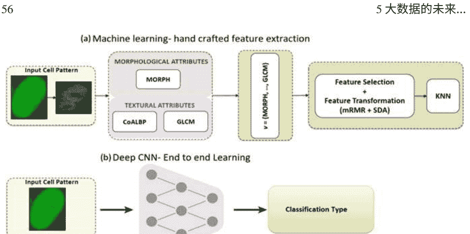

图5.2 a(Di Cataldo et al. 2014; Ul-Islam 2014)传统机器学习通过领域专家进行特征工程与端到端深度卷积学习 b深度卷积神经网络端到端学习

## 5.2 前馈网络模型

深度神经网络松散地模仿人类思维。它具有层与节点或神经元，这些节点与前一层相互连接，作为输入激活函数。分层结构利用未知数据分布和模型来捕捉非线性，从而获得更好的表示。它由输入层、隐藏层和输出层组成。现代神经网络可以根据其设计和应用进行分类。其中包括多层感知机（MLPs）、深度卷积神经网络（Lecun和Bottou，n.d.）、递归神经网络（Schmidhu-ber 1997; El Hihi和Bengio 1996）以及其他许多类型，如自编码器（El Hihi和Bengio 1996）、生成对抗网络（El Hihi和Bengio 1996）和残差网络（He等人2016）。图5.3显示了具有一个输入层和输出层以及两个隐藏层的MLP。

在前向传播中，输入层接受模型的输入；随后，每一层线性组合前一层的加权输出，并在每个节点上应用激活函数。输入$x_i$是应用在输入层上的，隐藏层中每个节点的激活$a$是通过输入变量的加权组合$a = \sigma(z)$计算得到的，其中$z = w^T x + b$，来自网络中的前一层。

激活函数表征神经元的输出，并引入非线性变换，使网络能够学习复杂任务。相反地，如果没有激活函数，网络节点将受限于简单的线性变换，无法建模复杂结构。实践中常用的激活函数有双曲正切函数$tanh$、sigmoid函数、ReLU函数（Taigman等人，2014年）和leaky ReLU函数，图5.4。直观上讲，

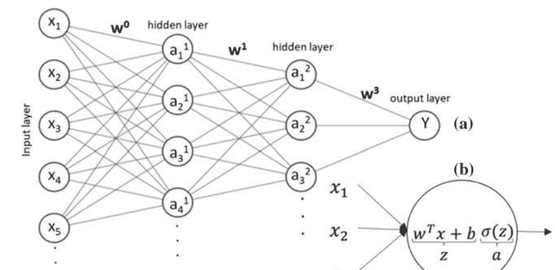

图5.3 a 具有输入层、隐藏层和输出层的前馈网络（或 MLP），以及 b 具有输入和输出激活的单个神经元的计算

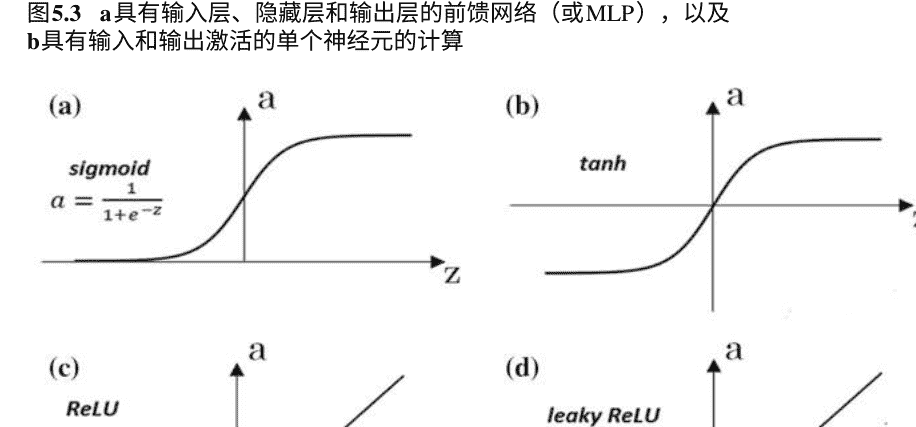

图5.4 不同的激活函数显示为 a Sigmoid函数，b 双曲正切函数，c ReLU函数和 d Leaky ReLU函数

网络中的每个节点负责检测特定的特征。对于 tanh 函数，较小的 z 值会产生较高的梯度，表明需要进一步训练节点，而较大的 z 值则会停止训练。这些梯度的计算和权重的重新训练是深度学习算法中的反向传播步骤的一部分。由于其快速计算，启发式激活函数ReLU变得非常流行；然而，它更新权重的方式有时会使节点处于非活动状态。通过使用例如Leaky ReLU（Maas和Hannun 2013）等方法来解决这个问题，尽管会增加额外的计算。图5.4显示了不同的激活函数。

为了使这一切成为可能，总是在输出层计算成本，这是输出值和实际基准值之间的差异的度量。成本函数表示为 $J(w,b) = \frac{1}{m} \sum_{i=1}^{m} L(\hat{y}^{(i)}, y^{(i)})$，其中 $w$ 是权重，$b$ 是偏差，$m$ 是训练样本的数量，$y$ 是实际值，$\hat{y}$ 是估计输出，$L$ 是损失函数。流行的损失函数有交叉熵损失、误分类率，或称为均方误差的 $L2$ 损失。训练过程的目标是通过优化算法（如梯度下降算法）来最小化这个成本，该算法涉及激活函数的梯度和网络层的权重更新。这个过程被称为反向传播。最小化损失函数的最终权重被认为是DNN模型的解。

### 5.2.1 深度学习框架

在深度神经网络的类型中，卷积神经网络（CNN）吸引了计算机视觉社区的许多研究人员（多列深度神经网络用于交通标志分类2012年；Taigman等人2014年；Hadsell等人2014年；Sainath等人2013年）。该算法在输入为图像或数据模态为多个数组的情况下表现良好。与MLP类似，CNN也包含输入层、多个隐藏层和输出层。这些层对数据进行一些操作，称为卷积、池化和ReLU函数。

卷积使用滤波器在图像或多维数组上突出显示某些特征。池化是非线性下采样或减少网络参数的过程。ReLU激活函数用于加快训练速度。一些顶级CNN架构包括AlexNet（Krizhevsky等人2012年）、VGG（Karen Simonyan 2014年）、Inception V3（Szegedy等人2016年）和ResNet（He等人2016年），在流行的ImageNet数据集（Sutskever等人2011年）上取得了显著的进展，该数据集包含1000个类别和120万张标记图像。训练好的模型非常有用，因为它们可以用于进行迁移学习，这是一种减少新任务训练时间的技术。

尽管卷积神经网络（CNN）是处理图像和多维数组模态（如视频、语音和音频）的优胜算法，而循环神经网络（RNN）在涉及顺序数据的任务上表现出色，例如语言建模和翻译、语音识别、手写识别和其他序列问题。它们可以用于识别单词中的下一个字符（Sutskever等人，2011年）或句子中的下一个单词，也可以用于更复杂的任务，例如输出段落中表达的情感。序列只是一系列数据项，其中各个项是相互依赖的。例如，只有在将整个对话工作流程放入上下文中后，才能正确理解句子的含义。同样，在股票市场中，单个刻度只能告诉当前价格，但为了模拟价格的变动并实现买卖决策，需要更多的数据读数。需要在序列中使用更多的数据。RNN的构造是使用前一个时间步的隐藏状态和当前时间步的输入来计算当前输出。与基本神经网络不同，RNN使用其内部记忆来处理一些相对任意的输入序列。其中一个著名的算法是长短期记忆（LSTM）（Schmidhuber，1997年），它是一类广泛应用的RNN。

### 5.3 深度学习的未来

深度学习和基于人工智能的解决方案的进展将在未来继续，并有望加速发展。尽管这种成功只在监督学习的解决方案中可见，但未来将重新激发对无监督学习的研究社区的兴趣。这是有道理的，因为人类的学习过程在很大程度上是无监督的，我们通过观察而不是通过被教导的方式来对世界中的结构进行建模。为此，深度学习在计算机视觉领域的潜在未来工作可以涉及将不同的表示形式（如CNN、RNN和深度强化学习）结合起来。在这方面的初步进展已经产生了有趣的应用，比如让计算机学会玩视频游戏。随着数据规模和计算设施的不断增加，预计端到端的基于深度学习的算法和架构将在不久的将来取得更多成功。

### 5.4 无线体域网介绍

无线体域网（WBANs）是新兴技术，也是研究社区（Cavallari等，2014年）、学术界（Quwaider和Jararweh，2015年）和工业界（Shu等，2015年）解决城市和农村地区患者健康监测问题的最有吸引力的领域。此外，世界卫生组织（WHO）（L atr 等，2010a；Acampora等，2013年；Murray等，2012年）发布了各种关于因各种疾病每年导致数百万人死亡率增加的报告。这些疾病包括癌症、心脏病发作、糖尿病问题、中风、呼吸系统疾病、血糖异常（Acampora等，2013年）。此外，世界卫生组织根据各国的收入将这些死亡率分为低收入、中等收入和高收入，如图5.5所示。图5.5显示了由于健康资源不足而导致的死亡率增加的数量，无法及时为患者提供服务（L atr 等，2010a，b）。现有研究表明，大多数死亡是老年人在家中发生的，也是因为远程监测来自远离常规健康检查的地区的患者。

此外，由于医院的人力不足和资源有限的环境，现有的医院无法及时提供健康服务，这是一种昂贵的做法。因此，对于长期监测患者和家庭老年人的健康问题，无线体域网是创新的技术和廉价的解决方案。

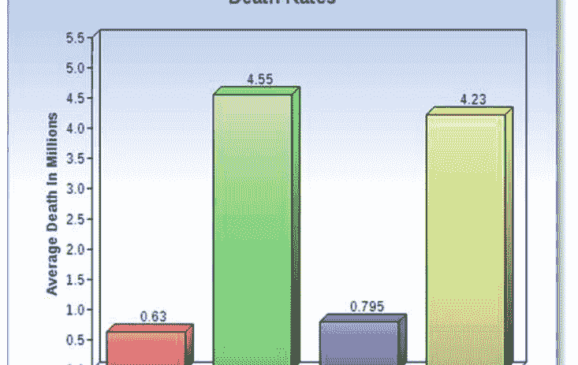

图5.5 世界卫生组织报告的平均死亡率（以百万计）

监测患者的生命体征。然后，监测数据通过GSM技术传送给医生，以进行最佳治疗。

无线体域网采用各种生物医学传感器（BMS）来监测患者的各种重要生命体征。这些BMS用于监测患者的呼吸频率、心率、血压、血糖水平、体温、心电图、脑电图、肌电图和血氧饱和度（He等，2011年）。患者的监测（感应）数据传输到协调员那里，所有类型的传感器都与协调员连接，如图5.6所示。协调员负责将感应数据传输给医生。根据患者的需求，BMS可以与协调员以星型或网状拓扑结构连接。图5.6显示了在星型拓扑结构中部署BMS的三种方法。第一种方法被称为可植入式，不同的BMS被植入患者体内，用于监测肺部、肾脏和心脏等各种器官。可植入式传感器的一个典型例子是胶囊内窥镜，如图5.7a所示。第二种方法是使用可穿戴传感器来监测生命体征，如ECG、EEG和EMG传感器，这些传感器被缝在患者的衬衫上或直接放在患者的皮肤上，如图5.7b所示。第三种传感器部署方法是不同的，不同的行为监测传感器被放置在患者周围，用于监测不同的身体活动。这些身体活动包括监测睡眠姿势和持续时间，患者的姿势运动，如跑步、走路、跳舞和在沙发上的不正确坐姿。

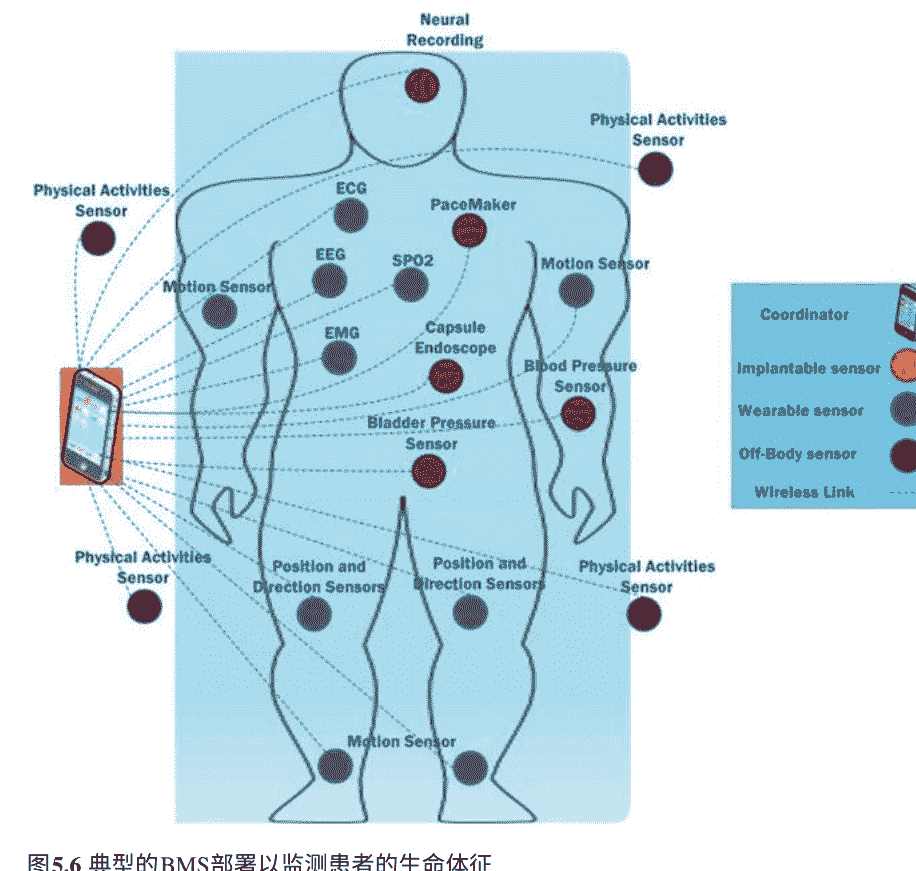

图5.6 典型的BMS部署以监测患者的生命体征

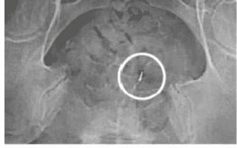

(a) 可植入式BMS用于实时心脏监测

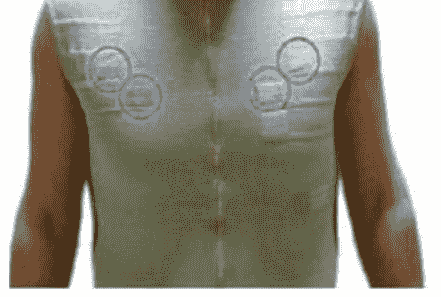

(b) 可穿戴式BMS

图5.7 典型的BMS部署

## 5.5 无线身体区域网络的应用

无线身体区域网络在许多领域都有广泛的应用，包括紧急服务、消费电子、体育和健身、生活方式、国防、娱乐和游戏、个人保健和医疗（WBAN应用2018），如图5.8所示。在紧急服务和国防方面，部署的BMS分别监测消防员和士兵在工作环境中的生命体征。

此监测的目的是在人员受伤或发生紧急情况时通知医生。体育和健身、个人保健和医疗领域共同监测和维护运动期间的健康状况，监测家庭中年长人士的健康状况，以及分别监测重症监护病房（ICU）和病房中严重患者的不同生命体征。娱乐和游戏以及消费电子属于有趣的应用类别，一个人可以打开、转发、安装和删除游戏或歌曲，同样，一个人可以根据心情下载、安装和删除应用程序。

随着这些应用为人类服务，它可能被广泛使用。

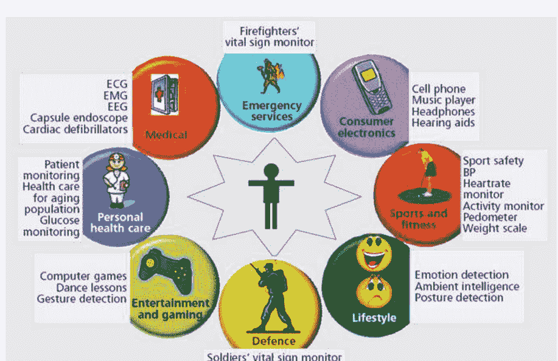

### 5.5.1 无线体域网络的未来应用

WBAN技术应用的未来趋势包括驾驶辅助、电子账单支付、基于安全的办公室入口、打印自动化操作和患者健康状况监测（WBAN 2018年未来应用），如图5.9所示。未来，驾驶者如果感到驾驶座位不舒服，可以调整座位。 在这种情况下，她会向座位的后背施加力量进行调整。 此外，部署的BMS将监测不同的生命体征，并在人们感到不舒服时通知医生。 类似地，人们不会将所有的交易卡放在口袋里，而是体内嵌入传感器进行用户身份验证和交易操作。 此外，公司将减少保安人员的数量，植入的传感器将验证用户是否可以进入办公室。打印文件将变得容易，因为纸张上的条形码将识别需要打印的文件数量。 在这种情况下，设备将发送打印信息给缝制的传感器。 缝制的传感器将转发打印请求给打印设备。

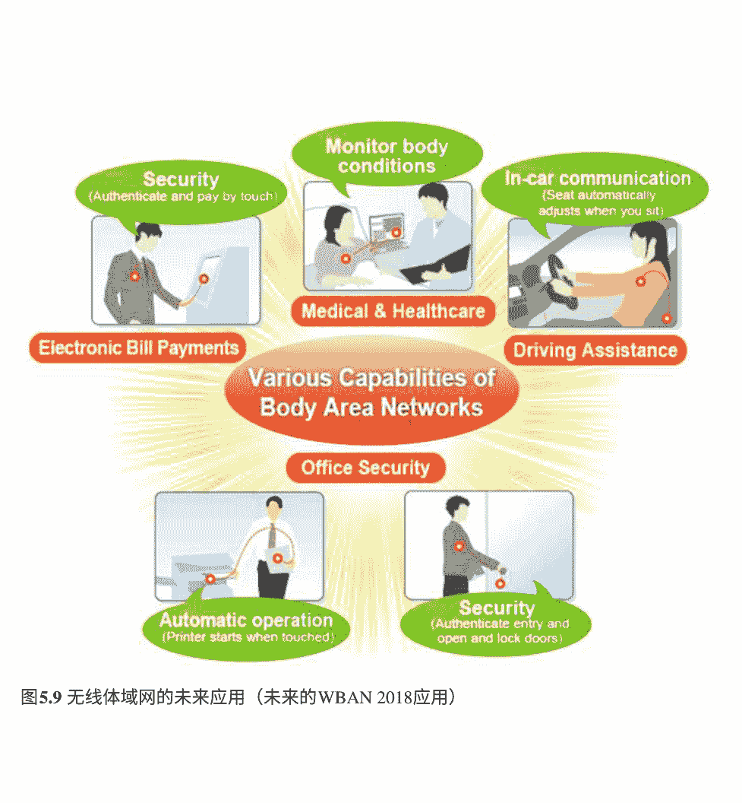

### 5.5.2 生物医学传感器在无线体域网中的使用

生物医学传感器由两个单元组成，即无线电收发器和生理信号传感器（Chan等，2012年）。无线电收发器的功能是接收和传输来自传感器节点的信号，并向目标节点转发；而生理信号传感器的功能是将从感知环境中感知到的模拟信号转换为数字形式。此外，现有的BMS包括呼吸、血压、加速度计、心率、葡萄糖、心电图、脑电图、血氧、肌电图、脉搏血氧饱和度、压力、陀螺仪和运动传感器，用于监测患者的不同生命体征。一些BMS的功能及其相应的传输速率（数据速率）在下表5.1中列出。

这些BMS有助于监测生命体征，并在患者病情危急时向医生发送警报信号。此外，每个BMS在传输感知数据时具有不同的传输速率，并且由于其敏感数据，它们需要不同的服务质量（QoS）。因此，它们需要分配专用路径和通道用于数据传输，无碰撞、重传和延迟，并在传输更高数据可靠性的情况下消耗最少的能量。然而，研究界需要开发创新的解决方案，以避免由于碰撞和延迟而进行数据重传。此外，BMS在路径选择的不同决策中需要消耗最少的能量。

表5.1WBAN中BMS的功能（Chakraborty等，2013; Al Ameen等，2012）

| BMS的名称 | 传输速率 | 用途 |
| ---- | ---- | ---- |
| 呼吸 | 0.23-9.95 kbps | 呼吸通过氧气和葡萄糖的支持帮助不同的器官消耗能量 |
| 血压 | <9.99 bps | 该传感器包含收缩压和舒张压的值，用于显示血压水平是正常还是异常 |
| 加速度计 | 11 kbps | 辅助显示3D方向，以计算所需的运动能量 |
| 心跳 | 2.2 千比特每秒 | 该传感器监测每分钟的心跳，显示低和高阈值或正常范围 |
| 心电图 | 142千比特每秒，带有12个引线 | 包含安装在胸部的不同导线，用于监测心率 |
| 温度 | 122 比特每秒 | 监测患者的身体，显示是否有寒冷或炎热 |
| 血氧 | 15 千比特每秒 | 需要一定量的氧气以保持血液在体内的顺畅流动 |
| 陀螺仪 | 9 千比特每秒 | 监测身体变化，并在紧急情况下发送警报信号 |
| 压力 | 2.2 千比特每秒 | 通常，该传感器放置在患者的肩膀上，用于监测坐姿和倒地位置 |
| 脉搏血氧饱和度 | 1.22-2.1 千比特每秒 | 确保血液中的氧气达到一定水平 |
| 肌电图 | 318-580 千比特每秒 | 使用电极监测神经肌肉，放置在人体内 |
| 脑电图 | 30千比特每秒 | 大脑使用波来识别它是在正常还是异常的条件下工作 |

## 5.6 无线体域网中的现有挑战

IEEE已经定义了两个无线通信标准，即IEEE 802.15.4（IEEE 802.15.4 2006）和IEEE 802.15.6（Man等，2012年）。IEEE公布了关于MAC和PHY层的指南，但没有提供有关路由层的指南。因此，研究界有责任设计和开发延迟感知、能量高效和高度可靠的路径选择路由协议。此外，IEEE 802.15.4已经为无线传感器网络（WSNs）设计和开发，而任务组6（TG6）专门为无线体域网（WBANs）设计和开发了IEEE 802.15.6。

IEEE在2012年发布了与IEEE 802.15.6 WBAN相关的第一份草案。然而，在开始IEEE 802.15.6之前，研究界和学术界一直在使用IEEE 802.15.4进行WBAN。IEEE 802.15.4提供了目前由IEEE 802.15.6提供的所有功能。已经进行了大量的WBAN研究，并提出了各种路由协议和MAC协议，下面将对其进行解释。

### 5.6.1 路由协议

路由协议有助于指定设备与其他设备进行通信，并分发网络信息，从而选择可靠的路径。通常，患者身体的感知数据被分类为非紧急数据和紧急数据。非紧急数据包括正常体温和血压等生命体征的正常读数，而紧急数据包括心率和呼吸率异常读数等生命体征的异常读数。这些感知数据被无优先级地传输给协调器，协调器进一步无优先级地传输它们。

然而，现有的患者数据分类不足，因为它不能区分如果两个不同的传感器同时将它们传输给协调员的同一类型的紧急数据。此外，协调员无法解决在同一时间两个传感器传输数据时的路径/通道分配优先级的冲突。

适当路径的选择基于节点的剩余能量水平、热点的避免和延迟路径。因此，研究界将WBAN的路由协议分为四组（Bangash等人，2014年），如图5.10所示。这些是温度感知路由协议、集群路由协议、QoS路由协议和姿势移动协议。下面介绍每个路由协议的解释。

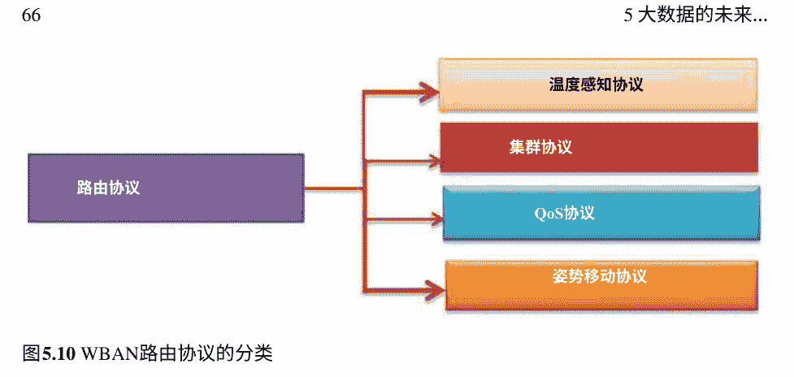

图5.10 WBAN路由协议的分类

#### 5.6.1.1 温度感知路由协议

通过BMS的支持，对患者身体的生命体征进行监测。在监测和传输生命体征感知数据时，BMS会发热使用多个BMS会烧伤皮肤和组织。BMS发热的原因是使用高频无线电功率，天线辐射和节点电路(Movassaghi等人，2014年)。许多研究已经提出了新的设计和开发路由协议。此外，研究人员需要设计和开发能源高效的算法，选择具有最低温升的可靠路径和最短路径到目的地。

#### 5.6.1.2 簇路由协议

通信区域的大规模被划分为小区域，称为基于簇的路由协议。聚类的目的是在WBAN中提供最佳连接例如，部署的BMS可以与人的一个坐姿中的其他BMS进行通信。在人的坐姿改变的情况下BMS由于非视线而无法与其他BMS进行通信，并且BMS通过使用更高功率的天线消耗最大能量，这可能引起温度感知路由协议中提到的其他问题。

### 5.6.1.3 基于服务质量（QoS）的路由协议的质量

当BMS的数量超过了对专用和保证带宽的需求，网络无法满足BMS的要求时，通信网络中出现了QoS的问题。在这种情况下，网络内部的拥塞增加了，最大数量的数据被丢弃，导致数据的重传延迟，BMS消耗了大量的能量。研究人员需要基于QoS设计可靠高效的算法。

#### 5.6.1.4 基于姿势移动的路由协议

姿势意味着改变静态物体。在WBAN中，由于身体的物理变化，如坐、躺下、站立、行走、在沙发上坐得不正常和睡觉姿势不正常，星型或网状拓扑结构经常发生变化。由于姿势移动的影响，BMS无法直接通过消耗大量能量与协调器进行数据传输，需要依靠中继节点的支持。现有的研究建议使用直视（LOS）、非直视（NLOS）（Latr等人，2010a）和存储转发（Quwaider和Biswas，2010）技术。然而，患者的数据需要可靠的路径进行无延迟的数据传输，以延长网络的寿命。

另一个最重要的挑战是在传输中保护感知数据。由于微型BMS的资源限制设置，无法实现非对称加密技术。然而，现有的学术界需要设计轻量级安全协议，以实现更好的安全性和硬件资源的最佳利用。在总结中，应该仔细设计一种路由协议，考虑到WBAN中四种路由协议的优缺点。

## 5.7 MAC协议

如前所述，WBAN使用两种标准，即IEEE 802.15.4和IEEE 802.15.6。下面对它们进行了解释。

### IEEE 802.15.4的超帧结构

IEEE 802.15.4有两种类型的超帧结构。第一种超帧结构被称为非信标模式，第二种超帧结构被称为信标启用模式（Ullah等，2010）。在非信标启用模式下，将信道分配给BMS的方式完全基于无时隙CSMA/CA的争用访问方案。非信标模式是专为有限数量的节点设计，对传输中的数据没有特殊考虑需要照顾。IEEE 802.15.4的基于信标启用模式的超帧（Ullah等，2010年）如图5.11所示，包括信标，争用访问期（CAP），无争用期（CFP）和非活动期（IP）。IEEE 802.15.4的这种超帧结构在OSI模型的MAC层的协调器节点上实现具有十六个信道/时隙。此外，CAP是基于调度访问实现的CSMA/CA方案，而CFP是基于TDMA调度访问方案实现的包括保证时间时隙（GTS）。协调器将CFP信道分配给那些在CAP信道中获得访问权限的BMS。然而，CAP信道的分配是基于争用的。当协调器没有分配时隙时，IP用于睡眠期。

在超帧结构的开始处，协调器向网络中的所有BMS广播一个信标帧。该帧包含有关主动和被动信道的扫描，下一个信标间隔的调用以及超帧持续时间的时间间隔的信息。然而，IEEE 802.15.4（Touati和Tabish 2013）存在以下缺点。

- i. IEEE 802.15.4的超帧结构分配了十六个信道，这对于BMS产生的大量数据来说是不足够的。
- ii. 将信道分配给BMS是基于争用的。
- iii. 一旦BMS获得对CAP信道的访问权限，就分配GTS CFP时隙。
- iv. 没有定义将信道分配给紧急数据的优先级。
- v. 由于信道有限和循环争用，在CAP中发生最大数量的碰撞，BMS以更高的延迟重新传输数据并消耗最大的能量。
- vi. 仅考虑紧急和非紧急数据。
- vii. WBAN对IEEE 802.15.4的研究中存在的问题是，如果BMS具有相同类型的数据，则无法解决时隙分配的冲突。

因此，现有的研究社区建议采用许多超帧结构的MAC协议，以减少碰撞、延迟、丢失数据包的重传以及能量消耗。

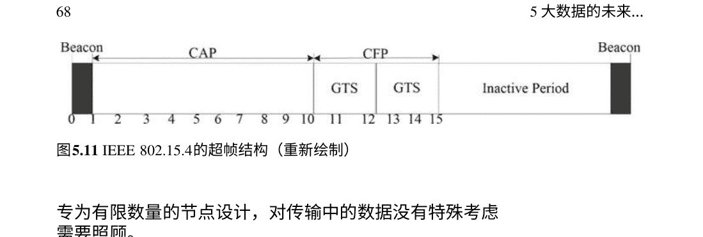

### 5.7.2 IEEE 802.15.6的超帧结构

2006年，IEEE 802.11成立了一个名为Task Group 6 (TG6)的新小组（Al Amee n等人，2012年）。TG6被分配了一个任务，设计用于监测患者健康状况的低功耗传感器。2012年，第一份草案发布给研究社区，其中包含了IEEE 802.15.6 MAC的超帧结构信息。此外，IEEE 802.15.6的超帧结构包括信标、独占访问阶段（EAP-I/II）、随机访问阶段（RAP-I/II）、类型I/II和争用访问周期（CAP）（Rousselot和Decotignie，2009年）。在通信开始时，协调器向网络中的所有节点发送信标帧以实现通信收敛。EAP-I和EAP-II被设计用于处理紧急流量，而RAP-I、RAP-II和CAP被设计用于管理和处理患者的非紧急数据。类型I与紧急数据相关，而类型II与非紧急数据相关。类型指示给协调器需要占用哪些时隙。IEEE 802.15.6实施了时隙ALOHA和CSMA/CA调度访问方案。然而，它具有与IEEE 802.15.4相同的限制，如高能耗、基于争用的信道分配导致重传率高、延迟高，并且不适用于紧急数据。

## 5.8 大数据导论

随着二十一世纪的开始，云计算是一种新兴的技术，用于在线管理和分配资源给不同的利益相关者。这些利益相关者包括政府机构、工业界和学术界（Bates等人，2014年）。由于其重要性，大数据已经被引入和融合到云计算中，以处理不同设备的输入、输出和处理数据，以实现在线资源的高效利用，而无需购买昂贵的设备。

此外，合规、治理和监督委员会（CGOC）（Du等人，2015年）报告称，每年的数据量都会翻倍，现有基础设施无法处理这么大量的数据。类似地，据报道，从患者体内的生命体征产生了大量的传感数据，需要有效的机制来接收、处理和传播数据给医生。为此，WBAN大数据的现有研究在设计和开发机制方面做出了许多贡献。文章（Du等人，2015年）中包括了一个在WBAN中为大数据处理传感信息的机制，如图5.12所示。在第一阶段开始时，通过部署的BMS从云服务器中收集了大量的患者体内数据，其中包含了临床历史。负载均衡器单元从患者体内的传感数据中提取了与疾病相关的非常重要的信息，这些信息基于临床历史的信息。此外，分布式CEP是一种新兴技术。

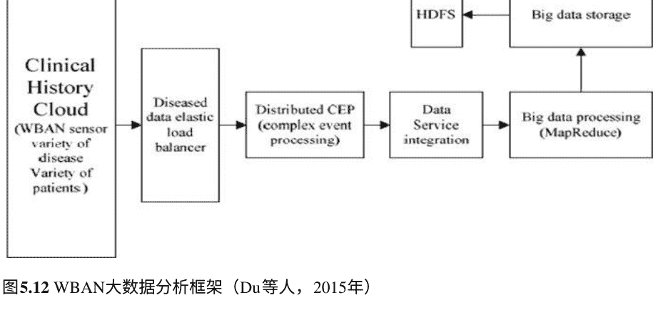

用于处理数据和识别实际疾病中的WBAN中的大数据功能。通过在线数据服务集成传输数据。
大数据处理单元使用Google提供的MapReduce功能删除详细信息，并最终将数据存储在大数据存储服务器中。最终单元是Hadoop分布式文件系统（HDFS），它将数据分割成具有键和值属性的不同工作子单元。然而，建议的WBAN大数据模型需要许多步骤来提取准确的信息，这会导致决策延迟增加，并且通过损失患者的生命来消耗最大的BMS能量。此外，许多WBAN存在频率干扰/重叠的问题，可能无法处理患者的传感数据并将其传输给医生进行最佳治疗。（Quwaider 2014）的作者设计了传统服务器（CS）和虚拟化云端（VC），以有效利用WBAN的在线资源的大数据。图5.13显示了使用云端在WBA中收集数据。然而，它面临与（Du等人，2015年）提到的相同的挑战性问题。

## 5.9 大数据在WBAN中的应用

在本节中，我们将详细介绍大数据在WBAN中的应用，包括监测生命体征和分析、早期检测患者异常情况以及使用BMS对患者进行日常活动监测(Lin等人，2018)。

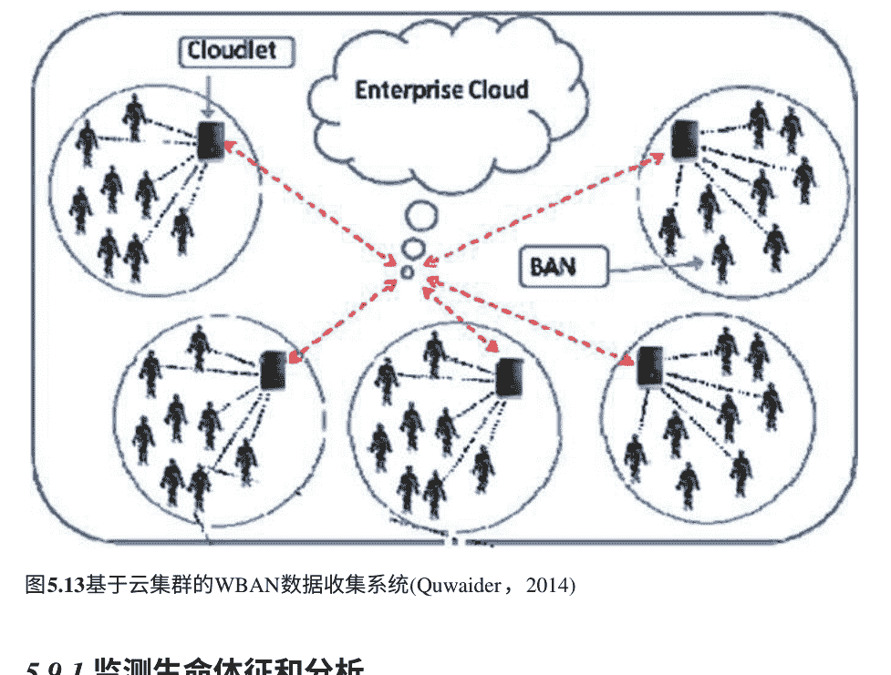

### 5.9.1 监测生命体征和分析

大数据在预测患者身体准确症状方面起着重要作用，利用历史和临床数据信息。通过这种预测，它主要改善了生活质量。然而，这些预测是基于一些特定的参数，如(Bates等人，2014)中所述的管理和分娩、消费者行为、临床决策支持和支持服务。此外，疾病症状需要进一步分类以便更好地理解和早期检测，可以借助使用prot g 工具的本体支持来完成。

此外，现有的工具可能有助于在患者生命受到威胁之前提前发现症状，包括Google流感趋势和HealthMap。然而，研究界需要设计和开发有效的机制来早期检测患者异常状况。

### 5.9.2 患者异常状况的早期检测

通常，慢性代谢病患者需要相对于其他类型的疾病有足够的医疗保健。因此，使用不同的BMS来监测生命体征，并定期将感知数据结果传输给医生。在这种支持下，医生可以提前宣布患者的严重程度并进行处理。预防活动。宣称实践需要历史和临床数据，需要在线存储并随时可用。只有在大数据的支持下才能实现。

### 5.9.3 使用BMS对患者进行日常活动监测

如前所述，图5.2描述了如何部署不同的BMS来监测患者的不同生命体征。有时，医生需要监测患者的日常活动以及这些活动对他们健康的影响。此外，医生还需要血压、心率、呼吸率、体温和血糖水平的感知数据。

## 5.10 WBAN的未解决问题

本节讨论了WBAN的开放性研究问题，包括路由协议和MAC协议。

### 5.10.1 BMS的资源约束架构

传感器节点具有有限的计算处理能力、有限的存储能力和有限的电池备份。这些是WBAN和WSN中的挑战性问题。已经注意到制造商需要改进BMS的设计，并在现有架构的替代品中包括像能量收集这样的新功能。

### 5.10.2 热点路径

在监测生命体征和数据传播活动期间，由于BMS的射频、辐射和电路设计，BMS会发热。这种发热会烧伤患者的皮肤和组织。

## 5.10.3 WBAN中的QoS

患者身体的感知数据被分为关键数据、延迟敏感数据、可靠性敏感数据和普通数据。这些数据在传输到协调器时不能接受延迟，并且必须分配保证的QoS。

## 5.10.4 WBAN中的路径损耗

部署的BMS直接（视线）与协调器连接以进行数据传输。由于姿势运动，拓扑结构经常发生变化，BMS会丢失数据传输的路径。

## 5.10.5 WBAN中的数据保护

患者身体的感知数据在BMS的资源受限环境中传输时需要保密，以防止窃听者窃取。

### 5.10.6 能量消耗的降低

由于定期监测生命体征和传输结果会消耗BMS的最大能量。然而，研究界需要设计基于能量收集的能量高效架构的BMS。

### 5.10.7 信道访问分配及其复杂性

现有的信道分配技术是争用和预定义的。然而，这是昂贵的做法，患者身体的延迟敏感数据不接受信道分配和传输的延迟。

### 5.10.8 权限和抢占式通道分配

协议应该根据患者数据的敏感性，高效地设计和开发以分配通道，基于许可和抢占。

## 5.11 大数据的开放问题

本节讨论了大数据的重要研究问题，即数据管理，下文将详细阐述。

### 5.11.1 数据的种类

每天，每个物联网设备都会产生数百万条数据。现在，如何快速从非结构化的离线和流式数据中提取重要和相关的信息?

### 5.11.2 数据存储量的增加

如何设计和开发高效的方法，从大量的非结构化数据中识别重要和相关的数据?

### 5.11.3 不同来源数据的整合

研究界需要设计新的协议，将相同对象的相关数据组合并整合以供进一步使用。

### 5.11.4 频道、处理和数据管理的分配

需要改进现有通信模型的设计，以便离线和在线数据流的有效资源分配、处理和管理，以便准确地按时检索信息。

### 5.11.5 成本效益的商业模式

未来的商业模式应该对可用资源用户友好，成本最低。

### 5.11.6 延迟感知模型以快速解决方案

研究界应该设计出高效的延迟感知模型，以便及时回应客户。

### 5.11.7 服务分配的自动化

新的商业模式应该用机器学习和大数据分析师取代人类提供的服务。

## 参考文献

- Acampora G, Cook DJ, Rashidi P, Vasilakos AV (2013) 关于医疗保健中环境智能的调查。Proc IEEE (电气和电子工程师学会) 101(12):2470–2494。https://doi.org/10.1109/JPROC.2013.2262913
- Al Ameen M, Ullah N, Chowdhury MS, Islam SMR, Kwak K (2012) 一种用于无线体域网的功率高效的MAC协议。EURASIP J Wirel Commun Netw 2012(1):33。https://doi.org/10.1186/1687-1499-2012-33
- WBAN的应用(2018) 从https://www.slideshare.net/kunalgoel1984/wsn-in-body-area-network-based-on-egergy-conservation检索
- Bangash JI, Abdullah AH, Anisi MH, Khan AW (2014) 无线体传感器网络中路由协议的调查。传感器(巴塞尔，瑞士) 14(1):1322–1357。https://doi.org/10.3390/s140101322
- Bates DW, Saria S, Ohno-machado L, Shah A (2014) 医疗保健中的大数据：使用分析来识别和管理高风险和高成本患者。Health Aff 33(7):1–10。https://doi.org/10.1377/hlthaff.2014.0041
- Cavallari R, Martelli F, Rosini R, Buratti C, Verdone R (2014) 无线身体区域网络调查：技术和设计挑战。IEEE通信调查教程16(3): 1-23。https://doi.org/10.1109/SURV.2014.012214.00007
- Chakraborty C, Gupta B, Ghosh SK (2013) 基于远程医疗的WBAN框架综述。远程医疗电子健康19(8): 619-626。https://doi.org/10.1089/tmj.2012.0215
- Chan M, Est ve D, Fourniols J-Y, Es C, Campo E (2012) 智能可穿戴系统：现状和未来挑战。人工智能医学56(3): 137-156。https://doi.org/10.1016/j.artmed.2012.09.003
- Di Cataldo S, Bottino A, Islam IU, Vieira TF, Ficarra E (2014) 对于Hep-2染色模式分类的形态和纹理特征的子类判别分析。Pattern Recogn 47(7):2389–2399。https://doi.org/10.1016/j.patcog.2013.09.024
- 基于大数据的无线体域网的框架和挑战。在: IEEE 2015 IEEE国际数字信号处理会议(DSP), pp 497–501 https://doi.org/10.1109/ICDSP.2015.7251922
- El Hihi S, Bengio Y (1996) 用于长期依赖的分层循环神经网络。在: 神经信息处理系统的进展, pp 493–499
- WBAN的未来应用(2018)。从https://www.renesas.com/us/en/about/edge-magazine/solution/07-wireless-sensor-networks.html检索
- Hadsell R, Sermanet P, Ben J, Erkan A, Scoffier M, Kavukcuoglu K et al. (2014) 学习远程视觉用于自主越野驾驶, 2009年26(2):120–144
- He Y, Zhu W, Guan L (2011) 用于全面健康监测系统的最佳资源分配与身体传感器网络。IEEE Trans Mob Comput 10(11):1558–1575。https://doi.org/10.1109/TMC.2011.83
- He K, Zhang X, Ren S, Sun J (2016) 用于图像识别的深度残差学习。在: Proceedings of the IEEE conference on computer vision and pattern recognition, pp 770–778
- Hochreiter S, Schmidhuber J (1997). 长短期记忆。神经计算 8(9):1735–1780。https://doi.org/10.1162/neco.1997.9.8.1735
- IEEE 802.15.4 (2006年) 是信息技术802.15.4的IEEE标准，用于低速无线个人区域网络（LR-WPANs）的无线介质访问控制（MAC）和物理层（PHY）规范。美国纽约的电气和电子工程师学会，2006年卷。从http://scholar.google.com/scholar?hl=en&btnG=Search&q=intitle:Part+15.4:+Wireless+Medium+Access+Control+(MAC)+and+Physical+Layer+(PHY)+Specifications+for+Low-Rate+Wireless+Personal+Area+Networks+(WPANs)#0%5Cnhttp://scholar.google.com/scholar?hl=en&btnG=Sear中检索
- Karen Simonyan AZ (2014年) 非常深的卷积网络用于大规模图像识别。计算机视觉模式识别。从https://arxiv.org/pdf/1409.1556.pdf
- Krizhevsky A, Sutskever I, Hinton GE (2012年) 使用深度卷积进行图像分类神经网络。在: 神经信息处理系统的进展, 第1097-1105页
- Latr B, Braem B, Moerman I, Blondia C, Demeester P (2010a) 关于无线体域网络的调查。Wirel Netw 17（1）:1-18。https://doi.org/10.1007/s11276-010-0252-4
- Latr B, Braem B, Moerman I, Blondia C, Demeester P (2010b, 11月11日) 关于无线体域网络的调查。Wirel Netw。https://doi.org/10.1007/s11276-010-0252-4
- Lecun Y, Bottou L, Bengio Y, Haffner P (无日期) 基于梯度的学习应用于文档识别。在: IEEE会议录,第2278-2324页。IEEE。https://doi.org/10.1109/5.726791
- Lin R, Ye Z, Wang H, Wu B, Technology S (2018年) 慢性疾病和健康监测大数据：一项调查。IEEE Rev Biomed Eng 3333（c）:1-15。https://doi.org/10.1109/RBME.2018.2829704
- Maas AL, Hannun AY (2013年) 整流器非线性改善神经网络声学模型。Proc icml 1–20
- Man LAN, 委员会S, 计算机I (2012年) IEEE局域网和城域网的标准：第15.6部分。6: 无线身体区域网络IEEE计算机学会
- Movassaghi S, 会员S, Abolhasan M, 会员S (2014年) 无线身体区域网络：一项调查。IEEE Commun Surv Tutorials 16(3):1658–1686
- 多列深度神经网络用于交通标志分类 (2012年) 神经网络32: 333–338
- Murray CJL, Vos T, Lozano等 (2012年) 1990-2010年21个地区291种疾病和伤害的残疾调整生命年（DALYs）：全球疾病负担研究2010年的系统分析。柳叶刀380（9859）:2197–223。https://doi.org/10.1016/S0140-6736(12)61689-4
- Quwaider M (2014年) 在身体区域网络中进行高效的大数据收集。在：2014年第5届国际信息与通信系统会议（ICICS），第1-7页。伊尔比德，约旦。https://doi.org/10.1109/IACS.2014.6841986
- Quwaider M, Biswas S (2010) DTN在具有动态姿势分区的身体传感器网络中的路由。Ad Hoc Netw 8(8):824–841。https://doi.org/10.1016/j.adhoc.2010.03.002
- Jararweh Y (2015) 一种支持云的高效社区健康意识模型。Pervasive Mob Comput 28:35–50。https://doi.org/10.1016/j.pmcj.2015.07.012
- Rousselot J, Decotignie J-D (2009) 用于连续多参数健康监测的无线通信系统。在：2009年IEEE国际超宽带会议，2009年，第480-484页。https://doi.org/10.1109/ICUWB.2009.5288747
- Sainath TN, Mohamed AR, Kingsbury B, Ramabhadran B (2013) 用于LVCSR的深度卷积神经网络。在：2013年IEEE国际声学、语音和信号处理会议（ICASSP），第8614-8618页。
- Shu M, Yuan D, Zhang C, Wang Y, Chen C (2015) 一种用于医疗监测的MAC协议无线体域网应用。传感器15(6):12906–12931。https://doi.org/10.3390/s150612906
- Sutskever I, Martens J, Hinton GE (2011). Imagenet: 一个大规模的分层图像数据库。在: 第28届国际机器学习大会(ICML-11)论文集, pp 1017–1024
- Szegedy C, Vanhoucke V, Ioffe S, Shlens J, Wojna Z (2016) 重新思考计算机视觉中的初始架构。在: IEEE计算机视觉和模式识别会议论文集, pp 2818–2826
- Taigman Y, Yang M, Ranzato MA, Wolf L (2014) Deepface: 在人脸验证中缩小与人类水平的差距。在: IEEE计算机视觉和模式识别会议论文集, pp 1701–1708
- Touati F, Tabish R (2013) u-医疗系统：现状综述和挑战。J Med Syst 37(3): 9949。https://doi.org/10.1007/s10916-013-9949-0
- Ul-Islam I (2014) 特征融合用于模式识别。都灵理工大学。自动化与信息学系。从https://books.google.com.pk/books/about/Feature_Fusion_for_Pattern_Recognition.html?id=GT08ngAACAAJ&redir_esc=y检索
- Ullah S, Shen B, Islam SMR, Khan P, Saleem S, Kwak KS (2010) 无线体域网的媒体访问控制协议研究, 页1-13。从http://arxiv.org/abs/1004.3890v2检索

## 索引

- A
  - 人工智能, 1, 2, 5, 9, 14, 20, 39, 43, 46
- B
  - 大数据, 1, 3, 5–11, 13, 14, 16–18, 20, 21, 23, 24, 26, 31, 37, 43–51, 53, 55, 69–72, 74, 75
  - 大数据分析, 1, 6–11, 13, 15, 16, 18, 23, 24, 26, 28, 43, 44, 48
- D
  - 深度学习
    - 卷积神经网络, 31–34, 37–39, 43, 45–47, 53, 56, 58, 59
    - 深度置信网络, 43, 45
    - 迁移学习, 9, 36, 37, 43, 47, 48, 55, 58
  - 数据挖掘, 5, 6, 14, 20, 26, 44, 48
  - 数据类型, 10, 13–17, 19, 22, 24–26, 28, 47, 69
- H
  - Hadoop生态系统
    - MapReduce, 6, 7, 9, 10, 13, 16, 26, 27, 50, 70
- I
  - 物联网, 1, 7, 13, 14, 24, 25, 28, 49, 50, 74
- M
  - 机器学习
    - 监督学习, 2, 10, 33, 36, 59
    - 无监督学习, 2, 10, 35, 36, 44, 48, 59
- N
  - 自然语言处理, 14, 21, 31, 32, 36, 39