# 深度学习中的可解释性


Ayush Somani
- Alexander Horsch
- Dilip K. Prasad

# Interpretability in Deep Learning

Ayush Somani 🟢
Bio-AI实验室
计算机科学系
挪威北极大学
特罗姆瑟，挪威

Alexander Horsch 🟢
Bio-AI实验室
计算机科学系
挪威北极大学
特罗姆瑟，挪威

Dilip K. Prasad 🟢
Bio-AI实验室
计算机科学系
挪威北极大学
特罗姆瑟，挪威

ISBN 978-3-031-20638-2          ISBN 978-3-031-20639-9 (电子书)
https://doi.org/10.1007/978-3-031-20639-9

© The Editor(s) (if applicable) and The Author(s), under exclusive license to Springer Nature Switzerland AG 2023
本作品受版权保护。 出版商独家授权，所有权利由出版商独家拥有，无论是全部还是部分材料，包括翻译、重印、重用插图、朗诵、广播、微缩胶片复制或以任何其他实体方式、传输或信息存储和检索、电子适应、计算机软件，或通过类似或不同的已知或今后开发的方法。

在本出版物中使用一般描述性名称、注册名称、商标、服务标志等，并不意味着即使在没有具体声明的情况下，这些名称也不受相关保护法律和法规的约束，因此可以自由使用。

出版商、作者和编辑可以安全地假设本书中的建议和信息在出版日期时被认为是真实和准确的。出版商、作者或编辑对本文所包含的材料不提供任何明示或暗示的保证，也不对可能存在的错误或遗漏负责。出版商在已发表的地图和机构隶属方面保持中立。

这个Springer印记是由注册公司Springer Nature Switzerland AG出版的
注册公司地址是： Gewerbestrasse 11, 6330 Cham, Switzerland

> 你不能向前看来连接这些点；你只能向后看来连接它们。 所以你必须相信这些点在你的未来会以某种方式连接起来。 你必须相信某种东西——你的直觉、命运、生活、因果报应，无论是什么。 因为相信这些点会在未来连接起来，会给你追随内心的信心，即使它把你带离了常规的道路；而这将产生所有的不同。

> —史蒂夫·乔布斯（斯坦福大学毕业典礼演讲，2005年6月）

## 前言

本书的动机是深度学习架构的黑盒特性与其所编码的知识模型的人类可解释性之间存在巨大差距。人工智能模型的准确性和可理解性越来越重要，以使人工智能和人类智能能够共存和合作。在某些威胁生命的应用中，可解释性对于根本原因分析和人类决策至关重要。本书重点介绍了深度学习模型可解释性的最新研究工具的全面整理、阐述和说明，并重点关注神经网络架构。本书的重要部分补充了现有的深度学习和神经网络教材，并建立在过去十年的工作基础上，其中重点是网络中编码的知识的可视化和可解释性。这些工作来自计算机视觉、模式识别和深度学习领域的领先会议和期刊。此外，我们还包括了来自不同领域的应用导向文章中的几个案例研究，包括计算机视觉、光学和自然语言处理。

在当前与深度学习、机器学习和神经网络相关的研究生课程中，缺乏涉及可解释性/可解释性主题的教学/学习材料。这主要归因于机器学习社区以前的关注点是精确性，而可解释性的问题是一个新兴的主题。然而，随着越来越多的相关主题，如书籍[81]、[428]，讲义[532]，新课程以及观点[520]的出版，它正在获得越来越多的关注。尽管如此，这些作品对于普通机器学习的关注意味着对于深度学习中的可解释性问题，这在各种机器学习应用中已经广泛使用，目前仍然没有得到足够深入的探讨。因此，这本教材将成为专门讨论这个主题的先驱教材之一。它有可能引发对这个主题的专门研究生课程的创建，因为虽然人们认识到这样的课程的需求，但在这个主题上没有组织好的材料是一个突出的障碍。

本书也旨在作为关于这个主题的专著或论文，涵盖最新的话题。我们预计，从事研究、开发和应用工作的科学家们可能会从首次提供的系统阐述这个主题中受益。本书的数字支持内容，以及来自各个应用领域的几个代码和数据，将在这方面起到重要的帮助作用，并成为一种推动因素。

### 领域的出现、相关性和必要性

在第1章中，我们介绍了本书的背景和动机，帮助读者对本书的期望和内容范围有所了解。我们还通过总结深度学习的演变历史，提供了一个简要的历史。在这样做的过程中，我们还建立了演变如何导致知识的不断抽象化，从而形成了众所周知的黑盒子范式，它编码但不解释知识。我们自然而然地将这个讨论引向可解释性的问题，确立了其必要性和挑战。我们还澄清了本书的重点是解决现有深度学习架构中的可解释性问题，并将对固有可解释性深度学习架构的新设计的讨论委托给最后一章的一个小节（以及未来可能的第二卷）。

在第2章中，我们介绍了深度学习中的各种当代主题，包括传统的神经网络架构、学习机制和深度学习中的挑战。本章的目的是介绍背景概念，并为后续章节的技术阐述做好准备。具体而言，我们将详细介绍卷积、自编码器、对抗、图形和神经模糊网络的可解释性机制，这些机制将在接下来的章节中进行探讨。类似地，我们将解释具体的学习机制，以便在后面的章节中确定可解释性的损失或机会。出于全面性的考虑，我们还将包括一节关于其他深度学习方法的内容，即使它们的可解释性在其他章节中没有详细阐述。

在第3章中，我们开始对可解释性进行全面的讨论。具体而言，我们讨论了在深度学习方法的一般特征背景下的可解释性概念。我们首先讨论了在神经元和特征的规模上对知识的抽象编码，然后是对抽象编码的可解释性和可视化的讨论。我们从理解概念、优势和劣势的角度讨论了传统技术，如激活图、显著性、注意模型等。接下来，我们分析了知识在优化或学习过程中的传播方式，以洞察使用深度学习模型学习的知识的可解释性面临的挑战和机会。神经网络使用连续的非线性激活来提取特征，这使得知识的表示变得困难，同时对噪声和不完整数据区域敏感。讨论了知识与性能之间的关系。

使用一个案例研究。 最后，讨论了深度编码与浅层编码在竞争性性能方面的解释。 因此，本章涵盖了可应用于任何深度学习架构的可解释性的一系列主题。

第4章专门讨论了特定个体架构的解释性方法。 本章选择的架构包括卷积神经网络、自编码器网络、对抗网络和图学习技术。 我们还包括了相对较新的与这些架构相关的主题，例如卷积神经网络的“卷积追踪”新概念，自编码器网络潜在空间中抽象特征的可解释性，对抗网络中判别模型的可解释性，以及用于图神经网络的图嵌入可解释性。 我们每个架构至少提供一个案例研究，包括来自各种应用领域的案例。 我们还简要介绍了注意力网络，这些网络在设计中固有地包含了某种解释性的方面。

第5章专门讲述模糊深度学习。 这种方法家族与以神经网络为中心的深度学习略有不同，因为模糊逻辑和基于规则的推理处于这些网络的设计中心。

对解释的需求导致了对基于规则系统的新兴兴趣。 这也是一个独立研究的课题，很少在深度学习和可解释性的具体背景下研究。 通过详细阐述模糊深度学习和相关的可解释性问题来填补这一空白。 我们涵盖了模糊逻辑、模糊学习的基本主题，最终引导到模糊神经网络架构。 还涵盖了最近的主题，如卷积模糊神经网络、滤波器关系、标记等。 还讨论了端到端可解释性的开放问题，与简单的模糊规则层相对。

- 这是关于 “深度学习中的可解释性” 的第一本组织完整的内容，既是一本教材，又是一本专著。 随着深度学习模型变得越来越复杂和抽象，这本书填补了一个重要的空白，这个空白变得越来越迫切。
- 对于可解释性的基本概念的全面覆盖以及具有说明性案例研究，提高了本书的相关性和持久性。
- 涵盖了该主题的最新概念和可能发展成最流行方法的最新概念，处于艺术的最前沿。 这些主题的相关性解决了系统设计的学习资源的紧迫性，涵盖了广泛的新兴概念。
- 阐述了可解释性的普遍适用概念，以及对特定流行的深度学习架构的处理，既广泛又深入。 涵盖多个深度学习架构使读者能够建立联系，并对如何从各种架构中推导出“可解释性”有更大的视角。
- 包括模糊深度学习架构。
- 代码、数据集和交互式学习练习包括了理论和实践中概念的范围。 数字资料中涵盖了各种案例研究，从不同的应用领域提供了更广泛的视角。

挪威特罗姆瑟

2022年7月

- Ayush Somani
- Alexander Horsch
- Dilip K. Prasad

## 致谢

我们感谢欧盟关于人工智能伦理的指导方针，激发了我们撰写这本关于深度学习可解释性的书的需求。写这本书是一件（而且仍然是）非常有趣的事情。将一个想法转化为一本书听起来很困难，而实际上也确实如此。从内部来看，这个经历既具有挑战性又令人满足。如果没有我们曾经领导过、被领导过或远远观察过的每个人的支持，这一切都不可能实现。所需的努力量是巨大的，但我们对所获得的帮助表示感激。对于追求成长和领导力的人来说，他们让世界变得更美好。愿意投入时间指导明天的领导者的人们使世界变得更美好。感谢每个努力提升自己和改善周围人生活的人。

如果没有这些人的持续反馈和建议，我们将永远无法完成这本书。因此，我们想要通过正式认可他们的努力来表达我们的感激之情。

这本书是从关于神经网络和深度学习的调研论文、文章、博客和定期头脑风暴会议的笔记集合而来。非常感谢所有参与者对本书内容提供的评论。特别感谢我们的亲人、同行以及UiT Tromsø的Bio-AI实验室（https://www.bioailab.org/）团队，他们为我们创造了一个智力环境，在这个环境中我们可以投入大量时间来完成这本书，并从同事们那里得到评论和帮助。我们感谢Himanshu Buckchash博士和Suyog Jadhav对多个章节的阅读和提供意见，以及Anish Somani提出的有趣问题、有趣观点和道德建议，以及Gunjan Agarwal对我们的坚持和对这个项目的认真贡献。在提供对特定章节的反馈意见的人中，包括Rohit Agarwal、Nirwan Banerjee和Mayank Roy。我们还要感谢那些允许我们使用他们出版物中的插图、图表或数据的个人。他们的贡献在文本中的图题中得到了承认。

此外，我们还要感谢Sumit Shekhar和Aditya协助Ayush数字化了一些插图。最后，我们还要感谢我们的家人对我们的坚定支持。Poonam Somani，Ayush的母亲，在书写过程中耐心支持她的儿子，Gyri Magee为她在写作困难时给予鼓励，其他人对无条件的支持表示感谢。

最后，Springer Nature出版这项工作的意愿非常感激。 Springer的Balaganesh Sukumar和Anthony Doyle总是乐于助人和同情。 团队以极大的耐心审查了这本书，并帮助我们准确传达我们想要表达的内容，精心改进了这本书的布局。 他们的经验和建议是无价的，使我们成功完成了这本书。

挪威特罗姆瑟

Ayush Somani
Alexander Horsch
Dilip K. Prasad

## 目录

- 1 可解释性介绍 ........................................ 1
  - 1.1 深度学习术语表 .................................... 6
  - 1.2 深度学习的演变 .................................... 10
    - 1.2.1 神经学习 ..................................... 13
    - 1.2.2 模糊学习 ..................................... 18
    - 1.2.3 模糊逻辑和神经学习的融合 ..................... 20
    - 1.2.4 神经科学和深度学习的协同作用 ................. 22
  - 1.3 可解释性的觉醒 .................................... 23
    - 1.3.1 相关性 ....................................... 25
    - 1.3.2 必要性 ....................................... 31
    - 1.3.3 可解释性的分类 ............................... 37
  - 1.4 可解释性的问题 .................................... 47
    - 1.4.1 可解释性-元宇宙 .............................. 50
    - 1.4.2 可解释性-正确的工具 .......................... 57
    - 1.4.3 可解释性-错误的工具 .......................... 62
- 2 深度学习的神经网络 .................................. 69
  - 2.1 神经网络架构 .................................... 70
    - 2.1.1 感知器 ....................................... 73
    - 2.1.2 人工神经网络 ................................. 74
    - 2.1.3 循环神经网络 ................................. 83
    - 2.1.4 卷积神经网络 ................................. 93
    - 2.1.5 自编码神经网络 ............................... 109
    - 2.1.6 生成对抗网络 ................................. 116
    - 2.1.7 图神经网络 ................................... 125
  - 2.2 学习机制 ........................................ 134
    - 2.2.1 激活函数 ..................................... 135
    - 2.2.2 前向传播 ..................................... 142
    - 2.2.3 反向传播 ..................................... 143
    - 2.2.4 梯度下降 ..................................... 145
    - 2.2.5 学习率 ....................................... 149
    - 2.2.6 优化 ......................................... 154
    - 2.2.7 初始化 ....................................... 161
    - 2.2.8 正则化 ....................................... 167
  - 2.3 传统技术的挑战和限制 .............................. 172
    - 2.3.1 资源需求检查 ................................. 173
    - 2.3.2 不确定性度量 ................................. 176
    - 2.3.3 网络学习的合理性检查 ......................... 176
    - 2.3.4 梯度检查 ..................................... 178
    - 2.3.5 决策透明度 ................................... 181
- 3 知识编码和解释 ...................................... 183
  - 3.1 什么是知识? ...................................... 184
    - 3.1.1 图像表示 ..................................... 185
    - 3.1.2 单词表示 ..................................... 194
    - 3.1.3 图表示 ....................................... 207
  - 3.2 知识编码和架构理解 ............................... 210
    - 3.2.1 神经元的作用 ................................. 211
    - 3.2.2 层的作用 ..................................... 216
    - 3.2.3 解释的作用 ................................... 224
    - 3.2.4 语义理解 ..................................... 228
    - 3.2.5 网络理解 ..................................... 239
  - 3.3 可解释性的设计与分析 ............................. 249
    - 3.3.1 分而治之 ..................................... 249
    - 3.3.2 贪婪算法 ..................................... 256
    - 3.3.3 回溯算法 ..................................... 261
    - 3.3.4 动态规划 ..................................... 264
    - 3.3.5 分支限界法 ................................... 268
    - 3.3.6 穷举法 ....................................... 274
  - 3.4 深度网络优化器中的知识传播 ....................... 274
    - 3.4.1 知识与性能 ................................... 278
    - 3.4.2 深度编码与浅层编码 ........................... 283
- 4 特定深度架构中的解释 ............................... 289
  - 4.1 卷积网络中的解释 ............................... 290
    - 4.1.1 案例研究：通过去掩码进行图像表示 ........... 291
      聪明的汉斯 ...................................... 291
    - 4.1.2 CNN的变种 ................................... 294
    - 4.1.3 CNN的解释 ................................... 297
    - 4.1.4 综述：CNN可视化技术 ......................... 302
    - 4.1.5 回顾：CNN对抗技术 ........................... 306
    - 4.1.6 逆向图像表示 ................................. 307
    - 4.1.7 案例研究：超像素算法 ......................... 308
    - 4.1.8 激活网格和激活图 ............................. 309
    - 4.1.9 卷积追踪 ..................................... 312
  - 4.2 自编码器网络中的解释 ........................... 312
    - 4.2.1 潜空间可视化 ................................. 313
    - 4.2.2 稀疏性和解释 ................................. 315
    - 4.2.3 案例研究：显微镜结构对结构学习 ............. 316
  - 4.3 对抗网络中的解释 ............................... 318
    - 4.3.1 生成网络中的解释 ............................. 319
    - 4.3.2 潜空间中的解释 ............................... 322
    - 4.3.3 评估指标 ..................................... 326
    - 4.3.4 案例研究：显微镜图像的数字染色 ............. 330
  - 4.4 图网络中的解释 ................................. 331
    - 4.4.1 神经结构化学习 ............................... 335
    - 4.4.2 图嵌入和可解释性 ............................. 337
    - 4.4.3 解释的评估指标 ............................... 346
    - 4.4.4 图上的分离表示学习 ......................... 348
    - 4.4.5 未来方向 ..................................... 351
  - 4.5 自解释模型 ..................................... 352
    - 4.5.1 基于案例的推理通过原型 ..................... 353
    - 4.5.2 ProtoNets .................................... 354
    - 4.5.3 概念漂白 ..................................... 355
    - 4.5.4 自解释神经网络 ............................... 355
  - 4.6 可解释性方法的陷阱 ............................. 358
    - 4.6.1 案例研究：特征可视化和网络解剖 ........... 360
    - 4.6.2 梯度作为敏感性图 ............................. 361
    - 4.6.3 将图与输入图像相乘 ........................... 362
    - 4.6.4 迈向稳健的可解释性 ........................... 363
- 5 模糊深度学习 ....................................... 367
  - 5.1 模糊理论 ....................................... 368
    - 5.1.1 模糊集合和模糊成员关系 ..................... 369
    - 5.1.2 模糊化和去模糊化 ............................. 373
    - 5.1.3 模糊规则和推理系统 ......................... 379
  - 5.2 神经模糊推理系统 ............................... 381
    - 5.2.1 模糊系统和神经网络的组合 ................... 383
    - 5.2.2 神经模糊推理系统的架构 ..................... 385
    - 5.2.3 神经模糊推理的其他设计要素系统 ........... 386
    - 5.2.4 神经模糊推理的学习机制系统 ............... 390
    - 5.2.5 动态流数据的在线学习 ....................... 394
  - 5.3 案例研究 ....................................... 400
    - 5.3.1 NFS的POPFNN系列—朝着复杂的类脑学习 ..... 400
    - 5.3.2 结合传统深度学习和模糊学习 ................. 403
    - 5.3.3 模糊深度学习研究概述 ....................... 404

附录A：数学模型和理论 . . . . . . . . . . . . . . . . . . . .409

附录B：数字资源和示例清单 . . . . . . . . . . . . . . . . . .417

参考文献 . . . . . . . . . . . . . . . . . . . . . . . . . . . . 435

## 缩写

- AAR: 类比推理模式
- AdaIN: 自适应实例归一化
- AE: 自编码器
- AI: 人工智能
- AM: 激活最大化
- ANFIS: 自适应神经模糊推理系统
- ANN: 人工神经网络
- AV: 自主车辆
- BCE: 二元交叉熵
- BCM: Bienenstock-Cooper-Munro
- BM: 玻尔兹曼机
- BN: 批归一化
- BNN: 生物神经网络
- BoW: 视觉词袋
- BP: 反向传播
- CAE: 卷积自编码器
- CAM: 类别激活图
- CBE: 基于案例的解释
- CBoW: 连续词袋
- CBR: 基于案例的推理
- CCA: 规范相关分析
- cGAN: 条件生成对抗网络
- ChI: Choquet积分
- CNF: 连续归一化流
- CNN: 卷积神经网络
- CoG: 重心
- conv: 卷积
- CRF: 条件随机场
- CRI: 组合推理规则
- CRM: 类别响应图
- CSI: 协作语义推理

| 缩写 | 解释 |
|------|------|
| CSL | 上下文敏感语言 |
| CV | 计算机视觉 |
| CW | 概念漂白 |
| DAG | 有向无环图 |
| DBN | 深度置信网络 |
| DCNN | 深度卷积神经网络 |
| DeepRED | 通过决策树归纳的深度神经网络规则提取 |
| DGNN | 深度图神经网络 |
| DL | 深度学习 |
| DMOS | 差分平均意见分数 |
| DNN | 深度神经网络 |
| ELMo | 来自语言模型的嵌入 |
| EOT | 期望转换 |
| FC | 全连接 |
| FC-NLP | 全连接自然语言处理 |
| FC-NN | 全连接神经网络 |
| FGSM | 快速梯度符号方法 |
| FID | Fréchet Inception距离 |
| FIS | 模糊推理系统 |
| FISTA | 快速迭代收缩阈值算法 |
| FL | 模糊逻辑 |
| FN | 假阴性 |
| FNN | 模糊神经网络 |
| FP | 假阳性 |
| FSA | 有限状态自动机 |
| FSD | Fréchet分割距离 |
| FV | Fisher向量 |
| GAM | 图形一致性模型 |
| GAN | 生成对抗网络 |
| GAP | 全局平均池化 |
| GARIC | 基于广义近似推理的智能控制 |
| GAT | 图注意力网络 |
| GCN | 图卷积网络 |
| GDPR | 通用数据保护条例 |
| GloVe | 全局向量 |
| GMM | 高斯混合模型 |
| GNN | 生成神经网络 |
| GPU | 图形处理单元 |
| Grad-CAM | 梯度类激活图 |
| GRU | 门控循环单元 |
| GuidedBP | 引导反向传播 |
| HEFK | 扩展卡尔曼滤波的混合实现 |
| HMI | 人机交互 |
| HMM | 隐马尔可夫模型 |
| HOG | 方向梯度直方图 |

- **物联网**: 物联网
- **IoU**: 交并比
- **IPM**: 积分概率度量
- **IS**: Inception分数
- **JS**: Jensen-Shanon
- **KL**: Kullback-Leibler
- **LDA**: 潜在狄利克雷分配
- **LIME**: 局部可解释的模型无关解释
- **LPIPS**: 学习到的感知图像块相似性
- **LR**: 学习率
- **LRP**: 逐层相关性传播
- **LSA**: 潜在语义分析
- **LSTM**: 长短期记忆
- **MAE**: 平均绝对误差
- **MAPLE**: 模型无关的有监督局部解释
- **MF**: 隶属函数
- **MLP**: 多层感知机
- **MOS**: 平均意见分数
- **MRE**: 平均相对误差
- **MRF**: 马尔可夫随机场
- **MSE**: 均方误差
- **MTT**: 多重迹理论
- **NAG**: Nesterov加速梯度
- **NFIS**: 神经模糊推理系统
- **NFS**: 神经模糊系统
- **NLP**: 自然语言处理
- **NN**: 神经网络
- **OCR**: 光学字符识别
- **PCA**: 主成分分析
- **PGD**: 投影梯度下降
- **PM**: 可预测性最小化
- **PN**: 相关负面
- **POP**: 伪外积
- **PP**: 相关正面
- **PPV**: 阳性预测值
- **PRM**: 峰值响应图
- **PSNR**: 峰值信噪比
- **RBM**: 受限玻尔兹曼机
- **ReLU**: 修正线性单元
- **RETAIN**: 逆时间注意力
- **RF**: 感受野
- **RL**: 强化学习
- **RMSE**: 均方根误差
- **RNN**: 强化神经网络
- **R-prop**: 弹性反向传播

| 缩写 | 解释 |
|------|------|
| SA | 敏感性分析 |
| SeFa | 语义分解 |
| SENN | 自解释神经网络 |
| SGD | 随机梯度下降 |
| SIFT | 尺度不变特征变换 |
| SISTA | 顺序迭代软阈值算法 |
| SL | 监督学习 |
| SNR | 信噪比 |
| SOTA | 最新技术 |
| 喷雾 | 光谱相关性分析 |
| SSE | 平方和误差 |
| SSIM | 结构相似性指数测量 |
| SURF | 加速稳健特征 |
| SVCCA | 奇异向量规范相关分析 |
| SVD | 奇异值分解 |
| SWD | 切片瓦瑟斯坦距离 |
| TF | TensorFlow |
| TN | 真阴性 |
| TP | 真阳性 |
| TSK | 高桥-菅野-康模糊模型 |
| t-SNE | t分布随机邻居嵌入 |
| UL | 无监督学习 |
| VAE | 变分自编码器 |
| VMA | 视频运动分析 |
| XAI | 可解释的人工智能 |

# 第1章
## 可解释性简介


人工智能（AI）和现代计算吸引了越来越多的人。令人着迷的是，它们从仅仅模仿人类行为的印象发展到超越人类水平的性能，而且还能放在口袋里。深度学习（DL）模型的引入具有高度分层的架构，允许抽象出低级特征提取和严格的决策能力，这可以说是转变规模的关键时刻。DL架构的黑盒性质与人类对模型编码知识的可解释性之间的巨大差距，激发了本书的动机。人工智能模型不仅需要准确性，还需要可理解性，这样人工智能和人类智能才能充分共存和合作。

例如，考虑一个配备了复杂深度学习算法的智能自动驾驶汽车，在接近一个急转弯时无法刹车或减速。这种意外的反应可能会让研究人员感到沮丧和困惑，他们可能会想知道为什么。更糟糕的是，如果汽车在高速公路或繁忙的街道上行驶，错误的决策可能会产生灾难性的后果。

对于深度学习模型的黑盒特性的担忧限制了它们在我们社会中的潜在应用。可解释性对于根本原因分析和人类决策至关重要，在威胁生命的应用中做出决策。必须确保模型对正确的特征依赖，特别是在医疗保健和其他需要安全预防措施和测试的关键领域。深度学习技术的可解释性可以帮助人类专家更加有意识和智能地使用它们。

本书考虑了深度学习中的以下几个方面:

- 1. 介绍了深度学习应用在现代世界中的起源、影响和发展,
- 2. 提供了关于知识如何在架构和学习过程中编码的见解,
- 3. 探索了现有的决策解释方法,
- 4. 使用流行的工具对流行的深度学习架构进行知识编码验证、解释和可视化，以及
- 5. 介绍了具有解释性固有优势的模糊深度学习范例。

### 想象的工作

本书以试图引发对可解释性的探究开始。让我们通过一些承认有些夸张的短篇故事来为本书的主题做铺垫。如果你赶时间，可以跳过这些叙述。如果你的想象力在想为什么要为读者提供娱乐，那就继续读下去。

### 悬挂的线索

让我们时光倒流到2026年12月12日。Raj感觉不舒服已经有一段时间了。在妻子多次劝说下，他勉强去看医生。外面寒风刺骨。幸运的是，诊所离他的住处很近。到达后，Raj被值班医生Andreas询问他的病情。

“啊，轻微的咳嗽，医生；就这些。我觉得情况不太严重。尽管如此，我认为从专家的角度来看会有好处，因为这开始让我有点烦恼。”Raj说道。
“是的，流感在这个冬天已经广泛传播。如果你有其他症状，请告诉我，”Andreas询问道。
“没错，但没有任何明显的方式。我会说我有些胸闷和呼吸急促。”Raj咳嗽着回答道。
“我明白了。”Andreas喃喃自语，然后在一张纸上匆匆写下了一些东西。
提交完医疗报告后，几天后Raj再次来到医生的办公室。这次他的妻子苏珊也在场。Raj的X光片事先已经发送给了Andreas，所以他知道了诊断结果。尽管Andreas讨厌这样做，但他不得不看着这对夫妇。向患者传递坏消息并不是一件容易的事情。


图1.1 医学诊断中心的视觉描述，医生的判断掌握在预测学习机器的手中

这是他永远无法习惯的事情。“我有一个可怕的消息要告诉你，Raj，你被诊断出患有肺癌。”一阵停顿。苏珊的眼睛湿润了起来，Raj无法找到安慰她的话语。他从未考虑过这种可能性。

他结结巴巴地问道：“医生，你确定吗？”，希望这只是一个恶作剧。“恐怕是正确的。CH-256模型确定你患有2期肺癌”（图1.1）。

“CH是什么？什么模型？”Raj对医学领域一无所知，对医学界取得的巨大技术进步毫不知情。“嗯，是的，是的，它是用于分析呼吸系统疾病的深度学习模型。在医学专业人士中具有重要的可信度。他们称之为“最先进的”，听起来很令人印象深刻。它已经运行了近三年。

“我从未遇到过被证明错误的情况。”苏珊听到这句话后，默默地流下了眼泪，变成了低声的哭泣。

拉吉去找其他医生听取第二意见。大家都认同安德烈亚斯对二期肺癌的正确诊断。毕竟，CH-256架构被普遍采用。它以无误的声誉闻名。它比这个国家的资深医生更受尊重。

拉吉接受了数轮化疗。总之，这是非常痛苦的。他知道化疗对别人来说很痛苦，但他不会希望这种痛苦发生在他最坏的敌人身上。他的健康保险没有覆盖所有的医疗费用。此外，他的疾病让他失业了。他们的储蓄已经用尽。苏珊加班工作来支付拉吉的医疗费用。这是一次痛苦的经历。此外，拉吉没有显示任何好转的迹象。当他向医生报告这一情况时，被告诉他需要一些时间才能感觉好转。

几个月过去了。Raj的状况继续恶化。由于化疗的影响，他无法进行任何需要身体劳动的活动。Raj，一个健康的28岁成年人，年龄增长了10岁。这个人经历了彻底的变化，几乎无法被认出来。他身上已经没有一丝年轻人的影子了。他与Gollum本人更加相似！治疗他的医护人员也感到困惑。他们重新诊断了Raj，以确保他们没有漏掉任何东西。Raj和Susan坚持以传统的方式来给他一个诊断。这对夫妇对算法决定他的预后感到不安。Susan和Raj的怀疑注定会被证明是正确的。Raj的致命疾病并不是肺癌，正如模型所预测的，而是哮喘！

医疗机构对这一事件感到震惊是可以理解的。事实上，媒体也对此进行了大肆报道。社交媒体上的情况变得相当激烈。这是这种情况的首次还是唯一一次发生吗？是否还有其他像Raj一样因错误诊断而接受错误治疗的患者？应该修订CH-256模型吗？我们还能完全相信算法吗？有些人责怪在医疗领域使用深度学习的做法，而其他人则反对。算法使诊断变得快速简便，一个错误诊断的可能性被其巨大的好处所抵消。一些人争论说，如果DL模型是可解释的，就不会发生这种情况。如果模型能够解释其推理过程，医生们就可以复核他们的工作，可能避免了这个悲剧的发生。

### 艺术笔触

我擦掉额头上的汗水，意识到我一直皱着眉头在画画的整个时间里。我从木凳上站起来，绕过纸团和敞开的油漆，以便更好地观察画作。“啊，我的天！”我不满地皱起眉头，感觉到一个缺陷，但无法确定是什么。也许配色方案与背景不搭。是我自己的问题，还是我没有看到肤色的无缝过渡？

无论问题是什么，我都必须在本周末的展览上做一个演讲。出于沮丧，我踢了地板上的杂乱物品。换句话说：“这件作品有什么问题！？”通过踢地板来发泄我的沮丧并没有帮助。相反，我继续在我的画作上工作，现在腿肿了起来。

一两个小时过去了，工作室更加杂乱，这件作品没有任何进展。我甚至可能让情况变得更糟！我感到绝望得想大声呼喊（图1.2）。


图1.2 一个视觉故事——画笔、油画、测量尺和皱巴巴的纸张散落在艺术家的工作室地板上。马特奥坐在工作室中央的一把木椅上，对自己的艺术作品感到不满和不满意。

某物并不需要是可以解释的或免于批评的，才能被精心执行。 这在艺术领域尤其如此，艺术是许多不同思想和创造力的自由流露，不需要验证。

在一天结束时，我们必须让自己相信，并不是所有的成就都可以用同样的卓越标准来解释和评估。 与其专注于潜在的不利因素，我们应该庆祝系统或策略提供的因果推断程度。

无论如何，重要的是要注意机器与人类决策能力竞争的情况。 这可能是一个最初艰难的准确度曲线的突破。 然而，它必须确定自己的局限性和边界情况，以便将其性能提升至完美。 为了提高系统性能，克服饱和，提高工作质量，降低与投入时间相关的成本，并避免在寻找答案时随机陷入盲点，有必要解释它是如何做到的，它是如何做到的，以及它出了什么问题的原因。 我们将检查目前快速智能行业的现状，并讨论目前使用的大部分不透明方法的潜在解决方案。

### 谁应该阅读这本书？

这本书可以使广大读者受益，但它是针对一组特定的读者编写的。更广泛的群体包括正在学习人工智能和智能世界转变的大学生，包括本科生和研究生，以及刚开始从事深度学习和人工智能职业的新手。更具体的群体包括数据科学家、软件工程师、统计学家和精通技术的消费者，他们可能没有计算机科学或统计学背景，但希望快速掌握知识并开始在创新或平台中使用深度学习。此外，推荐AI从业者阅读本书，以了解使其模型清晰易懂的技术概述。

读者应该熟悉基本的深度学习术语。读者最好对入门级大学数学有一定的了解，以便理解本书中的理论和公式。尽管如此，为了完整起见，本书介绍了读者方便理解的基本概念。

每章开始时的直观解释不使用数学。预计读者可以轻松理解，无论他们的背景如何。

本书分为五章。本章描述了深度学习的演变和对可解释性的要求。第2章向读者介绍了必要的数学工具和深度学习基础知识。第3章将讨论知识编码和学习方法中的知识传播，并从算法设计和分析的角度介绍可解释深度学习(IDL)方法的分类。第4章描述了专门用于可解释性的实践。第5章研究了模糊逻辑在深度学习中的应用及其对因果推断的影响。

## 1.1 深度学习术语表

在数据科学领域，人工智能、深度学习、量子计算和区块链等流行词汇无处不在。本节解释了书中使用的一些重要术语，以避免歧义。这些术语列表并不意味着是详尽无遗的。然而，有时将隐含的神经网络(NN)信息转化为简单的数学方程或其他可理解的形式可能具有挑战性。因此，对于来自不同领域的读者来说，它可以灵活地适应他们的需求。本书使用“可解释性”和“解释性”这两个词是为了强调一个共同的思想。“解释”则用来表示“为什么每个预测是正确的”。根据Miller (2019)和Molnar (2020)的观点，了解这些术语的区别是很有好处的，这样可以方便地使用它们。

- 准确性是正确或准确的质量，或者是一种衡量方式。它很可能是作为“精确度”的同义词而创造的，但是在度量评估方面，这两个术语并不相同。准确性是“正确”与“错误”的比率

模型所做出的预测。正确性可以是离散的，例如在分类中，有一个单一的正确答案；也可以是模糊的，例如在目标检测中，最佳、好、坏、最差之间存在逐渐过渡的情况。 “Top-5准确性”是一个常用的术语，用来描述模型对前5个最有可能的预测的准确性。其他常用术语包括Top-1准确性和Top-3准确性。

- 注释是将数据标记、标签化或转录化的过程，以便模型更容易找到感兴趣的特征。它也可以指标签、标签或转录本身。在计算机视觉（CV）中，注释可以是用于分类对象的边界框，用于将它们分组的多边形，用于标记地标的注释，或用于映射的图像转录。在自然语言处理（NLP）中，最常见的数据注释类型是用于情感分析的文本注释、用于语音识别的音频注释和序列化。在所有这些情况下，注释的准确性对于创建令人信服的基准真实数据以及帮助模型正确学习至关重要。

- 算法是一组规则或步骤，用于达到特定目标。它是一组指令，机器根据这些指令将外部世界的数据和属性转化为有意义的信息。

- DL模型的架构由神经元层和相邻层神经元之间的连接组成，用于数据在神经元之间的流动。为了能够理解，特定的DL架构通常需要额外的信息，以了解它如何解决一类任务。

- 人工智能（AI）是计算机科学的一个广泛学科，于1956年在达特茅斯学院的夏季会议上首次出现，由DARPA赞助。AI负责模拟智能机器来完成通常需要人类智能的任务。AI应用程序专注于三个认知技能：学习、推理和自我修正。专家系统、机器人技术、自然语言处理、语音识别和计算机视觉都是这些用途的例子。

- 黑盒模型：隐藏其内部工作细节的模型被称为黑盒模型。这使得解释为什么做出某个特定预测变得困难。深度学习模型通常被称为“黑盒模型”，因为很难看到它们内部发生了什么以及它们如何做出决策。这是因为它们的架构通常是复杂的、多层的和非线性的。这本书讨论了尝试打开黑盒并使模型更容易理解的问题。

- 分类是一种通过专家指导来学习预测分类输出的方法。在这里，类别的数量和意义是确定/已知的。这可以是二分类或具有两个以上可能结果的分类。大多数典型的计算机视觉任务的目标是找出图像或视频中是否存在某个类别的任何示例，而不考虑位置。

- 计算机视觉，通常缩写为CV，是计算机科学、人工智能、物理学和数学的一个子领域，如图1.3所示。它专注于制作人类视觉系统的高级复杂性的数字版本，以便它能够看到、理解## 1.2 深度学习的演变

图1.3 CV的发展，这是一个流行的领域，将在本书中详细介绍，受到各种学科的影响，并对可见世界做出反应。这是一种为图像中的像素赋予明确含义并利用这些信息做出决策的方法。

- 卷积神经网络（CNN，ConvNet）是CV中最常见的类型的神经网络。它有许多层的权重和偏差需要进行训练。卷积块的许多层使得学习更复杂的想法变得容易。卷积是一种操作，其中使用滑动窗口来聚焦于大输入矩阵的一小部分。它有助于缩小网络的参数范围，形成一个良好的学习模型，其中第一层学习低级别的概念，如线条和颜色块，而更深层次的层次学习复杂的高级特征，如面部或物体。
- 数据集是一组相关但独立的数据片段，可用于训练模型。数据可以单独访问，也可以分组或整体访问。
- 深度学习(DL) 是机器学习的一个子集，可以简单地理解为表示学习的自动化。它使用多层逐步从原始数据中提取信息，并教会计算机接近人类行为（图1.4）。

图1.4人工智能进入机器学习，进一步进入专门的深度学习领域的发展时间线，几乎跨越了一个世纪，使用人类的认知能力进行模型学习。

- 特定领域：不适用于所有情况，只适用于特定领域的问题、技术或解决方案被称为特定领域。例如，训练用于分离结肠镜数据集中仪器的模型是特定领域的，因为它只能用于医学成像诊断，可能无法用于自主船舶导航的成像。
- 在人工智能的背景下，特征是模型从接收到的数据中学习到的一组属性。例如，学习循环的序列可能能够识别眼睛的纹理作为面部识别挑战的特征。
- 模糊逻辑是一种基于模糊和模糊形式信息的学习方法。该方法使用“真实程度”而不是数字计算机的通常的“真或假”布尔推理。
- 基准真相是模型应该解决的问题的最佳解决方案。与基准真相的比较可以通过查看用例的相关数据集来了解模型的工作情况。因此，基准真相的质量对于模型的训练和性能评估都非常重要。
- 损失函数，也称为成本函数，是一个可微分的数学函数，它告诉我们当前模型的预测与真实世界/基准真相的差距有多大。在训练阶段的每一步中，模型都会通过在训练数据集上运行的数学优化过程进行调整。目标是减少损失。在验证和测试过程中，如果损失函数的值较低，意味着模型工作良好。
- 机器学习(ML) 是人工智能的一个分支，通过经验和数据示例来提高机器的性能。与传统编程不同，传统编程是通过编写“程序规则”将输入转化为输出，机器学习通过从训练数据集中学习形成自己的规则，通过最小化人为干预的“智能试错”来实现。
- 度量指标用于验证和测试模型的功能。这些指标类似于损失函数，但不需要可微分性。损失函数本身不用作指标，因为模型是通过最小化损失函数进行训练的，这会引入偏差，使函数不适合用于验证。相反，分类的质量是通过准确率、精确率、召回率、曲线下面积（AUC）和适应度得分（F1-score）来衡量的。对于回归问题，使用均方误差（MSE）和平均绝对误差（MAE）作为指标。还使用诸如平均倒数排名（MRR）、平均平均精度（MAP）和折扣累积增益（DCG）等指标来评估模型。
- 模型是具有定义的输入大小、权重和偏差参数布局以及输出交付成果的特定架构设计的实现。该模型是可训练的实现，这意味着它的权重和偏差可以在机器学习过程中进行更新。ResNet50是ResNet系列中用于卷积神经网络的一种著名人工神经网络架构的例子。
- 精确度是衡量模型正确预测能力的一种方式。它是模型预测的真正阳性数量与模型预测的总阳性数量之比。
- 召回率是衡量模型预测质量的另一种方式。它是模型预测的真正阳性数量与模型预测的真正阳性数量和假阴性数量之和（即所有真实阳性）之比。
- 表示学习是一种深度学习方法，允许系统从原始数据中确定检测特征或对其进行分类所需的表示。当机器学习特征并将其用于给定任务时，消除了手动特征工程的需求。
- 分割是将模型的视觉输入划分为具有特定特征的像素组的过程，例如感兴趣的对象和背景。它还指的是在分割过程中生成的分割结果。
- 最先进（SOTA）是一个在人工智能中经常使用的术语。它意味着所谓的SOTA模型在基准数据集上的表现优于之前尝试过的其他模型。
- 迁移学习是一种深度学习方法，它利用已经训练过的模型在特定任务上学到的特征来解决不同但相关的任务。它使用已经训练过的模型的权重，并且只对新任务进行适应性训练。这加快了学习过程。
- 可视化是将信息和数据转化为图片的过程。总的来说，这是一种帮助大脑快速理解的强大方式。

> **可解释性的元定义**
>
> 一个人能够理解模型结果的原因程度（米勒，2019年）。
>
> ---
>
> 人类能够一致预测模型结果的程度（Kim等，2016年）。

如今，深度学习是全球人工智能革命的推动力之一，正在各个行业中发生。人们可能会质疑这是否是最近的发现，但其历史可以追溯到1940年代。事实上，深度学习并非一夜之间出现；相反，它在八十年的时间里逐渐演变，如图1.5所示。即使没有人承认神经网络有未来，但许多机器学习从业者坚持不懈地推动了这一发展。情况正在好转。最近在计算机视觉、自然语言处理、语音识别和音频识别方面的进展归功于深度学习。

图1.5 自1943年以来人工智能里程碑的视觉历史。改编自Rashidi（2020年）(CC-BY 4.0)

从根本上说，深度学习是机器学习的一个进化子领域，它使用具有多个处理层（因此称为“深度”）的算法来从包含多个抽象层级的数据中学习表示。事实上，任务的复杂性越大，所需的训练数据集就越大。它基于人工神经网络（ANNs）的概念，即模拟人脑的功能。因此，深度学习的简要历史应该始于1943年W. Pitts和W. McCulloch的论文，该论文介绍了生物神经元的数学模型（McCulloch和Pitts 1943）。将近十年后，F. Rosenblatt创建了McCulloch-Pitts神经元的新版本，称为“感知机”（Rosenblatt 1957），它具有学习二元分类的能力。这一事件标志着人工智能的开始。

在接下来的一年中，出现了有关大脑皮层对光投射到一个或两个视网膜上的反应的行为变化理论。1961年，Hubel和Wiesel研究了猫的视觉皮层中感受野排列的复杂性，以理解个体细胞的响应模式（Hubel和Wiesel 1962）。革命性的是Werbos等人（1990）努力设计了一个使用有序导数的链式法则的简化版本的反向传播算法。H. J. Kelley在1960年在控制理论的背景下实现了第一个连续的反向传播模型。十年后，S. Linnainmaa发表了他关于计算机编码的反向传播的工作。然而，反向传播在神经网络中的实现还需要十年时间。直接将基本策略转化为计算机代码，用于模式识别和故障诊断的神经网络具有前所未有的广泛应用能力。

这个时代被我们所称为“AI黑暗时代”所接替。福岛的Neocognitron，Vapnik的支持向量机，以及Schmidhuber的循环神经网络（RNN）/ LSTM在为AI复兴奠定基础方面起到了重要作用。1980年标志着Neocognitron的引入，这是第一个能够识别视觉模式（如手写字符）的CNN架构（Fukushima和Miyake 1982）。J. Hopfield（1982）创建了Hopfield网络，后来被作为RNN广为流行。Ackley等人（1985）创建了Boltzmann机器，一种随机RNN。它有一个输入层，一个隐藏层，没有输出层。第二年，Geoffrey Hinton和他的团队成功地首次在神经网络中实现了反向传播（Rumelhart等人1986）。这项工作标志着复杂DNN训练的开始。

我们预计，本书的许多读者对于深度学习作为一项令人兴奋的新技术已经很熟悉，并且会对在一本关于新兴领域的书中出现“历史”一词感到惊讶。毫无疑问，大量的研究人员，直接或间接地，正在为各种晦涩的名字所指的即将到来的增长做出贡献，并且直到最近才被称为“深度学习”。如图1.5所示，本节仅试图通过突出几个关键时刻和事件来提供一个简明的历史。

近年来，许多由人工神经元组成的多层前馈网络被用来学习执行复杂的模式识别任务，这些网络松散地模仿生物神经元的运作。尽管大多数当代深度学习项目都以LeCun的卷积网络或Hinton的反向传播算法为起点（Mhaskar和Poggio 2016）。相比之下，这些现代网络的参数是实数，其系统建模依赖于实值。现实世界情况的不可预测性和人类监督操作员的语言数据超出了神经网络学习图的能力。另一方面，模糊集合和推理系统使得在现实世界场景中管理人可解释的语言信息和数据不确定性成为可能。本小节提供了关于神经网络（NNs）、模糊网络以及模糊逻辑与神经网络融合以提高决策精度和透明度的相关工作的简明总结。

### 1.2.1 神经学习

毫不奇怪，神经学习的概念起源于对大脑功能的模拟，被称为“连接主义”。它利用相互连接的电路来模拟智能行为。

神经学习的两个基本概念作为先导：
- 在阈值逻辑中，连续输入被转化为离散输出。
- 赫布学习是一种基于神经可塑性的学习模型，由唐纳德·赫布（Shaw 1986）提出，并常常用短语“一起激活的细胞会相互连接”来概括。

这两个概念是在1940年代提出的。1954年，麻省理工学院的研究人员成功地实现了第一个赫布网络，此前他们连续几年尝试将这些网络转化为计算系统。

广义上讲，深度学习的演化经历了三个阶段：1940年代至1960年代的控制论，1980年代至1990年代的连接主义，以及2006年开始的当前复兴阶段，被称为深度学习。这些阶段在图1.6中以数量化的方式表示。反向传播是一种由20世纪60年代的研究人员开发并在人工智能冬季期间不断改进的技术，它帮助神经网络从早期的失败中崛起。这是一种基于直觉的方法，随着时间的推移，对每个事件的重要性逐渐降低。保罗·韦尔博斯是第一个认识到神经网络的潜力并解决多层感知器的翻译问题的人（Werbos 1990）。有趣的是，直到1985年D.B.帕克在麻省理工学院的工作发表报告之前，这项工作一直未被社区注意到。这项技术在被广泛采用之前只是在社区中引起了轰动。

#### 图1.6 人工智能的时间进展和可解释人工智能（XAI）的出现，以及历史上的重大里程碑

| 时期 | 年份 | 事件 |
| :--- | :--- | :--- |
| **Foundations** | 1943 | W. McCulloch and W. Pitts propose mathematical model of biological neurons. |
|  | 1949 | D. Hebb's book on neurophysiology makes notable theory became notable learning in AI model. |
| **Field Establishment** | 1956 | SNARC first neural network computer by M. Minsky and Dean Edmonds. |
|  | 1950 | A. Turing's 'Computing Machinery and Intelligence' paper proposes the Turing Test. |
|  | 1952 | A. Samuel's self-learning program to play checkers. |
|  | 1956 | A. Newell and H. Simon from CMU build Logic Theorist (LT), the first reasoning program. |
|  | 1958 | J. McCarthy proposed paper 'Programs with Common Sense' and published paper 'LISP' programming language. |
|  | 1959 | General Problem Solver (GPS) formulated to simulate human problem-solving. |
| **Chasing Machine Genius** | 1963 | J. McCarthy starts AI Lab at Stanford. |
|  | 1966 | ALAC report led to cancellation of government-funded project for lack of progress. |
|  | 1968 | J. McCarthy proposed 'microprogramming language' for AI. |
| **1st AI Winter** | 1972 | PROLOG, a logic programming language. |
|  | 1973 | The 'Lighthill Report' by British government stalls AI research development. |
|  | 1975 | MetaDendral, a machine learning program, made first scientific discovery of an unknown chemical compound. |
|  | 1978 | MYCIN, the first expert system developed to diagnose blood infections using backward chaining. |
|  | 1979 | MYCIN's performance matches human experts. |
| **Renewed excitement** | 1980 | R1, or 'expert system', developed as first successful commercial system. |
|  | 1982 | Japan's Ministry of International Trade and Industry (MITI) launched the Fifth Generation Computer System (FGCS) project. |
|  | 1984 | J. Hopfield's neural network model influenced the progress of research in neural networks. |
|  | 1985 | Companies spent billion dollars developing AI market and using LISP. |
|  | 1987 | IEEE organized the first international conference on Neural Networks. |
| **2nd AI Winter** | 1990 | Development of 'Lisp AI Winter' as expert system market collapsed. |
|  | 1991 | An automated reasoning system DART (Dynamic Analysis and Replanning Tool) was used in the Gulf War. |
|  | 1997 | IBM's Deep Blue defeated world chess champion G. Kasparov. |
| **Steady bust with computational power** | 2005 | STANLEY won the DARPA Grand Challenge, an autonomous car race. |
|  | 2005 | Boston Dynamics' BigDog robot received funding from U.S. military. |
|  | 2006 | O. Etzioni, M. Banko, and M. Cafarella created Machine Reading to automate understanding of text. |
|  | 2007 | F. F. Li and team assembled ImageNet with purpose to aid computer vision task. |
|  | 2008 | Breakthrough by Google in devising speech and language recognition models. |
| **Frostbite** | 2011 | Apple released Siri, an AI-powered virtual assistant. |
|  | 2012 | A. Ng and J. Dean trained large neural net on 16,000 processors on unlabelled YouTube video frames. |
|  | 2013 | CMU research team released Never Ending Image Learner (NEIL), a system to analyze images. |
|  | 2014 | Microsoft's Cortana, and Amazon's Alexa were announced and released. |
|  | 2016 | Google DeepMind's AlphaGo defeated various human champions. |
|  | 2018 | Samsung introduced Bixby with voice, vision and home functionality. Google released NLP engine, BERT. |
| **XAI in play** |  | Many rapid development took place advancing the state of the art. Attention shifted to reliable and transparent models. |

由Rumelhart、Hinton和Williams重新发现，并在一个清晰和详细的框架中重新发表（Rumelhart等，1986年）。在他们1969年的出版物中，同样的作者也解决了Minsky和Papert（1969年）所指出的具体缺陷。反向传播和梯度下降（GD）构成了本书后面讨论的神经网络的骨架和引擎。因此，到了20世纪90年代，神经网络重新回归，捕捉到了世界的想象力，并最终达到了甚至超过了预期。

在1987年至1993年的人工智能寒冬期间，在1986年成功实现反向传播后不久，Yann LeCun使用反向传播训练了一个卷积神经网络来识别手写数字（LeCun等，1989年）。这是现代计算机视觉基础的决定性时刻，使用深度学习。同年，G. Cybenko发表了他的作品（Cybenko，1989年），使用单隐藏层的通用逼近定理，从而增强了深度学习的可信度。然而，Hochreiter等人（1998年）发现了梯度消失的问题，使得深度神经网络的学习变得缓慢而几乎不可行。本书的重要内容受到了LeCun在1995年引入卷积神经网络用于图像、语音和时间序列任务的启发（LeCun和Bengio，1995年）。这是一个潜在的令人兴奋的计划，可以消除传统的手工设计特征提取器，而是依靠反向传播将层转化为对“原始”归一化输入的有意义的特征提取器，通常包含几百个变量（图1.7）。

支持向量机（Cortes和Vapnik 1995），IBM的DeepBlue（Hsu 1999），LSTM由Hochreiter等人（1997）提出，以及深度信念网络（Hinton等人2006）在未来十年中使神经学习更加高效处理大量数据。后来，文艺复兴时期将被视为人工智能和深度学习快速发展的时期。Krizhevsky使用非饱和神经元，Andrew Ng团队高效的GPU实现训练大型卷积网络（Krizhevsky等人2012），以及ImageNet（Deng等人2009），由Fei-Fei Li和团队于2009年创建的大型标记数据集库加速了学习范式（图1.7）。这得到了Yoshua Bengio及其团队的工作的支持，他们利用ReLU来解决梯度消失问题（Glorot等人2011）。

DL社区发现了这个额外的工具，除了GPU之外，来规避DNN训练时间过长和不切实际的问题。这些只是其中之一Yoshua Bengio、Geoffrey Hinton和Yann LeCun在DL和AI领域的贡献帮助他们赢得了2018年的图灵奖。对于在1970年代不知疲倦地从事NN工作的人来说，这是一个决定性时刻，当时整个ML社区已经转向其他领域。在不到十年的时间里，Facebook的AI研究、DeepMind AlphaGo、特斯拉的自动驾驶汽车、微软的语音识别和Nervana的Movidius都是DL领域的显著工业应用。

虽然用于ML的NN类型偶尔被应用于大脑功能的研究（Hinton和Shallice 1991），但它们通常不被视为生物学上准确的模型。神经对DL的观点受到两个基本概念的启发：

- 利用大脑创造智能机器。大脑提供了一个例子，即智能行为是可能的，并且在概念上简单的方法是逆向工程大脑的计算原理并复制其功能。
- 利用机器来了解大脑。理解大脑和人类智能的基本原理将非常有趣；因此，能够阐明这些基本科学问题的机器学习模型无论其在工程应用方面的能力如何都是有价值的。

神经学习已被证明在涉及图像和文本的任务中非常有效，例如图像分类和语言翻译。2012年，一种基于深度学习的方法赢得了ImageNet分类挑战。从那时起，神经网络架构出现了爆炸性增长，其特点是向更深的网络和更多的权重参数发展。为了进行预测，输入数据通过多个乘法层和学习到的权重以及非线性变换进行传递。根据神经网络的架构，单个预测可能需要数百万次数学运算。人类无法准确地跟踪从输入数据到预测的精确映射的可能性。

为了理解神经网络的预测，我们需要考虑数百万个以复杂方式相互作用的权重。在文本、语音和视觉等各个领域中，这些神经网络已经显示出比SOTA方法更显著的改进，反向传播作为基本构建模块。为了解释这些网络的行为和预测，我们需要特定的解释方法，这将在后面的章节中介绍。

### 高亮

Russell和Norvig（1995）研究了四种历史上定义AI领域的实践：

1. 以人类思维方式思考
2. 逻辑推理
3. 以人类方式运作
4. 理性行动。

当代的深度学习概念超越了当前一代机器学习模型的神经科学视角。它采用了一种更一般的学习多层组合的原则，可以在不一定受到神经启发的机器学习框架中实现。然而，我们今天认识到的一些最早的学习算法是为了成为生物学习的计算模型，或者是关于学习在大脑中如何发生或可能发生的模型。因此，深度学习的其中一个名称是人工神经网络（ANNs）。

当神经网络模型推断出图像的空间和时间不变性属性时，计算机视觉可能迎来了一个新时代。卷积架构依赖于非线性激活函数，将输入数据转换为非线性空间，以确定神经元是否应该激活（Nwankpa等，2018年）。它已成功应用于解决复杂问题，特别是图像分类（Krizhevsky等，2012年; Iandola等，2016年），目标检测（He等，2016年; Redmon和Farhadi，2017年），动作识别（Wang等，2017年; Lea等，2017年）和医学应用（Acharya等，2017年，2018年）。尽管大多数关于深度卷积神经网络的研究都集中在分类上，但一些关于回归应用的工作涉及时间序列预测（Miao等，2016年; Niu等，2016年）。

Ian Goodfellow在2016年引入了生成对抗网络（GANs），或简称GANs，通过从低级潜在空间噪声中合成类似真实数据的能力，为时尚、艺术和科学等领域的神经学习打开了大门。自动编码器是另一种用于知识提取和重构的广为人知的网络类型，经常用于通过最小化重构误差来发现数据集的压缩表示。从输入数据中提取知识，用较少的维度表示在潜在空间中，然后在输出处进行重构。提取的步骤被称为编码器，而重构的步骤被称为解码器。在潜在空间中使用较少的维度强制网络仅保留最重要的数据，从而产生一个紧凑的知识库。它经常用于降维（Hinton和Salakhutdinov 2006; Wang等人2014年，2016年）和去噪应用（Vincent等人2008年; Wang等人2017年）。自动编码器模型的最新扩展包括卷积自动编码器（CAE），它通过结合卷积架构和自动编码器的优势来提取知识的深层表示。它通过将卷积层（conv-layer）替换为编码器和解码器之间的全连接层，扩展了自动编码器的基本结构。具体而言，卷积层替换了编码器，而反卷积层（Chen等人2017年）替换了解码器。这种基本自动编码器的扩展改善了基于常见训练数据的异常状态检测性能。

自动编码器也被用于回归问题（Li等，2018年; Zhao等，2019年），但是即使是在潜在空间和卷积层中编码的信息仍然是未解释和不透明的。

### 有趣的事实

让我们讨论一些普遍存在的深度学习进化神话。

1. **人类级别的AI超级智能即将来临。** 即使人类级别的AI超级智能只有几年或十年的时间，确保这样一个系统仍然有很长的路要走。
2. **深度学习是自学的。** 深度学习并不是一个自动改善情况而无需人类干预的魔术棒。通常，学习仅限于训练数据的操作范围。理想情况下，机器应该能够从错误中学习，而无需人类级别的微调。另一方面，人类擅长将知识从一个学科高效地应用到其未来的各个领域。
3. **人工智能将使我们失业。** 尽管预测人工智能对就业的长期影响是困难的，但技术进步总是改变我们工作方式的方式。例如，互联网的引入是否改变了社会是有争议的。的确，人工智能将在许多情况下取代人类，但同时也会创造许多新的工作、行业和领域。

最后，对于计算机来说，非结构化数据在历史上一直比结构化数据更难解释。事实上，人类物种在理解音频和视觉线索方面进化得非常出色。相比之下，文本是一个较新的发展，但人们在解释非结构化数据方面非常熟练。因此，神经学习的崛起最令人兴奋的一个方面是，计算机在分析非结构化数据方面比几年前显著提高了很多。这使得开发许多令人兴奋的新应用成为可能，这些应用利用语音识别、图像识别、文本和视频的自然语言处理等等，比几年前更多。

### 1.2.2 模糊学习

根据Freitas (2014) 的说法，基于规则的分类方法是最用户友好的分类方法。它们的文本性质使得用户能够轻松阅读。单个规则也非常模块化，允许我们同时检查一些相关规则，以便识别“局部模式”作为解释。

在1990年代末，模糊逻辑 (Zadeh 1988) 是一个常见的流行词。它将布尔逻辑从0到1的判断扩展为在范围[0, 1]内的模糊推理的近似。它进一步细分为模糊集合理论和模糊逻辑理论。后者强调“IF-THEN”规则，在解决各种复杂系统建模和控制问题方面证明了其有效性。尽管如此，模糊基于规则的系统受到获取大量模糊规则的繁琐和昂贵的限制。

图1.8 可解释的决策集与决策列表。这些规则使用相同的数据。基于规则的决策集（顶部）更加人性化。在决策列表（底部）中，规则依赖于其上方所有规则为假。决策列表中规则的顺序很重要，但对于决策集来说不重要。根据Lakkaraju等人的研究（2016），获得了许可。

Lakkaraju等人（2016）提出了可解释的决策集，这是一种基于规则的框架，旨在将规则呈现为结构，而不是层次结构，如决策列表。其概念是每个规则都可以独立存在，不依赖其他规则的有效性。用户应该能够独立阅读每个规则，并理解它对特定分类的贡献。作者声称，这种方法比决策列表更适合实现可解释性。图1.8比较了（a）决策集生成的规则类型和（b）相同数据集的决策列表。决策列表中的每个新规则（底部）在被考虑时都依赖于前一个规则为假；因此，规则必须按照时间顺序阅读。相反，决策集中的每个规则（顶部）都独立于其他规则，因此可以以任意顺序进行评估。

规则库中编码的规则可以是模糊的IF-THEN Mamdani规则（Mamdani 1976）或模糊的Takagi-Sugeno规则（Takagi和Sugeno 1993）。前者很直观，因为规则的结果是可解释的。这为系统的输出提供了大量的可解释性。然而，由于min-max运算符引起的信息丢失以及更新权重和修剪规则所需的耗时学习是不方便的。后者在计算上更高效，但其输出缺乏进一步分析所需的语言含义，例如系统识别。

最后，一些专门的网络，包括ANFIS（Jang 1993）和RBF网络（Fritzke 1994），直接对应于模糊逻辑系统。例如，RBF网络等效于Takagi-Sugeno规则系统（Ying 1998），其中包括诸如if $x \in A$ and $y \in B$，则 $z = f(x, y)$的规则。网络中的每个神经元或滤波器可以被视为模糊逻辑解释中的模糊逻辑门（Fan和Wang 2020）。对于一些持这种观点的人来说，神经网络只是模糊逻辑的一种复杂形式。

简而言之，Mamdani类型的模糊规则非常适合人类解释，而Sugeno类型的模糊规则更适合数学分析。因此，一个重要的问题出现了。是否存在一个简单易懂的混合模糊推理模型，能够满足数学分析的需求？换句话说，需要一个既直观又计算准确的模糊模型需求。

## 1.2.3 模糊逻辑和神经学习的融合

由于神经学习在各种任务中取得了成功，我们目睹了深度学习模型的复兴。然而，它以‘黑盒’模式运行的事实导致了解释其做出某些决策的困难。XAI是一种努力，旨在打开黑盒子（Adadi和Berrada 2018）。规则提取是一种自然的解释结果的方法。如果规则包含语言变量，就像模糊规则一样，那么解释就更接近人类思维。因此，神经网络和模糊系统的组合，即神经模糊推理系统（NFISs），使得能够开发具有内在解释能力的人工智能系统成为可能。

因此，模糊系统也具备学习能力。

我们关注将模糊系统与卷积神经网络架构以数据驱动的方式集成在一起，以便整体设计对于分类问题，特别是目标识别问题，具有可回答性和计算效率。图1.9描述了将基于规则的模糊学习与不同的机器学习和深度学习模型相结合是提高它们的可解释性和预测准确性的一种有益方式。这是推进模糊深度学习及其对可信人工智能的潜在影响的愿景。

图1.9 各种学习模型的准确性和可解释性之间的权衡。确实，这种模糊规则学习在深度学习中推动了可解释的黑盒模型的提出。

通过赋予模糊系统自适应学习智能的能力，并通过模糊语言规则揭示神经网络的黑盒特性（Kar等人，2014），可以提高系统的可解释性。

证据表明早期的努力将模糊网络和卷积架构结合起来。例如，Abonyi等人（2000）的方法提出了一个混合模糊卷积动态模型，用于当前应用的状态。然而，需要对系统的冲击响应有关的动态系统行为有先验知识。此外，模糊卷积神经网络需要先验知识来定义模糊隶属函数，以识别人类动作（Ijji na和Mohan，2015）。在Deng等人（2016）的研究中，特征从模糊和神经表示中并行提取，然后通过加权求和并传递到全连接层进行融合。因此，输出不再是具有语言意义的模糊程度。因此，当前的研究要么依赖先验知识，要么只是简单地融合两种架构的弱属性。

一个建议是构建一个密集的RBF网络。一个RBF网络表示为 $f(x) = \sigma_i^n[w_i \phi_i(x - c_i)]$ 给定一个输入向量 $x= [x_1, x_2, . . . . . . . . , x_n]$, 其中 $\phi_i(x-c_i)$ 通常选择为 $exp(-||x_i-c_i||^2/(2\sigma^2))$，而 $c_i$ 表示第i个神经元的聚类中心。Jin和Sendhoff（2003）在适度条件下证明了RBF网络和模糊推理系统的功能等效性。已经证明RBF网络是一个通用的逼近器。因此，RBF网络是一个潜在的强大机制，能够在自适应表示中编码模糊规则而不损失精度。在相反的方向上，与多层感知器相比，可调节的RBF网络在规则生成和模糊规则表示方面更简单。尽管传统的RBF网络只有一个隐藏层，但可以构想设计一个深度RBF网络，它可以被视为一个深度模糊规则系统。使用贪婪逐层训练方法找到了解决深度网络训练问题的成功解决方案。

这一进展适用于深度RBF网络的发展和训练。深度RBF网络与深度模糊逻辑系统之间的关系被用来构建深度模糊规则系统。我们相信应该在这个方向上努力，将模糊逻辑和深度学习技术与大数据相结合。

模糊逻辑系统的可解释性和可追溯性是值得称赞的，但它无法实现既有效又高效的知识获取。看起来神经网络和模糊逻辑系统互补。因此，将两个世界的优点结合起来以增强可解释性是必要的。

这个路线图并不完全新颖。对于NFS来说，需要一个新的直观且计算效率高的模糊运算符。在这个方向上已经提出了许多组合，包括ANFIS（Jang 1993）、通用模糊感知器（Nauck 1994）、RBF网络（Bishop 1991）以及在第5章中讨论的其他一些组合。

### 1.2.4 神经科学和深度学习的协同作用

迄今为止，唯一真正有知识的系统是人类。人工神经网络最初受到生物和神经学的启发（McCulloch和Pitts 1943年）。鉴于生物网络和神经网络之间的密切关系，神经科学的进展应该是设计和解释深度学习技术的合适和重要的。我们相信神经科学为深度学习的可解释性带来了光明的未来。近年来，有效使用成本函数（例如GAN中的对抗性损失）对DNN的发展至关重要。在后面的章节中，我们将看到相关的例子，说明一个明确定义的成本函数如何通过采用增强特征解缠的策略来帮助模型获得可解释的表示。通过这种方式，可以构建反映生物合理原理的多种成本函数。事实上，大脑可以被建模为具有强大的信用分配机制的优化机器，形成成本函数（Fan等，2021年）。

请注意，尽管取得了显著的成功，但从神经科学的角度来看，反向传播远非理想。反向传播并不能展示人类神经系统如何调整神经元的突触。突触在生物系统中是局部更新的。逻辑神经系统由突触前神经元和突触后神经元控制（Krotov和Hopfield 2019）。深度网络使用非局部反向传播进行调整。深度网络缺乏全局神经调节剂，不像人脑那样，神经元的输入-输出模式由多巴胺和5-羟色胺控制（Soltanolkotabi等，2018年）。神经调节剂是必不可少的，因为它们可以选择性地控制DL神经元的开/关状态，改变其成本函数（Bargmann，2012年）。我们预计未来的非凸优化算法将是独特的、稳定的和数据相关的。

在过去几十年中，神经网络已经发展出许多不同的架构，从简单的前馈网络到复杂的卷积网络等等。特定的网络架构以独特的方式控制信息流动。因此，专门的架构可以解决特定的问题。目前，深度学习和生物系统之间存在结构上的差异。典型的人工神经网络被用于需要大量数据的任务，并进行微调，而生物系统则从少量数据中学习，并具有很好的泛化能力。

生物神经网络（BNNs）明显需要大量的额外研究，以设计更理想和可解释的神经网络架构。研究人员最近从神经科学中探索了更多归纳偏差，以改进卷积神经网络架构（Stone等，2017年）。通过视频序列、深度信息和与环境的物理互动来学习表示是表示可以被偏置的示例。

总之，随着断言和复杂模型的数据增长，深度学习已经迅速发展。全球一致认为人工智能的普及已经渗透到社会的各个领域。人们已经习惯了它在日常生活中的决策能力，从像Netflix推荐这样的软件解决方案到像特斯拉的自动驾驶车辆和海上船舶导航这样的硬件集成解决方案。

然而，即使是资源密集型系统，深度学习算法也缺乏透明度，这既是由于它们的内部机制，也是由于它们的决策验证。这很重要，因为无法解释自己的系统会带来风险。

## 1.3 可解释性的觉醒

根据韦氏词典，动词‘interpret’的意思是以易于理解的方式解释某事物。有人可能会争辩说‘可解释性’不能在语法上被唤醒。上面引人入胜的标题强调了对可解释性要求的复兴或崛起需求。

2004年，M.V. Lent首次创造了“可解释人工智能”（XAI）这个术语，用来解释在游戏的模拟环境中对AI控制的军事战术行为进行解释（Van Lent等人，2004年）。尽管这个术语是新的，但研究人员自20世纪70年代中期以来一直在致力于解释专家系统的发展（Moore和Swartout，1988年）。XAI文献的增长呈指数增长。它包括人机交互、法律和法规以及社会科学，但不包括计算机科学。图1.10显示了过去的出版趋势。

图1.10 过去30年的作者报告，使用Web of Science调查得出的关键词组合—a‘深度学习’（蓝色）b‘可解释的深度学习’或‘可解释的深度学习’（橙色），以及c‘深度学习伦理’或‘伦理深度学习’（灰色）

过去30年来，Web of Science中的深度学习，可解释的深度学习和道德深度学习的研究需求逐渐增加，显示出对可解释结果的需求与计算密集型系统的增加。并非所有作者在其作品中都使用“可解释性”或“可解释性”这些术语，因此该调查并不全面。研究界似乎没有统一采用可解释性评估标准。已经有人试图定义“可解释性”和“可解释性”的概念，以及“可靠性”和“可信度”，但没有明确说明它们应该如何被纳入DL模型的实现中（Tjoa和Guan 2020）。在本书的后面，有一些有前途的技术和架构设计将为可问责的AI环境铺平道路。

从高层次上讲，我们讨论了机器学习的遗传繁殖模型，因为它简单易懂。遗传密码是比较古老的，但我们预计随着计算能力达到疯狂的高峰，遗传模型将再次兴起。然而，当前的重点在于DL和CNN，其中线性代数的增加导致解释性的减少。我们有成千上万个参数，每个参数对层与神经元特征之间的连接都很敏感。网络中有很多连接。网络越深，其行为就越难以解释。这类似于调节收音机的频率，将神经元调到更接近答案的位置，比如图像分类。我们不知道电台的确切频率，但我们可以判断我们是越来越接近还是越来越远。类似的情况，但涉及到数百万个旋钮和大量的数学计算。每当向网络添加新的训练数据时，就会重复这个过程。完成后，模型可以很好地识别新的图像，但有一些限制。这是最基本的。

IDL简介。如果这引起了你的兴趣，并且你喜欢数学和编码，让我们深入研究现有文献中如何捕捉IDL的具体细节。

> “如果你不能简单地解释它，那就意味着你对它的理解还不够深。”——阿尔伯特·爱因斯坦

我们专注于向人类解释深度学习系统，这意味着用简单的术语展示系统的功能。尽管“可解释性”比“解释性”更直观，但我们仍然需要对其进行定义。正式的定义仍然难以捉摸，因此我们在心理学领域寻找线索。T. Lombrozo在2006年表示，“解释是我们理解和交换信念的核心”(Lombroso 2006)。关于解释是什么，什么使一些解释比其他解释更好，如何进行解释以及人们何时寻求解释等问题，我们只是开始找到答案。

事实上，在心理学文献中，“解释”的定义范围从演绎-规范视角（Hempel和Oppenheim 1948）的逻辑证明，到更一般的某事物如何运作的理解。Keil（2006）最近将解释定义为“隐含的解释性理解”。提供和接收解释过程中涉及的所有活动都被视为解释的一部分。有趣的是，不同的作品使用不同的标准，而且所有这些标准都可以以某种方式解释。在后面的章节中，我们将快速了解不同的可解释性观点在重要性、必要性、分类和合理性方面的作用。

### 高亮

总的来说，IDL研究将与以下尝试的可理解性相关联：

- 解释模型所做的决策。
- 揭示模型内部机制中的模式。
- 引入具有意义的模型或数学系统，包括使模型和算法明确化的松散尝试，以便用户有充分的理由信任或不信任特定模型。

### 1.3.1 相关性

人工智能系统被应用于许多领域、产品和服务，以提高性能。人工智能对社会的贡献是不可否认的，从推荐系统到金融管理，再到高影响力的决策制定、医疗保健和自主物流（Adadi和Berrada 2018）。这些贡献推动了计算能力和异构数据收集的指数增长，导致具有异常预测性能但复杂性增加的深度学习系统。例如，2016年引入的深度残差网络（ResNets）（He等人2016）在目标识别任务中表现出优越的性能，超过了人类水平的能力。

Facebook的AI研究、DeepMind AlphaGo、特斯拉的自动驾驶汽车、微软的语音识别和Nervana的Movidius是不到十年时间里值得注意的深度学习发展。深度学习的火花随着时间的推移变成了一场森林大火，带来了积极和消极的后果。我们现在必须感到有必要回顾一下机器是如何知道的，而不仅仅是它知道。

有一些例外情况，即非线性深度学习技术作为预测器以最大化预测准确性的规则是黑盒的，例如浅层决策树。然而，大多数深度学习技术都是黑盒，解释很少，这使得非线性科学预测方法变得困难。由于图1.11中展示的纠缠线索匹配所示的黑盒特性，用户可能无法从非线性系统中提取深入洞察力，尽管希望揭示底层自然结构（Lapuschkin等，2019年）。在易于解释性和对特定数学知识的需求之间存在权衡，这可能导致对一种方法的不合理偏好。神奇的黑盒一度因其性能而吸引人，但需要对其行为模式进行分析。

深度学习在复杂游戏中的令人印象深刻的应用，如围棋（Silver等，2016年，2018年），Atari游戏（Mnih等，2015年）和扑克（Moravčík等，2017年），引发了有关深度学习系统体现真正“智能”的猜测。Lapuschkin等人（2019年）通过使用高精度度量准确性等预测性能指标来验证和评估机器行为（科学，游戏等）来反驳这一观点。为了使这些模型在现实世界中得到应用，它们需要非常可靠并得到社会的接受。因此，能够理解和解释深度学习算法非常重要。如果出现问题，谁应该负责？我们能解释吗？

#### 表1.1 可解释性的挑战

| 标准 | 备注 |
|------|------|
| 算法复杂性 | 卷积、池化、非线性激活、嵌入等增加了神经网络的变异性。尽管非线性并不总是不透明的（例如，决策树模型是非线性但可解释的），但深度学习模型的非线性递归性质阻碍了我们对其内部动态的理解。 |
| 商业壁垒 | 企业从黑盒模型中获利，因此他们将其隐藏起来。模型的不透明性防止了逆向工程，保护了辛勤努力和知识产权。此外，从商业角度来看，构建一个可解释的模型的成本可能被认为过高。 |
| 数据的不确定性 | 许多领域缺乏高质量的数据。高度异构和不一致的数据阻碍了模型的准确性和可解释性。此外，现实世界中高维度的数据抑制了推理能力。 |
| 人类的局限性 | 在许多应用中，专业知识往往是不足的。当处理人类甚至专家难以理解的罕见和复杂问题时，通常会使用深度学习。 |
| 理论假设 | 深度学习的理论进展包括非凸优化、表示能力和泛化能力。为了简化理论研究，有时候需要做出不切实际的假设，这可能削弱解释的力度。 |

为什么会发生某事？我们是否理解事情为什么顺利进行以及如何充分利用它们？

可解释性可能会阻碍深度学习在具有严格监管合规标准的行业中的使用。例如，美国金融机构必须依法证明信贷发放行为。用于做出这类选择的人工智能工具通过提取数百个数据之间的小连接来运作，这使得解释信贷决策的方式变得困难。同样，在猫狗识别中，我们并不完全了解模型在每次迭代中学到的特征类型。表1.1总结了深度学习的可解释性实施标准。这可能导致在旨在实现这些算法潜力的行业中进行专门教育。

另一种情况是训练出来的自动驾驶汽车在道路上与潜在车辆保持8英尺的安全距离。我们可以测试模型，看看学到的抽象是否合理。适当的检查可能会建议使用交通的相对速度，尊重车道和距离作为最关键的特征。同样的模型在某些情况下可能会严重失败，原因是交通量巨大且固有假设是交通遵循每条道路规则。车道的概念可能完全不存在。

这种解释可能会让人们对道路线的边缘情况产生疑问，以保持车道。

大多数人不喜欢为他们做决策的自动化系统。人们希望理解一个选择，或者至少知道为什么做出这个选择。这是因为人们不相信他们听到的一切。因此，信任是使可解释性重要的因素之一。激励人们的其他因素包括因果关系、可转移性、信息量、公平和道德决策、问责制。

#### 表1.2 来自不同领域的几个场景示例，表明可解释性的相关性

| 部门 | 可解释性场景 |
|------|--------------|
| 医疗保健 | • 具有挑战性的医疗护理中的第三方AI解决方案<br>• 维护医生患者关系的保密性<br>• 随机化患者治疗的实际问题 |
| 决策系统 | • 受偏见、疲劳影响的人机协作操作<br>• 地缘政治数据训练引起的可扩展性差和偏见<br>• 算法容易产生歧视、不透明和权力不对称<br>• 高风险伦理投票系统 |
| 刑事司法 | • 人们错误地被拒绝假释<br>• 再犯预测<br>• 不公平的警察调度 |
| 金融 | • 信用评分和保险批准<br>• 贷款违约和学生奖学金豁免<br>• 股票管理工具包 |

本章提出了通过数据来确定操作定义和评估解释的方法。我们想强调，在应用程序的背景下，对解释的需求可能不需要知道位如何在复杂的神经结构中流动。它可能更简单，比如能够告诉模型对哪个输入最敏感，或者在做出决策时是否使用了受限制的类别。DNN以高歧视能力为代价，其黑盒表示的可解释性较低。我们相信高模型可解释性可以帮助人们克服几个深度学习的瓶颈，例如通过少量注释学习，通过语义人机交流学习，以及语义上调式网络表示。表1.2列举了各个部门的热门潜在示例。

#### 1.3.1.1 不完整性

你是否曾经质疑过深度学习模型的准确性？为什么现在更难忽视一个系统的决策近似并相信结果？困境在于问题的不完整形式化，而单一的度量指标如分类准确率对于大多数实际任务来说并不足够好。不完整性意味着问题的某些方面无法很好地建模（Doshi-Velez和Kim 2017）。例如，评估犯罪风险的工具应该公平和道德，并且应该遵循人类对正义的理念。同时，伦理是一个广泛的主题，很难形式化，并且基于个人观点。例如，飞机坠毁是一个被充分理解并且可以详细描述的危机。如果一个系统能够很好地避免碰撞，那就没有其他需要担心的事情了。不要因数据“瑕疵”，重要的是要很好地表示问题以获得准确的测量结果（Soneson等人2014; Lapuschkin等人2016）。

有很多原因可能导致某些东西不完整，包括安全问题。如果一个系统无法在完整的部署环境中进行测试，这可能表明测试环境无法预测系统在真实世界中的表现。任务有时也会保持不完整，因为人们想要更多地了解其背后的科学。当人们试图弄清楚一个事物是如何导致另一个事物时，模型只能通过相关性来优化其目标。这些事情使它们更难理解，但有时候这没关系。

DL模型必须是可理解的，以揭示它们的倾向。默认情况下，DL模型受其训练样本的偏见影响。因此，一个系统可能会鼓励种族主义者不公平地针对少数群体。例如，我们训练了一个推荐模型，可以根据过去的成就和教育状况自动批准或拒绝大学奖学金。人们常常认为一个成绩好的顶尖大学学生有很大的成功机会。这可能对资源有限的弱势群体不公平。我们希望帮助尽可能多的有才华的学生，并且在道德上，我们不能根据他们的背景对他们做出假设。因此，问题陈述是不完整的。我们的问题陈述，即以一种既符合功绩原则又合法的方式授予奖学金，缺少了一个应该包含在用于优化DL模型的成本函数中的额外约束。

### 1.3.1.2 问责责任

2017年1月，计算机协会（ACM）发布了一个算法透明度和责任性声明。ACM警告说，当算法被用于自动决策时，可能会导致有害的歧视。ACM发布了规则以防止这些问题。2017年5月，DARPA启动了XAI计划（Gunning 2017），旨在产生可解释和高度准确的模型。这是一个总称，用于试图解决人工智能黑盒问题的人工智能研究。由于存在许多不同的方法，每种方法都有自己的需求和目标，因此没有标准的XAI定义。XAI将“理解”、“解释”和“说明”这些术语互换使用。目标是帮助用户理解模型如何做出决策。

2018年5月，欧盟的《通用数据保护条例》（GDPR）取代了1995年的数据保护指令（Regulation 2018）。GDPR保证每个个体在自动个体决策中都有“有意义的逻辑解释”，包括个人资料。修订后的欧盟GDPR可能要求人工智能提供商向用户解释自动决策。这一新要求影响了行业的大部分，对个人信息的收集、存储和使用进行了监管。这可能会使事情复杂化，或者导致禁止用于个人数据推荐系统等应用的不透明模型。例如，自动信用风险和洗钱决策必须是透明、可解释和可追溯的。这可能会影响金融机构、社交网络和医疗保健。根据Goodman和Flaxman（2017）的说法，这是每个主体（个人）的解释权利。

欧洲委员会（EC）定义了以下问责方面 (Smuha 2019):

- 审计能力包括评估人工智能算法、数据和设计过程，同时保护与人工智能系统相关的知识产权。内部和外部审计师的报告可以增加技术的可信度。当人工智能影响基本权利，包括安全关键应用时，应由外部第三方进行审计。
- 最小化和报告负面影响包括报告系统的行动或决策。这还包括结果评估和响应。人工智能系统的开发应考虑识别、评估、记录和最小化负面影响。在开发、部署和使用人工智能系统之前和期间，应进行影响评估，以最小化潜在的负面影响。此外，任何提出人工智能问题的人都应受到保护（例如，举报者）。所有评估必须与人工智能系统带来的风险相称。
- 权衡。如果上述要求产生紧张关系，则可以考虑道德权衡。这种权衡应该是有理有据的，并且应该被记录下来，并且应该对道德风险进行评估。决策者必须对做出适当的权衡负责，并且决策应该不断进行审查。如果没有道德上可接受的权衡，那么AI系统不应该以那种形式开发、部署或使用。
- 补偿包括确保在意外发生时人们受到公平对待的机制。为了建立信任，重要的是确保有一种修复计划，以解决未按计划进行的事情。弱势人群或群体应该得到额外关注。

欧盟委员会提出的这些问题展示了XAI与问责制的不同关系。首先，它通过解释不同的AI系统来帮助审计，包括监管方面。此外，由于公平性和XAI之间存在联系，XAI可以帮助减少和报告负面影响。

#### 1.3.1.3 算法透明度

算法透明度对于理解模型的动态和训练过程是必要的。这是因为神经网络的目标函数具有非常非凸的拓扑结构。由于深度网络无法产生真正新颖的答案，模型的开放性受到了损害。然而，基于现代 SGD 的学习算法取得了令人印象深刻的结果。找到学习算法成功背后的原因对于深度学习研究和应用的进展至关重要。

图1.12展示了神经学习使用基于训练数据的对象分类算法对图像中的单个对象进行分类的场景。当存在多类对象时，算法无法对其进行分类，类似于特定模型中的领域适应的低效性。未来，改进透明度预计解码学习范式并构建一个对数据泛化具有抵抗力的模型。

我们在人工智能社区中也遇到了许多以算法为中心的期刊文章。他们经常假设算法很容易解释，而不进行人类主体测试来验证这一点。并不总是错误地假设模型是显然可解释的。在某些情况下，人类试验可能是不必要的。例如，基于常见知识的预定义模型可以被认为是可解释的，而不需要人类主体测试。

请记住，在许多领域中，可解释性很重要，但并非所有领域都如此。在某些领域中，需要人类干预，例如医疗保健，但例如在航空领域，飞机避撞算法多年来一直在没有人类干预的情况下运行，并且是自解释的。我们必须理解，在存在某种不完整性时，需要的是解释性，而不是确定性。不确定性是可以用数学模型形式化和处理的东西。

## **1.3.2 必要性**

让我们深入探讨为什么可解释性如此重要。在预测建模中，我们经常发现自己处于预测和理解为什么进行这样预测之间的权衡情况（见图1.9）。有时，知道预测准确性就足够了。然而，在高风险环境中，我们几乎肯定会为可解释性付出预测准确性的下降代价。准确的预测只解决了原始问题的一部分。增加的可解释性可以帮助从业者调试他们的模型（Casillas等人，2013年），探索引发的偏见或意外的模型学习。为了实现可解释性，我们可以采用独立于模型的技术，如局部模型或部分依赖图（PDP）。尽管如此，有两个令人信服的理由来考虑专门为神经网络设计的解释方法：

1. 神经网络在其隐藏层中学习特征和概念，这需要专门的工具来揭示它们。
2. 梯度可以用于实现比模型无关方法更高效的解释方法，后者从模型“外部”观察模型。

当构建的预测模型的目标与实际使用模型的方式不同时，需要解释性。换句话说，模型能够解释的内容与决策者想要了解的内容之间存在差异。根据DARPA（Gunning 2017）的说法，XAI旨在“产生更可解释的模型”，同时确保高度的学习性能（预测准确性）；并且帮助用户适当地理解、信任和管理新一代的人工智能合作者。这就是为什么解释性很重要。

即使模型在大部分数据实例上表现良好，但在少数数据实例上失败的情况下，解释起来也可能很困难。在这里，我们还想知道为什么模型在这些少数特征组合上表现不佳（Kabra等人，2015年）。我们将学习一些必要性公理。

#### 1.3.2.1 知识

知识是必要性的第一维度。深度学习使得全世界的研究人员能够找到远超人类认知能力的联系。人工智能和深度学习技术主要帮助处理大量可靠数据的领域。但是我们正在进入一个只关心结果和性能指标的时代。尽管这对于某些领域可能是真实的，但科学和社会不仅关注性能。寻求知识是使我们能够改进模型并在现实世界中使用它的关键。在深度学习中，决策基于大量的权重和参数，可解释性非常重要。在这里，参数通常是模糊的，与现实世界无关。这使得理解和解释深度模型的结果变得困难（Angelov和Soares 2020）。可解释性将有助于将算法与人类价值观保持一致，这将帮助人们做出更好的决策并更好地控制这些决策。

另一方面，如果我们真正理解一个模型，我们可以仔细观察它的缺陷。这是因为模型的可解释性可以帮助我们找出它可能存在的弱点，并基于这些知识使其更准确可靠。此外，可解释性是以道德方式使用深度学习技术的关键部分（Geis等，2019年）。

## # 1.3 可解释性的觉醒

图1.13展示了对IDL的需求严重程度取决于任务目标的实用性和特定性。

可解释性是一种潜在属性，无法直接衡量。它依赖于可预测模型行为的能力、检测模型缺陷的能力以及模型预测对用户的影响程度等可衡量的结果。由于缺乏任何已建立的基准，并且在解释程度上存在不完整性，因此我们需要积极寻求一些评估技术，以实现可解释性方法的道德实施。Doshi等人（2017年）试图根据人类参与程度和应用程度来分离评估方法，以满足更昂贵和昂贵的解释需求。我们通过图1.13的示例以可视化的方式进行演示。一般来说，参与人数越多，任务越严重，对可解释性和特定性的需求就越大。

增加可解释性的一般思想和特定性是基于参与人数和任务严重程度的。

> Weld和Bansal (2018) 讨论了解释性调试和可验证性。你对性能指标存在缺陷、特征表示不足和编码知识漂移有什么看法？

#### 1.3.2.2 受监管行业

DL技术的合法操作是第二个轴。国家和国际层面上已经有几项具有法律约束力的规定来管理AI系统的开发、部署和使用。除了适用于各个领域的规定，如消费者工作和安全法、GDPR和联合国人权公约，特定实施，如医疗保健中的医疗设备监管，受到领域特定规则的约束。

第一个原因无疑是研究界和商业部门之间的鸿沟，这阻碍了最新DL模型在历史上滞后于数字化转型的银行、金融、安全和健康等领域的完全渗透。这个问题通常出现在受严格监管且不愿意实施可能使其资产面临风险的技术的行业中。即使有道德目的的保证，社会也必须确保该系统不会对意外伤害做出贡献。

随着对可解释性的需求的出现，人们必须理解如果认真对待对可解释性的需求并将其纳入立法中，可能会产生的积极和消极的法律后果。这表明解释性不应仅仅与可能做什么有关，还应与应该做什么有关。这将为可靠的深度学习奠定基础。Ribeiro等人（2016）的2016年作品研究了任何分类器预测的可解释性，以促进信任。话虽如此，我们必须按照任何自然或法定身份应遵守法律的义务前进-无论这些法律今天是否适用，还是将来是否会因为人工智能的发展而采用。

#### 1.3.2.3 对可解释性的共识

了解“为什么”可以帮助我们更深入地理解问题，并解释为什么模型可能会失败（Doshi-Velez和Kim 2017）。通过解释模型的潜在特征交互，了解哪些特征主导了模型的决策策略。这确保了模型的行为是公平的。通过能够验证和证明为什么特定的关键特征对模型在预测过程中做出的某些决策起到了驱动作用，确保了模型的问责和可靠性。信息不必提供对情况的详尽解释，但应解决主要原因。

> “直觉对于理解至关重要，但未经验证的直觉可能会误导我们。”
—Ari Morcos (Leavitt和Morcos， 2020年)

到目前为止，关于IDL和测量技术还没有真正的共识。研究人员最初尝试开发基于推理的机器学习模型的评估策略。然而，DL模型以其更抽象的学习机制，与实际的正义相去甚远。研究界已经认识到## 1.3 可解释性的觉醒

这些可解释性挑战与道德标准和公平性相关。近年来，他们不断完善具有可解释推理的模型。

尽管IDL研究的数量迅速增加，但对这些研究工作的全面调查和系统分类仍然缺乏。此外，我们人类经常将信念、欲望、目标甚至情感与无生命的物体联系在一起。这些个性特征可以与描述人类行为的描述相媲美。物联网设备，如我们的智能吸尘器Eufy，是很好的例子。如果Eufy卡住了，我们会自己想，“Eufy对清洁非常热衷，但当她卡住时，她迫切需要我的帮助。”后来，当Eufy完成清洁并追踪回基地充电时，我们会认为Eufy想要充电并渴望回家。还会给Eufy分配一些个性特征，比如“Eufy有点迟钝”。这些都是我们的想法，尤其是在我们发现Eufy在吸尘公寓时撞倒了一盆植物之后。一个能够描述其预测的机器或模型更有可能被接受。

解释通过假设对某事物存在共同兴趣来控制社交交流；通过这个答案，解释者监控受益者的行动、情感和信念。允许模型与我们进行交流可能需要塑造我们的情绪和期望。设备必须“影响”消费者以帮助他们实现目标。如果我们的智能清洁器没有以某种方式解释其响应，我们是不会接受它的。通过演示被卡住作为不停止工作的替代方式，它建立了对事故（例如反复卡在阳台地毯上）的共同理解。

有趣的是，系统目标（建立信任）的解释与接收者的意图（理解行为预测）可能存在不一致。也许Eufy卡住的完整解释是电池电量低、轮子工作不正常或算法错误导致机器人反复返回相同位置。这些（以及可能的其他）因素可能导致Eufy卡住。然而，它只是演示了有东西挡住了它的路，这对我们来说足够接受它的行为并形成对事故的共同理解。

算法问责的重要性已经被强调了很多次。谷歌的面部识别算法将一些黑人标记为大猩猩，优步的自动驾驶汽车闯红灯，这是两个显著的例子。

由于谷歌无法修复导致这个问题的算法和算法偏见，他们通过从谷歌照片搜索引擎中删除所有关于猴子的引用来解决这个问题。

深度学习模型解释其行为的保证将使社会能够有效应对以下特征（Doshi-Velez和Kim 2017）：

- 公平性：在不隐含或明示歧视代表性不足的关联的情况下，保证无偏预测。解释的行动可以提醒为什么应该向特定用户授予贷款。对于评估者来说，根据学习到的人口统计信息（例如种族），判断决策是否具有歧视性是很简单的。
- 隐私：保护数据集中的敏感信息。不应非法地暴露模型训练样本的敏感信息。
- 可靠性：确保模型的预测准确性包括边缘情况以实现安全实施。
- 鲁棒性：确保数据输入的微小变化不会导致预测结果的显著波动。
- 因果关系：监控选择仅具有因果关系的关系。
- 信任：允许用户相信机器翻译其决策而不是黑盒子。
- 准确性：模型对未见实例的响应能力。提取表示准确预测未见示例的能力。
- 可用性：交互式和可查询解释的可用性高于固定或文本解释。
- 可扩展性：预期可解释性能够适用于具有大输入空间的大规模输入数据。该方法能够适应具有大输入空间和大量加权连接的不透明模型的能力。
- 单调性：预期模型输出概率随特征值的增加或减少而单调变化。

现在我们已经介绍了解释性的基本需求，接下来的章节中，我们将探讨实现解释性的各种技术。表1.3提供了一些策略和问题的基本概述，作为获取模型学习和发现因果关系的新见解的先决条件（Pearl 2009）。

> **好好考虑一下**

为什么有必要量化模型解释的度量指标？

此外，是否有可能将‘局部’解释串联起来，构建一个‘全局’可解释的模型？

最后，我们将比较预期与现在用于解释黑盒模型的实际情况。图1.14展示了深度学习社区对模型的期望。

表1.3 一些流行的可解释性技术及其提供的见解

| 技术 | 提供的见解 |
| :--- | :--- |
| 概念 | 神经网络学到了哪些额外的抽象概念？ |
| 学到的特征 | 神经网络学到了哪些特征？ |
| 像素归因 | 每个像素对特定预测的贡献是如何的？ |
| 对抗样本 | 我们如何用反事实来欺骗神经网络？ |
| 有影响力的实例 | 对于特定预测，训练数据点有多大影响力？ |

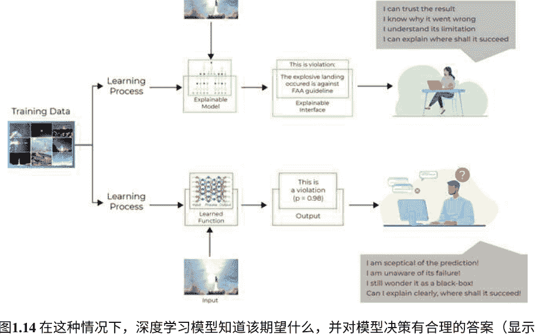

解释性和清晰度在顶部一行中。而底部一行以橙色标记表示不确定性和思想的冲突，部分黑盒开放的现状。真实模型解释的解释需要一种协议和共识。

### 1.3.3 可解释性的分类

我们意识到在解释性方面缺乏真正的一致性阻碍了该领域的进展。为了解决这个问题，人们首先必须学习人工智能社区为分类不同解释方法而开发的各种分类法和定义。图1.15描述了理解术语“可解释性”意味着什么，以便在各个领域中建立我们对打开黑盒的基本和高级策略的知识。在某种程度上，这个子部分更适合来自各个学科的普通读者，他们想要了解使用的方法。

为流行类别提供完整的参考资料，并对这个年轻的研究领域产生兴趣。

#### 1.3.3.1 可解释性和解释的定义

目前还没有普遍接受的数学、形式或技术定义的可解释性。Miller（2019）在2019年提供了一个常用的（非数学的）可解释性定义。

> 定义1.1 “观察者能够理解决策原因的程度被称为可解释性。”请注意前述定义中的三个部分：“理解”、“原因”和“决策”。

根据设计的不同，有些元素经常需要重新加权甚至更改。首先，在深度学习中，需要考虑到人类的作用，因此可解释性的定义通常会改变，以便解释的结果更有助于人类理解和推理。其次，定义中的“原因”一词使人们很容易认为解释是关注模型如何展示因果关系的。尽管因果关系对于某些解释方法很重要，但通常情况下，解释是在因果理论框架之外进行的。第三，越来越多的方法正在远离


##### 定义1.2

“解释是将抽象概念转化为人类可以理解的领域。”在上述定义中，有两个突出的部分：“概念”和“理解”。

图像中的像素数组或文本中的单词是人类可理解领域的常见示例。首先，需要解释的“概念”可以是从预测类别到如何看待模型组件再到潜在维度的任何东西。其次，在用户体验至关重要的情况下，将原始解释转换为便于用户理解的格式是至关重要的，即使这意味着牺牲解释的准确性。

这将引导我们到大多数发现的文献解释策略所属的基本范畴。由于深度学习的可解释性仍然是一个发展中的领域，所提出的分类法既不是相互排斥的，也不是穷尽的。但这似乎是比较和批评来自不同领域的解释的好方法。

#### 1.3.3.2 与解释相关的关键词

我们经常遇到一些文献，试图从图1.16所示的角度呈现模型。我们将流行的关键词分为三类：（i）基于模型或数据的视觉，（ii）算法或方法的洞察，以及（iii）伦理检查。这种尝试将列表分类为非排他性的，但在文献中常见的相互共享的知识，将为处理未来的可解释性陈述的概念提供一个框架。下面解释了一些关键词（Vilone和Longo 2020）。

- 清晰度：揭示解释是否易于理解或质量差。
- 合理性：确保解释有意义。特别是如果它们看起来科学的话。
- 模型解释：有助于理解预测系统的功能。
- 创造力：检查解释的独创性或原创性。
- 问责制：解释和证明系统交互所采取的决策和行动。
- 责任：质疑自己的决策并识别错误或意外结果的潜力。
- 透明度：即使系统行为出乎意料，也能解释系统的运行方式。

例如，可以通过告知被告一个再犯风险预测模型被用于评估保释决策中的再犯风险来使再犯模型透明化。

- **MODEL or DATA**
  - Causality
  - Effectiveness
  - Explicitness
  - Interactivity
  - Interpretation
  - Interestingness
  - Persuasiveness
  - Predictability
  - Robustness
  - Selectivity
  - Sensitivity
  - Stability
  - Transparency

- **METHODS / ALGORITHM**
  - Algorithmic Transparency
  - Clarity
  - Completeness
  - Comprehensibility
  - Correctability
  - Creativity
  - Efficiency
  - Monotonicity
  - Refinement
  - Reversibility
  - Scrutability
  - Simplification
  - Transferability
  - Understandability

- **ETHICS**
  - Actionability
  - Accountability
  - Cognitive Relief
  - Faithfulness
  - Informativeness
  - Intelligibility
  - Justifiability
  - Mental Fit
  - Responsibility
  - Satisfaction
  - Security
  - Soundness

图1.16 可解释性的不同变体

#### 1.3.3.3 解释的性质

尽管可解释性被广泛认可为重要，研究人员仍努力建立开发和验证解释的普遍客观标准。在文献中，已经提出了许多关于解释有效性的想法。当存在对比和/或违反直觉的数据时，人们通常寻求这些解释，以了解可能导致这种情况的偏见。Miller（2019）提出的一些偏见如下所示：

- 选择性：用户通常不希望解释包含事件的所有原因的完整列表，而是选择性地提供解释所需的几个必要和充分的原因。认知偏见有可能影响这种选择。
- 社交性：解释是一种旨在分享知识的对话，它在很大程度上基于解释者和被解释者的信念。
- 可能性：行动的机会或原因与事件之间的统计关系并不总是能够提供有意义的解释。在给出解释时，最好谈论原因而不是它们的可能性。

与其依赖对比事件来开始这样的讨论，我们应该努力主动地从我们的初始观察集中消除这些偏见。

#### 1.3.3.4 解释的范围

我们还需要强调技术或方法是否描述了单一结果，并因此使其局部化，还是描述了整个模型的行为以进行全局解释。我们通常会指出该过程与其在计算机视觉工作中主要使用的模型的边界范围。

- 全局：这里的目标是使整个完整模型的推理过程可理解。整体推理和不同可能的结果报告人群层面的决策。然而，这些模型通常具有独特的结构以保持可解释性，从而导致预测能力有限。
- 局部：这里的目标是推理模型的个别推理。它旨在为特定决策的模型所做的具体决策提供建立对模型结果的信任。
- 实例级别：直观地说，目标是找到输入变量x（与DNN相关的函数f）的另一种表示，期望这种表示携带直接而关键的信息，可以帮助用户理解决策f(x)。

越来越多的关注于将“全局”和“局部”解释的优势和好处结合起来：

- 全局方法解释标准模型的预测。
- 全局方法解释标准模型中模块级别的影响。
- 局部方法通过一组预测实例解释特定模型的响应。
- 局部方法解释单个实例的特定模型响应。

因此，就可信度而言，局部解释比全局解释更可靠。有趣的是，重新审视文献片段一致地表明研究人员更喜欢使用局部解释来解释DNN的预测。他们还声称，尽管已经开发了解释NN的技术，但该策略可以应用于许多模型，类似于下面讨论的模型无关策略的行为。

#### 1.3.3.5 泛化模式

还存在另一种基于对模型内部机制或模型无关功能的访问的模型解释类型，该类型基于输入-输出对。

- 模型无关：在对黑盒算法（模型集成或神经网络）进行选择性训练后应用可解释性，通常通过对输入进行扰动来实现

分析训练模型的输入-输出特征对之间的关系。它们不依赖于模型的内部结构，并且在我们没有理论或其他机制来解释模型内部发生的情况时非常有用。这种方法独立于模型的内部架构，并且对于评估不同模型并比较它们的性能非常有益。请注意，模型无关工具可以在模型训练完成后（事后）用于任何深度学习模型。一些模型无关工具，如基于示例的解释，使用数据中示例之间的差异或相似性来理解模型的行为。当数据中的属性简单且易于人类理解时，这可以为预测提供直观的解释。
- 模型特定：检查或访问模型内部仅限于特定的模型类别。此外，本质上可解释的模型的解释无疑是模型特定的。专门用于理解特定神经网络（例如CNN）的方法是模型特定的。

我们可以应用的泛化策略将取决于我们训练的模型类别和使用的数据类型。一些技术仅适用于分类任务，一些无法处理分类输入，其他技术则有一些限制，但通常计算成本较高。毫无疑问，最普遍的可解释性泛化方法是模型无关的类别。

因为它们是模型无关的，它们可以使用单一类型的模型无关技术来比较不同模型的行为，以进行全面的研究。

#### 1.3.3.6 透明度水平

透明度代表了模型内部工作的人类级解释。主要的三个阶段，即可模拟性、可分解性和算法透明性，在图1.17中有所说明，并在下面进行了讨论。

- 可模拟性：模型能够被模拟或者允许人类完全理解其结构和功能。因此，复杂性在这个类别中占据主导地位。然而，简单但广泛的基于规则的系统不符合这一特征，而单个感知器神经网络则符合。这种观点与稀疏线性模型比密集模型更易解释的观点（Tibshirani 1996）以及可通过文本和可视化向人类展示的可解释模型（Ribeiro等人2016）相吻合。再次，将可分解模型与可模拟性相结合，要求模型足够自包含，以便人类能够整体思考和推理。
- 可分解性：模型可以分解为各个元素以解释其功能的程度。Lou等人（2012）将其标记为可理解的模型，因为它赋予了理解、解释或解释其组成部分（输入、参数和输出）的能力。然而，与算法透明度一样，不是每个模型都能满足这个属性。可分解性

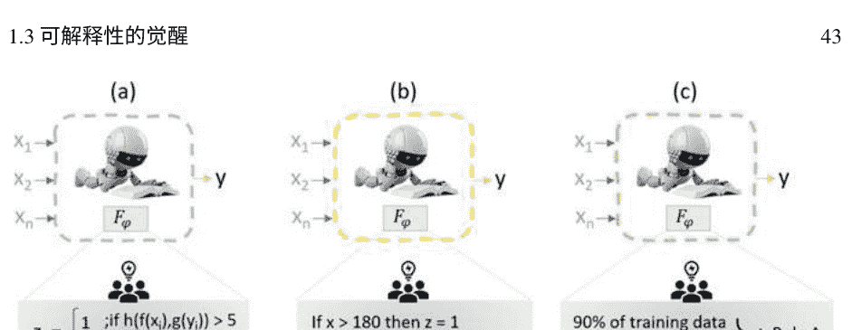

要求每个输入都能够轻松解释。对于一个算法透明的系统来说，成为可分解的一个附加约束是系统的各个部分必须能够被用户理解，而不需要额外的工具。
- 算法透明性：模型在一般情况下执行得到合理结果的程度。用户能够理解模型根据输入数据生成任何给定输出的过程的能力。在这方面，线性模型被认为是透明的，因为可以理解和推理其误差曲面，使用户能够知道模型在每种情况下的行为（James等人，2013年）。相反，深度架构将是非透明的，因为损失曲面是不透明的（Kawaguchi，2016年；Datta等人，2016年），因此无法完全观察到。这个类别的解决方案必须通过启发式优化（例如SGD）来近似。这个类别的主要限制是无法使用数学分析和方法对模型进行完全探索。

## 1.3.3.7 黑盒检查模式

现在我们提到的是一种方法生成解释的模式。 Ante-hoc方法通常旨在从一开始就考虑模型的可解释性，并在训练过程中使其自然可解释，同时努力实现最佳准确性或最小误差；后期方法旨在保持训练好的模型不变，并在测试时使用外部解释器来模仿或解释其行为。

- 背景知识的利用：从小的时候起，我们倾向于根据之前获得的知识来接受任何解释。往往我们被迫根据我们当前的理解来解释。那么利用我们之前的知识如何呢？

评估模型解释的知识？直观上，很难在我们的知识和一个简单地通过减少损失函数训练的复杂模型之间建立联系。解决方案可以在类似归纳编程的文献中找到，我们可以使用背景数据，如链接数据和知识图来解释它们。模型的输入和输出与背景知识相关联，具有正面和负面的知识，并使用符号学习系统生成解释性理论。一些实验性的符号系统包括ECII（Sarker和Hitzler 2019）、DL-Learner（Lehmann和Hitzler 2010）和OWL Miner（Ratcliffe和Taylor 2014）。
- 内在可解释模型/先验解释：我们指的是一种方法的解释模式。先验方法通常从开始和训练过程中考虑模型的可解释性，使其在实现最佳准确性或最小误差的同时自然可解释。尽管事后方法保持训练模型不变，并通过使用外部解释器来模拟或解释其在测试时的行为。

将可解释性纳入模型结构或学习中实现可解释建模。在这里，人们倾向于利用和利用DL算法的固有视觉可解释性，如预softmax类可视化、神经元交互和基于规则的启发式方法。解释完全依赖于每个模型的能力和专长。开发既透明又能够实现尖端性能的模型仍然是一个困难的问题。已经做出了许多努力来提高深度模型的内在可解释性。以下提供了一些具体信息。

蒸馏的使用是一种简单的策略。具体来说，我们首先构建一个复杂的模型（例如，深度模型）以实现良好的性能。然后，我们使用一个可解释的模型来模仿复杂模型的预测。线性、决策树和基于规则的模型是可解释的。这种策略也被称为模仿学习。这种可解释的模型优于标准训练，并且更容易理解比复杂模型。模型不可知性和特异性不适用于'ante-hoc'方法，因为它们旨在使模型的功能透明化，所以它们都是模型特定的。

> 高亮

注意力模型最初是为机器翻译开发的，现在因其可解释性而受到欢迎。通过使用人类生物系统进行选择性关注某些输入而忽略不相关部分（Xu等，2015），可以直观地解释注意力模型。通过检查注意力分数，我们可以知道哪些输入特征被用于预测。这类似于优先考虑输入特征的事后解释算法。重要的区别是注意力分数是在模型预测期间生成的，而事后解释是在预测之后发生的。

深度模型学习有效的表示来压缩数据以用于后续任务。人类无法解释这些表示，因为维度的含义

是未知的。这个问题通过分解表示学习来解决，它将特征分为不同的解释并将它们的平均值编码为单独的维度。我们可以检查每个维度，看看哪些输入数据因素被编码。在学习了3D椅子图像的分解表示之后，椅子的腿样式、宽度和方位角被编码为不同的维度（Higgins等人，2017年）。
- 事后解释：解释性的另一种方法是开发一个高度复杂但准确的黑盒模型。这样的黑盒模型可以与一组独立的利用技术和逆向工程策略一起使用，以提供黑盒的解释，而不会改变其准确性或完全了解其内部工作方式（Lipton 2018）。

这种解释方法与图1.18中的可解释设计进行了比较。用于解释复杂黑盒模型（如DNN）的技术可以为特定输入（局部）生成解释，或者全局解释整个模型，而逆向工程仅使用黑盒输入和输出来确定模型行为。这可以通过更改特定可理解的预测器或通过特定训练或验证的随机扰动进行受控审计来实现。

##### 1.3.3.8 大局观

许多可比较的原则，如可解释性、可解释性和透明度，捕捉到人类能够理解模型内部或决策中使用了哪些特征的程度。在深度学习领域，这些和其他术语并不一致地使用。研究人员解释或交替使用这些术语，或者使用不同的、经常相互矛盾的含义。图1.19呈现了（Vilone和Longo 2020）对196篇调查文章的迷人总结，这些文章按照明确定义的解释分类进行组织。

从基本意义上讲，我们可以尝试使用表1.4中列出的标准对技术进行分类。一旦我们对底层机制有了更深入的理解，我们可以深入研究IDL方法并评估其他方法的工作原理。这些方法可能包括敏感性分析、特征提取、优化、反演、分解等等（也可以参见表B.1）。然后我们通过另一种方法对方法进行分类。讨论各种形式的分类的目的是澄清IDL中模糊协议的概念，并为未来的研究建立更加正式的基础。

在本书中，我们提供了一个简单的流程图，用于将术语分类为核心形式，如图1.20所示。主要的分割基于模型决策的可解释性或试图解释其内部机制。类似于Gilpin等人（2018）的机器学习可解释性调查，我们还研究了流行方法的数学公式。这表明存在许多## 1 引言：可解释性简介

图1.18展示了在DL中训练模型涉及的步骤的图解概述。事后解释试图通过从外部验证模型来证明黑盒模型的行为，而可解释性设计则利用替代模型来广泛解释模型的内部工作方式。

图1.19 可解释性方法的分类（左）和文章在各个分类中的分布（右）。图由Vilone和Longo（2020）获得许可后再现。

表1.4 用于分组多种DL技术的常规图例

| 类型 | 描述 |
|---|---|
| 目标 | 模型解释，预测解释，模型检查，白盒设计 |
| 黑盒模型 | 神经网络，支持向量机，不可知黑盒，非线性模型，树集成 |
| 数据 | 文本，图像，表格，波形，时间序列，其他（任意） |
| 解释器 | 归因，分解，示例，数学，扰动，规则，显著性，原型选择，对抗攻击，特征相关性 |
| 范围 | 全局，局部，实例级别，异常示例 |

解释性的观点 该书通过考虑主题内容相关模型，扩展了所谓的“综合可解释性”（Domingos等，2018）。

一些人期望设计用于解释黑盒模型的方法将减轻一部分担忧。但是，遵循这种方法而不是制作可以理解的模型可能会延续不良实践并对社会造成伤害。前进的一种方式是开发本质上可解释的模型（Rudin，2019）。

## 1.4 可解释性的问题

尽管关于认知计算的许多营销宣传声称，但人工神经网络更像是人工直觉而不是智能。它们可以创造性地填补空白并做出直观的飞跃以做出适当的回应。许多行业正在使用深度学习进行自动化。它们可以接管任何人类活动并在瞬间/循环中计算结果，例如驾驶汽车，识别人脸，阅读手写并理解和标记场景中的对象。

图1.20提出了一个DL词汇分类方案，并提供了一些实例（以黑色字体显示）。

场景中的对象。追求这些重大活动的数学之美在于它经常被精心设计，但很难理解和解释。在将学习模型部署到现实世界之前，人工智能必须解决“黑盒问题”。研究人员正在积极努力解决这个问题。最近，关于人工智能的可解释性和可解释性的研究论文数量增加了。可解释人工智能旨在为AI学习模型增加问责制、透明度、公平性和一致性。可解释性的目的是弥合“接受解释权”的权利和“被告知权”的权利之间的差距。Rudin等人（2019年）质疑了2019年DNN模型的准确性、完整性和可靠性。

此外，需要进行基于人类的评估，以提高可预测性和合法合规性。然而，关于AI术语的确切定义以及它们是否具有不同或重叠的含义，目前还一无所知。当这些能力得到充分发展时，负责任的人工智能将出现（图1.23），并可在各行各业的实际场景中使用。总体而言：

- 1. 我们拥有传统计算机，在计算和处理方面表现出色。
- 2. 尤其是深度学习的人工神经网络给我们提供了人工直觉和潜在的超人类模式识别能力。
- 3. 这就引出了“准确智能”问题。现在，“如何”这个问题变得至关重要。

在可解释性的概念中，两个主要类别，即感知可解释性和数学结构可解释性，似乎呈现出不同的极性。感知可解释性存在一个问题：当视觉“证据”给出错误时，用于生成它的算法或方法以及底层数学可能无法提供修复的线索。另一方面，对模式的数学分析可能提供多维信息。它们只有在将模式降低到较低维度时才容易辨别，抽象了一些细粒度信息，我们尚未证明这些信息与可测度的确定性无关。

人工智能具有自主性和自给自足的能力，能够选择学习领域以提高准确性，这仍然是一个思考的问题。工作场所中的人工智能引发了伦理关切，因为无论好坏，人工智能系统都会强化其先前学到的知识，同时为组织提供各种新功能。这是一个挑战，因为深度学习算法是大多数尖端创新产品的基础，它们只能像它们的训练数据一样聪明。因为人类选择用于训练程序的数据，深度学习偏见是一个真实的可能性；因此，必须充分解决这个问题。

此外，强化学习可以创建学习能力但无法概念化情境的人工智能。在另一场人工智能革命之前，我们不会得到这一点，这可能需要几十年的时间。人类可以跨领域学习，而人工智能学习、执行并提供特定领域的结果。例如，地球物理学家和生物学家一样能够理解“地震”和“线粒体”这些词的重要性。因为作为人类，我们对各个领域有基本的知识，并能够将关键词分配到适当的环境中。一个人工智能模型（比如自然语言处理模型）从地球物理学或生物学的数据集中没有训练过的模型能够区分它们吗？

重要性在于解决理解方法论和评估不断增长的计算模型的需求。这有以下几个目的：(i) 更加强调准则有效性，(ii) 帮助整合方法论的焦点。

在图1.21中，我们将“可解释性的需求”分为三个潜在维度：数据驱动、任务驱动和模型驱动。子类别根据当前目标反映与潜在维度相关的因素，例如，

- 1. 不确定性，无论是认知的还是随机的，都会影响数据。另一个考虑因素是训练数据的随机性。
- 2. 对于任务驱动的可解释性，我们应该考虑问题的范围、时间限制、用户专业知识和不完整性的严重程度，如前所讨论的。
- 3. 由于神经网络相对于浅层知识编码和对认知块的知识，模型驱动的可解释性需求变得流行起来。

这个提议的示意流程图对于一些对从事XAI行业感兴趣的初学者可能会有用。我们的贡献有可能为是否机器人真正“智能”这一持续讨论带来新的视角。这个分析是在未来建立AI和DL系统的关键概念的第一步，比如可靠性、公平性和问责制，以及在法律框架下管理AI模型和程序，比如通过GDPR。

### 1.4.1 可解释性-元宇宙

我们现在对现代DL中可解释性的重要性有了更好的理解。DL不是一个单一的概念，它类似于许多其他概念。在这本书中，可解释性和可解释性并没有非常不同的含义，大部分时间它们被交替使用来强调同一点。我们在本节开始时引入了一个令人信服的介绍，说：“我们从不同的研究领域遇到了多种解释。”

有趣的是，图1.16中列出的所有支持这些关键词的概念都很难形式化。在深度学习中要求可解释性的目标是确保最终用户和其他利益相关者能够以非技术术语理解算法判断和任何潜在数据（Alameda-Pineda等，2019年）。这些术语是交织在一起的，而且并不是互斥的，因此很难列出详尽的清单。与IEEE Access出版物中的谷歌搜索趋势相同，在科学界或公共场合中引用‘可解释的AI/ML’和‘可解释的AI/ML’之间的交替主导使用（Adadi和Berrada，2018年）。从技术上讲，目前没有关于可解释性人工智能（XAI）的标准化或广泛接受的定义。

图1.22显示了可解释性和目标受众在用户领域上的广泛变化。用户领域可能包括：

## 1.4 可解释性的问题

图1.21潜在维度中可解释性需求的示意流程图

作为用户，我能确认我想要用于自动文档翻译的新AI系统的隐私保证吗？

- 作为用户，我能确认我想要用于自动文档翻译的新AI系统的隐私保证吗？
- 监管机构能追踪导致自动驾驶车辆事故的原因吗？
- 应该使用什么基准来评估自动驾驶汽车公司的安全声明？
- 作为一名学者，我能在没有工业计算能力的情况下进行大规模AI的无偏研究吗？
- 作为AI开发者，我能确认我的竞争对手不会为了取得优势而走捷径吗？

#### 1.4.1.1 对比人类心理学和AI

即使超出了本书的范围，也需要注意哲学领域关于解释的一般理论的辩论。在这个领域已经提出了几个建议，建议需要一个广泛的、统一的理论，以近似解释的框架和目的（Liem等，2018年）。总的来说，最常被接受的理论包括来自不同知识领域的许多解释策略。

心理学和人工智能显示出相似性和差异性。在这两个领域中，输入 x，映射函数 f(x)，和输出预测 y可以用来进行预测。预测过程的核心部分和典型结论有所不同。在深度学习中，训练和测试的区别类似于心理学中探索性因子分析和确认性因子分析之间的区别。深度学习验证训练好的模型，而心理学专注于数据理解。

在心理学中，x和y的可解释性意义至关重要：确保x只包含经过心理测量验证的可测量组成部分，这些部分对人类来说是可理解的。选择一组合理的特征进入x，理解x的哪些方面对于y是重要的，并理解最终用户如何感知和接受y和f(x)。输入选择必须受到理论和明确的关于x和y之间重要关系的假设的驱动。

上述要点并未被深度学习所涵盖。深度学习专家通常对理解和改进学习过程感兴趣：为什么学习函数f(x)的方式是这样的，x到y的转换敏感性在哪里，以及如何避免f(x)所产生的预测错误。

在基本的深度学习中，唯一重要的是这个函数f(x)，不管x和y来自哪里，或者它们之间的任何人类可解释的关系有多合理，只要它们的统计属性是明确定义的。在现实世界的情况下，对于一个人来说，x和y可能有不同的含义，但它们通常是物理世界中客观测量的结果，其中x包含有低级别、噪声的原始数据。

当机器学习用于心理目的时，它将考虑到在现实世界中无法直接和客观地测量的潜在人类概念。是否应该在预测这些想法时，也在潜在的人类概念（构建/有意义的独立变量）的层面上表达x，这是一个有争议的问题。这对于心理学家来说是有意义的，但深度学习专家可能不同意。另一方面，可以采用经验主义的方法，只关注感官观察，并试图直接将其与y联系起来。这对于深度学习专家来说是有意义的，但心理学家可能会觉得奇怪。作为一种可能的妥协，如果x由原始数据的观察组成，那么手工制作特征的使用就像心理学中使用变量维度来构建“构建”一样，尽管提取的特征在意义上要低得多。在基本的深度学习中，x和y的起源（以及它们之间的任何人类可解释的关系）是无关紧要的，只要它们的统计属性被明确定义。

#### 1.4.1.2 工业采用标准

> “对于组织外部的人来说，DL开发通常是不透明的，而且存在障碍使得验证开发者的声明变得困难。因此，系统属性声明可能难以验证。”

AI开发者担心披露商业机密、个人信息或可能被滥用的AI系统，在一定程度上是合理的。当这些担忧鼓励逃避时，问题就出现了。第三方审计员可以获得特权和安全的访问私人信息，以评估AI开发者的安全性、安全性、隐私性和公平性声明。AI开发者需要流程来发现和解决安全和安全风险，以进行可验证的安全和安全声明。“红队演练”有助于组织发现自己的局限性以及他们开发的AI系统的漏洞，并以整体的方式处理它们。

另一方面，“漏洞赏金”提供了一种引人注目且合法的方式，可以直接向受影响的机构报告漏洞，而不是公开暴露或出售它们。红队测试使用内部资源来识别人工智能系统的风险，而赏金计划为外部人士提供了正式的方式来提出关注。赏金计划提高了对人工智能系统的审查程度，增加了索赔被验证或被驳斥的可能性。偏见和安全性的好处将赏金计划的概念扩展到人工智能，并有助于记录数据集和模型的性能限制和其他属性。作为分析和实验的起点，我们专注于发现人工智能系统中的偏见和安全问题的赏金计划。其他属性，如安全性、隐私保护或可解释性，也可以进行探索，但基准仍处于早期阶段。改进的安全度量标准可以增加赏金计划的可比性和赏金生态系统的稳健性。应该有一种方式来报告现有度量标准无法很好捕捉到的问题。然而，非关联的人工智能开发者几乎没有动力和没有正式的流程来报告偏见和安全问题。人工智能系统很少被分析这些属性。

谈到歧视，有些偏见很容易被发现，但其他偏见需要进行广泛的研究。Obermeyer等人（2019）发现了一种广泛使用的算法中的种族偏见，影响了数百万患者。没有直接接触人工智能机构的消费者已经利用社交媒体和媒体来强调人工智能问题（Telford 2019）。

简而言之，我们需要一个值得信赖的人工智能系统，保护隐私，负责任，可以解释，并检查自身的有效性。如图1.23所示，它具有每个属性的两个子属性。这对于为大量人群提供服务的智能系统来说，从道德和方法论的角度来看非常重要。

### 1.4.1.3 医学界的途径

在医学中，大多数可解释性分析行为是针对分类的，但放射学实践包括图像分割、配准和重建。显然，在这些领域中，可解释性也很重要，并且应该在这里宣传同样。一方面，现有的解释方法应该扩展到未开发的任务。专家可以设计任务特定的解释方法。解释为什么一个体素在图像分割中接收到特定的类别标签比解释哪个区域在输入图像中对于图像分类的预测负责更困难。图像重建的可解释性可能很困难。

在这个背景下，基于数据驱动的先验和压缩感知建模的先验的协同集成是可能的，这要归功于最近建立的ACID框架（Fan等，2021年）。通过将当代压缩感知与深度网络集成，消除了现有深度重建网络的弱点，同时也将基于模型的技术的可解释性引入了混合DNN中。尽管存在偏见和错误，可解释性依赖于具有宝贵专业培训的医生。医生、技术专家和理论研究人员之间的积极合作对于开发DL方法至关重要。

#### 1.4.1.4 五个W和一个H理论

五个W和一个H理论的一种流行技术（也称为 “5W1H”）在这里被创造性地重新引入，以开始对深度学习黑盒的本质进行质疑。这是一个了解整个故事或更多了解某事的好方法。我们做出的每个决策都是直觉和逻辑之间的斗争。从人类智能到计算机智能的转变是复杂的。如今，如果你对数据进行足够的折磨，它会承认任何事情。智慧就是质疑我们认为我们知道的一切，而不是毫无疑问地知道任何事情。用技术取代动物的决策需要可解释性和共识。但是目前，对于全面的哲学概述超出了本书的范围。

可解释性，也称为DL模型的人类可解释性解释（HII），是一个人，即使不是DL专家，也能理解模型为什么做出某个选择的程度（如何、为什么和什么）。大多数哲学家、心理学家和认知科学家认为所有的“为什么”问题实际上是矛盾的。为了给出这些解释，解释引擎需要能够区分这些情况。这将使系统更容易为人类理解（Miller等人，2017年）。

大多数模型都很复杂，因为问题本身就很复杂，很难解释它们在做什么以及为什么。深度学习研究的先驱Yoshua Bengio表示，对于一个足够复杂的机器，很难完全解释它的行为。Uber的Jason Yosinski表示，我们构建了很棒的模型，但我们并不理解它们。每年这个差距都在增大。保罗·沃森问道：“为什么，模型，为什么？”以此来深入核心问题（Voosen 2017）。图1.24展示了人机交互（HCI）与可能的问题，以更好地理解模型的工作原理。Weld和Bansal在2019年的挑战中使用了对话式解释和用户提问（Weld和Bansal 2019）。解释可能无法解决所有用户的关切。它并不提出“系统是否可解释？”这个问题，而更精确地问道“谁能解释这个系统？”

图1.24 一个假设的交互式解释系统，显示对象分类。图形显示用户问答为黑色，AI机器为蓝色。直观、富有启发性的论述可以提高系统的实现（Weld和Bansal 2019）

在图1.22中，最终用户或消费者更关注决策和积极结果的解释，而不是工程师或数据科学家，他们更关注系统按设计工作。企业主寻求需求和目的，而监管者检查影响、可靠性和模型合规性。这就是为什么大多数研究是场景依赖的，并利用用户的专业知识。为了获得一个强大的模型，我们必须提出各种各样的问题，并完整地阐述问题。本节的目标是在书中的众多定义中暂停，讨论AI和DL中可解释性的重要性，并介绍将推动后续文献研究的DL方法的一般分类（如何？）。

许多问题推动了关于解释黑盒系统的方法的论文（Hofman等，2017年；Guidotti等，2018年）。这包括“可解释/透明意味着什么？”，“你如何解释某事？”，“最好的解释方式是什么？”，“哪种决策信息受到影响？”，“哪种数据记录更容易理解？”，“为了可解释性，我们会牺牲多少准确性？”在本书的后面，提出的检查试图回答关于如何使事物更容易理解的几个基本问题（Arrieta等，2020年），例如：

- 这个解释涉及什么？ （或者）这个解释中有什么？
- 什么时候解释变得困难？ （或者）为了说服用户，何时操纵是不道德的？
- 这个工具已经或将要在哪里使用？
- 谁会从这个工具中受益？
- 为什么会使用解释？
- 你如何处理逆境？ （或者）我们如何平衡伦理和可解释性？

我们使用相同的理论来定义第2章中流行的神经网络结构。图1.25说明了提出的想法的一个例子。

### 1.4.2 可解释性-正确的工具

> “一个好的解释方法不应该反映人们关注的内容，而应该反映任务方法关注的内容。”
——Poerner等人（2018）

开发影响用户或环境的新系统需要科学和道德的理解。不完全训练的DL模型的特点是目标不匹配，数据收集有缺陷，数据使用不透明，不良结果或易受对抗性攻击。图1.26说明了模型性能和可解释性之间的多目标权衡，并考虑了用户的专业知识。这些是两只眼睛，即用户的视角，理解解释是法律的一部分，必须同等重视两只眼睛，为未来的负责任、强大和可靠的人工智能做出贡献。

图1.26 负责的AI部署需要模型性能和可解释性之间的幸福纳什均衡

DL技术通过识别受保护和未受保护特征之间的隐含相关性，在反歧视数据挖掘方法中找到了它们的位置。模型设计师可以通过分析模型输出在输入特征方面的行为来发现输入变量之间的隐藏相关性，这些相关性可能导致歧视（Arrieta等人，2020年）。Swartout和Moore（1993年）对“第二代可解释专家系统”的回顾列出了对AI有用的解释的五个一般要求，为该领域的最新工作增添了重要的视角。

从中可以学到重要的原则：
1. 忠诚度：解释必须是系统实际操作的良好表示。
2. 可理解性：这包括许多可用性因素，如术语、用户技能、抽象级别和交互。
3. 充分性：AI应该能够解释功能和术语，并且应该能够证明决策的合理性。
4. 低建设成本：解释系统不应该占据AI设计成本的主导地位。
5. 效率：AI不应该因解释系统而显著减慢速度。

> 用户应该能够拥有以下内容来建立一个负责任的系统：
1. 道德考虑。
2. 与知识相关的考虑。
3. 方法论的严谨性。

Benjamins等人（2019）提醒我们，公平性包括针对影响受保护群体的数据集中的偏见检测的提议。黑盒模型可能会通过考虑种族、年龄或性别等敏感因素而无意中产生不公平的决策（d'Alessandro等人，2017）。不公平的决策可能会通过明确考虑敏感属性或隐含使用与此类属性相关的因素来导致歧视（Barocas和Selbst，2016）。例如，基于邮政编码的信用评级隐含地编码了一种受保护的特征。上述提议侧重于公平性，允许研究人员找到非敏感和敏感变量之间的相关性，检测惩罚某个人群的算法不平衡（歧视），并减轻模型决策中的偏见。这些提议涉及以下内容：

- 1. 个体公平性：建模每个个体与整个人群之间的差异。
- 2. 群体公平性：从所有个体的角度来看公平性。
- 3. 反事实公平性：试图使用因果图等工具解释偏见的来源。

## 1.4 可解释性的问题

偏见可以追溯到以下来源，如Barocas和Selbst（2016）所示：

- 1. 数据倾斜：数据获取过程中的偏见。
- 2. 有污点的数据：数据建模中的错误，不正确的特征标记和其他潜在原因。
- 3. 特征有限：使用过少的特征可能导致错误特征关系的推断，从而导致偏见。
- 4. 样本大小差异：在使用敏感特征时，子群体之间的大小差异可能导致偏见。
- 5. 代理特征：与敏感信息相关的特征可能导致偏见，即使数据集中没有敏感特征。

下一个问题是什么标准可以用来确定AI是否具有无偏性。Hardt等人（2016年）提出了一个框架，用于在数据集中存在敏感特征时评估组公平性的三个标准：

- 1. 独立性：当模型预测与敏感特征无关时，满足此标准。因此，模型对于敏感特征内的所有子群体中的正样本（属于感兴趣类别的样本）的比例是相同的。
- 2. 分离性：当模型预测与敏感特征在给定目标变量的情况下无关时，满足此标准。例如，在分类模型中，真正例（TP）和假正例（FP）的比率在敏感特征内的所有子群体中是相同的。‘Equalized Odds’是这个标准的另一个名称。
- 3. 充分性：当目标变量在给定模型输出的情况下与敏感特征无关时，称为充分。因此，敏感特征内的所有子群体的正预测值（PPV）是相同的。‘Predictive Rate Parity’是这个标准的另一个名称。

尽管不是所有的标准都能同时满足，但它们可以一起优化，以减少DL模型中的偏差。这将导致创建一个负责任的AI，具有图1.27中列出的特性。为了在高风险领域中更安全地应用，这个过程遵循一个促进解释的开发周期，以揭示、证明、控制和增强系统。让我们看一些例子，说明解释性如何成为DL在不同应用领域中的一个话题：

- 军事：不同的研究主题可以同时宣称解释性领域的开始。然而，DARPA项目的目的征集（Gunning 2017）为研究和可见性奠定了坚实的基础。领域中缺乏AI的可解释性，这并不令人意外。2017年MIT技术评论解释了对自主军事机器人的需求。这个决定威胁到国际安全和人民的生命。DARPA的XAI项目是如何平衡道德和法律问题的AI研究人员的典范。研究人员和行业正在扩大对国际事务、政府管理、网络安全和自主武器系统（即“杀手机器人”）的解释性的应用，这可能会造成毁灭性的影响 (Bhuta等, 2016年)。

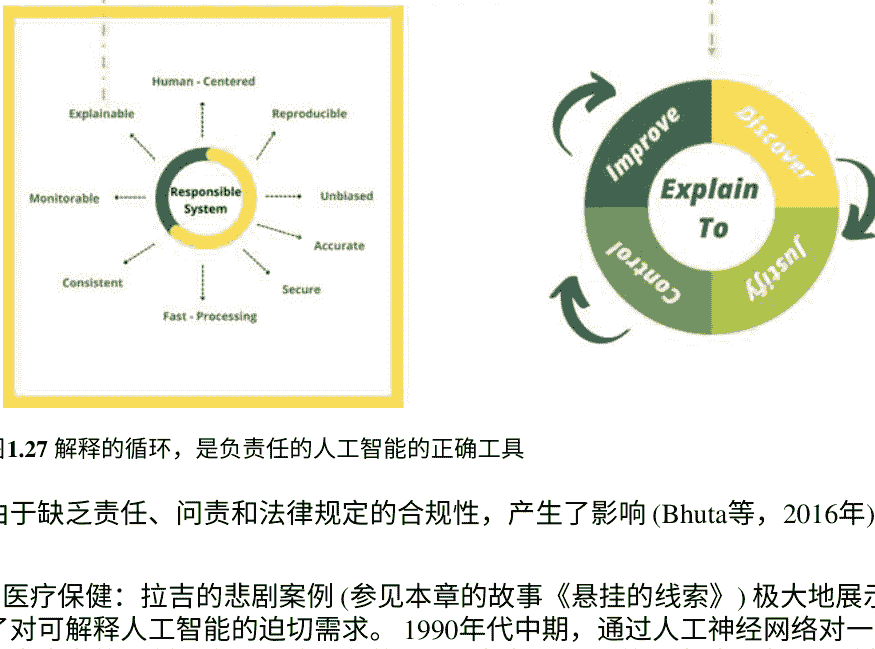

- 医疗保健：拉吉的悲剧案例 (参见本章的故事《悬挂的线索》) 极大地展示了对可解释人工智能的迫切需求。1990年代中期，通过人工神经网络对一名肺炎患者的诊断是自主医疗诊断的另一个挫折。最初的研究结果表明，该模型优于传统的统计方法，但一项广泛的研究揭示了哮喘患者患肺炎的死亡风险较低，并且不需要住院。我们可能会觉得这是违反直觉的，但研究揭示了训练样本中的真实模式，哮喘患者在重症监护室中得到积极治疗，从而减少了死亡。临床人工智能系统必须对当今快速发展的医疗保健系统中的关键决策进行解释和说明 (Che等, 2016年; Ahmad等, 2018年; Holzinger等, 2017年)。
- 金融：该领域涵盖投资策略、资产管理、客户咨询和金融道德。深度学习工具引发了公平贸易和数据安全方面的担忧。
一个过度使用的叙述是“信用评分”审计和试图解释借款人行为。一些较大的信用机构，如Equifax和Experian，正在开发更可靠的基于人工智能的信用评分和审计友好的决策制定 (Adadi和Berrada 2018; Zhang等, 2021年)。
- 法律：解释法律决策模型可以降低再犯风险和犯罪以及监禁资源的使用。模型必须公正、无歧视和公平。2016年的案例研究 (Lightbourne 2017), 州诉Loomis, 引发了对精算风险评估工具和Loomis先生的监禁刑期的宪法担忧。该案件声称专有软件‘Correctional Offender Management Profiling for Alternative Sanctions: COMPAS’违反了被告对如何权衡各种输入并在决策中纳入性别和种族偏见的审查权利 (Brennan和Dieterich 2018; Tan等, 2017年)。法律挑战的另一个方面可能是社交媒体平台的不断增加使用和对强大版权保护的需求 (Wichtowski 2017年)。
- 物流：自动驾驶车辆（AVs）承诺减少交通事故，增加流动性，并降低物流劳动成本。自主车辆导航面临着快速变化的互动环境，计算密集型输入变量，以及人类互动的情感驱动的不确定性的挑战。考虑一个存在分类问题的自动驾驶汽车。影响可能是致命的，正如Uber在亚利桑那州发生紧急制动故障后关闭自动驾驶操作一样（Laris 2018）。AVs中的HMI研究（Ekman等人，2017年），公众对其应用的看法（Pennetsa等人，2021年）以及其可解释性都是改善系统诊断问题、做出决策、确保人们安全的必要条件（O'Sullivan等人，2022年）。

改编自Arrieta等人（2020年），IDL系统开发者应考虑以下方面和期望的品质：

- 1. 信息性：最近的IDL研究出版物集中在学习模型的内部工作上。
- 2. 可转移性：学习模型的可解释性导致它们在各种应用中被重复使用。然而，并非所有可转移的学习模型都是可解释的。可转移性是IDL研究中被引用次数第二多的原因。
- 3. 可访问性：IDL使得调试和开发模型对终端用户更加容易。可解释性帮助非技术用户理解学习模型。
- 4. 自信度：创建负责任的AI需要一个自信的学习模型。学习模型的鲁棒性、稳定性和可靠性要求进行自信度评估。在金融和医学领域，对学习模型的自信度进行了大量研究。
- 5. 公平性：学习模型的可解释性突出了训练数据中的偏见。由于IDL涉及用户参与其可解释性，因此学习模型的预测公平性很重要，以确保其决策是公正的。与公平性相关的IDL研究关注道德人工智能和利用人工智能造福社会的使用。
- 6. 可信度：量化可信度对于一个学习模型来说是困难的；当面临问题时，它是模型按计划工作的信心。可解释性应该是一个值得信赖的学习模型的特征，但并不是所有模型都满足这个标准。
- 7. 互动性：以人为中心的人工智能驱动的交互式系统将最终用户置于中心，与AI学习模型共同合作完成预期任务。
- 8. 因果关系：在深度学习中的因果关系意味着找到学习模型变量之间的因果关系。它导致确定训练数据的相关性和因果关系。可以使用因果推断技术验证深度学习中的因果关系。
- 9. 隐私意识：未经授权的第三方了解学习模型的内部工作方式可能会危及原始训练数据的隐私。例如，金融领域实施的学习系统可能会因为学习模型的可解释性而导致客户私人信息的泄露。保密性在深度学习中至关重要。目前，研究人员对隐私的关注较弱，为未来的研究人员创造了机会。

### 1.4.3 可解释性-错误的工具

我们首先引用Doshi-Velez和Been（2017）提出的未解答的问题，关于严格的可解释性：“所有在所有被定义为可解释的模型类中的模型是否都同样可解释？所有应用都可解释吗？”进行受控实验以评估旨在为人类提供可行解释的可解释性方法的效用至关重要。由于其复杂性和高维度，DNNs难以理解。从对更简单、低维系统的直觉推断是理解这些系统的一种方法。直觉是全面理解的基础。例如，将抽象数量映射为具体的感知形式，例如通过可视化，也可以是一种有效的认知辅助。然而，未经测试的直觉可能会误导。外表经常具有欺骗性，未经检查的推断很容易使人误入歧途（Leavitt和Morcos 2020）。每个推断迭代都必须验证直觉的基础。虽然直觉可以帮助确定重要问题，但这些问题必须用强有力的可证伪的假设来解决。这适用于包括DL在内的所有科学领域。

> “不要总是想出格子外的东西，可能不值得努力。” ——本书的作者

在高风险决策中使用了成千上万个黑盒模型，但只有少数可解释的模型存在。人们更喜欢解释黑盒模型，以便得到可解释的白盒模型。这种态度可能会延续错误的做法，并可能对社会造成伤害（Rudin 2019）。通过像Kaggle这样的AI竞赛，我们得到了高性能的模型，但模型准确性并不总是企业效用的衡量标准。因此，需要对可解释的AI进行合理的证明。

高风险应用需要透明的模型。事后解释可能不可靠；因此，使用一个简单的白盒模型。然而，白盒模型的准确性不如复杂的深度神经网络，并且事后解释主导了研究。对AI未来影响的担忧正在使研究人员的注意力从已部署系统的真正风险转移开来。图1.29 XAI描述了一个类似的情况，即为了改善模型性能而牺牲了特征的重要性。

我们认为，如果用户无法理解其局限性，甚至更糟的是，解释被优化以隐藏不良系统属性，那么以简化的方式呈现复杂系统的描述是不道德的，这会增加信任。这样的解释可能导致危险或无根据的结论。因此，大多数以前的深度学习研究要求更严格的可解释性概念（Doshi-Velez和Kim 2017）。

阅读到这里，我们已经理解了支持可解释性概念的工作。让我们讨论一个整体策略的另一面：挑战典型的方法，完善直觉信念，并推测可解释性。理解解释黑盒和创建可解释模型之间的区别非常重要。Gartner新兴技术的炒作曲线显示了XAI。在人工智能或内在可解释模型处于创新触发阶段的同时，深度学习达到了巅峰。2012年，Bunt等人提出了一个问题：“解释总是重要的吗？”他的研究表明，尽管没有正式的解释，黑盒智能系统通常都受到欢迎。这是因为用户对‘模型透明度’缺乏明确的定义，或者在观察解释的‘成本与收益’之间权衡。Kulesza等人（2013）提出了他们关于‘完整性超过准确性’的发现，解释导向用户的心理模型来评估成本与收益的权衡，以决定是否关注解释。与人类友好的解释的乐观态度相反，过度简化可能成为一种诅咒，即低准确性可能需要用户进行更多的思考，从而导致对解释的信任丧失和对此类解释的关注减少。

我们必须理解可解释性的直观概念。王等人（2015年）的工作批评了‘可解释性与准确性’的观点。为了保持最大的准确性，他们决定放弃一些解释能力。Shmueli等人（2010年）从统计学的角度进行了同样的讨论，重点是机器学习。2017年，Yarkoni等人从心理学的角度支持了这一争论，认为机器学习模型的预测比它们的可解释性更重要，从而更好地理解它们的行为。

现代人工智能的可解释性面临着技术挑战。在20世纪80年代，可解释的专家系统利用知识库进行断言和专业知识。传统系统在这一刻是不灵活但强大的，并且可以解释的。然而，可解释性被认为对智能系统来说是不够的（Preece，2018年）。现代深度学习系统利用了另一端，它们是自主的，依靠输入特征之间的高度交互来创建类似于人类行为的环境表示。传统系统容易解释线性的输入到输出转换，而现代模型的多层交互和非线性使得解释更加困难。变量超参数和不同模型内部的内部交互支持了这个观点。

## 例子

该方法为烤面包机增加了另一个维度。2017年，Athalye等人使用TensorFlow的标准预训练InceptionV3分类器，通过3D打印设计成看起来像步枪的海龟，几乎从所有角度看都是如此。事实上，计算机将海龟视为步枪！请参见图1.28。左侧的数据集在模型训练后将大部分海龟对抗性地分类为步枪。

文章的作者为2D分类器创建了一个3D对抗性示例，该示例对于海龟旋转、缩放等变换是对抗性的。而其他方法，如快速梯度法，在图像旋转或视角变化时无法工作。他们提出了期望转换（EOT）算法，该算法在图像变换时生成对抗性示例。EOT通过变换优化对抗性示例。在给定可能变换的选择分布下，EOT保持对抗性示例与原始图像之间的期望距离低于某个阈值。

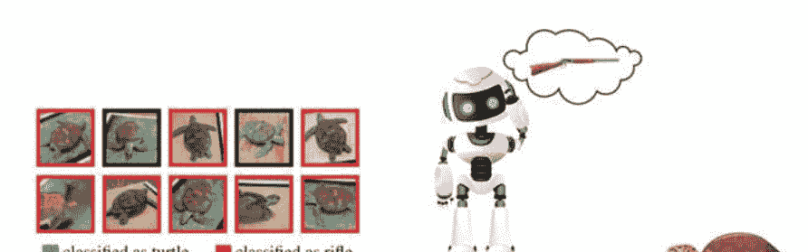

图1.28 随机选择的一个3D打印的乌龟的姿势，经过对抗性扰动后从任何角度都被分类为步枪。未经扰动的模型几乎总是正确地将其识别为乌龟。图源自Athalye等人（2018），获得许可后进行了修改。

另一个案例研究中，模型的预测的Grad-CAM可视化（Selvaraju等人，2017）显示模型学会了通过观察人的脸部/发型来区分护士和医生，从而学习了性别刻板印象。
有几位女医生被错误地分类为护士，男护士被错误地分类为医生。
有问题。事实证明，图像搜索结果对男性有偏见（78%的医生图像是男性，93%的护士图像是女性）。

> **好好考虑一下**

**你会如何解决自动解释的系统不稳定性问题？**

许多准确的深度学习模型具有相同的输入特征，但内部交互略有不同。自动解释可能在细节上缺乏共识。

当涉及到可解释性和学术界以及从业者的接受度时，我们必须承认并不是每个人都会意识到对可解释的人工智能系统的重要性。除了一些潜在的暗示深层次的东西外，人工神经网络在目前似乎并不会产生原创的概念或想法，也不会进行抽象推理。很少有任务或人类角色需要这种思维功能。大多数人都是‘厨师，而不是大厨’，是商人而不是企业家，他们也没有被教导如何从第一原则进行推理。谷歌的研究总监兼《人工智能：一种现代方法》的作者P.诺维格在2018年对可解释性提出了质疑。他表示人们不擅长解释他们的决策，并且可以通过观察输出结果随时间的变化来确定人工智能预测的可信度。根据Facebook的AI负责人J.佩森蒂的说法，深度学习可能会传播人类的偏见，难以解释，缺乏常识，并且更多是模式匹配而不是语义理解。另一份报告（哈威尔2019年）证实了面部识别软件的种族偏见。优步的自动驾驶汽车没有识别出一个在人行横道之外的行人，结果是致命的。对深度学习的局限性持批评态度的AI研究人员Yoshua Benigo在接受IEEE Spectrum的采访时表示他并不反对。研究人员正在寻找不起作用的领域，以便我们可以添加和探索。

## 可解释性学习的科学：开放挑战

- I. 理论:
- 1. 问题形式的完整性。
- 2. 标准化共享语言的形式化。
- 3. 评估声明的特定性。
- 4. 人类感知的随机性程度。
- 5. 对数据中不可避免的偏见的问责。
- 6. 解释的清晰度。
- II. 实践:
- 1. 测量实际交互中的不确定性。
- 2. 评估可解释性水平。
- 3. 比较解释的技术。
- 4. 人类理解的范围。
- 5. 与任务相关的知识和专业知识。
- 6. 解释的时间限制。

连接链接：可解释性分类法、量化、技术、文献综述。

为了评估竞争解释方法的质量和适用性，从业者需要有原则性的指导方针。透明度作为手段可能是危险的。它可能导致受众和声明者之间的分歧。图1.29提供了一个自解释的插图，以理解人工智能中共识的背景。数据科学家经常误解IDL，认为模型解释只是一个安慰剂。在追求可信赖的人工智能时，我们希望利益相关者像我们一样思考，并提供一个单一的解释。他们觉得“说出来的话会被听到”。IDL经常被视为助手的替代品，低估了其友好解释的特性。

通常情况下，他们优化模型性能而不是企业效用，假设而不是证明IDL的普适性。为了避免这个陷阱，解释应该在可读性和深度之间取得平衡。系统应该允许更详细和完整的描述，而以可读性为代价。解释方法应该在从最大可解释性到最大完整性的曲线上进行评估，而不是在一个单一点上。我们必须学会优先考虑质量而不是性能，否则可能会得到与下面的插图类似的结果。


图1.29 AI中不明确的共识的插图，我们都追求准确性改进，类似于快速将方块推到终点线。许多人最终会牺牲我们认为不太相关的特征，并对模型进行优化以获得更好的性能。这可能导致实施非法模型、错误的预测偏见以及缺乏使用的问责制。

- 我们将用四个关键要点总结本节：
- 1. 制定具体、可测试和可证伪的假设。
- 2. 回想一下“人类”在人类可解释性中的含义。如果一个方法的目标是帮助人类理解深度神经网络，那么它应该明确地进行测试。
- 3. 尽可能进行量化。一个无法量化的假设有可能无法被证伪。
- 4. 对可视化要保持谨慎！怀疑应该与直觉成比例。

## 总结

随着我们的进展，这本书中的大部分内容对于在可解释性领域工作的人来说可能并不新鲜。然而，对于我们认为紧迫且需要总结以获得更好理解的主题，组织广泛的文献是非常重要的。可解释性的形式化是一个多方面的目标，需要各种学科的关注。然而，方法的协同发展必须正确进行。我们的目标不是编制一个完整的可解释方法列表，而是包括一个被认为在深度学习领域具有重要意义、具有高引用水平或良好解释策略覆盖范围的整体调查。

这将为系统化定义的形式化奠定基础。

为了推动该领域的发展，严格推广可解释性方法至关重要，推动SOTA可解释性的进步。

## 阅读清单

- 1. 《深度学习》（MIT出版社）是Goodfellow、Bengio和Courvillo（2017年）合著的教材，涵盖了广泛的数学、技术和概念性深度学习技术，结合行业和研究视角，以便深入理解这个领域。
- 2. LeCun等人（2015）和Schmidhuber（2015）在2015年对DL的基础有了很好的洞察。

## 自我评估

- 1. 从三个不同的学科角度描述你的工作的可解释性的基本概念。
- 2. 检查你新创建的模型的可解释性水平的详尽诊断清单是什么？
- 3. 线性模型能够提供良好的解释吗？用一个例子支持你的理论。
- 4. 列举一些基于示例的解释应用，这些应用对你的任务有用吗？
- 5. 根据第1.3.3节中提供的分类法，对流行的可解释性方法进行分类。
- 6. 通过一个例子，展示一个系统最近的深度学习可解释性是如何运作不佳的。

# 第2章
深度学习的神经网络

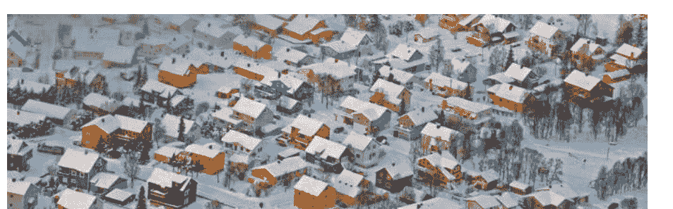

本章以现代时代的一句流行语开头：“AI将接管世界！”（Crawford和Calo 2016）。这句话有两种主要解释。第一种是承认AI作为一种发展中的技术，具有为大型组织、全球自动化和简化低效流程的能力。另一种是AI的暴君，超出人类控制，将摧毁整个人类。我们希望大多数人属于前一种观点。对于那些仍然困惑的人，让我们努力改变你的观念。

近年来，“AI”一词变得无处不在。在人工智能领域，有几个子领域，其中一些根据我们使用的分类方式有所重叠。一个重要的区分是机器学习和深度学习之间的区别。图2.1展示了相互关联的专业之间的初步区分。这将提供对深度学习和研究可解释性的需求的全面理解。为了保持一致性和相关性，我们将根据它们的能力和可解释性实践来整合深度学习和与神经相关的架构。

非线性函数或单元对于输入数据的处理是神经学习的核心。这些单元的线性组合可以用来建模/逼近任意形状的非线性曲线。然而，另一方面，事情变得更加棘手。
个体的非线性活动具有难以理解的影响。
为了深入了解深度学习这一广阔领域，并论证其可解释性的本质| 维度 | Machine Learning | Deep Learning |
| :--- | :--- | :--- |
| Approach | It uses an approach to parse data, and make educated prediction based on learned parameters. | It uses deep layers of neural network to self-learn and make smart predictions based on its layering algorithms. |
| Use | Widely employed to stay competitive and try new ideas. | Popular for solving complicated machine learning problems. |
| Computation Time | Generally, requires less time to train the model. | Requires long time to train the model. |
| Hardware Dependency | These are light models that can be trained on CPU. | Computationally intensive models needs GPU for proper training. |
| Data Dependency | It is possible to train with fewer data. | Requires large amount of data to return sufficient accuracy. |
| Hyperparameters | The hyperparameters tuning capabilities are limited. | Large number of hyperparameters available for tuning differently. |
| Scalable | The network learns from extracted features and is less robust. | Scalable networks capable of learning feature representations. |
| Interpretability | Considerable accuracy with relatively higher interpretability. | Helps attain the state-of-the-art accuracy with black-box nature. |

图2.1 机器学习和深度学习之间的进化差异

在这些不同的网络中，我们将研究一些学习范式以及它们的工作原理。

> **深度学习和机器学习之间的区别是什么？**

深度学习和机器学习都是人工智能领域的子集。机器学习是人工智能的一个子领域，它教会计算机在最小的人为干预下执行任务。
深度学习是机器学习的一个高度复杂的子领域，它使用具有参数化层的人工神经网络来模拟人脑。机器学习需要结构化数据和人为输入。
另一方面，深度学习可以对更多的非结构化数据进行解释，几乎不需要人为干预。

## 2.1 神经网络架构

这个词汇直观地类似于大脑解决大数据驱动问题的方式。分层神经网络是深度学习的功能模块。这些分层的人工神经元可以接受一个或多个输入，将这些输入转化为有意义的输出。每个神经元在网状的前馈排列中相互影响。网络试图揭示数据之间的相关性，解读大量数据中的复杂模式。

在图2.2中，输入层、隐藏层和输出层将网络分开（从左到右跨越网络深度）。层中的节点或神经元具有相关的权重和偏置。非线性激活将输入转换为下一层的输出。
对于非计算机科学背景的人来说，保持与即将到来的发展保持联系是很重要的

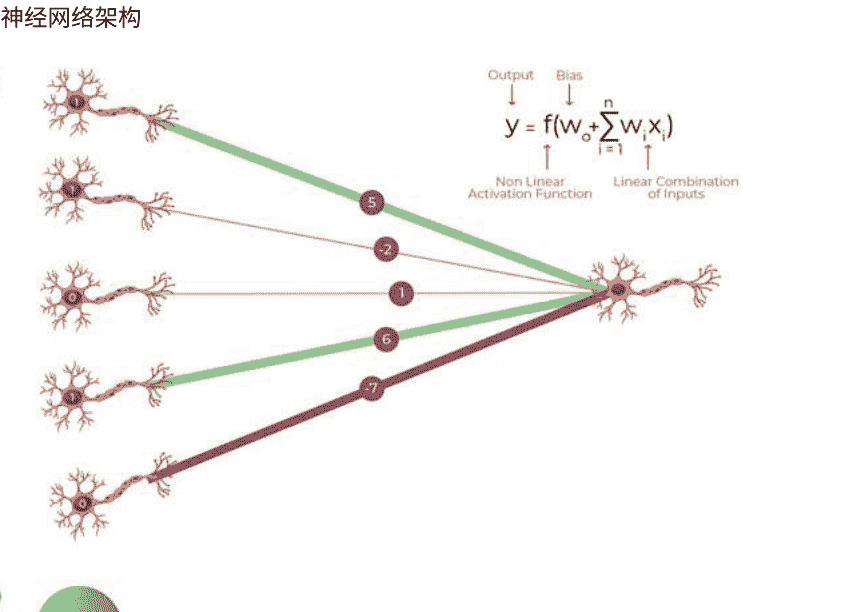

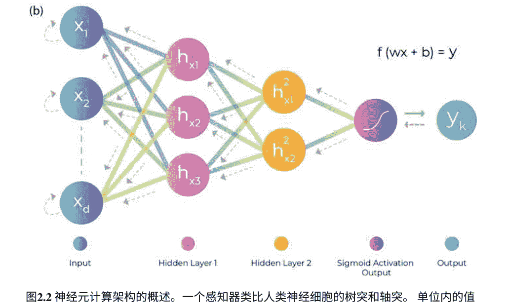

图2.2 神经元计算架构的概述。一个感知器类比人类神经细胞的树突和轴突。单位内的值定义了输入特征，任意两个单位之间的连接关联的值表示网络权重，以产生正确激活的输出。b具有两个隐藏层和中间连接的示意图NN展示了前向和后向权重传播

在讨论之前，有必要回顾一些神经网络架构的基本术语和组件。

- 1. 输入层：从CSV文件或在线服务等外部源加载的数据被加载到输入层中。它是神经网络中唯一可见的层，在没有计算的情况下传输外部数据。例如，“目标检测”输入可以是表示图像的像素值数组。
- 2. 隐藏层：隐藏层增加了神经学习的深度。它们是执行所有计算和提取数据特征的中间层。通过许多相互连接的隐藏层来搜索数据中的不同隐藏特征。例如，在图像处理中，初始的隐藏层负责更高级的特征，如边缘、形状或边界。此外，后续的隐藏层执行更复杂的任务，如识别整个对象（比如汽车、建筑物、人物）。请注意，在本书的某些部分，层是从底部到顶部堆叠的，而在其他部分，层是从左到右堆叠的。方向是基于所参考的网络的上下文。

> **突出显示**

通常，所有隐藏层使用相同的激活函数。另一方面，输出层通常会使用与隐藏层不同的激活函数。决策受模型的目的和预测类型的影响。

- 3. 输出层：输出层利用模型的学习结果提供最终的预测。这是最后、最重要的一层，因为它是我们获取最终输出的地方。分类/回归模型中的输出层通常由一个节点组成。然而，它完全依赖于问题的特定性，因此取决于模型的开发方式。
- 4. 权重：网络的每一层都包含带有相关学习参数的中间节点，称为权重。它的唯一功能是优先考虑对学习贡献最大的特征。输入值和权重矩阵之间引入了标量乘法。例如，一个负面词汇会比一对中性词汇更大程度地影响情感分析模型的选择。
- 5. 偏置：每一层带有相关学习节点的偏置。偏置会改变激活函数产生的值。在线性激活函数中，偏置 b类似于一个常数。
- 6. 传递函数：每个节点都有一个传递函数。传递函数将几个输入值组合成一个输出值，作为下一个节点的激活函数的输入。这是通过对传递函数的所有输入进行简单求和来实现的。
- 7. 激活函数：节点的输出前面有一个激活函数。激活函数在感知器中引入了非线性（有关更多信息，请参见第2.1.1节）。没有非线性激活函数函数的结果将是线性的，无法引入网络的非线性（图2.2）。

- 训练神经网络的一般指南如下：
    1. 选择模型架构、初始权重、超参数、激活函数和损失函数。
    2. 处理训练数据并对输入对进行洗牌。
    3. 在所需的时期内以配置的批次设置运行神经网络。
    4. 使用相应的权重计算损失和梯度。
    5. 每次传递更新反向传播权重。
    6. 重复学习所需的迭代次数，以最小化损失。
    7. 在冻结模型权重后对测试集进行测试。

在尝试解释神经网络的可解释性之前，快速分析深度学习训练的整体情况将是有益的。如果有人忽视了总体目标，可以参考本章。请记住，目标始终是为了调整网络设置以适应输入，从而获得更精确的结果。

### 2.1.1 感知器

1957年，美国心理学家弗兰克·罗森布拉特介绍了传统神经网络的一种旧型号，称为感知器（Rosenblatt 1957）。这种最基本的神经网络接受多个输入，对每个输入分配权重进行线性数学运算，然后通过非线性激活函数产生输出。最初，感知器使用二进制阶跃激活函数和阈值参数 $\theta$ 来确定 $\sum w_i x_i - \theta > 0$ 是否为“真”或“假”。这导致超平面方程 $w_1 x_1 + w_2 x_2 + ... + w_n x_n - \theta = 0$。

这对于可以线性可分的数据效果很好，这就是为什么感知器也被称为线性分类器(Menzies等人，2014年)。

网络架构如图2.3所示。从数学上讲，单个单元或感知器的操作可以定义为：

$$y^{(1)}(x) = f(.)\left(\sum_{i=1}^{N} w_i^{(1)}x_i + b^{(1)}\right) = \sigma (W^T X + b) \qquad (2.1)$$

在Python中，可以使用Numpy包的几行代码执行等式2.1，其中$y$是输出，$f(.)$是激活函数，$w$是权重矩阵的转置，$b$是神经元的偏置。$T$是权重矩阵的转置，$b$是神经元的偏置。

```python
import numpy as np
def f(X):    # 定义一个激活函数。
        return np.heaviside(X,1) # 这里，是一个二值阶跃激活函数

y = f(np.dot(input , w.T) + b)
```

尽管它们很简单，感知器被认为是第一个神经网络浪潮（Gurney2018）。它们为深度学习的进展奠定了基础。20世纪70年代的出版物批评了感知器的不足之处（Minsky and Papert 1969）。后来，感知器单元以前馈方式组合在一起，形成了更广泛的人工神经网络。

> **好好思考一下**

**在单隐藏层神经网络中，需要使用多少个神经元来近似或表示任意决策？**

人们可能会质疑需要多少个神经元或单变量求和项来获得特定的近似质量。基于维度诅咒，我们相信大多数近似问题将需要天文数字。Cybenko等人（1989）对问题进行了数学理解，并提出了一个S型和潜在非线性函数来近似单位超立方体中任意连续函数的近似性质。顺序学习中的函数估计（Kadirkamanathan and Niranjan 1993）强调了具有单隐藏层和连续S型非线性函数的连续前馈神经网络在任意逼近决策区域方面的潜力。

连接的链接：近似、完备性、叠加定理，一元函数。

### 2.1.2 人工神经网络

人工神经网络（ANNs），又称为香草神经网络、前馈神经网络或多层感知机（MLPs），由排列在行中并在完全连接的前馈层中耦合的神经元组成。这些神经元被编程为以二进制的开关模式运行，接受输入数据并在将输出从左到右传输到前馈网络之前完成简单的操作（Leverington 2009）。为了避免手动为网络建立权重的繁琐工作，罗森布拉特设计了一种用于自动学习香草网络的算法，他将其称为delta学习规则，后来被正式化为梯度下降学习。

关于梯度下降学习的重要性以及许多其他有用的参考资料，将在本章后面提供。

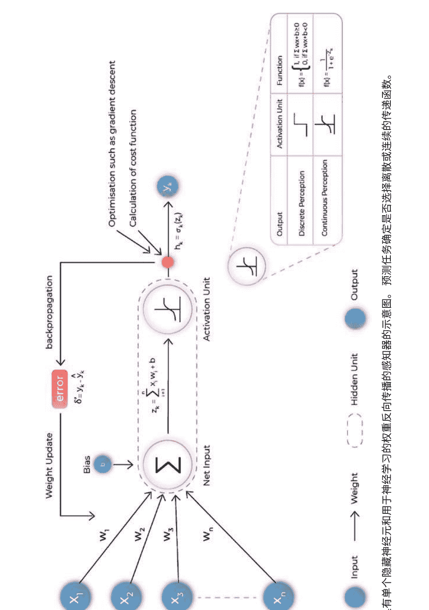

| Output | Activation Unit | Function |
| :--- | :---: | :--- |
| Discrete Perception | ┐ | f(x) = { 1, if Σwxb+b ≥ 0; 0, if Σwxb+b < 0 } |
| Continuous Perception | ∫ | f(x) = 1 / (1 + e^{-Σx_i}) |

图2.3具有单个隐藏神经元和用于神经学习的权重反向传播的感知器的示意图。预测任务确定是否选择离散或连续的传递函数。

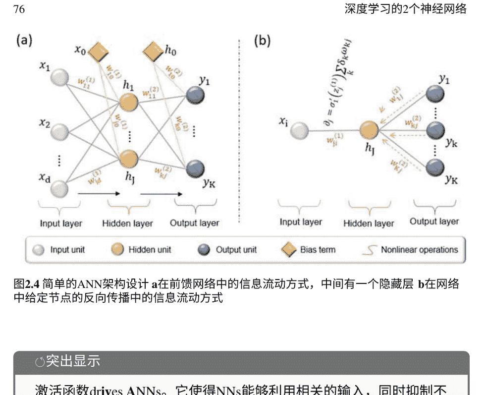

> 突出显示
激活函数drives ANNs。它使得NNs能够利用相关的输入，同时抑制不必要的数据点。这种分离在帮助NN有效地运行和确保它从有用的信息中学习而不会陷入分析无用信息的过程中起着关键作用。

ANNs经常被用于各种活动，包括图像处理、垃圾邮件检测和金融分析。它在以下情况下最有效：

- 1. 具有行和列的CSV格式表格数据集。
- 2. 主要用于非顺序或时间相关的监督学习任务。
- 3. 现实世界的分类和回归挑战。
- 4. 具有高灵活性的模型。

> 突出显示
MLP是前馈神经网络的最常用替代术语。这并不完全正确，因为原始感知器是一个具有不连续的二进制阶跃非线性激活的单层网络，与此处使用的连续非线性激活函数相对立。

让我们回顾一下前馈神经网络在监督学习和无监督学习中的数学定义。这是一个具有 O(.)作为最终输出预测函数和H(.)作为隐藏单元计算的两层前馈神经网络。

图2.4中描述了函数 \(F\) 和 \(f\) 分别是各层的激活函数。

模型方程的总结：

$$O(x) = F\left(W^{(2)} H(x) + b^{(2)}\right)$$
$$H(x) = \sigma(x) = f\left(W^{(1)} x + b^{(1)}\right) \quad \text{(2.2)}$$

#### ■第一步: 从输入到隐藏单元的前向传播。

NN的第一层中, 维度为d的输入的线性组合 \(z_j^{(1)}\) 被传播到下一层。在这里, \(J\) 的任意范围由相应层中的隐藏单元数量确定：

$$z_j^{(1)} = \sum_{i=0}^{d} w_{ji}^{(1)} x_i, \quad j = 1, 2, \ldots, J \quad \text{(2.3)}$$

其中, \(z_j^{(1)}\) 是激活值, \(w_{ji}^{(1)}\) 是参数权重, \(w_{0}^{(1)}\) 是偏置项 \(x_0=1\)。上标 (1) 表示网络的第一层参数。然后, 通过非线性激活函数将上述每个求和转换为相应的隐藏单元输出 \(h_j\)。这是因为问题的输入和目标输出都没有指定值。输入层和输出层之间可能有多个隐藏层, 从而形成一个深度网络。 \(\tanh\) 函数, 其中 \(\tanh(x) = (e^x - e^{-x}) / (e^x + e^{-x})\) 或逻辑sigmoid函数, 其中 \(\text{sigmoid}(x) = 1 / (1 + e^{-x})\) 是常见的激活函数选择。方程2.4显示了常用的激活函数 \(\sigma_1\) 的选择, 通常是一个sigmoid函数。

$$h_j = \sigma_1(z_j^{(1)}) = \frac{1}{1 + e^{(-z_j^{(1)})}} \quad \text{(2.4)}$$

#### ■第2步: 从隐藏层到输出层的前向传播。

隐藏单元的输出 \(h_j\) 在第二层线性组合, 得到输出单元的激活值 \(z_k^{(2)}\)：

$$z_k^{(2)} = \sum_{j=0}^{J} w_{kj}^{(2)} h_j, \quad k = 1, 2, \ldots, K \quad \text{(2.5)}$$

\(w_{kj}^{(2)}\) 是权重参数, \(h_0 = 1\) 是第二层的基础, 如公式2.3所示。再次使用sigmoid函数计算最终输出 \(y_k\) 如下：

$$y_k = \sigma_2(z_k^{(2)}) = \frac{1}{1 + e^{(-z_k^{(2)})}} \quad \text{(2.6)}$$

然而，在多类问题的情况下，使用softmax激活函数（方程2.7）将多类输出保持在[0, 1]范围内。

$$\sigma_2(z_k^{(2)}) = \frac{e^{z_k^{(2)}}}{\sum_{l=1}^K e^{z_l^{(2)}}}$$

方程2.8显示了从输入层到输出层的完整前向传播过程。

$$y_k = \sigma_2 \left( \sum_{j=0}^J w_{kj}^{(2)} \sigma_1 \left( \sum_{i=0}^d w_{ji}^{(1)} x_i \right) \right), \quad k=1,2,......,K$$

#### ■第3步：评估网络优化的误差函数。

梯度下降算法能够在模型训练过程中考虑网络权重和偏差。这涉及到定义损失函数 $\mathcal{L}$ 并评估与模型权重相关的损失。通过“链式法则”实现，通常称为误差反向传播或反向传播。

> 对于单层网络，损失梯度是不同输入到输出权重值的导数的乘积。对于隐藏层到输出层的权重 $w_{kj}^{(2)}$ ，当输出处有可用的目标值和隐藏单元值作为伪输入时，这是成立的。然而，对于输入到隐藏层的权重 $w_{ji}^{(1)}$ 的训练，情况并非如此，因为隐藏单元的目标值缺失。这也被称为信用分配问题（Richards和Lillicrap 2019），因为它使得准确训练输入到隐藏层的权重变得不可能。我们想知道隐藏单元的错误是什么，以及输入到隐藏层的权重如何影响整体损失。解决方案是使用微分的链式法则系统地推导相关的导数。

给定架构的损失函数 $\mathcal{L}$ 在图2.4中定义。平方和损失函数通过将 $N$ 个样本的训练集和目标标签 $y_{nk}$ 求和来触发。

$$\mathcal{L} = \sum_{n=1}^N e_n$$
$$e_n = \frac{1}{2} \sum_{k=1}^K (y_{nk} - \hat{y}_{nk})^2$$

每个模式的 $y_{nk}$ 值必须使用Eq. 2.8中指定的ANN前向传播计算。总梯度通过对训练样本进行求和计算如下：

N个训练样本如下：

$$\frac{\delta \mathcal{L}}{\delta w_{kj}^{(2)}} = \sum_{n=1}^{N} \frac{\delta e_n}{\delta w_{kj}^{(2)}} \quad (2.10)$$

$$\frac{\delta \mathcal{L}}{\delta w_{ji}^{(1)}} = \sum_{n=1}^{N} \frac{\delta e_n}{\delta w_{ji}^{(1)}} \quad (2.11)$$

#### ■第4步: 从隐藏层到输出层的误差反向传播。

首先，使用微分的链式法则计算隐藏层到输出层权重的损失梯度 $\delta \mathcal{L}/\delta w_{kj}^{(2)}$，并将Eq. 2.10表示为该层权重的形式，如下所示：

$$\frac{\delta e_n}{\delta w_{kj}^{(2)}} = \frac{\delta e_n}{\delta z_{nk}^{(2)}} \cdot \frac{\delta z_{nk}^{(2)}}{\delta w_{kj}^{(2)}} = \delta_{nk} \cdot z_{nj}^{(2)} \quad (2.12)$$

其中 $\delta_{nk}$ 表示关于激活 $z_{nk}^{(2)}$ 的误差梯度。这类似于单层神经网络的计算方式。层内的激活单元是第二个的导数。

$$e_n = \frac{1}{2} \sum_{k=1}^{K} \left( \sigma_2(z_{nk}^{(2)}) - y_{nk} \right)^2 = \frac{1}{2} \sum_{k=1}^{K} \left( \sigma_2 \left( \sum_{j=0}^{J} w_{kj}^{(2)} h_{nj} \right) - y_{nk} \right)^2 \quad (2.13)$$

我们有 $\delta_{nk}$，这与方程2.14中具有非线性激活的单层神经网络类似：

$$\delta_{nk} = \frac{\delta e_n}{\delta y_{nk}^{(2)}} \cdot \frac{\delta y_{nk}^{(2)}}{\delta z_{nk}^{(2)}} = (y_{nk} - y_{nk}) \sigma_2'(z_{nk}^{(2)}) \quad (2.14)$$

#### ■第5步: 从输入到隐藏层权重的反向传播误差。

现在，计算输入到隐藏层权重的损失梯度 $\delta \mathcal{L}/\delta w_{ji}^{(1)}$，使用方程式2.11。必须小心地进行计算，以确定隐藏单元 $j$ 如何影响损失。我们首先检查隐藏单元 $j$ 中的误差信号，与方程式2.14中的误差信号相似，如下所示：

$$\delta_{nj} = \frac{\delta e_n}{\delta z_{nj}^{(1)}} = \sum_{k=1}^{K} \frac{\delta e_n}{\delta z_{nk}^{(2)}} \cdot \frac{\delta z_{nk}^{(2)}}{\delta z_{nj}^{(1)}} = \sum_{k=1}^{K} \delta_{nk} \cdot \frac{\delta z_{nk}^{(2)}}{\delta z_{nj}^{(1)}} \quad (2.15)$$

令人惊讶的是，任何隐藏单元 $j$ 都有能力通过所有相关的输出单元影响损失。为了汇总所有输出单元对 $\delta_{nj}$ 的贡献，我们寻求根据方程 2.5 对 $\frac{\partial z_{nk}^{(2)}}{\partial z_{nj}^{(1)}}$ 进行微分并在方程 2.4 中隐藏单元激活的公式：

$$\frac{\partial z_{nk}^{(2)}}{\partial z_{nj}^{(1)}} = \frac{\partial z_{nk}^{(2)}}{\partial h_{nj}} \cdot \frac{\partial h_{nj}}{\partial z_{nj}^{(1)}} = w_{kj} \sigma_1'(z_{nj}^{(1)})$$ (2.16)

当它被代入方程 2.15 中时，它得到了众所周知的反向传播方程。使用导数的链式法则，我们通过从隐藏到输出的权重矩阵中使用适当的权重，通过反向传播每个输出的 $\delta$ 值来获得隐藏单元的 $\delta$ 值。图 2.4b 描述了一个两层权重矩阵学习的可视化表示。

$$\delta_{nj} = \sigma_1'(z_{nj}^{(1)}) \sum_{k=1}^{K} \delta_{nk} w_{kj}^{(2)}$$ (2.17)

最后，在方程 2.11 中，得到了输入到隐藏层权重的导数：

$$\frac{\partial e_n}{\partial w_{ji}^{(1)}} = \frac{\partial e_n}{\partial z_{nj}^{(1)}} \cdot \frac{\partial z_{nj}^{(1)}}{\partial w_{ji}^{(1)}} = \delta_j x_i$$ (2.18)

值得注意的是，这种策略可以迭代地应用于增加的隐藏层，从而得到用于复杂计算的 DNN。

#### 算法摘要

从上述推导中，可以总结出反向传播算法如下：

- 1. 通过使用方程 2.8 将训练集中的输入向量 $x_d$ 前馈到网络中，并检索修改后的输出向量 $y_{no}$。
- 2. 使用方程 2.13，使用目标标签 $y_n$ 计算损失 $\mathcal{L}$。
- 3. 使用公式 2.14 计算输出单元的误差信号 $\delta_{nk}$。
- 4. 使用公式 2.17 反向传播误差，计算隐藏单元的误差信号 $\delta_{nj}$。
- 5. 使用公式 2.12 和 2.18 分别计算公式 2.10 和 2.11 的整体导数。

连接链接：第 2.2.3 节。

以下是一个简单的 Python 实现的 ANN：

```python
import numpy as np

class NeuralNetwork:
    # 初始化前馈网络
    def __init__(self, units_per_layer_list, iterations, learning_rate):
        self.weights = []
        self.bias = []
        self.z = [] # (权重 * 输入) + 偏差, 用于每个层的单元
        self.a = [] # 每个层的激活函数应用于总输入
        self.alpha = learning_rate
        u = len(units_per_layer_list)
        for i in range(u - 1):
            self.weights.append(np.random.rand(units_per_layer_list[i+1], units_per_layer_list[i]))
        for i in range(1, u):
            self.bias.append(np.random.rand(units_per_layer_list[i]))

    def sigmoid(self, x): # 定义激活函数, 这里使用 'Sigmoid'
        return 1 / (1 + np.exp(-x))

    def derivative_sigmoid(self, x): # 定义激活函数的导数, 这里使用 'Sigmoid'
        return self.sigmoid(x) * (1 - self.sigmoid(x))

    def forward(self, input, label):
        if len(input) != self.weights[0].shape[1]:
            raise Exception("无效的输入大小")
        output = 0
        for w, b in zip(self.weights, self.bias):
            z = np.dot(input, w.T) + b
            self.z.append(z)
            input = self.sigmoid(z)
            self.a.append(input)
            output = input
        self.error = 0.5 * np.power(output - label, 2) # 这里,
        self.derivative_error = output - label
        return output

    def backpropagation(self):
        delta = self.derivative_error * self.derivative_sigmoid(self.z[-1])
        self.weights[-1] -= self.alpha * np.dot(delta, self.a[-1]).T
        self.bias[-1] -= self.alpha * delta
        for (i, a), z in zip(enumerate(self.a[:-1]), reversed(self.z[:-1])):
            delta = np.dot(self.weights[i+1].T, delta) * self.derivative_sigmoid(z)
            self.weights[i] -= self.alpha * np.dot(delta, a)
            self.bias[i] -= self.alpha * delta

    def train(self, input_data, input_labels):
        n = len(input_data)
        for i in range(self.iterations):
            average_error = 0
            for data, label in zip(input_data, input_labels):
                self.forward(data, label)
                average_error = average_error + self.error
                self.backpropagation()
                self.a = []
                self.z = []
            print("迭代#{} 错误: {}".format(i, average_error / n))
```

#### 人工神经网络的挑战

很快就会明显，该模型受到了所谓的诅咒的困扰，这引发了对优化神经网络结构的需求。

- 接受利用人工神经网络来解决图像分类问题的挑战。在训练模型之前，图像（或体积）必须转换为一维向量。首先，随着图像尺寸的增加，可训练参数的数量急剧增加。一个 128×128 的样本图像在 ANN 的第一层中使用五个隐藏单元，会产生 327,680 个可训练参数。这还不是全部；人工神经网络还会丢失图像的空间像素关系。在本章后面，我们将更深入地研究空间属性。
- 消失或爆炸梯度与反向传播过程相关，是所有神经网络中经常遇到的问题。在这种情况下，增加 ANN 的深度（隐藏层）会增加可训练权重参数的数量，从而增加梯度消失或爆炸的可能性。
- 人工神经网络无法从输入数据中捕捉到顺序信息。循环神经网络将很快被引入以克服人工神经网络的这种无能为力。

##### 2.1.2.1 径向基函数网络

径向基函数（RBF）网络是一种单层人工神经网络，它采用了在方程 2.19 中定义的径向基激活函数。这些网络在根本上与大多数深度神经网络不同，后者只包括一个非计算输入层、一个隐藏层和一个输出层。隐藏层的计算与大多数神经网络有很大的不同。该网络成功地减少了网络对激活函数前馈的非线性的重复应用。

$$
z_i = e^{\left(-\frac{\|\vec{x} - \vec{\mu_i}\|^2}{2\sigma_i^2}\right)}
$$

$$
y = \sum_{i}^{N} w_i z_i \quad (2.19)
$$

其中 $\vec{\mu_i}$ 是神经元的原型向量，$\sigma_i$ 是神经元的带宽，$w_i$ 是连接权重，$z_i$ 是隐藏层的输出，$y$ 是输出预测。参数 $w_i$ 是以监督方式学习的，类似于梯度下降，并可用于分类和回归问题。

> **好好思考一下**
> 如果隐藏神经元的数量等于训练集样本的数量会怎么样？
> 在这种情况下，模型与核学习器（如核支持向量机或核回归）大致相似。

## 2.1 神经网络架构

即使 RBF 网络的输出层是最终输出，也可以与其他神经网络层叠，例如通过用多层感知器替换输出层并进行端到端网络训练。一个重点是根据 Cover 定理，隐藏层中的单元数量必须大于输入层中的单元数量，以任意接近一个决策区域。隐藏节点或神经元的总数必须等于或少于训练样本的总数。输出层使用线性激活函数，或者在没有激活单元的情况下进行考虑。

> **突出显示**
> 根据 Cover 定理（Cover 1965），对于一个复杂的模式分类任务，通过非线性转换在高维空间中表示的模式比在低维空间中表示的模式更容易线性可分，前提是空间没有高度密集的点。

隐藏单元中的计算是通过训练样本得到的原型向量与输入向量之间的相似性来确定的。神经元的原型向量的带宽和 $\mu_i$ 是通过无监督学习来学习的，例如通过使用聚类技术。

### 2.1.3 循环神经网络

扩展我们对感知器的理解，我们现在知道经典的前馈神经网络在顺序学习中是无效的。一般来说，网络学习（主要是有监督学习）从输入变量 $X$ 开始。它通过非线性优化函数学习映射来预测依赖目标变量 $Y$。为了预测期望的依赖目标，我们现在可以引入一个相同类型的新独立变量。现在是考虑依赖变量的顺序在学习过程中是否重要的时候了。让我们用图 2.5 中的“Recurr-Ant Problem”来说明这个概念。

> **定义**
> 顺序学习（Robins 2004）是研究在不同时间段到达的输入信息的学习。
> 概念漂移是指目标概念随时间的推移而不断变化的现象。

在深度学习领域中，真实世界的应用程序中的数据按顺序排列，并具有不同的持续时间，包括机器翻译、自然语言建模、语音识别、心电监测、情感分析、销售预测、股市分析和流媒体服务。这些应用程序需要一种存储过去数据的方式和预测未来的值。RNN 在这方面有帮助。RNN 是一种前馈神经网络的版本，它包含数据依赖关系。如图 2.6a 所示，与前馈网络不同，RNN 的隐藏层具有循环约束（计算循环有向图）。这有助于信息在循环中传递，并影响模型状态，使 RNN 能够在有序数据集中捕捉顺序数据。

RNN 学习的目的是预测与目标序列 $y^{t+\tau}$ 相对应的序列 $y^{t}$（见图 2.7）。在这种情况下，$\tau$ 是放置在网络中以使 RNN 能够获取输入的上下文并达到有意义的信息 $y^{\tau+1}$ 之前预测输出序列的部分的时间滞后。可以将 $\tau = 0$ 在第一个相关输出和第一个目标输出之间。如图 2.6 所示，网络在每个时间戳上使用相同的函数和参数。

> **突出显示**
> RNN 的特征特点是:
> 1. 与 ANN 不同，RNN 包括一个存储前一次计算中的顺序信息的记忆单元，使得网络能够展示动态的时间行为。
> 2. RNN 处理任意长度的时间序列，这意味着输入和输出向量的大小对于不同的输入-输出序列配对是可变的，而不像 ANN 具有固定的输入和输出大小。
> 3. RNN 中的时间反向传播（BPTT）是前馈网络反向传播技术的一种版本。
> 4. RNN 通过时间利用时间戳之间的参数共享，从而减少训练参数和计算成本。
> 5. 为了计算方便和数值稳定性，以及处理消失和爆炸梯度，需要定期或随机地截断更高阶的矩阵。

> **突出显示**
> 根据著名的稳定性-可塑性困境 (Grossberg 1987)，稳定性和可塑性作为系统的可取特征直接冲突。

在这种情况下，网络在动态环境中的学习解决了几个学习范式的困难，如顺序学习和概念漂移。训练表示应该足够稳定，以在新学习过程中保留关键信息，同时也应该足够可塑，以适应新信息。在实践中，人工神经网络的并发学习，即将完整的训练集作为单个完整条目呈现和学习，经常干扰或删除网络先前获得的表示。这种在文献中描述的“灾难性遗忘” (Robins 2004) 与人脑真实的神经网络形成对比，后者能够顺序学习并根据需要整合旧的和新学习的概念。

RNN 随时间步长 $t$ 的学习在其最简单形式下由方程 2.20 正式描述。

$$
O^t(x) = \sigma_o(h^t; w) = F (W_o * h^t(x) + b_o)
$$

$$
h^t(x) = \sigma_h(h^{t-1}; w; x^t) = f (W_i * x^t + W_h * h^{t-1}(x) + b_h) \quad (2.20)
$$

其中 $F$ 表示输出变量的非线性激活函数，$O^t$ 表示每个时间戳 $t$ 的输出变量，$f$ 表示隐藏状态中的非线性激活函数，$h^t$ 表示隐藏变量。对于一个批次大小为 $n$ 的小批量样本，其输入为 $x^{(t)} \in \mathbb{R}^{n \times d}$。隐藏变量返回值为 $h^t \in \mathbb{R}^{n \times j}$，其中 $j$ 表示隐藏单元的数量。输出变量为 $O \in \mathbb{R}^{j \times k}$。与人工神经网络不同，我们保留了上一步的隐藏变量 $h^{t-1}$，并引入了一个新变量 $W_h$ 来使用当前时间戳变量中的上一个时间戳变量。通过使用相邻步骤中隐藏变量 $h^t$ 和 $h^{t-1}$ 之间的关系，我们允许网络在当前阶段捕捉和保持先前的知识以进行计算。对于输出、隐藏变量和输入，权重参数分别为 $W_o \in \mathbb{R}^{k \times j}$、$W_h \in \mathbb{R}^{j \times j}$ 和 $W_i \in \mathbb{R}^{j \times d}$。输出和隐藏层的偏置项分别为 $b_o \in \mathbb{R}^{1 \times k}$ 和 $b_h \in \mathbb{R}^{1 \times j}$。

现在，类似于我们在人工神经网络中所做的，我们想要研究前向传播和反向传播的时间技术，以便进行清晰的解释。有许多用于不同任务的循环神经网络变体。目标不是深入研究复杂和繁重的推导，而是理解模型的基本操作。这将最终有助于在阅读其他作品时获得深入的知识。

- 第 1 步：从输入到隐藏单元进行前向传播。前向传播与人工神经网络中的类似，具有单个隐藏层 $h_j^t$ 在香草网络中如图 2.6 所示。唯一的区别是方程 2.21 中的激活 $z_{j}^{t}$ 来自当前外部输入和时间上一步的隐藏层激活（方程 2.22）。

$$
z_{j}^{t} = \sum_{i=1}^{d} w_{ji} x_{i}^{t} + \sum_{h'=1}^{J} w_{h'j} h_{h'}^{t-1}, \quad j=1,2,...,J \quad (2.21)
$$

$$
h_{j}^{t} = \sigma_{h}(z_{j}^{t}) \quad (2.22)
$$

- 第 2 步：从隐藏层到输出层的前向传播。在公式 2.24 中，对于每个时间戳 $t$，输出 $h_{j}^{t}$ 的计算与权重 $w_{kj}$ 线性耦合，这些权重在所有隐藏层之间共享，用于计算激活值 $z_{k}^{t}$。

$$
z_{k}^{t} = \sum_{j=1}^{J} w_{kj} h_{j}^{t}, \quad k=1,2,...,K \quad (2.23)
$$

在最后一层，激活值通过非线性激活函数 $\sigma_{o}$（通常为 softmax）路由，以产生第 $t$ 个时间序列的目标输出标签。

$$
y_{k}^{t} = \sigma_{o}(z_{k}^{t}) \quad (2.24)
$$

- 第 3 步：计算网络优化的误差函数。考虑没有偏置参数的 RNN，其激活函数单元采用恒等映射 $\sigma(x)=x$，输入标签为 $x^{t} \in \mathcal{R}^{d}$，隐藏单元为 $h^{t} \in \mathcal{R}^{J}$，目标输出标签为 $y^{t} \in \mathcal{R}^{K}$，每个时间戳的目标输出标签为 $y^t$。

定义的损失函数 $\mathcal{L}$ 在序列的开始时刻 $T$ 上定义，类似于我们在方程 2.9 中定义的 ANN，这里是为了定义的架构（参考图 2.7）而定义的，例如，具有 $V$ 词汇的交叉熵损失函数表示为：

$$
\mathcal{L} = \frac{1}{T} \sum_{t=1}^{T} l(y^{t}, y^{t}) = \frac{1}{T} \sum_{t=1}^{T} \sum_{v=1}^{|V|} y_{v}^{t} \log y_{v}^{t} \quad (2.25)
$$

- 第 4 步：关于隐藏层到输出层权重的误差反向传播。我们构建了一个 RNN 模型的计算图，如图 2.7 所示，以帮助理解模型计算过程中模型变量和参数之间的依赖关系。我们首先计算损失函数在方程 2.25 中对于每个时间戳 $t$ 与模型输出的导数如下：

$$
\frac{\delta \mathcal{L}}{\delta y^{t}} = \frac{\delta l(y^{t}, y^{t})}{T.\delta y^{t}} \in \mathcal{R}^{K} \quad (2.26)
$$现在，我们使用方程2.27中的链式法则来确定损失函数的目标与权重的关系 $\delta \mathcal{L} / \delta W_o \in \mathcal{R}^{h \times o}$。

$$ \frac{\delta \mathcal{L}}{\delta W_o} = \sum_{t=1}^{T} \frac{\delta \mathcal{L}}{\delta y^t} * \frac{\delta y^t}{\delta W_o} = \sum_{t=1}^{T} \frac{\delta \mathcal{L}}{\delta y^t} h^t $$
\text{Equation (2.27)}

在最后一个时间戳 $T$，损失函数 $\mathcal{L}$ 仅仅依赖于隐藏状态 $h^T$ 通过 $y^T$。因此，使用方程2.28中的链式法则计算梯度是简单的：

$$ \frac{\delta \mathcal{L}}{\delta h_T} = \frac{\delta \mathcal{L}}{\delta y^t} * \frac{\delta y^t}{\delta h_T} = W_o \frac{\delta \mathcal{L}}{\delta y^t} $$
\text{Equation (2.28)}

对于任何时间戳 $t < T$，损失函数依赖于 $h^t$ 通过 $h^{t+1}$ 和 $y^t$ 变得更加困难。使用时间戳 $1 \leq t \leq T$ 的梯度链式法则隐藏状态 $\delta \mathcal{L}/\delta h_t \in \mathcal{R}^t$ 可以通过递归推导和扩大得到：

$$ \frac{\delta \mathcal{L}}{\delta h_t} = \sum_{i=t}^{T} (W_h)^{T-i} W_o \frac{\delta \mathcal{L}}{\delta y^{T+t-i}} $$
\text{Equation (2.29)}

方程2.29中的基本线性示例对于长时间序列模型提出了一些严重问题，这是由于 $W_h$ 的潜在巨大能量。这是因为小于一的特征值会消失，而大于一的特征值会爆炸。因此，方程在数值上变得不稳定，梯度会消失/爆炸。一种方法是分离梯度，并在计算上方便的时间步长处终止。后续的应用，如LSTM模型，展示了更高级的用法。

■第5步：从输入到隐藏层权重的时间反向传播误差。最后，目标损失 $\mathcal{L}$ 受到模型权重 $w_i^t$, $w_h^t$ 在隐藏层通过隐藏状态 $\{h^1, h^2, ..., h^T\}$ 的影响。使用链式法则得到的方程2.30的最终表示如下：

$$ \frac{\delta \mathcal{L}}{\delta W_h} = \sum_{t=1}^{T} \frac{\delta \mathcal{L}}{\delta h^t} * \frac{\delta h^t}{\delta W_h} = \sum_{t=1}^{T} \frac{\delta \mathcal{L}}{\delta h^t} h^{t-1} $$

$$ \frac{\delta \mathcal{L}}{\delta W_i} = \sum_{t=1}^{T} \frac{\delta \mathcal{L}}{\delta h^t} * \frac{\delta h^t}{\delta W_i} = \sum_{t=1}^{T} \frac{\delta \mathcal{L}}{\delta h^t} x^t $$
\text{Equation (2.30)}

其中 $\delta \mathcal{L}/\delta h^t$ 通过方程式2.28进行递归计算，影响数值稳定性的量为方程式2.29。需要注意的是，变量 $W_i$, $W_h$ 和 $W_o$ 用于简化输入、隐藏和输出可训练权重参数的表示法，这些参数在每个时间戳的隐藏层中共享。

#### 算法摘要

- 1. 对于每个时间步，将训练集中的输入向量 $x^t$ 输入到展开的前馈网络中进行 $j$ 个时间步的计算，使用方程式2.20计算所有的 $h^t$，并使用方程式2.1.3得到转换后的输出向量 $y^t$。
- 2. 根据方程式2.25计算损失 $\mathcal{L}$，依赖于目标标签 $y^t$。
- 3. 使用方程式2.26，计算输出单元的BPTT ($\delta \mathcal{L}$)
- 4. 使用方程式2.28、2.1.3和2.30，计算每个时间步长中与网络输出、隐藏和输入权重相关的反向传播的总导数 $\delta \mathcal{L}$。

#### RNN的挑战

与先前学习的具有处理任意长度输入和模型大小与输入大小增长无关行为的ANN相比，这似乎是一个双赢的局面。模型应该能够在时间上有效地计算共享权重，同时允许网络将历史数据纳入其预测决策中。随着循环学习的计算速度变慢，这个问题似乎需要考虑。对于大序列输入，从很久以前获取信息变得困难。

#### 好好思考一下

**如果我们设置一个最大的输入输出大小，并对小于该大小的输入输出对进行空字符填充，会怎么样？**

一个简单的解决方案会认为它应该像基本的前馈网络一样工作，而不需要变长的向量，并且从CNN中填充似乎是直观的。不幸的是，对于翻译任务的序列学习并不是一对一的映射，网络必须包括过去和现在的联系。

连接链接：循环神经网络，时间序列关系。

在训练中，具有更多时间戳（更长的输入-输出序列）的网络存在梯度消失/爆炸问题，这是所有神经网络中的典型问题。循环神经网络在模拟序列元素之间的长期依赖性方面存在困难。在语句“Anish是一个聪明的人，喜欢教大家编程”中，主语'Anish'和宾语'everyone'被一个巨大的时空 $\Delta t$分隔开来，用于序列。因此，展开的循环神经网络必须在到达宾语之前记住主语更长的时间段，以识别输出对（“Anish”，“everyone”）作为主语和宾语。

问题是BPTT算法的导数链式法则。整体证明可以在许多出版物中找到。然而，关键原则是偏导数的乘积，它在网络中深入传播到长序列。

实际上，这些偏导数的乘积，在早期切片（方程2.29）中与输入-输出序列的长度成比例。假设偏导数不是接近1。在梯度消失（偏导数 ≪1）或梯度爆炸（偏导数 ≫1）的情况下，学习要么持续要么不稳定。网络的另一个困难是在做出判断时没有考虑到未来的输入。

> **RNN中消失和爆炸梯度问题的解决方案:**
> 1. 对于消失梯度: 初始化 + ReLU
> 2. 对于爆炸梯度: 截断技巧

DL开发人员不断尝试通过修改RNN来克服上述问题，为了提高准确性，双向RNN处理未来步骤的输入。同时，门控循环单元（GRU）和长短期记忆（LSTM）网络处理消失梯度问题和有意义的信息保留。为了解决消失梯度问题，这些复杂的RNN使用特定的门（通常表示为‘Γ’）。下表列出了一些常见的门。门影响记忆单元与其周围环境之间的相互作用。

表2.1 RNN中常用门的总结

| 门的类型 | 符号表示 | 目的 | 用途 |
|----------|----------|------|------|
| 遗忘门   | Γ_f      | 何时删除细胞 | LSTM |
| 输出门   | Γ_o      | 细胞状态的度量 | LSTM |
| 相关门   | Γ_r      | 前一信息的丢弃 | LSTM, GRU |
| 更新门   | Γ_u      | 过去信息的影响权重 | LSTM, GRU |

下图总结了在自然语言处理和时间序列识别中的各种应用。分类结构在输入和输出变量的数量上有所不同，这些变量映射到网络的时间戳 t。一个输入对一个输出的例子是经典的预测任务，比如对象分类。一个对多用于图像字幕生成，多对一用于情感分析，多对多用于命名实体识别或机器翻译，同步多对多用于视频分类。在每个时间戳上，损失函数 L和BPTT损失计算 δL被计算用于任何变种的RNN。

##### 2.1.3.1 长短期记忆网络

长短期记忆（LSTM）网络（Hochreiter和Schmidhuber 1997）是一种流行的、强大的RNN类型，为实际目的而刷新内存。使用分层深度网络设计，该网络在许多方面实现了SOTA结果，使用堆叠的深度网络配置来应对挑战。在传统的RNN中，在反向传播过程中，梯度信号在递归隐藏层中与权重矩阵相乘的次数很多（与时间步骤一样多），这表明转换单元中权重的大小对学习过程有很大影响。这以前被描述为RNN的梯度消失/膨胀问题。

引入LSTM网络的动机是其解决长期相关信息保留和短期输入跳跃的能力。如下图所示，LSTM具有与层而不是神经元连接的记忆单元（一些研究认为这些记忆单元是一种特殊形式的隐藏状态）。据称，该网络的设计灵感来自计算机中的逻辑门。

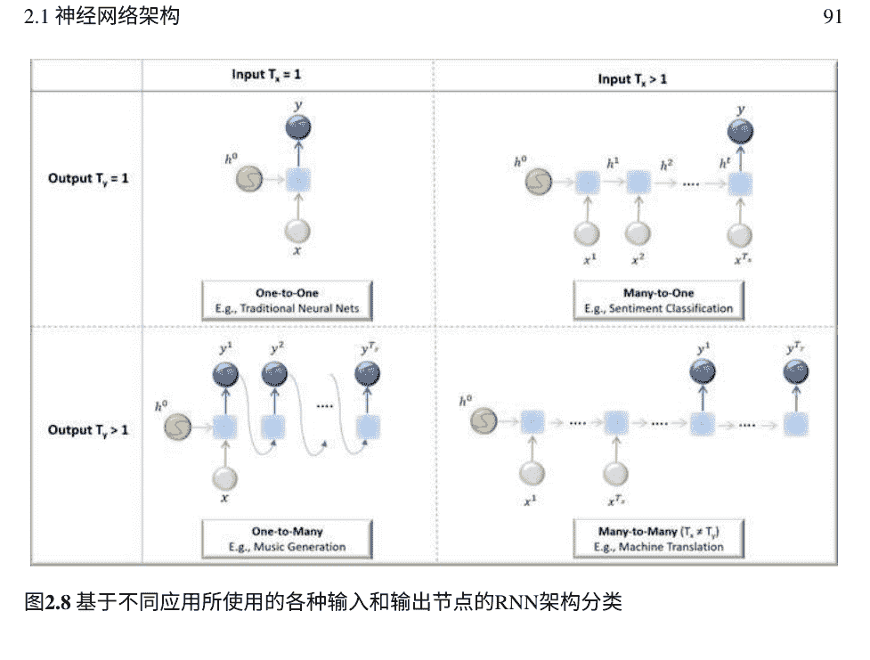

需要注意的是，输出门的输出是时间步t的隐藏层输出，而不是最终的目标输出。输入门（公式2.31）、遗忘门（参考公式2.32）、输出门（公式2.33）和自回归记忆单元或神经元（公式2.35）是LSTM的四个基本组件。在没有外部输入的情况下，自回归连接权重为1.0确保了记忆单元的状态在时间步之间保持不变。LSTM记忆单元中的门的功能如下：

- 1. 输入门 (Γ_i):允许阻止信号或改变内存单元的状态。
- 2. 输出门 (Γ_o):允许阻止内存单元的状态或影响其他神经元。
- 3. 遗忘门 (Γ_f):通过允许内存单元记住或忘记其过去状态来调节自回归连接。

检查门操作的数学表示和内存单元作为隐藏单元时生成的隐藏单元输出值。

前三个方程与方程2.20类似， σ表示将输出压缩在范围(0, 1)之间的sigmoid激活函数。 这样做是为了区分门值0以阻止一切和值1以允许一切通过。 输入符号 x^t ∈ R^{n×d}，隐藏状态变量 h^{t-1} ∈ R^{n×j}和批量大小 n与我们之前为隐藏单元和批量大小指定的符号 jh和b n类似。

$$\Gamma_i^t = \sigma \left( W_{xi} * x^t + W_{hi} * h^{t-1}(x) + b_i \right) \quad (2.31)$$

$$\Gamma_f^t = \sigma \left( W_{xf} * x^t + W_{hf} * h^{t-1}(x) + b_f \right) \quad (2.32)$$

$$\Gamma_o^t = \sigma \left( W_{xo} * x^t + W_{ho} * h^{t-1}(x) + b_o \right) \quad (2.33)$$

$\Gamma_i^t$表示方程2.31中的输入门， $\Gamma_f^t$表示方程2.32中的遗忘门，而 $\Gamma_o^t$表示方程2.33中的输出门。输入门、遗忘门和输出门的权重和偏置参数分别由下标 x_i, x_f,和 x_o给出。 现在，我们首先将 $\Gamma_c^t \in R^{n×j}$作为方程2.34中的候选记忆单元进行介绍，其计算方式与上述方程类似。在方程2.35中，区别在于使用了取值范围为(-1,1)的Tanh激活函数来控制记忆单元 c^t的记忆或遗忘机制。 在这种情况下，与输入和循环单元对应的权重参数分别为 $W_{xc}$和$W_{hc}$，偏置参数为 $b_c$。

$$\Gamma_c^t = tanh \left( W_{xc} * x^t + W_{hc} * h^{t-1}(x) + b_c \right) \quad (2.34)$$

LSTM中的机制包括内存单元中的两个门，类似于GRUs中的机制：输入门 $\Gamma_i^t$通过候选内存 $\Gamma_c^t$调节新数据的量，遗忘门调节当前计算中旧的内存单元的保留。通过使用逐元素向量乘法，我们得到以下更新的方程式在方程式2.35中：

$$ c^t = \Gamma_f^t \cdot c^{t-1} + \Gamma_i^t \cdot \Gamma_c^t $$

最后，使用tanh激活函数在方程式2.36中计算隐藏层输出 $h^t \in R^{n×j}$:

$$ h^t = \Gamma_o^t \cdot tanh(c^t) $$

方程式2.36的输出可以通过softmax层传递，以获得当前块的目标输出。从前面的方程式中我们可以看出，对于任何时间戳，记忆单元都知道从先前状态中忘记什么（即 $\Gamma_f^t \cdot c^{t-1}$）和从当前时间戳中考虑什么（即 $\Gamma_i^t \cdot \Gamma_c^t$）。请参考下图，了解记忆单元的块原理图，以更好地理解上述数学计算。

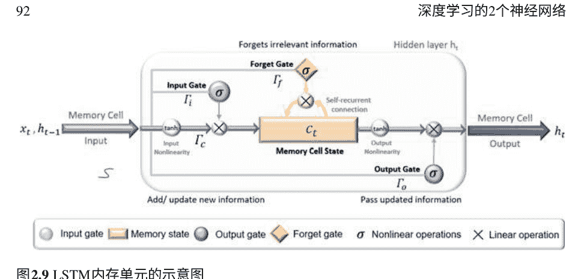

我们现在知道RNN网络在长度可变的输入输出序列中表现良好，具有强相关性。即使“纯粹”的CNN在序列学习方面不太有效，研究人员已经找到了使用它们进行预测任务的方法（Dauphin等，2017年）。这凸显了在本章中包含CNN以及深入探讨其如何获得流行的重要性。

### 2.1.4 卷积神经网络

CNN，或者ConvNets（LeCun等人，1989年），处于生物学、数学和计算机科学的交叉路口，是一种特殊的神经网络拓扑结构，已经在深度学习领域引起了轰动。CNN受人类视觉系统启发，在2012年的ImageNet挑战赛（Krizhevsky等人，2012年）中变得流行起来。为了处理类似网格拓扑的数据，大部分与图像相关的挑战已经被成功地转化为序列数据。这可以是表示在1D网格上的时间序列数据，也可以是像素排列在2D网格上的图片。在深度学习领域已经有将近十年的时间，这些神经网络架构的变种引起了几乎所有可能领域的兴趣，包括图像分析、物体识别、文档解析、执法、推荐系统、智能导航和其他复杂的图像分类问题。虽然RNN为语音到深度学习应用奠定了基础，但CNN在多个应用中有效地提供了视觉能力，特别是在各种计算机视觉任务中。

> 突出显示
> - 翻译的差异性表明相关的图像特征可以出现在不同的位置。
> - 旋转的差异性表明特征可能在图像中具有任意的方向。
> - 尺度的差异性表明图像特征可能以不同的尺度和裁剪方式存在。
> 请参考图3.3以了解差异性的背景。

考虑到你已经得到了两个相似的图像，并被要求确定它们是否不同。 你会采取什么步骤来完成这个任务？ 通常情况下，你会尝试将图像分成较小的部分，并识别各种元素、形状和边缘。 然后，你会比较图像的属性，并收集信息，最终确定给定对的不相似性。 类似的方法使用人工神经网络处理大型、丰富的结构一直以来都令人失望，直到现在。我们只是将数据压缩成一个单向向量，消除了每个图像输入的空间特征，因为网络对输入特征的顺序不敏感，并将其输入到一个全连接的多层感知机中进行预测。 输入顺序不变性的问题可能可以通过直观地使用循环神经网络来解决，但是对图像处理的先验知识要求利用紧密像素之间的相互连接和保持空间信息来设计一个高效的图像类数据网络。 任何我们采用的策略都不应过分关注特征在二维网格中的实际位置，而应利用任何规定特征之间相互作用的先验结构。

本节重点介绍专门设计用于此目的的网络，通过比较隐藏层中的像素值来进行知识传播，其模式类似于卷积层或特征提取层，以在给定图像中找到特征，并通过完全连接层或预测层来压缩数据以产生决策。CNN是最适应性最强的模型之一，有效地定制了图像和非图像数据（表2.2）。为了解网络在深度学习研究人员中的高潜力以及为什么它表现得如此出色，我们将从网络的基本构建模块开始，即：

- 特征与图像组件（如边缘、边框、形状、纹理、物体和圆形）相关。
- 卷积核是使用卷积从输入数据中提取有意义的信息或特征的小矩阵。例如，这可能是一个流行的3×3 Sobel滤波器，用于边缘检测。滤波器矩阵的形式通常是方形的，并且取决于要提取的特征类型。
- 卷积是一种计算机视觉技术，使用可学习的卷积核从图像中捕捉特征，形成特征图。换句话说，卷积核在图像上像素点一一滑动，每个像素点组进行卷积核和图像的逐元素相乘。它只是一个表示积分的简单形式，将一个函数的重叠移动到另一个函数上，以提供加权线性组合的图像，同时保持空间结构完整。

- 池化允许在连续的空间区域中聚合信息，通过在像素级别执行操作来减少派生特征图的维度。从技术上讲，池化核在图像上移动。使用最大池化、平均池化或求和池化等技术，只选择一个像素进行进一步处理，降低计算负担，控制过拟合，并提供空间不变性。
- 步幅是卷积操作期间内核窗口在图像上移动的速率。
- 填充是图像扫描中的一个重要概念，因为它扩展了图像的区域，以便进行更准确的分析。在图像边界周围插入具有特定像素值的额外像素，以确保图像维度在重复卷积过程中保持不变。零填充和均值填充是最常见的。
- 扁平化是将2D/3D生成的特征图转换为1D向量的操作。
- 非线性激活函数为神经网络添加非线性，允许堆叠大量卷积和池化块以提高模型深度。

在网络中添加卷积层时，我们需要指定滤波器的数量。在更高层次上，卷积层通过滤波器检测图像数据中的这些模式。较高层次的细节由前几个卷积层处理。网络越深，模式搜索变得越复杂。例如，在后面的层次中，滤波器可能会检测到嘴唇、眼睛、头发或鼻子等特定对象，最终可能是人类、猴子等等。卷积层中的神经元通常不是与前一层的完整神经元堆栈相连的，而是与捕捉图像局部特征的一簇神经元相连。我们现在也明白，将整个图像作为输入层的输入，或者仅使用三通道矩阵的每个颜色值作为网络的输入特征（例如，256像素×256像素×3个通道=196,608个连接，仅对于第一个密集层的一个神经元），会导致参数过多，使得网络的优化变得困难。

表2.2 不同变体的神经网络比较

|          | 人工神经网络 | 循环神经网络 | 卷积神经网络 |
|----------|--------------|--------------|--------------|
| 通用数据类型 | 表格数据     | 序列数据     | 图像数据     |
| 参数共享 | ×            | √            | √            |
| 空间关系 | ×            | ×            | √            |
| 循环关系 | ×            | √            | ×            |
| 消失和爆炸梯度 | √            | √            | √            |

需要大量的训练数据。这也不适用于图像中的许多变化参数，因为存在平移和旋转的差异。更直观的学习强调在图像中较小的特征，以对抗差异问题，并大幅减少网络中可训练参数的数量。这是因为我们不需要将神经元连接到单个像素，而是基于内核大小连接到小区域。

#### 好好思考一下

#### 当我们使用全连接层与卷积层时，实际发生了什么？

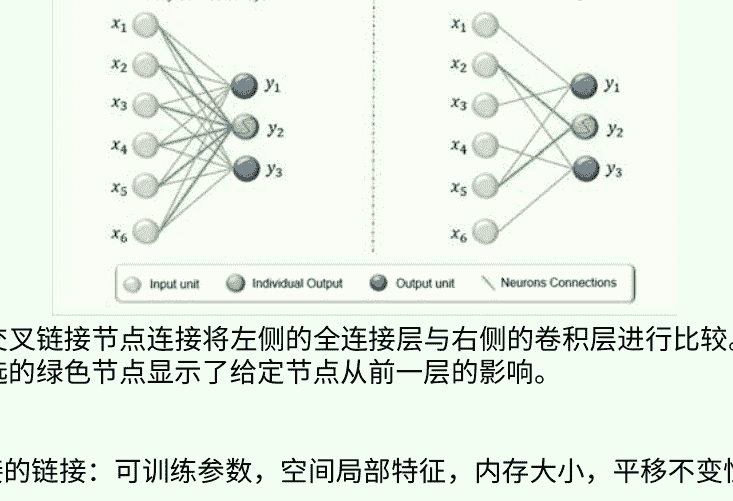

图交叉链接节点连接将左侧的全连接层与右侧的卷积层进行比较。所选的绿色节点显示了给定节点从前一层的影响。

-   连接的链接：可训练参数，空间局部特征，内存大小，平移不变性。

我们从所有CNN的基本操作开始，即卷积，然后深入讨论填充，步幅和每层多个通道的细节。由于CNN将在整本书中广泛涉及，理解卷积操作至关重要，它是任何CNN的核心。在深入研究2D图像卷积之前，我们将使用一个非传统但直观的方法来数学定义1D卷积。

##### 2.1.4.1 1D卷积

考虑一个随时间波动的任意股票。对于具有相应股票价格的时间步长 $t_1, ..., t_T$ 的时间排序数据可以表示为 $\{t_i; x_i; i = 1, 2, ..., T\}$。这也是最常见的等间隔时间点的情况，其中时间步长的差异被视为时间差异可以有不同的尺度。但是，对于等间隔数据，我们可以忽略绝对时间步信息，而将其表示为长度为N的一维序列 $\{x_1, x_2, ..., x_T\}$。图2.10a显示了股票。

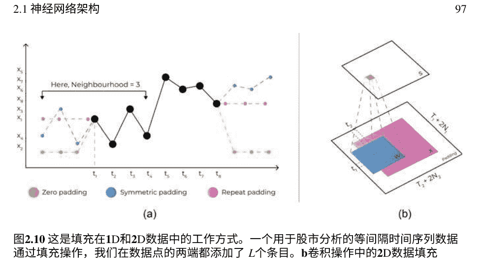

图2.10 这是填充在1D和2D数据中的工作方式。一个用于股市分析的等间隔时间序列数据通过填充操作，我们在数据点的两端都添加了L个条目。b卷积操作中的2D数据填充

价格数据可以被认为是由信号分量 $s_i$ 和噪声分量 $\xi_i$ 组成的，表示为 $\{x_i = s_i + \xi_i; i = 1,2,...,T\}$。为了找到N邻域（空间信息）中所有价格的平均值 $x_t$，即2N+1个价格的平均值 $\{x_{t-N}, x_{t-N+1}, ..., x_t, ..., x_{t+N-1}, x_{t+N}\}$，应用方程2.37。

$$
\frac{1}{2N+1} \sum_{n=-N}^{N} x_{t+n} = \frac{1}{2N+1} \sum_{n=-N}^{N} s_{t+n} + \frac{1}{2N+1} \sum_{n=-N}^{N} \xi_{t+n} \quad (2.37)
$$

为了去噪数据集并从方程2.37中提取信号，可以做出两个合理的假设：

-   1. 信号 $s$ 相对平滑，
-   2. 误差 $\xi$ 具有零均值分布。

对于改进的近似，该假设对方程2.37有两个影响：

$$
\frac{1}{2N+1} \sum_{n=-N}^{N} \xi_{t+n} \approx 0 \quad (2.38)
$$

-   另一方面，增加 $N$ 对受邻近值影响的信号 $s_t$ 有相反的效果。

$$
\frac{1}{2N+1} \sum_{n=-N}^{N} s_{t+n} \approx s_t \quad (2.39)
$$

解决这个问题的方法是在N邻居中引入具有较高权重的加权平均值到 $x_t$ 的元素，以接近 $x_t$ 附近的元素，引入方程2.40中的非均匀权重 $w_n$:

$$
s_t = \sum_{n=-N}^{N} w_n x_{t+n}, \quad w_n = \frac{N+1-|n|}{(N+1)^2}, \quad n=1,2,...,N \quad (2.40)
$$

如果你还在想它与卷积有什么关系，我们很快就会通过上述的方程式2.37来解决它。观察定义变量的范围，我们可以看到w是一个长度为2N+1的序列，x是一个长度为T的序列，s是由 $s=w*x$ 表示的序列，它的长度和范围与x相同。但是我们如何在序列的开头和结尾进行卷积操作呢？要在那里进行卷积操作，我们需要序列时间范围之前和之后的值。要解决这个问题，我们必须在序列的两端添加N个数据点，以便对于所有的 $t \in [1,T]$， $t \in [-N+1,T+N]$，存在 $x_i$，如图2.10b所示，这被称为填充。

该知识可以进一步扩展到2D卷积，表示为方程2.41。

$$
s_{t_1, t_2} = \sum_{n_1=-N_1}^{N_1} \sum_{n_2=-N_2}^{N_2} w_{n_1, n_2} x_{t_1 + n_1, t_2 + n_2}, \quad \{t_1 \in I_1, t_2 \in I_2\} \quad (2.41)
$$

其中，w是一个 $(2N_1 +1) \times (2N_2+1)$ 的权重或卷积核矩阵，x是一个 $I_1 \times I_2$ 的矩阵，在填充后变为 $(I_1 + 2N_1 ) \times (I_2 + 2N_2)$，并且 $s_t$ 对于所有的 $t_1 \in [-N +1,1 + N]$， $t_2 \in [-N +1,2 + N]$，都有定义。

### 2.1.4.2 2D 卷积

现在我们更好地理解了操作，让我们来谈谈图像的2D卷积。图像通常被认为是一个具有 [行 × 列] 像素的2D数组，像素的值范围从 [0 − 255]，或者是一个具有 [行 × 列 × 通道] 的3D数组，其中包含红色、绿色和蓝色（RGB）像素亮度的复杂组合，像素的值范围从 [0 − 255]。在案例研究中，将在灰度图像上使用2D卷积操作，从特征提取器的隐藏单元中提取特征。

如前所述，还有一维卷积用于等间距的时间序列数据（也可以参考图2.10a），而三维卷积通常用于RGB图像。

方程2.41可以看作是方程2.42中具有隐藏单元和偏置的矩阵的更具代表性的形式，我们在多层感知机（MLPs）中学到了这一点（第2.1.2节）。重要的是要记住，我们只在输入 $X$ 中使用平移不变性的概念，通过将权重 $W$ 和偏置 $B$ 约束为与 $(i, j)$ 像素位置无关。

这是卷积操作如何计算隐藏状态 $H$ 的方式，基本上是通过加权邻近的像素来计算 $(i, j)$ 的。

$$[H]_{i,j} = B + \sum_{a} \sum_{b} [W]_{a,b} [X]_{i+a, j+b}$$ (2.42)

我们不仅成功地将平移不变性引入了计算中，而且与典型的基于一对一权重对应的图像像素的MLP权重相比，我们还大大降低了权重参数。也就是说，

最后，基于前面给出的假设，在本节中，我们将应用第二个原则——局部性——来限制在源 $(i,j)$ 的近邻中对重要信息的加权。这意味着在指定范围外加权矩阵的权重为零，从而得到下面的方程式2.43。

$$[H]_{i,j} = B + \sum_{a=-\Delta}^{\Delta} \sum_{b=-\Delta}^{\Delta} [W]_{a,b} [X]_{i+a, j+b}$$ (2.43)

这是两个函数之间的重叠/卷积的数学表示在方程2.44中，记为 $(f, g): R^d \to R$ 在离散空间中，有一个小的符号变化 $(i - a, j - b)$。这个符号在方程2.44和2.42中很容易匹配，然而，方程2.42在上面的定义准确描述了交叉相关特性。

$$(f * g)(i, j) = \sum_{a} \sum_{b} f(a, b) g(i - a, j - b)$$ (2.44)

同样，对于三通道彩色图像，卷积滤波器可以定制用于每个像素位置的多维输入 $[X]_{i,j,k}$。对于输入的形式化，简单地将三阶张量添加到隐藏表示中的直观技术不是一个好主意。换句话说，我们正在寻找每个空间点的整个隐藏表示向量。类似于输入中的通道的概念，这可以被视为在二维网格中的一组隐藏表示的堆叠，以表示后续层中隐藏表示学习到的特征的空间化集合，称为特征图。较低的层更直观地与输入相关联。一些通道可能被训练用于检测边缘，而其他通道可能被训练用于区分纹理。方程2.45中的第四个张量坐标可以用于整合对输入和隐藏表示的多个通道的支持。这是一般情况下用于多个通道的卷积层的表示。

$$[H]_{j, K} = B \sum_{a=-\Delta}^{\Delta} \sum_{b=-\Delta}^{\Delta} \sum_{c} [W]_{A, B, C, K} [X]_{I+A, J+B, C}$$ (2.45)

最后，当我们揭开CNN中的学习过程时，我们必须注意到网络的流程与ANN中的神经元操作不同，其使用的权重和偏置也不同。

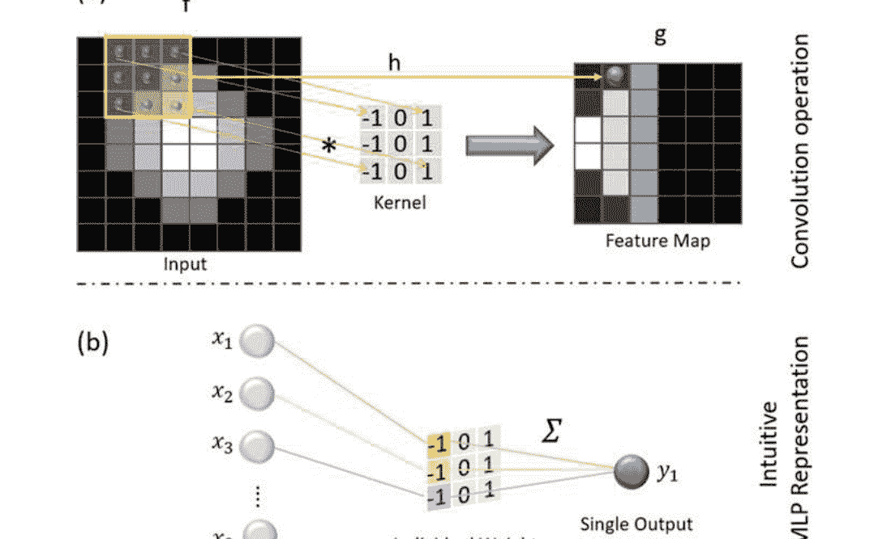

图2.11 CNN网络的卷积过程。一个3×3的卷积核操作在图像上滑动，步长为1，得到提供的特征图。B对于给定的单个输出，可以将上述卷积核过程直观地类比为ANN中9个神经元的输入。

但是CNN不是使用固定的卷积核，而是使用可学习的卷积核。在图2.11中，我们以类似于前馈网络中神经元操作的表示形式呈现了卷积过程，以便于初步理解。卷积层的输出特征图通常通过ReLU激活函数进行处理，以赋予模型非线性特性，类似于早期网络中使用非线性函数来获得函数的通用逼近。否则，线性函数的加权组合将用于线性映射。手头的问题将决定选择哪种非线性函数。

#### 突出显示

-   CNN的特征特点是：
    1.  该网络有助于提取空间特征，以较小的块或特征图的形式。
    2.  CNN使用可学习的滤波器捕捉这些空间特征，而无需明确从输入数据中指定它们。
    3.  CNN还采用了参数共享的概念，使用相同的滤波器在图像的不同区域上生成特征图。
    4.  该网络还能有效处理梯度消失/爆炸的问题。
    5.  张量的卷积操作在GPU核心之间实现了简单的并行计算。
    6.  CNN被认为在计算上是高效的，因为它们需要比ANN更少的可训练参数。
    7.  CNN在实现SOTA模型方面显示出了样本效率，从而在1D序列数据、图结构数据和推荐系统上出现了有效的应用。
    8.  池化是减少计算量并使模型对扭曲和变化具有容忍性的重要步骤。
    9.  CNNs具有比全连接网络更少的参数，这有助于减少过拟合。

为了更好地理解CNN中的传播步骤，特别是我们之前所学到的前向传播和反向传播知识，我们可以给出一个大致的蓝图，描述包括我们需要遵循的步骤：

#### ■第1步：通过卷积层进行前向传播。

我们首先通过随机初始化一个滤波器权重矩阵 $w^l$，将其水平和垂直地翻转180°（如图2.12b所示），并以相等且有限的步长滑动到前一层的输入变量 $h^{l-1}$（如图2.12a所示）。使用不同的卷积核重复该过程以获得所需的特征图 $x^l$。

图2.12c描述了CNN中的权重参数共享和稀疏连接的概念。输入和卷积层之间的颜色代码表示相同颜色的卷积核权重的分布。方程式2.46表示原始维度 $H \times W$ 的输入 $x_{i,j}$ 的卷积方程式：

$$x_{i, j}^{l}=\sum_{a} \sum_{b} w_{a, b}^{l} h_{i+a, j+b}^{l-1}+b_{i, j}^{l}$$

其中，$h_{i, j}^{l}=\sigma(x_{i, j}^{l})$ 表示卷积的第 $l$ 层，具有核权重 $w_{a, b}$ of dimension $K_1 \times K_2$ 和偏置 $b^l$ 是该层的偏差。$h_{i, j}^{l}$ 是通过激活函数 $(\sigma)$ 将输入传递到该层后的输出向量。

在这个阶段，我们将尝试理解CNN层卷积块的具体细节。随后，从卷积层检索到的值将传输到全连接层，形成最终的预测。由于全连接层层和反向传播学习只是典型的神经网络操作，之前提到的数学可以用来构建整个网络的学习方程。输出以类似的方式传输，使用导数的链式法则来计算 $\delta \mathcal{L} / \delta w$，其中包括两个参数——权重和偏置，用于密集层，然后通过卷积块进行传播，其中滤波矩阵作为参数。

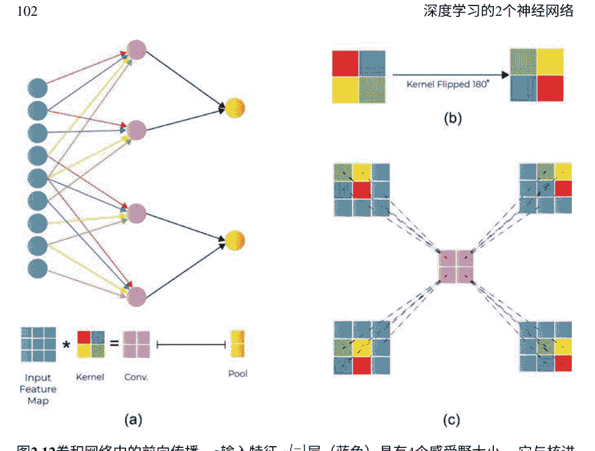

图2.12 卷积网络中的前向传播。a输入特征 $x^{l-1}$ 层（蓝色）具有4个感受野大小。它与核进行卷积以生成中间的卷积特征图。这里展示了稀疏连接的思想，核只与输入层中的4个相邻神经元连接，然后进行池化。b卷积操作中水平和垂直翻转的核映射。c3×3样本输入特征图中各个区域的核权重分布。

#### ■步骤2：评估网络优化的误差函数。

假设总共有 $k$ 个预测，网络的输出 $y_k$ 与其对应的目标输出 $y_k$ 进行比较，使用MSE进行计算。学习通常通过将梯度下降算法应用于损失函数 $\mathcal{L}$ 在方程2.47中实现：

$\mathcal{L} = \frac{1}{2} \sum_k (y_k - y_k)^2$ (2.47)

#### ■步骤3：通过卷积层反向传播误差。

对于反向传播，让我们将学习简化为两个更新参数。从改变单个像素的影响开始，比如说，$w_{a_0,b_0}$（也参见图2.13a）

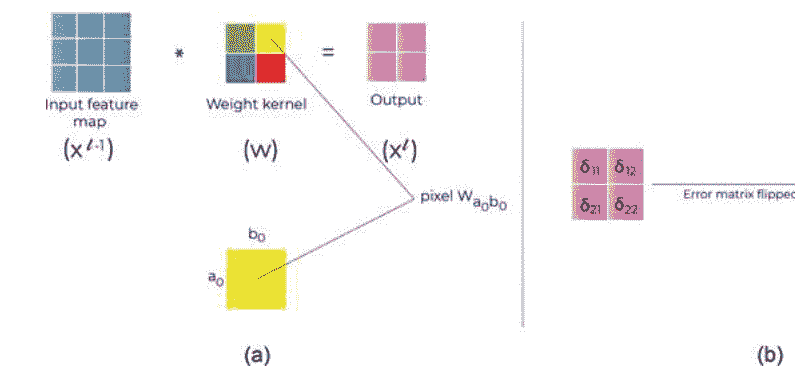

在应用链式法则到单个核权重时，核权重对损失函数 $\mathcal{L}$ 的贡献 $\delta \mathcal{L}/\delta w_{a_0,b_0}^l$ 如公式2.48中所示：

$$\frac{\delta \mathcal{L}}{\delta w_{a_0,b_0}^l} = \sum_{i=0}^{H-k_1} \sum_{j=0}^{W-k_2} \frac{\delta \mathcal{L}}{\delta x_{i,j}^l} \cdot \frac{\delta x_{i,j}^l}{\delta w_{a_0,b_0}^l}$$ (2.48)

公式2.46中的前向传播确保了权重核的贡献 $w_{a_0, b_0}$ 对于核元素之间的所有重叠产品，假设维度为 $k_1 \times k_2$ 和输入特征图的维度为 $H \times W$。这表明相应的核像素对于输出特征图的所有元素都有影响，其大小为 $(H - k_1 + 1) \times (W - k_2 + 1)$。

上述方程中的第二个偏导数项可以使用方程2.46中的表达式在方程2.49中进行展开，使用通常的符号表示：

$$\frac{\delta x_{i,j}^l}{\delta w_{a_0,b_0}^l} = \frac{\delta}{\delta w_{a_0,b_0}^l} \left( \sum_a \sum_b w_{a,b}^l h_{i+a, j+b}^{l-1} + b_{i,j}^l \right)$$ (2.49)

进一步展开方程2.49中的求和 $w_{a, b}^l h_{i+a, j+b}^{l-1}$，使用偏导数得到除了当 $a = a_0$ 和 $b = b_0$ 时，所有项的值都为零。

$$\frac{\delta x_{i,j}^l}{\delta w_{a_0,b_0}^l} = \frac{\delta}{\delta w_{a_0,b_0}^l} \left( w_{a_0,b_0}^l h_{i+a_0, j+b_0}^{l-1} \right) = h_{i+a_0, j+b_0}^{l-1}$$ (2.50)

将方程2.50代入方程2.48得到方程2.51中的双重求和，表示卷积过程中网络中的权重共享。求和表示收集与第 $l$ 层输出对应的所有梯度 $\delta_{i, j}^{l}$。梯度的互相关表达式转化为类似于前向传播中翻转滤波器的卷积表达式，如图2.12b所示。应用于获取新权重集合的卷积操作在图2.14b中表示，具有 $2 \times 2$ 的卷积核权重以便于表示。

$$\frac{\delta \mathscr{L}}{\delta w_{a_{0}, b_{0}}^{l}} = \sum_{i=0}^{H-k_{1}} \sum_{j=0}^{W-k_{2}} \delta_{i, j}^{l} h_{i+a_{0}, j+b_{0}}^{l-1} = rot_{180^{\circ}} \{\delta_{i, j}^{l}\} * h_{a_{0}, b_{0}}^{l-1} \qquad (2.51)$$

在图2.14a中，重建过程使用了以图2.13b中数学定义的形式中的delta $\delta_{i, j}^{l}$:

$$\delta_{i, j}^{l} = \frac{\delta \mathscr{L}}{\delta x_{i, j}^{l}} \qquad (2.52)$$

这将引导我们计算第二个参数 $\delta \mathscr{L}/\delta x_{i_0, j_0}^{l}$，它代表了个别像素变化对输入特征图 $x_{i_0, j_0}^{l}$ 的影响，影响了损失函数 $\mathscr{L}$ 在方程2.53中。在图2.15中，观察到输入像素 $x_{i_0, j_0}$ 影响了上下对角线角点像素所界定的输出区域，分别为 $(i_{0} - k_{1} + 1, j_{0} - k_{2} + 1)$ 和 $(i_{0}, j_{0})$。所界定的输出区域

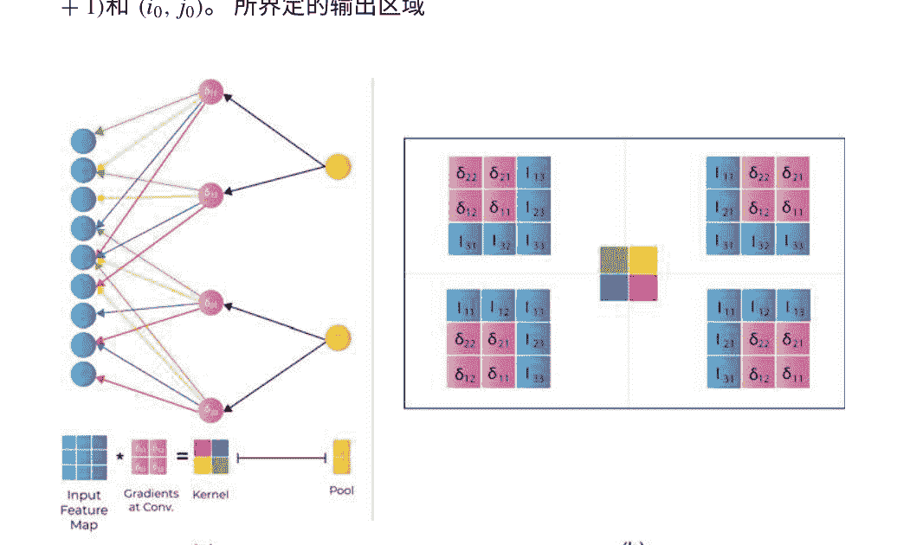

图2.14 反向传播操作的概述。a一个反向传播梯度生成($\delta_{11}, \delta_{12}, \delta_{21}, \delta_{22}$)通过网络向后传递。b卷积操作用于生成标记为粉色的新权重集合，用于输入特征图

在图2.12c中由虚线表示的是受单个像素输入 $x_{a_{0},b_{0}}$ 影响的像素在输入特征图中。这在以下方程中使用链式法则表示：

$$\frac{\delta \mathcal{L}}{\delta x_{i_0,j_0}^{l}} = \sum_{a=0}^{k_1-1} \sum_{b=0}^{k_2-1} \frac{\delta \mathcal{L}}{\delta x_{i_0-a,j_0-b}^{l+1}} \frac{\delta x_{i_0-a,j_0-b}^{l+1}}{\delta x_{i_0,j_0}^{l}} = \sum_{a=0}^{k_1-1} \sum_{b=0}^{k_2-1} \delta_{i_0-a,j_0-b}^{l+1} \frac{\delta x_{i_0-a,j_0-b}^{l+1}}{\delta x_{i_0,j_0}^{l}} \quad (2.53)$$

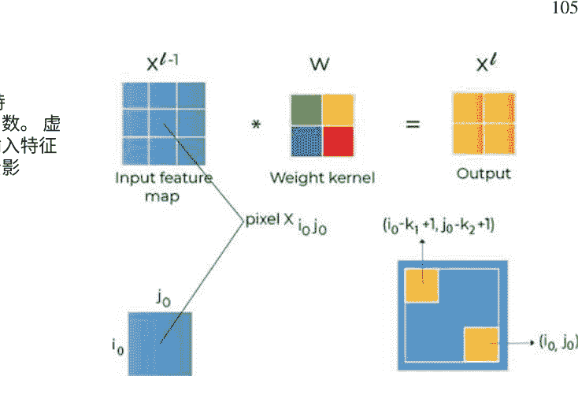

图2.15 一个示例单个像素变化 $x_{i_{0},j_{0}}$ 在输入特征图中影响损失函数。虚线框表示受蓝色输入特征图中匹配单个像素影响的输出区域

其中有界区域的范围从 $i_{a_{0}}-0$ 到 $i_{a_{0}}-(k_1-1)$ in 高度，并且从 $j_{b_{0}}-0$ 到 $j_{b_{0}}-(k_2-1)$ in 宽度。由于a和b在相似的范围内，即 $0 \le a \le k_1-1$ 和 $0 \le b \le k_2-1$，我们可以简单地表示方程中的求和为 $i_{a_{0}}-a$ 和 $j_{b_{0}}-b$。将方程2.53类似于方程2.49展开得到：

$$\frac{\delta x_{i_0-a,j_0-b}^{l+1}}{\delta x_{i_0,j_0}^{l}} = \frac{\delta}{\delta x_{a_0,b_0}^{l}} \left( \sum_{a_0} \sum_{b_0} w_{a_0,b_0}^{l+1} \sigma \left( x_{i_0-a+a_0,j_0-b+b_0}^{l} \right) + b^{l+1} \right) \quad (2.54)$$

再次，使用偏导数展开求和结果为零，除非 $a_0 = a$ 和 $b_0 = b$ 使 $\sigma \left( x_{i_0-a+a_0,j_0-b+b_0}^{l} \right)$ 转换为 $\sigma \left( x_{i_0,j_0}^{l} \right)$ 和单个权重 $w_{a,b}^{l+1}$。这给出了以下简化的方程式2.55。

$$\frac{\delta x_{i_0-a,j_0-b}^{l+1}}{\delta x_{i_0,j_0}^{l}} = \frac{\delta}{\delta x_{a_0,b_0}^{l}} \left( w_{a,b}^{l+1} \sigma \left( x_{i_0,j_0}^{l} \right) \right) = w_{a,b}^{l+1} \sigma' \left( x_{i_0,j_0}^{l} \right) \quad (2.55)$$

最后，将方程式2.55代入方程式2.53中，得到以下表达式，我们使用翻转的卷积核来表示反向传播学习中的卷积。 请注意，前向传播和反向传播的推导取决于网络中通过的传播层。

$$\frac{\delta \mathcal{L}}{\delta x_{i_0, j_0}^l} = \sum_{a=0}^{k_1-1} \sum_{b=0}^{k_2-1} \delta_{i_0-a, j_0-b}^{l+1} w_{a,b}^{l+1} \sigma'(x_{i_0, j_0}^l)$$
$$= \delta_{i_0-a, j_0-b}^{l+1} * rot_{180^{\circ}}\{w_{a,b}^{l+1}\} \sigma'(x_{i_0, j_0}^l) \quad \quad (2.56)$$

#### 突出显示

池化层基本上有助于逐渐减小特征图的空间大小，以限制网络中的参数和计算量。 这也有助于缓解过拟合，可以使用最大池化、平均池化或潜在的L2范数池化来实现。

值得注意的是，池化层不涉及学习（LeCun等人，1989年）。 池化层与卷积序列中神经元的大感受野大小相结合，可以实现网络的平移不变性。 池化层的反向传播基本上计算了前向传播期间索引的单个获胜单元所得到的损失，减少了N×N块的大小。 例如，平均池化将错误的1/（N×N）倍分配给池化块的所有单元。 与此同时，最大池化只将错误传递给单个获胜单元，并将零分配给块中没有贡献的单元。

#### 卷积神经网络的挑战：

卷积神经网络从图像中提取空间特征。 图像中像素的排列和它们之间的关系被称为空间特征。 它们帮助我们准确地识别一个物体，它的位置以及它与图像中其他实体的关系。
然而，卷积神经网络最重要的一个方面是模型对以前未见过的数据的泛化能力（表2.2）。 本章没有提供选择特定应用的完美卷积神经网络的任何指南。 卷积神经网络的研究正在以极快的速度前进。 每隔一周或一个月，可能会引入一个新的针对特定基准的最新架构，这使得坚持使用特定变体的做法变得不切实际。 最好的架构可能由本节中提到的构建模块组成，但它们经常面临过拟合、梯度爆炸和类别不平衡等挑战。

网络通常需要大量的训练数据，通常通过数据增强来获得。 为了对抗过拟合，可以采取控制措施，如引入正则化、简化架构复杂性和使用了早停法。通过梯度裁剪、网络重新设计和各种激活函数来解决梯度爆炸、溢出或NaN损失值的问题。与CNN和NN相比，训练中的类别不平衡一直是一个重要障碍。处理真实世界数据中的差异是计算机视觉中的另一个挑战。通常，图像中的对象可能具有不同的角度，光照条件的变化，旋转，缩放以及非对比度的背景，这使得模型难以识别对象。此外，CNN在对抗攻击和空间学习曲线方面存在局限性。如果元素的空间位置被置换，模型无法解读它们之间的关系。

这是因为缺乏像人类视觉皮层这样的坐标框架，无法理解输入数据中各个组件的整体图像。这将在GNN中讨论。

有趣的，卷积神经网络（CNN）与灵长类动物的视觉皮层之间的关系缺乏实际的完整性。即使是复杂的最先进的CNN模型也可能被难以察觉的微小、明确设计的扰动所欺骗，这使得将网络层映射到视觉系统并理解其缺点变得困难。虽然准确拦截视觉皮层神经反应的预测并理解大脑感知到的运动活动（Cichy和Dwivedi 2021）很困难，但我们对CNN的特征空间与视觉皮层的空间域的确切映射缺乏适当的知识。

## 2.1 神经网络架构

##### 2.1.4.3 LeNet

LeNet（LeNet-5）可以说是由Yann LeCun引入的第一个发表的CNN，其主要目的是识别MNIST数据集中的手写数字，以便在ATM上处理存款（LeCun等人，1998年）。该网络由（i）两个卷积编码块（具有5 × 5的卷积核，sigmoid激活和2 × 2的平均池化操作，步长为2，将空间维度降低了四倍），和（ii）三个完全连接的密集块执行分类任务。后来发现ReLU和最大池化在这种架构下表现更好。

虽然这种架构的实现相对于现代深度学习框架来说非常简单，但该网络在1990年代因其与支持向量机相比的竞争性能而受到了重视。然而，在1990年代初和2012年的分水岭算法之间，机器学习方法经常优于神经网络。这是因为该网络在处理高分辨率图像和对大量对象类别进行分类时的损失和准确性计算效率低下。

就计算机视觉而言，卷积网络的比较有点不公平。尽管缺乏计算加速器、数据规模较小、缺少神经网络训练技巧和昂贵的传感器，但原始或轻度处理的像素值与手工设计的特征提取进行了比较。在聪明的特征提取思想的支持下，端到端的算法学习经常被放在次要位置。直到2012年，工程师才开始设计一套新的特征表示方法-仍然使用突出的方法（如尺度不变特征变换（SIFT）（Lowe 2004a）、视觉词袋（BoW）（Sivic和Zisserman 2003；Csurka等2004）、方向梯度直方图（HOG）（Dalal和Triggs 2005）和加速鲁棒特征（SURF）（Bay等2006））机械地完成了管道的一个关键部分，即特征提取。

另一组研究人员认为，合理复杂的分层特征学习需要多个连接的可学习层。事实上，AlexNet在2012年作为ImageNet挑战的突破性成果被引入，这归功于两个主要因素（i）大规模数据集的可用性——ImageNet，以及（ii）图形处理单元（GPU）的硬件加速能力。我们将在本章后面对CNNs采取更广泛的视角，并有趣地观察到，增加学习中的参数并不总是导致模型的更高准确性。

##### 2.1.4.4 反卷积神经网络

到目前为止，我们看到的大多数卷积和池化层要么减少输入的空间维度（高度和宽度），要么保持不变。当执行特定任务，如语义分割时，我们希望结果与输入在相同的3D位置上。为了实现这一点，必须对中间特征图的空间维度进行上采样，这需要上采样和转置卷积。

为了实现这一点，使用反卷积神经网络（Deconv-Nets）。它们基本上是以与卷积相反的方式工作的CNN，用于逆转下采样操作。这被称为分数步幅卷积（Dumoulin和Visin 2016）。在反卷积或转置卷积中，卷积核在输入张量上进行卷积，将输入元素广播到结果张量中，从而替换中间张量的一部分。最后，这些中间张量相加在一起，使最终输出的尺寸大于输入的尺寸。图2.16展示了反卷积的工作原理。

在Decov-Net中，转置卷积层同时进行卷积和上采样。值得注意的是，上采样没有可以训练的参数。它通过根据它们的大小重复图像数据的行和列来工作。该函数由Conv2DTranspose表示，并且它接受参数：滤波器数量，滤波器大小，步幅。与传统卷积网络中应用于输入不同，填充和步幅是针对中间张量（即输出）而不是输入指定的。例如，步幅必须保持与输入相同的空间维度。增加步幅会使中间张量以及结果张量在空间上变大。这是一个重要的前提，导致了自编码器网络（第2.1.5节）的发展，它可以在保持空间维度的同时从高维数据中学习低维表示。

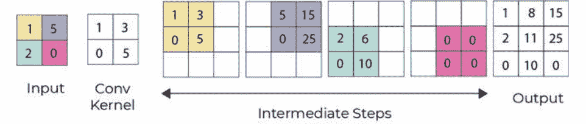

### 2.1.5 自编码神经网络

自编码器神经网络（AE NNs）是一种令人惊讶的简单类型的ANN，利用无监督学习技术来进行表示学习。我们可以将这个编码器-解码器架构看作是一个前馈网络，试图学习一个恒等函数（即，接受一个输入x并预测x本身）。为了使这个过程变得非平凡，我们在网络中引入了一个比输入维度更小的瓶颈层。这强制对原始输入特征进行压缩和后续重构，有效地将输入压缩成一个良好的表示。如果各个输入特征是独立的，知识编码将会很复杂。然而，如果输入特征之间存在相关性，瓶颈层就是一个关键属性，强制网络利用高维数据的降维，并在低维空间中学习关系。

如果你对这种身份映射函数的必要性感到困惑，可以将其视为一种压缩形式（即，减小文件大小），类似于音频文件中的mp3压缩或图像中的JPEG压缩。这种方法以无监督的方式学习抽象特征，可以有效地应用于监督任务。在最简单的形式中，每个层中具有线性激活的AE网络应该观察到与主成分分析（PCA）中观察到的相同的维度降低。

然而，由于网络中激活的非线性性质，它们在学习复杂映射到非线性流形方面比子空间更高效。这是一种非线性输入特征降维的方法。通常在AE中使用ReLU（修正线性单元）和sigmoid激活函数作为非线性。

存在各种各样的AE架构，包括稀疏AE，去噪AE，对比AE或序列AE。受限玻尔兹曼机（RBM）也类似于具有绑定权重的AE，只是单位被随机采样，而AE不是概率模型。然而，有一种类似AE的概率模型被称为变分自动编码器（VAE），它需要一些高级数学，并将在本书中讨论。

当我们揭开AE的组成部分的神秘面纱时，我们将利用从CNN中学到的思想来在编码器块中编码知识表示。AE主要由三个部分组成：

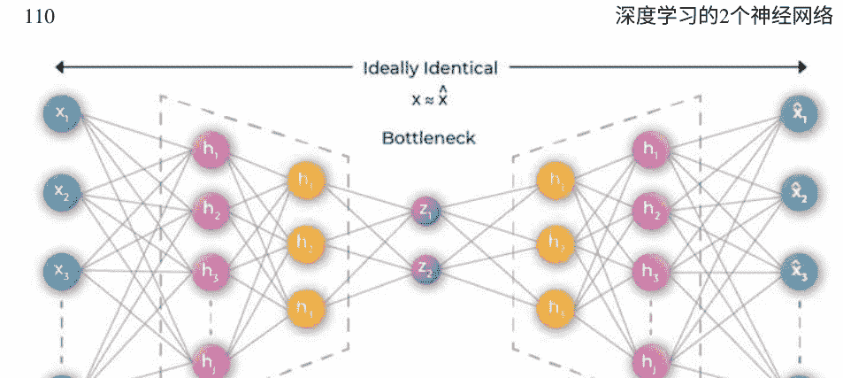
图2.17一个具有2个单元的自编码器的架构设计，尝试在编码器块中压缩输入 \( g_{\theta} \)，并在解码器块中上采样低级表示 \( f_{\phi} \) 以获得最终的输出表示

- 1. 编码器是由卷积模块和池化块组成的，它将输入数据压缩成几个维度较小的低维信息，并由所谓的“瓶颈层”进行编码。
- 2. 瓶颈层是这个神经网络中最高贵的块，具有讽刺意味的是，它是最小的。它充当一个阀门，只允许最重要的信息从编码器传递到解码器。这是封装输入的知识表示的层，有助于建立各种输入特征之间的有用关联。请记住，瓶颈层旨在捕获图像所具有的最大信息。因此，它的维度越小，过拟合的风险就越低。然而，一个非常小的瓶颈会限制信息的存储，增加关键信息从编码器的池化层中泄漏的可能性。因此，该层的大小也作为网络中的正则化项。
- 3. 解码器是一组上采样和卷积模块，用于重构编码的瓶颈知识。它试图通过从输入到块的压缩潜在属性中减少噪音来构建原始图像。

正如我们所看到的，图2.17表示编码器和解码器的对称网络架构，它们是彼此的镜像。这并不意味着网络权重也需要如此。了解网络学习的特征和原因是令人兴奋的。

由于自动编码器在训练过程中基于发现的输入特征向量进行数据压缩，因此它们通常只能重构与训练过程中学习到的观察类似的数据。这种特性在自动编码器在降维、图像和音频去噪、信息检索、图像修复和异常检测等领域得到利用。虽然像欠完备自动编码器或稀疏自动编码器这样的自动编码器变体在计算机视觉中没有大规模应用，但在VAE的瓶颈层中使用参数化分布也可以用于从模型生成图像和时间序列数据，例如音乐以及其他重型应用，自从其在2013年被提出以来（Kingma和Welling 2013）。

- 理想的自动编码器的权衡平衡是什么？
1.  对输入具有足够的敏感性，以准确重构映射。
2.  对输入具有足够的不敏感性，以限制模型在训练数据上的记忆或过拟合。

这种平衡迫使网络仅学习特征的变化，以重构输入而不保留输入中的冗余信息。

网络的理论背景在第一眼看起来相对简单，所以我们将简要介绍一下。这个网络成功的挑战部分是使它们从输入中学习有意义的表示。

基本上，我们可以将一个无标签的数据集视为一个监督学习任务，以输出从原始输入`x`重构的`x`。使用两个函数实现的广义非线性压缩的潜在空间映射。

■步骤1：将原始数据编码为较小的潜在空间。
编码器块基本上将原始数据 `x^{(i)}` 具有 `(i)th`个输入特征，映射到瓶颈层中的潜在空间维度，由 `z^{(j)}` 表示，具有 `(j)th`维度。编码器中的映射由 `φ: X → Z` 表示，该空间具有连接编码器块和中间瓶颈的权重矩阵 `w_e`，偏置 `b_e`和非线性激活函数 `σ_φ`。在等式2.57中使用该块，如下所示：

```
z^{(j)} = σ_φ(w_φ x^{(i)} + b_φ)                (2.57)
```

■第2步：将编码的潜在空间解码为目标输出。
解码器块将潜在属性映射回目标输出重建 `x^{(i)}` 在这种情况下与输入函数相同。我们用类似的方式表示解码器函数为 θ : Z → X，但可能具有不同的连接中间瓶颈层和解码器块的权重矩阵 w_θ，偏置 b_θ和激活函数 σ_θ。

$$x^{(i)} = \sigma_\theta(w_\theta z^{(j)} + b_\theta) \quad (2.58)$$

请注意，解码器的权重、偏置和激活单元通常是编码器块的镜像，但不总是绑定到相同的值。

#### ■第3步：评估网络优化的误差函数。

自动编码器的目标是生成尽可能接近输入特征 x^{(i)} 的输出 x^{(i)}。这使得编码器-解码器网络的整体映射为(θ, φ) : X → X，其中网络可以通过最小化重构损失 L 来进行训练。该损失衡量了原始输入和生成的重构输出之间的差异。通常，在网络中计算k个特征图的L-2误差，如公式2.59所示：

$$L(x^{(i)}, x^{(i)}) = \frac{1}{2} \sum_i \sum_k (\hat{x}_k^{(i)} - x_k^{(i)})^2 \quad (2.59)$$

#### ■第4步：通过AE的误差函数进行反向传播。

数学为堆叠简单的AE创建深度AE提供了一个良好的起点。在训练算法中，使用前馈网络的标准反向传播算法来微调AE的权重和偏差。这种技术被称为逐层预训练。在深度AE中，解码器层被两个或更多新层替换，而编码器和瓶颈层保持不变。网络的旧 z 层成为新层的输入，例如 z2, z3。

同时，堆叠层的最终输出成为最终新输出解码器层的输入。不同的堆叠方法提供了AE的变体。

对于大多数情况，这涉及到制定一个对输入敏感的重构损失函数 L，并添加一个第二个正则化项，以防止网络进行记忆或过拟合。因此，用于反向传播优化网络以在两个目标之间获得最优解的梯度算法可以表示为 L(x^{(i)}, x^{(i)}) + (h)。标准AE的变体包括对这两个目标的施加和以不同方式微调权衡。

例如，L1正则化在方程2.60中，KL散度在方程2.61中是衡量每个训练批次隐藏层激活的两种方式，通过向损失函数添加正则化项来调用稀疏性约束，惩罚稀疏自动编码器中过度激活的情况。

$$L(x^{(i)}, x^{(i)}) + \lambda \sum_k |a_k^l| \quad (2.60)$$

## 2.1 神经网络架构

其中，λ是可调参数的缩放，a_i^l是第l层观察k的激活单元向量。

```
L(x^{(i)}, x^{(i)}) + \sum_j \text{KL}(\rho || \rho_j)
```

在这里，ρ是神经元平均激活的稀疏参数，通过一组样本计算。

期望值是对隐藏层的所有节点计算的，如ρ_j = 1/k ∑_i [a_i^l]，其中j表示层l中的特定神经元，对k个训练观察的激活求和。本质上，通过约束神经元在一组样本上的激活，我们鼓励神经元在一部分观察中被触发，通过比较理想分布ρ的KL散度与所有隐藏层节点上的观察分布ρ。两个具有伯努利随机变量分布的变量的KL散度可以重写为等式2.62，如下所示。

```
L(x^{(i)}, x^{(i)}) + \sum_j \rho \log \frac{\rho}{\rho_j} + (1-\rho) \log \frac{1-\rho}{1-\rho_j}
```

#### 自动编码器的挑战

自动编码器通常被认为是两个神经网络的组合：一个编码器和一个具有数据清洗能力的解码器块。它将输入转化为最密集的表示形式，但它不是一种适用于所有情况的工具，面临着许多应用挑战。该网络以无监督模式运行，从数据中学习而不是人类提供的标签。这通常需要大量且噪声较少的数据集，以学习数据的有意义表示。除了大量的训练数据外，数据还必须与使用案例相关，因为该网络和许多其他算法都是数据特定的。这意味着自动编码器学习和重现输入特征的能力仅限于可用的训练数据。

在将输入特征馈送到自动编码器之前，引入噪声、添加专门的应用正则化和使用不同的无监督技术对输入特征进行分割，可以改善算法的稳定性。大多数情况下，网络很难理解应用的相关属性。创建一个好的自动编码器是一个试错过程。

此外，由于系统压缩退化，网络容易出现显著的性能损失。即使研究人员试图积极剪枝问题空间以减少损失，解码器的过程也永远不完美。确定重构输出中可容忍的损失是至关重要的。

##### 2.1.5.1 变分自动编码器

变分自动编码器（VAEs）（Kingma和Welling 2013）首次在2013年提出，作为GNN的重要组成部分。虽然自动编码器作为将原始数据输入压缩为显著维度的隐藏表示，但变分自动编码器是具有数据编码附加约束的生成算法。这个想法是，规范化的隐藏表示使得变分自动编码器能够像自动编码器一样压缩数据，并像生成对抗网络一样生成合成数据。我们将很快详细讨论生成对抗网络。值得注意的是，在许多情况下，变分自编码器生成的数据仍然模糊不清；与GAN通过生成精细、细致的图像相竞争。

> **好好思考一下**

**对于好奇的读者，他们试图找到自动编码器（AE）和内容生成之间的联系。**

也许很容易相信，一旦自动编码器（AE）被训练好了，我们可以从编码器的潜在空间中随机选择一个点，并解码它以生成新的内容，如果潜在空间足够规则的话。在这种情况下，网络的解码器将充当生成对抗网络（GANs）的生成模型（见第2.1.6节）。然而，很难事先保证编码器会在没有任何重构损失的情况下规则地编码潜在空间。自动编码器（AE）的空间规则性取决于数据的分布、编码器的架构和隐藏的潜在空间的维度。一般来说，高维编码中的无信息损失编码将导致显著的过拟合，解码时生成无用的内容。自动编码器（AE）仅仅是在最小化损失的同时进行编码和解码训练，而不管潜在空间的排列方式如何。因此，潜在空间的规则性是自动编码器（AE）中一个更普遍的问题，需要考虑。因此，除非明确地进行正则化，网络必须依赖于训练过程中过拟合的概念可能性来完成其任务。

VAE的基本思想是在训练过程中对编码分布进行正则化，以确保潜在空间学习到良好的属性并生成一些在图2.18中呈现的良好结果。编码-解码过程的活动与标准自编码器稍有不同。在这里，输入被编码为潜在空间上的分布，而不是单个点。这个潜在空间分布被用来随机选择一个样本供解码器模型使用，从而实质上强制实现了一个平滑、连续的潜在空间表示。这表明附近的潜在空间值应该对应于类似的重构。方程2.63表示网络的损失函数，由两个项组成。第一项惩罚重构误差（或最大化重构的可能性），而第二项是一个正则化项，鼓励学习到的分布 q_{\phi}(z|x) 更接近真实的先验分布 p_{\theta}(z)。假设该分布是高斯分布。网络的架构设计如图2.19所示。

##### 图2.18图形化地说明了知识编码从离散潜在特征属性转移到VAE的概率潜在特征分布的变化（左侧为AE，右侧为VAE）

$$ℒ(θ, φ) = -E_{z∼q_φ}[P_θ(x|z)] + D_{KL}(q_φ(z|x)||p_θ(z)) \ (2.63)$$

> **突出显示**
对于VAE，编码器有时被称为识别模型，而解码器被称为生成模型。

### 2.1.6 生成对抗网络

我们现在已经学会了无数种模拟具有智能人类行为的判别算法的方法。如果有人怀疑神经网络算法不能成为创造性的艺术家，VAE通过展示基于逻辑的创造力证明了他们是错误的。生成对抗网络（GANs）是一个重要的突破，与AI社区以往所见的任何东西都不同，由一位当时不知名的博士研究员Goodfellow和他的团队（Goodfellow等人，2014年）引入。从高层次来看，GANs是一种算法架构，使用两个神经网络——一个生成器和一个判别器，以对抗竞争的方式工作。这些是对于生成逼真的新数据非常有用，这些数据与训练数据的基本分布非常相似。

> > “生成对抗网络是机器学习领域最有趣的想法之一，过去十年中最有趣的想法。”
>
> —— Yann LeCun, Facebook AI主任

由于生成对抗网络在专业艺术应用方面的广泛应用，它们很快就开始引起公众的关注。 2018年，一个经过训练的生成对抗网络在一万五千幅真实肖像画中生成了一幅名为“*Edmond de Belamy*”的杰作（Schneider和Rea 2018）。以432,500美元的巨额拍卖成交额，在全球范围内引起了轰动，使AI艺术进入公众视野。 2019年，NVIDIA发布了其StyleGAN网络的源代码（Abdal等人2019），使公众可以按需生成虚假面孔。 在随后的几年中，对抗网络创建深度伪造的潜力引起了很多关注。 深度伪造是一种合成的虚假音频和视频，其逼真程度足以被认为是真实的。 例如，政治人物的恶作剧像野火一样传播开来。 事实上，这引起了人们对媒体操纵和虚假新闻问题日益增加的担忧。

#### 生成建模的特征

生成建模属于无监督学习的范畴，其中基于训练输入数据的分布和模式进行合成数据生成。 它们可以分为以下几类：

- 1. 给定一个标签，它们估计相关的特征（比如朴素贝叶斯）。
- 2. 给定一些特征，它们估计其余的特征，比如修复或填充（填充）。
- 3. 给定一个隐藏的代表，它们估计相关的特征（VAE，GAN）。

有趣的是，朴素贝叶斯是一个常常被用作判别模型的生成模型的例子。 给定一个样本，它计算每个变量的可能的个别结果。它结合独立概率来预测最可能的结果。 在这里，它总结了每个输入和输出类别的概率分布。 作为一个生成模型，它反向工作，从每个变量的概率分布中生成新的独立特征值。

其他流行的生成模型包括潜在狄利克雷分配（LDA）、高斯混合模型（GMM）、基于深度学习的方法如深度置信网络（DBN）和受限玻尔兹曼机（RBM）。

GAN的不同变体已经被开发出来，在各种问题领域中实现了生成逼真的示例。它们能够生成合成的高保真音频，从而改善语音翻译。为了增强复杂的领域特定数据集，它们从训练样本中学习并生成合成图像。可以从低分辨率视频中捕捉到的细节生成高分辨率帧，或者可以预测视频中的下一帧。

> 好好思考一下

**GAN和VAE之间的区别？**

两者都是深度生成模型，即它们对训练数据的分布进行建模以生成示例。然而，这些模型在训练方式上有所不同。自编码器通过半监督学习从原始数据中学习相关信息的较低空间维度表示。它们在重现训练数据中的某个样本的同时，通过最小化损失函数进行训练。另一方面，GAN以对抗性的方式优化两个损失函数，以产生与训练数据更加逼真和视觉上相似的样本。然而，GAN的无监督学习与复杂的双损失函数设计相比，训练速度要慢得多。

在我们深入研究数学之前，让我们熟悉一些在GAN学习过程中经常使用的符号。图2.20展示了具有适当符号的生成器和判别器块的GAN网络概述（表2.3）。

##### 2.1.6.1 判别器

判别器模型是一个二进制且被充分理解的分类模型。该模型旨在正确地识别出真实经验训练数据中的伪造生成样本。判别器的整体思想是清楚地理解生成的数据。返回一个图像是否有噪声或无噪声的概率预测，在值范围0到1之间。接近1的值表示实际图像，而0表示伪造图像。判别器的学习反馈被迭代地馈送给生成器，以提高其性能。

从数学上讲，它试图估计一个样本来自训练数据而不是生成模型的概率。给定输入x，模型学习条件概率分布p(y|x)（即给定x的情况下y的概率），以正确地将输入分类为相应的目标y。尽可能地。它不太关心数据是如何生成或分布的，例如逻辑回归和支持向量机。

| 符号表示 | 目的 |
| --- | --- |
| x | 提供用于训练的训练样本或真实数据 |
| z | 噪声或潜在向量 |
| $p_{\text{数据}}(x)$ | 整个训练样本的原始数据分布 |
| $p_g(z)$ | 整个训练样本的生成数据分布 |
| D(x) | 判别器对真实输入样本x的概率评估，即，$p(y|x\ \text{真实} \rightarrow \{0,1\}$ |
| G(z) | 由生成器模型为随机伪造种子z生成的伪造数据 |
| D(G(z)) | 判别器对伪造样本G(z)的概率评估，即，$p(y|x\ \text{伪造} \rightarrow \{0,1\}$ |
| $E_x$ | 所有真实训练样本的期望值 |
| $E_z$ | 对生成器的所有随机输入的期望值 |
| $V(G, D)$ | G和D之间的损失/错误值函数 |

在鉴别器模型训练期间，目标是正确分类来自真实数据（即y=1）的数据（即x）是否为真。在这里，鉴别器在方程2.64中寻求对真实数据的损失函数的高值。

$$ \mathcal{L}_D-\text{real} = \mathcal{L}(D(x), 1) = \mathbb{E}_{x\sim p_{\text{数据}(x)}} [\log(D(x))] \tag{2.64} $$

同样，鉴别器努力将生成器生成的假数据G(z)分类为假，理想情况下为零（即y=0）。这给出了方程2.65中的假数据的损失函数，鉴别器努力最大化该函数。

$$ \mathcal{L}_{D-fake} = \mathcal{L}(D(G(z)), 0) = \mathbb{E}_{z \sim p_g(z)}[\log(1 - D(G(z)))] \tag{2.65} $$

在这里，我们用一个非常通用的符号来表示某个函数的损失，告诉我们两个函数参数之间的距离或差异，这将在方程2.64中求和。如果你对这个感觉很像二元交叉熵或KL散度，那么你已经对此有了相当好的理解。

现在，对于给定的固定判别器 D(.)和固定生成器 G(.)（即固定参数或模型），判别器网络希望在方程2.66中最大化 V(G, D)。

$$ \mathcal{V}(G, D) = \frac{1}{k} \sum_{i=1}^{k} \mathcal{L}(D(x^i), 1) + \mathcal{L}(D(G(z^i)), 0) = \max_{D} [\log(D(x)) + \log(1 - D(G(z)))] \tag{2.66} $$

##### 2.1.6.2 生成器

生成器模型捕捉数据分布，并旨在尽可能误导判别器。它以随机潜在噪声向量作为输入。在训练期间学习了某些特征后，它输出经过某些变换的合成数据。这在方程2.67中表示。从数学上讲，它试图通过将生成的图像错误标记为真来欺骗判别器。给定输入 x，模型应该从联合概率分布P(x,y) = p(x|y).p(y)中学习p(x|y)（即给定标签 y的特征 x的概率），以从目标 y生成类似的输入和其标签。在这里，它关心训练数据的分布情况，以学习生成 x的能力，例如朴素贝叶斯。

如果生成器无法生成接近实际图像以欺骗鉴别器，则会受到惩罚。最终，生成器的目标是欺骗鉴别器，而鉴别器则力求超越生成器的准确性。

$$ \mathcal{L}_{G} = \mathcal{L}(D(G(z)), 1) = \mathbb{E}_{z \sim p_g(z)}\log(1 - D(G(z))) \tag{2.67} $$

对于固定的鉴别器，生成器试图最小化与方程2.66中所示的相同的 V(G, D)。然而，值得注意的是，我们分别为生成器和鉴别器定义了损失函数。这是由于梯度的陡峭性质 y = log x相对于其对应的 y = log(1 - x)，当 x为零时。这意味着试图最大化log(D(G(z)))的尝试，将比最小化log(1 - D(G(z)))更快地产生更大的改进。

$$ V(G, D) = \min_G \max_D [\log(D(x)) + \log(1 - D(G(z)))] \tag{2.68} $$

##### 2.1.6.3 组合损失优化

将两个网络的损失函数结合起来，得到模型的最终损失，这遵循了一个极小-极大零一博弈。 请记住，方程式2.68中的损失函数适用于单个数据。 因此，我们在方程式2.69中进行期望，以考虑整个训练数据。 得到的表达式就是值函数V(G, D)，与Goodfellow等人（2014）的原始论文中描述的一样。

$$ V(D, G) = \min_G \max_D [ \mathbb{E}_{x \sim p_{\text{数据}}(x)} \log(D(x)) + \mathbb{E}_{z \sim p_g(z)} \log(1 - D(G(z))) ] \tag{2.69} $$

这个基本网络函数的训练是为了实现理想的 \min_G \max_D V(D, G)，可以使用标准的迭代随机梯度下降学习规则来近似进行。 在这里，两个网络的极小-极大训练的一行式表达呈现了模型之间的对抗性质。在方程式2.70中，通过对方程式2.69关于D(x)的偏导数进行计算，可以得到最优的D和G。

$$ \frac{p_{\text{数据}}(x)}{D(x)} + \frac{p_g(x)}{1 - D(x)} = 0 \tag{2.70} $$

重新排列项给出了最优判别器 $D_{opt}(变量)$ 在方程2.71中的条件。

$$ D_{opt}(x) = \frac{p_{\text{数据}}(x)}{p_{\text{数据}}(x) + p_g(x)} \tag{2.71} $$

请注意，上述方程在数学上和直观上都很重要。 这是因为对于一个高度真实的样本，我们期望概率数据(变量)接近1，而概率_g(变量)收敛到0。 这使得最优判别器将1分配给该样本。 然而，对于一个生成的伪样本，变量 = G(变量)，我们期望判别器将0分配给该样本，因为概率数据(G(变量))趋近于零。 然而，实际上计算最优判别器 $D_{opt}$是困难的，因为概率数据(变量)是未知的。

接下来，为了训练生成器，我们假设鉴别器是固定的，在这里使用了等式2.71的最优鉴别器。 将表达式代入值函数（等式2.69）并利用对数和基本数学的性质，我们可以将方程简化为Kullback-Leibler（KL）散度：

$$ V(D_{opt}, G) = -\log 4 + D_{KL} \left( p_{data}(x) \parallel \frac{p_{data} + p_g}{2} \right) + D_{KL} \left( p_g \parallel \frac{p_g + p_g}{2} \right) \tag{2.72} $$

这样做是为了将表达式表示为Jensen-Shannon（JS）散度（见附录A.6）。将等式2.72中的最优值函数表示为等式2.74中的JS收敛形式，得到：

$$ D_{JS}(p_{data}(x)||p_{g}(x)) \tag{2.73} $$

当网络达到最优条件时，即 $p_{g}(x)$ 趋近于 $p_{data}(x)$，方程2.73简化为 $-\log 4$ ，因为发散变为零。由于生成器希望最小化上述方程，当方程简化为 $\mathcal{V}(D_{o_{pt}}, G) = -\log 4$时，可以达到最优解。这是最优性的理论解。在实践中，要收敛到 $p_{g}(x) = p_{data}(x)$可能很困难。这有时被称为模型崩溃的条件。这可能 是由以下原因引起的：

- 1. 非唯一的平衡点。
- 2. 尽管存在唯一的平衡点，但迭代方法无法收敛。
- 3. 生成器网络没有足够的参数来指定任何分布（特别是 $p_{data}(x)$），以确保 存在平衡点。
- 4. 训练数据的分布与生成数据的分布之间几乎没有重叠或非常小的共同支持 ，导致学习停滞不前。

总之，最优训练分析旨在将值函数V(D, G)最小化。这意味着原始数据和生成数据之间的概率分布的JS散度收敛到尽可能小的值。这与我们的直觉感 觉一致，即生成器应该学习训练样本中的潜在分布。

> **连接CNN和GAN**
通常，GAN模型处理图像数据，因此普遍使用CNN作为生成器和鉴别器网络。这可能是因为CNN在计算机视觉任务中取得了显著的进展，实现了最先进的结果。其次，建模图像数据意味着为模型训练在潜在空间中提供一种压缩表示。能够以可视化方式查看和访问有助于相对于其他生成模型快速开发GAN模型。

##### 2.1.6.4 条件生成对抗网络

将一些额外的辅助信息输入到生成器和判别器中作为额外的输入层，这是对生成对抗网络（GANs）的一个关键扩展。Mirza等人（2014）提出的条件生成对抗网络（cGAN）是一种训练生成模型的新方法，允许使用条件来控制数据生成过程。这可以基于类标签、特征或来自不同模态的数据。

一个两个玩家的极小极大博弈的目标函数可以表示为方程2.74。这是对原始目标的扩展，加入了一些额外的辅助信息y。为了实现网络的条件控制，这些信息被输入到生成器和判别器模型中作为输入层。这在2014年更多地是一个概念验证，希望进一步探索超参数空间和架构能够帮助它达到或超过非条件结果。当CGAN和深度卷积生成对抗网络（DCGANs）出现时，很快就证明了这一点，它们成为最有影响力的早期GANs之一，激发了大量新的研究应用。

在2017年，pix2pix(Isola等人, 2017)成为了基于cGAN的一项重要的早期应用，彻底改变了图像到图像(I2I)翻译问题。在一年内，其他的GAN变种，如Cycle-Consistent AdversarialNetwork (CycleGAN)，成功超越了pix2pix，并且在没有使用配对训练样本的情况下取得了更好的表现。

$$ \min_G \max_D \mathcal{L}(D, G) = \mathbb{E}_{x\sim P_{\text{数据}}(x)}[\text{对数}(D(x|y))] + \mathbb{E}_{z\sim\mathcal{P}(z)}[\text{对数}(1 - D(G(z|y)))] \tag{2.74} $$

总之，鉴别器验证了关系的真实性x和y，而生成器则着眼于理解如何获得x和生成新特征。在网络训练中，我们总是试图最小化损失函数。在这种情况下，我们应该尽量减小1和生成器中真实数据标签之间的差异。同时，我们还要尽量减小鉴别器对生成的假数据的评估。这是一个迭代的过程，直到G和D网络达到Nash equilibrium。这个过程被称为对抗性训练。在迭代训练过程中，任何一方都可能比另一方更占主导地位。一个占主导地位的鉴别器应该返回接近0或1的值，这使得生成器对梯度的理解变得困难。相反，一个占主导地位的生成器会利用鉴别器的弱点，导致出现假阴性。为了有效实施，使用适当的学习率来平衡两个神经网络的性能至关重要。

#### 生成对抗网络的特征特点是：

- 1. 这些模型在对抗的零和游戏中同时进行训练，直到达到纳什均衡。
- 2. 判别器 $D$作为一个二元分类神经网络，计算真实数据 $D(x)$和伪造数据 $D(G(z))$的损失，并将它们结合起来。
- 3. 生成器 $G$单独计算一个不同的损失目标，与其噪声相关。
- 4. 这两个竞争的损失函数只需要使用反向传播进行训练。
- 5. 在对抗训练中，网络可以生成最锐利的图像。
- 6. GAN的无监督学习方案消除了昂贵的数据标记来训练网络。
- 7. 卷积网络是原始GAN中更明智的替代方案，而不是完全连接的网络。

#### 生成对抗网络的挑战

通常强大的工具都伴随着挑战，并且必须明智地使用。跟进GAN训练中经常遇到的问题是一项艰巨的任务。
在训练过程中，生成器（G）的目标是欺骗判别器（D），使其认为G生成的输出是真实的。如果D没有推动G学习复杂真实世界数据的多样表示，就有很高的机会发生模式坍缩。生成器在生成有限的样本变体时陷入困境，而判别器很难区分它们。重复生成样本结果会导致完全模式崩溃的情况，同时只遵循少数学到的特性和生成结果的有限变体会导致部分模式崩溃。

> > 在深度神经网络中，流行的梯度消失问题在训练GAN时变得更加严重。这是因为网络训练中存在双重反馈循环。除了与真实数据的反馈循环外，判别器的梯度损失也为生成器网络提供反馈。
>
> 这导致训练中的不稳定性。鉴别器变得太弱几乎不提供任何好的反馈给生成器，从而在损失中产生非-显著的反应。相反，如果鉴别器变得太强（即，D(x) -1，D(G(x) =0)，它会将生成器推向零（即，log(1 - D(G(z)) =0），从而使损失曲线的梯度变为零。这将使学习停止。

## 2.1 神经网络架构

在整个网络（GAN）的最佳训练中，G和D之间的非合作博弈使得难以实现纳什均衡。理想情况下，无论G的性能如何，网络希望D既不输也不赢。与其他神经网络训练相比，这很难实现，GAN经常进入梯度下降的稳定轨道，而不是收敛到期望的均衡状态。与其他深度学习技术相比，损失曲线常常具有欺骗性。通常不会应用早停技术，因为指标不能对GAN训练进行适当的评估。因此，视觉检查通常是验证正确训练的常见做法。

最后，对GAN的评估并不是很明显。主要的区别在于生成器和判别器函数的损失。这取决于判别器是否输出概率或者是无界的，以及梯度如何被惩罚和评估。Inception分数（Salimans等人，2016年）和Fréchet Inception距离（FID）（Heusel等人，2017年）是评估模型的一些方法。

### 2.1.7 图神经网络

可以合理地假设，近年来在神经网络（NNs）方面取得的进展，如循环神经网络（RNNs）、卷积神经网络（CNNs）、生成对抗网络（GANs）和自编码器（AEs），在模式识别和大规模数据处理方面取得了快速的研究和技术成功。我们现在了解到深度学习方法如何捕捉欧几里得数据，例如图像、文本或分类数据。这些神经网络期望它们的输入以统一的矩形数组格式呈现，例如对于感知器来说是固定的输入特征，对于卷积神经网络来说是固定大小的网格结构，对于循环神经网络来说是输入-输出时间序列。

不幸的是，图可以具有复杂的拓扑结构，大小不定的无序节点和特征，例如排列不变性，而不像卷积网络那样，模型会以不同的方式感知像素变化。这使得传统网络不适用于这种学习范式。因此，现在是时候将我们的注意力转向处理表示为具有更复杂连接和对象之间的相互依赖关系的图的非欧几里德数据结构了（Bron-stein等人，2017年）。

图在现实世界中无处不在，在多样化的深度学习领域中渗透并提供丰富的信息。因此，了解研究人员如何找到将图数据纳入神经网络学习的方法同样重要，这就是我们所称的图神经网络（GNNs）（Scarselli等人，2008年）。这是解决许多关键任务的强大工具，如假新闻检测（Benamira等人，2019年），推荐系统（Eksombatchai等人，2018年），物理模拟（Sanchez-Gonzalez等人，2020年），交通管理（Guo等人，2020年）和药物发现（Atz等人，2021年）。

令人兴奋的是，理解编码器函数如何能够结合邻域的局部性，聚合知识并通过图层的堆叠使网络计算高效。计算图应该能够获取局部信息，然后使用神经网络进行信息聚合，同时保持无序性。最后，稍微调整一下feedfor-GNN中的消息传播规则通过消息传递封装了神经网络的输入输出信息。

> 突出显示：
置换不变性（Maron等人，2018年）指的是重新排列节点的位置或顺序不应该有差异，只要节点之间的连接保持不变。

以下是关于具有定义的分类法的图形的简要概述，以帮助减少理解GNN的过程的繁琐性。图形是一种自然的方式来表达一组对象及其关系。几乎任何具有链接实体的人、物体和概念都可以使用图形作为强大的可视化工具来处理。
从根本上说，具有顶点/节点（V）和边/关系（E）的图被表示为G =（V, E）。如果节点v_i ∈ V之间存在依赖关系e_{ij} = (v_i, v_j) ∈ E，则将边视为“有向的”，否则将具有相反方向的边对视为“无向的”连接节点。边的方向性使用箭头（→）从v_i到v_j表示为E_v。
最后，图的连通性使用邻接矩阵A ∈ R^{n×n}表示，其中n是节点的数量。这个二进制矩阵的元素通过‘1’（e_{ij} ∈ E）表示相邻节点，通过‘0’（e_{ij} ∉ E）表示不相连的节点。邻接表可以是表示图数据的另一种方式。对称邻接矩阵意味着图是无向的。节点和边可以具有称为节点特征的附加属性X^v。节点的特征向量用x v ∈ R^d表示。

具有边缘特征 X^e的特征是边缘(v, u)通过边缘属性x_{v,u} ∈ R^e来表示。现在我们所需要知道的就是，假设我们在继续学习GNN之前已经熟悉了前馈神经网络。

> 突出显示：
现有的深度学习和机器学习算法的核心假设是实例之间是相互独立的。相比之下，图数据中的实例之间存在相互依赖的链接。这使得图成为可视化和数据表示的强大工具。令人意外的是，通过将文本和图像视为图形来观察它们，我们可以更多地了解它们的对称性和结构（参见第3.2.5.5节）。GNNs在CNNs失败的领域可能能够有效地发挥作用。然而，如果是这样的话，也许值得思考为什么我们不在所有地方都使用GNNs。

#### 好好思考一下

#### 图数据有何不同？

- 1. 图数据具有任意的输入形状和大小这也适用于图像数据类型。然而，图像可以被调整大小、填充和裁剪以输入到网络中，而这在图数据上是没有定义的。
- 2. 同构性是图的一个属性，它表示两个外观不同的图在结构上可以是相同的。在这里，只有节点的顺序发生变化，而属性不变。这也是为什么我们不能直接将邻接矩阵作为前馈网络的输入因为它对节点顺序的变化非常敏感。
- 3. 处理图的算法需要是置换不变的以处理图的同构性属性。
- 4. 最后，图数据具有非欧几里德结构。这也是为什么涉及图的DL领域被称为深度几何学习。

GNN是DL技术的一个子分支，用于直接从图数据的表示中推断数据（表示学习）。它包括节点嵌入的概念，将节点特征和边特征映射到一个低维度的嵌入空间（通常是比图的维度低的空间）。网络将格式化的输入数据转换为节点相关信息和相应关系的向量表示，我们称之为“节点嵌入”。这种嵌入的概念类似于在自然语言处理中使用词嵌入，它将有关术语及其关系的详细信息转换为区分和学习的数值表示结构。这些网络将图知识融入嵌入中，以执行图级别、节点级别和边级别的预测任务。网络模型具有多个中间的消息传递层，这是GNN的核心构建模块。它们负责将节点和边特征组合成节点嵌入。随着GNN的层数增加，后续层重复执行消息传递操作，从邻域中收集信息，并使用聚合函数与前一层的值进行组合。例如，在社交网络分析模型中，第一层聚合用户数据并指导关注者。下一层组合关注者的朋友。因此，GNN的最后一层产生的嵌入是用户数据和图中其他用户信息的向量表示。请注意，层中使用的更新和聚合函数应该是可微分的，以便进行有效的模型学习。

请注意，某些学习问题（图形、节点或边的预测）需要另一种GNN架构的变体。例如，在节点级预测中，我们使用节点的嵌入向量，而图形级预测需要以某种方式组合节点嵌入。或者，我们可以使用汇聚操作将图形压缩为固定大小的向量，并且该表示可以用于运行图形级预测。最后，这些节点嵌入也可以处理边的特征。使用GNN，具有相似特征或上下文的节点将产生相似的结果。

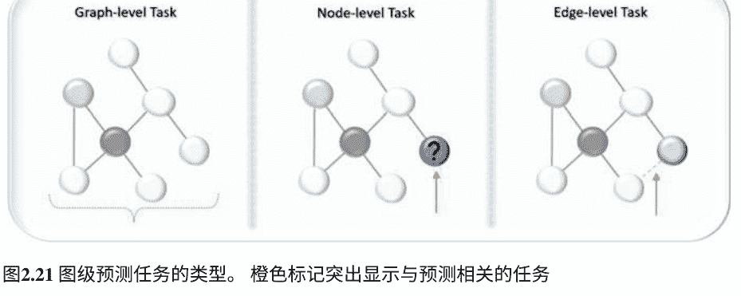

**图2.21 图级预测任务的类型。橙色标记突出显示与预测相关的任务**

在相似的节点嵌入中。因此，相似的图导致相似的图嵌入。嵌入大小是一个超参数，可以与初始节点输入大小不同。

下面提到了不同类型的图级预测任务（图2.21）。

- 1. 图级任务旨在预测整个图的单个属性或特征。这可能涉及不同类别的图分类。例如，给定以图形表示的药物的分子组成，我们需要预测它是否会与疾病的受体结合。这类似于对MNIST数据进行图像分类或对输入语句进行情感分析。其他应用可能涉及基于顶点、边和边距离相似性或基于图的相似性的图聚类和图可视化。
- 2. 节点级任务旨在预测图中个别节点的属性或角色。这可能涉及对部分标记的图进行半监督训练，以确定主题（节点）的标签，从其邻域的信息中进行节点分类。一个著名的例子是Zachary等人（1977年）的空手道俱乐部数据集的社交网络图，其中节点代表个别空手道从业者，边代表这些从业者在俱乐部之外的关系。在这个空手道俱乐部的例子中，在发生政治分歧后，预测问题被认为是将给定成员的忠诚度分类为两个个体之间。这类似于图像分割，试图标记图像中个别像素的角色，或者识别句子中的词性。
- 3. 边级任务旨在预测图中表示的边的关系属性。在这里，算法强调学习图中特定实体之间的连接以进行链接预测。例如，Netflix使用链接预测来推荐新的视频。另一个例子是犯罪关联性预测系统。这些任务类似于图像场景理解或图像标题生成，将关系纳入对象识别或分类之外。

图形可视化是网络、分布式系统、软件工程、生物信息学、数据结构和算法、人工智能、机器人学等许多学科中常见的术语。它是表示有意义网络结构信息的强大方式。许多研究表明，视觉表达是一种更轻松、更有效的信息传达和吸收形式。它显示出发现洞察和获得所呈现数据更好上下文的更高机会。在GNN中，应用处于几何图论（数学）和信息可视化（计算机科学）的交叉点，关注图的可视化表示以研究数据中的结构和异常。

这也是为什么许多GNN应用被称为“几何神经网络”的原因。由于药物发现、假新闻检测、打击金融犯罪、IT运营管理和生命科学的进展，它正在获得越来越多的关注。

**Banach不动点定理（Banach 1922）**（又称为收缩映射定理）首次在1922年提出，可以被视为Picard不动点迭代逼近的抽象表述。它确保了度量空间的某些自映射的不变点（又称为不动点，其中数字 x 属于函数 f（x）的定义域和值域）的存在和唯一性，并提供了一种构造性的过程来找到这些不动点。

不等式定义了收敛的速度。

让我们总结一下图神经网络在监督和无监督学习任务中的数学定义和实现。在这里，我们通常定义一个节点分类任务。这些是Scarselli等人（2008年）首次提出的方程，通常被认为是原始的GNN。请注意，这里呈现的方程式2.75可以以不同的方式简化为几个最小模型（即，最少的变量来定义保持相同计算能力的模型）。然而，这个方程式紧密地代表了邻域的直观概念，并且表达式与本章前面为其他网络指定的表达式在符号上是一致的。这类似于观察到的NN的隐藏状态和输出状态之间的行为。

使用Banach固定点定理以紧凑形式概述模型方程的概述是：

```
O = F(h, x_N)
h = f(h, x)      (2.75)
```

在这里，O、h、x 和 xN 是通过堆叠所有输出、状态、嵌入和节点嵌入向量计算得到的，分别来自于方程2.76。在方程2.75中，F是全局输出函数，它定义了输出的生成方式，f是F的堆栈版本的全局过渡函数，分别在方程2.76中定义。然而，周等人（2020）列出了原始GNN架构的三个主要限制：

- - 如果“固定点”的假设被放宽，利用MLPs学习更稳定的表示并消除迭代更新过程是可行的。因为在上述提出的架构中，不同的迭代使用了过渡函数 f 的确切参数，而MLP不同层的不同参数允许分层特征提取。
- 它无法处理边缘信息（例如，知识图中的不同边缘可能表示节点之间的不同关系）。
- 固定点可能会抑制节点分布的多样化。因此，学习表示节点可能不合适。

已经提出了几种GNN的变体来解决这些问题。我们将在第4.4节中讨论它们。但首先，我们只讨论基本的GNN学习。

- - 第1步：在图上进行前向传播。层之间的消息传递导致图的节点嵌入。这里，x_v, x_{v,i}, h_{ne[v]} 和 x_{ne[v]} 是节点特征的标签，连接边特征，邻居节点的嵌入和邻居节点的特征。附加到每个节点的状态 h_n 包含了 v 附近的邻域信息，并且该表示可以用于生成输出 o_v，即等式2.76中的决策。

```
o_v = F_l(h_v, x_v)
h_v = f_l(x_v; x_{v,i}; h_{ne[v]}; x_{ne[v]})
(2.76)
```

其中，方程2.76中的F_l是局部输出函数，f_l是局部转换函数，依赖于邻近节点 n。

然后，我们可以按照学习方案来适应F_l和f_l，使用训练样本进行迭代过程来计算状态：

```
h^{(k+1)} = f(h^{(k)}, x)
(2.77)
```

方程2.77表示h的第k次迭代的计算，根据Banach固定点定理，可以指数级快速收敛到一个解，同时可以使用Jacobi迭代方法来求解非线性方程，迭代定义如下：

```
o_v^{(k+1)} = F_l(h_v^{(k)}, x_v)
h_v^{(k+1)} = f_l(x_v; x_{v,i}; h_{ne[v]}^{(k)}; x_{ne[v]}), v ∈ N
(2.78)
```

- 第2步：定义学习的损失函数。GNN的学习涉及估计参数θ，使得fθ近似于学习数据集中的目标标签y。学习过程基于梯度下降，损失优化可以是等式2.79中的L1损失L的任务。在这里，F_i和f_i可以解释为全连接前馈神经网络。

$$\mathcal{L} = \sum l_n = \sum_{i=1}^k (y_i - y_i) \quad (2.79)$$

我们还可以在图中定义一个可测量的目标，表明靠近目标节点的节点之间的距离具有很高的重要性，即如果节点的距离 d_1 < d_2，则可测量的目标可以通过重新排列方程式来量化为损失函数 d_1 - d_2 < 0。因此，损失函数可以相应地进行配置，考虑到连接节点的所有可测量目标，并对 E取平均值：

$$\mathcal{L} = \frac{\sum d_u - d_v}{|E|^2}, \quad 其中，\{d_u < d_v\} \in E; \quad (2.80)$$

上述方程2.80是通过前向传播网络中每一层的消息传递来收集节点位置的最终表示并计算损失得到的。然后将这个损失进行反向传播，使模型了解出错的地方，并重新迭代过程以达到目标。

- 第三步：使用梯度下降法进行损失的反向传播。反向传播遵循与链式法则相似的趋势，以区分损失对学习权重的导数。在这里，重要的是考虑到过渡函数'f'和输出函数'F'对于x和θ是连续可微的。

x和θ。在这里，我们不会深入推导出长而复杂的数学方程，这些方程可以在文献中找到，以获得更全面的知识。

> 突出显示

总结一下，GNNs在节点预测任务中的学习策略应遵循以下步骤：

1. 使用公式2.78迭代更新状态 $x_v^{(k)}$，直到时间T，使得 $x_v^{(T)} \approx x$ 成为一个固定点解的公式2.75。计算学习曲线的梯度 $\delta l_\theta^{(T)}/\delta\theta$。
3. 通过反向传播梯度来更新权重 $\theta$。

现在，我们更能够理解一些术语，如消息传递、置换不变性，以及不同任务所需的信息聚合和更新的变体。这取决于所需的输出目标、训练设置和指定任务的损失函数。相关的流程在图2.22中有很好的总结。现在，我们将学习应用

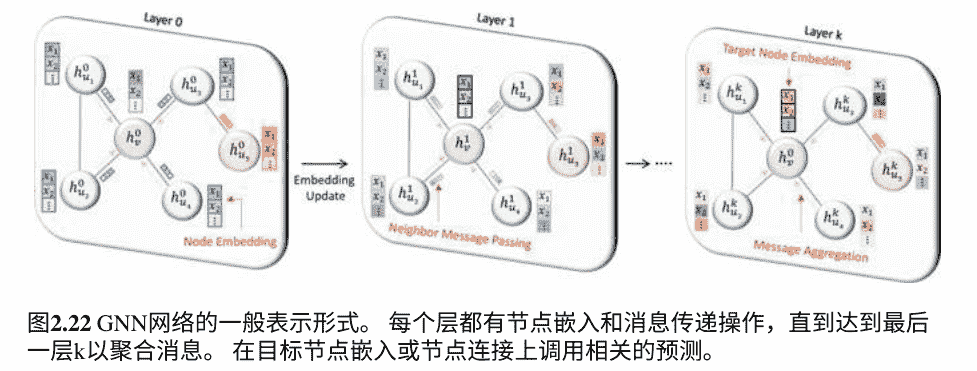

图2.22 GNN网络的一般表示形式。每个层都有节点嵌入和消息传递操作，直到达到最后一层k以聚合消息。在目标节点嵌入或节点连接上调用相关的预测。

一些流行的GNN变体，如图卷积网络（GCN），图注意力网络（GAT）和其他一些，用于理解不同的实现领域。在第4.4节中，我们将深入研究这个网络中的知识嵌入以及研究人员如何解释这些模型。有一些优秀的调查文献，如Zhou等人（2020），Zhang等人（2020），Wu等人（2020），可以帮助深入了解GNN及其正在进行的应用。许多研究人员相信GNN在建模复杂结构方面具有惊人的能力。基于这一观点，这些网络将在近期的人工智能发展和可解释性方法中发挥重要作用。

> 仔细思考一下

GNN是否可以被认为与构建CNN类似？
回顾一下GNN中的消息传递和聚合单元的概念，以创建节点嵌入。有趣的是，这个流程与使用CNN从像素数据中提取特征的过程类似。两者都遵循类似的堆叠层进行特征提取的方式。堆叠五个卷积块和池化类似于使用消息传递和聚合节点信息的五个邻居跳数来执行图级预测的学习信息。因此，一个非常流行的GNN架构是GCN，它使用卷积来构建节点嵌入。

连接链接：GCN，卷积，节点嵌入。

#### GNN的挑战：

让我们通过在本章中获得的知识，了解在尝试使用NN解决不同图任务时可能遇到的一些常见挑战。

- - 空间效率低：邻接矩阵是表示图连接性最直观的选择，因为它很容易张量化。然而，图中的节点数量往往非常庞大，边连接性也非常变化。这可能导致稀疏的邻接矩阵。
- - 过度平滑：随着层数的增加，嵌入在层中的节点通过消息传递和聚合保留与所有其他节点类似的信息。 这往往会导致图网络节点嵌入和非正学习的过度饱和。
- - 可扩展性：在社交网络或推荐系统中实现上述节点嵌入可能对任何节点嵌入算法（包括GNN）在网络层之间都具有计算复杂性。
- - 动态性：处理像GNN这样的动态结构图通常具有挑战性。
- - 结构挑战：在GNN中为非结构化数据输入找到最佳的图生成方法是具有挑战性的。

## 2.1 神经网络架构

这是一个简单的Python实现的GNN。GNN由一系列图层（GCN、GAT或GraphConv）、ReLU作为激活函数和dropout用于正则化组成。

```
from pytorch import nn

class GNNModel(nn.Module):
    def __init__(self, f_in, f_hidden, f_out, layers_num=2, layer_name="GCN", dp_rate=0.1, **kwargs):
        """
        输入:
            f_in - 输入特征的维度
            f_hidden - 隐藏特征的维度
            f_out - 输出特征的维度。通常用于分类的类别数
            layers_num - "隐藏"图层的数量
            layer_name - 要使用的图层的字符串
            dp_rate - 网络中应用的丢弃率
            kwargs - 图层的其他参数（例如GAT的头数）
        """
        super().__init__()
        gnn_layer = gnn_layer_by_name[layer_name]
        in_channels, out_channels = f_in, f_hidden
        layers = []

        for layers_idx in range(layers_num - 1):
            layers += [gnn_layer(in_channels=in_channels, out_channels=out_channels, **kwargs),
                nn.ReLU(inplace=True),
                nn.Dropout(dp_rate)
            ]
            in_channels = f_hidden
        layers += [gnn_layer(in_channels=in_channels, out_channels=f_out, **kwargs)]
        self.layers = nn.ModuleList(layers)

    def forward(self, x, edge_index):
        """
        输入:
            x - 每个节点的输入特征
            edge_index - 表示图中边的顶点索引对的列表
        """
        for l in self.layers:
            # 对于图层，我们需要将"edge_index"张量作为额外输入添加。
            # 所有PyTorch Geometric图层都继承自类"MessagePassing"，因此我们可以简单地检查类类型。
            if isinstance(l, geom_nn.MessagePassing):
                x = l(x, edge_index)
            else:
                x = l(x)
        return x
```

```

42     x = 1(x)
43     return x
```

我们已经介绍了大多数DNN的简化变体的重要概念，并讨论了它们的流行变体。现在，我们将看一些在DL范式中训练网络中常用的术语。

## 2.2 学习机制

学习作为训练深度神经网络的方**法的理念是最小化损失/函数。这个函数通常由一个误差项和一个正则化项组成，用来衡量神经网络在给定训练样本上的性能。误差项评估网络在数据集上的拟合程度，正则化项控制黑盒网络的实际复杂性，以防止过拟合。完整的学习过程基于对神经网络的自适应参数（权重和偏置）进行最优调整。学习过程中的信息流由前馈和反向传播控制。在前面的部分中，我们已经在网络架构中遇到了这些术语。了解它们的简要内容对于理解网络中的知识编码以及如何解释信息至关重要。

> **思考一下**

**选择隐藏层的数量和大小的标准**
一个天真的答案可能是：隐藏层的数量越多，学习过程就越好。更多的层次丰富了特征的层次。

但是-是这样吗？
由于梯度消失和梯度爆炸的问题，深度神经网络的训练变得复杂。

不幸的是，对于这个问题没有正确答案，最好的方法是通过试错来尝试。
连接链接：ResNet，跳跃连接。

> **问问自己**

**在人工智能术语中，我们经常遇到哪些最流行的计算机视觉任务？**
检查一下你对书中讨论的分类、检测和分割应用的理解。

### 2.2.1 激活函数

假设我们所有的深度学习爱好者都了解人工神经网络的基本架构以及神经元在网络中的作用，我们必须对每个神经元如何从前一层或输入层接收输入、执行某些操作来编码知识，并向下一层或网络的输出层传递信号有一个清晰的理解。我们还了解到激活函数对输入的加权和进行某些操作以产生一个值，通常在一些下限和上限之间。在前馈网络中，激活函数充当输入传递给神经元和输出传递给下一层之间的数学‘门’。这有助于学习样本数据中的复杂模式。因此，我们可以理解激活函数及其作用。

然而，我们可能会想知道为什么神经网络对于非线性激活函数如此重视。

激活函数是一个具有生物相似性的数学表达式，类似于大脑活动，用于决定神经元是否激活。

这有助于抑制对网络整体性能没有太大意义的神经元的一些信息。激活函数的非线性性质具有以下目的：

- 1. 使用线性激活函数将使网络表现为一个简单的线性回归模型，对于增加的层数没有影响。这是因为两个线性函数的组合本身就是一个线性函数，这将使网络更简单。另一方面，它使模型无法有效地映射复杂任务。只有使用非线性激活函数才能实现这一点。
- 2. 激活函数有助于限制神经元的输出值在任务相关的某个阈值范围内。如果不加限制，值可能会非常高，使得使用数百万参数训练深度网络变得计算上不可能。

在图2.23中，总结了一些流行的激活函数及其数学方程。在构建网络时，理解每个激活函数的应用非常重要。例如，在多类应用中，输出层必须由softmax单元激活。同时，线性激活函数只能在简单回归模型的输出层中使用。如果ReLU激活函数无法达到最佳结果，将单元更改为leaky ReLU有时可以帮助实现更好的结果和整体性能。

不同的激活函数用于不同的应用，但都应具有一些共同的理想特性（参见表2.4中的常见激活函数），例如：

- 1. 可微分：由于大多数神经网络使用梯度下降技术进行训练，网络的层必须是可微分的，或者至少在某些部分是可微分的。因此，学习过程中需要可微分的激活函数。

#### 表2.4 激活函数中理想属性的总结

| 激活函数 | 零中心化 | 计算上廉价 | 梯度消失问题 |
| :--- | :---: | :---: | :---: |
| Sigmoid | ❌ | ❌ | ❌ |
| Softmax | ❌ | ❌ | ❌ |
| Tanh | ✔️ | ❌ | ❌ |
| ReLU | ❌ | ✔️ | ✔️ |
| Swish | ❌ | ❌ | ✔️ |

- 2. 零中心化：为了避免梯度学习向特定方向偏移，期望激活函数在零点对称。
- 3. 计算上廉价：期望激活函数在深度网络中的每一层之后，能够高效且廉价地计算数百万次。
- 4. 梯度消失问题：期望激活函数不会将梯度值向零偏移。通过这样做，我们解决了深度神经网络的梯度消失问题。

#### 为什么两个ReLU变体的组合仍然不流行？

我们从数学上定义ReLU的三个变体：

- **ReLU (修正线性单元)**：f(x) = max(0, x)
- **Leaky ReLU**: f(x) = max(αx, x)
- **ReLU-6 (受限ReLU)**：f(x) = min(max(0, x), 6)

在**ReLU中**，死亡ReLU的问题，即梯度在所有负输入上为零，有时会导致节点死亡，最终无法学习。 另一方面，对正输入的上限，基本上是无穷大，有时会导致梯度爆炸。 一方面，**Leaky ReLU解决了节点死亡的问题**，另一方面，对正侧的受限ReLU限制了梯度不会爆炸（趋向无穷大）。

令人兴奋的想法是将Leaky ReLU和受限ReLU结合起来，解决以前激活函数的所有已知问题。

#### 如何选择正确的激活函数？

作为一个经验法则，你可以从使用ReLU激活函数开始，如果ReLU不能提供最佳结果，再尝试其他激活函数。

以下是一些其他指导原则，帮助你选择激活函数。

- 1. ReLU激活函数应该只在隐藏层中使用。
- 2. Sigmoid/Logistic和Tanh函数不应该在隐藏层中使用，因为它们会使模型在训练过程中更容易出现问题（由于梯度消失）。
- 3. Swish函数在深度大于40层的神经网络中使用。

最后，根据你尝试解决的预测问题类型，以下是选择输出层激活函数的一些规则：

- 回归问题—线性激活函数
- 二分类问题—Sigmoid/Logistic激活函数
- 多分类问题—Softmax激活函数
- 多标签分类问题—Sigmoid激活函数

在隐藏层中使用的激活函数通常是根据神经网络架构的类型选择的。

- CNN-ReLU激活函数。
- RNN-Tanh和/或Sigmoid激活函数。

连接链接：ReLU，Softmax，Logistic，Sigmoid，Tanh。

##### 2.2.1.1 理解不同激活函数的影响

有多种方法可以学习激活函数对网络学习的基本影响。有时候选择适合您应用程序的激活函数可能会令人生畏。因此，我们首先定义一个基类，用于几种流行的激活函数，并分析其对深度网络训练的影响。通过训练一个具有少量层并保持其他超参数恒定的模型，我们可以可视化梯度曲线，以解释不同激活函数在学习范式中的影响。我们将在下面列出的两个阶段中观察到这种影响。为了进行实验，我们探索了四种流行的激活函数（参考图2.24）的影响——Sigmoid，Tanh，ReLU和Leaky ReLU。它们在由Krizhevsky等人（2009）介绍的简单的ResNet模型中使用了CIFAR-10数据集。CIFAR-10数据集是一个由小型32 × 32彩色图像组成的数据集，分为10个互斥的类别。

#### 动作1：在网络初始化后解释梯度传播

如前所述，激活函数的一个关键组成部分是它们在网络中传播梯度的方式。假设我们有一个超过五十层的深度神经网络。输入层（即第一层）的梯度已经通过激活函数传递了50次以上，而它们应该仍然具有足够的大小。如果通过激活函数的梯度（预期地）远小于1，那么我们的梯度将会在达到输入层之前消失。如果通过激活函数的梯度大于1，梯度将会迅速增加甚至可能爆炸。

为了了解每个激活函数如何影响梯度，我们可以检查图2.25中新初始化的网络，并测量256个图像的每个参数的梯度：

- Sigmoid激活函数表现出明显不希望的行为。与输出层相比，其梯度高达0.1，输入层的梯度范数最低，为1e-5。由于其最大梯度为1/4，它无法在所有层面上找到足够的学习率。

图2.25 不同激活函数在不同层的权重直方图分布

在这个配置中的层。所有其他激活函数的梯度范数在所有层次上都是可比的。有趣的是，由于ReLU激活函数在左侧有零部分和死神经元，它在0附近有峰值（我们稍后会更详细地看一下）。

- 需要强调的是，除了激活函数之外，权重参数的设置可能是关键的。PyTorch默认使用Kaiming初始化（He等人，2015年）用于针对ReLU激活的线性层优化。在下面的动作2中，我们将更仔细地研究初始化，但现在假设Kaiming初始化对于所有激活函数都非常有效。

对于每个激活函数，我们训练一个单独的模型。毫不意外，具有sigmoid激活函数的模型失败了，并且没有超过随机性能（10个类≥1/10的随机机会）。所有其他激活函数的性能都有所提高。为了得出更准确的结论，我们需要为多个种子训练模型并对结果进行平均。然而，“最佳”的激活函数取决于其他几个标准（隐藏层大小、层数、层类型、任务、数据集、优化器、学习率等），因此在我们的情况下，全面的网格搜索是无效的。在文献中，已经发现在深度网络中表现良好的激活函数都是我们在这里进行实验的ReLU函数的各种形式，对于某些特定网络的某些激活函数来说，稍微有所增益。

#### 行动2：解释训练网络中的激活分布

一旦模型训练完成，就会检查模型内部发现的激活值。例如，在ReLU中，有多少神经元被初始化为零？Tanh的大部分最佳交易在哪里隐藏？为了找到这些谜题的答案，我们可以构建一个小程序，将训练好的模型应用于一组图像，并在图2.26中显示网络的激活直方图：

- 由于Sigmoid激活模型没有成功训练，激活值较少信息，聚集在0.5的值上，即输入为0时的激活值。
- 在Tanh中可能会看到更多个人属性的变化。然而，尽管位于−1和1之间的输入层神经元更多，激活值更接近于零，梯度也接近于零。这很可能是连续层将前几层在输入图片中寻找特征的结果的结合。

由于分类层可以被视为这些值的加权平均值，最后一层的激活值往往再次偏向极端点；梯度将激活值推向这些极端值。

- 正如之前假设的那样，在ReLU中存在一个明显的峰值。由于没有负梯度，线性层之后的网络输出在正方向上有一个更大的尾部，而不是一个高斯分布。ELU会恢复到更接近高斯分布，而Leaky ReLU则表现出非常相似的行为。

很明显，“理想”的激活函数的选择取决于许多标准，并且对于所有可能的网络来说并不相同，因为所有激活函数在实现相同性能的同时表现出略有不同的行为。

## 2.2 学习机制

图2.26 不同激活函数的不同层的激活输出的直方图分布

### 2.2.2 前向传播

前向传播是指将输入数据通过神经网络的前向传递（计算和存储中间变量）。每一层接受其输入，根据激活函数进行一些数学运算，并将其输出传递给下一层。这是为了防止网络因陷入循环而无法生成输出而进行的单向前向传播。前向传递中的操作包括两个步骤——预激活和激活。在预激活中，将输入的加权和通过线性变换传递给每个神经元。然后是激活，引入网络中的非线性，并决定神经元是否将信息传递给后续层。

我们已经在第2.1.2节中看到了简单的前馈神经网络操作。

> 前馈传播是在正向方向上发生的信息流动。输入用于计算隐藏层中的一些中间结果，然后用于计算输出。

> 残差网络（ResNet）
ResNet提供了一条替代路径，使数据能够更快、更容易地流动，从而加快训练过程。这与之前的前馈方法不同的是。

ResNet的核心思想是通过复制浅层网络的权重来构建一个更深的网络，使用身份映射。这意味着来自前一层的数据被快速转发，即在神经网络中向前复制。这就是我们所说的跳跃连接。这种技术首次在残差网络中引入，以解决梯度消失问题。

在实现深度学习算法时，我们主要关注网络中的正向传播计算。尽管真正的网络微调来自计算错误并通过反向传播知识的初始目标函数，但这只是模型学习的一部分。我们通常利用深度学习框架进行自动微分和反向传播函数中的梯度计算。以前这是手动完成的，研究人员只能分配大量页面来计算复杂的导数和更新规则。尽管我们继续依赖自动微分来将精力投入到定义有趣部分，但我们应该了解这些梯度在底层是如何工作的，以超越对深度学习技术的肤浅理解。

### 2.2.3 反向传播

简单来说，反向传播的目标是通过调整网络的权重和偏差来最小化期望输出与网络产生的输出之间的差异。损失函数的梯度确定了与激活函数、权重、偏差等参数相关的调整程度。它使用链式法则来高效计算损失函数的梯度，从网络的输出开始向后传播梯度，这相当于一个前向计算图。这个梯度被传递给优化器，优化器使用它来更新权重，以尽量减小损失函数。

这是一种快速计算导数的技术，已经在深度学习之外的广泛数值计算问题中发挥了作用。从分析数值稳定性到天气预报，它已经多次在不同学科中以应用无关的名称——反向模式微分（Griewank 2012）重新引入。

在前一节中，已经介绍了反向传播算法的推导，适用于不同的神经网络架构。本小节介绍了正向模式和反向模式的一般流程图，从路径‘I’到‘O’，具有隐藏状态‘H’和组合路径α、β、γ、δ、κ、ω，通过对所有路径求和来连接它们。图2.27表示导数的阶乘表示法，这是一种理解导数方向的简单方法。计算流程图只有9条（3×3）路径，随着网络的增长和复杂性的增加，路径数量会呈指数级增长。

正向模式微分从输入 I 开始，将所有输入路径相加，并向输出 O 移动。每条路径表示输入对节点的影响，将它们相加可以得到节点受输入影响的总组合数。另一方面，反向模式微分从输出开始，合并所有从节点发出的路径，并跟踪每个节点对结果的影响。

到这个时候，我们中的一些人可能会想知道反向模式是否以一种奇怪的方式执行与正向模式微分相同的计算。我们为什么要使用它？反向传播或反向模式微分为我们提供了输出相对于每个输入节点的导数。与此同时，正向微分仅提供了关于单个输入的输出导数。一个具有三个输入变量的可能只是一个三倍的加速因子。然而，在神经网络中有数百万个参数时，正向模式微分必须通过图形进行一百万次，从而大大降低计算速度。现在这可能看起来微不足道，但在反向传播被引入的时候，人们并没有意识到使用导数是训练神经网络的正确方法，以及如何快速计算结果的循环依赖关系 (Olah 2015)。陷入局部最小值并且计算所有导数的代价令人深思。然而，这种方法成功的强烈观念有助于不去考虑可能的障碍。这是事后诸葛亮的好处。一旦我们提出问题，最艰巨的任务已经完成。

最终，尽管有像TensorFlow这样的DL框架可以自动计算反向传播，但了解算法在底层是如何工作的是值得的 (Karpathy 2016)。相信堆叠任意层并依赖反向传播来神奇地完成工作，会让我们很容易陷入反向传播的泄漏抽象中。让我们来看看一些相当不直观的方式，这些刻板印象可能会导致我们犯错：

- 1. 在没有适当的权重初始化或数据预处理的情况下使用sigmoid或Tanh非线性可能导致学习饱和或完全停止学习。这时训练损失保持不变，拒绝下降。例如，过大的权重初始化会使得结果输出向量 z 几乎是二进制的，即在sigmoid激活函数下趋向于0或1。反过来，sigmoid非线性的局部梯度 z × ( 1 - z)在任一情况下都会变为零，由于链式法则中的乘法，从这一点开始的反向传播值将为零。另一个不明显的事实是，sigmoid的局部梯度在0.25处达到最大值，每经过一次sigmoid非线性，其幅度至少减少四分之一。使用基本的SGD将导致浅层的训练速度比深层的训练速度慢。
- 2. 使用ReLU非线性函数，如果神经元在前向传播中不激活，则可能导致死亡ReLU，即 z =0。在学习过程中，从未激活或无法被大幅更新权重击败的神经元的初始化会导致永久死亡的神经元。当通过整个训练集传递时，可以观察到一定比例的神经元在整个过程中都为零。这在训练过程中通过训练网络并观察到某个百分比的神经元始终为零时变得明显。

+   3. 另一种可能的情况是RNN中的梯度消失或梯度爆炸问题，我们之前已经讨论过。 通过所有隐藏状态的时间反向传播有时会显示梯度信号与相同的矩阵相乘，并夹杂着非线性函数。 矩阵的最重要特征值将在梯度消失或梯度爆炸问题中起作用，并指示使用梯度剪裁。

当通过反向传播的抽象化忽略了许多这样的内在问题时，将会产生非平凡的后果。 黑盒思维使得有效训练网络变得困难，并限制了调试神经网络的能力。

### 2.2.4 梯度下降

梯度是一个简单的导数，我们从微分计算中知道。 简单地说，它计算了神经网络参数变化率与网络训练过程中产生的误差之间的比率。 迭代最小化可微损失/误差函数的过程被称为梯度下降，可以说是由奥古斯丁-路易斯·柯西在18世纪中叶引入的。 对于单变量函数，一阶优化算法计算神经网络权重的目标函数的导数。这个导数进一步用于调整权重，使其朝着最陡峭下降的方向调整，即最高负梯度所定义的目标函数的最陡斜率。 由于其易于实现和重要性，梯度下降是最常用的优化算法，用于寻找局部最小值，并且远不限于训练机器学习和深度学习模型。 对于多变量函数，它是沿着每个变量轴的偏导数向量。 对于$n$维函数 $f$，给定点 $x_0$， $\nabla f(x_0)$由方程2.81定义为每个变量的偏导数向量。

```
$$\nabla f(x_0) = \begin{bmatrix} \frac{\delta f}{\delta x_1}(x_0) \ \vdots \ \frac{\delta f}{\delta x_n}(x_0) \end{bmatrix} \qquad (2.81)$$
```

随后通过使用基本等式2.82对曲线中的下一个点 $x_{n+1}$进行迭代计算，从而接近函数的最小值，其中梯度由学习率($\alpha$)缩放。 在网络训练过程中，学习停止的条件可以是达到最大迭代次数，或者步长在容差限制（通常为0.01）下变得更小。

```
$$x_{n+1} = x_n - \alpha \nabla f(x_n) \qquad (2.82)$$
```

梯度下降有两个方面：计算一阶导数以选择函数的方向/梯度来进行步进（动量），并通过选择步长alpha（学习率）远离梯度方向。值得注意的是，梯度下降算法要求函数在性质上是可微分且凸的。可微分函数确保其定义域中每个点的导数存在，并且没有尖点、跳跃或不连续。

接下来，对于一个一元函数，函数的凸性表明连接函数中两个点的线段位于函数曲线上方或者与其重合。这样做会得到一个局部最小值，但不是全局最小值。这个条件可以用数学方式表示为，

$$\kappa f(x_1) + (1 - \kappa) f(x_2) \geq f(\kappa x_1 + (1 - \kappa) x_2) \quad (2.83)$$

其中，$x_1, x_2$是函数曲线上的两个点，$\kappa \in [0, 1]$定义了点在等式2.83中从最左端点0到最右端点1之间的位置，即在$x_2$和$x_1$之间。或者，一元函数的凸性可以通过二阶导数始终大于0来保证，如等式2.84所示。二阶导数为零的点是拐点或曲率改变符号的点。请注意，当一阶和二阶导数都等于零时，通常会达到一个鞍点（极大极小点），但不会达到全局最小值，就像使用拟凸函数一样，参见图2.28。对于多元函数，可以通过复杂的海森矩阵计算来计算鞍点。

$$\frac{d^2 f(x)}{dx^2} > 0 \quad (2.84)$$

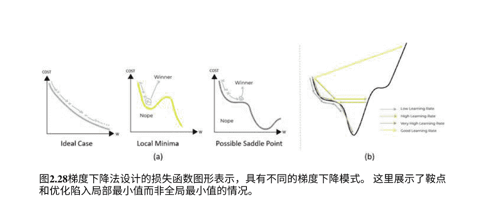

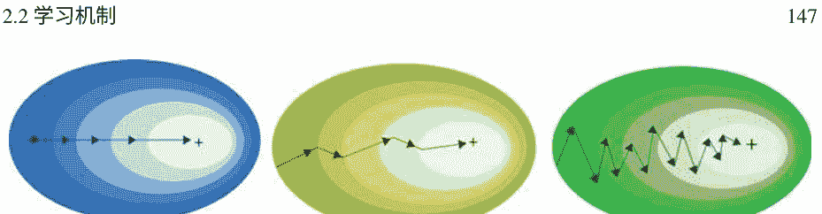

Batch Gradient Descent

Mini-Batch Gradient Descent

Stochastic Gradient Descent

图2.29三种方法（批量梯度下降、小批量梯度下降和随机梯度下降）的优化步骤。小批量梯度下降显示了达到最小值的优化路径。

#### 如何充分利用梯度下降算法？

以下是一些建议和提示，帮助你。

+   1. 学习率：尝试使用小的实数值，如0.1、0.001或0.0001，找出最适合问题陈述的值。
2. 输入归一化：通过将输入变量重新缩放到相同的范围，如[0,1]或[-1,1]，可以更快地找到损失函数的最小值。这可以通过将输入变量重新缩放到相同的范围，如[0,1]或[-1,1]，来实现。
3. 绘制损失与时间的图表：一个表现良好的梯度下降算法在每次迭代中计算的损失值应该是递减的。如果它没有显示这种行为，请尝试降低学习率。
4. 绘制平均损失：使用随机梯度下降，每个训练实例的更新可能会导致噪声图。考虑对超过10、100、1000次更新的平均值可能有助于更好地理解学习趋势。
5. 少量遍历：在随机梯度下降中，学习曲线的相当好的收敛通常只需要对训练数据集进行1-10次遍历。

连接链接：学习率、优化、导数。

##### 2.2.4.1 梯度下降算法的类型

在模型训练中，错误通常定义了梯度下降算法的类型。流行的算法包括批量梯度下降、随机梯度下降和小批量梯度下降（参见图2.29）以获得更好的学习曲线。让我们快速讨论一下这些算法的类型/变体，并总结表2.5中与这些梯度下降算法相关的优势。

###### 批量梯度下降

批量梯度下降（BGD）是一种贪婪的方法，它对每个模型更新对所有训练样本求和。这个过程被称为训练周期，梯度下降利用所有资源对完整的训练样本进行高效计算模型学习。请注意，在大型数据集的情况下，速度可能较慢，因为每次迭代都需要对训练样本中的每个实例进行预测。

```
import numpy as np

for i in range(epochs) :
    parameter_gradient = evaluate_gradient ( loss_function , inputs , parameters)
    parameters = parameters - learning_rate * parameter_gradient
```

###### 随机梯度下降

随机梯度下降（SGD）在数据集中处理单个训练样本的训练周期，并逐个更新参数。一次处理一个训练示例的计算需要较少的内存来存储和处理信息。然而，由于频繁更新，计算与批量梯度下降相比有一些损失，使得梯度变得嘈杂。它还需要更高的速度和更多细节来进行常规的单个更新，但它可以帮助避免局部最小值，找到全局最小值。在这个过程中，确保对训练数据集进行随机化，以确保利用嘈杂的随机跳跃遍布各个地方，并防止被困或分散注意力。通常，对于大型数据集，学习相对较快，通过数据集的少数遍历就可以达到良好的学习状态。

```
import numpy as np

for i in range(epochs) :
    np.random.shuffle ( inputs )
    For inputs in attributes:
        parameter_gradient = evaluate_gradient ( loss_function , attributes , parameters)
        parameters = parameters - learning_rate * parameter_gradient
```

###### 小批量梯度下降

小批量梯度下降将训练样本分成小批量大小，将上述两种算法结合起来。它对这些批次分别进行计算，保持批次梯度下降计算效率和随机梯度下降速度之间的平衡，从而使算法能够实现更高的计算效率和更少的噪声梯度。

```
import numpy as np

for i in range(epochs) :
    np.random.shuffle ( inputs )
    For each input in the batch with batch size of 20:
        Calculate the loss gradient on the parameters in the batch:
        parameters = parameters - learning_rate * parameter_gradient
```

梯度下降技术面临两个基本挑战：(a) 优化中的学习率挑战，以及 (b) 寻找局部最小值(图2.29)。在深入探讨不同的优化技术之前，我们将了解学习率，以及正则化的必要性。

表2.5 梯度下降算法类型的总结

| 梯度下降的类型 | 计算效率 | 内存使用 | 收敛稳定性 | 梯度噪声 | 速度 |
| :--- | :--- | :--- | :--- | :--- | :--- |
| 批量梯度下降 | 平衡 | 高 | 平衡 | 低 | 快 |
| 小批量梯度下降 | 高 | 平衡 | 高 | 平衡 | 平衡 |
| 随机梯度下降 | 更适用于大型数据集 | 低 | 平衡 | 高 | 慢 |

### 2.2.5 学习率

学习率（LR），通常用符号 $\alpha$ 表示，是梯度下降中学习步长的缩放因子。观察梯度下降如何随着学习率和变量初始化的起始点的变化而影响学习步骤非常重要。在下面，我们将定义一个简单的代码，使用一个简单的二次方程和一个鞍点来追踪模型训练过程中目标/损失函数的最小化路径。更新训练样本的目标参数 $\theta$ 的一般数学表达式，具有损失函数 $\mathcal{L}$，学习率 $\alpha$，衰减率 $\beta$，表示为方程式2.85。这里，$\alpha_0$ 是初始学习率。梯度项 $\delta\mathcal{L}/\delta\theta$ 是损失函数相对于更新参数的偏导数，定义了损失函数相对于更新参数（例如权重或偏置参数）在训练过程中的变化速率。

$$\theta_k = \theta_k - \alpha \frac{\delta\mathcal{L}}{\delta\theta}$$

其中，$\alpha = \frac{1}{1 + (\beta * \text{epoch}_{num})} * \alpha_0$ (2.85)

> **学习率，它控制着步长，对模型的性能有很大影响.**

- 如果学习率太小，梯度下降可能需要很长时间才能收敛，或者在达到最大迭代次数之前无法达到最优点。
- 如果学习率较大，算法可能难以收敛到最优点，或者完全超过全局最小值。

#### 行动1：研究梯度下降中学习率的影响

在这里，我们取一个一元二次函数 f1(x) = x^2 - 5x + 12，并计算它的导数 f1'(x) = 2x - 5。让我们从0.2开始，逐渐增加学习率，并跟踪由梯度下降算法产生的轨迹。图2.30展示了四个不同学习率的轨迹和最终在容差限度内收敛所需的迭代次数。

图2.30展示了四种不同学习率0.2、0.4、0.6、0.8对二次方程简单优化的影响。图2.31展示了四种学习率的比较。图中还显示了右侧不同学习率的优化情况。与常见直觉相反，选择较高的学习率并不总是有益的，因为它可能会频繁反弹并且可能无法收敛。另一方面，选择较慢的学习率可能导致收敛非常缓慢，甚至陷入局部最小值。因此，更好地理解学习率优化对于训练高效的深度学习模型非常重要。

#### 动作2：研究具有鞍点的函数的梯度下降

接下来，我们尝试观察半凸函数和鞍点对梯度下降学习的收敛轨迹的影响。在这里，我们取一个半凸函数 f2(x) = x^4 - 2x^3 + 2，并在图2.32中研究了两种不同学习率和两个不同起始点的迭代次数和结果轨迹。起始点的改变对于反映鞍点存在时的收敛影响以及理解深度模型训练中引入的不同初始化技术的思想非常重要。我们观察到，鞍点的存在对于像GD这样的一阶梯度下降算法来说是一个真正的挑战。在这里，像牛顿-拉弗森方法这样的二阶导数更好地处理了这种情况。然而，研究鞍点及其克服方法是有趣的研究。

下面是一个简单的Python实现鞍点计算的示例：

```
python
#### 1. 导入基本库
import numpy as np
from matplotlib import pyplot as plt

#### 2. 在这个例子中，我们将定义一个方程并手动放置它的导数
#### 3. 之后将自动计算函数的导数
def function(x):
    return (x*x*x*x) - 2*x*x*x + 9  # 定义函数

def gradient(x):
        return 4*x*x*x - 6*x*x  # 找到定义函数的梯度

def gradient_descent(start, iterations, learning_rate, tolerance=0.01):
    steps = [start]  # 跟踪下降路径
    theta = start

    for i in range(iterations):
        diff = learning_rate * gradient(theta)  # theta的变化
        if(np.abs(theta)<0.01): # 如果theta太小，则中断
            break
        theta = theta - diff
        steps.append(theta) # 追踪下降路径

    return steps, theta

x1 = np.linspace(-1,2,100)

iterations = [10,50,100,500]
startp = -0.5
for j in iterations: # 展示不同迭代次数的不同图表
    track, val = gradient_descent(startp, j, 0.3)
    steps_arr = np.array(track) # 将步骤转换为数组

    plt.plot(x1, function(x1)) # 绘制函数
    plt.plot(steps_arr, function(steps_arr), marker='o')

    plt.title("迭代次数:"+str(j))
    plt.grid()
    plt.show()

    print("最小值:", val)
    print()
```

总之，在模型训练中，学习率对模型训练有影响，如图2.33所示。除了主要关注优化算法来更新权重向量外，我们还需要注意学习率作为算法的一个重要组成部分。即使是有经验的人在优化深度学习模型时，也必须意识到合理的学习率对于最佳学习至关重要。过高的学习率可能导致优化发散，甚至导致梯度值的快速减小而无法收敛。类似地，较低的学习率可能需要很长时间才能收敛，并导致次优结果。除了学习率之外，衰减率对于在接近最优解时降低步长至关重要。否则，我们可能会在最小值附近反复跳动，错过达到最优点的机会。另一个同样重要的点是初始化，它控制参数的初始设置和朝最优解方向移动的速率。这是至关重要的，因为如图2.33所示，起始点的影响以及在开始时观察到的大步长可能不利，因为参数是随机设置的。

> > **Note**
> 图2.33中的x轴绘图通常应以epoch为单位，测量训练期间每个示例的频率。由于迭代次数取决于批量大小的任意设置，因此在训练过程中跟踪epoch而不是迭代次数对于网络的损失是明智的。

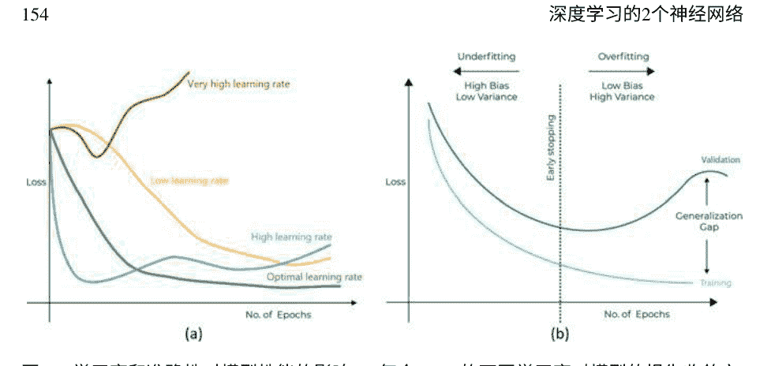

图2.33学习率和准确性对模型性能的影响。a每个epoch的不同学习率对模型的损失收敛产生影响。b通过模型训练和验证期间获得的损失曲线来判断过拟合或欠拟合的情况。

### 2.2.6 优化

优化器有助于将损失函数和模型参数绑定在一起，根据模型输出调整权重。它回答了模型参数在优化学习中如何、何时以及以何种程度进行修改。简单来说，优化器塑造了网络的学习过程，而损失函数只是对地形的指引，指导优化器在学习步骤中的正确和错误方向（表2.6）。这类似于驾驶汽车，我们希望达到最佳速度以最大化燃油效率。或者像饮食一样，卡路里摄入量需要低于一定水平，蛋白质摄入量则应高于一定水平。流行的深度学习框架有很多优化算法，主要用于提高模型的训练效率。

从数学上讲，优化方法分布在各个子领域和图2.34中呈现的技术。从总结图中，我们主要关注当前在DL网络中普遍存在的基于梯度的优化技术。其他演化优化方法的标准实现包括进化算法和群体智能。

表2.6 优化解决方案类型
|  | 基本术语 |
| --- | --- |
| 可行解 | 当所有约束条件都满足时的条件 |
| 最优解 | 在目标函数被最小化或最大化的可行解 |
| 放松解 | 将复杂问题近似为相对简单的问题以便解决 |

##### 2.2.6.1 0/1损失线性模型的优化

通常，我们处理的是非线性复杂NN模型的优化方法在DL中。然而，了解优化的工作原理将有助于更好地理解。在这里，我们选择一个线性模型，更确切地说是一个线性感知器没有激活函数。这个简单线性模型的目标函数可以表示为 $F = b + \sum w_i x_i$ 表示与超平面的距离，其中我们想要学习输入数据 $x_i$ 的权重 $w$ 和偏置 $b$。在这个例子中，我们评估方程式2.86a中的预测和真实标签是否匹配。接下来，我们需要一个学习算法（参见方程式2.86b），它试图显式地最小化损失，有时以启发式的方式（即非最优方式）。在方程式2.86b中的表达式中，我们的目标是找到最小化损失函数或优化标准的参数 $w$ 和 $b$ 的值。优化的损失曲线应该类似于图2.35，我们观察到随着权重 $w$ 值的变化，损失计算会出现离散跳跃。

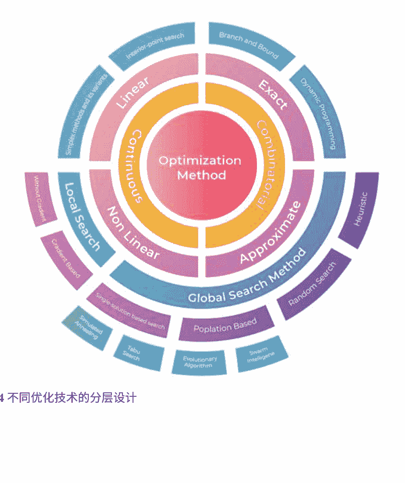

我们添加的每个新的权重特征都会导致空间维度的增加，并且优化结果是 **NP-hard**。上述0-1损失的挑战包括：

+   1. 学习参数的每个小变化都导致损失的非连续变化。
2. 存在许多局部最小值。
3. 在任何给定点上，没有清晰的信息指导我们朝着任何最小值前进。

理想情况下，我们期望有一个可微的、即连续的损失函数，以指导我们朝着最小值前进。我们还期望对于凸函数，只有一个全局最小值。这就引出了凸代理损失函数的引入，它对实际损失函数提供了一个上界，从而更容易进行最小化。在0-1损失的例子中，关键是评分真实标签 \(y\) 和预测标签 \(y'\) 之间的差异。一些替代0-1损失的凸代理损失函数在方程2.87中给出，并在图2.36中进行了说明。

\[
\mathcal{L}_{0-1} = \sum_{k=1}^{n} \mathbf{1}[y_k(b + wx_k) \leq 0] \qquad (2.86a)
\]

\[
\text{arg min}_{w,b} \sum_{k=1}^{n} \mathbf{1}[y_k(b + wx_k) \leq 0] \qquad (2.86b)
\]

\[
\begin{aligned}
& \text{0-1损失：} & \mathcal{L}(y, \hat{y}) &= \mathbf{1}[yy' \leq 0] \\
& \text{合页损失：} & \mathcal{L}(y, y') &= \max(0, 1 - yy') \\
& \text{对数损失：} & \mathcal{L}(y, y') &= \ln(1 + e^{-yy'}) & & (2.87)\\
& \text{指数损失：} & \mathcal{L}(y, y') &= \exp(-yy') \\
& \text{平方损失：} & \mathcal{L}(y, y') &= (y - y')^2
\end{aligned}
\]

接下来，我们将深入研究优化这些替代损失函数的方法，在实践中，这些函数并不总是具有明确的最小化梯度。我们需要优化技术来快速加速损失函数收敛到最优解。

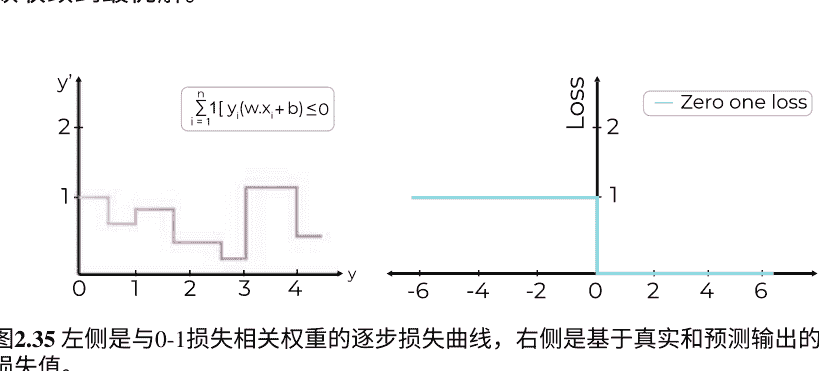

##### 2.2.6.2 流行优化器列表

###### 动量

动量是由Orr等人（1993）引入的一种技术，用于在适当的方向上加速SGD，并减弱步骤更新之间的振荡。这是通过将上一个时间步的更新向量的指数加权平均分数γ（参考方程式2.88a）添加到当前更新向量θ_k（参考方程式2.88b）中来平滑更新。

$$v_t = \gamma v_{t-1} + \alpha \nabla_\theta J(\theta)$$
$$\theta_t = \theta_{t-1} - v_t$$

###### Nesterov动量

Nesterov加速梯度（NAG）（Nesterov 1983）是一种基于动量的SGD优化器，通过计算相对于近似未来位置的梯度而不是当前参数来有效地向前看。

$$v_t = \gamma v_{t-1} + \alpha \nabla_\theta J(\theta - \gamma v_{t-1})$$
$$\theta_t = \theta_{t-1} - v_t$$

计算 θ−γvt−1提供了参数在未来可能的位置的近似。更新方程2.89b中的参数的直觉与标准的带动量的随机梯度下降不同，后者计算当前位置的梯度，然后在累积梯度的方向上进行重要跳跃。

NAG首先朝着之前积累的梯度方向跳跃，然后在着陆位置计算梯度进行修正。简单来说，它试图对梯度的突然波动具有鲁棒性。

###### Adagrad

到目前为止，我们使用相同的学习率 α 同时更新所有参数 θ。Adagrad是一种随机优化方法，它根据过去的梯度为每个参数 θk 在每个时间步骤上使用自适应学习率。优化器的数学方程式如公式2.93所示。

$$ θ_{t+1,k} = θ_{t,k} - \frac{α}{\sqrt{G_{t,k}} + ε} .∇_{θ_k} J(θ_t, k) \quad (2.90) $$

更新规则通过对具有频繁出现特征的参数进行更小的更新，对不经常出现的元素进行更大范围的更新来修改学习率。在这里， G_t ∈ R^{d×d} 是一个对角矩阵，每个元素 G_{t,k} 是关于 θ_k 到时间步骤 t 的梯度平方和，平滑项 ε 通常为1e−8的数量级，防止除以零。有趣的是，在没有平方根运算的情况下，该算法表现得更差。

注意，Adagrad不需要手动调整学习率。然而，它在分母中累积了平方梯度。每个添加的项都是正数，导致求和在训练过程中增长，学习率变得非常小。Adadelta和RMSprop已经被制定出来解决这个问题。

###### Adadelta

Adadelta (Zeiler 2012) 是一种自适应学习率方法，也属于具有自适应超参数调整的SGD家族。这里，delta指的是当前权重和新更新权重之间的差异。Adadelta不像Adagrad那样累积所有过去的平方梯度，而是将累积限制在一个固定的窗口 w 内。因此，Adagrad的一个更强大的扩展在一系列更新之后仍然可以继续学习。实施该方法与公式2.91相似。

RMSprop是Hinton等人（2012）提出的一种未发表的自适应学习方法。它与Adadelta同时独立开发，由Zeiler（2012）提出。两者的目标都是解决Adagrad的过于激进、单调递减的学习率问题。因此，时间步骤t的运行平均值E[g²]只依赖于先前的平均值和当前的梯度。

有趣的是，RMSprop与Adadelta的第一个更新状态完全相同，通过取 γ = 0.9的值。RMSprop还将学习率除以平方梯度的移动平均。这使我们能够在开始时设置相对较高的学习率，加快收敛速度而不会出现发散的风险。权重更新公式如公式2.91所示。

$$E[g^2]_t = \gamma E[g^2]_{t-1} + (1 - \gamma) \nabla_{\theta_t}^2 J(\theta_t)$$
$$\theta_{t+1} = \theta_t - \frac{\alpha}{\sqrt{E[g^2]_t + \epsilon}} \cdot \nabla_{\theta_t} J(\theta_t)\quad (2.91)$$

Hinton建议将 γ 的值设为 0.9，并且一个好的默认学习率为α = 0.001。使用Adadelta的一个优点是不需要设置默认学习率。

###### Adam

自适应矩估计（Adam）是由Kingma等人在2014年提出的一种高度引用的自适应学习方法之一。它充分利用了SGD with Momentum的动量和RMSProp的缩放优势。它保持了过去梯度的指数衰减平均值，类似于Adadelta或RMSprop。它是非平稳目标函数和高噪声和/或稀疏梯度情况下的适当学习方法。权重根据公式2.92进行更新。

$$\theta_t = \theta_{t-1} - \alpha \frac{m_t}{\sqrt{v_t} + \epsilon}$$
其中，
$$m_t = \frac{m_t}{1 - \beta_1^t}$$
$$v_t = \frac{v_t}{1 - \beta_2^t}\quad (2.92)$$

其中，ε是一个非常小的常数，用于防止除以零； m_t和 v_t分别是第一时刻（均值）和第二时刻（非中心方差），初始值均为零。然而，这是论文作者Kingma和Ba（2014）观察到的一个原因，即在初始时间步和衰减率较低（即 β_1和β_2接近1，通常为0.9和0.999）时，存在对零的偏向。为了抵消这一点，这些矩阵对零的偏差进行修正，修正应用于 $m_t$ 和 $v_t$。根据公式2.93更新参数：

$$
m_t = \beta_1 m_{t-1} + (1 - \beta_1) \nabla_{\theta_t} J(\theta_t) \\
v_t = \beta_2 v_{t-1} + (1 - \beta_2) \nabla_{\theta_t}^2 J(\theta_t)
\quad (2.93)
$$

| 优化器 | 备注 | 更新参数 θ |
| :--- | :--- | :--- |
| 动量 | 改进SGD并减弱振荡 | $\theta - \alpha v_{d\theta}$ |
| Adam | 自适应动量估计和调整四个参数 | $\theta - \alpha \frac{v_{d\theta}}{\sqrt{s_{d\theta_t}} + \epsilon}$ |
| RMSprop | 通过控制振荡加快学习速度 | $\theta - \alpha \frac{d\theta}{\sqrt{s_{d\theta}}}$ |

##### 2.2.6.3 模型训练优化器的比较

现在我们已经了解了不同的优化器，看看它们如何相互比较是个好主意。表2.7简要总结了三个最流行的优化器，即具有动量的SGD、Adam和RMSprop。我们使用MNIST数据集和不同的优化器训练神经网络。这个想法是使用一个过度参数化的深度网络来评估优化器在整个数据集上的训练损失的影响。为了公平比较，重要的是使用相同的种子训练相同的模型，只有不同的优化器，如图2.37所示。这个例子中展示了三个优化器：SGD、带动量的SGD和Adam。通常，差异太小，无法得出显著结论。此外，注意初始化的属性也可以起到关键作用。

> **好好思考一下**
>
> 作为自适应学习率的鲁棒优化器，Adam是否应该始终使用，我们是否不再需要关注SGD？
> 简单的答案是否定的。许多论文（Wilson等人，2017年；Ruder，2016年）提出了一些情况，其中在Adam倾向于过拟合的条件下，SGD +动量和学习率调度更好地泛化。一个相关的想法是找到具有平坦最小值和尖锐最小值的最优解（Keskar等人，2016年）。找到一个尖锐、狭窄的最小值可以帮助找到最小的训练损失，但不一定意味着在测试数据上有更好的泛化能力。假设由于与训练集的某种差异而导致测试损失中的损失面发生了侧向偏移。一个小的变化可能对尖锐的最小值产生重大影响。另一方面，平坦的最小值往往更好地泛化，并且对这些变化具有鲁棒性。

最后，几种优化变体执行循环调整学习率。为了获得更好的解决方案，可以考虑对整个参数路径进行平均。

(Izmailov等人，2018年) 这超出了当前章节的范围。大多数DL框架使用工具自动调整控制学习率所需的许多细节。通过学习率调度器，更多了解不同调度对准确性的影响以及有效管理它们的方法是DL中另一个重要的研究领域。混合模糊系统是一种很少被探索的DNN优化技术。模糊逻辑允许有效处理第5章讨论的不确定和模糊的现实数据。

### 2.2.7 初始化

通常，模型在具有同质特征的情况下运行良好。异质样本会在不同的尺度上更新权重，因此在处理之前需要对数据进行归一化。这使我们达成了关于初始化DL中NN的共识。初始化NN必须满足两个重要要求：

1.  输入方差需要在整个网络中传播，以获得类似的输出神经元标准差。如果方差增加，深层网络设计很可能会发散（即趋向于无穷大）。梯度消失使得模型更难优化，因为传递到更深层的输入将成为一个单一的常数值。
2.  梯度分布需要在各层之间具有相等的方差。如果最后一层接收到比第一层更高的梯度，将会在选择合适的学习率时产生困难。

> 在大多数分类任务中，将所有值归一化到区间[-1, 1]，或者归一化为均值为0，标准差为1的分布，实验上都效果良好。

现在，为了研究合适的初始化方法，我们从一个没有激活函数的线性神经网络开始。这是为了抽象出初始化对特定激活函数的依赖，并根据神经网络模型中特定激活函数的选择调整初始化方案。

■动作1：使用恒定初始化调查梯度分布
第一种初始化方法是将所有权重初始化为略大或略小于零的某个恒定值，并可视化梯度。这样做是为了直观地避免由于所有权重初始化为零而将传播梯度设为零。

在图2.38中，我们观察到只有第一层和最后一层的梯度分布各不相同，而其他层的所有权重具有相同的梯度，其值通常非常接近但不完全为零。使用恒定值初始化的参数具有相同的梯度，意味着这些参数具有相同的值，从而减少了适当数量的参数。因此，使得层变得无用，并且训练网络变得无效。

■动作2：使用恒定方差调查激活分布
既然我们已经知道恒定值不起作用，让我们通过从分布中随机采样（例如，高斯分布）来初始化参数。最直观的方法是选择一个方差，可以应用于网络的所有层，并在图2.39中可视化各层的激活分布。第一行表示具有较小标准差的分布，导致方差减小。相反，第二行中相对较高的标准差可能会导致激活值爆炸。

与特定标准差值一起玩耍是一种很好的实践经验。然而，很难找到一个适当的值，使我们的模型具有良好的激活分布。更改隐藏单元或层数将需要重新进行研究，这既不推荐也不高效。

■动作3：从激活分布的角度研究最佳初始化
我们尝试从分布中采样权重，但不确定具体是哪个分布。现在让我们尝试从激活分布的角度寻找一个满足两个条件的最佳初始化：（a）激活的均值为零，（b）激活在各层之间的方差保持不变。

对于一个简单的线性层 \(y = wx + b\)，其中 \(y \in \mathbb{R}^{d_y}\) 和 \(x \in \mathbb{R}^{d_x}\)，目标是使 \(y\) 的每个元素的均值为零，方差与输入相同，即 \(\text{Var}(y_i) = \text{Var}(x_i) = \sigma_x^2\)。在深度神经网络中，\(y\) 作为另一层的输入，需要偏置和权重的期望为零。我们假设 \(x\) 的均值为零和偏置整体上设置为零，因为偏置b是每个输出神经元的单个元素，并且在不同的输入之间是恒定的。

> **随机变量乘积的方差规则**
>
> 给定两个独立的随机变量，它们的乘积的方差为：
>
> $$
> \begin{aligned}
> \mathrm{Var}(X.Y) &= \mathbb{E}(Y)^2 \mathrm{Var}(X) + \mathbb{E}(X)^2 \mathrm{Var}(Y) + \mathrm{Var}(X) \mathrm{Var}(Y) \\
> &= \mathbb{E}(Y^2)\mathbb{E}(X^2) - \mathbb{E}(Y)^2\mathbb{E}(X)^2 \quad (2.94) \\
> &= \mathrm{Var}(X)\mathrm{Var}(Y); \quad \text{当期望为零时。}
> \end{aligned}
> $$
>
> 为了初始化权重参数，使用方程2.94中的乘积方差规则计算所需的权重方差Var(w_{ij})。

$$
\text{Var}(y_i) = \sigma_x^2 = \text{Var}\left( \sum_j w_{ij} x_i \right) = \text{Var}(w_{ij}).\sigma_x^2 \quad (2.95)
$$

因此，\(\quad \text{Var}(w_{ij}) = \sigma_w^2 = \frac{1}{d_x}\)

根据方程2.95，我们应该使用方差等于输入维度的倒数d_x来初始化权重分布，其中所有元素具有相等的方差。请注意，初始化不限于使用正态分布。在实践中，通常使用均匀分布进行初始化。

> **好好思考一下**
>
> 与正态分布相比，使用均匀初始化的一个小优势是我们避免了初始化非常大或非常小的权重。

为了确保深度网络的稳定优化，除了激活的方差之外，我们还需要对其中一个梯度的方差进行稳定化。在与上述类似的计算中，从 Δx = wΔy开始，我们得到了1/d_y的初始化值，其中d_y是输出神经元的数量。2010年，Glorot等人(2010)提出了在两个约束之间使用调和平均值作为折衷方案的方法，其中一个约束使用正态分布或均匀分布，被称为Xavier初始化，并在公式2.96中展示。

$$
W \sim \mathcal{N}\left(0, \frac{2}{d_x + d_y}\right) \\ \sim \mathcal{U}\left[-\frac{\sqrt{6}}{\sqrt{d_x + d_y}}, \frac{\sqrt{6}}{\sqrt{d_x + d_y}}\right] \quad (2.96)
$$

到目前为止，激活被认为是线性的。在网络中引入非线性，比如Tanh激活单元，一个常见的假设是在初始步骤中，Tanh几乎是线性的，我们可以在计算中不需要太多调整就可以在图2.40中可视化分布。

图表显示方差随深度减小，但对于较小的值随着网络深度增加而稳定。这表明Xavier初始化适用于Tanh非线性网络。那使用ReLU激活单元呢？先前对于小值的非线性假设不成立，因为ReLU将一半的输入设为零，导致输入的期望值非零。

然而，只要权重和偏置的期望值为零，输出的期望值也为零。ReLU初始化在计算Var(w_ij x_j) given in Eq. 2.97时与恒等式不同：

$$\operatorname{Var}(w_{i}x_{j}) = \mathbb{E}[w_{i}^{2}]\mathbb{E}[x_{j}^{2}] - \mathbb{E}[w_{i}]^{2}\mathbb{E}[x_{j}]^{2} = \operatorname{Var}(w_{i})\mathbb{E}[x_{j}]^{2} \quad (2.97)$$

假设 $x$ 是来自前一层ReLU激活的输出，即 $x = \max(0, \tilde{y})$，其中 $\tilde{y}$ 是以零为中心且对称的。期望的计算如下所示：

$$\mathbb{E}[x]^{2} = \mathbb{E}[\max(0, \tilde{y})^{2}] = \frac{1}{2}\operatorname{Var}(\tilde{y}) \quad (2.98)$$

方程2.98中额外的因子1/2使得权重的期望方差为$1/d_{x}$。这引出了我们对Kaiming初始化的认识。有趣的是，Kaiming初始化认为$d_{x}$或$d_{y}$都能够在整个网络中产生稳定的梯度，因此不使用输入和输出大小参数之间的调和平均数。

仅使用 $d_{x}$ 给我们提供了图2.41中具有稳定方差的可视化效果，跨层深度。这就结束了适用于基于ReLU的网络的Kaiming初始化的一般用法。请注意，因子的值会随着使用leaky-ReLU或许多其他激活函数的变化而改变，可以使用PyTorch库中的函数进行计算：`torch.nn.init.calculate_gain`。

### 2.2.8 正则化

深度学习中的一个核心挑战是使封装的模型能够在未见数据上进行良好的泛化，即算法不仅在训练集上表现良好，而且在新的输入上也表现良好。在训练过程中，我们可能会遇到两种最常见的情况：

- 欠拟合：模型无法很好地拟合训练集，导致训练损失较高。这可能是由于使用了过于简单的模型，无法很好地从训练数据中学习复杂的模式，或者训练数据集太小。
- 过拟合：与欠拟合相反，模型过于复杂，甚至捕捉到数据中的噪声。这可能导致训练准确度非常高，但在之前未见过的测试数据上表现不佳。过拟合也描述了对简单数据属性进行过度训练的情况。

目标是在欠拟合和过拟合之间达到最佳平衡，使模型在未见数据上表现良好。正则化器是DL中使用的一种额外策略，明确设计用于降低测试误差，可能以增加训练误差为代价。名称来自于正则化器试图保持参数正常/规则的尝试。为了给出正则化的重要性视角，一篇在2015年发表的重新审视Res Nets的论文（Bello等人，2021年）取得了增长。

# **什么是流行的偏差-方差权衡？**

它等同于神经网络中的欠拟合-过拟合。偏差误差是由于学习过程中的错误假设导致的。欠拟合，高偏差可能导致模型忽略特征和预测输出之间的相关关系。另一方面，方差误差是由于对学习中的小波动敏感导致的。这种情况被称为过拟合，高方差可能导致在训练数据集中建模随机噪声。

流行的偏差-方差权衡描述了通过增加偏差来减少方差的潜在减少。

这些策略通常分为两个高级类别：对训练参数进行惩罚或在训练生命周期中注入一些噪声。在训练DNN时，一些最常用的正则化技术用于帮助减少（理想情况下，避免）过拟合的方法是：

##### 2.2.8.1 提前停止

由于其有效性和实施的便利性，这是一种最常用的策略。它指的是在训练损失在一定数量的周期内没有显著减少的情况下，验证/测试损失开始上升的训练终止过程。从另一个角度来看，它可以被视为一种高效的超参数选择，其中训练周期的数量被设置为绝对最佳值。

##### 2.2.8.2 丢弃（Dropout）

另一种属于噪声注入技术的策略是丢弃（Dropout）。这个想法是用概率ρ临时删除一些输入和/或隐藏单元。这将改变中间层的连接方式，并寻找将信息传递给后续层的替代连接。从概念上讲，它近似于训练大量具有不同架构的并行神经网络。请注意，实施丢弃（Dropout）会使条件变得嘈杂，同时增加网络的稀疏表示。ρ的选择取决于架构的选择。

让我们简要地看一下多年来提出的一些流行的dropout变体：

- 反向dropout：与传统的dropout类似，它也以概率ρ随机丢弃一些节点。关键的区别在于通过保持概率的倒数（即1-ρ）来缩放激活。这样做是为了防止激活变得过大，在测试期间导致网络修改。
- 高斯dropout：它向每个单元的权重注入噪声，而不是丢弃单元。这样可以加快整体训练速度，因为它消除了权重缩放的需要，并减少了测试期间的计算工作量。
- 变分dropout：最初为RNN引入，遵循变分推断的相同原则。它在每个时间戳上使用相同的dropout掩码，每次建议丢弃相同的网络节点。
- 注意力dropout：由于注意力模型（如Transformers）的快速发展而受欢迎，在这种模型中，我们以概率ρ随机丢弃某些注意力单元。
- Dropconnect：这个方法与随机丢弃激活（单元）不同，它使用概率1-ρ来丢弃权重。可以将其视为对层的全连接结构的dropout的一种泛化。
- 自适应dropout：它通过允许不同单元的dropout概率不同来扩展dropout策略。直观地认为，一些隐藏单元可以单独对特征的存在或不存在或两者的组合做出自信的预测。
- 嵌入dropout：在完整的前向或后向传递过程中丢弃嵌入矩阵的元素的技术。

> 好好思考一下

如果与批量归一化等其他技术一起使用，dropout可能会产生干扰。因此，在组合使用这些策略时要小心。事实上，批量归一化可以隐式地对模型进行正则化，并且在许多情况下优于dropout。然而，目前还没有明确的解释，只有经验观察。

##### 2.2.8.3 权重惩罚

在深度学习时代之前，最常用的策略是对模型进行正则化，通过对损失函数J(θ)施加范数惩罚(θ)来减少大型网络中的过拟合问题。这种方法隐含地假设，具有较小权重的模型比具有较大权重的模型更简单。重要的是，这些惩罚试图保持权重的小或接近零（也称为权重衰减），除非有大梯度来抵消它。一般的公式在方程2.99中给出，其中输入X，输出Y，预测输出Y'，损失函数ℒ(Y, Y')，目标函数J(θ, X, Y)和λ是缩放范数惩罚贡献的超参数，即正则化的效果。

```
$J(\theta, X, Y) = \mathcal{L}(Y, Y') + \lambda(\theta)$
```

- L1正则化：它使用L1范数的缩放值来惩罚权重的绝对值。这通过试图将一些权重驱动到零而不是减小所有权重的平均幅度来在模型中引入稀疏性。方程式2.100给出了L1正则化的公式。

```
$J(\theta, X, y) = \mathcal{L}(y, y') + \lambda||w||_1 = \mathcal{L}(y, y') + \lambda \sum_{j=1}^{N} |w_j|$
```

与L2正则化相比，正则化项在目标函数的梯度中不是线性缩放的，而是具有交替符号的常数因子。简而言之，L1强调在训练过程中完全丢弃某些特征。

- L2正则化：也被称为权重衰减或岭回归，工作方式类似，只是在损失函数中添加了权重的平方范数惩罚，而不是L1范数，如方程式2.101所示。

```
$J(\theta, X, y) = \mathcal{L}(y, y') + \frac{\lambda}{2}||w||_2^2 = \mathcal{L}(y, y') + \frac{\lambda}{2} \sum_{j=1}^{N} w_j^2$
```

计算方程2.101的梯度，并在单个训练步骤中使用学习率α，方程2.102有效地表示每个训练步骤中每个权重参数向量的减小常数因子。请注意，我们仅用实际权重参数θ_w替换参数θ，因为我们只对模型的实际权重进行正则化，而不是偏差。

```
$\theta_w = (1 - \alpha\lambda)\theta_w - \lambda\nabla_{\theta_w} J(\theta_w; X, y)$
```

从完全训练的角度来看，L2正则化对损失函数中非贡献权重向量的方向有巨大影响。虽然对方向的贡献相对较小，但对损失函数有一定贡献。简单来说，这减少了模型的方差，使其对未见过的测试数据更加泛化。

- 弹性网络：这个模型线性地结合了L1正则化和L2正则化，旨在兼顾两者的优点。方程2.103给出了惩罚项，通过L1减少了某些特征的影响，但并没有完全消除它们。这是通过分别使用λ₁和λ₂对参数进行缩放来实现的。

```
$J(\theta, X, y) = \mathcal{L}(y, y') + \frac{\lambda_1}{||w||_1} + \lambda_2||w||_2^2$
```

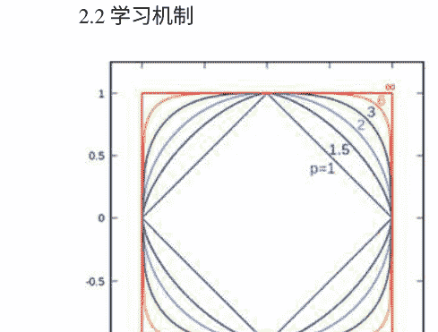

| p | w2 |
|---|---|
| 1 | 0.5 |
| 1.5 | 0.75 |
| 2 | 0.87 |
| 3 | 0.95 |
| ∞ | 1 |

- 所有p范数都惩罚较大的权重。
- p < 2倾向于创建稀疏向量（即很多0权重）。
- p > 2倾向于使权重相似。

图2.42展示了不同p范数的可视化以及两个权重之间的相关性 $w_1$ 和 $w_2$。

一般来说，所有的p范数惩罚项（$\theta$）都是凸的，并且惩罚较大的权重，可以用方程2.104表示。在这里，较小的p范数值（即p<2）通过更多地惩罚小值来创建一个稀疏向量，而较大的p范数值则更加正则化较大的权重，导致权重变得相似。这可以在图2.42中可视化。

```
$(\theta) = \|w\|^p = \sqrt[p]{\sum_{w_j} |w_j|^p}$
```

###### 2.2.8.3.1 熵正则化

另一种规范惩罚是为概率模型设计的，在公式2.105中添加了一个惩罚项，用于输出概率分布$\rho(x)$的模型。术语“熵”来自信息论，它建议变量可能结果的期望信息值。

```
$(x) = - \sum \rho(x) \log(\rho(x))$
```

有趣的是，其成功的一个简单解释是从概率到均匀分布的强制转变，从而减小了方差。它已经在强化学习中实施，因为添加的熵项促进了学习空间的多样性和更好的探索。

> ### 如何避免正则化对数据的压倒性影响？
最有可能的情况是正则化损失（例如，对权重的L2惩罚）在损失函数中占主导地位，而不是数据损失成分。在这种情况下，梯度主要来自正则化项，可能掩盖了数据损失的错误实现。为了避免这种情况，明智的做法是独立检查数据损失项，然后再检查正则化损失项。可以通过删除数据损失项或调整正则化项的强度来评估正则化项对梯度的贡献。

##### 2.2.8.4 批归一化

批归一化（BN）也作为一种正则化形式（Luo等人，2018年）来修复批次，通过获取不同的均值和不同的标准差。这是通过将特征带入相同的范围来完成的，即将特征集中在高斯样的紧凑空间中。

对于大小为m的小批量B，使用小批量均值μB和小批量方差σB^2对每个激活值x进行归一化，如公式2.106所示。最终输出由可学习参数β和γ进行平移和缩放（Ioffe和Szegedy，2015年）。添加ε提供了数值稳定性。

```
$$ \mu_{\mathbb{B}} \leftarrow \frac{1}{m} \sum_{i=1}^{m} x_i ; \quad \sigma_{\mathbb{B}}^{\wedge 2} \leftarrow \frac{1}{m} \sum_{i=1}^{m} (x_i - \mu_{\mathbb{B}})^{\wedge 2}; \quad \hat{x}_i \leftarrow \frac{x_i - \mu_{\mathbb{B}}}{\sqrt{\sigma_{\mathbb{B}}^{2} + \epsilon}} \quad (2.106) $$

$$ y_i \leftarrow \gamma \hat{x}_i + \beta $$
```

使用BN正则化的主要好处是损失函数的平滑和平衡性。这进一步导致神经网络的训练速度更快。

## 2.3 传统技术的挑战和限制

我们现在已经研究了各种流行的神经网络学习技术及其方法和学习机制。找到动态过程来学习参数并选择合适的超参数在本质上是有偏见的，受到模型的影响。因此，在设计合理性检查时，回答一些问题是必要的，同时要记住它们各自的缺点。

例如，特征图是网络层的有用可视化工具，但并不适用于每个模型。可视化的目标在于模型的解释性方面必须清晰。无论是验证输入元数据是否被正确处理，还是了解输入在网络中随时间的演变，或者是网络的参数分布，或者只是输出决策，我们都希望通过可视化来实现。

> “以正确的理由为善。” - 未知

这是一个被认为可以基本解决每个问题的深度学习的黄金子弹的时代。鉴于深度学习应用的有用性，很难接受深度学习不是所有问题的最佳答案。由于输入通过多个层进行非线性转换并优化数百万个参数，深度学习模型面临着比标准机器学习模型更大的挑战。缺乏模型可解释性的一个问题是缺乏对模型训练的明确知识。

选择正确的深度学习工具没有标准指南，因为它需要对训练技术、架构设计、超参数和拓扑有所了解。这使得不熟练的人难以采用深度学习。同时，在网络优化中存在重大障碍以可视化特征。在接下来的部分中，我们将探讨一些技术和关键思想，了解神经元的相互作用并避免可能的误解。

### 2.3.1 资源需求检查

大公司由于信息爆炸而收集到的大量数据，再加上计算能力和并行化的快速发展，使得存储和利用大量数据变得相对容易。

评估模型的性能高度依赖于特定任务的数据表示。严重的类别不平衡问题（Buda等人，2018年），嘈杂或异质的样本以及深度网络的训练数据集的规模小或不足常常是学习技术的主要缺点。DL模型需要如此丰富的数据规模，这限制了在特定任务上的性能，因为它在计算上是昂贵的。大多数DL模型需要昂贵的GPU和计算资源来学习复杂的数据模型，这导致用户成本高昂。对于给定的任务，模型需要针对新的数据集进行重新训练。这在特异性与性能能力之间绘制了一个AI系统的评估指标。

最近有很多发展旨在在神经网络之间进行学习的泛化。从一个小样本中学习而不需要筛选大规模数据集一开始看起来很有前景，但可能会通过旁门左道引入更多偏见或误解。偏见是除了算法之外，也受到数据的影响的东西。

工程师们有足够的技能来调整一些参数，以获得对数据的最佳理解，但直到最近几年，对原始数据并没有过多的重视。通常，一个错误加权的算法可能会从数据中强化现有的偏见。在训练过程中，可能会出现一些情况，强调了某种刻板印象，或者出现了没有根据的隐性歧视。这可能会产生严重的后果，特别是在法律系统中，这些有偏见的系统可能被用来以错误的自信定罪某人。

##### 2.3.1.1 数据——维度的诅咒

一个明显的限制是，一个喂养不良的模型只会产生糟糕的结果。事实上，今天许多深度学习应用可以通过在感兴趣的小地理区域内进行人口统计相似的评估。对于DL模型来说，对大型数据集的需求限制了其在特定计算密集型任务上的性能。这为比较AI系统的特异性和性能能力创造了一个标准。很不可能很快发生重大变化，而且DL预测可能被伪造是一个问题。

DL的另一个缺陷是学习效率极低。尽管有一些一次性学习技术（Fei-Fei等人，2006年）和少样本学习技术（Snell等人，2017年），大多数模型需要大量数据和多次迭代才能学习新概念。维度诅咒甚至影响了具有快速和流畅输入数据的高效训练过程。图2.43显示了维度增加如何影响学习参数和模型的效率。

更强大的GPU、传输速度的显著提升和大容量数据存储的进步，尚未赶上与传统机器学习模型相比的训练时间的增加。例如，最先进的模型之一ResNet，通常需要两周时间来对新数据进行训练。

深度学习发现了改进结果的新策略，适用于那些打算使用大规模非结构化数据的人。即将出现的问题不是最新技术是否有帮助，而是社区如何实施这些方法来提高模型性能。一些常见的用于训练深度模型的数据增强策略如下所示。

##### 2.3.1.2 数据增强

数据增强并不严格属于正则化技术，但值得一提，因为它增加了训练数据的有效大小，从而降低了方差并提高了泛化准确性。它可以被看作是在训练数据集中注入噪声，通过从数据集中生成新的训练样本。可以通过多种方式实现这一点，例如：

- 基本操作：通过对数据样本进行几何变换来实现。图像相关的操作，如图像翻转、旋转、裁剪和颜色抖动，是常见的策略。Cutout（DeVries和Taylor 2017）是另一种用于去除图像中特定区域的技术，而 Mixup (Zhang et al. 2017)是将数据集中的两个不同图像混合成一个。

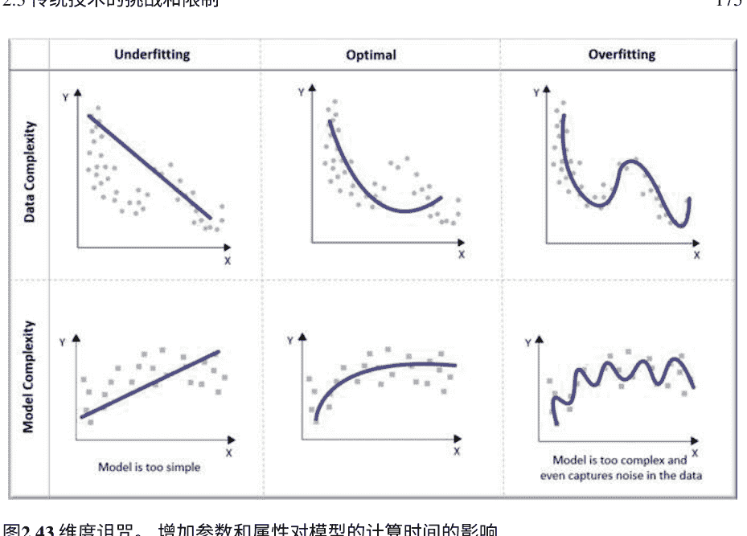

- 特征空间增强：在输入空间中应用特征空间转换，而不是数据转换。例如，可以从自动编码器中提取潜在表示，并添加噪声，然后通过解码器传递，以获得与输入具有相似结构的新数据点。
- 基于GAN的增强：研究中对使用GAN生成合成图像的需求不断增加，因为GAN一直以来都被证明是一种非常好的数据增强选择。
- 元学习：数据增强的一种新方法是使用神经网络来优化另一个神经网络的超参数，从而提高性能。
使用cGAN进行I2I翻译是一个优秀的分类网络（判别器），用于调整增强网络（生成器）以生成更好的图像的例子。

此外，深度学习模型在具有同质特征的情况下运行良好。异质样本会以不同的比例更新权重，因此在处理之前需要对数据进行归一化。很少有人探索用于DNN的另一种优化技术，即与模糊系统的混合融合。模糊逻辑允许有效处理第5章讨论的不确定和模糊的现实数据。

最后，过去十年在深度学习领域取得了一些令人难以置信的进展，预计将趋于放缓。专家们认为，实现最先进的结果的成本已经飙升，而计算性能的改进与改进之间的比例已经达到了“瓶颈”。

### 2.3.2 不确定性度量

使用基于DL的解决方案的高风险应用领域可以从对预测可靠性的保证和不确定性的量化中获得实质性的好处。不确定性的度量帮助研究人员区分数据中的真实规律和虚假或仅仅是偶然的模式。获取能够捕捉输入值中噪声如何通过DNN传播的不确定性度量是至关重要的。这些度量可以用于临床和公共卫生应用中自动决策的可靠性评估，并在面对罕见或对抗性案例时保护模型的脆弱性。

有两种主要的不确定性可以计算：认知不确定性和随机不确定性（Kendall和Gal 2017）。认知不确定性描述了对模型、其结构或其参数的不确定性。这种不确定性是由于训练数据不足或训练集和测试集的分布差异引起的，因此在无限数据的极限下消失。另一方面，随机不确定性描述了观测中固有的不确定性。这种不确定性是由于噪声或缺失数据引起的，因此随着对所有独立变量进行无限精度观测的能力而消失。

表示不确定性的一种好方法是设计一个合适的损失函数并引入一个不确定性变量。对于数据相关的不确定性，可以训练模型在出现噪声或缺失数据时增加其不确定性；对于任务相关的不确定性，可以为每个任务优化最佳的不确定性参数。

### 2.3.3 网络学习的合理性检查

在进行昂贵的优化过程之前，进行一些合理性检查是明智的。确保在短参数初始化期间获得正确的损失项是关键。因此，通过将正则化损失项设为零来独立评估数据损失是至关重要的。例如，一个MNIST数字识别数据集使用Softmax分类器，期望每个类别的概率为0.1。因此，我们可以预期初始损失为2.302，因为Softmax损失对于正确类别的负对数似然为 -ln(0.1) = 2.302。如果损失项不反映这些损失，很可能是初始化的问题。

接下来，我们需要确保正则化损失强度的增加会增加损失。最后，明智的做法是在正则化项设置为零的情况下，对一个小的数据子集进行训练，以确保网络可以达到零损失。如果在小数据集上的健全性检查失败，那么继续处理整个数据集就没有意义。然而，模型可能会过拟合小的数据子集，仍然受到错误实现的影响。例如，由于某些错误导致的数据点特征可能会过拟合小的训练数据集，但在整个数据集上没有泛化。

#### 学习图解释

随着时间的推移，训练损失的可视化提供了很多关于学习率的信息。例如，图2.33a中不同学习率的描绘显示了对损失优化的影响。实际上，由于与批量大小的相关性，损失曲线中会出现波动。当批量大小为一时，摆动应该相对较高。当整个数据集的批量大小时，摆动最小，除非学习率过大。请记住，在对数域中绘制损失曲线或在同一图中绘制多个交叉验证模型通常可以更好地说明学习过程。

接下来，对于一个分类器在训练过程中的训练/验证准确率的可视化呈现了有价值的洞察力。在图2.33b中，训练曲线和验证曲线之间的差距代表了过拟合的程度。在实践中，当曲线之间的差距增大时，我们通常会寻求增加数据、正则化惩罚、丢弃等方法。然而，当验证曲线与训练准确率曲线非常吻合时，这可能意味着模型在高性能方面存在潜在的能力不足，需要一个更大的模型和更多的参数。

#### 网络初始化的验证

不正确的初始化可能会减慢或完全停止学习过程。直观地说，一种好的方法是通过绘制每个网络层的激活/梯度直方图来可视化缺点。例如，我们期望网络中的Tanh神经元的激活在[-1, 1]之间具有完整的分布。观察到所有神经元输出为零或饱和于值 -1或1的奇怪分布并不是一个好兆头。最后，在操作图像像素时，可视化第一层的特征和权重是有帮助的。嘈杂的特征可视化可能表明模型容易受到非收敛网络、不合适的学习率或非常低的正则化惩罚的影响。

#### 调节学习率

在深度网络训练中，随着时间的推移调节学习率非常关键。直观地说，较大的学习率可能会导致参数在损失函数的更深但更窄的区域中发生混乱反弹，阻止网络稳定下来。衰减率的实现对抑制学习是棘手的。缓慢的衰减可能会导致长时间的混乱反弹，但在很长时间内有持续的改进，而过于激进的衰减可能会阻碍学习达到最佳位置。常用的三种学习率衰减方法如下：

1. 步长衰减：在一定数量的迭代之后，通过一定因子逐步降低学习率。通常可以在每10个迭代中减半，或者在每20个迭代中除以十。这个因子取决于模型和问题陈述。在实践中，可以在训练过程中跟踪验证错误率，同时使用固定的学习率。

### 2.3.4 梯度检查

从理论上讲，梯度检查可以被视为分析梯度和数值梯度之间的简单比较。现实情况要复杂得多，小的差异可以帮助更好地理解情况。以下是在梯度检查过程中需要考虑的一些要点，这是学习过程的核心。

- 以计算为代价的梯度精度我们中的许多人将不会警惕地使用比居中差分公式更节省计算资源的有限差分近似方法（参考方程2.107）（Aull 1967）（参考方程2.108）。实际上，对于输入数据点$x$的函数$f(x)$，$\epsilon$的值非常小，大约为$1e-5$，从而利用居中差分公式来获得更精确的结果。

$$\frac{df(x)}{dx} = \frac{f(x+\epsilon) - f(x)}{\epsilon} \qquad (2.107)$$

$$\frac{df(x)}{dx} = \frac{f(x+\epsilon) - f(x-\epsilon)}{2\epsilon} \qquad (2.108)$$

即使对于单个点的梯度计算需要计算损失函数在两个点上的值，即比有限差分近似法昂贵一倍，梯度近似法也变得更精确。使用泰勒级数展开式验证$f(x+\epsilon)$和$f(x-\epsilon)$的第一个公式具有$O(\epsilon)$的误差，而居中公式具有二阶近似误差项$O(\epsilon^2)$。

## 2.3 传统技术的挑战和限制

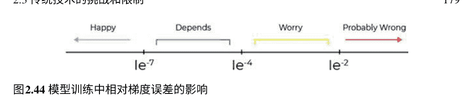

- 使用合适的浮点精度。一个常见的陷阱是使用单精度浮点数计算梯度。我们可能最终会遇到相对较高的错误率，如1e-2，但使用双精度浮点数后错误率显著降低至1e-8。此外，了解浮点运算（Goldberg 1991）以正确编写代码并揭示错误是一个好主意。例如，在神经网络中通常会对批次中的损失进行归一化，这可能会降低已经很小的梯度值（如1e-8），将其除以导致数值问题的数据点数量。一个好主意是打印原始的分析/数值梯度，并根据需要缩放损失函数，使损失处于适当的范围，具有更密集的浮点数，理想情况下为1.0的数量级，其中浮点数的指数为零。

- 相对误差的比较。人们倾向于使用绝对差异或其平方来比较分析 $f_a'$ 和数值梯度 $f_n'$ 在某个阈值之上。问题取决于梯度的大小。例如，1e-4的差异可以被认为是对梯度的良好近似其真实值为1.0。然而，如果梯度的真实值是1e-5的数量级，那么1e-4的绝对差异就是一个巨大的失败。

因此，使用方程式2.109中给出的相对误差的计算更加合适，用于比较两个梯度项。重要的是，相对误差不使用任何一个项。然而，将两个项都包含在分母中的最大值运算符下有助于使方程更对称。这样可以防止分母为零，特别是在使用ReLU函数时，其中一个项为零。

$\frac{|f_a' - f_n'|}{\max(|f_a'|, |f_n'|)}$ (2.109)

使用kinks的情况下，1e-2和1e-4之间的相对误差是可以接受的，即具有非可微部分（如ReLU非线性或SVM损失）的目标函数。但是，对于像Tanh和softmax这样的非线性函数，值1e-4应该很高。

- 在目标函数中存在kinks的情况下使用数据点。存在kinks，指的是目标函数中的非可微部分，这是梯度检查不准确的一个原因。例如，在使用ReLU时进行梯度检查，解析梯度的负值应该显示为零，接近于零的值。相比之下，数值梯度可能会显示出突然的变化。

如果$\epsilon$的值使得$f(x+\epsilon)$越过了拐点，则为零。这是神经网络（如使用ReLU的SVM分类器）中常见的情况。

通过在前向传递期间跟踪结果的标识（在max(x, y)函数中较高），可以找到目标函数中拐点的交叉。在评估梯度近似时，如果至少有一个标识发生变化，则$f(x+\epsilon)$之后会跟随$f(x-\epsilon)$，从而越过目标函数中的拐点。因此，数值梯度与解析梯度不相同。

解决上述问题的一种方法是使用较少的数据点，从而在有限差分近似期间减少可能越过的拐点。此外，较少的数据点还可以加快梯度检查的计算速度，并提高计算效率。

#### 在梯度检查中，使用更少的数据点总是一个好的解决方案吗？

不一定。选择步长$\epsilon$对于使用浮点精度进行计算非常重要。如果步长太小，有限差分会产生较大的舍入误差。下面的插图2.3.4取自维基共享资源（AbsoluteErrorNumericalDifferentiationExample），展示了选择最佳步长的困难。

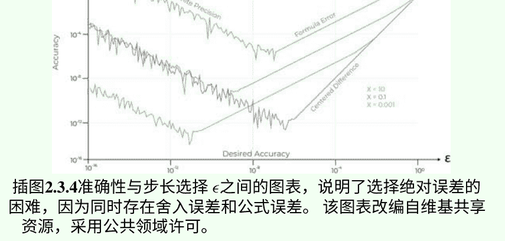

插图2.3.4准确性与步长选择$\epsilon$之间的图表，说明了选择绝对误差的困难，因为同时存在舍入误差和公式误差。该图表改编自维基共享资源，采用公共领域许可。

相关链接：数值微分，步长，浮点运算。

## 2.3 传统技术的挑战和限制

- 在梯度检查中消除非确定性效应。在梯度检查中，限制网络中非确定性项的影响是至关重要的。像dropout和数据增强这样的活动可能会引入显著的错误。然而，完全限制这些可能会导致无法检查它们的梯度，例如dropout可能会错误地进行反向传播。因此，在评估有限项 $f(x+\epsilon)$ 和 $f(x-\epsilon)$ 以及解析梯度之前，调用随机种子可能会提供更好的解决方案。

### 2.3.5 决策透明度

DL算法的另一个重大缺点是它们无法有效地解释为什么它们达到了特定的结论。与传统的机器学习不同，我们无法准确地跟踪算法以确定为什么系统选择了一张狗的图片，而不是一张猫的图片。只能修改错误函数或更改网络，使DL模型对这些特征具有鲁棒性。

通常，DL方法在应用于跨学科问题时无法提供准确的结论。不足和错误的数据可能导致错误的结果。即使是最先进的DL模型也不能像其他基于数学原理的简单模型一样保证它们的知识编码。通常，DL方法在分类问题中表现最佳，而在非分类格式的数据处理方面则较为困难。

许多更简单的模型，如基于机器学习的网络，在期望的预测与实际输出不一致时需要人工干预来提取特征或调整模型逻辑。领域专家根据问题陈述手动编码相关特征。当专家能够准确识别和提取感兴趣的特征（如数值、像素、纹理等）时，这种方法是高效的。另一方面，深度学习方法可以根据目标函数自我纠正错误，通过神经网络传递数百万个参数。这超出了人类干预的理解能力。深度学习从数据中逐渐学习高级特征，并降低错误的概率，这通常在错误的输入或不足的数据情况下更为显著。

然而，在使用复杂的黑盒模型寻求端到端解决方案时，我们忽略了机器的决策能力的问责和透明度。下一章详细介绍了与不同神经网络相关的知识编码和普遍的可解释性技术。这对于使模型对抗性攻击具有鲁棒性，提高信任和可用性，并最终使人机交互能够充分利用复杂模型的精确性和人类基于情感智能的调节是必要的。

## 总结

在本章中，我们简要介绍了一些神经网络和深度学习架构的背景，如感知器、人工神经网络、循环神经网络、卷积神经网络、自动编码器、生成对抗网络和图神经网络。讨论了与学习机制相关的各种概念。本章以对传统技术的挑战和局限性的讨论作为结论。

## 自我评估

- 1. 使用您选择的编程语言编写上述激活函数的数学方程。编写一个训练简单神经网络的代码，并比较激活函数的性能。
- 2. 在循环神经网络的背景下，除了梯度裁剪，您能想到其他应对网络梯度爆炸的方法吗？
- 3. 解释图注意力网络中转导学习和归纳学习的区别。

# 第三章 知识编码与解释


当涉及可解释性时，机器学习模型，特别是深度学习模型，由于其复杂性和透明度的缺乏，常被视为黑盒子。训练一个网络以实现特定目标相当简单。深度学习模型学习对对象进行分类、识别文本或生成数字图像。它在网络的隐藏层中高效地封装了特征学习，但简洁性却有所降低。根据Li等人（2018）的观点，由于其高度非线性的函数，人工神经网络并不自然地适合人类可以处理的解释。

我们将从网络对数据表示和学习挑战的理解开始。它基于神经元的相互作用，并可以看作是理解的基石。接下来，我们监控与模型修改相关的网络中的知识编码。有一些方法可以在一定程度上调试和理解网络行为，以及理解其发生的原因。然后，我们将继续解释知识传播并可视化更深层次模型的行为。本章的主要目标是提供神经网络架构和DNN中的知识编码的理论描述。然而，改进模型性能和度量准确性评估的技术超出了本章的范围。

最后，本章讨论了跨层信息共享的总体概念。为了预测当今重层架构的有效性，我们比较了浅层和深层网络中知识的学习表示。

我们将发现，为了在牺牲可解释性的情况下实现更高的准确性，向更广泛和复杂的模型转移的一般观念是有问题的，并且需要进行批判性反思（图1.9）。

## 3.1 什么是知识？

在可微分神经模块统治SOTA的时代，如何将这些外部知识添加到DNN中是一个自然而然的问题。很高兴知道我们人类已经赋予计算机一些与我们相同的技能，比如能够从例子中学习和感知外部世界。唯一的问题是，教会计算机像人一样“理解”将需要更多的时间和努力。

机器不能仅仅通过学习特征就能神奇地识别出人脸。要确定一个物体是X还是Y，它必须经过训练。这些特征是由深度学习模型以与机器学习模型不同的方式学习得到的。因此，没有一种单一的训练模型的方法。对于数据科学家来说，构建一个能够预测客户流失的机器学习模型，他们需要定义问题的特征（输入模型的属性）。特征工程是使用领域知识创建特征的过程。

通过特征工程，我们可以教会深度学习模型区分狗和猫。想想收集关于地球上所有数十亿只猫和狗的信息。如果考虑到视角依赖的物体变异、杂乱的背景、不同的光照条件和图像变形等问题，我们无法为每个图像制作准确的特征。应该有另一种方法，而且由于神经网络的工作原理，确实有另一种方法。由于神经网络直接从训练数据中学习特征，专家们不需要手动提取特征。神经网络之所以强大，是因为它们可以理解我们的训练数据的含义，并找到与我们想要预测的输出变量最佳连接的方法。它们在这个意义上学习映射关系。它们可以在数学上学习任何映射函数，并且已被证明是通用逼近算法，布朗利（2011）说。

神经网络在解决各种问题上非常成功。它们可以从不同的输入中学习产生各种各样的输出，例如用于分类对象的图像，用于翻译语音的文本，或用于进行金融预测的数字。然而，深度学习模型对数据需求很大，在数据不足的情况下很难表现出色。我们向模型提供的数据越多，它的性能就越好，直到我们的算法达到一定的限制。例如，增加更多的数据只会增加卷积神经网络对偏见的过拟合的可能性，除非数据集收集技术进行修改（Li和Vasconcelos，2019年）。我们不打算利用数据模型关系，而是更好地理解信息如何在网络中打包以及用于解释它的现有流行工具。

## 3.1 什么是知识？

我们从三个主要的子部分开始，将知识向量化作为层的输入，并将这些知识集成到不同的神经架构中。这些是图像、文本和图形的领域知识先决条件。目标是通过外部知识来理解和推理深度学习模型的工作原理。一切都将以简单直观的方式解释，避免复杂的数学。

### 3.1.1 图像表示

本节首先解释了神经网络在处理图像表示方面的流行。图像是由线条和曲线组成的分层结构，这些线条和曲线组合形成较小的模式，进而组合形成较大的模式，最终形成一些物体。网络试图通过将图像分解为这些较小的模式来学习图像模式。因此，CNN中的第一层选择每个像素，并尝试在其周围区域的上下文中聚合信息，以找到边缘和曲线。第二层将这些模式与相邻区域的上下文相结合，形成圆圈、椭圆等等。在经过足够多的层次后，网络应该能够从整个图像的各个部分进行推理。在一些线性计算之后，网络最终可以识别出相关的物体。

#### 3.1.1.1 图像相似性直觉

世界上的许多方面都是直观和显而易见的。我们可以在不知道它的名称的情况下判断哪种花与另一种花相似。对于许多物体也是如此。这种技能帮助我们识别物体，决定我们更喜欢哪些物体，并找到更多类似的物体。如果我们能教会计算机这种技能，让它们能够帮助我们找到我们想要的东西并识别它们看到的东西，那该多好？我们将说明这与仅仅涉及图像有关。我们如何编写一个能够将图像分类为不同类别的算法？与编写一个算法（例如对一组数字进行排序）不同，编写一个能够识别图像中的猫的算法并不明显。因此，我们不会试图直接在代码中指定感兴趣的每个类别的外观，而是采取的方法与你对待一个孩子的方法类似：我们将为计算机提供每个类别的许多示例，然后开发学习算法来查看这些示例并了解每个类别的视觉外观。这种方法被称为数据驱动方法，因为它依赖于首先积累一个带有真实标签的训练数据集的图像。

那么计算机图像到底是什么？图3.1将图像表示为一个简单的颜色网格，用数字值编码并以位的形式存储在数字中。接下来，为了从一组图像中找到一个相似的图像，我们需要一种计算两个图像之间距离的方法。这怎么实现呢？一个简单的概念是逐像素计算差异并取平均值

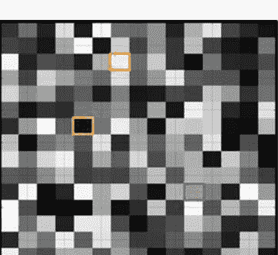

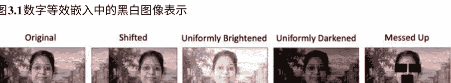

将所有像素距离作为两个图像之间的距离。这种方法对于检索相同的图像效果很好。换句话说，给定两个表示为向量的图像 $I_x$，$I_y$，比较它们的一个合理选择可能是在公式3.1中使用L1距离。

$$d_1(I_x, I_y) = \frac{1}{p} \sum_{p} |I_x^p - I_y^p|$$ (3.1)

有很多其他计算向量之间距离的方法。另一个常见的选择可能是使用L2距离，它具有计算两个向量之间欧几里德距离的几何解释。这样做，我们将像以前一样计算逐像素差异，但这次我们将它们全部平方，相加，最后再取平方根。但是，如果存在照明、物体旋转或缩放差异呢？实际上，我们得到的分数并不准确地表示差异。图3.2描述了图像在像素空间中非常不同，但在特征空间中相似。

> 突出显示

**L1距离和L2距离之间的有趣考虑。**

特别是，与L1距离相比，L2距离对于两个向量之间的差异更加严格。L2距离更喜欢许多中等分歧而不是一个大分歧。它们是p-范数的最常用特殊情况。

更高级的想法是使用图片描述符，例如尺度不变特征变换（SIFT），由Lowe（2004b）在2004年引入。这些经典的描述符使用计算机视觉从图像中提取特征，这些特征对图像上的某些几何变换是不变的。这对于区分描绘相同事物的照片非常有用。

> 突出显示

SIFT（Lowe 2004b）算法基本上包括四个步骤：尺度空间峰值选择，关键点定位，方向分配和关键点匹配。它的主要优点是：

1. 独特性：可以将单个特征与大量对象数据库进行匹配。
2. 局部性：特征彼此靠近，使它们对遮挡和噪声具有鲁棒性（无需先前的分割）。
3. 效率：接近实时性能。
4. 可扩展性：可以轻松添加各种不同类型的特征，每个特征都提供鲁棒性。
5. 数量：即使是小物体也可以产生大量的特征。

如果同一类别的两个实例看起来比这些变化更不同，我们需要另一种方法。卷积神经网络在这里发挥作用。近年来，卷积神经网络在图像分类中取得了极高的准确性。这些网络可以从图像中提取出不变性质，如图3.3所示。对于人类来说，识别视觉概念（例如狗）相对容易。然而，从计算机视觉算法的角度来看，这是一个非平凡的任务。在下面我们列举了（不完全的）一些挑战时，请记住图像的原始表示形式是一个3维数组的亮度值：

+ 视角变化：一个物体的单个实例可以以许多不同的方式相对于相机进行定位。
+ 尺度变化：视觉类别通常表现出尺度上的变化。这包括现实世界中的尺寸，不仅仅是图像中的范围。例如，随机裁剪会聚焦于图像的某一部分。

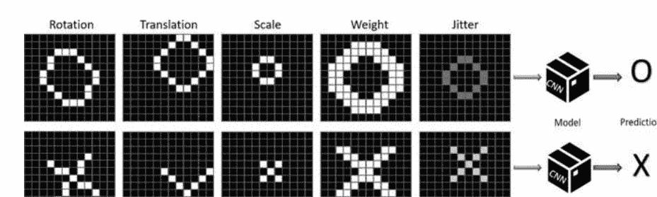

+ 变形：许多感兴趣的对象都不是刚体，可以以极端的方式变形。例如，以特定角度旋转图像以模拟不正确的水平校准，或者沿着轴翻转图像同时保留图像的含义。
+ 遮挡：感兴趣的对象可能被遮挡。有时只有一个小部分对象（仅几个像素）可见。
+ 照明条件：照明对像素级别有很大影响。这可能是由于RGB颜色值的微小变化或由于光照变化引起的噪声造成的。
+ 背景杂乱：感兴趣的对象可能与其环境融为一体，难以识别。这可能是亮度变化、添加噪声导致对输入变化的更高容忍度或潜在的图像部分丢失的情况。
+ 类内变异：感兴趣的类别通常可以相对广泛，例如椅子。这些对象有许多不同的类型，每种类型可能具有非常奇特的外观。

一个好的图像分类模型必须对所有这些变化的交叉乘积具有不变性，同时保持对类间变异的敏感性。DL模型通常需要大量的数据进行适当的训练。使用数据增强技术通常可以从现有数据中获取更多数据是很有用的。请注意，在训练过程中，数据通常是即时增强的。

用于图像识别和检测任务的主要架构是由多个具有小神经元集合的CNN组成的，每个神经元集合感知图像的小部分。一层中所有集合的结果部分重叠，以某种方式创建整个图像表示。下一层在新的图像表示上重复这个过程，使系统能够学习底部行中所示的图像组合。每个节点层通过前一层产生的输出（特征集）进行训练。因此，每个连续层中的节点可以识别更复杂和详细的特征-图像所表示的视觉表达。这种“逐渐增加的复杂性和抽象性的层次结构”被称为特征层次结构。

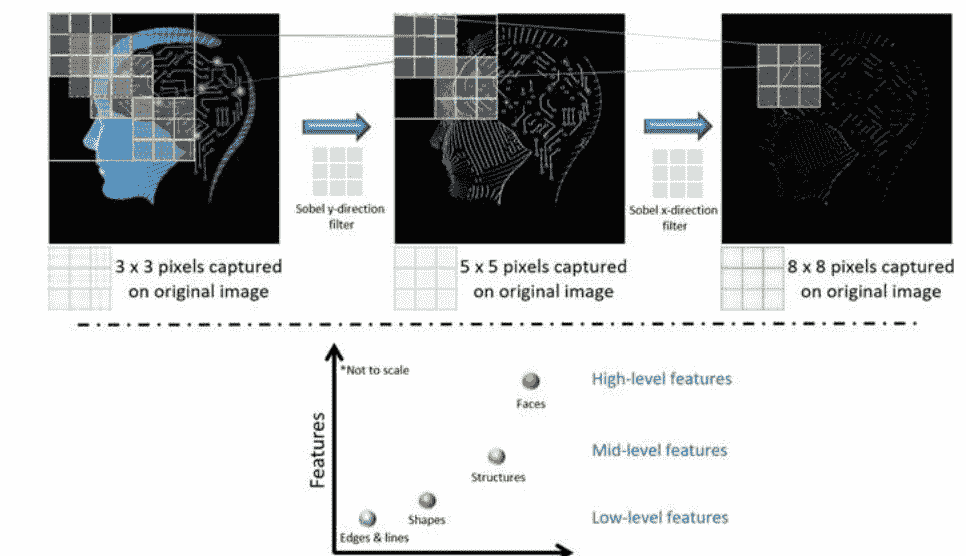

图3.4卷积神经网络（CNN）的感受野（RF）的工作原理。在顶部一行中，有一个3×3的卷积核，它覆盖了原始图像中的8×8个像素，展示了通过卷积来捕捉高级特征的数量。第二行展示了CNN的感受野随着网络的深入而扩大时可以检测到的特性类型。

当一个人识别一张脸时，位于视觉神经元区域底部的具有小感受野（RF）的视觉神经元（参见图3.4底部行的非比例图）被激活，这些神经元对边缘和线条等基本视觉特征敏感。在视觉皮层的较高层次上，神经元的感受野更大，对形状和物体敏感。在眼睛区域，视觉神经元具有最大和最完整的感受野，因此它们可以理解整张脸。通过比较大脑中视觉神经元的感受野的功能与CNN中神经元的功能，可视化展示了CNN的工作原理。我们需要利用图像的空间结构来学习图像的局部特征并将它们组合起来（Qin等，2018年）。

图3.4的顶部行清楚地解释了卷积滤波器对编码图像表示的影响。通过在后续层中使用滑动窗口将输入图像的输入块与单个神经元连接起来，使用3×3的滤波器最终覆盖了原始图像的8×8像素。我们通常使用多个滤波器来检测边缘、增强、归一化或模糊，并使用相关权重提取不同的局部特征，并在空间上共享每个滤波器的参数。

在一个样本的单行TensorFlow (TF)代码中，我们可以获取关于传递给网络的知识的许多信息。TF-卷积运算符将步幅和零填充选项作为参数。这里，步幅是每个维度上的内核应用之间的距离，填充可以是'SAME'或'VALID'。

#### 3.1.1.2 图像嵌入

图像可以用嵌入表示。有多个预训练网络可用，ResNet和EfficientNet网络在提取图像特征方面表现出色。然而，除了表示完整图像之外，在应用图像编码器之前进行分割或对象识别也是可行的选择。

图像编码器之间的一个关键区别是它们所使用的损失函数。三元损失、交叉熵甚至是相对较新的对比损失在CNN训练中经常被使用。三元损失和对比损失都试图将相似的对象聚类在一起，而交叉熵则将对象聚类到它们共享某些属性的类别中。自监督学习（simclr byol）正在快速改变这一点，以允许无监督训练而无需分类，这就是许多基于ImageNet的预训练图像分类模型使用交叉熵进行学习的方式。未来，顶级编码器甚至可能不需要标记的数据来正常运行。

将图像编码为向量可以实现许多应用：任何可见的东西都可以被编码。时尚、植物和产品搜索都是可能的图像类别。电影和其他视频的搜索。 这包括以下用例：

- 信息检索：图像嵌入对于搜索人类可以在视觉上识别的任何东西非常有用。例如，在网络上寻找相似的对象。通过足够大的图像嵌入，我们可以构建令人惊叹的应用程序，比如通过车辆的内饰、车轮等来寻找汽车。
- 推荐系统：第二个杰出的用例是可以使用任意组合的对象进行查询。例如，根据用户的浏览历史，可以推荐相关内容。现代推荐系统学习如何优化这些嵌入，而不是使用简单的平均值。
- 表示学习：这探索了嵌入作为世界表示的方法，为图像等各种应用提供了可能。例如，GAN允许从表示中生成图像。StyleGAN从嵌入表示和转换中生成图像的风格。

##### 训练网络生成图像嵌入

我们还没有介绍如何训练卷积神经网络。这是一个广泛的主题，有许多技术可以微调或训练嵌入，但让我们重点介绍一些。

- 分类训练。图像分类是计算机视觉的一个成功应用。ImageNet是一个非常通用的数据集，包含许多不同的物品，因此经过训练的网络作为特征提取器效果很好。为了证明重新训练这种网络的必要性，领域必须与ImageNet不同，并且数据集必须包含数百万张图像。
- 微调。微调你的网络以改善数据集适应性。目标是从现有网络中重用训练良好的权重，仅添加几千个图像。
- 三元损失的训练。与分类训练不同，利用三元损失来开发图像嵌入神经网络。在这种情况下，训练数据不是一对图像和标签，而是每个对象的一组图像。例如，一个人的不同图像。
- 为任务进行微调。这可能是训练嵌入的最佳技术。与构建在任何情况下都能发挥作用的通用嵌入不同，我们可以构建特定任务的嵌入。使用深度学习推荐系统来微调嵌入以匹配业务目标。
- 度量。训练意味着不完美的结果。事实上，嵌入在定制到每个活动时效果最好，因为相似性可能因视角而异。一些度量是通用的，并且可以很好地评估嵌入的质量。估计给定项的K个最近项是否属于相同类别是一种。这是一个有趣的度量，因为人们似乎期望最接近猫的图像是一只猫。在使用任务特定度量之前，这是一个很好的合理性检查。

嵌入是一种表示世界和数据的强大方式，许多工作都可以很好地使用它们。嵌入可以使用图像、单词情况、图形，然后聚合以创建项目、食谱、句子、文档等的嵌入。

#### 3.1.1.3 图像的视角

任何AI模型执行对象分类、单词识别或图像生成等任务的能力都取决于可用数据的质量和数量。 然而，工作记忆对于人类和模型学习都是一个问题。

当涉及从场景、物体或图像中提取信息时，人类视觉系统是无与伦比的。 根据心理与脑科学系主任史蒂夫·杨蒂斯的说法，这种视觉“一次考虑所有上下文关系”，而不是随着时间的推移逐渐发展。 例如，听众需要记住演讲者呈现思想的顺序，以便将更大的叙事背景拼凑在一起。 当你阅读一句话或一段文字时，情况也是如此。

因此，本节从讨论诸如“我们如何识别所看到的物体？”等基本问题开始，然后转向对这些概念在深度网络模型（如CNN和GAN）中如何实现的定性分析。 让我们看看是否可以通过一个例子来说明一些图片分析的基础知识。

图3.5中有两组图像。左边是一组具有相同纹理和颜色方案的狗和松饼的组合。 右边的另一组图像将狗的身体毛与扫帚进行对比。 但我们如何判断它是一只狗还是其他东西？ 即使在纹理组合和前景与背景之间对比度较低的情况下，如果我们仔细观察，我们仍然可以区分出来。

图像的形状、颜色、地平线周围的边缘线以及有时候物体周围的显著纹理都是显著的特征。 考虑我们如何获得分类或识别一个对象的独特特征/特性。通过使用标记物来识别对象的想法的实施，这在人类通过眼睛感知事物中是标准的，导致了CNN的发展。当CNN识别出与人类解释不同的特征时，情况与现实相去甚远，导致错误分类。然而，这使得模型能够识别出人类可能难以解释的图像/视频流中的对象。这类似于人类行为的差异和他们在相同情况下形成相反观点的能力。

以示例2中显示的另一个快速示例来理解这个想法。在不同的人群身上进行这个实验，并记录你得到的对乐高艺术的解释的创造力。评估儿童、年轻人和老年人之间的思维过程。从这个例子中，我们观察到关注不同的特征会导致对同一图像的不同解释。现在让我们了解一下在计算机上如何实现。

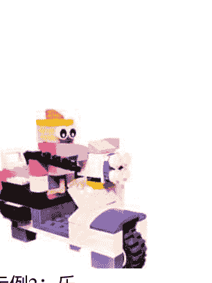

在这个部分，我们将学习关于图像数据的知识，它由2D像素网格组成。根据图像是灰度还是彩色，每个像素都有一个或多个值。传统机器学习模型的线性行为意味着较弱的单调性假设，即任何增加或减少特征的减少直接影响了模型的输出及其相应的权重。尽管这种方法在一个应用中是有道理的，但在图像预测和识别任务中注定会失败。图像预测需要像素位置的强度不变性和图像反转的类别保持性，因为像素对其周围环境的复杂依赖。这促使我们提出了MLPs，它们是FC-NN层架构，从前一层接收输入并影响后续层。因此，它通过激活函数在表示上结合了隐藏层的观察性表示学习和非线性预测器。它通过特征顺序的关键不变性将MLP与线性模型区分开来。CNN中的滤波器/核是大小不同的小数组，作为逐元素乘法器在图像上进行卷积，根据核大小和步幅揭示额外的特征。请参考第2章中MLPs和CNNs的数学原理。

很快就清楚，传统的MLP方法将数据压缩成一维向量，忽略了通过FC-MLP输入的图像的空间结构。这就引出了CNN，它们被设计用于将空间上下文整合到模型的决策能力中。它对计算机视觉产生了如此大的影响，以至于在尝试图像识别、检测和分割任务之前，首先开发CNN架构被认为是相对无用的。我们将在接下来的章节中了解更多相关内容。现在让我们了解一下词表示和学习的挑战。

### 3.1.2 单词表示

嵌入也可以用来表示文本。单词、短语和整篇论文只是文本呈现的众多方式之一。单词的含义可以从文档中的上下文推断出来。这些现在都在现代深度学习的强表示范围内。嵌入的最常见用途之一是Word2vec对单词进行编码。

Word2vec在识别单词是否语义上相近等任务中表现出色。而通过适当考虑句子中众多单词之间的关系，一种较新的技术称为transformers已经实现了对整个句子的编码。仅仅几年前，它们就能在几个领域中超越SOTA的性能。接下来，Bert架构是一种独特的transformer类型，在多任务环境中训练效果良好。它被称为“NLP的ImageNet”。通过Bert漫画可以很好地了解这种方法。

说到NLP，旨在用向量表示单词的词表示在NLP中起着至关重要的作用。单词通常是人类语言中最小的有意义的组成部分。语言中的高级结构，如短语和句子，是由单词构成的。学习单词的定义对于人类语言理解至关重要。因此，适当地表示单词对于模型更好地解释、分类或生成NLP任务中的文本是必要的。

#### 3.1.2.1 词嵌入

早在1990年代，分布语义学领域的研究人员就开始使用向量空间模型来嵌入单词。Bengio等人在2003年正式提出了“嵌入”一词，之后在NLP模型及其参数中进行了训练。他们模型的基本原理在今天的神经语言和词嵌入模型中仍然可以看到（Ruder 2016）。从那时起，我们看到了几种用于估计单词连续表示的模型的发展，其中包括潜在狄利克雷分配（LDA）和潜在语义分析（LSA）等两个例子。用于词级语义的基本网络层包括以下内容：

- 1. 嵌入层：通过将索引向量与词嵌入矩阵相乘来创建词嵌入。
- 2. 中间层：生成输入的中间表示的一个或多个层，例如应用非线性函数于来自之前单词的词嵌入的连接的全连接层。
- 3. Softmax层：生成数据集V上的单词概率分布的最后一层。

## 3.1 什么是知识？

Bengio等人（2003）还确定了SOTA模型的两个问题：
- 第一个问题是，LSTM可以替代用于尖端神经语言模型的第二层。
- 由于计算softmax的成本与单词数量成正比，而单词数量通常在数十万或数百万的数量级上，他们得出结论，这个最终的softmax层（更准确地说是归一化项）是网络的主要瓶颈。

因此，NLP和词嵌入模型中的一个主要困难是开发降低计算大词汇表上softmax成本的技术（Chen等人，2015）。

然而，在2008年的研究中，Collobert和Weston（2008）可以说为下游任务中预训练的词嵌入的有效性奠定了基础，并宣布了许多当代技术所基于的神经网络架构。但是在2013年，Mikolov等人（2013）通过发布word2vec工具包，将词嵌入推向了前沿，这是一个允许训练和使用预训练嵌入的工具包。GloVe是一个竞争激烈的预训练嵌入集合，一年后由Pennington等人（2014）带给我们，证明了词嵌入突然变得流行起来。

毫不奇怪，词嵌入以及深度学习生态系统的许多其他组件都是通过学习，或者更具体地说，通过从数据中学习来开发的。在当前为数不多的有效无监督学习应用中，词嵌入备受推崇。它们最大的优势也许在于不需要昂贵的注释来利用它们。相反，它们可以从现有的未注释语料库中推断出来。

下面的子章节概述了学习词表示的常见方法，并解释了将词嵌入方法应用于文本时的优势。然后，我们介绍了两个常见的用于评估词表示的基准。最后，我们讨论了扩展现有词表示模型的几种方法。

##### 独热词表示

机器将一切都转化为二进制（0和1）。如果以可理解的形式（例如数字）提供给机器，它可以理解单词。在自然语言处理中，最自然的方法是创建一个包含许多术语的词汇表，并为每个单词分配一个唯一的索引。这被称为单热编码。

给定一个词汇表 $V=\{w_1, w_2, \ldots, w_{|V|}\}$，一种非常直接的方法是用一个 $|V|$ 维向量 $\mathbf{w}$ 来表示一个单词 $w$，其中每个维度要么是0要么是1。$\mathbf{w}$ 的每个维度可以用以下方式正式表示：

$$w_i = \begin{cases} 1, & \text{如果 } w = w_i \\ 0, & \text{否则} \end{cases}$$ (3.2)

单热编码表示的挑战：
- 无法捕捉单词之间丰富的语义和句法相似性。
- 它是一种高维稀疏表示，非常低效。
- 缺乏处理新词的灵活性，需要为新词分配新的索引，并且会改变表示的维度。这些变化可能会给现有的自然语言处理系统带来一些问题。

总之，独热编码不考虑单词的上下文或含义；所有单词向量之间的距离相同，并且非常低效。

许多方法可以学习单词嵌入，我们很快会介绍其中一些方法，但总体目标是创建一个嵌入矩阵 \(E\)，它可以将一个独热向量 \(o_w\) 转换为表示一个单词的固定大小的向量 \(e_w = E o_w\)。让我们看一个高级示例，了解如何实现这一点。

考虑短语“I enjoy sipping apple smoothies.”如果我去掉“apple”一词，我们得到以下不完整的句子：“I enjoy sipping—smoothies.”如果我向你提供这个不完整的短语，并要求你找出缺失的单词，你可能会回答“banana”、“strawberry”或“apple”，它们都具有类似的意义并存在于类似的环境中。

目标/上下文似然模型可以用来学习这个嵌入矩阵。它是通过训练类似于语言模型（一种试图预测短语中缺失单词的模型）使用神经网络来预测这个缺失单词来计算的，就像网络的权重和偏差一样生成。在实践中，我们可能会避免训练自己的词嵌入，因为从各种语料库（例如维基百科或Twitter GloVe词嵌入）创建的公开可访问的词嵌入可以节省我们的时间和精力。

##### 分布式词表示

有人认为分布式词表示策略可以用来解决独热词表示问题。密集分散的单词表示对于这个策略至关重要。词嵌入通过在训练过程中学习将每个词汇单词表示为固定大小的向量（通常为150、300或500维）来解决这些问题。与其他词表示方法相比，词嵌入使用向量给具有相似含义的单词赋予相同的数值。使用词嵌入时，单词在标准向量空间中表示为实值向量。这种方法通常与深度学习分组，因为它涉及将单词映射到向量，然后学习这些值。以类似于神经网络学习的方式对这些向量进行解释。相反地，稀疏的词表示（如独热编码）需要数百或数百万个维度。

分布式词表示的学习基于分布假设（Firth 1957; Harris 1954），该假设认为具有相似分布的语言项具有相似的含义。允许深度学习技术在困难的自然语言处理任务中取得如此显著成功的一项重大进展是文本的分布式表示的发展。

##### 布朗聚类

布朗聚类（Brown et al. 1992）基于分布理论将单词组织成分层聚类，该理论认为具有相似含义的单词倾向于被分组在一起。具体而言，它从大规模语料库中学习一个二叉树，其中叶子节点表示单个单词，而节点表示这些单词的分层组。考虑到每个单词必须被分配到恰好一个聚类中，这是一种具有挑战性的构建聚类的策略。

语言的n-gram模型为Brown Cluster的词聚类方法提供了灵感。使用语言模型计算句子的每个可能解释。可以合理地期望像“度过了愉快的一天”这样的陈述比完全随机的陈述更有可能发生。在k-gram语言模型中，短语s={w₁, w₂, ..., wₙ}的概率可以用公式3.3表示：

$P(s) = \prod_{i=1}^{n} P(w_i | w_{i-k}^{i-1})$

从大型语料库中估计$P(w_i | w_{i-k}^{i-1})$（参见公式3.3）是很直观的，然而该模型包含$|V|^k - 1$个独立参数，这对于1990年代的计算机来说是一个相当大的数量。即使$k=2$，参数的数量也很大。此外，对于不常见的术语，评估是不准确的。Brown等人（1992）建议将单词分组成簇，并训练簇级n-gram语言模型，而不是单词级模型，以克服这些问题。

目前没有可行的方法来获得最佳分区。然而，Brown Cluster采用贪婪方法来获得次优结果。它首先为每个单词分配一个唯一的类$C_i$。然后将具有最小平均互信息的两个类合并。分区是通过$|V||C|$次合并创建的。保持$|C|$个聚类，我们可以无限次执行$|C|-1$次合并来获得二叉树。该方法的复杂度是$O(|V|^3)$，在适当的实现下。

聚类标签可以近似表示单词相似性，但不能正确匹配同一组中的单词。分布式词表示试图克服这个问题通过将每个单词嵌入到连续的实值向量中。 这是一种密集的表示，意味着一个概念由多个向量维度表示，并且每个向量维度参与表达多个概念。

由于其连续性，分布式词表示在深度神经网络中很容易应用于自然语言处理应用中。 词向量通常是使用诸如Word2vec和GloVe等分布式词表示算法从大型语料库中学习的。

##### 潜在语义分析

潜在语义分析（LSA）是一组基于向量空间模型的方法，可以潜在地改进词语语义的捕捉。LSA通过矩阵分解来研究词语和文档的潜在成分，以增强对词语相似性的估计。它可以在词-文档矩阵中收集大量有用的信息，并产生平滑效果，从而防止在最大奇异值的可接受数量下出现显著变化。

随机索引是另一种LSA算法（Kanerva等，2000年；Sahlgren，2005年）。它避免了对大型词-文档矩阵进行昂贵的预处理，从而克服了基于SVD的LSA的挑战。在随机索引中，每个文档被分配一个随机生成的高维稀疏三值向量（称为索引向量）。然后将索引向量添加到文档中每个词的向量中。索引向量预计应该是正交的或者基本上是正交的。这种方法简单且可扩展，易于并行化和逐步实现。根据Sahlgren（2005年）的说法，其性能与基于SVD的LSA相当。

##### Word2Vec

谷歌的Word2Vec工具包于2013年发布，是一组类似的模型，利用浅层两层人工神经网络生成词嵌入，尝试根据上下文预测单词，这被称为连续词袋（CBOW）模型，或者仅根据一个单词预测上下文，这被称为Skip-gram模型。CBOW优化嵌入，使其能够根据上下文单词预测目标单词，基于一个概念，即单词的含义可以从其上下文中学习。相反，Skip-gram学习嵌入，可以根据目标单词预测上下文单词。

###### • CBOW

给定一个上下文窗口，CBOW预测中心单词。形式上，CBOW预测$w_i$基于其上下文，如公式3.4所示。

$P(w_i|w_{j(|j-i|\le l, j \ne i)}) = \text{Softmax} \left( \mathbf{M} \left( \sum_{|j-i|\le l, j \ne i} \mathbf{w}_j \right) \right)$ (3.4)

以概率$P(w_i|w_{j(|j-i|\le l, j \ne i)})$为词$w_i$的窗口大小$l$，权重矩阵$M$在$R^{|V| \times m}$，词汇$V$和词向量维度$m$。窗口大小$l$是调整以实现CBOW最佳性能的超参数。模型，通过最小化 Eq. 3.5中的负对数概率之和进行优化。

$$\mathcal{L} = -\sum_i \log P(w_i | w_{j(|j-i| \leq l,j=i)})$$

> 如果增加CBOW窗口大小，可能会导致训练时间增加，但准确性也会提高。

-   Skip-gram

与CBOW相比，Skip-gram不仅基于中心词预测周围的词，还预测了一个词 $w_i$ 被提供时周围的词，并使用Eq. 3.6中的Skip-gram算法预测其上下文。

$$P(w_j|w_i) = \text{softmax}(\mathbf{M} w_i)(|j-i| \leq l, j = i)$$

其中 $P(w_j|w_i)$ 表示给定上下文词 $w_i$ 的情况下上下文词 $w_j$ 的概率，$M$ 是权重矩阵。损失函数的定义与CBOW相同，见Eq. 3.7。

$$\mathcal{L} = -\sum_i \sum_{j(|j-i|\leq l,j=i)} P(w_j|w_i)$$

分层softmax和负采样

> 直接训练CBOW或Skip-gram非常耗时。softmax层的实现时间最长。即使只使用一个词来计算损失函数，典型的softmax层仍然需要获取所有词的分数。获得一个不错但更快的近似项的概念似乎是提高生产力的一种自然方式。

分层softmax的思想是为所有单词创建一个类别层次结构，然后使用该层次结构来估计单词的条件概率。每个叶节点代表一个单词，而每个内部节点代表一个层次类别，并与一个特征向量相关联。单词的频率用于生成一个“哈夫曼树”，分层softmax使用该树来创建层次类别。这种近似计算每个单词的概率，复杂度为O(log|V|)，大大加快了计算速度。负采样的过程更简单。负采样根据这些单词的频率随机抽取 k 个作为“负样本”，并使用该信息计算该单词的概率。为了推导出目标单词的概率的近似值，然后计算了一个softmax函数，该函数计算了k+1个单词的概率。请记住，这种策略所需的CPU周期比Skip-gram模型少。

这些模型是在一组 k negative实例和1个positive实例上训练的二元分类器，它们的目标是预测给定上下文和特定目标词组合的频率。预测由公式3.8表示，给定上下文词 w_c 和嵌入 e_c，目标词 w_i，以及与 t named θ_w 相关的参数。

$$P(y=1|w_c, w_i) = \sigma (\theta_{w_i}^T e_c)$$  (3.8)

###### GloVe

Skip-gram和CBOW等技术是基于窗口的方法的示例。这些技术使用上下文窗口搜索整个语料库，但它们没有充分利用某些重要的全局数据。与其他方法不同，全局词向量（GloVe）可以准确捕捉语料库统计信息。GloVe算法（全局向量的缩写）通过共现矩阵确定单词的嵌入。为了构建这个矩阵，我们首先遍历大量文本语料库，识别每个唯一的单词。它记录了每个单词在一定窗口大小的句子中出现的频率，从而给出了单词之间的紧密程度。

> 当涉及到收集意义并在诸如计算类比等任务中展示它时，像word2vec这样的学习方法优于使用LSA等矩阵分解技术生成的经典词向量空间模型表示的单词。利用LSA等矩阵分解技术的全局统计数据和word2vec中的基于局部上下文的学习，GloVe是更好地理解世界的一种方式。GloVe不使用窗口来描述局部上下文，而是使用整个文本语料库上的统计数据来构建显式的单词-上下文或单词共现矩阵。最终产品是一个可以更广泛改进词嵌入的学习模型。

共现比率在几种情况下都很有用。例如，比较冰和水与某些探针词一起出现的频率可以揭示它们的语义重要性。像“固体”这样与冰相关但与蒸汽无关的词将具有高比率 P(solid|ice)/P(solid|steam)。比率 P(gas|ice)/P(gas|steam)将很小，因为气体与蒸汽相关，但与冰无关。对于与这两个词直接相关或完全无关的术语，比率接近1。

使用这个概念，构建了GloVe模型，其中 $\tilde{w} \in \mathcal{R}^d$ 是独立的上下文词向量，而 $P_{ij}$ 是在等式3.9中找到的词 j 在词 i 的上下文中的概率。

$$F(\mathbf{w}_i, \mathbf{w}_j, \tilde{\mathbf{w}}_k) = \frac{P_{ik}}{P_{jk}}$$，其中，$$P_{ij} = \frac{N_{ij}}{N_i}$$   (3.9)

对于给定的词 $j$，它在词 $i$ 的上下文中出现的次数被表示为 $N_{ij}$，而词 $j$ 的上下文中任何其他词的频率被表示为 $N_i = \sigma_k N_{ik}$。在词向量空间比率 $P_{ik}/P_{jk}$ 中编码的信息预计由函数 $F(.)$ 来表示。线性结构要求 $F$ 仅依赖于两个目标词之间的差异。由于 $F$ 的参数是向量，而等式3.9的右侧是一个标量，因此可以使用点积来保持线性结构，如等式3.10所示。

$$F\left( (\text{第}_i\text{个词} - \text{第}_j\text{个词})^{\top} \cdot \text{第}_k\text{个词} \right) = \frac{P_{ik}}{P_{jk}}$$   (3.10)

即使目标词和上下文词重新标记，模型仍然保持不变性。为了保持这一点，$F$ 必须是 $(\mathbb{R}, +)$ 和 $(\mathbb{R} > 0)$ 之间的同态映射。在方程3.11中，解为：

$$\text{第}_i\text{个词}^{\top} \cdot \text{第}_k\text{个词} = \log N_{ik} - \log N_i$$   (3.11)

添加偏置 $b_i$ 和 $\tilde{b}_k$ 第k个词可以消除 $\log N_i$，这是为了保持交换对称性所需的。因此，模型发展到方程3.12，

$$\text{第}_i\text{个词}^{\top} \cdot \text{第}_k\text{个词} + \text{偏置} b_i + \text{'偏置} \tilde{b}_k\text{第}_k\text{个词} = \log N_i$$   (3.12)

这比方程3.9要简单得多。方程3.13定义了损失函数：

$$\mathcal{L} = \sum_{i,j=1}^{|V|} f(N_{ij})(\mathbf{w}_i^{\top} \tilde{\mathbf{w}}_j + b_i + \tilde{b}_j - \log N_{ij})$$   (3.13)

其中 $f(.)$ 是在方程3.14中定义的加权函数。

$$f(x) = \begin{cases} (x/x_{max})^\alpha & \text{if } x < x_{max} \ 1 & \text{否则} \end{cases}$$   (3.14)

## 3.1 什么是知识？

#### 3.1.2.2 上下文化的词表示

在日常语言中，陈述的上下文严重影响了单词的理解。许多流行的词嵌入，如CBOW、Skip-gram、GloVe，在理解单词的上下文特定含义方面存在不足。由于为每个单词学习了一个单独的表示，这些模型无法理解单词在不同环境中的含义变化。

Neumann等人（2018）建议使用来自语言模型的嵌入（ELMo），该模型使用深度的双向LSTM模型构建单词表示，以解决这个问题。ELMo对每个给定单词的表示取决于其使用的上下文。具体而言，ELMo将单词和周围的文本输入到DNN中，然后即时将单词转换为低维向量。ELMo使用双向语言模型进行单词表示。

#### 突出显示

随着词表示的成功，学者们正在探索其思想。一些出版物努力验证现有词表示学习策略的合理性，而其他人则提出了新的学习方法。

合理性：Word2vec和相关工具是学习词表示的经验方法的例子。许多方法，如负采样，被提供用于高效地学习语料库的词表示。

鉴于这些方法的有效性，需要进行更广泛的理论研究来证明这些策略的合理性。Levy和Goldberg（2014）对这些技巧进行了一些理论分析。通过隐式矩阵分解方法，他们将Skip-gram模型与负采样形式化。他们还使用奇异值分解矩阵分解技术评估了隐式矩阵M的性能。当负样本数量为1且嵌入维度小于500时，矩阵分解会得到更高的目标值。具有负采样的Skip-gram在客观上表现更好，负样本数量越多，嵌入维度越大。这是因为奇异值分解在矩阵M中的零值数量增加时更倾向于分解具有最小值的矩阵。

使用1,000维的嵌入和不同数量的负样本，在1,5,15个样本中，奇异值分解（SVD）稍微提高了词类比和相似性性能。相反，负采样的Skip-gram在句法类比任务上比对照组提高了2%。

可解释性：现有的分布式词表示技术通常可以为每个词提供一个密集的实值向量。然而，这些模型产生的词嵌入很难解释。为了创建每个维度代表一个独立概念的可解释模型，Li等人（2016）引入了非负和稀疏嵌入。词嵌入矩阵（E ∈ R^{|V|×m}）和文档统计矩阵 D ∈ R^{m×|D|} 通过对语料统计矩阵 X ∈ R^{|V|×|D|} 进行因式分解生成。其训练目标如下方程所示。

$$\arg \min_{\mathbf{E}, \mathbf{D}} \frac{1}{2} \sum_{i=1}^{|V|} \| \mathbf{X}_{i,:} - \mathbf{E}_{i,:} \mathbf{D} \|_2 + \lambda \| \mathbf{E}_{i,:} \|_1,$$

$$使得, \quad \mathbf{D}_{i,:} \mathbf{D}_{i,:}^{\top} \leq 1, \forall 1 \leq i \leq m,$$

$$\mathbf{E}_{i,j} \geq 0, 1 \leq i \leq |V|, 1 \leq j \leq m$$

该模型可以通过迭代优化 E 和 D 来训练非负和稀疏的词嵌入。在每个维度上得分最高的词表明了概念上的相似性，因为嵌入是稀疏和非负的。该研究还提出了对损失函数的短语级限制，以进一步增强嵌入。通过加入额外的限制，可能实现可解释性和组合性。

##### 具有分层结构的词表示

一般来说，人类的知识是按层次组织的。许多最近的方法还包括了一个文本层次结构，在词表示学习中包括：

-   **基于依赖的词表示：** 连续词的嵌入包含语义和句法信息。然而，当代词表示模型仅依赖于线性上下文，并且显示出更多的语义信息而不是句法信息。基于依赖的上下文被基于依赖的词嵌入Levy和Goldberg（2014）所利用，以便嵌入可以提供更多的句法信息。基于依赖的嵌入与Skip-gram嵌入相比，更少涉及主题，并具有更多的功能相似性。考虑从依赖解析树中获取学习词表示的信息。目标词 w 的上下文是其修饰词，即 (m1, r1), ..., (mk, rk)，其中 ri 是头节点和修饰词之间的依赖连接类型。在训练过程中，模型基于依赖优化上下文的可能性，而不是基于相邻上下文。与Skip-gram相比，该模型在一些词相似性基准上取得了改进。实验证明，在向量空间中，句法相关的短语更相似。

-   **语义层次：** 由于向量空间的线性子结构，词嵌入可以形成简单的类比。例如，区分‘挪威’和‘奥斯陆’之间的关系与‘印度’和‘新德里’之间的关系相当。然而，由于这些相互作用的复杂性和非线性性质，它很难识别上位词-下位词的相关性。

为了解决这个问题，Fu等人（2014年）使用词嵌入来发现上位词-下位词的关联。与其依赖于嵌入偏移来表达连接，更好的方法是学习线性投影。在方程3.15中，模型改进了投影，使其更好。

$$M^* = arg min_M \frac{1}{N} \sum_{(i,j)} \| Mx_i - y_j \|_2 \quad (3.15)$$

其中 $x_i$ 和 $y_j$ 是上位词和下位词的嵌入。

为了提高模型的性能，他们提出将词对聚类成多个组，并为每个组学习线性投影。线性投影可以帮助识别多个上下位关系。

#### 3.1.2.3 评估

近年来，已经提出了几种将单词嵌入到向量空间中的方法。因此，有必要检查不同的策略。词相似性和词类比是词嵌入的两个常见度量。双方都希望确定词分布是否合适。有时，这两种判断会得出不同的结果。CBOW在词相似性方面表现更好，而Skip-gram在词类比方面表现更好。因此，所采用的方法取决于最高层次的应用。通常，面向特定任务的词嵌入算法旨在特定的高级活动中，并且与CBOW和Skip-gram等基准相比，极大地增强了这些任务。然而，在两个广泛的评估中，它们只略微超过了各自的基准。

##### 词语相似性/相关性

语言交互非常丰富和复杂。所有可能的词语对之间的交互不能通过静态的、有限的关系集来描述。在后续的活动中利用各种形式的词语连接也不是一件简单的事情。评分两个词语之间的相似度是一个更可行的解决方案。我们使用“词语相似度”这个术语来描述这个度量。术语“词语相似性”的确切含义在不同的上下文中可能有很大的变化。在不同的文本中，我们可能提到许多不同类型的相似性。

-   形态相似性：形态学在包括英语在内的几种语言中都有定义。同一个词素可能有几种不同的表面形式，每一种形式都有不同的句法目的。例如，形容词“活跃”可以转化为名词“活跃性”。动词“激活”也可以用作名词，指的是激活的过程。在思考词语的意义和用法时，形态学是一个必须考虑的因素。一些句法概述了单词之间的关系。形容词到副词、过去时态和其他连接在句法词关系测试集中被使用（Mikolov等人，2013年）。然而，在更高级的应用和活动中，基本形式通常用于标准化术语的形态，这个过程也被称为词形还原。Porter词干算法(Porter 1980)就是其中之一。通过这种技术，所有变体'active'、'activeness'、'activate'和'activation'都被简化为'active'。通过排除形态标记，单词的语义意义更加突出。

-   语义相似性：如果两个词，比如'article'和'document'，可以表示相同的概念或意义，它们在语义上是可比较的。就像一个单词可以有多个含义一样，一个词的每个同义词都有一个相关的含义或多个含义。WordNet (Miller 1995)是一个按照意义分类的单词数据库。一个词集是一组具有相同含义的词，因此它们是同义词。属于同一个词集的词被认为具有可比较的含义。例如，'bank(river)'和'bank'（'bank(river)'是'bank'的下义词）是两个不同词集中的词，它们通过特定的连接（这里是下义词）相关联，因此被认为具有一定的语义重叠。

-   语义相关性：大部分目前研究词语相似性的工作都关注词语在语义上的连接。语义相关性的概念涵盖了比语义相似性更广泛的概念。部分词语关系，如部分与整体关系（汽车和车轮）和反义关系（相反）并不依赖于共享的语义含义（热和冷）。共现是由于语义相似性而产生的，但这并不意味着两者可以互换使用。共现也可能是由于句法结构而产生的。2006年，Budanitsky和Hirst（2006）认为分布相似性不是语义相关性的很好替代品。

为了评估词语表示系统的优点，最常见的方法是编制一组词语对，并计算人类判断与系统输出之间的相关性。目前已经收集并向公众发布了许多数据集。RG-65 (Rubenstein和Goodenough 1965) 和SimLex-999 (Hill等人2015) 是两个以词语为重点的数据集。其他数据集，如MTurk（Radinsky等人2011），侧重于词语之间的连接。

WordSim-353 (Finkelstein等，2001年) 经常用于评估单词表示，但其注释标准不区分相似性和相关性。Agirre等人在2009年对WordSim-353进行了另一轮注释，结果得到了两个子集：一个用于相似性，一个用于相关性。

余弦相似度通常被研究人员用作衡量两个分布式词向量相似程度的指标。单词w和v之间的余弦相似度在等式3.16中定义为：

$$sim(w, v) = \frac{w \cdot v}{||w|| ||v||} \quad\quad (3.16)$$

在评估单词表示方法时，先计算每对单词之间的余弦相似度。然后，我们使用Spearman's ρ相关系数将人工注释者的评分与等式3.17中的单词表示模型生成的评分进行比较。

$$\rho = 1 - \frac{6 \sum d_i^2}{n^3 - n}  (3.17)$$

其中更高的斯皮尔曼相关系数值表明它们更具可比性。2006年，Budanitsky和Hirst (2006)描述了基于WordNet的相似性评估技术。Agirre等人 (2009)在比较传统的基于WordNet的方法与分布式词表示之后，强调相关性和相似性是两个不同的问题。他们强调基于WordNet的技术在相似性方面表现更好，而分布式词表示在相关性方面同样出色。在Schnabel等人 (2015)的研究中，作者对许多不同类型的分散式词表示进行了广泛的数据源范围内的研究。分布式表示无疑在相似性和相关性方面代表了最先进的技术。

这种评估方法易于理解和实施。然而，正如Faruqui等人 (2016)所述，存在一些问题。由于数据集的规模很小（每个数据集中少于1,000个词对），一个系统可能在不同的分区上产生许多不同的分数。统计显著性很难计算，并且在整个数据集上进行测试时更容易过拟合。此外，系统在这些数据集上的表现与其在下游任务上的表现可能几乎没有相关性。

托福同义词测试是评估单词相似性的另一种选择。参加这个考试时，你会看到一个提示词，并被要求从四个选项中选择最接近的同义词。与人类的表现相比较的可能性使这个努力特别迷人。Landauer和Dumais (1997)评估了LSA中系统处理知识查询和表示的能力。所述得分64.4%与真实测试参与者所达到的平均评分非常相似。Sahlgren (2001) 在这个包含80个查询的测试集上获得的得分为72.0%。使用WordNet扩展原始数据集，创建了一个名为WordNet-based synonymy test (Ferret 2010) 的新数据集，其中包含数千个查询。

##### 单词类比

词类比任务是评估表示能力捕捉词语语义含义的一种替代词相似性挑战的方法。本任务的目标是预测第四个词，w4，使得w1和w2之间的关系与w3和w4之间的关系相同。自从(Mikolov等人，2013)以来，这项工作已经被用来利用单词结构之间的联系。在这个背景下，可以区分语义和句法交互。在数据集发布之后，这种独特的评估单词表示方法得到了应用。

### 3.1.3 图表示

由于其作为数据结构的多功能性，图在计算机科学和相关学科中被广泛使用。图嵌入是另一种基于分布对对象进行编码的方法。找到一种有效的方法来捕捉或编码网络结构，以便AI模型可以轻松利用，这是这个领域的基本问题。过去，机器学习方法根据用户定义的标准提取编码图的结构信息，例如度数统计（Bhagat等人，2011年）或核函数（Van der Maaten和Hinton，2008年），或者精心设计的特征来衡量局部邻域结构（Lee和Verleysen，2007年）。然而，这些方法存在限制，因为使用的手工特征不够灵活（无法在学习过程中进行调整），而且开发这些特征的难度和成本很大。近年来，出现了许多系统，可以自动学习将网络结构编码为低维向量空间R^d，采用基于深度学习和非线性降维的技术。优化这种映射的目标是使得在这个学习空间中的几何关系能够复制原始图的结构。与早期研究相比，表示学习算法在处理检索图的潜在结构信息的挑战时最显著地发散（Hamilton等人，2017年）。过去，这个问题被视为一个初步处理阶段，统计数据被手动构建以提取潜在结构。另一方面，表示学习方法将这个挑战作为一个机器学习任务本身来解决，采用数据驱动的策略来发现概括图结构的嵌入。图表示个体单元（节点）之间的相互作用（边），对于建模各种现象非常有用，包括社交网络、分子图结构、生物蛋白质网络、推荐系统等等。由于其普遍性，图构成了许多系统的基础，允许有效地存储和检索有关相互作用实体的关系知识（Angles和Gutierrez，2008年）。

在前一章中，我们谈到了神经网络在理解混乱、无序的输入方面的困难。图经常被用来表示和管理各种实际场景中的非结构化数据。为了达到这个目的，创建自动化算法来挖掘图中有价值的见解是至关重要的。学习图的表示，为图的每个顶点分配一个低维稠密向量表示，封装了图提供的重要信息，是组织与可能庞大而复杂的图相关信息的高效方式。

#### 3.1.3.1 图嵌入

图可以用来表示各种各样的数据集。例如，考虑人类知识图谱。现实世界的信息通过百科全书（如Wikidata和DBpedia）中的“实体”（如个人、公司、国家、电影等）和这些实体之间的关系（如婚姻、总统任期、国籍和演员角色）来表示。

通过以图的形式对数据进行建模，我们可以为节点创建嵌入，并为边创建变换，从而允许我们从一个节点遍历到另一个节点，如图3.6所示。此外，图3.7展示了基于随机游走的图嵌入方法的流程，扩展了我们在前一节中从词嵌入中学到的知识。目标是发现一种可学习的边缘变换，可以与节点的嵌入一起使用，从而发现从一个节点到另一个节点的映射。可以将翻译视为这样的变化。以这种方式预测下一个边缘可能获得令人惊讶的准确结果。

知识图谱只是可以用图表示的许多关系类型中的一个示例。图嵌入是一种基于分布对集合进行编码的有用工具。

##### 节点嵌入

首先讨论节点嵌入的方法；这是将节点在网络中的位置和其直接邻居的特征减少为低维向量空间中的紧凑表示的过程。这些嵌入具有低维度，可以被视为将节点编码或投影到潜在空间中。潜在空间中的几何关系对应于原始图中的边（例如，相互作用）。

编码器将每个节点映射到一个低维向量或嵌入，并且解码器从学习到的嵌入中解码图的结构信息；这两个映射函数作为众多技术的组织原则。如果我们能够从编码的低维嵌入中学习解码高维图信息，例如图中节点的全局位置和局部图邻域的结构，那么原则上这些嵌入应该包含下游机器学习任务所需的所有信息，正如编码器-解码器思想所建议的那样。编码器是一个在方程3.18中正式表示的函数。

```
ENC : \mathcal{V} -> \mathbb{R}^d
(3.18)
```

向量（或节点嵌入）在潜在向量空间中的距离（如点积、余弦相似度或欧氏距离）是原始图中相似性的近似。此外，降维方法使得将学习到的向量轻松转化为二维空间中的点（例如，t-SNE、MDS、PCA）。链接预测、节点分类、社区检测等都可以从学习到的节点嵌入特征（$\phi \in \mathbb{R}^{|V| \times L}$）中获益。

### 3.2 组合和多模态

现在我们可以从各种视角获得对象的嵌入，我们可能会获得有用且互补的信息。服装的外观、感觉和描述都可能很重要。有没有一种方法可以将所有这些嵌入合并成一个？

嵌入的串联是一种简单的技术，可以产生令人惊讶的结果。例如，通过连接文本和图像的嵌入，可以使用与物品相关的文本或仅图像进行搜索。在像imagebert、vilbert、uniter、vl-bert这样的多模态框架中，将视觉和语言数据结合起来，承诺从语言和文本中学习，构建跨模型表示，深度学习变得越来越受欢迎。通过组合不同的嵌入，对网络进行微调以实现特定目标。组合是一种查看必须编码的整体情况的强大方法。

> 好好思考一下

事物的受欢迎程度是检索和推荐系统中的一个关键因素。显示不受欢迎的事物通常会产生无关的结果。在嵌入中添加一个受欢迎度项是解决这个问题的一种直接方法。例如，最后一个因素可能是物品总浏览量的倒数对数。在这种方法中，通过查询之间的L2距离来优先考虑最受欢迎的结果，值为0。尽管这种方法有潜力从顶部结果中过滤掉不太受欢迎的事物，但它并不是绝对可靠的，因为相似性和受欢迎度之间的平衡仍然需要手动调整。解决这个问题的最佳方法可能是针对某个任务训练嵌入。

## 3.2 知识编码和架构理解

本节介绍了学习范式，它可以帮助利用有标签和无标签数据来提高模型的性能，主要用于训练数据较少的模型。张等人（2018）解释了即使在测试图像上具有高准确性的情况下，CNN在考虑数据集和表示偏差时也不能保证编码正确的表示。因此，在图4.3中，CNN可能会尝试使用不准确的上下文（例如眼部特征）来识别面部图片的“口红”属性。因此，人们对CNN持怀疑态度，直到他们能够理解其背后的推理过程，例如使用了哪些模式进行预测，无论是语义上还是视觉上。

应用可分解性原则，这是一种常用的方法，通过将模型分解为其组成部分（如神经元、层、块等），来对可解释性的程度进行分类。在接下来的部分中，这将是我们的选择方法。这种模块化分析方法在工程领域广泛应用。

例如，复杂系统的内部工作可以被分解为一组功能化的模块。许多技术领域都证明了模块化分析的有效性，包括软件开发和视觉系统设计。

通过将网络架构分解为更小、更易管理的部分，我们可以优化网络架构，模块化的神经网络有望提供帮助。

- 研究人员可能会被低维信号的可管理性所吸引，将个体单元的特性视为网络活动的指标。
- 通过对类别选择性正则化、生成模型和消除个体单元的实验，我们发现无法一致地将单个单元的属性外推到整体水平。
- 阐明网络的方法应该利用与功能相关且最好是因果相关的特性。
- 跨神经元的特征（分布式、高维表示）应该是研究的主要重点，并且应该开发工具来使这些特性更加直观可理解。

### 3.2.1 神经元的作用

一个层中的信息甚至可以进一步分解为单个神经元或卷积滤波器。通过评估一个单元解决转移问题的能力，或者通过开发优化单个单元响应的输入模式的可视化，可以洞察这些单个单元的作用。

可视化可以通过多种方式生成，例如通过梯度下降优化输入图像（Simonyan等人，2014），通过采样最大化激活的图像（Zhou等人，2014），或者通过训练生成网络来生成这些图像（Nguyen等人，2016）。通过任务解决评估也可以对单元进行定量特征化。网络分解（Bau等人，2017）是一种方法；它通过评估单个单元在广泛注释的视觉概念数据库中分割的能力来评估。网络分解可以用于定量地测量网络的每个单元所表示的视觉网络中的信息类型，例如对象、部分、纹理和颜色等在原始训练集中没有明确定义的新概念的定位能力。

定位激活某个神经元最强烈的输入是一种观察单元特征的方法。对于分类的目的，术语“单元”可以指一个单独的神经元，一组神经元，一层，一组通道，一组特征映射，或者最终的类别概率，或者推荐的预softmax神经元。鉴于神经元是网络的基本构建块，为每个神经元开发特征可视化是有意义的。然而，有一个问题：神经网络中的神经元数量可以达到数百万，正如Gilpin等人（2018）所引用的。检查每个神经元特征的图形表示将花费太多时间。作为特征可视化的单元，通道，也被称为激活图，是一个可行的选择。此外，我们可以看到完整的卷积层。作为一个单元，层是Google的DeepDream的构建块，它迭代地应用于输入图像以产生超现实的梦幻效果。

修剪网络已被证明是解读网络中个别神经元功能的重要步骤（Frankle和Carbin 2018）。特别是，经过充分训练的大规模网络具有几个优化友好初始化的微小子网络。这表明存在一些训练方法，可以用更小的网络解决相同的问题，这些网络可能更易于解释。

考虑到 \(u_{k, l}(x)\) 表示输入 \(x\) 在第 \(k\) 层的第 \(l\) 个神经元的激活。Erhan等人（2009）通过将合成视为优化问题来合成激活某些神经元的图像，如公式3.19所示。

\[x^* = \arg \max_{x} u_{k, l}(x) \quad\quad (3.19)\]

由于优化问题通常是非凸的，使用梯度上升策略来获得局部最优解。从一些初始输入 \(x = x_0\) 开始，计算激活 \(u_{k, l}(x)\)，然后在输入空间中沿着梯度方向 \(\delta u_{k, l}(x) / \delta x\) 采取步骤来合成导致神经元 \(n^{k, l}\) 激活越来越高的输入，该过程最终在某个被认为是神经元的首选输入刺激的 \(x\) 处终止。通过可视化隐藏表示，它提供了对神经网络如何处理输入的洞察。

关于DNN的信息可以从每个神经元中收集，如Bau等人（2017）；Karpathy等人（2015）；Li等人（2015）；Yu和Principe（2019）；Zintgraf等人（2017）所示。单个神经元/细胞激活可视化可以帮助理解学习模型代表的分布。特别是，Hochreiter和Schmidhuber（1997）中的门被描述为左饱和或右饱和，具体取决于其激活值小于0.1或大于0.9（Karpathy等人，2015）。在这种情况下，频繁右饱和的神经元是有趣的，因为它表明它们保留了相当长时间的信息。图3.8a展示了Karpathy和团队对于文本选择性神经元的单个神经元可视化的潜力。2017年，Radford等人（2017）在字节级别上研究了递归语言模型的特征。这些模型学到的表示包括与高级思想相对应的解缠结特征，前提是有足够的容量、训练数据和计算时间。他们确定了一个负责情感分析的单个单元。这些无监督学习的表示在斯坦福情感树库的二进制子集上是SOTA。它们还在图3.8b中展示了令人印象深刻的数据效率。在ICML 2011年，Le（2013）思考了仅使用无标签数据创建类别特定的高级特征检测器的挑战。

例如，一个人脸检测器能否只通过未标记的图像进行训练？为了解决这个问题，作者使用大量的图片数据集，进行了一个9层的局部连接稀疏自编码器的训练，其中包括池化和局部对比度归一化。他们发现，训练一个人脸检测器而不对图片进行标记是可行的，这与普遍认为的相悖。参见图3.8c。经过控制测试观察，这个特征检测器对于投影平面上的放大和方向变化是不变的。此外，我们还发现这个网络对人体和猫脸以及其他抽象概念也有响应。通过利用这些学到的特征，他们能够训练一个网络，在从ImageNet中检测20,000个物体类别方面达到15.8%的准确率，相对于之前的SOTA有70%的相对增长。

图3.8 使用不同策略进行单个神经元可视化的示例。在Linux内核和《战争与和平》数据集的LSTM模型中找到的具有可解释激活的单元。使用tanh公式（Karpathy等人，2015年）将红色和蓝色进行转换，其中-1表示红色，+1表示蓝色。b IMDB评论者情感的直方图，表示为单元激活值（Radford等人，2017年）c人脸（红色）与非人脸（蓝色）的直方图。对测试集进行子采样，使得具有人脸和没有人脸的样本比例恰好为1（Le，2013年）。图由Karpathy等人（2015年）、Radford等人（2017年）和Le（2013年）改编，获得许可。

图像重现-自Huszar（2018）获得许可

#### 逻辑谬误如何发生

检查分布的模式，并假设它看起来像从分布中随机选择的样本，这是推理错误的一个例子。首先，让我们使用图3.9中的高斯分布来获取一些图片样本。从均值和模式的角度来看，这个分布是什么样子的？好的，所以它是一个平淡无奇的灰色方块，与给出的例子不同，显然。更糟糕的是，如果你用相关噪声替换白噪声，然后观察模式，你可能仍然会看到相同的灰色方块。因此，仅仅关注模式并不总是有帮助的。

分布的中间部分。在某些情况下，分布的最大值甚至可能与分布本身完全不相似。请参考Olah等人（2017）在图3.10中的特征可视化。

在图3.10中，训练数据集中具有高神经元激活的图像显示在上部面板中。通过最大化输出并最小化输入，我们可以获得底部的照片。因此，底部的图片之一类似于分布的模式，而匹配的顶部图像类似于分布中的随机样本（不完全相同，但本质上是如此）。这些之间的视觉相似性不符合预期。如果一个神经元对高斯噪声完全敏感，那么最大化其激活的输入可能是一个与其通常激活的样本或其学习识别的高斯分布样本完全不相似的灰色方块。

因此，尽管这些图像非常迷人和华丽，但作者认为它们的诊断效用有限。在高维空间中，根据分布的模式来得出“神经元可能没有感知到你之前假设的内容”是草率的结论，因为分布的模式并不是一个特别有用的总结指标。

这进一步加剧了一个事实，即当我们观看一张图片时，我们使用的是我们自己的视觉系统。视觉系统通过接触自然刺激来获取知识，这些刺激通常被表示为从分布中随机采样的样本。我们的视网膜从未见过正常图片分布的模式，因此我们的视觉大脑可能甚至不知道如何反应；我们可能会觉得它非常奇怪。即使有人向世界展示了他们理想图片密度模型的模式，也很可能无法确定它是否准确，因为没有人见过原始图片。

> **好好思考一下**

在VAE或GAN的潜在空间中进行插值时，如果假设分布是高斯分布，则始终使用极坐标进行插值，而不是直角坐标。

从高维空间中选择的两个标准正态分布的随机样本高度可能是正交的。

在本节中，我们将检查和理解神经网络的学习表示。我们的研究基于一个基本问题：“我们应该如何描述神经元的表示？”

可以这样理解：网络中某一层的神经元在整个输入域上计算一个实值函数。换句话说，神经元的全面表示形式将是一个查找表，其中包含该神经元的所有潜在输入到输出的映射。虽然在理论上是可能的，但将其转化为一组结论是不可行的，计算上也具有挑战性，因为表的数量是无限的。我们更关注神经元如何反映已知数据集（例如自然图像），而不是关注其对噪声的反应。

因此，Raghu等人（2017）在他们的研究中将神经元的表示定义为它在训练或验证集中获取的固定数量的输入所生成的输出集合。

##### 3.2.1.1 神经元之间的相互作用

如果神经元不一定是解释神经网络的合适方向，那么是什么呢？在实践中，多个神经元结合起来表示网络中的一幅图像。让我们从几何角度来理解这些组合；一个“激活空间”是所有神经元激活（基向量）的潜在组合。相反，神经元激活的排列是空间中的一个向量。这引发了一个问题：激活空间中的基向量（激活的神经元）的方向是否比其他向量的方向更可解释？

2013年，Szegedy等人观察到“随机方向与基向量的方向一样有意义”。最近，Bau等人注意到“基向量的方向通常比随机方向更可解释”。我们的知识与这两种解释基本一致；我们观察到随机方向通常是可解释的，但略低于基向量的比率。

这导致研究人员对神经元进行算术运算，以确定令人兴奋的方向。例如，在图3.11中，通过将“黑白”神经元与“马赛克艺术”（左侧）或为了可解释性而手动选择的“多彩刷笔”神经元（左侧）相加、相减或相乘，我们分别得到了马赛克艺术的黑白版本或刷笔效果。这让人想起了Word2vec或生成模型潜在空间中的语义算术（Olah等人，2017年）。

图3.11 使用Lucid激活层神经元的算术交互。图像来源：Olah等人（2017年），采用创作共用署名（CC-BY 4.0）许可。

这些概念只是触及了神经元交互的表面。事实上，选择有意义的过程或确定是否存在有意义的路径是一个尚未解决的问题。同时，对于方向如何相互作用，存在怀疑的理由；例如，算术运算演示了少数方向如何相互作用。实际上，有成千上万种相互作用方向的组合，很难解码。

一种可解释性方法被称为信号方法（Kindermans等人，2019年），它涉及观察神经元或神经网络的刺激。神经元的激活值可以被修改或转换成可以理解的形式。例如，可以通过使用某一层神经元的激活来重建类似于输入的图像。深层的特征图对于复杂特征（如人脸）的激活更强烈，而浅层的特征图则展示了基本的模式，如线条和曲线。这是因为神经元以系统化的方式存储信息（Zeiler和Fergus，2014年；Bau等人，2017年）。

### 3.2.2 层的作用

了解一层的结构的一种方法是看它在解决与网络训练任务不同的问题时的表现如何。网络的内部层，如Sharif Razavian等人（2014年）的研究所示，经过训练用于对ImageNet数据集中的对象进行分类，生成了一个可以直接重用于解决其他各种具有挑战性的图像处理问题的特征向量，例如对不同物种的鸟进行细粒度分类、场景图像分类、属性检测和目标定位。每次，像SVM这样的基本模型都能直接应用深度表示到目标问题上，实现了无需训练新模型的SOTA性能。

#### 3.2.2.1 滤波器和特征图可视化

有趣的是消除黑盒CNN模型的不透明性，了解其内部发生的情况。图像中的模型是什么？人类解释的感觉越来越强烈，包括对实际应用行为的信任、检测模型偏差和科学好奇心。两个重要的研究方向开始融合：特征可视化（Erhan等，2009；Olah等，2017；Simonyan等，2014；Nguyen等，2015；Mordvintsev等，2015；Nguyen等，2017）和归因（Simonyan等，2014；Zeiler和Fergus，2014；Springenberg等，2014；Fong和Vedaldi，2017；Kindermans等，2019，2017）。特征可视化生成示例以回答关于网络或网络部分观察到的内容的问题。

让我们深入探讨神经网络和网络可视化的特性领域。我们将找到两个主要的研究领域的融合——特征可视化和特征归因。前者通过生成示例（图3.18）来回答网络或网络部分正在寻找什么，而后者研究样本中对网络激活产生特定影响的部分。首先，我们将讨论特征可视化和神经网络的优化目标。从本质上讲，神经网络通常是可微分的，以便模型能够根据输入数据进行学习。我们可以从噪声开始，逐步调整图像以激活特定层，并解释内部神经元的激活或最终输出的行为（图3.39）。特征可视化是一个数学优化问题。谈到卷积核，初始化其输入值可以有不同的策略：

-   将所有值初始化为常数，如0或1。
-   使用一些预定义的值进行初始化。
-   使用正态分布或均匀分布等分布的值进行初始化。

假设神经网络已经训练好，我们假设其权重是固定的。正在寻找新的图像，以增加（平均）神经元活动，如下所示的方程式3.20。

```
img* = arg max_{img} h^n_{x,y,z}(img)    (3.20)
```

函数 h 表示神经元的激活，img 表示网络的输入（一张图像），x 和 y 表示神经元的空间位置，n 表示层，z 表示通道索引。在这里，我们通过方程式3.21最大化整个通道 z 在层 n 中的平均激活：

```
img* = arg max_{img} σ_{x,y} h^n_{x,y,z}(img)    (3.21)
```

在这个公式中，通道 z 中的所有神经元权重相等。第二个选项是最大化随机方向，这将涉及将神经元乘以各种参数，其中一些参数可能为负数。这使我们能够研究通道内神经元之间的通信。激活水平不一定要最大化；相反，它可以减小，对应于最大化负方向。

这个优化问题可以通过多种方式解决。例如，我们可以通过查看训练图像并选择产生最高激活的图像，而不是生成新的图像。尽管这种策略有其优点，但使用训练数据会出现图像上的相关元素问题，使得我们无法知道神经网络实际上在寻找什么。我们不知道神经网络在产生给定通道强烈激活的图像中是专注于狗、网球还是两者都有。

关于神经网络的一个直观观察是，随着层数的增加，开发模型简化算法变得越来越困难。因此，特征相关性技术近年来变得越来越受欢迎。2017年，Kindermans等人提出了一种估计神经元信号的方法。利用这些估计器，他们提出了一种叠加神经元解释的方法，以产生更全面的解释。

#### 好好思考一下

**为什么我们通常使用3 × 3的卷积核而不是2 × 2或4 × 4的卷积核?**
选择较小的卷积核会增加计算时间和资源使用，而较大的卷积核可能会牺牲从图像中捕获的显著特征，并导致嘈杂的输出矩阵。因此，在深度学习中使用3 × 3的卷积核是更安全和更优化的选择。

**为什么我们使用对称的卷积核?**
如前一章所讨论的，卷积要求卷积核的翻转，否则结果将是相关性。使用非对称矩阵会限制其求逆，我们将永远无法得到卷积。

**如果卷积核的大小等于图像的大小会怎么样?**
选择较小的卷积核会导致大量细节，增加计算成本和过拟合的可能性。然而，选择一个与图像大小相等或更大的卷积核只会返回一个单一的神经元，这将导致欠拟合。

如今，理解智能被认为是科学中最大的问题。可以说，学习的复杂性是理解人类大脑和计算机智能的门户，发现人脑的工作原理，制造能够从经验中学习并提高自己能力的智能机器，因此有必要质疑模型在训练过程中对哪些潜在特征是必要的，模型如何理解特征点以及为什么这些特征对于某些决策策略负责。在本节中，我们将研究理解CNN中DNN的理论、技术和工具，特别是用于计算机视觉任务。

##### 滤波器可解释性

截至2017年，Bau等人 (2017) 确定了CNN滤波器的六种语义形式，包括‘对象’、‘部分’、‘场景’、‘纹理’、‘材料’和‘颜色’。为了确定滤波器的可解释性，用户需要使用六个不同的语义类别对测试图像进行注释。该方法将每个活跃单元的感受野在图像平面上作为滤波器的图像分辨率感受野进行传播，并且评估指标衡量了该感受野与图像上的像素级语义注释之间的适应性。例如，如果一个滤波器的感受野在各种图像中通常与该概念的地面真实图片区域高度重叠，我们可以假设该滤波器反映了特定的语义概念。

这种方法计算特征图 X = {x = f(I) | I ∈ I}对于每个滤波器 f在单独的测试图像上。接下来，我们计算所有特征图上所有位置的激活分数的分布。从所有空间位置中选择顶部激活。对于 f的所有特征图 x ∈ X作为与f语义对应的有效地图区域，Bau et al. (2017)建立了一个激活阈值 Tf，使得 p(xij > Tf) = 0.005。

然后，对于每个图像，通过将低分辨率的有效地图区域缩放到图像分辨率来获得有效激活的RF。在这个背景下，对于图像 \(I\)，与图像I相关的 \(f\) 的适当激活被表示为 \(S^{I}_{f}\)，它代表了\(f\)的RF。IoU分数在公式3.22中报告，以指示给定的滤波器是否适用于特定的语义概念 (Zhang and Zhu 2018)

\[\text{IoU}^{I}_{f,k} = \frac{\|S^{I}_{f} \cap S^{I}_{k}\|}{\|S^{I}_{f} \cup S^{I}_{k}\|}\] (3.22)

其中 \(S^{I}_{k}\) 是图像 \(I\)上第 \(k\)个语义概念的真实掩码。如果\(\text{IoU}^{I}_{f,k} > 0.04\)，则第 \(k\)个概念与给定图像 \(I\)的过滤器 \(f\)相关联，表达式为 \(P_{f,k} = \text{mean}_{\text{I: with } k^{\text{th}} \text{ concept }} \mathbf{1}(\text{IoU}^{I}_{f,k} > 0.04)\)是计算过滤器 \(f\)与概念 \(k\)相关性的公式。 因此， \(P_{f,k}\)可用于评估 \(f\)的过滤器可解释性。

> 突出显示

为了适应数据分布的巨大差异，过滤器有各种各样的尺寸，这使得确定最佳尺寸变得具有挑战性。由于卷积层的过滤器尺寸非常适中，它可以处理相对有限领域的数据。较大的过滤器尺寸将收集更多的信息。

本质上，图3.12代表了神经网络的基本构建组件。每个构建块的描绘，无论是单独还是集合，都能提供网络在每个层或节点中抽象出的特征的想法。通常，每个神经元的特征可视化，作为神经网络的原子单位，应提供详细信息。 单独可视化一个神经元可能并不能完全展示节点中所代表的知识。 另一方面，可视化数百万个神经元在网络中相互连接以提供每个输入的相关解释是困难的。 因此，通道（也称为激活图）是一个很好的显示选择。 在空间、通道或

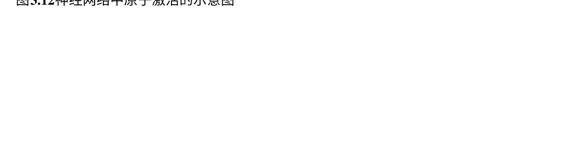

群组激活在一定程度上有助于解读编码的信息。然而，为了简单起见，我们也解释整个卷积层。我们将尝试使模型更加'灰盒'。尽管如此，对于解释神经网络的输入/输出，如CAM（图A.2）和显示中间层输出（图4.4），已经取得了显著进展。

#### 好好思考一下

本小节的推理基于这样一个假设，即单元对其最强烈响应的模式可能是其行为的准确一阶表示。你怎么看？

一种直接的方法是识别导致特定单元最大激活的输入样本（来自训练集或测试集）。仍然存在一个问题，即为每个单元维护多少个样本以及如何“组合”这些样本，这两个问题都很棘手。如果可能的话，了解这些样本共享的特征将是很好的。

此外，并不总是明显哪些输入向量的部分负责高激活。

请注意，通过限制我们的搜索范围只在训练集或测试集中，我们施加了一个不必要的限制。退一步说，我们可以将我们的想法框架化，即将最大化单元激活作为一个优化问题。总的来说，这是一个难以解决的优化问题，因为它的复杂性。然而，这是一个可以寻求局部最小解的问题。实现这一点的最简单方法是使用梯度上升来在输入空间中沿着 \( h_{ij}(\theta, x) \) 的梯度方向移动 \( x \)。这里，\( \theta \) 是神经网络的参数（权重和偏置）。假设 \( \theta \) 固定，该想法可以寻找表示在方程3.23中的非凸问题的优化。

```
$$ x^* = \arg\max_{x} h_{ij}(\theta, x) \quad \text{s.t.} \quad \|x\|=\rho \tag{3.23} $$
```

可能会发现两个或更多个局部最小值，或者在不同的随机初始化时发现相同的（定性）最小值。最小值或一组最小值可以用来定义单元在任何一种情况下。可以取平均值，选择最大化激活的解决方案，或者显示产生的所有局部最小值来描述该单元。我们将这种优化方法称为激活最大化（AM），可以用于任何我们能够计算上述梯度的网络。选择学习率和终止准则是必须设置的超参数，与任何梯度下降方法一样。

##### 卷积/全连接滤波器

第二种流行的方法是可视化权重。这些通常在第一个卷积层上最具解释性，直接查看原始像素数据，但是在网络的更深层次也可以显示滤波器权重。权重对于可视化非常有用，因为训练良好的网络通常会产生具有吸引力、平滑的滤波器，没有噪音模式。噪音模式可能表明网络训练时间不够长，或者正则化强度非常低，可能导致过拟合。

以训练好的AlexNet为例，检查其第一和第二个卷积层的滤波器。第一层的权重非常平滑，表明网络已经收敛良好。由于AlexNet具有两个独立的处理路径，可以推断其中一个路径将演化出高频灰度特征，而另一个路径将演化出低频彩色特征。这种设计考虑了颜色/灰度特征的聚类。即使第二个卷积层的权重不像第一层那样容易解释，但很明显它们是良好形成的，没有噪声模式。

此外，为了确定神经网络在随机初始化时是否学习到相似的表示，Li等人（2015年）在2015年比较了不同初始化生成的特征。神经元的感受野是它接收和处理来自输入体积的信息的区域（Lindeberg 2013）。选择具有高激活值的K个感兴趣神经元图像，为每个K个图像构建5,000个遮挡图像，并将它们输入神经网络以观察特定单元的激活值变化，这就是网络解剖学（Zhou等人，2014年）的方法。任何明显的偏差可能需要紧急维护。感受野是通过重新定位和平均不同的遮挡场景照片生成的。为了进一步说明如何使用解剖网络的方法生成网络，考虑到2020年发表的文章（Bau等人，2020年）。Bau等人（2017年）通过将给定层的低分辨率激活图大小调整为与输入相同的大小，将其阈值化为二进制激活图，并计算二进制激活图与真实二进制分割图之间的重叠区域来计算可解释性度量。Zhang等人（2018年）通过解构网络中的特征关系，假设每层中的滤波器的特征图可以被上一层中的部分模式激活。为了描述层次结构中特征之间的关系，他们逐层挖掘模式，找到每层特征图中的模式激活峰值，并构建了一个解释性图，其中每个节点表示一个模式，每个层之间的边表示共同激活关系。

接下来，谈论可视化特征，我们可能只是优化输入数据以引发神经元的激活。可惜，这并不起作用，我们最终得到了神经网络的视觉错觉。即使使用了精心调整的学习率，图像仍然充满了噪音和毫无意义的高频模式，而架构对此有强烈的响应。这些模式找到了一种触发在实际生活中不存在的神经元的方法，这种图像有点作弊。我们倾向于看到神经元的真实检测

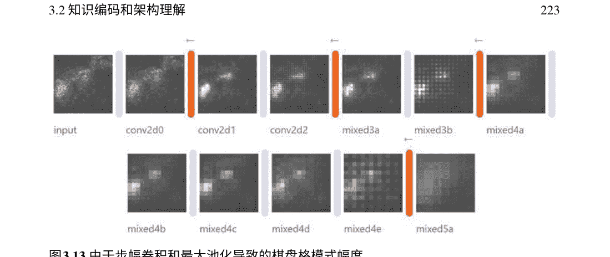

经过长时间的优化，但图像仍然以高频模式为主导。图3.13显示了由卷积操作引起的棋盘格模式的示例表示。这些模式与对抗样本的外观相关（Szegedy等人，2013年）。无法完全理解高频模式的形成，步幅卷积和池化操作似乎是梯度中模式的主要原因（Odena等人，2016年）。

上述高频模式表明，尽管无约束优化可视化的吸引力，但它是一把双刃剑。在没有任何数据约束的情况下，会产生对抗性示例。

听起来很有趣，但如果我们想要了解这些模型在现实生活中的运作方式，我们需要克服这些问题。我们将努力通过可解释性技术的应用来展示一些普通计算机视觉技术的有见地的行为。

然后，我们将通过网络可视化和神经元解释来采取更严格的方法，这是深度神经网络的基础。

其他工作，如“Deep Dream”（GoogleBlog'15）（Mordvintsev等，2015），提供了迷人的抽象表示，虽然对解释性没有太大帮助，但很愉快。2017年，Henderson和Rothe引入了一个名为“Picasso”的新模块化框架，用于计算滤波器的实际感受野，从而可以观察到NN图像分类器的训练过程。Olah等人（2017）提供了一个出色的交互界面（特征可视化），展示了GoogLeNet的激活最大化图像。

> 突出显示

属性可视化研究了样本输入的哪个组成部分对网络活动的特定模式负责。一些分析深度学习模型的策略，特别是针对高维非结构化数据（如图像），包括：

- SHAP梯度解释器：将Integrated Gradients、SmoothGrad和SHAP的概念融合到一个期望值公式中。
- 可视化激活层：展示模型对特定输入的不同网络层的特征映射的激活情况。
- 遮挡敏感性：展示遮挡或隐藏图像区域对网络对图像解释的置信度的递归影响。
- Grad-CAM：显示模型对各个图像区域的预测如何随着梯度反向传播到类别激活图而改变。
- 平滑梯度：通过该图像的梯度敏感性映射进行平均，可以定位输入图像中的感兴趣像素。
- DeepEyes：识别稳定层、退化滤波器、无法检测的模式、过大的层、冗余层以及额外层的必要性（见表B.4）。

### 3.2.3 解释的作用

通过扩展对现有解释方法的分类，将技术扩展到包括各种解释，并对所有这些解释进行检查，以确定用户的担忧是否合理。总的来说，可以解释输入对结果的影响的元素有很多。

然而，普通用户缺乏解释技术或界面，并对此类工具应满足的特性进行假设。最后，值得一提的是，解释方法在处理两个主要问题时存在困难：担心有偏见的数据集可能产生有偏见的深度神经网络，以及结果可能是不公正的怀疑。表3.1总结了DL模型流行解释模式的优缺点。

#### 3.2.3.1 文本解释

图像-语言组合任务中，通过文本解释方法出色的是那些能帮助理解模型行为的文本解释。通过自学来解释模型的输出的挑战

## 3.2 知识编码和架构理解

#### 表3.1 各种解释类型的优缺点

| 解释 | 优点 | 缺点 |
|------|------|------|
| 视觉 | 更容易实现和传达给非技术人员 | 受检查的特征数量有限，绘图需要专家干预才能产生解释 |
| 局部 | 一般来说，它从局部角度解释模型行为，操作于实例级别 | 定义局部性很困难，解释缺乏全局范围和稳定性 |
| 示例 | 帮助理解模型最具影响力的训练数据空间和内部推理 | 无法传达具有影响力的区域，需要专家检查 |
| 文本 | 基于规则或逻辑流程，易于阅读并产生有趣的见解 | 人类语言的歧义性、讽刺和讽刺可能使解释变得毫无意义 |
| 对抗性 | 小的、有意的特征扰动会导致模型错误预测，并清楚地暴露其弱点 | 旨在使模型做出错误预测，尽管看起来友好。大多数对抗性攻击旨在降低分类器在特定任务上的性能，以“欺骗”深度学习 |

编写解释性散文（Bennetot等，2019年）。图像-语言联合任务，例如从X射线图像创建诊断报告，可能会极大地受益于生成解释性符号的方法的使用。自然语言文本是可以用来创建可解释表示的符号的一个例子。换句话说，命题符号用于通过定义表示高级过程的抽象概念来描述模型的行为。用于描述模型操作的每种创建符号的方式也以文本形式解释。通过从模型到符号的语义映射，这些符号或图标可以表示算法的思维过程。然而，仅通过文本进行解释只有在DL模型中包含语言模块时才有效，因此不能被视为一种通用策略。

虽然文本可能看起来很解释性，但产生它们所需的技术可能并不总是清晰地陈述。例如，在预测不正确的情况下，循环神经网络（RNN）和长短期记忆网络（LSTM）仍然大多是不透明的黑盒子。只有少数几项研究尝试探索LSTM和RNN神经网络的隐藏信号。由于可能出现类似的问题，即如何处理中间信号，这是一个潜在的研究领域。此外，虽然词嵌入通常通过损失最小化进行优化，但优化嵌入的技术和几何形状似乎并不被充分理解。通过正确分析嵌入的形状，可以获得对算法内部工作原理的洞察，这可能提供有关优化的提示。

#### 3.2.3.2 可视化解释

我们如何创建有效的可视化解释？例如，对于图像分类，任何目标类别的“好”可视化解释应该能够（a）区分地定位该类别并且（b）具有高分辨率，即捕捉细粒度的细节。可视化解释的目的是产生帮助解释模型的可视化图像。尽管存在固有的困难，例如我们有限的能力在超过三个维度中看到信息，但已建立的方法可以帮助更多地了解决策边界或各个方面之间的相互作用。因此，可视化通常与其他方法一起使用，特别是在面向普通受众时。

#### 3.2.3.3 统计解释

模型检查技术通过使用外部算法来系统地获取有关神经网络内部工作过程的关键结构和参数信息。这类方法在技术上比特征分析中的方法更加负责，因为统计学等分析工具直接参与了特征分析。使用模型检查策略获得的信息因此更加可靠和有益。这些策略可以根据解释的范围进一步划分。

局部解释的目标是在受限的上下文中揭示模型的工作原理。换句话说，得到的解释可能不适用于更大范围，也不能代表模型的整体行为。作为替代，用户经常在他们希望解释的实例周围近似模型，以便得出表征模型在类似情况下行为的解释。

术语“简化解释”用于描述试图通过用更简单的组件替换复杂模型来揭示其工作原理的方法。主要困难在于简化模型需要足够适应，以提供对复杂模型的近似。通常，这是通过对分类问题上两个模型的性能进行对比来评估的。

另一方面，事后解释性方法试图勾勒出模型的工作原理。在文献中，许多当前的可视化方法中都包含了降维技术。这些技术使得可以创建一个基本的表示，易于人类理解。将模型中复杂的交互关系传达给不熟悉机器学习建模的人们的最佳方法仍然是通过可视化，这可能与其他策略结合起来以增加他们的理解。

#### 3.2.3.4 通过示例进行解释

这里要讨论的过程是有趣且激励人的。然而，由于从选择的查询场景中对神经网络的内部工作原理了解不多，这种方法更像是一个健全性检查，而不是一种通用解释。为了说明模型的功能，通过示例的解释选择训练数据集中的典型示例。这类似于人们经常解释事物的方式；他们使用具体的实例来解释抽象的概念。为了使示例有意义，训练数据必须以人类可理解的格式呈现，例如图像，因为带有数百个变量的随机向量中的隐藏信息对人类来说是无法理解的。

基于案例的推理（Li等人，2018年）是一种基于具体示例的解释技术。关于产品统计数据的无趣信息可能不会引起你的注意，但是听到产品对他人生活的影响可能会。许多人在这一理念中找到了安慰，深度学习的基于案例的理解对此感到兴趣。通过提供说明性案例，可以捕捉到范式的核心，这就是基于案例的解释所做的。如果提取与模型给出的输出相关的数据示例，可以更好地理解模型。通过示例解释的主要焦点是提取能够捕捉到被研究模型所识别的基本联系和相关性的代表性实例，这与人们试图解释给定过程时的情况相同。

#### 3.2.3.5 特征相关性解释

比较、评估和显示神经元和层的各个方面是特征相关性方法的核心。当通过特征分析找到敏感特征及其处理方法时，可以在某种程度上表达模型的推理过程。通过特征分析方法得到的网络学习的特征类型的定性洞察对于任何神经网络都有益处。

然而，由于缺乏深度、严谨性和统一性，这些方法还不足以用于提高模型的可解释性。

事后解释的策略通过计算控制变量的相关性得分来揭示模型的隐藏工作原理。利用这些得分，我们可以衡量每个个体特征对模型最终结果的重要性，即特征的敏感性。特征相关性解释的目标是通过确定各种输入的相对重要性来为模型的结论提供合理性解释。较高的得分表明与其他得分较低的特征相比，相关变量对模型更为重要；这个过程产生了一个有序的重要性得分列表。当对比多个变量的得分时，可以清楚地看出每个变量对模型的重要性。虽然这些评分本身可能不足以构成一个完整的解释，但它们确实为模型的逻辑提供了一些见解。

### 3.2.4 语义理解

#### 3.2.4.1 特征的多样性

通常，可视化一个真实样本可能会误导，因为可视化可能只代表整个特征表示的一部分。例如，图3.14显示了一个网络在类别级别上对狗进行分类的优化。一个分类器应该能够对狗的不同视觉特征进行分类，无论是面部特写还是更广泛的特征。Wei等人（2015年）的先前工作力图说明这种“类内”多样性。作者对整个数据集上的激活进行聚类并进行优化，显示了学习类别的不同特征。Nguyen等人（2016年）采用了不同的方法，通过在整个数据集中搜索多样性样本并将其视为优化的起点。最近，他们通过将类别可视化与生成模型相结合，对多样性样本进行采样（Nguyen等人，2017年）。

图3.14中最左边的图像是InceptionV1模型的layer mixed-4a的简单优化描述。根据插图，狗类的神经元在具有眼睛和向下卷曲边缘的狗的上部头部区域被激活。驱使我们扩大对抗类别的多样性优化由行中的下四张照片表示。这些照片明显包括一张没有眼睛的照片和一张狗毛向上的照片。在样本数据集上进行测试时，这个假设是广泛正确的。值得注意的是，与狗具有相似纹理和颜色的木勺也会激活该神经元。

因此，我们发现了一种实现多样性的简单技术：将“多样性项”添加到模型的成本函数中，使得独特的样本彼此远离。多样性可以采取多种形式，我们对其好处的理解还有限。惩罚不同情况的一种选择是使用余弦相似度距离度量（方程A.4）。在Siamese网络中使用对比损失来使用PCA区分类别是一个有趣的应用，详见第3.4.1.1节，图3.44。另一种方法是利用风格转换的特征（Gatys等人，2015）来强制以不同的风格显示特征。我们将能够理解程度的使用各种特征可视化技术对输入示例的神经元激活进行解释。然而，这种技术存在许多缺陷需要解决：

- 首先，创建不同的示例可能会导致出现人为瑕疵，例如在我们的狗和猫示例中出现眼睛。
- 其次，优化可能会强加一种不自然的示例感知方式。例如，一个人可能希望将tabby猫的示例与其他猫种类（如波斯猫或虎斑猫）分开，超出了模型的限制。
- 此外，一些基于数据集的方法在Wei等人（2015）的论文中可以更自然地分离特征，但在解释模型对其他数据的行为方面证明了较少的有用性。
- 最后，多样性及其优势开始揭示一个更根本的问题：图3.14中的示例显示了一个概念的连贯反映，即动物的面部，而图3.15中的图像则同时响应了汽车车身和两种动物的面部。这些示例支持了一个突出的印象：“神经元不一定是理解神经网络的正确语义单元”（Olah等人，2017年）。

图3.15 多样化示例对神经元的语义理解。图源自 Olah等人（2018），采用创作共用署名（CC-BY 4.0）许可。

#### 3.2.4.2 渐进式空间分辨率和注意力转移

这是一个关于渐进式生成对抗网络（PROGAN）在训练过程中改善质量、稳定性和变化性的简单案例研究。这是一个有趣的概念，对于计算机视觉领域的未来深度学习爱好者来说，具有潜在的架构设计。在这里，Karras等人（2018）从4×4像素的分辨率开始训练。在训练过程中，所有现有的层都是可训练的。随着生成器和判别器在训练过程中积累更多的层，生成的图像质量会得到改善。

Wang等人（2018）的工作采用了多个在不同空间分辨率下运行的判别器，与渐进式生成对抗网络的发展概念相联系。Wang的工作受到Durugkar等人（2017）的努力的启发，他们在单个生成器与多个判别器的配合下进行了实验，以及Ghosh等人（2018）的逆向策略，他们在单个判别器与多个生成器的配合下进行了实验。在分层生成对抗网络中，每个图像金字塔阶段都单独定义了一个生成器和一个判别器（Zhang等人，2017）。PROGAN的方法，像其他所有方法一样，基于这样的洞察力，即学习从潜在空间到图像空间的复杂映射。

图3.16 生成器和判别器都从4 × 4像素的空间分辨率开始。随着训练的进行，我们逐步向生成器和判别器添加层，提高生成图像的空间分辨率。在整个过程中，所有现有的层都是可训练的。这里，I × I表示具有相同空间分辨率的卷积层。这样可以在高分辨率下稳定地合成图像，并显著加快训练速度。图源自Karras等人的灵感（2018年）

高分辨率图像的最佳生成方法是分阶段进行，但与使用层次结构不同的是，使用了单个GAN。与其他关于自适应网络发展的工作（如成长神经气体（Fritzsche 1994）和增强拓扑的神经进化（Stanley和Miikkulainen 2002））贪婪地相比，Karras等人只是延迟了预配置层的引入。这种方法与AE的逐层训练（Bengio 2006）类似。

它们的主要优势是一种用于训练生成对抗网络（GANs）的策略，该策略涉及从低质量图像开始，并逐渐增加网络中的层数，如图3.16所示。由于其渐进性质，模型不需要一次性学习所有尺度，而是可以首先关注图像分布的整体概述，然后逐渐深入细节。

作者采用了生成器和判别器网络，它们是彼此的镜像版本，并逐渐过渡引入新的网络层。在训练过程中，两个网络中的所有现有层都可以进行修改。这样可以防止对较小分辨率层产生突然的冲击，因为这些层已经训练过。

我们观察到渐进训练具有许多优势：

1.  生成较小图像更加稳定，因为其中的类别信息较少，模式也较少（Odena等人，2017年）。
2.  通过逐渐增加分辨率，我们不断提出的问题比从潜在向量到图像的最终目标要简单得多。
3.  通过使用WGAN-GP损失（Gulrajani等人，2017年）甚至LSGAN损失（Mao等人，2017年），我们可以稳定训练，以至于我们可以可靠地合成百万像素级的图像。
4.  训练时间更短。在逐渐扩展的GAN中，大部分迭代是在较低的分辨率下进行的，并且在最终目标分辨率上，有时可以比较快地达到相当的结果质量，具体取决于最终目标分辨率。

##### 模型的属性与纹理学习

在人工智能行业中，深度学习模型对数据的需求量大，越多越好。这就是为什么我们经常进行数据增强和数据冗余，以改善模型在算法限制下的性能。这促使我们从基础开始，尝试可视化模型对图像增强的响应，例如将原始数据分割为多个输入通道，旋转图像以了解通道或神经元对图像不变性的反应，并尝试理解模型的属性与纹理学习，使用我们自己的洗牌裁剪和混合特征裁剪技术。

在图3.17中，第1列是VGG-16模型的原始输入，使用从ImageNet分配的预训练模型权重。每个图像下面的预测显示了来自ImageNet 1000类索引到可读标签的前3个类别。第2列显示了使用通道特定权重进行加权的RGB到灰度增强，$I_{weighted-gray} = 0.2989 \times Red + 0.5870 \times Green + 0.1140 \times Blue$，这是因为人类对这三种颜色的感知敏感性不同（Ware 2019）。然而，在普通计算机屏幕上与计算得到的平均灰度图像相比，这种差异并不明显，计算得到的平均灰度图像为$I_{gray} = (R + G + B)/3$。其他列是不言自明的，从原始图像中提取的红色、绿色和蓝色通道。图3.17中的A类代表了一个理想的物体识别图像，模型在顶级类别检测方面没有重大变化。而B类显示了由Nikon D3300相机在第1-2行拍摄的样本图像，以及在第3行拍摄的移动设备图像。从数码单反相机拍摄的JPEG图像在所有三个样本的列上都具有类别标签和类别概率的显著变化。这引发了一个问题，即模型如何处理通道权重以及在特定领域中评估保持照明参数的准确性是否关键。

#### 3.2.4.3 像素归因

像素归因技术揭示了神经网络对图像特定分类的关键像素。像素归因技术有许多不同的名称，如敏感度图、显著性图、像素归因图、基于梯度的归因方法、特征相关性、特征归因和特征贡献。

像素归因本质上是特征归因的一个子集，专门应用于计算机视觉任务。对于计算机视觉任务而言，特征归因根据每个输入特征对预测结果的影响程度，为每个预测结果提供解释，无论是负面的还是正面的。像素、表格数据甚至单词都可以作为输入特征。常见的特征归因方法包括SHAP、Shapley值和LIME等。

该方法可以根据其基准方程进行分类，就像Molnar（2020）所做的那样：

1.  仅梯度方法：仅梯度策略揭示了像素变化对预测的影响。这可以解释如下：如果我们提高像素的颜色值，预测的类别概率会增加（对于正梯度）或减少（对于负梯度）。该像素对梯度的贡献大小随其绝对值的增加而增加。香草梯度和Grad-CAM是其中的例子。
2.  路径归因方法：路径归因策略将当前图像与参考图像进行比较，参考图像可以是一个人工的“零”图像，如完全灰色的图像。像素分离了真实预测和基准预测之间的差异。该类别包含基于梯度的模型特定方法，如Deep Taylor和Integrated Gradients，以及模型无关方法，如LIME和SHAP。在这里，所有路径归因技术都相对于基准进行评估。因此，每个像素对实际图像和基准图像分类分数之间的差异负有一定的责任。解释受参考图像（分布）的选择影响较大。一些路径归因方法被认为是“完整的”，这意味着所有输入特征的相关性得分之和等于图像预测与参考图像预测之间的差异。SHAP和Integrated Gradients是其中的例子。

在这一点上，我们通常会解释这些方法如何直观地操作，但我们认为我们应该从香草梯度方法（显著性图）开始，它很好地说明了许多其他方法遵循的总体公式。

Saliency图由Simonyan等人（2014年）提出，是一种直接的方法，通过计算输入图像像素的梯度（δ输出/δ输入）来表示给定输入样本的输入敏感性。在Vanilla（其中默认修改器为'none'）、ReLU和Guided saliency中，后者在使用显著性策略进行实验时产生了最有希望的结果，如图3.18所示。请注意，Rectified/Deconv saliency背后的主要原则是在反向传播阶段修剪负梯度，以便只允许表示输出增加的正梯度信息（Zeiler和Fergus 2014年）。如图所示的Guided saliency在图3.18中，根据需要相应地调整，以便仅传播正梯度用于正激活（Springenberg等人，2014年）。结果显示，高对比度边界对大多数目标类别特别是动物输出类别的眼睛非常重要。然而，这种方法并不能提供很好的模型可解释性。很难理解网络是如何确定样本是“日本狆”还是“虎斑猫”的。

图3.18 引导性显著性表明高对比度边界在大多数目标类别中具有空间上的显著性，特别是动物输出类别的眼睛

##### 显著性方法的策略是：

- 首先，将输入图像进行前向传递。
- 其次，计算连接输入像素和目标类别分数的线的梯度，其中将其余类别初始化为零。
- 第三，使梯度可见。我们可以选择显示绝对值或区分负贡献和正贡献。从更正式的角度来看，给定一张图像 \( I \)，CNN将为其分配一个类别 \( c \)的分数，用符号 \( S_c(I) \)表示。图像的分数是一个高度非线性的函数。

利用梯度的概念是，一阶泰勒展开可以使用得分的导数提供一个接近的近似值，如公式3.24所示。

\( S_c(I) \sim w^T I + b \)   (3.24)

当使用Vanilla Gradient时，梯度向后传播到第\( n+1 \)层，在下一层的激活为负的情况下，梯度被简单地设置为零。

#### 突出显示

正如Shrikumar等人（2017）所描述的，Vanilla Gradient存在饱和问题。当使用ReLU并且激活值低于零时，激活值被限制为零，不再改变。激活已经达到了它的极限，即饱和状态。例如，该层接收来自两个神经元，神经元1和神经元2的输入，每个神经元的权重为1，偏置为1。当遍历ReLU层时，如果两个神经元的和小于1，则激活为神经元1 + 神经元2。如果和大于1，则激活保持在1。此时的梯度为0，Vanilla Gradient会认为这个神经元是不重要的。

这里进行了一项关于图像旋转和翻转的实验，并给出了ImageNet类别目标的前三个预测。需要注意的是，对于第二行的guided saliency解释，以及第三行和第四行的用户目标类别的Grad-CAM解释，似乎对于图3.20的解释有所帮助，该图描绘了一只虎斑猫和一条金鱼，以及图3.21的解释，该图描绘了一个披萨盘的真实世界图像。尽管CNN模型被认为具有旋转不变性，但它展示了令人满意的结果。

在图3.19中，区分“德国牧羊犬”和“虎斑猫”，狗和猫是ImageNet中主要的目标类别。但是，随着输入的变化，解释在图中并不是非常一致。这使我们产生了一个问题，即基于显著性的流行观点是否需要适当的检查。Kindermans等人（2019）还证明了这些像素归因技术可能非常不可靠。他们对输入数据进行了连续的偏移，导致每个图像的像素变化相同。在这里，DeepLift、Vanilla Gradient和Integrated Gradients都被考虑在内。他们比较了两个网络，原始网络和“偏移”网络，其中第一层的偏置被修改以适应恒定的像素偏移。两个网络都生成相同的预测。此外，两个梯度是相同的。然而，解释是不同的，这是一个不利的特点。

##### 快速梯度符号方法

2014年，Goodfellow等人（2014）提出了快速梯度符号方法来生成对抗性图像。梯度符号方法通过梯度找到对抗性案例。原始图像中的每个像素 x都会通过添加或删除一个微小的错误来改变。添加或减去错误取决于像素的梯度符号是正还是负。在梯度的方向上添加错误表明图像被故意操纵以使分类模型失败。

要实现Goodfellow团队描述的方法，即使只是稍微修改一个像素，也需要修改大量的单个像素。问题出现在只能扰动一个像素时，我们何时能够访问？你认为这样做效果如何？你能否欺骗一个深度学习模型？有趣的是，图像分类器可以通过改变一个像素来被欺骗，如Su等人（2019）所示。图3.22提供了一个案例的说明。

1像素攻击是对反事实的一种变体，它寻找一个变体示例\(x'\)类似于原始图像的\(x\)，但以不利的方式改变了预测。为了确定应该修改哪个像素以及如何修改，1像素攻击使用差分进化算法。生物物种的逐渐多样化为差分进化提供了灵感。一代又一代，一组像素（称为候选解）重新组合，直到找到一个解。每个潜在的答案是一个由像素的\(x\)、\(y\)和红色、绿色和蓝色（RGB）值组成的五元素向量，编码对像素的改变。搜索从256个候选解（像素修改建议）开始，每个候选解都用公式3.25生成新一代候选解（子代）：

```
$$x_i(t+1) = x_{r_1}(t) + F \cdot (x_{r_2}(t) - x_{r_3}(t)) \qquad (3.25)$$
```

其中 $t$ 是当前的生成代数，$F$ 是一个缩放参数（设为0.5），$r1$、$r2$和$r3$是独立的随机数，每个 $x_i$ 表示候选解的一个元素（可以是x坐标、y坐标、红色、绿色或蓝色）。每个新的子候选解是一个像素，它通过组合三个随机选择的父像素来创建其五个不同的位置和颜色属性。如果候选解是一个对抗样本，即被错误分类为某个类别，或者达到了用户设定的最大迭代次数，则停止进一步的子候选解生成。

#### 突出显示

基于像素的归因有时可能很难阅读和解释。积极和消极的归因可能与图像周围的显著像素混合在一起。像素归因算法的准确性差异很大。对图像进行微小的（对抗性）改变可能导致突出显示不同的像素作为解释，Ghorbani等人（2019）证明了这一点。

与像素不同，一种新颖的基于区域的归因方法XRAI（Kapishnikov等人，2019）可以识别显著区域。该技术利用像素级归因方法（如综合梯度或引导梯度）以及分割地图来通过总结归因作为片段来识别相关位置。Felzenszwalb的方法（Felzenszwalb和Huttenlocher，2004）用于计算图像片段。

- 逐层相关传播（LRP）展示了基于核心分类器和多层神经网络的词袋特征对预测的每个像素的贡献。人类专家可以通过热图形式访问这些像素贡献，以便直观地确定分类结论是否正确以及是否需要进一步调查。
- Smoothgrad在像素的通道值到特定颜色的适当映射中获得，对整体可视化产生了显著影响。
- 梯度的绝对值：生成敏感性图的算法经常会产生有符号值的输出。存在强烈的灰色区域，试图确定给定有符号值的正确颜色表示。一个重要的决策是是否仅显示绝对值，还是区分正负数。是否有益于对梯度取绝对值取决于正在分析的数据集的性质。例如，在MNIST数字数据集（LeCun和Cortes 2010）中，每个数字都是白色的，与类别无关，正梯度表示该类别的强信号。

另一方面，我们发现在ImageNet数据集（Russakovsky等人2015）中使用梯度的绝对值会导致更清晰的图像。许多图像识别任务对颜色和光照变化是不变的；因此，这可能表明方向是基于上下文的。要识别一个球，例如，黑球在浅色背景下会有负梯度，而白球在较暗背景下会有正梯度。

##### 限制异常值

我们注意到梯度中存在一些比平均值高得多的像素。这不是最近才发现的事实；它被用来生成对人类不可检测的对抗性示例（Szegedy等人，2013年）。这些极端值可能导致颜色渐变变得不可靠。

通过在很大程度上限制异常值，可以改善地图的视觉连贯性。Sundararajan等人（2017年）详细描述了这个想法。如果在后处理中跳过此步骤，生成的地图可能会完全变黑。

### 3.2.5 网络理解

经典机器学习模型强调基于关键属性和特征学习输出预测。许多解释性技术已经发展出来，以特征相关矩阵和属性映射的形式表示模型，以理解模型的行为和学习过程。随着计算资源的进步，这种经典方法在当前的SOTA实践中远远落后。与像SVM这样的经典模型不同，CNN使用原始形式（像素）输入图像进行训练。DNN在隐藏层中学习高级特征，这似乎是它们最大的优势之一，减少了从原始数据中提取特征的领域知识的需求。图像/文本经过多次转换和卷积块处理。权重和偏差通过反向传播学习，而SVM模型则根据图像颜色表示、边缘检测器和像素频域设计新特征。CNN层越深，编码在其中的特征越复杂。这些转换后的图像信息通过全连接层和非线性激活映射输出进行分类或预测。

NN在其隐藏层中学习特征和概念，并需要专门的工具来揭示它们。
梯度可以用于实现解释方案，例如从内部查看模型，这比模型无关的方法更具计算效率。
大多数其他已知方法旨在解释表格数据的模型。图像和文本数据需要不同的方法。

#### 3.2.5.1 卷积网络

CNN设计用于处理图像数据，它们的结构和功能表明它们应该比其他类型的NN更容易理解。具体而言，这些模型由小型线性滤波器组成，应用滤波器的结果被称为激活图，或更一般地称为特征图。

为了更好地理解卷积神经网络（CNN）在特征学习中的抽象编码，理解神经网络的基本模块是至关重要的。然后，我们将研究近期开发的各种暗示性度量，解释网络架构对应输入映射到其预测的行为。图3.23展示了解释CNN单元的不同方式。（A）卷积神经元是架构的基本单元；（B）卷积通道解释；（C）卷积层对整体特征的抽象编码给出了一种感知；（D）神经元；（E）具有学习权重和偏置的隐藏层；（F）类概率神经元（或对应的预激活神经元）。

> 简而言之，CNN的基本模块可以分为四个部分，由LeCun等人（1989）描述：

- 卷积层：$x_{l}^{(l+1)}(\alpha)=\xi\left(\sum_{l'=1}^{d(l)}\left(w_{l'}^{(l+1)} * x_{l}^{(l)}\right)(\alpha)\right)$
- 激活函数：$\xi(x)=max\{x,0\}$ 修正线性单元（ReLU）
- 池化：$x_{l}^{(l+1)}(\alpha)=\left\|x_{l}^{(l)}\left(\alpha'\right):\alpha'\in N(\alpha)\right\|_{\rho}$ $\rho=1,2, or\infty$
- 参数：滤波器$W^{(1)},...,W^{(L)}$

#### 突出显示

CNN的关键特性如下：

1. 卷积滤波器具有平移不变性和自相似性属性。 有关数学描述，请参见附录A.11。
2. 多层结构赋予了类似于多层感知机的组合性。
3. 通过空间中的滤波定位实现局部特征。
4. 每个滤波器的参数数量为O(1)，与输入图像的大小无关。
5. 由于在空间域中进行滤波，该层的复杂度为O(n)。
6. 在分类任务中，层数的复杂度为O(logn)。

现代卷积神经网络已经超越了计算机视觉任务。 它已经成为一维结构数据（如时间序列分析、音频和文本标注）中与循环神经网络的可信竞争对手（Fawaz等，2019年；Cui等，2016年；Hershey等，2017年）。 我们还可以看到卷积神经网络在推荐系统和图结构数据方面的巧妙应用，比如最近将图R-CNN应用于场景图生成（Yang等，2018年）。 卷积神经网络的成功可以总结如下：

- 在实现更高准确性模型方面高效
- 易于在GPU核心上并行化卷积
- 池化层聚合数据的空间信息
- 处理架构每层的多个通道
- I/O通道捕捉图像位置的多个空间方面

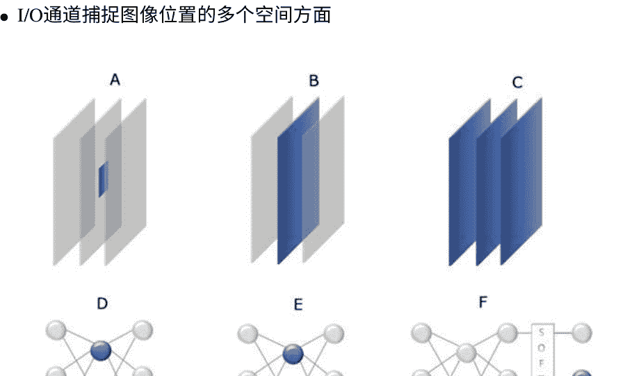

图3.23 不同CNN单元的特征可视化

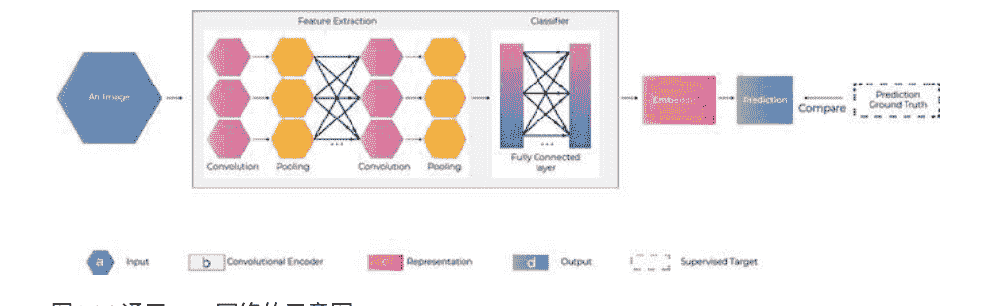

- 在核心和2D输入之间执行交叉相关，然后添加偏差
- 比全连接网络少的参数使其计算有效
- 网络深度可以根据感受野检测到的特征图来决定

考虑CNN的基本网络块，如图3.24所示。调查的第一行涉及可视化基于当前输入生成的新输入，以便理解DNNs获得的表示。它主要用作逐个实例的解释，并适用于以图像作为输入的CNN。 CNN通常由多个卷积和池化层组成，可以自动从视觉数据（如图像）中提取相关特征。由于这种多层架构，CNN学习到了一种稳健的特征层次结构，具有空间、旋转和平移不变性。因此，可以在不同层面上处理CNN中编码的知识的可解释性：

- 内核级别，即在给定层中编码的知识模型的知识或特征。
- 特征的层次结构，如树状结构或不同层次的知识特征。
- 在完全连接的层之前或一系列层的末尾，例如通过类激活图。

本节的目标是揭示第2章中讨论的基本神经网络的结构，并说明可应用解释性方法的网络学习子领域。例如，图3.24中的CNN块已经经历了大量的解释性工作，例如在输入块（a）或输出块（d）中实现解释模块。有些人尝试挖掘知识表示（c），以便在进行预测之前弄清楚模型已经编码了什么，而其他人则尝试不同的方法，如可视化滤波器、通道、层和网络剖析来理解卷积编码器块（b）的操作。

#### 3.2.5.2 循环网络

RNN（循环神经网络）在视觉领域中，像CNN（卷积神经网络）一样，最近广泛用于对基本上是顺序数据定义的预测问题，特别强调在NLP（自然语言处理）和时间序列分析等领域。这些数据中的长期依赖性很难用机器学习模型捕捉到。通过将神经元记忆信息的能力视为可以从数据中学习的参数，RNN能够提取时间相关的关联。

目前很少有研究提供RNN模型的解释。这项研究可以分为两类：（i）尝试解释RNN模型的学习（通常使用特征相关性方法），以及（ii）尝试改变RNN架构以便提供对其选择的洞察力（局部解释）。

在第一组中，Arras等人（2017）将LRP（层级相关性传播）方法扩展到RNN。他们提出了一种特定的传播规则，适用于LSTM（长短期记忆）单元和GRU（门控循环单元）中的乘法连接。Karpathy等人（2015）提出了一种基于有限视野n-gram的可视化技术，用于区分LSTM和GRU网络中的可解释单元。在不改变架构的前提下，Che等人（2015）将用于CNN模型的可解释模仿学习蒸馏方法扩展到LSTM网络，以便通过将训练好的LSTM网络拟合到梯度提升树中来学习可解释特征。

除了不改变RNN内部工作方式的方法之外，Choi等人（2016）提出了他们的RETAIN（REverse Time AttentioN）模型，通过两级神经注意模型检测有影响力的过去模式。为了创建一个可解释的RNN，Wisdom等人（2016）提出了基于顺序迭代软阈值算法（SISTA）的RNN，该算法用一系列稀疏潜在向量模拟一系列相关观测值，使其权重可解释为一个有原则的统计模型的参数。最后，Krakovna和Doshi-Velez（2016）构建了一个隐马尔可夫模型（HMM）和RNN的组合，使得整体模型既具有HMM的可解释性又具有RNN模型的准确性。

图3.25中描绘了一个广义的RNN网络块，其中三种不同的策略触发不同的解释算法，分别是：

1. 通过对输入块（a）施加扰动并测试其对预测块（d）的影响，来理解模型训练的事后策略。
2. 使用诸如层激活、通道可视化、神经元丢弃影响和基于梯度的特征映射等技术，对一块循环单元（b）进行局部扰动。
3. 通过分析和评估知识表示块（c），我们可以推断出模型在训练后学到的隐藏信息。

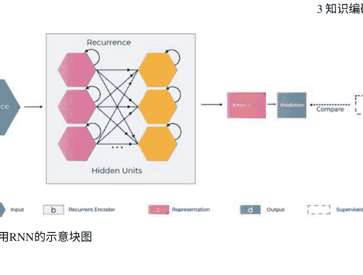

#### 3.2.5.3 自编码器-解码器网络

图3.26展示了自编码器网络的典型大规模设计。正如名称所示，它的结构包括编码器和解码器。还有一个关键的中间特征空间，即潜在特征，它是该系统的一部分。在尝试解释或解读网络层面的知识时，分别解释编码器（b）和解码器（d）中的信息可能是有用的。事后解释性方法可能是最快、最简单的答案，即使它可能歪曲或遗漏信息。我们使用独立的解码器解释性解决方案和事后解释性解决方案来解释编码器。虽然临时解决方案还不是常态，但我们可以在AE网络的每个阶段构建它们，从单元级别（如循环单元）到层级级别（层如何解释其学习）再到骨干级别（整个网络如何解释）。这是一组层的集合，它们进行集体学习，并且在其前后有一个结构上不同的层。

此外，在使用自编码器和解码器对称设计的架构中，可解释性还可以包括对称层对中编码的知识之间的对应或甚至相关性。相比之下，对于学习单元的对称配对，可解释性可以通过使用对称性来集体学习。

分析AE网络中功能块的一种替代方法是仅读取潜在特征空间（c）。这与不理解映射或它突出显示的特征是相同的。潜在特征空间显示编码信息的方式，例如输入（a）在潜在特征空间中的位置以及另一张与先前输入图像非常相似但在某个方面不同的图像的位置。这种方法不仅阐明了从输入空间到潜在空间的映射，还描述了哪些潜在空间特征代表了否则相同图片之间的差异。潜在空间（c）与输出空间（e）之间的连接非常相似。实现这一目标的一种方法是使用视觉解释。

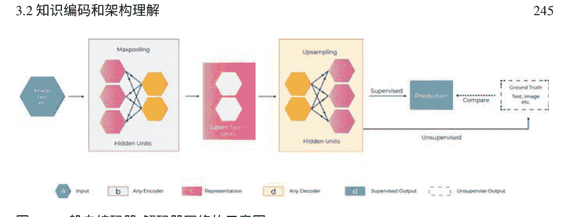

#### 3.2.5.4 生成对抗网络

GAN是具有生成器块（b）和分析生成器输出质量的鉴别器的两个块网络。图3.27描述了它们的整体架构。其概念是生成器旨在在输出空间中生成尽可能逼真的合成数据，而鉴别器旨在区分真实数据和合成数据，无论合成数据有多逼真。因此，生成器的目标是误导鉴别器，而鉴别器的目标是不被误导。一旦训练完成，这样的系统意味着生成器具有创建高质量伪真实数据的能力，从而导致非常小的鉴别器损失。

尽管生成器和鉴别器的目标不同，但它们之间存在一个共同的因素：都学习“真实数据的组成部分”，生成器试图模拟这些组件，而鉴别器则区分它们与逼真的合成数据。因此，可以使用以下方法来在网络层面上理解生成对抗网络：

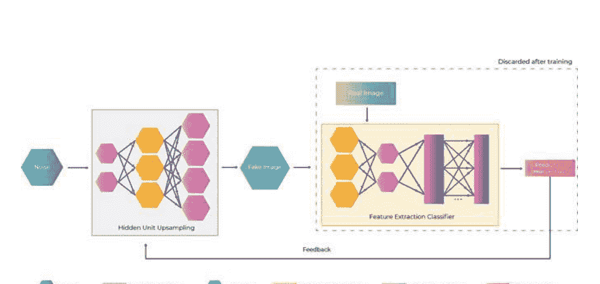

1. 块级别的事后分析（b）。与自编码网络相比，这需要在训练之后推导出一个可解释性模型，独立地处理每个块。
2. 块级别的特定解码。将可解释性纳入学习过程通常在网络架构的一个或多个层级内进行，例如学习单元或层，或者层的集合。
3. 学习共同因素，即回答“真实数据的组成部分”这个问题。换句话说，确定生成器和鉴别器的输出的核心特征，分别为（c）和（f）。这间接地探测了自编码网络中的潜在特征空间的等效部分。然而，对于这个问题推导出可解释性解决方案并不那么直接。实际上，这可能要求生成器和鉴别器的架构在设计上具有一定的对称性。例如，生成器的最后N个可学习层与鉴别器中真实图像遇到的第一个N个可学习层相似。然后，考虑这些配对层之间的关系，可以推断出可解释性。

前面的描述是指图3.27中所示的简单设计。图4.18显示了生成学习架构的其他修改。然而，网络层理解的概念仍然非常相似。为了解释支持这些块的功能活动的知识，块级可解释性可以事后或事前处理。或者，可解释性重点可以选择作为块之间知识共享的共同点或位置。

#### 3.2.5.5 图网络

GNN相对于普通NN具有几个优点，其中一些在这里讨论。自环、多输入和每个节点或边缘的多个输出端口，以及连接具有不同权重的边缘的不同权重连接，都是图结构的例子。还有一些GNN版本，如图卷积网络、图注意力网络和图残差网络。图3.28描述了它们的一般框图。GNN可以在包含输入数据和成对项目关联的任何数据集上进行训练。与普通深度学习相比，GNN在捕捉数据的图结构方面具有显著优势，这通常非常丰富。

GNN可以用于分类数据或预测结果。然而，在回归等任务中，GNN的表现不如离散值（如猫/狗）的任务好，因为输出是实值而不是离散值。与普通的深度学习模型相比，GNN的内存占用更小，因为它们只需要存储有关节点连接的信息，而不是整个图中的所有神经元。即使是小型数据集，GNN的训练也很简单。

GNN编码器有两种主要类型（b），包括前馈GNN和图递归网络。

1. 在前馈GNN中，输入数据通过神经元图传输，通过在每个节点的边权重上传输函数来产生输出。
以下是此类型所涉及的步骤：
    - 应该在具有输入的图节点上使用前馈传播。
    - 要传播图节点的输出，请在图边上使用图传输函数。
    - 基于输出梯度的图权重用于反向传播。

2. 图循环网络类似于具有图结构的网络。
与仅沿一个方向传输数据的前馈图不同，循环网络图是双向的，数据在两个方向上流动。 这种类型涉及以下步骤：
    - 对具有输入的图节点使用标准图传播。
    - 将图传输函数应用于图边，将神经元输出传回图节点，同时根据先前应用的梯度修改来改变边权重。
    - 基于输出梯度的图权重用于反向传播。 与前馈图神经网络不同，前一层对当前状态没有影响。

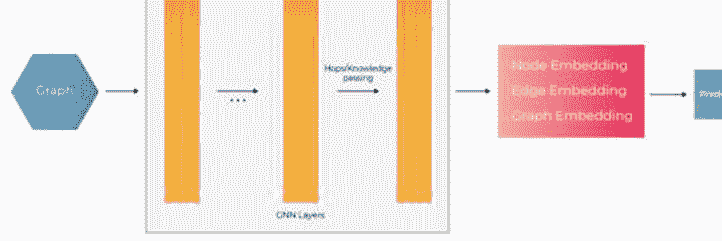

图3.28 通用GNN的示意图

#### 突出显示

##### GNN与标准ANN有何不同？

GNN类似于标准NN，数据以迭代方式通过神经元图流动，并且每个边权重可以根据该节点或神经元的输入示例进行修改。

GNN中的不同之处在于图传输函数。在图传输函数中，权重不仅存在于神经元之间，还存在于图的边缘以及节点上。这在存在重叠数据或缺失数据点的情况下非常有帮助，因为这些值可以通过图传输函数和GNN从其他连接的节点和数据点中填充。GNN可以学习到这种图结构。

GNN在图执行方面也有所不同。GNN一次遍历图中的一个节点，而标准DNN在移动到下一个数据点之前会遍历所有神经元。GNN和标准DL模型的关键区别在于，GNN对于每个图节点、图边和数据点都有自己的参数集。

GNN使用图结构来学习数据集中的图节点，每个节点都有不同的参数集，这与标准DNN非常不同，标准DNN的神经元只是具有实值权重的线性函数。这使得图传输函数比常规DL模型的传输函数更复杂，因为图神经网络对于单个数据点具有多个图节点和图边。

然而，对于CNN和RNN，我们讨论的方式也可以找到不同尺度的可学习单元。例如，每个图卷积核或图循环单元都是一个非常小尺度的学习单元。在一层中的这些单元的集合是另一个功能单元。从这个意义上讲，对于之前讨论的所有架构使用的可解释性方法，存在直接的类比。

然而，基于图的网络还提供了一种额外的机会，可以解释性地理解知识编码。这个机会是通过图模型中链接的权重来实现的。在学习之后，可以识别出一系列重要链接，这些链接代表了最主要或最具统计意义的知识。与其在可学习单元、层或整个网络之间推导可解释性，不如以端到端的方式推导可解释性；然而，只选择一些链接。

> **突出显示**
>
> Yosinski等人（2015年）将一个神经网络叠加在一个关系图上，然后使用大量的测试来研究两者之间是否存在相关性。 他们发现聚类系数和平均路径长度都与网络的预测效果有关。

## 3.3 可解释性的设计与分析

这一部分是一个清晰的概述，旨在汇集近年来在各个子领域和环境中引起广泛关注的多样化的IDL研究线索。不同的研究使用不同的标准，所有这些标准都在某种程度上得到了证明。虽然很难涵盖所有与IDL相关的研究活动，但我们尽力以一种新颖的方式提供给计算机科学领域的大多数人理解。因此，我们开发了一个统一的概念框架，用于描述各种方法，并确定它们之间的重要概念差异。通过一个众所周知的主题——算法设计与分析（DAA），重新审视IDL。这种将IDL和DAA两个领域进行类比的努力被称为“可解释性的设计与分析”。

可解释的深度学习技术可以分为以下六个主要部分，每个部分都简要定义了术语和方法适用性。这将帮助我们理解在不久的将来创建类似过程的动机、直觉和推理。

### 3.3.1 分而治之

在分而治之的可解释性方法中，黑盒模型问题被分解为较小的子问题，然后每个问题都独立解决。有时候我们的思维会发生分裂。所有子问题的解最终合并，以获得原始问题的解。这是编程中最常用的方法之一。通过递归调用，将子问题的解合并成原始问题的解之一。请记住，在某些情况下，只有最好的子问题在增加计算的情况下被选择，并且它捕捉到了协同过滤的本质。

> 分而治之通过网络传播，将模型性能的解释分解为局部、基本或实例级的理解，最后回到全局或一般的理解。这种方法可以是特定于模型的或模型无关的，但总体思想是功能单元的可比性，类似于归并排序或Strassen矩阵乘法。

#### 案例1：基于案例推理生成有用的解释

这个想法是从分而治之的策略角度来看案例推理（CBR）技术，以生成对DNNs的合理解释。有人可能会认为它适合被视为基于回溯的问题，基于在给定目标问题及其对应属性之间搜索类似案例的标准过程来解决先前解决的解决方案。因此，适应这些新案例的解决方案在1994年由Aamodt和Plaza（1994）进行了描述。

如果引发的问题无法解决目标问题，则预计会通过其他方式进行复活和重新评估。讨论的大门敞开，以了解来自不同立场的提出的类比。

> 该概念的关键假设是利用先前的经验（类似的过去案例），领域知识和上下文为用户带来新的维度，为模型生成更准确的解释。这个原则在很大程度上基于人类如何解决问题：在类似情况下，利用过去的经验来解决新问题。在XAI的背景下，从CBR的尝试中生成的解释有时被称为CBE（基于案例的解释）

通过结合知识，将黑盒问题划分并生成模型可解释性的证据在大多数CBR技术中是明显的。例如，深度神经架构通过找到与图像分类相关的原型部分并利用先前的原型证据来进行预测（Chen等人，2019年）来解剖图像。该架构使用一系列卷积层、原型层和全连接层构建，然后是输出逻辑层。对该网络的训练分为多个阶段，以针对各个层进行：整个网络的训练，然后是原型层的训练，最后是最后一层的优化。

这种原型分类方法并不新鲜。在2018年，Li等人（2018年）将CBR引入网络，并使用独特的编码层自动找到最佳原型。这些原型（案例）与新编码的输入实例进行比较，其中最可能的原型给出相应的预测。网络是一种原型分类器，其中观察结果根据它们与数据集中原型观察的接近程度进行分类。例如，在我们手写数字的例子中，我们可以确定一个观察结果被分类为3，是因为网络认为它看起来像训练集中的一个特定的原型3。如果预测结果不确定，它会识别与观察结果相似的来自不同类别的原型，例如，4往往很难与9区分，所以当网络被要求对一个9的图像进行分类时，我们会期望看到类别4和9的原型被识别出来。

Cunningham (2008)指出CBE中存在两种可能的方法：

1. 基于知识轻量级的CBE，它们的解释仅基于检索过程中的相似度度量。
2. 基于知识密集型的CBE，包括基于规则的方法，可以用来生成解释。它们通过表达因果交互来利用相似度度量进行解释。

图3.29展示了解释生成部分，其中包括重构输入部分，它与编码输入位于相同的空间中，可以用于在训练过程中可视化学习到的原型，并部分追踪新的分类任务的路径，以及每个原型的激活权重。它们将生成理由（一组原因或行动或信仰的逻辑基础）作为整个学习过程的一个组成部分，通过结合两个模块化组件实现：一个生成器，用于指定可能理由的分布，以及一个编码器，使用它们的理由将其映射到任务特定的目标值。图3.29的示例显示，理由只是证明分类值的特定单词序列。

> **突出显示**
> 通过选择输入的部分并将其集中在各自的任务上，进行NN解释。我们在这里讨论CBR而不是典型的抽取推理。CBR根据与原型案例的相似性来解释模型的预测，而不是突出显示输入的最相关部分。请注意，该方法并不能完全解决黑盒决策的问责和透明性问题，但它可以部分追踪新观察的分类路径。

#### 案例2：使用类峰值响应图进行逐点定位

鉴于像素级注释的低效性和每个实例中存在强视觉信号的证据，即类响应图(CRM)中的峰值，(Zhou等，2018年)启发了使用图像级弱监督训练CNN进行实例级语义分割。我们将从分而治之的策略角度探索利用峰值响应图(PRM)的过程，并在这个视角下理解机制。

1. 分割：将图像分割为CRMs在网络训练过程中，图像被刺激以从CRMs中产生峰值。Zhou等人（2018年）建议使用FC-NN表3.2 CRM刺激的符号总结从图像表示

| 符号表示 | 备注 |
| :--- | :--- |
| $M \in \mathbb{R}^{C \times H \times W}$ | 用于顶层卷积层的CRMs，输入为 $C$ 个类别和空间大小为 $H \times W$ |
| $s \in \mathbb{R}^{C}$ | 输出按类别的置信度分数 |
| $M^{c}$ | 在区域半径为 $r$ 的情况下，找到第 $c$ 个响应图的局部峰值 |
| $P^{c}$ | 位置 $\{(i_1, j_1), \dots, (i_{N_c}, j_{N_c})\}$ 表示第 $c$ 个类别的有效峰值数量 $N_c$ |
| $G^{c} \in \mathbb{R}^{H \times W}$ | 生成的采样核用于评估第 $c$ 个类别的置信度分数 |

通过简单地去除全局池化层并用 $1 \times 1$ 卷积层替换全连接层来实现。这样做可以通过单次前向传递输出CRMs，保留每个图像位置的空间信息和分类置信度（Oquab等人，2015年）。

对于标准网络，考虑表3.2中的以下概念作为峰值CRM的刺激。可以使用方程3.26计算位于位置$(x, y)$的每个卷积核，其中$0 \leq x \leq H$, $0 \leq y \leq W$。作者使用Dirac delta函数作为采样函数$f$来聚合仅峰值特征。在这里，$(i_k, j_k)$是第$k$个峰值的坐标。

$$G_{x,y}^c = \sum_{k=1}^{N^c} f(x - i_k, y - j_k)$$

因此，通过CRM $M^c$和采样卷积核$G^c$在方程3.27中计算得到分类结果$s^c$：

$$s^c = M^c * G^c = \frac{1}{N^c} \sum_{k=1}^{N^c} M_{i_k,j_k}^c$$

从方程3.27可以明显看出，网络仅使用峰值来做出最终决策。因此，顶层卷积层的第$c$个通道的梯度$\delta c$由$G^c$分配给所有具有分类损失$L$的峰值位置。

$$\delta^c = \frac{1}{N^c} \cdot \frac{\delta L}{\delta s^c} \cdot G^c$$

方程3.28利用从RF的密集采样生成CRMs，其中大部分是负样本，不包含有效实例。该方程建议使用由CPRs估计的稀疏RF集进行学习，以防止容易的负样本在训练过程中压倒学习代表性，与传统网络的无条件学习相比，由于极端的背景-前景不平衡。

- 2. 征服：从CRMs到PRMs在图3.31所示的推理过程中，出现的峰值以概率方式反向传播，并有效地映射到每个对象实例的高信息区域，生成细节丰富且实例感知的表示，即PRMs。在这里，我们寻找来自特定空间位置的输出类别的最相关神经元（实例感知的视觉线索），以生成类别感知的注意力图。峰值反向传播的思想是从顶层开始随机向底层行走（示例图3.30），由相关性的概率形式化。

> > **突出显示**  
> 峰值反向传播过程被用作征服步骤，以拼凑预测的实例掩码。出现的峰值被反向传播以生成突出显示每个对象信息区域的地图，称为峰值响应地图（PRMs）。PRMs为每个实例提供了一个细致的独立表示，进一步从对象段提案中利用检索实例掩码。

为了理解，考虑一个单一的卷积层，滤波器 $W \in \mathbb{R}^{k_H \times k_W}$，输入和输出特征图分别为 $U$ 和 $V$。访问概率 $P(U_{ij})$ 在位置 $(i, j)$ 可以从空间位置 $U_{ij}$ 和 $V_{pq}$ 的方程式3.29中计算得到 $P(V_{pq})$。

$$P(U_{ij}) = \sum_{p=i-\frac{k_H}{2}}^{i+\frac{k_H}{2}} \sum_{q=j-\frac{k_W}{2}}^{j+\frac{k_W}{2}} P(U_{ij}|V_{pq}) \times P(V_{pq}) \qquad (3.29)$$

其中，$P(U_{ij}|V_{pq}) = Z_{pq} \times U_{ij} W^+_{(i-p)(j-q)}$ 是具有自下而上激活的转移概率，$W^+ = \text{ReLU}(W)$ 在大多数现代CNN中采用ReLU且舍弃负连接，规范化因子 $Z_{pq}$ 确保转移概率总和为1。

在图3.31中显示的模型学习中，从模型CRM（子问题）中最终检索到的PRM建议将输入图像中的重要视觉线索作为整体（原始问题）的可解释性。该技术与任何现代网络架构兼容，并且可以使用标准分类设置进行训练，例如图像类标签和交叉熵损失，计算开销可以忽略不计。

规则提取技术是最为认可的方法之一，它在神经元级别而非整个模型上操作，例如使用分解规则提取技术（zbakır等，2010年）。通过决策树归纳（CRED）的连续/离散规则提取器（Sato和Tsukimoto，2001年）是将分解规则提取算法扩展到多个隐藏层的一种方法，并使用决策树描述提取的规则。

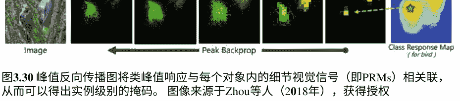

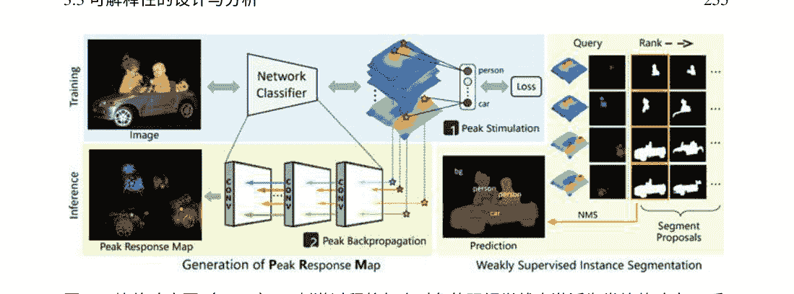

图3.31 峰值响应图（PRMs）。刺激过程将每个对象的强视觉线索激活为类峰值响应。反向传播从峰值中收集详细信息。使用类别感知线索、实例感知线索和来自提议的对象先验来预测实例掩码。最佳以彩色显示。图表由Zhou等人（2018）获得许可后复制。

> 突出显示
规则提取是逐步进行的，每次一层。在这里，一个层用来解释下一个层。因此，通过它们各自的前一层，得到了描述DNN每一层的规则集。因此，结合输入修剪逆向工程策略（Augasta和Kathirvalavakumar 2012），以模拟整个网络，以实现更易理解和更广义的规则。

通过决策树归纳的深度神经网络规则提取（DeepRED）（Zilke等人2016）是一种著名的方法，扩展了CRED。它为每个隐藏层都有额外的决策树和中间规则。它可以被看作是一种常规的分而治之方法，旨在通过前一层来描述每一层，并将所有结果汇总以解释整个网络。

另一方面，当不考虑NN的内部结构时，相应的策略被称为教学的。这些策略将整个网络视为黑盒函数，并不检查神经元级别来解释它。2012年，Augasta和Kathirvalavakumar（2012）引入了RxREN算法，采用逆向工程技术分析输出并追踪导致最终结果的组件。这可能是回溯的情况。

除了规则提取技术之外，还提出了其他方法来解释NN的决策。2016年，研究人员引入了可解释的模仿学习（Chen等人，2020年），它基于模型蒸馏的思想，用一个简单且可解释的模型来近似原始NN，类似于动态规划。从复杂模型（教师）向简单模型（学生）转移知识的概念在其他作品中也得到了探索，例如基于聚类的方法从MLP中提取规则（Hruschka和Ebecken，2006年）。

可解释模型的最大问题是学习问题的方法限制，因为每种方法在知识表示、知识推理和领域复杂性方面都有自己的弱点。

内在可解释的决策树通过遵循一组if-then子句的结构化树来工作。这种方法的问题在于可解释性方面的可扩展性不强。随着问题复杂性增加，树的规模越大，它的可解释性就越低。其他基于规则的方法也是如此，它们的解释方式与决策树类似。线性模型（如支持向量机SVM）通常更具可解释性，因为它们的透明度使得可以使用向量来解释对新问题的决策。不幸的是，这些模型与决策树面临相同的问题：随着维度的增加，将预测解释为解释变得非常困难。而且在某些时候，我们很可能会失去整体的视角。相比之下，基于案例的推理（CBR）可以被认为是有一定可解释性的，这取决于所使用的相似度度量和先前的案例，因为我们不需要关注所有维度，而只需要关注对检索最重要的维度。而k-NN则会考虑所有特征，CBR通常只关注最重要的特征。

尽管许多关于CBE的论文提出了仅呈现最近邻作为充分解释的论点，但仍存在一些相关挑战。正如Nugent和Cunningham（2005）所提到的，尽管CBR提供了一些透明度，但用户无法看到知识容器中隐藏的一些知识。在最相似的案例中呈现特征值可能会产生误导（McSherry 2003）。在某些情况下，某些特征值的存在可能与预测相矛盾。仅仅向用户展示这些可能并不总是有用的。这表明在设计成功的基于案例的解释时，找到并突出显示关键特征的重要性（Nugent和Cunningham 2005）。

### 3.3.2 贪婪算法

贪婪可解释性的目标是为黑盒模型获得最佳解释。因为人们贪婪，所以选择最接近的解决方案似乎是最好的。它试图找到一个局部最佳解决方案，假设最终会导致全局最优解。这个算法很容易实现，通常是最容易使用的算法。但是基于局部最佳的决策并不总是按照预期的方式工作。总的来说，它并不能提供最适合整个世界的解决方案。简单来说，贪婪算法并不总是有效，但当它有效时，它的效果非常好！因此，可靠的解决方案动态规划方法已经取而代之。

- 这个算法有两个基本特征：
- 1. 它贪婪地选择最佳选项。
- 2. 它要求问题可以通过找到其子问题的最优解来解决（子结构性质）。

## 3.3 可解释性的设计与分析

人们通常使用这样的解释来识别其他感兴趣的人或物品。例如，“安尼什是一个智力很高、长着长发、戴眼镜的人。”在这种情况下，我们可以观察到智力和长发等特征有助于描述这个人，尽管不够充分。眼镜的存在是完成识别和区分他与其他人的必要条件，比如身高高、长发、不戴眼镜的帕斯。当我们试图准确描述某事物时，我们经常提供这种矛盾的事实。这些对比事实并不是一个全面的列表，列出了所有可能的特征，以便将其与它不属于的所有其他类别区分开来，而是一组最小的特征，有助于将其与“最接近”的不属于它的类别区分开来。这就是贪婪选择特征的作用所在。

这种方法的缺点是，我们不知道网络是如何解决问题的，因为我们不知道它的基础知识和推理，即使解释是正确的。Xiao和Wang（2021）开发了一种迭代技术，用于确定任何分类器使用的特性和依赖关系。解决了发现特性组合对性能产生影响的优化问题。为了解决这个问题，提出了一种贪婪的方法，称为“GoldenEye”算法，它成功地随机选择特征来选择排列，对特性进行分组，最后修剪多余的特性以提高准确性。

#### 案例1：朝向具有相关负面影响的对比解释

Dhurandhar等人（2018）希望为神经网络生成这样的解释，除了突出显示输入中最小充分的特征（例如高个子和长发）以证明其分类，还要识别对比特征或特性（例如眼镜），以维持当前的分类并将其与“最接近”的另一个输入（例如Parth）区分开来。因此，我们希望提供以下形式的解释：一个输入x被分类为属于类别 y，因为特征 f_i, . . . , f_k存在且特征 f_k, . . . , f_m不存在。这种分类是基于在解释中搜索所有可行解的思想，同时只搜索相关的解，寻找贪婪局部最优解来强烈确认分类的预测性。

> ## 突出显示

贪婪可解释性策略就像一个滑动窗口，在感兴趣的区域找到最优解并解释它。该策略可能无法提供全局最大值，但解决方案可能会被广泛接受。这得到了GDPR声明的支持，该声明指出了这种基本、明确的解释的重要性，而不是不必要的复杂和冗长的解释（Yannella和Kagan 2018）。

事实上，在某些对人类至关重要的领域中，这种解释的存在是一个强有力的动机。在医学和犯罪学中有着相关积极（PP）和相关消极（PN）（Herman 2016）的概念，结合起来提供了全面的解释。

例如，在图3.32中，我们可以看到来自MNIST数据集的手写数字，黑色背景表示没有信号或者缺少那些特定的特征，这些特征在这种情况下是像素值为零的像素。任何非零值都表示这些特征/像素的存在。这个想法也适用于彩色图像，其中最突出的像素值（例如所有像素值的中位数/众数）可以被视为没有信号，而远离这个值可以被视为添加信号。有人可能会认为我们的解释形式中存在一些信息损失。然而，我们相信这样的解释对人类来说是清晰易懂的，他们可以进一步深入研究我们生成的解释的细节，例如精确的特征值，这些值是随时可用的。

> ## 突出显示

- 一个相关的正面（PP）是一个最低限度存在的因素，用来证明最终的分类。
- 一个相关的负面因素（PN）是一个必须不存在的因素，以建立最终的分类。

给定一个输入和它在神经网络中的分类，CEM生成以下目标的解释：

- 1. PNs：它确定输入中应该缺少的最少数量的特征（即保持在背景中），以避免分类结果发生改变。
- 2. PPs：它发现输入中最少数量的（对象/非背景）特征，这些特征足以提供相同的分类。
- 3. 它使用了一个SOTA CAE（Mousavi等人，2017年）来实现上述的（1）和（2），接近数据流形以获得更“真实”的解释。

作者建议改进的方法来实现（3），以便所得到的解释更有可能接近基础数据流形，与人类直觉相符，而不是可能影响分类的随机扰动。事实上，使用自动编码器开发一个良好的表示

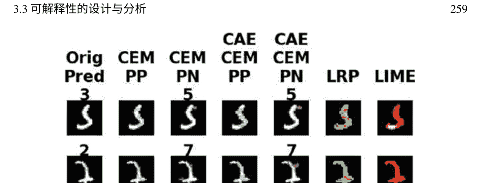

图3.32 MNIST解释。 CEM与或不与CAE、LIME和LRP一起使用。青色/粉色代表PP/PN。绿色表示中性相关性，红色/黄色表示正相关，蓝色表示负相关。PP/PN分别是cyan/pink。对于LRP，绿色是中性的，红色/黄色是正相关，蓝色是负相关。对于LIME，红色是正相关，白色是中性。图像由Dhurandhar等人（2018）重制并获得许可。

由于数据不足或数据质量差等约束，许多情况下可能无法实现。如果所有特征值组合在领域中都有意义，或者数据不在低维流形上，这也可能是不必要的，就像图像的情况一样。值得注意的是，这种技术与生成对抗样本的方法有关（Carlini和Wagner 2017; Chen等人2018年）。

让我们从数学角度来看CAE模型，给定一组数据（x0, c0），该技术试图通过计算表3.3中定义的符号来确定PP（参考上述目标（1））：

$$min_{\delta \in \mathcal{X}/x_0} \alpha . f_\kappa^{neg}(x_0, \delta) + \beta\|\delta\|_1 + \|\delta\|_1^2 + \gamma\|x_0 + \delta - AE(x_0 + \delta)\|_2^2 \quad (3.30)$$

其中κ ≥ 0是确定示例属于类c0还是不属于类c0时预测概率分离的置信参数。相应的正则化系数由术语α，β，γ ≥ 0表示。

对于PP，使用类似的优化方法来最小化δ作为min_{δ ∈ X ∩ X} 整个技术使用快速迭代收缩阈值算法（FISTA）Beck和Teboulle（2009）用于目标（2）和（3），以及类似的投影FISTA用于PN目标（1）。图3.32显示了CAE改进了CEM结果。突出显示的部分更好地反映了人类对数字的观点。PP的结果显示哪些像素对应于数字分类，但PN的结果显示了修改预测结果所需的最小修改。

#### 案例2：奇异向量规范相关分析

奇异向量规范相关分析（SVCCA）通过将规范相关分析（CCA）与奇异值分解（SVD）相结合来分析可解释性（Raghu等，2017）。CCA已经被用于相关任务，例如

表3.3 优化表示中的CEM符号

| 符号表示 | 备注 |
| :--- | :--- |
| $\delta \in \mathcal{X}/x_0$ | 对自然实例 $x_0$ 应用负可解释扰动，以研究两个最可能类别 ($x_0, c_0$) 在可行数据空间 $\mathcal{X}$ 中的差异，具有推断的类别标签 $c_0$ |
| $\delta \in \mathcal{X} \cap x_0$ | 对现有组件 $\mathcal{X} \cap x_0$ 进行正可解释扰动，以使 $_0$ 的移除结果与类别 $c_0$ 的相同top-1预测 |
| $P(x)$ | 与通过扰动生成的图像 $x$ 相关的所有类别的预测概率，其中 $x = x_0 + \delta$ |
| $AE(x)$ | 自动编码器用于从 $x$ 重构图像，并评估其与样本的相似性 |
| $\arg \max_i [P(x_0)]_i$ | 自然图像的最可能类别预测 |
| $\arg \max_i [P(x_0 + \delta)]_i$ | 对扰动图像的最可能类别预测 |
| $f_k^{neg}(x_0, \delta)$ | 损失函数激励扰动 $x$ 被投影为一个与 $c_0$ 不同的类别 $= \arg \max_i [P(x_0)]_i$ |
| $\beta \|\delta\|_1 + \|\delta\|_2^2$ | 弹性网络正则化器用于高维学习中的高效特征选择 |
| $\|x_0 + \delta - AE(x_0 + \delta)\|_2^2$ | $L_2$ AE的重构误差 |

计算建模和观察到的脑活动之间的相似性Sussillo等人(2015)和训练多语言词嵌入模型(Faruqui和Dyer 2014)。然而，它从未被用来比较深度表示。不是神经元对随机输入的反应，而是它如何编码给定数据集的方面，这是非常重要的（例如自然图像）。因此，在这项工作中，作者将神经元的表示定义为其对有限数量的输入（来自训练集或验证集）的响应集合。

给定一个数据集 $X = x_1, ..., x_m$, 其中每个输入 $x_i$ 可能是多维的。神经元 $i$ 在层 $l$ 的激活由符号 $z_i^l$ 表示。需要注意的是，整个输入数据只定义了一个这样的输出。SVCCA确定了两个网络层 $l_k = z_i^{l_k} | i=1,...,m_k$ 对于 $k=1,2$, 通过接受 $l_1$ 和 $l_2$ 作为输入（实际上，$l_k$ 不必是完整的层）。SVCCA使用SVD提取最具信息的组件 $l'$和CCA将 $l'_1$ 和 $l'_2$ 转换为 $\bar{l'_1} = W_x l'_1$ 和 $\bar{l'_2} = W_x l'_2$ 具有最高的相关性 $\rho_k$, $= \rho_1, ..., \rho_{min(m_1, m_2)}$. 两个比较的层之间相似度的另一种定义是 $\rho = (1/(min(m_1, m_2))) \sum_i \rho_i$. 最后，它产生对齐方向的配对。$(\bar{z_i^{l'_1}}, \bar{z_i^{l'_2}})$ 与 $\rho_i$ 相关良好。正如在CIFAR-10上的一个SVCCA测试所示，只需要 $l_k^l$ 中最重要的25个轴即可实现几乎与具有512维度的完整网络相同的准确性。

简而言之，SVCCA将两组神经元作为输入，并对每个子空间使用SVD来选择包含原始子空间中最重要方向的子空间（一种贪婪的方法）。正如Raghu等人（2017）所指出的，低方差方向（神经元）主要是噪音，这使得这成为神经网络中的一个关键因素。然后，我们通过最大化改变后的子空间之间的相关性来## 3.3.3 回溯算法

使用CCA计算规范相关相似性（Hardoon等人，2004年），最后，生成一组在单个值和方向上具有最佳对齐的输出。

总之，Malioutov等人（2017年）将生成可解释模型的问题视为布尔代数中的稀疏信号恢复问题，称为布尔压缩感知。在一种非启发式方法中，使用阈值分组测试来开发可解释规则。Dhurandhar等人（2018年）通过将PP和PN作为独立的优化问题，并使用FISTA来解决它们，开发了CEM作为一种模型无关的方法，提供对比解释。Mousavi等人（2017年）通过在数据流形附近使用CAE来改进这一方法。

回溯可解释性是一种递归算法策略，通过迭代地尝试逐个组件地创建解决方案，并丢弃未能满足问题条件的迭代来解决问题。与仅仅更加努力相比，这种方法效果要好得多。在这种情况下，我们将从多个可能性中选择一个答案并尝试一下；如果成功，我们将打印出来；如果不成功，我们将返回并尝试其他方法。与其他形式的递归一样，这涉及返回到先前提供解决方案的选择，然后再继续尝试新的选择。

> 突出显示
将回溯过程可视化为陷入迷宫并不断向右转（向输入方向反向传播损失），直到找到出口（数据影响的表示）。
尽管如此，大多数事后解释都是从不同的角度来解决这个问题的：首先，训练一个模型，不考虑它将使用哪些特征（前向传递）。然后我们通过反向传播来查看它学到了输入数据的哪些属性。

然而，模型能够解释自己是一个前提条件，例如通过识别它用来支持预测的哪些输入特征。另一方面，大型数据集有时会受到许多变量之间存在虚假相关性的影响（Calude和Longo 2017）。在决定使用哪些相关的输入变量来支持预测时，学习机器会受到虚假相关性的困扰。下面的图3.33显示了一个简单的例子。

该模型通过利用特征 $x_1$、特征 $x_2$或者两者来准确地对数据进行分类，但只有第一种选择能够推广到新数据。如果无法学习到正确的输入特征，可能会导致类似于“聪明的汉斯”类型的预测器（参考第4.1.1节）。选择“优秀”输入特征的子集并将其提供给学习机器是一种方法（Guyon和Elisseeff，2003年）。然而，这种策略具有挑战性。例如，在图片识别中，个别像素的重要性尚未确定，这在实现上是困难的。

首先，方程3.31展示了在简单的泰勒分解方法中对预测结果$f(x)$在邻近参考点$\tilde{x}$的解释。

```
$$f(x) = f(\tilde{x}) + \sum_{i=1}^{k} [\nabla f(\tilde{x}_i) + \text{高阶导数} \cdots] \qquad (3.31)$$
```

方程3.31中的一阶项（求和的组成部分）量化了每个输入特征对预测的重要性，同时也提供了解释。尽管使用起来似乎很容易，但这种方法在与深度神经网络一起使用时并不稳定。

+   突出显示

基本泰勒分解的不稳定性可以追溯到深度神经网络函数中的各种已知缺陷：

- **破碎的梯度 (Balduzzi等人，2017年)**：虽然函数值$f(x)$通常很精确，但函数梯度却很嘈杂。
- **对抗性示例 (Szegedy等人，2013年)**：输入中的微小变化$x$可能导致函数值$f(x)$发生剧烈变化。

由于这些缺陷，选择一个相关的参考点$x$并具有有意义的梯度$\nabla f(x)$是具有挑战性的。这使得创建可靠的解释变得不可能。

## 案例1：通过逐层相关传播解释决策

我们现在将集中讨论LRP，这是一种使用DNN的网络结构快速可靠地计算解释的像素分解技术。LRP通过在神经网络中向后传播$f(x)$的预测，为潜在极其复杂的DNNs增加了可解释性和规模，使用了特别开发的局部方法。

| 符号表示 | 备注 |
| :--- | :--- |
| $R_j$ | 传播一个层的（$j$到较低层）相关分数 |
| $\alpha_k$ | 第$j$层神经元的激活活动 |
| $\rho(w_{zk})$ | 神经元 $j$ 对神经元 $k$ 的相关性贡献程度 |

传播规则（回溯）。LRP传播技术受到一个保守性质的约束，该性质规定神经元接收到的信息必须以相等的比例传递到底层。在电路中，这种行为相当于基尔霍夫的守恒定律。

给定一个输入-输出映射（例如DNN）$f: x_i \rightarrow y_k$, 通过公式3.32将给定层$k$上的相关性得分 ($R_k$) 传播到前一层的神经元，例如 $j$。

$$R_j = \sum_k \frac{z_{jk}}{\sum_j z_{jk}} R_k \quad (3.32)$$

使用表3.4中的符号表示。这里，量 $z_{jk}$ 表示神经元$j$ 对神经元 $k$ 的相关性贡献程度。保守性质由分母强制执行。一旦到达输入特征，传播过程结束。通过将上述方法应用于网络中的所有神经元，逐层保持守恒性质 $\sum_j R_j = \sum_k R_k$，并且，通过推广，全局守恒性质 $\sum_i R_i = f(x)$ 可以很容易地验证。

LRP有很多变体，如LRP-0，LRP-$\gamma$，LRP-$\epsilon$，和LRP-$\alpha\beta$(Bach等人，2015)，可以在DNN中简单实现。作为上述版本的超集，通用方程式在方程式3.33中给出：

$$R_j = \sum_k \frac{\alpha_j \cdot \rho(w_{jk})}{+ \sum_{0,j} \alpha_j \cdot \rho(w_{jk})} R_k \quad (3.33)$$

+   这个传播规则的计算可以分为四个步骤：
1.  前向传播: $\forall k : z_k = \sum \quad$ 逐元素除法:
2.  $\forall k : s_k = R_k/z_k$
3.  反向传播: $\forall j : h_j = \sum_k \rho(w_{jk}) \cdot s_k$
4.  逐元素乘积: $\forall j : R_j = \alpha_j h_j$

图3.34 输入图像和通过各种LRP过程获得的输出神经元“城堡”的像素解释。参数为0.25标准差和0.25。图由Montavon等人（2019）获得的许可重现。

下图显示了用于模型解释的LRP的示例实现。LRP通过向后传播输入的预测概率并计算相关性分数，为像素分配重要性分数。相关性分数 $R_j$ 直观地表示像素对预测函数 $f(x)$的局部贡献。

### 3.3.4 动态规划

当我们遇到可以分解为相似子问题并且可以重复使用其结果的问题时，会使用动态规划。这些方法主要用于优化。一种可解释性也被称为记忆技术，因为其目标是保留先前计算的解释，以避免重复计算。在尝试解决手头的子问题之前，动态算法会尝试回顾先前解决的子问题的结果。子问题的解决方案被整合以得到最优解。通过将问题分解为越来越小的可行子问题，这种方法类似于分而治之。然而，与分而治之不同的是，这些子问题不是分别解决的。相反，这些较小的子问题的结果被记忆并用于可比较或重叠的子问题。

> 例如，显著性/特征归属可视化方法的解释尝试确定输入的哪些方面对于特定的分类结果最重要。 通常，这涉及到找到一个可以被视为某个输出相对于输入的梯度的值。

#### 案例1：基于梯度的定位的视觉解释

为了创建一个粗略的定位图，显示图像中用于预测概念的关键区域，Gradient-weighted Class Activation Mapping (Grad-CAM) (Selvaraju等人, 2017) 使用从任何目标概念流入最终卷积层的梯度。 这使得未经训练的用户能够区分出一个“更强”的深度网络和一个“更弱”的深度网络，即使两者产生相同的预测。

Saliency Maps 的简短复习，本质上是通过感兴趣的图像进行前向传递，计算类别得分 $S_c(I)$ 相对于输入像素的梯度，对于类别 $C$，将其他类别的梯度设为零。 然后，通过分别突出负贡献和正贡献或显示绝对值来展示这一点。 Grad-CAM 还为决策的每个神经元分配一个相关性分数。 然而，梯度并没有反向传播到图像的最后，而是（通常）反向传播到最后一个卷积层，以构建一个粗略的定位图，突出显示图像的重要部分。 这个决策可以是类别预测（在输出层中找到），但也可以是神经网络中的任何其他层。

让我们从对Grad-CAM的直观检查开始。 Grad-CAM的目标是找出卷积层在图像中寻找某个分类的位置。 视觉解释的问题是：我们如何从特征图中“看到”卷积神经网络是如何进行某个分类的?

首先，我们可以可视化每个特征图的原始值，对它们进行平均，并将它们叠加在我们的图像上。 然而，我们只对一个特定类别感兴趣，而特征图编码了所有类别的信息。 另一方面，Grad-CAM必须确定每个特征图对我们感兴趣的类别的重要性。 在对特征图进行平均之前，我们必须用梯度加权每个特征图的每个像素。 这将产生一个热图，显示哪些区域对感兴趣的类别有积极或负面的影响。 ReLU函数用于处理这个热图，这是一种更高级的方式来表示我们将所有负值归零。 基于我们只对指定类别的贡献感兴趣而不是其他类别的理由，Grad-CAM使用ReLU函数来消除所有负值。 就像找到子问题（原始图像）的最优解一样。

然后，我们将地图缩放回 [0, 1]的范围以供显示，并将其覆盖在原始图像上。 对于这种方法，定位图在等式3.34中定义如下：

```
$$ \mathcal{L}_{\text{Grad-CAM}} \in \mathbb{R}^{H \times w} = \text{ReLU} \left( \sum_k \alpha_k^c A^k \right) $$ (3.34)
```

其中，c表示感兴趣的类别，A^k表示激活图，H和W分别表示解释的高度和宽度。对于最后一个卷积层之前的卷积层，对于感兴趣的类别的梯度被定义为δy^c/δA^k。之后，根据等式3.35，在全局池化中平衡各个类别的梯度，

```
$$ \alpha_k^c = \frac{1}{Z} \sum_i \sum_j \frac{\delta y^c}{\delta A_{ij}^k} $$ (3.35)
```

这意味着定位非常粗糙，因为最终的卷积特征图的分辨率比输入图片要粗糙得多。其他归因系统一直反向传播到输入像素。因此，它们更加详细，可以显示出对预测贡献最大的特定边缘或位置。

Guided Grad-CAM（唐等人，2019年）是这两种方法的混合体。而且它非常简单。我们计算了Grad-CAM解释以及来自另一种属性方法（如Vanilla Gradient）的解释，用于一张图片。然后，使用双线性插值对Grad-CAM结果进行上采样，并对两个映射进行逐元素相乘。Grad-CAM作为一个镜头，聚焦在像素级别的归因图的特定区域上。第4.1.4节详细描述了如何可视化各种显著性方法。

> 突出显示
理解仅基于梯度的归因的方法如下：如果我们改变像素的颜色值，预测的类别概率会增加（如果梯度为正）或减少（如果梯度为负）。梯度的绝对值越大，改变该像素的影响就越大。

#### 情况2：视觉上增强基于梯度的敏感度图

SmoothGrad（Smilkov等，2017年）通过添加噪音并对这些人工噪音梯度进行平均来减少基于梯度的解释中的噪音。这种策略不是一种独立的解释方法，而是任何基于梯度的解释方法的扩展。简而言之，它的操作如下：

+   1. 给感兴趣的图像添加噪音以生成多个变体。
2.  为所有图像生成像素归因图。
3.  对像素归因图取平均值。

确实，那就是那么简单。为什么这样操作有效呢？根据原理，在微小尺度上，导数会显著变化。在训练过程中，神经网络没有保持梯度平滑的动机；它们的目标是正确分类图像。 这些不规则性通过在等式3.36中对许多图进行平均来“平均化”。

```
R_{sg}(x) = \frac{1}{N} \sum_{i=1}^{n} R(x + g_i) \tag{3.36}
```

其中， g_i \sim N(0, \sigma^2)是从高斯分布中采样的噪声向量。

图3.35展示了强烈波动的偏导数示例。作者将其作为最大条目的百分比呈现，以证明波动是显著的。 这个片段的长度足够短，以至于起始图像 x 和最终图像 x+ 与人类的外观相同。 此外，模型在整个过程中都正确分类了每个图像。 然而，偏导数对于单个像素的RGB值（红色、绿色和蓝色分量），Sc的偏导数波动很大。我们还注意到梯度的另一个特征是存在一些像素的梯度明显高于平均水平。

图中还包括了对ImageNet中众多示例图像的噪声水平的影响（底部行）（Russakovsky等，2015年）。第二列提供了纯净（零噪声百分比）的梯度。由于定量评估地图仍然是一个开放的课题，他们重新致力于定性方法。

请注意，在应用噪声时，灵敏度图的清晰度在10%至20%之间最好保持不变（中间列）。有趣的是，尽管这个噪声水平对于inception来说相对有效，但最佳噪声水平会随输入而变化。

总之，基于梯度的方法通常比模型无关的方法计算速度更快，利用资源更少，与动态规划中的时间复杂度相当。显著性方法描述了算法选择的方式，通过分配数值来指示输入组件对决策的贡献的相关性。这些数值可以采用概率和超像素（如热图）的形式。

### 3.3.5 分支限界法

考虑计算一个下界（或者通过对偶性，一个上界）并声称获得属性的充分性。虽然分支和界限技术只能提供对变量值的有限估计，但它们可以处理更大的模型，例如多达10,000个隐藏神经元。

> > **突出显示**
最简单的方法是将其视为一棵树。我们首先关注主问题解空间的一个小子集，然后搜索一个局部最优解释，可以推广到整个问题。我们对树的分支施加了一个边界约束，并找到一个解，这可能涉及到只部分完整的解释，因此可能会错过最优或整体的解释。

#### 案例1：局部可解释的模型无关解释

局部可解释的模型无关解释（LIME）（Ribeiro等，2016年）以可解释和忠实的方式解释任何分类器的预测，通过在预测周围局部学习一个模型。它扰动输入实例并识别出在可解释表示上的局部忠实可解释模型的输出预测。LIME将输入图像分成可解释的组件（连续的超像素），并通过模型运行每个扰动实例以生成概率。这组局部加权数据用于训练一个简单的线性模型。在过程结束时，LIME根据超像素给出一个解释。

表3.5 LIME解释的符号

| 符号表示 | 备注 |
| :--- | :--- |
| $f(x)$ | 概率（或二进制指示器）$x$属于特定类别 |
| $g \in G$ | 可解释模型集合 $G$ 具有可解释组件 $g$ 在 ${0, 1}^d$ |
| $\pi_{x}(z)$ | 在局部范围内，实例 $z$ 的相似度度量 $x$ |
| $L(f, g, \pi_x)$ | 局部感知保真度损失，衡量 $g$ 在由 $\pi_x$ 指定的局部范围内与 $f$ 的接近程度 |
| $\omega(x)$ | 基于复杂度测量的正则化器（与可解释性相对） |
| $\xi(x)$ | 以 $f$ 为真实函数的最优解释模型 |
| $c(V, W, I)$ | 非冗余覆盖，将覆盖定义为集合函数 $c$，计算在解释矩阵 $W$ 和解释空间中的全局重要性 $I_j$ 至少出现在一个实例 $V$ 中的特征的总重要性 |

具有最正面权重的像素。这也可以成为分而治之的一个竞争者，但让我们考虑分支和界限。

例如，一个显示单词存在或不存在的二进制向量可以用来表示文本分类，即使分类器可能使用更复杂（难以理解）的特征，如词嵌入。虽然分类器可能将图像表示为每个像素具有三个颜色通道的张量，但可解释的表示可能是一个二进制向量，表示相关像素块（“超像素”）的“存在”或“不存在”。我们说 $x \in \mathbb{R}^d$ 是正在解释的实例的原始表示，而 $x^{\prime} \in {0, 1}^d$ 是一个二进制向量，显示如何理解它。

让我们将正在呈现的模型称为 $f : \mathbb{R}^d \rightarrow \mathbb{R}$。为了保证可解释性和局部忠实度，我们必须最小化模型 $\xi(x) =\arg \min L(f, g, \pi_x) + \omega(x)$，同时保持 ($g \in G$) 足够低，以便人类可以使用表3.5中的符号进行解释。通过LIME最小化模型目标 $\xi(x)$ 得到的解释可以与不同的解释族 $G$、保真度损失函数 $L$ 和复杂度度量 $\omega$ 一起使用。LIME的基本思想是在 $x$ 附近采样实例（由于 $\pi_x$ 具有较高的权重）和远离 $x$ 的实例（由于 $\pi_x$ 具有较低的权重）。即使原始模型可能过于复杂以全局描述，LIME提供了一个局部忠实的解释，由 $\pi_x$ 封装。

分支：我们将选择步骤定义为在给定一组实例 $X$ 的情况下，为用户选择要调查的 $G$ 实例的任务。子模块选择主要是为了选择一组多样化、代表性的解释，向用户展示模型的行为方式，这些解释是非冗余的，并且代表了模型的一般行为。我们生成一个 $N \times D^{\prime}$ 的解释矩阵 $W$，该矩阵捕捉了每个实例 $g$ 的可解释组件的局部重要性，给出了一组解释的情况。

实例 $X$ ($|X|=n$). 当将线性模型用作解释时，我们设置 $W_{ij} = |w_{g_i}|$ 对于一个示例 $x_i$ 和解释 $g_i = \xi(x_i)$. 此外，对于矩阵 $\mathbf{W}$ 中的每个组件 (列) $j$, 我们让 $I_j$ 表示该组件在解释空间中的全局重要性。

边界：我们希望 $I$ 以一种能够解释许多不同情况的特征具有更高的相关性排名。例如，在文本应用中，$I$ 可以设置为 $I_j = \sqrt{\sum_{i}^n}$

对于图像，$I$ 必须测量一些可比较的东西，例如不同图像中的超像素的颜色直方图或其他超像素属性；我们将在第4.1节进一步探讨这些想法。请记住，虽然我们选择了覆盖大多数组件的实例，但解释集合不应该是冗余的。因此，我们避免以贪婪的方式选择具有相似解释的实例。非冗余覆盖概念可以通过将覆盖定义为集合函数 $c$ (参考表3.5)来实现，表达式为Eq. 3.37。

```
$$c(V, W, I) = \sum_{j=1}^{d'} \mathbb{1}_{[\exists i \in V: w_{i,j}>0]} I_j.$$
(3.37)
```

其中，挑选问题包括找到集合 $V$，使得 $|V| \leq G$，通过最大化加权覆盖函数在方程3.38中实现最高覆盖率是NP难问题 (Feige1998)。

```
$$\text{挑选} (W, I) = \arg\max_{V, |V|\leq G} c(V, W, I)$$
(3.38)
```

在这里，子模块挑选用于大致了解添加实例 $i$ 到集合 $V$ 的边际覆盖增益 $c(V \cup \{i\}, W, I) - c(V, W, I)$. 这种子模块性是一种贪婪算法，它通过不断将具有最高边际覆盖增益的实例添加到最佳解决方案中，以常数近似因子 $1-1/e$.

#### 案例2：基于本地规则的解释

Guidotti等人 (2018年) 开发了LORE (LOcal Rule-based Explanations)，这是一种使用遗传算法构建的语法邻域上的本地可解释预测器的方法。它的工作原理类似于LIME，最初在邻域上学习一个本地可解释预测器，但是不是随机改进创建实例的值，而是使用遗传方法进行排列。它产生一个有意义的解释，包括验证决策推理的决策规则，以及一系列反事实规则，指示可以对输入特征进行的更改以修改预期结果。为了确保真实性，规则是使用决策树在邻域上创建的，以复制图3.36中显示的黑盒子的本地行为。

#### 案例3：将神经网络提炼为软决策树

2017年，Frosst和Hinton (2017年) 通过将训练数据直接转移，产生了一个比直接从训练数据中训练的决策树更好的软决策树 (图3.37)。

## 3.3 可解释性的设计与分析

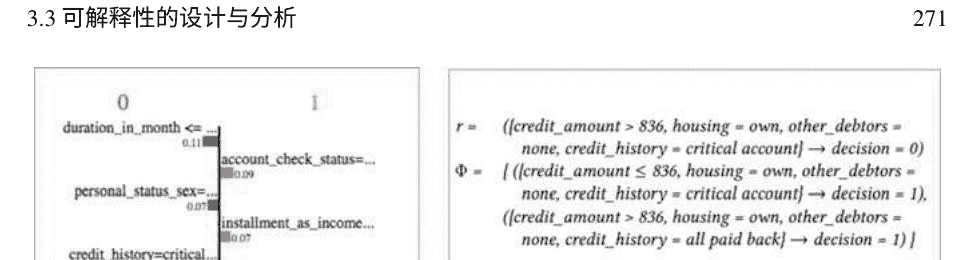

图3.36 比较LIME和LORE的相对优点。与LIME相比，LORE提供了更详细的信息。在决策树中使用最近的分割，LORE还提供了一个反事实的解释。图来自Guidotti等人（2018），获得许可后再现

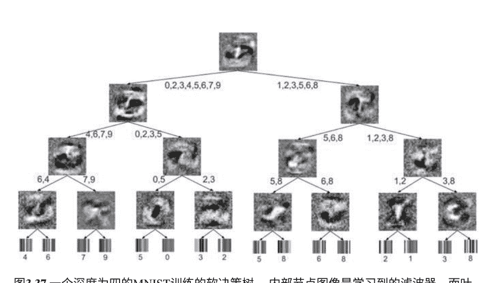

图3.37 一个深度为四的MNIST训练的软决策树。内部节点图像是学习到的滤波器，而叶节点图像是类别的概率分布。在每个叶节点上，记录最可能的分类，以及每个边上的可能分类。例如，观察最右边的内部节点，我们可以看到潜在的分类只有3或8，因此学习到的滤波器学会区分这两个数字。该滤波器寻找连接3产生8的两个位置。图来自Frosst和Hinton（2017），获得许可后再现

将NN的泛化能力应用于软决策树。该技术专注于训练决策树以模拟NN的输入-输出函数。传统神经网络的分层特性使其能够学习具有弹性和创新的输入空间表示，但在一两个层级之后，它们变得难以理解。相比之下，通过使用神经网络预测的软决策树可以提供更多信息性的目标。基于输入示例，分支选择一个特定的静态概率分布作为其输出。

与试图理解深度神经网络如何做出决策不同，这种方法利用深度神经网络训练一个模仿神经网络输入-输出函数但以完全不同方式操作的决策树。如果有大量未标记的数据，一个神经网络可以构建一个更大的标记数据集来训练决策树，克服其统计效率低下的问题。考虑：

分支：该方法使用了使用小批量梯度下降训练的软二叉决策树，其中每个内部节点 i 都有一个学习到的过滤器 \(w_i\) 和一个偏置 \(b_{i0}\)。每个叶节点 \(l\) 都有一个学习到的分布 \(P^l\)。在每个内部节点，选择最右侧分支的概率由方程3.39给出：

\[p_i(x) = \sigma (xw_i + b_i) \quad \text{(3.39)}\]

模型中的每个分层专家混合学习一个简单的、静态的分布跨可能的输出类别，k。该模型使用这种分层过滤来将示例分配给在方程3.40中呈现的适当的专家。

\[P_k^l = \frac{\exp(\rho_k^l)}{\sum_{k'} \exp(\rho_{k'}^l)} \quad \text{(3.40)}\]

其中，\(P^l\) 是在第 \(l\) 个叶子上学习到的概率分布，具有学习参数 \(\rho^l\)。

该模型可以利用来自具有最高路径概率的叶子的分布以及所有叶子上的分布的平均值，根据它们各自的路径概率加权，提供对类别的预测分布。

图3.37显示了一个示例表示。沿着路径到达叶子的所有过滤器的列表，结合二进制激活决策，可以很容易地解释从具有最高路径概率的叶子获得的预测分布。

**Bounding:** 软决策树利用学习滤波器生成基于输入的分层判断，并输出静态概率分布。

为了避免在训练过程中陷入次优解，Frosst和Hinton实施了一项惩罚项，鼓励内部节点同时使用左子树和右子树。如果没有这个惩罚项，树往往会陷入平台期，其中一个或多个内部节点总是将几乎所有的概率分配给其中一个子树，而逻辑梯度接近零。惩罚项是期望的平均分布（两个子树的平均分布为0.5）和实际的平均分布（\(\alpha,\, 1-\alpha\)）之间的交叉熵。方程式3.41给出了节点 \(i\) 的 \(\alpha\) 表达式，其中 \(P^i(x)\) 是从根节点到节点 \(i\) 的路径概率。

\[\alpha_i = \frac{\sum_x p^i(x) p_i(x)}{\sum_x P^i(x)} \quad \text{(3.41)}\]

惩罚项 \(\mathcal{L}\) 在内部节点上的总和在方程式3.41中如下所示：

\[\mathcal{L} = -\lambda \sum_{i \in \text{内部节点}} 0.5 \log(\alpha_i) + 0.5 \log(1 - \alpha_i) \quad \text{(3.42)}\]

其中超参数 \(\lambda\) 在训练之前定义了惩罚的严重程度。这种惩罚是基于使用替代子树的树的概念。

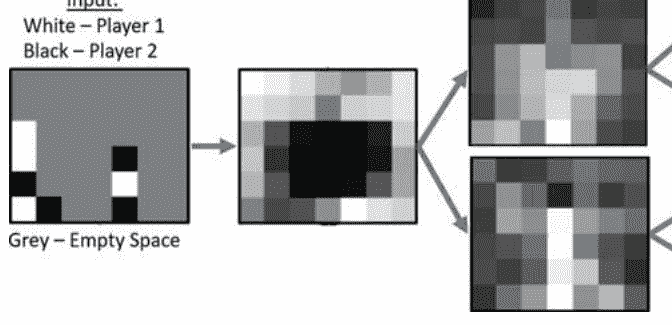

图3.38 展示了在Connect4数据集上训练的软决策树的前两层的示例可视化 (Lichman等人, 2013年)。检查学习到的滤波器可以发现游戏可以分为两种不同的子类型：玩家在棋盘边缘放置棋子的游戏和玩家在棋盘中央放置棋子的游戏。图源自Frosst和Hinton (2017), 获得许可。

在任何特定的分类任务中，公平地平衡各个类别的准确性会更加适合，并且在实践中确实提高了准确性。

> ### 🤔 好好思考一下
> **当一个人下降树时，上述惩罚计算的假设有多有效？**
> 随着一个人在树中向下移动，这个假设的支持逐渐减弱；树中的最后一个节点可能只负责两种类型的输入，比例可能不相等，在这种情况下对节点进行非等分割的惩罚可能会影响模型的准确性。

在任何给定的训练批次中，每个节点所看到的数据的预测比例随着树的下降而指数级下降。这意味着计算使用两个子树的实际概率变得不太准确。为了解决这个问题，我们可以使用与节点深度成指数比例的时间框架来维护实际概率的指数衰减运行平均值。论文的作者通过同时利用惩罚强度随深度指数衰减和用于计算运行平均值的时间尺度指数增长，实现了更高的实验测试准确性。

图3.38展示了他们的实验结果，其中在Connect4数据上训练的一个软决策树 (Lichman等人, 2013) 获得了80.60%的准确率，而未经蒸馏的版本得分为76.83%。

同样，Plumb等人 (2018) 开发了MAPLE (模型无关的监督局部解释)，它可以检测全局模式，同时提供基于示例的局部解释。MAPLE结合了Supervised Local Modeling Method (SILO) (Bloniarz等人, 2016) 的思想，利用随机森林作为一种用于局部线性建模的监督邻域选择方法，并结合了DStump (Kazemietabar等人, 2017) 中的特征选择方法。DStump根据在随机森林树的根节点处分割时减少标签不纯度的程度来确定特征的重要性。

给定的局部解释被认为比LIME（Ribeiro等人，2016）更可信，并且全局模式可以用来检测其局部解释中的问题。

### 3.3.6 穷举法

蛮力法是最基本和直接的解释性策略。通常，蛮力算法是解决问题的最简单解决方案，或者是我们在感知问题时首先想到的解决方案。从技术上讲，它就是遍历问题的每一个可能解决方案。要设计一个理想的解决方案，我们必须首先获得一个解决方案，然后尝试对其进行优化。每个问题基本上都可以通过蛮力法来解决，但对于复杂问题来说，由于成本过高，通常是不可行的。

例如，蒙特卡洛Dropout可以被视为蛮力尝试，通过在推理过程中使用常规的dropout并保持其开启状态来训练神经网络。这使我们能够为每个实例产生多个预测。我们可以对分类任务中每个类别的softmax输出进行平均。

尽管如此，本节不会展开讨论，因为这个想法已经被广泛认可。我们将其留给读者来创建一种适用于Brute-Force可解释性的策略。此外，重要的是要评论这些策略对模型可靠性的完整性的影响。在下一部分中，我们将讨论深度网络中的知识传递以及层编码与其解释之间的关系。

## 3.4 深度网络优化器中的知识传播

图3.39来自Olah等人（2017），显示了CNN学习到的特征从卷积层conv2d0中的边缘和混合层mixed3a中的纹理，到更高层次的卷积层中的部件和对象的更复杂和抽象的特征，以及其右侧的混合层mixed4d &mixed4e。

总的来说，所有的前馈神经网络都是可微分的。它们可以通过基于梯度的反向传播来学习，这会根据内部神经元的激活或输出的行为而随时间改变输入。从概念上讲，这似乎很容易，但我们必须迭代地微调优化过程以实现目标。许多可能性取决于所使用的优化技术，无论是探索整个数据集还是优化单个图像。下面的图片（参考图3.40）来自于论文“特征可视化”（Olah等人，2017），它优化了GoogleLeNet以激活一个随机的神经元。

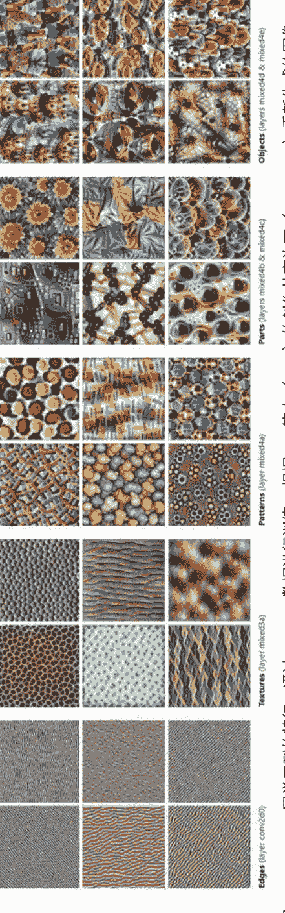

图3.39 GoogLeNet层学习到的特征，通过ImageNet数据进行训练。根据Olah等人（2017）的创作共享许可（CC-BY 4.0）重新生成的图像

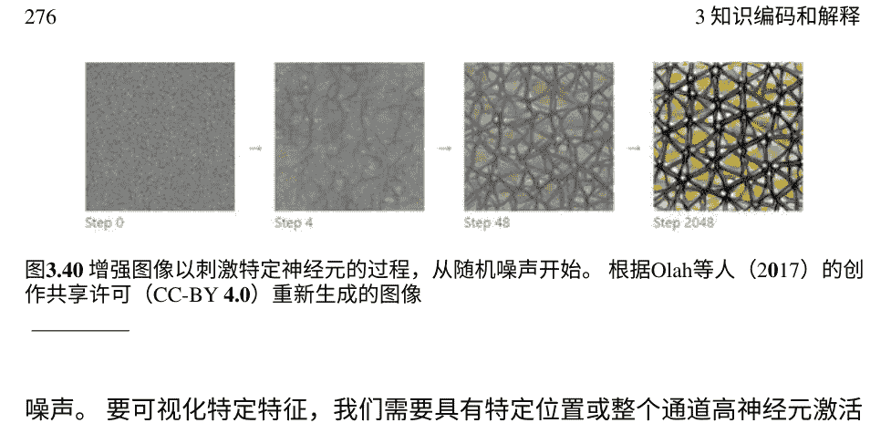

噪声。要可视化特定特征，我们需要具有特定位置或整个通道高神经元激活的示例。

如果我们想解释分类器的输出类别，我们可以在softmax激活之前或之后优化类别logits。Logits作为每个类别的证据，而概率则表示其可能性。令人费解的是，增加类别的softmax概率的简单方法是使其他类别的概率变得更低，而不是使感兴趣的类别的概率变得更高（Simonyan等人，2014年）。

根据文献综述，优化pre-softmax logits可以提高图像质量以进行解释。上述陈述的一个解释是，类概率的最大化不能排除其他类别的证据，因此效果不佳。另一个选择是使用softmax函数进行优化。处理对抗样本时，这是一个常见情况。强正则化与生成模型始终是有用的。在这种情况下，概率可以是一个重要的优化目标。样式转移目标（Gatys等人，2015年）让我们对网络对各种样式和内容的理解有了很大的见解。目标帮助我们理解模型在基于优化的模型反演（Mahendran和Vedaldi，2015年）过程中保留和丢弃的内容。

灵活性是优化的另一个好处。假设我们需要调查神经元如何集体表示知识。在这种情况下，我们可以研究如何改变特定示例以激活额外的神经元。

这种适应性还可以帮助可视化网络训练过程中特征的出现。将可解释性限制在数据集中的固定样本中，将使对模型进行彻底检查变得困难。并非所有方面都与相同的应用相关，但在对模型的行为进行对抗性分析时，进一步细分是有用的。

图像可视化并不是理解网络学习的唯一方式。对于每个层使用权重直方图可视化（图3.41）是深度学习模型的一种特定方法。这适用于任何类型的数据。由于权重和偏差是神经网络的核心，确定网络中权重的整体分布可以提供有价值的操作理解。对于均匀分布、正态分布或有序结构的解释可以与图像的直方图类比。它还提供了捕获音调的分布。

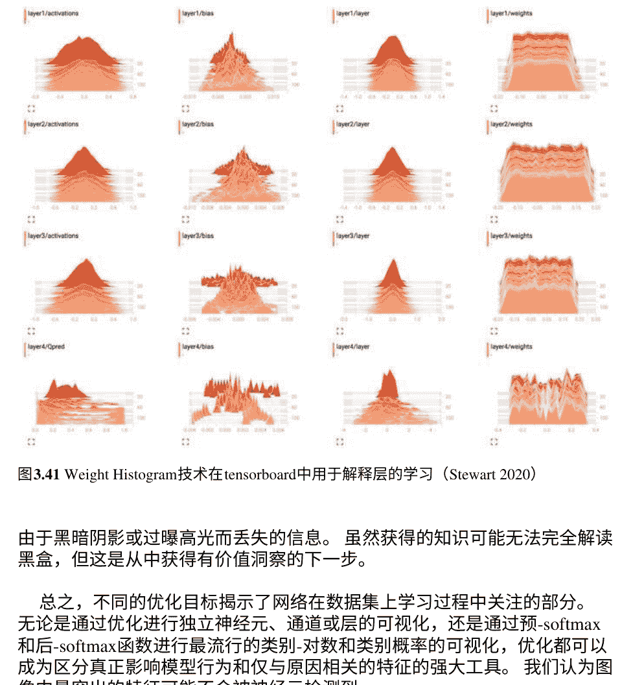

由于黑暗阴影或过曝高光而丢失的信息。虽然获得的知识可能无法完全解读黑盒，但这是从中获得有价值洞察的下一步。

总之，不同的优化目标揭示了网络在数据集上学习过程中关注的部分。无论是通过优化进行独立神经元、通道或层的可视化，还是通过预-softmax和后-softmax函数进行最流行的类别-对数和类别概率的可视化，优化都可以成为区分真正影响模型行为和仅与原因相关的特征的强大工具。我们认为图像中最突出的特征可能不会被神经元检测到。

#### 突出显示

使用“反演”可解释性技术来通过采样可能的近似重建来研究最近的深度CNN的不变性。

Mahendran和Vedaldi（2015）将这与表示的深度相关联，展示了CNN如何逐层逐渐构建越来越多的不变性。通过从神经元的子集中重建图像，无论是在空间上还是基于通道，我们可以研究信息的局部性是如何分布在这些表示中的。

### 3.4.1 知识与性能

本节强调了仅仅度量准确性已经不再足够的事实。

算法的问责制是当务之急。成功的分析取决于选择正确的度量标准，所以确保我们理解这些度量标准。数据科学界已经付出了很多努力，创建了具有前所未有精度的尖端工具。正在开发各种准确性度量标准，使用统计或逻辑推理来选择最佳模型的通用工具。可以肯定的是，相对于简单模型，更复杂的模型更加灵活。这使得可以近似更复杂的函数。假设要近似的函数是复杂的，并且有足够的数据来利用复杂模型，那么这个陈述是正确的。这就是性能和可解释性之间的权衡所在。重要的是要记住，试图解决不符合上述规则的问题将导致试图解决一个没有足够不同类型数据（方差）的问题。因此，模型的增加复杂性只会使问题更难以正确解决（图3.42）。

以下列举了一些最近的案例，例如谷歌的面部识别算法将一些肤色较暗的男性标记为大猩猩。特斯拉的自动寒冷天气驾驶员性能下降导致了致命的决策风险。一个算法


图3.42 选择合适的解释工具

YouTube关闭了一个受到嫌疑的热门频道，认为它是由机器人操作的。苹果的信用额度算法偏向于联合纳税地位为男性的人。优步的自动驾驶汽车忽略了停车标志。深度学习学者们意识到了可解释性问题，最近的发展集中在对模型进行可视化。特征可视化和理解模型的学习行为是其中之一；然而，使其工作涉及到几个方面。简单的办法可以产生高质量的可视化效果。

研究人员已经开发出了检查神经元行为、它们的激活方式、相互作用以及改进优化技术的策略。

关于“可解释性与性能”的争论已经进行了很长时间，但像其他重要声明一样，它也被神话和误解所包围。正如Rudin（2018）所说，更复杂的模型并不总是更准确。当数据组织良好且我们可以获得高质量和高价值的特征时，这并不成立。成功的分析取决于选择正确的度量标准，所以一定要确保我们理解这些度量标准。数据科学界已经付出了很多努力，创造了具有前所未有的精度的尖端工具。正在开发各种准确性度量标准，使用统计或逻辑推理来选择最佳模型的通用工具。在某些行业环境中，这种情况经常发生，因为被分析的特征受到非常受控制的物理问题的限制，其中所有特征高度相关，而且无法探索太多可能的值范围（Diez-Olivan等，2019年）。

当最基本的过程——形式知识收集被跳过时，所有的对数损失或图表都毫无意义。作为理性的生物，人类更喜欢基于合理的推理做出选择。为了更好地理解网络的学习，我们现在寻求关于为什么某个功能按预期运行的共识。在一些现实世界的场景中，算法或模型存在偏见可能会产生严重后果。在我们如此不懈地追求最先进技术的过程中，我们可能会放弃一个有效的模型，只为了在准确性上获得微不足道的改进，以保持表面上的形象。我们将研究一些人类可解释的解释（HII）用于非结构化图像数据，即非技术人员能够感知模型决策和决策过程中可能关键的特征，以实现更高的性能。

在这条通往性能的道路上，当性能与复杂性相辅相成时，可解释性遇到了一条看似不可避免的下坡。但是，更复杂的解释性测量方法的出现可能会扭转这种趋势，或者至少抵消它。图1.9展示了根据以前的工作，IDL如何改善了理解模型和评估其性能之间的常见权衡的初步表示。在这一点上，值得一提的是近似困境，因为它与模型的理解程度和工作效果密切相关。这是因为ML模型的解释必须清晰且足够接近以满足受众的需求，确保解释准确且不遗漏模型的最重要部分。

#### 好好思考一下

### 标量度量通常用于分类，但它们是否完整？

准确率、召回率、F1分数、ROC曲线下面积（AUC）或精确度都缺少某些东西。

当存在类别不平衡时，'准确性'是无关紧要的。
我们有多少次尝试过对二元分类进行手动阈值调整？当假阳性成本很高时，'精确率'表现良好，而当假阴性成本很高时，'召回率'表现良好。

类别偏斜会影响竞赛中使用的'F1分数/AUC'。

通过可视化混淆矩阵和混淆示例，例如来自cifar-10数据集的一个10×10混淆矩阵，可以更深入地了解模型表现不佳的类别标签。通过边缘情况或失败情景来解释模型的性能比准确性图更有用。

关于图像性能，图3.23展示了如何使用一个简单的预训练于ImageNet数据权重的VGG-16模型来预测两个图像的前3个类别索引。通过改变图像的透视比例和图像分辨率，在图中展示了对没有进行艰难优化的图像进行分类的简单实验。

我们相信随着时间的推移，分类性能已经显著提高，并且一种尖端的方法可以产生更优越的结果。我们在这里的目标是通过这个示例来灌输一种解释的思想，而不是为了争夺最先进的方法来获得最高分数。

图3.43中的顶部预测结果在图像视角改变时会有很大的变化，一些背景被裁剪掉，上下文意义较少，分辨率也发生了变化。当处理可能在未来经历这种转变的类似数据时，我们需要谨慎行事。

尽管如此，我们只是触及到了可解释性冰山的一角。我们主要讨论了网络的输入和输出层，因为这些通常与模型性能最相关。每种其他展示SOTA策略的方法的解释都受到混沌理论的影响。我们需要更好地理解这是否是唯一的解释和正确性。例如，像素之间的距离，如L2像素距离，在处理高维数据，特别是图像时可能非常不直观。图像的感知或语义相似性与像素级距离并不相对应。

当讨论图像相似性及其应用时，值得暂停一下，简要介绍一下孪生网络给读者。

#### 3.4.1.1 案例研究：孪生网络

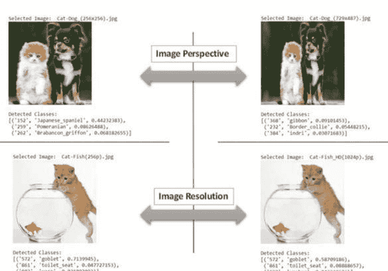

在继续下一节之前，该节提供了关于DNN的浅层和深层知识编码以及其表示方面的概述，我们将讨论一个有趣的例子，这将有助于理解人们如何在寻求最佳性能的同时，尝试使用非传统技术使机器自主学习特征而不需要太多人工监督。图3.44所示的架构描述了一个网络结构，在该结构中，两个或多个相同的子网络组件共享相同的权重。具有二分类和逻辑预测的简单双子卷积神经网络 Y。

根据（Rao等，2016），使用PCA进行传统的降维以找到低维空间的线性投影会导致高方差。另一方面，多维缩放（MDS）将数据排列在低维空间中，同时保持输入之间的成对距离。缺点是无法将新数据映射到相同的空间，在面部情绪识别示例中，需要非线性嵌入来处理噪声和光照差异。

孪生网络揭示了数据的降维，而不是明确依赖于总类别和明确的分类标签。该模型将对每个相同网络的最终激活层应用对比损失，将相似的输入与不相似的输入分开。

损失函数源自于（Hadsell等人，2006年），具有X1和X2输入图像，Y是二进制标签，α>0是正负分数之间的间隔，D_w是网络权重_w的欧氏距离（参见A.4节），其依赖于网络权重_w的向量之间的距离，如下所示：

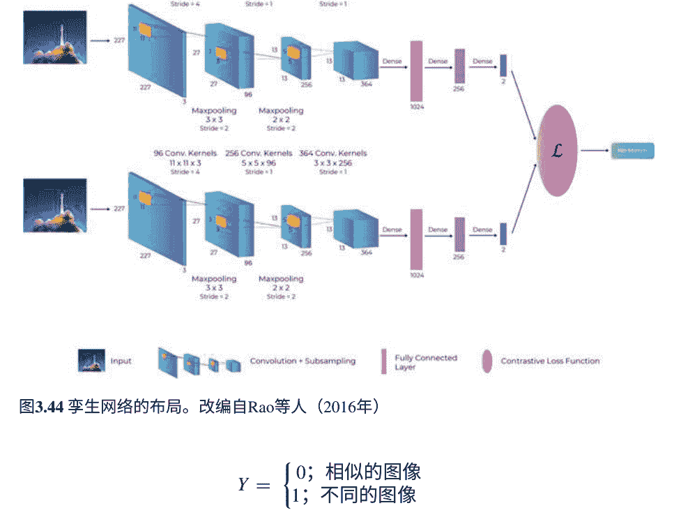

图3.44 孪生网络的布局。改编自Rao等人（2016年）

```
$Y = \begin{cases} 0; & \text{相似的图像} \\ 1; & \text{不同的图像} \end{cases}$

$\mathcal{D}_w = \|\mathcal{G}_1 - \mathcal{G}_2\|$

$\mathcal{L} = (1 - Y) \frac{1}{2} \mathcal{D}_w^2 + Y \left( \frac{1}{2} \max(0, \alpha - \mathcal{D}_w) \right)^2 \quad (3.43)$
```

它受到了弹簧拉力和排斥行为的类比启发，分别由方程式3.43的前半部分和后半部分表示。损失可以更简单地表示为一次输入正（$\mathcal{L}_+$）和负（$\mathcal{L}_-$）样本数据的函数，并且在一次计算中累加为$[\mathcal{L} = \mathcal{L}_+ + \mathcal{L}_-]$和三元损失，$L = \max(d(X, \mathcal{P}) - d(X, \mathcal{N}) + \alpha, 0)$使用距离度量$d$（参见附录A.4）；$\mathcal{P}$和$\mathcal{N}$是正和负样本数据，$X$是样本数据。

网络每一层共享权重矩阵的想法是比较模糊权重和常规CNN网络在每个隐藏卷积层之间的差异的另一个有见地的动机，详见第5章（参考第5章）。

有趣的是，作者在受限的训练条件下，仅通过图像数据展示了一种优秀的相似性结构特征的概念，即在不向网络提供任何相似性信息的情况下。EMPATH是由Dailey等人（2002年）提出的一种通过神经网络对面部表情进行分类的方法，该方法通过网络的混淆度softmax输出在2002年（Rao等人，2016年）中得出了人际环形结构。据我们所知，对实际相似性结构的解释。网络的可解释性和在面部表情识别方面的超越能力尚未被探索。这强调了一个观点，即我们不能仅仅依靠模型的性能，而必须努力理解系统如何在保持可靠行为的同时超越人类水平的专业知识。

### 3.4.2 深度编码与浅层编码

通过消融研究（Meyes等人，2020年，2019年），还研究了更深层和更浅层神经元的功能。实质上，一些神经元出现了问题，将出现问题的网络的输出与原始网络的输出进行比较。

许多论文，如Alain和Bengio（2016）所提出的，认为在更深层次的抽象概念可以更容易地解开。如果一个网络太浅，它的层可能无法清楚地分离概念。研究人员越来越倾向于“越大越好”的策略，希望更大的深度学习模型，具有更多的层和参数，并在更大的数据集上进行训练，将会产生人工智能的突破。微软于2020年2月发布了Turing-NLG，这是迄今为止最大的深度神经网络，拥有170亿个参数，超过了Nvidia的Megatron-LM，后者拥有83亿个参数。人脑的总共85亿个神经元中，大约有20%位于这个网络中。该网络可以在大量数据上进行训练而不会饱和，这应该使其优于其他模型。

然而，理解一个拥有170亿个参数的神经网络并不容易（Ba和Caruana 2013）。

多年来，大多数人都相信，尽管深层和浅层网络可以近似数据建模函数，但深层网络架构在计算和参数数量方面更高效，可以达到相同的准确性水平。现代计算能力已经使浅层方法基本过时。为了学习输入的更抽象表示，深度编码可以在每一层生成深度表示。在这里，我们将只有一个隐藏层的神经网络称为“浅层”。具有许多隐藏层和每层许多神经元的架构被称为“深层”。尽管只有少数研究表明浅层网络可以适应任何函数，但它的洞察力是一个更广泛的层次，显著提高了总参数数量。

绝大多数研究表明，当涉及到用少量参数拟合成本函数时，深度神经网络优于浅层网络。

#### 突出显示

- 大量数据的可用性和避免过拟合的需求。
- 通过ReLU激活函数的创建等领域进展解决了梯度消失的问题。
- 强大的计算能力使得在大型数据集上训练深度神经网络只需几个小时。

特别是具有卷积层的深度神经网络自其发现以来就引发了一场革命，用于光学识别和处理的复杂神经表示的发现可以追溯到很久以前。层次结构中特征的分层排列是深度卷积神经网络取得巨大成功的主要关注点。Poggio和Smale（2003）讨论了层次学习面临的另一个可能相关的挑战，即与真实大脑的比较。该论文描述了与单层架构相对应的“学习算法”。从学习理论的角度来看，多层次的层次结构是否合理？他们所描述的学习理论似乎没有提供支持层次学习机器在回归或分类方面的普遍论证。这令人困惑，因为皮层的组织，例如视觉皮层，是高度分层的。与此同时，层次学习系统在各种工程应用中表现出色。

许多先前的研究（例如，Bengio等人（2013）；Mahendran和同事（2016））推测，更深的CNN表示能够更好地捕捉抽象的视觉概念。此外，卷积特征自然地保留了在全连接层中丢失的空间信息，因此最后的卷积层应该提供高级语义和详细空间信息之间的最佳平衡。这些层的神经元在图像中搜索语义类别特定的信息（例如物体部分）。Grad-CAM分析流入CNN最后的卷积层的梯度信息，以确定每个神经元对特定决策的重要性。尽管该技术非常通用，可以用于可视化深度网络中的任何激活，但Selvaraju等人（2017）关注网络如何做出决策。

具有讽刺意味的是，仍然缺乏解释DCNN成功的质量的数学理论，甚至仅仅是对其成功的验证。已经有人试图回答DNN超越浅层网络的标准（Mhaskar等人2016年）。Mhaskar和Poggio（2016）展示了一个理想的深度网络的有向无环图（DAG），其中包括三个示例：（i）传统的Sigmoid网络，（ii）常用的DCNN的ReLU网络，以及（iii）用于浅层和深层网络最佳性能的高斯网络的定量测量。

#### 3.4.2.1 浅层学习的应用适用性

引发的问题是，架构可以变得多小？深度神经网络真的有必要吗？与复杂、精心设计的深度卷积网络相比，具有相同参数数量的浅层网络可以实现竞争性能，这在论文中经验性地证明了（Ba和Caruana 2013）。我们需要了解深度网络在改进的比例方面比浅层网络优越的原因。需要进行彻底的研究，以确定最有可能的结果是哪一个，或者多个结果的组合更有可能。

> 与广泛认为人类只使用了大脑的10%不同，90%的神经元并不整天闲置，医学界现在有设备可以观察人脑内部。尽管研究人员尚未确定大脑的许多区域的功能，但他们意识到每一个细节的重要性。因此，如果你认为你可以禁用大脑的90%并且它仍然能正常工作，也许你只需要使用你大脑能力的10%。

- 深度编码网络中有更多的学习选项。
- 由于其优越的归纳偏差，DNN能够学习正确的分层表示。
- DNN的卷积层可以获取简单网络无法获取的信息。
- 与浅层网络相比，DNN更适合当前的学习算法和正则化方法。
- 浅层架构无法像深层架构一样使用相同数量的参数学习复杂函数。

请查看图3.45，了解在一个由五层卷积块和一个全连接层组成的网络上训练的MNIST时尚数据的分层显示示意图。随着距离输入的距离增加，编码特征变得更加复杂。它学会了自行对特征图进行分类，使得复杂的特征位、权重和偏差难以描述。这激励我们保持小型网络，以便能够区分离散特征。另一方面，它可能会失去精确映射微小数据的能力。如果是这种情况，让我们来看一下最近在'LightOCT'（Butola等人，2020）中进行的性能分析研究。

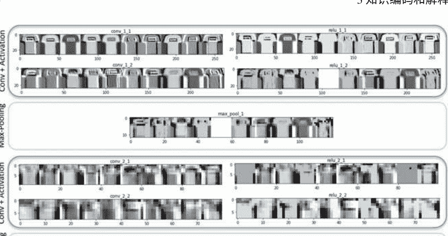

#### 3.4.2.2 浅层学习案例研究：LightOCT网络

这是一篇论文中使用浅层网络“LightOCT”进行诊断决策辅助的示例。论文中使用了两层卷积架构（Butola等人，2020年）。尝试检查第2个卷积层的激活图使我们对模型的知识传播和性能产生了疑问，与VGG-19、ResNet-101和Inception-V3等重层模型相比。激活图是通过贡献权重在FC层之前生成的，该权重是所有神经元的总和。图3.46清晰地展示了激活图是如何从卷积层的最后一层生成的，紧接着是FC层。

正如本案例所示，过去对深度卷积神经网络的可解释性的整体概念遭受了困扰。图3.46的第二行描述了2层LightOCT模型的卷积激活图，对于不同的数据集没有强烈的视觉激活，但在其层中合并了足够的特征以实现99.3%的正常乳腺组织（NBT）和98.6%的癌症乳腺组织（CBT）的模型准确性。LightOCT在其第二层中学习特征，并具有略微可见的激活图叠加，而在Inception-V3等深层模型的第二层中则缺乏这一特征。

Inception-V3的第2层，总共有96层，与图3.46的第3行具有类似的特征方案。只有在第四行中，它的第94层才能清晰地看到激活图。论文的作者给了我们一个观点，即人们认为激活图是分析模型的唯一重要方式，我们认为这只是部分正确。只有更深的层次才能展示基于可区分性的激活，这在较弱和较强特征中是缺失的。

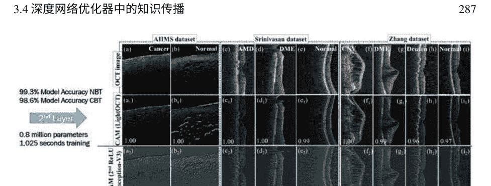

图3.46 不同深度层的特征编码。图源自Butola等人（2020），经许可使用

在浅层网络中。我们在这里看到一个具有有限计算能力和内存需求的浅层模型，可以实现与Inception-V3等大规模分层模型相当的精度。

## 总结

该章节得出结论，当前的不确定性方法从图像块中观察语义和感知信息，准确度各不相同。与其说是一个适用于解释性起点的模型无关工具，我们需要更深入地研究具体的架构，并尝试理解网络的基本特性。根据文献综述，对于深层、复杂模型的真实一致性缺乏已经导致研究人员对模型性能提供了自己的解释，这是不足以描述深度神经网络的复杂学习表示的。尽管这些想法还不完整，但我们确信黑盒的定义是部分的，我们需要改进的技术来理解这些模型。

通过各种网络的示意流程图、它们的可解释性设计和它们的知识编码，读者现在可以对模型理解有了新的视角。通过与计算机科学中最著名的领域之一——算法设计和分析的类比，我们介绍了可解释性的策略。将深度学习的可解释性策略放入我们熟悉的框架中的尝试是创新和新颖的。

本章分析了目前用于认证深度神经网络的最新方法，并提出了神经网络对纹理和属性的学习与人类对其的解释之间存在着缺失的联系。颜色和纹理的重要性让人想起了狗的视觉，弱狗们生活在一个几乎没有色彩的世界中。与人类相比，狗的色彩视觉是有限的。大多数人可以看到红色、蓝色和绿色这三种主要色调。而狗只能看到两种蓝色，并且无法区分其他颜色。然而，这并不困扰它们，直到我们给它们一个红色的球，将它扔到绿草地上，并表现得它们找不到一样。因为我们的祖先花了几千年的时间在绿色背景中寻找食物，所以我们毫不费力地理解为什么那些物体会是红色的。在接受或拒绝模型的准确性之前，对模型看到和忽略的内容有一个基本的理解同样至关重要。在接下来的章节中，我们将更多地了解特定深度神经网络架构中的解释。

## 📖阅读列表

- Bhatt等人（2021）的“计算机视觉中的CNN变体：历史、架构、应用、挑战和未来前景”。
- Sanchez-Lengeling等人（2021）的“图神经网络简介”。
- Olah等人（2018）的“可解释性的构建模块”。
- Zhang和Zhu（2018）的“深度学习的可视化可解释性：一项调查”涵盖了在中间网络层中可视化CNN表示、诊断这些表示、解缠表示单元、创建可解释模型以及通过人机交互进行语义中端学习的方法。
- Christoph Molnar（2020）的《可解释机器学习》一书。

## 📖自我评估

- 创建一个代码来展示基于像素距离的荒谬性。从原始图像中，代码应生成三到五个等距离的L2图像并检查图像组成。举例来说，解释为什么L2距离图像评估与知觉或语义相似性无关。
- 使用降维技术来可视化人工神经网络的隐藏层活动。展示观测结果的学习表示和人工神经元之间的连接。（参考：通道归因（Olah等人，2018））。

# 第4章 特定深度架构中的解释


神经元和算法的人工网络模仿人类神经系统的相互交织和堆叠。大多数人无法理解人类思维，但它们可以无缺地工作，直到它们不能。在短时间内进行数百层的数百亿参数优化，问题不是‘是否’会出问题，而是‘何时’会出问题。

即使是基于微积分的训练在活跃研究领域也无法确保最优性。图1.9显示了逻辑回归和基于规则的学习是经过深思熟虑且可解释的。随着斜率的上升，多层感知机、卷积神经网络、生成对抗网络和图神经网络变得难解释。可解释性人工智能的发现开辟了评估算法公平性和统计有效性的更多途径。这使我们达成共识，人工智能中不存在黑盒模型和白盒模型。解释性存在于一个灰度变化的光谱或‘灰盒’中。从分类的角度来看，它比仅仅读取逻辑回归中的系数更加棘手。需要更多努力来制定更好的技术来表示这些模型。

该书对验证深度神经网络的SOTA技术进行了分析，表明了机器和人类对纹理和属性的理解之间存在着一个缺失的联系。此外，在前一章中对CNN、GAN和GNN等网络进行了消融研究，解释了模型可能的边缘情况行为。调查深度网络与浅层网络的区别在于，单个神经元的计算在所有架构中都是相同的。浅层网络的神经元与深层网络的神经元没有显著区别。它只是在整个网络中具有较少的细胞和更短的计算时间，参数较少，这应该意味着出现错误的网络行为或超出人类注意力的特征学习的机会较小。这引起了人们对网络如何实现如此准确和可靠的兴趣。

解释性的动机很多，方法和工具也很丰富。可解释性的程度取决于个人的观点以及他们的仪器校准的精度。与准确性和特异性一样，可解释性没有根本的基础。为了有用，潜在的解释应该被每个人理解，而不仅仅是领域专家。这将在本章中详细介绍。

我们从分割、投影和度量分析开始，以了解在CNN中的解释艺术。它们将在以下章节中进行定性讨论，同时提出一个新的理论——卷积追踪，并介绍交叉结构学习的失败故事。接下来，由于架构被分解为封装特定任务的小型卷积结构，GANs很容易理解。在解释纳米结构学习之后，将简要介绍图学习技术，并研究神经结构学习的鲁棒性与代码。

## 4.1 卷积网络中的解释

CNNs (LeCun等人, 1998年; Krizhevsky等人, 2012年; He等人, 2016年; Huang等人, 2017年) 在许多视觉任务中取得了优越的性能，如目标检测和分类。然而，端到端的学习策略使得CNN的表示成为一个黑盒子。除了最终的网络输出之外，很难理解网络内部隐藏的CNN预测逻辑。近年来，越来越多的研究人员意识到高模型可解释性在理论和实践中具有重要价值，并开发出具有可解释性知识表示的模型。

潜在的关注领域包括：
- 理解在CNN中压缩或缩放图像或视频属性的影响。
- 估计数据大小的最佳减少量。
- 根据图像大小的变体和它能够编码的知识计算计算时间。
- 解决图像检索、在不同模型上进行迁移学习和跨领域学习的效率问题。
- 将图像编码为视频。

> 过去十年的历史告诉我们，在CNN流程中，人们普遍认为应该丢弃使处理变慢的函数和模型参数。 如果我们应用类似的观念来构建一个模型，在初始阶段可以有效地裁剪图像，并通过流程传递最少数量的特征进行有效学习，会怎么样呢？

### 4.1.1 案例研究：通过揭示真相来进行图像表示

了解决策过程至关重要。 了解非线性机器选择中的什么和为什么的透明度对于确定学习策略是否可信和可推广至关重要，或者模型是否基于训练数据中的虚假连接得出结论。 在心理学中，误导性相关被称为聪明的汉斯现象（Pfungst 1911）。 使用聪明的汉斯类型的决策方法的模型很可能无法在现实世界中给出正确的分类和有用性，因为虚假或人为相关性可能不存在。

最近的研究工作（Simonyan等人，2014年； Zeiler和Fergus，2014年； Bach等人，2015年； Ribeiro等人，2016年； Montavon等人，2017年）解释了复杂现实世界问题中的非线性机器学习预测（Greydanus等人，2018年； Zahavy等人，2016年； Arras等人，2017年）。 个体解释可能会有所不同。 理想的（但不可用的）解释将展示从输入到输出的整个因果链。 在大多数研究中，通常会研究简化形式的解释，通常是一组显示每个输入像素/特征对于预测的价值的分数。 这些分数可以呈现为用户可解释的热图（相关性图）。 请注意，计算解释并不需要逐个理解神经元。

Lapuschkin等人（2019年）提出了半自动化的光谱相关性分析（SpRAy）作为定义和验证非线性学习机器行为的现实方法。 这有助于确定训练模型是否对其设计的挑战始终如一地交付。 作者的努力旨在以更细致入微的方式评估和判断一些最近的成功，以对机器智能的持续兴奋声音提出警告。

作者调查了几个案例，展示了LRP和SpRAy如何解释和验证学习模型的行为。

- 首先，这些策略展示了学习机器如何利用数据中的虚假相关性来“作弊”。
首先，基于Fisher Vector (FV)模型（Perronnin等人，2010年）训练的学习模型与其竞争对手进行了比较，后者是在PASCAL VOC 2007图像数据集（Everingham等人，2010年）上进行了预训练和微调的DNN。 比较结果显示，在“人物”、“火车”、“汽车”或“马”等类别上，具有出色的SOTA测试集准确性。 检查使用LRP进行决策揭示了某些图像存在显著差异，因为显示分类原因的热图可能完全不同。显然，DNN的热图突出显示了马和骑手。而FV的热图则聚焦于图像的左下角，那里有一个源标签。对数据集进行更仔细的检查（人类从未彻底查看过），显示源标签在马的图像上出现得非常明显（Lapushkin等人，2016年）。FV模型通过依赖易于识别的源标签来“过拟合”PASCAL VOC数据集，该标签与真实特征相关。从马的图像中去除源标签会显著削弱FV模型的决策，而DNN的决策几乎不变。如果我们给一张正确分类的法拉利图片添加一个源标签，FV的预测很快就会从“汽车”变为“马”。

- 第二个展示示例是训练神经网络模型来玩Atari游戏Pinball。
Mnih等人（2015）的研究表明，深度神经网络在这个游戏中表现优于人类。与前面的例子类似，LRP热图可视化了深度神经网络在Pinball游戏像素上的决策行为。经过大量训练，热图聚焦于得分高的开关，而忽略了翻板。对这些LRP热图出现的游戏进行进一步检查后发现，深度神经网络代理首先将球移动到得分高的开关附近，而不使用翻板，然后通过过来回经过开关的方式无限触发开关，而不倾斜弹球台。在这里，模型已经学会了滥用Atari Pinball的“推动”阈值。从游戏得分的角度来看，利用任何可用的机制都是明智的。在真实的弹球游戏中，玩家在几次强烈移动后很可能会输掉比赛，因为机器会倾斜。

上面的例子证明了低测试集错误（或高游戏得分）可能是由于作弊而不是有效的问题解决行为。它可能不对应于真实世界环境中的真实性能，或者当包括惩罚此类行为的社会规范（Chen等，2017年）在评估指标中时。LRP解释有助于找到这个微小的差异。客观可衡量的进展显示了战略行为。

总的来说，在每种情况下，奖励最大化和融入一定程度的先前知识都引发了复杂的行为，分析明确表明：

- 其中一些行为包含策略。
- 其中一些行为可能类似于人类，而其他行为可能不是。
- 在某些情况下，这些行为甚至可能被认为是不足和不可接受的一旦部署。

基于FV的图像分类器可能无法在真实世界的数据中检测到马，而Atari Pinball AI在游戏更新以防止过度推动之前可能表现良好。

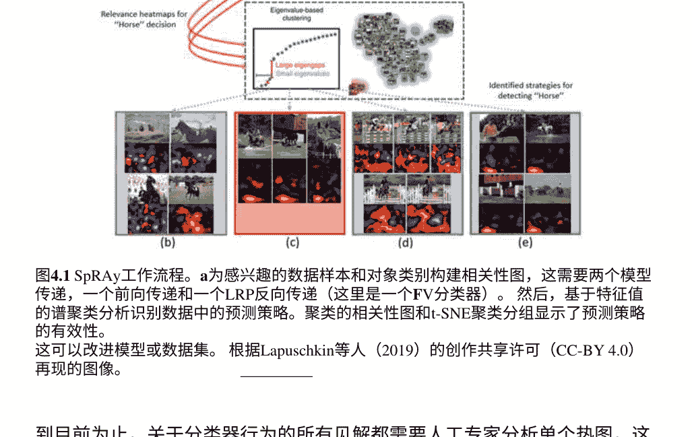

图4.1 SpRAy工作流程。a为感兴趣的数据样本和对象类别构建相关性图，这需要两个模型传递，一个前向传递和一个LRP反向传递（这里是一个FV分类器）。然后，基于特征值的谱聚类分析识别数据中的预测策略。聚类的相关性图和t-SNE聚类分组显示了预测策略的有效性。这可以改进模型或数据集。根据Lapuschkin等人（2019）的创作共享许可（CC-BY 4.0）再现的图像。

到目前为止，关于分类器行为的所有见解都需要人工专家分析单个热图，这是一项费时费力且昂贵的过程，不易扩展。

Lapuschkin等人（2019）进一步实现了SpRAy，以半自动的方式理解分类器在大型数据集上的预测行为。图4.1描述了将SpRAy应用于PASCAL VOC数据集中的马图像时的分析结果。

- 对于将图像分类为“马”，可以确定四种不同的策略：
  - 检测马和骑手（图4.1b）。
  - 检测纵向图像中的源标签（图4.1c）。
  - 检测木制栏杆和其他马术背景元素（图4.1d）。
  - 检测横向图像中的源标签（图4.1e）。

随后，SpRAy分析还揭示了他们的微调DNN模型中另一种类似于“聪明汉斯”的行为，这在手动分析的相关性图中之前未被注意到。DNN热图的特征值谱中的大特征间隙表明该模型在分类飞机图像时采用了非常不同的策略。t-SNE可视化更加强调了这种聚类结构。通过SpRAy的帮助发现了一个意外的策略。

#### 4.1.1 通过检查图像边界处的人工填充模式来分析飞机图像。对于飞机图像，主要是均匀且无结构的蓝色背景。填充通常是出于技术原因引入的（DNN模型只接受方形输入），但填充模式意外地（并非有意地）成为模型分类飞机图像的策略的一部分。因此，我们发现改变填充方式对DNN分类器的输出有重大影响。SPRAY相对于先前的方法的优势在于其能够将预测与输入特征联系起来，从而可以进行细粒度调整。

### 4.1.2 CNN的变种

当涉及到信息编码和知识解释（参见第3.1.1节）时，图像和视频涵盖了广泛的应用领域。CNN不仅在图像和视频领域占据主导地位，而且在多模态数据编码和决策方面也表现出色。深度学习中堆叠层的概念很简单。

VGG背后的概念是，如果AlexNet比LeNet表现更好，因为它更大更深，那为什么不进一步推动呢？添加更多的密集层是一个选择。这将导致更多的计算。下一个选择是添加更多的卷积层。然而，这样做并没有起作用，因为单独定义每个卷积层是很费力的。因此，将卷积层分组成块是最好的解决方案。问题是，使用较少但更宽的卷积块还是使用更多但更窄的卷积块更好。研究人员最终得出结论，较窄的卷积层比较宽的卷积层更好。CNN架构中缩放和堆叠层的四种主要策略如图4.2所示。然而，请记住性能可能会因架构和超参数设置而有很大差异。

> **突出显示**

基本的CNN架构工程术语都是关于缩放的。

- 更宽的网络意味着卷积层中有更多的特征图（过滤器）。
- 更深的网络意味着更多的卷积层。
- 具有更高分辨率的网络意味着处理具有更大宽度和深度（空间分辨率）的输入图像。因此，生成的特征图将具有更大的空间维度。

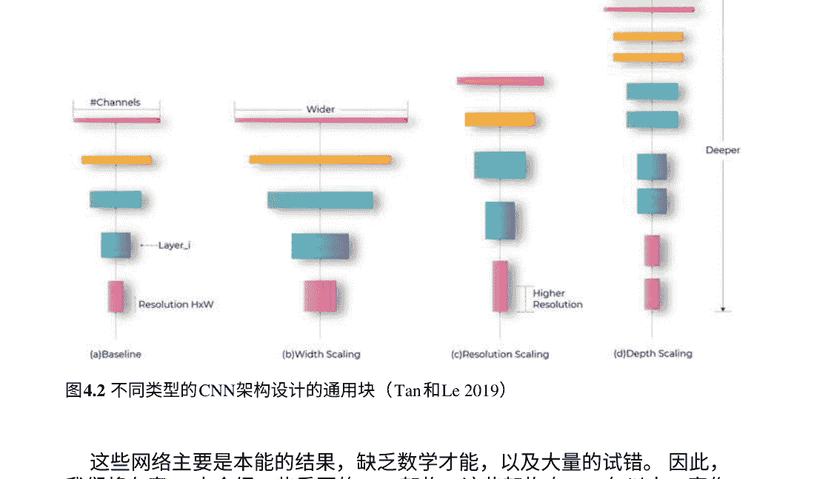

这些网络主要是本能的结果，缺乏数学才能，以及大量的试错。因此，我们将在表4.1中介绍一些重要的CNN架构，这些架构自2010年以来一直作为监督学习在计算机视觉中的基础模型的进展。让我们按时间顺序研究这些卷积网络的变体，部分是为了了解历史，部分是为了对该领域的发展方向形成观点。

> 好好思考一下

**卷积层需要更少的参数。在最后几层的全连接神经元中，参数的数量急剧增加。消除全连接层是否提供了潜在的解决方案？**

理论上很容易，但实施起来很困难。卷积和池化会降低分辨率，但我们必须将它们映射到类别。一种策略可以使用$1 \times 1$卷积来降低分辨率，随着深度增加和通道数量增加。这为我们提供了每个通道的高质量信息。

#### 表4.1 流行的CNN模型快速总结

| 模型 | 关键特征 |
|------|----------|
| AlexNet (Krizhevsky等, 2012年) | • 在ImageNet的1500万高分辨率 256 × 256 × 3图像上进行训练<br>• Dropout而不是正则化可以防止过拟合<br>• Softmax和重叠池化防止信息丢失<br>• 首次使用ReLU而不是sigmoid激活函数 |
| Overfeat (Sermanet等, 2013年) | • 利用单一框架同时训练三个著名的视觉任务，分类、定位和检测，以提高准确性<br>• 对于定位，分类头被回归网络替换<br>• 边界框在所有尺度和位置上进行预测 |
| DeconvNet (Zeiler和Fergus 2014) | • ZFNet是一个引人注目的多层DeconvNet<br>• 旨在统计可视化网络性能<br>• 包括三个全连接层，一个最大池化层，一个dropout层，和五个共享卷积层 |
| 网络中的网络 (Lin et al. 2013) | • 通过用全局最大池化层替换最后一个完全连接层使模型变得更轻 |
| 视觉几何组 (VGG) (Simonyan和Zisserman 2014) | • 一系列 3 × 3卷积，通过填充一个保持输出大小与输入大小相同的卷积，然后进行最大池化以减半分辨率<br>• 该架构由n个VGG块组成，后面跟着三个FC-dense层 |
| GoogLeNet (Szegedy等人, 2015年) | • 基于Inception模块的概念<br>• 九个堆叠的Inception模块与最大池化层（用于减半空间维度） |
| Inception (Szegedy等人, 2015年) | • 三个具有不同大小的卷积层和最大池化的层<br>• 每个层的并行学习滤波器具有不同的大小 |
| Highway Networks (Srivastava等人, 2015年) | • 关于增加网络深度可以提高学习能力的观点<br>• 利用深度来学习改进的特征表示并提供一种新颖的跨层连接技术<br>• 即使在900层深度时，收敛速度也比简单网络快得多，尽管在10层之后添加隐藏单元会影响简单网络的性能 |
| ResNet (He等人, 2016年) | • ResNet是迄今为止最受欢迎和成功的深度学习模型之一<br>• ResNet使用残差块<br>• 跳跃连接和批归一化使其能够训练数百层而不牺牲速度<br>• 基于深层次不应比浅层次有更多的训练错误的想法<br>• VGG-19启发了这种架构 |
| SqueezeNet (Iandola等, 2016年) | • 以几乎最小的计算成本增加通道之间的相互依赖性<br>• 较小的CNN在分布式训练期间减少了服务器通信<br>• 每个压缩-扩展块都连接在一起形成一个火模块<br>• 通过用 1 × 1的过滤器替换 3 × 3的过滤器来减少AlexNet的参数<br>• 在后面的层中进行下采样，以便卷积层具有巨大的激活图<br>• 使用 1 × 1卷积层对特征进行压缩，然后使用 1 × 1和 3 × 3层进行扩展<br>• 为了使网络能够自适应地改变每个特征图的权重，它在所有卷积块的通道上添加了参数 |
| Xception (Chollet 2017) | • 标准卷积将所有输入通道的滤波器合并为一步。 在架构中引入深度可分离卷积将传统卷积过程（过滤所有输入通道并将值组合在单个步骤中）分为深度卷积和逐点卷积。<br>• Xception通过分离空间和特征图（通道）相关性来提高网络效率。 |
| MobileNets (Howard et al. 2017) | • 使用深度卷积构建轻量级DNN<br>• 在机器人和自动驾驶汽车等应用中使用最小延迟的模型<br>• MobileNets不是一个巨大的滤波器，而是有两个滤波器：一个用于滤波，一个用于组合。<br>• Batchnorm和ReLU非线性函数在所有层之后。 |

## ### MobileNet是一个受欢迎且轻量级的平台，但为什么呢？

在简单的CNN结构中，滤波器采用一个块的形式，该块叠加在输入图像块上；这两个块之间的点积用于做出决策。可以确定通道之间的关联性以及任何给定通道的具体特征。

MobileNets使用两个较小的滤波器而不是一个大的滤波器：

- 一次只检查一个通道，以确定其各个像素之间的相互关联性。
- 另一个通道同时查看所有通道，以查看每个像素与其后续像素的连接方式。

### 4.1.3 CNN的解释

本节解释了卷积神经网络的表示和使用可解释/可分离表示进行学习。有五个主要分支。

1. 中间层可视化，可以合成优化CNN单元分数的图像，或将卷积层特征映射反转回输入图像。研究神经单元中隐藏的视觉模式最直接的技术是可视化CNN中的滤波器。各种网络可视化策略在第3.2.2.1节中已经介绍过。我们在这里快速回顾其中的一些。

- 基于梯度的方法：大多数网络可视化方法都是基于梯度的（Simonyan等，2014年；Zeiler和Fergus，2014年；Springenberg等，2014年；Mahendran和Vedaldi，2015年）。这些方法主要计算给定CNN单元分数相对于输入图像的梯度。它们使用梯度估计优化单元分数的图像外观。Olah等人（2017年）提供了一套现有方法的工具箱，用于可视化预训练CNN的各种卷积层中存储的模式。
- 反卷积网络：另一种常见的可视化CNN表示的技术是反卷积网络（Nguyen等，2016年）。它是一种间接描绘与特征图对应的图像外观的工具。然而，与基于梯度的方法不同，它不能在数学上保证可视化结果完全反映CNN表示。在2017年，Nguyen等人（2017年）在GAN之前添加了一个语义。请注意，CNN特征图可以用作可视化的先验。

2. 发现表示可以确定CNN对各种对象的特征空间，也可以确定卷积层表示方式的潜在缺陷。

- 从全局角度检查CNN特征。Szegedy等人（2015年）在2014年研究了滤波器语义。同年，Yosinski等人（2014年）研究了中间卷积层的滤波器表示。在2015年，Aubry和Russell（2015年）以及Lu（2015年）计算了预训练CNN特征空间中几个类别/属性的CNN特征分布。
- 第二个研究方向提取直接对CNN标签/属性表示有贡献的图像区域。这与CNN的可视化方式相似。2017年，Fong和Vedaldi（2017）以及Selvaraju等人（2017）提出了将特征图梯度传输到图像平面以估计图像区域的方法。Ribeiro等人（2016）提出了LIME模型，该模型提取了网络敏感的图像区域。Zintgraf等人（2017）、Kindermans等人（2017）和Kumar等人（2017）提出了可视化对CNN决策最有贡献的输入图像区域的方法。Wang等人（2017）和Goyal等人（2016）试图解读存储在神经网络中的逻辑，用于视觉问答。这项研究使用在图像中检测到的显著项（或感兴趣的区域）和问题中的关键词来解释输出答案。
- 在卷积神经网络的特征空间中估计易感位置是另一种有用的诊断方法。Su等人（2019）的研究贡献，如“愚弄深度神经网络的一个像素攻击”，Koh和Liang（2017）的影响函数可解释性，以及Szegedy等人的神经网络的有趣属性，都对研究产生了影响。Szegedy等人（2013）开发了一种计算卷积神经网络对抗样本的方法；他们试图估计能够影响最终预测的最小噪声输入图片扰动。Koh和Liang（2017）的影响函数可以计算对抗样本。影响函数可以用于构建训练样本，纠正训练集，并调试卷积神经网络的表示。
- 第四个研究领域分析网络特征空间以改进网络表示。Lakkaraju等人（2017）提出了一种弱监督策略来发现卷积神经网络的知识盲点（未知模式）。这种方法将卷积神经网络的特征空间划分为数千个伪类别。它假设训练良好的卷积神经网络会利用每个伪子空间类别来表示对象类的一个子集。这项研究随机展示了每个子空间中的对象样本，并使用样本纯度来发现可能的卷积神经网络表示问题。Hu等人（2016）提出了使用自然语言的逻辑规则（例如，I-ORG不能跟随B-PER）来设计知识蒸馏的蒸馏损失，从而得到更有意义的网络表示。
- 最终，张等人（2018年）提出了一种方法来确定卷积神经网络是否展示了有偏见的信息。论文中的图4.3展示了有偏见的卷积神经网络面部估计。卷积神经网络可能使用训练图像中共同出现的视觉特征来表示一个属性。当共同出现的特征与目标属性没有语义关联时，它们就是有偏见的。

### 4.1.4 综述：CNN可视化技术

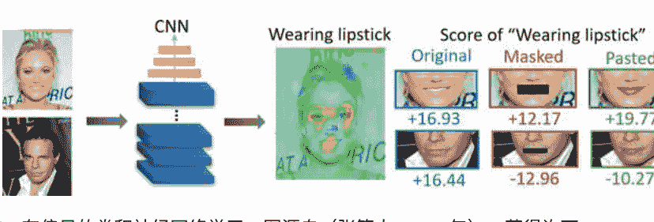

3. 编码滤波器解缠：为了简化网络表示的解释，使用卷积层将其转换为更符合人类理解的形式，例如图形和决策树。

- 解释性图形：通过将CNN特征分解为人类可解释的图形表示，可以实现对网络表示的更完整解释，称为解释性图形。例如，卷积神经网络的高层卷积层中的每个滤波器通常代表多种模式类型。一个对象的头部和尾部都可能激活该滤波器。因此，张等人（2018年）提出使用图形模型来表示卷积神经网络中隐藏的语义层次结构，以解开预训练卷积层中的特征。这有望提供CNN中视觉知识组织的整体视图。本分析的重点是以下三个问题：
a. 每个卷积滤波器记住了多少种不同的视觉模式？（一个视觉模式可以是一个物体的一部分或者一种纹理。）
b. 哪些模式一起描述了一个物体的一部分？
c. 两个共同激活的模式之间的空间关系是什么？

4. 语义解缠：在语义中到末端学习的层次上，人与计算机之间的相互作用有望帮助生成新的模型。此外，通过清晰的语义解缠，可能实现对低监督下神经网络的中到末端学习。通过使用可解释或解缠的网络表示进行中到末端学习或调试，以及在轻度人工监督下进行主动问答（Zhang等，2017年）等方法，可以大大减少对人工注释的需求。

5. 构建可解释的模型：探索可解释的CNN（Shi等，2018年），可解释的RCNN（Wu等，2017年），InfoGAN（Chen等，2016年）的概念。

## ### 卷积神经网络是否学习到了解耦特征？

解耦特征使得每个网络单元能够捕捉到不同的现实世界概念。例如，一个卷积通道394可能会找到摩天大楼，通道121可能会找到狗的鼻子，通道12可能会找到30度角的条纹。完全纠缠的网络是解耦网络的反义词。在完全纠缠的网络中，例如，没有明确的单元用于识别狗的鼻子。所有通道都将有助于狗鼻子的识别。

解耦特征的存在表明网络具有很高的可解释性。

假设我们有一个网络，其中完全解耦的单元被标记为众所周知的概念。这将使得网络的决策过程可以被追踪。例如，我们可以观察网络如何对狼和哈士奇进行分类。首先，我们必须找到‘哈士奇’单元。我们可以看看这个单元是否依赖于前一层的‘狗鼻子’、‘蓬松的毛发’和‘雪’单元。如果是这样，我们就知道它会将白色背景上的哈士奇错误地识别为狼。我们能够发现一个解缠的网络中存在问题的非因果关联。为了解释一个个体的预测，我们可以自动列出所有高度激活的单元和相关概念。神经网络的偏见是立即可见的。不幸的是，卷积神经网络并不完全解缠。

## ### 通过逐层归因来探索网络表示

与前面提到的方法相比，通过可视化卷积神经网络表示可以最直接地探索网络表示。此外，网络表示为分析卷积神经网络表示（如疾病）提供了技术基础。学习可解释的网络表示和将特征表示与预训练的卷积神经网络解耦是SOTA技术面临的另外两个问题。最后，弱监督的中到端学习从可解释或解缠的网络表示开始。

想象一下根据输出分类来自输入图像的热图和像素高亮。该方法对于对比度、分割通道和亮度等简单的视觉变换不具有抵抗力。每个像素的含义与目标类的高级概念交织在一起且相距甚远。其次，传统技术提供了一个简单的界面，不深入研究个别特征点。它们选择性地揭示一个类别的属性，允许我们将归因视为高级特征分类（如猫爪）的构建块，而不是判断图像是否是虎猫。在图3.12中将激活立方体切片为空间、通道和神经元进行单独分析，忽略了一些重要的要素。

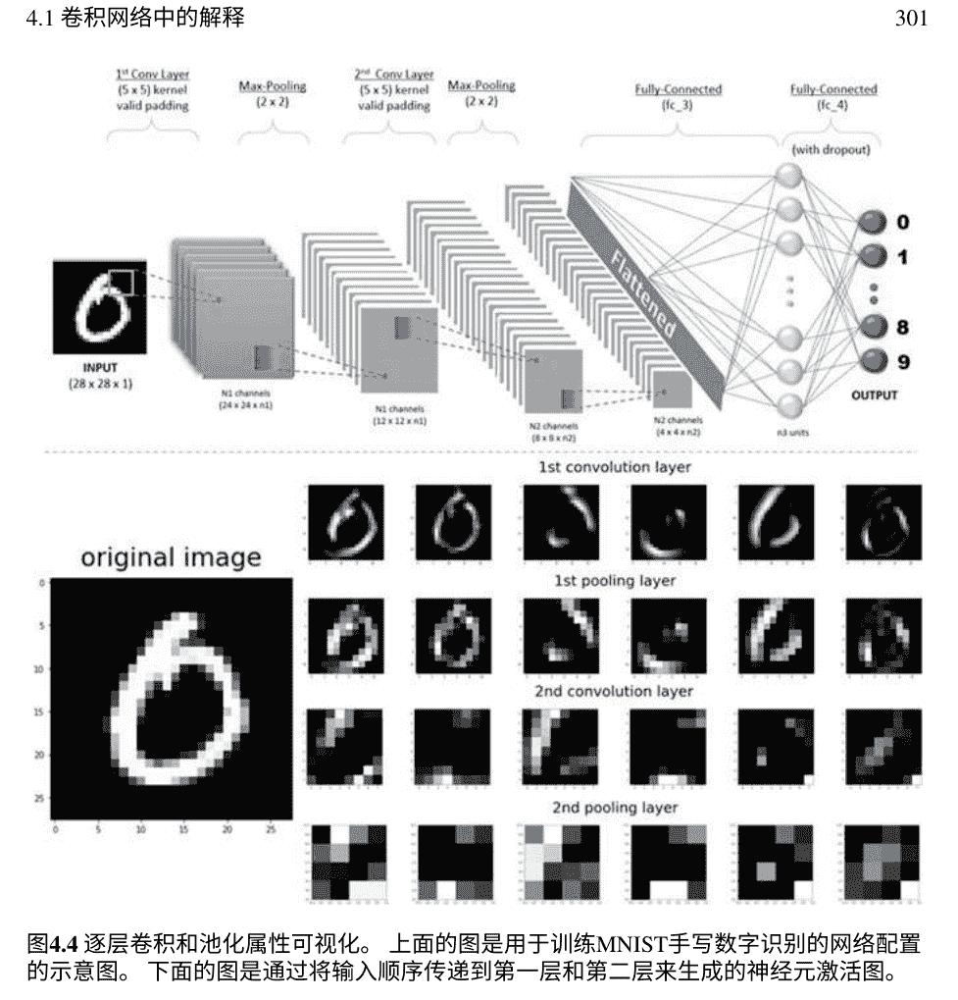

我们当然可以深入研究每个神经元，但那只是太多细节，无法传达整个故事。即使在神经元分解之前，传达通道的图片也很困难。此外，随着网络中层数的增加，如图4.4所示，特征编码变得更加复杂，我们很难解读。

这是一个很好的论点，可以链接最功能强大的神经元，而不是过载自己的信息。矩阵分解是一个广泛研究的领域，它研究如何最好地分解矩阵以获得有用的信息。它将立方体展平并恢复每个输入图像独特的基本空间位置和通道。对于每组输入图像，必须计算分组的利用率。不幸的是，每个分组都必然是在限制人类解释能力和保留知识之间的权衡，因为任何聚合都会有损失。矩阵分解允许我们选择优化我们的分组方式。

为了提供比我们之前强调的自然分组更重要的权衡。

## ### 4.1.4 综述：CNN可视化技术

深度卷积神经网络对计算机视觉性能产生了重大影响。该方法始于图像分类技术，现在被用于逐像素图像分割。尽管经过多年的进展，分类方法仍然在无法将问题陈述表达为语义分割任务的领域中使用，或者在像素级标记或像素级标记计算上代价高昂的情况下使用。

计算可用性的另一个限制是输入数据的压缩和调整大小。分类网络的一个主要问题是缺乏视觉输出，这限制了对主导图像特征对判断的理解。这增加了对以人类可以理解的方式描绘和解释网络决策的方法和策略的要求。随着许多算法随着时间的推移而发展，我们停下来，理解并评估了流行策略的优点和缺点。让我们从头开始。

## ### 4.1.4.1 信号显著性方法的挑战

一些黑盒机制可能是通过基于信号的方法发现的。然而，仍然有许多未解答的问题，其中一些列举如下。

1. 我们如何利用优化的激活图像和部分重建的图像？
2. 在多大程度上，我们可能通过逆转信号以重建图像的潜在能力对提高解释性做出贡献？
3. 我们能否利用重建近似图像的中间过程中包含的信息？
4. 相比解释信号的正向传播，以“逆空间”中描述该部分更有帮助的原因是什么？
5. 研究导致中间阶段激活优化的信号如何帮助我们确定哪些神经元扮演哪些角色？
6. 优化高度参数化函数时常常产生非唯一解。我们能否确定产生混合的超现实狗脸的优化不会产生稍微不同的更不寻常的图像？

当我们回答这些问题时，我们可能会发现隐藏的线索，这将帮助我们更接近一个可以理解的人工智能。

## ### 重新思考图像显著性

该论文（Adebayo等人，2018年）评估了显著性方法是否对模型和数据不敏感。不敏感性是非常不可取的，因为它意味着“解释”与模型或数据无关。边缘检测器是对模型和训练数据不敏感的方法。

边缘检测器仅仅识别图像中显著的像素颜色变化；它们与预测模型或抽象的视觉属性没有关联，并且不需要训练。香草梯度、梯度×输入、综合梯度、引导反向传播、引导Grad-CAM和SmoothGrad是该论文（Adebayo等人，2018年）中测试的方法。香草梯度和Grad-CAM通过了不敏感性测试，而引导反向传播和引导Grad-CAM未通过。

然而，在他们的文章“用于显著性度量的合理性检查”中，Tomsett等人（2020）发现了一些关于合理性检查论文本身的问题（当然）。根据作者的研究，评估指标是不一致的。话虽如此，我们可以更清楚地看到评估视觉解释仍然是一个挑战。因此，例如，在诊断过程中使用深度学习应用对于医疗专业人员来说是困难的。目前的情况真是令人失望。在进一步的研究进行之前，我们需要暂缓一段时间。而且，请不要提出全新的显著性方法，让我们专注于更好地分析已有的方法。例如，使用对抗训练（Noack等人，2019）训练的DNN（一种通过对抗样本增强训练数据的方法）在可解释性方面（具有更准确的显著性图）优于没有使用对抗样本训练的相同模型（Noack等人，2019）。

## ### 如果基于显著性的可解释性受到质疑怎么办？

近年来，显著性方法已经越来越受欢迎，作为一种与模型无关的方法，用于关注重要的输入特征，最常见的是图像。虽然依靠纯粹的视觉评估可能会因为方法上的困难而产生反效果，无法达到解释的广度和深度，但Adebayo等人（2018）认为这并不一定是这样的情况。

显著性方法确定了输入数据中对于进行预测或理解模型的潜在表示最重要的特征。当一个显著性图落入这个类别时，需要人工审查来确定其可信度。例如，如果极地熊在数字图像中总是与雪或冰相配对，无论出于什么原因，模型可能错误地依赖于这些信息而不是实际的极地熊特征来进行识别。使用显著性图，我们可以找到问题的源头，从而避免它。大量的随机实验表明，一些显著性技术可以是模型和数据无关的（Adebayo等人，2018），即某些方法产生的显著性图与边缘检测器得到的结果非常相似。这是令人担忧的，因为它表明显著性方法是不能正确识别模型预测的输入特征。在这些情况下，重要的是构建一个同时考虑模型和数据的显著性方法。

#### 4.1.4.2 案例研究：显著性的随机化测试

1.  评估与边缘检测进行了类比，边缘检测不依赖于训练数据或模型。
2.  随机化测试集中在两个实例化框架上进行，以比较常规实验和人工随机化设置：模型参数随机化测试和数据随机化测试。
3.  大规模实验设置上的随机化测试表明，广泛的显著性方法（即，引导反向传播及其变体）对训练中使用的输入数据和模型参数非常敏感。

> > **Note**
>
> 显著性随机化测试的核心概念基于：
>
> 1.  模型参数随机化测试：如果显著性方法依赖于模型的学习参数，那么一个随机初始化、未经训练的网络和一个经过训练的网络的显著图应该有明显的差异。
> 2.  模型数据随机化测试：如果显著性技术依赖于数据标签（即 p(y|x)），那么在对数据标签进行随机排列的数据集上生成的显著性图应该与未经破坏的数据集上生成的显著性图不同。

#### 看看LIME有多可解释

接下来，这里使用流行的可解释技术LIME（第3.3.5节）来解释图像分类任务的学习。基本概念是理解为什么深度学习网络预测一个对象（图像）属于特定类别（如图4.5中的吉娃娃、披萨或波斯猫）。输入样本经过处理和调整大小，使其适合Inception V3模型的图像尺寸为299 ×299。在第一列块中，三个样本混合裁剪的随机图像的预测类别是一个包含1000个属于每个类别的概率的向量。每个图像的顶部预测显示在输入样本的左侧，带有置信概率。

在图4.5的第一列中，用于可视化正例的有影响力的超像素数量设置为五个。下一列包含具有最小阈值权重为0.05的十个最有影响力的特征。相应的热图针对每个目标标记类别，分别在第2列和第3列中呈现。 对于本小节来说，考虑简单的图像分类任务并基于像InceptionV3或ResNet-50这样的广为人知的图像卷积识别模型来解释预测是足够的。 我们还考虑了一些自己捕捉的图像，以强调在真实世界场景中的应用复杂性。

此外，我们等距裁剪图像并创建了一个包含四个和九个裁剪的随机拼贴图，如图4.5所示。输出或者是顶部预测的类别以正权重为绿色和负权重为红色的决策边界进行着色。每个扰动都是通过评估从原始实例到要解释的实例的距离来确定的。通过使用核函数将这些距离映射到归一化的0-1的颜色尺度上，将这些距离转换为权重。为了更好地理解，图像的扰动是通过在图像中打开和关闭一些超像素（使用快速移位算法创建，表4.2）来生成的。给定图像的超像素数量显示在图4.8中。使用随机二项分布参数和输入输出规范生成了被称为图像扰动的超像素激活的不同组合。

接下来是对ImageNet的1000个类别中每个扰动图像的预测，在Inception和ResNetV2中估计，这是最耗计算资源的过程。使用余弦对两者之间的每个随机生成的扰动和图像解释进行测量，该测量方法在公式A.4中解释。核函数的宽度是基于实例周围的局部宽度来决定的，并映射为零到一的值。余弦度量显示出稍微稳定的期望距离值（介于0和1之间），因此不需要进一步调整核函数。

图4.6展示了各种核函数的示意图解。

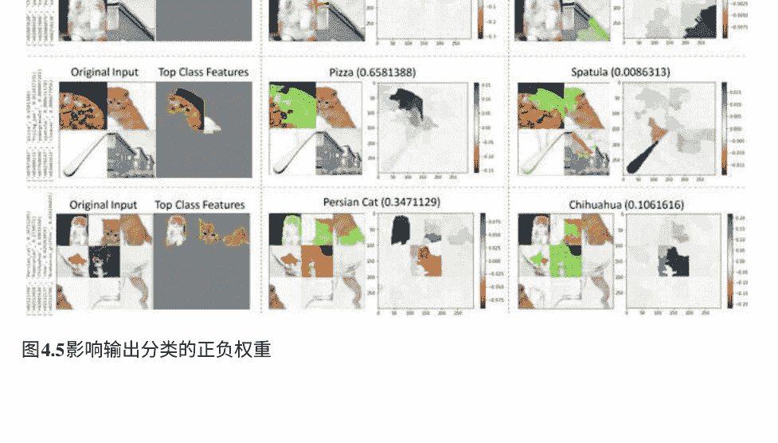

#### 图4.5 影响输出分类的正负权重

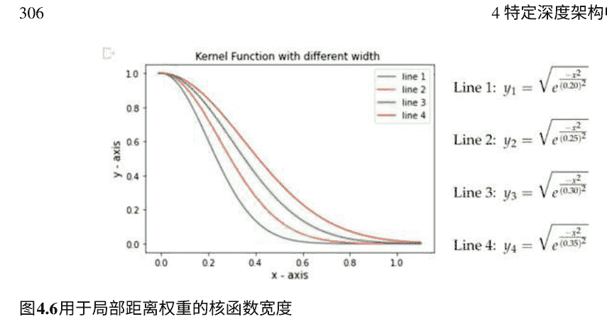

### 4.1.5 回顾：CNN对抗技术

特征可视化和对抗样本之间存在联系：两种技术都最大化了神经网络单元的激活。对于对抗样本，我们寻找对抗样本的神经元的最大激活，即错误的类别。一个区别是我们开始的图像：对于对抗样本，它是我们想要生成对抗图像的图像。对于特征可视化，噪声特征取决于方法。

技术包括了理解对抗攻击并为将来的攻击制定防御机制。通过使用下面列出的算法，可以轻松纠正网络的缺陷，并将其分类为完全不同的类别，并具有高置信度。对抗性示例可以是自然的，有机的，也可以是由恶意攻击者合成的，其中图像与原始数据非常相似，但是故意注入噪声以便能够以高置信度将其分类为完全不同的类别。Hendrycks等人（2019）描述了使用两个自然对抗测试数据集ImageNet-A和ImageNet-O，SOTA模型的分类器准确性显著降低。自然对抗性示例可能范围从整个图像被映射到一个类别，到颜色和纹理在分类中占主导地位，而不是形状作为主要描述符。

合成对抗样本可能在输入样本中添加噪声，目的是欺骗数据或对原始图像进行轻微扭曲，这些对人眼来说是无法区分的，但会导致网络失败。这不仅限于对抗性图像攻击，我们还发现将这种噪声添加到音频识别中会导致错误分类。图4.7中可以看到一个例子，每个样本图像的前三个ImageNet预测都有标签，其中一个带有鱼的猫被自信地分类为酒杯（572）或马桶座圈（861）。还有证据表明通过分割通道（图3.17）或旋转（图3.19、3.20和3.21）来增强图像，模型的纹理学习很容易被调整以高置信度指标错误地对对象进行分类。

故事的悲哀之处在于，对抗性训练似乎无力解决自然对抗性示例问题（Hendrycks等，2019年）。对抗性示例不仅限于图像；自然语言网络也可以被愚弄（Jia和Liang，2017年）。幸运的是，一些训练方法，如投影梯度下降（PGD）（附录A.8），梯度上升（Nguyen等，2015年）和快速梯度符号方法（FGSM）（Goodfellow等，2014年）在特定的合成对抗性攻击上有所帮助。重要的是要理解这个概念，并意识到在高风险领域中，模型需要对这种对抗性攻击高度鲁棒，以便我们能够信任模型的性能。为了使用方便，已经使用ImageNet数据的均值和标准差来处理这些预训练模型使用的图像。

```
Downloading data from https://storage.googleapis.com/download.tensorflow.org/data/imagenet_class_index.json
40960/35863 [==============================] - 0s 8us/step
Selected Image: spoon.jpg
```

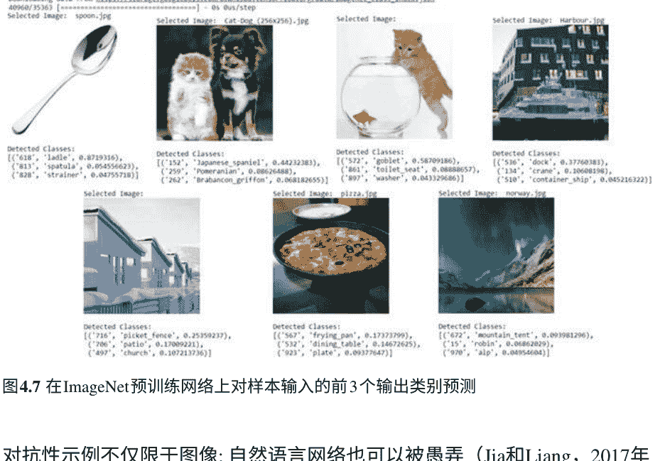

### 4.1.6 逆向图像表示

已经进行了研究，以逆转各种传统的计算机视觉表示，包括HOG和密集SIFT（Vondrick等人，2013年），基于关键点的SIFT（Wein-zaepfel等人，2011年），局部二进制描述符（d'Angelo等人，2013年），BOW（Kato和Harada，2014年）。现代基于逆转的方法（Dosovitskiy和Brox，2016年；Mahendran和Vedaldi，2015年；Stone等人，2017年；Zeiler和Fergus，2014年）通过将特征图逆转为合成图像来破坏NN表示ω_i，而前面提到的方法仅限于逆转浅层特征的表示。
具体而言，ω_i = ω(x_i)不是一个输入图像x_i的NN表示的可逆模型，这是Mahendran和Vedaldi（2015年）所假设的。随后，逆转问题被定义为找到一张图像x'，其NN表示最佳匹配 \(\omega_i\)，即 \(\arg \min_x \|\omega(x) - \omega_i\|^2 + \mathcal{R}(x)\)，其中 \(\mathcal{R}(x)\)是一个关于输入图像的先验知识的正则化项。

目标是通过将反转图像与原始图像进行比较来确定缺失的内容。 Dosovitskiy等人（2016）直接使用感兴趣模型生成的特征和图像作为标签来训练一个新的网络，以反转中间层的特征为图像。 发现更深层的特性可以用来重建轮廓和颜色。 将原始CNN与包括unpooling、 rectification和deconvolution操作的反卷积网络配对，可以在不进行训练的情况下反转特征。 Zeiler等人（2014）进行了这项研究。 在反卷积网络中，最大位置用于unpooling，负值被设为零以进行rectification， 反转滤波器用于反卷积层。

反转表示，特别是基于CNN的反转表示，与以前研究过的反转NN的主题相关。 除了这里介绍的反向传播算法外，还有基于采样的进一步优化算法在1990年代由Lee和Kil（1994）、Linden和Kindermann（1989）以及Lu等人（1999）提出。 但是这些方法没有在当前的DNN一代中使用，并且没有使用自然图像先验。 其他论文，如（Jensen等人，1999年），专门研究了在动态系统背景下反转网络，但在这里不会深入讨论。

最后，一些学者，如Bishop（1995年），还提出了学习第二个NN作为原始NN的逆操作；这复杂化了事实，即逆操作通常不是唯一的。 最后，AE设计（Hinton和Salakhutdinov，2006年）将网络与其逆一起训练，作为一种监督类型。

### 4.1.7 案例研究：超像素算法

图4.7中的前面的图像分类和识别示例是基于低级图像分割方法的。 因此，值得停下来探索几种著名的超像素分割策略（或者说过分分割）。

这一代超像素然后成为更复杂任务（如条件随机场）的基础。 条件随机场是一种判别模型，是基于马尔可夫随机场的抽象，最适合需要加权的上下文信息或邻居状态的预测任务。

该方法具有广泛的应用，包括目标检测、噪声降低、语音标记等。

四种超像素算法（表4.2）的时间顺序可视化示例如图4.8所示，带有函数参数标签。

| 年 | 算法 | 笔记 |
| :--- | :--- | :--- |
| 2004 | Felzenszwalb的基于图的分割（Felzenszwalb和Huttenlocher 2004） | 一种快速的2D图像分割算法，具有一个影响分割大小的单一“尺度”参数。图像的局部对比度决定了实际的分割数量和大小 |
| 2008 | Quickshift图像分割（Vedaldi和Soatto 2008） | Quickshift 2D图像分割基于核化均值漂移的近似，同时在多个尺度上计算分层分割。应用于5D颜色信息和图像位置的空间中，使其成为一种局部模式寻找算法。参数‘σ’控制局部密度近似的尺度，‘最大距离’监控生成的分层分割的级别，‘比率’管理图像空间距离和颜色空间距离之间的权衡 |
| 2012 | SLIC—基于K-Means的图像分割（Achanta等人2012） | 与Quickshift密切相关，用于在图像位置和颜色信息的5D空间中简化计算K-means。参数‘紧凑度’在颜色相似性和接近性之间进行交换，类似于Quickshift，而n个段选择k-means的中心数。由于更简单的聚类方法，它因效率而受到欢迎。请注意，该算法在Lab颜色空间中运行良好。 |
| 2014 | 梯度图像的紧凑分水岭分割（Neubert和Protzel 2014） | 分水岭使用灰度梯度图像而不是彩色图像作为输入。亮像素形成高峰，表示边界区域，从给定的标记点开始淹没图像景观，直到不同的淹没盆地在峰值处相遇，形成不同的图像段。附加参数‘紧凑度’限制标记点淹没远离像素，使分水岭形成更规则的形状段。 |

### 4.1.8 激活网格和激活图

卷积神经网络可视化中的最后一个实验是通过组因子化和激活网格来理解多个层次。 图4.9展示了激活组分解对对象分类的总结。图4.5中的实验以单独层次的组的形式重新解释，用于判断特定的卷积核对网络输出的正面或负面影响。 卷积核特征之间的绿线和红线的粗细显示了对学习的正面和负面影响。这有助于解释网络每一层的权重，并洞察对抗权重和优化数据集以提高准确性的方法。

实验研究了图像重排对卷积核激活的影响，以及对空间和纹理学习的影响，以及对顶部卷积核的预测的影响。 图4.10显示了图像重排在每种情况下激活相似卷积核的程度。 图像的移动可能会扭曲边界。 但是，对于四种排列重排的情况，前15个卷积核的激活情况是相同的。

## 4 特定深度架构中的解释

图4.8 展示了四种计算超像素的方法

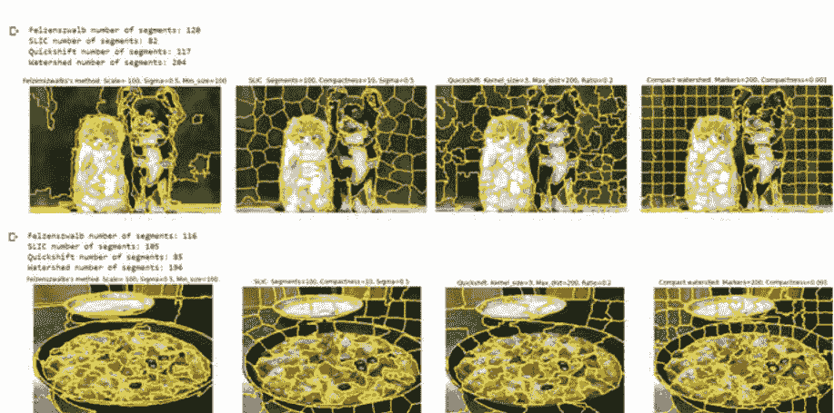

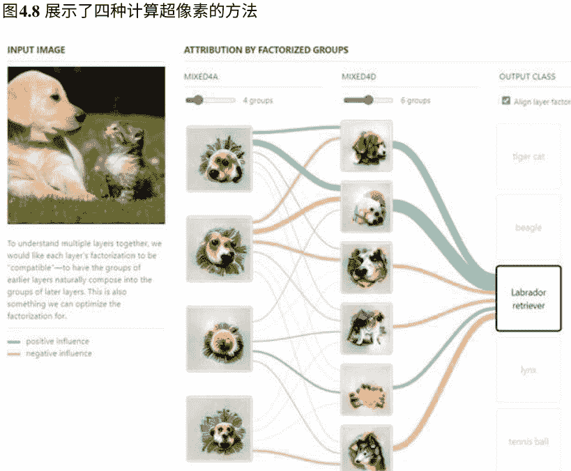

图4.9 分解核分组的可视化指南 根据Olah等人（2018）的图片采用知识共享署名（CC-BY 4.0）进行复制

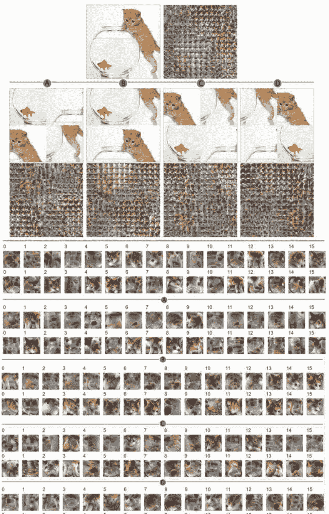

图4.10 激活网格有助于理解输入样本的每个空间位置 为了验证纹理学习，对图像进行了裁剪和洗牌

### 4.1.9 卷积追踪

现在，我们对CNN有了清晰的理解，每个层中的交替卷积和最大池化层与每层中的分段非线性激活，再加上一定数量的全连接层，构成了任何现代CNN的基础。无论是每层的多尺度卷积和池化的异构块，还是池化层之间的多个卷积，或者是跳跃连接，都有其自己的参数和训练过程。

因此，心中的一个有趣问题是，在模型测试中，卷积深度神经网络的哪些组件必须随时间学习以实现SOTA结果。阅读第2章后，您将意识到网络在训练过程中学习的是为特定任务优化网络的权重和偏差。这种学习仅发生在网络的卷积层中，而不是最大池化层或全连接层。甚至Springenberg等人（2014年）的论文通过用适当的卷积层替换网络，实验证实了模型在各种目标识别任务上可以达到竞争或SOTA的结果。

因此，我们引入了CNN中的术语卷积迹作为第5章中模糊推理系统（FIS）中定义的“内存迹”的并行性。这是在池化块之前并行地在每个卷积层中添加规则或高级可视化方法，并通过跳跃连接连接起来。基于特定阈值的一组规则的触发将有助于理解CNN的工作原理。这些规则可以是模糊的，也可以通过训练网络时使用内核滤波器和权重进行计算，并通过受限网格的功能激活重新训练。下一步行动计划是开发模型并生成模型的数学表示。

## 4.2 自编码器网络中的解释

从现实世界中检索到的信息通常具有很高的冗余度。这不仅阻碍了表示的建模，还对计算效率造成了障碍。例如，看一下图4.11中的瑞士卷。信息最初是以三维形式存储的，但在展开后，它发现只需要两个。 这个过程被称为降维（准确地说，是通过流形学习进行的降维）。 在这种情况下，假设高维数据可以通过较低维度的嵌入来充分表示。 现在，如果我们将这个想法应用到图像表示问题上，我们会发现我们需要考虑一个较小维度的空间，以充分描述大多数数据集中的图像。 术语'潜在空间'用来描述这种类型的区域。 所有数据点应该在这个较低维度的图像流形上聚集在一起。 我们已经在第2章中学到，AE模型的训练目标是减少原始图像和重构图像之间的质量差异（损失）。 在达到收敛后，获得了图像的潜在空间嵌入作为一个向量。 我们将可视化潜在空间，以检查嵌入在AE空间中的数据。 在AE中，我们可以通过使用t-SNE将这些潜在向量嵌入到二维空间中来可视化潜在空间，如图4.12所示。

### 4.2.1 潜空间可视化

本质上，一个普通的自动编码器是一个神经网络，它接收一张图片然后重新创建原始图片。图像通过网络的编码器进行处理，产生一个潜在向量（一个不能立即重新配置为图像的向量），表示在较低维空间中的原始图像（只有几个浮点数而不是整个图像矩阵）。 通过将这个潜在向量输入解码器网络，可以将其“解码”回原始图像。 同时，我们可以生成自己的潜在向量（随机抽取值），并将它们输入解码器部分，从而生成一个奇怪的混合图像，看起来不像任何东西。 考虑到大多数潜在向量将位于我们输入到网络的数据空间之外，我们限制编码器部分生成的潜在向量从单位高斯分布中选择，以提高选择可接受潜在向量的几率。通过这样做，我们知道解码器将能够理解从单位高斯分布中采样的数据。

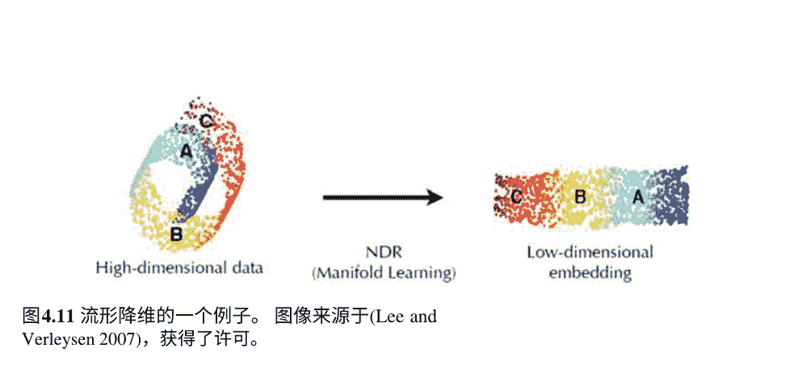

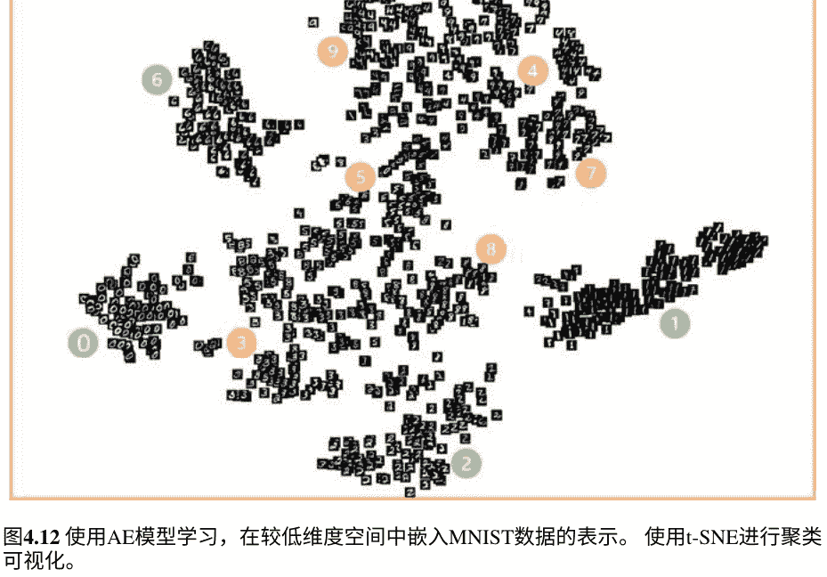

图4.12 使用AE模型学习，在较低维度空间中嵌入MNIST数据的表示。使用t-SNE进行聚类可视化。

有两个目标，因此有两个损失函数。其中一个损失是潜在损失，如果潜在向量偏离单位高斯分布，网络将受到惩罚，并用于限制网络的输出。由于AE还必须检查输出图像与输入图像的一致性，因此还有第二个损失，即实际图像损失。为了将它们结合起来，网络必须做出牺牲，以实现最低可能的潜在损失（潜在向量的单位高斯分布）和最低可能的图像损失（输入和输出图像之间的高相似性）。当均值为零，标准差为一（单位高斯分布）时，潜在损失才为零（完美）。

> 突出显示

首先，我们希望能够有意义地可视化数据集。在我们的例子中，MNIST数据集的图像（或像素）空间具有784个维度（28 × 28 × 1）。问题是将所有这些维度适应于2D或3D的可视化图中。

在这里，我们有t-SNE算法，它试图通过将数据从高维空间转换为2D或3D的低维空间来保持点之间的距离。请记住，在可视化数据方面，t-SNE优于PCA和ICA。

在其他任务中，生成式无监督模型对嵌入或潜在空间特征的解释可以揭示输入中以前隐藏的模式。嵌入式特征解释的使用主要集中在图像和文本应用上（Mikolov等人，2013年），但也越来越多地应用于基因组学和生物医学领域（Ching等人，2018年）。例如，Way和Greene（Weinstein等人，2013年）在TCGA基因表达上训练了一个VAE，并使用潜在空间算术快速分离和分析高级别的卵巢癌亚型（Way等人，2018年）。VAE的特征最能指示亚型特定的生物过程。其他方法使用GAN学习的潜在空间嵌入插值未见过的中间状态。

#### 好好思考一下

#### MSE作为自编码器的损失函数的影响！

均方误差迫使网络特别关注其估计不准确的像素值。在重建时，预测127而不是128并不重要，但将0误解为128则严重得多。与变分自编码器不同，应用距离度量而不是预测每个像素值的概率。这样可以节省很多参数并使训练更容易。人们通常报告批次维度上平均的平方误差（SSE），以便更好地理解每个像素。

（任何涉及均值/总和的其他指标都会得到相同的结果）。

然而，也存在一些缺点。均方误差通常会导致模糊的图像，因为它会移除很少的噪声或频繁出现的模式，这些模式会产生非常低的误差。为了确保逼真的图像重建，可以将生成对抗网络（GAN）与自编码器结合使用。此外，使用均方误差比较两张照片并不总是能反映它们的视觉相似性。比如，一个自编码器重建了一张向右和向下移动了一个像素的图像。尽管这些图像几乎相同，但我们可以通过使用一个单独的、预训练的卷积神经网络来估计距离而不是像素级比较，从而获得更大的损失。

解决这个问题的一个可能的方法是创建一个单独的、预训练的卷积神经网络，并使用较低层次的视觉特征之间的距离作为距离度量，而不是原始的像素级比较。

### 4.2.2 稀疏性和解释

我们简要讨论了自动编码器稀疏性和解释性的三个主题：1. 插值：既然我们知道模型可以提取多少细节，我们可以研究潜在空间的拓扑结构。为了实现这一点，我们比较图像空间和潜在空间中的插值外观。

2. 潜在空间算术：在潜在空间中，我们还可以进行数学运算。这意味着我们可以对潜在空间表示进行算术运算，如加法或减法，而不是插值。例如，在面部的情况下，戴眼镜的男人 - 不戴眼镜的男人 + 不戴眼镜的女人 = 戴眼镜的女人。这种方法产生了令人震惊的结果。

3. 像素空间中的插值：像素空间的结构是导致过渡不流畅的原因。图像空间中不可能实现平滑过渡。这就是为什么通过将一张空杯的图片与一张满杯的图片组合起来无法创造出半满杯的幻觉的原因。

#### 为什么自动编码器被认为是不成功的？有哪些选择？

自动编码器对于某些任务很重要，但并不像我们之前想象的那样必要。大约十年前，我们预计深度网络如果仅使用反向传播的监督成本进行训练，将无法正确学习。我们认为深度网络，就像自动编码器一样，需要一个无监督的成本来进行正则化。谷歌大脑使用的是自动编码器来构建他们的第一个非常大的神经网络，用于识别照片中的物体（与后来的努力相比，效果不太好）。如今，我们知道如果有足够的标记数据，我们可以仅通过在监督成本上利用反向传播来识别照片。自动编码器仍然用于某些任务；然而，它们不再是训练深度神经网络的必要解决方案，就像以前所认为的那样。

### 4.2.3 案例研究：显微镜结构到结构学习

通过实验观察到交叉显微镜学习在成像领域有更广泛的应用是很有趣的。亚细胞样本在细胞之间的特征、形状和移动性上有所不同。大量的纳米级样本提供了大量的数据进行处理。这个想法是调查是否可以通过学习DNN中的特定结构，用最少的数据训练来实现对新结构的迁移学习。图4.13显示，从线粒体到囊泡的学习迁移尝试很难取得有益的结果。但在后来的应用中，我们成功地实现了从囊泡到线粒体的结构到结构学习（图4.14）。这些

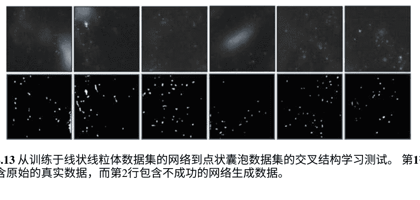

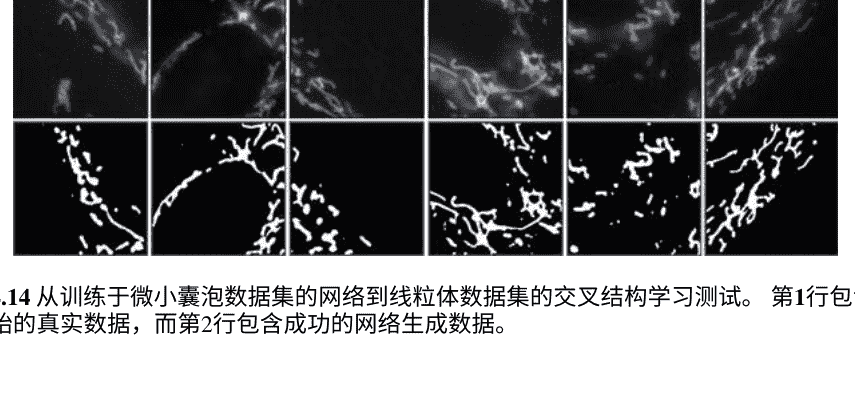

可能是由于囊泡的微小形状，可以学习并生成令人信服的好翻译。结果以一种直接的方式展示了类似的方法，结合其他显微镜模式，遵循类似的方法。

类似的情况是将囊泡的交叉结构迁移学习应用于线粒体。图4.13描述了将线粒体训练应用于纳米级成像中的囊泡标签的翻译失败案例。

然而，图4.14中的后一种情况表明，该模型能够在从囊泡训练的模型转移到线粒体的情况下提供显著的结果。从物理学的角度来看，一个可能的解释是，在具有非常微小结构的囊泡上进行训练在跨结构研究中对线粒体的转移学习上起到了作用。对模型的理解需要深入了解相应层学到了哪些特征。这将使我们能够调整系统，使其更加稳健，提高模型的性能和可靠性。后者在最小化计算开销同时最大化时间效率的尖端迁移学习方法中至关重要。基于这些考虑，我们得出结论，我们需要深入研究文献，了解可解释性方法及其对模型的影响。

## 4.3 对抗网络中的解释

> **我们如何保护我们的深度学习系统免受对抗性示例的攻击？**

一些积极的技术可能包括：

1.  对抗训练：通过对抗性示例进行迭代重新训练分类器。
2.  正则化：学习特征的不变转换或基于博弈论的弹性优化。
3.  集成：使用多个分类器而不仅仅是一个，并让它们对预测进行投票，尽管这并不能保证成功，因为它们可能都受到对抗性案例的影响。
4.  梯度掩蔽：通过使用最近邻分类器而不是原始模型来生成没有有用梯度的模型，这是另一种不起作用的策略。

攻击者对系统的熟悉程度是一种有用的指标，用于对不同类型的攻击进行分类。

-   攻击者可能具有完全的知识（白盒攻击），在这种情况下，他们可以访问模型的参数、训练数据和特征表示；
-   他们可能具有部分知识（灰盒攻击），在这种情况下，他们可以访问模型的特征表示和类型，但不能访问训练数据或参数；或者
-   他们可能对模型没有任何了解（即黑盒攻击），在这种情况下，他们只能通过查询来访问模型。

攻击者可以使用不同的攻击方法来针对模型，这取决于可用的数据。隐藏有关数据和模型的知识并不足以防御攻击，正如我们在示例中所示，即使在黑盒情况下，也可以构造出敌对示例。

#### 直觉出错

以下是一个假设的情况：我的优秀图片分类器现在可以通过Web API提供给您。您可以获得模型的预测结果，但是您无法以任何方式修改模型设置。您可以在舒适的沙发上发送数据，我的服务将以适当的分类进行响应。由于大多数对抗性攻击依赖于对底层DNN梯度的访问，以找到对抗性示例，所以在这种情况下它们将无效。

2017年，Papernot和同事（Papernot等人，2017年）展示了在不了解内部模型或训练数据的情况下生成对抗实例的能力。黑盒攻击是一种（几乎）零知识攻击的形式。它的功能如下：

1.  为了攻击一个分类器，首先从与训练数据相同领域收集一小组照片；例如，如果分类器是一个数字分类器，则使用数字符号的图像。主题知识是必要的，但不需要访问训练数据。
2.  获取当前图像数据的黑盒预测。
3.  使用当前图像作为训练数据训练一个替代模型（例如，一个神经网络）。
4.  为了增加模型的输出变异性，使用一种启发式方法分析现有图像集合以确定最佳的像素变化方向，生成一组新的合成图像。
5.  为了达到期望的结果，需要对预定义的时期重复执行步骤2-4。
6.  快速梯度方法可以用于为替代模型生成对抗性示例。替代模型的目标是提供对黑盒模型的决策边界的近似。
7.  使用恶意示例来试图破坏原始模型。

作者们通过使用它来攻击使用各种形式的云ML进行教学的图像分类器来测试他们的方法。使用用户提供的图像和标签，这些服务教育图像分类器。该模型经过训练，然后由程序自动部署，通常使用对用户隐藏的算法。对于已经提供给分类器的图像进行预测，但模型本身不可供查看或下载。作者们发现了一系列服务提供商的对抗案例，其中高达84%的示例展示了错误的分类。

有趣的是，即使目标黑盒模型不是神经网络，这种技术也是适用的。决策树和其他不依赖于梯度的机器学习模型属于这个类别。

### 4.3.1 生成网络中的解释

GAN在深度学习中越来越受欢迎。与变分自编码器相比，GAN可以处理尖锐的估计密度函数，有效地生成所需的样本，并消除与内部神经架构的确定性偏差和兼容性问题（Goodfellow 2016）。然而，GAN也并非完美。它们的主要限制之一是训练和评估它们很困难。当涉及训练时，由于生成器通常难以正确学习整个数据集的分布，而在训练过程中，判别器和生成器也很难达到纳什均衡，这是一个常见的困难。这是模式崩溃问题的经典案例。

由于深度学习方案和生成对抗网络方法都消除了手工设计的特征和目标函数，它们仍然是数据科学中最有前景的方法。基于生成对抗网络的计算机视觉中的图像到图像研究已经产生了各种学习模型，具有广泛的应用和良好的结果。在这个领域已经进行了大量的研究（Qiu等，2017年; Krizhevsky等，2009年; Yoshida和Miyato，2017年; Karras等，2018年）。关键的评估挑战是开发一个度量标准来确定生成的分布（$p_g$）与目标分布（$p_t$）之间的偏差程度。目前无法以任何精度估计 $p_t$。因此，生成准确的$p_t$和$p_g$之间关系的估计是困难的。

图4.15展示了一个结构良好的分类法，用于表示整体GAN架构的进展，以及随时间演变的不同损失函数的变体。

-   * 网络架构类别突出了对整体GAN架构的增强或修改。
-   * 潜在空间类别突出了基于潜在空间的各种表示进行修改的架构。
-   * 应用重点指的是针对特定应用进行的更改。
-   * 损失类型是可以为GAN进行优化的损失函数的类型。
-   * 正则化包括将额外的惩罚项嵌入到损失函数中或进行任何类型的网络归一化过程。更具体地说，我们使用积分概率度量（IPM）来转换损失函数，其中鉴别器受限于预定函数集合。

我们不会深入研究GAN的历史和各种损失函数的定义。我们的目标是让DL社区整体上对不同的GAN结构有所认识。图4.16突出显示了过去十年GAN图像生成方面的巨大改进。GAN应用的一个重要部分用于艺术创作。然而，大量的模型也被用于生成合成数据和模拟对抗示例。除了欣赏模型的进步，现在是时候理解数据收集中的潜在偏差和模型的潜在空间编码，以构建可靠的系统。首先，表4.3列出了一些在有限数据资源下的监督、无监督和零样本学习领域的解释方法（周2022年）。

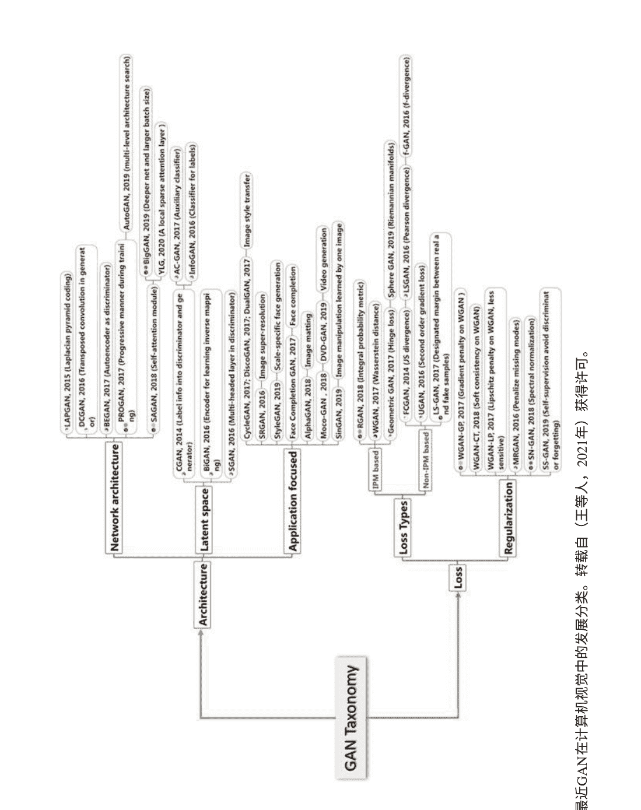

图4.15最近GAN在计算机视觉中的发展分类。转载自（王等人，2021年）获得许可。

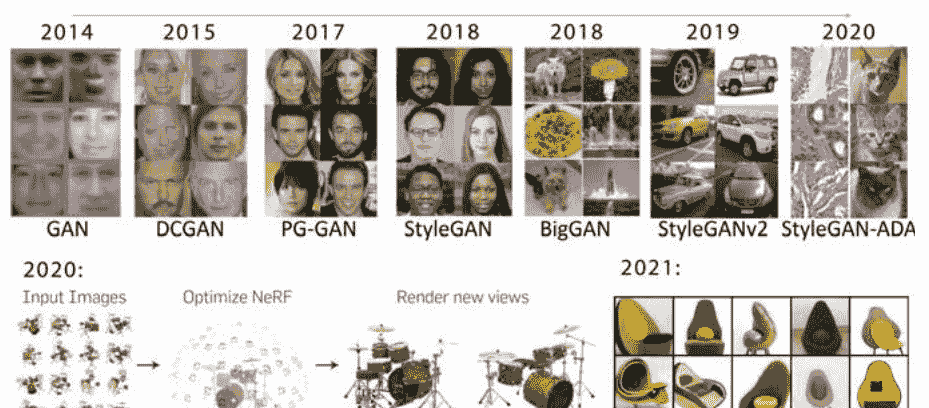

### 4.3.2 潜空间中的解释

一些方法可以在潜在空间中发现可解释的方向，即通过迭代调整期望方向上的潜在信号 $\mathbf{z}$ 来控制生成过程，其中 $\mathbf{z}' = \mathbf{z} + \alpha \mathbf{v}$ 是向量运算。可以通过多种方式来找到这些指导，包括有或没有人工监督。一些新方法提议完全跳过训练和优化过程，直接从预训练模型中计算可解释的方向。可以按以下步骤执行：

1.  监督设置：现有的基于监督学习的方法随机采样潜在编码，合成相应的图像，提取统计图像信息（例如颜色变化）（Plumerault等，2020），并通过引入预训练的分类器（例如预测面部属性或光照方向）对其进行预定义标签的注释。2020年代的方法包括Abdal等人的。（2021）Styleflow，Goetschalckx等人的。（2019）Ganalyze，Jahanian等人的GAN steerability（2019）和Shen等人的（2020）。Shen等人使用现成的分类器来评估GAN学习到的面部表示，并为合成图像预测语义分数。Abdal等人使用连续归一化流（CNFs）来学习语义 $\mathcal{Z}$ 到 $\mathcal{W}$ 的映射。这两种方法都需要属性（通常来自面部分类器网络），这可能很难获得新数据集并需要手动标记。
2.  无监督设置：由于每次采样的代码和合成图像不同，监督设置引入了实验中的偏差，并可能导致沈和周（2021）声称的各种可解释方向的发现。它还大大限制了当前技术可以找到的方向范围，特别是在没有标签的情况下。此外，这些方法确定的个体控制常常相互纠缠，影响多个变量，并且通常是非局部的。因此，某些算法（Härkönen et al. 2020; Cherepkov et al. 2021; Voynov and Babenko 2020）尝试在潜在空间中无监督地发现可解释的方向，即不需要配对数据。例如，Erik et al.（2020）通过在潜在空间或特征空间中使用PCA识别相关的潜在方向，为图像合成开发了可解释的控制。派生的主要组件与特定属性相关，并且它们的选择性应用使得能够管理众多图像属性。这种方法被认为是无监督的，因为可以使用PCA确定方向而无需标签。将这些指令注释到目标过程并确定应该应用于哪些层需要手动干预和监督。相比之下，Jahanian et al.（2019）使用自监督优化来优化轨迹（线性和非线性）。给定一个反转的源图像 $G(z)$，他们学习 $w$ 在等式4.1中为：

$$w^* = \arg \min_w \mathbb{E}_{z, \alpha}[\mathcal{L}(G(z + \alpha w), \text{edit}(G(z), \alpha))] \tag{4.1}$$

其中 $\mathcal{L}$ 表示创建图片 $G(z + \alpha w)$ 和目标图片 $\text{edit}(G(z), \alpha)$ 之间的距离，通过在潜在方向上进行 $\alpha$ 步骤来实现。这种方法被认为是“自我监督”的，因为目标图片 $(G(z), \alpha)$ 可以从源图片 $G(z)$ 中推断出来。

#### 3. 闭式解：

最近一些方法（Spingarn等，2020年；Shen和Zhou，2021年；Wei等，2021年）已经证明了在没有训练或优化的情况下，通过闭式形式获得图像合成的可解释方向。Shen等人（2021年）提出了使用第一层GAN权重的奇异值分解进行语义分解。他们注意到，与采样代码 $z$ 无关的潜在方向 $n$ 决定了图像的语义转换，通常通过在给定方向上移动潜在代码来表示，即 $n' = z + \alpha n_o$。为了找到可以显著改变输出图像 $y$ 的方向 $n$，他们设计了一种语义分解（SeFa）技术，定义为 $y' - y = (A(z + \alpha n) + b) - (Az + b) = \alpha An$，其中 $A$ 和 $b$ 表示 $G$ 中某些层的权重和偏置。找到的公式 $y = \alpha An$ 暗示了权重参数 $A$ 应该包含关于图像波动的基本信息，并建议通过将项 $\alpha An$ 添加到投影代码中来实现所需的带方向的编辑。

这使我们能够将以下优化问题形式化为问题的因式分解在方程4.2中研究潜在语义。

$$n^* = \arg \max_{\{n \in \mathbb{R}^d; n^T n=1\}} ||An||_2^2 \tag{4.2}$$

GAN中潜在语义的闭式分解，用方向 $n^*$ 表示，对应于矩阵 $A^T A$ 的特征向量。与其像SeFa一样使用生成器的单个层来决定哪些方向对图像是可解释的合成，基于正交雅可比正则化的方法应用于生成器的多个层级（Wei等，2021）。

#### 4.3.2.1 潜在空间的解缠

无论使用哪种GAN反演技术，决定将图像嵌入哪个潜在空间是一个关键的设计选择。作为潜在空间有效的条件是，它必须是解缠的并且容易嵌入。潜在空间中的潜在代码具有两个理想的属性：它能够忠实且逼真地重构原始图像，并且使后续图像操作更加容易。从经典的Z空间开始，逐步过渡到SOTA P空间，本节提供了潜在空间分析和正则化工作的概述。

我们以StyleGAN/StyleGAN2生成过程为例，其中涉及到多个潜在空间，图像编辑主要在W+空间中进行。让我们讨论一下不同的潜在空间。

1.  Z潜在空间，也称为潜在编码或潜在表示，通常是一个服从正态分布的随机噪声向量z∈Z。这适用于几乎所有无条件GAN模型。另一方面，由于正态分布的约束，Z空间的表示能力和语义特征的解缠绕受到限制。
2.  W潜在空间是通过改变Z空间而生成的中间空间，使用一系列全连接层。根据Karras等人（2019）的说法，这反映了学习分布的解缠绕性质。在最近的GAN反演方法中，StyleGAN中广泛使用了潜在空间。
3.  W+潜在空间是一个不同的中间潜在向量w，馈送到生成器的层中，用于样式混合或图像反演等情况。W空间的表达能力仍然有限，限制了可以真实重现的图像的范围。因此，一些作品（如Abdal等人2019年、2020年）使用自适应实例归一化（AdaIN）（Huang和Belongie 2017）将另一个逐层潜在空间馈送到生成器的每一层。
    另一方面，在W+空间中反转图像会减少失真，但也会导致编辑能力降低。
4.  S潜在空间是通过跨通道样式参数s形成的样式空间，生成器的每一层都利用了不同的学习仿射变换(w∈W)。提出了在空间维度上实现更大的空间解缠绕性，超越了语义层面。基于样式的生成器的内在复杂性(Karras等人,2019)和AdaIN归一化的空间不变性(Huang和Belongie,2017)是空间纠缠的主要原因。
5.  P潜在空间是由Zhu等人(2020)提出的，其中最后的Leaky ReLU的斜率为0.2，从W到Pspace的转换是x = LeakyReLU_{5.0}(w)。

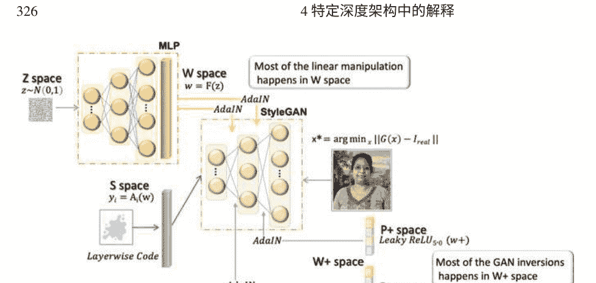

图4.17 GAN生成器的潜在空间

表4.4 将预训练的GAN模型应用于图像处理任务的总结

| 生成先验 | 公式 |
|----------|------|
| GAN反演 | $x = \text{argmin}_x \|G(x) - I\|$ |
| 上色 | $x = \text{argmin}_x \|\text{rgb2gray}(G(x)) - I_{\text{gray}}\|$ |
| 超分辨率 | $x = \text{argmin}_x \|\text{down}(G(x)) - I_{\text{small}}\|$ |
| 掩码优化 | $x = \text{argmin}_x \|m \odot G(x) - m \odot I_{\text{context}}\|$ |

其中 $w$ 和 $x$ 分别是 $W$ 和 $P$ 空间中的潜在编码。它们从最基本的假设开始，即潜在编码的联合分布大致上是多元高斯分布，然后提出了 $P^N$ 空间来最小化依赖性和重复性。PCA白化实现了从 $P$ 到 $P^N$ 空间的转换。这种转换将分布归一化为零均值和单位方差，从而在所有方向上得到各向同性的 $P$ 空间。

6.  $P+$ 潜空间是一个空间扩展 $P^N$ 在其中每个潜在代码被用于解调相关的 StyleGAN 特征映射在不同的层级。

图4.17展示了具有多个潜空间的StyleGAN情况。表4.4总结了用于各种采样、反演和重构任务的生成先验的基本修改（图4.18）。

### 4.3.3 评估指标

GAN反演方法根据几个标准进行评估，包括逼真度、重建图像的忠实度和反演潜在代码的可编辑性。这激发我们讨论以下一些标准：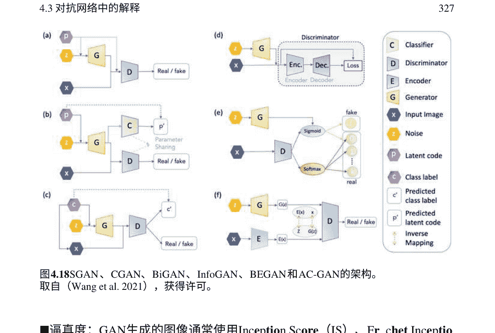

-   逼真度：GAN生成的图像通常使用Inception Score（IS）、Fréchet Inception Distance（FID）和学习的感知图像块相似度（LPIPS）（Zhang et al. 2018）指标进行评估。类似的指标还包括Fréchet分割距离（FSD）（Bau et al. 2019）和切片Wasserstein距离（SWD）（Rabin et al. 2011），用于评估图像的感知质量。

IS（Salimans等人，2016年）是评估GAN生成图像质量和多样性的广泛使用的方法。Inception-v3网络（Szegedy等人，2016年）在ImageNet（Deng等人，2009年）上进行预训练，用于计算合成图像的统计信息。更高的分数更可取。FID（Heusel等人，2017年）是基于Inception-v3 pool3层的真实图像和生成图像的特征向量之间的Fréchet距离来确定的。较低的FID值表示更高的感知质量。LPIPS（Zhang等人，2018年）使用在ImageNet上训练的VGG模型评估图像的感知质量。较低的分数表示更高的图像块相似性。

-   忠实度：忠实度的程度被定义为生成图像与原始图像的视觉可比性。图像之间的相似性可以作为一个粗略的近似。PSNR和SSIM是两个最常用的测量指标。PSNR是衡量重建质量的广泛使用的标准，由最大可能的像素值和图像之间的均方误差（MSE）定义。SSIM使用亮度、对比度和结构的独立测量来比较图像。Wang等人（2004年）在文章“图像质量评估：从误差可见性到结构相似性”中定义了这些术语。其他指标如平均绝对误差（MAE）、均方误差（MSE）和均方根误差（RMSE）是一些可以在某些方法中使用的像素级重建距离度量的例子。

-   可编辑性量化了反转潜在代码在生成器输出图像特征上可以被修改的程度。直接评估潜在代码的可编辑性是不可能的。现有技术使用余弦或欧氏距离（Nitzan 2020）或分类准确度（Voynov和Babenko 2020）评估输入x和输出x′之间的某些特性（即，在保持其他特性不变的情况下调整目标属性）。现有方法主要关注于确定面部数据和面部特征的可编辑性。例如，Nitzan等人（2020）使用余弦相似度来比较面部表情保留的准确性，该准确性通过2D关键点之间的欧氏距离计算。x和x'。

另一方面，姿势的保留被确定为欧几里德距离，即欧拉角x和x′之间的距离。Abdal等人（2021）建立了一致性得分（由属性分类器回归）来评估修改后的人脸图像的一致性，假设各种编辑的排列应该在使用属性分类器进行分类时具有相同的属性得分。这些方法通过测量面部识别的保留来评估修改后图像的质量。我们应该注意到上述方法可能与除人脸之外的图像类别无关。

-   主观度量：主观图像质量评估通常使用人工评分员，评分范围从1（非常差）到5（优秀）（好）。平均意见分数（MOS）或差分平均意见分数（DMOS）是总结评分的常用指标。用户研究中的常见任务是让参与者从三个选项中选择最佳回答研究问题的图像（原始图像、基准结果和推荐方法）。例如，一个问题可能是：“这个图像的两个修改版本中哪个更真实？”或者“这个图像的两个编辑版本中哪个更好地保留了原始图像中个体的身份？”最终投票的百分比表示对比控制组中建议技术的支持水平。

人类判断的非线性尺度、偏见和方差的可能性以及高昂的人力成本都是这些度量的缺点。

#### 亮点

#### 生成器和判别器中的归一化

由于两个网络之间的不健康竞争，GAN容易出现信号幅度递增的问题。大多数以前的方法都通过在生成器和判别器中使用批归一化来避免这个问题（Ioffe和Szegedy 2015; Salimans和Kingma 2016）。最初，这些归一化策略是为了消除协变量偏移而开发的。

然而，在GAN中，我们并没有将其视为一个问题，这使我们推断出GAN中的基本必要性是有限的信号幅度和竞争。Karras等人（2018）提出使用两个没有可学习参数的元素作为解决方案。

-   均等化学习率：与仔细初始化权重的普遍做法相反，我们可以从一个平凡的 \(N(0, 1)\) 初始化开始，然后在训练过程中明确地缩放权重。更具体地说，我们使用Kaiming初始化（He等人2015）并设置 \(w_i = w_i / c\)，其中 \(w_i\) 是权重， \(c\) 是每层的归一化常数。

在初始化时进行这种操作的优势与其微妙之处有关，但与流行的自适应SGD算法（如RMSProp（Tieleman和Hinton 2012; Adam 2014））具有尺度不变性有关。这些技术通过梯度更新并将其归一化为其估计标准差，使其具有尺度无关性。

因此，如果一个参数的范围大于另一个参数的范围，调整系统的时间将更长。由于初始化器的工作方式，学习率可能过高或过低。这确保所有权重具有相同的动态范围，并且通过扩展具有相同的学习速度。Laarhoven（2017）在2017年独立得出了类似的结论。

-   生成器中的像素特征向量归一化：在生成器的每个卷积层之后，我们可以将每个像素中的特征向量归一化为单位长度，以防止由于竞争而导致的幅度失控。

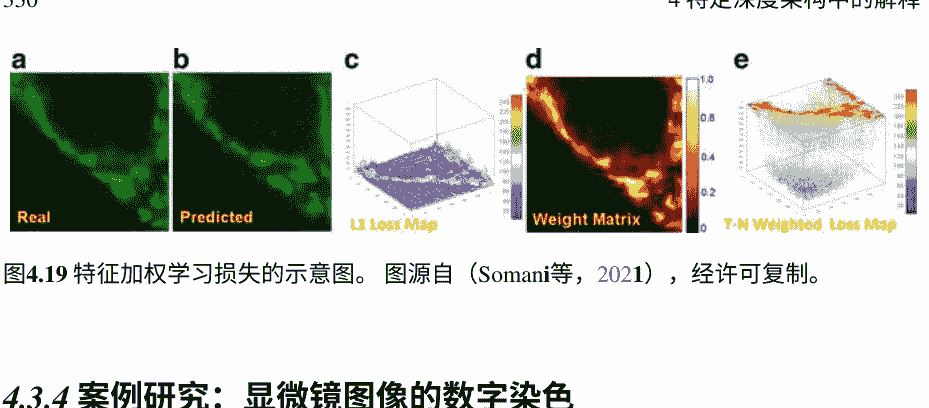

### 4.3.4 案例研究：显微镜图像的数字染色

Somani等人 (2021) 旨在提供一个框架，用于从亮场显微镜细胞标本构建数字荧光等效物。生成对抗网络 (GANs) 是深度学习的一个有前途的子领域，在各种数据驱动的计算任务中取得了成功，包括解决显微成像中的逆问题，如超分辨率和定位显微镜，以及细胞模拟重建。利用数据驱动的图像修改来对无标记组织样本进行数字染色，观察细胞中的线粒体活动，无需染色或干扰细胞，提供了新的可能性。重建生成光源的数量（数量）、位置（几何）和强度（光度）等于解决图像转换问题。一般来说，基于输入和目标图像之间的关系，有两个主要的方法和应用领域：

-   1. 无监督/无配对/不对齐/未注册的方法，如样式改变、颜色改变。
    2. 有监督/配对/对齐/注册的方法，如有监督分割和标记、去噪和超分辨率。

对齐的输入/输出图像转换是手头的问题。这个应用的显著之处在于黑盒模型包含了超越人工劳动的复杂特征学习。这种抽象可以带来更多的好处而不是坏处，但是如果要在涉及生死的重要领域中使用它，理解黑盒是必要的。微观结构与性能之间的关系通常是非线性的，评估成本高昂，使得微观结构优化困难。

本文详细介绍了使用cGAN实现深度CNN架构，将未染色的胚胎心脏组织转换为相应的线粒体单体红色荧光蛋白 (mCherry) 和增强型绿色荧光蛋白 (eGFP) 染色图像。网络学习将无标签组织切片的荧光染色显微镜图像与其亮场显微镜对应图像匹配。通过对生成的虚拟染色图像和真实组织切片染色进行定量化，证明了基于深度学习的数字染色方法产生的结果与手动荧光染色程序相当。

我们可能会发现，模型的背景适应性往往是这种图像转换中最困难的障碍。染色荧光成像（图4.19），显示出混浊的线粒体标记前景和显著的大未标记背景。前景具有高强度值，而背景包含具有变化强度的像素值，我们可以称之为噪声。

目标是优化图像到图像（I2I）转换过程，使其生成用于无标签亮场成像的标记图像。明显的策略将会聚焦于前景，但在无标签图像中，背景也是重要的。模型通过对低强度区域进行条件约束来生成染色图像。学习要求不高，尽管在某些领域需要精确度。生成器的成本函数可以使用带有前景和背景信息的加权图像映射计算生成图像与实际图像之间的L1损失。映射的权重是使用损失建模技术计算的。

这个过程的下一步是学习如何在特定应用中使用模型。它还确定了通过图4.19e中描述的建议损失对图像的损失计算的理解是否比(C)中的L1损失更好，这可能是模型成功的一种解释类型。这种前沿的方法在应用中具有竞争力。然而，对于网络如何评估损失以及如何访问图像中的特征的一些基本知识，在各种鉴别器损失类别中，开发出一种成功的适用性损失函数的方法取得了巨大的优势，远远超过了SOTA技术。它为未来的可解释性策略铺平了道路，以帮助模型准确执行任务，并在其行为上获得信任。

## 4.4 图网络中的解释

近年来，由于卷积神经网络（CNN）和循环神经网络（RNN）等深度学习突破，我们在各种挑战中取得了前所未有的性能。尽管取得了进展，但大多数使用深度学习技术的研究仅考虑了在欧几里得域（即网格）上收集的数据。然而，非欧几里得域反映了必须在许多不同领域中处理的数据，包括生物学、物理学、计算机图形学、网络研究和推荐系统：图和流形。由于数据的非欧几里得性质使得基本技术（如卷积）的规范相对复杂，因此在这些要求严格的领域中，深度学习的应用一直落后，直到最近才有所改善。

推荐系统、假新闻识别、药物再利用、化学、中微子探测等等都是深度几何学习在实际应用中的一些例子。流形知识在计算机图形学、医学成像、药物设计、机器人技术和自动驾驶等领域也非常有用。频谱域、空间域和参数域都是非欧几里得卷积神经网络可能采用的形式。

人们希望寻找新的模型，希望基于图神经网络架构的模型能够产生更易理解的思维模式（Battaglia等人，2018年）。本节重点介绍了图神经网络的好处以及解释其结果的困难之处。为了更好地学习实体、关系和组合规则，图神经网络架构被认为更具可解释性。首先，相比于图像像素（细粒度）或词嵌入（由大量单词、潜在空间向量表示的高级概念），人们更容易理解图神经网络中的实体。其次，图神经网络的推理过程将数据传播到链接中，使得更容易确定子图或明确的推理路径对预测结果的影响。因此，在将图像或文本数据转换为图之后，图神经网络模型越来越多地被用于进行预测。例如，要从图像创建一个图，我们可以将每个对象（或对象的一部分）作为一个节点，并根据它们的空间关系建立边。类似地，可以使用词法分析将文档转换为网络，通过识别想法（如名词或命名实体）作为节点，并提取它们之间的关系作为连接。

图形数据格式为可解释建模提供了一个跳板；然而，GNN的可解释性仍然受到许多障碍的威胁。首先，GNN仍然使用映射节点并连接到嵌入。因此，中间层信息处理的不透明性对于GNN来说是一个问题，就像对于传统的深度模型一样。其次，最终的预测受到各种信息传播通道或子图的不同方式的影响。后续解释方法仍然是必需的，因为GNN不会立即揭示其预测的最相关的原因-处理过程。为了提高GNN的可解释性，我们将在下一节中描述解决上述问题的最新进展。然而，除非另有说明，否则我们在本章的其余部分中所研究的图形被假定为同质的。

#### 图形解释的挑战

解释深度图模型的问题至关重要但困难。讨论了为GNN提供充分解释的挑战。首先，一些事实：

-   图形不像照片和文本那样是网格状的数据；相反，它们具有更有机的结构，每个节点都有不同数量的邻居，并且没有位置信息。图形被表示为特征矩阵和邻接矩阵，这两者都包含了关于底层拓扑的丰富信息。
-   可以直接将用于解释图像数据中特征相关性的方法应用于图形数据。然而，拓扑结构在邻接矩阵中以离散值表示。因此，传统方法无法奏效。
-   解释图像分类器的一般特征的常见方法包括输入优化方法（Simonyan等，2014年；Olah等，2017年）。通过优化输入并使用反向传播获得的抽象图像来解释模型，它将其视为可训练的变量。然而，离散的邻接矩阵无法进行相同类型的优化。

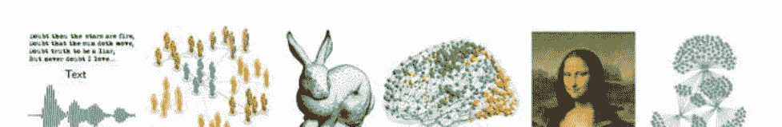

图4.20 几何深度学习数据集用于非欧几里德图和流形领域，与传统的语音和图像相比，使用混合模型CNNs（Monti等人，2017年）在右侧（左侧）

-   此外，各种方法（Dabkowski和Gal，2017年；Yuan等人，2021年）训练软蒙版以捕捉图像的关键部分。相反，当软蒙版应用于邻接矩阵时，离散性质就会丢失。

此外，有必要分析数字图像和书面文本中每个像素和单词的重要性。然而，研究图数据中的结构信息（如图4.20所示）更为重要。首先，需要注意的是，尽管网络中的个别节点可能没有标签，但整个图的标签是由图的拓扑结构决定的。如果节点没有标签，分析它们个别地就没有语义价值。此外，图的子结构与生物化学、神经生物学、生态学和工程学领域的功能密切相关（Rudin，2019年）。网络模式（Alon，2007年）是说明性的；它们是各种更复杂网络的构建模块（Chen等人，2018年）。因此，在解释过程中必须考虑这些结构细节。然而，目前从图像领域的方法无法提供关于结构本身的见解。下一步是对节点分类任务，每个节点的预测基于与其邻居的不同消息传递路径。消息传递的研究是重要的，但也很困难。在图像领域中缺乏能够考虑这种路径信息的方法凸显了在这个领域需要更多的研究。

此外，视觉和文本数据比图形数据更直观。理解深度模型需要对相关数据集有专业知识。语义理解对于视觉和文本来说是清晰且容易的。尽管它们相当抽象，但人类很容易理解它们的解释。对于人类来说，很难理解图形的含义，因为它们可以表示各种复杂的事实，如分子、社交网络和引用网络。在化学和生物学等跨学科领域中，还存在许多未解答的问题和缺乏领域专业知识。因此，需要标准数据集和评估措施来解释工作，因为对于图形模型来说，很难获得人类可以理解的解释。

#### 在多样化结构数据方面取得突破

在人工智能领域的黎明时期，它的两位创始人曾经预测解决机器视觉问题只需要一个夏天的时间。我们现在承认他们错了半个世纪。Wissner-Gross开始思考这个难题：“为什么会花这么长时间？为什么人工智能革命如此漫长？”通过分析过去30年的人工智能进展出版物，作者发现证据表明高质量的数据集是人工智能突破的影响因素，而不是算法的进步。表4.5中突破性发现的总结表明，在数据可用性之后，人工智能的突破性发现时间为3年，即比提出算法的平均经过时间18年快6倍。

如果上述观察是正确的，它将对人工智能未来的增长产生基础性的影响。优先考虑优质数据的收集可能比重度算法的策划具有更高的加速度。语音识别、语言翻译、IBM的Deep Blue在1997年、Deepmind在2015年的例子都是表4.5中重复出现的实例，暗示了数据的重要性。数据越大，相关性越强，关系越复杂。在知识编码的抽象性质与严谨的数学建模之间，图神经学习是一种前进的方式。

表4.5 由Wissner-Gross（Quanto 2021）提供的数据集与算法

| 年 | 人工智能的突破 | 数据集（首次可用） | 算法（首次提出） |
|----|----------------|---------------------|-------------------|
| 1994 | 人类水平的自发语音识别 | 华尔街日报文章和其他文本的口语化（1991年） | 隐马尔可夫模型（1984年） |
| 1997 | IBM Deep Blue击败了Garry Kasparov | 70万个国际象棋大师对局，也称为“扩展书”（1991年） | Negascout规划算法（1983年） |
| 2005 | 谷歌的阿拉伯语和中文到英文的翻译 | 来自谷歌网页和新闻页面的1.8万亿个标记（2005年收集） | 统计机器翻译算法（1988年） |
| 2011 | IBM Watson成为世界Jeopardy!冠军 | 来自维基百科、维基词典、维基语录和Project Gutenberg的860万个文档（2010年更新） | 专家混合算法（1991年） |
| 2014 | 谷歌的GoogLeNet在接近人类水平的目标分类上表现出色 | ImageNet数据集包含150万张标记图像和1000个目标类别（2010年） | 卷积神经网络算法（1989年） |
| 2015 | 谷歌的Deepmind通过从视频中学习通用控制，在玩29个Atari游戏方面达到了人类水平 | Arcade Learning Environment数据集包含50多个Atari游戏（2013年） | Q-learning算法（1992年） |
| 突破所需的平均年数：3年 |  |  | 18年 |

对分子图、社交网络或语义图像分类的研究给出了图论和微分几何的理论思想。理解非欧几何空间对于在图的空间、频谱和参数域中编码知识非常重要。这个研究领域涉及的问题包括：

-   非欧几何数据的解释可能是什么样的？
-   我们如何学习在图和流形上进行谱分析？
-   信任空间域和频谱域几何深度学习技术的好处是什么？

目前，GNN学习方法面临的基本挑战是将NN扩展到图形或流形结构化数据。在这里，假设是非欧几里德数据在局部上是平稳的，并且具有层次结构。然而，当应用于实际场景时，这很难解释。此外，卷积和池化技术在图形或流形中的组合性的定义也是一个相当困难的问题。这是因为滤波器是基于基底的，并且在不同领域之间不能很好地推广。组合性是模糊CNN中的一个常见问题，在下一章中将进行讨论。

### 4.4.1 神经结构化学习

此外，图形学习是另一个广泛的研究主题，超出了本书的范围。然而，值得强调的是，通过利用结构化信号（图4.21）来训练NN的新范式，除了NN中使用的标准特征输入之外。在这种情况下，结构可以通过图形明确表示，也可以通过利用最近邻居类似于数据输入来隐式表示。这种图形学习技术可以用于研究在自然或合成图形上的训练，以及对抗性案例。

学习这个神经结构的目标是找到从对比方程4.3中的两个函数得到的损失的最小值。最小化监督损失，例如回归的L2范数或交叉熵损失。

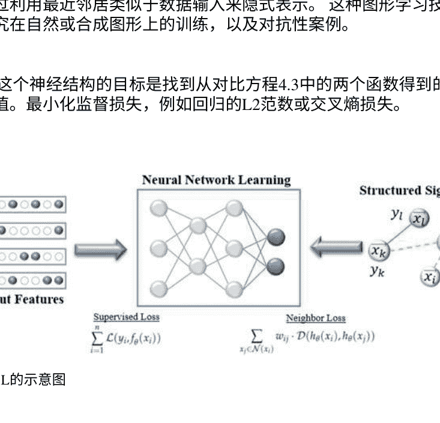

分类是神经网络设计中的一个常见目标。在这种情况下，我们还要最小化邻居损失，以保持相同结构的输入之间的相关性。总损失优化在方程4.3中理论上定义为：

优化：\(\mathcal{L}_{\text{损失}} = \sum_{i=1}^{n} \mathcal{L}(y_i, y_i) + \alpha \sum_{i=1}^{n} \mathcal{L}_{\mathcal{N}}(y_i, x_i, \mathcal{N}(x_i)) \quad \text{(4.3)}\)

其中，\(x_i \rightarrow f(.) \rightarrow y_i\)是输入特征的转换，\(y_i\)是输入\(x_i\)的神经网络输出，\(\mathcal{L}\)和\(\mathcal{L}_{\mathcal{N}}\)分别是监督损失函数和邻居损失函数。方程的后半部分计算了表示为\([\sum_{x_j \in \mathcal{N}(x_i)} w_{ij} \cdot \mathcal{D}(h_\theta(x_i), h_\theta(x_j))]\)与\(h_\theta(.)\)隐藏目标层和\(\mathcal{D}(.)\)距离度量，例如L1或L2范数。

在之前的章节中简要介绍的对抗性示例也可以通过扰动输入数据来用作网络的结构学习图。在使用Szegedy等人（2015）的对抗性扰动样本进行训练后，对模型抵抗有意的操纵进行了分析验证。这些结构化信号通常用于表示样本之间的关联或相似性。通过使用结构化信号（例如源图像中的干扰生成的负实例）对神经网络进行正则化训练。在学习减少监督损失的同时保持输入和对抗实例之间的结构相似性，可以将对抗损失降到最低。以下代码片段演示了使用TensorFlow API中实现的NSL框架有组织地进行对抗神经学习。

```
1 import tensorflow as tf
2 import neural_structured_learning as nsl
3 
4 #读取和处理数据集
5 (x_train, y_train),(x_test, y_test) = tf.keras.datasets.mnist.load_data()
6 x_train, x_test = x_train / 255.0, x_test / 255.0
7 
8 #创建基础模型 —— 顺序、函数式或子类
9 #这里使用了Keras模型
10 model = tf.keras.Sequential(...)
11 
12 #用对抗性正则化包装模型
13 adv_config = nsl.configs.make_adv_reg_config(multiplier = 0.2, adv_step_size = 0.05)
14 adv_model = nsl.keras.AdversarialRegularization(model, adv_config)
15 
16 #编译、训练和评估
17 adv_model.compile(optimizer = 'adam', loss = 'sparse_categorical_crossentropy', metric = ['accuracy'])
18 
19 adv_model.fit({'feature': x_train, 'label': y_train}, epochs = 50)
20 adv_model.evaluate({'feature': x_test, 'label': y_test})
```

列表4.1 Mnist数据的样本对抗神经结构学习代码

下一步可以是使用欧几里得、双曲线和复杂模型研究将低维知识嵌入图中用于链接预测挑战的方法。例如，图协议模型（GAMs）使用CNNs（Kipf和Welling 2016）研究了现实世界问题中图的噪声特性；学习了在多关系图中固定嵌入实体的SOTA，并通过最近邻图推断在测试时推广到未见关系。

前面的考虑表明，任何图像都可以分解为像素值的张量。卷积层有助于从图像中提取特征（形成特征图）。网络中的较浅层（靠近输入数据）学习相对通用的特征，如边缘、角点等。更深的层（靠近输出层）学习输入图像的高度特定方面。

### 4.4.2 图嵌入和可解释性

最近，已经提出了许多不同的方法来为深度图模型产生的结果提供上下文。这些方法中的每一种都分析了图模型的一个独特方面，并提供了新的视角。它们通常解决的问题包括：哪些输入边最重要？输入图中哪些节点最关键？节点的哪些特征最关键？如何使用图模式最好地预测一个类别？我们在本节的后面给出了GNN解释方法的分类法，这应该帮助读者理解各种方法。在图4.22中，您可以看到我们的分类法是如何组成的。

根据解释的深度，不同的技术被分为两大类别：实例级方法和模型级方法。

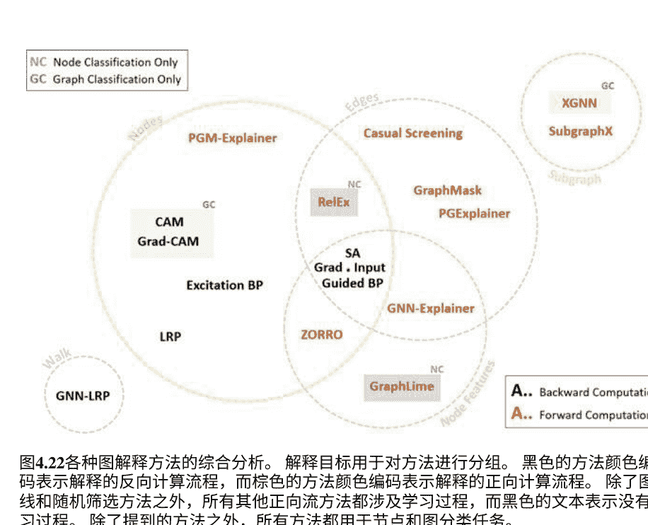

图4.22各种图解释方法的综合分析。解释目标用于对方法进行分组。黑色的方法颜色编码表示解释的反向计算流程，而棕色的方法颜色编码表示解释的正向计算流程。除了图线和随机筛选方法之外，所有其他正向流方法都涉及学习过程，而黑色的文本表示没有学习过程。除了提到的方法之外，所有方法都用于节点和图分类任务。

#### 4.4.2.1 实例级方法

实例级方法针对每个输入图形提供不同的解释，这取决于输入本身的性质。当这些技术应用于输入图形时，它们通过突出显示模型预测中最相关的输入属性来解释深度模型。 我们将这些方法分为四组，其计算重要性分数的方式不同：

1.  基于梯度/特征的方法（表4.6）。
2.  扰动方法（表4.7）。
3.  分解方法（表4.8）。
4.  替代方法（表4.9）。

具体而言，梯度/特征方法使用特征值或梯度来突出显示各种输入特征的重要性。 扰动方法通过跟踪预测在不同输入扰动下的变化来研究输入重要性分数。 在分解方法中，预测分数（如预测概率）被分解为其组成部分，然后馈送到最终隐藏层的神经元中。 它们将分解的分数作为重要性分数，然后逐层向后传播，直到到达输入空间。 相比之下，替代方法首先从周围示例中选择一个数据集作为输入示例。 然后，这些技术使用决策树或其他易于理解的模型来拟合所收集的数据。 然后，将应用替代模型的解释到初始预测中。

另一方面，模型级方法解释了与特定输入示例无关的GNNs。 高级的与输入无关的解释提供了一般行为的原因。 这个方向比实例级方法受到的关注要少。 基于图生成的XGNN（表4.10）是唯一现有的模型级技术。 它开发图模式以优化给定类别的预期概率，然后使用这些图模式来解释该类别。

这两类方法各自提供了对深度GNNs的独特视角。模型级方法提供了关于深度图模型如何运行的通用理解，而实例级方法提供了针对个别示例的解释。为了确保GNNs的准确性和可靠性，需要人工监督来双重检查所提供的理由。专家需要额外的时间来手动监督实例级程序，因为他们需要调查各种输入图形的原因。由于模型级程序的解释更抽象，所以需要更少的人工监督。而实例级技术的解释使用了真实的输入实例。 然而，生成的图模式可能在现实世界中不存在。 因此，模型级程序的解释对人类来说可能没有意义。这两种方法可以结合起来更全面地理解深度图模型，因此重要的是研究这两种方法。

##### 表4.6 流行的特征/梯度方法概述可解释的GNN模型。

（+）表示方法的优点，（-）表示方法的缺点

| 基于特征/梯度的方法 | 关键特征 |
| :--- | :--- |
| 敏感性分析（Baldassarre and Azizpour et al. 2019） | +利用平方梯度值作为各种输入特征的重要性评分<br>+通过反向传播计算，以图节点、边或节点特征作为输入特征<br>+假设具有较高绝对梯度值的输入特征更重要<br>– 敏感性分析只反映输入和输出之间的敏感性，这不足以证明其重要性<br>– 受饱和问题的影响（Shrikumar et al. 2017），当模型输出对任何输入变化的响应变化很小时，梯度很难反映输入的贡献<br>– 它的有效性仍然有限。它假设输入特征是相互独立的，并且在决策过程中并不总是考虑它们之间的相关性。<br>– 通常，敏感性分析提供的解释结果是嘈杂且难以理解的。 |
| 引导反向传播（Baldassarre和Azizpour等人，2019年） | +类似于敏感性分析，但对反向传播梯度过程进行了修改。<br>– 由于解释负梯度的困难，引导反向传播仅反向传播正梯度，同时将负梯度截断为零。<br>– 具有与敏感性分析相同的局限性。 |
| Grad × Input（Shrikumar等人，2017年） | +计算特征贡献分数，作为输入特征和决策函数相对于特征的梯度的逐元素乘积。<br>+考虑特征的敏感性和尺度。<br>– 受到饱和问题的困扰，局部梯度的范围太有限，无法反映每个特征的整体贡献。 |
| 集成梯度（Sundararajan等人，2017年） | +通过在输入空间中设计的路径上聚合特征贡献来解决饱和问题<br>– 上述方法得到的解释通常包含很多噪音 |
| SmoothGrad（Smilkov等人，2017年） | +通过在输入空间中的路径上聚合特征贡献来解决饱和问题<br>+旨在提高图像上的显著性图<br>– 通常，上述方法得到的解释包含大量噪音 |
| CAM（Pope等人，2019年） | +通过将最终层节点特征映射到输入空间来识别重要节点<br>+CAM通过加权求和来组合不同的特征图以评分输入节点的重要性<br>– 在GNN结构中需要全局平均池化（GAP）层和全连接（FC）层作为最终分类器。其适用性和泛化能力有限<br>– 假设最终节点嵌入可以反映输入的重要性，这是一个启发式的假设，可能是真实的也可能不是真实的<br>– 只能解释图分类模型，不能用于节点分类 |
| Grad-CAM（Pope等人，2019年） | +从CAM中删除GAP约束，使其更通用<br>+不使用GAP和FC权重来组合特征图，而是使用梯度<br>– 基于启发式假设，不能解释节点分类模型 |

##### 表4.7 可解释GNN模型的流行扰动方法概述

| 扰动方法 | 关键特征 |
| :--- | :--- |
| Gnnexplainer (Ying等人, 2019年) | +通过掩码优化学习边缘和节点特征的软掩码，以解释预测结果<br>+通过最大化原始图和新图预测之间的互信息来优化掩码<br>– 每个输入图都优化了掩码，因此解释可能有限 |
| PGExplainer (Luo等人, 2020年) | +学习近似离散边缘掩码以解释预测<br>+最大化原始预测和新预测之间的互信息来训练掩码预测器<br>+由于所有数据集边缘共享相同的预测器，解释可以提供对训练的GNN的全局理解<br>– 尽管使用了重新参数化，但所得到的掩码并不严格离散，但可以减少引入的证据（Dabkowski和Gal, 2017年） |
| GraphMask (Schlichtkru ll等人, 2020年) | +训练一个分类器来预测是否可以删除边缘而不影响预测<br>+PGExplainer专注于输入空间，而GraphMask为每个GNN层获取一个边缘掩码<br>+为了避免改变图结构，删除的边缘被可学习的基线连接替换，这些连接是与节点嵌入具有相同维度的向量<br>+通过最小化一个散度项，使用整个数据集来训练分类器<br>– 与PGExplainer类似，它可以解决引入证据的问题并解释经过训练的GNNs |
| ZORRO (Funke等, 2020年) | +使用离散掩码识别输入节点和特征<br>+无需训练，因此避免了离散掩码的不可微限制<br>+ZORRO的硬掩码防止引入证据<br>– 逐步节点或特征选择使用贪婪算法<br>– 贪婪掩码选择可能导致局部最优解释<br>– 每个图的掩码是单独生成的，限制了全局理解 |
| 因果筛选（Wang等, 2020年) | +调查输入图中各个边的因果归因<br>+它使用个体因果效应（ICE）来选择边，该效应衡量在将不同边添加到子图后的互信息差异<br>– 缺乏全局理解并陷入局部最优解释<br>– 因果筛选生成离散掩码，无需训练，类似于ZORRO |
| CF-GNNExplainer (Luci c等, 2022年) | +生成GNN的反事实解释<br>+与先前试图找到稀疏子图以保留正确预测的方法不同<br>+找到最少的边来改变预测<br>– CF-GNNExplainer使用类似GNNExplainer的软掩码。引入的证据问题也存在<br>– 非零或非一的值可能会给解释添加不必要的信息或噪音 |
| SubgraphX (Yuan等, 2021年) | +采用蒙特卡洛树搜索（MCTS）算法（Silver等, 2017年）<br>+通过节点修剪有效地研究不同的子图，并选择搜索树的叶子中最重要的子图作为预测的解释<br>+它使用Shapley值作为MCTS奖励来衡量子图的相关性，并通过仅考虑消息传递范围内的交互来提供高效的近似<br>+获取子图可以提高图数据的可读性<br>– 使用MCTS算法探索子图会增加计算成本 |

##### 表4.8 可解释GNN模型的流行分解方法概述

| 分解方法 | 关键特征 |
| :--- | :--- |
| LRP (Baldassarre和Azizpo 2019; Schwarzenberg等人2019) | +将预测分数分解为节点重要性分数<br>+直观地说，具有最大目标神经元激活的神经元得分较高<br>+LRP的解释结果更可信，因为它直接基于模型参数<br>– 只能研究不同节点的重要性，不能应用于图结构，如子图和图遍历<br>– 需要对模型结构有深入的理解，限制了非专家（如跨学科研究人员）的使用 |
| 激活BP (Pope等人2019) | +基于总概率法则，类似于LRP算法<br>+分数分解将目标概率分解为条件概率项<br>– 它具有与LRP算法相同的优点和缺点 |
| GNN-LRP (Schnake等人，2020年) | +分析图的路径。它与DGNN更加一致，因为图的路径对应于消息流<br>+分数分解是模型预测的高阶泰勒分解<br>– 由于无法直接计算高阶泰勒导数，它使用反向传播来近似7阶项<br>+GNN-LRP不是将分数分配给节点或边，而是将分数分配给不同的图路径<br>– 它具有坚实的理论基础，但其计算可能有误差<br>– 单独考虑每个路径会增加计算复杂性<br>– 非专家发现跨学科领域难以使用 |

##### 基于梯度/特征的方法

最常见的方法，特别是对于图像和文本任务，是使用梯度或特征来解释深度模型（表4.6）。主要概念是使用梯度或隐藏特征图的值来近似输入的重要性。具体而言，基于梯度的算法（Simonyan等人，2014年；Smilkov等人，2017年）使用反向传播生成相对于输入特征的目标预测梯度。或者，基于特征的方法（Zhou等人，2016年；Selvaraju等人，2017年）在隐藏特征空间和输入空间之间进行插值，以得出相关性分数。在这种方法中，较大的梯度或特征值通常表示更重要的意义。当考虑到模型参数时，可以清楚地看出梯度和隐藏特征可以用所携带的信息来解释。这些方法在图领域很容易扩展，因为它们简单而通用。SA（Baldassarre和Azizpour，2019年），GuidedBP（Baldassarre和Azizpour，2019年），CAM（Pope等人，2019年）和Grad-CAM（Pope等人，2019年）只是用于为GNN提供解释的最近方法中的几个。

##### 表4.9 流行的可解释GNN模型的概述

| 替代方法 | 关键特征 |
| :--- | :--- |
| GraphLime（黄等人，2022年） | +将LIME扩展到deepgraph模型，并研究节点特征用于节点分类任务<br>+将N跳邻居节点及其预测作为其本地数据集，其中 $N_l$ 是训练的GNN层数<br>+使用非线性替代模型Hilbert-Schmidt独立性准则（HSIC）Lasso（山田等人，2014年）来拟合本地数据集<br>+对原始GNN预测的解释是选择的特征<br>- 只能解释节点特征，忽略节点和边的图结构<br>- GraphLime可以解释节点分类预测，但不能解释图分类模型 |
| RelEx（张等人，2021年） | +结合替代和扰动方法来解释节点分类模型<br>+给定目标节点及其计算图（N-hop邻居），首先通过随机选择连接的子图从计算图中获取本地数据集。从目标节点开始，随机选择BFS邻居。然后，使用GCN模型拟合本地数据集<br>+训练后，使用基于扰动的方法来解释预测，例如软掩码或Gumbel-Softmax掩码<br>- RelEx的替代模型不可解释，不像LIME和GraphLime<br>- 它使用替代模型来近似局部关系和掩码来近似边的重要性，使解释不太有说服力和可信度<br>- 目前还不清楚它如何用于图分类任务 |
| PGM-Explainer（Vu和Thai 2020） | +为GNN的实例级解释构建概率图模型<br>+随机节点特征扰动生成本地数据集<br>+PGM-local Explainer的数据集包括节点变量，而不是图样本。然后使用Grow-Shrink（GS）技术来减小本地数据集的大小<br>+贝叶斯网络用于拟合本地数据集并解释GNN模型的预测<br>+可以解释节点分类和图分类任务<br>+PGM-Explainer显示特征之间的依赖关系<br>- 解释图节点但不包括边，其中包括拓扑信息 |

##### 表4.10 可解释GNN模型的流行模型级解释概览

| 模型级解释 | 关键特征 |
| :--- | :--- |
| XGNN（Yuan等人，2020年） | +使用图生成描述GNN<br>+它训练一个图生成器来最大化目标图预测，而不是输入图<br>+生成图需要强化学习<br>+图规则支持人类可理解的解释<br>+可以使用任何图生成算法生成模型级解释<br>- XGNN很好地解释了图分类模型，尽管节点是未知的 |

这些方法之间的主要区别在于梯度反向传播的方式以及各种隐藏特征图的组合。

##### 基于扰动的方法

深度图像模型通常使用基于扰动的方法进行解释（Dabkowski和Gal 2017；Yuan等2020；Chen等2018）。驱动力是对输入变化对输出的敏感性的学习兴趣，也可以从动态解释的角度解释在第3.3.4节中。我们可以假设，如果我们记住输入数据的关键方面，预测将与原始数据一致。为了解释DL图像模型，现有技术学习一个生成器来生成掩码以选择相关的输入像素。然而，图模型不适合这种过程。

与图像不同，图具有固定数量的节点和边，不能进行缩放而不会扭曲图的结构。与图像不同，图及其功能无法在没有结构信息的情况下理解。

多种基于扰动的方法，如GNNExplainer（Ying等2019），PGExplainer（Luo等2020），ZORRO（Funke等2020），GraphMask（Schlichtkrull等2020），CausalScreening（Wang等2020）和SubgraphX (Schwarzenberg等人，2019)已经提出了对GNNs进行解释的方法。这些方法使用了一种相对标准的高级处理流程。

1.  首先，从输入图中获取掩码以突出关键的输入特征。需要注意的是，针对不同的解释任务，会产生各种各样的掩码，如节点掩码、边缘掩码和节点特征掩码。
2.  接下来，将输入图与创建的掩码合并，生成一个保留原始图关键方面的新图。
3.  最后，将训练好的GNNs给予新图，以评估掩码并相应地修改生成掩码的过程。

直观上，掩码记录的重要输入特征应传达主要的语义含义，并导致与原始预测相当的预测结果。这些方法之间的主要区别在于掩码生成算法、掩码类型和目标函数。值得注意的是，有三种不同的掩码类型：(i)软掩码，(ii)离散掩码和(iii)近似离散掩码。

图4.23显示了边缘的离散掩码，节点特征的软掩码，以及节点的近似离散掩码。0到1之间的连续值构成软掩码，并且掩码生成过程可以立即使用反向传播进行更新。但是，掩码中的任何非零或非一的值可能会引入新的语义含义或新的噪声到输入图中，从而改变解释结果，这被称为引入证据问题（Dabkowski和Gal 2017）。然而，在离散掩码的情况下，由于没有引入新的数值，可以避免引入证据问题。然而，像采样这样的过程在离散掩码中始终是不可微分的。为了解决这个问题，策略梯度方法（Sutton等人，1999）已经得到了很多关注。最近的研究（Chen等人，2018）还提出使用重新参数化技术，如Gumbel-Softmax估计（Jang等人，2016）和稀疏松弛。

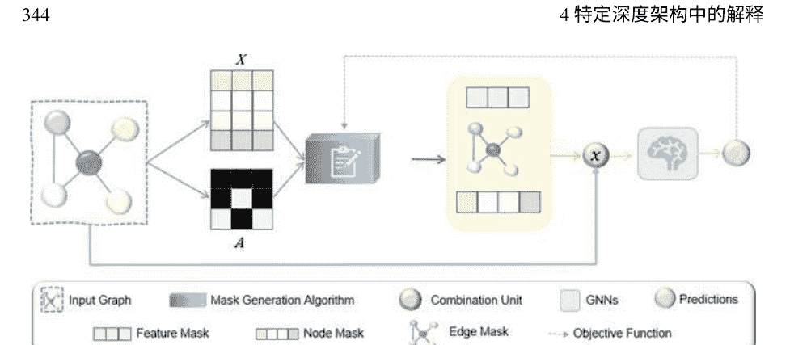

图4.23 实施基于扰动技术的标准流程。为了生成各种掩码，他们使用了各种算法。掩码可以表示节点、边，甚至是节点的属性。这里演示了三种类型的掩码（黄色框）：用于节点特征的软掩码，用于边的离散掩码，以及用于节点的估计离散掩码。然后，将掩码与输入图（橙色节点）结合起来，以捕捉重要的输入信息。

最后，经过训练的GNN确定新的预测（绿色）是否与原始预测相当，并提供改进掩码生成算法的建议。图源自（Yuan et al. 2021），获得许可

（Louizos et al. 2017）用于近似离散掩码。请记住，输出的掩码不是离散的，而是给出了一个相当不错的近似值，这不仅允许反向传播，而且显著减少了引入证据问题的影响。

##### 分解方法

分解方法通过将原始模型的预测分解为多个项来量化输入特征的重要性，这是解释GNNs的另一种受欢迎的方法。然后，这些值被用作相关输入特征的权重。这些策略深入研究模型参数，揭示输入空间属性与预测结果之间的联系。分解项的总和必须等于原始预测分数，这是这些方法保守性的必要条件。由于图具有节点、边和节点属性，直接将这些方法应用于图领域是困难的。在图中为边分配权重并不容易，但这是必要的，因为边提供了关键的结构信息。近年来提出了许多分解方法来解释深度图神经网络（DGNNs）。这些方法包括层次相关传播（LRP）（Bal-dassarre和Azizpour 2019; Schwarzenb erg等2019年），激励BP（Pope等2019年）和GNN-LRP（Schnake等2020年）。为了均匀分布预测分数在输入空间中，这些算法应该使用分数分解规则作为基础。使用这些技术，预测分数从输出层通过网络向后传播到输入层。模型的预测被用作第一个目标分数，从输出层开始。然后，使用预先确定的分解标准，将分数分配给前一层的神经元。可以通过表示边的重要性、节点的重要性和路径的重要性来将多次迭代的结果组合起来，直到输入空间。特别是深度图模型使用的激活函数被所有这些技术忽略。评分分解规则和解释目标是这些方法的分歧点。

##### 替代方法

由于输入空间与其提供的预测之间的复杂且非线性连接，GNNs难以解释。替代方法常用于解释图像模型在实例级别的工作原理。基本概念是使用一个简单且易于解释的替代模型来近似复杂深度模型对输入样本周围区域的预测。请记住，这些技术假设输入示例的附近区域具有更简单的连接，可以成功地由一个简单的替代模型表示。在这种情况下，可解释的替代模型的证明被用来支持初始预测。

图形数据是离散的，并且包含拓扑信息，这使得在图形领域应用替代方法变得困难。其次，如何表征输入网络的相邻部分以及可解释的替代模型是否合适还不清楚。GraphLime（Huang等，2022年），RelEx（Zhang等，2021年）和PGM-Explainer（Vu和Thai，2020年）是最近提出的解释GNN的替代方法的几个例子。对于每个给定的输入图形，它们首先收集一个包括图形的直接邻域中的所有项以及对这些对象的预测的本地数据集。为了学习本地数据集，它们拟合一个可解释的模型。最后，假设原始模型对输入图形的解释是可解释模型提供的解释。尽管这两种方法在概念上相似，但它们主要有两个方面的区别：

1.  如何获取本地数据集。
2.  使用的替代模型。

#### 4.4.2.2 模型级解释

与实例级方法相比，模型级方法通过提供广泛的、总体的理解和概括（表4.10）来解释深度图模型。更准确地说，它们研究可能导致给定GNN行为的输入图的模式，例如目标预测的最大化。

为了为图像分类器生成模型级解释，输入优化（Olah等人，2017）是一条经过验证的途径。因此，当直接应用于图模型时，为GNN提供模型级解释更加困难，因为图拓扑信息的不连续性。因此，它仍然至关重要，但却受到了极少关注。XGNN（Yuan等人，2020）是目前唯一已知的为GNN提供解释的模型级机制。

### 4.4.3 解释的评估指标

为了有效比较各种方法，需要一个可靠的评估指标。热图是一种解释可视化的类型，在解释视觉和文本数据方面得到了广泛应用，因为它们具有直观性。然而，由于图形数据难以理解，这种好处被削弱了。只有那些精通领域的人才能对此发表意见。

这意味着评估指标对于解释策略的研究是基础性的。考虑到提供的解释是否与模型一致，这些都是良好的评估指标的例子（Jacovi和Goldberg 2020; Wieg reffe和Pinter 2019）。介绍了用于评估解释各个要素的几种常用指标，并简要介绍了在开发和解释GNNs时经常使用的基准数据集。

- **准确率**：准确率通常适用于基准数据集。合成数据集包含由其规则定义的基本事实。尽管不确定GNNs是否在合成数据集中产生预测，但可以将创建它们的原则（如网络模式）用作基本事实的近似。任何输入图的解释都可以与这些基本事实进行比较。常见的准确度测量包括F1分数和ROC-AUC。然而，准确度测量有一个限制，即GNN模型是否以与人类相同的方式进行预测，即预定义的基本事实是否真实有效。

- **忠诚度**：2019年，Pope等人（2019）认同直觉，即通过省略最关键的特征来削弱模型是适得其反的。什么是忠诚度在公式4.4中正式定义为：

忠诚度 = \frac{1}{N} \sum_{i=1}^{N} (f(G_i)_{y_i} - f(\frac{G_i}{G_i^e})_{y_i}) (4.4)

其中，f(.)是输出函数的目标模型，G_i是第i个图，G_i^e是其解释，G_i / G_i^e表示去除了已识别解释的扰动第i个图。

最近，提出了Fidelity+指标。如果关键输入特征（节点、边和节点特征）确实具有区分性，那么模型的预测应该在这些特征被消除时发生显著变化。因此，Fidelity+是原始预测与移除重要输入特征后的新预测之间的准确性差异（或预测概率差异）。

从形式上讲，我们可以将第i个输入图形称为G_i。使用公式y_i =arg max f(G_i)，我们可以预测具有互补掩码e = 1 - m_i的图形（G_i）的结果。然后，它的解释可以被视为一个硬重要性映射，其中每个元素要么是0，要么是1，表示相关属性是否是必要的。需要注意的是，像ZORRO和因果筛选这样的方法给出的解释是离散的掩码，可以作为重要性映射使用，无需进行额外处理。由于GNNExplainer和GraphLime中的重要性分数是连续值，可以通过归一化和阈值处理生成重要性映射 m_i。最后，预测的准确性可以用一个叫做Fidelity+的数字来量化（Yuan等人，2022年）。

```
$$ 准确率+精度 = \frac{1}{N} \sum_{i=1}^{N} \left( \mathbb{1}(y_i = y_i) - \mathbb{1}(y_i^{1-m_i} = y_i) \right) $$
```

其中 y_i是原始图形的预测结果，N是图形的数量。在这种情况下，1 - m_i是去除重要输入特征的补充掩码，而y_i^{1-m_i}是当新图形输入经过训练的GNN f(.)时的预测结果。如果 y_i和y_i相等，则指示函数 \mathbb{1}(y_i = y_i)返回1；否则返回0。请注意，准确率+精度指标考察了预测准确性的变化。概率的准确率+可以通过关注预测概率来定义。类似地，准确率-精度研究了在保留重要特征的同时去除不相关特征的预测变化。

- **对比性**：Pope等人（2019）还计算了汉明距离来比较两个解释。这两个解释对应于模型对每个类别的单个实例的预测。在为不同类别进行预测时，假设模型将突出显示不同的特征。对比性越高，解释器的性能越好。

- **稀疏性**：接下来，Pope等人（2019）将解释图的大小与输入图的大小进行了比较。通常情况下，最好保持解释简洁，这样可以帮助集中注意力在最重要的部分，并排除无关的部分。稀疏度量是一种评估这种质量的指标。特别地，它量化了解释方法优先考虑的特征的百分比。该度量可以通过使用图 G_i及其硬显著性映射 m_i来正式计算，如公式4.6所示。稀疏度 = \frac{1}{N} \sum_{i=1}^{N} \left( 1 - \frac{|m_i|}{|M_i|} \right)。在这种情况下，重要输入特征（节点、边和节点特征）的数量用 |m_i|表示，G_i中的总特征数量用 |M_i|表示。请注意，较高的数字意味着解释更加稀疏，可能只捕捉到最重要的输入信息。

- **稳定性**：2020年，Sanchez-Lengeling等人（2021年）研究了解释器在引入噪声之前和之后的性能差距。这篇文章暗示了一个扎实的解释不应对输入的变化敏感，这即使输入稍微改变，模型的预测也不会改变。在我们的思维中，如果对输入进行微小调整而不改变预测结果，解释应该保持不变。当前建议的稳定性度量评估解释方法的稳定性。给定一个输入图 $G_i$，它的解释 $m_i$ 被认为是基本事实。然后，通过在原始输入图 $G_i$ 上添加额外的节点和边来略微修改它，得到一个新的图 $G_{io}$。注意 $G_i$ 和 $G_{io}$ 需要具有相同的预测结果。然后获取 $G_{io}$ 的解释，表示为 $m_{io}$。通过测量 $m_i$ 和 $m_{io}$ 之间的差异，我们可以计算稳定性分数。请记住，可靠且抗噪声的解释具有较低的值。此外，由于图形表示很敏感，确定足够数量的扰动可能很困难。

最后，为了结束本节，表4.11呈现了流行的开源库的摘要，其中包括常用的数据集和用于构建和解释GNN的算法。

| 工具 | 备注 |
| :--- | :--- |
| CSI：协作语义推理（Gehrmann等人，2019年） | 通过协同语义推理与深度学习模型的视觉交互。用户可以理解和控制模型推理过程的部分。例如，在文本摘要系统中，用户可以与机器协同撰写摘要 |
| 流形（Zhang等，2018） | 一种模型无关的解释和诊断机器学习模型的框架，使用检查（假设）、解释（推理）和改进（验证） |
| Activis（Kahng等，2017） | 对工业规模的深度神经网络模型进行可视化探索，比较不同数据实例（即示例）的激活情况，以调查误分类的潜在原因 |
| DQNViz（Wang等，2018） | 一种用于理解深度Q网络的视觉分析方法。提取有助于解释模型和控制训练的有用动作/奖励模式 |
| Block（Bilal等，2017） | 卷积神经网络是否学习类层次结构？包括一个类层次结构和仅显示错误分类样本的混淆矩阵，带有选定类别的波段在两个维度上表示和一个样本查看器 |

### 4.4.4 图上的分离表示学习

由于表示空间缺乏透明度，传统的表示学习在可解释性方面存在严重限制。与手动设计的特征不同，其中每个维度的含义是事先已知的，表示空间的每个维度的含义是未知的。这个约束影响了所有形式的表示学习，包括图形的可解释性。已经提出了几种方法来增强图形表示学习的可解释性，通过允许对各种表示维度进行实际含义的分配。

解释性图表揭示了CNN中包含的语义知识。通过将解释性图表中的每个节点分配给不同的组件，可以解开卷积层特征图中包含的复杂部分模式，以及过滤器级别上的模式。更详细地说：

1.  解释性图包含多个层次的解释。图中的每个“层”表示CNN中的一个“卷积层”。
2.  解释性图中的每个节点均统一表示相同的组件，以多种方式展示。该节点可用于定位所提供图片中的匹配特征。该节点可以承受一定程度的形状扭曲和姿势变化而不会破裂。
3.  在网络中，不同层级中的两个节点之间的共同激活和空间相互作用通过边来编码。
4.  解释性图可以被视为卷积层特征图的紧凑表示。每个卷积层可能包含数百个单独的滤波器，每个滤波器可能生成包含数百个单独神经单元的特征图。为了表达这些特征图中数千万个神经单元所包含的信息，或者换句话说，表达特征图被激活的模式以及这些模式在输入图片中的位置，我们可以在解释性图中使用数万个节点。
5.  每个输入图像只能触发解释图中的一部分组件模式（节点），就像字典一样。图中的每个节点表示训练集中多个图像中反复出现的常见组件模式。

> 好好思考一下
>
> 每个节点是否只需要一个向量嵌入就足够了？
>
> 对于图中的每个节点学习一个单一的嵌入是目前几种可用的图表示学习算法的目标。然而，如果一些节点具有多个方面，仅用一个向量来表示每个节点是否足够？解决这个问题对于诸如推荐系统等应用具有重要的实际好处，其中用户可能具有广泛的兴趣。

因此，每个用户可以由一组嵌入来表示，其中每个嵌入表示不同的兴趣。

学习解缠表示有两个困难：确定K个方面和在训练阶段区分不同嵌入的更新。无监督的方面可以通过聚类来识别，其中每个聚类表示一个方面。我们将介绍在图上学习解缠节点嵌入的多种方法。

#### 4.4.4.1 基于原型的软聚类分配

在推荐系统设计的背景下讨论了这种方法。发现了反映用户和项目嵌入的特征。

在这种情况下，我们假设每个对象只有一个特征，尽管每个用户可能有多个特征。

对于给定的项目 t，其嵌入由 h^t 表示，而对于任何给定的用户 u，它由 h^u = [h^{u,1}, h^{u,2}, ..., h^{u,K}] 表示。如果对象 t 属于某个特征 k，则其关联的独热向量 c^t = [c_{t,1}, c_{t,2}, ..., c_{t,K}] 的值为 c_{t,k} = 1，如果 t 属于特征 k，否则 c_{t,k} = 0。除了学习节点嵌入之外，我们还必须学习一组原型嵌入，表示为 {m^k}_{k=1}^K。方程式4.7说明了我们如何从相应的类别分布中选择独热向量（Wu等人，2022年）。

```
$$ c_t \sim \text{分类} \quad (\softmax([s_{t,1}, s_{t,2}, , s_{t,K}])) $$

$$ s_{t,k} = \cos(h^t, m^k)/\tau \quad (4.7) $$
```

其中，余弦相似度由超参数 τ 缩放。然后，如果我们看一下在等式4.8中看到边 (u, t) 的概率，我们发现

```
$$ p(t|u, c_t) \propto \sum_{k=1}^K c_{t,k} \cdot \text{相似度} (h^t, h^{u,k}) \quad (4.8) $$
```

具体来说，项目嵌入和原型嵌入同时更新，直到收敛，除了上述基本学习过程。每个用户的嵌入 h^u 通过添加该用户与之交互的所有对象的嵌入来计算；更具体地说，h^{u,k} 获取属于 k 方面的所有对象的嵌入。在学习过程中，同时进行聚类发现、节点-聚类分配和嵌入学习。


图4.24 用户偏好由一组嵌入特征表示。嵌入的每个部分代表数据的不同特征。图源自（Li等人，2019），经许可使用。

#### 4.4.4.2 基于动态路由的聚类

胶囊网络（Sabour等人，2017）启发了使用动态路由来学习解耦的节点表示的概念。可以区分低级胶囊和高级胶囊。用户与之交互的对象被称为 V_u。每个胶囊是一个具有交互的项目的嵌入，低级胶囊集表示为 c_i^l，其中 i ∈ V_u。高级胶囊由集合 {c_k^h}, 1 ≤ k ≤ K表示，其中 c_k^h是用户的第k个兴趣。

为了收敛，路由过程通常需要执行多次。如图4.24所示，一旦路由过程完成，高级胶囊可以用来表示具有多个兴趣的用户u，然后可以将其输入到未来的网络模块进行推理（Li等，2019年）。

### 4.4.5 未来方向

使用GNN进行解释的领域仍在发展中。然而，有无数的困难需要解决。本节的目标是提供未来研究的路线图，以改进GNN的可解释性。

1.  一些在线应用需要能够立即响应的模型和算法。通过这种方式，它提出了解释策略有效性的严格标准。然而，许多GNN解释方法要么需要广泛的采样，要么需要极其迭代的算法才能得到有意义的答案。为此，如何制定快速准确的解释算法是未来研究的一个有希望的领域。
2.  尽管越来越多的文献中提到了如何使用解释来发现GNN模型的故障并改进模型属性，但很少提到。尽管已经创建了越来越多的方法来做到这一点，但问题是对GNN模型是否会有重大影响的对抗性或后门攻击。有没有办法通过解释来帮助我们解决这些问题？一旦GNN模型被证明不可靠或有偏见，它们能够得到多大程度的改进？
3.  除了注意力方法和解耦表示学习之外，可能还有其他建模或训练范式能够进一步提高GNN的可解释性吗？在可解释的机器学习领域，一些研究人员倾向于提供变量之间的因果关系，而其他人则更喜欢使用逻辑规则来推断含义。探索将逻辑思维纳入GNN推理的方式，或将因果关系引入GNN学习，可能是一个有成果的研究方向。
4.  现有的可解释机器学习工作主要集中在提高解释准确性，而往往忽视了人类体验。当系统设计考虑到用户的需求时，更容易赢得用户的信任并改善整体用户体验。通过简单的界面引入领域专家，是加快迭代改进系统的好方法。因此，人机交互（HCI）以更用户友好的方式呈现解释，或构建改进的人机界面以允许用户与模型进行交互，可能是另一条值得探索的研究方向。

## 4.5 自解释模型

出色的模型是唯一适合的模型。可解释模型的主要问题是，每种学习技术在表示和推理问题的领域知识时都有自己的局限性。

根据Freitas（2014）的说法，所有这些因素都会影响可读性。决策树是由一系列 if-then 语句组成的逻辑结构。这种方法在可解释性方面不易扩展。随着问题的复杂性增加，一个不断增长的树变得越来越难以理解。对于其他基于规则的系统，提供类似于决策树的解释也是如此。线性模型（如SVM）由于其开放性而更易解释，其中向量可以用于解释对新挑战的判断。这与决策树存在相同的问题：随着添加更多维度（特征），将预测转化为解释变得越来越困难。同样地，k最近邻（k-NN）可以根据使用的相似度度量在任何尺度上解释。然而，当维度增加时（参见第2.3.1.1节），这变得不切实际，因为我们可能会忽视整体而只看到局部。

### 4.5.1 基于案例的推理通过原型

以前的神经网络设计通常只关注准确性，而后期的可解释性分析。在这种情况下，网络架构首先被选择，然后人们努力理解模型的训练或其在高层次上学到的特征。这些可解释性研究应该被视为一个独立的建模工作。

解释本身可能会因用于生成它们的模型而发生变化，这在尝试事后生成解释时是一个问题。例如，对于网络如何对给定对象进行分类，可能很容易提出各种合理但不正确的解释。相关问题是，事后解释产生的解释通常对人们来说是难以理解的。因此，需要进一步的建模来确保解释能够被理解。例如，在激活最大化（AM）方法中，目标是发现一个输入模式，该模式对于用户定义的感兴趣的数目产生最大的响应（Erhan等人，2009年）。正则化优化被用于发现AM的可解释性高激活图像（Hinton等人，2012年；Lee等人，2009年；Van Oord等人，2016年；Nguyen等人，2016年），因为AM图像通常不可读，它们往往只是呈现为灰色。

> 好好思考一下
>
> 当我们将网络计算的结果与外部正则化相结合时，我们得到的结果被称为正则化估计。毕竟，事后解释似乎很难相信它是由不同的模型方法生成的，这些方法使用了训练过程中不存在的强先验知识。

事实上，有越来越多的研究在解决AM中上述问题，比如Montavon等人（2018）对图像的解释，这涉及到对NN层结构进行视觉上的检查。与开发预训练的黑盒模型的解释（我们也将探讨）不同，开发能够编码自己解释的架构更符合原型分类和CBR等研究。在这里，已经开发了一种新颖的DL网络设计，可以直观地解释其预测过程。在这个设计中包括了AE和一个特殊的原型层（图4.25）；后者的每个单元都持有一个类似于编码训练输入的权重向量。

通过AE的编码器，可以在潜在空间中进行比较，通过其解码器可以可视化学习到的原型。请注意，原型是与训练集中的观察值在很大程度上相似，如果不是完全匹配的示例。

与以前的ML原型分类方法（Bien和Tibshi-rani 2011；Kim等人2014；Marchette等人2003）类似，CBR的工作与现有文献很好地契合。尽管原型分类是一个经典的例子

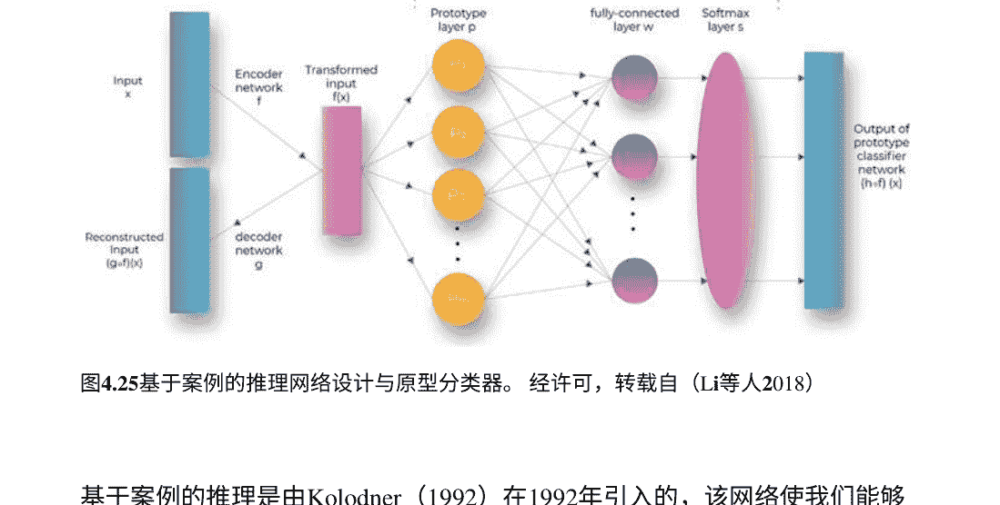

图4.25基于案例的推理网络设计与原型分类器。经许可，转载自（Li等人2018）

基于案例的推理是由Kolodner（1992）在1992年引入的，该网络使我们能够在更通用的潜在空间中评估原型和观察值之间的距离。潜在空间的卓越效率源于其适应性。在网络中，观察结果根据与数据集中原型观察结果的相似程度被分配到不同的类别中。通过手写数字的例子，我们可以从图4.26中了解到，一个特定的观察结果被标记为‘3’是因为网络认为它与训练集中的典型‘3’相似。同样，如果网络被要求对一个‘9’的图像进行分类，合理地假设它也会识别出来自‘4’和‘9’类别的原型，因为前者通常很难与后者区分开来。在图中，每个原型节点由矩阵中的一行表示，MNIST数据集中的每个数字类别由一列表示。颜色较深的区域表示具有最不利权重的类别。每个原型的负权重是它的视觉类别，除了与数字‘7’相关的矩阵行连接到表示数字‘2’的权重矩阵。

### 4.5.2 ProtoNets

由Snell等人（2017）引入，它采用许多嵌入的“支持”样本的平均值作为每个类别的原型。零样本学习的原型是特征空间中的点，Li和Wang（2017）的生成概率模型用于创建它们。每个类别只允许有一个原型，在这两种情况下，原型不需要可解释性（因此，它们的表示通常不会类似于自然图像）。

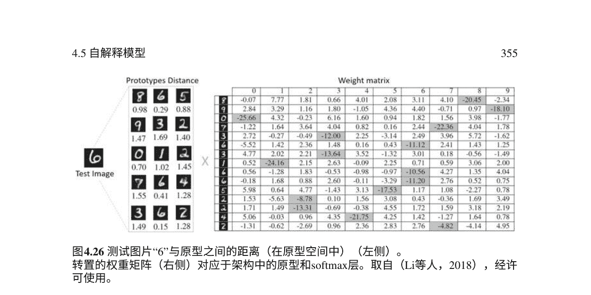

图4.26 测试图片“6”与原型之间的距离（在原型空间中）（左侧）。转置的权重矩阵（右侧）对应于架构中的原型和softmax层。取自（Li等人，2018），经许可使用。

### 4.5.3 概念漂白

制作可解释的图像分类器的另一种方法是我们称之为概念漂白（CW）（Chen等人，2020）。要实现CW，将归一化层（例如批归一化层）替换为CW层。这使得CW成为希望使其预训练的图像分类器更具解释性而不牺牲模型性能的用户的强大工具。CW广泛借鉴了漂白变换的工作。因此，对于想要了解更多关于CW的人来说，熟悉漂白变换的数学知识是很有帮助的。

> 在CW中，一个自动编码器生成了一个潜在的低维空间，并在这里计算到原型的距离。为了在像素空间中找到比L2更合适的不相似度度量，我们可以使用潜在空间进行距离计算。

### 4.5.4 自解释神经网络

自解释神经网络（SENNs）是由Alvarez-Melis等人于2018年开发的，它们的目的是提供一个简单和局部可解释的模型。这是通过采用正则化方法来通过稀疏正则化来强制实现多样性，通过原型提供概念解释，并确保模型在局部上表现为线性模型来实现的。图4.27给出了设计的概述。

SENNs有三个部分：## 4.6 可解释性方法的陷阱

Rudin（2018）认为试图描述一个黑盒系统是徒劳的。通过更透明或可解释的模型诱导网络行为被批评为对原始系统设计的不忠实。由于在使用黑盒作为预测模型和训练透明模型作为解释器时无法实现对原始模型的绝对忠实，系统的忠实度可能会降低。

批评的主要观点是不应该使用难以理解的模型，而以牺牲可解释性为代价来提高准确性的假设是错误的（Gosiewska等人，2021年），尽管在可解释性人工智能领域中普遍存在。复杂模型并非必需以获得高准确性，但相对于可解释模型而言，它们更加简单易用，因为它们比可解释模型更加进化。

2018年，Alvarez-Melis等人（2018年）将鲁棒性度量应用于可解释性方法（如LIME、SHAP等），其中鲁棒性是指输入相对于所提供的解释（归因）的方差度量，相同的输入-输出对应应该产生类似的解释。实验证明，与基于模型无关的扰动解释性方法相比，基于梯度的解释性方法更容易不稳定。然而，这两种技术在大部分情况下在鲁棒性度量上表现不佳。根据Alvarez-Melis的观点，可解释性技术面临与底层模型相同的命运，因为它不具备弹性。然而，目前尚不清楚鲁棒性是否是必要的特性，因为它只考虑了解释的敏感性。这些基于梯度的方法也可能容易受到对抗性攻击的影响，正如Ghorbani等人（2019年）所示，输入的微小随机扰动可以改变特征的重要性，从而导致截然不同的解释而不改变预测结果。

Yeh等人（2019年）开发了敏感性的度量。敏感性描述了解释在不同信息下的变化。结果表明，解释技术越不敏感，解释越真实。Yeh等人还展示了如何利用对抗训练来提高黑盒模型对这一属性的敏感性。

图4.28 一张贴纸使得在ImageNet上训练的VGG16分类器将一张香蕉的图像分类为烤面包机。图由（Brown等人，2017年）获得许可后再制作

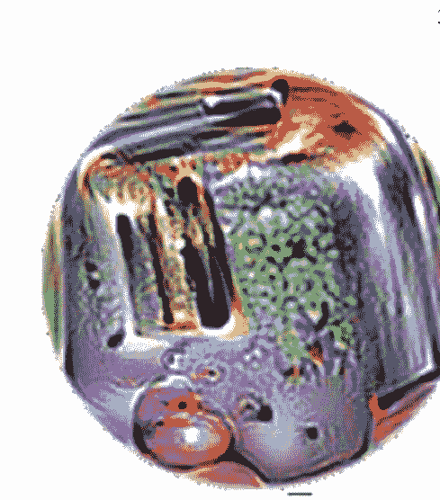

> 突出显示

我们首选的技术之一实际上在现实世界中存在反例。在训练图像分类器时，Brown等人（2017年）创建了一个印刷标签（见图4.28），将其粘贴在物体上，使其看起来像一个烤面包机。与先前的对抗性示例方法相比，这种方法不要求对抗性图像与原始图像非常相似。相反，它完全用一个可以是任意形状的补丁替换图像的那一部分。为了使补丁在各种背景图像中有用，其外观在各种背景图像上进行了优化，补丁偶尔会被重新定位、放大或旋转。最后，这个改进后的图像可以被打印出来，并用于欺骗野外的图像分类器。

理解DNN选择和过程的方法通常侧重于通过突出特定示例的感官或语义元素来培养直觉。

例如，一些方法试图展示对网络决策“至关重要”的输入组件，或者量化特定神经元的语义特性。在他们2020年的论文中，Leavitt和Morcos（2020）声称，可解释性研究过于依赖基于直觉的技术，这可能导致虚假的进展和错误的发现。他们概述了一系列限制，我们认为这些限制阻碍了可解释性研究的重要进展。他们敦促研究人员从他们的直觉出发设计和测试明确、可证伪的假设，我们相信这本书提供了基于强有力证据的可解释性方法，将会产生更有影响力的DNN研究和应用。

#### 突出显示

我们强调我们并不提倡完全放弃直觉；直觉对于发展理解是必要的，并且直觉方法总是优于不直觉的方法。相反，我们认为未经证实的直觉和可解释性研究的其他部分可能会导致误解。因此，本研究的目的是减少错误的努力，更好地实现有效思想的潜力，并通过采用科学严谨的方法促进更有意义的研究。

然而，可视化的普遍性和吸引力可能会阻碍对可解释性进行严格研究的努力。许多可解释性方法提供丰富而引人入胜的可视化效果（Alexander Mordvintsev和Tyka 2015a，b；Gatys等人2015年，2016年；Olah等人2017年，2018年，2020年；Zeiler和Fergus 2014年），这对于建立理解至关重要（Tufte 1983年；Victor 2014年）。然而，能够可视化某些东西既是一种福音，也是一种诅咒；即使它不是试图解释的现象的准确描述，图形可能非常有效地传达意义。这凸显了在可解释性领域中准确可视化的必要性，因为未经测试的直觉可能会误导人。

#### 好好思考一下

#### 可解释性的幻觉！！

特征可视化可能会让我们产生一种错觉，认为我们理解了神经网络在做什么。但是，我们真正理解神经网络中发生的事情吗？尽管检查了数百甚至数千个特征可视化，我们仍然无法理解神经网络。多个神经元可能学习相同或相似的特征，并且由于通道之间的复杂相互作用，许多特征可能没有对应的人类概念。

我们不能陷入这样的陷阱，认为我们完全理解了深度神经网络，仅仅因为我们注意到第14层的第264个神经元对老虎有反应。

### 4.6.1 案例研究：特征可视化和网络解剖

- 网络解剖证明了ResNet或Inception等设计包含对特定概念有反应的单元。然而，像IoU这样的指标是不足够的，因为一些单元对相同的概念有反应，而其他单元则完全没有反应。通道并没有完全解耦，我们无法将它们单独分析。
- 为了进行网络解剖，需要以数据集形式提供像素级概念标签。获取这些数据集需要大量的工作，因为每个像素都需要标记，通常是通过在图像上绘制分割线来完成。
- 网络解剖只能将人类概念与通道的正激活对齐，而不能与负激活对齐。负激活似乎与概念相关，如特征可视化所示（见第4.3.1节）。通过查看激活的最低分位数可以纠正这一点。

#### 可解释性的可视化工具是一把双刃剑

- 通过探索来获得最好的理解，可视化辅助工具如地图和图表非常宝贵。即使可视化不准确，如果能有效传达主题，观众仍然可能获得深刻的理解。
- 必须应对量化的缺乏和可视化表示的潜在缺陷。在深度学习中尤其如此，即使模型看起来相同，也可能因为一些超参数的不同而表现出截然不同的行为。没有适当的量化，可视化对于研究人员来说就像罗夏克测试一样不可靠。

- CAM是一种低维护、高产出的监督方法。它提供了模型正在寻找的最重要特征的良好概念，并且可以快速简单地实施。这是一种很好的方式，即使对于没有任何技术背景的人，也可以展示卷积神经网络的工作原理。
- 尽管CAM对于获取最突出的方面有用，但在提供更精细的洞察力方面有限。在文献中寻找许多例子，以验证激活热图在某些情况下可以从脖子延伸到脸部，或者从波斯猫延伸到碗中的金鱼。对于该群体来说，认为脖子而不是脸是一个有区别的特征更合理吗？尽管它提供了一些区分特征的见解，但无法捕捉在更深层次上发生的复杂语义关系。

### 4.6.2 梯度作为敏感性图

包括（Baehrens等人，2010年；Simonyan等人，2014年；Erhan等人，2009年）在内的几位作者已经提出了需要数学上可靠的方法来识别输入图像中的“关键”像素。实践中，似乎存在标签的敏感性图与标签存在的位置之间的关系（Baehrens等人，2010年；Simonyan等人，2014年）。

另一方面，使用原始梯度计算的敏感性图往往看起来杂乱无章。CAM和LRP的公式是根据启发式的基础给出的，如前面的章节中讨论的；这些公式假设模型最终会通过一定的权重和某些单元的激活强度之间的相互作用产生可解释的信息。中间步骤是不可观察的。

例如，调整单个权重的值不会立即显示出任何有意义的模式。

原始梯度可视化中的明显噪声可能有各种原因。地图上描述网络行为的真实描述是一种可能性。也许图像中分散的某些看似不相关的像素对网络的决策过程至关重要。已经尝试过显示图像中最强烈激活某个特征图的区域，但这还不能解释网络是如何得出结论的（Zeiler和Fergus，2014年）。

另外，原始梯度可能不是特征值的最佳指标。在提供更好的网络决策解释方面，一些先前的出版物提出了对梯度敏感性图的基本概念的改进。

与此同时，LRP解释性策略（Bach等人，2015年），DeepLift（Shrikumar等人，2017年）以及最近的Integrated Gradients（Sundararajan等人，2017年）都试图通过评估每个像素的全局重要性而不是局部敏感性来解决这个可能的问题。“显著性”或“像素归因”图是用这些方法制作的图的术语。修改或扩展反向传播算法是改进敏感性图的另一种策略，目的是给予好的输入更多的权重。DeconvNet（Zeiler和Fergus，2014年）和Guided Backprop（Springenberg等人，2014年）是两种通过在反向传播计算过程中忽略负值来改变ReLU函数梯度的方法。这种“反卷积”的目标是更好地揭示导致高级脑回路激活的具体元素。在类似的思路中，Selvaraju等人（2016年），Zhou等人（2016年）提出了将多个层级单元的梯度结合起来的方法。

敏感度图中的明显噪声可能是小的、局部变化的偏导数的结果，这些偏导数在整体上没有太大的意义。毕竟，在典型的训练方法下，没有理由预期导数的平滑变化。相关网络通常基于ReLU激活函数，因此大多数情况下类别S的梯度得分甚至不是连续可微的。

### 4.6.3 将图与输入图像相乘

一些算法通过将基于梯度的值与实际像素值相乘来生成最终的敏感度图，正如Shrikumar等人（2017）、Sundararajan等人（2017）所报道的那样。从视觉上看，这种乘法往往会提供更简单、更清晰的图像；然而，原始图像的改善有多少归功于图像清晰度的改善并不总是清楚的。

例如，如果输入包含黑/白边缘，但底层的敏感度图没有，输出显示仍然可能具有类似边缘的结构。但这样做可能会引发一些不愉快的后果。

像素值为0的像素永远不会显示在敏感度图上。例如，如果我们将黑色编码为0，那么在白色背景上正确预测黑色球的分类器将永远不会关注图像中的黑色球。然而，如果我们考虑特征对整体得分的贡献的重要性（y），那么将特征的梯度与输入照片相乘是有直观意义的。当 y = W x 时，考虑 x_i w_i 作为 x_i 对整体得分 y 的贡献是合乎逻辑的。

> > “就科学陈述涉及现实而言，它必须是可证伪的；而对于不可证伪的陈述，它并不涉及现实。”
> —卡尔·波普尔（2005）

### 4.6.4 迈向稳健的可解释性

Bansal等人（2014）、Lakkaraju等人（2017）和Zhang等人（2018）都为识别神经网络的缺陷和偏见做出了贡献。例如，Bansal等人（2014）提出了一种与模型无关的方法，用于确定神经网络不太可能进行预测的情况。模型不会发出警报，而是发出类似于“不要相信这些预测”的警告消息。他们通过为所有失败的图像添加一组二进制标签，然后在属性空间中将它们分组来实现这一点。因此，每个组代表着潜在的灾难源。Lakkaraju等人（2017）提出了两个基本假设，以有效地识别数据集中预测得分强的错误标记出现的情况：

- 第一个假设是每个不成功的案例都足够代表性和有信息性。
- 第二个假设认为高置信度的错误标记结果是由系统性偏差而不是随机变异引起的。

然后将图像聚类成不同的组，并通过将每个聚类视为选择在每个阶段查询和采样的赌博机的方式来开发了一种多臂赌博机搜索方法。张等人（2018）使用基于人类常识的属性之间的真实连接（火热与冰冷，电冷）来发现表示偏差。

> 好好思考一下

**注意力是否可解释？**

注意力是描述神经模型工作方式的重要方法。这里的假设是具有高注意力权重的输入（例如，单词）对模型输出负有责任。然而，注意力与其他基于良好基础的特征重要性度量没有很强的相关性。对于其他几乎产生相同预测分数的替代分布。注意力分数被用来提供解释，而不是直接提供解释。模型本身通过检测模型部分实现的注意力分数而退化。还必须训练一个可靠的对手（Wiegreffe和Pinter 2019; Serrano和Smith 2019; Jain和Wallace 2019）。

总之，为了验证该论断的稳健性，我们必须使用有效的假设来调查解释的可证伪性（Leavitt和Morcos 2020）。表格4.12展示了一个非常弱、弱、平均和强假设的例子，这改变了我们打开黑盒的方式。这些可以与两个IDL公理结合使用：

- 敏感性：第一个公理是模型必须具有敏感性。如果两个输入只在一个方面上有所不同，但产生不同的预测，那么该特征的非零显著性是必需的。由于ReLU可能导致梯度为零，尽管输入不同（例如，如果ReLU之前的激活小于0），传统的基于梯度的显著性违反了这个公理。
- 实现不变性：第二个公理指出，如果两个网络在功能上是相等的（对所有输入产生相同的输出），它们的显著性图应该是相同的。

Doran等人（2017）提出将可理解的模型与推理引擎配对，以实现完全的XAI。换句话说，易于理解的模型是指提供其输出的符号表示，以便用户可以轻松地在输入和输出特征之间建立联系。这表明需要包含一个不仅仅显示输出的黑盒子，在其中使用符号局部解释和知识库来阐明给定的预测。

基于案例的知识密集型推理器可能会满足这一角色，并提供反馈和解释定制。可理解的组件需要通过其他方式获得，但我们预计任何模型归纳技术，特别是局部解释，都足以作为第一步。

#### 表4.12 从（Leavitt和Morcos 2020）改编的假设检验示例

| 案例 | 备注 |
| --- | --- |
| **非常弱的假设**<br>DNN功能的基础是特征选择性神经元 | - 不可证伪<br>- “基础”一词含糊不清；你如何确定某物是否是“DNN功能的基础”？<br>- 没有比较基准的意义 |
| **弱假设**<br>如果特征选择性对于DNN功能至关重要，我们应该寻找具有特征选择性的神经元 | + 可证伪！如果没有特征选择性的神经元，则证明该假设是错误的<br>- 往往很难证明不存在任何东西。如果你只是没有在正确的地方寻找呢？<br>- 我们不知道按照机会的预期会发生多少个特征选择性神经元？<br>- 只因为有特征选择性的神经元并不意味着它们很重要 |
| **平均假设**<br>如果需要特征选择性来最大化测试准确性，则消除具有特征选择性的单个神经元应导致测试准确性下降 | + 可证伪<br>+ 解决因果关系问题<br>- “必要性”比“重要性”更具体，它导致了一个具体的实验来测试这个概念<br>- 没有讨论其他选择<br>- 没有讨论基准线。消除所有神经元可能会降低测试准确性。这符合假设吗？ |
| **强假设**<br>如果单个神经元的特征选择性对于最大化测试准确性是必要的，那么消融应该会导致准确性与神经元的特征选择性成比例地降低。或者，如果网络更依赖于神经元之间的特征选择性而不是单个神经元，那么将特征选择性方向（即表示曲线的单位的线性组合）的活动置零应该导致测试准确性的降低与特征选择性的强度成比例，并超过仅消融单个单位所导致的减少。 | + 可证伪<br>+ 提出具体的、可测试的预测<br>+ 提出了一些相反的假设<br>+ 它提供了一个用于比较的基准（单个单位 vs. 非轴对齐线性组合）<br>- 冗长 |

## 总结

尽管严肃的开发正在进行中，以扩展对序列数据和数值输入的可理解性，但处理具有空间相关性和变换不变性的图像/视频数据需要独特和创造性的观点。在本书中，我们调查了现有的可视化技术和数学建模，以开发DL模型的决策制定策略。然而，仍然需要深入研究开发规范和对具有自适应规则的图像像素进行操作。它将有助于提出一个端到端架构，为图像分类任务提供可解释的AI。在未来，我们希望开发一个可扩展的可解释模型，适用于广泛的情况。

由于现有可解释实践的不可扩展性，限制了应用范围，因此这是一个场景。
话虽如此，我们还需要明白，如果应用程序不认为有必要，我们不应该强行将可解释性应用于每种方法。

带走的信息是，根据实际应用AI的增加，可解释性是当务之急，因为模型中的某些偏见可能关系到生死。2018年，欧盟还引入了GDPR下的“解释权”。承认不清楚，这个权利赋予主体接收有意义的关于所涉及逻辑的信息。深度学习模型的可解释性的需求在于所谓的黑盒模型本身并不带有偏见。根源在于数据的偏见，对抗样本和人类观念，这使得验证模型的准确性变得重要。

我相信通过公平和透明度，由深度学习领域的可解释性推动，我们可以使世界变得更美好。

## 📚阅读列表

- 1. 请参阅王等人（2021年）的“计算机视觉中的生成对抗网络：概述与关键分析”，了解不同最先进的GAN架构和损失函数的进展情况。
- 2. 请参阅夏等人（2022年）的“GAN反演：一份调查报告”，其中包含GAN反演方法、数据集和相关信息的精选列表。
- 3. 金德曼斯等人（2019年）的“显著性方法的（不）可靠性”讨论了当两个网络以相同方式处理图像时，显著性方法在解释可靠性方面的失败。一个新的评估标准，输入不变性，要求显著性方法在输入变换时反映模型的敏感性。不改变网络预测的输入变换也不应改变归因。
- 4. “愚弄lime和shap：对事后解释方法的对抗攻击”由Slack等人（2020）提出了一种新颖的脚手架技术，通过允许对抗实体构建任意所需的解释，有效隐藏了任何给定分类器的偏见。
- 5. “NN的解释是脆弱的”由Ghorbani等人（2019）演示了如何生成产生感知上无法区分的输入的对抗扰动，这些输入被分配相同的预测标签，但具有非常不同的解释。

# 第5章
模糊深度学习


前几章讨论了基于清晰输入、权重、参数、训练样本和其他信息片段的NN的学习、性能和可解释性。演示了深度网络如何将信息传播到其层中。另一方面，任何使用深层架构的分类都会优化数百万个参数以得出结论。这使得DNNs具有更高级的抽象性，不透明。当前的研究方向强调了黑盒模型的可解释性和可解释性，以便在确定性下获得对其实际实施的信任。此外，在现实生活应用中，我们不一定会得到相同的输入和理想的决策能力。

本章通过使用模糊度量来检查模型的可解释性以及与模型的知识发现相对应的性能影响。在这里不可能介绍所有模糊可解释性应用，也与本书无关。核心重点是介绍将模糊逻辑与神经网络相结合的影响，提高预测准确性，并且最重要的是理解复杂神经网络模型的黑盒行为的可靠性。本章将将介绍模糊神经模型的学习技术以及各个领域的应用案例。最后，将提出一个受混合可解释性系统启发的模糊模型架构。这是为了为能够有能力解释现有技术提供一个更广泛的框架。

将模糊性引入神经网络会导致具有模糊信号、模糊权重、模糊规则、隶属函数和其他信息的网络，为处理模型在学习数据表示中的模糊和不精确性铺平了道路。然而，在撰写本书时，像ResNet中使用的高级深度学习架构并不适合融入模糊逻辑，作者们预计在阅读本书时，该领域已经取得了显著进展，读者们可以从基本概念到新系统之间的模糊逻辑连接起来。

## 5.1 模糊理论

现实世界的实验总是充满不确定性，建模敏感应用时必须考虑这一点。我们已经熟悉了作为概率论基础的一种模糊性。然而，概率论中的模糊性与某些事件或其结果的不确定性有关。

另一方面，模糊性与解释或解释特定明确的清晰实体的模糊或不确定性相关，通常是语言上的。

让我们考虑一个例子来更好地理解模糊概念。假设在2020年，某个品牌和型号的汽车售价为40,000美元。这是一个确定的信息，没有歧义，因此可以被视为一个清晰的数值。然而，对于潜在买家来说，一个相关的问题是这辆车是否在价格上被认为是预算、中档还是豪华（图5.1）。这个问题可能涉及到购买力和社会地位。对于这个问题的答案有些模糊，因为不能明确地说这辆车是否属于中档，以及一辆售价42,000美元的车是否属于豪华，仅仅因为它比另一辆车贵了2,000美元。在日常生活中，这种情况需要一个与概率理论的不确定性和名义值的清晰性不同的空间。

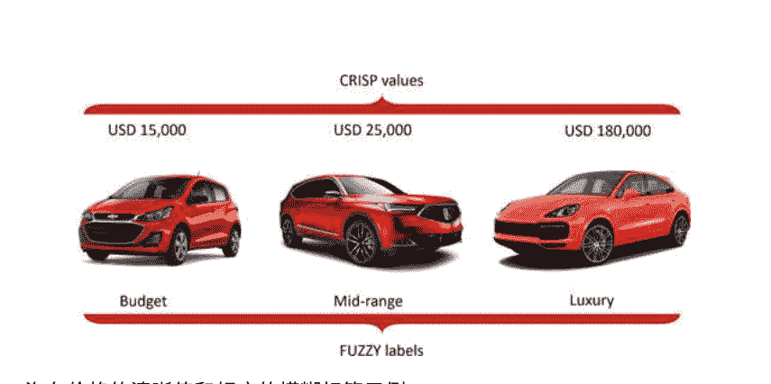

这样的空间是由Zadeh（1965）提出的，被称为模糊集。概率和模糊逻辑方法是多种形式的不确定性。虽然模糊推理和概率论都可以表达某些主观知识的程度，但模糊集理论使用模糊集成员资格的概念，即观察结果在模糊定义的集合中的程度。模糊集概念的形成导致了模糊逻辑的发展，它是使用模糊集处理模糊概念的数学框架。在下面的子章节中，我们介绍模糊逻辑的概念，这将为本章后续部分提供基础。

### 5.1.1 模糊集合和模糊成员关系

我们首先介绍了大多数人熟悉的清晰集合，然后转向模糊集合。清晰集合被定义为元素的集合，例如，
$$S = \{x | x \in N \text{ and } x > 5\}$$
它建立了一个普遍的话语宇宙。在这里，N是一组自然数，每个自然数要么是我们集合的一部分，要么不是。清晰集合也可以包括连续的域，但无论如何，以下基本规则适用。每个清晰集合在实体属于特定清晰集合或不属于特定清晰集合的意义上都有一个清晰的定义。
模糊集合类似，但更加广义。模糊集合的设计目的是回答以下问题：一个元素可以部分地属于集合吗？那么，那些非常接近清晰集合边界的值怎么办？当一个元素略微超出清晰集合边界时，我们如何考虑其成员资格，但人类推理表明它‘或多或少’属于该集合？
模糊集合的定义是通过成员函数（MF）的概念推导出来的，成员函数是一个函数，其值在区间 [0, 1]中，对于宇宙的所有值 x。MF用于检查一个元素是否是一个集合的成员。对于一个清晰集合 S，MF $\mu_S(x)$被定义为
$$\mu_S(x)=\begin{cases} \text{如果 } x \in S \ \text{则为1，否则为0} \end{cases}$$
模糊集是指其隶属函数可以取值在范围 [0, 1]内，而不仅仅是离散值0和1，如上所示。以这种方式，模糊集与确定性集合的不同之处在于元素在模糊集中的参与不是严格确定的，而可以是区间 [0, 1]内的实数值。
模糊集允许我们以数学方式定义不确定和主观的术语，如‘年轻’、‘许多’和‘少数’。我们可以确定我们论述的特定值作为该集合的部分参与或部分成员。
为了进一步澄清，考虑以下例子：假设我们将一个模糊集定义为一组所有“聪明”的学生。然后对于所有成绩在范围[0, 10]内的学生，我们可以定义一个学生的成绩，比如 $x$，具有一个隶属度值$\mu_{\text{聪明}}(x)$，表示成绩 $x$ 在聪明学生模糊集中的隶属度。因此，模糊集 $S$ 被定义为一个有序对，包括一个清晰值和其隶属度值，如下所示：

$$S = \{(x, \mu_S(x))\} \tag{5.1}$$

其中 $x$ 在论域中。

最常用的四个隶属度函数如下所示，图示于图5.2，并使用列表5.1.1。

三角形：它有三个定义点：低、中、高。低和高限制了隶属度函数并作为两个极值点。中间是一个任意值，在中间值两侧线性变化。数学上，这个隶属度函数由方程5.2定义。

$$
\mu_S(x) =
\begin{cases}
0 & ; x \le a \text{或者} x \ge c \\
\dfrac{x - a}{b - a} & ; a < x \le b \\
\dfrac{x - c}{b - c} & ; b < x < c
\end{cases}
\tag{5.2}
$$

梯形函数：它类似于三角函数，但在中间有一个平坦部分。因此，它具有四个限制：低、$m_1$、$m_2$和高。MF在$m_1$、$m_2$之间具有一个平坦的值。它在数学上由方程5.3定义。

高斯分布：与之前的MF相比，具有尖角的MF不可微分，而这个MF是一个没有严格限制的平滑函数。它通过使用方程5.4中的三个参数 $v$，$\sigma$和$\rho$来定义。这些参数分别表示使MF等于1的$x$的值，MF的扩展和模糊化因子。在实践中，有时候很难确定$\sigma$的值，但是当有好的方法来确定它时，这个MF更加自然。默认值为$\rho$是2。

$\mu_S(x, \rho) = \exp\left(-\frac{1}{2}\left(\frac{x - c}{\sigma}\right)^{\rho}\right)$  (5.4)

#### Sigmoid函数：

sigmoid函数作为神经网络中神经元的激活函数而为我们所熟知。然而，它也被用作MF。它的数学定义使用两个参数，斜率$s$和交叉点$c$，如下所示。

$\mu_S(x) = \frac{1}{1 + e^{-s(x - c)}}$  (5.5)

可以用来形成上述成员函数的示例代码如下所示。

```
#### 在Python环境中安装Scikit Fuzzy包
! pip install scikit - fuzzy

#### 导入库
import numpy as np
import skfuzzy as sk

#### 以线性递增的方式定义随机输入变量
np.random.seed(42)
x = np.cumsum(np.random.rand(0, high = 10, size = 10))

#### 模糊逻辑变量
low, m_1, mid, m2, high = 0, 2, 5, 7, 10
mean, sigma = np.mean(x), np.std(x)
s, c = 0.5, 0.5

#### 定义上述成员函数
Y_triangle = sk.trimf(x, [0, 0, 5])
Y_trapezoidal = sk.trapmf(x, [low, m_1, m_2, high])
Y_Gaussian = sk.gaussmf(x, mean, sigma)
Y_sigmoid = sk.sigmf(x, s, c)
```

第5.1节上述隶属函数的示例代码

#### ▶定义

- 模糊集合 A 和 B 的交集，即 C = A ∩ B，通过 C 的隶属函数来指定，使得 μ_C(x) = min(μ_A(x), μ_B(x))。
- 模糊集合 A 和 B 的并集，即 C = A ∪ B，通过 C 的隶属函数来指定，使得 μ_C(x) = max(μ_A(x), μ_B(x))。
- 如果对于所有的 x，两个模糊集合 A 和 B 被认为是相等的，即 μ_A(x) = μ_B(x)
- 一个与 A 相反的模糊集合 B，即 B = NOT(A)，被定义为 μ_B(x) = 1 - μ_A(x)。
- 两个模糊集合 A 和 B 的代数积，即 C = AḂ，被定义为 μ_C(x) = μ_A(x)μ_B(x)。
- 一个由两个模糊集合 A 和 B 的有界和 C = A + B 给出的模糊集合，其隶属函数为 μ C(x) =min(1, μ_A(x) + μ_B(x))。
- 同样，两个模糊集合的有界差 C = A - B 被定义为 μ_C(x) = max(0, μ_A(x) - μ_B(x))。
- 子集的概念定义如下。一个模糊集合 A 是另一个模糊集合 B 的子集，即 A ⊂ B 如果对于所有的 x，都有 μ_A(x) ≤ μ_B(x)。

传统的关联、交换和分配性质也适用于模糊集合。 模糊集合的其他数学运算包括集中和扩张，数学上通过 μ^α(x)计算，其中α>1 表示集中，α<1表示扩张。 它们分别表示在语言标签方面添加形容词·非常·和·稍微·。 然而，得到的模糊集合与原始模糊集合在没有任何偏移的情况下具有相同的极限，只是数学上的成员函数不同。

与模糊集相关的一些有用概念包括支持（μ_S(x)>0的x范围），核心（μ_S(x)=1的x范围），高度（在论域中取得的最高值的μ_A(x)），边界（0<μ_A(x)<1的x范围），正常模糊集（高度为1的模糊集），交叉点（μ_S(x)=0.5的x值），以及带宽（|x1-x2|，其中x1和x2是模糊集的交叉点）。 这些模糊集的属性在图5.3中有所说明。

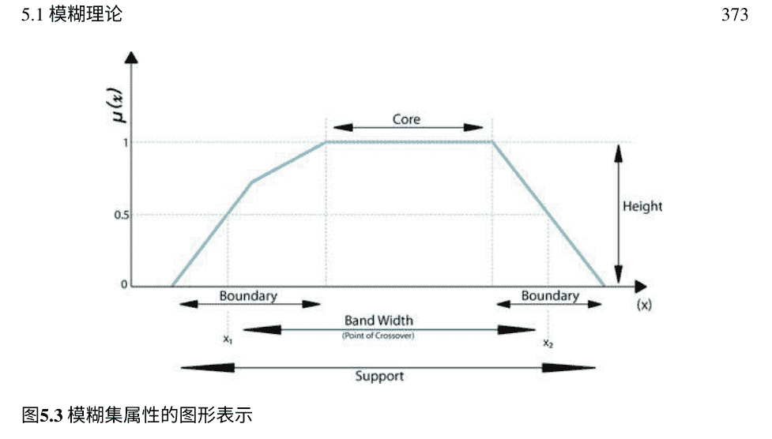

图5.3 模糊集属性的图形表示

### 5.1.2 模糊化和去模糊化

模糊化是为一个确定的值创建具有模糊或语言标签的变量的过程，而去模糊化是将模糊变量转换为确定值的过程。我们首先讨论单个模糊集的模糊化和去模糊化。之后，我们将考虑足够表示论域的一组模糊集的模糊化和去模糊化。

考虑一个模糊集合 $S= \{x, \mu_{S}(x)\}$ 在一个语境宇宙中定义，其中 $x$ 是一个模糊变量，其隶属函数为 $\mu_{S}(x)$。使用模糊集合 $S$ 对值 $x = x_{0}$ 进行模糊化计算 $\mu_{S}(x_{0})$。去模糊化是为模糊集合 $S$ 找到一个代表性的清晰值 $x'$。这可以通过各种技术来实现，其中最流行的技术在这里进行描述。

重心（CoG），也称为质心和面积的中心：在这种方法中，代表性的清晰值 $x'$ 被计算为

$$x' = \frac{\sum_{x}(x\mu_{S}(x))}{\sum_{x}(\mu_{S}(x))} \text{ 如果 } x \text{ 是一个离散变量并且}$$

$$x' = \frac{\int x\mu_{S}(x)dx}{\int \mu_{S}(x)dx} \text{ 如果 } x \text{ 是一个连续变量。}$$

基于λ剪切的技术：在这种去模糊化的方法中，通过使用 $\tilde{S}_{\lambda}$ 从模糊集合 $S$ 中得到一个清晰集合 $\tilde{S}_{\lambda} = \{x \mid \mu_{S}(x) \geq \lambda$ 其中 $0 \leq \lambda \leq 1\}$。然后使用诸如集合 $\tilde{S}_{\lambda}$ 中的最小清晰值或中位数、平均值或最大值等技术来确定清晰值。这种技术的推广包括通过包括 $\max \mu_{S}(x)$ 来计算清晰集合，如下所示： $\tilde{S}_{\lambda} = \{x \mid \mu_{S}(x) \geq \lambda \max \mu_{S}(x)\}$。

基于Maxima的技术：这些技术使用 $\lambda = 1$。它们比其他基于 $\lambda$-cut 的技术更受欢迎，其中 $\lambda = 1$。一些流行的例子包括 First of Maxima（最小值为 $S_{\lambda=1}$），Last of Maxima（最大值为 $S_{\lambda=1}$）和 Middle of Maxima（均值为 $S_{\lambda=1}$）。这种技术的推广包括通过以下方式计算包含 $\max \mu_{S}(x)$ 的清晰集合： $\tilde{S}_{\lambda} = \{x \mid \mu_{S}(x) = \max \mu_{S}(x)\}$。

#### 🔍例子

让我们考虑一个如图5.4所示的模糊标签集合。在这里，我们使用上述不同的技术计算这些标签的清晰值。我们展示了标签'cold'的过程，然后通过读者验证其他标签的去模糊化清晰值。我们首先需要成员函数的数学形式：

$$\mu_{\text{冷}}(x) = \begin{cases}
0 & ; x \leq 0 \text{ 或者 } x \geq 13 \\
\dfrac{x}{2} & ; 0 < x \leq 2 \\
1 & ; 2 < x \leq 11 \\
\dfrac{13 - x}{2} & ; 11 < x < 13
\end{cases}$$

CoG: 在这里，模糊变量 $x$，即温度，是一个连续变量。因此，CoG被给定为 $x' = \dfrac{\int x\mu_S(x)dx}{\int \mu_S(x)dx}$，我们使用积分形式。分子是：

$$\begin{aligned}
\int x\mu_{\text{冷}}(x) dx &= \int_0^2 \dfrac{x^2}{2} dx + \int_2^{11} x dx + \int_{11}^{13} \dfrac{x(13 - x)}{2} dx \\
&= \left. \dfrac{x^3}{6} \right|_0^2 + \left. \dfrac{x^2}{2} \right|_2^{11} + \left. \dfrac{13x^2}{4} \right|_{11}^{13} - \left. \dfrac{x^3}{6} \right|_{11}^{13} \\
&= \dfrac{8}{6} + \dfrac{121 - 4}{2} + \dfrac{13(169 - 121)}{4} - \dfrac{13^3 - 11^3}{6} = 71.5
\end{aligned}$$

同样地，分母可以通过上述方法或使用曲线下面积（AUC）计算，结果为11。因此，清晰值 $x' = 71.5/11 = 6.5$。

$\lambda-cut (\lambda=0.5)$: 对于标签‘cold’，清晰集合 $\tilde{S}_{0.5}= \{x | \mu_S(x) \geq 0.5\}$等于[1, 10]。根据使用均值或最大值的不同，表示‘cold’的清晰值为6.5或10。

基于Maxima: 对于标签‘cold’，模糊集合 $\tilde{S}_{1.0}= \{x | \mu_S(x) \geq 1.0\}$等于[2, 9]。根据使用均值还是最大值，表示‘cold’的模糊值为6.5或9。

下表显示了图5.4中所有隶属函数的模糊值。

| 标签  | CoG  | $\lambda-cut (\lambda=0.5)$ |          | 基于Maxima |          |
| ----- | ---- | -------------------------- | -------- | ---------- | -------- |
|       |      | 均值                       | 最大值   | 均值       | 最大值   |
| Cold  | 6.5  | 6.5                        | 10.0     | 6.5        | 9.0      |
| Cool  | 18.0 | 18.0                       | 23.0     | 18.0       | 21.0     |
| Cozy  | 24.0 | 24.0                       | 26.0     | 24.0       | 24.0     |
| Warm  | 30.0 | 30.0                       | 34.5     | 30.0       | 32.0     |
| Hot   | 39.5 | 39.5                       | 46.0     | 39.5       | 44.0     |

## 5.1 模糊理论

评估指标用于衡量模糊推理系统的模糊输出的有效性。三个常用的评估指标是平均绝对误差（MAE），平均相对误差（MRE）和均方根误差（RMSE）。这些指标的定义如下：

```
MAE = \frac{1}{n} \sum_{i=1}^{n} |y_i - \hat{y}_i|
MRE = \frac{1}{n} \sum_{i=1}^{n} \frac{|y_i - \hat{y}_i|}{y_i}
RMSE = \sqrt{\frac{1}{n} \sum_{i=1}^{n} (y_i - \hat{y}_i)^2}
```
(5.6)

其中，$y_i$ 和 $\hat{y}_i$ 分别是观察到的清晰值和预测的清晰值，而 $n$ 是所有预测值的数量。现在我们将看一下模糊化和去模糊化与一个清晰变量在一个论域中的相关性，该论域使用一组模糊集表示。假设有多个模糊集，每个模糊集都有一个语言标签，每个模糊集解释清晰变量的一个模糊属性。例如，汽车价格（清晰变量）可以用模糊标签'经济'、'中档'和'昂贵'来表示。让我们还假设这些标签足以表示论域。这并不意味着变量 $x$ 的每个值都是至少一个模糊标签的成员，其隶属度大于零。甚至成员函数之间也没有必要重叠。'足以表示论域'仅仅意味着语言标签足够多样化，以人类可解释的方式来表达成本。然而，一个好的模糊标签集合是指两个连续（或数学上相邻）标签的隶属函数重叠。一个好的模糊标签集合还包括至少一个模糊标签对于每个清晰变量具有非零的隶属函数值。此外，有时需要施加额外的数学条件。一个例子是对于任何清晰值 $x$，所有隶属函数值的总和为 1。

让我们有 $N$ 个模糊标签，充分代表模糊领域中的清晰变量并且让与它们相关的模糊集使用它们的隶属函数表示 $\mu_n(x)$, $n = 1$ 到 $N$。然后， $X= \{\mu_1(x), \mu_2(x), ..., \mu_N(x)\}$。$X$ 被称为包含 $N$ 个属性，每个属性对应一个模糊标签。从给定的清晰值 $x$ 和模糊集（以及它们的隶属函数）计算 $X$ 的过程被称为模糊化。继续以汽车成本为例，将成本（清晰值）表示为 $x$，相应的模糊变量表示为 $X$。此外，假设与标签'经济'、'中档'和'昂贵'相关的模糊集分别表示为 $A$、$B$ 和 $C$，并且它们对应的隶属函数分别为 $\mu_A(x)$、$\mu_B(x)$ 和 $\mu_C(x)$，其中 $x$ 表示汽车的价格。那么 $X= \{\mu_A(x), \mu_B(x), \mu_C(x)\}$。

去模糊化是计算一个清晰变量 $x$ 的值的过程，该变量在给定模糊标签和它们的隶属函数定义的宇宙上定义。最常见的方法是找到一个聚合的模糊集，该集合包含了论域中所有模糊标签，并在聚合的模糊集上应用所选择的去模糊化技术。聚合可以通过在论域中的所有模糊标签之间应用并、交、代数乘积或有界和等操作来执行。通常，在聚合之前，可以将隶属函数与相应的模糊隶属值相乘。也可以设计自定义的聚合技术。例如，考虑与模糊输入 $\bar{X} = \{\mu_1(\bar{x}), \mu_2(\bar{x}), ..., \mu_N(\bar{x})\}$ 相对应的加权并，其结果是变量 $x$ 的一个清晰值 $\bar{x}$，如下所示： $\mu_{\text{aggregate}}(x)= \bigcup_{n=1}^N \mu_n(\bar{x})\mu_n(x)$。

> 例子

#### 模糊化和去模糊化的示例

让我们考虑一组清晰的数据和一组模糊标签，并对它们进行模糊化和去模糊化。然后，我们计算实际清晰值与去模糊化后的清晰值之间的相似性。清晰变量是房间的温度，模糊标签是'冷'、'凉爽'、'舒适'、'温暖'和'炎热'。它们的隶属函数如图 5.4 所示。

| 清晰值 | 冷 | 凉爽 | 舒适 | 温暖 | 炎热 | 最大值平均法 | 加权平均 |
| :---: | :---: | :---: | :---: | :---: | :---: | :---: | :---: |
| 5 | 1.00 | 0.00 | 0.00 | 0.00 | 0.00 | 6.5 | 6.5 |
| 12 | 0.50 | 0.25 | 0.00 | 0.00 | 0.00 | 6.5 | 10.33 |
| 21 | 0.00 | 1.00 | 0.25 | 0.00 | 0.00 | 18.0 | 19.2 |
| 22 | 0.00 | 0.75 | 0.50 | 0.00 | 0.00 | 18.0 | 20.4 |
| 23 | 0.00 | 0.50 | 0.75 | 0.00 | 0.00 | 24.0 | 21.6 |
| 24 | 0.00 | 0.25 | 1.00 | 0.20 | 0.00 | 24.0 | 23.79 |
| 26 | 0.00 | 0.00 | 0.50 | 0.60 | 0.00 | 30.0 | 27.27 |
| 27 | 0.00 | 0.00 | 0.25 | 0.80 | 0.00 | 30.0 | 28.57 |
| 32 | 0.00 | 0.00 | 0.00 | 1.00 | 0.25 | 30.0 | 31.9 |
| 33 | 0.00 | 0.00 | 0.00 | 0.80 | 0.50 | 30.0 | 33.65 |
| 34 | 0.00 | 0.00 | 0.00 | 0.60 | 0.75 | 39.5 | 35.28 |
| 35 | 0.00 | 0.00 | 0.00 | 0.40 | 1.00 | 39.5 | 36.79 |
| 平均绝对误差 (MAE) | | | | | | 3.08 | 1.24 |
| 平均相对误差 (MRE) | | | | | | 0.15 | 0.07 |
| 均方根误差 (RMSE) | | | | | | 3.50 | 1.36 |

为了去模糊化的目的，考虑上述示例中提到的最后一种聚合技术。所有数据点的聚合模糊隶属函数如图 5.5 所示。然后使用广义最大值法和清晰集的平均值来计算清晰值。

让我们也考虑另一种称为加权平均的去模糊化方法，它与 CoG 稍有不同，因为我们在一组模糊标签上进行去模糊化（例如在这里），而不是在单个标签上进行（例如在图 5.4 后面的前一个示例中）。在这种情况下，去模糊化输出 $\bar{x}$ 被给定为

```
\bar{x} = \frac{\sum_{n=1}^{N} x'_n \mu_n(x_i)}{\sum_{n=1}^{N} \mu_n(x_i)}
```
，其中 $\{\mu_1(x_i), \ldots, \mu_n(x_i), \ldots, \mu_N(x_i)\}$ 是模糊变量对于一个清晰值 $x_i$ 的值，$x'_n$ 是使用任何选择的去模糊化方法得出的第 $n$ 个模糊标签的去模糊化值。我们选择 CoG 来对单个标签进行去模糊化。使用加权平均方法进行去模糊化的值也在上表中给出。

两种方法的不同误差度量在最后三列中给出。

图 5.5 展示了用于解模糊模糊值的 $\mu_{\text{aggregate}}(x)$ 的示意图，该模糊值是从图 5.4 中显示的不同清晰输入导出的。

#### 一个解模糊方案是否比另一个更有优势？

在前两个示例中，一个考虑了对单个模糊标签进行解模糊，另一个考虑了对一组模糊标签进行解模糊，我们考虑了不同的解模糊方法。

一个自然的问题是何时选择哪种方法。当我们查看先前示例中计算的误差度量时，这个问题变得更加明确。事实上，存在多种不同的解模糊方法的原因。其中一些原因将在下面讨论，以触发学习过程和群体讨论。

考虑那些需要模糊化来处理大范围离散或连续输入的问题。以血液中的肌酐水平为例，解释这些值涉及用具有指示性清晰值的模糊标签表示。在这种情况下，基于最大值的解模糊技术更好，因为它们通常只产生一小小组清晰值。在这个例子中，准确性不如可解释性、表示的紧凑性和/或理解的指示性重要。它们也非常适合简单的控制系统，例如温度，可以将整个范围的清晰值归结为一组实际有用的目标清晰值，用于温控器。在高级计算机视觉任务、分割、分类和医学分期诊断问题中，问题呈现出类似的性质。

然而，正如我们所看到的，像 CoG 和加权平均这样的技术在计算上虽然昂贵，但提供了更好的准确性优势。此外，正如前一段讨论的那样，它们的可解释性在于模糊标签和隶属函数数值，而不是通过去模糊化获得的清晰输出。因此，这需要以可解释性为代价的更少紧凑的表示形式。然而，像药物输送设备、重症监护仪器或大型礼堂中的音频和通风基础设施等先进控制系统，需要用于控制的清晰输出具有较大的变化性和适应不同情况的可能性。因此，在准确性方面，较低的可解释性、更高的计算成本和不太紧凑的表示形式是可以接受的权衡。

你能想到其他决策因素和其他例子，在比较中某些去模糊化方法更适用吗？

### 5.1.3 模糊规则和推理系统

模糊规则是一种通过语言句子进行定性推理的方法，例如‘规则：如果条件 A 则结果 B’。它们被用作将一个语境中的输入模糊变量 $X$ 与另一个语境中的输出模糊变量 $Y$ 相连接的机制。让与 $X$ 相关的语境宇宙用 $N$ 个模糊标签（集合）$\{A_n\}$ 表示，并用 $\{\mu_n(x)\}$ 来描述；与 $Y$ 相关的语境宇宙用 $M$ 个模糊标签 $\{B_m\}$ 表示，并用 $\{\nu_m(y)\}$ 来描述。

条件 $A$ 可以用语言表达为‘$x$ 昂贵’或‘$x$ 属于特定模糊集合 $A$（即 $\mu_A(x)>0$）’。同样地，$B$ 可以是‘$y$ 很大’或‘$y$ 属于特定模糊集合 $B$（即 $\nu_B(y)>0$）’，或者更明确的结果，例如‘$y$ 通过函数精确计算’。假设存在一组规则，可以定性地将输入 $X$ 与输出 $Y$ 联系起来。这些规则中的条件集合 $\{A\}$ 被称为前提，结果集合 $\{B\}$ 被称为后果。前提和后果可以是复合规则，即涉及一个或多个变量和一个或多个变量的模糊集合。规则，也称为关系，通常用数学表示为 $R = A \Rightarrow B$ 或使用与规则对应的每个输出变量的函数 $\mu_R(x_1, x_2, \ldots)$，其中 $x_1, x_2$ 等等是前提中的输入变量。

一组模糊规则被称为知识库。知识库可以包括规则库（即一组模糊规则）和数据库（即 $\{A_n\}$ 和 $\{B_m\}$）。模糊推理系统（FIS）是一个由模糊化器、推理引擎、知识库和去模糊化器组成的系统（图 5.6）。

#### 图 5.6 模糊推理系统的示意图

实际上，有两种模糊推理系统模型几乎包含了所有的 FIS 变体，分别是：

- 更可解释但不太精确的 Mamdani 规则模型
- 更精确但不太可解释的 Takagi-Sugeno 规则模型

这两个系统共享前提如何使用输入变量的模糊标签进行定义，以及计算规则的触发强度。为了计算给定输入的规则权重，使用前提中模糊标签和输入变量的隶属函数。如果前提被满足，则权重在 $(0, 1]$ 范围内，否则为零。权重通常被称为规则的触发强度。然而，它们在如何定义结论和计算输出方面存在差异。下面将进行解释。

#### ■ Mamdani 系统：

在 Mamdani FIS 中，后件使用模糊标签进行语言推理用于预定义使用隶属函数的输出变量。这就是推理的工作原理。通过将后件中的隶属函数乘以规则的触发强度来计算规则的模糊输出。选择的模糊操作将聚合所有规则的模糊输出，并将聚合的模糊输出发送到去模糊器以形成清晰的输出。或者，首先对所有规则的输出进行去模糊化，以获得清晰的值，然后使用平均值或加权平均值等操作将其聚合以形成输出（使用触发强度作为权重）。

#### ■ Takagi-Sugeno-Kang (TSK) 系统：

在 TSK 系统中，每个规则的后件只是直接生成清晰输出的函数 $y_{\mathrm{R}}=\mu_{\mathrm{R}}\left(x_{1}, x_{2}, \ldots\right)$，给定与清晰输入 $x_{1}, x_{2}, \ldots$ 对应的模糊变量。这意味着不需要形成或知道输出隶属函数。一旦计算出每个规则的输出，就使用触发强度将它们组合起来

$$y = \frac{\sum_{\forall R} w_R y_R}{\sum_{\forall R} w_R}$$，
其中 $w_R$ 是规则的激活强度。

让我们比较这两个系统的特点。Mamdani 系统以更直观和类似人类的方式表示输入输出关系。然而，由于 Mamdani 模糊推理引擎的输出也是模糊的，它的推理需要很大的计算负担，并且在最好的情况下是不精确的。它还依赖于专家知识来形成规则并确定输出的适当模糊标签。另一方面，TSK 是精确的，但其输出或推理不可解释。此外，TSK 允许生成的函数具有多项式阶数，这允许数学上复杂的输入和输出关系的整合。与 Mamdani FIS 不同，TSK 不需要专家知识，但它需要经验证据和观察拟合来设计后续的规则和函数。模糊推理系统的两个基本方面值得注意，因为它们表明了模糊推理系统进一步发展的潜力：

1. 目前还没有标准方法将人类的知识或经验转化为模糊推理系统的规则库和数据库。
2. 需要有效的方法来调整隶属函数，从而最小化输出误差或最大化性能指标。

> 高亮
与模糊推理系统相关的两个困境是：
● 稳定性-可塑性困境（第 2.1.3 节）。
● 可解释性-准确性困境。

## 5.2 神经模糊推理系统

FIS 可以由一个或多个人类专家根据经验或实证拟合为特定问题设计，并在实际系统中使用。然而，赋予 FIS 学习能力，使其能够从示例数据中学习规则和/或隶属函数，将更加强大。已经开发了几种学习 FIS 的方法，广泛涵盖了基于聚类的方法、遗传算法或进化学习的方法以及基于神经网络的方法。在这里，我们讨论一种特定类型的方法来形成一个 FIS 并使其可学习，即基于神经网络的方法。这些方法被选择为前几章的自然延伸，前几章强调基于神经网络的方法。

表 5.1 神经网络和模糊系统的比较

| 神经网络 | 模糊系统 |
| :--- | :--- |
| 黑盒特性 | 可解释性和易实现性 |
| 从零开始学习 | 需要先验知识 |
| 众多的学习技术 | 无法学习 |
| 不需要数学模型的强制需求 | |

> **好好思考一下**

**如果模糊系统能够单独完成推理任务，为什么我们要将其与神经网络结合起来呢？**

如果有足够的观察样本来表达问题，神经网络可以很有用。这些观察结果用于训练黑盒模型。它的好处包括不需要先验知识，能够处理一些不准确的数据和模糊的概念。然而，从神经网络中推导出可理解的规则是具有挑战性的。主观因素，如合理化和生成感知，经常被认为超出了传统神经网络理论的范围。另一方面，模糊系统需要语言控制而不是学习示例作为先验知识。此外，输入和输出变量需要进行语言定义。当信息不足、不正确或不一致时，模糊系统必须进行调整。由于缺乏正式的策略，调整和校准模糊系统是一个启发式的过程，容易出错且耗时。表 5.1 提供了神经网络和模糊系统特性的比较。可以明显看出，将这两种方法结合起来确实是值得的努力。

模糊系统致力于找到输入和输出域之间的联系。这种联系由一组模糊规则定义。识别一组完整或几乎完整的模糊规则至关重要，并且最好自动完成，以避免人类经验的偏见。将神经网络与模糊推理系统集成是实现这些目标的一种方法。给定一组数据和一个由神经网络架构和模糊输入输出变量的隶属函数指定的模糊神经网络，可以学习描述观察数据的模糊规则，从而实现神经模糊推理系统。此外，通过使用神经网络，可以提高现有模糊推理系统的性能并优化其模糊规则集。

> > “没有方法的内容导致幻想；没有内容的方法导致空洞的诡辩。”
> ——约翰·沃尔夫冈·冯·歌德
> （“格言与反思”，1892年Hutchinson and Stopp 1998）。

### 5.2.1 模糊系统和神经网络的组合

模糊系统和神经网络的组合更常被称为模糊神经网络（FNNs）或神经模糊系统（NFSs）。它们集成了人工神经网络（ANNs）和模糊推理系统（FISs），以在保持人类可解释规则集的同时，学习数据中的复杂表示能力。然而，存在一个轻微的区别。FNN 具有使用模糊集合理论设计的神经网络的神经元。NFS 是一种通过利用神经网络的近似技术来找到模糊系统参数（即模糊集合、模糊规则）的学习机器。NFS 具有一个集成了神经网络结构并使用 BP 算法、遗传算法或自然启发优化训练的 FIS。

Takagi 和 Hayashi（2009）开创了模糊逻辑与神经网络融合的新领域。在他们的研究中，采用了多层神经网络来表示推理方法。通过学习神经网络识别前件中的非线性边界，以及引入其他神经网络来识别后件中的非线性方程。

在 NFS 开发的早期阶段，使用了专家推导的规则和隶属函数。隶属函数的参数（例如个体模糊标签的三角形隶属函数中的低、中、高值）或者基于 TSK 类型函数的结论，另一方面，是使用可用数据集进行学习的。这些方法的例子包括自适应神经模糊推理系统（ANFIS）（Jang 1993）和基于广义近似推理的智能控制（GARIC）（Berenji 和 Khedkar 1992）。

然而，从数据中学习规则的需求很快变得明显，为更强大的自我推导规则学习技术铺平了道路。在这个类别中，开发了离线和在线两种方法，其中在线方法还允许处理时变甚至时序数据的额外可能性。

图 5.7 给出了一个不详尽但信息丰富的 NFS 系统的景观或分类法。在下面的小节中，我们将讨论 NFS 中使用的一般原则、概念和技术。

## 5.2 神经模糊推理系统

即使在 90 年代已经存在许多对 NFS 模型的方法（Buckley 和 Hayashi 1994; Hayashi 和 Buckley 1995; Nauck 等人 1996），大多数人都同意以下特点：

- NFS 的基础模糊架构（图 5.8），它通过数据驱动的学习启发式方法进行训练。考虑到独占的本地知识，以诱导从神经网络理论中推断出的基本模糊系统的局部变化。
- 在学习阶段的任何时候，该模型都可以用一组模糊规则来表示。因此，它可以在有/无模糊规则的先验知识的情况下进行初始化。
- 学习受限以确保基础模糊系统的语义属性。
- 神经模糊系统通过训练样本来近似表示一个 $n$ 维未知函数。
- 模糊规则可以被解释为训练数据的模糊原型。

### 5.2.2 神经模糊推理系统的架构

虽然已经提出了三层和四层的 NFS（de Campos Souza 2020），但 NFS 的最常见和相对通用的架构包括 5 层（图 5.8）。这五层用罗马数字 I 到 V 表示。最底层，即第一层，是输入变量 $x$，其中每个节点 $x_i$ 表示一个输入属性。第二层是模糊语言变量或模糊标签的层次。$X_{i,j}$。第三层是模糊规则的层次，它将输入属性的模糊标签映射到输出属性的模糊标签。模糊规则表示为 $R_k$。第四层是输出属性的模糊标签 $Y_{m,l}$。第五层是输出变量 $y$ 的属性 $y_m$。

为了便于理解，让我们举一个例子，考虑一个从新城市搬家的家庭，他们需要一个从国民经济状况、信用评分、到学校的距离、当前储蓄、生活费用、社会声望等输入映射到车型、房价等输出的 NFS 和 FIS。在这个问题中，有六个输入属性和两个输出属性。每个输入属性可能有自己的语言变量。

例如，属性'信用评分'可能有'相当差'，'稍微差'，'平均'，'好'和'令人印象深刻'等变量。另一方面，属性'到学校的距离'可能有'可步行'，'公共交通或校车方便'和'需要个人开车'等属性。输出属性'车型'可能有'小型'，'中型'和'大型'等变量。

索引 $i\in[1, N_I]$ 表示输入数据 $x$ 的第 $i$ 个属性。索引 $(i, j_i)$，其中 $j_i\in[1, N_{i,II}]$，表示第 $i$ 个属性的第 $j$ 个隶属函数。层 V 和层 IV 的索引 $m\in[1, N_V]$，$l_m\in[1, N_{m,IV}]$ 类比于层 I 和层 II 的索引 $i, j$。索引 $k\in[1, N_{III}]$ 用于表示第 $k$ 个规则 $R_k$。

在上述例子中，$N = 6$和 $i = 2$表示第二个属性，即‘信用评分’。$N_{2,II} = 5$表示描述‘信用评分’属性的5个语言变量，$j_2 = 3$表示第二个属性的第三个变量，即‘平均’信用评分。对于I和II层，(2, 3)表示‘平均信用评分’的隶属函数。类似地，对于输出变量和属性以及IV和V层的符号，类似的推导很简单。例如，对于V和IV层，(1, 3)表示‘大’‘车型’的隶属函数。此外，假设有十个模糊规则描述FIS，第三个规则是：

> 如果信用评分良好且到学校的距离需要个人驾车，那么车型是中等且房价较低。

在这种情况下，$N_{III} = 10$，$R_3$给定为$R_3: (2, 3)$和$(3, 3)\Rightarrow(1, 2)$和$(2, 1)$。第III层，即规则层，可以进一步表示为从不同输入属性（前提$a_k$）的模糊隶属函数的组合到不同输出属性（结论$c_k$）的隶属函数的映射。前提$a_k$是每个输入属性的唯一组合，$a_k = \mu_k$
$\langle\mu_{j_i,i}(x_i); \forall i\rangle$在这里，我们使用符号$\langle\rangle$表示一个序列，$\mu_k$是组合不同输入属性的运算符，例如AND运算。类似地，结论是每个输出属性的组合，即$c_k = \nu_k$
$\langle\mu_{l_m,m}(y_m); \forall m\rangle$，但两个规则在初始化步骤中可能具有相同的结果。如本段所建议的符号，允许在第3层的输入和输出上进行逐属性全连接表示。然而，对于上述示例规则，运算符
在这个符号中，$\mu_k$可能更复杂，例如$\mu_k: (2, 3) \text{ AND } (3, 3)$，忽略其他输入属性。$\nu_k$也是类似的。或者，可以考虑将表示 $R_3$的节点的链接被视为被切断或修剪的第一、第四、第五和第六个输入属性之间的链接，从而使网络更稀疏。

最后，我们讨论训练数据集的表示和神经元的响应。
我们将第$p$个训练数据实例表示为输入输出的清晰数据对($\mathbf{x}_p, \mathbf{y}_p$)以及训练数据实例的数量表示为 $P$。
对于层I中的节点，其索引为 $i$，节点的激活强度（即节点的输入信号），节点的权重和节点的输出信号分别表示为 $f_i^I, w_i^I$和$o_i^I$。类似地，上标II到V和下标 $j_i, k, l_m, m$分别用于后续层。

### 5.2.3 神经模糊推理系统的其他设计要素

除了上述介绍的神经网络架构，还有其他架构设计要素。这些包括成员函数的设计考虑，规则库的组合和推理机制。

#### 5.2.3.1 关于模糊标签数量的考虑

虽然通常将语言值或模糊标签分配给模糊变量，但语言值也可以以数值方式表示，如下所示。考虑以下主观问题：“你有多喜欢三文鱼？”假设回答要在1-5的范围内给出（仅限整数），其中1表示“一点也不喜欢”，5表示“比其他任何东西都更喜欢”。剩下的整数则表示模糊不同的语言值。这个整数刻度可以有任意数量的整数，每个整数代表一个标签（或等级）。这里是5，但在某些情况下，3可能足够（例如-‘不’，‘中立’，‘是’），在其他情况下可能需要更多的整数（例如-‘一点也不’，‘如果我可以选择的话不’，‘稍微不喜欢’，‘没有偏好’，‘稍微偏好’，‘真的很喜欢’，‘非常喜欢’，‘每次都选择它’）。此外，在某些情况下，如果两个或多个标签在概念上非常接近或对FIS结果没有显著差异贡献，则将它们合并在一起可能是合理的（例如，“真的很喜欢”和“非常喜欢”可以合并）。还有可能在数据中遇不到一个或多个标签，因此它们不需要在FIS中表示（例如，“没有偏好”）。

根据问题和自动学习的需求，值得考虑我们是否需要固定数量的模糊标签，或者模糊标签的数量是否也是一个可学习的参数。如果属性的标签数量可以在学习之前固定，那么学习将适应一个更简单的问题，即如何对一个清晰属性进行模糊划分以及如何定义相应的隶属函数。如果允许对属性的模糊标签进行必要的调整或确定最佳数量是至关重要的，那么还需要考虑一些额外的因素。增加更多的标签，合并两个或多个连续的标签，修剪到特定标签的链接，甚至删除不相关的标签都是一些例子。在接下来的内容中，我们简要介绍了学习的最重要方面，在某些情况下，我们还会注意一些流行的方法来完成它们。

#### 5.2.3.2 与隶属函数相关的设计考虑

形状，即表示成员函数的数学函数，是最重要的决策。为了简化和模块化学习，通常对所有标签和属性使用一种函数，比如梯形函数。它还允许使用与所选函数相关的特殊数学属性来强制执行所需的约束，如本文所讨论的。一个示例约束是所有成员函数具有相同的形状参数，除了空间中的移位。另一个示例约束是要求每个属性可能的所有清晰值范围内至少有一个模糊标签来表示，也被称为最小表示约束。这在数学上意味着对于第i个属性，Σ
在实践中，结合固定形状的约束（图5.3），这可能意味着我们需要创建在数据中没有任何表示的成员函数，以便作为两个不相交成员函数之间的填充物。
存在证据。或者如果不适用固定形状的约束条件，那么在仅存在此约束条件的情况下，某些隶属函数的边界相当宽，以填充无证据的区域。另一个约束是任何一个确定值处的模糊隶属函数值的总和为1，即 ∑ 我们可以将这个约束称为最大表示约束。对于如等式5.3中定义的梯形函数，这意味着左函数的 m2 of等于连续右函数的“低”。

所有这些决策都是在设计阶段做出的，但是在学习阶段实施。下面提供了一些示例。假设，在学习过程中出现了需要创建一个新的模糊标签的情况，但是最小表示约束条件意味着存在一个隶属函数的边界与期望创建新的模糊标签的确定值重叠。那么，这个函数的边界可能不需要重新定义。然而，如果同时施加最大表示约束条件，那么现有函数的边界需要重新定义，以便为新标签创建空间，并且新标签的隶属函数的参数需要定义，以满足表示要求新模糊标签的确定值的两个约束条件。这在图5.9中以图形方式说明。其他方面，例如合并两个连续的隶属函数或删除现有的隶属函数也在图形上说明。

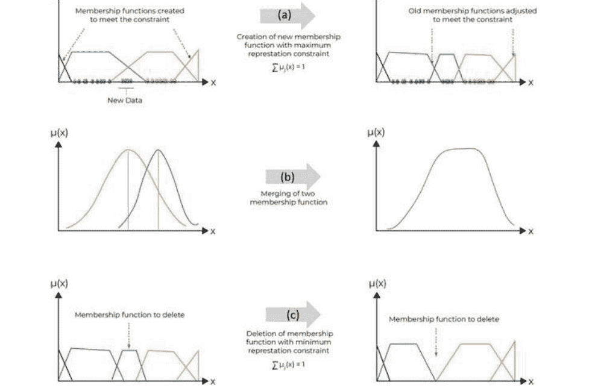

图5.9 在不同约束条件和不同隶属函数下创建、合并和删除模糊标签的示例

#### 5.2.3.3 规则库和推理机制的设计考虑因素

如前所述，每个规则都有前提和结论。然而，每个前提本身可能由多个属性和每个属性的多个模糊结果组成。原则上，每个合成可以使用任何组合的运算符，如AND、OR等。然而，在实践中，选择每个规则推理的合成是有用的。这有助于学习的促进。考虑以下两种情况：

| 情况 | 描述 |
| :--- | :--- |
| **情况1: 对于单个属性使用‘OR’，对属性之间使用‘AND’** | 规则1: 如果x1是‘低’或者x1是‘中’且x3是‘高’，那么y1是‘小’且y5是‘高’ <br> 规则2: 如果 x1是‘非常低’或者 x1是‘低’且 x3是‘高’，那么 y1是‘大’且 y5 是‘低’ |
| **情况2: 没有组合的指导** | 规则1: 如果 x1是‘低’或者 x1是‘中’且 x3是‘高’，那么 y5不是‘高’ <br> 规则2: 如果 x1是‘低’且 x2是‘低’或者 x3是‘高’，那么 y1是‘大’且 y5是‘低’ |

尽管第二种情况需要学习一组运算符以及不同的推理模块，但第一种情况允许使用相同的推理模块用于所有规则。然后，学习可以指向最佳规则识别和模糊聚类的学习。此外，该方法允许分离不同模糊标签的学习。例如，在情况1中，规则可以分开如下：

- 规则1a: 如果 x1是 '低' 并且 x3是 '高'，那么 y1是 '小' 并且 y5是 '高'。
- 规则1b: 如果 x1是 '中' 并且 x3是 '高'，那么 y1是 '小' 并且 y5是 '高'。
- 规则2a: 如果 x1是 '非常低' 并且 x3是 '高'，那么 y1是 '大' 并且 y5是 '低'。
- 规则2b: 如果 x1是 '低' 并且 x3是 '高'，那么 y1是 '大' 并且 y5是 '低'。

关于规则的另一个决定是我们选择一般化的肯定推理还是一般化的否定推理机制。下面对此进行了解释：

- 肯定推理（“通过肯定来肯定的方式”）：
> “如果A为真，则B为真。A为真。因此，B为真。”
- 否定推理（Modus Tollens，“否定否定的方式”）：
> “如果A为真，则B为真。B不为真。因此，A不为真。”

由于它等同于前向传播，Modus Ponens方法通常被视为推理机制。下一个决策是如何在多个规则存在的情况下进行推理。真值实现、Yager推理机制、近似类比推理方案和组合推理规则（CRI）是一些复合推理机制的例子。通常，CRI（Full r和Werners 1991）是最流行的方法。这将在第5.3.1节中详细讨论。

## ### 5.2.4 神经模糊推理系统的学习机制

在这里，我们将涵盖与神经模糊系统学习相关的一般需求和概念。稍后，在第5.3.1节中，我们将通过研究特定的神经模糊系统家族来了解一些明确的技术。

#### 5.2.4.1 与模糊标签相关的学习机制

属性的模糊划分。事实上，识别模糊标签的问题可以被视为定位清晰属性值的聚类问题。因此，聚类方法非常相关。然而，无法应用固定数量的聚类假设，聚类必须适应模糊和重叠的边界，因此无法使用简单的划分技术，如k最近邻或k均值。流行的模糊划分方法包括线性向量量化、模糊Kohonen划分、模糊自适应共振理论、离散增量聚类等。最初，在不知道模糊标签的情况下，可以使用整个数据集或其子集使用这些技术生成模糊标签。然而，由于神经网络学习通常是一个迭代过程，将划分的学习作为增量过程也是有优势的。因此，一种选择是逐批次地形成或改进划分。由于划分将使用模糊隶属函数表示，因此需要考虑随着划分大小的变化，新的划分的创建，现有的划分或聚类的合并等，隶属函数的参数将如何变化。

#### 5.2.4.2 模糊规则的学习机制

给定训练数据实例，应该确定规则库。有几种方法可以做到这一点。例如，自组织映射（Hayashi等，1992年; Yager，1994年），规则归纳算法（Lozowski等，1996年），伪外积（Zhou和Quek，1996年），基于粗糙集的属性约简 (Shen and Chouchoulas 1999, 2002). 与模糊划分的识别相比，这是一个更复杂的问题，因为需要识别输入和输出之间的关系。然而，如图5.10所示，它可以被视为在联合输入输出空间中的一个划分问题。上述大多数算法基本上使用了这个原理。然而，在联合空间中识别输入和输出的聚类或划分意味着输入和输出空间的划分由联合空间中的划分所决定。在识别规则之前，必须使用伪外积等方法创建输入和输出聚类。伪外实质上是一种规则选择技术，而不是规则识别或规则学习技术。在这种技术中，通过评估触发强度以及与层III中的所有链接对应的输出的隶属函数值，来研究每个可能的规则作为候选规则。然后，权重最低的链接和节点被修剪掉。

虽然这些技术是详尽和单次的，但它们也存在挑战

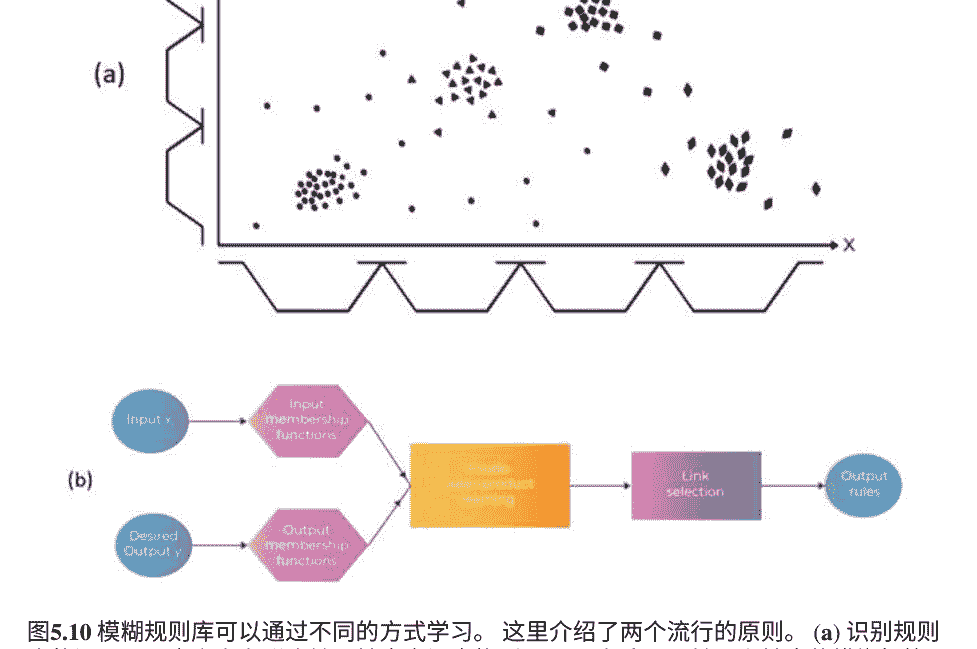

图5.10 模糊规则库可以通过不同的方式学习。这里介绍了两个流行的原则。(a) 识别规则库的问题可以定义为在联合输入输出空间中找到分区。在这里，输入和输出的模糊标签作为联合空间划分的一部分进行学习。(b) 假设详尽的规则库包含可能的前提和结论的所有组合，规则选择技术使用训练数据来识别和选择被触发的规则。这种技术将识别模糊标签的任务与学习规则库的任务分开。

例如计算复杂性和同时可用的所有数据的可用性。另一方面，类似于神经网络中使用的迭代或增量学习方法可以提供更大的灵活性，实现真正的神经网络的优势，并结合在线学习。

## ### 5.2.4.3 网络学习机制用于NFS

对于神经模糊推理系统，存在几种学习机制。这里讨论的一些技术是单次通过的技术，例如聚类和伪外积。然而，它们适用于迭代学习以进一步改进。事实上，迭代方法之一是反向传播算法，在第2.2.3节中已经讨论过。它需要连续可微的隶属函数。我们介绍一些在NFS中流行且可以推广到其他隶属函数的技术。

- 赫布学习 (Hebb 1949)。简而言之，赫布学习利用了正向强化理论。这意味着当一个链接被激活时，通过增加其权重来加强它。强化是线性进行的，这意味着权重增量与链接的发射强度成比例（图5.11）。然而，在实践中，这带来了一个挑战。某些强规则，即在多个训练数据对中调用的规则，可以使它们的权重线性增加。这有两个影响。首先，随着权重的单调增加，网络变得不稳定，强链接饱和（Abbott和Nelson 2000）。其次，其他相关规则被抑制，导致不准确的预测和较差的NFS性能。然而，赫布学习是一种吸引人的学习方案，因为它简单且有效。然而，通过以下方案中讨论的简单修改，可以克服与赫布学习相关的问题。
- 关联性分离学习。根据Bienenstock Cooper Munro (BCM) 元可塑性理论（Bienenstock等，1982年）用于描述视觉皮层中的学习，进行了突触增强的动态调整。突触的增强在生物学上以关联和分离的方式进行调节。这被建模为一个滑动阈值，允许长期增强或减弱权重，以使权重永远不会变得不稳定，并且根据当前的权重和发射强度进行调整。这有助于选择性的发展和信息损失的减少。如图5.11所示。根据BCM理论，突触权重的变化满足以下要求：
- 突触权重的变化与突触前活动成比例（即规则的前提）。这种对前提的要求与赫布学习方案相匹配。
- 突触权重的变化与后突触活动y的非单调函数 φ(y)成比例。对于相对较低的 y，突触权重 w减小。
- 对于较大的 y，突触权重增加。交叉点(w =0)被称为滑动修改阈值θ。
- 滑动修改阈值θ本身是后突触活动 y的时间加权历史的非线性函数。

因此，可以得出结论，时间 p的突触权重 w可以由方程(5.15)定义。

```
$$w = \phi(y_p, \theta(p))x_p + w_p$$
(5.7)
```

其中，x和 y是突触的输入和输出，φ(y_p, θ(p)) 是非线性的激活函数，它随着滑动阈值 θ(p)在公式(5.8)中定义。

```
$$\phi(y_p, \theta(p)) = y_p (y_p - \theta(p))$$
(5.8)
```

众所周知，神经元之间的重复活动会增强特定的突触区域。然而，增强的程度并不是单调的，因为单调的增强会导致突触不稳定。相反，突触的增强在生物学上以联想和分离的方式进行调节。这有助于选择性的发展和减少信息损失。突触元可塑性的BCM理论假设了网络突触中维持稳定兴奋水平的滑动阈值机制(Abbott和Nelson 2000; Tan和Quek 2010)。图5.11演示了这个概念。

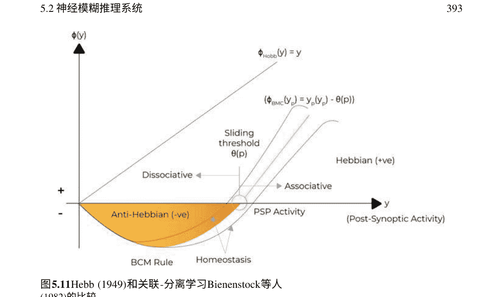

图5.11 Hebb (1949)和关联-分离学习Bienenstock等人(1982)的比较。

#### 5.2.4.4 离线学习与增量或在线学习

学习机制的选择和实施也取决于可用于学习的数据的方式和数量。可以将一次通过或迭代学习技术应用于整个数据集。另一方面，批量学习用于计算效率以及避免稳定性-可塑性困境。每个批次的学习可以使用一次通过更新或多次迭代。这仍然假设所有数据都可用，并且批次可以作为预处理步骤形成。

另一方面，在实践中，数据以批次或单个实例的形式流式传输。在这种情况下，学习必须即时进行，这意味着必须使用传入的数据流进行在线学习。在这种情况下，稳定性-可塑性问题变得更加严重，因为之前学习的规则和标签可能随时间过去而变得过时，并且学习可能饱和，使得对数据中新兴趋势的适应变得困难。在下一节中，我们将介绍与在线和增量学习相关的一些挑战、概念和解决方案。

### 5.2.5 动态流数据的在线学习

虽然像联想性分离学习这样的技术可以通过自适应阈值选择来避免可塑性，但在开发在线学习解决方案时还有其他因素需要考虑。

#### 5.2.5.1 概念漂移

学习的基本支柱之一是损失函数。如果捕捉到与输入和输出相关的数据模式的本质，损失函数就是有效的。但是如果模式发生变化呢？例如，代表“低端”、“中档”和“豪华”细分市场的汽车价格一直在不断变化。此外，COVID-19大流行前常见的社交规则，例如“大家庭中的婚礼”意味着由于旅行而产生“大额开销”，在大流行期间和之后发生了变化。

这种随时间推移失去旧概念并增长新概念的现象被称为概念漂移。潜在的数据分布也可能发生变化。概念漂移导致建立在旧数据上的模型与新数据不一致，需要定期更新模型。可以通过多种方式检测概念漂移，从简单观察损失函数本身到更复杂观察其导数甚至训练数据本身的趋势。

算法误差的显著增加表明类别分布发生了变化，当前模型可能不再适用。这个概念被用于检测漂移检测方法中的概念漂移（Baena-García等人，2006年）。

这里给出了一个更复杂的方法的例子（Iyer等人，2018年）。假设对于输入数据 $\mathbf{x}_p$ 和实际输出数据 $\mathbf{y}_p$，预测输出 $\tilde{\mathbf{y}}_p$ 之间的关系。可以使用公式5.9逐步计算该网络的均方误差Errp。

$$ Err_p = \frac{(p - p^{\text{first}}) Err_{p-1} + \|\mathbf{y}_p - \tilde{\mathbf{y}}_p\|^2}{p - p^{\text{first}}} \tag{5.9} $$

其中，$\|\mathbf{y}\|$ 表示L2范数，$p^{\text{first}}$ 是网络创建的第一个实例。此外，对于实例 $p$，MSE的变化率由 $Err_p = Err_p - Err_{p-1}$ 给出。

让当前实例为 $p$。此外，当前创建的实例为 $p^{\text{first}}$。因此，网络的年龄由 $C^{\text{age}} = p - p^{\text{first}}$ 给出。当创建新网络时，错误趋势计数 $C^{\text{err,up}}$ 被设置为0。控制参数 $W_{\max}$ 表示网络的最大数据窗口，预期窗口大小最初设置为 $W = W_{\max}/3$。

错误趋势的增加由增加的MSE（即，$Err_q > Err_{q-1}$）和MSE率的增加（即，$Err_q > Err_{q-1}$），其中 $q < p$ 定义。对于每个这样的 $q$，错误趋势计数 $C^{\text{err,up}}$ 增加1。另一方面，如果对于实例 $q$，MSE和MSE的速率减小，$Err_q < Err_{q-1}$ 和 $Err_q < Err_{q-1}$，则错误趋势计数 $C^{\text{err,up}}$ 减少1（但不允许为负数）。我们注意到错误趋势的增加表示网络不准确，而错误趋势的减少表示网络稳定。当观察到错误趋势减少时，预期窗口大小 $W$ 扩大约10%。否则，对于每个数据实例，窗口大小增加1，直到它等于 $W_{\max}$。决策中使用的自适应窗口大小 $W$ 受到 FLORA2 方法的启发（Widmer 和 Kubat 1996年）。

概念漂移是通过均方误差（即，$Err_q$）的急剧增加来识别的 $Err_q > 1.5 Err_{q-1}$，其中 $q_0 < p$，并且当发生这种情况时，设置一个标志Drift为true。当观察到错误趋势计数在 $p > q_0$ 时减少时，这被视为漂移不再观察到，并且它是短期错误行为，因此将标志Drift重置为false。如果以下任一条件为真，则决定创建一个新的网络：

- 标志Drift设置为true且 $C^{\text{err,up}} >= 0.1W$。这意味着在持续一段时间内识别到了概念漂移。
- 标志Drift为false且 $C^{\text{age}} >= W$。这表明现有网络已经变得不可塑造且无法适应数据趋势。
- 网络年龄 $C^{\text{age}}$ 达到 $W_{\max}$。这意味着网络已经对当前趋势达到了最优。现有网络不需要进一步学习。未来的新趋势将需要新的网络，并引入多样性以实现未来的灵活性，而不会降低当前最优网络的性能。

一旦发现概念漂移，有几种方法可以处理。通常会调查网络是否能够适应修订后的趋势，或者是否已经足够可塑，难以引起变化。

为了使网络脱离稳定状态，需要采取激进的措施，例如减少一些强规则的权重，或者修剪一些连接或删除规则。然后，对新的数据批次对网络进行重新训练。甚至可以明智地创建一个新的网络，并将现在可塑的网络降为知识模型的状态，暂时过时，但在将来可能再次变得相关。另外，如果最近的趋势显示出一系列不同的模式，间歇性的数据实例表明概念漂移，而其余部分则很好地适应现有概念，我们可以同时使用多个网络，形成一个网络集合。在任何这些情况下，都需要记忆（可能是长期和短期记忆）。此外，数据或先前的知识模型可能需要记忆。然而，还有一些机制可以防止稳定性-可塑性困境的发生。其中之一是遗忘机制。处理概念漂移的机制将在下面的小节中讨论。

#### 5.2.5.2 数据内存和数据库

正如概念漂移的描述中所示，需要对至少损失函数进行一段时间的监控。通常，即使是用于监控的时间窗口中的数据实例也会被存储。这对应于短期数据内存。然而，对于数据存储的效用，需要稍微深入地思考。当检测到概念漂移时，必须学习新的概念。这确实需要从最近的过去收集一些数据实例。这种短期记忆有两个目的：监控概念漂移和作为学习新概念的训练数据集。有时，这个数据集被维护为过去的W数量的数据实例。在其他情况下，指示概念漂移的数据实例和其他数据实例按一定比例保留。有时，数据的相关性是根据它们的年龄和它们生成的触发强度或权重更新的数量来判断的。

保持长期记忆也是相关的。要么存储来自概念漂移窗口的代表性数据，要么创建一个计算代表性，例如，在检测到概念漂移后，通过找到用于训练的数据的质心来创建。在某些设计中，定期将数据实例提交到长期数据存储器中。

#### 5.2.5.3 知识存储和知识库

NFS的知识模型基于每个网络所学到的内容，具体来说是规则库。当检测到概念漂移时，问题是我们应该完全忘记或完全丢弃过时的知识模型，还是保留它们。一般来说，保留旧的知识模型是首选，因为它可能再次变得相关。然而，应该考虑如何以及保留多少过时的知识。当检测到概念漂移时，最简单的解决方案是将网络或至少规则库复制到知识存储器中，然后重新训练当前网络以补偿概念漂移。然而，这可能会快速占用内存并变得冗余。另一种方法是使用网络集合。当检测到概念漂移时，该方法会在集合中创建一个新网络并从头开始训练。这种方法的优点是避免了稳定性-可塑性问题。它还支持每个趋势拥有一个知识库的可能性（表示与其相关的数据分布）。此外，它通过使用集合中的所有网络进行预测并使用一些加权组合来结合它们的预测，实现了多个概念的并行评估（即多个知识模型）。例如，网络的权重可以基于其年龄。因此，可以容纳旧网络再次变得相关的可能性，并且无需通过调整网络来重新学习旧概念。然而，这是一种占用内存的方法，网络的数量可以无限增长。

情节记忆概念是另一种有趣的方法，用于存储知识库并保持可访问性。海马体被广泛认为能够解决人脑中的稳定性-可塑性问题，识别新颖信息并进行顺序学习（Nadel等，2000年）。它还认为能够在大脑中分块概念，以提高存储更多信息的能力。每个网络都使用一些简单的语义指标来表示，这些指标被统称为其记忆痕迹。尽管网络可能在很早之前就已经学习过，但当与其记忆痕迹匹配时，它很容易被召回，类似于情节记忆。

例如，人类无法回忆起一个单词，但能够记住起始字母或押韵的单词。有时，一种香味可以触发对一个复杂经历的回忆。从这个意义上讲，整个网络通过记忆痕迹变得可解释，这代表了它。

多重痕迹理论（MTT）（Hintzman和Block，1971年）的数学形式化如下所示。记忆列表$\bar{m}_n$被收集在一个矩阵$\mathbf{M}$中，如公式（5.10）所示。

$$\mathbf{M} = [\bar{m}_1 \quad \bar{m}_2 \quad \ldots \quad \bar{m}_n \quad \ldots \quad \bar{m}_N] \tag{5.10}$$

当具有与内存跟踪等效的属性的探测项$\bar{p}$到达时，计算$\bar{p}$与每个$\bar{m}_n$在$\mathbf{M}$中的欧氏距离，表示为$d_n = \|\bar{p} - \bar{m}_n\|.$ 使用公式5.11计算相似度度量。

$$s(\bar{p}, \bar{m}_n) = \exp(-d_n) \tag{5.11}$$

提供最高相似度并满足一定条件的内存被召回。

在MTT的背景下，整个网络可以被记忆和缓存。网络的内存向量$\mathbf{m}$包含$N_l$个元素$m_i$，即输入变量$\mathbf{x}$的属性数量。

$$m_i = \frac{\max_{j_i} \{ v^{\text{right}} \} - \min_{j_i} \{ v^{\text{left}} \}}{2} \tag{5.12}$$

是该特定网络中第 $i$ 个属性的所有MF所覆盖区域的中心。因此，虽然整个网络可能被缓存，但只有其内存向量需要保留在活动内存中，其占用空间相对较小。当新的数据到达时，为了决定是否应该调用缓存的内存，需要计算每个缓存网络的欧氏距离 $d = \| \mathbf{x}_p - \mathbf{m} \|$。对于具有最小 $d$ 值的缓存网络，如果 $\exp(-d) > t_0$，其中 $t_0$ 是一个阈值，则将该网络调用到活动内存中。作为交换，活动内存中权重最小的网络被缓存起来。

还有其他方法可以实现内存高效的知识保留。例如，我们可以创建一个全局知识库，存储规则及其一些元信息，而不是存储整个网络。通过这种方式，可以检查进入全局知识库的规则是否冗余，并且可以增加已存在规则的权重，而不是存储两个相似的规则。它还可以在需要时使用全局数据库来初始化新的网络。此外，规则的全局知识库是收集关于时变数据分布的可解释概念的简单而紧凑的方式。

#### 5.2.5.4 遗忘机制

不经常调用的规则很可能会变得过时。这些规则的权重容易受到短期遗忘的影响。根据衰减理论，随着时间的推移，信息变得越来越不容易被检索到；当记忆形成时，会创建一个记忆痕迹，但这个记忆痕迹会随着时间的推移而逐渐退化。

根据这个理论，没有被调用的规则的权重可以通过乘法遗忘因子 $\lambda \in (0, 1)$来进行短期遗忘，如下所示：

$$w_k = \lambda w_k \tag{5.13}$$

尽管这个理论很简单，但它提出了一个问题——我们如何知道何时应该衰减规则。如果每次规则不被调用时都进行衰减，规则可能会很快衰减，变得过时，过度补偿概念漂移，甚至使网络变得不稳定。

布朗-彼得森理论假设遗忘速率是一个与位移（即规则最后一次调用以来的时间）有关的函数（布朗，1958年）。阿尔特曼提出了一个整合衰减和干扰的遗忘模型（阿尔特曼和格雷，2002年）。因此，未立即回忆起的记忆的遗忘系数应该是一个指数衰减函数，其中包括自最后一次回忆以来的时间间隔和短期记忆中可以存储的记忆数量。这在后续更新未立即回忆起的规则的权重时使用。

通过将遗忘因子 $\lambda$ 作为位移的函数来实现该概念，如下所示：

$$ \lambda = \exp\left( -\frac{\frac{p - p^{\text{in}}}{s} + 1}{\sqrt{n^{\text{in}} N}} \right) \tag{5.14}$$

其中 $n^{\text{in}}$ 是规则被调用的次数，$N$ 是网络中的总规则数。差值 $p - p^{\text{in}}$ 给出了规则上次学习以来经过的时间。除以 $s$ 提供了位移的概念。因此，存储在内存中的前 $s$ 个规则的 $\lambda$ 值会比后续的规则更高，以此类推。保持 $\lambda$ 的值接近1是有用的，这样规则不会过快变得过时，网络也不会变得不稳定。

- 权重更新期间的短期遗忘。短期遗忘也可以在权重更新中加入，这样即使规则被调用，一定程度的稳定性也可以降低，从而提高学习新趋势的灵活性。此外，功能衰减理论和位移理论都可以被包含进来。因此，在权重更新中可以包含一个时间衰减因子，如下所示。

$$ w = \phi(y_p)x_p + w_p \tag{5.15}$$

此外，衰减也可以融入到时间变化的更新中，例如在联想性分离学习中使用的滑动阈值 $\theta(p)$。因此，带有时间衰减因子的滑动阈值 $\theta$ 的计算使用公式 (5.16) - (5.18)。

$$ \theta = \frac{\theta_{\text{原始}}}{\theta_{\text{缩放}}} \tag{5.16}$$

使用

$$ \theta_{\text{原始}} = \theta_{\text{原始}}, \text{在} (p - p^{\text{in}}) + p_0^2 \tag{5.17}$$

$$ \theta_{\text{缩放}} = \theta_{\text{缩放}}, \text{在} (p - p^{\text{in}}) + \frac{1 - (p - p^{\text{in}})}{1 - } \tag{5.18}$$

其中，$p$ 和 $p^{\text{in}}$ 表示当前数据的索引和上次调用数据的时间，$o_p$ 表示输出强度。上标`in`表示上次更新后的变量值。当前数据的输出强度为 $o_p$。在解释方面，$\theta_{\text{原始}}$ 是后突触活动的非线性函数，即输出，$\theta_{\text{缩放}}$ 是上次激活 $p^{\text{in}}$ 和当前激活 $p$ 之间的缩放因子。术语 $(p - p^{\text{in}})$ 实质上表示随时间的推移值的遗忘。

- 遗忘后的归一化。通过使用(0, 1)映射对规则库的权重进行归一化，使得最强规则的权重为1。由于衰减的结果，即使相对于其他规则而言它们相对较强，规则的权重也可能会减小。同时，具有数值较低权重的相对强规则可能会在下一次权重更新时导致显著的权重增加。然而，如果这样的规则已经被归一化为接近1，那么权重更新就很小，避免了饱和的情况。

## 5.3 案例研究

在本节中，我们提出了两个案例研究。第一个案例研究是关于一类特殊的NFS算法的演化。目标是概述NFS灵活设计的范围，以及如何将与人类相关的各种概念纳入NFS中，除了NFS固有的可解释性外，还支持NFS内部工作的进一步可解释性。第二个案例研究描述了一种将深度学习和模糊学习相结合的方法。

### 5.3.1 POPFNN家族的NFS演进：朝着复杂的类脑学习发展

作为一个案例研究，我们将研究一族神经网络，它始于一个基本的NFS实现，采用基于伪外积（POP）的规则生成概念，并逐步演化为具有前一节中描述的几个概念的增量和伪增量NFS。按时间顺序介绍了基于POP的模糊神经网络（FNN）家族的成员，包括它们的主要特点和家族的演进指示。

- POPFNN（周和郭，1996年）。使用高斯隶属函数和反向传播算法来学习模糊标签。随后采用伪外积学习规则和真值限制方法进行推理。后来发现这种方法适用于强化学习概念，作为一种用于识别模糊标签的聚类方法（黄等，2009年）。此外，虽然POPFNN首先用于识别规则，但在最后阶段使用反向传播来微调整个网络。

- POPFNN-AAR(S) (Quek and Zhou 1999)。与POPFNN相比，它使用修改后的学习向量量化，更多地找到模糊标签。此外，它不使用推理的真值限制方法，而是使用近似类比推理模式（AAR（S））进行推理。在AAR（S）中，使用相似度度量来判断观测值A'与前提A的接近程度，如果接近程度低于阈值，则基于A和A'之间的接近程度，使用结论B计算规则B'的输出。

- LazyPOP（Quek and Zhou 2001）。虽然这种方法在许多方面与原始的POPFNN相似，但它减少了POPFNN创建的规则库。POPFNN生成一个包含所有可能组合的详尽规则集。LazyPOP和POP一样，是一种一次通过的算法，只考虑训练数据集中被输入触发的规则。这是通过定义无效输入模糊标签来实现的，这些标签与任何输出无关（因此不触发任何规则），以及无关的输出模糊标签，这些输出标签不被触发，因此与任何输入模糊标签无关（这意味着与它们对应的规则是无关的）。LazyPOP是POP家族转向更高效和稀疏的NFS解决方案的第一个迹象。

- POPFNN-CRI(S) (Ang等人，2003年)。这是POPFNN家族中首次使用梯形隶属函数。模糊标签是使用Kohonen分区学习的；然而，据报道，POPFNN可以灵活地使用其他分区技术来识别模糊标签。POP被用来学习规则。然而，这里采用的推理机制是组合规则推理。这允许组合多个规则，当触发时，支持更强大和有机的NFS使用。

- POP-Yager (Quek和Singh 2005)。使用高斯成员函数并使用Kohonen的分区学习模糊标签。POP用于学习规则，但Yager推理机制用于推理。

- 基于粗糙集的POPFNN (RSPOP) (Ang和Quek 2005)。RSPOP结合了粗糙集理论，以识别高质量和高效的模糊标签。它使用两个主要概念，即约简和核心。知识约简是其基本部分，足以定义所考虑知识中出现的所有基本概念，而核心是知识的最重要部分。这些概念用于识别出具有不可或缺性和一致性的良好模糊标签。此外，还演示了约简和核心的概念可以应用于规则层，从而得到更小但更有效的规则库。这是通过首先使用POP，然后识别必要且一致的规则来实现的。由于它可以推导出必要的概念，因此得到的NFS更高效，紧凑且可解释。然而，它是一种用于属性约简和规则约简的迭代方法。

类似的规则简化概念也进行了探索 (Tan and Quek 2009; Cheu et al. 2012)。然而，RSPOP经受住了时间的考验，不仅因为它的理论概念可靠，而且因为它适用于增量和在线学习。

- 增量集成RSPOP (ieRSPOP) (Das et al. 2016)。随着POP家族通过ieRSPOP转向增量学习，它融入了几个先进的特性。例如，使用梯形隶属函数的离散增量聚类 (DIC) 被采用 (Tung and Quek 2002)。然而，DIC是与基于粗糙集的属性约简结合使用的。采用了组合推理规则。此外，在初始阶段使用了LazyPOP来创建规则库。在增量学习阶段，使用赫比学习来处理更多的数据流。进一步，在增量学习期间使用基于粗糙集的规则和属性约简，但只有在一定量的历史数据之后才会使用。每次使用基于粗糙集规则和属性约简时，历史数据都会动态修剪。已经使用了简单的概念漂移机制；然而，每当概念漂移被认为是显著的时候，就会创建一个新的网络集合中的网络。虽然集合中的所有网络都用于预测输出，并且使用加权和来计算最终输出，但权重是根据年龄计算的，以便最近的网络对预测做出最大贡献。因此，使用动态修剪的历史数据库和年龄集成的网络加权结合了遗忘机制。

- 伪ieRSPOP (PIE-RSPOP) (Iyer等, 2018年)。在撰写本书时，这是POP家族的最新发展。它融合了几个进一步的先进概念，如联想性解离学习、基于多重痕迹理论的长期知识记忆、复杂的漂移机制、长期和短期遗忘，包括衰减和干扰理论，全局和高度可解释的知识库，以及有限的数据存储器，以便在需要时进行离线学习。

摘要POPFNN的演化树在图5.12中呈现。NFS架构可以灵活地融入几个可解释的学习和推理概念。人类不仅可以轻松解释知识模型，还可以解释架构和理论机制。这使得更好的NFS设计成为可能。

图5.12 POPFNN家族的演化树在此呈现，以及导致改进的最重要亮点，以在可解释性和准确性之间取得平衡，并减少稳定性-可塑性问题。时间顺序从上到下，上面是最早的。

应用程序减少或不依赖当前严重依赖人类知识或决策的启发式方法。

### 5.3.2 结合传统深度学习和模糊学习

在探索结合传统深度学习和模糊学习的几种方法中，我们以谢等人（2021）的案例研究为例。该方法的架构在图5.13中呈现。在这种情况下，线性系统可以表示任何传统的深度学习架构。然而，在这种架构中，它的功能是将输入变量的模糊空间映射到输出变量的模糊空间。这与传统的深度学习不同，传统的深度学习将清晰的输入变量映射到清晰的输出变量。使用模糊标签的不同隶属函数，将输入变量映射到其模糊空间。然后，线性系统生成位于输出模糊空间中的输出，并表示每个输出变量的各个隶属函数的激活强度。通过使用去模糊化将线性系统的输出转换为最终输出。因此，迄今为止的进展表明深度学习可以在模糊空间中运行。我们注意到，在处理模糊空间中的数值时，Takagi Sugeno模糊化/去模糊化模型更适合。

同时，线性系统执行了NFS任务的第三层，即在没有使用模糊方法的情况下表示规则库和推理机制。现在我们将看一下线性系统的知识如何在可解释性方面得到支持。在这种方法中，包含了一个并行块来生成模糊规则。这个块接收模糊化器的输出（即模糊化的输入变量）和线性系统的输出（即模糊化的输出变量），并生成模糊规则库。可以使用联合空间聚类、伪外积或任何其他模糊规则学习机制来形成规则库。

**好好思考一下**

图5.13所示的架构和方法代表着先验解释性还是事后解释性？

输入和输出变量的模糊标签包括数据的可解释性。然而，它们本身并不能构成将输入映射到输出的整个模型。映射任务由学习系统完成。从这个意义上讲，这种特定方法融入了内在的可解释性或先验可解释性原则。

确实，也会学习到模糊规则库。然而，线性系统的学习是独立的，与模糊规则库无关，模糊规则库仅仅根据观察结果解释线性系统的功能。从这个意义上讲，这种方法包含了事后可解释性。

但作为整体架构，你认为这是整体先验可解释性还是事后可解释性？

### 5.3.3 模糊深度学习研究概述

虽然我们在过去几十年中见证了DNN学习的爆炸式增长，但FNN并没有经历同样的革命。NN中的大多数融合方法都是临时的、理解不足的，并且是分布式的而不是局部化的。即使存在，这些方法的可解释性也非常低。处理具有不完整特征的标记和未标记数据的一种常见方法是使用FNN。在建模中，模糊集合有助于处理数据的不确定性，包括模糊性、不精确性和歧义性（Chen等，2017年）。已经提出了多种方法来解决DL的缺点，例如实现模糊RBM（Chen等，2015年）用于常常不完整和模糊的航空旅客配置数据，以及用于工业事故的早期预警系统（Zheng等，2017年）。Zheng的模型（Zheng等，2017年）融合了深度BMs的概念，Pythagorean模糊数（参见附录A.9）和集合（Yager，2013年）。

我们在这本书中发现了当前SOTA的几个观点，这些观点可能是图像识别任务中规则修剪的缺点。修剪模糊核和模糊最大池化架构等规则的模糊概念（Yazdanbakhsh和Dick，2019）在处理图像分类任务的空间不变性和变换不变性属性时感觉直观。然而，目前来说，这个想法对于处理图像的每个像素都使用一组自适应模糊规则来保持每个单元的激活强度以实现可解释性来说太过庞大。

DL模型中融合了模糊逻辑的研究和实际应用已经在各种研究和实际应用中实施，包括交通流量控制和道路安全（Deng等，2016; Chen等，2017; El Hatri和Boumhidi，2018; Zheng等，2016），医学。

#### 表5.2 少数模糊深度学习模型的时间顺序概述

| 年份 | 方法 | 特点 |
| :--- | :--- | :--- |
| **集成模型：模糊系统作为学习机制的一部分** | | |
| 2020 | 通过基于规则的近似和可视化解释深度学习模型（Soares等，2020年） | - 将车辆的多维状态空间和速度映射到离散集合中。<br>- 使用零阶IF-THEN模糊规则近似来提供可替代的可解释模型的双重深度Q网络近似。<br>- 概念‘MegaClouds’将相似的动作分组，减少模糊规则的维度。 |
| 2019 | 使用模糊积分神经网络实现深度学习中的可解释融合（Islam等，2019年） | - 应用于异构架构模型集合的融合，实现XAI。<br>- 模糊Choquet积分，一种非线性聚合函数，用于改进基于SGD的优化。 |
| 2018 | 使用模糊逻辑训练的堆叠自编码器（El Hatri和Boumhidi，2018年） | - 使用模糊系统训练深度神经网络的参数，旨在防止过冲，最小化误差并增加学习过程中的收敛速度。<br>- 使用通用反向传播算法训练的堆叠自编码器模糊深度网络，用于空间和时间相关性的交通流检测。<br>- 模糊逻辑系统仅决定网络的学习速率和动量。 |
| 2017 | 使用Takagi Sugeno模糊推理系统（Rajurkar和Verma，2017）开发深度模糊网络。 | - 使用反向传播算法识别三层TS模糊系统。<br>- 使用t-范数运算符评估高斯模糊隶属函数，以实现易于求导。<br>- 对非线性系统识别和卡车倒车问题进行实验分析，结果显示TS FIS优于三层前馈神经网络。 |
| 2016 | 使用模糊深度学习预测肺肿瘤的内部和间隔变化（Park等，2016） | - 与CNN和HEKFs相比，模糊逻辑的实验性超调分析显著下降。<br>- 使用向量形式的模糊深度学习来聚类呼吸参数，减少不必要的特征度量，提高计算时间和准确性。 |
| **集成模型：模糊逻辑和深度学习以顺序或并行方式** | | |
| 2020 | 弓形虫托帕弗斯马的迁移学习识别（Li等，2020年） | - 使用c均值聚类算法的模糊循环GAN，用于预定义的弓形虫结构形状。<br>- 使用两个CNN和模糊聚类算法以及对抗性损失架构，改进了VGG网络。 |
| 2020 | 基于深度学习的神经模糊方法解决分类问题（Talpur等，2020年） | - 使用高斯隶属函数和图分区进行规则生成，并结合反向传播学习。<br>- 用于三个基准数据集（红葡萄酒、甲状腺疾病和statlog）的MATLAB工具箱进行分类。 |
| 2018 | 使用深度神经网络和加权模糊主动形状模型在3D儿科超声图像中自动肾脏分割（Tabrizi等，2018） | - Gabor滤波器对输入数据进行模糊化处理和降噪。<br>- 利用传统的深度卷积神经网络进行检测，利用模糊形状权重进行分割。<br>- 基于自动初始化的分割方法可以在没有先验用户知识和经验的情况下实现可重复性。 |
| 2018 | 一种用于文本情感分析的模糊卷积神经网络（Nguyen等，2019） | - 在10折交叉验证中较低的标准差展示了稳定性和准确性。<br>- 实验数据显示在噪声数据集上相比CNN模型具有更好的性能。<br>- 对输入数据进行特征可视化在t-SNE度量上具有更好的可解释性。 |
| 2018 | 一种用于具有不确定空时数据特征的交通流预测的新型模糊深度学习方法（Chen等，2017） | - 在模糊深度卷积中使用张量来研究时空特性。<br>- 模糊系统的集成减少了数据不确定性的影响，并且结果更快地收敛并具有准确性。 |
| 2017 | 用于数据分类的分层融合模糊深度神经网络（Deng等，2016） | - 多个模糊规则减少了模糊逻辑表示中的歧义，而深层次神经网络减少了噪声。<br>- 丢弃策略改善了FDNN训练性能。<br>- 与信息论学习、BM和AE的模糊表示的替代融合进行性能比较。 |
| 2016 | 使用模糊特征点的深度学习对损坏指纹进行分类（Wang等，2016） | - 使用径向基函数的Kriging方法对输入数据进行模糊化。<br>- 使用特征点的模糊图、位置和点之间的关系来提高识别率。<br>- Kriging方法有助于突出特征点之间的关系，并减弱它们的位置，从而创建更高的旋转不变性。 |
| 2009 | 基于Mamdani模型的自适应神经模糊推理系统及其应用（Chai等，2009年） | - 在ANFIS模型中，基于反向传播提出了基于Mamdani模糊规则的权重更新公式。<br>- 实验结果显示，在交通管理数据上，M-ANFIS模型优于一般的ANFIS模型。 |

医疗保健和图像处理（Wang等，2016年；Park等，2016年），文本处理（Nguyen等，2019年；Tabrizi等，2018年）以及时间序列预测（Rajurkar和Verma，2017年；Zheng等，2017年）。对模糊深度学习模型的时间应用进行了关键分析，总结如表5.2所示。模型的回顾根据模糊逻辑的融合方式分为两个部分，即作为集成系统或以顺序或并行方式排列的模糊推理系统的集成模型。

## 总结

在本章中，我们探讨和描述了当前模糊深度学习方法（表5.2），定义了核心概念，并提供了一个基于模糊逻辑系统的分层集成的概念验证，该验证测试了规则的触发强度。

提高可解释性。将模糊推理与神经网络的性能相结合的好处可以在长期内实现。本章更深入地探讨了当前研究努力解决深度神经网络的基本限制的基本原理，通过采用模糊模型。

一方面，通过将模糊理论作为深度学习系统的固有元素，通过使用模糊逻辑进行训练参数选择或自适应模糊参数，大大提高了模型在噪声、不完整、不确定或不精确数据上的性能。因此，我们能够避免陷入局部最优解，而是在更广泛的空间中进行搜索。虽然深度模糊学习增强了可解释性和透明度，但也增加了计算复杂性。由于缺乏适合处理模糊参数和权重的软件加速工具，目前的架构训练起来很费力。模糊化所使用的数据的性质使得开发一个通用模型变得困难。

## 阅读列表

1.  “关于学习和调整模糊规则系统以及语言建模和应用的技术”由Alcal'a等人（1999年）提出了一个数学框架，对模糊规则基系统进行了回顾。
2.  “神经网络、模糊系统和知识工程的基础”由Kasabov（1996年）撰写的是关于模糊逻辑和模糊系统概念的经典著作。
3.  “模糊神经网络和神经模糊网络：文献中使用的主要技术和应用综述”由de Campos Souza（2020年）提供了一个非常简洁的神经模糊系统技术综述。

## 自我评估

1.  考虑一个模糊变量\( x \)的两个模糊标签‘A’和‘B’的隶属函数的示例（图5.14）
    -   写出A和B的隶属函数表达式。
    -   画出一个模糊标签C的隶属函数，使其为A和B的交集，一个模糊标签D的隶属函数，使其为A和B的并集，以及一个模糊标签E的隶属函数，使其等于C的否定。
    -   绘制模糊标签F的隶属函数，使其为A和B的有界差异，绘制模糊标签G的隶属函数，使其为A和B的有界和。
    -   检查C是否是D和F的子集。
2.  绘制一个具有两个输入、每个输入两个模糊标签、一个输出和每个输出两个模糊标签的POPFNN架构的图表。
3.  餐厅管理团队正在尝试了解顾客的小费趋势。它定义了三个变量，即食物质量（fq），服务质量（sq）和小费质量（tq）。这些变量的清晰值在范围\([0, 10]\)内。团队定义了以下由梯形隶属函数表示的模糊标签，其参数为\( a, b, c, \)和\( d \)也在下面定义：
    | 变量 | 模糊标签 | 隶属函数 | \([a, b, c, d]\) |
    | :--- | :--- | :--- | :--- |
    | 食物质量 | 无望 | \(\mu_{\text{fq1}}\) | \([0, 0, 2, 3]\) |
    | 食物质量 | 美味 | \(\mu_{\text{fq2}}\) | \([5, 8, 10, 10]\) |
    | 服务质量 | 差 | \(\mu_{\text{sq1}}\) | \([0, 0, 4, 5]\) |
    | 服务质量 | 好 | \(\mu_{\text{sq2}}\) | \([4, 5, 5, 7]\) |
    | 服务质量 | 优秀 | \(\mu_{\text{sq3}}\) | \([6, 7, 10, 10]\) |
    | 小费质量 | 糟糕 | \(\mu_{\text{tq1}}\) | \([0, 1, 1, 3]\) |
    | 小费质量 | 平均 | \(\mu_{\text{tq2}}\) | \([2, 4, 4, 5]\) |
    | 小费质量 | 优秀 | \(\mu_{\text{tq3}}\) | \([4, 5, 9, 10]\) |
    -   为每个变量绘制模糊隶属函数。
    -   上述模糊术语用于制定小费支付的模糊专家规则系统。在范围\([0, 10]\)内，小费的金额是根据fq和sq的模糊规则推导出来的。以下是使用的四个规则：
        | 规则 | 条件 | 结果 |
        | :--- | :--- | :--- |
        | R1 | 服务差 | 小费很差 |
        | R2 | 服务优秀且食物美味 | 小费优秀 |
        | R3 | 食物糟糕 | 小费很差 |
        | R4 | 服务好且食物美味 | 小费很差 |
        使用上述规则库绘制一个表示四个规则R1-R4的神经模糊系统网络架构。
    -   讨论如何选择推理操作以解决多个规则被激活时的规则冲突。

# 附录A

## 数学模型和理论

### A.1 Choquet积分

观测值 h on X的（模糊Choquet积分） ChI是
$$\int \mathbf{h} \circ g = C_g(\mathbf{h}) = \sum_{j=1}^N h_{\pi(j)}(g(\mathcal{A}_{\pi(j)}) - g(\mathcal{A}_{\pi(j-1)})) \tag{A.1}$$
对于 $\mathcal{A}_{\pi(j)}=\{x_{\pi(1)}, \ldots, x_{\pi(j)}\}$, $g(\mathcal{A}_{\pi(j)}) =0$, 以及排列 $\pi$ 使得 $h_{\pi(1)} \geq h_{\pi(2)} \geq \cdots \geq h_{\pi(N)}$.

#### A.1.1 限制 FM/ChI 的范围

在 Islam 等人 (2019) 的论文中，作者指出 ChI 是一个参数化函数，当模糊隶属确定时，它变成一个特定的运算符。举个例子：如果 g(A) = 1 ∀A ∈ 2^X \ φ，那么 ChI 就变成了最大运算符；如果g(A) = 0 ∀A ∈ 2^X \ X，我们就得到了最小运算符；如果 g(A)= |A| \ N，我们就得到了平均值；而当 g(A) = g(B) 当 |A| = |B| ∀A, B ∈ X时，我们得到了线性排序统计。此外，作者声称作为实践中最常见的运算符，即平均值、最大值、最小值和修剪版本的运算符都是线性排序统计的子集，因此也是 ChI 的子集。总之，ChI 对于广泛的聚合需求都是有益的。

#### A.1.2 从神经网络中理解Choquet积分

作者试图使用神经网络来计算模糊Choquet积分，这对于作为聚合运算符非常有用。这对于许多声称神经网络（如CNN）可以做到的事情非常重要。从数学上讲，CNN可以编码滤波器（线性时不变滤波器，如匹配滤波器、低通滤波器或Gabor滤波器）、随机投影和组合等等。但是对于网络中的融合，人们给予的关注最少。选择像并集、平均值、交集或者更有趣的聚合器，以及神经网络的潜在聚合函数，都需要考虑。通过神经网络理解模糊Choquet积分将使我们对手头的可能性有更好的认识。

例子考虑n=2的情况以及图A.1中概述的神经网络。网络输出为
$$o = u(h_1 - h_2)(h_1w_1 + h_2w_2) + u(h_2 - h_1)(h_2w_3 + h_1w_4)$$
其中u是一个单位/海维赛德阶跃函数，它给出了
$$o = u(h_1 - h_2)[h_1g(x_1) + h_2(1 - g(x_1)))] + u(h_2 - h_1)[h_2g(x_2) + h_1(1 - g(x_2)))]$$
因此，我们有
$$o = \begin{cases} h_1g(x_1) + h_2(1 - g(x_1)), & h_1 > h_2 \\ h_2g(x_2) + h_1(1 - g(x_2)), & h_2 > h_1 \\ 0.5[h_1g(x_1) + h_2(1 - g(x_1))] + 0.5[h_2g(x_2) + h_1(1 - g(x_2))], & h_1 = h_2 \end{cases} \quad (A.2)$$
这可以扩展到任何一个n而不会损失普遍性。作者使用一个简单的网络来传达神经网络可以表示Choquet积分的事实。

### A.2 形变不变性属性

图像被建模为一个函数$x \in L^2([0, 1]^2)$，其中$L_\tau x(u) = x(u - \tau(u))$是在图像上定义的一个平滑变形场$\tau \in [0, 1]^2 \rightarrow [0, 1]^2$和一个图像分类函数$f: L^2([0, 1]^2) \rightarrow \{1, 2, ..., L\}$

那么，图像形变不变性被定义为：
$$|f(\mathcal{L}_τ x) - f(x)| \approx \|\nabla_τ\| \quad \text{对于所有的} f, τ \quad (A.3)$$

### A.3 距离度量

距离度量是指满足$d(x, y) < d(x, z)$的函数$d(x, y)$，如果对象$x$和$y$被认为比对象$x$和$z$更相似。这意味着零距离表示两个完全相似或相似的对象。欧氏距离$d(x, y) = \sqrt{\sum_{i=1}^n (x_i - y_i)^2}$是一个常见的例子。一个‘真实’的度量必须满足以下准则：
1.  $d(x, y) \geq 0, \forall x和y$
2.  $d(x, y) = 0$, 当且仅当$x = y$时，正定性
3.  $d(x, y) = d(y, x)$, 对称性
4.  $d(x, z) \leq d(x, y) + d(y, z)$, 三角不等式

在我们的情况下，余弦相似度（Manning et al., 2008）计算图像$I_x$和$I_y$之间行向量的L2-归一化点积，定义如下：
余弦相似度 $(I_x, I_y) = \frac{I_x I_y^T}{\|I_x\|_2 \|I_y\|_2}$。因此，图像矩阵 $I_x$ 和 $I_y$ 之间的成对余弦距离被定义为：
余弦距离 $(I_x, I_y) = 1 - \frac{I_x I_y^T}{\|I_x\|_2 \|I_y\|_2}$ (A.4)

### A.4 梯度加权类激活映射

类激活图（CAM）（Zhou et al., 2016）是一种可视化算法，它使用卷积特征图上的输出权重在图像上叠加热力图，以突出学习中的重要区域。在这里，全局平均池化（GAP）取代了最后一个全连接层，将特征图的激活作为向量输入到最终的 softmax 层进行平均求和。Grad-CAM 是一种更精细的方法，它计算了对于感兴趣的类别 $c$ 的梯度，相对于最终卷积层的激活图 $A^k$ 的索引，并在每个特征图上进行平均，输出一个重要性分数 $(\alpha_k^c)$。
$$\alpha_k^c = \frac{1}{Z} \sum_i \sum_j \frac{\delta y^c}{\delta A_{ij}^k}$$
为了计算对感兴趣的类别得分产生积极影响的像素，使用ReLU非线性函数对线性组合进行处理。
$$L_{Grad-CAM}^c = ReLU \left( \sum_k \alpha_c^k A^k \right) \quad (A.5)$$
下面显示了样本grad-CAM可视化图A.2，顶部行显示了“栅栏”高亮特征，底部样本显示了grad-saliency的“勺子”特征。

### A.5 引导性显著性

下图A.3简要介绍了反向传播和解卷积技术的融合方法，以获得更精确和全面的显著性图。图A.3a描述了前向传递后特征的选择性激活，并向后传播进行重构。图A.3b描绘了使用ReLU非线性函数的反向传播变体，而图A.3c给出了通过ReLU单元在特定层中向后传播输出激活的数学公式。要记住的是，后两种方法-DeconvNet和引导反向传播计算的是梯度的估计版本，而不是真实的梯度。

引导性显著性图同时掩盖了正向传播（反向传播）中负信号的重要性和从上到下（逆卷积）的负重建信号值，以生成显著性特征图。

### A.6 Jensen-Shannon散度

Jensen-Shannon（JS）散度衡量了两个概率分布 $p_1$ 和 $p_2$ 之间的相似性。它在方程A.6中定义，遵循以下一些属性：
1.  方程A.6在 $p_1$ 和 $p_2$ 中是对称的。
2.  该函数的取值范围为 $0 \leq \text{JS}(p_1 \| p_2) \leq \log 2$。
3.  可以考虑使用其平方根作为适当的度量标准。
4.  有时也称为信息半径或平均总差异。
$$\text{JS}(p_1 \| p_2) = \frac{1}{2} (\text{KL}(p_1(x) \| p_0(x)) + \text{KL}(p_2(x) \| p_0(x))) \quad (A.6)$$
请注意，使用以2为底的对数将方程限制在值 $[0, 1]$ 之间。

图。 A.3 使用引导显著性（Springenberg等人，2014）对深层进行的示意可视化

### A.7 Kullback-Leibler散度

Kullback-Leibler（KL）散度基本上考虑了两个概率分布p₁和 p₂，并估计了一个与另一个的偏离程度。 方程A.7定义了连续分布函数的KL散度的数学表达式。
$$KL(p₁ || p₂) = \int_X p₁(x)log \frac{p₁(x)}{p₂(x)} dx \quad (A.7)$$
在这里，观察到如果概率分布p₁ = p₂，则KL ( p₁ || p₂)为零。 一般来说，KL散度是非对称的，即KL (p₁ || p₂) ≠ KL (p₂ || p₁)。

### A.8 投影梯度下降

投影梯度下降（PGD）只是通过对原始图像进行某个增量（δ）的扰动，并通过迭代创建图像，以最大化网络损失。在每次迭代之后，δ被投影到一个范数球上，这里使用的是 L² 或 L^∞ 球。初始时，δ被赋值为零，并且避免随机初始化以防止严格的优化。将δ剪切在 [−ε, +ε]之间以保留视觉语义。 算法的最终目标是欺骗已经训练好的模型，以便使用基于梯度下降的优化来提高对真实类别的预测。
$$\max_{\delta \in \mathcal{B}} l(h_\theta(x + \delta), y) \quad (A.8)$$

## 附录A: 数学模型和理论
其中，$x \ (x = x + \delta)$表示对抗样本，$h_\theta$是模型或假设函数，$x \in X$表示输入，$y \in \mathbb{Z}$表示真实类别，$l(h_{\theta}, y)$表示损失，$\delta \ (||\delta|| \leq \epsilon)$表示允许的扰动集合。

### A.9 毕达哥拉斯模糊数
毕达哥拉斯模糊集合 Yager (2013) 是IFS的扩展，其成员度的平方和从0到1定义如下数学公式:
```
$$ p = \{< x, \mathcal{P}(\mu_p(x), v_p(x)) > | s \in S\} \qquad (A.9) $$
```
其中，$\mu_p(x) : S \rightarrow [0, 1]$和$v_p(x) : S \rightarrow [0, 1]$分别是满足表达式$\mu_p(x)^2 + v_p(x))^2 \leq 1$的成员度和非成员度，对于元素$x$属于$S$中的$\mathcal{P}$。元素$x$属于$X$的临时度被定义为
```
$$ \pi_p(x) = \sqrt{1 - \mu_p^2(x) - v_p^2(x)} \qquad (A.10) $$
```
利用这些属性，分别定义了两个度量标准，即得分函数和准确度函数，用于对PFN进行排序:
```
$$ s(\beta) = \mu_\beta^2 - v_\beta^2 h(\beta) = \mu_\beta^2 + v_\beta^2 \qquad (A.11) $$
```
根据度量标准，两个PFN的排名为 - $\beta_1 = P(\mu_{\beta_1}, v_{\beta_1})$ 和 $\beta_2 = P(\mu_{\beta_2}, v_{\beta_2})$的排序由Ren等人 (2016) 执行:
- 1. 如果$s(\beta_1) < s(\beta_2)$，则$\beta_1 < \beta_2$
- 2. 如果$s(\beta_1) = s(\beta_2)$，则
   - a. 如果$h(\beta_1) < h(\beta_2)$，则$\beta_1 < \beta_2$
   - b. 如果$h(\beta_1) = h(\beta_2)$，则$\beta_1 = \beta_2$。

### A.10 有针对性的对抗攻击
类似于投影梯度下降，使用某个特定的delta ($\delta$) 对原始图像进行扰动，并进行额外的损失优化。在迭代过程中，它试图最大化真实类别的损失并最小化目标类别的损失。这种有针对性的梯度下降形式会降低目标类别的预测结果，同时提高真实类别的预测结果。
```
$$ \max_{\delta \in} (l(h_{\theta}(x + \delta), y) - l(h_{\theta}(x + \delta), y)) \qquad (A.12) $$
```
其中，符号与方程A.8类似，只是$y$表示目标类别。

### A.11 平移不变性属性
将图像建模为函数 $x \in L^2([0, 1]^2)$，其中 $\mathcal{T}_\mathbf{v} x(u) = x(u - \mathbf{v})$是对图像进行平移的操作，平移向量 $\mathbf{v} \in [0, 1]^2$，图像分类函数 $f: L^2([0, 1]^2) \rightarrow \{1, 2, ..., L\}$，那么图像平移定义为：
> $$ f(\mathcal{T}_\mathbf{v} x) = f(x) \qquad \forall x, \mathbf{v} \qquad\qquad (A.13) $$

### A.12 通用逼近定理
定理A.1 设 $\xi$ 为非常数有界且单调递增的连续激活函数，$f: [0, 1]^d \rightarrow \mathbb{R}$为连续函数，且$\epsilon > 0$。 则，$\exists n$ 和参数 $a, b \in \mathbb{R}^n$, $\mathbf{W} \in \mathbb{R}^{n \times d} s.t.$
> $$ \left| \sum_{i=1}^{n} a_i \xi(w_i^T x + b_i) - f(x) \right| < \epsilon \qquad \forall x \in [0, 1]^d \qquad\qquad (A.14) $$

# 附录B 数字资源和示例列表
参见表B.1、B.2、B.3、B.4、B.5和B.6

### 表B.1 近几年流行的透视解释性方法总结

| 聚类 | 方法 |
|---|---|
| 分解显著性 | CAM（类激活映射）（Zhou等，2018年） |
|  | Grad-CAM（Selvaraju等，2017年） |
|  | 引导Grad-CAM和特征遮挡（Tang等，2019年） |
|  | 分数加权类激活映射（Wang等，2019年） |
|  | Smoothgrad（Smilkov等，2017年） |
|  | 多层CAM（Bahdanau等，2014年） |
|  | LRP（Bach等，2015年；Samek等，2016年） |
|  | CNN和BoW（词袋）/SVM上的LRP（Arras等，2017年） |
|  | BiLRP（Eberle等，2020年） |
|  | SDeepLIFT：学习重要特征（Shrikumar等，2017年） |
|  | 槽位激活向量（Jacovi等人，2018年） |
|  | PRM（Peak Response Mapping）（Zhou等人，2018年） |
| 敏感性显著性 | 显著性图（Simonyan等人，2014年） |
|  | LIME（局部可解释的模型无关解释）（Ribeiro等人，2016年） |
|  | 基于指南的附加解释优化复杂性（Zhu和Ogino，2019年） |
| 其他显著性 | 具有自动对焦卷积层的注意力图（Qin等人，2018年） |
| 信号反转 | 反卷积网络（Noh等人，2015年；Zeiler和Fergus，2014年） |
|  | 反转图像表示（Mahendran和Vedaldi，2015年） |
|  | 使用CNN进行反转（Dosovitskiy等人，2015年） |
|  | 引导反向传播（Springenberg等人，2014年；Iz adyyazdanabadi等人，2018年） |
| 信号优化 | 激活最大化（Olah等人，2017年） |
|  | 语义字典（Olah等人，2018年） |
| 其他信号 | 网络剖析（Bau等人，2017年；Zhou等人，2018年） |
| 语言可解释性 | 决策树（Kotsiantis，2013年） |
|  | 命题逻辑，基于规则（Caruana等人，2015年） |
|  | 稀疏决策列表（Letham等人，2015年） |
|  | 合理化神经预测（Lei等人，2016年） |
|  | MUSE（通过子空间解释进行模型理解）（Lakkaraju等人，2019年） |

### 表B.2 近年来数学可解释性方法的总结

| 聚类 | 方法 |
|------|------|
| 预定义模型 | 线性探测（Alain和Bengio，2016年） |
|  | CNN回归（Hatami等人，2018年） |
|  | GDM（生成鉴别模型）：岭回归+最小二乘（Varol等人，2018年） |
|  | GAM，GA2M（生成加性模型）（Hastie，2017年） |
|  | ProtoAttend（Arik和Pfister，2019年） |
|  | 基于群体驱动的强化学习（RL）（Zhu等人，2018年） |
|  | 基于模型的强化学习（RL）（Kaiser等人，2019年） |
|  | TS近似（Bede，2019年） |
|  | 深度张量神经网络（Scht等人，2017年） |
| 数学特征提取 | PCA（主成分分析）（Dunteman，1989年） |
|  | CCA（典型相关分析）（Hardoon等人，2004年） |
|  | 主要特征可视化（Bakken等人，2020年） |
|  | 使用主成分的Eigen-CAM（Muhammad和Yeasin，2020年） |
|  | 基于GAN的多阶段PCA（Goodfellow等人，2014年） |
|  | 使用深度特征嵌入估计概率密度（Krusinga等人，2019年） |
|  | t-SNE（t-分布随机邻域嵌入）（Nguyen等人，2016年；Karpathy，2014年） |
|  | Laplacian Eigenmaps可视化深度生成模型（Biffi等人，2018年） |
|  | 基于组的可解释性神经网络与基于RW的图嵌入（Yan等人，2019年） |
| 数学敏感性 | ST-DBSCAN（Birant和Kut，2007年） |
|  | TCAV（使用概念激活向量进行测试）（Kim等人，2018年） |
|  | ACE（基于自动概念解释）使用TCAV（Ghorbani等人，2019年） |
|  | 影响函数（Koh和Liang，2017年） |
|  | SocRat（结构化输出因果推理器）（Alvarez-Melis和Jaakkola，2017年） |
|  | 元预测器（Fong和Vedaldi 2017） |
| 可解释的机器学习模型 | 线性回归（Montgomery等人，2021年） |
|  | 线性回归（Weisberg 2005; Montgomery等人，2021年） |
|  | 逻辑回归（Kleinbaum等人，2002年） |
|  | 决策树（Kotsiantis，2013年） |
|  | 广义线性模型（Venables和Dichmont 2004） |
|  | 广义可加模型（Venables和Dichmont 2004） |
|  | 朴素贝叶斯（Rish等人，2001年） |
|  | 规则拟合（Friedman和Popescu 2008） |
|  | K最近邻算法（Papernot等人，2016年） |
| 全局模型无关方法 | 部分依赖图（PDP）（Goldstein等人，2015年） |
|  | 置换特征重要性（Altmann等人，2010年） |
|  | 累积局部效应图（Apley和Zhu 2020） |
|  | 原型和批评（Kim et al. 2016） |
|  | 全局替代模型（Tenne and Armfield 2009） |
| 本地模型无关方法 | ICE（个体条件期望）（Goldstein et al. 2015） |
|  | LIME（Ribeiro et al. 2016） |
|  | SHAP（Slack et al. 2020） |
|  | 锚点（Ribeiro et al. 2018） |
|  | 反事实解释（Wachter et al. 2017） |
|  | Shapley值（Messalas et al. 2019） |
| 其他 | ELI5（Korobov and Lopuhin 2020） |
|  | Yellowbrick（Bengfort and Bilbro 2019） |
|  | MLXTEND（Raschka 2018） |

### 表B.4 一些软件/组件/资源的总结

| 资源 | 描述 | 链接 |
|------|------|------|
| SHAP | Shapley加性解释 | https://github.com/slundberg/shap |
| DeepExplainer | 基于梯度的深度神经网络（DNN）解释方法和可解释性网络的探索 | https://github.com/slundberg/shap |
| NNI Navigator | 用于神经网络的预测器库（基于梯度和扰动的DNN解释方法） | https://github.com/slundberg/shap |
| ELI5 | 用于机器学习的可解释性预测/解释工具库 | https://github.com/eli5/eli5 |
| Skater | 用于机器学习的可解释性预测/解释工具库 | https://github.com/SkaterAI/skater |
| Yellowbrick | 用于机器学习的可解释性可视化和诊断工具库 | https://github.com/DistrictDataLabs/yellowbrick |
| Lucid | 用于神经网络可解释性研究的基础设施和工具集合 | https://github.com/tensorflow/lucid |
| FaSE | 用于空间-时间网络的可解释性分析 | https://github.com/forcegraph/fa-spatial |
| Air-Lab | 用于无约束的图神经网络的解释和可视化工具 | https://github.com/air-lab/air-lab.github.io |
| 深度图库 | 用于图的无约束和有约束的扩展和解释工具 | https://github.com/air-lab/air-lab.github.io |
| DeepViewTs | 用于深度学习的可视化工具 | https://github.com/air-lab/air-lab.github.io |
| DeepEye | 用于深度学习的可视化工具 | https://github.com/air-lab/air-lab.github.io |
| GNNViZ | 用于图神经网络的可视化工具 | https://github.com/air-lab/air-lab.github.io |
| DGTractor | 用于深度图分析的工具 | https://github.com/air-lab/air-lab.github.io |
| GAN实验室 | 用于生成对抗网络的可视化和解释工具 | https://github.com/air-lab/air-lab.github.io |

### 表B.5 近年来一些可解释性调查论文的总结

| 年 | 出版物 | 目标 |
|---|---|---|
| 2007 | Saad等人(2007) | 使用反演和部分解决商业障碍和数据不规则性，为解释性提供神经网络解释 |
| 2017 | Chakraborty等人(2017年) | 结构化以提供对不同程度的可解释性的深入观点，但只有49个参考支持 |
| 2018 | Adadi和Berrada(2018年) | 不仅仅集中于神经网络，而是涵盖现有的黑盒机器学习模型 |
| 2018 | Ching等人(2018年) | 将DL方法应用于生物医学问题，理解其在医学和生物学的多个领域中转变的潜力，并讨论可解释性的本质 |
| 2018 | Girpin等人(2018年) | 对NN的工作流程和表示进行了分类理解 |
| 2018 | Guidotti等人(2018年) | 不仅仅关注现有的黑盒机器学习模型，而是集中于NN |
| 2018 | Lipton等人(2018年) | 讨论机器学习中的迷思和可解释性概念 |
| 2018 | Melis等人(2018年) | 对流行方法的能力不足进行了简要调查，并指向基于明确性、忠实性和稳定性的自解释模型的方向 |
| 2018 | Zhang等人(2018年) | 主要关注DL的视觉可解释性和网络可解释性的评估指标 |
| 2019 | Du等人(2019年) | 它涵盖了40项研究，这些研究被分为全局和局部解释、粗粒度事后解释和临时解释等类别 |
| 2019 | Mittelstadt等人(2019年) | 从哲学、社会学和人机交互的角度提供了解释人工智能的简要总结 |
| 2019 | Tjoa等人(2020年) | 收集了关于数学可解释性和应用相同分类方法进行医学研究的期刊文章 |
| 2020 | Arrieta等人(2020年) | 提供了关键思想和分类法的详细解释，并突出了解释性人工智能（XAI）发展中的现有障碍 |
| 2020 | Huang等人(2020年) | 广泛讨论了DL的验证、测试、对抗攻击以及202篇文章中的可解释性技术，其中大多数是在2017年之后发表的 |
| 2020 | Samek等人(2021年) | 对活跃新兴领域进行广泛及时的评估，并在理论上和通过广泛的模拟测试解释性算法的放置 |
| 2020 | Vilone等人(2020年) | 广泛将XAI概念分为不同的分类、理论和评估方法。收集了361篇论文和详细的分类表，对AI中的可解释性进行了分类。 |
| 2021 | Fan等人(2021年) | 通过它们的可解释性对NN进行分类，讨论医学应用，并与模糊逻辑和神经科学建立联系。 |

| 年 | 出版物 | 目标 |
| :--- | :--- | :--- |
| 2021 | Mishra等人 (2021年) | 调查了分析两类局部解释 (特征重要性和反事实解释) 鲁棒性的研究，并讨论了一些有趣的结果。 |
| 2021 | Mohseni等人 (2021年) | 分类呈现了设计目标与不同XAI用户群体之间的映射。针对不同的XAI研究目标，提供了不同用户群体和他们的评估方法的总结表格和建议。 |
| 2021 | Vilone和Longo (2021年) | 通过一个分层系统对所有科学研究进行聚类，该系统对与可解释性概念和XAI方法的评估方法相关的理论和概念进行分类，并在批判性地讨论这些差距和限制后得出结论。 |
| 2021 | Zhang等人 (2021年) | 三维中的神经网络可解释性分类包括被动和主动方法、解释类型以及局部与全局可解释性。 |

### 表B.6 对一些最常引用的数据集进行了任务过滤的备注

| 任务 | 数据集 | 备注 |
| :--- | :--- | :--- |
| 问答 | GLUE (Wang等人，2018年) | GLUE基准是一个基于已建立的数据集的9个自然语言理解任务的集合。 然而，任务格式仅限于句子和句对分类。 |
| | SQuAD (Rajpurkar等人，2016年) | SQuAD有超过100万个问题。 单独的弱学习器在分布内和对抗集上的性能都很低。 PoE训练提高了对抗性能，但牺牲了一些分布内性能。 多损失优化弥合了差距，甚至提升了对抗鲁棒性 (Sanh等人，2020年)。 |
| | ConceptNet (Speer et al. 2017) | 代表了理解语言和改进自然语言处理应用所涉及的一般知识。然而，它对许多目标群体的负面和积极感知存在有害的过度概括。 在职业和性别等人口统计类别中，不同目标之间存在严重的差异 (Mehrabi et al. 2021) 。 |
| 语义分割 | Cityscapes (Cordts et al. 2016) | 由来自50个不同城市的街道上记录的大量多样化的立体视频序列组成。它涉及到拥挤的市区交通，宽阔的道路和大型十字路口。 |
| | KITTI (Geiger et al. 2012) | KITTI的大部分图像都是在道路上的白天拍摄的。 除了在有趣的图像位置上的地面真实性覆盖率较低之外，另一个主要缺陷是图像的动态范围和亮度分辨率较低 (Haeusler and Klette 2012) 。 |
| | ShapeNet (Chang等人，2015年) | 一个大规模的3D CAD模型存储库，包含超过300M个模型，分为3,135个类别，使用WordNet的上下位关系进行排列。 其中的类别数量有限，对于少样本学习是一个障碍 (Stojanov等人，2021年) 。 |
| 目标检测 | COCO (Lin等人，2014年) | 一个广泛使用的图像字幕基准数据集，其手动字幕中存在偏向较浅肤色和男性的种族术语 (Zhao等人，2021年) 。 |
| | Visual Genome ( Krishna等人，2017年) | 包含超过108K张图像，每张图像平均有35个对象，26个属性和21个对象之间的成对关系。 它没有过滤过程，可能展示性别或种族刻板印象 (Hirota等人，2022年) 。 |
| | Nuscene (Caesar et al. 2020) | 它包含了在波士顿和新加坡收集的1000个场景的3D边界框。其中包含了28,130个训练图像和6,019个验证图像。 |
| 语音识别 | LibriSpeech (Panayotov et al. 2015) | 一个包含近1000小时有声读物的收藏。关于LibriSpeech的口音没有统计数据，但它明确设计成偏向美式英语，并且在男性方面略微有偏差（Meyer et al. 2020）。 |
| | 语音命令 (Warden 2018) | 这是为一类简单语音识别任务创建标准训练和评估数据集的尝试。 |
| | MuST-C (Di Gangi et al. 2019) | 最大的免费多语言语音翻译语料库，包括从TED演讲数据中提取的（音频，转录，翻译）三元组。它的男性/女性说话者性别比例约为2:1。 |
| 图像分类 | CIFAR-10 (Krizhevsky等，2009年) | 在超过210个模型中使用，包括VisionTransformers，其中包含属于动物和车辆的图像。主要有四个类属于车辆，六个类属于动物。 |
| | ImageNet (Deng等，2009年) | 在计算机视觉中最受欢迎的数据集往往偏向于动物而不是植物。它展示了一个不平衡的数据集，偏向于狗、鸟和鱼。一个被批评的限制是对象倾向于在图像中居中，这不反映出“自然”图像的外观（Barbu等，2019年）。 |
| | MNIST (LeCun等，1998年) | 最受欢迎的深度学习图像分类数据集之一，测试数据集中的一些图像几乎无法辨认，并可能避免达到0%的测试错误率。引入了彩色MNIST（Li和Vasconcelos，2019年），利用了对数字的颜色处理的直觉和可能的颜色表示的数据集偏差。 |
| 文本分类 | IMDb电影评论 (Maas等人 2011年) | 它包含了5万个极性强烈的电影评论，平均分为25k个正面评论和25k个负面评论。还有额外的未标记数据可供使用。 |
| | DBpedia (Auer等人 2007年) | 目前它提供了超过195万个“事物”的信息。它旨在从维基百科项目中提取结构化内容。 |
| | AG新闻 (Zhang等人 2015年) | 它是AG新闻文章语料库的一个子数据集。每个类别都包含30,000个训练样本和1,900个测试样本。 |
| 领域适应 | SVHN (Netzer等人 2011年) | 包含6百万个32 ×32的RGB图像，这些图像是以感兴趣的数字为中心的。 它有更多的自然场景图像，然而，在每个类别中，训练数据集和测试数据集之间有极高的重叠。它是倾斜的，并且对某些类别进行了过采样和欠采样（Mani等人2019年）。 |
| | HMDB51 (Kuehne等人, 2011年) | 它由来自51个动作类别的6,849个视频剪辑组成。在这个数据集中可以看到表示偏差，背景场景特征不太有帮助（Sultani和Saleemi, 2014年）。 |
| | Office-Home (Venkateswara等人, 2017年) | 它包含15,588张来自四个领域（艺术、剪贴画、产品和真实世界）的图像，分为65个类别。 |
| 信息检索 | MS MARCO (Nguyen等人, 2016年) | 一系列专注于搜索中的深度学习的数据集。它显示了幸存者偏差的倾向和对系统绝对性能的较差估计。(Gupta和MacAvaney, 2022年) |
| | CORD-19 (Wang等人, 2020年) | 这是一个包含数万篇关于COVID-19、SARS-CoV-2和相关冠状病毒的学术文章的免费资源。在创建CORD-19时存在抽样和观察误差，但在更大的数据集中被平均掉了（Kanakia等人，2020年）。 |
| | BioASQ (Tsatsaronis等, 2015年) | 一个问答数据集，包含问题（Q），人工注释的答案（A）和相关上下文（C）（也称为片段）的实例。 |
| 人脸识别 | LFW (Huang等, 2008年) | 人脸识别的黄金标准基准，估计为77.5%男性和83.5%白人（Han和Jain, 2014年）。许多群体没有很好地代表，如儿童，没有婴儿，年龄超过80岁的人很少，女性和少数民族的比例相对较小。额外的条件，如糟糕的照明，极端姿势，强遮挡，低分辨率和其他重要因素不构成LFW的主要部分。 |
| | CASIA-WebFace (Yi等, 2014年) | 标注了10.5k个独特的人物，有4.9M张图片，需要一些过滤来提高质量。 |
| | MS-Celeb-1M (Guo等, 2016年) | 这个数据集包含了100万个名人姓名和约1000万个带有标签的人脸图像，已经被撤回使用。 |

## 附录B：数字资源和示例列表

表B.6（续）

| 任务 | 数据集 | 备注 |
| :--- | :--- | :--- |
| 语音识别 | LibriSpeech (Panayotov et al. 2015) | 一个包含近1000小时有声读物的收藏。关于LibriSpeech的口音没有统计数据，但它明确设计成偏向美式英语，并且在男性方面略微有偏差（Meyer et al. 2020）。 |
| | 语音命令 (Warden 2018) | 这是为一类简单语音识别任务创建标准训练和评估数据集的尝试。 |
| | MuST-C (Di Gangi et al. 2019) | 最大的免费多语言语音翻译语料库，包括从TED演讲数据中提取的（音频，转录，翻译）三元组。它的男性/女性说话者性别比例约为2:1。 |
| 图像分类 | CIFAR-10 (Krizhevsky等，2009年) | 在超过210个模型中使用，包括VisionTransformers，其中包含属于动物和车辆的图像。主要有四个类属于车辆，六个类属于动物。 |
| | ImageNet (Deng等，2009年) | 在计算机视觉中最受欢迎的数据集往往偏向于动物而不是植物。它展示了一个不平衡的数据集，偏向于狗、鸟和鱼。一个被批评的限制是对象倾向于在图像中居中，这不反映出“自然”图像的外观（Barbu等，2019年）。 |
| | MNIST (LeCun等，1998年) | 最受欢迎的深度学习图像分类数据集之一，测试数据集中的一些图像几乎无法辨认，并可能避免达到0%的测试错误率。引入了彩色MNIST（Li和Vasconcelos，2019年），利用了对数字的颜色处理的直觉和可能的颜色表示的数据集偏差。 |
| 文本分类 | IMDb电影评论 (Maas等人 2011年) | 它包含了5万个极性强烈的电影评论，平均分为25k个正面评论和25k个负面评论。还有额外的未标记数据可供使用。 |
| | DBpedia (Auer等人 2007年) | 目前它提供了超过195万个“事物”的信息。它旨在从维基百科项目中提取结构化内容。 |
| | AG新闻 (Zhang等人 2015年) | 它是AG新闻文章语料库的一个子数据集。每个类别都包含30,000个训练样本和1,900个测试样本。 |
| 领域适应 | SVHN (Netzer等人 2011年) | 包含6百万个32 ×32的RGB图像，这些图像是以感兴趣的数字为中心的。 它有更多的自然场景图像，然而，在每个类别中，训练数据集和测试数据集之间有极高的重叠。它是倾斜的，并且对某些类别进行了过采样和欠采样（Mani等人2019年）。 |
| | HMDB51 (Kuehne等人, 2011年) | 它由来自51个动作类别的6,849个视频剪辑组成。在这个数据集中可以看到表示偏差，背景场景特征不太有帮助（Sultani和Saleemi, 2014年）。 |
| | Office-Home (Venkateswara等人, 2017年) | 它包含15,588张来自四个领域（艺术、剪贴画、产品和真实世界）的图像，分为65个类别。 |
| 信息检索 | MS MARCO (Nguyen等人, 2016年) | 一系列专注于搜索中的深度学习的数据集。它显示了幸存者偏差的倾向和对系统绝对性能的较差估计。(Gupta和MacAvaney, 2022年) |
| | CORD-19 (Wang等人, 2020年) | 这是一个包含数万篇关于COVID-19、SARS-CoV-2和相关冠状病毒的学术文章的免费资源。在创建CORD-19时存在抽样和观察误差，但在更大的数据集中被平均掉了（Kanakia等人，2020年）。 |
| | BioASQ (Tsatsaronis等, 2015年) | 一个问答数据集，包含问题（Q），人工注释的答案（A）和相关上下文（C）（也称为片段）的实例。 |
| 人脸识别 | LFW (Huang等, 2008年) | 人脸识别的黄金标准基准，估计为77.5%男性和83.5%白人（Han和Jain, 2014年）。许多群体没有很好地代表，如儿童，没有婴儿，年龄超过80岁的人很少，女性和少数民族的比例相对较小。额外的条件，如糟糕的照明，极端姿势，强遮挡，低分辨率和其他重要因素不构成LFW的主要部分。 |
| | CASIA-WebFace (Yi等, 2014年) | 标注了10.5k个独特的人物，有4.9M张图片，需要一些过滤来提高质量。 |
| | MS-Celeb-1M (Guo等, 2016年) | 这个数据集包含了100万个名人姓名和约1000万个带有标签的人脸图像，已经被撤回使用。 |

### B.1 开源数据集

#### B.1.1 人脸识别图像数据集

> 野外标记人脸（Huang等，2008年）

-   包含13,000个带标签的人脸图像。它们是通过Viola-Jones人脸检测器检测到的。
-   许多群体在LFW中没有很好的代表性。
-   其他条件，如糟糕的光照、极端姿势、强遮挡、低分辨率和其他重要因素，并不构成LFW的主要部分。

> UMD Faces（Bansal等，2017年）

-   静态图像-367,888个人脸注释，涉及8,277个主题。
-   视频帧-来自3100个主题的超过22,000个视频中的3.7百万个带注释的视频帧。
-   提供由预训练神经网络生成的估计姿势（偏航、俯仰和滚动）、21个关键点的位置和性别信息。

> CASIA WebFace（Yi等，2014年）

-   CASIA数据集总共标注了10,575个独特的人物，包含494,414张图片。
-   这是用于人脸验证和识别问题的第二大公开数据集。
-   需要进行一些过滤以提高质量。

> FERET（Phillips等，1998年）

-   该数据库包含1564组图像，共计14,126张图片，包括1199个个体和365组重复图像。
-   该数据库在一个高度控制的环境中收集，具有控制的照明；所有图像的眼睛都在注册位置。

> MS-Celeb-1M（Guo等，2016年）

-   它包含1M个名人姓名和约10M张带有标签的人脸图像。
-   该数据集旨在促进名人识别任务，因此需要尽可能涵盖多个知名名人。
-   给定实体的出现频率是通过计算在来自网络上数十亿个文档的大型语料库中包含该实体的文档数量来获得的。

> 100,000张脸（Cour等人，2009年）

-   通过拍摄69个模特的29,000张图像，在两年的时间内创建了它。
-   它们提供了各种年龄、面部形状和种族，但它们的大小和光照都是一致的。
-   有一些肖像看起来有故障（因此是假的）。
-   一个由人工智能生成的100,000张脸；使用了一个原始的机器学习数据集创建了一个逼真的100,000张脸的集合。

Flickr-Faces-HQ数据集（Karras等人，2019年）

-   由70,000张高质量的人脸组成，作为GAN的基准。
-   该数据集在年龄、眼镜、背景和种族方面有很大的变化。
-   该数据集是从Flickr中策划出来的，使用了自动过滤器，并继承了该网站的偏见。

#### B.1.2 动物图像数据集

斯坦福狗数据集（Khosla等人，2011年）

-   该数据集是使用ImageNet中的图像和注释构建的，用于细粒度图像分类任务。
-   类别数量：120种狗品种；图像数量：20,580张；注释：类别标签，边界框。
-   这些图像显示，同一类别的狗可能有不同的年龄（例如比格犬），姿势（例如布伦海姆猎犬），遮挡/自遮挡甚至颜色（例如狮子狗）。

Fishnet.AI（Kay和Merrifield 2021）

-   用于AI训练的渔业数据集。
-   该数据集包含86,029张图像，包含34个物体类别，是迄今为止最大且最多样化的公共渔业电磁图像数据集。
-   该数据集来自真实世界的渔船捕捞行程，物种分布存在偏斜。

Oxford-IIIT宠物数据集（Parkhi等，2012）

-   他们构建了一个包含37个类别的宠物数据集，每个类别大约有200张照片。
-   图像在尺度、姿态和光照方面存在较大的变化。
-   所有图像都有与品种、头部ROI和像素级修剪分割相关的地面真实注释。

#### B.1.3 卫星图像数据集

OpenStreetMap（Bennett 2010）

-   Planet.osm是OpenStreetMap数据的一个文件：包含构成我们地图的所有节点、路径和关系。
-   OSM的核心是一个空间数据库，其中包含来自世界各地的地理数据和信息。
-   贡献者可以在没有任何实际控制或审核的情况下对OSM全球数据库进行编辑。

NEXRAD (Heiss et al. 1990)

-   下一代天气雷达（NEXRAD）系统是由美国国家气象局（NWS）、美国联邦航空管理局（FAA）和美国空军共同运营的160个高分辨率S波段多普勒天气雷达网络。
-   NEXRAD系统可以检测降水和风，并且其数据可以处理以绘制降水模式和移动情况。

xBD (Gupta等，2019年)

-   该数据集包含来自世界各地六种不同类型自然灾害的超过850,000个建筑多边形，总面积超过45,000平方公里，是最大且质量最高的公共数据集之一，具有注释的高分辨率卫星图像。
-   xBD数据集包括6种不同类型灾害和15个国家的灾前和灾后图像。
-   该数据集包含环境因素（如火灾、水和烟雾）的边界框和标签。

Spacenet (Van Etten等，2018年)

-   SpaceNet是SpaceNet合作伙伴（CosmiQ Works、Radiant Solutions和NVIDIA）在亚马逊网络服务（AWS）上发布的一大批带标签的卫星图像。
-   SpaceNet数据集提供了大量的高分辨率多波段图像，附带验证的建筑物轮廓和道路网络标签。

Radiant Earth Foundation (Alemohammad 2019)

-   Radiant MLHub允许任何人访问、存储、注册和共享高质量地球观测的开放训练数据集和模型，旨在鼓励广泛的合作和可信应用的开发。
-   Radiant MLHub为地理空间训练数据和机器学习模型提供了一个开放的社区共享平台。

#### B.1.4 时尚图像数据集

iMaterialist-Fashion (Guo et al. 2019)

-   服装实例分割包括27个主要的服装物品（夹克、连衣裙、裙子等）和19个服装部件（袖子、领子等）。
-   总共标注了超过50K张服装图像的294个细粒度属性，由专家进行标注，用于主要服装物品。

### B.2 计算机视觉任务中的应用

#### B.2.1 图像分类

自从ImageNet数据集在2010年发布以来，图像分类一直是计算机科学中最受关注的领域之一。图像分类是最常见的计算机视觉任务，因为问题的表述很直接。目标是将一组图像分类到预定义的一组类别中，只使用已标记的示例。图像分类涉及将整个图像分析为一个特定的标签，与识别对象和图像分割等困难问题不同，后者必须定位（或给出）它们发现的特征的位置。

#### B.2.2 目标检测

通过边界框检测和定位对象是指“目标检测”的含义，如图B.1所示。目标检测分析图像或视频中出现的特定类别特征并对其进行标记。类别包括检测模型所训练的任何内容，从汽车到动物再到人类。以前在对象识别方法中使用Haar特征、SIFT和HOG特征来检测和分类图像中的特征，使用传统的机器学习算法。

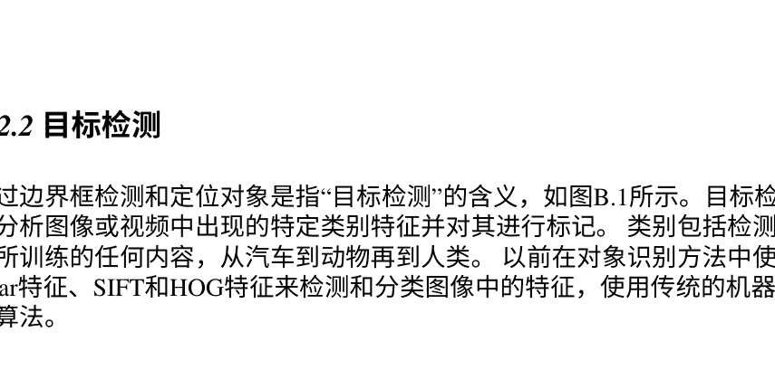

图. B.1 计算机视觉中的目标检测和定位方法

除了耗时且容易出错外，这种方法对可以识别的对象总数有严格限制。因此，常常使用YOLO、RCNN、SSD等DL模型来实现这一目的，因为它们使用数百万个参数来克服这些限制。对象识别，也称为对象分类，通常与对象检测一起进行。

#### B.2.3 图像分割

图像分割是将图像分成子部分或子对象的过程，以展示计算机能够区分背景和/或同一图像中的另一个对象。图像的“分割”是神经网络在图像中检测到的某种类型的实体，由像素掩码表示，可以用于提取它。这个有趣的计算机视觉主题已经得到了广泛研究，既使用传统的图像处理技术，如分水岭算法和基于聚类的分割，也使用流行的现代深度学习架构，如PSPNet、FPN、U-Net、SegNet等。

#### B.2.4 人脸和人物识别

人脸识别是目标检测的一个子集，其中主要检测到的主体是人脸。虽然目标检测是识别和定位特征的任务，但人脸识别不仅可以检测，还可以识别已识别的人脸。人脸识别系统寻找常见的特征和标志，如眼睛、嘴唇或鼻子，并根据这些特征及其位置对人脸进行分类。一些基于深度学习算法的强大策略可以在文章中找到，例如FaceNet（Schroff等，2015年）。

#### B.2.5 边缘检测

边缘检测是识别物体边界的过程。它通过使用数学算法进行算法处理，帮助检测图像亮度的突变或不连续性。传统的基于图像处理的技术，如Canny边缘检测和使用专门的边缘检测滤波器的卷积，广泛用于边缘检测，这经常作为几个任务的预处理步骤。此外，图像中的边缘提供了关于图像组成的重要信息，这就是为什么所有的深度学习算法都进行内部边缘检测，以收集利用可学习的卷积核的全局低级特征。

#### B.2.6 图像恢复

图像恢复是指恢复或重建老化和褪色的旧硬拷贝图像，这些图像的获取和保存不当，导致图像质量的损失。典型的图像恢复策略涉及使用数学工具减少加性噪声，但有时重建需要进行重大改变，需要进一步分析和图像修复。

图像修复是使用生成模型填补图像中损坏区域的过程，这些模型估计图像的意图。通常，修复技术之后会进行着色过程，将图像的主题（如果是黑白图像）以尽可能真实的方式着色。

#### B.2.7 特征匹配

在计算机视觉中，特征是图像中提供关于给定图像的最多信息的部分。由于边缘是物体复杂性的强大标记，更好的定位和清晰的细节，如角点，也是特征。特征匹配允许我们将一个图像的可比较区域的特征与另一个图像的相似区域的特征进行比较。

特征匹配在计算机视觉任务中具有应用，如目标检测和相机校准。一般来说，匹配特征的任务按照以下顺序完成：

1.  特征识别：通常使用哈里斯角点检测、SIFT和SURF等图像处理方法来检测感兴趣区域。
2.  本地描述符的形成：在检测到特征后，收集每个关键点周围的区域，并获取这些感兴趣区域的本地描述符。本地描述符是一个点的邻域的表示，因此对于匹配特征非常有用。
3.  特征匹配：为了完成特征匹配阶段，将特征及其本地描述符在相关图像中进行匹配。

#### B.2.8 场景重建

场景重建是计算机视觉中最困难的挑战之一，它是从图像中对物体进行数字三维重建。大多数场景重建算法在物体表面构建点云，并从该点云重建网格。

#### B.2.9 视频运动分析

在计算机视觉中，视频运动分析（VMA）是指对移动物体或动物及其运动轨迹的研究。物体识别、跟踪、分割和姿势估计只是运动分析的一分子任务。除了运动领域，VMA还被应用于医疗保健、智能监控、物理治疗、智能生产单元以及对微生物（如细菌和病毒）进行计数和监测。

# 参考文献

- Aamodt, A., Plaza, E.: 基于案例的推理: 基础问题、方法变化和系统方法. AI通讯. 7(1), 39–59 (1994)

- Abbott, L.F., Nelson, S.B.: 突触可塑性: 驯服野兽. 自然神经科学. 3(11), 1178–1183 (2000)

- Abdal, R., Qin, Y., Wonka, P.: Image2stylegan: 如何将图像嵌入到stylegan潜在空间中? 在: IEEE国际计算机视觉会议, pp. 4432–4441 (2019)

- Abdal, R., Qin, Y., Wonka, P.: Image2stylegan++: 如何编辑嵌入的图像? 在: IEEE/CVF计算机视觉与模式识别会议论文集, pp. 8296–8305 (2020)

- Abdal, R., Zhu, P., Mitra, N.J., Wonka, P.: Styleflow: 属性条件下的StyleGAN生成图像探索，使用条件连续归一化流. ACM图形学交易 (ToG) 40(3), 1–21 (2021)

- Abonyi, J., Nagy, L., Szeifert, F.: 混合模糊卷积建模和化学识别过程系统. Int. J. Syst. Sci. 31(4), 457–466 (2000)

- Achanta, R., Shaji, A., Smith, K., Lucchi, A., Fua, P., Süström, S.: Slic超像素与最先进的超像素方法相比. IEEE Trans. Pattern Anal. Mach. Intell. 34(11), 2274–2282 (2012)

- Acharya, U.R., Oh, S.L., Hagiwara, Y., Tan, J.H., Adam, M., Gertych, A., San Tan, R.: 一个深度卷积神经网络模型用于分类心跳. Comput. Biol. Med. 89, 389–396 (2017)

- Acharya, U.R., Oh, S.L., Hagiwara, Y., Tan, J.H., Adeli, H.: 使用EEG信号的深度卷积神经网络自动检测和诊断癫痫. 计算生物医学. 100, 270–278 (2018)

- Ackley, D.H., Hinton, G.E., Sejnowski, T.J.: 一种Boltzmann机器的学习算法. 认知科学. 9(1), 147–169 (1985)

- Adadi, A., Berrada, M.: 窥探黑盒子内部: 可解释人工智能(XAI)综述. IEEE Access. 6, 52138–52160 (2018)

- Adebayo, J., Gilmer, J., Muelly, M., Goodfellow, I., Hardt, M., Kim, B.: 敏感性图的合理性检查. 高级神经信息处理系统. 31 (2018)

- Aguirre, E., Alfonseca, E., Hall, K., Kravalova, J., Pasca, M., Soroa, A.: 使用分布式和基于WordNet的方法研究相似性和相关性 (2009)

- Ahmad, M.A., Eckert, C., Teredesai, A.: 可解释的医疗机器学习. 在: ACM国际生物信息学、计算生物学和健康信息学会议, pp. 559-560 (2018)

- Alain, G., Bengio, Y.: 使用线性分类器探测器理解中间层 (2016). arXiv:1610.01644

- Alameda-Pineda, X., Redi, M., Celis, E., Sebe, N., Chang, S.F.: Fat/mm'19: 多媒体中的公平性、问责制和透明度的第一届国际研讨会. 在: ACM国际多媒体会议, pp. 2728-2729 (2019)

- Alcalá, R., Casillas, J., Cordón, O., Herrera, F., Zwir, S.: 用于学习和调整模糊规则系统的技术，用于学习和调整模糊规则系统进行语言建模和应用. ETS de Ingeniería Informática. Granada大学，格拉纳达，西班牙 (1999)

- Alemohammad, H.: Radiant mlhub: 用于机器学习的地理空间训练数据库. 在: AGU秋季会议摘要, 第2019卷, 第IN11A-05页 (2019)

- Alexander Mordvintsev, C.O., Tyka, M.: Deepdream-用于可视化神经网络的代码示例 (2015a). https://ai.googleblog.com/2015/07/deepdream-code-example-for-visualizing.html

- Alexander Mordvintsev, C.O., Tyka, M.: Inceptionism: 深入探索神经网络 (2015b). https://ai.googleblog.com/2015/06/inceptionism-going-deeper-into-neural.html

- Alon, U.: 网络模式：理论和实验方法. Nat. Rev. Genet. 8(6), 450–461 (2007)

- Altmann, A., Toloși, L., Sander, O., Lengauer, T.: 排列重要性：一种修正的特征重要性度量. 生物信息学 26(10), 1340–1347 (2010)

- Altmann, E.M., Gray, W.D.: 忘记记住：衰减和干扰的功能关系. Psychol. Sci. 13(1), 27–33 (2002)

- Alvarez Melis, D., Jaakkola, T.: 通过自解释神经网络实现稳健的可解释性. Adv. Neural Inf. Process. Syst. 31 (2018)

- Alvarez-Melis, D., Jaakkola, T.S.: 一个用于解释黑盒子序列到序列模型预测的因果框架 (2017). arXiv:1707.01943

- Alvarez-Melis, D., Jaakkola, T.S.: 自解释神经网络 (2018)

- Ang, K.K., Quek, C.: Rspop: 基于粗糙集的伪外积模糊规则识别算法. Neural Comput. 17(1), 205–243 (2005)

- Ang, K.K., Quek, C., Pasquier, M.: Popfnn-cri(s): 基于伪外积的模糊神经网络，使用推理的组合规则和单例模糊化器. IEEE Trans. Syst. Man Cybern. Part B (Cybernetics) 33(6), 838–849 (2003)

- Angelov, P., Soares, E.: 迈向可解释的深度神经网络 (XDNN). Neural Netw. 130, 185–194 (2020)

- Angles, R., Gutierrez, C.: 图数据库模型综述. ACM Comput. Surv. (CSUR) 40(1), 1–39 (2008)

- Apley, D.W., Zhu, J.: 可视化黑盒监督学习模型中预测变量的影响. J. R. Stat. Soc.: Ser. B (Statistical Methodology) 82(4), 1059–1086 (2020)

- Arik, S.O., Pfister, T.: Protoattend: 基于注意力的原型学习 (2019). arXiv:1902.06292

- Arras, L., Horn, F., Montavon, G., Müller, K.R., Samek, W.: "一个文本文档中什么是相关的？":一种可解释的机器学习方法. PloS One 12(8), e0181142 (2017)

- Arras, L., Montavon, G., Müller, K.R., Samek, W.: 解释情感分析中的递归神经网络预测 (2017). arXiv:1706.07206

- Arrieta, A.B., Díaz-Rodríguez, N., Del Ser, J., Bennetot, A., Tabik, S., Barbado, A., García, S., Gil-López, S., Molina, D., Benjamins, R., 等: 可解释的人工智能 (XAI)：概念、分类、机会和面向负责任的AI的挑战. Inf. Fusion 58, 82-115 (2020)

- Ashrafi, M., Chua, L.H.C., Quek, C.: 通用自适应高斯模糊模型在降雨-径流和河流路由建模中的适用性. Hydrol. Res. (2019)

- Athalye, A., Engstrom, L., Ilyas, A., Kwok, K.: 合成强健的对抗样本. 在: 国际机器学习会议, pp. 284-293. PMLR (2018)

- Atz, K., Grisoni, F., Schneider, G.: 分子表示的几何深度学习. Nat. Mach. Intell. 1-10 (2021)

- Aubry, M., Russell, B.C.: 通过计算机生成的图像理解深度特征. 在: IEEE国际计算机视觉会议论文集, pp. 2875-2883 (2015)

- Auer, S., Bizer, C., Kobilarov, G., Lehmann, J., Cyganiak, R., Ives, Z.: Dbpedia：开放数据网络的核心. 在: 语义Web, pp. 722-735. Springer (2007)

- Augasta, M.G., Kathirvalavakumar, T.: 反向工程神经网络以提取分类问题中的规则. 神经过程. 信件. 35(2), 131-150 (2012)

- Aull, C.E.: 第一个对称导数. 美国数学月刊. 74(6), 708-711 (1967)

- Ba, L.J., Caruana, R.: 深度网络真的需要很深吗? (2013). arXiv:1312.6184

- Bach, S., Binder, A., Montavon, G., Klauschen, F., Müller, K.R., Samek, W.: 通过逐层相关传播对非线性分类器决策进行像素级解释. PLoS One 10(7), e0130140 (2015)

- Baehrens, D., Schroeter, T., Harmeling, S., Kawanabe, M., Hansen, K., Müller, K.R.: 如何解释个别分类决策. J. Mach. Learn. Res. 11, 1803–1831 (2010)

- Baena-Garcia, M., del Campo-Ávila, J., Fidalgo, R., Bifet, A., Gavalda, R., Morales-Bueno, R.: 早期漂移检测方法. 在: 第四届国际数据流知识发现研讨会, 第6卷, pp. 77-86 (2006)

- Bahdanau, D., Cho, K., Bengio, Y.: 通过联合学习对齐和翻译的神经机器翻译 (2014). arXiv:1409.0473

- Bakken, M., Kvam, J., Stepanov, A.A., Berge, A.: 卷积神经网络中的主要特征可视化. 在: 欧洲计算机视觉会议, pp. 18-31. Springer (2020)

- Baldassarre, F., Azizpour, H.: 图卷积网络的可解释性技术. 在: 国际机器学习会议 (ICML) 研讨会, 2019年图结构表示学习和推理研讨会 (2019)

- Balduzzi, D., Frean, M., Leary, L., Lewis, J., Ma, K.W.D., McWilliams, B.: 破碎的梯度问题：如果ResNets是答案，那么问题是什么? 在: 国际机器学习会议, pp. 342-350. PMLR (2017)

- Banach, S.: 关于抽象集合中的运算及其在积分方程中的应用. 基础数学. 3(1), 133-181 (1922)

- Bansal, A., Farhadi, A., Parikh, D.: 朝着透明系统：故障模式的语义表征. 在: 欧洲计算机视觉会议, pp. 366-381. Springer (2014)

- Bansal, A., Nanduri, A., Castillo, C.D., Ranjan, R., Chellappa, R.: Umdfaces：用于训练深度网络的注释人脸数据集. 在: 2017年IEEE国际联合生物特征学会议 (IJCB), pp. 464-473. IEEE (2017)

- Bansal, G., Weld, D.: 一种基于覆盖率的未知未知识别实用模型. 在: AAAI人工智能会议, 第32卷 (2018)

- Barbu, A., Mayo, D., Alverio, J., Luo, W., Wang, C., Gutfreund, D., Tenenbaum, J., Katz, B.: Objectnet: 一个用于推动物体识别模型极限的大规模偏差控制数据集. Adv. Neural Inf. Process. Syst. 32 (2019)

- Bargmann, C.I.: 超越连接组：神经调节物质如何塑造神经回路. Bioessays 34(6), 458–465 (2012)

- Barocas, S., Selbst, A.D.: 大数据的不平等影响. 加州法律评论 104, 671 (2016)

- Battaglia, P.W., Hamrick, J.B., Bapst, V., Sanchez-Gonzalez, A., Zambaldi, V., Malinowski, M., Tacchetti, A., Raposo, D., Santoro, A., Faulkner, R., 等: 关系归纳偏差、深度学习和图网络 (2018). arXiv:1806.01261

- Bau, D., Andonian, A., Cui, A., Park, Y., Jahanian, A., Oliva, A., Torralba, A.: 用文字绘画 (2021). arXiv:2103.10951

- Bau, D., Zhou, B., Khosla, A., Oliva, A., Torralba, A.: 网络剖析：量化深度视觉表示的可解释性. 在: IEEE计算机视觉和模式识别会议论文集, pp. 6541-6549 (2017)

- Bau, D., Zhu, J.Y., Strobelt, H., Lapedriza, A., Zhou, B., Torralba, A.: 理解深度神经网络中个体单元的作用. 国家科学院学报 117(48), 30071-30078 (2020)

- Bau, D., Zhu, J.Y., Strobelt, H., Zhou, B., Tenenbaum, J.B., Freeman, W.T., Torralba, A.: GAN剖析：可视化和理解生成对抗网络 (2018). arXiv:1811.10597

- Bau, D., Zhu, J.Y., Wulff, J., Peebles, W., Strobel, H., Zhou, B., Torralba, A.: 看到GAN无法生成的东西. 在: IEEE/CVF国际计算机视觉会议论文集, pp. 4502-4511 (2019)

- Bay, H., Tuytelaars, T., Gool, L.V.: Surf: 加速稳健特征. 在: 欧洲计算机视觉会议, pp. 404-417. Springer (2006)

- Beck, A., Teboulle, M.: 用于线性逆问题的快速迭代收缩阈值算法. SIAM J. Imaging Sci. 2(1), 183-202 (2009)

- Bede, B.: 具有基于Sigmoid的成员函数的模糊系统作为可解释的神经网络. 在: 国际模糊系统协会世界大会, pp. 157-166. Springer (2019)

- Bello, I., Fedus, W., Du, X., Cubuk, E.D., Srinivas, A., Lin, T.Y., Shlens, J., Zoph, B.: 重新审视resnets: 改进的训练和扩展策略. Adv. Neural Inf. Process. Syst. 34 (2021)

- Benamira, A., Devillers, B., Lesot, E., Ray, A.K., Saadi, M., Malliaros, F.D.: 半监督学习和图神经网络用于假新闻检测. 在: IEEE/ACM国际会议关于社交网络分析与挖掘的进展 (ASONAM), pp. 568–569. IEEE (2019)

- Bengfort, B., Bilbro, R.: Yellowbrick: 可视化scikit-learn模型选择过程. J. Open Source Softw. 4(35), 1075 (2019)

- Bengio, Y., Courville, A., Vincent, P.: 表示学习：综述与新视角. IEEE Trans. Pattern Anal. Mach. Intel. 35(8), 1798–1828 (2013)

- Bengio, Y., Goodfellow, I., Courville, A.: 深度学习, 卷1. MIT出版社, 剑桥, 麻省, 美国 (2017)

- Bengio, Y., Lamblin, P., Popovici, D., Larochelle, H.: 贪婪逐层训练深度网络. Adv. Neural Inf. Process. Syst. 19 (2006)

- Bengio, Y., Paiement, J.F., Vincent, P., Delalleau, O., Roux, N., Ouimet, M.: lle, isomap, mds, eigenmaps和谱聚类的样本外扩展. Adv. Neural Inf. Process. Syst. 16 (2003)

- Benjamins, R., Barbado, A., Sierra, D.: 设计实践中的负责任人工智能 (2019). arXiv:1909.12838

- Bennetot, A., Laurent, J.L., Chatila, R., Díaz-Rodríguez, N.: 迈向可解释的神经符号视觉推理 (2019). arXiv:1909.09065

- Bennett, J.: OpenStreetMap. Packt Publishing Ltd (2010)

- Berenji, H.R., Khedkar, P.: 通过强化学习学习和调整模糊逻辑控制器. IEEE Trans. Neural Netw. 3(5), 724–740 (1992)

- Bhagat, S., Cormode, G., Muthukrishnan, S.: 社交网络中的节点分类. 在: 社交网络数据分析, pp. 115–148. Springer (2011)

- Bhatt, D., Patel, C., Talsania, H., Patel, J., Vaghela, R., Pandya, S., Modi, K., Ghayvat, H.: 计算机视觉中的CNN变体: 历史、架构、应用、挑战和未来发展方向. Electronics 10(20), 2470 (2021)

- Bhuta, N., Beck, S., Geiß, R., Liu, H.Y., Kreiß, C.: 自主武器系统：法律、伦理、政策. 剑桥大学出版社 (2016)

- Biecek, P., Burzykowski, T.: 解释性模型分析：探索. 查普曼和霍尔/CRC, 解释和检验预测模型 (2021)

- Bien, J., Tibshirani, R.: 可解释分类的原型选择. Ann. Appl. Stat. 5(4), 2403–2424 (2011)

- Bienenstock, E.L., Cooper, L.N., Munro, P.W.: 神经元选择性发展的理论：视觉皮层中的方向特异性和双眼互动. J. Neurosci. 2(1), 32–48 (1982)

- Biffi, C., Oktay, O., Tarroni, G., Bai, W., Marvao, A.D., Doumou, G., Rajchl, M., Bedair, R., Prasad, S., Cook, S., 等: 通过深度生成模型学习可解释的解剖特征：应用于心脏重塑. 在: 国际医学图像计算和计算机辅助干预会议, pp. 464–471. Springer (2018)

- Bilal, A., Jourabloo, A., Ye, M., Liu, X., Ren, L.: 卷积神经网络是否学习类别层次结构？ IEEE Trans. Vis. Comput. Graph. 24(1), 152–162 (2017)

# 参考文献

- Birant, D., Kut, A.: St-dbscan: 一种用于聚类时空数据的算法。Data Knowl. Eng. 60(1), 208–221 (2007)
- Bishop, C.: 改进径向基函数神经网络的泛化性能。Neural Comput. 3(4), 579–588 (1991)
- Bishop, C.M., et al.: 模式识别的神经网络。牛津大学出版社 (1995)
- Bloniarz, A., Talwalkar, A., Yu, B., Wu, C.: 用于分布式非参数回归的监督邻域。在: 人工智能和统计学, pp. 1450–1459. PMLR (2016)
- Brennan, T., Dieterich, W.: 用于替代制裁的矫正罪犯管理概况(com pas). Handb. Recidiv. Risk/Needs Assess. Tools 49 (2018)
- Bronstein, M.M., Bruna, J., LeCun, Y., Szlam, A., Vandergheynst, P.: 几何深度学习：超越欧几里得数据。IEEE信号处理杂志。 34(4), 18-42 (2017)
- Brown, J.: 即时记忆衰减理论的一些测试。Q. J. Exp. Psychol. 10(1), 12-21 (1958)
- Brown, P.F., Della Pietra, V.J., Desouza, P.V., Lai, J.C., Mercer, R.L.: 基于类别的自然语言n-gram模型。计算机语言学。 18(4), 467-480 (1992)
- Brown, T.B., Man, D., Roy, A., Abadi, M., Gilmer, J.: 对抗性贴片 (2017). arXiv: 1712.09665
- Brownlee, J.: 聪明的算法：自然启发式编程配方。 Jason Brownlee (2011)
- Buckley, J.J., Hayashi, Y.: 模糊神经网络：一项调查。模糊集合系统。 66(1), 1-13 (1994)
- Buda, M., Maki, A., Mazurowski, M.A.: 卷积神经网络中类别不平衡问题的系统研究。神经网络。 106, 249-259 (2018)
- Budanitsky, A., Hirst, G.: 评估基于WordNet的词汇语义相关性度量方法。Comput. Linguist. 32(1), 13–47 (2006)
- Bui, T.D., Ravi, S., Ramavajjala, V.: 神经图学习：使用图训练神经网络。在：第十一届ACM国际网络搜索和数据挖掘会议论文集, pp. 64–71 (2018)
- Bunt, A., Lount, M., Lauzon, C.: 解释总是重要吗？ 一项关于部署的低成本智能交互系统的研究。 在: ACM智能用户界面国际会议, pp. 169–178 (2012)
- Butola, A., Prasad, D.K., Ahmad, A., Dubey, V., Qaiser, D., Srivastava, A., Senthilkumaran, P., Ahluwalia, B.S., Mehta, D.S.: 用于诊断决策支持的深度学习架构“lightoct”在生物样本的光学相干断层扫描图像中。生物医学光学表达11(9), 5017–5031 (2020)
- Caesar, H., Bankiti, V., Lang, A.H., Vora, S., Liong, V.E., Xu, Q., Krishnan, A., Pan, Y., Baldan, G., Beijbom, O.: Nuscenes: 用于自动驾驶的多模态数据集。 在: 计算机视觉和模式识别的IEEE/CVF会议论文集, 第11621-11631页 (2020)
- Calude, C.S., Longo, G.: 大数据中虚假相关性的洪水。科学基础。 22(3), 595-612 (2017)
- Carlini, N., Wagner, D.: 评估神经网络的鲁棒性。 在: 2017年IEEE安全与隐私研讨会（SP）, 第39-57页。IEEE (2017)
- Caruana, R., Lou, Y., Gehrke, J., Koch, P., Sturm, M., Elhadad, N.: 可理解的医疗模型：预测肺炎风险和30天住院再入院。 在: 第21届ACM SIGKDD国际知识发现与数据挖掘会议论文集, 第1721-1730页(2015)
- Casillas, J., Cordón, O., Triguero, F.H., Magdalena, L.: 模糊建模中的可解释性问题, 第128卷。Springer (2013)
- Chai, Y., Jia, L., Zhang, Z.: 基于Mamdani模型的自适应神经模糊推理系统及其应用。Int. J. Comput. Intell. 5(1), 22-29 (2009)
- Chakraborty, S., Tomsett, R., Raghavendra, R., Harborne, D., Alzantot, M., Cerutti, F., Srivastava, M., Preece, A., Julier, S., Rao, R.M等: 深度学习模型的可解释性：结果概述。在: 2017 IEEE智能世界, 普适智能与计算, 先进与可信计算, 可扩展计算与通信, 云计算与大数据计算, 人与智能城市创新 (smartworld/SCALCOM/UIC/ATC/CBDcom/IOP/SCI) , 第1-6页。IEEE (2017)
- Chang, A.X., Funkhouser, T., Guibas, L., Hanrahan, P., Huang, Q., Li, Z., Savarese, S., Savva, M., Song, S., Su, H., et al.: Shapenet: 一个信息丰富的3D模型库 (2015). arXiv:1512.03012
- Chang, P.C., Liu, C.H.: 一种基于模糊规则的股票价格预测系统. 专家系统应用 34(1), 135–144 (2008)
- Che, Z., Purushotham, S., Khemani, R., Liu, Y.: 从深度网络中提取知识，并应用于医疗领域 (2015). arXiv:1512.03542
- Che, Z., Purushotham, S., Khemani, R., Liu, Y.: 可解释的深度模型用于ICU结果预测. In: AMIA年度研讨会论文集, vol. 2016, p. 371. 美国医学信息学协会 (2016)
- Chen, C., Li, O., Tao, D., Barnett, A., Rudin, C., Su, J.K.: 这看起来像那样： 用于可解释图像识别的深度学习。 Adv. Neural Inf. Process. Syst. 32 (2019)
- Chen, J., Song, L., Wainwright, M., Jordan, M.: 学习解释： 模型解释的信息论视角。 In: 国际机器学习会议， 第883–892页. PMLR (2018)
- Chen, K., Hwu, T., Kashyap, H.J., Krichmar, J.L., Stewart, K., Xing, J., Zou, X.: 神经机器人作为神经行为学和可解释人工智能的手段。 Front. Neurorobotics 14, 570308 (2020)
- Chen, M., Shi, X., Zhang, Y., Wu, D., Guizani, M.: 用卷积自编码神经网络进行医学图像分析的深度特征学习。 IEEE Trans, Big Data (2017)
- Chen, P.Y., Sharma, Y., Zhang, H., Yi, J., Hsieh, C.J.: Ead: 弹性网络对深度神经网络的攻击通过对抗性示例。 In: AAAI人工智能会议论文集, 第32卷 (2018)
- Chen, W., Grangier, D., Auli, M.: 训练大词汇神经语言模型的策略 (2015). arXiv:1512.04906
- Chen, C.L., Philip, Z., Chen, C.Y., Gan, M.: 用于增强深度学习的模糊受限玻尔兹曼机。 IEEE模糊系统交易, 23(6), 2163–2173, IEEE (2015)
- Chen, X., Duan, Y., Houthooft, R., Schulman, J., Sutskever, I., Abbeel, P.: Infogan: 通过最大化信息的生成对抗网络进行可解释的表示学习。 Adv. Neural Inf.Process. Syst. 29 (2016)
- Chen, Y.F., Everett, M., Liu, M., How, J.P.: 具有深度强化学习的社交感知运动规划。 在: IEEE/RSJ国际智能机器人与系统会议(IROS), pp.1343–1350. IEEE (2017)
- Chen, W., An, J., Li, R., Fu, L., Xie, G., Bhuiyan, M.Z.A., Li, K.: 一种新颖的模糊深度学习方法用于具有不确定的时空数据特征的交通流预测。 未来一代计算机系统。 89, 78-88, Elsevier (2018)
- Chen, Z., Bei, Y., Rudin, C.: 用于可解释的图像识别的概念漂白。 Nat. Mach. Intell. 2(12), 772-782 (2020)
- Cherepkov, A., Voynov, A., Babenko, A.: 在语义图像编辑中导航gan参数空间。 在: IEEE/CVF计算机视觉和模式识别会议论文集, pp. 3671-3680 (2021)
- Cheu, E.Y., Quek, C., Ng, S.K.: Arpop:一种受到海兔摄食行为的食欲奖励伪外积神经模糊推理系统的启发。 IEEE Trans. Neural Netw. Learn. Syst. 23(2), 317–329 (2012)
- Ching, T., Himmelstein, D.S., Beaulieu-Jones, B.K., Kalinin, A.A., Do, B.T., Way, G.P., Ferrero, E., Agapow, P.M., Zietz, M., Hoffman, M.M., 等： 生物学和医学中深度学习的机遇和障碍。 J. R. Soc. Interface 15(141), 20170387 (2018)
- Choi, E., Bahadori, M.T., Sun, J., Kulas, J., Schuetz, A., Stewart, W.: Retain: 一种可解释的使用逆时间注意机制的医疗预测模型。 Adv. Neural Inf. Process. Syst. 29 (2016)
- Chollet, F.: Xception: 使用深度可分离卷积的深度学习。 In: Proceedings of the IEEE Conference on Computer Vision and Pattern Recognition, pp. 1251–1258 (2017)
- Cichy, R., Dwivedi, K.: Algonauts项目2021挑战： 人脑如何理解一个运动中的世界。 arxiv, 1, 2021. http://algonauts.csail.mit.edu
- Collobert, R., Weston, J.: 用于自然语言处理的统一架构：深度神经网络与多任务学习。在：机器学习国际会议，第160-167页(2008)
- Cordts, M., Omran, M., Ramos, S., Rehfeld, T., Enzweiler, M., Benenson, R., Franke, U., Roth, S., Schiele, B.: 用于语义城市场景理解的Cityscapes数据集。在：计算机视觉和模式识别IEEE会议论文集，第3213-3223页(2016)
- Cortes, C., Vapnik, V.: 支持向量机。机器学习。**20**(3), 273-297页(1995)
- Cour, T., Sapp, B., Jordan, C., Taskar, B.: 从模糊标记的图像中学习。在：2009年IEEE计算机视觉和模式识别会议，第919-926页。IEEE (2009)
- Cover, T.M.: 具有应用于模式识别的线性不等式系统的几何和统计特性。IEEE Trans. Electron. Comput. **3**, 326-334页(1965)
- Craw, S., Aamodt, A.: 基于案例的推理作为认知人工智能模型。在：案例推理国际会议上，第62-77页。Springer (2018)
- Crawford, K., Calo, R.: AI研究存在一个盲点。Nature **538**(7625), 311–313 (2016)
- Csurka, G., Dance, C., Fan, L., Willamowski, J., Bray, C.: 基于关键点的视觉分类。在：计算机视觉统计学习研讨会，ECCV，第1卷，第1-2页。布拉格 (2004)
- Cui, Z., Chen, W., Chen, Y.: 多尺度卷积神经网络用于时间序列分类 (2016). arXiv:1603.06995
- Cunningham, P.: 一种基于案例推理的相似性机制分类法。IEEE Trans. Knowl. Data Eng. **21**(11), 1532–1543 (2008)
- Cybenko, G.: 通过超级位置的Sigmoid函数逼近。数学控制信号系统 **2**(4), 303–314 (1989)
- Dabkowski, P., Gal, Y.: 用于黑盒分类器的实时图像显著性。高级神经信息系统 **30** (2017)
- Dailey, M.N., Cottrell, G.W., Padgett, C., Adolphs, R.: Empath: 一种对面部表情进行分类的神经网络。认知神经科学杂志 **14**(8), 1158–1173 (2002)
- Dalal, N., Triggs, B.: 用于人体检测的梯度方向直方图。在：IEEE计算机视觉和模式识别会议，卷1, 页码886–893. IEEE (2005)
- d’Alessandro, B., O’Neil, C., LaGatta, T.: 负责任的分类：数据科学家对歧视感知分类的指南。大数据 **5**(2), 120–134 (2017)
- d’Angelo, E., Jacques, L., Alahi, A., Vanderheynst, P.: 从位到图像：本地二进制描述符的反演。IEEE Trans. Pattern Anal. Mach. Intell. **36**(5), 874–887 (2013)
- Das, R.T., Ang, K.K., Quek, C.: ierspop：一种新颖的基于增量粗糙集的伪外积与集成学习。Appl. Soft Comput. **46**, 170–186 (2016)
- Datta, A., Sen, S., Zick, Y.: 通过定量输入影响实现算法透明性：理论和学习系统实验。在：IEEE安全与隐私研讨会（SP），第598–617页。IEEE（2016）
- Dauphin, Y.N., Fan, A., Auli, M., Grangier, D.: 带门控卷积的语言建模网络。在：国际机器学习会议，第933–941页。PMLR（2017）
- de Campos Souza, P.V.: 模糊神经网络和神经模糊网络：文献中使用的主要技术和应用综述。Appl. Soft Comput. **92**, 106275 (2020)
- Deng, J., Dong, W., Socher, R., Li, L.-J., Li, K., Fei-Fei, L.: Imagenet：一个大规模的分层图像数据库。在：2009年IEEE计算机视觉与模式识别会议，第248–255页。IEEE（2009）
- Deng, Y., Ren, Z., Kong, Y., Bao, F., Dai, Q.: 一种用于数据分类的分层融合模糊深度神经网络。IEEE Trans. Fuzzy Syst. **25**(4), 1006-1012（2016）
- DeVries, T., Taylor, G.W.: 改进卷积神经网络的正则化方法：切割（2017）。arXiv:1708.04552
- Dhurandhar, A., Chen, P.Y., Luss, R., Tu, C.C., Ting, P., Shanmugam, K., Das, P.: 基于缺失的解释：朝着具有相关否定的对比解释。Adv. NeuralInf. Process. Syst. **31** (2018)
- Di Gangi, M.A., Cattoni, R., Bentivogli, L., Negri, M., Turchi, M.: Must-c: 一个多语言语音翻译语料库。 在：2019年北美计算语言学协会会议：人类语言技术，第2012-2017页。 计算语言学协会 (2019)
- Diez-Olivan, A., Del Ser, J., Galar, D., Sierra, B.: 数据融合和机器学习在工业预测中的趋势和展望：面向工业4.0. Inf. Fusion 50, 92–111 (2019)
- Doran, D., Schulz, S., Besold, T.R.: 可解释人工智能真正意味着什么？ 透视的新概念化 (2017). arXiv:1710.00794
- Doshi-Velez, F., Kim, B.: 迈向可解释机器学习的严谨科学 (2017). arXiv:1702.08608
- Doilović, F.K., Brćić, M., Hlupić, N.: 可解释人工智能综述. In: 国际信息与通信技术、电子与微电子会议(MIPRO), pp. 0210–0215. IEEE (2018)
- Dosovitskiy, A., Brox, T.: 使用卷积网络反转视觉表示。 在: 计算机视觉和模式识别的IEEE会议论文集，第4829-4837页(2016)
- Dosovitskiy, A., Brox, T., 等: 使用卷积网络反转卷积网络，第4卷 (2015). arXiv:1506.02753
- Du, M., Liu, N., Hu, X.: 可解释机器学习的技术。 ACM通信 63(1), 68-77页 (2019)
- Dumoulin, V., Visin, F.: 深度学习中的卷积算术指南 (2016). arXiv:1603.07285
- Dunteman, G.H.: 主成分分析，第69卷. SAGE出版社 (1989)
- Durugkar, I., Gemp, I., Mahadevan, S.: 生成多对抗网络。 在: 国际学习表示会议上 (2017)
- Eberle, O., Buttner, J., Krütli, F., Müller, K.R., Valleriani, M., Montavon, G.: 构建和解释深度相似性模型 (2020). arXiv:2003.05431
- El Hatri, C., Boumhidi, J., 基于模糊深度学习的城市交通事故检测。 Cognitive Systems Research, 50, 206–213, Elsevier (2018)
- Ekman, F., Johansson, M., Sochor, J.: 在自动驾驶系统中创建适当的信任: 人机界面设计框架。 IEEE Trans. Hum.-Mach. Syst. 48(1), 95–101 (2017)
- Eksombatchai, C., Jindal, P., Liu, J.Z., Liu, Y., Sharma, R., Sugnet, C., Ulrich, M., Leskovec, J.: Pixie: 实时向2亿用户推荐30亿个物品的系统。 In: 世界Wide Web Conference, pp. 1775–1784 (2018)
- Erhan, D., Bengio, Y., Courville, A., Vincent, P.: 可视化深度网络的高层特征。 Univ. Montr. 1341(3), 1 (2009)
- Everingham, M., Van Gool, L., Williams, C.K., Winn, J., Zisserman, A.: The pascal visual object classes (voc) challenge. Int. J. comput. Vis. 88(2), 303–338 (2010)
- Fan, F., Wang, G.: 模糊逻辑解释二次网络。 Neurocomputing 374, 10–21 (2020)
- Fan, F.L., Xiong, J., Li, M., Wang, G.: 关于人工神经网络可解释性的调查。 IEEE Trans. Radiat. Plasma Med. Sci. 5(6), 741–760 (2021)
- Faruqui, M., Dyer, C.: 使用多语言相关性改进向量空间词表示. 在: 欧洲协会计算语言学第14届会议论文集, 第462-471页 (2014)
- Faruqui, M., Tsvetkov, Y., Rastogi, P., Dyer, C.: 使用词相似性任务评估词嵌入的问题 (2016). arXiv:1605.02276
- Fawaz, H.I., Forestier, G., Weber, J., Idoumghar, L., Muller, P.A.: 时间序列分类的深度学习综述. 数据挖掘与知识发现 33(4), 917-963 (2019)
- Fei-Fei, L., Fergus, R., Perona, P.: 对象类别的单次学习. IEEE模式分析与机器智能 28(4), 594-611 (2006)
- Feige, U.: 对于近似集覆盖的ln n阈值. J. ACM (JACM) 45(4), 634–652 (1998)

Felzenszwalb, P.F., Huttenlocher, D.P.: 高效基于图的图像分割. Int. J. Comput. Vis. 59(2), 167–181 (2004)

Ferret, O.: 从语料库中测试语义相似度度量的同义词提取. In: 第七届国际语言资源和评估会议论文集 (LREC’10)(2010)

Finkelstein, L., Gabrilovich, E., Matias, Y., Rivlin, E., Solan, Z., Wolfman, G., Ruppin, E.: 将搜索置于上下文中: 重新审视这个概念. In: 世界广域网国际会议, pp.406–414 (2001)

Firth, J.R.: 语言学理论概要, 1930–1955. 语言学分析研究 (1957)

Fong, R.C., Vedaldi, A.: 通过有意义的扰动解释黑盒子. In: IEEE国际计算机视觉会议论文集, pp. 3429–3437 (2017)

Frankle, J., Carbin, M.: 彩票假设: 寻找稀疏、可训练的神经网络 (2018). arXiv:1803.03635

Freitas, A.A.: 可理解的分类模型: 一个立场文件. ACM SIGKDD Explor. Newsl. 15(1), 1–10 (2014)

Friedman, J.H., Popescu, B.E.: 通过规则集合进行预测学习. Ann. Appl. Stat. 916–954 (2008)

Fritzke, B.: 增量RBF网络的快速学习. 神经过程. Lett. 1(1), 2–5 (1994)

Fritzke, B.: 一个成长的神经气体网络学习拓扑. Adv. Neural Inf. Process. Syst. 7 (1994)

Frosst, N., Hinton, G.: 将神经网络提炼为软决策树 (2017). arXiv:1711.09784

Fu, R., Guo, J., Qin, B., Che, W., Wang, H., Liu, T.: 通过词嵌入学习语义层次结构. In: 计算语言学协会年会, 第1199–1209页 (2014年)

Fukushima, K., Miyake, S.: Neocognitron: 一种自组织神经网络模型, 用于视觉模式识别机制的机制. In: 神经网络中的竞争与合作, 第267-285页. Springer (1982年)

Fuller, R., Werners, B.: 推理的组合规则: 介绍、理论考虑和精确计算公式 (1991年)

Funke, T., Khosla, M., Anand, A.: 用于解释图神经网络的硬掩码 (2020年)

Gao, T., Chai, Y.: 使用循环神经网络和技术指标改进股票收盘价预测. 神经计算. 30 (10), 2833-2854 (2018年)

Gatys, L.A., Ecker, A.S., Bethge, M.: 艺术风格的神经算法 (2015年). arXiv:1508.06576

Gatys, L.A., Ecker, A.S., Bethge, M.: 使用卷积神经网络进行图像风格转移. In: IEEE计算机视觉和模式识别会议论文集, 第2414-2423页 (2016年)

Gehrmann, S., Strobelt, H., Krüger, R., Pfister, H., Rush, A.M.: 通过协作语义推理与深度学习模型进行视觉交互. IEEE Trans. Vis. Comput. Graph. 26(1), 884–894 (2019)

Geiger, A., Lenz, P., Urtasun, R.: 我们准备好自动驾驶了吗? kitti视觉基准套件. In: 2012年IEEE计算机视觉和模式识别会议, 第3354–3361页. IEEE (2012)

Geis, J.R., Brady, A.P., Wu, C.C., Spencer, J., Ranschaert, E., Jaremko, J.L., Langer, S.G., Kitts, A.B., Birch, J., Shields, W.F., et al.: 放射学人工智能伦理: 欧洲和北美多学会联合声明摘要. Can. Assoc. Radiol. J. 70(4),329–334 (2019)

Ghorbani, A., Abid, A., Zou, J.: 神经网络的解释是脆弱的. In: AAAI人工智能会议论文集, 第33卷, 第3681-3688页 (2019年)

Ghorbani, A., Wexler, J., Zou, J.Y., Kim, B.: 迈向自动概念解释. Adv. Neural Inf. Process. Syst. 32 (2019年)

Ghosh, A., Kulharia, V., Namboodiri, V.P., Torr, P.H., Dokania, P.K.: 多智能体多样化生成对抗网络. In: IEEE计算机视觉和模式识别会议上, 第8513-8521页 (2018年)

Gilpin, L.H., Bau, D., Yuan, B.Z., Bajwa, A., Specter, M., Kagal, L.: 解释解释：机器学习的可解释性概述. In: 2018年IEEE第5届国际数据科学与高级分析会议 (DSAA)，第80-89页. IEEE (2018年)

Glorot, X., Bengio, Y.: 理解训练深度前馈神经网络的困难. In: 人工智能和统计国际会议上，第249-256页. JMLR研讨会和会议论文集 (2010年)

Glorot, X., Bordes, A., Bengio, Y.: 深度稀疏整流神经网络. In: 第十四届人工智能和统计国际会议论文集上，第315-323页. JMLR研讨会和会议论文集 (2011年)

Goetschalckx, L., Andonian, A., Oliva, A., Isola, P.: Ganalyze: 朝向认知图像属性的可视化定义. In: IEEE/CVF国际计算机视觉会议论文集上，第5744-5753页 (2019年)

Goldberg, D.: 计算机科学家应该了解的浮点算术知识. ACM 计算机调查 (CSUR) 23 (1), 5-48页 (1991年)

Goldstein, A., Kapelner, A., Bleich, J., Pitkin, E.: 透视黑盒子：用个体条件期望的图形化统计学可视化. J. Comput. Graph. Stat. 24(1), 44–65(2015)

Goodfellow, I.: Nips 2016 教程：生成对抗网络 (2016). arXiv:1701.00160

Goodfellow, I., Pouget-Abadie, J., Mirza, M., Xu, B., Warde-Farley, D., Ozair, S., Courville, A., Bengio, Y.: 生成对抗网络. Adv. Neural Inf. Process. Syst. 27 (2014)

Goodfellow, I.J., Shlens, J., Szegedy, C.: 解释和利用对抗性示例 (2014). arXiv:1412.6572

Goodman, B., Flaxman, S.: 欧洲联盟关于算法决策和“解释权”的规定. AI杂志. 38(3), 50–57 (2017)

Gosiewska, A., Kozak, A., Biecek, P.: 简单就是好：通过自动特征工程提高解释性能量交换. 决策支持系统. 150, 113556 (2021)

Goyal, Y., Mohapatra, A., Parikh, D., Batra, D.: 迈向透明的AI系统：解释视觉问题回答模型 (2016). arXiv:1608.08974

Greydanus, S., Koul, A., Dodge, J., Fern, A.: 可视化和理解Atari代理. In: 国际机器学习大会，第1792-1801页. PMLR (2018)

Griewank, A.: 谁发明了反向微分模式. 数学文献，额外卷ISMP第389-400页 (2012)

Grossberg, S.: 竞争学习: 从交互激活到自适应共振. 认知科学 11(1), 23–63 (1987)

Guidotti, R., Monreale, A., Ruggieri, S., Pedreschi, D., Turini, F., Giannotti, F.: 黑盒决策系统的局部基于规则的解释 (2018). arXiv:1805.10820

Guidotti, R., Monreale, A., Ruggieri, S., Turini, F., Giannotti, F., Pedreschi, D.: 解释黑盒模型的方法综述. ACM计算机调查 (CSUR) 51(5), 1–42 (2018)

Gulrajani, I., Ahmed, F., Arjovsky, M., Dumoulin, V., Courville, A.C.: Wasserstein GANs的改进训练. 高级神经信息处理系统 (NIPS) 30 (2017)

甘宁, D.: 可解释的人工智能 (XAI). 国防高级研究计划局 (DARPA) (2017) (2017年)

郭凯, 胡勇, 钱哲, 刘辉, 张凯, 孙阳, 高娟, 尹斌: 用于交通预测的优化图卷积循环神经网络. IEEE智能交通系统 22 (2), 1138-1149 (2020年)

郭胜, 黄伟, 张欣, 斯里坎塔, 崔勇, 李勇, 亚当, 斯科特, 贝隆吉: 非物质时尚属性数据集. In: IEEE/CVF国际会议计算机视觉研讨会论文集, 第0-0页 (2019年)

郭宇, 张磊, 胡勇, 何欣, 高娟: Ms-celeb-1m: 用于大规模人脸识别的数据集和基准. In: 欧洲计算机视觉会议, 第87-102页. 斯普林格 (2016年)

古普塔, P., 麦克阿瓦尼, S.: 关于MS marco中的幸存者偏差 (2022年). arXiv:2204.12852

古普塔, R., 古德曼, B., 帕特尔, N., 霍斯费尔特, R., 萨杰夫, S., 海姆, E., 多西, J., 卢卡斯, K., 乔塞特, H., 加斯顿, M.: 创建XBD: 用于评估卫星图像中建筑损伤的数据集. In: 计算机视觉和模式识别的IEEE/CVF会议论文集研讨会，第10-17页（2019年）

Gurney, K.: 神经网络简介. CRC出版社（2018年）

Guyon, I., Elisseeff, A.: 变量和特征选择简介. 机器学习研究杂志 3月，1157-1182页（2003年）

Hadsell, R., Chopra, S., LeCun, Y.: 通过学习不变映射进行降维. In: 2006年IEEE计算机学会计算机视觉和模式识别会议（CVPR'06），第2卷，第1735-1742页. IEEE（2006年）

Haeusler, R., Klette, R.: 使用立体置信度测量对kitti数据进行立体分析的分析. In: 欧洲计算机视觉会议，第158-167页. Springer（2012年）

Hamilton, W.L., Ying, R., Leskovec, J.: 图上的表示学习：方法和应用（2017年）. arXiv:1709.05584

Han, H., Jain, A.K.: 从非约束的人脸图像中估计年龄、性别和种族. 密歇根州立大学计算机科学与工程系，美国东兰辛市，密歇根州，MSU技术报告（MSU-CSE-14-5）第87卷，第27页（2014年）

Hardoon, D.R., Szedmak, S., Shawe-Taylor, J.: 典型相关分析：概述及其在学习方法中的应用. 神经计算. **16**（12），2639-2664（2004年）

Hardt, M., Price, E., Srebro, N.: 监督学习中的机会平等. 神经信息处理系统. **29**（2016年）

Härkönen, E., Hertzmann, A., Lehtinen, J., Paris, S.: Ganspace: 发现可解释的GAN控制. 神经信息处理系统. **33**, 9841-9850（2020年）

Harris, Z.S.: 分布结构. Word **10**（2-3），146-162（1954年）

哈威尔，D.: 联邦研究证实了许多面部识别系统存在种族偏见，并对其不断扩大的使用产生了怀疑. 《华盛顿邮报》**19**（2019）

哈斯蒂，T.J.: 广义可加模型. In: S中的统计模型，第249-307页. Routledge（2017）

Hatami, N., Sdika, M., Ratiney, H.: 使用深度学习进行磁共振波谱定量. In: 国际医学图像计算与计算辅助干预会议上，第467-475页. Springer（2018）

林, I., 野村, H., 山崎, H., 若见, N.: 通过NDF和NDFL构建模糊推理规则. 国际近似推理杂志 **6**(2), 241-266 (1992)

林, Y., 巴克利, J.J.: 模糊最大-最小神经控制器的实现. In: ICNN'95-国际神经网络会议论文集，第6卷，第3113-3117页. IEEE（1995年）

何, K., 张, X., 任, S., 孙, J.: 深入研究整流器：在ImageNet分类上超越人类水平的性能. In: IEEE国际计算机视觉会议论文集，第1026-1034页（2015）

He, K., Zhang, X., Ren, S., Sun, J.: 深度残差学习用于图像识别. In: IEEE计算机视觉和模式识别会议论文集，第770-778页（2016年）

He, Z., Kan, M., Shan, S.: Eigengan: 用于GAN的逐层特征学习. In: IEEE/CVF国际计算机视觉会议论文集，第14408-14417页（2021年）

Hebb, D.O.: 行为的组织：一种心理理论. Wiley，纽约（1949年）

Heiss, W.H., McGrew, D.L., Sirmans, D.: Nexrad: 下一代天气雷达（wsr-88d）. Microw.J. **33**(1), 79-89页（1990年）

Hempel, C.G., Oppenheim, P.: 解释逻辑研究. Philosop. Sci. **15**(2), 135-175（1948年）

Hendrycks, D., Zhao, K., Basart, S., Steinhardt, J., Song, D.: 自然对抗样本（2019）. arXiv:1907.07174

Herman, A.: 你是否具备视觉智能？你看不见的东西和你看到的东西一样重要. Medical Daily（2016）

Hershey, S., Chaudhuri, S., Ellis, D.P., Gemmeke, J.F., Jansen, A., Moore, R.C., Plakal, M., Platt, D., Saurous, R.A., Seybold, B., 等：用于大规模音频分类的CNN架构. In: 2017年IEEE国际声学、语音和信号处理会议(ICASSP)，第131-135页. IEEE（2017）

Heusel, M., Ramsauer, H., Unterthiner, T., Nessler, B., Hochreiter, S.: 通过两个时间尺度更新规则训练的GAN收敛到局部纳什均衡. Adv. Neural Inf. Process. Syst. 30 (2017)

Higgins, I., Pal, A., Rusu, A., Matthey, L., Burgess, C., Pritzel, A., Botvinick, M., Blundell, C., Lerchner, A.: Darla: 改进强化学习中的零样本迁移. In: 国际机器学习会议, 第1480-1490页. PMLR (2017)

Hill, F., Reichart, R., Korhonen, A.: Simlex-999: 用 (真实的) 相似度估计评估语义模型. 计算语言学. 41 (4), 665-695 (2015年)

Hinton, G., Srivastava, N., Swersky, K.: 机器学习讲座6a小批量梯度下降概述. 引用于 14 (8), 2 (2012年)

Hinton, G.E., Osindero, S., Teh, Y.W.: 一种用于深度信念网络的快速学习算法. 神经计算. 18 (7), 1527-1554 (2006年)

Hinton, G.E., Salakhutdinov, R.R.: 用神经网络降低数据的维度. 科学 313 (5786), 504-507 (2006年)

Hinton, G.E., Shallice, T.: 损伤吸引子网络: 对获得性失读的研究. Psychol. Rev. 98(1), 74 (1991)

Hintzman, D.L., Block, R.A.: 重复和记忆: 支持多重痕迹假设的证据. J. Exp. Psychol. 88(3), 297 (1971)

Hirota, Y., Nakashima, Y., Garcia, N.: 视觉问答数据集中的性别和种族偏见 (2022). arXiv:2205.08148

Hochreiter, S.: 在学习递归神经网络和问题解决过程中的梯度消失问题. Int. J. Uncertain. Fuzziness Knowl.-Based Syst. 6(02), 107–116 (1998)

Hochreiter, S., Schmidhuber, J.: 长短期记忆. 神经计算. 9(8), 1735–1780 (1997)

Hofman, J.M., Sharma, A., Watts, D.J.: 社会系统中的预测和解释. Science 355(6324), 486–488 (2017)

Holzinger, A., Biemann, C., Pattichis, C.S., Kell, D.B.: 我们需要为医学领域构建可解释的人工智能系统吗? (2017). arXiv:1712.09923

Hooker, S., Erhan, D., Kindermans, P.J., Kim, B.: 深度神经网络中解释性方法的基准测试. Adv. Neural Inf. Process. Syst. 32 (2019)

Hopfield, J.J.: 具有新兴集体计算能力的神经网络和物理系统. Proc. Nat. Acad Sci. 79(8), 2554–2558 (1982)

Howard, A.G., Zhu, M., Chen, B., Kalenichenko, D., Wang, W., Weyand, T., Andreetto, M., Adam, H.: Mobilenets: 用于移动视觉应用的高效卷积神经网络 (2017). arXiv:1704.04861

Hruschka, E.R., Ebecken, N.F.: 从多层感知器中提取规则的分类问题: 一种基于聚类的方法. 神经计算 70(1–3), 384–397 (2006)

Hsu, F.H.: IBM的深蓝国际象棋大师芯片. IEEE Micro. 19(2), 70–81 (1999)

Hu, Z., Ma, X., Liu, Z., Hovy, E., Xing, E.: 利用逻辑规则驾驭深度神经网络 (2016). arXiv:1603.06318

Huang, G., Liu, Z., Van Der Maaten, L., Weinberger, K.Q.: 密集连接的卷积网络. In: IEEE计算机视觉和模式识别会议上, 第4700-4708页 (2017)

Huang, G.B., Mattar, M., Berg, T., Learned-Miller, E.: 野外标记人脸数据库: 用于研究非受限制环境中人脸识别的数据库. In: “现实生活”中的人脸图像研讨会上: 检测、对齐和识别 (2008)

Huang, Q., Yamada, M., Tian, Y., Singh, D., Chang, Y.: Graphlime: 图神经网络的局部可解释模型解释. IEEE Trans. Knowl., Data Eng (2022)

Huang, X., Belongie, S.: 自适应实例归一化实现的实时任意风格转换. In: IEEE国际计算机视觉会议论文集, pp. 1501–1510 (2017)

Huang, X., Kroening, D., Ruan, W., Sharp, J., Sun, Y., Thamo, E., Wu, M., Yi, X.: 深度神经网络的安全性和可信度综述: 验证、测试、对抗攻击和可解释性. Comput. Sci. Rev. 37, 100270 (2020)

Hubel, D.H., Wiesel, T.N.: 猫的视觉皮层中的感受野、双眼交互作用和功能结构. J. Physiol. 160(1), 106–154 (1962)

> Huszar, F.: 高斯分布是肥皂泡. inFERENCe (2018). https://www.inference.vc/高维高斯分布是肥皂泡/

> Hutchinson, P., Stopp, E.: 约翰·沃尔夫冈·冯·歌德：格言和反思. Penguin (1998)

> Iandola, F.N., Han, S., Moskewicz, M.W., Ashraf, K., Dally, W.J., Keutzer, K.: Squeezenet: alexnet级别准确性，参数减少50倍，模型大小 <0.5 mb (2016). arXiv:1602.07360

> Ijina, E.P., Mohan, C.K.: 基于运动捕捉信息的人体动作识别模糊卷积神经网络. In: 2015第八届国际模式识别进展会议(ICAPR), pp. 1–6. IEEE (2015)

> Ioffe, S., Szegedy, C.: 批归一化：通过减少内部协变量偏移加速深度网络训练。 在：机器学习国际会议，第448-456页。 PMLR (2015)

> Islam, M.A., Anderson, D.T., Pinar, A.J., Havens, T.C., Scott, G., Keller, J.M.: 用模糊积分神经网络实现深度学习中的可解释融合。 IEEE Trans. Fuzzy Syst. 28(7), 1291–1300 (2019)

> Isola, P., Zhu, J.Y., Zhou, T., Efros, A.A.: 条件对抗网络的图像到图像翻译 (2017)

> Iyer, A.R., Prasad, D.K., Quek, C.H.: Pie-rspop: 一种脑启发的伪增量集粗糙集伪外积模糊神经网络。 Expert Syst. Appl. 95, 172–189 (2018)

> Izadyazdanabadi, M., Belykh, E., Cavallo, C., Zhao, X., Gandhi, S., Moreira, L.B., Eschbacher, J., Nakaji, P., Preul, M.C., Yang, Y.: 基于弱监督学习的共聚焦激光内窥镜胶质瘤图像特征定位。 在：医学图像国际会议和计算机辅助干预，第300-308页。 Springer (2018)

> Izmailov, P., Podoprikhin, D., Garipov, T., Vetrov, D., Wilson, A.G.: 平均权重导致更宽的极值点和更好的泛化能力 (2018). arXiv:1803.05407

> Jacovi, A., Goldberg, Y.: 朝着忠实可解释的NLP系统：我们应该如何定义和评估忠实性？ (2020). arXiv:2004.03685

> Jacovi, A., Shalom, O.S., Goldberg, Y.: 理解用于文本分类的卷积神经网络 (2018). arXiv:1809.08037

> Jahanian, A., Chai, L., Isola, P.: 关于生成对抗网络的“可操控性” (2019). arXiv:1907.07171

> Jain, S., Wallace, B.C.: 注意力不是解释 (2019). arXiv:1902.10186

> James, G., Witten, D., Hastie, T., Tibshirani, R.: 统计学习导论，第112卷。 Springer (2013)

> Jang, E., Gu, S., Poole, B.: 使用Gumbel-Softmax进行分类重参数化 (2016). arXiv:1611.01144

> Jang, J.S.: 自适应网络模糊推理系统 (ANFIS)。 IEEE Trans. Syst. Man Cybern. 23(3), 665–685 (1993)

> Jensen, C.A., Reed, R.D., Marks, R.J., El-Sharkawi, M.A., Jung, J.B., Miyamoto, R.T., Anderson, G.M., Eggen, C.J.: 前馈神经网络的反演：算法和应用。 Proc. IEEE 87(9), 1536–1549 (1999)

> Jia, R., Liang, P.: 用于评估阅读理解系统的对抗性示例 (2017). arXiv:1707.07328

> Jin, Y., Sendhoff, B.: 从RBF网络中提取可解释的模糊规则。 神经过程信函. 17(2), 149–164 (2003)

> Kabra, M., Robie, A., Branson, K.: 通过检查有影响力的邻居来理解分类器错误。 在：IEEE 计算机视觉和模式识别会议，第3917-3925页 (2015)

> Kadirkamanathan, V., Niranjan, M.: 一种用于顺序学习的函数估计方法神经网络。 神经计算. 5 (6), 954-975 (1993)

> Kahng, M., Andrews, P.Y., Kalro, A., Chau, D.H.: Activis: 可视化探索行业规模的深度神经网络模型。 IEEE Trans. Vis. Comput. Graph. 24 (1), 88-97 (2017)

> Thorat, N., Chau, D.H., Vi gas, F.B., Wattenberg, M.: Gan lab: 使用交互式视觉实验理解复杂的深度生成模型。 IEEE Trans. Vis. Comput.Graph. 25 (1), 310-320 (2018)

Kaiser, M., Otte, C., Runkler, T., Ek, C.H.: 用于数据高效强化学习的可解释动力学模型 (2019). arXiv:1907.04902

Kanakia, A., Wang, K., Dong, Y., Xie, B., Lo, K., Shen, Z., Wang, L.L., Huang, C., Eide, D., Kohlmeier, S., 等：减轻Cord-19中分析COVID-19文献的偏见。Front. Res. Metr. Anal. 5, 596624 (2020)

Kanerva, P., Kristoferson, J., Holst, A.: 用于潜在语义分析的文本样本的随机索引。 In: 认知科学学会年会, 第22卷 (2000)

Kapishnikov, A., Bolukbasi, T., Vi gas, F., Terry, M.: Xrai: 通过区域获得更好的归因。 In: IEEE/CVF国际计算机视觉会议论文集, 第4948-4957页 (2019)

Kar, S., Das, S., Ghosh, P.K.: 神经模糊系统的应用: 简要回顾和未来概述。 Appl. Soft Comput. 15, 243–259 (2014)

Karpathy, A.: CNN代码的t-sne可视化 (2014). [http://csstanford.edu/people/karpathy/cnnembed/](http://csstanford.edu/people/karpathy/cnnembed/) 访问日期：2018年7月1日

Karpathy, A.: 是的，你应该理解反向传播。在线] (2016). [https://medium.com/@karpathy/yes-you-should-understand-backprop-e2f06eab496b](https://medium.com/@karpathy/yes-you-should-understand-backprop-e2f06eab496b)

Karpathy, A., Johnson, J., Fei-Fei, L.: 可视化和理解循环网络 (2015). arXiv:1506.02078

Karras, T., Aila, T., Laine, S., Lehtinen, J.: 渐进增长的GANs以提高质量、稳定性和变化性。 在： 国际学习表示会议 (2018)

Karras, T., Laine, S., Aila, T.: 用于生成对抗网络的基于风格的生成器架构。 在： IEEE/CVF计算机视觉和模式识别会议论文集, 第4401-4410页 (2019)

Kasabov, N.K.: 神经网络、模糊系统和知识工程的基础. Marcel Alencar (1996)

Kato, H., Harada, T.: 从视觉词袋中重建图像. 在: IEEE计算机视觉和模式识别会议论文集, 第955-962页 (2014)

Kawaguchi, K.: 没有贫穷局部极小值的深度学习. Adv. Neural Inf. Process. Syst. 29 (2016)

Kay, J., Merrifield, M.: Fishnet开放图像数据库: 用于渔业中鱼类检测和细粒度分类的数据集 (2021). arXiv:2106.09178

Kazemitabar, J., Amini, A., Bloniarz, A., Talwalkar, A.S.: 使用决策树的变量重要性. Adv. Neural Inf. Process. Syst. 30 (2017)

Keil, F.C.: 解释和理解。 Ann. Rev. Psychol. 57, 227 (2006)

Kendall, A., Gal, Y.: 贝叶斯深度学习在计算机视觉中需要哪些不确定性? Adv. Neural Inf. Process. Syst. 30 (2017)

Keskar, N.S., Mudigere, D., Nocedal, J., Smelyanskiy, M., Tang, P.T.P.: 关于深度学习的大批量训练: 泛化差距和尖锐极小值 (2016). arXiv:1609.04836

Khosla, A., Jayadevaprakash, N., Yao, B., Li, F.F.: 斯坦福狗细粒度图像分类的新数据集. In: CVPR Workshop on Fine-Grained Visual Categorization (FGVC)会议论文集, 第2卷。 Citeseer (2011)

Kim, B., Khanna, R., Koyejo, O.O.: 例子不足以说明问题，学会批评！ 解释性的批评。 Adv. Neural Inf. Process. Syst. 29 (2016)

Kim, B., Rudin, C., Shah, J.A.: 贝叶斯案例模型：基于案例的推理和原型分类的生成方法。 Adv. Neural Inf. Process. Syst. 27 (2014)

Kim, B., Wattenberg, M., Gilmer, J., Cai, C., Wexler, J., Viegas, F., et al.: 超越特征归因的可解释性：与概念激活向量（TCAV）的定量测试。 在： 国际机器学习会议，第2668-2677页。 PMLR (2018)

Kindermans, P.J., Hooker, S., Adebayo, J., Alber, M., Schütt, K.T., Dähne, S., Erhan, D., Kim, B.: (不)可靠的显著性方法。 在： 可解释的人工智能: 解释、说明和可视化深度学习, 第267-280页。 Springer (2019)

Kindermans, P.J., Schütt, K.T., Alber, M., Müller, K.R., Dähne, S.: PatternNet和PatternLRP–提高神经网络的可解释性 (2017). arXiv:1705.05598

Kindermans, P.J., Schütt, K.T., Alber, M., Müller, K.R., Erhan, D., Kim, B., Dähne, S.: 学习如何解释神经网络：PatternNet和PatternAttribution (2017). arXiv:1705.05598

Kingma, D.P., Ba, J.: Adam: 一种随机优化方法 (2014). arXiv:1412.6980

Kingma, D.P., Welling, M.: 自编码变分贝叶斯 (2013). arXiv:1312.6114

Kipf, T.N., Welling, M.: 带有图卷积网络的半监督分类 (2016). arXiv:1609.02907

Kleinbaum, D.G., Dietz, K., Gail, M., Klein, M., Klein, M.: 逻辑回归. Springer (2002)

Koh, P.W., Liang, P.: 通过影响函数理解黑盒预测. In: 国际机器学习会议, pp. 1885–1894. PMLR (2017)

Kolodner, J.L.: 案例推理导论. 人工智能评论 6(1), 3–34 (1992)

Korobov, M., Lopuhin, K.: Eli5 (2020)

Kotsiantis, S.B.: 决策树：最新综述. 人工智能评论 39(4), 261–283 (2013)

Krakovna, V., Doshi-Velez, F.: 使用隐马尔可夫模型增加循环神经网络的可解释性 (2016). arXiv:1606.05320

Krishna, R., Zhu, Y., Groth, O., Johnson, J., Hata, K., Kravitz, J., Chen, S., Kalantidis, Y., Li, L.J., Shamma, D.A., 等： Visual genome: 使用众包密集图像注释连接语言和视觉。Int. J. Comput. Vis. 123(1), 32–73 (2017)

Krizhevsky, A., Hinton, G., 等： 从微小图像中学习多层特征 (2009)

Krizhevsky, A., Sutskever, I., Hinton, G.E.: 使用深度卷积神经网络进行Imagenet分类。Adv. Neural Inf. Process. Syst. 25, 1097–1105 (2012)

Krotov, D., Hopfield, J.J.: 通过竞争隐藏单元进行无监督学习。Proc. Nat. Acad. Sci. 116(16), 7723–7731 (2019)

Krusinga, R., Shah, S., Zwicker, M., Goldstein, T., Jacobs, D.: 通过生成模型理解自然图像分布的（不）可解释性 (2019). arXiv:1901.01499

Kuehne, H., Jhuang, H., Garrote, E., Poggio, T., Serre, T.: Hmdb: 一个用于人类运动识别的大型视频数据库。在：2011年国际计算机视觉会议上，第2556-2563页。IEEE (2011)

Kulesza, T., Stumpf, S., Burnett, M., Yang, S., Kwan, I., Wong, W.K.: 太多、太少还是刚刚好？解释对最终用户的心理模型产生的影响方式。在：IEEE可视化语言和人本计算对称研讨会上，第3-10页。IEEE (2013)

Kumar, D., Wong, A., Taylor, G.W.: 解释未解释的：一种增强类别的注意力响应（清晰）方法来理解深度神经网络。在：IEEE计算机视觉和模式识别研讨会上，第36-44页 (2017)

Lakkaraju, H., Bach, S.H., Leskovec, J.: 可解释的决策集：一种描述和预测的联合框架。在：第22届ACM SIGKDD国际会议知识发现和数据挖掘，第1675-1684页 (2016)

Lakkaraju, H., Kamar, E., Caruana, R., Horvitz, E.: 在开放世界中识别未知的未知：用于引导探索的表示和策略。在：第31届AAAI人工智能大会 (2017)

Lakkaraju, H., Kamar, E., Caruana, R., Leskovec, J.: 可解释和可探索的黑盒模型近似 (2017). arXiv:1707.01154

Lakkaraju, H., Kamar, E., Caruana, R., Leskovec, J.: 黑盒模型的忠实和可定制解释。在：2019年AAAI/ACM人工智能、伦理和社会会议论文集，第131-138页 (2019)

Landauer, T.K., Dumais, S.T.: 柏拉图问题的解决方案：潜在语义分析理论对知识的获取、归纳和表示的研究。心理学评论 104（2），211 (1997)

Lapuschkin, S., Binder, A., Montavon, G., Müller, K.R., Samek, W.: 分析分类器：Fisher向量和深度神经网络。在：计算机视觉和模式识别IEEE会议论文集，第2912-2920页 (2016)

Lapuschkin, S., Wldchen, S., Binder, A., Montavon, G., Samek, W., Müller, K.R.: 揭示Clever Hans预测器并评估机器真正学到的内容。自然通讯 10（1），1-8 (2019)

Laris, M.: 当自动驾驶Uber撞到行人时，紧急制动未开启，NTSB 表示（2018）。Washingtonpost.com

Le, Q.V.: 利用大规模无监督学习构建高级特征。 In: 2013 IEEE国际会议论文集，第8595-8598页。IEEE (2013)

Lea, C., Flynn, M.D., Vidal, R., Reiter, A., Hager, G.D.: 用于动作分割和检测的时序卷积网络。 In: IEEE计算机视觉和模式识别会议论文集，第156-165页（2017）

Leake, D.B.: 演绎、经验和目标：日常演绎解释模型。 J. Exp. Theor. Artif. Intell. 7(4), 407-428（1995）

Leavitt, M.L., Morcos, A.: 走向可证伪的可解释性研究（2020）。 arXiv:2010.12016

LeCun, Y., Bengio, Y., Hinton, G.: 深度学习。 Nature 521(7553), 436-444（2015）

LeCun, Y., Bengio, Y., et al.: 用于图像、语音和时间序列的卷积网络。 Handb. Brain Theory Neural Netw. 336(10), 1995（1995）

LeCun, Y., Boser, B., Denker, J.S., Henderson, D., Howard, R.E., Hubbard, W., Jackel, L.D.: 反向传播应用于手写邮政编码识别。神经计算. 1(4), 541–551（1989）

LeCun, Y., Bottou, L., Bengio, Y., Haffner, P.: 基于梯度的学习应用于文档识别。IEEE会议记录. 86(11), 2278–2324（1998）

LeCun, Y., Cortes, C.: MNIST手写数字数据库（2010）。 http://yann.lecun.com/exdb/mnist/

Lee, H., Grosse, R., Ranganath, R., Ng, A.Y.: 用于可扩展无监督学习的卷积深度信念网络。 在：第26届国际机器学习年会论文集，第609–616页（2009）

Lee, J.A., Verleysen, M.: 非线性降维, vol. 1. Springer (2007)

Lee, S., Kil, R.M.: 使用局部和全局信息的连续函数的逆映射. IEEE Trans. Neural Netw. 5(3), 409–423 (1994)

Leen, T., Orr, G.: 最优随机搜索和自适应动量. Adv. Neural Inf. Process. Syst. 6 (1993)

Lehmann, J., Hitzler, P.: 使用细化算子在描述逻辑中进行概念学习. Mach. Learn. 78(1), 203–250 (2010)

Lei, T., Barzilay, R., Jaakkola, T.: 合理化神经预测 (2016). arXiv:1606.04155

Letham, B., Rudin, C., McCormick, T.H., Madigan, D.: 使用规则和贝叶斯分析的可解释分类器：构建更好的中风预测模型. Ann. Appl. Stat. 9(3), 1350–1371 (2015)

Leverington, D.: 前馈反向传播神经网络的基本介绍. 神经网络基础 48 (2009)

Levy, O., Goldberg, Y.: 基于依赖的词嵌入. 在: 计算语言学协会年会, 第302-308页 (2014)

Levy, O., Goldberg, Y.: 神经词嵌入作为隐式矩阵分解. 高级神经信息处理系统 27 (2014)

Li, C., Liu, Z., Wu, M., Xu, Y., Zhao, H., Huang, P., Kang, G., Chen, Q., Li, W., Lee, D.L.: 具有动态路由的多兴趣网络用于天猫推荐. 在: 第28届ACM国际信息与知识管理会议论文集, 第2615-2623页(2019)

Li, J., Monroe, W., Jurafsky, D.: 通过表示擦除理解神经网络 (2016). arXiv:1612.08220

Li, L., Fang, Y., Wu, J., Wang, J.: 基于自编码器的残差深度网络用于鲁棒回归预测和时空估计 (2018). arXiv:1812.11262

Li, O., Liu, H., Chen, C., Rudin, C.: 通过原型的案例推理的深度学习: 一种解释其预测的神经网络。 在: AAAI人工智能会议论文集, 第32卷 (2018)

Li, S., Li, A., Molina Lara, D. A., Gómez Marín, J. E., Juhas, M., Zhang, Y.: 转移学习用于弓形虫识别。 Msystems, 5(1) Am Soc Microbiol (2020)

Li, Y., Vasconcelos, N.: 修复: 通过数据集重采样消除表示偏差。 在: IEEE/CVF计算机视觉和模式识别会议论文集，第9572-9581页 (2019)

Li, Y., Wang, D.: 基于生成潜在原型模型的零样本学习 (2017). arXiv:1705.09474

Li, Y., Yosinski, J., Clune, J., Lipson, H., Hopcroft, J.: 收敛学习: 不同的神经网络是否学习相同的表示? (2015). arXiv预印本 arXiv:1511.07543

Lichman, M., 等: UCI机器学习库, 2013 (2013)

Liem, C., Langer, M., Demetriou, A., Hiemstra, A.M., Sukma Wicaksana, A., Born, M.P., König, C.J.: 心理学与机器学习相遇: 算法候选人筛选的跨学科视角。 在: 计算机视觉和机器学习中的可解释和可解释模型, 第197-253页. Springer (2018)

Lightbourne, J.: 用基于证据的工具进行诽谤和刑事判决。杜克法律技术评论。 15, 327 (2017)

Lin, M., Chen, Q., Yan, S.: 网络中的网络 (2013). arXiv:1312.4400

Lin, T.Y., Maire, M., Belongie, S., Hays, J., Perona, P., Ramanan, D., Dollár, P., Zitnick, C.L.: Microsoft COCO: 上下文中的常见对象。 在: 计算机视觉欧洲会议, pp. 740–755. Springer (2014)

Lindeberg, T.: 视觉感受野的计算理论。生物控制。 107(6), 589–635 (2013)

Linden, A., Kindermann, J.: 多层网络的反演。 在: 国际联合神经网络会议论文集, vol. 2, pp. 425–430 (1989)

Lipton, Z.C.: 模型可解释性的神话: 在机器学习中, 可解释性的概念既重要又难以捉摸。队列 16(3), 31-57 (2018)

Liu, M., Shi, J., Cao, K., Zhu, J., Liu, S.: 分析深度生成模型的训练过程。IEEE Trans. Vis. Comput. Graph. 24(1), 77-87 (2017)

Lombrozo, T.: 解释的结构和功能。Trends Cogn. Sci. 10(10), 464-470 (2006)

Lou, Y., Caruana, R., Gehrke, J.: 可理解的分类和回归模型。 在: ACM SIGKDD国际知识发现与数据挖掘会议, 第150-158页 (2012)

Louizos, C., Welling, M., Kingma, D.P.: 通过 $l_0$ 正则化学习稀疏神经网络 (2017). arXiv:1712.01312

Lowe, D.G.: 尺度不变关键点的独特图像特征。Int. J. Comput. Vis. 60(2), 91–110 (2004)

Lowe, G.: SIFT- 尺度不变特征变换。Int. J. 2(91–110), 2 (2004)

Lozowski, A., Cholewo, T.J., Zurada, J.M.: 从感知器网络分类器中提取清晰规则。In: 国际神经网络会议论文集, pp. 94–99 (1996)

Lu, B.L., Kita, H., Nishikawa, Y.: 使用线性和非线性编程反转前馈神经网络。IEEE Trans. Neural Netw. 10(6), 1271–1290 (1999)

Lu, Y.: 无监督学习神经网络输出: 在零样本学习中的应用 (2015). arXiv:1506.00990

Lucic, A., Ter Hoeve, M.A., Tolomei, G., De Rijke, M., Silvestri, F.: CF-GNNExplainer: 图神经网络的反事实解释。In: 国际人工智能与统计学会议, 第4499-4511页. PMLR (2022)

Luo, D., Cheng, W., Xu, D., Yu, W., Zong, B., Chen, H., Zhang, X.: 图神经网络的参数化解释。Adv. Neural Inf. Process. Syst. 33, 第19620-19631页 (2020)

Luo, P., Wang, X., Shao, W., Peng, Z.: 探索批归一化中的正则化 (2018). arXiv:1809.00846

Maas, A., Daly, R.E., Pham, P.T., Huang, D., Ng, A.Y., Potts, C.: 学习情感分析的词向量。In: 计算语言学协会第49届年会: 人类语言技术, 第142-150页 (2011)

Mahendran, A., Vedaldi, A.: 通过反转理解深度图像表示。在: 计算机视觉和模式识别IEEE会议论文集, 第5188-5196页 (2015)

Mahendran, A., Vedaldi, A.: 使用自然预处理图像可视化深度卷积神经网络。国际计算机视觉 120(3), 233-255页 (2016)

Makhzani, A., Frey, B.: 一种用于训练稀疏卷积自编码器的赢者通吃方法。在: NIPS深度学习研讨会. Citeseer (2014)

Malioutov, D.M., Varshney, K.R., Emad, A., Dash, S.: 使用布尔压缩感知学习可解释的分类规则。在: 透明数据挖掘大数据和小数据, 第95-121页. Springer (2017)

Mamdani, E.H.: 模糊逻辑在使用语言综合进行近似推理中的应用。在: 第六届多值逻辑国际研讨会论文集, 第196-202页. IEEE计算机学会出版社 (1976)

Mani, S., Sankaran, A., Tamilselvam, S., Sethi, A.: 使用数据集特征进行深度学习模型的覆盖测试 (2019). arXiv:1911.07309

Manning, C., Raghavan, P., Schütze, H.: XML检索。在: 信息检索导论。剑桥大学出版社 (2008)

Mao, X., Li, Q., Xie, H., Lau, R.Y., Wang, Z., Paul Smolley, S.: 最小二乘生成对抗网络。在: IEEE国际计算机视觉会议, 第2794-2802页 (2017)

使用类覆盖捕获有向图进行分类: Marchette, C.E.P.D.J., Socolinsky, J.G.D.D.A. J.Class. 20, 3–23 (2003)

Maron, H., Ben-Hamu, H., Shamir, N., Lipman, Y.: 不变和等变图网络 (2018). arXiv:1812.09902

McCulloch, W.S., Pitts, W.: 神经活动中国有思想的逻辑演算。Bull. Math. Biophys. 5(4), 115–133 (1943)

McSherry, D.: 基于案例推理的解释: 一种证据方法。在: 第8届英国案例推理研讨会论文集, 第47–55页 (2003)

Mehrabi, N., Zhou, P., Morstatter, F., Pujara, J., Ren, X., Galstyan, A.: 律师是不诚实的吗? 量化常识知识资源中的表征性伤害 (2021)。arXiv:2103.11320

Menzies, T., Kocaguneli, E., Turhan, B., Minku, L., Peters, F.: 在软件工程中共享数据和模型。Morgan Kaufmann (2014)

Messalas, A., Kanellopoulos, Y., Makris, C.: 使用Shapley值的模型无关可解释性。在: 2019年第10届信息、智能、系统和应用国际会议 (IISA), 第1-7页. IEEE (2019)

Meyer, J., Rauchenstein, L., Eisenberg, J.D., Howell, N.: Artie偏见解料库: 用于检测语音应用中人口统计偏见的开放数据集。在: 第12届语言资源和评估会议论文集, 第6462-6468页 (2020)

Meyes, R., Lu, M., de Puiseau, C.W., Meisen, T.: 人工神经网络中的消融研究 (2019). arXiv:1901.08644

Meyes, R., de Puiseau, C.W., Posada-Moreno, A., Meisen, T.: 神经网络的内部机制: 通过功能神经元群和网络消融来表征学习表示 (2020). arXiv:2004.01254

Mhaskar, H., Liao, Q., Poggio, T.: 学习函数: 何时深度优于浅层 (2016). arXiv:1603.00988

Mhaskar, H.N., Poggio, T.: 深度网络与浅层网络: 逼近理论的视角。Anal. Appl. 14(06), 829–848 (2016)

Miao, S., Wang, Z.J., Liao, R.: 用于实时2D/3D配准的CNN回归方法。IEEE Trans. Med. Imaging 35(5), 1352–1363 (2016)

Mikolov, T., Chen, K., Corrado, G., Dean, J.: 在向量空间中高效估计词表示 (2013). arXiv:1301.3781

Mikolov, T., Sutskever, I., Chen, K., Corrado, G.S., Dean, J.: 词和短语的分布式表示及其组合性。Adv. Neural Inf. Process. Syst. 26 (2013)

Mikolov, T., Yih, W.t., Zweig, G.: 连续空间词表示中的语言规律性。在: 2013年北美计算语言学协会会议论文集: 人类语言技术, 第746-751页 (2013)

Miller, G.A.: WordNet: 英语的词汇数据库。Commun. ACM 38 (11), 39-41页 (1995)

Miller, T.: 人工智能中的解释: 社会科学的见解。Artif. Intell. 267, 1-38页 (2019)

Miller, T., Howe, P., Sonenberg, L.: 可解释的人工智能: 小心疯人院的囚犯或者: 我如何学会不再担心并热爱社会和行为科学 (2017)。arXiv:1712.00547

Minsky, M., Papert, S.: 计算几何学导论。剑桥大学出版社, HIT, 第479卷, 第480页 (1969)

Mirza, M., Osindero, S.: 条件生成对抗网络 (2014)。arXiv:1411.1784

Mishra, S., Dutta, S., Long, J., Magazzeni, D.: 特征重要性和反事实解释的鲁棒性调查 (2021)。arXiv:2111.00358

Mittelstadt, B., Russell, C., Wachter, S.: 在人工智能中解释解释。在: 公平、问责和透明度会议论文集, 第279-288页 (2019)

Mnih, V., Kavukcuoglu, K., Silver, D., Rusu, A.A., Veness, J., Bellemare, M.G., Graves, A., Riedmiller, M., Fidjeland, A.K., Ostrovski, G., et al.: 通过深度强化学习实现人类水平控制。自然 518 (7540), 529-533 (2015)

Moghaddam, A.H., Moghaddam, M.H., Esfandyari, M.: 使用人工神经网络预测股市指数。经济金融管理科学杂志 21 (41), 89-93 (2016)

Mohseni, S., Zarei, N., Ragan, E.D.: 一个多学科调查和框架，用于设计和评估可解释的AI系统。ACM交互智能系统 (TiS) 11 (3-4), 1-45 (2021)

Molnar, C.: 可解释的机器学习 (2020)。Lulu.com

Montavon, G., Binder, A., Lapuschkin, S., Samek, W., Müller, K.R.: 逐层相关传播: 概述。可解释的AI: 解释、说明和可视化深度学习, 第193-209页 (2019)

Montavon, G., Lapuschkin, S., Binder, A., Samek, W., Müller, K.R.: 用深度泰勒分解释非线性分类决策。模式识别。65, 211-222 (2017)

Montavon, G., Samek, W., Müller, K.R.: 解释和理解深度神经网络的方法。数字信号处理。73, 1-15 (2018)

Montgomery, D.C., Peck, E.A., Vining, G.G.: 线性回归分析导论。Wiley (2021)

Monti, F., Boscaini, D., Masci, J., Rodola, E., Svoboda, J., Bronstein, M.M.: 基于混合模型CNN的图和流形上的几何深度学习。在: IEEE计算机视觉和模式识别会议论文集, pp. 5115–5124 (2017)

Moore, J.D., Swartout, W.R.: 专家系统中的解释: 一项调查。南加州大学马里纳德雷信息科学研究所, 技术报告 (1988)

Moravčik, M., Schmid, M., Burch, N., Lisý, V., Morrill, D., Bård, N., Davis, T., Waugh, K., Johanson, M., Bowling, M.: DeepStack: 头对头无限制扑克中的专家级人工智能。科学 356(6337), 508–513 (2017)

Mordintsev, A., Olah, C., Tyka, M.: 入侵主义: 深入神经网络 (2015)。https://research.googleblog.com/2015/06/inceptionism-going-deeper-into-neural.html

Mousavi, A., Dasarathy, G., Baraniuk, R.G.: DeepCodec: 通过深度卷积神经网络进行自适应感知和恢复。在: 第55届全顺通信、控制和计算年会, Allerton, 第744页。Institute of Electrical and Electronics Engineers Inc. (2017)

Muhammad, M.B., Yeasin, M.: Eigen-CAM: 使用主成分的类激活图。在: 2020年国际联合神经网络会议 (IJCNN), 第1-7页。IEEE (2020)

Nadel, L., Samsonovich, A., Ryan, L., Moscovitch, M.: 人类记忆的多重痕迹理论: 计算、神经影像学和神经心理学结果。海马 10(4), 352–368 (2000)

Nauck, D.: 作为神经模糊方法的通用模型的模糊感知器。在: 1994年慕尼黑模糊系统会议论文集中

Nauck, D., Nauck, U., Kruse, R.: 用神经模糊系统NEFCLASS生成分类规则。在: 北美模糊信息处理会议论文集, 第466-470页。IEEE (1996)

Nesterov, Y.E.: 一种具有收敛速率o (1/k^2)的解决凸规划问题的方法。在: Dokl. akad. nauk SSSR, vol. 269, pp. 543–547 (1983)

Netzer, Y., Wang, T., Coates, A., Bissacco, A., Wu, B., Ng, A.Y.: 用无监督特征学习在自然图像中读取数字 (2011)

Neubert, P., Protzel, P.: 紧凑的分水岭和抢占式SLIC: 改进超像素分割算法的权衡。在: 2014年第22届国际模式识别会议上, 第996-1001页。IEEE (2014)

Neumann, M.P.M., Iyyer, M., Gardner, M., Clark, C., Lee, K., Zettlemoyer, L.: 深度上下文化的词表示 (2018). arXiv:1802.05365

Nguyen, A., Clune, J., Bengio, Y., Dosovitskiy, A., Yosinski, J.: 插拔式生成网络: 在潜在空间中条件迭代生成图像。In: IEEE计算机视觉和模式识别会议论文集, 第4467-4477页 (2017)

Nguyen, A., Dosovitskiy, A., Yosinski, J., Brox, T., Clune, J.: 通过深度生成器网络合成神经网络中神经元的首选输入。Adv. Neural Inf. Process. Syst. 29 (2016)

Nguyen, A., Yosinski, J., Clune, J.: 深度神经网络很容易被愚弄: 对于无法识别的图像有高置信度的预测。In: IEEE计算机视觉和模式识别会议论文集, 第427-436页 (2015)

Nguyen, A., Yosinski, J., Clune, J.: 多方面特征可视化: 揭示深度神经网络中每个神经元学习到的不同类型特征 (2016). arXiv:1602.03616

Nguyen, T., Khosravi, A., Creighton, D., Nahavandi, S.: 使用区间型-2模糊逻辑系统和小波进行医疗数据分类。Appl. Soft Comput. 30, 812–822 (2015)

Nguyen, T., Rosenberg, M., Song, X., Gao, J., Tiwary, S., Majumder, R., Deng, L.: MS MARCO: 一个人类生成的机器阅读理解数据集。In: CoCo@ NIPs (2016)

Nguyen, T.-L., Kavuri, S., Lee, M.: 用于文本情感分析的模糊卷积神经网络。Journal of Intelligent and Fuzzy Systems 35, 6, 6025–6034, IOS Press (2018)

Nitzan, Y., Bermano, A., Li, Y., Cohen-Or, D.: 通过潜在空间映射进行人脸身份解缠 (2020). arXiv:2005.07728

Niu, Z., Zhou, M., Wang, L., Gao, X., Hua, G.: 用于年龄估计的多输出CNN的序数回归。在: 计算机视觉和模式识别IEEE会议论文集, pp. 4920–4928 (2016)

Noack, A., Ahern, I., Dou, D., Li, B.: 解释性神经网络是否意味着对抗鲁棒性 (2019)。CoRR, arxiv:1912.03430

Noh, H., Hong, S., Han, B.: 学习用于语义分割的解卷积网络。在: 计算机视觉IEEE国际会议论文集, pp. 1520-1528 (2015)

Nugent, C., Cunningham, P.: 黑盒系统的基于案例的解释系统。人工智能。Rev. 24 (2), 163-178 (2005)

Nwankpa, C., Ijomah, W., Gachagan, A., Marshall, S.: 激活函数: 实践和深度学习研究趋势的比较 (2018)。arXiv:1811.03378

Obermeyer, Z., Powers, B., Vogeli, C., Mullainathan, S.: 解剖用于管理人群健康的算法中的种族偏见。科学 366(6464), 447–453 (2019)

Odena, A., Dumoulin, V., Olah, C.: 解卷积和棋盘伪影。Distill 1(10), e3 (2016)

Odena, A., Olah, C., Shlens, J.: 带辅助分类器GAN的条件图像合成。在: 国际机器学习会议, 第2642–2651页。PMLR (2017)

Olah, C.: 计算图上的微积分: 反向传播 (2015)

Olah, C., Cammarata, N., Schubert, L., Goh, G., Petrov, M., Carter, S.: 放大: 电路简介。Distill 5(3), e00024–001 (2020)

# 参考文献

- Olah, C., Mordvintsev, A., Schubert, L.: 特征可视化。 Distill 2(11), e7 (2017)
- Olah, C., Satyanarayan, A., Johnson, I., Carter, S., Schubert, L., Ye, K., Mordvintsev, A.: 可解释性的基本构建模块。 Distill 3(3), e10 (2018)
- Oquab, M., Bottou, L., Laptev, I., Sivic, J.: 是否可以免费进行目标定位？ -使用卷积神经网络进行弱监督学习。 在：计算机视觉和模式识别IEEE会议论文集，第685-694页（2015年）
- Zbakir, L., Baykasoglu, A., Kulluk, S.: 基于软计算的人工神经网络集成训练和规则提取方法：difaconn-miner。应用软计算。 10(1), 304-317 (2010年)
- O'Sullivan, S., Janssen, M., Holzinger, A., Nevejans, N., Eminaga, O., Meyer, C., Miernik, A.:可解释的人工智能（XAI）：弥合图像分析和复杂侵入性诊断程序导航之间的差距。世界泌尿外科杂志。1-10 (2022)
- Panayotov, V., Chen, G., Povey, D., Khudanpur, S.: Librispeech：基于公共领域音频书籍的自动语音识别语料库。 在：2015年IEEE国际声学、语音和信号处理会议（ICASSP），第5206-5210页。IEEE (2015)
- Papernot, N., McDaniel, P., Goodfellow, I.: 机器学习中的可迁移性：从现象到使用对抗样本的黑盒攻击 (2016)。 arXiv:1605.07277
- Papernot, N., McDaniel, P., Goodfellow, I., Jha, S., Celik, Z.B., Swami, A.:对机器学习的实际黑盒攻击。 在：2017年亚洲计算机与通信安全ACM会议论文集，第506-519页（2017年）
- Park, S., Lee, S.J., Weiss, E., Motai, Y.:使用模糊深度学习预测肺肿瘤的内部和间隔变化。 IEEE医学与健康工程学报， 4, 1-12, IEEE (2016年)
- Parkhi, O.M., Vedaldi, A., Zisserman, A., Jawahar, C.:猫和狗。 在：2012年IEEE计算机视觉与模式识别会议论文集，第3498-3505页。IEEE (2012年)
- Patashnik, O., Wu, Z., Shechtman, E., Cohen-Or, D., Lischinski, D.: Styleclip: 基于文本的Style GAN图像操作。 在：2021年IEEE/CVF国际计算机视觉会议论文集，第2085-2094页（2021年）
- Patterson, J., Gibson, A.: 深度学习：从业者的方法。 O'Reilly Media, Inc. (2017)
- Pearl, J.: 统计学中的因果推断：概述。统计学调查。 3, 96–146 (2009)
- Peebles, W., Peebles, J., Zhu, J.Y., Efros, A., Torralba, A.: Hessian惩罚：无监督解缠的弱先验。 在：欧洲计算机视觉会议，第581–597页。 Springer (2020)
- Pennemetsa, P., Sheinidashtegol, P., Musaev, A., Adanu, E.K., Hudnall, M.:自动驾驶车辆事故对公众对技术的看法的影响。 IATSS Research (2021)
- Pennington, J., Socher, R., Manning, C.D.: Glove: 全局词向量表示。 在：国际经验方法自然语言处理会议（EMNLP），第1532–1543页（2014年）
- Perronnin, F., Sanchez, J., Mensink, T.: 改进大规模图像分类的Fisher核函数。 在: 欧洲计算机视觉会议上，第143-156页。 Springer (2010)
- Pezzotti, N., Hölt, T., Van Gemert, J., Lelieveldt, B.P., Eisemann, E., Vilanova, A.: Deepeyes:用于设计深度神经网络的渐进式视觉分析。 IEEE Trans. Vis. Comput. Graph.24(1), 98-108 (2017)
- Pfungst, O.: 聪明的汉斯:(冯·奥斯滕先生的马)对实验动物和人类心理学的贡献。 Holt, Rinehart and Winston (1911)
- Phillips, P.J., Wechsler, H., Huang, J., Rauss, P.J.: 用于人脸识别算法的Feret数据库和评估过程。图像视觉计算。 16(5), 295-306 (1998)
- Plumb, G., Molitor, D., Talwalkar, A.S.: 模型无关的监督局部解释. Adv. Neural Inf. Process. Syst. 31 (2018)
- Plumerault, A., Borgne, H.L., Hudelot, C.: 用连续因素控制生成模型的变化 (2020). arXiv:2001.10238
- Poerner, N., Roth, B., Schütze, H.: 使用混合文档和形态一致性评估神经网络解释方法 (2018). arXiv:1801.06422
- Poggio, T., Smale, S.: 学习的数学：处理数据. Note. AMS **50**(5), 537–544 (2003)
- Pope, P.E., Kolouri, S., Rostami, M., Martin, C.E., Hoffmann, H.: 图卷积神经网络的可解释性方法. In: IEEE计算机视觉和模式识别会议, pp. 10772–10781 (2019)
- Popper, K.: 科学发现的逻辑. 路德维希出版社 (2005)
- Porter, M.F.: 一种后缀剥离算法. 程序 (1980)
- Preece, A.: 在人工智能中问‘为什么’: 智能系统的可解释性-观点和挑战. 智能系统会计金融管理 **25**(2), 63–72 (2018)
- Purnomo, H., Hartomo, K., Prasetyo, S.: 用于月降雨率预测的人工神经网络. 在: IOP会议系列：材料科学与工程, vol. 180, p. 012057. IOP出版社 (2017)
- Qin, Y., Kamnitsas, K., Ancha, S., Nanavati, J., Cottrell, G., Criminisi, A., Nori, A.: 用于语义分割的自动对焦层. 在: 国际医学图像计算与计算辅助干预会议, pp. 603–611. Springer (2018)
- Qin, Z., Yu, F., Liu, C., Chen, X.: 卷积神经网络如何看待世界——卷积神经网络可视化方法综述. 数学基础与计算机科学 **1**(2) (2018)
- Qiu, Z., Pan, Y., Yao, T., Mei, T.: 基于生成对抗网络的深度语义哈希. 在:第40届国际ACM SIGIR会议研究与与发展中的信息检索, pp. 225–234 (2017)
- Quanto, Q.: 数据集超算法-空间机器 (2021). http://www.spacemachine.net/views/2016/3/数据集超算法
- Quek, C., Singh, A.: Pop-yager: 一种基于yager推理的新型自组织模糊神经网络. 专家系统与应用 **29**(1), 229–242 (2005)
- Quek, C., Zhou, R.: 基于伪外积的模糊神经网络Popfnn-aar(s). IEEE Trans. Syst. Man Cybern. Part B (Cybernetics) **29**(6), 859–870 (1999)
- Quek, C., Zhou, R.: POP学习算法：减少识别模糊规则的工作量. Neural Netw. **14**(10), 1431–1445 (2001)
- Rabin, J., Peyré, G., Delon, J., Bernot, M.: Wasserstein barycenter及其在纹理混合中的应用. In: 国际计算机视觉尺度空间和变分方法会议,pp. 435–446. Springer (2011)
- Radford, A., Jozefowicz, R., Sutskever, I.: 学习生成评论和发现情感 (2017). arXiv:1704.01444
- Radinsky, K., Agichtein, E., Gabrilovich, E., Markovitch, S.: 一次一个词：使用时间语义分析计算词相关性。 在：国际万维网会议上， pp. 337-346 (2011年)
- Raghu, M., Gilmer, J., Yosinski, J., Sohl-Dickstein, J.: Svcca：用于深度学习动态和可解释性的奇异向量规范相关分析。 Adv. Neural Inf. Process. Syst. **30** (2017年)
- Rajurkar, S.K. and Verma, N.K.: 使用Takagi Sugeno模糊推理系统开发深度模糊网络。 2017年IEEE国际模糊系统会议 (FUZZ-IEEE) , 1-6, IEEE (2017年)
- Rajpurkar, P., Zhang, J., Lopyrev, K., Liang, P.: Squad: 100,000+用于文本机器理解的问题 (2016年) 。 arXiv:1606.05250
- Ramesh, A., Pavlov, M., Goh, G., Gray, S., Voss, C., Radford, A., Chen, M., Sutskever, I.: 零-射击文本到图像生成。 在：国际机器学习会议，第8821-8831页。 PMLR (2021年)
- Rao, S.J., Wang, Y., Cottrell, G.W.: 一个深度连体神经网络学习人类感知的面部表情相似性结构，无需明确的类别。 在: CogSci (2016年)
- Raschka, S.: Mlxtend：为Python的科学计算堆栈提供机器学习和数据科学实用程序和扩展。J.开源软件。 **3** (24), 638 (2018年)
- Rashidi, P.: AI History.svg (2020年) 。 DOI: https://doi.org/10.6084/m9.figshare.12363890.v8. https://figshare.com/articles/figure/AI_History_svg/12363890

# 参考文献

- Ratcliffe, D., Taylor, K.: 用于OWL知识库学习的封闭世界概念归纳。在：知识工程和知识管理国际会议上，第429-440页。Springer (2014年)
- Redmon, J., Farhadi, A.: Yolo9000：更好、更快、更强。在：IEEE计算机视觉和模式识别会议论文集上，第7263-7271页 (2017年)
- Regulation, G.D.P.: 通用数据保护条例（GDPR）。Intersoft Consult. 24（2018年）
- Ren, P., Xu, Z., Gou, X.: Pythagorean模糊TODIM方法用于多准则决策。Appl. Soft Comput. 42，246-259页 (2016年)
- Ribeiro, M.T., Singh, S., Guestrin, C.: “为什么我应该相信你？”解释任何分类器的预测。在：第22届ACM SIGKDD国际知识发现与数据挖掘会议论文集上，第1135-1144页 (2016年)
- Ribeiro, M.T., Singh, S., Guestrin, C.: 锚点: 高精度的模型无关解释。在: AAAI人工智能会议论文集，第32卷 (2018年)
- Richards, B.A., Lillicrap, T.P.: 树突解决信用分配问题。Current Opin. Neurobiol. 54, 28–36 (2019)
- Rish, I., et al.: 朴素贝叶斯分类器的实证研究。在: IJCAI 2001人工智能经验方法研讨会，第3卷，第41–46页 (2001年)
- Robins, A.: 神经网络中的顺序学习: 一项综述和基于伪重演的方法的讨论。Intell. Data Anal. 8(3), 301–322 (2004)
- Rosenblatt, F.: 感知器，一个感知和识别自动机项目第Para.康奈尔航空实验室 (1957年)
- Rubenstein, H., Goodenough, J.B.: 同义词的上下文相关性。Commun. ACM 8 (10), 627–633 (1965年)
- Ruder, S.: 梯度下降优化算法概述 (2016年)。arXiv:1609.04747
- Rudin, C.: 请停止解释高风险决策的黑盒模型。Stat 1050, 26 (2018年)
- Rudin, C.: 停止解释高风险决策的黑盒机器学习模型，改用可解释模型。Nat. Mach. Intell. 1 (5), 206–215 (2019年)
- Rumelhart, D.E., Hinton, G.E., Williams, R.J.: 通过反向传播错误学习表示。Nature 323 (6088), 533–536 (1986年)
- Russakovsky, O., Deng, J., Su, H., Krause, J., Satheesh, S., Ma, S., Huang, Z., Karpathy, A., Khosla, A., Bernstein, M., 等: Imagenet大规模视觉识别挑战。Int. J. Comput. Vis. 115(3), 211–252 (2015)
- Russell, S., Norvig, P.: 一种现代的、面向代理的入门人工智能方法。Acm Sigart Bull. 6(2), 24–26 (1995)
- Saad, E.W., Wunsch, D.C., II.: 使用反演的神经网络解释。Neural Netw. 20(1), 78–93 (2007)
- Sabour, S., Frosst, N., Hinton, G.E.: 胶囊之间的动态路由。Adv. Neural Inf. Process. Syst. 30 (2017)
- Sahlgren, M.: 基于随机标签的基于向量的语义分析: 表示单词含义。在: ESSLI语义知识获取和分类研讨会上。Citeseer (2001年)
- Sahlgren, M.: 随机索引简介。方法和应用的论文语义索引。在: 国际术语和知识工程研讨会 (2005年)
- Salimans, T., Goodfellow, I., Zaremba, W., Cheung, V., Radford, A., Chen, X.: 改进的技术用于训练GAN。Adv. Neural Inf. Process. Syst. 29 (2016年)
- Salimans, T., Kingma, D.P.: 权重归一化: 一种简单的重新参数化方法，加速深度神经网络的训练。Adv. Neural Inf. Process. Syst. 29 (2016年)
- Samek, W., Montavon, G., Binder, A., Lapuschkin, S., Müller, K.R.: 通过逐层相关传播解释复杂ml模型的预测 (2016年)。arXiv:1611.08191
- Samek, W., Montavon, G., Lapuschkin, S., Anders, C.J., Müller, K.R.: 解释深度神经网络及其应用的综述。Proc. IEEE 109 (3), 247-278 (2021年)
- Samek, W., Montavon, G., Vedaldi, A., Hansen, L.K., Müller, K.R.: 可解释的AI: 解释、解释和可视化深度学习，第11700卷。Springer Nature (2019年)
- Sanchez-Gonzalez, A., Godwin, J., Pfaff, T., Ying, R., Leskovec, J., Battaglia, P.: 使用图网络学习复杂物理模拟。 在：国际机器学习会议，第8459-8468页。PMLR (2020年)
- Sanchez-Lengeling, B., Reif, E., Pearce, A., Wiltschko, A.B.: 图神经网络的简介。 Distill 6(9), e33 (2021年)
- Sanh, V., Wolf, T., Belinkov, Y., Rush, A.M.: 吸取他人的错误教训： 在不建模的情况下避免数据集偏差 (2020年)。 arXiv:2012.01300
- Sarker, M.K., Hitzler, P.: 用于描述逻辑的高效概念归纳。 在：AAAI人工智能会议，第33卷，第3036-3043页 (2019年)
- Sato, M., Tsukimoto, H.: 通过决策树归纳从神经网络中提取规则. 在：IJCNN'01.国际神经网络联合会议.论文集 (Cat. No. 01CH37222)，卷3, 页1870-1875. IEEE (2001)
- Scarselli, F., Gori, M., Tsoi, A.C., Hagenbuchner, M., Monfardini, G.: 图神经网络模型. IEEE Trans. Neural Netw. 20(1), 61-80 (2008)
- Schlichtkrull, M.S., De Cao, N., Titov, I.: 用可微分的边缘掩蔽解释图神经网络在NLP中的应用 (2020)。 arXiv:2010.00577
- Schmidhuber, J.: 神经网络中的深度学习概述. Neural Netw. 61, 85-117 (2015)
- Schnabel, T., Labutov, I., Mimno, D., Joachims, T.: 无监督词嵌入的评估方法. 在：自然语言处理的经验方法会议，页298-307 (2015)
- Schnake, T., Eberle, O., Lederer, J., Nakajima, S., Schütt, K.T., Müller, K.R., Montavon, G.: 通过相关路径解释图神经网络的高阶解释性 (2020). arXiv:2006.03589
- Schneider, T., Rea, N.: 人工智能给我们带来了下一个伟大的艺术运动吗？专家们说慢下来，这个领域还处于初级阶段。 Artnet News (2018)
- Schroff, F., Kalenichenko, D., Philbin, J.: Facenet: 用于人脸识别和聚类的统一嵌入. 在：IEEE计算机视觉和模式识别会议论文集,pp. 815–823 (2015)
- Schütt, K.T., Arbabzadah, F., Chmiela, S., Müller, K.R., Tkatchenko, A.: 通过深度张量神经网络获得的量子化学洞察力. 自然通讯. 8(1), 1–8 (2017)
- Schwarzenberg, R., Hübner, M., Harbecke, D., Alt, C., Hennig, L.: 卷积文本图分类器中的逐层相关可视化 (2019). arXiv:1909.10911
- Selvaraju, R.R., Cogswell, M., Das, A., Vedantam, R., Parikh, D., Batra, D.: Grad-cam: 基于梯度的定位的深度网络的视觉解释. 在：IEEE国际计算机视觉会议论文集,第618-626页 (2017)
- Selvaraju, R.R., Das, A., Vedantam, R., Cogswell, M., Parikh, D., Batra, D.: Grad-cam: 你为什么这么说? (2016). arXiv:1611.07450
- Sermanet, P., Eigen, D., Zhang, X., Mathieu, M., Fergus, R., LeCun, Y.: Overfeat: 使用卷积网络的综合识别、定位和检测 (2013). arXiv:1312.6229
- Serrano, S., Smith, N.A.: 注意力是否可解释? (2019). arXiv:1906.03731
- Shaikhina, T., Khovanova, N.A.: 在医学应用中处理有限数据集的神经网络:一种小数据方法. 人工智能医学 75, 51-63 (2017)
- Sharif Razavian, A., Azizpour, H., Sullivan, J., Carlsson, S.: Cnn特征即插即用：一个令人惊讶的识别基线。 在：IEEE计算机视觉和模式识别会议论文集，第806-813页 (2014年)
- Shaw, G.: 唐纳德·赫布：行为的组织。 在：脑理论，第231-233页。Springer (1986年)
- Shen, Q., Chouchoulas, A.: 结合粗糙集和数据驱动的模糊学习生成分类规则。 模式识别。 32 (12), 2073-2076 (1999年)
- Shen, Q., Chouchoulas, A.: 一种粗糙模糊方法用于生成分类规则。 模式识别。 35 (11), 2425-2438 (2002年)
- Shen, Y., Gu, J., Tang, X., Zhou, B.: 解释GAN的潜在空间用于语义人脸编辑。 在：计算机视觉和模式识别IEEE/CVF会议论文集，第9243-9252页 (2020年)

# 参考文献

- 沈，杨，唐，周： Interfacegan：解释GAN学习到的分解人脸表示。IEEE模式分析与机器智能交易（2020年）

- 沈，周： GAN中潜在语义的闭式因式分解。在：计算机视觉和模式识别IEEE/CVF会议论文集，第1532-1540页（2021年）

- 石，徐，潘，严，张： 基于LSTM的飞行轨迹预测。在：2018年国际神经网络联合会议（IJCNN），第1-8页。IEEE（2018年）

- Shmueli, G.：解释还是预测？统计科学。25（3），289-310页（2010年）

- Shrikumar, A., Greenside, P., Kundaje, A.：通过传播激活差异学习重要特征。在：国际机器学习会议，第3145-3153页。PMLR（2017年）

- Silver, D., Huang, A., Maddison, C.J., Guez, A., Sifre, L., Van Den Driessche, G., Schrittwieser, J., Antonoglou, I., Panneershelvam, V., Lanctot, M.,等：用深度神经网络和树搜索掌握围棋。Nature 529(7587), 484–489 (2016年)

- Silver, D., Hubert, T., Schrittwieser, J., Antonoglou, I., Lai, M., Guez, A., Lanctot, M., Sifre, L., Kumaran, D., Graepel, T.,等：通过自我对弈掌握国际象棋、将棋和围棋的通用强化学习算法。Science 362(6419), 1140–1144 (2018年)

- Silver, D., Schrittwieser, J., Simonyan, K., Antonoglou, I., Huang, A., Guez, A., Hubert, T., Baker, L., Lai, M., Bolton, A.,等：在没有人类知识的情况下掌握围棋。自然 550(7676), 354–359 (2017)

- Simonyan, K., Vedaldi, A., Zisserman, A.：深入卷积网络：可视化图像分类模型和显著性图。在：国际学习表示研讨会。Citeseer (2014)

- Simonyan, K., Zisserman, A.：非常深的卷积网络用于大规模图像识别 (2014). arXiv:1409.1556

- Sivic, J., Zisserman, A.：视频谷歌：一种文本检索方法用于视频对象匹配。在：IEEE国际计算机视觉会议，卷3，页1470-1470。IEEE计算机学会（2003年）

- Slack, D., Hilgard, S., Jia, E., Singh, S., Lakkaraju, H.：欺瞒LIME和SHAP：对事后解释方法的对抗攻击在：AAAI/ACM人工智能、伦理和社会会议论文集，第180-186页（2020年）

- Smilkov, D., Thorat, N., Kim, B., Vigas, F., Wattenberg, M.：Smoothgrad：通过添加噪声来去除噪声（2017年）。arXiv:1706.03825

- Smuha, N.：值得信赖的人工智能伦理指南。在：AI & Ethics（2019年）

- Snell, J., Swersky, K., Zemel, R.：用于少样本学习的原型网络。Adv. Neural Inf. Process. Syst. 30（2017年）

- Soares, E., Angelov, P.P., Costa, B., Castro, M.P.G., Nageshrao, S., Filev, D.：通过基于规则的近似和可视化解释深度学习模型。IEEE模糊系统交易，IEEE（2020年）

- Soltanolkotabi, M., Javanmard, A., Lee, J.D.：对超参数化浅层神经网络的优化景观的理论洞察。IEEE Trans. Inf. Theory 65(2), 742–769 (2018)

- Somani, A., Sekh, A.A., Opstad, I.S., Birgisdottir, B., Myrmel, T., Ahluwalia, B.S., Agarwal, K., Prasad, D.K., Horsch, A.：无标签活细胞显微镜中线粒体的数字染色。在:Bildverarbeitung für die Medizin 2021, pp. 235–240. Springer (2021)

- Soneson, C., Gerster, S., Delorenzi, M.：批次效应混淆导致交叉验证得到的性能估计存在严重偏差. PloS One 9(6), e100335 (2014)

- Speer, R., Chin, J., Havasi, C.：Conceptnet 5.5：一个开放的多语言通用知识图谱。在：第三十一届AAAI人工智能大会（2017年）

- Spingarn, N., Banner, R., Michaeli, T.：无需优化的GAN“可操控性”。在：国际学习表示会议（2020年）

- Springenberg, J.T., Dosovitskiy, A., Brox, T., Riedmiller, M.：追求简单性：全卷积网络（2014年）。arXiv:1412.6806

- Srivastava, R.K., Greff, K., Schmidhuber, J.：Highway网络（2015年）。arXiv:1505.00387

- Stanley, K.O., Miikkulainen, R.: 通过增加拓扑结构演化神经网络。Evol. Comput. 10(2), 99–127 (2002)

- Stewart, M.: 可解释机器学习指南 (2020). https://towardsdatascience.com/guide-to-interpretable-machine-learning-d40e8a64b6cf

- Stojanov, S., Thai, A., Rehg, J.M.: 使用形状进行分类：具有明确形状偏差的低样本学习。 In : IEEE/CVF计算机视觉与模式识别会议论文集，pp. 1798–1808 (2021)

- Stone, A., Wang, H., Stark, M., Liu, Y., Scott Phoenix, D., George, D.: 教授组合性给卷积神经网络。

- Su, J., Vargas, D.V., Sakurai, K.: 一个像素攻击用于愚弄深度神经网络。IEEE Trans. Evol. Comput. 23(5), 828–841 (2019)

- Sultani, W., Saleemi, I.: 通过前景加权的直方图分解跨数据集的人体动作识别。 在：计算机视觉和模式识别的IEEE会议论文集，23(5), 764-771 (2014)

- Sundararajan, M., Taly, A., Yan, Q.: 深度网络的公理归因。 在：机器学习国际会议上，页码 3319-3328。 PMLR (2017)

- Sussillo, D., Churchland, M.M., Kaufman, M.T., Shenoy, K.V.: 一种找到肌肉活动自然解决方案的神经网络。自然神经科学，18(7), 1025-1033 (2015)

- Sutton, R.S., McAllester, D., Singh, S., Mansour, Y.: 基于函数逼近的强化学习策略梯度方法。进展的神经信息处理系统，12(1999)

- Swartout, W.R., Moore, J.D.: 第二代专家系统中的解释。 在：第二代专家系统，页码543-585。 Springer (1993)

- Szegedy, C., Goodfellow, I.J., Shlens, J.: 解释和利用对抗性示例。在：ICLR (2015)

- Szegedy, C., Liu, W., Jia, Y., Sermanet, P., Reed, S., Anguelov, D., Erhan, D., Vanhoucke, V., Rabinovich, A.: 用卷积更深入。 在：IEEE计算机视觉和模式识别会议论文集，第1-9页（2015）

- Szegedy, C., Vanhoucke, V., Ioffe, S., Shlens, J., Wojna, Z.: 重新思考计算机视觉中的初始架构。 在：IEEE计算机视觉和模式识别会议论文集，第2818-2826页（2016）

- Szegedy, C., Zaremba, W., Sutskever, I., Bruna, J., Erhan, D., Goodfellow, I., Fergus, R.: 神经网络的有趣属性（2013）。 arXiv:1312.6199

- Tabrizi, P R., MANSOOR, A., Cerrolaza, JJ., Jago, J., Linguraru, M G.: 使用深度神经网络和加权模糊主动形状模型在3D儿科超声图像中进行自动肾脏分割，2018年IEEE第15届生物医学成像研讨会(ISBI 2018)，1170–1173，IEEE (2018)

- Takagi, T., Sugeno, M.: 模糊系统的模糊识别及其在建模和控制中的应用。 在: 智能系统的模糊集读物，第387–403页。 Elsevier (1993)

- Talpur, N., Abdulkadir, S., Jadid, H., Mohd, H.: 基于深度学习的神经模糊方法解决分类问题，2020年国际计算智能会议(ICCI)，167–172，IEEE (2020)

- Tan, J., Quek, C.: Acpop: 基于模糊规则识别的模糊外积算法. 在：2009年IEEE模糊系统国际会议，第74-79页。IEEE (2009)

- Tan, J., Quek, C.: 一种用于在线自重组模糊联想学习的BCM元可塑性理论. IEEE Trans. Neural Netw. 21(6), 985–1003 (2010)

- Tan, M., Le, Q.: Efficientnet: 重新思考卷积神经网络的模型缩放. 在：国际机器学习会议上，第6105-6114页. PMLR (2019)

- Tan, S., Caruana, R., Hooker, G., Lou, Y.: 使用透明模型蒸馏检测黑盒模型中的偏见 (2017). arXiv:1710.06169

- Tang, Z., Chuang, K.V., DeCarli, C., Jin, L.W., Beckett, L., Keiser, M.J., Dugger, B.N.: 用卷积神经网络流程解释阿尔茨海默病病理的分类. 自然通讯 10(1), 1–14 (2019)

- Telford, T.: 苹果卡算法引发对高盛的性别偏见指控. 《华盛顿邮报》(2019)

- Tenne, Y., Armfield, S.W.: 使用变量全局和局部替代模型的模因优化框架. Soft Comput. 13(8 ), 781–793 (2009)

- Tibshirani, R.: 通过套索进行回归收缩和选择. J. R. Stat. Soc.: Ser. B (Methodological) 58(1), 267–288 (1996)

- Tieleman, T., Hinton, G.: Rmsprop: 将梯度除以其最近幅度的运行平均值. Coursera: 机器学习的神经网络。COURSERA神经网络机器学习。(2012)

- Tjoa, E., Guan, C.: 解释性人工智能（XAI）综述：面向医学XAI。IEEE Trans. Neural Netw. Learn. Syst. 32(11), 4793–4813 (2020)

- Tomsett, R., Harborne, D., Chakraborty, S., Gurram, P., Preece, A.: 敏感度量度的合理性检查。在：AAAI人工智能会议论文集，第34卷，第6021–6029页（2020年）

- Tsatsaronis, G., Balikas, G., Malakasiotis, P., Partalas, I., Zschunke, M., Alvers, M.R., Weissenborn, D., Krithara, A., Petridis, S., Polychronopoulos, D., et al.: BioASQ大规模生物医学语义索引和问题回答竞赛概述。BMC Bioinform. 16(1), 1–28(2015)

- Tufte, E.R.: 定量信息的视觉展示（1983年）

- Tung, S.W., Quek, C., Guan, C.: Safin: 一种自适应模糊推理网络。IEEE Trans. Neural Netw. 22(12)，1928–1940（2011年）

- Tung, W., Quek, C.: Dic: 一种新颖的离散增量聚类技术，用于模糊隶属函数的推导。在：太平洋地区人工智能国际会议, pp. 178–187（2002年）

- Van der Maaten, L., Hinton, G.: 使用t-sne可视化数据. J. Mach. Learn. Res. 9(11) (2008年)

- Van Etten, A., Lindenbaum, D., Bacastow, T.M.: Spacenet: 一个遥感数据集和挑战系列（2018年）。arXiv:1807.01232

- Van Laarhoven, T.: L2正则化与批量和权重归一化的比较（2017年）。arXiv:1706.05350

- Van Lent, M., Fisher, W., Mancuso, M.: 一个可解释的人工智能系统用于小单位战术行为。在：人工智能国际会议，第900-907页。AAAI出版社，麻省理工学院出版社，Menlo Park，加利福尼亚州，剑桥，马萨诸塞州，伦敦，1999年（2004年）。

- Van Oord, A., Kalchbrenner, N., Kavukcuoglu, K.: 像素递归神经网络。在：国际机器学习会议，第1747-1756页。PMLR（2016年）。

- Varol, E., Sotiras, A., Zeng, K., Davatzikos, C.: 用于多变量推断和医学成像统计映射的生成判别模型。在：国际医学图像计算与计算机辅助干预会议，第540-548页。Springer（2018年）

- Vedaldi, A., Soatto, S.: 快速移位和核方法用于模式寻找。在：欧洲计算机视觉会议，第705-718页。Springer（2008年）。

- Venables, W.N., Dichmont, C.M.: Glms, gams and glmmms: an overview of theory for applications in fisheries research. Fish. Res. 70(2–3), 319–337 (2004)

- Venkateswara, H., Eusebio, J., Chakraborty, S., Panchanathan, S.: 无监督领域自适应的深度哈希网络。In: Proceedings of the IEEE Conference on Computer Vision and Pattern Recognition, pp. 5018–5027 (2017)

- Victor, B.: 人类思维的人道代表：21世纪的一张路线图。In: Proceedings of the Companion Publication of the 2014 ACM SIGPLAN Conference on Systems, Programming, and Applications: Software for Humanity, pp. 5–5 (2014)

- Vilone, G., Longo, L.: 可解释的人工智能：一项系统性综述（2020年）。arXiv:2006.00093

- Vilone, G., Longo, L.: 可解释性和可解释人工智能的评估方法概念. 信息融合 76, 89–106 (2021)

- Vincent, P., Larochelle, H., Bengio, Y., Manzagol, P.A.: 用去噪自编码器提取和组合稳健特征. 在:第25届国际机器学习大会论文集,第1096–1103页. ACM (2008)

- Vondrick, C., Khosla, A., Malisiewicz, T., Torralba, A.: Hoggles: 可视化目标检测特征. 在: IEEE国际计算机视觉大会论文集,第1–8页 (2013)

- Voosen, P.: AI侦探 (2017)

- Voynov, A., Babenko, A.: 在GAN潜在空间中无监督发现可解释方向. 在: 国际机器学习会议, 第9786-9796页。 PMLR (2020)

- Vu, M., Thai, M.T.: Pgm-explainer: 用于图神经网络的概率图模型解释。 Adv. Neural Inf. Process. Syst. 33, 12225-12235 (2020)

- Wachter, S., Mittelstadt, B., Russell, C.: 不打开黑盒子的反事实解释: 自动决策和GDPR。 Harv. J. Law Tech. 31, 841 (2017)

- Wang, A., Singh, A., Michael, J., Hill, F., Levy, O., Bowman, S.R.: Glue: 自然语言理解的多任务基准和分析平台 (2018年)。 arXiv: 1804.07461

- Wang, H., Du, M., Yang, F., Zhang, Z.: Score-cam: 通过得分加权的类激活映射改进视觉解释 (2019年)

- Wang, J., Fujimaki, R., Motohashi, Y.: 以准确性为代价的可解释性: 斜树稀疏加法模型。 在: ACM SIGKDD国际数据挖掘与知识发现会议,第1245-1254页 (2015年)。

- Wang, J., Gou, L., Shen, H.W., Yang, H.: Dqnviz: 一种理解深度Q网络的可视分析方法。 IEEE Trans. Vis. Comput. Graph. 25(1), 288-298页 (2018年)。

- Wang, J., Gou, L., Yang, H., Shen, H.W.: Ganviz: 一种理解对抗游戏的可视分析方法。 IEEE Trans. Vis. Comput. Graph. 24(6), 1905-1917页 (2018年)

- Wang, L., Zhang, Z., Chen, J.: 使用堆叠去噪自编码器进行短期电力价格预测。 IEEE Trans. Power Syst. 32(4), 2673-2681页 (2017年)。

- Wang, L.L., Lo, K., Chandrasekhar, Y., Reas, R., Yang, J., Eide, D., Funk, K., Kinney, R., Liu, Z., Merrill, W., 等: Cord-19: 2020年新冠病毒开放研究数据集

- Wang, P., Li, W., Gao, Z., Zhang, Y., Tang, C., Ogunbona, P.: 场景流到动作映射: 一种基于RGB-d的动作识别新表示与卷积神经网络 在: IEEE计算机视觉和模式识别会议论文集,第595-604页(2017)

- Wang, P., Wu, Q., Shen, C., van den Hengel, A.: vqa-machine: 学习如何使用现有视觉算法回答新问题 在: IEEE计算机视觉和模式识别会议论文集, 第1173-1182页 (2017)

- Wang, T.C., Liu, M.Y., Zhu, J.Y., Tao, A., Kautz, J., Catanzaro, B.: 使用条件GAN进行高分辨率图像合成和语义操作。 在: IEEE计算机视觉和模式识别会议上, 第8798-8807页 (2018年)

- Wang, W., Huang, Y., Wang, Y., Wang, L.: 广义自编码器: 一种用于降维的神经网络框架。 在: IEEE计算机视觉和模式识别会议工作坊上, 第490-497页 (2014年)

- Wang, X., Wu, Y., Zhang, A., He, X., Chua, T.S.: 因果筛选解释图神经网络 (2020年)

- Wang, Y., Yao, H., Zhao, S.: 基于自编码器的降维方法。 神经计算 184, 232-242页 (2016年)

- Wang, Y., Wu, Z., Zhang, J.: 损坏指纹分类的模糊特征深度学习. 2016年第9届国际图像与信号处理、生物医学工程与信息学会会议(CISP-BMEI), 280-285, IEEE (2016)

- Wang, Z., Bovik, A.C., Sheikh, H.R., Simoncelli, E.P.: 图像质量评估: 从误差可见性到结构相似性. IEEE图像处理. 13(4), 600–612 (2004)

- Wang, Z., She, Q., Ward, T.E.: 计算机视觉中的生成对抗网络: 调查与分类. ACM计算机调查(CSUR). 54(2), 1–38 (2021)

- Warden, P.: 语音命令: 用于有限词汇语音识别的数据集 (2018). arXiv:1804.03209

- Ware, C.: 信息可视化：设计的感知。 Morgan Kaufmann (2019)
- Way, G.P., Greene, C. S.: 从癌症转录组中提取具有生物学意义的潜在空间使用变分自编码器。 在：2018年生物计算太平洋研讨会：太平洋研讨会论文集，第80-91页。世界科学 (2018)
- Wei, D., Zhou, B., Torralba, A., Freeman, W.: 理解CNN内部类别知识 (2015). arXiv:1507.02379
- Wei, Y., Shi, Y., Liu, X., Ji, Z., Gao, Y., Wu, Z., Zuo, W.: 正交雅可比正则化用于图像生成中的无监督解缠。在：IEEE/CVF国际计算机视觉会议论文集，第6721-6730页 (2021)
- Weinstein, J.N., Collisson, E.A., Mills, G.B., Shaw, K.R., Ozenberger, B.A., Ellrott, K., Shmulevich, I., Sander, C., Stuart, J.M.: The cancer genome atlas pan-cancer analysis project. Nat. Gen. 45(10), 1113–1120 (2013)
- Weinzaepfel, P., Jégou, H., Pérez, P.: 从局部描述符重建图像。 在：CVPR 2011, pp. 337–344. IEEE (2011)
- Weisberg, S.: 应用线性回归，第528卷。Wiley (2005)
- Weld, D.S., Bansal, G.: 制作可理解智能的挑战。 Commun. ACM 62(6), 70–79 (2019)
- Werbos, P.J.: 通过时间反向传播：它的作用和如何实现。 Proc. IEEE 78(10), 1550–1560 (1990)
- Wichtowski, R.: 通过扩大社交媒体平台的权利来增加社交媒体用户的版权保护。 Duke Law Tech. Rev. 15, 253 (2017)
- Widmer, G., Kubat, M.: 在概念漂移和隐藏环境存在的情况下学习。 Mach. Learn. 23(1), 69–101 (1996)
- Wiegreffe, S., Pinter, Y.: 注意力不是解释 (2019). arXiv:1908.04626
- Wilson, A.C., Roelofs, R., Stern, M., Srebro, N., Recht, B.: 机器学习中自适应梯度方法的边际价值。 Adv. Neural Inf. Process. Syst. 30 (2017)
- Wisdom, S., Powers, T., Pitton, J., Atlas, L.: 使用顺序稀疏恢复的可解释循环神经网络 (2016). arXiv:1611.07252
- Wong, W.C., Cho, S.Y., Quek, C.: R-poptvr：一种新颖的基于强化的poptvr模糊神经网络用于模式分类。IEEE Trans. Neural Netw. 20(11), 1740–1755 (2009)
- Wu, L., Cui, P., Pei, J., Zhao, L.: 图神经网络：基础、前沿和应用。Springer Singapore, 新加坡 (2022)
- Wu, T., Sun, W., Li, X., Song, X., Li, B.: 通过展开潜在结构实现可解释的r-CNN (2017). arXiv:1711.05226
- Wu, Z., Pan, S., Chen, F., Long, G., Zhang, C., Philip, S.Y.: 图神经网络的综合调查. IEEE Trans. Neural Netw. Learn. Syst. 32(1), 4–24 (2020)
- Xia, W., Zhang, Y., Yang, Y., Xue, J.H., Zhou, B., Yang, M.H.: GAN inversion: 一项调查. IEEE Trans. Pattern Anal. Mach. Intell (2022)
- Xiao, J., Ye, H., He, X., Zhang, H., Wu, F., Chua, T.S.: 注意力分解机：通过注意力网络学习特征交互的权重 (2017). arXiv:1708.04617
- Xiao, Y., Wang, C.: 你看到我想让你看到的：探索基于哈希的图像检索系统的有针对性黑盒可迁移攻击. 在：IEEE/CVF计算机视觉和模式识别会议论文集，第1934-1943页 (2021)
- Xie, C., Rajan, D., Chai, Q.: 用于股票价格预测的可解释神经模糊Hammerstein-Wiener网络. 信息科学 577, 324-335页 (2021)
- Xu, K., Ba, J., Kiros, R., Cho, K., Courville, A., Salakhudinov, R., Zemel, R., Bengio, Y.: 展示、关注和描述：具有视觉注意力的神经图像字幕生成. 在：机器学习国际会议，第2048-2057页。PMLR (2015)
- Yager, R.R.: 使用神经网络建模和构建模糊知识库。 神经网络。 7(8), 1273-1283 (1994年)
- Yager, R.R.: 多准则决策中的毕达哥拉斯成员度。 IEEE Trans. Fuzzy Syst. 22(4), 958-965 (2013年)
- Yamada, M., Jitkrittum, W., Sigal, L., Xing, E.P., Sugiyama, M.: 通过特征-wise核化套索进行高维特征选择。神经计算。 26(1), 185-207 (2014年)
- Yan, Y., Zhu, J., Duda, M., Solarz, E., Sripada, C., Koutra, D.: GroupINN: 基于分组的可解释神经网络用于有限、噪声脑数据的分类。 在：第25届ACM SIGKDD国际知识发现与数据挖掘会议论文集，第772-782页 (2019年)
- Yang, C., Shen, Y., Zhou, B.: 语义层次在深度生成表示中出现用于场景合成。国际计算机视觉杂志 129(5), 1451-1466 (2021年)
- Yang, J., Lu, J., Li, S., Batra, D., Parikh, D.: 用于场景图生成的图形R-CNN。 在：欧洲计算机视觉会议（ECCV）论文集，第670-685页（2018年）
- Yannella, P.N., Kagan, O.: 分析：《通用数据保护条例》下的自动决策工作组指南（2018年）
- Yarkoni, T., Westfall, J.: 在心理学中选择预测而不是解释：从机器学习中获得的教训。心理科学观点 12(6), 1100-1122 (2017年)
- Yazdanbakhsh, O. and Dick, S.: 用于图像分类的深度神经模糊网络 (2019年). arXiv:2001.01686
- Yeh, C.K., Hsieh, C.Y., Suggala, A., Inouye, D.I., Ravikumar, P.K.: 关于解释的(不)忠实性和敏感性。 Adv. Neural Inf. Process. Syst. 32 (2019)
- Yi, D., Lei, Z., Liao, S., Li, S.Z.: 从零开始学习人脸表征(2014). arXiv:1411.7923
- Ying, H.: 具有线性规则结果的一般SISO Takagi-Sugeno模糊系统是通用逼近器。 IEEE Trans. Fuzzy Syst. 6(4), 582–587 (1998)
- Ying, Z., Bourgeois, D., You, J., Zitnik, M., Leskovec, J.: GNNExplainer: 为图神经网络生成解释。 Adv. Neural Inf. Process. Syst. 32 (2019)
- Yoshida, Y., Miyato, T.: 用于提高深度学习泛化能力的谱范数正则化 (2017). arXiv:1705.10941
- Yosinski, J., Clune, J., Bengio, Y., Lipson, H.: 深度神经网络中的特征可迁移性如何？ Adv. Neural Inf. Process. Syst. 27 (2014)
- Yosinski, J., Clune, J., Nguyen, A., Fuchs, T., Lipson, H.: 通过深度可视化理解神经网络。 Int. Conf. Mach. Learn (2015)
- Yu, S., Principe, J.C.: 用信息论概念理解自动编码器。 神经网络 117, 104–123 (2019)
- Yuan, H., Cai, L., Hu, X., Wang, J., Ji, S.: 通过生成离散掩码解释图像分类器。 IEEE Trans. Pattern Anal. Mach. Intell (2020)
- Yuan, H., Tang, J., Hu, X., Ji, S.: XGNN: 朝着图神经网络的模型级解释. 在: ACM SIGKDD国际数据挖掘与知识发现会议上，第430-438页 (2020)
- Yuan, H., Yu, H., Wang, J., Li, K., Ji, S.: 通过子图探索解释图神经网络. 在: 国际机器学习会议上，第12241–12252页. PMLR (2021)
- Yuan, H., Yu, H., Wang, J., Li, K., Ji, S.: 图神经网络中的可解释性: 一个分类调查. IEEE Trans. Pattern Anal. Mach. Intell (2022)
- Zachary, W.W.: 一个关于小组冲突和分裂的信息流模型. 人类学研究 33(4), 452–473 (1977)
- Zadeh, L.A.: 模糊集合. Inf. Control 8, 338–353 (1965)
- Zadeh, L.A.: 模糊逻辑. 计算机 21(4), 83–93 (1988)
- Zahavy, T., Ben-Zrihem, N., Mannor, S.: 使黑盒变灰：理解DQNs. In: 机器学习国际会议, pp. 1899–1908. PMLR (2016)
- Zeiler, M.D.: Adadelta: 一种自适应学习率方法 (2012). arXiv:1212.5701
- Zeiler, M.D., Fergus, R.: 可视化和理解卷积网络. In: 欧洲计算机视觉会议, pp. 818–833. Springer (2014)
- Zhang, C.A., Cho, S., Vasarhelyi, M.: 可解释人工智能（XAI）在审计中的框架和研究需求. In: Soohyun and Vasarhelyi, Miklos, 可解释人工智能（XAI）在审计中的框架和研究需求, 2021年10月1日
- Zhang, H., Cisse, M., Dauphin, Y.N., Lopez-Paz, D.: Mixup: 超越经验风险最小化 (2017). arXiv:1710.09412
- Zhang, H., Xu, T., Li, H., Zhang, S., Wang, X., Huang, X., Metaxas, D.N.: StackGAN: 文本到照片逼真图像合成与堆叠生成对抗网络。 在: IEEE国际计算机视觉会议上, 第5907-5915页(2017)
- Zhang, J., Wang, Y., Molino, P., Li, L., Ebert, D.S.: 流形: 一个模型无关的框架, 用于解释和诊断机器学习模型. IEEE Trans. Vis. Comput. Graph. 25(1), 364-373 (2018)
- Zhang, Q., Cao, R., Shi, F., Wu, Y.N., Zhu, S.C.: 通过解释性图解释CNN知识。 在: AAAI人工智能会议论文集, 第32卷(2018)
- Zhang, Q., Wang, W., Zhu, S.C.: 检查CNN表示与数据集偏差. 在: AAAI人工智能会议论文集, 第32卷(2018)
- Zhang, Q., Wu, Y.N., Zhu, S.C.: 可解释的卷积神经网络. 在: IEEE计算机视觉和模式识别会议论文集, 第8827-8836页(2018)
- Zhang, Q.S., Zhu, S.C.: 深度学习的视觉可解释性:一项调查. Front. Inf. Technol. Electron. Eng. 19(1), 27-39 (2018)
- Zhang, R., Isola, P., Efros, A.A., Shechtman, E., Wang, O.: 深度特征作为感知度量的不合理有效性. 在: 计算机视觉和模式识别IEEE会议论文集, 第586-595页 (2018年)
- Zhang, X., Zhao, J., LeCun, Y.: 用于文本分类的字符级卷积网络. Adv. Neural Inf. Process. Syst. 28 (2015年)
- Zhang, Y., Defazio, D., Ramesh, A.: Relex: 一种模型无关的关系模型解释器. 在: AAAI 人工智能、伦理和社会会议, 第1042-1049页 (2021年)
- Zhang, Y., Ti'no, P., Leonardis, A., Tang, K.: 神经网络可解释性综述. IEEE Trans. Emerg. Top. Comput. Intel (2021年)
- Zhang, Z., Cui, P., Zhu, W.: 图上的深度学习: 一项调查. IEEE Trans. Knowl. Data Eng (2020)
- Zhao, D., Wang, A., Russakovsky, O.: 理解和评估图像标题中的种族偏见. In: IEEE国际计算机视觉会议, pp. 14830–14840 (2021)
- Zhao, Q., Adeli, E., Honnorat, N., Leng, T., Pohl, K.M.: 变分自编码器用于回归分析:应用于脑衰老分析. In: 国际医学图像计算与计算机辅助干预会议, pp. 823–831. Springer (2019)
- Zheng, Y-J., Sheng, W-G., Sun, X-M., Chen, S-Y.: 基于模糊深度机器学习的航空公司乘客画像. IEEE神经网络和学习系统交易, 28(12), 2911–2923, IEEE (2016)
- Zheng, Y-J., Chen, S-Y., Xue, Y., and Xue, J-Y.: 一种用于工业事故预警的类似勾股定理的模糊深度去噪自动编码器. IEEE模糊系统交易, 25(6), 1561–1575, IEEE (2017)
- Zhou, B.: 解释生成对抗网络进行交互式图像生成. 在: 超越深度模型和分类器的可解释AI扩展国际研讨会, 第167–175页. Springer (2022)
- Zhou, B., Bau, D., Oliva, A., Torralba, A.: 通过网络解剖解释深度视觉表示. IEEE模式分析与机器智能交易, 41(9), 2131–2145 (2018)
- Zhou, B., Khosla, A., Lapedriza, A., Oliva, A., Torralba, A.: 物体检测器出现在深度场景CNN中 (2014). arXiv:1412.6856
- Zhou, B., Khosla, A., Lapedriza, A., Oliva, A., Torralba, A.: 学习深度特征进行判别性定位. 在: 计算机视觉和模式识别IEEE会议论文集, 页码2921-2929 (2016年)
- Zhou, J., Cui, G., Hu, S., Zhang, Z., Yang, C., Liu, Z., Wang, L., Li, C., Sun, M.: 图神经网络: 方法和应用综述. AI Open 1, 57-81 (2020年)
- Zhou, R.W., Quek, C.: Popfnn: 基于伪外积的模糊神经网络. 神经网络. 9(9), 1569-1581 (1996年)
- Zhou, Y., Zhu, Y., Ye, Q., Qiu, Q., Jiao, J.: 弱监督实例分割使用类峰值响应。 在：计算机视觉和模式识别IEEE会议论文集，页码3791-3800 (2018年)
- Zhu, F., Guo, J., Xu, Z., Liao, P., Yang, L., Huang, J.: 面向个性化移动健康干预的群体驱动强化学习。 在：国际医学图像计算与计算机辅助干预会议上，第590-598页。 Springer (2018年)
- Zhu, P., Abdal, R., Qin, Y., Femiani, J., Wonka, P.: 改进的StyleGAN嵌入：好的潜变在哪里？ (2020年). arXiv:2012.09036
- Zhu, P., Ogino, M.: 基于指南的肺结节计算机辅助诊断的附加解释。 在：医学图像计算和多模态临床决策支持中的机器智能可解释性，第39-47页。 Springer (2019年)
- Zilke, J.R., Loza Mencía, E., Janssen, F.: DeepRed-从深度神经网络中提取规则。 在：发现科学国际会议上，第457-473页。 Springer (2016年)
- Zintgraf, L.M., Cohen, T.S., Ade l, T., Welling, M.: 可视化深度神经网络决策：预测差异分析 (2017年). arXiv:1702.04595