# 深度学习中的标准化技巧

## 前言

自2015年以来，我专注于深度学习中的标准化技术研究，当时里程碑式的技术——批量标准化（BN）被发表。我见证了标准化技术的研究进展，包括对相应算法设计背后机制的分析和特定任务的应用。尽管标准化技术丰富且扮演着越来越重要的角色，但我们缺乏一个统一的视角来描述、比较和分析它们。此外，我们对这些方法的理论基础的理解仍然模糊不清。

本书提供了标准化技术的研究概况，涵盖了方法、分析和应用。它可以为选择用于训练DNN的标准化技术提供有价值的指导。借助这些指导方针，学生/研究人员将能够设计出针对特定任务的新标准化方法，或者改善效率和性能之间的权衡。作为DNN中的关键组成部分，标准化技术是连接深度学习理论和应用的纽带。因此，我们相信这些技术将继续对快速发展的深度学习领域产生深远影响，我们希望本书能帮助研究人员建立一个全面的实施概况。

本书基于我们的调研论文[1]，但在技术细节和最新研究进展等方面进行了重要的扩展和更新。

本书的目标读者是研究生、研究人员和从事开发新型深度学习算法和/或将其应用于计算机视觉和机器学习任务中解决实际问题的实践者。

对于中级和高级研究人员，本书介绍了标准化方法的理论分析和用于开发新的标准化方法的数学工具。

中国北京
2022年2月

黄磊

## 参考文献

- 1. Huang, L., J. Qin, Y. Zhou, F. Zhu, L. Liu, and L. Shao (2020). 标准化技术在训练DNNs中的方法论、分析和应用。CoRR abs/2009.12836.

## 致谢

我要衷心感谢与我一起合作完成这本书的所有人。本书的部分内容基于我们之前发表或预印的论文[1-9]，我要感谢在深度学习的标准化技术工作中与我合作的共同作者：刘向龙、Adams Wei Yu、李波、邓佳、杨大伟、郎波、陶大成、周毅、秦杰、朱凡、刘力、邵凌、赵磊、万迪文、刘洋、袁泽环。此外，本工作得到了中国国家自然科学基金（No.62106012）的支持。我还要感谢所有编辑、审稿人和协助出版这本书的工作人员。最后，我要感谢我的家人对我的全力支持。

中国北京
2022年2月
黄磊

## 参考文献

- 1. Huang, L., Liu, F., Zhu, D., Wan, Y., Yuan, Z., Li, and Shao, L. (2017). 加速深度神经网络训练的中心化权重标准化。在 *ICCV* 中。
- 2. Huang, L., Liu, L., Lang, B., and Li, J. (2017). 基于投影的深度神经网络权重标准化。arXiv预印本 arXiv:1710.02338。
- 3. Huang, L., Yang, Y., Lang, B., and Deng, J. (2018). 去相关批量标准化。在 *CVPR* 中。
- 4. Huang, L., Liu, L., Lang, B., Yu, A. W., Wang, Y., and Li, J. (2018). 正交权重标准化：解决深度神经网络中多个相关斯蒂弗尔流形上的优化问题。在 *AAAI* 中。
- 5. Huang, L., Zhou, Y., Zhu, F., Liu, L., and Shao, L. (2019). 迭代标准化：超越标准化，朝向高效白化。在 *CVPR* 中。
- 6. Huang, L., Zhao, Y., Zhou, F., Zhu, F., Liu, L., and Shao, L. (2020). 对批量白化的随机性进行调查。在 *CVPR* 中。
- 7. Huang, L., Liu, F., Zhu, D., Wan, Y., Yuan, Z., Li, and Shao, L. (2020). 在训练DNNs中进行可控正交化。在 *CVPR* 中。
- 8. Huang, L., Qin, J., Liu, L., Zhu, F., and Shao, L. (2020). 逐层条件分析探索DNNs的学习动态。在 *ECCV* 中。
- 9. Huang, L., Zhou, Y., Liu, L., Zhu, F., and Shao, L. (2021). 组白化：平衡学习效率和表示能力。在 *CVPR* 中。

## 关于作者

黄磊目前是中国北航大学人工智能研究所的副教授。他于2010年和2018年分别获得北航大学计算机科学与工程学院的学士和博士学位。2015年至2016年，他访问了美国密歇根大学安娜堡分校的视觉与学习实验室。2018年至2020年，他是阿联酋启蒙人工智能研究所的研究科学家。他目前的研究主要集中在训练深度神经网络中的标准化技术（涉及方法、理论和应用）。他还对深度学习理论（表示和优化）和计算机视觉任务有广泛的兴趣。他担任CVPR、ICCV、ECCV、NeurIPS、AAAI、JMLR、IJCV、TPAMI等顶级会议和期刊的审稿人。

## 介绍

深度神经网络（DNN）已广泛应用于各种应用领域，包括计算机视觉（CV）、自然语言处理（NLP）、语音和音频处理、机器人技术、生物信息学等[1]。它们通常由堆叠的层/模块组成，其之间的转换包括可学习参数的线性映射和非线性激活函数[2]。尽管它们深层且复杂的结构为它们提供了强大的表示能力和吸引人的学习优势，但也使得它们的训练变得困难[3, 4]。在训练DNN时，一个臭名昭著的问题是所谓的激活（和梯度）消失或爆炸，这主要是由于DNN中复合的线性或非线性变换引起的。在这里，我们在图1.1中提供了一个说明。当激活消失发生时，DNN可能将所有输入映射到相同的表示中，这使得输入无法区分，从而使学习变得困难（甚至不可能）。当激活爆炸发生时，DNN会夸大输入的扰动，这可能导致学习动态的灾难。同样，梯度消失或梯度爆炸也会影响学习，如[4]所示。

事实上，深度神经网络的成功在很大程度上取决于训练技术的突破[5–8]，特别是通过设计来控制激活分布，这一点可以从深度学习的历史中得到证明[1]。例如，Hinton和Salakhutdinov提出了逐层初始化的方法，为线性层的良好初始化方法的研究开创了先河，旨在在初始化过程中隐式地设计出良好的激活/梯度形状。这使得训练深度模型成为可能。解决DNN训练问题的一个重要技术里程碑是批归一化（BN）[8]，它明确地对数据的小批量内部DNN层的激活进行标准化。BN改善了DNN的训练稳定性、优化效率和泛化能力。它是大多数最先进架构的基本组件[9–16]，并已成功地在深度学习的各个领域广泛应用[17–19]。到目前为止，BN在大多数深度学习模型中都是默认使用的，无论是在研究中（在Google学术上有超过34,000次引用）还是在实际应用中[20]。此外，还有许多其他标准化技术已经提出了一些方法来解决特定情境下的训练问题，进一步发展了深度神经网络的架构和应用[21-25]。例如，层标准化（LN）[21]是Transformer [26]中的一个重要模块，它推动了自然语言处理领域的最新架构[26-29]的发展，而谱标准化[24]则是生成对抗网络（GANs）[24, 30, 31]中鉴别器的基本组成部分。重要的是，大多数标准化技术稳定和加速了训练过程，简化了网络架构设计的过程——训练不再是主要关注点，更多的关注可以放在开发能够有效地将先验/领域知识编码到架构中的组件上。

然而，尽管标准化技术的丰富和越来越重要的角色，我们注意到缺乏一个统一的视角来描述、比较和分析它们[32]。提供关于详细、理解和应用标准化方法的指导是至关重要的。本书在训练深度神经网络的背景下对标准化技术进行了回顾和评论。我们试图回答以下问题：

- (1) 深度神经网络中不同标准化方法背后的主要动机是什么，我们如何提供一个分类法来理解各种方法之间的相似性和差异性?
- (2) 我们如何缩小标准化技术的经验成功与我们对它们的理论理解之间的差距?
- (3) 在为不同任务设计/定制标准化技术方面取得了哪些最新进展，背后的主要见解是什么?

我们通过从优化的角度提供不同标准化方法背后的主要动机的统一图景来回答第一个问题（第2章）。我们展示了大多数标准化方法本质上是为了在训练过程中实现不同层之间的输入/输出梯度的近似相等的统计分布，以避免优化的病态景观。基于此，我们对标准化方法进行了全面的回顾，包括对激活进行标准化的总体观点（第3章），通过群体统计数据对激活进行标准化的方法（第3.1节，第6章），将激活作为函数进行标准化的方法（第4章和第5章），对权重进行标准化的方法（第7章）和对梯度进行标准化的方法（第8章）。具体而言，我们将最具代表性的将激活作为函数进行标准化的方法分解为三个组成部分：标准化区域划分（NAP），标准化操作（NOP）和标准化表示恢复（NRR）。我们将大多数将激活作为函数进行标准化的方法统一到这个框架中，并为设计新的标准化方法提供了见解。

为了回答第二个问题，我们在第9章中讨论了关于BN的最新进展，以加深我们对其理论的理解。要完全分析BN的内部工作机制是困难的，但我们的综述最终提供了明确的指导方针，以便理解为什么BN可以稳定和加速训练，并通过尺度不变性分析、条件分析和随机性分析进一步改善泛化能力。

我们在第10章中回答了第三个问题，通过对标准化在特定任务中的应用进行综述，并说明了如何利用标准化方法解决关键问题。具体来说，我们主要回顾了标准化在领域自适应、风格转换、训练GAN和高效深度模型中的应用。我们展示了标准化方法可以用来“编辑”层激活的统计特性。这些统计特性，如果设计得当，可以代表特定图像的风格信息或一组图像分布的领域特定信息。标准化方法的这个特性已经在计算机视觉任务中得到了充分利用，并且可能还可以应用于其他领域。我们在本书中总结了关于标准化技术研究中的一些开放问题的额外思考。

## 1.1 符号和定义

在本书中，我们使用小写字母$x \in \mathbb{R}$表示标量，使用粗体小写字母$\mathbf{x} \in \mathbb{R}^d$表示向量，使用粗体大写字母表示矩阵$\mathbf{X} \in \mathbb{R}^{d \times m}$，使用粗体无衬线字体表示张量$\mathsf{X}$，其中$\mathbb{R}$是实数集，$d$、$m$是正整数。请注意，张量是一个更一般的实体。标量、向量和矩阵可以被视为0阶、1阶和2阶张量。在这里，$\mathsf{X}$表示一个阶数大于2的张量。我们将在后面的章节中给出更精确的定义。我们遵循矩阵表示法，其中向量以列形式表示，只有导数是行向量。

### 1.1.1 优化目标

考虑一个真实的数据分布 $p_*(\mathbf{x}, \mathbf{y}) = p(\mathbf{x})p(\mathbf{y}|\mathbf{x})$ 和样本训练集 $\mathbb{D} \sim p_*(\mathbf{x}, \mathbf{y})$ of 大小 $N$: $\mathbb{D} = \{(\mathbf{x}^{(i)}, \mathbf{y}^{(i)})\}_{i=1}^N$。我们专注于一个有监督的学习任务，目标是学习条件分布 $p(\mathbf{y}|\mathbf{x})$ 使用模型 $q(\mathbf{y}|\mathbf{x})$，其中 $q(\mathbf{y}|\mathbf{x})$ 表示为一个由 $\theta$ 参数化的函数 $\mathbf{f}_\theta(\mathbf{x})$。训练模型可以被视为调整参数以最小化期望输出 $\mathbf{y}$ 和预测输出 $\mathbf{f}(\mathbf{x}; \theta)$ 之间的差异。这种差异通常由损失函数 $\ell(\mathbf{y}, \mathbf{f}(\mathbf{x}; \theta))$ 描述，对于每个样本对 $(\mathbf{x}, \mathbf{y})$。经验风险，平均在训练集合 $\mathbb{D}$ 中的样本损失，被定义为：

$$ \mathcal{L}(\theta) = \frac{1}{N} \sum_{i=1}^{N} (\ell(\mathbf{y}^{(i)}, \mathbf{f}_{\theta}(\mathbf{x}^{(i)}))) $$

本书主要讨论了从优化的角度来看经验风险。我们没有明确分析真实数据分布下的风险 $\mathcal{L}^*(\theta) = \mathbb{E}_{(\mathbf{x}, \mathbf{y}) \sim p_*(\mathbf{x}, \mathbf{y})}(\ell(\mathbf{y}, \mathbf{f}_\theta(\mathbf{x)))$ 从泛化的角度来看。

### 1.1.2 神经网络

神经网络通常采用的函数 $\mathbf{f}(\mathbf{x}; \theta)$ 由堆叠的层组成。对于多层感知机 (MLP)， $\mathbf{f}_\theta(\mathbf{x})$ 可以表示为逐层线性和非线性变换 (图1.2)，如下所示：

$$ \mathbf{h}^l = \mathbf{W}^l \mathbf{x}^{l-1}, \quad (1.2) $$
$$ \mathbf{x}^l = \phi(\mathbf{h}^l), \quad l = 1, \ldots, L, \quad (1.3) $$

其中 $\mathbf{x}^0 = \mathbf{x}$, $\mathbf{W}^l \in \mathbb{R}^{d_l \times d_{l-1}}$, $d_l$ 表示第 $l$ 层中的神经元数量。可学习的参数 $\theta = \{\mathbf{W}^l, l = 1, \ldots, L\}$。通常情况下， $\mathbf{h}^l$ 和 $\mathbf{x}^l$ 分别被称为预激活和激活，但在本书中，我们将两者都称为激活以简化表示，除非明确区分它们。我们还将 $\mathbf{x}^L = \mathbf{h}^L$ 作为网络 $\mathbf{f}_\theta(\mathbf{x})$ 的输出来简化表示。

卷积层：卷积层由权重 $\mathbf{W} \in \mathbb{R}^{d_l \times d_{l-1} \times F_h \times F_w}$ 参数化，其中 $F_h$ 和 $F_w$ 是滤波器的高度和宽度，接受特征图 (激活) $\mathbf{X} \in \mathbb{R}^{d_{l-1} \times h \times w}$ 作为输入，其中 $h$ 和 $w$ 分别是特征图的高度和宽度。我们将空间位置的集合表示为 $\Delta$，空间偏移的集合表示为 $\Omega$。对于每个输出特征图 $k$ 及其空间位置 $\delta \in \Delta$，卷积层计算预激活 $\{H_{k,\delta}\}$ 如下:

$$ H_{k,\delta} = \sum_{i=1}^{d_{l-1}} \sum_{\tau \in \Omega} W_{k,i,\tau} X_{i,\delta+\tau} = \langle \mathbf{w}_k, \mathbf{x}_\delta \rangle. $$

因此，卷积操作是一个线性 (点) 变换。在这里， $\mathbf{w}_k \in \mathbb{R}^{d_{l-1} \cdot F_h \cdot F_w}$ 最终可以看作是由 $\mathbf{W}$ 产生的展开的滤波器。

### 1.1.3 训练深度神经网络

### 1.1.4 标准化

## 参考文献

### 2 标准化在深度神经网络中的动机和概述

## 2.1 标准化输入的理论

## 2.2 朝向标准化激活的方法

### 2.2.1 近端反向传播框架

### 2.2.2 K-FAC 近似

### 2.2.3 动机的亮点

## 参考文献

### 3 标准化激活的一般视角

## 3.1 通过总体统计量标准化激活

## 3.2 样本中的局部统计量

## 3.3 批标准化

## 参考文献

### 4 将激活函数标准化为函数的框架

## 4.1 标准化区域划分

## 4.2 标准化操作

### 4.2.1 超越标准化，朝向白化

### 4.2.2 标准化的变种

### 4.2.3 减少标准化

## 4.3 标准化表示恢复

## 参考文献

### 5 多模式和组合标准化

## 5.1 多种模式

## 5.2 组合

## 参考文献

### 6 更稳健估计的BN

## 6.1 标准化作为结合群体统计的函数

## 6.2 BN的鲁棒推理方法

## 参考文献

### 7 归一化权重

## 7.1 权重约束

## 7.2 带约束的训练

## 参考文献

### 8 归一化梯度

## 参考文献

### 9 标准化分析

## 9.1 在稳定训练中的尺度不变性

### 9.1.1 学习率的自动调整

## 9.2 优化中的改进条件

## 9.3 广义化的随机性

### 9.3.1 随机性的理论模型

### 9.3.2 随机性的实证分析

## 9.4 对表示的影响

### 9.4.1 特征表示的约束

### 9.4.2 对模型表示能力的影响

## 参考文献

### 10 任务特定应用中的标准化

## 10.1 领域自适应

### 10.1.1 领域泛化

### 10.1.2 鲁棒的深度学习在协变量转移下

### 10.1.3 学习通用表示

## 10.2 图像风格转换

### 10.2.1 图像翻译

## 10.3 训练GANs

## 10.4 高效的深度模型

## 参考文献

### 11 总结与讨论

## 参考文献

# 附录

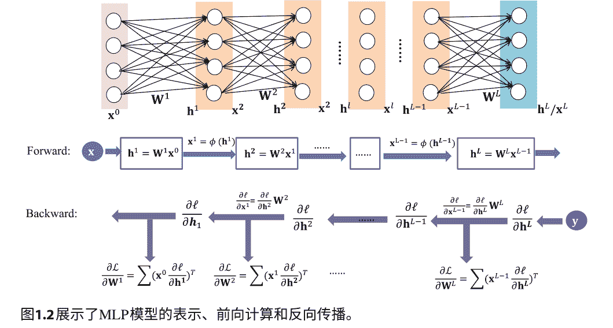

### 1.1.3 训练深度神经网络

从优化的角度来看，我们的目标是最小化经验风险 $\mathcal{L}$，即：
$$\theta^* = \arg \min_\theta \mathcal{L}(\theta)。\tag{1.4}$$

通常情况下，梯度下降（GD）更新被用来最小化 $\mathcal{L}$，迭代地减小损失，如下所示：
$$\theta_{t+1} = \theta_t - \eta \frac{\partial \mathcal{L}}{\partial \theta}，\tag{1.5}$$

其中 $\eta$ 是学习率。对于大规模学习，随机梯度下降（SGD）被广泛用于近似梯度 $\frac{\partial \mathcal{L}}{\partial \theta}$ 与从大小为 $m$ 的小批量数据中采样的梯度一起：$\mathcal{B} = (\mathbf{x}^{(i)}, \mathbf{y}^{(i)})_{i=1}^{m}$，如下所示：
$$\frac{\partial \mathcal{L}}{\partial \theta} = \frac{1}{m} \sum_{i=1}^{m} \frac{\partial \ell^{(i)}}{\partial \theta}，\tag{1.6}$$

其中 $\frac{\partial \ell^{(i)}}{\partial \theta}$ 是梯度 w.r.t.第 $i$ 个样本的缩写：$\frac{\partial \ell(\mathbf{y}^{(i)}, \mathbf{f}_{\theta}(\mathbf{x}^{(i)}))}{\partial \theta}$。一个重要的步骤是计算梯度。可以通过反向传播（图1.2）来计算 $\frac{\partial \ell}{\partial \mathbf{x}^{l-1}}$ 和 $\frac{\partial \ell}{\partial \mathbf{h}^{l-1}}$：

$$\frac{\partial \ell}{\partial \mathbf{x}^{l-1}} = \frac{\partial \ell}{\partial \mathbf{h}^{l}} \mathbf{W}^{l}, \tag{1.7}$$
$$\frac{\partial \ell}{\partial \mathbf{h}^{l-1}} = \frac{\partial \ell}{\partial \mathbf{x}^{l-1}} \odot \phi'(\mathbf{h}^{l-1}), \quad l = L, \ldots, 2, \tag{1.8}$$

其中 $\phi'$ 表示非线性变换的梯度，$\odot$ 表示逐元素乘积。此外，对于每一层 $\mathbf{W}^{l}$ 的梯度可以计算如下：
$$\frac{\partial \mathcal{L}}{\partial \mathbf{W}^{l}} = \mathbb{E}_{\mathbb{D}}[(\mathbf{x}^{l-1} \frac{\partial \ell}{\partial \mathbf{h}^{l}})^{T}], \quad l = L, \ldots, 1. \tag{1.9}$$

### 1.1.4 标准化

标准化广泛应用于数据预处理[9,33,34]、数据挖掘和其他领域。标准化的定义在不同的主题中可能有所不同。在统计学中，标准化可能有多种含义[35]。在最简单的情况下，对评分进行标准化意味着将在不同尺度上测量的值调整到一个公共尺度上。在更复杂的情况下，标准化可能指更复杂的调整，其目的是将调整后的值的整个概率分布对齐。在图像处理中，标准化是一种改变像素强度值范围的过程。有时也称为对比度拉伸或直方图拉伸[36]。应用包括由于反光而导致对比度不佳的照片。

在本书中，我们将标准化定义为一种通用的转换，它确保转换后的数据具有某些统计特性。更具体地说，我们提供以下正式定义。

> 定义 1.1 标准化：给定一组数据 $\mathbb{D}=\{\mathbf{x}^{(i)}\}_{i=1}^{N}$，标准化操作是一个函数 $\Phi: \mathbf{x} \longrightarrow \hat{\mathbf{x}}$，它确保转换后的数据 $\hat{\mathbb{D}}=\{\hat{\mathbf{x}}^{(i)}\}_{i=1}^{N}$ 具有某些统计特性。

在本书中，我们考虑了五种主要的标准化操作（图1.3）：居中、缩放、去相关、标准化和白化[37]。

居中将转换表示为：
$$\hat{\mathbf{x}} = \Phi_C(\mathbf{x}) = \mathbf{x} - \mu, \tag{1.10}$$

其中，$\mu = \mathbb{E}_{\mathbb{D}}[\mathbf{x}]$ 是 $\mathbf{x}$ 的均值。这确保了归一化后的输出 $\hat{\mathbf{x}}$ 具有零均值的特性，可以表示为：$\mathbb{E}_{\hat{\mathbb{D}}}[\hat{\mathbf{x}}] = \mathbf{0}$。

缩放将转换表示为：
$$\hat{\mathbf{x}} = S_C(\mathbf{x}) = \mu - \sigma^{-2}\sqrt{}^{1}(\mathbf{x}). \tag{1.11}$$

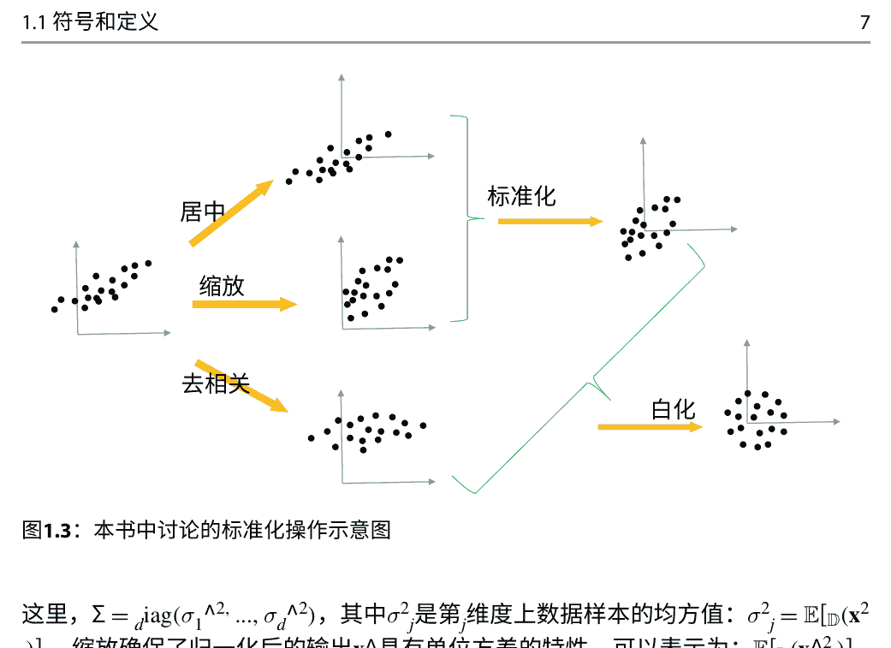
图1.3：本书中讨论的标准化操作示意图

这里，$ \Sigma = \text{diag}(\sigma_1^2, ..., \sigma_d^2) $，其中$ \sigma_j^2 $是第$ j $维度上数据样本的均方值：$ \sigma_j^2 = \mathbb{E}_{\mathbb{D}}(\mathbf{x}_j^2) $。 缩放确保了归一化后的输出$ \mathbf{x} $具有单位方差的特性，可以表示为：$ \mathbb{E}_{\mathbb{D}}(\mathbf{x}_j^2) = 1 $，其中$ j = 1, ..., d $。

去相关化将转换公式表示为：
$$ \hat{\mathbf{x}} = \Phi_D(\mathbf{x}) = \mathbf{D}^T \mathbf{x}, \tag{1.12} $$

其中$ \mathbf{D} = [\mathbf{d}_1, \dots, \mathbf{d}_d] $是从特征分解中得到的特征向量， $ \Sigma $是从特征分解中得到的特征值矩阵， $ \Sigma = \mathbb{E}_{\mathbb{D}}(\mathbf{x}\mathbf{x}^T) $是 $ \mathbf{x} $的协方差矩阵。 去相关化确保了标准化输出 $ \hat{\mathbf{x}} $的不同维度之间的相关性为零（即协方差矩阵 $ \mathbb{E}_{\mathbb{D}}(\hat{\mathbf{x}}\hat{\mathbf{x}}^T) $是一个对角矩阵）。

标准化是一个组合操作，结合了居中和缩放，表示为：
$$ \hat{\mathbf{x}} = \Phi_{ST}(\mathbf{x}) = \Lambda^{-\frac{1}{2}} (\mathbf{x} - \boldsymbol{\mu}). \tag{1.13} $$

标准化确保了标准化输出 $ \hat{\mathbf{x}} $具有零均值和单位方差的特性。

白化将转换定义为<sup>1</sup>：
$$ \hat{\mathbf{x}} = \Phi_W(\mathbf{x}) = \widetilde{\Lambda}^{-\frac{1}{2}} \mathbf{D}^T \mathbf{x}, \tag{1.14} $$

> <sup>1</sup>白化通常要求输入数据居中[37, 38]，这意味着它还包括居中操作。 在本书中，我们将这个操作统一称为白化，无论是否包括居中操作。

其中 $\widetilde{\Lambda}_{d} = \text{diag}(\lambda_{1}, \ldots, \lambda_{d})$ 和 $\boldsymbol{D}= [\boldsymbol{d}_{1}, \ldots, \boldsymbol{d}_{d}]$ 是协方差矩阵 $\Sigma$ 的特征值和特征向量，通过特征分解 $\boldsymbol{D}\widetilde{\Lambda}_{d}\boldsymbol{D}^{T} = \Sigma$ 得到。白化确保归一化输出 $\hat{\boldsymbol{x}}$ 具有球形高斯分布，可以表示为：$\mathbb{E}_{\mathcal{D}}(\hat{\boldsymbol{x}}\hat{\boldsymbol{x}}^{T}) = \boldsymbol{I}$。白化变换在公式 $\widetilde{\Lambda}_{d} = \text{diag}(\lambda_{1}, \ldots, \lambda_{d})$ 中定义，称为主成分分析（PCA）白化，其中白化矩阵 $\Sigma_{PCA}^{-\frac{1}{2}} = \widetilde{\Lambda}_{d}^{-\frac{1}{2}}\boldsymbol{D}^{T}$。由于白化后的输入保持白化状态，因此存在无限多个白化矩阵[37,39]，详细讨论将在第4.2节中进行。

## 参考文献

- 1. Goodfellow, I., Y. Bengio, and A. Courville (2016). 深度学习. MIT Press.
- 2. LeCun, Y., Y. Bengio, and G. Hinton (2015). 深度学习.自然 521(7553), 436–444.
- 3. Glorot, X. and Y. Bengio (2010). 理解深度前馈神经网络训练的困难网络. 在 AISTATS.
- 4. Pascanu, R., T. Mikolov, and Y. Bengio (2013). 关于训练递归神经网络的困难网络. 在 ICML.
- 5. Hinton, G. E. and R. R. Salakhutdinov (2006). 用神经网络降低数据的维度网络. 科学 313(5786), 504–507.
- 6. Nair, V. and G. E. Hinton (2010). 修正线性单元改进了受限玻尔兹曼机. 在 ICML中.
- 7. Kingma, D. P. and J. Ba (2015). Adam: 一种用于随机优化的方法. 在 ICLR中.
- 8. Ioffe, S. and C. Szegedy (2015). 批归一化: 通过减少内部协变量偏移来加速深度网络训练. 在 ICML中.
- 9. He, K., X. Zhang, S. Ren, and J. Sun (2016a). 深度残差学习用于图像识别. 在 CVPR中.
- 10. Szegedy, C., W. Liu, Y. Jia, P. Sermanet, S. Reed, D. Anguelov, D. Erhan, V. Vanhoucke, and A. Rabinovich (2015). 使用卷积进行更深入的研究. 在 CVPR中.
- 11. Zagoruyko, S. and N. Komodakis (2016). Wide residual networks. In BMVC.
- 12. Szegedy, C., V. Vanhoucke, S. Ioffe, J. Shlens, and Z. Wojna (2016). 重新思考计算机视觉中的Inception架构. 在 CVPR中.
- 13. He, K., X. Zhang, S. Ren, and J. Sun (2016b). 深度残差网络中的身份映射. 在 ECCV中.
- 14. Qi, C. R., H. Su, K. Mo, and L. J. Guibas (2017). Pointnet: 用于3D分类和分割的点集深度学习. 在 CVPR中.
- 15. Huang, G., Z. Liu, and K. Q. Weinberger (2017). 密集连接的卷积网络. 在 CVPR中.
- 16. Xie, S., R. B. Girshick, P. Dollár, Z. Tu, and K. He (2017). 聚合残差变换用于深度神经网络. 在 CVPR中.
- 17. Russakovsky, O., J. Deng, H. Su, J. Krause, S. Satheesh, S. Ma, Z. Huang, A. Karpathy, A. Khosla, M. Bernstein, 等 (2015). Imagenet大规模视觉识别挑战. 国际计算机视觉 115(3), 211–252.
- 18. Lin, T.-Y., M. Maire, S. Belongie, J. Hays, P. Perona, D. Ramanan, P. Dollár, 和 C. L. Zitnick (2014). Microsoft coco: 上下文中的常见对象. 在 ECCV, pp. 740–755.
- 19. Chang, A. X., T. Funkhouser, L. Guibas, P. Hanrahan, Q. Huang, Z. Li, S. Savarese, M. Savva, S. Song, H. Su, 等 (2015). Shapenet: 一个信息丰富的3D模型库. arXiv预印本 arXiv:1512.03012.
- 20. Santurkar, S., D. Tsipras, A. Ilyas, and A. Madry (2018). 批归一化如何帮助优化？在 NeurIPS 中。
- 21. Ba, L. J., R. Kiros, and G. E. Hinton (2016). 层归一化。 arXiv预印本 arXiv:1607.06450。
- 22. Salimans, T. and D. P. Kingma (2016). 权重归一化：一种简单的重新参数化方法，用于加速深度神经网络的训练。在 NeurIPS中。
- 23. Wu, Y. and K. He (2018). 组归一化。在 ECCV中。
- 24. Miyato, T., T. Kataoka, M. Koyama, and Y. Yoshida (2018). 用于生成对抗网络的谱归一化。在 ICLR中。
- 25. 黄，刘，朱，万，袁，李，邵（2020年）。在训练DNNs中的可控正交-化。在 CVPR中。
- 26. Vaswani, A., Shazeer, N., Parmar, N., Uszkoreit, J., Jones, L., Gomez, A.N., Kaiser, L.和Polosukhin, I. （2017年）。注意力就是你所需要的。在 NeurIPS中。
- 27. 于，A.W., Dohan, D., Luong, M.-T., 赵, R., 陈, K., Norouzi, M.和Le, Q. V. (2018年)。Qanet: 将局部卷积与全局自注意力相结合，用于阅读理解。在 ICLR中。
- 28. 徐，J.，孙, X., 张, Z., 赵, G.和林, J. (2019年)。理解和改进层标准化。在 NeurIPS中。
- 29. 熊, R., 杨, Y., 何, D., 郑, K., 郑, S., 邢, C., 张, H., 兰, Y., 王, L., 刘, T. -Y. (2020年)。关于变压器架构中的层标准化。在 ICML中。
- 30. 关于GAN中的正则化和标准化的大规模研究。在 ICML中。
- 31. 布洛克, A., 多纳休, J., 西蒙扬, K. (2019年)。用于高保真自然图像合成的大规模GAN训练。在 ICLR中。
- 32. 黄, L., 秦, J., 周, Y., 朱, F., 刘, L., 邵, L. (2020年)。训练DNN中的标准化技术: 方法论, 分析和应用。CoRR abs/2009.12836。
- 33. LeCun, Y., Bottou, L., Orr, G.B., Muller, K.-R. (1998年)。高效的反向传播。在神经网络中的技巧。
- 34. Krizhevsky, A. (2009). 从小图像中学习多层特征。技术报告。
- 35. Dodge, Y. (2003).统计术语牛津词典。牛津大学出版社。
- 36. Gonzalez, R. C. and R. E. Woods (2008).数字图像处理。Prentice Hall。
- 37. Kessy, A., A. Lewin, and K. Strimmer (2018). 最佳白化和去相关。美国统计学家 72(4), 309 –314。
- 38. Huang, L., D. Yang, B. Lang, and J. Deng (2018). 去相关批量标准化。在 CVPR中。
- 39. Huang, L., L. Zhao, Y. Zhou, F. Zhu, L. Liu, and L. Shao (2020). 对批量白化的随机性进行调查。在 CVPR中。

## DNN中标准化的动机和概述

输入标准化在机器学习模型中被广泛使用，并且在许多教科书或课程中被提倡，因为可以获得学习者的改进性能。直观地说，标准化输入可以消除不同特征之间的幅度差异，从而有利于学习。这个特性对于非参数模型非常重要，例如K最近邻（KNN）分类器，在这种情况下，我们需要计算示例之间的距离或相似度。如果某些特征的维度具有较大的幅度范围，那么示例之间的距离/相似度将受到这些维度的主导，这将损害学习者的性能。此外，标准化输入可以提高参数模型的优化效率。标准化对于线性模型存在理论优势，我们将进行说明。

## 2.1 标准化输入的理论

让我们考虑一个具有标量输出 $f_w(x) = w^T x$ 的线性回归模型，其中 $x, w \in \mathbb{R}^d$，并且均方误差（MSE）损失 $\ell = \frac{1}{2}(y - f_w(x))^2$。给定一组数据 $\mathbb{D} = \{(x^{(i)}, y^{(i)})\}_{i=1}^N$，成本函数可以计算为
$$\mathcal{L}(w) = \frac{1}{2N} \sum_{i=1}^{N} (y^{(i)} - f_w(x^{(i)}))^2. \tag{2.1}$$

请注意，方程2.1的成本函数在 $w$ 中是二次的。它可以重写为
$$\mathcal{L}(w) = \frac{1}{2}(w^T \Sigma w - 2a^T w + b), \tag{2.2}$$

其中 $\Sigma \in \mathbb{R}^{d \times d}$ 是输入的协方差矩阵，通过 $\Sigma = \frac{1}{N} \sum_{i=1}^{N} x^{(i)} (x^{(i)})^T$；$d$维向量 $a = \frac{1}{N} - \sum_{i=1}^{N} y^{(i)}x^{(i)}$；这是一个常数。

$b = \frac{1}{N} \sum$ 我们注意到成本函数的梯度由 $\frac{\partial \mathcal{L}}{\partial \mathbf{w}} = \mathbf{w}^T \Sigma - \mathbf{a}^T$给出，而二阶导数的海森矩阵为 $H = \Sigma$。 因此，$\mathcal{L}(\mathbf{w})$的景观由输入的协方差矩阵决定。 如果输入通过等式1.14进行白化， $\mathcal{L}(\mathbf{w})$的表面将是等距的（图2.1）。 在这种情况下，GD算法只需要一次迭代就可以收敛。 还存在理论[1,2]分析表明，这样一个二次曲面的学习动态完全由海森矩阵的谱控制。 在这里，我们详细说明它。

现在我们考虑进行坐标变换 $\mathbf{v} = \text{Transform}(\mathbf{w})$，使得 $\mathcal{L}(\mathbf{v})$相对于 $\mathbf{v}$具有解耦的形式。 让 $\mathbf{w}^*$表示最小化$\mathcal{L}(\mathbf{w})$的解空间。 我们有 $\Sigma \mathbf{w}^* = \mathbf{a}$，基于最小化条件下的解。 $-\partial \omega = 0$请注意$\omega^*$缩小为一个点，并且具有闭合形式$\omega^* = \Sigma^{-1} \alpha$如果 $\Sigma$是满秩的。 我们现在进行坐标变换 $\mathbf{v}' = \omega - \omega^*$，这提供了解点为中心的新坐标：

$$\mathcal{L}(\mathbf{v}') = \frac{1}{2}(\mathbf{v}')^T \Sigma \mathbf{v}' + \mathcal{L}_0, \quad\quad (2.3)$$

我们可以通过进行坐标变换 $\mathbf{v} = D \mathbf{v}'$进一步去相关化成本函数的曲面：

$$\mathcal{L}(\mathbf{v}) = \frac{1}{2} \mathbf{v}^T \widetilde{\Lambda} \mathbf{v} + \mathcal{L}_0, \quad\quad (2.4)$$

其中 $\widetilde{\Lambda} = \text{diag}(\lambda_1, \dots, \lambda_d)$ 和 $\mathbf{D} = [\mathbf{d}_1, \dots, \mathbf{d}_d]$ 是协方差矩阵 $\Sigma$ 的特征值和特征向量。在这个新的坐标系中，Hessian矩阵是对角矩阵 $\widetilde{\Lambda}$：

$$\mathbf{v} = \mathbf{D}(\mathbf{w} - \mathbf{w}^*). \tag{2.5}$$

因此，权重更新的公式为：

$$\mathbf{v}(t + 1) = \mathbf{v}(t) - \eta \widetilde{\Lambda} \mathbf{v}(t). \tag{2.6}$$

这可以看作是一组解耦的方程。给定初始状态 $\mathbf{v}(0)$，每个分量 $\mathbf{v}$ 的演化如下：

$$v_j(t) = (1 - \eta \lambda_j)^t v_j(0), \text{对于 } j = 1, \dots, d. \tag{2.7}$$

我们注意到 $\mathbf{v}_j = 0$ 意味着 $w_j = w_j^*$，根据公式 2.5。我们可以看到 $w_j$ 的收敛行为不仅取决于学习率 $\eta$，还取决于相应的特征值 $\lambda_j$ 的协方差矩阵。我们还注意到，如果 $\lambda_j = 0$，则 $\mathbf{v}_j$ 不会收敛，因为在训练过程中 $\mathbf{v}_j = \mathbf{v}_j(0)$。现在我们可以进一步分析不同情况，如果 $\lambda_j > 0$：(1) $0 < \eta < \frac{2}{\lambda_j}$。$\mathbf{v}_j$ 将指数级地收敛到零，具有特征时间 $\tau_j = (\eta \lambda_j)^{-1}$ [1]。此外，如果 $\frac{1}{\lambda_j} < \eta < \frac{2}{\lambda_j}$，它会以振荡的方式收敛到解决方案；而当 $0 < \eta < \frac{1}{\lambda_j}$，它会单调收敛。在 $\eta = \frac{1}{\lambda_j}$ 的情况下，$\mathbf{v}_j$ 的收敛只会在一次迭代中发生，这对应于牛顿法。\n(2): $\eta = \frac{2}{\lambda_j}$. $\mathbf{v}_j$ 将在 $\pm \mathbf{v}_j(0)$ 之间振荡。\n(3) $\eta > \frac{2}{\lambda_j}$. $\mathbf{v}_j$ 将指数级地发散。

让我们考虑所有的特征值。收敛需要 $0 < \eta < \frac{2}{\lambda_j}$ 对于所有的 $1 \leq j \leq d$，$\eta$ 必须在 $0 < \eta < \frac{2}{\lambda_{max}}$，其中 $\lambda_{max}$ 是矩阵的最大特征值 $\Sigma$。这个目标中最慢的时间常数对应于最小的非零特征值 $\lambda_{min}$，具有特征时间 $\tau_{max} = (\eta \lambda_{min})^{-1}$。最优的学习率应该是 $\eta = \frac{1}{\lambda_{max}}$，这导致 $\tau_{max} = \frac{\lambda_{max}}{\lambda_{min}}$。在优化社区中，$\kappa = \frac{\lambda_{max}}{\lambda_{min}}$ 被称为相应曲率矩阵的条件数，它控制了收敛所需的迭代次数（例如，迭代次数的下界是 $\kappa$ [1-3]）。

如果所有特征值都相等，即 $\lambda_j = \lambda$ 对于所有的 $1 < j < d$，Hessian矩阵是等距对角的。可以在一次迭代中获得收敛，最佳学习率为 $\eta = \frac{1}{\lambda}$。事实上，通过公式 1.14 对输入进行白化，可以获得这种情况，如前所述。因此，在线性模型的优化过程中，标准化输入肯定可以加速收敛。特别地，可以根据输入数据的协方差矩阵的谱分析来很好地描述这种行为。

具有多个神经元的线性回归. 将线性回归的解从标量输出扩展到矢量输出是很容易的 $\mathbf{f}_W(\mathbf{x}) = \mathbf{W}^T \mathbf{x}$。 在这种情况下，Hessian矩阵表示为

$$\mathbf{H} = \mathbb{E}_D(\mathbf{x}\mathbf{x}^T) \otimes \mathbf{I}, \tag{2.8}$$

其中 $\otimes$表示Kronecker积[4], $\mathbf{I}$表示单位矩阵。我们可以看到成本函数的曲率仍然由输入的协方差矩阵控制。

线性分类。对于具有交叉熵损失的线性分类模型，Hessian矩阵的近似值为[5]:

$$\mathbf{H} \approx \mathbb{E}_D(\mathbf{x}\mathbf{x}^T) \otimes \mathbf{S}. \tag{2.9}$$

其中 $\mathbf{S} \in \mathbb{R}^{c\times c}$ 由 $\mathbf{S} = 1/c (\mathbf{I}_c - 1/c \mathbf{1}_c \mathbf{1}_c^T)$ 定义，其中 $c$ 是类别数，$\mathbf{1}_c \in \mathbb{R}^c$ 表示所有元素都为1的向量。方程 2.9 假设 Hessian 矩阵在初始区域和最优区域之间没有显著变化[5]。

## 2.2 朝着标准化激活

这些线性模型的理论结果不能直接应用于深度神经网络(DNNs)，因为DNNs是非线性模型。尽管DNNs包括逐层线性变换，但输入 $\mathbf{x}$ 只与第一个权重矩阵 $\mathbf{W}^1$ (Fig. 1.2) 线性连接；但优化是针对所有参数 $\theta = \{\mathbf{W}^i, i = 1, ..., L\}$，而不仅仅是 $\mathbf{W}^1$。尽管存在非线性，我们可以利用DNNs的逐层结构。我们可以发现逐层激活 $\mathbf{x}^l$ 通过以下权重矩阵 $\mathbf{W}^{l+1}$ 线性连接。这提供了一个直观的理解，即标准化激活可以从线性模型的理论结果中获益。我们将从近端反向传播框架和Fisher信息矩阵(FIM)近似的角度阐述动机。

### 2.2.1 近端反向传播框架

Carreira-Perpinan和Wang [6]提出使用辅助坐标来重新定义带有等式约束的每个神经元的优化目标 $\mathcal{L}(\theta)$。他们通过添加二次惩罚来解决约束优化问题，如下所示:

$$\widetilde{\mathcal{L}}(\theta, \{\mathbf{x}^l\}_{l=1}^L) = \mathcal{L}(\mathbf{y}, \mathbf{f}^L(\mathbf{W}^L, \mathbf{x}^{L-1})) + \sum_{l=1}^{L-1} \alpha/2 \|\mathbf{x}^l - \mathbf{f}^l(\mathbf{W}^l, \mathbf{x}^{l-1})\|^2, \tag{2.10}$$

其中 $\mathbf{f}^l(\cdot, \cdot)$ 是关于第 $l$ 层的函数变换。如[6]所示，当 $\alpha \to \infty$ 时，最小化 $\widetilde{\mathcal{L}}(\theta, \{\mathbf{x}^l\}_{l=1}^L)$ 的解收敛到最小化 $\mathcal{L}(\theta)$ 的解，条件较为温和。此外，还有近端传播[7]和通过反向顺序独立地重新定义每个子问题，使用反向传播算法[8]进行逐层对象 $\mathcal{L}^{l}(W^l, \mathbf{x}^{l-1}; \tilde{\mathbf{x}}^{l})$ 的最小化，给定来自上一层的目标信号 $\tilde{\mathbf{x}}^{l}$，如下所示：

$$
\left\{\begin{array}{ll}
\mathcal{L}(\mathbf{y}, f^{L}(W^{L}, \mathbf{x}^{L-1})), & \text { 其中 } f \text { 或 } l = L \\
\frac{1}{2}\|\tilde{\mathbf{x}}^{l} - f^{l}(W^{l}, \mathbf{x}^{l-1})\|^{2}, & \text { 其中 } f \text { 或 } l = L-1, \ldots, 1.
\end{array}\right.
\tag{2.11}
$$

已经证明，使用梯度更新相对于 $\mathcal{L}(\theta)$ 的产生的 $W^l$ 等于使用反向传播算法（[8]中的过程1）相对于Eq. 2.11的一步梯度更新产生的 $W^{l}$，给定适当的步长。请注意，目标信号 $\tilde{\mathbf{x}}^{l}$ 是通过反向传播获得的，这意味着如果 $f^{l}(W^{l}, \mathbf{x}^{l-1})$ 更接近于 $\tilde{\mathbf{x}}^{l}$，则损失 $\mathcal{L}(\theta)$ 将更小。 如果Eq. 2.11中的子优化问题具有良好的条件，损失 $\mathcal{L}(\theta)$ 将更有效地减小。更多细节请参考[7, 8]。如果我们希望辅助变量视为特定层的预激活，则每个层中的子优化问题可以表示为：

$$
\left\{\begin{array}{ll}
\mathcal{L}(\mathbf{y}, W^{L} \mathbf{x}^{L-1}), & f \text { or } l = L \\
\frac{1}{2}\|\tilde{\mathbf{x}}^{l} - W^{l} \mathbf{x}^{l-1}\|^{2}, & f \text { or } l = L-1, \ldots, 1.
\end{array}\right.
\tag{2.12}
$$

很明显，对于 $W^{l}$ 的子优化问题实际上是线性分类（对于 $l=L$）或回归（对于 $l=1, \ldots, L-1$）模型。它们的条件分析在第2.1节中得到了全面的描述。

这种联系表明，完整优化问题的质量（条件）与其在方程2.12中显示的子优化问题密切相关，其局部曲率矩阵可以很好地探索。因此，对激活进行标准化可以有益于优化。

### 2.2.2 K-FAC 近似

标准化激活函数有助于优化的另一个理论基础是从逼近费舍尔信息矩阵（FIM）的角度来看。FIM可以用来近似描述优化空间。由于参数庞大，计算DNN的FIM是计算密集型的。存在近似计算FIM的方法。

一个成功的例子是使用Kronecker乘积（K-FAC）来近似计算DNN的FIM[9-12]。在K-FAC方法中，有两个假设：（1）不同层的权重梯度被假设为不相关；（2）每个层的输入和输出梯度被近似为独立的。因此，完整的FIM可以表示为一个块对角矩阵，$\mathbf{F}=\operatorname{diag}\left(\mathbf{F}^{1}, \ldots, \mathbf{F}^{L}\right)$，其中$\mathbf{F}^{l}$是子FIM（与某一层参数相关的FIM），计算公式如下：

$$
\mathbf{F}^{l} \approx \mathbb{E}_{\mathbf{x} \sim p(\mathbf{x})}\left[\mathbf{x}^{l-1}\left(\mathbf{x}^{l-1}\right)^{T}\right] \otimes \mathbb{E}_{(\mathbf{x}, \mathbf{y}) \sim p(\mathbf{x}) q(\mathbf{y} \mid \mathbf{x})}\left[\frac{\partial \ell}{\partial \mathbf{h}^{l}}^{T} \frac{\partial \ell}{\partial \mathbf{h}^{l}}\right].
\tag{2.13}
$$

有关推导的详细信息，请参阅[9]。请注意，Huang等人[13]，Martens[9]，Martens和Grosse[14]已经提供了实证证据来支持它们在近似完整FIM与块对角子FIM之间的有效性。

我们可以看到每个子FIM都受其层输入的协方差矩阵和输出梯度的协方差矩阵的控制。因此，优化问题的优化景观可以通过输入和输出梯度的协方差矩阵来近似控制。

### 2.2.3 动机的亮点

我们将层输入的协方差矩阵表示为 $\Sigma_{\mathbf{x}}^l = \mathbb{E}_{p(\mathbf{x})q(\mathbf{y}|\mathbf{x})}[\mathbf{x}^{l-1} (\mathbf{x}^{l-1})^T]$，将层输出梯度的协方差矩阵表示为 $\Sigma_{\nabla \mathbf{h}}^l = \mathbb{E}_{q(\mathbf{y}|\mathbf{x})}[\frac{\partial \ell}{\partial \mathbf{h}^l}^T \frac{\partial \ell}{\partial \mathbf{h}^l}]$。基于K-FAC，很明显FIM的条件可以得到改善，如果：

- 标准1：不同层的输入（例如，$\Sigma_{\mathbf{x}}$）和输出梯度（例如，$\Sigma_{\nabla \mathbf{h}}$）的统计数据相等。
- 标准2：$\Sigma_{\mathbf{x}}$ 和 $\Sigma_{\nabla \mathbf{h}}$ 的条件良好。

为了满足标准1和/或标准2，已经设计了各种训练DNN的技术。例如，权重初始化技术旨在满足标准1，通过设计初始权重矩阵，在不同层之间获得几乎相等的输入/输出梯度方差[15-19]。然而，由于权重矩阵的更新，跨层的等方差特性可能会被破坏，并且在训练过程中不一定持续存在。从这个角度来看，规范化激活函数对于产生更好条件的优化空间非常重要，类似于规范化输入的好处。

与固定分布下输入的标准化相比，标准化激活更具挑战性，因为在训练过程中，层激活的分布 $\mathbf{x}^l$ 会发生变化。此外，DNN通常通过随机或小批量梯度进行优化，而不是完整的梯度，这需要对激活进行更高效的统计估计。本书讨论了三种用于改善DNN训练性能的标准化方法：

1. 直接标准化激活以（近似）满足标准1和/或标准2。一般来说，有两种策略可以对DNN的激活进行标准化。一种是使用在激活分布上估计的总体统计量对激活进行标准化[20-22]。另一种策略是将激活作为函数变换进行标准化，这需要通过该变换进行反向传播[23-25]。
2. 使用受限分布对权重进行标准化，以便可以隐式地对激活/输出梯度（公式1.2和1.7）进行标准化。这种标准化策略是受权重初始化方法的启发，但在训练过程中将其扩展以满足期望的属性[26-29]。
3. 对梯度进行归一化以利用曲率信息进行GD/SGD，即使优化空间条件不好[30, 31]。这涉及仅对梯度进行归一化，可以有效消除由不同层梯度的幅度差异引起的不良条件的负面影响（即，标准1不满足得很好）[15]。

## 参考文献

- 1. LeCun, Y., I. Kanter, and S. A. Solla (1990). 误差曲面的二阶性质。在NeurIPS中。
- 2. LeCun, Y., L. Bottou, G. B. Orr, and K.-R. Muller (1998). 高效的反向传播。在神经网络中的技巧。
- 3. Bottou, L., F. E. Curtis, and J. Nocedal (2018). 用于大规模机器学习的优化方法。Siam Review 60(2), 223–311.
- 4. Grosse, R. B. and J. Martens (2016). 用于卷积层的Kronecker分解近似Fisher矩阵。在ICML中，第48卷，第573-582页。
- 5. Wiesler, S. and H. Ney (2011). 对数线性训练的收敛分析。在NeurIPS中，第657-665页。
- 6. Carreira-Perpinan, M. and W. Wang (2014). 深度嵌套系统的分布式优化。在AISTATS中。
- 7. Frerix, T., T. Mollenhoff, M. Moeller, and D. Cremers (2018). 近端反向传播。在ICLR中。
- 8. Zhang, H., Chen, W. and Liu, T.-Y. (2018). 关于反向传播中的局部Hessian矩阵。在NeurIPS中.
- 9. Martens, J. and Grosse, R. (2015). 使用Kronecker分解近似曲率优化神经网络。在ICML中.
- 10. Ba, J., Grosse, R. and Martens, J. (2017). 使用Kronecker分解近似的分布式二阶优化。在ICLR中.
- 11. Sun, K. and Nielsen, F. (2017). 相对Fisher信息和自然梯度用于学习大规模模型。在ICML中.
- 12. Bernacchia, A., Lengyel, M. and Hennequin, G. (2018). 深度线性网络中的精确自然梯度及其在非线性情况下的应用。在NeurIPS中.
- 13. Martens, J. (2014). 自然梯度方法的新视角。arXiv预印本 arXiv:1412.1193.
- 14. Huang, L., Qin, J., Liu, L., Zhu, F., Shao, L. (2020). 通过层次条件分析来探索DNN的学习动态。在ECCV中。
- 15. Glorot, X. and Bengio, Y. (2010). 理解训练深度前馈神经网络的困难。在AISTATS中。
- 16. He, K., Zhang, X., Ren, S. and Sun, J. (2015). 深入研究整流器：在Imagenet分类中超越人类水平的性能。在ICCV中。
- 17. Saxe, A. M., McClelland, J. L. and Ganguli, S. (2014). 深度线性神经网络学习非线性动力学的精确解。在ICLR中。
- 18. Mishkin, D. and Matas, J. (2016). 你所需要的只是一个良好的初始化。在ICLR中。
- 19. Sokol, P. A. and I. M. Park (2020). 正交初始化和训练的信息几何。在ICLR中。

## 20. Montavon, G. 和 K.-R. Müller (2012). 深度玻尔兹曼机和居中技巧, 第7700卷.

## 21. Wiesler, S., A. Richard, R. Schlüter, 和 H. Ney (2014). 用于大规模深度学习的均值归一化随机梯度. 在 ICASSP.

## 22. Desjardins, G., K. Simonyan, R. Pascanu, 和 K. Kavukcuoglu (2015). 自然神经网络. 在 NeurIPS.

## 23. Ioffe, S. 和 C. Szegedy (2015). 批归一化: 通过减少内部协变量偏移来加速深度网络训练. 在 ICML.

## 24. Ba, L. J., R. Kiros, and G. E. Hinton (2016). 层标准化. arXiv预印本 arXiv:1607.06450.

## 25. Huang, L., D. Yang, B. Lang, and J. Deng (2018). 去相关批量标准化. 在 CVPR中.

## 26. Salimans, T. and D. P. Kingma (2016). 权重标准化: 一种简单的重新参数化方法, 用于加速深度神经网络的训练. 在 NeurIPS中.

## 27. Huang, L., X. Liu, Y. Liu, B. Lang, and D. Tao (2017). 中心化权重标准化在加速深度神经网络的训练中. 在 ICCV中.

## 28. Huang, L., X. Liu, B. Lang, A. W. Yu, Y. Wang, and B. Li (2018). 正交权重标准化: 在深度神经网络中优化多个相关Stiefel流形的解决方案网络. 在 AAAI中.

## 29. Miyato, T., T. Kataoka, M. Koyama, and Y. Yoshida (2018). 用于生成对抗网络的谱归一化. 在 ICLR中.

## 30. Yu, A. W., L. Huang, Q. Lin, R. Salakhutdinov, and J. Carbonell (2017). 块归一化梯度方法: 深度神经网络训练的实证研究. arXiv预印本 arXiv:1707.04822.

## 31. You, Y., I. Gitman, and B. Ginsburg (2017). 卷积网络的大批量训练. arXiv预印本 arXiv:1708.03888.

## 标准化激活的一般观点 3

如前所述，标准化输入作为预处理通常在整个数据集上进行，以改善优化问题的条件。使用群体统计数据对深度神经网络中的激活进行标准化是机器学习社区中标准化发展的主要思想。此外，计算机视觉社区还有另一种方法来调整深度神经网络的内部表示中的图像对比度信息。在本章中，我们将首先介绍标准化DNN激活的初步工作，然后介绍里程碑式的标准化技术——批量标准化（BN）[1]。然后，我们将说明BN算法是如何通过利用先前方法的优点来发展的。

## 3.1 通过人口统计数据对激活进行标准化

在本节中，我们将讨论使用其分布上估计的人口统计数据来标准化激活的方法。这种标准化策略将人口统计数据视为在反向传播过程中保持不变。为了简化表示法，在后续的章节中，除非另有说明，我们将省略激活层索引 l 和激活 x^l。

Montavon和Müller [2]提出了在Boltzmann机中对激活（隐藏单元）进行居中处理，以改善优化问题的条件，基于居中输入改善条件的洞察力[3-5]。具体而言，给定某一层的激活 x，他们进行如下标准化：

```
\hat{x} = x - \hat{\mu} \quad (3.1)
```

其中 \hat{\mu} 是训练数据集上激活的均值 \hat{\mu} = E_{x~D}(x)。请注意，\hat{\mu} 表示需要在训练过程中估计的人口统计数据，并且被视为在反向传播过程中保持不变。在[2]中，$\hat{\mu}$通过运行平均值进行估计。Wiesler等人[6]还考虑了通过重新参数化来改善DNN性能的激活中心化标准化。这可以看作是一种预处理方法。他们还使用运行平均值来估计基于小批量激活的$\hat{\mu}$。在[6]中的一个有趣观察是，在这种情况下，缩放操作并没有带来改进。一个可能的原因是通过运行平均值估计的总体统计数据不准确，因此无法充分利用标准化的优势。

Desjardins等人[7]提出使用人口统计数据对激活进行白化，方法如下：

> $$
\hat{\mathbf{x}} = \Sigma^{-\frac{1}{2}}(\mathbf{x} - \hat{\mu}),
$$ (3.2)

其中 $\Sigma^{-\frac{1}{2}}$ 是白化矩阵的人口统计数据。一个困难是准确估计 $\Sigma^{-\frac{1}{2}}$ 。在[7, 8]中，$\Sigma^{-\frac{1}{2}}$ 在 $T$ 间隔内进行更新，并且白化矩阵进一步通过一个超参数 $\epsilon$ 进行预处理，该超参数平衡了自然梯度（由白化激活产生）和朴素梯度。通过这两种技术，可以通过精细调整 $T/\epsilon$ 来训练具有白化激活的网络。Luo [8]研究了白化激活（预白化）和预激活（后白化）的有效性。他们还通过在计算白化矩阵时使用在线奇异值分解（SVD）来解决了计算问题。

尽管在性能方面取得了一些改进，但通过人口统计数据进行标准化仍然面临一些缺点。主要的缺点是训练不稳定，这可能是由于对人口统计数据的不准确估计造成的：

- 这些方法通常使用有限数量的数据样本来估计人口统计数据，因为计算方面的考虑。
- 即使完整的数据可用并且对当前迭代进行了准确的估计，由于权重矩阵的更新，激活分布（以及人口统计数据）也会发生变化，这被称为内部协变量漂移（ICS）[1]。
- 最后，随着层数的增加，对人口统计数据的不准确估计将被放大，因此这些方法不适用于大规模网络。

正如[7, 8]所指出的，需要额外的批标准化[1]来稳定大规模网络的训练。

## 3.2 样本中的局部统计

在计算机视觉社区中，还有另一种用于归一化内部表示的方法。这些方法在低或中等对比度的区域增强对比度，而在高对比度的区域保持不变。一个重要的特点是每个示例/位置的统计数据是在相邻区域上计算的，因此会有所变化。这种归一化称为局部归一化[9]。给定一个特征图 $\mathbf{X} \in \mathbb{R}^{d \times h \times w}$，Jarrett等人[10]提出了局部对比度归一化（LCN）来标准化每个示例的特征。$X_{cij}$—其中 $c$ 表示通道 $c$，$i$，$j$ 表示特征的空间位置—通过其邻居在一个大小为 $9 \times 9$ 的窗口中计算的统计量来标准化，如下所示：

```
$$ X_{cij} = \frac{X_{cij} - \sum_{pq} w_{pq} X_{c,i+p,j+q}}{\max(\delta, \sigma_{ij})} $$
```

其中 $w_{pq}$ 是一个高斯加权窗口（$9 \times 9$），使得 $\sum_{pq} w_{pq} =1$，并且 $\sigma_{ij}$ 是一个小空间邻域（$9 \times 9$）中所有特征的加权标准差。对于每个样本，常数 $\delta$ 被设置为 $\sigma_{ij}$ 的均值。局部响应归一化 (LRN) [11] 提出了以下激活的缩放方法：

```
$$ X_{cij} = \frac{X_{cij}}{(k + \alpha \sum_{s=\max(0, c-n/2)}^{\min(d-1, c+n/2)} X_{sij}^2)^\beta} $$
```

其中求和在相同空间位置的“相邻”卷积核映射上进行 $(h, w)$，并且常数 $k, n, \alpha$ 和 $\beta$ 是超参数。局部上下文标准化[9]扩展了邻域划分，其中标准化在大小为 $p \times q$ 的窗口内进行，对于由每组通道数预定义的大小的滤波器组($c\_groups$)沿通道轴。除法标准化(DN)[12]将这些局部标准化方法的邻域划分推广为求和和抑制场的选择[1, 2, 13]。

局部标准化方法有两个主要特点。第一个是只对一个示例的特征图执行标准化操作。第二个是每个特征图位置的统计量是在其相邻区域上计算并且是变化的。

本地标准化方法在训练中具有几个优点。例如，由于通过标准化转换进行反向传播，训练更加稳定。此外，模型能够学习视觉对比不变性属性，这可能有益于泛化。然而，这些方法也有一些限制。这些方法的动机是针对视觉数据或其特征图的。这些方法还可能改变表示能力并删除用于判别分类的信息。此外，不清楚它们是否有助于优化，因为它们没有解决基于人口统计的标准化问题，这在第2章中进行了讨论。

## 3.3 批量标准化

批量标准化 (BN) [1]将标准化统计视为对小批量输入的函数，并通过标准化操作解决了反向传播问题。设 $x$ denotes DNN 的一层中给定神经元的激活。BN 通过以下方式对小批量数据 $\mathcal{B} = \{ x^{(i)} \}_{i=1}^m$ 进行标准化：

```
$$\hat{x}^{(i)} = \frac{x^{(i)} - \mu_{\mathcal{B}}}{\sqrt{\sigma_{\mathcal{B}}^2 + \epsilon}}, \quad (3.5)$$
```

其中 $\epsilon >0$ 是一个小数，用于防止数值不稳定，而 $\mu_{\mathcal{B}} = \frac{1}{m} \sum_{i=1}^m x^{(i)}$ 和 $\sigma_{\mathcal{B}}^2 = \frac{1}{m} \sum_{i=1}^m (x^{(i)} - \mu_{\mathcal{B}})^2$ 分别是均值和方差。$^1$在推断过程中，需要确定性推断的人口统计数据 $\{\hat{\mu}, \hat{\sigma}^2\}$，通常通过在训练迭代中进行平均计算得到，如下所示：

```
$$\begin{cases} \hat{\mu} = (1 - \alpha)\hat{\mu} + \alpha \mu_{\mathcal{B}}, \\ \hat{\sigma}^2 = (1 - \alpha)\hat{\sigma}^2 + \alpha \sigma_{\mathcal{B}}^2, \end{cases} \quad (3.6)$$
```

其中 $\alpha$ 是一个范围在 $[0, 1]$ 的标量。

与基于总体统计的标准化方法相比，介绍在第3.1节中，这种标准化策略具有几个优点：
（1） 它避免使用总体统计数据来标准化激活值，从而避免了由于不准确估计而引起的不稳定性。
（2） 每个小批量的标准化输出具有零均值和单位方差的约束，稳定了激活值的分布，从而有利于训练。

更多讨论请参考后续第9章。在这里，我们解决了BN的小批量均值 $\mu_{\mathcal{B}}$ 和方差 $\sigma_{\mathcal{B}}^2$ 是层输入 $x^{(i)}$ 的函数，并且必须通过它们进行反向传播。具体而言，给定对标准化输出的梯度 $\frac{\partial \mathcal{L}}{\partial \hat{x}^{(i)}}$ 在反向传播过程中，对输入的梯度 $\frac{\partial \mathcal{L}}{\partial x^{(i)}}$ 计算如下：

```
$$\begin{aligned} \frac{\partial \mathcal{L}}{\partial \sigma_{\mathcal{B}}^2} &= \sum_{i=1}^m \frac{\partial \mathcal{L}}{\partial \hat{x}^{(i)}} \cdot (x^{(i)} - \mu_{\mathcal{B}}) \cdot \frac{-1}{2} (\sigma_{\mathcal{B}}^2 + \epsilon)^{-3/2} \\ \frac{\partial \mathcal{L}}{\partial \mu_{\mathcal{B}}} &= \sum_{i=1}^m \frac{\partial \mathcal{L}}{\partial \hat{x}^{(i)}} \cdot \frac{-1}{\sqrt{\sigma_{\mathcal{B}}^2 + \epsilon}} + \frac{\partial \mathcal{L}}{\partial \sigma_{\mathcal{B}}^2} \cdot \frac{\sum_{i=1}^m -2(x^{(i)} - \mu_{\mathcal{B}})}{m} \\ \frac{\partial \mathcal{L}}{\partial x^{(i)}} &= \frac{\partial \mathcal{L}}{\partial \hat{x}^{(i)}} \cdot \frac{1}{\sqrt{\sigma_{\mathcal{B}}^2 + \epsilon}} + \frac{\partial \mathcal{L}}{\partial \sigma_{\mathcal{B}}^2} \cdot \frac{2(x^{(i)} - \mu_{\mathcal{B}})}{m} + \frac{\partial \mathcal{L}}{\partial \mu_{\mathcal{B}}} \cdot \frac{1}{m} \end{aligned} \quad (3.7)$$
```

由于标准化引入的约束，BN还使用了一个额外的可学习的缩放参数 $\gamma \in \mathbb{R}$ 和偏移参数 $\beta \in \mathbb{R}$ 来恢复可能的降低表示能力[1]：

```
$$\tilde{x} = \gamma \hat{x} + \beta. \quad (3.8)$$
```

在本书中，我们还将尺度参数和偏移参数称为仿射参数。

BN在公式3.5中的表述是基于多层感知器（MLP）的，为了更好地展示其在优化中的动机。给定一个用于视觉数据的卷积输入，BN还提出了遵守卷积属性的标准化。

$^1$注意这里 $\mu_{\mathcal{B}}$ 和 $\sigma_{\mathcal{B}}^2$ 是对小批量数据 $\mathcal{B}$ 的函数。

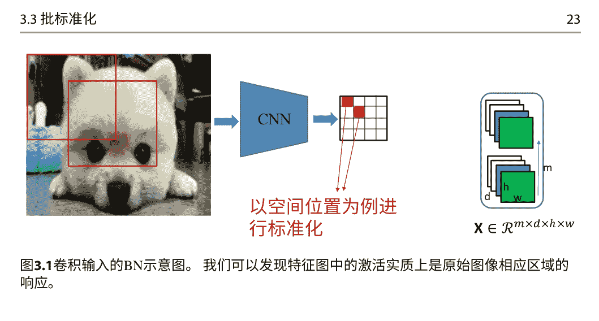

## 图3.1卷积输入的BN示意图。 我们可以发现特征图中的激活实质上是原始图像相应区域的响应。

同一特征图中不同位置的元素以相同的方式进行标准化。如图3.1所示，特征图中的激活实质上是原始图像相应区域的响应。因此，空间位置可以被视为一个例子，遵循卷积属性。总之，给定一个小批量卷积输入 X ∈ R^{d×m×h×w}，其中 d、h和w 分别是特征图的通道数、高度和宽度。BN同时对所有位置上的小批量激活进行标准化。

BN通过优化的角度来规范化小批量数据的激活，以改善条件。更重要的是，BN还通过转换进行反向传播，就像局部标准化方法一样，可以稳定训练。BN可以作为一个独立的模块封装，并插入神经网络中，非常方便使用。BN已经被证明是深度学习社区的一个里程碑[14-16]。它被广泛应用于不同的网络[14, 15, 17-22]和各种应用[23]。然而，尽管在深度学习中取得了巨大的成功，BN在特定情境下仍面临一些问题：(1) BN在训练和推理之间的不一致操作限制了其在复杂网络（例如，循环神经网络（RNN）[24-26]）和任务[27-29]中的使用；(2) BN在小批量大小问题上存在困扰-随着批量大小变小，其误差迅速增加[16]。为了解决BN的弱点并进一步扩展其功能，已经提出了许多与特征规范化相关的工作。

在下面的章节中，为了说明标准化激活方法，我们首先提出了一个描述标准化激活函数方法的框架，并回顾了基本的单模式标准化方法，这确保了标准化输出具有单模式（高斯）分布。然后，我们介绍了将单模式方法扩展到多模式的方法，以及进一步结合不同的标准化方法的方法。最后，我们讨论了解决BN小批量大小问题的更稳健的估计方法。

## 参考文献

- 1. Ioffe, S. and C. Szegedy (2015). 批量标准化：通过减少内部协变量漂移加速深度网络训练。在ICML中。
- 2. Montavon, G. and K.-R. Müller (2012). 深度玻尔兹曼机和居中技巧，第7700卷。
- 3. LeCun, Y., L. Bottou, G. B. Orr, and K.-R. Muller (1998). 高效反向传播。在神经网络：行业内的技巧中。 在神经网络：行业内的技巧中。
- 4. Schraudolph, N. N. (1998). 通过因子居中分解加速梯度下降。技术报告。
- 5. Raiko, T., H. Valpola, and Y. LeCun (2012). 通过线性变换使感知机中的深度学习更容易在 AISTATS中。
- 6. Wiesler, S., A. Richard, R. Schlüter, and H. Ney (2014). 用于大规模深度学习的均值归一化随机梯度在 ICASSP中。
- 7. Desjardins, G., K. Simonyan, R. Pascanu, and K. Kavukcuoglu (2015). 自然神经网络。在 NeurIPS。
- 8. Luo, P. (2017). 通过广义白化神经网络学习深度架构。在 ICML中。
- 9. Ortiz, A., C. Robinson, M. Hassan, D. Morris, O. Fuentes, C. Kieintveld, and N. Jojic (2019). 局部上下文标准化：重新审视局部标准化。 arXiv预印本arXiv:1912.05845。
- 10. Jarrett, K., K. Kavukcuoglu, M. Ranzato, and Y. LeCun (2009). 什么是最好的多阶段目标识别架构？ 在 ICCV中。
- 11. Krizhevsky, A., I. Sutskever, and G. E. Hinton (2012). 使用深度卷积神经网络的Imagenet分类。在 NeurIPS中，第1097-1105页。
- 12. Ren, M., R. Liao, R. Urtasun, F. H. Sinz, and R. S. Zemel (2017). 标准化标准化器：比较和扩展网络标准化方案。在 ICLR中。
- 13. Siwei Lyu和E. P. Simoncelli (2008). 使用除法标准化的非线性图像表示。在 CVPR中。
- 14. He, K., X. Zhang, S. Ren, and J. Sun (2016a). 深度残差学习用于图像识别。在 CVPR。
- 15. Szegedy, C., V. Vanhoucke, S. Ioffe, J. Shlens, and Z. Wojna (2016). 重新思考计算机视觉中的Inception架构。在 CVPR。
- 16. Wu, Y. and K. He (2018). Group normalization. In ECCV。
- 17. Szegedy, C., W. Liu, Y. Jia, P. Sermanet, S. Reed, D. Anguelov, D. Erhan, V. Vanhoucke, and A. Rabinovich (2015). 通过卷积进行更深入的研究。在 CVPR。
- 18. Simonyan, K. and A. Zisserman (2015). 用于大规模图像识别的非常深的卷积网络。在 ICLR。
- 19. Zagoruyko, S. and N. Komodakis (2016). 宽残差网络。在 BMVC中。
- 20. He, K., X. Zhang, S. Ren和J. Sun (2016b). 深度残差网络中的身份映射。在ECCV中。
- 21. Huang, G., Z. Liu和K. Q. Weinberger (2017). 密集连接的卷积网络。在CVPR中。
- 22. Xie, S., R. B. Girshick, P. Dollár, Z. Tu和K. He (2017). 聚合残差变换用于深度神经网络。在CVPR中。
- 23. Bronskill, J., J. Gordon, J. Requeima, S. Nowozin和R. E. Turner (2020a). Tasknorm：重新思考元学习的批量归一化。在ICML中。
- 24. Cooijmans, T., N. Ballas, C. Laurent, and A. C. Courville (2017). 循环批归一化.在 ICLR。
- 25. Laurent, C., G. Pereyra, P. Brakel, Y. Zhang, and Y. Bengio (2016). 批归一化的递归神经网络。 在 ICASSP.

26. Ba, L. J., R. Kiros, and G. E. Hinton (2016). 层归一化. arXiv预印本 arXiv:1607.06450.

27. Salimans, T., I. Goodfellow, W. Zaremba, V. Cheung, A. Radford, X. Chen, and X. Chen (2016). 改进的GAN训练技术. 在 NeurIPS.

28. Kurach, K., M. Lučić, X. Zhai, M. Michalski, and S. Gelly (2019). 关于GAN中正则化和归一化的大规模研究. 在 ICML.

29. Bhatt, A., M. Argus, A. Amiranashvili, and T. Brox (2019). Crossnorm: 用于离线策略 TD 强化学习的标准化. arXiv 预印本 arXiv:1902.05605.

## 一个用于将激活标准化为函数的框架

我们提出了一个框架来描述将激活标准化为函数的方法，在算法 4.1 中。我们将激活标准化为函数的框架分为三个抽象过程：标准化区域划分 (NAP)，标准化操作 (NOP)，和标准化表示恢复 (NRR)。我们考虑卷积层中更一般的小批量 (大小为 $m$) 激活，表示为 $X \in \mathbb{R}^{d \times m \times h \times w}$，其中 $d$，高度 $h$ 和宽度 $w$ 分别是特征图的通道数、高度和宽度。^1 NAP 将激活 $X$ 转换为 $\boldsymbol{X} \in \mathbb{R}^{S_1 \times S_2}$，其中 $S_2$ 索引用于计算估计值的样本集合。NOP 表示对转换后的数据 $\boldsymbol{X}$ 进行特定的标准化操作 (见第 1.1 节中的主要操作)。NRR 用于恢复可能的降低表示容量。

### 算法4.1 将激活函数标准化的框架。

- 1. **输入** : 小批量输入 $X \in \mathbb{R}^{d \times m \times h \times w}$。
- 2. **输出** : $\tilde{\boldsymbol{X}} \in \mathbb{R}^{d \times m \times h \times w}$。
- 3. 标准化区域划分: $\boldsymbol{X} = \Pi(\boldsymbol{X})$。
- 4. 标准化操作: $\widehat{\boldsymbol{X}} = \Phi(\boldsymbol{X})$。
- 5. 标准化表示恢复: $\tilde{\boldsymbol{X}} = \Psi(\widehat{\boldsymbol{X}})$。
- 6. 重新调整形状: $\tilde{\boldsymbol{X}} = \Pi^{-1}(\tilde{\boldsymbol{X}})$。

以 BN 为例。BN 将特征图中的每个空间位置视为一个样本[3, 4]，NAP 为:

$$\boldsymbol{X} = \Pi_{B N}(\boldsymbol{X}) \in \mathbb{R}^{d \times m h w}, \quad (4.1)$$

^1 请注意，当设置 $h = w = 1$ 时，卷积激活会减少到 MLP 激活。
^2 NAP 可以通过 PyTorch [1] 或 Tensorflow [2] 的 reshape 操作来实现。

**MLP输入：**$X \in \mathcal{R}^{m \times d}$

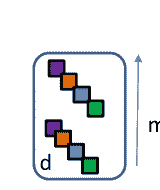

**批量归一化**

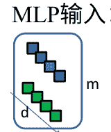

**层归一化**

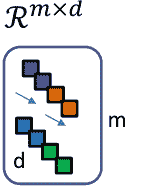

**组归一化**

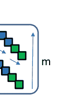

**批组归一化**

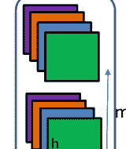

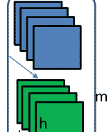

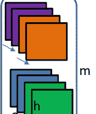

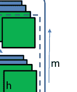

**CNN输入：**$X \in \mathcal{R}^{m \times d \times h \times w}$

图4.1 使用不同的NAP进行标准化的主要变体，适用于MLP和CNN的输入

**实例归一化**


**区域归一化**


**位置归一化**

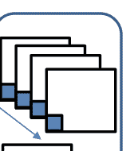

**CNN输入：**$X \in \mathcal{R}^{m \times d \times h \times w}$

图4.2 使用不同的NAP进行标准化的主要变体，专门适用于CNN输入

这意味着统计数据是沿着批次、高度和宽度维度计算的。

NOP是标准化，表示为矩阵形式：

$$\widehat{\boldsymbol{X}} = \Phi_{S D}(\boldsymbol{X}) = \Lambda^{-\frac{1}{2}}(\boldsymbol{X} - \mu \mathbf{1}^{T}).$$

在这里，$\mu = m h \frac{1}{w} \boldsymbol{X} \mathbf{1}$ 是数据样本的均值，$\mathbf{1}$ 是全为1的列向量，而 $\Lambda_{d} = \operatorname{diag}(\sigma_{1}^{2}, \ldots, \sigma_{d}^{2}) + \epsilon \boldsymbol{I}$，其中 $\sigma_{j}^{2}$ 是第$j$个数据样本的方差神经元/通道。 NRR是通道级可学习仿射变换，具有可学习的仿射参数 $\gamma, \beta \in \mathbb{R}^{d}$, 定义如下：

$$\widetilde{X} = \Psi_{AF}(\widehat{X}) = \widehat{X} \odot (\gamma \mathbf{1}^{T}) + (\beta \mathbf{1}^{T}), \quad (4.3)$$

其中 $\odot$ 表示哈达玛积。

在接下来的几节中，我们将讨论沿着这三个方向的研究进展。

## 4.1 标准化区域划分

在本节中，我们将介绍具有不同NAPs的标准化方法（参见图4.1和4.2作为示例）。在这里，默认的NOP是标准化操作（方程4.2），而NRR是仿射变换（方程4.3），除非另有说明。

层标准化（LN）[5]提议在每个训练样本的神经元中对层输入进行标准化，以避免沿批次维度进行标准化的缺点。具体来说，LN的NAP是 $X = \Pi_{LN}(X) \in \mathbb{R}^{m \times d h w}$，其中标准化统计量是沿着通道、高度和宽度维度计算的。LN在训练和推理过程中具有相同的公式，并广泛应用于自然语言处理任务[6-8]。

组归一化（GN）[9]将神经元分成组，并在每个样本中独立地对每个组内的神经元进行层输入标准化。具体而言，GN的NAP为 $X = \Pi_{GN}(X) \in \mathbb{R}^{m g \times s h w}$，其中 $g$ 是组数， $d = gs$。 LN显然是GN的特例，其中 $g=1$。通过改变组数 $g$，GN比LN更加灵活，能够在仅限于小批量训练的视觉任务上取得良好的性能（例如目标检测和分割[9]）。

批组归一化（BGN）[10]将GN的分组机制从仅限于通道扩展到通道和批次维度。BGN的NAP为 $X = \Pi_{BGN}(X) \in \mathbb{R}^{g m_{g} \times s_{m} s h w}$，其中 $m = g_{m} s_{m}$。BGN还在批次维度上进行归一化，并且需要估计总体统计量，类似于公式3.6中的BN。然而，组机制增加了归一化的‘示例’，从而在一定程度上缓解了BN的小批量问题。

上述方法不仅适用于视觉数据的卷积输入，也适用于完全连接的输入，其中 $h=w=1$。还有一些专门针对视觉数据设计的标准化方法，特别适用于卷积输入（图4.2）。实例标准化（IN）[11]建议对每个单独的图像进行标准化，以消除实例特定的对比度信息。具体来说，IN的NAP为 $X = \Pi_{IN}(X) \in \mathbb{R}^{m d \times h w}$。由于它能够从输入中去除样式信息，IN广泛用于图像风格转换任务[12-14]。区域标准化（RN）[15]是从实例标准化扩展而来的，它根据输入掩码将空间像素划分为不同的区域，并对每个区域中的激活进行标准化。请注意，RN中显示的NRR是一组可学习的仿射参数，每个仿射参数分别用于每个区域。区域标准化适用于图像修复任务。

位置标准化（PN）[16]在每个位置上独立地跨通道标准化激活。PN的NAP是 $X = \Pi_{PN}(X) \in \mathbb{R}^{mhw \times d}$。PN旨在处理空间信息，并有潜力提高生成模型的性能[16, 17]。

## 4.2 标准化操作

如前所述，当前的标准化方法通常使用标准化操作。然而，其他操作也可以用来标准化数据。在这部分中，我们将这些操作分为三类：（1）将标准化扩展到白化操作，这是一种更通用的操作；（2）标准化的变体；（3）仅在某些特殊情况下使用居中或缩放的减少标准化。除非另有说明，NAP为 $\Pi_{BN}$，NAP之后的数据表示为 $X \in \mathbb{R}^{d \times m}$，NRR是如公式4.3所示的仿射变换。

### 4.2.1 超越标准化，朝向白化

如第2章所讨论的，用于改善优化条件的理想标准化操作是白化。[18]提出了相关的BN，将BN扩展到批量白化（BW）。BW的NOP是白化，表示为：

$$\hat{X} = \Phi_W(X) = \Sigma^{-\frac{1}{2}}(X - \mu\mathbf{1}^T).$$

在这里，$\Sigma^{-1/2}$是白化矩阵，它是从相应的小批量协方差矩阵计算得到的 $\Sigma = \frac{1}{m}(X - \mu\mathbf{1}^T)(X - \mu\mathbf{1}^T)^T + \epsilon I$。请注意，均值和白化矩阵也是对小批量输入的函数，我们需要通过它们进行反向传播。

将标准化扩展到白化的一个主要挑战是如何通过矩阵的逆平方根进行反向传播。这可以通过使用矩阵微分计算[19]来实现，正如[18]中提出的那样。如[20]所示，可能存在无限多个可能的白化矩阵，因为任何具有旋转的白化数据仍然是白化的。在这里，我们提供了训练期间批量白化方法的一般视图，如算法4.2所示，并提供了相应的反向传播算法4.3。一个有趣的问题是如何计算白化矩阵 $\Sigma^{-1/2}$ 的选择。在这里，我们主要介绍基于PCA、零相位分量分析（ZCA）和Cholesky分解（CD）的白化变换，因为这三种变换在训练DNNs时表现出显著的差异[18, 21]，尽管它们在改善条件方面是等效的。

PCA白化使用$\Sigma_{\text{PCA}}^{-1/2} = S^{-1/2} D^T$，其中 $S^{-1/2} = \text{diag}(\lambda_1^{-1/2}, ..., \lambda_d^{-1/2})$ 和 $D = [d_1, ..., d_d]$ 是特征值和对应的特征向量，即 $\Sigma = D S D^T$。

### 算法4.2 批处理白化算法的一般视图。

```
1: 输入: 小批量输入 $X \in \mathbb{R}^{d \times m}$。
2: 输出: 白化后的 $\widehat{X} \in \mathbb{R}^{d \times m}$。
3: 计算小批量均值: $\mu = \frac{1}{m} X \cdot \mathbf{1}$。
4: 计算中心化激活: $X_C = X - \mu \cdot \mathbf{1}^T$。
5: 计算协方差矩阵: $\Sigma = \frac{1}{m} X_C X_C^T + \epsilon I$。
6: 计算白化矩阵: $\Sigma^{-\frac{1}{2}} = \phi_1(\Sigma)$。
7: 计算白化输出: $\widehat{X} = \Sigma^{-\frac{1}{2}} X_C$。
```

### 算法4.3 批量白化算法的反向传播.

```
1: 输入: 小批量梯度 $\frac{\partial \mathcal{L}}{\partial \widehat{X}} \in \mathbb{R}^{d \times m}$。
2: 输出: $\frac{\partial \mathcal{L}}{\partial X} \in \mathbb{R}^{d \times m}$。
3: 计算: $\frac{\partial \mathcal{L}}{\partial \Sigma^{-\frac{1}{2}}} = \frac{\partial \mathcal{L}}{\partial \widehat{X}} X_C^T$。
4: 计算: $\frac{\partial \mathcal{L}}{\partial \Sigma} = \frac{\partial \mathcal{L}}{\partial \Sigma^{-\frac{1}{2}}} \frac{\partial \phi_1(\Sigma)}{\partial \Sigma}$。
5: 计算: $\frac{\partial \mathcal{L}}{\partial X_C} = (\Sigma^{-\frac{1}{2}})^T \frac{\partial \mathcal{L}}{\partial \widehat{X}} + \frac{1}{m} \left( \frac{\partial \mathcal{L}}{\partial \Sigma} + \frac{\partial \mathcal{L}}{\partial \Sigma}^T \right) X_C$。
6: 计算: $\frac{\partial \mathcal{L}}{\partial X} = \frac{\partial \mathcal{L}}{\partial X_C} \left( I - \frac{1}{m} \mathbf{1}\mathbf{1}^T \right)^T$。
```

在这个转换下，变量首先被协方差的特征矩阵 ($D$) 旋转，然后被特征值的平方根的逆 ($\widetilde{\Lambda}^{-\frac{1}{2}}$) 缩放。 批量数据上的PCA白化在训练DNN时存在显著的不稳定性，并且几乎无法收敛，这是由于所谓的随机轴交换（SAS）引起的，如[18]中所解释的，在第9.3节中我们将进行说明。PCA白化的反向传播是：

$$\frac{\partial \mathcal{L}}{\partial \widetilde{\Lambda}} = \left( \frac{\partial \mathcal{L}}{\partial \Sigma^{-\frac{1}{2}}} \right)_{\text{PCA}} D \left( -\frac{1}{2} \widetilde{\Lambda}^{-3/2} \right) \quad \quad (4.5)$$

$$\frac{\partial \mathcal{L}}{\partial D} = \left( \frac{\partial \mathcal{L}}{\partial \Sigma^{-\frac{1}{2}}} \right)_{\text{PCA}}^T \widetilde{\Lambda}^{-1/2} \quad \quad (4.6)$$

$$\frac{\partial \mathcal{L}}{\partial \Sigma} = D \left( K^T \odot \left( D^T \frac{\partial \mathcal{L}}{\partial D} \right) + \left( \frac{\partial \mathcal{L}}{\partial \widetilde{\Lambda}} \right)_{\text{diag}} D^T \right), \quad \quad (4.7)$$

其中 $K \in \mathbb{R}^{d \times d}$ 是0对角线的 $K_{ij} = \frac{1}{\lambda_i - \lambda_j}[i = j]$，运算符 $\odot$ 是逐元素的矩阵乘法，而 $\left( \frac{\partial \mathcal{L}}{\partial \widetilde{\Lambda}} \right)_{\text{diag}}$ 将 $\frac{\partial \mathcal{L}}{\partial \widetilde{\Lambda}}$ 的非对角元素设为零。 请注意公式4.5是通过特征值分解进行反向传播的公式，我们在附录A.1中提供了推导的详细过程。

ZCA白化使用$\Sigma_{\text{ZCA}}^{-1/2} = \boldsymbol{D} \widetilde{\Lambda}^{-1/2} \boldsymbol{D}^T$，其中PCA白化的输入通过相应的旋转矩阵$\boldsymbol{D}$进行旋转。ZCA白化通过沿特征向量方向拉伸/压缩维度。研究表明，ZCA白化避免了SAS，并在判别性分类任务上比标准化（在BN中使用）取得了更好的性能[18]。ZCA白化的反向传播如下：

$$\frac{\partial \mathcal{L}}{\partial \widetilde{\Lambda}} = \boldsymbol{D}^T \left( \frac{\partial \mathcal{L}}{\partial \Sigma_{\text{ZCA}}^{-\frac{1}{2}}} \right) \boldsymbol{D} \left( -\frac{1}{2} \widetilde{\Lambda}^{-3/2} \right) \quad (4.8)$$

$$\frac{\partial \mathcal{L}}{\partial \boldsymbol{D}} = \left( \frac{\partial \mathcal{L}}{\partial \Sigma_{\text{ZCA}}^{-\frac{1}{2}}} + \left( \frac{\partial \mathcal{L}}{\partial \Sigma_{\text{ZCA}}^{-\frac{1}{2}}} \right)^T \right) \boldsymbol{D} \widetilde{\Lambda}^{-1/2} \quad (4.9)$$

$$\frac{\partial \mathcal{L}}{\partial \Sigma} = \boldsymbol{D} \left( \boldsymbol{K}^T \odot \left( \boldsymbol{D}^T \frac{\partial \mathcal{L}}{\partial \boldsymbol{D}} + \frac{\partial \mathcal{L}}{\partial \widetilde{\Lambda}} \text{diag} \boldsymbol{D}^T \right) \right) \quad (4.10)$$

CD白化使用$\Sigma_{\text{CD}}^{-1/2} = \boldsymbol{L}^{-1}$其中$\boldsymbol{L}$是从Cholesky分解得到的下三角矩阵，满足$\boldsymbol{L} \boldsymbol{L}^T = \Sigma[21]$。这种白化方法通过递归地将当前维度与之前的去相关维度进行去相关操作，从而得到白化矩阵的三角形形式。研究表明，CD白化在训练GANs时能够达到最先进的性能，而ZCA白化的性能则有所下降。CD白化的反向传播如下：

$$\frac{\partial \mathcal{L}}{\partial \boldsymbol{L}} = -\left( \Sigma_{CD}^{-\frac{1}{2}^T} \frac{\partial \mathcal{L}}{\partial \Sigma_{CD}^{-\frac{1}{2}}} \Sigma_{CD}^{-\frac{1}{2}^T} \right) \quad (4.11)$$

$$\frac{\partial \mathcal{L}}{\partial \Sigma} = \frac{1}{2} \boldsymbol{L}^{-T} \left( P \odot \boldsymbol{L}^T \frac{\partial \mathcal{L}}{\partial \boldsymbol{L}} + \left( P \odot \boldsymbol{L}^T \frac{\partial \mathcal{L}}{\partial \boldsymbol{L}} \right)^T \right) \boldsymbol{L}^{-1} \quad (4.12)$$

### 控制批量白化的程度

- （1）用于计算白化矩阵的特征分解/奇异值分解/Cholesky分解引入了显著的计算成本，特别是在GPU上运行时；
- （2）完全白化操作对白化输出施加了过多的约束，可能限制了模型的表示能力，我们将在第9.4节进一步说明；
- （3）沿批处理维度进行标准化引入的随机性将显著增大，如果提供的数据批次过小，则对总体统计量的估计将变得困难。

## 算法4.4 使用牛顿迭代白化激活算法

```
1: 输入: $\Sigma$.
2: 输出: $\Sigma_{1:N}^{-1/2}$.
3: $\Sigma_N = \Sigma / tr(\Sigma)$.
4: $P_0 = I$.
5: for $k = 1$ to $T$ do
6:   $P_k = \frac{1}{2}(3P_{k-1} - P_{k-1}^3 \Sigma_N)$
7: end for
8: $\Sigma_{1:N}^{-1/2} = P_T / \sqrt{tr(\Sigma)}$
```

训练，并且我们将在第9.3节中进一步说明。因此，在实践中控制白化的程度是至关重要的，这为白化操作的优势和劣势之间提供了一个权衡的解决方案。

为了缓解这些问题，提出了基于组的BW方法，其中特征被分成组，并在每个组内进行白化操作[18, 22]，以控制白化的程度。一个有趣的特性是，如果每个组中的通道数设置为1，则基于组的BW方法会减少为BN。此外，基于组的BW方法还具有减少白化计算成本的附加好处。

参考文献[23]提出了迭代标准化（IterNorm）来改善ZCA白化的计算效率和数值稳定性，因为它可以通过使用牛顿迭代来近似白化矩阵，避免了特征分解或奇异值分解。

IterNorm算法如图4.4所示，其中T是迭代次数，tr(·)表示矩阵的迹。给定 $\frac{\partial \mathcal{L}}{\partial \Sigma_{1:N}^{-1/2}}$，反向传播为：

```
$\frac{\partial \mathcal{L}}{\partial \Sigma_{1:N}^{-1/2}}$

$\frac{\partial \mathcal{L}}{\partial P_T} = \frac{1}{\sqrt{tr(\Sigma)}} \frac{\partial \mathcal{L}}{\partial \Sigma_{1:N}^{-1/2}}$

$\frac{\partial \mathcal{L}}{\partial \Sigma_N} = -\frac{1}{2} \sum_{k=1}^{T} (P_{k-1}^3)^T \frac{\partial \mathcal{L}}{\partial P_k}$

$\frac{\partial \mathcal{L}}{\partial \Sigma} = \frac{1}{tr(\Sigma)} \frac{\partial \mathcal{L}}{\partial \Sigma_N} - \frac{1}{(tr(\Sigma))^2} tr\left( \frac{\partial \mathcal{L}}{\partial \Sigma_N}^T \Sigma \right) I - \frac{1}{2(tr(\Sigma))^{3/2}} tr\left( \left( \frac{\partial \mathcal{L}}{\partial \Sigma_{1:N}^{-1/2}} \right)^T P_T \right) I. \quad (4.13)
```

在这里，$\frac{\partial \mathcal{L}}{\partial P_k}$可以通过以下迭代计算：

$$\frac{\partial \mathcal{L}}{\partial P_{k-1}} = \frac{3}{2}\frac{\partial \mathcal{L}}{\partial P_k} - \frac{1}{2}\frac{\partial \mathcal{L}}{\partial P_k} (P_{k-1}^2 \Sigma_N)^T - \frac{1}{2}(P_{k-1}^2)^T \frac{\partial \mathcal{L}}{\partial P_k} \Sigma_N^T - \frac{1}{2}(P_{k-1})^T \frac{\partial \mathcal{L}}{\partial P_k} (P_{k-1} \Sigma_N)^T, \quad k=T, \ldots, 1.$$  (4.14)

在[22]中，耦合的牛顿-舒尔茨迭代[24]也使用了类似的思想进行白化处理。IterNorm的一个有趣特性是，它逐渐沿着特征向量拉伸维度，使得归一化后的相关特征值收敛到1。因此，通过迭代次数，IterNorm可以有效地控制白化的程度。

还有一些工作在损失函数上施加额外的惩罚，以获得近似白化的激活值[25-29]，或者利用白化操作来改善网络的泛化性能[30, 31]。详细信息请参考这些论文。

在这里，我们讨论了BW相对于BN的优缺点。BW的一个优点是在理论上具有更好的条件。其次，通过很好地控制程度，BW可能具有更好的泛化能力（对归一化输出的放大随机性和正则化）。BW的主要缺点是计算成本高和计算白化矩阵时的数值不稳定性。可以通过使用不同的方法（近似地）计算白化矩阵来很好地缓解这些问题，例如使用牛顿迭代。BW的另一个缺点是放大了BN在估计总体统计量方面的缺点，其中使用BW估计的参数数量与神经元/通道数量的平方成正比。因此，BW需要足够大的批量大小才能良好工作。通过使用组白化（GW）[32]，可以避免这个问题，它利用了白化的优点并避免了批量归一化的缺点。具体来说，给定一个小批量输入$X \in \mathbb{R}^{d \times m \times h \times w}$，GW将归一化作为$\phi_W(\Pi_{GN}(X))$进行。组白化与基于组的BW不同，基于组的BW也在小批量数据内应用白化操作，并且仍然需要估计总体统计量。GW的白化操作是在单个示例上执行的，并且在训练和推断过程中具有一致的归一化操作。请注意，如果每个组中的通道数$c=1$，则基于组的BW减少为BN，而如果组数$g=1$，则GW减少为GN。

### 4.2.2 标准化的变种

有几种标准化操作的变体用于对激活进行归一化。

作为对在BN层中控制激活尺度的$L^2$归一化的替代方法[3]，在[33-35]中提出了$L^1$归一化用于标准化。具体来说，$L^1$归一化的维度标准化偏差为：$$\sigma = \frac{1}{m}\sum_{i=1}^m |x^{(i)} - u|.$$

请注意，通过乘以缩放因子$\sqrt{\pi/2}$[34, 35]，$L_2$归一化等效于$L^1$归一化（在温和的假设下）。

在低精度实现中，$L^1$归一化可以提高数值稳定性，并提供计算和内存优势，这是$L^2$归一化所不具备的。

$L^{1}$ 归一化的优点在于它避免了平方和平方根运算的高昂代价。

$L^{2}$ 标准化。具体而言，[34]表明，所提出的符号和绝对值运算在 $L^{1}$ 标准化中可以实现 $1.5\times$ 的加速，并将功耗降低 $50\%$ 在 FPGA 平台上。在使用 $L^{\infty}$ 时也存在类似的优点，如 [35] 中所讨论的，其中标准化偏差为：$\sigma=\max_{i}|x^{(i)}|$。更一般化的 $L^{p}$ 在 [33, 35] 中进行了研究，其中标准化偏差为：$\sigma=\frac{1}{m}\sqrt{\sum_{i=1}^{m}(x^{(i)})^{p}}$。

参考文献 [36] 提出了广义批量标准化 (GBN)，其中用于居中的均值统计和用于缩放的偏差测量是更一般的操作，其选择可以由风险理论指导。他们为具有 ReLU 的网络提供了一些可选的非对称偏差测量方法，例如，右半偏差 (RSD) [36]。

### 4.2.3 减少标准化

如第1.1节所述，标准化操作通常包括居中和缩放。然而，有些工作只考虑其中之一，针对特定情况。请注意，沿批次维度进行居中或缩放都有助于优化，如[3, 37]所示。此外，缩放操作对于尺度不变学习很重要，并且已经显示出在调整学习速率以稳定训练方面很有用[38]。

参考文献[39]提出了仅在批次维度上进行居中的均值批次标准化 (MoBN) ，并且在与权重归一化[39]结合使用时效果很好。参考文献[40]提出了在小批量训练中仅在BN中进行缩放的方法，与权重居中结合使用时也效果很好。参考文献[41]还提出了仅在BN中进行缩放以提高NLP任务性能的方法。

参考文献[17]提出了像素标准化，其中仅在每个图像的每个位置沿通道维度进行缩放操作。这类似于PN [16]，但仅使用缩放操作。像素标准化在生成器中使用时对GANs [16]效果很好。

参考文献[42]假设通过在LN [5]中进行居中操作产生的重新居中不变性是可有可无的，并建议仅对LN执行缩放操作，这被称为均方根层标准化 (RMSLN)。RMS LN考虑了LN的尺度不变性的重要性。RMSLN在自然语言处理任务上的表现与LN相当，但减少了运行时间[42]。这个想法也被用于点击率 (CTR) 预测任务中的仅方差层标准化[43]。参考文献[44]还提出在提出的在线标准化中沿通道维度 (类似于RMSLN) 进行缩放操作，以稳定训练。

Singh和Krishnan提出了滤波器响应标准化 (FRN) [45]，它对每个样本的每个通道 (滤波器响应) 执行仅缩放操作。这类似于IN [11]，但不执行居中操作。动机是，对于批次独立的标准化方案，居中的好处并没有得到充分证明。

## 4.3 标准化表示恢复

标准化约束了激活的分布，这有助于优化。然而，这些约束可能会影响表示能力，因此通常使用额外的仿射变换来恢复可能的表示，如公式4.3所示。此外，标准化统计量（例如均值、协方差）对于视觉数据具有一定的特性。因此，如果特定任务需要，标准化操作可以去除这些特性，然后可以将这些特性添加回去。从这个角度来看，在标准化之后，额外的NRR也被提倡使用。还有其他构建NRR的选项。参考文献[21]提出了一种着色变换，用于恢复白化操作导致的表示能力损失，其公式如下：

$$\widetilde{X}=\Psi_{LR}(\widehat{X})=\widehat{X}\mathbf{W}+(\beta\mathbf{1}^{T}),$$

其中 $\mathbf{W}$ 是一个 $d \times d$ 可学习的矩阵。着色变换可以看作是神经网络中的一个线性层。

在方程4.3中，NRR参数都可以通过反向传播进行学习。一些研究尝试通过使用超网络来动态生成这些参数，其形式为：

$$\widetilde{X}=\Psi_{DC}(\widehat{X})=\widehat{X} \odot \Gamma_{\phi^\gamma} + B_{\phi^\beta},$$

其中 $\Gamma_{\phi^\gamma} \in \mathbb{R}^{d \times m}$ 和 $B_{\phi^\beta} \in \mathbb{R}^{d \times m}$ 由子网络 $\phi^\gamma_{\theta_\gamma}(\cdot)$ 和 $\phi^\beta_{\theta_\beta}(\cdot)$ 生成。生成的仿射参数取决于原始输入本身，这使得它们与方程4.3中通过反向传播学习的仿射参数不同。

参考文献[46]提出了动态层标准化（DLN），用于语音识别中的长短期记忆（LSTM）架构，其中 $\phi^\gamma_{\theta_\gamma}(\cdot)$ 和 $\phi^\beta_{\theta_\beta}(\cdot)$ 是独立的语音级特征提取子网络，与主要声学模型一起进行联合训练。子网络的输入是LSTM相应隐藏层的输出。类似的思想也被用于无监督图像到图像转换中的自适应实例标准化（AdaIN）[13]和自适应层实例标准化（AdaLIN）[47]，其中子网络是多层感知机（MLP），子网络的输入是由一个编码器产生的嵌入特征。参考文献[48]提出了实例级元标准化（ILMN），它利用编码器-解码器子网络根据实例级均值和方差生成仿射参数。此外，ILMN还结合了方程4.3中显示的可学习仿射参数。空间自适应去标准化（SPADE）[49]不使用在空间位置上共享的逐通道仿射参数，而是使用空间相关的 $\beta, \gamma \in \mathbb{R}^{d \times h \times w}$，这些参数由一个两层CNN根据原始图像动态生成。

生成仿射参数的机制 $\Gamma_{\phi^\gamma}$ 在方程4.16中显示了与挤压激励（SE）块[50]相似的方式，当子网络的输入 $\phi^\gamma_{\theta_\gamma}(\cdot)$ 是 $X$ 本身，即，

$\Gamma_{\phi} = \phi$受此启发，[51]提出了实例增强批归一化（IEBN），它使用SE-like子网络将方程4.3中的通道-wise仿射参数和方程4.16中的实例-wise通道仿射参数相结合，参数更少。IEBN可以通过引入实例特定信息来有效调节BN中的噪声。这个想法被关注归一化[52]进一步推广，其中仿射参数由 $K$混合组件建模。

与使用子网络生成仿射参数不同，[8]提出了自适应归一化（AdaNorm），其中仿射参数取决于标准化输出$\widehat{X}$of层归一化:

$$\widetilde{X} = \widehat{X} \odot \phi(\widehat{X}). \quad (4.17)$$

在这里，$\phi(\widehat{X})$在[8]中是满足一定约束条件的常数 $d$。请注意，$\phi(\widehat{X})$被视为一个可变常数（而不是函数），在实现中分离了 $\phi(\widehat{X})$ 的梯度[8]。我们还注意到，对于条件生成模型，可以将附加信息注入到NRR操作中。典型的作品是条件BN（CBN）[53]和条件IN（CIN）[12]。当我们讨论标准化的应用时，我们将在第10章详细阐述这些工作。

总结一下，在我们提出的框架下，我们列出了主要的单模标准化方法，如表4.1所示。尽管存在广泛的标准化技术，但在实践中，BN仍然是首选，特别是对于计算机视觉任务，因为它在优化方面具有理论上的优势（小批量统计可以被视为对总体统计的随机逼近），并且可能具有更好的泛化能力（详见第9章）。然而，在将BN应用于总体统计不明确或难以估计的场景时，训练和推断之间的BN不一致性是一个潜在的问题。

这些场景包括非独立同分布的训练、损坏的输入、使用复杂的架构（例如RNN）、小批量训练等（详见第6章和第10章）。无批量标准化（例如LN和GN）可以避免对总体统计的估计，并在训练和推断过程中使用一致的操作，这在这些场景中是首选的。例如，LN通常用于RNN和Transformer，特别是用于自然语言处理任务，而GN在需要小批量训练（例如批量大小为2或4）的场景中通常比BN效果更好，特别是对于大规模/复杂的数据集。

**表4.1 基于我们提出的描述归一化激活函数方法的主要单模态归一化方法的总结。顺序基于出版时间**

| 方法 | NAP | NOP | NRR | 发表于 |
|------|-----|-----|-----|--------|
| 批量标准化 (BN) | $\Pi_{BN}(\mathbf{X}) \in \mathbb{R}^{d \times mh w}$ | 标准化 | 可学习的 $\gamma, \beta \in \mathbb{R}^d$ | ICML, 2015 |
| 仅均值 BN | $\Pi_{BN}(\mathbf{X}) \in \mathbb{R}^{d \times mh w}$ | 居中 | 否 | NeurIPS, 2016 |
| 层标准化 (LN) | $\Pi_{LN}(\mathbf{X}) \in \mathbb{R}^{m \times dh w}$ | 标准化 | 可学习的 $\gamma, \beta \in \mathbb{R}^d$ | Arxiv, 2016 |
| 实例标准化 (IN) | $\Pi_{IN}(\mathbf{X}) \in \mathbb{R}^{md \times hw}$ | 标准化 | 可学习的 $\gamma, \beta \in \mathbb{R}^d$ | Arxiv, 2016 |
| $L^p$-范数 BN | $\Pi_{BN}(\mathbf{X}) \in \mathbb{R}^{d \times mh w}$ | 使用$L^p$-范数标准化后除以 | 可学习的 $\gamma, \beta \in \mathbb{R}^d$ | Arxiv, 2016 |
| 条件 IN | $\Pi_{IN}(\mathbf{X}) \in \mathbb{R}^{md \times hw}$ | 标准化 | 侧信息 | ICLR, 2017 |
| 动态 LN | $\Pi_{LN}(\mathbf{X}) \in \mathbb{R}^{m \times dh w}$ | 标准化 | 生成的 $\gamma, \beta \in \mathbb{R}^d$ | INTERSPEECH, 2017 |
| 条件BN | $\Pi_{BN}(\mathbf{X}) \in \mathbb{R}^{d \times mh w}$ | 标准化 | 侧信息 | NeurIPS, 2017 |
| 像素标准化 | $\Pi_{PN}(\mathbf{X}) \in \mathbb{R}^{mhw \times d}$ | 缩放 | 否 | ICLR, 2018 |
| 去相关的BN | $\Pi_{BN}(\mathbf{X}) \in \mathbb{R}^{d \times mh w}$ | ZCA白化 | 可学习的 $\gamma, \beta \in \mathbb{R}^d$ | CVPR, 2018 |
| 分组标准化 (GN) | $\Pi_{GN}(\mathbf{X}) \in \mathbb{R}^{mg \times shw}$ | 标准化 | 可学习的 $\gamma, \beta \in \mathbb{R}^d$ | ECCV, 2018 |
| 自适应IN | $\Pi_{IN}(\mathbf{X}) \in \mathbb{R}^{md \times hw}$ | 标准化 | 生成的 $\gamma, \beta \in \mathbb{R}^d$ | ECCV, 2018 |
| $L^1$-范数BN | $\Pi_{BN}(\mathbf{X}) \in \mathbb{R}^{d \times mh w}$ | 使用$L^1$-范数进行标准化除以 | 可学习的 $\gamma, \beta \in \mathbb{R}^d$ | NeurIPS, 2018 |
| 白化和着色BN | $\Pi_{BN}(\mathbf{X}) \in \mathbb{R}^{d \times mh w}$ | CD白化 | 颜色转换 | ICLR, 2019 |
| 广义BN | $\Pi_{BN}(\mathbf{X}) \in \mathbb{R}^{d \times mh w}$ | 通用标准化 | 可学习的 $\gamma, \beta \in \mathbb{R}^d$ | AAAI, 2019 |表4.1(继续)

| 方法 | NAP | NOP | NRR | 发表于 |
| --- | --- | --- | --- | --- |
| 迭代标准化 | $\Pi_{B N}(X) \in \mathbb{R}^{d \times m h w}$ | ZCA白化通过牛顿迭代 | 可学习的 $\gamma, \beta \in \mathbb{R}^{d}$ | CVPR, 2019 |
| 实例级元标准化 | $\Pi_{L N}(X)/\Pi_{I N}(X)/\Pi_{G N}(X)$ | 标准化 | 可学习的和生成的 $\gamma, \beta \in \mathbb{R}^{d}$ | CVPR, 2019 |
| 空间自适应去标准化 | $\Pi_{B N}(X) \in \mathbb{R}^{d \times m h w}$ | 标准化 | 生成的 $\gamma, \beta \in \mathbb{R}^{d \times h \times w}$ | CVPR, 2019 |
| 位置标准化 (PN) | $\Pi_{P N}(X) \in \mathbb{R}^{m h w \times d}$ | 标准化 | 可学习的 $\gamma, \beta \in \mathbb{R}^{d}$ | NeurIPS, 2019 |
| 均方根 LN | $\Pi_{L N}(X) \in \mathbb{R}^{m \times d h w}$ | 缩放 | 可学习 $\gamma \in \mathbb{R}^{d}$ | NeurIPS, 2019 |
| 在线标准化 | $\Pi_{L N}(X) \in \mathbb{R}^{m \times d h w}$ | 缩放 | 否 | NeurIPS, 2019 |
| 批组标准化 | $\Pi_{B G N}(X) \in \mathbb{R}^{g_{m} g \times s_{m} s h w}$ | 标准化 | 可学习的 $\gamma, \beta \in \mathbb{R}^{d}$ | ICLR, 2020 |
| 实例增强 BN | $\Pi_{B N}(X) \in \mathbb{R}^{d \times m h w}$ | 标准化 | 可学习的和生成的 $\gamma, \beta \in \mathbb{R}^{d}$ | AAAI, 2020 |
| PowerNorm | $\Pi_{B N}(X) \in \mathbb{R}^{d \times m h w}$ | 缩放 | 可学习的 $\gamma, \beta \in \mathbb{R}^{d}$ | ICML, 2020 |
| 滤波器响应标准化 | $\Pi_{I N}(X) \in \mathbb{R}^{m d \times h w}$ | 缩放 | 可学习的 $\gamma, \beta \in \mathbb{R}^{d}$ | CVPR, 2020 |
| 专注标准化 | $\Pi_{B N}(X)/\Pi_{I N}(X)/\Pi_{L N}(X)/\Pi_{G N}(X)$ | 标准化 | 生成的 $\gamma, \beta \in \mathbb{R}^{d}$ | ECCV, 2020 |
| 分组白化 | $\Pi_{G N}(X)$ | ZCA白化通过牛顿迭代 | 可学习的 $\gamma, \beta \in \mathbb{R}^{d}$ | CVPR, 2021 |

## 参考文献

- 1. Paszke, A., S. Gross, S. Chintala, G. Chanan, E. Yang, Z. DeVito, Z. Lin, A. Desmaison, L. Antiga, and A. Lerer (2017). PyTorch中的自动微分。 在*NeurIPS Autodiff Workshop*中。
- 2. Abadi, M., P. Barham, J. Chen, Z. Chen, A. Davis, J. Dean, M. Devin, S. Ghemawat, G. Irving, M. Isard, et al. (2016). Tensorflow：一个大规模机器学习系统。 在第12届{USENIX}操作系统设计和实现研讨会（{OSDI}16）中。
- 3. Ioffe, S.和C. Szegedy（2015）。批量归一化：通过减少内部协变量偏移来加速深度网络训练。在*ICML*中。
- 4. Hinton, G.和Y. Bengio（2016）。知识很重要：优化的先验信息的重要性。机器学习研究杂志17（1），226-257。
- 5. Ba, L. J., R. Kiros和G. E. Hinton（2016）。层归一化。arXiv预印本 arXiv: 1607.06450。
- 6. Vaswani, A., N. Shazeer, N. Parmar, J. Uszkoreit, L. Jones, A. N. Gomez, L. Kaiser和I. Polosukhin（2017）。注意力就是你所需要的。在*NeurIPS*中。
- 7. Yu, A. W., D. Dohan, M.-T. Luong, R. Zhao, K. Chen, M. Norouzi和Q. V. Le（2018）。Qanet：将局部卷积与全局自注意力相结合，用于阅读理解。在*ICLR*中。
- 8. Xu, J., X. Sun, Z. Zhang, G. Zhao和J. Lin（2019）。理解和改进层归一化。在*NeurIPS*中。
- 9. 吴, Y. 和 K. He（2018）。组归一化。在*ECCV*中。
- 10. Summers, C. 和 M. J. Dinneen（2020）。每个人都应该知道的四件事来改善批次标准化。在*ICLR*中。
- 11. Ulyanov, D., A. Vedaldi 和 V. S. Lempitsky (2016). 实例标准化：快速风格化的遗漏成分。arXiv预印本 arXiv:1607.08022。
- 12. Dumoulin, V., J. Shlens 和 M. Kudlur (2017). 艺术风格的学习表示。在*ICLR*中。
- 13. 黄, X., M. Liu, S. J. Belongie 和 J. Kautz (2018). 多模态无监督图像到图像转换。在*ECCV*中。
- 14. 黄, X. 和 S. Belongie (2017). 实时自适应实例的任意风格转移标准化。在*ICCV*中。
- 15. 于, T., 郭, Z., 金, X., 吴, S., 陈, Z., 李, W., 张, Z., 和刘, S. (2020). 区域标准化用于图像修复. 在*AAAI*.
- 16. 李, B., 吴, F., 魏, K. Q., 和 Belongie, S. (2019). 位置标准化. 在*NeurIPS*.
- 17. Karras, T., Aila, T., Laine, S., 和 Lehtinen, J. (2018). 渐进式增长的GANs以提高质量, 稳定性和变化. 在*ICLR*.
- 18. 黄, L., 杨, D., Lang, B., 和 Deng, J. (2018). 去相关批量标准化. 在*CVPR*.
- 19. Ionescu, C., Vantzos, O., 和 Sminchisescu, C. (2015). 通过矩阵反向传播训练具有结构化层的深度网络. 在*ICCV*.
- 20. Kessy, A., A. Lewin, 和 K. Strimmer (2018). 最佳白化和去相关化. *The American Statistician* 72(4), 309–314.
- 21. Siarohin, A., E. Sangineto, 和 N. Sebe (2019). GANs的白化和着色变换. 在*ICLR*中。
- 22. Ye, C., M. Evanusa, H. He, A. Mitrokhin, T. Goldstein, J. A. Yorke, C. Fermuller, 和 Y. Aloimonos (2020). 网络反卷积. 在*ICLR*中。
- 23. Huang, L., Y. Zhou, F. Zhu, L. Liu, 和 L. Shao (2019). 迭代标准化：超越标准化，朝向高效白化. 在*CVPR*中。
- 24. Higham, N. J. (2008).矩阵函数：理论与计算. *SIAM*.
- 25. Cogswell, M., F. Ahmed, R. B. Girshick, L. Zitnick, 和 D. Batra (2016). 通过去相关表示减少深度网络中的过拟合. 在*ICLR*中。
- 26. Xiong, W., B. Du, L. Zhang, R. Hu, 和 D. Tao (2016). 通过结构化去相关约束对深度卷积神经网络进行正则化. 在*ICDM*中。
- 27. Littwin, E. 和 L. Wolf (2018). 通过激活的方差样本方差进行正则化. 在*NeurIPS*.
- 28. Joo, T., D. Kang, 和 B. Kim (2020). 通过Wasserstein度量与分布匹配对神经网络中的激活进行正则化. 在*ICLR*中。
- 29. 周, W., B. Y. 林, 和 X. 任 (2020). IsoBN: 使用各向同性批量归一化对BERT进行微调. arXiv预印本 arXiv:2005.02178。
- 30. 邵, W., 唐, S., 潘, X., 谭, P., 王, X., 和罗, P. (2020). 通道平衡网络用于学习深度表示。在 *ICML*中。
- 31. 陈, Z., 贝, Y., 和 Rudin, C. (2020). 概念白化用于可解释的图像识别。*arXiv预印本 arXiv:2002.01650*。
- 32. 黄, L., 周, Y., 刘, L., 朱, F., 和邵, L. (2021). 组白化: 平衡学习效率和表示能力。在 *CVPR*中。
- 33. 廖, Q., 川口, K., 和 Poggio, T. (2016). 流式归一化: 朝着更简单和更符合生物学的在线和循环学习归一化的方向。*arXiv预印本 arXiv:1610.06160*。
- 34. 吴, S., 李, G., 邓, L., 刘, L., 谢, Y., 和石, L. (2018)。L1范数批归一化用于高效训练深度神经网络。*arXiv预印本 arXiv:1802.09769*。
- 35. Hoffer, E., Banner, R., Golan, I., 和 Soudry, D. (2018)。规范化在深度网络中很重要: 高效且准确的规范化方案。在 *NeurIPS*中。
- 36. 袁, X., 冯, Z., 诺顿, M., 和李, X. (2019)。广义批归一化: 加速深度神经网络。在 *AAAI*中。
- 37. LeCun, Y., Bottou, L., Orr, G. B., 和 Muller, K.-R. (1998)。高效反向传播。在神经网络中: 技巧的诀窍。
- 38. Arora, S., Z. Li, and K. Lyu (2019). 自动调整速率的理论分析通过批量归一化。在 *ICLR*.
- 39. Salimans, T. and D. P. Kingma (2016). 权重归一化: 一种简单的重新参数化方法加速深度神经网络的训练。在 *NeurIPS*.
- 40. Yan, J., R. Wan, X. Zhang, W. Zhang, Y. Wei, and J. Sun (2020). 在批量归一化的反向传播中稳定批量统计数据。在 *ICLR*.
- 41. Shen, S., Z. Yao, A. Gholami, M. W. Mahoney, and K. Keutzer (2020). Powernorm: 在变压器中重新思考批量归一化。在 *ICML*.
- 42. Zhang, B. and R. Sennrich (2019). 均方根层归一化。在 *NeurIPS*.
- 43. 王, 张, 张, 张 (2020)。正确的标准化很重要: 了解标准化对深度神经网络模型在点击率预测中的影响。*arXiv预印本 arXiv:2006.12753*。
- 44. Chiley, V., Sharapov, I., Kosson, A., Koster, U., Reece, R., Samaniego de la Fuente, S., Subbiah, D., 和 James, T. (2019)。在线标准化用于训练神经网络。在 *NeurIPS*中。
- 45. Singh, S. 和 Krähenbühl, P. (2020)。滤波器响应标准化层: 消除深度神经网络训练中的批次依赖性。在 *CVPR*中。
- 46. Kim, S., Song, I., 和 Bengio, Y. (2017)。动态层标准化用于自适应神经声学建模中的语音识别。在*INTERSPEECH*中, 第2411-2415页。
- 47. 金, J., M. 金, H. 康, 和 K. H. 李 (2020). U-gat-it: 自适应层实例标准化的无监督生成注意力网络用于图像到图像的转换。在 *ICLR*.
- 48. 贾, S., D. 陈, 和 H. 陈 (2019). 实例级元标准化。在 *CVPR*.
- 49. 朴, T., M.-Y. 刘, T.-C. 王, 和 J.-Y. 朱 (2019). 具有空间自适应标准化的语义图像合成。在 *CVPR*.
- 50. 胡, J., L. 沈, 和 G. 孙 (2018). 挤压和激励网络。在 *CVPR*.
- 51. 梁, S., Z. 黄, M. 梁, 和 H. 杨 (2020). 实例增强批标准化: 批噪声的自适应调节器。在 *AAAI*.
- 52. 李, X., 孙, W.和吴, T. (2019)。注意力标准化。*ArXiv arXiv预印本 arXiv:1908.01259*。
- 53. 德弗里斯, H., 斯特鲁布, F., 玛丽, J., 拉罗谢尔, H., 皮埃特尼, O.和库尔维尔, A. C. (2017)。通过语言调节早期视觉处理。在 *NeurIPS*中, 第6594-6604页。

## 5 多模和组合标准化

在之前的章节中，我们专注于单模标准化方法。 在本章中，我们将介绍扩展到多模的方法，以及组合方法。

### 5.1 多模

Kalayeh和Shah [1]提出了混合标准化（MixNorm），它对可以通过解开分离分布的不同模式来识别的子区域进行标准化，通过高斯混合模型（GMM）估计。 具体而言，他们假设激活 $\mathbf{x} \in \mathbb{R}^d$ 符合GMM分布的情况如下：

$$p(\mathbf{x}) = \sum_{k=1}^{K} \alpha_k p_k(\mathbf{x}) \quad s.t. \forall k: \alpha_k \geq 0, \quad \sum_{k=1}^{K} \alpha_k = 1, \tag{5.1}$$

其中

$$p_k(\mathbf{x}) = \frac{1}{(2\pi)^{d/2} |\Sigma_k|^{1/2}} \exp \left\{ -\frac{1}{2} (\mathbf{x} - \mu_k)^T \Sigma_k^{-1} (\mathbf{x} - \mu_k) \right\} \tag{5.2}$$

表示混合模型中的第$k$个高斯函数。可以估计混合系数 $\alpha_k$，并进一步推导出软分配机制 $\nu_k(\mathbf{x}) = \frac{\alpha_k p_k(\mathbf{x})}{\sum_{j=1}^{K} \alpha_j p_j(\mathbf{x})}$ 通过使用期望最大化（EM）[2]算法。 因此，Kalayeh和Shah [1]将混合标准化变换定义为：

$$\hat{\mathbf{x}}^{(i)} = \sum_{k=1}^{K} \frac{\nu_k(\mathbf{x}^{(i)})}{\sqrt{\alpha_k}} \cdot \frac{\mathbf{v}_k^{(i)}}{\sqrt{\mathbb{E}_{\mathbf{x} \sim \mathcal{D}} [\nu_k(\mathbf{x}) \cdot \mathbf{v}_k^2] + \epsilon}}, \tag{5.3}$$

其中 $ \mathbf{v}_k^{(i)} = (\mathbf{x}^{(i)} - \mathbb{E}_{\mathbf{x} \sim \mathcal{D}}[\nu_k(\mathbf{x}) \cdot \mathbf{x}]) $ 和 $ \hat{\nu}_k(\mathbf{x}^{(i)}) = \frac{\nu_k(\mathbf{x}^{(i)})}{\sum_{\mathbf{x}^{(j)} \in \mathcal{D}} \nu_k(\mathbf{x}^{(j)})} $ 是在估计第k个高斯分量的统计量时，$\mathbf{x}$的归一化贡献在数据集$\mathcal{D}$上的归一化贡献。$ M^i\text{xNorm} $需要一个两阶段的过程，首先使用期望最大化(EM)[2]和K-means++[3]进行初始化来拟合GMM，然后根据估计的参数对样本进行归一化处理。由于K-means++和EM迭代，$ M^i\text{xNorm} $不是完全可微的。

Deecke等人[4]提出了模态归一化(ModeNorm)，它还将归一化扩展到多个均值和方差，以解决复杂数据集的异质性问题。MN在专家混合(MoE)框架中被制定，其中引入了一组简单的门函数来以给定概率将一个示例分配给组。特别地，他们引入了一组简单的门控函数 $ \{g_k\}_{k=1}^{K} $，其中 $ g_k $ 将输入映射到范围在[0, 1]之间的标量，并且 $\sum_{k=1}^K g_k(\mathbf{x}) = 1$。每个小批量中的 $ \mathcal{B}= \{\mathbf{x}^{(i)}\}_{i=1}^{B} $ 都在其门控分配的投票下进行归一化：

$$ \text{ModeNorm}(\mathbf{x}^{(i)}) = \gamma \left( \sum_{k=1}^{K} g_k(\mathbf{x}^{(i)}) \frac{\mathbf{x}^{(i)} - \boldsymbol{\mu}_k}{\boldsymbol{\sigma}_k} \right) + \beta, \quad i = 1, \dots, B, \quad (5.4) $$

其中 $\gamma$ 和 $\beta$ 是学习到的仿射参数，就像标准BN一样。均值估计器 $\boldsymbol{\mu}_k$ 和方差估计器 $\boldsymbol{\sigma}_k$ 是在门控网络的加权下计算的，例如，第k个均值是从批次中估计的：

$$ \boldsymbol{\mu}_k = \frac{1}{N_k} \sum_{\mathbf{x}^{(j)} \in \mathcal{B}} g_k(\mathbf{x}^{(j)}) \cdot \mathbf{x}^{(j)}, \quad (5.5) $$

其中 $ N_k = \sum_{\mathbf{x}^{(j)} \in \mathcal{B}} g_k(\mathbf{x}^{(j)}) $。门函数通过反向传播共同训练，这与MixNorm不同。

## 5.2 组合

由于不同的标准化策略在训练DNNs时具有不同的优缺点，一些方法尝试将它们结合起来。Luo等人[5]提出了可切换标准化（SN），它通过使用IN、LN和BN分别估计的三种类型的统计数据（通道、层和小批量）来进行组合。SN通过学习它们的重要性权重来在不同的标准化方法之间切换，这些权重由softmax函数计算得出。SN的表达式为：

$$ \hat{\mathbf{x}} = \gamma \frac{\mathbf{x} - \sum_{k \in \Omega} w_k \boldsymbol{\mu}_k}{\sqrt{\sum_{k \in \Omega} w_k' \boldsymbol{\sigma}_k^2 + \epsilon}} + \beta \quad (5.6) $$其中，□={in, ln, bn}是在不同NAPs中估计的一组统计数据。此外，w_k和w_k'分别是用于加权平均均值和方差的重要性比率，确保∑_{k∈Ω} w_k = 1，∑_{k∈Ω} w_k' = 1，对于所有的w_k, w_k'。重新参数化技术用于计算w_k和w_k'通过使用带有{α_in, α_ln, α_bn}（{α'_in, α'_ln, α'_bn}）作为控制参数

```
w_k = e^{α_k} / ∑_{z∈{in,ln,bn}} e^{α_z}, w_k' = e^{α'_k} / ∑_{z∈{in,ln,bn}} e^{α'_z}, 和 k ∈ {in, ln, bn}. (5.7)
```

{α_in, α_ln, α_bn}和{α'_in, α'_ln, α'_bn}可以通过反向传播来学习。SN被设计用来解决学习标准化问题，并在几个视觉基准上取得了良好的结果[5]。邵等人[6]进一步引入了稀疏可切换标准化（SSN），它使用了提出的SparsestMax函数来选择不同的标准化方法，该函数是softmax的稀疏版本。潘等人[7]提出了可切换白化（SW），它提供了在SN框架下切换不同白化和标准化方法的通用方式。张等人[8]引入了范例标准化（EN）来研究动态的“学习标准化”问题。特别地，给定一个小批量输入{x(i)}_{i=1}^{B}, EN的定义为

```
x̂^(i) = ∑_k (γ_k ( (w_k^(i) (x^(i) - μ_k)) / sqrt(σ_k^2 + ε) ) + β_k), i = 1, ..., B (5.8)
```

其中 w_k^(i)∈[0, 1]表示第 i 个样本的第 k 个归一化器的重要比率，确保 ∑_k w_k^(i) = 1。此外，重要比率 w_k^(i)取决于个别样本的特征图，并由具有自注意力结构的子网络参数化。
EN为不同的图像样本学习不同的数据相关归一化，而SN为整个数据集固定重要比率。高等人[9]提出了代表性批归一化（RBN），它还结合了小批量统计和实例特定统计的视觉数据。RBN利用实例特定统计来校准中心化和缩放操作，成本微不足道，并减少了一些不适当的运行统计引入的副作用，同时保持了BN的好处。此外，罗等人[10]提出了动态归一化（DN），它以统一的形式概括了IN、LN、GN和BN，并可以插值产生新的归一化方法。

考虑到IN可以学习到与风格无关的特征[11]，Nam和Kim [12]引入了批次实例标准化（BIN）来自适应地对任务进行风格归一化，并有选择性地对个别特征图进行归一化。它通过利用可学习的门控参数ρ∈[0, 1]^d来平衡IN和BN之间的风格信息传播量，从而学习控制每个通道中的风格信息的比例：

```
x̂ = (ρ · x̂_BN + (1 - ρ) · x̂_IN) · γ + β, (5.9)
```

其中 γ, β ∈ ℝ^d 是仿射参数， \(\hat{x}_{BN}\) (\(\hat{x}_{IN}\))是通过\(BN\) (\(IN\)) 进行归一化的输出。在参数更新步骤中， ρ中的元素受到范围 [0, 1]的限制，通过施加边界来实现。

```
ρ ← clip_{[0,1]}(ρ - ηΔρ), (5.10)
```

其中 η是学习率， Δρ表示对 ρ的梯度。 类似的思想也被用于自适应层实例标准化（AdaLIN）[13]用于图像到图像的转换任务，其中可学习的门参数用于平衡LN和IN之间的关系。Bronskill等人[14]引入了TaskNorm， 将LN/IN与BN结合在一起， 用于元学习场景。 与设计组合标准化模块不同， Pan等人[15]提出了IBN-Net， 将IN和BN作为构建块进行精心集成， 并可以包装到几个深度网络中以提高性能。 Qiao等人[16]引入了批通道标准化（BCN）， 将BN和基于通道的标准化（例如LN和GN）顺序地集成为一个包装模块。

Liu等人[17]使用AutoML [18]搜索标准化-激活层的组合， 从而发现了EvoNorms ， 一组具有超出现有设计模式的令人惊讶结构的标准化-激活层。

## 参考文献

- 1. Kalayeh, M. M.和M. Shah（2019年）。 通过在批量-标准化模型中分离变化模式来加快训练速度。*IEEE*模式分析和机器智能交易。
- 2. Dempster, A. P., N. M. Laird和D. B. Rubin（1977年）。 通过em算法从不完整数据中获得最大似然估计。皇家统计学会杂志， B系列39（1）， 1-38。
- 3. Arthur, D.和S. Vassilvitskii（2007年）。 K-means ++： 小心种子的优势。 在离散算法的第十八届*ACM-SIAM*年度研讨会中的模式标准化。
- 4. Deecke, L., I. Murray和H. Bilen（2019年）。 在*ICLR*中。
- 5. Luo, P., J. Ren, Z. Peng, R. Zhang, and J. Li (2019). 通过可切换的标准化实现可微学习. 在 *ICLR*中。
- 6. Shao, W., T. Meng, J. Li, R. Zhang, Y. Li, X. Wang, and P. Luo (2019). 通过最稀疏最大化学习稀疏可切换标准化. 在 *CVPR*中。
- 7. Pan, X., X. Zhan, J. Shi, X. Tang, and P. Luo (2019). 用于深度表示学习的可切换白化. 在 *ICCV*中。
- 8. Zhang, R., Z. Peng, L. Wu, Z. Li, and P. Luo (2020). 用于学习深度表示的示例标准化. 在 *CVPR*中。
- 9. Gao, S.-H., Q. Han, D. Li, M.-M. Cheng, and P. Peng (2021, 六月). 代表性批次标准化与特征校准. 在*IEEE/CVF*计算机视觉与模式识别会议（*CVPR*）的论文集中，pp. 8669–8679.
- 10. Luo, P., P. Zhanglin, S. Wenqi, Z. Ruimao, R. Jiamin, and W. Lingyun (2019). 可微分的动态标准化用于学习深度表示. 在 *ICML*中， 第4203-4211页。
- 11. Ulyanov, D., A. Vedaldi 和 V. S. Lempitsky (2016). 实例标准化： 快速风格化的遗漏成分。*arXiv*预印本*arXiv:1607.08022*。
- 12. Nam, H. and H.-E. Kim (2018). 批次实例标准化用于自适应风格不变的神经网络。 在 *NeurIPS*中。
- 13. Kim, J., M. Kim, H. Kang, and K. H. Lee (2020). U-gat-it: 无监督生成的注意力网络，具有自适应层实例标准化，用于图像到图像的转换。在 ICLR中。
- 14. Bronskill, J., J. Gordon, J. Requeima, S. Nowozin, and R. E. Turner (2020b). Tasknorm: 重新思考元学习的批次标准化。在 ICML中。
- 15. Pan, X., Luo, P., Shi, J., Tang, X. (2018年)。 一次性处理两个任务：通过IBN-net增强学习和泛化能力。在ECCV中，第484-500页。
- 16. Qiao, S., Wang, H., Liu, C., Shen, W., Yu, A. (2019a年)。 重新思考神经网络中的标准化和消除奇异性。arXiv预印本arXiv:1911.09738。
- 17. Liu, H., Brock, A., Simonyan, K., Le, Q. V. (2020年)。 演化标准化激活层。arXiv预印本arXiv:2004.02967。
- 18. Baker, B., Gupta, O., Naik, N., Raskar, R. (2017年)。 使用强化学习设计神经网络架构。在ICLR中。

## 6 更稳健的估计的BN

### 6.1 将标准化作为组合总体统计的函数

如前几节所示，BN在训练期间引入了不一致的标准化操作（使用小批量统计，如公式3.5所示）和推断期间（使用在公式3.6中估计的总体统计数据）。这意味着上层在训练期间使用的表示与推断期间计算的表示不同。如果批量大小太小，这些差异会变得显著，因为均值和方差的估计变得不太准确。这导致性能显著下降[1-4]。为了解决这个问题，一些标准化方法避免沿批量维度进行标准化，如前几节所介绍的。在这里，我们将讨论更稳健的估计方法，也解决了BN的这个问题。

减少训练和推断之间差异的一种方法是在训练期间结合估计的总体统计数据进行标准化。

Ioffe [1] 提出了批量重标准化（BReNorm），通过对每个神经元的标准化输出进行仿射变换来增强输出：

```
\hat{x} = \frac{x - \mu_B}{\sigma_B} \cdot r + z, \quad (6.1)
```

其中 r = σ_B/σ 和 z = μ_B - μ 请注意，r和z被限制在 (1/r_max, r_max) 和 (1/z_max, z_max)，分别。此外，在进行梯度计算时，r和z被视为常数。如果r和z在它们的有界值之间，方程6.1将被简化为使用估计的总体标准化激活（确保训练和推断一致）。否则，方程6.1隐含地利用了小批量统计的好处。

Dinh等人[5]是第一个使用人口统计数据进行批量标准化实验的，这些统计数据是旧人口统计数据和当前小批量统计数据的加权平均值，如公式3.6所示。实验结果表明，将人口统计数据和小批量统计数据相结合可以提高在小批量大小场景下BN的性能。这个想法也被用于减少批量标准化[6]、全标准化(FN)[7]、在线标准化[8]、移动平均批量标准化(MABN)[9]、Pow-nerNorm[10]和动量批量标准化(MBN)[11]。这种方法的一个挑战是如何在反向传播过程中计算梯度，因为人口统计数据是由所有先前的小批量计算得出的，而且无法获得它们的精确梯度[12]。一种直接的策略是将人口统计数据视为常数，并且只通过当前小批量进行反向传播，如[5-7]中所提出的。然而，这可能会引入训练不稳定性，如第3.1节所讨论的。Chiley等人[8]提出通过在反向传播过程中保持BN的属性来计算梯度。Yan等人[9]和Shen等人[10]提出将反向传播梯度视为需要估计的统计数据，并通过移动平均值来近似这些统计数据。

与其明确使用总体统计数据，郭等人[13]引入了备忘录式批量归一化（memo-rized BN），它考虑了来自多个最近批次（或在极端情况下是所有批次）的数据信息，以产生更准确和稳定的统计数据。类似的想法被用于交叉迭代批量归一化[14]，其中通过低阶泰勒多项式近似当前网络权重的最近迭代中的示例的均值和方差。此外，王等人[15]提出了卡尔曼归一化，它将网络中的所有层视为一个整体系统，并通过考虑所有前面层的分布来估计某一层的统计数据，模仿了卡尔曼滤波的优点。

在工程系统中，缓解BN小批量大小问题的另一种实用方法是同步批量归一化[16-18]，它在多个GPU之间执行同步计算以获得更好的统计数据（跨GPU BN）。

## 6.2 BN的鲁棒推理方法

一些工作通过在推理过程中精确估计修正的标准化统计量来解决BN的小批量问题。这种策略不会影响模型的训练方案。

事实上，即使是原始的BN论文[19]也建议在训练结束后估计总体统计量（[19]中的算法2），而不是使用运行平均值计算的估计量（如公式3.6所示）。然而，尽管这对于小批量训练的模型有益处，其中估计是主要问题[19-21]，但在批量大小适中时可能导致退化的泛化能力。

Singh和Shrivastava [3]分析了使用运行平均值时小批量大小如何影响BN的估计准确性，并提出了EvalNorm，该方法在推理过程中优化样本权重，以确保标准化产生的激活值与训练期间提供的那些类似。类似的想法也在[22]中被利用，其中样本权重被视为超参数，在验证集上进行优化。与估计BN统计量（总体均值和标准差）相比，黄等人[23]表明估计BW的白化矩阵更具挑战性。他们证明，在估计白化矩阵的总体统计量方面，间接使用小批量协方差矩阵（训练后可以计算白化矩阵）比直接使用小批量白化矩阵更稳定。

## 参考文献

- 1. Ioffe, S. (2017). 批量重归一化：减少批量归一化模型中的小批量依赖性。在 NeurIPS中。
- 2. Wu, Y. and K. He (2018). 组归一化。在 ECCV中。
- 3. Singh, S. and A. Shrivastava (2019). Evalnorm：用于评估的批量归一化统计量估计。在 ICCV中。
- 4. Kaku, A., S. Mohan, A. Parnandi, H. Schambra, and C. Fernandez-Granda (2020). 像水一样韧性：通过自适应特征标准化对抗外部变量。arXiv预印本arXiv:2002.04019。
- 5. Dinh, L., J. Sohl-Dickstein, and S. Bengio (2017). 使用真实NVP进行密度估计。在 ICLR中。
- 6. Ma, Y. and D. Klabjan (2017). 批量标准化在深度神经网络中的收敛分析。arXiv预印本arXiv:1705.08011。
- 7. Lian, X. and J. Liu (2019). 重新审视批量标准化：通过组合优化进行新的理解和改进。在 AISTATS中。
- 8. Chiley, V., I. Sharapov, A. Kosson, U. Koster, R. Reece, S. Samaniego de la Fuente, V. Subbiah, and M. James (2019). 在线标准化用于训练神经网络。在 NeurIPS中。
- 9. Yan, J., R. Wan, X. Zhang, W. Zhang, Y. Wei, and J. Sun (2020). 在批量标准化的反向传播中稳定批量统计。在 ICLR中。
- 10. Shen, S., Z. Yao, A. Gholami, M. W. Mahoney, and K. Keutzer (2020). Powernorm: 在变压器中重新思考批量归一化。在 ICML中。
- 11. Yong, H., J. Huang, D. Meng, X. Hua, and L. Zhang (2020). 动量批量归一化用于小批量大小的深度学习。在 ECCV中。
- 12. Liao, Q., K. Kawaguchi, and T. Poggio (2016). 流式归一化：朝着更简单和更符合生物学的在线和循环学习的归一化。arXiv预印本arXiv:1610.06160。
- 13. Guo, Y., Q. Wu, C. Deng, J. Chen, and M. Tan (2018). 双向前向传播用于记忆化批量归一化。在 AAAI中。
- 14. Yao, Z., Y. Cao, S. Zheng, G. Huang, and S. Lin (2021). 跨迭代批量归一化。在 CVPR中。
- 15. Wang, G., Peng, J., Luo, P., Wang, X., Lin, L. (2018年). 卡尔曼标准化：在网络层之间标准化内部表示。在 NeurIPS中。
- 16. Zhao, H., Shi, J., Qi, X., Wang, X., Jia, J. (2017年). 金字塔场景解析网络。在 CVPR中。
- 17. Liu, S., Qi, L., Qin, H., Shi, J., Jia, J. (2018年). 路径聚合网络用于实例分割。在 CVPR中。
- 18. Peng, C., Xiao, T., Li, Z., Jiang, Y., Zhang, X., Jia, K., Yu, G., Sun, J. (2018年). Megdet：一个小批量目标检测器。在 CVPR中。
- 19. Ioffe, S.和Szegedy, C. （2015年）。 批量标准化：通过减少内部协变量偏移来加速深度网络训练。在 ICML中。
- 20. Izmailov, P., D. Podoprikhin, T. Garipov, D. Vetrov, and A. G. Wilson (2018). 平均权重导致更宽的最优解和更好的泛化. arXiv preprint arXiv:1803.05407.
- 21. Luo, P., J. Ren, Z. Peng, R. Zhang, and J. Li (2019). 可微学习归一化的可切换归一化. 在 *ICLR* 中.
- 22. Summers, C. and M. J. Dinneen (2020). 每个人都应该知道的四件事来改善批量归一化. 在 *ICLR* 中.
- 23. Huang, L., L. Zhao, Y. Zhou, F. Zhu, L. Liu, and L. Shao (2020). 对批量白化的随机性进行调查. 在 *CVPR* 中.

## 归一化权重

正如第2章所述，通过对权重进行归一化，可以隐式地通过对权重矩阵施加约束来归一化激活值，这有助于在前向（反向传播）过程中保持激活值（梯度）的稳定。一些开创性的研究分析了在假设权重具有某些属性或受到某些约束的情况下，给定归一化输入时激活值的分布，例如归一化传播[1]、方差传播[2]、自归一化[3]、双向自归一化[4]。具体而言，在[1]中，对于每个隐藏层，可以通过闭合形式获得关于均值和方差统计量的数据无关估计，假设预激活值遵循高斯分布，并且隐藏层的权重矩阵大致不相关，正如以下理论所述:

定理7.1 (规范误差边界[1]) 考虑一个线性层 $h = Wx$ 其中 $x \in \mathbb{R}^{d_{in}}$ 且 $W \in \mathbb{R}^{d_{out} \times d_{in}}$，使得 $\mathbb{E}_x[x] = 0$ 且 $\mathbb{E}_x[xx^T] = \sigma^2 I$。那么 $h$ 的协方差矩阵近似满足规范条件

$$ \min_{\alpha} \| \Sigma - \text{diag}(\alpha) \|_F \leq \sigma^2 \tau \sum_{i,j=1; i=j}^{\Sigma_{\text{输出}}} \| W_{i:} \|_2^2 \| W_{j:} \|_2^2, \quad (7.1) $$

其中 $\Sigma = \mathbb{E}_h[(h - \mathbb{E}_h[h])(h - \mathbb{E}_h[h])^T]$ 是 $h$ 的协方差矩阵，$\tau$ 是行的相干性 of the rows of W, $\alpha \in \mathbb{R}^{d_{out}}$ 是最接近协方差矩阵的规范椭球体的近似值，$\text{diag}(\cdot)$ 将向量对角化为对角矩阵。相应的最优 $\alpha_i^* = \sigma^2 \| W_{i:} \|_2^2, \forall i \in \{1, \ldots, d_{out}\}$

1 相干性被定义为 $\max_{W_i:, W_j:, i=j} \frac{|W_i^T W_j|}{\|W_i\|_2 \|W_j\|_2}$.

## 7.1 权重的约束

参考文献[8]提出了权重标准化（WN），它要求每个神经元的输入权重是单位范数。具体来说，给定一个神经元的输入权重 $\mathbf{W}_{i:} \in \mathbb{R}^{d_{in}}$，对 $\mathbf{W}$施加的约束是：
$$\Upsilon(\mathbf{W})= \{\| \mathbf{W}_{i:} \| = 1, i = 1, \ldots, \text{输出维度} d_{out} \}. \quad\quad\quad\quad (7.3)$$
如果我们通过公式7.3对权重施加约束，可以发现公式7.1中的误差界限将减小为 $\sigma^2 \tau \sqrt{\text{输出维度}d_{out}}$（输出维度$d_{out} - 1$），并且相应的最优$\alpha^{*}_{i}= \sigma^2$。在这种情况下，我们可以保持线性变换之间的方差，并且误差界限仅取决于相干性 $\tau$。WN具有类似BN的尺度不变性属性，这对于稳定训练非常重要。

受实际权重初始化技术[9, 10]的启发，其中权重从具有零均值和标准差的分布中进行初始化，Huang等人[5]进一步提出了中心化权重标准化（CWN），将每个神经元的输入权重约束为具有零均值和单位范数，如下所示：
$$\Upsilon(\mathbf{W}) = \{\mathbf{W}_{i:}^{T} \mathbf{1} = 0 \; \& \; \| \mathbf{W}_{i:} \| = 1, i = 1, \ldots, d_{out} \}. \quad\quad\quad\quad (7.4)$$
在某些假设下，CWN可以在不同层之间理论上保持激活统计量（均值和方差），这对优化有益，如下所述的理论所述。

定理7.3 考虑一个神经元$\mathbf{h} = \mathbf{w}^T \mathbf{x}$，其中$\mathbf{w}^T \mathbf{1} = 0$且$\|\mathbf{w}\| = 1$。假设 $\mathbf{x}$ 具有高斯分布，其均值为：$\mathbb{E}_{\mathbf{x}}[\mathbf{x}] = \mu \mathbf{1}$，协方差矩阵为：$\text{cov}(\mathbf{x}) = \sigma^2 \mathbf{I}$，其中$\mu \in \mathbb{R}$ 和 $\sigma^2 \in \mathbf{R}$。我们有 $\mathbb{E}_{h}[h] = 0$，$\text{var}(h) = \sigma^2$。

这样的理论告诉我们，对于每个神经元，预激活 $h$ 的均值为零，方差与输入的激活相同，当假设成立时。在[11, 12]中也提倡使用权重居中。乔等人提出了权重标准化（WS），它对权重施加了约束 $\Upsilon(W) = \{W_i^T \mathbf{1} = 0 \, \& \, \|W_{i,:\square}\| = \sqrt{d_{out}}, i = 1, \ldots, d_{out}\}$。请注意，WS不能有效地保持不同层之间的激活统计数据，因为权重范数为 $\sqrt{d_{out}}$，这可能导致激活爆炸。

因此，WS通常需要与激活标准化方法（例如，BN/GN）结合使用以解决这个问题[11]。权重的另一个广泛使用的约束是正交性，表示为
$$\Upsilon(W) = \{W W^T = I\}.$$
(7.5)
在等式7.5中给出的正交约束条件下，我们可以发现等式7.1中的误差界限将为零（相干性 $\tau$ 将为零），相应的最优 $\alpha_i^* = \sigma^2$，即 $\mathbf{h}$ 的协方差矩阵将是等距的。以下理论展示了正交约束在线性变换中保持激活的范数和分布方面的优势。

定理7.4 假设 $\mathbf{h} = W \mathbf{x}$，其中 $W W^T = I$ 且 $W \in \mathbb{R}^{d_{out} \times d_{in}}$。假设：(1) $\mathbb{E}_{\mathbf{x}}(\mathbf{x}) = \mathbf{0}$, $\text{cov}(\mathbf{x}) = \sigma_1^2 \mathbf{I}$，以及 (2) $\left( \frac{\partial \mathcal{L}}{\partial \mathbf{h}} \right) = \mathbf{0}$, $\text{cov}\left( \frac{\partial \mathcal{L}}{\partial \mathbf{h}} \right) = \sigma_2^2 \mathbf{I}$。如果 $d_{out} = d_{in}$, 我们有以下属性: (1) $\|\mathbf{h}\| = \|\mathbf{x}\|$; (2) $\mathbb{E}_{\mathbf{h}}(\mathbf{h}) = \mathbf{0}$, $\text{cov}(\mathbf{h}) = \sigma_1^2 \mathbf{I}$; (3) $\|\frac{\partial \mathcal{L}}{\partial \mathbf{x}}\| = \|\frac{\partial \mathcal{L}}{\partial \mathbf{h}}\|$; (4) $\mathbb{E}_{\mathbf{x}} \left( \frac{\partial \mathcal{L}}{\partial \mathbf{x}} \right) = \mathbf{0}$, $\text{cov} \left( \frac{\partial \mathcal{L}}{\partial \mathbf{x}} \right) = \sigma_2^2 \mathbf{I}$。特别地，如果 $d_{out} < d_{in}$，属性 (2) 和 (3) 成立; 如果 $d_{out} > d_{in}$, 属性 (1) 和 (4) 成立。

正交性首先在RNN的方形隐藏到隐藏权重矩阵中使用[13–19]，然后进一步扩展到DNN中的更一般的矩形矩阵[6, 20–23]。正交权重矩阵在理论上可以保持线性变换之间的激活/输出梯度的范数[22–24]。此外，在温和的假设下，激活/输出梯度的分布也可以保持不变[6, 24]。正交权重矩阵的这些特性有助于DNN的优化。此外，正交权重矩阵可以避免学习冗余的滤波器，有利于泛化。

与正交权重矩阵将所有奇异值限制为1不同，Miyato等人[25]提出了谱归一化，它将权重矩阵的谱范数（最大奇异值）限制为1，以控制训练GAN时鉴别器的Lipschitz常数。Huang等人[24]提出了通过牛顿迭代（ONI）进行正交化，通过迭代次数来控制正交性。

## 7.2 带约束的训练

很明显，对权重施加约束进行训练是一个约束优化问题。在这里，我们总结了解决这个问题的三种策略。

重新参数化。解决约束优化问题的一种稳定方法是使用重新参数化方法（图7.1）。重新参数化通过代理参数 V 构建了一个细微的变换 ψ over，以确保经过变换的权重 W 对神经网络的训练具有一定的有益属性。通过反向传播梯度信息，梯度更新在代理参数 V 上执行归一化。

图7.1 神经网络的逐层重新参数化的示例。重新参数化通过代理参数V构建了一个细微的变换ψover，以确保变换后的权重 W 通过标准化过程 确保了权重的某些有益特性。

Re-parameterization首次用于学习RNN中的正交权重矩阵[13-15]。

Salimans和Kingma [8]使用这种技术学习了单位范数约束，如公式7.3所示。Huang等人[5]正式描述了重新参数化在具有权重矩阵约束的训练中的思想，并将其应用于解决具有零均值和单位范数约束的优化问题，如公式7.4所示。然后，这种技术进一步应用于其他具有不同约束的方法，例如正交权重标准化[6]、权重标准化[11]、谱标准化[25]和权重中心化[12]。重新参数化是优化DNN中约束权重的主要技术。其主要优点是训练相对稳定，因为它基于反向传播计算的梯度更新了代理参数 V，同时保持了对 W的约束。缺点是通过设计的变换进行反向传播可能会增加计算成本。

带有额外惩罚的正则化。一些研究尝试使用目标函数上的额外惩罚来保持权重约束，这可以看作是一种正则化。这种正则化技术主要用于学习具有正交约束的权重矩阵，因为它在计算上的效率 [16, 26–28]。正交正则化方法已经在图像分类 [27, 29, 30]、对抗性示例攻击 [31]、神经照片编辑 [32] 和训练 GANs [25, 33] 中展示了改进的性能。然而，引入的惩罚类似于纯正则化，约束是否真正得到维持或训练是否受益尚不清楚。此外，正交正则化通常需要与激活标准化结合使用，当应用于大规模架构时，因为它无法稳定训练。

黎曼优化。具有约束的权重矩阵 W可以看作是一个嵌入的子流形 [6, 34–36]。例如，具有正交约束的权重矩阵（Eq.7.5）是一个实际的 Stiefel 流形 [6, 34]。在训练 DNNs 时，保持这些约束的一种可能方法是使用黎曼优化 [37, 38]。在这里，我们简要回顾了 Stiefel 流形上的黎曼优化，更多细节请参考 [39] 和其中的参考文献。目标是 arg min_{W ∈ M} f(W)，其中 f 是 M = {W ∈ ℝ^{n×d} : W^T W = I, n ≥ d} 上的实值平滑函数。我们遵循对 Stiefel 流形上的黎曼优化的常见描述，其中 W的列是 ℝ^n 中的 d正交向量，因此满足约束 W^T W = I。这与前几节中我们的公式描述不同，约束条件为 W W^T = I 和 n ≤ d，如 Eq. 7.5 所示。

传统的优化技术是基于梯度下降方法在流形上迭代地寻找更新点 W_t ∈ M。在每次迭代 t中，关键是：（1）找到黎曼梯度 G^M f (W_t) ∈ T_{W_t}，其中 T_{W_t} 是当前点 W_t处的切空间；（2）找到下降方向并确保新点在流形 M上。

为了获得黎曼梯度 G^M f (W) ，内积应该在 T_W中定义。Stiefel流形的切空间有两种广泛使用的内积[40]：

+   （1）欧几里得内积：< X1, X2 >e = tr (X1^T X2) 和 （2）规范内积：
$< \mathbf{X}_1, \mathbf{X}_2 >_c = tr(\mathbf{X}_1^T (\mathbf{I} - \frac{1}{2} \mathbf{W} \mathbf{W}^T) \mathbf{X}_2)$ 其中 $\mathbf{X}_1, \mathbf{X}_2 \in T_W$ 且 $tr(\cdot)$ 表示矩阵的迹。基于这两个内积，可以得到相应的黎曼梯度[40]:

$$G_e^{\mathbf{M}} f(\mathbf{W}) = \frac{\partial f}{\partial \mathbf{W}} - \mathbf{W} \frac{\partial f}{\partial \mathbf{W}}^T$$

和

$$G_c^{\mathbf{M}} f(\mathbf{W}) = \frac{\partial f}{\partial \mathbf{W}} - \frac{1}{2} \left( \mathbf{W} \mathbf{W}^T \frac{\partial f}{\partial \mathbf{W}} + \mathbf{W} \frac{\partial f}{\partial \mathbf{W}}^T \right)$$

其中 $\frac{\partial f}{\partial \mathbf{W}}$ 是普通梯度。

给定黎曼梯度后，下一步是找到下降方向并确保新点在流形 $\mathbf{M}$ 上，这可以通过所谓的操作回退来支持。一个很好的推荐的回退是QR分解型回退[38, 41]，它通过以下方式将 $T_W$ 的切向量映射到 $\mathbf{M}$ 上: $P_W(\mathbf{Z}) = qf(\mathbf{W} + \mathbf{Z})$，其中 $qf(\cdot)$ 表示QR分解的 $Q$ 因子，$Q \in \mathbf{M}$，而R因子是一个上三角矩阵，其主对角线上的元素严格为正，使得分解是唯一的[41]。给定黎曼梯度 $G^{\mathbf{M}} f(\mathbf{W})$ 和学习率 $\eta$，新点为:

$$\mathbf{W}_{t+1} = qf(\mathbf{W}_t - \eta G^{\mathbf{M}} f(\mathbf{W}))$$

另一种众所周知的技术是同时沿着下降方向移动并确保流形 $\mathbf{M}$ 上的新解是Cayley变换[14, 16, 36, 40]。它通过以下方式生成可行解 $\mathbf{W}_{t+1}$ 与当前解 $\mathbf{W}_t$ 相等:

$$\mathbf{W}_{t+1} = \left( \mathbf{I} + \frac{\eta}{2} A_t \right)^{-1} \left( \mathbf{I} - \frac{\eta}{2} A_t \right) \mathbf{W}_t$$

其中 $\eta$ 是学习率，$A_t = \frac{\partial f}{\partial \mathbf{W}_t}^T \mathbf{W}_t - \mathbf{W}_t^T \frac{\partial f}{\partial \mathbf{W}_t}$ 是由切空间中定义的规范内积引起的。

在训练DNN时应用Riemannian优化的主要困难是: (1) 优化空间涵盖多个嵌入子流形; (2) 嵌入子流形相互依赖, 因为当前权重层的优化受到前面层的影响。为了稳定训练, 通常需要激活标准化 (例如BN) [36]或梯度剪辑[34]。有趣的观察是, 使用BN可能会改善基于投影的方法的性能 (其中梯度是基于欧几里德空间计算的) [35, 42]。

在这里，我们总结了标准化权重相对于标准化激活的优缺点。标准化权重的主要优点是在推理过程中的效率，即在推理过程中没有额外的内存或计算成本。

此外，与批标准化相比，它们对批大小不敏感。 标准化权重的主要缺点是训练可能不稳定，相对于激活标准化而言。 因为它们只能隐式地控制激活，并且通常需要一定的假设。 此外，它们需要良好设计的增益参数来保持层之间的等效方差/分布[24, 43]。 增益参数取决于网络架构。 例如，Huang等人[24]考虑了没有残差连接的前馈网络，而Brock等人[43]考虑了更复杂的残差网络架构。 因此，它们在实践中更难使用。

## 参考文献

+   1. Arpit, D., Y. Zhou, B. U. Kota, and V. Govindaraju (2016). 标准化传播：一种用于去除深度网络中内部协变量偏移的参数化技术。在 *ICML*中。
2. Shekhytsov, A. and B. Flach (2018a). 使用解析方差传播的神经网络标准化。在计算机视觉冬季研讨会中。
3. Klambauer, G., T. Unterthiner, A. Mayr, and S. Hochreiter (2017). 自标准化神经网络。在 *NeurIPS*中。
4. Lu, Y., S. Gould, and T. Ajanthan (2020). 双向自标准化神经网络。arXiv预印本 arXiv:2006.12169。
5. Huang, L., X. Liu, Y. Liu, B. Lang, and D. Tao (2017). 中心化权重标准化在加速深度神经网络训练中的应用。在 *ICCV*中。
6. Huang, L., X. Liu, B. Lang, A. Yu, Y. Wang, and W. Li (2018). 正交权重标准化：解决深度神经网络中多个相关斯蒂弗尔流形的优化问题。在AAAI中。
7. Kagay and Okatani (2018). 使用标准化核训练CNNs。在AAAI中。
8. Salimans and Kingma (2016). 权重标准化：一种简单的重新参数化方法，加速深度神经网络的训练。在NeurIPS中。
9. Glorot and Bengio (2010). 理解训练深度前馈神经网络的困难。在AISTATS中。
10. He, Zhang, Ren and Sun (2015). 深入研究整流器：在图像分类方面超越人类水平的性能。在ICCV中。
11. Qiao, S., H. Wang, C. Liu, W. Shen, and A. Yuille (2019b). 权重标准化。arXiv预印本 arXiv:1903.10520。
12. Yan, J., R. Wan, X. Zhang, W. Zhang, Y. Wei, and J. Sun (2020). 在批量归一化的反向传播中稳定批量统计。在 *ICLR*中。
13. Arjovsky, M., A. Shah, and Y. Bengio (2016). 单元演化循环神经网络。在 *ICML*中。
14. Wisdom, S., T. Powers, J. Hershey, J. Le Roux, and L. Atlas (2016). 全容量的么正循环神经网络。在 *NeurIPS*中。
15. Dorobantu, V., P. A. Stromhaug, and J. Renteria (2016). DizzyRNN: 重新参数化循环神经网络以实现保持范数的反向传播。arXiv预印本arXiv:1612.04035。
16. Vorontsov, E., C. Trabelsi, S. Kadoury, and C. Pal (2017). 关于正交性和学习循环具有长期依赖性的网络。在 *ICML*中。
17. Hyland, S. and G. Ratsch (2017). 通过u(n)的帮助学习酉算子。在 *AAAI*。

1. Glorot, X. and Y. Bengio (2010). 理解训练深度前馈神经网络的困难。在*AISTATS*中。
2. Martens, J. (2010). 通过无Hessian优化进行深度学习。在*ICML*中，第735-742页。Omni-press。
3. Vinyals, O. and D. Povey (2012). Krylov子空间下降用于深度学习。在 AISTATS中，第1261-1268页。
4. Martens, J. and I. Sutskever (2012). 使用无Hessian优化训练深度和递归网络。在神经网络：行业技巧（第2版），计算机科学讲义的第7700卷，第479-535页。Springer。
5. Grosse, R. B. and R. Salakhutdinov (2015). 通过稀疏因子化逆Fisher矩阵来扩展自然梯度。在 ICML中，第2304-2313页。
6. Duchi, J., E. Hazan, and Y. Singer (2011). 自适应次梯度方法用于在线学习和随机优化。机器学习研究杂志12(7)。
7. Hinton, G., N. Srivastava, and K. Swersky (2012). 神经网络用于机器学习讲座6a小批量梯度下降的概述。
8. Kingma, D. P. and J. Ba (2015). Adam: 一种用于随机优化的方法。在 ICLR中。
9. Yu, A. W., L. Huang, Q. Lin, R. Salakhutdinov, and J. Carbonell (2017). 块归一化梯度方法：训练深度神经网络的实证研究。arXiv预印本 arXiv:1707.04822。
10. Pascanu, R., T. Mikolov, and Y. Bengio (2013). 关于训练循环神经网络的困难。在 ICML中。
11. You, Y., I. Gitman, and B. Ginsburg (2017). 卷积网络的大批量训练。arXiv预印本 arXiv:1708.03888。
12. You, Y., J. Li, S. Reddi, J. Hseu, S. Kumar, S. Bhojanapalli, X. Song, J. Demmel, K. Keutzer, and C.-J. Hsieh (2020). 深度学习的大批量优化：BERT在76分钟内训练完毕。在 ICLR。
13. Zheng, S., H. Lin, S. Zha, and M. Li (2020). BERT预训练的加速大批量优化，在54分钟内完成。CoRR abs/2006.13484。
14. Yong, H., J. Huang, X. Hua, and L. Zhang (2020). 梯度居中化：深度神经网络的一种新技术。在 ECCV中。
15. Jing, L., G. Hinton, J. Pennington, Y. Shen, M. Tegmark, M. Soljacic和Y. Bengio (2017). 门控正交循环单元：关于遗忘的学习。 arXiv预印本arXiv:1706.02761。
16. Helfrich, K., D. Willmott和Q. Ye (2018). 具有缩放的正交循环神经网络 Cayley变换。在 ICML。
17. Ozay, M. (2019). 深度神经网络的细粒度优化。在 NeurIPS。
18. Jia, K., S. Li, Y. Wen, T. Liu和D. Tao (2019). 正交深度神经网络。IEEE 模式分析和机器智能交易。
19. Wang, J., Y. Chen, R. Chakraborty, 和 S. X. Yu (2020). 正交卷积神经网络。在 CVPR中。
20. Qi, H., C. You, X. Wang, Y. Ma, 和 J. Malik (2020). 深度等距学习用于视觉识别。在 ICML中。
21. Huang, L., L. Liu, F. Zhu, D. Wan, Z. Yuan, B. Li, 和 L. Shao (2020). 在训练DNNs中的可控正交化。在 CVPR中。
22. Miyato, T., T. Kataoka, M. Koyama, 和 Y. Yoshida (2018). 用于生成对抗网络的谱归一化。在 ICLR中。
23. Pascanu, R., T. Mikolov, 和 Y. Bengio (2013). 关于训练递归神经网络的困难。在 ICML中。
24. Bansal, N., X. Chen, and Z. Wang (2018). 我们能从正交性正则化中获得更多收益吗在训练深度CNN时? 在 NeurIPS。
25. Amjad, J., Z. Lyu, and M. R. Rodrigues (2019). 逆问题的深度学习：界限和正则化。arXiv预印本 arXiv:1901.11352。
26. Zhang, L., M. Edraki, and G.-J. Qi (2018). Cappronet：通过正交投影进行深度特征学习到胶囊空间。在 NeurIPS。
27. Lezama, J., Q. Qiu, P. Mus , and G. Sapiro (2018). OI：正交低秩嵌入-一种插入和播放几何损失的深度学习方法。在 CVPR。
28. Moustapha, C., B. Piotr, E. Grave, Y. Dauphin, and N. Usunier (2017). Parseval网络：改进对抗性示例的鲁棒性。在 ICML。
29. Brock, A., T. Lim, J. M. Ritchie, and N. Weston (2017). 神经照片编辑与内省对抗网络。在 ICLR中。
30. Brock, A., J. Donahue, and K. Simonyan (2019). 大规模GAN训练用于高保真度自然图像合成。在 ICLR中。
31. Cho, M. and J. Lee (2017). 基于黎曼方法的批归一化。在 NeurIPS中。
32. Huang, L., X. Liu, B. Lang, and B. Li (2017). 基于投影的权重归一化用于深度神经网络。 arXiv预印本 arXiv:1710.02338。
33. Li, J., L. Fuxin, and S. Todorovic (2020). 通过Cayley变换在Stiefel流形上进行高效黎曼优化。在 ICLR中。
34. Ozay, M. and T. Okatani (2016). 卷积神经网络中卷积核子流形上的优化。 arXiv预印本 arXiv:1610.07008。
35. Harandi, M. and B. Fernando (2016). 广义反向传播，案例研究：正交性。 arXiv预印本 arXiv:1611.05927。
36. Absil, P.-A., R. Mahony, and R. Sepulchre (2008). 矩阵流形上的优化算法。 普林斯顿, 新泽西州：普林斯顿大学出版社。
37. Wen, Z. and W. Yin (2013). 一种具有正交性约束的优化可行方法. 数学. 程序. 142(1-2), 397–434。
38. Kaneko, T., S. G. O. Fiori, and T. Tanaka (2013). 紧致斯蒂费尔流形上的经验算术平均。 IEEE信号处理杂志 61(4), 883–894。
39. Jia, K. (2017). 通过奇异值边界改进深度神经网络的训练。在 CVPR中。
40. Brock, A., S. De, and S. L. Smith (2021). 表征信号传播以弥补未标准化ResNet中的性能差距。在国际学习表示会议中。

如前所述，标准化激活和权重旨在为DNN提供更好的优化景观，通过满足第2章中的标准1和2。 与通过设计提供良好的优化景观不同，DNN中梯度标准化旨在利用GD/SGD的曲率信息，尽管优化景观是病态的。 它仅对梯度进行标准化，可以有效地消除由不同层梯度幅度的多样性引起的病态景观的负面影响[1]。 一般而言，梯度标准化类似于二阶优化[2-5]或基于坐标的自适应学习率方法[6-8]，但其目标是利用DNN中的逐层结构信息。Yu等人[9]首次提出了用于训练DNN以应对梯度爆炸或消失问题的块状（逐层）梯度标准化。 通用的块状梯度下降算法描述如算法8.1所示。

```
算法8.1通用块归一化梯度（BNG）下降
1: 参数:步数 T, 块数 B
2: 将 θ 分成 B 个块, 使 θ = (θ^1, θ^2, . . . . , θ^B)。 初始化 θ_0 ∈ ℝ^D。
3: 对于 t = 1, 2, . . . T 执行以下操作
4: 从数据中随机抽取一个小批量 X_t 并计算每个块的归一化随机梯度
   g_t^i = ∂L/∂θ^i / ||∂L/∂θ^i||_2, i = 1, 2, . . . . , B
5: 令 g_t = (g_t^1, g_t^2, , g_t^B) 并选择步长 τ_t ∈ ℝ^D。
6:  θ_t = θ_{t-1} - τ_t · g_t
7: end for
```

具体而言，它们对每一层权重的梯度进行缩放，确保其范数为单位范数。即，算法8.1中描述的块对应于网络中的层。这种技术可以将大梯度的幅度降低到一定水平，例如梯度裁剪[10]，并且可以增加小梯度的幅度。

然而，在尺度不变的深度神经网络（例如，使用BN）中，这种方法的净增益会降低。在[9]中，使用了一个额外的比例因子，该因子取决于逐层权重的范数，用于自适应地调整梯度的幅度，如下所示：

$$\mathbf{g}_{adap}^i = \alpha \cdot \bigcirc \theta_i \bigcirc \frac{\partial \mathcal{L}}{\partial \theta^i}, i=1, 2, \ldots, B. \qquad (8.1)$$

这里 α 是一个常数比率，下标“adap”是“自适应”的缩写，因为梯度的范数适应其变量的范数。

在大批量训练中，You等人提出了类似的想法，并同时引入了逐层自适应速率缩放（LARS）[11]。LARS提供了如何在标准化梯度框架中使用权重衰减和动量的详细说明。

SGD与LARS的网络训练总结在算法8.2中。

## 算法8.2 SGD与LARS，使用权重衰减、动量和多项式学习率（LR）衰减

-   1: 参数:基本学习率 γ₀, 动量 β_m, 权重衰减 β, LARS系数 η, 步数 T
    2: 初始化: 动量向量 v₀ = 0, 权重 w₀^l 对于每一层 l.
    3: 对于 t = 1, 2, ... T 执行以下操作
    4: 计算全局学习率:      γ_t = γ₀ / (1 - t/T)²
    5: 对于每一层 l 执行以下操作
    6:      从数据中随机抽取一个小批量并计算小批量梯度: g_t^l = ∂L / ∂w^l |_{w^l = w_{t-1}^l}
    7:      计算局部学习率:      λ^l = η / (||w_{t-1}^l|| / (||g_t^l|| + β||w_{t-1}^l||))
    8:      更新动量: v_t^l = β_m v_{t-1}^l + γ_t λ^l (g_t^l + β w_{t-1}^l)
    9:      更新权重:          w_t^l = w_{t-1}^l - v_t^l
    10:  end for
    11: end for

LARS是使用大批量大小训练大规模DNN的重要技术，显著减少训练时间而不降低性能，特别适用于使用SGD的视觉任务（例如，在ImageNet上）。You等人[12]进一步提出了一种称为LAMB的逐层自适应大批量优化技术，用于训练BERT等最先进的语言模型。LAMB基于深度学习社区中流行的Adam优化器[8]，并在算法8.3中进行了描述。需要注意的是，LAMB将逐层缩放项泛化为一个缩放函数 φ(○w^l|)，其值取决于层^l中权重向量 w^l 的范数。LAMB是一个显著的例子，将BERT的训练时间从3天缩短到76分钟（在TPUv3 Pod上）。郑等人[13]介绍了每个块的通过利用经典动量和Nesterov动量之间的联系，对梯度标准化进行了改进，并修改了其动量项。加速梯度方法的结果称为LANS。

```
**算法8.3 LAMB**
1:参数:步数 $T$，学习率 $\{\gamma_t\}_{t=1}^{T}$，动量参数 $0 < \beta_1, \beta_2 < 1$，
权重衰减 $\beta$，缩放函数 $\phi$， $> 0$
2:初始化 :动量向量 $\mathbf{m}_0 = \mathbf{0}$，速度 $\mathbf{v}_0 = \mathbf{0}$，权重 $\mathbf{w}_0^l$对于每一层 $l$。
3:对于 $t = 0, 1, 2, \ldots, T - 1$执行以下操作
4: 从数据中随机抽取一个小批量并计算小批量梯度: $\mathbf{g}_t = \frac{\partial \mathcal{L}}{\partial \mathbf{w}} |_{\mathbf{w}=\mathbf{w}_{t-1}}$
5: $\mathbf{\mu}_t = \beta_1 \mathbf{\mu}_{t-1} + (1 - \beta_1)\mathbf{g}_t$
6: $\mathbf{v}_t = \beta_2 \mathbf{v}_{t-1} + (1 - \beta_2)\mathbf{g}_t^2$
7: $\hat{\mathbf{\mu}}_t =\mathbf{\mu}_t/(1 - \beta_1^t)$
8: $\hat{\mathbf{v}}_t =\mathbf{v}_t/(1 - \beta_2^t)$
9: 计算比率 $\mathbf{r}_t = \frac{\hat{\mathbf{\mu}}_t}{\sqrt{\hat{\mathbf{v}}_t + \epsilon}}$ (逐元素除法)
10: 对于每一层 $l$执行
11:     更新权重: $\mathbf{w}_t^l =\mathbf{w}_{t-1}^l - \gamma_t \frac{\phi(\odot \mathbf{w}_{t-1}^l\odot)}{\odot \mathbf{r}_t^l + \beta\mathbf{w}_{t-1}^l\odot} (\mathbf{r}_t^l + \beta\mathbf{w}_{t-1}^l)$
12: end for
13: end for
```

与使用缩放操作不同，Yong等人[14]最近提出了梯度居中（GC）的标准化技术，该技术对每个层中每个神经元的输入权重的梯度进行居中处理。具体而言，对于完全连接层中的权重矩阵 $\mathbf{W} \in \mathbb{R}^{d_{out} \times d_{in}}$，其中 $d_{out}$表示神经元的数量，GC将梯度居中处理如下:

> $$\phi_{GC} \left( \frac{\partial \mathcal{L}}{\partial \mathbf{W}} \right) = \frac{\partial \mathcal{L}}{\partial \mathbf{W}} \left( \mathbf{I} - \frac{1}{d_{in}} \mathbf{1}\mathbf{1}^T \right). \qquad (8.2)$$

居中处理的梯度 $\phi_{GC}(\frac{\partial \mathcal{L}}{\partial \mathbf{W}})$然后用于更新权重。GC隐式地对输入权重施加约束，并确保训练过程中输入权重的元素之和保持不变。GC有效地提高了具有激活标准化（例如BN或GN）的DNN的性能。

## 标准化的分析

在第2章中，我们提供了标准化在网络优化中的高层动机。在本节中，我们将进一步讨论标准化方法在改善DNN的训练性能方面的其他特性。关于机器学习或深度学习的理论分析，通常涉及三个主要主题：表示、优化和泛化。就深度学习中的表示能力研究而言，主要涵盖了定量测量深度模型的复杂性，并从理论上表征深度DNN相对于宽度的表示能力的优势[1,2]。在给定模型的情况下，优化研究主要包括优化算法是否能够获得稳定点，以及优化算法达到稳定点的速度如何。泛化指的是通过优化算法在训练数据上良好训练的模型在未见数据上的预测能力。

在本章中，我们主要关注BN，因为它几乎展示了标准化在改善DNN性能方面的所有优点，例如稳定训练、加速收敛和改善泛化。我们将展示BN如何在优化和泛化方面受益，并通过使用批量大小来控制分布来展示BN如何影响表示。我们指出，关于BN的性能的确切原因和机制仍然存在一些争议，对于BN和其在DNN中的有效性的理论分析仍然是一个活跃的研究课题。在这里，我们不讨论严格的理论分析，例如回答标准化模型的访问风险或泛化误差的界限是什么，或者BN是否可以提高理论收敛速度。即使在网络中没有标准化，对于深度神经网络的理论分析仍然很困难。本书主要关注结合高层理论直觉和经验实验证实的分析。

### 9.1 尺度不变性在稳定训练中的作用

BN 的一个重要功能是稳定训练的能力。这主要是由于其尺度不变性特性 [3-6]，即在重新缩放参数时不改变预测，并通过逐层自适应调整学习率的方式进行工作 [7-9]。

形式上，我们将尺度不变性的定义如下。

**定义 9.1 (尺度不变性)** 给定由参数化的损失函数 $\ell(\mathbf{w}, \tilde{\theta})$ parameterized by $\mathbf{w}$ and $\tilde{\theta}$，如果对于所有正常数 $\alpha > 0$，$\ell(\alpha \mathbf{w}, \tilde{\theta}) = \ell(\mathbf{w}, \tilde{\theta})$[9]，则称$\mathbf{w}$为尺度不变参数。进一步地，如果 $\ell$ has scale invariance，则它具有非零的尺度不变参数。

此外，具有尺度不变性的函数具有以下属性，这对于稳定训练非常重要。

**定理9.2 (尺度不变性属性)** 设 $\mathbf{w}$ 为尺度不变的参数 $\ell(\mathbf{w}, \tilde{\theta})$ 并且我们使用(随机)梯度更新: $\mathbf{w}_{t+1} = \mathbf{w}_t - \eta_t \frac{\partial \ell}{\partial \mathbf{w}_t}$。我们有: (1) $\frac{\partial \ell}{\partial \mathbf{w}} \cdot \mathbf{w} = 0$ 并且 $\|\mathbf{w}_{t+1}\|^2_2 = \|\mathbf{w}_t\|^2_2 + \eta_t^2 \|\frac{\partial \ell}{\partial \mathbf{w}}\|^2_2$; (2) $\frac{\partial \ell}{\partial \mathbf{w}}|_{\mathbf{w}=\alpha\mathbf{w}_0} = \frac{1}{\alpha} \frac{\partial \ell}{\partial \mathbf{w}}|_{\mathbf{w}=\mathbf{w}_0}, \forall\alpha > 0$。

尺度不变性属性确保基于梯度下降的方法始终增加权重的范数[4, 5, 9-12]，并且随着权重范数的增大，权重的梯度变得更小。这样可以防止训练发散到无穷大[9]。

BN确保连接到输出神经元的权重向量是一个尺度不变的参数。也就是说，对于 $\alpha>0$，B N(x; $\alpha$w)=B N(x; w)，其中w是连接到BN之后的输出神经元的权重向量。这种尺度不变性也适用于其他归一化激活方法[3, 13-15]或权重方法[10, 16, 17]。这个性质首先在原始的BN论文中展示，然后在[3]中进行了不同归一化方法的比较研究，并在[18]中进一步扩展到了修正线性单元网络。在这里，我们说明了BN通过其尺度不变性属性来稳定训练的原因。

从实践者的角度来看，训练深度神经网络时存在两种不稳定现象: (1)训练损失首先显著增加，然后发散；或者(2)训练损失与初始条件相比几乎没有变化。前者主要是由于权重更新过大（例如梯度爆炸或使用较大的学习率）引起的。后者是由于权重更新较少（梯度消失或使用较小的学习率）引起的。在下面的定理中，我们将展示未归一化的修正线性单元神经网络很可能遇到这两种现象。

**定理9.3** 给定具有非线性 $\phi(\alpha \mathbf{x}) = \alpha \phi(\mathbf{x})$ ($\alpha > 0$)的整流神经网络，如果每层的权重都乘以 $\mathbf{W}_l = \alpha_l \mathbf{W}_l$ ($l = 1, . . ., L$ 且 $\alpha_l > 0$)，我们有缩放后的层输入：$x_l = (\prod_{i=1}^l \alpha_i) x_{l_0}$。假设 $\frac{\partial \mathcal{L}}{\partial h_L} = \mu \frac{\partial \mathcal{L}}{\partial h_L}$，我们有输出梯度：$\frac{\partial \mathcal{L}}{\partial h_l} = \mu (\prod_{i=l+1}^L \alpha_i) \frac{\partial \mathcal{L}}{\partial h_L}$，以及权重梯度：$\frac{\partial \mathcal{L}}{\partial w_l} = (\mu \prod_{i=1, i \neq l}^L \alpha_i) \frac{\partial \mathcal{L}}{\partial w_L}$，对于所有的$l = 1, \dots, L$。 证明见附录A.3。根据定理9.3，我们观察到层$l$中权重的缩放因子$\alpha_l$将影响所有其他层的权重梯度。具体来说，如果所有的$\alpha_l > 1$（$\alpha_l < 1$），权重梯度将指数级增加（减少）一次迭代。此外，由于更新导致的权重幅度增加，这种指数级增加的权重梯度将在后续迭代中持续增强。这就是为什么未标准化的神经网络在训练损失连续几次迭代增加后会发散的原因。我们证明了基于以下定理的BN可以缓解这种不稳定性。

## **定理9.4**
在与定理9.3相同的条件下，对于具有标准化网络的$h_l = W_l x_{l-1}$和$s_l = BN(h_l)$，我们有：$\hat{x}_l = x_l$，$\frac{\partial \mathcal{L}}{\partial h_l} = \frac{1}{\alpha_l} \frac{\partial \mathcal{L}}{\partial h_l'}$，$\frac{\partial \mathcal{L}}{\partial w_l} = \frac{1}{\alpha_l} \frac{\partial \mathcal{L}}{\partial w_l'}$对于所有的$l = 1, \dots, L$。 证明在附录A.3中给出。根据定理9.4，权重的缩放因子$\alpha_l$不会影响其他层的激活/梯度。权重梯度的大小与缩放因子成反比。这种机制将稳定权重的增长/减少，如文献[19, 20]所示。

实证分析。我们进行实验，展示了初始化对非标准化DNNs（表示为‘Plain’）和批量标准化DNNs（表示为‘BN’）的激活/梯度的影响。我们训练了一个包含20层、每层256个神经元的MLP，用于MNIST分类。非线性函数为ReLU。我们使用全梯度下降，并基于学习率{0.05, 0.1, 0.5, 1}中的最佳训练损失报告结果。在图9.1a和b中，我们观察到‘Plain’的层输入（输出梯度）在前向传播（反向传播）过程中呈指数下降。造成这个问题的主要原因是权重的大小较小，根据定理9.3。这个问题可以通过He初始化[22]来缓解，在这种情况下，输入/输出梯度的大小在不同层之间保持稳定（图9.1c和d）。我们观察到BN可以很好地保持不同层之间输入/输出梯度的大小，无论使用哪种初始化方法。

权重占优。研究表明，BN具有尺度不变性的特性对权重矩阵[3]具有隐含的早期停止效应，有助于稳定学习以达到收敛。 在这里，我们展示了这种逐层的“早期停止”有时会给人一种局部最小值的错误印象，这对学习有害，因为网络并没有很好地学习对应层的表示。为了说明，我们提供了一个粗略的定义，称为权重占优，针对给定的层。

> **定义9.5** 让 $W_l$ 和 $\frac{\partial \mathcal{L}}{\partial W_l}$ 是第$l$层的权重矩阵和其梯度。如果 $\lambda_{\max}(\frac{\partial \mathcal{L}}{\partial W_l}) \ll \lambda_{\max}(W_l)$，其中 $\lambda_{\max}(\cdot)$ 表示矩阵的最大奇异值，我们称层 $l$ 具有权重占优状态。

权重占优意味着相对于给定层的平滑梯度。这是线性模型的一个理想属性（输入分布固定），其中优化目标是达到具有平滑（零）梯度的稳定点。

然而，对于DNN的给定层，权重占优并不总是理想的，因为这种状态可能是由于权重矩阵的增大或层输入的减小（非凸优化在Eq. 2.12中），而不是由于优化目标本身驱动的。尽管BN确保了层输入的稳定分布，但仍然存在具有BN的网络可能具有权重的幅度显著增加。我们在实验中观察到这种现象，如图9.2所示。

权重占优有时会损害网络的学习能力，因为这种状态限制了其学习相应层的表示能力。为了调查这一点，我们在一个5层MLP上进行实验，并在图9.3中展示结果。我们观察到，在某些层中存在权重占优的网络仍然可以降低损失，但性能退化。

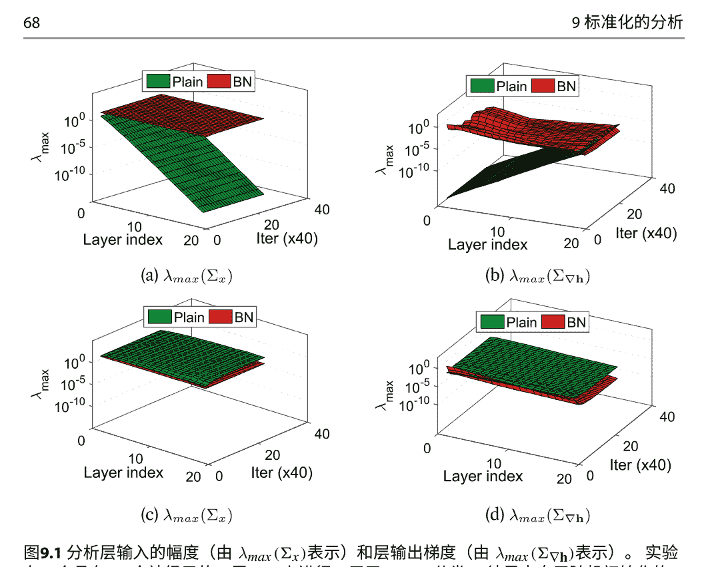

图9.2在没有残差连接的深度网络中，关于BN梯度爆炸的实验。我们计算了FIM的最大特征值，并提供了第一次七次迭代的结果，其中(a)是一个包含100层的MLP用于MNIST分类，(b)是一个包含110层的VGG风格的CNN用于CIFAR-10分类。我们观察到权重梯度在初始化时呈指数爆炸（'Iter0'）。经过一步之后，由于较低层的梯度爆炸，第一步的梯度主导了权重，因此权重的幅度呈指数增长。这种增加的权重幅度导致了较小的权重梯度（'Iter1'到'Iter7'），这是由于BN引起的，正如书中所讨论的。因此，网络的一些层（特别是较低层）进入了权重占优状态。图片经[18]授权使用。

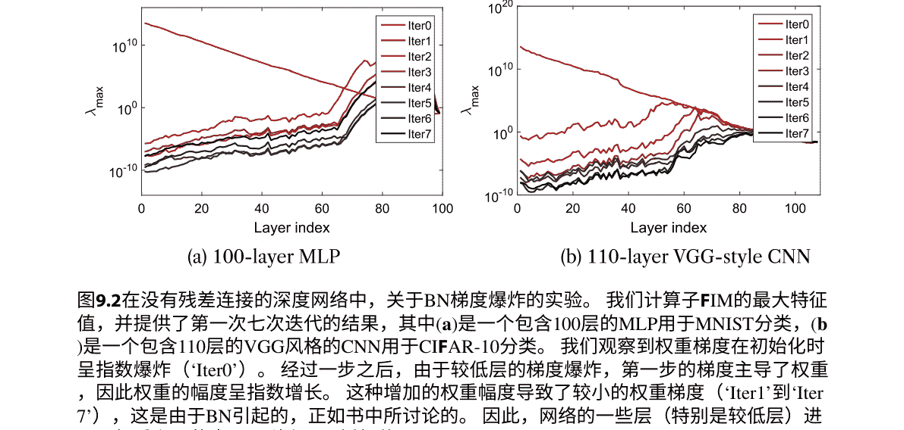

图9.3探索权重占优效果。我们在一个具有BN的5层MLP上运行实验，每层神经元的数量为256。我们通过阻止给定层的权重更新来模拟权重占优。我们在图例中将‘0’表示为权重占优的状态（第一个数字代表第一层）。图像经[18]许可使用。

### 9.1.1 学习率的自动调整
Arora等人[9]定义了具有单位范数约束的内在优化问题（结合方程7.2和7.3），它优化了原始问题。可以证明，对于尺度不变的权重参数，有效学习率为 $\frac{\eta}{\|\mathbf{w}\|^2}$，这对应于尺度不变参数的自动调谐效果[9,23-25]。假设损失函数 $\ell(\mathbf{w}, \tilde{\theta})$ 是两次连续可微的，并且期望损失有下界，Arora等人[9]表明，如果 $\tilde{\theta}$ 的学习率被最优设置，那么 $(\mathbf{w}, \tilde{\theta})$ 可以在（随机）梯度下降中收敛到一个一阶稳定点，无论尺度不变参数 $\mathbf{w}$ 的固定学习率如何设置。他们进一步表明，对于全批量梯度下降和随机梯度下降，收敛速度分别为 $O(T^{-1/2})$ 和 $O(T^{-1/4} \text{polylog}(T))$，其中 $T$ 是迭代次数。Cai等人[24]分析了具有BN的普通最小二乘问题（线性模型）。他们表明，使用带有BN的全批量梯度下降的迭代序列 $(\mathbf{w}, \tilde{\theta})$ 对于任何初始值和任何学习率 $\eta_{\mathbf{w}} >0$（对于尺度不变参数 $\mathbf{w}$），只要学习率 $\eta_{\tilde{\theta}} \in (0, 1]$（对于 $\tilde{\theta}$），都会收敛到一个稳定点。此外，Kohler等人[26]从长度-方向解耦的角度证明了BN在具有高斯输入的（可能）非凸问题中获得了加速收敛。Dukler等人[27]进一步为使用ReLU [28]激活函数训练的两层神经网络提供了第一个全局收敛结果，并进行了权重标准化。

基于尺度不变性的分析，吴等人[11]提出了WNgrad，引入了自适应步长算法，表明其对学习率和Lipschitz常数之间的关系具有鲁棒性。Heo等人[29]观察到GD中引入的额外动量导致了对尺度不变参数的有效学习率更快地减小。他们提出了SGDP和AdamP来改变有效学习率，而不改变有效更新方向，在多个基准测试中经验验证表明具有优势于朴素的SGD和Adam。

另一个研究方向是分析在与标准化方法[6, 8, 31-35]结合时，权重衰减[30]的影响。在这种情况下，权重衰减导致参数的范数较小，因此有效学习率较大。Li和Aro ra[35]表明，当使用具有尺度不变性属性的标准化方法时，原始学习率调度和权重衰减可以折叠成一个新的指数调度。

## 9.2 优化中的改进条件
正如第2章所述，BN的一个动机是通过白化输入来改善优化的条件[19]，从而加快训练[14, 36]。这个动机在线性模型[35, 37]中得到了理论支持，通过将曲率矩阵（如Hessian或FIM）与输入的协方差矩阵相连接，并利用曲率矩阵的谱来精确地描述训练动态。这个分析进一步通过使用Kronecker乘积（K-FAC）[38]来近似曲率矩阵，其中完整的FIM可以表示为多个独立的子FIM，并且每个子FIM可以计算为层输入的协方差矩阵和层输出梯度的协方差矩阵之间的Kronecker乘积（详见第2章）。很明显，如果（1）不同层之间的层输入（例如，Σ_x^l）和输出梯度（例如，Σ_∇h^l）的统计量相等；或者（2）Σ_x^l和Σ_∇h^l是良好条件的，那么FIM的条件可以得到改善。

Daneshmand等人[39]表明，BN可以防止层输入的协方差矩阵的秩坍缩。Σ_x^l。特别是，他们在理论上证明了最深层的协方差矩阵。Σ_x^L至少具有与Λ(相同的秩√d)（d是网络的宽度)在具有BN的深度线性神经网络中，根据以下假设：(1)输入需要具有完全秩；(2)权重矩阵从零均值、单位方差的分布中随机初始化，其分布关于零对称。在给定相同假设的情况下，层输入的协方差矩阵序列{Σ_x^l}在未标准化的线性网络中收敛到秩一矩阵。Lubana等人[40]进一步扩展了这一观点，他们在具有组归一化(GN)的深度线性神经网络中表明Σ_x^l至少具有与Λ(√d/g)相同的秩，其中g表示GN的组大小。注意，矩阵的稳定秩[39]可以隐式地描述矩阵的条件。坍缩的表示将在前向传播过程中丢失信息，并使不同的输入无法区分，这严重阻碍了优化[40]。这些观点还通过研究激活函数的表达能力和训练动力学之间的相关性[40]进行了经验证实，无论是使用BN还是其他替代的标准化方法（例如GN、LN和IN）。

Santurkar等人[41]认为，通过增强损失函数的Hessian矩阵的平滑性，BN可以改善优化过程。然而，这个结论是基于逐层分析[18，41]得出的，这对应于整体Hessian矩阵的对角块。[42]中的实证研究对此提出了质疑，显示了BN在ResNet-20网络上的完全相反的行为。Ghorbani等人[43]通过计算大规模数据集的Hessian矩阵的谱进一步实证了优化问题的条件。人们认为，改善的条件使得训练可以使用更大的学习率，从而提高泛化性能，正如[44]所示。Karakida等人[45]通过分析由FIM确定的参数空间的几何形状来研究优化问题的条件，这也对应于在某些条件下损失函数曲面的局部形状。

一个有趣的现象是，理论上对输入进行白化以进行优化的好处只有在将BN放置在线性层之前时才成立，而在实践中，BN通常放置在线性层之后，正如[19]中建议的那样。黄等人[18]通过逐层条件分析实验证明，BN（放置在线性层之后）不仅改善了激活协方差矩阵的条件，还改善了输出梯度的协变性。在[39]中也做出了类似的观察，BN可以防止预激活矩阵的秩坍缩。一些研究还经验性地研究了BN应该插入的位置。

对标准化在优化中的其他分析包括对信号传播和梯度反向传播的研究[20, 48, 49]，基于均场理论[20, 48, 50]。此外，[26]的研究表明，从长度-方向解耦的角度来看，BN在学习具有高斯输入的半空间（可能是非凸问题）上获得了加速收敛。Dukler等人[27]进一步提供了使用权重标准化训练具有ReLU [28]激活函数的两层神经网络的首个全局收敛结果。

## 9.3 泛化的随机性
BN的一个重要特性是它能够提高DNN的泛化能力。人们认为这种改进是通过标准化对批量数据引入的随机性/噪声来实现的[19, 51, 52]。

很明显，归一化输出（方程3.5）和总体统计量（方程3.6）都可以看作是随机变量，因为它们取决于小批量输入，而小批量输入是从数据集中采样得到的（图9.4）。因此，随机性来自训练过程中的归一化输出[53]，以及训练（使用估计的总体统计量）和推断（使用估计的总体统计量）之间的归一化差异[54]。

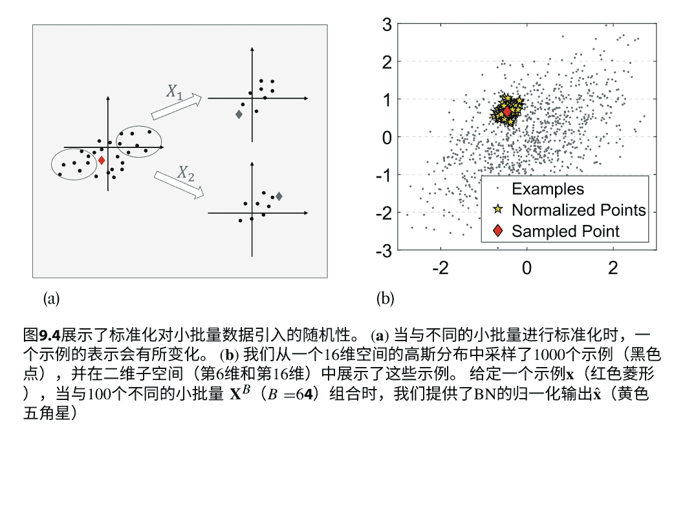

55]. Ioffe和Szegedy [19]是第一个展示这种随机性对网络泛化的优势的人，就像dropout [56, 57]一样。Teye等人 [58]证明了使用BN训练DNN等效于近似贝叶斯模型中的推理，并且可以通过BN在推理过程中进行蒙特卡洛采样来获得任何网络的不确定性估计。这个想法在随机批量归一化 [59]中得到了有效的近似，并在预测时批量归一化 [60]中得到了利用。我们将介绍通过理论或经验分析来建模随机性的作品。

### 9.3.1 随机性的理论模型
Shekhovtsov和Flach [51]以数学方式共同阐述了归一化输出的随机性和训练与推理之间的归一化差异，假设整个数据集上的激活分布近似为高斯分布且独立同分布。具体来说，根据以下假设：（1）整个数据集上的网络激活分布 \(X\) 的统计特性近似为正态分布 \((\hat{\mu}, \hat{\sigma}^2)\)；（2）不同训练输入的激活是独立同分布的，训练时的BN可以表示为：

```
\[ \frac{x - \mu_B}{\sigma_B} = \left( \frac{x - \hat{\mu}}{\hat{\sigma}} + \frac{\hat{\mu} - \mu_B}{\hat{\sigma}} \right) \frac{\hat{\sigma}}{\sigma_B}. \tag{9.1} \]
```

根据上述假设，我们有 \(\mu_B\) 作为一个随机变量，其分布为 \(\mathcal{N}(\hat{\mu}, \frac{1}{m}\hat{\sigma}^2)\)。可以证明：

```
\[ \frac{\hat{\mu} - \mu_B}{\hat{\sigma}} \sim \frac{1}{\sqrt{m}}\mathcal{N}(0, 1), \quad \frac{\sigma^2}{\hat{\sigma}^2} \sim \frac{1}{m}\chi^2_{m-1} \quad \text{和} \quad \frac{\hat{\sigma}}{\sigma} \sim \sqrt{m}\chi^{-1}_{m-1}, \tag{9.2} \]
```

其中 \(\chi^2\) 是卡方分布，\(\chi^{-1}\) 是逆卡方分布。因此，训练时的BN可以看作是测试时的标准化 \((\frac{x-\hat{\mu}}{\hat{\sigma}})\) 与两个随机变量 \((\frac{\hat{\mu}-\mu_B}{\hat{\sigma}}\) 和 \(\frac{\sigma\hat{\sigma}}{\hat{\sigma}^2} \sim \sqrt{m}\chi^{-1}_{m-1})\) 的乘积。Shekhovtsov和Flach [51]实验观察到实际统计量 \(\frac{\hat{\mu}-\mu_B}{\hat{\sigma}}\) 和 \(\frac{\sigma\hat{\sigma}}{\hat{\sigma}^2}\)，从随机抽取的小批量样本计算得出，与理论预测接近。

随机轴交换如第4.2.1节所讨论的，批处理数据上的PCA白化在训练DNN时存在显著不稳定性，几乎无法收敛，这是由于所谓的随机轴交换（SAS）引起的。在这里，我们提供了一个例子，假设给定一个表示为向量的数据点 \(\mathbf{x} \in \mathbb{R}^d\) 在标准基下的表示，其在另一个正交基 \(\{\mathbf{d}_1, \ldots, \mathbf{d}_d\}\) 下的表示为 \(\hat{\mathbf{x}} = \mathbf{D}^T \mathbf{x}\)，其中 \(\mathbf{D} = [\mathbf{d}_1, \ldots, \mathbf{d}_d]\) 是一个正交矩阵。我们将随机轴交换定义如下：

> 定义9.6 假设一个训练算法，它使用每次迭代中随机抽样的数据点批量更新权重。随机轴交换发生在数据点 x被转换为 x̂₁ = D₁ᵀx在一个迭代中，而 x̂₂ = D₂ᵀx在另一个迭代中使得 D₁ = PD₂其中 P = I是一个仅由批次统计确定的置换矩阵。

随机轴交换使训练变得困难，因为输入维度的随机置换可能会极大地困惑学习算法——在置换完全随机的极端情况下，剩下的只是一袋激活值（类似于对图像中的所有像素进行混淆），可能导致信息和判别能力的极度丧失。

在这里，我们证明了如果不正确地对激活进行白化，会导致神经网络训练中的随机轴交换。我们从标准的PCA白化开始[36]，它通过特征分解计算 Σ⁻¹/²： Σₚc¹/²/ₐ = Λ̃⁻¹/² Dᵀ，其中 Λ̃ = diag(λ₁, ..., λ_d)和 D= [d₁, ..., d_d]是 Σ的特征值和特征向量，即Σ = DΛ̃Dᵀ。也就是说，原始数据点（在居中后）先被 Dᵀ旋转，然后再被 Λ̃⁻¹/²缩放。不失一般性，我们假设 dᵢ是唯一的，通过固定其第一个元素的符号来实现。随机轴交换的第一个机会是 Λ̃和 D的列（或行）可以进行置换，而仍然得到一个有效的白化变换。

但这很容易修复 - 我们可以承诺一个唯一的 Λ̃ 和 D 通过非递增地排序特征值。

但事实证明，确保一个唯一的 Λ̃和 D是不足以避免随机轴交换的。图9.5说明了一个例子。给定一个迭代中的小批量数据点，如图9.5a所示，PCA白化通过 Dᵀ= [d₁ᵀ, d₂ᵀ]ᵀ将它们旋转，并沿着新的轴系统拉伸它们以 Λ̃⁻¹/² = diag(1/√λ₁, 1/√λ₂)的方式，其中 λ₁ > λ₂。考虑到图9.5b中显示的另一个迭代，除了红点以外的所有数据点都是相同的。

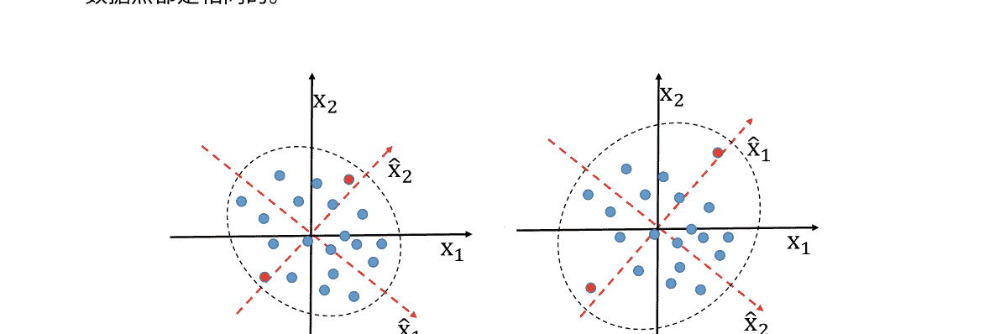

图9.5 PCA白化受到随机轴交换的影响。(甲) 初始迭代中的PCA白化轴对齐；(乙) 另一次迭代中的轴对齐。图片取自[14]，获得授权使用。

### 9.3.2 随机性的实证分析

尽管随机性的理论模型很有吸引力，但在实践中通常无法满足所需的假设。黄等人[53]提出了一种用于批次数据标准化随机性的经验评估，称为随机标准化干扰（SND），并研究了批次大小对BN的随机性的影响。随机标准化干扰给定一个样本 $\mathbf{x} \in \mathbb{R}^d$ 来自分布 $P_{\mathcal{X}}$，我们使用大小为 $B$ 的样本集 $\mathbf{X}_B = \{\mathbf{x}_1, \dots, \mathbf{x}_B, \mathbf{x}_i \sim P_{\mathcal{X}}\}$。我们将标准化操作表示为 $F(\cdot)$，将标准化输出表示为 $\hat{\mathbf{x}} = F(\mathbf{X}^B; \mathbf{x})$。对于某个 $\mathbf{x}$，$\mathbf{X}^B$ 可以被视为一个随机变量[58, 59]。因此，$\hat{\mathbf{x}}$ 是一个显示随机性的随机变量。探索 $\mathbf{x}$ 的统计动量以衡量随机性的大小是很有趣的。在这里，我们定义标准化 $F(\cdot)$ 的随机标准化干扰（SND）为样本 $\mathbf{x}$ 的:

$$\Delta_F(\mathbf{x}) = \mathbb{E}_{\mathbf{X}^B} (\|\hat{\mathbf{X}} - \mathbb{E}_{\mathbf{X}^B}(\mathbf{X})\|_2). \qquad (9.3)$$

如果不对随机变量 $\mathbf{X}^B$ 做进一步的假设，准确计算这个动量是困难的，但是我们可以通过对样本集进行经验估计来探索它。

$$\Delta_F(\mathbf{X}) = \frac{1}{s} \sum_{i=1}^{s} \|F(\mathbf{X}_i^B; \mathbf{X}) - \frac{1}{s} \sum_{j=1}^{s} F(\mathbf{X}_j^B; \mathbf{X})\|. \qquad (9.4)$$

其中 $s$ 表示采样的时间。图9.6展示了批标准化操作对样本 $\mathbf{x}$ 的SND的示意图。我们可以发现SND与批大小密切相关。当批大小较大时，给定样本 $\mathbf{x}$ 的SND值较小，转换后的输出具有紧凑的分布。因此，随机不确定性 $\mathbf{x}$ 可以较低。

标准化操作后，可以使用SND来评估样本的随机性，类似于丢弃率[56]。我们可以进一步定义标准化操作 $F(\cdot)$ 的SND为：$\Delta_F = \mathbb{E}_{\mathbf{x}}(\Delta(\mathbf{x}))$，它的经验估计为 $\Delta_F = \frac{1}{N} \sum_{i=1}^{N} \Delta(\mathbf{x})$ 其中 $N$ 是采样示例的数量。$\Delta_F$ 描述了相应标准化操作的随机性的大小。

探索SND的确切统计行为是困难的，超出了本书的范围。然而，我们可以探索SND与批量大小和特征维度的关系。我们发现，我们定义的SND合理解释了为什么我们应该控制白化的程度，以及为什么基于小批量的标准化在给定小批量大小时性能退化。

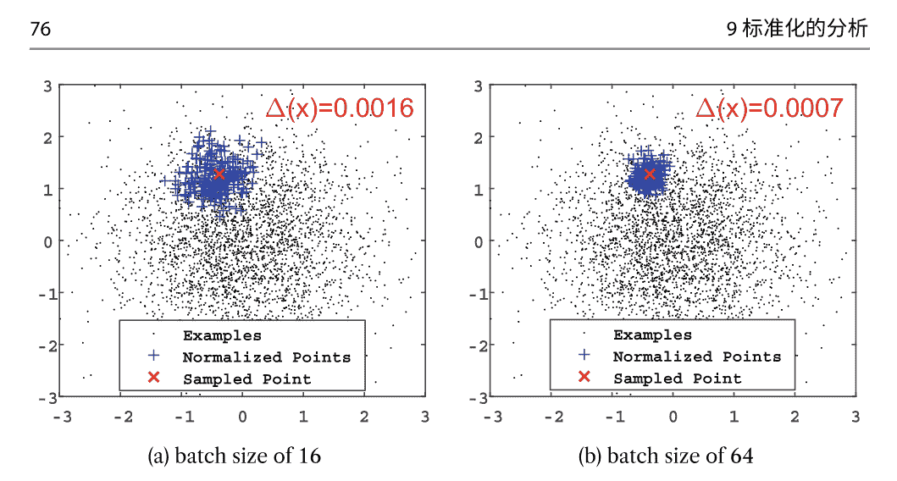

图9.6 不同批次大小的SND示意图。我们从高斯分布中采样3000个样本（黑点）。当在不同的样本集 $\mathbf{X}^B$ 上进行标准化时，我们展示了给定示例 $\mathbf{x}$ （红叉）及其BN输出（蓝加号）。（a）和（b）分别显示了批次大小为16和64时的结果。图片经许可使用[53]。

这个经验分析进一步扩展到更一般的BW[55]。在这里，我们进行实验以定量评估不同标准化方法的效果。值得注意的是，随机性与批次大小 $m$ 和维度 $d$ 有关。图9.7a显示了在批次大小固定为1024时，不同标准化方法相对于维度的SND。我们发现，在所有维度上，PCA白化显示出最大的SND，而BN显示出最小的SND。我们注意到，当维度增加时，所有白化方法的SND都增加。此外，相对于所有维度，ZCA的SND小于CD。图9.7b显示了在维度固定为128时，不同标准化方法相对于批次大小的SND。有趣的观察是，在不同批次大小之间，PCA白化几乎具有相同的大SND。这表明，无论迷你批次协方差矩阵的估计有多准确，PCA白化都非常不稳定。这个效果与[14]中展示的随机轴交换（SAS）的解释一致，在执行PCA白化时，示例的微小变化会导致表示的大变化。

为了进一步研究这种随机性对DNN训练的影响，我们在一个具有256个神经元的四层多层感知器（MLP）上进行实验。我们根据时代评估训练损失，并在图9.8a中展示结果。我们发现，在所有白化方法中，ZCA效果最好，而PCA效果最差。

我们认为这与它们产生的SND密切相关。显然，增加的随机性可能会减慢训练速度，尽管所有白化方法都具有相同的改善条件。有趣的观察是，在这种情况下，BN比ZCA白化效果更好。这令人惊讶，因为ZCA在改善条件方面更好。

图9.7 不同批处理白化方法的SND比较。我们从高斯分布中抽取6万个示例作为训练集。为了计算SND，我们使用$s=200$和$N=20$。我们展示了（a）在批量大小为1024的情况下，维度从$2^1$到$2^9$的SND；（b）在维度为128的情况下，批量大小从$2^7$到$2^{12}$的SND。图片经许可使用[55]

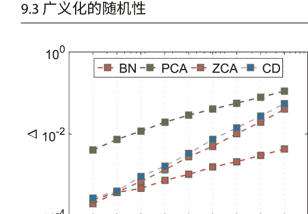

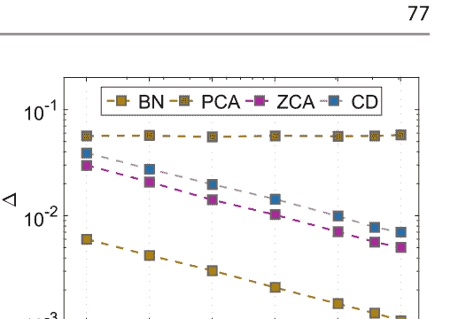

图9.8 对具有每层256个神经元的4层MLP进行了MNIST分类的实验。我们使用批量大小为1024并报告训练错误。（a）完全白化方法的结果；（b）基于组的白化结果，其中'ZCA-16'表示具有16个组的ZCA白化。图片经[55]授权使用

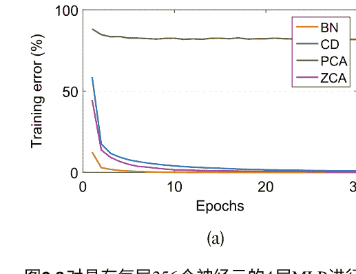

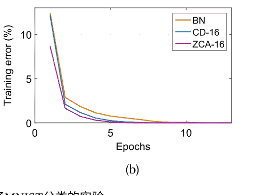

通过消除相关性进行BN [14]，从理论上讲应该具有更好的优化行为。然而，ZCA白化的放大随机性减轻了这种优势在优化中的影响，从而导致性能下降。因此，从优化的角度来看，我们应该控制随机性的程度。

## 通过组来控制随机性

Huang等人[14]提出使用组来控制白化的程度。他们认为，当批量大小不足够大时，这种方法减少了估计完全协方差矩阵的不准确性。在这里，我们通过实验证明了基于组的白化如何影响SND，提供了在引入随机性和改善条件之间的良好平衡。这对于实现更好的优化行为至关重要。

我们通过改变组大小（从2到512）来评估不同白化变换的SND，如图9.9a所示。我们还在图9.9b中显示了白化输出（基于组）的协方差矩阵的频谱。我们发现组大小有效地控制了ZCA/CD白化的SND。随着组大小的减小，ZCA和CD显示出降低的随机性（图9.9a），同时也出现退化的条件（图9.9b），因为输出只被部分白化。此外，我们观察到在所有组大小上，PCA白化仍然具有较大的SND，并且没有显著差异。

这一观察进一步证实了[14]中给出的SAS解释，即PCA白化非常不稳定。

我们还在图9.9a中展示了近似ZCA白化方法（称为ItN [53]）的SND，该方法使用牛顿迭代来近似计算白化矩阵。我们将‘ItN5’表示为迭代次数为5的ItN方法。有趣的观察是当使用较大的组大小（例如256）和较小的迭代次数（例如T=5）时，ItN的SND小于BN。这表明我们可以进一步结合组大小和迭代次数来控制ItN的随机性，从而提供一种高效稳定的近似ZCA白化[53]的解决方案。

我们还在四层MLP实验中使用基于组的ZCA/CD白化方法。结果如图9.8b所示。我们观察到，使用组大小为16来控制随机性的ZCA和CD白化比BN具有更好的训练行为。

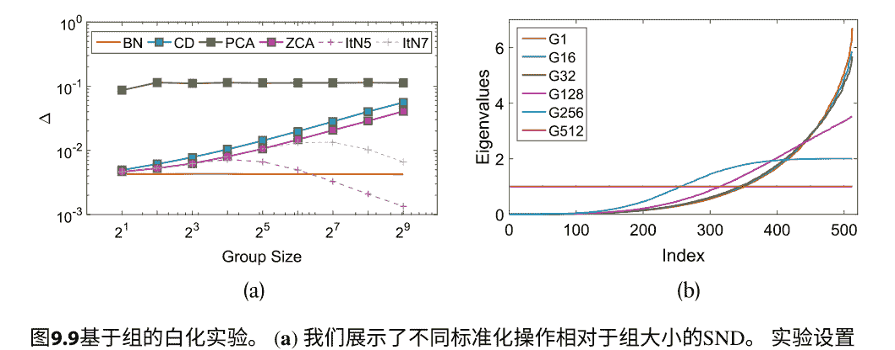

图9.9 基于组的白化实验。(a) 我们展示了不同标准化操作相对于组大小的SND。实验设置与图9.7相同，输入维度为 $d=512$。(b) 我们展示了ZCA白化输出的协方差矩阵的频谱（注意CD/PCA白化与ZCA白化具有相同的频谱），其中‘G16’表示组大小为16的白化。图片使用许可来自[55]

表9.1 标准化方法的总结 $\zeta(\phi; \mathbf{X})$, $\zeta(\phi; \mathbb{D})$ 和范围。分析可以自然地扩展到CNN，如何从MLP到CNN的BN(GN)扩展如图4所示。例如，对于GN/GW要标准化的神经元数量为 $d = d_H W$，对于BN/BW要标准化的样本数量为 $m = m_H W$，给定输入 $\mathbf{X} \in \mathbb{R}^{d \times m \times H \times W}$ 用于CNN。结果经过[64]的许可。

| | 沿着一个批次 | | 沿着一组神经元 | |
| :--- | :--- | :--- | :--- | :--- |
| | **BN** | **BW** | **GN** | **GW** |
| $\zeta(\phi; \mathbf{X})$ | $2d$ | $\frac{d(d+3)}{2}$ | $2gm$ | $\frac{mg(g+3)}{2}$ |
| $\zeta(\phi; \mathbb{D})$ | $\frac{2N \ d}{m}$ | $\frac{N \ d(d+3)}{2m}$ | $2g \ N$ | $\frac{N \ g(g+3)}{2}$ |
| 范围 $m/g$ | $m \ge 2$ | $m \ge \frac{d+3}{2}$ | $g \le \frac{d}{2}$ | $g \le \frac{\sqrt{8d+9}-3}{2}$ |

一些研究利用BN的随机性来改善大批量训练的泛化能力，通过在估计总体统计量时改变批量大小。一种典型的方法是幽灵批量归一化[61-63]，它通过在小虚拟('幽灵')批次上获取统计信息而不是真实的大批次来减少泛化误差。

## 9.4 对表示的影响

标准化操作确保标准化输出 $\mathbf{X} = \phi(\mathbf{X}) \in \mathbb{R}^{d \times m}$ 具有稳定的分布。这种分布的稳定性可以隐式地视为对 $\mathbf{X}$ 施加的约束，可以表示为方程组 $\Upsilon_{\phi}(\mathbf{X})$。例如，BN提供了约束 $\Upsilon_{\phi_{BN}}(\mathbf{X})$ 为：

$$ \sum_{j=1}^m \mathbf{X}_{ij} = 0 \quad \text{且} \quad \sum_{j=1}^m \mathbf{X}_{ij}^2 - m = 0, \quad \text{对于} i=1, \dots, d. \qquad (9.5) $$

我们定义标准化的约束数来定量衡量标准化方法提供的约束的大小。

**定义 9.7** 给定输入数据 $\mathbf{X} \in \mathbb{R}^{d \times m}$, 标准化操作 $\phi(\cdot)$ 的约束数，记为 $\zeta(\phi; \mathbf{X})$, 是 $\Upsilon_{\phi}(\mathbf{X})$ 中独立方程的数量。

举个例子，根据公式 9.5，我们有 $\zeta(\phi_{BN}; \mathbf{X}) = 2d$。此外，给定大小为 $N$ 的训练数据 $\mathbb{D}$，我们考虑批量大小为 $m$ 的优化算法 (我们假设 $N$ 可被 $m$ 整除)。我们计算整个训练数据上标准化的约束数 $\zeta(\phi; \mathbb{D})$。表 9.1 总结了本书中讨论的某些标准化方法的约束数 (请参考附录 A.2 获取推导细节)。

我们可以看到，白化操作提供了比标准化操作更强的约束。此外，当批量大小（组数）减小（增加）时，BN（GN）的约束变得更强。

### 9.4.1 特征表示的约束

BN在加速DNN训练方面的好处主要归因于两个原因：（1）在固定激活的第一和第二动量时，分布更稳定，从而减少了内部协变量偏移[19]；（2）通过使用标准化改善激活矩阵的条件，优化目标的优化方向更好[14, 41]。基于这些论点，当增加组数时，GW/GN应该具有更好的性能，因为它们具有更强的约束和更好的条件。然而，黄等人[64]实验证明，当组数过大时，GN/GW的性能显著下降，这类似于BN/BW的小批量问题。为了理解这种现象背后的原因，我们首先展示了批量大小 $m$ 或组数 $g$ 具有数学推导得出的值范围。

标准化操作可以被看作是找到一个满足约束条件 $\Upsilon_{\phi}(\mathbf{X})$ 的解 $\mathbf{X}$ 的方法。为了确保解是可行的，它必须满足以下条件：

$$\zeta(\phi; \mathbf{X}) \leq \chi(\mathbf{X}), \qquad (9.6)$$

其中 $\chi(\mathbf{X}) = md$ 是 $\mathbf{X}$ 中变量的数量。根据公式9.6，我们有 $m \ge 2$，以确保BN有一个可行的解。我们还在表9.1中提供了其他标准化方法的批量大小 $m$ 或组数 $g$ 范围。请注意，批量大小 $m$ 应大于或等于 $d$，以在实践中使用ZCA白化时获得数值稳定的解[14]。这也适用于GW，其中 $g$ 应小于或等于 $\sqrt{d}$。

然后我们证明标准化最终会影响某一层的特征表示。图9.10显示了通过改变GN<sup>1</sup>中每个组的通道数 $c$ 和BN的批量大小 $m$ 来规范化输出 $\mathbf{X}$ 的直方图。我们观察到：（1）如果 $c$ 或 $m$ 太小，$\mathbf{X}$ 的值会受到严格限制，例如，如果 $c = 2$，则 $\mathbf{X}$ 的值被限制为 $\{-1, +1\}$；（2）如果 $c$ 或 $m$ 太小，$\mathbf{X}$ 不服从高斯分布，而BN/GN旨在产生具有高斯分布的规范化输出。我们认为由于具有大组数的GN/GW引起的受限特征表示是网络性能退化的主要因素。此外，我们还观察到GN的规范化输出比BN的规范化输出更相关，这支持了BN比GN更能改善激活的条件的说法。

1 请注意，每个组中的通道数 $c = \frac{d}{g}$。我们改变 $c$ ，而不是 $g$ ，以简化讨论。

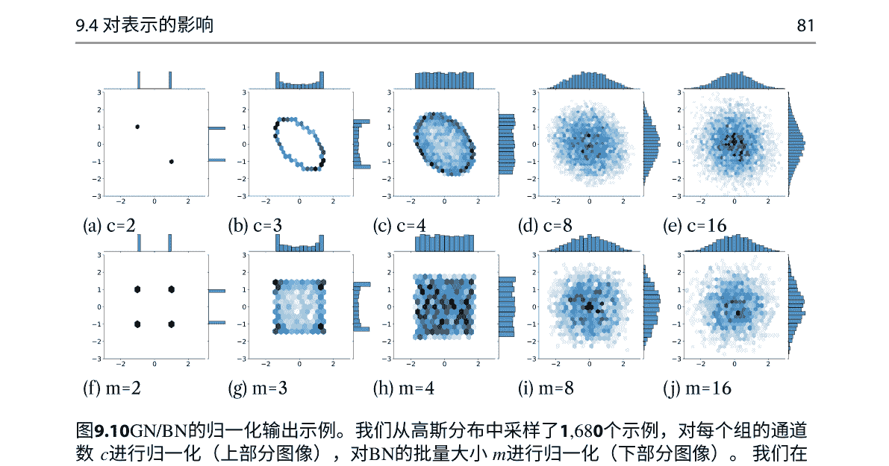

图9.10 GN/BN的归一化输出示例。我们从高斯分布中采样了1,680个示例，对每个组的通道数 $c$ 进行归一化（上部分图像），对BN的批量大小 $m$ 进行归一化（下部分图像）。我们在二维子空间中绘制了归一化输出的双变量直方图（使用六边形箱），并在一维子空间中绘制了边际直方图（使用矩形箱）。使用许可证的图像[64]

我们还希望定量地衡量特征空间的表示。给定由网络提取的一组特征 $\widetilde{\mathbb{D}} \in \mathbb{R}^{d \times N}$，我们假设 $\widetilde{\mathbb{D}}$ 的示例属于一个 $d$ 维超立方体 $V=[-1, 1]^d$（通过除以每个维度的最大绝对值来确保这个假设成立）。直观地，强大的特征表示意味着 $\widetilde{\mathbb{D}}$ 的示例在 $V$ 上具有很大的多样性，而弱表示则表示它们受限于某些特定值而缺乏多样性。

因此，我们根据信息熵定义了基于特征空间的多样性的方法，这在一定程度上可以经验性地表示特征空间的表示能力：

$$ \Gamma_{d,T}(\widetilde{\mathbb{D}}) = \sum_{i=1}^{T^d} p_i \log p_i. \qquad (9.7) $$

在这里，$V$ 被均匀地分成 $T^d$ 个区间，$p_i$ 表示一个样本属于第 $i$ 个区间的概率。因此，我们可以通过采样足够的样本来计算 $\Gamma_{d,T}(\widetilde{\mathbb{D}})$。然而，要以合理的准确性计算 $\Gamma_{d,T}(\widetilde{\mathbb{D}})$，需要从一个 $d$ 维空间中采样 $O(T^d)$ 个样本。因此，我们在实践中只计算 $\Gamma_{2,T}(\widetilde{\mathbb{D}})$，通过采样两个维度并对结果求平均。我们通过改变每个组（批次大小）的通道数量，在图9.11中展示了组（批次）标准化特征的多样性，从中我们可以得出类似于图9.10的结论。

总结一下，我们的定性和定量分析表明，当 $c/m$ 很小时，基于组/批次的标准化具有低多样性的特征表示。我们相信这些受限制的特征表示会影响网络的性能，并且在表示过度受限制时可能导致结果显著恶化。

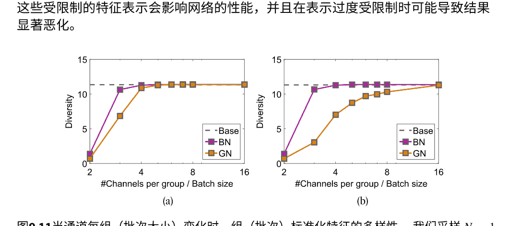

图9.11 当通道每组（批次大小）变化时，组（批次）标准化特征的多样性。我们采样 $N=1,680,000$ 个示例，并使用 $1,000^2$ 个bin。我们将采样的高斯数据用作（a）中的特征，并将一层MLP的输出用作（b）。这里，“基准”表示未标准化特征的多样性。图片经[64]许可使用

### 9.4.2 对模型表示能力的影响

标准化引入的约束被认为会影响神经网络的表示能力[19]，因此使用可学习的缩放和偏移参数来恢复表示[3, 13, 14, 19]。然而，这种论证很少被理论或实证分析验证。在理论上分析标准化神经网络的复杂度量（例如VC维度[66]或线性区域的数量[1, 2]）是一项具有挑战性的任务，因为标准化网络不符合计算线性区域或VC维度的假设。

在这里，我们进行初步实验，试图通过改变对特征施加的约束来实证标准化如何影响网络的表征能力。

我们采用非参数随机化测试，使用随机标签[65]来经验性地比较神经网络的表征能力。为了排除标准化引入的优化效益，我们首先使用线性分类器进行实验，在线性模块之后也插入了标准化。我们使用随机梯度下降（SGD）进行超过1,000个epoch的训练，批量大小为16，并在图9.12a中报告学习率{0.001, 0.005, 0.01, 0.05, 0.1}中的最佳训练准确率。我们观察到，当不使用标准化时，GN和GW的训练准确率较低，这表明在这种情况下标准化确实降低了模型的表征能力。此外，随着组数的增加，GN/GW的准确率也会降低。这表明当增加特征的约束时，模型的表示能力可能较弱。

特征的约束。请注意，无论是否使用GN/GW的可学习缩放和偏移参数，我们都得出相同的观察结果。

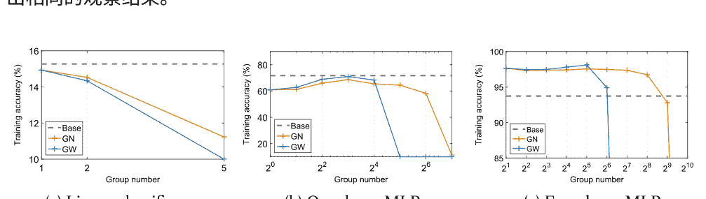

图9.12在MNIST数据集上使用不同的架构比较模型的表示能力，当拟合随机标签[65]时。我们改变GN/GW的组数并评估训练准确率。‘基准’表示没有标准化的模型。(a) 线性分类器; (b) 每层256个神经元的单层MLP; (c) 每层1280个神经元的四层MLP。图片经[64]许可使用。

为了进一步考虑标准化对优化的好处和对表示的约束之间的权衡，我们对单层和四层MLP进行了实验。结果如图9.12b和c所示。我们观察到当 \(g\) 太大时，带有GN/GW的模型的训练准确率明显下降，这意味着较大的组数严重限制了模型的表示能力，如第9.4.2节所讨论的。我们注意到GW对组数的敏感性比GN更高。主要原因是從表9.1可以看出，\(\zeta(\phi_{GW}; \mathbb{D})\)对\(g\)是二次的，而\(\zeta(\phi_{GN}; \mathbb{D})\)对\(g\)是线性的。此外，我们观察到，如果组数\(g\)不太大，在单层MLP上，GN和GW的训练准确率仍然低于‘基准’，但在四层MLP上的准确率更高。这表明如果模型的表示能力不太受限制，标准化对优化的好处占主导地位。我们还观察到，GW的最佳训练准确率高于GN。我们将这归因于白化操作对于改善优化的条件比标准化更好。

## 参考文献

- Montufar, G. F., R. Pascanu, K. Cho, and Y. Bengio (2014). 关于深度神经网络的线性区域数量。在 *NeurIPS* 中。
- Xiong, H., L. Huang, M. Yu, L. Liu, F. Zhu, and L. Shao (2020). 关于卷积神经网络的线性区域数量。在 *ICML* 中。
- Ba, L. J., R. Kiros, and G. E. Hinton (2016). 层标准化。 arXiv预印本 arXiv:1607.06450。
- Neyshabur, B., R. Tomioka, R. Salakhutdinov, and N. Srebro (2016). 神经网络中的数据相关路径标准化。在 *ICLR* 中。
- Sun, J., X. Cao, H. Liang, W. Huang, Z. Chen, and Z. Li (2020). 深度学习中标准化方法的新解释。在 AAAI中。
- 万瑞，朱志，张旭，孙杰 (2020年)。 深度神经网络的球面运动动力学带有批归一化和权重衰减。 arXiv预印本arXiv:2006.08419。
- Cho, M. and J. Lee (2017). 批归一化的黎曼方法。在 NeurIPS中。
- Hoffer, E., Banner, R., Golan, I., and Soudry, D. (2018). 规范化在深度网络中很重要：高效且准确的规范化方案。在 NeurIPS中。
- Arora, S., Li, Z., and Lyu, K. (2019). 通过批归一化进行自动速率调整的理论分析-在 ICLR中。
- Salimans, T. and Kingma, D. P. (2016). 权重归一化：一种简单的重新参数化方法加速深度神经网络的训练。在 NeurIPS中。
- 吴, X., R. 瓦德和L. 博图 (2018年)。 Wngrad：学习梯度下降中的学习率。arXiv预印本arXiv：1803.02865。
- 罗布林, S., Y. 德蒙特-马林, A. 伯苏克, R. 马莱特, P. 佩雷斯和M. 奥布里 (2020年)。 球面透视学习与批量归一化。 arXiv预印本arXiv: 2006.13382。
- 吴, Y.和K. 何 (2018年)。 群归一化。在 ECCV中。
- 黄, L., D. 杨, B. 朗和J. 邓 (2018年)。 去相关批量归一化。在 CVPR中。
- 乌里扬诺夫, D., A. 维达尔迪和V. S. 林皮茨基 (2016年)。 实例归一化：快速风格化的缺失成分。 arXiv预印本arXiv：1607.08022。
- 黄，刘，刘，郎，陶 (2017年)。 加速深度神经网络训练中的居中权重标准化。在 ICC V中。
- 黄，刘，郎，于，王，李 (2018年)。 正交权重标准化：解决深度神经网络中多个相关斯蒂弗尔流形上的优化问题。在 AAAI中。
- 黄，秦，刘，朱，邵 (2020年)。 逐层条件分析探索DNN学习动力学。在 ECCV中。
- Ioffe, S.和Szegedy, C. (2015年)。 批量标准化：通过减少内部协变量偏移来加速深度网络训练。在 ICML中。
- 杨，彭宁顿，饶，索尔-迪克斯坦，肖恩霍尔兹 (2019年)。 批标准化的平均场理论。在 ICLR中。
- LeCun, Y., L. Bottou, G. B. Orr, and K.-R. Muller (1998). 有效的反向传播。 在神经网络中：技巧的诀窍。
- He, K., X. Zhang, S. Ren, and J. Sun (2015). 深入研究整流器：超越人类水平在图像分类上的性能。在 ICCV。
- Wu, S., G. Li, L. Deng, L. Liu, Y. Xie, and L. Shi (2018). L1范数批归一化用于高效训练深度神经网络。 arXiv预印本 arXiv:1802.09769。
- Cai, Y., Q. Li, and Z. Shen (2019). 关于批归一化对梯度下降的影响的定量分析。在 ICML，第882-890页。
- Chai, E., M. Pilanci, and B. Murmann (2020). 使用经典自适应滤波理论分离批量归一化对CNN训练速度和稳定性的影响。 arXiv预印本arXiv:2002.10674。
- Kohler, J., H. Daneshmand, A. Lucchi, T. Hofmann, M. Zhou, and K. Neymeyr (2019). 批量归一化的指数收敛速度：在非凸优化中解耦长度和方向的力量。在 AISTATS中。
- Dukler, Y., Q. Gu, and G. Mont far (2020). 用于relu神经网络训练的标准化层的优化理论。在 ICML中。
- Nair, V. and G. E. Hinton (2010). 修正线性单元改进了受限玻尔兹曼机。在 ICML中。
- Heo, B., S. Chun, S. J. Oh, D. Han, S. Yun, Y. Uh, and J. Ha (2021). 在动量优化器中减缓权重范数增加的方法。在 ICLR中。
- Krogh, A. and J. A. Hertz (1992). 简单的权重衰减可以改善泛化性能。在 *NeurIPS* 中。
- Van Laarhoven, T. (2017). L2正则化与批量和权重标准化。 arXiv 预印本 arXiv:1706.05350。
- Huang, L., X. Liu, B. Lang, and B. Li (2017). 基于投影的权重标准化用于深度 神经网络。 arXiv预印本 arXiv:1710.02338。
- Zhang, G., C. Wang, B. Xu, and R. B. Grosse (2019). 权重衰减正则化的三种机制。 在 *ICLR* 中。
- 李，X., 陈，S.和杨, J. (2020年). 理解权重标准化 家族和权重衰减之间的不协调。在 *AAAI* 中。
- 李，Z.和阿罗拉, S. (2020年). 一种用于批量归一化网络的指数学率调度。 在 *ICLR*.
- Desjardins, G., Simonyan, K., Pascanu, R.和kavukcuoglu, k. (2015年). 自然神经网络。 在 *NeurIPS*.
- LeCun, Y., Kanter, I.和Solla, S. A. (1990年). 误差曲面的二阶性质。在 *NeurIPS* 中。
- Martens, J和Grosse, R. (2015年). 用Kronecker分解近似曲率优化神经网络。 在 *ICM L*中。
- Daneshmand, H., Kohler, J., Bach, F., Hofmann, T.和Lucchi, A. (2020年). 批量 归一化的理论理解：马尔可夫链的视角。 arXiv预印本arXiv:2003.01652。
- Lubana , E. S., Dick, R.和田中, H. (2021年). 超越批量归一化：走向深度学习中标准化的统 一理解。在 *NIPS*中。
- Santurkar, S., D. Tsipras, A. Ilyas, and A. Madry (2018). 批归一化如何帮助优化? 在 *NeurIPS* 中。
- Yao, Z., A. Gholami, K. Keutzer, and M. W. Mahoney (2020). PyHessian: 通过Hessian的视 角看神经网络。在2020 IEEE国际大数据会议（*Big Data*）中。
- Ghorbani, B., S. Krishn an, and Y. Xiao (2019). 通过Hessian特征值密度研究神经网络优化。在 *ICML*中。
- Bjorck, J., C. Gomes, and B. Selman (2018). 理解批归一化。在 *NeurIPS*中。
- Karakida, R., S. Akaho, and S.-i. Amari (2019). 用于缓解宽神经网络中的病态尖锐度的标准 化方法。 在 *NeurIPS*中，第6403-6413页。
- Mishkin, D. and J. Matas (2016). 你所需要的只是一个良好的初始化。在 *ICLR*中。
- Chen, G., P. Chen, Y. Shi, C. Hsieh, B. Liao, and S. Zhang (2019). 重新思考批归一化和dropout在深度神经网络训练中的使用。 arXiv预印本arXiv:1905.05928。
- Wei, M., J. Stokes, and D. J. Schwab (2019). 批归一化的均值场分析。 arXiv预印本 arXiv:19 03.02606。
- Labatie, A. (2019). 表征良好行为与病态深度神经网络。在 *ICML*中， pp. 3611–3621。
- Lee, J., J. Sohl-dickstein, J. Pennington, R. Novak, S. Schoenholz, and Y. Bahri (2018). 深度神经网络作为高斯过程。 在 *ICLR*中。
- Shekhovtsov, A. and B. Flach (2018b). 随机标准化作为贝叶斯学习。 在 *ACCV*中。
- Liang, S., Z. Huang, M. Liang, and H. Yang (2020). 实例增强批归一化: 批噪声的自适应调 节器。 在 *AAAI*中。
- Huang, L., Y. Zhou, F. Zhu, L. Liu, and L. Shao (2019). 迭代标准化：超越标准化，朝向高 效白化。 在 *CVPR*中。
- Luo, P., X. Wang, W. Shao, and Z. Peng (2019). 探索批归一化中的正则化。 在 *ICLR*中。
- Huang, L., L. Zhao, Y. Zhou, F. Zhu, L. Liu, and L. Shao (2020). 对批白化的随机性进行研究 。 在 *CVPR*中。
- Srivastava, N., G. Hinton, A. Krizhevsky, I. Sutskever, and R. Salakhutdinov (2014年1月)。Dropout: 一种防止神经网络过拟合的简单方法。J. Mach. Learn. Res. 15(1), 1929–1958。
- Li, X., S. Chen, X. Hu, and J. Yang (2019年)。通过方差偏移理解dropout和批归一化之间的不协调。在 CVPR中。
- Teye, M., H. Azizpour, and K. Smith (2018年)。用于批归一化深度网络的贝叶斯不确定性估计。在 ICML中。
- Atanov, A., A. Ashukha, D. Molchanov, K. Neklyudov, and D. Vetrov (2018年)。通过随机批归一化进行不确定性估计。在ICLR Workshop中。
- Nado, Z., S. Padhy, D. Sculley, A. D’Amour, B. Lakshminarayanan, and J. Snoek (2020)。评估预测时间批归一化在协变量转移下的鲁棒性。arXiv预印本arXiv:2006.10963。
- Hoffer, E., I. Hubara, and D. Soudry (2017). 训练更长时间，更好地泛化：解决神经网络大批量训练中的泛化差距。在 NeurIPS中。
- Summers, C. and M. J. Dinneen (2020). 每个人都应该知道的四件事，以改善批归一化。在 ICLR中。
- Dimitriou, N. and O. Arandjelovic (2020). 对幽灵标准化的新视角。arXiv预印本arXiv:2007.08554。
- 黄, L., 周, Y., 刘, L., 朱, F., 邵, L. (2021年)。组白化：平衡学习效率和表示能力。在 CVPR中。
- 张, C., Bengio, S., Hardt, M., Recht, B., Vinyals, O. (2017年)。理解深度学习需要重新思考泛化。在 ICLR中。
- Vapnik, V. N. (1999年)。统计学习理论概述。IEEE神经网络交易网络10（5），988-999。

# 任务特定应用中的标准化

如前所述，标准化方法可以作为通用模块封装，已经广泛集成到各种DNN中，以稳定和加速训练，可能导致改进的泛化。例如，BN是计算机视觉（CV）任务中最先进的网络架构的关键模块[1-6]，LN是自然语言处理（NLP）任务中的关键模块[7-9]。在本章中，我们讨论了标准化在特定任务中的应用，其中标准化方法可以有效解决关键问题。一般来说，标准化在特定应用中的主要动机是标准化计算的统计量可以表示特定领域的信息，用于视觉任务。例如，一组图像的统计量有时可以用来表示领域信息，即这组图像是从相同情况下采样的。此外，一个图像的统计量有时可以表示图像的风格（图10.1）。因此，通过使用标准化对不同领域之间的分布进行对齐，可以学习领域不变的表示，用于判别模型。

还可以通过使用标准化操作（NOP）来编辑样式信息，并使用标准化表示恢复（NRR）来添加另一种样式。

具体来说，本书主要回顾了标准化在领域适应、风格转移、训练生成对抗网络（GANs）和高效深度模型中的应用。然而，我们注意到还有一些研究探索如何将标准化应用于元学习[10-12]、强化学习[13-15]、无监督/自监督表示学习[16, 17]、置换等变网络[18, 19]、图神经网络[20]、基于普通微分方程（ODE）的网络[21]、对称正定（SPD）神经网络[22]以及对抗性攻击的防御[23-25]。

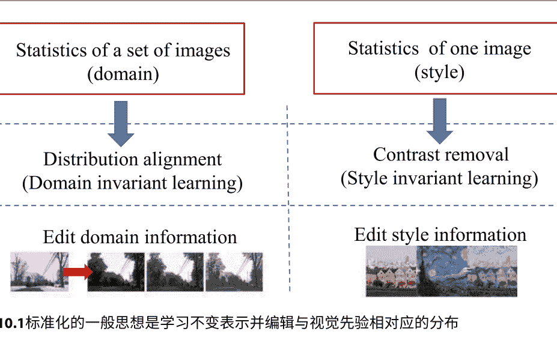

图10.1标准化的一般思想是学习不变表示并编辑与视觉先验相对应的分布

## 10.1 领域自适应

在不同设置下获取的数据（目标域）上测试时，通常在给定数据（源域）上训练的机器学习算法表现不佳。这在域自适应中被解释为源域和目标域之间的分布差异。因此，大多数域自适应方法旨在弥合这些分布之间的差距。实现这一目标的一种典型方法是基于BN的小批量/总体统计数据对源域和目标域的分布进行对齐[26]。

算法10.1自适应批量归一化（AdaBN）
1: 对于神经元j在DNN中执行
2: 在目标域的所有图像上连接神经元响应 t : x_j= [..., x_j(m), ...]
3: 计算目标域的均值和方差： μ^t_j = E(x^t_j), σ^t_j = sqrt(Var(x^t_j))
4: 结束循环
5: 对于DNN中的神经元 j，在目标域中的测试图像 m进行循环
6: 计算BN输出 y_j(m) := γ_j * (x_j(m) - μ^t_j) / σ^t_j + β_j
7: end for

Li等人[26]是第一个研究领域适应中BN统计的人。他们观察到BN层的统计数据包含了数据域的特征。此外，DNN的浅层和深层都受到领域转移的影响，仅通过操作输出层进行领域适应是不够的。基于这些观察，他们提出了自适应批量归一化（AdaBN），其中源域的BN统计数据在训练期间计算源域的统计数据，然后在测试期间调整目标域的统计数据（参见算法10.1）。AdaBN使得可以学习到无需额外损失项和额外相关参数的域不变特征。它可以直接适应目标域，只需重新计算BN的总体统计数据。AdaBN的假设是域不变信息存储在每一层的权重矩阵中，而域特定信息由BN层的统计数据表示。然而，这个假设并不总是成立，因为目标域在训练阶段没有被利用。因此，很难确保源域和目标域的BN层的统计数据与其域特定信息相对应。

克服这个限制的一种方法是在训练阶段将目标样本和源样本的网络参数耦合起来，这是AdaBN启发的几个后续研究的主要研究重点。Carlucci等人[27]提出了自动域对齐层（AutoDIAL），它嵌入在深度架构的不同层级中，将学习到的源域和目标域特征分布对齐到一个规范分布。AutoDIAL在训练阶段利用源域和目标域特征，其中每个BN层都涉及一个额外的参数作为源域和目标域之间的权衡。Chang等人[28]进一步提出了域特定批归一化（DSBN），其中使用多个BN分支，每个分支专门负责一个单独的域。DSBN与原始BN不同，原始BN将来自不同域的数据使用相同的BN进行归一化。DSBN仅使用BN的估计总体统计数据学习域特定属性，并使用网络中的其他参数学习域不变表示。这种方法有效地分离了无监督域自适应的域特定信息。类似的思想也在语义场景分割[29]和改进图像识别的对抗性无监督域自适应[30]的上下文中被利用。Roy等人[31]通过域特定白化变换（DWT）进一步推广了DSBN，其中使用源域和目标域的协方差矩阵对齐数据分布。DWT层将源特征和目标特征进行“白化”处理，并将它们投影到一个共同的球形分布中。值得注意的是，DWT推广了以前基于BN的DA方法，这些方法不考虑特征之间的相关性，仅依赖于特征标准化。DWT进一步考虑了特征之间的相关性，并提供了更强的对齐。

Wang等人[32]提出了可转移的标准化技术（TransNorm），它同时计算源域和目标域输入的统计信息，并计算通道的可转移性。标准化后的特征经过通道自适应机制，根据它们的可转移性重新加权通道。

### 10.1.1 领域泛化

我们介绍的先前工作侧重于无监督领域自适应任务，其中未标记的目标域数据可用于适应。在这里，我们介绍了标准化在领域泛化任务中的应用，在训练期间无法访问目标域的示例。这个任务被认为比无监督领域自适应更具挑战性。

Seo等人[33]提出了领域特定优化标准化，用于学习领域不变表示以进行领域泛化。他们在训练过程中还使用不同的BN来处理不同的领域。除了人口统计数据，他们还利用BN的仿射变换（Eq. 4.3）来表示其提出的领域特定优化标准化（DSON）中的领域特定信息。此外，DSON通过多个标准化统计量（通常是BN和IN）的加权平均值对激活进行标准化，并在必要时跟踪每种标准化类型的标准化统计量，针对每个领域。

Choi等人[34]提出了一种实例选择性白化损失，缓解了现有白化变换在域泛化中的限制。实例选择性白化有选择性地去除导致域偏移的信息，同时保持DNN中特征的判别能力。所提出的方法不依赖于显式的闭式白化变换，而是通过所提出的损失函数隐式地鼓励网络学习这样的白化变换。他们有选择性地去除只对光度增强（如颜色变换）敏感的特征协方差。

Seg等人[35]提出了用于深度域泛化的批归一化嵌入。他们提出了一个多源域对齐层。该层收集特定于域的总体统计信息，并为测试样本计算实例统计信息。训练后，总体和实例统计分别将源域和测试样本映射到潜在空间，其中域相似性可以通过嵌入向量之间的距离来衡量。

### 10.1.2 鲁棒的深度学习在协变量转移下

如果不同的损坏可以被视为不同的领域，那么从领域适应中的标准化概念可以应用于损坏鲁棒性问题。有一些研究探讨了通过协变量转移来改善损坏鲁棒性的标准化方法。类似于领域适应中使用的自适应批标准化，一些研究致力于在测试过程中估计目标统计量，以提高对损坏的性能。例如，Schneider等人[36]提出利用测试图像来估计BN的统计量，并且如果测试图像的数量较少，他们还考虑将训练图像的统计量进行组合。Benz等人[37]将损坏鲁棒性解释为领域转移，并提出使用测试图像来修正BN的统计量（均值和方差）以提高模型的鲁棒性。

图像。这是基于将从干净领域到损坏领域的转变视为由BN统计量表示的风格转变的观点。Nado等人[38]考虑了一种预测场景，在预测阶段可以获得独立同分布的小批量数据。在这种情况下，他们提出了预测时批归一化的方法，即在每个测试批次中重新计算BN统计量，而不是使用训练期间计算的总体统计量。这种策略可以有效提高对数据损坏的鲁棒性。这种预测时批归一化在Pytorch或Tensorflow中作为标准的“训练模式”实现。

Wang等人[39]还提出了完全的测试时适应（Tent）用于领域适应或图像损坏。他们观察到在受损的CIFAR-100-C数据集上，熵较低的预测具有较低的错误率，并且确定性可以在测试期间作为监督。因此，他们将熵最小化作为测试数据的优化目标。Tent通过估计归一化统计量μ和σ，并优化仿射参数α和τ，在测试期间调节特征。归一化统计量和仿射参数在目标数据上进行更新，而不使用源数据。在实践中，调整α和τ是高效的，因为它们仅占模型参数的1%以下。

石井和杉山[40]也提出了类似的思路，用于无源领域适应。他们共同最小化BN统计匹配损失和信息最大化损失，以微调编码器。至于BN统计匹配损失，不可观测源特征的分布被总结并存储为BN层中的统计数据，并且该损失明确评估了基于这些统计数据的源域和目标域特征分布之间的差异。因此，最小化这个损失也可以使得源域和目标域之间的微调编码器提取的特征分布对齐。

使用BN学习域不变表示的思路也被用于防御多个对抗样本。刘等人[41]观察到不同类型的对抗扰动引起不同的统计特性，可以通过BN的统计数据进行分离和表征。因此，他们提出了门控BN（GBN）来对抗性地训练一个扰动不变的预测器，以防御多种扰动类型。GBN由多分支BN层和门控子网络组成。GBN中的每个BN分支负责一种扰动类型，以确保归一化输出对进一步学习扰动不变表示进行对齐。同时，门控子网络被设计用于分离添加了不同扰动的模型输入。通过这种设计，GBN可以很好地防御多种已知的对抗扰动，甚至是未知的对抗扰动。

有一些工作在人物再识别（ReID）的领域适应中利用了BN的思想。庄等人[42]研究了每个摄像头对于人物再识别任务的分布情况。他们观察到不同的摄像头在视觉数据的分布上存在显著差异。基于这一观察，他们将每个摄像头视为一个“域”，并强调了对所有摄像头的分布进行对齐的重要性。他们提出了基于摄像头的批归一化（CBN），它看起来像是针对人物再识别任务的领域特定的BN。在训练中，CBN将每个小批量数据进行分解，并根据其摄像头对应的输入进行标准化。

标签。在测试中，CBN利用少量样本来近似每个测试相机的BN统计数据，并将输入标准化为训练分布。CBN促进了ReID模型在不同场景中的泛化和迁移能力，并更好地利用了摄像头内部注释。类似的想法也用于人物再识别场景中的可见模态和红外模态。李等人[43]将每个模态视为一个“域”，并提出了模态批量归一化。它还旨在对不同模态的分布进行对齐，以更好地学习不变的内容表示。

还有一些工作利用BN的思想在立体匹配的领域自适应中。Zhang等人[44]提出了域不变立体匹配网络，旨在很好地推广到未见过的场景。他们提出了域不变标准化。它沿着空间轴（高度和宽度）对特征进行标准化，以产生类似于实例标准化的风格不变表示。此外，基于L2范数的缩放也用于对每个空间位置的特征进行标准化，类似于像素标准化。

### 10.1.3 学习通用表示

将BN应用于域自适应的思想还可以进一步扩展到学习通用表示[45]，通过构建在许多领域中同时工作的神经网络。为了实现这一点，网络需要学习共享没有明显共性的常见视觉结构。通用表示不仅有利于域自适应，还有助于多任务学习，即在相同的数据域中同时学习多个任务。

Bilen和Vedaldi [45]提倡使用（1）卷积核提取与域无关的信息和（2）BN层将内部表示转换为目标域来学习通用图像表示。Wiesler等人[46]利用BN层来学习区分视觉类别，而其他层（例如卷积层）用于学习通用表示。他们还提供了一种插值BN层来解决新任务的方法。Li和Vasconcelos [47]提出了用于多域学习的协方差标准化（CovNorm），为不同域中定义的几个任务提供了解决方案。Mudrakarta等人[48]提出了一种用于多任务学习的学习范式，其中每个任务都带有自己的模型补丁。这些模型补丁是指一小组参数，与一组共享参数一起构成该任务的模型。例如，他们同时使用BN的总体统计量（均值和方差）和每个任务的仿射参数。

## 10.2 图像风格转换

图像风格转换是一项重要的图像编辑任务，它可以创建新的艺术作品[49, 50]。图像风格转换算法旨在生成具有与给定图像相似的内容和风格的风格化图像。这个任务的关键挑战是

提取能够将风格与内容分离的有效表示。Gatys等人的开创性工作[51]表明，通过训练的深度神经网络提取的层激活的协方差/格拉姆矩阵具有捕捉视觉风格的显著能力。这为通过最小化基于格拉姆矩阵的损失来匹配图像之间的风格提供了可行的解决方案，为风格转移开辟了道路。

将标准化应用于风格转换的一个关键优势是，标准化操作（NOP）可以去除风格信息（例如，白化可以确保协方差矩阵成为单位矩阵），而标准化表示恢复（N RR）则引入了风格信息。换句话说，标准化直观上可以通过标准化进行编辑[52, 53]。在一项开创性的工作中，Ulyanov等人[54]提出了实例标准化（IN）来从内容图像中去除实例特定的对比信息（风格）。从那时起，IN已成为图像风格转换任务的基本模块。

Dumoulin等人[55]提出了条件实例标准化（CIN），这是一种将多种风格集成的高效解决方案。具体而言，通过在IN层的仿射参数（方程4.3）中编码风格信息，单个网络可以捕捉到多个不同的风格，并且可以选择性地将每个风格应用于目标图像。Huang和Belongie [56]提出了自适应实例标准化（AdaIN），其中内容图像的激活通过其统计数据进行标准化，并且仿射参数（γ和α）来自风格激活的统计数据。AdaIN在内容和风格特征激活之间传递通道的均值和方差特征统计。AdaIN在文本效果转移中也能很好地工作，其目标是学习视觉效果同时保持文本内容[57]。动态实例标准化（DIN）不是手动定义如何计算仿射参数以使内容和风格特征的均值和方差对齐，而是通过将风格图像编码为可学习的卷积参数来处理任意风格转移，然后对内容图像进行风格化[Jing等人[58]引入]。

为了解决AdaIN的局限性，即仅尝试匹配风格化图像和风格图像特征的方差，Li等人[49]进一步提出了白化和着色变换（WCT）来匹配协方差矩阵。这与神经风格迁移中基于Gram矩阵的代价优化具有类似的思路[49, 59]。

一些方法[60]还试图在AdaIN（具有更高的计算效率）和WCT（在视觉上更接近给定风格的合成图像）之间提供良好的权衡。

### 10.2.1 图像翻译

在计算机视觉中，图像翻译可以被视为图像风格迁移的更一般情况。给定源域中的图像，目标是学习目标域中相应图像的条件分布。这包括但不限于以下任务：超分辨率、上色、修复和属性转移。类似

对于样式转换，AdaIN也是图像翻译中的一个重要工具，例如多模态无监督图像到图像的翻译（MUIT）[61]。请注意，[61]中的AdaIN的仿射参数是由一个学习网络生成的，而不是像[56]中那样从预训练网络的统计数据计算得出的。除了IN之外，Cho等人[62]还提出了一种基于分组的深度白化和着色变换（GDWCT），通过匹配更高阶的统计量（如协方差）来进行图像到图像的翻译任务。此外，由于白化/着色变换可以被视为1×1卷积，Cho等人[63]进一步提出了自适应卷积归一化（AdaCoN），将目标样式注入给定图像，用于无监督图像到图像的翻译。AdaCoN首先在输入激活图的每个子区域上进行局部标准化（类似于第4.1节中展示的局部归一化），然后应用自适应卷积，其中卷积滤波器权重是使用编码的样式表示动态估计的。

此外，Yu等人[64]提出了用于图像修复网络训练的区域标准化（RN）。RN根据输入掩码将空间像素划分为不同的区域，并对每个区域中的激活进行标准化。Wang [65]引入了用于条件图像生成的注意力标准化（AN），它是实例标准化[54]的扩展。AN根据特征图的语义将其划分为不同的区域，然后分别对同一区域中的特征点进行标准化和反标准化。

## 10.3 训练GANs

GANs [66]可以被视为生成一个模型分布，模仿给定目标分布的一般框架。GAN由生成器和鉴别器组成，生成器产生模型分布，鉴别器区分模型分布和目标分布。从这个角度来看，训练GAN的最终目标与域适应任务中的模型训练具有相似的精神。主要区别在于GAN试图减小不同分布之间的距离，而域适应模型试图缩小不同域之间的差距。因此，将BN应用于域适应的技术，如第10.1节所讨论的，也可能适用于GANs。例如，将来自不同域的样本组合在一个批次中进行BN可能会损害域适应的泛化性，这也适用于GANs的训练[67, 68]。最好在鉴别器中为生成的示例和真实的示例使用不同的BN模块，而不是使用单一的BN，这类似于领域特定的BN。主要原因是在初始状态下，鉴别器很容易区分生成的示例和真实的示例，如果只使用一个BN，则鉴别器提供的梯度信息很少，无法对齐分布。

训练GAN的一个持久性挑战是鉴别器的性能控制和鉴别器与生成器之间的学习速度控制[69]。在训练过程中，鉴别器估计的密度比通常不准确且不稳定，并且生成器可能无法学习目标分布的结构。一种解决方法是

对鉴别器施加约束[70]。例如，Xiang和Li [71]利用权重标准化有效地提高了GAN的训练性能。Miyato等人[69]提出了谱标准化（SN），通过使用由幂迭代估计的谱范数对鉴别器的参数进行归一化，从而对鉴别器施加Lipschitz连续性。从那时起，SN已经成为训练GAN的重要技术[69, 72, 73]。张等人[74]进一步发现，在生成器中使用SN可以提高稳定性，使得每次迭代中鉴别器的训练步骤更少。训练GAN中的另一个重要约束是正交性[73, 75–77]。参考文献[73]发现，对生成器应用正交正则化可以通过简单的“截断技巧”使其适应样本保真度和多样性之间的权衡，并通过减小生成器输入的方差来实现。黄等人[75]提出了通过牛顿迭代进行正交化的方法，可以有效地控制权重矩阵的正交性，并通过改变迭代次数在谱标准化和完全正交化之间进行插值。

如第10.2节中讨论的样式转换，激活标准化的NRR操作也可以作为GAN的辅助信息，在条件GAN的情况下（cGANs）[78]。cGANs在类别条件图像生成[79]、文本生成图像[80, 81]和图像到图像的转换[82]方面取得了进展。

de Vries等人[83]提出了条件批量归一化（CBN），它将语言输入（例如VQA任务中的问题）注入到BN的仿射参数中。这与样式转换的条件实例归一化有着相似的精神，并在[73, 74, 84, 85]中得到了广泛探索。Karras等人[86]提出了一种基于样式的GAN生成器架构，其中样式信息被嵌入到AdaIN的仿射参数中[56]。请注意，样式来自潜在向量而不是示例图像，使得模型能够在没有外部信息的情况下工作。类似地，陈等人[87]提出了一种基于CBN的更通用的自我调节方法，其中仿射参数也可以由生成器自身的输入生成或由外部信息提供。

在现实世界的应用中，考虑算法的效率是至关重要的，除了效果之外，还要考虑计算资源的有限性（例如智能手机）。因此，也有一系列研究正在利用标准化技术（例如BN）来开发基于网络精简或量化的高效DNNs。在网络精简中，一般的想法是利用BN的通道尺度参数 $\alpha \in \mathbb{R}^{d}$，考虑到每个尺度 $\alpha_i$对应于特定的卷积通道（或完全连接层中的神经元）[88]。例如，刘等人[88]提出了基于BN层中尺度参数的无关通道（或神经元）的识别和修剪方法，这些方法通过 $L^{1}$正则化来实现稀疏性。叶等人[89]也采用了类似的思路，并开发了一种新的算法方法和重新缩放技巧来提高鲁棒性和

优化速度。李等人[90]提出了一种基于自适应批量归一化[26]的高效评估组件，它在不同修剪的DNN结构和最终稳定的准确性之间具有很强的相关性。

余等人[91]使用一种名为可切换批量归一化（SBN）的新变体训练了一个可调整宽度的网络，用于在不同宽度上执行的网络。SBN为可调宽度网络的不同开关私有化了BN，并且每个独立的BN都有独立的特征统计累积。因此，SBN可以作为一种通用解决方案，在准确性和延迟之间实现良好的权衡。作为对归一化网络输入加权求和的BN的补充，罗等人[92]提出了细粒度批量归一化（FBN）来构建轻量级网络，其中FBN对求和的中间状态进行归一化。

网络量化是构建高效DNN的另一种重要技术。这个具有挑战性的任务也可以使用类似BN的标准化算法来解决。例如，Banner等人[93]提出了范围批量标准化（RBN），用于量化网络，根据激活分布的范围对激活进行标准化。RBN避免了平方和、平方根和倒数运算，对于低精度训练更友好[94]。Lin等人[95]提出了在模型部署中将BN量化的方法，将两个浮点数仿射变换转换为具有共享量化比例的定点操作。Ardakani等人[96]使用BN来训练二值/三值LSTM，并在网络量化方面取得了最先进的性能。Hou等人[97]进一步研究并比较了量化LSTM与WN、LN和BN。他们表明，这些标准化方法使梯度对权重缩放不变，从而缓解了由于量化而导致的潜在大的权重范数增加的问题。Sari等人[98]分析了BN中的居中和缩放操作对二值神经网络训练的影响。

## 参考文献

+   1. Russakovsky, O., J. Deng, H. Su, J. Krause, S. Satheesh, S. Ma, Z. Huang, A. Karpathy, A. Khosla, M. Bernstein, 等 (2015). Imagenet大规模视觉识别挑战国际计算机视觉115(3), 211–252.
2. He, K., X. Zhang, S. Ren, 和 J. Sun (2016a). 深度残差学习用于图像识别. 在 CVPR.
3. Zagoruyko, S. 和 N. Komodakis (2016). Wide residual networks. 在 BMVC.
4. Szegedy, C., V. Vanhoucke, S. Ioffe, J. Shlens, 和 Z. Wojna (2016). 重新思考计算机视觉中的Inception架构. 在 CVPR.
5. 黄，G., 刘, Z., 魏伯格, K. Q. (2017年)。密集连接卷积网络。在 CVPR中。
6. 谢, S., Girshick, R. B., Dollár, P., Tu, Z., 和 He, K. (2017年)。聚合残差变换用于深度神经网络。在 CVPR中。
7. Vaswani, A., Shazeer, N., Parmar, N., Uszkoreit, J., Jones, L., Gomez, A. N., Kaiser, L., 和 Polosukhin, I. (2017年)。注意力就是你所需要的。在 NeurIPS中。
8. 于, A. W., Dohan, D., Luong, M.-T., 赵, R., 陈, K., Norouzi, M., 和 Le, Q. V. (2018年)。Qanet: 将局部卷积与全局自注意力相结合，用于阅读理解。在 ICLR中。

9. 徐，J.，孙，X.，张，Z.，赵，G.，林，J. (2019年)。理解和改进层标准化。在 NeurIPS中。

10. Nichol, A.，Achiam, J.，Schulman, J. (2018年)。关于一阶元学习算法。arXiv 预印本 arXiv:1803.02999。

11. Gordon, J.，Bronskill, J.，Bauer, M.，Nowozin, S.，Turner, R. (2019年)。元学习概率推断预测。在 ICLR中。

12. Bronskill, J.，Gordon, J.，Requeima, J.，Nowozin, S.，Turner, R. E. (2020a年)。Tasknorm: 重新思考元学习的批量标准化。在 ICML中。

13. van Hasselt, H. P.，Guez, A.，Hessel, M.，Mnih, V.，Silver, D. (2016年)。学习跨越多个数量级的值。在 NeurIPS中。

14. Bhatt, A.，M. Argus, A. Amiranashvili, and T. Brox (2019). Crossnorm: 异策略TD强化学习的标准化。arXiv预印本 arXiv:1902.05605。

15. Wang, C.，Y. Wu, Q. Vuong, and K. Ross (2020). 在异策略DRL中追求简单性和性能:输出标准化和非均匀采样。在 ICML中。
16. He, K.，H. Fan, Y. Wu, S. Xie, and R. Girshick (2020). 动量对比用于无监督的视觉表示学习。在 CVPR中。

17. Taha Kocyigit, M.，L. Sevilla-Lara, T. M. Hospedales, and H. Bilen (2020). 无监督批量标准化。在CVPR Workshops中。

18. Moo Yi, K.，E. Trulls, Y. Ono, V. Lepetit, M. Salzmann, and P. Fua (2018). 学习寻找好的对应关系。在 CVPR中。

19. Sun, W.，W. Jiang, E. Trulls, A. Tagliasacchi, and K. M. Yi (2020). 注意力上下文标准化用于鲁棒的置换等变学习。在 CVPR中。

20. Cai, T.，S. Luo, K. Xu, D. He, T.-y. Liu, and L. Wang (2020). Graphnorm: 一种加速图神经网络训练的原则方法。 arXiv预印本 arXiv:2009.03294。
21. Gusak, J.，L. Markeeva, T. Daulbaev, A. Katrutsa, A. Cichocki, and I. Oseledets (2020). 走向理解神经ODE中的标准化。 arXiv预印本 arXiv:2004.09220。
22. Brooks, D.，O. Schwander, F. Barbaresco, J.-Y. Schneider, and M. Cord (2019). Riemannian批量标准化用于spd神经网络。 在 NeurIPS中， 第15463-15474页。

23. Galloway, A.，A. Golubeva, T. Tanay, M. Moussa, and G. W. Taylor (2019). 批归一化是对抗性脆弱性的原因。 arXiv预印本 arXiv:1905.02161。

24. Awais, M.，F. Shamshad, and S.-H. Bae (2020). 走向一个对抗性鲁棒的标准化方法。 arXiv预印本 arXiv:2006.11007。

25. Xie, C. and A. Yuille (2020). 在规模上引人注目的对抗性训练特性。在 ICLR中。

26. Li, Y.，N. Wang, J. Shi, J. Liu, and X. Hou (2016). 重新审视批归一化以实现实际的领域适应。 arXiv预印本 arXiv:1603.04779。

27. Carlucci, F. M.，L. Porzi, B. Caputo, E. Ricci, and S. R. Bulo (2017). Autodial: 自动领域对齐层。在 ICCV中。

28. Chang, W.，T. You, S. Seo, S. Kwak, and B. Han (2019). 领域特定的批量归一化用于无监督领域适应。在 CVPR中。

29. Romijnders, R.，P. Meletis, and G. Dubbelman (2019). 一种领域不可知的归一化层用于无监督对抗领域适应。在 WACV中。

30. Xie, C.，M. Tan, B. Gong, J. Wang, A. Yuille, and Q. V. Le (2020). 对抗性示例改善图像识别。在 CVPR中。

31. Roy, S.，A. Siarohin, E. Sangineto, S. R. Bulo, N. Sebe, and E. Ricci (2019). 无监督领域适应使用特征白化和一致性损失。在 CVPR中。

32. 王，X.，金，Y.，龙，M.，王，J.，和乔丹，M. I. (2019年)。可转移的标准化: 改善深度神经网络的可转移性。在 NeurIPS中。

33. Seo, S.，Suh, Y.，Kim, D.，Han, J.，和Han, B. (2020年)。学习优化特定领域的标准化以实现领域泛化。在 ECCV中。

## 参考文献

34. Choi, S., Jung, S., Yun, H., Kim, J. T., Kim, S., and Choo, J. (2021). Robust net: Improving domain generalization for urban scene segmentation via instance selective whitening. In Proceedings of the IEEE/CVF Conference on Computer Vision and Pattern Recognition, pages 11580–11590.

35. Seg, M., Tonioni, A., and Tombari, F. (2020). Batch normalization embeddings for deep domain generalization. CoRR abs/2011.12672.

36. Schneider, S., E. Rusak, L. Eck, O. Bringmann, W. Brendel, and M. Bethge (2020). Improving robustness against common corruptions by covariate shift adaptation. In Advances in Neural Information Processing Systems.

37. Benz, P., C. Zhang, A. Karjauv, and I. S. Kweon (2020). Revisiting batch normalization for improving corruption robustness. CoRR abs/2010.03630.

38. Nado, Z., S. Padhy, D. Sculley, A. D’Amour, B. Lakshminarayanan, and J. Snoek (2020). Evaluating batch norm robustness to covariate shift. arXiv preprint arXiv:2006.10963.

39. Wang, D., E. Shelhamer, S. Liu, B. Olshausen, and T. Darrell (2021). Tent: Fully test-time adaptation by entropy minimization. In International Conference on Learning Representations.

40. Ishii, M. and M. Sugiyama (2021). Source-free domain adaptation via batch normalization statistics matching. CoRR abs/2101.10842.

41. Liu, A., Tang, S., Liu, X., Chen, X., Huang, L., Tu, Z., Song, D., and Tao, D. (2020). Towards resisting multiple adversarial perturbations via gated batch normalization. CoRR abs/2012.01654.

42. Zhuang, Z., Wei, L., Xie, L., Zhang, T., Zhang, H., Wu, H., Ai, H., and Tian, Q. (2020). Rethinking the distribution gap of batch normalization on person re-identification. In European Conference on Computer Vision, pages 140–157. Springer.

43. Li, W., Ke, Q., Chen, W., and Zhou, Y. (2021). Modality-driven intra- and inter-modal batch normalization for visible-infrared person re-identification. CoRR abs/2103.04778.

44. Zhang, F., Qi, X., Yang, R., Prisacariu, V., Wa, B., and Torr, P. (2020). Domain-invariant stereo matching networks. In European Conference on Computer Vision (ECCV).

45. Bilen, H. and A. Vedaldi (2017). Universal representations: The missing link between faces, text, plankton, and cat breeds. arXiv preprint arXiv:1701.07275.

46. Wesley Putra Data, G., K. Ngu, D. William Murray and V. Adrian Prisacariu (2018). Using batch normalization in convolutional neural networks for interpolation. In ECCV.

47. Li, Y. and N. Vasconcelos (2019). Efficient multi-domain learning via covariance normalization. In CVPR.

48. Mudrakarta, P. K., M. Sandler, A. Zhmoginov and A. Howard (2019). K for the price of 1: Parameter-efficient multi-task and transfer learning. In International Conference on Learning Representations.

49. Li, Y., C. Fang, J. Yang, Z. Wang, X. Lu and M.-H. Yang (2017). Universal style transfer via feature transforms. In NeurIPS.

50. Jing, Y., Y. Yang, Z. Feng, J. Ye, Y. Yu, and M. Song (2019). Neural style transfer: A review. IEEE Transactions on Visualization and Computer Graphics.

51. Gatys, L. A., A. S. Ecker, and M. Bethge (2016). Image style transfer using convolutional neural networks. In CVPR.

52. Li, B., F. Wu, K. Q. Weinberger, and S. Belongie (2019). Positional normalization. In NeurIPS.

53. Li, B., F. Wu, S.-N. Lim, S. Belongie, and K. Q. Weinberger (2020). On feature normalization and data augmentation. arXiv preprint arXiv:2002.11102.

54. Ulyanov, D., A. Vedaldi, and V. S. Lempitsky (2016). Instance normalization: The missing ingredient for fast stylization. arXiv preprint arXiv:1607.08022.

55. Dumoulin, V., J. Shlens, and M. Kudlur (2017). A learned representation for artistic style. In ICLR.

56. Huang, X. and S. Belongie (2017). Arbitrary style transfer in real-time with adaptive instance normalization. In ICCV.

57. Li, W., Y. He, Y. Qi, Z. Li, and Y. Tang (2020). Fet-GAN: Font and effect transfer via k-shot adaptive instance normalization. In AAAI.

58. Jing, Y., X. Liu, Y. Ding, X. Wang, E. Ding, M. Song, and S. Wen (2020). Dynamic instance normalization for arbitrary style transfer. In AAAI.

59. Chiu, T.-Y. (2019). Understanding universal whitening and coloring transforms for universal style transfer. In ICCV.

60. Sheng, L., Z. Lin, J. Shao, and X. Wang (2018). Avatar-net: Multi-scale zero-shot style transfer by feature decoration. In CVPR.

61. Huang, X., M. Liu, S. J. Belongie, and J. Kautz (2018). Multimodal unsupervised image-to-image translation. In ECCV.

62. Cho, W., S. Choi, D. K. Park, I. Shin, and J. Choo (2019). Image-to-image translation via group-wise deep whitening-and-coloring transformation. In CVPR.

63. Cho, W., K. Kim, E. Kim, H. J. Kim, and J. Choo (2019). Unpaired image-to-image translation via adaptive convolutional normalization. arXiv preprint arXiv:1911.13271.

64. Yu, T., Z. Guo, X. Jin, S. Wu, Z. Chen, W. Li, Z. Zhang, and S. Liu (2020). Region normalization for image inpainting. In AAAI.

65. Wang, Y., Chen, Y.-C., Zhang, X., Sun, J., and Jia, J. (2020). Attention normalization for conditional image generation. In CVPR.

66. Goodfellow, I., Pouget-Abadie, J., Mirza, M., Xu, B., Warde-Farley, D., Ozair, S., Courville, A., and Bengio, Y. (2014). Generative adversarial nets. In NeurIPS.

67. Radford, A., Metz, L., and Chintala, S. (2015). Unsupervised representation learning with deep convolutional generative adversarial networks. arXiv preprint arXiv:1511.06434.

68. Salimans, T., Goodfellow, I., Zaremba, W., Cheung, V., Radford, A., Chen, X., and Chen, X. (2016). Improved techniques for training GANs. In NeurIPS.

69. Miyato, T., T. Kataoka, M. Koyama, and Y. Yoshida (2018). Spectral normalization for generative adversarial networks. In ICLR.

70. Arjovsky, M., S. Chintala, and L. Bottou (2017). Wasserstein GAN. arXiv preprint arXiv:1701.07875.

71. Xiang, S. and H. Li (2017). On the effects of batch and weight normalization in generative adversarial networks. arXiv preprint arXiv:1704.03971.

72. Kurach, K., M. Lučić, X. Zhai, M. Michalski, and S. Gelly (2019). A large-scale study on regularization and normalization in GANs. In ICML.

73. Brock, A., J. Donahue, and K. Simonyan (2019). Large scale GAN training for high fidelity natural image synthesis. In ICLR.

74. Zhang, H., I. Goodfellow, D. Metaxas, and A. Odena (2019). Self-attention generative adversarial networks. In ICML.

75. Huang, L., L. Liu, F. Zhu, D. Wan, Z. Yuan, B. Li, and L. Shao (2020). Controllable orthogonality in training DNNs. In CVPR.

76. Liu, B., Y. Zhu, Z. Fu, G. de Melo, and A. Elgammal (2020). OoGAN: Disentangling GAN with one-hot sampling and orthogonality regularization. In AAAI.

77. Miller, J., R. Klein, and M. Weinmann (2019). Orthogonal Wasserstein GANs. arXiv preprint arXiv:1911.13060.

78. Mirza, M. and S. Osindero (2014). Conditional generative adversarial nets. arXiv preprint arXiv:1411.1784.

79. Odena, A., C. Olah, and J. Shlens (2017). Conditional image synthesis with auxiliary classifier GANs. In ICML.

80. Reed, S., Z. Akata, X. Yan, L. Logeswaran, B. Schiele, and H. Lee (2016). Generative adversarial text to image synthesis. In ICML.

81. Zhang, H., T. Xu, H. Li, S. Zhang, X. Wang, X. Huang, and D. Metaxas (2017). StackGAN: Text to photo-realistic image synthesis with stacked generative adversarial networks. In ICCV.

82. Zhu, J.-Y., T. Park, P. Isola, and A. A. Efros (2017). Unpaired image-to-image translation using cycle-consistent adversarial networks. In ICCV.

83. de Vries, H., F. Strub, J. Mary, H. Larochelle, O. Pietquin, and A. C. Courville (2017). Modulating early visual processing by language. In NeurIPS, pages 6594–6604.

84. Miyato, T. and M. Koyama (2018). cGANs with projection discriminator. In ICLR.

85. Michalski, V., V. S. Voleti, S. E. Kahou, A. Ortiz, P. Vincent, C. Pal, and D. Precup (2019). An empirical study of batch and group normalization in conditional computation. arXiv preprint arXiv:1908.00061.

86. Karras, T., S. Laine, and T. Aila (2019). A style-based generator architecture for generative adversarial networks. In CVPR.

87. Chen, T., M. Lucic, N. Houlsby and S. Gelly (2019). On self-regulation for generative adversarial networks. In ICLR.

88. Liu, Z., Li, J., Shen, Z., Huang, G., Yan, S., and Zhang, C. (2017). Learning efficient convolutional networks through network slimming. In ICCV, pages 2755–2763.

89. Ye, J., Lu, X., Lin, Z., and Wang, J. Z. (2018). Rethinking the smaller-norm-less-information assumption in convolutional channel pruning. In ICLR.

90. Li, B., Wu, B., Su, J., Wang, G., and Lin, L. (2020). Eagleeye: Fast subnetwork evaluation for efficient neural network pruning. In ECCV.

91. Yu, J., Yang, L., Xu, N., Yang, J., and Huang, T. (2019). Slimmable neural networks. In ICLR.

92. Luo, C., Zhang, J., Wang, L., and Gao, W. (2020). Finet: Training lightweight neural networks with fine-grained batch normalization. arXiv preprint arXiv:2005.06828.

93. Banner, R., Hubara, I., Hoffer, E., and Soudry, D. (2018). Scalable methods for 8-bit training of neural networks. In NeurIPS.

94. Graham, B. (2017). Low-precision batch-normalised activations. arXiv preprint arXiv:1702.08231.

95. Lin, D., Sun, P., Xie, G., Zhou, S., and Zhang, Z. (2020). Optimal batch normalization in neural network deployment and its applications. arXiv preprint arXiv:2008.13128.

96. Ardakani, A., Ji, Z., Smithson, S. C., Meyer, B. H., and Gross, W. J. (2019). Learning recurrent binary/ternary weights. In ICLR.

97. Hou, L., Zhu, J., Guo, J., Gao, F., Qin, T., and Liu, T.-Y. (2019). Normalization helps training quantized LSTM. In NeurIPS.

98. Sari, E., Belbahri, M., and Nia, V. P. (2019). How does batch normalization help binary training? arXiv preprint arXiv:1909.09139.

1. Montufar, G. F., R. Pascanu, K. Cho, and Y. Bengio (2014). On the number of linear regions of deep neural networks. In NeurIPS.

2. Sun, R. (2019). Optimization for deep learning: Theory and algorithms. arXiv preprint arXiv:1912.08957.

3. Zhang, C., S. Bengio, M. Hardt, B. Recht, and O. Vinyals (2017). Understanding deep learning requires rethinking generalization. In ICLR.

4. Yang, G., J. Pennington, V. Rao, J. Sohl-Dickstein, and S. S. Schoenholz (2019). Mean field theory of batch normalization. In ICLR.

5. Xiong, H., L. Huang, M. Yu, L. Liu, F. Zhu, and L. Shao (2020). On the number of linear regions of convolutional neural networks. In ICML.

在本书中，我们提供了标准化技术的研究概况，涵盖了方法、分析和应用。我们相信我们的工作可以为选择在训练DNNs中使用的标准化技术提供有价值的指导。借助这些指导方针，将有可能设计出针对特定任务量身定制的新的标准化方法（通过选择NAP），或者改善效率和性能之间的权衡（通过选择NOP）。我们留下以下问题供讨论。

理论视角：尽管DNN的实际成功是无可争议的，但它们的理论分析仍然有限。尽管深度学习在表示[1]、优化[2]和泛化[3]方面取得了最近的进展，但理论上研究的网络通常与实践中使用的网络不同[4]。一个明显的例子是，尽管标准化技术在当前最先进的架构中被广泛使用，但DNN的理论分析通常排除了它们。事实上，常用于标准化激活的方法（例如BN、LN）通常与当前的理论分析相冲突。例如，在DNN的表示中，一个重要的策略是分析线性区域的数量，其中具有整流非线性的DNN的表达能力可以通过最大线性区域的数量来量化[1, 5]。然而，如果引入BN/LN，这通常不成立，因为它们会产生非线性，导致理论假设不再满足。因此，进一步研究BN/LN如何影响模型的表示能力非常重要。至于优化，大多数分析要求输入数据是独立的，这样随机/小批量梯度才是对数据集真实梯度的无偏估计。然而，BN通常不符合这种独立数据的假设，它的优化通常还取决于采样策略以及小批量大小[6]。因此，在存在BN时需要重新构建当前的优化理论框架。相比之下，标准化权重的方法不会损害DNN的理论分析，甚至可以提升理论结果。例如，对于线性层，可以通过标准化权重（近似正交）[7, 8]来控制/限制Lipschitz常数，这是一种重要的属性，用于对抗性攻击的认证防御[9-11]，以及对DNN的泛化性能进行理论分析[12, 13]。然而，与标准化激活相比，标准化权重在提高训练性能方面仍然不够有效，还有进一步的发展空间。

应用角度：如前所述，标准化方法可以用于“编辑”层激活的统计特性，在计算机视觉任务中已经被利用来匹配特定领域的知识。然而，我们注意到这种机制在自然语言处理任务中很少使用。因此，研究层激活的统计特性与自然语言处理领域知识之间的相关性，并进一步提高相应任务的性能，将是一个有趣的研究方向。此外，存在一个有趣的现象，即虽然批归一化（BN）/组归一化（GN）适用于计算机视觉模型，但层归一化（LN）在自然语言处理中更有效[14]。直观上讲，考虑到当前计算机视觉和自然语言处理的最先进模型往往相似（例如，它们都使用卷积操作和注意力），批归一化（BN）/组归一化（GN）应该对自然语言处理任务有效，而层归一化（LN）只是层归一化的更一般版本。因此，进一步研究批归一化（BN）/组归一化（GN）是否能够在自然语言处理任务中发挥良好作用，以及如果不能，原因是什么，这是非常重要的。另一个有趣的观察是，在深度强化学习（DRL）中，标准化并不常见[15]。考虑到某些DRL框架（例如，actor-critic [16, 17]）与GAN非常相似，应该可以借鉴GAN的思想来利用标准化技术来改善DRL的训练（例如，在鉴别器中对权重进行标准化[7, 8, 18]）。作为DNN中的关键组成部分，标准化技术是连接深度学习理论和应用的纽带。因此，我们相信这些技术将继续对快速发展的深度学习领域产生深远影响，并希望本书能帮助读者建立一个全面的实施框架。

- 6. Lian, X. and J. Liu (2019). 重新审视批归一化：通过组合优化获得新的理解和改进。在ICLR中。
- 7. Miyato, T., T. Kataoka, M. Koyama, and Y. Yoshida (2018). 用于生成对抗网络的谱归一化。在ICLR中。
- 8. Huang, L., L. Liu, F. Zhu, D. Wan, Z. Yuan, B. Li, and L. Shao (2020). 训练DNNs中的可控正交化。在CVPR中。
- 9. Tsuzuku, Y., I. Sato, and M. Sugiyama (2018). Lipschitz边界训练：深度神经网络中扰动不变性的可扩展认证。在NeurIPS中。
- 10. Anil, C., J. Lucas, and R. Grosse (2019). 整理Lipschitz函数逼近。在ICLR中。
- 11. Qian, H. and M. N. Wegman (2019). L2-非扩张神经网络。在ICLR中。
- 12. Bartlett, P. L., D. J. Foster, and M. J. Telgarsky (2017). 神经网络的谱归一化边界。在NeurIPS中。
- 13. Neyshabur, B., S. Bhojanapalli, and N. Srebro (2018). 一种基于PAC-Bayesian方法的谱归一化边界神经网络。在ICLR中。
- 14. Shen, S., Z. Yao, A. Gholami, M. W. Mahoney, and K. Keutzer (2020). Powernorm：在Transformer中重新思考批量归一化。在ICML中。
- 15. Bhatt, A., M. Argus, A. Amiranashvili, and T. Brox (2019). Crossnorm：用于离线-策略TD强化学习的归一化。arXiv预印本arXiv:1902.05605。
- 16. Lillicrap, T. P., J. J. Hunt, A. Pritzel, N. Heess, T. Erez, Y. Tassa, D. Silver, and D. Wierstra (2016). 使用深度强化学习进行连续控制。在ICLR中。
- 17. Mnih, V., A. P. Badia, M. Mirza, A. Graves, T. Lillicrap, T. Harley, D. Silver, and K. Kavukcuoglu (2016). 用于深度强化学习的异步方法。在ICML中。
- 18. Brock, A., J. Donahue, and K. Simonyan (2019). 大规模GAN训练用于高保真度自然图像合成。在ICLR中。

## 附录 A

### A.1 通过特征值分解进行反向传播

命题：考虑对称矩阵 Σ ∈ R^{d×d}，其特征值分解可以描述为 Σ = DΩD^T，其中 Ω = diag(λ_1, ..., λ_d) 和 D 是协方差矩阵 Σ 的特征值和特征向量。我们有 D^T D = I。损失函数 L 取决于 D 和 Ω。因此，L 取决于 Σ。给定 ∂L/∂D 和 ∂L/∂Ω，我们有：

∂L/∂Σ = D{(K^T ⊙ (D^T ∂L/∂D)) + (∂L/∂Ω)_{diag}} D^T   (A.1)

其中 K ∈ R^{d×d} 是 0 对角线的，并且结构化为 K_{ij} = 1/(λ_i - λ_j)[i ≠ j]，运算符 ⊙ 表示逐元素矩阵乘法，并且 (∂L/∂Ω)_{diag} 将所有的非对角线元素设置为零。∂L/∂Ω 设置为零。

证明证明的关键思想基于链式法则和摄动理论。基于链式法则，我们有

∂L/∂Σ_{ij} = Σ_{k=1}^d (∂L/∂λ_k)(∂λ_k/∂Σ_{ij}) + Σ_{n=1}^d Σ_{m=1}^d (∂L/∂D_{nm})(∂D_{nm}/∂Σ_{ij})   (A.2)

其中 λ_k 是第 k 个特征值。下一步是计算 ∂Ω/∂Σ 和 ∂D/∂Σ，给定特征值分解 Σ = DΩD^T，其中 Σ ∈ R^{d×d}，Ω ∈ R^{d×d} 是对角矩阵，D ∈ R^{d×d} 是正交矩阵。相应的约束条件是：（1）变化 ∂Ω 是对角矩阵，类似于 Ω；（2）∂D 满足约束条件 D^T ∂D + ∂D^T D = 0，这是由 D^T D = I 推导出来的。首先，我们尝试推导 ∂Ω/∂Σ。我们可以得到 Ω = D^T Σ D。对 Ω = D^T Σ D 进行第一次变分，我们有

$$ \partial\Omega = \partial D^T \Sigma D + D^T \partial\Sigma D + D^T \Sigma \partial D. \quad \text{(A.3)} $$

请注意，$\partial\Omega$是基于约束条件的对角矩阵。通过使用 $\Sigma D = D \Omega$ 和 $D^T \Sigma = \Omega D^T$，我们可以得到

$$ \partial\Omega = \partial D^T D \Omega + D^T \partial\Sigma D + \Omega D^T \partial D. \quad \text{(A.4)} $$

设 $A = D^T \partial D$，根据 $D^T \partial D + \partial D^T D = 0$ 的约束条件，我们有 $A + A^T = 0$, 这意味着 $A$ 是反对称的。因此，$A$ 的对角元素为零。而 $A \Omega$ 和 $\Omega A$ 都是零对角线，由于 $\partial\Omega$ 是对角线，我们可以得到

$$ \partial\Omega = (D^T \partial\Sigma D)_{diag} \quad \text{(A.5)} $$

因此我们有

$$ \frac{\partial\lambda_k}{\partial\Sigma_{ij}} = D_{ik} D_{jk} \quad \text{(A.6)} $$

其次，我们推导 $\frac{\partial D}{\partial\Sigma}$。记 $V = D^T \partial\Sigma D - \partial\Omega$，我们可以得到

$$ A\Omega - \Omega A = V \Rightarrow \begin{cases} A_{ij} \lambda_j - A_{ij} \lambda_i = V_{ij} & i \neq j \\ A_{ij} = 0 & i = j \end{cases} \quad \text{(A.7)} $$

因此我们有 $A = K^T \odot V$，其中 $\odot$ 是逐元素乘法操作，$K$ 有 elements：

$$ K_{ij} = \begin{cases} \frac{1}{\lambda_i - \lambda_j} & i \neq j \\ 0 & i = j. \end{cases} $$

因此，我们有 $A = K^T \odot V = K^T \odot (D^T \partial\Sigma D) - K^T \odot \partial\Omega = K^T \odot (D^T \partial\Sigma D)$。因此，我们可以得到

$$ \partial D = D(K^T \odot (D^T \partial\Sigma D)) \quad \text{(A.8)} $$

这就是

$$ \frac{\partial D_{nm}}{\partial\Sigma_{ij}} = \sum_{s=1, s \neq m}^{d} \frac{D_{ns} D_{is} D_{jm}}{\lambda_m - \lambda_s}. \quad \text{(A.9)} $$

基于方程(A.2), (A.6)和(A.9)，我们有：

$$\frac{\partial \mathcal{L}}{\partial \Sigma_{ij}} = \sum_{k=1}^{d} \frac{\partial \mathcal{L}}{\partial \lambda_k} D_{ik} D_{jk} + \sum_{n=1}^{d} \sum_{m=1}^{d} \frac{\partial \mathcal{L}}{\partial D_{nm}} \sum_{s=1, s \neq m}^{d} \frac{D_{ns} D_{is} D_{jm}}{\lambda_m - \lambda_s} \quad (A.10)$$

通过矩阵形式

$$\frac{\partial \mathcal{L}}{\partial \Sigma} = D \left( \frac{\partial \mathcal{L}}{\partial \Omega} \right)_{diag} D^T + D \left\{ (K^T \odot (D^T \frac{\partial \mathcal{L}}{\partial D})) \right\} D^T. \quad (A.11)$$

因此，我们可以得到方程(A.1)。 □

### A.2 标准化方法的约束数推导

在书的第9.4节中，我们定义了标准化操作的约束数，并在书的表9.1中总结了不同标准化方法的约束数。在这里，我们提供了批量白化（BW）、组归一化（GN）[1]和组白化（GW）的约束数推导细节，对于小批量输入$\mathbf{X} \in \mathbb{R}^{d \times m}$。

**BW的约束数。** BW [2]确保归一化输出是居中和白化的，具有约束 $\Delta_{\phi_{BW}}(\mathbf{X})$为：

$$\mathbf{X1} = \mathbf{0}_{d}, \quad \text{和} \quad (A.12)$$
$$\mathbf{XX}^T - m\mathbf{I} = \mathbf{0}_{d \times d}, \quad (A.13)$$

其中 $\mathbf{0}_{d}$ 是一个全零的 $d$ 维列向量，而 $\mathbf{0}_{d \times d}$ 是一个全零的 $d \times d$ 矩阵。请注意，在方程组 $\mathbf{X1} = \mathbf{0}d$ 中有 $d$ 个独立的方程。让我们将 $\mathbf{M} = \mathbf{XX}^T - m\mathbf{I}$ 表示为 $\mathbf{M}$。我们有 $\mathbf{M}^T = \mathbf{M}$，因此M是一个对称矩阵。因此，在方程组 $\mathbf{XX}^T - m\mathbf{I} = \mathbf{0}d \times d$ 中有 $d(d + 1)/2$ 个独立的方程。因此，在 $\Delta_{\phi}$ 中有 $d(d + 1)/2 + d$ 个独立的方程。$\Delta_{\phi_{BW}}(\mathbf{X})$ 的约束数是 $d(d + 3)/2$。

**约束GN的数量。** 给定一个样本 $\mathbf{x} \in \mathbb{R}^{d}$，GN将神经元分成组：$\mathbf{Z} = \Pi(\mathbf{x}) \in \mathbb{R}^{g \times c}$，其中 $g$ 是组数，$d = gc$。然后对 $\mathbf{Z}$ 进行标准化操作：

$$\mathbf{Z} = \Omega_g^{-\frac{1}{2}} (\mathbf{Z} - \mu_g \mathbf{1}^T), \quad (A.14)$$

其中，$\mu_g = -\frac{1}{c} \mathbf{Z1}$，$\Omega_g = \text{diag}(\lambda_1^2, \ldots, \lambda_g^2) + \epsilon \mathbf{I}$。这确保了每个样本的标准化输出 $\mathbf{Z}$ 满足以下约束：

$$\sum_{j=1}^{c} \mathbf{Z}_{i j} = 0 \quad \text{和} \quad \sum_{j=1}^{c} \mathbf{Z}_{i j}^2 = c, \quad \text{对于} i = 1, \ldots, g. \quad (A.15)$$

在方程组(A.15)中，独立方程的数量为2g。因此，给定m个样本时，GN的约束数为2dm。

**GW的约束数。**

分组划分：$\mathbf{X}_G = \Pi(\mathbf{x}; g) \in \mathbb{R}^{g \times c}$, (A.16)
白化：$\mathbf{X}_G = \Sigma^{-\frac{1}{2}} (\mathbf{X}_G - \mu_g \mathbf{1}^T)$, (A.17)
逆分组划分：$\hat{\mathbf{x}} = \Pi^{-1}(\mathbf{X}_G) \in \mathbb{R}^d$. (A.18)

标准化操作确保 $\mathbf{X}_G \in \mathbb{R}^{g \times c}$ 具有以下约束：

$$\mathbf{X}_G \mathbf{1} = \mathbf{0}, \quad \text{和} \quad (A.19)$$
$$\mathbf{X}_G \mathbf{X}_G^T - c\mathbf{I} = \mathbf{0}. \quad (A.20)$$

根据(A.19)和(A.20)的方程分析，独立方程的数量为 $g(g + 3)/2$。因此，给定 $m$个样本时，GW的约束数量为 $mg(g + 3)/2$。

### A.3 定理的证明

**定理1** 给定一个具有非线性函数 $\phi(\alpha \mathbf{x}) = \alpha \phi(\mathbf{x})$ ($\alpha > 0$)的整流器神经网络，如果每层的权重都乘以 $\mathbf{W}_l = \alpha_l \mathbf{W}_l$ ($l = 1, \ldots, L$, 且 $\alpha_l > 0$)，那么我们有缩放后的层输入：$\hat{\mathbf{x}}_l = \left( \prod_{i=1}^l \alpha_i \right) \mathbf{x}_l$。假设 $\frac{\partial \mathcal{L}}{\partial \hat{\mathbf{h}}_L} = \mu \frac{\partial \mathcal{L}}{\partial \mathbf{h}_L}$，我们有输出-梯度：$\frac{\partial \mathcal{L}}{\partial \hat{\mathbf{h}}_l} = \mu \left( \prod_{i=l+1}^L \alpha_i \right) \frac{\partial \mathcal{L}}{\partial \mathbf{h}_l}$，以及权重梯度：$\frac{\partial \mathcal{L}}{\partial \hat{\mathbf{W}}_l} = \left( \mu \prod_{i=1, i \neq l}^L \alpha_i \right) \frac{\partial \mathcal{L}}{\partial \mathbf{W}_l}$ 对于所有 $l = 1, \ldots, L$。

**证明** (1) 首先我们证明缩放的层输入 $\hat{\mathbf{x}}_l = \left( \prod_{i=1}^l \alpha_i \right) \mathbf{x}_l$ ($l = 1, \ldots, L$)，使用数学归纳法。很容易验证 $\hat{\mathbf{h}}_1 = \alpha_1 \mathbf{h}_1$ 和 $\hat{\mathbf{x}}_1 = \alpha_1 \mathbf{x}_1$。我们假设 $\hat{\mathbf{h}}_t = \left( \prod_{i=1}^t \alpha_i \right) \mathbf{h}_t$ 和 $\hat{\mathbf{x}}_t = \left( \prod_{i=1}^t \alpha_i \right) \mathbf{x}_t$ 成立，对于 $t = 1, \ldots, l$。当 $t = l + 1$，我们有

$$ \hat{\mathbf{h}}_{l+1} = \mathbf{W}_{l+1} \hat{\mathbf{x}}_{l+1} = \alpha_{l+1} \mathbf{W}_{l+1} \left( \prod_{i=1}^l \alpha_i \right) \mathbf{x}_l = \left( \prod_{i=1}^{l+1} \alpha_i \right) \mathbf{h}_{l+1}. \quad \text{(A.21)} $$

因此我们有

$$ \hat{\mathbf{x}}_{l+1} = \phi(\hat{\mathbf{h}}_{l+1}) = \phi \left( \left( \prod_{i=1}^{l+1} \alpha_i \right) \mathbf{h}_{l+1} \right) = \left( \prod_{i=1}^{l+1} \alpha_i \right) \phi(\mathbf{h}_{l+1}) = \left( \prod_{i=1}^{l+1} \alpha_i \right) \mathbf{x}_{l+1}. \tag{A.22} $$

通过归纳，我们有 $\hat{\mathbf{x}}_{l} = \left( \prod_{i=1}^{l} \alpha_i \right) \mathbf{x}_{l}$，对于 $l = 1, \ldots, L$。我们还有 $\hat{\mathbf{h}}_{l} = \left( \prod_{i=1}^{l} \alpha_i \right) \mathbf{h}_{l}$ 对于 $l = 1, \ldots, L$。

(2) 然后我们证明了缩放后的输出梯度 $\frac{\partial \mathcal{L}}{\partial \hat{\mathbf{h}}_{l}} = \mu \left( \prod_{i=l+1}^{L} \alpha_i \right) \frac{\partial \mathcal{L}}{\partial \mathbf{h}_{l}}$ 对于 $l = 1, \ldots, L$。我们还提供了数学归纳法证明。基于反向传播，我们有

$$ \frac{\partial \mathcal{L}}{\partial \hat{\mathbf{h}}_{l-1}} = \frac{\partial \mathcal{L}}{\partial \hat{\mathbf{h}}_{l}} \mathbf{W}_{l}, \quad \frac{\partial \mathcal{L}}{\partial \mathbf{h}_{l-1}} = \frac{\partial \mathcal{L}}{\partial \mathbf{h}_{l}} \frac{\partial \mathbf{h}_{l}}{\partial \mathbf{h}_{l-1}}, \tag{A.23} $$

和

$$ \frac{\partial \hat{\mathbf{h}}_{l-1}}{\partial \mathbf{h}_{l-1}} = \frac{\partial \left( \prod_{i=1}^{l-1} \alpha_i \right) \mathbf{h}_{l-1}}{\partial \left( \prod_{i=1}^{l-1} \alpha_i \right) \mathbf{h}_{l-1}} = \frac{\left( \prod_{i=1}^{l-1} \alpha_i \right) \partial \mathbf{h}_{l-1}}{\left( \prod_{i=1}^{l-1} \alpha_i \right) \partial \mathbf{h}_{l-1}} = \frac{\partial \mathbf{h}_{l}}{\partial \mathbf{h}_{l-1}}, \quad l = 2, \ldots, L. \tag{A.24} $$

基于假设 $\frac{\partial \mathcal{L}}{\partial \hat{\mathbf{h}}_{L}} = \mu \frac{\partial \mathcal{L}}{\partial \mathbf{h}_{L}}$ 我们有 $\frac{\partial \mathcal{L}}{\partial \hat{\mathbf{h}}_{L}} = \mu \left( \prod_{i=L+1}^{L} \alpha_i \right) \frac{\partial \mathcal{L}}{\partial \mathbf{h}_{L}}$。（注意：当 $l=L$ 时，$\prod_{i=L+1}^{L} \alpha_i = 1$）。

我们假设 $\frac{\partial \mathcal{L}}{\partial \hat{\mathbf{h}}_{l}} = \mu \left( \prod_{i=l+1}^{L} \alpha_i \right) \frac{\partial \mathcal{L}}{\partial \mathbf{h}_{l}}$ 成立，对于 $l = L, \ldots, l+1$。当 $l = l$，我们有

$$ \frac{\partial \mathcal{L}}{\partial \hat{\mathbf{x}}_{l-1}} = \frac{\partial \mathcal{L}}{\partial \hat{\mathbf{h}}_{l}} \mathbf{W}_{l} = \mu \left( \prod_{i=l+1}^{L} \alpha_i \right) \frac{\partial \mathcal{L}}{\partial \mathbf{h}_{l}} \alpha_{l} \mathbf{W}_{l} = \mu \left( \prod_{i=l}^{L} \alpha_i \right) \frac{\partial \mathcal{L}}{\partial \mathbf{h}_{l-1}}. \tag{A.25} $$

我们还有

$$ \frac{\partial \mathcal{L}}{\partial \hat{\mathbf{h}}_{l-1}} = \frac{\partial \mathcal{L}}{\partial \hat{\mathbf{x}}_{l-1}} \cdot \frac{\partial \hat{\mathbf{x}}_{l-1}}{\partial \hat{\mathbf{h}}_{l-1}} = \mu \left( \prod_{i=l}^{L} \alpha_i \right) \frac{\partial \mathcal{L}}{\partial \mathbf{h}_{l-1}} \cdot \frac{\partial \mathbf{x}_{l-1}}{\partial \mathbf{h}_{l-1}} = \mu \left( \prod_{i=l}^{L} \alpha_i \right) \frac{\partial \mathcal{L}}{\partial \mathbf{h}_{l-1}}. \tag{A.26} $$

通过归纳，我们有 $\frac{\partial \mathcal{L}}{\partial \hat{\mathbf{h}}_{l}} = \mu \left( \prod_{i=l+1}^{L} \alpha_i \right) \frac{\partial \mathcal{L}}{\partial \mathbf{h}_{l}}$，对于 $l = 1, \ldots, L$。

1 我们将 $\prod_{i=a}^{b} \alpha_i = 1$ 如果 $a > b$。

(3) 基于 $
\frac{\partial \mathcal{L}}{\partial \mathbf{W}_{l}}=\frac{\partial \mathcal{L}}{\partial \mathbf{h}_{l}} \mathbf{x}_{l-1}^{T}, \quad \mathbf{x}_{l}=\left(\prod_{i=1}^{l} \alpha_{i}\right) \mathbf{x}_{l} \quad \text{和} \quad \frac{\partial \mathcal{L}}{\partial \mathbf{h}_{l}}=\mu\left(\prod_{i=l+1}^{L} \alpha_{i}\right) \frac{\partial \mathcal{L}}{\partial \mathbf{h}_{l}},
$ 这很容易证明
$\frac{\partial \mathcal{L}}{\partial \mathbf{W}_{l}}=\left(\mu \prod_{i=1, i \neq l}^{L} \alpha_{i}\right) \frac{\partial \mathcal{L}}{\partial \mathbf{W}_{l}}$
对于 $l=1, \ldots, L$，很容易证明 $\square$

## 定理2

在与定理1相同的条件下，对于具有规范化网络的 $\mathbf{h}_{l}=\mathbf{W}_{l} \mathbf{x}_{l-1}$ 和 $\mathbf{s}_{l}=B N\left(\mathbf{h}_{l}\right)$，我们有：$\hat{\mathbf{x}}_{l}=\mathbf{x}_{l}, \quad \frac{\partial \mathcal{L}}{\partial \mathbf{h}_{l}}=\frac{1}{\alpha_{l}} \frac{\partial \mathcal{L}}{\partial \mathbf{h}_{l}}, \quad \frac{\partial \mathcal{L}}{\partial \mathbf{W}_{l}}=\frac{1}{\alpha_{l}} \frac{\partial \mathcal{L}}{\partial \mathbf{W}_{l}},$
对于所有 $l=1, \ldots, L.$

证明 (1) 根据定理1的证明，通过数学归纳法，很容易证明 $\hat{\mathbf{h}}_{l}=\alpha_{l} \mathbf{h}_{l}, \quad \mathbf{s}_{l}=\mathbf{s}_{l} \quad \text{和} \quad \hat{\mathbf{x}}_{l}=\mathbf{x}_{l},$
对于所有 $l=1, \ldots, L.$

(2) 我们还使用数学归纳法来证明 $\frac{\partial \mathcal{L}}{\partial \mathbf{h}_{t}}=\frac{1}{\alpha_{l}} \frac{\partial \mathcal{L}}{\partial \mathbf{h}_{t}}$ 对于所有 $l=1, \ldots, L$ 成立。
我们首先展示了梯度通过每个BN层神经元的反向传播的公式为：
$\frac{\partial \mathcal{L}}{\partial \mathbf{h}}=\frac{1}{\sigma}\left(\frac{\partial \mathcal{L}}{\partial \mathbf{s}}-\mathbb{E}_{\mathcal{B}}\left(\frac{\partial \mathcal{L}}{\partial \mathbf{s}}\right)-\mathbb{E}_{\mathcal{B}}\left(\frac{\partial \mathcal{L}}{\partial \mathbf{s}} \mathbf{s}\right)\right),\quad (\text{A.27})$
其中 $\sigma$ 是标准差，$\mathbb{E}_{\mathcal{B}}$ 表示小批量样本的期望。
由于 $\mathbf{s}_{L}=\mathbf{s}_{L}$，我们有 $\frac{\partial \mathcal{L}}{\partial \mathbf{s}_{L}}=\frac{\partial \mathcal{L}}{\partial \mathbf{s}_{L}}$。因此，
我们有 $\frac{\partial \mathcal{L}}{\partial \mathbf{h}_{L}}=\frac{\partial_{L}}{\sigma_{L}} \frac{\partial \mathcal{L}}{\partial \mathbf{h}_{L}}=\frac{1}{\alpha_{L}} \frac{\partial \mathcal{L}}{\partial \mathbf{h}_{L}}$ 来自方程 A.27。
假设 $\frac{\partial \mathcal{L}}{\partial \mathbf{h}_{t}}=\frac{1}{\alpha_{t}} \frac{\partial \mathcal{L}}{\partial \mathbf{h}_{t}}$ 对于 $t=L, \ldots, l+1$。当 $t=l$ 时，我们有：
$\frac{\partial \mathcal{L}}{\partial \hat{\mathbf{x}}_{l}}=\frac{\partial \mathcal{L}}{\partial \hat{\mathbf{h}}_{l+1}} \mathbf{W}_{l+1}=\frac{1}{\alpha_{l+1}} \frac{\partial \mathcal{L}}{\partial \mathbf{h}_{l+1}} \alpha_{l+1} \mathbf{W}_{l+1}=\frac{\partial \mathcal{L}}{\partial \mathbf{x}_{l}}.\quad (\text{A.28})$
根据定理 1 的证明，很容易得到 $\frac{\partial \mathcal{L}}{\partial \mathbf{s}_{l}}=\frac{\partial \mathcal{L}}{\partial \mathbf{s}_{l}}$。基于 $\frac{\partial \mathcal{L}}{\partial \mathbf{s}_{l}}=\frac{\partial \mathcal{L}}{\partial \mathbf{s}_{l}}$ 和 $\mathbf{s}_{l}=\mathbf{s}_{l}$，我们有 $\frac{\partial \mathcal{L}}{\partial \mathbf{h}_{l}}=\frac{\partial_{l}}{\sigma_{l}} \frac{\partial \mathcal{L}}{\partial \mathbf{h}_{l}}=\frac{1}{\alpha_{l}} \frac{\partial \mathcal{L}}{\partial \mathbf{h}_{l}}$ 从方程 (A.27)。
通过归纳，我们有 $\frac{\partial \mathcal{L}}{\partial \mathbf{h}_{l}}=\frac{1}{\alpha_{l}} \frac{\partial \mathcal{L}}{\partial \mathbf{h}_{l}}$，对于所有 $l=1, \ldots, L.$

(3) 基于 $\frac{\partial \mathcal{L}}{\partial \mathbf{W}_{l}}=\frac{\partial \mathcal{L}}{\partial \mathbf{h}_{l}} \mathbf{x}_{l-1}^{T}, \quad \hat{\mathbf{x}}_{l}=\mathbf{x}_{l} \quad \text{和} \quad \frac{\partial \mathcal{L}}{\partial \hat{\mathbf{h}}_{l}}=\frac{1}{\alpha_{l}} \frac{\partial \mathcal{L}}{\partial \mathbf{h}_{l}},$
我们有 $\frac{\partial \mathcal{L}}{\partial \mathbf{W}_{l}}=\frac{1}{\alpha_{l}} \frac{\partial \mathcal{L}}{\partial \mathbf{W}_{l}},$
对于所有 $l=1, \ldots, L. \quad \square$

## 参考文献

- 1. 吴, Y. 和 K. 何 (2018). 组归一化。在 *ECCV*.
- 2. 黄, L., 杨, D., 郎, B. 和 邓, J. (2018). 去相关批量归一化。在 *CVPR*.