# 深度学习分类器和记忆网络

# 前言

本书重点介绍了新兴领域深度神经网络分类器及其与记忆电阻加速器的实现。新兴的记忆电阻阵列及其用于模拟计算的实现例如点积运算为构建模拟神经网络加速器奠定了基础。神经网络的许多层和神经元数量的增加需要加速计算。本书包含了几章内容，介绍了深度学习的背景概念以及如何使用记忆电阻系统构建深度学习模型。

本书适合硕士、博士研究生和从业人员，特别是那些对深度学习神经-记忆电阻系统感兴趣的人。在硬件中模拟神经网络分类器需要跨学科的理解计算和电子电路。本质上，本书提供了不同神经网络架构与其在模拟记忆电阻电路中的实现之间的桥梁。

本书的第一部分提供了深度学习、记忆电阻器和系统级应用示例的基本概述。本书的第二部分专注于神经记忆电阻器硬件实现。介绍了几种基础神经网络，如卷积神经网络、长短期记忆、分层时间记忆和神经模糊架构。这些为构建更大的深度神经网络架构奠定了基础，这对于生成对抗网络在神经网络社区中越来越受欢迎非常有用。

我要感谢纳扎尔巴耶夫大学神经形态电路与系统研究组的几位研究生和研究人员在本书的编写过程中给予的支持。

哈萨克斯坦阿斯塔纳
2018年12月

Alex Pappachen James


# 贡献者

- Kazybek Adam 纳扎尔巴耶夫大学，阿斯塔纳，哈萨克斯坦
- Adilya Bakambekova 纳扎尔巴耶夫大学，阿斯塔纳，哈萨克斯坦
- Yeldos Dauletkhanuly 纳扎尔巴耶夫大学，阿斯塔纳，哈萨克斯坦
- Irina Dolzhikova 纳扎尔巴耶夫大学，阿斯塔纳，哈萨克斯坦
- Anuar Dorzhigulov 纳扎尔巴耶夫大学工程学院，阿斯塔纳，哈萨克斯坦
- Aziza Duisembay 纳扎尔巴耶夫大学，哈萨克斯坦阿斯塔纳
- Aidana Irmanova 纳扎尔巴耶夫大学，哈萨克斯坦阿斯塔纳
- Akzharkyn Izbassarova 纳扎尔巴耶夫大学，哈萨克斯坦阿斯塔纳
- Alex Pappachen James 纳扎尔巴耶夫大学工程学院，哈萨克斯坦阿斯塔纳
- Olga Krestinskaya 纳扎尔巴耶夫大学，哈萨克斯坦阿斯塔纳
- Akshay Kumar Maan 纳扎尔巴耶夫大学，哈萨克斯坦阿斯塔纳
- Serikbolsyn Myrzakhmet 纳扎尔巴耶夫大学，哈萨克斯坦阿斯塔纳
- Damira Pernebayeva 纳扎尔巴耶夫大学，哈萨克斯坦阿斯塔纳
- Kamilya Smagulova 纳扎尔巴耶夫大学，哈萨克斯坦阿斯塔纳
- Yeldar Toleubay 纳扎尔巴耶夫大学，哈萨克斯坦阿斯塔纳

# 首字母缩略词

- 人工神经网络 人工神经网络
- ASIC 应用特定集成电路
- CMOS 互补金属氧化物半导体
- CNN 卷积神经网络
- CPU 中央处理单元
- DNN 深度学习神经网络
- DRM 动态路由映射
- FPGA 现场可编程门阵列
- GPU 图形处理单元
- HTM 分层时间记忆
- LSTM 长短期记忆
- MSE 均方误差
- MTL 记忆电阻逻辑
- NN 神经网络
- POP 断电图
- RMSE 均方根误差
- RNN 循环神经网络
- STDP 脉冲时序相关可塑性
- TLG 阈值逻辑门
- VLSI 超大规模集成
- VMM 向量矩阵乘法

## 基础和系统应用

### 第一部分

### 第1章 神经记忆计算系统简介

Alex Pappachen James

摘要 本章概述了神经记忆计算硬件的动机和方向。 深度学习技术的出现主要归因于计算能力的增长和物联网应用产生的大量数据的融合。 需要更高的计算能力迫使我们需要低功耗解决方案和更小的设备。 然而，CMOS器件和工艺技术的物理限制在近年来推动我们思考超越CMOS时代的计算。 一种有前途的解决方案是一类新兴器件，称为记忆电阻器，它可以自然地融合为一种可行的计算设备，以实现扩展现有计算硬件能力的神经计算。 神经记忆计算系统的全部潜力尚未完全实现，可能为开发更高级的社会工程化机器认知提供途径。

#### 1.1 人脑信息处理

大脑由一个复杂的循环神经网络组成[22]。 人脑处理复杂信息并做出决策的能力一直是发展现代深度学习算法的灵感来源[7]。 对于建模神经网络进行信息处理的追求非常古老，而且这些模型大多数是从人脑动态系统的近似推导而来的[18]。 循环神经网络更有可能反映人脑的动态系统行为。 能够将这些神经网络集成到一块智能硅脑芯片中的梦想，从科幻电影到神经形态学科学家已经提出了很久。

生物神经网络在整个人脑中非常复杂，很难模仿[3, 19]。 在计算上，神经网络一词指的是计算单元的网络连接[19]。

A. P. James (✉)
哈萨克斯坦阿斯塔纳纳扎尔巴耶夫大学
e-mail: apj@ieee.org

生物神经元的简化抽象。 这也是一类能够执行并行信息处理的模型，利用数据来训练这些非线性函数。 这些简化模型通常忽略了树突计算和其他复杂计算，而这些在真实生物神经元中是常见的[33]。 即使如此简单，这些模型也被用于构建大型深度学习神经网络，在现代人工智能应用中越来越受欢迎和使用[28]。

##### 1.1.1 基本模型

图1.1显示了从生物神经元到由人工神经元构建的人工神经网络的基本模型转换，可以通过忆阻器[5]阵列实现。 早期的神经元模型在很大程度上依赖于阈值逻辑[21]，其中每个神经元的触发被转化为加权求和后跟一个硬阈值激活函数。 硬阈值函数大致对应于生物神经元的尖峰特性，这是认知处理的一个标志性特征。 它们还在逻辑门的广义设计中找到应用，这在今天仍然相关[10, 20]。 这些神经元的多种组合在层之间相互连接，形成一个阈值逻辑神经元的神经网络，可以使用反向传播算法进行训练。

神经网络建模的核心思想受到人脑信息处理机制的结构和功能模块化以及层次化的启发。 大脑处理稀疏信息的能力也被视为自然环境中高效可靠计算的关键方面。 尽管在神经科学中，模块化和层次化已经受到了一些质疑，但在信息处理和建模实际的现实场景和问题中，这一假设基本成立。

在早期神经网络模型中使用反向传播等学习方法在高维数据处理（如图像和语音识别问题）中表现不佳。 这主要归因于在超参数和神经网络规模（包括层数和每层神经元数量）的优化测试方面的限制。 性能失败

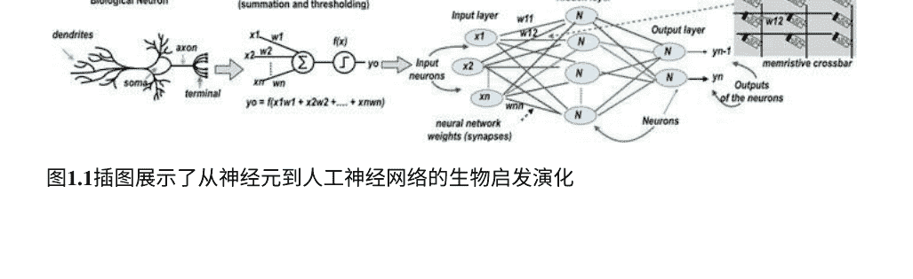

##### 1.1.2 泛化能力

最简单形式的广义神经网络包括输入层、隐藏层和输出层。任何具有多个隐藏层的神经网络通常被称为深度神经网络。我们可以将三层前馈神经网络称为浅层神经网络。这些具有非线性激活函数的浅层网络是广义的通用函数逼近，可以用来解决复杂的分类任务。增加隐藏层中的神经元数量会增加网络中神经元之间的互连数，从而实现高度复杂的函数逼近。

在浅层神经网络中，用于逼近给定函数所需的神经元数量可以在多个层之间重新分配，形成深度神经网络。可以证明，在相同数量的神经元情况下，深度网络可以逼近更多的函数，使得深度神经网络比浅层神经网络在计算上更高效。深度神经网络的表达能力远远超过浅层神经网络[23, 25]。

在计算机视觉问题中，深度学习神经网络如卷积神经网络与视觉皮层的深层特性相关 [17]。这种相似性进一步揭示了神经网络的组织方式，以及这种抽象如何帮助实现类似于人脑的高效信息处理。需要注意的是，对于所涉及的应用程序，需要对层数、每层神经元的数量、激活函数和权重的正确选择进行微调。除了为实际的人工智能问题提供现实解决方案之外，这些抽象还可以与人脑的功能特性松散地联系在一起。

与主要是处理静态输入的深度前馈神经网络不同，深度递归神经网络更接近于人脑功能的动态行为，它考虑了过去和现在输入的信息。人脑也可以被看作是一个复杂的记忆系统，其中计算和存储之间的分离通常是不存在的。在这种网络中，反馈是必要的，神经网络的输出在给定时间内作为输入被反馈。这种神经网络的输入具有当前时间的输入，而神经网络的输出是从过去时间的输入生成的。因此，它是一个具有类似于大脑中生物神经网络的时间演化状态的系统。

递归神经网络对捕捉时间相关信息非常有用。事实上，人脑接收到的几乎所有感官信息都是时间相关的，因此所有实时人工智能系统都可以利用递归神经网络的动态行为近似。递归神经网络将前馈神经网络与反馈神经网络相结合，并可以使用不同的架构进行实现。实质上，这些递归神经网络也是深度神经网络，具有使用时间和记忆中的数据模式进行动态系统近似的附加能力。

递归神经网络的最常见架构变体包括门控递归神经网络和长短期记忆网络。

前馈神经网络和递归神经网络可用于构建高阶函数。抽象是计算神经科学和计算机工程中构建高阶逻辑和类似大脑功能的关键概念。一种有趣的抽象集合是生成对抗网络[6]，它由竞争的神经网络组成，用于揭示神经网络的特异性属性。这种高阶网络的训练和优化是一项具有挑战性的任务。

#### 1.2 硬件驱动的人工智能

移动电话等边缘设备是引发变革并扩大用户多样性的主要驱动力，使深度学习和人工智能的应用更加普及和流行。对技术的信任对于确保用户的可接受性至关重要。在过去几十年中，互联网和相关技术的信任[8, 30]从应用角度逐渐增加，这反映在技术用户和各国政府的增加上，慢慢渗透到我们生活的方方面面。

计算硬件的进步为神经网络社区打开了几扇新的大门。此外，推动摩尔定律的极限，电子芯片在过去十年中变得更小、更节能，并且显著提高了性能。这提升了处理和测试大规模神经网络和大规模数据的能力，超越了所有其他已知的机器学习技术，无需手工工程的优势。

#### 1.3 神经-记忆电阻系统简介

2015年后，多层深度神经网络的复兴可以归因于感知数据的指数增长，这是由于物联网市场的增长所导致的。边缘设备（如手机、无人机等）越多，生成的数据就越多。每秒钟从这些设备中捕获数百万个数据点，但相对而言，智能信息处理的体积非常小。从传感器中提取有意义的连接数据的潜力可以导致能够改变人类进步和历史的应用。

将内存与计算集成是神经网络的一个关键概念[13]。这个原则已经在内存计算和神经网络的硬件实现中得到了探索。内存单元的尺寸越小，每个芯片单位面积的存储容量就越大，从而增加了神经网络实现的计算能力。有不同的方法来在芯片上实现神经网络。目前最明显的方法是将信号转换为数字域，并使用一组数字逻辑门进行输入的权重求和，并使用数字存储器存储权重。鉴于神经网络的每个权重通常是基本模拟的，数字实现始终是模拟的，并且需要比模拟存储器实现更多的电子元件（晶体管）来进行比较。

输入的权重求和是一个点积运算，这是交叉栏存储器中的一种自然计算模型。有几种可以用于构建交叉栏的存储器，其中最新兴的一组存储器是非挥发性的记忆电阻器。记忆电阻器有许多实现方式，目前还没有可靠的行业标准可供广泛使用。然而，随着3DXpoint存储器[4]、PCM器件[9]和ReRAM[2]的最近成功，离将这类设备成熟到可以大规模生产并可能用于工业制造设置中与CMOS和FINFET器件集成的日子已经不远了。

#### 1.4 迈向神经-记忆电阻器网络

图1.2显示了使用神经-记忆电阻器网络的应用的抽象高层视图。作为内存阵列有用的交叉栏架构是许多神经网络电路设计的核心，因为它能够模拟点积计算。有几个原因使得记忆电阻器在构建神经网络方面具有兴趣。从硬件角度来看，记忆电阻器[16]可以缩小到小于10nm，成为连接在两根金属导线之间的面积高效的二端设备。理想情况下，它们可以用作神经网络中存储权重的非挥发性模拟存储器。与其他基于CMOS的存储器相比，它们也具有能量效率，因为可以使用低电压和电流。它们具有较高的读取速度，尽管写入速度可能较慢。

记忆电阻器的主要特征可以通过其独特的夹断IV滞后特性、断电图和动态路线图来表示。IV特性图1.2说明了使用忆阻网络的应用领域，例如使用交叉阵列。

通过在忆阻器上施加给定频率的交流电压并观察通过它们流动的电流信号输出，可以获得忆阻器的特性。在这方面必须非常小心，如果有人报告一个直流夹断滞后I-V，他们是错误的，并且错误地被分类为忆阻器。除了I-V特性之外，还要注意断电图，如果相对于状态变量的变化率为零，则表示非易失性忆阻器。动态路线图提供了一种简单的方式来观察忆阻器在施加到忆阻器上的不同频率和幅值的电压脉冲下的切换行为。

有一大类设备属于忆阻器 [11]，例如磁性或MRAM、相变或PCRAM以及电阻性或ReRAM，可以用于构建神经网络。忆阻交叉阵列一直是这种神经网络设计的核心，其中每列从交叉阵列中读取的输出电流可以表示为连接的忆阻的输入电压和电导的加权求和。这可以被映射为输入的加权求和，或者说是神经网络中的基本计算过程，即点积运算。用交叉阵列替代点积计算的这个想法为在模拟域中构建神经网络层提供了一种面积和能量高效的方式。本书讨论了使用这种阵列构建的几种神经网络，例如深度神经网络 [14]、卷积神经网络 [15]、长短期记忆网络 [31]、深度神经模糊网络等。

分层时间记忆[12]。通常，在模拟系统的设计中，还需要使用数字逻辑，例如用于编程忆阻器。CMOS逻辑的另一种方法是使用忆阻器阈值逻辑门，这种门更加面积高效，并且是通用的结构，遵循早期神经元模型。可编程忆阻器门阵列可用于构建神经网络系统中的任何顺序或组合逻辑，用于预处理和控制电路。

在神经形态系统中使用忆阻器的应用越来越多。使用忆阻器作为突触的异步时序相关可塑性（STDP）是最接近基于脉冲的生物合理神经网络学习模型之一[1, 29]。完全同步学习忆阻器电路在同一时间进行权重更新和处理。其他一些模型更倾向于模仿生物学并具有更实际的重点，包括长短期记忆[31]和分层时间记忆[12]。

由于这些技术是近似动态系统的变体，它们可以应用于各种应用领域，包括但不限于预测分析、控制系统、语音识别和自然语言处理。

神经-忆阻系统可以应用于一系列边缘人工智能计算设备。在不消耗大量通信带宽的情况下，能够在传感器中局部处理信息可以提高边缘计算应用的处理速度和准确性[13]。在这些应用中，神经-忆阻芯片可以看作是硬件加速器。交叉阵列中的忆阻器可以用作存储器[32]，也可以用于安全等应用[24, 26]。

这些交叉阵列还可以用于成像和信号处理应用。

## 1.4 神经芯片的伟大未来

不讨论硬件驱动的人工智能芯片中的伦理问题将是不完整的。这些芯片的最终目标是模仿人脑的所有功能，包括但不限于模式匹配、上下文智能、意识和潜意识思维。传感器以及通信和计算技术可以以极高的速度向人工智能芯片提供大量信息，这对人脑来说是前所未有的。与这种神经芯片一起工作的机器学习算法需要具备高能效，并能从大量未知数据中提取新信息。

完全功能的类脑智能芯片需要我们通过计算神经科学和神经形态工程来揭示大脑电路。思考能力已经融入到大脑的功能中，这样的芯片可以发展出反映道德和平等权利的机器记忆。这也可能会显著改变我们在使用智能设备方面的法律和政策框架。

设备的隐私和身份问题，以及自我意识可以推动一个新的电子进化时代，包括在人工生命周围发展一个社会框架。

社交网络广泛存在，主要由人类智能驱动，未来的某个时刻，由于物联网的普及，机器智能可能会超过人类互动所展示的能力。

神经芯片使设备以更智能的方式相互交流，并为机器提供协作环境以数字化进化。 游戏和竞争性学习策略可以使机器在特定任务中竞争并表现出色，使一些机器比其他机器更聪明更优秀。 这也可能影响机器的行为，我们可能需要开发一种社会工程的机器心理学家和治疗算法来重新配置和重写硬件电路。

人类文化和历史离不开艺术和哲学的发展。 艺术的本质和形式源于不同层次的认知过程之间的复杂相互作用，这些过程最终可以用神经芯片来模拟。这些神经芯片以及可以操纵物理空间的自主机器人系统能够进一步创造出如舞蹈、戏剧和绘画等富有表现力的艺术形式。 神经芯片还可以在诗歌和故事讲述方面进行操纵和超越，以超越人类的智能速度和严谨性。 所有这些令人兴奋的可能性以及更多的可能性都可以预见，只有时间才能告诉我们它们何时发生。 鉴于这些形式的机器智能已经以简单的形式存在，公平地说，“未来正在发生”。

## 1.5 结论

神经-忆阻系统为在集成芯片中扩展高密度大规模神经网络的实现提供了可能性。 用忆阻器电路模拟神经网络具有一些硬件优势，如面积小、低功耗和近传感器的模拟计算，而传统的CMOS仅逻辑则没有这些优势。 用忆阻交叉阵列进行模拟点积计算可以映射到神经网络层，进而用于构建各种深度神经网络架构。 神经-忆阻系统的非常大规模实现为构建多种数据驱动的实用神经网络应用提供了一系列挑战和机会，这些应用可以集成到可穿戴设备、移动设备、边缘计算和模拟计算设备中。

#### 章节亮点

- 深度神经网络的泛化能力和表达能力超过了浅层神经网络的简单性。
- 交叉忆阻器阵列作为神经网络层中输入权重求和的点积运算器非常有用。
- 基于忆阻器的神经计算实现在面积和功耗效率方面具有优势，并且能够在芯片上执行大规模神经网络的模拟计算。
- 忆阻器器件的稳定性、工艺可靠性和工业制造的成熟度、封装问题以及非常大规模电路模拟的准确性将是神经-忆阻芯片成功的关键因素。

#### 参考文献

1. Agrawal A, Roy K (2019) 利用自动化领域壁模拟漏电积分-火神经元进行能量高效的脑启发式计算。 IEEE Trans Magn 55(1):1–72.
2. Akinaga H, Shima H (2010) 基于金属氧化物的可变电阻随机存取存储器（reram）。 Proc IEEE 98(12):2237–2251
3. Amit DJ, Amit DJ (1992) 建模脑功能：吸引子神经网络的世界。 剑桥大学出版社，剑桥
4. Bourzac K (2017) 英特尔是否创造了一种通用存储技术？[新闻]. IEEE Spectr 54(5):9–10
5. Chua L (2018) 解决了五个非易失性存储器谜团。 Appl Phys A 124(8):563
6. Goodfellow I, Pouget-Abadie J, Mirza M, Xu B, Warde-Farley D, Ozair S, Courville A, Bengio Y (2014) 生成对抗网络。 在：神经信息处理系统的进展, pp 2672–2680
7. Goodfellow I, Bengio Y, Courville A, Bengio Y (2016) 深度学习，第1卷。 MIT Press, 剑桥
8. Grandison T, Sloman M (2000) 对互联网应用的信任调查. IEEE Commun Surv Tutor 3(4):2–16
9. Guo X, Ipek E, Soyata T (2010) 电阻计算：通过低泄漏、STT-MRAM基于计算来避免功耗墙. 在：ACM SIGARCH计算机体系结构新闻, vol 38. ACM, pp 371–382
10. Hurst S (1969) 阈值逻辑简介：现有理论和实践的调查. Radio Electron Eng 37(6):339–351
11. Jeong H, Shi L (2018) 用于神经网络的忆阻器设备. J Phys D: Appl Phys 52(2):023003
12. Krestinskaya O, Dolzhikova I, James AP (2018) 使用忆阻器网络的分层时间记忆：一项调查。IEEE Trans Emerg Top Comput Intell 2(5):380–395. https://doi.org/10.1109/TETCI.2018.2838124
13. Krestinskaya O，James AP，Chua LO（2019年）神经-忆阻电路用于边缘计算：综述。IEEE Trans Neural Networks Learn Syst（https://doi.org/10.1109/TNNLS.2019.2899262）。arXiv:1807.00962
14. Krestinskaya O, Salama KN, James AP (2018年) 使用模拟反向传播电路的忆阻电路神经网络架构中的学习。IEEE Trans Circuits Syst I: Regul Pap 1–14。 [https://doi.org/10.1109/TCSI.2018.2866510](https://doi.org/10.1109/TCSI.2018.2866510)
15. Krestinskaya O, Bakambekova A, James AP (2019年) Amsnet: 用于平均池化的模拟记忆系统架构与dropout卷积神经网络。在: IEEE国际人工智能电路和系统会议
16. Li Y, Wang Z, Midya R, Xia Q, Yang JJ (2018) 神经形态计算中的忆阻器设备综述: 材料科学和器件挑战。J Phys D: Appl Phys 51 (50) : 503002
17. Liao Q, Poggio T (2016) 填补残差学习、循环神经网络和视觉皮层之间的差距。arXiv:1604.03640
18. Lippmann R (1987) 神经网络计算导论。IEEE ASSP Mag 4 (2) : 4–22
19. Ma J, Tang J (2017) 神经元和神经网络动力学综述。非线性动力学 89(3):1569–1578
20. Maan AK, Jayadevi DA, James AP (2017) 忆阻器阈值逻辑电路综述。IEEE Trans Neural Netw Learn Syst 28(8):1734–1746
21. McCulloch WS, Pitts W (1943) 神经活动中国有思想的逻辑演算。Bull Math Biophys 5(4):115–133
22. Medsker L, Jain LC (1999) 循环神经网络: 设计与应用。CRC Press, Boca Raton
23. Mhaskar H, Liao Q, Poggio T (2016) 学习函数: 何时深度优于浅度。arXiv:1603.00988
24. Nili H, Adam GC, Hoskins B, Prezioso M, Kim J, Mahmoodi MR, Bayat FM, Kavehei O, Strukov DB (2018) 集成忆阻器中模拟状态和非线性导电变化实现的硬件内在安全原语。Nat Electron 1 (3) : 197–204.
25. Raghu M, Poole B, Kleinberg J, Ganguli S, Dickstein JS (2017) 关于深度神经网络的表达能力。在: 第34届国际机器学习大会论文集-第70卷. pp 2847–2854. [https://www.JMLR.org](https://www.JMLR.org)
26. Rajendran J, Rose GS, Karri R, Potkonjak M (2012) 基于忆阻器的安全性原理。在: IEEE计算机学会VLSI年度研讨会(ISVLSI). IEEE, pp 84–87
27. Scholkopf B, Smola AJ, Bach F (2018) 利用核函数进行学习: 支持向量机, 正则化, 优化等
28. Schmidhuber J (2015) 神经网络中的深度学习: 概述. Neural Netw 61:85–117
29. Serrano-Gotarredona T, Masquelier T, Prodromakis T, Indiveri G, Linares-Barranco B (2013) 带有忆阻器的脉冲神经形态学学习系统的STDP和STDP变体. Front Neurosci 7:2
30. Sicari S, Rizzardi A, Grieco LA, Coen-Porisini A (2015) 物联网中的安全性, 隐私和信任: 前景. Comput Netw 76:146–164
31. Smagulova K, Krestinskaya O, James AP (2018) 基于忆阻网络的长短期记忆电路。模拟集成电路信号处理 95(3):467–472
32. Talati N, Ha H, Perach B, Ronen R, Kvatinsky S (2019) Concept: 用于RRAM中高效内存和PIM操作的列式内存控制器。IEEE Micro
33. Ujfalussy BB, Makara JK, Branco T, Lengyel M (2015) 树突非线性调整为皮层电路中高效的基于脉冲的计算。Elife 4:e10056
34. Varga A, Moore R (1990) 隐马尔可夫模型分解语音和噪声。在: 1990年国际声学、语音和信号处理会议, ICASSP-90. IEEE, pp 845–848

### 第二章 忆阻器：性质，模型，材料

Olga Krestinskaya, Aidana Irmanova和Alex Pappachen James

摘要 实现神经忆阻系统需要高度准确的仿真模型，稳健的设备以及对设备特性的验证。本章介绍了忆阻器特性，模型以及实际实现的忆阻器设备的简要回顾。忆阻器是一类具有两个端口的可切换多态存储器件，可以与现有集成电路技术兼容。对于非常大规模的模拟，忆阻器的建模需要准确捕捉来自实际设备的工艺变化和其他非理想因素，以确保深度神经网络架构设计与忆阻器的有效性。

#### 2.1 引言

忆阻器是Leon Chua于1971年提出的第四个基本元件，除了电阻器，电容器和电感器。忆阻器设备的主要特性是一个夹紧的滞回环。早在1939年和1962年，金属-绝缘体-金属结构的器件已经注意到滞后行为，而第一个夹紧的滞回环在1971年展示出来。此后，关于忆阻器的研究停止了，忆阻器和忆阻材料的概念直到2000年代初才得到发展。忆阻器以其非易失性的特性而闻名，即使在断电时也能切换和存储电阻状态。早期的忆阻器设备之一是在HP实验室使用二氧化钛制造的。关于忆阻器的理论依赖于磁通和电荷之间的依赖关系，这一点以前没有被任何人涵盖。


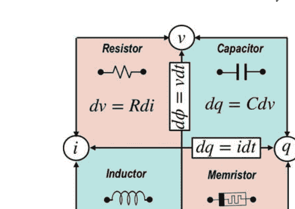

其他基本元件。图2.1展示了电流、电压、通量和电荷之间的四个基本元件及其依赖关系。忆阻器从存储阵列[31, 54]和逻辑门[70, 80]到神经网络[53]和复杂学习系统[66-68]都有广泛的应用范围。忆阻器具有小的芯片面积和低功耗，因此，忆阻器是解决大型复杂系统（如神经网络）可扩展性问题的有希望的解决方案。随着对忆阻器及其应用的研究在近年来引起了广泛关注，近年来提出了不同的忆阻器模型和材料。本章第2.2节介绍了关于忆阻器的主要理论。有几种模拟理想和非理想设备行为的忆阻器模型。这些模型在第2.3节中进行了介绍。此外，还有许多不同的材料表现出忆阻行为，在第2.4节中进行了讨论。

#### 2.2 忆阻器理论

忆阻器是一个相对较新的元件，关于忆阻性设备的理论仍在不断发展中。最近，L. Chua解释了五个非挥发性忆阻器谜题的解决方案[27]。L. Chua提出的这五个谜题如下[27]：

1. “所有非挥发性忆阻器都具有连续的记忆。”
2. “通过施加单个电压脉冲可以调节所有非挥发性忆阻器的电导。”
3. “通过增加脉冲幅度可以始终实现更快的切换速度。”
4. “周期性的单极输入会产生非周期性的指状多叉钳形磁滞回线。”
5. “非挥发性忆阻器的直流VI曲线是伪造的。”

L. Chua在[27]中展示了所有可变电阻器件的概括性文氏图，如图2.2所示。根据L. Chua的说法，可变电阻器件分为四个不同的类别：理想型、通用理想型、通用型和扩展型可变电阻器件。可变电阻器的电导和电阻值取决于一个或多个状态变量。理想电流控制和电压控制可变电阻器的方程式如式2.1和2.2所示。

$$v = R(q)i, \quad \text{其中} \quad \frac{dq}{dt} = i$$

$$i = G(\phi)v, \quad \text{其中} \quad \frac{d\phi}{dt} = v$$

理想通用电流控制和电压控制可变电阻器的方程式如式2.3和2.4所示。理想和理想通用可变电阻器在HP可变电阻器模型[27]中展示。

$$v = R(x)i, \quad \text{其中} \quad \frac{dx}{dt} = \hat{f}(x)i$$

$$i = G(x)v, \quad \text{其中} \quad \frac{dx}{dt} = \hat{g}(x)v$$

然而，大多数真实的记忆电阻器件是通用的和扩展的记忆电阻器，具有有限的稳定状态数量。方程2.5和2.6展示了通用忆阻器的方程。这些是依赖状态的忆阻器，其中状态变量依赖于两个变量。

$$v = R(x)i, \quad \text{其中} \quad \frac{dx}{dt} = f(x, i) \quad \text{(2.5)}$$

$$i = G(x)v, \quad \text{其中} \quad \frac{dx}{dt} = g(x, v) \quad \text{(2.6)}$$

在扩展的忆阻器中，电导取决于电流。方程2.7和2.8展示了扩展忆阻器的方程。

$$v = R(x, i)i, \quad \text{其中} \quad R(x, 0) = \infty \quad \text{且} \quad \frac{dx}{dt} = f(x, i) \quad \text{(2.7)}$$

$$i = G(x, v)v, \quad \text{其中} \quad G(x, 0) = \infty \quad \text{且} \quad \frac{dx}{dt} = g(x, v) \quad \text{(2.8)}$$

忆阻网络中的深度学习分类器的主要特征是周期性的夹紧滞后回路[21]。图2.3展示了一个零交叉的滞后曲线，这是忆阻器的I-V特性，显示了通过器件的电流对施加的电压的依赖性。图2.3展示了碳硫族忆阻器的滞后回路示例。通过向器件施加周期性正弦信号并测量通过它的电流来模拟这种滞后。信号的频率影响器件的导电水平。通常，这些稳定导电水平的数量是有限的。单个器件中达到的稳定状态的最大数量是64个级别，见[75]中的 Ta/HfO₂ 忆阻器。

图2.4 挥发性和非挥发性忆阻器的POP：a非挥发性忆阻器的POP，b挥发性忆阻器的POP和c双稳态忆阻器（二进制存储器）的POP [27]

在忆阻电路和架构中，通过施加正负电压脉冲可以改变忆阻器的忆阻状态（电导）。这些脉冲的宽度和幅度可以根据忆阻器的特性而不同。一般来说，施加幅度较高的信号会导致忆阻状态之间的切换更快。

在文献中，当我们提到忆阻器时，通常指的是非挥发性忆阻器。然而，表现出忆阻行为的器件可以分为挥发性和非挥发性[108]。非挥发性器件的例子是可编程阻性随机存取存储器（ReRAM），而挥发性忆阻器的例子是纳米颗粒有机存储场效应晶体管（NOMFET）[108]。

表征记忆电阻行为的另一种重要方法是功率-频率图（POP）和动态路线图（DRM）[27]。POP和DRM是记忆电阻器状态变量导数与状态变量的图形。方程2.9是一个“断电”状态方程。

```
dx/dt = f(x, 0)  (2.9)
```

POP是一条连续的单值曲线[27]。POP说明了记忆电阻器的非易失性属性。非易失性记忆电阻器的POP是平坦的，对于所有状态变量x，dx/dt =0。图2.4a说明了理想非易失性记忆电阻器的POP。图2.4b说明了挥发性记忆电阻器的POP，图2.4c显示了仅具有两个稳定状态的二进制存储器的POP[27]。

记忆电阻器的DRM概念与POP类似，但适用于非零状态变量。DRM包含无限多个动态路线；然而，只显示了一些路线以说明有意义的信息。对于记忆电阻器设备，DRM显示了在施加一定电流或电压脉冲时记忆电阻器状态变量的变化速度。状态变量的导数 dxdt = f(x, v)是一个连续函数。图2.5说明了理想和非理想记忆电阻器的DRM。图2.5a中的理想记忆电阻器的DRM由平坦的水平线组成。然而，所有真实设备都具有图2.5b所示的非理想DRM。图2.5中的DRM说明了如果v(t)是正的，x(t)增加，反之亦然。

POP和DRM图中的状态变量可能不同。例如，图2.6展示了碳硫族电压控制存储器的POP和DRM。

其中状态变量在x轴上表示电荷，电荷的导数在y轴上表示。 通过对存储器施加不同频率和幅度的电压脉冲来绘制POP和DRM。

#### 2.3 存储器模型

存储器模型是模拟存储器电路和系统的最重要和关键的组成部分之一。 存储器设备的建模仍然是一个发展中的领域，因为新的存储器设备不断被开发出来。 存储器模型从理想模型到模拟理想存储器行为的各种模型不一样。

> 非线性模型允许拟合不同记忆电阻器件的参数[9,16, 109]。本节介绍了可以用于模拟记忆电阻器件的不同记忆电阻器模型。

##### 2.3.1 线性记忆电阻器模型

线性记忆电阻器模型在[110]中有详细说明。该模型的主要方程基于设备的物理结构[59]和特定时刻记忆电阻器件中掺杂和未掺杂区域的宽度。掺杂区域是设备中含有氧空位的区域，其中掺杂了正氧离子。未掺杂区域是没有氧空位的区域。最简单的模型将这两个区域表示为具有高和低电阻值的分离电阻器。根据掺杂和未掺杂区域的宽度，记忆电阻器件的电阻状态会发生变化[59]。该模型的主要方程式显示在方程式2.10中，其中$x(t) = w(t)/D$，$D$是设备的宽度，$w(t)$是掺杂区域的宽度（导电宽度[109]），$R_{OFF}$和$R_{ON}$分别是记忆电阻器的高电阻和低电阻水平。

```
$$v(t) = (R_{ON} \times x(t) + R_{OFF} (1 - x(t))) \times i(t)$$ (2.10)
```

每个记忆电阻器模型都可以表示为一个等效电路。图2.7展示了线性记忆电阻器的符号、结构和等效电路模型。线性记忆电阻器模型不太准确，也没有考虑真实器件的限制和非线性特性。这些模型主要用于模拟理想化的记忆电阻器行为，以支持理论预期并说明理想器件的小信号响应[16]。

### 基于窗函数的记忆电阻器模型

大多数情况下，带有窗函数的记忆电阻器模型模拟了记忆电阻器的非线性行为。窗函数的主要目的是限制记忆电阻器状态的范围。与线性记忆电阻器模型一样，具有窗口函数的模型不能显示真实设备的非理想性。这些模型可以用于理想仿真的概念验证和设计中理想记忆电阻器行为的说明[16]。关于窗口函数的更近期的工作在[84]中展示。

###### 2.3.2.1 Strukov的线性窗口

线性窗口在方程2.11中提出[110]，其中该函数的边界条件为 $f(0)=0$ 和 $f(D)=\frac{1-D}{D} \simeq 0$。窗口函数在变量位于边界时强制状态变量的导数达到0[59]。

$$f(w) = w(D-w)/D \qquad \text{(2.11)}$$

###### 2.3.2.2 Joglekar的模型

在[55]中，引入了非线性参数到窗口函数中。该窗口函数在方程2.12中展示，其中$p$是一个参数，允许在窗口函数中建模非线性边界条件[67]。增加$p$会导致非线性增加。

$$f(x,p) = 1-(2x-1)^{2p} \qquad \text{(2.12)}$$

然而，这个非线性模型不准确，不能完全揭示记忆电阻器的非线性行为。此外，在这个窗口函数中的主要问题是，当模型处于边界时，状态变量很难改变，这不代表真实记忆电阻器的行为[59]。

###### 2.3.2.3 Biolek的非线性掺杂漂移记忆电阻器模型

具有非线性掺杂漂移的记忆电阻器模型可以修改记忆电阻器的边界条件，如方程2.13所示，其中$step(-i)=0$，对于$i<0$，$step(-i)=1$，对于$i\geq0$[17]。与Joglekar的模型[55]相比，Biolek的模型直接将电流$i$引入状态变量$x$[109]。

$$f(x,i,p) = 1-(x-step(-i))^{2p} \qquad \text{(2.13)}$$

Biolek的模型解决了Joglekar模型的问题，即电流是一个对应于施加电压极性的状态变量。通过施加相反极性的电压，可以改变记忆电阻器的状态变量，因此，当它达到边界时不会被困住[109]。换句话说，这个窗口函数控制着在任何边界处掺杂和未掺杂区域之间的移动，并且负责在施加电压脉冲时调整记忆电阻器状态的变化速度[67]。

###### 2.3.2.4 Prodromakis的模型

Prodromakis的记忆电阻器模型中提出了窗口函数[96]。与之前的函数相比，这个窗口函数是可伸缩的，并且函数的高度可以调整[59]。这个窗口函数在方程2.14中给出，其中j是控制函数高度的参数。此外，窗口函数表示为二次方程，可以更好地近似记忆电阻器在边界处的非线性行为。

$$f(w)=j(1-[(w-0.5)^2+0.75]^p)$$ (2.14)

##### 2.3.3 参数拟合的忆阻器模型

忆阻器模型可以拟合实际设备的参数，被认为是模拟忆阻电路的准确方法之一。在大多数情况下，特定窗口函数的线性模型不足以显示实际设备的缺陷。在大多数忆阻器设备中，滞后不对称，开关是非线性的。为了模拟忆阻器的这种行为，使用能够显示忆阻器设备行为中所有缺陷的模型非常重要。根据[16]，参数拟合模型在[33, 35, 71, 72, 74, 118]中被提出。本节介绍了两种最常用的用于拟合设备特性数据的模型。

###### 2.3.3.1 Yakopcic的模型

可以用于拟合记忆电阻器参数的广义模型在[118, 119]中提出。方程2.15表示Yakopcic的模型的I-V关系，其中a1, a2和b是用于拟合不同记忆电阻器特性数据的参数。

$$i(t) = \begin{cases} a_1 x(t) \sinh(bv(t)) & \text{如果 } V(t) \geq 0 \\ a_2 x(t) \sinh(bv(t)) & \text{如果 } V(t) < 0 \end{cases}$$ (2.15)

模型中的状态变量基于方程2.16-2.18。方程2.16中的参数g(v(t))实现了阈值电压，其中Ap和An是指数的幅度，负责状态变化的速率，Vp和Vn是记忆电阻器的正负阈值电压。

$$g(v(t)) = \begin{cases} A_p(e^{v(t)} - e^{V_p}) & \text{如果 } V(t) > V_p \\ -A_n(e^{-v(t)} - e^{V_n}) & \text{如果 } V(t) < -V_n \\ 0 & \text{如果 } -V_n \leq v(t) \leq V_p \end{cases}$$ (2.16)

方程2.17和2.18用于建模记忆电阻网络中状态变量的变化，取决于当前状态，其中xp和xn表示状态变量保持不变的阈值，αn和αp是状态变量变化的速率。参数wp和wn表示f(x)的窗口函数，其中

$$w_p(x, x_p) = \frac{x_p - x}{1 - x_p} + 1 \quad \text{和} \quad w_n(x, x_n) = \frac{x}{x_n}$$

$$
f(x) =
\begin{cases}
e^{-\alpha_p(x - x_p)} w_p(x, x_p) & \text{if } x \geq x_p \\
1 & \text{if } x < x_p
\end{cases}
\tag{2.17}
$$

$$
f(x) =
\begin{cases}
e^{\alpha_n(x + x_n - 1)} w_n(x, x_n) & \text{如果 } x \leq 1 - x_n \\
1 & \text{如果 } x > 1 - x_n
\end{cases}
\tag{2.18}
$$

###### 2.3.3.2 Eshraghian的模型

另一个广义参数拟合模型用于记忆电阻器件如[33]所示。方程2.19说明了该模型的状态方程，其中参数foff, fon是拟合参数，I-V关系如方程2.20所示[121]，其中ϑ是用于表征ON状态的拟合参数，χ和γ是用于表征OFF状态的拟合参数。

$$
\frac{dw}{dt} =
\begin{cases}
-f_{off}\left(1 + \frac{v}{2\phi_0}\right)e^{f(w)\phi_0\left(1 - \sqrt{1 - \sqrt{1 + \frac{v}{2\phi_0}}}\right)} & \text{如果 } v < 0, \quad w > w_{min} \\
f_{on}\left(1 - \frac{v}{2\phi_0}\right)e^{f(w)\phi_0\left(1 - \sqrt{1 - \sqrt{1 - \frac{v}{2\phi_0}}}\right)} & \text{如果 } v > 0, \quad w < w_{max} \\
0 & \text{否则}
\end{cases}
\tag{2.19}
$$

$$i = w^n \sinh(\vartheta V) + \chi\left(e^{\gamma V} - 1\right) \tag{2.20}$$

###### 2.3.3.3 阈值自适应忆阻器模型

其中一种模型是阈值自适应忆阻器（TEAM）模型，提出于[71]。该模型类似于钛酸钛（TiO2x）器件的Simmons隧道忆阻器模型[95]，但更简化和泛化。模型方程包括线性和非线性漂移两部分[109]。线性部分的方程式见式2.21，非线性部分的方程式见式2.22，其中ROFF/RON = eλ且w∈[won,woff][71,109]。

$$v(t) = \left[ R_{ON} + \frac{R_{OFF} - R_{ON}}{w_{关闭} - w_{打开}} (w - w_{打开}) \right] i(t) \tag{2.21}$$

$$v(t) = R_{ON} e^{\left( \frac{\lambda}{w_{关闭} - w_{打开}} (w - w_{打开}) \right)} \tag{2.22}$$

在TEAM模型中，状态变量的导数如方程2.23所示，其中$i_{关闭}$和$i_{打开}$是电流的阈值，$k_{关闭}$和$k_{打开}$，$f_{关闭}$和$f_{打开}$是窗口函数变量。

$$
\frac{d w(t)}{d t} = \begin{cases}
k_{\text{关闭}} \left(\frac{i(t)}{i_{\text{关闭}}}-1\right)^{\alpha_{\text{关闭}}} f_{\text{关闭}}(w) & \text{如果 } 0 < i_{\text{关闭}} < i \\
0 & \text{如果 } i_{\text{关闭}} < i < i_{\text{打开}} \\
k_{\text{打开}} \left(\frac{i(t)}{i_{\text{打开}}}-1\right)^{\alpha_{\text{打开}}} f_{\text{打开}}(w) & \text{如果 } i < i_{\text{打开}} < 0
\end{cases}
\tag{2.23}
$$

TEAM模型可以与之前提到的所有窗口函数一起使用，从而实现更准确的曲线拟合和模型对真实记忆电阻器行为的适应。在[72]中提出了电压控制的记忆电阻器的通用模型。此外，研究工作[72]包含了用于拟合特定记忆电阻器设备的具体参数，例如Pt-Hf-Ti [120]，铁电记忆电阻器[23]和金属纳米线记忆电阻器[56]。

###### 2.3.3.4 广义亚稳态开关存储器模型

该模型是为不同的存储器设备开发的广义框架，可以用来拟合各种设备的参数[85]。其中一种设备是商业可用的$W - Ag -$硫族化合物设备[85]。该存储器模型由两个电流分量组成：与存储器相关的电流$I_m$和肖特基二极管电流$I_s$ [91]。方程2.24中，$\phi \in [0, 1]$表示肖特基电流对设备的影响程度。肖特基电流是由存储器设备中的金属-半导体结界引起的，可以表示为

$I_s = \alpha_f e^{b_f V} - \alpha_r e^{-b_r V}$。

$$I = \phi I_m(V, t) + (1 - \phi)I_s(V) \tag{2.24}$$

记忆相关电流$I_m$是由将忆阻器设备的导电通道表示为在高阻抗和低阻抗之间变化的一组导电通道引起的，因此，每个通道都被表示为亚稳态开关[85, 86, 91]。方程2.25和2.26是状态A和B之间转换的概率，其中$\beta = V_T^{-1}$是一个依赖于温度的热参数，而$\alpha$是一个时间步长比率。

$$P_A = \alpha \frac{1}{1 + e^{\beta(V - V_A)}} = \alpha (V, V_A) \tag{2.25}$$

$$P_B = \alpha (1 - (V, -V_B)) \tag{2.26}$$

记忆相关电流$I_m$的计算公式为$I_m = V(G_m + G_m)$，其中$G_m$是所有亚稳态开关上的忆阻器导纳总和，$G_m$是导纳的变化，它依赖于近似二项分布与正态分布，$P_A$和$P_B$[85, 86, 91]。

##### 2.3.4 特定设备的忆阻模型

与广义忆阻模型和广义窗函数的比较，为特定忆阻设备创建的忆阻模型更准确。准确的忆阻模型应包括非易失性和易失性的切换机制，这更加复杂，并包含更高阶的微分方程[9, 16]。最近提出的忆阻器设备的这些模型在[11, 40, 41, 73]中有所说明。关于 HfO2 的建模的更近期的工作显示在[5]中。

###### 2.3.4.1 Pickett的模型

在[95]中展示的模型模拟了 TiO2 设备的行为。该模型也被称为Simmon的隧道势垒模型，因为该模型暗示了隧道势垒宽度受通过器件的电流调制[16]。方程2.27表示状态方程，其中 i = G(w, u)v。

$$\frac{d w}{d t} = f(w, i_M) \tag{2.27}$$

方程2.28说明了状态方程的计算方式，其中参数 f_off, f_on, a_off, a_on, b, w_c, i_on 和 i_off 是在[95]中给出的特定设备确定的常数。

$$\frac{d w(t)}{d t} = \begin{cases} f_{off} \sinh \left( \frac{i}{i_{off}} \right) e^{-e^{\frac{w - a_{off}}{w_c} - \frac{|i|}{b} - \frac{w}{w_c}}} & \text{if } i > 0 \\ f_{on} \sinh \left( \frac{i}{i_{on}} \right) e^{-e^{\frac{w - a_{on}}{w_c} - \frac{|i|}{b} - \frac{w}{w_c}}} & \text{if } i < 0 \end{cases} \tag{2.28}$$

###### 2.3.4.2 Bayat的模型

另一个 Pt/TiO2-x/Pt 记忆电阻器设备的模型在[9]中展示。该模型旨在提高准确性并简化计算。对于 v = 0.5V 的模型的主要方程式在方程2.29中展示，其中 ζ, χ, α 和 θ 是在[9]中给出的拟合参数。该模型可能存在溢出问题[16]。

$$\frac{dR_{0.5}}{dt} = \alpha \frac{\sinh(v)}{1 + e^{\chi v + \zeta}} \frac{R_{0.5} e^{\lambda R_{0.5}}}{1 + e^{\delta R_{0.5} + \theta}} \tag{2.29}$$

##### 2.3.5 随机存储电阻模型

由于存储电阻技术的不完善和存储电阻材料的某些特性，一些设备可能表现出随机行为。根据这些设备的应用，存储电阻器的随机行为对系统可能产生积极和消极的影响。随机存储电阻器可以用于建模脉冲神经元和神经网络，其性能比确定性模型更好[4]。随机行为可以引入到不同的基于阈值的存储电阻器模型中。

在存储电阻器随机性建模方面的主要工作之一是在[89]中介绍的，其中介绍了向设备添加随机性的主要原则，并且给出了现有模型的修改示例。本小节介绍了两种不同的随机模型，并说明了如何引入随机性。

###### 2.3.5.1 Yakopcic模型的随机修正

对于参数拟合，从方程2.15和2.16引入了对应于阈值电压的g(v(t))的Yakopcic模型的随机性。方程2.15和2.16中的随机参数是V_p和V_n。对于V_p和V_n的随机性在方程2.30中显示，其中 αθ(v_{p/n}-vp/n)dt是一个确定性项，而( V-δ V-vp/n)dN(τ )是一个随机项。

$$d v_{p/n} = αθ(v_{p/n0} - v_{p/n})dt + (V - δV - v_{p/n})dN(τ ) \tag{2.30}$$

模型中的函数θ是一个阶跃函数，函数N()是一个泊松分布或对数正态分布，参数α是一个拟合参数[88]。

###### 2.3.5.2 Pickett模型的随机修改

将随机性引入到Pickett模型中的TiO2记忆电阻器，使用方程2.27和2.28引入到阈值参数a_{off}和a_{on}中，它们负责模型的切换点。将随机性引入到a_{on}和a_{off}的方法如方程2.31所示，其中项(w - δw - a_0)dN(τ )是随机项，项αθ(a_0 - a_{n/off})dt是确定性项。

$$da_{on/off} = αθ(a_0 - a_{on/off})dt + (w - δw - a_0)dN(τ ) \tag{2.31}$$

##### 2.3.6 大规模模拟的忆阻器模型

大多数复杂忆阻器模型中的主要问题是设备的非线性和非理想行为，尤其是在大规模模拟中，计算复杂度、误差和溢出问题较为突出。当进行神经网络中大交叉开关的模拟时，经常出现这类问题[67]。为了避免这类问题，已经提出了几种改进的忆阻器模型，采用近似方法-最近提出了减少计算复杂性的方法[16]。在模型和收敛问题中，提出了降低计算成本的方法[7, 36]。虽然本节重点介绍了用于大规模模拟的改进Biolek模型[16]，并从现有的记忆电阻模型中推导出来，以解决大规模模拟中的行为问题，最近还提出了Messaris等人在[83]中的模型。

###### 2.3.6.1 修改的S模型（MS模型）

MS模型是在[16]中提出的模型，源自于[15]中的简单记忆电阻模型。MS模型简单且可以在SPICE中轻松进行大规模模拟。模型的方程式在方程式2.32中给出，其中 y是一个新的状态变量， y = k。∫ idt, x = f_s(y), k 是一个切换速率，R_M(x) = R_ON x + R_OFF (1 - x)。

$$f_s(y) = \frac{1}{a} \ln \frac{1 + e^{a(y+0.5)}}{1 + e^{a(y-0.5)}}$$

###### 2.3.6.2 修改的Pickett模型（MP模型）

在大规模模拟中，Pickett的模型可能会出现几个问题，例如多个解，无解，模型中的方程可能不适用于操作范围。这些问题在修改后的Pickett模型中得到了解决，方程2.28中的expl(x)函数在方程2.33中有所体现，模型的所有拟合参数在[16]中给出。

$$\frac{d w(t)}{d t} = \begin{cases} \frac{f_{off}}{2} expl\left( \frac{|i|}{b} - e^{\frac{w - a_{off}}{w_c}} - \frac{|i|}{b} - \frac{w}{w_c} \right)[1 - e^{\frac{-2|i|}{i_{off}}}] & \text{if } i \geq 0 \\ \frac{-f_{on}}{2} expl\left( \frac{|i|}{b} - e^{\frac{a_{on} - w}{w_c}} - \frac{|i|}{b} - \frac{w}{w_c} \right)[1 - e^{\frac{-2|i|}{i_{on}}}] & \text{if } i < 0 \end{cases}$$

$$expl(x) = \begin{cases} e^{x} & \text{if } x < x_L \\ e^{x_L}(1 + x - x_L) & \text{if } x \geq x_L \end{cases}$$

###### 2.3.6.3 修改后的Bayat模型（MB模型）

在[16]中，还提出了对Bayat模型的修改。由于模型在电路电阻器电压 v处可能存在指数溢出，因此根据[16]中的切线近似，对Eq. 2.29中的Bayat模型进行了修改。原方程被Eq. 2.35所取代，其中 g_1和 g_2是来自[9]的近似函数，而函数 h(v)在Eq. 2.36中给出[16]。

$$i = \nu 10^{g_1(R_{0.5})h(|\nu|) + g_2(R_{0.5})} \quad (2.35)$$

$$h(\nu) = \frac{\nu^3 / \log(10) - 1}{\nu^3 / \log(10) + 1} \quad (2.36)$$

这种近似允许平滑状态方程[9]，避免指数溢出，从而避免在大规模模拟中出现错误。

###### 2.3.6.4 Messaris等人的忆阻器模型

适用于大规模模拟的模型之一在[83]中提出。该模型不包含状态变量的积分，使其计算复杂度较低，并且基于物理设备响应数据，比大多数广义忆阻器模型更加真实。模型的I-V关系如公式2.37所示，其中$a_p$和$a_n$是拟合参数。

$$i(R, \nu) = \begin{cases} a_p \frac{1}{R} \sinh(b_p \nu) & \text{if } \nu > 0 \\ a_n \frac{1}{R} \sinh(b_n \nu) & \text{if } \nu \leq 0 \end{cases} \quad (2.37)$$

状态变量 $\frac{dR}{dt} = g(R, \nu) = s(\nu) \times f(R, \nu)$，其中$s(\nu)$是方程2.38中的切换敏感函数，具有拟合参数$A_p, A_n, t_p$和$t_n$，而$f(R, \nu)$是方程2.39中的窗口函数，具有拟合参数$k_p, k_n$，以及电阻边界$r_n(\nu)$和$r_p(\nu)$。

$$s(\nu) = \begin{cases} A_p(-1 + e^{t_p |\nu|}) & \text{if } \nu > 0 \\ A_n(-1 + e^{t_n |\nu|}) & \text{if } \nu < 0 \\ 0 & \text{否则} \end{cases} \quad (2.38)$$

$$f(R, \nu) = \begin{cases} -1 + e^{\eta k_p (r_p(\nu) - R)} & \text{如果 } R < \eta r_p(\nu) \\ -1 + e^{\eta k_n (-r_n(\nu) + R)} & \text{如果 } R > \eta r_n(\nu) \\ 0 & \text{否则} \end{cases} \quad (2.39)$$

该模型包含了$\text{TiO}_x$和$\text{TaO}_x$设备的拟合参数[83]，这使得可以获得更真实的忆阻器响应。从实际设备的特性数据拟合中得到的解析时间响应表达式显示在方程式2.40中，其中$R_0$是初始电阻状态[83]。

$$R(t)|_{V_b} = \begin{cases} \frac{\ln\left(e^{\eta k_p r_p(V_b)} + e^{-\eta k_p r_p(V_b)}\left(e^{\eta k_p R_0} - e^{\eta k_p r_p(V_b)}\right)\right)}{k_p} & \text{如果 } V_b > 0，\text{则 } R < \eta r_p(V_b) \\ \frac{\ln\left(e^{-\eta k_n R_0 + \eta k_n r_n(V_b)} + e^{-\eta k_n r_n(V_b)}\left(1 + e^{\eta k_n r_n(V_b)}\right)\right)}{k_n} & \text{如果 } V_b < 0，\text{则 } R > \eta r_n(V_b) \\ R_0 & \text{否则} \end{cases} \quad (2.40)$$

##### 2.3.7 其他忆阻器模型和最新研究

还有几种最近提出的忆阻器模型，在不同的研究工作中已经被展示。基于互补电阻开关机制的模型在[116]中被引入。漂移和扩散忆阻器的模型在[124]中展示。在[79]中讨论了忆阻器模型的模拟成本和准确性之间的权衡。

在大多数情况下，基于IV关系的模型被用于系统模拟。然而，一种类型的忆阻器模型是基于通量电荷的模型。基于通量电荷关系的模型在[106]中有所说明。在[32]中展示了并联和串联以及通量耦合的忆阻器器件的动态行为的研究和建模。

模拟器电路[62, 122]是模拟系统中忆阻器器件行为的有用工具之一。模拟器电路用于在大型系统中模拟忆阻器的行为，因为忆阻器模型无法集成。忆阻器模拟器电路的广义框架不仅可以用于模拟忆阻器器件的行为，还可以模仿忆感器和忆容器的行为[103]。

#### 2.4 储能电阻器件和材料

为了应对当今工业技术的扩展限制，已经进行了大量的研究工作，以开发基于储能电阻材料的替代技术。新兴的存储器技术包括电阻式随机存取存储器（RAM）或ReRam，磁性存储器（MRAM），铁电存储器（FeRAM），相变存储器（PCM）。在1971年L. Chua将储能电阻器作为一种基本电路元件之前，电阻式开关材料已经被用作非易失性存储器设备[8, 90]。磁性和铁电隧道结构是1950年至1970年间常见的开关材料[23, 104]。

关于使用相变材料进行存储技术的提议最早出现在[92]，并且在1960年代初，氧化物MIM结构中可重复的电阻变化成为研究的主题[44]。然而，大多数储能电阻器的物理实现仍处于实验阶段，这延迟了该技术的大规模应用。

典型的忆阻器架构由电阻性开关（RS）层与金属电极相互连接。绝缘体夹在两个金属之间，被称为金属-绝缘体-金属（MIM），是最常见的忆阻器类型结构。惠普的二氧化钛也是MIM，过渡金属氧化物忆阻器[110]。然而，存在着一系列具有忆阻特性的材料结构，包括硫化物[51, 52, 76, 98]，聚合物[24, 57]，碳纳米管[2, 97]，锰酸盐[38, 100]，石墨烯[42, 93]，有机材料[14]。据报道，甚至人类皮肤也表现出忆阻行为[81]。这些忆阻器的开关时间（ST）和开关电压（Vth）因器件而异。

器件以及记忆电阻器的高 (R_on) 与低电阻 (R_off) 值之比。 表2.1提供了最近报道的不同记忆电阻器材料的实现。 电阻切换层 (RSL) 包括钛、铪、硅、钽、锗和镍基氧化物，而电极主要由铂、硅、银、镍、铟和钼制成。 这些器件还包括电极之间的封顶层以减少电流过冲。 图2.8显示了用于ReRAM制造的几种MIM过渡金属氧化物结构。

##### 2.4.1 非易失性记忆电阻器

基于非易失性记忆电阻器的存储器设备的操作基于记忆电阻材料中可重复的电阻切换。 尽管PCM、ReRAM、FeRAM和MRAM设备的操作方式相同，但它们的电阻切换过程不同，这涉及到它们进一步应用的不同前景。

为了描述这些设备的设置和重置过程，最常接受的RS机制，即电脉冲诱导的电阻切换（EPIR）效应[78]将被使用。

###### 2.4.1.1 可重写内存（ReRAM）

尽管MRAM、FeRAM、PCM中的任何一种都是基于电阻切换的，但大多数基于氧化物的忆阻器通常被称为ReRAM。 氧化物基忆阻器通常分为两种类型：纤维型（FT）和阻障型（BT）忆阻器（图2.9）。 纤维型忆阻器中的切换是负责电导量的纤维形成和断裂的过程。 FT忆阻器可以制造成双极性或单极性[49]。

**表2.1不同材料的忆阻器特性**

| 材料 | RSL | 应用 | SL厚度 | ST | Vth(V) | 水平 | R(Ω) |
|------|-----|------|--------|----|--------|------|------|
| Au/HfOx/CeOx/Al [47] | 丝状物 | ReRAM | 20纳米 | 1微秒 | ~ |0.8| | 2 | 600–2.8 M |
| Pt/HfO2/Pt [77] | 丝状物 | ReRAM | 10纳米 | - | 0–3 | 2 | ~100 – 1M |
| Pt/HfO2/Ti/Pt [37] | 丝状物 | ReRAM | 20纳米 | - | –3;7 | 2 | 10 k–10 M |
| Pd/Hf/HfO2/Pd [1] | 丝状物 | ReRAM | 10纳米 | - | –5;5 | 2 | 100–100 M |
| Ni/SiNx/AlOy/TiN [65] | 屏障 | ReRAM | 100微米 | 200纳秒 | –5.5;6.5 | 多 | - |
| Al/TiW/SiOx/TiW [22] | 丝状物 | ReRAM | 50纳米 | 100纳秒 | |4|;|8| | 2 | ~100 k–100 M |
| Ti/SiNx/p + –Si [64] | 丝状物 | ReRAM | 5纳米 | 100纳秒 | –5;10 | 2 | ~1 –100 M |
| Ni/SiNx/p + (+)Si [63] | 屏障 | ReRAM | 4纳米 | - | - | 2 | - |
| TaN/SiO2/Si [125] | 丝状物 | ReRAM | 51纳米 | - | |5|;|10| | 2 | - |
| Ag/TiO2/ITO [58] | 屏障 | ReRAM | 20纳米 | - | ±2 | 2 | 1.5–83 k |
| Ti/poly – TiO2x/Ti [45] | 屏障 | ReRAM | 350–500纳米 | - | ±4 | 2 | 0.5 M–1 G |
| TiOx/TiO2/Au/Si [82] | 屏障 | ReRAM | 30纳米 | - | ±2.3 | 2 | 90–900 |
| ITO/TiO2/Ag [102] | 丝状物 | ReRAM | 400纳米 | - | ±10 | 2 | 0.39–15 k |
| Nb2O5/NbO2/TiNO 0.5 [69] | - | ReRAM | ~15纳米 | 20纳秒 | ±1.5 | 2 | <60 k–1 M |
| Ti/TiO2 – NT/Au [28] | 屏障 | ReRAM | 80纳米 | - | ±1.5 | 2 | 505–4.7千 |
| Pt/HfOx/Ti [43] | 屏障 | ReRAM | 20纳米 | 小于100纳秒 | –3.5;2 | 12 | 1–200千 |
| Pt/PZT/Pt 和 Ag/PZT/Pt[46] | 丝状物 | FeRAM | 30纳米 | 5微秒 | ~ –1.6;1.3 | 2 | ~100–1M |
| Ag/N – GST/Pt[98] | - | PCM | 30纳米 | - | ±0.2 | 2 | ~1千–10百万 |
| TiW/GST/TiW [76] | - | PCM | 150纳米 | - | ±1 | 2 | ~0.94–18.7千 |
| La2/3Ca1/3MnO3/n – Si [100] | 丝状物 | ReRAM | 100纳米 | 大于1毫秒 | 2.5;–2 | 2 | ~30–10k |
| Ge2Se3/SnSe/Ag [20] | 丝状物 | ReRAM | - | 大于70纳秒 | –3;1 | 2 | <2k–1M |

基于绝缘体的化学组成的记忆电阻器取决于电阻器。屏障型记忆电阻器的操作基于金属氧化物层中的氧交换，在两个电极之间夹层，增加或减小Shotky屏障。金属氧化物层由导电层（CL）和绝缘层（IL）组成，分别放置在顶部和底部电极上。BT记忆电阻器表现出极性相关的开关特性，在氧化物绝缘体界面积累氧气时具有最低电阻：从顶部电极施加的电流将空位移动到绝缘层，通过缩小屏障高度来降低电阻，而电流的相反方向将空位带回到CL并增加金属氧化物的电阻[29]。

###### 2.4.1.2 铁电随机存取存储器

铁电随机存取存储器[39, 50, 61]也显示出基于极性依赖的开关行为，该行为基于夹在金属电极之间的铁电材料的极化或去极化[107]。在写操作期间，电流方向决定了铁电随机存取存储器电极内原子的移动方向，而原子在铁电结构内的位移决定了在读操作期间电流是否会流动（图2.10）。如果电流流动被阻断，即对应于高电阻状态，原子已经位于单元的末端。读取后，原子的位移必须被恢复，这使得铁电随机存取存储器具有破坏性读取[112]。图2.11给出了铁电随机存取存储器结构的示例。

FeRAM存储器的主要限制是PZT和SBT的缩放特性材料是由铁电材料制成的[107]。最近，在半导体器件中使用了一种通用材料，即氧化铪，用于FeRAM制造。这承诺了更高的数据密度和可扩展性，这仍然是FeRAM的主要问题[105]。

###### 2.4.1.3 相变存储器

也被称为PRAM，相变存储器技术基于一种材料，即GST memristors[51, 76, 98]，它从非晶态变为晶态（图2.12），对应于高电阻和低电阻水平[101]。

比特单元通过以不同速率通过的电流熔化，与其方向无关：在短时间内较高的电流使玻璃变为非导电的非晶态，而在低温下缓慢加热则使玻璃变为导电的晶体结构（图2.13）。相变存储器的主要限制被认为是内存访问的性能受限时间和材料由于写入-擦除循环而逐渐退化[34]。

###### 2.4.1.4 MRAM

磁性RAM [113, 114] 的操作基于铁磁层之间的磁隧道结(MTJ)[99,123]。如图2.14所示，同向磁化导致低电阻（平行磁化），而反向磁化导致MTJ具有高电阻（反平行磁化）。铁磁层的磁化取决于电流极性，并且需要特定的能量来翻转与参考层相反的自旋。这种机制在早期的存储结构中工作稳定[30]。然而，由于写入电流的高密度，这种技术的缩放受到限制，可能导致缩小的结构中的导线熔化[3]。为了解决这个问题，提出了通过磁性层而不是电极导线传递电流的方法。这种技术被称为垂直自旋转矩传输，可以实现纳米级结构的缩放。Miao Hu等人在[48]中研究了memritors的垂直电流几何结构（CPP）。而Wang等人在[115]中研究了器件的平面电流几何结构（CIP），其中电流沿着不同层之间的memristor界面流动。磁性层的电阻模型使用域壁宽度 W和运动来定义材料的平行或反平行磁化[87]（图2.15）。

##### 2.4.2 挥发性自旋电子记忆器

最近的大部分研究都集中在展示自旋电子记忆器的非挥发性特性上[6, 13]，因为它可以提高系统的可扩展性，并且是许多应用的有希望的解决方案。然而，也有一些关于自旋电子记忆器的半挥发性行为的报道[19]。值得注意的是，自旋电子记忆器的挥发性对于某些应用是一个有用的特性[12]。除了在挥发性存储器设计中的传统应用外，挥发性自旋电子记忆器还可以用于神经形态学应用。由于不可逆的电动力学和热力学变化，自旋电子记忆器可以表现出速率限制的挥发性特性[13, 111]，这对于模拟短期突触动力学[13]是有用的。据报道，在人工神经网络的学习中引入挥发性自旋电子记忆器可以提高整体学习效果[108]。另一个应用是在[94]中讨论的，报道了利用挥发性自旋电子记忆器实现基于物质蕴涵的逻辑门的可能性。

#### 2.5 结论

记忆电阻器是一种新兴器件，已经展示出在几个深度学习神经网络应用中的潜力。本章介绍了记忆电阻器的主要特点和特性，并介绍了记忆电阻器的主要原理和行为。现有记忆电阻器设备的稳定性和精度仍然是一个未解决的问题，同时还存在着本章介绍的记忆电阻器模型的准确性、泛化问题和计算复杂性。主要问题包括记忆电阻器状态数量有限、设备稳定性以及与其他技术的兼容性问题。

## 亮点

- 记忆电阻器是一种低功耗设备，具有小的芯片面积和可变电阻。
- 滞后、POP和DRM是表征记忆电阻器行为的方法。
- 有几种类型的记忆电阻器模型。其中一些是带有窗口函数的记忆电阻器模型，带有拟合参数的模型，适用于特定设备的模型以及适用于大规模仿真的模型。
- 不同材料表现出记忆电阻行为。每种材料或材料组合都具有适用于特定应用并与特定设备兼容的独特特性。

#### 参考文献

- 1. Abunahla H, Jaoude MA, O’Kelly CJ, Halawani Y, Al-Quitayri M, Al-Sarawi SF, Mohammad B (2018) 微尺度单极性Pd/Hf/HfO2/Pd记忆电阻器的开关特性。 Microelectron Eng 185:35–42
- 2. Ageev O, Blinov YF, Ilin O, Kolomiitsev A, Konoplev B, Rubashkina M, Smirnov V, Fedotov A (2013) 通过扫描隧道显微镜测试的垂直排列碳纳米管束上的记忆电阻效应。 Tech Phys 58(12):1831–1836.
- 3. Kerman J (2005) 迈向通用存储器。 Science 308(5721):508–510
- 4. Al-Shedivat M, Naous R, Cauwenberghs G, Salama KN (2015) 基于忆阻网络的深度学习分类器赋予尖峰神经元随机性。 IEEE J Emerg Sel Top Circuits Syst 5(2):242–25
- 5. Amer S, Sayyaparaju S, Rose GS, Beckmann K, Cady NC (2017) 适用于电路设计和仿真的实用氧化铪忆阻器模型。 In: 2017 IEEE international symposium on circuits and systems (ISCAS). IEEE, pp 1–4
- 6. Ascoli A, Corinto F, Tetzlaff R (2016) 一类由标准电气元件组成的多功能电路是忆阻器。 Int J Circuit Theory Appl 44(1):127–146
- 7. Ascoli A, Tetzlaff R, Biolek Z, Kolka Z, Biolkova V, Biolek D (2015) 寻找准确的忆阻器模型解的艺术。 IEEE J Emerg Sel Top Circuits Syst 5(2):133–142
- 8. Bashara N, Nielsen P (1963) 薄膜负阻结构中的记忆效应。 In: Annual report 1963 conference on electrical insulation. IEEE, pp 29–32
- 9. Bayat FM, Hoskins B, Strukov DB (2015) 记忆电阻器网络的现象学建模。 Appl Phys A 118(3):779–786
- 10. Beck A, Bednorz J, Gerber C, Rossel C, Widmer D (2000) 用于存储应用的薄氧化物膜的可重复开关效应。 Appl Phys Lett 77(1):139–141
- 11. Berdan R, Lim C, Khiat A, Papavassiliou C, Prodromakis T (2014) 考虑实际ReRAM挥发性特性的记忆电阻器SPICE模型。 IEEE电子器件Lett 35(1):135–137
- 12. Berdan R, Prodromakis T, Khiat A, Salaoru I, Toumazou C, Perez-Diaz F, Vasilaki E (2013) 使用挥发性记忆电阻器进行时间处理。 在: 2013年IEEE国际电路与系统研讨会 (ISCAS). IEEE, pp 425–428
- 13. Berdan R, Vasilaki E, Khiat A, Indiveri G, Serb A, Prodromakis T (2016) 用忆阻网络模拟短期突触动力学。 科学报告6:18639
- 14. Berzina T, Smerieri A, Bernab M, Pucci A, Ruggeri G, Erokhin V, Fontana M (2009) 优化有机忆阻器作为自适应存储元件。 J Appl Phys 105(12):124515
- 15. Biolek D, Biolek Z, Biolkova V, Kolka Z (2015) 通过状态空间转换可靠地建模理想的通用忆阻器。 Radioengineering 24(2):393–407
- 16. Biolek D, Kolka Z, Biolkov V, Biolek Z, Potrebić M, To i´c D (2018) 大型忆阻网络的建模和仿真。 Int J Circuit Theory Appl 46(1):50–65
- 17. Biolek Z, Biolek D, Biolkova V (2009) 具有非线性掺杂漂移的记忆电阻器的SPICE模型。 Radioengineering 18(2)
- 18. Bruce J, Hickling A (1939) 商业硼晶体的电导。 Trans Faraday Soc 35:1436–1439
- 19. Campbell KA (2015) 碳硫化物可变电阻存储器装置。 美国专利 9,118,006
- 20. Campbell KA (2017) 用于高温操作的自导通道记忆电阻器。 Micro-electron J 59:10–14
- 21. Chang T, Jo SH, Kim KH, Sheridan P, Gaba S, Lu W (2011) 金属氧化物记忆电阻器的突触行为和建模。 Appl Phys A 102(4):857–863
- 22. Chang YF, Fowler B, Chen YC, Lee JC (2016) 基于SiOx的电阻式存储器中的质子交换反应：回顾和阻抗谱的见解。 Prog SolidState Chem 44(3):75–85
- 23. Chanthbouala A, Garcia V, Cherifi RO, Bouzehouane K, Fusil S, Moya X, Xavier S, Yamada H, Deranlot C, Mathur ND et al (2012) 一种铁电存储器. 自然材料 11(10):860
- 24. Chen Y, Liu G, Wang C, Zhang W, Li RW, Wang L (2014) 用于信息存储和神经形态学应用的聚合物存储器. 材料视界 1(5):489–506
- 25. Chua L (1971) 存储器-缺失的电路元件. IEEE电路理论转换 18(5):507–519
- 26. Chua L (2011) 电阻切换存储器是存储器. 应用物理学 A 102(4):765–783
- 27. Chua L (2018) 解决了五个非易失性存储器迷团. 应用物理学 A 124(8):563
- 28. Dorosheva IB, Vokhmintsev AS, Kamalov RV, Gryaznov AO, Weinstein IA (2018) 氧化层对Ti/TiO2-nt/Au结构的电阻切换特性的影响. 在: 2018年乌拉尔生物医学工程、无线电电子学和信息技术 (USBEREIT) 研讨会. IEEE, pp 279–282
- 29. Edwards AH, Barnaby HJ, Campbell KA, Kozicki MN, Liu W, Marinella MJ (2015) 可重构的记忆电阻器器件技术. Proc IEEE 103(7):1004–1033
- 30. Engel B, Akerman J, Butcher B, Dave R, DeHerrera M, Durlam M, Grynkewich G, Janesky J, Pietambaram S, Rizzo N等 (2005) 基于新型位和切换方法的4-mb切换式磁性随机存取存储器. IEEE Trans Magn 41(1):132–136
- 31. Eshraghian JK, Cho K, Iu HHC, Fernando T, Iannella N, Kang S, Eshraghian K (2017) 基于基本记忆电阻理论的交叉栅阵列存储器的最大化. IEEE Trans CircuitsSyst I: Express Briefs 64(12):1402–1406. https://doi.org/10.1109/TCSII.2017.2767078
- 32. Eshraghian JK, Iu HH, Fernando T, Yu D, Li Z (2016) 耦合记忆电阻器电路动态行为的建模与表征. 在: 2016年IEEE国际电路与系统研讨会 (ISCAS). IEEE, pp 690–693 (2016)
- 33. Eshraghian K, Kavehei O, Cho KR, Chappell JM, Iqbal A, Al-Sarawi SF, Abbott D (2012) 记忆电阻器器件基础和建模: 应用于电路和系统仿真. Proc IEEE 100(6):1991–2007
- 34. Ferreira AP, Zhou M, Bock S, Childers B, Melhem R., Moss, D (2010) 增加pcm主内存寿命. 在: 欧洲设计、自动化和测试会议论文集. 欧洲设计和自动化协会, 第914-919页
- 35. Garcia-Redondo F, Gowers RP, Crespo-Yepes A, Lopez-Vallejo M, Jiang L (2016) 由电阈值控制的双极/单极memristor开关的Spice紧凑建模。 IEEE Trans Circuits Syst I: Regul Pap 63(8):1255–1264
- 36. Garcia-Redondo F, Lopez-Vallejo M, Ituero P (2014) 构建memristor应用: 从器件模型到电路设计. IEEE Trans Nanotechnol 13(6):1154–1162
- 37. Garda B, Ogorzalek M, Kasiliski K, Galias Z (2017) 基于memristor的存储单元动力学研究. 在: 2017年IEEE第8届拉丁美洲电路与系统研讨会(LASCAS). IEEE, 第1-4页
- 38. Ghenzi N, Sanchez M, Gomez-Marlasca F, Levy P, Rozenberg M (2010) 银锰矿膜电阻器界面的滞后开关回路. J Appl Phys 107(9):093719
- 39. Ghoneim MT, Zidan MA, Alnassar MY, Hanna AN, Kosel J, Salama KN, Hussain MM (2015) 柔性硅上的薄PZT基铁电电容器用于非易失性存储应用。 Adv Electron Mater 1(6):1500045
- 40. Guan X, Yu S, Wong HP等(2012) 一种具有变化的金属氧化物电阻式存储器的SPICE紧凑模型. IEEE电子器件快报33(10):1405
- 41. Hatem FO, Ho PW, Kumar TN, Almurib HA (2015) 非线性mism memristor的双极性电阻式开关键模. Semicond Sci Technol 30(11):115009
- 42. He C, Li J, Wu X, Chen P, Zhao J, Yin K, Cheng M, Yang W, Xie G, Wang D等 (2013年) 可调谐的平面石墨烯/SiO2忆阻器中的电致发光. Adv Mater 25(39):5593–5598
- 43. He W, Sun H, Zhou Y, Lu K, Xue K, Miao X (2017年) 根据氧化条件调节的定制二进制和多级HfO2-x基忆阻器. Sci Rep 7(1):10070
- 44. Hickmott T (1962年) 薄阳极氧化膜中的低频负电阻. J Appl Phys 33(9):2669–2682
- 45. Hossein-Babaei F, Alaei-Sheini N (2016年) Ti/Poly-TiO2/Ti结构中的电子导电. Sci Rep 6:29624

## 2 忆阻器：性质、模型、材料

- 46. 侯P，王J，钟X，吴Y（2016）基于氧空位迁移的铁电忆阻器。 RSC Adv 6（59）：54113-54118
- 47. 谢CC，Roy A，常YF，Shahrjerdi D，Banerjee SK（2016）一种亚1伏模拟金属氧化物忆阻器基于大电导变化的能效高的脉冲计算系统。 Appl Phys Lett 109（22）：223501
- 48. 胡M，李H，陈Y，王X，Pino RE（2011）tio 2薄膜和自旋电子学忆阻器的几何变化分析。 在：2011年第16届亚洲和南太平洋设计自动化会议（ASP-DAC）。IEEE，pp 25-30（2011）
- 49. 胡S，吴S，贾W，于Q，邓L，付YQ，刘Y，陈TP（2014年）纳米结构电阻式开关记忆器及其应用综述。纳米科学与纳米技术快报6（9）：729-757
- 50. 胡Z，李Q，李M，王Q，朱Y，刘X，赵X，刘Y，董S（2013年）基于铂/铁酸铋钡钛酸锶掺杂异质结构的铁电记忆器。应用物理学快报102（10）：102901
- 51. 黄YH，谢TE（2015年）硫化物薄膜的有效热参数和相变存储器的模拟。国际热科学杂志87：207-214
- 52. Ielmini D，Lavizzari S，Sharma D，Lacaita AL（2007年）由于硫化物结构松弛引起的电阻漂移的物理解释、建模和对相变存储器（PCM）可靠性的影响。在：IEEE国际电子器件会议，IEDM 2007. IEEE，pp 939-942（2007年）
- 53. James AP（2018）Memristor和memristive神经网络
- 54. Jeon Y，Foltin M（2018）具有易失性和非易失性状态的Memristor存储器。美国专利申请。10/056,140
- 55. Joglekar YN，Wolf SJ（2009）难以捉摸的Memristor：基本电路的性质。Eur J Phys 30(4):661
- 56. Johnson S，Sundararajan A，Hunley D，Strachan D（2010）单一成分金属纳米线的Memristive开关。纳米技术21（12）：125204
- 57. Kang E，Neoh K，Tan K（1998）聚苯胺：一种具有许多有趣内在氧化还原状态的聚合物。Prog Polym Sci 23（2）：277–324
- 58. Kavehei, O., Cho, K., Lee, S., Kim, S.J., Al-Sarawi, S., Abbott, D., Eshraghian, K.: Ag/TiO2/ITO memristor的制造和建模。在：电路和系统（MWSCAS），2011 IEEE第54届国际中西部研讨会，第1-4页。IEEE（2011）
- 59. Keshmiri V（2014）Memristor模型和应用的研究
- 60. Kikuchi M, Saito M, Okushi H, Matsuda A (1971) 极化的（第8封信）记忆在cdse点接触二极管中。固态通信 9(10):705–707
- 61. Kim D, Lu H, Ryu S, Bark CW, Eom CB, Tsymbal E, Gruverman A (2012) 铁电隧道存储器。纳米快报 12(11):5697–5702
- 62. Kim H, Sah MP, Yang C, Cho S, Chua LO (2012) 用于 memristor 电路应用的 memristor 模拟器。IEEE Trans Circuits Syst I: Regul Pap 59(10):2422–2431
- 63. Kim S, Chang YF, Park BG (2017) 理解 ni/sinx/p-si 存储器器件中的整流和非线性双极性电阻切换特性。RSC Adv 7(29):17882–17888
- 64. Kim S, Jung S, Kim MH, Chen YC, Chang YF, Ryoo KC, Cho S, Lee JH, Park BG (2018) 具有高掺杂 si 衬底的硅氮化物 memristor 的尺寸效应。Small 14(19):1704062
- 65. Kim S, Kim H, Hwang S, Kim MH, Chang YF, Park BG (2017) 硅氮化物 memristor 的模拟突触行为。ACS Appl Mater Interfaces 9(46):40420–40427
- 66. Krestinskaya O, Dolzhikova I, James AP (2018) 使用 memristor 网络的分层时间记忆：一项调查。IEEE Trans Emerg Top Comput Intell 2(5):380–395. https://doi.org/10.1109/TETCI.2018.2838124
- 67. Krestinskaya O, James AP, Chua LO (2018) 用于边缘计算的神经-记忆电路：综述。arXiv:1807.00962
- 68. Krestinskaya O, Salama KN, James AP (2018) 使用模拟反向传播电路的记忆电路神经网络架构中的学习。IEEE Trans Circuits Syst I: Regul Pap
- 69. Kumar S, Davila N, Wang Z, Huang X, Strachan JP, Vine D, Kilcoyne AD, Nishi Y, Williams RS (2017) 低电流、高耐久性的均匀空间电阻切换钛-铌-氧化物记忆电阻器。纳米尺度9(5):1793–1798
- 70. Kvatinsky S, Belousov D, Liman S, Satat G, Wald N, Friedman EG, Kolodny A, Weiser UC (2014) 魔术-记忆电阻器辅助逻辑。 IEEE Trans Circuits Syst II: Express Briefs 61(11):895–899
- 71. Kvatinsky S, Friedman EG, Kolodny A, Weiser UC (2013) 团队：阈值自适应记忆电阻模型。 IEEE Trans Circuits Syst I: Regul Pap 60(1):211–221. https://doi.org/10.1109/TCSI.2012.2215714
- 72. Kvatinsky S, Ramadan M, Friedman EG, Kolodny A (2015) Vteam：一般的电压控制记忆电阻模型。 IEEE Trans Circuits Syst II: Express Briefs 62(8):786–790
- 73. Laiho M, Hasler JO, Zhou J, Du C, Lu W, Lehtonen E, Poikonen JH (2015) Fpaa/memristor混合计算基础设施。 IEEE Trans Circuits Syst I: Regul Pap 62(3):906–915
- 74. Laiho M, Lehtonen E, Russell A, Dudek P (2010) 记忆电阻突触正在变为现实。 神经形态工程 10–12 (2010)
- 75. 李C, 胡M, 李Y, 江H, 葛N, 蒙哥马利E, 张J, 宋W, 达维拉N, 格雷夫斯CE等 (2018) 用大型忆阻器交叉栅进行模拟信号和图像处理。 自然电子 1(1):52
- 76. 李Y, 钟Y, 张J, 徐X, 王Q, 徐L, 孙H, 苗X (2013) 结晶化化学计量ge2sb2te5的固有忆阻机制。 应用物理学快报 103(4):043501
- 77. 连X, 高F, 万X, 姚J, 龚X, 郭Y, 童Y (2018) 氧化物基忆阻器和rram器件的性能变异性、开关机制和物理模型。 在:2018年IEEE集成电路物理和失效分析国际研讨会(IPFA)。 IEEE, 第1-4页
- 78. Liu SdQ, Wu N, Ignatiev A (2000) 电脉冲诱导的磁电阻膜中可逆电阻变化效应。 Appl Phys Lett 76(19):2749–2751 (2000)
- 79. Lupo N, Perez E, Wenger C, Maloberti F, Bonizzoni E (2018) 使用近似的Verilog-A memristor模型分析纤维开关式记忆器中的寄生效应。 IEEE Trans Circuits Syst: Regul Pap I
- 80. Maan AK, Jayadevi DA, James AP (2017) 一种基于memristive门限逻辑电路的调查。 IEEE transactions on neural networks and learning systems 28(8):1734–1746
- 81. Martinsen ØG, Grimnes S, L tken C, Johnsen G (2010) 人体皮肤中的记忆电阻。 J Phys Conf Ser 224, 012071。 IOP Publishing
- 82. Maslova N, Khrapovitskaya Y, Sokolov I, Grishchenko Y, Mamichev D, Zanaveskin M (2015) 通过脉冲激光沉积制备钛氧化物忆阻器的特点。 Physica Status Solidi (c) 12(1–2):242–245 (2015)
- 83. Messaris I, Serb A, Stathopoulos S, Khiat A, Nikolaidis S, Prodromakis T (2018) 基于数据驱动的verilog-a rram模型。 IEEE Trans Comput-Aided Des Integr Circuits Syst
- 84. Mladenov, V., Kirilov, S.: 具有修改的窗口函数和激活阈值的忆阻器模型。 In: 2018 IEEE international symposium on circuits and systems (ISCAS). IEEE, pp 1–5 (2018)
- 85. WAM模型 广义亚稳开关忆阻器模型
- 86. Molter TW, Nugent MA (2016) 广义亚稳态开关记忆电阻模型。 在：CNNA 2016；第15届国际细胞纳米网络及其应用研讨会论文集。 VDE，第1-2页 (2016年)
- 87. Nafea SF, Dessouki AA, El-Rabaie S, Elnaghi BE, Ismail Y, Mostafa H (2018) 基于域壁的自旋电子记忆电阻的准确模型。 集成
- 88. Naous R (2017) 冯·诺伊曼及其后：记忆电阻器架构。博士论文
- 89. Naous R, Al-Shedivat M, Salama KN (2016) 记忆电阻器中的随机性建模。 IEEE 纳米技术交易15(1):15-28
- 90. Nielsen P, Bashara N (1964) 负阻抗夹层结构中可逆电压诱导初始电阻。 IEEE电子器件交易11(5):243-244
- 91. Nugent MA, Molter TW (2014) Ahah计算-从亚稳开关到吸引子到机器学习。PLoS on e 9(2): e85175
- 92. Ovshinsky SR (1968) 无序结构中的可逆电子开关现象。 Physical Review Letters 21(20):1450

93. Park WI, Yoon JM, Park M, Lee J, Kim SK, Jeong JW, Kim K, Jeong HY, Jeon S, No KS等 (2012) 自组装诱导的高密度氧化硅忆阻器石墨烯和金属电极上的纳米结构。 Nano Lett 12(3): 1235–1240

94. Pershin Y, Shevchenko S (2017) 使用挥发性忆阻器进行计算：非压缩滞后的应用。 Nanotechnology 28(7): 075204

95. Pickett MD, Strukov DB, Borghetti JL, Yang JJ, Snider GS, Stewart DR, Williams RS (2009) 二氧化钛忆阻器器件的开关动力学。 Journal of Applied Physics 106(7):074508

96. Prodromakis T, Peh BP, Papavassiliou C, Toumazou C (2011) 具有非线性掺杂动力学的多功能记忆电阻模型。 IEEE Trans Electron Dev 58(9):3099–3105

97. Radoi A, Dragoman M, Dragoman D (2011) 基于碳纳米管装饰金纳米岛的记忆电阻器器件。 Appl Phys Lett 99(9):093102

98. Raeis-Hosseini N, Lim S, Hwang H, Rho J (2018) 使用简便的氮掺杂策略的可靠的Ge2Sb2Te5集成高密度纳米尺度导电桥随机存储器。 Adv Electron Mater 4(11):1800360

99. Raymenants E, Vaysset A, Wan D, Manfrini M, Zografos O, Bultynck O, Doevenspeck J, Heyns M, Radu IP, Devolder T (2018) 作为自旋电子学记忆电阻器的磁隧道结链。 Journal of Applied Physics 124(15):152116

100. Rubi D, Kalstein A, Rom n W, Ghenzi N, Quinteros C, Mangano E, Granell P, Golmar F, Marlasca M, Suarez S等 (2015年) 锰酸盐基忆阻器：电成形极性对电学行为和辐射硬度的影响。 薄膜科学与技术 583: 76-80

101. Salinga M, Kersting B, R onneberger I, Jonnalagadda VP, Vu XT, Le Gallo M, Giannopoulos, Cojocaru-Mir din O, Mazzarello R, Sebastian A (2018年) 单原子相变存储器。 自然材料1

102. Samard zi c N, Mioni c M, Daki c B, Hofmann H, Dautovi c S, Stojanovi c G (2015年) 分析微尺度tio2喷墨打印忆阻器的量子化电特性。 IEEE Trans Electron Dev 62(6): 1898-1904

103. 桑切斯-洛佩斯C, 卡罗-佩雷斯I, 卡巴哈尔-戈麦斯VH, 卡拉斯科-阿吉拉尔MA, 莫拉莱斯-洛佩斯FE (2018年) 记忆电阻模拟器电路设计与应用。 在：记忆电阻器和记忆电阻神经网络。InTech

104. Sbiaa R, Meng H, Piramanayagam S (2011年) 具有垂直磁各向异性的材料用于磁性随机存取存储器。 Physica Status Solidi (RRL) -快速研究快报 5（12），413–419（2011年）

105. Schenk T, Mueller S, Schroeder U, Materlik R, Kersch A, Popovici M, Adelmann C, Van Elshocht S, Mikolajick T (2013年) 锶掺杂的氧化铪薄膜：铁电存储器的宽工艺窗口。 在：2013年欧洲固态器件研究会议（ESSDERC）论文集。IEEE，pp 260-263（2013年）

106. Secco J, Corinto F, Sebastian A (2018) 通量-电荷记忆电阻模型用于相变存储器。 IEEE Trans Circuits Syst II: Express Briefs 65(1):111–114

107. Setter N, Damjanovic D, Eng L, Fox G, Gevorgian S, Hong S, Kingon A, Kohlstedt H, Park N, Stephenson G et al (2006) 铁电薄膜：材料、性质和应用的综述. Journal of Applied Physics 100(5):051606

108. Shahsavari M, Falez P, Boulet P (2016) 在脉冲神经网络中结合挥发性和非挥发性记忆电阻器以改善学习. In: 2016 IEEE/ACM international symposium on nanoscale architectures (NANOARCH). IEEE, pp 67–72 (2016)

109. Singh J, Raj B (2018) 记忆电阻器模型和存储器设计的比较分析

110. Strukov DB, Snider GS, Stewart DR, Williams RS (2008) 找到了失踪的记忆电阻器. 自然 453(7191):80

111. Strukov DB, Williams RS (2009) 指数离子漂移：快速切换和低挥发性薄膜忆阻器。 Appl Phys A 94(3):515–519

112. Sumi T, Moriwaki N, Nakane G, Nakakuma T, Judai Y, Uemoto Y, Nagano Y, Hayashi S, Azuma M, Fujii E et al (1994) 3V和100ns的256 kb非挥发性铁电存储器。 在：固态电路会议. 1994 IEEE国际技术论文摘要. 第41届ISSCC. IEEE, pp 268–269

113. Wang X, Chen Y (2010) 自旋电子忆阻器器件和应用. 在: 欧洲设计、自动化和测试会议论文集. 欧洲设计和自动化协会, pp 667–672

114. 王X, 陈Y, 王A, 希H, 朱W, 李H, 刘H (2011年) 磁隧道结和记忆电阻器装置。美国专利7,898,844

115. 王X, 陈Y, 希H, 李H, 迪米特洛夫D (2009年) 通过自旋扭矩引起的磁化运动的自旋电子记忆电阻器。IEEE电子器件快报 30 (3) : 294-297

116. 王X, 徐B, 陈L (2017年) 用于仿真和应用的高效记忆电阻器模型实现。IEEE集成电路计算机辅助设计与系统交易 36 (7) : 1226-1230

117. 威廉姆斯RS (2008年) 我们如何找到丢失的记忆电阻器。IEEE Spectr 45 (12) (2008)

118. Yakopcic C, Taha TM, Subramanyam G, Pino RE (2013年) 广义记忆电阻器器件的SPICE模型及其在电路设计中的应用。IEEE Trans Comput-Aided Des Integr CircuitsSyst 32 (8) : 1201-1214

119. Yakopcic C, Taha TM, Subramanyam G, Pino RE, Rogers S (2011) 一种记忆电阻器装置模型。IEEE电子器件快报 32(10):1436–1438

120. Yalon E, Gavrilov A, Cohen S, Mistele D, Meyler B, Salzman J, Ritter D (2012) 通过金属-绝缘体-半导体双极晶体管探测 HfO₂中的电阻切换。IEEE电子器件快报 33(1):11–13

121. Yang JJ, Pickett MD, Li X, Ohlberg DA, Stewart DR, Williams RS (2008) 金属/氧化物/金属纳米器件的记忆电阻切换机制。自然纳米技术 3(7):429

122. Yesil A, G 1F, Babacan Y (2018) 记忆电阻器的仿真电路和电阻切换参数。在: 记忆电阻器和记忆电阻神经网络。InTech

123. Yuasa S, Nagahama T, Fukushima A, Suzuki Y, Ando K (2004) 单晶 fe/mgo/fe 磁隧道结中的巨大室温磁阻。自然材料 3(12):868

124. Zhao Y, Fang C, Zhang X, Xu X, Gong T, Luo Q, Chen C, Liu Q, Lv H, Li Q 等 (2018) 适用于神经元电路设计的漂移和扩散 memristor 的紧凑模型。IEEE电子器件 99:1–7

125. Zhou F, Chang YF, Fowler B, Byun.K.C Lee J (2015) 在 siox 基础的电阻式存储器中通过电流扫描稳定多个电阻级别 106, 063508

### 第三章 深度学习理论简化

Adilya Bakambekova和Alex Pappachen James

摘要 深度学习是一种有前途的人工智能算法领域，已被证明能够解决各种任务，包括分类、目标检测、回归、人脸识别、增强和虚拟现实、自动驾驶汽车等等。 本章介绍了深度学习的基本原理和应用。 它涵盖了任何深度学习系统的基本要素，并解释了如何将这些要素连接起来形成神经网络。 读者将了解深度学习背后的推理过程以及为什么它在当今如此有用。 本章还介绍了神经网络的训练算法。

#### 3.1 为什么深度学习：复杂变简单

> “如果你看看解剖学、结构、功能，没有什么比人类大脑更美丽、更复杂的了。”Keith Black, Discover杂志2004年

深度学习是一系列受人脑启发的各种数学算法的集合。 现在，应该强调的是，任何深度学习架构背后都有数学支持，主要需要简单的微积分和线性代数。 这些算法，或者通常被称为神经网络（NN），学会了执行对人类来说可能很复杂的任务（例如，基于成千上万个基因的癌症预测[2]）。 这些算法能够利用现有的冯·诺依曼计算架构的计算能力，处理大量数据并提取有意义的信息，使其在解决各种人工智能（AI）问题上具有吸引力。

随着对大量数据处理需求的增加，需要探索替代的计算方法来应对更高的计算需求和低功耗要求。在过去几年中，从传统的冯·诺依曼架构转向受大脑启发的架构的需求越来越强烈。“神经形态”系统，由卡弗·米德在1990年命名[15]，承诺克服摩尔定律的停滞，并为低功耗计算提供更好的解决方案。

许多工程师和科学家坚持认为，没有什么比自然创造的东西更有效率。因此，尝试通过适应其最有用的特征来数学建模人脑似乎是自然而然的。这些特征包括：

- 并行和异步计算。并行性在大脑的每个抽象层面都可以看到。在更高的层面上，大脑可以同时处理多达5个输入流（视觉、触觉、嗅觉、听觉和味觉）。如果我们深入研究并考虑各种局部神经网络甚至皮层，我们也会观察到并行性——有证据表明，当大脑做出决策时，多个神经网络同时处于活跃状态[28]。并且，并行计算也存在于最低层面：许多神经元同时发放。

- 内存和处理作为一个单元。虽然计算机将数据存储在内存中并在中央处理单元（CPU）中进行处理，但大脑在同一“地方”同时执行这两个功能。生物神经网络能够同时执行内存和数据处理[20]，这是我们的大脑能够在半秒钟内识别香蕉的原因之一，而对于计算机来说这并不是一项容易的任务。

- 单元之间的个体连接。计算机具有一种总线系统（或电线），它们在不同的模块之间共享。这限制了同时传输的信息量。例如，具有64位总线宽度的处理器一次只能检索64位。另一方面，神经元具有不共享的专用连接，即点对点连接。

- 模拟处理。与计算机不同，人脑将数据存储在连续-幅度和连续时间模式中。在大脑中发生的电化学反应允许连续值来描述不同神经元之间的连接强度。此外，正如我们之前提到的，大脑以异步模式运行，因此不对输入数据进行采样，而是不断地进行处理，在每个时间单位上。

- 对错误和变化非常稳健。已经证明生物神经网络对输入数据中的高噪声以及参数结构的变化具有稳健性[3]。这可以通过人脸识别的例子来说明。即使在光线不好或角度不正常的情况下，人脑也能识别出它所知道的面孔，而一个翻转的位可以导致计算机给出错误的结果。

- 自学。这个特征是列表中最重要的之一。传统的计算机架构非常适合存储、编译和执行由人类创建的不同软件程序。也就是说，当前的冯·诺依曼处理器被编程执行特定的任务。但是人脑不是这样的。它能够学习新的技能和知识。 这个概念 - 计算机不再被告知如何做某事，而只知道需要做什么 - 是整个人工智能社区的推动力。

- 低功耗。 随着晶体管越来越小，驱动电路所需的电子数量越来越少，这应该降低功耗。 然而，它仍然无法与人脑的能源效率相比。 据估计，人脑每秒进行10^16次浮点运算（FLOPS）[16]，同时消耗约20瓦特的功率。 峰值，最快的超级计算机[1]，运行速度为20×10^16FLOPS，消耗13兆瓦特的功率。 很明显，人脑的每秒操作与消耗功率的比值要大得多。

上述所有特征都成为在硬件中实现深度学习算法的灵感。 下面的章节将逐步构建对任何深度神经网络（DNN）的基本构建块的理解，同时通过图形和数学描述来解释用于训练和优化的主要算法。

#### 3.2 架构的基本要素

当连接在一起时，有三个主要组成部分形成了人工神经元：权重、偏置和激活函数。 展示数学和生物神经元之间的相似之处是有用的，以消除对深度学习架构的最后疑虑。 一旦所有构建块都被彻底解释清楚，我们将把它们连接成一个单一的神经元。

##### 3.2.1 权重

我们的大脑中大约有860亿个神经元[10]和超过100万亿个突触（神经元之间的连接）。 正如前面所暗示的，所有突触都是不同的，因此每对神经元的连接方式也不同。 有些神经元之间的连接比其他神经元更强，这意味着一个较弱的信号就足以在它们之间传递。 其他神经元之间的连接较弱，因此信号需要更高才能传输。

在人工神经元中，通过权重来实现突触的这种变异性概念，权重只是表示连接强度的数字。因此，如果一个给定的神经元有 k 个输入，就会有 k 个权重，因为每个输入通道都会与神经元有连接强度。 在实践中，这些输入通道可以携带传感器的数据和其他神经元的输出。

神经元接收到的信号总量将是所有输入信号的加权总和。 根据权重 w_k，信号将与其他输入相比要么被放大要么被衰减。 如果权重为如果特定的输入比其他输入更大，它将对神经元的输出产生更大的影响。 如果我们将输入表示为 x_k，将输出表示为 y，则我们所描述的数学表示如下

```
y = Σ_k (w_k · x_k)                (3.1)
```

这些连接不同层神经元的权重可以调整，以使网络学习特定任务。 这个过程将在第3.3节中讨论。

##### 3.2.2 偏置

偏置是一个额外的参数，用于设置神经元的阈值。 这个变量有助于调节神经元的触发条件，并可以简单地表示为加到输入的加权总和上的数字。 因此，如果偏置是 b，那么

```
y = Σ_k (w_k · x_k) + b                (3.2)
```

偏置有助于改变神经元的输出，从而控制足以激活神经元的输入量。

##### 3.2.3 激活函数

激活函数是帮助神经元在处理给定输入集后决定是否应该发射的规则。 根据生物大脑中电化学反应的强度，神经元以不同的强度传递信号。

最简单的激活函数是一个简单的求和，我们已经有了。 规则如下：

```
y = { 1, 如果 Σ_k (w_k · x_k) + b > 0, 则为真
        0, 如果 Σ_k (w_k · x_k) + b < 0, 则为假                (3.3)
```

在方程3.3中，如果 y=1，则神经元将传递信号，否则不传递。 现在可以清楚地看到偏置如何帮助偏移激活水平：如果我们增加偏置，输入信号的强度要求更低才能激活神经元。

```
$$y = \text{sigmoid}(x) = \sigma(x) = \frac{1}{1 + e^{-x}}$$
```

另一个流行的函数是双曲正切函数：

```
$$y = \tanh(x) = \frac{e^x - e^{-x}}{e^x + e^{-x}}$$
```

由于其导数的简单性（图3.1），sigmoid和双曲正切激活函数相对于其他激活函数具有优势。

##### 3.2.4 人工神经元

现在我们有了构建神经元模型所需的一切。假设我们将激活函数表示为 $a$，最终的数学表达式将是

```
$$y = a \left( \sum_k (w_k \cdot x_k) + b \right)$$
```

图形上可以表示为：

图示显示每个输入都有其权重与之相乘。然后，所有得到的乘积和偏置被求和并输入激活函数中。该函数的输出是整个神经元的输出。在矩阵表示中，如果输入是一个向量 $\mathbf{x}$，$\mathbf{w}$ 是一个包含权重的长度为 $k$ 的向量，$\mathbf{y}$ 是输出标量：

```
$$y = a(\mathbf{x} \cdot \mathbf{w}^\top + b)$$
```

#### 3.3 神经网络

现在我们已经建立了关于单个人工神经元的必要背景信息，是时候继续看看当我们连接很多神经元时会发生什么了。顾名思义，神经网络是一组以特定方式相互连接的神经元。

> **定义**

人工神经网络（ANN）是一种在硬件或软件中实现的计算系统，类似于人脑的特征，并由许多人工神经元构建。

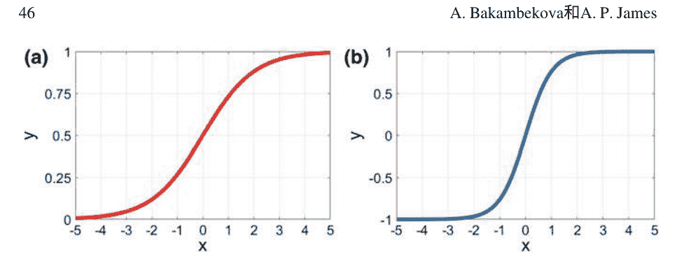

网络的架构通常根据要解决的任务选择，但从最简单的网络开始是方便的。下面是一个三层神经网络的图片，它有三个输入神经元（绿色：x1,x2,x3），两个隐藏神经元（蓝色）和一个输出神经元（红色：y）。

#### 例子 2.1

让我们通过一个具体的例子来理解图3.2中所示网络的主要原理。假设我们需要预测一个学生在学期期间花在学习上的时间（x1）、考试前一晚的睡眠时间（x2）以及期中考试得分（x3）这些信息下，他/她通过期末考试的概率（y）。

一旦我们知道了我们要预测最终成绩的学生的数据，我们将其输入到网络中。然后，输入数据与相应的权重（用实线表示）相乘，这些权重对于位于不同层的每对神经元是唯一的。因此，如果输入层有三个神经元，隐藏层有两个神经元，那么表示两层之间连接的权重有六个。

因此，根据图3.3中所示单个人工神经元的类比，每个隐藏神经元都会对输入数据进行加权求和，加上偏置b1，并将结果输入到激活函数中。得到的数字位于[0,1]的范围内，这是因为使用了sigmoid（图3.1）激活函数。

隐藏层的输出被馈送到最后一层，该层只有一个神经元，带有其权重和偏置。该过程重复进行，激活函数应用后，我们得到输出值y，该值再次在[0,1]范围内。这是我们试图预测的通过期末考试的概率。

图3.3中显示的网络仅用于教育目的，通常太小无法解决实际问题。构建神经网络时，它可以控制：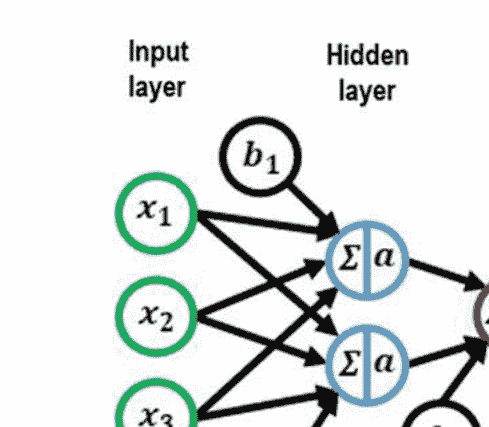

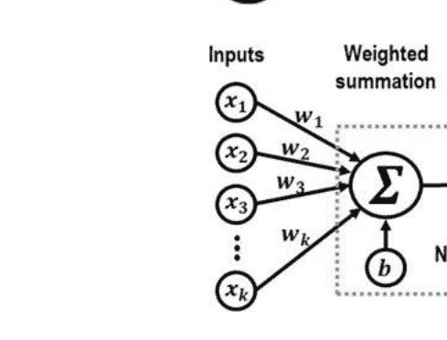

-   1. 输入神经元的数量。该参数取决于所使用的数据类型。例如，如果考虑网络输出依赖于n个不同的变量的情况，则将构建一个具有n个输入神经元的网络。当我们处理图片并将其用作输入数据时，每个像素将由自己的输入神经元表示。

-   2. 输出神经元的数量。在示例2.1中，我们只尝试了通过期末考试的概率，但如果我们有更多的数字要预测，我们可以增加输出神经元的数量。一般而言，网络中的输出神经元数量越多，隐藏层的结构就越复杂。

-   3. 隐藏层的数量和每个隐藏层中的神经元数量。这些参数影响网络输出的准确性，也就是说，当要解决的问题变得更加复杂时，隐藏层的大小也会增加。这两个指标之间不一定存在线性依赖关系，但通常存在正相关关系。

随着层数和神经元数量的增加，得到的网络不再被称为简单的人工神经网络。一旦它有多个隐藏层，就被称为深度神经网络。

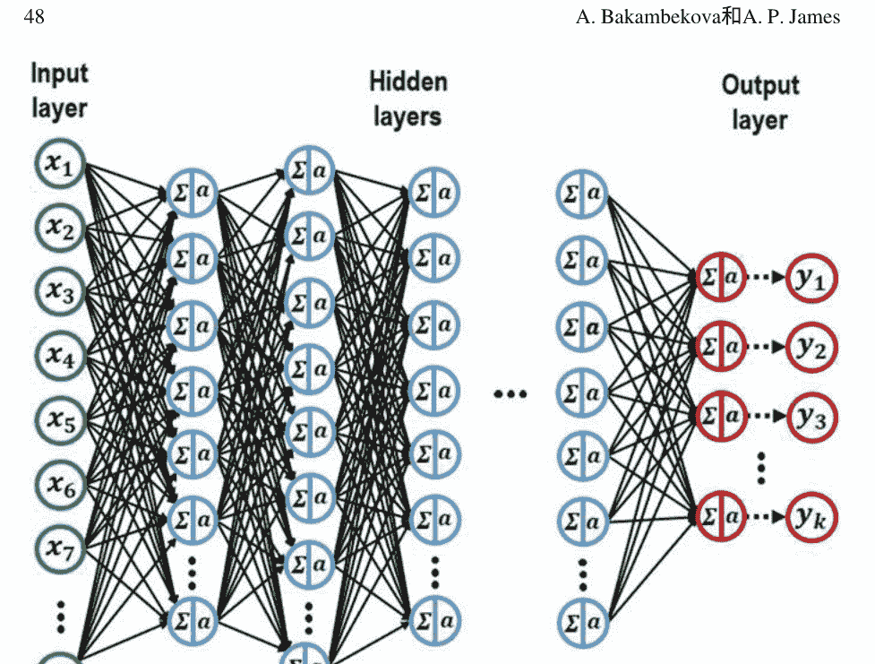

图3.4深度神经网络

神经网络（DNN）。简单全连接DNN的典型配置如图3.4所示。

#### 3.4 训练

在此之前，假设网络处于“良好状态”。也就是说，它运行得相当好，预测输出足够准确。这可能是解释输出计算的一般过程的好方法，但对于如何使网络达到这种“良好状态”来说，它太模糊了。

当然，网络在随机权重和偏差下不会给出正确的输出。因此，

> **定义**
神经网络的训练是找到正确的权重和偏差集合，或者可训练参数的过程，以便在输入数据的情况下，网络会给出正确的输出。

由于除了传统的多层全连接DNN之外，还有许多不同的神经网络架构，甚至有很多训练算法，因此训练每个网络的过程不会相同。然而，有一件事情使得没有它训练变得不可能：数据集。形式上，数据集是您的网络试图学习的输入和输出数据的集合。如果我们继续考虑示例2.1，数据集将包含许多学习和睡眠时间、期中考试成绩以及显示学生是否通过课程的布尔参数的条目。然后，训练过程将在每次迭代后稍微改变可训练参数，并将数据集展示给网络多次。数据集通常分为两部分：较大的部分用于训练，较小的部分用于测试。

##### 3.4.1 损失函数

为了有效地训练神经网络，设置评估其性能的规则是必不可少的。为此，我们引入了损失函数的概念。

> **定义**

损失函数是用来衡量预测值 ŷ 和期望值 y 之间差异的工具。

简单来说，我们的目标是以尽可能接近真实值的方式训练网络。用于评估神经网络性能的最流行的损失函数之一是均方误差（MSE）：

$$MSE = \frac{1}{2m} \sum_{m} (y - \hat{y})^2 = \frac{1}{2m} (\mathbf{y} - \hat{\mathbf{y}})^2, \quad (3.6)$$

其中 m 是用于测试的数据点的总数。MSE只衡量一个输出神经元的准确性，在有多个输出神经元时并不实用。然而，我们可以定义一个类似于MSE的指标，称为平方误差和（SSE）：

$$SSE = \frac{1}{2n} \sum_{n} (y_n - \hat{y}_n)^2 = \frac{1}{2n} (\mathbf{y}_n - \hat{\mathbf{y}}_n)^2, \quad (3.7)$$

其中 n 是输出层中的神经元数量。根据方程式3.7，SSE首先计算每个输出神经元的MSE，然后将它们全部相加。

还有另一种常用于评估和训练神经网络的损失函数，称为交叉熵：

$$ H = -\sum_n y_n \log \hat{y}_n = -\mathbf{y}^{\mathrm{T}} \cdot \log \hat{\mathbf{y}} \qquad \qquad (3.8) $$

##### 3.4.2 梯度下降

在建立了评估网络性能的常用工具之后，我们可以开始训练过程。回想一下，训练的主要目标是找到适用于特定数据集的正确权重和偏置，这意味着我们必须最小化损失函数 \( L \)。这可以通过梯度下降（GD）优化算法来实现：

#### 定义

梯度下降算法是一种工具，用于在每一步之后使用损失函数对每个权重和偏差进行迭代计算的方式来更新可训练参数。

有时候梯度下降算法也被称为反向传播，因为误差从输出层一直传播到输入层。众所周知，函数的梯度定义了其输出增长最快的方向。由于我们的系统需要相反的操作——找到如何最小化成本函数（从而减小误差），梯度应该是负数。

在这个例子中，我们将选择交叉熵作为我们的损失函数 \( C \)。根据公式3.5、3.8和表3.1，

$$ C = -\mathbf{y}^{\mathrm{T}} \cdot \log \hat{\mathbf{y}}_{L-1} = -\mathbf{y}^{\mathrm{T}} \cdot \log (\mathbf{w}_{L-1} \cdot \hat{\mathbf{y}}_{L-2} + \mathbf{b}_{L-1}) \qquad \qquad (3.9) $$

使用链式法则，可以确定损失函数相对于最后一层和前一层之间的权重的梯度。

$$ \frac{\partial C}{\partial \mathbf{w}_{L-1}} = \frac{\partial C}{\partial \mathbf{y}_{L-1}} \odot \frac{\partial \mathbf{y}_{L-1}}{\partial \mathbf{w}_{L-1}} \qquad \qquad (3.10) $$

对于最后一层的输出，成本函数的偏导数为：

$$ \frac{\partial C}{\partial \mathbf{y}_{L-1}} = -\mathbf{y} \frac{1}{\hat{y}_{L-1}} = -\mathbf{y}(\mathbf{w}_{L-1} \cdot \hat{\mathbf{y}}_{L-2} + \mathbf{b}_{L-1})^{-1} \qquad \qquad (3.11) $$

以及输出对权重的导数：

$$ \frac{\partial \mathbf{y}_{L-1}}{\partial \mathbf{w}_{L-1}} = \frac{\partial (a(\mathbf{w}_{L-1} \cdot \mathbf{y}_{L-2} + \mathbf{b}_{L-1}))}{\partial \mathbf{w}_{L-1}} = \frac{\partial (a(\mathbf{w}_{L-1} \cdot \mathbf{y}_{L-2} + \mathbf{b}_{L-1}))}{\partial (\mathbf{w}_{L-1} \cdot \mathbf{y}_{L-2} + \mathbf{b}_{L-1})} \odot \frac{\partial (\mathbf{w}_{L-1} \cdot \mathbf{y}_{L-2} + \mathbf{b}_{L-1})}{\partial \mathbf{w}_{L-1}} = \frac{\partial (a(\mathbf{w}_{L-1} \cdot \mathbf{y}_{L-2} + \mathbf{b}_{L-1}))}{\partial (\mathbf{w}_{L-1} \cdot \mathbf{y}_{L-2} + \mathbf{b}_{L-1})} \odot \mathbf{y}_{L-2} \quad (3.12) $$

因此，在每次迭代之后，权重会被更新为：

$$ \mathbf{w}_{j-1} \leftarrow \mathbf{w}_{j-1} - \alpha \frac{\partial C}{\partial \mathbf{w}_{j-1}} \quad (3.13) $$

同样地，使用公式3.11来更新最后一层的偏置：

$$ \frac{\partial C}{\partial \mathbf{b}_{L-1}} = \frac{\partial C}{\partial \mathbf{y}_{L-1}} \odot \frac{\partial \mathbf{y}_{L-1}}{\partial \mathbf{b}_{L-1}} \quad (3.14) $$

输出相对于偏置的导数：

$$ \frac{\partial \mathbf{y}_{L-1}}{\partial \mathbf{b}_{L-1}} = \frac{\partial (a(\mathbf{w}_{L-1} \cdot \mathbf{y}_{L-2} + \mathbf{b}_{L-1}))}{\partial \mathbf{b}_{L-1}} = \frac{\partial(a(\mathbf{w}_{L-1} \cdot \mathbf{y}_{L-2} + \mathbf{b}_{L-1}))}{\partial(\mathbf{w}_{L-1} \cdot \mathbf{y}_{L-2} + \mathbf{b}_{L-1})} \odot \frac{\partial(\mathbf{w}_{L-1} \cdot \mathbf{y}_{L-2} + \mathbf{b}_{L-1})}{\partial \mathbf{w}_{L-1}} = \frac{\partial(a(\mathbf{w}_{L-1} \cdot \mathbf{y}_{L-2} + \mathbf{b}_{L-1}))}{\partial(\mathbf{w}_{L-1} \cdot \mathbf{y}_{L-2} + \mathbf{b}_{L-1})} \qquad (3.15) $$

然后，偏置被更新为：

$$ \mathbf{b}_{j-1} \leftarrow \mathbf{b}_{j-1} - \alpha \frac{\partial C}{\partial \mathbf{b}_{j-1}} \qquad (3.16) $$

在从输出层返回到输入层时，对所有层执行类似的递归操作。 然后，对于第$(j-1)$层的权重和偏置，导数变为：

$$ \frac{\partial C}{\partial \mathbf{w}_{j-1}} = \frac{\partial C}{\partial \mathbf{y}_{j-1}} \odot \frac{\partial \mathbf{y}_{j-1}}{\partial \mathbf{w}_{j-1}} \qquad (3.17) $$

$$ \frac{\partial C}{\partial \mathbf{b}_{j-1}} = \frac{\partial C}{\partial \mathbf{y}_{j-1}} \odot \frac{\partial \mathbf{y}_{j-1}}{\partial \mathbf{b}_{j-1}} \qquad (3.18) $$

### 3 深度学习理论简化

| 符号 | 定义 |
| --- | --- |
| L | 层数 |
| w_{j-1} | 大小为 n×m 的矩阵，包含第 j 层输入的权重，其中 m 是第 (j-1) 层的神经元数量，n 是第 j 层的神经元数量 |
| b_j | 具有偏置的向量在第 j 层 |
| x | 输入数据 |
| ŷ_{j-1} | 第 j 层的输出 |
| ŷ_{L-1} | 网络的预测输出 |
| y | 网络的期望输出 |
| a | 激活函数 |
| C | 损失函数 |
| ⊙ | 分段乘法 |
| α | 学习率。控制调整对原始值影响的超参数 |

#### 3.5 结语

由于计算资源的进步和可用数据集数量和质量的增加，深度学习在过去十年中受到越来越多的关注。 它被证明是一种有效的工具，能够使用有标签和无标签的数据解决各种分类、回归和生成任务。

尽管本文的重点是全连接的深度神经网络，但还有许多其他具有特定神经元互连的架构。
主要架构总结在表3.2中。

深度学习的主要优势之一是它将特征提取和数据处理结合在一个算法中，从而简化了人类的任务。 将来，它可能成为解决许多不同领域问题的通用解决方案：商业、金融、健康、娱乐、教育等等。

本节简要介绍了深度学习的基本原理，以及如何构建、训练和使用神经网络。
本书的后续章节将继续利用深度学习架构构建神经形态电路和系统，并详细介绍它们的应用。

### 表3.2 先进的神经网络架构

| 名称 | 选定的应用 | 主要特点 |
|------|------------|----------|
| 卷积神经网络 (CNN) [25] | 图像处理 [17]，视频处理 [12]，3D动画 [24]，目标检测 [7] | 主要用于图像和视频分析。在卷积层中使用不同的滤波器。采用池化层。计算效率高 |
| 循环神经网络 (RNN) [13] | 自然语言处理 [4]，预测股票价格 [19] | 学习序列。链式结构，带有反馈循环 |
| 长短期记忆 (LSTM) [9] | 自然语言处理，文本处理 [21]，视觉问答 [6]，功率预测 [26] | 特殊类型的RNN。特殊输入和遗忘门的差异，可以更好地控制长期依赖性，并具有细胞状态 |
| 受限玻尔兹曼机 (RBM) [18] | 推荐系统 [27]，语音识别 [31]，医疗保健中的紧急检测 [11] | RBM只有两层（一个输入层和一个隐藏层），没有输出层。概率能量模型 |
| 门控循环单元（GRU）[5] | 声学建模[30]，序列建模，问题检测[23] | 类似于RNN和LSTM，但与LSTM不同，它没有细胞状态。有3个门：遗忘门，更新门，输出门 |
| 生成对抗网络（GAN）[8] | 语义分割[29]，图像分辨率增强[14]，图像生成[22] | 无监督学习。由生成模型和判别模型组成。主要用于根据给定样本生成新的图片 |

#### 章节亮点

-   深度学习是一系列受人脑启发的各种数学算法的集合。
-   神经形态电路和系统实现了深度学习算法。
-   人脑的主要特征列表成为创建深度学习算法的原因，包括并行和异步计算、组合内存和处理、个体互连、模拟处理、对错误的鲁棒性、低功耗和学习能力。
-   权重、偏置和激活函数构成了人工神经元的主要组成部分。
-   神经元之间连接的权重衡量了连接的强度。
-   偏置是设置神经元阈值的参数。
-   激活函数决定了信号传递到后续层的强度。
-   人工神经网络是一种在硬件或软件中实现的计算系统，类似于人脑的特征，并由许多人工神经元构建。
-   在构建神经网络时，您需要选择输入和输出神经元的数量，以及隐藏层和其中神经元的数量。
-   神经网络的训练是找到正确的权重和偏置或可训练参数的过程，以便在输入数据输入网络时能够给出正确的输出。
-   损失函数是用来衡量预测值 ŷ 和期望值 y 之间差异的工具。
-   梯度下降算法是一种工具，用于在每一步之后使用损失函数对每个权重和偏差的导数的迭代计算来更新网络中的可训练参数。
-   高级深度学习架构包括卷积神经网络、循环神经网络、长短期记忆、受限玻尔兹曼机、门控循环单元、生成对抗网络等等。

#### 参考文献

1.  (2018). https://www.olcf.ornl.gov/summit/
2.  Agrawal S, Agrawal J (2015) 神经网络技术在癌症预测中的应用: 一项调查. Proc Comput Sci 60:769–774. https://doi.org/10.1016/j.procs.2015.08.234
3.  Blanchini F, Franco E (2011) 结构稳健的生物网络. BMC Syst Biol 5(1):74. https://doi.org/10.1186/1752-0509-5-74
4.  Chien JT, Ku YC (2016) 用于语言建模的贝叶斯递归神经网络。 IEEE Trans Neural Netw Learn Syst 27(2):361–374
5.  Cho K, Van Merrienboer B, Gulcehre C, Bahdanau D, Bougares F, Schwenk H, Bengio Y (2014) 使用RNN编码器-解码器学习短语表示用于统计机器翻译。 arXiv:1406.1078
6.  Chowdhury I, Nguyen K, Fookes C, Sridharan S (2017) 一个级联的长短期记忆 (LSTM) 驱动的通用视觉问答 (VQA) 。 在: 2017年IEEE国际图像处理会议 (ICIP) 。 IEEE , pp 842–1846
7.  Deng Z, Lei L, Sun H, Zou H, Zhou S, Zhao J (2017) 一种增强的深度卷积神经网络用于遥感图像中密集目标检测。 在: 2017年国际智能处理遥感的研讨会 (RSIP) 。 IEEE, pp 1–48.
8.  Goodfellow I, Pouget-Abadie J, Mirza M, Xu B, Warde-Farley D, Ozair S, Courville A, Bengio Y (2014) 生成对抗网络。 在: 神经信息处理系统进展, pp 2672–2680
9.  Greff K, Srivastava RK, Koutnik J, Steunebrink BR, Schmidhuber J (2017) Lstm: a search space odyssey. IEEE Trans Neural Netw Learn Syst 28(10):2222–2232
10. Herculano-Houzel S (2009) The human brain in numbers: a linearly scaled-up primate brain. Front Human Neurosci 3 (2009), https://doi.org/10.3389/neuro.09.031.2009
11. Kim HG, Han SH, Choi HJ (2017) Discriminative restricted boltzmann machine for emergency detection on healthcare robot. In: 2017 IEEE international conference on big data and smart computing (BigComp). IEEE, pp 407–409
12. Le Callet P, Viard-Gaudin C, Barba D (2006) A convolutional neural network approach for objective video quality assessment. IEEE Trans Neural Netw 17(5):1316–1327
13. Lipton ZC, Berkowitz J, Elkan C (2015) A critical review of recurrent neural networks for sequence learning. arXiv:1506.00019
14. Ma W, Pan Z, Guo J, Lei B (2018) 基于转移生成对抗网络的遥感图像超分辨率。在: IGA RSS 2018-2018 IEEE国际地球科学和遥感研讨会。IEEE, pp 1148-1151
15. Mead C (1990) 神经形态电子系统。Proc IEEE 78 (10) : 1629-1636。https://doi.org/10.1109/5.58356
16. Mead WR, Kurzweil R (2006) 奇点即将来临: 当人类超越生物学。外交事务85 (3) : 160。https://doi.org/10.2307/20031996
17. Rezaee M, Mahdianpari M, Zhang Y, Salehi B (2018) 基于光学遥感图像的复杂湿地分类的深度卷积神经网络。IEEE J Sel Top Appl Earth Obs Remote Sens 11 (9) : 3030-3039
18. Salakhutdinov R, Mnih A, Hinton G (2007) 用于协同过滤的受限玻尔兹曼机。在: 第24届国际机器学习大会论文集。ACM, pp791–798
19. Samarawickrama A, Fernando, T (2017) 用于预测斯里兰卡股市每日股价的循环神经网络方法。在: 2017年IEEE国际工业与信息系统会议论文集。IEEE, pp 1–6
20. Sangwan VK, Lee HS, Bergeron H, Balla I, Beck ME, Chen KS, Hersam MC (2018) 多端口膜电晶体来自多晶单层二硫化钼。自然554(7693):500–504。https://doi.org/10.1038/nature25747
21. Skovajsov L (2017) 长短期记忆描述及其在文本处理中的应用。在: 通信和信息技术 (KIT)。IEEE, 第1-4页
22. Tan WR, Chan CS, Aguirre H, Tanaka K (2017) 用于条件合成自然图像和艺术品的改进的artgan。arXiv: 1708.09533
23. Tang Y, Huang Y, Wu Z, Meng H, Xu M, Cai L (2016) 使用带门控循环单元的递归神经网络从声学特征中检测问题。在: 2016年IEEE国际会议声学、语音和信号处理 (ICASSP)。IEEE, 第6125-6129页
24. Weng CY, Curless B, Kemelmacher-Shlizerman I (2018) 从单张照片中的3D角色动画。arXiv: 1812.02246
25. Wu J (2017) 卷积神经网络简介
26. Xiao Y, Xiao N, Zhao C, Shuai J, Xiu D (2016) 基于深度长短期记忆的风力短期预测。在: 2016年IEEE PES亚太电力与能源工程会议 (APPEEC)。IEEE, 第1148-1152页
27. Yedder HB, Zakia U, Ahmed A, Trajkovi´c L (2017) 使用受限玻尔兹曼机的推荐系统建模预测。在: 2017年IEEE国际系统、人类和控制论会议 (SMC)。IEEE, 第2063-2068页
28. Zeki S (2015) 一种大规模异步并行的大脑。Philos Trans Roy Soc B: Biol Sci 370 (1668) : 20140174-20140174。https://doi.org/10.1098/rstb.2014.0174
29. Zhang X, Zhu X, Zhang N, Li P, Wang L, 等: Seggan: 具有生成对抗网络的语义分割。在: 2018年IEEE第四届多媒体大数据国际会议 (BigMM)。IEEE, 第1-5页
30. Zhao Y, Li J, Xu S, Xu B (2016) : 研究门控循环神经网络用于声学建模。在: 2016年第十届国际中文口语处理研讨会 (ISCSLP)。IEEE, 第1-5页
31. Zhu F, Fan Z, Wu X (2014) : 使用条件受限玻尔兹曼机进行语音转换。在: 2014年IEEE中国峰会和国际信号与信息处理会议 (ChinaSIP)。IEEE, 第110-114页

## 第4章 开始使用TensorFlow深度学习

Yeldar Toleubay和Alex Pappachen James

摘要 TensorFlow是由Google开发的开源软件Python库。由于其简单性、灵活性和兼容性，在机器学习和深度学习领域具有很高的流行度。在本章中，我们介绍了TensorFlow的基本语法和构建人工神经网络所需的主要操作。我们简要介绍了构建循环神经网络和卷积神经网络的代码，以MNIST基于手写数字分类问题为例。

#### 4.1 TensorFlow基础知识

> > “没有完美的编程语言。甚至没有一个最好的语言；只有适合特定目的的语言或者可能不适合的语言。了解问题和相关的编程需求对于选择最适合解决方案的语言是必要的。”
>
> -Herbert G. Mayer在IBM PC上的高级C编程

TensorFlow是由Google开发的开源软件库，用于生产和研究。与不同平台（如CPU、GPU和TPU）的计算兼容性以及灵活的架构使得TensorFlow在机器学习应用和神经网络设计中非常受欢迎。本章的目标是介绍TensorFlow的基本语法和构建深度学习神经网络所需的主要操作。


##### 4.1.1 张量简介

标量、向量和代数矩阵元素可以看作张量的特殊情况。即0维张量是标量，1维张量是向量，2维张量是矩阵。张量是一个R维数组。让我们使用TensorFlow库创建我们的第一个张量对象。

###### 常量张量

首先，我们使用import命令导入TensorFlow库。然后，我们创建一个常量张量并打印它。程序的输出将显示变量tensor1是字符串类型的张量对象。

```
import tensorflow as tf
tensor1=tf.constant('Introduction')
print(tensor1)
#输出：Tensor("Const:0", shape=(), dtype=string)
```

TensorFlow有几个内置的张量生成器，可以创建不同大小和类型的张量。张量的元素可以是1、0、任意数字或遵循某种分布。这些在深度学习中广泛使用的命令在神经网络建模过程中非常有用，例如用于分配权重值。

###### 内置张量生成器

让我们创建由零、一、1.5和均匀分布的数字组成的二维张量。

```
import tensorflow as tf
a = tf.zeros((3,4))
b = tf.ones((3,4))
c = tf.fill((1,3),1.5)
d = tf.random_normal((3,3),mean=0,stddev=0.4)
result1=sess.run(a)
result2=sess.run(b)
result3=sess.run(c)
result4=sess.run(d)
print(result1)
#输出：
[[0.0.0.0.]
[0.0.0.0.]
[0.0.0.0.]]
print(result2)
#输出：
[[ 1. 1. 1. 1.]
 [ 1. 1. 1. 1.]
 [ 1. 1. 1. 1.]]
print(result3)
#输出：
[[1.5 1.5 1.5]
print(result4)
#输出：
[[0.49991614 1.15280306 0.17223553]
 [-0.09865849 -0.15267047 0.28910062]
 [-0.07902408 -0.12034792 0.04202165 ]]"
```

##### 4.1.2 执行基本操作

如前所述，变量 tensor1是张量对象。从前面的例子中，我们知道张量不应该被视为Python变量。通常的操作，如 print()不能直接应用于打印张量。

相反，有一个叫做 Session的类需要运行TensorFlow操作[1]。Session类允许评估张量并执行 Operation对象。

###### 运行一个Session

在这里，我们尝试在一个会话中打印 tensor1对象的内容。为此，创建一个名为 sess的会话，并在 print操作中运行张量。

```
import tensorflow as tf
tensor1=tf.constant('介绍')
sess=tf.Session()
print(sess.run(tensor1))
#输出：b'介绍'
```

###### 4.1.2.1 数学运算

有几个数学命令可以用于处理张量。在这里，我们演示了构建神经网络模型所需的最重要的操作，如加法、乘法和矩阵乘法。

###### 加法

让我们创建两个常量张量a=10和b=20，并使用add()函数找到它们的和。此外，我们通过上下文管理器创建一个会话。

```
python
import tensorflow as tf
a=tf.constant(10)
b=tf.constant(20)
with tf.Session() as sess:
    addition=sess.run(tf.add(a, b))
print(addition)
#输出: 30
```

###### 乘法

在这里，我们使用multiply()函数计算2.5和0.4的乘积。

```
python
import tensorflow as tf
a=tf.constant(2.5)
b=tf.constant(0.4)
with tf.Session() as sess:
    multiplication=sess.run(tf.multiply(a, b))
print(multiplication)
#输出: 1.0
```

###### 矩阵乘法

matmul()操作用于执行矩阵乘法。

```
python
import tensorflow as tf
a = tf.constant([[1,3], [5,7]])
b = tf.constant([[9],[11]])
with tf.Session() as sess:
    result=sess.run(tf.matmul(a,b))
print(result)
#输出:
[[ 42]
 [122]]
```

##### 4.1.3 人工神经元模型

在前一章中，我们熟悉了人工神经元模型。我们知道，在网络优化过程中，权重会改变其值。因此，权重和偏置被定义为可变张量，而输入x和输出y被称为占位符张量。最初，占位符没有任何值。然而，在模型的测试和训练过程中，它们会被feed dictionary中定义的数据填充。

让我们回顾一下在图3.3中呈现的人工神经元的图形表示。输入和偏置由单独的节点表示，并连接到求和节点。张量对象和操作对象的连接被定义为一个图。图的连接表示神经网络。

###### 图示例

我们将创建一个权重和偏置都设置为1的模型。输入类型为float32的x具有10个特征。

```
import tensorflow as tf
w=tf.Variable(1)
b=tf.Variable(1)
n_features=10
x_ph=tf.placeholder(tf.float32, (None, n_features))
z_graph=tf.add(tf.multiply(w, x_ph), b)
```

此外，你知道为了得到一个输出，我们将我们的 z放入一个激活函数中。TensorFlow有几个激活函数可以通过以下命令轻松访问：

###### 基本激活函数

- Sigmoid函数：
y_model=tf.sigmoid(z)
- 双曲正切函数：
y_model=tf.tanh(z)
- 修正线性单元：
y_model=tf.nn.relu(z)

一旦模型准备好，我们应该在网络中引入损失函数、优化器和指标[2]。损失函数显示实际值和预测值之间的差异。我们的目标是最小化差异以获得高准确性。优化器是一种学习方法，用于使用输入数据更新权重和偏差，以便在损失函数中获得低误差。指标用于在模型编译过程中测量和显示准确性。最后，变量

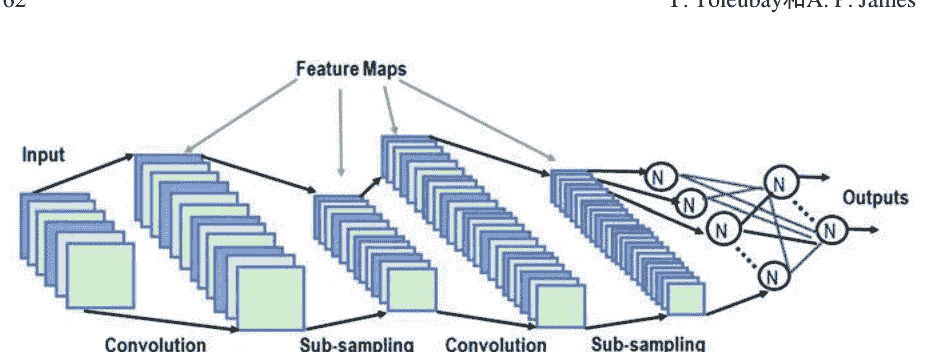

图4.1卷积神经网络图示

在会话运行之前，应使用 `tf.global_variables_initializer()` 初始化变量。

#### 4.2 神经网络模型

人脑可以高效地解决不同类型的任务，例如图像、文本和语音识别或物体检测。不幸的是，单个人工神经网络无法具备这种普遍性。不同的神经网络架构对于特定目的效果更好。在本节中，我们将介绍卷积神经网络和循环神经网络。

##### 4.2.1 卷积神经网络

卷积神经网络（CNN）广泛用于图像分类和识别。CNN需要最少的预处理，并在像素级别上检测视觉模式[3]。尽管CNN有不同的模型，但它们最初提出的架构属性都是相同的，比如LeNet-5。作为示例，我们展示了一个用于手写MNIST数字识别的CNN（图4.1）。

###### CNN示例

在这个例子中，我们将使用CNN对MNIST手写数字进行分类[4]。首先，我们创建一些辅助函数，用于初始化权重、偏置和构建层。

#### 4 使用Memristive网络的深度学习分类器

```
python
import tensorflow as tf
from tensorflow.examples.tutorials.mnist import input_data
# 通过以下命令上传MNIST手写数据集
mnist = input_data.read_data_sets("MNIST_data/", one_hot=True)
#我们初始化一些对神经网络构建有用的函数
def constr_weights(shape):
    constr_random_dist = tf.truncated_normal(shape, stddev=0.1)
    return tf.Variable(constr_random_dist)
def constr_bias(shape):
    constr_bias_vals = tf.constant(0.1, shape=shape)
    return tf.Variable(constr_bias_vals)
#通过以下函数创建2-D卷积:
def conv2d(x, W):
    return tf.nn.conv2d(x, W, strides=[1, 1, 1, 1], padding='SAME')
#通过以下函数创建最大池化层:
def max_pool_2by2(x):
    return tf.nn.max_pool(x, ksize=[1, 2, 2, 1], strides=[1, 2, 2, 1], padding='SAME')
#通过下一个函数使用conv2d获得卷积层:
def convolutional_layer(input_x, shape):
    W = init_weights(shape)
    b = init_bias([shape[3]])
    return tf.nn.relu(conv2d(input_x, W) + b)
#以下函数创建一个正常的全连接层:
def normal_full_layer(input_layer, size):
    input_size = int(input_layer.get_shape()[1])
    W = constr_weights([input_size, size])
    b = constr_bias([size])
    return tf.matmul(input_layer, W) + b
```

然后我们创建占位符和图4.1中呈现的网络。dropout有助于避免过拟合，因此我们使用占位符进行设计。

```
python
#占位符
x = tf.placeholder(tf.float32,shape=[None,784])
y_true = tf.placeholder(tf.float32,shape=[None,10])
#构建层:
x_image = tf.reshape(x,[-1,28,28,1])
convo_1 = convolutional_layer(x_image,shape=[6,6,1,32])
convo_1_pooling = max_pool_2by2(convo_1)
convo_2 = convolutional_layer(convo_1_pooling,shape=[6,6,32,64])
convo_2_pooling = max_pool_2by2(convo_2)
convo_2_flat = tf.reshape(convo_2_pooling,[-1,7*7*64])
full_layer_one = tf.nn.relu(normal_full_layer(convo_2_flat,1024))
hold_prob = tf.placeholder(tf.float32)
full_one_dropout = tf.nn.dropout(full_layer_one,keep_prob=hold_prob)
y_pred = normal_full_layer(full_one_dropout,10)
```

当我们的模型准备好后，我们引入损失函数、优化器和指标。

```
python
#损失函数:
cross_entropy = tf.reduce_mean(tf.nn.softmax_cross_entropy_with_logits(
    labels=y_true, logits=y_pred))
#优化器:
optimizer = tf.train.AdamOptimizer(learning_rate=0.0001)
train = optimizer.minimize(cross_entropy)
#初始化变量
init = tf.global_variables_initializer()
#会话:
steps = 5000
with tf.Session() as sess:
    sess.run(init)
    for i in range(steps):
        batch_x, batch_y = mnist.train.next_batch(50)
        sess.run(train, feed_dict={x: batch_x,
                                   y_true: batch_y, hold_prob: 0.5})
        #每1000步的指标:
        if i%1000 == 0:
            print('当前执行步骤 {}'.format(i))
            print('准确率为:')
            matches = tf.equal(tf.argmax(y_pred,1), tf.argmax(y_true,1))
            acc = tf.reduce_mean(tf.cast(matches, tf.float32))
            print(sess.run(acc, feed_dict={x: mnist.test.images, y_true: mnist.test.labels, hold_prob:1.0}))
            print('')
```
当前执行步骤 0
准确率为:
0.0539

当前执行步骤 1000
准确率为:
0.9589

当前执行步骤 2000
准确率为:
0.9733

当前执行步骤 3000
准确率为:
0.9805

当前执行步骤 4000
准确率为:
0.9834

手写数字分类的最后一次迭代结果为98.3%的准确率。准确率受到不同的学习率、网络大小和其参数的影响。

##### 4.2.2 循环神经网络

循环神经网络是一种用于解决序列相关问题的神经网络，例如自然语言、声音识别或股票价格预测。RNN与之前介绍的人工神经网络的主要区别在于它将输出发送回输入。循环神经网络的众所周知的扩展模型之一是长短期记忆网络[5]。详细

###### LSTM示例

我们将对MNIST数据集进行相同的分类问题，但是我们将把图像视为像素序列。由于MNIST的形状为（28,28），我们可以将每个图像视为28个长度为28的像素序列[6]。首先，我们将定义模型的基本参数，然后构建模型。

```
python
import tensorflow as tf
from tensorflow.contrib import rnn
from tensorflow.examples.tutorials.mnist import input_data
mnist = input_data.read_data_sets("/tmp/data/", one_hot=True)
learn_rate = 0.001
train_steps = 10000
batch_size = 128
steps = 2000
n_input = 28
tsteps = 28
n_features = 128
n_labels = 10
#权重和占位符
X = tf.placeholder("float", [None, tsteps, n_input])
Y = tf.placeholder("float", [None, n_labels])
weights={'out':tf.Variable(tf.random_normal([n_features, n_labels]))}
biases = {'out': tf.Variable(tf.random_normal([n_labels]))}
#具有LSTM作为基本单元的RNN网络。Unstack给出一个时间步骤的列表。
def RNN(x, weights, biases):
  x = tf.unstack(x, tsteps, 1)
  lstm_cell = rnn.BasicLSTMCell(n_features, forget_bias=1.0)
  outputs, states = rnn.static_rnn(lstm_cell, x, dtype=tf.float32)
  return tf.matmul(outputs[-1], weights['out']) + biases['out']
#构建模型
logits = RNN(X, weights, biases)
prediction = tf.nn.softmax(logits)
#损失函数和优化器
loss_op = tf.reduce_mean(tf.nn.softmax_cross_entropy_with_logits(
            logits=logits, labels=Y))
optimizer = tf.train.GradientDescentOptimizer(learning_rate=learn_rate)
train_op = optimizer.minimize(loss_op)
#模型评估:
correct_pred = tf.equal(tf.argmax(prediction, 1), tf.argmax(Y, 1))
accuracy = tf.reduce_mean(tf.cast(correct_pred, tf.float32))
init = tf.global_variables_initializer()
with tf.Session() as sess:
  sess.run(init)
  for step in range(1, train_steps+1):
    batch_x, batch_y = mnist.train.next_batch(batch_size)
    batch_x = batch_x.reshape((batch_size, tsteps, n_input))
    sess.run(train_op, feed_dict={X: batch_x, Y: batch_y})
    if step % steps == 0 or step == 1:
      loss, acc = sess.run([loss_op, accuracy], feed_dict={X: batch_x, Y:batch_y})
      print("第" + str(step) + "步, 小批量损失值= " +"{:.4f}".format(loss) + ", 训练准确率= " + "{:.3f}".format(acc))
```

我们构建了两个不同的神经网络并将它们应用于相同的数据集。从上面的例子可以看出，尽管模型和它们的优化方法不同，但神经网络的构建方法通常保持相同。换句话说，无论神经网络的类型如何，我们都需要定义模型参数、占位符、变量、损失函数、优化方法、度量指标和模型本身。

#### 章节亮点

- TensorFlow是一个广泛应用于机器学习和深度学习网络设计的开源库。
- 张量是一个R维数组。
- Session类允许评估张量并执行操作对象。
- add()，multiply()和matmul()是用于对张量进行加法、乘法和矩阵乘法的数学运算。
- 张量对象和操作对象之间的连接被定义为一个图。
- 一旦模型准备好，就应该将损失函数、优化器和度量指标引入网络中。
- 在会话编译之前初始化变量。
- 卷积神经网络（CNN）广泛应用于与图像分类和识别相关的领域。
- 递归神经网络是一种用于解决与时间序列相关问题的神经网络类型，例如自然语言、声音识别或股票价格预测。
- RNN与CNN的主要区别在于它将输出发送回输入。

#### 参考文献

1. (2018). https://www.tensorflow.org/api_docs/java/reference/org/tensorflow/Session
2. (2018). https://www.tensorflow.org/tutorials/keras/basic_classification/
3. LeCun Y (2018) Lenet-5, 卷积神经网络。 http://yann.lecun.com/exdb/lenet/
4. Mnist with CNN code (2018). https://github.com/nlintz/TensorFlow-Tutorials
5. Hochreiter S, Schmidhuber J (1997) 长短期记忆。 Neural Comput 9(8):1735–1780. https://doi.org/10.1162/neco.1997.9.8.1735
6. Damien A (2018) 使用张量-流库实现的循环神经网络（LSTM）示例。 https://github.com/aymericdamien/TensorFlow-Examples/blob/master/examples/3_NeuralNetworks/recurrent_network.py

# 第5章
使用深度学习神经网络的语音识别应用

Akzharkyn Izbassarova, Aziza Duisembay和Alex Pappachen James

摘要 深度神经网络 (DNN) 在语音识别系统中展示了巨大的潜力。本章介绍了两个成功实施基于DNN模型的语音识别案例。第一个例子包括苹果为其个人助手Siri开发的DNN模型。为了检测和识别“嘿Siri”短语，程序运行一个基于5层网络的检测器，其中包含32个和192个隐藏单元。为了创建一个声学模型，使用了Sigmoid和Softmax激活函数以及循环网络。第二个例子是亚马逊为家庭扬声器中的罕见声音检测设计的基于区域的卷积循环神经网络 (R-CRNN)。这个系统用于名为Alexa Guard的安全包中。在运行复杂的机器学习算法时，需要特殊的硬件来实现高效的功耗和内存利用。本章描述了在移动电话和家庭扬声器中用于处理复杂DNN模型的硬件解决方案。

#### 5.1 引言

语音识别是一种用于使计算机 (或其他类型的机器) 正确识别口语的技术。语音识别的一种类型是“语音转文本”。这种程序将口语转换为文本。语音识别的另一种类型是交互式语音识别器。它主要用于亚马逊 (Alexa) 、苹果 (Siri) 、谷歌 (Google Assistant) 等公司开发的个人助手中。与“语音转文本”软件相比，它们执行口语命令。


用户。例如，它们可以打开音乐，告诉我们天气预报，并回答我们的问题。

语音由一系列单词组成，而这些单词又由一系列音素组成。自动语音识别基于两个概率函数：一个声学模型计算话语与输入单词序列的对应概率，一个语言模型计算输入含义的先验概率。这些模型会自动根据接收到的每个输入进行训练。我们可以使用由不同说话者发音的各种话语组成的数据库来训练系统。因此，通过使用广泛的输入，自动语音识别器改进其模型，使其更准确。

在本章中，描述了语音识别系统的软件和硬件设计。“软件”部分介绍了用于个人助理和家庭音箱的两种不同的DNN模型。下一节描述了Siri和为Alexa Voice Service设计的SoC开发套件的硬件设计。

#### 5.2 软件

##### 5.2.1 个人助理

使用深度学习进行语音识别的一个成功的行业规模示例是由苹果公司于2011年推出的个人助理Siri。该应用程序允许用户通过自然语音命令与其设备进行交互[11]。可用功能集包括输入特定指令、打开所需应用程序、导航到菜单、浏览网页和扫描结果。

为了完成这些任务，Siri必须具备两个功能：理解命令和将语音转换为文本。首先，要调用个人助理，需要说出“嘿Siri”关键词命令。在后台，设备始终运行一个语音识别程序，以识别所有周围噪音和对话中的这些关键词[4]。本节介绍了在Siri中实现的用于识别“嘿Siri”命令的语音识别程序的设计和工作。

开发的语音识别器用于检测关键词命令并调用Siri，基于DNN。图5.1显示了“嘿Siri”检测的流程图。首先，声音信号在输入神经网络之前进行预处理。麦克风捕捉到的语音信号以每秒16000个样本的速率进行采样。

然后，创建一系列帧，并将大约二十帧一次发送到声学模型。简单来说，声学模型就是我们训练并上传到设备上的DNN。然而，如果服务器上更新了模型，您可以获得新版本的模型。声学模型给出了属于二十个语音类别中每个类别的概率分布。这些类别是由前元音包围的不同音素“s”的组合。之后，检测器计算评估“嘿 Siri”短语发音的分数。如果这个分数高于阈值，那么程序会将你的语音作为关键词命令来调用 Siri。阈值是可调节的，以适应不同的条件，最大化真正的正检测，但最小化误报激活。将分数值与较低和正常阈值进行比较。如果超过正常阈值，Siri将被调用。如果分数在较低和正常阈值之间，程序将运行第二个检查器几秒钟。第二个检查器比主要检查器更敏感。通过增加声学模型中的神经元数量来实现这种敏感性。图5.2显示了用于创建声学模型的神经网络架构。

Apple实现的DNN具有五个隐藏层，每层的神经元数量相等。 除了最后一层外，每层都使用Sigmoid激活函数。为了获得概率分布，最后一层应用了Softmax函数。 由于网络每0.2秒检测一次语音的发音类别，因此识别整个语音非常重要。 例如，网络会识别出你说的“Siri”。 然而，要检测到“嘿 Siri”短语，网络需要知道先前的输出是否是“嘿”。 递归网络可以通过保存先前输入的结果并将其用于未来输入来处理这种序列相关的问题。 使用递归网络获得最终分数。

##### 5.2.2 智能家居音箱

在智能家居音箱中，语音识别的方式与智能助手类似。 然而，智能家居音箱更适应家庭问题，因此具有一些额外的功能。 例如，亚马逊为其Echo智能音箱创建了一个名为Alexa Guard的安全套件。 如果Alexa Guard识别到任何异常或可疑的声音，例如来自燃气/烟雾探测器的信号或玻璃破碎的声音，它可以向用户的手机发送警报消息。

亚马逊的研究人员开发了一种基于区域的卷积循环神经网络（R-CRNN）用于罕见声音识别[7]。 R-CRNN模型如图5.3所示，由三个主要部分组成：卷积循环神经网络（CRNN）、区域建议网络（RPN）和最终分类器。 CRNN模块从输入的频谱图中获取高级特征。 基于获取的特征，RPN通过检测可能包含所搜索声音的音频输入的一维区域来计算可能的事件。 此外，分类器通过改进事件提议的中心来生成音频事件预测。

### 5.2.2.1 卷积循环神经网络

CRNN的架构如图5.4所示。它接收30秒的音频流并获得高级特征图。每个片段进一步分为一系列的46毫秒帧，间隔为23毫秒[8]。

CRNN的输入是由每个帧获取的64维对数滤波器组能量（LFBEs）组合而成。 在CRNN中，[6]中引入的残差网络被用作卷积网络。 残差网络有助于解决网络深度增加时的准确性下降问题。 它内部有两个卷积块。 第一个卷积层的核大小为7*7，步幅值为2*1，通道数为64。 这里，第一个维度是时间，第二个维度是频率。 然后，应用3*3的最大池化核和2*2的步幅来减小维度。 接着，使用几个3*3的卷积层和64个输出通道。 接下来具有相同内核大小但输出通道数量增加的卷积层。这些2D卷积核生成具有186毫秒时间分辨率的高级特征图。经过双向门控循环单元（GRU）后，特征图的最终大小为（162，2U），其中U是最后一层的单元数。

### 5.2.2.2 区域建议网络

亚马逊的研究人员使用[10]中开发的RPN来计算音频事件检测（AED）的事件建议。简化的RPN在时间维度的搜索空间中计算事件建议。它以CRNN生成的高级特征图作为输入，并产生一组可能的事件，也称为事件建议。对生成的每个事件建议进行音频事件的存在性评估。

这部分的主要目的是在很短的时间内识别事件的区域。这有助于减少在最终分类器中评估的时间间隔。

如图5.5所示，一个3*2U窗口在高级特征图上滑动，以获取一个低维特征。窗口的感知域为557毫秒。对于RPN训练，所有锚定时间间隔都被指定为一个真实的二进制标签。标签表示时间间隔是否包含目标事件。RPN的成本函数如下：

```
L({p_i}, {t_i}) = \sum_i L_{cls}(p_i, p_i^*) + \lambda \sum_i p_i^* L_{reg}(p_i, p_i^*), \quad (5.1)
```

其中 i 定义了锚定区间的索引，p_i 是锚定 i 包含目标事件的概率。如果锚定区间与目标事件重叠，则实际标签 (p_i^*) 等于1。如果不重叠，则等于0。L_{cls} 是二元分类的交叉熵。t_i 是预测的二维区间提案的坐标向量，t_i^* 是实际事件区间的向量。L_{reg} 是从[5]中提取的鲁棒损失函数。λ 是用于减少分类误差和回归误差的平衡系数。

### 5.2.2.3 最终分类器

接下来，使用[9]中提出的非最大抑制（NMS）来剪切高度重叠的区间提案。总共，将具有更高音频事件概率的100个提案发送到分类器。分类器的输出是音频事件的预测。

如图5.6所示，高级特征图的感兴趣区域（RoI）相应地被切割为每个事件提议。修改后的区域被传输到RoI池化层以生成特征向量。该向量进一步发送到具有0.5的丢弃率的密集层，然后是两个输出层。输出层计算区域包含目标事件的概率，并进行回归以修正事件的中心。NMS从生成的概率中删除高度重叠的事件。

最终分类器基于（5.1）中定义的损失函数进行训练。对于最终决策，只考虑具有音频事件概率高于0.8的事件。

#### 5.3 硬件

##### 5.3.1 苹果

Siri使用的语音识别程序需要一种特殊的硬件架构，在移动电话中以快速和高效的方式执行深度学习算法。为了避免对处理器和内存的持续负载，使用一个小型低功耗辅助处理器来运行Siri触发程序。这个功耗有限的处理器运行一个带有小型声学模型的“嘿Siri”检测器。它使用仅有五层和32个神经元的DNN隐藏层。如果小型声学模型检测到关键词，将在主处理器中运行一个具有每层192个神经元的较大DNN。这有助于节省电池寿命[4]。

2018年，苹果在iPhone XR和XS型号的发布会上推出了更新的A12仿生芯片[2]。AX仿生芯片是苹果为其移动电话设计的一系列片上系统（SoC）。最新型号的架构如图5.7所示。

A12仿生芯片是第一个集成了69亿个晶体管的7纳米芯片。该芯片嵌入在苹果的手机中，以提高应用程序和使用人工智能的程序的性能。使用面容ID解锁手机，创建Animoji和Siri快捷方式，识别语音和其他功能需要运行机器学习算法。为了能够处理如此复杂的算法，A12仿生芯片利用了4核GPU、6核CPU和8核神经引擎[3]。

CPU有两个高性能核心用于复杂的计算任务，还有四个高效核心用于日常任务。为了改善图形处理，A12使用了四个核心GPU。仿生芯片还有一个专用的机器学习引擎称为神经引擎。通过分析神经网络数据，该引擎决定是否在CPU、GPU或神经引擎上运行。据苹果称，A12神经引擎每秒可以处理5万亿次操作。

##### 5.3.2 Alexa 语音服务

2018年初，亚马逊推出了他们第一个专为Alexa语音服务（简称Alexa）设计的SoC开发套件。这些套件具有更简单的架构，需要更少的材料来构建。其中一个SoC套件是由Amlogic开发的A113X1远场开发套件。它专为将Alexa集成到智能家居音箱、车载助手和其他设备中而创建。该SoC具有回声消除、降噪和音频后处理等先进功能。正如将在后面讨论的那样，与AVS硬件的早期版本相比，A113X芯片提供了高性能和低功耗。

已经存在的为Alexa设计的系统包括以下处理单元：音频前端（AFE）用于过滤输入音频，唤醒词引擎（WWE）用于识别唤醒词“Alexa”，以及将处理输出发送到云端并接收命令的Alexa客户端。

Alexa的新套件在一块芯片上执行所有三个模块的功能。A113X1远场开发套件配备了A113X主板。A113X板是专为智能家居音箱设计的。它由以下单元组成：

- CPU（四核Cortex-A5）；
- 音频处理单元；
- 运行时程序；
- 适用于不同智能家居设备的外围设备。

A113X板可以连接一个麦克风板、两个扬声器板、两个立体声扬声器和一个UART调试板。它还配有一个12V电源适配器。A113X板的接口如图5.8所示[1]。

A113X芯片基于四核Cortex-A5 CPU。它具有16通道I2S接口，TDM/PCM输入和输出（最多8通道），8个PDM通道，1Gb以太网和LVDS/MIPI-DSI面板输出。RAM为512 Mbyte DDR3/4。Cortex-A5的特点有：

- 单问题；
- Thumb-2指令集编码；
- Jazelle RCT；
- 每兆赫兹1.57 DMIPS.

因此，A113X1远场开发套件是亚马逊设计的一种多功能解决方案，使用户能够构建具有远场语音识别性能的智能语音设备。

#### 5.4 总结

本章描述了使用DNN实现语音识别的两个成功案例。苹果的Siri是一款移动个人助理，可以识别命令，回答问题并将语音转换为文本。在本章中，我们只讨论了Siri程序的一个功能。它可以通过基于DNN的检测器使用特殊的语音命令来调用。苹果在移动电话上运行这样的程序使用了A12 Bionic芯片和神经引擎。

下一个DNN实现的例子是亚马逊开发的智能家居音箱。Alexa Guard安全套装可以识别在家中检测到的不同特定声音的来源。这样一个庞大的神经网络需要智能家居音箱中的强大硬件。亚马逊开发了带有A113X芯片的SoC开发套件。这个SoC套件有512 Mb的专用内存和一个四核Cortex-A5 CPU。

- Siri使用一个具有sigmoid和softmax激活函数的5层DNN，以及一个循环网络。
- R-CRNN用于Alexa Guard中的罕见声音检测，它由CRNN、RPN和最终分类器组成。
- CRNN具有多个卷积和最大池化层，用于生成输入音频信号的高级特征图。
- A12仿生芯片具有4核GPU、6核CPU和8核神经引擎，可以在iPhone上运行机器学习算法。
- 亚马逊使用基于四核Cortex-A5 CPU的A113X芯片用于智能家居音箱。

#### 参考文献

1. Amlogic, Ltd (2018) A113x1开发套件用户指南。 http://openlinux2.amlogic.com/download/doc/
2. Apple: 2018年9月活动 - 苹果。 https://www.youtube.com/watch?v=wFTmQ27S7OQ
3. 苹果（2018年）A12仿生芯片是智能手机中最聪明、最强大的芯片。 https://www.apple.com/iphone-xs/a12-bionic/
4. Eckel E (2018年) 苹果Siri: 内幕指南。 http://b2b.cbsimg.net
5. Girshick RB (2015年) 快速R-CNN。CoRR http://arxiv.org/abs/1504.08083
6. He K, Zhang X, Ren S, Sun J (2016年) 深度残差学习用于图像识别, 第770-778页
7. Kao C, Wang W, Sun M, Wang C (2018年) R-CRNN: 基于区域的卷积循环神经网络用于音频事件检测, 第1358-1362页
8. Lim H, Park J, Han Y (2017年) 使用1D卷积循环神经网络进行罕见声音事件检测。技术报告, DCASE2017挑战
9. Neubeck A, Van Gool L (2006) 高效的非最大值抑制, 第850-855页。 http://dx.doi.org/10.1109/ICPR.2006.479
10. Ren S, He K, Girshick RB, Sun J (2017) Faster r-cnn: 实时目标检测与区域提议网络。IEE E Trans Pattern Anal Mach Intel 39(6):1137-1149
11. Siri团队 (2017) 嘿Siri: 苹果个人助理的设备上基于深度神经网络的语音触发器。机器学习杂志

# 第6章 基于深度学习的户外电气绝缘子检测方法

Damira Pernebayeva 和 Alex Pappachen James

摘要 户外电气绝缘子广泛应用于电力传输和配电网络中。它们为导线提供电气隔离和机械支撑。需要定期检查和监测架空绝缘子，以防止故障并为用户提供持续的电力。绝缘子的状态监测系统是一个具有挑战性的任务，因为其在恶劣的运行条件下广泛分布于电力传输网络中。传统的绝缘子评估方法耗时、劳动密集且成本高昂。然而，基于深度学习模型和无人机的检测系统可以以高效且具有成本效益的方式进行远程实时状态评估。本章介绍了用于绝缘子检测的深度神经网络的框架。提供了包括绝缘子定位和绝缘子状态评估在内的深度架构。还给出了基于不同架构的现有深度学习模型的性能。

#### 6.1 引言

户外电气绝缘子是电力传输和配电系统中必不可少且广泛部署的资产。它们在电力系统的可靠性中起着重要作用，因为绝缘子为导线提供机械支撑和电气隔离 [6]。然而，由于恶劣的天气条件、表面污染、机械裂纹和老化事件，户外绝缘子容易退化和失效。绝缘子的故障可能导致严重的停电、供电中断和经济损失。传统的架空电气绝缘子检测方法包括现场和空中调查，这些方法需要大量人力、耗时且昂贵。此外，由于天气条件的变化、地理上的孤立位置和地形、专家和测量设备的成本因素以及需要分析的绝缘子数量庞大，持续监测是一项具有挑战性的任务。因此，在电力行业中，使用机器学习（ML）技术进行室外输电线路绝缘子的自动化状态监测是一项必要的任务。集成深度学习网络的检测系统可以有效地持续管理绝缘子的状态并替代人工决策。此外，由于成本低廉且可靠运行，使用无人机进行空中监测的系统已成为输电线路检查的新趋势。在通过无人机进行空中检查时，摄像机捕捉绝缘子的图像，然后进行图像处理和分析，以识别物体位置并评估其状态（图6.1）。

深度学习是一种基于数据学习和表示算法的机器学习分支。由于计算能力和数据可访问性的提高，深度学习算法在不同的计算机视觉任务中取得了很好的性能，如语言处理[21]、图像分类[15]和人脸识别[10]。深度学习神经网络架构受到哺乳动物大脑的生物神经网络的启发，它是一种深层次的架构，输入信息在多个抽象层次上表示。多层神经网络是深度学习的特征。卷积神经网络（CNN）是深度学习的代表模型，在不同的应用领域中，如电力线路基础设施监测[3]，在视觉识别问题中被证明是一种强大的工具。CNN被用于从输入图像中提取中高级特征，通过缩小特征图。近年来，针对户外绝缘子的远程检测提出了深度神经网络架构，包括两个主要任务：

- 绝缘体检测：定位空中图像中绝缘体的位置
- 分类：对绝缘体进行条件评估

本章介绍了基于深度神经网络和无人机系统的绝缘体监测系统的不同框架。CNN模型的架构，包括用于绝缘体检测和定位的CNN、Faster R-CNN等模型的性能。此外，还介绍了使用不同架构的现有缺陷识别方法的性能。

#### 6.2 绝缘体定位算法

在空中图像中定位和检测架空绝缘体是分析绝缘体状况和区分正常表面和异常表面的先决任务。在过去的十年中，许多研究集中在空中图像中自动定位绝缘体的方法上。基于方向角检测和二值形状先验知识（OAD-BSPK）[22]的方法被提出用于定位复杂空中图像中的多个输电线绝缘体。有几种基于特征匹配的方法用于使用局部特征进行绝缘体检测[7]，以及一种粗到细的策略用于有效的特征匹配。Gabor特征[20]和局部二值模式直方图傅里叶（LBP-HF）特征[13]用于从空中图像中提取绝缘体识别和背景抑制的特征，然后使用支持向量机（SVM）进行分类。其他可能性包括使用绝缘体的颜色、形状和纹理特征[19]，基于局部特征和RANSAC聚类方法[11]，Otsu阈值算法与形态处理[8]，以及基于区域的主动轮廓分割框架[4]。近年来，深度卷积神经网络在目标检测任务中表现优于传统机器学习算法，并且在准确性和可重复性方面显示出有希望的前景。

##### 6.2.1 卷积神经网络

卷积神经网络是一种受生物启发的神经网络，广泛用于与图像相关的分析。典型的卷积神经网络架构包括多个特征提取层，接着是全连接层和最后的分类器层。特征提取层由三个主要层组成，包括卷积层、激活层和池化层。

网络的输出通过卷积、子采样、非线性激活函数和全连接层计算得出。卷积层通过在图像周围应用和滑动一个可训练的大小为1x1xk（k为通道数，与输入图像相同）的滤波器组来计算输入图像的特征图。卷积是将输入图像的像素值与滤波器中的值在输入图像的每个位置上进行可重复的乘法运算。接下来的层是池化层，用于通过下采样来减少特征维度，以避免过拟合。激活层通常使用修正线性单元（ReLU），它是一种简单快速的计算函数，具有单侧非对称的结构。

完全连接层通常构成CNN的最后几层。完全连接层的结构与传统神经网络的结构相同。CNN的结构可以分为两种类型的网络：前馈和反向传播。前馈CNN模型根据给定的输入数据计算输出，而反向传播网络根据损失函数值的变化调整网络参数。

##### 6.2.2 CNN架构

有各种架构被提议用于绝缘子检测任务。深度CNN [18]的级联架构是绝缘子定位和缺陷检测的一个很好的例子（图6.2）。在航空图像中使用RPN技术确定绝缘子的位置，然后应用DDN来检测任何绝缘子缺陷。在该模型中，使用VGG-16网络的CNN进行特征提取，并将其馈送到RPN模型。然后，在具有卷积层和ReLU函数的RPN中，将特征图转换为512维特征，并将其馈送到下一个完全连接层，然后是池化层。然后，将绝缘子图像裁剪为最小的矩形区域，并提供给DDN作为输入。DDN在两组卷积层之间使用ResNet101 [2]卷积层、RPN和感兴趣区域（ROI）池化层。DDN的输出同时提供检测和绝缘子状态。

另一个卷积神经网络模型的简单示例[1]由三个卷积层、三个池化层和一个全连接层组成。检测玻璃绝缘子与背景的分类准确率达到89.9%，使用了12,000张真实的航空绝缘子图像。基于三个卷积层和两个子采样层的类似架构[17]，后面跟着全连接层，对包含1500个训练数据和500个测试数据的无人机绝缘子图像进行了测试。正确定位图像中绝缘子的检测准确率为88.4%。Faster R-CNN是一种广泛提出的用于电气绝缘子定位的模型。它是一种典型的端到端目标检测框架，由两个主要模块组成：RPN和Fast R-CNN网络[14]。RPN共享完整图像的卷积特征。RPN接收输入图像并生成可能包含待检测对象的高质量矩形区域建议。为了生成区域建议，网络通过共享的卷积层的特征图滑动一个空间窗口，并同时在每个滑动位置预测k个不同尺度和长宽比的锚点。然后，选择区域建议并将其馈送到Fast R-CNN的感兴趣区域（RoI）池化层。RoI池化层使用最大池化将区域建议的特征转换为固定长度的特征向量。最后，在Fast R-CNN中，获得的特征图被重塑为高维度以进行进一步处理。在最后阶段，计算候选类别的概率（图6.3）。

#### 6.3 绝缘体缺陷检测

一旦确定了绝缘体的位置，就可以进行绝缘体状态分类。正如之前提到的，户外高压绝缘子在恶劣环境中运行，并且受到电气和机械应力的影响，导致系统故障。故障主要是由于表面污染、高湿度和机械损坏引起的。此外，湿度和污染物的结合增加了闪络现象的概率，闪络是在表面和空气干扰处发生的气隙击穿。

最近，许多研究已经进行了绝缘子的状态评估。提出了多层CNN应用于使用紫外成像进行闪络评估[12]。系统的框架包括预处理紫外图像、CNN训练和检测输出。所提出的深度神经网络的结构包括卷积层，接着是修正线性单元（ReLU）激活函数，池化层和归一化层。为了评估绝缘子在不同工作条件下（如温度、湿度、污染程度）的状况，应用了基于CNN的框架[9]。同样，该模型由红外图像预处理、CNN训练和检测结果三个主要部分组成。该架构由两个卷积特征图和两个池化层、一个全连接层以及均方误差作为损失函数组成。具有高检测和分类准确性的最新CNN算法总结如表6.1所示。

| 输入层 | 卷积层 | 池化层 | 全连接层 | 准确率% | 参考 |
| :--- | :--- | :--- | :--- | :--- | :--- |
| 6000 × 4000 | 第一层: 28 × 28 × 8 第二层 10 × 10 × 20 | 第一层: 14 × 14 第二层 5 × 5 | 第一层: 1 × 1 × 120 | 88.4 | [17] |
| 32 × 32 | 第一层: 28 × 28 × 20 第二层: 10 × 10 × 50 | 第一层: 14 × 14 第二层 5 × 5 | 第一层: 500 第二层: 2 | 93 | [21] |
| 227 × 227 × 3 | 第一层: 55 × 55 × 96 第二层: 27 × 27 × 256 第三层: 13 × 13 × 384 第四层: 13 × 13 × 384 第五层: 13 × 13 × 256 | 第一层: 27 × 27 第二层: 13 × 13 第三层: 6 × 6 | 第一层: 4096 第二层: 4096 第三层: 3 | 96.8 | [20] |
| 256 × 256 × 3 | 第一层: 250 × 250 × 4 第二层: 120 × 120 × 6 第三层: 38 × 38 × 9 | 第一层: 125 × 125 第二层: 40 × 40 第三层: 1 | 第一层: 65280 | 89.9 | [16] |

#### 6.4 总结

对于户外高压绝缘子的检查非常重要，以保持输电线路的安全可靠性。由于传统的检查方法耗时且昂贵，深度学习算法在目标检测方面取得了巨大进展，并被认为是一种可行且有效的检查工具。使用无人机和深度神经网络进行遥感航拍检查绝缘子有两个主要任务：绝缘子检测和状态评估。

在本章中，基于深度卷积神经网络的现有方法被提出为了定位和检测户外高压绝缘子的缺陷，介绍了不同架构的模型。使用多层神经网络提供了不同模型的检测和分类准确率。

#### 章节亮点

- CNN是一种用于图像分类的深度神经网络架构
- Faster R-CNN将RPN和Fast R-CNN结合起来进行目标检测
- 基于RPN和DDN的级联CNN检测和评估目标

#### 参考文献

1.  程H, 陈R, 王J, 刘X, 张M, 翟Y (2018) 基于模拟样本扩展的绝缘子识别方法研究 在: 2018年中国控制与决策会议 (CCDC). IEEE, 第2569-2573页
2.  戴J, 李Y, 何K, 孙J (2016) R-fcn: 基于区域的全卷积网络的目标检测 在: 神经信息处理系统的进展, 第379-387页
3.  Gubbi J, Varghese A, Balamuralidhar P (2017) 一种用于检测长线性基础设施的新型深度学习架构 在: 2017年第15届IAPR国际机器视觉应用会议 (MVA). IEEE, 第207-210页
4.  Iruansi U, Tapamo J, Davidson I (2015) 一种用于绝缘子分割的主动轮廓方法。 在: AFRICON, 2015年. IEEE (2015) , 第1-5页
5.  Kang G, Gao S, Yu L, Zhang D (2018) 用于高速铁路绝缘子表面缺陷检测的深度架构: 带有多任务学习的去噪自编码器. IEEE仪器测量
6.  Kiessling F, Nefzger P, Nolasco JF, Kaintzyk U (2014) 架空输电线路: 规划、设计、施工. Springer
7.  Liao S, An J (2015) 基于局部特征和空间顺序的鲁棒绝缘子检测算法. IEEE地球科学遥感通信12 (5) : 963-967
8.  Liu, G., Zhu, Z., Jie, X.: 基于切比雪夫矩不变量的绝缘子方向和损坏检测. 在: 2008年国际神经网络和信号处理会议. IEEE, 第48-52页 (2008年)
9.  刘洋, 裴思, 傅伟, 张凯, 纪鑫, 尹忠 (2017) 基于卷积神经网络的输电线路上使用的劣化瓷绝缘子的判别方法. IEEE Trans Dielectr Electr Insul 24 (6) : 3559-3566
10. Oberweger M, Wendel A, Bischof H (2014年) 用于电力线路绝缘子的视觉识别和故障检测. 在: 第19届计算机视觉冬季研讨会
11. 裴思, 刘洋, 纪鑫, 耿军, 周刚, 王硕 (2018年) 基于深度学习的瓷绝缘子的紫外闪络评估. IE1科学测量与技术
12. Prasad PS, Rao BP (2016年) 应用Lbp-hf特征和机器学习自动监测架空配电线路绝缘子. 在: 国际无线通信, 信号处理和网络会议 (WiSPNET). IEEE, 第808-812页 (2016年)
13. Ren S, He K, Girshick R, Sun J (2017) Faster r-cnn: 实时目标检测与区域建议网络. IEEE Trans Pattern Anal Mach Intell 6:1137–1149
14. Romero A, Gatta C, Camps-Valls G (2016) 无监督的遥感图像分类中的深度特征提取. IEEE Trans Geosci Remote Sens 54(3):1349–1362.
15. Silberman N, Hoiem D, Kohli P, Fergus R (2012) 室内RGBD图像的分割和支持推理. 在： 计算机视觉欧洲会议. Springer, pp 746–760 (2012)
16. Tao G, Fengxiang C, Wei W, Ping S, Lei S, Tianzhu C (2017) 基于深度学习的无人机图像电气绝缘子检测. 在： 2017年第二届国际电力与可再生能源会议 (ICPRE). IEEE, pp 37–41 (2017)
17. 陶X, 张D, 王Z, 刘X, 张H, 徐D （2018年）使用卷积神经网络分析航空图像检测电力线绝缘子缺陷。 IEEE Trans Syst ManCybernet: Syst
18. 王W, 王Y, 韩J, 刘Y （2016年）基于航空图像的绝缘子识别和脱落检测。 在： 2016年第9届国际计算智能与设计研讨会（ISCID），第1卷。IEEE，第162-167页（2016年）
19. 王X, 张Y （2016年）使用支持向量机和背景抑制从航空图像中识别绝缘子。 在： 2016年国际无人机系统会议（ICUAS）。IEEE，第892-897页（2016年）
20. Young T, Hazarika D, Poria S, Cambria E （2017年）基于深度学习的自然语言处理的最新趋势。arXiv:1708.02709
21. 赵Z, 刘N, 王L （2015年）通过方向角检测和二进制形状先验知识定位多个绝缘体。 IEEE Trans Dielectr Electr Insul 22 (6) : 3421-3428

# 第7章 记忆电阻逻辑和神经网络

# 第8章 学习算法和实现

Olga Krestinskaya 和 Alex Pappachen James

摘要 本章简要介绍了学习算法及其在硬件上的实现。我们专注于基于记忆电阻的系统进行学习，因为这是在硬件上实现深度神经网络的最有前途的解决方案之一，由于其小的芯片面积和低功耗。

#### 8.1 引言

学习是实现不同神经形态结构的关键部分，例如神经网络[12]，长短期记忆[20]，分层时间记忆[10]等。在学习结构的实现中使用了各种学习算法。赫布学习规则[4]和反向传播算法[2, 15]是其中最常见的。本章简要介绍了不同系统的学习算法，并且以反向传播算法的硬件实现为例进行说明。

本章节的第8.2节涵盖了训练深度学习系统所使用的主要学习规则和算法，并提供了反向传播算法的数学框架。本章节的第8.3.1节介绍了不同的膜电阻学习架构和神经网络中学习算法的概述。本章节的第8.3.2节说明了模拟硬件实现反向传播算法的示例。

#### 8.2 学习规则和算法

本节提供了几种学习规则和反向传播算法的数学框架的简要概述，因为这是训练深度神经网络最常用的算法之一。

##### 8.2.1 学习规则

每种学习架构都有一组特定的算法和学习规则，可以应用于实现学习。 表8.1包含了了几种学习架构以及相应的学习规则和算法的概述。

机器学习方法还可以分为在线学习和离线学习方法。 在线学习更快，并且在大多数情况下包含简单的算法，因为复杂的学习算法由于计算复杂性，特别是在硬件上无法实现。 离线学习可以包括复杂的算法，并且大多数训练过程是离线执行的，将训练结果存储在内存中。 在线学习算法的存储空间通常较小，与离线学习算法相比较少，这对于学习架构的硬件实现至关重要。

学习规则可以分为四个主要组：

- 赫布学习规则。 这些规则包括原始赫布规则和反赫布规则。赫布学习意味着如果突触同步激活，它们之间的连接强度增加，反之亦然。反赫布学习意味着连接强度降低了突触前神经元引发突触后神经元响应的效率[3, 22]。
- 基于误差的学习规则。 这些规则是从赫布规则派生而来的，例如简单感知器。感知器学习是一种带有强化的监督学习。其主要原则是通过一系列小的更新来最小化误差调整权重。另一种类似感知器的学习方法学习的Δ规则是反向传播算法的基础。它基于误差计算。另一种规则是曼哈顿规则，它通过二进制量化过程与Δ规则不同。这个规则中的更新过程具有恒定的更新值，但符号不同。从赫布学习方法中派生出的另一种规则是Oja学习规则，它是带有归一化的赫布规则[19, 25]。
- 速率和梯度-based学习规则。这些规则更复杂，包括反向传播过程。这些规则基于误差变化的梯度。梯度下降的反向传播算法是广泛使用的算法之一。Bienenstock-Cooper-Munro（BCM）规则是另一种基于速率的学习规则，它依赖于前后突触间的脉冲速率。它基于LTD方法[1, 17]。
- 基于时间的学习规则。这些规则包括STDP规则。STDP规则基于突触前后发放之间的延迟[24]。

##### 8.2.2 反向传播算法

反向传播算法是深度学习系统和深度神经网络中最常用的算法之一。方程式8.1-8.14说明了反向传播算法的广义表示[14, 23]。参数 \( w_{ji}^{(n)} \) 表示连接第j个输入单元和第i个输出单元的权重，属于第n层。方程式8.1显示了隐藏层第j个单元的所有输入。参数 X表示神经网络的输入，参数 \( Z_j^{(n)} \) 表示单元的总输入，包括连接到它的所有突触。

```
Z_j^{(n)} = \sum_i w_{ji}^{(n)} X_i^{(n)} + \theta_j^{(n)}
```

方程式8.2说明了第n层的输出 \( Y^{(n)} \)。参数 f是第n层的激活函数。

```
Y_j^{(n)} = f_j^{(n)}(Z_j^{(n)})
```

方程8.3说明了误差 E的计算。参数 Y表示理想输出。

```
E = \frac{1}{2} \sum_x (Y_x - Y_x^{(n)})^2
```

在大多数神经网络中，使用Sigmoid激活函数 σ。此外，在一些方法中也可以忽略偏置参数 θ，这可能会降低网络的准确性和复杂性。方程8.4-8.14说明了反向传播方程，其中 θ=0，f=σ。方程8.4说明了层的输出。

表 8.1 对应于启用学习架构的学习规则

| 启用学习架构 | 学习规则和算法 |
| :--- | :--- |
| LSTM，循环神经网络 | LSTM算法 |
| 卷积神经网络 | 反向传播算法 |
| HTM | 赫布定律 |
| 神经玻尔兹曼机 | 对比散度学习规则 |
| 脉冲神经网络 | 赫布学习、反向传播、STDP |
| 信念网络 | 参数估计（统计方法） |方程7.5说明了输出层的误差 $N$。

$$Y_{j}^{(n)} = \sigma_{j}^{(n)} \left( \sum_{i} w_{ji}^{(n)} X_{i}^{(n)} \right)$$

方程7.6显示了误差的导数，该导数向后传播。参数 $Y_{j}^{(N-1)}$表示第$N$层的输入，相当于第$N-1$层的输出。

$$e^{(N)} = Y_{j} - Y_{j}^{(N)}$$

方程7.7说明了误差导数的计算方法。

$$\frac{\partial E^{(N)}}{\partial w_{ji}^{(N)}} = (Y_{j} - Y_{j}^{(N)}) \cdot \sigma_{j}^{\prime(N)} \left( \sum_{i} Y_{i}^{(N-1)} w_{ij}^{(N)} \right)$$

方程7.8展示了通过网络传播的误差的简化版本。

$$\frac{\partial Y^{(N)}}{\partial w_{ji}^{(N)}} = (Y_{j} - Y_{j}^{(N)}) \cdot Y_{j} \cdot (1 - Y_{j}^{(N)})$$

方程7.9展示了神经网络最后一层的权重如何更新。参数 $t$是时间变量，参数 $w_{ji}^{(N)}(t+1)$表示更新后的权重。

$$\frac{\partial E^{(N)}}{\partial w_{ji}^{(N)}} = -\frac{\partial Y^{(N)}}{\partial w_{ji}^{(N)}} \cdot Y_{i}^{(N-1)}$$

方程7.10和7.11说明了误差导数的计算和误差的反向传播。

$$w_{ji}^{(N)}(t+1) = w_{ji}^{(N)}(t) - \frac{\partial E^{(N)}}{\partial w_{ji}^{(N)}}$$

$$\frac{\partial E^{(n)}}{\partial w_{ji}^{(n)}} = \left( \sum_{j} \frac{\partial Y^{(n+1)}}{\partial w_{ji}^{(n+1)}} w_{ij}^{(n+1)} \right) \cdot \sigma_{j}^{\prime(n)} \left( \sum_{i} Y_{i}^{(n-1)} w_{ij}^{(n)} \right)$$

$$\frac{\partial Y^{(n)}}{\partial w_{ji}^{(n)}} = \left( \sum_{j} \frac{\partial Y^{(n+1)}}{\partial w_{ji}^{(n+1)}} w_{ij}^{(n+1)} \right) \cdot Y_{j} \cdot (1 - Y_{j}^{(n)})$$

方程7.12和7.13说明了除了第一层和最后一层突触之外的所有层中的权重更新过程。参数 $n$是层的编号。

$$ \frac{\partial E^{(n)}}{\partial w_{ji}^{(n)}} = -\frac{\partial Y^{(n)}}{\partial w_{ji}^{(n)}} \cdot Y_i^{(n-1)} \quad (7.12) $$

方程式7.14用于更新神经网络中的第一层权重。

$$ w_{ji}^{(n)}(t+1) = w_{ji}^{(n)}(t) - \frac{\partial E^{(n)}}{\partial w_{ji}^{(n)}} \quad (7.13) $$

$$ \frac{\partial E^{(n)}}{\partial w_{ji}^{(n)}} = -\frac{\partial Y^{(n)}}{\partial w_{ji}^{(n)}} \cdot X_i \quad (7.14) $$

## 7.3 基于忆阻系统的硬件学习

在CMOS设计中应用忆阻交叉栅和忆阻器的集成是近年来受到高度关注的新趋势。忆阻器是在深度学习系统中特别关键的学习架构中减少芯片面积和功耗的有希望的解决方案。图7.1说明了神经网络如何转化为忆阻交叉栅实现。忆阻器代表神经网络的权重。交叉栅的一列代表输入电压的加权求和，其中权重是忆阻器的导电度值。交叉栅的输出通常被馈送到神经网络的下一个神经元或激活函数中。

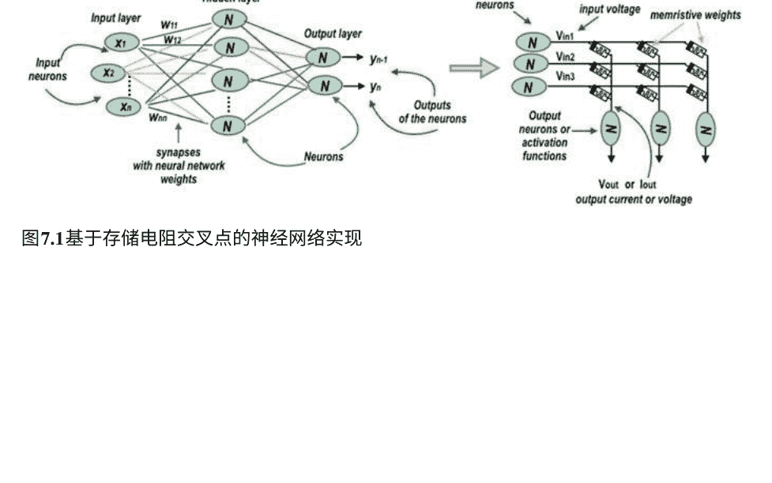

### 7.3.1 存储电阻系统中学习算法的实现

已经有几次尝试使用存储电阻交叉点电路在硬件上实现学习架构。这些尝试包括使用反向传播算法的传统神经网络，使用Hebb学习和梯度下降规则的HTM，以及使用STDP的脉冲神经网络。基本的Hebb学习规则已经在单个突触和交叉点上进行了脉冲和脉冲基础方法的实现。感知器学习规则已经被应用于在线和离线模式分类方法中[5, 7-9, 16]。然而，大多数学习方法的实现都是使用软件进行的。

在FPGA上和使用数字架构上有几种神经网络的实现[16]。在大多数情况下，这些系统侧重于加速现有架构。最近在[2, 6, 18, 21]中提出了几种用于存储电阻交叉点的数字训练电路。[2]中展示的架构说明了存储电阻深度神经网络的训练架构，试图加速学习并将其转移到硬件中。[6]中展示了具有模拟神经元和数字片上训练电路的神经网络。然而，只有少数方法完全展示了基于模拟硬件的学习算法的实现，这样可以避免模拟到数字的转换。[13, 14]和[26]的研究工作在硬件上实现了反向传播算法。而[11]的研究工作展示了HTM的模拟学习电路，该电路实现了Hebbian学习，详见第14章。模拟方法实现学习电路为近传感器处理和将学习电路直接集成到传感器中提供了机会。模拟学习电路对于边缘计算应用非常有用。

### 7.3.2 基于忆阻系统的反向传播算法的模拟硬件实现

最近提出的两层网络反向传播算法的实现如图7.2所示[26]。该架构简化了反向传播算法。在计算误差之后，误差被传播回去，并且两层中的忆阻器件被更新。忆阻开关允许将层中的忆阻器件隔离出来，这些器件目前不需要更新。忆阻器件的更新值通过FPGA或使用查找表[12]计算。

反向传播学习的另一种架构如图7.3所示[13, 14]。该架构使用梯度下降实现了反向传播算法，而没有简化算法。反向传播架构由多个模块组成，可用于不同类型的学习系统，包括深度神经网络[14]。图7.3展示了整体架构。

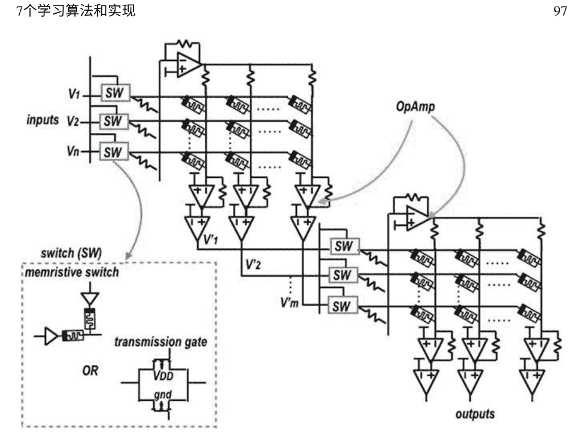

图7.2带有反向传播学习的记忆电阻网络架构[26]

图7.4显示了电路的每个模块和设计中使用的相应器件的实现。

图7.3显示了具有反向传播误差计算电路、Sigmoid激活函数、Sigmoid误差导数、不同阶段反向传播的乘法电路、控制晶体管和权重更新电路的两层神经网络。神经网络的输入信号表示为 $V_{in}$。归一化电路是可选的，用于将输入信号归一化到所需范围，这取决于阈值电压记忆电阻器件。开关晶体管用于控制电流的方向，并在前向传播、反向传播和更新过程之间切换。交叉栏的输出（点积）表示为来自交叉栏列的电流。因此，调整晶体管的参数以避免输出电流的失真。在该系统中，为了避免干扰和泄漏电流，从交叉栏读取的电流逐个进行。由于负电阻是不可能的记忆电阻器件，因此在读取交叉栏的输入时使用第二个交叉栏和符号控制电路。当交叉栏中保存的权重为负时，符号控制电路改变输入电压的符号。权重的符号存储在符号交叉栏中，分别对应正号和负号。

反向传播算法分为几个模块。这些模块的电路级实现如图7.4所示。模块1对应于

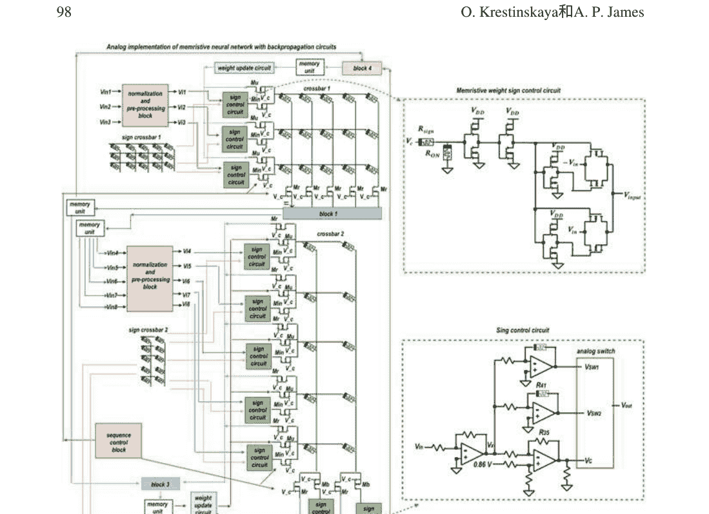

图7.3使用梯度下降的反向传播算法的模拟实现[13, 14]

前向传播和激活函数。它由电流缓冲器、sigmoid函数和sigmoid的导数组成。电流缓冲器用于确保sigmoid电路不会影响交叉栏的输出。sigmoid的导数在前向传播中不使用，但在反向传播阶段中使用。sigmoid的导数的电路级实现涉及差分放大器，用于从1中减去sigmoid的输出，并使用乘法电路将结果与sigmoid的输出相乘。sigmoid和sigmoid的导数的输出存储在内存单元中，这些单元也可以基于忆阻器设备。

在前向传播之后，交叉栏开关切换到反向传播模式，并将电流的方向反转以通过交叉栏传播回去。块2执行通过输出层的传播。它涉及计算错误，将S型输出减去理想输出。然后，错误乘以输出层的导数。这个乘法电路对信号的符号变化很敏感。因此，有两个乘法电路，以确保正负乘法正确执行，因为乘法器的正范围和负范围具有不同的振幅。

## Circuit level implementation of backpropagation algorithm

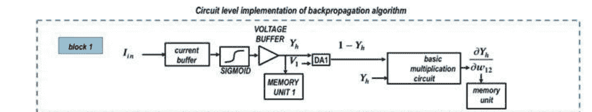

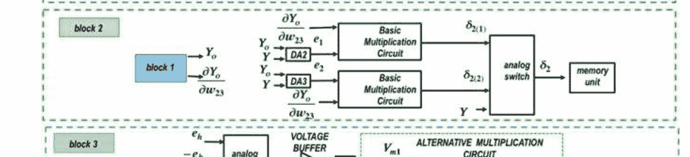

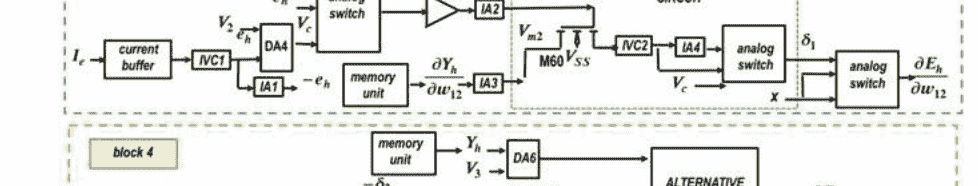

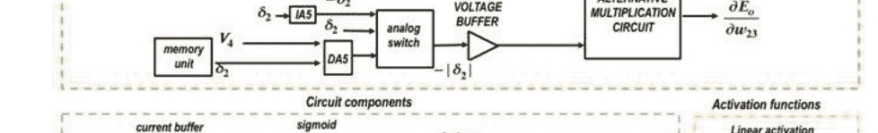

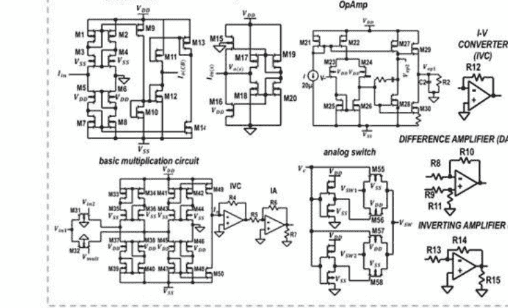

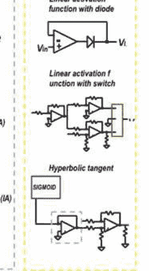

> 图7.4 反向传播算法的电路级实现[13, 14]

模拟开关选择乘法是正还是负，并选择正确的输出。块2的输出稍后用于更新输出层的记忆电阻器。块3执行反向传播，除了输出层之外的所有其他层。计算得到的错误通过交叉栏向与正向传播相反的方向传播，并且交叉栏的输出电流在输入供应点处读取。然后，通过电流到电压转换器将此电流转换为电压。然后，执行此错误与隐藏层的导数的乘法。由于乘法器很敏感，为了进行准确的乘法，添加了补偿电路，并且错误信号被移位，因为乘法器对mV级别的小信号不准确。正负乘法与块2类似执行。块3的输出用于更新隐藏层中的记忆电阻器。块4用于将块2的输出与隐藏层的输出（输入到输出层）相乘，以执行输出层的更新过程。

权重更新电路如图7.4所示，它计算来自第2和第4块的更新脉冲的幅度。序列控制电路控制脉冲的持续时间。

## 7.4 结论

本章简要介绍了各种学习规则和算法，并为反向传播算法提供了数学框架，这是深度学习系统中最常用的算法之一。由于其体积小、功耗低和可改变电阻状态的能力，基于忆阻神经网络是硬件上深度学习系统的一种有前景的解决方案，因此本章重点关注了忆阻系统学习算法的硬件实现。

已经展示了忆阻神经网络的此反向传播算法的模拟硬件实现，该算法也可以应用于深度忆阻神经网络。在硬件上实现完全模拟学习系统的主要挑战是学习算法的复杂性。在深度神经形态结构的训练和学习中，完全模拟的片上忆阻系统仍然是一个未解决的问题。

#### 章节亮点

-   赫布学习规则和反向传播算法是各种神经形态结构实现中最常用的学习算法。
-   在FPGA上和使用数字和混合信号设计上有很多不同的硬件实现学习算法。
-   尽管近年来已经提出了几种完全模拟学习结构的实现，但这仍然是一个未解决的问题。

#### 参考文献

+   1. Azghadi MR., Al-Sarawi S, Iannella N, Abbott D (2012) 基于时序相关可塑性的BCM规则的设计和实现。 在：2012年国际联合神经网络会议(IJCNN)，IEEE，第1-7页
2. Cheng, M, Xia L, Zhu Z, Cai Y, Xie Y, Wang Y, Yang H (2017) Time: 基于忆阻器的深度神经网络的训练内存架构。 在：2017年第54届ACM/EDAC/IEEE设计自动化会议(DAC)，第1-6页，https://doi.org/10.1145/3061639.30623263. Choe Y (2015) 反赫布学习 。在：计算神经科学百科全书。 Springer, 第191-193页
4. Gerstner W, Kistler WM (2002年) Hebbian学习的数学公式。 Biol Cybern 87 (5-6) : 404-415
5. Hasan R, Taha TM (2014年) 使memristor交叉神经形态处理器的反向传播训练成为可能。 在：2014年国际神经网络联合会议 (IJCNN)，IEEE，第21-28页
6. Hasan R, Taha TM, Yakopcic C (2017年) 基于memristor交叉栅的多层神经网络的片上训练。微电子学杂志66: 31-40
7. Hassan AM, Yang C, Liu C, Li HH, Chen Y (2017年) 基于memristor交叉栅阵列的混合脉冲自学习神经形态系统。 在：2017年欧洲设计、自动化和测试会议与展览 (DATE)，IEEE，第776-781页
8. 胡X, 冯G, 段S, 刘L (2017年) 具有应用于图像处理的记忆电阻多层细胞神经网络。 IEEE Trans Neural Netw Learn Syst
9. Kataeva I, Merrikh-Bayat F, Zamanidoost E, Strukov D (2015年) 基于记忆电阻交叉开关电路的神经网络的高效训练算法。 在：2015年国际联合会议神经网络 (IJCNN)，IEEE，第1-8页
10. Krestinskaya O, Dolzhikova I, James AP (2018年) 使用记忆电阻网络的分层时间记忆：一项调查。 IEEE Trans Emerg Top Comput Intell 2 (5) : 380-395。 https://doi.org/10.1109/TETCI.2018.2838124
11. Krestinskaya O, Ibrayev T, James AP (2018年) 具有模式识别功能的记忆电阻逻辑电路的分层时间记忆特征。 IEEE Trans Comput-Aided Des Integr CircuitsSyst 37 (6) : 1143-1156
12. Krestinskaya O, James AP, Chua LO (2018) 神经-记忆电路用于边缘计算：一个综述。 arXiv预印本 arXiv:1807.00962
13. Krestinskaya O, Salama KN, James AP (2018) 用于记忆交叉栏神经网络的模拟反向传播学习电路。 在：2018年IEEE国际电路与系统研讨会 (ISCAS)，IEEE，第1-5页
14. Krestinskaya O, Salama KN, James AP (2018) 使用模拟反向传播电路的记忆电阻神经网络架构进行学习。 IEEE Trans Circuits Syst I: Regul Pap15. Leonard J, Kramer M (1990) 改进反向传播算法以训练神经网络。 Comput Chem Eng 14(3):337–341
16. Li B, Wang Y, Wang Y, Chen Y, Yang H (2014) 训练自身：基于记忆电阻神经网络的混合信号训练加速。 In: 2014 19th Asia and South Pacific designautomation conference (ASP-DAC), IEEE, pp 361–366
17. Nair MV, Dudek P (2015) 基于梯度下降的memristive交叉阵列学习。 在：2015年国际神经网络联合会议（IJCNN），IEEE，第1-7页
18. Rosenthal E, Greshnikov S, Soudry D, Kvatinsky S (2016) 基于完全模拟的memristor的神经网络和在线梯度训练。 在：2016年IEEE国际电路与系统研讨会（ISCAS），第1394-1397页，https://doi.org/10.1109/ISCAS.2016.752751019
Sheridan PM, Du C, Lu WD (2016) 使用memristor网络进行特征提取。 IEEE TransNeural Netw Learn Syst 27（11）：2327-2336
20. Smagulova K, Krestinskaya O, James AP (2018) 基于memristor的长短期记忆电路。 模拟集成电路信号处理95（3）：467-472
21. Soudry D, Castro DD, Gal A, Kolodny A, Kvatinsky S (2015) 基于忆阻网络的多层神经网络与在线梯度下降训练。 IEEE Trans Neural Netw Learn Syst26(10):2408–2421. https://doi.org/10.1109/TNNLS.2014.2383395
22. Soudry D, Di Castro D, Gal A, Kolodny A, Kvatinsky S (2013) 带有忆阻器的赫比安学习规则。 以色列理工学院，以色列海法
23. Srinivasan N, Ravichandran V, Chan K, Vidhya J, Ramakrishnan S, Krishnan S (2002) 用于多层前馈神经网络的指数化反向传播算法。 在：第9届国际神经信息处理会议论文集，2002年。ICONIP'02，卷1. IEEE，pp 327–331
24. Wu X, Saxena V, Zhu K (2015) 一种用于大脑启发式计算的CMOS尖峰神经元与密集的脉冲神经元连接的记忆电阻网络。 在：2015年国际神经网络联合会议(IJCNN)，IEEE，第1-6页
25. Zamanidoost E, Bayat FM, Strukov D, Kataeva I (2015) 用于记忆电阻交叉开关电路模式分类器的曼哈顿规则训练。 在：2015年IEEE第9届智能信号处理国际研讨会(WISP)，IEEE，第1-6页
26. Zhang Y, Wang X, Friedman EG (2018) 基于记忆电阻的多层神经网络电路设计。 IEEE Trans Circuits Syst I: Regul Pap 65(2):677–686

## 第8章 用于神经网络的多级记忆电阻存储器

Aidana Irmanova, Serikbolsyn Myrzakhmet和Alex Pappachen James

摘要模拟记忆在神经形态工程中具有重要意义，因为它使得可扩展的神经网络设计和能量高效的计算操作实现成为可能。随着忆阻器的出现，由于忆阻器的固有特性，模拟记忆的实现成为可能，如纳米尺度大小、非易失性和能量效率。在神经网络的硬件实现中，忆阻器存储突触权重的值，并通过外部刺激的应用来进行操作，类似于被加强的突触。

理想情况下，忆阻器是连续的记忆，目前处于发展的早期阶段，这在神经形态电路设计中引起了几个问题。设备级和架构级问题迫使存储工程师以不同的方式来设计忆阻性存储器。本章将讨论设备级问题：受限的电阻状态数量、随机切换和架构级问题：潜行路径，并介绍它们的最新解决方案。

#### 8.1 引言

最近提出的大多数神经网络（NN）设计都基于忆阻交叉栅架结构[16]，因为忆阻交叉栅架可以实现内存计算，同时提供内存资源和向量-矩阵乘法（VMM）计算。VMM是NN的核心操作，它将输入值与突触权重矩阵进行乘法运算。这个操作在推理和训练阶段中被重复使用，并被评估为系统中计算开销最大的操作[9]。

目前，有几个问题阻碍了交叉栅架中模拟忆阻器单元的扩展架构。首先与忆阻器本身有关：纯模拟忆阻器尚未制造出来，而二进制忆阻器表现出随机切换行为[23]。还有一些研究报告了存储离散模拟状态的多级忆阻器制造[17]。这种忆阻器的可重复性是主要问题，导致存储器性能不准确[31]。

另一方面，第二个问题是架构层面的问题。如果使用忆阻器，最初设计用于在每个交叉点处使用开关并在二进制逻辑中运行的交叉栅架必须进行修改以避免潜行路径泄漏电流[35]。潜行路径电流影响系统的编程和读取过程。

在本章中，介绍了用于NN实现的忆阻电阻模拟存储设计的上述问题。在背景部分，介绍了交叉栅和忆阻电阻器以及基于忆阻电阻器的存储器相关的重要概念和术语的历史和操作。此外，详细解释了控制忆阻电阻器中的电阻切换的写入和擦除操作。在此基础上，讨论了使用二进制和多级忆阻电阻器设计多级存储器的方法。总之，解释了用于缩放忆阻电阻交叉栅架构的潜行路径解决方案。

### 8.2 背景

交叉栅可以表示为一组宽度小于50纳米的平行线路与另一组线路相交[8]。在每个线路交叉点上，有一个可以在施加一定电压信号后改变其导电性的器件。交叉栅可以提供几个优势。首先，它具有重复的交叉线路结构，与基于CMOS技术的传统处理器相比，制造过程更容易[19, 24]。其次，交叉栅的材料实现有许多选项，使得设计参数对于不同类型的架构具有灵活性[12]。此外，交叉栅架构可以同时用作存储器、逻辑和计算块[21]。在2008年之前，交叉栅线路的交叉点处使用了不同的CMOS材料。这种交叉栅电路被用于数字逻辑门实现和数字存储器架构[27]。2008年之后，当第一个忆阻电阻器被制造出来后，忆阻电阻器在交叉栅架构中变得常见[14]。

忆阻电阻网络的存在在1971年由美国科学家L. Chua在理论上预测[4]。他提出并在数学上证实了电路中存在第四个基本元件——电感、电容和电阻之外的元件的假设。忆阻电阻器被定义为电路中的一种被动元件，其电阻取决于通过它的电荷。在电路中断电后，忆阻电阻器“记住”了它最后一次的电阻值（忆阻电阻器的缩写）[4]。从那时起，忆阻电阻器在三十多年里一直是假设的元件，但在2008年，一组由惠普公司的斯坦利·威廉姆斯领导的研究人员首次制造了物理忆阻电阻器[29]。

由惠普公司的斯坦利·威廉姆斯制造，同样拥有交叉栅技术的专利，第一个物理记忆电阻器[29]。它的特性与Chua提出的模型一致。记忆电阻器表现出两个不同的电阻状态：低电阻（R_on）和高电阻（R_off）。

理想情况下，记忆电阻器在Ron和Roff之间具有所有可能的模拟状态。然而，目前的记忆电阻器实现存在严重的切换到Ron和Roff之间中间状态的可变性[13]。大多数研究论文假设记忆电阻器具有理想的行为，并使用电阻器进行模拟。这些电阻器代表了预先编程为特定模拟状态的记忆电阻器。

### 关键概念

记忆电阻器是一种两端口电子元件，其值是电荷和通量之间的线性关系[4]。记忆电阻器具有多级电阻特性，可以通过施加在器件上的电压或电流随时间变化的函数来控制，并且可以编程为在最大可能电阻Roff和最小电阻Ron之间的任何电阻级别[5]。

电阻切换是指器件在施加刺激的结果下改变其电阻的物理现象。电阻的变化是非易失性和可逆的。

存储在记忆电阻器中的离散模拟状态是非二进制逻辑状态。一个逻辑状态可以用电阻值的范围来表示，该范围与下一个逻辑状态的电阻值不匹配。

二进制记忆电阻器只有两个可区分的状态，对应于两个逻辑状态：R_on ∈ [R_1, R_2, ..R_n] < R_th，和 R_off ∈ [R_1, R_2, ..R_n] > R_th，其中R_th定义为R_max_on 和 R_min_off 的平均值。二进制记忆电阻器的二进制状态示例可以在图8.1a中找到。

多级记忆电阻器具有多个可区分的状态（离散模拟状态），因此，所有电阻值[R_1, R_2, ..., R_n]在范围Ron 和 R_off内：R_all ∈ [Ron, R_off]。6级记忆电阻器的电阻状态示例可以在图8.1b中找到。

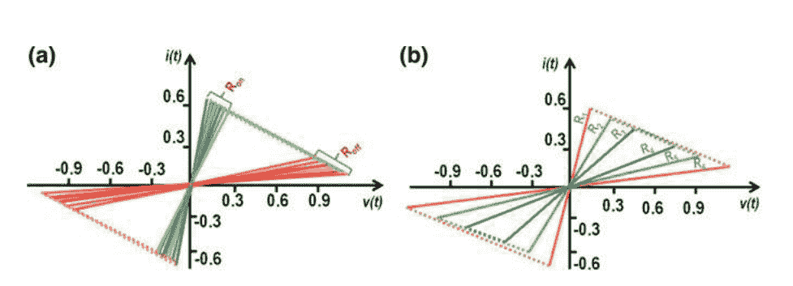

随机切换是指在施加特定量的刺激后，忆阻器中的电阻切换或/和电阻切换的概率性波动[28]。图8.1展示了二进制忆阻器的 $R_{on}$, $R_{off}$ 状态的可能变化。

阈值电压是引起忆阻器电阻切换的最小幅度和持续时间的刺激。

读取电压是小于阈值电压的电压。它用于读取操作。

忆阻器执行三种操作 (图8.4和8.5):

- 1. 读取操作用于计算忆阻器的当前电阻状态。
- 2. 写入是一种编程操作，将忆阻器的电阻级别降低到 $R_{on}$。
- 3. 擦除是一种编程操作，它增加了记忆电阻器的电阻水平到 $R_{off}$。

设备的耐久性或寿命是指在设备崩溃之前，成功擦除和写入操作的次数[34]。设备的耐久性取决于所使用的电压和电流。较高的电压和电流会缩短寿命并最终破坏设备。结果因操作的协议（刺激的幅度和持续时间）而异。

电阻切换的可重复性是指记忆电阻器能够稳定地切换到范围内的 $R_{on}$ 和 $R_{off}$ 值，并保持其比率在整个设备寿命中稳定。

记忆电阻器的切换类型根据增加（擦除）或减小（写入）电阻状态所需的电压极性被分类为单极性和双极性[33]。

为了增加和减小单极记忆电阻器的电阻状态，所施加的电压必须具有相同的极性但不同的大小；而对于双极记忆电阻器，电压必须具有相反的极性，如图8.3所示。

### 8.3 控制电阻切换

记忆电阻器适合构建存储单元的主要原因之一是它们的非易失性。数学特性，如功率曲线 (POP)和动态路线图 (DRM)描述了这种特性。POP和DRM的理想化表示如图8.2所示。基本上，POP是当 $V =0$ 时，记忆电阻器的电流状态的变化率，即 f(x,0)中的曲线[20]。另一方面，DRM描述了设备的初始条件下记忆电阻器对任何输入的响应[2]。POP和DRM也是构建写入、擦除和读取操作的协议的基础，这些操作是电阻性切换的控制操作。

应用于记忆电阻器的刺激控制电阻性切换过程。在电压控制的记忆电阻器[20]中，刺激的影响取决于电压幅值 $V_{w}$、刺激的持续时间 $t_{s}$和初始状态 $R_{i}$。电压刺激的幅值和极性 $V_{w}$，以及持续时间 $t_{s}$在不同材料类型的记忆电阻器中有所不同。扩展的记忆电阻器理论表明，刺激的幅值和持续时间呈正相关关系，幅值越大，所需的电压刺激时间越短，反之亦然[20]。材料实现和制造过程也决定了记忆电阻器的切换类型。电阻性切换的类型，无论记忆电阻器是双极性还是单极性（图8.3），在整体存储器设计过程中至关重要，因为控制信号的极性和大小决定了用于记忆电池设计的CMOS技术的类型和尺寸。

### 8.3.1 编程和读取忆阻器

在本节中，描述了电压控制的二进制和多级忆阻器的写入、擦除和读取操作以及双极性开关的类型。

所有操作都是针对忆阻器的配置进行描述的，在该配置中，当底部电极（BE）接地时，刺激被施加到忆阻器的顶部电极（TE）上。

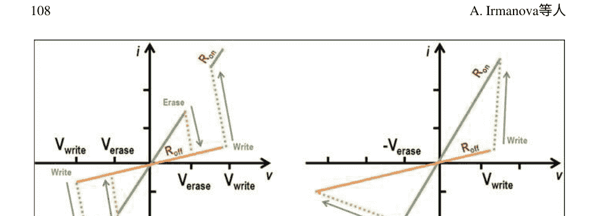

图8.3 单极性开关（左）和双极性开关（右）[10]

#### 8.3.1.1 写作—降低电阻

- 1. 应该有相应的刺激集合 $V_w$ 具有不同的幅度 $\forall [V_1, V_2, ..V_n] > V_{th}$ 并且具有相同的持续时间 $t > t_s$ 以切换记忆电阻器。$V_{th}$ 是记忆电阻器的最小正切换电压。图8.5a中给出了三个写入操作的示例。
- 2. 应该有一组不同持续时间的刺激 $\forall [t_1, t_2, ...t_n] > t_s$ 具有相同幅度 $V_w > V_{th}$ 以切换记忆电阻器。$t_s$ 是记忆电阻器的最小切换时间。图8.5b中给出了三个写操作的示例。

对于二进制记忆电阻器，应该有一些 $V_w$，使得 $V_w > V_{th}, t > t_s$，这样会将 $R_{ini}$ 切换到范围 $[R_1, R_2, ..R_n] < R_{th}$。图8.4a,b中给出了三个写操作的示例。

#### 8.3.1.2 擦除-增加电阻

对于二进制和多级记忆电阻器，应该有足够大的 $|V_w|$，使得 $V_w << -V_{th}, t > t_s$，这样可以将 $R_{ini}$ 切换到范围 $R_{off} \in [R_1, R_2, ..R_n] > R_{th}$。图8.4和8.5中给出了擦除操作的示例。

#### 8.3.1.3 阅读

对于双极性和单极性的记忆电阻器，应该有一组 $V_r$ 低于足够低的读取电压：$|V_r| << |V_{th}|$，这不会影响电阻器的当前状态。在神经网络运算的推理阶段使用读取电压值。

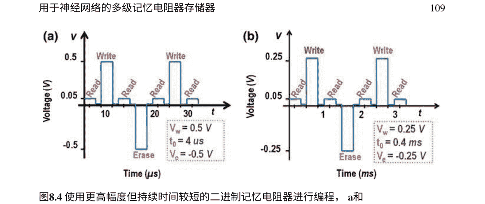

图8.4 使用更高幅度但持续时间较短的二进制记忆电阻器进行编程，a和使用较长持续时间较低幅度的二进制记忆电阻器进行编程，b

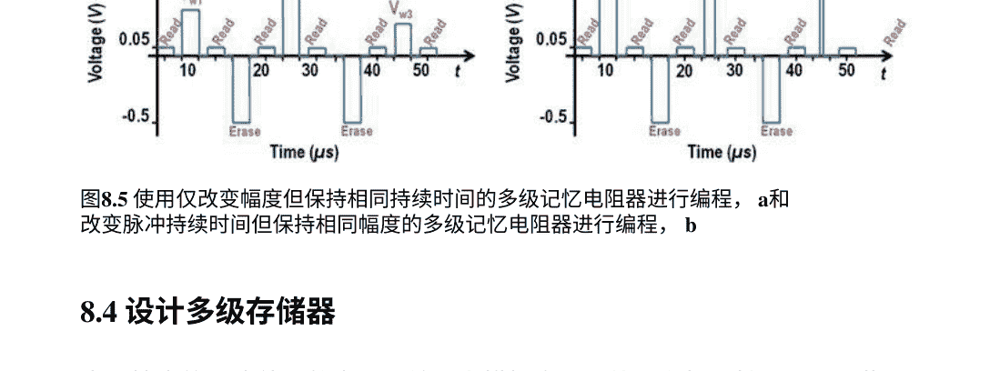

图8.5 使用仅改变幅度但保持相同持续时间的多级记忆电阻器进行编程，a和改变脉冲持续时间但保持相同幅度的多级记忆电阻器进行编程，b

### 8.4 设计多级存储器

由于技术的不成熟，将电阻器编程为模拟电平可能具有挑战性[30]。因此，设计可靠的存储单元的一种可能方法是在单元中使用离散状态的记忆电阻器的组合。记忆电阻器可以串联或并联，然后分别编程为离散状态，从而增加存储在单元配置中的适当数量的逻辑状态。

### 8.4.1 并联组合的记忆电阻器

由多个并联的记忆电阻器组成的存储单元可以获得多个电阻级别。例如，[32]中提出的存储单元基于二进制记忆电阻器，因为使用记忆电阻器的中间状态很可能需要高精度的电源。因此，图8.6a中显示的存储单元由一个晶体管和两个记忆电阻器组成，用于获得四个不同的电阻级别。

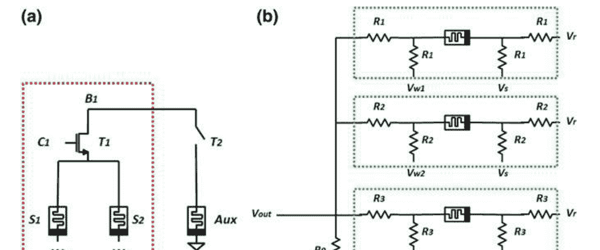

图8.6 [32]中的二进制记忆电阻器组合作为MLM (a); [11]中的三进制记忆电阻器组合作为MLM (b)

其中只利用了每个记忆电阻器的二进制状态（R_on和R_off）。因此，该电路根据存储在单元中的电阻逻辑状态生成不同的电压级别。一般来说，在使用记忆电阻器设计存储电路时，需要应用有效的写入和读取方法，这样可以简化电路，即减少所需的电压源数量，避免比较器和其他参考电路，同时从多个存储单元中进行读取等。[32]中提出的存储单元也考虑了这些因素，因此不需要单独的写入和读取电路。

在阅读过程中，需要将外部辅助电阻器连接到电池上。这个电阻器作为电位分压器并提供输出电压。

类似于[32]，在[11]中提出了一种简单的写入和读取方式的存储单元。图8.6b所示的由三个电阻器组成的存储单元使用三态电阻器来存储10或27个离散电阻级别。在每个电阻器分支处的电阻网络值（围绕电阻器的四个电阻器）引入了顺序，因此决定了该单元是否存储10或27个电阻级别。该设计还提出了使用二进制电阻器重新设计该单元以存储9个电阻级别，或者使用四进制电阻器存储高达64个电阻级别的可能性。存储在单元中的逻辑状态数量还取决于配置中的电阻器数量。因此，在设计具有这种存储单元的电阻器交叉开关电路时，必须考虑单元面积（数据密度）和逻辑状态数量之间的权衡。

图8.7 在[1]中提出的存储单元

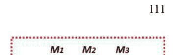

### 8.4.2 串联组合的记忆电阻器

多级存储单元可以通过多个记忆电阻器的串联组合来设计。其中一种实现方法在[1]中提出。通过串联连接三个相同的记忆电阻器（图8.7），设计了存储单元以提供三进制逻辑。为了将单元编程到第一个电阻级别，两个电阻器被切换到 Ron 状态，而对于第二个状态，所有电阻器都处于 Ron 状态，为了获得第三个电阻级别，只有一个电阻器保持在 Ron 状态。

### 8.5 交叉点架构

在神经网络的推理阶段，读取电压表示输入向量，模拟存储器中存储的导纳值表示突触权重。前馈操作通过突触权重和输入向量的点积操作，然后在每一层进行激活函数操作来执行。潜行路径泄漏是遇到基于忆阻器的电路和架构的关键问题之一。当电流流向错误方向时，潜行路径会出现在大型交叉阵列中，导致读写操作容易出错。除了使读写过程复杂化外，它还增加了电路的功耗。因此，交叉阵列的大小通常受到限制[6]。可能的潜行路径解决方案包括多级读取、使用展开架构、二极管门控、晶体管门控（图8.8）、通过交流信号进行感知、使用互补忆阻器来减少潜行路径电流等[35]。设计可靠的多级存储器需要在交叉阵列的每个存储单元中放置二极管或晶体管[25]，因为单个忆阻器是不够的。因此，将讨论几种适用于开发多级存储器的方法。

### 8.5.1 晶体管门控

在设计多级存储器时，常常使用小尺寸的晶体管与记忆电阻器或记忆电阻器的组合在每个存储单元中。这种晶体管控制方式可以访问所需的存储单元进行读取或写入操作，并避免了潜行路径。例如，[26]采用了台积电130纳米CMOS工艺。

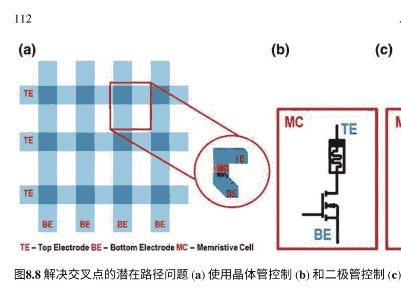

对于不同的阵列结构，如1T1M、1T2M和2T2M，可以使用晶体管[18]提出了最小尺寸的单栅极场效应晶体管用于1T2M配置。[15]提出了1T1M存储单元以及形成NOR类型阵列，它展示了可靠的电阻切换、良好的耐久性和保持性能。然而，使用小尺寸的晶体管并不能完全消除潜行路径电流，只能减少一部分[35]。另一方面，具有更强潜行路径阻断能力的大尺寸晶体管体积较大，增加了芯片面积。

### 8.5.2 二极管门控

另一种防止潜行路径的方法是在每个存储单元中添加二极管。根据[3]，1D1M结构的实现比1T1M设计更直接，可能需要更少的面积。在[3]中提出了由一个无机二极管和一个有机单极性存储元件组成的存储单元。基于耐久循环和保持时间的1D1M结构与基于1M的比较分析表明，它们都具有类似的特性，但是在1D1M结构中，可以防止交叉栅极存储器的串扰读取干扰。因此，将二极管与忆阻器集成在一起不会对性能产生不利影响，但是包含二极管的交叉栅极存储器具有引入不希望的延迟的电容负载[7]，但尚未进行彻底的研究。

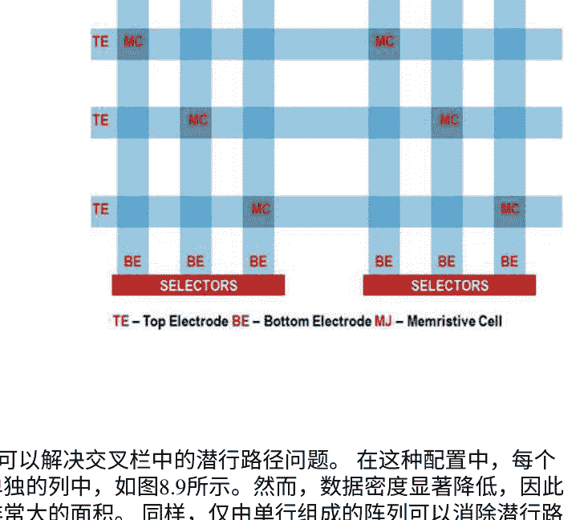

### 8.5.3 展开架构

使用展开架构[22]可以解决交叉栏中的潜行路径问题。在这种配置中，每个忆阻器都放置在单独的列中，如图8.9所示。然而，数据密度显著降低，因此存储电路将需要非常大的面积。同样，仅由单行组成的阵列可以消除潜行路径电流[35]，并且与在[22]中提出的展开架构相比，所需面积更小。

### 8.6 总结

本章讨论了与忆阻存储器设计和增加忆阻器单元中存储的逻辑状态数量相关的关键概念和方法。解释了写入、擦除和读取等基本操作，并介绍了忆阻器的数学特性，如POP和DRM。在当前阶段，当忆阻多级存储器的设计与忆阻器开发相结合时，所提出的存储单元引入了面积和能量的权衡，但仍为神经网络的内存计算架构提供了可能。随着忆阻器制造工艺的成熟，大多数提出的设计可能会变得多余，只需要防止交叉栏的潜行路径，以实现VLSI实现。

#### 章节亮点

- 交叉电路中的模拟存储单元存储神经网络的突触权重。
- 在理想情况下，基于单个忆阻器的模拟存储单元在交叉电路中存储无限的突触权重值。
- 实际上，忆阻器存储离散的电阻状态。由并联或串联忆阻器组成的存储单元可用于增加存储的电阻级别。
- 在神经网络的推理阶段，使用读取电压来避免电阻切换。
- 在神经网络的训练阶段，使用编程电压来强制电阻切换。
- 在忆阻交叉阵列中发生潜行路径，使系统的推理和训练过程变得复杂。适用于开发多级存储的可能潜行路径解决方案包括设计展开架构、二极管门控和晶体管门控。

#### 参考文献

- 1. Amat Lluci E (2017) 利用新兴的非易失性忆阻技术设计多级存储单元。B.S.论文, 加泰罗尼亚理工大学
- 2. Ascoli A, Tetzlaff R, Menzal S (2018) 基于电路理论模型预测，探索现实世界的记忆电阻器动力学。IEEE电路与系统杂志 18(2):48–76
- 3. Cho B, Kim TW, Song S, Ji Y, Jo M, Hwang H, Jung GY, Lee T (2010) 可重写的一二极管-一电阻非挥发性有机存储器器件的切换。先进材料 22(11):1228–1232
- 4. Chua L (1971) 记忆电阻器-缺失的电路元件。IEEE电路理论转换 18(5):507–519
- 5. Chua L (2011) 电阻切换存储器是记忆电阻器。应用物理学A 102(4):765–783
- 6. Deng Y, Huang P, Chen B, Yang X, Gao B, Wang J, Zeng L, Du G, Kang J, Liu X (2013) 带有单元选择器的Rram交叉阵列：器件和电路相互作用研究。IEEE电子器件转换 60(2): 719–726
- 7. Fei W, Yu H, Zhang W, Yeo KS (2012) 通过新的改进的节点分析设计探索混合CMOS和记忆电阻电路。IEEE Trans Very Large Scale Integr (VLSI) Syst 20(6), 1012–1025
- 8. Hasan R, Taha TM, Yakopcic C (2017) 基于记忆电阻交叉开关的多层神经网络的芯片上训练。Microelectron J 66:31–40
- 9. Hu M, Strachan JP, Li Z, Grafals EM, Davila N, Graves C, Lam S, Ge N, Yang JJ, Williams R S (2016) 用于神经形态计算的点积引擎：编程1t1m交叉开关以加速矩阵-向量乘法。在：第53届年度设计自动化会议论文集。ACM (2016), 第19页
- 10. Hu S, Wu S, Jia W, Yu Q, Deng L, Fu YQ, Liu Y, Chen TP (2014) 纳米结构电阻式开关记忆电阻器及其应用综述。纳米科学与纳米技术快报 6(9): 729-757
- 11. Irmanova A, James AP (2017) 具有电阻网络的多级记忆电阻器。在：2017年IEEE亚太地区研究生微电子与电子学会议 (PrimeAsia)。IEEE, 第69-72页
- 12. Jo SH, Kim KH, Lu W (2009) 基于硅记忆电阻系统的高密度交叉阵列。纳米快报 9(2): 870-874

## 第9章 记忆电阻网络的深度学习分类器

Irina Dolzhikova, Akshay Kumar Maan 和 Alex Pappachen James

摘要 阈值逻辑门（TLG）以其高速和低功耗而闻名，这对于实时处理和识别自然信号、芯片内存架构和神经网络实现等应用至关重要。将忆阻器集成到设计中可以扩展阈值逻辑电路的功能。在本章中，我们回顾了受大脑内神经元放电原理启发的忆阻阈值逻辑（MTL）电路的硬件设计。讨论了各种阈值架构、它们的限制以及可能的应用领域。

#### 9.1 引言

阈值逻辑块是人工神经网络（ANNs）中用于数学建模神经元激活的最简单类型的计算单元。阈值处理单元在生物大脑的层次结构中的不同功能和结构层次上进行决策。根据问题的类型，需要做出各种各样的决策，因此可以找到各种阈值技术。

在信号处理应用中，阈值处理被广泛用于去除噪声效应并恢复信噪比。通过设置阈值，图像中的不重要特征可以被丢弃，只保留有用的信息。

阈值处理技术在模式识别中非常相关。选择适当的特征集是确保良好识别准确性的关键。


通过消除特定像素，通过阈值可以提高图像分类的准确性。1943年，McCulloch和Pitts [8]首次尝试实现了非常简化版本的生物神经元模型。它取决于计算由公式（9.1）表示的符号函数的阈值逻辑实现，其中 $x_i$ 是输入，$w_i$ 是突触的权重，$n$ 是阈值门的输入数，$\theta$ 是阈值值。

$$ f(x_1, \ldots, x_n) = \text{sgn} \left( \sum_{i=1}^n w_i x_i - \theta \right) = \begin{cases} 1 & \text{如果 } \sum_{i=1}^n x_i w_i > \theta, \\ 0 & \text{如果 } \sum_{i=1}^n x_i w_i = 0, \\ -1 & \text{如果 } \sum_{i=1}^n x_i w_i < \theta, \end{cases} \quad (9.1) $$

考虑到公式（9.1），任何单边阈值技术的一般形式，即只有一个决策边界的形式，可以如下所示：输出在加权输入大于或等于给定阈值时表示逻辑“高”，而在加权输入小于阈值时表示逻辑“低”。根据应用的不同，可能需要使用双边或多边阈值处理[3]。

本章重点介绍使用忆阻器在硬件上实现阈值逻辑的不同方法。本章内容安排如下。在第9.2节中，我们通过描述设计的主要模块和电路元件以及这些设计可应用于的问题类型，对MTL电路的现有硬件实现进行概述。在第9.3节中，我们对可用设计进行比较分析和讨论开放问题，以及未来的前景。

### 9.2 基于忆阻门电路的硬件实现

Rajendran等人[11]于2009年首次提出了基于忆阻门电路的阈值逻辑分类器的实现。图9.1展示了可编程阈值逻辑阵列（PTLA）的电路设计，其中包括Goto对和忆阻器。所提出的电路使用了三个5输入的阈值逻辑门（TLG）。Goto对由两个共振隧道二极管（RTD）串联连接形成。通过忆阻器连接在两个RTD之间的多个输入驱动Goto对。输入电压值在通过忆阻器时被转换为电流。时钟驱动的RTD使Goto对被锁存，因此输出取决于当前输入和先前的输出。为了确保电路的必要操作，该过程分为预放电阶段，在处理当前输入之前将过去的输出放电，以及评估阶段，在该阶段输出仅取决于当前输入。

评估阶段发生在信号 $\phi$ 高的时候。对于每个新的输入，两个阶段都会重复。
图9.1中呈现的设计用于3 $\times$ 5图像分类问题将输入图像分类为矩形或三角形。该设计考虑了具有3个不同电阻级别的忆阻器，即每个输入可以由对应于电阻为100 M$\Omega$时的权重‘0’，电阻为50 M$\Omega$时的权重‘1’和电阻为10 M$\Omega$时的权重‘2’的3个值之一进行加权。Goto对在加权输入的和大于阈值时（表示矩形类），输出产生逻辑‘1’，否则产生逻辑‘0’（输入图像的三角形类）。

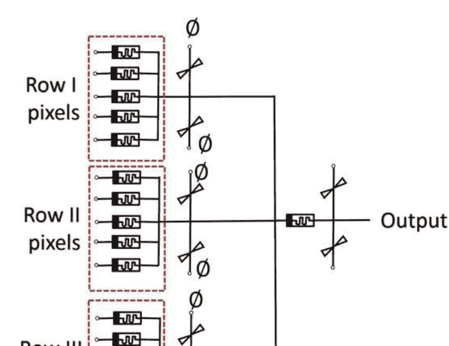

图9.1 使用忆阻器和Goto对提出的PTLA

不同的阈值门阵列架构在2010年实施[9]。作者们编程了忆阻器来调整输入的权重。所提出的架构如图9.2所示。输入是通过忆阻器后转换为电流值的电压值。加权输入值，即获得的电流，被求和，然后与参考电流（$I_{ref}$）进行比较。实现一个$n$个输入的阈值门所需的晶体管总数为（$2 \times n$）+18。基于忆阻器的阈值门有两个输出，其中一个是另一个的补码。

图9.2上的附加电路用于规避直接实现基于忆阻器的阈值门可能出现的特定问题。一个电流-

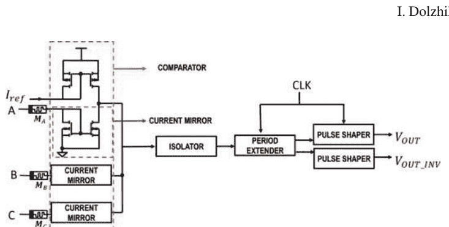

每个输入线路中使用了由两个晶体管组成的电流镜，以防止电流从电路的输出流向输入。如果电路用于更大的配置，则下一阶段可以加载电流比较器。这可以通过添加基于两个晶体管的隔离电路来预防。所提出的电路通过正脉冲后跟负脉冲来表示逻辑‘1’，而电流镜和隔离器在正周期内工作并切断负脉冲。为了恢复逻辑‘1’信号的负部分，使用基于CLK信号的由4个CMOS晶体管组成的电路进行周期延长。还需要考虑的另一个问题是在电路运行过程中权重应该保持固定，以确保正常功能。即使在电阻变化时施加恒定电压，权重也可能随时间变化。用于表示逻辑‘1’的正脉冲后立即跟随的负脉冲有助于反转在正脉冲期间所做的权重变化。逻辑‘0’由0 V信号表示。电路中的六个晶体管脉冲整形器的作用是为逻辑‘0’和逻辑‘1’生成所需的信号模式。脉冲整形器的输出成为下一个阈值门的输入。

所提出的 n输入阈值门可用于构建更大级联架构的岛屿。图9.3展示了基于交叉点的大小为3 × 3的岛屿。交叉点中的列数表示使用的阈值门数量。行数决定了阈值门的输入数量。每个岛屿都有输入和输出互连网络，通过这些网络输入被提供，输出被提取。这样的互连网络有助于连接多个岛屿，如图9.4所示。当使用级联架构时，应考虑扇出，即岛屿中的最大阈值门数量。前一阶段的扇出确定了岛屿上可接受的列数。

与基于CMOS晶体管的查找表（LUT）相比，使用忆阻器的提出的阈值架构可以将功耗和面积占用减少约75%。然而，这种改进是以增加延迟为代价的（图9.5）。

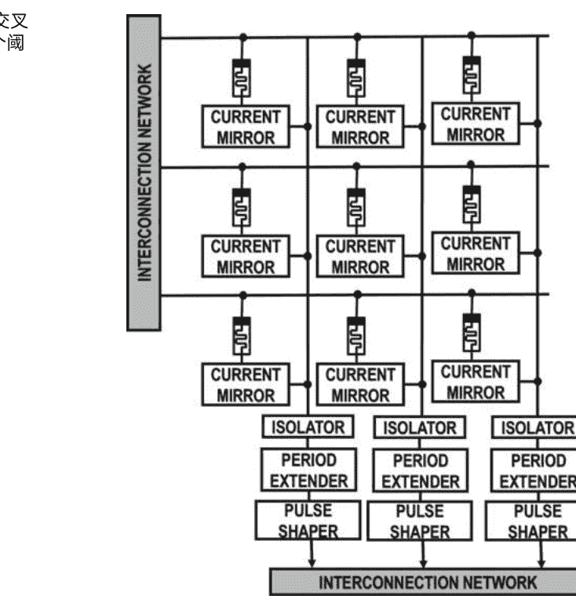

图9.3 基于 $3 \times 3$ 交叉点岛屿架构的3个阈值门[9]

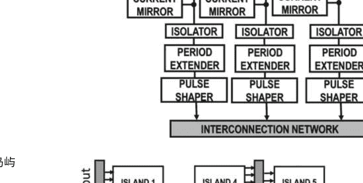

图9.4 使用六个岛屿的级联架构[9]

MTL门的训练方法[10]（见图9.6），它被用作三输入感知器，是Manem等人的研究工作中提出的[7]。训练基于随机梯度下降法。它用于在可训练阈值门阵列（TTGA）中有效地重新配置基于忆阻器的突触。

TTGA系统由一组阈值门[10]和基于CMOS的本地和全局训练电路组成，如图9.6所示。单个感知器需要一个全局训练电路，而每个忆阻器都有一个本地训练电路。

基于单层的四输入可训练阈值门（感知器）的提议设计能够实现具有多达四个输入的不同线性可分布尔函数。

2012年，Tran等人[13]提出了使用银硫系忆阻器器件与CMOS相结合的可重构门电路的设计

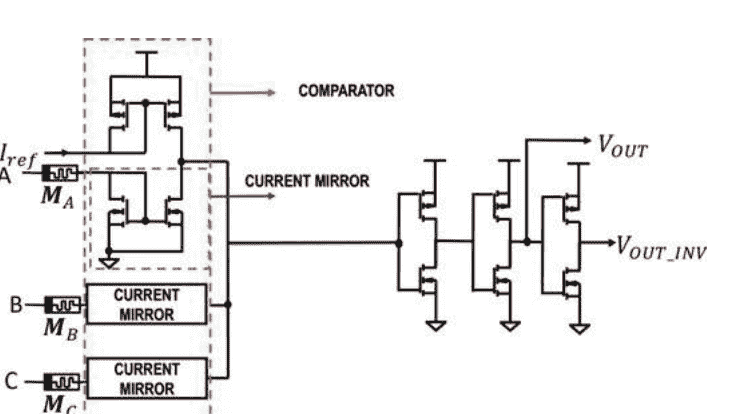

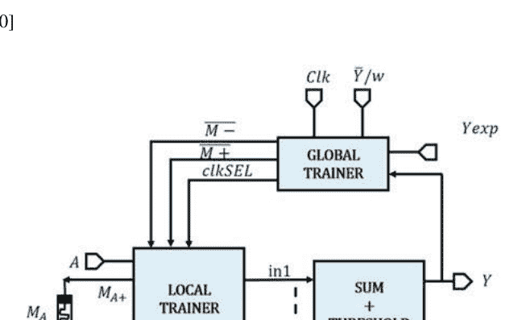

电路。通过改变忆阻器的电阻，所提出的电路可以使用单层网络产生四个可分离的逻辑函数（与、或、与非、或非）。电路设计如图9.7所示。在所提出的设计中，除了或门之外，所有的双输入逻辑门都需要考虑负权重。负权重可以通过并联到忆阻器上的运算放大器（op-amp）的输出处提供的补充负电流 $I_{op}$ 来获得。$I_{op}$ 和通过忆阻器流动的电流 $I_{mem}$ 的总和是突触电流 $I_s$，可以是正值也可以是负值。电路的增益决定了可能权重的范围，它通过电阻器 $R_F$ 和 $R_N$ 来表示。忆阻器件的编程电路如图9.8所示。

Gao等人[2]在2013年提出了另一种混合CMOS/忆阻可编程阈值逻辑门。所提出的线性阈值门（LTG）在图9.9中展示。几个类似二极管的忆阻器与下拉电阻器 $R_L$ 并联连接。所选忆阻器的行为取决于有效阈值 $V_{THo}$。在此阈值以下，忆阻器具有主动抑制电流的特性，而在此阈值以上，其导纳呈线性，斜率为1/R，可以变化。

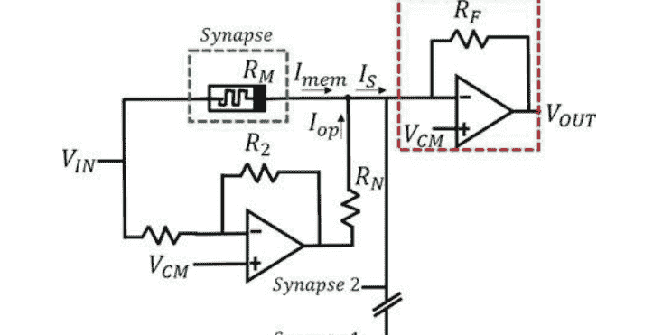

图9.7 使用忆阻器和CMOS电路的可重编程TLG，具有正负权重[13]。

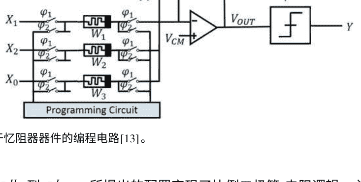

图9.8 用于忆阻器器件的编程电路[13]。

范围从 $R_{ON}^H$ 到 $R_{ON}^L$。所提出的配置实现了比例二极管-电阻逻辑。该逻辑门能够实现的布尔函数种类取决于忆阻器的动态范围 $R_{ON}^H / R_{ON}^L$ 比率。为了恢复电压摆幅并驱动连续逻辑门的输入，二极管-电阻逻辑通常与CMOS门连接。在建议的设计中，这样的CMOS门是D触发器，与CMOS反相器相比，对于高吞吐量的流水线电路更加高效。

Gao等人的阈值逻辑电路实现[2]证明在与Rajendran等人[11]展示的设计相比更加稳健，因为在逻辑操作过程中不依赖于忆阻器状态的变化。

所提出的设计[2]的另一个优点是，与[9, 11]中的阈值逻辑实现方法不同，不需要为每个忆阻器器件添加CMOS电流镜电路。由于这些额外的电路，[9, 11]的设计可能不适用于紧凑的交叉点阵列结构。在[2]的逻辑电路中，设计实现的面积主要取决于CMOS D触发器和用于编程忆阻器的小电路。

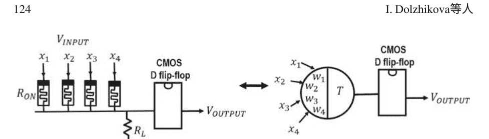

图9.9 使用忆阻器和CMOS D触发器实现的LTG[2]

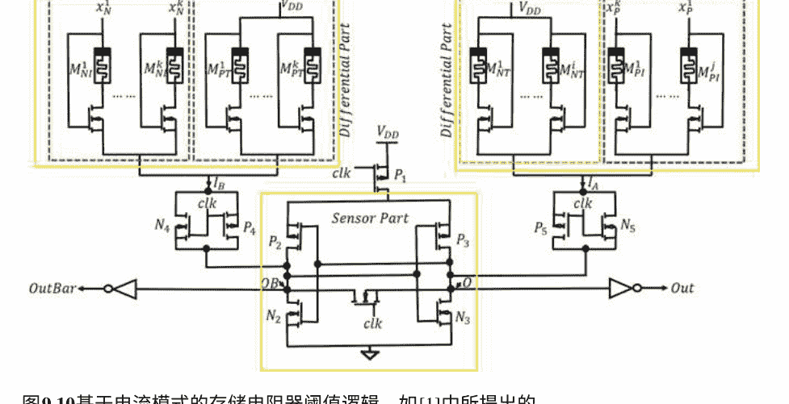

图9.10 基于电流模式的忆阻器阈值逻辑，如[1]中所提出的

图9.10显示了由Dara等人提出的一种新型基于电流模式的忆阻器阈值逻辑（CMMTL）。所提出的逻辑电路的配置由两个差分块和一个传感器部分组成。差分部分由用忆阻器器件和NMOS晶体管串联实现的负/正输入和正/负阈值的子块组成。该电路的阈值逻辑如下：如果电流 $I_A$ 大于电流 $I_B$，则节点 $O_A$ 的电压高且节点 $O_B$ 的电压低，反之亦然。

与[10]的设计相比，这种新的时钟设计的CMMTL在三、四和五输入阈值逻辑方面表现更好。延迟、能耗和能耗延迟乘积分别提高了77%、50%和88%。

Sharad等人[12]提出了一种用于可重构计算的动态电阻阈值逻辑设计。电路如图9.11所示，其中电阻性存储元件是Ag-Si忆阻器。这些存储元件实现了以下功能：

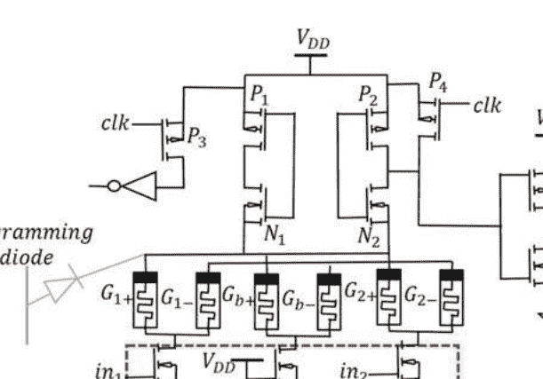

图9.11 动态RTL门电路[12]

权重和阈值由CMOS锁存器实现比较操作。在[2]的论文中，Ag-Si忆阻器被用于电阻阈值逻辑门，其中使用了CMOS D触发器进行比较。然而，该设计需要跨忆阻器的大电压和静态电流，导致功耗大。

动态电阻阈值电路[12]展示了比基于四输入LUT的CMOS FPGA更高96%的能量效率和两个数量级更低的能量延迟乘积。在2014年，James等人[4]提出了一种用于实现通用布尔逻辑的单元。逻辑单元的设计如图9.12所示，其中模拟电阻分压部分可以使用忆阻器实现，而CMOS反相器用于产生二进制输出的阈值操作。

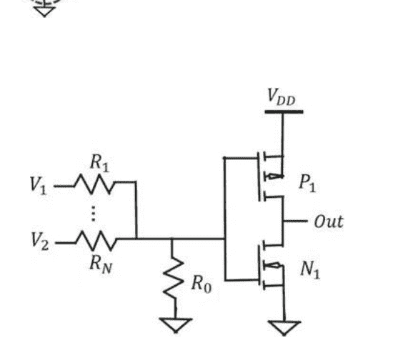

图9.12 由电阻分压布尔逻辑单元组成的电路图，包括两个输入电阻分压器和一个可变阈值CMOS反相器[4]

通过改变反相器的阈值电压，该配置可以用于实现NAND和NOR逻辑。对于 $V_{DD} = 1 V$，高输入 $V_H = 1$ 和低输入值 $V_L$，两输入NOR门需要阈值电压在0到1/3 V的范围内，而反相器阈值为2/3 V < $V_{TH}$ < 1/3 V将产生NAND门。如果反相器的阈值值可以降低到非常小的电压，就可以实现具有大量输入的电阻阈值逻辑。作者建议引入额外的反相器来降低阈值[4]。这个想法在图9.12中有所说明。额外的反相器具有不同的电源电压。开关集合有助于调节通用逻辑配置以实现AND、NAND、OR、NOR和NOT门。当开关 $S_{1}$ 和 $S_{4}$ 闭合时，NAND逻辑是可能的，并且输出在 $V_{out}$ 处测量（图9.13）。当需要AND逻辑时，开关 $S_{1}$ 和 $S_{3}$ 闭合。

在这种情况下，输出被测量在 $V_{out}$ 处。开关 $S_{2}$ 和 $S_{3}$ 同时启用以实现或逻辑。NOR门的实现只需要一个反相器，通过关闭 $S_{2}$ 和 $S_{4}$ 来启用。该设计基于0.25 μm的TSMC工艺和HP忆阻器。

James等人[5]提出了具有阈值逻辑的忆阻器-CMOS电路，用于快速傅里叶变换和Vedic乘法计算。所提出的电路的多样性在图9.14中有所说明，其中使用了基于忆阻器的平均电路、运算放大器和/或反相器的组合。

Maan等人[6]的工作中注意到了MTL在实时移动物体检测中的应用。电路实现的思想与图9.12 [4]中所示的相同。基于忆阻器的电阻分压器和CMOS反相器用于对模板中的像素进行编码。

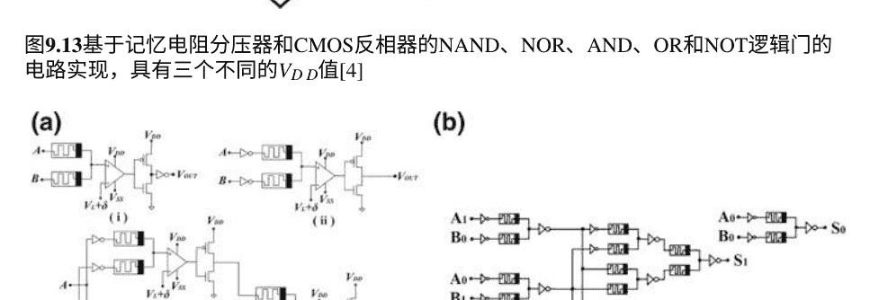

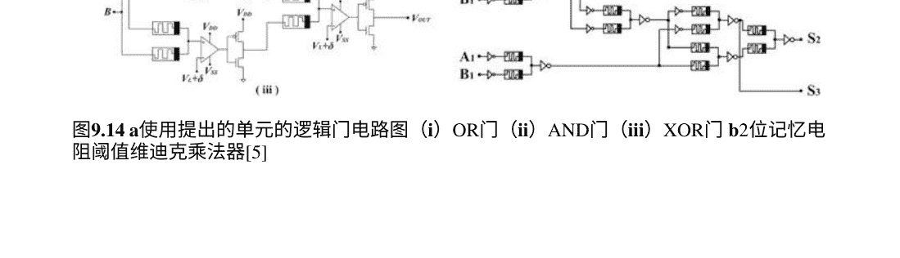

#### 参考文献

- 1. Dara, S., & Sharad, M. (未在文本中明确引用编号，根据上下文补充) 基于电流模式的忆阻器阈值逻辑。
- 2. Gao, G., et al. (2013) 一种混合CMOS/忆阻可编程阈值逻辑门。 (具体期刊信息未提供)
- 3. (未在文本中明确引用编号，根据上下文补充) 关于双边或多边阈值处理的文献。
- 4. James, A. P., et al. (2014) 一种用于实现通用布尔逻辑的单元。 (具体期刊信息未提供)
- 5. James, A. P., et al. (未在文本中明确引用编号，根据上下文补充) 具有阈值逻辑的忆阻器-CMOS电路，用于快速傅里叶变换和Vedic乘法计算。
- 6. Maan, A. K., et al. (未在文本中明确引用编号，根据上下文补充) MTL在实时移动物体检测中的应用。
- 7. Manem, H., et al. (2010) MTL门的训练方法。
- 8. McCulloch, W. S., & Pitts, W. (1943) 一个神经活动内在逻辑的演算。
- 9. Rajendran, B., et al. (2010) 不同的阈值门阵列架构。
- 10. Rajendran, B., et al. (2009) 可训练阈值门阵列（TTGA）。
- 11. Rajendran, B., et al. (2009) 首次提出了基于忆阻门电路的阈值逻辑分类器的实现。
- 12. Sharad, M., et al. (未在文本中明确引用编号，根据上下文补充) 一种用于可重构计算的动态电阻阈值逻辑设计。
- 13. Tran, T. T., et al. (2012) 使用银硫系忆阻器器件与CMOS相结合的可重构门电路的设计。

- Kim, H., Sah, M. P., Yang, C., & Chua, L. O. (2010). 基于电阻器的多级存储器。在：2010年第12届细胞纳米网络及其应用国际研讨会（CNNA）。IEEE，第1-6页。
- Kim, K. H., Gaba, S., Wheeler, D., Cruz-Albrecht, J. M., Hussain, T., Srinivasa, N., & Lu, W. (2011). 一种用于数据存储和神经形态应用的功能混合型记忆电阻交叉阵列/ CMOS系统。 *Nano Letters*, 12(1), 389-395。
- Kim, S., Jeong, H. Y., Kim, S. K., Choi, S. Y., & Lee, K. J. (2011). 塑料基底上的柔性记忆电阻存储阵列。 *Nano Letters*, 11(12), 5438-5442。
- Krestinskaya, O., James, A. P., & Chua, L. O. (2018). 边缘计算的神经记忆电路：综述。 *arXiv preprint arXiv:1807.00962*。
- Kuzum, D., Jeyasingh, R. G., Lee, B., & Wong, H. S. P. (2011). 基于相变材料的纳电子可编程突触，用于脑启发式计算。 *Nano Letters*, 12(5), 2179-2186。
- Lastras-Montaño, M. A., & Cheng, K. T. (2018). 基于比例记忆电阻的可编程随机存取存储器。 *Nature Electronics*, 1(8), 466。
- Lastras-Montano, M. A., Ghofrani, A., & Cheng, K. T. (2015). 架构能效高的基于交叉点的记忆电阻随机存储器。在：2015年IEEE/ACM纳米尺度体系结构国际研讨会(NANOARCH)。IEEE，第1-6页。
- Leon, C. (2015). 关于记忆电阻器的一切你想知道但又不敢问的。 *无线电工程*, 24(2), 319。
- Li, Y., Zhou, Y. X., Xu, L., Lu, K., Wang, Z. R., Duan, N., Jiang, L., Cheng, L., Chang, T. C., Chang, K. C., 等. (2016). 在记忆电阻交叉点中实现功能完整的有状态布尔逻辑。 *ACS Applied Materials & Interfaces*, 8(50), 34559-34567。
- Manem, H., Rose, G. S., He, X., & Wang, W. (2010). 变异容忍多级CMOS/纳米记忆电阻器存储器的设计考虑。在：第20届大湖区VLSI研讨会。ACM，第287-292页。
- Naous, R., Al-Shedivat, M., & Salama, K. N. (2016). 基于记忆电阻网络的随机性建模。 *IEEE Transactions on Nanotechnology*, 15(1), 15–28。
- Prezioso, M., Merrikh-Bayat, F., Hoskins, B., Adam, G. C., Likharev, K. K., & Strukov, D. B. (2015). 基于金属氧化物记忆电阻器的集成神经形态网络的训练和操作。 *Nature*, 521(7550), 61。
- Rose, G. S. (2010). 概述：记忆电阻器设备、电路和系统。在：2010年IEEE国际电路与系统研讨会(ISCAS)论文集。IEEE，第1955-1958页。
- Shaarawy, N., Emara, A., El-Naggar, A. M., Elbity, M. E., Ghoneima, M., & Radwan, A. G. (2018). 基于混合CMOS-忆阻器的2t2m RRAM的设计与分析。 *Microelectronics Journal*, 73, 75–85。
- Snider, G., Kuekes, P., & Williams, R. S. (2004). 缺陷的纳米交叉点中类似CMOS的逻辑。 *Nanotechnology*, 15(8), 881。
- Soni, R., Meuffels, P., Staikov, G., Weng, R., Kögler, C., Petzoldt, A., Hambe, M., Waser, R., & Kohlstedt, H. (2011). 关于铜掺杂的基于Ge0.3Se0.7的存储器设备中电阻切换的随机性质。 *Journal of Applied Physics*, 110(5), 054509。
- Strukov, D. B., Snider, G. S., Stewart, D. R., & Williams, R. S. (2008). 发现了失踪的记忆电阻器。 *Nature*, 453(7191), 80。
- Truong, S. N., Ham, S. J., & Min, K. S. (2014). 用纳米尺度的丝状开关二进制记忆电阻器进行语音识别的神经形态交叉电路。 *Nanoscale Research Letters*, 9(1), 629。
- Wang, C., He, W., Tong, Y., Zhang, Y., Huang, K., Song, L., Zhong, S., Ganeshkumar, R., & Zhao, R. (2017). 由石墨烯量子点增强的具有高度可重复模拟状态的记忆电阻器设备。 *Small*, 13(20), 1603435。
- 王X，李S，刘H，曾Z (2018). 基于忆阻网络的读写紧凑方案。 *IEEE Transactions on Computer-Aided Design of Integrated Circuits and Systems*, 37(7), 1505–1509。
- Yanagida, T., Nagashima, K., Oka, K., Kanai, M., Klamchuen, A., Park, B. H., & Kawai, T. (2013). 金属氧化物的单极和双极电阻切换的尺度效应。
- Yang, J. J., Zhang, M. X., Strachan, J. P., Miao, F., Pickett, M. D., Kelley, R. D., Medeiros-Ribeiro, G., & Williams, R. S. (2010). 忆阻器器件的高切换耐久性。 *Applied Physics Letters*, 97(23), 232102。
- Zidan, M. A., Fahmy, H. A. H., Hussain, M. M., & Salama, K. N. (2013). 基于忆阻器的存储器：偷道问题和解决方案。 *Microelectronics Journal*, 44(2), 176–183。

## 9 基于忆阻逻辑网络的

图9.15 a 具有四个输入像素的模块化BPRT单元 b 应用提出的BPRT单元进行图像维度缩减[6]

图像。图9.15a显示了一个具有四个输入像素值的模块化双层可编程电阻记忆逻辑（BPRT）单元。该具有四个模拟/数字像素输入的BPRT单元被用于图像维度缩减，如图9.15b所示。与CMOS等效设计相比，所提出的逻辑单元在面积、漏电功率、功耗和延迟方面表现出更好的性能。

## 9.3 讨论

低泄漏电流、电阻切换和更小的芯片面积的特性使得忆阻器成为一种吸引人的元件，可用作就地存储和执行的构建模块。阈值逻辑是最简单的计算单元，非常适合用于生物大脑中神经元激活时所需的突触单元。因此，忆阻阈值逻辑电路在研究人员中得到了显著的关注，用于最简单的逻辑功能（如逻辑门）到更复杂的认知任务（如人脸识别）。在本章中，我们展示了忆阻阈值逻辑电路的实际应用，可以用于模拟生物神经元，并实现忆阻突触、基于忆阻器的可编程阈值逻辑阵列、忆阻阈值逻辑门、混合CMOS/忆阻阈值逻辑电路、忆阻阈值逻辑电路用于快速移动物体检测以及傅里叶变换和维迪克乘法。

### 9.3.1 开放问题

与仅使用CMOS电路相比，基于忆阻器的电路面临着功耗降低和与CMOS-忆阻器混合电路集成的复杂性。在阈值逻辑配置中，忆阻电路中固有的电阻路径允许更大的电流，从而导致更高的功耗。此外，MOS门控忆阻器阵列中的漏电流超过了忆阻器电路的低漏电特性，需要补偿读出电路。此外，实现可编程忆阻器阵列中的不同状态通常具有挑战性，需要附加电路，从而增加了电路的复杂性。如果设计不慎，编程电路的面积可能超过忆阻器提供的较低面积的好处。为了进一步研究和开发忆阻器阈值逻辑电路，需要更准确的忆阻器模型，以便将其纳入现有的仿真工具中。这些工具需要能够模拟忆阻器所展示的广泛行为范围。

此外，忆阻器和忆阻器-CMOS混合电路的物理层设计受到了缺乏工艺标准的挑战，并需要在半导体行业进一步采用这些器件。从这个意义上讲，忆阻器设备和电路在商业实施阶段还处于相当早期。

### 9.3.2 未来展望

忆阻器阈值逻辑电路作为硬件中的就地可编程存储器的固有能力，为各种应用打开了广泛的可能性，例如具有学习、记忆和遗忘能力的存储器体系结构，类似人类的硅自学习分类器的设计，可编程和自学习芯片的智能模块的实现，计算机视觉中的模拟感知处理的设计，以及这种阈值逻辑系统的大规模仿真和实现的开发。

### 9.4 总结

新型纳米器件（如忆阻器）的出现为仿生计算领域带来了众多机会。阈值逻辑实现是能够迅速实现这种小型器件优势的领域之一。然而，除了机会之外，还应考虑将忆阻器集成到芯片中所面临的挑战。

本章对硬件上最新的基于忆阻器的阈值逻辑架构的建模方法进行了调查。它还概述了忆阻器电路配置设计中的最大挑战以及MTL的几个应用领域。

#### 章节亮点

- 阈值逻辑门（TLGs）以高速和低功耗性能而闻名，这对于实时信号处理和识别、芯片内存架构和神经网络实现等应用至关重要。
- 将忆阻器集成到TL设计中可以扩展TL电路的功能。
- 然而，除了机遇之外，还应考虑与将忆阻器集成到芯片中相关的挑战。

#### 参考文献

1. Dara CB, Haniotakis T, Tragoudas S (2013) 基于电流模式的低功耗高速忆阻器TLG。在：2013年IEEE缺陷和故障容忍性国际研讨会（VLSI和纳米技术系统（DFT））。IEEE，第89-94页。
2. Gao L, Alibart F, Strukov DB等 (2013) 可编程CMOS/ memristor阈值逻辑。IEEE Trans Nanotechnol 12(2):115–119
3. James AP (2014) Threshnomics: 阈值逻辑在算法和电路中的介绍。J Comput Sci Syst Biol 7(6):1
4. James AP, Francis LRV, Kumar DS (2014) 电阻性阈值逻辑。IEEE Trans VLSI Syst 22(1):190–195
5. James AP, Kumar DS, Ajayan A (2015) 阈值逻辑计算：memristive-CMOS电路用于快速傅里叶变换和维迪克乘法。IEEE Trans Very Large Scale Integr (VLSI) Syst 23(11):2690–2694
6. Maan AK, Kumar DS, Sugathan S, James AP (2015) 快速移动物体检测的memristive阈值逻辑电路设计。IEEE Trans Very Large Scale Integr (VLSI) Syst 23(10): 2337–2341
7. Manem H, Rajendran J, Rose GS (2012) 基于随机梯度下降的训练技术用于CMOS/纳米忆阻可训练阈值门阵列。IEEE Trans Circuits Syst I: Regul Pap 59(5):1051–1060
8. McCulloch WS, Pitts W (1943) 神经活动中国有思想的逻辑演算。Bull Math Biophys 5(4):115–133
9. Rajendran J, Manem H, Karri R, Rose GS (2010) 基于忆阻的可编程阈值逻辑阵列。In: Proceedings of the 2010 IEEE/ACM international symposium on nanoscale architectures. IEEE Press, pp 5–10
10. Rajendran J, Manem H, Karri R, Rose GS (2012) 一种能量高效的忆阻阈值逻辑电路。IEEE Trans Comput 61(4):474–487
11. Rajendran J, Manem H, Rose GS (2009) 具有忆阻网络的NDR门阈值逻辑结构。在：2009年第9届IEEE纳米技术会议，IEEE-NANO 2009。IEEE，pp 725–728
12. Sharad M, Fan D, Roy K (2013) 超低能量、高性能的动态电阻门阈值逻辑。arXiv预印本 arXiv:1308.4672
13. Tran T, Rothenbuhler A, Smith EHB, Saxena V, Campbell KA (2012) 使用忆阻器件的可重构门阈值逻辑门。在：2012年IEEE亚阈值微电子会议（SubVT）。IEEE, pp 1–3

## 第10章 记忆电阻深度卷积神经网络

Olga Krestinskaya和Alex Pappachen James

摘要 本章介绍了深度学习神经网络和忆阻系统的实现。具体而言，介绍了深度忆阻卷积神经网络（CNN）的实现。此外，讨论了深度神经网络实现的主要问题和挑战。

#### 10.1 引言

深度学习神经网络是具有大量级联层的网络[3, 8, 11]。在硬件上实现深度学习神经网络时，功耗和芯片面积是关键参数[5]。因此，基于忆阻器的实现是一个有前途的解决方案，因为它具有较小的芯片面积和功耗。因此，本章重点介绍深度忆阻神经网络。最近针对各种应用提出了不同的算法实现、基于FPGA的加速和深度神经网络的修改[1, 2, 4, 10]。然而，只有几项现有的工作展示了使用忆阻器设备在硬件上实现深度神经网络[12, 13]。在大多数情况下，实现的是两层神经网络[6]。大多数现有的深度忆阻神经网络实现都是卷积神经网络（CNN）[12-14]，且层数超过三层。

图10.1 深度多层神经网络[7]

### 10.2 深度记忆电阻神经网络

深度神经网络是一个具有大量级联层的网络。神经网络层之间的激活函数可以不同[3]。例如，用于分类的深度神经网络可以在输出层使用sigmoid或二值阈值函数，并在所有其他层中使用修正线性单元（ReLU）。在这种系统中，每个输出神经元主要负责输入数据的分类，表示为1或0（相同或不同的类别）。

这种系统的实现主要使用了忆阻交叉栅结构。交叉栅用于通过忆阻器的导电度，对通常以输入电压表示的输入进行点乘乘法运算。交叉栅的输出是图10.1中所示的输入电压的加权和，通常表示为交叉栅的电流或电压。交叉栅的输出被传送到激活函数或输出神经元。忆阻神经网络中可以使用不同的激活函数。图10.1展示了忆阻深度神经网络的结构。

它由不同大小的忆阻交叉栅和忆阻器层之间的激活函数组成。交叉栅的大小取决于输入大小和隐藏层中的神经元数量。输出层中的忆阻器数量取决于输出神经元的数量。这种网络中的层数因网络的应用、输入数据和所需精度而异。

### 10.3 深度卷积记忆神经网络

近年来，大多数使用忆阻设备的深度学习神经网络研究了卷积神经网络（CNN）的实现。研究工作[13, 14]说明了深度忆阻CNN的实现，包含五个层次。该网络的架构如图10.2所示。CNN架构包括特征提取和子采样层以及用于分类的密集网络。输入数据通过网络的多个卷积层传播，并在密集层中进行分类。特征提取和子采样层减少了处理数据（图像）中的特征数量，但使用不同的卷积滤波器创建了多个特征图。例如，在五层神经网络中，如果输入图像的初始大小为28 × 28，卷积滤波器的大小为5 × 5，则第一层卷积层的输出为24 × 24。

图10.3 全连接层和深度随机脉冲神经网络中使用的交叉栏结构[12]

子采样层将图像的大小减小两倍，并生成大小为12 × 12的图像。第二个卷积和子采样层也执行相同的操作，残差输出图像的大小为4 × 4。然而，由于卷积滤波器的数量可以变化，这些4 × 4的输出图像的数量也会变化，取决于所需的判别特征的数量。所有这些特征都被提取到全连接层中。这些特征允许在密集层中更准确地对图像进行分类，因为会创建更多的判别特征。全连接的密集层用于分类。图10.2展示了CNN层的电路级实现。所有层都基于忆阻器交叉栏。

在卷积层中，交叉栏中的忆阻器对应于卷积滤波器的权重。稠密层类似于两层神经网络。激活函数由两个放大器组成，用于读取来自忆阻器的输出电流。该架构具有基于软件的学习，忆阻器的权重在学习阶段使用软件计算的值进行编程，而分类纯粹基于硬件。层中的忆阻器交叉栏的大小取决于输入图像的大小[14]。模拟结果表明，使用这种网络可以在MNIST数据库上获得91.8%的手写数字分类准确率。

深度随机尖峰卷积神经网络的实现示例见[12]。在特定时期内，基于输出神经元中输出尖峰数量的选择执行分类。完全连接层的交叉栏结构和网络中使用的随机神经元在图10.3中有示意图。电压从忆阻器中读取，并使用放大器放大跨越这些电阻器的低电压信号。与基于CMOS的设计相比，这种网络可以将功耗降低八倍，芯片面积减小6.4倍。该网络在MNIST数据库上可以实现97.84%的手写数字分类准确率。

### 10.4 深度神经网络的模拟学习硬件：挑战与问题

在深度学习神经网络的硬件实现中，主要问题是网络的可扩展性。由于层数较多，网络的扩展导致功耗和芯片面积的显著增加。

因此，建议使用忆阻器设备来解决这类网络的问题。基于忆阻交叉栅的深度神经网络实现确保了设计的可扩展性，并减少了芯片面积和功耗，与传统的基于CMOS或FPGA的设计相比。然而，忆阻器实现中存在特定的挑战。

物联网（IoT）应用和边缘计算系统对具有本地处理要求的开发进行了推动，其中神经网络和学习系统的硬件实现是一种解决方案。然而，在大多数情况下，忆阻深度神经网络的学习是在软件上进行的。尽管已经提出了几种在硬件上实现学习的解决方案[6, 7, 15]，但这仍然是一个需要研究的开放问题。

在基于忆阻器的深度神经网络实现中，也存在一些特定的挑战和问题，例如器件的变异性、技术的不成熟、忆阻器设备的耐久性以及受限的电阻级别可能会影响系统的准确性。最近提出的部分制造的忆阻神经网络在[9]中展示。然而，忆阻交叉栅的处理和更新仍然在软件上进行。在硬件上实现具有多层的深度学习神经网络仍然是一个未解决的问题。

### 10.5 结论

本章介绍了深度学习系统及其在忆阻硬件中的实现。忆阻器设备是确保此类网络可扩展性和低功耗的有希望的解决方案之一。大多数忆阻深度学习系统的硬件实现都集中在CNN上。深度学习忆阻系统中的未解决问题和挑战包括在硬件上实现学习算法和忆阻器设备的缺陷。

#### 章节亮点

- 深度神经网络是一个具有大量级联层和不同激活函数的网络。
- 深度忆阻神经网络的最常见实现基于多个带有忆阻设备的交叉栏。
- 目前大多数深度忆阻神经网络的实现都是卷积神经网络（CNN），用于图像处理应用。
- 这种网络的主要挑战包括学习电路的实现复杂性和忆阻设备的缺陷。

#### 参考文献

1. Cireşan D, Meier U, Masci J, Schmidhuber J (2012) 多列深度神经网络用于交通标志分类。神经网络 32:333–338
2. Courbariaux M, Bengio Y, David JP (2015) Binaryconnect: 在传播过程中训练具有二进制权重的深度神经网络。在：神经信息处理系统进展, pp 3123–3131
3. Goodfellow I, Bengio Y, Courville A, Bengio Y (2016) 深度学习, 第1卷。MIT出版社, 剑桥
4. Hwang K, Sung W (2014) 使用权重 +1, 0和 -1 的定点前馈深度神经网络设计。在：2014年IEEE信号处理系统研讨会（SiPS）。IEEE, 第1-6页
5. Krestinskaya O, James AP, Chua LO (2018) 用于边缘计算的神经-忆阻电路：一综述。arXiv:1807.00962
6. Krestinskaya O, Salama KN, James AP (2018) 用于忆阻交叉栅神经网络的模拟反向传播学习电路。在：2018年IEEE国际电路与系统研讨会（ISCAS）。IEEE, 第1-5页
7. Krestinskaya O, Salama KN, James AP (2018) 使用模拟反向传播电路的忆阻神经网络架构中的学习。IEEE电路与系统I：规则论文
8. LeCun Y, Bengio Y, Hinton G (2015) 深度学习。自然 521(7553):436
9. Li C, Hu M, Li Y, Jiang H, Ge N, Montgomery E, Zhang J, Song W, Divila N, Graves CE等 (2018) 使用大型忆阻交叉栅进行模拟信号和图像处理。自然电子 1(1):52
10. Ovtcharov K, Ruwase O, Kim JY, Fowers J, Strauss K, Chung ES (2015) 使用专用硬件加速深度卷积神经网络。Microsoft Res Whitepaper 2(11)
11. Schmidhuber J (2015) 神经网络中的深度学习：概述。神经网络 61:85–117
12. Wijesinghe P, Ankit A, Sengupta A, Roy K (2018) 一种全电子深度脉冲神经计算系统：实现低功率随机大脑的一步。IEEE Trans Emerg Top Comput Intell 2(5):345–358. https://doi.org/10.1109/TETCI.2018.2829924
13. Yakopcic C, Alom MZ, Taha TM (2016) 基于卷积神经网络的忆阻交叉栅深度网络实现。在：2016年国际神经网络联合会议（IJCNN），第963-970页。https://doi.org/10.1109/IJCNN.2016.7727302
14. Yakopčić C, Alom MZ, Taha TM (2017) 用于卷积神经网络实现的极并行的忆阻交叉栅架结构。在：2017年国际联合神经网络会议（IJCNN）。IEEE，第1696-1703页。
15. Zhang Y, Wang X, Friedman EG (2018) 基于忆阻的多层神经网络电路设计。IEEE Trans Circuits Syst I: Regul Pap 65(2):677–686

## 第11章 长短期记忆神经网络概述

Kamilya Smagulova和Alex Pappachen James

摘要 长短期记忆（LSTM）网络的设计目的是避免递归神经网络中的梯度消失和梯度爆炸问题。在过去的二十年中，对原始LSTM单元进行了各种修改。本章概述了基本的LSTM单元结构，并演示了在最常用的传统LSTM单元配置中的前向和后向传播。

此外，描述了LSTM神经网络的配置。

### 11.1 背景

人工神经网络的发展在罗森布拉特的感知器模型的基础上成为可能，该模型于1958年首次引入，至今仍然有效。它由一个带有加权输入和偏置的神经元组成（图11.1a）[1]。传统神经网络由多层相互连接的感知器组成，并且在许多传统数据处理方法中表现出色。然而，它们中的大多数在处理顺序数据时效率低下。这类数据的一个显著特征是有序依赖性，这在上述神经网络中无法保持。

在1980年代初，通过在神经网络的层和节点之间引入反馈连接来解决了这个问题。通过这样做，实现了先前和当前输入数据之间的相关性。所得到的配置被称为循环神经网络（RNN）。从理论上讲，RNN能够处理任意长的序列。然而，由于训练过程中常数误差反向传播的无限增长，这是不可能的。换句话说，用于RNN的训练算法使用基于梯度的方法（例如，时间反向传播（BPTT），实时递归学习（RTRL）等），这导致梯度消失或梯度爆炸问题。因此，RNN只能看几步返回。因此，建议使用长短期记忆（LSTM）设计。它是一种特殊类型的RNN，允许处理任意长度的序列，并且不会受到RNN的缺点[2]的影响。在下一节中，将审查不同的LSTM单元配置。

## 11.2 LSTM细胞结构

自从首次引入LSTM架构以来，各种细胞变体已经被实现。本节将从原始细胞变体到最常用的传统LSTM、带有窥视孔连接的LSTM和卷积LSTM等进行现有LSTM配置的回顾。还介绍了分阶段LSTM架构。为了保持一致性，采用了以下符号：

| 符号 | 描述 |
| :--- | :--- |
| $\mathbf{x}_t$ | 输入向量 |
| $h_{t-1}$ | 上一个细胞的输出 |
| $C_t$ | 当前状态的细胞记忆 |
| $C_{t-1}$ | 上一个细胞的细胞记忆 |
| $\tilde{C}_t$ | 细胞记忆的候选值 |
| $i_t$ | 输入门 |
| $o_t$ | 输出门 |
| $f_t$ | 遗忘门 |
| $g_t$ | 输入门 |
| $\sigma$ | sigmoid函数 |
| $\tanh$ | 双曲正切函数 |
| $W^{(*)}, U^{(*)}, V^{(*)}$ | 权重矩阵 |
| $b^{*}$ | 偏置 |

### 11.2.1 原始LSTM

Hochreiter和Schmidhuber于1995年提出了原始LSTM模型[3]。通过包括内存单元和门来增强传统的自连接RNN单元，以控制细胞和网络内部信息的流动[4]。每个门都是一个带有激活函数层的加权矩阵，位于输出处。

在提出的配置中（图11.2），在给定的时间 $t$，输入数据 $x_t$ 与先前的细胞输出 $h_{t-1}$ 连接。结果向量通过输入节点 $g_t$，输入门 $i_t$ 和输出门 $o_t$ 传递，如公式(11.1) - (11.3)所示：

$$i_t = \sigma(W^{(i)} x_t + U^{(i)} h_{t-1} + b^{(i)}) \quad (11.1)$$

$$o_t = \sigma(W^{(o)} x_t + U^{(o)} h_{t-1} + b^{(o)}) \quad (11.2)$$

$$g_t = \tilde{C}_t = \tanh(W^{(g)} x_t + U^{(g)} h_{t-1} + b^{(g)}) \quad (11.3)$$

一个双曲正切层 $g_t$ 形成一个新的记忆细胞状态候选 $\tilde{C}_t$。一个sigmoid层 $i_t$ 决定哪些值需要更新。最终的记忆状态 $C_t$ 是两个部分的和： $\tilde{C}_t$ 和先前的细胞状态 $C_{t-1}$，分别通过遗忘门和输入门进行逐点过滤。

$$C_t = \tilde{C}_t \odot i_t + C_{t-1} \quad (11.4)$$

$$h_t = \tanh(C_t) \odot o_t \quad (11.5)$$

尽管原始LSTM单元在学习长期依赖性方面取得了成功，但发现了一个弱点：缺乏复位功能导致状态值的无限增长和整个网络的崩溃。

### 11.2.2 传统LSTM

将“遗忘”门引入原始LSTM单元有助于克服短期依赖性[4]。如今，这是最常用的LSTM配置。在这个LSTM中（图11.3），遗忘门决定是否从先前的单元存储器状态Ct-1传递信息或完全阻止它。传统LSTM的前向和后向传播如下所述。

###### 前向传播

在前向传播过程中，$x_t$ 与相应的门权重矩阵 $W_f, W_i, W^g, W_o$ 相乘，而隐藏单元权重矩阵 $U_f, U_i, U^g, U_o$ 与 $h_{t-1}$ 相乘。偏置 $b^{(*)}$ 被添加以对矩阵输出值进行调整。然后，获得的加权和通过相应的激活函数层。根据公式（11.1）-（11.4）可以计算出得到的LSTM门的输出。

$$f_t = \sigma (W^{(f)}x_t + U^{(f)}h_{t-1} + b^{(f)})$$

$$i_t = \sigma(W^{(i)} x_t + U^{(i)} h_{t-1} + b^{(i)})$$

$$o_t = \sigma(W^{(o)} x_t + U^{(o)} h_{t-1} + b^{(o)})$$

$$g_t = \tilde{C}_t = \tanh(W^{(g)} x_t + U^{(g)} h_{t-1} + b^{(g)})$$

最终，可以使用公式（11.10）和（11.11）分别计算出新的记忆状态值 $C_t$ 和细胞输出 $h_t$。

$$C_t = g_t \odot i_t + f_t \odot C_{t-1}$$

$$h_t = o_t \odot \tanh(C_t)$$

###### 反向传播

为了执行时间上的反向传播（BPTT），采用以下符号：

$$gateS_t = \begin{bmatrix} g_t \\ i_t \\ f_t \\ o_t \end{bmatrix}, W = \begin{bmatrix} W^{(g)} \\ W^{(i)} \\ W^{(f)} \\ W^{(o)} \end{bmatrix}, U = \begin{bmatrix} U^{(g)} \\ U^{(i)} \\ U^{(f)} \\ U^{(o)} \end{bmatrix}, b = \begin{bmatrix} b^{(g)} \\ b^{(i)} \\ b^{(f)} \\ b^{(o)} \end{bmatrix}$$

LSTM单元内的Delta值通过以下方程计算[6]:

$$\delta h_t = \Delta_t + \Delta h_t$$

$$\delta C_t = \delta h_t \odot o_t \odot (1 - \tanh^2(C_t)) + \delta C_{t+1} \odot f_{t+1}$$

$$\delta g_t = \delta C_t \odot i_t \odot (1 - g_t^2)$$

$$\delta i_t = \delta C_t \odot g_t \odot (1 - i_t)$$

$$\delta f_t = \delta C_t \odot C_{t-1} \odot f_t \odot (1 - f_t)$$

$$\delta o_t = \delta h_t \odot \tanh(C_t) \odot o_t \odot (1 - o_t)$$

$$\delta x_t = W^T \cdot \delta gateS_t$$

$$\Delta h_{-1} = U^{T} \cdot \delta gateS_1 \quad (11.19)$$

基于以上，

$$W^{new} = W^{old} - \lambda \cdot \delta W^{old}, \quad (11.20)$$

其中 $\lambda$ 是随机梯度下降（SGD）系数，deltas $\delta W = \sum_{t=1}^T \delta gateS_t \cdot x_t$, $\delta U = \sum_{t=1}^T \delta gateS_{t+1} \cdot h_t$, 以及 $\delta b = \sum_{t=1}^T \delta gateS_{t+1}$。

### 11.2.3 具有Peephole连接的LSTM

通过添加Peephole连接可以实现LSTM的精确定时[6]。计算Peephole LSTM中门值的方程如下所示:

$$f_t = \sigma (W^{(f)} \cdot x_t + U^{(f)} \cdot h_{t-1} + V^{(f)} \cdot C_{t-1} + b^{(f)}) \quad (11.21)$$
$$i_t = \sigma (W^{(i)} \cdot x_t + U^{(i)} \cdot h_{t-1} + V^{(i)} \cdot C_{t-1} + b^{(i)}) \quad (11.22)$$
$$o_t = \sigma (W^{(o)} \cdot x_t + U^{(o)} \cdot h_{t-1} + V^{(g)} \cdot C_t + b^{(o)}) \quad (11.23)$$

而且，与之前的LSTM配置一样，可以从公式（11.9）-（11.11）（图11.4）中获得 $g_t$, $C_t$, $h_t$ 的值。

图11.6 一个相位LSTM

### 11.2.4 卷积LSTM

卷积LSTM (ConvLSTM) 在图11.5中允许处理空间数据而不需要完全连接的LSTM冗余。在这种配置中，所有的输入 $\chi_t, H_{t-1}$ 和门 $f_t, i_t, o_t$ 都是卷积结构[7]。它们可以以两个空间维度的3D张量形式表示为向量。ConvLSTM在时空序列预测问题中被发现是有效的（图11.6）。

$$f_t = \sigma \left( W^{(f)} * \chi_t + U^{(f)} * \mathcal{H}_{t-1} + V^{(f)} \cdot \mathcal{C}_{t-1} + b^{(f)} \right)$$

$$g_t = \tanh \left( W^{(g)} * \chi_t + U^{(g)} * \mathcal{H}_{t-1} + b^{(g)} \right)$$

$$i_t = \sigma \left( W^{(i)} * \chi_t + U^{(i)} * \mathcal{H}_{t-1} + V^{(i)} \cdot \mathcal{C}_{t-1} + b^{(i)} \right)$$

$$o_t = \sigma \left( W^{(o)} * \chi_t + U^{(o)} * \mathcal{H}_{t-1} + V^{(o)} \cdot \mathcal{C}_t + b^{(o)} \right)$$

$$\mathcal{C}_t = \tilde{\mathcal{C}}_t \odot i_t + f_t \odot \mathcal{C}_{t-1}$$

$$\mathcal{H}_t = o_t \odot \tanh(\mathcal{C}_t)$$

### 11.2.5 分阶段LSTM

分阶段LSTM（图11.6），是具有开启和关闭时间门 $k_t$ 的LSTM。在这种配置下，只有当细胞记忆状态 $C_t$ 和输出 $h_t$ 时，才能进行更新。

门 $k_i$ 处于“打开阶段”。该阶段由独立振荡控制，具有三个基本参数：$τ$ 振荡的实时周期，$r$ “打开”阶段持续时间与整个周期的比例，以及 $s$ 振荡的相位偏移。相位LSTM适用于处理异步采样的输入数据[8]。

###### 示例

为了说明LSTM中的正向传播和反向传播过程，让我们考虑一个具有两个隐藏单元的细胞。时刻 $t_0$ 和 $t_1$ 的输入数据如下：

$x_0 = \begin{bmatrix} 0.25 \\ 0.30 \end{bmatrix}$ 带有标签 $\begin{bmatrix} 0.5 \\ 0.3 \end{bmatrix}$,

$x_1 = \begin{bmatrix} 1 \\ 0.80 \end{bmatrix}$ 带有标签 $\begin{bmatrix} 1.25 \\ 1 \end{bmatrix}$.

下面提供了相应的权重矩阵值：

$$W^{(f)} = \begin{bmatrix} 0.11 & 0.32 \\ 0.42 & 0.19 \end{bmatrix}, W^{(i)} = \begin{bmatrix} 0.60 & 0.17 \\ 0.16 & 0.17 \end{bmatrix}, W^{(g)} = \begin{bmatrix} 0.46 & 0.74 \\ 0.75 & 0.65 \end{bmatrix}, W^{(o)} = \begin{bmatrix} 0.98 & 0.08 \\ 0.15 & 0.54 \end{bmatrix}$$

以及隐藏单元的权重矩阵：

$$U^{(f)} = \begin{bmatrix} 0.87 & 0.50 \\ 0.23 & 0.67 \end{bmatrix}, U^{(i)} = \begin{bmatrix} 0.30 & 0.89 \\ 0.64 & 0.65 \end{bmatrix}, U^{(g)} = \begin{bmatrix} 0.60 & 0.12 \\ 1.00 & 0.01 \end{bmatrix}, U^{(o)} = \begin{bmatrix} 0.41 & 0.62 \\ 0.62 & 0.14 \end{bmatrix}$$

$$b^{(f)} = [0.30\ 0.1], b^{(i)} = [0.67\ 0.13], b^{(g)} = [0.47\ 0.07], b^{(o)} = [0.75\ 0.09]$$

###### 前向传播

1.  首先，让我们使用公式（11.6） - （11.9）计算 $t_0$ 时的门电平：

$$g_0 = \text{tanh}\left( \begin{bmatrix} 0.46 & 0.75 \\ 0.74 & 0.65 \end{bmatrix} \cdot \begin{bmatrix} 0.25 \\ 0.3 \end{bmatrix} + \begin{bmatrix} 0.6 & 1.00 \\ 0.12 & 0.01 \end{bmatrix} \cdot \begin{bmatrix} 0 \\ 0 \end{bmatrix} + \begin{bmatrix} 0.47 & 0.07 \end{bmatrix} \right) = \begin{bmatrix} 0.66959 \\ 0.42190 \end{bmatrix};$$

或者

$$g_0 = \text{tanh}\left( \begin{bmatrix} 0.46 & 0.75 & 0.6 & 1.00 & 0.47 \\ 0.74 & 0.65 & 0.12 & 0.01 & 0.07 \end{bmatrix} \cdot \begin{bmatrix} 0.25 \\ 0.3 \\ 0 \\ 0 \\ 1 \end{bmatrix} \right) = \text{tanh}\left( \begin{bmatrix} 0.81 \\ 0.45 \end{bmatrix} \right) = \begin{bmatrix} 0.66959 \\ 0.42190 \end{bmatrix};$$

类似地， $f_0 = \begin{bmatrix} 0.61147 & 0.55897 \end{bmatrix}$; $i_0 = \begin{bmatrix} 0.70432 & 0.55564 \end{bmatrix}$; $o_0 = \begin{bmatrix} 0.73885 & 0.56758 \end{bmatrix}$.

2.  由于没有 $C_{t-1}$，所以 $t_0$ 时的记忆状态为 $C_0 = \begin{bmatrix} 0.47161 & 0.23442 \end{bmatrix}$.

3.  最终，$t_0$ 时的细胞输出为 $h_0 = \begin{bmatrix} 0.32472 & 0.13067 \end{bmatrix}$.

4.  在时间步骤 $t_1$ 重复执行步骤1-4后，$f_1 = \begin{bmatrix} 0.74248 & 0.69481 \end{bmatrix}$; $i_1 = \begin{bmatrix} 0.82911 & 0.69219 \end{bmatrix}$; $o_1 = \begin{bmatrix} 0.88740 & 0.69463 \end{bmatrix}$; $g_1 = \begin{bmatrix} 0.95231 & 0.87876 \end{bmatrix}$.
    因此，$C_1 = \begin{bmatrix} 1.13973 & 0.77115 \end{bmatrix}$，细胞的输出是 $h_1 = \begin{bmatrix} 0.72263 & 0.44984 \end{bmatrix}$.

###### 反向传播

1.  使用公式 (11.12) - (11.17) 对时间步骤 $t_1$ 进行反向传播计算Delta:

$$\delta h_1 = \left( \begin{bmatrix} 0.72263 & 0.44984 \end{bmatrix} - \begin{bmatrix} 1.25 & 1 \end{bmatrix} \right) + \begin{bmatrix} 0 & 0 \end{bmatrix} = \begin{bmatrix} -0.5274 & -0.5502 \end{bmatrix};$$

$$\delta C_1 = \begin{bmatrix} -0.5274 & -0.5502 \end{bmatrix} \odot \begin{bmatrix} 0.88740 & 0.69463 \end{bmatrix} \odot \left( \begin{bmatrix} 1 - 0.81432^2 & 1 - 0.64760^2 \end{bmatrix} \right) + 0 \odot 0 = \begin{bmatrix} -0.1577 & -0.2219 \end{bmatrix};$$

$$\delta g_1 = \begin{bmatrix} -0.1577 & -0.2219 \end{bmatrix} \odot \begin{bmatrix} 0.82911 & 0.69219 \end{bmatrix} \odot \left( \begin{bmatrix} 1 - 0.9068^2 & 1 - 0.7722^2 \end{bmatrix} \right) = \begin{bmatrix} -0.01218 & -0.03498 \end{bmatrix};$$

$$\delta i_1 = \begin{bmatrix} -0.1577 & -0.2219 \end{bmatrix} \odot \begin{bmatrix} 0.95231 & 0.87876 \end{bmatrix} \odot \left( \begin{bmatrix} 1 - 0.82911 & 1 - 0.69219 \end{bmatrix} \right) = \begin{bmatrix} -0.02567 & -0.06005 \end{bmatrix};$$

$$\delta f_1 = \begin{bmatrix} -0.1577 & -0.2219 \end{bmatrix} \odot \begin{bmatrix} 0.47161 & 0.23442 \end{bmatrix} \odot \begin{bmatrix} 0.74248 & 0.69481 \end{bmatrix} \odot \left( \begin{bmatrix} 1 - 0.74248 & 1 - 0.69481 \end{bmatrix} \right) = \begin{bmatrix} -0.01422 & -0.01103 \end{bmatrix};$$

$$\delta o_1 = \begin{bmatrix} -0.5274 & -0.5502 \end{bmatrix} \odot \begin{bmatrix} 0.81432 & 0.64760 \end{bmatrix} \odot \begin{bmatrix} 0.88740 & 0.69463 \end{bmatrix} \left( \begin{bmatrix} 1 - 0.88740 & 1 - 0.69463 \end{bmatrix} \right) = \begin{bmatrix} -0.04292 & -0.07558 \end{bmatrix}.$$

$$\delta x_1 = \begin{bmatrix} -0.09810 & -0.07964 \end{bmatrix};$$
$\Delta h_0 = \begin{bmatrix} -0.16145 & -0.12819 \end{bmatrix}.$

2.  同样的步骤用于识别时间步骤 $t_t$ 的Delta:## 11.3 LSTM神经网络配置

LSTM是一种竞争性的神经网络，被认为是现代计算机处理的各种任务的执行者。使用LSTM的最常见应用包括预测、分类、识别、机器翻译和序列生成。输入和输出序列的长度会影响LSTM的连接性和网络拓扑结构。此外，LSTM神经网络可以具有不同的维度、方向性和它们的组合（例如，多维和多方向的LSTM）。LSTM的前向传播在图11.7和11.8中有所说明。

### 11.3.1 LSTM模型

根据要解决的问题，LSTM单元可以映射到各种拓扑结构中。特别地，一定数量的时间步骤将模型定义为“一对一”、“一对多”、“多对一”和“多对多”。图11.9说明了基本模型的示意图。在“一对一”模型中，LSTM单元不随时间展开。这种配置在处理分类任务时非常成功。一个“一对-多”配置是一个序列。这允许生成输入数据的顺序描述。“多对一”可以用于分类视频和音频材料或预测后续数据。“多对多”模型在机器翻译任务中被广泛使用，其中输入和输出都是序列[9]。

### 11.3.2 多层LSTM

多层LSTM架构可以构建输入数据的更高级表示。它们可以通过在顶部堆叠多个LSTM隐藏层来创建。

堆叠LSTM或深度LSTM是一种特殊类型的分层LSTM。它由多个LSTM层和多个隐藏单元组成。树状LSTM（图11.10b）是一种层次结构的架构，其中一个记忆单元可以反映多个子单元和多个后代单元的信息。由于其结构，它在语义相关问题和情感分类方面优于现有系统。

### 11.3.3 多维和多方向LSTM

在多维LSTM中，也称为“空间”LSTM，时间步骤t的隐藏层接收输入xt和所有维度上的先前激活fto。这样可以处理多维数据，而无需将其缩放为一维形式[13]。

除了多个维度外，LSTM单元还可以具有不同的方向性。最常用的LSTM网络架构是一个重复的线性链。它由输入、输出和（完全）自连接的隐藏层组成。链式结构的单向LSTM（图11.11a）在语音识别和机器翻译问题中被证明是强大的。双向递归神经网络（BRNN）的概念是由Schuster等人在1997年提出的。这种架构对于处理固定长度的数据非常高效。它由两个隐藏层组成，都连接到输入和输出。与单向LSTM不同，双向LSTM中层之间的信息流是相反的。将BRNN与LSTM相结合得到双向LSTM（BiLSTM）（图11.11b）。BiL-STM在图像和语音识别问题中被广泛应用，并且优于深度神经网络和GMM方法[11]。

通常实时序列数据会遭受缺失测量的问题。有三种常用的方法用于缺失数据估计 - 插值、填补和矩阵补全。多方向LSTM允许同时结合插值和填补方法来处理N个数据数组的数据集[12]。

## 11.4 总结

长短期记忆是一种先进的递归神经网络变体，在训练过程中不会遭受梯度消失或梯度爆炸的问题。因此，它被认为是处理序列数据的最先进方法。

有几种LSTM单元结构，其中“Vanilla” LSTM配置被发现是最受欢迎的。多门LSTM单元可以映射到各种模型中，允许处理任意长度的序列。此外，LSTM神经网络可以具有不同的维度、方向性和它们的组合。多维和多方向LSTM神经网络在实现不同任务时非常强大，包括预测、分类、识别、机器翻译和序列生成。

#### 章节亮点

- 长短期记忆（LSTM）是一种特殊类型的循环神经网络（RNN）。
- LSTM单元具有记忆和多个加权门。因此，它不会遭受RNN中梯度消失或梯度爆炸的问题，并且可以处理任意长度的序列。
- 原始LSTM单元没有遗忘门（NFG）。
- 传统的LSTM配置：
$$
\begin{pmatrix} g_t \\ i_t \\ f_t \\ o_t \end{pmatrix} = \begin{pmatrix} \tanh \\ \sigma \\ \sigma \\ \sigma \end{pmatrix} \cdot \begin{pmatrix} W^{(g)} & U^{(g)} \\ W^{(i)} & U^{(i)} \\ W^{(f)} & U^{(f)} \\ W^{(o)} & U^{(o)} \end{pmatrix} \cdot \begin{pmatrix} x_t \\ h_{t-1} \end{pmatrix};
$$
$$C_t = f_t \odot C_{t-1} + i_t \odot g_t; \quad h_t = o_t \odot \tanh(C_t).$$
- 具有窥视孔连接的传统LSTM以精确的时间控制而闻名，通常被称为“香草”LSTM。
- ConvLSTM在时空顺序问题中非常有效。
- 在不规则采样的时间点$t_j$中，相位LSTM的更新发生。可以进行控制。
- 根据输入和输出序列的长度，可以区分以下LSTM模型：'一对一', '一对多', '多对一', '多对多'。
- LSTM架构可以具有不同的方向性、维度和它们的组合。

#### 参考文献

1. Rosenblatt F (1958) 感知器：大脑中信息存储和组织的概率模型。心理学评论 65(6):386
2. Lipton ZC, Berkowitz J, Elkan C (2015) 递归神经网络在序列学习中的关键回顾。arXiv:1506.00019
3. Hochreiter S, Schmidhuber J (1997) 长短期记忆。神经计算 9(8):1735–1780
4. Gers FA, Schmidhuber J, Cummins F (1999) 学会遗忘：LSTM的持续预测。
5. Greff K, Srivastava RK, Koutník J, Steunebrink BR, Schmidhuber J (2017) LSTM: 一次搜索的奥德赛。IEEE Trans Neural Netw Learn Syst 28(10):2222–2232
6. 戈麦斯， A. (2016). 反向传播LSTM: 数值示例。Aidan Gomez在Medium的博客
7. Xingjian SHI, Chen Z, Wang H, Yeung DY, Wong WK, Woo WC (2015) 卷积LSTM网络: 一种用于降雨预测的机器学习方法。在: 神经信息处理系统的进展, pp 802–810
8. Neil D, Pfeiffer M, Liu SC (2016) 分阶段LSTM: 加速递归网络训练长序列或事件序列。在: 神经信息处理系统的进展, pp 3882–3890
9. Karpathy A (2015) 循环神经网络的不合理有效性。Andrej Karpathy的博客
10. Schuster M, Paliwal KK (1997) 双向递归神经网络。IEEE信号处理45(11):2673–2681
11. Graves A, Jaitly N, Mohamed AR (2013) 混合深度双向LSTM语音识别。在: 2013年IEEE自动语音识别和理解研讨会(ASRU)。IEEE, pp 273–278
12. Yoon J, Zame WR, van der Schaar M (2017) 多方向递归神经网络: 一种估计缺失数据的新方法。
13. Graves A, Schmidhuber J (2009) 离线手写识别与多维递归神经网络。在: 神经信息处理系统进展, pp 545–552

## 第12章 记忆电阻LSTM架构

Kazybek Adam， Kamilya Smagulova和Alex Pappachen James

摘要 目前在Tensorflow库中使用的主流标准LSTM架构并不使用原始架构。事实上，LSTM有许多不同的架构。其中一种更广泛使用的LSTM架构是耦合输入和遗忘门(CIFG)。它更被称为门控循环单元(GRU)。本章将介绍现有的LSTM架构。此外，它将介绍模拟硬件中的记忆电阻LSTM架构实现。该实现实现了标准版本的LSTM架构。其他架构变体可以通过重新排列、添加和删除现有的模拟电路部件以及添加额外的交叉栏行来轻松构建。

### 12.1 香草LSTM

Hochreiter和Schmidhuber [1] 发明了第一个LSTM。后来，原始的LSTM演变成了最常见的架构[2]，被称为香草LSTM[3]。
Gers等人[4]和Gers和Schmidhuber[5]进行了修改，导致了香草LSTM的产生，开始使用全梯度训练。
图12.1显示了香草LSTM单元的详细图。香草LSTM与Tensorflow中使用的标准LSTM不同，它具有额外的加权连接，称为窥视孔。窥视孔权重向量；半透明虚线和数学元素（乘法和加法）是标准Tensorflow LSTM与香草LSTM之间的额外添加。图中的所有线条都表示向量。蓝线是沿列轴连接以下输入的串联：输入向量（或特征向量） $x_t$大小为$1 \times N$，来自上一个单元的输出向量 $h_{t-1}$大小为$1 \times M$，以及一个标量偏置值。然后，蓝线的大小为 $N + M + 1 = S$（简称为 $S$）。向量矩阵乘法（VMM）中的矩阵单元表示权重矩阵。它们结合了输入、循环和偏置权重。VMM单元的输出是长度为 M的行向量。所有的黑线都有大小为1×M，其中 M是LSTM隐藏单元或块的数量。隐藏单元指的是LSTM层中的神经元数量。因此，理想情况下，在图中的每个阶段我们应该得到 M个并行操作和 M个输出。然而，在硬件中，并行操作可能会按顺序执行以节省芯片面积。然后，如预期的那样，乘法元素执行逐元素（Hadamard）乘法，加法元素执行向量加法。

作为回顾，在LSTM层中的神经元（隐藏单元）的数量等于细胞的数量。当通过时间展开LSTM层时，LSTM细胞类似于前馈神经网络（FNNs）中的一层。也就是说，时间步数等于细胞展开的次数。为了在软件和硬件中实现LSTM，正确理解隐藏单元大小和回溯大小（细胞数量）非常重要。

### 12.2 LSTM架构

LSTM有九种现有架构[3]。它们可以分为六类：

1. 香草型
2. 标准型（无窥视孔）
3. 全门递归（FGR）
4. 耦合输入和遗忘门（CIFG）
5. 带有线性激活函数
6. 带有恒定门的统一

香草型如图12.1所示，可以用下面的数学方式描述[3]，其中Q的大小为S× M，是输入权重矩阵W、循环权重矩阵R和偏置权重向量b在行轴上的连接； q是输入向量。

$$f_t = \sigma (q_t Q_f + C_{t-1} \odot p_f)  \quad (12.1)$$
$$i_t = \sigma (q_t Q_i + C_{t-1} \odot p_i)  \quad (12.2)$$
$$g_t = \tanh (q_t Q_g)  \quad (12.3)$$
$$C_t = i_t \odot g_t + f_t \odot C_{t-1}  \quad (12.4)$$
$$o_t = \sigma (q_t Q_o + C_t \odot p_o)  \quad (12.5)$$
$$h_t = o_t \odot \tanh (C_t),  \quad (12.6)$$

无窥孔版本是不言自明的。除了拓扑结构中没有窥孔连接外，它与普通LSTM具有相同的架构。

FGR是LSTM中最复杂的架构。正如其名称所示，全门递归LSTM的特点是其所有门之间的递归连接。FGR基本上是普通LSTM（除了将输出门的窥孔权重逐元素乘以前一个细胞状态向量）加上门之间的新的递归连接。它在每个门的权重矩阵Q_o上额外添加了3M×M的递归权重矩阵。详细地数学描述如下[3]：

$$f_t = \sigma (q_t Q_f + i_{t-1} R_{if} + f_{t-1} R_{ff} + o_{t-1} R_{of} + C_{t-1} \odot p_f)  \quad (12.7)$$
$$i_t = \sigma (q_t Q_i + i_{t-1} R_{ii} + f_{t-1} R_{fi} + o_{t-1} R_{oi} + C_{t-1} \odot p_i)  \quad (12.8)$$
$$o_t = \sigma (q_t Q_o + i_{t-1} R_{io} + f_{t-1} R_{fo} + o_{t-1} R_{oo} + C_{t-1} \odot p_o)  \quad (12.9)$$

LSTM的CIFG架构更为人所知的是GRU[6]。再次，它的名称（耦合输入和遗忘门）说明了它本身：f_t = 1 - i_t。然而，除此之外，（1）没有窥视孔连接和输出激活函数；（2）候选细胞状态的循环输入在与循环权重矩阵相乘之前通过输出门进行过滤；以及（3）细胞状态和细胞输出被合并在一个。

在数学方程中，差异更容易看到：

$$g_t = \tanh (x_t W_g + (h_{t-1} \odot o_t) R_g + b_g)  \quad (12.10)$$
$$h_t = (1 - f_t) \odot g_t + f_t \odot h_{t-1},  \quad (12.11)$$

下一类属于具有线性激活函数的LSTM架构，要么在(a)候选细胞状态生成阶段，要么在(b)输出门阶段。

### 权重矩阵增量:

$$\delta h_0 = \left(\begin{bmatrix} 0.32472 \\ 0.13067 \end{bmatrix} - \begin{bmatrix} 0.5 \\ 0.3 \end{bmatrix}\right) + \begin{bmatrix} -0.21041 \\ -0.12374 \end{bmatrix} = \begin{bmatrix} -0.33673 \\ -0.29752 \end{bmatrix};$$
$$\delta C_0 = \begin{bmatrix} -0.31781 \\ -0.31409 \end{bmatrix}; \delta g_0 = \begin{bmatrix} -0.12348 \\ -0.14345 \end{bmatrix}; \delta i_0 = \begin{bmatrix} -0.08948 \\ -0.12264 \end{bmatrix}; \delta f_0 = 0;$$
$$\delta o_0 = \begin{bmatrix} -0.13132 \\ -0.04757 \end{bmatrix}; \delta x_0 = \begin{bmatrix} -0.43607 \\ -0.16384 \end{bmatrix}; \Delta h_{-1} = \begin{bmatrix} -0.63738 \\ -0.62015 \end{bmatrix}.$$

$$\delta W = \begin{bmatrix} -0.0916 & -0.1051 \\ -0.1135 & -0.1222 \\ -0.0565 & -0.0576 \\ -0.0959 & -0.0911 \\ -0.0142 & -0.0113 \\ -0.0110 & -0.0088 \\ -0.0758 & -0.0737 \\ -0.0875 & -0.0747 \end{bmatrix};$$
$$\delta U = \begin{bmatrix} -0.0040 & -0.0016 \\ -0.0114 & -0.0046 \\ -0.0083 & -0.0034 \\ -0.0195 & -0.0078 \\ -0.0046 & -0.0019 \\ -0.0036 & -0.0014 \\ -0.0139 & -0.0056 \\ -0.0245 & -0.0099 \end{bmatrix}; \delta b = \begin{bmatrix} -0.3300 \\ -0.3491 \\ -0.1492 \\ -0.2035 \\ -0.0142 \\ -0.0110 \\ -0.1742 \\ -0.1231 \end{bmatrix}.$$

### 最终，在应用一次随机梯度下降（SGD）迭代后

学习率 $\lambda = 0.1$（方程式 11.20），新的权重值为:

$$W^{(g)} = \begin{bmatrix} 0.4614 & 0.7411 \\ 0.7011 & 0.6009 \end{bmatrix}; W^{(i)} = \begin{bmatrix} 0.6092 & 0.1814 \\ 0.1105 & 0.1122 \end{bmatrix}; W^{(f)} = \begin{bmatrix} 0.1157 & 0.3296 \\ 0.4058 & 0.1091 \end{bmatrix}; W^{(o)} = \begin{bmatrix} 0.9876 & 0.0887 \\ 0.1074 & 0.5075 \end{bmatrix};$$
$$U^{(g)} = \begin{bmatrix} 0.6005 & 0.1204 \\ 1.0002 & 0.0101 \end{bmatrix}; U^{(i)} = \begin{bmatrix} 0.3004 & 0.8911 \\ 0.6402 & 0.6505 \end{bmatrix}; U^{(f)} = \begin{bmatrix} 0.8708 & 0.5019 \\ 0.2303 & 0.6708 \end{bmatrix}; U^{(o)} = \begin{bmatrix} 0.4114 & 0.6225 \\ 0.6206 & 0.1409 \end{bmatrix};$$
$$b^{(g)} = [0.4714\ 0.0711]; b^{(i)} = [0.7030\ 0.1649]; b^{(f)} = [0.3149\ 0.1203]; b^{(o)} = [0.7674\ 0.1023].$$

仅有Eqs. 12.3和12.6发生变化的基本LSTM方程。在(a)架构中，称为无输入激活函数（NIAF），方程12.3变为 $g_t = (q_t Q_g)$。在(b)架构中，称为无输出激活函数（NOAF），方程12.6变为 $h_t = o_t \odot C_t$。

- (a) 无输入门（NIG）：$i_t = 1$
- (b) 无遗忘门（NFG）：$f_t = 1$
- (c) 无输出门（NOG）：$o_t = 1$

## 12.3 基于忆阻网络的标准LSTM

在本节中，我们将从方程过渡到使用忆阻交叉电路实现LSTM的硬件实现。忆阻器将代表方程中的权重，而忆阻交叉电路每列的累积电流将代表VMM操作。电路的其余部分包括加法、乘法和激活函数的模拟硬件实现。此外，模拟存储元件用于存储下一个时间步骤操作的循环值。

在文献中存在忆阻LSTM架构，并可在[7-12]中找到。它们都实现了标准的LSTM架构-没有窥视孔LSTM。[7, 11, 12]中的架构主要使用基于电压的电路。而[8]提出了基于电流的交叉电路架构。上述所有工作都使用了TSMC 0.18微米工艺技术。

由于[7,8]没有展示系统级模拟的结果，因此这里没有介绍其电路组件的细节。然而，可以在[13]中找到它们的详细信息。由于[9]的工作没有在电路模拟器中完成，而[10]的工作不是完全模拟的，因此它们没有太多的电路元件需要在这里介绍。

### 12.3.1 关于Memristive LSTM的初始工作

在[7]中，提出了一种纯模拟的0.18μm CMOS技术中的Memristive LSTM实现。然而，这项工作没有提供解决特定机器学习问题的整个系统的电路仿真。他们只提出了整个系统的分离模拟构建模块。特别地，提出了用于激活函数和逐元素（Hadamard）乘法操作的模拟电路。此外，还提出了一种现有的交叉开关配置作为Memristive交叉开关电路与其余电路一起使用的可能实现。

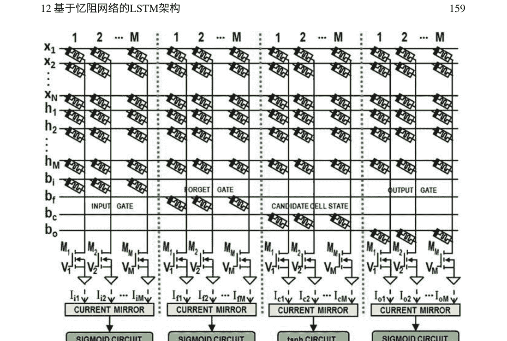

图12.2 基于电流的Memristive LSTM架构。线表示标量值，而不是向量[8]。

### 12.3.2 基于电流的Memristive LSTM

作为将LSTM的各个部分组合在一起并解决实际问题的尝试，[8]提出了一种基于电流的LSTM架构。基于电流的架构可以在图12.2中看到。蓝色虚线界定了LSTM架构的四个主要部分：输入门、遗忘门、候选细胞状态和输出门。

M和 N与我们先前的符号匹配，分别表示隐藏单元的数量和输入（特征）的数量。该架构设计为按顺序使用。这意味着我们需要运行 M个周期来获得隐藏单元向量和细胞状态向量。具有相同索引的列进行操作并行计算相应的隐藏单元输出和细胞状态。NMOS晶体管用于打开和关闭列。电压 V_1, . . . , V_M 用于控制开关。由于该设计使用基于电流的激活函数电路，因此需要用作缓冲器的电流镜来隔离相互作用的效果。在设计中进一步使用基于电压的乘法器和加法器电路。因此，在将表示细胞状态的电压传递给输出激活函数之前，使用电压到电流转换器。

### 12.3.3 近似的记忆电阻LSTM

与[7]的工作相反，[9]的作者解决了一个现实世界的问题（语言建模问题）并完成了系统级模拟。然而，他们的模拟是在他们自己构建的软件工具（用C++编写）上进行的，而不是在电路模拟器（如SPICE）上进行的。他们使用所谓的非线性函数单元（NLFs）来实现除向量-矩阵乘法之外的所有所需的数学运算来实现LSTM。他们在软件中设置了一些约束，以纳入与模拟模拟器操作相关的非理想性。他们的主要发现是，当施加正负电压时，电阻变化值需要对称，以获得良好的性能结果。即使是2%的微小变化也会严重影响具有多达512个隐藏单元的大型LSTM网络的性能结果，而与较小规模和较小训练数据集的全连接网络相比。

### 12.3.4 基于忆阻网络的LSTM芯片

最后，[10]的工作提出了一个由一晶体管一忆阻器（1T1R）型交叉阵列组成的芯片，实现了LSTM算法的VMM操作部分。然而，他们的工作中其余的操作是在软件中实现的。他们能够原地训练他们的忆阻器权重矩阵，并成功解决时间序列预测和分类问题。所使用的忆阻器来自Ta/HfO2。

### 12.3.5 基于电压的忆阻LSTM

为了填补之前的工作中的空白，[11, 12]中进行了完全功能和纯模拟电路级别（使用SPICE）的LSTM电路仿真。[11]中解决了时间序列预测问题，[12]中解决了时间序列分类问题。这两个工作都采用了相同的电路架构和电路部件。唯一的区别是设计中使用的运算放大器的类型。两级运算放大器来自[13]在[11]中使用，三级运算放大器来自[14]在[12]中使用。后者运算放大器在处理小信号时表现出更好的精度。这是更改的原因。整个系统级电路可以分为三个主要部分：向量矩阵乘法；激活函数；和模拟乘法电路部分。

#### 12.3.5.1 向量矩阵乘法电路

记忆电阻交叉开关电路的优势在于以高效的方式实现VMM操作。运算放大器一直很方便，并为交叉开关列中的电流积累提供虚拟地。此外，它们将累积的电流转换为输出电压。然而，每列只使用一个运算放大器和一个记忆电阻器限制了可实现的权重范围。这样我们只能实现正权重。可以使用两个记忆电阻器和每列两个运算放大器在记忆电阻交叉开关中解决这个问题。[15]

图12.3显示了交叉栅中两个运算放大器的配置。第一列运算放大器作为反相放大器，第二列放大器作为求和放大器。这种配置使得可以从第二列中减去第一列的电流。减去的电流然后乘以Rf，在第二个运算放大器的输出处得到准确的电压。[11, 12]中的设计使用了每个子交叉栅只有一对运算放大器（总共四个）。这是由于设计中使用了顺序模式操作。

#### 12.3.5.2 激活函数电路

LSTM方程中使用的激活函数sigmoid和双曲正切可以使用相同的电路实现，但参数不同。这是因为它们在绘图时具有类似的波形。图12.4显示了实现激活函数的电路设计。它本质上是一个带有偏移输入和输出的差分放大器。它具有在其直流传输特性中遵循S形的输出信号特性。通过扫描放大器的差分输入可以实现S形的输出形状。然而，需要调整参数以实现准确的输出结果。使用两个求和运算放大器及其参数来移动输入和输出信号。V₁的值也随着移位调谐而改变。至于直流传输特性的形状，通过改变电流 I₁、供应电压 V_{dd}和NMOS晶体管 N₁和N₂的尺寸来修改斜率和输出范围。

#### 12.3.5.3 模拟乘法电路

基于翻转电压跟随器（FVFs）[16]的四象限模拟乘法器被用于哈达玛乘法操作的实现。该电路输出电压在节点 yj 处读取

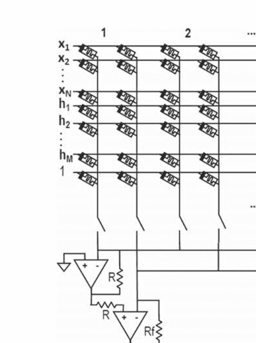

图12.3 具有两个代表单个突触的记忆电阻器的记忆交叉栅电路。开关代表传递逻辑单元。它们用于按顺序实现VMM操作。标准LSTM的整个电路将有四个这样的交叉栅。

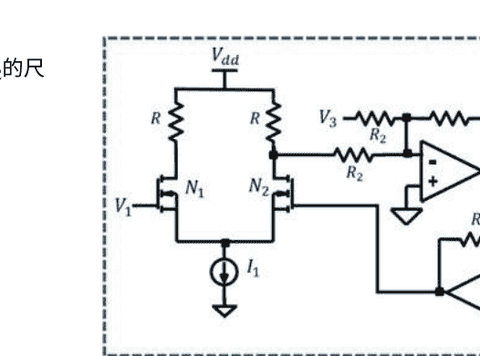

图12.4 激活函数电路[11]。晶体管 N1和 N2的尺寸相同

FVF乘法器的原理图如图12.5所示。乘法器的核心由NMOS晶体管 M1-M4组成。电流源 Ib和晶体管 Ma和 Mb形成一个FVF单元。电流 IE和 IF之间的差异导致输出电流Iout = IE - IF = μnCox W/Lo。只有在 VE = VF，所有晶体管处于三极管模式，并且驱动节点 A和 B的源具有显著低阻抗时，该表达式才成立。使用FVF作为电流感应元件和电压缓冲器，可以满足这些条件。底部的FVF创建低阻抗节点 E和 F，并且使得通过这些节点的电流可以被感知。此外，它们用于复制这些电流。顶部的FVF实现驱动节点 A 和 B 的非常低阻抗源。由此产生的乘法器具有良好的线性度，在高频率下工作，并且与基于运算放大器的乘法器相比，具有低供电要求（亚伏特）。

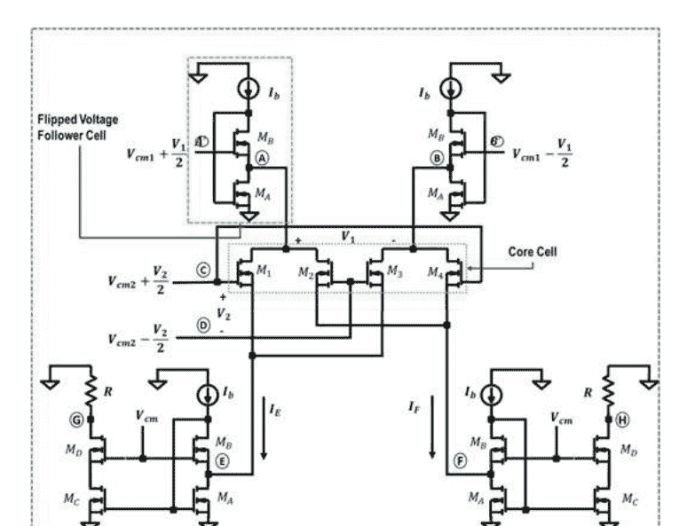

图12.5 四象限模拟乘法器电路[16]。所有晶体管都在线性区工作。输入范围在 -0.4和0.4 V之间

## 12.4 应用

使用模拟CMOS-电阻存储器电路实现的LSTM正在慢慢引起兴趣。迄今为止，[11]中提出的[17]的时间序列预测问题和[18]中描述的晶圆质量分类问题已经验证了电阻存储器LSTM电路，并在[12]中实现。本节简要介绍了它们的概述。

### 12.4.1 预测

在时间序列预测中，使用LSTM来预测一定数量的飞机乘客。原始数据集包含了12年内收集的144个观测点。在被LSTM神经网络处理之前，数据集被分为训练集和测试集。然后将训练集转换为一个三列形式，其中前两列用作输入，第三列值用作目标。

为了任务实现，使用了一个两层神经网络，表示为(图12.6)。在第一层中，LSTM单元展开了两个时间步长并采用了一对多模型。第二层由一个前馈神经网络组成具有线性激活函数。图12.7展示了原始数据集和预测值的图形表达。对于相同的权重矩阵值，使用Python进行LSTM神经网络的软件模拟和硬件模拟。在Python模拟中，得到的MSE和RMSE值分别为0.0101和0.1005。硬件模拟显示出接近的结果，其中MSE =0.0121和RMSE =0.1099。两层神经网络的面积为108,599 μm²（包括采样和保持存储单元）。单个LSTM单元的最大功耗为225.67毫瓦。

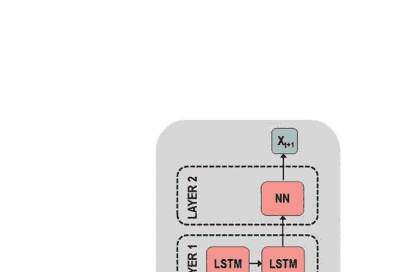

图12.6 使用LSTM进行分类的实现图[11]。第一层是一个多对一的LSTM层。第二层由一个具有线性激活的人工神经网络组成。

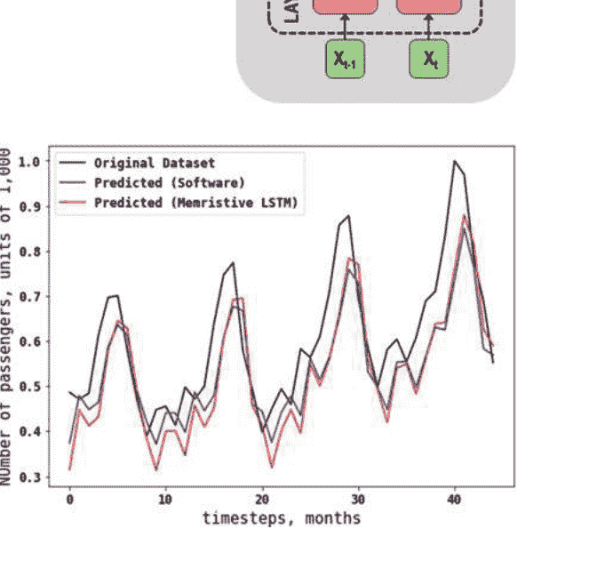

图12.7 国际航空旅客：记录的数据集（黑线）；使用Python Keras的LSTM预测（蓝线）和使用忆阻LSTM的预测（红线）[11]

### 12.4.2 分类

晶圆质量检测问题旨在将晶圆分为两类：正常和异常。每个数据集包含每个晶圆的152个测量值。使用两种不同的模型进行晶圆的LSTM分类，如图12.8所示。在第一个“一对一”模型（图12.8a）中，使用一个LSTM单元一个隐藏单元和一个时间步长。获得的准确率达到96.09%。一个单元的面积为115,967.4 μm²，功耗为312.4 mW。第二种架构（图12.8b）获得了更高的分类准确率，达到了98.51%。它由一个两层神经网络组成。第一层是LSTM具有四个隐藏单元和一百五十二个时间步长，而第二层是具有线性激活的前馈神经网络。使用的总面积和功耗为257,503.20 μm²和255.8毫瓦。图12.9展示了晶圆23的分类结果。

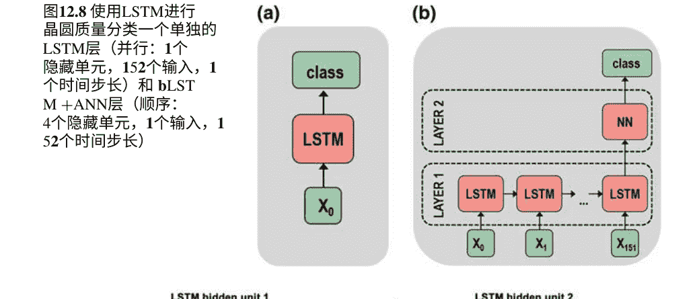

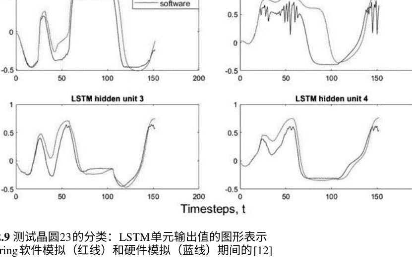

## 12.5 总结

LSTM神经网络在处理序列数据集时表现出高准确性。传统的LSTM加速器包括FPGA、CPU、GPU和ASIC等数字平台。在提出的CMOS-电阻存储器电路中，多级电阻存储器交叉栅允许在LSTM单元内实现计算密集的点积运算，用于权重矩阵乘法。电阻存储器的无漏电流和纳米尺寸使其在占用面积和功耗效率方面具有优势。

尽管存在许多LSTM架构，但它们都具有相似的结构。因此，一旦在芯片上纯模拟硬件中实现了标准的可变电阻LSTM，它们的实现就变得容易实现。在模拟硬件中实现还将进一步提高效率。

#### 章节亮点

- 长短期记忆（LSTM）单元操作可以分为几个计算块。
- LSTM中的权重矩阵乘法是使用可变电阻交叉阵列实现的。
- 点乘（哈达玛乘积）和激活层电路是使用TSMC 180nm CMOS技术实现的。
- 基于电压的可变电阻交叉阵列由于更高的准确性而胜过基于电流的设计。
- 表现出对称行为的可变电阻器件[9]将使我们更接近在LSTM的软件实现中达到相同的性能指标。
- [10]的工作是应用真实的可变电阻交叉阵列来实现LSTM的一个例子。大部分设计使用数字构建模块来实现硬件。

#### 参考文献

1.  Hochreiter S, Schmidhuber J (1997) 长短期记忆. 神经计算 9(8):1735–1780
2.  Graves A, Schmidhuber J (2005) 带双向LSTM的逐帧音素分类及其他神经网络架构. 神经网络 18(5–6):602–610
3.  Greff K, Srivastava RK, Koutn k J et al (2017) LSTM: 一次搜索的奥德赛. IEEE Trans神经网络学习系统 28(10):2222–2232. https://doi.org/10.1109/TNNLS.2016.2582944.
4.  Gers F A, Schmidhuber J, Cummins F (1999) 学会遗忘: 连续预测与LSTM. 在: 第9届国际人工神经网络会议(ICANN)论文集, vol 2. pp 850–855
5.  Gers FA, Schmidhuber J (2000) 用于计时和计数的循环神经网络。 在: IEEE-INNS-ENNS国际联合神经网络会议(IJCNN)论文集, 第3卷, 第189-194页
6.  Cho K, van Merrienboer B, Gulcehre C等(2014) 使用RNN编码器-解码器学习短语表示用于统计机器翻译. arXiv:1406.1078
7.  Smagulova K, Krestinskaya O, James AP (2018) 模拟集成电路信号处理95:467。 https://doi.org/10.1007/s10470-018-1180-y
8.  Smagulova K, Adam K, Krestinskaya O等(2018) 用于LSTM架构的CMOS-电阻存储器电路设计。 在: 2018年IEEE国际电子器件和固态电路会议(EDSSC), 第1页. https://doi.org/10.1109/EDSSC.2018.8487179
9.  Gokmen T, Rasch MJ, Haensch W (2018) 使用电阻交叉点训练LSTM网络. Front Neurosci 12:745. https://doi.org/10.3389/fnins.2018.00745
10. Li C, Wang Z, Rao M等 (2018) 基于忆阻交叉栅的长短期记忆网络。 https://doi.org/10.1038/s42256-018-0001-4
11. Adam K, Smagulova K, James AP (2018) 用于时间序列预测建模问题的忆阻LSTM网络硬件架构. arXiv:1809.03119
12. Adam K, Smagulova K, Krestinskaya O等 (2018) 使用忆阻LSTM、ANN、DNN和HTM进行晶圆质量检查. arXiv:1809.10438
13. Krestinskaya O, Salama K, James AP (2018) 使用模拟反向传播电路的忆阻神经网络架构进行学习。 IEEE Trans Circuits Syst I: Regul Pap. https://doi.org/10.1109/TCSI.2018.2866510
14. Saxena V, Baker RJ (2010) 三级全差分运放的间接补偿技术。 在: 第53届IEEE国际中西部电路与系统学术会议, 西雅图, 华盛顿州, 第588-591页. https://doi.org/10.1109/MWSCAS.2010.5548896
15. Hasan R, Taha TM, Yakopcic C (2017) 基于忆阻器的深度神经网络的片上训练。 在: 国际神经网络联合会议（IJCNN）, 安克雷奇, 阿拉斯加, 第3527-3534页. https://doi.org/10.1109/IJCNN.2017.7966300
16. Ramirez-Angulo J, Thoutam S, Lopez-Martin A et al (2004) 基于翻转电压跟随器的低压CMOS模拟四象限乘法器。 在: 2004年IEEE国际电路与系统学术会议（IEEE Cat. No.04CH37512）, 温哥华, 不列颠哥伦比亚省, 第I-681页. https://doi.org/10.1109/ISCAS.2004.1328286
17. Brownlee J (2016) 使用Python和Keras进行LSTM循环神经网络的时间序列预测。 可在以下网址找到: https://machinelearningmastery.com
18. Olszewski RT (2001) 用于时间序列数据中结构模式识别的广义特征提取 (编号CMU-CS-01-108)。 卡内基梅隆大学匹兹堡校区计算机科学学院。

# 第13章 HTM理论

Yeldos Daulet Khanuly，Olga Krestinskaya和Alex Pappachen James

摘要 本章介绍了关于分层时间记忆（HTM）的一般背景信息。HTM是一种最近提出的认知学习算法，旨在模拟人类新皮层的整体结构和功能，负责高阶功能，如认知、学习和预测。HTM的主要特点是分层结构、稀疏性和模块化。HTM由两个主要部分组成：HTM空间池（SP）和HTM时间记忆（TM）。HTM SP对输入数据进行编码，并产生稀疏分布表示（SDR），对于视觉数据处理和分类任务非常有用。HTM TM检测输入数据的时间变化，并进行预测。

## 13.1 引言

分层时间记忆（HTM）是由杰夫·霍金斯在《智能》一书中提出的机器学习算法[4]，并由Numenta Inc.在最近几年进行了开发[8]。2006年，HTM算法的第一代称为Zetal，目前被称为HTM-Zetal，三年后引入了修改后的算法，称为皮层学习算法[7]。

HTM算法的灵感来自人类新皮层的结构和功能，新皮层具有执行高级认知活动的能力，如语言处理、物体识别、预测等[5]。HTM具有分层结构。HTM的主要部分是HTM空间池（SP）和HTM时间记忆（TM）。HTM SP生成稀疏分布表示（SDR）输入数据，确保对视觉数据处理和分类任务有用的输入模式的编码。 HTM TM检测特定时间段内输入数据的时间变化，并能够执行预测任务[12， 14， 15]。 近年来，已经进行了几次修改HTM算法并引入HTM的硬件实现的尝试[3， 10， 11， 13]；然而，HTM的芯片硬件实现仍然是一个未解决的问题。

本章的主要目的是提供关于HTM算法的主要组成部分、功能和结构的深入信息。 本章重点介绍HTM理论，并简要描述HTM算法的应用、软件和硬件实现。 第13.2节介绍了HTM的核心原理和主要概念。 第13.3节详细阐述了HTM SP的主要部分的细节，然后解释了SP算法的数学框架。

第13.4节关注HTM TM并介绍基本方程。 第5章总结了HTM的应用并结束了本章。

## 13.2 HTM概述

### 13.2.1 来自生物学的灵感

HTM算法模拟了人类新皮层中的金字塔神经元[19]的功能。 与人工神经网络(ANN)的传统神经元相比，HTM具有大量的树突连接，HTM神经元的输出不仅取决于前馈输入(接近细胞体的连接)，还取决于反馈(顶部连接)和侧向(远离连接)神经元之间的连接。 图13.1说明了金字塔神经元和HTM神经元模型及其连接的结构。

HTM从新皮层中受到的另一个主要特性是分层结构。 HTM的分层结构如图13.2所示。 HTM由几个具有特定区域的层组成。 最小的HTM单元是一个HTM细胞。 几个HTM细胞形成HTM列，而一组小列代表HTM区域。HTM的复杂性和层级数量可以根据应用程序的不同而变化。图13.2展示了3级HTM层次结构，展示了数据如何转换为SDR。几何图形的例子说明了不同的输入模式如何转换为HTM区域特定细胞的激活。即使具有相似形状或相似颜色的细胞也由相似的HTM细胞表示。

图13.3显示了一个端到端的HTM系统。该系统包括一个编码器，HTM SP，HTM TM和一个SDR分类器[7]。HTM SP将所有输入模式转换为SDR，并且HTM TM从HTM SP学习SDR的时间序列，并能够对下一个输入进行预测。

### 13.2.2 稀疏分布表示（SDR）

人脑以SDR的形式表示信息[9]。SDR由大量的1和0位组成。在每个时间点，只有这些位的一小部分是1，表示人类大脑皮层中的活跃神经元，而其余的位是0，对应于非活跃神经元。因此，SDR表示数据的语义属性。

SDR的一个简单例子是ASCII码，这些是二进制数的向量。这个概念的例子如图13.4所示，说明了只有2%的位表示数据时的情况。这些位单独来看没有任何意义，但是它们的组合传递了语义意义。主要思想是存储表示特定数据的活跃位的位置，而不是像密集表示信息[9]那样存储所有位。

另一个例子是特定名称的表示和存储。如果要表示一个人的名字，SDR向量中的每个位都涵盖与该人名相关的信息。一个位负责名字的第一个字母，另一个位负责第二个字母，依此类推。每个活跃位的组合形成一个特定的名字，而这些位单独来看没有任何意义。

图13.2显示了HTM SP如何将输入空间转换为SDR表示。每个小列包含多个细胞，这些细胞根据特定的输入被激活。虽然单独的HTM细胞没有任何特定的含义，但细胞集合形成了与特定几何图形对应的SDR。SDR中的重叠发生在两个激活的输入向量具有相同ON位的情况下。这意味着这些不同的表示共享相同的属性。图13.2以输入数据（几何图形）的形式展示了重叠的示例。每个重叠区域表示这些图形具有共同的特征。在ASCII码中，这表示多个表示在相同位置具有ON位的情况。

SDR应具有足够大的容量来表示给定输入向量的组合。可以使用公式13.1计算向量的这种变化，其中n表示向量的大小，w表示基数[17]。

```
$$ \binom{n}{w} = \frac{n!}{w!(n-w)!} $$
```

例如，如果这些值为n=512和w=2，则可能的组合是130816 [17]。增加n和w将导致输出呈指数增长。容量问题可能是随机生成的编码信息的特征之一。

为了避免这个问题，同一输出的可能概率必须非常低，由公式13.2表示。

```
$$ P(a = b) = \frac{1}{\binom{n}{w}} $$
```

计算表明，对于大的n和w，这种组合的可能性接近零。HTM算法使用非精确匹配而不是精确匹配，以避免SDR表示中的虚假重复输出。 它说明，如果两个SDR具有相等的匹配阈值和基数，θ=w，我们将其定义为精确匹配，其中θ<w表示非精确匹配。 通过减小θ和增加n，可以得到具有零误匹配概率的足够组合。 SDR的另一个特性是并集。 并集的概念是在静态模式中存储多个不同的集合的能力。可以使用简单的布尔逻辑OR（图13.1）获得并集，它将多个集合组合成一个新的单一模式。这个属性的好处是它具有动态能力，可以在一个集合中表示多个模式。

### 13.2.3 编码器

编码器是将HTM的输入数据转换为SDR格式的过程[9]。 编码器确定哪些输出位应表示为1，哪些位为0，捕捉输入数据的语义属性[18]。 编码器的过程类似于[20]中的过程，其中作者以耳蜗为例。 作者指出，耳蜗有一系列连接到细胞的毛细胞。 当不同频率的声音应用于耳蜗时，给定频率范围的毛细胞集合将处于活动状态，从而向大脑发送信号。 [20]还指出，不同动物的耳蜗对不同的频率范围有反应。 这个例子表明，对于不同类型的输入数据，需要不同的编码器[9]。 耳蜗的编码示例如图13.5所示[9, 18]。 这些编码表示数字7.0、10.0和13.0。 相邻的编码具有重叠区域，例如编码1（表示7.0）和编码2（表示10.0），而编码1（表示7.0）和编码3（表示13.0）之间不存在这样的区域。 这意味着，语义上相似的输入数据具有共同的ON位，而不匹配的数据集将没有交集区域，这符合预先知道的标准。

因此，在设计独特数据集的编码器时，必须考虑以下标准这些标准在[18]中提到。 第一个标准是输入数据具有相似含义的数据应该在输出中有重叠。 这意味着具有语义相同属性的两个输入集在SDR领域应该有重叠区域。 在输入向量的SDR表示中具有相同表示的概率对于足够的n和可接受的稀疏度，几乎为零。 只有在完全匹配的输入情况下，才可能出现完全相同的SDR情况，这是设计编码器的第二个标准。 对于所有数据，SDR始终具有相同的维度和位数。因此，在设计编码器时，输出应具有相等的位数，以适应整个数据集。编码器架构的关键方面是具有足够的ON位来抵抗噪声。

## 13.3 HTM空间池化器

本节介绍了 HTM SP 的基本思想、不同的 HTM SP 阶段、属性，并对 HTM SP 算法进行了一般性介绍。SP 是 HTM 的一部分，它将输入数据集连续地编码为 SDR 表示[2]。SP 有不同的阶段[14]，一些研究将它们视为三个阶段，如[21]中所述。在对 HTM SP 的主要阶段进行描述之前，有必要定义一些术语：

- 感受野：与列和细胞相连的输入空间。
- 持久性值：表示特定突触状态的数值。如果该值低于阈值，则突触未连接，反之亦然。
- 突触：连接列内的细胞。

HTM SP 的主要思想如图13.6所示。初始化是 HTM SP 的第一个阶段，在此阶段将随机的持久性值分配给突触。通常，这些随机值接近阈值，以提高性能。这种方法需要较少的迭代才能使突触处于活动状态，并使过程更加灵活。在附加标量值之后，设置潜在输入。在初始化过程中，选择了接收输入数据的几个随机列，这些列位于 HTM 区域内（图13.6）[14]。在初始化过程中，随机选择突触连接的权重。接下来，建立输入空间与选定的小列之间的连接，确定活动连接的突触。活跃连接突触的数量由重叠值的计算确定。输出进行比较，选择最高的输出并激活，其他输出则被抑制。这个过程被称为抑制阶段。最后一个阶段是学习阶段，在这个阶段更新突触的持久性值和增强因子，并且除了初始化阶段外，所有的阶段都会重复。

### 13.3.1 HTM空间池化器的特性

为了容忍不同的寄生效应并产生高可靠的输出，SP具有以下特性：

- SP对所有输入具有相同的稀疏性，以便检测模式而不产生任何负面影响。因此，它确保SP避免了误报错误。已经定义的抑制阶段是具有固定稀疏性的关键特性，其中采用了胜者通吃（WTA）的方法。
- 为了获得最佳的学习结果，SP系统利用了所有资源。这意味着，所有神经元都必须对每组输入做出响应。然而，[2]指出在学习过程之前，只有70%的神经元被认为是对输入数据有意识的，而在学习过程之后，这个值约为100%。
- 输入的稳健表示周期性出现。一般来说，HTM必须能够容忍噪声、子采样等。因此，这个特性表明，即使有噪声，频繁出现的输入与没有这种干扰因素的输入是相同的。由[2]进行的实验证明，在学习之后，SP具有40%的输入变化的稳健表示。
- 如果输入每次都不同，那么SP需要适应不同的数据类型。通过对输入的持续学习，SP容忍这种变化。在这个过程中，通过生成新的突触集来实现更快的适应。

[2]中还有更多关于SP的性质，包括实验结果和讨论。

### 13.3.2 HTM空间池化器的数学框架

SP中的第一步是输入和输出的关系，因此方程式13.1表示潜在的输入。术语$x_j$显示 jth输入神经元，其中$x_i^c$和$\gamma$分别表示立方体的中心和边长。

$$PI(i) = \{j|i(x_j; x_i^c; \gamma)\} \text{ and } (z_{ij} < \rho) \quad (13.3)$$

随机选择的$z_{ij}$属于$U$，其范围从0到1，必须小于空间中连接输入的比例$\rho$。如果突触$s_{ij}$的值大于阈值参数$\theta_c$，则称其与其集合$B_{ij}$连接，如式13.2所示。

$B_{ij} = \begin{cases} 1, & \text{ 如果 } s_{ij} \ge \theta_{c} \\ 0, & \text{ 否则。} \end{cases}$ (13.4)

前述的$PI$包含均匀分布$U$中的第$j$个输入，以矩阵形式表示，如果式13.3成立。

$S_{ij} = \begin{cases} U(0, 1), & \text{ if } j \in PI(i). \\ 0, & \text{ 否则.} \end{cases}$ (13.5)

在前一节中，我们讨论了SP的四个阶段，其中包括由邻近列$N_{i}$引起的抑制阶段，该阶段在等式13.4中定义，其中$\| y_{i} - y_{j} \|$表示两个微柱之间的距离必须小于半径参数$\phi$。

$N_{i} = \{ j \mid \| y_{i} - y_{j} \| < \phi, i \ne j \}$ (13.6)

重要的是要提到，如果输入和微柱具有相同的维度，$\phi$将等于等式13.1中定义的边长。图13.4中的重叠可以通过等式13.5计算，其中输入模式$Z$乘以增强因子$\beta_{i}$。

$o_{i} = \beta_{i} \sum_{j} B_{ij} Z_{ij}$ (13.7)

在学习阶段中提到，突触和增强因子会被更新。根据公式13.6，突触会根据其激活阶段进行升级。如果重叠大于刺激阈值$\theta_{s}$，并且在邻居中处于前几位，则小柱将处于活跃状态$NO(i)$。

如果$(o_{i} \ge \text{prctile}(NO(i), 1 - s))$并且$(o_{i} \ge \theta_{s})$，则增强因子1。 (13.8)

增强因子会根据时间平均值和最近活动值进行更新，可以通过公式13.7和公式13.8进行计算。

$\overline{\alpha_{i}}(t) = \frac{(T - 1) \times \overline{\alpha_{i}}(t - 1) + \alpha_{i}(t)}{T}$ (13.9)

$<\overline{\alpha_{i}}(t)> = \frac{1}{|N(i)|} \sum_{j \in N(i)} \overline{\alpha_{i}}(t)$ (13.10)

在获得所需的活动值后，借助适应效应，可以根据公式13.9计算提出的增强因子。

$$\beta_i(t) = e^{-\eta(\bar{\alpha_i}(t) - <\bar{\alpha_i}(t)>)}$$ (13.11)

## 13.4 HTM 时间记忆

### 13.4.1 HTM TM 概述

在从输入数据中形成SDR序列之后，根据图13.3，它将进入时间记忆（TM）。图13.7展示了HTM TM在时间上的处理过程。HTM TM学习了从SP中排列的SDR的一致性，并相对于这些序列进行预测[1]。因此，来自SP的输出成为TM的输入，其中SP的活动列创建了前馈输入。TM沿着两个步骤进行。第一个步骤是激活处于预测状态的列内的细胞。如果近端连接在两个空间之间连接起来：输入和输出；细胞之间的网络称为远端连接。细胞之间的连接可以在同一列或其他列之间。因此，确定预测状态时，细胞之间的连接将成为目标。计算与活动细胞连接的突触数目，对于每个树突分段[14]。与激活的树突分段相关的细胞被设置为预测状态，这是HTM TM中执行预测的基本过程。然后，根据细胞的活动更新突触，其中活动细胞的突触持久性增加。如果预测正确，则接受这种时间变化。否则，移除这种时间变化，并减少突触持久性。

### 13.4.2 HTM TM的数学框架

如果一个特定的细胞与其他细胞有连接，并且这些细胞处于活跃状态，算法将通过连接计算处于活跃状态的细胞的标量值。

$$\pi_{ij}^{t}=\begin{cases}1, & \text{if } \exists_d \| D_{ij}^{d} \cdot A^{t} \|_{1}>\theta \\ 0, & \text{否则}.\end{cases}$$ (13.12)

如果这个数字高于已定义的阈值 $\theta$，细胞将处于等式13.10中定义的预测状态。$\tilde{D}_{ij}^{d}$显示了 $i$th细胞在 $j$th列中的第 $d$th段，其中 $A^{t}$是激活矩阵。此外，预测状态的细胞是从在抑制阶段获胜的列中选择的[2]。 有时在这些列中没有预测细胞。 在这种情况下，单个列中的所有细胞都处于活跃状态，并被称为爆发细胞。 在SP的活跃列的学习过程之后，TM进入第二步，即更新突触的持久性值。 与SP中一样，处于活跃状态的突触的持久性值增加，处于非活跃状态的突触的持久性值减少。 激活状态的计算公式为13.11

$$a_{ij}^{t}=\begin{cases}1, & \text{if } j \in W^{t} \text{ and } \pi_{ij}^{t-1}=1 \\ 1, & \text{if } j \in W^{t} \text{ and } \sum_{i} \pi_{ij}^{t-1}=0 \\ 0, & \text{otherwise}.\end{cases}$$ (13.13)

其中 $a_{ij}^{t}$表示上述矩阵 $A^{t}$中的元素 $i$th cell with $j$th columns at time $t$。 变量 $W^{t}$代表具有最多突触输入的百分比例。

$$D_{ij}^{d}=\rho^{+} D_{ij}^{d} \cdot A^{t-1} -\rho^{-} D_{ij}^{d} \cdot\left(1-A^{t-1}\right)$$ (13.14)

方程式13.12显示了随后活动段的强化，其中 $\rho^{-}$和 $\rho^{+}$分别表示负和正的强化。 包括对非活动段进行一定程度的衰减，提出了长期抑制

$$D_{ij}^{d}=\tilde{\rho}^{-} D_{ij}^{d}$$ (13.15)

其中 $\tilde{\rho}^{-}$远小于 $\rho^{-}$。

## 13.5 结论

HTM是一种模仿新皮层行为的认知学习算法。本章简要介绍了HTM的特性和结构。HTM算法在各种任务中显示出了有希望的结果，特别是在视觉数据处理和分类方面，如手写数字、人脸和语音识别[3, 13, 15]。HTM的硬件实现已经在最近的几项工作中展示出来[3, 12, 15]，但这仍然是一个悬而未决的问题。

#### 章节亮点

- HTM是最近提出的一种认知学习算法，旨在模拟人类新皮层的整体结构和功能，负责高阶功能，如认知、学习和预测。
- HTM的主要特性是层次结构、稀疏性和模块化。
- HTM由两个主要部分组成：HTM空间池（SP）和HTM时间记忆（TM）。HTM SP对输入数据进行编码并产生稀疏分布表示（SDR）；而HTM TM检测输入数据的时间变化并进行预测。
- HTM算法在各种任务中显示出了很好的结果，特别是在视觉数据处理和分类方面，如手写数字、人脸和语音识别。
- 有几种HTM的硬件实现，但这仍然是一个未解决的问题。

#### 参考文献

1. Ahmad S, Lewis M (2017) 时间记忆算法。技术报告，Numenta， Inc
2. Cui Y, Ahmad S, Hawkins J (2017) HTM空间池-一种新皮层算法用于在线稀疏分布编码。技术报告，Numenta， Inc
3. Fan D, Sharad M, Sengupta A, Roy K (2016) 基于自旋神经元和电阻性存储器的分层时间记忆用于能量高效的脑启发式计算。IEEE Trans Neural Netw Learn Syst 27(9):1907–1919
4. Hawkins J (2004) On Intelligence. Griffin, Macmillan
5. Hawkins J (2016) 生物和机器智能。Numenta。http://numenta.com/biological-and-machine-intelligence/

-   6. 艾哈迈德,S, 霍金斯,J (2016) 神经元如何处理稀疏分布表示? 稀疏性、神经元和活跃树突的数学理论。技术报告, Numenta, Inc. 7. 霍金斯,J, 艾哈迈德,S (2016) 为什么神经元有成千上万个突触，一个关于新皮层序列记忆的理论。技术报告, Numenta, Inc
-   8. 霍金斯,J, 艾哈迈德,S, 杜宾斯基,D (2010) 包括HTM的分层时间记忆学习算法。技术报告, Numenta, Inc, 帕洛阿尔托。http://www.numenta.com/htmloverview/education/HTM_CorticalLearningAlgorithms.pdf
-   9. 霍金斯,J, 艾哈迈德,S, 普尔迪,S, 拉文,A (2016) 生物和机器智能 (bami)。初始在线发布0.4
-   10. Ibrayev T, Krestinskaya O, James AP (2017) 在HTM空间池中设计和应用基于规则的权重稀疏模块。在: 第24届IEEE国际电子、电路和系统会议 (ICECS)。IEEE, pp 274-277
-   11. Ibrayev T, Myrzakhan U, Krestinskaya O, Irmanova A, James AP (2018) 基于忆阻层次记忆的芯片人脸识别系统设计。J Intell Fuzzy Syst 34 (3) : 1393-1402
-   12. James A, Ibrayev T, Krestinskaya O, Dolzhikova I (2018) 介绍忆阻HTM电路。在: 忆阻器和忆阻神经网络。InTech
-   13. Krestinskaya O, James AP (2018) 在模拟空间池器中进行无学习特征提取的忆阻-CMOS电路设计的层次记忆。模拟集成电路信号处理 95 (3) : 457-465
-   14. Krestinskaya O, Dolzhikova I, James AP (2018) 使用忆阻网络的分层时间记忆: 一项调查。IEEE Trans Emerg Top Comput Intell 2(5):380–395. https://doi.org/10.1109/TETCI.2018.2838124
-   15. Krestinskaya O, Ibrayev T, James AP (2018) 使用忆阻逻辑电路的分层时间记忆特征用于模式识别。IEEE Trans Comput-Aided Des Integr Circuits Syst 37(6):1143–1156
-   16. Krestinskaya O, James AP, Chua LO (2018) 边缘计算的神经忆阻电路: 一项综述。arXiv:1807.00962
-   17. Lavin A, Ahmad S (2017) 稀疏分布表示。技术报告, Numenta, Inc
-   18. Purdy S (2017) 为HTM系统编码数据。技术报告, Numenta, Inc
-   19. Spruston N (2008) 金字塔形神经元: 树突结构和突触整合。Nat Rev Neurosci 9(3):206
-   20. Webster D, Popper A (1992) 哺乳动物听觉通路: 神经解剖学。Springer, 纽约
-   21. Zyarah AM (2015) 一种可重构的分层时间记忆架构的设计与分析。技术报告, 罗切斯特理工学院

## 第14章 记忆电阻式分层时间记忆

Olga Krestinskaya, Irina Dolzhikova和Alex Pappachen James

摘要 本章介绍了混合信号和模拟硬件上的记忆电阻式HTM实现。大多数实现的记忆电阻式系统都基于改进的HTM算法。HTM通常用作特征编码和特征提取工具，然后将这些特征与传统的最近邻方法一起用于分类。

#### 14.1 引言

分层时间记忆（HTM）是一种仿生算法和架构，包括空间池化器（SP）和时间记忆（TM），模拟人类新皮层的结构和功能[2, 3]。基于FPGA [15]和模拟和混合信号电路[9, 11, 13]，有几种HTM实现。在大多数情况下，FPGA实现在功耗和芯片面积方面更低效[12]。因此，最近的HTM实现涉及消耗更少功耗和芯片面积的新型器件，如记忆电阻器[12]和自旋器件[1]。因此，本章将重点介绍硬件上的记忆电阻式HTM实现，并展示HTM如何应用于模式识别和分类任务。

各个部分的组织如下。第14.2节代表HTM细胞的初始设计。第14.3节介绍了基于电阻变化器的HTM实现。第14.4节展示了完全模拟的改进HTM与TM的电阻变化器实现。第14.5节涵盖了使用HTM进行特征提取和分类的系统。第14.6节总结了本章内容。

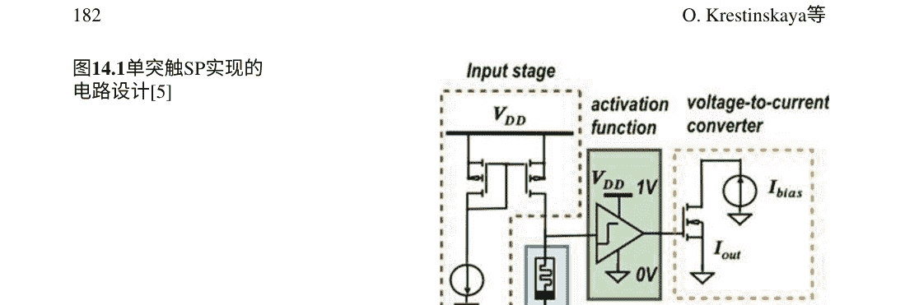

### 14.2 HTM细胞

最早的HTM细胞的模拟实现之一在[5]中展示，其中的主要思想是使用CMOS-电阻存储器混合结构设计HTM SP的模拟电路。论文[5]提出了一个用于单突触的电路设计，如图14.1所示，用于使用S个突触实现SP列。电路的输入以电流形式通过电流镜提供。突触权重的功能是通过电阻存储器实现的。在学习阶段期间，突触权重允许进行更改，而在输入供应期间，其值保持不变。这通过仔细选择输入电流幅值来确保。设计中的缓冲器执行激活函数，其中高输出表示给定的加权输入将对列的重叠值做出贡献。NMOS晶体管用于将缓冲器的电压输出转换为电流值。这使得整个列的总重叠值的计算通过简单地对电流进行求和变得直接。这个HTM设计对于AR数据库人脸识别问题展示了80%的识别准确率[5]。

### 14.3 基于忆阻网络的HTM

#### 14.3.1 带有自旋器件的混合信号HTM设计

第一次尝试实现基于忆阻器的HTM系统在[1]中提出（图14.2和14.3）。在HTM的设计中，作者将忆阻交叉栅结构与基于自旋转矩的开关（即自旋神经元）相结合。所提出的HTM设计规格在MNIST手写数字数据集和COIL-20物体数据集上进行了模式识别问题的测试。在训练过程中，提取随时间变化的输入图像的空间和时间模式。训练基于自下而上的方法，其中在较高层之前，子节点的较低层完全训练。除了输出节点（顶层）外，所有层级都使用无监督训练。节点的推理过程可以分为4个阶段：空间输入的表示，计算空间域中巧合的概率密度，计算时间域中巧合的概率密度，以及计算输出，由获胜的时间类别索引表示。在推理阶段，用于计算的主要函数与点积的计算相关。因此，忆阻交叉栅网络（MCN）非常适合设计这种推理过程。

MCN允许直接计算输入（$V_i$）通过行应用到交叉栏的列中存储的特征之间的相关性（通过考虑交叉栏的导纳值（$g_{ij}$））。通过找到最大幅值的$\sum$，可以确定输入和存储模式之间的最佳匹配情况。

```
$i V_i g_{ij}$
```

基于忆阻器和自旋神经元的HTM系统的整体架构[1]在图14.2中展示。它由MCN、逐次逼近（SAR）模数转换器（ADC）和胜者通吃（WTA）电路组成。$16 \times 16$像素的输入图像被分成16个大小为$4 \times 4$像素的块。单个一级节点接收单个补丁。首先，MCN计算空间特征的密度，然后SAR ADC将输出电流值转换为第二个MCN的数字输入，该MCN计算时间特征的密度。第二个MCN的输出经过WTA处理，识别出获胜的输出，并将其转发到上一级的父节点。如果将所提出的方法用于MNIST手写数字识别问题，则最高级别的WTA输出将表示输入图像上所示的数字。

所有计算节点中的两个MCN的大小为$n_{child} \times n_{SP}$和$n_{SP} \times n_{TM}$，其中$n_{child}$是子节点的数量，$n_{SP}$是空间特征，$n_{TM}$是时间组的数量。MCN的数字输入值被转换为模拟域。这是通过基于域墙（DW）磁体的自旋神经元来实现的。DW神经元允许构建基于深三极电流源（DTCS）PMOS晶体管的低能耗数字模拟转换器（DAC）并具有二进制加权。如图14.3所示。

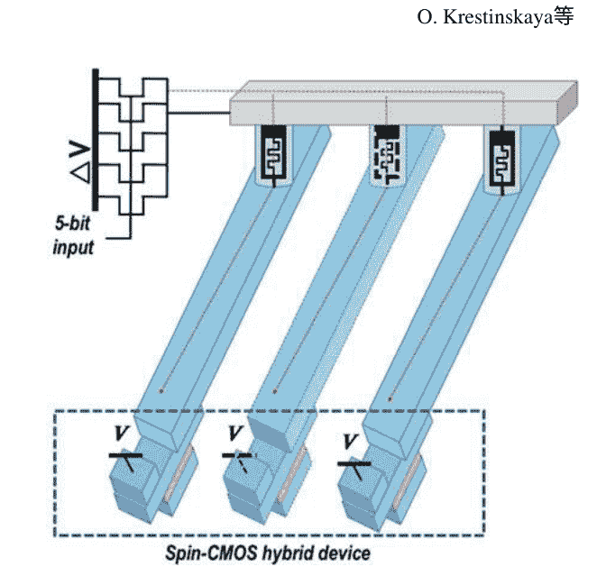

#### 14.3.2 模拟记忆电阻交叉栅架HTM SP

在[8]中注意到了使用记忆电阻交叉栅架结构进行HTM实现的不同方法。所提出的硬件配置应用于面部和语音识别应用。HTM的SP电路允许在处理面部图像和语音时区分不重要和重要的特征，以便后者可以通过模板匹配技术进行识别。

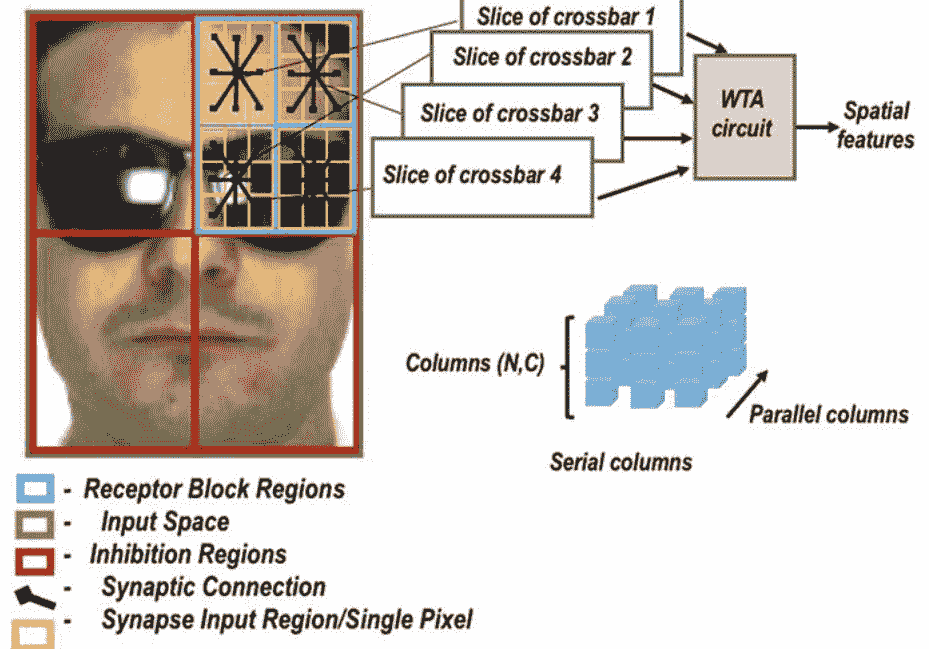

图14.4 对图像进行预处理，将输入像素分组成小块和抑制区域，并对基于交叉栅架的SP实现进行高级表示[8]。

特征的分类依赖于阈值逻辑的考虑。如果计算得到的加权输入($u_i w_i$)大于阈值，则特征在给定的稀疏数据集中具有重要或相关细节的状态。在将输入图像的像素提取到交叉栅架阵列之前，进行预处理，将整个输入空间（原始图像）细分为称为抑制区域的块。抑制区域又被细分为由多个图像像素组成的较小块。图14.4展示了将图像像素分组成小块和抑制区域的示例。在给定的示例中，小块中有九个像素，抑制区域中有四个小块。

所提出的HTM [8]的记忆电阻网络架构需要使用多个并行的交叉栏片。单个交叉栏中的列按顺序处理（一次处理一列），以减轻潜在路径泄漏电流的问题。因此，单个交叉栏中的列被称为串行列，并且有 N 个这样的列。并行交叉栏片的数量以及并行列 C 的数量由单个抑制块中的小块数量确定。单个小块组 S 像素数，这在一列中产生了 S 个突触。图14.5显示了一个 S × N 交叉栏片的电路设计。

交叉栏通过每个交叉栏线上的一组开关选择读取和写入模式，这些开关由 NMOS和PMOS实现晶体管。 在读取模式下，每个并行交叉栏中的单个串行列被激活，并测量跨M读出之间的电压。这个电压被用来计算列中每个突触的重叠值($\alpha_{1,j}, ..., \alpha_{1,s}$)。通过求和放大器确定整个列的总重叠$\alpha_j$。通过使用胜者通吃（Winner-Take-All）电路可以找到获胜的列。Lazzaro等人在图14.6中提出的WTA电路用于抑制阶段。WTA的结构有助于确定抑制其他列并从总重叠电流值 $I_{in1}, ..., I_{ins}$中选择成为获胜列。SP的输出是表示图像特征分类为重要和不重要的二进制值，可用于模式匹配。

### 14.4 完全模拟的带有时间记忆的Memristive HTM 实现

完全模拟的硬件实现Memristive HTM SP和HTM TM分别显示在图14.7和图14.8中[12]。这个HTM设计是对原始HTM算法的修改，遵循相同的概念。HTM SP被修改为基于均值的方法，而HTM TM则遵循基于Hebb学习规则的简化方法。输入数据的处理可以使用并行或顺序方法进行。根据芯片面积和功耗限制以及所需的准确性和处理速度，可以对来自HTM SP不同抑制区域的输入数据进行串行和并行处理。在HTM TM的模拟实现中，这也是可能的，因为图14.8中所示的电路是针对单个输入的处理。然而，对于大规模数据处理，由于芯片的面积和功耗要求，顺序处理输入更为可行。

HTM SP算法的主要修改是在抑制阶段选择获胜列的方式，基于平均值计算，而不是考虑第k个最大重叠值。选择获胜列是基于阈值计算的重叠值的平均值。然而，HTM SP的架构在图14.8中完全不同，与基于交叉栏的HTM SP方法相比。基于平均值的方法简化了HTM的模拟硬件实现，因为在硬件上平均值计算较为简单，需要较小的芯片面积和功耗，而不是求和和获胜者全取（WTA）操作。

HTM SP实现的模拟电路如图14.7所示。输入数据被分成抑制块，图14.7所示的HTM SP架构是对单个抑制块的处理。每个抑制块的输入是从受体块获得的值。

受体块通过随机权重突触对输入空间进行乘法运算，使用具有随机分配电阻权重的记忆电阻器设备来实现。当突触值为 $R_{ON}$时，认为突触是连接的。当电阻为 $R_{OFF}$ (高值) 时，认为突触是断开的。每个受体块都有一组处理相同输入的多个独立权重，以随机化并获得对应于特定类别的唯一HTM输出。受体块的输出是输入与随机权重的乘积的平均值，表示列重叠值。在受体块之后，通过对受体块的输出重叠值进行平均计算，得到整个抑制区域的单一阈值。电路级别实现平均操作非常简单，只涉及具有相同电阻水平的记忆电阻器。在阈值比较电路中，每个获得的重叠值都与计算得到的阈值进行比较，由比较器电路输出接受或被反相器抑制。抑制块的输出表示为1或0。

在这个架构中，采用了监督方法来比较输入模式与理想数据。因此，在这个算法中，HTM TM用于创建一个类别映射，该映射说明了在HTM TM处理过程中形成的每个类别的理想模式。因此，HTM TM主要参与理想模式的学习，而不是整个HTM处理过程。基于输入数据，HTM TM随时间进行重要和不重要特征的学习，并为每个数据类别形成模板。每个类别映射模板中的特征根据HTM TM的当前输入进行增加或减少。类别模板存储在忆阻存储器阵列中，并使用Hebb学习规则进行更新，通过从数组中的原始特征中添加或减去 $\Delta$ 值。在这个过程中，新的输入数据通过HTM SP进行处理，以获取输入数据的二进制SDR，表示为1或0。如果在新的SDR中，数据特征为1，则通过HTM TM增加存储在忆阻存储器阵列中的类别映射特征，反之亦然。

HTM TM设计包括比较器电路，用于从输入数据产生 $\Delta$ 值。该电路被称为比较器，因为它比较从HTM SP输出获得的二进制SDR，并生成 $+\Delta$ 或 $-\Delta$ 值。接下来，将 $\Delta$ 值与存储在类映射中的先前值相加，并从存储器阵列中读取。这是通过求和放大器执行的，该放大器由平均电路和乘以2的电路组成。存储器电阻器 $M_3$ 和 $M_4$ 的比值确定乘法因子。根据获得的值，更新存储在存储器电阻器存储器中的类映射。当特定类别的足够数量的输入形成类映射时，通过开关断开比较器和求和放大器，并通过阈值电路将类映射二值化，类似于HTM SP中的阈值电路。HTM TM不参与进一步处理，只有类映射在监督学习的比较阶段中使用，其中HTM SP生成的输入图像的SDR与类映射使用图14.9中显示的存储器电阻器模式匹配器进行比较。存储器电阻器模式匹配器由存储器电阻器XNOR门组成，后面是用于所有数据的平均电路，对应于特定类别的比较。当经过处理的数据和作为类映射存储的数据匹配时，XNOR门输出1，否则输出0。对于单个类别，比较所有数据特征，所有XNOR门的输出进行平均，对所有数据类别执行此操作。

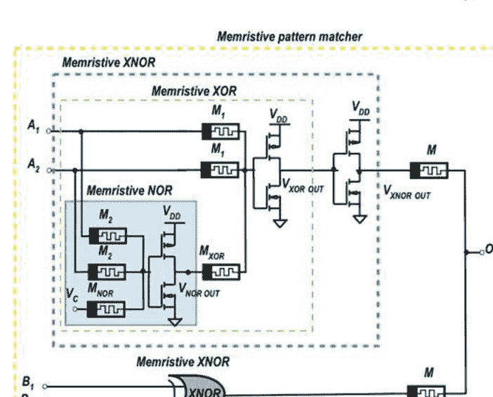

图14.9 记忆电阻网络 [12]

基于平均电路的输出中最高的类别被选为分类任务的获胜类别。这个HTM系统是一个应用的例子修改后的HTM用于监督学习的概念，下一节将进一步讨论。这种方法在AR数据库[12]的人脸识别应用中展示了87.21%的准确率。

### 14.5 HTM系统用于特征提取和模式识别

由于大多数硬件实现的记忆电阻HTM修改了原始的HTM算法，并使用HTM的部分作为特征提取工具。本节介绍了HTM作为从输入数据中提取有意义特征的工具的应用。

#### 14.5.1基于规则的HTM SP无学习特征提取

基于规则的HTM方法探索了HTM SP概念的应用无学习[4, 10]。研究工作[4]展示了算法实现-该方法的实现是通过从输入模式中提取自然特征来说明HTM的稀疏原则。与传统的HTM初始化相比，规则化方法根据输入模式的局部平均强度设置初始突触权重，以保持输入数据的自然稀疏性。在特定数据窗口内计算突触权重的局部平均值，并将其视为阈值。

如果突触权重大于该阈值，则将权重设置为高值；如果小于该阈值，则将初始权重设置为低值。HTM中基于规则的方法中受体块的硬件实现如图14.10所示，包括均值计算电路、比较器电路用于将输入与均值进行比较，以及产生1或0输出的模拟开关。此外，另一个重要部分是用于设置电子电阻权重的编程电路。硬件实现中的抑制块与图14.7中修改后的HTM方法相同。该方法不考虑HTM SP的学习部分，从而可以减少电路级设计。

该方法经过测试，用于从数据中提取有意义的特征，用于无需学习的分类问题。抑制块输出对应于来自特定类别的第一个输入，被用作理想的类别模板，并且通过基于规则的HTM SP处理的所有后续输入被用于分类。

这种方法使得在AR数据库上实现了80%的人脸识别准确率，同时显著减小了电路的尺寸。这种方法具有有限的应用范围，只能处理特定的输入模式，如图像。此外，图像的自然稀疏性对于实现高分类准确率非常重要。

#### 14.5.2 HTM模式识别系统

有几个系统使用HTM作为特征提取工具[6, 7, 12]。HTM执行特征编码，并允许从中提取有意义的特征数据。图14.11展示了模式识别和分类的整体系统实现。该图展示了使用有监督学习的人脸识别应用的示例。输入图像集可以直接来自传感器，并由输入数据控制器进行处理。如果需要，该控制器用于对输入数据进行采样和预处理。此外，控制器还将需要处理的图像存储在数据存储器中。输入数据控制器将图像提供给HTM SP模块，该模块从输入图像中提取有意义的特征，并将图像转发给输出数据控制器。如上所述，这里展示了有监督学习的过程，包括两个不同的阶段：（1）为所有图像类别生成理想图像模板的有监督学习方法，以及（2）分类。正如之前提到的，对于修改后的HTM实现，HTM TM仅用于生成图像类别映射，即在分类阶段中将被视为理想图像的图像。因此，根据处理阶段的不同，输出数据控制器将HTM SP生成的图像转发给HTM TM或模式匹配器。在为每个类别生成理想模式的阶段，控制器将数据转发给HTM TM，并断开模式匹配部分的连接。在此过程中，每个类别的模板将被更新。在分类阶段，模式匹配器将输出相似度分数，将HTM SP生成的输入图像与存储在忆阻存储器阵列中的所有图像类别作比较。

### 14.6 结论

本章介绍了HTM系统的记忆电阻硬件实现。为了在硬件上实现HTM，在大多数情况下需要修改HTM算法，因为原始HTM算法的模拟硬件实现可能计算复杂且功耗高、芯片面积大。一些系统使用修改后的HTM算法进行数据编码和提取有意义的特征，以用于模式识别应用。记忆电阻系统的主要挑战是记忆电阻器具有一定的缺陷，这可能会影响系统的性能和分类准确性。这些缺陷包括记忆电阻器的变异性、与CMOS设计的集成、记忆电阻器的耐久性和有限的电阻级别。研究这些对记忆电阻器的影响## 章节亮点

- 大多数基于忆阻网络的HTM硬件实现是基于对原始HTM算法的修改。
- HTM SP可以用于原始HTM和传统最近邻分类方法中从输入数据中提取有意义特征。
- 尽管近年来提出了几种HTM实现[1, 8, 12]，但原始HTM算法的完全片上硬件实现仍然是一个未解决的问题。

#### 参考文献

1.  Fan D, Sharad M, Sengupta A, Roy K (2016) 基于自旋神经元和电阻性存储器的分层时间记忆用于能效高的脑启发式计算。 IEEE Trans Neural Netw Learn Syst 27(9):1907–1919
2.  Hawkins J, George D (2006) 分层时间记忆：概念、理论和术语。技术报告，Numenta
3.  Hawkins J, Ahmad S, Dubinsky D (2010) 包括htm皮层学习算法的分层时间记忆。 技术报告，Numenta，Inc，Palo Alto。 http://www.numenta.com/htmloverview/education/HTM_CorticalLearningAlgorithms.pdf
4.  Ibrayev T, Krestinskaya O, James AP (2017) 设计和应用基于规则的权重稀疏模块在htm空间池中。 在：2017年第24届IEEE国际电子电路与系统会议（ICECS）。 IEEE，pp 274 -277
5.  Ibrayev T, James AP, Merkel C, Kudithipudi D (2016) 一种用于人脸识别的htm空间池设计，使用memristor-cmos混合电路。 在：2016年IEEE国际电路与系统研讨会（ISCAS）。 IEEE，pp 1254-1257
6.  Ibrayev T, Myrzakhan U, Krestinskaya O, Irmanova A, James AP (2018) 基于忆阻层级时间记忆的芯片人脸识别系统设计。 J Intell Fuzzy Syst 34(3):1393–1402
7.  Irmanova A, Ibrayev T, James AP (2017) 基于离散级别忆阻电路的时空数据分类系统。 IET Cyber Phys Syst Theory Appl 3(1):34–43
8.  James AP, Fedorova I, Ibrayev T, Kudithipudi D (2017) 基于忆阻交叉栅电路的HTM空间池化器用于稀疏生物识别。 IEEE Trans Biomed Circuits Syst 11(3):640–651
9.  James A, Ibrayev T, Krestinskaya O, Dolzhikova I (2018) 忆阻HTM电路简介。 In: Memristor and Memristive Neural Networks. InTech
10. Krestinskaya O, James AP (2018) 在模拟空间池中无需学习的特征提取层次化时间记忆的 memristive-cmos 电路设计。模拟集成电路信号处理 95(3):457-465
11. Krestinskaya O, Dolzhikova I, James AP (2018) 使用 memristor 网络的层次化时间记忆: 一项调查。IEEE Trans Emerg Top Comput Intel 2(5):380-395. https://doi.org/10.1109/TETCI.2018.2838124
12. Krestinskaya O, Ibrayev T, James AP (2018) 用于模式识别的 memristor 逻辑电路的层次化时间记忆特征。IEEE Trans Comput Aided Des Integr Circuits Syst 37(6):1143-1156
13. Krestinskaya O, James AP, Chua LO (2018) 用于边缘计算的神经 memristive 电路: 一项综述。arXiv 预印本 arXiv:1807.00962
14. Lazzaro J, Ryckebusch S, Mahowald MA, Mead CA (1989) O(n)复杂度的全胜网络。在: 神经信息处理系统的进展, 第703-711页
15. Zyarah AM, Kudithipudi D (2015) 用于分层时间记忆的空间池化器的可重构硬件架构。在: 2015年第28届IEEE国际芯片系统会议 (SOCC)。IEEE, 第143-153页

## 第15章 深度神经模糊架构

Anuar Dorzhigulov和Alex Pappachen James

摘要模糊逻辑灵感来自人脑计算的非确定性行为。 神经网络和模糊逻辑的融合，如神经模糊架构，是自然的，因为两者都代表了从大脑计算中获得的学习、适应和容忍噪声的基本灵感。 本章重点介绍了从功能、架构和应用的角度来看，神经模糊和类似解决方案在机器学习中的应用。

#### 15.1 引言

对智能数据处理的需求导致了对机器智能和学习算法的增加需求。 大多数现代机器学习技术都受到人脑的启发，神经模糊（NF）系统是一组专注于处理不精确和模糊数据的方法。

它是模糊集合和逻辑与人工神经网络风格的混合体，具有自我优化的特点。神经模糊架构通常用作强大的数据处理模型，尤其在系统控制领域非常流行[1]。

大多数现有的NF数据架构和控制单元都是软件解决方案。 然而，研究人员对专用NF硬件的兴趣正在增长。 这一趋势可以归因于处理庞大数据所需的巨大能量需求，包括收集、存储和处理。 专用硬件往往缺乏软件的灵活性，但在并行性、能量效率、占用面积和处理速度方面表现出优势。 这一特性在专用模拟硬件中得到最大化利用。 开发专用模拟NF硬件将是解决能量问题的潜在方案，高效的大数据处理。 此外，模拟设备的紧凑尺寸为去中心化数据处理提供了机会，减少了数据中心上的处理，并将预处理外包给近传感器模拟处理单元，加强了边缘计算范式。

在过去的十年中，有许多与NF硬件实现相关的研究项目。 它包括实现完整的NF系统，如数字硬件[2]，基于FPGA的[3]，混合电路[4]和完全模拟[5]。 此外，许多研究人员提出了NF系统的各个单独元素的实现，例如成员函数生成电路[6-8]或学习算法[9]。

### 15.2 模糊集合和逻辑：基础概述

并非所有的不确定性都可以准确地建模为确定性随机过程。 为了简化数据处理，原始数据可以被聚类成多个组。 例如，温度传感器读数可以分为一定范围的温度，低于0℃或高于0，可以称为‘冷’和‘暖’温度范围或集合。 然而，如果 -1 和 -30℃之间的差异对于我们的数据处理非常重要怎么办？ 如果‘冷度’的程度可以用于‘冷’温度范围，而不是定义多个子范围，那该怎么办？ 这种严格集合边界的不确定性在模糊集合和逻辑中得到了探索。 例如，由不等式Eq. 15.1定义的严格集合 A显示了严格的边界条件为0。

$A = \{x \mid x > 0\}$   (15.1)

对于 $x$ 的值为0.001或1000，它们都属于集合 $A$，没有区别。 但是如果我们对非常接近0边界条件的负值感兴趣呢？ 那么，集合 $A$ 可能是模糊的，图15.1。 可以观察到，接近0的负值也包含在模糊集合 $A$ 中，但是与关联或成员资格的程度较低，由连续衰减函数定义。 在这个例子中，边界由高斯函数定义，均值为 $c$，标准差为 $\sigma$，参数为 $x$，方程式15.2。

$f_{Gauss}(x) = exp\left(\frac{-(x-c)^2}{\sigma^2}\right)$   (15.2)

通常，用于表示与模糊集合的关联程度的函数称为Membership Functions(MFs)。 通常，MF的值在0和1之间归一化（其中0表示与模糊集合没有关联，1表示与某个参数值的模糊集合完全关联）。 与MF相关的值范围称为Universe of Discourse或者在模糊逻辑术语中称为Universe X。

图15.1 严格和模糊集边界条件表示的差异 A 和一些随机参数 x 之间的关系，部分属于 A

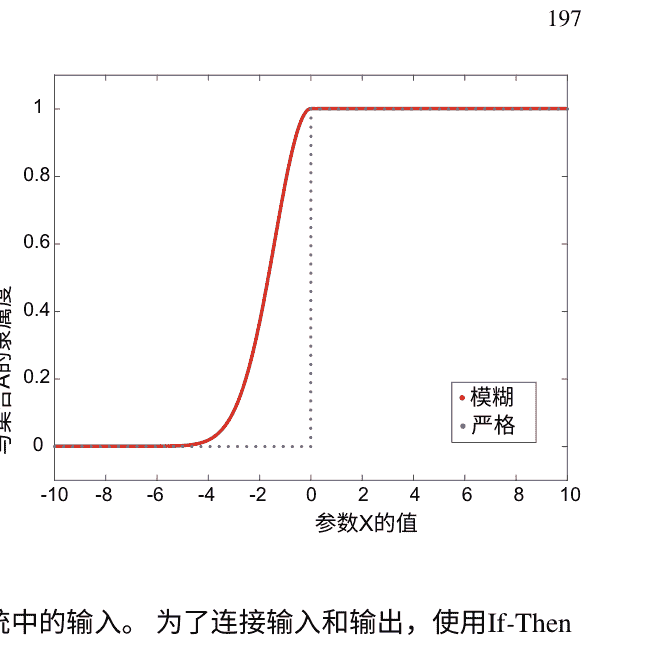

模糊MF用于定义模糊系统中的输入。为了连接输入和输出，使用If-Then规则（ITR），公式15.3。

`如果 X ∈ {A}, 则 Y ∈ {B}` (15.3)

这个单一规则代表模糊系统中的一个简单动作或推理：如果参数 X 的值在模糊集合 A 的宇宙范围内，则将输出 Y 的值分配给模糊集合 B。在模糊系统中，输入参数称为前提，而输出参数称为结论。If-Then规则的简单示例：如果镍球的颜色是红色，则其温度高，公式15.4。

`如果镍球的颜色 ∈ {‘红色’}, 那么 ‘温度’ ∈ {‘高温’}` (15.4)

这个简单的例子展示了非数值和语言参数（例如颜色）如何直接用于模糊系统。当然，颜色可以是确定性参数，例如，如果它映射到RGB颜色空间，但是模糊系统允许这种简单和主观的输入和输出表示，同时数值表示在模糊逻辑中仍然可行。

方程式15.3展示了ITR的最简单形式之一。单个ITR可以被结构化以一次推断或映射多个前提和结果参数。而且，这些ITR的集合（称为规则库）定义了整个模糊系统的推理算法。

模糊参数、MFs、总体架构和结构由专家定义，他们的知识和专业技能用于建模所需的系统行为。因此，模糊系统的性能取决于初始设置和/或系统的后续微调。缺乏自动化的自我优化和对外部专家的强烈依赖是模糊系统的主要缺点。

### 15.3 从模糊到神经网络：如何将神经网络与模糊逻辑相结合

神经模糊系统是将模糊集合和逻辑与神经网络架构和自我优化或学习能力相结合的系统。通常，不同类型的神经模糊架构是由相似的模块构建的，如图15.2所示。这些模块包括：输入模糊化、推理、去模糊化、规则库和学习[10]。

#### 15.3.1 模糊化

模糊化模块的主要目的是将清晰（数值或确定性）的输入特征值转换为模糊集合。或者，模糊化可以针对定性或语言输入进行。它可以是模糊的语言输入，例如'更高'、'更低'、'更冷'等。无论输入类型如何，该模块都基于模糊化函数（称为成员函数）产生输出。成员函数表示模糊化输入与特定期望输入的接近程度。常用的模糊化函数有三角形、梯形、高斯、广义钟形、S型和Z型函数，如图15.3所示。值得注意的是，不可微分的形状（三角形和梯形）在硬件中很少使用。这些参数的最优值可以提高神经模糊系统的准确性。

#### 15.3.2 推理

推理模块用于产生模糊输出，该输出是一个或多个模糊输入的函数。这个函数可以是简单的运算符或代数函数，如平均值、加权平均值、求和、乘积、最小值或最大值（例如在图15.4中的示例），应用于所有相关输入一次（例如X1、X2和X3之间的最小值），或者可以建立更复杂的关系（例如X3和X1、X2的平均值之间的最小值），这是模糊决策树的常见情况。例如，假设某个控制系统规则：如果压力‘高’且流量‘低’，则稍微增加温度。

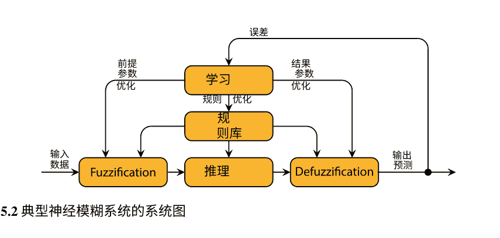

图15.5 2D输入空间的分割，具有输入特征X和Y

#### 15.3.3 去模糊化

去模糊化是将获得的模糊输出转换为数值清晰值的过程。通常它显示了估计的模糊响应与精确数值响应之间的关系。例如，如果模糊系统对‘稍微增加温度’产生响应，它将将其等同于‘将温度增加1度’。此外，如果模糊系统受多个规则控制，这通常是在这种情况下，需要进行去模糊化过程来估计整体输出，考虑到每个规则的当前值和权重（例如规则1、规则2、...、规则N的加权平均）。常见的去模糊化算法包括：面积的质心、面积的二等分线、最大值的平均值、最大值的最小值、最大值的最大值。

#### 15.3.4 规则库

基于模糊If-Then规则的规则库，公式15.3。规则库的主要功能是NF系统的路由，即直接建立输入和输出之间的连接，或者通过推理和去模糊化运算符建立连接（如果需要）。换句话说，规则库用于对输入空间进行分割，如图15.5所示的示例。值得注意的是，规则库是经典NF系统大规模实现的主要限制，因为规则的数量可以随着输入数量的增加呈指数级增长，这被称为维度灾难。

这个问题对于使用输入空间的网格划分的系统是普遍存在的，图15.5a。为了限制规则的数量，可以使用树状和散射划分，图15.5b和15.5c。然而，这些方法需要更复杂的MFs关系。

#### 15.3.5 学习

学习是NF系统的迭代自优化过程。优化基于期望和产生的输出（误差）的函数，称为成本函数。优化有两种主要类型：参数和结构。参数优化用于逐渐调整NF模块的参数，模糊化是最常见的。结构优化针对结构，调整每层模块的数量，以最小可能的规则数最大化性能。

学习算法也可以通过错误纠正的频率来区分。如果系统在每次迭代后进行优化，则称为在线学习。如果在参数/结构调整之前，错误值在多次迭代中累积，则称为批量学习。如果优化仅在整个训练迭代之后进行 - 离线学习。

最后，学习可以在芯片上本地进行，或者在芯片外部进行，在外部训练硬件或软件的基础上获得系统参数的最佳设置。

### 15.4 深度神经模糊可以有多“深”：深度网络与模糊推理的结合

神经模糊系统结合了神经网络和模糊逻辑。“深度”神经模糊系统是典型模糊和“深度”神经网络元素的结合结果，例如多层结构。本节概述了一些最流行的神经模糊架构。

#### 15.4.1 自适应神经模糊推理系统（ANFIS）

ANFIS及其变体是最流行的神经模糊系统模型之一。最初由Jang [10]提出，这种类型的架构将人工神经网络的结构和学习与输入的模糊化和规则库相结合。

经典ANFIS使用5层。具有两个输入和每个输入两个MF的ANFIS网络示例，图15.6，并产生网格分割，图15.7。在图15.6中，方形神经元（第1层和第4层）具有可调参数，而圆形神经元是静态的。

**第1层**

该层中的每个神经元用于模糊化相应的输入特征，方程式15.5

`输出₁ᵢ = μ_{A_i} (X) , 其中i是具有X输入的节点`
`输出₁ᵢ = μ_{B_i} (Y) , 其中i是具有Y输入的节点` (15.5)
`其中μ是相应的参数化MF。`

**第2层**

该层中的每个神经元与一个特定的模糊规则相关联，产生的神经元输出被视为特定模糊规则的激活强度。输出该神经元的功能是相应模糊化输入特征的乘积（T-范数或AND），方程式15.6

$$Out_{2,i} = \mu_{A_i}(X) \times \mu_{B_i}(Y) \qquad (15.6)$$

**第3层**

该层的神经元负责产生每个关联规则的归一化强度，方程式15.7

$$Out_{3,i} = \overline{w_i} = \frac{w_i}{\sum_i w_i} \qquad (15.7)$$

**第4层**

第4层中的每个神经元都保留了一组与特定规则相关的后续参数 $f_{io}$ 未模糊化的输入、归一化的规则强度 $w_i$ 和后续参数 $f_i$根据Tagak_i-Sugeno-Kang(TS K)模糊推理模型（方程式15.8）产生输出。

`$$Out_{4,i} = \overline{w}_i f_i, \text{其中} \ f_i = (p_i X + q_i Y + r_i)\text{为一阶模型，或者} \ f_i = r_i, \text{为零阶模型}$$`

**第5层**

单个神经元输出层，对第4层神经元的输出求和，方程式15.9。

`$$Out_5 = \sum_i \overline{w}_i f_i$$`

##### 15.4.1.1 ANFIS优势

ANFIS架构可以处理语言和数值特征。此外，与人工神经网络（ANN）相比，ANFIS需要优化的参数较少。此外，一些后续参数可以通过线性学习算法（如最小二乘估计器）进行调整，加快学习过程。最后，基于模糊规则的架构对于人类操作员来说更加全面，因此最终的近似系统模型更易于理解，而规则的数量也不会过多。

##### 15.4.1.2 ANFIS的缺点

ANFIS的主要缺点是随着特征数量和每个特征的MF数量的增加，可扩展性较差。对于$N$个输入特征和每个特征的$M$个MF，所需的离散规则数量为$M^N$。这个问题被称为维度诅咒。大多数ANFIS变体都设计了一种或另一种方式来解决这个问题，例如SOANFIS或VANFIS。

#### 15.4.2 模糊神经网络

模糊神经网络（FNN）是混合系统架构的广泛类别，它以某种方式结合了神经网络和模糊系统的特性。一个FNN可以是DNN和模糊推理引擎的合并，例如ANFIS，或者它可以将这些元素分别以顺序或并行的方式使用，从而产生异构NFS。随着“深度学习”概念和深度神经网络（DNNs）的出现，一些研究正在将FL元素和模块引入到这些系统中，以解决原始数据中可能存在的不确定性。FL和NN的组合可以采用多种形式。它可以是顺序架构，其中模糊和神经数据处理依次进行，图15.8a。它可以是并行的-当数据分别由模糊和神经模块分别处理，然后融合，图15.8b。它可以用作彼此的支持或控制模块，图15.8c，例如当NN用于确定模糊系统的最佳结构、规则和参数时，创建一个合作的神经模糊网络。此外，这些系统可以分为两个类别：同质或异质。在第一种类型中，神经和模糊部分在结构上融合在一起，因此无法分别操作彼此。ANFIS是同质模糊神经网络的例子。在异质系统中，神经和模糊部分是可分离的。

顺序FNN的一个例子是CNN和模糊推理的组合。由于高效的特征提取，CNN在图像分类中表现出色。由于模糊系统在处理大量原始数据时往往困难重重，因此CNN具有预处理原始数据并从中提取有限数量特征的特性可以用作深度NFS的前提部分[11]。

并行FNN的一个例子可以是融合模糊深度神经网络(FFDNN)[12]。在这种架构中，作者将数据处理分为模糊系统和DNN两部分，从而实现了数据分类的适当性能。

合作FNN的一个例子是通过模糊推理选择遗传算法中的突变神经结构以进行多标准结构优化。

#### 15.4.3 模糊树、模式和决策

在神经模糊机器学习领域，另一种新兴方法是实现分层模糊树。与传统的模糊If-Then规则库不同，后者以单层并行形式结构化，如图15.9a所示，模糊树通常是具有更复杂内部依赖关系的多层规则结构，如图15.9b所示。换句话说，经典的规则库由基本的If-Then规则定义，而模糊树由模糊输入和输出之间的复杂的多层功能依赖关系定义。与经典的规则库相比，模糊树可以用于更紧凑和可能更准确的系统近似，其中多个规则可以聚合和聚类以创建一个复杂的规则，或者模糊树的一个“分支”。因此，模糊树架构的性能对结构非常敏感。模糊树结构有两种主要方法。一种方法是使用专家知识。就像在经典模糊系统中所做的那样。另一种方法是使用数据驱动算法来迭代构建和演化模糊树结构(结构自适应/优化)，直到达到所需的性能，同时保持### (a) Sequential

### (b) Parallel

### (c) Cooperative

## 图15.8 异构FNN的示例

## 图15.9 神经模糊系统中的规则库表示

相对较低的结构复杂性。此外，这两种方法还可以结合使用，其中专家知识可用于构建模糊树的核心结构，进化算法可用于微调较小的分支。参数优化仍然是模糊树学习的重要方面，因为输入的模糊化仍然可以调整以提高性能。

## 15.4.4 非神经模糊架构中的模糊元素

有一些神经架构通常不被视为神经模糊组的一部分，但使用了一些模糊系统的功能元素。因此，这些架构可能与神经模糊系统共享一些类似的核心元素，特别是在考虑硬件实现时。本节将重点介绍径向基函数（RBF）网络和模糊自适应共振理论映射（Fuzzy ARTMAP）。

### 15.4.4.1 径向基函数网络

RBF网络，图15.10，是用于非线性数据分类的特定类型的人工神经网络。它的结构类似于三层多层感知器（MLP）。隐藏层中激活函数的关键区别：经典MLP通常使用S型函数（类似于图15.3上的S函数），而RBF网络使用钟形函数，如高斯函数（Eq. 15.2）。在经典MLP中，隐藏层神经元在加权输入和偏置之和超过激活阈值时被激活。在RBFN中，隐藏神经元在输入模式与每个RBF神经元存储的模式之间具有高相似性时被激活，高相似性得分会导致更强的激活，图15.11。另外，加权输入和偏置也可以在RBFN中使用，但这不被视为经典RBFN。RBFN使用高斯函数，这是常见的模糊MF。也可以使用其他MF。

RBFN的训练过程与典型的神经网络不同，因为它需要训练输出权重和激活函数参数。输出权重可以使用反向传播算法进行训练，但这些算法对于训练激活函数参数并不高效。通常，通过无监督聚类算法获取每个函数的中心点和宽度，并使用随机梯度下降（SGD）或线性训练来训练输出权重。

算法，如LMS。与仅基于反向传播的算法相比，这种训练范式通常更快。

### 15.4.4.2 模糊ARTMAP

增量学习是机器学习的新兴范式，它解决了学习可塑性的问题，找到了学习新数据而不忘记旧模式之间的平衡。最初的自适应共振理论（ART）架构被提出作为无监督的增量学习平台，用于处理二进制特征。后来，原始作者修改了架构，使其能够处理模拟特征（取值范围在0和1之间），引入了模糊ART算法。

此外，ART模块可以用于监督学习，就像在ARTMAP算法中所做的那样。如果使用模糊ART模块进行ARTMAP，它也变得模糊了。监督学习基于训练数据对、输入特征和期望结果。在模糊ARTMAP中，图15.12中，一个ARTa模块用于输入特征处理，ARTb模块用于输出映射。这两个模块通过映射字段Fab连接以进行匹配操作。第一个层F0对于两个模块都用于通过补码进行归一化。在这一层中，M维输入向量通过其补充向量进行连接。

结果是，F0层的大小为2M维向量。下一层F1中的神经元数量等于来自F1的连接向量的大小。最后一层F2有一个神经元，额外的神经元在训练过程中被激活，实现增量学习。

模块ARTa负责根据输入特征进行增量无监督聚类，从而将超平面映射到M维输入空间中。每个获得的类别 Tj 由权重定义

## 图15.12 模糊ARTMAP算法的架构

向量 $w_{j}$。 最初，权重向量 $w_{j}$中的每个元素都等于1，并且在训练过程中逐渐减小。 ART模块内的训练过程如下：

1.  类别选择：
    对于当前输入向量 $I$和权重向量 $w_{j}$，根据以下方程计算类别函数：

    ```
    $$T_{j} = \frac{||\mathbf{I} \wedge \mathbf{w_{j}}||}{\alpha + ||\mathbf{w_{j}}||}$$  (15.10)
    ```

    选择具有其相应函数最高值的类别。

2.  警戒测试 ：
    对于前一步选择的类别 $j$，执行警戒测试以估计匹配值：

    ```
    $$\frac{||\mathbf{I} \wedge \mathbf{w_{j}}||}{||\mathbf{I}||} \geq \rho$$  (15.11)
    ```

    如果给定的类别满足这个条件，则选择它进行学习。 否则，选择另一个类别进行警觉性测试。 如果没有现有的类别满足这个测试，则为给定的输入模式创建新的类别，并进行进一步学习。

### 3. 学习

被选择进行学习的类别的权重更新为：

```
$$ \mathbf{w}_j^{new} = \beta (\mathbf{I} \wedge \mathbf{w}_j^{old}) + (1 - \beta)\mathbf{w}_j^{old} $$ (15.12)
```

对于给定的训练对，输入和输出由单独的模糊ART模块处理。 ART$_a$模块学习输入模式并进行无监督预测，而映射字段用于根据ART$_b$模块的输出接受或拒绝预测。$\rho_b$是输出块的警觉性参数，因此它为每个唯一的输出值生成唯一的ART$_b$类别。 结果是，映射字段生成权重矩阵 $w^{ab}$，将ART$_a$和ART$_b$之间的类别关联起来。 如果ART$_a$的第 $j$个类别和ART$_b$的第 $k$个类别在各自的模块中获胜，映射字段生成输出 $x_{ab}$：

```
$$ \mathbf{x}^{ab} = \mathbf{y}_k^b \wedge \mathbf{w}_j^{ab} $$ (15.13)
```

与ART模块类似，映射字段执行自己的警戒测试：

```
$$ \frac{\|\mathbf{x}^{ab}\|}{\|\mathbf{y}^{b}\|} \ge \rho_{ab} $$ (15.14)
```

如果满足方程式15.14的条件，则ART$_a$的第j类与ART$_b$的第k类相关联，并且该j-k连接被视为学习的一部分。 否则，ART$_a$的警戒参数将被调整以找到更好的匹配类别，无论是现有的还是新创建的：

```
$$ \rho_a = \frac{\|\mathbf{I}_a \wedge \mathbf{w}_j^a\|}{\|\mathbf{I}_a\|} + \delta, \text{其中} 0< \delta \ll 1 $$ (15.15)
```

然而，满足映射字段警戒测试的ART$_a$的第j类将经历新的权重训练，即 $w^{ab}$:

```
$$ \mathbf{w}_j^{ab, new} = \beta_{ab} (\mathbf{w}_j^{ab, old} \wedge \mathbf{y}^b) + (1 - \beta_{ab})\mathbf{w}_j^{ab, old} $$ (15.16)
```

训练后，只有ART$_a$模块用于测试。

## 15.4.4.3 模糊ARTMAP的优势

与传统的机器学习架构（如MLP）相比，模糊ARTMAP在训练收敛性、所需学习的简单性方面表现出优越性，同时保持了竞争性的预测和分类准确性。此外，ARTMAP具有在动态环境中以最少的训练数据进行学习的能力。ART基于算法的一个重要特征是能够学习新的模式，而无需完全重新训练的要求。换句话说，ARTMAP能够记忆额外的模式，而不影响已有的模式。

## 15.4.4.4 模糊ARTMAP的缺点

模糊ARTMAP架构容易受到类别过多的影响，即模型复杂度直接受到输入特征复杂度的影响。对于需要处理嘈杂数据或大量重叠数据的情况，这可能会带来极大的问题。设计了许多替代版本的这种架构，以解决这个问题。通过优化理论、贝叶斯决策理论、智能聚类或进化算法来实现。

与模糊ARTMAP的硬件实现相关的另一个问题可能是结构灵活性的要求，如果考虑了芯片上的学习，因为准确训练这种架构需要动态增加每个ART模块的F2层中的神经元数量。此外，训练数据的顺序会影响学习性能。

## 15.5 未来展望：专用深度神经模糊硬件？

神经模糊算法在现代研究人员中引起了兴趣，特别是在系统控制和数据分类领域。然而，大多数神经模糊解决方案存在于软件解决方案中。随着物联网概念越来越流行，机器智能系统的硬件解决方案变得更加有利，因为具有更高的功耗效率和处理速度。有一些以专用数字硬件实现的神经模糊系统架构，例如现在流行的FPGA模块，但混合/模拟硬件在灵活性方面存在一些权衡。在混合/模拟实现领域，NFS的单独元素的实现非常流行。模糊化模块/电路尤其受欢迎。然而，也有一些完整的NFS实现的例子。VANFIS架构已经被实现为用于实时目标检测的混合信号处理器[4]。另一个例子是利用模拟的记忆电阻交叉阵列进行数据分类[13]。随着

模糊元素丰富的模拟电路设计和高效模拟硬件设备的出现，如忆阻器，预计在不久的将来会有高效的硬件实现。

#### 章节亮点

- NFS的模糊性允许更宽松的输入数据处理。
- 有多个函数可以用作MF。
- 深度学习架构可以与模糊集合和逻辑相结合，以引入神经架构的自动优化。
- ANFIS是最流行的NF架构之一。
- FNNs在一个架构中分别使用模糊和神经元素。
- 模糊树允许更复杂但更紧凑的神经模糊规则表示。
- 有一些神经架构使用了一些模糊元素，如RBFNs和模糊ARTAMAP。
- 专用模拟硬件可以实现高效的NF算法。

#### 参考文献

1.  Pandiyan M, Mani G (2015) 嵌入式低功耗模拟CMOS模糊逻辑控制器芯片，用于工业应用。 在：2015年IFIP / IEEE国际超大规模集成电路会议（VLSI-SoC），第43-48页
2.  Juang C, Chen C (2014) 具有芯片上增量学习能力的区间型-2神经模糊芯片，用于时变数据序列预测和系统控制。 IEEE Trans Neural NetwLearn Syst 25(1):216–228
3.  Juang C, Juang K (2017) 具有在线参数调整能力的数据驱动TSK型区间型-2神经模糊系统的电路实现。 IEEE Trans Ind Electron 64(5):4266–4275
4.  Oh J, Lee S, Yoo H (2013) 1.2毫瓦在线学习混合模式智能推理引擎，用于低功耗实时物体识别处理器。 IEEE Trans Very Large Scale Integr (VLSI)Syst 21(5):921–933
5.  Merrikh-Bayat F, Merrikh-Bayat F, Shouraki SB (2014) 具有在memristor交叉点上实现和无优化硬件训练能力的神经模糊计算系统。 IEEE Trans Fuzzy Syst 22(5):1272–1287
6.  Yaghmourali YV, Fathi A, Hassanzadazar M, Khoei A, Hadidi K (2018) 使用传导和电流模式的低功耗、全可编程的隶属函数生成器。 模糊集合系统337:128–142
7.  Abolhasani A, Tohidi M, Mousazadeh M, Khoei A, Hadidi K (2013) 具有新的可编程CMOS OTA和新的MIN电路的高速、全可调谐MFG。 在：第20届国际集成电路和系统混合设计会议（MIXDES 2013）论文集，第169–173页
8.  Ghasemizadeh H, Fathi A, Ahmadi A (2012) 用于模拟神经模糊系统的高精度可编程模糊化电路。 在: 第20届伊朗电气工程会议（ICEE2012）论文集，第12–16页
9.  Afrakoti IEP, Shouraki SB, Bayat FM, Gholami M (2017) 使用记忆电阻网络实现一种新的自适应实时模糊建模算法。 模糊集系统307: 115–128
10. Jang JR (1993) Anfis: 自适应网络模糊推理系统。 IEEE Trans Syst Man Cybern 23(3):665–685
11. Bonanno D, Nock K, Smith L, Elmore P, Petry F (2017) 使用模糊推理解释深度学习的方法。 在: 下一代分析师V，卷10207，页102070D。 国际光学和光子学学会
12. Deng Y, Ren Z, Kong Y, Bao F, Dai Q (2017) 一种层次融合的模糊深度神经网络用于数据分类。 IEEE Trans Fuzzy Syst 25 (4) : 1006–1012
13. Afrakoti IEP, Shouraki SB, Bayat FM, Gholami M (2016) 使用记忆电阻网络交叉栅结构来实现一种新颖的自适应实时模糊建模算法。 模糊集合系统307: 115–128