# 深度学习和其他计算技巧：生物医学及其它应用


Nguyen Hoang Phuong Vladik Kreinovich编辑

## 计算智能研究

第1097卷

《计算智能研究》（SCI）系列出版了计算智能各个领域的新发展和进步，速度快，质量高。其目的是涵盖计算智能的理论、应用和设计方法，嵌入到工程、计算机科学、物理学和生命科学等领域，以及背后的方法论。该系列包括神经网络、连接主义系统、遗传算法、进化计算、人工智能、细胞自动机、自组织系统、软计算、模糊系统和混合智能系统等计算智能领域的专著、讲义和编辑卷。

对于投稿者和读者来说，短时间的出版周期和全球分发都具有特别的价值，可以广泛而迅速地传播研究成果。

被SCOPUS、DBLP、WTI Frankfurt eG、zbMATH、SCImago索引。

该系列中的所有图书都提交给Web of Science进行考虑。

Nguyen Hoang Phuong · Vladik Kreinovich
编辑

## 深度学习和其他软计算技术

### 生物医学及相关应用

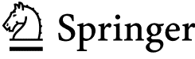

### 编辑

Nguyen Hoang Phuong
人工智能部
Thang Long University
越南河内

Vladik Kreinovich
计算机科学系
University of Texas at El Paso
德克萨斯州埃尔帕索

ISSN 1860-949X
ISSN 1860-9503 (电子版)
计算智能研究
ISBN 978-3-031-29446-4 ISBN 978-3-031-29447-1 (电子书)
https://doi.org/10.1007/978-3-031-29447-1

© 编辑（如适用）和作者，独家许可给 Springer Nature Switzerland AG 2023

本作品受版权保护。出版商独家授权所有权，无论是整体还是部分材料，特别是翻译、再版、插图重用、朗读、广播、微缩胶片复制或以任何其他实体方式复制、传输或信息存储和检索、电子适应、计算机软件或类似或不同的已知或今后开发的方法。

本出版物中使用的一般描述性名称、注册名称、商标、服务标志等，并不意味着即使在没有明确声明的情况下，这些名称不受相关保护法律和法规的约束，因此可以自由使用。

出版商、作者和编辑可以安全地假设本书中的建议和信息在出版日期时被认为是真实和准确的。出版商、作者或编辑对本文所含材料不提供明示或暗示的保证，也不对可能存在的任何错误或遗漏承担责任。出版商在已发表的地图和机构隶属方面保持中立。

这个Springer印记是由注册公司Springer Nature Switzerland AG出版的
注册公司地址是： Gewerbestrasse 11, 6330 Cham, Switzerland

## 前言

保持健康是人类活动的重要组成部分，我们一直在取得很多进展。人工智能（AI）和计算智能（CI）技术，特别是深度学习技术，为这些成功做出了贡献。然而，仍然存在许多重要和关键的医学挑战。为了解决这些尚未解决的挑战，我们必须超越现有的技术。特别是，我们必须超越当前使用的AI和CI技术：我们必须修改现有的技术，将它们与其他技术结合，或者提出全新的想法。这本书的主要焦点是寻找受生物医学启发的新的AI和CI技术。

与此焦点一致，大多数章节描述了AI和CI技术如何帮助解决医学挑战。这些章节构成了本书的第一部分。当然，仍然存在许多具有挑战性的问题。为了解决这些问题，继续开发新的AI和CI技术非常重要。如果这些技术在其他具有挑战性的应用领域取得成功，那么有希望这些技术也能在生物医学应用中有所帮助。根据这种推理，在本书的后续部分中，我们描述了在其他应用领域取得成功的AI和CI技术：金融（第二部分），交通工程（第三部分）以及物理学，特别是计算物理学（第四部分）。尚未导致成功实际应用的新的有前途的AI和CI思想在第五部分中描述。

我们希望这本书能帮助从业者和研究人员更多地了解计算智能技术及其在生物医学应用中的应用，并进一步发展这个重要的研究方向。

我们要感谢所有作者对本书的贡献，以及所有匿名审稿人对本书的深入分析和有益评论。
本卷的出版部分得到了越南河内的Thang Long大学的支持。我们感谢该机构的领导和员工提供了关键的支持。特别感谢Hung T. Nguyen教授的宝贵建议和持续支持。

我们还要感谢Janusz Kacprzyk教授（系列编辑）和Thomas Ditzinger博士（高级编辑，工程/应用科学）对本出版物的支持和合作。

-   越南河内
-   美国埃尔帕索
-   2022年12月

-   Nguyen Hoang Phuong
-   Vladik Kreinovich

## 目录

### 软计算在生物医学和其他人类相关应用中的应用

#### 类型-2模糊关系：一种表示方法
关联医疗关系中的不确定性
Bassam Haddad和Klaus-Peter Adlassnig

#### 通过极限梯度提升和k均值检测心理状态
Nam Anh Dao和Quynh Anh Nguyen

#### 为什么脑细胞之间的间隙减小会引起严重的头痛
头痛：基于对称几何的解释
Laxman Bokati, Olga Kosheleva, Vladik Kreinovich,
和Nguyen Hoang Phuong

#### 药物再定位用于药物疾病关联的元路径
Xuan Tho Dang, Manh Hung Le和Nam Anh Dao

#### iR1mA-LSTM：使用基于注意力的双向长期记忆网络在人类转
录组中识别N¹-甲基腺苷位点
Trang T. T. Do, Thanh-Hoang Nguyen-Vo, Quang H. Trinh,
Phuong-Uyen Nguyen-Hoang, Loc Nguyen和Binh P. Nguyen

#### 解释生物反应的经验公式相似
刺激（Covid-19及其后续）
Olga Kosheleva, Vladik Kreinovich和Nguyen Hoang Phuong

#### 博弈论方法解释-关于定性
水平-Covid-19变种的抗原图
Olga Kosheleva, Vladik Kreinovich和Nguyen Hoang Phuong

#### 应用人工智能技术进行识别
和分析图像数据
Lu Anh Duy Phan和Ha Quang Thinh Ngo

#### 基于机器学习的内脏器官医学图像上的检测

Duy Thuy Thi Nguyen, Mai Nguyen Lam Truc, Thu Bao Thi Nguyen, Phuc Huu Nguyen, Vy Nguyen Hoang Vo, Linh Thuy Thi Pham, 和 Hai Thanh Nguyen

#### 基于冲击和加速度传感器的智能文胸性骚扰预防的通信技术

Linh Thuy Thi Pham, Thinh Phuc Nguyen, Khoi Vinh Lieu, Huynh Nhu Tran 和 Hai Thanh Nguyen

#### 智能盲杖集成超声波传感器和通信技术用于视觉障碍人士

Linh Thuy Thi Pham, Lac Gia Phuong, Quang Tam Le, 和 Hai Thanh Nguyen

#### 乳腺癌X射线异常区域分割使用U-Net的图像

Nguyen Hoang Phuong, Ha Manh Toan, Nguyen Van Thi, Ngo Le Lam, Nguyen Khac-Dung, 和 Dao Van Tu

## 为什么FLASH放射治疗高效：一个可能的解释

Julio C. Urenda, Olga Kosheleva, Vladik Kreinovich, 和 Nguyen Hoang Phuong

#### 超声图像上的数据增强技术评估用于乳腺肿瘤分割任务的

Trang Minh Vo, Thien Thanh Vo, Tan Tai Phan, Hai Thanh Nguyen, 和 Dien Thanh Tran

## 金融应用

#### 使用文本挖掘和情感进行股票价格预测分析

阮氏惠妍珠, 黎文健, 和 段忠丰

## 应用于交通工程

#### 轻量级模型在资源受限环境下的性能用于交通应用的设备

Dang Tuan Linh, Le Duc Loc, Pham Trung Hieu, 和 Tran Xuan Tung

## 具有Jordan反馈结构的IT2-神经模糊小波网络用于控制带有外部干扰的空中机器人

Rahul Kumar, Uday Pratap Singh, Arun Bali, 和 Siddharth Singh Chouhan

#### 沥青黏度如何取决于温度：一个经验依赖的理论解释

Edgar Daniel Rodriguez Velasquez和Vladik Kreinovich

### 物理学应用，包括计算背后的物理学

#### 为什么在MOND - 替代理论中 - 一个特定的公式最好的解释是基于复杂性的解释

Olga Kosheleva和Vladik Kreinovich

#### 为什么选择彩色光学计算？

Victor L. Timchenko，Yury P. Kondratenko和Vladik Kreinovich

#### 非局部化的物理过程可以帮助加速计算，无论是量子物理中的隐藏变量还是广义相对论中的非局部化能量

Michael Zharkovich，Olga Kosheleva和Vladik Kreinovich

### 软计算技术的综合研究

#### 深度学习的计算悖论：一种定性分析解释

Jonatan Contreras, Martine Ceberio, Olga Kosheleva, Vladik Kreinovich和Nguyen Hoang Phuong

#### 图形方法用于不确定性量化

Hector A. Reyes，Cliff Joslyn和Vladik Kreinovich

#### 如何结合专家估计？如何估计概率在两个人口的交集中？

Miroslav Svtek, Olga Kosheleva, Vladik Kreinovich, 和Nguyen Hoang Phuong

### ## 生物医学和其他与人类相关的软计算应用

### # 二型模糊关系：一种表示关联医学关系中的不确定性的方法

Bassam Haddad和Klaus-Peter Adlassnig

摘要 获取精确值（如症状、体征、实验室检测结果和疾病/诊断）以表达医学实体之间有意义的关联关系一直被视为开发医学知识系统的关键部分。在引入模糊集之后，研究人员意识到模糊集使用中的一个核心问题是构建成员函数值。这个问题的复杂性在于为所考虑的模糊集中的每个元素分配一个确切的成员度量。二型模糊集通过为每个元素分配不同的模糊集来解决这个问题。本文通过提出一致的区间二型模糊关系来解决医学知识获取和表示的问题，将模糊包含作为表示医学实体之间关联程度的度量。将引入区间二型模糊关系的概念来表示医学实体之间的不确定性和模糊性。

## 1 引言和动机

医学实体之间的关联关系，如症状、体征、实验室检查结果和疾病/诊断，可以通过不同的方式建立。医学知识已经通过几种符号和/或数值、或数据和知识驱动的方法进行了正式表示，所有这些方法在一定程度上都取得了成功（图4）。症状和疾病之间的关联关系可以用两种类型的度量来表达：发生的必要性和

B. Haddad
佩特拉大学数据科学与人工智能系，阿曼安曼11196，约旦
电子邮件：haddad@uop.edu.jo

K.-P. Adlassnig (✉)
维也纳医科大学人工智能研究所，医学数据科学中心，维也纳1090 Spitalgasse 23，奥地利
电子邮件：klaus-peter.adlassnig@meduniwien.ac.at; kpa@medexter.com

Medexter Healthcare GmbH, Borschkegasse 7/5, 1090 Vienna, Austria

© 作者，独家许可给 Springer Nature Switzerland AG 2023N. H. Phuong 和 V. Kreinovich（编辑），深度学习和其他软计算技术，计算智能研究 1097，https://doi.org/10.1007/978-3-031-29447-1_1

s with d, and the sufficiency of occurrence of s for d. 在我们的背景下，出现的必要性¹可以解释为从 d 到 s 的逆向蕴涵，即 (s ← d)，而出现的充分性²可以视为从 s 到 d 的正向蕴涵，即 (s → d)。同样，负关联关系也可以被指定为逆向蕴涵或正向蕴涵，即 (s ← ¬d)，和 (s → ¬d)。

通过考虑多值蕴涵 ∈ [0, 1]，可以扩展上述关系。例如，³事件发生的必要性可以表示为多值反向蕴涵 (s ← μ d)，其中 μ ∈ [0, 1]，事件发生的充分性可以表示为正向蕴涵 (s → d)，其中 μ ∈ [0, 1]。

人类专家知识可用于获取表示不确定性程度的值，而统计数据可以增加相应的知识体系。
这些方面已成功应用于差异诊断支持系统 CADIAG-I [1-4] 和 CADIAG-II [5-11] 中，用于表示症状、体征、实验室检查结果和疾病之间的医学关系。在 CADIAG-II 中，模糊集合理论和模糊逻辑被用来表示模糊集合中的语言医学术语的内在模糊性，并表示这些术语之间的医学关系的部分真实性。在这里，事件发生的频率和确认的强度对应于事件发生的必要性和充分性。此外，考虑了负关联蕴涵来指定排除的强度。因此，半自动统计分析能够支持知识获取过程[12, 13]。

然而，创建一个坚实的医学知识库并不总是一个直接的过程。它可能存在各种问题，例如：

-   不确定性：很难获得用于表达有意义的关联关系的确切值。人类专家知识和统计数据分析可能会支持这个过程。然而，即使是定量的医学信息也不会100%准确。模糊系统实际上已经在各种科学应用中取代了传统方法。然而，类型-1模糊系统，其隶属函数是类型-1模糊集，能够处理不确定性。类型-2

1必要性：症状s的发生被认为是一种疾病d的必要条件，那么d的发生保证了s的发生；例如，s：“血清葡萄糖水平增高”是d的必需条件：“糖尿病”：

(s ← d)

2充分性：症状 s 的出现被认为是疾病 d 的充分条件，那么 s 的存在就保证了 d 的发生；例如，s：“细胞内尿酸结晶（痛风石）”确认了 d：“痛风”的定义：

(s → d)

3例如：s的发生：“血糖水平升高”对于d：“糖尿病”是必要的，然而只有0.65的置信度才能确认“糖尿病”：

(s \xleftarrow[1]{d}, s \xrightarrow[0.65]{d})

依赖于类型-2模糊集的模糊系统试图通过分配模糊集或任意区间⊂ [0, 1]来处理这些不确定性，从而定义了主要成员的可能性。此外，还应考虑表示人类专家知识和解释关于无知的统计数据（什么是未知的？）。专家之间的一致性或不一致性以及关于数据相关性的各种替代方案之间的冲突[14]在增加不确定性程度方面起着一定的作用。

-   * 不一致性：包含大量医学实体之间关系的医学知识库可能受到不一致性和不完整性的影响。必须通过适当的检查来确保知识的质量。

本文的目的是介绍处理上述不确定性方面的基本原则。我们关注以下几个方面：

-   * 使用区间型-2模糊关系处理模糊和不确定性。
* 使用基于区间型-2模糊关系的包含度量表示医学实体之间的二元关联关系。这种包含度量对应于不确定和不精确的蕴含关系，即二元模糊规则。包含度量的方向对应于发生的必要性和充分性，可以表示为不确定的向后和向前的蕴含关系。区间表示了一个模糊集合在另一个相关模糊集合中可能包含的程度，例如 (s ——→ d), 和 (s ←—— d), 其中 I(s, d), 和 I(d, s) ⊆ [0, 1]. I(s, d)和 I(d, s)表示模糊规则的不确定性. 在这里，采用了区间型二阶模糊关系的概念来降低计算复杂性。
* 这些规则的知识库应该是一致的。换句话说，只有以一致区间形式表达的一致不确定性关系才被考虑。

## 1.1 相关工作

许多研究者提出了区间值技术来表示不确定性和不完整性。Zadeh [15] 提出了二阶模糊集，其隶属函数本身由模糊集指定。这一步骤是为了考虑模糊集函数本身的可能不确定性 [16–19]。Baldwin [20] 提出了将必要性和可能性支持边界分配给逻辑程序以考虑不确定性。Turksen [21] 在近似推理中使用组合操作与合取和析取范式结合来处理。

一些研究者已经讨论了模糊包含的概念[22–24]。它已经被应用于一些计算领域，如图像处理和自然语言处理[25]。Helgason和Jobe [26]关注于基于感知的推理，利用医学数量，如必要的因果基础和

从模糊基数中提取的充分因果基础。 此外，CADIAG-II医学模糊决策支持系统的不同改进[6, 10, 13]与所提出的模型密切相关，因为它们考虑了表示发生频率和确认强度的类型-1模糊关系。

另一个提议是使用双向复合二进制模糊规则来表示医学知识，而不应用它到类型-2模糊集理论方面和符号[27]。

关于将条件概率作为多值蕴含[28]，上述研究与我们的模型类似，因为它考虑了条件概率作为一种包含关系。

在接下来的部分，基于之前的报告[16, 18, 27, 29-31]，将介绍关于二阶模糊集、二阶模糊关系和区间二阶关系的理论定义，作为区间二阶模糊关系概念的前提。该概念描述了模糊包含关系。

## 1.2 预备知识：模糊集合和关系

定义1 （一阶模糊集合，$A^{\sim}$） $^{4}$一阶模糊集合，表示为 $A^{\sim}$ 在参考集合 $X=\{x_{1}, x_{2}, ..., x_{n}\}$ 上的定义为一个函数 $\mu_{\tilde{A}}: X \rightarrow [0, 1]$，即为一组对：
$$\tilde{A} = \{(x, \mu_{\tilde{A}}(x)) | x \in X\}。 \tag{1}$$
这个函数被称为隶属函数。$\mu_{\tilde{A}}(x)$是元素 $x \in X$ 在集合 $\mu_{\tilde{A}}(x)$中的隶属度。每个隶属度 $\mu_{\tilde{A}}(x)$都是完全确定的，这意味着在类型-1模糊集中，对于每个 $x$值，主隶属值没有不确定性。

定义2 （类型-2模糊集，$A^{\sim}$）根据[29, 31]，一个类型-2模糊集表示为 $\tilde{A}$，被定义为一个函数 $\mu_{\tilde{A}}^{\sim}: X \times [0, 1] \rightarrow [0, 1]$，即，三元组的集合：
$$\tilde{A} = \{((x, u), \mu_{\tilde{A}}^{\sim}(x, u)) | \forall x \in X, \forall u \in J_{x} \subseteq [0, 1] \}$$
这里，
$$0 \leqslant \mu_{\tilde{A}}^{\sim}(x, u) \leqslant 1$$
对于给定的值 $x$，$\mu_{\tilde{A}}^{\sim}(x, u)$，$\forall u \in J_{x}$，是一个类型-1的隶属函数。$J_{x}$用于引用与 $X$轴上每个点相关联的 $u$值集合。

基于[29, 31]。

根据定义2，类型-2模糊集的隶属函数可以用2-D空间中的图形表示⁵:

- 主变量或X轴,
- 次变量或Y轴，表示为 $u$，以及
- Z轴，隶属函数值（次级度）；即 $\mu_{\tilde{A}}(x, u) \in [0, 1]$.

当不确定性被消除时，二阶隶属函数会减少到一阶隶属函数；即第三维度消失。

为了引用和描述二阶集合的主隶属度的不确定性，定义了不确定性足迹或FOU的概念：

定义3（不确定性足迹，FOU）让 $\tilde{A}$ 是一个二阶模糊集合，那么： $FOU = \{\mu_{\tilde{A}}(x, u)|(x, u) \in X \times [0, 1]\}.$ (2)

我们可以将FOU表示为所有主隶属度的并集： $FOU(\tilde{A}) = \bigcup_{x \in X} J_x$

在图2和图6中，FOU被表示为阴影区域。在这里，FOU有助于访问不确定性的最小值和最大值。

在我们简化涉及类型-2模糊集的复杂性的方法中，采用了区间模糊集和区间类型-2模糊关系的概念来表示不确定性。

定义4（区间类型-2模糊集）如果对于每个 $x$，存在一个区间 $[u, u]$，使得对于该区间中的所有 $u$， $\mu(x, u) = 1$，并且对于其他 $u$， $\mu(x, u) = 0$。

定义5（类型-1模糊关系，$\tilde{R}$）设 $X= \{x_1, x_2, x_3, ..., x_n\}$和 $Y= \{y_1, y_2, y_3, ..., y_m\}$为参考集合。类型-1模糊关系，表示为 $\tilde{R}$ 在 $X \times Y$上，定义为： $\tilde{R} : X \times Y \to [0, 1],$ $\tilde{R} = \{(x_i, y_j), \mu_{\tilde{R}}(x_i, y_j)\},$

具有隶属函数:

$\mu_{\tilde{R}}(x_i, y_j) \in [0, 1]$

有关类型-1模糊关系的示例，请参见脚注3。

现在我们可以介绍区间类型-2模糊关系的概念。这个概念非常重要，因为它将用于建立医学实体之间的不确定和不精确的关系。

定义6 (区间类型-2模糊关系) 让 $X = \{x_1, x_2, x_3, ..., x_n\}$ 和 $Y = \{y_1, y_2, y_3, ..., y_m\}$ 是参考集合。一个区间类型-2模糊关系，表示为 $\tilde{R}$ on $X \times Y$, 被定义为：

$\tilde{R} : X \times Y \rightarrow \mathcal{F}([0, 1]),$

其中 $\mathcal{F}([0, 1])$表示区间[0,1]的所有子区间的集合：

$\mathcal{F}([0, 1]) = \{[x_L, x_U] : x_L, x_U \in [0, 1], x_L \leq x_U\},$

$\tilde{R} = \left\{ (x_i, y_j), [\mu_{\tilde{R}}(x_i, y_j)_L, \mu_{\tilde{R}}(x_i, y_j)_U] \right\},$

具有主要隶属函数:

$\mu_{\tilde{R}}(x_i, y_j)_L, \mu_{\tilde{R}}(x_i, y_j)_U \in [0, 1]$

和,

$\forall(x_i, y_j), \mu_{\tilde{R}}(x_i, y_j)_L \leq \mu_{\tilde{R}}(x_i, y_j)_U$

分别表示 $\tilde{R}$ 元素的下界和上界.

根据定义6和4，类型-2模糊关系区间值由特定的下界和上界来描述，而不是模糊集合，这与类型-2模糊关系 (图1) 不同。由于次级隶属函数的所有值都等于1，不确定性通过关联的区间来表示。类型-2模糊包含关系由模糊集合来描述 (图2) 。

6 一个区间类型-2关系的例子: s: “血糖升高” 和 d: “糖尿病”: (s $\xrightarrow{1}$ d, s $\xrightarrow{[0.6,0.7]}$ d); s总是与 d一起出现，但它只能在[0.6,0.7]范围内确认 d的某些可能值。

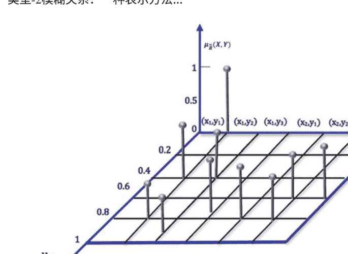

图1 区间型-2模糊关系（定义6）

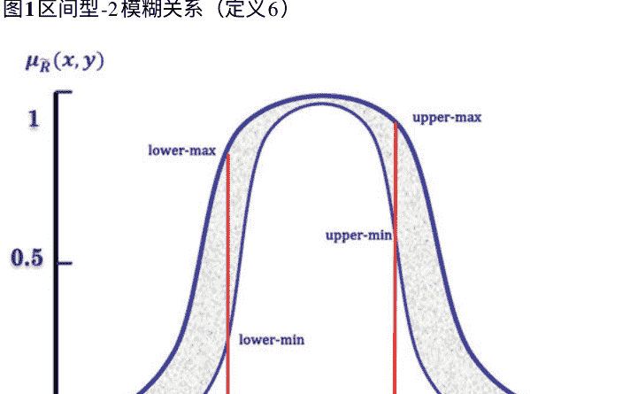

图2 型-2模糊关系。不确定性的范围（FOU）由类型-2模糊关系的可能不确定度的下界和上界表示。每个端点都显示了一些不确定性；我们使用左端的下界和上界，右端的下界和上界来表示不确定性。

## 2 关联医疗关系

将医疗实体表示为模糊集，并在它们之间建立类型-1或类型-2模糊包含关系，为我们提供了表示不确定医疗知识的框架。二元模糊包含或子集度量描述了一个模糊集包含在另一个模糊集中的程度。换句话说，它表达了两个模糊集之间的子集关系的程度。这种包含关系对于表示以模糊集形式表示的医疗实体之间的关联程度非常有用。模糊医疗实体之间的发生的必要性和充分性涵盖了建立不同医疗实体之间关联关系的最重要方面。这些方面可以解释为一个医疗实体在另一个医疗实体中的隐含程度。此外，考虑基于包含度量的区间型-2模糊关系使我们能够考虑关联医疗实体之间的不确定性和模糊性。

在接下来的内容中，我们将介绍基于子集程度来建模不确定性和不精确性的区间模糊关系：

定义7 (类型-1模糊包含关系, $\tilde{R}_I$) 设 $\tilde{A}$ 和 $\tilde{B}$ 是 $U = \{x_1, x_2, ..., x_n\}$ 的模糊子集。类型-1模糊包含关系, 表示为 $\tilde{R}_I$, 定义为

$$\tilde{R}_I : \mathcal{F}(U) \times \mathcal{F}(U) \to [0, 1],$$

其中 $\mathcal{F}(U)$ 表示 $U$ 中所有模糊集合的集合,

$$\tilde{R} = \left\{ \left( (\tilde{A}, \tilde{B}), \mu_{\tilde{R}_I}(\tilde{A}, \tilde{B}) \right) \right\}$$

具有

$$\mu_{\tilde{R}_I}(\tilde{A}, \tilde{B}) \triangleq \frac{\min_{x \in U} \left( \mu_{\tilde{A}}(x), \mu_{\tilde{B}}(x) \right)}{\mu_{\tilde{A}}(x)} \in [0, 1] \quad \text{和} \quad |\tilde{A}| = \begin{cases} \sum_{x \in U} \mu_{\tilde{A}}(x), & \text{如果} \mu_{\tilde{A}}(x) > 0 \\ 0, & \text{否则} \end{cases} \quad (3)$$

标量包含度量表达了一个模糊集合在另一个模糊集合中的包含程度即

$$\mu_{\tilde{R}_I}(\tilde{A}, \tilde{B}) \text{的度量} (\tilde{A} \subseteq \tilde{B}) \in [0, 1] \quad (4)$$

和,

$$\mu_{\tilde{R}_I}(\tilde{B}, \tilde{A}) \text{的度量} (\tilde{B} \subseteq \tilde{A}) \in [0, 1] \quad (5)$$

这些关系可以解释为CADIAG-II中的确认强度 ($\mu_c$):

$$(s \xrightarrow{\mu_c} d), \text{with } \mu_c \in [0, 1]$$

和发生频率 ($\mu_o$):

$$(s \xleftarrow{\mu_o} d), \text{with } \mu_o \in [0, 1]$$

或充分性和必要性分别。

### 定义8 (区间型-2模糊包含关系, $	ilde{R}_I$) 一个类型-2模糊包含关系的不确定性, 表示为 $	ilde{R}_I$, 与由类型-1给出的区间相关模糊关系:

$\tilde{R}_I : \mathcal{F}(U) \times \mathcal{F}(U) \rightarrow \mathcal{F}([0, 1]),$

其中 $\mathcal{F}([0, 1])$表示区间[0,1]的所有子区间的集合:

$\mathcal{F}([0, 1]) = \{[x_L, x_U] : x_L, x_U \in [0, 1], x_L \leq x_U\},$

使得

$\tilde{R}_I = \left\{ \left( (\tilde{A}, \tilde{B}), \left[ \mu_{\tilde{R}_I}(\tilde{A}, \tilde{B})_L, \mu_{\tilde{R}_I}(\tilde{A}, \tilde{B})_U \right] \right) \right\},$

$\mu_{\tilde{R}_I}(\tilde{A}, \tilde{B})_L \leq \mu_{\tilde{R}_I}(\tilde{A}, \tilde{B})_U$

区间 $[\mu_{\tilde{R}_I}(\tilde{A}, \tilde{B})_L, \mu_{\tilde{R}_I}(\tilde{A}, \tilde{B})_U]$表示标量包含关系的确定可能一致程度, 参见图7。

值得注意的是, 类型-2模糊包含关系区间值由特定的下界和上界特征, 而类型-2模糊包含关系由模糊集合特征 (图7与图3对比)。

### 定义9 (不稳定的关联医疗关系) 让 $E = \{e_1, e_2, e_3, ..., e_n\}$ 表示为模糊集合的一组医疗实体。医疗实体之间的不确定关联关系可以解释为类型-2模糊包含关系。

本次演讲的重点将放在区间类型-2模糊关系上, $\tilde{R}_I$:

$\tilde{R}_I : \mathcal{F}(E) \times \mathcal{F}(E) \rightarrow \mathcal{F}([0, 1]).$

### 2.1 获取关联医疗关系的数据

处理医疗知识获取可以采用两种主要方法，即经典的知识驱动方法（在语言不确定性和模糊性的背景下进行符号表示）和数据驱动方法。近年来，后者在我们接近大数据和深度学习时代时变得更加重要。用于实例化关联医疗关系的具体数据可以从多种来源获取：

- 通过医学专家评估语言文档[13]。
- 对医疗患者数据库进行统计分析[12]。
- 在医疗数据库中进行数据发现，即利用数据科学方法对患者数据库和文档进行预测分类或描述性方法（例如，关联规则分析），见图4。

在不评估大量医疗数据的情况下，领域专家无法始终提供精确和一致的关联值。例如，某种疾病中始终出现的症状可能不足以确认该疾病。一个强关联的例子是“高度增加的淀粉酶水平几乎可以确认急性胰腺炎”。这种类型的关联关系可以通过考虑化合物为区间型-2模糊关系来表示（见脚注6中的示例）。

对这些区间的细化过程应该通过检查它们的一致性来完成。值得注意的是，全局一致性可能会进一步细化

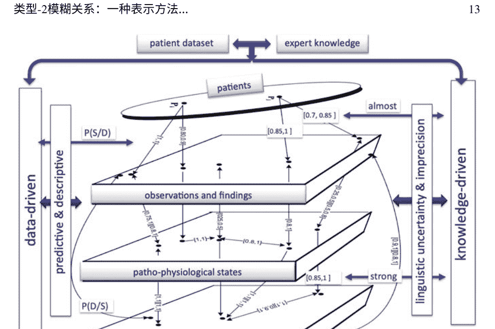

图4 医学知识驱动和数据驱动方法在医学知识获取过程中捕捉不确定性的医学背景。 在知识获取的所有层面上存在区间值不确定性。 在这个图中， 不确定的关系， 如 (s ——→ d) 可以用区间二型模糊关系表示，形式化为 (s ——→ d) 强 [0.85,1]

上和下值， 以便获得有用的全局最小值。 建立这种不确定性需要一个逐步的知识获取过程和细化；图5中提供了一些案例。 在这样的过程中， 关联关系可能从没有先验知识开始，或者可能是一个简单的关联， 如正相关或负相关，并可能以类型1模糊关系（定义1， $\tilde{R}_i$）或一致区间（定义8， $\tilde{R}_i$）结束。 在每个步骤或阶段中， 专家可以添加知识， 以进一步细化不确定性的程度。 然而， 由于所有阶段的关联关系可能受到一定程度的不确定性的影响， 有用的推理知识可以逐步添加到获取过程中。

此外， 可以通过分析医学数据库来统计估计初始值。 这种方法已成功应用于基于知识的系统CADIAG-II/Rheuma [3, 12]中的半自动知识获取。

在这种情况下， 必要性（发生频率）可以解释为P(S/D)， 而充分性（确认强度）可以解释为P(D/S)， 可以通过贝叶斯定理进行估计， 并经过细化或转换为模糊值。

- **Case 1:** No prior knowledge, ignorance about association as a bidirectional relationship.
- **Case 2:** Positive relationship with no details (positive co-relation).
- **Case 3:** Intervals for obligatory necessity [1,1] and sufficiency [0.35,0.86].
- **Case 4:** Obligatory necessity and sufficiency is about 0.83±0.03.
- **Case 5:** Degree of necessity 0.83 and degree of sufficiency 0.83.

图5 基于区间型-2模糊关系概念，在必要性和充分性之间表示医学实体之间发生的医学不确定性的示例。通过检查局部和全局一致性，可以通过细化过程来减小不确定性的边界，即不确定性的范围。

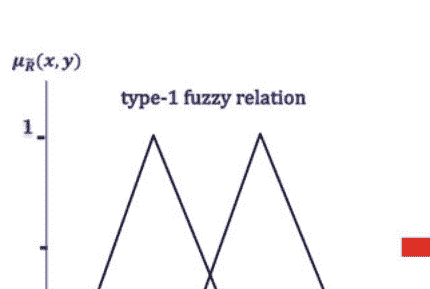

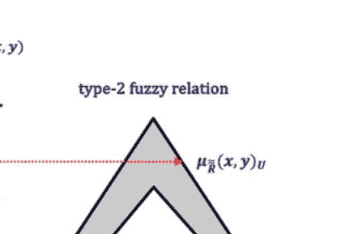

$\mu_{\tilde{R}}(x, y) \circ \mu_{\tilde{R}}(y, z) \rightarrow \mu_{\tilde{R}}(x, z)$

图6 当通过局部三角形数据集表示增加不确定性时，类型-1二元模糊关系的组合结果为类型-2关系。

## 3 推理类型-2 模糊关系

如前所述，可以使用各种来源来获取具体数据，以实例化关联医疗关系，例如评估语言文档、医疗患者数据库的统计分析或数据驱动任务。

然而，创建具有大量医疗实体之间关系的知识库可能导致不一致性和不完整性。此外，在许多情况下，需要在不确定性和模糊性下进行决策。

在相关性估计和评估的背景下，几个人类领域专家可能提出不一致的关联关系估计。在某些情况下，应考虑所涉及专家的一致性或不一致性分析。一致性或不一致性或偏见的程度可以作为不确定性的参考 [14]。

为了访问这个重要方面，我们需要一个能够计算类型-1甚至类型-2模糊关系的所有可能一致值的推理模型。在这些区间之外的值应被视为不一致的值（图7）。受不一致性影响的系统可能会降低基于知识的系统的性能。

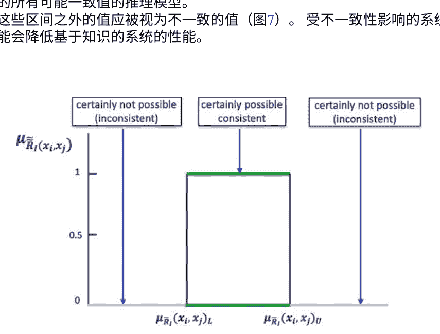

### 3.1 推理不确定关系

这个示例（图7）从不一致的不确定区间延伸到确定不可能的不确定值。本文将限于在类型-1模糊关系的情况下介绍推理模型的基本概念。⁷这种类型已广泛应用于基于CADIAG-II的不同实现的知识系统[5–11]。

值得注意的是，计算得到的一致区间可以被解释为假设精确值的确定性所产生的可能不确定性的边界，例如$\mu_{\tilde{R}_I}(x)$。图6显示了两个类型-1模糊关系（即确定模糊关系）的组合会以一致区间的形式传播不确定性。⁸接下来，我们将重点关注在局部研究的三角形数据集中推断一致区间及其上下边界的基本情况；即FOU。在这个模型中，我们区分局部和全局的不确定性。

设 $\mathcal{M}$ 为由点值类型-1关系（定义5、7）组成的医学实体的三角形数据集，$\tilde{R}_I$：

$\mathcal{M} = \{e_1 \xrightarrow{a_2} e_2, e_1 \xleftarrow{a_1} e_2, e_2 \xrightarrow{b_2} e_3, e_2 \xleftarrow{b_1} e_3\}$

可以计算出 $e_1$ 和 $e_3$ 之间的可能一致的类型-1模糊关系，即：

$\mathcal{M} \models \{e_1 \xrightarrow{[\underline{x}_1, \bar{x}_1]} e_3, e_3 \xleftarrow{[\underline{x}_2, \bar{x}_2]} e_1\}$

区间 $[\underline{x}_i, \bar{x}_i]$ 表示不确定性的下界和上界；即：

$\underline{x}_1 = \mu_{\tilde{R}_I}(e_1, e_3)_L$
$\bar{x}_1 = \mu_{\tilde{R}_I}(e_1, e_3)_U$
$\underline{x}_2 = \mu_{\tilde{R}_I}(e_3, e_1)_L$
$\bar{x}_2 = \mu_{\tilde{R}_I}(e_3, e_1)_U,$

> ⁷考虑到其他方面，这种类型-2推理超出了当前演示的范围。
> ⁸强制充分性和必要性的产量确定性，请参见图6，即：
> $\mu_{\tilde{R}_I}(x, y) = 1, \mu_{\tilde{R}_I}(y, x) = 1, \mu_{\tilde{R}_I}(y, z) = 1, \text{ and } \mu_{\tilde{R}_I}(z, y) = 1$

它们的计算如下：

$$
\underline{x}_{1}=\begin{cases}a_{2}-\dfrac{a_{2}}{a_{1}}\cdot(1-b_{2})&\text{if }b_{2}>1-a_{1},a_{1}=0\\0&\text{其他}\end{cases}
\quad (6)
$$

$$
\bar{x}_{1}=\begin{cases}\min\left(a_{2},\left(\dfrac{b_{2}\cdot a_{2}}{a_{1}}\right)\right)+\min\left(1-a_{2},\left(\left(\dfrac{b_{2}\cdot a_{2}}{b_{1}\cdot a_{1}}\right)\cdot(1-b_{1})\right)\right)&\text{如果 }b_{1}=0,a_{1}=0\\0&\text{如果 }b_{1}=1,a_{1}=a_{2}=0\\1-a_{2}&\text{其他}\end{cases}
\quad (7)
$$

$$
\underline{x}_{2}=\begin{cases}\underline{x}_{1}\cdot\left(\dfrac{b_{1}\cdot a_{1}}{b_{2}\cdot a_{2}}\right)&\text{如果 }b_{2}=0,a_{2}=0\\0&\text{其他}\end{cases}
\quad (8)
$$

$$
\bar{x}_{2}=\begin{cases}\bar{x}_{1}\cdot\left(\dfrac{b_{1}\cdot a_{1}}{b_{2}\cdot a_{2}}\right)&\text{如果 }b_{2}=0,a_{2}=0\\0&\text{如果 }b_{1}=0,b_{2}=0,a_{1}=1\\1-b_{1}&\text{其他}\end{cases}
\quad (9)
$$

通过考虑三角数据集 $\mathcal{M}$ 中所有可能的包含度，可以得到这些公式的推导；例如 $\text{degree}(e_1 \subset e_2)$，$\text{degree}(e_2 \subset e_1)$，$\text{degree}(e_2 \subset e_3)$和 $\text{degree}(e_3 \subset e_2)$，以及计算最小和最大 $\text{degree}(e_1 \subset e_3)$和 $\text{degree}(e_3 \subset e_1)$。所有这些关系可以用可计算的线性等式和/或不等式表示。参考下列所有约束条件求解 $|e_1| = \sum \mu_{e_1}(x)$ 产生一个可能的度数区间 $(e_1 \supset e_3)$ 和 $(e_3 \supset e_1)$。
这个推导的基本思想也可以在[27]中找到。

例子1 设 $\mathcal{M}$ 是一个类型-1模糊关系的三角形关系集合；定义5：

$\mathcal{M}=\{e_1 \xrightarrow[0.5]{} e_2, e_1 \xleftarrow[0.75]{} e_2, \quad e_2 \xrightarrow[1]{} e_3, \quad e_2 \xleftarrow[0.25]{} e_3\}$

基于方程6和7，所有可能关系的实例为：$(e_1 \longrightarrow e_3) \in \mathcal{S},$ 其中 $\mathcal{S}:$ $\mathcal{S} = \{(e_1 \underset{[x_1,\bar{x}_1]}{\longrightarrow} e_3) | [x,\bar{x}] \subseteq [0.5, 1]\} \quad (10)$

在不确定性方面，与 $M$一致的实例是一致的。

全局一致区间的计算需要全局最小区间的推理，可以逐步增量和递归实现。

### 3.2 应用潜力

如前所述，这种方法基于以下几个方面：

- 使用表达医学实体之间关联关系的区间型-1和型-2模糊关系的必要性和充分性；例如，点值、语言和区间值：$(s \longrightarrow \mu \quad d, s \xrightarrow{\text{强}} d, s \underset{[a,b]}{\longrightarrow} d)$
- 推理有用的一致区间以细化和可能推导新的关联关系，并检查知识库中的逻辑不一致性。⁹
- 最后，在决策支持系统中将推理规则与推理引擎相结合。

下面的例子说明了将推理模型整合到细化和数据质量保证中的应用潜力：

### 例子2
设 $M$为一个由复合关系定义的三角形数据集。基于3.1，推断出的关系：

$(e_1 \longrightarrow e_3) \quad [0.5, 1]$ 和

$(e_1 \xleftarrow{[0.187,0.375]} e_3)$

可以表示为一种一致的双向（复合）区间值类型-2关系（定义8）。

$e_1 \xleftarrow[\substack{[0.50,1] \ [0.187,0.375]}]{} e_3.$

这种关系对以下任务非常有用：

- 检查逻辑一致性的关系（10）。例如，规则（12）描述了一个可能的关系，表达了充分性的程度，它与$\mathcal{M}$一致，并且具有一些可能的值：
  $e_1 \xrightarrow{[0.75,0.95]} e_3,$
  而（13）中的关系：
  $e_1 \xrightarrow{[0.25,0.345]} e_3$
  表示一个不一致的关系，因为值超出了确定可能值的范围，请参见图7。
- $(\text{11})$ 中$e_1$和$e_3$之间的关系；例如，$e_1 \xrightarrow{[0.50,1]} e_3$，以及 $(e_1 \xleftarrow{[0.187,0.375]} e_3)$ 可以添加到知识库中，以增加与性能和完整性相关的一些问题。
- 在假设先前的知识已经通过一致性验证的情况下，该方法依赖于一致区间传播。如果专家提出了$(e_i \rightarrow e_j)$的新值，则新值应该在计算公式的确定可能值范围内。然而，通过考虑新知识，可以进行进一步的区间细化。通过计算模型在新添加的值下的全局一致性，可以实现细化过程（即缩小确定性的范围）。
- 最后，在这个推理中整合了组合规则，我们可以在决策支持系统中跟随一个推理引擎。

### 4 结论和未来展望

关系，以建立推理模型中的关联医学关系，考虑不确定性，并检查逻辑一致性。这个模型的许多方面已经成功地被不同的CADIAG-II系统实现所采用。对于未来的工作，将这种方法整合到知识获取过程的逐步细化中，对于确保数据质量和提高性能非常重要。此外，基于区间的组合推理规则可能导致一种依赖于推理一致的不确定区间的推理形式。最后，通过整合数据驱动方法来微调已建立的区间是可取的。聚类、关系和基于区间值的深度学习可能是有用的方法。

致谢
我们要感谢Andrea Rappelsberger在格式化和最终完成本文方面的长期帮助。

### 参考文献

- 1. K.-P. Adlassnig, G. Kolarz, W. Scheithauer, H. Effenberger, G. Grabner, CADIAG: 计算机辅助医学诊断方法。计算生物学与医学 15(5), 315–335 (1985)
- 2. K.-P. Adlassnig, G. Kolarz, CADIAG-1和CADIAG-2中医学知识的表示和半自动获取。计算生物医学研究 19(1), 63–79 (1986)
- 3. G. Kolarz, K.-P. Adlassnig, 在风湿病学中建立医学专家系统CADIAG-1和CADIAG-2的问题。医学系统杂志 10(4), 395–405 (1986)
- 4. W. Moser, K.-P. Adlassnig, 在医学知识库中检查二元分类关系的一致性。人工智能医学 4(5), 389–407 (1992)
- 5. K.-P. Adlassnig, 计算机辅助医学诊断的模糊逻辑模型。 方法信息医学 19(3), 141–148 (1980)
- 6. K.-P. Adlassnig, 医学诊断中的模糊集理论。 IEEE Trans. Syst. Man Cybern. 16(3), 260–265 (1986)
- 7. K.-P. Adlassnig, 使用模糊集在患者医学发现中统一表示模糊和不确定性，见 Cybernetics and Systems '88, 编辑 R. Trappl (Kluwer Academic Publishers, Dordrecht, 1988), pp. 685–692
- 8. K.-P. Adlassnig, M. Akhavan-Heidari, CADIAG-2/GALL: 一个用于胆囊和胆道疾病诊断的实验性专家系统。 人工智能医学 1(2), 71–77 (1989)
- 9. K.-P. Adlassnig, H. Leitich, G. Kolarz, 一个用于类风湿性关节炎诊断的专家系统中诊断标准的适用性。 专家系统应用 6(4), 441–448 (1993)
- 10. H. Leitich, K.-P. Adlassnig, G. Kolarz, 模糊诊断标准的开发和评估用于类风湿性关节炎的诊断。 医学信息学方法 35(4–5), 334–342 (1996)
- 11. H. Leitich, P. Kiener, G. Kolarz, C. Schuh, W. Graninger, K.-P. Adlassnig, 在类风湿病学门诊中对医疗咨询系统CADIAG-II/RHEUMA的评估。 医学信息学方法 40(3), 213–220 (2001)
- 12. H. Leitich, K.-P. Adlassnig, G. Kolarz, 对医学顾问系统CADIAG-II/RHEUMA的两种不同模型的半自动知识获取的评估。 人工智能医学 25(3), 215–225 (2002)
- 13. K. Bögl, K.-P. Adlassnig, Y. Hayashi, T.E. Rothenfluh, H. Leitich, 在模糊知识表示框架下的医学咨询系统的知识获取。 人工智能医学 30(1), 1–26 (2004)
- 14. B. Haddad, 相关性和评估: 面向评估者的认知驱动方法。 Acta Polytechnica Hungarica 15(5), 129–148 (2018)
- 15. L.A. Zadeh, 复杂系统和决策过程分析的新方法概述。IEEE Trans. Syst. Man Cybern. 3(1), 28–44 (1973)
- 16. N.N. Karnik, J.M. Mendel, Q. Liang, 类型-2模糊逻辑系统。IEEE Trans. Fuzzy Syst. 7(6), 255–269 (1999)
- 17. J.M. Mendel, 不确定性基于规则的模糊逻辑系统：简介和新方向 (Prentice-Hall Inc, Upper Saddle River, 2001)
- 18. R. John, J. Mendel, J. Carter, 扩展的sup-star组合用于类型-2模糊集的简化，见: 2006 IEEE国际模糊系统会议, 温哥华喜来登酒店, 加拿大温哥华, 2006年7月16日至21日 (2006), pp. 1441–1445
- 19. S. Liu, R. Cai, 基于模糊信念熵的区间类型-2模糊集的不确定性. 熵23, 1265 (2021)
- 20. J.F. Baldwin, 支持逻辑编程。智能系统国际期刊 1(2), 73-104 (1986)
- 21. I.B. Türksen, 区间值模糊集和补偿性“与”运算。模糊集系统 51(3), 295-307 (1992)
- 22. J. Fan, W. Xie, J. Pei, 子集度量：新闻。模糊集系统 106(2), 201-209 (1999)
- 23. B. Kosko, 神经网络和模糊系统：机器智能的动力系统方法 (Prentice-Hall Inc, Upper Saddle River, 1991)
- 24. V.R. Young, 模糊子集度。模糊集系统 77, 371-384 (1996)
- 25. B. Haddad, 基于根模式联想网络的认知驱动查询抽象模型。智能系统期刊 29(1), 910-923 (2020)
- 26. C.M. Helgason, T.H. Jobe, 基于感知的推理和模糊基数提供了对个体患者初始条件敏感的直接因果关系度量。Int J Comput Cognit 1(2), 79–104 (2003)
- 27. B. Haddad, A. Awwad, 在医学知识中表示不确定性：一种基于区间的二元模糊关系方法。Int Arab J Inf Technol 7(1), 63–69 (2010)
- 28. J. Heinsohn, B. Owsniki-Klewe, 在混合知识表示系统中的概率继承和推理，见 W. Hoeppner (Hrsg.), Künstliche Intelligenz, Proceedings GWAI-88, 12. Jahrestagung, Eringerfeld, 19.-23. September 1988, Informatik-Fachberichte 181 (Springer, Berlin, 1988), pp. 51–60
- 29. J.M. Mendel, 二型模糊集：一些问题和答案，在IEEE神经网络学会通讯，2003年8月，卷1（2003），第10-13页
- 30. Q. Liang, J.M. Mendel, 区间型二型模糊逻辑系统：理论与设计。IEEE Trans. 模糊系统 8（5）, 535-550页（2000）
- 31. J.M. Mendel, R.I.B. John, 简化的二型模糊集。IEEE Trans. 模糊系统 10（2）, 117-127页（2002）

## 通过极限梯度提升和k均值进行心理状态检测

Nam Anh Dao 和 Quynh Anh Nguyen

摘要
我们提出了一个分类的脑电图（EEG）检测模型，用于研究压力和预测机组成员的认知状态。 两阶段的学习被提出：首先应用无监督聚类对训练数据集进行训练，然后使用聚类中心对测试数据集进行聚类；第二阶段使用梯度提升决策树对心理状态进行分类。 该模型需要对数据进行分析，以在最佳的最小存储空间中表示脑电图信号，并摆脱噪音，使数据清晰且形状良好。 虽然主成分分析通过主要成分解释了脑电图特征并减少了数据的维度，但自编码器为数据提供了重要的表示，忽略了不重要的数据。 我们展示了竞争性的结果，并讨论了将监督学习和无监督学习相结合用于机组成员脑电图分类的效率。

关键词
脑电图 · k-means · 主成分分析 · 自编码器 · XGBoost · 飞行安全

### 1 引言

最近几项关于脑电图的研究探索了临床诊断和科学研究的各个方面。 实际上，特定的脑电图信号[1]是由皮层神经元产生并在头皮上测量的电流。 作为一种具有高时间分辨率和足够准确性的生物信号，脑电图可以通过统计分析和机器学习来探索。 通过这种方式，可以从学习模型中自动检测出情绪、压力和心理负荷等心理状态。 我们面临的问题是对机组成员的脑电图进行分析，以检测其心理状态。 我们的目标是从脑电图信号中捕捉特定的模式，以自动识别新信号中的心理状态，从而支持飞行员的安全控制[2]。 原因是学习心理状态的一个观点是个人的身体和情绪状态、能力和动机与个体任务表现相关 [3]。更具体地说，警觉工作负荷可以最小化不安全驾驶的风险 [4]。

在本文中，我们指定了一种可以辅助 EEG 分析的方法，该方法涉及样本的聚类。无监督学习任务是船员心理状态分类方法的核心，在第三部分中我们进行了演示。该方法具有以下重要功能:

- (a) 通过信号表示在受限内存和去噪中支持仔细的数据分析;
- (b) 通过主成分分析 (PCA) [5] 和自编码器 [6] 提取有建设性的特征，减少数据的维度;
- (c) 通过聚类训练数据确定聚类和质心，允许测试数据通过质心进行聚类;
- (d) 通过实施极限梯度提升对每个聚类进行监督分类。

结果表明，心理状态的预测性能得到了改善。

本文的组织如下: 在第2节中，我们回顾了相关论文，并展示了在脑电图领域的成就。我们在第3节中描述了我们的方法和混合学习技术的基本思想。通过在支持基准数据库的实验中展示了该方法的演示，在第4节中展示了。

### 2 相关工作

让我们回顾一下关于脑电图信号和飞行员工作负荷的重要应用和解决方案的发表论文。

Crijnen [7] 的论文提供了频域分析和滑动时间窗口分析。实际上，该工作使用时间序列技术进行了认知状态分类和认知状态变化的检测。Mishra 等人 [8] 在减少商用飞机事故中实施了一个基于 SVM 的机器学习模型作为分类器，使用真实的生理数据。

该数据库由 Kaggle [9] 发布，涵盖了400名飞行员的脑电数据和认知状态，用于预测飞行员在飞行过程中的心理状态。此外，Lin [10] 使用来自 Kaggle [9] 的相同数据集提出了一个分类模型，使用一些方法来检测飞行员的心理状态，如“安全”或“危险”。

该模型使用多个模型对时间序列数据进行解释，包括逻辑回归、支持向量机 (SVM)、k最近邻 (KNN)、递归分区和回归树、随机森林。该方法在区分飞行员的认知状态方面达到了约90%的可靠性。

这是证据，Harrivel等人引入了一种使用极限梯度提升、随机森林和支持向量机分类器的模式分类方法，用于进行多模态分类。该模型使用预处理的脑电图、皮肤电反应、心电图和呼吸信号作为输入特征，用于预测飞行模拟中的认知状态。

Hernández-Sabat 等人认为卷积神经网络是将脑电图特征与不同心理工作负荷相关联的有效分类器。该研究进行了一项部分量化记忆容量和工作记忆的实验。因此，Binias等人组织了一项模拟飞行的实验，参与者为19人，持续2小时。飞行员的脑电图数据被用于预测算法，包括核岭回归、径向基支持向量机回归以及最小绝对收缩算子及其最小角度回归修改。

通过上述学习模型，如SVM、朴素贝叶斯和卷积神经网络，可以构建用于预测具有EEG信号的飞行员的金属状态的系统。然而，由于EEG数据是每个人的多个头皮区域的时间序列信号，因此这种分类面临着极大且复杂的数据挑战。基于这些原因，我们提出了一种结合不同学习模型的模型，以实现在准确性和计算时间方面的高效性能。

### 3 方法

接下来，我们描述了一种用于研究预测机组成员认知状态的学习模型。从机组成员提取的EEG信号的注册目标是找到一个将任何EEG信号 x 从 X 映射到其相应的认知状态 y 的转换。正如将看到的，学习模型分为三个阶段：数据分析、特征工程和学习。

在数据分析的第一阶段，对EEG数据进行研究以进行数据类型转换，以实现数据的最佳最小存储空间。这个任务可以减少数据存储并提高计算速度（参见图1中的箭头2）。然而，在实践中，EEG信号中发现了噪声，因此在这个阶段，噪声被去除以获得清晰的信号（参见图1中的箭头3）。

在接下来的阶段，我们首先根据它们对EEG信号的解释程度和数据维度的减少程度选择主成分分析（PCA）特征（参见图1中的箭头5）。通过对EEG数据应用自编码器，可以生成数据的重要表示，并且还可以减少维度以忽略不重要的数据（参见图1中的箭头6）。事实上，PCA和自编码器允许从EEG数据中提取特征以进行进一步的学习任务。

在学习阶段的第一步中，通过将EEG数据与上述特征进行拆分来定义训练和测试数据集（参见图2中的箭头9）。然后，将产生的训练数据集，其中可以有任意数量的标记的心理状态，使用k-means进行分段聚类，然后计算并保存分段的中心点（参见图2中的箭头11）。拆分任务使用多个折叠进行交叉验证处理。

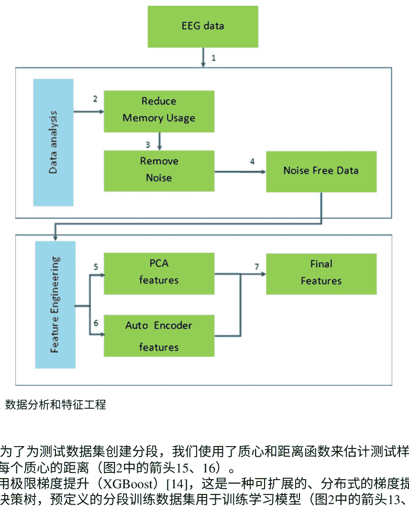

为了为测试数据集创建分段，我们使用了质心和距离函数来估计测试样本到每个质心的距离（图2中的箭头15、16）。使用极限梯度提升（XGBoost）[14]，这是一种可扩展的、分布式的梯度提升决策树，预定义的分段训练数据集用于训练学习模型（图2中的箭头13、14）。因此，使用训练好的模型对相同分段的测试集进行分类（图2中的箭头17、18）。

事实上，通过执行每个测试用例的多个文件夹进行交叉验证对于验证提出的模型是重要的。因此，可以在每个拆分中测量性能指标，并收集以获得最终的平均值。我们的指标适用于我们的文章，包括准确率、精确率和F1分数。显然，公式或指标如下，其中$n_{TP}$, $n_{TN}$, $n_{FP}$和$n_{FN}$分别是真正样本、真负样本、假正样本和假负样本的数量：

$$\text{准确率} = \frac{n_{TP} + n_{TN}}{n_{TP} + n_{FP} + n_{TN} + n_{FN}} \quad (1)$$

$$\text{精确率} = \frac{n_{TP}}{n_{TP} + n_{FP}} \quad (2)$$

$$\text{F1得分} = \frac{2 \times \text{召回率} \times \text{精确率}}{\text{召回率} + \text{精确率}} \quad (3)$$

### 4 实验

在这个描述脑电图信号分类学习模型的图片中，数据在哪里，测试的实际表现如何。 在这样的项目中，我们将在四个小节中详细描述：数据分析，特征工程，学习过程和性能报告（见图3）。

### 算法. 通过极限梯度提升和k-means进行心理状态检测

```
// 输入:
//  e: EEG数据集
//  方法: XGBoost 和 k-means
// 输出:
//  s: 心理状态

开始算法
// I. 数据分析
对于每一个 e:
  减少内存占用(e)
  去除噪声(e)

// II. 特征工程
对于每一个 e:
  主成分分析(e)
  自编码器(e)

// III. 通过XGBoost和k-means进行分类
分割数据为训练集和测试集
对于每一个分割:
  使用k-means聚类
  对于每一个聚类:
    使用XGBoost训练
    使用测试集测试
测量准确率
结束算法
```

图3 通过极限梯度提升和k-means算法进行心理状态检测

### A. 数据分析

这个故事始于Kaggle组织的一个预测比赛，名为减少商业航空事故致死率[9]。主要是为了从机组人员的脑电图数据集中检测出问题事件。我们使用这个数据集进行实验，因为它提供了来自十八名飞行员在各种干扰事件下的真实生理数据。该数据集是在非飞行环境和飞行模拟器之外收集的。数据的描述如表1所示。您将看到，生理数据包括脑电图（EEG）、心电图（ECG）、呼吸和皮肤电反应信号。数据集包含28个特征，其中机组特征是一对飞行员的唯一标识，总共有9个机组。广泛认为飞行员的评估有三种状态：Chanenezd注意力（CA），即飞行员始终专注于特定任务而不考虑其他任务；分心注意力（DA），即飞行员在有行动或思考时从一个任务转移到另一个任务的状态；以及惊吓/惊讶（SS），即通过让被试者观看带有惊吓元素的电影片段来缓解的状态。

| 列 | 描述 |
| :--- | :--- |
| 机组 | 一对飞行员的ID |
| 实验 | CA—通道化注意力；DA—分散注意力；SS—惊吓/惊讶 |
| 主题数量 | 18 |
| 座位 | 0（左）；1（右） |
| 脑电图 | eeg_fp1, eeg_f7, eeg_f8, eeg_t4, eeg_t6, eeg_t5, eeg_t3, eeg_fp2, eeg_o1, eeg_p3, eeg_pz, eeg_f3, eeg_fz, eeg_f4, eeg_c4, eeg_p4, eeg_poz, eeg_c3, eeg_cz, eeg_o2 |
| 心电图 | 3点心电图信号 |
| GRS | 皮肤电反应 |
| R | 胸部的上升和下降的测量 |
| 事件 | 基线， CA， DA， SS |

接下来，座位特征是飞行员在左座还是右座。在这里，脑电图（EEG）信号有20个特征。还有一些其他特征：ECG—心电图信号特征；R—呼吸特征，用于测量胸部的上升和下降；GRS—皮肤电反应，用于测量电皮肤活动。事件特征是给定时间内飞行员的状态。它是四个分类值之一：A表示基线，B表示SS，C表示CA，D表示DA。

### B. 特征工程

我们将探索预处理的三个步骤。第一步是为了减少内存使用和去噪。第二步是探索训练数据，最后一步是特征提取。我们修改了数据类型，将内存使用量从1039.79 MB减少到241.38 MB，达到了76%，然后从特定的两列（ECG和R）中删除了噪声数据。通过主成分分析（PCA），将具有20列的EEG特征减少为2个分量。

一旦噪声免费的脑电图特征被创建，就是时候通过自动编码器对数据进行表示（编码），自动编码器通过训练网络来忽略不重要的数据。因此，维度就被降低了。当训练完成后，解码器提供隐藏特征，可以用于进一步的学习。请注意，作为一个不可或缺的任务，数据通过将不同尺度和类型的所有特征转换为一致的格式来进行标准化，以符合标准。

### C. 学习过程

为了进行交叉验证，我们的数据被分成5个折的训练集和测试集。在这里，对于每个折，我们使用k-means对训练数据进行聚类，得到聚类和质心。特别是，质心有助于为测试数据分配适当的聚类。在这项研究中，对于每个折，应用了几个聚类数，包括3、4、5、6、7、8。

我们现在将依次查看每个集群，其中训练集和测试集已准备好。在每个折叠中，使用XGBoost学习模型进行预测。飞行员的心理状态属于四个类别之一（基线为A，惊讶为B，注意力集中为C，分散注意力为D）。这些类别有各自的含义：正常状态（A），惊讶或意外（B），注意力集中（C）和分散注意力（D）。通过分类的心理状态，可以在飞行员陷入危险状态之前发出警告。通过这种方式，我们使用XGBoost模型进行了数据聚类的分类，其中包括不同的k值（3、4、5、7和8）。另一方面，我们还允许使用XGBoost对标准化数据进行学习，以进行比较。

### D. 性能报告

让我们检查由5个折叠的k-means聚类和XGBoost分类导出的实验结果。我们现在可以在表2中探索每个折叠的准确性及其平均值，如图4所示。请注意，作为一个有趣的次要问题，第五个折叠 k =8没有提供结果。我们发现，在由聚类任务创建的拆分中，训练集包含仅来自一个类别的样本。因此，该案例不适合预测，表格中显示“不可用”（na）。

请注意，在没有聚类的情况下，分类给出了平均准确率为0.9349，以斜体打印。实际上，这个分数并不差，但它是该列中最小的值。恰好的是，使用7个聚类的情况下，准确率最高，为0.9421，在表格中以粗体显示。

现在，我们已经使用不同数量的聚类获得了三个指标，在学习任务中我们应该如何看待这些结果？表2显示了每个特定聚类数量的准确率、精确率和F1分数的最终结果。最佳分数以粗体打印在图5中，该图用彩色条形图展示了表3，最佳精确率（0.9334）属于四个聚类的情况。所有其他指标在使用七个聚类时具有最高值，准确率和F1分数分别为0.9421和0.9355。

表2 5折数据准确率报告

| k | 第1折 | 第2折 | 第3折 | 第4折 | 第5折 | 平均 |
| :--- | :--- | :--- | :--- | :--- | :--- | :--- |
| 无聚类 | 0.9404 | 0.9294 | 0.9360 | 0.9407 | 0.9278 | 0.9349 |
| 3 | 0.9439 | 0.9333 | 0.9419 | 0.9432 | 0.9321 | 0.9388 |
| 4 | 0.9342 | 0.9255 | 0.9383 | 0.9481 | 0.9438 | 0.9380 |
| 5 | 0.9324 | 0.9241 | 0.9423 | 0.9514 | 0.9408 | 0.9382 |
| 6 | 0.9400 | 0.9252 | 0.9387 | 0.9459 | 0.9451 | 0.9390 |
| 7 | 0.9383 | 0.9345 | 0.9496 | 0.9516 | 0.9363 | 0.9421 |
| 8 | 0.9304 | 0.9347 | 0.9472 | 0.9330 | NA | 0.9363 |

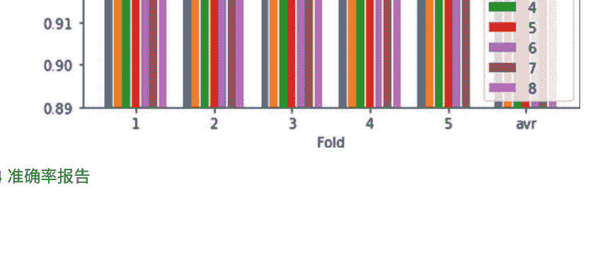

表3 性能报告

| k | 准确率 | 精确度 | F1得分 |
| --- | --- | --- | --- |
| 无聚类 | 0.9349 | 0.9273 | 0.9304 |
| 3 | 0.9388 | 0.9308 | 0.9338 |
| 4 | 0.9380 | 0.9334 | 0.9352 |
| 5 | 0.9382 | 0.9309 | 0.9337 |
| 6 | 0.9390 | 0.9319 | 0.9342 |
| 7 | 0.9421 | 0.9319 | 0.9355 |
| 8 | 0.9363 | 0.9296 | 0.9320 |
*最佳得分以粗体打印

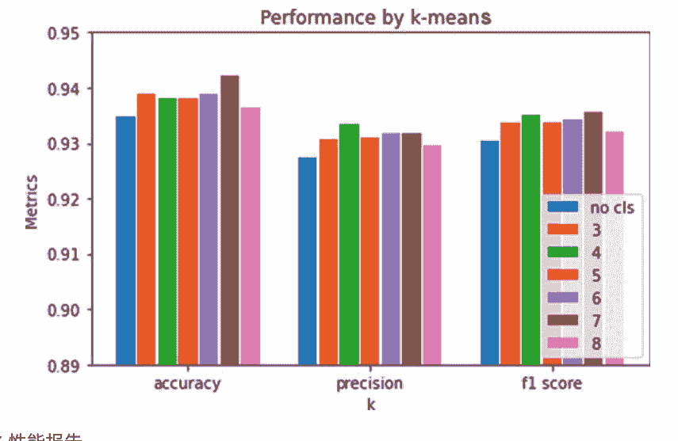

表4 相关工作性能比较

| 否 | 预测器 | 数据库 | 准确率 | F1得分 |
| :--- | :--- | :--- | :--- | :--- |
| 1 | 随机森林，3个特征 [10] | Kaggle [9] | 0.9082 | 0.9253 |
| 2 | 随机森林，4个特征 [10] | Kaggle [9] | 0.9087 | 0.9254 |
| 3 | 随机森林，所有特征 [10] | Kaggle [9] | 0.8976 | 0.9173 |
| 4 | 神经网络 [12] | A320飞行模拟器 | 0.8781 | 无 |
| 5 | 我们的模型 | Kaggle [9] | 0.9421 | 0.9355 |

为使用相同的性能指标创建了一个专门的表格，用于相关工作（见表4）。为了预测飞行员的心理状态，Lin [10] 使用了Kaggle [9]的数据集，并借助逻辑回归、支持向量机、k最近邻、递归分区和回归树、随机森林等方法，得到了准确率和F1得分分别为0.9087和0.9254。

最近，Hernández-Sabat等人[12]在2022年提出了卷积神经网络用于EEG分析，他们使用了自己创建的数据库，该数据库借助A320飞行模拟器进行了创建。需要注意的是，由于使用了不同的数据库，所显示的得分不适合进行比较。

然而，观察到，使用k-means聚类进行分类的准确性和其他性能指标部分得到了改善。在我们的工作中，我们展示了不同数量（k）的聚类结果。参数可以从实验中选择，我们发现七是我们的情况下最合适的值，使用Kaggle [9]的数据库。

### 5 结论

准确性和时间序列EEG数据的复杂性对于定量试飞员心理负荷分析至关重要，但这种复杂和大数据面临相对挑战。本文证明了我们的模型可以通过生理数据来检测机组成员的心理状态。首先，用于存储数据的内存可以减少。在约束内存中表示信号和去噪可以改善计算速度。其次，通过PCA和自编码器进行构造特征提取可以减少数据的维度。最后，在极限梯度提升之前实施k-means聚类可以提高预测性能。

### 参考文献

1. C. Diaz-Piedra, M.V. Sebastián, L.L. Di Stasi, EEG theta power activity reflects workload among army combat drivers: an experimental study. Brain Sci. **28**:10(4), 199 (2020). https://doi.org/10.3390/brainsci10040199. PMID: 32231048; PMCID: PMC7226148
2. S. Lee, J.K. Kim, Factors contributing to the risk of airline pilot fatigue. J. Air Transp. Manage. **67**, 197–207 (2018). https://doi.org/10.1016/j.jairtranman.2017.12.009
3. D. Li, X. Wang, C.C. Menassa, V.R. Kamat, Understanding the impact of building thermal environments on occupants’ comfort and mental workload demand through human physiological sensing. In Start-Up Creation; Elsevier: Amsterdam. The Netherlands **2020**, 291–341 (2020)
4. P. Zhang, X. Wang, W. Zhang, J. Chen, 使用循环3D卷积神经网络学习空间-光谱-时间脑电特征进行跨任务的心理负荷评估。IEEE Trans. 神经系统康复工程 **27**, 31-42 (2019年)
5. Ian T. Jolliffe, Cadima Jorge, 主成分分析：综述和最新进展。Philos. Trans. R. Soc. A: Math., Phys. Eng. Sci. **374**(2065), 20150202 (2016年)
6. Z. Mengyue, W. SiuTim, L. Mengqi, Z. Tong, C. Kani, 使用掩码自编码器生成时间序列 (2022年), arXiv:2201.07006
7. J. Crijaen, 从生理测量预测飞行员认知状态。硕士论文，蒂尔堡大学，蒂尔堡，荷兰 (2019年), http://arno.uvt.nl/show.cgi?fid=1493998
8. A. Mishra, K.K. Shrivastava, A.B. Anto, N.A. Quadir, 使用支持向量机减少商业航空致命事故，在2019年智能系统和创新技术国际会议 (ICSSIT) (IEEE, 2019年), pp. 360-364
9. Kaggle, 减少商业航空事故。Booz Allen Hamilton, 2020年4月22日访问, https://www.kaggle.com/c/reducing-commercial-aviation-fatalities
10. Y.-C. Lin, 使用心理生理测量监测飞行员认知状态来减少航空事故。论文，海军研究生院，加利福尼亚州蒙特雷 (2021年)
11. A.R. Harrivel, C.L. Stephens, R.J. Miletich, C.M. Heinich, M.C. Last, N.J. Napoli, N. Abraham, L.J. Prinzel, M.A. Motter, A.T. Pope, 使用多模态心理生理感知预测飞行模拟中的认知状态，在AIAA信息系统 (AIAA Infotech@ Aerospace, 2017), https://doi.org/10.2514/6.2017-1135
12. A. Hernandez-Sabate, J. Yauri, P. Folch, M.A. Piera, D. Gil, 使用EEG信号识别驾驶舱飞行的心理负荷。Appl. Sci. (Switzerland) **12**(5), 2298 (2022). https://doi.org/10.3390/app12052298
13. B. Bini as, D. Myszor, H. Palus, K.A. Cyran, 基于EEG信号预测飞行的反应时间。Front Neuroinf. **14**(14), 6 (2020). https://doi.org/10.3389/fninf.2020.00006. PMID:32116630; PMCID: PMC7033428
14. Sagi Omer, Rokach Lior, 使用可解释的决策树近似XGBoost。Inf.Sci. **572**(2021), 522–542 (2021). https://doi.org/10.1016/j.ins.2021.05.051
15. L.E. Ismail, W. Karwowski, 应用EEG指标量化人类认知表现的系统综述和文献计量分析。PLoS One. **4**:15(12), e0242857 (2020). https://doi.org/10.1371/journal.pone.0242857. PMID: 33275632; PMCID: PMC7717519
16. M.L. Moroze, M.P. Snow, 军事和民用航空中控制飞行进入地形的原因和解决办法。技术报告，空军研究实验室Wright-Patterson AFB OH, 人类效能局 (1999年)。
17. W. Rosenkranz, 飞机状态意识。飞行安全基金会 (2015年), https://flightsafety.org/asw-article/airplane-state-awareness

## 为什么脑细胞之间的间隙减少会引起严重头痛：一种基于对称几何的解释

Laxman Bokati, Olga Kosheleva, Vladik Kreinovich, 和 Nguyen Hoang Phuong

摘要 当我们在显微镜下分析生物组织时，细胞直接相邻，之间没有间隙。然而，更详细的分析显示，在体内，细胞之间存在小的液体填充的间隙，而这些间隙是重要的：例如，在异常情况下，当脑细胞之间的间隙减小时，会导致严重头痛和其他不良影响。目前，对于这种现象还没有普遍接受的解释。在这种情况下，我们展示了对应几何对称性的分析为这种效应提供了一个自然的解释。

### 1 减少脑细胞间的间隙会导致严重头痛：经验事实

经验事实。众所周知，生物体由细胞组成，当你在显微镜下观察任何组织时，你所看到的都是细胞——这就是科学家理解生物体结构的方式。然而，从20世纪60年代开始，人们发现在生物体中，总是存在着充满液体的间隙——细胞间隙。当物质不再活着时，这个间隙就会闭合。当研究人员瞬间冷冻细胞培养物以尽可能保持结构时，首次发现了这些间隙。从那时起，已经开发出了新的技术来研究这些间隙。

由此产生的研究表明，这些间隙在生物学中起着重要的作用。例如，在异常情况下，当脑细胞之间的间隙急剧减少时，患者常常会出现头痛和其他不良反应；参见[2]和相关文献。

为什么？目前为止，对于这个经验事实还没有普遍接受的解释。在本文中，我们展示了这个经验现象是如何自然地从基于对称性的几何思想中得出的。

### 2 问题和结果的分析

正常情况：几何描述。首先，让我们考虑存在细胞之间间隙的情况。我们想知道细胞之间如何相互作用。所有的相互作用都是局部的。因此，为了分析细胞之间的相互作用，我们需要考虑两个相邻细胞之间边界上的一个小区域。每个细胞的边界通常是光滑的。在局部范围内，每个光滑的表面都可以用其切平面很好地近似——面积越小，近似越准确。因此，我们可以用很好的准确性在局部表示每个细胞的边界。

相邻细胞的边界也由一个平面表示。由于我们考虑的是存在间隙的情况，边界不相交。当两个平面不相交时，意味着它们是平行的。因此，正常的配置可以用两个平行平面来描述，对应于两个相邻的细胞。

异常情况：几何描述。在异常情况下，间隙急剧减少，以至于这些间隙变得无法检测。因此，凭借良好的准确性，我们可以得出结论，在这种情况下，两个细胞之间实际上没有间隙，因此，两个细胞可以由一个平面描述，该平面作为两个细胞的共同边界。

我们想研究动力学。对于一个生物体来说，通常存在一个稳定状态，然后存在动态变化，当一个细胞的变化引起其他细胞的变化时。因此，要研究动力学，我们需要研究扰动如何传播。由于根据物理学，所有相互作用都是局部的（参见，例如，[1, 3]），为了使一个细胞的扰动传播到另一个细胞，这个扰动首先需要到达原始细胞的边界。

最简单的扰动是当扰动位于细胞边界上的一个点上时，边界的其他扰动可以被视为对所有受影响点对应的点扰动的组合。因此，为了研究一般扰动的传播，有必要研究逐点扰动的传播。

对称性的作用。大多数物理过程在应用以下操作时不会改变：

- 平移，
- 旋转，或
- 缩放—即，用某个λ > 0 替换。具有坐标 $x = (x_1, x_2, x_3)$ 的每个点与具有坐标 $(\lambda \cdot x_1, \lambda \cdot x_2, \lambda \cdot x_3)$的点。

物理过程在几何对称性方面是不变的。因此，如果我们从初始配置开始，该配置在某些对称性方面是不变的，那么得到的配置也将在相同的几何变换方面是不变的。让我们分析这个想法如何影响细胞之间的扰动传播。

正常情况下：有哪些对称性和可能的动力学。首先让我们考虑正常情况，当我们有：

- 两个平行平面和
- 一个点在其中一个平面上-原始扰动的位置。

可以看出，在上述列出的几何对称性中，唯一保持此配置不变的对称性是绕第一个平面上的固定点旋转-即，在三维术语中，绕通过该点垂直于平面的轴旋转（由于平面平行，也垂直于两个平面）。

由于初始配置具有这种对称性，经过一段时间后观察到的结果配置也应具有相同的对称性。特别是，关于我们可以对另一个平面上的扰动有哪些-即，关于相邻单元格的边界：

- 我们可以有一个单点（在同一轴上），
- 或者我们可以有一个旋转不变的平面区域（例如，以该点为中心的圆盘），这反映了不可避免的扩散。

这些情况对应于细胞之间的常规信息传递。其中一种可能性是，所得到的配置将涉及第二个平面的所有点，但这不是扩散产生的唯一配置。

异常情况：对称性和可能的动力学是什么。现在让我们考虑异常无间隙情况，即我们有：

- 一个单平面 - 细胞之间的联合边界，和
- 该平面上的一个点，即原始扰动的位置。

在这种情况下，除了旋转之外，相应的配置还具有一个附加对称性 - 围绕给定点的缩放。因此，所得到的配置不仅应该对旋转具有不变性，还应该对这些缩放具有不变性。

### 总结：这解释了观察到的现象。我们的分析显示以下内容。

- 在正常情况下，当脑细胞之间存在间隙时，虽然我们可能会出现全脑效应，如严重头痛，但这并非必然：我们也可以在细胞之间进行常规信息传递。
- 另一方面，在没有间隙的情况下，像严重头痛这样的影响是不可避免的。

因此，间隙越小，得到的配置越接近没有间隙的情况，严重头痛（和其他全局效应）发生的可能性就越大——这正是观察到的情况。因此，我们基于对称性的几何分析确实解释了观察到的现象。

致谢本工作部分得到了国家科学基金会的支持，项目编号1623190（计算机科学中为新一代专业实践做准备的变革模型）以及HRD-1834620和HRD-2034030（CAHSI项目），并获得了AT&T信息技术奖学金的支持。

本研究还得到了伏尔加联邦区科学教育数学中心发展计划的支持，项目编号075-02-2020-1478，以及匈牙利国家研究、开发和创新办公室（NRDI）的资助。

### 参考文献

1. R. Feynman, R. Leighton, M. Sands,费曼物理学讲义(Addison Wesley, 波士顿, 2005)
2. C. Nicholson,大脑细胞间的秘密世界. 物理学今日 75(5), 26–32 (2022)
3. K.S. Thorne, R.D. Blandford,现代古典物理学: 光学, 流体, 等离子体, 弹性, 相对论和统计物理(普林斯顿大学出版社, 普林斯顿, 2017)

#### 药物再定位用于药物疾病关联的元路径

Xuan Tho Dang, Manh Hung Le, 和 Nam Anh Dao

摘要 在生物医学信号处理领域，识别药物和疾病之间的潜在相互作用和关系越来越受到重视。当确定药物和疾病关联的实验通常需要大量投资和时间时，药物再定位的新方法可以帮助降低成本和减少失败的风险。与传统实施方式相比，由于整合了不同的数据源，该问题中的数据是异构的。我们建议在药物再定位问题中应用强大的元路径来处理异构数据。基于异构生物网络的药物-蛋白质-疾病的一组五个新元路径被用来定义新的药物-疾病关联。在实施新的元路径方面的技术进步包括元路径的清晰逻辑结构和多个性能指标的改进。

- 药物-疾病关联
- 知识图嵌入
- 结构化表示
- 药物再定位

### 1 引言

药物发现的目标是为特定疾病寻找潜在的新药物。这可以通过涉及广泛的研究领域来实现，包括生物学、化学、药理学和计算科学。

实际上，药物发现的成本通常很高，特别是当过程是费力、耗时且高风险的时候。通过药物再定位可以提高药物发现的成功率，这个方法检查现有的药物用于新的治疗靶点的药物。发现了一种新的诱导剂，导致了一起事故。例如，米诺地尔（Minoxidil）最初用于治疗高血压，无意中发现对治疗脱发有效[1]；西地那非（品牌名：伟哥）最初用于治疗心绞痛，偶然发现具有治疗勃起功能障碍的能力[2]。然而，“碰运气”的策略不能保证药物的有效和成功重新定位。

传统药物研发是一个冗长的过程，产生了巨大的费用，即使获得批准，也只有很少的药物能够进入市场[3]。制药专家最近在大量关注借鉴已获批准药物信息的尖端药物发现方法。药物再定位被认为是一种能够开发具有新的治疗特性或药理活性的药物候选方法。特别地，目前已获批准并且临床使用的药物分子被调查，以确定它们是否与特定疾病的蛋白质相互作用。

药物再定位，也被称为药物再利用，是一种有前景的方法，用于识别当前使用或实验性药物的新标记物，并且有潜力显著加快新药的开发[4]。

在这项工作中，我们专注于药物-疾病关联（DDA），它提供了发现药物潜在疗效的重要信息。在这里，为了建立新的潜在DDA，应用学习算法来分析疾病和药物之间的关系是必不可少的。基于机器学习的方法相对于传统的药物发现方法具有优势，可以缩短药物开发的时间，降低成本并减少失败的风险。

最近已经开发了许多基于计算的方法来寻找已批准药物的新指标[5-9]，以获取药物再定位的数据源。通过预测药物-疾病组合的潜在治疗联系，这些方法通常可以分为三类：基于网络的[10, 11]，基于矩阵分解的[12-14]和基于深度学习的方法。[15, 16]。

我们的方法基于与[14]中相同的假设，即非关联的药物和疾病对没有共享的相互连接的蛋白质，这与其他方法不同。正如吴等人在[14]中指出的那样，从未标记的样本中指定更可能的负样本进行训练可以得到更准确的预测模型。

在这项工作中，我们提出了基于异质生物网络的药物-蛋白质-疾病的新的五种元路径。对于每个元路径，我们实现了一个机器学习模型，然后通过这些模型形成了一个集成学习方法。我们的第一个发现是，每个不同的元路径以一种特定的方式检查药物-蛋白质-疾病的关系，能够检测出哪种关系可能对于药物再定位有潜力。其次，以特定的逻辑方式将几个元路径组合在异质数据上，可以提高药物再定位的有效性。我们在从不同资源中提取的数据集上评估了我们的方法。已经证明本文中的实验可以达到先进的性能。

### 2 相关工作

了解重新定位药物当前考虑的数据以及最近研究报告中用于重新定位药物的方法非常重要。该部分包括两个部分：特征相似性和基于网络的方法。

### A. 特征相似性

基于机器学习技术，已经提出了许多方法来整合各种数据源，以预测与多组学数据相关的药物-疾病相互作用。关于疾病治疗、症状学或病理学，以疾病为中心的方法主要利用疾病的特征[17]。该方法要么检测并使用与现有药物相关的疾病的共同特征，要么通过合并有关疾病的当前知识来开发一组疾病。

Gottlieb等间接地使用药物和疾病的特征作为另一种药物-疾病相互作用方法[18]。他们基于相似的药物通常用于类似的疾病的概念创建了药物-药物和疾病-疾病的相似性度量，然后使用这些度量创建分类特征并开发分类规则。只有在收集到所有必要的药理学和疾病属性时，才能进行可重复实现。

随着高通量数据集数量和种类的增加，功能基因组网络变得更加精确和全面。通过整合异质数据，Martinez等人创建了DrugNet技术，用于药物-疾病和疾病-药物的优先排序[19]。

为了预测药物和疾病之间的关系，Ying Wang等人在神经网络中使用邻域信息聚合，并整合了疾病和药物之间的连接以及疾病和药物的相似性[20]。H. Luo等人将药物相似性矩阵、疾病相似性矩阵和药物与疾病关联矩阵合并为一个大型矩阵，然后确定大矩阵的最低级别，从而重建大矩阵DRRS[21]。

NeoDTI是由F. Wan等人提出的，它基于端到端学习使用非线性模型，在异质网络中整合各种输入，预测新的药物和药物靶点[22]。为了利用关于疾病、药物和治疗靶点的相似性和关联数据推断新的疾病治疗方法，W. Wang等人引入了计算框架TL-HGBI[23]。MrSBM利用顶点聚类偏好和特征聚类贡献的可能性，除了对包含在块内或连接块的边进行建模外，还考虑了建模顶点特征[24]。

一种基于矩阵分解的DDA预测方法称为SCMFDD在将药物-疾病关系映射到低秩空间时设置了疾病语义相似性和药物相似性的限制[25]。只选择药物和疾病信息用于二进制网络，张等人利用该网络来预测DDAs [26]。药物再定位计算正在从宏观角度稳步解决，然而以往的DDA预测研究没有考虑整个细胞。

在大多数特征相似性问题中，需要了解药物、蛋白质和疾病的相似性信息。这并不总是可用的。我们使用元路径的方法可以提取DDA特征，而无需搜索特征相似性。

### B. 基于网络的方法。

在药物再定位领域，已经讨论了许多聚类算法，许多现有的计算方法需要计算药物和疾病的相似性。它们主要旨在挖掘出许多药物-疾病关联。为了合并各种药物属性和疾病特征，Moghadam等人使用了核融合技术[27]。之后，他们创建了SVM模型来预测新的药理学指示。何等人提出了一种算法，该算法考虑了图的拓扑结构和属性值，可以成功识别出属性图中更相关的聚类[28]。

韩静江等人提出了一种基于图表示学习的多生物分子网络（GRLMN）的DDA预测计算方法[29]。何等人展示了用于处理网络数据进行无监督学习任务的MrSBM[24]。为了预测药物-疾病之间的联系，吴等人从化学/表型层、基因层和治疗网络层中包含了完整的药物-药物和疾病-疾病相似性[30]。他们提出了一种半监督图割方法（SSGC）。

NeoDTI是由F. Wan等人提出的，它基于非线性模型的端到端学习，用于通过整合异构网络中的各种输入来预测新药物和药物靶点。为了利用关于疾病、药物和治疗靶点的相似性和关联数据推断新的疾病治疗方法，W. Wang等人引入了计算框架TL-HGBI[22]。

A. Gottlieb等人通过将各种药物和疾病之间的相似性相结合，并将这些特征应用于逻辑分类器[18]，计算了可能的药物和疾病之间的关系。

He等人展示了将图聚类与多视图学习相结合的CCPMVFGC，以捕捉每个聚类中特征的上下文相互依赖性[31]。
Yu等人提出了层注意力图卷积网络（LAGCN），用于预测DDA。它使用图卷积来学习DDA、药物之间的相似性和疾病之间的相似性，并使用注意机制来合并多个图卷积层[32]。

通过使用相同的学习预测模型对五个元路径进行解决，并将它们与其他五个元路径相结合，以获得性能增强。

### 3 方法

在本节中，我们描述了预测药物-疾病关联的框架，它包含四个步骤。然后，从三个可用的生物数据库（OMIM [33]、Gottlieb [34]和DrugBank [35]数据集）中以与[14]相同的方式构建了一个异构网络。其次，通过上述网络构建了基于每个元路径的特征向量。

从交叉验证方法来看，我们将药物-疾病数据集分为两部分：一部分用于训练，另一部分用于测试。在训练中，我们将元路径应用于训练数据集，输出与原始训练数据集大小相同。这些操作显示在图1的第1步中。

通过上述生物数据库注册的药物-疾病相互作用由数组 $A_{DS}$ 表示，其中行由药物（D）索引，列由疾病（S）索引。对于药物-蛋白质相互作用，我们使用数组 $A_{DP}$ 来显示注册的相互作用。同样，在显示疾病-蛋白质相互作用时，使用数组 $A_{DP}$ 显示注册的相互作用。事实上，在[14]中描述的五个元路径的乘法中，出现了三个数组 $A_{DS}$、$A_{DP}$、$A_{SP}$，并且它们显示在图1的第2步左侧，允许得到五个输出数组 X1、X 2, X3, X4, X5.

```
$X1 = A_{DS}$				(1)
$X2 = A_{DP} * A_{SP}^{T}$			(2)
$X3 = A_{DP} * A_{DP}^{T} * A_{DS}$		(3)
$X4 = A_{DS} * A_{DS}^{T} * A_{DS}$		(4)
$X5 = A_{DS} * A_{SP} * A_{SP}^{T}$		(5)
```

现在，这些数组被用作新的五个元路径的输入，这些元路径被提出来改进，以反映异构网络中药物-疾病治疗关系的不同方面。任务显示在图1第2步的中心，产生五个输出数组。

X 1a, X 2a, X 3a, X 4a, X 5a作为第3步的输入。

```
$X1a = X1 * X2^{T} * X5$			(6)
$X2a = X2 * X3^{T} * X5$			(7)
$X3a = X3 * X4^{T} * X5$			(8)
$X4a = X4 * X5^{T} * X5$			(9)
$X5a = X5 * X1^{T} * X5$			(10)
```

图1 元路径工作流程

表1 实验中的数据结构

| 关系 | 矩阵形状 | 交互次数 | 百分比比率 |
|------|----------|----------|------------|
| 药物-疾病 | (1186, 449) | 1827 | 0.3431 |
| 药物-蛋白质 | (1186, 1467) | 4642 | 0.2668 |
| 疾病-蛋白质 | (449, 1467) | 1365 | 0.2072 |

从这些五个特征数组数据中，使用随机森林分类器构建了不同方面的药物-疾病治疗关系的预测。最后，我们将这些分类器集成到一个集成分类器中。集成分类器计算每个药物-疾病对是否相关的正概率（负/正）。这在图1的第3步中有所说明。

在上述背景下，元路径中重新定位药物的实验提供了对所描述方法在实际数据库上的实施的评估。寻找药物、蛋白质和疾病的新可能相互作用的问题等同于从原始相互作用矩阵中选择合适的路径。具有二进制值的三个交互对应于三个组件域：药物-蛋白质、蛋白质-疾病和药物-疾病。我们实验的数据是由[14]组合而成，其中交互数据从OMIM [33]、Gottlieb [34]和DrugBank [35]中提取。

实际上，数据中有1186种药物，449种疾病和1467种蛋白质。然而，只有1827种药物疾病相互作用得到确认，矩阵尺寸为(1186, 449)，密度为0.34%。通过检查药物-蛋白质相互作用为4642种，已知相互作用的密度为0.26%，而疾病-蛋白质的密度为0.20%，共有1365种相互作用（表1）。

我们进一步通过对每个元路径和集成路径进行五折交叉验证来进行操作。已经使用了许多分类指标来进行性能评估，包括准确率，其定义为正确预测的样本数除以总预测数，再乘以100：

```
准确率 = \frac{n_{TP} + n_{TN}}{n_{TP} + n_{FP} + n_{TN} + n_{FN}} \quad (11)
```

其中TP，TN，FP和FN分别是真正例样本数，真反例样本数，假正例样本数和假反例样本数。为了从另一个角度评估性能，这里对每个测试分割测量了精确度（PRE），召回率（REC），马修斯相关系数（MCC）和F1度量（F1）：

```
REC = \frac{n_{TP}}{n_{TP} + n_{FN}} \quad (12)
```

```
SPEC = \frac{n_{TN}}{n_{TN} + n_{FP}} \quad (13)
```

```
PRE = \frac{n_{TP}}{n_{TP} + n_{FP}} \quad (14)
```

```
F_1 = \frac{2 \times 召回率 \times 精确率}{召回率 + 精确率} \quad (15)
```

```
MCC = \frac{n_{TP} * n_{TN} - n_{FP} * n_{FN}}{\sqrt{(n_{TP} + n_{FP})(n_{TP} + n_{FN})(n_{TN} + n_{FP})(n_{TN} + n_{FN})}} \quad (16)
```

为了比较元路径在真阳性率和假阳性率方面的差异，我们的实验中还使用了精确率-召回率曲线下面积（AUPR）和接收者操作特征曲线下面积（AUC）。

特别地，我们实验中描述的指标在表2中简要总结。前5行显示了每个元路径的结果，第六行显示了最终集成路径。

接下来，在表3的前5行中报告了新的五个元路径的结果，从而使得第六行得到最终结果。正如可以观察到的那样，结果在之前的版本上得到了改善。

这些结果突显出，所有新的五个元路径在审查中都可以进行，以获得在添加元路径方面的增强性能指标。AUC在图2中显示，集成路径的五个拆分以不同的颜色打印，其区域高于95%。这证实了新的元路径足够强大，可以允许进行药物再定位处理。

表2 通过实验得到的[14]的元路径结果
| 路径 | AUPR | AUC | PRE | REC | ACC | MCC | F1 |
| :--- | :--- | :--- | :--- | :--- | :--- | :--- | :--- |
| 1 | 0.895 | 0.860 | 0.773 | 0.886 | 0.835 | 0.675 | 0.825 |
| 2 | 0.936 | 0.928 | 0.850 | 0.873 | 0.861 | 0.722 | 0.860 |
| 3 | 0.926 | 0.905 | 0.832 | 0.883 | 0.858 | 0.719 | 0.855 |
| 4 | 0.895 | 0.860 | 0.784 | 0.875 | 0.834 | 0.673 | 0.827 |
| 5 | 0.921 | 0.895 | 0.804 | 0.920 | 0.866 | 0.737 | 0.858 |
| 6 | 0.956 | 0.951 | 0.912 | 0.855 | 0.876 | 0.754 | 0.882 |

表3 通过我们的实验得到的新元路径结果
| 路径 | AUPR | AUC | PRE | REC | ACC | MCC | F1 |
| :--- | :--- | :--- | :--- | :--- | :--- | :--- | :--- |
| 1 | 0.927 | 0.903 | 0.835 | 0.886 | 0.862 | 0.724 | 0.860 |
| 2 | 0.945 | 0.942 | 0.899 | 0.874 | 0.883 | 0.766 | 0.886 |
| 3 | 0.957 | 0.950 | 0.887 | 0.907 | 0.895 | 0.790 | 0.896 |
| 4 | 0.924 | 0.898 | 0.824 | 0.907 | 0.867 | 0.738 | 0.863 |
| 5 | 0.921 | 0.896 | 0.809 | 0.917 | 0.866 | 0.737 | 0.859 |
| 6 | 0.962 | 0.956 | 0.882 | 0.901 | 0.889 | 0.780 | 0.889 |

图2 新元路径的AUC

如预期，相关工作的结果被总结以制作比较报告。以下简要描述了这些工作。为了预测药物-疾病关系，Liang等人结合了药物化学信息、目标领域和基因本体注释信息，并提出了拉普拉斯正则化稀疏子空间学习方法（LRS SL）[36]。另一方面，Luo等人使用了全面比较药物和疾病，并提出了双随机游走算法（MBiRW）[37]来预测可能的药物-疾病相互作用。

为了预测DDA，Kawichai等人[38]应用了一种处理元路径的集成学习方法。基因本体（GO）术语用于将药物和疾病与它们的相关功能联系起来。因此，GO可以作为三部分网络中的中间节点使用。为了预测药物-疾病关联，Zhang等人首先引入了线性邻域相似性[40]和网络拓扑相似性[39]，然后他们提出了一种基于相似性约束矩阵分解的方法（SCMFDD），该方法利用已知的药物-疾病关联、药物特征和疾病语义信息[25]。通过包括疾病、药物和治疗靶点之间的相似性和相互作用，Wang等人建立了基于三层异质网络模型（TL-HGBI）的计算框架[41]（图3和表4）。

目前使用的方法依赖于疾病通过类似的治疗方法来治疗，因此需要有关相似药物、蛋白质、疾病和其他事物的信息。然而，相似性数据并不容易获取[13]。为了实现他们的个人目标，人们经常需要修改一个收集数据并计算相似性的程序。然而，相似性数据并不容易获取。为了实现他们的个人目标，人们经常需要修改一个收集数据并计算相似性的程序。一对的相似性| 方法 | AUPR | AUC | PRE | REC | ACC | MCC | F1 |
|---|---|---|---|---|---|---|---|
| EMP-SVD [14] | 0.956 | 0.951 | **0.913** | 0.854 | 0.876 | 0.755 | 0.882 |
| LRSSL [36] | 0.881 | 0.861 | 0.864 | 0.732 | 0.770 | 0.553 | 0.79 |
| MBiRW [37] | 0.952 | 0.942 | 0.867 | 0.901 | 0.884 | 0.769 | 0.884 |
| MPG-DDA [38] | 0.944 | 0.93 | 0.886 | 0.842 | 0.867 | NA | 0.863 |
| PREDICT [11] | 0.908 | 0.895 | 0.809 | 0.85 | 0.830 | 0.662 | 0.828 |
| SCMFDD [25] | 0.836 | 0.854 | 0.926 | 0.713 | 0.774 | 0.575 | 0.805 |
| TL-HGBI [41] | 0.852 | 0.846 | 0.829 | 0.75 | 0.774 | 0.552 | 0.787 |
| 我们的方法 | **0.962** | **0.956** | 0.882 | **0.901** | **0.889** | **0.780** | **0.889** |
| *最佳分数以粗体打印 | | | | | | | |

由于相似性分数的计算取决于所使用的度量标准，因此得分可能在不同方法之间有很大差异。例如，两个蛋白质在序列上可能是不同的，但在形状上是可比较的。更糟糕的是，用于计算相似性的一些必要特征可能不存在或不可用，这使得这些方法无效。

另一个问题是，药物-疾病对数据，就像其他生物数据一样，缺乏实验证实的负样本，而基于监督学习的方法通常需要正负样本来训练预测模型。目前大多数使用的方法是在训练模型时随机选择一些未标记的数据作为负样本。未标记的数据可能包含一些正样本，但这种方法显然非常不可靠，因为我们对此不确定。

在本研究中，我们使用药物-疾病、药物-蛋白质和疾病-蛋白质相互作用的数据提供了一种策略。我们提出了五种元路径的新路线，以结合各种类型的相互作用数据并考虑各种依赖关系。

### 4 结论

我们开发了一种新的元路径方法，用于从现有关联中检测新的药物-疾病关联。它基于异质生物网络的药物-蛋白质-疾病。不需要额外的数据，我们的元路径模型对异质网络内部具有容忍性，在与网络规模相比，确认的关联数量非常小。

我们通过对元路径的评估和添加新的五个基于评估的元路径做出了贡献。实验结果表明，这里提出的新的元路径具有确定疾病潜在药物的能力。特别是，这项工作对数据的异质性具有鲁棒性。

致谢本研究得到了越南教育和培训部的支持，项目编号B2022-SPH-04。

### 参考文献

1.  S. Varothai, W.F. Bergfeld, 雄激素性脱发：基于证据的治疗更新。美国临床皮肤科杂志 15(3), 217–30 (2014)
2.  N. Novac, 药物再定位的挑战与机遇。趋势药理学科学 34(5), 267–72 (2013)
3.  S. Pushpakom, F. Iorio, P.A. Eyers等, 药物再利用：进展、挑战和建议。自然药物发现评论 18, 41–58 (2019)
4.  Z. 刘, H. 方, K. 雷根等, 体外药物重定位-我们需要知道什么。药物发现今天 18, 110-115 (2013年)
5.  M. Bagherian, E. Sabeti, K. Wang等, 用于预测药物靶标相互作用的机器学习方法和数据库：一篇综述论文。简报。生物信息学。 22, 247-269 (2021年)
6.  X. 苏, L. 胡, Z. 游等, 一种用于抗新型病毒的抗病毒药物再利用的深度学习方法, 通过多视图非负矩阵分解及其在SARS-CoV-2中的应用。简报。生物信息学。 23, bbab526 (2022年)
7.  X. 苏, L. 胡, Z. 游等, 基于注意力的知识图谱表示学习预测药物相互作用。简报。生物信息学。 23, bbac140 (2022年)
8.  P. 胡, Y.-A. 黄, J. 梅等, 从低秩多模态表示中学习预测疾病-药物关联。BMC医学信息决策。Mak。 21, 1-13 (2021年)
9.  L. 胡, J. 张, X. 潘等, HiSCF: 利用高阶结构进行聚类分析在生物网络中。生物信息学 37, 542-550 (2021年)
10. X. Wang, B. Xin, W. Tan等, DeepR2cov: 基于异质药物网络的深度表示学习, 用于发现COVID-19的抗炎药物。Briefings Bioinform. 22, bbab226 (2021年)
11. X. Zeng, S. Zhu, X. Liu等, deepDR: 一种基于网络的深度学习方法, 用于体外药物再定位。Bioinformatics 35, 5191-5198 (2019年)
12. M. Yang, G. Wu, Q. Zhao等, 基于多相似性的双线性矩阵分解的计算药物再定位。Briefings Bioinform. 22, bbaa267 (2021年)
13. Y. Luo, X. Zhao, J. Zhou等, 一种基于网络集成的药物靶标相互作用预测和计算药物再定位方法。Nat. Commun.8, 1-13 (2017年)
14. 吴G., 刘J., 岳X. (2019) 基于集成元路径和奇异值分解的药物-疾病关联预测, 来自第17届亚太生物信息学会议
15. X.苏, Z.尤, L.王等 (2021年) SANE: 一种用于COVID-19药物再定位的序列组合注意力网络嵌入模型。Appl. Soft Comput. 111, 107831 (2021年)
16. L.蔡, C.卢, J.徐等 (2021年) 基于异构信息融合图卷积网络的药物再定位。Briefings Bioinform. 22, bab319 (2021年)
17. J.T.达德利, T.德什潘德, A.J.布特, 利用药物-疾病关系进行计算药物再定位。Brief. Bioinform. 12 (4), 303–311 (2011年)
18. A. Gottlieb, G.Y. Stein, E. Ruppin, R. Sharan, PREDICT: 一种用于推断新药物适应症的方法，应用于个性化医学。Mol. Syst. Biol. 7(1), 496 (2014)
19. V. Mart´nez, C. Navarro, C. Cano等, (2015) Drugnet: 基于网络的药物-疾病优先级排序，整合异质数据。Artif. Intell. Med. 63(1),41–9 (2015)
20. Y. Wang等, 基于邻域信息聚合的药物-疾病关联预测 50581–50587 (2019)
21. H. Luo, M. Li, S. Wang, Q. Liu, Y. Li, J. Wang, 使用低秩矩阵逼近和随机算法的计算药物再定位。生物信息学 34(11), 1904–1912(2018)
22. F. Wan, L. Hong, A. Xiao, T. Jiang, J. Zeng, NeoDTI: 基于异构网络的邻居信息的神经集成，用于发现新的药物靶标相互作用。生物信息学35(1), 104–111 (2018年)
23. W. Wang, S. Yang, X. Zhang, J. Li, 通过异构网络模型整合靶标信息进行药物再定位。生物信息学 30(20), 2923–2930 (2014年)
24. T. He, L. Bai, Y.-S. Ong, 流形正则化随机块模型，在2019年IEEE第31届人工智能工具国际会议（ICTAI）（IEEE，2019年），第800–807页
25. W. Zhang, X. Yue, W. Lin, W. Wu, R. Liu, F. Huang, F. Liu, 使用相似性约束矩阵分解预测药物-疾病关联。BMC生物信息学。19(1), 233 (2018年)
26. W. Zhang, X. Yue, Y. Chen, W. Lin, B. Li, F. Liu, X. Li, 基于已知关联双分区网络预测药物-疾病关联，在2017年IEEE国际生物信息学和生物医学会议（BIBM）（IEEE，2017年），第503–509页
27. H. Moghadam, M. Rahgozar, S. Gharaghani, 使用信息融合和聚合评分多个特征以预测药物疾病关联。SAR QSAR Environ. Res. 27(8), 609–28 (2016)
28. T. He, K.C. Chan, 发现用于图分析的模糊结构模式。IEEE Trans. Fuzzy Syst. 26(5), 2785–96 (2018)
29. H. Jiang, Y. Huang, 基于多生物分子网络上的图形表示学习的有效药物疾病关联预测模型。BMC Bioinform. (2022)
30. G. Wu, J. Liu, C. Wang, 使用半监督图割算法和三层数据集成预测药物疾病相互作用。BMC Med. Genet. 10(5), 79 (2017)
31. T. He, Y. Liu, T.H. Ko, K.C.C. Chan, Y. Ong, 上下文相关性保持多视图特征图聚类。IEEE Trans. Syst. Man Cybern. –14 (2019)
32. Z. 于, F. 黄, X. 赵, W. 肖, W. 张, 通过层注意力图卷积网络预测药物-疾病关联。简明生物信息学。22(4), 243bbaa (2020)
33. N.M. O’Boyle, M. Banck, C.A. James等, Open babel: 一个开放的化学工具箱。J Chem-inform. 3(1), 33 (2011)
34. T.F. Smith, M.S. Waterman, C. Burks, 核酸相似性的统计分布。核酸酸研究。13(2), 645–56 (1985)
35. W.D. Smiles (1988) 一种化学语言和信息系统。1. 方法论和编码规则介绍。J. Chem. Inf. Comput. Sci. 28(1), 31-36
36. X. 梁, P. 张, L. 颜等人, Lrssl: 基于稀疏子空间学习的数据集成预测和解释药物-疾病关联。生物信息学 (牛津，英国)。33 (8), 1187–1196 (2017)
37. H. 罗, J. 王, M. 李等人, 基于综合相似度量和双随机游走算法的药物再定位。生物信息学32 (17), 2664–2671 (2016)
38. T. Kawichai, A. Suratanee, K. Plaimas, 基于元路径的基因本体预测药物-疾病关联。IEEE Access 9, 41809–41820 (2021)。https://doi.org/10.1109/ACCESS.2021.3065280
39. W. 张, X. 岳, F. 黄等人，基于药物-疾病关联二部图网络预测药物-疾病关联及其治疗功能。 方法145, 51–59 (2018)
40. W. 张, X. 岳, F. 刘等人，使用线性邻域相似度预测药物的副作用。BMC系统生物学11 (6), 101 (2017)
41. W. Wang, S. Yang, X. Zhang等，通过异构网络模型整合目标信息进行药物再定位。 生物信息学 30(20), 2923–30 (2014)

## 药物重新定位用于药物疾病关联的元路径

Trang T. T. Do, Thanh-Hoang Nguyen-Vo, Quang H. Trinh, Phuong-Uyen Nguyen-Hoang，Loc Nguyen和Binh P. Nguyen

摘要甲基化是最常见的表观遗传修饰，占总修饰形式的50%以上。在腺嘌呤核碱基的甲基化位点中，N1-甲基腺苷（1mA）是多种类型RNA分子中的重要转录后修饰。由于这种甲基化引起的基因序列变化会影响许多生物过程，如基因组编辑、细胞分化和基因表达，导致危险的疾病。已经开发了许多实验技术来确定RNA序列中的1mA。然而，这些方法对于预算有限的实验室进行广泛筛选来说并不具备成本效益和时间效益。为了部分解决这个问题，引入了几种计算方法来帮助实验科学家识别1mA位点。在本文中，我们提出了一种更有效的计算模型iR1mA-LSTM，通过注意力机制增强的长短期记忆网络来预测人类转录组中的1mA位点。

T. T. T. Do
创新、设计和技术学院，惠灵顿技术学院，
Lower Hutt 5012，新西兰
e-mail: trang.do@weltec.ac.nz

T.-H. Nguyen-Vo · L. Nguyen · B. P. Nguyen (✉)
数学与统计学院，维多利亚大学，
Wellington 6140，新西兰
e-mail: binh.p.nguyen@vuw.ac.nz

T.-H. Nguyen-Vo
e-mail: thanhhoang.nguyenvo@vuw.ac.nz

L. Nguyen
e-mail: khanhloc.nguyen@vuw.ac.nz

Q. H. Trinh
信息与通信技术学院，河内科技大学
和技术，100000 河内，越南

P.-U. Nguyen-Hoang
计算生物学中心，国际大学，
VNU HCMC，胡志明市 700000，越南

© 作者（们），独家许可给 Springer Nature Switzerland AG 2023N. H. Phuong 和 V. Kreinovich（编者），深度学习和其他软计算技术，计算智能研究 1097，https://doi.org/10.1007/978-3-031-29447-1_5

以提高预测能力。我们进行了重复实验，公平地估计了模型性能的鲁棒性和稳定性，并将我们的模型与同一独立测试集上的其他方法进行了基准测试。结果表明，iR1mA-LSTM 在接收器操作特性曲线下的面积和精确率-召回率曲线下的面积值均超过了0.99。我们的源代码和实现 iR1mA-LSTM 的 Web 服务器链接可在 https://github.com/mldlproject/2022-iR1mA-LSTM 找到。

### 1 引言

核糖核酸（RNA）家族在生物细胞中具有广泛的功能。尽管RNA修饰经常发生，但对其机制和生物学作用的理解仍然表面 [1]。在已知的100多种RNA修饰中，甲基化是最广泛的形式，占总数的50%以上 [2]。腺嘌呤核碱中有四个甲基化位点，其中N1-甲基腺嘌呤（1mA）是一种重要的转录后修饰，存在于各种类型的RNA分子中，特别是tRNA和rRNA [3]。

N1-甲基腺嘌呤与大量疾病和病理过程有关 [3]。这种甲基化类型阻碍了RNA的代谢和活性，包括RNA合成、结构维持、稳定和翻译 [4]。

当1mA失控时，可能会导致基因表达异常，从而影响生理活动[4]。因此，全面了解1mA对于发现其未知机制和生物功能至关重要。

为了检测RNA序列中的1mA位点，已经基于其特定特征开发了多种实验方法。在生理条件下，1mA位点的腺嘌呤呈现出正电荷，这种响应可能影响RNA的二级结构或RNA-蛋白质相互作用。为了了解它们的分子行为，开发了高通量测序技术，如二维薄层色谱或高压液相色谱，以识别可能的1mA改变[5]。为了提高对RNA中1mA水平的灵敏度，液相色谱和质谱已经整合到一个平台中。另一方面，由于1mA-核苷酸还能通过一种称为Hoogsteen的碱基配对过程与其他核苷酸形成氢键，因此1mA-核苷酸可能在逆转录（RT）反应过程中导致错配或截断[6, 7]。利用RT反应中的1mA-核苷酸特征设计了基于RT-qPCR的检测方法（例如RTL-P）来识别和定位这种改变[6, 7]。尽管这些技术对许多实验室来说已经不再陌生，但对于低预算的发展中国家实验室来说，其成本仍然是一个财务上的担忧。此外，为了轻松使用这些技术并确保输出质量，需要有经验的工作人员。

为了部分解决这个问题，已经提出了多种计算方法来帮助实验科学家识别RNA序列中的1mA位点[8-10]。RAMPred [8]被提出来识别Homo sapiens (H. sapiens)、Mus musculus (M. musculus)和Saccharomyces cerevisiae (S. cerevisiae)转录组中的1mA位点。该模型使用支持向量机(SVM)和核苷酸化学性质和组成特征进行开发。另一个基于SVM的模型iRNA-3typeA [9]也被开发出来预测多种类型的RNA修饰在腺苷位点上。最近，ISGm1A [10]引入了随机森林算法结合序列和基因组特征进行序列表示来解决这个生物问题。这三种计算方法都应用了交叉验证，只有ISGm1A在使用独立数据进行测试时才进行了。这些计算方法在采用经典机器学习算法方面具有共同特点。然而，经典机器学习算法通常只对小型和平衡的数据集有效[11]。此外，特征工程或广泛的特征选择对于设计或选择用于模型训练的最重要特征集是必不可少的。为了减少这些困难，深度学习是一种替代解决方案。深度学习已经在许多研究领域取得了成功，特别是在健康信息学[12-15]、生物信息学[16-19]和现代药物发现[20-22]方面。

在我们的研究中，我们提出了一个有效的计算模型，称为iR1mA-LSTM，使用基于注意力的长短期记忆（LSTM）网络和一种独热编码方案来预测人类转录组中的1mA位点。我们使用从Chen等人的研究[9]中收集的RNA序列来开发和评估该模型。为了公正评估iR1mA-LSTM的性能，我们将其与RAMPred [8]、iRNA-3typeA [9]和ISGm1A [10]进行了比较，这些方法与我们的研究最相关。

### 2 材料和方法

#### 2.1 基准数据集

用于模型开发和评估的基准数据集来自Chen等人的研究[9]。根据数据集的信息，通过将MeRIP-seq分析仪检测到的1mA峰信号映射到人类基因组[23]，获得了1mA RNA序列。1mA位点上的腺嘌呤被表示为A*，而非1mA位点上的腺嘌呤被表示为 A。为了减少序列冗余和相似性，使用CD-HIT软件[24]删除了相似度超过80%的序列。在过滤这些序列后，获得了6366个有效序列，并将其指定为“正样本”。每个正样本的长度为41bp，其中 A*位于中心位置。为了获得负样本，收集了包含 A但在MeRIP-seq分析仪上没有显示任何1mA峰信号的RNA区域，并将其截断为41bp长度的 A-中心序列。

从大量创建的 A-中心序列中随机选择了6366个负序列。最后，构建了一个基准数据集。

表1 用于模型开发和评估的数据

| 数据集 | 阳性 | 阴性 | 总计 |
|--------|------|------|------|
| 训练   | 4870 | 4869 | 9739 |
| 验证   | 541  | 542  | 1083 |
| 独立测试 | 955 | 955  | 1910 |

平衡的数据集，每个类别有6366个样本。在Chen等人的工作中，他们使用了这个基准数据集进行模型的训练和验证，但没有用于模型的测试。在我们的工作中，我们决定将这个基准数据集分成三个数据集：一个训练集，一个验证集和一个独立测试集，分别占数据集的约75%，10%和15%（表1）。

#### 2.2 序列嵌入

图1描述了序列嵌入的过程。最初，使用窗口大小为3来捕获41bp长度序列上的每三个连续核酸，步长为1。对于每个序列，获得一个由39个三联键组成的向量。四种不同的核酸的组合创建了4 × 4 × 4 = 64个三联键，这些键从1到64进行索引。索引0仅用于填充。然后，将39个三联键的序列向量转换为包括2个自动填充位置在内的相应序列索引向量，大小为41。索引向量是模型的输入，进入嵌入层。嵌入层是一个‘查找表’，用于返回特定三联键的大小为k的嵌入向量。所有三联键的嵌入向量都是随机初始化的，并通过训练进行迭代更新。

#### 2.3 模型架构

图2展示了我们提出方法的模型架构。模型架构包括一个嵌入层，两个双向长短期记忆（Bi-LSTM）层，一个注意力网络和两个全连接（FC）层。大小为1 × 41的索引向量是模型的输入，首先进入大小为k = 100的嵌入层，并转换为大小为41 × 100的矩阵。大小为41 × 100的嵌入矩阵然后通过两个Bi-LSTM层，然后进入注意力网络。注意力网络返回大小为1 × 100的矩阵，然后被展平后通过两个FC层。FC1和FC2层通过ReLU和Sigmoid函数进行激活。预测阈值设置为0.5。使用的损失函数是二元交叉熵：

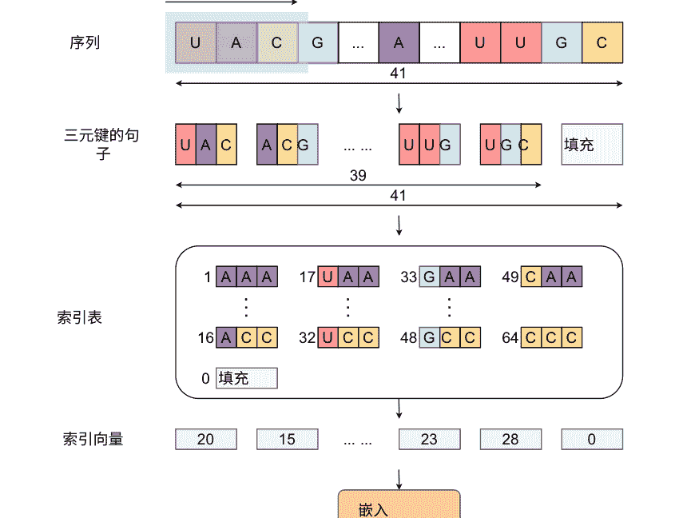

图1序列嵌入

损失 = \sum_{i=1}^{n} y_i \log \hat{y}_i + (1 - y_i) \log(1 - \hat{y}_i), \quad (1)

其中y是真实标签，ŷ是预测概率。验证集用于确定模型的停止轮次。停止轮次是在验证损失最小的时候确定的。使用Adam优化算法[25]和学习率为0.0001来优化每个小批量64个样本的模型。

#### 2.4 注意力网络

注意力网络包含在图2中。离开第二个Bi-LSTM层后，大小为4×100的隐藏向量和大小为41×200的输出向量进入注意力网络。隐藏向量被分割并在列上求和，形成大小为1×100的矩阵，进入全连接层。输出向量被分割成正向和反向输出矩阵进行求和。求和后的矩阵M_summed大小为41×100，通过Tanh函数激活，并转置为大小为100×41的矩阵。全连接层的输出大小为1×100，与转置矩阵大小为100进行相乘。

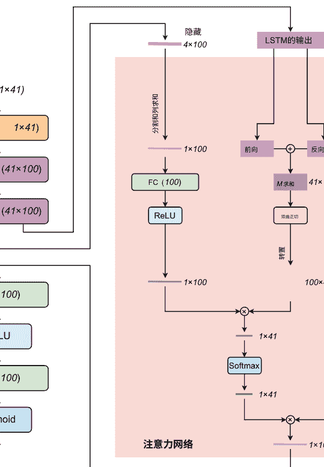

图2模型架构

×41创建大小为1 ×41的矩阵，由Softmax函数激活之后。这些矩阵最终与 M 求和矩阵相乘，创建大小为1 ×100的注意力矩阵。注意力矩阵然后被展平，进入下一个FC层。

#### 2.5 评估指标

使用多个指标来评估模型性能，包括平衡准确率（BA）、敏感性（SN）、特异性（SP）、精确度（PR）、F1分数、马修斯相关系数（MCC）、接收者操作特征曲线下面积（AUCROC）和精确率-召回率曲线下面积（AUCPR）等。

TP，FP，TN和FN是真阳性、假阳性、真阴性和假阴性的缩写。这些指标的数学公式如下所示。

```
BA = \frac{SN + SP}{2}, \tag{2}
SN = \frac{TP}{TP + FN}, \tag{3}
SP = \frac{TN}{TN + FP}, \tag{4}
PR = \frac{TP}{TP + FP}, \tag{5}
F1 = 2 \times \frac{PR \times SN}{PR + SN}, \tag{6}
MCC = \frac{TP \times TN - FP \times FN}{\sqrt{(TP + FP)(TP + FN)(TN + FP)(TN + FN)}}, \tag{7}
```

### 3 结果与讨论

#### 3.1 模型评估

在我们的实验中，iR1mA-LSTM是使用PyTorch 1.12.0实现的，并在配备25 GB RAM和一块NVIDIA Tesla T4 GPU的Google Colab上开发的。iR1mA-CNN经过50个epochs的训练。完成一个epoch的训练大约需要0.8秒，完成模型测试大约需要0.25秒。结果表明，我们的方法在独立测试集上的AUCROC和AUCPR值均超过0.99，具有很高的性能。其他指标，包括平衡准确率、敏感性、特异性、精确度、MCC和F1分数，也均大于0.95。该方法还通过在10次试验中重复我们的实验来检验其鲁棒性和稳定性。在每次试验中，训练集、验证集和测试集都重新采样以确保数据分布的随机性。训练集、验证集和测试集中正样本与负样本的比例可能略有不同，这取决于数据重新采样。重复实验的结果证实了iR1mA-LSTM在确定RNA序列中的1mA位点方面的鲁棒性和稳定性（表2）。

#### 3.2 比较分析

表3比较了iR1mA-LSTM模型与RAM-Pred [8]、iRNA-3typeA [9]和ISGm1A [10]的性能。其他三个模型是根据它们的模型描述重新实现的。决策阈值设置为0.5

表2 iR1mA-LSTM模型在独立测试集上的性能（十次试验）

| 试验 | AUCROC | AUCPR | BA | SN | SP | PR | MCC | F1 |
|------|--------|-------|----|----|----|----|-----|----|
| 1 | 0.9940 | 0.9955 | 0.9764 | 0.9675 | 0.9853 | 0.9851 | 0.9530 | 0.9762 |
| 2 | 0.9952 | 0.9966 | 0.9827 | 0.9738 | 0.9916 | 0.9915 | 0.9656 | 0.9826 |
| 3 | 0.9924 | 0.9950 | 0.9817 | 0.9728 | 0.9906 | 0.9904 | 0.9635 | 0.9815 |
| 4 | 0.9915 | 0.9944 | 0.9796 | 0.9686 | 0.9906 | 0.9904 | 0.9594 | 0.9794 |
| 5 | 0.9959 | 0.9971 | 0.9796 | 0.9780 | 0.9812 | 0.9811 | 0.9592 | 0.9795 |
| 6 | 0.9929 | 0.9951 | 0.9812 | 0.9717 | 0.9906 | 0.9904 | 0.9625 | 0.9810 |
| 7 | 0.9949 | 0.9961 | 0.9775 | 0.9780 | 0.9770 | 0.9770 | 0.9550 | 0.9775 |
| 8 | 0.9965 | 0.9976 | 0.9880 | 0.9812 | 0.9948 | 0.9947 | 0.9760 | 0.9879 |
| 9 | 0.9942 | 0.9958 | 0.9796 | 0.9728 | 0.9864 | 0.9862 | 0.9593 | 0.9794 |
| 10 | 0.9962 | 0.9971 | 0.9827 | 0.9801 | 0.9853 | 0.9853 | 0.9655 | 0.9827 |
| 平均值 | 0.9944 | 0.9960 | 0.9809 | 0.9745 | 0.9873 | 0.9872 | 0.9619 | 0.9808 |
| 标准差 | 0.0017 | 0.0011 | 0.0032 | 0.0047 | 0.0054 | 0.0053 | 0.0065 | 0.0033 |

表3 iR1mA-LSTM模型与其他方法在独立测试集上的性能比较

| 模型 | AUCROC | AUCPR | BA | SN | SP | PR | MCC | F1 |
|------|--------|-------|----|----|----|----|-----|----|
| RAMPred | 0.9726 | 0.9768 | 0.9131 | 0.8984 | 0.9277 | 0.9256 | 0.8265 | 0.9118 |
| iRNA-3typeA | 0.9709 | 0.9757 | 0.9115 | 0.8963 | 0.9267 | 0.9244 | 0.8234 | 0.9102 |
| ISGm1A | 0.9836 | 0.986 | 0.9377 | 0.8754 | 1.000 | 1.000 | 0.8823 | 0.9336 |
| iR1mA-LSTM | 0.9940 | 0.9955 | 0.9764 | 0.9530 | 0.9529 | 0.9675 | 0.9853 | 0.9851 |

对于所有模型。在试验1中，选择了训练、验证和独立测试集来开发所有模型。由于RAMPred、iRNA-3typeA和ISGm1A模型是使用经典机器学习算法开发的，所以将训练和验证集合并成一个训练集。然后，使用这个新的训练集进行五折交叉验证，以搜索这三个模型的最佳超参数。结果表明，我们的方法优于其他三种方法。iR1mA-LSTM排名第一，其次是ISGm1A、RAMPred和iRNA-3typeA。iR1mA-LSTM的性能超过其他方法，AUCROC和AUCPR值均超过0.99（图3）。

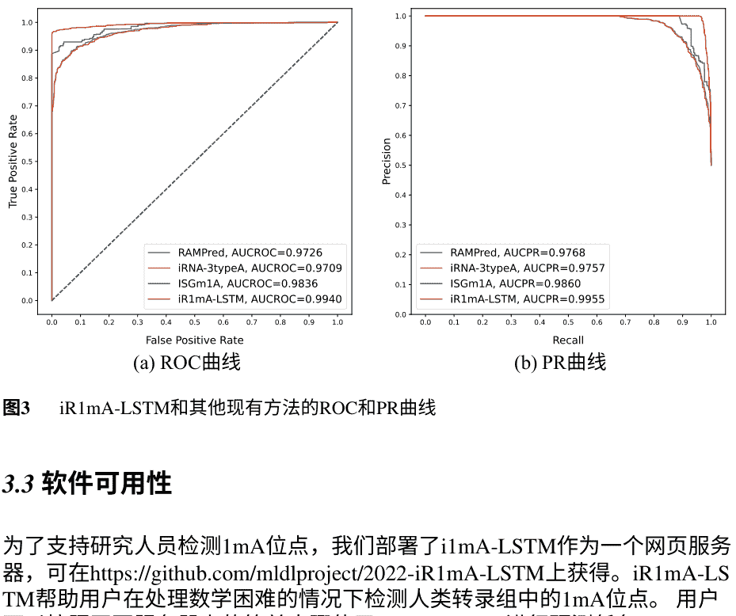

#### 3.3 软件可用性

为了支持研究人员检测1mA位点，我们部署了i1mA-LSTM作为一个网页服务器，可在https://github.com/mldlproject/2022-iR1mA-LSTM上获得。iR1mA-LSTM帮助用户在处理数学困难的情况下检测人类转录组中的1mA位点。用户可以按照网页服务器上的简单步骤使用iR1mA-LSTM进行预测任务。

### 4 结论

在这项研究中，我们引入了一种先进的in silico方法，使用双向长短期记忆网络和注意力网络来预测人类转录组中的1mA位点。实验结果表明，iR1mA-LSTM是一种高效、稳健且稳定的计算模型。我们的比较分析也证实，iR1mA-LSTM在相同的独立测试集上比其他现有方法表现更好。我们的在线网页服务器具有易于使用的界面和清晰的指导说明，帮助用户快速、轻松地运行预测任务。

致谢该项目部分得到了Whitireia和WelTec可争取资金的支持。

### 参考文献

- 1. R.J. Ontiveros, J. Stoute, K.F. Liu, RNA修饰的化学多样性。生物化学杂志。**476**(8), 1227–45 (2019)
- 2. D. Wiener, S. Schwartz, m6A之外的表观转录组。自然遗传学评论。**22**(2), 119–31 (2021)
- 3. D.B. Dunn, 1-甲基腺嘌呤在核糖核酸中的出现。生物化学与生物物理学报。**46**(1), 198–200 (1961)
- 4. B.S. Zhao, I.A. Roundtree, C. He, 通过mRNA修饰的转录后基因调控。 Nat. Rev. Mol. Cell Biol. **18**(1), 31–42 (2017)
- 5. X. Li, X. Xiong, C. Yi, 表观转录组测序技术：解码DNA修饰。自然方法 **14**(1), 23-31 (2017年)
- 6. X. Li, X. Xiong, K. Wang等, 转录组范围内的映射揭示了可逆和动态的N1-甲基腺苷甲基组。自然化学生物学 **12**(5), 311-6 (2016年)
- 7. X. Li, X. Xiong, M. Zhang等, 基于碱基分辨率的映射揭示了核编码和线粒体编码转录本中不同的m1A甲基组。分子细胞 **68**(5), 993-1005 (2017年)
- 8. W. Chen, P. Feng, H. Tang等, RAMPred: 鉴定真核转录组中的N1-甲基腺苷位点。科学报告 **6**(1), 1-8 (2016年)
- 9. W.Chen, P. Feng, H. Yang等, iRNA-3typeA: 识别RNA腺苷位点的三种修饰类型。分子疗法-核酸 **11**, 468–74 (2018)
- 10. L. Liu, X. Lei, J. Meng等, ISGm1A: 整合序列特征和基因组特征以提高人类m1A RNA甲基化位点的预测。IEEE Access. **8**, 81971–7 (2020)
- 11. T.H. Nguyen-Vo, Q.H. Nguyen, T.T.T. Do等, iPseU-NCP: 使用随机森林和NCP编码特征识别RNA伪尿苷位点。BMC Genom. **20** (10), 1–11 (2019)
- 12. B.P. Nguyen, H.N. Pham, H. Tran等, 使用电子健康记录进行广泛和深度学习预测2型糖尿病的发病。计算方法程序生物医学。**182**, 105055 (2019)
- 13. Q.H. Nguyen, B.P. Nguyen, S.D. Dao等, 深度学习模型用于胸部X射线图像的结核病检测，收录于《第26届国际电信会议 (ICT 2019)》 (IEEE, 越南河内, 2019年), 第381-385页
- 14. Q.H. Nguyen, R. Muthuraman, L. Singh等, 使用深度学习进行糖尿病视网膜病变检测，收录于《第4届国际机器学习和软计算会议 (ICMLSC 2020)》 ICPS (ACM, 越南海防, 2020年), 第103-107页
- 15. Q.H. Nguyen, B.P. Nguyen, T.B. Nguyen等, 基于分段CNN和SVM的单导联心电图房颤识别，生物医学信号处理与控制 **68**, 102672 (2021年)
- 16. B.P. Nguyen, Q.H. Nguyen, G.N. Doan-Ngoc等, iProDNA-CapsNet: 使用胶囊神经网络识别蛋白质-DNA结合位点。BMC Bioinform. **20**(23), 1–12 (2019)
- 17. Q.H. Nguyen, T.H. Nguyen-Vo, N.Q.K. Le等, iEnhancer-ECNN: 使用卷积神经网络集成识别增强子及其强度。BMC Genom. **20**(9), 1–10 (2019)
- 18. N.Q.K. Le, B.P. Nguyen, 基于2-D CNN和PSSM Profiles的电子传递链中FMN结合位点的预测。IEEE/ACM Trans. Comput. Biol. Bioinf. **18**(6), 2189–97 (2019)
- 19. N.Q.K. Le, Q.H. Nguyen, X. Chen等, 使用循环神经网络和PSSM profiles对适配器蛋白进行分类。BMC Genom. **20**(Suppl 9), 1–9 (2019)
- 20. T.H. Nguyen-Vo, L. Nguyen, N. Do等, 使用卷积神经网络和分子指纹嵌入特征预测药物诱导的肝损伤。ACS Omega **5**(39), 25432–9 (2020)
- 21. T.H. Nguyen-Vo, Q.H. Trinh, L. Nguyen等人, 使用预训练的双向编码器表示从变压器中预测天然产物的抗疟活性。J. Chem. Inform.Model. (2021)
- 22. T.H. Nguyen-Vo, Q.H. Trinh, L. Nguyen等人，使用多任务学习和分子指纹嵌入编码识别人类细胞色素P450抑制剂。J. Chem. Inform. Model. (2021)
- 23. D. Dominissini, S. Nachtergaele, S. Moshitch-Moshkovitz等人，真核生物信使RNA中的动态N1-甲基腺苷甲基组。自然 530(7591), 441–6 (2016)
- 24. Y. Huang, B. Niu, Y. Gao等人，CD-HIT Suite：用于聚类和比较生物序列的Web服务器。生物信息学 26(5),680–2 (2010)
- 25. D.P. Kingma, J. Ba, Adam: 一种随机优化方法. arXiv (2014)

## 解释生物反应对类似刺激的经验公式（Covid-19和其他）

Olga Kosheleva, Vladik Kreinovich和Nguyen Hoang Phuong

摘要 最近对生物反应对不变或快速变化的刺激（如Covid-19或流感病毒）进行了比较分析，使用了一个经验公式来描述类似刺激的反应如何取决于新旧刺激之间的距离。 在本文中，我们从第一原理提供了对这个经验公式的解释。

### 1 问题的阐述

生物反应：一般提醒。大多数生物都有学习的能力。当我们第一次遇到某种刺激时，例如某种化学物质或某种细菌，我们不知道这种刺激是有害还是有益。这次遭遇以及几次类似的遭遇告诉我们这种特定刺激是有害、有益还是中性的。

我们从这个经验中学到了东西，所以下次当我们遇到类似的刺激时，我们知道如何反应：例如，如果这个刺激是有害的，我们会战斗或逃跑。

生物反应取决于刺激是否随时间演变。一些刺激，例如与某些化学物质相关的气味，不会随时间改变。 因此，我们学会将气味与相应的刺激联系起来，例如危险的气味

具有危险的捕食者，以及具有美味可口的苹果或蘑菇的香味食物。生物可以在这种关联中变得非常有选择性，轻松地将危险的狼的气味与友好狗的相似气味区分开来。在这种情况下，对于生物来说，最佳策略是记住确切的刺激，并且只对这个刺激做出反应。

其他刺激在我们的一生中是多样的。例如，许多病毒，如流感和Covid-19病毒，每年都在进化。在这种情况下，如果我们身体免受这些病毒的细胞只对上一年遇到的病毒的确切形状做出反应，那么即使是非常微小的病毒突变也会让我们无法保护自己。在这种情况下，重要的是不仅对与以前遇到的刺激完全相同的刺激做出反应，而且对与我们以前遇到的刺激相似的刺激做出反应。

新刺激与原始刺激越接近，反应越强烈。当我们遇到完全相同的危险刺激时，我们绝对确定这个刺激是危险的，所以我们应该全力以赴做出反应。另一方面，当我们遇到与原始刺激相似的刺激时，我们不再百分之百确定：这个新刺激可能是无害的，如果我们立即对其发动全面攻击，我们可能会浪费资源，而这些资源在未来可能会需要，当严重的危险来临时。

因此，新刺激距离原始刺激越远，对该刺激的生物反应就越弱—反之，新刺激距离原始危险刺激越近，生物反应就越强。

描述这种依赖关系的经验公式。在许多生物情况下，有一种自然的方法来测量两个刺激之间的距离—例如，我们可以通过它们中任何一个特定部分的总长度来测量两个DNA之间的距离。

最近的论文[3, 4]表明观察结果与反应力 $f$ 与距离 $d$ 之间的以下依赖关系相吻合：

> $$ f = F_0 \cdot \exp(-k \cdot d^\theta) \quad (1) $$

对于一些参数 $F_0 > 0$， $k > 0$和$\theta > 0$—这些论文表明观察到的这些参数的生物值接近最优值。

问题。一个自然的问题是：如何解释这种经验依赖关系？

我们在本文中所做的是在本文中，我们提供了一个可能的从第一原理出发的解释，以解释这种经验依赖关系（1）。

### 许多从第一原理出发的解释背后的一般思想

在我们考虑这个具体问题之前，让我们回顾一下许多从第一原理出发的解释的来源。

数值与实际值的比较。我们想要找到相应量的实际值之间的依赖关系。然而，我们所能做的只是提出描述这些性质的数值之间的关系。

数值不仅取决于数量本身，还取决于测量尺度的选择。例如，数值取决于测量单位的选择。如果我们用原始测量单位的 $\lambda$ 倍小的单位替换，那么所有数值都会乘以 $\lambda$: $x \rightarrow \lambda \cdot x$。特别地，如果我们使用厘米而不是米，那么1.7米变成了170厘米。对于许多物理量，如时间和温度，数值还取决于起始点的选择。如果我们选择一个比原始起始点早 $x_0$ 单位的新起始点，那么所有数值都会改变: $x \rightarrow x + x_0$。

还可能存在非线性重新缩放。在所有这些情况下，从原始数值 $x$ 到新数值 $T_c(x)$，即 $c$ 为参数，$T_c(x)$ 为相应的转换，移动到不同的比例尺会改变数值。例如，对于改变测量单位，$T_c(x) = c \cdot x$，对于改变起始点，$T_c(x) = x + c$ 等等。

不变性：一般思想。在许多实际情况下，没有一种有意义的方式来选择比例尺，所有比例尺都是同样合理的。在这种情况下，要求两个量 $x$ 和 $y$ 之间的关系 $y = f(x)$ 在所有这些比例尺下具有相同的形式是有意义的。

当然，如果我们重新缩放 $x$，即用 $x' = T_c(x)$ 替换它，那么为了保持 $x$ 和 $y$ 之间的关系，我们还需要重新缩放 $y$，即应用适当的变换 $y \rightarrow y' = T'_c(y)$。然后，我们可以要求对于每个 $c$ 都存在一个 $c'$ 使得 $y = f(x)$ 蕴含着对于 $x' = T_c(x)$ 和 $y' = T'_c(y)$，我们有 $y' = f(x')$。

不变性：例子。例如，公式 $a = s^2$ 将正方形的面积 $a$ 与其边长 $s$ 相关联，如果我们用厘米替换米，那么我们需要相应地用平方厘米替换平方米。在这种情况下，对于 $T_c(x) = c \cdot x$，我们有 $T'_c(y) = c' \cdot y$，其中 $c' = c^2$。

不变性如何解释依赖关系：例子。让我们考虑这样的情况，对于每个 $c$，存在一个值 $c'(c)$（取决于 $c$）使得 $y = f(x)$ 成立，则 $y' = f(x')$，其中 $x' = c \cdot x$，$y' = c'(c) \cdot y$。将表达式 $x'$ 和 $y'$ 代入公式 $y' = f(x')$，并考虑到 $y = f(x)$，我们得出结论：对于每个 $x$ 和 $c$，我们有 $f(c \cdot x) = c'(c) \cdot f(x)$。已知（见，例如，[1]）每个连续（甚至可测）的解都具有以下形式 $y = A \cdot x^b$，其中 $A$ 和 $b$ 是常数。

因此，这种普遍存在的幂律可以通过相应的不变性来解释。

### 3 让我们将这个一般思想应用到我们的问题上

对于我们的问题，自然的尺度是什么？要将上述一般思想应用到我们的问题——寻找相互作用力 $f$ 和距离 $d$ 之间的依赖关系——我们需要了解如何测量这两个量的自然尺度：距离 $d$ 和力 $f$。

距离的情况。对于距离，通常的距离度量是合适的。因此，测量单位的变化会导致尺度的自然变化 $d \rightarrow c \cdot d$。

力的情况：问题的分析。另一方面，对于力，情况并不那么简单。

在纯机械环境中，我们可以将几个力合并在一起，因此我们可以很容易地看到对应于2或3个单位力的情况。因此，如果我们选择一个单位力 $f_0$，我们可以谈论力 $2f_0$，它等效于两个单位力的联合作用，力 $3f_0$，它等效于三个单位力的联合作用，等等。在这样的环境中，以下将是测量力的自然尺度：力 $f$ 的数值是数字 $n$，使得力 $f$ 等效于 $n$ 个单位力 $f \approx n \cdot f_0$，即实际上，值 $n \approx f/f_0$。

然而，对于生物系统来说，没有这样的自然力的组合是可能的。我们唯一能做的就是比较两个力。当然，如果这些力几乎相同，我们将无法区分它们。因此，如果我们选择一个单位力 $f_0$，那么下一个自然值 $f_1$ 是能够与 $f_0$ 区分的最小值 $f_1 > f_0$。$f_0$。之后，下一个自然值 $f_2$ 是能够与 $f_1$ 区分的最小值 $f_2 > f_1$，依此类推。

让我们用准确的术语描述上述想法。为了准确描述这些值，我们需要能够确定对于每个力 $f$，能够与 $f$ 区分的最小值 $g = F(f) > f$。

涉及力的过程不依赖于力的物理测量单位的精确选择。因此，如果我们在原始物理力单位中有 $g = F(f)$，那么在一个新的比例尺下，对于 $f' = c \cdot f$ 和 $g' = c \cdot g$，我们应该有 $g' = F(f')$。

将上述表达式代入此公式并考虑到 $g = F(f)$，我们得出结论 $F(c \cdot f) = c \cdot F(f)$。特别地，当 $f=1$时，我们得到 $F(c) = q \cdot c$，其中我们定义 $q = F(1)$。因此，我们有 $f_1 = q \cdot f_2 = q \cdot f_1 = q^2 \cdot f_0$，$f_3 = q \cdot f_2 = q^2 \cdot f_0$，依此类推，$f_n = q^n \cdot f_0$。

因此，用于测量生物力量 $f$ 的自然刻度是数字 $n$，其中 $f$ 接近于刻度上的第 $n$ 个元素，即 $f \approx q^n \cdot f_0$ 并且 $$n \approx \log_q(f/f_0) = \frac{\ln(f/f_0)}{\ln(q)}$$。

评论。应该提到，公式（2）描述了生理学中所称的韦伯-费希纳定律，即每种感觉的强度与其物理测量（能量或力量）的对数成比例；参见，例如，[2]。

从上述略微简化的描述到更现实的描述。在上述分析中，我们隐含地假设对于任意两个力量，我们可以区分它们或者不能区分它们。然而，这个隐含的假设是一个简化。

当一个力量远大于另一个力量时，这当然是绝对正确的。然而，随着力量越来越接近，出现了一个我们无法区分这些力量的概率，并且这个概率随着这些力量越接近越大。当比较的力量非常接近时，这个概率变得如此之大，以至于在实际应用中，我们无法区分它们。

鉴于这个事实，为了描述尺度，我们还需要选择一个置信水平，以便我们能够区分这两个力量。如果我们选择的置信水平太高，那么我们将需要一个大的值 $q$ — 力量比例 $f_1/f_0$。$q$ 越小，置信水平就越小。

**我们为(生物)力量得到了不同的自然测量尺度。没有固定的置信水平，所以没有首选值 $q$。换句话说，我们可以有不同的类型(2)的自然尺度，对应不同的值 $q$。**

**测量(生物)力量的两个不同自然尺度之间的转换是什么？假设除了对应某个值的尺度(2)之外，我们还有一个不同的尺度** $$n' \approx \frac{\ln(f/f_0)}{\ln(q')}$$ **对应于不同的值 $q'$。我们如何将基于物理力量 $f$ 的 $q$ 比例尺上的值 $n$ 转换为基于不同 $q$ 比例尺上相同力量 $f$ 的值 $n'$？**

通过比较公式（2）和（3），可以看出 $n'$ 和 $n$ 之间的关系非常简单：$n' = c \cdot n$，其中我们表示 $$c \xrightarrow{\text{def}} \frac{\ln(q)}{\ln(q')}$$

**哪些依赖关系对这些转换是不变的。我们想要弄清楚力量 $f$ 如何取决于距离 $d$。对于生物系统，用自然比例尺 $n$ 来描述这种依赖关系是一种自然的方式。因此，我们想要描述生物力量 $n$ 如何取决于距离。**

无论是距离还是生物力，自然变换的形式为 $x \to c \cdot x$。因此，依赖关系的自然不变性 $n = N(d)$意味着对于每个 $c$，都应该存在某个值 $c'(c)$使得 $n = N(d)$蕴含着 $n' = N(d')$，其中我们定义了 $d' = c \cdot d$ 和 $n' = c'(c) \cdot n$。我们已经提到过这种不变性意味着 $$n = A \cdot d^b$$ 对于一些常数 $A$ 和 $b$。

这解释了 $f$ 和 $d$ 之间的所需关系。我们的最终目标是解释物理力 $f$ 和距离 $d$ 之间的经验关系 (1)。因此，让我们看一下 $n$ 和 $d$ 之间的关系 (4) 在 $f$ 和 $d$ 之间的关系中是什么样子的。

为了找出这个，让我们将表达式 (4) 代入上述公式中的 $n$ $f = f_0 \cdot q^n$，即等价于 $f = f_0 \cdot \exp ( n \cdot \ln ( q ) )$ 这个替换导致 $$f = f_0 \cdot \exp ( A \cdot \ln ( q ) \cdot d^b )$$

这正是公式 (1)，其中 $F_0 = f_0$， $k = -A \cdot \ln ( q )$，且 $\theta = b$。因此，我们确实对上述经验依赖有了一个从第一原理解释。

致谢本工作部分得到了国家科学基金会的支持，项目编号1623190 (计算机科学中为新一代专业实践做准备的变革模型) 以及HRD-1834620和HRD-2034030 (CAHSI项目)，并获得了AT&T信息技术奖学金的支持。这也得到了伏尔加联邦区科学教育数学中心项目No. 075-02-2020-1478和匈牙利国家研究、开发和创新办公室 (NRDI) 的资助。

### 参考文献

- 1. J. Aczél, J. Dhombres,多变量函数方程(剑桥大学出版社, 2008年)
- 2. J.T. Cacioppo, L.G. Tassinary, G.G. Berntson (编者), 心理生理学手册 (剑桥大学出版社, 剑桥, 2019年)
- 3. O.H. Schnaack, A. Nourmohammad, 存储免疫记忆的最优进化决策。 eLife 10, 论文 e61346 (2021年)
- 4. O.H. Schnaack, L. Peliti, A. Nourmohammad,学习和组织进化模式的记忆(2021年), arXiv:2106.02186v1

## 博弈论方法解释了Covid-19变种的抗原图

Olga Kosheleva，Vladik Kreinovich和Nguyen Hoang Phuong

摘要 为了有效地防御未来的Covid-19变种，能够预测其演变是很重要的。 为了达到这个目的，有必要理解迄今为止其演变背后的逻辑。 乍一看，这种演变看起来是随机的，因此很难预测。 然而，我们展示了一个简单的博弈论模型实际上可以在定性层面上解释这种病毒迄今为止的突变。

### 1 问题的阐述

一个重要的问题。 像许多病毒一样，导致Covid-19的病毒迅速进化，因此对于原始变种非常高效的疫苗对于新变种来说并不那么高效。 为了更好地应对未来的变种，预测病毒在未来的进化方式是可取的。 为了能够做到这一点，我们需要了解它是如何（以及为什么）以这种方式进化的。

这个问题看起来很复杂。 最近的一份地图[1, 2]提供了主要Covid-19变种的二维可视化描述，从最初的Alpha到Beta、Gamma、Delta和Omicron。 乍一看，这些变化看起来有些随机和混乱，给我们留下了一个印象，可能没有合理的预测是可能的。

O. Kosheleva
德克萨斯大学埃尔帕索分校教师教育系，500 W. University,
El Paso, TX 79968, 美国
e-mail: olgak@utep.edu

V. Kreinovich (✉)
德克萨斯大学埃尔帕索分校计算机科学系，500 W. University,
El Paso, TX 79968, USA
e-mail: vladik@utep.edu

N. H. Phuong
人工智能部门，信息技术学院，长龙大学,
Nghiem Xuan Yem Road, Hoang Mai District, Hanoi, Vietnam

© 作者，独家许可给Springer Nature Switzerland AG 2023
N. H. Phuong和V. Kreinovich（编者），深度学习和其他软计算技术，计算智能研究1097,
https://doi.org/10.1007/978-3-031-29447-1_7

我们在这篇论文中做了什么。在这篇论文中，我们展示了至少在定性层面上，自然博弈论的思想解释了当前的演化情况，因此，希望能够预测未来变化的方向。

### 2 一个简化的博弈论模型和由此得出的解释

主要思想。随着病毒开始影响人群，人体开始产生对病毒原始版本的抗体。因此，为了保持有效性，病毒必须发生变异。变异版本也会导致人体产生保护作用，因此需要进一步的变异。

两个变体$A$和$B$之间的距离越大，$A$引起的抗体对变体$B$的效果越差。因此，从病毒的角度来看，在变体$A_1, \ldots, A_n$之后，选择作为下一个变体的变体$A$是有意义的，其中距离最小的$min(d(A, A_1), \ldots, d(A, A_n))$尽可能最大，这将确保新的变体对所有$A_i$产生的抗体最有效。

如果有几个变体$A$具有最大值，则对于病毒来说，选择第二小的距离$d(A, A_i)$是最大的是合理的，等等。

评论。当然，病毒不是一个智能生物，它不会直接选择下一个突变：突变是随机发生的，有些导致更有效的变体，有些导致不那么有效的变体，而最有效的变体成为主导。在这个意义上，在变体$A_1, \ldots, A_n$之后，下一个有效的变体-下一个主导变体是描述变体效果最大的值$min(d(A, A_1), \ldots, d(A, A_n))$。

让我们在一个简单的几何示例上追踪这个想法。在2D描述中，所有可能的变体都属于某个合理的平面区域。让我们考虑最简单的情况，当这个区域是一个圆盘时：

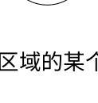

第一个变量$A_1$出现在这个圆盘形区域的某个地方。为了简单起见，让我们假设它位于圆盘的中心：


根据上述描述，作为下一个变量 $A_2$，我们选择到圆盘中心距离最大的点。很容易看出，最大距离等于圆盘的半径 $r$，并且这个距离在对应圆上的任意点上达到。因此，下一个变量位于与圆盘相邻的圆上：

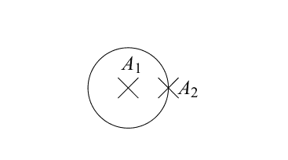

接下来会发生什么？圆盘内任意点 $A$ 到其中心 $A_1$ 的距离不能超过 $r$。因此，从 $A$ 到点 $A_1$ 和 $A_2$ 的最小距离不能大于 $r$。因此，理想情况下，作为下一个点 $A_3$，我们应该选择一个点 $A$，使得这个最小距离 $\min(d(A, A_1), d(A, A_2))$ 等于最大可能值 $r$。这意味着，特别是距离 $d(A, A_1)$ 至少为 $r$——由于这个距离不能超过 $r$，这意味着它必须恰好等于 $r$，即点 $A_3$ 也必须位于圆上。

圆上的所有点 $A$ 具有相同的距离 $d(A, A_1)$。因此，根据上述描述，在圆上的所有点 $A$ 中，我们应该选择距离最大的点，即距离 $d(A, A_2)$ 最大的点。可以看出，这个最大距离——等于 $2r$——是当点 $A_3$ 与点 $A_1$ 和 $A_2$ 在同一条直线上但在 $A_1$ 的对面时达到的：


现在怎么办？类似于前面的情况，我们可以得出结论，下一个点 $A_4$ 也应该位于圆上，并且应该选择使得两个距离中较小的距离 $\min(d(A, A_2), d(A, A_3))$ 最大的位置。可以验证，这个点应该位于圆上，恰好在 $A_2$ 和 $A_3$ 的中间：


同样，下一个点 $A_5$ 应该位于同一个圆上，也正好在 $A_2$ 和 $A_3$ 的中间位置：

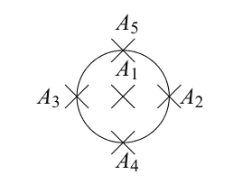

让我们将不同变体的结果位置映射出来。如果我们将变体 $A_{1}$到 $A_{4}$的位置映射出来，我们得到以下图片：

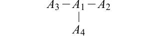

如果我们加上 $A_{5}$，那么我们得到以下结果：

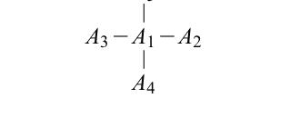

在定性层面上，$A_{1}$- $A_{4}$图几乎与 **Covid-19** 抗原图完全相同。事实上，我们从第一个变体 **Alpha** ($A_{1}$)开始。然后，变体 **Beta** ($A_{2}$)位于$A_{1}$的一侧，而变体 **Delta** ($A_{3}$)则位于$A_{1}$的另一侧的同一条线上。（我们跳过了 **Gamma**，它恰好位于抗原图上 **Beta** 和 **Delta** 之间，因此它必须只是一个过渡状态。）然后是 **Omicron** ($A_{4}$)，它通过向不同的方向移动而获得。

那么接下来呢？我们模型的预测是下一个变种 $A_{5}$将会在同一条线上 $A_{1}A_{4}$，但在 **Omicron** ($A_{4}$)的另一侧。

当然，这是一个非常粗糙的模型。上述模型非常近似。例如，在这个模型中，从所有连续的三个变种到原始变种 $A_{1}$的距离是相同的，而在现实中，从 **Alpha** ($A_{1}$)到 **Omicron** ($A_{4}$)的距离要比从 **Alpha** 到 **Beta** 和 **Delta** 的距离大得多。然而，这个简单模型能够解释这些看似随机的变化，这给了我们希望，进一步发展这个模型可以得出定量的解释，从而得到更可靠的预测。

致谢本工作部分得到了国家科学基金会的支持，项目编号1623190（计算机科学中为新一代专业实践做准备的变革模型）以及HRD-1834620和HRD-2034030（CAHSI项目），并获得了AT&T信息技术奖学金的支持。

本研究还得到了伏尔加联邦区科学教育数学中心发展计划的支持，项目编号075-02-2020-1478，以及匈牙利国家研究、开发和创新办公室（NRDI）的资助。

### 参考文献

- 1. E. Waltz,《映射Omicron的算法》, IEEE Spectrum 26-31 (2022)
- 2. S.H. Wilks, B. Mühlemann, X. Shen, S. Treli, E. B. LeGresley, A. Netzl, M.A. Caniza, J.N. Chacaltana-Huarcaya, X. Daniell, M.B. Datto, T.N. Denny, C. Drosten, R.A.M. Fouchier, P.J. Garcia, P.J. Halfmann, A. Jassem, T.C. Jones, Y. Kawaoka, F. Krammer, C. McDana, R. Pajon, V. Simon, M. Stockwell, H. Tang, H. van Bakel, R. Webby, D.C. Montefiori, D.J. Smith,《映射SARS-CoV-2抗原关系和血清反应》, (2022), bioRxiv 预印本 https://doi.org/10.1101/2022.01.28.477987, 发布于2022年1月28日

## 人工智能技术在图像数据识别和分析中的应用

Lu Anh Duy Phan 和 Ha Quang Thinh Ngo

### 摘要

近年来，深度学习等软计算技术在语音识别、人脸检测或风险预测等方面有着广泛的应用。本研究引入了一种新颖的方法来应用深度学习技术评估物理手势。首先，讨论了系统的整体方案和本地设置。然后，概念上建立了评分机制来估计人类表现。这个分数立即展示了模仿参考模型的难度。随后，一些统计指标，例如时间、行为类型或情绪，可以进行可视化分析和执行。本文的贡献是：（1）最初创新了系统的整体框架，（2）创建了评分机制来评估，（3）指示了评估人类表现的指标。从这些结果可以看出，所提出的解决方案可以应用于教学活动、体育分析或基于手势的控制。

- 关键词：数据分析、图像处理、运动控制、指标系统

### 1 引言

近年来，体育活动的分析得到了广泛的研究，作为来自政府、地方部门和私营部门等各种来源的不断增长的投资。这个领域需要多学科方法，包括机电一体化的创新方法、电气工程和计算机科学、体育或统计学[1-4]。尽管对身体活动的兴趣日益增长，导致了不同方法来检查身体参数，但这项工作仍然面临一些挑战。活动分析引起了很大的关注，尤其是在著名的团队运动领域，如板球[5]、足球[6, 7]、篮球[8]和排球[9]。当大部分居民改变生活方式时，分析体育比赛的需求不断增加。

一般来说，有两种统计分析方法可以改善运动员表现：场上/在线和场外/离线。在线研究需要先进的技术和高级计算工具来测量绩效指标。此外，它需要大量在现场同时工作的操作员和管理人员[10, 11]。相反，离线方法可以节省时间和成本，因为整个分析过程都集中在视频上。然而，视频的质量和视角在取得最佳结果方面起着至关重要的作用[12-14]。在这两种情况下，为了提高和发挥运动员的最大潜力以及适当投资的效率，这些研究不仅在技术分析方面有帮助，而且在多变量函数方面也有帮助，例如战术或团队组建。

目前为了区分任何关系或互动，需要大量的人力参与不同的角色。在这个领域中提到了各种方法来根据使用的技术进行分析和评估。在[15]中，实现了一个反映排球特点的指标系统。采用模糊评估来产生权重分配并通过一致性测试。为了提高高校体育教学质量，为教师提供了结果。在同一领域中，但使用其他方法，研究人员[16]采用数据融合准确识别每个排球动作。根据记录的视频和选手手腕的加速度数据之间的同步，神经网络识别了几种重要特征。然后用高精度训练新选手。

因此，这些工作通常在比赛结束后开始。在统计分析发生时，应考虑实时技术在比赛得分时的应用。在[17]中，建立了一个主要集成YOLO（You Only Look Once）的实时物体检测系统，用于检测物体和选手的存在，并识别特定动作的数量。即使在这种恶劣条件下，例如，如果选手因为摄像机移位而移出画面，该系统仍然可以持续跟踪这些选手。在等效技术中，鼓励建立轻量级的YOLO模型和卷积神经网络，无需额外的预处理[18]。这对于那些具有特殊残疾的人通过手势与他人交流是重要的。

从这些报告中可以认为，深度学习技术的应用对于分析人类手势是至关重要的自动化解决方案。在[19]中，创新了一种用于监测体育锻炼期间心率的移动应用程序，以了解健康状况和表现所带来的训练强度的影响。此外，该算法在面部识别和严重问题中被广泛使用。此外，针对热像图中的自动人员检测任务，研究了一种基于卷积神经网络模型的方法[20]。实验在三种室外条件下进行：晴天、雨天和雾天。对于所有验证场景，系统性能在平均精度方面表现出色。在相同的方法中，扩展版本用于通过热像图检测人体在[21]中提出了。与RGB图像相比，这些结果比传统方法更优越、更快速和更精确。本文的提醒如下。第2节描述了整个系统的框架，并解释了硬件设置和数据收集。第3节介绍了根据评分机制评估每个手势的方法。实验结果在第4节中描述，以评估系统性能。最后，在第5节中得出了几个结论。

### 2 系统设计

本文提出了一种使用深度学习技术分析物理手势的新方法。首先，创建了一个包含许多青少年或儿童练习的数据集进行训练。在这项研究中，这些课程被分为初级、中级和专业三个级别。其次，编写了用于记录视频、分析活动和评分机制的集成软件。运动员可以根据几个性能指标来修正他们在每个手势中的动作。最后，评分机制将发布与参考模型相比的估计值。

#### 2.1 整体系统框架

图1描述了使用深度学习技术的整个系统。采样数据事先收集好以供输入使用。在训练过程中，卷积层用于计算更可接受的特征图，以提高预测效果。这些特征在最小因素上重复出现，并以合理的比例从之前的卷积层中融合。在特征图中生成了三组框预测。整个过程通常是离线完成，以提供准确的识别信息。在实验中，数码相机捕捉并传输任何动作到主机计算机。此时，手势识别模型将每个步骤分开。然后，它使用训练数据集中的信息对图像的帧进行标记。这个过程的输出被送入评分机制以评估运动员的表现。

#### 2.2 硬件设置

事实上，数码相机在这项调查中起着重要作用。它必须能够捕捉高质量的图像，以避免在恶劣条件下模糊。此外，必须获取深度图，因为图像处理需要很多步骤和数据。为了满足这些要求，深度相机Realsense D435被选为主要来源。它具有广阔的视野，非常适合机器人技术、增强现实和虚拟现实等应用，其中尽可能多地看到场景非常重要。这款小型相机的射程可达10米，可以轻松集成到任何解决方案中，并配备我们的Intel RealSense SDK 2.0和跨平台支持。

借助强大的相机，设置高度直接且在玩家的视野中。为了避免在被遮挡时丢失捕捉到的数据，第二个相机或预防相机放置在侧视角。为了说明硬件系统的安装，图3表示人到相机的估计距离，而图4展示了整个设置的概览。

#### 2.3 数据收集

在一个级别中，有许多不同的手势，每个玩家可能不同。作为参考模型的指导者或教师首先会行动。随后，玩家会跟随这些练习并获得分数。为了更好地吸收，动作会非常简单，包括9个位置，并根据每个级别进行排列。

为了收集用于识别过程的数据，录制工作按照以下过程进行：每个玩家进行9次移动。每个姿势都以图5所示的距离进行捕捉。每个距离都会有3个站立位置：左、中、右。每个姿势需要3个角度：面向相机，向左旋转30°和向右旋转30°。每个角度可以捕捉到10个骨架。因此，每个姿势的数据集将包括180帧，整个数据集将包括8100帧。

### 3 评分机制

#### 3.1 概念定义

人体姿势可以通过普通相机拍摄的彩色图像信息来识别。然而，传统分辨率方法的主要障碍是从传统相机拍摄的图像中提取特征仍然困难，原因是噪声、拍摄角度、光线和环境影响。因此，深度相机可以用来提供深度信息并跟踪站在相机前的人的骨架。

根据上述要求，在人体姿势识别的研究文章中经常使用的一种常见类型的深度相机的规格如表1所示。

记录的数据结果是实时确定的25个关节的坐标，形成如图6a所示的骨架图。关节的坐标是唯一的，并且可以完美地表示一个动作。

表1 所提出系统的规格参数

| 参数 | 数值 |
| --- | --- |
| 深度传感器 | 飞行时间（ToF） |
| RGB相机的分辨率 | 1920 × 1080, 30帧/秒 |
| 深度相机的分辨率 | 512 × 424, 30帧/秒 |
| 视觉范围 (RGB相机) | 70° × 60° |
| 视觉范围 (深度相机) | 84.1° × 53.8° |
| 操作范围 | 0.5–4.5米 |
| 骨架点 | 25个点 |
| 最大人休检测数量 | 6 |

#### 3.2 肢体向量

为了让数码相机捕捉和反馈关节的坐标，肢体向量将用于表示人体前方的骨架姿势。肢体向量被定义为图6b中两个关节之间的连接。就像几何向量一样，它们的描述表示一个单一的手势而没有移动。

通过分析不同组中的肢体向量，可以减少冗余数据。

包括头部、肩膀和臀部的头体向量，如图6b所示，具有少量的个体和强烈的运动。这个身体部分的旋转和弯曲与四肢有关。因此，这些关节不会包含在代表性组中。

一级向量：包括肘部和大腿，如图6b所示，带有黄色线条。这个向量包含了很多运动和手势的信息。因此，这些向量将被分类为代表性组。

二级向量：包括图6b中的手臂和腿部，用蓝线表示。这些向量比一级向量更持久，并且给人以显著的视觉印象。因此，它们可以被归类为代表性的向量。

手和脚：相机可以追踪图6b中的脚和手，但在采集过程中经常不稳定。此外，手和脚的运动在运动信息中通常可以忽略不计。因此，代表性组中的双手和双脚的关节将不被包括在内。总结起来，肢体向量的列表如表2所示。

表2 肢体向量列表

| 不 | 描述 | 不 | 描述 | 不 | 描述 | 不 | 描述 |
| :-- | :-- | :-- | :-- | :-- | :-- | :-- | :-- |
| 1 | 左肘 | 3 | 左大腿 | 5 | 左臂 | 7 | 左小腿 |
| 2 | 右肘 | 4 | 右大腿 | 6 | 右臂 | 8 | 右小腿 |

#### 3.3 评分评估

在对肢体向量进行分类后，根据所获得的数据和参考模型计算它们之间的角度，如下所示

$$\cos \phi = \frac{x_{ref} x^i_h + y_{ref} y^i_h + z_{ref} z^i_h}{\sqrt{x_{ref}^2 + y_{ref}^2 + z_{ref}^2} \sqrt{\left(x^i_h\right)^2 + \left(y^i_h\right)^2 + \left(z^i_h\right)^2}} \tag{1}$$

其中， $x_{ref}, y_{ref}, z_{ref}$ : 参考模型的肢体向量坐标。 $x^i_h, y^i_h, z^i_h$ : 当前手脚向量的坐标。 $\{\phi_1, \phi_2, \phi_3, \phi_4, \phi_5, \phi_6, \phi_7, \phi_8\}$ : 表2中每个向量的相对角度集合。

方程 (1) 表示当前手势与参考模型之间的差异信息。实际上，视觉中存在几个不等价的容差。因此，权重对于这些补偿是必要的插入。

在这项研究中，推荐使用伪距离 $\Lambda$ 来指定总差异，如下所示

$$\Lambda = [w_1(\phi_1 + \phi_2) + w_2(\phi_3 + \phi_4) + w_3(\phi_5 + \phi_6) + w_4(\phi_7 + \phi_8)] \tag{2}$$

其中， $w_1, w_2, w_3, w_4$ : 分别是肘部、手臂、大腿和小腿的权重。

为了估计这些权重，建议系统会自动收集最近一段时间内的一些手势。在数据库中，评级水平 $Tol$ 波动 $\pm 10\%$ ，并取这些值的平均值。具体来说，权重 $w_i$ 是

$$w_i = \frac{1}{Tol \left( \sum_{n=4}^{1} \frac{1}{Avg_n} \right)} \tag{3}$$

其中， $Avg_n$ : 第n个平均值。

因此，最终得分 $D$ 可以评估为

$$D = \sigma_0 \left[ (\Lambda_{ref} - \Lambda) \times \frac{10 - D_{ref}}{D_{ref}} \right] \tag{4}$$

其中， $D_{ref}, \Lambda_{ref}$ : 参考得分和用户距离分别为。 $\sigma_0$ : 根据经验调整的参数。

### 4 研究结果

通过对选手表现的众多评估，应该评估所提出方法的有效性和可行性。下面这个由C/C++编程语言编写的软件，集成了深度学习技术、数据分析和评分机制。它可以在配备核心i7 3200 MHz、Windows 10专业版操作系统的个人电脑上良好运行。该系统需要两个数字摄像头来捕捉来自两侧的视觉数据。第一个摄像头位于选手前方，提供图像、动作识别和情绪检测，如图7所示。第二个摄像头作为补充，提高整个系统的准确性。特别是，该系统也适用于缺乏光线的室内环境。

一般来说，青少年的体育锻炼有三个级别，如表3所示。在简单级别中，玩家应熟悉诸如拍手或手势等活动。在第二级别中，需要更多的动作和时间检查。最后，在困难级别中，要确保姿势、方向和运动速度与参考模型相符。

在软件的第二个选项卡中，如图8所示，逐个训练每个动作是合适的。玩家必须模仿并重复，直到能够流利地完成锻炼。之后应用人工智能技术进行识别... 每次练习，评分机制都会返回一个奖励，这是改善他们表现的前提。当身体锻炼完成时，数据分析过程立即启动。整个评估被简要总结并以可视化方式显示。一些指示玩家表现的关键因素是行动时间表或平均分数。此外，还估计了玩家的情绪，以衡量他们的兴趣程度。从图9的这些指标来看，该系统可以发布合理的建议来鼓励玩家的表现。

表3 锻炼级别列表

| 否 | 名称 | 级别 |
| --- | --- | --- |
| 1 | 小鲨鱼 | 简单 |
| 2 | Tập thể dục buổi sáng | 中等 |
| 3 | 如果你快乐并且你知道它 | 困难 |

### 5 结论

本文介绍了一种使用深度学习技术的基于视觉的应用的新方法。硬件平台和实验场景的设置已经启动。随后，通过数学模型评估了评分机制。它可以准确直接地产生玩家表现的评估。该系统还实施了几个指标。通过成功的实施，验证了所提出的解决方案在教育、体育分析或基于手势的控制中的应用。

致谢 我们感谢胡志明市工业大学（HCMUT）和越南胡志明市国家大学（VNU-HCM）对本研究的支持。

### 参考文献

- 1. N. Singh, 体育分析：一项综述。学习 **9**, 11 (2020年)
- 2. A. Jayal, A. McRobert, G. Oatley, P. O'Donoghue, 体育分析：体育表现分析、可视化和决策。 (**Routledge**, 2018年)
- 3. V. Ratten, P. Usmanij, 统计建模和体育商业分析，在统计建模和体育商业分析 (**Routledge**, 2020年), 第1-9页
- 4. L. Morra, F. Manigrasso, F. Lamberti, SoccER: 计算机图形与体育分析相结合，用于足球事件识别。 **SoftwareX 12**, 100612 (2020年)
- 5. K. Kapadia, H. Abdel-Jaber, F. Thabtah, W. Hadi, 使用机器学习进行板球比赛结果的体育分析：一项实验研究。应用计算机信息学（即将出版） (2020年)
- 6. J. Fernandez, L. Born, D. Cervone, 分解不可测的体育运动：一种用于足球的深度学习预期占有价值框架，在第13届麻省理工学院斯隆体育分析会议 (2019年)
- 7. G. Liu, Y. Luo, O. Schulte, T. Kharrat, 深度足球分析：学习行动-价值函数以评估足球运动员。数据挖掘与知识发现 **34(5)**, 1531-1559 (2020)
- 8. V. Sarlis, C. Tjortjis, 体育分析-篮球运动员和团队表现评估。信息系统 **93**, 101562 (2020)
- 9. S. Wenninger, D. Link, M. Lames, 机器学习模型在沙滩排球数据应用中的性能。国际计算机科学运动杂志 **19(1)**, 24-36 (2020)
- 10. D. Formenti, M. Duca, A. Trecroci, L. Ansaldi, L. Bonfanti, G. Alberti, P. Iodice, 非运动特定背景下的感知视觉训练：对年轻女性的性能技能和认知的影响。科学报告 **9(1)**, 1-13 (2019)
- 11. K. Apostolou, C. Tjortjis, 运动分析算法用于性能预测，在2019年第10届信息、智能、系统和应用国际会议(IISA)中 (**IEEE**, 2019), 页码1-4
- 12. M. Mutz, J. Müller, A.K. Reimers, 在COVID-19大流行期间使用数字媒体进行家庭体育活动：来自德国SPOVID调查的结果。国际环境研究与公共卫生 **18(9)**, 4409 (2021)
- 13. M. Nibali, 数据游戏：通过分析实现更好的运动表现，在体育分析中。 (**Routledge**, 2016), 页码71–97
- 14. L. Goebeler, W. Standaert, X. Xiao, 混合体育配置：物理和数字的交织 (2021)
- 15. J. He, Y. Bai, 基于模糊层次分析法的大学排球质量评估，在2018年智能交通、大数据和智能城市国际会议(ICITBS) (**IEEE**, 2018), 第669-672页

应用人工智能技术进行识别...

16. K. Peng, Y. Zhao, X. Sha, W. Ma, Y. Wang, W.J. Li, 基于MEMS惯性测量单元和视频分析的排球运动准确识别，在2018年IEEE第8届年度自动化、控制和智能系统技术国际会议(CYBER)(IEEE, 2018)，第440-444页
17. Y. Yoon, H. Hwang, Y. Choi, M. Joo, H. Oh, I. Park, J.H. Hwang, 基于深度学习的实时物体跟踪技术分析篮球动作和传球关系。 IEEE Access 7, 56564–56576 (2019)
18. A. Mujahid, M.J. Awan, A. Yasin, M.A. Mohammed, R. Damaševičius, R. Maskeliūnas, K.H. Abdulkareem, 基于深度学习YOLOv3模型的实时手势识别。 Appl. Sci. 11(9), 4164 (2021)
19. R. Aminuddin, M.A. Shamsudin, N.I.F.A. Wahab, 使用深度学习监测目标心率区间的移动应用框架，在2021年IEEE第9届系统、过程和控制会议(ICSPC 2021)中。(IEEE, 2021), pp. 1–6.
20. M. Ivasic-Kos, M. Kristo, M. Pobar, 使用YOLO在热视频中进行人员检测，在SAI智能系统会议论文集中(Springer, Cham, 2019), pp. 254–267.
21. M. Kristo, M. Ivasic-Kos, M. Pobar, 在恶劣天气条件下使用YOLO进行热目标检测。 IEEE Access 8, 125459–125476 (2020)

## 基于机器学习的方法用于医学图像中的内部器官检测

Duy Thuy Thi Nguyen, Mai Nguyen Lam Truc, Thu Bao Thi Nguyen, Phuc Huu Nguyen, Vy Nguyen Hoang Vo, Linh Thuy Thi Pham, 和 Hai Thanh Nguyen

摘要 近年来，深度学习算法在各个学科中取得了杰出的成果，包括人脸识别、手写字符识别、图像分类、目标检测和图像分割。这些系统基于计算机自学习算法，利用深度学习。此外，深度学习算法为医学图像分析应用开辟了一个有前途的研究方向。智能机器人，结合基于机器学习的进展的综合专家系统，预计将支持医生进行复杂手术。本研究使用各种图像分割算法对人体内部重要器官（包括心脏、肺、气管和肝脏）进行图像处理技术的研究。该工作预计将有助于超声检查和手术活动的诊断过程和自动人体部位检测技术。

### 1 引言

近年来，计算机科学特别是机器学习和人工智能（AI）的快速发展，在医疗领域开辟了许多潜在的发展方向。例如，医学影像技术的快速发展创造了大量的医学数据。因此，利用人工智能帮助人们快速找到有用信息是必要且重要的。


发展医学专业并增加对患者成功治疗的能力是一个重要的步骤。

图像分割任务重要且困难。现如今，图像分割方法正在发展，以便在紧急情况下更快速、更准确。通过结合许多新理论和技术，研究人员正在寻找一种通用的分割算法，可以应用于这种类型的图像。

随着医疗治疗的进步，各种新的医学成像设备变得越来越受欢迎。临床上广泛使用的医学成像类型主要包括计算机断层扫描（CT）、磁共振成像（MRI）、正电子发射断层扫描（PET）、X射线和超声成像（UI）。

医生使用CT和其他医学图像来评估患者的状况。因此，医学图像处理的研究已成为计算机视觉的关注焦点。随着人工智能特别是深度学习的快速发展，基于深度学习的图像分割方法在图像分割方面取得了良好的结果。与传统的机器学习和计算机视觉方法相比，深度学习在分割准确性和速度方面具有一定的优势。使用深度学习来分割医学图像可以帮助医生有效确认病变肿瘤的大小，并在治疗前后定量评估效果，大大减轻医生的工作负担[1]。

器官分割任务是许多医学研究领域数据分析的重要步骤。该研究旨在识别人体的部分，以帮助更容易和更准确地进行诊断，并为基于自动技术的手术机器人的开发提供预研支持。该研究的主要贡献是评估各种重要人体器官的分割方法（UNET、SegNet和全连接网络（FCN））的效率。首先，我们从X光图像中收集了肝脏图像的数据，还从Kaggle和其他来源获取了肺部分割的³个X光图像和⁴个其他来源的数据。然后，我们利用UNET、SegNet和全连接网络（FCN）等分割算法对医学图像中的主要器官进行分类和标记，如心脏、气管、肺和肝脏。

### 2 相关工作

越南的许多单位和组织目前都参与医学图像处理研究。例如，Vingroup Corporation推出了VinDr——医学图像分析解决方案的第一个版本，该解决方案广泛应用了人工智能（AI）技术，是VinBDI（大数据研究所）的一个应用研究项目[2]。Vingroup Corporation在108中央军医院、河内医科大学医院和Vimec Times City国际医院进行了测试。该解决方案的一个特点是在医学图像存储和传输（PACS）上应用人工智能（AI）技术。

平台。在第一步中，VinDr将支持两个功能：通过胸部X射线图像[3]诊断肺部疾病和通过乳房X射线图像[4]诊断乳腺癌。 此外，FPT软件公司与法国图卢兹大学的人工智能（AI）专家以及越南的教授和皮肤科医生进行了研究和开发。 DeepCinics皮肤科诊断。 该应用程序使用人工智能（AI）和机器学习（Machine Learning）等技术，创建了一个4.0趋势的医学检查和诊断系统，诊断准确率约为80-90%。⁵

AI在外科手术中的一个典型应用是机器人逐渐在腹腔镜手术中使用，执行耳鼻喉科手术、神经外科手术、妇科手术和胃肠外科肝胆系统手术[5]。其中，正在应用的4个杰出机器人系统包括达芬奇内窥镜手术机器人[6]、文艺复兴脊柱手术机器人、MAKOplasty膝关节手术机器人[7]和ROSA神经外科手术机器人[8]。具体而言，2012年，越南德国医院成为首个在脊柱手术中部署文艺复兴精确定位机器人应用的单位。在巴赫迈医院，2015年，医院建造了2个新的手术室，配备了2个最先进的机器人手术系统MAKO和ROSA，与世界其他国家齐头并进，为患者的疾病服务和治疗。在脊柱手术中机器人的非常有效应用之后，2017年2月，巴赫迈医院（河内）继续投入使用2台手术机器人治疗膝关节病理和神经外科。⁶此外，越南的Cho Ray医院已正式部署达芬奇机器人手术系统，用于治疗前列腺癌、肾癌、膀胱癌、结直肠癌、肺癌、胆总管囊肿切除术、肾盂肾炎输尿管交界重建、肝癌。⁷如今，通过深度学习模型的识别技术在医学领域越来越多地进行研究和应用，尤其是在领先的国家。

在放射治疗癌症的极其有用的应用领域中，如人工智能[9]；自动化机构分割，确定投资回报率；计算机辅助诊断（CADx）[10]；肿块检测[11]；辅助内窥镜手术[12]。

提到的医疗人工智能应用之一是RapidAI软件，⁸它可以帮助医生更快、更准确地诊断和治疗，存储患者健康检查（如CT扫描、MRI扫描等）后的过去图像处理。这些图像将立即发送到医院的PACS系统或通过移动设备或计算机提供给专家[13]。然后，专家将对其进行分析，决定患者的治疗方案。

Softneta公司设计了MedDream DICOM Viewer [14]用于基于Web的PACS服务器，以提供快速可靠的搜索、查看、分析和诊断功能。

> ⁵ https://vnexpress.net/dung-ai-chan-doan-benh-ve-da-3997315.html.
> ⁶ http://medinet.gov.vn/cai-cach-hanh-chinh-y-te-thong-minh/gioi-thieu-san-pham-binh-chon-giai-thuong-y-te-thong-minh-cua-benh-vien-nhan-da-c4714-20030.aspx.
> ⁷ https://kcb.vn/benh-vien-bach-mai-ung-dung-he-thong-robot-trong-phau-thuat-khop-goi-va-phau-thuat-than-kinh.html
> ⁸ https://www.rapidai.com/about.

鼻子图像、信号和视频文件。随时随地、在任何设备上进行医疗保健，协助医疗专业人员进行诊断和治疗。DICOM查看器采用响应式设计开发，可以在计算机、平板电脑、智能手机或其他具有移动查看功能的设备上访问医学影像。

MedDream DICOM查看器的3D成像简化了从2D图像切片重建3D图像的技术。此外，该技术使用MPR和MIP等3D造型技术从原始数据提供各种视图。⁹ 此外，3D Slicer应用程序是一种广泛使用的用于分析和可视化医学图像以及研究图像引导治疗的软件平台。这个开源软件适用于Linux、MacOSX和Windows等操作系统。该软件包括多生物体和对MRI、CT和US等多种图像格式的支持。

> ⁹ https://www.softneta.com/products/meddream-dicom-viewer/

### 3 方法

#### 3.1 概述结构

模型结构：U-net模型由四个编码块组成的收缩路径，以及四个解码块组成的扩展路径。每个密码块由两个连续的3×3卷积层组成，后面是一个步长为2的最大池化层进行下采样。相反，解码块包括一个转置卷积层进行上采样，与收缩路径中相应的特征图进行连接，并使用两个3×3卷积层。

所有的卷积类都后跟批量归一化和激活函数=ReLU。在最后一层，使用1×1卷积将最终解码器块的输出映射到特征图上，其中应用Sigmoid函数将模型的输出图像归一化到与输入相同的尺度。如图1所示，医学图像处理可以解释如下：标签和训练集用作训练模型的输入。对于每个时期，当时期值未达到最大值时，它将输出输出和损失值（进行训练时的损失）。因此，继续迭代每个时期，并同时保存模型是训练后的最佳结果。最后，使用保存的模型与相应的测试集和标签进行测试。得到的结果是模型的预测。

#### 3.2 数据描述

胸部X光数据来自2个数据集：

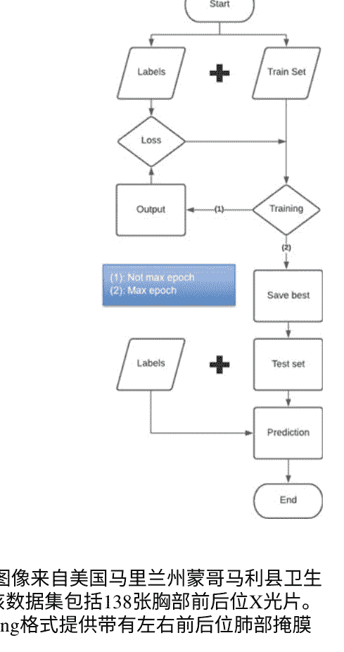

- 蒙哥马利县X光套件：该数据集中的图像来自美国马里兰州蒙哥马利县卫生和人类服务部的结核病控制计划。该数据集包括138张胸部前后位X光片。所有图像都经过去识别处理，并以png格式提供带有左右前后位肺部掩膜。
- 深圳医院X光套件：该数据集中的胸部X光图像由中国广东省深圳市第三医院收集和提供。图像以png格式存储。

肝脏CT数据来自用于测试和评估肝内肿瘤分割和检测方法的3D IRCAD 3数据集。IRCAD数据集包括使用不同CT扫描仪获得的20个静脉注射增强CT体积。心脏、肺部和气管CT图像数据来自Kaggle。该数据集包括3D图像和掩膜（.nrrd），3D Slicer已处理成包含2D切片的png图像数据集。所收集数据的描述如表1所示。

**表1 收集数据的描述**

| 部分 | 数据集名称 | 格式 | 数量 | 大小 | 用于训练的调整大小 |
| :--- | :--- | :--- | :--- | :--- | :--- |
| 肺 | 蒙哥马利数据集 | jpg | 138 CXR图像 | 4020 × 4892 | 512 × 512 |
|  | 深圳医院 (SH) 数据集 | jpg | 662张图像 | 4020 × 4892 | 512 × 512 |
| 肝脏 | 3D IRCAD 3 数据集 | .nii | 20 | 512 × 512 |  |
| 肺-心脏-气管 | 来自Kaggle的OSIC肺纤维化竞赛 | .nrrd | 87 |  |  |
|  |  | .png | 17012 | 512 × 512 |  |

#### 3.3 图像处理

##### 3.3.1 肺X射线图像处理

为了匹配设计的U-Net网络架构，将对所有数据进行预处理。原始数据集的图像大小各不相同。因此，我们将这些图像及其相应的掩膜调整为512 × 512像素以进行模型训练。此外，对图像及其相应的掩膜进行增强数据生成，以创建多样性并评估模型准确性。

为了通过胸部X射线进行肺分割，我们使用一种分割技术将图像分割为不同的区域（推测肺部和非肺部区域）。这些区域中的每一个都包含一组共享某些共同特征的像素。这种图像处理技术将图像的表示简化为更有用和更易于使用的形式。U-Net用于基于标记为肺部的地面真实图像对图像进行分割。当左右肺部的预测结果相对准确时，U-Net表现良好，这是基于提取特征和重建预测图像（如输入图像大小）的结果。此外，使用X射线图像还有助于提高模型的预测准确性，因为肺部具有较强的X射线透射能力，所以CXR图像对应区域的灰度值会较低。相反，周围的组织和器官对于X射线的透射能力较低，所以CXR的相应灰度值也会较高。灰度值越高，图像越模糊，在图2中越难以感知。

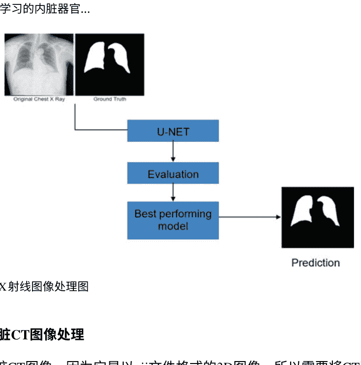

##### 3.3.2 肝脏CT图像处理

对于肝脏CT图像，因为它是以nii文件格式的3D图像，所以需要将CT图像转换为训练模型能够理解的格式。因此，在本研究中，我们将数据集从nibabel (.nii)转换为NumPy(.npy)格式。为了实现这种方法，我们按照以下方式处理数据：加载3D数据并在垂直方向（z轴）上进行切割，然后收集包含肝脏的切片图像（2D格式）并将其存储为numpy数据。

对于图像预处理，我们将CT扫描的图像强度值截断在固定范围[0, 200]内，以去除杂散细节并增强图像的对比度。因此，如图3所示，经过上述预处理后，肝脏的边界更清晰。

对于肝脏分割，我们使用粗到精的方法来减少计算时间并提高分割的准确性。使用2D切片U网格来确定肝脏的近端位置。在训练阶段，我们对3D CT图像I和相应的基准分割Y进行了双重归一化。一方面，我们将每个I和Y划分为一组2D切片并调整大小。

然后，将它们调整为固定的256 × 256图像大小。这些归一化的2D图像和

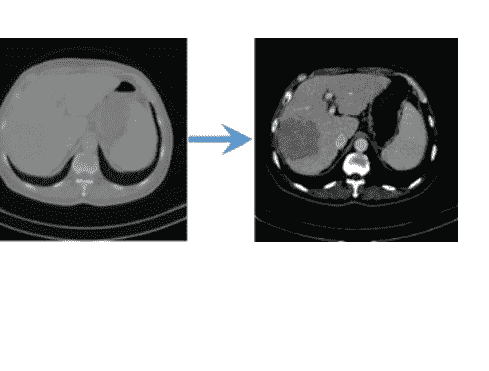

然后，将I和Y对输入到2D U-Net中，以适应原始分割模型，该模型专注于学习区分肝脏和背景的特征。

另一方面，我们将每个3D体积（I和Y）调整为固定的1×1×1 mm³的体素大小，并使用肝脏掩模裁剪这些归一化图像。肝脏在测试阶段从粗到精进行分割。一开始，我们也像训练阶段一样对图像进行了两次归一化。一方面，我们将3D CT测试图像切割并调整大小为2D切片，并使用训练好的U-Net预测粗略的肝脏分割。另一方面，我们将3D CT图像和原始肝脏分割调整为正常的体素大小，并在调整后的肝脏分割周围裁剪调整后的CT图像。

##### 3.3.3 通过CT识别心脏-肺-气管

该数据集来自肺部分割数据集。¹⁰ 这些数据最初是以张量格式保存的nrrd文件，对应的掩码是使用pickle保存的小数组，标签为（肺部，心脏，气管）。每个张量具有以下形状：多个切片、宽度、高度和多个层，其中切片的宽度和高度是每个张量ID的独立参数，层数=3。此外，数据保存为RGB图像，其中每个图像对应于一个ID切片，它们的掩码图像具有对应于三个层的通道：（肺部，心脏和气管）。该数据可以表示为图4。

如前所述，通过将数据分为输入和掩码图像的三个层：心脏、肺部和气管，模型将对每个RGB图像（即原始CT图像的切片）进行识别。图像的信息将被分割为心脏、肺部、气管和不属于这三个部分的区域。在识别每个切片并获得预测结果后，我们将根据该ID将切片组合成视频。在处理图像后，颜色和部分将基于我们数据集中相应的掩码，即肺部区域对应蓝色掩码，心脏区域将是红色，空气区域将是红色。茎将是绿色。

### 4 实验结果

#### 4.1 划分训练集和测试集

图像数据集通过留出法划分为训练集和测试集，比例为0.9和0.1。使用ADAM优化器编译训练模型。输入图像被调整为256×256以减少训练时间和内存需求。

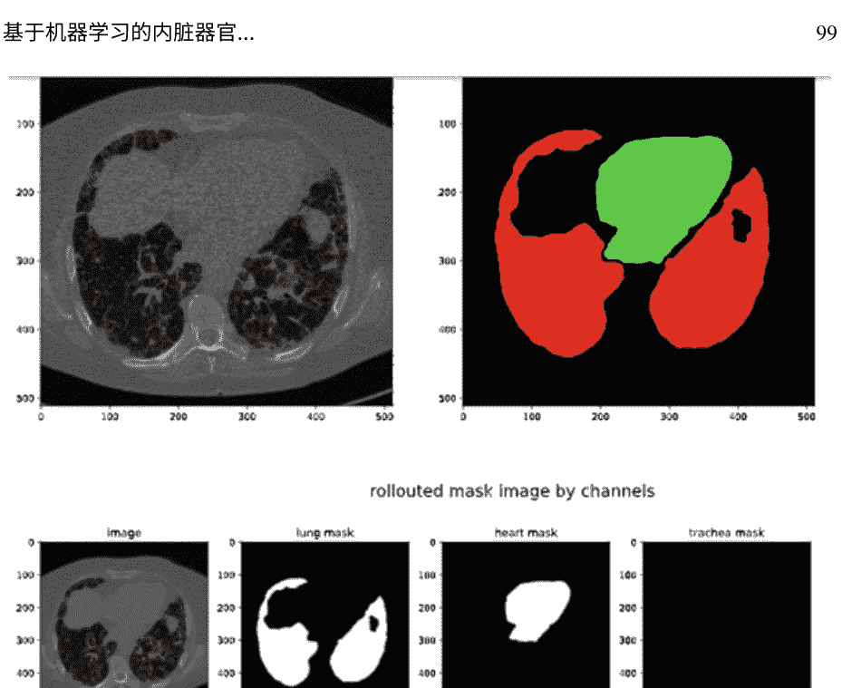

#### 4.2 器官分割的实验结果

##### 4.2.1 肺

该研究使用基于像素准确度的评估方法。 也就是说，准确度将被计算为图像中被正确分类的像素的百分比。
图5显示了提出模型的损失值和准确度。 结果显示，在50个训练周期中，获得了准确度（accuracy）、准确度验证（accuracy）和损失值（loss）、验证损失值（validation loss value）。 可以看出，准确度和验证准确度几乎都超过了95%，这意味着提出的模型可以取得良好的性能。 此外，在训练过程中，准确度增加，损失减少，训练出的模型保存为最后一个周期的最佳模型。

##### 4.2.2 肝脏

通过用于肝脏分割的Dice系数值评估模型。
Dice系数经常用于量化图像分割的性能。

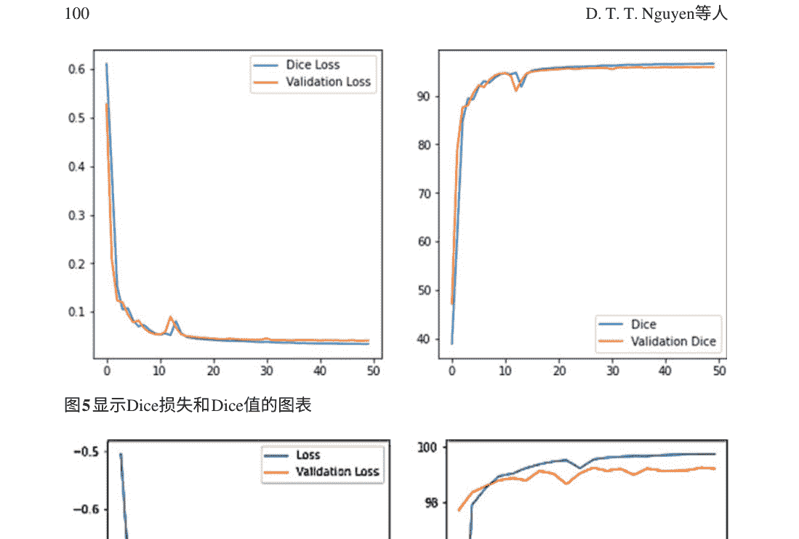

**图5显示Dice损失和Dice值的图表**

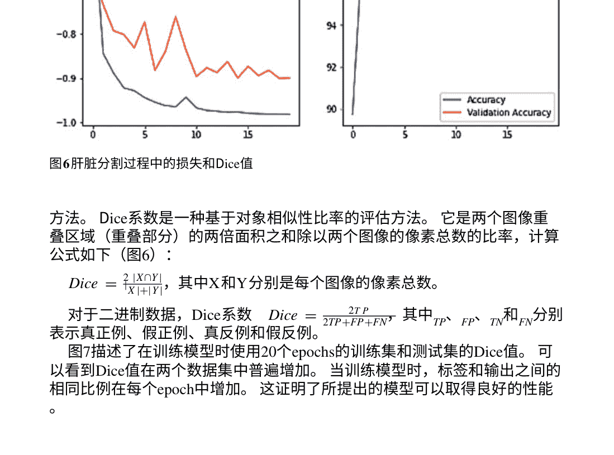

**图6肝脏分割过程中的损失和Dice值**

方法。 Dice系数是一种基于对象相似性比率的评估方法。 它是两个图像重叠区域（重叠部分）的两倍面积之和除以两个图像的像素总数的比率，计算公式如下（图6）：

```
Dice = \frac{2|X \cap Y|}{|X| + |Y|}，其中X和Y分别是每个图像的像素总数。
```

对于二进制数据，Dice系数 $Dice = \frac{2TP}{2TP + FP + FN}$，其中 $TP$、$FP$、$TN$ 和 $FN$ 分别表示真正例、假正例、真反例和假反例。

图7描述了在训练模型时使用20个epochs的训练集和测试集的Dice值。 可以看到Dice值在两个数据集中普遍增加。 当训练模型时，标签和输出之间的相同比例在每个epoch中增加。 这证明了所提出的模型可以取得良好的性能。

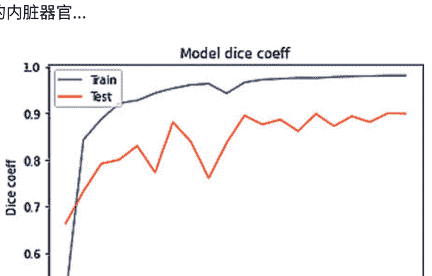

**图7 Dice值的性能**

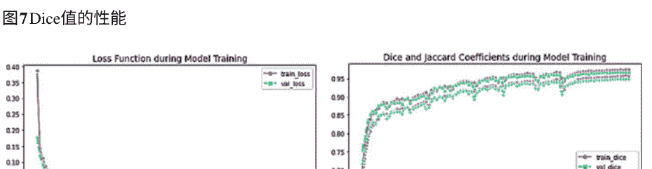

##### 4.2.3 心脏、肺、气管

图8描述了使用Jaccard指数和Dice系数两种评估方法训练模型时的准确性和损失值结果。结果显示，在两种方法中，损失值减少，准确性在100个epochs内增加。由此可见，所提出的模型可以在多部分分割中取得良好的性能。

#### 4.3 与各种分割算法的结果比较

图9显示了在分割问题中常用的三个模型（FCN，SegNet和U-Net）的准确性、召回率（R）、特异性（SP）和Jaccard比率。

从图9的比较结果可以看出，FCN的指标低于其他算法。对于FCN，解码中的细节不足## 图9 肺部分割性能比较

### 图10 模型测试后的结果

处理过程可能导致分割结果不佳。与FCN不同，SegNet记录了最大池化值并更准确地进行上采样。这使得SegNet的分割性能优于FCN。与其他两种方法相比，U-Net具有更好的整体统计结果。U-Net的准确率、召回率和Jaccard指数是最有价值的指标。这些表明与其他算法相比，U-Net的分割效率更好。

在训练模型后进行测试的结果如图10所示。基准图像是没有分割的原始图像，掩膜是图像的标签。预测是进行测试后的估计结果。最后，预测与基准图像结合。

图11 左边是标记的肝脏图像，右边是对应的肝脏图像

至于肝脏，原始数据的图像将不会在这里呈现，因为它使用.nii文件格式的输入图像。相反，预测结果通过训练模型的标签和预测来展示。因为以视频形式呈现的预测结果是从原始输入中预测的图像切片的组合。图11是从预测结果视频中提取的几个切片的结果，因此模型的实际结果与上述代表性图像之间可能存在轻微偏差。

图12是经过处理的心肺气管切割视频的CT图像。左侧跟部的第一张图像是原始CT图像，中间和右侧的图像是2个处理后的图像。在这个图像中，有3种颜色对应于3个重要部分，即蓝色部分。因此，正面将代表肺部，浅红色将对应心脏，气管将对应绿色。

### 5 结论

在这项研究中，我们使用U-Net网络来识别肺部、肝脏和心脏等不同的器官。结果显示识别模型具有相对较高的准确性。这是进一步开展利用机器学习技术识别疾病和异常的研究的基础。研究结果对于机器学习在医学诊断中的应用做出了贡献。它们可以用于简化诊断过程并改善疾病的管理。

传统上，诊断通常由单个医生验证，存在错误的可能性，而机器学习方法可以被视为改善诊断性能的突破。在这种情况下，人工智能系统基于X射线/CT图像提供诊断，然后可以由医生确认，大大减少了人为和机器的错误。因此，与传统方法相比，这种方法可以改善诊断，提高治疗质量。

在未来，我们将开发一种系统，用于在识别的医学图像上检测疾病或异常。将病变分为不同的类别，例如根据其大小和使用不同分类器进行治疗，可以简化。对于所有研究者来说，这个任务可以帮助限制问题。同时，他们正在开发从2D到3D的模型，以便能够看到可用的器官和人体部位。

致谢本研究部分资助来自于芹苴大学，代码：THS2020-60。

### 参考文献

1.  Y. Fu, Y. Lei, T. Wang, W.J. Curran, T. Liu, X. Yang, 基于深度学习的医学图像多器官分割方法综述。物理医学。 85, 107-122 (2021) 。 https://doi.org/10.1016/j.ejmp.2021.05.003
2.  H.Q. Nguyen, K. Lam, L.T. Le, H.H. Pham, D.Q. Tran, D.B. Nguyen, D.D. Le, C.M. Pham, H. T. Tong, D.H. Dinh, 等, VinDr-CXR: 一个带有放射科医生注释的胸部X光开放数据集。科学数据 9(1), 1-7 (2022)
3.  N.H. Nguyen, H.Q. Nguyen, N.T. Nguyen, T.V. Nguyen, H.H. Pham, T.N.M. Nguyen, 一个用于检测异常胸部X光的AI系统VinDr-CXR的临床验证(2021)。 arXiv:2104.02256
4.  H.T. Nguyen, H.Q. Nguyen, H.H. Pham, K. Lam, L.T. Le, M. Dao, V. Vu, VinDr-Mammo: 一个用于全数字乳腺X线计算机辅助诊断的大规模基准数据集(2022)。 https://arxiv.org/abs/2203.11205
5.  S.R. Wu, H.Y. Zhang, F.T. Su, H.C. Liao, W. Zeng, C.C. Liao, F. Lai, F.M. Hsu, F. Xiao, 基于深度学习的放射外科各种脑病变分割 (2020). https://arxiv.org/abs/2007.11784
6.  C. Freschi, V. Ferrari, F. Melfi, M. Ferrari, F. Mosca, A. Cuschieri, daVinci手术遥操作器的技术评估. Int. J. Med. Robot. Comput. Assist. Surg. 9(4), 396–406 (2013)
7.  C. Batailler, A. Fernandez, J. Swan, E. Servien, F.S. Haddad, F. Catani, S. Lustig, MakoCT基于机器人臂辅助系统是一种可靠的全膝关节置换手术: 一项系统性综述. Knee Surg. Sports Traumatol. Arthrosc. 29(11), 3585–3598 (2021)
8.  M. Lefranc, J. Peltier, 对ROSA™脊柱机器人进行微创手术评估. Expert. Rev. Med. Devices 13(10), 899–906 (2016)
9.  M. Santoro, S. Strolin, G. Paolani, G.D. Gala, A. Bartoloni, C. Giacometti, I. Ammendolia, A. G. Morganti, L. Strigari, 人工智能在放射治疗中的最新应用：我们现在和未来的方向。应用科学。 12(7), 3223 (2022). https://doi.org/10.3390/app12073223
10. K. Doi, 医学影像中的计算机辅助诊断：历史回顾、现状和未来潜力。计算机医学成像图形。 31(4–5), 198–211 (2007)
11. R. Agarwal, O. Diaz, M.H. Yap, X. Llado, R. Marti, 全数字乳腺X线照片中的肿块检测的深度学习。 计算生物医学。 121, 103774 (2020)
12. L. Tanzi, P. Piazzolla, F. Porpiglia, E. Vezzetti, 实时深度学习语义分割在术中手术中用于3D增强现实辅助。 计算机辅助放射外科 16(9), 1435–1445 (2021)
13. Hamilton-Basich, M.: RapidAI因AI辅助中风成像和诊断技术而获奖。 AXIS Imaging News (2021)
14. D. Haak, C.E. Page, K. Kabino, T.M. Deserno, 评估用于工作流集成的DICOM查看器软件，在医学成像2015年：PACS和成像信息学：下一代和创新, vol. 9418 (SPIE, 2015), pp. 143–151
15. Y. Zhang, B. Jiang, J. Wu, D. Ji, Y. Liu, Y. Chen, E.X. Wu, X. Tang, 基于深度学习初始化和梯度增强的水平集分割用于肝脏肿瘤的CT图像。 IEEE Access 8, 76056–76068 (2020)

## 基于冲击和加速度传感器的智能文胸和预防性骚扰的通信技术

Linh Thuy Thi Pham, Thinh Phuc Nguyen, Khoi Vinh Lieu, Huynh Nhu Tran和Hai Thanh Nguyen

摘要 性侵犯的创伤可能会留下身体、情感和心理上的伤痕。侵害行为仍然存在于我们的社会中。本研究介绍了一种智能系统，即“安全女孩”（SEGI），它集成在女性的文胸中。该设备使用冲击和加速度传感器识别性骚扰行为，并通过通信技术向受害者的亲属发送警告以寻求支持。它可以帮助警示亲属有关妇女和女孩面临的危险，包括他们处于主动或被动情况下。通知包括以98%的准确率呼叫和发送短信的全球定位系统（GPS）位置。此外，亲属可以确定一个新的位置，如果攻击者故意将受害者带到另一个位置。此外，该设备可以生成一个虚拟围栏，以帮助父母在500米半径范围内接收到关于女孩的警告。该系统采用低成本、易于使用、简单的消息语法部署，并且是妇女安全的创新解决方案，特别是针对青少年。

### 1 引言

根据联合国消除对妇女一切形式歧视委员会（CEDAW）的说法，他们指出“性骚扰包括不受欢迎的性行为，如身体接触，带有性意义的评论，显示或展示性图片，以及性暗示的言语或身体行为。这种行为可能会冒犯荣誉并影响健康和安全。<sup>2</sup>目前，全球范围内和越南境内的性骚扰现象非常普遍，统计数据令人瞩目。在美国，31%的女性工作者和7%的男性工作者表示曾遭受性骚扰。据报道，<sup>3</sup>欧洲有高达40-50%的女性受到骚扰。这一比例在意大利也很明显，14-49岁的女性中有55.4%曾经历过这种情况。特别是，全球范围内有30%的国家没有禁止职场性骚扰的法律，导致近2.35亿女性工作者面临成为受害者的风险。<sup>4</sup>根据报告，在越南，2019年上半年滥用儿童的数量急剧增加，平均每天全国范围内有1400名儿童遭受虐待，每天平均有7名儿童受到虐待。<sup>5</sup>儿童虐待的对象非常多样，包括具有不同资格、年龄和职业的人，包括陌生人和认识孩子的人，家庭中的亲戚；教师和教育机构的工作人员，官员和公务员；退休人员和老年人。超过95%的儿童虐待者是男性。

已经诞生了几种智能设备来保护妇女。每个系统都使用不同的技术来检测女性的不安全感。其中之一是研究GPS定位，以帮助了解被虐待者的位置。或者使用恐慌传感器来了解心率和体温的变化。然而，一些设备过于笨重和不美观，并且电池容量不足以支持一整天的使用，这应该会让用户感到焦虑。

我们的研究提出了一种名为“SEGI”的妇女和儿童支持设备，以保护妇女免受性侵犯。该设备的设计类似于普通的胸罩。当施暴者挤压或拉扯胸罩带子，导致其断裂，或者有推击受害者的动作时，设备将立即拨打电话并将位置发送到亲属的电话号码。此外，亲属可以通过简单的消息语法打开半径为500米的虚拟围栏。如果他们离开指定的半径，设备将通知家人，帮助预防不良情况的发生。同时，亲属可以通过短信轻松删除/更改电话号码并找到设备。警报信号的设置可以通过用户选择和填写的号码进行修改。例如，用户可以填写亲属或警察局的号码（如果警察允许）。通过这项研究，我们希望能够及时发现虐待行为，保护受害者并使施暴者受到法律制裁。

本研究的其余部分组织如下。第2节介绍了主要相关工作。第3节简要介绍了技术要求、产品设计、布线图构建、算法流程图和SEGI的操作原理，第4节展示和分析了获得的结果。最后，我们在第5节总结研究并讨论未来的工作。

<sup>2</sup> https://vbcwe.com/tin-tuc/quay-roi-tinh-duc-noi-lam-viec-va-nhung-con-so-biet-noi/31.
<sup>3</sup> https://www.eeoc.gov/statistics/charges-alleging-sex-based-harassment-charges-filed-eeoc-fy-2010-fy-2021.
<sup>4</sup> https://www.ilo.org/global/topics/violence-harassment.
<sup>5</sup> https://cand.com.vn/Su-kien-Binh-luan-thoi-su/Moi-ngay-can-nuoc-co-7-tre-em-bi-xam-hai-i567171/.

### 2 相关工作

为了增强妇女/儿童的安全性和保障性，实施了一种智能可穿戴设备系统的智能安全解决方案，使用树莓派3 [1]。它既可以作为警报系统，也可以作为安全系统。它为用户附近的人（佩戴智能设备的人）提供蜂鸣器警报。该系统使用全球定位系统（GPS）来定位用户。它使用全球移动通信系统（GSM）/通用无线电分组服务（GPRS）技术，通过短信将用户的位置发送给紧急联系人和警察。该设备还使用与设备接口的USB网络摄像头捕获用户或受害者的袭击图像和周围环境，并在用户在智能可穿戴设备上按下紧急按钮后，将其作为电子邮件警报发送给紧急联系人。

[2]中的智能戒指（SMARISA）包括树莓派Zero、树莓派摄像头、蜂鸣器和按钮来激活服务。这个设备非常便携，受害者可以通过点击按钮来激活，从而获取她的当前位置并通过树莓派摄像头捕获攻击者的图像。位置和图像的链接将通过受害者的智能手机发送给预定义的紧急联系人号码或警察，从而避免了额外的硬件设备/模块，使设备更加紧凑。这个设备的问题是没有考虑到GSM模块，并且开发这样的设备成本高昂。此外，“树莓派”这种迷你电脑也很耗电。由于在一个模块中集成了各种传感器，这些设备可能无法正常工作。传感器可能在任何情况下产生错误的读数，从而激活设备。这些设备的设计过于笨重，无法携带。

在[3]中引入了一种用于女性安全的智能设备，通过使用压力、脉搏和温度传感器来检测可能发生的暴行，并使用异常值检测进行提议。该系统在关键时刻检测并发送警报给亲人，同时附带女性的位置坐标，无需她的互动。此外，它还会自动向亲戚和附近的警察局发送紧急消息。

最近在[4]的研究中指出，印度每29分钟就有一名女性遭到强奸。该研究提出的想法非常有效，因为它可以通过拉动包的手柄或按下按钮来自动激活。这项工作提出了一个数字手提包，将在紧急情况下帮助女性。它由一个连接了树莓派板和Arduino的GPS模块、GSM模块和摄像头模块组成。因此，遇到麻烦的女性可以使用这个设备，甚至伤害攻击者并逃脱。

在[5]中，作者提出了定制的设备，用于学习温度和心跳的个体模式，然后找出生成警报的阈值。因此，本文涉及设计一种可穿戴的女性安全设备，可以在跑步期间自动读取和创建身体温度和脉搏率等模式。如果读数高于正常读数，则会自动呼叫和发送短信给多个人，并附带位置信息，以便采取行动。我们使用温度和脉搏传感器来检测女性的活动。传感器的数据将被发送到云端，在那里应用机器学习算法（逻辑回归）来分析生成的数据。传感器首先在非危险条件下收集数据，以训练算法。之后，数据用于测试以评估准确性和与我们训练数据的接近程度；准确性越高，对危险的确定性越高，并且紧急警报将发送给紧急联系人。第三，本文涉及没有互联网设施的情况。我们使用ZigBee网状网络来解决互联网问题，这有助于设备将数据发送到多个跳跃距离。Kabir等人在[6]中提出了一种基于应用的可穿戴设备。该设备的主要功能是发送短信和受害者的当前位置给最近的警察局和家庭成员。应用界面设计得使地图指示一个安全的位置以应对犯罪袭击。然而，这个设备对于农村妇女来说并不用户友好。许多来自农村地区的女孩对移动应用程序不熟悉，或者可能没有智能手机。然而，这个设备的外形因素太大，不方便携带。另一项研究在[7]中还提出了一个智能移动应用程序BONITAA，该应用程序还具有短信和通过GSM发送位置、健康支持、医疗支持、咨询和自卫技巧等各种功能，以避免强奸受害者遭受强奸。此外，为了解决农村妇女的问题，他们将“孟加拉”语集成到他们的应用程序中，并试图使其用户友好。然而，问题是对移动应用程序不熟悉的女性可能不喜欢这些应用程序的功能。[8]中的作者提出了一种可穿戴设备，以确保妇女的安全，避免性侵犯。该方法还引入了一个移动应用程序。他们使用GSM、GPS（全球定位系统）和集成了微控制器的Wi-Fi模块设计了他们的设备。该设备还可以拨打电话并将位置发送给预先录入的号码或最近的警察局，以避免非法活动。主要问题是该设备需要始终联网以访问Web服务器。他们在构建这样一个设备和移动应用程序上花了很多钱。然而，这对我们社会的每个女性来说都无法负担得起，而且基于应用程序的界面对所有最终用户来说都不灵活。

为了解决这些问题，我们还建立了我们的安全装置来支持妇女和儿童。该装置微小且可以高效地携带日常使用。此外，我们的装置非常经济实惠，各个层次的人都能以合理的价格购买。

### 3 方法

#### 3.1 要求

该装置不会干扰使用习惯，不会过于笨重以避免用户审美上的损失，并且重量轻（越轻越好）。总重量应该不超过1公斤，帮助用户长时间使用。此外，每次电池充电约为5小时，可以在不用充电的情况下至少使用1天，如果平均每天使用8小时上班。如果施虐者故意触碰胸部区域或推倒以实施虐待行为，装置必须自动通过电话和短信向亲属发送警报，并提供GPS位置。反入侵检测准确率必须达到90%或更高。平均时间必须为0.3秒或更短。该产品可以区分跌倒或他人攻击，以避免过多次数地拨打亲属电话。如果受害者被拖到另一个地点，亲属可以确定新的位置。当他们遇到意外问题时，他们可以通过默认的紧急呼叫和短信与亲属紧急联系，只需简单一按，无需携带手机。此外，如果亲属需要更改他们的电话号码，他们可以通过短信语法轻松更改。价格尽可能低以适应越南大多数用户的经济条件。设备在接受10分钟的指导后即可使用。所有女性都可以轻松使用它。

#### 3.2 女性安全设计

SEGI的硬件设计包括一件女性内衣，肤色，尺寸32如图1所示。衬衫内部的电路板设计位于胸部的右侧，以避免影响心脏，包括Arduino Nano板，2个弯曲传感器，MPU 6050倾斜传感器，SIM 800L，GPS，振动马达，2个锂聚合物电池3.7 V-1000 mAh，按钮，电源开关。设备附着在衬衫上后的总重量为280克。

图2显示了系统的电路图设计，包括作为中央处理单元的Arduino Nano板，接收来自SIM 800L的信号进行处理，将信号（数字，PWM）输出到实现振动电机电路、喇叭、扬声器、按钮的设备上。设备的供电包括2块3.7 V-1000 mAh的锂聚合物电池。蓝牙HC 05向Arduino发送一个高电平和低电平的信号。振动电机电路接收手机上的软件发送的蓝牙信号，以打开和关闭按摩功能。FLEX弯曲传感器：当传感器弯曲时，传感器值会发生变化。它将发送一个ARDUINO信号对信号进行编码，并将其发送给SIM 800L和GPS，以向人们发送定位和紧急信号。SIM 800L模块读取紧急按钮的状态。如果按钮被打开，SIM 800L将发送短信和电话给预设的亲属。GPS定位用户坐标。切换到打开和关闭设备。倾斜角度传感器MPU 6050依赖于相对于X/Y轴的倾斜来在必要时发出警告并向SIM 800L发送一个值以向亲属发送求救信号。

所提出的算法流程图如图3所示。当开关打开时，Arduino模块将被初始化，数据输入将被激活，并且Flex传感器输入将持续检查模拟信号是否小于420（这意味着有人对产品进行了扭曲传感器的操作）。如果是，则会触发电话通知亲属并发送GPS坐标。SIM 800L模块将检查是否激活了推按钮（由用户危险地按下）。如果是，则会拨打电话并发送GPS坐标的消息到预设的电话号码。Sim800L接收到#RS#语法将删除先前保存的电话号码。如果错误，则输入#ADMIN#语法将添加新的亲属电话号码。如果错误，则输入#ADR#以打开喇叭并向亲属手机发送GPS坐标。如果收到#ON#语法以打开虚拟围栏，则#OFF#语法将关闭虚拟围栏。默认虚拟围栏半径为500米。倾斜角度传感器将检查x轴值是否小于4000或y轴值<2000，并在5秒后，如果正确，则拨打电话并向亲属发送消息。接下来，GPS检查串行引脚的操作。如果正确，它会输出该时刻的GPS值。如果有错误，它将发送到最近保存的位置。最后，蓝牙模块将检查来自手机应用的信号，如果文本=“F”，则会激活振动马达；否则，文本=“S”将关闭振动马达。

### 4 实验和评估

#### 4.1 操作原理

SEGI产品的设计类似于女士胸罩。因此，要使用该产品，我们像使用其他普通胸罩产品一样穿上衬衫。然后，我们打开电源开关并重置要联系的亲属的电话号码，包括以下步骤：删除以前保存的旧电话号码，使用语法#RS#，并添加新的电话号码，使用语法#ADMIN#。大约3秒后，用于设置亲属数量的电话号码将收到一条“OK！”的消息，这意味着电话号码已成功更改。

我们在3个领带位置使用串联电路进行设计。当一个有不良行为的人想要入侵、故意脱掉衬衫或者挣扎时，开关会断开。此外，假设一个坏人是通过挤压和弯曲Flex传感器来行动的。在这种情况下，SEGI会向家人发送求助请求，包括呼叫和发送GPS坐标的链接，以帮助亲属定位用户的位置并缩短搜索时间，以应对意外情况。此外，SEGI配备了一个SOS紧急按钮。当用户意识到危险正在逼近时，他们会立即按下按钮。设备将立即支持呼叫和发送短信给亲属的号码。如果受害者被转移到新的位置，亲属可以通过向产品中安装的电话号码发送带有#ADR#语法的短信来定位变化，如图4所示。同时，亲属可以拨打sim卡的电话号码，使设备发出声音或通过蜂鸣器提供帮助。

倾斜角度传感器设备有助于检测用户是否摔倒。此外，影响将发送警告给亲属。然而，为了避免误报警系统与正常摔倒不危险，因为开玩笑，我们在3秒后安装它，传感器角度仍然不变，设备将向家人发送警报。SEGI可以生成虚拟围栏。默认半径为500米。如果他们离开该半径，它将通知家人并帮助预防不良情况，帮助家庭成员早期发现并采取预防措施。使用#ON#语法启动虚拟围栏，并使用#OFF#语法关闭围栏。按摩功能通过振动马达支持用户的健康，以避免乳腺疾病。要使用此功能，我们将在手机上安装应用程序，界面如图5所示。然后，打开蓝牙图标以与SEGI设备连接。接下来，要启动按摩，打开第一个ON图标，振动马达开始工作。最后，我们选择中间的OFF图标完成。

#### 4.2 评估

##### 4.2.1 SEGI 设计

该产品采用紧凑设计，重量为220克，外观类似于图6中的普通女性胸罩。电路设计在右侧外套内部，以确保产品的美观性，不影响产品的质量和心脏。所使用的电源容量对应于2000毫安时。因此，如果不使用按摩功能，可以连续使用2天。在衬衫上，有一个电路来显示电池容量。因此，当准备用完容量时，我们可以充电。

##### 4.2.2 GPS定位并向亲属发送求助请求

GPS导航电路GY-NEO 6M V2是使用美国GPS卫星系统进行快速准确定位的全球定位模块。GPS在所有气候条件下工作良好，并且成本低廉。然而，有几个因素可能干扰信号，导致传输时间延迟和准确性降低。例如，您位于高层建筑中，有许多大树和恶劣天气。GPS的坐标精度约为5米。如果由于客观条件导致GPS失去信号，我们已经将最后一次GPS丢失位置保存在EEPROM中。

##### 4.2.3 滥用检测和通知亲属

为了检测滥用，我们使用以下场景测试设备。对于第一个测试用例，在那个人进行攻击之前，用户感到受到威胁：他们可以按下 SOS按钮通知他们的亲属。如果用户突然遭到攻击，导致摔倒：设备可以依靠倾斜角度传感器。如果他们在5秒内无法自己站起来，设备将自动通知他们的亲属。假设用户被挤压在胸部并拉扯胸带。同样，弯曲传感器将检测并自动通知亲属。此外，我们设计了一个基于GPS的虚拟行走功能，该功能设置在用户开始发送消息的位置的半径为500米。如果受害者超出考虑范围的半径，设备将通知亲属。

在通知亲属时，我们设置包括与用户的GPS位置进行电话和短信联系。经过多次实验，我们得到以下结果：设备开始发送命令以接听电话的最慢时间为3.16秒，准确率为98%。1秒后，您将收到带有GPS坐标的消息，测试100次的准确率为100%。然而，有些情况下，GPS位置与当时的坐标不同，原因我们已经解释过了。

对于加速度传感器，我们在大于60℃的角度下安装它，以发出警报。我们通过串口进行测试，并获得数据，如图7所示。如果传感器的高度发生变化，我们不会发出警告，即用户可以站立和坐下。如果他们躺下，他们可以关闭胸罩前部中央的按钮。在某些情况下，亲属需要更改联系电话号码。我们先删除旧的电话号码，然后使用快速且简单的文本语法添加新的电话号码。平均而言，在5秒内，我们可以完成更改号码的工作。此外，为了搜索新设备或用户的位置，在发送消息后，平均接收到GPS位置响应时间为3.45秒。

##### 4.2.4 乳房按摩特性

按摩有助于降低乳房疾病的风险。我们使用一个转速为9000转/分钟的振动电机，通过与蓝牙连接的手机上的应用程序进行控制。所使用的电流为70毫安，因此只消耗很少的电力。我们邀请了10位女性体验这个功能。经过测试，她们在舒适性和易用性方面给出了100%的结果。

#### 4.3 与其他设备的比较

建议的系统应与现有和最新技术进行比较。为了评估所提导航系统的性能，需要考虑几个参数。第一个参数是系统在没有充电的情况下的功耗和运行时间。标准如下：0-0.5 W的功耗被认为是低功耗，0.5-1 W的功耗被认为是中等功耗，高于1 W的功耗被认为是高功耗。第二个参数是响应时间。系统识别和响应0-100毫秒被认为是快速的。平均100-200毫秒和高于200毫秒被认为是慢速的。第三个参数是在危险时能够通知亲人并告知他们的位置。如果重量轻，用户可以长时间轻松佩戴，设备被认为是便携的；否则，被认为是不便携的。

第四个参数是在迷路时找到新的位置（表1）。

| 设备 | 电源 | 响应时间 | 警报 | 便携式 | 找到设备 |
| --- | --- | --- | --- | --- | --- |
| 我们的 | 低 | 快 | 是 | 便携式 | 是 |
| 智能妇女和儿童安全系统[9] | 中等 | 快 | 是 | 便携式 | 否 |
| 通过物联网使用智能可穿戴设备实现妇女安全和保护 | 中等 | 中等 | 是 | 便携式 | 否 |
| 智能鞋用于妇女安全 | 高 | 中等 | 是 | 便携式 | 否 |

我们将我们的性能与3个设备进行了比较。智能妇女和儿童安全系统[9]使用压力传感器。一旦攻击者即将袭击妇女/儿童，就会向购买设备时存储在设备中的父母/监护人的手机号码发送一条带有受害者位置的常规短信，然后拨打电话。如果电话没有被接听，将电话转接给警察。通过物联网使用智能可穿戴设备实现妇女安全和保护[10]类似于智能腰带，当激活时记录传感器值并使用全球定位系统（GPS）跟踪受害者的位置。通过紧急消息将受骚扰的受害者的跟踪位置通知给受害者的联系人。智能鞋用于妇女安全[11]建议一种智能鞋，帮助妇女照顾自己，同时也帮助她们无所畏惧。该项目使用GPS、GSM模块和与树莓派板和Arduino相连的摄像头。通过这些电路的数量，我们估计智能鞋的功耗非常高。

### 5 结论

本文重点关注为女性创建简单、廉价、安全的产品。测试结果显示，该产品在主动和被动情况下对入侵者具有高度准确性，在低延迟呼叫中的准确率达到98%。同时，在发生摔倒、危险或被移动到其他位置时，将GPS定位发送给亲属，仍然可以找到。该产品配备了胸部按摩功能，以舒缓用户。该设备易于使用，用户无需经过任何培训即可熟练使用，但最迟只需几个小时就能适应。未来，团队将改进可拆卸的产品，配备胸罩，以便在使用后可以再次清洗。

### 参考文献

1. D. Sunehra, V.S. Sreshita, V. Shashank, B.U.K. Goud, 基于树莓派的智能可穿戴设备，使用GPS和GSM技术保障女性安全，2020年IEEE创新技术国际会议(INOCON) (IEEE, 2020), pp. 1–5. https://doi.org/10.1109/INOCON50539.2020.9298449
2. N.R. Sogi, P. Chatterjee, U. Nethra, V. Suma, Smarisa: 一个基于树莓派的智能戒指，用于女性安全，使用物联网，在2018年国际发明研究计算应用会议(ICIRCA) (IEEE, 2018), 第451-454页。 https://doi.org/10.1109/ICIRCA.2018.8597424
3. V. Hyndavi, N.S. Nikhita, S. Rakesh, 智能可穿戴设备，用于女性安全，使用物联网，在2020年第5届国际通信和电子系统会议(ICCES) (IEEE, 2020), 第459-463页。 https://doi.org/10.1109/ICCES48766.2020.9138047
4. K. Sagadevan, D.S. Kumar, S. Poonguzhali, A. Sivasangari, G. Ilakiya, S. Ragavi, 数字手提袋的设计，用于女性安全，在2021年第10届国际物联网of Everything, 微波工程, 通信和网络会议(IEMECON) (IEEE,2021)，第01-04页。 https://doi.org/10.1109/IEMECON53809.2021.96891285
5. T. Khandelwal, M. Khandelwal, P.S. Pandey, et al., 使用物联网和机器学习设计的女性安全设备，在2018年IEEE智能世界，普适智能和计算，先进和可信计算，可扩展计算和通信，云和大数据计算，人与物联网和智能城市创新(Smart-World/SCALCOM/UIC/ATC/CBDCom/IOP/SCI)(IEEE, 2018)，第1204-1210页。 https://doi.org/10.1109/SmartWorld.2018.00210
6. A.Z.M.T. Kabir, A.M. Mizan, T. Tasneem, 使用智能手环和CWS应用程序的妇女安全解决方案，在2020年第17届国际电气工程/电子学、计算机、电信和信息技术会议（ECTI-CON）中(IEEE, 2020)。 https://doi.org/10.1109/ecti-con49241.2020.9158134
7. S.R. Mahmud, S.N. Tumpa, A.B. Islam, C.N. Ferdous, N. Paul, T.T. Anannya, BONITAA：一种支持女性强奸受害者的智能方法，在2017年IEEE第10区人道技术会议（R10-HTC）中(IEEE, 2017)。 https://doi.org/10.1109/r10-htc.2017.8289061
8. M.N. Islam, N.T. Promi, J.M. Shaila, M.A. Toma, M.A., Pushpo, F.B. Alam, S.N. Khaledur, T.T. Anannya, M.F. Rabbi, SafeBand，在第16届国际移动计算和多媒体会议上(ACM, 2018)。 https://doi.org/10.1145/3282353.3282363
9. S.K. Punjabi, S. Chaure, U. Ravale, D. Reddy, 智能妇女和儿童安全系统，在2018年IEEE第9届年度信息技术、电子和移动通信会议(IEMCON)(IEEE, 2018)。 https://doi.org/10.1109/iemcon.2018.8614929
10. S. Valli, S. Kameshwari, 利用物联网的智能可穿戴设备保护妇女安全. J. Optoelectron. Laser 41(5), 491–498 (2022)
11. V. Sharma, Y. Tomar, D. Vydeki, 智能鞋保护妇女安全，在2019年IEEE第10届意识科学与技术国际会议(iCAST)(IEEE, 2019)。 https://doi.org/10.1109/icawst.2019.8923204

## 智能盲杖集成超声波传感器和通信技术为视障人士

Linh Thuy Thi Pham, Lac Gia Phuong, Quang Tam Le, 和 Hai Thanh Nguyen

摘要 盲人无法看到也会在道路上移动时遇到困难，很容易与物体碰撞。盲杖是盲人最常用的移动辅助工具，可以让他们独立和安全地移动。本研究介绍了一种智能、简单、经济实惠和友好的盲杖。我们已经部署它来改善盲人和视障人士的移动能力。该系统的主要组成部分是超声波传感器，通过反射波扫描障碍物。障碍物反射的信号被输入到微控制器中。然后，微控制器用于确定盲人周围物体的方向和距离。之后，它可以通过声音和震动告知人们前方障碍物的距离。此外，该系统集成了一个订阅者身份模块卡（SIM800L）、GPS和MPU 6050加速度传感器。当盲人处于危险中时，他或她可以按下紧急呼叫按钮。此外，如果他或她在5秒内没有自控力后摔倒，800L sim卡可以接收到一个关于预先安装的亲属的电话，其中包含他们的GPS位置处于危险中的Google地图链接。同时，当盲人进入气体浓度高或周围有大火的区域时，它也会发出危险警告。

L. T. Thi Pham
越南康蘇科技大學，越南康蘇

L. G. Phuong · Q. Tam Le
越南康蘇FPT高中，越南康蘇FPT大學，電子郵件 : quangltfsc0378@fpt.edu.vn

H. Thanh Nguyen (📧)越南康蘇大學，越南康蘇，電子郵件：nthai.c it@ctu.edu.VN

### 1 引言

根據世界衛生組織（WHO）的數據，全球約有3.14億人失明或視力不佳，其中4500萬人失明，50歲以上的人佔80%。每5秒，世界上就多一個失明的人，每1分鐘，就有一個孩子失明；90%的失明人口生活在貧困和發展中國家，很難獲得醫療服務。與此同時，根據報告2，越南約有200萬視力不佳的人，其中三分之一是無法負擔治療的貧困人口。

视力受损的人无法再看到两只眼睛中的光线，或者只能模糊地辨别光线的照射。盲人无法用眼睛行走，只能摸索前进，对于在房间里寻找物体也是如此。因此，他们在移动时经常感到担心、害怕危险事故和不安全，尤其是在熟悉空间之外的环境中。

然而，盲人也知道如何利用剩余感官提供的关于外界的信号信息，充分利用一切可能的条件。接下来是分析和综合必要的思维和感知，以进行他们的活动。通常，盲人利用所有感官，主要是触觉、听觉和嗅觉，来感知。

在行走时，盲人可以通过这些其他感官同时行走和感知周围环境。然而，为了更安全，他们有时会使用竹杖，这被认为是盲人的必备物品，帮助他们标记往返的路线。他们可以从竹杖中探测障碍物并感知外部环境。研究步行和使用拐杖时的能力，团队发现他们利用脚的感觉来感知路面的坡度、颠簸、慢步和不行走。抬高脚步，从膝盖处摆动拐杖来探测障碍物。这些拐杖通常必须小巧轻便，因为许多视力受损的人身体状况较差，行动缓慢，并且需要平衡设计。

顺便说一下，他们通常使用自己的手，而且他们可以长时间使用它们。以前的研究集中在使用超声波或激光传感器来检测盲人面前的障碍物，通过传输和接收反射波。它会根据检测到的障碍物产生声音或振动，以警告盲人，例如智能白手杖[1]和智能拐杖[2]。或者结合全球定位系统(GPS)[3]与来自摄像头的图像处理相结合。

这些解决方案仍然有许多缺点，例如无法检测下楼梯、水坑和洞。此外，以振动和设计形式向用户提供反馈可能不够美观。当他们摔倒、气体浓度过高或周围有火灾时，不会发出警报。

在本文中，我们提出了一种智能拐杖，具有几个贡献：我们设计了这根手杖来检测障碍物，可以识别并警告楼梯上下、左右。
我们使用两种方式向盲人传递信息。我们在杖子上集成了一个振动马达和一个语音警报播报器来通知用户。
我们在撞到障碍物之前，平均距离不到200厘米的情况下，实现了非常快的响应时间，计算为39毫秒。
在危险时，用户可以通过SOS按钮联系自己的亲人。或者当他们失去意识并丢掉手杖时，系统将自动警告，无需按下按钮。相反，亲属将收到一条警报，其中包含设备上安装的SIM卡的来电，并附带GPS坐标作为Google地图链接。
亲戚们可以通过简单的短信或直接拨打手杖的电话号码来找到丢失的手杖。在必要时可以更改亲戚的电话号码。
当用户所在区域附近存在高浓度的气体或火灾时，会发出危险警告。
该产品重量轻，训练时间不长，外观美观，并且具有足够的动力可以移动一整天。

本研究的其余部分组织如下。第2节介绍了主要相关工作。第3节简要介绍了Safety Stick的技术要求、产品设计、电路图构建、算法流程图和操作原理。然后，第4节展示并分析了所得到的结果。

最后，我们在“结论”中总结了研究并讨论了未来的工作。

### 2 相关工作

为了确保盲人的安全，已经诞生了许多与智能设备相关的研究。例如，这项研究[4]结果是一根具有听觉能力的手杖，可以在移动时检测到障碍物，如坑洼、水坑和火灾，并使用全球定位系统确定位置。研究结果显示，智能白色手杖在非常有效的标准下的有效性为82%；然而，在适用标准下的实用性约为70%。

作者[5]创建了一个系统，通过实施四个基本要素来帮助视障人士升级白色盲杖。首先，使用一个简单的计算机板（树莓派）连接到一个HC-SR04超声波距离传感器的电气设置，该传感器使用超声波测量物体的距离，并通过扬声器向所有者发出语音反馈以提醒附近的物体。此外，使用深度学习算法“YOLO”进行实时物体检测的树莓派摄像头也被使用。最后，这些元素在白色盲杖上的位置位于盲点，以避免所有者发生事故。

作者[6]使用Haar级联方法制作了一个集成工具，用于检测人脸，以确定是否存在人类或其他可能显示94%准确率的障碍物。此外，全球定位系统（GPS）可以帮助盲人显示目的地的方向。然而，在拥挤的情况下，相机会继续拍照，这将影响树莓派的计算负荷。

在[7]中，研究人员将一台具有精确毫米级信号的雷达设备连接到一根白色行走杖上。该设备可以检测障碍物并区分人类与普通障碍物，以预测潜在危险。它通过识别由生理活动引起的胸腔的微小位移来判断人类存在的主要迹象。智能白色拐杖[1]被推荐作为一种先进且经济的行走辅助工具。他们提出的拐杖可以检测障碍物，帮助盲人舒适地导航。他们的设备包括一个ATMega328PU微控制器，四个超声波传感器模块HC-SR04，音频IC-APR33a3，一个振动马达，耳机和电池，具备音频反馈功能。他们的方法通过预先录制的音频信息和触觉反馈（振动）来提醒用户。这根拐杖可以检测坑洞、凹坑、跌倒、楼梯（上下）、低矮障碍物，甚至高于腰部的障碍物。电池仓隐藏在杆内，从而降低了损坏电路的风险，使设备更加紧凑。

此外，该系统提供了一个开关，振动反馈和一个手把上的音频插孔。然而，该系统没有定位方法来找到用户的位置，不能检测迎面而来的车辆和湿滑的地板，也没有火警或烟雾报警器。

作者[8]设计和开发了一种智能拐杖，能够感知和信号化视障人士周围的环境特征。所提出的智能拐杖有两个超声波传感器，用于测量智能拐杖与静止和悬挂物体之间的距离，这些物体被发现是障碍物。当障碍物落在2米的阈值水平内时，执行器会发出警报信号。设计集成了一个摄像头模块ESP-32，用于捕捉物体/人的移动图像和障碍物检测。摄像头模块从PIR传感器接收到启用信号，以捕捉移动物体/人的图像并节省处理器时间。

总的来说，我们发现这些产品和设备往往价格昂贵，并且在盲人使用时不适合其心理生理和习惯。例如，用户指南和指示器通常在背部、肩部和手柄上使用声音和振动信号。此外，笨重、耗能、噪音大的设备会影响人们和用户感知环境的能力。此外，这些研究集中于避障和GPS定位，但没有研究在危险时向亲人发出警告。

## 3 种方法

#### 3.1 要求

该设备不会干扰正常的步行感觉，例如要求用户戴手套或干扰环境声音。

该设备重量轻。总重量应最多为1千克，这样用户可以长时间使用而不会手部疲劳。每次充电约5小时，可以在不必充电的情况下使用1周，如果平均而言，盲人每天步行约30分钟。或者足够的电池容量，以便它们可以在户外持续一整天。

关于障碍物检测准确性：必须大于90% - 障碍物检测时间：小于0.3秒。传感器必须从脚尖向上检测障碍物，直到用户的腹部水平，距离为0.5-2米，以便用户有时间做出反应，不会与远处的物体混淆。

当视力受损者处于危险中时，他们可以通过预设的电话号码呼叫亲属，包括他们的位置坐标在短信中。当手杖丢失时，亲属可以通过手杖上的手机SIM卡帮助找到手杖。

当用户附近有真正的火灾或在高气体浓度区域时，火焰传感器需要检测到火灾并警告他们危险。产品必须是灵活的，其中的组件可以根据需要进行更换或升级。价格尽可能低，以适应越南大多数盲人的经济条件。

设备在培训10分钟后可使用。工具熟练程度可能有所不同，但用户通常可以在不到2周的使用时间内感到自信。所有盲人都可以通过培训轻松使用，适用于成年人和因年龄增长而失明的人。

#### 3.2 设计手杖

盲人手杖的杆长为124厘米，折叠长度为33厘米，管子的外径为13毫米，壁厚为1毫米。手杖材料采用铝合金制成，不氧化，电绝缘，防水，不褪色，易于清洁，防滑，绝缘，重量轻，重量为100克（不带设备），带电源盒重300克。颜色包括红色和白色。手柄弹性绳由橡胶制成，具有回弹性，强拉伸强度和耐老化性的特点。手柄的上端配有柔软且易于更换的手腕带。中控箱采用盒状设计，尺寸为115 × 90 × 55，颜色为白色。ABS塑料材料可防水，并对电源提供良好的保护。设计包括上下两个控制箱。顶部包括1个锂聚合物电池3.7 V–1000 mAh，GPS，SIM 800L，MPU 6050传感器，电池容量显示电路，SOS按钮，亲属重置按钮电话号码，侧面的开/关按钮位于盒子1板Arduino Nano上。底部包括3个超声波传感器，分别放置在前方、左侧和右侧角落，1个气体传感器，1个火焰传感器，1个带有存储卡、扬声器的DFPlayer模块，1个振动电机和1个锂聚合物电池3.7 V-1000 mAh，以及1个Arduino Nano板（Fig. 1）。

图1 安全棒的设计

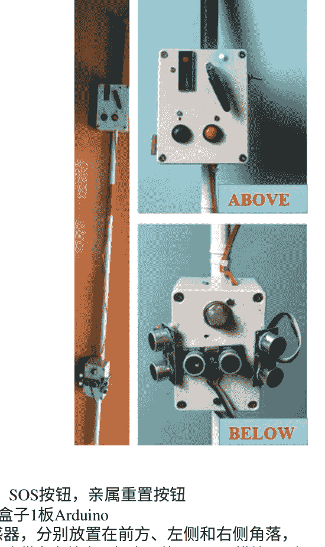

产品的电路图如图2所示，包括Arduino Nano作为中央处理单元，接收来自SIM 800L的信号，处理信号，并输出信号（Digital，PWM）以实现设备（振动电机，蜂鸣器，扬声器）。电源包括2个锂聚合物电池，电压为3.7 V-1000 mAh。当输入为高电平时，Arduino迷你振动电机会震动。

三个超声波传感器，HY-SRF04，发射超声波并测量从发射到返回的时间，以测量当前位置到物体的距离。SIM模块800L读取紧急按钮的状态。如果按钮打开，SIM卡将发送短信和电话给预设的亲属。

GPS将定位盲人的坐标。开关用于打开和关闭设备。加速度传感器基于相对于轴的倾斜来在必要时警告跌倒。当从超声波传感器、加速度传感器或SOS按钮接收到信号时，声音和扬声器电路将被使用。它会发出声音来警告盲人。

图2 安全手杖电路图

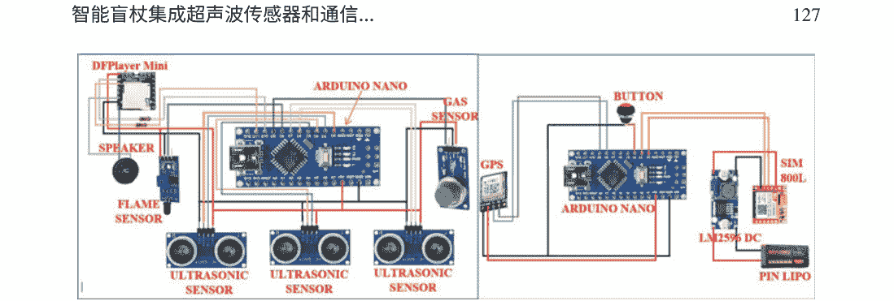

图3 安全手杖工作流程

流程图如图3所示。当开关打开时，Arduino模块将被初始化。输入是超声波传感器，将持续检查障碍物的信号。如果在20到200厘米之间有障碍物，它将激活振动马达和扬声器。大于200厘米的距离被视为超出覆盖范围的区域。将检查火灾传感器输入，如果有火灾，马达将振动，扬声器将工作。SIM 800L模块将检查按钮的激活状态。如果激活，设备将呼叫并发送GPS位置信息给预设的电话号码。此外，当手杖丢失时，亲属可以向SIM800L中的电话号码发送短信。

### 4 实验和评估

#### 4.1 操作原理

我们首先打开棍子上方盒子上的产品电源开关来使用手杖。我们等待大约2秒钟系统启动。

##### 4.1.1 避障功能

该产品包括3个前置超声波传感器。当盲人离障碍物的距离从20到200厘米时，振动电机将工作，并通过扬声器发出声音广播：“障碍物在... 米远”，表示有障碍物。如果障碍物离他们很远（大于2米），电机会震动，扬声器停止工作，因为这个距离对视障人士来说是安全的。

##### 4.1.2 遇到危险时的自动警告功能

1.  他们所在区域发生火灾并且气体浓度很高。
2.  他们摔倒了，但在5秒钟内仍然无法自己站起来。

在警告危险时，我们安装了一个振动电机和一个蜂鸣器，提前向用户发出警报。之后，系统将回拨给亲属，告知他们在图4中显示的危险的GPS坐标信息。此外，用户可以在需要亲属支持时按下SOS按钮。

图4在紧急情况下发送包含GPS坐标的消息


##### 4.1.3 寻找丢失的手杖

当手杖丢失时，亲属可以向安装了SIM800L的电话号码发送文本消息，语法为：#ADR#，亲属将收到手杖丢失的位置坐标。如果亲属丢失或更改了他们的电话号码，他们可以按下重置并发送带有语法#ADMIN#的文本来更改电话号码。

#### 4.2 评估

##### 4.2.1 设计概述

该设备不会干扰视障人士的使用习惯，而且轻便的设计使他们能够长时间使用而不感到手部疲劳。此外，美观的设计，易于使用，不需要太多的培训时间，适用于所有盲人，如老年人和儿童。

##### 4.2.2 检测障碍物和导航

设计中包括1个传感器HY-SRF04，设计在手杖前面，配备舵机，以帮助盲人从多个方向接收危险警告。超声波传感器的优点是处理速度快，结果相对准确。因此，我们在距离手杖20到200厘米之间测试了一个障碍物，所有测试都达到了100%的准确率。然而，它的缺点是由于使用超声波和它们的反射来计算距离和检测障碍物，会产生信号噪音，使得手杖无法停止震动或哨子持续吹响（经过测试后的概率为1%）。在测试中使用不同类型的障碍物，如砖块、木材、软毛巾、玻璃和透明物体（眼镜），进行了10次不同的测试（与手杖脚之间的距离为20-100厘米）。结果如图5所示。

##### 4.2.3 GPS定位功能

我们使用NEO-6N模块来定位盲人的位置坐标。结果快速准确地发送。然而，当盲人处于高层建筑、大树或恶劣天气中时，该设备会受到影响。为了克服这个缺点，我们将信号丢失前的最后位置保存到EEPROM中。

##### 4.2.4 在危险情况下向亲属发送警告和通知

在通知亲人时，我们设置了包括呼叫和发送短信与用户的GPS位置。经过多次实验，我们得到以下结果：设备发送命令接收呼叫的最慢时间为3.25秒，准确率为98%。1秒后，您将收到带有GPS坐标的消息，测试50次准确率为100%。然而，有些情况下GPS位置与当时的坐标不同，原因我们已经解释过。图6是我们在一个危险警告SOS按钮测试中记录的。

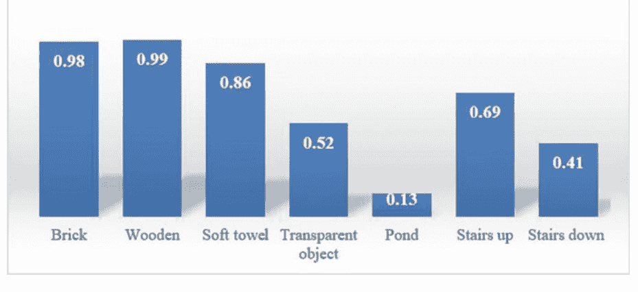

```
16:12:35.174 -> AT
16:12:36.117 -> ATD0919470174;
16:12:51.147 -> ATH
16:12:52.177 -> AT
16:12:53.159 -> AT+CMGF=1
16:12:54.187 -> AT+CSCS="GSM"
16:12:55.218 -> AT+CMGS="0919470174"
16:12:57.228 -> https://www.google.com/maps/place/10.013114,105.731347
16:12:58.303 ->
```

##### 4.2.5 寻找丢失的棍子

当亲戚向预设的电话号码发送具有指定语法的短信时，他们可以收到一条显示丢失棍子位置的消息，以及一个Google链接地图。在50个测试案例后，平均时间为3.35秒，准确率为100%。

##### 4.2.6 关于火灾和高温区域的危险警告

该产品安装了一个使用红外线光头的火灾传感器（红外线光头从电箱中露出）。通常，传感器会识别周围环境中的红外线，如果有暗红光线，即光源波长在760-1100纳米范围内，将会向用户发出警报。然而，当传感器暴露在过高的温度下时，很容易损坏。为了确保，我们的团队使用距离在1到100厘米范围内的打火机进行了小火花测试。所得结果的平均准确率为95%，平均响应时间为22μs。

##### 4.2.7 功率容量

手杖使用2节锂聚合物电池3.7 V-1000 mAh。超声波传感器电流消耗为40mA，Arduino Nano板40 mA，SIM800L待机10 mA，GPS Neo 6 M 67 mA，MPU 6050加速度计3.6 mA，以及其他一些材料范围从5到40 mA。因此，盲人可以连续操作手杖超过1天。对于盲人来说，这足够的时间进行户外活动。可重复使用的可充电电池以节省用户。

为了评估这根手杖的性能，我们对实际受益者（经过培训和未经培训的）盲人进行了测试。在越南坎塔省的学校里，有六个盲人进行了实验，其中两个接受了使用手杖的培训，另外四个没有。

在实验过程中，要求盲人穿过测试区域，该区域内放置了5种不同类型的障碍物，包括石头、树木、台阶、玻璃门和水坑，距离为15米。首先，记录用户的行走速度。接下来，测量经过培训和未经培训的人成功穿过障碍物所需的时间，如图7所示。然后，我们计算经过培训的用户的平均速度为0.77 m/s，未经培训的用户为0.45 m/s。相比之下，视力正常的人的行进速度为（1.4 m/s）。这个结果表明，培训用户在行进速度上提高了两倍，并增加了用户在自由路径上避免障碍物的信任。

图7 安全杆的性能和准确性

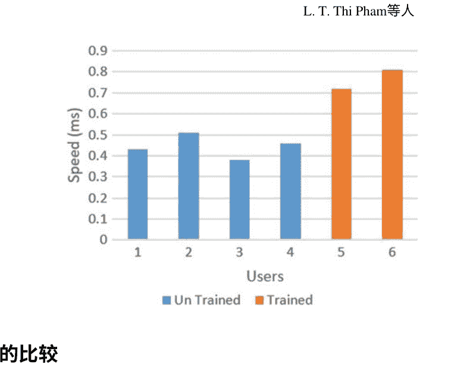

#### 4.3 与其他设备的比较

所提出的系统应与现有和最新技术进行比较。应考虑几个参数来评估所提出的导航系统的性能。第一个参数是检测范围。可以认为能够在0-2米范围内发现障碍物的工具是低范围设备，2-4米为中等范围，而大于4米被认为是高范围。第二个参数是响应时间，0-100毫秒的系统感知和响应被视为快速，100-200毫秒为中等，大于200毫秒为慢速。第三个重要的参数是系统的功耗以及在没有充电的情况下能够工作多长时间。考虑以下评级：电力消耗为0-0.5瓦被视为低功耗，0.5-1瓦为中等消耗，大于1瓦为高消耗。第四，如果设备重量轻，用户可以轻松佩戴它一段时间，那么它是便携式的。它被认为是不可携带的。第五个参数是在杆子丢失时找到它。用户通常将手杖保持在站立或倾斜的位置。如果手杖掉落，也会被计算为需要警告的摔倒。因此，我们比较的第六个参数是摔倒警告。

我们将我们的性能与3个设备进行了比较。第一个提出了一种低成本的智能手杖，使用GPS [9]，包括两个传感器：水传感器、超声波传感器和一个微控制器（Arduino Uno R3）来接收传感器信号。RF模块帮助找到手杖是否在一定范围内丢失。手机中的GPS导航系统可以用来指导盲人找到任何地方。我们还与一个盲人导航系统 [10] 进行了比较，其中包括一个用于检测2m内障碍物和坑洞的超声波传感器。此外，GPS和ESP8266 Wi-Fi模块被用于与云端共享位置。MQ2气体传感器用于检测路径中的火焰，RF Tx/Rx模块用于找到智能手杖的位置。第三个比较的是一种振动和语音操作的导航系统，用于视障人士 [11]，使用一个超声波设备用于确定障碍物的范围，并通过微控制器相应地行动。该系统通过语音提示和振动警告系统来发出警告。比较结果显示在表1中。

表1 提出的安全棍与其他棍子的比较

| 产品 | 检测范围 | 时间响应 | 警报 | 便携式 | 找到棍子 | 跌倒警告 |
| :--- | :--- | :--- | :--- | :--- | :--- | :--- |
| 我们的 | 中程 | 快 | 是 | 便携式 | 是 | 是 |
| 开发成本低的智能拐杖与GPS [9] | 中程 | 快 | 否 | 便携式 | 是 | 否 |
| BlinDar [10] | 中程 | 快 | 否 | 便携式 | 是 | 否 |
| 振动和语音操作导航系统 [11] | 低 | 低 | 否 | 便携式 | 否 | 否 |

### 5 结论

本文重点设计了一种简单、低成本的盲人导航智能拐杖。通过测试，该产品在检测用户附近的障碍物、火灾和危险气体方面表现出高度准确性（最高准确度小于2米）。此外，该产品通过SOS按钮拨打电话的准确率达到98%，延迟较低。从按下按钮到拨打电话的平均时间为3.25秒，共进行了50次测试。同时，在跌倒、危险或丢失拐杖时向亲人发送高精度的GPS定位。由于该产品的简单性，亲属或视力受损的人只需接受少量培训即可熟练使用，最多只需几个小时。未来，我们将开发更多材料以避免障碍物，如玻璃、木材、滑面和警示楼梯下降。此外，还将集成更多的摄像头模块，以便了解盲人遇到的问题，供家人在家中监控。该产品在越南芹苴市残疾儿童学校的学生进行了测试。

### 参考文献

1.  R. Sheth, S. Rajandekar, S. Laddha, R. Chaudhari, 智能白色手杖-一种优雅且经济的行走辅助器。美国工程研究杂志 3(10), 84-89 (2014)
2.  M.P. Agrawal, A.R. Gupta, 盲人和视觉受损人士的智能手杖，在2018年第二届发明通信和计算技术国际会议(ICICCT)(2018), pp. 542-545
3.  M.P. Agrawal, A.R. Gupta, 盲人和视觉受损人士的智能手杖，在2018年第二届发明通信和计算技术国际会议(*ICICCT*)(IEEE, 2018), pp. 542–545
4.  Y. Imam, M. Hanafi, M. Yasin, S. Yuyus, W. Sapto, H. Zainudin, 等，基于网络的湿地区盲人或视觉受损人士的智能白色手杖 (2021)
5.  A. Carranza, A. Baez, J. Hernandez, H. Carranza, H. Rahemi, 树莓派和白色手杖集成，用于辅助视障人士，在国际控制、动态系统和机器人学会议(Avestia Publishing, 2022). https://doi.org/10.11159/cdsr22.126
6.  A. Abdurrasyid, I. Indrianto, M.N.I. Susanti, 脸部检测和全球定位系统用于盲人行走辅助器，在电气工程和信息学通报 (Avestia Publishing, 2022). https://doi.org/10.11591/eei.v11i3.3429
7.  E. Cardillo, C. Li, A. Caddemi, 毫米波雷达手杖：具有移动人体识别能力的盲人辅助器。IEEE J. Electromagn., RF Microw. Med. Biol. 1–8 (2021). https://doi.org/10.1109/jerm.2021.3117129
8.  T.L. Narayani., M. Sivapalanirajan., B. Keerthika., M. Ananthi., M. Arunarani, 设计智能手杖与集成相机模块为视障人士，在2021年国际人工智能和智能系统会议 (*ICAIS*)(IEEE, 2021). https://doi.org/10.1109/icais50930.2021.9395840
9.  F. Ahmed, Z. Tasnim, M. Rana, M.M. Khan, 开发低成本智能手杖与GPS，在2022年*IEEE*世界人工智能物联网大会 (*AIoT*)(2022), pp. 715–724
10. Z. Saquib, V. Murari, S.N. Bhargav, BlinDar: 一个无形的眼睛为盲人使生活变得更容易与物联网 (IoT),在2017年第二届*IEEE*国际电子、信息与通信技术近期趋势会议 (*RTEICT*) (IEEE,2017). https://doi.org/10.1109/rteict.2017.8256560
11. N. Mahmud, R. Saha, R. Zafar, M. Bhuian, S. Sarwar, 震动和语音操作的导航系统，用于视觉障碍者，在2014年国际信息学、电子学和视觉会议(*ICIEV*)(IEEE, 2014). https://doi.org/10.1109/iciev.2014.6850740

## 使用U-Net对乳腺癌X射线图像中的异常区域进行分割

Nguyen Hoang Phuong, Ha Manh Toan, Nguyen Van Thi, Ngo Le Lam, Nguyen Khac-Dung, 和 Dao Van Tu

摘要 我们使用U-Net对乳腺癌X射线图像中的异常区域进行分割。乳腺癌X射线图像数据集由越南国家癌症医院的放射科医生收集，包括三个图像类别：正常、良性和恶性。医院的放射科医生标记了数据集的图像，并对良性和恶性图像的病变进行了定位。 我们使用乳腺癌X射线图像数据集训练U-Net模型，以便对图像中的良性和恶性肿块进行分割，以可视化图像中的良性和恶性区域。 正常、良性和恶性类别的图像被转换为PNG 16位格式。 在模型训练之前，进行数据预处理。

我们水平翻转R-CC和R-MLO视图的图像，使所有乳房图像都朝左。 然后，我们沿着乳房边缘进行探测，裁剪图像。 然后，将该图像调整为512 ×512像素。 我们的网络平均Dice系数为0.74357。我们将模型预测的分割掩模与医生的标注掩模进行了比较。 结果显示分割模型表现良好。 最后，我们的系统将分割结果与热图结果相结合，以获得更多关于异常区域定位的支持信息。

- U-Net · 异常区域
- 乳腺癌
- X射线图像

N. H. Phuong (✉)
人工智能部门，信息技术学院，长龙大学，Nghiem Xuan Yem Road, Hoang Mai District, Hanoi, Vietnam
e-mail: nhphuong2008@gmail.com

H. M. Toan
越南科学技术学院信息技术研究所，河内，越南 e-mail: hmtoan@ioit.ac.vn

N. Van Thi · N. Le Lam · N. Khac-Dung · D. Van Tu
越南国家癌症医院，30 Cau Buou, Tan Trieu, Thanh Tri, 河内，越南
e-mail: khacdung.nguyen@bvk.org.vn

D. Van Tu
e-mail: daovantu@hmu.edu.vn

### 1 引言

在乳腺癌筛查中，异常肿块的定位有助于乳腺癌放射科医生在读取X射线时定位良性和恶性肿块在患者诊断和治疗中的位置。不同的定位方法，如分割、热图和边界检测，用于完成这个任务。每种方法都有其优点和缺点。因此，分割方法为放射科医生提供了最多的信息。这些信息包括图像空间中恶性和良性区域的相对位置，并详细描述了肿瘤和正常组织区域之间的边界。

但是，当客观区域与周围区域对比时，分割方法通常表现出色。因此，在某些小型和低对比度客观区域的情况下，一些方法可能得分较低。乳腺癌X射线图像就是这种情况。为了支持异常区域的定位信息，我们在系统中将分割结果与热图结果相结合。热图通常是帮助用户观察感兴趣对象可能出现的位置的工具，帮助他们对要查看的地方有一个初步的了解。在诊断辅助的背景下，热图也是为医生提供额外视角的好选择，即使它的区分能力不如分割结果那么强。为了在乳腺癌X射线乳房X射线图像中将异常区域可视化为良性和恶性，我们提出了一种使用U-Net对乳腺癌X射线图像中的异常区域进行分割的方法。我们使用越南国家癌症医院放射科医生提供的乳腺癌X射线图像数据集进行模型训练，其中包括良性和恶性定位。

总结一下，本文的主要贡献有：

- 我们构建了一个包含正常、良性和恶性类别的图像数据集。
- 我们在这个图像数据集上训练了一个 U-Net 模型，用于分割良性和恶性肿瘤，以可视化乳腺癌 X 射线图像中的受伤区域。
- 我们通过结合分割和热图结果来可视化异常区域。

本文的其余部分组织如下：第 2 节回顾了一些相关工作。第 3 节介绍了乳腺癌 X 射线图像中异常区域的分割模型。第 4 节描述了模型评估，第 5 节给出了一些结论。

### 2 相关工作

关于使用全连接网络（FCN）对语义图像进行分割的深度学习网络的一些初步工作在[13]中描述。FCN 由许多卷积层组成，输入为一张图像，输出为与输入相同大小的分割结果。这项工作扮演了第一项工作的角色训练卷积神经网络进行像素级预测。这项工作还通过端到端方法为图像分割建立了基础。刘[14]的ParseNet是其中一项工作，通过将全局语义信息添加到FCN中进行了改进。在医学中，FCN被应用于一些医学问题，如脑肿瘤分割[15]、皮肤病变分割[16]和虹膜分割[17]。这些工作侧重于将FCN应用于特定的上下文，如使用级联框架的FCN或无需预处理和后处理的要求。一些用于医学图像分割的模型是基于FCN和编码器/解码器架构开发的。例如，U-Net：用于生物医学图像分割的卷积网络[18]和V-Net：用于生物医学图像分割的卷积网络[19]。U-Net是通过修改和扩展FCN来处理少量训练图像并产生更精确的分割结果。一些其他工作使用U-Net架构来分割不同的图像模态。例如，在[20]中，周志华等人使用了嵌套的U-Net架构进行医学图像分割，在[21]中，O. Cicek应用了3D U-Net来学习稀疏注释的密集体积分割。关于乳腺癌问题，Vargas等人[10]提出了一种在乳腺腺体中识别占位性病变的方法。在这项研究中，原始图像经过算术统计滤波器和基于阈值技术和区域增加器的分割算法进行处理。Ittannavar等人[11]的另一项研究是使用多级多目标电磁仿真优化算法对乳腺X线图像中的肿块进行分割，具有增强的鲁棒性以保持图像细节并适应局部上下文的优点。在这项研究中，作者使用了两个乳腺X线图像数据集DDSM和MIAS。

展示客观区域外观的另一种方式是基于热图的本地化。这种方法是一种技术，它使用与输入图像相似大小的图像来描述数字图像中感兴趣区域的位置和大小，其中这个图像通过像素点的颜色来表示该像素处病变发生的概率。这种颜色表示等同于概率图像，其中每个像素的值表示关于感兴趣对象发生可能性的警告。Phuong等人[1]提出了一种使用深度学习网络进行补丁分类生成热图的方法，应用于乳腺癌X射线图像的背景中。

### 3 乳腺癌X射线图像异常区域分割模型

#### 3.1 数据收集和标记

收集和标记数据是训练深度神经网络(DNN)模型的首要任务，因为它使DNN模型能够准确分类乳腺异常区域。图1展示了两位放射科医生使用PMR工具定位异常边界。

本研究使用的乳腺癌X射线图像数据集由越南国家癌症医院的放射科医生收集。 它包括三个图像类别：正常、良性和恶性。 数据集中的每个图像都属于四个标准视图中的一个，这四个标准视图用于乳腺X射线筛查：R-CC（右头尾位）、L-CC（左头尾位）、R-MLO（右斜位）和L-MLO（左斜位）。 医院的放射科医生使用医院的PRM软件对良性和恶性图像的病变进行定位。 目前，放射科医生收集的正常、良性和恶性图像总数为3431张，其中包括1898张正常图像、821张良性图像和712张恶性图像。

#### 3.2 预处理和模型训练

首先，在数据清洗过程中需要清理原始收集的数据：不合格、重复和无关的图像将被排除在深度神经网络模型之外。 数据清洗对于提高数据质量至关重要，并需要较长的处理时间。 输入数据是DICOM乳腺癌X射线图像。 这些正常、良性和恶性类别的图像被转换为PNG 16位格式。 随后，这些图像通过预处理过程实现。 数据预处理过程如图2所示。

首先，我们水平翻转R-CC和R-MLO视图的图像，以使乳房始终位于图像的同一侧。其次，通过图像处理技术将乳房区域划分开：我们沿着乳房边缘进行探测来裁剪图像。然后，将该图像调整为512 × 512像素。

1. 步骤1：我们将R-CC和R-MLO视图的图像水平翻转，以使所有乳房图像都朝向左侧。
2. 步骤2：我们检查从放射科医生那里收到的医院DICOM图像；如果有任何字母，如L-CC、R-CC、L-MLO、R-MLO或任何其他“噪音”，那么我们会“清理”上述字母。
3. 步骤3：我们通过沿乳房边缘探测来裁剪图像，以保留用于模型训练的最大乳房区域。
4. 步骤4：然后，将该图像调整为512 × 512像素，以适应大量用于模型训练的图像的深度神经网络模型。
5. 步骤5：最后，对每个图像进行归一化处理。

归一化图像的公式如公式1所示。

表1 数据集分为训练集、验证集和测试集。

| 训练集 | 验证集 | 测试集 |
|--------|--------|--------|
| 2741张图像 | 343张图像 | 347张图像 |

$$X_{i,j}norm = \frac{x_{i,j} - \mu}{\delta} \quad (1)$$

在方程1中，图像中有一个像素，μ和δ是图像中所有像素的均值和标准差。

对于模型训练，数据集被划分为训练集、验证集和测试集，比例为80:10:10，如表1所示。

#### 3.3 U-Net模型训练

U-Net是由Ronneberger等人开发的一种用于生物医学图像分割的架构。在图3中，该架构由多个层组成，形成了编码器-解码器设计。在这个架构中，低层和高层通过连接来利用空间信息。U-Net由两个对称的U字形分支组成，因此被称为U-Net。U-Net的架构由左部分和右部分组成。

每个部分都将实现其特定任务。编码器部分压缩特征，解码器执行上采样过程。在这项研究中，DynamicUnet的结构使用了Fastai库[2]。编码器使用ResNet 18架构实现，并通过ImageNet进行预训练。解码器部分使用PixelShuffle技术[3]生成与编码器相对应的上采样。

U-Net的输入是一张图像，输出是一个掩膜图像，其中每个像素都由具体类别标记。在这种情况下，输入是一张512 × 512像素的图像，输出是一张512 × 512像素的图像，输出图像的每个像素在{0,1,2}中取值。值为1表示良性，值为2表示恶性，值为0表示其他情况。

对于训练过程，掩蔽图像是从放射科医生对输入数据的分割结果生成的。图4显示了训练集和验证集在训练过程中损失值的变化图。从图中我们可以观察到，在第30个时期，训练过程达到了一个优化位置；之后，验证损失没有显示出下降的迹象。因此，第30个时期的模型是最优的，并且该模型用于测试集上的实验。每个时期的训练时间约为15分钟。

### 4 模型评估

训练好的模型在测试集上进行评估，以衡量模型的质量。这一步的输出是一个Dice指标，用于评估模型的质量。我们已经进行了实验，对预定义的分割任务测试集上的模型进行了测试。对于乳房模型[4]，我们的模型在测试集上实现了0.743457的平均Dice分数。更多细节请参见表2。结果显示分割模型表现良好。对于癌症区域分割任务，模型质量通过将模型预测的分割掩模与医生的注释掩模在像素级别上进行比较来评估。选择Dice分数指标来评估分割。

表2 测试集上的评估结果

| 指标 | 良性 | 恶性 | 其他 | 平均 |
| :--- | :--- | :--- | :--- | :--- |
| Dice | 0.647619 | 0.598147 | 0.984606 | 0.743457 |

这三个标签的Dice分数存在一些差异，其原因可能来自数据集中良性和恶性区域的不平衡。此外，正常区域的数量远大于良性和恶性区域。我们将回顾一些研究，以讨论医学背景下的Dice更多内容。在[10]中，作者使用半自动方法，对乳腺癌MRI图像的分割任务生成的最大Dice分数为0.92。在这里，有必要指出Dice是一个取值介于零和1之间的指标，当其值最接近1时，该指标越好[12]。在医学图像分割的背景下，这意味着当Dice为1时，手动分割和自动分割匹配，当Dice为零时，它们不匹配。从这个意义上说，通常在医学例行工作中，Dice超过0.75是好的。图5显示了恶性分割结果的一个例子。

在图5中，从左到右，(a)是输入图像，(b)是模型预测的分割掩模，(c)是医生的注释掩模。有一些方法来可视化病变区域，例如分割、热图或使用矩形。在大多数情况下，分割是最有意义的选项之一。如图5所示，我们可以轻松比较预测结果与医生的结果，即使我们需要边界上的细节。Dice分数值为0.853164，这是一种用于比较模型预测的分割掩模与医生的注释掩模的度量。

Dice通过公式 \(Dice = \frac{2|X \cap Y|}{|X|+|Y|}\) 计算，其中X是分割掩模中的白色图像点，Y是医生的注释掩模中的白色图像点。

最后，为了支持异常区域定位信息，我们将分割结果与基于热图的异常区域定位结果[1]结合在我们的系统中。图6展示了乳腺癌X射线中异常区域的一个示例，结合了分割和热图结果。

在图6中，从左到右：(a) 是输入图像，(b) 是分割掩模，(c) 是异常区域定位的热图图像。乳腺癌图像分割对于在X射线图像中标记异常发现的每个像素至关重要，以便检测和分割病变。乳腺癌X射线中异常区域定位的分割结合热图方法有助于医生确定疾病的特定区域，并提取详细信息以进行更准确的诊断。

### 5 结论

本文提出了一种使用U-Net对乳腺癌X射线图像中异常区域进行分割的方法。国家癌症医院的放射科医生已经开发了正常、良性和恶性类别的图像数据集。我们使用国家癌症医院放射科医生提供的乳腺癌X射线图像数据集来训练U-Net模型，以对良性和恶性肿块进行分割。对于乳腺癌区域分割任务，通过将模型预测的分割掩模与医生的注释掩模在像素级别进行比较来评估模型质量。选择Dice分数指标来评估分割模型。我们的模型在测试集上达到了0.743457的Dice分数。结果显示分割模型表现良好。最后，为了在乳腺癌X射线图像中可视化良性和恶性区域的更多信息，我们结合分割和热图方法进行乳腺癌异常区域定位。它有助于放射科医生确定乳腺癌图像的特定区域。

致谢 这项工作得到了项目KC-4.0-18/19-25的支持“基于乳腺癌X射线图像和病理图像的智能系统辅助乳腺癌诊断的研究”。我们感谢美国奥本大学的Anh Nguyen教授对本工作的建议。

### 参考文献

1.  N.H. Phuong, H.M. Toan, L.T. Linh, N.N. Cuong, B.M. Hanh, 乳腺癌X射线图像中癌症区域的弱监督定位，在《生物医学和其他软计算应用》中，由N.H. Phuong、V. Kreinovich编辑（Springer，瑞士洛桑），即将出版
2.  J. Howard, S. Gugger, Fastai: 一种用于深度学习的分层API。信息 **11**，108（2020年）。 https://doi.org/10.3390/info11020108
3.  W. Shi, J. Caballero, F. Huszár, J. Totz, A.P. Aitken, R. Bishop, Z. Wang, 实时单图像和视频超分辨率使用高效的子像素卷积神经网络，在计算机视觉和模式识别IEEE会议论文集 (2016), pp. 1874–1883
4.  L.R. Dice, 物种之间生态关联程度的度量。生态学 **26**(3), 297–302 (1945)
5.  P. Jaccard, 高山带植物区系的分布 1. 新植物学家。 **11**(2), 37–50 (1912)
6.  T.T. Tanimoto, 一种基本的分类和预测数学理论。内部IBM技术报告 (1958)
7.  https://docs.opencv.org/4.x/d5/da/tutorial_py_histogram_equalization.html
8.  G. Cao, L. Huang, H. Tian, X. Huang, Y. Wang, R. Zhi, 通过改进的自适应伽马校正增强亮度失真图像。计算机与电子工程。 **66**，569–582(2018)
9.  V. Yeghiazaryan, I. D. Voiculescu, 用于评估医学图像分割的边界重叠度量的家族。J. Med. Imaging **5**(1), 015006 (2018)
10. S. Vargas, M.I. Vera, M. Vera, J. Salazar-Torres, Y. Huarfano, O. Valbuena, E. Gelve-Almeida, 使用混合计算策略在乳腺中识别占位病变。J. Phys.: Conf. Ser. **1414**(1), 012016 (2019), IOP Publishing
11. S.S. Ittannavar, R.H. Havaldar, 使用多级多目标电磁优化算法在乳腺X线照片中分割乳房肿块。BioMed Res. Int.(2022)
12. A. Anaya-Isaza, L. Mera-Jiménez, J.M. Cabrera-Chavarro, L. Guachi-Guachi, D. Peluffo-Ordóñez, J.I. Rios-Patiño, 用于乳腺X线照片中乳房肿块分割的当前深度卷积神经网络的比较。IEEE Access **9**, 152206–152225 (2021)
13. J. Long, E. Shelhamer, T. Darrell, 用于语义分割的全卷积网络，在计算机视觉和模式识别的IEEE会议论文集中, (2015),pp. 3431–3440
14. W. Liu, A. Rabinovich, A.C. Berg, Parsenet: 更广泛地看到更好的（2015）arXiv:1506.04579
15. G. Wang, W. Li, S. Ourselin, T. Vercauteren, 使用级联各向异性卷积神经网络进行自动脑肿瘤分割，在国际MICCAI脑损伤研讨会（Springer，柏林，2017年），第178-190页
16. Y. Yuan, M. Chao, Y.C. Lo, 使用Jaccard距离的深度全卷积网络进行自动皮肤病变分割。IEEE Trans. Med. Imaging **36** (9), 1876-1886 (2017)
17. N. Liu, H. Li, M. Zhang, J. Liu, Z. Sun, T. Tan, 在非合作环境中使用全卷积网络进行准确的虹膜分割，在2016年国际生物特征学会议（ICB）(IEEE，2016年)，第1-8页

18. O. Ronneberger, P. Fischer, T. Brox, U-net: 生物医学图像卷积网络分割, in 国际医学图像计算与计算辅助干预会议 (Springer, Cham, 2015), pp. 234–241

19. F. Milletari, N. Navab, S.A. Ahmadi, V-net: 用于体积医学图像分割的全卷积神经网络, in 2016年第四届三维视觉国际会议 (IEEE, 2016), pp. 565–571

20. Z. Zhou, M.M. Rahman Siddiquee, N. Tajbakhsh, J. Liang, Unet++: 一种用于医学图像分割的嵌套U-Net架构, in 医学图像分析和多模态学习支持临床决策的深度学习 (2018), pp. 3–11

21. T. İşık, A. Abdulkadir, S.S. Lienkamp, T. Brox, O. Ronneberger, 3D U-Net: 从稀疏注释中学习密集体积分割, in 国际医学图像计算与计算辅助干预会议 MICCAI 2016 (2016), pp. 424–432

## 为什么闪光射线治疗效果好：一个可能的解释

Julio C. Urenda, Olga Kosheleva, Vladik Kreinovich, 和 Nguyen Hoang Phuong

摘要 通常，癌症放疗会持续10到20分钟。从技术上讲，可以更快地传递剂量，但传统上，医生们不愿意这样做，因为他们担心这种快速治疗的负面影响。然而，最近的实验表明，这些担忧是没有根据的；而且，在更短的时间内传递整个放射剂量对患者更有益。在本文中，我们提供了一个可能的几何解释这个经验现象。

### 1 问题的阐述

放射治疗是什么：简要回顾。放射治疗是对肿瘤施加辐射的最有效的方法之一。传统放射治疗：简要介绍。传统上，每个放射治疗会持续10到30分钟。从纯工程的角度来看，可以更快地施加相同的总辐射剂量。然而，传统上，医生们不愿意过快地施加这个剂量，因为他们担心每小时辐射的不良副作用。

J. C. Urenda · V. Kreinovich (通信作者) 德克萨斯大学埃尔帕索分校计算机科学系，500 W. University, El Paso, TX 79968, 美国 e-mail: vladik@utep.edu
J. C. Urenda e-mail: jcurenda@utep.edu
O. Kosheleva 德克萨斯大学埃尔帕索分校教育学系，500 W. University, El Paso, TX 79968, 美国 e-mail: olgak@utep.edu
N. H. Phuong 人工智能部门，信息技术学院，长龙大学，Nghiem Xuan Yem Road, Hoang Mai District, Hanoi, Vietnam

FLASH 放疗。 最近，事实证明这些担忧不仅是没有根据的：当整个放射剂量在几秒钟内发送时，非常快速的放疗似乎比传统放疗效果更好。

具体来说，动物实验表明这种 FLASH 放射治疗实际上减少了对周围健康细胞的不良影响；参见，例如，[1,2]和相关参考文献。这些结果使得 FLASH 放射治疗成为癌症治疗的一种有希望的方法。

问题。 我们如何解释这些意外的实验结果？

本文的主要内容。 在本文中，我们为 FLASH 放射治疗的成功提供了一个可能的解释。

### 2 我们的解释

让我们用精确的术语来阐述这个问题。 放射治疗会话的主要目标是传输总辐射剂量 $D_0$。 我们如何做到这一点可以用一个描述在这个会话期间已经传输了多少辐射的函数 $D(t)$ 来描述（从本节开始计时）。

我们从时间 $t = 0$ 开始，此时已经传输的剂量为0： $D(0) = 0$。 在每个时间点，我们只能增加更多的辐射，所以这个函数是（非严格）递增的：如果 $t \leq t'$，则 $D(t) \leq D(t')$。 在会话结束时，我们应该有 $D(t) = D_0$，并且这个数量应该保持不变直到下一个会话。

由于时间直到下一次会议的时间通常比会议的持续时间要长得多，因此在描述当前会议时，忽略这个距离现在太远的未来会议，并假设函数 $D(t)$ 对于所有非负值 $t$ 保持等于 $D_0$。在这些条件下，选择适当的计划意味着选择一个（非严格）递增的函数 $D(t)$，其中 $D(0) = 0$。

极限 $D(t) = D_0$

有许多这样的函数，我们应该选择哪一个？ 非正式地说，我们应该选择这些函数中最好的，问题是如何用精确的术语来描述“最好”。

如何用精确的术语描述“最好”： 一般情况。 通常，“最好”意味着某个目标函数达到了最大（或最小）可能的值。然而，这并不是描述最优性的最一般方式。 例如，如果你有两个不同的剂量具有相同的治愈效果，合理地利用这种非唯一性来优化其他方面是合理的： 例如，最小化负面副作用的可能性。 在这种情况下，不再使用原始的单一目标函数 $f(a)$，我们有一个更复杂的方案，当一个替代方案 $a$ 比另一个替代方案 $b$ 更好时，要么 $f(a) > f(b)$，要么 $f(a) = f(b)$ 且 $g(a) < g(b)$ 对于某个其他函数 $g(a)$。

如果这个更复杂的方案仍然选择了几个替代方案，我们可以利用这个非唯一性来优化其他方面，直到达到只有一个最优替代方案的最终最优性标准。

关于这种更一般的优化设置，我们唯一能说的是，对于任意两个备选项 $a$ 和 $b$，我们应该能够决定 $a$ 是否比 $b$ 更好（我们用 $a > b$ 表示），或者 $b$ 是否比 $a$ 更好（我们用 $b > a$ 表示），或者 $a$ 和 $b$ 具有相同的质量（我们用 $a \sim b$ 表示）。这些关系 $a > b$ 和 $a \sim b$ 应满足自然的一致性要求：例如，如果 $a$ 比 $b$ 更好，$b$ 比 $c$ 更好，那么 $a$ 应该比 $c$ 更好。因此，我们得到以下定义。

定义1 设 $A$ 为一个集合。它的元素被称为备选项。

- 如果 $a > b$ 且 $b > c$，则 $a > c$；
- 如果 $a > b$ 且 $b \sim c$，则 $a > c$；
- 如果 $a \sim b$ 且 $b > c$，则 $a > c$；
- 如果 $a \sim b$ 且 $b \sim c$，则 $a \sim c$；
- 如果 $a > b$，则我们不能有 $a \sim b$。

- 我们说一个替代方案 $a_{opt}$ 相对于最优性准则 $(> \sim)$ 是最优的，如果对于每个 $a \in A$，我们要么有 $a_{opt} > a$，要么有 $a_{opt} \sim a$。
- 如果存在一个替代方案是相对于这个准则最优的，我们称之为最终准则。

在我们的情况下，替代方案是什么。在我们的情况下，替代方案是不同的（非严格）递增函数 $D(t)$，其中 $D(0) = 0$，且 $D(t) \to D_0$ 当 $t \to \infty$。

定义2 让 $D_0$ 是一个常数。通过 $D_0$-替代，我们指的是一个（非严格）递增函数 $D(t)$，其中 $D(0) = 0$，并且 $D(t) \to D_0$ 当 $t \to \infty$。

自然不变性。对于这个过程，没有固定的时间单位相关，因此如果我们使用不同的计量单位来测量时间，要求最优性标准不会改变是有意义的。

如果我们知道原始尺度上的依赖关系 $D(t)$，那么在新尺度上这种依赖关系会是什么样子？如果我们用一个 $\lambda$ 倍大的新计量单位替换原始计量单位，则新尺度上的时刻 $t$ 对应于原始尺度上的时刻 $\lambda \cdot t$。例如，如果我们用分钟替换秒——它们是60倍大，那么在新尺度上的2分钟等于 $2 \cdot 60 = 120$ 秒。

一般来说，新尺度中对应于时刻 $t$ 的值 $D_{new}(t)$ 等于原始尺度中时间描述下的值 $D(\lambda \cdot t)$。因此，$D_{new}(t) = D(\lambda \cdot t)$，我们得到以下定义。

### 3

定义3 设 $D_0$ 为实数。

- 对于每个 $\lambda > 0$ 和每个 $D_0$-替代 $D(t)$，通过 $\lambda$ 缩放 $R_{\lambda}(D)$，我们指的是一个 $D_0$-替代 $D_{\text{new}}(t)$ 定义为 $D(\lambda \cdot t)$。
- 如果对于每个 $\lambda > 0$ 和每两个 $D_0$-替代 $a$ 和 $b$，我们有以下情况，则称所有 $D_0$-替代的最优性准则是尺度不变的：
    - 如果 $a > b$, 那么 $R_{\lambda}(a) > R_{\lambda}(b)$, 并且
    - 如果 $a \sim b$, 那么 $R_{\lambda}(a) \sim R_{\lambda}(b)$。

主要结果。 现在，我们准备阐述我们的主要结果。

命题。 设 $D_0$ 是一个实数，且 $(<, \sim)$ 是一个关于所有 $D_0$-备选项的最终尺度不变的最优性准则。 那么，最优的 $D_0$-备选项具有形式 $D(t) = D_0$ 对于所有 $t > 0$。

讨论。 这个结果解释了一个经验事实，即即时（“闪光”）放射疗法确实能够获得最佳的医疗效果。

证明 1°。 首先，我们证明对于每一个关于所有 $D_0$-备选项的最终尺度不变的最优性准则，最优的 $D_0$-备选项 $D_{\text{opt}}$ 本身也是尺度不变的，即， $R_{\lambda}(D_{\text{opt}}) = D_{\text{opt}}$ 对于所有 $\lambda > 0$。

事实上，根据定义，$D_{\text{opt}}$ 是最优的意味着对于每一个 $D_0$-替代 $D$，我们要么 $D_{\text{opt}} > D$，要么 $D_{\text{opt}} \sim D$。对于每一个 $D_0$-替代 $D$ 来说，这是真的，因此，这个属性对于 $R_{\lambda^{-1}}(D)$ 也成立，即，我们要么 $D_{\text{opt}} > R_{\lambda^{-1}}(D)$ 或 $D_{\text{opt}} \sim R_{\lambda^{-1}}(D)$。由于最优性准则是尺度不变的，我们可以得出结论，要么 $R_{\lambda}(D_{\text{opt}}) > R_{\lambda}(R_{\lambda^{-1}}(D)) = D$，要么 $R_{\lambda}(D_{\text{opt}}) \sim R_{\lambda}(R_{\lambda^{-1}}(D)) = D$。对于所有的 $D_0$-替代 $D$ 来说，这是真的。因此，根据最优性的定义，这意味着 $D_0$-替代 $R_{\lambda}(D_{\text{opt}})$ 也是最优的。然而，我们假设我们的最优性准则是最终的。这意味着只有一个最优的 $D_0$-替代方案，因此 $R_{\lambda}(D_{\text{opt}}) = D_{\text{opt}}$。该陈述已被证明。

2°。 现在让我们使用本证明的第一部分的结果来证明命题，即证明最优的 $D_0$-替代方案具有所需的闪存形式。的确实等式 $R_{\lambda}(D_{\text{opt}}) = D_{\text{opt}}$ 意味着这两个函数的值在所有 $t$ 上都相等。根据 $\lambda$-缩放的定义，这意味着对于每个 $t$ 和每个 $\lambda > 0$，我们有 $D_{\text{opt}}(\lambda \cdot t) = D_{\text{opt}}(t)$。特别地，通过取 $\lambda = s > 0$ 和 $t = 1$，我们得出结论，对于每个 $s > 0$，我们有 $D_{\text{opt}}(s) = D_{\text{opt}}(1)$。因此，函数 $D_{\text{opt}}(s)$ 对于所有 $s > 0$ 都达到相同的常数值 $D_{\text{opt}}(1)$。特别是对于 $s \to \infty$，我们有 $D_{\text{opt}}(s) \to D_{\text{opt}}(1)$。根据 $D_0$-替代的定义，这个极限必须等于 $D_0$。因此， $D_{\text{opt}}(1) = D_0$，因此对于所有的 $s > 0$，我们有 $D_{\text{opt}}(s) = D_0$。命题得证。

## 为什么FLASH放射治疗高效：一个可能的解释

致谢 这项工作部分得到了国家科学基金会的支持1623190（计算机专业实践新一代变革模型）以及HRD-1834620和HRD-2034030（CAHSI包括），以及AT&T信息技术奖学金的支持。它还得到了伏尔加联邦区科学教育数学中心发展计划的支持，编号为075-02-2020-1478，并得到了匈牙利国家研究、开发和创新办公室（NRDI）的资助。

### 参考文献

1. B. Lin, F. Gao, Y. Yang, D. Wu, Y. Zhang, G. Feng, T. Dai, X. Du, FLASH 放射治疗：历史和未来，在《肿瘤学前沿》第11卷，论文号644400（2021年）
2. P. Montay-Gruel, M.M. Acharya, O. Gon alves Jorge, B. Petit, I.G. Petridis, P. Fuchs, R. Leavitt, K. Petersson, M. Gondr, J. Ollivier, R. Moeckli, F. Bochud, C. Bailat, J. Bourhis, J.F. Germond, C.L. Limoli, M.C. Vozenin, FLASH-RT 作为一种有效的治疗方法，可减少小鼠脑胶质母细胞瘤的神经认知副作用。临床癌症研究，27（3），775–784（2021年）

## 数据增强技术超声图像乳腺肿瘤分割任务评估

Trang Minh Vo, Thien Thanh Vo, Tan Tai Phan, Hai Thanh Nguyen, 和 Dien Thanh Tran

摘要 定期进行身体检查和评估当前健康状况是保护健康的最佳方法之一。通过这样，我们可以知道是否有任何健康问题，并及时提供治疗计划，如果发现问题。在大多数情况下，早期诊断和疾病检测非常重要，尤其是对于癌症。乳腺癌是一种严重且非常常见的妇女疾病。然而，如果早期发现该疾病，治愈的机会非常高。基于深度学习的分割方法已被引入用于检测乳腺癌肿瘤，但我们面临着数据限制的挑战。尽管已经提出了一些数据增强方法，但应进一步考虑增加样本的数量。本研究通过亮度和旋转的数据增强技术，对超声图像进行了不同比例增加样本的效率进行了研究。数据增强通过使用U-NET进行乳腺癌诊断的分割任务，提高了性能。实验结果表明，旋转技术可以提高训练和测试阶段的平均性能。

### 1 引言

超声在疾病诊断和治疗中非常重要，是一种安全、无创的方法。在许多情况下，超声是首选，支持医生进行筛查和准确诊断。不幸的是，癌症目前是全球健康关注的主要问题之一。总体上，癌症发病率和死亡率正在增加。迅速在世界各地传播。目前，肿瘤疾病相当普遍。癌症是一种危险的疾病，影响健康并有很高的死亡概率，需要早期检测和及时治疗，以帮助患者有合理的治疗方法。特别是乳腺癌是许多妇女关心和学习筛查的疾病。早期筛查提供了治疗的良好机会，有些癌症甚至有治愈的机会。在肿瘤检测中起重要作用的一个工具是成像。乳腺癌将成为世界上最常见的诊断癌症。预计2022年，将有43,250名妇女和530名男性死于乳腺癌。乳腺癌发生在男性和女性身上，但乳腺癌最常见于50岁以上的女性。此外，该疾病可以从母亲传给孩子。因此，除了补充足够的营养物质，保持活跃和健康饮食外，还有必要定期进行健康检查以筛查疾病。

在越南，乳腺癌在女性中排名第一。近年来，全球乳腺癌的发病率以及越南的发病率都有所增加。胸部肿瘤可以通过注意到的症状来检测，通常使用超声、X射线和MRI等支持成像技术来诊断疾病。随着现代科学技术的进步，技术越来越多地主导着人类的各种活动，帮助优化高精度的工作，支持人们的活动，并积极地生活。特别是随着人工智能的发展，成像工具在疾病的筛查、早期诊断、监测和治疗中发挥着越来越重要的作用。癌细胞的形状决定了肿瘤是良性还是恶性。数据增强技术与乳腺图像分析中的一些算法的性能改进有关。例如，在[1]中，作者使用生成对抗网络和卷积神经网络结合裁剪技术。另一项研究[2]尝试使用Unet进行各种器官的分割数据增强技术。然而，对于乳腺肿瘤超声图像的Unet和增强技术的使用，特别是对于亮度方面，仍然有限。因此，我们的研究通过使用Unet进行一些数据增强技术的探索，做出了以下贡献。

- 我们在乳腺癌诊断中使用U-net网络架构时，研究了各种数据增强技术的效果。
- 对乳腺超声图像数据集进行数据增强，包括亮度和旋转变换，增加了生成图像的比较数据。结果表明，通过旋转进行数据增强，模型可以更稳定，性能更高，过拟合现象更少。
- 我们还尝试使用数据增强技术对图像进行不同的缩放。从结果中可以看出，在测试集上性能有所提高。然而，随着增长率增加25%，性能在测试集上逐渐提高，并且与50%的百分比性能增加相比，性能提高显著。在原始数据集中，780个样本的平均结果为测试=89%（0.890）。

数据增强后，936个样本和1092个样本的平均测试结果分别为89.6%（0.896）和94%（0.940）。

本文的其余部分组织如下。首先，在第2节中，我们将讨论几个相关的医学图像分析方法的研究。之后，第3节详细介绍了我们的架构和算法。随后，第4节将解释我们系统的实验。最后，我们将总结我们研究的关键特点和发展方向（第5节）。

### 2 相关工作

Necip Cinar, Alper Ozcan, Mehmet Kaya [3] 提出了一种用于脑肿瘤分割的混合Dense-Net121 U-Net模型。最近，研究人员提出了不同的MRI技术，以便上传和可视化图像，旨在使用深度学习MRI图像来分割脑肿瘤。U-Net架构是深度学习网络中的一种，与预训练的Dense-Net121架构一起用于分割过程。在模型的训练和测试过程中，我们专注于组成复杂结构的肿瘤的较小子区域。实验结果表明，我们的模型在这个特定领域的表现优于其他最先进的方法。具体而言，使用所提出的方法分割整个肿瘤（WT）、核心肿瘤（CT）和增强肿瘤（ET）时，获得了最佳的Dice相似系数（DSC）。[4]中的工作提供了专家级的产前复杂先天性心脏病检测。先天性心脏病是最常见的先天性残疾。胎儿筛查超声提供了五个心脏视图，可以检测到90%的复杂先天性心脏病。使用来自1,326个回顾性心脏超声和筛查超声的107,823张图像，从18到24周的胎儿中创建了一个神经网络，用于识别推荐的心脏成像并区分正常心脏和复杂心脏。

在[5]的工作中，在分类和分割自然图像和计算机视觉任务方面取得了显著的结果。然而，医学图像面临着分割任务需要地面真实性的挑战。因此，本研究提出并开发了一种从超声图像中分割乳腺病变的自动方法，只使用了少量标记图像。所提出的U-NET模型采用了GELU激活函数，并在包括310个良性和310个恶性病例的620个乳腺超声图像上进行了测试。定量分析包括准确率、损失函数、Dice相似系数和精确度。定性分析比较了原始图像、掩膜、图像预测和输出结果、掩膜预测二值图像。所提出的U-NET模型优于先前的方法，达到了99.62%的DSC、3.01%的损失、98.15%的准确率和91.82%的精确度。此外，作者还确定了对原始U-NET模型进行的一些创新。[6]中的作者提出了一个完全自动的分割算法，包括一个模糊的、完全卷积的网络和精确的微调。

作者信息：
| 作者 | 单位 |
|---|---|
| J. C. Urenda · V. Kreinovich (通信作者) | 德克萨斯大学埃尔帕索分校计算机科学系，500 W. University, El Paso, TX 79968, 美国 e-mail: vladik@utep.edu |
| J. C. Urenda | e-mail: jcurenda@utep.edu |
| O. Kosheleva | 德克萨斯大学埃尔帕索分校教育学系，500 W. University, El Paso, TX 79968, 美国 e-mail: olgak@utep.edu |
| N. H. Phuong | 人工智能部门，信息技术学院，长龙大学，Nghiem Xuan Yem Road, Hoang Mai District, Hanoi, Vietnam |基于乳房解剖约束的后处理。在第一部分中，图像通过对比增强进行预处理，并采用小波特征进行图像增强。然后，模糊隶属函数将增强的乳房超声图像转换为模糊域。卷积层的元素也使用模糊逻辑进行处理。条件随机场对分割结果进行后处理。最后，利用乳房解剖层之间的位置关系来提高性能。所提出的方法应用于包含325张乳房超声图像的数据集，并与现有过程相比，实现了90.33%的真阳性率，9.00%的假阳性率和81.29%的交并比（IOU）的最新性能。

Li等人[7]提出了一种用于乳房超声图像中乳腺肿瘤分割的两步深度学习框架，只需要少量手动标签。Wang等人[8]提出了一种结合主动轮廓模块和深度学习对抗机制的分割框架，用于分割乳腺肿瘤病灶。变形U-Net对乳腺超声图像进行像素级分割。主动轮廓模块对肿瘤病灶边缘进行细化，细化结果为变形U-Net提供了损失信息。因此，变形U-Net能够更好地分类边缘像素。所提出的乳腺超声图像肿瘤病灶分割方法获得的Dice系数为89.7%，准确率为98.1%，精确度为86.3%，平均交并比为82.2%，召回率为94.7%，特异度为98.5%，F1分数为89.7%。

在[9]中，作者提出了一种基于U-Net框架、结合残差块和注意机制的乳腺肿瘤超声图像分割方法。实验结果表明，所提出的方法可以可靠地学习实际复杂乳腺肿瘤超声图像的分析和处理，作为医务人员的可靠医学诊断辅助，并且所提出的方法的Dice指数值可以达到0.921。在[10]的工作中，对所提出的扩展训练方法进行了创新，以获得扩展的U-Net。在[11]的研究中，需要正确观察患者和症状的适当治疗，并且需要一个自动预测系统来对肿瘤进行良性或恶性分类。作为一种通用的卷积神经网络，它的作用主要集中在图像分类上，其中输入是一张图像，输出是一个标签。生物医学案例使我们能够判断疾病是否发生并定位异常部位。

U-Net致力于解决这个问题。这项研究提出了一种基于U-Net的架构，用于在组织病理学图像中分割肿瘤区域。所提出的方法在较少的数据集上给出了94.2的整体准确率。在[12]的调查中，对乳腺X线摄影图像的大量数据增强进行了分析。

### 3种方法

本研究评估了在乳腺超声图像分割任务中，使用不同图像尺寸的数据增强的效果，如图1所示。首先，从分辨率为500×500的原始图像开始，我们将原始图像缩小到192 × 192。然后，我们分别对训练集进行亮度和旋转等数据增强技术，然后将其输入分割模型中，以比较这两种技术的效率。具体细节如下。

### 图1 所提出方法的整体工作流程

#### 3.1 数据增强

医学影像中监督式深度神经网络的一个主要限制是需要大量注释的数据集。尽管当前的数据增强方法在提高深度学习网络性能方面非常有效，但并不包括复杂的变换。然后，通过数据增强将提取的数据变异性传递给小型数据库，以训练基于深度学习的分割算法。与常规的数据增强技术[13]相比，观察到了显著的改进。

数据增强是深度学习中常用的训练网络的方法。对于目标检测任务，数据增强方法包括随机翻转、随机裁剪等。对于语义分割任务，数据增强包括亮度、缩放、图像翻转、旋转、随机饱和度转换等，基于深度学习的许多多任务网络已经被提出。然而，对于多任务数据增强，现有的方法只能采用一些简单的方法。

#### 3.2 使用U-Net进行图像分割

图像分割是图像处理和分析的重要部分之一，根据特定的特征和属性[15]对感兴趣区域（ROI）进行标准分割。在图像工具类别中有许多有效的分割方法。在超声成像的情况下，由于噪声或模糊的模式，通信方法有时无法正常工作。在医学中，图像分割可以帮助医生从X射线图像、超声图像等诊断肿瘤；它不仅告诉我们肿瘤在图像上的位置，还告诉我们肿瘤的形状，如图2所示。图像分割在医学中经常被使用，并且是图像处理中的重要步骤。医学影像学的重大进展为医生提供了探测人体结构、功能和病理的强大而非侵入性的技术[16]。医学图像分割的目标是定义感兴趣区域（ROI），如肿瘤和病变。

U-Net是一种著名的神经网络架构，主要用于图像分割，并为每个像素输出一个标签。U-Net架构的结构基础由两个路径组成。第一条路径是获取路径的编码或解析，与解析网络正常的供应类型信息相同。第二个被称为解码器或路径合成器，其中包括来自编码器的特征的开关和连接。这种宽度允许网络搜索信息的类型。此外，路径扩展还增加了输出的分辨率可以移动到层底部的显示区域以生成完整的分割图像。结果几乎对称，呈U形。大多数联合会的实施是将整个图像分割为单个标签。U-net是一个旨在分割医学图像的初创设计，在医学工作流程中广泛使用，如图3所示，例如X射线图像、MRI图像、超声图像[17]。此外，U-net网络应用端到端训练进行医学图像分析。作为卷积神经网络中最重要的语义分割框架之一，U-net在医学图像分析中起着非常重要的作用。主要思想是将具有固定大小的图像进行尺寸缩减，使其符合显示区域的大小，并生成相应图像的缩略图以提取更深层次的图像特征。然后，使用上采样来放大图像，并通过复制和裁剪融合下采样和上采样的每个层特征。最后，U-net网络的一个重要优势是在上采样部分具有许多特征通道，使网络能够将上下文信息传播到更高分辨率的层次[18]。

表1 原始数据集和使用不同技术生成的增强图像数据集

| | 原始数据 | 增强25%样本 | 增强50%样本 |
| :--- | :--- | :--- | :--- |
| 总样本数 | 624 | 780 | 936 |
| 原始训练集 | 780 | 936 | 1092 |
| 增加的图像 | 0 | 156 | 312 |
| 增加比例 | 0 | 0.25 | 0.5 |

### 4 实验结果

#### 4.1 环境设置

我们的研究基于Python编程语言，使用TensorFlow、Keras、Numpy和Open CV-python等开源库，超参数包括批量大小为16，256、128、64、32、16个过滤器的数量，过滤器大小为3×3，分别对应第一、第二、第三、第四、第五层，运行100个epochs。 算法在Py-Charm上运行，这是一个专为Python设计的集成开发平台，可直接通过Web浏览器运行Python代码，适用于机器学习研究、数据分析材料和教育。

#### 4.2 数据描述

2018年收集的数据集包括600名年龄在25-75岁的女性的780张乳腺超声图像。 平均图像尺寸为500 ×500像素，png格式，包括来自NCBI（国家生物技术信息中心）数据库[19]的133个正常样本、487个良性样本和210个恶性样本。此外，我们使用亮度和旋转以不同比例增加了训练集的样本（表1）。

#### 4.3 评估指标

使用5折交叉验证将数据集分为训练集（占大约80%）和测试集（占剩余20%）。 性能评估使用交并比（IOU），即重叠区域面积与并集面积的比值。 这是一种用于评估算法和模型在数据集上的目标识别的度量标准，也被称为Jaccard指数，计算“交集区域”的面积。两个框覆盖在相同两个框的“联合区域”上。在过去几十年中，许多研究都致力于基于大小、形状、位置和对比度来改进检测和分割乳腺肿瘤的效率和鲁棒性。此外，还探索了使用跳跃连接将组归一化与注意力门结合起来，以利用几个突出的显著特征来分割小规模乳腺肿瘤的有效性。因此，IOU越大越好，这意味着交集较大，组件较小（预测标签与真实标签相同）[20]。

表2 使用亮度和旋转技术在数据集上增加了25%的样本（对应156个样本）的训练和测试结果的IOU

| 折叠 | 数据集936个样本（亮度） | 数据集936个样本（旋转） |
| :--- | :--- | :--- | :--- | :--- |
| | 训练 | 测试 | 训练 | 测试 |
| 1 | 0.689 | 0.692 | 0.801 | 0.748 |
| 2 | 0.977 | 0.873 | 0.978 | 0.887 |
| 3 | 0.962 | 0.914 | 0.981 | 0.938 |
| 4 | 0.984 | 0.961 | 0.985 | 0.929 |
| 5 | 0.987 | 0.978 | 0.986 | 0.975 |
| 平均 | 0.920 | 0.884 | 0.947 | 0.896 |

#### 4.4 场景1：各种数据增强技术的比较（亮度和旋转）

从表2的结果可以看出，在将原始数据集中的样本数量从780个增加到936个后，通过亮度和旋转的数据增强技术进行的训练和测试的IOU性能。结果显示，通过旋转生成的图像比亮度具有更高的分割准确性。我们注意到，使用亮度增强的训练可能会导致过拟合。亮度的训练性能高于旋转方法，但测试集的性能相反。通过旋转方法将数据集从780个样本扩展到936个和1092个样本时，分割准确性稳步提高。

#### 4.5 情景2：增强图像数量的比较

接下来是基于IOU的数据增强方法旋转的训练和测试结果，包括对所有三个数据集进行的训练和测试。

表3 使用旋转进行数据增强的D1、D2和D3的IOU训练和测试性能

| 折叠 | 数据集780个样本 | 数据集936个样本 | 数据集1092个样本 |
| --- | :---: | :---: | :---: | :---: | :---: | :---: |
|  | 训练 | 测试 | 训练 | 测试 | 训练 | 测试 |
| 1 | 0.940 | 0.776 | 0.801 | 0.748 | 0.978 | 0.941 |
| 2 | 0.977 | 0.897 | 0.978 | 0.887 | 0.941 | 0.902 |
| 3 | 0.963 | 0.909 | 0.981 | 0.938 | 0.938 | 0.925 |
| 4 | 0.985 | 0.961 | 0.985 | 0.929 | 0.984 | 0.966 |
| 5 | 0.921 | 0.905 | 0.986 | 0.975 | 0.985 | 0.965 |
| 平均 | 0.958 | 0.890 | 0.947 | 0.896 | 0.965 | 0.940 |

图4 使用亮度和旋转进行数据增强的D2的训练和测试结果比较的IOU

原始数据集包括780个样本（D1），一个包括936个样本的数据集，增加率为25%（D2），以及一个包括1092个样本的数据集，增加率为50%（D3）（表3）。

使用旋转的D2的性能优于亮度技术，证明模型分割非常高效。例如，测试数据集936个样本（通过亮度进行数据增强）的IOU平均值=88.4%<数据集936个样本（通过旋转进行数据增强）的IOU平均值=89.6%，这表明通过旋转进行数据增强的模型分割比通过亮度更准确。

图4显示了U-Net在原始数据集和使用旋转进行数据增强的数据集上的性能比较。U-Net在D1、D2和D3上的性能分别为0.890、0.896和0.940。观察到，数据增强可以提高分割的准确性。增加率为25%可以提高0.006的性能，而增加率为50%可以提高0.044的性能。然而，25%和50%之间的差异显著增加（图5）。

### 5 结论

在这项研究中，我们评估了亮度和旋转的数据增强技术，以比较它们的效果。在原始数据集上，我们得到了89%的IoU，而将样本数量增加25%可以稍微提高性能，达到89.6%。我们注意到，通过增加数据比例到50%，结果可以提高到94%。观察到，当增加训练数据时，分区结果的准确性也会提高。同时，通过亮度和旋转比较数据增强方法，结果显示旋转方法优于亮度。然而，研究还存在一些限制，例如尚未使用更大的数据集构建优化模型以提高准确性。

该研究对乳腺肿瘤图像分割非常有用，支持医学影像快速准确的结果。未来，我们计划研究更多方法，并应用更先进的模型来提高通过超声图像进行肿瘤成像的效率。

### 参考文献

- 1. V.K. Singh, H.A. Rashwan, S. Romani, F. Akram, N. Pandey, M.M.K. Sarker, A. Saleh, M. Arenas, M. Arquez, D. Puig, J. Torrents-Barrena, 乳腺肿瘤在乳房X线照片中的分割和形状分类，使用生成对抗网络和卷积神经网络。实验系统应用 **139**, 112855 (2020年)。 https://doi.org/10.1016/j.eswa.2019.1128552.
- 2. T. Nemoto, N. Futakami, E. Kunieda, M. Yagi, A. Takeda, T. Akiba, E. Mutu, N. Shigematsu, 不同器官的U-Net自动分割对样本大小和数据增强的影响。放射物理技术 **14** (3), 318-327 (2021年)。 https://doi.org/10.1007/s12194-021-00630-6
- 3. N. Cinar, A. Ozcan, M. Kaya, 一种用于脑肿瘤分割的混合DenseNet121-UNet模型从MR图像中。生物医学信号处理与控制 **76**, 103647 (2022)。 https://doi.org/10.1016/j.bspc.2022.103647
- 4. R. Arnaout, L. Curran, Y. Zhao, J.C. Levine, E. Chinn, A.J. Moon-Grady, 一组神经网络提供了复杂先天性心脏病的专家级产前检测。Nat. Med. **27(5)**, 882–891 (2021)。 https://doi.org/10.1038/s41591-021-01342-5
- 5. E. Michael, H. Ma, S. Qi, 基于u-NET的超声图像乳腺肿瘤分割模型，在智能系统与计算进展(Springer International Publishing,2022), pp. 22–31。 https://doi.org/10.1007/978-3-031-14054-9_3
- 6. K. 黄, Y. 张, H. 程, P. 兴, B. 张, 具有模糊深度学习网络和乳房解剖约束的乳腺超声图像的语义分割。神经计算 450, 319-335 (2021年)。 https://doi.org/10.1016/j.neucom.2021.04.012
- 7. Y. 李, Y. 刘, L. 黄, Z. 王, J. 罗, 具有明确解剖约束的超声图像中的深度弱监督乳腺肿瘤分割。医学图像分析. 76, 102315 (2022年)。 https://doi.org/10.1016/j.media.2021.102315
- 8. J. 王, G. 陈, S. 陈, A.N.J. Raj, Z. 庄, L. 谢, S. 马, 基于对抗机制和主动轮廓的超声乳腺肿瘤提取。计算方法程序生物医学. 225, 107052 (2022年)。 https://doi.org/10.1016/j.cmpb.2022.107052
- 9. T. 赵, H. 戴, 基于改进的残差U-Net网络的乳腺肿瘤超声图像分割方法。计算智能神经科学. 2022, 1-9 (2022年)。 https://doi.org/10.1155/2022/3905998
- 10. Y. Guo, X. Duan, C. Wang, H. Guo, 基于扩展的u-net的乳腺超声图像分割和识别。PLOS ONE 16(6), e0253202 (2021)。 https://doi.org/10.1371/journal.pone.0253202
- 11. M. Robin, J. John, A. Ravikumar, 使用u-NET进行乳腺肿瘤分割，在2021年第5届国际计算方法和通信会议(ICMC)上(IEEE, 2021)。 https://doi.org/10.1109/iccmc51019.2021.9418447
- 12. P. Oza, P. Sharma, S. Patel, F. Adedoyin, A. Bruno, 用于乳腺X线摄影分析的图像增强技术。J. Imaging 8(5), 141 (2022)。 https://doi.org/10.3390/jimaging8050141
- 13. L. Caselles, C. Jailin, S. Muller, 用于乳腺癌肿块分割的数据增强，在电气工程讲义中(Springer Singapore, 2021), pp. 228–237。 https://doi.org/10.1007/978-981-16-3880-0_24
- 14. P. 黄, Y. 朱, 多任务数据增强方法联合目标检测和语义分割，in2022 国际机器学习和知识工程大会(MLKE)(IEEE, 2022)。 https://doi.org/10.1109/mlke55170.2022.00032
- 15. H. 程, J. 单, W. 鞠, Y. 郭, L. 张, 超声图像的自动乳腺癌检测和分类: 一项调查。模式识别. 43(1), 299–317 (2010)。 https://doi.org/10.1016/j.patcog.2009.05.012
- 16. D. Jayadevappa, S. Kumar, D. Murty, 使用可变形模型的医学图像分割算法: 一项综述。IETE Techn. Rev. 28(3), 248 (2011)。 https://doi.org/10.4103/0256-4602.81244
- 17. O. Ronneberger, P. Fischer, T. Brox, U-net: 生物医学图像卷积网络分割，在计算机科学讲义(Springer International Publishing, 2015), pp. 234–241。 https://doi.org/10.1007/978-3-319-24574-4_28
- 18. N. Siddique, S. Paheding, C.P. Elkin, V. Devabhaktuni, U-net及其变种在医学图像分割中的理论和应用综述。IEEE Access 9, 82031–82057 (2021)。 https://doi.org/10.1109/access.2021.3086020
- 19. W. Al-Dhabyani, M. Gomaa, H. Khaled, A. Fahmy, 乳腺超声图像数据集。Data in Brief 28, 104863 (2020)。 https://doi.org/10.1016/j.dib.2019.104863
- 20. Y. Alzahrani, B. Boufama, 乳腺超声图像分割的深度学习方法，in2021第四届人工智能和大数据国际会议(ICAIBD)(IEEE, 2021)。 https://doi.org/10.1109/icaibd51990.2021.9459074

## 金融应用

## 使用文本挖掘和情感分析进行股票价格预测

阮氏惠妍珠，黎文健，和段忠丰

摘要 利用数据挖掘进行股市分析近年来成为一个有吸引力的研究领域。及时预测股票价格行为将极大地促进投资者的适当决策，提高盈利能力，从而减少可能的损失。本研究旨在探讨深度学习和机器学习的智能技术，以从短期新闻数据中预测股票价格走势。我们从越南三个最大的股票市场收集了1652个股票代码的实际股票价格和短期新闻数据。我们提出了一种新颖的数据增强技术，以丰富标签数据集，平均提高了2.58%的预测结果。通过采用集成技术，我们可以进一步提高模型的测试准确性，至少提高1.84%。最后，实验结果强烈表明，发布后7天的分析通常比发布后3天的分析更好地反映了新闻的影响。

关键词 股市·文本挖掘·新闻情感分析

### 1 引言

股票投资者一直在努力通过分析市场信息获得更好的利润。然而，根据“有效市场假设”（EMH）[1]，市场被认为对任何给定的新闻都会立即做出反应，因此股票价格会遵循随机漫步，基本上是不可预测的。然而，在[2, 3]中，研究表明金融市场分析师和投资者通常更关注制定买卖策略，而不是预测股票价格。鉴于这一前提，研究兴趣已经转向设计方法来预测未来的股票趋势而不是股票价格。

在最近的二十年里，人工智能技术一直在不断发展，取得了杰出的成就，模拟了智能行为，其中许多已被证明是足够甚至超越人类能力的。股票投资领域可以从这些技术中受益，因为处理大量数据的一种可能解决方案是使用自动人工智能分析及时预测股票趋势。

使用文本挖掘进行股票行为预测已成为一个吸引人的研究领域，该领域使用智能技术或机器学习进行了大量的股票预测调查。其中一些方法通过采用模糊理论[4]、人工神经网络[5]和支持向量机(SVM)[6]等方法来解决股票预测问题，这些方法都是基于时间序列数据的。还提出了各种基于不同类型文本数据（如新闻[7]、博客文章和评论[8]以及推文[9]）的股票分析方法。

在各种文本挖掘任务中，情感分析涉及将文本数据分类为积极、消极和中性情感，以确定人们对研究对象的态度[10]。文本预处理也是文本挖掘中的重要任务，其中包括去除HTML标签、句子分词、名词短语化[11]、文档加权、停用词去除、词干化/词形还原[12]、TF-IDF以及命名实体提取等常见步骤。

我们的贡献是提出了一种基于短新闻预测股票趋势的新方法。其他有关越南股票的文章研究了金融媒体网站上的金融文章标题，而不是短新闻[13, 14]。此外，由于这些文章标题可能已经包含了反映情感的形容词（例如“Vinh Hoan (VHC)：2020年8月1日收入达到500亿越南盾，出口市场同时增长良好”），这些作者首先从数据中分析情感，然后对股票趋势进行分类。在我们的工作中，我们直接从数据中对价格趋势进行分类，因为在我们的模型中，“好、坏、中性”情感与我们分类的趋势标签相对应。

我们的贡献如下：第2节描述了我们的数据收集。我们在第3节中解释了我们的增强方法，以丰富标签数据。第4节讨论了深度学习和机器学习模型的开发，以预测股票价格趋势，其中我们的集成方法在第4.4节中详细说明。实验结果在第5节中进行了检验。最后，我们在第6节中提供了简要的讨论和展望。

### 2 数据收集

股票是由股份公司发行的证书，是记账分录或电子数据，证明持有人在发行公司中拥有相应的所有权。股票主要在股票交易所出售。

| Stock | Sector | Stock market | Amount |
|---|---|---|---|
| YTC | CTCP Xuất nhập khẩu Y tế Thành phố Hồ Chí Minh | Bán buôn hàng tiêu dùng | UPCoM | 3,080,000 |
| YEG | CTCP Tập đoàn Yeah1 | Quảng cáo, quan hệ công chúng và dịch vụ liên quan | HOSE | 31,279,968 |
| YBM | CTCP Khoáng sản Công nghiệp Yên Bái | Sản xuất sản phẩm khoáng chất phi kim | HOSE | 14,299,880 |

图1股票

证券短讯是关于股票市场的内容，以简明和选择性的方式传达。

在我们的研究中，我们需要收集两种类型的数据：短讯和股票价格。为了实验验证，本研究使用了越南三个最大股票市场（Hose、HNX和UpCoM）的1652个股票代码的实际数据，即股票价格和短讯（图1）。我们从以下来源获取了这些数据：vndirect.com.vn和tinnhanhchungkhoan.vn。我们还将我们的整理范围限定为截至2022年4月23日这两个网站上发布的所有可用数据。

为了收集结果，我们获得了2482个短新闻数据文件和1652个股票价格数据文件，总大小分别为12MB和95.5MB。每个短新闻包含3个属性：发布日期、股票代码和短新闻内容。每个价格包含6个属性：日期、开盘价、当天最高价、当天最低价、收盘价、总交易量。本研究将分析所有新闻数据的属性，并检查股票价格数据的收盘价属性。

### 3 数据准备

#### 3.1 数据清洗

短新闻数据已通过以下步骤进行预处理：删除冗余标记和重音符号，删除括号中的不必要信息，将所有大写字母转换为小写字母，用完整短语替换缩写词，最后将标记组合成词对。对于标记组合的最后一步，我们使用了预训练的PhoBERT模型，这是越南语的最先进的语言模型。PhoBERT基于RoBERTa进行预训练，优化了BERT的预训练过程，以获得更强大的性能[15]。PhoBERT在越南语的四个下游自然语言处理任务中，包括词性标注、依存句法分析、命名实体识别和自然语言推理，取得了优于以前的单语和多语种方法的最新最佳性能。

| Stock | Data | Filename | News | N | N + 1 | N + 2 | N + 3 |
|-------|------|----------|------|-----|-------|-------|-------|
| gsp | 2021-04-26 | 26-4-2021.txt | công ty cổ phần vận_tải_sản phẩm khí quốc tế t... | 14.3 | 14.35 | 14.1 | 12.0 |
| dhg | 2021-04-26 | 26-4-2021.txt | ngày 07/5 là ngày giao_dịch không hưởng quyền ... | 100.0 | 100.00 | 99.9 | 99.8 |
| sdg | 2021-04-26 | 26-4-2021.txt | công ty trách nhiệm hữu hạn tm đv được lộc và ... | 35.0 | 38.50 | 40.0 | 40.0 |

图2 数据连接结果

#### 3.2 短新闻和股票价格连接

在对数据进行预处理后，我们将新闻和价格数据连接成一个DataFrame（图2）。N, N + 1, N + 2, N + 3分别是发布日期、一天后、两天后和三天后的收盘价。

#### 3.3 数据标记

我们的目标是预测特定短新闻对股票价格的影响。如果新闻可能导致股票价格上涨，则被视为“好”；如果可能导致价格下跌，则被视为“坏”；如果几乎没有对价格产生显著影响，则被视为“中性”。因此，在分析的下一个阶段，我们的数据集通过将发布日期后3天或7天的收盘价的平均值 N' 与发布日期的收盘价 N 进行比较来进行标记。如果 N < N'，则相应的新闻标记为2；如果 N > N'，则标记为0；如果 N = N'，则标记为1。

#### 3.4 标签数据增强

由于很多短新闻是在很久以前发布的，当时价格数据还没有被存储，因此并不是所有收集到的数据都能够用价格数据进行标记。为了解决这个价格数据缺失问题，我们首先使用越南SBERT将短新闻数据编码为数值向量。然后，我们计算两个向量之间的欧氏距离，以评估给定未标记短新闻与任何已标记短新闻之间的相似度，最终通过其“最近邻”短新闻的趋势标签来估计未标记数据（图3）。对于任意两个向量 P(p1, p2, ..., pn) 和 Q(q1, q2, ..., qn)，它们的欧氏距离计算如下：$d(p,q)^2 = (p_1 - q_1)^2 + (p_2 - q_2)^2 + \cdots + (p_i - q_i)^2 + \cdots + (p_n - q_n)^2$

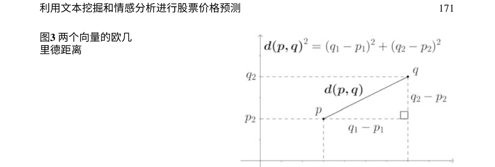

### 4 模型开发

我们首先描述我们的循环神经网络模型，然后是我们的机器学习用于股票新闻分析问题的模型。

#### 4.1 回归神经网络模型

在这个小节中，我们将介绍和评估神经网络方法用于预测任何新闻数据的趋势标签（好、坏、中性）。通常有4种常用的神经网络类型：径向基函数神经网络（RBFNNs）、前馈神经网络（FFNNs）、卷积神经网络（CNNs，一种特殊类型的FFNNs）和循环神经网络（RNNs）。在这四种中，RNNs被设计用于处理序列数据，已经被研究并被证明最适合时间序列数据和自然语言处理。基于这些原因，本文专注于分析如何使用FFNNs来预测短新闻的趋势标签。

##### 4.1.1 数据编码

为了构建我们的循环神经网络模型，我们使用预训练的Word2Vec [16]编码器来对短新闻进行编码。在这个编码模型中，一个词和一个句子分别被转换成一个1 × 300维的向量和一个176 × 300维的向量（图4）。接下来，使用One Hot Encoding技术对标签数据进行编码，这种技术在我们稍后将描述的模型架构中与分类交叉熵损失函数很好地配合使用。

```
array([[ 0.        ,  0.        ,  0.        , ...,  0.        ],
       [ 0.        ,  0.        ,  0.        , ...,  0.        ],
       [ 0.        ,  0.        ,  0.        , ...,  0.        ],
       ..., 
       [ 0.00924758, -0.00312946,  0.02535261, ...,  0.0613357 ],
       [ 0.09311175,  0.04752316, -0.01585824, ..., -0.00410238],
       [ 0.04071017, -0.05782425, -0.01652207, ..., -0.00861668],
       [ 0.04219515, -0.00249166,  0.01934622, ...,  0.00549397],
       [ 0.03171563,  0.00435146, -0.0039089 , ...,  0.03654759],
       [-0.10818528, -0.03179894, -0.02686243, ...,  0.02837516]])
```

图4 从Word2Vec编码中获得的新闻向量

##### 4.1.2 模型架构

如前一小节所述，尽管文献中有多种深度学习方法用于分析股票新闻，但在本文中，我们仅关注循环神经网络模型，以确定预测短新闻对股票价格影响的最佳结构和配置。我们选择了一些最广泛使用的RNN变体，即RNN [17]、LSTM [17]和双向长短期记忆（BLSTM）[18, 19]架构，对于每个架构，我们将开发2个模型（表1）。所有模型还将共享以下属性：

- 输入层的大小为（176，300）
- 输出层有3个神经元
- 激活函数是Softmax
- 优化器函数是Adam
- 损失函数是分类交叉熵
- 所有模型都将使用偏置

表1 RNN、LSTM、BLSTM架构的最佳配置
| 模型 | 隐藏层 | 模型 | 隐藏层 |
| :--- | :--- | :--- | :--- |
| RNN_1 | 0.5 Dropout, 64个神经元的RNN | LSTM_2 | 0.5 Dropout, 64个神经元的LSTM<br>0.5 Dropout, 128个神经元的LSTM |
| RNN_2 | 0.5 Dropout, 64个神经元的RNN<br>0.5 Dropout, 128个神经元的RNN | BLSTM_1 | 0.5 Dropout, 64个神经元的BLSTM |
| LSTM_1 | 0.5 Dropout, 64个神经元的LSTM | BLSTM_2 | 0.5 Dropout, 64个神经元的BLSTM<br>0.5 Dropout, 128个神经元的BLSTM |

#### 4.2 机器学习模型

尽管深度学习在许多领域取得了令人瞩目的成就，但并不总是最佳的人工智能解决方案。深度学习模型往往需要大量的数据来进行训练和构建，因此当数据较少时，深度学习算法可能无法正常运行。由于我们的数据集不大，我们还希望在本小节中尝试一种更传统的机器学习方法。

##### 4.2.1 数据编码

在这个阶段，这项研究采用了预训练的越南SBERT来编码短新闻。越南SBERT是一种将句子编码技术和前面部分描述的PhoBERT预训练模型相结合的方法，可以将新闻数据转化为数值向量。

这个SBert处理结果是一个1 × 768维特征向量的列表，每个向量对应一个新闻（图5）。

##### 4.2.2 模型架构

我们的机器学习模拟采用了支持向量机（SVM）[20]和随机森林（RF）[21]技术。SVM分类器倾向于寻找最大化类别间间隔的超平面，并使用一个向量来分隔超平面和一个估计的偏差来最小化训练集的误差。此外，随机森林估计器是一种集成学习方法，通过随机选择特征来拟合多个决策树分类器/回归器，并通过装袋和聚合结果进行优化。我们使用Sklearn包来实现我们的模型，使用以下超参数：

- 对于SVM模型，我们选择了正则化参数为1.0，度数为3，停止准则的容忍度为0.001，并且不启用概率估计。
- 对于随机森林模型，我们选择了森林中的树的数量为100，树的最大深度为0，分割内部节点所需的最小样本数为2，叶节点所需的最小样本数为1。

```
array([ 4.31373790e-02,  2.19225794e-01, -4.82123464e-01, -4.21190262e-01,
        -3.04402351e-01,  6.28092766e-01, -4.63526398e-01,  2.00562641e-01,
        -5.14748394e-01, -1.04810923e-01,  4.79191393e-01,  4.99825716e-01,
        2.23641887e-01, -2.89443642e-01, -2.18977422e-01, -1.80746138e-01,
)
```

图5 嵌入特征向量的示例

#### 4.3 数据增强

数据增强用于对RNN模型进行测试的数据集。我们采用了以下技术：正态分布向量加法、随机删除单词和随机交换单词。数据集的表示如下：

- X_train：用于训练模型的数据集。
- X_test：用于测试模型准确性的数据集。
- len(X_train)：用于训练模型的数据样本数量。
- len(X_test)：用于测试模型的数据样本数量。

##### 4.3.1 高斯向量加法

我们在这里描述了通过添加高斯（正态）分布向量（在图6中表示为“添加方法”）来增加数据的步骤：

- 步骤1：按9:1的比例将初始数据集分为训练集和测试集。
- 步骤2：将训练集的嵌入向量（由所有组成样本的嵌入向量组成）与大小为len(X_train) x 768的随机高斯向量相加。
- 步骤3：将初始训练数据集与添加高斯随机向量后得到的数据集合并。
- 步骤4：对合并的数据集进行向量归一化处理。

##### 4.3.2 随机删除单词

以下是通过随机删除单词（在图6中表示为“删除方法”）来增加数据的步骤：

- 步骤1：构建一个用于随机删除n个单词的函数。
- 步骤2：将初始数据集按照9:1的比例分为训练集和测试集。
- 步骤3：在训练数据集上应用随机词删除函数。
- 步骤4：将初始训练数据集和步骤3生成的数据集合并。

##### 4.3.3 随机词交换

以下是通过随机词交换（在图6中表示为“Swap方法”）来增强数据的步骤：

- 步骤1：构建一个交换随机一对词的函数。
- 步骤2：将初始数据集按照9:1的比例分为训练集和测试集。
- 步骤3：在初始训练数据集上应用随机词交换函数$n$次。
- 步骤4：将初始训练数据集和步骤3生成的数据集合并。

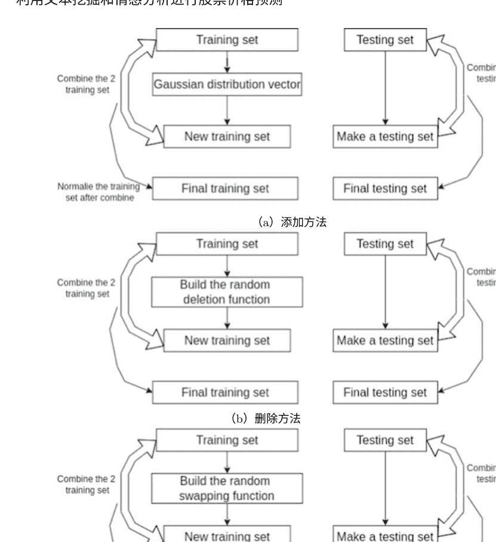

#### 4.4 模型集成

从前一节构建和评估的架构中，我们选择了最优配置来实现模型集成，如下所示：

- 步骤1：选择具有最优结果的模型。
- 步骤2：选择最优数据集，并将数据集分为训练集、测试集和验证集的三部分。
- 步骤3：在训练集上训练每个选择的模型，并在验证集上微调其参数。
- 步骤4：完成验证后，将每个微调的模型应用于测试集上的趋势标签预测。
- 步骤5：合并模型的预测结果。

### 5 实验结果

#### 5.1 数据分割

我们的数据文件夹使用以下命名约定表示：

- 25_7：由7天平均价格标记的25080个样本。
- 33_7：由7天平均价格标记的33490个样本。
- 25_3：25080个样本由3天平均价格标记。
- 33_3：33490个样本由3天平均价格标记。

对于RNN模型，数据集按8:1:1的比例分为训练集、验证集和测试集。对于机器学习模型，训练集和测试集按9:1的比例分割。

#### 5.2 循环神经网络结果

如图7中的两个表所示，7天数据集模型产生比3天数据集模型更准确的测试结果。这强烈表明，发布新闻后的3天时间不足以影响股票价格，因此需要更长的时间进行更好的分析。BLSTM_2和LSTM_2模型分别实现了最佳训练集准确率92.75%和91.9%；而LSTM_1和BLSTM_1模型分别实现了最佳测试准确率52.27%和52.03%。

#### 5.3 集成RNN结果

我们集成了三个最佳模型，即RNN_1，LSTM_2，BLSTM_2，它们在25_7数据集上进行了训练，并在所有循环网络模型中获得了最佳的测试准确率。图8显示了集成模型的结果。

|  | Accuracy (%) |  |  |  |  |  |
| --- | --- | --- | --- | --- | --- | --- |
|  | Training |  | Validation |  | Testing |  |
|  | 25-3 | 33-3 | 25-3 | 33-3 | 25-3 | 33-3 |
| RNN_1 | 60.62 | 57.53 | 49.32 | 47.57 | 48.21 | 48.79 |
| RNN_2 | 48.91 | 47.58 | 45.73 | 48.13 | 45.73 | 48.16 |
| LSTM_1 | 81.96 | 79.11 | 50 | 47.78 | 47.72 | 46.9 |
| LSTM_2 | 90.19 | 90.08 | 47.65 | 48.7 | 49.24 | 48.46 |
| BLSTM_1 | 81.81 | 78.58 | 48.56 | 49.21 | 47.48 | 47.38 |
| BLSTM_2 | 91.86 | 91.56 | 47.01 | 48.4 | 47.36 | 48.64 |

|  | Accuracy (%) |  |  |  |  |  |
| --- | --- | --- | --- | --- | --- | --- |
|  | Training |  | Validation |  | Testing |  |
|  | 25-7 | 33-7 | 25-7 | 33-7 | 25-7 | 33-7 |
| RNN_1 | 63.33 | 61.28 | 51.12 | 50.07 | 50.03 | 49.86 |
| RNN_2 | 49.91 | 48.46 | 49.64 | 48.7 | 49.64 | 48.7 |
| LSTM_1 | 84.1 | 80.93 | 50.56 | 50.43 | 52.27 | 50.04 |
| LSTM_2 | 91.9 | 89.64 | 51.54 | 51.15 | 51.03 | 51.5 |
| BLSTM_1 | 83.14 | 80.78 | 49.12 | 51.63 | 52.03 | 50.58 |
| BLSTM_2 | 92.75 | 90.74 | 51.99 | 51.33 | 50.08 | 51.18 |

图7 3天价格的RNN模型（左）和7天价格（右）

图8 集成

| Model | Accuracy(%) |
| --- | --- |
| RNN_1 | 50.03% |
| LSTM_2 | 51.03% |
| BLSTM_2 | 50.08% |
| Ensemble | 52.87% |

准确率为52.87%，比3个组成模型RNN_1，LSTM_2，BLSTM_2分别提高了2.84%，1.84%和2.79%。

#### 5.4 机器学习结果

可以看出，数据增强不太可能显著提高准确率，有时甚至比不使用数据增强效果更差。然而，33490个样本数据集模型大多数情况下比25080个样本数据集模型更好。在没有数据集增强的情况下，仅进行标签增强平均提高了2.58%的准确率。随机森林模型通常比SVM模型表现更好。使用7天数据集的模型改善了3天数据集的结果。在没有数据增强的25080个样本数据集上，使用随机森林获得了最佳准确率55.4%，这明显改善了我们之前循环神经网络的结果（图9）。

| Technique augmentation | 3 days: SVM (25) | 3 days: SVM (33) | 3 days: Random Forest (25) | 3 days: Random Forest (33) | 7 days: SVM (25) | 7 days: SVM (33) | 7 days: Random Forest (25) | 7 days: Random Forest (33) |
| --- | --- | --- | --- | --- | --- | --- | --- | --- |
| Not using | 49.2 | 53.3 | 49.4 | 50.5 | 52.3 | 54.9 | 52.9 | 55.4 |
| Normal | 49.2 | 53.2 | 49.5 | 50.4 | 48.6 | 49.5 | 51.7 | 48.5 |
| Remove | 49.1 | 53.3 | 48.4 | 51.8 | 51.8 | 55 | 51.7 | 54 |
| Swap | 49.2 | 53.3 | 48.4 | 51.4 | 51.9 | 54.8 | 52.3 | 53.7 |

图9 具有数据增强的机器学习模型

### 6 结论

在这项工作中，我们使用RNN和机器学习模型从金融新闻文章中预测股票价格趋势。我们在SVM和随机森林等机器学习模型中取得了更好的结果。然而，我们对RNN模型应用了集成技术，并获得了预测准确性的提高。为了解决由于缺乏股票价格数据而导致的标签数据缺失问题，我们提出了一种趋势标签数据的增强技术，这有助于在平均准确率上超过原始数据集2.58%。仍然有不同的方法来构建股票趋势预测模型，这是我们留给未来的工作。其中一些方法包括将句子编码与RNN模型相结合，尝试在标签增强方法中使用其他距离函数，将各种技术指标与基本分析方法相结合，可能会改善短时间内的股票预测。

### 参考文献

+   1. M. Chinas，有效市场假设：弱式有效性：弱式有效性的研究。 Amazon Digital Services LLC-KDP Print US (2018). ISBN: 97899257383662. V. Lavrenko等，同时挖掘文本和时间序列，在KDD-2000文本挖掘研讨会 (2000)
3. J.D. Thomas, K. Sycara, 将遗传算法和文本学习相结合用于金融预测，在数据挖掘与进化算法(2000)中，第72-75页
4. C.-H.L. Lee, A. Liu, W.-S. Chen, 用于金融预测的模糊时间序列模式发现。 IEEE Trans. Knowl. Data Eng. 18(5), 613-625 (2006)
5. R.K. Dase, D.D. Pawar, 人工神经网络在股票市场预测中的应用：文献综述。 Int. J. Mach. Intell. 2(2), 14-17 (2010)

## 利用文本挖掘和情感分析进行股票价格预测

+   6. K. Kim, 使用支持向量机进行金融时间序列预测。 *Neurocomputing* **55(1-2)**, 307-319 (2003)
7. M.I. Yasef Kaya, M.E. Karsligil, 使用金融新闻文章进行股票价格预测，在第二届IEEE国际信息与金融工程会议(IEEE, 2010)，第478-482页
8. A.A. Bhat, S. Sowmya Kamath, 自动股票价格预测和交易框架nifty日内交易，在2013年第四届国际计算机、通信和网络技术会议(*ICCCNT*)(IEEE, 2013), pp. 1–6
9. M. Makrehchi, S. Shah, W. Liao, 基于事件的情感分析进行股票预测，在 *IEEE/WIC/ACM*国际联合会议*Web Intelligence (WI)*和*Intelligent Agent Technologies (IAT)*, vol. 1 (IEEE, 2013), pp. 337–342
10. B. Narendra等，电影评论的情感分析：机器学习算法和开源技术的比较研究。 *Int. J. Intel. Syst. Appl.* **8(8)**, 66 (2016)
11. R. Schumaker, H. Chen, 文本分析股票市场预测使用突发金融新闻: AZFin文本系统。 *ACM Trans. Inf. Syst.* **27** (Feb 2009), https://doi.org/10.1145/1462198.1462204
12. S. Kannan等，文本挖掘的预处理技术。 国际计算机科学与通信网络杂志, **5(1)**, 7-16 (2014年)
13. T. Tran等，基于财经新闻的股市预测，第二届人机中心人工智能国际会议论文集 (*Computing4Human* *2021*)。 *CEUR*研讨会论文集（越南岘港，2021年)
14. D. Duong, T. Nguyen, M. Dang, 利用胡志明股票交易所上的财经新闻文章进行股市预测，第10届普适信息管理与通信国际会议论文集（2016年），第1-6页
15. D.Q. Nguyen, A.T. Nguyen, *PhoBERT*：越南语预训练语言模型（2020年）。 arXiv:2003.00744
16. T. Mikolov等人，向量空间中词表示的高效估计，在*ICLR* *2013*研讨会论文集中 (2013)
17. A. Sherstinsky，循环神经网络（*RNN*）和长短期记忆（*LSTM*）网络基础（2018）。 *CoRR* arXiv:1808.03314
18. Y. Perwej，基于双向长短期记忆神经网络的阿拉伯文档词检索。 机器学习与人工智能传输。 **3(1)**, 16-27 (2015)。 https://doi.org/10.14738/tmlai.31.863。 网址： https://hal.archives-ouvertes.fr/hal-03371886
19. K. Zhang等人，用于中文产品评论情感分析的双向长短期记忆（*LSTM*）(2019)，第1-4页。 https://doi.org/10.1109/ICEIEC.2019.8784560
20. M.A. Hearst等，支持向量机。 *IEEE*智能系统应用。 **13(4)**, 18-28 (1998年)。 https://doi.org/10.1109/5254.708428
21. L. Breiman，随机森林。 机器学习。 **45(1)**, 5-32 (2001年)

## 应用于交通工程

## 轻量级模型在资源受限设备上的性能用于交通应用

Dang Tuan Linh，Le Duc Loc，Pham Trung Hieu，和Tran Xuan Tung

摘要 本文研究了在交通应用中使用低成本嵌入式硬件平台NVIDIA Jetson Nano进行车辆和车牌检测任务。已经定制和检查了不同的最先进的轻量级模型，以全面评估在Jetson Nano上实现深度学习模型的情况。车辆检测任务使用CenterNet MobileNetV2 FPN，YOLOv4-tiny和YOLOv7-tiny进行了测试，而车牌检测部分则使用了WPOD-NET和EfficientNetB0进行了研究。实验结果表明，基于Jetson Nano的版本已经成功实现，并获得了与Google Colab上的标准GPU版本相似的结果。车辆检测的AP@0.5指标为70%。 此外，YOLOv7-tiny在车辆检测中，WPOD-Net在车牌检测中获得了高帧率，分别为42 FPS和204 FPS，适用于实时应用。

+   - 边缘设备
- 车辆检测
- 车牌检测
- 轻量级模型

### 1 引言

最近，由于人工智能和交通监控系统的发展，许多可行的解决方案已经在实践中部署，例如交通流检测、反违法、自动车牌识别(ALPR)和路边停车[1]。基于云计算的智能交通系统允许应用实现需要大量计算和存储资源的复杂深度学习算法[2]。相比之下，对数据传输和网络带宽消耗的高度依赖是这些系统的主要缺点。

从上述云计算概念的缺点来看，直接在源头附近处理数据，即边缘计算，越来越受到科学界的关注[3]。要在边缘设备上实现机器学习模型，需要升级硬件计算能力并优化机器学习算法以适应。已经发表了几个轻量级模型[4-6]。这些轻量级模型的主要目标是在应用于边缘设备时保持可接受的准确性和速度。

本文提出了一种在低成本边缘设备Jetson Nano上实现的车牌检测方法。我们的方法包括第一阶段的车辆检测和第二阶段的车牌检测。车辆检测阶段使用了三种最先进的轻量级模型，分别是YOLOv4-tiny、YOLOv7-tiny和Center Net MobileNetV2 FPN。此外，车牌检测阶段还研究了WPOD NET和Corner Regression EfficientNetB0 backbone。所有模型都被转换为TensorRT格式，这是一种受NVIDIA GPU加速器支持的格式。为了评估在Jetson Nano上实现的深度学习模型的性能，第一阶段使用了AP@0.5、AP@0.5:0.95和FPS这三个指标。第二阶段使用Mean IoU和FPS这两个指标来衡量性能。

本文的结构如下。第2节介绍了与最近的基于嵌入式计算机的交通监控研究、应用计算机视觉算法和硬件平台相关的工作。第3节介绍了提出的方法。第4节介绍了实验设置及其结果。第5节总结了本文。

### 2 相关工作

#### 2.1 基于深度学习的嵌入式交通监控应用系统

在NVIDIA Jetson TX2上实现了一种智能视频交通流检测算法[7]。为了保持准确性和短延迟，使用了改进的YOLOv3 [8]网络和DeepSORT进行车辆检测和跟踪。最终的测试结果表明，该方法实现了平均准确率为92.0%，速度为37.9 FPS。此外，还使用了成本较低的NVIDIA嵌入式计算机Jetson Nano来执行基于多个模型的车辆和行人检测。发现Jetson Nano可以处理MobileNetV1，MobileNetV2和InceptionV2，以产生高准确性和快速速度的结果。

提出了一种基于边缘人工智能的实时自动车牌识别（ER-ALPR）系统，可在两台嵌入式计算机Jetson AGX XAVIER上实现[10]。为了检测车牌字符识别，使用了YOLOv4-Tiny，并在白天条件下获得了高达97%的准确率。此外，Raspberry Pi和Intel Neural Compute Stick被用于在ALPR和目标检测领域部署RPNet，TE2E和YOLOv3 [11]。这些部署概念已经证明了运行机器学习模型的能力。

#### 2.2 算法

##### 2.2.1 车辆检测

###### (a) YOLO 网络

YOLO（You Only Look Once）[12]是一系列广泛用于目标检测任务的模型。自从它的发布以来，许多后续改进版本的YOLO已经被各种研究人员研究和开发，最新版本是YOLOv7 [13]。在本文中，我们选择了简化版本的YOLOv4 [14]和YOLOv7，分别称为YOLOv4-tiny和YOLOv7-tiny，以进行实验，考虑到边缘计算资源的有限性。这两个简化版本使用更少的卷积层、YOLO层和锚框来进行预测，从而减少了参数和FLOPS的数量，使其能够在资源受限的设备上实时运行。

###### (b) CenterNet

CenterNet [15]是一种基于CornerNet [16]的关键点三元组方法，用于目标检测，于2019年发布。该模型使用三个关键点，分别称为左上角、右下角和中心，来定义图像上的边界框。在MS-COCO [17]数据集上评估，CenterNet [15]实现了47.0%的平均精度（AP），这比当时所有当前的一阶段目标检测模型都要好至少4.9%。该论文的作者提出了两个修改后的模块，分别称为中心池化和级联角点池化，以捕捉区域的可识别特征和获取对象的边缘信息和视觉特征信息。

##### 2.2.2 车牌检测

大多数现有的车牌（LP）检测器只能推断出围绕LP的矩形区域，而不能精确地推断出LP本身的四个角。这在LP视图是直的且没有畸变的情况下是可以接受的。但在现实世界中，在交通设置中，从监控摄像头捕捉到的车辆图像可能以各种角度出现，使车牌区域的视角变得倾斜。因此，车牌的内容不容易识别。如果只检测到一个矩形边界框，后续阶段（OCR）将难以处理结果。本文研究了两种能够精确捕捉车牌四个角点的CNN模型，然后使用透视变换将扭曲的车牌“解扭”成正面的矩形形状。

##### ### (a) WPOD-NET

WPOD-NET [18]是一种新颖的卷积神经网络架构，旨在解决在无约束情况下的车牌检测任务。据报道，该网络在车牌视角倾斜和扭曲的情况下显著提高了整个车牌识别过程的性能。给定输入图像，网络的输出是一个张量，每个像素位置对应八个通道的值。其中两个通道是该单元格中是否有车牌的概率。剩下的六个值是用来构建一个仿射矩阵的系数，将一个固定的虚构正方形转换为车牌区域。经过非极大值抑制后，最终输出通过透视变换进行矫正，将车牌区域“解扭曲”为正面视图。

##### ### (b) EfficientNet

EfficientNets [19] 是通过一种系统、统一的复合缩放方法开发的一系列模型。EfficientNet-B0 是该系列中速度最快、最轻量级的模型。通过使用神经架构搜索算法获得了这个基准模型。使用 EfficientNet 作为提取器，我们可以解决许多不同的任务，例如分类或车牌检测的角点回归，这在本文中进行了研究。

#### 2.3 边缘嵌入式系统的硬件规格

我们的研究使用 NVIDIA Jetson Nano Production 模块作为边缘嵌入式设备，因为它体积小，尺寸为 69 mm ×45 mm，价格合理，并且具有出色的软件支持。硬件规格包括 128 核 GPU、四核 ARM A57 CPU、4GB LPDDR4 RAM 和 64GB 存储空间。它预装了 NVIDIA JetPack SDK，包括操作系统镜像和优化库，如 CUDA 和 TensorRT。

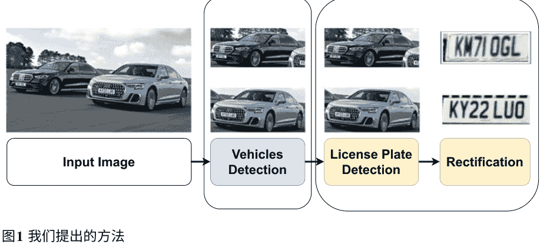

图1 我们提出的方法

### 3 方法论

#### 3.1 架构概述

我们的方法概述如图1所示。系统中有两个主要组件。第一个组件使用目标检测模型从输入图像中检测车辆。然后第二个组件使用深度学习模型从前一阶段产生的感兴趣区域中检测车牌。

#### 3.2 车辆检测

##### 3.2.1 YOLO网络

尽管YOLOv4-tiny和YOLOv7-tiny已经被大幅压缩，但是在Jetson Nano上实现时，由于资源有限和硬件的非优化计算图，它们仍然无法实现实时性能。因此，在我们的自定义数据集上训练完模型后，我们将这两个模型转换为TensorRT格式，以实现在NVIDIA GPU上的最大速度。YOLOv7-tiny可以很容易地转换为ONNX格式，然后再转换为TensorRT，而YOLOv4-tiny具有不被本地支持的Mish激活函数。基于Mish函数的数学定义$f(x) = x \times tanh(softplus(x))$，我们意识到它可以被TensorRT默认支持的Softplus、Tanh和Mul函数替代。两个模型的参数被量化为16位浮点数，这是速度和准确性之间的一个很好的选择。

##### 3.2.2 CenterNet

由于其轻量级特性，我们在本文中使用MobileNetV2 [5]作为CenterNet的骨干提取器。模型的输入是一张512 × 512的图像。我们还在提取器中使用了特征金字塔网络[20]（FPN）设计。它有助于在不同尺度上提取特征，这意味着可以更好地识别不同大小的对象。随后，我们使用集成在TensorFlow中的TensorRT优化器来加速该模型在边缘设备上的运行。在这种情况下，模型被转换为16位浮点数的低精度表示。

#### 3.3 车牌检测

##### 3.3.1 WPOD-NET

对于WPOD-NET车牌检测模型，我们保留了所有的骨干组件，并修改了网络输出以更好地适应我们的自定义数据集。最初，该模型是在包含长条形车牌的图像上进行训练的，因此作者只使用了一个输出维度来解开车牌区域。换句话说，原始模型无法区分一个车牌是否具有类似正方形的纵横比还是类似长方形的纵横比。因此，所有正方形的双行车牌都被调整为错误的纵横比，使其看起来变形和不自然。虽然可以通过计算车牌的宽度和高度从四个输出角来推断纵横比，但由于输出的多边形形状，这种方法不稳定，在我们的实验中表现非常差。为了解决这个问题，我们通过在网络的输出中添加两个通道来修改了原始架构，表示该图像中车牌的单行/双行概率。这两个通道使用sigmoid激活函数，并且使用二元交叉熵损失，仅在呈现LP区域的单元位置考虑，并在添加到网络的总损失之前缩小到30%。我们尝试了这两种方法，以查看修改架构是否比仅仅查看检测到的多边形的边长比更有助于分类LP类型。

##### 3.3.2 角回归模型与EfficientNetB0

在这个模型中，我们使用EfficientNetB0作为我们的主干提取器。在提取器的顶部放置了一个全局平均池化层，将提取的特征转换为向量。接下来，我们放置了一个256维的全连接稠密层，然后是一个最终的稠密层，具有八个单元。这八个单元对应于所需边界框的四个角的坐标。该模型还通过集成在Tensorflow框架内的TensorRT引擎进行优化，以在边缘设备上运行。模型的数值表示被转换为16位浮点数，以实现更快的执行。

### 4 实验

#### 4.1 数据集

##### 4.1.1 车辆数据集

本文使用的车辆检测数据集是从越南车辆数据集（VHD）[21]和车辆开放图像数据集（VOID）[22]中组合而成的。VHD是一个包含不同时间在胡志明市流行的越南车辆的数据集。图2中的图像是从不同时间、背景和天气条件下的交通摄像头中提取的，确保数据集的多样性。所有图像都带有边界框，每个框对应四个类别之一：摩托车、汽车、公共汽车或卡车。总共有12660张图像，收集自25个交通摄像头[21]。图3显示了VOID数据集中来自OpenImages开源计算机视觉库的627辆车的几个图像。该数据集包含来自五个类别的车辆：摩托车、汽车、公共汽车、卡车和救护车，平均每张图像有1194个边界框注释（平均每张图像有1.9个）和一个中位图像比例为1024×571。为了合并两个数据集，我们将第二个数据集中的所有救护车图像视为汽车。这意味着合并后的数据集只有四个类别：摩托车、汽车、公共汽车和卡车[22]。

最终数据集包括上述两个来源的所有图像，按照表1所示进行划分。

|  | 训练 | 验证 | 测试 |
|---|---|---|---|
| 越南车辆数据集 | 12221张图像 | 1183张图像 | 1987张图像 |
| OpenImages车辆数据集 | 439张图像 | 125张图像 | 63张图像 |
| 总计 | 12660张图像 | 1308张图像 | 2050张图像 |

表1 车辆检测数据集

##### 4.1.2 车牌检测数据集

车牌检测数据集的大小比车辆检测数据集要小得多，总共有421张图像，是三个来源的组合：来自Cars数据集[23]的189张图像，来自AOLP数据集[24]的51张图像，以及来自CarTGMT数据集[25]的181张图像。这些图像是从三个来源中随机抽样得到的，以确保车牌出现在不同的背景、视角、国家和条件下。

长的单行车牌和方形的双行车牌都包括在内。此外，CarTGMT数据集中的所有图像和Cars数据集中的85张图像都没有任何注释，因此我们不得不手动标注它们。数据集的示例如图4所示。表2显示了我们实验中的数据划分。

|  | 训练 | 验证 | 测试 |
| :--- | :--- | :--- | :--- |
| 汽车数据集 | 149张图像 | 20张图像 | 20张图像 |
| AOLP数据集 | 51张图像 | 0张图像 | 0张图像 |
| CarTGMT数据集 | 100张图像 | 40张图像 | 41张图像 |
| 总计 | 300张图像 | 60张图像 | 61张图像 |

表2 车牌检测数据集划分

#### 4.2 结果

##### 4.2.1 车辆检测

我们三个目标检测模型在车辆检测任务中的结果显示在表3中。YOLOv7-tiny在AP和速度方面都取得了最好的结果，达到了75.5% AP@0.5和Jetson Nano上的42 FPS分别为其性能指标。另一方面，CenterNet获得了最差的AP，并且是最慢的模型，但是它是最轻量级的模型，只有240万个参数。

| 模型 | 框架 | 参数 | Google Colab | | | Jetson Nano | | |
| :--- | :--- | :--- | :--- | :--- | :--- | :--- | :--- | :--- |
| | | | AP@0.5 | AP@0.5:0.95 | FPS | AP@0.5 | AP@0.5:0.95 | FPS |
| YOLOv7-tiny | Pytorch | 6.0M | 0.747 | 0.454 | 143 | 0.755 | 0.460 | 42 |
| YOLOv4-tiny | Darknet | 6.1M | 0.745 | 0.396 | 151 | 0.716 | 0.386 | 25 |
| CenterNet MobileNetV2 FPN | Tensorflow | 2.4百万 | 0.695 | 0.392 | 81 | 0.696 | 0.393 | 6 |

表3 车辆检测性能比较

##### 4.2.2 车牌检测

在车牌检测任务中，表4显示了我们的结果。 实验结果表明，WPOD-NET在尺寸、速度和IoU方面都表现出色。该模型仅有约160万个参数，在Google Colab和Jetson Nano上都表现出良好的性能，约为0.76的mIoU，并且具有非常高的速度。Jetson Nano上的FPS略低于Google Colab，考虑到设备的低端硬件，这一点令人印象深刻。结果再次证明，TensorRT可以在几乎不损失准确性的情况下显著提高模型的速度。我们基于EfficientnetB0的自定义角点回归模型也显示出了可比较的性能，稍微低一些的mIoU但仍保证了实时速度。

| 模型 | 框架 | 参数 | Google Colab mIoU | Google Colab FPS | Jetson Nano mIoU | Jetson Nano FPS |
|------|------|------|-------------------|------------------|------------------|-----------------|
| 角点回归高效-NetB0骨干网络 | Tensorflow | 3.5百万 | 0.730 | 138 | 0.730 | 56 |
| WPOD-NET | Tensorflow | 1.6百万 | 0.762 | 260 | 0.758 | 204 |

表4 车牌检测性能比较

至于LP类型分类，两种方法的结果：使用固定规则和修改模型架构，在表5中显示。检测到的LP区域的最长边和第二短边的比例阈值设置为1.7。如果该比例超过所选阈值，则将LP分类为方形，两行。否则，将其分类为长形，单行LP。实验证明，通过修改架构，模型能够更好地识别图像中呈现的LP类型，从而更好地使用透视变换进行矫正。

| | 使用修改后的模型 | 使用规则 |
|------|------------------|----------|
| 正确 | 55 | 37 |
| 总计 | 61 | 61 |
| 准确率 | 90.1% | 60.6% |

表5 LP类型分类结果

### 5 结论

我们在本文中研究和测试了五种用于交通相关任务的深度学习模型。其中三种用于车辆检测，另外两种用于车牌检测。YOLOv4-tiny和YOLOv7-tiny模型直接使用，而Centernet-FPN、WPOD-NET和EfficientnetB0 Corner Regression模型则进行了定制，以更好地适应问题并确保计算速度。

我们在每个任务的自定义数据集上实施和评估了所有模型的性能和速度。结果表明，对于像Tesla T4这样的中档GPU，推理速度非常高，准确性也相当好。当部署在边缘设备上，特别是Jetson Nano上，速度大大降低，但仍可以实时运行，准确性几乎没有变化，甚至在某些情况下更好。可以看出，Jetson Nano完全能够部署深度学习模型，并可以有效地用于解决许多计算机视觉问题。

未来改进的一个可能方向是测试更多的模型，并尝试定制它们以减少参数和计算成本。我们计划将本文的研究结果应用于解决实际问题的实际应用中。

### 参考文献

- 1. J. Shashirangana等人, 自动车牌识别: 方法和技术综述。 IEEE Access 9, 11203-11225 (2021年)。 https://doi.org/10.1109/ACCESS.2020.3047929.
- 2. K. Simonyan, A. Zisserman, 用于大规模图像识别的非常深的卷积神经网络 (2014年)。 arXiv:1409.1556
- 3. M. Merenda, C. Porcaro, D. Iero, 边缘机器学习用于AI-enabled IoT设备的综述。 传感器 20 (9), 2533 (2020年)
- 4. A.G. Howard等人, Mobilenets: 用于移动视觉应用的高效卷积神经网络 (2017). arXiv:1704.04861
- 5. M. Sandler等人, Mobilenetv2: 倒置残差和线性瓶颈, 在计算机视觉和模式识别IEEE会议(2018), 页码4510–4520
- 6. F.N. Iandola等人, SqueezeNet: 具有50倍少参数和5 MB模型大小的AlexNet级别准确性 (2016). arXiv:1602.07360
- 7. C. Chen等人, 基于深度学习的智能交通系统中的边缘流量检测方案。 IEEE智能交通系统 22(3), 1840–1852 (2020)
- 8. J. Redmon, A. Farhadi, Yolov3: 一种渐进改进的方法 (2018). arXiv:1804.02767
- 9. L. Barba-Guaman, J. Eugenio Naranjo, A. Ortiz, 嵌入式GPU上用于农村道路车辆和行人检测的深度学习框架. 电子学 9(4), 589 (2020)
- 10. C.-J. Lin, C.-C. Chuang, H.-Y. Lin, 基于边缘人工智能的实时自动车牌识别系统. 应用科学 12(3), 1445 (2022)
- 11. J. Shashirangana等, 使用神经架构搜索进行边缘设备的车牌识别. 智能系统国际期刊 (2021). https://doi.org/10.1002/int.22471
- 12. J. Redmon等, You only look once: 统一的实时目标检测,in计算机视觉和模式识别IEEE会议论文集(2016), pp. 779–788
- 13. C.-Y. Wang, A. Bochkovskiy, H.-Y. Mark Liao, YOLOv7: 可训练的一揽子免费物品为实时目标检测设定了新的技术水平 (2022). arXiv:2207.02696
- 14. A. Bochkovskiy, C.-Y. Wang, H.-Y. Mark Liao, Yolov4: 目标检测的最佳速度和准确性 (2020). arXiv:2004.10934
- 15. K. Duan et al., Centernet: 目标检测的关键点三元组,在IEEE/CVF 国际计算机视觉会议(2019), pp. 6569–6578
- 16. H. Law, J. Deng, Cornernet: 将对象检测为成对关键点, 在欧洲计算机视觉会议 (ECCV)(2018), pp. 734–750
- 17. T.-Y. Lin et al., Microsoft COCO: 上下文中的常见对象, 在欧洲计算机视觉会议(Springer, 2014), pp. 740–755
- 18. S.M. Silva, C.R. Jung, 在非受限场景中的车牌检测和识别, 在欧洲计算机视觉会议 (ECCV)(2018), pp. 580–596
- 19. M. Tan, Q. Le, Efficientnet: 重新思考卷积神经网络的模型缩放, 在国际机器学习会议论文集. PMLR(2019), pp 6105–6114
- 20. T.-Y. Lin et al., 特征金字塔网络用于目标检测, 在IEEE 计算机视觉和模式识别会议(2017), pp. 2117–2125
- 21. 越南车辆数据集. https://www.kaggle.com/datasets/duongtran1909/vietnamese-vehicles-dataset. 访问日期 2022年8月6日
- 22. Vehicles-OpenImages 数据集。 https://public.roboflow.com/object-detection/vehicles-openimages. 2022年8月7日访问
- 23. Cars数据集, 斯坦福AI Hub。 http://ai.stanford.edu/~jkrause/cars/car_dataset.html。 2022年8月7日访问
- 24. 面向应用的车牌识别数据集。 https://github.com/AvLab-CV/AOLP. 2022年8月7日访问
- 25. CarTGMT 数据集。 https://drive.google.com/file/d/1U5ebTzW2c_sVVTCSX1QH-ZJFpLijMdUv/view。 2022年8月7日访问

## 具有Jordan反馈结构的IT2-神经模糊小波网络用于控制带有外部干扰的空中机器人


Rahul Kumar, Uday Pratap Singh, Arun Bali和Siddharth Singh Chouhan

摘要 考虑到在恶劣和极端环境中操作空中机器人飞行器（ARV）时由于不确定性和干扰而面临的各种挑战，本文提出了一种名为Interval-Type-2 Neuro-Fuzzy Wavelet（IT2-NFW）网络的新型自适应控制方案，该方案具有Jordan反馈结构。本研究考虑的ARV受到外部干扰的影响，使得ARV系统变得不确定，因此变得非常难以控制。建议的控制策略可以更有效地处理系统的不确定性。提出的IT2-NFW控制方法具有高计算能力、较小的计算负载和快速的收敛速度，可以准确模拟系统的不确定性并跟踪参考轨迹。通过Lyapunov方法证明了控制器的稳定性，并证明了控制器的收敛性。最后，通过控制空中机器人飞行器来证明控制器的有效性和效率。

### 1 引言

航空机器人车辆（ARV）因其在军事和其他民用任务中的流行和令人难以置信的应用而引起了研究人员的极大关注[1]，如侦察和监视[2]，搜救行动[3]，农业任务[4]，货物交付任务等。除了这些应用之外，ARV在生活的各个方面适用性也在广泛增长。随着ARV的适用性不断增加，也出现了各种处理它们的挑战。

由于外部干扰，ARV的操作领域充满了不确定性。扰动 [5]，在这种情况下控制 ARV 成为一项挑战。因此，在不确定的环境中进行各种 ARV 操作需要一个非常高效的控制方案，能够有效地处理不确定性；否则，操作可能会失败。尽管存在一些经典的 PID 控制器 [6–8] 用于控制这些车辆，但它们无法处理不确定的环境条件和干扰。作为线性控制器，这些控制器无法处理 ARV 的非线性特性和不断变化的动力学，因此缺乏测量精度。为了应对这一挑战，已经提出了许多使用神经网络 (NNs) 和模糊逻辑的现代控制方案 [9–11]。

例如，[12]提出了一种基于人工神经网络的比例-导数方法，用于轨迹跟踪和无人机的安全着陆，所提出的方法能够学习未建模的系统动力学。在[13]中，提出了一种基于后退步自适应控制方案，用于装备有机器人操纵器的无人机。在这种方法中，整个系统被简化为一个简化的低维模型，并专注于独立控制无人机而不考虑机器人操纵器，而[14]则专注于装备有多链杆操纵器的无人机，并提出了一种通过为非线性反馈环路提出线性化控制律的新方案。除此之外，[15, 16]还专注于带有相关载荷的无人机，其中[15]通过使用自适应控制的模型参考方法研究了无人机将载荷投放到指定位置的问题，而[16]则通过使用基于能量函数的控制研究了由于相关载荷而导致的无人机欠驱动问题。

尽管这些结果是丰硕的，但这些控制方案的问题在于它们不能准确地建模和测量系统的不确定性。此外，由于外部干扰是不确定的，并且可以在任何时间以任何形式发生，没有先验知识，因此无法准确地表示为闭合的数学表达式。因此，更方便的是以高斯白噪声的形式表示它们。

受到这次广泛讨论的启发，并为了解决这个不确定性问题，在本文中提出了一种新颖的控制方案，该方案受到[17]中提出的方案的启发，但在反馈结构方面与[17]不同，并被命名为基于区间型-2神经模糊小波（IT2-NFW）网络控制器，利用Jordan反馈结构。受到[18–20]中的工作的启发，使用一种现代的基于群体智能的优化技术，称为混沌猫群优化，来初始化控制器的初始权重和其他参数，以获得更好的性能和快速收敛。

在多目标优化方面，这种技术优于灰狼、引力搜索和粒子群优化等传统方法[21]。建议的控制器由两部分组成：一个使用Jordan小波（JW）神经网络的前件部分和一个使用区间型-2模糊隶属函数的后件部分。Jordan神经网络（J NNs）具有处理反馈时延的能力，因此具有自环的JWNN赋予控制器特殊的反馈结构，并且在处理反馈时延方面非常有效，而IT2模糊隶属函数允许它以较少的计算工作和快速收敛准确地建模系统的不确定性，具有自环。作为记忆单元。因此，建议的控制器具有较大的计算能力和较低的计算负担，能够处理过程变量和配置的快速变化。此外，它具有回忆系统过去信息的能力。

作为对这项工作主要贡献的快速回顾，我们有：

- 这项工作的创新之处在于提出了一种能够有效处理系统不确定性的区间型-2神经模糊小波（IT2-NFW）控制器。
- 建议的控制策略具有保留系统过去信息的能力，以高水平的计算效率和最小的计算负载处理控制过程的配置和变量/参数的快速变化。
- 建议的控制策略已被用于控制ARV的非线性动力学，在外部干扰存在的情况下，与先前的控制技术相比，取得了改善的结果。

本文剩余部分的工作将以以下方式进行解释。在第二部分中，第2.1节和第2.2节介绍了必要的初步信息和控制器的稳定性，第2.3节进行了稳定性分析。工作的实施在第3节中给出，包括ARV描述和第3.1节和第3.2节中的仿真，最后，第4节提供了工作的结论。

### 2 间隔型2神经模糊小波控制

#### 2.1 初步

1. 模糊神经元：模糊神经元是通过在简单的人工神经元中引入不同级别的数学运算的模糊概念而设计的人工神经元[22]。在本研究中，为了准确地建模系统的不确定性，设计了一个模糊神经元，如图1所示。所提出的模糊神经元由n个输入yi和权重wi以及类型-2模糊隶属函数(MF)组成，取代传统的激活函数。

   该神经元的输入y通过求和结点收集，然后传递给由类型-2 MF组成的隶属节点，该节点给出输出A，其中A是与输入y和每个输入-输出值相关联的模糊术语的隶属值。

2. 类型-2隶属函数：类型-2模糊隶属函数μ_A是指模糊集合A的元素的隶属值本身是一个模糊集合，即隶属值由隶属函数[23]进一步给出。

3. 空中机器人飞行器：一种全新类型的极其智能的小型飞行机器人设备，可以完全远程操作，无需使用人类驾驶员。它由一个带有用于升力的螺旋桨的电子中心和放置在其上的电源组成，使其能够飞行[24, 25]。

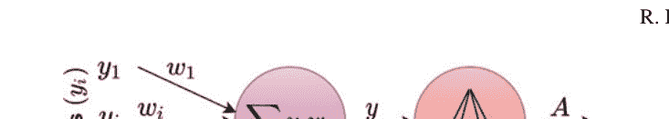

4. 混沌猫群优化：一种新的混沌猫群优化（CCSO）算法由[21]提出，用于增强所提出的控制方案的收敛性。CCSO是猫群优化（CSO）的增强版本。CSO存在不成熟和跟踪精度差的问题，容易陷入局部极值，而CCSO则不受这些问题的困扰。尽管存在许多其他标志性算法，CSO是解决多目标问题的一种优秀方法。因此，在本研究中，由于其多目标方法，CCSO被用于优化IT2-NFW控制器的初始参数。有关CCSO的更多详细信息，请参阅[21]。

#### 2.2 控制器设计

所提出的控制器名为Interval-Type-2 Neuro-Fuzzy Wavelet（IT2-NFW）网络控制器，利用Jordan反馈结构，是一种新颖的基于混合计算的神经模糊控制器，其结构受到JNN结构的启发，由图2所示的五层组成。

控制器的结构如下：

第1层：这一层是输入层，由一个具有线性激活函数的单个节点组成。根据控制器的架构，第1层的输出被路由到第2层和第4层。

第2层：在这一层中，定义了模糊规则，其中使用了利用类型-2模糊MF的模糊神经元，其目的是准确地建模系统的不确定性。该层的节点数对应于规则的总数，这些规则共同形成规则库，并以以下方式陈述Rn：IF yis A1, OR y is A2, ···, yis AiTHEN vio is Uio。

这里 y表示输入，它是输入到IT2-NFW控制器的输入，而 Ai，对于 i = 1 : n是由模糊MF μA表征的语言术语。该层的输出传递给第3层，将类型-2模糊集转换为IT-2模糊集，从而使整个网络能够有效处理与现实工程系统相关的不确定性，并具有可管理的计算负载，与简单的类型-1和类型-2模糊集相比。

第3层：该层定义了系统输入的相应下限和上限隶属度，如下所示（1）

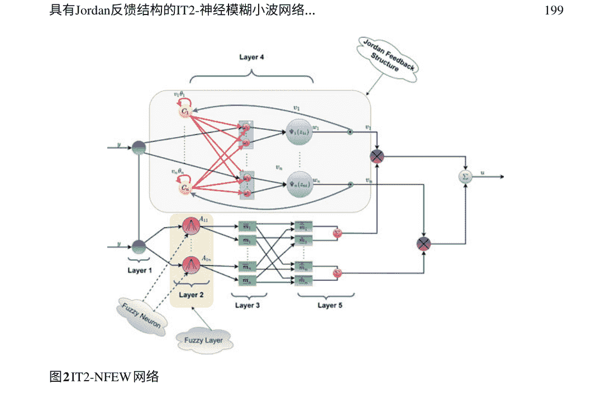

\(\overline{m}_{A_i}(y) = exp\left( \frac{-(y-c_i)^2}{\overline{\sigma_i}^2} \right)\) 和 \(m_{-A_i}(y) = exp\left( \frac{-(y-c_i)^2}{\underline{\sigma_i}^2} \right)\), \(i=1:n\)。

(1)第4层：在该层中，通过将上下文层和小波层集成在一起，设计了一个Jordan小波神经网络。小波层由\(n\)个块组成，每个块具有计数\(l\)个小波神经元。上下文层由节点\(C_1, C_2, \cdots, C_n\)组成，起到了网络的极其有效的记忆单元的作用。在这里，采用以下小波激活函数定义

\[ \omega(z_{ij}) = z_{ij} * exp\left( -\frac{1}{2} z_{ij}^2 \right), i=1:n, j=1:l \tag{2} \]

其中 \(z_{ij} = \frac{\xi_{ij}-t_{ij}}{d_{ij}}\)，其中 \(t_{ij}\) 和 \(d_{ij}\) 是定义位移和缩放的小波参数。

小波层的输入，用 \(\xi_{ij}\) 表示，如下所示
\[ \xi_{ij} = y + \sum_{i=1}^{n} C_i(k), \tag{3} \]
其中 \(C_i(k)\) 表示时刻 \(k\) 时后件层的第 \(i\) 个节点的输出，满足以下条件
\[ C_i(k) = v_i(k-1) + \theta_i C_i(k-1), \tag{4} \]

其中 $v_{i}(k-1)=\Psi_{i}(k-1)w_{i}$, $\Psi_{i}=\prod_{j=1}^{n} \omega(z_{ij})$, $\theta_{i}$ 是上下文层的第 i 个自反馈环的权重。所有这些初始参数都是使用CCSO算法进行初始化，以便控制器快速收敛。

第5层：第3层输出的上下界值在该层中定义，如下所述

$$\hat{\overline{m}}_{i}(y)=\left(\sum_{j=1}^{n}\overline{m}_{k}(y)\right)\overline{m}_{i}(y) \text{ 和 } \hat{\underline{m}}_{-i}(y)=\left(\sum_{j=1}^{n}\underline{m}_{k}(y)\right)\underline{m}_{i}(y) \quad (5)$$

其中

$$\overline{m}_{i}(y)=\overline{m}_{A_{1}}*\overline{m}_{A_{2}}*\cdots*\overline{m}_{A_{n}} \text{ 和 } \underline{m}_{-i}(y)=\underline{m}_{A_{1}}*\underline{m}_{A_{2}}*\cdots*\underline{m}_{A_{n}}$$

符号 $*$ 代表AND（min）操作。

现在IT2-NFW控制器的输出为

$$u = \sum_{i=1}^{n} v_{i} \quad c\hat{\underline{m}}_{i}(y) + (1 - c)\hat{\overline{m}}_{i}(y) \quad (6)$$

每个规则对输出的贡献由字母 $c$ 表示。

#### 2.3 稳定性分析

首先，为了计算跟踪误差，定义一个控制成本函数如下以展示建议控制器的稳定性。

$$\epsilon_{e}(k) = \frac{1}{2} \quad \epsilon_{e,1}^{2}(k) + \epsilon_{e,2}^{2}(k) \quad (7)$$

其中，$\epsilon_{e,1}^{2}(k)=(y_{d}(k)-y(k))^{2}$, $\epsilon_{e,2}^{2}(k)=Au^{2}(k)$, $A$ 为惩罚因子。同时，将控制法则定义为

$$u = \sum_{i=1}^{n} v_{i} \quad c\hat{\underline{m}}_{i}(y) + (1 - c)\hat{\overline{m}}_{i}(y) \quad (8)$$

自适应法则定义为

$$s^{r}(k+1)=s^{r}(k)+\gamma^{r}\left(\frac{\partial \epsilon_{e}(k)}{\partial s^{l}(k)}\right), \quad r=1:4 \quad (9)$$

其中 \( \gamma^r = [\gamma^w, \gamma^\theta, \gamma^d, \gamma^t] \) 是与设计参数相对应的学习率 \( s^r = [s^1, s^2, s^3, s^4] = [w_i, \theta_i, d_{ij}, t_{ij}] \) 对于 \( i = 1:n, j = 1:l \) 的控制器。引入以下定理来证明所提出的控制器的稳定性。

定理1 所提出的IT2-NFW控制器在控制律 (8)，自适应律 (9) 和控制成本函数 (7) 下，以最大学习率 \(^1\) 保证收敛，其中 \( = (\alpha^2 + \beta^2)\)

\[
\left\{ \max \left\| \frac{\partial u(\kappa)}{\partial \sigma p(\kappa)} \right\| \right\}^2 > 0 \text{ [26]}.
\]

#### 2.4 复杂性分析

为了对整个控制过程有一个简单的理解，下面给出了算法。

**算法1 整个控制过程的伪代码**

1: 开始: \( \kappa = 0 \)。
2: 初始化UAV系统的状态(10)并设置 \( y_d \)。
3: 使用CCSO初始化IT2-NFW网络的权重和小波参数。
4: 根据(7)计算UAV(10)的输出 \( y \) 和误差。
5: **对于** \( \kappa = 0 \) **到** \( t \) **执行**
6: 根据 (8) 计算 \( u \)。
7: 计算UAV(10)的输出 \( y \)。
8: 根据 (7) 计算误差。
9: **如果** 误差小于阈值，则
10: **返回** \( y \)
11: 跳出循环
12: **否则**
13: 根据(9)调整网络参数。
14: **如果结束**
15: 返回到步骤6。
16: **结束循环**

从整个控制过程来看，闭环控制的计算复杂度取决于三个因素: (a) CCSO的复杂度, (b) IT2-NFW网络的复杂度, 以及(c) 计算误差函数(7)的循环重复次数。

对于一个包含 \( m \) 只猫的种群，初始化IT2-NFW网络的 \( j \) 个参数所需的总计算次数为 \( O(TmM) \)，其中 \( T \) 是最大迭代次数， \( d = 1:M \)， \( d \) 是种群空间的维度。除此之外，IT2-NFW网络的计算复杂度还取决于前件部分和后件部分的复杂度。根据前件部分的结构，输入层需要 \( O(n) \) 次计算，而第2、3和5层分别需要 \( O(2n) \) 次、 \( O(n^2) \) 次计算步骤。因此，前件部分的总计算次数为 \( O(n^2) \)，其中 \( n \) 是第2层的节点数。另一方面，IT2-NFW的后件部分网络需要 $O(n^2 l)$ 计算步骤，其中 $l$ 是每个小波层块中的节点数。因此，IT2-NFW 网络的总复杂度为 $O(n^2) + O(n^2 l) = O(n^2 l)$。如果 $t$ 是计算误差函数（7）和控制信号（8）的最大迭代次数，则 IT2-NFW 网络的复杂度变为 $O(t n^2 l)$。

如果 $l \ll n$，则复杂度变为 $O(t n^2)$。因此，整个闭环控制器的总计算复杂度为 $O(T m M) + O(t n^2)$。

### 3 高空机器人飞行器（ARV）的控制

为了展示所提出的控制策略的有效性和实时适用性，该方案在ARV上进行了实施以进行控制。ARV的控制信号由IT2-NFW控制器的输出提供，并且使用IT2-NFW方案的ARV控制机制如图3所示。

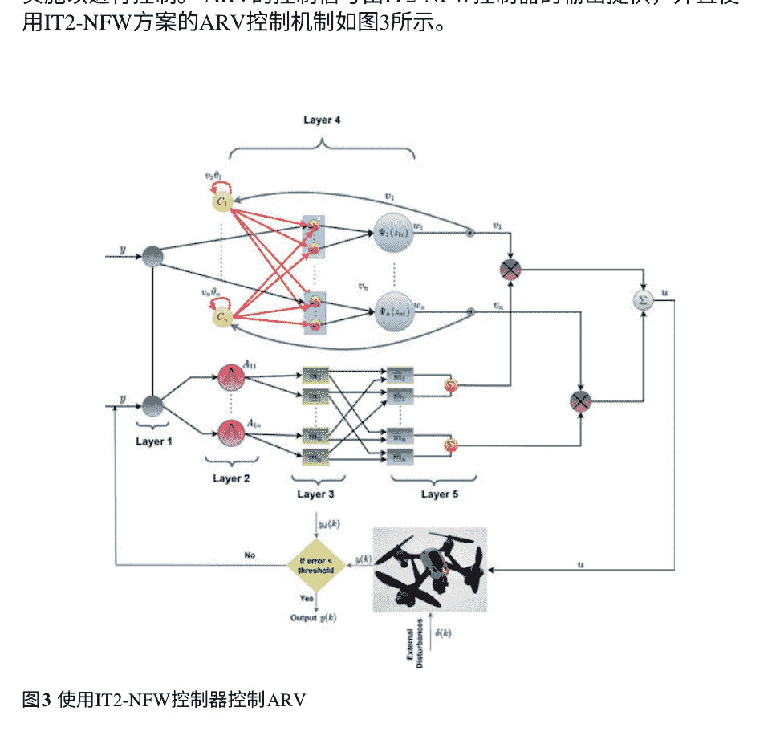

图3 使用IT2-NFW控制器控制ARV

#### 3.1 ARV系统描述

四旋翼飞行器的非线性动态状态空间模型如下所述

$$\chi_1(k+1) = \chi_1(k) + \eta_1[\chi_2(k) + \delta_1(k)]$$
$$\chi_2(k+1) = \chi_2(k) + \eta_2[\frac{I_{yy} - I_{zz}}{I_{xx}} \chi_4(k) \chi_6(k) - I_r \Omega_r \frac{\chi_4(k)}{I_{xx}} + \frac{\tau_1}{I_{xx}} + \delta_2(k)]$$
$$\chi_3(k+1) = \chi_3(k) + \eta_3[\chi_4(k) + \delta_3(k)]$$
$$\chi_4(k+1) = \chi_4(k) + \eta_4[\frac{I_{zz} - I_{xx}}{I_{yy}} \chi_2(k) \chi_6(k) + I_r \Omega_r \frac{\chi_2(k)}{I_{yy}} + \frac{\tau_2}{I_{yy}} + \delta_4(k)]$$
$$\chi_5(k+1) = \chi_5(k) + \eta_5[\chi_6(k) + \delta_5(k)]$$
$$\chi_6(k+1) = \chi_6(k) + \eta_6[\frac{I_{xx} - I_{yy}}{I_{zz}} \chi_2(k) \chi_4(k) + \frac{\tau_3}{I_{zz}} + \delta_6(k)] \qquad (10)$$

其中，绕x轴的旋转称为横滚（roll），绕y轴的旋转称为俯仰（pitch），绕z轴的旋转称为偏航（yaw），分别由状态变量$\chi_1$、$\chi_3$和$\chi_5$表示，而这些参数的变化由状态变量$\chi_2$、$\chi_4$和$\chi_6$。螺旋桨的惯性和相对速度分别由符号$I_r$和$\Omega_r$表示。在这个仿真中，$\tau_1$、$\tau_2$和$\tau_3$分别表示绕三个轴（x、y和z轴）的旋转力矩，$I_{xx}$、$I_{yy}$和$I_{zz}$分别表示ARV结构框架中三个方向的惯性值。在这个仿真中，$\tau_1$和$\tau_2$保持不变，而$\tau_3$被视为ARV的输入，即$\tau_3 = u(v(k))$。横滚、俯仰和偏航过程中的外部干扰使得ARV变得不可靠和不确定。这些干扰由$\delta_i$表示，其中$i=1:6$并且以满足高斯白噪声的统计特性$E(\delta_i) = 0$和$E(\delta_i^2) = 1$并且在图5中显示。整体闭环系统的工作可以通过一个简单的流程图来很好地理解，如图4所示。

#### 3.2 模拟

模拟中ARV系统的参数选择为$I_{xx} = 7.72 \times 10^{-2}$, $I_{yy} = 7.64 \times 10^{-2}$, $I_{zz} = 0.1031$, $I_r = 1.8 \times 10^{-5}$, $\Omega_r = 1$, $\tau_1 = 0.5$和$\tau_2 = 0.4$以及$\eta_i = 1$, $\forall i = 1:6$。ARV的初始状态选择为$[\chi_1, \chi_2, \chi_3, \chi_4, \chi_5, \chi_6] = [0, 0, 0, 0, 0, 0]$，并且整个ARV系统通过使用提出的IT2-NFW进行控制方案。迄今为止提出的控制方案的性能可以从图6、7、8、9、10、11中看到并进行分析。图6、8和10分别展示了提出的IT2-NFW控制器对ARV的滚转、俯仰和偏航角的跟踪性能，而图7、9和11则表示相应的跟踪误差。

从图7、9和11可以明显看出，控制器的跟踪误差迅速接近零的小邻域。当将IT2-NFW的性能与[27]中的工作进行比较时，发现使用IT2-NFW得到的结果明显优于[27]中的结果，因为[27]中的跟踪误差不收敛于零，而是在控制机制中连续波动。

### 4 结论

本文提出了一种新颖的自适应神经模糊网络控制方案，用于控制飞行机器人车辆在外部干扰下的运动。由于存在外部干扰，整个系统变得更加复杂和不确定，难以管理。所提出的控制策略在处理低计算负荷和快速收敛的不确定性方面具有高效性，使得飞行机器人车辆能够在极端环境条件下高效运行。使用李雅普诺夫理论证明了控制器的收敛性，误差在接近零的小邻域内收敛，可以在仿真部分中看到。

致谢这项工作得到了印度科学与工程研究委员会（SERB）在MATRICS项目资助下的支持，资助号为MTR/2021/000478。

### 参考文献

1. T. Kopfstedt, M. Mukai, M. Fujita, C. Ament, 对无人机编队进行监视和侦察任务的控制。IFAC Proc. Vol. 41(2), 5161–5166 (2008)
2. M. Silvagni, A. Tonoli, E. Zenerino, M. Chiaberge, 用于山地雪崩事件的多功能无人机进行搜救行动。Geomat. Nat. Haz. Risk 8(1), 18–33 (2017)
3. J. del Cerro, C. Cruz Ulloa, A. Barrientos, J. de Le n Rivas, 农业中的无人机：一项调查。农学 11(2), 203 (2021)
4. B.D. Song, K. Park, J. Kim, 持久的无人机交付物流: MILP公式和高效启发式算法. 计算机工业工程 120, 418–428 (2018)
5. H.A. Foudeh, P. Luk, J. Whidborne, 将规范最优迭代学习控制应用于监测架空电力系统的四旋翼无人机. 能源 13(12),3223 (2020)
6. P.E. Pounds, D.R. Bersak, A.M. Dollar, 在PID控制下增加有效载荷质量的小型无人机直升机和四旋翼的稳定性. 自主机器人 33(1), 129–142 (2012)
7. I. Sadeghzadeh, A. Mehta, A. Chamseddine, Y. Zhang, 基于增益调度PID控制的四旋翼无人机的主动容错控制, 在2012年第25届IEEE加拿大电气和计算机工程会议(CCECE)(IEEE, 2012), pp. 1–4
8. P. Shao, Z. Zhou, S. Ma, L. Bin, 结构鲁棒增益调度PID控制及其在变形机翼无人机上的应用, 在2017年第36届中国控制会议（CCC）（IEEE，2017年），第3236-3241页- 9. Q. Lin, Z. Cai, Y. Wang, J. Yang, L. Chen, 基于动态反演和神经网络的四旋翼无人机自适应飞行控制设计，在2013年第三届仪器、测量、计算机、通信和控制国际会议（IEEE，2013年），第1461-1466页
- 10. B. Zhao, B. Xian, Y. Zhang, X. Zhang, 基于浸没和不变性方法的四旋翼无人机非线性鲁棒自适应跟踪控制。IEEE工业电子学报。62（5），2891-2902（2014年）
- 11. L. Xuehui, L. Jingtao, 四旋翼无人机自适应姿态控制研究, in 2017年第29届中国控制与决策会议(CCDC)(IEEE, 2017), pp. 5904–5909
- 12. S. Patel, A. Sarabakha, D. Kircali, E. Kayacan, 一种智能混合人工神经网络控制无人机的方法. J. Intell. Robot. Syst. 97(2), 387–398 (2020)
- 13. D. Chaikalis, F. Khorrami, A. Tzes, 无人机操纵系统的自适应控制方法研究, in 2020年国际无人机系统会议(ICUAS)(IEEE, 2020), pp. 498–503
- 14. H. Beikzadeh, G. Liu, 利用L1自适应控制实现四旋翼飞行机械臂的轨迹跟踪. J. Franklin Inst. 355(14), 6239–6261 (2018)
- 15. A. Altan, O. Aslan, R. Hacıoğlu, 模型参考自适应控制无人机载荷运输系统，在2018年第六届控制工程与信息技术国际会议（CEIT）中（IEEE，2018），第1-5页
- 16. S. Yang, B. Xian, 基于能量的非线性自适应控制设计四旋翼无人机系统带悬挂负载。IEEE Trans. Ind. Electron. 67(3), 2054-2064 (2019)
- 17. Z. Sheikhlar, M. Hedayati, A. D. Tafti, H. F. Farahani, 模糊埃尔曼小波网络：应用于函数逼近、系统识别和电力系统控制。Inf. Sci. 583, 306-331 (2022)
- 18. R. Kumar, U. P. Singh, A. Bali, K. Raj, 不确定非线性离散时间系统的混合神经网络控制受到有界干扰。Wirel. Pers. Commun. 1-20 (2022)
- 19. A. Bali, U. Pratap Singh, R. Kumar, K. Raj, 具有时延和死区输入的非线性连续时间系统的混合神经网络控制。Int. J. Adapt. Control Signal Process. 36(6), 1439-1459 (2022)
- 20. R. Kumar, U. P. Singh, A. Bali, K. Raj, 非对称死区和未知干扰下的不确定非线性离散时间系统的混合神经网络控制器。International Journal of Control 1–9 (2022)
- 21. J. Wang, H. Yu, 基于显著性梯度的新混沌猫群优化算法用于电力设备红外和可见光图像配准。Evolutionary Intelligence 1–15 (2022)
- 22. H. T. Nguyen, C. Walker, E. A. Walker, 《模糊逻辑初级教程》(Chapman and Hall/CRC, 2018)
- 23. J. M. Mendel, R. B. John, 简化的二阶模糊集。IEEE Transactions on Fuzzy Systems. 10(2), 117–127 (2002)
- 24. E. Feron, E. N. Johnson, 航空机器人 (Springer, Berlin. Heidelberg, 2008), pp. 1009–1029
- 25. D. Hodgkinson, R. Johnston, 航空法和无人机：无人驾驶飞机和航空的未来(Routledge, 2018)
- 26. R. Kumar, U. P. Singh, A. Bali, S. Jain, 神经模糊埃尔曼小波控制非线性不确定系统的模糊输入和未知模糊干扰：机器人应用。International Journal of Adaptive Control and Signal Processing
- 27. H. Nguyen, T. Dang, K. Alexis, 可重构空中机器人链：建模和控制，2020年IEEE国际机器人与自动化大会(ICRA)(IEEE, 2020), pp. 5328–5334

## 沥青黏度如何取决于温度：经验依赖的理论解释

Edgar Daniel Rodriguez Velasquez和Vladik Kreinovich

摘要 路面必须适应各种温度，从冬季寒冷到夏季炎热。 特别是，这意味着对于所有可能的温度，沥青黏合剂的黏度必须保持在所需范围内。 为了预测设计的路面在不同温度下的行为，希望能够对黏度随温度的变化有一个大致的了解。 路面工程师提出了一个经验近似公式来描述这种变化。

然而，由于这个公式纯粹是经验性的，没有理论上的证明，从业者通常有些不愿依赖这个公式。 在本文中，我们为这个经验公式提供了一个理论解释，即我们应该认为这个公式可以从自然不变性要求中自然推导出来。

### 1 问题的阐述

沥青黏结剂是什么：一个简短的提醒。 在大多数路面中，顶部——沥青——层是通过将沥青黏结剂（通常是石油精炼的残渣）与适当尺寸的岩石混合而成的。

保持沥青黏结剂的正确粘度非常重要。 一般来说，如果对材料施加应力，它首先会变形，然后，如果应力进一步增加，它会开裂。 一些材料是脆性的，一个相对较小的应力就会导致它们开裂。

E. D.罗德里格斯·韦拉斯克斯
秘鲁皮乌拉大学（UDEP）土木工程系，Piura，秘鲁，Ram n Mug ica大道131号
电子邮件： edgar.rodriguez@udep.pe； edrodriguezvelasquez@miners.utep.edu
德克萨斯大学埃尔帕索分校土木工程系，
500 W. University, El Paso, TX 79968, 美国

V. Kreinovich (✉)
德克萨斯大学埃尔帕索分校计算机科学系，
500 W. University, El Paso, TX 79968, 美国
电子邮件： vladik@utep.edu

© 作者，独家许可给 Springer Nature Switzerland AG 2023
N. H. Phuong 和 V. Kreinovich (编者)，深度学习和其他软计算技术，计算智能研究 1097，
https://doi.org/10.1007/978-3-031-29447-1_18

裂缝，其他材料更加柔韧，它们在开始开裂之前会发生相当大的变形。

像沥青黏合剂这样的材料，在物理上是高粘度的液体（这样的材料也被称为半固体）。它们的机械性质与水等常规液体的性质不同，因为与水相比，沥青黏合剂具有非常高的粘度。沥青黏合剂对应力的反应是由其粘度决定的，并且它会影响最终路面的质量：

- ●如果粘度过低，路面会被交通压力变形，这种变形会使路面不平整，从而阻碍交通。
●如果粘度过高，即路面过于坚硬，那么交通压力会导致裂缝的产生。随着更多的交通通过路面段，裂缝会扩大，而产生的大裂缝也会阻碍交通。

因此，保持适当的粘度值非常重要。

黏度如何随温度变化. 对于所有液体——包括沥青粘结剂——黏度 η 随温度 T 降低. 由于路面必须在各个季节正常运行，在广泛的室外温度范围内，当设计路面时考虑这种依赖关系非常重要。

路面工程使用以下经验公式[1,2]来描述这种依赖关系：

$$\left(\ln\left(\frac{\eta}{\eta_0}\right)\right) = a + b \cdot \ln(T)$$ (1)

其中 $\eta_0$、 $a$ 和 $b$ 是一些常数，温度以绝对单位（例如开尔文）测量。

问题的表述和我们在本文中的工作. 公式（1）是经验性的。一般来说，经验公式不如具有至少一些理论解释的公式可靠——这些解释使得在原始测试示例之外使用这些公式更具说服力。因此，为这个公式提供一个理论解释是可取的。本文提供了这样的解释。

### 2 我们的解释

不变性：我们解释的主要思想。我们的解释基于一个事实，即物理量的数值取决于测量单位的选择，有时也取决于起始点的选择。如果我们用一个比原来小 $\lambda$ 倍的新单位替换原始测量单位，那么每个数值 $x$ 都会变成 $\lambda \cdot x$：例如，2千克变成 $1000 \cdot 2 = 2000$克。同样，如果我们用一个比原始起始点低 $x_0$ 单位的新起始点替换原始起始点，那么每个数值都会变成 $x + x_0$。

在许多情况下，没有物理上首选的测量单位，选择测量单位只是一种方便的问题。在这种情况下，假设两个量之间的依赖关系 \( y = f(x) \) 的确切形式应该在我们改变 \( x \) 的测量单位时保持不变。当然，我们可能还需要适当地改变 \( y \) 的测量单位：例如，公式 \( y = x^2 \) 将一个正方形区域的面积 \( y \) 与其边长 \( x \) 相关联，不依赖于我们用什么单位来测量长度。然而，为了保持这个公式，在我们将长度单位从千米改变为英里时，我们还需要改变面积单位从平方千米改变为平方英里。

不变性：精确定义。因此，在考虑缩放 \( x \) 和缩放 \( y \) 的情况下，关系的缩放不变性 \( y = f(x) \) 意味着对于每个值 \( \lambda > 0 \)，存在一个值 \( \mu > 0 \)（通常取决于 \( \lambda \)），使得 \( y = f(x) \) 蕴含 \( Y = f(X) \)，其中 \( X = \lambda \cdot x \)，\( Y = \mu \cdot y \)。类似地：

- - 关系的平移缩放不变性 \( y = f(x) \) 意味着对于每个值 \( x_0 \)，存在一个值 \( \mu > 0 \)（通常取决于 \( x_0 \)），使得 \( y = f(x) \) 蕴含 \( Y = f(X) \)，其中 \( X = x + x_0 \)，\( Y = \mu \cdot y \)；
- 关于关系的尺度平移不变性 \( y = f(x) \) 意味着对于每个值 \( \lambda > 0 \) 存在一个值 \( y_0 \)——一般来说，取决于 \( \lambda \)——使得 \( y = f(x) \) 蕴含 \( Y = f(X) \)，其中 \( X = \lambda \cdot x \)，\( Y = y + y_0 \)；而
- 关于关系的平移平移不变性 \( y = f(x) \) 意味着对于每个值 \( x_0 \) 存在一个值 \( y_0 \)——一般来说，取决于 \( x_0 \)——使得 \( y = f(x) \) 蕴含 \( Y = f(X) \)，其中 \( X = x + x_0 \)，\( Y = y + y_0 \)。

哪些依赖关系是不变的。对于上述四种不变性类型中的每一种，我们都有所有相应不变的函数的完整描述（参见，例如，[3]）：

- - 所有尺度不变函数的形式为 \( f(x) = A \cdot x^a \)，其中 \( A \) 和 \( a \) 是一些值；
- 所有平移尺度不变函数的形式为 \( f(x) = A \cdot \exp(a \cdot x) \)，其中 \( A \) 和 \( a \) 是一些值；
- 所有尺度平移不变函数的形式为 \( f(x) = A \cdot \ln(x) + a \)，其中 \( A \) 和 \( a \) 是一些值；并且
- 所有平移平移不变函数的形式为 \( f(x) = A \cdot x + a \)，其中一些值 \( A \) 和 \( a \)。

一些依赖关系是间接的。在许多实际情况下，虽然量 \( x \) 和 \( y \) 之间存在依赖关系，但这种依赖关系并不直接：量 \( x \) 影响其他一些量 \( z \)，而该量 \( z \) 又影响 \( y \)——我们可能会有一个更长的影响链。在依赖关系 \( x \rightarrow z \rightarrow y \) 的情况下，通常可以假设两个依赖关系 \( z = g(x) \) 和 \( y = h(z) \) 是不变的。

在这些情况下，结果依赖于 \( y \) 对 \( x \) 的组合是两个不变函数的组合函数 \( y = h(g(x)) \)；参见[3]中的示例。

在我们的况下，我们有哪些自然不变性。 在我们的况下，对于粘度和温度（以绝对单位描述时），存在一个明确的起点：0粘度和绝对零温度。 然而，在这两种情况下，似乎没有首选的测量单位。 因此，合理的假设是对于这两个量，自然变换是缩放-对应于选择不同的测量单位。

观察到的依赖关系不是尺度-尺度不变的。 基于自然不变性，可以预期粘度对温度的依赖关系应该由尺度-尺度不变的幂律 \(\eta = A \cdot T^b\) 来描述。 然而，经验依赖关系（1）是不同的。 也就是说，如果我们将指数函数 \(\exp(z)\) 应用于公式（1）的两边，我们得到

\[
\ln\left(\frac{\eta}{\eta_0}\right) = \exp(a + b \cdot \ln(T)) = \exp(a) \cdot \exp(b \cdot \ln(T)) =
\]
\[
\exp(a) \cdot (\exp(\ln(T)))^b = A \cdot T^b, \tag{2}
\]

其中我们定义 \(A\) 为 \(\exp(a)\)。 通过对等式(2)两边应用 \(\exp(z)\)，我们得出结论

\[
\frac{\eta}{\eta_0} = \exp(A \cdot T^b), \tag{3}
\]

因此，

\[
\eta = \eta_0 \cdot \exp(A \cdot T^b). \tag{4}
\]

这与幂律不同。

换句话说，观察到的 \(\eta\) 对 \(T\) 的依赖性不能通过直接不变性来解释。 因此，一个自然的想法是看看这种经验性依赖是否可以解释为间接依赖。

### 间接不变性确实解释了经验性依赖。

与上一小节的结论一致，让我们假设 \(\eta\) 依赖于一些辅助量 \(z\)，而 \(z\) 又依赖于 \(T\)，即 \(\eta = f(T)\) 的依赖关系具有形式 \(\eta = h(g(T))\)，即 \(\eta = h(z)\) 且 \(z = g(T)\)。

我们知道对于 \(T\) 和 \(\eta\)，自然变换是缩放。 因此，根据我们对 \(z\) 在两个依赖关系中所假设的变换，我们得到以下四种可能情况：

1. 对于 \(z\) 对 \(Y = T\) 的依赖是尺度-尺度不变的，对于 \(\eta\) 对 \(z\) 的依赖也是尺度-尺度不变的；
2. 对于 \(z\) 对 \(Y = T\) 的依赖是尺度-平移不变的，对于 \(\eta\) 对 \(z\) 的依赖是平移-尺度不变的；
3. 对于 \(z\) 对 \(Y = T\) 的依赖是尺度-尺度不变的，对于 \(\eta\) 对 \(z\) 的依赖是平移-尺度不变的；
4. 对于 \(z\) 对 \(Y = T\) 的依赖是尺度-平移不变的，对于 \(\eta\) 对 \(z\) 的依赖是尺度-尺度不变的。

让我们逐一分析这些情况。

1. 在第一种情况下，我们有 $z = A_1 \cdot T^{a_1}$ 对于某些 $A_1$ 和 $a_1$，以及 $\eta = A_2 \cdot z^{a_2}$。将 $z$ 的表达式代入描述 $\eta$ 对 $z$ 的依赖的公式中，我们得出结论：

$$\eta = A_2 \cdot (A_1 \cdot T^{a_1})^{a_2} = (A_2 \cdot A_1^{a_2}) \cdot T^{a_1 \cdot a_2}, \quad (5)$$

因此，我们得到了一个幂律，并且我们已经提到实际的依赖关系与幂律不同。

2. 在第二种情况下，我们有 $z = A_1 \cdot \ln(T) + a_1$ 对于一些 $A_1$ 和 $a_1$，以及 $\eta = A_2 \cdot \exp(a_2 \cdot z)$。将 $z$ 的表达式代入描述 $\eta$ 对 $z$ 的依赖关系的公式中，我们得出结论

$$\eta = A_2 \cdot \exp(a_2 \cdot (A_1 \cdot \ln(T) + a_1)) = A_2 \cdot \exp(a_2 \cdot A_1 \cdot \ln(T)) \cdot \exp(a_2 \cdot a_1) = (A_2 \cdot \exp(a_2 \cdot a_1)) \cdot (\exp(\ln(T))^{a_2 \cdot A_1} = (A_2 \cdot \exp(a_2 \cdot a_1)) \cdot T^{a_2 \cdot A_1}, \quad (6)$$

即，$\eta = A \cdot T^a$，其中我们定义 $A \stackrel{\text{def}}{=} A_2 \cdot \exp(a_2 \cdot a_1)$ 和 $a \stackrel{\text{def}}{=} a_2 \cdot A_1$。因此，我们也得到了一个幂律。

3. 在第三种情况下，我们有 $z = A_1 \cdot T^{a_1}$ 对于一些 $A_1$ 和 $a^1$，以及$\eta = A_2 \cdot \exp(a_2 \cdot z)$。将 $z$ 的表达式代入描述 $\eta$ 对 $z$ 的依赖关系的公式中，我们得出结论

$$\eta = A_2 \cdot \exp(a_2 \cdot A_1 \cdot T^{a_1}) = A_2 \cdot \exp((a_2 \cdot A_1) \cdot T^{a_1}), \quad (7)$$

即，我们得到 $\eta_0 = A_2$, $A = a_2 \cdot A_1$, 和 $b = a_1$ 的公式 (4).

4. 在第四种情况下，我们有 $z = A_1 \cdot \ln(T) + a_1$ 对于一些 $A_1$ 和 $a_1$，以及和 $\eta = A_2 \cdot z^{a_2}$。将 $z$ 的表达式代入描述 $\eta$ 对 $z$ 的依赖关系的公式中，我们得出结论

$$\eta = A_2 \cdot (A_1 \cdot \ln(T) + a_1)^{a_2}. \quad (8)$$

乍一看，这个表达式看起来不像所需的公式 (4) ，但实际上它描述了在这个公式下，$T$对$\eta$的依赖关系。事实上，在这种情况下，对公式 (3) 两边取对数，我们得到

$$\ln(\eta) - \ln(\eta_0) = A \cdot T^a,$$

因此

$$T^a = A^{-1} \cdot \ln(\eta) - A^{-1} \cdot \ln(\eta_0),$$和
$$T = (A^{-1} \cdot \ln(\eta) - A^{-1} \cdot \ln(\eta_0))^{1/a}.$$

这个公式可以描述为

$$T = A_2 \cdot (A_1 \cdot \ln(\eta) + a_1)^{a_2}, \qquad (8a)$$

如果我们取 $A_2 = 1$, $A_1 = A^{-1}$, $a_1 = -A^{-1} \cdot \ln(\eta_0)$, 并且 $a_2 = 1/a$。

因此，间接不变性确实解释了所需的公式-更准确地说，它解释了 $\eta$ 对 $T$ 的依赖性或 $T$ 对 $\eta$ 的依赖性。应该根据实验确定 $\eta$ 对 $T$ 的两个公式 (7) 和 (8) 中的哪一个应该应用，就像所有相应参数的数值一样。

致谢

这项工作部分得到了国家科学基金会的支持1623190（计算机专业实践新一代变革模型）以及HRD-1834620和HRD-2034030（CAHSI包括），以及AT&T信息技术奖学金的支持。它还得到了伏尔加联邦区科学教育数学中心发展计划的支持，编号为075-02-2020-1478，并得到了匈牙利国家研究、开发和创新办公室（NRDI）的资助。

### 参考文献

- 1. 美国测试和材料协会（ASTM），沥青黏度-温度图表的标准实践（ASTM International，国际标准ASTM D2493/D2493M-16，宾夕法尼亚州西康肖霍肯，2016年）
- 2. S.W. Haider, M.W. Mirza, A.K. Thottempudi, J. Bari, G.Y. Baladi, 测试方法对黏度温度敏感性的影响，用于机械-经验性路面设计指南的沥青黏合剂表征，第一届美国土木工程师学会交通与发展研究所（T&DI）大会论文集（芝加哥，伊利诺伊州，2011年3月13日至16日）。2011年3月13日至16日
- 3. E.D. Rodriguez Velasquez, V. Kreinovich, O. Kosheleva, 基于不变性的方法：通用方法和路面工程案例研究。国际通用系统学杂志**50**（6），672-702（2021年）

## 应用于物理学，包括计算背后的物理学

## 为什么在MOND-替代引力理论中，一个特定的公式效果最好：基于复杂性的解释

Olga Kosheleva和Vladik Kreinovich

摘要 根据星体围绕星系中心的旋转，可以估计相应的引力加速度，这个加速度比牛顿理论基于所有可见物体的质量预测的要大得多。大多数物理学家认为这种差异表明存在“暗物质”，但这个想法还存在一些未解决的问题。另一种想法，被称为修正牛顿动力学（简称MOND），认为在星系尺度的距离上，牛顿的引力理论需要进行修改。这个想法的最有效版本之一使用了所谓的简单插值函数。在本文中，我们为这个版本的有效性提供了一个可能的解释。这个解释基于物理学家的信念，即在与观测一致的所有可能理论中，真正的理论是最简单的理论。根据这个想法，我们证明在解释通常距离下的牛顿理论和较大距离下的观测相互作用的所有修改中，所谓的“简单插值函数”确实是最简单的，即它具有最小的计算复杂性。

### 1 问题的阐述

整个事情的起因是：牛顿的引力、可见质量和观测之间的差异。根据牛顿的引力理论，具有质量 m 和 M 的物体相互之间以力相互吸引。

$$F = \frac{G \cdot m \cdot M}{r^2} \quad (1)$$

其中 $G$ 是一个常数，$r$ 是物体之间的距离。根据牛顿第二定律，这个力导致质量为 $m$ 的物体加速度 $a$，使得

$$F = m \cdot a \quad (2)$$

牛顿的引力理论对太阳系中的所有运动提供了非常准确的描述：仅需说一下，牛顿理论与水星位置的观测之间的差异——这个差异是用更准确的广义相对论理论取代这个理论的原因之一——每年不到半角秒；参见，例如，[1-3]。

在这个应用中，可以通过观察天体的运动来确定质量。具体而言，如果质量为 $m$ 的物体以速度 $v$ 绕质量为 $M$ 的物体以距离 $r$ 旋转，那么它的加速度等于

$$a = \frac{v^2}{r} \quad (3)$$

通过将与该加速度相对应的力(2)与重力力(1)相等，我们得出结论

$$\frac{m \cdot v^2}{r} = \frac{G \cdot m \cdot M}{r^2} \quad (3)$$

因此，我们可以计算出中心物体的质量 $M$

$$M = \frac{v^2 \cdot r}{G} \quad (4)$$

根据公式(3)，我们还可以得出结论

$$v^2 = \frac{G \cdot M}{r} \quad (5)$$

即，对于以不同距离绕同一中心物体旋转的物体，速度的平方与 $1/r$ 成比例。

由于牛顿的理论在太阳系中运作得很好，一个自然的想法是将其用于描述其他天体——例如，恒星团或星系中的恒星旋转。令人惊讶的是，与公式(5)相反，当我们到达远离的地区，即可视源很少的地方时，速度保持不变，不随 $r$ 减小；参见，例如，[4]。

通常的解释是，除了可见物体之外，宇宙还包含大量几乎不发射辐射且不可见于我们的望远镜的冷物质。这种暗物质是大多数物理学家相信的。

## ## MOND-一种替代引力理论

虽然存在暗物质可以解释很多经验事实，但这个想法也存在一些严重问题。其中一个主要问题是，暗物质的主要观念是它应该与通常的物质相对独立，通常物质和暗物质之间应该几乎没有相关性。然而，从观测到的速度得到的暗物质质量的实际值似乎与通常（可见）质量的数量很好地相关。

这种相关性使一些物理学家相信不存在暗物质，而是需要修改牛顿的理论。其中一个得到一些可观测证实的想法被称为修改牛顿动力学，简称MOND。在这个理论中，我们有一个修改过的牛顿定律，而不是通常的牛顿第二定律 (2)

$$F = m \cdot g(a), \quad (6)$$

对于一个合适的函数 $g(a)$[5-7]。这个理论与其他几个天体物理现象一致；参见，例如，[8]和其中的参考文献。

评论. 准确地说，MOND使用了一个等价但略有不同的公式 $F = m \cdot a \cdot f(a)$ 对于某个函数 $f(a)$。如果我们取 $g(a) = a \cdot f(a)$，那么这等价于我们的公式 (6)。

MOND的具体细节. 在太阳系中，牛顿的理论工作得很好，因此，可以合理地得出结论，对于合理大小的加速度 $a$，我们应该有 $g(a)$渐近等于 $a$。另一方面，在星团和星系尺度范围内，距离要大得多，加速度要小得多，力与 $r^{-2}$ 成正比，而观测到的加速度 (3) 随 $r^{-1}$ 减小。因此，在这种情况下，引力与 $a^2$ 成正比，因此我们应该有 $g(a)$渐近等于 $c \cdot a^2$，其中 $c$ 是某个常数。因此，对 $g(a)$ 施加以下要求是合理的。

**定义1** 当 $x$ 趋于 $x_0$ 时，我们说函数 $f(x)$ 和 $g(x)$ 是渐近等价的当 $\lim_{x \to x_0} \frac{f(x)}{g(x)} = 1$。

- **定义2** 如果函数 $g(a)$ 与观测一致，则我们说函数 $g(a)$ 与观测一致：
- 当 $a \to \infty$ 时，该函数与 $a$ 渐近等价，且
- 当 $a \to 0$ 时，该函数与 $c \cdot a^2$ (其中c为常数) 渐近等价。

已经提出了几种这样的函数。目前，最有效之一是函数

$$f(a) = \frac{a^2}{a + a_0} \quad (7)$$

被称为简单插值函数。

问题的阐述。我们如何解释为什么，在满足定义2的所有函数中，即函数（7）是最有效的？

在这篇论文中我们做了什么. 在这篇论文中，我们为这种有效性提供了一个可能的解释. 这个解释基于物理学家的信念，即在与观测一致的所有可能的物理理论中，最简单的理论是真实的[,3]. 符合这个想法，我们展示了在满足定义2的所有函数中，函数(7)是最简单的——在计算复杂性方面它具有最小的复杂度.

### 2 我们的解释

我们如何定义计算复杂性. 在计算机中，只有算术运算是硬件支持的，所有其他计算都被简化为一系列算术运算. 例如，如果我们要求计算机计算exp(x)，它实际上会计算相应泰勒级数的前几项之和，即表达式

$$\exp(x) \approx 1 + x + \frac{x^2}{2} + \cdots + \frac{x^N}{N!}$$

或者，它可以计算一个近似的分数线性表达式。在所有这些情况下，每个计算由几个计算步骤组成，每个步骤都是加法 +，减法 -，乘法 × 或除法 /。

在这些操作中：

- 加法和减法是最快的，
- 乘法需要更长的时间-因为乘法实际上是一系列的加法，而
- 除法需要最长的时间-因为执行除法的常规方法是执行几次乘法。

让我们分别将每个算术运算所需的时间表示为 $t_{\pm}$，$t_{\times}$ 和 $t_{/}$。那么，我们有

$$t_{\pm} < t_{\times} < t_{/} \quad (8)$$

定义3 通过一系列算术运算，我们指的是一个有限序列的三元组$T_1, \ldots, T_n$，其中每个三元组$T_i$的形式为 $\langle \text{op}, v_1, v_2 \rangle$，其中：

- op等于 +, -, ×, 或 /，并且
- 对于每个元组$T_i$，每个$v_j$是：
  - 要么是符号 $x_j$，其中j是小于i的正整数，
  - 要么是实数，
  - 要么是原始变量$a$。

通过将序列应用于数字$a$的结果，我们指的是最后一个数字$x_1, \ldots, x_n$，其中每个$x_i$是将相应的操作$\text{op}$应用于值$v_1$和$v_2$的结果。

#### 例子

- 表达式 $(a+1) \cdot (a+2)$ 可以通过以下一系列算术操作来计算：$T_1 = \langle +, a, 1 \rangle$, $T_2 = \langle +, a, 2 \rangle$，以及 $T_3 = \langle \times, x_1, x_2 \rangle$。在这种情况下，$x_1 = a + 1$, $x_2 = a + 2$，以及 $x_3 = x_1 \cdot x_2$。
- 表达式（7）可以通过以下算术序列计算：操作： $T_1 = \langle \times, a, a \rangle$, $T_2 = \langle +, a, a_0 \rangle$, 和 $T_3 = \langle /, x_1, x_2 \rangle$。在这种情况下，$x_1 = a \cdot a = a^2$, $x_2 = a + a_0$, 和 $x_3 = x_1 / x_2 = a^2 / (a + a_0)$。

定义4 设$t_{\pm}$, $t_\times$, 和 $t_/$ 是满足 $t_\pm < t_\times < t_/$ 的正实数。通过算术操作的计算复杂度，我们指的是与这些操作相对应的数字$t$的总和。

#### 例子

- 计算 $(a+1) \cdot (a+2)$ 由两个加法和一个乘法组成，因此复杂度为 $2 t_\pm + t_\times$。
- 计算表达式 (7) 包括一个加法（计算 $a + a_0$）、一个乘法（计算 $a^2 = a \cdot a$）和一个除法，因此复杂度为 $t_\pm + t_\times + t_/$。

命题 在所有与观察一致的函数中（根据定义 2 的意义），函数 (7) 具有最小的计算复杂度。

评论. 值得一提的是，无论我们选择什么值 $t_\pm < t_\times < t_/$，这个结果都成立。

#### 证明

- 1°. 首先我们证明满足定义 2 的函数 $g(a)$必须包含至少一个除法. 实际上，否则它将是一个多项式，而当它是一个线性多项式时，只有当 $a \to \infty$ 时，它才渐近等于 $a$—否则，$a$的最高次幂将在 $a$很大时占主导地位。然而，当 $a \to 0$ 时，线性多项式不能渐近等于 $c \cdot a^2$。
- 2°. 让我们证明表达式 $g(a)$不能仅由除法和乘法组成—因此，它必须至少包含一个加法或减法。实际上，在开始时，我们只有 $a$和常数 $c$。两个输入都是 $c \cdot a^d$类型的表达式，其中 $c$ 和整数 $d$ 为常数：$a = 1 \cdot a^1$ 和 $c = c \cdot a^0$。可以轻松验证，如果我们将这些表达式相乘或相除，我们仍将得到这种类型的表达式。然而，没有符合定义2的这种类型的表达式：从这个定义中，第一个条件意味着 $d = 1$，而第二个条件只有在 $d = 2$ 时才满足。
- 3°. 因此，所需的表达式必须至少包含一个除法和至少一个加法或减法。根据使用的除法和乘法的数量，我们可以考虑以下三种情况：
  - 第一种情况是这个表达式包含两个（或更多）除法。
  - 第二种情况是这个表达式包含一个除法，而其他所有操作都是加法或减法。
  - 剩下的第三种情况是这个表达式包含一个除法和至少一个乘法。

让我们逐一考虑这些情况。

首先，让我们考虑第一种情况，即表达式包含两个（或更多）除法。

正如我们在证明的第二部分中所示，该表达式必须至少包含一个加法或减法。因此，总体计算复杂度必须大于或等于 $2t_{/} + t_{\pm}$。由于 $t_{/} > t_{\times}$，这个值大于对应于 (7) 的值 $t_{/} + t_{\times} + t_{\pm}$。由于表达式 (7) 满足定义2，这意味着包含两个或更多除法的表达式不能在满足该定义的所有表达式中具有最小的计算复杂度。

现在让我们考虑第二种情况，即表达式中包含一个除法，而其他操作都是加法或减法。

如果我们只是对一个和常数进行加法和减法运算，我们得到的只是形如 $n \cdot a + \text{常数}$ 的表达式，其中 $n$ 和常数是一些常数。因此，在将这些表达式除以后，我们得到的是一个形如的表达式

$$\frac{n \cdot a + \text{常数}}{n' \cdot a + \text{常数'}}$$

而通过进一步的加法，我们得到的只是形如的表达式

$$\frac{n \cdot a + \text{常数}}{n' \cdot a + \text{常数'}} + \text{常数''} \cdot a + \text{常数''}$$

如果我们将这个和式通分，我们得到一个分子是a的二次方程，分母是a的一次方程的分数：

$$\frac{n_2 \cdot a^2 + n_1 \cdot a + n_0}{d_1 \cdot a + d_0}$$

对于一些系数 $n_i$ 和 $d_i$。

如果 $d_1$ 等于0，则可以在不使用除法的情况下得到此表达式，并且我们已经在此证明的第一部分中证明了这是不可能的。因此，$d_1 \neq 0$。因此，我们可以将分子和分母都除以 $d_1$，并得到一个更简单的表达式：

$$\frac{N_2 \cdot a^2 + N_1 \cdot a + N_0}{a + a_0}$$

其中$N_i$定义为$\frac{n_i}{d_1}$和$a_0$定义为$\frac{d_0}{d_1}$。

如果 $N_2$等于0，则对于 $a \to \infty$，此表达式将成为一个常数，但根据定义2，它应该随着 $a$ 的增长。因此， $N_2 \neq 0$，并且对于 $a \to \infty$，此表达式随着 $N_2 \cdot a$增长。根据定义2，这意味着 $N_2 =1$，因此我们可以进一步简化此表达式为

$$\frac{a^2 + N_1 \cdot a + N_0}{a + a_0}$$。

如果 $a_0$等于0，那么这个表达式将等于

$$a + N_1 + \frac{N_0}{a}$$，

这不提供正确的 $a^2$渐近。因此， $a_0 \neq 0$。因此，对于 $a \to 0$，分母渐近地是一个常数，因此，比值的相应渐近行为与分子成比例。

如果 $N_0 \neq 0$，那么：

- 当 $a \to 0$时，这个表达式将趋向于一个非零常数，
- 而我们应该有 $\sim c \cdot a^2$。

因此，我们有 $N_0 =0$。

在这种情况下，如果我们有 $N_1 \neq 0$，那么对于 $a \to 0$：

- 这个表达式将渐近地线性，
- 尽管我们假设它是二次的。

因此，我们必须有 $N_1 =0$。

在这种情况下，上述表达式取得了所需的形式（7）。

最后，让我们考虑除了除法和加减法之外，还至少有一种乘法的情况。

表达式（7）满足定义2，并且包含了每种操作中的一个，因此它显然具有所有这些表达式中最小的计算复杂度。因此，为了完成证明，我们需要证明没有其他这三种操作的组合会导致满足定义2的函数。让我们考虑所有这样的组合。

- 4°. 类似于第3.2部分，我们可以证明如果我们只是添加一个常数的乘法，我们无法得到任何不同的函数 $g(a)$。因此，我们至少需要一个包含 $a$的表达式的乘法。
- 5°. 让我们证明对于满足定义2的函数 $g(a)$，除法不能是第一个操作。
  - 要么将 a 除以自身，结果为1；
  - 要么将 a 除以常数 c，结果为 $c^{-1} \cdot a$；
  - 要么将一个常数除以另一个常数，结果为一个新的常数；
  - 要么将一个常数除以 a，结果为 $c \cdot a^{-1}$。

在所有这些情况下，我们都有一个形如 $c \cdot a^n$ 的表达式，其中 n 是某个整数。当我们对这样的表达式进行加法和乘法运算时，我们得到的只是关于 a 和 $a^{-1}$ 的多项式，即这种类型的项的线性组合。我们可以按照幂的递增顺序对这些项进行排序，并得到

$$ g(a) = c_1 \cdot a^{n_1} + \cdots + c_m \cdot a^{n_m} \quad \text{对于} \quad n_1 < \cdots < n_m. $$

这里：

- 对于 a → ∞，这个表达式渐近等于 $c_m \cdot a^{n_m}$，所以我们必须有 $n_m = 1$,
- 但是对于 a → 0，这个表达式渐近等于 $c_1 \cdot a^{n_1}$，所以我们必须有 $n_1 = 2$。

这与 $n_1 < n_m$ 的事实相矛盾。该陈述得到证明。

- 6°. 让我们证明，在由加法（或减法）、乘法和除法组成的3步计算中，加法/减法不能是最后一步操作。

事实上，根据本证明的第2部分，通过除法和乘法，我们只能得到 $c \cdot a^n$ 这种类型的表达式，其中 n 是某个整数。如果我们应用加法而不是减法，我们得到这些表达式的线性组合，而我们已经在本证明的第5部分中证明，这样的线性组合不能满足定义2。

- 7°. 现在我们知道，在当前考虑的第三种情况下，当表达式中包含一个除法和至少一个乘法时，最快的计算方案包括3个操作：加法或减法、乘法和除法。

我们还知道：

- 加法/减法不能是最后一个操作，所以它必须是第一个或第二个，而
- 除法不能是第一个操作，所以它必须是第二个或第三个。

考虑到这两个要求，让我们分析一下这三个操作的可能顺序。

- 如果加法/减法是第一个操作，那么除法可以是第二个或第三个，而乘法必须是第三个或第二个。所以，在这种情况下，我们可以有以下操作序列：±, /, × 或 ±, ×, /。
- 如果加法/减法是第二个操作，那么除法不能是第二个，它必须是第三个，而乘法的唯一剩下的位置是第一个操作。在这种情况下，我们有以下操作序列：×, ±, /。

让我们逐一考虑三种可能的结果顺序。

- 8°. 让我们首先考虑顺序 ±, /, ×。

对于这个顺序，对于第一个操作，我们从 a 和常数开始。因此，我们有两种可能的非平凡操作：要么加上或减去 $a$ 和一个常数，得到 $c \pm a$，或者
- 加上两个 $a$，得到 $2a$。

剩下的两种可能的第一个操作不会导致任何非平凡的结果。实际上：

- 如果我们加上两个常数，我们得到一个新的常数—所以这一步是不需要的，也不能成为最短计算的一部分。
- 同样，如果我们从 $a$ 中减去 $a$，我们得到一个常数 $0$，这也不能成为最短计算的一部分。

在这两个非平凡的操作中，第一步之后，我们得到的表达式是关于 $a$ 的线性的。

在第一步之后，我们将两个表达式 $A/B$ 进行除法运算，然后进行乘法运算。这个乘法运算必须包括除法的结果，否则这个结果将不会被使用，我们可以通过跳过这一步来获得更快的计算方案。因此，我们：

- 要么将 $A/B$ 乘以另一个表达式 $C$，
- 要么将表达式 $A/B$ 乘以自身。

让我们逐一考虑这两个选项。
让我们首先考虑将 $A/B$ 乘以 $C$ 的选项。对于这个选项，我们得到 $(A/B) \cdot C$，它等价于 $(A \cdot C)/B$，即一个二次表达式除以一个线性表达式。我们已经在本证明的第 3.2 部分中证明，在这种情况下，定义 2 导致表达式 (7)。

现在让我们考虑当我们将分数线性表达式 $A/B$ 乘以它自己时的选项。

如果分母是一个常数，那么我们就不需要除法，而且我们知道，根据本证明的第一部分，这是不可能的。因此，分母是一个线性函数。在这种情况下，当 $a \rightarrow \infty$ 时，$A/B$ 趋向于一个常数。因此，乘积 $(A/B)^2$ 不能渐近等于 $a$。所以，在这种情况下，我们得不到满足定义 2 的表达式。

9°。现在让我们考虑顺序 $\pm, \times, /$。在第一步中，我们得到一个关于 $a$ 的线性表达式。在乘法步骤之后，我们得到一个关于 $a$ 的二次表达式。我们必须在除法中使用这个二次表达式，否则就不需要乘法，而我们已经考虑过这种情况了。因此，这里有两个选项：

- 我们可以将二次表达式除以线性表达式。然后，正如我们在本证明的第 3.2 部分已经展示的那样，我们得到表达式 (7)。
- 或者，我们可以将线性表达式除以二次表达式。然后，当 $a \rightarrow \infty$ 时，比值不能无限增长。

因此，在这种情况下，我们也只得到表达式 (7)。

10°。最后，让我们考虑剩下的顺序 $\times, \pm, /$。

对于这个顺序，我们首先进行乘法。我们从 a和常数开始。因此，我们得到以下选项：

- 我们可以将一个常数乘以一个常数，但这只会得到一个新的常数，我们本来就可以从一开始就得到。因此，这一步不能成为计算复杂度最小的计算的一部分。
- 我们可以将 a乘以一个常数，得到 c·a。在这种情况下，在第二个 ±步骤中，我们将得到 a的线性函数，因此在第三个计算步骤中得到的比值将是分数线性的。而我们已经证明分数线性函数不满足定义2。
- 唯一剩下的选择是将 a乘以 a，得到 a^2。在这个选项中，由于 ±的结果，我们得到二次函数，所以在除法的结果中，我们要么得到二次和线性函数的比值——我们已经知道这导致(7)，要么得到两个二次函数的比值，当 a → ∞时趋于一个常数，因此也不满足定义2。

因此，唯一可能的情况是表达式(7)。

11°。因此，我们已经证明，在所有可能的情况下，具有最小计算复杂度的唯一表达式 g(a)确实是表达式(7)。命题已经被证明。

致谢：这项工作部分得到了国家科学基金会的支持1623190（计算机专业实践新一代变革模型）以及HRD-1834620和HRD-2034030（CAHSI包括），以及AT&T信息技术奖学金的支持。它还得到了伏尔加联邦区科学教育数学中心发展计划的支持，编号为075-02-2020-1478，并得到了匈牙利国家研究、开发和创新办公室（NRDI）的资助。

### 参考文献

- 1. R. Feynman, R. Leighton, M. Sands,费曼物理学讲义(Addison Wesley, Boston, Massachusetts, 2005)
- 2. C.W. Misner, K.S. Thorne, J.A. Wheeler, 引力学 (W. H. Freeman, New York, 1973)
- 3. K.S. Thorne, R.D. Blandford,现代经典物理学：光学、流体、等离子体、弹性、相对论和统计物理 (普林斯顿大学出版社, 新泽西州普林斯顿, 2017年)
- 4. V.C. Rubin, W.K. Ford Jr., 通过发射区域的光谱调查测定的仙女座星云的旋转。Astrophys J 159, 379–403 (1970年)。https://doi.org/10.1086/1503175
- 5. M. Milgrom, 一种修改的牛顿动力学作为隐藏质量假设的可能替代方案。https://doi.org/10.1086/1611306
- 6. M. Milgrom, 牛顿动力学的修改-对星系的影响。https://doi.org/10.1086/161131
- 7. M. Milgrom,牛顿动力学的修改-对星系系统的影响. 天体物理学杂志 270, 384–389 (1983). https://doi.org/10.1086/161132
- 8. P. Kroupa, T. Jerabkova, I. Thies, J. Pflamm-Altenburg, B. Famaey, H. Boffin, J. Dabringhausen, G. Beccari, T. Prusti, C. Boily, H. Haghi, X. Wu, J. Haas, A.H. Zonoozi, G. Thomas, L. Übr, S.J. Aarseth, 不对称的开放星团潮汐尾: 星星穿越其星团的普拉赫挑战牛顿引力. 皇家天文学会月报 517(3), 3613–3639 (2022). https://doi.org/10.1093/mnras/stac2563

## 为什么彩色光学计算？

Victor L. Timchenko, Yury P. Kondratenko和Vladik Kreinovich

摘要 在本文中，我们展示了要求计算快速和噪声抗性的需求自然地导致了我们所称的基于颜色的光学计算。

### 1 为什么首先要进行光学计算：我们想要快速计算

我们希望计算机快速运行。计算机最初被发明的主要原因之一是它们可以比人类更快地执行计算，快得多。因此，在同样的时间内，计算机可以执行更多的计算，并且可以解决无法在没有计算机的情况下解决的计算问题。

我们希望计算机更快。现代计算机非常快速，但是仍然存在许多重要的实际问题，为了解决这些问题，我们需要更快的计算设备。例如，现在我们可以通过使用几个小时的高性能计算机来合理地预测明天的天气。原则上，类似的计算可以帮助我们在合理的准确性下确定致命龙卷风在接下来的15分钟内将会转向的方向，但是在现代计算机上，这个计算也需要几个小时，远远超过龙卷风已经移动的时间。因此

V. L. Timchenko
乌克兰尼叶夫市乌克兰英雄大道9号，乌克兰马卡罗夫海军大学，邮编054025

Y. P. Kondratenko
乌克兰尼叶夫市68号登陆者大街10号，彼得罗莫希拉黑海国立大学，邮编054003

V. Kreinovich (✉)
德克萨斯大学埃尔帕索分校计算机科学系，500 W. University，埃尔帕索，邮编79968，美国e-mail: vladik@utep.edu

在类似的挑战中，工程师和科学家试图提出越来越快的计算设备。

计算中最耗时的部分是通信。在现代计算机中，大部分时间不是花在计算本身上，而是花在不同部分之间传递信息上；例如，参见[3]。例如，在普通计算机中，从内存中获取一个数字所需的时间比执行算术运算所需的时间要长得多-这就是为什么编译器试图猜测哪些值将在未来的操作中使用，并通过将它们从通用内存移动到寄存器-计算机内存中最快访问的部分来预取它们。

最大化通信速度导致光学计算。因此，使计算机更快的主要思想之一是尽可能快地进行这些通信。在自然界中，所有速度都受到光速的限制；参见[2, 13]。因此，使计算机更快的自然方法是确保所有通信都以最大可能的速度进行-即通过光（或其他类型的电磁波）进行。因此，我们自然而然地提出了光学计算的想法。

光计算已经取得了成功。在计算中使用光学过程的想法并不新鲜，并且已经成功应用；例如，参见[5]。例如，光学过程已成功用于执行图像的傅里叶变换，这是许多图像处理算法中的重要步骤；例如，参见[6]。

### 2 为什么需要鲁棒性的彩色光计算

我们需要鲁棒性。从计算设备中，我们不仅需要速度。我们还希望我们的计算是可靠的，即使在不可避免的噪声中也要准确无误。

这意味着，特别是通信应该是鲁棒的。我们如何实现这一点？

我们如何实现鲁棒性：问题的分析。有许多影响电磁波的因素。这些因素中的大多数是静止的-至少在信号传输期间的微时间内，介质的属性变化不大。另一个重要事实是描述电磁波的麦克斯韦方程是线性的；例如，参见[2, 13]。因此，所有信号失真都是线性的。

一个信号可以通过描述信号的强度 $x(s)$ 随时间 $s$ 的变化来描述。一般来说，介质会扭曲信号。因此，我们现在有一个有些不同（扭曲的）信号，其值 $y(t)$ 在每个时刻 $t$ 一般与 $x(t)$ 不同。这种扭曲由麦克斯韦方程描述，这些方程是线性的。因此，描述扭曲信号与原始信号之间的公式也是线性的。

一个数量 y 对有限多个变量 $x_1, \ldots, x_n$ 的一般线性依赖关系具有以下形式

```
y = a + \sum_{i=1}^n b_i \cdot x_i
```

其中 $a$ 和 $b_i$ 是一些常数。为了描述一个数量 y 对无限多个变量 $x(s)$ 的一般线性依赖关系，对应于不同的时间时刻 $s$，我们需要用其无限模拟——积分来替换有限和，因此我们得到

```
y = a + \int b(s) \cdot x(s) ds
```

对于一些值 $a$ 和 $b(s)$，其中 $s$ 是指数 $i$ 的连续模拟。 在我们的情况下，我们想要描述每个时间点 $t$ 的值 $y(t)$ 在这个时间点 $t$ 的扭曲信号 y 上取决于值 $x(s)$。这些依赖关系都由上述线性公式描述。当然，对于不同的 $t$，我们通常需要使用不同的值 $a$ 和 $b(s)$。让我们用 $a(t)$ 和 $b(t,s)$ 来表示描述 $y(t)$ 对 $x(s)$ 的依赖关系的系数。根据这些符号，描述原始信号 $x(t)$ 转化为扭曲信号 $y(t)$ 的公式如下：

```
y(t) = a(t) + \int b(t, s) \cdot x(s) ds.
(1)
```

静态意味着这个转换不随时间变化——即，如果我们输入相同的信号 $x(t)$ 在时间上移动，即信号 $x(t + t_0)$，那么我们得到的输出也会相应地在时间上移动，即我们得到

```
y(t + t_0) = a(t) + \int b(t, s) \cdot x(s + t_0) ds.
(2)
```

如果我们引入新变量 $t' = t + t_0$ 和 $s' = s + t_0$，其中 $t = t' - t_0$ 和 $s = s' - t_0$，那么方程(2)的形式为

```
y(t') = a(t' - t_0) + \int b(t' - t_0, s' - t_0) \cdot x(s') ds'.
(3)
```

将变量重新命名为 $t$ 和 $s$，我们得到

```
y(t) = a(t - t_0) + \int b(t - t_0, s - t_0) \cdot x(s) ds.
(4)
```

这两个线性变换（1）和（4）是相同的，所以所有的系数必须相等。因此，我们有 $a(t) = a(t - t_0)$ 对于所有的 $t$ 和 $t_0$——这意味着 a 只是一个常数，而

```
b(t - t_0, s - t_0) = b(t, s)
```

对于所有 $t, s,$ 和 $t_0$. 特别地，对于 $t_0 = s$, 我们得出结论 $b(t, s) = b(t - s, 0)$. 因此，公式 (1) 的形式为

```
y(t) = a + \int B(t - s) \cdot x(s) ds.
```

这被称为两个函数 $B(t)$ 和 $x(s)$ 的卷积. 已知 (参见，例如, [10]), 卷积的傅里叶变换 $y(\omega)$ 等于卷积函数的傅里叶变换的乘积:

```
y(\omega) = B(\omega) \cdot x(\omega).
```

我们不知道 $B(\omega)$ 的值是什么，唯一我们知道的是对于任意随机过程，几乎所有这些值都以概率1与0不同。因此，在未知的变换之后，傅里叶变换的实际值不被保留，唯一被保留的是每个值是否为0或者不为0。所以，我们得到了以下的想法。

### 颜色光学计算的结果想法

为了表示一个信号，我们只需指示对于哪些频率，相应的分量是非零的。换句话说，不同的信号对应于不同的频率集合——即，不同的子集 $S \subseteq (0, \infty)$ 在实数线上。

这有什么物理意义呢？傅里叶变换意味着将原始信号 $x(t)$ 表示为不同正弦波的线性组合。

```
x(t) = \int x(\omega) \cdot (\cos(\omega \cdot t) + \mathrm{i} \cdot \sin(\omega \cdot t)) d\omega.
```

对于光来说，不同的频率对应不同的纯色。因此，相应的信号只是指示存在哪些纯色。

由于这种解释，自然而然地将这个想法称为彩色光学计算。

操作。如果我们将对应于集合 $S$ 和 $S'$ 的信号组合在一起，则组合信号对应于集合 $S \cup S'$。

我们还可以通过应用相应的滤波器来抑制一些频率。滤波器可以通过保留的所有频率的集合 $S$ 来描述；它过滤掉的所有其他频率的集合是补集 $-S= \{s : s \notin S\}$。如果我们从对应于集合 $S$ 的信号开始，并应用一个保留来自某个集合 $S'$ 的频率的滤波器，则结果信号将包含所有来自集合 $S$ 且也包含在集合 $S'$ 中的频率——即，它将对应于交集

```
S \cap S' = \{s \in S : s \in S'\}
```

这两个集合中的一个。

评论。集合操作自然对应于逻辑操作；例如：

- 并集对应于（包含）“或”，即如果一个频率 $s$ 属于并集 $S \cup S'$ 当且仅当 $s$ 属于集合 $S$ 或 $s$ 属于集合 $S'$；
- 补集对应于否定“不”，即如果一个频率 $s$ 属于补集 $-S'$ 当且仅当 $s$ 不属于集合 $S'$；
- 交集对应于“与”，即如果一个频率 $s$ 属于交集 $S \cap S'$ 当且仅当 $s$ 属于集合 $S$ 和 $s$ 属于集合 $S'$。

### 彩色光学计算的一个自然例子

如果我们从三个基本颜色开始——$R$ (红色)、$G$ (绿色)和 $B$ (蓝色)——那么可能的信号对应于三元集合的所有 $2^3 = 8$ 个可能子集：

- 对应于黑色的空集,
- 对应于集合的三个基本颜色本身
    $$\{R\}, \; \{G\}, \; \text{和} \; \{B\},$$
- 对应于集合的三种混合颜色 $R + G$, $R + B$, 和 $G + B$
    $$\{R, G\}, \; \{R, B\}, \; \text{和} \; \{G, B\},$$
- 以及混合了所有三种基本颜色的白色，对应于集合
    $$\{R, G, B\}.$$

相应地，我们可以有过滤器来过滤掉一些基本颜色。即：

- 我们可以有一个过滤器根本不保留任何基本颜色。这个过滤器对应于空集 $\varnothing$。
- 我们可以有只保留三个基本颜色之一的过滤器。根据保留的基本颜色不同，我们得到三个对应于集合的过滤器
    $$\{R\}, \; \{G\}, \; \text{和} \; \{B\}.$$
- 我们还可以有保留三种基本颜色中的两种的滤波器。根据保留哪些基本颜色，我们得到与之对应的三个滤波器的集合
    $$\{R, G\}, \; \{R, B\}, \; \text{和} \; \{G, B\}.$$
- 我们还可以有一个滤波器，可以过滤掉所有三种基本颜色。这个滤波器对应于集合
    $$\{R, G, B\}.$$

例如:

- 如果我们应用红色滤波器——即对应于集合 $S'=\{R\}$——到白光（对应于集合 $\{R, G, B\}$），我们将得到对应于红光的集合 $S \cap S'=\{R\}$。
- 另一方面，如果我们将相同的红色滤光片应用于由蓝色和绿色组成的光 $S=\{B, G\}$，我们将得到空集 $S \cap S'=\emptyset$，对应于黑色。

基于三种基本颜色的彩色光学计算可以有效地用于计算中。上述例子引出了一个有希望的方案[11, 12]，用于处理专家的不确定性，以模糊程度的形式描述（参见，例如，[1, 4, 7–9, 14]）。

特别地，这个想法可以用于确保船舶导航的安全[12]。

致谢：本工作部分得到了国家科学基金会的支持，项目编号1623190（计算机科学中为新一代专业实践做准备的变革模型）以及HRD-1834620和HRD-2034030（CAHSI项目），并获得了AT&T信息技术奖学金的支持。

这也得到了伏尔加联邦区科学教育数学中心项目No. 075-02-2020-1478和匈牙利国家研究、开发和创新办公室（NRDI）的资助。

### 参考文献

- 1. R. Belohlavek, J.W. Dauben, G.J. Klir, 模糊逻辑与数学: 历史视角 (牛津大学出版社, 纽约, 2017年)
- 2. R. Feynman, R. Leighton, M. Sands,费曼物理学讲义 (Addison Wesley, 波士顿, 2005年 )
- 3. J.L. Hennessy, D.A. Patterson,计算机体系结构: 量化方法 (Morgan Kaufmann, Cambridge, 2019)
- 4. G. Klir, B. Yuan, 模糊集合与模糊逻辑 (Prentice Hall, Upper Saddle River, 1995)
- 5. X. Li, Z. Shao, M. Zhu, J. Yang,光计算技术基础: 迈向下一代超级计算机(Springer, Singapore, 2018)
- 6. A.J. Macfaden, G.S.D. Gordon, T.D. Wilkinson, 具有直接相位确定的光学傅里叶变换协处理器 科学报告 7(1) 文章 13667 (2017). https://doi.org/10.1038/s41598-017-13733-1
- 7. J.M. Mendel, 不确定规则模糊系统: 简介与新方向 (Springer, Cham, 2017)
- 8. H.T. Nguyen, C.L. Walker, E.A. Walker,模糊逻辑初级课程(Chapman and Hall/CRC, Boca Raton, 2019)
- 9. V. Nov k, I. Perfilieva, J. Moˇckoˇr,模糊逻辑的数学原理(Kluwer, Boston, 1999)
- 10. B.G. Osgood,傅里叶变换及其应用讲座(American Mathematical Society, Providence, 2019)
- 11. V. Timchenko, Y. Kondratenko, V. Kreinovich, 基于颜色和光滤波器的模糊数据处理的高效光学方法。国际问题控制信息杂志 52(4) (2022)

> 12. V. Timchenko, Y. Kondratenko, V. Kreinovich, 基于光学颜色逻辑门的船舶导航安全决策支持系统，在第九届国际会议“信息技术与实施” IT&I-2022的论文集中。乌克兰基辅，2022年11月30日至12月2日。

> 13. K.S. Thorne, R.D. Blandford, 现代经典物理学：光学、流体、等离子体、弹性、相对论和统计物理（普林斯顿大学出版社，普林斯顿，2017年）。

> 14. L.A. Zadeh, 模糊集。Inf. Control 8, 338–353 (1965)。

## 非局部化的物理过程可以加速计算，无论是量子物理中的隐藏变量还是广义相对论中的非局部化能量

Michael Zakharevich，Olga Kosheleva和Vladik Kreinovich

摘要 虽然大多数物理过程是局部化的——即每个事件只能影响其附近的事件——但许多物理学家认为有些过程是非局部化的。这些信念从更离经叛道的量子物理学中的隐藏变量到更广泛接受的广义相对论中的非局部特性。在本文中，我们引起注意的是非局部过程带来了极大加速计算的可能性。

### 1 物理过程的局部特性限制计算速度

大多数物理学家认为所有过程都是局部的。根据现代物理学，所有速度都受到光速c的限制。这意味着特别是所有物理过程都是局部的——如果某个事件在时刻t发生在空间位置x上，那么在下一个时刻t+Δt，唯一可能受到这个事件影响的物体位于距离≤c·Δt的位置x附近；参见，例如，[3, 8]。

物理过程的局部特性限制了计算速度。物理过程的局部特性如何影响计算?在任何技术水平下——尽管技术进步，但单个处理器的计算速度仍然存在自然限制。为了更快地进行计算，一个自然的想法是使用多个并行处理器。这正是现代高性能计算机的工作方式：它们由成千上万个并行处理器组成。

乍一看，似乎使用的处理器越多，计算速度越快。然而，这个第一印象是错误的：通信速度的限制会影响计算速度；参见，例如，[7]。

事实上，假设我们要求一个并行计算机执行一些计算。这台计算机执行相应的计算，并在任务给出后的某个时间 $t$ 秒后将计算结果交付给我们。这台计算机可能很庞大，它可能一直延伸到月球，但由于通信速度的限制，唯一能影响计算结果的处理器是距离我们位置不超过 $r = c \cdot t$ 的处理器。距离我们位置更远的处理器可能正在尽力，但不能影响计算结果——因为在时间 $t$ 内，任何通信只能到达距离 $c \cdot t$。

因此，影响计算结果的所有处理器都位于以我们位置为中心的半径为 $r = c \cdot t$ 的球体内。这个球体内的体积是

$$V = \frac{4}{3} \cdot \pi \cdot r^3 = \frac{4}{3} \cdot \pi \cdot c^3 \cdot t^3 \text{。} \quad (1)$$

这个体积能容纳多少处理器？令 $\Delta V$ 为当前技术水平下能够达到的最小体积的单个处理器。这意味着每个处理器占用的体积大于或等于 $\Delta V$。如果 $N$ 是该区域内处理器的总数，这意味着该区域内所有处理器的总体积大于或等于 $N \cdot \Delta V$。

该体积不能超过该区域的总体积（1）：$N \cdot \Delta V \leq V$。因此，我们对处理器数量有一个上限：

$$N \leq \frac{V}{\Delta V} = \frac{4}{3} \cdot \frac{\pi \cdot c^3}{\Delta V} \cdot t^3, \quad (3)$$

即，

$$N \leq C \cdot t^3, \quad (4)$$

其中我们定义

$$C \stackrel{\text{def}}{=} \frac{4}{3} \cdot \frac{\pi \cdot c^3}{\Delta V}。$$

原则上，可以在 $N$ 台计算机上并行计算的任何事情也可以在单个处理器上顺序计算：

-   首先，我们在单个处理器上模拟所有 $N$ 处理器的第一次计算步骤——首先模拟第一个处理器的第一步，然后模拟第二个处理器的步骤等。这个单步模拟需要 $N$ 个单个处理器的计算步骤。

-   然后，我们在单个处理器上模拟所有 $N$ 处理器的第二次计算步骤——首先模拟第一个处理器的第二步，然后模拟第二个处理器的第二步等。这个单步模拟也需要 $N$ 个单个处理器的计算步骤等。

为了执行并行计算机的每个计算步骤，我们需要 $N$ 个单个处理器的步骤。因此，这种基于模拟的顺序计算需要时间 $N$ 。

让我们用 $T$ 表示在顺序计算机上执行此计算所需的最小计算时间。由于顺序模拟并行计算是在顺序计算机上执行相应计算的一种方式，我们得出结论 $T \le N$ 。因此，使用不等式（4），我们可以得出结论

$$ T \le C \cdot t^3 \cdot t = C \cdot t^4. \tag{5} $$

这个不等式反过来意味着 $t^4 \ge C^{-1} \cdot T$，即

$$ t \ge C^{-1/4} \cdot T^{1/4} = const \cdot c^{-3/4} \cdot T^{1/4}. \tag{6} $$

这个并行计算的计算时间下界不依赖于处理器的数量——它是一个绝对的下界，阻止我们拥有无限的计算加速。

### 2 但是所有物理过程都是局部化的吗？

**量子物理中的隐藏变量：一个简要的历史概述。** 量子物理描述微观过程。对于其中许多过程，目前我们只能做出概率性的预测。例如，对于放射性衰变：

-   我们无法预测放射性原子何时衰变。
-   但是我们可以以高准确率预测相应的概率，从而我们可以准确预测在一段时间内原子衰变的比例。

这种概率性预测的特性并不是从量子物理学开始的：类似的概率性特征在统计物理学中也有体现。例如：

-   由于布朗运动，我们无法预测液体中的小粒子将朝着什么方向移动，
-   但是对于大量这样的粒子，我们可以预测在给定时间后有多少个粒子会在某个特定区域内。

在统计物理学中，预测的概率性特征是由于我们不知道所有粒子的初始位置和速度：我们测量这些值的准确程度越高，我们的预测就越准确。这些初始位置和速度可以称为隐藏变量——这些变量在物理上有完美的意义，但通常情况下，我们不知道它们的值，因为测量它们会太复杂。

当量子物理学出现时，包括爱因斯坦在内的许多物理学家认为，量子物理学的概率性特征也可以通过存在适当的隐藏变量来解释；参见，例如，[2]。相应的理论没有成为主流，因为它们违反了定域思想：在这些理论中，事件在时间 $t$ 期间可以影响位于 $c \cdot t$ 之外的其他事件。

这种非局部性通常被视为当时提出的隐藏变量理论的局限性。随着所谓的贝尔不等式论文[1]的出现，情况发生了变化。根据这些不等式，如果量子物理学描述的概率是正确的，那么这些概率之间应该观察到某些不满足的不等式，如果隐藏变量是定域化的话。在出现论文[1]之后，只剩下两个选择：

-   要么量子物理学是正确的，那么贝尔不等式是满足的，只有非局部的隐藏变量是可能的，
-   或者量子物理学只是对现实的近似，那么贝尔不等式就不成立，局部隐藏变量是可能的。

后来的实验证实了贝尔不等式是正确的——因为这些结果，2022年诺贝尔物理学奖被授予。因此，我们可以明确地得出结论，即使隐藏变量存在，它们也应该是非局部化的。

虽然非局部化的隐藏变量理论仍然不是主流，但现在仍在考虑中；例如，参见[9, 10]，其中基于这种隐藏变量的神经网络模型自然地解释了许多物理方程和现象。

**非局部现象的另一个例子：引力场的能量。** 引力场可以执行有用的工作——例如，它们是水力发电厂的主要能源。因此，引力场自然具有能量。

在牛顿的物理学中，这种能量很容易描述——它可以像任何其他物理场的能量一样描述。

一般来说，物理理论由所谓的 $Lagrangian$ $L$ 描述，这是一个表达式，其在给定的时空点 $x$ 的值取决于该物理场 $\varphi(x, t)$ 及其在该4点 $(x, t)$ 处的导数的值。这个理论的方程来自于所谓的 $action$ $S$ 的假设，定义为 $\int L(x, t) \, d^3x \, dt$ 取得最小可能的值。

寻找使得一个函数（或函数）最小化的问题被称为变分优化问题；参见，例如，[3, 4]。这些问题是通常的与微积分相关的优化问题的推广，其中我们希望找到变量 $x_1, \dots, x_n$ 的值，使得给定的目标函数 $f(x_1, \dots, x_n)$ 取得最小可能的值。根据微积分，在每个这样的点 $(x_1, \dots, x_n)$ 上，函数 $f$ 的所有偏导数都等于0：

∂f / ∂x_i = 0.

类似地，要找到最小化作用的函数 φ(x, t)，我们需要将其等于0：

δL / δφ = 0.

任何这种场的能量都有一个通用表达式；参见，例如，[5]。更准确地说，所描述的是所谓的能量动量张量 T_ij 描述的能量密度。然后，可以通过在整个空间上积分该能量密度来确定场的总能量——就像通过积分密度来获得物体的总质量一样。

来自[5]的公式描述了当时空是平坦的时候的 T_ij。众所周知，在现实中，时空是弯曲的；参见，例如，[3, 6, 8]。在弯曲的时空中，每个物理理论的能量动量张量也存在描述它的公式。换句话说，能量动量张量是用变分导数来描述的——即，关于描述时空的度规张量 g_ij 的变分导数：

$$T_{ij} = \frac{\delta L}{\delta g_{ij}} \quad \text{(7)}.$$

这个公式在几乎所有物理领域中都很有效，只有一个显著的例外——它在引力场中不起作用。也就是说，如果我们取描述引力场的拉格朗日量 L，那么相应的变分方程导致

$$\frac{\delta L}{\delta g_{ij}} = 0 \quad \text{(8)}.$$

因此，根据公式 (7)，我们得出结论：T_ij = 0——即引力场不携带能量。

当然，从物理观点来看，这个结论是没有意义的：正如我们所提到的，引力场具有能量。这个结论实际上表明能量密度 T_ij 等于0。对于所有其他场，总能量可以通过所有能量密度值的积分来确定——从这个意义上说，能量是局部化的。相比之下，对于引力场，能量不能被描述为这样的积分：

-   对于这个领域，密度为0，所以它的积分也为0，
-   而总能量是非零的。

因此，对于重力场，能量是不局部化的[6, 8]。

**评论。** 应该提到的是，重力能量的这种非局部特性与理论无关：如果更精确的实验迫使我们用一些更精确的理论取代广义相对论，我们也可以得出同样的结论。

### 3 非局部性如何加速计算？

在前一节中，我们展示了根据一些严肃的物理学家的观点，一些物理过程是非局部化的。这种非局部性如何帮助加速计算？

当所有过程都受到光速 c 的限制时，最小的并行计算时间由公式（6）的右侧描述。

根据定义，非局部过程意味着某些通信可以以大于光速的速度传播：$v > c$。在这种情况下，类似地，我们可以推导出一个公式

$$t \geq \text{const} \cdot v^{-3/4} \cdot T^{1/4}. \qquad (9)$$

由于 $v > c$，根据公式（8）的右侧所描述的，相应的最小并行计算时间比本地化情况下小。因此，非本地化物理过程的使用确实可以加快计算速度。

**致谢** 这项工作部分得到了国家科学基金会的支持1623190（计算机专业实践新一代变革模型）以及HRD-1834620和HRD-2034030（CAHSI包括），以及AT&T信息技术奖学金的支持。它还得到了伏尔加联邦区科学教育数学中心发展计划的支持，编号为075-02-2020-1478，并得到了匈牙利国家研究、开发和创新办公室（NRDI）的资助。

### 参考文献

-   1. J. Bell, 关于爱因斯坦-波多尔斯基-罗森悖论。物理学 **1**(3), 195–200 (1964)
-   2. D. Bohm, 关于量子理论的“隐藏变量”解释的建议 I。 Phys. Rev. **85**(2), 166–179 (1952)
-   3. R. Feynman, R. Leighton, M. Sands, 费曼物理学讲义 (Addison Wesley, 波士顿, 2005)
-   4. O. Kosheleva, V. Kreinovich, 寻找最佳函数：向工程和科学学生解释变分法的一种方法。Appl. Math. Sci. **7**(144), 7187–7192 (2013)
-   5. L.D. Landau, E.M. Lifshitz, 经典场论 (Butterworth-Heinemann, 牛津, 1980)
-   6. C.W. Misner, K.S. Thorne, J.A. Wheeler, 引力 (W. H. Freeman, 纽约, 1973)
-   7. D. Morgenstein, V. Kreinovich, 哪些算法是可行的，哪些不是取决于时空的几何结构。几何组合 **4**(3), 80–97 (1995)
-   8. K.S. Thorne, R.D. Blandford,现代古典物理学：光学、流体、等离子体、弹性学、相对论和统计物理(普林斯顿大学出版社, 普林斯顿, 2017)
-   9. V. Vanchurin, 世界作为神经网络。 熵 22(11), 论文 1210 (2020)
-   10. V. Vanchurin, 从神经网络到量子引力理论。 熵 24(1), 论文 7 (2021)

## 软计算技术的一般研究

## 深度学习的计算悖论：定性解释


Jonatan Contreras, Martine Ceberio, Olga Kosheleva, Vladik Kreinovich, 和Nguyen Hoang Phuong

摘要 一般来说，问题中未知数越多，寻找所有这些未知数所需的计算工作就越多。有趣的是，在深度学习等最先进的机器学习方法中，当我们将未知参数的数量增加到远远超过方程的数量时，计算变得更容易。

在本文中，我们对这个计算悖论提供了一个定性解释。

### 1 问题的阐述

**回归/机器学习：简要提醒** 在许多实际情况下，我们需要找到不同数量之间的依赖关系 \(y = f(x_1, \dots, x_n)\)基于几种情况 \(k = 1, 2, \dots, K\)其中我们知道值 \(x_1^{(k)}, \dots, x_n^{(k)}\)和\(y^{(k)}\)所有相关数量的值。在统计学中，这个问题被称为回归 ，在计算机科学中，它被称为机器学习。

J. Contreras · M. Ceberio · V. Kreinovich (✉)
德克萨斯大学埃尔帕索分校计算机科学系，500 W. University, El Paso, TX 79968, 美国
e-mail: vladik@utep.edu

J. Contreras
电子邮件：jmcontreras2@miners.utep.edu

M. Ceberio
e-mail: mceberio@utep.edu

O. Kosheleva
德克萨斯大学埃尔帕索分校教师教育系，500 W. University, El Paso, TX 79968, 美国
e-mail: olgak@utep.edu

N. Hoang Phuong
人工智能部门，信息技术学院，长龙大学，Nghiem Xuan Yem Road, Hoang Mai District, Hanoi, Vietnam

解决这个问题的常见方法是选择一个函数族$f(x_1, \ldots, x_n, c_1, \ldots, c_m)$并选择参数的值 $c_1, \ldots, c_m$ 使得对于所有 $k$从 1 到 $K$，我们有

$$y^{(k)} \approx f \left( x_1^{(k)}, \ldots, x_n^{(k)}, c_1, \ldots, c_m \right). \tag{1}$$

有时候，我们选择这个家族的明确表达方式——例如，在线性回归中，我们选择线性函数：

$$f(x_1, \ldots, x_n, c_1, \ldots, c_{n+1}) = c_1 \cdot x_1 + \cdots + c_n \cdot x_n + c_{n+1}; \tag{2}$$

在其他情况下，我们选择所有二次函数的家族，等等。在许多机器学习技术中，相应的家族是间接描述的——例如，在神经网络中，值$c_i$是不同神经元之间连接的权重。

众所周知，回归/机器学习的效率取决于相应家族的适当选择，特别是参数 $m$的数量。

**一般来说，计算复杂度随未知数的数量增加而增加。** 一般来说，未知数的数量越大，解决相应问题所需的计算工作就越多。例如，优化一个变量的函数比优化两个或三个变量的函数更容易；解决一个方程通常比解决多个方程的系统更容易，等等。

**欠拟合和过拟合：传统的统计方法(参见，例如，[23])。** 正如我们所提到的，回归/机器学习的效率取决于相应族类的正确选择，特别是参数的数量 $m$。

如果我们选择的值 $m$太小，可能无法得到良好的拟合——例如，如果我们只考虑线性回归而实际依赖关系是高度非线性的。这被称为欠拟合。

另一方面，如果我们选择值$m$过高，例如，如果我们选择$m \geq K$，那么 (1) 将成为一个具有 $K$未知数的 $K$方程组。一般来说，在这种情况下，我们可以在所有 $K$方程中获得精确的相等，即：

$$y^{(k)} = f \left( x_1^{(k)}, \ldots, x_n^{(k)}, c_1, \ldots, c_m \right). \tag{1a}$$

对于 $m > K$，我们有多个未知数而不是方程，因此我们有几个可能的解，其中存在精确的相等 (1a)。问题在于测量结果 $x_1^{(k)}, \ldots, x_n^{(k)}$ 和 $y^{(k)}$ 带有随机测量误差，而精确拟合意味着我们遵循这种随机性——因此，我们得到的预测准确性不是很好。

例如，假设实际值 y是常数 y =1，我们试图精确拟合测量结果 y^{(1)} = 1.0 和 y^{(2)} = 1.1，对应于 x_1^{(1)} =0 和 x_1^{(2)} =1，线性相关关系为 y = c_1 · x_1 + c_2。 然后相应的方程（1a），在这种情况下下的形式为

$$y^{(1)} = c_1 \cdot x_1^{(1)} + c_2 \quad \text{和} \quad y^{(2)} = c_1 \cdot x_1^{(2)} + c_2$$

导致 c_1 = 0.1 和 c_2 = 1，即公式 y = 0.1 · x + 1。 对于大的 x，预测值可能与期望值 y = 1非常不同。 这种现象被称为过拟合。

**深度学习的第一个（与准确性相关的）悖论：超过所谓的过拟合会增加预测准确性。** 目前，最高效的机器学习技术是深度学习技术；例如，参见[4]。这些技术需要大量的数据才能取得成功；在我们没有那么多可用数据点的情况下，其他机器学习技术效果更好。

有趣的是，深度学习和其他最先进的机器学习技术通常在参数数量 m远远大于数据点数量 K时取得成功，这与传统统计学的预测相反。

研究人员通过逐渐增加 m来详细研究了这一现象；例如，参见[2, 3, 22]。 他们发现，当 m超过 K时，首先预测准确性会下降，这正如传统统计学所预测的那样。 然而，当 m进一步增加时，预测准确性又开始增加。

**对第一个（与准确性相关的）悖论的解释。** 关于这个悖论的数学解释已经在[2, 3]中提出。

**剩余问题：深度学习的计算悖论。** 虽然已知解决了深度学习的准确性相关悖论，但目前还没有对另一个深度学习相关悖论（见[2, 3]）找到令人满意的解决方案。

具体而言，结果表明，随着参数数量 m的增加，解决相应的近似方程组（通常意味着最小化某个函数（如最小二乘法） F(c)，其中 c定义为 (c_1, ..., c_m)，描述了左右两侧之间的差异）变得更容易计算；参见，例如，[21, 24]。

**本文的研究内容。** 本文提供了对这个计算悖论可能的定性解释。

### 2个一般解释

提出的定性解释基于以下两个已知结果。

### 第一个已知结果：唯一性使计算更容易。

众所周知，在一般情况下，唯一性使解决方案更容易；即：

-   对于许多一般的计算问题，存在一种算法可以解决所有解唯一的情况；参见，例如，[5–7，9，11，15–17，19]；这对于所有类型的问题都成立——优化问题，解方程组等；
-   另一方面，对于这些相同的一般问题类别，可以证明不存在一种算法可以解决所有问题有两个解的情况；参见，例如，[8–15，20]。

存在很好的论据表明类似的现象发生在存在一般算法的问题中：即，这些论据表明，一般情况下，存在唯一解的情况更容易解决；参见，例如，[1]。

评论。其中一些结果在技术上很困难，因此我们不会提供证明，我们只提供这些证明所描述的论文链接。

### 第二个已知结果：随机函数在一个点上达到其最优值。

第二个结果——并不是那么技术上困难——与随机函数的研究有关，即合理概率测度在合理函数集合 \( F(c) \) 上的应用。这种概率测度的一个重要特征是，对于每个合理的数值特征 \( v(F) \)，如其在某个区域上的积分、最大值或最小值，这个特征在直观意义上也应该是“随机”的。特别是，这意味着：

-   对于每个实数 \( r \)，使得 \( v(F) = r \) 的概率等于0，且
-   对于任意两个不同的特征 \( v = v' \)，使得它们具有相同值的概率，即 \( v(F) = v'(F) \)，也等于0。

让我们展示这如何应用于随机函数的最小值。

假设一个函数 \( F(c) \) 对于每两个不同的输入 \( s = t \) 都达到最小值 \( m \)：

$$
F(s) = F(t) = \min_c F(c) \quad (3)
$$

然后，我们可以找到一个具有有理系数的超平面 \( H \) 来分离这些输入 \( s \) 和 \( t \)：即，\( s \) 在这个超平面对应的半空间 \( H_- \) 中，而 \( t \) 在另一个半空间 \( H_+ \) 中。由于 \( s \in H_- \) 且 \( F(s) = m \)，我们有

$$
m = \min_c F(c) \leq \min_{c \in H_-} F(c) \leq F(s) = m
$$

因此 $\min_{c \in H_-} F(c) = m$。

同样，由于 $t \in H_+$ 和 $F(t) = m$，我们有 $\min_{c \in H_+} F(c) = m$。

因此，我们有： $\min_{c \in H_-} F(c) = \min_{c \in H_+} F(c). \quad (4)$

根据上述合理概率测度的含义，两个特征的概率 $\min_{c \in H_-} F(c) \text{ 和 } \min_{c \in H_+} F(c)$ 具有相等的值，如公式 (4) 所示，概率为0。

有可数多个有理数，因此有可数多个具有有理系数的超平面。对于每一个超平面，等式 (4) 的概率为零。因此，对于一些具有有理系数的超平面，等式 (4) 发生的概率也是0，因为概率测度为0的可数多个集合的并集也是概率测度为0。

因此，函数在两个（或更多）不同的输入处达到最小值的概率为0。因此，一个随机函数——即一个不属于任何可测度为0的可定义集合的函数，或者换句话说，满足几乎所有函数都为真的每个定律（参见，例如，[18]）的函数——不能在两个或更多不同的点上达到最小值。因此，一个随机函数在一个点上达到最小值。

导致的解释。现在，我们准备提出我们的解释。在通常的统计情况下，正如我们之前提到的，当参数的数量超过未知数的数量时，对应的拟合问题存在非唯一解。

在深度学习中，我们不仅仅进行拟合，还涉及很多随机性：例如，所有系数的初始值都是随机的。这种随机性不仅仅是特定训练算法的特征，它是不可避免的：否则，如果我们从相同的确定性权重值开始，并使用某种确定性算法进行训练，每层的所有神经元将具有相同的权重，因此它们的输出将简单地无用地重复。

由于这种随机性，神经网络的几个训练步骤对应的实际目标函数是随机的，因此只在一个点上达到最小值。所以：

-   在传统回归案例中，我们面临着多个解的问题，而
-   在神经网络案例中，我们面临着单一解的问题。

由于我们已经提到，具有单一解的问题比具有多个解的问题更容易解决，这从定性上解释了为什么与通常的多参数回归相关的优化相比，训练神经网络相关的优化在计算上更容易。

### 3 关于基于梯度的神经网络训练的具体解释

梯度下降：简要回顾。对于神经网络，上述一般解释可以补充具体细节。这些细节基于一个事实，即神经网络的训练基于梯度下降（参见，例如，[4]），在每次迭代中，我们将所有参数的先前值 $c_{i}$ 替换为一个新值。

$$ c'_{i} = c_{i} + \Delta c_{i}, $$

其中

$$ \Delta c_{i} = -\alpha \cdot \frac{\partial F}{\partial c_{i}} $$

对于某个常数 $\alpha$。在这个改变之后，目标函数的值从之前的值 $F(c_1, \dots, c_m)$ 变为新的值

$$ F(c'_1, \dots, c'_m) = F(c_1, \dots, c_m) + \Delta F, $$

其中我们表示为：

$$ \Delta F \stackrel{\text{def}}{=} F(c'_1, \dots, c'_m) - F(c_1, \dots, c_m) = $$

$$ F(c_1 + \Delta c_1, \dots, c_m + \Delta c_m) - F(c_1, \dots, c_m). $$

变化 $\Delta c_{i}$ 通常很小。因此，为了估计 $\Delta F$，我们可以在公式 (8) 的右侧展开泰勒级数，只保留线性项。结果如下：

$$ \Delta F = \sum_{i=1}^{m} \frac{\partial F}{\partial c_i} \cdot \Delta c_i. $$

将表达式 (6) 代入该公式，我们得出结论：

$$ \Delta F = -\alpha \cdot \sum_{i=1}^{m} \left( \frac{\partial F}{\partial c_i} \right)^2 . $$

得到的解释。正如我们所提到的，要满足 $K$ 个等式 (1a)，只需使用 $K$ 个参数 $c_1, ..., c_K$ 即可。在这种情况下，梯度下降的每次迭代后，目标函数的值都会减小

$$
\Delta F_K = -\alpha \cdot \sum_{i=1}^{K} \left( \frac{\partial F}{\partial c_i} \right)^2 \quad (11)
$$

如果我们使用所有 $m > K$ 参数，那么最小化目标函数 $F(c)$ 的结果减少 (10) 会更大——而且，$m$ 越大，这个减少就越大。因此，确实，如果我们增加系数的数量，梯度下降比较少量系数时更加高效——这正是在[21,24]中经验观察到的。

致谢。本工作部分得到了国家科学基金会的支持，项目编号1623190 (计算机科学中为新一代专业实践做准备的变革模型) 以及HRD-1834620和HRD-2034030 (CAHSI项目)，并获得了AT&T信息技术奖学金的支持。

这也得到了伏尔加联邦区科学教育数学中心项目No. 075-02-2020-1478和匈牙利国家研究、开发和创新办公室 (NRDI) 的资助。

### 参考文献

-   1. R. Beigel, H. Buhrman, L. Fortnow, NP可能不像检测唯一解那么容易，在计算理论的第三十届ACM年度研讨会 (STOC) 论文集中，第203-208页 (1998)
-   2. M. Belkin, 毫无畏惧地适应：通过插值的棱镜看深度学习的卓越数学现象。 Acta Numerica 30, 203-248页 (2021)
-   3. M. Belkin, D. Hsu, S. Ma, S. Mandal, 调和现代机器学习实践和经典的偏差-方差权衡。美国国家科学院会议录 116(32), 15849-15854 (2019)
-   4. I. Goodfellow, Y. Bengio, A. Courville, 深度学习(MIT出版社, 剑桥, 马萨诸塞州, 2016)
-   5. U. Kohlenbach, 可主导和连续函数的理论及其在从非构造性证明中提取界限的应用：有效唯一性模-ule在无效唯一性证明中的最佳逼近, 博士学位论文, 法兰克福 (1990)
-   6. U. Kohlenbach, 无效唯一性证明中的有效模数。 de La Vallée Poussin的Chebycheff逼近证明的展开, 纯粹和应用逻辑学年鉴 64(1), 27-94 (1993)
-   7. U. Kohlenbach, 应用证明理论：证明解释及其在数学中的应用 (Springer, 柏林-海德堡, 2008年)
-   8. V. Kreinovich, 复杂度测量：可计算性和应用, 硕士论文, 列宁格勒大学, 数学系, 数理逻辑和构造数学分部 (1974年) (俄文)
-   9. V. Kreinovich, 唯一性意味着算法可计算性, 在第四届学生数学会议论文集 (列宁格勒大学, 列宁格勒, 1975年), 第19-21页 (俄文)
-   10. V. Kreinovich, 对D. S. Bridges的评论中的评论, Constrictive Functional Analysis (Pitman, 伦敦, 1979年); Zentralblatt für Mathematik, 第401卷, 第22-24页 (1979年)
-   11. V. Kreinovich, 时空模型的类别, 博士论文, 诺沃西比尔斯克, 苏联科学院, 西伯利亚分院(数学研究所, 1979) (俄文)
-   12. V. Kreinovich, 几个可算解析问题的不可解性. Am. Math. Soc. **1**(1), 174 (1980)
-   13. V. Kreinovich, 乐观主义哲学: 关于在描述历史过程时使用算法理论的可能性的注释, 俄罗斯新信息技术列宁格勒中心“*Informatika*”(技术报告, 列宁格勒, 1989). ((俄文))
-   14. V. Kreinovich, R.B. Kearfott, 优化和非线性方程的计算复杂性与区间数据, 在第十六届数学规划与数据扰动研讨会摘要(乔治华盛顿大学, 华盛顿特区, 1994年5月26日-27日)
-   15. V. Kreinovich, A. Lakeyev, J. Rohn, P. Kahl, 数据处理和区间计算的计算复杂性和可行性(Kluwer, Dordrecht, 1998)
-   16. V. Kreinovich, K. Villaverde, 从经典存在证明中提取可计算的界限 (和算法)：Girard域使我们能够超越局部紧致性。 Int. J. Intell. Technol. Appl. Stat. (IJITAS) **12**(2), 99–134 (2019)
-   17. D. Lacombe, Les ensembles récursivement ouvert ou fermé, et leurs applications à l'analyse récursive. Compt. Rend. **245**(13), 1040–1043 (1957)
-   18. M. Li, P. Vitányi, *Kolmogorov* 复杂性及其应用简介 (Springer, Berlin, Heidelberg, New York, 2008)
-   19. V.A. Lifschitz, 用填充方法研究构造函数。 苏联数学杂志 **1**，41-47 （1973年）
-   20. L. Longpre, V. Kreinovich, W. Gasarch, G.W. Walster, 更好的解决方案，-1更好的解决方案更好的解决方案。应用数学科学。 **2**（5），223-239 （2008年）
-   21. S. Ma, R. Bassily, M. Belkin, 插值的力量: 理解现代超参数学习中的SGD的有效性, 在第35届国际会议上, 机器学习会议的论文集, 由J. Dy, A. Krause编辑, 第80卷 (斯德哥尔摩, 瑞典, 2018年) , 第3325-3334页
-   22. D. Monroe, 对深度学习的更深入理解: 核方法阐明神经网络为什么能很好地泛化。 ACM通信 **65**（6），19-20（2022年）
-   23. D.J. Sheskin, 参数和非参数统计程序手册 (Chapman and Hall/CRC, Boca Raton, FL, 2011)
-   24. M. Soltanolkotabi, A. Javanmard, J.D. Lee, 对超参数化浅层神经网络优化景观的理论洞察. IEEE Trans. Inf. Theory **65**, 742–769 (2018)

## 不确定性的图方法量化

Hector A. Reyes，Cliff Joslyn和Vladik Kreinovich

摘要 传统的数据处理结果不确定性分析假设所有测量误差是独立的。实际上，可能存在影响这些误差的共同因素，因此这些误差可能是相关的。在这种情况下，独立性假设可能导致对不确定性的低估。在这种情况下，一个保险的方法是不做任何关于独立性的假设。然而，在实践中，我们可能有一些关于少数测量误差对是独立的信息，而对于所有其他对，我们仍然没有任何信息。或者，我们可能怀疑对于少数测量误差对，可能存在相关性，但对于所有其他对，测量误差是独立的。在这两种情况下，异常的对可以自然地表示为图的边。在本文中，我们展示了当这个图很小的时候如何估计数据处理结果的不确定性。

### 1 引言

问题是什么，我们对此做了什么：简要描述。在许多实际应用中，估计数据处理结果的不确定性是很重要的。对于两种极端情况，相应的公式是众所周知的：

-   当所有测量误差是独立的时候，以及
-   当我们对依赖关系没有任何信息时。

这些情况确实很普遍，但实际情况往往有所不同；例如：

-   大多数输入对是已知独立的，但
-   有一些输入对我们不确定。

或者，对于几乎所有的输入对，我们可能没有关于依赖关系的任何信息，但对于一些输入对，我们知道相应的测量误差是独立的。这样的异常对可以自然地表示为图的边。分析这个图的存在如何改变相应的估计是有益的。

在本文中，我们开始回答这个问题，针对大小为2、3和4的所有图。我们希望我们的结果能够推广到更大的图。

论文结构。在第2节中，我们详细描述了一般问题，并描述了如何在上述两种极端情况下估计不确定性。在接下来的几节中，我们介绍了在偏离这两种极端情况之一的情况下，由小型图描述的结果。

### 2 问题的详细制定

需要进行数据处理。科学的主要目标之一是根据我们对当前和过去状态的了解描述世界的当前状态并预测未来事件。一般来说，系统的状态由相应数量的值来描述。

有些数量我们可以直接测量，例如我们可以直接测量房间的温度或两个校园建筑物之间的距离。然而，有些数量（尚）无法直接测量：我们无法直接测量恒星内部的温度或与该恒星的距离。由于我们无法直接测量这些数量，我们唯一能够估计这些数量的值的方法是通过间接测量：即通过测量相关数量 $x_1, \dots, x_n$，这些数量之间存在已知的依赖关系 $y = f(x_1, \dots, x_n)$。一旦我们知道这些相关数量，我们可以测量它们的值，并使用测量结果 $\widetilde{x}_1, \dots, \widetilde{x}_n$ 计算出对 $y$ 的估计值 $\widetilde{y} = f(\widetilde{x}_1, \dots, \widetilde{x}_n)$。计算这个估计值是数据处理的一个重要案例。

数据处理也需要用于预测。例如，我们可能想要预测近地小行星的未来位置或明天的天气。如果我们描述了所有表征该状态的量的未来值，那么未来状态可以被描述。例如，明天的天气可以通过温度、风速等来描述。为了能够进行这种预测，对于描述未来状态的每个量，我们需要知道它与相关量之间的关系 $y = f(x_1, \dots, x_n)$，该量的未来值 $y$ 和相关量的当前和过去值 $x_i$ 之间的关系。一旦我们知道了这个关系，我们就可以用它将量的测量值 $\widetilde{x}_i$ 转换为所需量 $y$ 的估计值 $\widetilde{y}=f\left(\widetilde{x}_{1}, \ldots, \widetilde{x}_{n}\right)$。基于测量值 $\widetilde{x}_i$ 计算 $\widetilde{y}$ 是数据处理的另一个重要案例。

需要不确定性量化。测量结果 $\widetilde{x}$ 通常与相应数量的实际（未知）值 $x$ 有所不同；参见，例如，[5]。换句话说，差异 $\Delta x$ 定义为 $\widetilde{x} - x$ 通常不为零。这个差异被称为测量误差。

由于输入 $\widetilde{x}_i$ 到算法 $f$ 一般与实际值 $x_i$ 不同，得到的估计值 $\widetilde{y} = f\left(\widetilde{x}_{1}, \ldots, \widetilde{x}_{n}\right)$ 一般与我们如果知道精确值 $x_i$ 将得到的实际值 $y = f\left(x_{1}, \ldots, x_{n}\right)$ 不同。在实际情况中，了解这种差异有多大是很重要的。例如，假设我们预测小行星将以距离地球150,000公里的距离经过；那么：

-   如果这个估计的准确度是 ±20000 公里，那么这颗小行星可能会撞击地球，
-   如果准确度是 ±20 000 公里，这颗特定的小行星是无害的。

估计我们估计的准确度是一种重要的不确定性量化案例。

我们对测量误差的了解。在类似的情况下，使用相同的测量量值和相同的测量仪器，可以产生不同的结果。这对于那些曾经多次测量相同量值的人来说是众所周知的：无论是电流还是体温或血压，结果总是有些不同的。从这个意义上说，测量误差是随机的。

每个随机变量都有一个平均（均值）值，其实际值与这个均值有所偏离。

测量仪器通常是校准的：通过将该仪器提供的测量结果与一个更准确的（“标准”）测量仪器提供的测量结果进行比较。如果平均差异非零——即，在统计学术语中，如果测量仪器存在偏差——那么我们可以简单地从所有测量结果中减去这个偏差，从而使平均误差等于0。例如，如果一个人知道他/她的手表比实际时间快5分钟，那么这个人可以总是从手表的读数中减去5分钟，得到正确的时间。

因此，我们可以安全地假设每个测量误差的平均值 $E[\Delta x]$ 为0：$E[\Delta x] = 0$。

与平均值的偏差通常由均方差描述，即标准差 $\sigma$。有时候，我们会使用标准差 $\sigma$ 的平方 $V$ 来代替，这被称为方差。严格来说，方差是随机变量与其平均值之差的平方的平均值：$V[X] = E\left[(X - E[X])^2\right]$。

对于测量误差，平均值为 $E[\Delta x] = 0$，因此我们得到一个简化的公式 $V[\Delta x] = E\left[(\Delta x)^2\right]$。

对于每个测量仪器，在校准过程中还确定了标准偏差。因此，我们可以假设对于每个测量仪器：

- 我们知道了其测量误差的平均值为0，以及
- 我们知道了测量误差的标准偏差。

在许多情况下，分布是正态的。在大多数实际情况下，有许多因素会导致测量误差。例如，如果我们测量电压，测量仪器受到的影响不仅仅是我们测量的电流，还包括房间中存在的多个设备的电流，包括用于处理数据的计算机，天花板上的灯等。每个因素可能相对较小，但是它们很多，因此，最终的测量误差比它们中的任何一个都要大得多。

众所周知—参见，例如，[6]—大量小随机因素的联合效应的概率分布接近于高斯（正态）分布。因此，在这种情况下，我们可以安全地假设测量误差服从正态分布。

线性化的可能性. 一般来说，估计误差等于 Δy定义为 ŷ - y。在这里，ŷ = f (x̃₁, . . . , x̃ₙ) 和 y = f (x₁, . . . , xₙ), 所以

```
$\Delta y = f (\tilde{x}_1, \ldots, \tilde{x}_n) - f (x_1, \ldots, x_n),$
```

根据测量误差 Δxᵢ的定义为差值 Δxᵢ = x̃ᵢ − xᵢ, 我们有 xᵢ = x̃ᵢ − Δxᵢ。因此，对于近似误差的上述表达式可以写成

```
$\Delta y = f (\tilde{x}_1, \ldots, \tilde{x}_n) - f (\tilde{x}_1 - \Delta x_1, \ldots, \tilde{x}_n - \Delta x_n). \quad (1)$
```

测量误差通常相对较小，因此可以安全地忽略这些误差的二次项。例如，如果测量误差为10%，其平方为1%，这要小得多。因此，我们可以在泰勒级数中展开等式 (1) 的右侧，并仅保留该展开中的线性项。因此，我们得出结论

```
$\Delta y = \sum_{i=1}^{n} c_i \cdot \Delta x_i, \quad (2)$
```

其中我们定义

```
$c_i \stackrel{\text{def}}{=} \frac{\partial f}{\partial x_i} \bigg|_{x_1=\tilde{x}_1, \ldots, x_n=\tilde{x}_n}.$
```

换句话说，所需的估计误差 Δy 是测量误差 Δxᵢ 的线性组合。

当所有测量误差都是独立的情况。 众所周知，几个随机变量的和的方差等于它们各自方差的和。 还有一个已知的是，如果我们将一个随机变量乘以一个常数，那么它的标准差将乘以这个常数的绝对值。 因此，如果我们用

如果第i个测量仪器的标准差为σi，则产品ci·Δxi的标准差为|ci|·σi，因此它的方差等于(|ci|·σi)²=ci²·σi²。因此，和Δy的方差等于这些方差的和：

$$\sigma^2 = \sum_{i=1}^{n} c_i^2 \cdot \sigma_i^2, \quad \text{(3)}$$

因此，标准差等于

$$\sigma = \sqrt{\sum_{i=1}^{n} c_i^2 \cdot \sigma_i^2}. \quad \text{(4)}$$

### 朝着一般情况：已知随机变量的几何解释。

我们有随机变量 \(v_i \overset{\text{def}}{=} c_i \cdot \Delta x_i\)。对于每个变量，我们知道其标准差 \(|c_i| \cdot \sigma_i\)，并且我们有兴趣估计这些变量之和的标准差 \(\Delta y = v_1 + \cdots + v_n\)of。

众所周知（参见，例如，[6]），我们可以将每个变量以及相应的线性组合解释为向量 a, b在一个n维空间中，使得每个向量的长度 \(\| \mathbf{a} \| = \sqrt{\mathbf{a} \cdot \mathbf{a}}\)（其中 \(\mathbf{a} \cdot \mathbf{b}\) 表示点（标量）积）等于相应变量的标准差。在这些术语中，独立性意味着这两个向量是正交的。确实：

- 在统计学术语中，独立性意味着总和的方差等于方差的总和。
- 对于两个向量的和 \(\mathbf{a} + \mathbf{b}\)，长度的平方具有以下形式 \(\|\mathbf{a} + \mathbf{b}\|^2 = (\mathbf{a} + \mathbf{b}) \cdot (\mathbf{a} + \mathbf{b}) = \mathbf{a} \cdot \mathbf{a} + \mathbf{b} \cdot \mathbf{b} + 2\mathbf{a} \cdot \mathbf{b}\)。

在这里，\(\mathbf{a} \cdot \mathbf{a} = \|\mathbf{a}\|^2\)， \(\mathbf{b} \cdot \mathbf{b} = \|\mathbf{b}\|^2\)， 而 \(\mathbf{a} \cdot \mathbf{b} = \|\mathbf{a}\| \cdot \|\mathbf{b}\| \cdot \cos(\theta)\)，其中 \(\theta\) 是两个向量之间的角度，因此上述表达式的形式为 \(\|\mathbf{a} + \mathbf{b}\|^2 = \|\mathbf{a}\|^2 + \|\mathbf{b}\|^2 + 2\|\mathbf{a}\| \cdot \|\mathbf{b}\| \cdot \cos(\theta)\)。

因此，方差 \(\|\mathbf{a} + \mathbf{b}\|^2\) 的总和等于总和 \(\|\mathbf{a}\|^2 + \|\mathbf{b}\|^2\) 的方差，当且仅当 \(\cos(\theta) = 0\)，即当且仅当角度为90°，且向量正交。

在独立情况下，与各个测量相对应的向量 \(\mathbf{v}_i\) 彼此正交，因此，类似于上述论证，可以证明它们的和的长度等于它们长度的平方和的平方根：

$$\|\mathbf{v}_1 + \cdots + \mathbf{v}_n\|^2 = \|\mathbf{v}_1\|^2 + \cdots + \|\mathbf{v}_n\|^2.$$

让我们利用这个几何解释来估计在我们对不同测量误差之间的相关性一无所知的情况下的不确定性。

### 如果我们没有关于相关性的信息：问题的分析和得到的公式。

在这种情况下，我们仍然有 $n$ 向量 $\mathbf{v}_1, \ldots, \mathbf{v}_n$ 给定长度 $\|\mathbf{v}_i\| = |c_i| \cdot \sigma_i$。 与独立情况的主要区别在于这些向量不一定正交，它们之间的角度可以不同。 在这种情况下，与独立情况相比，总和的长度不是唯一确定的。例如：

- 如果两个长度相等的向量是平行的，它们的和的长度是每个向量的两倍，但是
- 如果它们是反平行的 $\mathbf{b} = -\mathbf{a}$，则它们的和的长度为0。

在这种情况下，找到最坏的标准差是合理的，即，最大可能的长度。

可以很容易地检查到给定长度的几个向量的和在所有这些向量都平行且定向相同时最大。 在这种情况下，总和的长度简单地等于长度的总和，所以我们得到

$$ \sigma = \sum_{i=1}^n |c_i| \cdot \sigma_i \qquad (5) $$

和

$$ \sigma^2 = \left( \sum_{i=1}^n |c_i| \cdot \sigma_i \right)^2 \qquad (6) $$

### 这个结果的精确实学表达。

上述结果可以用以下精确形式表示。

### 定义1

- 设 $s = (\sigma_1, \ldots, \sigma_n)$ 是一组非负实数。
- 设 $D$ 表示所有可能的多维分布 $(\Delta x_1, \ldots, \Delta x_n)$，其中对于每个 $i$，我们有 $E[\Delta x_i]=0$ 和 $\sigma[\Delta x_i]=\sigma_i$。
- 设 $\mathcal{S}$ 是集合 $D$ 的子集；我们通常用 $\mathcal{S} \subseteq D$ 表示它。
- 设 $c = (c_1, \ldots, c_n)$ 是一组实数。
- 对于每个来自 $D$ 的分布，让 $\Delta y$ denote $\Delta y \stackrel{\text{def}}{=} c_1 \cdot \Delta x_1 + \cdots + c_n \cdot \Delta x_n$。

然后，通过 $\sigma(c, s, \mathcal{S})$ 我们表示集合 $\mathcal{S}$ 中标准差的最大可能值 $\sigma_{\rho}[\Delta y]$:

$$ \sigma(s, \mathcal{S}, c) \stackrel{\text{def}}{=} \max_{\rho \in \mathcal{S}} \sigma_{\rho}[\Delta y] $$

用这些术语来表述上述结果如下：

### 命题1

对于所有可能分布的集合 $S = D$，我们有

$$\sigma(s, D, c) = \sum_{i=1}^{n} |c_i| \cdot \sigma_i$$

类似地，关于独立情况的前述结果如下所示。

### 定义2

通过 $I \subset D$，我们表示所有分布的类别，对于所有 $i$ 和 $j$，变量 $\Delta x_i$ 和 $\Delta x_j$ 是独立的。我们将其称为 $I$ 独立集。

### 命题2

对于独立集 $I$，我们有

$$\sigma(s, I, c) = \sqrt{\sum_{i=1}^{n} c_i^2 \cdot \sigma_i^2}$$

评论。有趣的是，公式（5）与线性化情况下的区间情况（例如，[1-5]）相似，即我们只知道测量误差的绝对值的上界 $\Delta x_i$。换句话说，这意味着：

- 测量误差位于区间 $[-\Delta x_i, \Delta x_i]$ 内，且
- 我们对该区间中不同值的概率没有任何信息。在这种情况下，估计误差的最大可能值为

最大可能值为

$$\Delta y = c_1 \cdot \Delta x_1 + \cdots + c_n \cdot \Delta x_n$$

等于 $|c_1| \cdot \Delta_1 + \cdots + |c_n| \cdot \Delta_n$。这确实是与我们的公式（5）相同的表达式。

### 3 如果少数测量误差不一定是独立的

#### 3.1 情况的描述

情况的描述. 在前文中，我们考虑了两种极端情况：

- 当我们知道所有测量误差是独立的时，以及
- 当我们没有关于它们依赖性的信息时。

这些情况确实很常见，但有时候，情况类似但并不完全相同。 例如，我们可以有“几乎独立”的情况，对于大多数对，我们知道它们是独立的，但对于少数对，我们没有这个信息。 这就是我们在本节中描述的情况。

评论. 相反的情况是，在我们只有关于少数几对的独立信息时，在下一节中描述。

这种情况的图表示. 为了描述这种情况，我们需要知道哪些测量误差对之间我们没有关于独立性的信息。 表示这种信息的一种自然方式是通过一个无向图，其中：

- 测量误差是顶点，以及
- 一条边连接那些我们没有关于独立性信息的对。

我们只需要知道哪些顶点是连接的。 因此，在图的描述中，只包括那些通过某条边连接的顶点是有意义的，即可能与其他顶点不独立的测量误差。 在这种情况下，我们得到以下定义。

#### 定义3

- 设 $G = (V, E)$是一个无向图，其中顶点集合 $V\subseteq \{1, \ldots , n\}$，每个顶点都与其它某个顶点相连。 这里， $E$是一个子集$E \subseteq V \times V$， 满足以下条件：
  - 对于每个 $a \in V$， 我们有 $(a, a) \notin E$，
  - 对于每个 $a$和 $b$，如果 $(a, b) \in E$， 那么 $(b, a) \in E$， 且
  - 对于每个 $a \in V$， 我们有 $(a, b) \in E$对于某个 $b \in V$.
- 通过 $I_G \subseteq D$， 我们指的是所有分布的类别， 对于所有的 $(i, j) \notin E$ 变量 $\Delta x_i$ 和 $\Delta x_j$ 是独立的.

讨论. 我们的目标是找到不同图$G$的值$\sigma (s, I_G, c)$. 在本文中，我们只考虑最简单的图: 所有具有2、3或4个顶点的图. 我们希望这项工作能够扩展到更大规模的图形。

#### 3.2 一般结果

让我们首先介绍一些一般结果。 为此，让我们引入以下符号。对于任意集合 $S\subseteq \{1, \ldots , n\}$，通过限制 $c_S$， 我们指的是仅由 $S$中的元素 $c_i$组成的子元组。 类似地，我们可以定义限制 $S$的符号 $S$。 然后相对容易证明以下结果成立:

**命题3** 对于每个图形 $G = (V, E)$，我们有：

$$\sigma^{2}(s, I_G, c) = \sum_{i \notin V} c_i^2 \cdot \sigma_i^2 + (\sigma(s_V, I_G, c_V))^2.$$

评论.

- 换句话说，只需要考虑来自异常集合 $V$ 的测量误差即可——这些误差不一定是独立的，然后可以像处理所有测量误差独立的情况一样处理其他所有测量误差。
- 为了读者方便，所有证明都放在一个特殊的证明部分中。

另一个易于分析的重要情况是图 $G$ 是不连通的，即由几个连通分量组成。

**命题4** 当图 $G = (V, E)$ 由几个连通分量 $G_1 = (V_1, E_1), \ldots, G_k = (V_k, E_k)$ 组成时，其中 $V = V_1 \cup \ldots \cup V_k$，那么

$$\sigma^{2}(s, I_G, c) = \sum_{i \notin V} c_i^2 \cdot \sigma_i^2 + \sum_{j=1}^{k} (\sigma(s_{V_j}, I_{G_j}, c_{V_j}))^2.$$

评论。鉴于这个结果，估计值 $\sigma(s, I_G, c)$ 对于连通图来说是足够的。我们考虑具有2、3或4个顶点的连通图。

#### 3.3 大小为2的连通图

大小为2的连通图只有一个：由两个顶点 $i_1$ 和 $i_2$ 通过一条边连接，所以 $V=\{i_1, i_2\}$ 和 $E=\{(i_1, i_2), (i_2, i_1)\}$。

**命题5** 当图 $G = (V, E)$ 由两个顶点 $\text{i}_1$ 和 $\text{i}_2$ 通过一条边连接时，

$$\sigma^{2}(s, I_G, c) = \sum_{i = i_1, i_2} c_i^2 \cdot \sigma_i^2 + (|c_{i_1}| \cdot \sigma_{i_1} + |c_{i_2}| \cdot \sigma_{i_2})^2.$$

#### 3.4 大小为3的连通图

在一个大小为3的连通图中，两个顶点是连通的，第三个顶点是：

- 要么与两个顶点都连通—在这种情况下，我们有一个完全的3元素图,
- 要么只与其中一个顶点连通.

因此，除了同构，大小为3的连通图有两种不同的形式。 对于这些图，我们得到以下结果：

**命题6** 当 $G = (V, E)$ 是一个完全的 3元素图, 其中 $V=\{i_1, i_2, i_3\}$, 那么

$$\sigma^2(s, I_G, c) = \sum_{i \notin V} c_i^2 \cdot \sigma_i^2 + (|c_{i_1}| \cdot \sigma_{i_1} + |c_{i_2}| \cdot \sigma_{i_2} + |c_{i_3}| \cdot \sigma_{i_3})^2$$

**命题7** 对于一个大小为3的图，其中$V= \{i_1, i_2, i_3\}$， 其中$i_1$与$i_2$和$i_3$相连， 但$i_2$和$i_3$不相连， 我们有：

$$
\sigma^2 (s, I_G, c) = \sum_{i \notin V} c_i^2 \cdot \sigma_i^2 + \left( |c_{i_1}| \cdot \sigma_{i_1} + \sqrt{ c_{i_2}^2 \cdot \sigma_{i_2}^2 + c_{i_3}^2 \cdot \sigma_{i_3}^2 } \right)^2.
$$

#### 尺寸为4的连通图

首先， 让我们考虑尺寸为4的图， 其中有一个顶点（我们将其表示为$i_1$） 与其他三个顶点相连。 在这种情况下， 有四种可能的选择：

- 当$i_1$与其他三个顶点之间的连接是唯一的连接时：
- 当除了连接$i_1$到其他三个顶点的边之外， 还存在两个这些其他顶点之间的连接时：
- 当除了$i_1$与其他三个顶点之间的边之外， 还存在两个其他顶点之间的连接时：
- 当我们有一个完整的4元素图时：

最后，让我们考虑每个顶点最多与两个其他顶点相连的图。如果每个顶点只与一个顶点相连，则顶点i1与某个顶点i2相连，并且它们之间没有空间进行其他连接.因此包含顶点i1和i2的4元素图不能连通。因此，至少应该有一个顶点与其他两个顶点相连。

让我们用i2来表示这样的一个顶点，并且用i1和i3来表示与i2相连的两个顶点。由于图是连通的，第四个顶点i4必定与前面的三个顶点之一相连。顶点i4不能与i2相连，因为这样i2就应该与其他三个顶点相连，而我们考虑的情况是每个顶点最多与两个其他顶点相连。因此，i4与i1和/或

i3相连。如果它与i1相连，那么我们可以交换顶点i1和i3的名称，并得到与i4与i3相连时相同的配置。如果i4同时与i1和i3相连，则得到的图是唯一确定的。因此，在每个顶点最多与两个其他顶点相连的假设下，我们有两种可能的图：对于所有这些图形，我们有以下结果：

命题8 对于一个具有 \(V= \{i_1, i_2, i_3, i_4\}\) 的4元素图形，其中\(i_1\)与\(i_2\)、\(i_3\)和\(i_4\)相连，但\(i_2\)、\(i_3\)和\(i_4\)彼此不相连，我们有：

$$\sigma^2(s, I_G, c) = \sum_{i\notin V} c_i^2 \cdot \sigma_i^2 + \left( |c_{i_1}| \cdot \sigma_{i_1} + \sqrt{c_{i_2}^2 \cdot \sigma_{i_2}^2 + c_{i_3}^2 \cdot \sigma_{i_3}^2 + c_{i_4}^2 \cdot \sigma_{i_4}^2} \right)^2.$$

命题9 对于一个具有 \(V= \{i_1, i_2, i_3, i_4\}\) 的4元素图形，其中 \(i_1\)、\(i_2\)和\(i_3\)形成一个完全图，而\(i_4\)只与\(i_1\)相连，我们有：

$$\sigma^2(s, I_G, c) = \sum_{i\notin V} c_i^2 \cdot \sigma_i^2 + \left( |c_{i_1}| \cdot \sigma_{i_1} + \sqrt{(|c_{i_2}| \cdot \sigma_{i_2} + |c_{i_3}| \cdot \sigma_{i_3})^2 + c_{i_4}^2 \cdot \sigma_{i_4}^2} \right)^2.$$

命题10 对于一个具有 \(V= \{i_1, i_2, i_3, i_4\}\) 的4元素图，其中 \(i_1\)， \(i_2\)和\(i_3\)形成一个完全图，而\(i_4\)与\(i_1\)和\(i_3\)相连，我们有：

$$\sigma^2(s, I_G, c) = \sum_{i\notin V} c_i^2 \cdot \sigma_i^2 + \left( |c_{i_1}| \cdot \sigma_{i_1} + |c_{i_3}| \cdot \sigma_{i_3} + \sqrt{c_{i_2}^2 \cdot \sigma_{i_2}^2 + c_{i_4}^2 \cdot \sigma_{i_4}^2} \right)^2.$$

命题11 对于一个具有\(V= \{i_1, i_2, i_3, i_4\}\)的完全4元素图，我们有：

$$\sigma^2 (s, I_G, c) = \sum_{i \notin V} c_i^2 \cdot \sigma_i^2 + (|c_{i_1}| \cdot \sigma_{i_1} + |c_{i_2}| \cdot \sigma_{i_2} + |c_{i_3}| \cdot \sigma_{i_3} + |c_{i_4}| \cdot \sigma_{i_4})^2.$$

命题12 对于一个具有\(V= \{i_1, i_2, i_3, i_4\}\)的线性4元素图，值 \(\sigma (s, I_G, c)\) 具有以下形式：

- 如果 \(|c_{i_2}| \cdot \sigma_{i_2} \cdot |c_{i_3}| \cdot \sigma_{i_3} > |c_{i_1}| \cdot \sigma_{i_1} \cdot |c_{i_4}| \cdot \sigma_{i_4}\)，那么

$$\sigma^2 (s, I_G, c) = \sum_{i \notin V} c_i^2 \cdot \sigma_i^2 + \left( \sqrt{c_{i_1}^2 \cdot \sigma_{i_1}^2 + c_{i_2}^2 \cdot \sigma_{i_2}^2} + \sqrt{c_{i_3}^2 \cdot \sigma_{i_3}^2 + c_{i_4}^2 \cdot \sigma_{i_4}^2} \right)^2 ;$$

- 否则，我们得到

$$\sigma^2 (s, I_G, c) = \sum_{i \notin V} c_i^2 \cdot \sigma_i^2 + \max(V_2, V_3, V_0), 其中$$

$$V_2 = c_{i_3}^2 \cdot \sigma_{i_3}^2 + \left( \sqrt{c_{i_1}^2 \cdot \sigma_{i_1}^2 + c_{i_2}^2 \cdot \sigma_{i_2}^2} + |c_{i_4}| \cdot \sigma_{i_4} \right)^2 ,$$

$$V_3 = c_{i_2}^2 \cdot \sigma_{i_2}^2 + \left( |c_{i_1}| \cdot \sigma_{i_1} + \sqrt{c_{i_3}^2 \cdot \sigma_{i_3}^2 + c_{i_4}^2 \cdot \sigma_{i_4}^2} \right)^2 , 和$$

$$V_0 = (|c_{i_1}| \cdot \sigma_{i_1} + |c_{i_3}| \cdot \sigma_{i_3})^2 + (|c_{i_2}| \cdot \sigma_{i_2} + |c_{i_4}| \cdot \sigma_{i_4})^2 .$$

命题13 对于一个具有\(V= \{i_1, i_2, i_3, i_4\}\)的4元素正方形图，我们有：

$$\sigma^2 (s, I_G, c) = \sum_{i \notin V} c_i^2 \cdot \sigma_i^2+ \left( \sqrt{c_{i_1}^2 \cdot \sigma_{i_1}^2 + c_{i_3}^2 \cdot \sigma_{i_3}^2} + \sqrt{c_{i_2}^2 \cdot \sigma_{i_2}^2 + c_{i_4}^2 \cdot \sigma_{i_4}^2} \right)^2 .$$

### 4 如果只有少数几对测量误差是已知独立的

#### 4.1 情况描述

这种情况的图表示。为了描述这种情况，我们需要知道哪些测量误差对是独立的。表示这种信息的一种自然方式是通过一个无向图，其中：

- 测量误差是顶点，以及
- 一条边连接具有关于独立性信息的一对对。

为了简化起见，我们只考虑通过某些边连接的顶点，即只考虑已知与其他顶点无关的测量误差。在这种情况下，我们得到以下定义。

#### 定义4

- 设 $G = (V, E)$ 为一个无向图，其中顶点集合 $V \subseteq \{1, \ldots, n\}$。在这里， $E$ 是 $V \times V$ 的子集 $E \subseteq V \times V$, 满足以下条件
  - 对于每个 $a \in V$, 我们有 $(a, a) \notin E$, 以及
  - 对于每个 $a$ 和 $b$, 当且仅当 $(a, b) \in E$ 时, $(b, a) \in E$。
- 通过 $D_G \subseteq D$, 我们指的是对于所有 $(i, j) \in E$ 的配对，变量 $\Delta x_i$ 和 $\Delta x_j$ 是独立的所有分布的类。

讨论. 我们的目标是找到不同图$G$的值$\sigma (s, D_G, c)$。在本文中，我们只考虑最简单的图：具有2、3或4个顶点的所有图。我们希望这项工作能够扩展到更大规模的图形。

#### 4.2 一般结果

让我们首先介绍一些一般结果。然后相对容易证明以下结果成立：

命题14 对于每个图$G = (V, E)$，我们有：

$$
\sigma (s, D_G, c) = \sum_{i \notin V} |c_i| \cdot \sigma_i + \sigma (s_V, D_G, c_V).
$$

评论. 换句话说，只需要考虑来自例外集合 V 的测量误差——它们不一定是独立的；然后所有其他测量误差可以像在没有关于依赖性的信息时那样处理。

另一个易于分析的重要情况是当图 G 是不连通的，由几个连通分量组成。

命题15 当图 $G = (V, E)$ 由几个连通分量组成时，$G_1 = (V_1, E_1), \ldots, G_k = (V_k, E_k)$ 其中 $V = V_1 \cup \ldots \cup V_k$, 那么

$$\sigma (s, D_G, c) = \sum_{i \notin V} |c_i| \cdot \sigma_i + \sum_{j=1}^{k} \sigma (s_{V_j}, D_{G_j}, c_{V_j}).$$

评论. 根据这个结果，只需估计连通图的值 $\sigma (s, D_G, c)$。在本文中，我们考虑所有具有2、3或4个顶点的连通图。

#### 4.3 大小为2的连通图

命题16 当图 $G = (V, E)$ 由两个顶点 $i_1$ 和 $i_2$ 通过一条边连接时，那么

$$\sigma (s, D_G, c) = \sum_{i \notin V} |c_i| \cdot \sigma_i + \sqrt{c_{i_1}^2 \cdot \sigma_{i_1}^2 + c_{i_2}^2 \cdot \sigma_{i_2}^2}.$$

#### 4.4 大小为3的连通图

命题17 当 $G = (V, E)$ 是一个完全的3元图，其中 $V = \{i_1, i_2, i_3\}$, 那么

$$\sigma (s, D_G, c) = \sum_{i \notin V} |c_i| \cdot \sigma_i + \sqrt{c_{i_1}^2 \cdot \sigma_{i_1}^2 + c_{i_2}^2 \cdot \sigma_{i_2}^2 + c_{i_3}^2 \cdot \sigma_{i_3}^2}.$$

命题18 对于一个具有 $V= \{i_1, i_2, i_3\}$ 的3元图，其中 $i_1$ 与 $i_2$ 和 $i_3$ 相连，但 $i_2$ 和 $i_3$ 不相连，我们有：

$$\sigma (s, D_G, c) = \sum_{i \notin V} |c_i| \cdot \sigma_i + \sqrt{c_{i_1}^2 \cdot \sigma_{i_1}^2 + \left( |c_{i_2}| \cdot \sigma_{i_2} + |c_{i_3}| \cdot \sigma_{i_3} \right)^2}.$$

#### 4.5 大小为4的连通图

命题19 对于一个具有\(V= \{i_1, i_2, i_3, i_4\}\)的4元图，其中\(i_1\)与\(i_2, i_3\)和\(i_4\)相连，但\(i_2, i_3\)和\(i_4\)彼此不相连，我们有：

$$ \sigma(s, D_G, c) = \sum_{i \notin V} |c_i| \cdot \sigma_i + \sqrt{ c_{i_1}^2 \cdot \sigma_{i_1}^2 + \left( |c_{i_2}| \cdot \sigma_{i_2} + |c_{i_3}| \cdot \sigma_{i_3} + |c_{i_4}| \cdot \sigma_{i_4} \right)^2 }. $$

命题20 对于一个具有\(V= \{i_1, i_2, i_3, i_4\}\)的4元素图中，其中\(i_1, i_2,\) 和 \(i_3\)形成一个完全图，而\(i_4\)只与\(i_1\)相连，我们有：

$$ \sigma(s, D_G, c) = \sum_{i \notin V} |c_i| \cdot \sigma_i + \sqrt{ c_{i_1}^2 \cdot \sigma_{i_1}^2 + \left( \sqrt{ c_{i_2}^2 \cdot \sigma_{i_2}^2 + c_{i_3}^2 \cdot \sigma_{i_3}^2 } + |c_{i_4}| \cdot \sigma_{i_4} \right)^2 }. $$

命题21 对于一个具有\(V= \{i_1, i_2, i_3, i_4\}\)的4元素图中，其中\(i_1, i_2,\) 和 \(i_3\)形成一个完全图，而\(i_4\)与\(i_1\)和\(i_3\)相连，我们有：

$$ \sigma(s, D_G, c) = \sum_{i \notin V} |c_i| \cdot \sigma_i + \sqrt{ c_{i_1}^2 \cdot \sigma_{i_1}^2 + c_{i_3}^2 \cdot \sigma_{i_3}^2 + \left( |c_{i_2}| \cdot \sigma_{i_2} + |c_{i_4}| \cdot \sigma_{i_4} \right)^2 }. $$

命题22 对于一个具有\(V= \{i_1, i_2, i_3, i_4\}\)的完全4元素图，我们有：

$$ \sigma(s, D_G, c) = \sum_{i \notin V} |c_i| \cdot \sigma_i + \sqrt{ c_{i_1}^2 \cdot \sigma_{i_1}^2 + c_{i_2}^2 \cdot \sigma_{i_2}^2 + c_{i_3}^2 \cdot \sigma_{i_3}^2 + c_{i_4}^2 \cdot \sigma_{i_4}^2 }. $$

命题23 对于一个具有\(V= \{i_1, i_2, i_3, i_4\}\)的线性4元素图:

- 如果 $|c_{i_1}| \cdot \sigma_{i_1} \cdot |c_{i_4}| \cdot \sigma_{i_4} > |c_{i_2}| \cdot \sigma_{i_2} \cdot |c_{i_3}| \cdot \sigma_{i_3}$，那么

$$ \sigma(s, D_G, c) = \sum_{i \notin V} |c_i| \cdot \sigma_i + \sqrt{ c_{i_1}^2 \cdot \sigma_{i_1}^2 + c_{i_2}^2 \cdot \sigma_{i_2}^2 } + \sqrt{ c_{i_3}^2 \cdot \sigma_{i_3}^2 + c_{i_4}^2 \cdot \sigma_{i_4}^2 }. $$

- 否则，我们得到

$$ \sigma(s, D_G, c) = \sum_{i \notin V} |c_i| \cdot \sigma_i + \sqrt{ \max(\sigma_2^2, \sigma_3^2, \sigma_0^2) }, $$ 其中

$$ \sigma_2^2 = c_{i_3}^2 \cdot \sigma_{i_3}^2 + \left( \sqrt{ c_{i_1}^2 \cdot \sigma_{i_1}^2 + c_{i_2}^2 \cdot \sigma_{i_2}^2 } + |c_{i_4}| \cdot \sigma_{i_4} \right)^2, $$

$$\sigma_{3}^{2}=c_{i_{2}}^{2}\cdot\sigma_{i_{2}}^{2}+\left(|c_{i_{1}}|\cdot\sigma_{i_{1}}+\sqrt{c_{i_{3}}^{2}\cdot\sigma_{i_{3}}^{2}+c_{i_{4}}^{2}\cdot\sigma_{i_{4}}^{2}}\right)^{2},$$ 和

$$\sigma_{0}^{2}=\left(|c_{i_{1}}|\cdot\sigma_{i_{1}}+|c_{i_{3}}|\cdot\sigma_{i_{3}}\right)^{2}+\left(|c_{i_{2}}|\cdot\sigma_{i_{2}}+|c_{i_{4}}|\cdot\sigma_{i_{4}}\right)^{2}.$$

命题24 对于一个具有 \(V = \{i_{1}, i_{2}, i_{3}, i_{4}\}\) 的正方形4元图，我们有：

$$\sigma(s, D_G, c) = \sum_{i \notin V} |c_i| \cdot \sigma_i + \sqrt{\left(|c_{i_1}| \cdot \sigma_{i_1} + |c_{i_3}| \cdot \sigma_{i_3}\right)^2 + \left(|c_{i_2}| \cdot \sigma_{i_2} + |c_{i_4}| \cdot \sigma_{i_4}\right)^2}.$$

假设. 在所有这些情况下，如果我们结合使用对应于独立性的公式或对应于依赖可能性的公式，可以得到所需的界限。 例如，在命题 24 中涵盖的情况下：

- 我们首先结合 \(|c_{i_1}| \cdot \sigma_{i_1}\) 和 \(|c_{i_3}| \cdot \sigma_{i_3}\) 通过使用与依赖性可能性对应的公式。
- 然后，我们通过使用与独立性对应的公式来结合 \(|c_{i_2}| \cdot \sigma_{i_2}\) 和 \(|c_{i_4}| \cdot \sigma_{i_4}\)。
- 最后，我们通过使用与独立性对应的公式来结合前两个结果。

在某些情况下——例如，命题12所涵盖的情况——我们有子情况，其中应使用不同类型的公式。 在这种情况下，选择这些子情况也可以通过涉及这些公式的不等式来描述。 事实上，在命题12的情况下，不等式

$$|c_{i_2}| \cdot \sigma_{i_2} \cdot |c_{i_3}| \cdot \sigma_{i_3} > |c_{i_1}| \cdot \sigma_{i_1} \cdot |c_{i_4}| \cdot \sigma_{i_4}$$

描述使用哪个子情况等价于

$$(|c_{i_2}| \cdot \sigma_{i_2} + |c_{i_3}| \cdot \sigma_{i_3})^2 + c_{i_1}^2 \cdot \sigma_{i_1}^2 + c_{i_4}^2 \cdot \sigma_{i_4}^2 > c_{i_2}^2 \cdot \sigma_{i_2}^2 + c_{i_3}^2 \cdot \sigma_{i_3}^2 + (|c_{i_1}| \cdot \sigma_{i_1} + |c_{i_4}| \cdot \sigma_{i_4})^2.$$

可以自然地猜测，与一般图形对应的公式将具有类似的结构。

### 5 证明

命题3的证明。这个命题的证明自然地遵循几何解释，其中我们将一个向量与每个随机变量相关联，我们正在寻找一个配置，其中这些向量的和具有最大的长度。在这里，所有相应向量 \( \mathbf{v} = \mathbf{v}_1 + \cdots + \mathbf{v}_n \) 的和 \( \mathbf{v} \) 可以表示为

$$ \sum_{i \notin V} \mathbf{v}_i + \mathbf{a}, $$

其中

$$ \mathbf{a} \overset{\text{def}}{=} \sum_{j \in V} \mathbf{v}_j. $$

与“正常”误差 \( (i \notin V) \) 相对应的向量 \( \mathbf{v}_i \) 是正交的（因为相应的测量误差是独立的），并且由于它们每一个都与“异常”向量 \( \mathbf{v}_j \) 正交，它也与这些异常向量的和 \( \mathbf{a} \) 正交。因此，向量 \( \mathbf{v} \) 的长度的平方等于“正常”向量 \( \mathbf{v}_i \) 的长度的平方与向量 \( \mathbf{a} \) 的长度的平方的和：

$$ \|\mathbf{v}\|^2 = \sum_{i \notin V} \|\mathbf{v}_i\|^2 + \|\mathbf{a}\|^2. $$

给定的值 \( \|\mathbf{v}_i\|^2 \) 是相等的：它们等于 \( c_i^2 \cdot \sigma_i^2 \) 因此，当长度 \( \|\mathbf{a}\| \) 最大时，\( \|\mathbf{v}\| \) 的最大可能值被实现。这个最大长度是我们在定义1和定义3中用 \( \sigma (s_V, I_G, c_V) \) 表示的。因此，我们得到了所需的公式。

命题已被证明。

命题5的证明。对于这个图，值 \( \sigma (s, I_G, c) \) 来自命题1——它等于 \( |c_{i_1}| \cdot \sigma_{i_1} + |c_{i_2}| \cdot \sigma_{i_2} \)。因此，根据命题3，我们得到了所需的结果。

命题6的证明与命题5的证明类似。

命题7的证明。由于顶点 \( i_2 \) 和 \( i_3 \) 不相连，这意味着与这些顶点对应的测量误差是独立的，因此 \( \mathbf{v}_{i_2} + \mathbf{v}_{i_3} \) 的长度等于 \( \sqrt{ \|\mathbf{v}_{i_2}\|^2 + \|\mathbf{v}_{i_3}\|^2 } \)。

顶点 \( i_1 \) 与 \( i_2 \) 和 \( i_3 \) 都相连，这意味着我们对应的测量误差之间的依赖关系一无所知。因此，正如我们之前所描述的，最大可能的和的长度

$$ \mathbf{v}_{i_1} + \mathbf{v}_{i_2} + \mathbf{v}_{i_3} = \mathbf{v}_{i_1} + (\mathbf{v}_{i_2} + \mathbf{v}_{i_3}) $$可以通过将 $\mathbf{v}_{i_1}$ 的长度相加获得 $\mathbf{v}_{i_2} + \mathbf{v}_{i_3}$：

$$\|\mathbf{v}_{i_1}\| + \sqrt{\|\mathbf{v}_{i_2}\|^2 + \|\mathbf{v}_{i_3}\|^2}$$

所需的结果现在由命题3得出。

命题8的证明与命题7的证明类似。

#### 命题9的证明
我们对向量 $\mathbf{v}_{i_2}$ 和 $\mathbf{v}_{i_3}$ 没有限制，所以它们的和的最大可能长度 $\mathbf{v}_{i_2} + \mathbf{v}_{i_3}$ 是它们长度的和：$\|\mathbf{v}_{i_2}\| + \|\mathbf{v}_{i_3}\|$。顶点 $i_4$ 与顶点组 $(i_2, i_3)$ 之间没有边；这意味着与 $i_4$ 对应的测量误差与测量误差 $\Delta x_{i_2}$ 和 $\Delta x_{i_3}$ 独立。因此，向量 $\mathbf{v}_{i_4}$ 与向量 $\mathbf{v}_{i_2}$ 和 $\mathbf{v}_{i_3}$ 正交，并且因此正交于它们的和 $\mathbf{v}_{i_2} + \mathbf{v}_{i_3}$。因此，和的最大长度

$$\mathbf{v}_{i_2} + \mathbf{v}_{i_3} + \mathbf{v}_{i_4} = (\mathbf{v}_{i_2} + \mathbf{v}_{i_3}) + \mathbf{v}_{i_4}$$

等于它们长度的平方根：

$$\sqrt{(\|\mathbf{v}_{i_2}\| + \|\mathbf{v}_{i_3}\|)^2 + \|\mathbf{v}_{i_4}\|^2}$$

由于 $i_1$ 与其他三个顶点相连，这意味着向量 $\mathbf{v}_{i_1}$ 与其他三个向量之间没有限制。因此，和的最大长度

$$\mathbf{v}_{i_1} + \mathbf{v}_{i_2} + \mathbf{v}_{i_3} + \mathbf{v}_{i_4} = \mathbf{v}_{i_1} + (\mathbf{v}_{i_2} + \mathbf{v}_{i_3} + \mathbf{v}_{i_4})$$

等于长度的总和：

$$\|\mathbf{v}_{i_1}\| + \sqrt{(\|\mathbf{v}_{i_2}\| + \|\mathbf{v}_{i_3}\|)^2 + \|\mathbf{v}_{i_4}\|^2}$$

命题3的使用完成了证明。

#### 命题10的证明
向量 $\mathbf{v}_{i_2}$ 和 $\mathbf{v}_{i_4}$ 是独立的，所以和的长度 $\mathbf{v}_{i_2} + \mathbf{v}_{i_4}$ 等于 $\sqrt{\|\mathbf{v}_{i_2}\|^2 + \|\mathbf{v}_{i_4}\|^2}$。现在，关于关系没有任何限制 between $\mathbf{v}_{i_1}$， $\mathbf{v}_{i_3}$，和 $\mathbf{v}_{i_2} + \mathbf{v}_{i_4}$。因此，和的最大长度

$$\mathbf{v}_{i_1} + \mathbf{v}_{i_2} + \mathbf{v}_{i_3} + \mathbf{v}_{i_4} = \mathbf{v}_{i_1} + \mathbf{v}_{i_3} + (\mathbf{v}_{i_2} + \mathbf{v}_{i_4})$$

等于长度的总和：

$$\|\mathbf{v}_{i_1}\| + \|\mathbf{v}_{i_3}\| + \sqrt{\|\mathbf{v}_{i_2}\|^2 + \|\mathbf{v}_{i_4}\|^2}$$

命题3的使用完成了证明。

命题11的证明类似于命题5和6的证明。

#### 命题12的证明
给定的图表明，在四个顶点之间，唯一的独立对是不通过边连接的对，即，对 $(i_3, i_1)$, $(i_1, i_4)$, 和 $(i_4, i_2)$。 很容易看出这些顶点也形成了一个线性图。 对于这种情况，在命题23的证明中计算了四个向量的最大值的和。 命题3的使用完成了证明。

#### 命题13的证明
由于顶点 $i_1$ 和 $i_3$ 之间没有连接，这意味着对应于这些顶点的测量误差是独立的，因此 $\mathbf{v}_{i_1} + \mathbf{v}_{i_3}$ 的长度为 $\sqrt{\|\mathbf{v}_{i_1}\|^2 + \|\mathbf{v}_{i_3}\|^2}$。同样，由于顶点 $i_2$ 和 $i_4$ 之间没有连接，这意味着对应于这些顶点的测量误差是独立的，因此 $\mathbf{v}_{i_2} + \mathbf{v}_{i_4}$ 的长度为 $\sqrt{\|\mathbf{v}_{i_2}\|^2 + \|\mathbf{v}_{i_4}\|^2}$。 每个顶点 $i_1$ 和 $i_3$ 都与 $i_2$ 和 $i_4$ 都相连，这意味着我们对应的测量误差之间的依赖关系一无所知。 因此，正如我们之前所描述的，这个和的最大可能长度为

$$\mathbf{v}_{i_1} + \mathbf{v}_{i_2} + \mathbf{v}_{i_3} + \mathbf{v}_{i_4} = (\mathbf{v}_{i_1} + \mathbf{v}_{i_3}) + (\mathbf{v}_{i_2} + \mathbf{v}_{i_4})$$

可以通过将 $\mathbf{v}_{i_1} + \mathbf{v}_{i_3}$ 和 $\mathbf{v}_{i_2} + \mathbf{v}_{i_4}$ 的长度相加获得：

$$\sqrt{\|\mathbf{v}_{i_1}\|^2 + \|\mathbf{v}_{i_3}\|^2} + \sqrt{\|\mathbf{v}_{i_2}\|^2 + \|\mathbf{v}_{i_4}\|^2}.$$

所需的结果现在由命题3得出。

#### 命题14的证明
这个命题的证明自然地遵循几何解释，其中我们将一个向量与每个随机变量相关联，我们正在寻找一个配置，使得这些向量的和具有最大的长度。 在这里，所有相应向量 $\mathbf{v}_1, \dots, \mathbf{v}_n$ 的和 $\mathbf{v}$ 可以表示为

$$\sum_{i \notin V} \mathbf{v}_i + \mathbf{a},$$

其中

$$\mathbf{a} \overset{\text{def}}{=} \sum_{j \in V} \mathbf{v}_j.$$

我们对于向量 $\mathbf{v}_i$ 和向量 $\mathbf{a}$ 的相对方向没有任何限制。 因此，和向量 $\mathbf{v}_i$ 和向量 $\mathbf{a}$ 的长度之和的最大可能值等于“正常”向量的长度之和。

$$\text{最大值} \|\mathbf{v}\| = \sum_{i \notin V} \|\mathbf{v}_i\| + \|\mathbf{a}\|.$$

这些值 $\|\mathbf{v}_i\|$ 已给出：它们等于 $|c_i| \cdot \sigma_i$。因此，当长度 $\|\mathbf{a}\|$ 最大时，$\|\mathbf{v}\|$ 的最大可能值被实现。这个最大长度在定义1和定义4中被表示为 $\sigma(s_V, D_G, c_V)$。因此，我们得到了所需的公式。 命题已被证明。

#### 命题16的证明
对于这个图，值 $\sigma(s, D_G, c)$ 由命题2得出-它等于

$$\sqrt{c_{i_1}^2 \cdot \sigma_{i_1}^2 + c_{i_2}^2 \cdot \sigma_{i_2}^2}$$

因此，根据命题12，我们得到了所需的结果。

命题17的证明与命题16的证明类似。

#### 命题18的证明
由于顶点 $i_2$ 和 $i_3$ 之间没有连接，这意味着对于向量 $\mathbf{v}_{i_2}$ 和 $\mathbf{v}_{i_3}$ 的相对位置没有任何限制。 因此，和 $\mathbf{v}_{i_2} + \mathbf{v}_{i_3}$ 的长度的最大可能值等于长度的和 $\|\mathbf{v}_{i_2}\| + \|\mathbf{v}_{i_3}\|$。 顶点 $i_1$ 与 $i_2$ 和 $i_3$ 都连接，这意味着与 $i_1$ 对应的测量误差独立于与 $i_2$ 和 $i_3$ 对应的误差。 因此，正如我们之前所描述的，这个和的最大可能长度为

$$\mathbf{v}_{i_1} + \mathbf{v}_{i_2} + \mathbf{v}_{i_3} = \mathbf{v}_{i_1} + (\mathbf{v}_{i_2} + \mathbf{v}_{i_3})$$

的长度等于

$$\sqrt{\|\mathbf{v}_{i_1}\|^2 + (\|\mathbf{v}_{i_2}\| + \|\mathbf{v}_{i_3}\|)^2}$$

所需的结果现在由命题14得出。

命题19的证明与命题18的证明类似。

#### 命题20的证明
向量 $\mathbf{v}_{i_2}$ 和 $\mathbf{v}_{i_3}$ 是独立的，所以它们的和的长度 $\|\mathbf{v}_{i_2} + \mathbf{v}_{i_3}\|$ 等于 $\sqrt{\|\mathbf{v}_{i_2}\|^2 + \|\mathbf{v}_{i_3}\|^2}$。顶点 $i_4$ 和顶点组 $(i_2, i_3)$ 之间没有边，这意味着它们之间没有限制 $\mathbf{v}_{i_4}$ 和 $\mathbf{v}_{i_2} + \mathbf{v}_{i_3}$。因此，和的最大可能长度

$$\mathbf{v}_{i_2} + \mathbf{v}_{i_3} + \mathbf{v}_{i_4} = (\mathbf{v}_{i_2} + \mathbf{v}_{i_3}) + \mathbf{v}_{i_4}$$

等于它们长度的和:

$$\sqrt{\|\mathbf{v}_{i_2}\|^2 + \|\mathbf{v}_{i_3}\|^2} + \|\mathbf{v}_{i_4}\|$$

由于顶点 $i_1$ 与其他三个顶点相连，这意味着该向量与其他三个向量垂直—因此，与它们的和垂直。所以，和的最大长度是

$$\mathbf{v}_{i_1} + \mathbf{v}_{i_2} + \mathbf{v}_{i_3} + \mathbf{v}_{i_4} = \mathbf{v}_{i_1} + (\mathbf{v}_{i_2} + \mathbf{v}_{i_3} + \mathbf{v}_{i_4})$$

的长度等于

$$\sqrt{\| \mathbf{v}_{i_1} \|^2 + \left( \sqrt{ \| \mathbf{v}_{i_2} \|^2 + \| \mathbf{v}_{i_3} \|^2 } + \| \mathbf{v}_{i_4} \| \right)^2}.$$

命题11的使用完成了证明。

#### 命题21的证明
向量 $\mathbf{v}_{i_2}$ 和 $\mathbf{v}_{i_4}$ 没有约束，所以和的最大长度 $\mathbf{v}_{i_2} + \mathbf{v}_{i_4}$ 等于它们长度的和: $\|\mathbf{v}_{i_2}\| + \|\mathbf{v}_{i_4}\|$。
现在，这三个向量  $\mathbf{v}_{i_1}$, $\mathbf{v}_{i_3}$，和 $\mathbf{v}_{i_2} + \mathbf{v}_{i_4}$ 是独立的。 因此，和的最大长度

$$\mathbf{v}_{i_1} + \mathbf{v}_{i_2} + \mathbf{v}_{i_3} + \mathbf{v}_{i_4} = \mathbf{v}_{i_1} + \mathbf{v}_{i_3} + (\mathbf{v}_{i_2} + \mathbf{v}_{i_4})$$

等于：

$$\sqrt{\| \mathbf{v}_{i_1} \|^2 + \| \mathbf{v}_{i_3} \|^2 + \left( \|\mathbf{v}_{i_2}\| + \|\mathbf{v}_{i_4}\| \right)^2}.$$

命题11的使用完成了证明。

命题22的证明与命题16和17的证明类似。

#### 命题23的证明
根据命题 14，我们需要计算
$\sigma \stackrel{\text { def }}{=} \sigma\left(s_V, D_G, c_V\right)$, 即向量 $\mathbf{v} = \mathbf{v}_{i_1} + \mathbf{v}_{i_2} + \mathbf{v}_{i_3} + \mathbf{v}_{i_4}$ 的最大可能长度。一般来说，向量 $\mathbf{v}$ 的长度 $\| \mathbf{v} \|$ 的平方等于四个向量的长度平方之和加上所有两两点积的两倍：

$$\|\mathbf{v}\|^2 = \|\mathbf{v}_{i_1}\|^2 + \|\mathbf{v}_{i_2}\|^2 + \|\mathbf{v}_{i_3}\|^2 + \|\mathbf{v}_{i_4}\|^2+$$
$$2\mathbf{v}_{i_1} \cdot \mathbf{v}_{i_2} + 2\mathbf{v}_{i_1} \cdot \mathbf{v}_{i_3} + 2\mathbf{v}_{i_1} \cdot \mathbf{v}_{i_4} + 2\mathbf{v}_{i_2} \cdot \mathbf{v}_{i_3} + 2\mathbf{v}_{i_2} \cdot \mathbf{v}_{i_4} + 2\mathbf{v}_{i_3} \cdot \mathbf{v}_{i_4}.$$

对于给定图形描述的情况，向量 $\mathbf{v}_{i_1}$ 与向量 $\mathbf{v}_{i_2}$ 正交，向量 $\mathbf{v}_{i_2}$ 与向量 $\mathbf{v}_{i_3}$ 正交，以及向量 $\mathbf{v}_{i_3}$ 与向量 $\mathbf{v}_{i_4}$ 正交。因此，我们有

$$\|\mathbf{v}\|^2 = \|\mathbf{v}_{i_1}\|^2 + \|\mathbf{v}_{i_2}\|^2 + \|\mathbf{v}_{i_3}\|^2 + \|\mathbf{v}_{i_4}\|^2 + 2\mathbf{v}_{i_1} \cdot \mathbf{v}_{i_3} + 2\mathbf{v}_{i_1} \cdot \mathbf{v}_{i_4} + 2\mathbf{v}_{i_2} \cdot \mathbf{v}_{i_4}.$$

每个向量 $\mathbf{v}_{i_j}$ 的长度是固定的 $\|\mathbf{v}_{i_j}\|^2 = v_{i_j}^2$，所以为了最大化总和的长度，我们需要最大化剩余项的总和：

$$2\mathbf{v}_{i_1} \cdot \mathbf{v}_{i_3} + 2\mathbf{v}_{i_1} \cdot \mathbf{v}_{i_4} + 2\mathbf{v}_{i_2} \cdot \mathbf{v}_{i_4}.$$

让我们用 $J$ 表示这个总和的一半，那么总和本身就等于 $2J$。
我们需要在约束条件下最大化总和 $2J$
$$\|\mathbf{v}_{i_j}\|^2 = v_{i_j}^2 \text{ 对于所有的 } j \text{ 和 } \mathbf{v}_{i_1} \cdot \mathbf{v}_{i_2} = 0, \mathbf{v}_{i_2} \cdot \mathbf{v}_{i_3} = 0 \text{ 和 } \mathbf{v}_{i_3} \cdot \mathbf{v}_{i_4} = 0.$$

通过使用拉格朗日乘子法，我们可以将上述条件优化问题简化为以下无约束优化问题：

$$2\mathbf{v}_{i_1} \cdot \mathbf{v}_{i_3} + 2\mathbf{v}_{i_1} \cdot \mathbf{v}_{i_4} + 2\mathbf{v}_{i_2} \cdot \mathbf{v}_{i_4} + \sum_{j=1}^{4} \lambda_j \cdot \|\mathbf{v}_{i_j}\|^2 + \sum_{j=1}^{3} \mu_j \cdot \mathbf{v}_{i_j} \cdot \mathbf{v}_{i_{j+1}},$$

其中 $\lambda_j$ 和 $\mu_j$ 是拉格朗日乘子。
对于 $\mathbf{v}_{i_4}$ 对这个表达式进行微分并将导数等于0，我们得出结论

$$2\mathbf{v}_{i_3} + 2\mathbf{v}_{i_1} + 2\lambda_4 \cdot \mathbf{v}_{i_4} + \mu_3 \cdot \mathbf{v}_{i_3} = 0,$$

因此
$$\mathbf{v}_{i_4} = -\frac{1}{\lambda_4} \cdot \mathbf{v}_{i_1} - \frac{1}{\lambda_4} \cdot \mathbf{v}_{i_3} - \frac{\mu_3}{2\lambda_4} \cdot \mathbf{v}_{i_3}.$$
所以，向量 $\mathbf{v}_{i_4}$ 属于由向量 $\mathbf{v}_{i_1}$, $\mathbf{v}_{i_3}$, 和 $\mathbf{v}_{i_2}$ 生成的线性空间（注意，根据约束，$\mathbf{v}_{i_1} \perp \mathbf{v}_{i_2}$, $\mathbf{v}_{i_2} \perp \mathbf{v}_{i_3}$）。$\mathbf{v}_{i_2}$ 和 $\mathbf{v}_{i_3}$ 方向上的单位向量可以表示为
$$\mathbf{e}_2 = \frac{\mathbf{v}_{i_2}}{\|\mathbf{v}_{i_2}\|} \quad \text{和} \quad \mathbf{e}_3 = \frac{\mathbf{v}_{i_3}}{\|\mathbf{v}_{i_3}\|}.$$
由于向量 $\mathbf{v}_{i_2}$ 和 $\mathbf{v}_{i_3}$ 正交，单位向量 $\mathbf{e}_2$ 和 $\mathbf{e}_3$ 也是正交的，因此它们可以被视为由向量 $\mathbf{v}_{i_2}$, $\mathbf{v}_{i_3}$, 和 $\mathbf{v}_{i_1}$ 生成的线性空间中正交基的两个向量。

• 如果这个线性空间是三维的，在这个三维空间中我们可以选择第三个与 $\mathbf{e}_2$ 和 $\mathbf{e}_3$ 都正交的单位向量 $\mathbf{e}$。
• 如果上述线性空间是二维的，即 $\mathbf{v}_{i_1}$ 和 $\mathbf{v}_{i_3}$ 所生成的二维空间中，我们可以选择任意一个与 $\mathbf{e}_2$ 和 $\mathbf{e}_3$ 都正交的单位向量 $\mathbf{e}$。

在这两种情况下，向量 $\mathbf{v}_{i_1}$ 和 $\mathbf{v}_{i_4}$ 属于由向量 $\mathbf{e}_2, \mathbf{e}_3$ 和 $\mathbf{e}$ 生成的线性空间。
特别地，这意味着 $\mathbf{v}_{i_1} = c_{12} \cdot \mathbf{e}_2 + c_{13} \cdot \mathbf{e}_3 + c_1 \cdot \mathbf{e}$，其中 $c_{12}$、$c_{13}$ 和 $c_1$ 是一些数。由于 $\mathbf{v}_{i_1} \perp \mathbf{v}_{i_2}$，我们有 $c_{12} = 0$，所以 $\mathbf{v}_{i_1}$ 根据这个公式，我们得出 $v_{i_1}^2 = \|\mathbf{v}_{i_1}\|^2 = c_{13}^2 + c_1^2$，所以 $c_1^2 \leq v_{i_1}^2$ 让我们用比率 $c_1 / v_{i_1}$ 表示为 $\beta_1$，那么 $c_1 = v_{i_1} \beta_1$ 和，相应地，$c_{13} = v_{i_1} \cdot \sqrt{1 - \beta_1^2}$ 因此，$\mathbf{v}_{i_1}$ 的表达式采取以下形式

$$\mathbf{v}_{i_1} = v_{i_1} \cdot \sqrt{1 - \beta_1^2} \cdot \mathbf{e}_3 + v_{i_1} \cdot \beta_1 \cdot \mathbf{e}.$$
同样，我们可以得出结论
$$\mathbf{v}_{i_4} = v_{i_4} \cdot \sqrt{1 - \beta_4^2} \cdot \mathbf{e}_2 + v_{i_4} \cdot \beta_4 \cdot \mathbf{e},$$对于某个值 $\beta_4$，使得 $|\beta_4| \le 1$。对于每一对正交向量 $\mathbf{v}_i$ 和 $\mathbf{v}_i$ 的长度 $v_{i2}$ 和 $v_{i3}$，上述定义的向量满足所有约束条件。因此，剩下的是找到值 $\beta_1$ 和 $\beta_4$，使得表达式

$$2\mathbf{v}_{i1} \cdot \mathbf{v}_{i3} + 2\mathbf{v}_{i1} \cdot \mathbf{v}_{i4} + 2\mathbf{v}_{i2} \cdot \mathbf{v}_{i4}$$

达到最大值——即，等效地，使得上述定义的一半最大化表达式

$$J = \mathbf{v}_{i1} \cdot \mathbf{v}_{i3} + \mathbf{v}_{i1} \cdot \mathbf{v}_{i4} + \mathbf{v}_{i2} \cdot \mathbf{v}_{i4}$$

达到最大值。将上述表达式代入 $\mathbf{v}_{i1}$ 和 $\mathbf{v}_{i4}$ 到这个公式中，并考虑到，根据我们选择的 $\mathbf{e}_2$ 和 $\mathbf{e}_3$，我们有 $\mathbf{v}_{i2} = v_{i2} \cdot \mathbf{e}_2$ 和 $\mathbf{v}_{i3} = v_{i3} \cdot \mathbf{e}_3$，我们得出结论

$$J = v_{i1} \cdot v_{i3} \cdot \sqrt{1 - \beta_1^2} + v_{i2} \cdot v_{i4} \cdot \sqrt{1 - \beta_4^2} + \beta_1 \cdot \beta_4 \cdot v_{i1} \cdot v_{i4}.$$

每个未知数 $\beta_1$ 和 $\beta_4$ 的值都在区间 $[-1,1]$ 内。因此，对于每个变量 $\beta_1$ 和 $\beta_4$，该表达式的最大值为：

- 要么在该区间的端点 $-1$ 和 $1$ 处取得，
- 要么在该区间内的某一点取得，此时对该变量的导数应该等于0。

对于每个变量 $\beta_1$ 和 $\beta_4$，我们有两种情况，因此总共需要考虑所有 $2 \cdot 2 = 4$ 种情况。为了找到表达式 $J$ 的最大可能值，我们需要考虑所有四种可能情况，并找到相应值中的最大值。让我们逐一考虑这些情况。

#### 案例 1

如果两个值 $\beta_1$ 和 $\beta_4$ 都等于 $\pm 1$，那么我们得到 $J = \pm v_{i1} \cdot v_{i4}$。其中最大的值是当符号为正时，那么数量 $J$ 的值等于 $J_1 = v_{i1} \cdot v_{i4}$。

#### 案例 2

现在让我们考虑当 $\beta_1 = \pm 1$ 和 $\beta_4 \in (-1, 1)$ 的情况。在这种情况下，表达式 $J$ 的形式为 $J = v_{i1} \cdot v_{i4} \cdot \sqrt{1 - \beta_4^2} \pm v_{i1} \cdot v_{i4} \cdot \beta_4$。对 $\beta_4$ 对这个表达式进行微分，并将导数等于 0，我们得到

$$-\frac{2\beta_4 \cdot v_{i2} \cdot v_{i4}}{2\sqrt{1 - \beta_4^2}} \pm v_{i1} \cdot v_{i4} \cdot \beta_1 = 0.$$

如果我们将两边都除以 $v_{i4}$，将分数的分子和分母都除以一个公共因子 2，并将两边都乘以分母，我们得到

$$\beta_4 \cdot V_i = \pm \sqrt{1 - \beta_4^2} \cdot V_i$$

如果我们两边都平方，我们得到

$\beta_4^2 \cdot V_{i_2}^2 = (1 - \beta_4^2) \cdot V_{i_1}^2 = v_{i_1}^2 - \beta_4^2 \cdot V_{i_1}^2.$

所以

$\beta_4^2 \cdot (v_{i_1}^2 + v_{i_2}^2) = v_{i_2}^2$

和

$\beta_4^2 = \dfrac{v_{i_2}^2}{v_{i_1}^2 + v_{i_2}^2}.$

因此，

$1 - \beta_4^2 = \dfrac{v_{i_1}^2}{v_{i_1}^2 + v_{i_2}^2},$

所以

$\beta_4 = \pm \dfrac{v_{i_2}}{\sqrt{v_{i_1}^2 + v_{i_2}^2}}$

和

$\sqrt{1 - \beta_4^2} = \pm \dfrac{v_{i_1}}{\sqrt{v_{i_1}^2 + v_{i_2}^2}}.$

将这些表达式代入 $J$ 的公式中，我们得出结论

$J = \pm \dfrac{v_{i_2}^2 \cdot v_{i_4}}{\sqrt{v_{i_1}^2 + v_{i_2}^2}} \pm \dfrac{v_{i_1}^2 \cdot v_{i_4}}{\sqrt{v_{i_1}^2 + v_{i_2}^2}}.$

这个表达式的最大值在两个符号都为正时达到，所以我们得到

$J = \dfrac{v_{i_2}^2 \cdot v_{i_4}}{\sqrt{v_{i_1}^2 + v_{i_2}^2}} + \dfrac{v_{i_1}^2 \cdot v_{i_4}}{\sqrt{v_{i_1}^2 + v_{i_2}^2}} = \dfrac{v_{i_4} \cdot (v_{i_1}^2 + v_{i_2}^2)}{\sqrt{v_{i_1}^2 + v_{i_2}^2}}$

因此，值 $J$ 等于

$J_2 = v_{i_4} \cdot \sqrt{v_{i_1}^2 + v_{i_2}^2}.$

在这种情况下， $\|V\|^2$ 的最大值等于：

$$\begin{aligned}\sigma_2^2 &= v_{i1}^2 + v_{i2}^2 + v_{i3}^2 + v_{i4}^2 + 2v_{i4} \cdot \sqrt{v_{i1}^2 + v_{i2}^2} = \\ v_{i3}^2 + \left( (v_{i1}^2 + v_{i2}^2) + v_{i4}^2 + 2v_{i4} \cdot \sqrt{v_{i1}^2 + v_{i2}^2} \right) = \\ v_{i3}^2 + \left( \sqrt{v_{i1}^2 + v_{i2}^2} + v_{i4} \right)^2.\end{aligned}$$

比较情况1和情况2。由于$V_i^2 = v_{i1}^2 + v_{i2}^2 > v_{i1}^2$，我们有$\sqrt{v_{i1}^2 + v_{i2}^2} > v_{i1}$，因此$J_2 = v_{i4} \cdot \sqrt{v_{i1}^2 + v_{i2}^2} > v_{i1} \cdot v_{i4} = J_1$。因此，当我们寻找表达式 $J$ 的最大值时，我们可以安全地忽略情况1，因为在情况2中获得的值可能比情况1中获得的任何值都大。

#### 案例 3

同样地，我们可以考虑当 $\beta_4 = \pm 1$ 和 $\beta_1 \in (-1, 1)$ 时的情况。在这种情况下，我们得到 $J$ 的最大可能值等于 $J_3 = v_{i1} \cdot \sqrt{v_{i3}^2 + v_{i4}^2}$，所以 $\sigma^2$ 的最大可能值等于：

$$\sigma_3^2 = v_{i2}^2 + \left( v_{i1} + \sqrt{v_{i3}^2 + v_{i4}^2} \right)^2.$$

#### 案例 4

最后，让我们考虑当对于一对 $(\beta_1, \beta_4)$，表达式 $J$ 达到最大值时，两个值 $\beta_1$ 和 $\beta_4$ 都位于区间 $(-1, 1)$内。在这种情况下，为了找到表达式 $J$ 的最大值，我们需要对未知数 $\beta_1$ 和 $\beta_4$ 进行求导，并将得到的导数置为0。如果我们对 $\beta_1$ 进行求导，我们得到

$$- \frac{2\beta_1 \cdot v_{i1} \cdot v_{i3}}{2\sqrt{1-\beta_1^2}} + v_{i1} \cdot v_{i4} \cdot \beta_4 = 0.$$

因此，

$$\beta_4 = \frac{\beta_1 \cdot v_{i3}}{\sqrt{1-\beta_1^2} \cdot v_{i4}},$$

和

$$\beta_4^2 = \frac{\beta_1^2 \cdot v_{i3}^2}{(1-\beta_1^2) \cdot v_{i4}^2}.$$

对 $J$ 关于 $\beta_4$ 求导并将导数等于0，我们得出

$$-\frac{2\beta_4 \cdot v_{i_2} \cdot v_{i_4}}{2\sqrt{1-\beta_4^2}} + v_{i_1} \cdot v_{i_4} \cdot \beta_1 = 0.$$

如果我们对两边都除以 $v_{i_4}$，将分数的分子和分母都除以一个公共因子 $2$，并将两边都乘以分母，我们得到

$$\beta_4 \cdot v_{i_2} = \sqrt{1-\beta_4^2} \cdot v_{i_1} \cdot \beta_1.$$

如果我们两边都平方，我们得到

$$\beta_4^2 \cdot v_{i_2}^2 = (1-\beta_4^2) \cdot v_{i_1}^2 \cdot \beta_1^2 = v_{i_1}^2 \cdot \beta_1^2 - \beta_4^2 \cdot v_{i_1}^2 \cdot \beta_1^2.$$

将上述表达式代入此公式，我们得到

$$\frac{\beta_1^2 \cdot v_{i_2}^2 \cdot v_{i_3}^2}{\sqrt{1-\beta_1^2} \cdot v_{i_4}^2} = \beta_1^2 \cdot v_{i_1}^2 - \frac{\beta_1^4 \cdot v_{i_1}^2 \cdot v_{i_3}^2}{\sqrt{1-\beta_1^2} \cdot v_{i_4}^2}.$$

##### 子案例：当 $eta_1 = 0$

这个等式的两边都包含了公因子 $\beta_1$。所以，可能有 $\beta_1 = 0$ 的情况，此时 $\beta_4 = 0$，并且表达式 $J$ 达到了这个值

$$J_0 = v_{i_1} \cdot v_{i_3} + v_{i_2} \cdot v_{i_4}.$$

在这种情况下，$\sigma^2$ 的值等于：

$$\begin{aligned}\sigma_0^2 &= v_{i_1}^2 + v_{i_2}^2 + v_{i_3}^2 + v_{i_4}^2 + 2v_{i_1} \cdot v_{i_3} + 2v_{i_2} \cdot v_{i_4} = \\& (v_{i_1}^2 + v_{i_3}^2 + 2v_{i_1} \cdot v_{i_3}) + (v_{i_2}^2 + v_{i_4}^2 + 2v_{i_2} \cdot v_{i_4}) = \\& (v_{i_1} + v_{i_3})^2 + (v_{i_2} + v_{i_4})^2.\end{aligned}$$

##### 子案例：当 $eta_1 
eq 0$

如果 $\beta_1 \neq 0$，那么我们可以将上述等式的两边都除以 $\beta_1^2$。将分母乘到两边，我们得到

$$v_{i_2}^2 \cdot v_{i_3}^2 = v_{i_1}^2 \cdot v_{i_4}^2 \cdot (1-\beta_1^2) - \beta_1^2 \cdot v_{i_1}^2 \cdot v_{i_3}^2,$$

所以

$$v_{i_2}^2 \cdot v_{i_3}^2 = v_{i_1}^2 \cdot v_{i_4}^2 - \beta_1^2 \cdot v_{i_1}^2 \cdot v_{i_4}^2 - \beta_1^2 \cdot v_{i_1}^2 \cdot v_{i_3}^2.$$

如果我们将所有包含 $\beta_1^2$ 的项移到左边，将其他所有项移到右边，我们得到:

$$\beta_1^2 \cdot v_{i_1}^2 \cdot (v_{i_3}^2 + v_{i_4}^2) = v_{i_1}^2 \cdot v_{i_4}^2 - v_{i_2}^2 \cdot v_{i_3}^2,$$

因此

$$\beta_1^2 = \frac{v_{i1}^2 \cdot v_{i4}^2 - v_{i2}^2 \cdot v_{i3}^2}{v_{i1}^2 \cdot (v_{i3}^2 + v_{i4}^2)}.$$

这里：

- 当 $v_{i1} \cdot v_{i4} < v_{i2} \cdot v_{i3}$，右侧为负数，因此我们不能有这种情况；
- 当 $v_{i1} \cdot v_{i4} = v_{i2} \cdot v_{i3}$，然后 $\beta_1 = 0$，我们已经分析过这种情况。

因此，唯一可能的情况是 $\beta_1 \neq 0$，当 $v_{i1} \cdot v_{i4} > v_{i2} \cdot v_{i3}$。

一般情况下，如果我们交换1和4，并交换2和3，情况不会改变。

因此，对于 $\beta_4^2$，我们得到类似的表达式

$$\beta_4^2 = \frac{v_{i1}^2 \cdot v_{i4}^2 - v_{i2}^2 \cdot v_{i3}^2}{v_{i4}^2 \cdot (v_{i1}^2 + v_{i2}^2)}.$$

从 $\beta_1^2$ 和 $\beta_4^2$ 的表达式中，我们得出结论

$$\begin{aligned}1 - \beta_1^2 &= 1 - \frac{v_{i1}^2 \cdot v_{i4}^2 - v_{i2}^2 \cdot v_{i3}^2}{v_{i1}^2 \cdot (v_{i3}^2 + v_{i4}^2)} \\&= \frac{v_{i1}^2 \cdot v_{i3}^2 + v_{i1}^2 \cdot v_{i4}^2 - v_{i1}^2 \cdot v_{i4}^2 + v_{i2}^2 \cdot v_{i3}^2}{v_{i1}^2 \cdot (v_{i3}^2 + v_{i4}^2)} \\&= \frac{v_{i3}^2 \cdot (v_{i1}^2 + v_{i2}^2)}{v_{i1}^2 \cdot (v_{i3}^2 + v_{i4}^2)}.\end{aligned}$$

同样地，我们有

$$1 - \beta_4^2 = \frac{v_{i2}^2 \cdot (v_{i3}^2 + v_{i4}^2)}{v_{i4}^2 \cdot (v_{i1}^2 + v_{i2}^2)}.$$

因此，对于表达式 $J$，我们得到值

$$J_4 = v_{i1} \cdot v_{i3} \cdot \frac{v_{i3} \cdot \sqrt{v_{i1}^2 + v_{i2}^2}}{v_{i1} \cdot \sqrt{v_{i3}^2 + v_{i4}^2}} + v_{i2} \cdot v_{i4} \cdot \frac{v_{i2} \cdot \sqrt{v_{i3}^2 + v_{i4}^2}}{v_{i4} \cdot \sqrt{v_{i1}^2 + v_{i2}^2}} + v_{i1} \cdot v_{i4} \cdot \frac{v_{i1}^2 \cdot v_{i4}^2 - v_{i2}^2 \cdot v_{i3}^2}{v_{i1} \cdot v_{i4} \cdot \sqrt{v_{i3}^2 + v_{i4}^2} \cdot \sqrt{v_{i1}^2 + v_{i2}^2}}.$$

如果满足以下条件，我们可以简化这个表达式：

- 在第一项中，删除 $v_{i1}$ 在分子和分母中，
- 在第二项中，从分子和分母中删除 $v_{i4}$，并且
- 在第三项中，从分子和分母中都删除 $v_{i_1}$ 和 $v_{i_4}$。

然后，我们得到：

$$J_4 = v_{i_3} \cdot \frac{v_{i_3} \cdot \sqrt{v_{i_1}^2 + v_{i_2}^2}}{\sqrt{v_{i_3}^2 + v_{i_4}^2}} + v_{i_2} \cdot \frac{v_{i_2} \cdot \sqrt{v_{i_3}^2 + v_{i_4}^2}}{\sqrt{v_{i_1}^2 + v_{i_2}^2}} + \frac{v_{i_1}^2 \cdot v_{i_4}^2 - v_{i_2}^2 \cdot v_{i_3}^2}{\sqrt{v_{i_3}^2 + v_{i_4}^2} \cdot \sqrt{v_{i_1}^2 + v_{i_2}^2}}.$$

如果我们将所有项带到公共分母上 $\sqrt{v_{i_3}^2 + v_{i_4}^2} \cdot \sqrt{v_{i_1}^2 + v_{i_2}^2}$，然后我们得到

$$J_4 = \frac{v_{i_3}^2 \cdot (v_{i_1}^2 + v_{i_2}^2) + v_{i_2}^2 \cdot (v_{i_3}^2 + v_{i_4}^2) + v_{i_1}^2 \cdot v_{i_4}^2 - v_{i_2}^2 \cdot v_{i_3}^2}{\sqrt{v_{i_3}^2 + v_{i_4}^2} \cdot \sqrt{v_{i_1}^2 + v_{i_2}^2}}.$$

这个表达式的分子形式为

$$\begin{aligned}& v_{i_1}^2 \cdot v_{i_3}^2 + v_{i_2}^2 \cdot v_{i_3}^2 + v_{i_2}^2 \cdot v_{i_3}^2 + v_{i_2}^2 \cdot v_{i_4}^2 + v_{i_1}^2 \cdot v_{i_4}^2 - v_{i_2}^2 \cdot v_{i_3}^2 = \\& v_{i_1}^2 \cdot v_{i_3}^2 + v_{i_2}^2 \cdot v_{i_3}^2 + v_{i_2}^2 \cdot v_{i_4}^2 + v_{i_1}^2 \cdot v_{i_4}^2 = \\& (v_{i_1}^2 + v_{i_2}^2) \cdot (v_{i_3}^2 + v_{i_4}^2).\end{aligned}$$

因此，我们得到

$$J_4 = \frac{(v_{i_1}^2 + v_{i_2}^2) \cdot (v_{i_3}^2 + v_{i_4}^2)}{\sqrt{v_{i_3}^2 + v_{i_4}^2} \cdot \sqrt{v_{i_1}^2 + v_{i_2}^2}}$$

即，

$$J_4 = \sqrt{v_{i_1}^2 + v_{i_2}^2} \cdot \sqrt{v_{i_3}^2 + v_{i_4}^2}.$$

将 $J_4$ 与 $J_2$ 和 $J_3$ 进行比较。很容易看出我们总是有 $J_2^2 \leq J_4^2$ 和 $J_3^2 \leq J_4^2$，因此 $J_2 \leq J_4$ 和 $J_3 \leq J_4$。因此，如果估计 $J_4$ 是可能的，就不需要考虑 $J_2$ 和 $J_3$，我们只需要考虑 $J_4$ 和 $J_0$。

比较 $J_4$ 和 $J_0$。让我们证明我们总是有 $J_0 \leq J_4$，即，

$$v_{i_1} \cdot v_{i_3} + v_{i_2} \cdot v_{i_4} \leq \sqrt{v_{i_1}^2 + v_{i_2}^2} \cdot \sqrt{v_{i_3}^2 + v_{i_4}^2}.$$

事实上，这两个正数之间的不等式等价于它们平方之间的类似不等式：

$$v_{i_1}^2 \cdot v_{i_3}^2 + v_{i_2}^2 \cdot v_{i_4}^2 + 2v_{i_1} \cdot v_{i_2} \cdot v_{i_3} \cdot v_{i_4} \leq (v_{i_1}^2 + v_{i_2}^2) \cdot (v_{i_3}^2 + v_{i_4}^2),$$

即，

$$v_{i_1}^2 \cdot v_{i_3}^2 + v_{i_2}^2 \cdot v_{i_4}^2 + 2v_{i_1} \cdot v_{i_2} \cdot v_{i_3} \cdot v_{i_4} \leq v_{i_1}^2 \cdot v_{i_3}^2 + v_{i_1}^2 \cdot v_{i_4}^2 + v_{i_2}^2 \cdot v_{i_3}^2 + v_{i_2}^2 \cdot v_{i_4}^2.$$

减去 $v_{i_1}^2 \cdot v_{i_3}^2 + v_{i_2}^2 \cdot v_{i_4}^2$ 从不等式的两边，我们得到一个等价的不等式

$$2v_{i_1} \cdot v_{i_2} \cdot v_{i_3} \cdot v_{i_4} \leq v_{i_1}^2 \cdot v_{i_4}^2 + v_{i_2}^2 \cdot v_{i_3}^2,$$

即等价于

$$0 \leq v_{i_1}^2 \cdot v_{i_4}^2 + v_{i_2}^2 \cdot v_{i_3}^2 - 2v_{i_1} \cdot v_{i_2} \cdot v_{i_3} \cdot v_{i_4} = (v_{i_1} \cdot v_{i_4} - v_{i_2} \cdot v_{i_3})^2,$$

这当然总是成立的。因此，当 $J_4$ 可能时，我们不需要考虑 $J_0$ ：只需要取 $J = J_4$ 。在 $J_4$ 可能的情况下，$\sigma$ 的值如下。所以，如果 $J_4$ 是可能的，我们得到

$$\sigma^2 = v_{i_1}^2 + v_{i_2}^2 + v_{i_3}^2 + v_{i_4}^2 + 2\sqrt{v_{i_1}^2 + v_{i_2}^2} \cdot \sqrt{v_{i_3}^2 + v_{i_4}^2} = \\(v_{i_1}^2 + v_{i_2}^2) + (v_{i_3}^2 + v_{i_4}^2) + 2\sqrt{v_{i_1}^2 + v_{i_2}^2} \cdot \sqrt{v_{i_3}^2 + v_{i_4}^2} = \\ \left( \sqrt{v_{i_1}^2 + v_{i_2}^2} + \sqrt{v_{i_3}^2 + v_{i_4}^2} \right)^2,$$

所以 $\sigma = \sqrt{v_{i_1}^2 + v_{i_2}^2} + \sqrt{v_{i_3}^2 + v_{i_4}^2}$ 。

一般评论。这种情况下的期望结果现在可以从命题14中得出。

#### 命题24的证明

由于顶点 $i_2$ 和 $i_4$ 不相连，这意味着我们对向量 $\mathbf{v}_i$ 的相对位置没有任何限制。因此，和 $\mathbf{v}_i + \mathbf{v}_{i_4}$ 的长度的最大可能值等于长度的和 $\|\mathbf{v}_i\| + \|\mathbf{v}_{i_4}\|$。同样，由于顶点 $i_1$ 和 $i_3$ 不相连，这意味着我们对向量的相对位置没有任何限制。$\mathbf{v}_{i_1}$ 和 $\mathbf{v}_{i_3}$ ，因此长度和的最大可能值 $\mathbf{v}_i + \mathbf{v}_{i_3}$ 等于长度之和 $\|\mathbf{v}_i\| + \|\mathbf{v}_{i_3}\|$。每个顶点 $i_1$ 和 $i_3$ 都与 $i_2$ 和 $i_4$ 相连，这意味着与 $i_1$ 和 $i_3$ 对应的测量误差与误差无关，与 $i_2$ 和 $i_4$ 对应的误差也是如此。因此，正如我们之前所描述的，和的最大可能长度

$$\mathbf{v}_{i_1} + \mathbf{v}_{i_2} + \mathbf{v}_{i_3} + \mathbf{v}_{i_4} = (\mathbf{v}_{i_1} + \mathbf{v}_{i_3}) + (\mathbf{v}_{i_2} + \mathbf{v}_{i_4})$$

的长度等于

$$\sqrt{(\|\mathbf{v}_{i_1}\| + \|\mathbf{v}_{i_3}\|)^2 + (\|\mathbf{v}_{i_2}\| + \|\mathbf{v}_{i_4}\|)^2}.$$

所需的结果现在由命题14得出。

致谢 本工作部分得到了国家科学基金会的支持，项目编号1623190（计算机科学中为新一代专业实践做准备的变革模型）以及HRD-1834620和HRD-2034030（CAHSI项目），并获得了AT&T信息技术奖学金的支持。

本研究还得到了伏尔加联邦区科学教育数学中心发展计划的支持，项目编号075-02-2020-1478，以及匈牙利国家研究、开发和创新办公室（NRDI）的资助。

### 参考文献

1.  L. Jaulin, M. Kiefer, O. Didrit, E. Walter, 应用区间分析，参数和状态估计，鲁棒控制和机器人学示例 (Springer, 伦敦, 2001年)
2.  B.J. Kubica, 解决非线性约束满足，优化和类似问题的区间方法：从不等式系统到博弈解决方案 (Springer, 瑞士, 2019年)
3.  G. Mayer, 区间分析和自动结果验证 (de Gruyter, Berlin, 2017)
4.  R.E. Moore, R.B. Kearfott, M.J. Cloud, 区间分析导论 (SIAM, Philadelphia, 2009)
5.  S.G. Rabinovich, 测量误差和不确定性：理论与实践 (Springer, New York, 2005)
6.  D.J. Sheskin, 参数和非参数统计程序手册 (Chapman and Hall/CRC, Boca Raton, FL, 2011)

## 如何结合专家估计? 如何估计两个人群交集中的概率?

Miroslav Sv tek, Olga Kosheleva, Vladik Kreinovich, 和 Nguyen Hoang Phuong

摘要 本文考虑了两个不同的实际问题，它们在数学上是相似的：(1) 如何结合两个专家提供的某事件的概率，以及(2) 如何估计两个人群交集中某种现象（例如，疾病）的频率，如果我们知道每个人群中的频率。在这两种情况下，我们使用最大熵方法来得出解决方案。

### 第一个问题的表述

这个问题. 假设专家 $E_1$ 和 $E_2$ 提供了两个估计值 $p_1$ 和 $p_2$ 来表示某个事件 $E$ 的概率. 我们希望提供一个综合的估计值来考虑这两个估计值.

我们可以使用什么信息. 为了正确地结合这两个估计值，重要的是考虑到这两个专家的意见是如何相关的.

-   如果在所有以前的情况和这种情况下，专家们给出了几乎相同的意见，这可能意味着他们使用相同的技术来提供他们的估计值. 在这种情况下，第二个专家的意见没有任何增加对于第一个专家的观点是新的。因此，综合概率仍将是相同的值 $p_1$。
-   如果在之前的情况下，专家的观点是独立的，这意味着他们使用不同的数据和不同的技术来估计概率。在这种情况下，例如，如果两位专家都认为这个事件是可能的，那么考虑到两个观点应该增加这个概率。
-   另一方面，如果专家意见呈负相关，则我们不知道该相信谁，我们也不应该认真对待任何一个概率。在这种情况下，组合概率应该接近不知道的0.5值。

在本文中我们做了什么. 在本文中，我们展示了如何得出一个合理的组合概率数值。

### 第二个问题的制定

问题的制定. 假设我们知道两个不同人群中某种现象的频率：例如，50-60岁年龄组中某种疾病的频率和女性中这种疾病的频率。基于这两个频率，我们如何合理估计这种疾病在这两个人群的交集中的频率——即在50-60岁女性中的频率；参见，例如，[1]和其中的参考文献。

在本文中我们做了什么. 在本文中，我们展示了这个问题在数学上与第一个问题相似，因此，解决第一个问题的所有方法也可以自动应用于第二个问题。

### 3 精确问题的表述

**符号：第一个问题的情况。** 在第一个问题中，让我们为随机变量做以下符号表示：

-   如果事件发生，则令 $E$ 等于1，否则等于0。
-   如果在随机选择的情况下第一个专家是正确的，则令 $e_1$ 等于1，否则等于0。
-   类似地，如果在随机选择的情况下第二个专家是正确的，则令 $e_2$ 等于1，否则等于0。

**我们知道的和我们想要估计的。** 我们知道：

-   我们知道条件概率 $p(E | e_1) = p_1$ 和 $p(E | e_2) = p_2$。
-   基于先前专家意见的分析，我们可以估计概率 $p(e_1)$——通过计算第一个专家正确的次数。
-   类似地，基于先前专家意见的分析，我们可以估计概率 $p(e_2)$——通过计算第二个专家正确的次数。
-   我们还可以估计概率 $p(e_1 \& e_2)$，即两个专家都正确的概率。

基于这些信息，我们想要估计概率 $p(E)$。

如果我们只有一个专家呢？在这种情况下，我们知道条件概率 $p_1 = p(E | e_1)$和概率 $p(e_1)$，我们想要估计概率 $p(E)$。

**第二个问题。** 在第二个问题中，我们只考虑属于两个人口中的一个（或两个）的人。在这种情况下，我们考虑以下随机变量：

-   设 $E$ 等于1，如果随机选择的元素具有所需的现象。
-   如果随机选择的元素属于第一个群体，则令 $e_1$ 为1。
-   如果随机选择的元素属于第二个群体，则令 $e_2$ 为1。

对于这个问题，我们知道以下信息：

-   我们知道现象在每个群体中的频率 $p(E | e_1) = p_1$和 $p(E | e_2) = p_2$。
-   我们知道第一个群体中的元素数量为 $n_1$，第二个群体中的元素数量为 $n_2$，同时属于两个群体的元素数量为 $n_{12}$。在这种情况下，同时属于两个群体的元素总数等于 $n_1 + n_2 - n_{12}$。

因此，我们可以如下估计 $e_1$，$e_2$ 和 $e_1 \& e_2$ 的概率：

$$p(e_1) = \frac{n_1}{n_1 + n_2 - n_{12}}; \quad p(e_2) = \frac{n_2}{n_1 + n_2 - n_{12}}; \quad p(e_1 \& e_2) = \frac{n_{12}}{n_1 + n_2 - n_{12}}.$$

基于这些信息，我们想要找到概率 $p(E | e_1 \& e_2)$。

### 4 如何解决这些问题

让我们使用最大熵方法。 我们只有部分关于概率的信息的情况很常见，因此有多个不同的概率分布与我们的知识一致。 在这种情况下，假装我们的不确定性是没有意义的，因此选择具有最大可能不确定性的分布是合理的。

概率分布的不确定性的一个自然度量是我们需要问多少个二进制（“是”-“否”）问题才能完全确定哪些陈述是真的，哪些是假的。 已知这个数字等于香农熵 $S= - \sum P_i \cdot \log_2(P_i)$，其中 $P_i$ 是不同的可能的情况；参见，例如，[2]。 因此，我们需要选择具有最大可能熵的分布。 这种选择被称为最大熵方法。

**对于第一个问题，这意味着什么。** 在第一个问题中，我们有三个基本语句 $E$，$e_1$，和 $e_2$。 这些语句中的每一个要么是真的要么是假的。 因此，我们有 $2^3 = 8$ 种可能的情况：

-   $E \ \& \ e_1 \ \& \ e_2$
-   $E \ \& \ e_1 \ \& \ \neg e_2$
-   $E \ \& \ \neg e_1 \ \& \ e_2$
-   $E \ \& \ \neg e_1 \ \& \ \neg e_2$
-   $\neg E \ \& \ e_1 \ \& \ e_2$
-   $\neg E \ \& \ e_1 \ \& \ \neg e_2$
-   $\neg E \ \& \ \neg e_1 \ \& \ e_2$
-   $\neg E \ \& \ \neg e_1 \ \& \ \neg e_2$

让我们使用以下符号表示它们的概率：

$$p_{111} = p(E \ \& \ e_1 \ \& \ e_2)$$
$$p_{110} = p(E \ \& \ e_1 \ \& \ \neg e_2)$$
$$p_{101} = p(E \ \& \ \neg e_1 \ \& \ e_2)$$
$$p_{100} = p(E \ \& \ \neg e_1 \ \& \ \neg e_2)$$
$$p_{011} = p(\neg E \ \& \ e_1 \ \& \ e_2)$$
$$p_{010} = p(\neg E \ \& \ e_1 \ \& \ \neg e_2)$$
$$p_{001} = p(\neg E \ \& \ \neg e_1 \ \& \ e_2)$$
$$p_{000} = p(\neg E \ \& \ \neg e_1 \ \& \ \neg e_2)$$

这八个概率必须加起来等于1：

$$p_{111} + p_{110} + p_{101} + p_{100} + p_{011} + p_{010} + p_{001} + p_{000} = 1 \tag{1}$$

由于我们知道概率 $p(e_1)$，我们知道值 $p_1 = p(E | e_1) = p(E \ \& \ e_1)/p(e_1)$等同于知道概率 $p(E \ \& \ e_1)$。基本概率方面，概率 $p(E \ \& e_1)$ 的形式为

$$p(E \ \& \ e_1) = p(E \ \& \ e_1 \ \& \ e_2) + p(E \ \& \ e_1 \ \& \ \neg e_2) = p_{111} + p_{110}$$

因此，我们有

$$p_{111} + p_{110} = p_1 \cdot p(e_1) \tag{2}$$

同样，由于我们知道概率 $p(e_2)$，我们知道值 $p_2 = p(E | e_2) = p(E \ \& \ e_2)/p(e_2)$等同于知道概率 $p(E \ \& \ e_2)$。基本概率方面，概率 $p(E \ \& e_2)$ 的形式为

$$p(E \ \& \ e_2) = p(E \ \& \ e_1 \ \& \ e_2) + p(E \ \& \ \neg e_1 \ \& \ e_2) = p_{111} + p_{101}$$

因此，我们有

$$p_{111} + p_{101} = p_2 \cdot p(e_2) \tag{3}$$

关于数值 $p(e_1)$, $p(e_2)$ 和 $p(e_1 \& e_2)$ 的信息如下：

$$p_{111} + p_{110} + p_{011} + p_{010} = p(e_1) \tag{4}$$
$$p_{111} + p_{101} + p_{011} + p_{001} = p(e_2) \tag{5}$$
$$p_{111} + p_{011} = p(e_1 \& e_2) \tag{6}$$

因此，要找到值 $p_{ikj}$, 我们需要最大化熵

$$S = -p_{111} \cdot \log_2(p_{111}) - p_{110} \cdot \log_2(p_{110}) - p_{101} \cdot \log_2(p_{101}) - p_{100} \cdot \log_2(p_{100}) - p_{011} \cdot \log_2(p_{011}) - p_{010} \cdot \log_2(p_{010}) - p_{001} \cdot \log_2(p_{001}) - p_{000} \cdot \log_2(p_{000}) \tag{7}$$

在约束条件(1)–(6)下。

熵(7)是概率的凸函数，并且约束条件在这些概率方面是线性的。因此，我们可以使用可行的凸优化算法来找到所需的概率；参见，例如，[2,3]。一旦我们找到所有的概率 $p_{ijk}$, 我们可以计算所需的概率 $p(E)$ 为

$$p(E) = p_{111} + p_{110} + p_{101} + p_{100}.$$

**评论.** 我们同样可以考虑当我们有超过两个专家的情况以及当我们只有一个专家的情况。在我们只有一个专家的情况下，有四种可能的情况：

-   $E \ \& \ e_1$
-   $E \ \& \ \neg e_1$
-   $\neg E \ \& \ e_1$
-   $\neg E \ \& \ \neg e_1$

让我们用以下符号表示这些情况的概率 $p_{11} = p(E \ \& \ e_1)$, $p_{10} = p(E \ \& \ \neg e_1)$, $p_{01} = p(\neg E \ \& \ e_1)$, $p_{00} = p(\neg E \ \& \ \neg e_1)$。

这四个概率必须加起来等于1：

$$p_{11} + p_{10} + p_{01} + p_{00} = 1. \tag{8}$$

可用信息即值 $p(e_1)$ 和 $p_1$ 导致以下约束：

$$p_{11} + p_{01} = p(e_1) \tag{9}$$

和

$$p_{11} = p_1 \cdot p(e_1). \tag{10}$$

在这种情况下，我们知道方程 (10) 中的值 $p_{11}$，因此可以从公式 (9) 中确定概率 $p_{01}$，如下所示：

$$p_{01} = p(e_1) - p_1 \cdot p(e_1) = p(e_1) \cdot (1 - p_1).$$

剩余两个值 $p_{00}$ 和 $p_{10}$ (来自条件 (8) ) 的唯一约束是

$$p_{00} + p_{10} = 1 - (p_{01} + p_{11}) = 1 - p(e_1).$$

在这种情况下，最大熵方法导致这两个概率的相等值：

$$p_{00} = p_{10} = \frac{1 - p(e_1)}{2}.$$

因此，所得到的所需概率的估计 $p(E) = p_{11} + p_{10}$ 的形式为

$$p(E) = p_1 \cdot p(e_1) + \frac{1 - p(e_1)}{2} = \frac{1}{2} + p(e_1) \cdot \left( p_1 - \frac{1}{2} \right). \tag{11}$$

这个公式可以另外改写为

$$p(E) - \frac{1}{2} = p(e_1) \cdot \left( p_1 - \frac{1}{2} \right). \tag{12}$$

换句话说，我们不应该完全相信专家的估计 $p_1$，我们应该根据专家的记录进行调整。

**对于第二个问题，这意味着什么。** 从数学角度来看，这两个问题具有相似的输入，唯一的两个区别如下：

-   首先，我们只考虑属于其中一个群体的对象，所以
    $$p_{000} = p_{100} = 0; \tag{13}$$
-   其次，我们想要估计的是不同的：与第一个问题中的概率 $p(E)$ 不同，我们想要估计条件概率 $p(E | e_1 \ \& \ e_2)$。

因此，为了解决第二个问题，我们执行与第一个问题中相同的优化——加上额外的约束条件(13)——来找到概率 $p_{ijk}$，然后估计：

$$p(E | e_1 \ \& \ e_2) = \frac{p(E \ \& \ e_1 \ \& \ e_2)}{p(e_1 \ \& \ e_2)} = \frac{p_{111}}{p_{011} + p_{111}}. \tag{14}$$

如何结合专家估计？ 如何估计概率...

致谢本工作部分得到了国家科学基金会的支持，项目编号1623190（计算机科学中为新一代专业实践做准备的变革模型）以及HRD-1834620和HRD-2034030（CAHSI项目），并获得了AT&T信息技术奖学金的支持。这也得到了伏尔加联邦区科学教育数学中心项目No. 075-02-2020-1478和匈牙利国家研究、开发和创新办公室（NRDI）的资助。

### 参考文献

- 1. P. Baldi，不确定推理中的热点问题。《Reason》16(3)，23–24 (2022)
- 2. E.T. Jaynes，G.L. Bretthorst，概率论：科学的逻辑(剑桥大学出版社，剑桥，英国，2003)
- 3. R.T. Rockafeller, 凸分析 (普林斯顿大学出版社，新泽西州普林斯顿，1997年)