# 深度学习和医学应用

# 前言 I

这本书涉及基于人工智能的医学图像分析，由于深度学习技术的显著和快速进步，正在经历一次范式转变。最近，已经开发出了许多创新的基于人工智能的程序，这些程序帮助医生大大减轻了疲劳并改善了临床工作流程。这些人工智能技术将继续发展，通过减少医生的繁琐工作和检查患者所花费的时间，提高医生和患者的满意度。这本书是为专业人士和研究生写的，他们希望开发具有实际意义和价值的基于人工智能的医学图像分析程序。这本书非常实用，提供了深度学习技术和算法实现细节，以及对临床环境、数据采集系统和计算数学的深入了解。

韩国首尔
2023年2月
Jin Keun Seo

## 前言II

基于人工智能（AI）的医学图像分析正在经历深度学习（DL）技术的显著和快速进步，这标志着一个范式转变。近年来，已经开发出许多创新的基于DL的程序，以显著减少医生的工作量并改善临床工作流程。与传统的正则化数据拟合方法相比，这些程序在利用先前的解剖知识方面具有优势。它们可以正确配置网络架构和训练数据，以反映临床医生的测量程序。DL模型的一个主要限制是难以严格解释DL模型的决策方式。尽管DL缺乏严格的分析，但最近的快速进展表明，随着训练数据和经验的积累，DL方法将继续提高性能。

深度学习是机器学习（ML）的一个子集，亚瑟·李·塞缪尔（1901-1990）将其定义为“一门研究使计算机能够在没有明确编程的情况下学习的学科”。ML的核心是表示学习，它允许机器从数据集中学习特征的表示以执行特定任务。在医学图像分析中，深度学习用于学习多个层次的特征抽象和输入的表示（例如X射线、计算机断层扫描、磁共振成像和超声图像），以生成所需的输出（例如分割、检测、分类和图像增强）。

2016年3月，ML在围棋比赛中取得了重大突破，DeepMind开发的ML程序AlphaGo在韩国击败了世界最好的选手李世石。这场历史性比赛引起了科学界和大众媒体的广泛关注，因为在高水平下打好围棋面临着巨大的计算挑战。围棋的情况非常复杂，远远超过国际象棋，因此几乎不可能通过明确的数学手段来处理。然而，AlphaGo似乎在没有明确编程的情况下处理了这种巨大的复杂性。这一历史性的成功为深度学习在医疗领域的应用提供了机会。

了解深度学习的机会和限制对于设定未来的研究方向非常重要。需要注意的是，当前的深度学习在应用于复杂的医疗环境中存在限制，因为其中包含了大量的信息混杂在一起。目前来看，深度学习似乎很难达到可以取代医生的水平。就像人类无法在100米赛跑中击败美洲狮一样，深度学习在医疗领域也存在难以克服的限制。2017年，美国第一家社区医院朱庇特医疗中心宣布雇佣认知计算平台IBM Watson用于肿瘤学，为医生提供洞察力，帮助他们提供个性化、基于证据的癌症治疗。然而，2021年2月，《华尔街日报》报道称IBM正在试图出售Watson Health，因为它没有盈利。在当前的人工智能水平下，人工智能很难在考虑到个体患者情况和复杂医疗环境的微妙边界上做出决策。斯坦福大学临床卓越研究中心的Nirav R. Shah很好地解释了为什么人工智能很难取代医生。医生的一大优点不仅在于在复杂情况下知道该做什么，还在于能够根据这些知识行动并做出正确的决策。Nirav提到：“就癌症而言，我们谈论的是成千上万种疾病的组合，即使重点是某一种癌症。例如，我们所说的‘乳腺癌’可能由许多不同的潜在基因突变引起，不应该被归为一个类别。当存在一致性和大量数据集以及简单的相关性或关联时，人工智能可以很好地工作。通过围绕一个单一问题拥有许多数据点，神经网络可以学习。在癌症领域，我们打破了几个这些原则。”（《福布斯》杂志，2021年2月27日）要使深度学习在医疗领域取得成功，必须承认深度学习方法的局限性。不幸的是，许多最近的论文似乎没有经济价值，过于夸张其论点，或者过于理想化。深度学习只是一种图像特征提取计算器，并非魔法。在医疗领域开发深度学习模型需要准确理解医疗环境、医疗设备和实际价值，并承认人工智能的局限性以及其工作效果不佳的领域。

在保守的医疗保健领域中，采用医疗人工智能并不容易，除非我们提供可解释的人工智能解决方案。尽管当前深度学习的局限性，深度学习方法在医疗领域有许多潜在的应用，并已经取得了许多成功。深度学习工具可以支持复杂的临床工作流程，并自动化处理那些对临床医生来说是不必要、耗时和繁琐的例行任务，就像便利店使用智能自助结账柜台一样，可以更快速地结账，降低劳动成本，并了解顾客行为。

深度学习技术似乎克服了现有数学方法在处理各种不适定问题方面的局限性。在医学影像领域，由于希望尽可能减少医学图像重建的采样要求，会出现高度欠定的问题，同时保持高分辨率。欠采样MRI、稀疏视图CT和内部层析成像是典型的欠定问题的例子（违反奈奎斯特采样准则），目标是将方程（测量数据）的数量与未知数（图像像素）的数量最小化。从哈达玛德的经典意义上讲，高度欠定的问题（方程远少于未知数）是严重不适定的。传统上，正则化技术被广泛应用对预期图像施加特定的先验分布。这些包括使用Banach空间范数来强制表达式的稀疏性。然而，在医学成像中，基于范数的正则化可能无法有选择地保留在正则化范数方面较小的临床上有用的特征。DL似乎具有通过训练数据探索预期解决方案的先验信息的强大能力。

本书试图在理论、数值实践和临床应用之间取得平衡，并最终将其应用于医疗保健行业。本书的结构适用于实际应用，并旨在提供深度学习技术和算法实现细节，以及对临床环境、数据采集系统和计算数学的深入了解。深度学习方法具有通过训练数据探索预期图像的先验信息的强大能力，这使它们能够处理高度病态的解的不确定性。这本书讨论了这些数学问题。

本书内容包括：
- 深度学习在各种医学成像模式中的应用，包括超声、X射线、MRI和CT；
- 自动化医学图像分析和重建中的挑战性问题；
- 支持的数学理论；
- 对牙科锥形束CT、胎儿超声和生物阻抗等新问题的深入解释。

本书主要由我的博士生撰写，得到了医生、牙医和医疗公司CEO的帮助。本书得到了三星科学技术基金会（编号SRFC-IT1902-09）的支持。

韩国首尔
2023年2月

Jin Keun Seo

# 致谢

首先，编辑要感谢所有为本书做出贡献的作者。其次，所有作者要感谢三星科学技术基金会（编号SRFC-IT1902-09）的支持。非常感谢HDXWIIL提供CBCT仪器和地面真实数据。此外，我们还要深深地感谢一些人，他们帮助使本书实用而不啰嗦。


# 首字母缩略词

- **自动编码器**: “自动编码器”是一种无监督学习技术，用于以一种使前馈神经网络在输出处重现其输入的方式进行有用数据表示
- **人工智能**: “人工智能”是一组算法，试图使机器具有类似人类认知能力
- **锥形束计算机断层扫描**: “锥形束计算机断层扫描”使用锥形X射线束产生人头的层析图像
- **卷积神经网络**: “卷积神经网络”是一种基于卷积核共享权重结构的深度学习类型
- **中枢神经系统**: “中枢神经系统”是由大脑和脊髓组成的神经系统的一部分
- **深度学习**: “深度学习”是机器学习的一个子集，它使用多层逐渐提取输入的更高级特征以得出类似人类的结论
- **降维**: “降维”是将数据的维度降低以找到低维表示的过程，同时保持原始数据的有意义特征
- **电阻抗断层扫描**: “电阻抗断层扫描”旨在通过施加电流通过附着在其表面的电极阵列并测量产生的电压来可视化体内的导电分布
- **全卷积网络**: “全卷积网络”是一种用于图像分割的CNN
- **视野**: “视野”是正在扫描的区域
- **生成对抗网络**: “生成对抗网络”由两个神经网络（生成器和判别器）组成，它们相互竞争以逐步改进其输出以达到预期目标
- **口腔内扫描仪**: “口腔内扫描仪”是一种使用光源产生牙齿表面和牙龈的3D图像的牙科设备
- **KL散度**: “库尔巴克-莱布勒散度”用于衡量一个概率分布与另一个概率分布的差异程度
- **机器学习**: “机器学习”是人工智能的一个子领域，它使系统能够在没有明确编程的情况下从数据中自动学习
- **磁共振成像**: “磁共振成像”是一种医学成像技术，利用组织的磁性特性来可视化身体结构
- **神经网络**: “神经网络”是一种具有相互连接的节点组的机器学习类型，模仿大脑中神经元的简化
- **主成分分析**: “主成分分析”是一种线性降维技术，按照像素之间的相关性生成主坐标轴，按重要性顺序排列
- **基于区域的卷积神经网络**: “基于区域的卷积神经网络”是一种基于区域的目标检测算法
- **循环神经网络**: “循环神经网络”是一种包含循环的神经网络，允许在网络内存储信息
- **U-NET**: “U-NET”是一种U形全卷积网络，专门用于图像分割
- **超声波**: “超声波”是一种利用高频声波及其回波的医学成像技术
- **变分自编码器**: “变分自编码器”是一种特殊类型的自编码器，将输入编码为潜在空间中的分布，并将编码的潜在变量靠近正态分布
- **YOLO**: “YOLO（You Only Look Once）”是一种实时物体检测算法

# 第1章 非线性表示和降维

Hye Sun Yun, Ariungerel Jargal, Chang Min Hyun 和 Jin Keun Seo

摘要 数字医学图像可以被视为方便处理、存储、传输、检索和分析图像信息的真实物理组织属性的数字表示。为了从高维医学数据中进行特征提取/识别/分类，我们需要降维（DR），通过识别医学图像数据中的统计模式并突出它们的相似性和差异性来实现。在这里，医学图像的维度是图像中像素的总数。在降维中，我们试图找到高维数据中有用的降维表示，通过最大化局部数据方差来最小化信息损失。给定医学图像数据，关键的挑战是如何高效地提取低维潜在结构？已经开发了各种降维技术来处理假设内在维度要低得多的高维数据。在非常理想的情况下，数据可以通过线性回归，并且可以通过主成分分析进行降维处理。

本章介绍DR技术的理论、原理和实践。

## 1.1 引言

从历史上看，我们的科学家一直试图找到观察场景和各种感兴趣的物理现象的简洁表示。例如，傅里叶变换和小波变换被设计用于表示信号和图像，简洁地使用正交基（避免冗余使用）。偏微分方程已被用于简洁地表示各种自然现象，这些现象发生在从流体流动到生物学和医学成像领域的实际应用中。例如，麦克斯韦方程以非常简洁的方式描述了电磁现象，使用了向量场（即电场和磁场）、梯度、旋度和散度等数学工具。数值计算工具，如有限元法（FEM），用于以图像形式查看偏微分方程的解。当然，这样简洁的表达方式有助于详细分析物理现象并提取有用的特性。

在过去的几十年中，由于对有效处理和分析高维数据的需求不断增长，低维表示问题受到了相当大的关注。关键在于将数据的维度降低到比原始空间低得多的流形上，而不会丢失可能影响数据分析的重要特征。降维技术在许多领域中被使用，包括医学成像、人脸识别、数据处理、模式识别等。最近，深度表达在欠定问题[27-29, 61]、面部识别[26]、异常检测[5]、医学图像分类[17]等方面发挥了重要作用。

在欠定问题（例如，稀疏视图CT，压缩感知MRI）中，低维表示问题涉及通过使用某种先验信息（或规则性）作为解空间的约束，显著减少解空间的维度[29]。在无约束人脸识别示例中，使用自动编码器等降维技术来学习姿态不变表示和姿态编码，将无约束图像分解为潜在的变化因素。本章主要关注医学影像领域中出现的低维表示。

一个256×256像素大小的医学图像可以被视为256×256维欧几里得空间$\mathbb{R}^{256 \times 256}$中的一个点 $\mathbf{x} = (x_1, \cdots, x_{256 \times 256})$，其中 $x_j$（第j个轴坐标）对应于第 $j$ 个像素的灰度强度（见图1.1）。如果图像 $\mathbf{x}$ 有256×256个像素，编码在256个灰度级上，那么 $\mathbf{x}$ 被视为离散空间 $\{0, 1, \cdots, 255\}^{256 \times 256}$ 中的一个点；

$$\mathbf{x} \in \{0, 1, \ldots, 255\}^{256 \times 256}, \quad (1.1)$$

离散空间 $\{0, 1, \cdots, 255\}^{256 \times 256}$ 中所有可能点的数量是256^{256×256}，远远大于宇宙中的原子数量。想象一下，$\mathscr{X}$ 表示位于离散空间 $\{0, 1, \cdots, 255\}^{256 \times 256}$ 中的所有头部断层扫描图像的分布。即使每天收集$\mathscr{X}$中的数万张头部断层扫描图像100年，它们在整个空间中占据的面积也很小。大部分离散空间 $\{0, 1, \cdots, 255\}^{256 \times 256}$ 都被看起来像噪声的图像填满。因此，可能可以生成一个低维表示 $\{G(\mathbf{z}) : \mathbf{z} \in \{0, 1, \ldots, 255\}^k\}$（其中 $k$ 远小于 $256 \times 256$），该表示与分布 $\mathscr{X}$ 在某个度量上接近。低维的关键## 1 非线性表示和降维

图1.1 一幅医学图像可以被看作是一个点 $\mathbf{x} = (x_1, \cdots, x_{256^2})$ 在像素维度的欧几里得空间中，其中 $x_j$ 对应于第 $j$ 个像素的灰度强度

表示（或流形学习）是从一组样本图像中提取像素（或坐标）之间有用的依赖关系。

图像感知通过捕捉像素之间的局部和全局相互关系来利用空间关系。为了分析图像 $\mathbf{x}$，我们需要将图像从全局特征到局部特征的顺序进行编码（或以简单的方式表达 $\mathbf{x}$）。这是因为在不经过特殊训练（例如放射科医生的训练）的情况下，以笛卡尔坐标系表示的图像 $\mathbf{x} = (x_1, \cdots, x_{256\times256})$ 本身很难分析和定量评估图像特征。医学图像分析的特征编码旨在通过去除输入 $\mathbf{x}$ 的冗余、无关、噪声和伪影部分来降低输入空间的维度。

为了便于解释，我们考虑一组2D计算机断层扫描（CT）头部图像， $\mathscr{J}_{\text{images}} = \{\mathbf{x}^{(n)}\}_{n=1}^{N_{\text{data}}}$，总像素数为256 × 256。在深度学习（DL）出现之前，线性技术主要用于捕捉 $\mathscr{J}_{\text{images}}$ 的特征。

主成分分析（PCA）是最常用的作为数据驱动的降维方法，它旨在以一种方式减少考虑的随机变量数量，使得投影到由一组主成分张成的线性子空间上的数据最大化方差[31]。

主成分分析（PCA）根据图像像素之间的相关性，按重要性顺序生成主坐标轴。 PCA可以分离像素之间的成对线性依赖关系，生成的坐标轴彼此正交。线性降维方法（包括PCA、截断傅里叶变换和小波变换）在低维表示方面能力较差，因为像素表示 $\mathbf{x} = (x_1, \cdots, x_{256\times256})$ 对旋转和平移敏感。线性降维方法在提取数据组件的独特特征时效率低下，同时忽略数据的无意义因素。

压缩感知（CS）可以看作是分段线性降维。CS基于一个假设，即 $\mathbf{x}$ 在基底 $\{\mathbf{d}_j\}_{j=1}^J$ 下具有稀疏表示，即满足约束条件 $\mathbf{x} \approx \mathbf{D}\mathbf{h}$，其中 $\|\mathbf{h}\|_{\ell_0} \leq k \quad (k \ll 256 \times 256), \quad (1.2)$ 其中 $\mathbf{D}$ 是一个矩阵，其第j列对应于 $\mathbf{d}_j$, $\|\mathbf{h}\|_0$ 是 $\mathbf{h}$ 的非零元素的数量，而k远小于像素256×256的数量。例如，如果对 $\|\mathbf{h}\|_0$ 的约束是 $k = 2$，则 $\mathbf{x}$ 位于一个二维平面上。由于刚才提到的平面随着 $\mathbf{x}$ 的变化而变化，CS可以被视为半线性DR。通过相当严格的观察，绕过了寻找 $\mathbf{h}$ 的非零位置的NP-hard问题，观察到 $\ell^1$范数在某些条件下等价于 $\ell^0$范数[6, 7, 12, 13]。已经开发了各种CS方法，包括 $\ell^1$范数正则化最小化，例如字典学习，使用小波，框架等的稀疏表示。这些CS方法在去噪方面非常强大。不幸的是，在医学成像中，存在各种小特征，使得数据保真度的差异与归一化的差异非常小，无论这些小特征是否存在。因此，找到一种更复杂的归一化方法以保留小特征仍然是一个具有挑战性的问题。这些CS方法可能不适用于有选择地捕捉小特征并有效地融入全局信息的任务。

从历史上看，DR一直是深度学习（DL）应用的重要组成部分[25, 33]。DL方法基于这样的假设，即头部CT数据位于或接近于高维环境空间中嵌入的低维流形上。为了实现高效的特征编码，卷积神经网络（CNNs）通过与滤波器（待学习的权重）进行卷积来对多视角数据进行编码。DL之所以可能，是因为 $\mathscr{J}_{\text{images}}$ 中的所有图像都具有类似的解剖结构，包括颅骨、灰质、白质、小脑等。此外，图像中的每个颅骨和组织都具有可以通过相对较少的潜在变量进行非线性表示的独特特征，整个图像也是如此。此外，图像中的颅骨和组织在空间上相互连接，即使图像的一部分丢失，也可以通过周围图像信息的帮助来恢复丢失的部分。开发输入数据（即头部CT图像）的低维表示可以通过增强对分布外鲁棒性来提高DL网络的泛化能力。为了有效实现DL，数据归一化和标准化可能是必要的（作为预处理步骤），以减少由CT扫描仪或成像协议之间的变化引起的图像多样性。值得注意的是，即使输入与训练数据流形稍有偏离，DL模型也可能产生错误的结果。为了确保DL方法的可靠性，应该减少对抗性攻击的风险。

DL可以被视为一种非线性模型方法，其中训练数据 $\mathscr{J}_{\text{images}}$ 被用于探测一个低维流形。在人脸识别领域，人脸图像可以通过低维流形上的代表样本来稀疏表示，该流形在局部上是线性的。自编码器（AE）技术（作为PCA的自然演化）被广泛用于从给定的训练数据 $\mathscr{J}_{\text{images}}$ 中找到未知流形的低维表示。AE由一个编码器 $\Phi : \mathbf{x} \rightarrow \mathbf{h}$ 组成，用于压缩潜在表示，以及一个解码器 $\Psi : \mathbf{h} \rightarrow \mathbf{x}$ 用于提供 $\Psi \circ \Phi(\mathbf{x}) \approx \mathbf{x}$ （即，输出图像的目标是与原始输入图像相似）。最近的论文报道了基于AE的方法在几个应用中表现出卓越的性能[11, 32, 61, 63]。AE中的一个重要问题是潜在空间是否被良好组织，以便解码器可以生成新内容。变分自动编码器（VAE）的设计目的是在潜在空间中提供规则性，以使解码器能够像生成器一样工作。 VAE模型包括重构损失（与AE中的输出应该类似于输入）和正则化项（使用Kullback-Leibler散度）来强制潜在概率分布适当分布。本章详细解释了这些问题。我们还讨论了AE和VAE的当前限制。我们还讨论了一些挑战性问题，以提高AE在高维医学图像应用中的性能。

## 1.2 数学符号和定义

在本章中，向量 $\mathbf{x} \in \mathbb{R}^{N_{\text{pixel}}}$ 表示医学图像（例如CT、MRI、超声图像），其中 $N_{\text{pixel}}$ 表示 $\mathbf{x}$ 的维度（例如像素的总数）。符号 $\mathbb{N}$ 将保留为非负整数集合，并且 $\mathbb{N}_L := \{0, 1, \cdots, L-1\}$。让 $\mathbb{Z}$ 表示整数集合， $\mathbb{Z}_L := \{-L+1, \cdots, 0, 1, \cdots, L-1\}$。例如，如果 $\mathbf{x} \in \mathbb{R}^{N_{\text{pixel}}}$ 表示一个二维图像，其中 $N_{\text{pixel}} = 256^2$，则 $x(\mathbf{m})$ 可以表示像素位置 $\mathbf{m} = (m_1, m_2) \in \mathbb{N}_{256} \times \mathbb{N}_{256}$ 处的灰度像素值和

$\mathbf{x} = \left( \underbrace{x(0,0), \dots, x(0,255)}_{x(0,:)}, \underbrace{x(1,0), \dots, x(1,255)}_{x(1,:)}, \dots, \underbrace{x(255,0), \dots, x(255,255)}_{x(255,:)} \right)^T, \quad (1.3)$

其中 $x(m_1, :) = (x(m_1, 0), \dots, x(m_1, 255))$ 保留给图像的第 $(m_1+1)$ 行，上标 $T$ 表示转置。为了简单起见，我们也写作

$x(\mathbf{m}) = x_{256 m_1 + m_2}, \quad \text{其中} \quad \mathbf{m} = (m_1, m_2) \in \mathbb{N}_{256} \times \mathbb{N}_{256}. \quad (1.4)$

在本节中，我们假设 $\mathscr{X}$ 是 $\mathbb{R}^{N_{\text{pixel}}}$ 的子集，即特定CT机器可以生成的所有可能的CT头部图像的集合。为了方便解释，我们仅限于CT头部图像。读者可以自由更改他们当前研究的图像集合。

以下符号用于解释确定性自动编码器。

- $\mathscr{T}_{\text{images}} = \{\mathbf{x}^{(k)}\}_{k=1}^{N_{\text{data}}}$ 表示一组训练数据， $N_{\text{data}}$ 是训练数据的总数。请注意， $\mathscr{T}_{\text{images}} \subset \mathscr{X} \subset \mathbb{R}^{N_{\text{pixel}}}$。
- 确定性编码器由映射 $\phi: \mathbf{x} \to \mathbf{z} \in \mathbb{R}^{N_{\text{latent}}}$ 表示，其中一个固定的 $\mathbf{x}$ 始终产生一个固定的潜向量 $\mathbf{z}$， $N_{\text{latent}}$ 表示潜空间的维度。
- 确定性解码器由映射 $\psi: \mathbf{z} \to \mathbf{x}$ 表示。
- $\sigma(\cdot)$ 表示逐元素激活函数，如sigmoid函数或修正线性单元（ReLU）。

集合 $\mathscr{X}$ 上的度量，表示为 $d(\cdot, \cdot)$，将用于给出两个图像之间的距离。欧几里得距离 $d(\mathbf{x}, \mathbf{x'})$ 通过勾股定理计算：

$$ d(\mathbf{x}, \mathbf{x'}) = \sqrt{\sum_{\mathbf{m}=(0,0)}^{(255,255)} |x(\mathbf{m}) - x'(\mathbf{m})|^2}, \quad (1.5) $$

以下符号用于解释概率自动编码器。

- 概率编码器用概率分布 $q(\mathbf{z}|\mathbf{x})$表示。概率解码器用 $p(\mathbf{x}|\mathbf{z})$表示。
- $\mathcal{N}(\mu, \Sigma)$ 表示具有均值 $\mu = (\mu_1, \cdots, \mu_k) \in \mathbb{R}^k$ 和协方差矩阵 $\Sigma \in \mathbb{R}^{k \times k}$ 的多元高斯分布。在本节中，我们只考虑对角协方差矩阵 $\Sigma = \text{diag}(\sigma_1^2, \cdots, \sigma_k^2)$，其中 $\sigma$ 表示标准差。
- 在本章中，相同的符号 $\sigma$ 将用于表示两个不同的概念；激活函数和标准差。这个符号的含义可以从上下文中很容易地区分出来。
- 如果随机变量 $\mathbf{z}$ 的概率密度函数满足 $\mathbf{z} \sim \mathcal{N}(\mu, \Sigma)$，则表示为
  $$ \mathcal{N}(\mathbf{z}|\mu, \Sigma) = \frac{1}{(2\pi)^{k/2}\sqrt{\det(\Sigma)}} e^{-\frac{1}{2}(\mathbf{z}-\mu)^T \Sigma^{-1} (\mathbf{z}-\mu)}, \quad (1.6) $$
  这里，系数 $(2\pi)^{k/2}\sqrt{\det(\Sigma)}$ 是一个归一化常数，使其在 $\mathbf{z}$ 上的积分为1。
- $D_{\text{KL}}[q(\mathbf{z}|\mathbf{x}) \parallel p(\mathbf{z}|\mathbf{x})]$ 表示库尔巴克-莱布勒散度，它是衡量一个概率分布 $q(\mathbf{z}|\mathbf{x})$ 与另一个概率分布 $p(\mathbf{z}|\mathbf{x})$ 之间差异的度量。它的定义为
  $$ D_{\text{KL}}[q(\mathbf{z}|\mathbf{x}) \parallel p(\mathbf{z}|\mathbf{x})] = \int q(\mathbf{z}|\mathbf{x}) \log \frac{q(\mathbf{z}|\mathbf{x})}{p(\mathbf{z}|\mathbf{x})} d\mathbf{z}. \quad (1.7) $$

## 1.3 线性降维

线性降维方法被广泛用于分析高维数据。所有医学图像都可以表示为希尔伯特空间中的向量 $\mathbb{H} = \mathbb{R}^{N_{\text{pixel}}}$。线性降维可以看作是将图像从高维空间 $\mathbb{H}$ 投影到低维子空间 $\mathbb{V}$ 的映射。

**定理 1.1** 设 $\mathbb{V}$ 是希尔伯特空间 $\mathbb{H} = \mathbb{R}^{N_{\text{pixel}}}$ 的子空间。存在一个投影映射
$$ \mathscr{P}_{\mathbb{V}} : \mathbb{H} \rightarrow \mathbb{V} \quad (1.8) $$
使得
$$ \mathscr{P}_{\mathbb{V}} \mathbf{x} = \underset{\mathbf{v} \in \mathbb{V}}{\text{argmin}} \|\mathbf{x} - \mathbf{v}\|. \quad (1.9) $$
此外，$\langle \mathbf{x} - \mathscr{P}_{\mathbb{V}} \mathbf{x}, \mathbf{v} \rangle = 0$对于所有 $\mathbf{v} \in \mathbb{V}$。 如果 $\{\psi^{(1)}, \cdots, \psi^{(N)}\}$是 $\mathbb{V}$ 的一个正交基，则 $\mathscr{P}_{\mathbb{V}} \mathbf{x}$可以表示为
$$\mathscr{P}_{\mathbb{V}} \mathbf{x} = \sum_{n=1}^{N} \langle \mathbf{x}, \psi^{(n)} \rangle \psi^{(n)}.$$

定理1.1中的投影映射 $\mathscr{P}_{\mathbb{V}}$可以看作是一个特征投影，将数据从高维空间映射到由特征图像向量 $\{\psi^{(1)}, \cdots, \psi^{(N)}\}$张成的低维空间中。这些独立特征可以从一组数据 $\{\mathbf{x}^{(1)}, \mathbf{x}^{(2)}, \cdots, \mathbf{x}^{(N_{\text{data}})}\}$中提取出来。

在本节中，一个向量 $\mathbf{x} \in \mathbb{R}^{N_{\text{pixel}}}$表示一个二维图像像素维度 $N_{\text{pixel}} = 256^2$。在这种情况下， $x(\mathbf{m})$是在像素位置 $\mathbf{m} = (m_1, m_2)$在笛卡尔坐标系中的灰度强度。

### 1.3.1 规范表示

让 $\psi_{\mathbf{m}}$是由 $\psi_{\mathbf{m}}(\mathbf{n}) = \delta(\mathbf{m} - \mathbf{n})$给出的标准规范坐标，其中 $\delta$是狄拉克$\delta$函数，即，

$$\psi_{\mathbf{m}} = (0, \cdots, 0, 1, 0, \cdots, 0) = \delta(\cdot - m_1, \cdot - m_2),$$
其中下标 $256 m_1 + m_2$ 表示位置。

集合 $\{\psi_{\mathbf{m}} : m_1, m_2 = 0, \cdots, 255\}$构成了欧几里德空间 $\mathbb{R}^{N_{\text{pixel}}}$的标准正交基。图像 $\mathbf{x}$可以被看作是高维向量空间 $\mathbb{R}^{N_{\text{pixel}}}$中的一个点，因为它可以表示为

$$\mathbf{x} = \sum_{m_1=0}^{255} \sum_{m_2=0}^{255} \langle \mathbf{x}, \psi_{\mathbf{m}} \rangle \psi_{\mathbf{m}}.$$
其中 $\langle \mathbf{x}, \psi_{\mathbf{m}} \rangle$ 是 $\mathbf{x}$ 的 $\mathbf{m}$-th 坐标。

其中 $\langle \mathbf{x}, \mathbf{x} \rangle$ 表示两个向量 $\mathbf{x}, \mathbf{x} \in \mathbb{R}^{N_{\text{pixel}}}$ 的内积，即由以下方式定义
$$\langle \mathbf{x}, \mathbf{x} \rangle = \sum_{m_1=0}^{255} \sum_{m_2=0}^{255} x(m_1, m_2) x(m_1, m_2).$$

医学图像分析中的一个重要问题是建立图像之间的距离概念。欧氏距离 $d(\mathbf{x}, \mathbf{x'}) = \| \mathbf{x} - \mathbf{x'} \|$ 通常被使用，因为它简单，但从图像识别的角度来看，它似乎不太合适作为图像距离。使用欧氏距离，接近的两个图像可能非常不同，而远离的两个图像可能相似。

### 1.3.2 Fourier 编码

傅里叶变换允许我们分析 $\mathbf{x}$ 的频率分量。令 $N_{\text{pixel}} = 256^2$，令 $\{ \psi_{\mathbf{m}} : \mathbf{m} = (0,0), \cdots, (255, 255) \}$ 为标准傅里叶基，给定为
$$\psi_{\mathbf{m}} = \frac{1}{256} ( e^{i \frac{0 m_1 + 0 m_2}{256} }, \dots, e^{i \frac{0 m_1 + (255) m_2}{256} }, e^{i \frac{1 m_1 + 0 m_2}{256} }, \dots, e^{i \frac{1 m_1 + (255) m_2}{256} }, \dots, \dots ) \in \mathbb{C}^{N_{\text{pixel}}}, \quad (1.13)$$
根据2D离散傅里叶变换，$\mathbf{x}$ 可以表示为
$$\mathbf{x} = \frac{1}{256} \sum_{\mathbf{m}=(0,0)}^{(255,255)} \underbrace{\langle \mathbf{x}, \psi_{\mathbf{m}} \rangle}_{w(\mathbf{m})} \psi_{\mathbf{m}}, \quad (1.14)$$
其中 $\mathbf{w} \in \mathbb{C}^{N_{\text{pixel}}}$ 是
$$w(\mathbf{m}) = \frac{1}{256} \sum_{\mathbf{n}=(0,0)}^{(255,255)} x(\mathbf{n}) \underbrace{\frac{1}{256} e^{-i \frac{\mathbf{m} \cdot \mathbf{n}}{256}}}_{\psi_{\mathbf{m}}(\mathbf{n})}. \quad (1.15)$$
上述等式(1.14)可以用以下矩阵乘法形式表示：## 1 非线性表示和降维

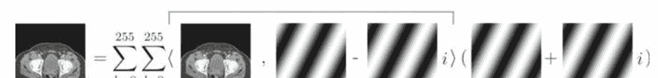

图1.2傅里叶变换

(1.16) 线性系统 $W^{-1}\mathbf{h} = \mathbf{x}$ 意味着 $W^{-1}$ 的列向量的线性组合是 $\mathbf{x}$（图1.2）。

设 $\mathbb{V}$ 是由 $\{\boldsymbol{\psi}_{\mathbf{m}} : 0 \le m_1, m_2 < 63\}$ 张成的 $\mathbb{H}$ 的子空间。维度 of $\mathbb{V}$ 是$64^2$，远小于 $N_{\text{pixel}} = 256^2$。定理1.1中的投影 $\mathcal{P}_{\mathbb{V}}\mathbf{x}$ 可以看作是在频域中进行的降维操作（将高于截止频率的所有频率分量置零）所得到的降维结果。

### 1.3.3 小波编码

小波在图像和频率域中提供了同时定位的优势，并且能够分离图像的细节（图1.3）。

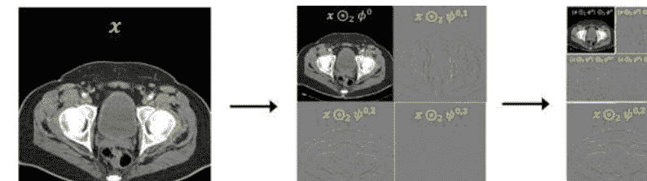

#### 1.3.3.1 哈尔小波

哈尔小波是最简单的小波。让我们解释一下哈尔分解和重构过程。数据x可以用哈尔基表示

$$\mathbf{x} = \sum_{l,k=0}^{127} \underbrace{\langle \mathbf{x}, \phi_{k,l}^0 \rangle}_{\mathbf{x} \circledast_2 \phi^0(k,l)} \phi_{k,l}^0 + \sum_{q=1}^{3} \sum_{l,k=0}^{127} \underbrace{\langle \mathbf{x}, \psi_{k,l}^{0,q} \rangle}_{\mathbf{x} \circledast_2 \psi^{0,q}(k,l)} \psi_{k,l}^{0,q}, \quad (1.17)$$

其中

$$\phi_{k,l}^0(m,n) = \frac{1}{\|\phi_{k,l}^0\|} \left( \frac{1}{4} \sum_{s,t=0}^{1} \delta(m-2k-s, n-2l-t) \right) \sim 2 \begin{pmatrix} 1/4 & 1/4 \\ 1/4 & 1/4 \end{pmatrix},$$

$$\psi_{k,l}^{0,1}(m,n) = \frac{1}{\|\psi_{k,l}^{0,1}\|} \left( \frac{1}{4} \sum_{s,t=0}^{1} (-1)^s \delta(m-2k-s, n-2l-t) \right) \sim 2 \begin{pmatrix} 1/4 & -1/4 \\ 1/4 & -1/4 \end{pmatrix},$$

$$\psi_{k,l}^{0,2}(m,n) = \frac{1}{\|\psi_{k,l}^{0,2}\|} \left( \frac{1}{4} \sum_{s,t=0}^{1} (-1)^t \delta(m-2k-s, n-2l-t) \right) \sim 2 \begin{pmatrix} 1/4 & 1/4 \\ -1/4 & -1/4 \end{pmatrix},$$

$$\psi_{k,l}^{0,3}(m,n) = \frac{1}{\|\psi_{k,l}^{0,3}\|} \left( \frac{1}{4} \sum_{s,t=0}^{1} (-1)^{t+s} \delta(m-2k-s, n-2l-t) \right) \sim 2 \begin{pmatrix} 1/4 & -1/4 \\ -1/4 & 1/4 \end{pmatrix},$$

在这里，$\mathbf{x} \circledast_n \phi$ 表示 $\mathbf{x}$ 与滤波器 $\phi$ 和步长 $n$ 的卷积。图像 $\mathbf{x}$ 与滤波器 $W = \begin{pmatrix} w_{00} & w_{01} \\ w_{10} & w_{11} \end{pmatrix}$ 的卷积步长为2，用 $\mathbf{x} \circledast_2 W$ 表示，定义为

$$\mathbf{x} \circledast_2 W = \begin{pmatrix} \sum_{m,n=0}^{1} x(m,n) w_{m,n} & \sum_{m,n=0}^{1} x(m, n+2) w_{m,n} & \cdots & \sum_{m,n=0}^{1} x(m, n+254) w_{m,n} \\ \sum_{m,n=0}^{1} x(m+2, n) w_{m,n} & \sum_{m,n=0}^{1} x(m+2, n+2) w_{m,n} & \cdots & \sum_{m,n=0}^{1} x(m+2, n+254) w_{m,n} \\ \sum_{m,n=0}^{1} x(m+4, n) w_{m,n} & \sum_{m,n=0}^{1} x(m+4, n+2) w_{m,n} & \cdots & \sum_{m,n=0}^{1} x(m+4, n+254) w_{m,n} \\ \vdots & \vdots & \ddots & \vdots \\ \sum_{m,n=0}^{1} x(m+254, n) w_{m,n} & \sum_{m,n=0}^{1} x(m+254, n+2) w_{m,n} & \cdots & \sum_{m,n=0}^{1} x(m+254, n+254) w_{m,n} \end{pmatrix}. \quad (1.18)$$

由于$\phi^0$与2x2矩阵相关，方便起见，写成

$$\mathbf{x} \circledast_2 \phi^0 = \mathbf{x} \circledast_2 \begin{pmatrix} \frac{1}{2} & \frac{1}{2} \\ \frac{1}{2} & \frac{1}{2} \end{pmatrix}. \quad (1.19)$$

同样，$\psi^{0,1}$, $\psi^{0,2}$, $\psi^{0,3}$与

$$x \otimes_2 \psi^{0,1} = x \otimes_2 \begin{pmatrix} \frac{1}{2} & -\frac{1}{2} \\ \frac{1}{2} & -\frac{1}{2} \end{pmatrix},$$

$$x \otimes_2 \psi^{0,2} = x \otimes_2 \begin{pmatrix} \frac{1}{2} & \frac{1}{2} \\ -\frac{1}{2} & -\frac{1}{2} \end{pmatrix},$$

$$x \otimes_2 \psi^{0,3} = x \otimes_2 \begin{pmatrix} \frac{1}{2} & -\frac{1}{2} \\ -\frac{1}{2} & \frac{1}{2} \end{pmatrix}.$$

根据分解，$x$可以用四个不同的图像$x \otimes_2 \phi^0$，$x \otimes_2 \psi^{0,1}$, $x \otimes_2 \psi^{0,2}$, $x \otimes_2 \psi^{0,3}$来表示，它们属于$\mathbb{C}^{128^2}$，这些图像由以下定义

$$x \otimes_2 \overline{\phi^0}(k,l) = \langle x, \phi^0_{k,l} \rangle \quad \text{对于} k,l = 0,\ldots,127,$$
$$x \otimes_2 \overline{\psi^{0,q}}(k,l) = \langle x, \psi^{0,q}_{k,l} \rangle \quad \text{对于} k,l = 0,\ldots,127, q=1,2,3.$$

同样地，$x \otimes_2 \phi^0$可以分解为

$$x \otimes_2 \phi^0 = \sum_{l,k=0}^{63} \langle x \otimes_2 \phi^0, \phi^0_{k,l} \rangle \phi^0_{k,l} + \sum_{q=1}^{3} \sum_{l,k=0}^{63} \langle x \otimes_2 \phi^0, \psi^{0,q}_{k,l} \rangle \psi^{0,q}_{k,l},$$

令 $\phi = \phi^0_{0,0}$ 和 $\psi^q = \psi^{0,q}_{0,0}$。然后，$\phi^0_{k,l}$ 和 $\psi^{0,q}_{k,l}$ 可以用 $\phi$ 和 $\psi^q$ 表示为：

$$\phi^0_{k,l}(m,n) = \phi(m-k, n-l) \quad \text{对于} k,l = 0,\ldots,63,$$
$$\psi^{0,q}_{k,l}(m,n) = \psi^q(m-k, n-l) \quad \text{对于} k,l = 0,\ldots,63, q=1,2,3.$$

然后，以下序列在离散情况下形成了$H$的多分辨率分析

$$V_7 = \left\{ x \otimes_2 \phi^0 : x \in H \right\} \supset V_6 = \left\{ h \otimes_2 \phi^0 : h \in V_7 \right\} \supset \cdots \supset V_1 = \left\{ h \otimes_2 \phi^0 : h \in V_2 \right\}$$

卷积 $x \otimes_2 \phi^0$被称为平均池化。因此，投影 $\mathcal{P}_{V_7} x$ 可以看作是通过平均池化获得的降维。

### 1.3.4 通用小波基

数据 $x$ 可以用通用小波基表示。

$$x = \sum_{l,k=0}^{127} \langle x, \phi^0_{k,l} \rangle \phi^0_{k,l} + \sum_{q=1}^{3} \sum_{l,k=0}^{127} \langle x, \psi^{0,q}_{k,l} \rangle \psi^{0,q}_{k,l},$$

其中

$$\phi_{k,l}^0(m,n) = \phi(m-k, n-l), \quad \psi_{k,l}^{0,1}(m,n) = \psi^1(m-k, n-l), \tag{1.25}$$
$$\psi_{k,l}^{0,2}(m,n) = \psi^2(m-k, n-l), \quad \psi_{k,l}^{0,3}(m,n) = \psi^3(m-k, n-l).$$

同样地，$\mathbf{x} \otimes_2 \phi$ 可以表示为

$$\mathbf{x} \otimes_2 \phi = \sum_{l,k=0}^{63} \langle \mathbf{x}, \phi_{k,l}^1 \rangle \phi_{k,l}^1 + \sum_{q=1}^{3} \sum_{l,k=0}^{63} \langle \mathbf{x}, \psi_{k,l}^{1,q} \rangle \psi_{k,l}^{1,q}, \tag{1.26}$$

其中

$$\phi_{k,l}^1(m,n) = \frac{1}{2^2} \phi(\lceil \frac{1}{2} m \rceil - k, \lceil \frac{1}{2} n \rceil - l), \quad \psi_{k,l}^{1,1}(m,n) = \frac{1}{2^2} \psi^1(\lceil \frac{1}{2} m \rceil - k, \lceil \frac{1}{2} n \rceil - l),$$
$$\psi_{k,l}^{1,2}(m,n) = \frac{1}{2^2} \psi^2(\lceil \frac{1}{2} m \rceil - k, \lceil \frac{1}{2} n \rceil - l), \quad \psi_{k,l}^{1,3}(m,n) = \frac{1}{2^2} \psi^3(\lceil \frac{1}{2} m \rceil - k, \lceil \frac{1}{2} n \rceil - l).$$

#### 1.3.4.1 框架

数据 $\mathbf{x}$ 也可以用以下分段线性B样条紧框表示：

$$\mathbf{x} = \sum_{l,k=0}^{127} \langle \mathbf{x}, \phi_{k,l}^0 \rangle \phi_{k,l}^0 + \sum_{q=1}^{8} \sum_{l,k=0}^{127} \langle \mathbf{x}, \psi_{k,l}^{0,q} \rangle \psi_{k,l}^{0,q}, \tag{1.27}$$

其中 $\phi^0, \psi^{0,1}, \ldots, \psi^{0,8}$ 是给定的

$$\phi^0 \sim \frac{1}{16} \begin{pmatrix} 1 & 2 & 1 \\ 2 & 4 & 2 \\ 1 & 2 & 1 \end{pmatrix}, \quad \psi^{0,1} \sim \frac{\sqrt{2}}{16} \begin{pmatrix} 1 & 0 & -1 \\ 2 & 0 & -2 \\ 1 & 0 & -1 \end{pmatrix}, \quad \psi^{0,2} \sim \frac{1}{16} \begin{pmatrix} -1 & 2 & -1 \\ -2 & 4 & -2 \\ -1 & 2 & -1 \end{pmatrix},$$
$$\psi^{0,3} \sim \frac{\sqrt{2}}{16} \begin{pmatrix} 1 & 2 & 1 \\ 0 & 0 & 0 \\ -1 & -2 & -1 \end{pmatrix}, \quad \psi^{0,4} \sim \frac{1}{8} \begin{pmatrix} 1 & 0 & -1 \\ 0 & 0 & 0 \\ -1 & 0 & 1 \end{pmatrix}, \quad \psi^{0,5} \sim \frac{\sqrt{2}}{16} \begin{pmatrix} -1 & 2 & -1 \\ 0 & 0 & 0 \\ 1 & -2 & 1 \end{pmatrix},$$
$$\psi^{0,6} \sim \frac{1}{16} \begin{pmatrix} -1 & -2 & -1 \\ 2 & 4 & 2 \\ -1 & -2 & -1 \end{pmatrix}, \quad \psi^{0,7} \sim \frac{\sqrt{2}}{16} \begin{pmatrix} -1 & 0 & 1 \\ 2 & 0 & -2 \\ -1 & 0 & 1 \end{pmatrix}, \quad \psi^{0,8} \sim \frac{1}{16} \begin{pmatrix} 1 & -2 & 1 \\ -2 & 4 & -2 \\ 1 & -2 & 1 \end{pmatrix}. \tag{1.28}$$

在这里，$\mathbf{x} \otimes_1 W$ 与 $W = \begin{pmatrix} w_{00} & w_{01} & w_{02} \\ w_{10} & w_{11} & w_{12} \\ w_{20} & w_{21} & w_{22} \end{pmatrix}$ 的定义如下：

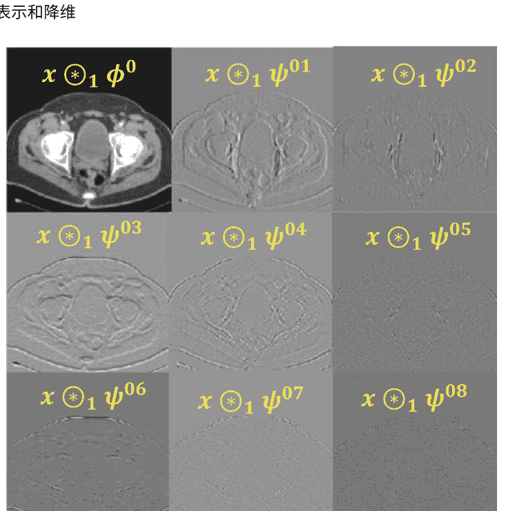

图1.4 帧分解的数据表示

$$x \circledast_1 W = \begin{pmatrix}
\sum_{m,n=0}^2 x(m-1,n-1)w_{m,n} & \sum_{m,n=0}^2 x(m-1,n)w_{m,n} & \cdots & \sum_{m,n=0}^2 x(m-1,n+254)w_{m,n} \\
\sum_{m,n=0}^2 x(m,n-1)w_{m,n} & \sum_{m,n=0}^2 x(m,n)w_{m,n} & \cdots & \sum_{m,n=0}^2 x(m,n+254)w_{m,n} \\
\sum_{m,n=0}^2 x(m+1,n-1)w_{m,n} & \sum_{m,n=0}^2 x(m+1,n)w_{m,n} & \cdots & \sum_{m,n=0}^2 x(m+1,n+254)w_{m,n} \\
\vdots & \vdots & \ddots & \vdots \\
\sum_{m,n=0}^2 x(m+254,n-1)w_{m,n} & \sum_{m,n=0}^2 x(m+254,n)w_{m,n} & \cdots & \sum_{m,n=0}^2 x(m+254,n+254)w_{m,n}
\end{pmatrix} \quad (1.29)$$

卷积 $x \circledast_1 W$ 可以用块Hankel矩阵（图1.4）表示为以下线性形式：

$$\mathbf{x} \circledast_{1} W = \begin{pmatrix} \mathcal{H}_{\mathbf{x}}^{0,0} & \mathcal{H}_{\mathbf{x}}^{0,1} & \mathcal{H}_{\mathbf{x}}^{0,2} \\ \mathcal{H}_{\mathbf{x}}^{1,0} & \mathcal{H}_{\mathbf{x}}^{1,1} & \mathcal{H}_{\mathbf{x}}^{1,2} \\ \mathcal{H}_{\mathbf{x}}^{2,0} & \mathcal{H}_{\mathbf{x}}^{2,1} & \mathcal{H}_{\mathbf{x}}^{2,2} \\ \vdots & \vdots & \vdots \\ \mathcal{H}_{\mathbf{x}}^{255,0} & \mathcal{H}_{\mathbf{x}}^{255,1} & \mathcal{H}_{\mathbf{x}}^{255,2} \end{pmatrix} \begin{pmatrix} w_{00} \\ w_{01} \\ w_{02} \\ w_{10} \\ \vdots \\ w_{22} \end{pmatrix},$$

其中，$\mathcal{H}_{\mathbf{x}} \in \mathbb{C}^{256^2 \times 9}$，$\mathbf{w} \in \mathbb{C}^{9}$ (1.30)

其中

$$\mathcal{H}_{\mathbf{x}}^{0,0} = \begin{pmatrix} x(-1, -1) & x(-1, 0) & x(-1, 1) \\ x(-1, 0) & x(-1, 1) & x(-1, 2) \\ \vdots & \vdots & \vdots \\ x(-1, 254) & x(-1, 255) & x(-1, 256) \end{pmatrix},$$

$$\mathcal{H}_{\mathbf{x}}^{0,1} = \begin{pmatrix} x(0, -1) & x(0, 0) & x(0, 1) \\ x(0, 0) & x(0, 1) & x(0, 2) \\ \vdots & \vdots & \vdots \\ x(0, 254) & x(0, 255) & x(0, 256) \end{pmatrix}, \ldots$$

$$\mathcal{H}_{\mathbf{x}}^{m,k} = \begin{pmatrix} x(m-1+k, 0) & x(m-1+k, 1) & x(m-1+k, 2) \\ x(m-1+k, 0) & x(m-1+k, 1) & x(m-1+k, 2) \\ \vdots & \vdots & \vdots \\ x(m-1+k, 254) & x(m-1+k, 255) & x(m-1+k, 256) \end{pmatrix}, \ldots (1.31)$$

### 1.3.5 主成分分析 (PCA)

#### 1.3.5.1 数据、协方差和相似性矩阵

为了方便解释，我们假设 $X$ 是一个图像的数据表（或矩阵），位于高维空间 $\mathbb{R}^{N_{\text{pixel}}}$（例如 $N_{\text{pixel}} = 93 \times 70$）：

$$X = \begin{pmatrix} \mathbf{x}^{(1)} & \mathbf{x}^{(2)} & \ldots & \mathbf{x}^{(N_{\text{data}})} \end{pmatrix}^T = \begin{pmatrix} \text{[图像]}^{(1)} \\ \vdots \\ \text{[图像]}^{(N_{\text{数据}})} \end{pmatrix}, (1.32)$$

上标 $T$ 表示转置。图像的每个分量 $\mathbf{x}^{(n)}(\mathbf{m})$ 表示第 $\mathbf{m}$ 个像素的亮度。

数据表 $X$ 的均值为

$$\bar{\mathbf{x}} := E(X) = \frac{1}{N_{\text{数据}}} \sum_{n=1}^{N_{\text{数据}}} \mathbf{x}^{(n)}, (1.33)$$其中 $E(X)$ 表示在所有 $\mathbf{x}_n$ 等可能的假设下，$X$ 的期望。数据表 $X$ 的标准差（即逐行 $\text{std}(X)$）是数据的分散程度的度量：

$$\text{std}(X) = \sqrt{\frac{1}{N_{\text{数据}}} \sum_{n=1}^{N_{\text{数据}}} \| \mathbf{x}^{(n)} - \bar{\mathbf{x}} \|^2}, \quad (1.34)$$

方差简单地是 $\sigma^2$，即标准差的平方。

数据表 $X$ 的协方差矩阵是一个 $N_{\text{像素}} \times N_{\text{像素}}$ 的矩阵，表示数据的分布情况：$\text{cov}(X, X) = $

$$\text{cov}(X, X) = \frac{1}{N_{\text{数据}} - 1} X^T X - \bar{\mathbf{x}} \bar{\mathbf{x}}^T, \quad (1.35)$$

很容易看出协方差矩阵 $\text{cov}(X, X)$ 是对称的且半正定的。

数据表 $X$ 的格拉姆矩阵是一个 $N_{\text{数据}} \times N_{\text{数据}}$ 的矩阵，表示数据之间的相似性（或不相似性）。它的第 $i,j$ 个分量是内积 $G_{i,j} = \langle \mathbf{x}_i - \bar{\mathbf{x}}, \mathbf{x}_j - \bar{\mathbf{x}} \rangle$:

$$G_X = (X - \mathbf{1} \bar{\mathbf{x}}^T)(X - \mathbf{1} \bar{\mathbf{x}}^T)^T = \left( I_{N_{\text{数据}}} - \frac{1}{N_{\text{数据}}} \mathbf{1} \mathbf{1}^T \right) X X^T \left( I_{N_{\text{数据}}} - \frac{1}{N_{\text{数据}}} \mathbf{1} \mathbf{1}^T \right), \quad (1.36)$$

其中 $\mathbf{1} = (1, \dots, 1)^T \in \mathbb{R}^{N_{\text{数据}}}$，$I_{N_{\text{数据}}}$ 是大小为 $N_{\text{数据}}$ 的单位矩阵。

#### 1.3.5.2 奇异值分解（SVD）

矩阵 $X$ 的奇异值分解（SVD）允许我们将 $X$ 分解为按大小排序的秩一片段：

$$X = \underbrace{(\mathbf{u}_1 \cdots \mathbf{u}_{N_{\text{数据}}})}_{U} \underbrace{\begin{pmatrix} \lambda_1 & & 0 \cdots \\ & \ddots & \\ & & \lambda_r & 0 \cdots \\ 0 & \cdots & 0 & \cdots \end{pmatrix}}_{\Lambda} \underbrace{\begin{pmatrix} \mathbf{w}_1^T \\ \vdots \\ \mathbf{w}_{N_{\text{像素}}}^T \end{pmatrix}}_{W} = \lambda_1 \mathbf{u}_1 \mathbf{w}_1^T + \cdots + \lambda_r \mathbf{u}_r \mathbf{w}_r^T, \quad (1.37)$$

其中 $\mathbf{u}_j, \mathbf{w}_j, \lambda_j$ 满足以下条件：

-   $\lambda_1 \ge \lambda_2 \ge \cdots \ge \lambda_r > 0 = \lambda_{r+1} = \lambda_{N_{\text{像素}}}$ 是 $X$ 的特征值。
    - $\mathbf{w}_1, \cdots, \mathbf{w}_{N_{\text{像素}}}$ 是 $X$ 的相应单位特征向量。
    - $\mathbf{u}_i = \frac{1}{\lambda_i}$ 对于 $i = 1, 2, \cdots, r$, $X \mathbf{w}_i$。注意 $\| \mathbf{u}_i \|^2 = \mathbf{w}_i^T X^T X \mathbf{w}_i = 1$。
    - $U U^T = I_{N_{\text{数据}}}$ 和 $W^T W = I_{N_{\text{像素}}}$，其中 $I_{N_{\text{数据}}}$ 是 $N_{\text{数据}}$ 的单位矩阵。

$X$的伪逆矩阵是

$$X^{\dagger} = W \Lambda^{-1} U^T = \frac{1}{\lambda_1} \mathbf{w}_1 \mathbf{u}_1^T + \cdots + \frac{1}{\lambda_r} \mathbf{w}_r \mathbf{u}_r^T. \tag{1.38}$$

注意，乘积$X X^{\dagger}$和$X^{\dagger} X$可以看作是投影矩阵：

-   $X X^{\dagger}$是$X$的列空间的投影矩阵，因为
$$X X^{\dagger} \mathbf{u}_j = X \left( \frac{1}{\lambda_1} \mathbf{w}_1 \mathbf{u}_1^T + \cdots + \frac{1}{\lambda_r} \mathbf{w}_r \mathbf{u}_r^T \right) \mathbf{u}_j = X \left( \frac{1}{\lambda_j} \mathbf{w}_j \right) = \mathbf{u}_j.$$
$X^{\dagger} X$是投影矩阵到$X$的行空间，因为
$$X^{\dagger} X \mathbf{w}_j = X^{\dagger} (\lambda_j \mathbf{u}_j) = \mathbf{w}_j.$$
因此，$\mathbf{w}^* = X^{\dagger} \mathbf{b}$可以被视为$X\mathbf{w} = \mathbf{b}$的最小二乘解，意味着

$$X^T X \underbrace{\mathbf{w}^*}_{X^{\dagger}\mathbf{b}} = X^T \mathbf{b} \quad \text{和} \quad \underbrace{\mathbf{w}^*}_{X^{\dagger}\mathbf{b}} = \text{argmin}_{\mathbf{w}} \| X\mathbf{w} - \mathbf{b} \|. \tag{1.39}$$

#### 1.3.5.3 主成分分析编码

主成分分析是一种将数据表$X$表达出其相似性和不相似性的方法，假设数据$\{\mathbf{x}_1, \cdots, \mathbf{x}_N\}$大致上位于线性流形上（通过线性回归），该流形在全局上同胚于$\mathbb{R}^k$。假设$k \ll \min\ (N_{\text{像素}},\ N)$，PCA执行降维，因为数据可以投影到$k$个主成分的张成空间上，这可以看作是最佳拟合的$k$维子空间。

为了理解主成分，让我们考虑沿着一个单位向量的方差$\mathbf{d}$

$$\frac{1}{N_{\text{数据}}} \sum_{n=1}^{N_{\text{数据}}} (\mathbf{d}_1^T (\mathbf{x}_n - \bar{\mathbf{x}}))^2 = \mathbf{d}_1^T \left( \frac{1}{N_{\text{数据}}} \sum_{n=1}^{N_{\text{数据}}} (\mathbf{x}_n - \bar{\mathbf{x}})(\mathbf{x}_n - \bar{\mathbf{x}})^T \right) \mathbf{d}_1. \tag{1.40}$$

为了简化符号，假设数据的均值为$\bar{\mathbf{x}} = \mathbf{0}$。第一个主成分是向量$\mathbf{d}_1 \in \mathbb{R}^{N_{\text{像素}}}$，它最大化了数据表$X$中的方差。

$$\mathbf{d}_1 = \underset{\| \mathbf{d} \|=1}{\text{argmax}}[\mathbf{d}^T X^T X \mathbf{d}]. \tag{1.41}$$

通过使用拉格朗日乘数，(1.41)变为以下无约束最大化问题：$\mathbf{d}_1 = \text{argmax}_{\mathbf{d}}$

$$[\mathbf{d}^T X^T X \mathbf{d} + \lambda(1 - \| \mathbf{d} \|^2)]. \tag{1.42}$$

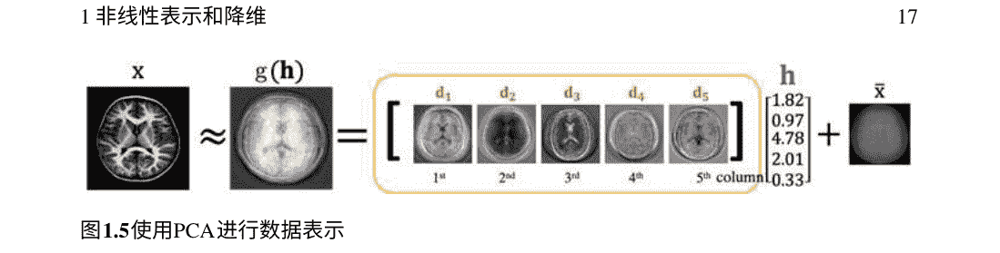

通过求导 $[\mathbf{d}^T X^T X \mathbf{d} + \lambda(1 - \|\mathbf{d}\|^2)]$ 关于 $\mathbf{d}$ 的导数，我们有

$X^T X \mathbf{d} = \lambda \mathbf{d}$. (1.43)

因此， $\mathbf{d}_1$ 应该是与最大特征值($\lambda_1$)对应的单位特征向量 ($X^T X$ 的最大方差)。

$\mathbf{d}_1^T X^T X \mathbf{d}_1 = \lambda_1$. (1.44)

让我们用稍微不同的方式解释 PCA。解码器 $g$ 可以表示为一个 $N_{\text{像素}} \times k$ 矩阵 $\Psi$ 或 $W^T$：

$g(\mathbf{h}) = \Psi \mathbf{h} = \underbrace{\left(\begin{array}{c|c|c} \mathbf{d}_1 & \cdots & \mathbf{d}_k \ \end{array}\right)}_{\Psi} \underbrace{\left(\begin{array}{c} h(1) \ \vdots \ h(k) \end{array}\right)}_{\mathbf{h}} = \sum_{j=1}^{k} h(j) \mathbf{d}_j$, (1.45)

主成分分析将 $\Psi$ (即 $\mathbf{d}_1, \cdots, \mathbf{d}_k$) 的列约束为正交向量 $\mathbb{R}^{N_{\text{像素}}}$：

$\underbrace{\left(\begin{array}{c|c|c} \mathbf{d}_1 & \cdots & \mathbf{d}_k \ \end{array}\right)^T}_{\mathscr{D}^T} \underbrace{\left(\begin{array}{c|c|c} \mathbf{d}_1 & \cdots & \mathbf{d}_k \ \end{array}\right)}_{\mathscr{D}} = \underbrace{\left(\begin{array}{ccc} 1 & \cdots & 0 \ \vdots & \ddots & \vdots \ 0 & \cdots & 1 \end{array}\right)}_{I_k}$ (1.46)

这些正交向量 $\mathbf{d}_1, \cdots, \mathbf{d}_k$ 被称为主成分。给定一个数据矩阵 $X = [\mathbf{x}_1, \cdots, \mathbf{x}_N]^T$, 解码矩阵 $\Psi$ 可以选择通过

$\Psi = \underset{\Psi \in \mathbb{R}^{256^2 \times k}}{\text{argmin}} \sum_{n=1}^{N} \|\mathbf{x}_i - \Psi \Psi^T \mathbf{x}_i\|^2$ 受限于 $\Psi^T \Psi = I_k$. (1.47)

在这里， $k$ 是主成分的数量。作为 PCA 重建过程，第一个主成分 $\mathbf{d}_1$ 可以通过获得

$\mathbf{d}_1 = \argmin_{\mathbf{d} \in \mathbb{R}^{256^2}} \sum_{n=1}^N \|\mathbf{x}_i - \mathbf{d} \mathbf{d}^T \mathbf{x}_i\|^2$ 受限于 $\|\mathbf{d}\| = 1.$ (1.48)

从(1.48)中找到 $\mathbf{d}_1$ 等价于

$\mathbf{d}_1 = \argmin_{\mathbf{d} \in \mathbb{R}^{256^2}} \|X - \mathbf{d}\mathbf{d}^T X\|_F^2$ 受限于 $\|\mathbf{d}\| = 1,$ (1.49)

其中 $\|\cdot\|_F$ 表示Frobenius范数 (即 $\|X\|_F = \sqrt{\sum_{n=1}^N \|\mathbf{x}_i\|^2}$)。注意到 $\|X - \mathbf{d}\mathbf{d}^T X\|_F^2 = (X - \mathbf{d}\mathbf{d}^T X)^T (X - \mathbf{d}\mathbf{d}^T X)$，将 $X$ 视为常数，一个简单的计算表明

$\mathbf{d}_1 = \argmin_{\mathbf{d} \in \mathbb{R}^{256^2}} \left(-\mathrm{Tr}(X^T X \mathbf{d}\mathbf{d}^T)\right) = \argmin_{\mathbf{d} \in \mathbb{R}^{256^2}} \left(-\mathbf{d}^T X^T X \mathbf{d}\right)$ subject to $\|\mathbf{d}\| = 1.$ (1.50)

因此，$\mathbf{d}_1$ 满足

$\mathbf{d}_1 = \argmax_{\|\mathbf{d}\|=1} \left(\mathbf{d}^T X^T X \mathbf{d}\right).$ (1.51)

为了找到第 $j$ 个主成分 $\mathbf{d}_j$，我们从 $X$ 中减去前 $j-1$ 个主成分：

$X_j = X - \sum_{n=1}^j X \mathbf{d}_n \mathbf{d}_n^T,$ (1.52)

同样，我们可以通过最小化

$\mathbf{d}_j = \argmax_{\|\mathbf{d}\|=1} \mathbf{d}^T X_j^T X_j \mathbf{d}.$ (1.53)

因此，解码矩阵 $\psi$ 是一个最小化器：

$\psi = \argmax_{\psi^T \psi = I_k} \mathrm{Tr}(\psi^T X^T X \psi).$ (1.54)

给定解码 $\psi$ 和数据 $\mathbf{x}$，我们以这样的方式生成 $\mathbf{c}$，使得

$\mathbf{h} = \argmin_{\mathbf{h} \in \mathbb{R}^k} \|\mathbf{x} - \psi \mathbf{h}\|^2 = \argmin_{\mathbf{h} \in \mathbb{R}^k} (\mathbf{x} - \psi \mathbf{h})^T (\mathbf{x} - \psi \mathbf{h}).$ (1.55)

由于 $\mathbf{x}$ 和 $D$ 被视为常数，(1.55) 可以简化为

$\mathbf{h} = \argmin_{\mathbf{h} \in \mathbb{R}^k} \left(-2\mathbf{x}^T \psi \mathbf{h} + \mathbf{h}^T \psi^T \psi \mathbf{h}\right) = \argmin_{\mathbf{h} \in \mathbb{R}^k} \left(-2\mathbf{x}^T \psi \mathbf{h} + \mathbf{c}^T \mathbf{h}\right).$ (1.56)

最小化函数 $h$ 必须满足

$$0 = \nabla_{\mathbf{h}} (-2\mathbf{x}^T \Psi \mathbf{h} + \mathbf{c}^T \mathbf{h}) = -2(\Psi^T \mathbf{x} - \mathbf{h}). \quad (1.57)$$

### 1.3.6 正则化和压缩感知

对于 $\mathbf{z} = (z_1, \cdots, z_N)$ 定义0-范数

对于 $\mathbf{z}$，0范数定义为：$|\{j: z_j = 0\}|$（非零元素的数量） (1.58)

和1-范数

$$\|\mathbf{z}\|_1 = \sum_j |z_j|. \quad (1.59)$$

假设 $x$ 是约束线性问题的近似解：

$$\begin{pmatrix} \psi_{00} & \psi_{01} & \cdots & \psi_{0,N_z} \\ \psi_{10} & \psi_{11} & \cdots & \psi_{1,N_z} \\ \vdots & \vdots & \ddots & \vdots \\ \psi_{N_x,0} & \psi_{N_x,1} & \cdots & \psi_{N_x,N_z} \end{pmatrix} \begin{pmatrix} z_0 \\ z_1 \\ \vdots \\ z_{N_z} \end{pmatrix} \approx \begin{pmatrix} x_0 \\ x_1 \\ \vdots \\ x_{N_x} \end{pmatrix} \quad (1.60)$$

受约束条件限制

$$\|\mathbf{z}\|_0 \leq k \quad (k \text{取决于} N_z). \quad (1.61)$$

这可以被视为通过稀疏潜在表示生成 $x$ 的问题。稀疏表示问题可能是NP难的，因为从 $N_z$ 中选择 $k$ 的所有情况的数量很大。与解决NP难问题不同，可以考虑最接近凸最小化问题的松弛 $\ell_1$ 最小化问题：

$$\mathbf{z} = \arg\min_{\mathbf{z} \in \mathbb{R}^n} \frac{1}{2} \|\mathbf{x} - \Psi \mathbf{z}\|_2^2 + \lambda \|\mathbf{z}\|_1, \quad (1.62)$$

其中 $\|\mathbf{z}\|_{\ell_1} = \sum$ 这里，第一项强制残差 $\Gamma(\mathbf{z}) = \frac{1}{2} \|\mathbf{x} - \Psi \mathbf{z}\|^2$ 很小，正则化参数 $\lambda \geq 0$ 控制逼近误差 $\Gamma(\mathbf{z})$ 和向量范数 $\|\mathbf{z}\|_1$ 之间的权衡。

我们应该注意，$||\mathbf{z}||_{\ell_1}$ 在任何点上都不可微在 $\mathbf{z}$ 的 $\{j: z_j =0\} >0$ 点上。然而，$\Upsilon(\mathbf{z})$ 仍然是凸的，因此存在单侧方向导数 $\nabla \Upsilon(\mathbf{z}; \mathbf{d}) = \lim_{t \to 0^+} \frac{1}{t}(\Upsilon(\mathbf{z} + t\mathbf{d}) - \Upsilon(\mathbf{z}))$ ：

$$\nabla \Upsilon(\mathbf{z}, \mathbf{d}) = -\mathbf{w}^T \mathbf{A}^T (\mathbf{x} - \mathbf{A}\mathbf{z}) + \lambda \sum_{\{j: z_j\neq 0\}} d_j \text{sign}(z_j) + \lambda \sum_{\{j: z_j=0\}} |d_j|.$$

如果 $\mathbf{z}$ 是一个最小化器，则对于所有的 $\mathbf{d}$ 和 $t>0$ (在所有的方向上都上升)，有 $\Upsilon(\mathbf{z} + t\mathbf{d}) \geq \Upsilon(\mathbf{z})$，因此对于所有的方向 $\mathbf{d}$，有 $\nabla \Upsilon(\mathbf{z}; \mathbf{d}) \geq 0$。准确地说，$\mathbf{z}$ 是一个最小化器 $\iff$ $\nabla \Upsilon(\mathbf{z}; \mathbf{d}) \geq 0$ 对于所有的 $\mathbf{d} \in \mathbb{R}^n$ $\iff$ 对于集合 $J$ 中的所有 $j=\{1, \cdots , n\}$，

1.  $\text{sign}(z_j) \neq 0 \implies -\mathbf{e}_j^T \Psi^T (\mathbf{x} - \Psi\mathbf{z}) + \lambda \text{sign}(z_j) = 0$
2.  $z_j = 0 \implies |\mathbf{e}_j^T \Psi^T (\mathbf{x} - \Psi\mathbf{z})| \leq \lambda$。

在这里，$\mathbf{e}_j$ 是一个单位向量，其第j个分量为1，而 $\mathbf{e}_j^T \Psi$ 是 $\Psi$ 的第j列。第一个陈述来自于方向导数的存在 $\nabla \Upsilon(\mathbf{z}, \mathbf{e}_j)=-\nabla \Upsilon(\mathbf{z}, -\mathbf{e}_j)=0$，其中 $j$ 的 $\text{sign}(z_j) \neq 0$。第二个陈述来自于单侧导数的正性 $\nabla \Upsilon(\mathbf{z}, \pm \mathbf{e}_j) \geq 0$，其中 $j$ 的 $\text{sign}(z_j) = 0$。

## 1.4 自动编码器和流形学习

自动编码器（AE）是一种表示学习技术，通过训练前馈神经网络将输入数据在输出端进行复制，网络中包含一个内部的“瓶颈”层，强制网络对输入数据进行紧凑的表示[25, 33]。更准确地说，AE是无监督的神经网络，在编码阶段（$\Phi: \mathbf{x} \rightarrow \mathbf{h}$）中保持最大的信息，使得解码后的图像 $\hat{\mathbf{x}} = \Psi(\mathbf{h}) = \Psi \circ \Phi(\mathbf{x})$ 与原始输入 $\mathbf{x}$ 接近。为了降低维度，AE强制输入 $\mathbf{x}$ 通过网络的瓶颈（即潜变量空间），其维度（用 $N_{\text{latent}}$ 表示）远小于输入 $\mathbf{x}$ 的维度（即 $N_{\text{pixel}}$）。编码器 $\Phi$ 和解码器 $\Psi$ 是使用训练数据 $\mathscr{T}_{\text{images}} = \{\mathbf{x}^{(k)}\}_{k=1}^{N_{\text{数据}}}$ 获得的。

$$(\Phi, \Psi) = \underset{(\Phi, \Psi) \in \text{AE}}{\text{argmin}} \frac{1}{N_{\text{数据}}} \sum_{n=1}^{N_{\text{数据}}} ||\Psi \circ \Phi(\mathbf{x}^{(n)}) - \mathbf{x}^{(n)}||^2, \tag{1.63}$$

其中 $\text{AE}$ 是图1.6中描述的学习网络。映射 $\Psi$ 和 $\Phi$ 只能“近似”互为逆映射。编码器的输出 $\mathbf{h} = \Phi(\mathbf{x})$ 可以看作是一种压缩的潜在表示，解码器 $\Psi$ 将 $\mathbf{h}$ 转换为与原始输入类似的图像。总之，自动编码器学习了输入的近似恒等函数（即无损编码 $\Psi \circ \Phi(\mathbf{x}) \approx \mathbf{x}$）受到 $N_{\text{latent}}$ 个潜在维度和 $N_{\text{pixel}}$ 个像素的约束（即压缩的潜在表示或降维）。

### 1.4.1 线性和半线性自编码器

下面的线性自编码器通过最小化 L² 散度与主成分分析（PCA）几乎等价：

$$\Phi, \Psi = \underset{\Phi, \Psi}{\text{argmin}} \frac{1}{N_{\text{数据}}} \sum_{n=1}^{N_{\text{数据}}} \| \Psi \Phi \mathbf{x}^{(n)} - \mathbf{x}^{(n)} \| ^2, \quad (1.64)$$

其中 $\Phi$ 是一个 $N_{\text{latent}} \times N_{\text{pixel}}$ 的编码矩阵，$\Psi$ 是一个 $N_{\text{pixel}} \times N_{\text{latent}}$ 的解码矩阵。解码 $\Psi$ 可以设置为 $\Phi$ 的转置。与PCA不同，$\Phi$ 的列向量可能不是相互正交的。图1.9显示了一个具有 $N_{\text{latent}}$ 个潜在维度的线性自编码器，因此输出 $\Psi \circ \Phi(\mathbf{x})$ 位于由 $\Psi$ 的列向量张成的二维空间中。具有大量降维的线性自编码器在编码过程中往往会丢失很多图像细节，类似于吉布斯现象的效应。此外，两个图像的线性插值（即两个图像的平均 $t\Psi(\mathbf{h}^{(i)}) + ((1-t)\Psi(\mathbf{h}^{(j)}))$ ）通常会产生毫无意义的图像。

AE的一个重要目标是通过变化潜在向量 $\mathbf{h}$ 来生成各种有意义的图像。训练数据得到的高维空间 $\mathbb{R}^{N_{\text{pixel}}}$ 中的嵌入范围 $\{\Psi(\mathbf{h}) : \mathbf{h} \in \mathbb{R}^{N_{\text{latent}}}\}$。因此，我们可以假设数据 $\mathscr{T}_{\text{images}}$ 几乎位于一个学习到的流形 $\mathcal{M} = \{\Psi(\mathbf{h}) : \mathbf{h} \in \mathbb{R}^{N_{\text{latent}}}\}$ 上，其Hausdorff维度为 $N_{\text{latent}}$。我们希望通过潜在空间的插值来实现 $\Psi((1-t)\mathbf{h}^{(i)} + t \mathbf{h}^{(j)}), 0 < t < 1$，提供了两个图像之间的医学意义上的插值（$\Psi(\mathbf{h}^{(i)}) = \mathbf{x}^{(i)}$ 和 $\Psi(\mathbf{h}^{(j)}) = \mathbf{x}^{(j)}$ 之间的非线性插值）。

自编码器可以用于图像去噪[22]。去噪自编码器找到编码器 $\Phi$ 和解码器 $\Psi$，使得 $\Psi \circ \Phi$ 能够将噪声输入映射为干净的图像，同时保留重要特征。其基本思想与现有方法（如低通滤波和压缩感知）类似（图1.7和1.8）。

为了方便解释，让 $\mathcal{I}_{\text{images}} = \{\mathbf{x}^{(n)}\}_{n=1}^{N_{\text{data}}}$ 成为一组脑部CT图像。我们假设大多数现有的脑部CT图像位于一个低维流形 $\mathcal{M}$ 附近，其Hausdorff维数小于或等于 $N_{\text{latent}}$。我们希望经过训练的解码器 $\Psi$ 能够生成 $\mathcal{M}$（图1.9和1.10）。

限制玻尔兹曼机（RBMs）已被用作生成模型，学习给定数据的概率分布[26]。RBMs是具有二进制可见（输入）和隐藏单元（潜在变量）的两层神经网络。术语“受限”在RBM中，隐藏单元之间没有通信的限制。在隐藏节点上，潜在向量由 $\mathbf{h} = \Phi(\mathbf{x}) := \sigma(W \mathbf{x} + \mathbf{b})$ 表示，其中 $\sigma$ 是逻辑sigmoid函数，$W$ 是一个 $N_{\text{latent}} \times N_{\text{pixel}}$ 矩阵。在重建阶段，它使用相同的矩阵 $W$ 来重现 $\Psi(\mathbf{h}) = \sigma(W^T \mathbf{h} + \mathbf{b})$，其中 $W^T$ 是 $W$ 的转置。因此，RBM是对称的（图1.11、1.12和1.13）。

在RBM中，我们通过调整 $\Theta = (W, \mathbf{b}, \mathbf{b})$ 来提高概率 $p_{\Theta}(\mathbf{x})$（稍后将定义），以降低能量的定义

$$E(\mathbf{x}, \mathbf{h}) = -\mathbf{x}^T (W \mathbf{h}) - \mathbf{b}^T \mathbf{x} - \mathbf{b}^T \mathbf{h}. \tag{1.65}$$

对于一对 $(\mathbf{x}, \mathbf{h})$ 的联合概率分布被定义为

$$p(\mathbf{x}, \mathbf{h}) = \frac{1}{Z} e^{-E(\mathbf{x},\mathbf{h})}, \tag{1.66}$$

其中 $Z$ 是一个归一化常数，它是 $e^{-E(\mathbf{x},\mathbf{h})}$ 在所有可能的配置上的和。 上述概率是以下边缘概率的 $\mathbf{x}$:

$$p_{\Theta}(\mathbf{x}) = \sum_{\mathbf{h}} p(\mathbf{x}, \mathbf{h}) = \frac{1}{Z} \sum_{\mathbf{h}} e^{\mathbf{x}^T(W\mathbf{h})+\mathbf{b}^T\mathbf{x}+\mathbf{b}^T\mathbf{h}}, \tag{1.67}$$

给定训练数据 $\mathscr{D}_{\text{images}} = \{\mathbf{x}^{(k)}\}_{k=1}^{N_{\text{数据}}}$，损失函数为

$$\text{损失}(\Theta) = -\frac{1}{N_{\text{数据}}} \sum_{k=1}^{N_{\text{数据}}} \log p_{\Theta} (\mathbf{x}^{(k)}), \tag{1.68}$$

请注意 $p_{\Theta}(h_j = 1|\mathbf{x})$ (给定 $\mathbf{x}$ 的条件概率 $\mathbf{h}$ 的 j-th分量) 是 $\sigma (W\mathbf{x} + \mathbf{b})$ 的j-th分量，并且 $p_{\Theta}(x_ j = 1|\mathbf{h})$ (给定 $\mathbf{h}$ 的条件概率 $\mathbf{x}$ 的j-th分量) 是 $\sigma (W^{T}\mathbf{h} + \mathbf{b})$ 的j-th分量。

### 1.4.2 卷积自编码器 (CAE)

最简单的非线性编码器 (压缩) 和解码器 (解压缩) 是 (图1.14、1.15和1.16)

$$\Phi(\mathbf{x}) =\sigma (W \circledast \mathbf{x} + \mathbf{b}) \text{ 和 } \Psi (\mathbf{h}) =\sigma (W \circledast^{\dagger} \mathbf{h} + \mathbf{b} ), \tag{1.69}$$

其中 $W \circledast \mathbf{x}$ 表示 $\mathbf{x}$ 的卷积[68]，带有权重 $W$ 的 $\mathbf{h}$ 的上卷积[68]表示为 $W \circledast^{\dagger} \mathbf{h}$，$\sigma(\cdot)$ 表示逐元素激活函数，$\mathbf{h} \in \mathbb{R}^{N_{\text{latent}}}$ 是潜在的，$\mathbf{b} \in \mathbb{R}^{N_{\text{pixel}}}$ 和 $\mathbf{b} \in \mathbb{R}^{N_{\text{pixel}}}$。为了清楚起见，让我们举个例子。假设 $\mathbf{x}$ 是一个尺寸为 $256 \times 256$ 的图像。假设 $W$ 是一个尺寸为 $5 \times 5$ 的权重：

$$W = \begin{bmatrix} w(1,1) & \cdots & w(1,5) \\ \vdots & \ddots & \vdots \\ w(5,1) & \cdots & w(5,5) \end{bmatrix} (1.70)$$

然后，使用步长为1的卷积 $W \circledast_1 \mathbf{x}$ 产生一个尺寸为 $252 \times 252$ 的图像，其表示为

$$W \circledast_1 \mathbf{x} = \begin{bmatrix} \sum_{i,j=1}^{5} w(i,j)x(i,j) & \sum_{i,j=1}^{5} w(i,j)x(i,j+1) & \cdots & \sum_{i,j=1}^{5} w(i,j)x(i,j+251) \\ \sum_{i,j=1}^{5} w(i,j)x(i+1,j) & \sum_{i,j=1}^{5} w(i,j)x(i+1,j+1) & \cdots & \sum_{i,j=1}^{5} w(i,j)x(i+1,j+251) \\ \vdots & \vdots & \ddots & \vdots \\ \sum_{i,j=1}^{5} w(i,j)x(i+251,j) & \sum_{i,j=1}^{5} w(i,j)x(i+251,j+1) & \cdots & \sum_{i,j=1}^{5} w(i,j)x(i+251,j+251) \end{bmatrix}$$

这是一个 $252 \times 252$ 矩阵，其中 $252$ 来自于 $252=256-5+1$。 (1.71)

其中 $x(i,j)$ 表示像素位置 $(i,j)$ 的灰度值。为了理解上卷积 $W \circledast^\dagger \mathbf{h}$，我们考虑以下简单的例子：

$$\begin{pmatrix} w(1,1) & w(1,2) \\ w(2,1) & w(2,2) \end{pmatrix} \circledast^\dagger \begin{pmatrix} h(1,1) & h(1,2) & h(1,3) \\ h(2,1) & h(2,2) & h(2,3) \\ h(3,1) & h(3,2) & h(3,3) \end{pmatrix} = \begin{pmatrix} u(1,1) & \cdots & u(1,4) \\ u(2,1) & \cdots & u(2,4) \\ u(3,1) & \cdots & u(3,4) \\ u(4,1) & \cdots & u(4,4) \end{pmatrix}$$

输出 $\mathbf{u}$ 预计是以下反卷积问题的解

$$W \circledast \mathbf{u} = \mathbf{h} \tag{1.73}$$

可以写成然后，输出 u 通过计算得到

$$ W^T \mathbf{h}_{\text{向量化}} = \mathbf{u}_{\text{向量化}} $$

上卷积感觉上像是卷积的逆过程，但实际上并不是数学上的逆过程或反卷积。

一般来说，编码器 Φ 的形式为

$$ \Phi(\mathbf{x}) := W^{\ell-1} \circledast \left( \sigma \left( W^{\ell-2} \circledast \sigma \left( \cdots \text{池化} \left( \sigma \left( W^{1} \circledast \mathbf{x} + \mathbf{b}^{1} \right) \right) \cdots \right) \right) \right) + \mathbf{b}^{\ell-1}, $$

其中 σ 是 ReLU. 类似地，解码器 ψ 的形式为:

$$ \psi(\mathbf{h}) = \tanh \left( W^{2\ell} \circledast^{\dagger} \left( \sigma \left( W^{2\ell-1} \circledast^{\dagger} \sigma \left( \cdots \sigma \left( W^{\ell+1} \circledast^{\dagger} \mathbf{h} \right) \cdots \right) \right) \right) \right), $$

其中tanh是双曲正切函数。

自动编码器旨在开发出低维潜在表示高维图像的能力，同时保持图像的结构信息。在选择潜在空间的维度 (N_{\text{latent}}) 和自动编码器的深度时，必须谨慎选择，以免丢失输入图像中的重要信息 x。通过增加自动编码器的深度和增加自由度，可以使训练数据上的重构损失接近零。然而，自由度过可能导致过拟合，使解码器难以实现其生成目的。如果我们不关心潜在空间的结构，很容易开发出在训练数据上具有较小再现损失的自动编码器。但这是没有意义的，因为解码器希望通过随机采样潜在向量来生成新的图像。

### 1.4.3 变分自编码器 (VAEs)

给定训练数据 D_{图像} = {x^{(k)}}_{k=1}^N 数据，自编码器尽力学习(Φ, Ψ)以使重构损失 (1.63) 尽可能小，而不是试图图为生成目的很好地组织潜在空间。因此，自编码器的架构在根据图像的特征以可解释和可用的形式构建潜在空间方面存在限制。换句话说，自编码器的架构可能无法提供潜在空间的规律性。如果从医生的角度来看，两个图像非常接近，希望在潜在空间中对应的点之间的欧几里得距离也很接近。希望以这样的方式组织潜在空间，使得潜在空间中两个点的平均值在医生的角度来看大约位于对应的两个图像的中间位置（图1.17）。

变分自动编码器（VAE）是自动编码器的一种变体，旨在防止过拟合，并使潜在空间规则化以实现生成过程[36]。AE和VAE之间的区别如下：AE将输入编码为一个单点，而VAE将输入编码为潜在空间上的分布。在VAE的训练过程中，输入 x 被编码为潜在分布 p(z|x)，然后从 p(z|x) 中采样得到 z（即 z ∼ p(z|x)）。

VAE是由Kingma和Welling于2013年开发的[35]。目标是找到一个生成模型 p 模型(x) 使得 p 模型(x) ≈ p 数据(x)。在这里，我们使用数据集 {x⁽¹⁾, ..., x⁽ᴺ⁾} ∼ p 数据(x) 来找到一个模型 p 数据(x)。让我们用 p θ(x) 来表示 p 模型(x)，其中 p θ 代表 p 模型(x) 的参数集合 p θ(x)。为了拟合 p θ(x) 到 p 数据(X)，我们通过最小化两个分布之间的KL散度来优化 p θ:

$$ \theta^{*} = \argmin_{\theta} D_{KL}(p_{\text{数据}}\parallel p_{\theta}), \quad (1.78) $$

其中 D_KL(q ∥ p) = ∫ q(x) log q(x)/p(x) dx。请注意

$$ D_{KL}(p_{\text{数据}} \parallel p_{\theta}) = \underbrace{E_{p_{\text{数据}}} [\log p_{\text{数据}}]}_{\text{相对于 } \theta \text{ 的常数}} - E_{p_{\text{数据}}} [\log p_{\theta}]. \quad (1.79) $$

因此，优化问题（1.78）可以表示为

$$\theta^* = \argmax_\theta E_{p_{\text{数据}}}[\log p_\theta]$$, (1.80)

使用数据集 $\{ \mathbf{x}^{(1)}, \cdots, \mathbf{x}^{(N)} \} \sim p_{\text{数据}}(\mathbf{x})$，优化问题 (1.80) 可以近似表示为

$$\theta^* = \argmax_\theta \frac{1}{N} \sum_{n=1}^N \log p_\theta(\mathbf{x}^{(n)})$$. (1.81)

VAEs是潜变量模型 $p(\mathbf{x}|\mathbf{z})$，其中学习分布 $p_\theta(\mathbf{x})$ 从 $\{ \mathbf{x}^{(1)}, \cdots, \mathbf{x}^{(n)} \} \sim p_{\text{数据}}(\mathbf{x})$ 意味着学习像素之间的依赖关系。在这里，$p_\theta(\mathbf{x})$ 被表示为

$$\log p_\theta(\mathbf{x}) = E_{q_\phi(\mathbf{z}|\mathbf{x})}[\log p_\theta(\mathbf{x})] = E_{p_\phi(\mathbf{z}|\mathbf{x})}[\log \frac{p_\theta(\mathbf{x}, \mathbf{z})}{q_\phi(\mathbf{z}|\mathbf{x})}]$$ (1.82)
$$= E_{p_\phi(\mathbf{z}|\mathbf{x})}[\log \frac{p_\theta(\mathbf{x}, \mathbf{z})}{q_\phi(\mathbf{z}|\mathbf{x})} \frac{q_\phi(\mathbf{z}|\mathbf{x})}{p_\theta(\mathbf{z}|\mathbf{x})}]$$ (1.83)
$$= E_{p_\phi(\mathbf{z}|\mathbf{x})}[\log \frac{p_\theta(\mathbf{x}, \mathbf{z})}{q_\phi(\mathbf{z}|\mathbf{x})}] + E_{p_\phi(\mathbf{z}|\mathbf{x})}[\log \frac{q_\phi(\mathbf{z}|\mathbf{x})}{p_\theta(\mathbf{z}|\mathbf{x})}]$$ (1.84)
$$= \mathcal{L}(\mathbf{x}, \phi, \theta) + D_{KL}[q_\theta(\mathbf{z}|\mathbf{x}) \| p_\theta(\mathbf{z}|\mathbf{x})]$$. (1.85)

由于分布 $p_\theta(\mathbf{x})$ 是难以处理的，目标是优化 ELBO $\mathcal{L}(\mathbf{x}, \phi, \theta) = E_{p_\phi(\mathbf{z}|\mathbf{x})}[\log \frac{p_\theta(\mathbf{x}, \mathbf{z})}{q_\phi(\mathbf{z}|\mathbf{x})}]$，其中 $\mathcal{L}(\mathbf{x}, \phi, \theta)$ 是紧密的当 $q_\phi(\mathbf{z}|\mathbf{x}) \approx p_\theta(\mathbf{z}|\mathbf{x})$ 时。最大化ELBO等价于最小化 $K L[q_\theta(\mathbf{z}|\mathbf{x}) \| p_\theta(\mathbf{z}|\mathbf{x})][37]$。VAE的结构细节在下一节中描述。

#### 1.4.3.1 VAE框架

在VAE中，概率编码器产生

$$q(\mathbf{z}|\mathbf{x}) = \mathcal{N}(\mathbf{z} | \Phi_{\text{均值}}(\mathbf{x}), \Phi_{\text{方差}}(\mathbf{x}) I)$$, (1.86)

其中 $\Phi_{\text{均值}}$ 输出一个均值向量

$$\Phi_{\text{均值}}(\mathbf{x}) = \mu = (\mu(1), \cdots, \mu(N_{\text{潜变量}})) \in \mathbb{R}^{N_{\text{潜变量}}}$$ (1.87)

和 $\Phi_{\text{方差}}$ 输出一个对角协方差矩阵

$$\Phi_{\text{方差}}(\mathbf{x}) = \Sigma = \text{diag}(\sigma(1)^2, \cdots, \sigma(N_{\text{潜变量}}))$$. (1.88)

## 1 非线性表示和降维

在实践中，编码器 Φ 具有以下的非确定性形式：

$$\Phi(\mathbf{x}) = \Phi_{\text{均值}}(\mathbf{x}) + \sqrt{\Phi_{\text{方差}}(\mathbf{x})} \odot \mathbf{h}_{\text{噪声}}, \quad (1.89)$$

其中 $\mathbf{h}_{\text{噪声}}$ 是从标准正态分布 $\mathcal{N}(0, I)$ 中采样的辅助噪声变量，$\odot$ 是逐元素乘积（Hadamard乘积）。

用 $p(\mathbf{x}|\mathbf{z})$ 表示概率解码器，选择解码器 $\Psi$ 以最大化

$$E_{\mathbf{z} \sim q_{\mathbf{x}}} \log p(\mathbf{x}|\mathbf{z}) = E_{\mathbf{z} \sim q_{\mathbf{x}}} \frac{|\Psi(\mathbf{z}) - \mathbf{x}|^2}{\sigma^2}, \quad (1.90)$$

给定训练数据 $\mathscr{D}$ 图像 $\{\mathbf{x}^{(n)}\}_{n=1}^{N_{\text{数据}}}$ 数据目标是最大化重建对数似然：

$$\log p(\mathbf{x}^{(n)}) = \log \sum_{n=1}^{N_{\text{数据}}} p(\mathbf{x}^{(n)}|\mathbf{z}) p(\mathbf{z}) d\mathbf{z}, \quad (1.91)$$

为了实现目标，我们尝试最小化以下损失函数：

$$\text{损失}(\Psi, \Phi) = \sum_{n=1}^{N_{\text{数据}}} \left\{ D_{KL}[q(\mathbf{z}|\mathbf{x}^{(n)}) \| p(\mathbf{z}|\mathbf{x}^{(n)})] - \log p(\mathbf{x}^{(n)}) \right\}, \quad (1.92)$$

为了在潜在空间中进行紧凑编码和平滑插值，我们还要求编码器输出的分布接近于正态分布 $\mathcal{N}(0, I)$，通过对 $\mathcal{N}(\mu, \Sigma)$ 和 $\mathcal{N}(0, I)$ 之间的KL散度损失进行惩罚。

在相同概率空间上，两个分布 $p$ 和 $q$ 的KL散度定义为 $D_{KL}(q \| p) = \int q(\mathbf{z}) \log$ 直接计算表明

$$D_{KL}(\mathcal{N}(\mu, \Sigma) \| \mathcal{N}(0, I)) = \frac{1}{2} \sum_{j=1}^{N_{\text{潜在}}} \left[ \mu(j)^2 + \sigma(j)^2 - \log \sigma(j) - 1 \right], \quad (1.93)$$

### 引理1.1

损失 $(\Psi, \Phi)$ 在(1.92)中表示为

$$\text{损失}(\Psi, \Phi) = \sum_{n=1}^{N_{\text{数据}}} \left\{ D_{KL}[q(\mathbf{z}|\mathbf{x}^{(n)}) \| p(\mathbf{z})] - E_{q_{\phi}(\mathbf{z}|\mathbf{x}^{(n)})} \log p(\mathbf{x}^{(n)}|\mathbf{z}) \right\}, \quad (1.94)$$

使用贝叶斯定理证明 $(p(\mathbf{z}|\mathbf{x}) = \frac{p(\mathbf{x}|\mathbf{z})p(\mathbf{z})}{p(\mathbf{x})})$，

$$D_{KL}[q(\mathbf{z}|\mathbf{x}^{(n)}) \| p(\mathbf{z}|\mathbf{x}^{(n)})] = \int q(\mathbf{z}|\mathbf{x}^{(n)}) \log \left( \frac{q(\mathbf{z}|\mathbf{x}^{(n)})}{p(\mathbf{z})} \frac{p(\mathbf{x}^{(n)})}{p(\mathbf{x}^{(n)}|\mathbf{z})} \right) d\mathbf{z}$$
$$= D_{KL}[q(\mathbf{z}|\mathbf{x}^{(n)}) \| p(\mathbf{z})] + \log p(\mathbf{x}^{(n)}) - E_{q_{\phi}(\mathbf{z}|\mathbf{x}^{(n)})} \log p(\mathbf{x}^{(n)}|\mathbf{z}).$$

然后，通过将上述等式代入(1.92)，得到(1.94)。

### 定理1.2

在(1.94)中，损失函数($\Psi$, $\Phi$)表示为

$$损失函数(\Psi, \Phi) = \frac{1}{2} \sum_{n=1}^{N_{\text{数据}}} \left\{ D_{KL} \left[ tr(\Sigma^{(n)}) + |\mu^{(n)}|^2 - \log |\Sigma^{(n)}| - E_{q_{\phi}(\mathbf{z}|\mathbf{x}^{(n)})} \log p_{\psi}(\mathbf{x}^{(n)}|\mathbf{z}) \right] \right\}$$ $$ (1.95) $$

其中 $\mu^{(n)} = \Phi_{\text{均值}}(\mathbf{x}^{(n)}))$ 和 $\Sigma^{(n)} = \Phi_{\text{方差}}(\mathbf{x}^{(n)}))$。

### 证明

根据(1.87)，我们有

$$2D_{KL}[q(\mathbf{z}|\mathbf{x})) \| p(\mathbf{z})] = 2 \quad q(\mathbf{z}|\mathbf{x})) \log \frac{q(\mathbf{z}|\mathbf{x})}{p(\mathbf{z})} d\mathbf{z}$$ $$= -E_{q_{\phi}(\mathbf{z}|\mathbf{x})} \left[(\mathbf{z} - \mu) \Sigma^{-1} (\mathbf{z} - \mu)^T - |\mathbf{z}|^2\right] - \log |\Sigma|$$ $$= -N_{\text{潜在}} + tr(\Sigma) + |\mu_{\mathbf{z}}|^2 - \log |\Sigma|.$$

然后，(1.95)是通过将上述恒等式代入(1.94)得到的。

积分 $E_{q_{\phi}(\mathbf{z}|\mathbf{x}^{(n)})} \log p_{\psi}(\mathbf{x}^{(n)}|\mathbf{z})$没有闭合形式，直接优化-$\Psi$和$\Phi$变得困难。同样，对底层目标函数的详细分析也变得困难。因此，我们使用蒙特卡洛随机逼近

$$E_{q_{\phi}(\mathbf{z}|\mathbf{x}^{(n)})} \log p_{\psi}(\mathbf{x}^{(n)}|\mathbf{z}) \approx \frac{1}{S} \sum_{s=1}^{S} \log p_{\psi}(\mathbf{x}^{(n)}|\mathbf{z}^{n,s})$$ $$ (1.96) $$

Dai等人[14]将VAE视为鲁棒PCA模型的自然演化，能够学习未知维度的非线性流形，这些流形被严重破坏所遮盖。给定数据 $\mathcal{D}_{\text{图像}}=\{\mathbf{x}^{(k)}\}_{k=1}^{N_{\text{data}}}$，编码器 $\Phi(\mathbf{x})$可以被视为满足条件分布 $q(\mathbf{h}|\mathbf{x})$的条件分布 $q(\mathbf{h}|\mathbf{x}) = \mathcal{N}(\mu, \Sigma)$。解码器 $\Psi$可以被表示为具有条件分布 $p(\mathbf{x}|\mathbf{h})$的条件分布 $p(\mathbf{h}) = \mathcal{N}(0, I)$。VAE试图匹配 $p(\mathbf{h}|\mathbf{x})$和 $q(\mathbf{h}|\mathbf{x})$。VAE编码器的协方差有助于平滑能量景观中的不良极小值，否则会类似于更传统的确定性自动编码器[14]。

#### 1.4.3.2 AEs与VAEs的比较：生成模型的比较

深度卷积AE具有一系列卷积层，每个层都有可训练的卷积滤波器，产生特征图（作为下一层的输入）。在这里，ReLU（修正线性单元）通常用于限制每个卷积层的输入范围，并且在ReLU（激活函数）之后通常添加池化层，该层对特征图进行下采样。其编码器的目标是通过多个隐藏卷积层提取越来越复杂的特征（分层特征）。

#### 1.4.3.3 生成对抗网络

| | Case1 | Case2 | Case3 |
|---|---|---|---|
| Input |  |  |  |
| VAE output |  |  |  |

图1.18 VAE作为生成模型。与只旨在重现其输入的AE不同，VAE对潜在变量进行编码，将其压缩和归一化为正态分布，从而实现生成过程。

隐藏的卷积层最终在网络的瓶颈处提取高级抽象 **z**。在AE中，镜像解码器旨在重构输入。使用潜变量 **z** = φ(**x**)（即瓶颈处的高级抽象）来表示 **x**。在ResNet（残差神经网络）中，快捷连接可以用于将输入的细节传播到更深层。我们希望编码器 φ 提取出高级抽象 **z**，以便解码器 ψ 生成新的内容。为了使解码器 ψ 发挥生成作用，期望输出 **x̂** = ψ ∘ φ(**x**) 的能量较低，即

$$
能量 \quad (\mathbf{\hat{x}}) = 
\begin{cases} 
    \text{低，接近包含} \mathscr{I}_{\text{图像}} \text{的流形} \\
    \text{高，其他地方}
\end{cases}
, \quad\quad (1.97)
$$

其中 $\mathscr{I}_{\text{图像}}$ 是一组训练数据。图1.18中的自编码器尽力学习 (φ, ψ)，使重构损失尽可能小，而不是为了生成目的而良好地组织潜空间。因此，自编码器只旨在复制其输入，不被视为生成模型。另一方面，变分自编码器在某种程度上充当生成模型，如图1.18所示。在变分自编码器中，编码的潜变量被压缩和归一化为正态分布，以实现生成过程。变分自编码器只能在相对低维的图像空间中实现相对成功的流形学习。然而，我们尚未成功地使用变分自编码器将低维流形拟合到真实的高维CT图像数据中（图1.19和1.20）。

VAE的表达能力非常有限，因为潜变量 **z** 具有全局信息 **x** 但可能没有详细的像素级信息。VAEs只能在相对低维的数据上实现较成功的流形学习，而不能在高维数据上实现。对于高维数据，VAEs会出现图像模糊和丢失细节的问题。

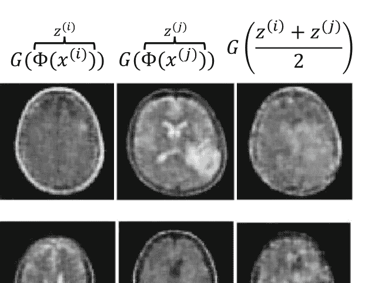

图1.19 使用VAE进行潜空间漫游。潜空间中两个点的平均值生成的图像在图像视角上大约位于对应两个图像之间的中间位置。

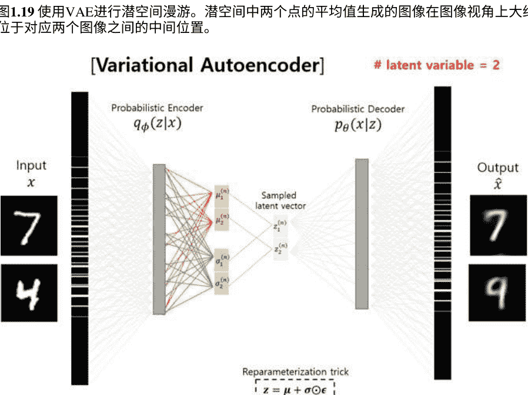

图1.20 这是使用MNIST数据的VAE的示例，潜空间的维度为2。与AE的区别在于瓶颈结构包含了一个采样过程，这使得在潜空间中能够进行平滑插值。

为了重现细节，U-net使用跳跃连接，其中编码层的高分辨率特征直接连接到相应的解码层。在U-net中，编码路径上传输的长跳跃连接通常包含输入图像的不必要元素，如噪声。由于这些跳跃连接，U-net不能作为一个生成模型。

在我们的观点中，没有跳跃连接的自动编码器（如U-net）在生成新的合成医学图像时似乎仍然存在模糊和细节丢失的问题。

#### 1.4.3.3 生成对抗网络

GAN是一种通过引入判别网络来生成逼真图像的巧妙方法，该网络被训练成将输入图像分类为真实或合成的[20, 21]。GAN的训练方法是为了生成尽可能逼真的合成图像，生成网络受到判别网络的严厉惩罚，最终达到判别网络被欺骗将合成图像判别为真实图像的水平。

最终目标是学习一个生成器

$$G : \mathcal{X} \rightarrow \mathcal{Y}, \tag{1.98}$$

其中 $\mathcal{X}$ 是生成器 $G$ 的输入分布，$\mathcal{Y}$ 是要生成的医学图像的目标分布。在实践中，$G$ 通过从输入分布 $\mathcal{X}$ 和 $\mathcal{Y}$ 中有限样本来学习。假设 $\mathcal{S}_\mathbf{x}:=\{\mathbf{x}_j\}_{j=1}^N$ 和 $\mathcal{S}_\mathbf{y}:=\{\mathbf{y}_j\}_{j=1}^{M}$ 分别是从 $\mathcal{X}$ 和 $\mathcal{Y}$ 中抽取的训练样本。我们将数据分布表示为 $\mathbf{x} \sim p_{\text{数据}}(\mathbf{x})$ 和 $\mathbf{y} \sim p_{\text{数据}}(\mathbf{y})$。令 $\theta_G$ 和 $\theta_D$ 为 $G$ 和 $D$ 的参数，分别。

GAN的目标是同时训练生成器 $G$ 和判别器 $D$，以改善它们的相互能力；$D$ 试图最大化其区分 $G(\mathbf{x}), \mathbf{x} \sim \mathcal{X}$ 和 $\mathbf{y} \sim \mathcal{Y}$ 的能力，而生成器 $G$ 试图通过使生成的样本 $G(\mathbf{x}), \mathbf{x} \sim \mathcal{X}$ 接近目标分布 $\mathcal{Y}$ 来欺骗判别器 $D$。

我们首先解释一下由Goodfellow等人提出的原始GAN[20]。生成器 $G$ 的输入是某个维度的标准分布 $\mathcal{X} = \mathcal{N}(0, I)$。通过对以下判别器/生成器极小极大博弈的参数 $\theta_G$ 和 $\theta_D$ 进行训练来学习 $G$ 和 $D$:

$$\min_{\theta_G} \max_{\theta_D} \Gamma_{GAN}(\theta_G, \theta_D), \tag{1.99}$$

其中 $\Gamma_{GAN}(\theta_G, \theta_D)$ 是给定的对抗损失函数

这里，$\mathbb{E}[y]$ 表示对 $y$ 的期望。在(1.100)中，鉴别器 $D$ 被训练为最小化 $\Gamma_{GAN}(\theta_G, \theta_D)$；它试图使 $D(y)=1$，对于 $y \sim \mathcal{Y}$，以及 $D(G(x))=0$，对于 $x \sim \mathcal{X}$。另一方面，生成器 $G$ 试图最大化 $D(G(x))$；它试图尽可能多地生成 $G(x) \sim \mathcal{Y}$，从而导致判别器 $D$ 错误分类 $D(G(z))=1$。使用交替随机梯度下降法可以实现 $G$ 和 $D$ 的学习：

- 1. 给定 $G$，训练 $D$ 以最小化 $\Gamma_{GAN}(\theta_G, \theta_D)$。
- 2. 给定 $D$，训练 $G$ 以最大化 $\Gamma_{GAN}(\theta_G, \theta_D)$。

这个原始的GAN损失遭受了梯度消失问题，阻止了生成器的良好更新。当 $D(G(x)) \approx 0$ [47] 时，项 $\log(1-D(G(x)))$ 会饱和。可以通过各种类型的GAN损失函数（例如，最小二乘损失[45, 47]和Wasserstein损失[23]）来替代对抗性损失，以获得高性能或训练稳定性。值得注意的是，如果我们用任何单调函数 $\varphi: [0, 1] \to \mathbb{R}$ [4] 来替换 $\log$，目标仍然具有直观意义。Wasserstein GAN (WGAN) [3] 使用 $\varphi(t)=t$。

最小二乘GAN (LSGAN) [45,47] 使用以下目标函数，该函数可以最小化皮尔逊 $\chi^2$ 散度[47]：

$$
\begin{cases}
\min_{\theta_D} \frac{1}{2} \mathbb{E}_{y \sim p_{\text{data}}(y)} [(D(y; \theta_D) - 1)^2] + \frac{1}{2} \mathbb{E}_{x \sim p_{\text{data}}(x)} [(D(G(z; \theta_G); \theta_D))^2], \\
\min_{\theta_G} \frac{1}{2} \mathbb{E}_{x \sim p_{\text{data}}(x)} [(D(G(z; \theta_G); \theta_D) - 1)^2],
\end{cases}
\tag{1.101}
$$

其中1和0分别是假数据和真实数据的标签，当 $G$ 希望 $D$ 相信假数据时，使用 $(D(G(x; \theta_G); \theta_D) - 1)^2$ 这个项。一个好的GAN损失函数将捕捉到两个分布之间的差异，以便良好地更新 $G$。

原始的GAN无法提供图像到图像的转换（即从 $x$ 到目标输出 $y$）。CycleGAN可以看作是GAN的扩展，旨在解决GAN的非配对图像转换问题。它使用循环一致性约束可靠地将一个域中的图像转换为另一个域中的相应图像，而无需配对的训练数据：给定一个输入 $x$ 在一个域 $X$ 中，生成器 $G$ 产生另一个域中的 $\hat{y}=G(x)$。相应的伪生成器 $F$（可以看作是 $G$ 的逆）从 $y$ 到 $\hat{x}=F(y)$。循环一致性损失是差异 $\|x - F \circ G(x)\|$ 和 $\|y - G \circ F(y)\|$。Cycle-GAN可以用作半自动标注系统，为医疗机器学习应用生成合成数据集，这有助于解决多样内容的数据需求问题。CycleGAN在改变图像风格并保留内容方面取得了显著成功（例如，超声图像到MRI图像的合成）。然而，CycleGAN在医学中只能在非常有限的应用范围内使用，因为它倾向于拒绝罕见的小异常存在，这是由于鉴别器的强烈惩罚（即只对批准或拒绝进行评分的不灵活训练方法）所导致的。鉴别器缺乏将图像转换为自己喜欢的方式而不留下异常部分的灵活性，可能会在医学上引起严重的误诊问题。

现在，让我们解释cycleGAN的数学框架。在本节中，输入 $x$ 表示通过前一节中的方法合成的图像，输出 $y$ 表示带有金属伪影的实际CBCT图像。

我们假设未配对的训练样本 $\{x^{(n)}\}_{n=1}^N$ 和 $\{y^{(m)}\}_{m=1}^M$ 是从未知的合成和真实CBCT图像分布（$p_X(x)$ 和 $p_Y(y)$）中抽取的。目标是找到一个最优的生成器 $G_Y: \mathcal{X} \to \mathcal{Y}$，使得输出分布 $\hat{y} = G_Y(x)$ 是对 $p_Y(y)$（即 $\hat{y} = G_Y(\mathcal{X})$）的一个很好的近似。

CycleGAN模型包括两个映射 $G_Y: \mathcal{X} \to \mathcal{Y}$（为 $\mathcal{Y}$ 生成图像）和 $G_X: \mathcal{Y} \to \mathcal{X}$（为 $\mathcal{X}$ 生成图像）。与标准GAN（如式（1.99）所示）类似，该模型使用相应的对抗鉴别器 $D_Y$（用于区分真实的 $\mathcal{Y}$ 和伪造的 $G_Y(x)$）和 $D_X$（用于区分真实的 $\mathcal{X}$ 和伪造的 $G_X(y)$）。

粗略地说，CycleGAN的主要目标是找到 $(G^*_Y, G^*_X)$ 使得

$$(G^*_Y, G^*_X) := \text{argmin}_{G_Y, G_X} \text{argmax}_{D_X, D_Y} \mathcal{L}(G_Y, G_X, D_X, D_Y), \quad (1.102)$$

其中生成器 $G^*_Y$ 对应于我们所需的合成到真实图像的映射。在这里，损失函数 $\mathcal{L}$ 由以下给出

$$\mathcal{L}(G_Y, G_X, D_X, D_Y) := \mathcal{L}_{\text{GAN}}(G_Y, D_Y) + \mathcal{L}_{\text{GAN}}(G_X, D_X) + \lambda \mathcal{L}_{\text{cyc}}(G_Y, G_X), \quad (1.103)$$

其中 $\lambda$ 是控制一致性贡献的参数。第一项 $\mathcal{L}_{\text{GAN}}(G_Y, D_Y)$ 用于估计最优 $G_Y$ 和 $D_Y$，给定为

$$\mathcal{L}_{\text{GAN}}(G_Y, D_Y) = \mathbb{E}_{y \sim p_{\text{数据}}(y)}[\ln D_Y(y)] + \mathbb{E}_{x \sim p_{\text{data}}(x)}[\ln(1 - D_Y(G_Y(x)))], \quad (1.104)$$

其中 $p_{\text{数据}}$ 表示给定数据集上的数据分布。在同样的意义上，第二项用于估计 $G_X$ 和 $D_X$，由以下给出

$$\mathcal{L}_{\text{GAN}}(G_X, D_X) = \mathbb{E}_{x \sim p_{\text{data}}(x)}[\ln D_X(x)] + \mathbb{E}_{y \sim p_{\text{数据}}(y)}[\ln(1 - D_X(G_X(y)))], \quad (1.105)$$

最后一个关键术语是循环一致性损失，试图对图像到图像的转换施加可逆性（即， $x \approx G_X (G_Y (x))$ 和 $y \approx G_Y (G_X (y))$）。它由以下给出

$$\mathcal{L}_{\text{cyc}}(G_Y, G_X) = \mathbb{E}_{x \sim p_{\text{data}}(x)} \|x - G_X \circ G_Y(x)\| + \mathbb{E}_{y \sim p_{\text{数据}}(y)} \|y - G_Y \circ G_X(y)\|, \quad (1.106)$$

其中 $\| \cdot \|$ 是 $\ell^1$ 或 $\ell^2$ 范数。在这里，希望发电机的保真度 $\|x - G_X \circ G_Y (x)\|$ 对于每个 $x \sim p_X (x)$ 都是相对较小的。

对于 $G^*_X$ ($\sim (G^*_Y )^{-1}$) 在 $\mathcal{Y}$ 上的训练可以被视为一种手段来防止在图像到图像的过程中丢失原始数据 $x$。

通过 $G_{w}^{*}$ 进行转换。在我们的情况下，特别是，这可能意味着通过 $G_{w}^{*}$ 来弥补现实的不足时，原始数据 $\mathbf{x}$ (由CT正向模型生成)的主要金属伪影不会受到太大影响。

## 1.5 自动编码器的应用：自动三维颅面测量标注系统

颅面分析是颅面测量学的临床应用，需要估计颅底与上颌或下颌之间的骨骼关系，牙齿、颌骨与颅骨之间的关系，以及其他关系。对2D放射照片或3D CT或CBCT进行颅面标记是进行颅面分析的基础，有助于制定颅面疾病的形态测量指南，用于诊断、规划和治疗[41, 66]。尽管颅面分析的价值和标记点的定义仍存在争议，但其有用性得到了认可。

直到最近，对2D放射照片或3D CT或CBCT进行颅面标记主要通过手工描述完成。这种标记需要高水平的专业知识、时间和劳动力。自动标记点识别可以减少工作量并消除操作者主观性。因此，对于能够减少这项任务的劳动强度、改善工作流程和操作者主观性的自动标记点注释系统存在着巨大需求。

1986年，L vy-Mandel等人[43]提出了第一个自动二维颅面测量标注系统。从那时起，各种算法已经被引入用于自动二维颅面测量；包括基于知识、基于模型、基于软计算和混合方法[8, 9, 18, 24, 30, 43, 51, 58, 65]。早期的研究集中在使用边缘检测和图像处理技术的基于知识的方法上[18, 43, 51, 65]，而后期的研究则实现了基于模型的方法[8, 24, 58]。然而，尽管有这些努力，使用传统的基于知识或基于图谱的技术的自动标注方法未能达到临床应用的水平。最近，由于人工智能的显著进步，通过使用深度学习（DL）技术，二维颅面测量的自动化已经达到了临床应用的水平[2, 44, 53]。与传统图像处理相比，这些DL方法的主要优势在于通过学习训练数据集，可以反映专家的经验在算法中[41, 66]。基于DL的二维颅面测量标现已达到临床应用的水平。

最近，随着CT或CBCT的普及，从2D颅面测量转向3D的趋势逐渐增加。由于头部的解剖结构具有3D几何形状，3D颅面测量在准确的颅面分析方面具有许多优势。随着深度学习技术的最新发展，许多研究已经在自动化颅面标记注释方面进行，从而实现了即时的3D颅面测量分析。现有的3D自动标记方法头影测量仍需要改进，因为一些标志点的误差水平不符合临床应用要求（小于2毫米）。

本节介绍了基于DL的3D头影测量的全自动标志系统，基于文章[41, 66, 67]。为了方便解释这个DL系统，我们使用以下具体示例：

- 输入 :3D CT图像 $\mathbf{x} \in \mathbb{R}^{512 \times 512 \times 400}$，体素数量为$512 \times 512 \times 400$。
- 输出:93个地标 $\mathfrak{R} = (\mathbf{r}_1, \cdots, \mathbf{r}_{93}) \in \mathbb{R}^{93 \times 3}$。这里，$\mathbf{r}_j$表示第$j$个地标的位置。
- 目标 :找到一个地标映射 $f : \mathbf{x} \rightarrow \mathfrak{R}$。

主要策略是仅从$\mathbf{x}$检测到15个易于找到的地标，并使用基于变分自动编码器(VAE)的形态相似性/差异性表示来估计其余的地标($78 = 93 - 15$)。这模仿了专家的检测过程，首先估计出易于检测的地标，然后检测出其余的地标。

这种方法有潜力减轻专家耗时的工作流程，通过大大减少地标定的时间，尽管一些地标点的误差水平不符合临床应用的要求（小于2毫米）。这种方法可以立即帮助操作员找到近似位置和图像设置的3D颅面测量。它还可以减轻在地标指向任务期间移动3D头骨对象和滚动多平面图像设置的负担。

### 1.5.1 自动3D颅面测量注释系统的整体流程

假设 $\mathbf{x}$（3D CT图像）定义在体素网格 $\Omega:=\{\mathbf{v}=(v_1,v_2,v_3):v_1,v_2\in\{1,\cdots,512\}, v_3\in\{1,\cdots,400\}\}$，其中$512 \times 512 \times 400$来自CT图像的尺寸。在体素位置$\mathbf{v}$处，值 $\mathbf{x}(\mathbf{v})$可以被视为X射线衰减系数。给定输入 $\mathbf{x}$，我们尝试检测总共93个地标 ($\mathfrak{R}$)。通过以下过程（图1.21）来识别 $\mathfrak{R}$：

- 1. 生成一个头骨图像$\mathbf{x}_{\text{分割}}$ 通过基于软阈值的加权方法[34]。

粗略地说，$\mathbf{x}_{\text{分割}}$ 是
$$
\mathbf{x}_{\text{分割}}(\mathbf{v}) \approx 
\begin{cases} 
-1, & \text{如果 } \mathbf{x}(\mathbf{v}) > \theta, \\
0, & \text{否则}
\end{cases}
\quad (1.107)
$$

其中$\theta$是用于分割骨骼而不包括软组织的阈值。为了简化表示法，我们将使用相同的符号$\mathbf{x}$来表示分割区域，这将在上下文中清楚地说明。参见图1.22。图1.21 整个自动三维颅面测量标注系统的流程我们的地标检测方法基于可以从三维CT数据中分割出的三维头骨图像，生成包含三维几何线索的二维图像。

### 1.5.2 生成包含3D几何线索的2D图像

给定头骨几何，我们生成了五个不同的二维光照图像（$\mathbf{x}_{\sim 1}, ..., \mathbf{x}_{\sim 5}$），这些图像包含由光照和阴影引起的三维几何特征[42]，如图1.23和1.24所示。

- 3. 只找到一些相对容易找到的地标。使用深度学习方法从二维光照图像中检测出15个易于找到的地标$\mathfrak{M}$。我们用$f$表示从$\mathbf{x}$到$\mathfrak{M}$的映射。检测的详细过程为：
$$\mathbf{x} \rightarrow \mathbf{x}_{\text{分割}} \rightarrow (\mathbf{x}_{\sim 1}, ..., \mathbf{x}_{\sim 5}; \mathbf{x}_{\text{分割}}) \rightarrow \mathfrak{M} \quad (1.108)$$
注意$\dim(\mathfrak{M}) = 15 \times 3 < 93 \times 3 = \dim(\mathfrak{N})$。

- 4. 学习低维潜在表示$\mathfrak{N}$的深度学习应用。通过应用变分自动编码器(VAE) [35]，找到一个低维解缠表示 $\Psi : \mathbf{h} \rightarrow \mathfrak{N}$，其中$\dim(\mathbf{h}) = 25 \ll 93 \times 3 = \dim(\mathfrak{N})$。我们希望每个潜在变量对个体形态因素的变化敏感，同时对其他变化相对不敏感。

- 5. $\mathfrak{N}$和$\mathbf{h}$之间的联系。学习一个映射 $\Gamma : \mathfrak{N} \rightarrow \mathbf{h}$，将潜在变量 $\mathbf{h}$和分数数据 $\mathfrak{N}$连接起来。

- 6. 从分数信息($\mathfrak{N}$)中检测出总的地标向量($\mathfrak{N}$)。地标检测映射 $f$为
$$ f = \Psi \circ \Gamma \circ f_{\text{检测}} : \mathbf{x} \xrightarrow{f_{\text{检测}}} \mathfrak{N} \xrightarrow{\Gamma} \mathbf{h} \xrightarrow{\Psi} \mathfrak{N}. \qquad (1.109) $$

Lee等人[41]使用3D头骨图像 $\mathbf{x}$ 生成包含3D几何特征的多个2D图像，这是通过使用光源创建阴影[42]引起的，如图1.24所示。现在，让我们解释如何生成照明图像($\tilde{\mathbf{x}}_{1},\cdots,\tilde{\mathbf{x}}_{5}$)。为了生成2D图像 $\tilde{\mathbf{x}}_{j}$，我们选择一个位于头骨外部的平面 $\Pi_{j}$，其法向量为$\mathbf{d}_{j}$。这个平面 $\Pi_{j}$可以表示为$\Pi_{j}=\{\mathbf{r}_{j}(\mathbf{s}) : \mathbf{s} \in \{1,\cdots,512\}^{2}\}$，其中$\mathbf{r}_{j}(\mathbf{s})$是平面$\Pi_{j}$上像素位置$\mathbf{s}$处的点。设$\ell_{j}$是通过点$\mathbf{p}_{j}(\mathbf{s})$沿着方向 $\mathbf{d}_{j}$的直线。那么，每个点 $\mathbf{r}_{j}(\mathbf{s}) \in \Pi_{j}$对应于头骨表面上的点 $\mathbf{p}_{j}(\mathbf{s})$($\mathbf{x}$)给出
$$ \mathbf{p}_{j}(\mathbf{s}) = \arg \min_{\mathbf{p} \in \ell_{j} \cap \mathbf{x}_{\text{seg}}} \|\mathbf{p} - \mathbf{r}_{j}(\mathbf{s})\|. \qquad (1.110) $$
通过将光源放置在头骨外的一个点 $\mathbf{q}_{j}$上，可以将照亮的图像 $\tilde{\mathbf{x}}_{j}$定义为头骨上的光强度，其观察方向为 $\mathbf{d}_{j}$和光源位于 $\mathbf{q}_{j}$处。准确地说，$\tilde{\mathbf{x}}_{j}$可以定义为
$$ \tilde{\mathbf{x}}_{j}(\mathbf{s}) = \max \left\{ \frac{\mathbf{n}(\mathbf{p}_{j}(\mathbf{s})) \cdot (\mathbf{q}_{j} - \mathbf{p}_{j}(\mathbf{s}))}{\|\mathbf{q}_{j} - \mathbf{p}_{j}(\mathbf{s})\|}, \ 0 \right\}, \qquad (1.111) $$
其中 $\mathbf{n}(\mathbf{p})$是头骨表面上 $\mathbf{p}$处的单位法向量。图1.24显示了来自不同视角和多个光源的2D图像 $\tilde{\mathbf{x}}_j, j = 1, \cdots, 5$。这些2D图像提供3D几何线索。

### 1.5.3 仅找到一些相对容易找到的地标

网络 $f_{\text{检测}}$： $\mathbf{x} \rightarrow \mathfrak{N}$ in (1.109)利用2D照明图像，通过操纵不同的照明和观察方向生成。Lee等人[41]将VGGNet [60]应用于这些照明图像，并且准确地自动识别（图1.25）。

图1.25通过光照和阴影生成包含3D几何信息的2D图像的过程。这个图是从[41]中提取的。

VGGNet的架构如下所示。输入图像 $\tilde{\mathbf{x}}_j$ 与一组64个预定的滤波器 $\mathbf{w}_1$ 卷积，其中 $\mathbf{w}_1 = \{ \mathbf{w}_{1,k} \in \mathbb{R}^{3 \times 3} : k = 1, \cdots, 64 \}$。这个卷积提供了一组64个特征图 ($\mathbf{h}_1 = \{ h_{1,1}, \cdots, h_{1,64} \}$)，其中第 $k$ 个特征图在像素位置 $(m, n)$ 处的值为
$$
h_{1,k}(m, n) = \text{ReLU} \left( (\mathbf{w}_{1,k} * \tilde{\mathbf{x}})(m, n) + b_{1,k} \right) \\
= \text{ReLU} \left( \sum_{i=1}^{3} \sum_{j=1}^{3} w_{1,k}(i, j) \tilde{\mathbf{x}}(m - i + 2, n - j + 2) + b_{1,k} \right).
$$
在这里，$\text{ReLU}(x) = \max\{0, x\}$ 是修正线性单元，作为激活函数来解决梯度消失问题[19]，$\mathbf{b}_1 = \{ b_{1,k} \in \mathbb{R} : k = 1, \cdots, 64 \}$ 是64个偏置的集合。类似地，在第二个卷积层中，我们使用一组权重 ($\mathbf{w}_2 = \{ \mathbf{w}_{2,k} \in \mathbb{R}^{3 \times 3} : k = 1, \cdots, 64 \}$, $\mathbf{b}_2 = \{ b_{2,k} \in \mathbb{R} : k = 1, \cdots, 64 \}$) 计算一组64个特征图 ($\mathbf{h}_2 = \{ h_{2,1}, \cdots, h_{2,64} \}$)，其中 $h_{2,k}$ 由以下给出
$$
h_{2,k}(m, n) = \text{ReLU} \left( \sum_{k=1}^{64} (\mathbf{w}_{2,k,k} * h_{1,k})(m, n) + b_{2,k} \right) \\
= \text{ReLU} \left( \sum_{k=1}^{64} \sum_{i=1}^{3} \sum_{j=1}^{3} w_{2,k,k}(i, j) h_{1,k} (m - i + 2, n - j + 2) + b_{2,k} \right).
$$
接下来，我们对下采样进行 $2 \times 2$ 最大池化操作，步长为2，得到 $\mathbf{h}_3$。通过对每一层应用卷积或最大池化，我们得到一组512个特征图 $\mathbf{h}_{17}$。这个特征图被向量化为 $\tilde{\mathbf{h}}_{17} \in \mathbb{R}^{(16 \times 16 \times 512) \times 1}$，并通过全连接层传递。在第一个全连接层，我们通过将特征向量 $\tilde{\mathbf{h}}_{17}$ 与预定矩阵 $\mathbf{W}_{18} \in \mathbb{R}^{4096 \times (16 \times 16 \times 512)}$ 相乘，然后加上偏置 $\mathbf{b}_{17} = (b_{17}^{1}, \cdots, b_{17}^{4096})$，计算得到向量 $\mathbf{h}_{18} = (h_{18,1}, \cdots, h_{18,4096})$。
$$
\mathbf{h}_{18} = \text{ReLU} \left( \mathbf{W}_{18} \tilde{\mathbf{h}}_{17} + \mathbf{b}_{17} \right). \tag{1.112}
$$
通过类似的方式在剩余的全连接层中，我们最终得到了2D地标位置 $\mathbf{s}_d = (s_1, s_2)$。

### 1.5.4 学习低维潜在表示 $\mathfrak{R}$

为了有效地学习 $\mathfrak{R}$ 的特征，第一步是对数据进行归一化处理[41]。由五个地标（枕大孔中心（CFM），鼻尖，左/右耳孔（L/R Po））构成的六面体通过适当的各向异性缩放进行归一化处理。数据归一化基于面宽度（L Po和R Po的x坐标之间的距离），面深度（L Po和鼻尖的y坐标之间的距离）和面高度（CFM和bregma的z坐标之间的距离）。我们通过将宽度，深度和高度设置为固定值来对数据进行归一化处理，以便每个参考六面体具有（在某种程度上）固定的形状和大小。这种归一化处理揭示了面部畸形，并在应用VAE时实现了相似性/差异性的高效特征学习。

我们使用VAE通过低维潜在空间中的变量$\mathbf{h}$来找到连接的地标向量$\mathfrak{R}$的非线性表达式。在这里，我们使用$\dim( \mathbf{h} )=25$。准确地说，VAE使用训练数据集$\{\mathfrak{R}^{(i)}\}_{i=1}^{N}$来学习两个函数，编码器$\Phi:\mathfrak{R} \rightarrow \mathbf{h}$和解码器$\Psi: \mathbf{h} \rightarrow \mathfrak{R}$通过以下训练数据的损失最小化：
$$ (\Psi, \Phi) = \argmin_{(\Psi,\Phi)\in \mathrm{VAE}} \frac{1}{N} \sum_{i=1}^{N} \left[ \|\Psi \circ \Phi(\mathfrak{R}^{(i)}) - \mathfrak{R}^{(i)}\|^2 + \mathrm{VAE-正则化} \right], \tag{1.113} $$
其中，VAE描述了一个形式为深度学习网络的函数类，如图1.26所示。请注意，VAE将输入编码为潜在空间中的分布。有关VAE-正则化，请参考[35]。解码器$\Psi: \mathbf{h} \rightarrow \mathfrak{R}$在(1.113)中提供了一个低维解缠表示，使得每个潜在变量对个体形态因素的变化敏感，同时对其他变化相对不敏感。

图1.26 VAE基于低维潜在表示 $\mathfrak{R}$ 的架构。这种低维表示可以解决由于法律和道德限制导致的CT图像数据短缺问题。在这里，我们利用了许多匿名地标数据集 $\{\mathfrak{R}^{(i)} : i = 1, \dots, N\}$，其中CT图像没有用于VAE的训练。

### 1.5.5 从分数信息($\mathfrak{R}$)中检测总地标向量($\mathfrak{R}$)

我们通过学习一个非线性映射 $\Gamma : \mathfrak{R} \rightarrow \mathbf{h}$将潜在变量 $\mathbf{h}$和分数数据 $\mathfrak{R}$连接起来，其中训练数据 $\{(\mathbf{h}^{(i)}, \mathfrak{R}^{(i)}) : i=1,2, ..., N\}$由编码器映射 $\mathbf{h}^{(i)} = \Phi(\mathfrak{R}^{(i)})$ 提供。参见图1.27。准确地说，非线性回归映射 $\Gamma$通过最小化损失 $\frac{1}{N} \sum_{i=1}^N \| \Gamma (\mathfrak{R}^{(i)}) - \mathbf{h}^{(i)} \|^2$ 获得。然后，地标检测图 $f$ 是 $f = \Psi \circ \Gamma \circ f_{\text{检测}}$。

### 1.5.6 备注

提出的方法表现出相对较高的性能，但误差水平未达到即时临床应用的要求（例如误差水平小于2毫米）。然而，这种方法还有很大的改进空间，通过提高深度学习性能和增加训练数据量，可以显著减少误差。虽然我们的协议不能直观地确定达到专家人类标准的确切位置集，但它可以立即帮助引导操作员到3D颅面测量的近似位置和图像设置。它还可以减轻在地标指向任务期间移动3D头骨对象和滚动多平面图像设置的负担。最后，它可以在数据处理之前应用于分割，从而帮助定位头部到校准姿势。

对于3D颅面测量来说，考虑辐射剂量是相关的。世界卫生组织全球放射安全在医疗保健环境中的倡议、美国放射学会的适宜性标准以及英国皇家放射学院的转诊指南是广泛知名的循证指南来源。

所有诊断成像基本上需要遵守辐射剂量的三个基本原则，包括合理性、优化和剂量限制的应用。尽管3D颅面测量中颅面颌区的成像指南尚未完全建立，锥束CT（CBCT）是经常使用的3D颅面测量的牙科放射图像。然而，CBCT在3D颅面测量中的一个明显限制在于其有限的视野（FOV）。我们需要CBCT的整个头骨大小的FOV来进行Delaire的3D颅面测量分析。不幸的是，我们不知道有任何一台CBCT机器可以在单次扫描中覆盖整个头骨和面部。

尽管器官和有效剂量可以根据场大小、采集角度和束在与放射敏感器官的位置关系上的放置而有所不同，但CBCT的辐射有效剂量已知为30~1073 μSv，而多层螺旋CT则为280~1410 μSv。此外，CT图像是最初从一个用于I类骨骼志愿者的正常三维形态学研究项目中产生的，并非为了这个项目。受试者告知了研究的性质，该研究在机构审查委员会的控制和许可下进行。受试者是根据严格的准则进行严格选择，并应用了减少辐射剂量的协议。原始研究的一个重要要求是没有金属伪影。金属伪影经常出现在现代人群中，严重干扰了地标指向的准确定位。我们尽量包括没有任何牙齿修复或充填物的受试者，以优化3D颅面测量的准确性。

头影测量标志的详细信息可以在[66, 67]中找到。

致谢：本研究得到了三星科学与技术基金会的支持（编号：SRFC-IT1902-09）。Yun和Seo得到了韩国卫生产业发展研究所（KHIDI）通过韩国卫生福利部资助的韩国卫生技术研发项目的资助（资助编号：HI20C0127）。

# 参考文献

- 1. Adams G.L.等：传统二维头影测量与三维方法在人类干颅上的比较。美国正畸牙科正面矫治126(4)，397-409 (2004)
- 2. Arik, S., Ibragimov, B., Xing, L.：使用卷积神经网络的全自动定量头影测量。医学成像杂志4(1)，014501 (2017)
- 3. Arjovsky, M., Chintala, S., Bottou, L.: Wasserstein生成对抗网络。在：国际机器学习会议。PMLR（2017年）
- 4. Arora, S等：生成对抗网络（GANs）中的泛化和均衡。在：国际机器学习会议。PMLR（2017年）
- 5. Baur, C等：用于无监督异常分割的深度自编码模型在脑MR图像中。在：国际MICCAI脑损伤研讨会。Springer, Cham（2018年）
- 6. Candès, E.J., Romberg, J., Tao, T.: 鲁棒性不确定性原理：从高度不完整的频率信息中精确信号重建。IEEE Trans. Inf. Theory 52（2），489-509（2006年）
- 7. Candès, E.J., Tao, T.: 关于压缩感知的反思。IEEE Inf. Theory Soc. NewsI. 58（4），20-23（2008年）
- 8. Cardillo, J., Sid-Ahmed, M.A.: 用于定位颅面标志的图像处理系统。IEEE Trans. Med. Ima g. 13(2), 275–289 (1994)
- 9. Chakrabarty, S., et al.: 使用支持向量机进行稳健的头颅测量标志识别。在: 2003年多媒体和博览会国际会议。ICME'03。会议(Cat. No. 03TH8698), vol. 3. IEEE (2003)
- 10. Codari, M., et al.: 用于CBCT数据的计算机辅助头颅测量标志注释。Int. J. Comput. Assist. Radiol. Surgery 12(1), 113–121 (2017)
- 11. Chang Rick, J.H., et al.: 一个网络解决所有问题-使用深度投影模型解决线性反问题。在: IEEE国际计算机视觉会议论文集 (2017)
- 12. Donoho, D.L., Elad, M.: 通过 ℓ1最小化在一般（非正交）字典中的最优稀疏表示。国家科学院学报 100（5），2197-2202（2003）
- 13. Donoho, D.L.: 压缩感知。IEEE信息论杂志52（4），1288-1306（2006）
- 14. Dai, B., 等：变分自动编码器的隐藏才能（2017）。arXiv:1706.05148
- 15. Diker, B., Tak, Ø.: 比较六种口腔内扫描仪在制备牙齿上的准确性和扫描顺序的影响。先进修复学杂志 12（5），299（2020）
- 16. Elnagar, M.H., Aronovich, S., Kusnoto, B.: 组合正畸和正颌外科的数字工作流程。口腔颌面外科北美临床杂志 32（1），1-14（2020）
- 17. Esteva, A., 等：深度神经网络对皮肤癌的皮肤科医生级别分类。自然 542(7639), 115-118 (2017)
- 18. Giordano, D等：细胞神经网络自动标记颅面摄影图像。在：欧洲医学人工智能会议。斯普林格，柏林，海德堡（2005）
- 19. Glorot, X., Bordes, A., Bengio, Y.: 深度稀疏整流神经网络。在：第十四届国际人工智能和统计学会会议论文集。JMLR研讨会和会议论文集 (2011)
- 20. Goodfellow, I等：生成对抗网络。在：神经信息处理系统进展，第27卷 (2014)
- 21. Goodfellow, I., Bengio, Y., Courville, A.: 深度学习。麻省理工学院出版社 (2016)
- 22. Gondara, L.: 使用卷积去噪自编码器进行医学图像去噪。在：2016年IEEE第16届国际数据挖掘研讨会 (ICDMW), IEEE, 页241-246(2016)
- 23. Gulrajani, I., 等：改进的Wasserstein GANs训练（2017）。arXiv:1704.00028
- 24. Hutton, T.J., Cunningham, S., Hammond, P.: 自动识别颅面标志的主动形状模型评估。欧洲正畸学杂志22（5），499-508（2000）
- 25. Hinton, G.E., Salakhutdinov, R.R.: 用神经网络降低数据的维度。科学313（5786），504-507（2006）
- 26. Hinton, G.E., Krizhevsky, A., Wang, S.D.: 变换自动编码器。在：国际人工神经网络会议。Springer, 柏林，海德堡（2011）
- 27. Hyun, C.M., Kim, H.P., Lee, S.M., Lee, S., Seo, J.K.: 用于欠采样MRI重建的深度学习。物理医学与生物学63（13）（2018）
- 28. Hyun, C.M., Kim, K.C., Cho, H.C., Choi, J.K., Seo, J.K.: 基于框架池化的深度学习网络：处理高维医学数据的方法。机器学习科学技术。1,015009 (2020)

> [29] Hyun, C.M., Baek, S.H., Lee, M., Lee, S.M., Seo, J.K.: 基于深度学习的医学成像中欠定逆问题的可解性. In: 医学图像分析 (2021)

> [30] Innes, A., et al.: 使用脉冲耦合神经网络的颅面放射学图像的标志点检测. In: 国际人工智能会议论文集，第2卷 (2002)

> [31] Jolliffe, I.T.: 主成分回归分析中的主成分. In: 主成分分析, pp. 167–198 (2002)

> [32] Jalali, S., Yuan, X.: 使用自动编码器解决不适定线性反问题 (2019). arXiv:1901.05045

> [33] Kramer, M.A.: 使用自动关联神经网络的非线性主成分分析. AIChE J. 37(2), 233–243 (1991)

> [34] Kyriakou, Y., et al.: CT的经验性束硬化校正(EBHC). Med. Phys. 37(10), 5179–5187 (2010)

> [35] Kingma, D.P., Welling, M.: 自动编码变分贝叶斯 (2013). arXiv:1312.6114

> [36] Kingma, D.P., Ba, J.: Adam: 一种随机优化方法 (2014). arXiv:1412.6980

> [37] Kingma, D.P., Welling, M.: 变分自编码器简介. Found. Trends Mach. Learn. 12(4), 307–392 (2019)

> [38] Kang, S.H. 等: 使用三维卷积神经网络的自动三维颅面测量标注系统: 一项发展试验. 方法在计算机生物力学、生物医学工程和图像可视化, 8(2), 210–218 (2020)

> [39] Kernen, F. 等: 用于引导植入手术的虚拟计划软件的综述-数据导入和可视化、钻头导向设计和制造. BMC Oral Health 20(1), 1–10 (2020)

> [40] Li, S.-H. 等: 三维建筑和结构分析-从Delaire颅面分析的概念和设计转变. Int. J. Oral Maxillofac. Surg. 43(9), 1154–1160 (2014)

> [41] Lee, S.M. 等: 使用阴影2D图像为基础的机器学习的自动三维颅面测量标注系统. Phys. Med. Biol. 64(5), 055002 (2019)

> [42] Lengyel, E.: 3D游戏编程和计算机图形的数学. Charles River Media, Inc. (2003)

> [43] Levy-Mandel, A.D., Venetsanopoulos, A.N., Tsotsos, J.K.: 基于知识的颅片标记. Comput. Biomed. Res. 19(3), 282-309 (1986)

> [44] Lindner, C., 等: 侧面颅片中精确定位和分析颅部标记的全自动系统. Sci. Rep. 6(1), 1-10 (2016)

> [45] Mao, X., 等: 最小二乘生成对抗网络. In: IEEE国际计算机视觉会议论文集 (2017)

> [46] Montfar, J., Romero, M., Scougall-Vilchis R.J.: 基于活动形状模型的自动三维颅面标记. Am. J. Orthod. Dentofac. Orthop. 153(3), 449-458 (2018)

## 1 非线性表示和降维

- [54] Pittayapat, P., 等: 正畸学中的三维颅面分析: 系统综述. Orthodont. Craniofac. Res. 17(2), 69–91 (2014)
- [55] Pauwels, R., 等: 牙科CBCT的技术方面: 现状. Dentomaxillofac. Radiol. 44(1), 20140224 (2015)
- [56] Pittayapat, P., 等: 一种基于锥形束计算机断层扫描的三维颅面测量的新下颌特异性标志参考系统. Eur. J. Orthodont. 38(6), 563–568 (2016)
- [57] Proffit, W.R., 等: 当代正畸学-e-book. Elsevier Health Sciences (2018)
- [58] Rudolph, D.J., Sinclair, P.M., Coggins, J.M.: 自动计算机化放射性识别颅侧位标志. Am. J. Orthod. Dentofac. Orthop. 113(2), 173–179 (1998)
- [59] Ronneberger, O., Fischer, P., Brox, T.: U-net: 生物医学图像分割的卷积网络. In: 国际医学图像计算与计算机辅助干预会议. Springer, Cham (2015)
- [60] Simonyan, K., Zisserman, A.: 用于大规模图像识别的非常深的卷积网络 (2014). arXiv:1409.1556
- [61] Seo, J.K., Kim, K.C., Jargal, A., Lee, K., Harrach, B.: 用于解决不适定非线性反问题的基于学习的方法: 肺EIT的模拟研究. SIAM J. Imag. Sci. (2019)
- [62] Tenti, F.V.: 颅面分析作为治疗规划和评估工具. Eur. J. Orthodont. 3(4), 241–245 (1981)
- [63] Tezcan, K.C. 等: 使用深度密度先验的MR图像重建. IEEE Trans. Med. Imag. 38(7), 1633–1642 (2018)
- [64] Vallabh, R. 等: 人类下颌骨的形态学: 一项计算建模研究. Biomech. Model. Mechanobiol. 19(4) (2020)
- [65] Vucinic, P., Trpovski, Z., Scepan, I.: 使用主动外观模型自动标记头影的地标. Eur. J. Orthod. 32(3), 233–241 (2010)
- [66] Yun, H.S., 等: 基于学习的自动3D头影局部到全局地标标注. Phys. Med. Biol. 65(8), 085018 (2020)
- [67] Yun, H.S., 等: 使用计算机断层扫描自动化3D颅面标志识别 (2020). arXiv:2101.05205
- [68] Zeiler, M.D., Fergus, R.: 可视化和理解卷积网络. In: 欧洲计算机视觉会议. Springer, Cham (2014)

## 第2章 医学图像分割和目标识别的深度学习技术


**摘要** 以闭合曲线形式分割目标对象在医学成像中具有许多潜在应用，因为它提供了与其大小和形状相关的定量信息。在过去的几十年中，已经提出了许多创新的分割方法，这些分割技术基于使用阈值和基于边缘的检测的基本方法。事实上，医学成像中的分割和分类正在经历深度学习（DL）技术的显著和快速进展，这导致了范式的转变。DL方法具有非线性可表示性，可以同时提取和利用全局空间特征和局部空间特征，在医学图像分割中显示出惊人的整体性能。由于黑盒输出，DL方法大多缺乏透明度，因此临床医生无法追溯输出以呈现输出诊断的因果关系。因此，为了在医疗领域安全地利用DL算法，设计模型以透明地解释输出诊断的原因而不是黑盒是可取的。对于可解释的DL，需要进行系统研究来严格分析哪些输入特征影响网络的输出。尽管DL缺乏严格的分析，但最近的快速进展表明，随着训练数据和经验的积累，DL算法的性能将得到改善。

### 2.1 引言

医学图像分割在使用X射线、CT、MRI和超声等医学图像进行定量诊断时起着重要作用。它是从医学图像中分离出目标对象的过程，并具有多种应用。

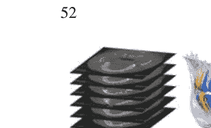

3D tooth segmentation

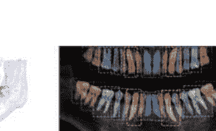

2D tooth segmentation

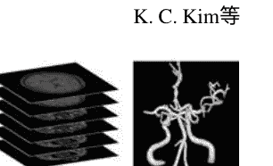

Cerebral Aneurysm Detection

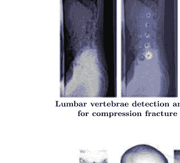

Lumbar vertebrae detection and segmentation for compression fracture evaluation

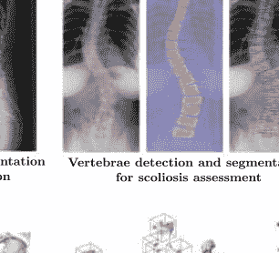

Vertebrae detection and segmentation for scoliosis assessment

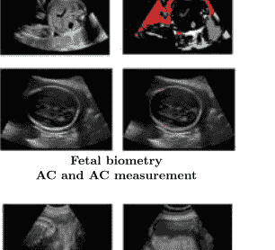

Fetal biometry AC and AC measurement

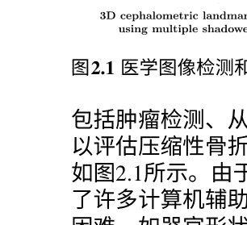

3D cephalometric landmark detection using multiple shadowed image

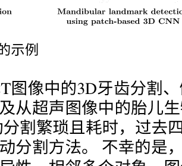

Mandibular landmark detection using patch-based 3D CNN

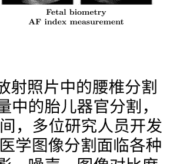

Fetal biometry AF index measurement

**图2.1 医学图像检测和分割的示例**

包括肿瘤检测、从3D CT图像中的3D牙齿分割、侧面放射照片中的腰椎分割以评估压缩性骨折，以及从超声图像中的胎儿生物测量中的胎儿器官分割，如图2.1所示。由于手动分割繁琐且耗时，过去四十年间，多位研究人员开发了许多计算机辅助的自动分割方法。不幸的是，自动医学图像分割面临各种困难，如器官形状的变异性，相邻多个对象，图像伪影，噪声，图像对比度低和边界不清晰。

在过去的四十年中，各种图像分割方法已经被提出，用于提取与搜索对象的大小或形状相关的信息。然而，在医学图像分割中，传统的分割技术由于医学图像中分割边界的不确定性（由噪声、低信噪比和低对比度引起）而难以达到所需的简单闭合曲线形式的分割。传统的分割方法，如水平集[30]、活动轮廓[19]、区域生长[1]、基于直方图的方法和图分割方法，在实现完全自动化分割方面存在根本限制。例如，水平集方法基本上依赖于图像的局部结构来确定初始猜测和停止准则。此外，很难反映医生的想法。

最近，由于深度学习（DL）技术的显著和快速进步，医学图像分割正在经历一次范式转变。这种进步在某种程度上受到了2012年卷积神经网络（CNNs）配备修正线性单元（ReLU）和dropout的卓越性能的推动。这些基于CNN的深度学习算法包括区域CNN（R-CNN）、快速R-CNN、更快的R-CNN、U-net和YOLO。深度学习技术可以同时看到局部和全局结构，并能正确反映医生的想法。深度学习算法似乎克服了传统数学方法的局限性，并已经达到了在分割和分类中的临床应用水平。图2.1显示了医学图像检测和分割的各种应用，例如脊柱分割[23]、脊柱侧弯评估[22]、3D颅面测量[24,39]、胎儿腹部分割[17,20]、胎儿头围[21]、羊水测量[7]和3D牙齿分割[18]。

在本章中，我们讨论传统方法的局限性和深度学习方法的比较分析。为了清晰和实用的解释，我们将使用数字牙科学中的特殊模型，例如牙齿分割，其目标是开发一种完全自动化的方法来从全景X射线图像或CT图像中分割单个牙齿。目前，大多数深度学习方法由于黑盒特性而在获得医生信任方面存在局限性。

为了获得医生和患者的信任，深度学习方法能够透明地描述用于确定输出分割的输入图像特征是非常重要的。为了可解释的人工智能，了解深度学习方法的基本结构和工作机制是必要的。我们希望本章为开发可解释的人工智能的深度学习方法提供基础。

### 2.2 分割问题

在图像分割中，目标是找到一个分割映射 $f$ 使得

$f(\text{输入数据}) = \text{有用的输出分割}.$

在这里，输入的例子包括X光、CT、MRI、超声图像，输出是牙齿、肺部CT病变、脊柱和颅骨的分割。为了成功地进行分割，映射 $f$ 必须具备从输入中提取与目标输出相关的关键滤波器的能力。参见图2.2。

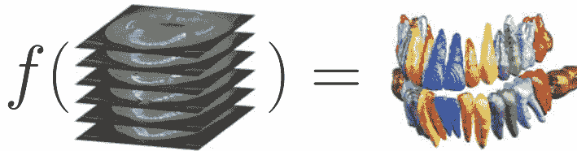

在本章中，我们使用以下符号表示图像分割：

- **(输入图像 $I$)** 让 $I$ 表示一个具有像素网格 $\Omega$ 的 2D（或 3D）医学图像。为简单起见，我们使用图像像素大小为 $n_{x_1} \times n_{x_2}$（或 $n_{x_1} \times n_{x_2} \times n_{x_3}$），即，$\Omega := \{\mathbf{x} = (x_1, x_2): x_i = 1, \dots, n_{x_i}, \quad i = 1, 2\}$（或 $\Omega := \{\mathbf{x} = (x_1, x_2, x_3): x_i = 1, \dots, n_{x_i}, \quad i = 1, 2, 3\}$）。在这里，$I$ 可以被视为一个映射 $I: \Omega \to \mathbb{R}$，其中 $\mathbb{R}$ 是实数集。$I(\mathbf{x})$ 可以是像素位置 $\mathbf{x}$ 处的灰度强度值。
- **(输出 $U$)** 在分割的情况下，输出 $U$ 是一个二进制映射 $U: \Omega \to \{0, 1\}$。在分类的情况下，输出 $U$ 是一个表示分类的向量，其中每个分量对应于目标类别的概率。

***只对深度学习感兴趣的读者可以跳过第 2.3 节，直接跳到第 2.4 节。

### 2.3 传统分割方法

#### 2.3.1 阈值法

阈值法是一种最简单的方法，通过将灰度图像中所有强度大于固定常数（称为阈值）的像素分组到一个类别中，将所有其他像素分组到另一个类别中。由于阈值法不反映层析图像的空间特征，因此它对各种图像质量因素包括噪声、伪影和强度非均匀性都很敏感。因此，阈值法通常用作分割的初始猜测。用阈值值 $\vartheta$ 对 $I$ 进行阈值处理，表示为 $I_{\vartheta}$，定义为

$$ I_{\vartheta}(\mathbf{x}) = \begin{cases} 0 & \text{如果 } I(\mathbf{x}) < \vartheta, \\ 1 & \text{否则}. \end{cases} \qquad (2.2) $$

为了自动确定阈值 $\vartheta$，广泛使用了大津阈值法[31]，该方法以大津信之介命名。它通过直方图 $h(t) = \#\{\mathbf{x}: I(\mathbf{x}) = t\}$ 来自动确定阈值 value $\vartheta$，其中 $I$ 表示每个灰度值 $t$ 的像素数。大津阈值的值由以下公式给出

$$ \vartheta = \mathop{\mathrm{argmax}}\limits_{t} \left[ \sum_{i<t} p(i) \left( \frac{\sum\limits_{i<t} i \cdot p(i)}{\sum\limits_{i<t} p(i)} \right)^2 + \sum_{t \leq i} p(i) \left( \frac{\sum\limits_{t \leq i} i \cdot p(i)}{\sum\limits_{t \leq i} p(i)} - \frac{\sum\limits_{i<t} i \cdot p(i)}{\sum\limits_{i<t} p(i)} \right)^2 \right], \qquad (2.3) $$

其中 $p(t) = h(t) / \sum\limits_i h(i)$。见图 2.3。

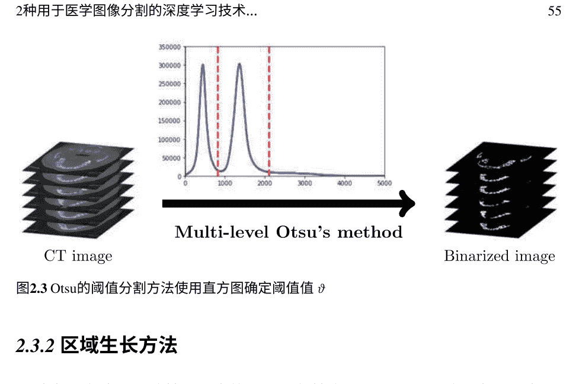

**图2.3 Otsu的阈值分割方法使用直方图确定阈值值**

#### 2.3.2 区域生长方法

区域生长方法是一种基于像素的图像分割技术，通过从初始种子点开始生长生成连接的区域。该方法通过检查每个相邻像素的强度值与初始种子点的相似性来提取初始种子点的相邻像素。这个过程以相同的方式重复，以确定最终的区域。由于需要手动选择初始种子点，这种方法可能不是自动的。与阈值分割类似，这种方法对各种图像质量因素包括噪声、伪影和弱边界也很敏感。这基本上是一种局部方法，不反映图像的全局结构。区域生长方法的实现细节在算法1中给出。

**算法1 区域生长方法**
```
步骤1. 选择一组种子点
   设置初始点 x0, x1, ..., xn 和一个集合 R = {x0, x1, ..., xn}
步骤2. 给定一个区域 R, 通过检查相邻像素来找到候选点。候选点集可以是 C := {x ∉ R | N(x) ∩ R = ∅}, 其中 N(x) 是 x 的相邻点。
步骤3. 测量 x ∈ C 与相邻区域的差异
   if |I(x) - 均值(x)| < ε for x ∈ C, then
      将 x 添加到 R 并转到步骤2
   else
      返回输出
   end if
```

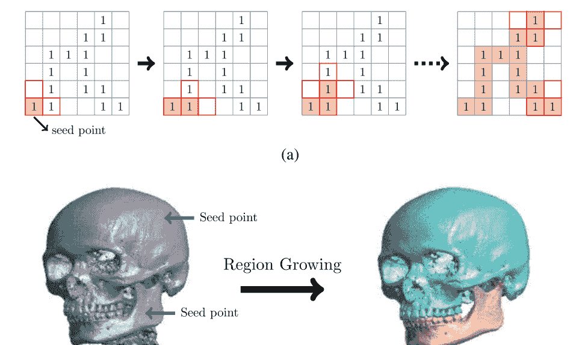

**图2.4** 显示了使用区域生长方法的颅骨分割结果。我们将区域生长方法应用于通过Otsu阈值法获得的二值颅骨图像。

#### 2.3.3 基于能量的可变形模型

可变形模型是一种基于能量的分割技术，通过最小化由曲线上的内部能量和图像 I 的外部能量组成的能量，将在图像区域 G 内定义的闭合曲线推向目标分割。在过去的四十年中，已经开发出了许多基于能量的可变形模型，如活动轮廓和水平集。为了使活动轮廓向目标区域的边界演化，已经开发了各种应用相关的能量泛函。能量泛函被设计为通过能量最小化过程中的迭代轮廓演化来获得局部最小值。

因此，它需要一个良好的初始轮廓选择和一个合适的停止准则。来终止迭代过程达到目标边界。用$\mathscr{C}$表示一个轮廓，基于能量的分割方法的常见形式如下：

$$
\mathscr{C} = \arg\min_{\mathscr{C}} \mathbf{Fit}(\mathscr{C}) + \lambda\mathbf{Reg}(\mathscr{C}),
$$

其中 $\mathbf{Fit}(\mathscr{C})$是吸引轮廓 $\mathscr{C}$向图像中的目标对象拟合的项； $\mathbf{Reg}(\mathscr{C})$是反映轮廓结构先验知识的正则化项； $\lambda$是一个可调节的拟合参数，控制着这两个项之间的平衡。存在各种各样的拟合模型，如基于边缘的方法[3, 4, 13, 28]，基于区域的方法[5]等，这些拟合模型大多与惩罚轮廓弧长的标准正则化项$\mathscr{C}_\varphi$结合使用。

## 2.3.3.1 主动轮廓方法

主动轮廓方法（或称为蛇）使用能量泛函 $\mathcal{E}(\mathscr{C})$来演化一个活动轮廓 $\mathscr{C}^t$（表示时间 $t$的轮廓）向目标区域的边界演化。准确地说，设 $I(x, y)$是给定的医学图像。通过找到一个闭合曲线 $\mathscr{C}$来实现所需的分割，该曲线使能量泛函最小化：

$$
\mathcal{E}(\mathscr{C}) = \mathbf{Fit}(\mathscr{C}) + \lambda\mathbf{Reg}(\mathscr{C}),
$$

我们从以下最简单形式的能量泛函开始：

$$
\mathcal{E}(\mathscr{C}) := \int_{\mathscr{C}} \frac{1}{1+|\nabla I|^2} ds.
$$

为了计算能量泛函的局部最小值 $\mathscr{C}$，我们可以从初始轮廓 $\mathscr{C}^0$开始，并得到一个最小化序列 $\mathscr{C}^1$， $\mathscr{C}^2$，...该序列收敛到局部最小值 $\mathscr{C}$：

$$
\mathcal{E}(\mathscr{C}^0) \geq \mathcal{E}(\mathscr{C}^1) \geq \cdots \mathcal{E}(\mathscr{C}^n) \geq \mathcal{E}(\mathscr{C}^{n+1}) \cdots \rightarrow \mathcal{E}(\mathscr{C}).
$$

请参见图2.5，该序列为 $\{\mathscr{C}^n : n = 1, 2, ...\}$。另请参见图2.6，其为其3D版本。

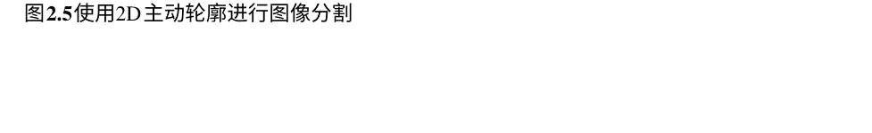

图2.5 使用2D主动轮廓进行图像分割

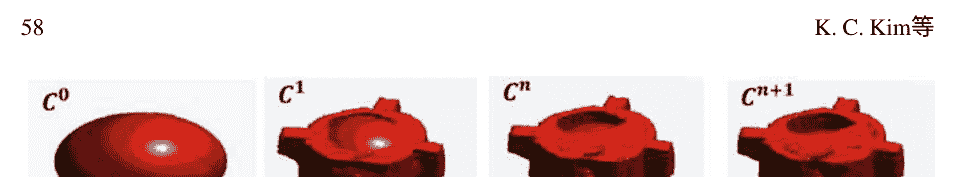

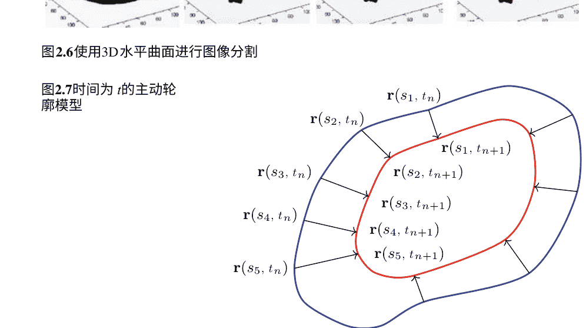

为了计算下一个轮廓 $\mathscr{C}^{n+1}$ 从 $\mathscr{C}^n$，基于Fréchet梯度 $\nabla \mathcal{E}(\mathscr{C}^n)$ 的梯度下降方法被广泛使用：

$$
\mathscr{C}^{n+1} = \mathscr{C}^n - \alpha \underbrace{\nabla \mathcal{E}(\mathscr{C}^n)}_{\text{最陡下降方向}}
$$

$\nabla \mathcal{E}(\mathscr{C}^n)$（相对于轮廓参数的梯度）是什么意思？为了解释 $\nabla \mathcal{E}(\mathscr{C}^n)$，使用时间变化的轮廓 $\mathscr{C}^t$ 而不是序列 $\{\mathscr{C}^n\}$ 更方便。然后，(2.7)可以表示为

$$
\mathscr{C}^{t+\Delta t} = \mathscr{C}^t - \alpha \Delta t \nabla \mathcal{E}(\mathscr{C}^t)
$$

为了计算 $\mathscr{C}^{t+\Delta t}$，让我们通过参数化 $\{\mathscr{C}^t\}$ 来定义 $\mathbf{r}(s, t) = x(s, t)(1, 0) + y(s, t)(0, 1)$， $0 < s < 1$：

$$
\mathscr{C}^t = \{\mathbf{r}(s, t) = x(s, t)(1, 0) + y(s, t)(0, 1) \mid 0 < s < 1\}. \quad (2.9)
$$

参见图2.7中的 $\mathscr{C}^t$ 和 $\mathscr{C}^{t+\Delta t}$。

设置 $\mathcal{E}(t) = \mathcal{E}(\mathscr{C}^t)$，我们有

$$
\mathcal{E}(t) := \int_{\mathscr{C}^t} \frac{1}{1 + |\nabla I|^2} \, ds = \int_0^1 g_I(\mathbf{r}(s, t)) \, |\mathbf{r}_s(s, t)| \, ds, \quad (2.10)
$$

其中 $g_I(\mathbf{r}) = \frac{1}{1 + |\nabla I(\mathbf{r})|^2}$。能量泛函的变化是

$$
\begin{aligned}
\frac{d\mathcal{E}}{dt}(t) &= \int_{0}^{1} |\mathbf{r}_s| [\nabla g_I \cdot \mathbf{r}_t] \, ds + \int_{0}^{1} g_I \left[ \frac{\mathbf{r}_s}{|\mathbf{r}_s|} \cdot \mathbf{r}_{t_s} \right] \, ds \\
&= \int_{0}^{1} |\mathbf{r}_s| [\nabla g_I \cdot \mathbf{r}_t] \, ds - \int_{0}^{1} g_I \left[ \left( \frac{\mathbf{r}_s}{|\mathbf{r}_s|} \right)_s \cdot \mathbf{r}_t \right] \, ds \\
&= \int_{0}^{1} |\mathbf{r}_s| \mathbf{r}_t \cdot \left[ \nabla g_I - \kappa g_I \mathbf{n} - \langle T, \nabla g_I \rangle T \right] \, ds,
\end{aligned}
$$

其中 $\mathbf{r}_t = \frac{\partial \mathbf{r}}{\partial t}, \mathbf{r}_s = \frac{\partial \mathbf{r}}{\partial s}, \mathbf{n} = \mathbf{n}(s, t)$ 是曲线 $\mathscr{C}^t$ 的单位法向量，$T = T(s, t)$ 是单位切向量。因此，使得 $\frac{d\mathcal{E}}{dt}(t)$ 下降最快的方向为 $\mathbf{r}_t = - [\nabla g_I - \kappa g_I \mathbf{n} - \langle T, \nabla g_I \rangle T]$。由此得到

$$
\mathbf{r}_t = - [\nabla g_I - \kappa g_I \mathbf{n} - \langle T, \nabla g_I \rangle T]. \quad (2.11)
$$

将 $\nabla g_I = \langle \nabla g_I, \mathbf{n} \rangle \mathbf{n} + \langle \nabla g_I, T \rangle T$ 进行分解，方程 (2.11) 变为

$$
\mathbf{r}_t = (\kappa g_I - \langle \nabla g_I, \mathbf{n} \rangle) \mathbf{n} \quad \text{或} \quad \frac{\partial}{\partial t} \mathscr{C} = (\kappa g_I - \nabla g_I \cdot \mathbf{n}) \mathbf{n} \quad (2.12)
$$

这意味着曲线 $\mathbf{r}(s, t)$ 沿着其法线以速度 $|\mathbf{r}_t|$ 移动

$$
F = \kappa g_I - \langle \nabla g_I, \mathbf{n} \rangle. \quad (2.13)
$$

因为

$$
\frac{\mathbf{r}(s, t + \Delta t) - \mathbf{r}(s, t)}{\Delta t} \approx F(\mathbf{r}(s, t)) \, \mathbf{n}(s, t), \quad (2.14)
$$

我们可以通过确定更新 $\mathscr{C}^{n+1}$ 来得到

$$
\mathbf{r}(s, n + 1) = \mathbf{r}(s, n) + \Delta t F(\mathbf{r}(s, n)) \, \mathbf{n}(s, n). \quad (2.15)
$$

## 2.3.3.2 水平集方法

当 $\mathscr{C}^t$ 改变其拓扑结构（分裂多个闭合曲线）时，显式表达式 $\mathscr{C}^t = \{\mathbf{r}(s, t) : 0 \leq s \leq 1\}$ 是不合适的。在分割多个位置未知的目标时，最好使用 $\mathscr{C}^t$ 的隐式表达式，以便允许拓扑变化来跟踪多个目标。水平集方法[30]是基于零水平集的隐式表达式的。

$$
\mathscr{C}^t = \{\mathbf{r} : \phi(\mathbf{r}, t) = 0\}. \quad (2.16)
$$

为了方便解释，让 $\{\mathbf{r}(s, t) : s \in [0, 1]\} \subset \mathscr{C}^t$（轮廓的一部分）。然后，$\phi$ 满足
$\phi(\mathbf{r}(s, t), t) = 0, \quad \forall t > 0, s \in [0, 1]. \qquad (2.17)$

对$t$求导得到包含嵌入运动
的$\phi$方程：

$$
0 = \frac{d}{dt} \phi(\mathbf{r}(s, t), t) = \frac{\partial}{\partial t} \phi(\mathbf{r}, t) + \frac{\partial \mathbf{r}}{\partial t}(s, t) \cdot \nabla \phi(\mathbf{r}(s, t), t). \qquad (2.18)
$$

上述方程解释了 $\mathscr{C}^t$ 根据速度 $\mathbf{V} = \frac{\partial \mathbf{r}}{\partial t}(s, t)$ 而演变。
注意 $\mathbf{n}(s, t) = \frac{\nabla \phi(\mathbf{r}(s, t), t)}{|\nabla \phi(\mathbf{r}(s, t), t)|}$ 是轮廓 $\mathscr{C}^t$ 的单位法向量。将 $F(\mathbf{r}(s, t), t) = \mathbf{V} \cdot \mathbf{n}$
写成法向运动，上述等式可以被重写为

$$
\frac{\partial}{\partial t} \phi(\mathbf{r}, t) + \underbrace{\left( \frac{\partial \mathbf{r}}{\partial t}(s, t) \cdot \frac{\nabla \phi(\mathbf{r}(s, t), t)}{|\nabla \phi(\mathbf{r}(s, t), t)|} \right)}_{F(\mathbf{r}, t)} |\nabla \phi(\mathbf{r}, t)| = 0. \qquad (2.19)
$$

在(2.13)中，法向速度 $F$ 可以表示为

$$
F = \kappa g_I \nabla \cdot \left( \frac{\nabla \phi}{|\nabla \phi|} \right) - \left\langle \nabla g_I, \frac{\nabla \phi}{|\nabla \phi|} \right\rangle, \qquad (2.20)
$$

其中对流项 $\langle \nabla g_I, \nabla \phi \rangle$ 增加了对变形轮廓朝向物体边界的吸引力。

即使具有光滑的初始轮廓，$\mathscr{C}^t$ 在演化过程中可能会出现不规则性（或奇异性）。为了在演化过程中保持稳定，水平集函数 $\phi$ 应满足 $|\nabla \phi| \approx 1$。为了在演化过程中保持 $|\nabla \phi| \approx 1$，提出了以下远程正则化水平集方法[25]:

$$
\mathcal{E}(\phi) = \int \frac{1}{1 + |\nabla I|} \delta(\phi) |\nabla \phi| \, \mathbf{d}\mathbf{r} + \int (|\nabla \phi| - 1)^2 \, \mathbf{d}\mathbf{r}, \qquad (2.21)
$$

其中 $\delta$ 是一个模糊的狄拉克$\delta$函数。

## 2.4 基于深度学习的分割方法

医学图像分割需要在查看整个图像结构和确定预期分割区域边界的局部信息
之间取得适当的平衡。模仿临床医生的分割过程是可取的。与之前描述的
传统方法相比，使用训练数据的深度学习方法可以同时查看全局和局部信息
，是一种有效的方式。

传统的分割技术包括基于能量的分割方法（使用主动轮廓和水平集）在实现全自动分割方面存在根本性缺陷。这些方法从一个初始轮廓开始，并通过能量最小化过程进行迭代轮廓演化。因此，这些方法需要一个良好的初始轮廓选择，因此需要手动初始化的用户干预，并且结果通常受到初始化的影响。传统方法的关键缺点是无法反映上下文（全局）信息，并且曲线演化的停止准则往往主要依赖于局部图像强度。为了克服这些问题，基于目标边界的局部模式以及全局图像结构的分割是可取的。

在医学图像语义分割中，DL方法相对于传统方法具有优势，因为目标领域的边界存在各种不确定因素。使用训练数据，DL方法有效地考虑了解剖结构的先验知识。本节介绍了各种用于分割和识别的DL方法。

为了便于解释，DL方法将使用数字牙模型进行描述，该模型旨在自动识别和分割锥形束计算机断层扫描（CBCT）图像中的单个牙齿。在3D单个牙齿分割中，传统方法由于分离单个牙齿与相邻牙齿及其周围牙槽骨的困难而存在根本性限制。

另一方面，DL方法似乎具有通过训练数据探索目标分割边界的强大能力。特别是，U-net通过同时利用全局特征和局部空间信息，在医学图像分割中展现了卓越的整体性能[21, 26, 27, 35]。

本节基于Jang等人最近的论文[18]。最终目标是找到一个映射 $f: I \rightarrow U$，其中 I 是一个3D CBCT图像，U是相应的3D牙齿分割，并将其识别为四种类型（例如，切牙、犬牙、前磨牙、后磨牙）根据牙齿形态。DL方法使用训练数据 $\{(I^{(n)}, U^{(n)})\}_{n=1}^N$ 通过最小化 $f(I^{(n)})$ 和 $U^{(n)}$ 之间的距离来学习 $f$。对于所有的 $n$。准确地说，学习目标如下：

$$
f = \arg\min_{f \in NN} \frac{1}{N} \sum_{n=1}^N \text{dist}(f(I^{(n)}), U^{(n)}), \quad (2.22)
$$

其中 $NN$ 表示神经网络的一种特殊形式中描述的一组函数，而 $\text{dist}(f(I^{(n)}), U^{(n)})$ 是 $f(I^{(n)})$ 和 $U^{(n)}$ 之间的距离。

DL网络的性能不仅取决于其架构，还取决于训练数据的质量和数量。在医学领域，输入数据的高维度和有限的训练数据数量是阻碍从3D CBCT数据中学习牙齿分割的深度学习网络训练的主要因素。此外，由于当前医学领域的法律和伦理限制，

数据，很难利用来自患者的CBCT数据。因此，我们需要克服由高输入维度和训练数据不足引起的上述学习问题。

为了解决与CT图像相关的高维度问题，我们使用从3D CBCT图像生成的2D全景图像。通过2D全景图像，我们可以开发一种牙齿检测方法，该方法可以定位包围每颗牙齿的边界框，并根据牙齿形态将其分类为四种类型。接下来，我们可以对单个牙齿进行2D分割。最后，我们可以利用上述的2D分割和识别来实现3D分割。

在解释完整的3D牙齿分割过程之前，将在本章的最后一小节中讨论，让我们从理解卷积神经网络（CNNs）的基本机制开始。

## 2.4.1 卷积神经网络（CNNs）

为了直观地解释CNNs，我们使用以下简化的牙齿识别网络模型 $f : I \rightarrow U$。

-   输入 $I$ 是来自全景图像中包围每颗牙齿的边界框的图像块。这个全景图像是从3D CBCT图像生成的。在第2.4.5节中，我们将解释如何检测这个边界框。
-   输出 $U$ 是表示牙齿分类的向量，其中 $U = f(I)$ 的第一、第二、第三和第四个分量分别对应 $I$ 是切牙、尖牙、前磨牙和磨牙的概率。准确地说，

$$
f(\text{切牙}) = \begin{bmatrix} 1 \\ 0 \\ 0 \\ 0 \end{bmatrix}, \quad f(\text{犬齿}) = \begin{bmatrix} 0 \\ 1 \\ 0 \\ 0 \end{bmatrix}, \quad f(\text{前磨牙}) = \begin{bmatrix} 0 \\ 0 \\ 1 \\ 0 \end{bmatrix}, \quad f(\text{磨牙}) = \begin{bmatrix} 0 \\ 0 \\ 0 \\ 1 \end{bmatrix}.
$$

请参见图2.8以获得视觉理解。

CNN包括四个组件：(i)卷积层，(ii)池化层，(iii)全连接层，和(iv)逐元素非线性激活函数，如sigmoid函数或修正线性单元(ReLU)。牙齿识别函数 $f$ 可以表示为 $f(I) = f^{(6)}(f^{(5)} \cdots (f^{(1)}(I)))$，其中 $f^{(j)}$ 表示第 $j$ 层。在这里，$f^{(j)}$ 可以是卷积层、池化层或全连接层。图2.9显示了CNN的网络架构。

在接下来的几节中，我们将逐一介绍基本组件，以了解CNN的架构。

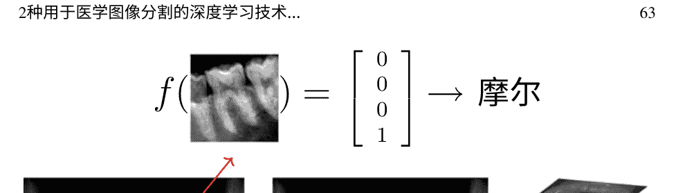

图2.8 牙齿识别模型。牙齿被分类为切牙（类别1）、犬牙（类别2）、前磨牙（类别3）和磨牙（类别4）

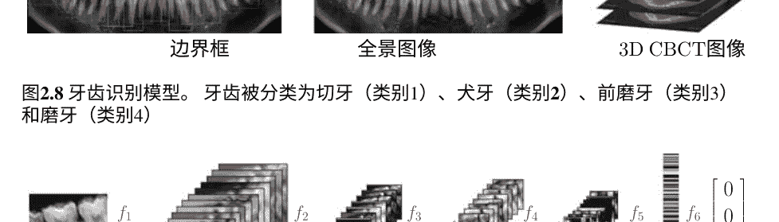

图2.9 CNN的简单架构。该CNN包括两个卷积层（f1, f3），两个池化层（f2, f4），一个全连接层（f5）和一个具有4个单元的分类层（f6）。

## 2.4.1.1 CNN的前向映射

[输入层]在图2.10中，输入I包含一个尺寸为64×64的图像，其中包含一颗牙齿。

[第1层：f1(I)] 我们使用大小为5×5的16个卷积滤波器，用W1表示，来生成f1(I)。在这里，W1 = [$\mathbf{w}_1^1, ..., \mathbf{w}_{16}^1$] 给出

$$
\mathbf{w}_i^1 = \begin{bmatrix} w_{i,(1,1)}^1 & \cdots & w_{i,(1,5)}^1 \\ \vdots & \ddots & \vdots \\ w_{i,(5,1)}^1 & \cdots & w_{i,(5,5)}^1 \end{bmatrix}, \quad i = 1, \ldots, 16. \quad (2.23)
$$

给定一个大小为5×5的滤波器$\mathbf{w}$，步长为1的卷积$\mathbf{w}*$给定产生一个60×60的图像## 输入 I

## 图2.10 CNN的输入I是一个64×64像素的图像

## 图2.11 a 通过 W^1 进行特征提取 b 16个卷积滤波器 W^1 = [w^1,1 , ..., w^16,1]

$$
\mathbf{w}^1 I = \begin{bmatrix}
\sum_{i,j=0}^{5} w(i,j)I(i,j) & \cdots & \sum_{i,j=0}^{5} w(i,j)I(i,j+59) \\
\vdots & \ddots & \vdots \\
\sum_{i,j=0}^{5} w(i,j)I(i+59,j) & \cdots & \sum_{i,j=0}^{5} w(i,j)I(i+59,j+59)
\end{bmatrix} . (2.24)
$$

这是一个 60 × 60矩阵，其中60来自60=64−5+1.

图2.11显示了卷积输出 W^1 ⊗_1 I 与卷积滤波器 W^1 的关系. 第一个隐藏层的输出由以下给出

$$f_1(I) = \sigma (\mathbf{W}^1 \otimes I + \mathbf{b}^1) = [\sigma (\mathbf{w}_1^1 \otimes I + b_1^1), \ldots, \sigma (\mathbf{w}_{16}^1 \otimes I + b_{16}^1)] , (2.25)$$

其中 \mathbf{b}^1 是偏置项， σ是非线性激活函数. 在本章中，非线性激活函数 σ 是ReLU, 表示为:

$$\sigma(\mathbf{h}) = ReLU(\mathbf{h}) = \max(0, \mathbf{h}),$$ $$\sigma(h_1, \dots, h_m) = (\sigma(h_1), \dots, \sigma(h_m)). \tag{2.26}$$ 这个映射 $f_1$用于从图像中提取有用的特征信息，如图2.12所示。

[第2层：$f_2(\mathbf{h}^{1})$]该层将最大池化算子应用于$\mathbf{h}^{1}=f_1(I)$。$\mathbf{h}^{2}$的输出=$f_2(\mathbf{h}^{1})$维度为$30 \times 30$的16个特征图像。第$i$个特征图像在 $\mathbf{h}^{2}$ 中给出

$$\mathbf{h}_i^{2} = \begin{bmatrix} \max \begin{pmatrix} h_{i,(1,1)}^{1} & h_{i,(1,2)}^{1} \\ h_{i,(2,1)}^{1} & h_{i,(2,2)}^{1} \end{pmatrix} & \cdots & \max \begin{pmatrix} h_{i,(1,59)}^{1} & h_{i,(1,60)}^{1} \\ h_{i,(2,59)}^{1} & h_{i,(2,60)}^{1} \end{pmatrix} \\ \vdots & \ddots & \vdots \\ \max \begin{pmatrix} h_{i,(59,1)}^{1} & h_{i,(59,2)}^{1} \\ h_{i,(60,1)}^{1} & h_{i,(60,2)}^{1} \end{pmatrix} & \cdots & \max \begin{pmatrix} h_{i,(59,59)}^{1} & h_{i,(59,60)}^{1} \\ h_{i,(60,59)}^{1} & h_{i,(60,60)}^{1} \end{pmatrix} \end{bmatrix}. \tag{2.27}$$

这种池化有助于通过产生对输入中的小偏移不变的表示来构建一个平移不变的识别系统。 池化函数总结了选择大小的相邻组的输出。 还有其他类型的池化，如最小池化和平均池化。

[第3层：$f_3(\mathbf{h}^{2})$]在这一层中，我们使用了64个大小为$3 \times 3 \times 16$的滤波器，表示为$\mathbf{W}^{3}$ 生成 $\mathbf{h}^{3} = f_3(\mathbf{h}^{2})$。如图2.13所示， $\mathbf{W}^{3} = [\mathbf{w}_{1}^{3}, \mathbf{w}_{2}^{3}, \dots, \mathbf{w}_{64}^{3}]$, 其中每个$\mathbf{w}_{i}^{3}$由以下给出

图2.13 64个卷积滤波器 $\mathbf{W}^3 = [\mathbf{w}_1^3, \mathbf{w}_2^3, \ldots, \mathbf{w}_{64}^3]$。 每个滤波器 $\mathbf{w}_j^3$ 的大小为 $3 \times 3 \times 16$

$$\mathbf{W}^3 = [\mathbf{w}_1^3, \mathbf{w}_2^3, ..., \mathbf{w}_{64}^3] \in \mathbb{R}^{3\times 3\times 16\times 64}$$

等式(2.28): $$\mathbf{w}_i^3 = \left[ \begin{array}{ccc} w_{i,(1,1,1)}^3 & \cdots & w_{i,(1,3,1)}^3 \\ \vdots & \ddots & \vdots \\ w_{i,(3,1,1)}^3 & \cdots & w_{i,(3,3,1)}^3 \end{array} \right] , \ldots , \left[ \begin{array}{ccc} w_{i,(1,1,16)}^3 & \cdots & w_{i,(1,3,16)}^3 \\ \vdots & \ddots & \vdots \\ w_{i,(3,1,16)}^3 & \cdots & w_{i,(3,3,16)}^3 \end{array} \right]$$.

输出 $\mathbf{h}^3 = f_3$ (忽略偏差项) 给出的输出$\mathbf{h}^2$由以下公式计算

等式(2.29): $$\mathbf{h}_i^3 = \sigma (\mathbf{w}_i^3 \otimes \mathbf{h}^2) = \sigma \left( \sum_{j=1}^{16} \mathbf{w}_{i,j} \otimes \mathbf{h}_j^2 \right) \quad i=1,\ldots,64.$$

图2.14显示了输出 $\mathbf{h}_1^3$。

[第4层: $f_4(\mathbf{h}^3)$]在这一层中，我们应用另一个池化层将 $\mathbf{h}^3$ 的大小减小2倍。最大池化汇总信息，产生一个较小的输出，并帮助它对输入图像中目标的位移具有不变性。第 $i$ 个特征图在 $\mathbf{h}^4$ 中给出如下:

等式(2.30): $$\mathbf{h}_i^4 = \left[ \begin{array}{ccc} \max \begin{pmatrix} h_{i,(1,1)}^3 & h_{i,(1,2)}^3 \\ h_{i,(2,1)}^3 & h_{i,(2,2)}^3 \end{pmatrix} & \cdots & \max \begin{pmatrix} h_{i,(1,27)}^3 & h_{i,(1,28)}^3 \\ h_{i,(2,27)}^3 & h_{i,(2,28)}^3 \end{pmatrix} \\ \vdots & \ddots & \vdots \\ \max \begin{pmatrix} h_{i,(27,1)}^3 & h_{i,(27,2)}^3 \\ h_{i,(28,1)}^3 & h_{i,(28,2)}^3 \end{pmatrix} & \cdots & \max \begin{pmatrix} h_{i,(27,27)}^3 & h_{i,(27,28)}^3 \\ h_{i,(28,27)}^3 & h_{i,(28,28)}^3 \end{pmatrix} \end{array} \right]$$.

[第5层: $f_5(\mathbf{h}^4)$]这是一个完全连接的层，在分类器之前。这为分类器生成一个特征向量作为条形码。全连接层将一层中的所有神经元连接到另一层中的所有神经元。如果输出 $f_5(\mathbf{h}^4)$的大小为256 × 1，权重 $\mathbf{W}^5$是一个256 × 12544的矩阵。准确地说，输出 $f_5(\mathbf{h}^4)$由以下公式给出

$$f_5(\mathbf{h}^4) = \sigma (\mathbf{W}^5 \mathbf{h}^4), \quad (2.31)$$

其中 $\mathbf{W}^5 \mathbf{h}^4$ 是标准的矩阵乘法，完全连接层的输入（第4层的输出）被向量化用于矩阵乘法，如图2.15所示。这里，输入图像 $I$ 被编码为条形码 $\mathbf{h}^5$，以便我们准备好对 $I$ 进行分类 using $\mathbf{h}^5$。

图2.14将一个3 × 3 × 16的滤波器应用于输入 $\mathbf{h}^2$(大小为30 × 30 × 16)，步长为1。输出的大小为28 × 28。由于我们使用了64个滤波器，输出 $\mathbf{h}^3 = f_3(\mathbf{h}^2)$的大小为28 × 28 × 64。

[输出层：$f_6(\mathbf{h}^5)$] 这个 $f_6(\mathbf{h}^5)$ 是一个线性分类器，旨在将输入 $I$ 分类为4个类别（例如，切牙、犬齿、前磨牙、后磨牙）。对于分类，我们将一个4 × 256矩阵 $\mathbf{W}^6$ 应用于 $\mathbf{h}^5$，其中 $\mathbf{W}^6$ 的列数等于 $\mathbf{h}^5$ 的维度，$\mathbf{W}^6$ 的行数等于被分类的类别数。输出由以下给出：

$$f_6(\mathbf{h}^5) = \sigma_{\text{softmax}}(\mathbf{W}^6 \mathbf{h}^5), \quad (2.32)$$

其中 $\mathbf{W}^6= [\mathbf{w}_1^6, \mathbf{w}_2^6, \mathbf{w}_3^6, \mathbf{w}_4^6] \in \mathbb{R}^{4\times 256}$ 是一个权重，$\sigma_{\text{softmax}}$ 是softmax激活函数，其值为

$$\sigma_{\text{softmax},i} = \frac{\exp(h_i^6)}{\sum_{k=1}^{4} \exp(h_k^6)}, \quad (2.33)$$

$f_6(\mathbf{h}^5)$的第$j$个分量可以看作是第$j$个类别的后验概率。见图2.16。

图2.15全连接层生成一个低维特征向量

图2.16最后一层是4路softmax分类器。 有四个条形码用于分类牙齿类别

## 2.4.1.2 损失函数和反向传播

目标是学习映射 $f : I \rightarrow U$，该映射由以下定义

$$f(I) = \sigma_s \left( \mathbf{W}^6 \sigma \left( \mathbf{W}^5 P_4 \left( \sigma \left( \mathbf{W}^3 P_2 \left( \sigma \left( \mathbf{W}^1 I \right) \right) \right) \right) \right) \right).$$  (2.34)

图2.17 用于监督学习的标记训练数据

因此，$f$ 由权重 $\mathbf{W} = [\mathbf{W}^1, \mathbf{W}^3, \mathbf{W}^5, \mathbf{W}^6]$ 决定。我们将学习使用标记的训练数据 $\{(I^{(1)}, U^{(1)}), \dots, (I^{(N)}, U^{(N)})\}$ 来获得 $f: I \to U$，如图2.17所示。在这种监督学习中，$f$ 通过以下方式获得：$f(I^{(n)}) \approx U^{(n)}$ 对于所有的 $n$。换句话说，网络 $f$ 通过最小化预测输出 $f(I^{(n)})$ 和参考目标 $U^{(n)}$ 之间的差异来估计。为了实现这个目标，我们需要定义一个损失函数 $Loss(\mathbf{W})$。一般来说，有两种类型的损失函数：

$$\text{损失}(\mathbf{W}) = \frac{1}{N} \sum_{n=1}^N \|f(I^{(n)}) - U^{(n)}\|^2 \quad L^2 \text{最小化} \quad , \quad \quad (2.35)$$

和

$$\text{损失}(\mathbf{W}) = \frac{1}{N} \sum_{n=1}^N \sum_{i=1}^4 y_i^{(n)} (\log(f(I^{(n)})_i)) \quad \text{交叉熵} \quad . \quad \quad (2.36)$$

在本节中，我们只考虑 $L^2$-最小化 (2.35)。通过学习神经网络 $f(I) = \sigma_s(\mathbf{W}^6 \sigma(\mathbf{W}^5 P_4(\sigma(\mathbf{W}^3 P_2(\sigma(\mathbf{W}^1 I)))))$ 通过最小化损失函数 $Loss(\mathbf{W})$ 来实现。损失函数 $Loss(\mathbf{W})$ 的值衡量了网络在给定的训练数据集上与完美的性能相差多远 $\{(I^{(1)}, U^{(1)}), \dots, (I^{(N)}, U^{(N)})\}$。为了优化目标函数 $Loss(\mathbf{W})$，我们使用梯度下降法，这是一种寻找局部最小值的迭代方法 of $Loss(\mathbf{W})$：

$$\mathbf{W} \leftarrow \mathbf{W} - \eta \nabla_{\mathbf{W}} Loss(\mathbf{W}), \quad \quad (2.37)$$

其中 $\eta$ 是学习率。梯度 $-\nabla_{\mathbf{W}} Loss(\mathbf{W})$ 具有使损失函数 $Loss(\mathbf{W})$ 下降最陡的方向。

关于 $\nabla_{\mathbf{W}} Loss(\mathbf{W})$ 的维度，我们应该注意到 $\mathbf{W}$ 中的参数数量非常庞大：

- $\mathbf{W}^1$ 对于等于 $1, \dots, 16 \to (5 \times 5) \times 16$ 个未知数。
- $\mathbf{W}^3$ 对于等于 $1, \dots, 64 \to (3 \times 3 \times 16) \times 64$ 个未知数。
- $\mathbf{W}^5$ 对于等于 $1, \dots, 256 \to (14 \times 14 \times 64) \times 256$ 个未知数。
- $\mathbf{W}^6$ 对于等于 $1, \dots, 4 \to (256) \times 4$ 个未知数。
- $25 \times 16 + 576 \times 64 + 12544 \times 256 + 256 \times 4$ 个参数 $> 3M$。

此外，$\text{损失}(\mathbf{W}) = \frac{1}{N} \sum_{n=1}^N \|f(I^{(n)}) - U^{(n)}\|^2$ 几乎不是凸的，可能存在无限多个极小值。幸运的是，一个好的局部最小值 (损失$(\mathbf{W}) \approx 0$)可以做到和全局最小值一样多。由于在科学界对于最优 f的问题存在一些误解，我们想强调以下几点：

- ●可能有很多 W可以提供一个好的网络 f。
- ●在整个高维环境空间中找到一个好的 f是徒劳的（或不可能的），因为维度灾难的存在。 环境空间中任意点成为医学图像的概率近似为零。 我们只需要关注与训练数据相关的适当概率分布。
- ●一个经过良好训练的函数 f似乎只在与训练集相关的非线性数据流形的附近工作。因此，即使输入与训练数据流形稍有偏差，深度学习模型可能会产生不正确或不需要的结果。
- ●在实践中，梯度经常达到一个平台（损失 （W） ≈0），使得改善我们的训练损失变得困难。

有批量、随机和小批量等梯度下降的变体。这些方法之间的区别取决于我们用多少数据来计算损失（W） 的梯度。 根据训练数据的数量，我们需要在更新时间和更新的准确性之间找到一个平衡。 已经开发出各种方法来摆脱平台，包括调整学习率η。

对于优化，我们需要理解网络 f （I）中任何权重相对于损失（W）的导数。 为了简单起见，我们用$\{I^1, ..., I^N\}$来表示损失（W） ：

$$损失(\mathbf{W}) = \frac{1}{N} \sum_{n=1}^{N} \mathscr{L}^{(n)}(\mathbf{W}), \quad (2.38)$$

其中 $\mathscr{L}^{(n)}(\mathbf{W}) = ||f(I^{(n)}) - U^{(n)}||^2. \quad (2.39)$

我们表示 $\mathscr{L}^{(n)}(\mathbf{W}) = ||f(I^{(n)}) - U^{(n)}||^2$ 关于 $\mathbf{W}$的导数如下：

$$\mathscr{L}(\mathbf{W}) = ||f(I) - U||^2 \quad (2.40)$$
$$ = ||\sigma_s (\mathbf{W}^6\mathbf{h}^5) - U||^2 \quad (2.41)$$
$$ = ||\sigma_s (\mathbf{W}^6\sigma (\mathbf{W}^5\mathbf{h}^4)) - U||^2 \quad (2.42)$$
$$ = ||\sigma_s (\mathbf{W}^6\sigma (\mathbf{W}^5 P_4 (\mathbf{h}^3))) - U||^2 \quad (2.43)$$
$$ = ||\sigma_s (\mathbf{W}^6\sigma (\mathbf{W}^5 P_4 (\sigma (\mathbf{W}^3\mathbf{h}^2)))) - U||^2 \quad (2.44)$$
$$ = ||\sigma_s (\mathbf{W}^6\sigma (\mathbf{W}^5 P_4 (\sigma (\mathbf{W}^3 P_2 (\mathbf{h}^1))))) - U||^2 \quad (2.45)$$
$$ = ||\sigma_s (\mathbf{W}^6\sigma (\mathbf{W}^5 P_4 (\sigma (\mathbf{W}^3 P_2 (\sigma (\mathbf{W}^1 I)))))) - U||^2. \quad (2.46)$$

梯度 \(\mathcal{L}(\mathbf{W})\)：输出层

对于 \(\mathbf{w}_i^6\) 的 \(\mathcal{L}(\mathbf{W})\) 的偏导梯度为

\[
\begin{aligned}
\frac{\partial \mathcal{L}(\mathbf{W})}{\partial \mathbf{w}_i^6} &= \frac{\partial \mathcal{L}(\mathbf{W})}{\partial \mathbf{h}^6} \cdot \frac{\partial \mathbf{h}^6}{\partial \mathbf{w}_i^6} \\
&= \left(\sigma_s \left(\mathbf{w}_i^6 \mathbf{h}^5\right) - y_i\right) \cdot \sigma_s \left(\mathbf{w}_i^6 \mathbf{h}^5\right) \mathbf{h}^5。
\end{aligned}
\]

注意 \(\mathcal{L}(\mathbf{W}) = \left\|\sigma_s \left(\mathbf{W}^6\mathbf{h}^5\right) - U\right\|^2\) 和 \(\frac{\partial \mathcal{L}(\mathbf{W})}{\partial \mathbf{w}_i}\) 应理解为“偏导梯度”，是一个256维向量 \(\frac{\partial \mathcal{L}(\mathbf{W})}{\partial \mathbf{w}_i} = \left(\frac{\partial \mathcal{L}(\mathbf{W})}{\partial \mathbf{w}_{i,1}}, \cdots, \frac{\partial \mathcal{L}(\mathbf{W})}{\partial \mathbf{w}_{i,256}}\right)\)。 参见图2.18。

\(\frac{\partial \mathcal{L}(\mathbf{W})}{\partial \mathbf{w}_3^6}\) 术语可以看作是一个256维的偏梯度：

\[
\frac{\partial \mathcal{L}(\mathbf{W})}{\partial \mathbf{w}_3^6} = \frac{\mathcal{L}(\mathbf{W}) \text{对 } \mathbf{w}_3^6 \text{的扰动的最大}}{\text{变化}} = \nabla_{\mathbf{w}_3^6} \mathcal{L}(\mathbf{W})。
\]

\(\mathcal{L}(\mathbf{W})\) 的梯度：第5层

\(\mathcal{L}(\mathbf{W})\) 对 \(\mathbf{w}_i^5\) 的偏梯度为

\[
\begin{aligned}
\frac{\partial \mathcal{L}(\mathbf{W})}{\partial \mathbf{w}_i^5} &= \frac{\partial}{\partial \mathbf{w}_i^5} \left\|\sigma_s \left(\mathbf{W}^6 \sigma \left(\mathbf{W}^5 \mathbf{h}^4\right)\right) - U\right\| \\
&= \left(\frac{\mathcal{L}}{\partial \mathbf{h}^6} \cdot \frac{\partial \mathbf{h}^6}{\partial \mathbf{h}_i^5}\right) \frac{\partial \mathbf{h}_i^5}{\partial \mathbf{w}_i^5} \\
&= \left[\left(\sigma_s \left(\mathbf{w}^6 \mathbf{h}^5\right) - y\right) \cdot \left(\sigma_s \left(\mathbf{w}^6 \mathbf{h}^5\right) \mathbf{w}_{i,c}^6\right)\right] \sigma \left(\mathbf{w}_i^5 \mathbf{h}^4\right) \mathbf{h}^4。
\end{aligned}
\]

在这里， \(\mathbf{w}_{i,c}^6\) 是 \(W^6\) 的第 \(i\) 列。参见图2.19。

## 反向传播：第4层。最大池化层

对于 \(\mathcal{L}(\mathbf{W})\) 关于 \(\mathbf{h}_i^4\) 的偏导数为

图2.19 导数 ∂h^6/∂h_i^5 (即，h^6对于h_i^5的微扰变化受到w_i^6和W^6的第i列的影响)

图2.20 由于最大池化从四个元素中选择最大值，因此导数在最大元素处为1，其他情况为0

接下来，我们需要池化 P_4 的导数 ∂L/∂h_i^4 = ∂L/∂h_i^4 ∂h_i^4/∂h_i^3。见图2.20。

最大池化函数的导数在反向传播中是

$$ \frac{\partial \mathcal{L}(\mathbf{W})}{\partial \mathbf{h}_i^4} = \left( \frac{\partial \mathcal{L}}{\partial \mathbf{h}^6} \cdot \frac{\partial \mathbf{h}^6}{\partial \mathbf{h}^5} \right) \frac{\partial \mathbf{h}_i^5}{\partial \mathbf{h}_i^4} \tag{2.53} $$

$$ = [(\sigma_s (\mathbf{w}^6 \mathbf{h}^5) - y) \cdot (\sigma_s (\mathbf{w}^6 \mathbf{h}^5) \mathbf{w}_{i,c}^6)] \sigma (\mathbf{w}_i^5 \mathbf{h}^4) \mathbf{w}_i^5 \tag{2.54} $$

$$ \frac{\partial}{\partial \mathbf{h}_{i,(a,b)}^3} \max \begin{pmatrix} \mathbf{h}_{i,(1,1)}^3 & \mathbf{h}_{i,(1,2)}^3 \\ \mathbf{h}_{i,(2,1)}^3 & \mathbf{h}_{i,(2,2)}^3 \end{pmatrix} = \begin{cases} 1, & \text{if } \mathbf{h}_{i,(a,b)}^3 = \max \begin{pmatrix} \mathbf{h}_{i,(1,1)}^3 & \mathbf{h}_{i,(1,2)}^3 \\ \mathbf{h}_{i,(2,1)}^3 & \mathbf{h}_{i,(2,2)}^3 \end{pmatrix} \\ 0, & \text{otherwise.} \end{cases} \tag{2.55} $$

这个计算要求我们跟踪最大池化的索引。见图2.21和图2.22。

图2.21 最大池化通过具有最大响应的神经元传递梯度流到输入

图2.22 简化版本的导数

## \(\mathcal{L}(\mathbf{W})\) 的梯度（第3层：卷积层）

我们需要计算

$$
\frac{\partial \mathcal{L}(\mathbf{W})}{\partial \mathbf{w}_{i,j,(1,1)}^{3}}, \dots, \frac{\partial \mathcal{L}(\mathbf{W})}{\partial \mathbf{w}_{i,j,(3,3)}^{3}}, \quad i=1, \dots, 64, \quad j=1, \dots, 16.
$$ (2.56)

对于 \(\mathbf{w}_{i,j,(1,1)}^{3}\), \(\mathcal{L}(\mathbf{W})\)的偏梯度为

$$
\frac{\partial \mathcal{L}(\mathbf{W})}{\partial \mathbf{w}_{i,j,(1,1)}^{3}} = \frac{\partial \mathcal{L}(\mathbf{W})}{\partial \mathbf{h}_{i}^{3}} \cdot \frac{\partial \mathbf{h}_{i}^{3}}{\partial \mathbf{w}_{i,j,(1,1)}^{3}} = \frac{\partial \mathcal{L}(\mathbf{W})}{\partial \mathbf{h}_{i}^{3}} \cdot \mathbf{h}_{j,(1,1)}^{2}.
$$ (2.57)

在这里, \(\mathbf{w}_{i}^{3}\) 和 \(j\) 之间存在关系, 参见图2.23和2.24。

图2.23 用于计算导数

我们需要仔细观察h_j^2和h_i^3之间的关系

图2.24 导数

h_j^2

\(\frac{\partial \mathbf{h}_i^3}{\partial \mathbf{w}_{i,j,(1,1)}}\) 是 \(\mathbf{h}_{j,(1,1)}\)，这是最左边红色框中的28×28矩阵图像。导数

\(\frac{\partial \mathbf{h}_i^3}{\partial \mathbf{w}_{i,j,(1,2)}}\) 是 \(\mathbf{h}_{j,(1,2)}\)，这是从右边的框中移动的框，用于

## 2.4.2 完全卷积网络

在前一节中，我们研究了卷积神经网络（CNN），通过对标记图像进行训练，可以构建图像特征的分层结构，从而实现图像分类。在本节中，我们将研究完全卷积网络（FCN）用于牙齿分割。对于牙齿分割的示例，我们使用以下简化的分割映射模型 f : I → U:

- 输入 I是在前一小节中描述的边界框中的图像。
- 输出 U是一个二进制图像分割，如图2.25所示。

图2.26显示了一个简单的FCN架构，包括一个具有CNN架构的特征编码器和一个执行上采样的解码器。因此，与CNN相比，FCN在CNN结构中添加了一个由unpooling层组成的扩展路径。为了进行分割，我们需要保留编码器的最后一层中的空间信息。在用于分类的CNN架构中，CNN由一个收缩路径和最后一个全连接层组成，丢弃所有空间信息并保留语义信息。参见图2.27。当分割是目标时，这被一个1 × 1卷积层替代，以保持空间信息。

解码器使用上采样从编码器提取的语义信息生成分割输出。

### 2.4.2.1 FCN的前向映射

在图2.26所示的FCN架构中，前向映射 \(f: I \rightarrow U\) 由编码器 \(f_{\text{CNN}}\) 和解码器 \(f_{\text{up}}\) 组成：

\(f(I) = f_{\text{up}} \circ f_{\text{CNN}} = f_{\text{up}}(\mathbf{h})\) 其中 \(\mathbf{h} = f_{\text{CNN}}(I)\)。 (2.58)

给定输入数据 \(I\)，预期 \(\mathbf{h} = f_{\text{CNN}}(I)\) 包含 \(I\) 的语义信息。通过上采样解码器 \(f_{\text{up}}(\mathbf{h})\) 进行分割时使用语义信息 \(\mathbf{h}\)：

\(f_{\text{up}}(\mathbf{h}) = \sigma_y (\mathbf{h} \circledast \uparrow \mathbf{W})\) (2.59)

其中 \(\circledast \uparrow\) 表示分数步幅卷积。

### 2.4.2.2 上卷积

为了简单地解释上卷积，我们使用一个简单的模型，其中输入大小为 \(2 \times 2\) 与一个可学习的 \(3 \times 3\) 大小的滤波器核进行卷积，形成 \(4 \times 4\) 的输出。图2.29b显示了一个卷积过程，\(4 \times 4\) 的输入通过设置步幅为1和 \(3 \times 3\) 的权重来处理，得到 \(2 \times 2\) 的输出。上卷积感觉上像是卷积的逆过程。但这实际上并不是数学上的逆过程或反卷积。

现在，我们解释如何从图2.29a中的滤波器生成图2.28中的转置矩阵。我们首先使用二维图像的向量化符号。

图2.28 分数步幅卷积的示例

图2.29 上卷积和下卷积之间的关系

图像矩阵 $I$ 的向量化 = \( \begin{pmatrix} I_{1,1} & \cdots & I_{1,n} \\ \vdots & \ddots & \vdots \\ I_{m,1} & \cdots & I_{m,n} \end{pmatrix} \)

通过堆叠矩阵I的行获得

矩阵 $I$ 的行:

$I = (I_{1,1}, \ldots, I_{1,n}, I_{2,1}, \ldots, I_{2,n}, \ldots, \ldots, \ldots, I_{m,1}, \ldots, I_{m,n})$. (2.60)

为简单起见，我们有时滥用 $I$ 的符号表示如下:

$I = (I_1, \ldots, x_n, I_{n+1}, \ldots, I_{2n}, \ldots, \ldots, \ldots, I_{(m-1)n+1}, \ldots, I_{mn})$. (2.61)

| w11 | w12 | w13 | 0 | w21 | w22 | w23 | 0 | w31 | w32 | w33 | 0 | 0 | 0 |
|-----|-----|-----|---|-----|-----|-----|---|-----|-----|-----|---|---|---|
| 0   | w11 | w12 | w13 | 0 | w21 | w22 | w23 | 0 | w31 | w32 | w33 | 0 | 0 |
| 0   | 0   | 0   | 0   | w11 | w12 | w13 | 0 | w21 | w22 | w23 | 0 | w31 | w32 |
| 0   | 0   | 0   | 0   | 0   | 0   | 0   | w11 | w12 | w13 | 0 | w21 | w22 | w23 |

Convolution matrix W_c
4×16

| y11 | y12 | y13 | y14 |
|-----|-----|-----|-----|
| y21 | y22 | y23 | y24 |
| y31 | y32 | y33 | y34 |
| y41 | y42 | y43 | y44 |

| w11 | w12 | w13 |
|-----|-----|-----|
| w21 | w22 | w23 |
| w31 | w32 | w33 |

| h11 | h12 |
|-----|-----|
| h21 | h22 |

# (a)

# (b)

图2.30 卷积可以看作是一个Toeplitz矩阵的乘法

常规的2D卷积操作可以表示为与Toeplitz矩阵的矩阵乘法，如图2.30所示。转置卷积操作通过与常规卷积的Toeplitz矩阵的转置表示上采样，如图2.31所示。

### Transposed Convolution

### Convolution

图2.31 转置卷积类似于Toeplitz卷积矩阵的转置

## 2.4.2.3 反向传播和损失函数

现在，我们准备讨论反向传播。我们使用监督学习来学习 \( f = f_{\text{up}} \circ f_{\text{CNN}} \) 给定的函数

\[ f(I) = \sigma_s \left( \mathbf{W}^{k+1} \circledast \uparrow f_{\text{CNN}}(I) \right). \] (2.62)

网络 f 将通过最小化以下交叉熵损失来确定恢复的 f(I^{(n)}) 和真实值 U^{(n)} 之间的关系，其中 n 为所有值：

$$损失(\mathbf{W}) = -\frac{1}{N} \sum_{n=1}^{N} U^{(n)} \cdot \log f(I^{(n)}), \quad (2.63)$$

其中 · 是逐元素内积，U 是用于分割的二进制图像。

我们使用梯度下降法得到一个良好的局部极小值 W，该值可以通过迭代方法获得：

$$\mathbf{W} \leftarrow \mathbf{W} - \eta \nabla_{\mathbf{W}} 损失(\mathbf{W}). \quad (2.64)$$

梯度 ∇ 损失(W) 表示为

$$\nabla 损失(\mathbf{W}) = -\frac{1}{N} \sum_{n=1}^{N} \nabla \mathcal{L}^{(n)}(\mathbf{W}). \quad (2.65)$$

为了简化起见，我们只解释如何计算 ∇ L^(n)(W) 从 ∇ L^(n)(W) = U^(n) ⊙ log f(I^(n))。为了简化符号，我们固定 I = I^(n) 和 h = f_{CNN}(I)。由于我们已经在前一节中学习了 f_{CNN}(I) 的反向传播，我们只关注上采样部分 f_{up}(h) = σ_s(h ⊗ ↑ W)。给定配对 (h, U)，损失函数为

$$\mathcal{L} = U \cdot \log f(I) = U \cdot \log \sigma_s(\mathbf{h} \circledast \uparrow \mathbf{W}). \quad (2.66)$$

对于反向传播，通过矩阵乘法表示上采样是方便的：

$$f_{up}(\mathbf{h}) = \sigma_s(\mathbf{h} \circledast \uparrow \mathbf{W}) = \sigma_s(\mathbf{W}_c^T \mathbf{h}). \quad (2.67)$$

然后，梯度可以如下计算：

$$\frac{\partial \mathcal{L}(\mathbf{W})}{\partial \mathbf{w}_{i,j}} = \frac{\partial \mathcal{L}}{\partial \mathbf{h}^{\natural}} \cdot \frac{\partial \mathbf{h}^{\natural}}{\partial \mathbf{w}_{i,j}} \quad (2.68)$$
$$= \left( y \frac{\sigma_s(\mathbf{W}_c^T \mathbf{h})}{\sigma_s(\mathbf{W}_c^T \mathbf{h})} \right) \cdot (\mathbf{W}_c^T)_{i,j} \mathbf{h}. \quad (2.69)$$

在这里，h^♮ = h ⊗ ↑ W 和 ∂σ_s(W_c^T h)/∂h 可以使用Hadamard乘积进行计算。参见图2.32，了解 (W_c^T)_{i,j} 的含义。

| w11 | 0   | 0   | 0   |
|-----|-----|-----|-----|
| w12 | w11 | 0   | 0   |
| w13 | w12 | 0   | 0   |
| 0   | w13 | 0   | 0   |
| w21 | 0   | w11 | 0   |
| w22 | w21 | w12 | w11 |
| w23 | w22 | w13 | w12 |
| 0   | w23 | 0   | w13 |
| w31 | 0   | w21 | 0   |
| w32 | w31 | w22 | w21 |
| w33 | w32 | w23 | w22 |
| 0   | w33 | 0   | w23 |
| 0   | 0   | w31 | 0   |
| 0   | 0   | w32 | w31 |
| 0   | 0   | w33 | w32 |
| 0   | 0   | 0   | w33 |

| 0 | 0 | 0 | 0 |
|---|---|---|---|
| 0 | 0 | 0 | 0 |
| 1 | 0 | 0 | 0 |
| 0 | 1 | 0 | 0 |
| 0 | 0 | 0 | 0 |
| 0 | 0 | 0 | 0 |
| 0 | 0 | 1 | 0 |
| 0 | 0 | 0 | 1 |
| 0 | 0 | 0 | 0 |
| 0 | 0 | 0 | 0 |
| 0 | 0 | 0 | 0 |
| 0 | 0 | 0 | 0 |
| 0 | 0 | 0 | 0 |
| 0 | 0 | 0 | 0 |
| 0 | 0 | 0 | 0 |
| 0 | 0 | 0 | 0 |

图2.32 计算导数 ∂h⊙↑W时, (W_c^T)_{1,3}的矩阵

$$\partial w_{i,j} = (W_c^T)_{i,j}h$$

## FCN的变体

分割需要识别目标的全局特征，同时必须将对象的边界细分为像素。更深的层往往具有更深的特征，同时丢失了空间位置信息。这意味着，层越浅，位置信息越复杂。

对于精细分割，已经开发出了FCN架构的变体，如FCN-32、FCN-16和FCN-8。参见图2.33，了解FCN的变体，其中使用跳跃连接来增强输出分割性能。FCN-8s通过合理地结合深层和浅层特征图来提高分割性能，以便同时利用全局特征和位置信息。在FCN-8s中，上采样的特征图与编码路径中较浅层的特征图相结合。这些跳跃连接已被证明有助于恢复网络输出的完整空间分辨率，使得完全卷积方法适用于语义分割。

跳跃连接的有用性与感受野有关。第 j层中节点的感受野是通过前向传播影响节点的输入 I区域的范围来定义的。如果网络的感受野很大，由于位置信息的丢失，准确的分割会变得困难。另一方面，如果感受野很小，网络可能无法正确识别大物体。

图2.33 FCN架构的变体；FCN-32，FCN-16和FCN-8

标准的基于卷积的网络使用一系列的转换，包括卷积-ReLU-卷积-ReLU。准确地说，特征图h^{k+2}通过以下变换获得 H : h^k → h^{k+2}

$$h^{k+2} = H(h^k) = \sigma (W^{k+1} \odot \sigma (W^k * h^k + b^k) + b^k). (2.70)$$

考虑到ReLU引起的梯度消失问题，随着深度的增加，这些网络变得更难优化。为了解决深度网络中的梯度消失问题，ResNet使用以下简单的修改：

$$h^{k+2} = h^k + H(h^k), (2.71)$$

这使得它能够训练深度网络。

### 2.4.3 U-net和M-net

U-net是医学图像分割中最流行的网络之一。U-net由两个主要部分组成：编码路径和解码路径。U-net架构的基本思想与FCN-8s有些相似。因此，U-net可以被视为一个U形的FCN。U-net是对称的（为了利用信息传递）并具有用于与解码路径中相应特征进行连接的分层跳跃连接。见图2.34。

U-net的编码路径基于一系列卷积，然后是池化，以可靠地识别图像特征，从而使得输出结果对目标结构的位置和尺度变化相当鲁棒。此外，它还利用了来自编码器和解码器子网络的相同尺度特征图之间的连接，这在恢复下采样过程中丢失的空间信息方面起着重要作用。U-net在医学图像分割中表现出了卓越的整体性能，同时利用了全局特征和局部空间信息。然而，我们仍然不知道最佳深度是多少，并且有人批评相同尺度的跳跃连接是不必要的限制。更深的网络可能会学习到更复杂的图像特征，但各种实验证明，更深并不总是更好。最佳网络深度可能会因多种因素而异，包括输入图像的大小，训练数据的数量，图像中目标特征的大小变化以及任务的难度。可以使用空间自适应滤波器（如扩张卷积）来增加感受野的大小，而不是增加网络深度和滤波器大小，这种技术已被用于正确处理目标尺寸的巨大差异。已经开发了各种修改或辅助手段来补充经典U-net架构的局限性。

图2.34 U-net由两个主要部分组成：编码路径和解码路径

在编码路径的第一个卷积层中，使用一组滤波器（用W1表示）计算一组特征图（用$h^1$表示）：$h^1 = \sigma(I \odot W^1 + b^1)$其中$\sigma = ReLU$. 类似地，在第二层中，通过以下方式获得第二个特征图$h^2$：$h^2 = \sigma(h^1 \odot W^2 + b^2)$.经过两个卷积层后，应用最大池化操作来减小特征图的尺寸。上述三个连续的过程在编码路径的末尾重复，以提取特征图。

解码路径是编码路径的逆过程，用平均非池化操作替换池化运算符以恢复输出的尺寸。非池化输出与编码路径中相应的特征连接在一起。参见图2.35。在最后一层，我们在应用$1 \times 1$卷积后采用像素级softmax激活函数。

与FCNs一样，通过最小化交叉熵损失可以确定$f_{\text{seg}}$

$$损失(W)= \frac{1}{N} \sum_{n=1}^{N} U^{(n)} \odot (\log f_{\text{seg}}(I^{(n)}), ) \quad (2.72)$$

其中$\odot$是逐元素内积。与之前一样，我们可以找到一个好的局部最小值通过更新W来找到

$$W \leftarrow W - \eta \nabla_W Loss . \quad (2.73)$$

图2.35 每个未池化的输出与编码路径中相应的特征连接在一起

#### 2.4.3.1 M-net

M-net的架构基于U-net，并在输入和输出层中添加了两个主要部分，如图2.36所示。在输入层，使用由多尺度图像构成的图像金字塔来整合多级感受野。

在这里，图像通过平均池化和ReLU卷积进行下采样，并应用于下采样后的图像。在输出层，使用一个侧输出层同时学习局部和全局信息。通过使用带有侧输出的多标签损失函数来处理梯度消失问题，以补充反向传播的梯度。在输出层，应用1×1卷积和逐元素softmax激活函数。

最终分割$f_{seg}$是通过平均4个侧输出图得到的 ($f_{\text{seg}}^k$, $k=1,2,3,4$).

与FCNs一样，通过最小化交叉熵损失可以确定$f_{seg}$

$$损失(\mathbf{W}) = -\frac{1}{N} \sum_{k=1}^{4} \sum_{n=1}^{N} U^{(n)} \log f_{\text{seg}}^{k}(I^{(n)}), \quad (2.74)$$

其中⊙是逐元素内积。与之前一样，我们可以找到良好的局部最小值通过更新$\mathbf{W}$来找到

$$\mathbf{W} \leftarrow \mathbf{W} - \eta \nabla_{\mathbf{W}} Loss. \quad (2.75)$$

#### 2.4.3.2 R-CNN

正如在第2.4.1节中所看到的，CNN的架构已经应用于目标分类和检测，并且具有显著的性能。这种架构已经以各种方式进行了泛化和演化，包括R-CNN（区域CNN）[12]，Faster R-CNN [34]和Mask R-CNN [15]。在这些R-CNN中，输入是一个包含各种待检测对象的图像，输出是带有分类的边界框。给定一个输入图像，R-CNN大致提出多个边界框，然后检查其中哪些实际上正确地包含了对象。R-CNN使用类特定的支持向量机（SVM）来确定边界框中的对象是什么。然后，R-CNN还对边界框进行线性回归，使得边界框的坐标更加紧密地适应对象的尺寸。

## 2.4.4 置信度图

给定2D医学图像，置信度图用于提供特定对象位置的空间表示的可能性。在本节中，我们将使用置信度图来定位单个牙齿。给定全景X射线图像，所有牙齿的置信度图如下所示

$$\Psi(\mathbf{p}) = \{\psi_1(\mathbf{p}), \psi_2(\mathbf{p}), \ldots, \psi_{N_{\text{牙齿}}}(\mathbf{p})\}$$

Individual confidence map

$$\psi_j(\mathbf{p}) = \exp\left(-\frac{\|\mathbf{p}-\mathbf{p}_j\|^2}{\sigma^2}\right)$$

Confidence map

$$\Psi(\mathbf{p}) = \max\{\psi_1(\mathbf{p}), \cdots, \psi_{N_{\text{tooth}}}(\mathbf{p})\}$$

图2.37 使用置信度图实现牙齿定位。单个置信度图 $\psi_j$ 表示牙齿被定位的信念。然后，从单个置信度图计算出所有牙齿的置信度图

图2.38 深度学习用于牙齿定位

其中 $\mathbf{p}$ 表示像素位置， $N_{\text{tooth}}$ 表示牙齿的数量。每个像素位置 $\mathbf{p}$ 的个体置信度图 $\psi_j(\mathbf{p}) = \exp\left(-\frac{\|\mathbf{p}-\mathbf{p}_j\|^2}{\sigma^2}\right)$ 用于定位的 $\mathbf{p}_j$ 表示每个像素位置 $\mathbf{p}$ 上质心的置信度参见图2.37的置信度图。我们尝试学习网络 $f_{\text{cfm}} : I \rightarrow \Psi$ 来估计置信度图，如图2.38所示。经过良好训练的网络 $f_{\text{cfm}}$ 可以帮助我们估计所有牙齿的质心，如下所示

$$\mathbf{P} = (\mathbf{p}_1, \mathbf{p}_2, \ldots, \mathbf{p}_{N_{\text{tooth}}}) \in \mathbb{R}^{2 \times N_{\text{tooth}}} \quad (2.77)$$

实际上，一个简单的网络 $f_{\text{cfm}}$ 可能无法提供准确的置信度图。因此， $f_{\text{cfm}}$ 可以由双管道组成，其中第一次估计的置信度图可以用作良好的初始猜测。然后，最终的置信度图提供了初始预测的改进，其中初始置信度图与中间特征图连接作为改进网络的输入。

通过估计中心位置，我们可以检测到所有单个牙齿的边界框坐标，表示为

$$\mathbf{B} = (\mathbf{b}_1, \mathbf{b}_2, \ldots, \mathbf{b}_{N_{\text{tooth}}}) \in \mathbb{R}^{4 \times N_{\text{tooth}}} \quad (2.78)$$

图2.39 只有置信度图估计了中心位置。然后，可以通过估计宽度和高度来确定边界框。这里，左图显示了由置信度图估计的第j颗牙齿的中心位置p_j。右图显示了第j颗牙齿的边界框，由4D向量b_j = (p_{j, 1}, p_{j, 2}, w_j, h_j)描述。

其中，b_j = (p_{j, 1}, p_{j, 2}, w_j, h_j)描述了第j颗牙齿的边界框。参见图2.39。这里，(p_{j, 1}, p_{j, 2})表示边界框的中心，(w_j, h_j)表示其宽度和高度。

## 2.4.5 YOLO

在本节中，我们将解释基于YOLO (You Only Look Once) [33]的一阶段目标检测方法。YOLO是为实时目标检测和分类而开发的。YOLO的优点在于它将单个神经网络应用于整个图像，并直接在输出层中提供边界框的位置和相关类别，如图2.40所示。

图2.42 对于每个网格单元，YOLO预测一个边界框、置信度分数和其类别概率

更准确地说，上述流程是为了找到一个牙齿检测映射 \( f_{det} : I \rightarrow Y \) 给出的

$$ f_{det}(I) = \begin{pmatrix} Y_{1,1} & Y_{2,1} & \cdots & Y_{40,1} \\ Y_{1,2} & Y_{2,2} & \cdots & Y_{40,2} \\ \vdots & \vdots & \ddots & \vdots \\ Y_{1,20} & \cdots & \cdots & Y_{40,20} \end{pmatrix}, $$

其中 \( Y_{ij} \) 是表示置信度得分 \( c_{ij} \) 的向量，边界框组件 \( \mathbf{b}_{ij} = (s_{ij}, z_{ij}, w_{ij}, h_{ij}) \) in (2.79)，类别概率 \( \mathbf{p}_{ij} = (p_{ij,1}, p_{ij,2}, p_{ij,3}, p_{ij,4}) \) in (2.80) 对应 \( Q_{ij} \)：

$$ Y_{ij} = (c_{ij}, \mathbf{b}_{ij}, \mathbf{p}_{ij}) \in \mathbb{R}^9. $$

参见图2.42的 \( Q_{ij} \) 和 \( Y_{ij} \)，图2.43的 \( f_{det} \) 网络架构。

# 图2.43 基于YOLO的一阶段检测网络架构的简化版本

使用标记的训练数据集 \{(I^{(n)}, Y^{*(n)})\}_{n=1}^{N} 其中 Y* 是真实值，通过最小化输出 Y = f_{det}(I) 和真实值 Y* 之间的损失来学习 f_{det}，如下所示：

$$ \sum_{n=1}^{N} \left[ \mathcal{L}_{obj}(Y, Y^*) + \lambda_1 \mathcal{L}_{noobj}(Y, Y^*) + \lambda_2 \mathcal{L}_{box}(Y, Y^*) + \mathcal{L}_{cls}(Y, Y^*) \right], $$ (2.83)

其中

$$ \mathcal{L}_{obj}(Y, Y^*) := \sum_{(i,j) \in \{(i,j) | c_{ij}^* = 1\}} (1 - c_{ij})^2, $$ (2.84)

$$ \mathcal{L}_{noobj}(Y, Y^*) := \sum_{(i,j) \in \{(i,j) | c_{ij}^* = 0\}} (0 - c_{ij})^2, $$ (2.85)

$$ \mathcal{L}_{box}(Y, Y^*) := \sum_{(i,j) \in \{(i,j) | c_{ij}^* = 1\}} | \mathbf{b}_{ij}^* - \mathbf{b}_{ij} |^2, $$ (2.86)

$$ \mathcal{L}_{cls}(Y, Y^*) := - \sum_{(i,j) \in \{(i,j) | c_{ij}^* = 1\}} \sum_{k=1}^{4} p_{ij,k}^* \log p_{ij,k}. $$ (2.87)

现在，我们需要过滤重叠的框。为了找到所有 Q_{ij} 的预测框中的精确边界框，我们使用得分 e_{ij} = c_{ij} * (\max_{k} p_{ij,k}) (得分 = 置信度值 × 类别概率)。我们还采用非极大值抑制 (NMS)技术[2]来消除高度重叠的相同牙齿的边界框。过滤重叠框的过程如下：

- 步骤1 设置阈值得分 =0.1，我们过滤重叠的框。（超过90%的框可以在此阶段被移除。）
- 步骤2 对于每个对象类别，我们首先选择得分最高的框。看看前磨牙类别的红框。
- 步骤3 计算在步骤2中选择的框与得分第二高的框之间的IoU（交并比）。IoU是一个衡量两个框之间相似度的度量标准[8]，由以下公式给出 $$IoU = \frac{|框_1 \cap 框_2|}{|框_1 \cup 框_2|}$$
- 步骤4 丢弃IOU大于0.6（高重叠）的框。
- 步骤5 对于剩余的框，选择第二高分数的框，如步骤2。对于剩余框中第二高分数的框，重复相同的过程（步骤3-4）。

通过这个消除过程，每个牙齿只剩下一个边界框，如图2.44所示。

为了稳定学习边界框回归[12]，$\mathbf{b}_{ij}$被$\hat{\mathbf{b}}_{ij}$替代，满足以下条件：

$$ s_{ij} = 16(\hat{s}_{ij} + i - 1), \quad z_{ij} = 16(\hat{z}_{ij} + j - 1), \\ w_{ij} = a_w \exp(\hat{w}_{ij}), \quad h_{ij} = a_h \exp(\hat{h}_{ij}), $$

其中 $a_w$ 和 $a_h$ 是锚框的宽度和高度。我们将锚框的大小设置为地面实况边界框的平均大小。

# 2.4.5.1 关于CNN的备注

尽管深度学习的工作原理还不太清楚，但有一种间接的方法可以可视化 $I$ 中哪些部分在分类 $f(I)$ 中起重要作用。将 $f_{class1}(I)$ 表示为 $f$ 的第一个分量（切割器的分类器）。请注意，可以将$f_{class1}$视为逻辑回归。给定一个训练良好的 $f$，梯度$\nabla f_{class1}(I)$用于找到特征。要可视化 $f_{class1}$响应的特征，可以使用以下最大化方法：

$$I = \argmax_{I} f(I) - \lambda \text{Reg}(I)$$

其中$\text{Reg}(I)$是前一节中提到的正则化。CNN在分类器之前的层中为输入图像 $I$生成特征向量。

# ### 2.4.6 牙科应用：从3D CBCT图像中进行3D牙齿分割

本节介绍了一种完全自动化的方法，用于从牙科CBCT图像中识别和分割3D单个牙齿，该方法由Jang等人开发[18]。

从CBCT图像中自动准确地进行3D单个牙齿分割是一项困难的任务，原因如下：(i)牙齿根部与周围牙槽骨之间的强度相似；(ii)相邻牙齿之间的附着边界在冠部存在。

为了应对上述困难，Jang等人[18]使用以下分层多步模型。

第1步从3D CBCT图像中重建上下颌的全景图像。这一步是为了解决与CT图像相关的高维问题。这一步会自动生成上下颌的全景图像，其尺寸小于原始CT图像。设计低维的2D全景图像，以找到准确的3D牙齿感 兴趣区域（ROI）并识别单个牙齿。将上下颌的全景图像分开，以减少相邻牙齿之间的重叠。参见图2.45。第2步在重建的全景图像中进行边界框检测、识别和2D分割。这一步是为了通过两位数的数字相对于其象限和位置自动识别单个牙齿，如图2.46a所示。我们开发了一种牙齿检测方法，可以定位包围每颗牙齿的边界框，并根据牙齿形态将其分类为四种类型。该方法解决了由于相邻牙齿相似而导致的错误分类问题。然后使用牙齿检测的结果来识别单个牙齿。此外，我们对单个牙齿进行了2D分割。参见图2.46b。

第三步使用检测到的边界框和分割的牙齿区域提取松散和紧密的3D牙齿ROI。第三步从检测到的框和分割的牙齿区域中提取松散和紧密的3D牙齿ROI。

在最后一步中，准确的3D个体牙齿分割。 紧密的3D牙齿感兴趣区域（ROI）提高了分割准确性。见图2.47。 第4步从3D牙齿ROI中进行3D个体牙齿分割。在这最后一步中，使用宽松的ROI和紧密的ROI进行3D个体牙齿分割，如图2.48所示。 紧密的ROI对于改善目标牙齿与其相邻牙齿之间的连接边界的分割准确性至关重要。

个别牙齿分割可以被看作是一个实例分割问题。Mask R-CNN是用于实例分割的最先进的深度学习框架。然而，由于计算限制，Mask R-CNN不能直接应用于大尺寸的3D CBCT图像。

Jang等人的方法[18]具有提前提供相当大的背景区域的宽松和紧密的ROIs的优势。特别是，紧密的感兴趣区域排除了目标牙齿的两侧结构（相邻牙齿、颌骨等）。为了评估同时使用宽松和紧密ROIs的有效性，我们在相同的3D分割网络上实施了实验使用宽松ROI、紧密ROI或两者之一。当仅使用紧密的ROIs时，召回率最低，因为紧密的ROI边界与牙齿边界相交可能导致牙齿信息的丢失。仅使用包含牙齿边界的宽松ROI显示出更高的召回率。然而，HD倾向于较高，因为没有牙齿边界的信息。两个ROIs的组合增强了分割性能，因为紧密的ROI提供了目标牙齿的详细信息，而宽松的ROI弥补了紧密ROI的劣势。

# 2.4.7 关于深度学习方法的备注

大量实验证明，一个经过良好训练的网络似乎只在低维数据流形的附近工作，该流形嵌入在高维环境空间中 ℝⁿ。在这里，ℳ 图像的维度要比 n 小得多，网络 f 似乎利用了与训练数据相关的概率分布的几何性质。因此，即使输入稍微偏离训练数据流形，深度学习模型可能会产生不正确或不需要的结果。关于对抗分类的几个实验（例如，癌症的误报输出）表明深度神经网络容易受到各种类似噪声的扰动，导致不正确的输出（在医疗环境中可能是关键的）[6, 9, 14, 38]。在实践中，测量数据会受到各种噪声源的影响，例如机器相关噪声；因此，开发的算法必须对输入噪声的扰动具有稳定性。

数据归一化是改善网络泛化能力的重要部分（通过增强对分布外鲁棒性），但这可能非常具有挑战性。数据归一化和标准化可以减少由扫描仪或成像协议之间的差异引起的图像多样性[11]。对于输入数据的归一化，我们尝试将输入 I 投影到其归一化形式 ℜ(I)，从放射科医生的角度来看，两个图像 I 和 ℜ(I) 几乎是相同的。然而，反映放射科医生观点的图像之间的相似性距离的定义有些复杂。关于噪声样式扰动引起的对抗性攻击，一种可能的解决方案是使用去噪网络将嘈杂的图像投影到相应的抑制噪声的图像，同时保留其显著特征。已经开发了几种用于图像去噪的深度学习方法，例如 CycleGANs [32, 41]，去噪自编码器 [36] 和去噪块 [37]。

深度学习网络的性能不仅取决于其架构，还取决于训练数据的质量和数量。基于 U-net 的去噪实现[32]表明，其性能在训练数据集中是否包含具有非常小特征的图像上有着显著影响。让我们简要讨论一下 U-net 作为最受欢迎的网络之一。它的编码路径基于一系列的卷积和池化操作，可可靠地识别图像特征，从而使得输出对目标结构的位置和尺度变化具有相当的鲁棒性。它还利用编码器和解码器子网络之间的串联跳跃连接，在降采样过程中恢复丢失的空间信息中起着重要作用。U-net 通过同时利用全局特征和局部空间信息，在医学图像分割中展现出了显著的整体性能[26, 27, 35]。然而，最佳深度仍然未知，并且同尺度的跳跃连接被批评为不必要的限制。更深的网络可能学习到更复杂的图像特征，但是各种实验表明，更深并不总是更好[40]。

最佳网络深度可能取决于许多因素，包括输入图像的大小，训练数据的数量，图像中目标特征大小的变化以及任务的难度。与增加网络深度不同，可以使用空间自适应滤波器（如扩张卷积）来增加感受野大小。这种技术已被用于正确处理目标大小的差异。已经开发了各种修改或辅助手段来补充经典U-net架构的局限性。这些包括Attention U-net [29]，M-net [10]，U-net++ [40]和MultiResUnet [16]。

致谢本研究得到了三星科学技术基金会的支持（编号：SRFC-IT1902-09）。Jang和Seo得到了韩国卫生产业发展研究院（KHIDI）的韩国卫生部和福利部资助的韩国卫生技术研发项目的支持（编号：HI20C0127）。我们对HDXWILL的帮助和合作表示衷心的感谢。

# ## 参考文献

- 1. Adams, R., Bischof, L.: 种子区域生长。IEEE Trans. Pattern Anal. Mach. Intell. 16(6), 641–647 (1994)
- 2. Alexe, B., Thomas, D., Ferrari, V.: 测量图像窗口的物体性。IEEE Trans. Pattern Anal. Mach. Intell. 34(11), 2189–2202 (2012)
- 3. Caselles, V., Catte, F., Francine, C., Tomeu, D., Dibos, F.: 图像处理中主动轮廓的几何模型。Numerische Mathematik 66(1), 1–31 (1993)
- 4. Caselles, V., Kimmel, R., Sapiro, G.: 测地线主动轮廓。Int. J. Comput. Vis. 22(1), 61–79 (1997)
- 5. Chan, T.F., Vese, L.A.: 无边缘的主动轮廓。IEEE Trans. Image Proc. 10(2), 266–277 (2001)
- 6. Ching, T., Himmelstein, D.S., Beaulieu-Jones, B.K., Kalinin, A.A., Do, B.T., Way, G.P., Ferrero, Paul-Michael Agapow, E., Zietz, M., Hoffman, M.M等：深度学习在生物学和医学中的机遇和障碍。J. R. Soc. Interf. 15(141), 20170387 (2018)
- 7. Cho, H.C., Sun, S., Hyun, C.M., Kwon, J.-Y., Kim, B., Park, Y., Seo, J.K.：使用深度学习自动评估羊水指数的超声检查。Med. Image Anal. 1019518.
- 8. Everingham, M., Van Gool, L., Williams, C.K., Winn, J., Zisserman, A.: Pascal视觉对象类别（VOC）挑战。Int. J. Comput. Visi. 88(2), 303–338 (2010)
- 9. Finlayson, S.G., Bowers, J.D., Ito, J., Zittrain, J.L., Beam, A.L., Kohane, I.S.: 对医疗机器学习的对抗攻击。Science 363(6433), 12871289 (2019)
- 10. Huazhu, F., Chen g, J., Yanwu, X., Wong, D.W.K., Liu, J., Cao, X.: 基于多标签深度网络和极坐标变换的联合视盘和杯分割。IEEE Trans MedImaging 37(7), 1597–1605 (2018)
- 11. 高, Y., 刘, Y., 王, Y., 史, Z., 金华, Y.: 一种基于多对一弱配对循环生成对抗网络的磁共振图像的通用强度标准化方法。IEEE Trans. Med. Imaging 38(9), 20592069 (2019年)
- 12. Girshick, R., Donahue, J., Darrell, T., Malik, J.: 用于准确目标检测和语义分割的丰富特征层次结构。在：计算机视觉和模式识别IEEE会议论文集，pp 580–587 (2014年)
- 13. Goldenberg, R., Kimmel, R., Rivlin, E., Rudzsky, M.: 快速测地线主动轮廓。IEEE Trans. Image Proc. 10(10), 1467–1475 (2001年)
- 14. Goodfellow, I.J., Shlens, J., Szegedy, C.: 解释和利用对抗性示例（2014年）。arXiv:1412.6572
- 15. He, K., Gkioxari, G., Dollar, P., Girshick, R.: Mask r-CNN. 在：IEEE国际计算机视觉会议论文集，第2961-2969页（2017年）
- 16. Ibtehaz, N., Rahman, M.S.: Multiresunet:重新思考多模态生物医学图像分割的U-Net架构。神经网络。121, 74-87 (2020年)
- 17. Jang, J., Park, Y., Kim, B., Lee, S.M., Kwon, J.-Y., Seo, J.K.: 从超声图像中自动估计胎儿腹围。IEEE J. Biomed. Health Inf. 22 (5) , 1512–1520 (2017年)
- 18. Jang, T.J., Kim, K.C., Cho, H.C., Seo, J.K.: 一种完全自动化的牙齿三维个体识别和分割方法在牙科CBCT中。提交给IEEE Transactions on PatternAnalysis and Machine Intelligence (2021年)
- 19. Kass, M., Witkin, A., Terzopoulos, D.: Snakes: active contour models. Int. J. Comput. Vis. 1(4), 321–331 (1988)
- 20. Kim, B., Kim, K.C., Park, Y., Kwon, J.-Y., Jang, J., Seo, J.K.: 基于机器学习的自动识别超声图像中胎儿腹围的方法. Physiol. Mea-surem 39(10), 105007 (2018)
- 21. Kim, H.P. Lee, S.M., Kwon, J.-Y., Park, Y., Kim, K.C., Seo, J.K.: 使用机器学习从超声图像中自动评估胎儿头部生物测量学. Physiol. Measur. 40(6),065009 (2019)
- 22. Kim, K.C., Cho, H.C., Jang, T.J., Choi, J.M., Seo, J.K.: 从X射线图像中自动检测和分割腰椎骨，用于压缩性骨折评估. 计算机方法和生物医学程序, 第105833页 (2020)
- 23. 金, K.C., 尹, H.S., 金, S., 徐, J.K.: 利用椎体倾斜向量的深度学习自动化脊柱曲线评估在正面X射线中的应用。IEEE Access 8, 84618–84630 (2020)
- 24. 李, S.M., 金, H.P., 全, K., 李, S.-H., 徐, J.K.: 利用阴影2D图像机器学习的自动3D颅面测量标注系统。
- 25. 李, C., 徐, C., 桂, C., 福克斯, M.D.: 距离规则化水平集演化及其在图像分割中的应用。
- 26. Litjens, G., Kooi, T., Bejnordi, B.E., Setio, A.A.A., Ciompi, F., Ghafoorian, M., Van Der Laak, J.A., Van Ginneken, B., Sanchez, C.I.: 医学图像分析中深度学习的综述。医学图像分析42，60-88 (2017年)
- 27. Livne, M., Rieger, J., Aydin, O.U., Taha, A.A., Akay, E.M., Kossen, T., Sobesky, J., Kelleher, J.D., Hildebrand, K., Frey, D.等: 用于高性能脑血管疾病患者血管分割的U-Net深度学习框架。Front. Neurosci. 13, 97 (2019年)
- 28. Malladi, R., Sethian, J.A., Vemuri, B.C.: 使用前沿传播的形状建模：一种水平集方法。IEEE Trans. Pattern Anal. Mach. Intell. 17 (2) , 158-175 (1995年)
- 29. Oktay, O., Schlemper, J., Folgoc, L.L., Lee, M., Heinrich, M., Misawa, K., Mori, K., McDonaghS., Hammerla, N.Y., Kainz, B.等: 注意力U-Net：学习在胰腺中寻找的位置 (2018年)。 arXiv:1804.03999
- 30. Osher, S., Fedkiw, R.P.: 水平集方法: 概述和一些最新结果. J. Comput. Phys. 169(2), 463–502 (2001)
- 31. Otsu, N.: 一种基于灰度直方图的阈值选择方法. IEEE Trans. Syst. Man Cybern. 9(1), 62–66 (1979)
- 32. Park, H.S., Baek, J., You, S.K., Choi, J.K., Seo, J.K.: 使用生成对抗网络进行X射线CT图像去噪的非配对方法. IEEE Access 7, 110414110425 (2019)
- 33. Redmon, J., Divvala, S., Girshick, R., Farhadi, A.: 你只需要一次: 统一的实时目标检测. In: IEEE计算机视觉和模式识别会议论文集, pp. 779–788 (2016)
- 34. 任, S., 何, K., 吉尔希克, R., 孙, J.: 更快的r-CNN: 利用区域提案网络实现实时目标检测。在: 神经信息处理系统的进展, 第91-99页 (2015年)
- 35. Ronneberger, O., Fischer, P., Brox, T.: U-net: 用于生物医学图像分割的卷积网络。在: 国际医学图像计算和计算机辅助干预会议上, 第234-241页. Springer (2015年)
- 36. Vincent, P., Larochelle, H., Lajoie, I., Bengio, Y., Manzagol, P.-A., Bottou, L.: 堆叠去噪自编码器: 在具有局部去噪准则的深度网络中学习有用的表示. J. Mach. Learn. Res. 11(12) (2010年)

- 谢，C.，吴，Y.，van der Maaten，L.，Yuille，A.L.，何，K.：特征去噪以提高对抗鲁棒性。在：计算机视觉和模式识别的IEEE会议论文集，第501-509页（2019年）
- 袁，X.，何，P.，朱，Q.，李，X.：深度学习中的对抗性示例：攻击和防御。IEEE Trans. Neural Netw. Learn. Syst. 30(9), 2805–2824 (2019)
- 云，H.S.，张，T.J.，李，S.M.，李，S.-H.，徐，J.K.：基于学习的局部到全局标记注释的自动3D颅面测量。物理医学与生物学 65(8), 085018 (2020)
- 周，Z.，Siddiquee，M.，Rahman，M.，Nima，T.，Jianming，L.：Unet++：重新设计跳跃连接以利用图像分割中的多尺度特征。IEEE Trans. Med. Imaging 39(6), 1856–1867 (2019)
- 朱，J.-Y.，帕克，T.，伊索拉，P.，埃弗罗斯，A.A.：使用循环一致性对抗网络进行非配对图像翻译。在IEEE国际计算机视觉会议论文集中，第2223-2232页（2017年）

## 第三章 牙科锥形束计算机断层扫描的深度学习

Chang Min Hyun, Taigyntuya Bayaraa, Sung Min Lee, Hong Jung和Jin Keun Seo

摘要 本章回顾了用于低剂量锥形束计算机断层扫描的金属伪影减少（MAR）方法。由于人工假体和金属植入物的老年人数量与迅速老龄化的人口迅速增加，MAR具有重要意义。CBCT视野中存在的金属物体会产生严重破坏重建CT图像的条纹伪影，导致对牙齿和其他解剖结构的信息丧失。与金属相关的伪影与光束硬化、散射、部分体积效应以及不均匀吸收等因素有关。由于金属引起的伪影非常复杂且非线性交织，因此在过去的四十年中，MAR一直是一个具有挑战性的问题。金属伪影主要是由于滤波反投影（FBP）算法的正向模型不匹配引起的。成像对象中存在金属物体违反了模型的假设，即CT正弦图数据等于图像的Radon变换。FBP忽略了X射线数据的多色性质 P，它对金属物体的分布具有非线性依赖性。已经提出了各种MAR方法，但现有的MAR方法在低剂量CBCT环境中不能有效减少金属伪影，并且可能引入以前不存在的新的条纹伪影。我们希望本章能够帮助发展新的MAR算法克服现有MAR方法的局限性，有效减少金属伪影，便于诊断、术前和术中评估、手术导航和快速原型制作的工作流程。

- C. M. Hyun · S. M. Lee · J. K. Seo (✉) 数学与计算学院（计算科学与工程），延世大学，首尔，韩国电子邮件：seoj@yonsei.ac.kr
- C. M. Hyun e-mail: chammyhyun@yonsei.ac.kr
- T. Bayaraa 数学系，应用科学学院，蒙古科技大学，乌兰巴托，蒙古电子邮件：taigiintuya@must.edu.mn
- H. Jung HDXWILL，首尔，韩国 电子邮件：jh21star@iwillmed.com

### 3.1 引言

本章旨在回顾低剂量锥形束计算机断层扫描（CBCT）金属伪影减少（MAR）方法的现有结果。CBCT视野中存在的金属物体会产生严重的条纹伪影，严重降低重建的CT图像质量，导致牙齿和其他解剖结构的信息丢失。牙科CBCT中常见金属伪影。随着患有金属植入物的老年患者数量的增加，金属引起的伪影成为降低CBCT诊断性能的主要因素。图3.1显示，应用最先进的MAR后，牙科CBCT图像仍然存在严重的金属伪影，这是由金冠引起的。

高吸收材料（如金属物体）的存在使重建技术变得复杂，违反了正向模型假设，即正弦图数据等于图像的Radon变换。与金属物体相关的伪影与光束硬化引起的正弦图不一致、散射辐射、非线性部分体积效应（NLPV）、高度吸收不均匀性（即骨骼、组织、空气）等因素有关。由于金属引起的伪影复杂且非线性交织，MAR在过去三十年中仍然是一个具有挑战性的问题。

牙科CBCT中的MAR比标准多探测器CT（MDCT）中的MAR更困难。在需要降低管电压或管电流或两者的低剂量CBCT协议时，与高吸收材料相关的伪影可能会被强调。这是因为降低的X射线管电压或电流会导致更严重的光束硬化、散射、光子饥饿和光子噪声。

此外，牙科CBCT中的视野（FOV）大小通常较小。

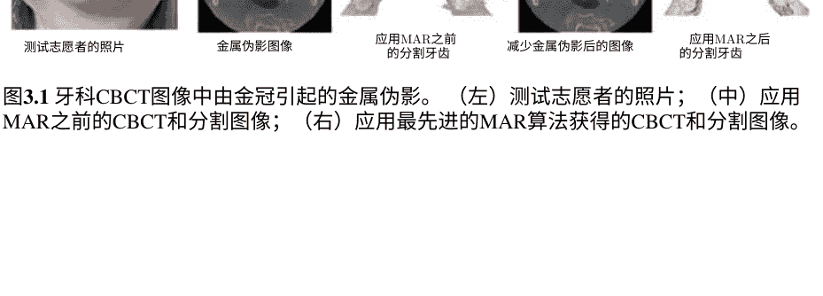


图3.2 [10] 牙科CBCT系统。由于偏移探测器配置和内部ROI-定向扫描，测量的正弦图数据可以被视为从标准MDCT中可获取的完全采样的正弦图的子采样正弦图。这种子采样导致了正弦图的截断和不对称。该系统将在第3.2.4节中详细解释。此图提取自[10]

由于使用了小型探测器以降低系统成本，因此CBCT的FOV被限制在患者头部的大小。这种FOV截断会产生额外的伪影，与牙齿和高吸收材料结合在一起。见图3.2。

与MDCT相比，牙科CBCT具有以下优势：

- （i）CBCT的价格比MDCT便宜得多；
- （ii）CBCT的X射线剂量比MDCT低得多。

另一方面，CBCT在以下方面比MDCT更不利：

- （a）步进式CBCT机器无法获得足够的投影数据以进行准确的重建，因为违反了Tuy的条件，而螺旋式MDCT被设计为满足Tuy的条件，该条件要求每个与所研究对象相交的平面必须与焦点轨迹相交；
- （b）CBCT的扫描时间比MDCT长得多。

尽管存在这些缺点，基于作为一种有前途的诊断和治疗程序的资格，CBCT系统的需求迅速增加。这是因为牙科CBCT系统显著降低了患者的辐射剂量，增强了设备的医护人员的信心。图3.3总结了MDCT和牙科CBCT的机器规格。

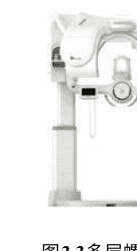

- 牙科CBCT
- 圆锥束成像
- 扫描时间：8-24秒
- 分辨率 < 0.2毫米
- FOV截断
- 偏移探测器
- 价格 < 10亿美元
- 低剂量X射线

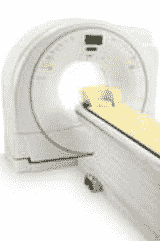

- 多层螺旋 CT
- 螺旋锥束成像
- 扫描时间 < 1秒
- 分辨率 < 0.3毫米
- 无FOV截断
- 无偏移探测器
- 价格 > 10亿美元
- 高剂量X射线

CBCT（平面探测器）中的图像重建问题可以描述如下：

- （待重建的CBCT图像）在点 $(\mathbf{x}, z) = (x_1, x_2, z) \in \mathbb{R}^3$ （或组织密度）处，从测量的X射线束衰减系数中重建出三维图像 $\mu(x, z)$。
- （用于CBCT的X射线束）一个锥形的X射线束通过一个位于X射线源和平板探测器之间的患者。这束光通过旋转容纳X射线源和探测器的回转架沿不同方向传输。因此，用于CBCT重建的数据被获取。
- （CBCT投影数据）CBCT投影数据 $\mathbf{P} (\beta, u, v)$ 是在通过多个方向传递X射线束后使用平面探测器获取的，其中 $\beta \in [0, 2\pi)$ 是投影角度，$(u, v)$ 是平面探测器位置。有关CBCT几何的详细信息，请参见图3.4。
- 数据位置 $(\beta, u, v)$ 与图像位置 $(\mathbf{x}, z)$ 之间的关系如下：

$$u = u_{\beta, \mathbf{x}} = R\frac{\mathbf{x} \cdot \Theta_\beta}{U_{\beta, \mathbf{x}}} \quad \text{和} \quad v = v_{\beta, \mathbf{x}, z} = \frac{zR}{U_{\beta, \mathbf{x}}}, \qquad (3.1)$$

其中 $\Theta_\beta = (\cos \beta, \sin \beta)$，$R$ 是源点和原点之间的距离，以及

$$U_{\beta, \mathbf{x}} = R + \mathbf{x} \cdot \Theta_\beta^\perp. \qquad (3.2)$$

- （逆问题）从X射线数据 $\mathbf{P}(\beta, u, v)$ 中恢复 $\mu(\mathbf{x}, z)$。

标准的CBCT重建算法是FDK方法[31]，可以表示为

$$\mu(\mathbf{x}, z) = \frac{1}{4\pi}\int_0^{2\pi} \frac{R^2}{U_{\beta, \mathbf{x}}^2} \int_{\mathbb{R}} \mathbf{P}(\beta, u, v_{\mathbf{x}, z, \beta}) \frac{R}{\sqrt{R^2 + u^2 + v_{\beta, \mathbf{x}, z}^2}} \hbar(u_{\beta, \mathbf{x}} - u) du d\beta, \qquad (3.3)$$

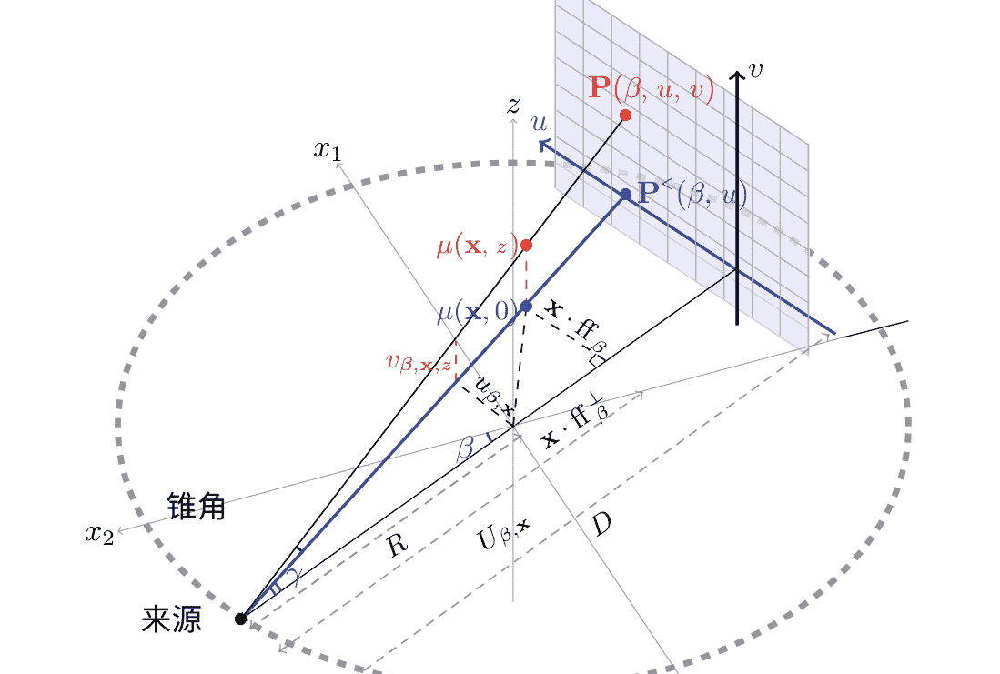

图3.4 牙科CBCT几何

其中 $h(s)$ 是一个一维斜坡滤波器，给定为 $h(s)=\frac{1}{2\pi}\int_{\mathbb{R}}$ 给定一个物体位置 $(\mathbf{x}, z)$，识别衰减值 $\mu(\mathbf{x}, z)$ 需要知道 $\mathbf{P}(\beta, u, v)$ 与数据位置 $(\beta, u, v)$ 相关，根据(3.1)与 $(\mathbf{x}, z)$ 之间的关系，考虑通过图像位置 $(\mathbf{x}, z)$ 的所有光束线。数据位置 $(\beta, u, v)$ 包含检测到的光子的入射角信息。

由于不受欢迎的噪声和入射X射线束的多色性，真实投影数据与数学模型之间存在无法避免的不匹配 [84]。在临床CT的视野中存在金属或高吸收材料时，这种不匹配会产生与金属几何形状相关的严重条纹伪影，主要是由于光束硬化因子引起的 [25, 30, 119]。见图3.5。

已经提出了许多金属伪影减少（MAR）方法。经典的MAR方法性能非常有限 [7, 78, 79]。双能CT [5] 通过双能混合实现了令人满意的重建，但需要更长的后处理时间和与单能量CT相比，辐射剂量较高[13]。目前，商业上可用的MAR算法包括SEMAR（东芝医疗系统）[135]，O-MAR（飞利浦医疗）[86]，iMAR（西门子医疗）[64]，Smart MAR（GE医疗）[44]。然而，现有的MAR方法在低剂量CBCT环境中不能有效减少金属伪影，并可能引入以前不存在的新条纹伪影。

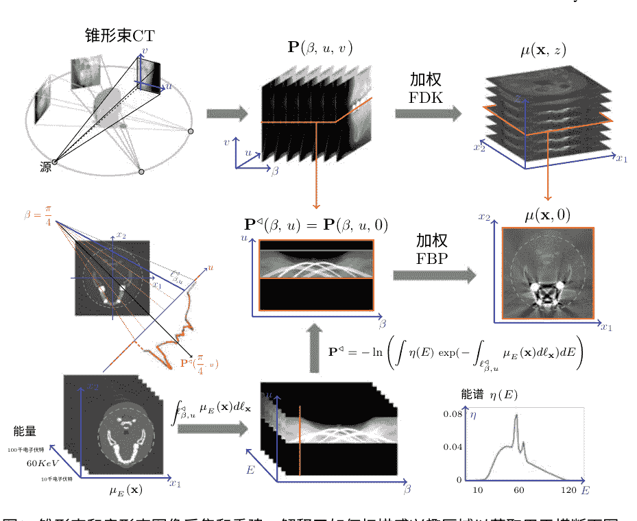

图3.5 锥形束和扇形束图像采集和重建，解释了如何扫描感兴趣区域以获取用于横断面图像重建的正弦图

各种经验/研究表明，金属伪影（MAR）的性能取决于材料、几何形状、尺寸和金属的位置。开发一个统一的MAR方法，包括小/中/大型金属物体和完全光子饥饿等所有情况，是困难的。因此，我们需要开发一种基于案例的自适应MAR算法，而不是统一的MAR方法。本章的目的是回顾现有的MAR结果，从数学角度分析问题，并提出未来的研究方向。

我们首先回顾CT的基础知识、现有的MAR方法及其局限性。接下来，我们解释描述金属伪影特征和光束硬化校正公式的数学理论，该公式考虑了金属材料的衰减系数与能量依赖性引起的测量非线性。然后，我们讨论具有挑战性的问题并提出未来的研究方向。我们回顾了各种现有的MAR方法及其局限性。

## 3.2 CT的基础知识

### 3.2.1 CT的历史

X射线计算机断层扫描（CT）是医学和牙科成像中最常用的诊断工具之一。CT通过为每个体素分配一个X射线衰减系数来提供人体的横截面图像（2D切片图像）（3D物体），该系数表征了介质对X射线束穿透的难易程度。X射线是由带电粒子加速产生的。X射线是具有波长在10^{-8}到10^{-12}米范围内的电磁波。X射线辐射是由朗特根发现的，他于1901年获得了物理学的第一个诺贝尔奖。在CT中，X射线束从管内的阳极X射线发生器传递到多个探测器组。CT的基本思想是利用穿过人体的X射线束在不同方向上获取有关CT图像的投影值（2D X射线图像）的信息。CT图像是通过旋转X射线管获取的不同角度的X射线图像进行重建的。

1917年，约翰·拉登[102]发现CT图像可以从X射线信息在所有方向上重建。第一台临床CT扫描仪是在1960年代末由英国的霍恩斯菲尔德[52]发明的，数据采集基于平行光束几何，霍恩斯菲尔德和科马克[19]在1979年共同获得了诺贝尔医学奖。CT重建的思想是滤波反投影的一般概念，根据光束的路径将经过滤波的X射线数据反投影到重建体积中。在1971年，使用霍恩斯菲尔德的扫描仪，在伦敦的阿特金森·莫利医院进行了首次对疑似额叶的女性患者进行的临床CT扫描。每次扫描需要约5分钟来收集数据以生成一个80 × 80像素的图像。

1973年，罗伯特·S·莱德利开发了第一台全身CT扫描仪。论文[113]解释了第一台全身CT扫描仪开发背后的有趣故事。1970年左右，尼克松担任美国总统时，莱德利本应获得一笔巨额的NIH拨款。然而，过了一段时间后，尼克松削减了医学研究经费，结果他的NIH研究资金完全被削减了。因此，莱德利不得不迅速找到支付他的工人Methods。当他听说首席神经外科医生卢森霍普博士对霍恩斯菲尔德开发的CT扫描仪感兴趣时，莱德利去找了他。莱德利对卢森霍普博士说：“我可以制造它，并且价格会是原来的一半。”当时，他甚至不知道价格是多少。具有讽刺意味的是，这次资金危机成为第一台全身CT扫描仪开发的推动力[113]。

螺旋CT扫描仪和多层螺旋CT（MDCT）的引入推动了CT扫描技术的进步。目前，CT扫描仪在不到0.3秒的时间内收集数据，生成1024 × 1024像素的图像，并且每次旋转可以同时获取64个切片。

1999年，第一台商用CBCT问世。自那时以来，CBCT不断发展，提供高分辨率图像的同时降低成本、尺寸和辐射剂量。现在，CBCT广泛应用于牙科/颌面外科应用。在临床牙科学中，牙科CBCT作为一种重要的辅助放射学技术，受到了广泛关注，可用于辅助诊断、治疗计划和预后评估，如诊断牙齿龋齿、重建颅面外科手术计划和评估患者的面部[40, 77, 114, 115]。

### 3.2.2 平行光束CT：基本原理

CT的基本概念基于Cormack在1963年提出的数学模型（之前是Radon在1917年[103]提出的），该模型旨在通过从主体周围的所有角度获取X射线数据来提供3D主体的图像。CT图像中的每个像素都由X射线衰减系数分配，该系数指示介质对X射线束的穿透程度。

为了方便起见，将使用一个二维平行光束CT模型来解释CT的基本原理（尽管不实际）。本节中使用以下符号：

- $\mu(\mathbf{x})$描述介质在位置 $\mathbf{x} = (x_1, x_2) \in \mathbb{R}^2$的衰减系数。
- $\mathbf{P}^{\ddagger}(\varphi, s)$表示在投影角度 $\varphi \in [0, 2\pi]$和探测器位置 $s \in \mathbb{R}$的投影数据。上标$\ddagger$代表平行光束。
- $\ell_{\varphi, s}^{\ddagger} := \{\mathbf{x} \in \mathbb{R}^2 : \mathbf{x} \cdot \Theta_{\varphi} = s\}$表示光束线，其中 $\Theta_{\varphi} = (\cos \varphi, \sin \varphi)$表示投影方向。
- $\mathscr{R}$表示Radon变换，给定为

$$\mathscr{R}\mu(\varphi, s) := \int_{\mathbb{R}^2} \mu(\mathbf{x})\delta(\mathbf{x} \cdot \Theta_{\varphi} - s)d\mathbf{x} = \int_{\ell_{\varphi, s}^{\ddagger}} \mu(\mathbf{x})dl_{\mathbf{x}}, \quad (3.4)$$

其中 $dl_{\mathbf{x}}$是线元素，$\delta(\cdot)$是Dirac delta函数。

在平行束CT中，通过物体以不同方向通过X射线束后，收集切片的X射线投影数据 $\mathbf{P}^{\ddagger}(\varphi, s)$如图3.6所示。FBP算法基于X射线投影数据的假设

$\mathbf{P}^{\ddagger}(\varphi, s)$在Radon变换的范围内，即存在 $\mu$ such that

$$\mathbf{P}^{\ddagger}(\varphi, s) = \mathscr{R}\mu(\varphi, s) \quad \text{对于所有的投影角度 } \varphi\in [0, 2\pi]. \quad (3.5)$$

在实践中，上述假设通常不成立，即 $\mathbf{P}^{\ddagger}(\varphi, s)$不在Radon变换的范围内。这将在第3.3.2节中讨论。

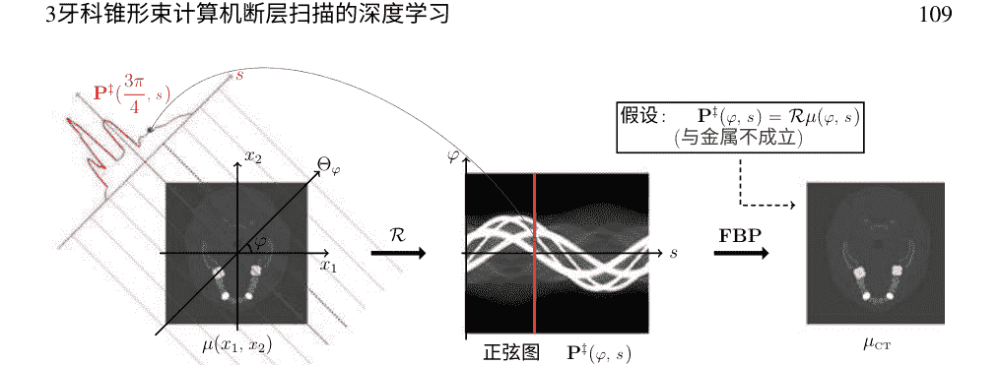

图3.6 平行光束CT系统中的数据采集和图像重建

### 3.2.2.1 滤波反投影（FBP）

CT重建的概念基于以下数学公式的变体：

$$\mu(\mathbf{x}) = \frac{1}{8\pi^2} \int_{-\pi}^{\pi} \int_{\mathbb{R}} |\omega| \mathscr{F}_1[\mathcal{R}\mu(\varphi, \cdot)](\omega) e^{i\omega \mathbf{x} \cdot \Theta_\varphi} d\omega d\varphi, \tag{3.6}$$

其中 \(\mathscr{F}_1\) 是关于 \(s\) 变量的一维傅里叶变换（FT）。因此，在线性假设（3.5）下，我们有以下FBP算法：

$$\mu(\mathbf{x}) = \mathcal{R}^{-1}\mathbf{P}^\ddagger(\mathbf{x}) = \frac{1}{8\pi^2} \int_{-\pi}^{\pi} \int_{-\infty}^{\infty} |\omega| \mathscr{F}_1[\mathbf{P}^\ddagger(\varphi, \cdot)](\omega) e^{i\omega \mathbf{x} \cdot \Theta_\varphi} d\omega d\varphi. \tag{3.7}$$

每个\(\varphi\)处的\(\mathbf{P}\)的傅里叶变换乘以\(|\omega|\)\n逆傅里叶变换\n对每个\(\varphi\)进行反投影

有关平行束CT成像原理，请参见图3.7。
FBP公式（3.7）基于以下两个众所周知的事实：

1. 傅里叶切片定理：\(\mathscr{F}_2\mu(\omega\Theta_\varphi) = \mathscr{F}_1[\mathcal{R}\mu(\varphi, \cdot)](\omega)\)，其中 \(\mathscr{F}_2\) 是2D-傅里叶变换。准确地说，

$$\mathscr{F}_1[\mathcal{R}\mu(\varphi, \cdot)](\omega) = \int \mu(s\Theta_\varphi + t\Theta_\varphi^\perp) e^{-i2\pi\omega s} ds dt = \mathscr{F}_2(\mu)(\omega\Theta_\varphi). \tag{3.8}$$

\[=\int_{\mathbb{R}} \mathcal{R}\mu(\varphi, s)e^{-i2\pi\omega s}ds \quad =\iint \mu(\mathbf{x}) \exp[-i2\pi\omega\, \mathbf{x} \cdot \Theta_\varphi] d\mathbf{x}\]

在这里，我们使用

$$\mathscr{R}\mu(\varphi, s) = \int_{\mathbb{R}} \mu(s\Theta_{\varphi} + t\Theta_{\varphi}^{\perp})dt = \int_{\mathbb{R}^2} \mu(\mathbf{x}) \delta(\mathbf{x} \cdot \Theta_{\varphi} - s)d\mathbf{x}. \quad (3.9)$$

见图3.8。

- 滤波反投影：反投影滤波数据，即 \( |\omega| \mathscr{F}_1[\mathscr{R}\mu(\varphi, \cdot)](\omega) \) 的傅里叶逆变换。

这种FBP方法在CT成像中效果很好，因为对于大多数人体组织，X射线数据 \( \mathbf{P}^{\ddagger}(\varphi, s) \) 大致满足线性假设 \( \mathbf{P}^{\ddagger} = \mathscr{R}\mu \)。然而，当成像切片中存在金属物体时，X射线数据 \( \mathbf{P}^{\ddagger}(\varphi, s) \) 无法满足这个假设。这是因为入射X射线束由不同能量的光子组成，而X射线衰减系数随着能量 \( E \) 变化。特别是金属物体的衰减系数 \( \mu \) 随能量 \( E \) 变化很大。因此，在扫描切片中存在金属物体会导致数据 \( \mathbf{P}^{\ddagger}(\varphi, s) \) 违反线性假设。

## 3.2.2.2 其他重建方法

对于解析CT重建，(3.7)有几种替代表达式。

\( \mathscr{R}^{-1} \) 的各种表达式如下：

图3.8 傅里叶切片定理的图示

根据公式(3.7)，$\mathscr{R}^{-1}$可以表示为

$$\mathscr{R}^{-1}\mathbf{P}^{\sharp} = \frac{1}{2}\mathscr{R}^*\quad \mathscr{H}\left[\frac{\partial}{\partial s}\mathbf{P}^{\sharp}\right] \quad , \quad\quad\quad (3.10)$$

其中$\mathscr{H}$是希尔伯特变换。让我们简要解释如何得到公式(3.10)。我们有

$$\mu(\mathbf{x}) \doteq \underbrace{\int_{\mathbb{R}^{2}} \mathcal{F}_{2} \mu(\boldsymbol{\xi}) e^{i\mathbf{x} \cdot \boldsymbol{\xi}} d \boldsymbol{\xi}}_{\int_{0}^{2 \pi} \int_{0}^{\infty} \underbrace{\mathcal{F}_{2} \mu\left(\omega \boldsymbol{\Theta}_{\varphi}\right)}_{\mathcal{F}_{1}(\mathcal{R} \mu)(\varphi, \omega)} e^{i \omega \mathbf{x} \cdot \boldsymbol{\Theta}_{\varphi}} \omega d \omega d \varphi} \doteq \int_{0}^{\pi} \int_{\mathbb{R}} \underbrace{\mathcal{F}_{1}}_{\omega \frac{\omega}{|\omega|} \mathcal{F}_{1}(\mathscr{R} \mu)(\varphi, \omega)} \mathscr{H}\left[\frac{d}{d s} \mathscr{R} \mu\right](\varphi, \omega) e^{i \omega \mathbf{x} \cdot \boldsymbol{\Theta}_{\varphi}} d \omega d \varphi . \quad\quad\quad (3.11)$$

在这里，我们使用以下等式。

- $\frac{1}{2 \pi i} \mathcal{F}_{1} \frac{\partial}{\partial s} \mathscr{R} \mu(\varphi, \cdot)(\omega)=\omega \mathcal{F}_{1}[\mathscr{R} \mu(\varphi, \cdot)](\omega) .$
- $\mathcal{F}_{1}(\mathscr{H} g)(\omega)=\frac{\omega}{|\omega|} \mathcal{F}_{1} g(\omega) .$
- $\mathscr{R}^{*} \mathscr{R} \mu(\mathbf{x}) \doteq \int_{0}^{\pi} \mathscr{R} \mu(\mathbf{x} \cdot \boldsymbol{\Theta}_{\varphi}, \varphi) d \varphi .$

然后，公式（3.10）可以从中得出

$$
\mu(\mathbf{x}) \doteq \int_{0}^{\pi} \underbrace{\left[\int_{\mathbb{R}} \frac{\frac{\partial}{\partial s} \mathscr{R} \mu(\varphi, s)}{\mathbf{x} \cdot \Theta_{\varphi} - s} ds\right]}_{\mathscr{H} \frac{\partial}{\partial s} \mathscr{R} \mu(\mathbf{x} \cdot \Theta_{\varphi}, \varphi)} d\varphi. \tag{3.12}
$$

让 $\mathscr{I}_{a}$ 是1-D中给定的 Riesz 势算子

$$
\mathscr{I}_{a}^{\eta} g(s) = \frac{1}{\sqrt{2 \pi}} \int_{R} e^{i s \omega}|\omega|^{-a} \mathscr{F} g(\omega) d \omega. \tag{3.13}
$$

逆 Radon 变换由以下表达式表示

$$
\mathscr{R}^{-1} \mathbf{P}^{\dagger}(\mathbf{x}) \doteq \int_{-\pi}^{\pi} \left[\int_{\mathbb{R}} \int_{\mathbb{R}}|\omega| \mathbf{P}^{\dagger}(\varphi, s) e^{i \omega(\mathbf{x} \cdot \Theta_{\varphi}-s)} d s d \omega\right] d \varphi. \tag{3.14}
$$

\center{我 $_{-1} \mathscr{R} \mu(\mathbf{x} \cdot \Theta_{\varphi}, \varphi)}

这是由此得出的

$$
\mu(\mathbf{x}) \doteq \underbrace{\int_{\mathbb{R}^{2}} \mathscr{F}_{2}(\mu)(\boldsymbol{\xi}) e^{i \boldsymbol{\xi} \cdot \mathbf{x}} d \boldsymbol{\xi}}_{\int_{-\pi}^{\pi} \int_{0}^{\infty} \mathscr{F}_{2} \mu(\omega \Theta_{\varphi}) e^{i \omega \mathbf{x} \cdot \Theta_{\varphi}} \omega d \omega d \varphi}
\doteq \int_{-\pi}^{\pi} \left[\int_{-\infty}^{\infty} \underbrace{|\omega| \mathscr{F}_{1}(\mathscr{R}(\varphi, \cdot) \mu)(\omega) e^{i \omega \mathbf{x} \cdot \Theta_{\varphi}} d \omega}_{\text{我 } _{-1} \mathscr{R} \mu(\mathbf{x} \cdot \Theta_{\varphi}, \varphi)}\right] d \varphi. \tag{3.15}
$$

- $\mathscr{R}^{-1}$ 可以通过使用方向希尔伯特变换来表示：证明的概要是

$$
\mu(\mathbf{x}) \doteq \underbrace{\mathscr{H}_{\Theta_{\varphi_{0}}} \underbrace{\mathscr{R}_{\Theta_{\varphi_{0}}}^{*} \frac{\partial}{\partial s} \mathscr{R} \mu(\mathbf{x})}_{\frac{1}{\pi} \int_{|\varphi-\varphi_{0}|<\frac{\pi}{2}} \frac{\partial}{\partial s} \mathscr{R} \mu(\varphi, s)\left|_{s=\mathbf{x} \cdot \Theta_{\varphi}} d \varphi\right.}}_{\frac{1}{\pi} \int_{s} \mathscr{R}_{\Theta_{\varphi_{0}}}^{*} \frac{\partial}{\partial s} \mathscr{R} \mu(\mathbf{x}-s \Theta_{\varphi_{0}}) ds} \tag{3.16}
\Rightarrow \mathscr{H}_{\Theta_{\varphi_{0}}} \mu(\mathbf{x}) \doteq \mathscr{R}_{\Theta_{\varphi_{0}}}^{*} \frac{\partial}{\partial s} \mathscr{R} \mu(\mathbf{x}). \tag{3.17}
$$

该证明基于以下恒等式：

- $-\mathscr{F}\left\{\mathscr{H}_{\Theta_{\varphi_{0}}} \mu\right\}(\boldsymbol{\xi})=-i \operatorname{sgn}\left(\Theta_{\varphi_{0}} \cdot \boldsymbol{\xi}\right) \mathscr{F} \mu(\boldsymbol{\xi})$.
- $-\mathscr{F}\left\{\mathscr{R}_{\Theta_{\varphi_{0}}}^{*} \mathscr{R} \mu\right\}(\boldsymbol{\xi})=\frac{1}{|\boldsymbol{\xi}|} \mathscr{F}_{1} \mathscr{R} \mu\left(\operatorname{sgn}\left(\Theta_{\varphi_{0}} \cdot \boldsymbol{\xi}\right) \varphi, \operatorname{sgn}\left(\Theta_{\varphi_{0}} \cdot \boldsymbol{\xi}\right)|\boldsymbol{\xi}|\right)$.
- $-\mathscr{F}\left\{\mathscr{R}_{\Theta_{\varphi_{0}}}^{*} \mathscr{R} f+\mathscr{R}_{-\Theta_{\varphi_{0}}}^{*} \mathscr{R} f\right\}(\boldsymbol{\xi})=\frac{1}{|\boldsymbol{\xi}|}\left(\mathscr{F}_{1} \mathscr{R} \mu(\varphi,|\boldsymbol{\xi}|)+\mathscr{F}_{1} \mathscr{R} \mu(-\varphi,-|\boldsymbol{\xi}|)\right)$.

## 3.2.3 扇形束CT：重建算法

图3.9显示了扇形束成像几何，解释了患者如何进行扫描以获取用于横断面图像重建的投影数据。CBCT可以被视为宽扇形束CT（FBCT），因为它具有宽的准直器开口。

扇形束多探测器CT（MDCT）在临床领域广泛使用。尽管CT理论是针对平行光束的，但平行CT在临床领域中不使用。在MDCT中，X射线源沿半径为R的层面沿圆周运动。扇形束重建算法与平行束重建算法类似，只是在反投影中进行“数据滤波”和加权。

为了澄清平行束和扇形束之间的数据采集差异，我们使用以下投影数据的符号表示：

- \( P^\dagger(\varphi, s) \) 表示平行束CT中的投影数据，其中数据采集基于通过身体的射线 \( \ell^{\dagger}_{\varphi,s} := \{ \mathbf{x} \in \mathbb{R}^2 : \mathbf{x} \cdot \Theta_\varphi = s \} \)。在这里，\( \Theta_\varphi = (\cos \varphi, \sin \varphi) \) 表示投影角度，s表示探测器的位置。
- 如图3.9所示，扇形束CT的投影数据用 \( P^\triangleleft(\beta, u) \) 表示，其中数据采集基于扇形束线

$$ \ell^\triangleleft_{\beta,u} := \{ \mathbf{x} \in \mathbb{R}^2 : \mathbf{x} \cdot \Theta_{\beta+\gamma_u} = R \sin \gamma_u \}. \quad (3.18) $$

在这里，\( \gamma_u \) 是由 \( u = R \tan \gamma \) 确定的扇形角；R是源点与原点之间的距离；\( \beta + \pi/2 \) 是光源与射线之间的角度；光线的源点 \( \ell^\triangleleft_{\beta,u} \) 位于 \( R\Theta_{\beta+\pi/2} \) 处；上标 \( \triangleleft \) 表示扇形束。请参见图3.11，了解扇形束线的可视化解释。

扇形线 \( \ell_{\beta, u}^{\triangleleft} \) 和平行线 \( \ell_{\varphi, s}^{\ddagger} \) 之间的关系是

$$ \ell_{\varphi, s}^{\ddagger} = \ell_{\beta, u}^{\triangleleft} \iff s = R \sin \gamma_u, \quad \varphi = \gamma_u + \beta. \tag{3.19} $$

因此，我们有

$$ \mathbf{P}^{\ddagger}(\varphi, s) = \mathbf{P}^{\triangleleft}(\beta, u) \quad \text{if } s = R \sin \gamma_u \quad \text{and} \quad \varphi = \gamma_u + \beta. \tag{3.20} $$

参见图3.10，扇形束线和平行束线之间的关系。

在理想假设(3.5)下，我们有以下FBP(3.7)的变体：

$$ \mu(\mathbf{x}) = \frac{1}{4\pi} \int_{0}^{2\pi} \int_{\mathbb{R}} \mathbf{P}^{\ddagger}(\varphi, s) \hbar(s_{\mathbf{x},\varphi} - s) ds d\varphi. \tag{3.21} $$

$$ \underbrace{\quad\quad\quad\quad\quad\quad}_{:= \mathscr{R}^{-1} \mathbf{P}^{\ddagger}(\mathbf{x})} $$

扇形束CT版本的FBP(3.21)可以表示为

$$ \mu(\mathbf{x}) = \frac{1}{4\pi} \int_{0}^{2\pi} \frac{R^2}{U_{\beta, \mathbf{x}}^2} \int_{\mathbb{R}} \mathbf{P}^{\triangleleft}(\beta, u) \frac{R}{\sqrt{R^2 + u^2}} h(u_{\beta, \mathbf{x}} - u) du d\beta, \quad (3.22) $$

其中 \( U_{\beta, \mathbf{x}} = (\mathbf{x} - R \Theta_{\beta}^{\perp}) \cdot \Theta_{\beta}^{\perp} \) 和 \( u_{\beta, \mathbf{x}} = R \tan(\gamma_{\beta, \mathbf{x}}) \)。

在实践中，投影数据 \( \mathbf{P}^{\triangleleft}(\beta, u) \) 包含各种伪影源，包括散射、多色光束的非线性效应和患者移动。诸如(3.22)的解析重建方法无法有效处理这些伪影源。为了提高图像质量，建议开发一种混合方法，结合解析方法、图像处理技术和迭代方法来解决优化问题。由于处理非线性效应存在严重困难，因此开发应用特定的重建技术是可取的。

### 3.2.4 锥束CT

锥束CT（CBCT）机器已广泛用于牙科CT，其中一个锥形X射线束围绕患者的头部旋转，使用2D面阵探测器获取许多2D投影。图3.12显示了CBCT和扇形CT之间的区别。随着探测器阵列中行数的增加，MDCT倾向于增加束的z轴覆盖范围，这越来越难以区分MDCT和CBCT的标准。

本节仅关注步进式锥束采集，如图3.12所示，在CT扫描期间，源轨迹为圆圈，患者静止不动。在圆形CBCT中，投影数据不足以进行精确的解析重建。CBCT相对于MDCT的优缺点如下：

- 价格: CBCT的价格比MDCT低得多。
- X射线剂量: CBCT的X射线剂量比MDCT低得多。
- CT重建: 由于违反了Tuy的条件，步进式CBCT机器无法获得足够的投影数据来进行精确重建。另一方面，螺旋式MDCT设计满足Tuy的条件，要求每个与所研究对象相交的平面必须与焦点轨迹相交。
- 伪影: 由于FOV截断等附加数据缺陷，CBCT中常见伪影。
- 扫描时间: CBCT的扫描时间比MDCT长得多。让我们从考虑理想情况开始，即测量的投影数据是完整的3D Radon变换 \( \mathcal{R}\mu \)。在这里，3D Radon变换给出为

$$ \mathcal{R}\mu(\rho, \mathbf{n}) = \int_{\Pi_{\rho,\mathbf{n}}} \mu dS, \forall \mathbf{n} \in S^2, \rho, $$

其中 \( S^2 \) 表示单位球面， \( \Pi_{\rho,\mathbf{n}} \) 是给定的平面

$$ \Pi_{\rho,\mathbf{n}} = \{(\mathbf{x}, z) \in \mathbb{R}^3 : \rho = (\mathbf{x}, z) \cdot \mathbf{n}\}. $$

使用3D傅里叶切片定理，类似于2D FBP，Radon变换的逆可以表示为

$$ \mu(\mathbf{x}, z) = -\frac{1}{8\pi^2} \int_{|\mathbf{n}|=1} \frac{\partial^2}{\partial \rho^2} \mathcal{R}\mu(\rho, \mathbf{n}) dS_{\mathbf{n}}. $$

然而，我们不能直接使用这种反演方法，因为没有涵盖所有方向的完整投影数据。一种流行的CBCT重建算法是FDK方法，由Feldkamp、Davis和Kress [31]开发。FDK算法的性质类似于滤波反投影，由两个主要部分组成：滤波和加权反投影。为了详细解释，让我们考虑一个配备平面探测器的CBCT。在这种情况下，投影数据 \( \mathbf{P} \) 是投影角度\( \beta \) 和平面探测器坐标 \( (u, v) \) 的函数，如图3.13所示。投影数据 \( \mathbf{P} \) 经历加权斜坡滤波，对应于公式(3.26):

$$ \mu(\mathbf{x}, z) = \frac{1}{4\pi} \int_{0}^{2\pi} \frac{R^2}{U_{\beta,\mathbf{x}}^2} \int_{\mathbb{R}} \frac{R\mathbf{P}(\beta, u, v_{\mathbf{x},z,\beta})}{\sqrt{R^2 + u^2 + v_{\mathbf{x},z,\beta}^2}} \tilde{h}(u_{\beta,\mathbf{x}} - u) du d\beta. $$

其中

$$ v_{\beta,\mathbf{x},z} = \frac{z R}{R + \mathbf{x} \cdot \Theta_{\beta}}. $$

### 3.2.5 牙科CBCT

在临床牙科学中，最常用的牙科CBCT系统使用偏移探测器配置和内部感兴趣区域导向扫描，如图3.14所示。牙科CBCT旨在以最低的X射线剂量暴露和最小的成本提供高质量的三维颌面影像。

由于牙科CBCT的有效FOV不覆盖要扫描的物体的整个区域，并且使用了偏移探测器几何，所以正弦图P可以通过以下方式表示：
$\mathbf{P} = S_{\text{ub}}(\mathbf{P}_{\text{full}})$ （3.28）

其中 $\mathbf{P}_{\text{full}}$ 是使用非偏移和宽探测器CBCT获得的相应正弦图，提供了正弦图的完整信息，$S_{\text{ub}}$ 是由探测器的大小和偏移配置确定的子采样算子。

更准确地说，让一个2D平板探测器与 $[-L, L]$ 对齐于u轴。如图3.15所示，正弦图P被截断为：

$\mathbf{P} = S_{\text{ub}}(\mathbf{P}_{\text{full}}) = \begin{cases} \mathbf{P}_{\text{full}} & \text{if } u \in [-L, L], \\ 0 & \text{if } u \in [-L, -L] \cup [L, L], \end{cases}$ （3.29）

其中 $[-L, L]$ 是P相对于u轴的支持。P沿着u轴的这些缺失信息使得现有方法的应用变得困难。

由于子采样 $S_{\text{ub}}$（即FOV截断和偏移探测器阵列），直接应用标准FDK算法（3.26式）可能会产生额外的图像伪影。因此，对于牙科CBCT应用，应进行以下修改。（i）为了补偿FOV截断引起的伪影，采用了正弦图外推方法[124]，具体如下：

$\mathcal{E}_{\text{xpol}}(\mathbf{P}) = \begin{cases} \mathbf{P} & \text{如果 } u \in [-L, \ell], \\ \text{如果 } u \in [-L, -L), \text{则} \mathbf{P}|_{u=L} \\ \text{如果 } u \in (\ell, L], \text{则} \mathbf{P}|_{u=L} \end{cases}$ （3.30）

这种方法可以有效地减少由FOV截断引起的杯状伪影。（ii）牙科CBCT正弦图P在 $u = -L$ 和 $u = L$ 之间测量两次，因为偏移探测器几何形状的偏差。为了解决这种部分数据冗余，使用加权函数 $\omega$ 类似于[121]的方式。在进行反投影之前使用。参见图3.16。牙科CBCT的修改FDK算法如下所示：

$\mu(x, z) = \frac{1}{4\pi} \int_{0}^{2\pi} \frac{R^{2} \omega(u_{\beta, \mathbf{x}})}{U_{\beta, \mathbf{x}}^{2}} \int_{\mathbb{R}} \frac{R \mathscr{E}_{\mathrm{xpol}}(\mathbf{P})(\beta, u, v_{\mathbf{x}, z, \beta})}{\sqrt{R^{2} + u^{2} + v_{\mathbf{x}, z, \beta}^{2}}} \hbar(u_{\beta, \mathbf{x}} - u) d u d \beta, (3.31)$

其中 $\omega$ 由以下给出：

$\omega(u) = \frac{1 - \cos(\pi(-u + L)/(2L))}{2}. (3.32)$

### 3.3 牙科CBCT伪影：光束硬化

Maxillofacial CBCT成像仍然存在各种伪影，这些伪影严重降低了骨骼和牙齿的图像质量。与标准多排CT（MDCT）相比，大多数牙科CBCT中伪影减少的额外困难是由于低剂量X射线照射和小尺寸平板探测器的使用，其中旋转中心轴相对于源-探测器轴偏移以最大化横向FOV [14, 15]。

随着植入金属和牙齿填充物患者数量的增加，牙科CBCT中的金属诱导伪影很常见[27, 107, 112, 116]。这些与金属相关的伪影是由于硬化束造成的正弦图不一致性和复杂的金属-骨骼-组织相互作用的影响所产生的。

此外，减少金属诱导伪影在牙科CBCT环境中是一个非常具有挑战性的问题，因为还会出现由偏移探测器、FOV截断和低剂量X射线引起的其他问题。本节解释了由于X射线束的多色性而引起的硬化束伪影。

硬化束伪影是由以下因素引起的对假设（3.5）的严重违反：

- 事故X射线束由许多不同能量的光子组成，范围在 $E_{min}$ 和 $E_{max}$ 之间。
- X射线衰减系数 $(\overline{\mu_E})$ 随 $E$ 变化。
- 使用低剂量的X射线照射。
- FOV截断和使用偏移探测器。

#### 3.3.1 Lambert-Beer定律和光束硬化伪影

为简单起见，使用平行束CT模型来解释非线性光束硬化效应。在平行束CT中，多色X射线的投影数据 $\mathbf{P}^{\ddagger}(\varphi, s)$ 由Lambert-Beer定律[11, 67]给出：

$\mathbf{P}^{\ddagger}(\varphi, s) = -\ln \int_{\mathbb{R}} \eta(E) \exp \left\{-\mathscr{R} \mu_{E}(\varphi, s)\right\} d E, \quad (3.33)$

其中 $\eta(E)$ 表示X射线源光谱中能量为 $E$ 的光子能量的分数[49, 95]，其支持区间为 $[E_{min}, E_{max}]$ 和 $\int_{\mathbb{R}} \eta(E) d E=1$。参见图3.17中的衰减系数 $\mu_E$ 和分数能量 $\eta(E)$。

更准确地说，投影数据 $\mathbf{P}^{\ddagger}(\varphi, s)$ 与以下两个术语相关：

- $I_{\text{in}}(\varphi, s)\eta(E)$ 表示能量 $E$ 沿着光束线 $\ell_{\varphi,s}$ 的入射光强分布。
- $I_{\text{out}}(\varphi, s)\eta(E)$，由探测器测量，表示通过人体沿着 $\ell_{\varphi,s}$ 传输的X射线光子的强度。

比尔-兰伯特定律是：

$I_{\text{out}}(\varphi, s)\eta(E) = I_{\text{in}}(\varphi, s)\eta(E) \exp\left\{-\int_{\ell_{\varphi,s}} \mu(\mathbf{x}, E) d l_{\mathbf{x}}\right\}, \quad (3.34)$

其中 $\mu(\mathbf{x}, E)$ 是位置 $\mathbf{x}=(x_1, x_2)$ 和能量水平 $E$ 处的线性衰减系数的分布。金属物体的 $\mu$ 值随着 $E$ 的变化而变化很大，而软组织的 $\mu$ 值随着 $E$ 的变化变化很小。例如，$\mu(\text{材料}, E)$ 是：

- $\mu(\text{软组织，30 keV}) \approx 0.38 (\text{cm}^{-1})$, $\mu(\text{软组织，60 keV}) \approx 0.21 (\text{cm}^{-1})$
- $\mu(\text{水，10 keV}) \approx 5 (\text{cm}^{-1})$, $\mu(\text{水，100 keV}) \approx 0.17 (\text{cm}^{-1})$
- $\mu(\text{骨头，10 keV}) \approx 144 (\text{cm}^{-1})$, $\mu(\text{骨头，100 keV}) \approx 0.40 (\text{cm}^{-1})$

通过对 $E$ 应用Beer-Lambert定律(3.34)，我们得到：

$I_{\text{out}}(\varphi, s) = I_{\text{in}}(\varphi, s) \int \eta(E) \exp\left\{ - \int_{\ell_{\varphi,s}} \mu(\mathbf{x}, E) dl_{\mathbf{x}} \right\} dE \quad (3.35)$

因此，传输损耗的对数 $I_{in}(\varphi, s)/I_{out}(\varphi, s)$ 从以下公式中提供 $\mu$ 的分布信息：

$\ln\left( \frac{I_{\text{in}}(\varphi, s)}{I_{\text{out}}(\varphi, s)} \right) = - \ln \int \eta(E) \exp\left\{ - \int_{\ell_{\varphi,s}} \mu(\mathbf{x}, E) dl_{\mathbf{x}} \right\} dE \quad (3.36)$

投影数据 $P(\varphi, s)$ 在(3.33)中是由以下推导得到的：

$P(\varphi, s) = \ln \frac{I_{\text{in}}(\varphi, s)}{I_{\text{out}}(\varphi, s)} \quad (3.37)$

图3.18展示了双色X射线束的最简单情况下的光束硬化效应，其中X射线束由两个不同的能量级 $E_1 = 40 \text{ keV}$ 和 $E_2 = 80 \text{ keV}$ 组成。假设 $\Omega= \{\mathbf{x} : x_1 + x_2 < a , 0 < x_1, x_2 < a \}$ 表示如图3.18所示的三角形均匀成像物体。假设 $\eta(E) = \frac{1}{2} (\delta(E - E_1) + \delta(E - E_2))$ (双色)和能量水平 $E_j$ 处的衰减系数为 $\mu_j$。然后，根据(3.33)，投影数据 $P^{\ddagger}(s) = P^{\ddagger}(\pi/2, s)$ 是：

$P^{\ddagger}(s) = -\ln \int_{\mathbb{R}} \eta(E) \exp\{ -\mathcal{R} \mu_E(s) \} dE . \tag{3.38}$

由于 $\mathcal{R} \chi_{\Omega}(s) = a - s$，

$P^{\ddagger}(s) = -\ln \frac{1}{2} \sum_{j=1}^{2} e^{-\mu_j (a-s)} \tag{3.39}$

因此，如果我们将投影 $P^{\ddagger}(s)$ 反投影到物体域 $\Omega$ 沿着水平方向，那么我们得到的重建图像 $\mu^*$ 依赖于垂直方向 $x_2 = s$ 给出的：

$\mu_*(s) = \frac{1}{a-s} P^{\ddagger}(s) = -\frac{1}{a-s} \ln \frac{1}{2} \sum_{j=1}^{2} e^{-\mu_j (a-s)} \tag{3.40}$

很容易观察到以下内容：

图3.19显示了一种材料在能量水平上具有不同的衰减系数值。在线性假设下，CT扫描场中存在金属物体时违反了该假设。

因此，如果 $\mu_1 \approx \mu_2$，则 $\mu_*(s) \approx \mu_1$。

- 在 $\mu_1 > \mu_2$ 的情况下，我们有：
    - $\mu_*(a-) = \frac{\mu_1+\mu_2}{2}$ 通过应用L'Hospital法则。
    - $\mu_*(s) = \mu_2 - \frac{1}{a-s} \ln \frac{1}{2}(e^{(\mu_2-\mu_1)(a-s)} + 1)$ 对于 $0 < s < a$。
    - 当 $a$ 趋近于无穷大时，通过应用L'Hospital法则，$\lim_{a \to \infty} \mu_*(0+) = \mu_2$。

这显示了一种光束硬化效应，即低能量光子比高能量光子更快被吸收。

图3.19显示了由于光束硬化而违反了线性假设（3.5）的情况。这可以通过数据 $\mathbf{P}^\ddagger$ 与范围空间 $\mathcal{R}$ 之间的不匹配来解释。在图3.19中，我们将身体分解为三个区域；组织区域 $\Omega_{\text{组织}}$，骨骼区域 $\Omega_{\text{骨头}}$，和金属区域 $\Omega_{\text{金属}}$。然后，$\mu_E$ 可以分解为：

$\mu_E(\mathbf{x}) = \mu'_E(\mathbf{x}) + \mu^b_E(\mathbf{x}) + \mu^m_E(\mathbf{x}), \quad (3.41)$

其中 $\mu'_E = \mu_E \chi_{\Omega_{\text{组织}}}, \mu^b_E = \mu^b_E \chi_{\Omega_{\text{骨头}}}, \mu^m_E = \mu^m_E(\mathbf{x}) \chi_{\Omega_{\text{金属}}}$。给定 $\mathbf{P}^\ddagger$，让：

$(E_t, E_b, E_m) := \operatorname{argmin}_{(E_1,E_2,E_3)} \| \mathcal{R}(\mu'_{E_1} + \mu^b_{E_2} + \mu^m_{E_3}) - \mathbf{P}^\ddagger \|_{L^2((0,2\pi]\times\mathbb{R})}. \quad (3.42)$

让

$\mu^* = \mu'_{E_t} + \mu^b_{E_b} + \mu^m_{E_m},$

不匹配可以写成：

$[\mathbf{P}^{\ddagger} - \mathcal{R}\mu^*](\varphi, s) = \Upsilon_{\Omega_{\text{组织}}} + \Upsilon_{\Omega_{\text{骨头}}} + \Upsilon_{\Omega_{\text{金属}}}$

其中 $\Upsilon_{\Omega_{\text{组织}}}, \Upsilon_{\Omega_{\text{骨头}}}, \Upsilon_{\Omega_{\text{金属}}}$ 主要由组织区域、骨骼区域和金属区域引起的不匹配。金属引起的不匹配可以写成：

$\Upsilon_{\Omega_{\text{金属}}} = -\ln \int \eta(E) \exp \left\{ -\mathcal{R} \left[ \mu_E \chi_{\Omega_{\text{金属}}} - \mu_{E_m}^{m} \right] (\varphi, s) \right\} d E.$

不匹配 $\mathbf{P}^{\ddagger} - \mathcal{R}\mu^*$ 被近似为：

$[\mathbf{P}^{\ddagger} - \mathcal{R}\mu^*] \approx \beta_t \| \mathcal{R} \chi_{\Omega_{\text{组织}}} \|^2 + \beta_b \| \mathcal{R} \chi_{\Omega_{\text{骨头}}} \|^2 + \beta_m \| \mathcal{R} \chi_{\Omega_{\text{金属}}} \|^2,$

其中 $\beta_t, \beta_b, \beta_m$ 是最优常数。

#### 3.3.2 正弦图差异的影响

为了说明正弦图差异的影响，让我们考虑一个包含模拟金属物体的头部CT扫描。投影数据 $\mathbf{P}^{\ddagger}$ 在所有区域中几乎一致，除了菱形区域 $A_\diamond := \{(\varphi, s) : \mathcal{R}\chi_{D_1}(\varphi, s)\mathcal{R}\chi_{D_2}(\varphi, s) = 0\}$，其中 $D_1, D_2$ 是占据牙齿填充的横截面区域的两个圆盘。由于光束硬化，在小的菱形区域 $A_\diamond$ 中存在严重的不一致性，如图3.20所示。由于Radon变换 $\mathcal{R}$ 的伪逆的固有性质， $\mathbf{P}^{\ddagger}$ 在 $A_\diamond$ 中的局部不一致性会在 $\mathcal{R}^{-1}\mathbf{P}^{\ddagger}$ 中产生严重的全局伪影，表现为条纹和阴影伪影。通过 $\mathcal{R}^{*}$ ($\mathcal{R}$ 的对偶) 来表示反投影，其数学结构可以在图3.21中解释。

这种不一致性被映射到两个金属物体边界之间的条纹伪影中在 $\mathcal{R}^{-1}\mathbf{P}^{\ddagger}$ 中。此外，逐渐变化的不一致性在 $A_\diamond$ 中导致了两个金属物体附近或之间的阴影伪影。需要注意的是，不匹配与数学上的不一致性不同。

$\mathbf{P}^{\ddagger}_\diamond := \mathcal{R}(\mathcal{R}^{-1}\mathbf{P}^{\ddagger}) - P_\diamond.$

$\mathbf{P}^{\ddagger}_\diamond$ 在MAR中不是一个实际需要纠正的不匹配，因为 $\mathcal{R}^{-1}(\mathbf{P}^{\ddagger} + \mathbf{P}^{\ddagger}_\diamond)$ equals $\mathcal{R}^{-1}\mathbf{P}^{\ddagger}$，这代表了由不一致性 $P_\diamond$ 引入的伪影。我们可以简要地解释原因如下。基于伪逆 $\mathcal{R}^{-1}$ 的固有特性， $\mathcal{R}(\mathcal{R}^{-1}\mathbf{P}^{\ddagger})$ 是从 $P$ 到 $\mathcal{R}$ 的范围空间中最接近的正弦图。根据希尔伯特的投影定理，不一致性 $\mathbf{P}^{\ddagger}_\diamond$ 与范围空间中的任何正弦图正交，因此对于所有 $t \in \mathbb{R}$，

$\mathcal{R}^{*}\mathbf{P}^{\ddagger} = \mathcal{R}^{*} \mathbf{P}^{\ddagger} + t\mathbf{P}^{\ddagger}_\diamond \quad \text{和} \quad \mathcal{R}^{-1}\mathbf{P}^{\ddagger} = \mathcal{R}^{-1}(\mathbf{P}^{\ddagger} + t\mathbf{P}^{\ddagger}_\diamond).$

> 注3.1 在“伦琴射线”发现公告后的仅两周内，弗里德里希·奥托·瓦尔科夫在1896年制作了第一张牙科放射照片，使用了长达25分钟的曝光时间[92]。

图3.20 金属伪影的原因，即两个金属线路的交叉区域(A◇)不一致

图3.21 当投影数据 P♯ 不在范围空间 ℛ中时，ℛ^{-1}的固有性质

这种差异映射到任意两个金属物体边界之间的明暗条纹伪影中。

## 3.3.3 条纹伪影的数学分析

为了进行严格的分析和简化起见，我们暂时假设以下情况[87]:

- A1. D = D1 ∪ D2 ∪ ... ∪ DJ 是一个金属区域，其中 D1, ⋯, DJ 是 ℝ² 中不相交的简单连通光滑域
- A2. $\mu_E$ 对 $E$ 的可微性不同

$$\left. \frac{\partial \mu_E}{\partial E} \right|_{E=E_0} (\mathbf{x}) = \begin{cases} 0 & \text{如果 } \mathbf{x} \notin D_j, \\ \alpha \neq 0 & \text{如果 } \mathbf{x} \in D_j, \end{cases} \qquad (3.47)$$

其中$\alpha <0$ 是一个依赖于金属材料的常数。

- A3. $\mathbf{P}^\ddag(\varphi, s)$ 表示为:

$$\mathbf{P}^\ddag(\varphi, s) = -\ln \frac{1}{2} \int_{E_0-}^{E_0+} \exp\{-\mathscr{R} \mu_{E_0}(\varphi, s) - \alpha (E-E_0) \mathscr{R} \chi_D(\varphi, s)\} dE, \qquad (3.48)$$

其中是一个正常数，$\chi_D$ 表示 $D$ 的特征函数；
在 $D$ 中 $\chi_D = 1$，其他情况下为0。

根据第二个假设[A2]，我们有

$$\mu_E(\mathbf{x}) = \mu_{E_0}(\mathbf{x}) + (E-E_0) \sum_{j=1}^J \alpha \chi_{D_j}(\mathbf{x}) + O(|E-E_0|^2), \qquad (3.49)$$

在特殊情况下，当 $\eta(E) = \frac{1}{2} \chi_{[E_0-, E_0+]}$，第三个假设[A3]可以从[A2]中得出，其中(3.49)和足够小的值。

以下命题表达了滤波反投影CT图像 $\mathscr{R}^{-1}[\mathbf{P}^\ddag]$ 的分解，其中不包含金属伪影项 $\mu_E$ 和金属伪影项 $\Upsilon_{\mathbf{P}^\ddag}$。

命题3.1 [87] 在假设[A1]-[A3]的条件下，可以将 $\mathscr{R}^{-1}[\mathbf{P}^\ddag]$ (使用FBP重建的图像) 分解为

$$\mathscr{R}^{-1}[\mathbf{P}^\ddag](\mathbf{x}) = \mu_{E_0}(\mathbf{x}) + \Upsilon_{\mathbf{P}^\ddag}(\mathbf{x}), \qquad (3.50)$$

其中 $\Upsilon_{\mathbf{P}^\ddag}$ 表示由金属伪影项给出

$$\Upsilon_{\mathbf{P}^\ddag}(\mathbf{x}) = -\frac{1}{8\pi^2} \int_{-\pi}^{\pi} \int_{-\infty}^{\infty} |\omega| \mathscr{F}^{-1} \left[ \ln \frac{\sinh(\alpha \mathscr{R} \chi_D(\varphi, \cdot))}{\alpha \mathscr{R} \chi_D(\varphi, \cdot)} \right](\omega) e^{i\omega \mathbf{x} \cdot \Theta_\varphi} d\omega d\varphi, \qquad (3.51)$$

其中 $\ln \left( \frac{\sinh \beta}{\beta} \right)$ 当 $\beta = 0$时，理解为零。

伪影项 $\Upsilon_{\mathbf{P}^\ddag}$ 由不匹配产生:

$$\mathbf{P}^\ddag_{MA}(\varphi, s) := \begin{cases} -\ln \left( \frac{\sinh(\alpha \mathscr{R} \chi_D(\varphi, s))}{\alpha \mathscr{R} \chi_D(\varphi, s)} \right) & \text{如果 } (\varphi, s) \in G, \\ 0 & \text{如果 } (\varphi, s) \notin G, \end{cases} \qquad (3.52)$$

其中 $G:= \{(\varphi, s) \in (-\pi, \pi] \times \mathscr{R} : \mathscr{R}\chi_D(\varphi, s) = 0\}$。根据泰勒展开式可得

$$\mathbf{P}^{\ddagger}_{\mathbf{MA}} = -\ln M + \sum_{k=1}^{\infty} \frac{(-1)^k}{k} \frac{1}{M^k} \left[ \frac{\sinh(\alpha \mathscr{R}\chi_D)}{\alpha \mathscr{R}\chi_D} - M \right]^k \qquad (3.53)$$

其中 $M$是由正数给出的

$$M := \frac{\sinh(\alpha \mathscr{R}\chi_D)}{\alpha \mathscr{R}\chi_D}_{L^{\infty}(G)} \qquad (3.54)$$

注意 $M \geq 1$。我们定义 $\mathbf{P}^{\ddagger}_{\mathbf{MA}, N}$为

$$\mathbf{P}^{\ddagger}_{\mathbf{MA}, N}(\varphi, s) \text{的定义如下}: \begin{cases} -\ln M + \sum_{k=1}^{N} \frac{(-1)^k}{k} \left[ \frac{h_N(\varphi, s)}{M} \right]^k & \text{如果 } (\varphi, s) \in G, \\ 0 & \text{如果 } (\varphi, s) \notin G. \end{cases} \qquad (3.55)$$

其中 $h_N$的给定方式为

$$h_N(\varphi, s) = \sum_{n=0}^{N} \frac{(\alpha)^{2n}}{(2n+1)!} (\mathscr{R}\chi_D(\varphi, s))^{2n} - M. \qquad (3.56)$$

$$\begin{aligned} \mathbf{P}^{\ddagger}(\varphi, s) &= -\ln \frac{1}{2} \int_{E_0-}^{E_0+} \exp\{-\alpha (E - E_0)\mathscr{R}\chi_D(\varphi, s)\} dE \\ &= -\ln \frac{1}{2} \int_{-}^{+} \exp\{-\alpha E \mathscr{R}\chi_D(\varphi, s)\} dE \\ &= -\ln \frac{1}{2} \int_{-1}^{1} \exp\{-\alpha t \mathscr{R}\chi_D(\varphi, s)\} dt \\ &\approx \beta (\mathscr{R}\chi_D)^2(\varphi, s). \end{aligned} \qquad (3.57)$$

### 3.3.3.1 使用波前集分析条纹伪影

本小节通过波前集对条纹伪影进行了严格的数学分析。对于不关注严格数学分析的人来说，可以跳过这部分内容。

第一篇对金属条纹伪影结构进行数学分析的论文是[87]。基于这个数学分析，作者首先找到了用于束缚金属伪影的数学公式(3.51)，并通过工业CT进行了实验验证[88]。

在论文[87]中，金属伪影被视为图像中的奇点，与数据结构和FBP \(\mathcal{R}^{-1}[ P^{\ddagger}]\)之间的相互关系密切相关。这可以通过傅里叶积分算子和波前集[22, 50, 51, 94, 122]有效地解释。

波前集是一种描述奇点位置和方向的有用工具。

#### 定义3.1

设 \(f \in \mathcal{D}(\mathbb{R}^2)\), \(g \in \mathcal{E}(\mathbb{R}^2)\), 且 \(\mathbf{x} \in \mathbb{R}^2\)。

1.  函数 \(f\)的奇异支撑集，表示为 \(\text{sing-supp}(f)\)，是 \(\mathbb{R}^2\) 之外最小的闭子集，在该子集之外，\(f\) 是 \(C^\infty\) 的。
2.  \(\Sigma(g)\) 是 \(\mathbb{R}^2 \setminus \{\mathbf{0}\}\) 中最小的闭锥子集，使得 \(\emptyset = \Sigma(g) \cap \{ \boldsymbol{\xi} : \exists \text{锥形邻域 } V \text{ of } \boldsymbol{\xi} \text{ s.t. } \sup_{\boldsymbol{\xi} \in V} (1 + |\boldsymbol{\xi}|)^N |\mathcal{F}[g](\boldsymbol{\xi})| < \infty , N \in \mathbb{Z}^+ \}\)。
3.  对于 \(\mathbf{x} \in \mathbb{R}^2\)，\(\Sigma_{\mathbf{x}}(tf)\) 是 \(\mathbb{R}^2 \setminus \{\mathbf{0}\}\) 中的一个闭合圆锥子集，定义为 \(\Sigma_{\mathbf{x}}(tf) = \bigcap \{ \Sigma(\eta f) : \eta \in C^\infty(\mathbb{R}^2), \eta(\mathbf{x}) = 0 \}\)。
4.  函数 \(f\)的波前集，表示为 \(\text{WF}(f)\)，是 \(\mathbb{R}^2 \times (\mathbb{R}^2 \setminus \{\mathbf{0}\})\) 中的一个闭合圆锥子集，定义为 \(\text{WF}(f) = \{ (\mathbf{x}, \boldsymbol{\xi}) \in \mathbb{R}^2 \times (\mathbb{R}^2 \setminus \{\mathbf{0}\}) : \boldsymbol{\xi} \in \Sigma_{\mathbf{x}}(f) \}\)。

请注意，对于 \(g \in \mathcal{E}(\mathbb{R}^2)\)，当且仅当 \(\Sigma(g)=\emptyset\)时，\(g \in C_0^\infty(\mathbb{R}^2)\)。这意味着 \(\text{sing-supp}(f) = \{ \mathbf{x} \in \mathbb{R}^2 : \Sigma_{\mathbf{x}}(f) = \emptyset \}\) 对于 \(f \in \mathcal{D}(\mathbb{R}^2)\)。

如果 \((\mathbf{x}, \boldsymbol{\xi}) \in \text{WF}(f)\)，那么 \(\boldsymbol{\xi} \in \Sigma(f)\) 对于 \(f \in \mathcal{E}(\mathbb{R}^2)\) [51]。

#### 定义3.2

一条直线 \(L_{\varphi,s} = \{ \mathbf{x} = s(\cos \varphi, \sin \varphi) + t(-\sin \varphi, \cos \varphi) : t \in \mathbb{R} \}\) 如果满足条件，则称为 \(\mathcal{R}^{-1}[P^{\ddagger}]\) 中的 streaking artifact

\[\forall \mathbf{x} \in L_{\varphi,s}, \Sigma_{\mathbf{x}}(\mathcal{R}^{-1}[P^{\ddagger}]) = \emptyset \setminus \text{sing-supp}(\mu_0).\]

关于Radon变换的波前集有各种研究成果[26, 32, 33, 35, 62, 63, 97–101, 104, 105]，以及金属伪影[1, 7, 17, 25, 61, 68, 79, 90, 118, 128, 132]。

#### 定理3.1

设$D_1, D_2, \ldots, D_J$是严格凸且不相交的有界区域在 $\mathbb{R}^2$中具有连续边界的$C^\infty$类别。 设$D= \cup_{j=1}^J D_j$是金属区域。 给定 $\mathbf{P}^{\ddagger}$，假设 $\mathscr{R}^{-1}[\mathbf{P}^{\ddagger}]$表示为

$$\mathscr{R}^{-1}[\mathbf{P}^{\ddagger}](\mathbf{x}) = \mu_{E_0}(\mathbf{x}) + \Upsilon_{\mathbf{P}^{\ddagger}}(\mathbf{x}), \quad (3.63)$$

其中

$$\Upsilon_{\mathbf{P}^{\ddagger}} = \frac{1}{4\pi} \mathscr{R}^* \mathscr{J}^{-1} \left[ \sum_{k=1}^{N} \frac{(-1)^{k}}{k} \sum_{n=1}^{N} \frac{(\alpha)^{2n}}{(2n + 1)!} (\mathscr{R} \chi_D)^{2n} \right]^{k} \Bigg]. \quad (3.64)$$

如果线$L_{\varphi,s}$是波前集 (3.62)中$\mathscr{R}^{-1}[\mathbf{P}^{\ddagger}]$的条纹伪影，则 $(\varphi, s)$ 满足

$$\dim \ \text{Span}[\Sigma_{(\varphi,s)}(\mathscr{R} \chi_D)] \ = 2, \quad (3.65)$$

其中 $\dim(\text{Span}[A])$是集合$A$的张量空间的维度。

$\Upsilon_{\mathbf{P}^{\ddagger}}$的波前集满足

$$\text{WF}(\Upsilon_{\mathbf{P}^{\ddagger}}) \subseteq \bigcup_{k=1}^{N^2} \text{WF} \ \mathscr{R}^* \mathscr{J}^{-1}(\mathscr{R} \chi_D)^{2k} . \quad (3.66)$$

由于 $\mathscr{J}^{-1}$是一个椭圆伪微分算子[94, 122],

$$\text{WF}(\Upsilon_{\mathbf{P}^{\ddagger}}) \subseteq \bigcup_{k=1}^{N^2} \text{WF} \ \mathscr{R}^*(\mathscr{R} \chi_D)^{2k} . \quad (3.67)$$

波前集$\text{WF}(\mathscr{R} \chi_D)$可以分解为

$$\text{WF}(\mathscr{R} \chi_D) = \text{WF}_1(\mathscr{R} \chi_D) \cup \text{WF}_2(\mathscr{R} \chi_D), \quad (3.68)$$

其中

$$\text{WF}_k(\mathscr{R} \chi_D) = \{ ((\varphi, s), \eta) \in \text{WF}(\mathscr{R} \chi_D) : \dim(\text{Span}[\Sigma_{(\varphi,s)}(\mathscr{R} \chi_D)]) = k, k \in \{1, 2\} \ \ \ (3.69)$$

如果 $\text{WF}_2(\mathscr{R} \chi_D)=\varnothing$，则重建图像 $\mathscr{R}^{-1}[\mathbf{P}^{\ddagger}]$不会有波前集方面的条纹伪影，因为

$$\text{WF}(\Upsilon_{\mathbf{P}^{\ddagger}}) \subseteq \bigcup_{k=1}^{N^2} \text{WF} \ \mathscr{R}^*(\mathscr{R} \chi_D)^{2k} \subseteq \text{WF}(\chi_D). \quad (3.70)$$

如果 $L_{\varphi,s} \subseteq \text{sing-supp}(\mathcal{R}^{-1}[\mathbf{P}^{\ddagger}])$（一种条纹伪影），那么对于某些 $k = 1,\cdots, N^2$，我们有

> $((\varphi, s), (- t, 1)) \in \text{WF}((\mathcal{R}\chi_D)^{2k}) \text{ for all } t \in \mathcal{R}, \tag{3.71}$

只有当$\text{dim}(\text{Span}[\Sigma_{(\varphi, s)}(\mathcal{R}\chi_D)]) = 2$时才可能。

#### 定理3.2

让$D \subseteq \mathbb{R}^2$表示具有连通$C^\infty$边界$\partial D$的金属区域。如果$D$严格凸，则$CT$图像$\mathcal{R}^{-1}[\mathbf{P}^{\ddagger}]$在波前集的意义下不会出现条纹伪影。

> $\text{WF}(\mathcal{R}^{-1}[\mathbf{P}^{\ddagger}]) \subseteq \text{WF}(\mu_E)_{0}. \tag{3.72}$

### 3.3.3.2 金属引起的光束硬化校正器

最近，Park等人[88]开发了一种新颖的几何校正器，可以处理投影数据的不一致性 $\mathbf{P}^{\ddagger}$。几何校正器是一个关于金属几何和与所有能量相关因素（包括衰减系数和X射线源的光谱）相关的控制参数的函数。几何校正器的创新之处在于在具有金属物体形状先验知识的情况下，有选择地提取金属引起的条纹和阴影伪影，而不影响完整的解剖图像。

关键观察是由以下给出的投影数据 $\mathbf{P}^{\ddagger}$ 的分解

> $\mathbf{P}(\varphi, s) = \underbrace{\mathcal{R}\mu^{\ddagger}(\varphi, s)}_{\text{目标}} + \ln \frac{\sinh (\lambda \mathcal{R}\chi_D(\varphi, s))}{\lambda \mathcal{R}\chi_D(\varphi, s)}, \tag{3.73}$

其中 $D$是金属区域，$\lambda$是一个常数，取决于X射线束的能量谱和被测物体的吸收特性。重建的伪影图像 $\phi_{D,\lambda}(\mathbf{x})$表示为

> $\phi_{D,\lambda}(\mathbf{x}) = -\frac{1}{8\pi^2} \int_{-\pi}^{\pi} \int_{-\infty}^{\infty} |\omega| \mathscr{F} \left[ \ln \frac{\sinh (\lambda \mathcal{R}\chi_D(\varphi, \cdot))}{\lambda \mathcal{R}\chi_D(\varphi, \cdot)} \right](\omega) e^{i\omega \mathbf{x} \cdot \Theta_{\varphi}} d\omega d\varphi, \tag{3.74}$

其中 $\ln \left( \frac{\sinh \beta}{\beta} \right)$ 当 $\beta = 0$时，被理解为零。

为了说明正弦图差异的影响并证明相应的数学理论的有效性，同时在相同环境中进行了真实和数值实验，并进行了比较。

使用一个人类头骨模型产生了$\mathbf{P}^{\ddagger}$，其中包含三个填充有高吸收液体（碘造影剂（Pamiray 370，碘胺酰胺370 mgI/mL；东国制药，首尔，韩国）与盐水稀释）的圆柱体，如图3.22所示。

数据 $P^{\ddagger}$ 是通过CBCT在120 kV的管电压和1.3 mA的管电流下从中平面获取的，使用2 mm的铝过滤。这 $P^{\ddagger}$ 在除了菱形区域以外的所有区域中大致保持一致

$$A_{\diamond} := \{(\varphi, s): \mathcal{R}_{\chi_{D_1}}(\varphi, s)\mathcal{R}_{\chi_{D_2}}(\varphi, s)\mathcal{R}_{\chi_{D_3}}(\varphi, s) = 0\}, \quad \quad \quad (3.75)$$

其中 $D_1, D_2, D_3$ 是占据三个圆柱体横截面积的三个高吸收液体的圆盘。这种局部不一致性 $P^{\ddagger}$ 在 $A_{\diamond}$ 上对应于区间 $A_{\diamond,1} := \{\varphi: (\varphi, s) \in A_{\diamond}\}$ 上的光束硬化因子。根据Radon变换 $\mathcal{R}$ 的伪逆的固有性质，$A_{\diamond}$ 上的局部不一致性会在 $\mathcal{R}^{-1}(P^{\ddagger})$ 中产生严重的全局伪影，表现为条纹和阴影伪影。在由FBP重建的图像 $\mathcal{R}^{-1}(P^{\ddagger})$ 中，凹陷伪影只会干扰问题对象区域的图像，而条纹伪影会破坏问题区域外的层析图像[87, 89]。

## 3.3.4 CBCT数据一致性条件

本节讨论CBCT的数据一致性条件（DCCs），这些条件是解释CBCT投影之间存在的数据冗余的数学描述。DCCs是用于表征与Radon变换相关的CT正向模型的投影数据的工具。在MAR应用中，DCCs可用于处理金属引起的不一致性，使得P不在范围空间内。例如，可以通过施加适当的校正模型（例如金属引起的光束硬化校正器（3.73）和基于物理的光束硬化校正器（3.112））来减轻金属伪影[2, 10, 70, 131]。

已经对CBCT的DCCs进行了广泛研究[2, 3, 21, 21, 34, 96, 130]，但在处理实际牙科CBCT环境（使用单个圆形扫描轨迹、局部ROI导向扫描和偏移探测器阵列）的DCCs方面仍存在差距。我们重点关注两个DCCs [21, 36]，这可能是理解实际牙科CBCT的DCCs的基础。

### 3.3.4.1 Helgason–Ludwig一致性数据一致性条件

锥形束投影

我们首先简要回顾一下Helgason–Ludwig一致性条件（HLCC）[74]，这是一个众所周知的平行束CT的DCC。HLCC指的是以下定理。

定理3.3（[20, 84]）三个陈述是等价的。

- $P^{\ddagger} = \mathscr{R}\mu$ 对于某个 $\mu$。
- 对于非负整数$n$和某些 $\{A_k\}$，

$$\int_{\mathbb{R}} P^{\ddagger}(\varphi, s) s^n ds = \sum_{k=0}^{n} A_k \cos^{n-k} \varphi \sin^k \varphi$$
- 对于满足 $k - n$ 是奇数且 $k > n$ 的非负整数 $n$ 和 $k$，

$$\int_{0}^{2\pi} e^{ik\varphi} \int_{\mathbb{R}} P^{\ddagger}(\varphi, s) s^n ds d\varphi = 0$$

证明可以在[84]中找到。让我们观察 $n = 0$ 的情况：

$$\frac{\partial}{\partial \varphi} \int_{\mathbb{R}} P^{\ddagger}(\varphi, s) ds = \frac{\partial}{\partial \varphi} \int_{\mathbb{R}} \int_{\mathbb{R}} \mu(s\Theta_{\varphi} + t\Theta_{\varphi}^{\perp}) dt ds = \frac{\partial}{\partial \varphi} \left( \int_{\mathbb{R}^2} \mu(\mathbf{x}) d\mathbf{x} \right) = 0。\tag{3.76}$$

这对应于零阶HLCC（即，是一个常数）。如果 $P^{\ddagger}$ 一致，则 $\int_{\mathbb{R}} P^{\ddagger}(\varphi,s)ds$ 是一个常数。

研究[21]将HLCC扩展到了具有圆形源轨迹的CBCT情况。一致性条件可以用以下定理表示。

定理3.4 ([21]) 如果投影数据 $P$ 由某个 $\mu$ 的锥形投影表示，即 $P(\beta, u, v) =$

$$\int_{\mathbb{R}^+} \mu(R\Theta_\beta + t\gamma_{\beta,u,v}) dt, \quad (3.77)$$

以下等式成立。对于非负整数 $n$ 和一些 $\{A_k\},$

$$\int\int_{\mathbb{R}^2} \frac{D}{\sqrt{u^2+v^2+D^2}} P(\beta,u,v) \frac{u^n}{v^{n+2}} du dv = \sum_{k=0}^n A_k \cos^{n-k} \beta \sin^k \beta, \quad (3.78)$$

其中 $\gamma_{\beta,u,v} = (u\Theta_\beta^\perp + v e_3 - D\Theta_\beta)/\sqrt{u^2+v^2+D^2}$。这里，$e_3$是指向$z$轴方向的单位向量，$D$是源和探测器之间的距离在$z = 0$平面上。

证明如下。令$\zeta = \sqrt{u^2 + v^2 + D^2}$

$$\begin{aligned}
& \int_{\mathbb{R}} \int_{\mathbb{R}} \frac{D}{\zeta} \int_{\mathbb{R}^+} \mu(R\Theta_\beta + t\gamma_{\beta,u,v}) dt \frac{u^n}{v^{n+2}} du dv \quad (3.79) \\
&= \int_{\mathbb{R}} \int_{\mathbb{R}} \int_{\mathbb{R}^+} \mu(R\Theta_\beta + t\gamma_{\beta,u,v}) dt \left(\frac{\zeta}{v}\right)^{n+2} \left(\frac{u}{\zeta}\right)^n \frac{D}{\zeta^3} du dv \quad (3.80) \\
&= \int_{S^2} \int_{\mathbb{R}^+} \mu(R\Theta_\beta + t\gamma_{\beta,u,v}) \frac{(\gamma_{\beta,u,v} \cdot \Theta_\beta^\perp)^n}{(\gamma_{\beta,u,v} \cdot e_3)^{n+2}} dt d\gamma \quad (3.81) \\
&= \int_{\mathbb{R}^3} \mu(\mathbf{x}) \frac{1}{\left(\frac{1}{t}(\mathbf{x} - R\Theta_\beta) \cdot \Theta_\beta^\perp\right)^n} \frac{1}{\left(\frac{1}{t}(\mathbf{x} - R\Theta_\beta) \cdot e_3\right)^{n+2}} t^2 d\mathbf{x} = \int_{\mathbb{R}^3} \mu(\mathbf{x}) \frac{(\mathbf{x} \cdot \Theta_\beta^\perp)^n}{(\mathbf{x} \cdot e_3)^{n+2}} d\mathbf{x} \quad (3.82) \\
&= \int_{\mathbb{R}^3} \mu(\mathbf{x}) \frac{1}{(x_3)^{n+2}} (-x_1 \sin \beta + x_2 \cos \beta)^n d\mathbf{x}. \quad (3.83)
\end{aligned}$$

其中 $S^2$是单位2-球面。在这里，我们使用变量变换给出

$$d\gamma = \frac{D}{\zeta^3} du dv, \quad d\mathbf{x} = t^2 dt d\gamma, \quad (3.84)$$

这些关系可以从球坐标系到笛卡尔坐标系的变量变换推导出来。准确地说，第一个等式来自于

$$d\gamma = \cos\phi d\theta d\phi = \frac{\sqrt{D^2 + v^2}}{\zeta} \frac{\partial(\phi, \theta)}{\partial(u, v)} dudv \quad (3.85)$$

$$= \frac{\sqrt{D^2 + v^2}}{\zeta} \det\left( \begin{bmatrix} \frac{\sqrt{D^2 + v^2}}{\zeta^2} & \frac{\partial \phi}{\partial v} \\ 0 & \frac{D}{D^2 + v^2} \end{bmatrix} \right) dudv \quad (3.86)$$

$$= \frac{D}{\zeta^3} dudv, \quad (3.87)$$

其中

$$\phi = \tan^{-1} \frac{u}{\sqrt{D^2 + v^2}}, \theta = \tan^{-1} \frac{v}{D}. \quad (3.88)$$

第二个等式仅仅来自于

$$d\mathbf{x} = t^2 \cos\phi dt d\theta d\phi = t^2 dt (\cos\phi d\theta d\phi) = t^2 dt d\gamma \quad (3.89)$$

在实际实现中，应该解决 $v =0$处的奇异性以评估DCC (3.78)。在分布意义上，包括奇异性的函数$1/(v^{n+2})$可以被替换为

$$h_n(v) = \int_{\mathbb{R}} \frac{(-i)^{n+2}}{2(n+1)!} |\sigma|^n e^{i\sigma v} d\sigma. \quad (3.90)$$

在这里，我们注意到 $h_n(\lambda v) = h_n(v)/\lambda^{n+2}$对于任何非零常数$\lambda$，这意味着一个次数为 $-(n + 2)$的齐次多项式。图3.23显示了测试DCC的实现结果。

### 3.3.4.2 基于Grangeat的一致性条件

本节介绍了基于Grangeat的CBCT重建公式通过3D Radon变换的一阶导数的DCC。这个DCC涵盖了具有一般源轨迹的CBCT的情况。

基于Grangeat的DCC可以表示如下。

定理3.5 ([39, 72]) 如果投影数据$P$由锥形束投影表示为某个$\mu$，即 $P(\beta,u,v)= \int_{\mathbb{R}^+} \mu(\mathbf{s}_\beta + t\boldsymbol{\gamma}_{\beta,u,v})dt, \quad (3.91)$

我们有以下等式: 对于任意满足 $(\mathbf{s}_{\beta_1}-\mathbf{s}_{\beta_2}) \cdot \mathbf{n}_\nu=0$ 的 $\beta_1$ 和 $\beta_2$，

$$\frac{\partial}{\partial v} \int_{\mathbb{R}} \frac{R P(\beta_1, u, v)}{\sqrt{R^2 +u^2+v^2}} u du \bigg|_{v=R \tan \nu} = \frac{\partial}{\partial v} \int_{\mathbb{R}} \frac{R P(\beta_2, u, v)}{\sqrt{R^2 +u^2+v^2}} u du \bigg|_{v=R \tan \nu}, \quad (3.92)$$

其中 $\mathbf{s}_{\beta}$ 是 $\beta \in \Lambda$ 的源位置，$\mathbf{n}_{\nu} = (0, \sin \nu, \cos \nu)$ 是表征入射光平面的法向量，其角度为 $\nu$，如图3.24所示。这里，$\Lambda$ 是源轨迹的曲线。

该证明来自于三维Radon变换的基本关系[39]给出的

$$\frac{\partial}{\partial \rho} \int_{\Pi_{\rho, \mathbf{n}_{\nu}}} \mu \, dS \bigg|_{\rho = \mathbf{s}_{\beta} \cdot \mathbf{n}_{\nu}} = \frac{1}{\cos^2 \nu} \frac{\partial}{\partial \nu} \int_{\mathbb{R}} \frac{R P(\beta, u, v)}{\sqrt{R^2 + u^2 + v^2}} du \bigg|_{v = R \tan \nu}. \quad (3.93)$$

参见[39, 72]证明(3.93)。由于 $\Theta_{\beta_1} \cdot \mathbf{n}_{\nu} = \Theta_{\beta_2} \cdot \mathbf{n}_{\nu}$，

$$\left. \frac{\partial}{\partial \rho} \int_{\Pi_{\rho, \mathbf{n}}} \mu \, dS \right|_{\rho = \mathbf{s}_{\beta_1} \cdot \mathbf{n}_{\nu}} = \left. \frac{\partial}{\partial \rho} \int_{\Pi_{\rho, \mathbf{n}}} \mu \, dS \right|_{\rho = \mathbf{s}_{\beta_2} \cdot \mathbf{n}_{\nu}} . \qquad (3.94)$$

等式(3.94)给出了(3.92)。

如图3.25所示，我们使用来自单个圆形源轨迹的正弦图数据测试了基于Grangeat的DCC。

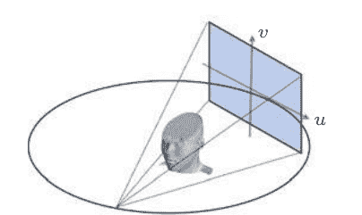

$$M_n(\beta) = \iint \frac{D P(\beta, u, v)}{\sqrt{D^2 + u^2 + v^2}} \frac{u^n}{v^{n+2}} du dv = \sum_{k=0}^{n} a_{n,k} \cos^{n-k} \beta \sin^k \beta$$

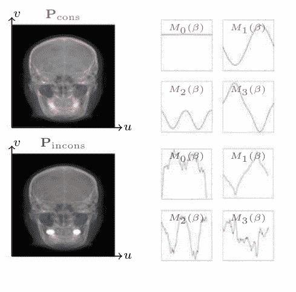

图3.23 Helgason–Ludwig一致性数据一致性条件应用于圆形源轨迹CBCT的投影。数据一致性条件通过使用一致和不一致的正弦图数据（P_cons和P_incons）进行检查

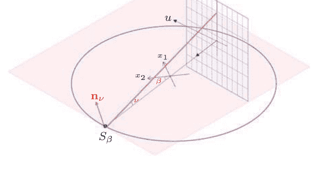

图3.24 CBCT的探测器坐标系。$s_{\beta}$表示源位置，$\nu$是积分平面与$\nu=0$平面之间的角度，$\mathbf{n}_{\nu}$是积分平面的法向量

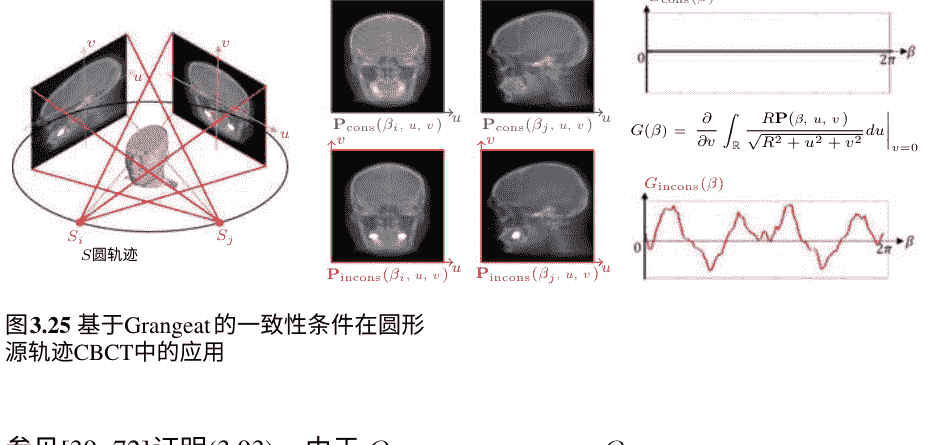

## 3.4 MAR的方法

自20世纪70年代末Lewitt和Bates [68]首次提出该方法以来，已经提出了许多MAR方法。如前一节所述，成像领域中存在的金属植入物增加了投影数据的不一致性，主要是由于光束硬化。（由于多色X射线束穿过金属植入物，吸收了更多的低能量光子，增加了平均光束能量。）这种光束硬化的投影数据会产生条纹伪影，此外，与散射、噪声和部分体积效应等其他因素相互作用会产生金属引起的伪影。

MAR问题是非线性的，因为金属伪影与金属的尺寸、几何形状和材料之间存在非线性关系。我们应该注意到，金属伪影不仅由真实投影数据与数学模型之间的不匹配引起，还由投影数据在CT重建过程中投影到Radon变换的范围空间中的正交投影过程引起。

在牙科CBCT中，理想的MAR方法应该解决由“偏移探测器、FOV截断、低X射线剂量”引起的问题。牙科CBCT中的FOV尺寸通常比患者头部的尺寸小，因为采用了小型探测器以降低系统成本。小型探测器尺寸导致了一个较小的扫描仪的视野范围，导致患者的头部在横向方向上缺失了投影数据。这种不完整的投影数据可以与牙齿的光束硬化相结合，在没有金属的情况下在牙齿周围产生条纹伪影。光子饥饿在牙科低剂量X射线CBCT中非常常见，尤其是当患者有很多种植物时。

最先进的MAR技术之一是双能量CT [5, 69, 125]，它旨在提供合成的虚拟单色图像。它使用两个独立的多色光束谱来生成接近单能量的数据，以减轻光束硬化效应。然而，双能量CT对于低剂量的牙科CT来说并不合适，因为使用更高能量的额外扫描会增加对患者的辐射暴露。因此，在本节中我们将不涉及双能量CT。出于类似的原因，我们也不会涉及能够通过区分单个光子能量来提供单色数据的光子计数探测器。这种技术不适用于低剂量的牙科CT，因为低剂量暴露会降低信噪比。

### 3.4.1 传统的MAR方法

传统的MAR方法大致可以分为以下三类：

- 原始数据校正方法：通过各种修复技术可以恢复由于金属物体存在而导致的不可靠背景数据。
    - 插值：旨在通过恢复原始数据中受金属物体影响的金属痕迹，获得校正后的正弦图数据。图3.26显示了线性插值方法的整体过程。
    - 重投影：该方法涉及在原始重建图像中识别金属物体，并用水的CT数值填充这些区域。然后将图像重新投影并从原始图像投影中减去。校正后的正弦图被重建以获得最终图像。
    - 归一化：该技术使用通过可比截面的X射线路径长度进行数据归一化，以确保正弦图变得相对平坦，从而能够在受损的金属痕迹上进行直接插值。
    - 缺点：上述方法可能引入以前不存在的新伪影。此外，这些技术往往会损害重建图像中金属物体周围区域的形态信息。

- 迭代重建方法：迭代重建方法生成目标图像的初始估计，将猜测/估计的图像投影回原始数据空间，与原始原始数据进行比较以生成修改后的图像，并重复该过程。已经开发了各种迭代重建方法用于MAR。

## 图3.26 线性插值方法的示意图

- 避免损坏：将MAR问题视为外部问题，并使用金属痕迹外部的数据得出重建结果。
- 统计补偿：可以使用统计目标函数来降低包含金属物体的数据的权重，而不是明确省略受金属影响的数据。
- 知识利用：涉及不完整数据的迭代重建方法可以使用稀疏技术（压缩感知（总变差）和已知组件模型）进行改进。

缺点：迭代重建方法需要对CT系统配置有广泛的知识，尽管它在理论上可以很好地处理条纹问题。此外，完全迭代重建的相关计算时间可能在临床上是禁止的。

### 混合方法

这些方法结合了上述两种方法。

### 3.4.1.1 原始数据校正方法

在原始数据校正方法中，通过各种填充技术（如插值[1, 9, 61, 68, 109]和正弦图像修复[7, 78, 90, 132, 133]）修正或替换Radon空间中金属痕迹上的不可靠数据。在这里，金属痕迹是受金属影响的投影数据区域。当金属痕迹上的数据完全损坏（例如光子饥饿）时，可以通过邻近投影或使用数学模型[37]进行数据校正。

Helgason-Ludwig相干条件[48, 74]可用于解决投影数据不完整性问题。

我们简要解释了归一化MAR(NMAR) [79]，它旨在处理由原始和插值数据之间的非平滑过渡问题引起的条纹伪影。NMAR的主要思想是将正弦图转换为几乎平坦的正弦图，然后对该平坦的正弦图进行插值，以实现平滑过渡。NMAR的大致过程如下。见图3.27。

1.  给定原始原始数据，使用FBP计算未校正的CT图像。
2.  通过阈值操作对金属区域进行分割。
3.  通过多个阈值将未校正的图像（或预校正图像）分割成空气、组织和骨骼，从而计算先验图像。
4.  将先验图像和金属区域进行正向投影，得到相应的正弦图和金属痕迹。
5.  归一化步骤：将原始数据除以先验图像的投影数据。
6.  插值步骤：对归一化的投影数据进行插值，以修复金属痕迹上的不可靠数据。
7.  反归一化步骤：将插值的正弦图乘以先验图像的投影数据。
8.  通过对反归一化的正弦图应用FBP，然后将金属插入图像，计算校正后的图像。

NMAR方法的性能取决于对象分割的准确性。在金属伪影非常强烈的情况下，一些图像像素被错误地分类为错误的组织类型，导致先验图像不准确。这是一个缺点，因为通过阈值分割不是完全准确的。

### 3.4.1.2 迭代重建方法

为了MAR，已经开发了各种迭代重建方法[25, 30, 80, 119, 129]。这些迭代方法使用重复的正向和反向投影，并施加正则化先验。尽管有许多结果表明使用压缩感知技术的迭代方法[16]可以有效减轻伪影，但完全迭代重建的计算时间可能在临床上是禁止的。

让我们简要解释迭代MAR。通过最小化以下函数并使用适当的停止准则，它用于找到适当的衰减分布 μ:

$$\Phi(\mu) = \frac{1}{2} \| \mathcal{R} \mu - \mathbf{P} \|^2 + \lambda \text{Reg}(\mu), \quad (3.95)$$

其中Reg(μ)是一个正则化项（例如Tikhonov，总变差），用于约束CBCT图像的先验知识，λ是控制保真度和正则化项之间权衡的正则化参数。这种正则化用于抑制重建图像中的伪影。在这里，\| \mathcal{R} \mu - \mathbf{P} \| 是在未受金属影响的正弦图区域上受限的 \mathcal{R} \mu - \mathbf{P} 的 L^2-范数。由于 -∇Φ(μ) 是 μ 处最陡下降的方向，我们有以下迭代方案:

$$\mu_{n+1} = \mu_n - \alpha \nabla\Phi(\mu_n), \quad (3.96)$$

其中 α 是步长。直接计算 ∇Φ(μ_n) 得到

$$\nabla\Phi(\mu) = \mathcal{R}^* [ \mathcal{R} \mu - \mathbf{P} ] + \lambda \nabla \text{Reg}(\mu). \quad (3.97)$$

在Tikhonov正则化的情况下（即 ∇ \text{Reg}(μ) = μ），迭代方案 (3.96) 可以表示为

$$\mu_{n+1} = (\beta I - \alpha \mathcal{R}^* \mathcal{R}) \mu_n - \alpha \mathcal{R}^* \mathcal{R} \mu_n + \alpha \mathcal{R}^* \mathbf{P}, \quad (3.98)$$

其中 β = 1 - α λ.

在Tikhonov正则化的情况下，Larry Zeng开发了一步迭代重建，他将 (3.98) 改写为

$$\mu_{n+1} = \alpha \sum_{k=0}^{n} (\beta I - \alpha \mathcal{R}^* \mathcal{R})^k \mathcal{R}^* \mathbf{P} + (\beta I - \alpha \mathcal{R}^* \mathcal{R})^n \mu_0. \quad (3.99)$$

上述等式可以表示为

$$\mu_{n+1} = \alpha \left[ I - (\beta I - \alpha \mathcal{R}^* \mathcal{R})^{-1} \right] I - (\beta I - \alpha \mathcal{R}^* \mathcal{R})^n \mathcal{R}^* \mathbf{P} + (\beta I - \alpha \mathcal{R}^* \mathcal{R})^n \mu_0. \quad (3.100)$$

图3.28 迭代金属伪影减少方法的示意图

关键观察是，组合算子 $\mathcal{R}^*\mathcal{R}$（即反投影器-投影器）具有点扩散函数 $\psi$，其距离为1/距离

$$\mathcal{R}^*\mathcal{R}\delta = \psi \quad \rightarrow \quad \mathcal{R}^*\mathcal{R}u\mu = \psi * \mu, \qquad\qquad\qquad (3.101)$$

其中 $\psi * \mu$ 是 $\psi$ 和 $\mu$ 的卷积。由于这个表达式，我们得到了以下简单形式（将复杂的算子 $\mathcal{R}^*\mathcal{R}$更改为简单的符号$\widehat{\psi}$，即 $\psi$的傅里叶变换）：

$$\hat{\mu}_{n+1} = \alpha \left(1 - (\beta - \alpha \hat{\psi})\right)^{-1} \left(I - (\beta - \alpha \hat{\psi})^n\right) \widehat{\mathcal{R}^*g} + (\beta I - \alpha \hat{\psi})^n \hat{\mu}_0. \qquad (3.102)$$

我们将简要讨论传统的正则化技术，如使用压缩感知的 $\ell^1$-正则化。这些方法可以有效去除噪声，但会丢弃详细信息（例如，包含临床有用信息的小细节可能会被删除），因此在计算医学成像中的应用有限。图3.28显示了迭代重建方法的流程图。

### 3.4.1.3 混合方法

各种研究表明，金属的MAR性能取决于材料、几何形状、大小和位置。开发一种包括小/中/大型金属物体在内的通用MAR方法是必要的。

完全的光子饥饿，是困难的。因此，开发一种基于案例的自适应MAR算法而不是统一的MAR方法是可取的。

一些研究人员通过结合上述MAR技术[71, 134]开发了混合MAR方法。这种方法通常生成一个预校正的初始图像，并基于此通过从未受影响的投影数据进行迭代重建生成一个良好的先验图像。

大多数商业MAR算法可以被视为混合方法。它们包括SEMAR（东芝医疗系统）[135]，O-MAR（飞利浦医疗）[86]，iMAR（西门子医疗）[64]，Smart MAR（GE医疗）[44]。图3.29和图3.30显示了O-MAR和SEMAR算法的流程图。

### 3.4.1.4 基于物理的束硬化校正

最近，Lee等人[70]开发了一种直接的正弦图校正方法，不需要金属分割和先验知识，以减少多色CT中与金属相关的伪影。该方法试图将受束硬化影响的数据投影到Radon变换的范围空间中，使数学模型与校正后的数据更一致，保留束硬化效应较小的部分数据。

为简单起见，我们使用平行束CT系统。多色X射线数据P♯对于物体的长度和非线性数量是非线性的，其非线性程度取决于能谱η。投影数据的非线性引入了一些条纹和阴影伪影在重建的CT图像中。根据Alvarez和Macovski [5]，μ可以近似分解为：

$\mu(\mathbf{x}; E) \approx p(E)\mu^p(\mathbf{x}) + q(E)\mu^q(\mathbf{x})$, (3.103)

其中 μp 是空间相关的光电成分， μq 是空间相关的康普顿散射成分， p(E) ≈ E^{-3}（近似光电相互作用的能量依赖性），而 q(E)是克莱因-尼什纳函数[66, 120]，给出如下

$$q(c \tau) = \frac{1 + \tau}{\tau^2} \left[ \frac{2(1 + \tau)}{1 + 2\tau} - \frac{1}{\tau} \ln(1 + 2\tau) \right] + \frac{1}{2\tau} \ln(1 + 2\tau) - \frac{(1 + 3\tau)}{(1 + 2\tau)^2}$$

具有 c = 510.975 keV 和 τ = E / c 的让 \bar{E}_p 和 \bar{E}_q 分别表示光电和康普顿散射组分的有效能量

$$\bar{E}_a = \underset{E_a}{\mathrm{argmin}} \left| \ln \int \eta(E) e^{-a(E) + a(\bar{E}_a)} dE \right|, a = p, q.$$

使用这个近似(3.103)，投影数据可以表示为

$$\mathbf{P} \approx -\ln \int \eta(E) e^{-p(E) \Re \mu_p - q(E) \Re \mu_q} dE .$$

这个近似的投影数据(3.106)可以分解为：

$$\mathbf{P}(\varphi, s) = \mathscr{R} \left[ p(\overline{E}_{-p})\mu_{-p} + q(\overline{E}_{-q})\mu_{-q} \right](\varphi, s) - \ln \int_{\alpha \in \Omega, \alpha \text{的最小值，其中} \alpha \text{是一个变量，} \Omega \text{是参数，} \alpha \text{是积分元素}}$$ (3.107)

其中Y可以被看作是一个由给定的源产生的伪影

$$\Upsilon(E, \varphi, s) = -(p(E)-p(E')) \mathscr{R}\mu_p(\varphi, s) -(q(E)-q(E')) \mathscr{R}\mu_q(\varphi, s).$$ (3.108)

然后，P的逆Radon变换是

$$\mathscr{R}^{-1}\mathbf{P}(\mathbf{x}) = \mu^{\square}(\mathbf{x}) + Err(\mathbf{x}),$$ (3.109)

其中

$$\mu^{\square}(\mathbf{x}) = p(\overline{E}^{\top})\mu_p(\mathbf{x}) + q(\overline{E}^{\top})\mu_q(\mathbf{x})$$ (3.110)

而 Err(\mathbf{x})代表了由光束硬化造成的伪影项，其表示为

$$Err (\mathbf{x}) = \mathscr{R}^{-1} \left[ \ln \int \eta(E) e^{\Upsilon(E,\varphi,s)} d E \right] (\mathbf{x}).$$ (3.111)

目标是通过减轻伪影项 Err(\mathbf{x})来重建 μ^\sharp。Lee等人观察到以下现象：给定投影数据 P^\sharp，相应的目标图像 μ^\sharp可以近似表示为

$$\mu^{\sharp}(\mathbf{x}) \approx \mathscr{R}^{-1}[\Psi_{\lambda,t_\star}(\mathbf{P}^{\sharp})](\mathbf{x}),$$ (3.112)

其中 Ψ_{λ,t_\star} : ℝ → ℝ 是一个正弦图纠正函数，其表示为

$$\Psi_{\lambda,t_\star}(t) = \begin{cases} t & \text{对于 } t < t_\star \\ h_{t_\star}(t) + \sum_{k=2}^{K} \lambda_k(t - t_\star)^k & \text{for } t \geq t_\star \end{cases}$$ (3.113)

其中 t_\star, K, 和 λ = (λ_1, λ_2, ..., λ_K) 是适当选择的常数，以及

$$h_{t_\star}(t) = \frac{\lambda_1 t_\star - 1}{2\lambda_1 e^{-\lambda_1 t_\star}} e^{-\lambda_1 t} + \frac{\lambda_1 t_\star + 1}{2\lambda_1 e^{\lambda_1 t_\star}} e^{\lambda_1 t}.$$ (3.114)

参数 λ 通过最小化以下目标函数来确定：

$$\lambda = \argmin_{\lambda} \int_{0}^{2\pi} \frac{\partial}{\partial \varphi} \int_{\mathbb{R}} \Psi_{\lambda,t_\star}\mathbf{P}^{\sharp}(\varphi, s) ds \ ^2 d\varphi,$$ (3.115)

图3.31 [70] 上面的三幅图分别显示了 $\mathcal{R}\mu^\ddagger$, $\mathbf{P}^\ddagger$和 $\mathcal{R}\mu^\ddagger - \mathbf{P}^\ddagger$。中间的三幅图分别显示了 $\mu^\ddagger$, $\mathcal{R}^{-1}\mathbf{P}^\ddagger$和 $\mu^\ddagger - \mathcal{R}^{-1}\mathbf{P}^\ddagger$。在 $\{ \mathbf{P}^\ddagger < t_* \}$的区域内, $\mathcal{R}\mu^\ddagger - \mathbf{P}^\ddagger \approx 0$, 对于一个小的 $t_*$。底部的图像显示了所提出的正弦图纠正在配置文件1和2上的良好效果。这个图是从[70]中提取的

其中 $\lambda = (\lambda_1, \lambda_2, \cdots, \lambda_K)$。图3.31展示了光束硬化校正函数的特性。

## 3.4.2 用于图像质量评估的幻影

该方法的性能可以使用圆柱形幻影（由QRM GmbH，德国莫伦多夫制造）进行评估，其高度和直径均为10厘米。每个幻影由五个独立的部分组成，用于评估CT值均匀性和线性度、图像噪声和对比度、3D分辨率以及伪影行为（图3.32）。

我们可以通过证书机构进行定量评估，以确保上图中ROI中的Hounsfield单位（HU）值满足误差范围为140 HU。

## 3.5 基于深度学习的低剂量牙科CBCT图像增强

我们可以通过牙科学院医院的几位专家进行定性评估，以确认将MAR应用于具有金属伪影的真实数据的可行性，并将其应用于临床实践。

尽管MDCT被认为是最准确可靠的成像技术，但与CBCT相比，它在牙科应用中具有相对较弱点，如较高的辐射剂量、较高的设备成本和较大的使用空间。大多数牙科CBCT设备设计成允许患者坐着或站着进行扫描，需要牙科办公室中较少的空间。针对CT辐射的担忧，牙科CBCT正在朝着最小化辐射暴露的方向发展，同时保持图像质量。

影响给定CBCT设备辐射剂量的主要参数是管电流、管电压和准直。为了减少CBCT中的辐射暴露，建议尽可能使用较小的视野（FOV），最低的管电流设置和最短的曝光时间。大多数牙科CBCT使用较小的视野，导致投影图中的显著截断。对于植入金属的患者，使用迭代重建算法的常规CT图像重建方法可能不适用于低剂量CBCT扫描的高度截断的正弦图。准直通过在X射线管内使用铅百叶窗将X射线束限制在感兴趣区域。参见图3.33。准直的一个次要好处是减少了到胶片的非焦点辐射。由于辐照的组织体积较小，产生的散射辐射较少。在牙科CBCT中，使用额外的铜滤光片来减少患者剂量，如图3.34所示。

减少辐射暴露的准直
准直将X射线束的横截面限制在图像接收器的大小

用于减少辐射暴露的牙科CBCT的铜过滤

## 3.5.1 牙科CBCT数据采集协议

商业牙科CBCT的规格包括：圆锥束扫描，扫描时间为8-24秒，分辨率小于0.2毫米，FOV截断，偏移探测器，低X射线剂量，成本低于10亿美元。与此同时，MDCT的规格包括：螺旋锥束扫描，扫描时间小于1秒，分辨率小于0.3毫米，无FOV截断，无偏移探测器，高X射线剂量，成本超过10亿美元。请参见图3.35中的FOV截断，其中FOV的大小由探测器的大小和形状、射线投影几何和射线准直函数确定。

由于CBCT设备的制造成本中有相当大的一部分是X射线探测器的成本，所以使用最小的探测器来获得所需的图像。由于使用小型探测器，使用了两种技术：拼接和偏移扫描方法。偏移扫描方法通过偏移小型探测器的位置来增加FOV，其中束流被非对称地聚焦，非对称探测器仅覆盖扫描FOV的一半。请参见图3.36中的偏移探测器。

**图3.35 FOV截断。** FOV代表要成像的患者解剖区域。随着CBCT探测器的尺寸变小，设备变得更便宜且占用空间更小，而FOV变小

**图3.36 牙科CBCT中的偏移探测器。** 小型平板探测器的旋转中心轴相对于源-探测器轴偏移，以最大化横向FOV

拼接方法用于从两个或多个独立扫描中获取数据，并拼接相邻图像体积以获取完整的头部图像采集，如图3.37所示。

CBCT系统中最常用的探测器在每次投影后需要等待一段时间，以考虑闪烁体的余辉和每次扫描中传递的剂量应该受到限制。在CBCT中，投影的数量以及总扫描时间的相关变化，提供了图像质量和传递剂量之间的权衡，这直接受用户选择的参数的影响[59]。

为了减少患者的总剂量，应尽量保持射线管电流（mA）和管电压（kVp）设置尽可能低，同时保持图像质量。假设kVp和所有其他参数都固定不变，辐射剂量与管电流 × 扫描旋转的持续时间成正比，这个参数极大地影响图像质量。辐射剂量和图像质量对kVp设置的依赖非常复杂。能量较高的光子与组织的相互作用较少。正确的kVp和mAs设置在很大程度上取决于几个设计因素，因此很难提供绝对的指导方针[59]。

## 3.5.2 低剂量牙科CBCT中的金属伪影减少

减少上述牙科CBCT中金属引起的伪影比在MDCT中更困难，因为还有由偏移探测器、FOV截断和低剂量X射线引起的其他问题。由于许多患者在牙科CBCT中使用金属植入物和牙齿填充物，通过减少金属引起的伪影来改善图像质量非常重要。在牙科CBCT中，与金属相关的伪影非常难处理，因为它们是由光束硬化引起的效应产生的。

正弦图不一致性和复杂的金属-牙齿-骨骼相互作用与FOV截断、散射和非线性局部体积效应等其他因素一起，使牙科CBCT中的金属相关伪影变得复杂。

在牙科CBCT环境中，传统的低数据校正方法无法有效减少金属伪影，并且往往会产生之前不存在的新条纹伪影。在这里，使用低数据校正方法来使用各种修补技术（如插值[1, 9, 61, 68, 109]，归一化插值（NMAR）[79]，泊松修补[90]，小波[78, 132, 133]，组织类模型[7]，总变差[29]和欧拉弹性[46]）来恢复金属痕迹中的背景数据。这些方法往往会产生之前不存在的新伪影，并且损害金属物体周围区域的形态信息。

让我们简要描述一下MDCT和CBCT在层析图像重建方面的差异。MDCT基本上使用了FBP算法的变体（扇形束图像重建公式），它从正弦图逐层进行。在MDCT中，2D层析图像的切片堆叠以生成3D CT图像。因此，FBP算法是二维的。另一方面，CBCT使用了FDK算法的变体[31]（扇形束图像重建公式），因为它处理沿非正交于圆轨道平面的斜线上的积分值[106]。

### 3.5.2.1基于深度学习的2D CT中的MAR

深度学习技术的最新进展也在MAR方面取得了进展[10、38、47、58、73、91、126、136]。Gjestebv等人[38]使用DL在投影域中提供额外的校正，以增强关键区域的图像质量。Park等人[91]提出了一种基于深度学习的正弦图校正方法，以减少正弦图中金属引起的主要束化因子沿金属轨迹的影响。该方法应用于限制情况下的患者植入特定模型，其中给定金属几何的数学束化校正器[87、88]有效地生成模拟训练数据。

张等人[136]使用深度学习生成了一个减少伪影的先验图像，然后使用先验图像的投影替换受金属影响的投影，最后进行最终的金属伪影校正CT重建。Gjestebv等人[47]在NMAR首次通过后使用残差学习来校正金属条纹伪影。Lin等人[73]提出了一种双域网络（DuDoNet），可以同时恢复正弦图一致性和增强CT图像。DuDoNet通过利用双域学习网络（正弦图和图像增强网络）来追求金属伪影校正的增强。在这里，双网络分别在正弦图和图像域上操作，但是以端到端的方式进行训练。正弦图增强网络通过使用修复金属痕迹的修复损失和正弦图一致性损失来学习如何校正受金属污染的正弦图。由于最终图像是图像增强网络的输出，数据的准确性可能会受到损害，导致解剖结构的变化。余等人[126]提出了另一种双域联合学习方法。

网络首先生成一个具有较少金属伪影的良好先验图像，然后利用先验图像的正向投影进行正弦图增强。在这里，最终输出是从仅在金属痕迹区域修改的正弦图中重建的图像。

让我们更详细地讨论上面提到的MAR网络。为了方便解释，使用以下符号。

-   **正弦图域** $\mathbf{P} \in \mathbb{R}^{n_s \times n_h}$ 表示一个受金属污染的正弦图，其中 $n_h$ 与探测器尺寸有关，$n_s$ 是投影视图的数量。相应的金属痕迹将用 $\mathcal{M}_{tr} \in \{0,1\}^{n_s \times n_h}$ $\mathbf{P}$表示。

-   **图像域** $\mu = \mathcal{R}^{\dagger} \mathbf{P}$ 是受金属引起的伪影污染的CT图像，其中 $\mathcal{R}^{\dagger}$ 表示滤波反投影。$\mu_{LI} = \mathcal{R}^{\dagger} \mathbf{P}_{LI}$ 是与 $\mathbf{P}$ 相对应的CT图像。要重建的目标CT图像可以是某个能量水平上的衰减系数分布。

-   $f_{DLsino}$ 表示一个正弦图校正网络，其输入可以是 $\mathbf{P}$, $\mathbf{P}_{LI}$，或者是 $f_{DLimg}$ 的输出的投影

-   $f_{DLimg}$ 表示一个图像增强网络，其输入可以是 $\mu$, $\mu_{LI}$，或者是 $f_{DLsino}$ 的输出的滤波反投影

图像域学习方法[38, 136]尝试通过学习 $f_{DLimg}$ 的强大能力来减轻重建图像中的金属伪影。详见图3.38中的详细重建过程 $f_{DLimg}$。这些方法严重依赖于输入图像的质量，该质量受到条纹和阴影伪影的污染。

正弦图域学习方法[91]使用深度学习方法来减少正弦图中金属痕迹上的主要金属诱导的光束硬化因素，如图3.39所示。学习到的 $f_{DLsino}$ 旨在处理被金属相关伪影污染的金属痕迹。图像重建映射可以用 $\mathcal{R}^{\dagger} \circ f_{DLsino}$ 来表示

双域学习方法[73, 93, 126]使用两个深度学习网络 ($f_{DLimg}$ 和 $f_{DLsino}$) 分别在图像和正弦图域上工作，分别。正弦图域网络 $f_{DLsino}$ 旨在对金属痕迹上的正弦图进行修复，其中金属伪影因素占主导地位。

这些方法尝试联合优化 $f_{DLimg}$ 和 $f_{DLsino}$。

在监督学习框架中，深度学习网络学习了一个重建映射 $f_{DL}$ 在以下意义上：

$$ f_{DL} = \arg\min_{f_{DL} \in \mathbb{DL}} \sum_{i=1}^{\text{数据}} \text{距离}(\text{函数}_{DL}(\text{输入}^{(i)}), \text{输出}^{(i)}), \tag{3.116} $$

其中 $\{\text{输入}^{(i)}\}$ 是一对训练数据集，距离是衡量深度学习输出函数 $f_{DL}(\text{输入}^{(i)})$ 和标签输出$^{(i)}$。在医学应用中， $\ell^2$ 和 $\ell1$损失是常见的距离选择。为了更有效的学习，可以添加各种辅助损失项，如Radon反演（或一致性）损失到(3.116)。在医学应用中，不幸的是，由于伪影的非线性特性，几乎不可能从许多患者中收集到配对的临床CBCT数据。因此，许多研究使用通过在无金属图像上插入人工金属生成的配对数据集。深度学习可以通过学习模拟数据有效地减少金属伪影，然而模拟数据与实际数据之间的差距可能导致在真实临床情况下的重建能力有限。这个问题将在第3.6节进一步讨论。

或者，可以使用各种生成对抗网络（GANs）的无监督学习方法来学习重建函数，同时解决收集真实配对数据的根本困难[83]。例如，可以使用循环GAN [137]，Wasserstein GAN [6, 43]和渐进式增长GAN [65]，它们的训练不需要配对数据集。准确地说，一个函数 $f_{DL}$

$$ f_{DL} = \argmin_{f_{DL}} \argmax_{D} \mathbb{E}_{\mathbf{y} \sim p_{\text{数据}}(\mathbf{y})} (\ln D(\mathbf{y})) + \mathbb{E}_{\mathbf{x} \sim p_{\text{data}}(\mathbf{x})} (\ln(1 - D(f_{DL}(\mathbf{x})))) $$

其中 $\{\mathbf{x}^{(i)}\}_{i=1}^{N}$ 和 $\{\mathbf{y}^{(i)}\}_{i=1}^{M}$ 分别是有金属伪影和无伪影的非配对数据集，并且 $p_{\text{数据}}$ 是对给定数据集的数据分布。在这里，$D$ 的目标是区分生成的数据 $f_{DL} (\mathbf{x})$ 与真实的无金属伪影数据相对应，而 $f_{DL}$ 的目标是生成假数据 $f_{DL} (\mathbf{x})$，使得判别器 $D$ 无法将此类数据与真实的无金属伪影数据区分开来。有关GAN的更多细节可以在[56, 127]中找到。然而，就我们的经验而言，与监督学习方法相比，无监督学习方法的性能仍然远远不如令人满意。

### 3.5.2.2基于深度学习的3D牙科CBCT中的金属伪影去除

尽管基于学习的技术已经扩展了金属伪影去除的能力，如图3.41所示，但在实际牙科CBCT环境中仍存在许多限制和挑战，其中正弦图不一致性与与金属的不同几何形状、金属-骨骼和金属-牙齿相互作用、FOV截断、偏移探测器采集等复杂因素相互纠缠。现有方法在临床牙科CBCT环境中的有效性非常有限，因为在金属痕迹上进行正弦图修复非常困难。我们应该注意到，与图像修复相比，正弦图修复要困难得多。图像修复在某种程度上是局部的，因为它使用修复区域周围的信息来填充缺失的数据。另一方面，正弦图修复需要复杂地利用修复区域外的全局信息来填充缺失的数据，同时保持正弦图的一致性。在低剂量牙科CBCT中，正弦图数据的不一致性不仅来自金属，还来自牙齿和骨骼。此外，正弦图在污染下与牙齿和骨骼的复杂几何形状、FOV截断、偏移探测器、散射等复杂因素相关的影响，在低剂量牙科CBCT中，在这些正弦图数据条件下，如果不使用与输入数据相关的强一致性约束，使用一致性损失，会增加二次伪影而不是防止它们。在低剂量牙科CBCT中，如果不使用与输入数据相关的强一致性约束来获得校正的正弦图，往往会产生新的伪影，导致输出图像的解剖结构变化。

对于牙科MAR，有一种尝试是在X射线束发生器前面装备铜滤光片（图3.34），然后对滤波后的数据应用DL。参见图3.42。

通过复杂的网络架构（例如深层或大特征深度）和大规模训练数据集，可以提高基于学习的MAR方法的学习能力。然而，这与学习的总计算成本存在权衡，这在处理高维数据的实际3D牙科CBCT应用中可能是关键的。即使仅针对简单的U-net架构，在我们的计算资源下（两个Intel(R) Xeon(R) CPUs E5-2630 v4，128GB DDR4 RAM和四个NVIDIA GeForce GTX 2080ti GPUs)，至少需要10天来训练300个时期的60个图像体素数据集。在这里，我们要注意的是我们正弦图和CT数据的体素尺寸分别为1040 × 654 ×658和800 × 800 ×400。尽管使用复杂的网络或大规模训练数据集可以潜在地增强MAR能力，但与高数据维度相关的障碍应该在实际牙科CBCT应用中加以解决[57]。

最近，Bayaraa等人[10]提出了一种用于牙科CBCT的混合深度学习方法，该方法利用了基于分析的束硬化校正和图像对图像域学习的优势。作为第一阶段，通过修改正弦图强度调整方法来减轻与金属相关的束硬化因素，重建了一个减少伪影的图像，以应对牙科CBCT情况。在第二阶段，应用图像对图像的深度学习网络进一步减少剩余的伪影。这种方法有效地减轻了与金属相关的束硬化伪影，即使存在FOV截断和偏移探测器配置，但在实际牙科CBCT成像中常常出现严重的噪声水平或光子饥饿情况下，不能保证高质量的结果。

## 3.6使用机器学习生成用于MAR的合成数据

如前几节所述，传统技术（如带有正则化数据拟合的迭代重建方法）在低剂量X射线的牙科CBCT环境中存在局限性。四十年来的经验表明，传统的正则化技术在提供传递医学图像特征的先验信息方面存在局限性。例如，常用的先验信息（如总变差（TV）正则化）可能导致细节丢失，因为牙齿图像（即解决方案）的TV范数本质上较高。传统框架可能无法有效处理CBCT的非线性数据结构，这些数据结构随着金属几何形状的变化而高度非线性。深度学习框架通过训练数据有效地利用先验图像。

然而，在实践中，不可能同时从许多患者那里收集许多成对数据（即，无伪影和有伪影的CBCT图像对）。为了解决获得用于MAR的成对学习数据的困难，有必要通过计算机模拟开发一种生成合成数据的方法。

数据生成必须根据制造商和CBCT扫描仪的类型进行不同的处理。由于开发一个可以普遍适用的学习模型将应用于所有可能的CBCT扫描仪是超出我们的限制（成本、时间和人力方面），因此为特定公司的CBCT扫描仪开发机器特定的学习模型是实际上是合适的。在本节中，将在牙科CBCT硬件限制（DENTRI，HDXWILL）下进行合成数据生成：管电压为80-90kVp，管电流为8-10mA，图像尺寸为16cm ×16cm ×8cm，体素尺寸为0.2mm × 0.2mm × 0.2mm，像素数为800 ×800 × 400个像素，并且总过滤厚度为1.6mm Al。这些合成数据生成不仅提供了各种训练数据的低成本来源，还系统地提供了费力和昂贵的语义分割。

### 3.6.1半合成数据生成

生成各种类似人类头部的幻影非常费力且繁琐。为了解决这个问题，我们使用了一种半合成数据生成的方法，该方法使用了许多没有金属材料的患者的金属伪影免费CBCT数据。对于给定的牙科CBCT扫描仪，可以使用第3.3.1节中描述的物理公式开发一个相当准确的CBCT正向模型。对于每个无伪影CBCT图像，都会在各个位置插入各种形状的金属材料，使用正向模型生成大量受伪影污染的CBCT图像。我们可以通过调整不同的金属形状和位置来产生大量的CBCT图像组合。对于锥形束投影和反投影（FDK重建），我们使用了开源的TIGRE软件包[12]，并进行了适当的修改，以处理偏移探测器阵列和与HDXWILL机器完全相同的参数。图3.43和3.44显示了三种牙种植模型（牙冠、牙种植和正畸托槽）的真实患者数据、模拟数据和相应图像。

### 3.6.2 使用模拟的牙齿冠和种植体以及正畸托槽的模拟投影数据

我们通过使用[55]中给出的衰减系数放置模拟的金属牙齿冠和种植体以及正畸托槽来生成模拟的投影数据，并且电子噪声的建模方式与[57]中相同。我们针对牙齿冠、种植体和正畸托槽采取不同的策略。对于牙齿冠和种植体的生成，我们参考了[57]中的方法。

数据生成方法可以总结如下：为了生成模拟的牙齿冠或种植体，首先，我们使用[60]中的技术对正常患者数据进行完全自动化的单独牙齿分割，并随机选择几个牙齿位置，其中虚拟金属种植体将被放置。

放置。对于冠状案例，根据每颗牙齿的冠高信息，通过切割所选牙齿的根部构建冠状面具 [85]，然后进行侵蚀过程。冠的厚度随机设置为0.6至1.4毫米。对于种植案例，还应用了额外的过程来制作种植螺丝杆。对于每颗牙齿，我们定义通过牙齿中心在最低和中间切片上的两个点的直线，除了包含牙齿根部的切片。

然后，根部部分用圆填充，圆心位于该直线上，半径经验性设置。见图3.45。

我们通过使用[55]中给出的衰减系数放置模拟的金属牙齿冠和种植体以及正畸托槽来生成模拟的投影数据，并且电子噪声的建模方式与[57]中相同。我们针对牙齿冠、种植体和正畸托槽采取不同的策略。对于牙齿冠和种植体的生成，我们参考了[57]中的方法。

对于正畸矫正器的情况，通过以下过程生成模拟数据：再次应用个体牙齿分割，获得个体牙齿的二进制掩模。对于每颗牙齿，我们首先找到牙齿所在的 z-切片，然后使用矫正器估计矫正器中心所在的 z-切片## 牙齿冠
## 牙种植
## 正畸托槽
## 真实患者图像
## 模拟图像

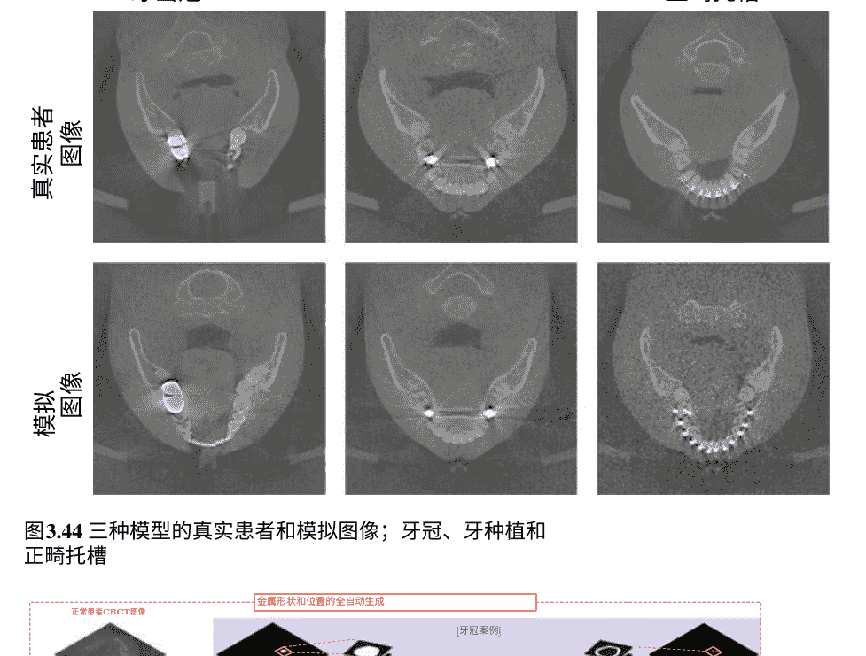

## 图3.44 三种模型的真实患者和模拟图像；牙冠、牙种植和正畸托槽

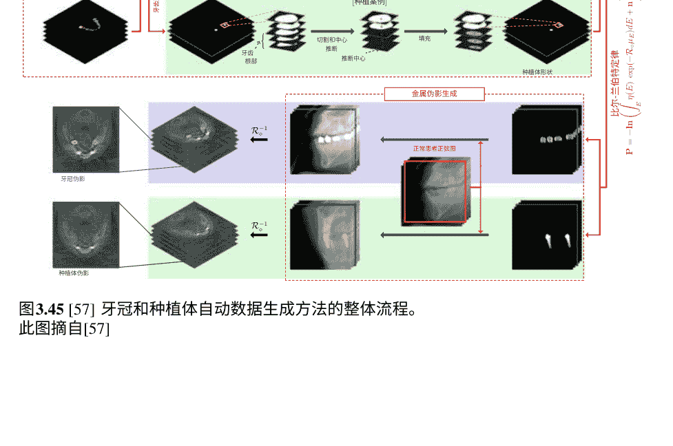

## 图3.45 [57] 牙冠和种植体自动数据生成方法的整体流程。此图摘自[57]

$$
P = -\ln\left(\int_{E_{\min}}^{E_{\max}} n(E) \exp(-\mu(E)t) \frac{dE}{E}\right)
$$

根据[4]中的头骨（即上颌骨或下颌骨）中的牙齿类型和位置，确定高度信息。对于估计的z-切片，我们定义一个指向牙齿前方的法向量，并找到与法向量和中心位置定义的直线相交的牙齿表面上的一个点。最后一步，我们将牙套放置在该点，使其中心位置位于该点。在这里，我们使用[138]中给定的牙套形状，并根据[4]中的牙齿类型和头骨位置使用角度信息进行旋转。图3.46显示了正畸矫治数据生成的概要。

使用模拟金属插入物（牙冠、种植体或正畸托槽）掩模，通过正向模型在(3.33)的意义上人工产生金属伪影正弦图，并与正常患者正弦图结合。在这里，金属衰减系数在{Au, Pd, Ni, Cr, Zr, Al}中随机分配。数据生成方法的更多细节将在以下子章节中解释。

### 3.6.2.1 [步骤1] 单个牙齿分割

数据生成基于通过[60]中提出的最先进的全自动分割方法获得的3D单个牙齿掩模。该方法是一种基于深度学习的分层多步骤分割方法，利用上下颌的2D全景图像，YOLO（你只看一次）[108]，以及对单个牙齿进行紧密和松散的ROI选择。为了专注于本节的主要主题，我们跳过了详细的解释。可以参考[60]论文。

让 \( P_{\text{正常}} \) 是一个正常患者的正弦图数据。使用 \( P_{\text{正常}} \)，我们首先重建一个CT图像 \( \mu_{\text{正常}} \) 通过修改后的FDK算法(3.31)进行重建，然后应用分割方法。最终的分割结果由一个掩模 \( M_{\text{牙齿}} \) 给出，它是由一个3D掩模定义的，其中每个牙齿的区域都用不同的值填充。见图3.47。掩模 \( M_{\text{牙齿}} \) 是完全自动化方法的基础，该方法在正常患者数据中生成虚拟但相当逼真的金属植入物。

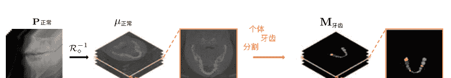

图3.47 个别牙齿分割。我们获得一个3D牙齿分割掩模 \( M_{\text{tooth}} \) 其中每个牙齿都用不同的值填充。

### 3.6.2.2 [步骤2] 金属植入物形状生成

**案例1. 牙冠**
为了在正常患者数据中放置虚拟牙冠，使用了 \( M_{\text{牙齿}} \)。如图3.48所示，首先我们选择几颗需要放置牙冠的牙齿，在每颗牙齿的平均冠高信息的基础上估计牙根，并用零填充掩模中的根部分。由于牙冠通常覆盖牙齿的表面，通过使用MATLAB内置函数 `imerode` 对掩模进行腐蚀处理后，牙冠区域被定义出来。

**案例2. 牙种植**
牙种植的数据生成过程与案例1相同。生成牙冠还需要额外的步骤来生成种植杆，如图3.49所示。让 \( M_{\text{crown}} \) 是一个3D掩模，其中估计的牙根区域已被移除。我们首先找到剩余牙齿部分在 \( M_{\text{crown}} \) 中的切片。然后通过取中间和底部的平均值来估计两个牙齿的中心位置。

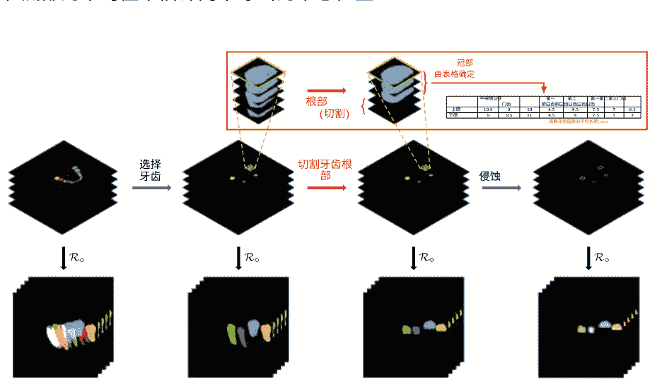

图3.48 自动化牙冠形状生成

相应位置上的切片。将 \( P_i \) 和 \( P_j \) 表示为中心位置，我们通过以下方式定义一条线 \( \ell \)：

\[
\ell(t) = P_i + (P_j - P_i) \cdot t, \quad \forall t \in \mathbb{R}. \tag{3.118}
\]

利用这条线 \( \ell \)，我们能够确定种植杆的中心位置如下：设 \( \{C_i\}_{i=1}^{n} \) 为一组中心位置。对于 \( i \in \{1, 2, \cdots, n\} \)，位置 \( C_i \) 由以下给出：

\[
C_i = \ell(t_{C_i}), \quad t_{C_i} = \frac{C_i^z - P_i^z}{P_j^z - P_i^z}, \tag{3.119}
\]

其中 \( C_i^z \) 是位于 \( C_i \) 上的切片编号。在这里，\( C_1 \) 位于刚好在包括 \( P_j \) 和最后一个位置 \( C_n \) 的切片下方，以使植入杆与估计的牙根区域具有相同的长度。最后，我们画一个圆，其圆心位于 \( C_i \) 上。半径经验性地设置，使生成的植入杆形状看起来逼真。

**案例3. 正畸矫正**
生成正畸矫正需要对牙齿的3D几何形状和解剖学有非常复杂的理解，以便将矫正器放置在牙齿前面并连接矫正器的金属丝。有一种使用MIMICS软件的手动方法，该软件已经被使用过。

用于临床牙科手术规划。参见图3.50。这种手动过程可以提供准确和逼真的正畸托槽放置，但不幸的是非常费时费力。因此，我们一直在尝试自动化数据生成工具。本节介绍我们的开发方法，该方法仍然不完整，离实际数据生成还有很大差距。

在正畸托槽放置中，有三个主要点；个别牙齿的托槽中心位置和倾斜角确定，以及线构造。

支架位置是通过以下过程确定的：我们为每个牙齿定义一个支架高度，该高度根据牙齿类型和位置在头骨中有所不同。这是基于文献[4]中的信息，根据平均高度（4.5毫米）存在一些高度变化，如图3.51所示。利用这个高度信息，对于给定的牙齿，我们能够确定支架中心所在的切片。在选定的切片中，我们首先通过在每个牙齿掩模上取平均位置来找到所有牙齿的中心点 \( M \)。

牙齿曲线 \( \mathscr{C} \) 由以下方式定义
\( \mathscr{C}(t) = (C^x(t), C^y(t)) \) 是一个三次样条曲线，曲线 \( \mathscr{C} \) passes \( \{C_i\}_{i=1}^{n_{\text{tooth}}} \)， (3.12)
在 \( \{C_i\}_{i=1}^{n} \) 表示所有牙齿中心点的集合。让 \( C_i \) 是牙齿上支架放置的中心位置。在 \( C_i \)，我们通过使用弗雷内特框架定义一个法向量 \( N_i \) 指向牙齿的前方，如下所示：

$$
N_{i*} = -\frac{dT / ds}{\| dT / ds \|} \bigg|_{\text{在 } C_{i*}} , \quad T = \frac{d\mathcal{C}}{ds_{\circ}} \tag{3.121}
$$

在我们的CBCT数据中，牙弓位于向下凸起的位置。因此，\( N_i \) 朝着牙齿的前方排列。参见图3.51。使用 \( C_i \) 和 \( N_{i*} \)，我们通过定义一条线来
$$
\ell_{i*}(t) = N_{i*} * t + C_{i*} \tag{3.122}
$$
并找到交点 \( \ell_{t*}(t) \) 满足
$$
\mathbf{M}_{\text{牙齿}}^{z*}(\ell_{i*}(t)) = 0 \text{和} \quad \mathbf{M}_{\text{牙齿}}^{z*}(\ell_{i*}(t+)) = 0, \forall > 0, \tag{3.123}
$$
其中 \( \mathbf{M}_{\text{牙齿}}^{z*} \) 表示所选切片上个体牙齿的2D掩模。该点 \( \ell_{t*}(t) \) 被设置为放置虚拟支架的中心位置。
我们在使用[138]中给出的典型形状之后，根据[4]中的角度信息进行3D旋转。在这里，角度取决于牙齿类型和在头骨中的位置，如图3.52所示。

这个过程会重复进行，以在每颗牙齿上放置支架。最后，为了制作一根线，再次使用三次样条插值法与所有支架的3D中心点。

### 3.6.2.3 [第3步] 金属伪影生成

剩余部分解释了如何使用生成的金属植入物掩模生成人工金属伪影。让 \( \mathbf{M_{gen}} \) 是一个生成的金属植入物的3D二进制掩模。

通过Lambert-Beer定律在 (3.33) 中人工生成金属伪影，添加电和CT噪声如下：

> $$
P_{\text{arti}} = - \ln \int_{\mathbb{R}} \eta(E) \exp\left\{ -\mathcal{R} M_{\text{gen}} * \mu_E + n \right\} dE, \quad (3.124)
$$

其中 \( \mu_E \) 是金属物体的衰减系数，是能量水平的函数，\( n \) 通过泊松、高斯和常数噪声的相加建模，\( \mathcal{R} \) 表示使用TIGRE包[12]进行的3D牙科锥束CBCT投影。最后，我们通过将 \( P \) 与正常患者的正常衍射图 \( P_{\text{arti}} \) 结合，得到伪影数据 \( P_{\text{正常}} \) 如下：

> $$
P = P_{\text{arti}} + P_{\text{正常}}, \quad (3.125)
$$

相应的无伪影标签给出为

> $$
P = c \mathcal{R} M_{\text{gen}} + P_{\text{正常}}, \quad (3.126)
$$

其中 \( c \) 是一个适当选择的常数。

### 3.6.3 基于GAN的合成到真实图像的细化

本节描述了一种基于生成对抗网络（GAN）的方法，将合成图像转换为更真实的CBCT图像。监督学习过程基于对给定训练集的可计算经验风险的最小化；因此，训练数据集的大小和质量显著影响DL的性能。使用前一节中的数据生成方法，可以从正常患者数据中合成足够数量的配对数据，但合成数据仍然缺乏真实性（例如，由于骨骼-金属相互作用引起的次要伪影），这可能导致实际金属伪影CBCT图像的DL性能下降[28]。为了弥补缺乏真实性，因此，我们尝试使用CycleGAN [137]进行域适应，以减少源域（即生成的金属伪影图像）和目标域（即实际金属伪影图像）之间的差距。有关示意图，请参见图3.53。

本节基于朱等人的论文“使用循环一致的对抗网络进行无配对图像转换”[137]。在本节中，输入 \( \mathbf{x} \) 表示前一节方法合成的图像，输出 \( \mathbf{y} \) 表示带有金属伪影的实际CBCT图像。我们假设无配对的训练样本 \( \{\mathbf{x}^{(n)}\}_{n=1}^{N} \) 和 \( \{\mathbf{y}^{(m)}\}_{m=1}^{M} \) 分别来自未知的合成CBCT图像分布(\( p_{\mathcal{X}}(\mathbf{x}) \) 和 \( p_{\mathcal{Y}}(\mathbf{y}) \))。目标是找到一个最优的生成器 $G_\mathcal{Y}: \mathcal{X} \rightarrow \mathcal{Y}$，使得输出分布 $= G_\mathcal{Y}(\mathbf{x})$ 很好地逼近 $p_\mathcal{Y}(\mathbf{y})$ (即 $\hat{\mathcal{Y}} = G_\mathcal{Y}(\mathcal{X})$ 与 $\mathcal{Y}$ 分布几乎相似)。

CycleGAN模型包括两个映射函数$G: \mathcal{X} \rightarrow \mathcal{Y}$ (为$\mathcal{Y}$生成图像) 和$G: \mathcal{Y} \rightarrow \mathcal{X}$ (为$\mathcal{X}$生成图像)。与标准GAN (3.117) 类似，该模型使用相应的对抗鉴别器$D_\mathcal{Y}$ (用于区分真实和伪造的$G_\mathcal{Y}(\mathbf{x})$) 和$D_\mathcal{X}$ (用于区分真实和伪造的$G_\mathcal{X}(\mathbf{y})$)。

粗略地说，CycleGAN的主要目标是找到$(G^*_\mathcal{Y}, G^*_\mathcal{X})$使得

```
$(G^*_\mathcal{Y}, G^*_\mathcal{X}) := \underset{G_\mathcal{Y}, G_\mathcal{X}}{\text{argmin}} \underset{D_\mathcal{X}, D_\mathcal{Y}}{\text{argmax}} \mathscr{L}(G_\mathcal{Y}, G_\mathcal{X}, D_\mathcal{Y}, D_\mathcal{X}),$    (3.127)
```

其中生成器 $G^*_\mathcal{Y}$ 对应于我们所需的合成到真实图像的映射。在这里，损失函数 $\mathscr{L}$ 由以下给出

```
$\mathscr{L}(G_\mathcal{Y}, G_\mathcal{X}, D_\mathcal{X}, D_\mathcal{Y}) := \mathscr{L}_\text{GAN}(G_\mathcal{Y}, D_\mathcal{Y}) + \mathscr{L}_\text{GAN}(G_\mathcal{X}, D_\mathcal{X}) + \lambda \mathscr{L}_\text{cyc}(G_\mathcal{Y}, G_\mathcal{X}),$ 其中$\lambda$是控制一致性贡献的参数。
```

第一项 $\mathscr{L}_\text{GAN}(G_\mathcal{Y}, D_\mathcal{Y})$ 用于估计最优 $G_\mathcal{Y}$ 和 $D_\mathcal{Y}$，给定为

```
$\mathscr{L}_\text{GAN}(G_\mathcal{Y}, D_\mathcal{Y}) = \mathbb{E}_{\mathbf{y} \sim p_{\text{数据}}(\mathbf{y})}[\ln D_\mathcal{Y}(\mathbf{y})] + \mathbb{E}_{\mathbf{x} \sim p_{\text{data}}(\mathbf{x})}[\ln(1-D_\mathcal{Y}(G_\mathcal{Y}(\mathbf{x})))$] (3.129)
```

其中 $p_{\text{数据}}$ 表示给定数据集上的数据分布。在同样的意义上，第二项用于估计 $G_\mathcal{X}$ 和 $D_\mathcal{X}$，由以下给出

$\mathcal{L}_{\text{GAN}}(G_{\mathcal{X}}, D_{\mathcal{X}}) = \mathbb{E}_{\mathbf{x} \sim p_{\text{data}}(\mathbf{x})} [\ln D_{\mathcal{X}}(\mathbf{x})] + \mathbb{E}_{\mathbf{y} \sim p_{\text{数据}}(\mathbf{y})} [\ln(1 - D_{\mathcal{X}}(G_{\mathcal{X}}(\mathbf{y})))].$ (3.130)

最后一个关键术语是循环一致性损失，它试图对图像到图像的转换（即，$\mathbf{x} \approx G_{\mathcal{X}}(G_{\mathcal{Y}}(\mathbf{x}))$和 $\mathbf{y} \approx G_{\mathcal{Y}}(G_{\mathcal{X}}(\mathbf{y}))$）施加可逆性。它由以下公式给出

$\mathcal{L}_{\text{cyc}}(G_{\mathcal{Y}}, G_{\mathcal{X}}) = \mathbb{E}_{\mathbf{x} \sim p_{\text{data}}(\mathbf{x})} \|\mathbf{x} - G_{\mathcal{X}}(G_{\mathcal{Y}}(\mathbf{x}))\| + \mathbb{E}_{\mathbf{y} \sim p_{\text{data}}(\mathbf{y})} \|\mathbf{y} - G_{\mathcal{Y}}(G_{\mathcal{X}}(\mathbf{y}))\|,$ (3.131)

其中$\|\cdot\|$是 $\ell^1$ 或 $\ell^2$范数。在这里，希望生成器的保真度 $\|\mathbf{x} - G_{\mathcal{X}} \circ G_{\mathcal{Y}}(\mathbf{x})\|$对于每个 $\mathbf{x} \sim p_{\mathcal{X}}(\mathbf{x})$都很小。

对 $G^*_{\mathcal{X}} (\approx (G^*_{\mathcal{Y}})^{-1})|_{\text{on } \mathcal{Y}}$的额外训练可以看作是在图像到图像转换过程中防止原始数据$\mathbf{x}$丢失信息的一种手段，通过 $G^*_{\mathcal{Y}}$来弥补现实感的缺失。在我们的情况下，特别是通过CT正向模型生成的主要金属伪影在通过 $G^*_{\mathcal{Y}}$进行现实感补偿时不会受到明显影响。

在实践中，(3.129)和(3.130)中的对抗损失可以通过各种GAN损失函数（例如，最小二乘损失[82]和Wasserstein损失[43]）来替换，以获得高性能或训练稳定性。

## 3.7 讨论和结论

在CT中，高吸收材料（如金属、浓缩的碘化对比介质或骨头）的存在使重建[8]变得复杂，因为它违反了正向模型的一个假设：正弦图数据是图像的Radon变换。在总体老龄化人口中，金属植入物的使用越来越多，金属引起的伪影成为CT诊断的主要障碍。

在牙科和医学放射学领域，对CT中的金属伪影进行有效的金属伪影减少（MAR）的需求越来越大，因为与金属物体相关的伪影严重降低了CT的图像质量，导致有关牙齿和/或其他生物结构的信息丢失。在CT的视野中，存在人工髋关节置换、牙齿填充、手术夹子和起搏器导线等金属物体会导致条纹伪影。这些伪影呈现为暗色和亮色条纹，是由射线硬化、散射辐射、非线性部分体积效应（NLPV）和噪声等物理效应引起的。随着人工假体和金属植入物的数量在迅速老龄化的人口中迅速增加，金属伪影减少（MAR）变得越来越重要。

金属伪影主要是由于前向模型的不匹配引起的，滤波反投影（FBP）的存在导致成像对象中的金属物质违反了CT正弦图数据是图像的Radon变换的假设。由于这些效应引起的投影数据不匹配会在重建的CT图像中产生严重的条纹和阴影伪影。金属伪影是由多色X射线光子束的束流硬化效应和各种复杂的金属-组织相互作用引起的。以及散射、非线性局部体积效应和电噪声等各种复杂的金属-组织相互作用[8, 53]。尽管广泛的研究努力致力于改进CT重建方法[24, 61, 79, 128]，但解决与金属相关的伪影问题是一个非常具有挑战性的问题，因为金属引起的不一致数据在几何形状和金属物体的放置上非线性地依赖。由于这些效应引起的投影数据不匹配会在重建的CT图像中产生严重的条纹和阴影伪影，如图3.21所示。金属伪影是由多色X射线光子束的束流硬化效应和各种复杂的金属-组织相互作用引起的，例如散射、非线性局部体积效应和电噪声[8, 53]。尽管广泛的研究努力致力于改进CT重建方法[24, 61, 79, 128]，但解决与金属相关的伪影问题是一个非常具有挑战性的问题，因为金属引起的不一致数据在几何形状和金属物体的放置上非线性地依赖。

对于三维（3D）CT图像的精确和稳健的颅面标志点识别是诊断、手术规划、生长分析和治疗评估的重要任务。近年来，成像技术的进步导致了从二维（2D）颅面测量向使用CT扫描图像的三维（3D）颅面测量的过渡。3D颅面测量具有几个优点，包括准确识别解剖结构、避免图像的几何失真以及评估复杂的面部结构的能力。然而，3D颅面测量是一项手动操作，需要耗时且劳动密集。

颅面测量分析基本上是通过颅面标记进行的，即对有意义的解剖结构进行标记检测。这需要高水平的专业知识、经验和时间。随着2D颅面测量分析向3D的转变，由于数据量和几何复杂性的显著增加，这些困难变得更加严重。已经提出了几种不同的方法来解决这些限制，使用自动化的3D标记系统[18, 41, 42, 76, 81, 111]。然而，我们在文献中没有找到基于机器学习的自动化3D颅面测量分析的试验，因此我们想尝试一下。在过去几十年中，已经提出了各种各样的MAR方法。大多数MAR方法可以分为三类：基于修复的方法（例如插值、小波、热扩散、欧拉弹性、TV-H^{-1}流）、迭代重建方法（例如迭代FBP、加权最小二乘法）以及将前两种方法结合起来的混合方法。然而，现有的MAR方法不能有效地减少金属伪影，并且可能会引入在应用方法之前不存在的新条纹伪影。

最近，我们的团队首次使用微局部分析中的波前集概念，对金属条纹伪影进行了严格的表征。我们发现金属条纹伪影主要来自金属区域的边界几何形状。只有当金属区域的特征函数的Radon变换的波前集不包含Radon变换的平方的波前集时，才会产生金属条纹伪影。我们还开发了一种新的MAR方法，可以揭示隐藏在金属区域中的背景投影数据。基于对金属伪影结构的先前知识，可以高效地去除金属条纹，从而在诊断、术前和术中评估、手术导航和快速原型制作等领域提供有用性。

尽管各种努力试图减少金属伪影，但金属条纹伪影仍然带来困难，适用的减少方法的开发仍然具有挑战性。正如第3.3.2节中所提到的，条纹伪影主要来自使用微局部分析概念的金属物体边界的几何形状。从这些理论研究中，可以从重建的CT图像中提取出条纹伪影的结构，前提是提供了牙齿和下颌骨的几何信息。

致谢
本研究得到了三星科学与技术基金会的支持（编号：SRFC-IT1902-09）。Seo得到了韩国卫生产业发展研究所（KHIDI）的韩国卫生技术研发项目的资助，该项目由韩国卫生福利部资助（资助编号：HI20C0127）。我们对HDXWILL的帮助和合作表示衷心的感谢。

## 参考文献
- 1. Abdoli, M., Ay, M.R., Ahmadian, A., Dierckx, R.A., Zaidi, H.: 使用遗传算法优化的加权虚拟正弦图对基于CT的PET数据的牙科充填金属伪影进行校正。医学物理学。37, 6 166-6177 (2010)
- 2. Abdurahman, S., Frysch, R., Bismark, R., Melnik, S., Beuing, O., Rose, G.: 使用锥束一致性条件进行射线硬化校正。IEEE Trans. Med. Imag. 37 (10), 2266-2277 (2018)
- 3. Aichert, A., Berger, M., Wang, J., Maass, N., Doerfler, A., Hornegger, J., Maier, A.K.: 透射成像中的极线一致性。IEEE Trans. Med. Imag. 34(11), 2205–2219 (2015)
- 4. Alexander, R.G.: Alexander学科的原则。Semin. Orthodont. 7(2), 62–66(2001)
- 5. Alvarez, R.E., Macovski, A.: X射线计算机断层扫描中的能量选择性重建。Phys. Med. Biol. 21, 733 (1976)
- 6. Arjovsky, M., Chintala, S., Bottou, L.: Wasserstein GAN (2017)
- 7. Bal, M., Spies, L.: CT中的金属伪影减少，使用组织类建模和自适应预滤波。Med. Phys 33, 2852–2859 (2006)
- 8. Barrett, J.F., Keat, N.: CT中的伪影：识别和避免。Radiographics 24, 1679–1691 (2004)
- 9. Bazalova, M., Beaulieu, L., Palefsky, S., Verhaegen, F.: CT伪影的校正及其对蒙特卡罗剂量计算的影响。医学物理学34, 2119–2132 (2007)
- 10. Bayaraa, T., Hyun, C.M., Jang, T.J., Lee, S.M., Seo, J.K.: 一种用于低剂量牙科CBCT中减少光束变硬伪影的两阶段方法。IEEE Access 8, 225981–225994 (2020)
- 11. Beer, ‘Bestimmung der Absorption des rothen Lichts in farbigen Flussigkeiten’. Annalen der Physik und Chemie vol. 86, pp. 78–88 (1852)
- 12. Biguri, A., Dosanjh, M., Hancock, S., Soleimani, M.: TIGRE: 用于CBCT图像重建的MATLAB-GPU工具箱。生物医学物理工程快报。2(5), 055010 (2016)
- 13. Van de Castele, E.: 基于模型的微CT束硬化校正和分辨率测量方法。博士学位论文，Dept. Natuurkunde., Antwerpen Univ., Antwerp, Belgium (2004)
- 14. Chang, W., Loncaric, S., Huang, G., Sanpitak, P.: SPECT系统上的非对称扇形传输CT. 物理医学与生物学. **40**, 913 (1995)
- 15. Cho, P.S., Johnson, R.H., Griffin, T.W.: 用于放射治疗应用的锥束CT. 物理医学与生物学. **40**, 1863 (1995)
- 16. Choi, J., Kim, M.W., Seong, W., Ye, J.C.: 在牙科CT中的压缩感知金属伪影去除. 在: IEEE国际生物医学成像研讨会论文集, 第334-337页 (2009年)
- 17. Choi, J., Kim, K.S., Kim, M.W., Seong, W., Ye, J.C.: 稀疏驱动的牙科CT伪影去除中金属部分重建. X射线科学与技术杂志 **19**(4), 457–475页 (2011年)
- 18. Codari, M., Caffini, M., Tartaglia, G.M., Sforza, C., Baselli, G.: 用于CBCT数据的计算机辅助颅面标记注释. 国际计算机辅助放射学和外科学杂志 **12**(1), 113–121页 (2017年)
- 19. Cormack, A.M.: 通过其线积分表示函数，并具有一些放射学应用. 应用物理学杂志 **34**, 2722–2727页 (1963年)
- 20. Clackdoyle, R.: 沿着一条线的扇形束投影的必要和充分一致性条件. IEEE Trans. Nucl. Sci. **60**(3) (2013)
- 21. Clackdoyle, R., Desbat, L., Lesaint, J., Rit, S.: 在圆轨迹上的锥形束投影的数据一致性条件. IEEE Signal Process. Lett. **23**(12), 1746–1750 (2016)
- 22. Duistermaat, J.J., Hörmander, L.: Fourier积分算子. II. Acta Mathematica **128**(1), 183–269 (1972)
- 23. De Man, B., Nuyts, J., Dupont, P., Marchal, G., Suetens, P.: X射线计算机断层扫描中的金属条纹伪影: 一个模拟研究. 在: 1998 IEEE核科学研讨会记录. 在1998 IEEE核科学研讨会和医学成像研讨会(Cat. No. 98CH36255), vol. 3, pp. 1860–1865 (1998)
- 24. De Man, B., Nuyts, J., Dupont, P., Marchal, G., Suetens, P.: X射线计算机断层扫描中的金属条纹伪影？： 模拟研究. IEEE核科学交易. **46**, 691–696 (1999)
- 25. De Man, B., Nuyts, J., Dupont, P., Marchal, G., Suetens, P.: 用于CT的迭代最大似然多色光算法. IEEE医学成像交易. **20**, 999–1008 (2001)
- 26. De Hoop, M.V., Smith, H., Uhlmann, G., Van der Hilst, R.D.: 广义Radon变换的地震成像: curvelet变换视角. 反问题. **25**, 025005(2009)
- 27. Draenert, F., Coppenrath, E., Herzog, P., Müller, S., Mueller-Lisse, U.: NewTom R锥束CT中的光束硬化伪影在牙种植扫描中出现，但在牙齿4行多探测器CT中不出现. 牙颌面放射学. **36**, 198–203 (2007)
- 28. Du, M., Gao, H., Liang, K., Liu, Y., Xing, Y.: 无监督领域适应用于X射线CT中实际金属伪影减少. 在: 第六届X射线计算机断层成像国际会议 (2020年)
- 29. Duan, X., Zhang, L., Xiao, Y., Cheng, J., Jianping, C., Chen, Z., Xing, Y.: 通过正弦图TV修复减少CT图像中的金属伪影. 在: 2008年IEEE核科学会议记录 (2008年)
- 30. Elbakri, I.A., Fessler, J.A.: 用于多能量X射线计算机断层成像的统计图像重建. IEEE Trans. Med. Imag. **21**, 89-99 (2002年)
- 31. Feldkamp, L.A., Davis, L.C., Kress, J.W.: 实用锥形束算法. J. Opt. Soc. Am. A **1** (6), 612-619 (1984年)
- 32. Finch, D., Lan, I.R., Uhlmann, G.: 对曲线上的X射线变换源的微局部分析. 在: Inside Out, Inverse Problems and Applications, vol. 47 (2003)
- 33. Frikel, J., Quinto, E.T.: 有限角度层析成像中伪影的特征和减少. Inverse Probl. **29**(12), 125007 (2013)
- 34. Finch, D.V., Solmon, D.C.: 发散束X射线变换范围的表征. SIAM J. Math. Anal. **14**, 767–771 (1983)
- 35. Greenleaf, A., Uhlmann, G.: X射线变换的非局部反演公式. Duke Math. J. **58**, 205–240 (1989)
- 36. Grangeat, P.: 通过Radon变换的一阶导数对锥形束3D重建的数学框架. 在: Mathematical Methods in Tomography. Lecture Notes in Mathematics, vol. 1497 (1991)
- 37. Gjestebø, L., De Man, B., Jin, Y., Paganetti, H., Verburg, J., Giantsoudi, D., Wang, G.: CT中的金属伪影减少：四十年后我们在哪里？ IEEE Access 4, 5826–5849 (2016)
- 38. Gjestebø, L., Yang, Q., Xi, Y., Shan, H., Claus, B., Jin, Y., Wang, G.: CT图像域金属伪影减少的深度学习方法 在X射线断层扫描XI的发展中。国际光学和工程学会SPIE的会议录，第10391卷，第103910W页（2017年）
- 39. Grangeat, P.: 基于Radon变换的锥形束三维重建的数学框架。在：层析成像的数学方法，第66-97页。Springer，柏林（1991年）
- 40. Gupta, J., Ali, S.P.: 锥束计算机断层扫描在口腔种植中的应用。Natl. J. Maxillofac. Surg. 4, 2 (2013)
- 41. Gupta, A., Kharbanda, O.P., Sardana, V., Balachandran, R., Sardana, H.K.: 一种基于知识的算法用于自动检测CBCT图像上的颅面标志点。Int.J. Comput. Assist. Radiol. Surg. 10(1), 1737–1752 (2015)
- 42. Gupta, A., Kharbanda, O.P., Sardana, V., Balachandran, R., Sardana, H.K.: 基于自动知识标志点检测算法的3D颅面测量的准确性。Int. J. Comput. Assist. Radiol. Surg. 11(7), 1297–1309 (2016)
- 43. Gulrajani, I., Ahmed, F., Arjovsky, M., Dumoulin, V., Courville, A.: 改进的Wasserstein GANs训练(2017). arXiv:1704.00028.
- 44. GE Healthcare, 智能金属伪影减少(MAR) (2013)
- 45. Goodfellow, I., Pouget-Abadie, J., Mirza, M., Xu, B., Warde-Farley, D., Ozair, S., Courville, A., Bengio, Y.: 生成对抗网络。在：神经信息处理进展系统 (NIPS2014) （2014年）
- 46. Gu, J., Zhang, L., Yu, G., Xing, Y., Chen, Z.: 通过欧拉弹性和曲率基于正弦图像修复减少CT图像中的金属伪影。在：医学成像2006：图像处理。国际光学与光子学学会，第6144卷，第614465页（2006年）
- 47. Gjestebø, L., Shan, H., Yang, Q., Xi, Y., Claus, B., Jin, Y., De Man, B., Wang, G.: 用于减少CT图像中金属条纹伪影的双流深度卷积网络。物理。医学，生物学（2019年）
- 48. Helgason, S.: Radon变换。Birkhauser，波士顿（1980年）
- 49. Herman, G.T., Trivedi, S.S.: 两种重建后光束硬化校正方法的比较研究。IEEE Trans. Med. Imag. 2, 128-135 (1983年)
- 50. Hörmander, L.: 傅里叶积分算子。Acta Mathematica 127 (1), 79 (1971年)
- 51. Hörmander, L.: 线性偏微分算子的分析。III, Grundlehren der Mathematischen Wissenschaften [数学基础原理科学]的第274卷。Springer，柏林（1983年）
- 52. Hounsfield, G.N.: 计算机横向轴扫描（断层摄影）：I. 系统描述Br. J. Radiol. 46, 1016-22（1973年）
- 53. Hsieh, J.: 计算机断层扫描原理、设计、伪影和最新进展. SPIE, Belingham WA (2003)
- 54. Hsieh, J., Nett, B., Yu, Z., Sauer, K., Thibault, J.B., Bouman, C.A.: 计算机断层扫描图像重建的最新进展。当前放射学报告 1, 39–51 (2013)
- 55. Hubbell, J.H., Seltzer, S.M.: X射线质量衰减系数和质量能量吸收系数表，从1 keV到20 MeV，元素Z= 1到92和其他48种剂量学感兴趣的物质. NIST (1996)
- 56. Hyun, C.M., Baek, S.H., Lee, M., Lee, S.M., Seo, J.K.: 基于深度学习的医学成像中欠定反问题的可解性。医学图像分析 69, 101967 (2021)
- 57. Hyun, C.M., Bayaraa, T., Yun, H.S., Jang, T.J., Park, H.S., Seo, J.K.: 利用口腔扫描的补充信息减少牙科锥形束CT中的金属伪影的深度学习方法。医学与生物物理学 67(17), 175007 (2022)
- 58. Huang, X., Wang, J., Tang, F., Zhong, T., Zhang, Y.: 基于深度残差学习的颈椎CT图像金属伪影减少。生物医学工程在线 17 (2018)
- 59. Rehani, M.M., Gupta, R., Bartling, S., Sharp, G.C., Pauwels, R., Berris, T., Boone, J.M.: 锥形束计算机断层扫描（CBCT）中的放射防护，第129卷。ICRP出版物（2015年）

60. Jang, T.J., Kim, K.C., Cho, H.C., Seo, J.K.: 牙科CBCT中一种完全自动化的三维个体牙齿识别和分割方法。IEEE PAMI (2021年)

61. Kalender, W.A., Hebel, R., Ebersberger, J.: 减少由金属植入物引起的CT伪影。放射学 164 (2), 576–577 (1987年)

62. Katsevich, A.: 锥形束局部层析成像。SIAM J. Appl. Math. 59, 2224–2246 (1999年)

63. Katsevich, A.: 改进的锥束局部断层扫描。Inverse Probl. 22, 627 (2006)

64. Kachelriess, M., Krauss, A.: 迭代金属伪影减少 (iMAR)：技术原理和放射治疗的临床结果。In: 西门子医疗 (2016)

65. Karras, T., Aila, T., Laine, S., Lehtinen, J.: 渐进增长的GANs以提高质量、稳定性和变化性。ICLR (2018)

66. Klein, O., Nishina, Y.: 关于自由电子散射辐射的新相对论量子动力学的研究。Z. Phys. 52(11–12), 853–868 (1929)

67. Lambert, J.H., Anding, E.: Lambert的光度学：光度学，或者关于光、颜色和阴影的测量和度量。W. Engelmann, pp. 1728–1777 (1892)

68. Lewitt, R.M., Bates, R.H.T.: 从投影中进行图像重建：第四部分：投影完成方法（计算实例）。Optik 50, 269–278 (1978)

69. Lehmann, L., Alvarez, R., Macovski, A., Brody, W., Pelc, N., Riederer, S.J., Hall, A.: 双KVP数字放射摄影中的广义图像组合。医学物理学 8, 659–667 (1981)

70. Lee, S.M., Bayaraa, T., Jeong, H., Hyun, C.M., Seo, J.K.: 一种直接正弦图校正方法，用于减少计算机断层扫描中与金属相关的束硬化。IEEE Access 7, 128828–128836 (2019)

71. Lemmens, C., Faul, D., Nuyts, J.: 使用结合MAP和投影完成的重建过程来抑制CT中的金属伪影。IEEE Trans. Med. Imag. 28, 256–260 (2008)

72. Lesaint, J.: X射线透射成像中的数据一致性条件及其在自校准问题中的应用。博士学位论文，格勒诺布尔阿尔卑斯大学 (2019)

73. Lin, W.A., Liao, H., Peng, C., Sun, X., Zhang, J., Luo, J., Chellappa, R., Zhou, S.K.: Dudonet：CT金属伪影减少的双域网络。In：IEEE计算机视觉和模式识别会议论文集，第10512-10521页 (2019年)

74. Ludwig, D.: 欧几里得空间上的Radon变换。纯粹应用数学通讯 19, 49-81 (1966年)

75. Lyu, Y., Fu, J., Peng, C., Zhou, S.K.: U-DuDoNet：用于CT金属伪影减少的非配对双域网络。arXiv预印本 arXiv:2103.04552 (2021年)

76. Makram, M., Kamel, H.: 自动三维颅面测量的Reeb图。IJIP 8(2), 17–29 (2014)

77. Miracle, A., Mukherji, S.: 头颈部锥束CT，第2部分：临床应用。Am. J. Neuroradiol. 30, 1285–1292 (2009)

78. Mehranian, A., Ay, M.R., Rahmim, A., Zaidi, H.: X射线CT金属伪影减少使用小波域稀疏正则化。IEEE Trans. Med. Imag. 32, 1702–1722 (2013)

79. Meyer, E., Raupach, R., Lell, M., Schmidt, B., Kachelriess, M.: 计算机断层扫描中的归一化金属伪影减少 (NMAR)。Med. Phys. 37, 5482–5493 (2010)

80. Menvielle, N., Goussard, Y., Orban, D., Soulez, G.: X射线CT中的束硬化伪影减少。In: 2005年IEEE工程医学与生物学年会, pp. 1865–1868 (2006)

81. Montfar, J., Romero, M., Scougall-Vilchis, R.J.: 基于相关投影中的主动形状模型的自动三维颅面测量标志定位。美国正畸牙颌正畸学杂志 153(3), 449–458 (2018)

82. Mao, X., Li, Q., Xie, H., Lau, R.Y., Wang, Z., Smolley, S.P.: 最小二乘生成对抗网络。In：CVPR。IEEE (2017)

83. Nakao, M., Imanishi, K., Ueda, N., Imai, Y., Kirita, T., Matsuda, T.: 正则化的三维生成对抗网络用于头颈部CT图像中的无监督金属伪影减少。IEEE Access 8, 109453–109465 (2020)

84. Natterer, F.: 计算机断层扫描的数学。SIAM (1986)

85. Nelson, S.J.: Wheeler's Dental Anatomy, Physiology and Occlusion-e-Book, Elsevier Health Sciences (2014)

86. 飞利浦医疗“用于骨科植入物的金属伪影减少（O-MAR）”，白皮书，飞利浦CT临床科学，马萨诸塞州安多弗（2012年）

87. Park, H.S., Choi, J.K., Seo, J.K.: X射线计算机断层扫描中金属伪影的表征。纯粹应用数学通讯（2017年）。https://doi.org/10.1002/cpa.21680

88. Park, H.S., Hwang, D., Seo, J.K.: 基于光束硬化校正器的多色X射线CT金属伪影减少。IEEE Trans. Med. Imag. 35, 480–487 (2016)

89. Park, H.S., Chung, Y.E., Seo, J.K.: 计算机断层扫描光束硬化伪影：数学表征和分析。皇家学会A类哲学交易（2015年）。https://doi.org/10.1098/rsta.2014.0388

90. Park, H.S., Choi, J.K., Park, K.R., Kim, K.S., Lee, S.H., Ye, J.C., Seo, J.K.: 通过识别金属中隐藏的缺失数据来减少CT中的金属伪影。X射线科学技术杂志 21, 357–72 (2013)

91. Park, H.S., Lee, S.M., Kim, H.P., Seo, J.K., Chung, Y.E.: 用于金属诱导的射线硬化校正的CT正弦图一致性学习。医学物理学 45, 5376–5384 (2018)

92. Pauwels, R., Jacobs, R., Bosmans, H., Schulz, R.: 牙科锥形束CT成像的未来前景。医学成像 4(5), 551–563 (2012)

93. Peng, C., Li, B., Li, M., Wang, H., Zhao, Z., Qiu, B., Chen, D.Z.: 用于X射线CT金属伪影减少的不规则金属痕迹修复网络。医学物理学 47, 4087–4100 (2020)

94. Petersen, B.E.: 傅里叶变换和伪微分算子导论。皮特曼高级出版计划 (1983)

95. Poludniowski, G., Landry, G., DeBlois, F., Evans, P.M., Verhaegen, F.: Spekcalc：从钨阳极X射线管计算光子谱的程序。物理医学与生物学 54, N433 (2009)

96. Patch, S.: 3D CT数据和波动方程的一致性条件。物理医学与生物学 47, 2637–2650 (2002)

97. Quinto, E.T.: 广义Radon变换对定义测度的依赖性。Trans. Amer. Math. Soc. 257, 331–346 (1980)

98. Quinto, E.T.: X射线变换和有限数据层析成像在R²和R³中的奇点。SIAM J. Math. Anal. 24, 1215–1225 (1993)

99. Quinto, E.T.: X射线断层扫描和Radon变换简介。In：应用数学研讨会论文集，第63卷 (2006年)

100. Quinto, E.T.: 外部断层扫描中的本地算法。计算与应用数学 199, 141-148 (2007年)

101. Quinto, E.T., Rullgaard, H.: 从曲线上的积分中进行局部奇异性重建。逆问题成像 7, 585-609 (2013年)

102. Radon, J.H.: 通过沿着某些多样性的积分值确定函数。萨克森科学院学报 69, 262-77 (1917年)

103. Radon, J.: 1.1通过沿着某些多样性的积分值确定函数。经典论文现代诊断放射学 5, 21 (2005年)

104. Ramm, A.G., Katsevich, A.I.: Radon变换和局部断层扫描。泰勒和弗朗西斯出版社 (1996年)

105. Ramm, A.G., Zaslavsky, A.I.: 从其Radon变换中重建函数的奇点。数学计算模型 18, 109-138 (1993年)

106. Rodet, T., Noo, F., Defrise, M.: Feldkamp，Davis和Kress的锥形束算法保留斜线积分。医学物理 31 (7), 1972-1975 (2004年)

107. Razavi, T., Palmer, R.M., Davies, J., Wilson, R., Palmer, P.J.: 使用锥形束计算断层扫描术测量邻近牙种植体的皮质骨厚度的准确性。临床口腔种植研究 21, 718-725 (2010年)

108. Redmon, J., Divvala, S., Girshick, R., Farhadi, A.: 你只需要看一次：统一的实时目标检测。In：IEEE计算机视觉和模式识别会议论文集，第779-788页 (2016年)

109. Roeske, J.C., Lund, C., Pelizzari, C.A., Pan, X., Mundt, A.J.: 减少妇科患者接受腔内放射治疗时由Fletcher-Suit装置引起的计算机断层扫描金属伪影。Brachytherapy 2, 207–214 (2003)

110. Ronneberger, O., Fischer, P., Brox, T.: U-net：用于生物医学图像分割的卷积网络。In：医学图像计算与计算机辅助干预会议论文集，第234–241页（2015年）

111. Shahidi, S., Oshagh, M., Gozin, F., Salehi, P., Danaei, S.M.: 通过设计的软件自动识别颅面部标志的准确性。Dentomaxillofac. Radiol. 42(1), 20110187–20110187 (2013)

112. Sanders, M., Hoyjberg, C., Chu, C., Leggitt, V., Kim, J.: 正畸器引起的伪影降低了CBCT图像的诊断质量。加利福尼亚州牙科协会杂志 35, 850–857 (2007)

113. Sittig, D.F., Ash, J.S., Ledley, R.S.: 罗伯特 • S • 莱德利讲述了第一台全身计算机断层扫描仪的发展故事。美国医学信息学协会杂志 13(5), 465–469 (2006)

114. Sukovic, P.: 颅面成像中的锥束计算机断层扫描。正畸颅面研究 6, 31–36 (2003)

115. Scarfe, W., Azevedo, B., Toghyani, S., Farman, A.: 正畸学中的锥束计算机断层扫描成像。澳大利亚牙科杂志，33–50 (2017)

116. Schulze, R.K.W., Berndt, D., D'Hoedt, B.: 关于钛植入物引起的锥形束计算机断层扫描伪影的研究。临床口腔种植研究 21, 100–107 (2010)

117. Schulze, R., Heil, U., Grob, D., Bruellmann, D., Dranischnikow, E., Schwanecke, U., Schoemer, E.: CBCT中的伪影：一项综述。牙颌面放射学 40, 265–273 (2011)

118. Shen, J., Chan, T.F.: 用于局部非纹理修复的数学模型。SIAM应用数学杂志 62, 1019–1043 (2002)

119. O'Sullivan, J.A., Benac, J.: 用于传输断层成像的交替最小化算法。IEEE Trans. Med. Imag. 26, 283–297 (2007)

120. Stonestrom, J.P., Alvarez, R.E., Macovski, A.: X射线CT中光谱伪影校正的框架。IEEE Trans. Biomed. Eng. 28(2), 128–141 (1981)

121. Sharma, K.S., Gong, H., Ghasemalizadeh, O., Yu, H., Wang, G., Cao, G.: 具有偏移探测器的内部微CT。Med. Phys. 41, 061915 (2014)

122. Trèves, F.: 伪微分和傅里叶积分算子导论 第2卷：傅里叶积分算子, vol. 2. Springer Science & Business Media (1980)

123. Tuy, H.K.: 锥束重建的反演公式。SIAM J. Appl. Math. 43(3), 546–552 (1983)

124. Tisson, G.: 在微观断层扫描中从横向截断的锥形投影中进行重建。Universiteit Antwerpen, Faculteit Wetenschappen, Departement Fysica (2006)

125. Yu, L., Leng, S., McCollough, C.H.: 基于双能量CT的单色成像。AJR Am. J. Roentgenol. 199, S9–S15 (2012)

126. Yu, L., Zhang, Z., Li, X., Xing, L.: 用图像先验进行深度正弦图完成，以减少CT图像中的金属伪影。IEEE Trans. Med. Imag. 40(1), 228–238 (2020)

127. Yi, X., Walia, E., Babyn, P.: 医学成像中的生成对抗网络：一项综述。Med. Image Anal. 58, 101552 (2019)

128. Wang, G., Snyder, D.L., O'Sullivan, J.A., Vannier, M.W.: CT金属伪影减少的迭代去模糊。IEEE Trans. Med. Imag. 15, 657–64 (1996)

129. Williamson, J.F., Whiting, B.R., Benac, J., Murphy, R.J., Blaine, G.J., O'Sullivan, J.A., Politte, D.G., Snyder, D.L.: 在存在外部金属体的情况下进行统计图像重建的定量计算机断层扫描成像前景。医学物理学 29, 2404–2418 (2002)

130. Wei, Y., Yu, H., Wang, G.: 计算机断层扫描的积分不变量。IEEE信号处理快报 13(9), 549–552 (2006)

131. Wurfl, T., Maab, N., Dennerlein, F., Huang, X., Maier, A.K.: 环极一致性引导的射线硬化减少-ECC2。In 第14届国际会议完全三维图像重建放射学和核医学，第181-185页 (2017)

132. Zhao, S., Robertson, D.D., Wang, G., Whiting, B., Tsui, B.M.W.: 使用小波的X射线CT金属伪影减少：全髋关节假体成像应用。IEEE Trans. Med. Imag. 19, 1238-1247 (2000年)

133. Zhao, S., Tsui, B.M.W., Whiting, B., Wang, G.: 用于视野中多个金属物体的金属伪影减少的小波方法。J. Xray Sci. Technol. 10, 67-76 (2002年)

134. Zhang, Y., Yan, H., Jia, X., Yang, J., Jiang, S.B., Mou, X.: 用于X射线CT的混合金属伪影减少算法。Med. Phys. 40, 041910 (2013年)

135. Zhang, D.: CT中的单能量金属伪影减少可靠的金属管理工具，白皮书 (2017年)

136. Zhang, Y., Yu, H.: 基于卷积神经网络的X射线金属伪影减少。IEEE Trans. Med. Imag. 37, 1370-1381 (2018年)

137. Zhu, J.Y., Park, T., Isola, P., Efros, A.A.: 使用循环一致性对抗网络的非配对图像到图像转换。In：IEEE国际计算机视觉会议论文集，第2223-2232页 (2017年)

138. Thingiverse “正畸托槽。” https://www.thingiverse.com/thing:2044227

## 第4章 数字牙科的人工智能

- Tae Jun Jang
- Sang-Hwy Lee
- Hye Sun Yun
- Jin Keun Seo

摘要：数字牙科随着人工智能（AI）的快速创新和基于AI的数字平台的进步而迅速发展，该平台整合了来自各种成像设备（如锥形束计算机断层扫描（CBCT），口腔扫描仪，面部扫描仪，3D跟踪设备等）的3D颌骨-牙齿-面部数据。配备基于人工智能的综合平台的数字牙科学使牙医能够提供准确的诊断和治疗，同时节省时间和成本，显著改善数字工作流程。此外，数字牙科还通过提高患者的舒适度和减少回访牙科诊所的机会，提高患者满意度，得益于牙齿、牙龈和咬合的治疗的增强准确性水平。在数字牙科中，从CBCT的图像数据、口腔和面部扫描获得的3D数字复合模型将成为几乎所有过程的重要工具，包括虚拟治疗计划和屏幕上手术或牙科治疗的模拟。需要注意的是，3D CT数据的牙齿区域不能直接用于治疗，准确融合从牙科印模或口腔扫描获得的单个牙齿几何形状与从CT获得的颌骨的牙齿-颌骨复合模型对于规划和执行牙科治疗以及预测治疗结果是重要的。

T. J. Jang · H. S. Yun · J. K. Seo (✉)
数学与计算学院（计算科学与工程），韩国延世大学，首尔，韩国 e-mail: seoj@yonsei.ac.kr

T. J. Jang
电子邮件：taejunjang@yonsei.ac.kr

S.-H. Lee
口腔颌面外科学系，口腔科学研究中心，牙科学院，延世大学，韩国首尔 e-mail: sanghwy@yonsei.ac.kr## 4.1 引言

数字牙科学是指将计算机控制的组件与传统牙科技术有效结合，以增强牙科治疗和数字工作流程，如虚拟手术计划。详细的患者牙齿、颌骨和牙齿解剖的3D图像对于先进的牙科护理非常重要，如牙种植计划和植入，口腔颌面外科手术，正畸治疗，头影测量分析以及制作牙冠和牙桥。随着锥形束计算机断层扫描（CBCT），口腔内扫描仪（IOS）和3D面部扫描仪等牙科成像技术的最新进展[53]，牙医可以在牙科实践中数字化管理整个过程，包括扫描、计划、设计和制作[35]。

然而，从一个模块到另一个模块的转换，全面融合不同的技术，并方便地管理整个过程对大多数牙医来说仍然不方便[20]。大多数牙医没有时间和精力致力于需要高度熟练的流程。因此，迫切需要开发一种智能牙科平台，通过减少手动错误和治疗时间，显著改善牙医和患者的临床工作流程。如果数字工作流程能够准确无误且方便用户使用，牙医可以提供快速、准确和便利的治疗，缩短治疗时间，并预测治疗结果[44]。

通过人工智能（AI）的快速提升，数字牙科正在经历剧变[6]。数字牙科将应用于大多数牙科领域，如种植、修复、正颌外科和正畸治疗[12, 16, 25, 60]。以牙齿种植治疗为例，基于数字牙科的数字种植计划系统将CBCT数据与口腔扫描相结合，提供植入体固定义齿和钻孔导板的计算机辅助设计和制造[27]。将来，它可以通过患者、牙医和外科医生之间的互联平台用于远程监测和临时随访过程[10]。

本章主要介绍了一个数字平台，用于3D颌骨-牙齿-面部模型的解释，包括3D数字治疗规划和正颌手术等各种应用。3D颌骨-牙齿-面部模型的数字平台旨在整合CBCT、口腔扫描和面部扫描的3D多模态数据，以创建一个集成的患者治疗计划，作为单一的数字解剖模型，包括骨骼、牙齿、牙龈和面部[10]。请注意，单独使用牙科CBCT可能无法提供关于牙齿几何形状和咬合关系的准确详细信息。在牙科CBCT中，金属引起的伪影问题越来越常见，因为随着人口老龄化，使用金属牙科假体和种植体的老年人数量正在迅速增加[52]。CBCT视野中存在的金属物体会产生条纹伪影，严重降低重建的CT图像质量[4, 11, 48]，导致对牙齿和其他解剖结构的信息丢失。由于牙科CBCT设计使用比传统多层CT（MDCT）更低的辐射剂量，因此它倾向于产生更多的伪影[51]。与患者头部的大小相比，牙科CBCT中的视野（FOV）大小通常较小[49]，因为使用了小型探测器以减少系统成本。此外，软组织或肿块的对比度低，其放射密度（即Hounsfield单位值）根本没有标准化。由于这些牙科CBCT的限制，仅使用CBCT图像很难描述牙冠形态和咬合关系。当需要精确的放射学诊断和手术管理的复合模型时，建议使用MDCT而不是CBCT，即使需要增加辐射暴露和增加成本。口腔内扫描很好地弥补了牙科CBCT的上述弱点。口腔内扫描仪可以获得牙齿表面和牙龈的精确3D图像，分辨率很高[28, 62]，其准确性在一定程度上接近于数字印象和咬合分析的临床应用水平[33, 37, 61]。通过表面匹配方法（或刚性配准），口腔内扫描可以与CBCT扫描合并，构建一个逼真的下颌-牙齿模型，用于实现数字模拟。这个数字下颌-牙齿模型有助于虚拟手术计划、治疗模拟以及正畸和外科治疗的设计和交付[2, 10, 32]。

通过将面部表面扫描整合到前述基于CBCT和口腔扫描的下颌-牙齿模型中[24, 57]，可以构建3D下颌-牙齿-面部模型。它使牙医能够预测面部畸形患者的手术结果，并实现更好的效果。可以使用3D下颌-牙齿-面部模型来创建各种骨切割的模拟，以了解预期的美学变化。在这里，主要问题是（1）如何合并面部扫描和CBCT；（2）如何通过手术或其他治疗获得与骨骼变化相关的软组织变化。

我们希望本章能够为全数字化牙科学和未来世代的临床治疗提供从CT扫描到临床治疗的一体化解决方案的未来研究方向。

## 4.2 基于人工智能的数字牙科数据整合平台的发展

本节解释了三维颌骨-牙齿-面部复合模型的必要性和有用性。三维颌骨-牙齿-面部复合模型不仅在基础牙科治疗的整个过程中是必需的，而且在几乎所有与牙齿和颌骨相关的研究和治疗中都是一种基本工具，例如颌骨或牙齿结构的三维形态分析，颌骨的运动建模和虚拟手术。颌骨-牙齿-面部复合模型对于CAD/CAM设备制造是必需的，并且在复制个性化颌骨运动模式和确认咬合，包括虚拟关节模拟器方面非常有用。

### 4.2.1 传统牙科与数字牙科

传统牙科使用普通X射线片，牙科石膏模型和关节模拟器进行分析，诊断和治疗计划。参见图4.1。根据分析结果，所需的引导装置或修复体由牙科实验室制造。然而，使用平面X射线片无法进行三维分析，且难以复制牙齿模型。在制作修复体的过程中，只能检查记录上颌和下颌之间关系的有限数量的咬合点。由于这些限制，治疗计划高度依赖操作者的经验，难以应对意外问题。此外，在口腔中最终完成修复体的过程中，需要反复检查和修正修复体，椅子时间非常长。

随着医疗技术和计算机技术的最新进展，我们正在经历牙科护理的范式转变。医学影像技术的进步（例如CBCT，口腔扫描仪）和计算机应用的融合（例如3D影像模拟程序，使用CAD/CAM的数字牙科实验室，导航手术）已经引入牙科领域，极大地改善了治疗结果。见图4.2。

数字牙科学将创新地应用于种植/修复、口腔颌面外科和正畸治疗等所有牙科领域。原因是牙医可以进行基于数字牙科的数字手术模拟，提供详细的手术指南，并跳过重复牙科印象的过程，使患者感到不舒服。更重要的是，在进行精细治疗时，牙医能够完全控制最终结果，这可以极大地提高牙医和患者的满意度。它对于再现个性化的颌骨运动模式和确认咬合非常有用。

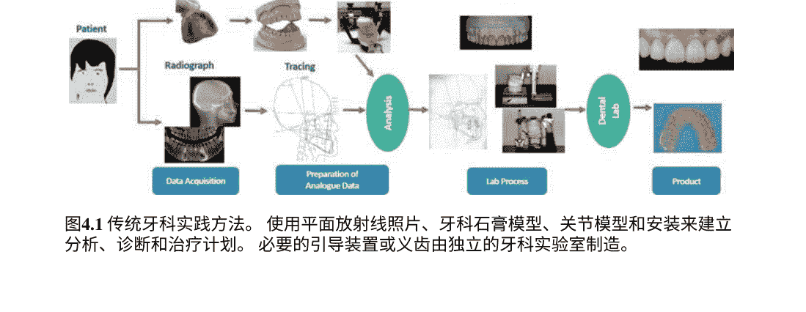

图4.1 传统牙科实践方法。使用平面放射线照片、牙科石膏模型、关节模型和安装来建立分析、诊断和治疗计划。必要的引导装置或义齿由独立的牙科实验室制造。

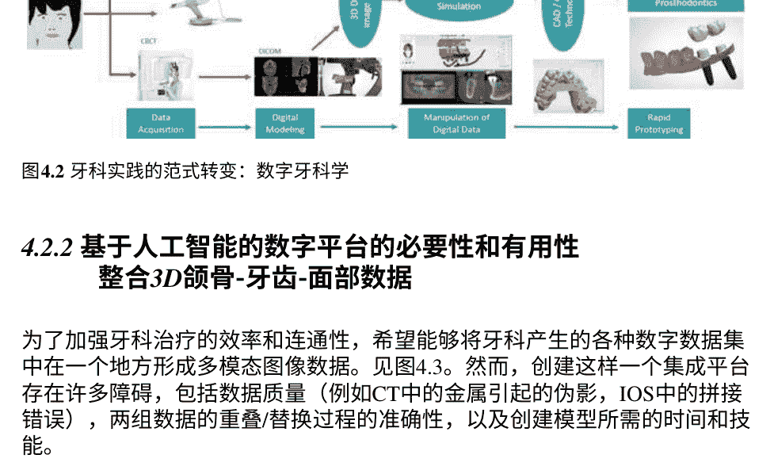

### 4.2.2 基于人工智能的数字平台的必要性和有用性：整合3D颌骨-牙齿-面部数据

为了加强牙科治疗的效率和连通性，希望能够将牙科产生的各种数字数据集中在一个地方形成多模态图像数据。见图4.3。然而，创建这样一个集成平台存在许多障碍，包括数据质量（例如CT中的金属引起的伪影，IOS中的拼接错误），两组数据的重叠/替换过程的准确性，以及创建模型所需的时间和技能。

解决这个问题最有希望的方法是通过结合人工智能来创建一个复合模型。参见图4.4。通过引入基于AI的数据集成算法来配置多模式图像数据，并构建一个智能的

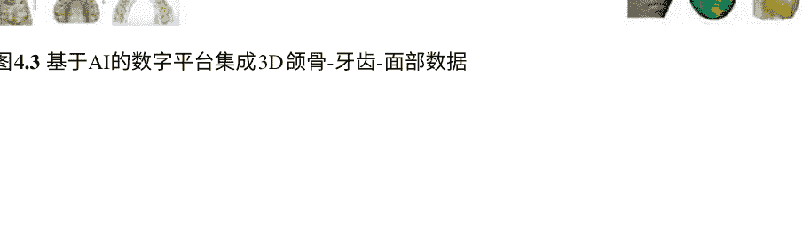

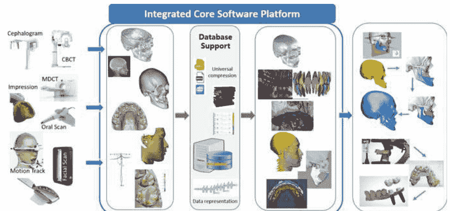

图4.4 通过智能三维“牙齿分割”和“多模态数据融合”开发颌骨-牙齿-面部复合模型平台，并构建一个牙医-患者友好的数字工作流程

通过平台，牙医可以快速方便地提高头影测量分析的准确性，个性化修复CAD，计算机手术模拟和数字种植手术。

## 4.3 IOS中的个别牙齿分割

设 $X$ 表示通过IOS进行下颌完整弓扫描的点云。分割的目标是将 $X$ 分解为个别的牙齿（$X_1 \cup X_2 \cup \dots \cup X_J$）和包括牙龈在内的其余部分（$X_{\text{gingiva}}$）：

$$X = \underbrace{X_1^\circ \cup X_2^\circ \cup \cdots \cup X_J^\circ}_{\text{X牙齿}} \cup X_{\text{牙龈}}, \tag{4.1}$$

其中 $J$ 是下颌骨中的牙齿数量（即 $J \leq 16$），每个 $X_j^\circ$ 表示第 $j$ 个牙齿，稍后将进行解释。

由于输入数据的高维度和训练数据的有限可用性，使用深度学习处理3D IOS数据 $X$ 存在困难。在这里，高准确性和鲁棒性非常重要。为了解决这个问题，我们不直接进行3D分割，而是首先使用多个边界框（少于16个）来检测单个牙齿，使得每个框紧密地包含一个单独的牙齿。然后，问题就变成了从边界框中分割出牙齿，从而显著降低了输入数据的维度。

为了解决紧密边界框检测的鲁棒性问题，我们不使用3D数据 $X$，我们生成突出牙齿特征的2D图像，然后进行检测。

### 4.3.1 牙齿特征突出的2D图像生成

设 $\Omega_X$ 为由点云数据 $X$ 确定的点集表面。从点集表面 $\Omega_X$，我们可以生成突出牙齿特征的2D图像；一个带有光照效果的2D渲染图像（表示为 $\mathcal{I}_r$）和一个深度图像（表示为 $\mathcal{I}_d$）。这两个图像将用于单独的牙齿检测和识别。

为了生成 $\mathcal{I}_r$ 和 $\mathcal{I}_d$，我们首先需要将 $X$ 在一个新的坐标系中对齐，这个坐标系有三个轴 $\mathbf{u}_1$，$\mathbf{u}_2$，$\mathbf{u}_3$，使得 $\mathbf{u}_1$，$\mathbf{u}_2$，$\mathbf{u}_3$ 大致水平，矢状和垂直方向。现在，我们将解释如何选择坐标系。坐标系的原点被选为 $\bar{\mathbf{x}} = (1/N) \sum_{\mathbf{x} \in X} \mathbf{x}$。我们应用主成分分析（PCA）来获得三个主基 $\{ \mathbf{pc}_1, \mathbf{pc}_2, \mathbf{pc}_3 \}$ 对于 $X$。然后，三个坐标方向 $\{ \mathbf{u}_1, \mathbf{u}_2, \mathbf{u}_3 \}$ 被选择为

$$\mathbf{u}_2 = \begin{cases} \mathbf{pc}_2, & \text{如果 } \mathbf{pc}_2 \cdot \sum_{\mathbf{x} \in X} (\mathbf{x} - \bar{\mathbf{x}})/\|\mathbf{x} - \bar{\mathbf{x}}\| \geq 0, \\ -\mathbf{pc}_2, & \text{否则} \end{cases}, \tag{4.2}$$

$$\mathbf{u}_3 = \begin{cases} \mathbf{pc}_3, & \text{如果 } \mathbf{pc}_3 \cdot \sum_{\mathbf{x} \in X} \mathbf{x} \geq 0, \\ -\mathbf{pc}_3, & \text{否则} \end{cases}, \tag{4.3}$$

$$\mathbf{u}_1 = \mathbf{u}_2 \times \mathbf{u}_3. \tag{4.4}$$

现在，我们准备解释如何生成 $\mathcal{I}_r$ 和 $\mathcal{I}_d$。不失一般性，我们可以假设 $\bar{\mathbf{x}} = \mathbf{0}$ 和 $\mathbf{u}_1 = (1,0,0), \mathbf{u}_2 = (0,1,0), \mathbf{u}_3 = (0,0,1)$。渲染的 2D 图像 $\mathcal{I}_r$ 定义在咬合平面渲染：

$$\Pi = \left\{ \frac{1}{s}\left((u, -v, 0) + \mathbf{a}\right) : u = 1, ..., N_1, v = 1, ..., N_2 \right\}, \tag{4.5}$$

其中 $s$ 是像素间距，$\mathbf{a} = (-(N_1+1)/2, -(N_2+1)/2, \max\{\|\mathbf{p}\| : \mathbf{p} \in \Omega_X\})$ 是一个平移向量，如图4.5a所示。这里，$s$ 和 $N_1 \times N_2$ (例如，$N_1 \times N_2 = 400 \times 400$) 分别与图像分辨率和视野相关。要精确地说，$\mathcal{I}_r$ 由以下给出

$$\mathcal{I}_r(u, v) = \begin{cases} \max\{\langle \mathbf{n}_{\mathbf{p}^*_{u,v}}, \mathbf{e}_3 \rangle, 0\}, & \text{如果 } \ell_{u,v} \cap \Omega_X \neq \emptyset, \\ 0, & \text{否则} \end{cases}, \tag{4.6}$$

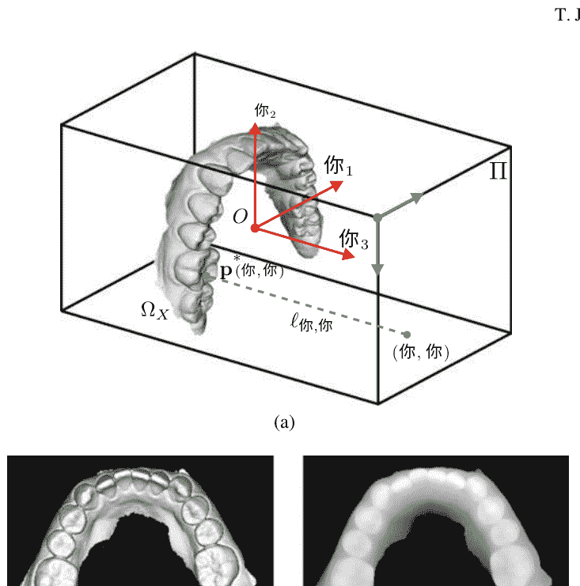

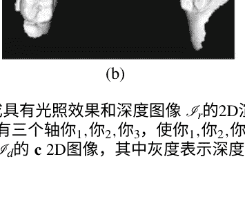

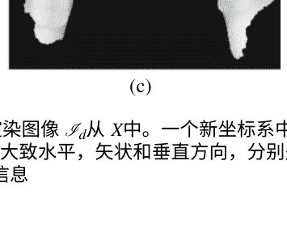

图4.5 从 $X$ 中生成具有光照效果的2D渲染图像 $\mathcal{I}_r$ 和深度图像 $\mathcal{I}_d$。(a) 新坐标系中的 $X$ 的对齐，具有三个轴 $\mathbf{u}_1$, $\mathbf{u}_2$, $\mathbf{u}_3$，分别对应水平，矢状和垂直方向。(b) $\mathcal{I}_r$ 的2D图像。(c) $\mathcal{I}_d$ 的2D图像，其中灰度表示深度信息

其中 $\ell_{u,v}$ 是通过点 $((u, -v, 0) + \mathbf{u}_3)$ 沿着 $\mathbf{u}_3$ 方向通过的直线，$\mathbf{p}^*_{u,v}$ 是位于牙齿表面 $\Omega_X$ 上的一个点，给定为

$$\mathbf{p}^*_{u,v} = \underset{\mathbf{p} \in \ell_{u,v} \cap \Omega_X}{\arg\max} \langle \mathbf{p}, \mathbf{u}_3 \rangle, \tag{4.7}$$

并且 $\mathbf{n}_{\mathbf{p}}$ 是一个单位法向量在 $\mathbf{p}$ 处。深度图像 $\mathcal{I}_d$ 由以下给出

$$\mathcal{I}_d(u, v) = \begin{cases} 1 - \frac{\langle \mathbf{p}^*_{u,v}, \mathbf{u}_3 \rangle - z_{\text{min}}^*}{z_{\text{max}}^* - z_{\text{min}}^*}, & \text{如果 } \ell_{u,v} \cap \Omega_X \neq \emptyset, \\ 0, & \text{否则} \end{cases}, \tag{4.8}$$

其中 $z_{\text{min}}^* = \min\{\langle \mathbf{p}^*_{u,v}, \mathbf{u}_3 \rangle : 1 \leq u \leq N_1, 1 \leq v \leq N_2\}$ 和 $z_{\text{max}}^* = \max\{\langle \mathbf{p}^*_{u,v}, \mathbf{u}_3 \rangle : 1 \leq u \leq N_1, 1 \leq v \leq N_2\}$。

如图4.5b，c所示，牙冠的深度值是不同的，因为牙齿位置从牙龈和其他组织向前突出。虽然渲染图像通过对表面进行光照和阴影处理，可以呈现清晰的几何特征，但深度图像通过表示相对距离来提供牙齿的可靠性。

### 4.3.2 牙齿边界框检测和从生成的2D图像提取3D牙齿ROI

我们使用深度学习方法[43]来找到边界框检测映射

$$f_{\text{det}}: (\mathcal{I}_r, \mathcal{I}_d) \rightarrow \{\mathbf{b}_1, ..., \mathbf{b}_J\}, \tag{4.9}$$

其中 $\{\mathbf{b}_1, ..., \mathbf{b}_J\}$ 表示与2D边界框相关联的向量集，对应于个别牙齿 $X_1^\diamond, ..., X_J^\diamond$ 在(4.1)中。在这里，每个边界框 $\mathbf{b}_j$ 应该包含一个单独的牙齿，并且可以通过边界框的坐标（中心位置、宽度和高度）唯一确定。

对于边界框检测，我们将图像 $\mathcal{I}_r$ 和 $\mathcal{I}_d$ 分成大小为 $k \times k$（例如 $k=20$）的均匀方块。设 $G_{ij}$ 为一个 $(i, j)$ 方块，其中 $(i, j) \in \{(i, j): i=1, 2, ..., \frac{N_1}{k}, j=1, 2, ..., \frac{N_2}{k}\}$。如图4.6所示，

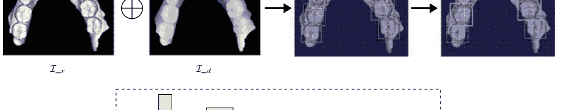

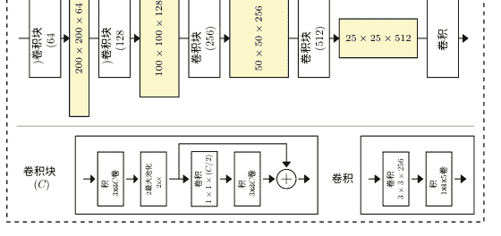

图4.6 边界框检测映射 $f_{\text{det}}$ 的架构。$f_{\text{det}}$ 的输入是两个2D图像 $\mathcal{I}_r$ 和 $\mathcal{I}_d$。输出是使用边界框进行的牙齿检测。映射 $f_{\text{det}}$ 基于YOLO。

映射 $f_{\text{det}}$ 由两部分组成：

$$f_{\text{det}} = f_{\text{NMS}} \circ f_{\text{det}}^1, \tag{4.10}$$

其中 $f_{\text{det}}^1$ 是用于预测边界框并估计每个网格单元 $G_{i,j}$ 的置信度得分的网络，$f_{\text{NMS}}$ 是一种非最大抑制（NMS）过程，用于过滤重叠的边界框，以便每个牙齿只剩下一个边界框。$f_{\text{det}}^1$ 的输出为

$$f_{\text{det}}^1(\mathcal{I}_r, \mathcal{I}_d) = \begin{pmatrix} \mathcal{O}_{1,1} & \mathcal{O}_{1,2} & \dots & \mathcal{O}_{1,\frac{N_1}{k}} \\ \mathcal{O}_{2,1} & \mathcal{O}_{2,2} & \dots & \mathcal{O}_{2,\frac{N_1}{k}} \\ \vdots & \vdots & \ddots & \vdots \\ \mathcal{O}_{\frac{N_2}{k},1} & \mathcal{O}_{\frac{N_2}{k},2} & \dots & \mathcal{O}_{\frac{N_2}{k},\frac{N_1}{k}} \end{pmatrix}, \tag{4.11}$$

其中 $\mathcal{O}_{ij} = (c_{ij}, \mathbf{b}_{ij})$ 预测置信度得分 $c_{ij} \in [0, 1]$ 表示对牙齿中心存在的信任和边界框组件 $\mathbf{b}_{ij} = (u_{ij}, v_{ij}, w_{ij}, h_{ij})$，分别由框的中心位置、宽度和高度组成。有关 $c_{ij}$ 和 $\mathbf{b}_{ij}$ 的详细解释，请参见第2.4.5节。

接下来，网络 $f_{\text{NMS}}$ 在(4.10)中使用非极大值抑制技术[1]来过滤重叠的框。通过选择得分最高的框，$f_{\text{NMS}}$ 消除了相同牙齿的重叠边界框 $\mathbf{b}_{ij}$。

使用带标签的数据集 $\{\mathcal{I}_r^{(n)}, \mathcal{I}_d^{(n)}, \mathcal{O}^{*(n)}\}$，其中 $\mathcal{O}^*$ 是真实值，通过最小化输出 $\mathcal{O}=f_{\text{det}}^1(\mathcal{I}_r, \mathcal{I}_d)$ 与真实值 $\mathcal{O}^*$ 之间的损失进行训练。

$$\mathcal{L}_{\text{det}} = \sum_{n=1}^{N} \left[ \lambda_0 \sum_{(i,j) \in \Omega_0^{(n)}} (0 - c_{ij}^{(n)})^2 + \sum_{(i,j) \in \Omega_1^{(n)}} (1 - c_{ij}^{(n)})^2 + \lambda_1 \sum_{(i,j) \in \Omega_1^{(n)}} \| \Delta \mathbf{b}_{ij}^{*(n)} - \mathbf{b}_{ij}^{(n)} \|_2^2 \right], \tag{4.12}$$

其中 $\Omega_0^{(n)} = \{(i, j) : c_{ij}^{*(n)} = 0\}$，$\Omega_1^{(n)} = \{(i, j) : c_{ij}^{*(n)} = 1\}$，$\lambda_0 = 0.1$，$\lambda_1 = 5$。

### 4.3.3 从3D牙齿ROI中进行个别牙齿的3D分割

我们使用检测到的边界框获取的个别牙齿ROI进行个别牙齿分割和识别。个别牙齿ROI $\{X_{\mathbf{b}_1}, \dots, X_{\mathbf{b}_J}\}$ 由检测到的边界框 $\{\mathbf{b}_1, \dots, \mathbf{b}_J\}$ 确定：$X_{\mathbf{b}} = X \cap \text{BOX}_{\mathbf{b}}$，其中$\text{BOX}_{\mathbf{b}}$是对应于组件 $\mathbf{b} = (u, v, w, h)$的边界框，即 $\text{BOX}_{\mathbf{b}} = \left[su - \frac{sw}{2}, su + \frac{sw}{2}\right) \times \left[-sv - \frac{sh}{2}, -sv + \frac{sh}{2}\right) \times \mathbb{R}$。 (4.13, 4.14)

给定 $X_{\mathbf{b}}$，我们应用基于深度学习的分割网络 $f_{\text{seg}} : X_{\mathbf{b}} \rightarrow \mathscr{S}_{\mathbf{b}}$来获取牙齿分割$\mathscr{S}_{\mathbf{b}}$，该分割是从点云 $X_{\mathbf{b}}$中选择的。 图4.7显示了分割网络 $f_{\text{seg}}$的架构，该网络基于PointNet[40]和EdgeConv [56]。 分割网络 $f_{\text{seg}}$的设计是使用$k$最近邻（$k$-NN）图和多层感知器（MLP）估计点属于目标牙齿的概率。

为了清晰起见，我们将使用图4.7中的具体示例来描述 $f_{\text{seg}}$的过程。在第一层中，与输入 $X_{\mathbf{b}}$相关的输出 $\mathbf{h}^{\ell_1}_j$的计算如下所示：

$\mathbf{h}^{\ell_1}_j = \max_{\mathbf{x} \in N_k^{\ell_1}(\mathbf{x}_j)} ReLU \left[\Theta^{\ell_1} \cdot \mathbf{x}_j + \Psi^{\ell_1} \cdot (\mathbf{x} - \mathbf{x}_j)\right]$， (4.15)
其中 $\Theta^{\ell_1}$ 和 $\Psi^{\ell_1}$是可学习的参数，在 $\mathbb{R}^{3 \times d_1}$中， $N_k^{\ell_1}(\mathbf{x}_j)$是集合在 $X_{\mathbf{b}}$中距离 $\mathbf{x}_j$最近的点是 $k$。这里，上标 $\ell_1$表示第 $\ell_1$层。如果 $d_1 = 64$，则第一层的输出维度为 $d' = 64$，即 $\mathbf{h}^{\ell_1}_j \in \mathbb{R}^{64}$。通过每个点与其邻居之间的关系，使用 $N_k^{\ell_1}(\mathbf{x}_j)$来捕捉局部特征。类似地，在第二层中，通过计算第 $j$个点的输出来进行计算。

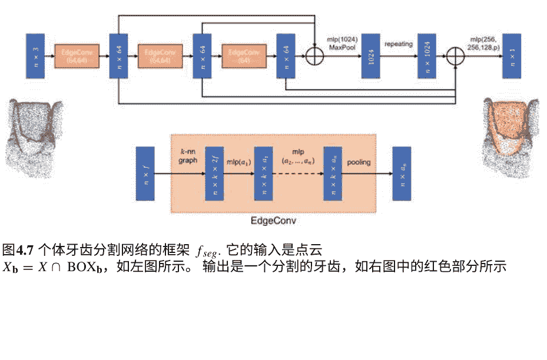

图4.7 个体牙齿分割网络的框架 $f_{\text{seg}}$。它的输入是点云 $X_{\mathbf{b}} = X \cap \text{BOX}_{\mathbf{b}}$，如左图所示。输出是一个分割的牙齿，如右图中的红色部分所示

$\mathbf{h}_j^{\ell_2} = \max_{\mathbf{h} \in N_k^{\ell_2}(\mathbf{h}_j^{\ell_1})} ReLU \left[ \Theta^{\ell_2} \cdot \mathbf{h}_j^{\ell_1} + \Psi^{\ell_2} \cdot (\mathbf{h} - \mathbf{h}_j^{\ell_1}) \right], \qquad (4.16)$

其中，$\Theta^{\ell_2}$和$\Psi^{\ell_2}$是$\mathbb{R}^{d_1 \times d_2}$中的可学习参数，$N_k^{\ell_2}(\mathbf{h}_j^{\ell_1})$是最接近 $\mathbf{h}_j^{\ell_1}$的点集。我们继续这个过程直到最后一层。在最后一层，网络估计$\mathbf{x}_j$是否属于目标牙齿。通过最小化损失函数，使用标记的数据$\{X_{\mathbf{b}}^{(n)}, \mathcal{S}^{(n)}\}_{n=1}^N$，学习到一个映射$f_{seg}$：

$\mathcal{L}_{seg} = -\sum_{n=1}^N \mathcal{S}^{(n)} \log \left[ f_{seg} (X_{\mathbf{b}}^{(n)}) \right]. \qquad (4.17)$

## 一种用于牙科CBCT中三维个体牙齿识别和分割的完全自动化方法

从CBCT图像中进行牙齿、颌骨和头骨的三维分割是未来数字牙科学的重要组成部分[29, 34, 41]。准确的个体牙齿几何模型和颌骨数字模型有助于决策受阻牙齿的手术规划、正畸规划、计算机辅助数字种植手术导板、咬合不规则预测、头影测量分析等[3, 7, 19, 50, 54]。近年来，随着牙科CBCT设备的广泛使用，它正在迅速成为牙科学中的标准成像设备[18]。与MDCT相比，大多数牙科CBCT具有较低的辐射剂量和相对较低的价格和维护成本[26]。

从牙科CBCT图像中自动分割单个牙齿是一项具有挑战性的任务，因为牙科CBCT图像常常受到与金属相关的伪影的影响，这些伪影与射线硬化、散射、部分体积效应等有关[49]。图4.8显示了应用金属伪影减少（MAR）之前和之后的CBCT图像。应用最先进的金属伪影减少技术后，CBCT图像仍然受到金属伪影的严重影响，这是由金牙引起的。

为了在临床环境中具有实际价值，牙齿分割还必须能够处理受金属伪影影响的CBCT数据。因此，开发3D牙齿分割方法似乎很困难，因为牙齿可能被遮挡或重叠。

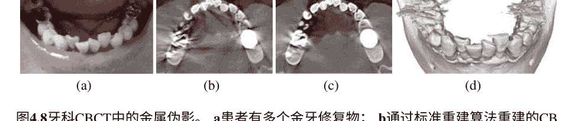

图4.8 牙科CBCT中的金属伪影。a患者有多个金牙修复物；b通过标准重建算法重建的CBCT图像；c应用最先进的金属伪影减少后的CBCT图像；d从CBCT图像中进行骨分割（c）

## 从CBCT到全景图像的映射

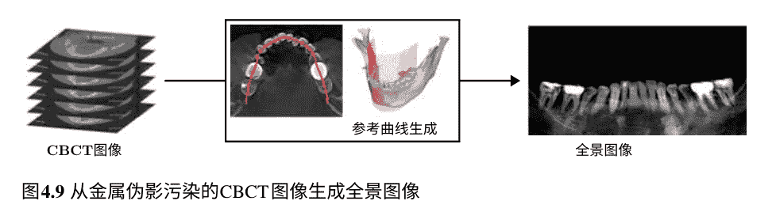

由于金属相关伪影，图像受到影响。已经开发了几种深度学习方法[5, 8, 30, 42, 58]，用于直接进行3D牙齿分割，但在牙科CBCT中金属伪影非常常见的嘈杂环境中，它们的性能受到限制。我们解释了一种深度学习模型，以规避与低剂量CBCT图像相关的上述限制。关键是要注意，从CBCT图像生成的全景图像不会受到金属相关伪影的显著影响。图4.9显示了从受金属伪影降解的CBCT数据创建的全景图像。这是因为锥形束投影配置在组成全景图像重建方面具有优势。我们利用这些全景图像来准确执行3D牙齿分割和识别。

这种深度学习方法的过程如下：

- 1. 从CBCT图像I生成上颌全景图像P上颌和下颌全景图像P下颌。将上颌和下颌分开的原因是为了减少生成的全景图像中相邻牙齿之间的重叠。
- 2. 下一步是根据FDI牙齿标记法为每颗牙齿进行编号，如图4.10所示。所开发的牙齿检测方法是定位包围每颗牙齿的边界框，并根据牙齿形态将其分类为四种类型（切牙、犬牙、前磨牙和臼齿）。
- 3. 最后一步是利用前一步的2D边界框和牙齿分割结果进行3D牙齿分割。

我们方法的示意图如图4.11所示。设I表示具有体素网格$\Omega:=\{(x,y,z)\in\mathbb{N}^3:1\le x\le N_x,1\le y\le N_y,1\le z\le N_z\}$的3D CT图像，其中$N_x, N_y$和$N_z$分别是沿着x轴（矢状轴）、y轴（冠状轴）和z轴（纵轴）的体素尺寸。体素位置$(x, y, z)$处的值$I(x, y, z)$表示为衰减系数。

### 上颌牙齿的FDI牙齿标记法

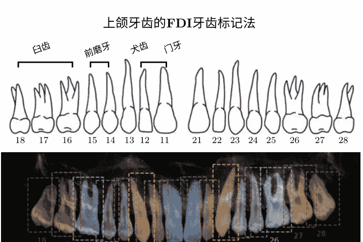

### 图4.10 根据FDI牙齿标记系统的牙齿识别过程

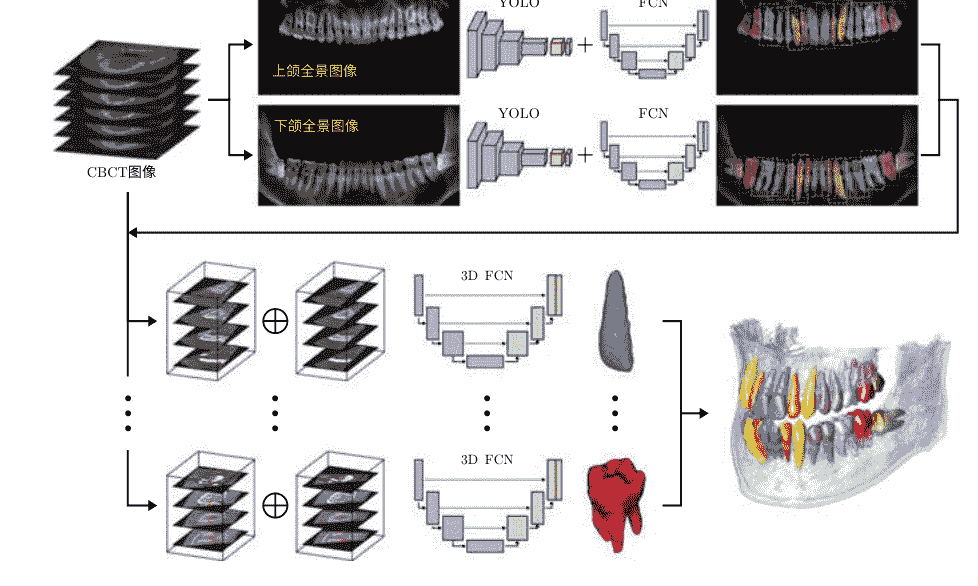

图4.11 所提出方法的示意图，包括三个步骤：（1）从3D CBCT图像中重建上下颌的全景图像；（2）在全景图像中进行牙齿识别、2D边界框检测和分割；（3）从边界框和2D分割得到的3D牙齿感兴趣区域进行牙齿的3D分割

### 4.4.1 从3D CBCT图像生成上下颌的全景图像

本步骤描述了从3D CBCT图像 $I$ 自动重建上下颌全景图像的过程。图4.12展示了这个工作流程。

[步骤1-1] 给定 $I$，我们使用Otsu阈值技术[39]得到一个二值图像 $\tilde{I}(x, y, z)$，可以看作是上下颌的粗略分割。

[步骤1-2] 给定二进制图像 $\tilde{I}$，使用连通组件标记（CCL）[47]提取上颌部分 $I_{\text{upper-jaw}}$ 和下颌部分 $I_{\text{lower-jaw}}$。CCL方法在二进制图像中生成所有连通组件。下颌部分是 $\tilde{I}$ 中最大的连通组件，上颌部分是第二大的连通组件。

[步骤1-3] 我们在 $z$ 方向上应用最大强度投影（MIP）到 $I_{\text{upper-jaw}} := I \odot I_{\text{upper-jaw}}$，以生成以下2D图像 $I_{\text{upper-jaw}}$ 显示上颌牙弓：

$I_{\text{upper-jaw}}(x, y) = \max_{z} I_{\text{upper-jaw}}(x, y, z) \quad (4.18)$

类似地，我们获得 $I_{\text{lower-jaw}}$ 和 $I_{\text{lower-jaw}}$ 用于下颌。

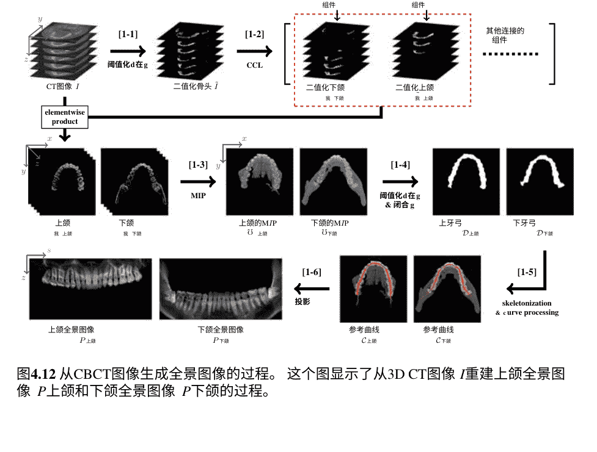

图4.12 从CBCT图像生成全景图像的过程。这个图显示了从3D CT图像 I 重建上颌全景图像 P上颌和下颌全景图像 P下颌的过程。

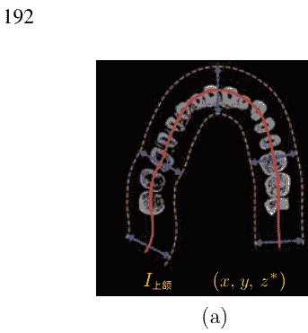

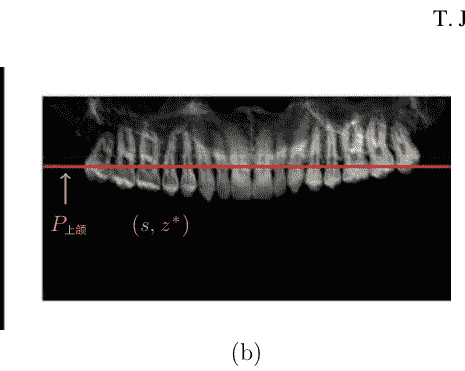

图4.13 步骤1_6的示意图。a上颌影像的第z*个切片I上颌：参考曲线（红线），曲线的法线方向（蓝色箭头线）和投影域（橙色虚线内的区域）。b重建的全景影像：全景影像的第z*个水平线P上颌对应于第z*个切片。

[步骤1-4] 接下来，通过应用Otsu方法[39]和形态学闭运算[15]到上颌和下颌的MIP影像到上颌和到上颌，分别获得二值化的牙弓区域 $\mathcal{D}_{\text{upper}}$ 和 $\mathcal{D}_{\text{lower}}$。在这里，采用Otsu阈值法获取粗略的牙弓区域，并使用形态学闭运算来平滑粗糙区域。

[步骤1-5] 在前一步中给定上颌牙弓区域 $\mathcal{D}_{\text{upper}}$，我们使用形态学骨架提取[31]来提取牙弓区域的中轴线。然后，对中轴线应用三次样条曲线拟合、插值和外推技术，以获得一条完全通过牙弓区域的平滑参考曲线 $\mathcal{C}_{\text{upper}}$。参考曲线可以表示为

$\mathcal{C}_{\text{upper}} = \{\mathbf{r}(s) = (x(s), y(s)) : s \in 1, 2, . . . , N_s\}, \quad (4.19)$

其中 $N_s$是曲线点的数量。类似地，我们可以从下颌牙弓区域 $\mathcal{D}_{\text{lower}}$ 中获得 $\mathcal{C}_{\text{lower}}$。

[步骤1-6] 如图4.13所示，上颌全景图像由以下给出

$P_{\text{upper}}(s, z) = \int_{-\alpha}^{\alpha} I_{\text{upper}}(\mathbf{r}(s) + t\mathbf{n}(s), z) dt, \quad (4.20)$

其中 $s$是(4.19)中的参数，$\mathbf{r}(s) \in \mathcal{C}_{\text{upper}}$，而 $\mathbf{n}(s)$是 $\mathbf{r}(s)$处的单位法向量。同样地，我们得到了下颌全景图像 $P_{\text{lower}}$。为了简化符号，我们将 $P_{\text{upper}}$ 和 $P_{\text{lower}}$ 都称为 $P$。

### 4.4.2 二维重建全景图像中的单个牙齿检测、识别和分割

这一步旨在识别和分割重建全景图像中的单个牙齿。为了实现这个目标，我们首先进行单个牙齿检测。在这里，牙齿被分类为切牙（类别1）、犬牙（类别2）、前磨牙（类别3）和臼齿（类别4）。

我们使用YOLO [43]来找到一个边界框映射：

$f_{det}: P \rightarrow \{b_1, \dots, b_J\}. \quad (4.21)$

这一步与第4.3.2节中的步骤完全相同。对于检测到的每个边界框中的牙齿，根据FDI系统分配一个数字来识别唯一的牙齿。图4.14显示检测到的边界框按盒子中心的坐标升序排列。上右和上左象限从四个连续的门牙盒子的中间划分。对于右侧的两个门牙和左侧的两个门牙，分别从内到外分配数字1和2。由于每个象限只有一个尖牙，所以分配数字3给尖牙。在每一侧，前磨牙从内到外分配数字4和5。同样，磨牙分配数字6、7和8（如果有智齿的话）。

接下来，我们使用U形FCN [45]来获得2D牙齿分割，利用从前一步骤获得的边界框知识。

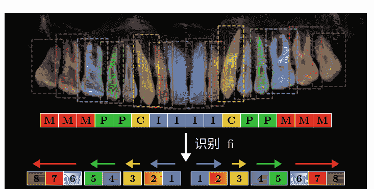

图4.14 使用步骤2-1中的分类结果进行牙齿识别过程。大写字母表示牙齿类型的首字母，数字表示牙齿代码

### 4.4.3 从3D牙齿ROI中进行个体牙齿的3D分割

在这最后一步中，通过应用U形FCN [45]的3D版本来执行3D个体牙齿分割，如图4.15所示。这里，网络的输入是松散ROI ($ROI_{\mathcal{I}_{loose,j}}$) 和紧密ROI ($ROI_{\mathcal{I}_{tight,j}}$)，其中 $j$ 是表示第 $j$ 个牙齿的数字在CBCT图像 $I$ 中。图4.16显示了从前一步检测到的边界框和2D分割区域确定松散ROI和紧密ROI的过程。请注意，紧密ROI对于改善目标牙齿与其相邻牙齿之间的分割准确性至关重要。

网络的输入是 $I_{\text{roi3}} = ROI_{\text{loose}} \oplus ROI_{\text{tight}}$，表示两个ROI的连接向量。让 $Y_{\text{roi3}}$ 表示与 $I_{\text{roi3}}$ 对应的二进制向量，表示3D牙齿分割。使用训练数据集 $\{I_{\text{roi3}}^{(n)}, Y_{\text{roi3}}^{(n)}\}_{n=1}^{N}$，通过最小化以下损失函数来学习3D分割图像 $f_{seg3}: I_{\text{roi3}} \rightarrow Y_{\text{roi3}}$。

$\mathcal{L}_{seg3} = \frac{1}{N} \sum_{n=1}^{N} \left[ - \frac{1}{V} \sum_{\mathbf{v}} Y_{\text{roi3}}^{(n)}(\mathbf{v}) \log \left[ f_{seg3} \left( I_{\text{roi3}}^{(n)} \right)(\mathbf{v}) \right] \right], \quad (4.22)$

其中 $\mathbf{v}$ 是一个体素位置， $V$ 是 $Y_{\text{roi3}}$ 的体素数量。

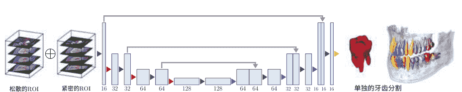

图4.15 提出的网络在第4步中的架构，是U-net [45]的3D版本。使用目标牙齿的宽松和紧密的3D ROIs在第3步中进行个别牙齿分割

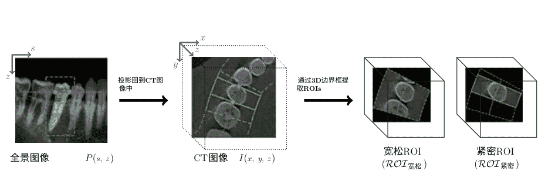

图4.16 从检测到的边界框和分割的牙齿区域中提取宽松和紧密的3D牙齿ROIs

## 4.5 使用CBCT和口腔内扫描仪的整个3D牙齿的精确数字印象提取方法

本节介绍了一种新颖的图像配准技术，将CBCT和IOS的两个不同的3D医学图像对齐到一个坐标系中。配准的目标是通过互补每个图像的弱点，在一个场景中集成来自不同成像模式的两个图像。

为了以简单实用的方式说明配准方法，本节仅关注将患者的IOS图像（源数据）与同一患者的CBCT图像（目标数据）对齐。此配准旨在提供关于咬合关系的准确细节，以帮助构建逼真的数字模拟下的颌齿模型。这种数字模拟可以消除传统牙科修复治疗的麻烦，该治疗需要大量劳动力、昂贵，并且需要至少两次个别访问，并且需要佩戴临时修复体直到最终冠位于正确位置。此外，如果牙科实验室制作的最终冠不适合第二次访问时，患者和牙医将不得不重复之前的操作，实验室可能需要重新设计修复体。

将CBCT和IOS数据整合到一个场景中的原因是为了弥补每个图像的缺点。在牙科CBCT图像中，无法看到牙龈结构，而牙齿表面常常受到与金属相关的伪影的影响，这些伪影与射线硬化、散射、部分体积效应等有关。如图4.17所示，口腔内扫描提供了精确的牙齿表面图像，而牙科CBCT图像可能受到与金属相关的伪影的影响。IOS弥补了牙科CBCT的这些缺点。另一方面，IOS对于狭窄区域的扫描非常准确，但对于全弓扫描会产生累积拼接错误[9, 36, 37]。将拼接错误减少到0.2mm以内对于临床实践至关重要。在IOS中使用CBCT数据可以减少这些拼接错误。

刚性配准可以利用上下颌骨是刚性的特性。上下颌骨中的牙齿是IOS和CBCT数据之间部分重叠的区域，因此是一个重要的

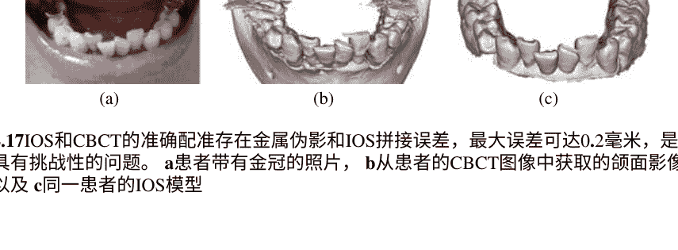

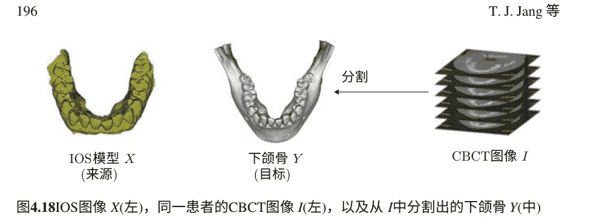

配准的预处理任务是自动从CBCT数据和IOS数据中分割出牙齿，并对每颗牙齿进行语义标记。然而，在本节中，我们不讨论单个牙齿分割和识别方法，以便专注于配准技术。

为了方便解释，我们只描述下颌部分（下颌骨）的配准方法。目标是找到IOS源点集（表示为 X）和CBCT目标点集（表示为Y）之间的刚性变换。请参见图4.18中的 X和 Y。现在，让我们清楚地定义数学符号

### X 和 Y.

- 我代表一张CBCT图像.
- $Y = \{\mathbf{y}_1, \mathbf{y}_2, \ldots, \mathbf{y}_M\}$是指从CBCT图像中分割出的下颌骨的一组点.
- $X = \{\mathbf{x}_1, \mathbf{x}_2, \ldots, \mathbf{x}_N\}$是下颌骨部分的IOS数据的一组点.

### 4.5.1 刚性变换

刚性变换（保持相对距离）用6个自由度建模：$3 \times 3$旋转矩阵（用 $\mathscr{R}$表示）由三个角度确定，以及在 $\mathbb{R}^3$中的平移向量（用 $\mathbf{t}$表示）。准确地说，旋转矩阵 $\mathscr{R}$可以用三个绕三个轴 $(x_1, x_2, x_3)$的旋转角度$\phi, \theta, \psi$表示：

$\mathscr{R} = \begin{pmatrix} 1 & 0 & 0 \\ 0 & \cos\phi & -\sin\phi \\ 0 & \sin\phi & \cos\phi \end{pmatrix} \begin{pmatrix} \cos\theta & 0 & -\sin\theta \\ 0 & 1 & 0 \\ \sin\theta & 0 & \cos\theta \end{pmatrix} \begin{pmatrix} \cos\psi & -\sin\psi & 0 \\ \sin\psi & \cos\psi & 0 \\ 0 & 0 & 1 \end{pmatrix}. \quad (4.23)$

注意旋转 $\mathscr{R}$ 可以用单位四元数[17]表示。刚性变换，用 $\mathscr{T} = [\mathscr{R}, \mathbf{t}]$ 表示，定义为

对于 $X$中的每个点 $\mathbf{x}$，有 $\mathscr{T}\mathbf{x} := \mathscr{R}\mathbf{x} + \mathbf{t} \quad (4.24)$## 4.5.2 配对点方法

因此，目标是找到一个合适的刚性变换$\mathscr{T}$，使得变换后的点云$\{\mathbf{y} = \mathscr{T}(\mathbf{x}) : \mathbf{x} \in X\}$与参考点云$Y$（即配准）最佳对齐。使用部分重叠的牙齿表面对$X$和$Y$进行配准，如图4.19所示。

和Y重叠显示)

在配对点方法中，操作员手动或自动选择X和Y中被认为是对应关系的三个或更多参考点。参考图4.20中的牙齿上的参考点。配对点用于确定X和Y的刚性配准。设$CP := \{(\mathbf{x}_{p_j}, \mathbf{y}_{p_j}) : j = 1, ..., p\}$为$X \times Y$中的一组参考点。可以通过以下均方误差最小化来实现最佳匹配参考点对：

$$ \mathscr{T}^* = \underset{\mathscr{T}}{\text{argmin}} \sum_{j=1}^{P} \left\| \mathscr{T} \mathbf{x}_{p_j} - \mathbf{y}_{p_j} \right\|^2 \quad \text{subject to} \; \mathscr{R} \in SO(3), \quad (4.25) $$

 \simeq \mathbf{y}_{p_j}$ 对于 $j=1,2,3$)

其中 $SO(3)$ 是所有绕原点的旋转的群在 $\mathbb{R}^3$ 中。为了更清楚地解释匹配过程，写成

$$ \tilde{\mathbf{x}}_{p_j} := \mathbf{x}_{p_j} - \frac{1}{P} \sum_{j=1}^{P} \mathbf{x}_{p_j} \quad \text{和} \quad \tilde{\mathbf{y}}_{p_j} := \mathbf{y}_{p_j} - \frac{1}{P} \sum_{j=1}^{P} \mathbf{y}_{p_j} . \quad (4.26) $$

然后，设置 $\mathbf{t}^{*} = \mu_{Y_P} - \mathcal{R} \mu_{X_P}$，在 (4.25) 中找到 $\mathcal{T}^{*} = [\mathcal{R}^{*}, \mathbf{t}^{*}]$ 的问题被简化为找到 $\mathcal{R}^{*}$：

$$ \mathcal{R}^{*} = \underset{\mathcal{R}}{\text{argmin}} \sum_{j=1}^{P} \| \mathcal{R} \tilde{\mathbf{x}}_{p_j} - \tilde{\mathbf{y}}_{p_j} \|^2 . \quad (4.27) $$

请注意

$$ \sum_{j=1}^{P} \| \mathcal{R} \tilde{\mathbf{x}}_{p_j} - \tilde{\mathbf{y}}_{p_j} \|^2 = \sum_{j=1}^{P} (\| \tilde{\mathbf{x}}_{p_j} \|^2 + \| \tilde{\mathbf{y}}_{p_j} \|^2) - 2 \operatorname{tr} (\mathcal{R} G) . \quad (4.28) $$

其中 $G$ 是与协方差相关的以下矩阵：

$$ G = \sum_{j=1}^{P} \tilde{\mathbf{x}}_{p_j} \tilde{\mathbf{y}}_{p_j}^{T} . \quad (4.29) $$

这里，上标 $T$ 表示转置，操作符 $\operatorname{tr}$ 是矩阵的迹。因此，(4.25) 简化为

$$ \mathcal{R}^{*} = \underset{\mathcal{R}}{\text{argmax}} \ \operatorname{tr} (\mathcal{R} G) . \quad (4.30) $$

因此，如果 $G$ 的奇异值分解是 $U V^{T}$，旋转矩阵可以通过以下方式确定：

$$ \mathcal{R}^{*} = V U^{T} . \quad (4.31) $$

我们应该注意到，上述方法在不知道 $X$ 和 $Y$ 之间的三个以上配对时无法应用。使用这种方法的配准精度取决于准确找到点对。即使在 $X$ 和 $Y$ 之间手动标记具有可辨别特征的基准点，由于轻微的不匹配误差，精确配准可能失败。此外，在包含金属物体的患者情况下，由于金属伪影，CBCT图像无法详细描绘牙齿表面，从而阻碍了参考点的准确选择。

### 4.5.2.1 基于主成分分析（PCA）的配准

基于主成分分析（PCA）的方法是通过对X和Y的三个最大方差的三个特征向量进行对齐来实现配准的简单方法。准确地说，我们首先计算给定的X和Y的质心，即

$$ \mu_X = \frac{1}{N} \sum_{j=1}^{N} x_j \quad \text{和} \quad \mu_Y = \frac{1}{M} \sum_{j=1}^{M} y_j \quad (4.32) $$

我们将平移向量设置为 $t=\mu_Y-\mu_X$，以便将平移后的集合 $X+t:=\{x_j+t:j=1,...,N\}$ 的质心与 $\mu_Y$ 对齐。现在，我们需要找到 $R$，使得 $X-\mu_X$ 的三个主轴与 $Y-\mu_Y$ 的主轴对齐。为了找到旋转矩阵 $R$，设置

$$ \mathcal{X} = \begin{pmatrix} \mathbf{x}_1 - \mu_X \\ \vdots \\ \mathbf{x}_N - \mu_X \end{pmatrix} \quad (4.33) $$

第一个主成分是向量 $v_1 \in \mathbb{R}^3$，它最大化方差：

$$ \mathbf{v}_1 = \arg\max_{\|\mathbf{v}\|=1} [\mathbf{v}^T \mathcal{X}^T \mathcal{X} \mathbf{v}] \quad (4.34) $$

简单的计算表明，$v_1$ 是 $X^T X$ 的最大特征值（$\lambda_1$）对应的单位特征向量：

$$ \mathcal{X}^T \mathcal{X} \mathbf{v}_1 = \lambda_1 \mathbf{v}_1 \quad (4.35) $$

通过这种方式，我们可以找到协方差矩阵 $\mathcal{X}^T \mathcal{X}$ 的三个单位特征向量 $\{v_1, v_2, v_3\}$ 和与 $Y$ 对应的协方差矩阵的三个单位特征向量 $\{w_1, w_2, w_3\}$。然后，通过对齐PCA轴来确定 $R$：

$$ \begin{pmatrix} \mathbf{w}_1 \\ \mathbf{w}_2 \\ \mathbf{w}_3 \end{pmatrix} = \mathscr{R} \begin{pmatrix} \mathbf{v}_1 \\ \mathbf{v}_2 \\ \mathbf{v}_3 \end{pmatrix} \quad (4.36) $$

这种方法的局限性如下：

- 主轴和质心对噪声和异常值非常敏感。
- 如果特征值相似（例如，$\lambda_1 \approx \lambda_2$），则配准变得不可靠。

因此，这种方法主要用于提供配准的初始猜测（图4.21）。

![基于PCA的对齐。 PCA被用来找到X和Y的三个主特征向量 [v1, v2, v3] 和 [w1, w2, w3]，分别。对于初始化，我们计算旋转矩阵 R 和平移向量 t，使得 [w1, w2, w3]^T = R [v1, v2, v3]^T + t。消除异常值（两个数据的非共同部分）以获得更好的初始化效果是可取的。](图4.21)

### 4.5.2.2 迭代最近点（ICP）方法

ICP是一种迭代方法，通过搜索最近的目标点 $y_i$ of $x_j$ 在源 $X$ 中逐渐改进对应关系。 ICP的大致步骤如下：

- 1. 获得一个良好的初始猜测 $\mathcal{T}^{(0)} = [\mathcal{R}^{(0)}, \mathbf{t}^{(0)}]$。初始猜测可以通过多种方式获得，包括PCA和配对点方法。
- 2. 设置 $\hat{X}^{(0)} = \{\hat{\mathbf{x}}_j^{(0)} = \mathcal{T}^{(0)} \mathbf{x}_j : j = 1, \ldots, N\}$。
- 3. 对于每个 $\hat{\mathbf{x}}_j^{(0)}$，找到最近的点 $\hat{\mathbf{y}}_j^{(0)} \in Y$: $\hat{\mathbf{y}}_j^{(0)} = \underset{\mathbf{y} \in Y}{\operatorname{argmin}} \|\mathbf{y} - \hat{\mathbf{x}}_j^{(0)}\|^2$. (4.37)
- 4. 通过 $\mathcal{T}^{(1)} = \underset{\mathcal{T}}{\operatorname{argmin}} \sum_{j=1}^{P} \left\| \mathcal{T} \hat{\mathbf{x}}_j^{(0)} - \hat{\mathbf{y}}_j^{(0)} \right\|^2$ (4.38) 这一步与第2步类似。
- 5. 重复第3步至第4步以获得 $\mathcal{T}^{(2)}$。
- 6. 重复第3步至第4步迭代获得 $\mathcal{T}^{(3)}, \mathcal{T}^{(4)}, \ldots$。
- 7. 停止准则：如果 $\mathcal{T}^{(n+1)} \approx \mathcal{T}^{(n)}$ （未改变），则停止迭代。

在我们的配准模型中，如果没有一个非常好的初始猜测 $\mathcal{T}^{(0)}$，上述ICP方法存在一个严重的缺陷，即结果严重依赖于初始猜测的质量，并容易陷入错误的局部最优解。这个错误的局部最优解问题可能是由于大量非重叠的集合引起的。参见图4.22。

## 4.5.3 移除X和Y之间不重叠的部分

可能会影响ICP配准。在使用ICP进行配准的过程中，两组数据的非重叠部分可能会不匹配。因此，希望能够最小化对ICP配准产生影响的X和Y中的非重叠点集。为了实现这一目标，作者[21, 22]开发了一种自动分割和识别X和Y中个别牙齿的方法。这些分割允许去除X和Y中的非重叠点，这是配准的主要障碍。使用传统的分割技术（不使用深度学习技术），上述个别牙齿分割可能是一个非常具有挑战性的任务。然而，通过谨慎使用深度学习技术，可以实现对X和Y中个别牙齿的分割和识别。参见图4.23。

个别牙齿从IOS数据中的语义分割在第4.3节中描述，其中X被分解为

$$ X = \underbrace{X_{t_1}^{\diamond} \cup X_{t_2}^{\diamond} \cup \cdots \cup X_{t_J}^{\diamond}}_{X_{\text{牙齿}}} \cup X_{\text{牙龈}} \quad (4.39) $$

其中 $J$ 是下颌骨外露的牙齿数量（即 $J \le 16$），每个 $X_{t_j}^{\diamond}$ 代表具有代码 $c_j$ 的牙齿，$X_{\text{牙龈}}$ 包括牙龈在内的剩余部分。在这里，$t_j$ 是分配给检测到的单个牙齿的编号，以便根据 (FDI) 符号识别唯一的牙齿。$X_{\text{牙齿}}$ 不包括 X 中未暴露的牙齿（例如，阻生智齿）。

第4.4节涉及到具有个体牙齿的语义分割的CBCT数据处理，其中使用了几个复杂的过程来处理金属引起的伪影。对于IOS, (4.39)式, Y被分解为

$$ Y = \underbrace{Y_{t_1}^{\diamond} \cup Y_{t_2}^{\diamond} \cup \cdots \cup Y_{t_J}^{\diamond}}_{Y_{\text{牙齿}}} \cup Y_{\text{rest}}, \quad (4.40) $$

其中每个 $Y_j$ 表示第 j 颗牙齿, $Y_{\text{rest}}$ 是可能包括未暴露的智齿的其余部分。

对于配准，我们利用语义分割的数据 $\{ X_{t_j}^{\diamond} : j = 1, \ldots, J \}$ 和 $\{ Y_{t_j}^{\diamond} : j = 1, \ldots, J \}$。目标是找到一个最优的变换 $\mathscr{T}^*$，使得 $\mathscr{T}(X_{t_j}^{\diamond})$ 与 $Y_{t_j}^{\diamond}$ 对于 $j = 1, \ldots, J$:

$$ \mathscr{T}^* = \underset{\mathscr{T}}{\text{argmin}} \sum_{j=1}^{J} \text{dist}(\mathscr{T}(X_j^{\diamond}), Y_j^{\diamond}). \quad (4.41) $$

这种配准方法旨在消除不同牙齿之间的对应关系，同时保持单个牙齿之间的对应关系，从而使转换优化更加高效。ICP方法允许高精度对齐，将用作最终的配准方法，而这种情况下的关键问题是找到一个非常好的初始转换 $\mathscr{T}^{(0)}$。参见图4.24以了解配准过程的整体架构[22]。

### 4.5.3.1 基于点特征直方图的初始配准

为了解决ICP方法的局部最小值问题，在配准过程中经常陷入局部最小值的限制，Rusu [46]开发了一种全局配准方法，称为快速点特征直方图（FPFH），用于两个点云 $X_{teeth}$ 和 $Y_{teeth}$ 之间的初始匹配。在FPFH中，我们计算两组FPFH向量； $FPFH(X_{teeth}) = \{ FPFH(\mathbf{x}) : \mathbf{x} \in X_{teeth} \}$ 和 $FPFH(Y_{teeth}) = \{ FPFH(\mathbf{y}) : \mathbf{y} \in Y_{teeth} \}$。在这里，$FPFH(\mathbf{x})$ （或 $FPFH(\mathbf{y})$ ）被设计为可靠地找到两个点云之间的匹配对。

现在，我们解释一下 $FPFH(\mathbf{x})$ 的定义，这有点复杂。 $FPFH(\mathbf{x})$ 利用法向量和曲率的几何特征。


表面 $X_{牙齿}$。然而，仅凭借这种简单的特征信息无法在 $X_{牙齿}$ 和 $Y_{牙齿}$ 之间进行一对一的匹配，因为点云中存在太多具有相似几何特征的点。 $FPFH(\mathbf{x})$ 不仅表示 $X_{牙齿}$ 表面在 $x$ 处的法向量和曲率的几何信息，还表示其周围邻域点上的相关信息。此外，$FPFH$ 以一种有区别的方式定义，可可靠地区分区域几何特征。

让 $NN_k(\mathbf{x})$ 表示点云 $X_{teeth}$ 中点 $\mathbf{x}$ 的 $k$ 个最近邻点的集合 (即，点云 $X_{teeth}$ 的 $k$ 个最近邻点的集合)。让 $\mathbf{n}$ 和 $\mathbf{x}$ 表示表面 $X_{牙齿}$ 在 $\mathbf{x}$ 处的单位法向量。$FPFH(\mathbf{x})$ 基于表面法线在 $NN_k(\mathbf{x})$ 上的角度变化。准确地说，对于 $\mathbf{x}' \in NN_k(\mathbf{x}) \setminus \{\mathbf{x}\}$，我们计算以下三个角度 $\{\rho(\mathbf{x}, \mathbf{x}'), \phi(\mathbf{x}, \mathbf{x}'), \theta(\mathbf{x}, \mathbf{x}')\}$，这些角度被设计成对称的:

$$ \rho(\mathbf{x}, \mathbf{x}') = \cos^{-1} ( \langle \mathbf{u}, (\mathbf{x}_t - \mathbf{x}_s) / \|\mathbf{x}_t - \mathbf{x}_s\| \rangle ) , \quad (4.42) $$
$$ \phi(\mathbf{x}, \mathbf{x}') = \cos^{-1} ( \langle \mathbf{v}, \mathbf{n}_{\mathbf{x}_t} \rangle ) , \quad (4.43) $$
$$ \theta(\mathbf{x}, \mathbf{x}') = \begin{cases} \cos^{-1} ( \langle \mathbf{u}, \mathbf{n}_{\mathbf{x}_t} \rangle ) & \text{如果 } \langle \mathbf{w}, \mathbf{n}_{\mathbf{x}_s} \rangle \geq 0 \\ \cos^{-1} ( \langle \mathbf{u}, \mathbf{n}_{\mathbf{x}_t} \rangle ) + \pi & \text{otherwise} \end{cases} , \quad (4.44) $$

其中 $(\mathbf{x}_s, \mathbf{x}_t)$ 可以是 $(\mathbf{x}, \mathbf{x}')$ 或 $(\mathbf{x}', \mathbf{x})$。由此确定

$$ (\mathbf{x}_s, \mathbf{x}_t) = \begin{cases} (\mathbf{x}, \mathbf{x}') & \text{if } \langle \mathbf{n}_\mathbf{x}, \mathbf{x}' - \mathbf{x} \rangle \leq \langle \mathbf{n}_{\mathbf{x}'}, \mathbf{x} - \mathbf{x}' \rangle \\ (\mathbf{x}', \mathbf{x}) & \text{otherwise} \end{cases} , \quad (4.45) $$

三元组 $\mathbf{u}, \mathbf{v}, \mathbf{w}$ 是由达布尔框架定义的

$$ \mathbf{u} = \mathbf{n}_{\mathbf{x}_s}, \quad \mathbf{v} = \frac{\mathbf{x}_t - \mathbf{x}_s}{\|\mathbf{x}_t - \mathbf{x}_s\|} \times \mathbf{u}, \quad \mathbf{w} = \mathbf{u} \times \mathbf{v}. $$

注意，在(4.45)中使用 $(\mathbf{x}_s, \mathbf{x}_t)$ 是为了使三个角度 $\rho, \phi$, 和 $\theta$ 具有对称性质。这三个角度提供了一致的几何特征，表示 $\mathbf{n}_\mathbf{x}$ 和 $\mathbf{n}_{\mathbf{x}'}$ 之间的差异。

现在，我们准备定义 $FPFH(\mathbf{x})$，它在图4.25中有直观的说明。它使用一个简化的点特征直方图（SPFH），给定为

$$ SPFH(\mathbf{x}) = (\varrho(\mathbf{x}), \varphi(\mathbf{x}), \vartheta(\mathbf{x})) \in \mathbb{R}^{11} \times \mathbb{R}^{11} \times \mathbb{R}^{11} \quad (4.46) $$

和

$$ \varrho(\mathbf{x}) = \frac{1}{k} \sum_{\mathbf{x}' \in NN_k(\mathbf{x}) \setminus \{\mathbf{x}\}} \hbar(\rho(\mathbf{x}, \mathbf{x}')), \quad (4.47) $$
$$ \varphi(\mathbf{x}) = \frac{1}{k} \sum_{\mathbf{x}' \in NN_k(\mathbf{x}) \setminus \{\mathbf{x}\}} \hbar(\phi(\mathbf{x}, \mathbf{x}')), \quad (4.48) $$
$$ \vartheta(\mathbf{x}) = \frac{1}{k} \sum_{\mathbf{x}' \in NN_k(\mathbf{x}) \setminus \{\mathbf{x}\}} \hbar(\frac{1}{2}\theta(\mathbf{x}, \mathbf{x}')), \quad (4.49) $$

其中 $\hbar : [0, \pi) \rightarrow \mathbb{R}^{11}$ 是由以下映射定义的$h(s) = (h_1(s), \dots, h_{11}(s)), \quad h_j(s) = \begin{cases} \text{如果 } s \in \left[ \frac{j-1}{11}\pi, \frac{j}{11}\pi \right) \\ \text{否则} \end{cases} . \quad (4.50)$

在这里，向量值函数 h 被用于增加确定不同局部几何特征之间的差异能力。然后，$FPFH(\mathbf{x})$ 是以下 $SPFH(\mathbf{x'})$ 在 $NN_k(\mathbf{x})$ 上的加权和：

$FPFH(\mathbf{x}) = SPFH(\mathbf{x}) + \frac{1}{k} \sum_{\mathbf{x}' \in NN_k(\mathbf{x}) \setminus \{\mathbf{x}\}} \frac{SPFH(\mathbf{x}')}{1 + \|\mathbf{x} - \mathbf{x}'\|} . \quad (4.51)$

在这里，权重 $1/(1+ \|\mathbf{x}-\mathbf{x}'\|)$ 取决于中心点 $\mathbf{x}$ 及其邻居 $\mathbf{x}' \in NN_k(\mathbf{x})\setminus\{\mathbf{x}\}$。

类似地，我们计算 $FPFH(Y_{teeth})=\{FPFH(\mathbf{y}) : \mathbf{y} \in Y_{teeth}\}$。接下来，我们找到 $FPFH(X_{teeth})$ 和 $FPFH(Y_{teeth})$ 之间的匹配对。对于每个 $\mathbf{x} \in X_{teeth}$，我们选择 $\mathbf{y} \in FPFH(Y_{teeth})$，表示为 $Corr_{Y牙齿}(\mathbf{x})$，其 $FPFH$ 与 $FPFH(\mathbf{x})$ 最相似的是：

$\text{相关性}_{Y\text{牙齿}}(\mathbf{x}) = \underset{\mathbf{y} \in Y_{teeth}}{\text{argmin}} \| FPFH(\mathbf{x}) - FPFH(\mathbf{y}) \| . \quad (4.52)$

同样，我们计算相关性 $Corr_{X牙齿}(\mathbf{y})$ 对于所有的 $\mathbf{y} \in Y_{牙齿}$。然后，我们通过以下方式得到对应的配对集合

$Corr = \{(\mathbf{x}, Corr_{Y牙齿}(\mathbf{x})) : \mathbf{x} \in X_{牙齿}\} \cap \{(Corr_{X牙齿}(\mathbf{y}), \mathbf{y}) : \mathbf{y} \in Y_{牙齿}\} . \quad (4.53)$

见图4.26。

为了从配对集合 $Corr$ 中过滤出不准确的配对，我们随机抽取三个匹配项 $(\mathbf{x}_1,\mathbf{y}_1),(\mathbf{x}_2,\mathbf{y}_2),(\mathbf{x}_3,\mathbf{y}_3) \in Corr$，并且如果满足以下条件，则选择它们，否则舍弃它们：

$\tau < \frac{\|\mathbf{x}_i - \mathbf{x}_j\|}{\|\mathbf{y}_i - \mathbf{y}_j\|} < \frac{1}{\tau} , \text{对于 } 1 \leq i < j \leq 3, \quad (4.54)$

其中 $\tau$ 是一个接近1的数。我们用 $Corr^*$ 表示这个被过滤的子集。这些选定的点仍然少于总点数的约2%。然后，通过以下方式确定初始变换

$\mathscr{T}^{(0)} = \underset{\mathscr{T}}{\text{argmin}} \sum_{(\mathbf{x}, \mathbf{y}) \in Corr^*} \| \mathbf{y} - \mathscr{T}(\mathbf{x}) \|_2^2 . \quad (4.55)$

我们将之前获得的 $\mathscr{T}^{(0)}$ 变换应用于 $X_{teeth}$，得到 $X_{teeth}^{(0)} = X_{t_1}^{(0)} \cup \cdots \cup X_{t_n}^{(0)}$，其中 $X_{t_j}^{(0)} = \mathscr{T}^{(0)}(X_{t_j})$ 对于 $j = 1, \ldots, n$。然后 $X_{牙齿}$ 和 $Y_{牙齿}$ 大致对齐，但需要精确配准。

图 4.26 对应关系集的表示：$Corr = \{(\mathbf{x}, Corr_{Y牙齿}(\mathbf{x})) : \mathbf{x} \in X_{牙齿}\} \cap \{(Corr_{X牙齿}(\mathbf{y}), \mathbf{y}) : \mathbf{y} \in Y_{牙齿}\}$。对应关系集 $Corr$ 的数量约为 $X_{牙齿}$ 数量的。

通过迭代过程获得精细的刚性变换，逐渐改善对应关系的查找。我们通过使用单独的牙齿分割和识别结果来改进 ICP（T-ICP）。对于 $k \geq 1$，记为 $X_{牙齿}^{(k)} = \mathscr{T}^{(k)}(X_{牙齿})$。在这里，第 $k$ 个刚性变换 $\mathscr{T}^{(k)}$ 由

$$\mathscr{T}^{(k)} = \underset{\mathscr{T} \in SE(3)}{\text{argmin}} \sum_{(\mathbf{x}, \mathbf{y}) \in Corr^{(k)}} \|\mathbf{y} - \mathscr{T}(\mathbf{x})\|^2, \tag{4.56}$$

其中

$$Corr^{(k)} = \left\{ \left(\mathbf{x}, m(\mathbf{x}; Y_{teeth})\right) : \mathbf{x} \in X_{牙齿}^{(k-1)} \right\} \cap \bigcup_{j=1}^{n} \left\{ (\mathbf{x}, \mathbf{y}) \in X_{t_j}^{(k-1)} \times Y_{t_j} \right\} \tag{4.57}$$

和

$$m(\mathbf{x}; Y_{teeth}) = \underset{\mathbf{y} \in Y_{teeth}}{\text{argmin}} \|\mathbf{x} - \mathbf{y}\|. \tag{4.58}$$

第 $k$ 个对应集合 $Corr^{(k)}$ 包含了一对 $\mathbf{x} \in X_{t_j}^{(k-1)}$ 和 $m(\mathbf{x}; Y_{teeth}) \in Y_{t_j}$ 最接近 $\mathbf{x}$ 的 $j = 1, \ldots, n$。使用分割的牙齿可以防止两个具有不同代码的牙齿之间产生不必要的对应关系。见图4.27。请注意，当不使用牙齿对集合时，这是普通的 ICP。最终的刚性变换 $\mathscr{T}^*$ 通过以下变换组合获得：

图4.27通过单独的牙齿分割和识别获得的对应关系

$\mathscr{T}^* = \mathscr{T}^{(K)} \circ \cdots \circ \mathscr{T}^{(0)}$，其中 $K$ 是在给定 $\varepsilon > 0$ 的情况下满足停止准则的迭代次数：

> $$ \sum_{(\mathbf{x}, \mathbf{y}) \in Corr^{(K)}} \| \mathscr{T}^{(K)} \circ \cdots \circ \mathscr{T}^{(0)}(\mathbf{x}) - \mathbf{y} \| < \varepsilon. \tag{4.59} $$

### 4.5.3.2 IOS中的拼接误差校正

接下来，我们通过参考CBCT图像来编辑具有拼接错误的IOS模型。如图4.28a所示，IOS模型的3D点集 $X$ 可以分解为

> $$ X = \underbrace{X_{t_1} \cup \cdots \cup X_{t_J}}_{\text{X牙齿}} \cup \underbrace{X_{g_1} \cup \cdots \cup X_{g_J}}_{\text{X牙龈}}, \tag{4.60} $$

其中

> $$ X_{g_j} = \left\{ \mathbf{x} \in X_{\text{牙龈}} \quad : \quad \underset{\mathbf{x}' \in X_{\text{牙齿}}}{\text{argmin}} \| \mathbf{x} - \mathbf{x}' \| \in X_{t_j} \right\}. \tag{4.61} $$

在这里，$t_j$ 是1到32之间分配给每个牙齿的数字，根据通用符号系统[38]来识别唯一的牙齿。

我们用 $X_{t_j}^*$ 来表示 $\mathscr{T}^*(X_{t_j})$ 和 $X_{g_j}^* = \mathscr{T}^*(X_{g_j})$ 对于 $j = 1, \ldots, J$。每个牙齿 $X_{t_j}^*$ 通过纠正性刚性变换 $\mathscr{T}_j^{**}$ 来进行转换，该变换是通过将普通ICP应用于集合 $X_{t_{j-1}}^* \cup X_{t_j}^* \cup X_{t_{j+1}}^*$ 和 $Y_{t_{j-1}}^* \cup Y_{t_j}^* \cup Y_{t_{j+1}}^*$ 作为源和目标。在这里，$X_{t_{j-1}}^*$ (或 $X_{t_{j+1}}^*$) 如果 $t_j - 1$ (或 $t_j + 1$) 不等于 $t_{j'}$ 对于每个 $j' = 1, \ldots, J$。使用单独的纠正变换，IOS拼接错误被分别纠正 $X_{t_j}^{**} = \mathscr{T}_j^{**}(X_{t_j}^*)$ 对于 $j = 1, \ldots, J$。在这个过程中，我们使用一颗牙齿和两颗相邻的牙齿来进行可靠的校正。它利用了窄数字扫描的准确性。

现在我们需要修复与牙齿共享边界的牙龈区域。为了适应牙龈和单独变换的牙齿之间的边界，根据与个别牙齿接触的区域，牙龈表面被分割成Eq. (4.60)。因此，矫正的牙龈通过 $X_{g_j}^{**} = \mathcal{T}_j^{**}(X_{g_j}^*)$ 获得对于 $j = 1, \ldots, J$。

## 4.6 讨论和未来研究方向

数字牙科正在经历人工智能工具、CBCT、IOS、3D打印和3D CAD/CAM的惊人进展。数字牙科将应用于种植/修复、口腔颌面外科和正畸治疗等所有牙科领域。 在不久的将来，牙医将使用数字牙科进行虚拟手术模拟，并完全控制最终结果，同时提供精确的治疗，如精密的手术引导器，省去了对患者不舒服的传统印模过程，并使用3D打印机和CAD/CAM进行一致的义齿制作。

数字牙科的成功取决于有市场价值的创新。 数字牙科可以从柯达的衰落中学到很多东西，因为它的衰落原因非常微妙。 看起来柯达并没有忽视创新。 在20世纪80年代，柯达投资于数字技术，并开发了第一台数码相机。 柯达预测相机将数字化，照片将在线共享。 他们微妙的错误在于没有预见到在线照片共享将演变成一个全新的业务形式（如Facebook）。 柯达犯了一个错误，将这种数字化转型视为他们现有印刷业务的延伸。 这就是为什么仅仅依靠技术创新是不够的原因。

数字牙科学必须朝着增加牙医和患者满意度并产生收入的方向发展。 数字牙科学应该允许牙医以集成的方式使用各种软件，即使他们没有软件专业知识。 因此，对于一个能够让医生轻松使用的智能平台有着很大的需求。 转换和整合各种模态图像。最近深度学习工具的发展使得开发这样一个智能平台成为可能，预计随着医疗费用负担因人口老龄化而增加，将会创造经济价值。

最近，随着CBCT设备在牙科中的普及，它已经成为牙科标准成像设备。原因是CBCT辐射剂量显著较低，价格相对较低且易于维护。随着内置人工智能的CBCT技术的发展，它提供了与现有CT图像相当的高分辨率，同时显著降低了辐射剂量。高吸收材料（如金属物体）的存在违反了正向模型假设，使得重建技术变得复杂，即正弦图数据等于图像的Radon变换。随着年龄较大的患者使用金属植入物的数量增加，金属引起的伪影成为影响CBCT诊断性能的主要因素。此外，在需要降低管电压或管电流或两者的低剂量CBCT协议时，与这些高吸收材料相关的伪影可能会更加明显。这是因为降低的X射线管电压或电流会导致更严重的光束硬化、散射、光子饥饿和光子噪声。由于这些影响，不匹配的投影数据会在重建的CBCT图像中引起严重的条纹和阴影伪影。

最近，基于深度学习的研究致力于改进CBCT重建方法，以减少高吸收材料引起的伪影，并取得了积极的进展。

人工智能的发展预计将实现CBCT、口腔扫描仪和面部扫描仪的自动融合，这将成为患者和医生管理牙科护理和牙齿健康的非常有用的元素。CBCT和IOS的整合可以通过弥补CBCT的金属伪影和IOS的拼接错误的缺点，提供高度准确的数字印象。传统的印象制作方法存在许多限制准确性的因素，如患者移动、印象在取出过程中的撕裂和变形以及软组织收缩。因此，这种融合可以消除传统印象对牙医和患者来说繁琐的过程，并显著缩短治疗时间。

在医学图像分割领域，深度学习（2014年以后）和深度学习之前（1970年至2012年）的分割性能有显著差异。2012年之前，有几种尝试开发3D牙齿分割方法，其中大多数基于水平集方法[13, 14, 23, 55, 59]。不幸的是，基于水平集的方法在实现完全自动化分割方面存在根本性的局限性。这种困难源于这些方法对水平集初始化的依赖，而复杂的图像结构（如相邻牙齿、颌骨、牙槽骨等）阻碍了自动初始化。因此，在这种方法中，用户不可避免地需要通过手动初始化进行干预。从2014年开始，随着深度学习方法的快速发展，这些困难的分割问题开始得到解决。这是由于深度学习在捕捉像素之间的空间关系以及理解局部和全局相互连接方面具有显著能力。

数字牙科学将朝着克服现有牙科诊断/治疗方法的局限性的方向发展。传统方法使用平面放射照片、牙模和关节模型来进行分析和诊断、治疗计划制定以及必要导向装置和修复体的制作。由于平面放射照片无法进行3D分析，对牙齿进行建模和复制是困难的。因此，在修复体制造过程中准确理解上颌骨和下颌骨之间的关系是困难的。由于上述限制导致无法进行准确的分析和诊断，治疗计划的制定取决于操作者的经验，可能会出现意外问题。因此，即使在口腔修复的最后整理过程中，椅子时间也非常长，需要对修复进行纠正。最近，牙科成像设备的创新和快速改进的深度学习技术已经引入到牙科领域，显示出治疗结果的显著改善。基于人工智能的数字牙科预计将在不久的将来在牙科领域占据重要地位，因为它比现有的牙科工具更精确、准确、方便和有效。

致谢本研究得到了韩国卫生产业发展研究所（KHIDI）通过韩国卫生福利部资助的韩国卫生技术研发项目的支持（资助编号：HI20C0127）。我们对HDXWILL的帮助和合作表示深深的感谢。

## 参考文献

*   1. Alexe, B., Deselaers, T., Ferrari, V.: 测量图像窗口的物体性。 IEEE Trans. Pattern Anal. Mach. Intell. 34(11), 2189–2202 (2012)
*   2. Baan, F., Bruggink, R., Nijsink, J., Maal, T.J.J., Ongkosuwito, E.M.: 将口腔扫描与锥形束计算机断层扫描融合。 Clin. Oral Investig. 25(1), 77–85 (2021)
*   3. Baan, F., de Waard, O., Bruggink, R., Xi, T., Ongkosuwito, E.M., Maal, T.J.J.: 正畸学中的虚拟设置：规划和评估。 Clin. Oral Investig. 24(7), 2385–2393 (2020)
*   4. Barrett, J.F., Keat, N.: CT中的伪影：识别和避免。 Radiographics 24(6), 1679–1691 (2004)
*   5. Chen, Y., Haiyan, D., Yun, Z., Yang, S., Dai, Z., Zhong, L., Feng, Q., Yang, W.: 通过多任务FCN从牙齿表面图中自动分割牙齿。 IEEE Access 8, 97296–97309 (2020)
*   6. 陈, Y., 斯坦利, K., 阿特, W.: 牙科中的人工智能：当前应用和未来展望。 Quintessence Int. 51(3), 248-57 (2020年)
*   7. Chin, S.-J., Wilde, F., Neuhaus, M., Schramm, A., Gellrich, N.-C., Rana, M.: 借助CAD/CAM制造的手术模型的虚拟外科手术规划的准确性一种新的3D分析算法。 J. Cranio-Maxillofac. Surg. 45(12), 1962-1970 (2017年)
*   8. 崔, Z., 李, C., 王, W.: Toothnet: 从锥形束CT图像中自动牙齿实例分割和识别。 在：IEEE计算机视觉和模式识别会议论文集，第6368-6377页 (2019年)
*   9. Diker, B., Tak, O.: 比较六种口腔内扫描仪在制备牙齿上的准确性和扫描顺序的影响。 J. Adv. Prosthodont. 12(5), 299 (2020)
*   10. Elnagar, M.H., Aronovich, S., Kusnoto, B.: 组合正畸和正颌外科的数字工作流程。 口腔颌面外科。 北美临床杂志。 32(1), 1–14 (2020)
*   11. Esmaeili, F., Johari, M., Haddadi, P.: 牙种植体引起的光束硬化伪影：锥形束和64层螺旋CT扫描仪的比较。牙科研究杂志。10(3), 376 (2013)
*   12. Farronato, M., Maspero, C., Lanteri, V., Fama, A., Ferrati, F., Pettenuzzo, A., Farronato, D.: 目前在牙科中增强现实技术的应用现状：文献的系统综述。BMC口腔健康19(1), 1–15 (2019)
*   13. 甘，Y.，夏，Z.，熊，J.，赵，Q.，应，H.，张，J.：使用混合水平集模型从计算机断层扫描图像中准确分割牙齿。医学物理学42(1)，14-27(2015)
*   14. 高，H.，蔡，O.：使用形状和强度先验的水平集方法从CT图像中进行单个牙齿分割。模式识别43(7)，2406-2417 (2010)
*   15. Haralick, R.M., Sternberg, S.R.，庄，X.：使用数学形态学进行图像分析。IEEE Trans Pattern Anal Mach. Intell. (4), 532-550 (1987)
*   16. 何，C.-T.，赖，H.-C.，林，H.-H.，Denadai, R.，罗，L.-J.：对称骨骼III类畸形的正颌外科手术规划的全数字工作流程的结果。中华医学会杂志 (2021)
*   17. Horn, B.K.P.：使用单位四元数的绝对定位闭式解。J. Opt. Soc. Am. A 4(4), 629–642 (1987)
*   18. Horner, K., Jacobs, R., Schulze, R.：牙科CBCT设备和性能问题。Radiat. Protect. Dosim. 153(2), 212–218 (2013)
*   19. Jacobs, R., Salmon, B., Codari, M., Hassan, B., Bornstein, M.M.：锥束计算机断层扫描在种植牙学中的临床应用建议。BMC Oral Health 18(1), 1–16 (2018)
*   20. Jahangiri, L., Akiva, G., Lakhia, S., Turkylmaz, I.：理解高容量牙科机构中数字牙科整合的复杂性。British Dental J. 229(3), 166–168(2020)
*   21. Jang, T.J., Kim, K.C., Cho, H.C., Seo, J.K.：一种完全自动化的方法用于3D个体牙齿的识别和分割在牙科CBCT中。IEEE Trans. Pattern Anal. Mach. Intell. (2021)
*   22. Jang, T.J., Yun, H.S., Hyun, C.M., Kim, J.-E., Lee, S.-H., Seo, J.K.：完全自动化地集成牙科CBCT图像和全口内口腔印象，通过个体牙齿分割和识别进行拼接误差校正 (2021)。arXiv:2112.01784
*   23. Ji, D.X., Ong, S.H., Foong, K.W.C.：基于水平集的方法用于锥形束计算机断层扫描图像中的前牙分割。Comput. Biol. Med. 50, 116–128 (2014)
*   24. Joda, T., Gallucci, G.O.：牙科医学中的虚拟患者。Clin. Oral Implant Res 26(6),725–726 (2015)
*   25. Joda, T., Zarone, F., Ferrari, M.：固定修复学中的完整数字工作流程：一项系统综述。BMC口腔健康17(1), 1–9 (2017)
*   26. Kaasalainen, T., Ekholm, M., Siiskonen, T., Kortesniemi, M.：牙科锥形束CT：一项更新的综述。Physica Medica 88, 193–217 (2021)
*   27. Kernern, F., Kramer, J., Wanner, L., Wismeijer, D., Nelson, K., Flugge, T.：用于引导种植手术的虚拟计划软件的综述-数据导入和可视化、钻孔导向设计和制造。BMC口腔健康20(1), 1–10 (2020)
*   28. Kravitz, N.D., Groth, C., Jones, P.E., Graham, J.W., Redmond, W.R.：口腔内数字扫描仪。J. Clin. Orthod 48(6), 337–347 (2014)
*   29. Lahoud, P., EzEldeen, M., Beznik, T., Willems, H., Leite, A., Van Gerven, A., Jacobs, R.: Artificial intelligence for fast and accurate 3-dimensional tooth segmentation on cone-beam computed tomography. J. Endodont. 47(5), 827–835 (2021)
*   30. Lee, S., Woo, S., Yu, J., Seo, J., Lee, J., Lee, C.: Automated CNN-based tooth segmentation in cone-beam CT for dental implant planning. IEEE Access 8, 50507–50518 (2020)
*   31. Lee, T.-C., Kashyap, R.L., Chu, C.-N.: Building skeleton models via 3-d medial surface axis thinning algorithms. CVGIP: Graph. Models Image Proc. 56(6), 462–478 (1994)
*   32. Li, J., Sommer, C., Wang, H.-L., Lepidi, L., Joda, T., Mendonca, G.: Creating a virtual patient for completely edentulous computeraided implant surgery: a dental technique. J. Prosth. Dent. 125(4), 564–568 (2021)
*   33. Lim, J.-H., Park, J.-M., Kim, M., Heo, S.-J., Myung, J.-Y.: 考虑重复经验的数字口腔内扫描仪重复性和图像真实性的比较。假牙学杂志119(2), 225–232 (2018)

34. Linares, O.C., Bianchi, J., Raveli, D., Neto, J.B., Hamann, B.: 利用超体素和图聚类的锥束计算机断层扫描中的下颌骨和颅骨分割。可视化计算 **35**(10), 1461–1474 (2019)

35. Marin, I., Goga, N., Vasilateanu, A., Pavaloiu, I.-B.: 用于提取牙齿知识成像和3D建模的集成平台。在:2017年电子健康和生物工程会议 (EHB), pp. 157–160. IEEE (2017)

36. Moon, Y.-G., Lee, K.-M.: 完整弓扫描和四分之一弓扫描的口内扫描准确性比较。正畸进展。 **21**(1), 1–6 (2020)

37. Nagy, Z., Simon, B., Mennito, A., Evans, Z., Renne, W., Vag, J.: 通过一种新方法比较七种口内扫描仪和物理印模在牙齿完整的人类上颌骨上的真实性。BMC口腔健康 **20**(1), 1–10 (2020)

38. Nelson, S.J.: Wheeler的牙齿解剖学、生理学和咬合学-e-book。Elsevier Health Sciences (2014)

39. Otsu, N.: 一种从灰度直方图中选择阈值的方法。IEEE Trans. Syst. Man Cybern. **9**(1), 62–66 (1979)

40. Qi, C.R., Su, H., Mo, K., Guibas, L.J.: Pointnet: 用于3D分类和分割的点集深度学习。在: IEEE计算机视觉和模式识别会议论文集, 第652–660页 (2017)

41. Qiu, B., Guo, J., Kraeima, J., Glas, H.H., Borra, R.J.H., Witjes, M.J.H., van Ooijen, P.M.A.: 使用卷积神经网络从计算机断层扫描中自动分割下颌骨, 用于三维虚拟手术规划。物理医学生物学 **64**(17), 175020 (2019)

42. Rao, Y., Wang, Y., Meng, F., Jiansu, P., Sun, J., Wang, Q.: 一种对称的全卷积残差网络与DCRF用于准确的牙齿分割。IEEE Access **8**, 92028–92038 (2020)

43. Redmon, J., Divvala, S., Girshick, R., Farhadi, A.: 你只需要一次看到: 统一的实时目标检测。在IEEE计算机视觉和模式识别会议论文集中, 第779-788页 (2016)

44. Rekow, E.D.: 数字牙科学: 新的艺术状态是破坏性还是破坏性? 牙科材料 **36**(1), 9–24 (2020)

45. Ronneberger, O., Fischer, P., Brox, T.: U-net: 用于生物医学图像分割的卷积网络。在: 国际医学图像计算和计算机辅助干预会议, 第234–241页。Springer (2015)

46. Rusu, R.B., Blodow, N., Beetz, M.: 快速点特征直方图 (FPFH) 用于3D配准。在: 2009年IEEE国际机器人与自动化会议, 第3212–3217页。IEEE (2009)

47. Samet, H., Tamminen, M.: 用线性二叉树表示的任意维图像的高效组件标记。IEEE模式分析与机器智能 **10**(4), 579–586 (1988)

48. Schulze, R., Heil, U., Groß, Brüllmann, D.D., Dranischnikow, E., Schwanecke, U., Schoemer, E.: CBCT中的伪影: 一项综述。口腔颌面放射学 **40**(5), 265–273 (2011)

49. Schulze, R.K.W., Berndt, D., d'Hoedt, B.: 钛植入物引起的锥形束计算机断层扫描伪影。临床口腔种植研究 **21**(1), 100–107 (2010)

50. Scott, J., Stagnell, S., Downie, I.: 在牙齿受影响管理中使用3D模型规划。口腔外科 **11**(2), 125–130 (2018)

51. 唐, X., Krupinski, E.A., 谢, H., Stillman, A.E.: 关于数据采集, 图像重建, 锥束伪影及其在轴向MDCT和CBCT中的抑制的综述。医学物理学。**45** (9), e761-e782 (2018年)

52. William Murray Thomson和Sunyoung Ma: 人口老龄化带来的牙科挑战。新加坡牙科杂志。**35**, 3-8 (2014年)

53. Vandenberghe, B.: 数字牙科学中成像的关键作用。牙科材料。**36** (5), 581-591 (2020年)

54. 王, R.H., 何, C.-T., 林, H.-H., 罗, L.-J.: 正颌手术规划的三维颅面测量: 规范数据和分析。台湾医学会杂志。**119** (1), 191-203 (2020年)

55. Wang, Y., Liu, S., Wang, G., Liu, Y.: 改进的混合主动轮廓模型在精确牙齿分割中的应用. 物理医学与生物学. 64(1), 015012 (2018)

56. Wang, Y., Sun, Y., Liu, Z., Sarma, S.E., Bronstein, M.M., Solomon, J.M.: 动态图卷积神经网络用于点云学习. ACM交易图形学. (TOG) 38(5), 1–12 (2019)

57. Yamamoto, S., Miyachi, H., Fuji, H., Ochiai, S., Watanabe, S., Shimozato, K.: 直观的面部成像方法用于评估术后肿胀: 三维计算机断层扫描和激光表面扫描在正颌手术中的结合. 口腔颌面外科杂志. 74(12), 2506-e1 (2016)

58. 杨，杨，谢，贾，陈，杨，谢，姜：基于深度卷积神经网络和水平集方法的精确自动牙齿图像分割模型。 神经计算 419, 108-125 (2021年)

59. 姚，杨，陈：基于数据融合的牙齿模型重建用于正畸治疗模拟。 计算机生物医学 48, 8-16 (2014年)

60. 扎哈里亚，加博尔，加夫里洛维奇，斯坦，伊多拉西，辛斯库，内格鲁伊：数字牙科-3D打印应用。 扎罗内，鲁吉耶罗，费拉里，曼加诺，约达，索伦蒂诺：椅旁口腔扫描仪与实验室扫描仪在完全无牙上颌的精度比较：一项体外三维比较分析。 齐默尔曼，梅尔，莫尔曼，赖希：口腔内扫描系统-当前概述。 国际计算机牙科杂志 18（2），101-129（2015年）

# 第5章
胎儿超声的人工智能应用

Hyun Cheol Cho， Siyu Sun， Sung Wook Park， Ja-Young Kwon和Jin Keun Seo

摘要 诊断超声是妇产科领域中最常用的成像方法，用于估计与胎儿发育、胎儿健康和围产期预后相关的各种生物测量学参数。 到目前为止，胎儿健康参数（即羊水体积、双顶径、头围、腹围等）的超声测量一直通过繁琐耗时的手动过程进行，其准确性严重依赖于操作者的技能和经验。 因此，对于从胎儿超声图像中收集生物测量学参数的易于使用的界面需求很高，以提高临床医生的工作效率。 传统方法在自动化处理噪声超声图像中的生物测量学参数方面存在根本性限制，这些图像通常受到信号中断、回声伪影、边界缺失、衰减、阴影、斑点等的影响。由于深度学习技术的显著和快速进步，医学成像正在经历一次范式转变，包括三星Medison在内的超声公司正在努力开发一种新的基于人工智能的自动化胎儿超声诊断系统。 超声公司进行这些努力的原因是人工智能技术有望成为

H. C. Cho · S. W. Park
AI Vision Group, Samsung Medison, 首尔, 韩国
e-mail: hc5310.jo@samsungmedison.com

S. W. Park
e-mail: sw724.park@samsungmedison.com

S. Sun · J. K. Seo (✉)
数学与计算学院（计算科学与工程），延世大学，首尔，韩国电子邮件： seoj@yonsei.ac.kr

S. Sun
e-mail: 2018323306@yonsei.ac.kr

J.-Y. Kwon
妇产科学系，妇女生命医学科学研究所，延世大学医学院，首尔，韩国e-mail: jaykwon @yuhs.ac

# 5.1 引言

超声（US）常规用于评估胎儿发育和健康状况。胎儿超声成像系统使用探头在1-5 MHz的频率范围内传输声波（高于人类可听频率），击中待成像的物体并生成反射回波，使用同一探头进行测量。测量得到的回波信号用于产生器官的灰度图像和血液运动的彩色多普勒成像。超声成像为妇科医生提供了大量关于胎儿发育和健康状况的信息，但产科诊断是一项需要综合和平衡知识的困难任务，因为存在许多类型的诊断和各种疾病。

在早期妊娠中，通常使用经腹超声来确认妊娠和确定胎龄和预产期（EDD），其中还可能考虑到末次月经日期。在经腹超声无法提供足够信息的情况下，可以进行经阴道超声检查。在第一孕期，胎儿的解剖特征（如眼睛、嘴巴、大脑、头部、手臂、腿部、手指、牙齿等）在第三个月末完全形成。第一孕期胎儿超声扫描测量头臀长（CRL）以估计胎龄，颈部透明层（NT）厚度以检测染色体缺陷，以及与胎儿畸形相关的其他因素。通过第一孕期胎儿超声扫描尽早检测到严重的结构性胎儿异常非常重要，因为这有助于通过提供终止妊娠的机会来减少父母的严重情感和经济成本。

在第二季度，通过超声波可以查看解剖细节，使临床医生能够监测胎儿的解剖和功能情况。在这一点上，妇科医生会查看定义的解剖结构，包括母体结构（羊水、脐带、子宫动脉等）和胎儿解剖结构（心脏、头部、大脑、胸部、腹部、四肢、脊柱等）。为了定量分析超声图像以预测子宫内生长受限和胎儿成熟度，用于产科诊断和估计孕周[11]，妇科医生使用胎儿生物测量参数的测量，例如羊水体积估计（AFV）、双顶径（BPD）、头围（HC）、腹围（AC）、股骨长（FL）、肱骨长（HL）、胎儿肾盂扩张（FP）、经颅直径（TCD）、枕额径（OFD）、子宫眼距（IOD）、双眼距（BOD）以及胎儿心胸、胸腹和胸头围比率[25]。

胎儿超声检查用于评估胎儿结构，包括以下步骤：在扫描时找到要检查的参考平面，检查所获得的标准平面中是否存在某个结构并估计特定结构的形状和大小是否在正常范围内。基于这个估计，推断出胎儿器官的功能障碍/畸形/可能的疾病。

在胎儿超声检查中，检查者的主观性参与了获取标准平面和测量过程中放置卡尺的阶段，因为涉及到胎儿结构的解剖知识。更具体地说，手动测量上述生物测量参数是繁琐的，需要耗时的步骤，涉及多次按键和探头运动。临床医生或超声医生根据他们的解剖知识，不断移动探头，直到找到适合每个测量的正确平面。因此，手动测量的准确性高度依赖操作者的经验[12, 70]。

为了解决这种操作员依赖性，对自动化胎儿超声测量的需求很大。这种自动化不仅减少了操作员的依赖性，还缩短了超声检查时间，减轻了超声技术人员的工作负担，并提供了患者的便利。因此，自动化不仅通过减少检查者的主观判断误差来提高诊断的可靠性，还为患者提供了便利。

在最近的深度学习出现之前，这些胎儿生物测量超出了现有技术的范围（例如使用主动轮廓或水平集的基于能量的分割方法），因为处理受到信号丢失、伪影、边界缺失、衰减、阴影和斑点噪声影响的超声图像非常困难[83]。典型的基于能量的分割技术使用基于形状的模型，从一个良好的初始轮廓开始，并通过能量最小化过程进行迭代轮廓演化。这种方法自动化的困难之处在于性能取决于初始轮廓的选择，并且很难同时考虑局部图像模式和全局图像结构来正确设置终止迭代过程的标准，超声图像经常受到各种干扰因素的影响。大多数现有方法使用图像强度信息来探测目标解剖结构的边界[11, 37, 74, 99, 100]，但在处理超声图像中对比度低、非均匀对比度和不规则形状的目标解剖结构时存在困难。在嘈杂的胎儿超声环境中，很难找到一个有效处理这些因素的能量函数。

胎儿生物测量的自动化可能需要配备模仿临床医生测量程序的技术方法：考虑到解剖结构和超声成像特征的先验知识，目标物体是基于全局图像结构以及其局部模式进行搜索的。这是因为，即使对医生来说，在查看整个图像时，如果没有使用解剖学知识，也往往很难辨认出小块图像在身体上的位置。

最近，深度学习技术已成功应用于自动胎儿生物测量，假设选择了标准平面[15, 36, 44, 45]，并已在临床领域中达到商业化应用阶段。

胎儿生物测量的自动化可能需要配备模仿临床医生测量程序的技术方法：考虑到解剖结构和超声成像特征的先验知识，目标物体是基于全局图像结构以及其局部模式进行搜索的。深度学习技术的成功在于其能够捕捉像素之间的空间关系，以了解局部和全局的相互连接，并同时考虑解剖结构和超声图像特征的先验知识。迄今为止取得成功的自动化与解剖学识别、自动卡尺放置、结构定位和在给定标准平面下的分类有关。

让我们简要解释一下U-net，这是一种在基于深度学习的胎儿超声自动化中经常使用的网络。它的编码路径基于一系列的卷积，然后是池化，以可靠地识别图像特征，使得最终输出对目标结构的位置和尺度变化相对稳健。它还利用了编码器和解码器子网络之间的连接，这些连接在相同尺度的特征图之间进行串联，对于恢复在下采样过程中丢失的空间信息起着重要作用。U-net在医学图像分割中表现出了显著的整体性能，同时利用了全局特征和局部空间信息[45, 57, 58, 82]。最佳网络深度可能取决于许多因素，包括输入图像的大小，训练数据的数量，图像中目标特征的大小变化以及任务的难度。可以使用空间自适应滤波器（如扩张卷积）来增加感受野的大小，而不是增加网络深度和滤波器大小。这种技术已被用于正确处理目标尺寸的巨大差异。已经开发了各种修改或辅助手段来补充经典U-net架构的局限性。这些包括Attention U-net [87], M-net [22], U-net++ [104]和MultiResUnet [31]。

尽管胎儿超声深度学习方法取得了显著的成功，但在自动化方面仍存在一些重要问题尚未达到临床应用水平。最困难和最重要的问题是自动选择标准轴向平面（SAPs）。在实践中，选择适当的标准平面进行胎儿结构筛查涉及协调和扫描胎儿体内以寻找定义某些标准平面的标志性解剖结构。这个过程非常耗时，而且很大程度上依赖于操作者的经验水平。因此，如果没有解剖和时空知识，操作者将无法定位扫描位置并生成正确的标准平面。

已经有很多努力致力于自动选择SAPs [8, 12, 14, 45, 56, 93]。让我们简要解释一下自动找到SAPs用于估计中枢神经系统（CNS）畸形的现有结果。SAPs包括经丘脑平面、经脑室平面和经小脑平面。Kim等人[45]开发了一种自动平面接受检查方法，用于确定输入图像是否适用于标准平面。它使用三个特征点（‘盒状’脑室隔膜、‘V形’环境池和小脑）的几何放置进行平面接受检查。Lin等人[56]提出了一种新的多任务学习框架，使用更快的区域卷积神经网络（MFR-CNN）架构用于标准平面检测和质量评估。它使用基于六个预定义解剖结构的标准平面检测的评分协议。提出了一种基于深度学习的自动框架，用于从胎儿超声视频中检测标准平面，其中网络的输出仅仅是每个平面是否为标准平面[12, 14]。Cai等人[8]使用超声医生的视觉注意力来指导连续超声视频中的标准平面检测。现有基于深度学习的SAPs选择方法侧重于检测内在特征，以评估特定解剖结构的存在与否（例如颅骨、脑膜、脑室隔膜、侧脑室、丘脑、脑脚、环状池和小脑）。不幸的是，使用这种深度学习方法的实验证明，对关键解剖结构的总体评分方法可能不适合或不足以达到临床可应用的水平。即使在专家之间，仅通过单个帧评估SAPs的适用性也常常不一致。

我们观察到临床医生通常从给定的视频流中选择最佳的SAPs，而不是严格评估每一帧是否符合所有标准要求的SAPs。因此，仅仅通过观察一个平面来区分SAP和非SAP似乎是基本模糊的。这种模糊性使得获取高质量的监督学习训练数据变得困难。这表明单独的一帧可能不足以支持评估SAPs时的判断。解剖结构是三维的，具有不规则的形状，器官之间的空间关系是特定于身体区域的。当操作者扫描胎儿身体时，根据探头的移动产生了独特的形状和信号变化序列，这些序列与它们的空间关系相对应。操作者通过一系列图像帧识别这种变化序列，并利用这些知识确定探头的移动和扫描的水平。这被称为上下文知识或线索。操作者在扫描过程中注意这些上下文线索，以确定探头是否接近、到达或超过标准平面。

多年的经验表明，在深度学习中，机器仍然很难独自学习超声图像的微妙背景。实现临床使用的自动化水平需要深度学习模型的谨慎策略，以提供足够友好的机器学习环境。与网络中的标签策略相关的损失函数的结构对训练神经网络和自动化的可靠性有重要影响。

特别是，只需向网络中插入一些补充信息就可以显著提高网络性能。深度神经网络容易受到对抗性攻击，这可能会在输入的微小扰动下提供错误的输出，因此需要大量的努力来处理对抗性攻击，并适当地添加上下文信息以提高可靠性。

本章讨论了用于胎儿超声图像诊断的自动化或半自动化胎儿生物测量系统的深度学习技术。

## 5.2 胎儿超声基础

### 5.2.1 声波

医学成像中的超声是一种纵波机械能，通过物理介质（组织、空气、液体）的交替压缩和稀疏来传播，如图5.1a所示。声波的速度，表示为 c，由其传播介质的特性决定，并表示为

$$ c = \sqrt{\frac{B}{\rho}} $$

(5.1)

其中 B (Pa) 是反映介质刚度的体积模量， ρ (kg·m$^{-3}$) 是介质的密度。因此，低刚度和高密度导致声速较低，而高刚度和低密度导致声速较高。 图5.1b显示了不同介质中的声速[20, 29]。 可以看出，空气中的声速较低，而骨头中的声速较高。 此外，特定介质中传播的频率为 f的声音具有波长 λ，其中 λ = c/f。

声音的波长与成像因子——轴向分辨率[69]有关，这可以通过经腹超声和经阴道超声来解释。

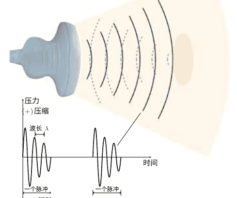

| 介质 | c(m·s$^{-1}$) |
|------|-------------|
| 空气 | 333 |
| 脂肪 | 1430 |
| 水 | 1480 |
| 血液 | 1560 |
| 肌肉 | 1600 |
| 骨头 | 2000-4080 |

图5.1 超声波的示意图。a超声波穿透人体内部的描述。b某些介质中声速的速度图5.2 经腹部（左）和经阴道（右）超声。中间的图是从HERA W9（三星美敦信公司）的生产手册修改而来。

## 5.2.2 经腹部和经阴道超声

图5.2显示了经腹部和经阴道超声，其中经腹部扫描使用曲线探头进行，而经阴道扫描则使用棒状探头进行。经腹部超声使用3-5MHz的低频率来可视化包括胎儿在内的深部区域，而经阴道超声使用5-8MHz的较高频率来可视化包括子宫颈、子宫和胎盘在内的盆腔区域，并具有更高的轴向分辨率。

如图5.3所示，超声的轴向分辨率定义为能够区分超声波束轴线上反射体之间的最小距离。它是空间脉冲长度（SPL）的一半，SPL是波长和脉冲内的周期数（n）的乘积，表示为

轴向分辨率 = SPL / 2 = nλ / 2. (5.2)

因此，频率越高，波长越小，轴向分辨率越好。然而，由于频率较高，成像的深度穿透能力可能会降低。这是因为高频超声的能量比低频超声更快地衰减[65]。因此，与经腹超声相比，经阴道超声具有更高的轴向分辨率，但视野较小。

## 5.2.3 二维（2D）B模式超声成像原理

包括2D B模式成像、实时三维成像和彩色多普勒成像在内的各种成像技术被用于经腹部超声和经阴道超声。在本节中，我们通过以2D B模式成像为例，描述了超声成像的基本原理，如图5.4所示。

波束成形和时间增益补偿：2D B模式超声图像是一种灰度的横截面图像，显示了体内的组织和器官。每个图像由多个扫描线（约128-512条扫描线）组成，这些扫描线是通过换能器阵列的传输和接收波束成形获得的[35]。

当换能器作为发射器工作时，交流电流通过一组紧密排列的附着在压电晶体上的换能器元件。电流使晶体振动，振动的晶体以短脉冲的形式产生超声波。为了在每个扫描线上实现在焦点上的最佳横向分辨率，记为 r f，使用传输波束成形来通过电子方式控制时间延迟，将脉冲聚焦在 r f 上，如图5.5所示。设 r_i 表示第 i 个元素的位置，其中 i = 1,..., N，其中 N是元素的数量。

假设脉冲响应由Dirac delta函数[35]给出，脉冲在 r f 和时间 t 上表示为

$$ s_{r_f}(t) = \sum_{i=1}^{N} s_i(t - \tau_i) = K \sum_{i=1}^{N} \delta\left(t - \frac{|\mathbf{r}_i - \mathbf{r}_f|}{c}\right), \quad (5.3) $$

其中 τ_i是延迟时间，c =1540m/s是超声图像处理中假设的人体组织中声速的常数，K是一个与深度有关的常数。

当它作为接收器时，晶体从特定位置接收到反射回波，称为接收焦点 $r_{ref}$，然后振动。这些振动会产生电信号。接收波束形成通过电子方式控制时间延迟，使信号相位求和，如图5.6所示。与传输波束形成相比，在接收过程中，对每个扫描线动态进行聚焦[101]。设 $\tau_i$ 为第 $i$ 个元素的延迟时间，求和信号 $s_r$

$$ s_{r_{ref}}(t) = \sum_{i=1}^{N} s_i(t - \tau_i) = K \sum_{i=1}^{N} \delta(t - \frac{|\mathbf{r}_i - \mathbf{r}_{ref}|}{c}) \tag{5.4} $$

当声音在组织中传播时，会发生衰减，即由于吸收、反射和散射而导致振幅减小。衰减主要是由于吸收，是超声波束深度穿透的限制因素。为了补偿衰减，根据深度放大信号使用时间增益补偿（TGC），如图5.4所示。

## 正交解调和包络检测：

经过TGC后的波束形成信号可以表示为

$$ s_{TGC}(t) = A(t) \cos(2\pi f_c t + \phi(t)), \tag{5.5} $$
$$ = \frac{A(t)}{2} (e^{i(2\pi f_c t+\phi(t))} + e^{-i(2\pi f_c t+\phi(t))}), \tag{5.6} $$

其中 $A(t)$、$\phi(t)$ 和 $f_c$ 分别表示信号的幅度、相位和中心频率。为了去除高频信号并保留低频的幅度信息，进行正交解调。具体来说，通过将 $s_{TGC}(t)$ 乘以 $2e^{-i\cdot2\pi f_c t}$ 并应用低通滤波器（LPF），得到一个复杂信号 $A(t)e^{i\phi(t)}$。它的实部和虚部分别被称为同相和正交信号，表示为 $N(t)$ 和 $Q(t)$：

$$ N(t) = \Re(A(t)e^{i\phi(t)}), \tag{5.7} $$
$$ Q(t) = \Im(A(t)e^{i\phi(t)}). \tag{5.8} $$

因此，包络检测可以通过

$$A(t) = \sqrt{N^2(t) + Q^2(t)}. \tag{5.9} $$

对数压缩：信号幅度的变化通常很大，大多数临床上有意义的信号都具有较小的值。为了在0-255灰度图像中显示这些有意义的信号，采用对数压缩。

图像强度，表示为 $I(t)$，表示为

$$I(t) = \frac{I_{max} - I_{min}}{\ln A_{max} - \ln A_{min}} \ln(\frac{A(t)}{A_{min}}) + I_{min}, \tag{5.10} $$

其中 $I_{min}$和 $I_{max}$分别是最小和最大灰度强度， $A_{min}$和 $A_{max}$分别是信号的最小和最大幅度。

扫描转换：将在不同坐标中捕获的输入数据转换为更适合显示的笛卡尔坐标，超声成像中应用了扫描转换。常用的插值方法是双线性插值[54]。

## 5.3 超声伪影

### 5.3.1 超声与组织和成像的相互作用

#### 伪影

超声易受各种伪影的影响，这在产科和妇科常见。这些伪影可能会干扰图像解释，但可以通过基本了解超声与组织相互作用和超声波的物理特性来识别和解释[20]。见图5.7。

### 5.3.2 反射和回波伪影

当超声波束遇到腹壁和皮肤与探头之间的脂肪-肌肉界面等近似于波束传播方向正交的强反射体时，会出现回波伪影。

脂肪和筋膜之间声阻抗的差异使得入射的超声波在返回到探头之前来回反射多次。然后根据超声波返回到探头经过一次反射的假设产生回声。

如图5.8所示，严重回声伪影的图像特征（例如模式、强度和形状）与腹壁的脂肪-肌肉界面相似。这些伪影可能会遮盖前置的羊水或被误认为是子宫前壁，从而导致羊水测量不准确[85]。因此，有必要通过使用超声、回声伪影和腹壁之间的物理相关性来识别这些伪影[91]。

### 5.3.3 折射和边缘阴影伪影

边缘阴影伪影通常出现在胎儿颅骨边缘后方的低回声区域，如图5.9b所示。它是由于超声的偏转和颅骨的曲率引起的。具体而言，根据斯涅尔定律[49]，当超声束遇到弯曲的颅骨时，由于颅骨与穿透的组织之间的速度差异，超声束会发生折射。如图5.9a所示，如果超声信号在传输角度等于90°时被偏转和非聚焦，则会出现边缘阴影伪影。

### 5.3.4 散射和散斑伪影

超声散斑伪影是超声波束与组织中多个小尺度散射体的构造性和破坏性干涉引起的。参见图5.10a。这种声学干涉效应使其呈颗粒状外观，如图5.10b所示。

### 5.3.5 衰减、声阴影伪影和声增强伪影

当超声穿过组织时，其振幅和强度会减小，这被称为衰减。这是超声波的反射和吸收的结果，但主要是由于吸收，即声能直接转化为热能。

声阴影是一种衰减伪影，它出现在高衰减物体（如胎儿颅骨、肋骨、脊柱和股骨）的远侧区域，呈现为黑暗区域。相反，声增强则呈现为明亮区域，因为对低衰减的前部结构（包括胎儿胆囊、膀胱、羊膜囊等）应用了TGC。见图5.11。

## 5.4 胎儿超声测量列表

国际妇产科超声学学会（ISUOG）[86]提供了ISUOG实践指南，旨在描述胎儿生物测量学的适当评估和胎儿生长障碍的诊断。这些障碍包括主要是胎儿生长受限，超声筛查是观察与胎儿生长异常相关的各种因素最常用的技术。

胎儿生物测量学参数，如胎儿双顶径（BPD）、头围（HC）和腹围（AC），对预测子宫内生长受限和胎儿成熟度以及估计孕周[11]非常有用。对于评估胎儿结构的胎儿超声检查，临床医生会不断移动探头，找到包含要检查的关键结构的几个标准平面。这个过程非常繁琐，因为胎儿的运动、呼吸和姿势会干扰图像获取。当找到一个标准平面后，临床医生会检查结构的存在，并估计特定结构的形状和大小是否在正常范围内。

基于这个估计，推断出胎儿器官的功能障碍/畸形/可能的疾病。

到目前为止，胎儿生物测量学的测量是手动进行的，测量的准确性取决于临床医生的技能水平，影响准确性的因素有：

- (i) 是否获得了适当的平面
- (ii) 卡尺是否放置正确

为了改善工作流程并减少数据收集中的用户变异性，超声公司正在加紧开发用于估计胎儿生物测量参数的自动系统。

### 5.4.1 胎儿中枢神经系统畸形的评估

胎儿中枢神经系统（CNS）畸形是先天性异常的常见原因，大约影响每100个出生的婴儿。因此，及早检测胎儿中枢神经系统异常是至关重要的。通常在筛查超声中注意到的中枢神经系统检查结构有：头形状、侧脑室、透明隔腔、丘脑、小脑、大脑后池和脊柱[63]。

胎儿中枢神经系统生物测量的最重要步骤是找到三个标准轴向平面（SAPs）：经大脑室平面、经脑室平面和经小脑平面。图5.13a显示了标准平面的视觉描述。三个SAPs可以使我们看到相关的颅内结构，以评估大脑的解剖完整性并提供可能的诊断。

在经大脑室平面上，测量头围（HC）和双顶径（BPD）以评估孕龄和诊断胎儿中枢神经系统（CNS）病理。BPD卡尺从近侧颅壁的外缘到远侧颅壁的内缘，连接它们的线与头部的中心轴垂直。通过计算绘制在颅骨外部的椭圆的边界来估计HC。

迄今为止，基于超声的胎儿中枢神经系统生物测量一直是手动进行的，测量的准确性取决于是否获得了可接受的SAPs以及卡尺的正确位置。在临床实践中获得三个SAPs需要操作者对胎儿解剖学的广泛知识、超声探头的操作以及丰富的临床经验。因此，SAPs的选择高度依赖于操作者，并且耗时，涉及多次按键和探头移动。因此，自动选择SAPs以减少操作者工作量和变异性的需求很高[19, 47]。

#### 5.4.1.1 标准平面的标准

标准平面的定义和标准如下。

- 经颅平面是包含丘脑作为胎儿头部横截面尺寸的横向平面。该平面显示了“盒状”的透明隔腔（CSP）和“V形”的环境池（AC），但不应显示整个小脑（Cbll）。标准平面的标准如下：

  1. 应均匀对称地观察颅骨和半球。
  2. 在颅骨中心，应清晰观察到第三脑室、丘脑的两侧和中线矢状脑沟。
  3. 无论透明隔腔是否可见，只要满足上述两个条件（1）-（2），就被判断为合适的图像。
  4. 如果颅内结构不清晰可见，两个颅骨不对称，或小脑可见，则被认为是不适当的图像。

- 经脑室平面是使用脑室和脉络丛作为解剖指标的横截面。标准平面的标准是：
  1. 应均匀对称地观察颅骨和半球。
  2. 应清晰观察颅内侧脑室和中线矢状裂之间的边界。
  3. 无论豆状核腔是否可见，只要满足（1）-（2）的条件，就判断为适当的图像。
  4. 如果颅内结构不清晰可见，两个颅骨不对称，或小脑可见，则被认为是不适当的图像。

- 经小脑平面是使用小脑半球和大脑后池作为解剖指标的横截面。标准平面的标准是：
  1. 应均匀对称地观察颅骨和半球。
  2. 应该观察中线脑沟，并清楚观察小脑和大脑池的边界。
  3. 无论豆状核腔是否可见，只要满足（1）-（2）的条件，就判断为适当的图像。
  4. 如果颅内结构不清晰可见，两个颅骨不对称，或小脑可见，则被认为是不适当的图像。

即使对于专家超声医师来说，使用超声探头找到这些平面也是棘手的，因为胎儿头部的位置或方向并不固定。超声医师必须来回移动超声探头，以找到与每个标准平面的解剖线索相匹配的标志物，但超声图像常常受到各种伪影的影响，使得找到这些解剖线索变得困难。

### 5.4.2 腹围测量

在生物测量中，腹围（AC）是对胎儿体重最有预测性的指标，因此腹围测量的变化会导致胎儿体重估计不准确。腹围对于预测子宫内生长受限和胎儿成熟度很有用。为了确保一个与真实胎儿纵轴垂直的精确腹围平面，临床医生必须不断移动探头以找到一个由准确标志物组成的平面。首先，这个过程很繁琐，因为胎儿的运动、呼吸运动和胎位会妨碍及时获取。首先，这可能导致不准确的测量，因为经验不足的操作员经常无法遵守正确的AC平面的多个标志物 [19]。

#### 5.4.2.1 标准平面的标准

为了测量AC，必须先确定来自US图像的标准平面。标准平面必须包括胎儿胃泡（SB）、脊柱和曲棍球形状的近端部分，其中包括脐静脉（UV）和右门静脉（RV）的连接。

- 腹部轴位是胎儿腹部的横截面，以圆形形状测量，胃和脐静脉被用作解剖指标。标准平面的标准是：
  1. 整个椭圆形腹部皮肤应清晰可见。
  2. 腹部内应观察到一个低阴影的圆形胃。
  3. 脐静脉和右门静脉连接在一起，形状像曲棍球，与右门静脉未连接的一侧的脐静脉与腹部皮肤表面分离，应简要观察。
  4. 上腔静脉和右门静脉位于腹部中心的相对位置。
  5. 如果两根肋骨对称观察是理想的，但是如果满足(1)-(4)的条件，无论肋骨是否对称，都被判断为适当的图像。

### 5.4.3 羊水指数的评估

本节基于文献[15, 91]。羊水（AF）是胎儿发育所必需的复杂物质，因为羊水对于肺部成熟、胃肠道发育和肌肉骨骼系统发育至关重要[64]。羊水体积（AFV）是反映妊娠进展和胎儿发育的重要指标[15, 18, 64]。因此，在产前超声（US）中不可或缺地进行其评估[16]，羊水体积通常通过测量羊水指数（AFI）来估计，如图5.12所示。

AFV通常通过评估四象限羊膜液指数（AFI）或单个深度垂直口袋（SDP）技术[43, 62, 75]来测量。为了测量AFI或SDP，超声医生手动执行以下耗时的步骤，涉及多次按键和探头移动[15]：（i）临床医生确定适当的AF口袋，然后（ii）通过估计合适的点来测量AF的深度。尽管AFI和SDP被认为是可重复和半定量的，但手动测量AFI在实践中高度依赖超声医生的经验。

### 5.4.4 宫颈长度的测量

早产（PTB）是指胎龄不满37周时分娩，占所有妊娠的5-18% [4, 7, 79]。PTB是围产期发病率和死亡率以及长期残疾的主要原因 [66, 102]。尽管有许多关于预测高危自发性PTB的研究，但在产科实践中，可靠且可重复的预测PTB的策略仍然是一个长期的挑战。许多研究表明，宫颈短缩更容易扩张，并且倾向于增加PTB的风险 [6, 34, 88]。因此，宫颈长度（CL）的测量可能为产科医生提供机会，以减少PTB的风险。经阴道超声用于准确测量CL，通过将探头插入阴道可以对整个CL进行成像。

子宫颈是位于子宫体的下部的坚固圆柱状结构，大小约为3.0厘米或更长，对于维持妊娠非常重要，因为它支撑着胎儿的重量，并在整个妊娠期间阻止阴道微生物的上升。由于子宫颈的结构改变先于分娩，已经研究了子宫颈长度作为临床参数在预测自发性早产、分娩诱导成功和假性宫缩的鉴别方面的潜在作用。

由于不正确的CL测量可能会对决策产生负面影响，从而导致不必要的入院或干预措施，因此应严格按照标准化标准进行CL测量。CL测量的关键解剖标志是宫颈管、宫颈内口、宫颈外口、阴道、膀胱和胎儿的呈现部分。CL测量的卡尺放置必须先正确识别内外口和两者之间的子宫颈管。根据子宫颈管的形状，CL可以通过单线或双线方法进行测量，以确定真实长度[42]。

为了避免CL测量不准确，患者应该排空膀胱，并采取仰卧位，以确保宫颈前后唇的厚度相似，并且探头不应过分用力压在宫颈上[92]。

CL测量的质量高度依赖于操作者，平面获取或卡尺放置错误会导致筛查质量差，从而对患者护理产生不利影响。Kuusela等人[48]先前报告称，经阴道超声测量CL的差异可能在不同检查者之间达到5到10毫米。因此，严格遵守超声测量CL的标准是确保测量一致性和可靠性的必要条件。

由于斑点噪声和与宫颈黏液或后阴道壁等相邻结构的回声，检测宫颈前后壁相遇的开口可能会令人困惑。此外，宫颈内腔和周围粘膜层的不同回声可能导致宫颈管的不准确追踪。这些问题可能导致卡尺放置或测量技术不准确。Yost等人[97]报告了在一系列有早产风险的妇女中进行阴道超声成像时遇到的解剖和技术困难。在真实的临床环境中，获取和选择标准平面的过程耗时、繁琐且依赖于操作者。扫描时间或标准平面的准确性将在很大程度上取决于操作者的技能和知识，而接受检查的孕妇必须忍受数分钟的不适。

因此，对于开发自动CL测量方法以改善工作流程、缩短扫描时间、减轻患者不适感和降低用户变异性的需求很高。自动化CL测量是一项非常具有挑战性的任务。由于与后壁阴道壁回声或肠内容物和蠕动引起的图像噪声相接触，外口的描绘通常是困难的。

此外，宫颈的形状和宫颈内粘液的数量在个体之间变化很大，并且根据扫描时的孕龄，宫颈管的回声性非常不均匀。在子宫峡部存在子宫肌收缩的情况下，区分真正的宫颈需要确定围绕真正管道的宫颈粘膜层；然而，粘膜层的回声是不一致的。

为了克服上述困难，我们需要一个很好的策略，将注意力机制的概念引入深度神经网络中，有选择地聚焦于必要的区域，并忽略其他区域。

## 5.4.5 其他胎儿检查

先天性心脏缺陷（CHDs）是婴儿死亡的主要原因之一，代表着结构性心脏畸形。由于仅仅使用B模式可能不足以诊断胎儿心脏，彩色多普勒被用作补充手段，用于观察半定量的整体血流。在胎儿超声检查中，有时会漏诊先天性心脏缺陷，因此正在努力利用深度学习技术来改进诊断。

3D胎儿超声提供了内部结构的三维视图，虽然其分辨率低于2D超声，但许多临床医生实际上从3D超声中受益。在胎儿脊柱检查中，3D超声对于诊断脊柱神经管缺陷（如脊柱裂、脊柱异常弯曲和半椎体）非常有优势。可以进行胎儿轮廓的3D超声检查，以获取有关畸形的诊断信息。

3D超声可以在怀孕的第一和第二孕期覆盖整个胚胎和胎儿。3D超声具有提供整个胎儿结构可视化和胎儿体积测量的优势，并且可以方便不熟练的超声技术人员进行检查。此外，与2D超声相比，3D超声在开发完全自动化胎儿生物测量系统方面可能具有优势，因为从2D超声中找到标准平面是困难的。在3D超声数据中自动分割胎儿包膜的问题是一个具有挑战性的任务，因为由于图像质量差、伪影和噪声以及由于超声信号的丢失而导致边界和肢体缺失，很难将胎儿与母体组织分开。胎儿的3D分割应包括占据胎儿体积相当大部分的肢体。

在第一孕期使用3D超声估计胎盘体积可以作为筛查测试，以预测潜在的“高风险”妊娠[60]。胎盘的手动分割是困难且耗时的，因此需要开发一种自动化方法。

## 5.4.6 备注

由于其非侵入性、实时监测和相对较低的成本，超声成像在产科和妇科中被广泛使用，目前还没有成像技术可以替代它。由于辐射暴露的风险，CT在评估胎儿方面的用途非常有限，而MRI（具有较长的扫描获取时间）在孕早期的母体适应症方面也只有非常有限的使用方式。

与其他成像模式相比，超声成像的缺点是它因患者、操作者和设备而异，并且根据探头的方向和操作者的技能，获取的图像可能会失真或不完整。

自动估计超声图像需求高的原因是为了缩短检查时间并减少与患者特异性和操作者依赖性相关的因素。超声公司（例如三星、GE、飞利浦、西门子医疗）正在致力于开发利用深度学习技术来减少按键次数、改善工作流程和减少操作者依赖性的技术。也许这次是超声成像技术的转折点，随着深度学习的快速发展。

## 5.5 胎儿超声测量的深度学习方法

DL方法在胎儿超声图像系统的自动化以及超声检查和妇女健康的效率改善中起着重要作用。直到最近深度学习技术的进展[46, 51, 59, 80-82, 84]，由于处理受到信号中断、伪影、边界缺失、衰减、阴影和斑点噪声影响的超声图像的困难，自动化远远超出了传统技术的范围[71, 83]。大多数传统的胎儿器官分割是基于图像强度或梯度的方法，这些方法被优先用于提取目标解剖结构的边界[21, 61, 76, 90, 99]。

然而，这些传统方法在临床应用水平上实现全自动化存在根本困难，因为基于规则的模型在全面处理胎儿超声图像的复杂、多样和不确定的内在特征方面存在限制。

最近，随着深度学习技术的显著和快速进步，胎儿超声自动化系统正在经历一次范式转变，通过监督学习实现对一些胎儿生物测量的自动化测量[15, 36, 44, 45]。这一成功归功于卷积神经网络（CNN）作为核心深度学习技术的进步，以及计算成本的突破性改进（例如，在GPU上的快速实现）。福岛[23]在1980年提出了一种用于模式识别机制的基本CNN模型（具有卷积层和下采样层）。1989年，LeCun等人[52]使用反向传播来学习手写数字识别的卷积核系数，并成功应用于实际[53]。然而，直到2012年，CNN的使用并没有受到太多关注，因为深度神经网络的高效训练存在严重困难。转折点出现在2012年12月，基于GPU的CNN模型AlexNet赢得了ImageNet挑战赛[46]。从那时起，深度学习技术迅速发展，并彻底改变了医学图像分析的自动化。

2015年，Ronneberger等人[82]提出了一种卷积网络，称为U-net，用于医学图像分割，在各种医学图像分析方法中被广泛使用。U-net的基本概念来自于完全卷积网络（FCN）[59]。

CNN由卷积层、ReLU层、池化层、全连接层和损失层组成。在CNN中，卷积滤波器沿着每一层的输入图像应用，并且提取的特征逐渐变得更加层次化。随着层数的增加，特征越来越抽象。训练是通过反向传播和随机梯度下降来优化卷积滤波器或学习特征层次结构的过程，通过最小化损失函数（例如模型输出与真实标签之间的差异）进行。神经网络研究中的一个主要问题是泛化差距，即训练误差和测试误差之间的差异。众所周知，过参数化的深度神经网络（即使用比训练数据样本数量更多的参数的深度神经网络）可以以100%的训练准确率学习任意数据集[103]。然而，过参数化的网络存在过拟合的风险，因此在医学成像领域，训练数据通常很少，因此最好避免增加可能导致过拟合的节点数量，以提高可训练性。经验表明，即使使用几乎相似的深度学习方法，当将数据的上下文信息添加到网络中时，学习能力也会显著提高。

DL在自动胎儿生物测量中的成功归因于其通过捕捉训练数据中像素之间的空间关系来提取局部和全局的相互连接能力。然而，虽然卷积网络在整合空间上下文方面表现出色，但它们缺乏区分两个在整体结构上非常相似的图像的能力。这个缺点一直是自动导航到标准平面的主要障碍，而这对于准确的生物测量是必不可少的。对于每个平面，是否为标准平面是不确定的，每个临床医生可能有稍微不同的判断标准。这种模糊性使得获取高质量的监督学习训练数据变得困难。在实践中，临床医生通常根据整体解剖线索选择给定视频流的最佳标准平面，而不是严格评估每一帧是否符合标准平面的所有要求。

目前，胎儿超声自动化中最困难的挑战是实现上述的标准平面选择（SPS）。尽管已经做出了许多努力来使用DL自动化SPS [8, 45, 56, 78]，但它尚未达到临床应用的水平。与CT或MRI等其他成像模式相比，胎儿超声对DL的处理更加困难的原因是受到几个不确定因素的污染（例如，根据胎儿位置、扫描方向和探头位置的各种伪影）。因此，为了开发可靠的DL模型，有必要使DL架构全面反映解剖结构、医生的决策过程以及受伪影影响的胎儿超声图像特征等不确定因素。

SPS的许多失败表明，在DL架构中包含微妙的解剖上下文信息以解决上述困难的重要性。Schlemper等人[87]开发了一个注意力门控网络，以捕捉局部解剖结构的细微差异以及捕捉全局上下文。

Cai等人[8]利用超声医师的视觉注意力来指导连续US视频帧中的SPS。Pu等人[78]使用由CNN和循环神经网络（RNN）组成的深度学习网络来学习US视频流的空间和时间特征。然而，我们的经验表明，即使没有人为干预，使用机器学习提取微妙的解剖上下文信息（即，局部结构的模糊解剖线索）仍然非常困难。

本节旨在讨论DL中的这些困难话题。

### 5.5.1 基于DL的胎儿中枢神经系统自动超声检查

胎儿超声检查用于评估中枢神经系统（CNS）畸形，包括以下步骤：在扫描过程中找到三个标准轴面（SAPs）进行检查，检查所获得的标准面上的结构是否存在或不存在，并估计特定结构的形状和大小是否在正常范围内[63]。图5.13显示了三个标准轴面，即经室管腔（TV）面、经丘脑（TT）面和经小脑（TC）面。在TV面上，可以看到侧脑室的前部和后部，右侧和左侧脑室的前角由脑隔膜（CSP）分隔开。在TV面上，我们测量侧脑室的房室宽度。在TC面上，可以看到侧脑室的额角、脑隔膜、丘脑、小脑和大脑池。在TT面上，测量头围（HC）和双顶径（BPD）以评估胎龄和诊断中枢神经系统病理。在TC面上，我们测量横向小脑直径和大脑池深度。

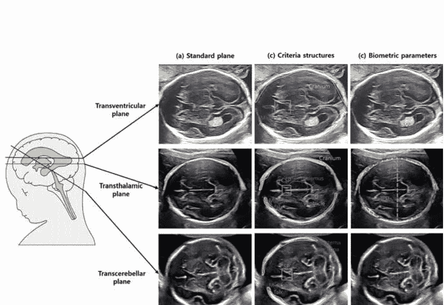

图5.13 胎儿中枢神经系统的三个标准轴面

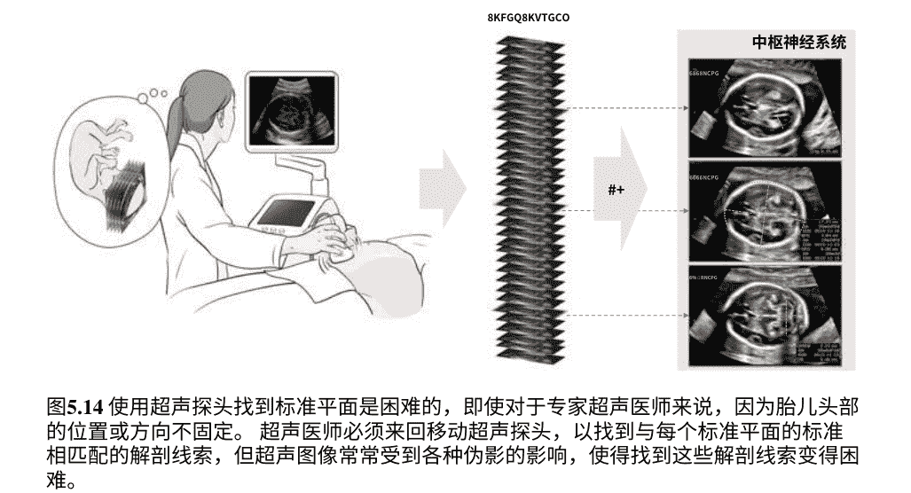

在三个标准轴面上评估胎儿脑结构完整性在推断功能障碍/畸形/可能疾病方面起着重要作用。超声评估胎儿脑的关键步骤是获取正确的平面，尽管做出了许多努力，但迄今为止，使用深度学习仍然非常困难。

选择三个SAP的目标是找到一个函数

$$f_{SAP}: \mathbb{I} \rightarrow \mathbb{S}, \tag{5.11}$$

其中 $\mathbb{I} = \{I_t : t = 1, \ldots, T\}$ 是美国视频帧，$\mathbb{S} = f_{t_2}(I_t)$ 是按顺序排列的TV平面、TT平面和TC平面的三元组。这里，每个 $I_t$ 是在 $\{0, 1, \ldots, 255\}^{H_I \times W_I}$ 中的，表示从0到255的256级灰度美国图像，具有高度 $H_I$ 和宽度 $W_I$。参见图5.14。为了开发一个稳健的自动化SAP选择和胎儿生物测量系统，有必要了解超声波检查师的操作流程。在开发深度学习方法时，网络结构和标记数据必须考虑超声波检查师的操作流程。我们首先回顾一下用于自动化SAP选择的DL方法。

#### 5.5.1.1 用于SAP选择的CNN模型

最简单和最朴素的DL模型是以下针对每个图像 $I \in$ 的CNN模型：

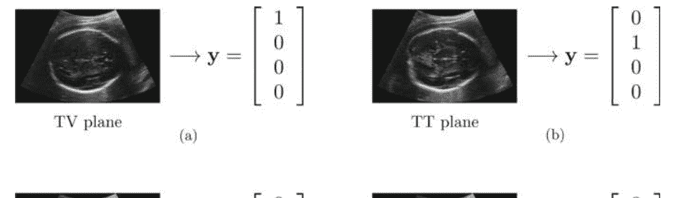

图5.15 a, b, c和d分别表示TV平面、TT平面、TC平面和其他的类向量化。目标是通过使用标记的训练数据学习 $f_{cnn}: \mathbf{I} \rightarrow \mathbf{y}$

$$f_{cnn}: \mathbf{I} \rightarrow \mathbf{y}, \quad\quad (5.12)$$

其中 $\mathbf{y} = (y_1, y_2, y_3, y_4) \in [0, 1]^4$ 是表示TV平面、TT平面、TC平面和其他的向量，如图5.15所示。

给定标记的训练数据 $\{(I^{(j)}, \mathbf{y}^{*(j)}) : j = 1, \ldots, N\}$，可以通过CNN模型 $f_{cnn}$ 获得

$$f_{cnn} = \mathrm{argmin} -\frac{1}{N}\sum_{j=1}^{N} \mathbf{y}^{*(j)} \odot \log f_{cnn}(I^{(j)}), \quad\quad (5.13)$$

其中 $\odot$ 代表逐元素乘积之和，“argmin”表示寻找神经网络的参数（即权重和偏置）的操作。$f_{cnn}$ 是在平均交叉熵损失函数中给出最小值的函数。下面将详细介绍 $f_{cnn}$ 的结构和参数。

主要由 (i) 卷积层，(ii) 池化层和 (iii) 全连接层组成，如图5.16所示。在第一个卷积层中，使用16个大小为 $3 \times 3$ 的卷积滤波器和16个大小为 $1 \times 1$ 的偏置（分别表示为 $\mathbf{W}_1$ 和 $\mathbf{b}_1$）计算出大小为 $224 \times 224$ 的16个特征图（用 $\mathbf{H}_1$ 表示）的过程如下：

$$\mathbf{h}_1 = \sigma(\mathbf{W}_1 \circledast_s I + \mathbf{b}_1) = [\sigma(\mathbf{w}_1^1 \circledast_s I + b_1^1), \ldots, \sigma(\mathbf{w}_1^{16} \circledast_s I + b_1^{16})], \quad\quad (5.14)$$

其中 $\circledast_s$ 表示步长为 $s$ 的卷积，$\sigma(\mathbf{h}) = max(0, \mathbf{h})$ 是修正线性单元（ReLU），并且

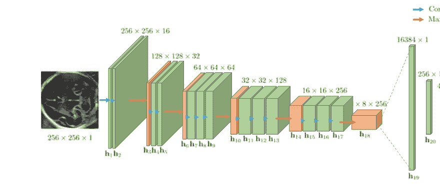

图5.16 卷积神经网络模型的简单架构

$$
\mathbf{w}^{i}_{1} = \begin{bmatrix}
w^{i}_{1,(1,1)} & w^{i}_{1,(1,2)} & w^{i}_{1,(1,3)} \\
w^{i}_{1,(2,1)} & w^{i}_{1,(2,2)} & w^{i}_{1,(2,3)} \\
w^{i}_{1,(3,1)} & w^{i}_{1,(3,2)} & w^{i}_{1,(3,3)}
\end{bmatrix}, \quad i = 1, \ldots, 16.
$$ (5.15)

然后，$\sigma\ \left(\mathbf{w}^{i}_{1} \otimes_{1} I + b^{i}_{1} \right)$ 产生一个256×256的特征图，其表示为

$$
\sigma\ \left(\mathbf{w}^{i}_{1} \otimes_{1} I + b^{i}_{1} \right) =
\begin{bmatrix}
\sigma\ \left(\sum_{j,k=0}^{3} w^{i}_{1,(j,k)} I_{j,k} + b^{i}_{1} \right) & \cdots & \sigma\ \left(\sum_{j,k=0}^{3} w^{i}_{1,(j,k)} I_{j,k+223} + b^{i}_{1} \right) \\
\vdots & \ddots & \vdots \\
\sigma\ \left(\sum_{j,k=0}^{3} w^{i}_{1,(j,k)} I_{j+223,k} + b^{i}_{1} \right) & \cdots & \sigma\ \left(\sum_{j,k=0}^{3} w^{i}_{1,(j,k)} I_{j+223,k+223} + b^{i}_{1} \right)
\end{bmatrix}.
$$ (5.16)

(5.16)这里，使用零填充来控制输出特征图的空间大小，并保留边界的信息。在本章中，我们将$\square_{1} = \otimes_{1}$。类似地，另一个卷积层可以跟随第一个卷积层，以获得第二个特征图 $\mathbf{h}_{2}$ 给定

$$
\mathbf{h}_{2} = ReLU\ \left(\mathbf{W}_{2} \circledast \mathbf{h}_{1} + \mathbf{b}_{2}\right).
$$ (5.17)

在上述两个卷积层之后，应用大小为$2 \times 2$的最大池化操作，步长为2，用于尺寸为$256 \times 256 \times 16$的 $\mathbf{h}_2$中的降维，如下所示：

$$
\mathbf{h}_{3} = Max - Pool_{2}(\mathbf{h}_{2}),
$$ (5.18)

$$
Max - Pool_{2}(\mathbf{h}^{1}_{2}, \ldots, \mathbf{h}^{16}_{2}) = [(Max - Pool_{2}(\mathbf{h}^{1}_{2}), \ldots, Max - Pool_{2}(\mathbf{h}^{16}_{2}))],
$$ (5.19)

其中 $Max-Pool_2(\mathbf{h}_2^i)$ 由以下给出

$$ Max-Pool_2(\mathbf{h}_2^i) = \begin{bmatrix} \max \limits_{h_{2,(1,1)}^i, h_{2,(1,2)}^i} & \cdots & \max \limits_{h_{2,(1,223)}^i, h_{2,(1,224)}^i} \\ \ \max \limits_{h_{2,(2,1)}^i, h_{2,(2,2)}^i} & \cdots & \max \limits_{h_{2,(2,223)}^i, h_{2,(2,224)}^i} \\ \ \vdots & \ddots & \vdots \\ \ \max \limits_{h_{2,(223,1)}^i, h_{2,(223,2)}^i} & \cdots & \text{最大} \limits_{h_{2,(223,223)}^i, h_{2,(223,224)}^i} \\ \ \max \limits_{h_{2,(224,1)}^i, h_{2,(224,2)}^i} & \cdots & \max \limits_{h_{2,(224,223)}^i, h_{2,(224,224)}^i} \end{bmatrix}. $$ (5.20)

重复这个连续的过程（例如卷积-卷积-池化）来提取深度特征图。

最后，为了分类目的，上述连续过程的最后一层的输出（$\mathbf{h}_{18}$）被展平成一个单一的长特征向量。这个特征向量 $\mathbf{h}_{18}$ 是一个全连接层的输入，最终的分类预测输出 $\mathbf{y}$ 是通过

$$ \mathbf{h}_{19} = \sigma (\mathbf{W}_{19} \mathbf{h}_{18} + \mathbf{b}_{19}), \qquad \qquad \qquad \qquad \qquad \qquad \qquad (5.21) $$
$$ \mathbf{h}_{20} = \mathbf{W}_{20} \mathbf{h}_{19} + \mathbf{b}_{20}, \qquad \qquad \qquad \qquad \qquad \qquad \qquad \quad (5.22) $$
$$ \mathbf{y} = \sigma_s(\mathbf{h}_{19}), \qquad \qquad \qquad \qquad \qquad \qquad \qquad \qquad \quad \ \ (5.23) $$

其中 $\mathbf{W}_{19}$, $\mathbf{W}_{20}$ 是 $256 \times 16384$, $4 \times 256$ 矩阵，而 $\mathbf{b}_{19}$, $\mathbf{b}_{20}$ 是 $256 \times 1$, $4 \times 1$ 维向量，$\sigma_s$ 是一个softmax激活函数。第 $i$ 类的概率 $y_i = \sigma_s(\mathbf{h}_{19})_i$ 可以通过以下方式获得

$$ y_i = \sigma_s(\mathbf{h}_{19})_i = \frac{\exp(\mathbf{h}_{19}^i)}{\sum_{k=1}^{4} \exp(\mathbf{h}_{19}^k)}. \qquad \qquad \qquad \qquad (5.24) $$

陈等人[12]首次尝试使用这种类型的CNN架构来定位超声视频中的胎儿腹部标准平面。吴等人[93]提出了两个CNN模型，旨在找到胎儿腹部区域的兴趣区域(ROI)，并通过评估关键解剖结构的表现质量来评估图像质量。鲍姆加特纳等人[3]采用了CNN架构进行实时平面检测和弱监督目标解剖定位。根据我们的经验，这些基于CNN的方法在区分帧之间关键解剖结构的细微差异方面存在困难，使得达到临床可应用水平变得困难。

#### 5.5.1.2 用于SAP选择的注意力-CNN模型

以往基于CNN的SAP选择方法的失败经验表明，专家知识（解剖特征，决策过程）和胎儿超声特征应该在深度学习中得到很好的反映。这是## 图5.17 注意力-CNN模型的简单架构

因为胎儿超声图像包含各种伪影和噪声，这些与母体、胎儿位置、扫描方向和探头位置有复杂的关系。

Schlemper等人[87]在CNN结构中开发了一个注意力门（AG），用于抑制输入图像的无关区域，同时突出显著特征用于分类任务。

AG是一种可以纳入到Sect. 5.5.1.1中描述的CNN架构中的机制。如图5.17所示，最后的卷积特征图被下采样四次，以捕捉一个相当大的感受野。因此，h17可以被视为一个全局特征网格向量，用于聚焦于与目标相关的区域并抑制无关的特征内容。

在图5.17中，注意力门被添加到h9和h13，其中h9的大小为(h9,1, ..., h9,64)是64×64×64，h13的大小为(h13,1, ..., h13,128)是32×32×128。AG计算出一个向量α9∈[0,1]64×64和α13∈[0,1]32×32，并输出它们。

$$\hat{\mathbf{h}}_9 = (\alpha_9 \otimes \mathbf{h}_{9,1}, \ldots, \alpha_9 \otimes \mathbf{h}_{9,64}), \quad (5.25)$$
$$\hat{\mathbf{h}}_{13} = (\alpha_{13} \otimes \mathbf{h}_{13,1}, \ldots, \alpha_{13} \otimes \mathbf{h}_{13,128}). \quad (5.26)$$

注意力系数α13的计算如下：

- 计算 $\mathbf{q}_{att} = ReLU(\mathbf{h}_{17} \otimes \mathbf{W}_{att,17} + \downarrow_{dwon}(\mathbf{h}_{13} \otimes \mathbf{W}_{att,13}) + \mathbf{b}_q)$, 其中 $\mathbf{W}_{att,17}$ 的大小为 $1 \times 1 \times 256 \times F_{in}^t$, $\mathbf{W}_{att,13}$ 的大小为 $1 \times 1 \times 128 \times F_{in}^t$, $\mathbf{b}_q$ 的大小为 $16 \times 16 \times F_{in}^t$, $\downarrow_{dwon}(\cdot)$ 是双线性插值下采样。
- 计算 $\alpha_{13} = up(\sigma(\hat{\mathbf{q}}_{att} \otimes \mathbf{W}_q + \mathbf{b}_\alpha))$, (5.27)

其中W_q的大小为1×1×1，b_α的大小为16×16×1，σ是归一化函数（例如sigmoid函数或softmax操作），up(h)是双线性插值上采样。

类似地，我们计算注意力系数α9。然而，这种注意力也有一个限制，即无法检测帧之间的细微差异。

### 5.5.1.3 用于关键解剖结构定位的目标检测模型

Lin等人[56]提出了一种多任务快速区域CNN（MF R-CNN），用于评估特定解剖结构（例如侧沟（LS），丘脑（T），脉络丛（CP），透明隔腔（CSP），第三脑室（TV），脑中线（BM））的存在与否。其中关键结构的存在得分用于确定SAP的接受情况。

为了便于解释，我们考虑使用YOLO [80]的以下简化检测模型来检测TT平面：

$f_{det} : I \rightarrow O = \{(c_1, b_1), \ldots, (c_5, b_5)\}$,

其中输出O表示与五个解剖结构相关的边界框序列：(1) 脑沟、(2) 中央脑室、(3) 侧脑室、(4) 前脑弓、(5) 小脑。这里，b_k代表与第k个解剖结构相关的边界框，c_k指的是其预测的置信度分数。b_k是一个四维向量，表示边界框的坐标，包括中心位置、宽度和高度。如果未检测到第k个解剖结构，则将c_k设置为0，并将b_k设置为(0, 0, 0, 0)。TT平面接受度的评估分数可以是c_1, ..., c_5的加权和。请参考[45]进行TT平面接受度检查。

现在，我们解释一下f_{det}的详细架构。网络f_{det}由三个部分组成：

$f_{det} = f_{post} \circ f_{NMS} \circ f_{grid}$,

其中f_{grid}是用于预测边界框和估计每个网格单元的置信度得分的网络，f_{NMS}是用于过滤重叠框的非最大抑制（NMS）过程，而f_{post}是一个后处理过程，用于获得最终输出。

我们首先解释一下f_{grid}。我们将图像I \in \{0, \ldots, 255\}^{W_I \times H_I}划分为均匀的方块\{G_{ij} : i = 1, \ldots, \frac{W_I}{k}, j = 1, \ldots, \frac{H_I}{k}\}，其中G_{ij}是大小为k × k的网格单元。对于每个网格单元G_{ij}，f_{grid}预测一个边界框b_{ij}，置信度得分c_{ij}和其类别概率y_{ij}:

$f_{det}^1(I) = \begin{pmatrix} \mathcal{O}_{1,1} & \mathcal{O}_{1,2} & \cdots & \mathcal{O}_{1,\frac{W_I}{k}} \\ \mathcal{O}_{2,1} & \mathcal{O}_{2,2} & \cdots & \mathcal{O}_{2,\frac{W_I}{k}} \\ \vdots & \vdots & \ddots & \vdots \\ \mathcal{O}_{\frac{H_I}{k},1} & \mathcal{O}_{\frac{H_I}{k},2} & \cdots & \mathcal{O}_{\frac{H_I}{k},\frac{W_I}{k}} \end{pmatrix}$,

在这里，c_{ij}∈[0,1]表示目标中心在G_{ij}中存在的置信度，b_{ij}是一个边界框组件，y_{ij} = (y_1,y_2,y_3,y_4,y_5)∈[0,1]^5是G_{ij}中的类别概率。详细信息请参考[80]。

网络f_grid是通过使用标记的数据集{I^{(n)}, O^{*(n)}}_{n=1}^N来训练的。O^{*(n)}表示与I^{(n)}对应的真实值。f_grid的损失函数是

$$ \mathcal{L}_{grid} = \sum_{n=1}^{N} \left[ \lambda_0 \sum_{(i,j) \in \Omega_0^{(n)}} (0 - c_{ij}^{(n)})^2 + \sum_{(i,j) \in \Omega_1^{(n)}} (1 - c_{ij}^{(n)})^2 + \lambda_1 \sum_{(i,j) \in \Omega_1^{(n)}} \| \mathbf{b}_{ij}^{*(n)} - \mathbf{b}_{ij}^{(n)} \|^2 \right], \quad (5.31)$$

其中Ω_0^{(n)} = {(i,j): c_{ij}^{*(n)} = 0}, Ω_1^{(n)} = {(i,j): c_{ij}^{*(n)} = 1}, λ_0 = 0.1, λ_1 = 5。

接下来，网络f_{NMS}在(5.29)中使用非极大值抑制技术来过滤重叠的框[1]。f_{NMS}通过选择具有最高分数的框来消除相同结构的重叠边界框b_{ij}。

最后，f_{post}选择每个类别的置信度得分的最大值。如果未检测到第k个解剖结构，则将c_k设为0，b_k设为(0,0,0,0)。

实验表明，仅使用单个帧评估SAP的适用性的结果通常不一致，即使在专家之间也是如此。在实践中，临床医生通常根据给定视频流选择最佳的SAP，而不是严格评估每个帧是否符合SAP的所有标准要求。因此，仅通过观察一个平面来区分SAP和非SAP似乎基本上是模糊的。这种模糊性使得获取高质量的监督学习训练数据变得困难。

### 5.5.1.4 CNN-RNN模型

蔡等人[8]和普等人[78]提出了一个CNN-RNN模型来处理上述模型的困难，通过在CNN中添加一个循环神经网络（RNN）结构。在[78]中，CNN组件被设计用于识别每个视频帧中的胎儿关键解剖结构并识别SAPs，而RNN组件被设计用于获取相邻平面之间的时间信息，以实现精确的位置和跟踪胎儿器官。这些CNN-RNN模型基于利用超声视频流的上下文信息的需求，以克服仅使用单个帧进行SAP评估的局限性。

CNN-RNN模型用于恢复帧级别的分类：

$$ f_{cnn-rnn} : \mathbf{I} \rightarrow \mathbf{Y}, \quad (5.32)$$

其中I = {I₁, …, I₅} ⊂ 是一个包含五个连续帧的集合，Y = {y₁, …, y₅} 是相应的类别概率。

我们用f_cnn*来表示网络f_cnn在(5.12)中除了更深层次的部分，包括最后两个全连接层。例如，f_cnn*的输出可以在图5.16中是h₉。让我们写作zₜ = f_cnn*(Iₜ), t∈{1, …, 5}。我们使用卷积长短期记忆(ConvLSTM)[94]，其定义如下：

$$LSTMₜ^{Conv} : (zₜ, hₜ₋₁) → (oₜ, hₜ), \quad (5.33)$$

$$\begin{pmatrix} i_t \\ f_t \\ o_t \\ g_t \end{pmatrix} = \begin{pmatrix} \sigma \\ \sigma \\ \sigma \\ \tanh \end{pmatrix} \begin{pmatrix} \begin{pmatrix} W_{zi} & W_{hi} \\ W_{zf} & W_{hf} \\ W_{zy} & W_{hy} \\ W_{zc} & W_{hc} \end{pmatrix} \begin{pmatrix} \mathbf{z}_t \\ \mathbf{h}_{t-1} \end{pmatrix} + \begin{pmatrix} W_{ci} \\ W_{cf} \\ W_{cy} \\ 0 \end{pmatrix} \odot C_{t-1} + B \end{pmatrix} \quad (5.34)$$

$$\begin{cases} C_t = f_t \odot C_{t-1} + i_t \odot g_t, \\ h_t = o_t \odot \tanh(C_t). \end{cases} \quad (5.35)$$

式(5.34)和(5.35)等价于
$$\begin{cases} i_t = \sigma (W_{zi} \circledast \mathbf{z}_t + W_{hi} \circledast \mathbf{h}_{t-1} + W_{ci} \odot C_{t-1} + b_i), \\ f_t = \sigma (W_{zf} \circledast \mathbf{z}_t + W_{hf} \circledast \mathbf{h}_{t-1} + W_{cf} \odot C_{t-1} + b_f), \\ C_t = f_t \odot C_{t-1} + i_t \odot \tanh (W_{zc} \circledast \mathbf{z}_t + W_{hc} \circledast \mathbf{h}_{t-1} + b_c), \\ o_t = \sigma (W_{zy} \circledast \mathbf{z}_t + W_{hy} \circledast \mathbf{h}_{t-1} + W_{cy} \circledast C_t + b_y), \\ h_t = o_t \odot \tanh(C_t). \end{cases} \quad (5.36)$$

在这里，i是输入门，f是遗忘门（是否擦除细胞），C是细胞状态，o是输出门。

对于输入图像i的分类，LSTM的输出o是通过其对数乘法得到的特征向量，用ō表示。这个特征向量ō经过矩阵乘法运算，最终得到分类预测的输出。

$$y_t = \sigma (\mathbf{W}_o \tilde{o} + \mathbf{b}_o), \quad (5.37)$$

其中W_o是一个(ō)×4矩阵，而b_o是一个4维向量。

给定标记的训练数据{(\mathbf{I}^{(j)}, \mathbf{Y}^{* (j)}) : j = 1, …, N}，CNN-RNN模型f_{cnn-rnn}可以通过

$$f^*_{cnn-rnn} = \text{argmin} \frac{1}{N} \sum_{j=1}^N \mathbf{Y}^{* (j)} \odot \log f_{cnn-rnn}(\mathbf{I}^{(j)}), \quad (5.38)$$

其中f_{cnn-rnn}(\mathbf{I}^{(j)}) = (\mathbf{y}_1^{(j)}, …, \mathbf{y}_5^{(j)}) 和

$$\mathbf{Y}^{*(j)} \odot \log f_{cnn-rnn}(\mathbf{I}^{(j)}) = \frac{1}{5} \sum_{t=1}^{5} \mathbf{y}_t^{*(j)} \odot \log \mathbf{y}_t^{(j)}$$

陈等人[14]应用了这种CNN-RNN方法来检测以下三个标准平面：（1）胎儿腹部标准平面；（2）胎儿面部轴向标准平面；（3）胎儿心脏的四腔视图标准平面。他们的方法的网络架构与$f_{cnn-rnn}$有些不同：输入$I$的数量为30；$z_t$是$f_{cnn}(I_t) \in [0, 1]^2$（见（5.12））；使用标准的LSTM而不是ConvLSTM。在这里，每个评估类别都被单独划分为输入$I_t$是否为标准平面。他们的方法的结果在个体输出方面表现不佳。另一方面，他们的结果表明，可以从至少包含一个标准平面的视频中成功选择一个正确的标准平面。

Cai等人[8]提出了一个双向RNN，用于使用图5.19中的前后帧的上下文信息。他们的网络架构如下：I的数量为3；网络$f_{cnn-rnn}$ determines $y_t$，即确定中间平面$I_t$是否可接受。为了在确定$y_t$时利用其相邻平面$I_{t-1}$和$I_{t+1}$，输出的正序$\tilde{o}_{t-1}$和反序$\tilde{o}_{t+1}$被连接并输入到一个分类层中，其中方程(5.37)被替换为

$$\mathbf{y}_t = \sigma \left( \mathbf{W}_o [o_{t-1}, \tilde{o}_t, \tilde{o}_{t+1}] + \mathbf{b}_o \right)$$

此外，他们的方法利用了超声医生的视觉导航过程，通过学习生成超声图像中标准生物测量平面周围的视觉注意力图。这些平面包括胎儿腹部、头部（经脑室平面）和股骨。

这个模型 $f_{cnn-rnn}$ 基于Pu等人的论文[78]，其中CNN组件从每个视频帧中识别胎儿的关键解剖结构，而RNN组件获取相邻帧之间的时间信息。

尽管RNN结构被用来利用US视频的上下文，但这些深度学习结构似乎仅仅在充分检测帧之间关键解剖结构的微妙过渡方面存在局限性。

### 5.5.1.5 具有解剖上下文嵌入和注意引导机制的分层DL模型

我们对之前的方法的研究经验表明，提取微妙的解剖上下文信息（即局部结构的模糊解剖线索）对于开发稳健的自动SAPs选择系统至关重要。不幸的是，目前学习使用机器学习来提取有用的上下文以选择SAPs似乎很困难。因此，为了提供一个良好的机器学习友好环境，建议使用经典方法突出有用的上下文，忽略不必要的信息。

具体来说，我们需要提供一个环境，让深度学习专注于基于标准平面准则的SAPs的解剖线索，如图5.13所示：TV平面线索包括中线脑垂体、CSP、第三脑室和丘脑；TT平面线索包括中线脑垂体、CSP、侧脑室和脉络丛；TC平面线索包括中线脑垂体、CSP、小脑和大池。请参见图5.20。解剖上下文信息可以从超声探头运动引起的连续帧之间的差异中提取出来。这种方法背后的基本思想是基于超声医生寻找过程的经验观察。

超声波检查中，超声医师经常将超声探头在母体表面上移动，以获取连续帧中上下文线索的补充信息，而不仅仅依靠对每个单独帧中解剖结构的即时识别。

所提出的方法主要分为两部分：（i）区域分类网络 $f_{\text{区域}}$；和（ii）SAPs选择网络 $f_{\text{选择}}$。区域分类网络 $f_{\text{区域}}$ 将输入帧分类为预定义的7个区域（A—G）和其他区域，并利用输入帧之间的上下文信息生成解剖关注图。接下来，SAPs选择网络 $f_{\text{选择}}$ 使用每个平面的三个专用CNN从前一步分类的三个SAPs区域（TT、TV和TC区域）中选择最佳的三个SAPs。

首先，我们考虑以下大致由三个子网络组成的区域分类网络：

$$f_{\text{区域}} = f_{\text{区域}} \circ (f_{ctx} \circ f_{ROI}; f_{ROI}), \qquad (5.41)$$

其中上述网络在图5.21中大致描述。上述子网络的详细作用如下：

- $f_{ROI}$ 是一个将 $\mathbb{I} = \{I_t: 1, \ldots, T\}$ 映射到相应边界框 $\mathbb{B}_{ROI}=\{I_{t,ROI}: 1, \ldots, T\}$ 的函数，该边界框包含胎儿头部的感兴趣区域(ROI)。准确地说，通过U-net [82]对 $I_t$ 中的头部区域进行分割，并围绕中心旋转图像，使BPD与垂直方向对齐。检测到的边界框可以通过存储角点的坐标来表示。由于边界框的大小不同，每个图像都用零填充以获得固定宽度和高度的矩形区域。

## 图5.21 使用超声探头运动引起的解剖上下文信息的自动SAPs选择系统

由于通过深度学习提取微妙的上下文信息是困难的，因此开发一种生成帮助找到帧之间微妙上下文的图像的图像处理技术是可取的。

-   $f_{ctx}$ 是一个从 $I_{ROI}$ 到 $I_t$ 的映射函数，其中 $I_t$ 是 $I_{t-1:ROI}$ 和 $I_{t:ROI}$ 之间的上下文图像。生成 $I_t$ 的方法将在后面解释。
-   $f_{zn}$ 是一个函数，其输出是 $Y_{zone} = \{(y_t, I_{t,heat}) : t = 2, \ldots, T-1\}$ 其中 $y_t \in [0,1]^8$ 是一个向量，给出每个帧 $I_t$ 属于一个7个区域（A-G）和其他区域的概率，基于解剖线索的变化和 $I_{t,heat}$ 表示关键解剖结构的热图。第 $t$ 个分量 $(y_t, I_{t,heat})$ 由 $I_{t-1:ROI}, I_{t:ROI}, I_{t+1:ROI}, I_{t-1}, I_t$ 确定。

地图 $f_{zone}$ 通过使用标记数据集 $\{I_t, S_t^*, y_t^*, I_{t,heat}^*\}_{t=1}^N$ 进行训练，其中 $S_t^* \in \mathbb{R}^{H_t \times W_t}$ 表示胎儿头部的真实分割图像，$y_t^* \in [0,1]^8$ 表示真实的区域分类标签，$I_{t,heat}^* \in \mathbb{R}^{H_t \times W_t}$ 表示真实的解剖结构关注热图。

对于胎儿头部的分割，使用 U-net $f_{ROI,U-net}$ 进行学习。

$$f_{ROI,U-net} = \text{argmin} \frac{1}{N} \sum_{t=1}^N \frac{1}{M} \sum_{X} S_t^*(X) \odot \log f_{ROI,U-net}(I_t(X)), \quad (5.42)$$

其中 $X$ 是像素位置，$M$ 是 $Y_\Omega$ 的像素数。然后，通过使用分割结果 $S_t$ 提取胎儿头部 ROI $I_{t,ROI}$，并将其调整为固定大小 256×256。

接下来，通过最小化输出 $(y_t, I_{t,heat})$ 与真实值 $(y_t^*, I_{t,heat}^*)$ 之间的损失来训练区域分类和生成解剖结构注意力图 $f_{zn}$。其中 $f_{zn}(I_{t-1}, I_t, I_{t+1})$ 是输入 $(y_t, I_{t,heat})$ 与真实值 $(y_t^*, I_{t,heat}^*)$ 之间的损失。

$$\mathcal{L}_{zn} = - \frac{1}{N} \sum_{t=1}^N \left[ y_t^* \odot \log y_t + \sum_{X} (I_{t,heat}(X) - I_{t,heat}^*(X))^2 \right], \quad (5.43)$$

其次，我们需要一个排序网络，表示为 $f_{sort}$，它将从 $\Psi$ 区域映射到 $Z_{sort} = \{z_t : t = 2, \ldots, T - 1\}$，其中 $z_t \in \{(1,0,0,0), (0,1,0,0), (0,0,1,0), (0,0,0,1)\}$。在这里，$(1,0,0,0)$表示 $I_t$ lies in the C zone; $(0,1,0,0)$ D zone; $(0,0,1,0)$ F zone; and $(0,0,0, 1)$ 则为其他情况。因此，每个 $z_t$ 可以被视为对应于图像帧 $I_t$ 的区域类别预测。

最终网络是由三个卷积神经网络组成的选择性网络 $f_{sel} = (f_{TV-sel}, f_{TT-sel}, f_{TC-sel})$：

-   $f_{TV-sel}$ 的输入为 $\{ (I_{t,ROI}, I_{t,heat}, \hat{I}_{t-1}, \hat{I}_t) : z_t = (1, 0, 0, 0) \}$，其输出为选择的 TV 平面 $I_t$;
-   $f_{TT-sel}$ 的输入为 $\{ (I_{t,ROI}, I_{t,heat}, \hat{I}_{t-1}, \hat{I}_t) : z_t = (0, 1, 0, 0) \}$，其输出是一个选择的 TT 平面 $I_t$;
-   $f_{TC-sel}$ 的输入为 $\{ (I_{t,ROI}, I_{t,heat}, \hat{I}_{t-1}, \hat{I}_t) : z_t = (0, 0, 1, 0) \}$，其输出是一个选择的 TC 平面 $I_t$。

现在，我们将解释如何生成 $\hat{I}_t$ (即网络输出 $f_{ctx}$) 是由 $I_{t-1}$ 和 $I_t$ 之间的差异生成的。由于 $I_t - I_{t-1}$ 是探头运动引起的图像，它包含了大量的噪声，几乎没有什么用处。因此，需要仔细的图像处理来抑制多余的背景伪影，突出关键的解剖上下文在连续的帧之间。如图5.22所示，$\hat{I}_t$ 是通过以下步骤生成的：

1.  生成差异图像 $I_{t,ROI} - I_{t-1,ROI}$
2.  依次对差异图像应用高斯滤波、Otsu阈值分割和直方图均衡化，以去除噪声并突出关键解剖线索。
3.  对前一步骤中的图像应用Farneback算法，计算关键解剖结构的运动矢量流。

图5.22显示了扫描过程中探头运动引起的流动。

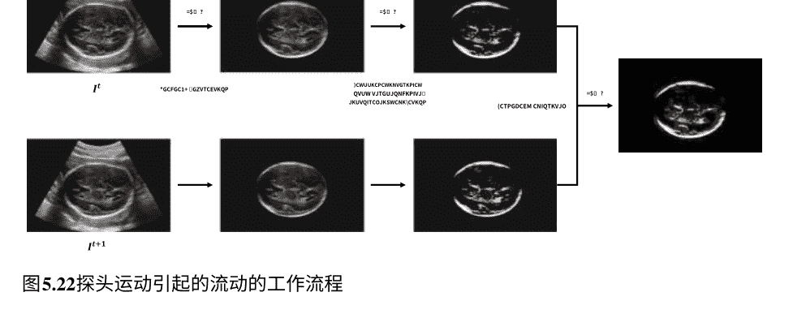

图5.22 探头运动引起的流动的工作流程

## 图5.23 注意力ROI和图

接下来，我们将解释如何使用每个区域的预定义关键解剖结构ROI生成 $I_{t,heat}$，即网络输出的第二个输出。它是通过关键解剖结构ROI的中心位置与图像的每个像素位置之间的距离生成的。准确地说，让 $\{ \mathbf{C}_t^k \}_{k=1}^K$ 是关键解剖结构的中心位置集合，$K$ 的数量取决于 $I_t$ 属于哪个区域，然后可以计算热图

$$ I_{t,heat}^k(\mathbf{p}) = \exp\left( -\frac{\|\mathbf{p} - \mathbf{C}_t^k\|^2}{\sigma_k^2} \right) \quad (5.44) $$
$$ I_{t,heat}^*(\mathbf{p}) = \max\{ I_{t,heat}^1(\mathbf{p}), \ldots, I_{t,heat}^K(\mathbf{p}) \} \quad (5.45) $$

其中 $\mathbf{p}$ 是图像的像素位置，$\sigma_k$ 是控制峰值扩展的参数。参见图5.23。

## 5.5.1.6 头部边界检测

本节描述了（5.41）中的 $f_{ROI}$ 网络，其主要目标是检测胎儿头部。我们使用椭圆拟合方法来检测胎儿头部轮廓，通过在颅骨回声外部放置一个椭圆来进行[63, 73]。

椭圆拟合基于检测适当数量的头部边界像素[5, 67, 77, 95]。然而，在嘈杂的超声图像中，很难区分头部边界和其他类似边界的像素。为了克服这个问题，我们利用对超声波传播方向和探头附近母体组织图像特征的了解。对于靠近探头的母体组织，图像模式与超声波传播方向垂直，但头部边界不是。为了有效而稳健地检测头围（HC），同时防止对类似边界的模式误判，我们检测三个主要特征：探头方向模式的母体组织、头部上部凹弧模式的边界和凸弧模式的下部边界。

然后，目标是学习一个映射 $f_{head}: I \rightarrow U$，使得

$$ f_{head}(\underbrace{\text{输入超声图像}}_{I}) = \underbrace{\text{三个特征图像}}_{U} $$

这里，输出 $U = (U_1, U_2, U_3)$ 是以下三个特征图像的向量：

-   $U_1$ 是超声探头方向模式的母体组织图像。
-   $U_2$ 是凹弧模式的上部边界图像。
-   $U_3$ 是凸弧模式的下部边界图像。

设 $\{(I^{(i)}, U^{(i)}): i=1,\ldots,N\}$ 为标记的训练数据。网络 $f_{head}$ 是从中学习的

$$ f_{head} = \underset{f \in NN}{\text{argmin}} \frac{1}{N} \sum_{n=1}^{N} \text{dist}(f(I^{(n)}), U^{(n)}), $$

其中，$NN$ 表示神经网络的给定形式中描述的一组函数，$\text{dist}(f(I^{(n)}), U^{(n)})$ 是 $f(I^{(n)})$ 和 $U^{(n)}$ 之间的距离。

我们选择U-net [82] 作为 $f_{head}$，它是医学图像分割中最流行的网络之一。U-net 的 $f_{\text{头}} \in NN$ 由编码和解码路径组成：

$$ f_{\text{头}} = f_{\text{解码}} \circ_{\text{skip}} f_{\text{编码}} $$

其中，$\circ_{\text{skip}}$ 是具有跳跃连接的组合运算符，稍后将进行解释。

编码路径 $f_{\text{编码}}$ 基于一系列卷积和池化的编码路径可靠地识别图像特征，使得输出结果对目标结构的位置和尺度变化相对稳健。编码路径的基本组件 $\mathscr{H}_{W,W}$ 以下操作由“卷积-Relu-卷积-Relu”后跟最大池化组成：给定输入 $\mathbf{h}$，输出 $\mathbf{h}$ 为

$$ \mathbf{h} = \mathcal{H}_{W,W}(\mathbf{h}) := \mathcal{P}_{ooling} (\text{conv}_{W} \circ \text{conv}_{W}(\mathbf{h})). $$

这里，$\text{conv}_{W}$ 和 $\mathcal{P}_{ooling}$ 的定义如下：

-   $W$ 是一个可训练的参数，由卷积滤波器 $[\mathbf{w}_1, \ldots, \mathbf{w}_k]$ of size $d \times d$ matrix 和偏差 $[\mathbf{b}_1, \ldots, \mathbf{b}_k]$ 组成。例如，如果 $d = 3$,

$$ \mathbf{w}_j = \begin{pmatrix} w_{j,(1,1)} & w_{j,(1,2)} & w_{j,(1,3)} \\ w_{j,(2,1)} & w_{j,(2,2)} & w_{j,(2,3)} \\ w_{j,(3,1)} & w_{j,(3,2)} & w_{j,(3,3)} \end{pmatrix} \quad \text{和} \quad \mathbf{b}_j = \begin{pmatrix} b_{j,1} \\ b_{j,2} \\ b_{j,3} \end{pmatrix} $$

请注意参数的数量 $W = [\mathbf{w}_1, \ldots, \mathbf{w}_k, \mathbf{b}_1, \ldots, \mathbf{b}_k]$ 是 $(d \times d + d) \times k$。

-   $\text{conv}_W$ 表示具有Relu的卷积操作。例如，如果 $W$ has $k$ convolution filters，则

  $$ \text{conv}_W(\mathbf{h}) := [ReLU(\mathbf{w}_1 \circledast_s \mathbf{h} + \mathbf{b}_1), \dots, ReLU(\mathbf{w}_k \circledast_s \mathbf{h} + \mathbf{b}_k)], \tag{5.51} $$

  其中 $ReLU(h) = \max\{h, 0\}$ 是修正线性单元， $\circledast_s$ 代表标准步长为 $s$ 的卷积。例如，如果 $s =1$，并且 $\mathbf{w}_j$ 是 $d \times d$ 矩阵，则

  $$ (a,b)\text{分量} \quad \mathbf{w}_j \circledast_1 \mathbf{h} := \sum_{m,n=1}^{d} w_{j,(m,n)} h_{(a+m,b+n)}, \tag{5.52} $$

-   $\mathcal{P}_{ooling}$ 是应用于减小特征图维度的最大池化操作。

上述连续操作在编码路径的末尾重复，以提取特征图：

$$ f_{\text{编码}} = \mathscr{H}_{W^{(8)},W^{(7)}} \circ \mathscr{H}_{W^{(6)},W^{(5)}} \circ \mathscr{H}_{W^{(4)},W^{(3)}} \circ \mathscr{H}_{W^{(2)},W^{(1)}}, \tag{5.53} $$

其中 $\circ$ 是标准组合运算符。

解码路径 $f_{\text{解码}}$ 用于从编码器提取的语义信息中产生分段输出。这是编码路径的逆过程，通过平均非池化操作来恢复输出的大小。此外，每个非池化输出都与编码路径中对应的特征连接在一起。解码路径的基本组件 $\mathscr{H}_{W^*,W}^*$ 是由“卷积-Relu-卷积-Relu”组成的操作，后面跟着平均非池化：给定非池化输入 $\mathbf{h}$，输出 $\mathbf{h}$ 为

$$ \mathbf{h} = \mathscr{H}_{W^*,W}^*(\mathbf{h}, \mathbf{h}_{\text{encoding}}) := \mathscr{U}_{\text{npooling}} (\text{conv}_W \circ \text{conv}_W(\mathbf{h}, \mathbf{h}_{\text{encoding}})), \tag{5.54} $$

其中 $\mathbf{h}_{\text{encoding}}$ 是与 $\mathbf{h}$ 对应的编码路径中的特征， $\mathscr{U}_{\text{npooling}}$ 表示平均非池化。这里，上标 $*$ 表示对偶操作，因为符号 $\mathscr{H}_{W^*,W}$ 与 $\mathscr{H}_{W,W}$ 有些相似。

在最后一层，我们在应用 $1 \times 1$ 卷积之后采用像素级的 softmax 激活函数。

从头部边界点出发，很容易得到头围和双顶径的测量结果。这些测量结果可以通过在头骨外围绘制椭圆来估计。我们使用最小二乘法的几何椭圆拟合方法来获取五个椭圆参数 $\Theta = (a, b, \theta_c, x_c, y_c)$，它们提供了以下椭圆表示：

$$ \alpha (x - x_c)^2 + \beta (y - y_c)^2 + \gamma (x - x_c)(y - y_c) = a^2 b^2, \tag{5.55} $$

其中

$$\alpha = a^2 \sin^2 \theta_c + b^2 \cos^2 \theta_c, \\ \beta = a^2 \cos^2 \theta_c + b^2 \sin^2 \theta_c, \\ \gamma = (a^2 - b^2) \sin 2\theta_c.$$

参数 $\Theta$ 通过求解获得

$$\arg\min_{\Theta} \sum_{(p_1, p_2) \in P} \frac{|p_2 - m(\Theta; p_1, p_2) p_1 - c(\Theta; p_1, p_2)|^2}{1 + m(\Theta; p_1, p_2)^2}, \quad (5.56)$$

其中

$$ m(\Theta; p_1, p_2) = -\frac{2\alpha (p_1 - x_c) + \gamma (p_2 - y_c)}{2\beta (p_2 - y_c) + \gamma (p_1 - x_c)}, \quad (5.57) $$
$$ c(\Theta; p_1, p_2) = \frac{2\beta (p_2 - y_c) p_2 + 2\alpha (p_1 - x_c) p_1 - \gamma (p_2 x_c + p_1 y_c - 2 p_1 p_2)}{2\beta (p_2 - y_c) + \gamma (p_1 - x_c)} \quad (5.58) $$

关于这种方法的详细信息，请参考[77]。一旦 $\Theta = (a, b, \theta_c, x_c, y_c)$ 由(5.56)确定，BPD和HC分别为

$$\text{BPD} = 2b \quad (5.59)$$

和

$$\text{HC} = \pi \left[ 3(a + b) - \sqrt{(3a + b)(a + 3b)} \right]. \quad (5.60)$$

## 5.5.2 讨论

为了可靠的SAP选择，自动化方法必须反映超声工程师的决策过程。特别是，重要的是反映解剖标志物的几何排列知识（例如，“盒状”脑室间隔和“V形”环境池以及小脑）。为了做到这一点，我们必须将图像裁剪成围绕胎儿头部的椭圆，并将其旋转，使得图像在胎儿中线的方向上对齐，并且旋转图像上的标志物几乎均匀地位于椭圆上。使用这个归一化的超声图像，搜索区域可以被显著缩小，并且可以可靠地预测超声图像的3D位置。

由于直接应用SAP选择网络 $f_{sel}$ 来获得可靠的结果很困难，我们首先运行稳定区域分类网络 $f_{zone}$ 来过滤掉不相关的帧。接下来，将SAP选择网络 $f_{sel}$ 应用于通过前一个网络 $f_{zone}$ 获得的与三个SAP区域（TT、TV、TC区域）相关联的帧集。为了确保可靠的SAP选择，深度神经解决方案必须对解剖上下文进行视觉解释以获取细节。黑盒式决策过程使得理解深度学习的局限性变得困难，从而阻碍了网络性能的提升。

## 5.6 经阴道超声：宫颈长度的自动测量

本节讨论基于深度学习的经阴道超声图像中宫颈长度（CL）的自动测量。CL表示子宫下端的长度，CL测量是在检查内口和外口后，通过可见的宫颈管（CC）上进行的。本节基于文献[50]。

在临床环境中，获取宫颈标准中矢状面并识别用于CL测量的宫颈形状和关键特征是至关重要的，因为漏斗状、宫颈长度突然缩短或宫颈长度小于2.5厘米与早产有关[4]。作为胎儿扫描，使用超声波检查宫颈是知识密集型、耗时且高度依赖操作者的。然而，宫颈检查的自动化研究还未充分开展。

开发用于检测宫颈长度的深度学习算法面临以下挑战。包含宫颈的经阴道图像是一组软组织回声。宫颈的前后唇以及与之相邻的结构，包括膀胱、低位子宫壁、阴道前后壁和肠道，显示出类似的回声。宫颈与相邻结构之间的低图像对比度使得模式识别训练变得困难。此外，由于三维解剖几何和宫颈的独特特征，真正的CC的特征检测是一个非常具有挑战性的问题。

颈管是在颈部中矢状面上检测颈长的关键结构，非常细长，内部宽度为2-4毫米[2]，不总是直线状，且内部充满粘液。因此，CC很少呈现连续的具有均匀回声的曲线，而更常见的是具有不均匀回声的不同模式。

在真实的临床环境中，标准平面的获取和选择过程更加耗时、繁琐且依赖操作者。为了消除扫描中的操作者依赖性，同时减少时间和人力，自动测量颈长的工作流程包括：

-   (i) 从输入视频帧中选择标准平面
-   (ii) 从所选平面测量颈长

上述颈长测量模型可以表示为一个函数

$$f : \mathbb{I} \to Y, \quad (5.61)$$其中 $I=\{I_1, \ldots, I_M\}$是 $M$帧的超声视频， $Y$是用于测量CL的二值图像，如图5.24所示。函数 $f$由标准平面选择网络（$f_{cl-s}$）和CL检测网络（$f_{cl-loc}$）组成：

$$ f = f_{cl-loc} \circ f_{cl-s}. \tag{5.62} $$

记 $I_s$为选择的标准平面，我们需要找到 $f_{cl-s}: I \mapsto I_s$和 $f_{cl-loc}: I_s \mapsto Y$。找到 $f_{cl-s}$是一个非常具有挑战性的问题，在本节中不会讨论。相反，我们只讨论在成功选择 $I_s$的假设下找到 $f_{cl-loc}$的问题。

## 5.6.1基于U-Net模型的无需辅助学习CL相关特征

我们首先探索了使用U-Net [82]进行CC分割的可行性和有效性，U-Net是医学成像中最流行的分割网络。接下来，我们还将应用各种修改过的U-Net，例如Attention U-Net [87]，UNet++ [105]，ResUNet++ [39]和TransUNet [13]。

函数 $f_{cl-loc}$的学习是使用标记的训练数据 $\{(I_s^{(j)}, Y^{(j)}) : j = 1, \ldots, N\}$和损失函数

$$ \mathcal{L}(\Theta) = -\frac{1}{N} \sum_{j=1}^{N} Y^{(j)} \odot_{ave} \log(f_{cl-loc}(I_s^{(j)})), \tag{5.63} $$

其中 Θ是神经网络 f_{cl-loc}, ⊙_{ave}的一组参数， Y^{(j)}是图像 I_s^{(j)}的真实CC分割， ⊙_{ave}是逐元素乘法的平均值。

### 5.6.1.1 U-Net模型

如图5.25所示，U-Net采用编码器-解码器结构，并具有跳跃连接。编码路径由多个块组成，这些块是两个3 × 3卷积后跟ReLU激活和2 × 2最大池化层的连续操作，用于提取输入图像中的抽象特征。在编码路径的深层阶段，网络实现了丰富的上下文特征表示。解码路径采用2 × 2上卷积进行上采样，然后是两个连续的3 × 3卷积和ReLU激活。跳跃连接用于连接编码路径中的低层特征图和解码路径中的高层特征，以帮助恢复丢失的空间信息[17]。

不幸的是，图5.28中的实验结果显示，简单的U-Net结构在可靠地捕捉CC方面表现不佳。低性能的原因似乎是图像对比度低以及CC与相邻结构（前后唇、膀胱、低子宫壁、前后阴道壁等）之间的异质性。此外，CC非常薄，因此在超声图像中仅占很小的一部分。这种糟糕的图像环境使得损失函数难以有选择地使CC敏感，因此通过基于梯度的反向传播对网络进行模式识别训练变得困难。即使是专家也可能发现仅通过查看补丁图像而不查看整个超声图像来定位CC是困难的。因此，为了进行稳健的CL测量，损失函数（或卷积滤波器）必须对与CC密切相关的全局解剖结构敏感。

图5.26 注意力U-Net架构

### 5.6.1.2 注意力U-Net

我们将注意力U-Net应用于更加关注CC。如图5.26所示，注意力U-Net是一个标准的U-Net结构，集成了一个注意力门(AG)模块[87]，旨在增加对通过跳跃连接传递的显著特征的关注，同时丢弃无关信息。 U-Net使用跳跃连接，将下采样路径和上采样路径的空间信息相结合，这导致了在初始层中由于特征表示不佳而产生了大量冗余的低层特征提取。 在注意力U-Net中，从解码路径提取的上下文特征被用于主动抑制编码路径特征图中无关区域的激活。

如图5.26顶部所示，AG接收两个输入: 编码子网络中的低级特征图$t^l$和较粗粒度尺度上的全局特征$g$。这两个特征图$t^l$和$g$分别经过步长为2的1 $\times$ 1卷积和步长为1的1 $\times$ 1卷积。 然后将得到的特征图逐元素相加，然后应用ReLU激活函数。 然后，通过1 $\times$ 1卷积将尺寸为 $H_g \times W_g \times F_g$的特征图降维为尺寸为$H_g \times W_g \times 1$的特征图。 然后，通过sigmoid函数得到注意力系数$\alpha^l \in [0, 1]^{H_g \times W_g}$。 注意力系数 $\alpha^l$被上采样到尺寸为 $H^t \times W^t$，然后与$t^l$逐元素相乘。

图5.27 UNet++ 结构

图5.28 U-Net、注意力 U-Net 和 UNet++ 之间 CC 分割的定性比较示例

不幸的是，由于与U-Net相同的原因，Attention U-Net的表现也很差。请参见图5.28。

### 5.6.1.3 UNet++

UNet++ [105]是为医学图像中更准确的分割而开发的。UNet++使用重新设计的跳跃连接，其中编码器和解码器子网络通过一系列嵌套的密集跳跃路径连接。重新设计的跳跃连接的架构旨在聚合不同语义尺度的特征，以提供比U-Net更灵活的融合方案。如图5.27所示，解码器的每个节点都将其前面节点的所有多尺度特征组合在一起，从而形成密集连接的跳跃连接。

根据图5.28中显示的实验结果，使用UNet++模型进行CL测量也似乎很困难，以达到临床应用的水平。

## 5.6.2 利用辅助学习CL相关特征的深度学习模型

从之前描述的各种U-Net的失败中学到的教训是，仅依靠CC的损失函数很难取得成功。损失函数应该包括捕捉周围解剖结构（例如前后唇和内外口）的辅助力量，以帮助准确而刚性地捕捉CC。

应该制定一种策略，强制网络参数在通过反向传播优化损失函数的过程中学习CC和周围解剖结构之间的相互连接。此外，应该排除与实现目标无关的区域，以便网络可以更加专注于目标，并学习像素之间的局部和全局空间关系。

最近，孙等人开发了CL-Net，它反映了上述策略。它由两个神经网络组成：（1）一个语义图像分解网络和（2）一个包括与CC相关的解剖结构的CL测量网络。

第一个神经网络将输入图像分为三个区域：前颈部、颈部和后颈部。前颈部区域包括膀胱、前阴道壁和子宫腔。颈部区域是一个感兴趣的区域（ROI），包括前唇、后唇、CC和后阴道壁。后颈部区域包括盲囊和直肠。第二个网络将注意力集中在ROI上，并用于识别CC。第二个网络旨在补充提取关键特征（例如前后唇、粘膜层和CC的两端），这些特征是帮助识别细CC的重要因素。网络 $f_{cl-loc}$ 由两个步骤组成：

$$f_{cl-loc} = f_{cl-loc_2} \circ f_{cl-loc_1} \tag{5.64}$$

所有输入图像都调整为256 × 384像素，并且图像强度被归一化为零均值和单位方差。

$f_{cl-loc_1}$ 是语义图像分解网络，即地图：

$$f_{cl-loc_1}: I_s \rightarrow S, \tag{5.65}$$

其中 $I_s$ 是经阴道超声图像， $S = \{\mathscr{S}_1, \mathscr{S}_2, \mathscr{S}_3\}$ 是预子宫颈、子宫颈和子宫颈后区域的三个二进制图像集合。

$f_{cl-loc_2}$ 是一个CL测量-网络，即地图：

$$f_{cl-loc_2}: (I_s, \mathscr{S}_2) \rightarrow Y. \tag{5.66}$$

### 5.6.2.1 语义图像分解网络

为了研究目的，让我们尝试全卷积稠密扩张网络（FCdDN）[72]将图像分解为预子宫颈、子宫颈和子宫颈后区域。

全卷积密集扩张网络（FCdDN）FCdDN是最近提出的用于实时医学图像分割的方法。如图5.29所示的架构与U-Net结构类似。一种称为“1D扩张层”的新型层[72]被开发为基本层。此外，它还包括各种层，包括卷积层，过渡下降块[38]，密集扩张层[38]和反卷积层。

#### 卷积层：

在图5.30的第一层，通过在输入上卷积滤波器（表示为 $W^1$）来计算一组特征图（表示为 $\mathbf{h}^1$）。特征图 $h^1$ 由以下公式给出

$$ \mathbf{h}^1 = I_s \circledast_{3 \times 3} W^1, \tag{5.67} $$

其中 $\circledast_{3 \times 3}$ 表示步长为1的 $3 \times 3$ 标准卷积。图5.30b显示了滤波器 $W^1 = \{w^1_i\}_{i=1}^{48}$，每个 $w^1_i$ 都表示为

$$ w_i^1 = \begin{bmatrix} w_{i, (1, 1)}^1 & \cdots & w_{i, (1, 3)}^1 \\ \vdots & \ddots & \vdots \\ w_{i, (3, 1)}^1 & \cdots & w_{i, (3, 3)}^1 \end{bmatrix}. \tag{5.68} $$

生成的特征图 $\mathbf{h}^1$，如图5.30c所示，是卷积特征 $I_s \circledast_{3 \times 3} w_i^1$ 的通道级连接，其中 $i = 1, \ldots, 48$。

#### 1D扩张层：

第二层利用密集连接[30]、扩张卷积[98]和分解滤波器[40]来提高分割效率，同时保持高准确性，如图5.31所示。DenseNet中的密集连接[30]用于将每一层直接连接到其前一层。

准确地说，第 $i$ 层使用其前面层的所有特征图生成特征 $\mathbf{h}^i$，如下所示：

$$\mathbf{h}^i = H_i([\mathbf{h}^0, \mathbf{h}^1, \ldots, \mathbf{h}^{i-1}]) \tag{5.69}$$

其中 $H_i(\cdot)$ 是批归一化（BN）[32]、RuLU、卷积和0.2的丢弃率[89]的连续操作。这里，$[\cdot, \cdot]$ 表示连接。这种密集连接鼓励特征重用，加强特征传播，并且在训练集较小的任务上具有参数效率，可以减少过拟合[30]。

对于实时网络，这个一维扩张层使用分解的滤波器来减少参数：二维 $3 \times 3$ 卷积滤波器被分解成两个一维卷积滤波器，分别为 $3 \times 1$ 和 $1 \times 3$。为了在不丢失图像空间信息的情况下实现更大的感受野，采用了空洞卷积，它允许聚合更多的全局上下文信息。

$$\mathbf{h}^{1,1} = ReLU(BN(\mathbf{h}^1)) = \max\{BN(\mathbf{h}^1), 0\}$$

在图5.31中，$\mathbf{h}^{1,1} = ReLU(BN(\mathbf{h}^1)) = \max\{BN(\mathbf{h}^1), 0\}$。如图5.32所示，使用一维分解滤波器 $\mathbf{W}^2$ 和 $\mathbf{W}^3$ 进行两次空洞卷积计算

图5.31 1D扩张层的架构，其中 $r$ 是空洞卷积的扩张率和 $k$ 是输出的通道数

图5.32 a通过对速率为2的扩张卷积进行3×1分解滤波器集合$W^2$在$h^{1,1}$上进行卷积计算特征图b通过对速率为2的扩张卷积进行1×3分解滤波器集合$W^3$在$h^{1,2}$上进行卷积计算特征图

其中 $\odot^{2}_{3\times1}$ 和 $\odot^{2}_{1\times3}$ 表示采用滤波器尺寸为 $3\times1$ 和 $1\times3$ 的空洞卷积，分别参见图5.32中的 $\mathbf{h}^{1,2}$ 和 $\mathbf{h}^{1,3}$ 的图像。之后，使用了dropout。最后，这一层的输出，表示为 $\mathbf{h}^{2}$，是经过dropout和 $\mathbf{h}^{1}$ 的特征图的串联，如图5.31所示。

下采样块：在第三层，应用了一个下采样块来对特征图进行下采样。它由BN、ReLU、$1\times1$卷积、dropout和$2\times2$最大池化组成。见图5.33。在这个下采样块中，首先进行BN和ReLU操作以获得特征图 $\mathbf{h}^{2,1}$，其中 $\mathbf{h}^{2}$ 然后使用$1\times1$卷积（具有参数 $W^{4}$）和dropout来提取特征图 $\mathbf{h}^{2,2}$。最后，$2\times2$最大池化对 $\mathbf{h}^{2,2}$ 进行下采样得到 $\mathbf{h}^{3}$：
$$\mathbf{h}^{3} = [\mathbf{h}^{3}_{1}, \dots, \mathbf{h}^{3}_{64}] = \text{最大池化} ([\mathbf{h}^{2,2}_{1}, \dots, \mathbf{h}^{2,2}_{64}]). \quad (5.72)$$

密集扩张块：第四层和第五层分别是一维扩张层和过渡下块。受FC-DenseNet中密集块的启发[38]，开发了一个称为 $\mathcal{D}(\cdot)$ 的密集扩张块，并将其用作FCdDN的第六层。该块还是密集连接、扩张卷积和分解滤波器的组合。见图5.34。

该层的输出 $\mathbf{h}^{6}$ 是该块中所有前面特征映射的密集连接，表示为
$$\mathbf{h}^{6} = \mathcal{D}(\mathbf{h}^{5}) = [\mathbf{h}^{5}, \mathbf{h}^{5,1}, \mathbf{h}^{5,2}, \mathbf{h}^{5,3}, \mathbf{h}^{5,4}], \quad (5.73)$$

在这里，$H(\cdot)$是两个带有因子化滤波器$^3 \times ^1$和因子化滤波器$^1 \times ^3$的连续操作。这个块中的卷积具有不同的扩张率 ($2$、$4$、$8$和$^{16}$)，这使得网络能够实现多个接受域大小，从而实现多尺度特征融合。

这种融合有助于处理子宫颈前、颈部和颈后的大小和位置的巨大变化。

反卷积层和损失函数：在解码路径中，网络采用反卷积来上采样特征图，这是一个$3 \times 3$的转置卷积，步长为$2$。最后一层是标准的$1 \times 1$卷积，步长为$1$，然后是softmax函数，用于生成子宫、颈部、无关区域和背景区域的概率图。

使用标记的训练数据 $\{(I_s^{(j)}, S^{(j)}) : j=1,\ldots,N\}$, 分割函数 $f_{cl-loc_1}$ 在(5.65)中要学习的是

$$ f_{cl-loc_1} = \arg\min_{f_{cl-loc_1} \in \mathbb{N}} - \frac{1}{N} \sum_{j=1}^{N} \sum_{i=1}^{3} \mathcal{S}_i^{(j)} \odot_{ave} \log(f_{1,i}(I_s^{(j)})) + \frac{1}{N} \sum_{j=1}^{N} 1 - \frac{1}{3} \sum_{i=1}^{3} \frac{2\tau \mathcal{S}_i^{(j)} \odot_{ave} f_{1,i}(I_s^{(j)})}{\mathcal{S}_i^{(j)^2} + f_{1,i}(I_s^{(j)})^2 + \epsilon} \tag{5.74} $$

其中，$\odot_{ave}$是元素逐个相乘的平均值，$\tau$是输入图像域中的像素数，$f_{1,i}$是$f_{cl-loc}$的第$i$类输出，$\epsilon$设置为$10^{-7}$以确保损失的稳定性。

循环一致对抗网络（CycleGAN）用于研究目的，让我们尝试使用CycleGAN[106]进行语义分解，该网络用于无配对的图像到图像的转换。为了方便解释，我们将$X$表示为一组经阴道超声图像$\{x^{(j)}\}_{j=1}^{N}$，其中$x$临时表示US图像$I_s$。语义标签集合表示为$Y$，其中$Y=\{y^{(j)}\}_{j=1}^{N}$，$y$表示（5.65）中的$S$。

这种方法使用对抗训练来学习图像到语义标签的转换$f_{cl-loc_1}: X \rightarrow Y$使得输出$\hat{y} = f_{cl-loc_1}(x)$近似于相应的标签$y$。为了方便起见，我们将$f_{cl-loc_1}$简称为$G$。一个具有两个映射函数$G: X \rightarrow Y$和$F: Y \rightarrow X$的循环一致性架构[106]被用来保证学习函数$G$能够将一个个体$x$映射到一个期望的输出$y$。这个网络同时训练$G$、$F$、对于$x$的对抗鉴别器$D_X$和对于$y$的对抗鉴别器$D_Y$，如图5.35所示。

这里，鉴别器$D_Y$旨在区分真实标签$y$和生成的标签$G(x)$，同样地，鉴别器$D_X$旨在区分真实的美国图像$x$和生成的图像$F(y)$。完整的目标由两个对抗损失和两个循环一致性损失组成。

损失函数：$G$和$D_Y$的损失函数表示为

$$ \mathcal{L}_{\text{GAN}}(G, D_Y, X, Y) = \mathbb{E}_{y \sim p_{\text{data}}(y)}[\log D_Y(y)] + \mathbb{E}_{x \sim p_{\text{data}}(x)}[\log(1 - D_Y(G(x)))] \tag{5.75} $$

生成器G的目标是优化以下目标函数：

$$G \approx \min_{G} \max_{D_Y} \mathcal{L}_{GAN}(G, D_Y, X, Y). \quad (5.76)$$

同样，反向生成器F的目标是优化：

$$F \approx \min_{F} \max_{D_X} \mathcal{L}_{GAN}(F, D_X, Y, X), \quad (5.77)$$

其中

$$\mathcal{L}_{GAN}(F, D_X, Y, X) = \mathbb{E}_{x \sim p_{data}(x)}[\log D_X(x)] + \mathbb{E}_{y \sim p_{data}(y)}[\log(1 - D_X(F(y)))]. \quad (5.78)$$

为了规范映射函数，采用了两个循环一致性损失函数，以鼓励 $F(G(x)) \approx x$ 和 $G(F(y)) \approx y$。这两个循环一致性被称为 (i) 正向循环一致性：$x \rightarrow G(x) \rightarrow F(G(x)) \approx x$，和 (ii) 反向循环一致性：$y \rightarrow F(y) \rightarrow G(F(y)) \approx y$。循环一致性损失函数的表达式为

$$\mathcal{L}_{cyc}(G, F) = \mathbb{E}_{x \sim p_{data}(x)}[\|F(G(x)) - x\|_2] + \mathbb{E}_{y \sim p_{data}(y)}[\|G(F(y)) - y\|_2]. \quad (5.79)$$

总损失由以下给出

$$\mathcal{L}_{cycleGAN}(G, F, D_X, D_Y) = \mathcal{L}_{GAN}(G, D_Y, X, Y) + \mathcal{L}_{GAN}(F, D_X, Y, X) + \lambda \mathcal{L}_{cyc}(G, F). \quad (5.80)$$

如图5.36所示，cycleGAN的生成器 (a) 和判别器 (b) 架构中，“IN”代表实例归一化[41]，“s”代表步长。最优生成器和判别器通过以下目标寻找：

$$(G^*, F^*) = \arg \min_{G,F} \max_{D_Y, D_X} \mathcal{L}_{cycleGAN}(G, F, D_X, D_Y). \quad (5.81)$$

对于图5.36中的生成器网络 $G$ 和 $F$，我们采用了[41]中的架构。对于判别器网络，我们使用了PatchGAN [33]。这两个网络在图5.36中展示。更多细节请参考[33, 41, 106]。

### Mask R-CNN

接下来，我们探索语义分解 $f_{cl-loc}$ 使用Mask R-CNN [27]。Mask R-CNN，如图5.37所示，是一个用于实例分割的框架，它在检测输入图像中的对象的同时生成语义分割掩码。

用于 $f_{cl-loc}$ 的Mask R-CNN网络包括两个阶段：第一阶段是学习一个函数 $f_{1,1}: I_s \rightarrow \{(p_m, rx_m, ry_m, rw_m, rh_m)\}_{m=1}^{N_p}$，其中 $I_s$ 是输入图像，$p_m$ 表示第 $m$ 个生成的提议成为对象的概率，而 $(rx_m, ry_m, rw_m, rh_m)$ 表示第 $m$ 个预测边界框的左上坐标、宽度和高度，对于 $m=1, \ldots, N_p$。第二阶段是学习一个函数

$$f_{1,2}: (I_s, \{(p_m, rx_m, ry_m, rw_m, rh_m)\}_{m=1}^{N_p}) \rightarrow (c, u, S)$$

输出预测的类别、边界框和分割掩码。如图5.37所示，Mask R-CNN架构由两个阶段组成。第一阶段使用RPN生成候选提议，第二阶段使用RoIAlign和Head网络为每个RoI预测类别、边界框参数和二进制掩码。ResNet-FPN是共享两个阶段特征的主干。

对于每个RoI，我们使用ResNet-FPN [27]来共享特征，而不是单独学习两个阶段。

### 第一阶段-骨干网络

骨干网络是 $f_{cl-loc}$ 的基础，是ResNet-FPN [27]，受到ResNet [28]和特征金字塔网络（FPN）[55]的启发。ResNet是一个非常深的神经网络，在图像检测、定位和分割方面表现出色。FPN是一个自顶向下的结构，从单尺度输入图像输出一个特征金字塔。

如图5.38所示，它输出一个特征金字塔，表示为 [C2, C3, C4, C5]，根据它们的尺度提取多个RoI特征级别。

### 第一阶段-区域建议网络

接下来，区域建议网络（RPN）使用特征 [C2, C3, C4, C5]生成具有多个尺度和长宽比的区域建议，其中具有高目标得分的建议传递给第二阶段进行检测和分割。生成的建议告诉下一个阶段要去哪里查找。如图5.39所示，一个3×3的空间滑动窗口在特征 [C2, C3, C4, C5] 上滑动并同时预测物体性分数 $\{p_m\}_{m=1}^{12}$ 和参数化坐标 $\{t_m\}_{m=1}^{12}$，其中 $m$ 是命名为锚点的参考框的索引在每个像素位置处，$t_m = (t_{x_m}, t_{y_m}, t_{w_m}, t_{h_m}) \in \mathbb{R}^4$ 提供了关于中心坐标、宽度和高度的信息。这里，锚点的数量为12，因为我们使用了四个尺度（32、64、128、256）和三个长宽比(1:1, 1:2, 2:1)。

RPN生成了数十万个提案。然而，大多数提案高度重叠，如图5.40a所示。为了减少冗余，根据它们的分类分数，提案使用交并比(IoU)阈值为0.7的非极大值抑制(NMS)[68]进行处理。随后，排名前$N^P$的提案用于第二阶段。

相应的损失函数是

$$\begin{aligned}\mathcal{L}_1 &= \frac{1}{N} \frac{1}{N_{j}^a} \sum_{j=1}^{N} \sum_{m=1}^{N_{j}^a} \mathcal{L}_1(I_s^{(n)}, (p_m^{(j)}, \boldsymbol{t}_m^{(j)})) \\ &= \frac{1}{N} \frac{1}{N_{j}^a} \sum_{j=1}^{N} \sum_{m=1}^{N_{j}^a} [\mathcal{L}_{cross}(\hat{p}_m^{(j)}, p_m^{(j)}) + p_m^{(j)} \mathcal{L}_r(\hat{\boldsymbol{t}}_m^{(j)}, \boldsymbol{t}_m^{(j)})], \end{aligned} \quad (5.82)$$

其中 $\{ (I_s^{(j)}, (p_m^{(j)}, \boldsymbol{t}_m^{(j)})) : j = 1, \ldots, N; m = 1, \ldots, N_j^a \}$ 是一个标记的训练数据。在这里，地面真实标签 $p_m^{(j)}$ 如果 $m$-th锚点是正的，则为1，如果为负，则为0。我们将IoU $\geq 0.7$的锚点定义为正锚点，将不覆盖任何物体的IoU大于0.3的锚点定义为负锚点。请参见图5.40c和d中的示例。$\mathcal{L}_{cross}$ 是一个分类损失，由 $\mathcal{L}_{cross}(\hat{p}_m^{(j)}, p_m^{(j)}) = -p_m^{(j)} \log(\hat{p}_m^{(j)})$ 给出。$\mathcal{L}_r$ 是在[24]中定义的回归损失。

### 第二阶段- RoI提取和RoIAlign

为了处理目标的不可预测大小，根据它们的尺度从骨干特征金字塔中提取多尺度RoI特征，如图5.41所示。提取RoI的特征金字塔的级别，表示为$k$，可以计算为

$$k = \lfloor k_0 + \log_2(\sqrt{w_p h_p}/224) \rfloor, \quad (5.83)$$

其中 $k_0$ 被设置为4， $\lfloor \cdot \rfloor$ 表示向上取整操作， $h_p$ 和 $w_p$ 是提案的高度和宽度。可以看到，高分辨率的特征图可以用于分割小的RoI，而更语义化的特征用于分割大的RoI。这样可以实现准确的定位和分割。

提取的RoI可以是浮点数，如图5.41所示。为了避免RoI和提取的特征之间的错位，提出了一种称为RoIAlign的层，用于保持精确的空间位置。这种像素对像素的对齐确保了需要精细空间特征的二进制掩码的准确分割。具体而言，提取的浮点数RoI首先被划分为固定大小的区域（例如， $7\times 7$），然后进行双线性插值以计算每个区域中四个采样位置的值，最后应用最大池化来获得一个小的特征图。更多细节，请参考[27]。

### 第二阶段-头网络

我们对每个小的RoI特征图应用一个头网络[27]，如图5.42所示，以预测类别；我们回归边界框，并在RoIs中分割掩码。

### 性能比较

图5.43显示了四种不同方法在分解 $f_{cl-loc}$ 方面的性能比较。FCdDN、循环GAN和Mask R-CNN这三个模型在分割的准确性和鲁棒性方面表现不佳。另一方面，U-Net产生可靠的分割结果。因此，我们采用U-Net进行 $f_{cl-loc}$。

### 5.6.2.2 与CL相关的特征提取

本节基于论文[50]。回顾一下 $f_{cl-loc}$ 是一个映射：

$$f_{cl-loc_2}: I_s \odot \mathcal{I}_2 \rightarrow Y, \quad (5.84)$$

其中 $Y$ 是CC的二进制图像，$I_c$ 是图像。它专注于宫颈区域，以识别CC、前后唇和后阴道壁，在ROI中考虑模拟临床医生宫颈发现过程中的局部和全局信息。关键是预测CC的追踪，其中输出通过表示图像中每个像素位置处有关通道区域的置信度图（表示为 $C$ ）来表达。让 $I$ 表示占据CC的像素区域。置信度图被定义为CCI的归一化距离图[96]：

$$C(\mathbf{x}) = e^{-\lambda \mathrm{dist}(\mathbf{x}, I)}$$ 对于每个像素位置 $\mathbf{x}$, (5.85)

其中 $\lambda$ 是归一化的超参数。

为了准确地识别包括内口和外口在内的CC，我们将宫颈区域辅助分割为三个解剖结构：前唇 $\mathscr{F}_1$，后唇 $\mathscr{F}_2$ 和后阴道壁 $\mathscr{F}_3$。我们将 $f_{cl-loc}$ 分为两个部分：

$$f_{cl-\mathrm{loc}_2} = f_{cl-\mathrm{loc}_2}^{\mathrm{post}} \circ f_{cl-\mathrm{loc}_2}^{\mathrm{main}} : I_c \rightarrow (C, \boldsymbol{T}) \rightarrow Y, \quad (5.86)$$

其中，$f^{\mathrm{post}}$ 是后处理，$\boldsymbol{T}=(T_1, T_2, T_3)$。$f^{\mathrm{main}}$ 主要用于训练和定位。旨在以高置信度同时分割子宫颈区域的解剖结构和找到CC区域。我们采用多任务损失，考虑了三个结构（$\mathscr{F}_1$、$\mathscr{F}_2$ 和 $\mathscr{F}_3$）的分割损失和置信度图的均方误差（MSE）。

补充分割 $\boldsymbol{T}$ 旨在帮助网络通过学习周围解剖特征和与CC的空间关系来识别CC。因此，为了提取CL相关函数，我们采用了同时输出两个不同图像的U-Net架构。输入是调整为256×256像素的ROI图像 $I_c$。置信度图学习和补充分割任务共享相同的学习参数，除了网络末端的参数。这种策略确保了通过充分学习解剖特征来稳定识别CC。

图5.44的结果显示，CL-Net在没有辅助学习CL相关特征的情况下优于单输出U-Net。CL-Net的优势在于捕捉CL相关解剖结构的辅助力量，这种辅助力量有助于稳定地找到CC。我们的实验表明，没有使用辅助力量的情况下，包括U-Net、注意力U-Net和UNet++在内的各种U-Net都难以选择性地敏感化细线状薄CC，因为其图像对比度低且异质性强。

## 5.7 讨论

基于AI算法的产科超声自动化正在成为超声公司（GE、飞利浦、西门子、三星Medison等）下一代超声诊断设备的转折点。最近，经腹超声的自动化取得了相当大的成功，而经阴道超声的自动化研究很少。通过阴道超声测量宫颈长度（CL）对于预防和诊断早产至关重要。由于母亲的CL测量是通过阴道检查进行的，检查过程非常不方便且耗时。此外，检查的可靠性很大程度上受超声操作者的知识和技能的影响（准确的宫颈横断面图像获取和卡尺放置），因此临床上对自动化技术的需求非常高。通过使用阴道超声的CL测量自动化技术，大大缩短了检查时间，解决了母亲的不适，并防止了诊断错误，从而促进了健康的妊娠和分娩。

深度学习目前的成功归功于其在训练数据中捕捉像素之间的空间关系，从而提取局部和全局的相互连接能力。然而，虽然卷积网络在统一空间上下文方面很有效，但它们在区分两个非常相似的图像之间的细微差异方面的能力较弱。这些缺点是胎儿超声自动搜索标准平面的主要障碍。最近，关于腹部超声自动标准平面检测的研究很多，但它们尚未成功达到临床应用水平。根据我们的研究经验，现有方法（例如，带有注意力门的CNN，RNN，U-Net，YOLO，Faster R-CNN）在学习超声图像帧之间的微小差异方面存在局限性。此外，与腹部超声相比，迫切需要自动化的阴道超声研究几乎没有。在阴道超声中，即使图像被放大，识别宫颈也很困难。已经有几次尝试使用深度学习自动测量宫颈长度，但似乎在没有相邻解剖结构的帮助下很难达到良好的性能。

胎儿超声图像包含各种各样的伪影和噪声，使得它们比其他成像模式（如CT和MRI）更难处理。超声图像的伪影和噪声与母体、胎儿位置、扫描方向和探头位置密切相关。因此，专家的专业知识（解剖特征、决策过程）和对超声成像特征的理解应该在机器学习中得到认真反映。在使用深度学习时，需要注意的是，如果损失函数仅限于细小的宫颈管（周围结构和信号对比度不清楚，回声变异性非常多样）。因此，与其过分关注宫颈管，我们需要一种能够全面判断宫颈管周围结构的策略。

最困难的部分是从超声视频帧中选择一个标准平面。从最近的失败中我们得到的教训是，用于自动化标准平面选择的深度学习架构应该包括视频帧之间微小解剖变化的解剖上下文信息。深度学习应该被设计成能够反映医生在超声视频帧之间基于局部/全局解剖结构的本地/全局知识做出决策的能力。

致谢本研究得到三星科学与技术基金会的支持（编号：SRFC-IT1902-09）。Cho和Seo得到韩国卫生产业发展研究所（KHIDI）通过韩国卫生福利部的韩国卫生技术研发项目的资助（资助编号：HI20C0127）。

## 参考文献

1. Alexe, B., Deselaers, T., Ferrari, V.: 测量图像窗口的物体性。 IEEE Trans. Pattern Anal. Mach. Intell. 34(11), 2189–2202 (2012)
2. Arisoy, R., Yayla, M.: 无症状单胎妊娠中颈部经阴道超声评估及短颈处理方案。妊娠杂志 (2012)
3. Baumgartner, C.F., Kamnitsas, K., Matthew, J., Fletcher, T.P., Smith, S., Koch, L.M., Kainz, B., Rueckert, D.: Sononet: 实时检测和定位自由超声中胎儿标准扫描平面。IEEE医学成像杂志 36 (11), 2204-2215 (2017)
4. Beck, S., Wojdyla, D., Say, L., Betran, A.P., Merialdi, M., Requejo, J.H., Rubens, C., Menon, R., Van Look, P.F.: 早产的全球发生率：对孕产妇死亡率和发病率的系统综述。世界卫生组织公报 88, 31-38 (2010)
5. Bennett, N., Burridge, R., Saito, N.: 使用Hough变换检测和表征椭圆的方法。IEEE Trans. Pattern Anal. Mach. Intell. 21(7), 652–657 (1999)
6. Berghella, V., Palacio, M., Ness, A., Alfirevic, Z., Nicolaides, K.H., Saccone, G.: 用于威胁性早产的单胎妊娠的宫颈长度筛查：使用个体患者级别数据的随机对照试验的系统评价和荟萃分析。Ultrasound Obstet. Gynecol. 49(3), 322–329 (2017)
7. Blencowe, H., Cousens, S., Oestergaard, M.Z., Chou, D., Moller, A.B., Narwal, R., Adler, A., Garcia, C.V., Rohde, S., Say, L., et al.: 2010年选定国家自1990年以来的早产率的全国、地区和全球估计: 一项系统分析和影响。 Lancet 379(9832), 2162–2172 (2012)
8. Cai, Y., Droste, R., Sharma, H., Chatelain, P., Drukker, L., Papageorghiou, A.T. 和 Noble, J.A.: 标准生物测量平面查找导航的时空视觉注意力建模。 Med. Image Anal. 65, 101762 (2020)
9. Campbell, S., Wilkin, D.: 超声测量胎儿腹围在估计胎儿体重中的应用。 BJOG: Int. J. Obstet. Gynaecol. 82(9), 689–697 (1975)
10. Carvalho, M.H.B., Bittar, R.E., Brizot, M.L., Maganha, P.P.S., Borges da Fonseca, E.S.V., Zugaib, M.: 经阴道超声测量11-14周和22-24周孕龄的宫颈长度，并评估分娩时的孕龄。Ultrasound Obstet. Gynecol.: Off.J. Int. Soc. Ultrasound Obstet. Gynecol. 21(2), 135–139 (2003)
11. Chalana, V., Winter III, T.C., Cyr, D.R., Haynor, D.R., Kim, Y.: 从超声图像中自动测量胎儿头部尺寸。 学术放射学。 3(8), 628–635 (1996)
12. Chen, H., Ni, D., Qin, J., Li, S., Yang, X., Wang, T., Heng, P.A.: 通过领域转移深度神经网络在胎儿超声中进行标准平面定位。IEEE J. Biomed. Health Inform. 19(5), 1627–1636 (2015)
13. Chen, J., Lu, Y., Yu, Q., Luo, X., Adeli, E., Wang, Y., Lu, L., Yuille, A.L., Zhou, Y.: Transunet: 转换器在医学图像分割中构建强大的编码器 (2021). arXiv:2102.04306

## 5胎儿超声的人工智能

- 14. Chen, L.C., Papandreou, G., Schroff, F., Adam, H.: 重新思考用于语义图像分割的扩张卷积 (2017). arXiv:1706.05587
- 15. Cho, H.C., Sun, S., Hyun, C.M., Kwon, J.Y., Kim, B., Park, Y., Seo, J.K.: 使用深度学习自动化超声波评估羊水指数。医学图像分析。 69, 101951 (2021)
- 16. Coombe-Patterson, J. : 羊水评估: 羊水指数与最大垂直口袋。诊断医学和超声波。 33 (4), 280-283 (2017)
- 17. Drozdal, M., Vorontsov, E., Chartrand, G., Kadoury, S., Pal, C.: 跳跃连接在生物医学图像分割中的重要性。在: 深度学习和数据标注用于医疗应用, 第179-187页。斯普林格, 柏林 (2016)
- 18. Dubil, E.A., Magann, E.F.: 羊水作为胎儿健康的重要指标。澳大利亚超声医学杂志。 16 (2), 62-70 (2013)
- 19. Espinoza, J., Good, S., Russell, E., Lee, W.: 使用自动胎儿生物测量技术是否改善临床工作流程效率? 超声医学杂志 32(5), 847–850 (2013)
- 20. Feldman, M.K., Katyal, S., Blackwood, M.S.: 超声的伪影。 放射学 29(4), 1179–1189 (2009)
- 21. Foi, A., Maggioni, M., Pepe, A., Rueda, S., Noble, J.A., Papageorgiou, A.T., Tohka, J.: 沿椭圆路径旋转的高斯差分用于超声胎儿头部分割。计算机医学成像图形学 38(8), 774–784 (2014)
- 22. Huazhu, F., Cheng, J., Yanwu, X., Wong, D.W.K., Liu, J., Cao, X.: 基于多标签深度网络和极坐标变换的联合视盘和杯分割。IEEE医学成像交易 37(7), 1597–1605 (2018)
- 23. Kunihiko, F., Sei, M.: Neocognitron: 一种自组织神经网络模型, 用于视觉模式识别的机制。在: 神经网络中的竞争与合作, 第267-285页. Springer, 柏林 (1982)
- 24. Girshick, R.: 快速 R-CNN。在: IEEE国际计算机视觉会议论文集, 第1440-1448页 (2015)
- 25. Hadlock, F.P., Harrist, R.B., Sharman, R.S., Deter, R.L., Park, S.K.: 利用头部、身体和股骨测量估计胎儿体重的前瞻性研究。 Am. J. Obstet. Gynecol. 151(3), 333–337 (1985)
- 26. Harrington, T.: 当前的测量标准是否适用于选择需要低风险人群进行阴道评估宫颈长度的妇女? 超声 1(2), 39–43 (2014)
- 27. He, K., Gkioxari, G., Dollar, P. and Girshick, R.: Mask R-CNN。在: IEEE国际计算机视觉会议论文集, 第2961-2969页 (2017)
- 28. He, K., Zhang, X., Ren, S., Sun, J.: 深度残差学习用于图像识别。在: IEEE计算机视觉和模式识别会议论文集, 第770-778页 (2016)
- 29. Hoskins, P.R., Martin, K., Thrush, A.: Diagnostic ultrasound: physics and equipment. CRC Press (2019)
- 30. Huang, G., Liu, Z., Van Der Maaten, L., Weinberger, K.Q.: 密集连接卷积网络。在: IEEE计算机视觉和模式识别会议论文集, 第4700-4708页 (2017)
- 31. Ibtehaz, N., Rahman, M.S.: Multiresunet: 重新思考多模态生物医学图像分割的U-Net架构。神经网络 121, 74-87页 (2020)
- 32. Ioffe, S. and Szegedy, C.: 批量归一化: 通过减少内部协变量偏移来加速深度网络训练。在国际机器学习会议上, 页码为448-456。PMLR, 2015年
- 33. Isola, P., Zhu, J.Y., Zhou, T., Efros, A.A.: 条件对抗网络的图像到图像翻译。在IEEE计算机视觉和模式识别会议上的论文集中, 页码为1125-1134 (2017年)
- 34. Goldenberg, R.J., Meis, P., Mercer, B., Moawad, A., Das, A.: 宫颈长度与自发性早产风险。 N. Engl. J. Med. 334, 567-572 (1996年)
- 35. Jang, J. and Ahn, C.Y.: 超声成像中的工业数学。韩国工业应用数学学会杂志 20 (3), 175-202 (2016年)
- 36. Jang, J., Park, Y., Kim, B., Lee, S.M., Kwon, J.Y., Seo, J.K.: 从超声图像中自动估计胎儿腹围。 IEEE J. Biomed. Health Inform. 22(5), 1512–1520 (2017)
- 37. Jardim, S.M.G.V.B., Figueiredo, M.A.T.: 胎儿超声图像分割。 超声医学与生物学。 31(2), 243–250 (2005)
- 38. Jegou, S., Drozdzal, M., Vazquez, D., Romero, A., Bengio, Y.: 一百层提拉米苏：用于语义分割的全卷积稠密网络。在：IEEE计算机视觉和模式识别会议论文集，第11-19页（2017）
- 39. Jha, D., Smedsrud, P.H., Riegler, M.A., Johansen, D., De Lange, T., Halvorsen, P., Johansen, H.D.: Resunet++：一种用于医学图像分割的先进架构。在：2019年IEEE多媒体国际研讨会（ISM），第225-2255页。IEEE（2019）
- 40. Jin, J., Dundar, A., Culurciello, E.: 用于前馈加速的扁平化卷积神经网络 (2014)。 arXiv:1412.5474
- 41. Johnson, J., Alahi, A., Fei-Fei, L.: 用于实时风格转换和超分辨率的感知损失。在：欧洲计算机视觉会议，第694-711页。 Springer, 柏林 (2016)
- 42. Kagan, K.O., Sonek, J.: 如何测量宫颈长度。 超声波产科妇科 45 (3), 358-362 (2015)
- 43. Kehl, S., Schelkle, A., Thomas, A., Puhl, A., Meqdadi, K., Tuschy, B., Berlit, S., Weiss, C., Bayer, C., Heimrich, J.,等：作为评估不良妊娠结局的测试的单个最深垂直口袋或羊水指数（安全试验）：一项多中心、开放标签、随机对照试验。超声波产科妇科 47 (6), 674-679 (2016)
- 44. Kim, B., Kim, K.C., Park, Y., Kwon, J.Y., Jang, J., Seo, J.K.: 基于机器学习的超声图像中胎儿腹围的自动识别。 生理测量 39 (10), 105007 (2018)
- 45. Kim, H.P., Lee, S.M., Kwon, J.Y., Park, Y., Kim, K.C., Seo, J.K.: 使用机器学习从超声图像中自动评估胎儿头部生物测量学。生理测量学。 40(6), 065009 (2019)
- 46. Krizhevsky, A., Sutskever, I., Hinton, G.E.: 使用深度卷积神经网络进行Imagenet分类。高级神经信息处理系统。 25, 1097–1105 (2012)
- 47. Kurjak, A.: Donald School Textbook of Ultrasound in Obstetrics & Gynaecology. JP Medical Ltd (2017)
- 48. Kuusela, P., Wennerholm, U.-B., Fadl, H., Wesstrom, J., Lindgren, P., Hagberg, H., Jacobsson, B., Valentin, L.: 使用经阴道超声测量的第二孕期宫颈长度：一项前瞻性观察性一致性和可靠性研究。产科妇科学报。 99(11), 1476–1485 (2020)
- 49. Kwan, A., Dudley, J., Lantz, E.: 谁真正发现了斯涅尔定律？物理世界 15(4), 64 (2002)
- 50. Sun, S., Kwon, H.Y., Kwon, J.Y., Yun, H.S., Park, S., Cho, H.C., Seo, J.K.: 基于深度学习的经阴道超声测量宫颈长度的自动化方法, 预印本 (2022)
- 51. LeCun, Y., Bengio, Y., Hinton, G.: 深度学习。Nature 521(7553), 436–444 (2015)
- 52. LeCun, Y., Boser, B., Denker, J.S., Henderson, D., Howard, R.E., Hubbard, W., Jackel, L.D.: 反向传播应用于手写邮政编码识别。神经计算。 1(4), 541–551 (1989)
- 53. LeCun, Y., Bottou, L., Bengio, Y., Haffner, P.: 基于梯度的学习应用于文档识别。IEEE会议记录 86(11), 2278–2324 (1998)
- 54. Li, X.H.: TI的C64x+ DSP上的超声波扫描转换。应用报告SPRAB32, 德州仪器 (2009)
- 55. Lin, T.Y., Dollar, P., Girshick, R., He, K., Hariharan, B., Belongie, S.: 特征金字塔网络用于目标检测。在: IEEE计算机视觉和模式识别会议论文集, pp. 2117–2125 (2017)
- 56. Lin, X., Wang, F., Guo, L., Zhang, W.: 一种用于地面车辆单目视觉里程计的自动关键帧选择方法。IEEE Access 7, 70742–70754 (2019)
- 57. Litjens, G., Kooi, T., Bejnordi, B.E., Setio, A.A.A., Ciompi, F., Ghafoorian, M., Van Der Laak, J.A., Van Ginneken, B. and Sanchez, C.I.: 关于医学图像分析中深度学习的调查。医学图像分析 42, 60-88 (2017年)
- 58. Livne, M., Rieger, J., Aydin, O.U., Taha, A.A., Akay, E.M., Kossen, T., Sobesky, J., Kelleher, J.D., Hildebrand, K., Frey, D., et al.: 一种用于脑血管疾病患者高性能血管分割的U-Net深度学习框架。
- 59. Long, J., Shelhamer, E., Darrell, T.: 用于语义分割的全卷积网络。在: IEEE计算机视觉和模式识别会议论文集，第3431-3440页（2015年）
- 60. Looney, P., Stevenson, G.N., Nicolaides, K.H., Plasencia, W., Molloholli, M., Natsis, S., Collins, S.L.: 使用深度学习进行全自动实时三维超声分割，估计第一孕期胎盘体积。JCI Insight 3(11) (2018)
- 61. Lu, R., Shen, Y.: 基于随机神经网络模型和Gabor滤波器的图像分割。在: 2005年IEEE工程医学与生物学第27届年会，第6464-6467页。IEEE (2006)
- 62. Luntsi, G., Burabe, F.A., Ogenyi, P.A., Zira, J.D., Chigozie, N.I., Nkubli, F.B. and Dauda, M.: 在资源有限的环境中，通过羊水指数和最深口袋来超声估计羊水体积。
- 63. Malinger, G., Paladini, D., Haratz, K.K., Monteagudo, A., Pilu, G.L., Timor-Tritsch, I.E.: ISUOG实践指南（更新）：胎儿中枢神经系统的超声检查。第一部分：筛查检查的性能和有针对性的神经超声检查指征。超声产科学 56(3), 476–484 (2020年)
- 64. Manning, F.A., Platt, L.D., Sipos, L.: 产前胎儿评估：胎儿生物物理特征评估的发展。美国妇产科杂志 136(6), 787–795 (1980年)
- 65. Martin, D.J., Wells, I.T., Goodwin, C.R.: 超声物理学。麻醉与重症监护医学 16(3), 132–135 (2015年)
- 66. Martin, J.A., Hamilton, B.E., Osterman, M.J., Driscoll, A.K.: 出生：2019年的最终数据。国家重要统计报告：来自疾病控制和预防中心、国家卫生统计中心、国家重要统计系统 70(2), 1–51 (2021年)
- 67. McLaughlin, R.A.: 随机霍夫变换：通过比较改进的椭圆检测。模式识别信函 19(3–4), 299–305 (1998年)
- 68. Neubeck, A., Van Gool, L.: 高效的非极大值抑制。在: 第18届国际模式识别会议 (ICPR '06)，第3卷，第850-855页。IEEE (2006)
- 69. Ng, A., Swanvelder, J.: 超声成像中的分辨率。连续教育麻醉学、重症监护和疼痛 11(5), 186-192页 (2011年)
- 70. Ni, D., Yang, X., Chen, X., Chin, C.T., Chen, S., Heng, P.A., Li, S., Qin, J., Wang, T.: 超声中的标准平面定位通过径向分量模型和选择性搜索。超声医学与生物学 40(11), 2728-2742页 (2014年)
- 71. Noble, W.S.: 什么是支持向量机？自然生物技术 24(12), 1565-1567页 (2006年)
- 72. Ouahabi, A., Taleb-Ahmed, A.: 深度学习用于实时语义分割：超声成像应用中的应用。模式识别。信件。 144, 27-34 (2021年)
- 73. Paladini, D., Malinger, G., Birnbaum, R., Monteagudo, A., Pilu, G., Salomon, L.J., Timor-Tritsch, I.E.: Isuog实践指南（更新）：胎儿中枢神经系统的超声检查。第2部分：有针对性的神经超声检查的执行。超声波产科妇科学。 57 (4), 661-671 (2021年)
- 74. Pathak, S.D., Haynor, D.R., Kim, Y.: 在前列腺超声图像中的边缘引导边界划分。IEEE Trans. Med. Imaging 19(12), 1211–1219 (2000)
- 75. Phelan, J.P., Smith, C.V., Broussard, P., Small, M.: 孕妇36-42孕龄的四象限技术评估羊水容量。J. Reprod. Med. Obstet. Gynecol. 32(7), 540–542 (1987)
- 76. Ponomarev, G.V., Gelfand, M.S., Kazanov, M.D.: 一种多级阈值分割与边缘检测和基于形状的识别相结合的胎儿超声图像分割方法。在：Proceedings of challenge US: Biometric Measurements from Fetal Ultrasound Images, ISBI, pp. 17–19 (2012)
- 77. Prasad, D.K., Leung, M.K., Quek, C.: Ellifit：一种无约束、非迭代、最小二乘几何椭圆拟合方法。Pattern Recognit. 46(5), 1449–1465 (2013)
- 78. Pu, B., Li, K., Li, S., Zhu, N.: 基于深度学习和工业物联网的自动胎儿超声标准平面识别。IEEE Trans. Ind. Inform. (2021)
- 79. Purisch, S.E., Gyamfi-Bannerman, C.: 早产的流行病学。在：国产科学讲座，第41卷，第387-391页。爱思唯尔 (2017)
- 80. Redmon, J., Divvala, S., Girshick, R., Farhadi, A.: 你只看一次：统一的实时目标检测。在：IEEE计算机视觉和模式识别会议论文集，第779-788页 (2016)
- 81. Ren, S., He, K., Girshick, R., Sun, J.: 更快的R-CNN：基于区域建议网络的实时目标检测。Adv. Neural. Inf. Process. Syst. 28, 91-99 (2015)
- 82. Ronneberger, O., Fischer, P., Brox, T.: U-net: 用于生物医学图像分割的卷积网络。在：国际医学图像计算和计算机辅助干预会议上，第234-241页。斯普林格, 柏林 (2015)
- 83. Rueda, S., Fathima, S., Knight, C.L., Yaqub, M., Papageorghiou, A.T., Rahmatullah, B., Foi, A., Maggioni, M., Pepe, A., Tohka, J., 等：评估和比较当前胎儿超声图像分割方法用于生物测量的方法：一个大挑战。IEEE Trans. Med. Imaging 33(4), 797–813 (2013)
- 84. Russakovsky, O., Deng, J., Hao, S., Krause, J., Satheesh, S., Ma, S., Huang, Z., Karpathy, A., Khosla, A., Bernstein, M., 等：Imagenet大规模视觉识别挑战。Int. J. Comput. Vision 115(3), 211–252 (2015)
- 85. Rutherford, S.E., Smith, C.V., Phelan, J.P., Kawakami, K., Ahn, M.O.: 羊水体积的四象限评估。观察者间和观察者内变异。J. Reprod. Med. 32(8), 587–589 (1987)
- 86. Salomon, L.J., Alfirevic, Z., Da Silva Costa, F., Deter, R.L., Figueras, F., Ghi, T.A., Glanc, P., Khalil, A., Lee, W., Napolitano, R., 等：Isuog实践指南：胎儿生物测量和生长的超声评估。超声产科学。 53(6), 715–723 (2019)
- 87. Schlemper, J., Oktay, O., Schaap, M., Heinrich, M., Kainz, B., Glocker, B., Rueckert, D.:注意力门控网络：学习在医学图像中利用显著区域。医学图像分析。 53, 197–207 (2019)
- 88. Sotiriadis, A., Papatheodorou, S., Kavvadias, A., Makrydimas, G.: 威胁性早产妇女的经阴道宫颈长度测量用于预测早产的荟萃分析。超声产科学：国际超声产科学会超声产科学杂志。 35(1), 54–64 (2010)
- 89. Srivastava, N., Hinton, G., Krizhevsky, A., Sutskever, I., Salakhutdinov, R.: Dropout: a simple way to prevent neural networks from overfitting. J. Mach. Learn. Res. 15(1), 1929–1958 (2014)
- 90. Stebbing, R.V., McManigle, J.E.: A boundary fragment model for head segmentation in fetal ultrasound. 在：Challenge US: Biometric Measurements from Fetal Ultrasound Images, ISBI, pp. 9–11 (2012)
- 91. Sun, S., Kwon, J.Y., Park, Y., Cho, H.C., Hyun, C.M., Seo, J.K.: Complementary network for accurate amniotic fluid segmentation from ultrasound images. IEEE Access 9, 108223–108235 (2021)
- 92. To, M.S., Skentou, C., Chan, C., Zagaliki, A., Nicolaides, K.H.: 在例行的23周扫描中的宫颈评估：标准化技术。超声波产科妇科学：国际超声波产科妇科学会官方期刊 17(3), 217–219 (2001)
- 93. Wang, L., Cheng, J.-Z., Li, S., Lei, B., Wang, T., Ni, D.: Fuiqa: 使用深度卷积网络进行胎儿超声图像质量评估。IEEE Trans. Cybern. 47(5), 1336–1349 (2017)
- 94. Shi, X., Chen, Z., Wang, H., Yeung, D.Y., Wong, W.K., Woo, W.C.: 卷积LSTM网络：一种用于降雨预测的机器学习方法。在：神经信息处理系统进展, pp. 802–810 (2015)
- 95. Lei, X., Oja, E., Kultanen, P.: 一种新的曲线检测方法：随机霍夫变换 (RHT)。模式识别。信件 11 (5), 331-338 (1990)
- 96. Yin, S., Peng, Q., Li, H., Zhang, Z., You, X., Fischer, K., Furhs, S.L., Tasan, G. E., Fan, Y.: 使用后续边界距离回归和像素级分类网络的超声图像自动肾脏分割。医学图像分析。 60, 101602 (2020)

- 97. 约斯特，N.P.，布鲁姆，S.L.，特威克勒，D.M.，莱文诺，K.J.：用于预测早产的超声宫颈长度测量中的陷阱。产科妇科。93（4），510-516（1999）
- 98. 于，F.，科尔顿，V.：多尺度上下文聚合通过扩张卷积（2015年）
arXiv:1511.07122
- 99. 金华，于，王，陈：胎儿超声图像分割系统及其在胎儿体重估计中的应用。医学生物工程计算。46(12), 1227-1237（2008）
- 100. 于，余，阿克顿：斑点减少各向异性扩散。IEEE图像处理。11(11), 1260-1270（2002）
- 101. Zagzebski, J.A.：超声物理学要点。莫斯比（1996）
- 102. Zahedi-Spung, L.D., Raghuraman, N., Macones, G.A., Cahill, A.G., Rosenbloom, J.I.：非常早产婴儿的分娩方式与新生儿发病率和死亡率。美国妇产科杂志。（2021）
- 103. 张，C.，Bengio, S.，Hardt, M.，Recht, B.，Vinyals, O.：理解深度学习需要重新思考泛化。在：第五届国际学习表示会议，ICLR2017，法国图伦，2017年4月24日至26日，会议跟踪论文集。OpenReview.net（2017年）
- 104. 周，Z.，拉赫曼·西迪基, M.M.，塔吉巴克什, N.，梁, J.：Unet++：一种用于医学图像分割的嵌套U-Net架构。在：医学图像分析中的深度学习和多模态学习用于临床决策支持，第3-11页。Springer, 柏林（2018年）
- 105. 周宗伟, Md., 西迪基, M.R., 塔吉巴克什, N., 梁, J.: Unet++: 重新设计跳跃连接以利用图像分割中的多尺度特征。IEEE Trans. Med. Imaging39（6），1856-1867（2019年）
- 106. Zhu, J.Y., Park, T., Isola, P., Efros, A.A.: 使用循环一致性对抗网络进行非配对图像翻译。在：IEEE国际计算机视觉会议论文集，第2223-2232页（2017年）

## 第6章 电阻抗成像

Hyeuknam Kwon, Ariungerel Jargal和Jin Keun Seo

摘要 最近，在电阻抗成像方面取得了显著进展，该技术追求在人体内部进行横截面图像重建。这些技术在医学、生物技术、无损检测、工业过程监测和其他领域中也有广泛应用作为成像方法。他们的成像技术可以可视化生物组织和器官的新对比信息，这些组织和器官根据其生理功能和病理状态具有不同的电性质。生物阻抗成像的数学模型被表达为涉及频率依赖电导率和介电常数的时谐麦克斯韦方程的非线性逆问题。本章回顾了电性组织属性成像模态。

### 6.1 引言

生物组织和器官根据其生理功能和病理状态表现出不同的电性质 [21–23, 45, 56, 57]。生物组织可以被视为细胞嵌入在细胞外基质中的三维排列，其中细胞由细胞膜包围，由细胞内液体和细胞器组成。人体的复杂电导率分布随着生理功能的变化而变化，如呼吸、血液流动和灌注等。神经活动，以及缺血、出血、炎症和肿瘤等病理状态。 因此，已经进行了大量的研究来测量或成像生物阻抗。


电阻抗层析成像（EIT）是由亨德森和韦伯斯特[32]于1978年引入的。 它旨在使用多个表面电极提供组织的电学特性的层析成像，例如电导率（σ）和介电常数（ε），如图6.1所示。在这里，电极用于测量边界电流-电压关系，即诺依曼到迪里希特映射的部分信息。在1980年，卡尔德隆[11]在理想假设下提出了EIT的数学反问题；反问题是从诺依曼到迪里希特映射的知识中识别进入椭圆偏微分方程∇·(σ∇u)=0在域Ω中的系数σ。粗略地说，诺依曼到迪里希特映射等同于与∇·(σ∇u)=0在Ω中相对应的诺依曼函数N(·,·)|∂Ω×∂Ω。卡尔德隆在论文[11]中提出的复杂几何光学解的想法引发了数学EIT问题的唯一性问题，并成为过去30年来逆问题理论发展的关键推动力[6,41,49,72]。1984年，巴伯和布朗[8]在EIT背投影算法中开发了一个对电导率方程有深入理解的EIT版本。他们开发了第一个EIT设备（Sheffield Mark 1），其中一个活动电流源用于进行幻影和人体实验[46]。1986年，Isaacson[35]提出了两种不同电导率分布之间的可区分性概念，并且RPI小组开发了具有多个活动电流源的EIT系统以最大化可区分性[16]。

让我们讨论一下从EIT中可以获得什么信息。为了方便解释，让我们忽略电极和体Ω之间的界面现象（如接触阻抗）。当一个角频率为ω的正弦电流以I毫安的大小注入到一对电极中时，它在Ω内产生了时谐电场E和电流密度J。用V表示同一对电极之间的电压差，阻抗Z由以下公式给出

$$Z = \frac{V}{I} \approx \frac{1}{I^2} \int_{\Omega} \mathbf{J} \cdot \mathbf{E} \, dx = \frac{1}{I^2} \int_{\Omega} \frac{1}{\sigma + i \omega \varepsilon} \mathbf{J} \cdot \mathbf{J} \, dx$$

因此，阻抗Z由Ω的几何形状、电极位置和有效复导电性分布γ:=σ+iωε决定。

对于一个具有 N通道的电阻抗成像系统，具有 N电极，我们得到集合{Z^{j,k} : j , k = 1, \cdots, N}，其中 Z^{j,k}是对应于测量电压差 V^{j,k}的传输阻抗，该电压差是在使用 j对电极对注入电流时测量的 k对电极之间的。因此，逆问题可以被视为从集合的知识中恢复阻抗1/γ。 {Z^{j,k} : j, k = 1, \cdots, N}。

用于恢复 γ = σ + iωε的静态电阻抗成像存在根本缺陷，因为电阻抗成像数据强烈依赖于边界几何形状和电极位置，而对于σ的局部扰动则不敏感。

考虑到这些基本的不适定结构，静态电阻层析成像在临床应用中仍然存在问题[33, 57]。

时间差电阻层析成像（tdEIT）用于恢复时间变化 ∂γ/∂t具有更好的适定结构，因为背景数据减法方法有效地消除了静态电阻层析成像的技术困难，包括边界几何误差和电极位置不确定性。事实上，电势的时间变化 u^j受 j-th电流的影响，近似由∇·(∂γ/∂t ∇u^j)= -∇·(γ ∇ ∂u^j/∂t) in Ω决定，因此数据 {^{td}Z^{j,k} : j, k = 1, \cdots, N}受边界几何误差和电极位置不确定性的影响较小。

为了克服静态EIT的基本限制，需要将额外的测量值纳入到仅使用边界电压和数据的情况下来测量 γ。由于关系 γE = J= ∇ × B，其中 B是磁通密度，MRI将成为恢复 γ的首选方法。1989年，Joy等人[36]开发了一种测量 B_z的技术，其中 B = (B_x, B_y, B_z)是由通过表面电极注入的外部电流引起的内部磁通密度，z轴是MRI扫描仪的主磁场方向。2000年，Kwon等人[43]提出了基于非线性PDE ∇·J替代算法。

(∇· (|J|/|∇u|) ∇u) =0在 Ω。这种使用非线性PDE的新方法可以通过显示 σ= |J|/|∇u|[39]来生成高分辨率的电导率图像。这种使用MRI的EIT方法被称为磁共振电阻抗成像（MREIT）。最近，多伦多小组[50, 51]研究了一种从单个电流密度 |J|的知识中恢复 σ的方法，称为电流密度阻抗成像（CDII）。但是所有这些方法的主要缺点是需要测量 B的全部分量，这需要在MRI扫描仪内旋转成像对象。不幸的是，对于人类和动物实验来说，使用这些方法非常困难。因此，MREIT最具挑战性的问题是消除在MRI扫描仪内旋转成像对象的实际技术困难。我们应该仅使用 B_z来恢复σ，而不是 B的全部分量。

2003年，Seo等人[60]发明了第一个基于构造 B_z的MREIT算法，称为谐波 B_z算法，该算法去除了旋转过程。自从它的发明以来，MREIT成像技术发展迅速，现在可以对动物和人体进行最先进的电导率成像[58, 78]。

MREIT依赖于低频测量的磁场数据，这些数据受到低频电导率分布的影响。与MREIT相比，磁共振电性质层析成像（MREPT）基于标准的RF场映射技术来测量活动磁场的RF分量（见

表6.1三种电阻抗成像方法的比较；电阻抗层析成像（EIT），磁共振电阻抗层析成像（MREIT），磁共振电性质层析成像（MREPT）

| | EIT | MREIT | MREPT |
|---|---|---|---|
| 数据类型 | 外部 | 内部 | 内部 |
| 测量 | 表面电极 | 表面电极和MR机器 | MR机器 |
| 电场频率 | 小于1 MHz | 几 kHz | 3 T MRI下的128 MHz |

表6.1）。人体内部的时变磁场受到σ和ε的影响，通过麦克斯韦方程组来描述。注意到MRI扫描仪可以通过依赖其RF子系统在Larmor频率下获取场图，Haacke等人[25]于1991年提出了MREPT技术，用于在Larmor频率下成像γ = σ + iωε。

未来的EIT、MREIT和MREPT研究应克服几个技术障碍，将这些方法推进到常规临床应用的阶段。我们期望EIT、MREIT和MREPT成为一种新的临床有用的生物成像模式，可以展示生物组织和器官的结构、功能和病理条件，提供有价值的诊断信息。

### 6.2 电阻抗断层扫描（EIT）

### 6.2.1 电导率和介电常数

有效电导率（σ）和介电常数（ε）由欧姆定律确定，该定律处理了电场E和电流密度J之间的关系，假设在体内Ω存在一个谐波电场E和电流密度J，受到某种外部激励的影响。

有效γ = σ + iωε是根据场的集合平均值来定义的，根据欧姆定律。在点x处的有效γ描述了集合平均电流密度和集合平均电场在包含点x的体素□x上的线性关系：

```
∫□x J(x')dx' ≈ γ(x) ∫□x  对于时间谐波场(E, J)的配对，我们可以定义E(x')
```

因此，有效γ取决于体素的大小。通过均匀化[47]，我们可以将宏观尺度上的点值γ的集合平均定义为有效γ。注意到γ是一种被动属性，在现实世界中不存在点值γ。因此，点值γ应该被理解为微观尺度上的γ。假设点值电导率和介电常数是各向同性的

并且与 $\omega$无关，而有效电导率和介电常数则取决于频率 $\omega$，并且可以近似表示为对称矩阵。
通过获取有效导纳的大部分频率相关行为，我们可以增加可测量信息的数量，从而增加不同功能和状态之间的区分度。我们可以测量生物组织或器官的有效导纳频谱，以进行组织特征化[20, 45, 56]。最近，Ammari等人[3]对频率相关的有效导纳进行了严格的数学分析。

| 符号 | 名称 | 单位 | 关系 |
|---|---|---|---|
| $\varepsilon$ | 电容率 | F/m | |
| $\sigma$ | 电导率 | S/m | |
| $\gamma = \sigma + i\omega\varepsilon$ | 导纳 | S/m | $\mathbf{J} = (\sigma + i\omega\varepsilon)\mathbf{E}$ |
| $\mu$ | 磁导率 | H/m | $\mathbf{J} = \frac{1}{\mu}\nabla \times \mathbf{B}$ |

生物阻抗成像要求我们在体内产生 $\mathbf{J}~\Omega$。电流密度 $\mathbf{J}$可以通过在边界 $\partial\Omega$上通过一对电极注入电流或者将交流电流馈入线圈外部 $\Omega$来产生。生物体内 $\mathbf{E}$和 $\mathbf{J}$之间的关系随着角频率 $\omega$的变化而变化，这是由组织结构引起的，涉及其离子浓度在细胞外和细胞内液体中，细胞结构和密度，分子组成，膜特性和其他因素。参见图6.2。因此，有效的 $\sigma$和 $\varepsilon$在从几Hz到MHz的频率范围内显示出可变的响应[18, 30, 54, 74]。

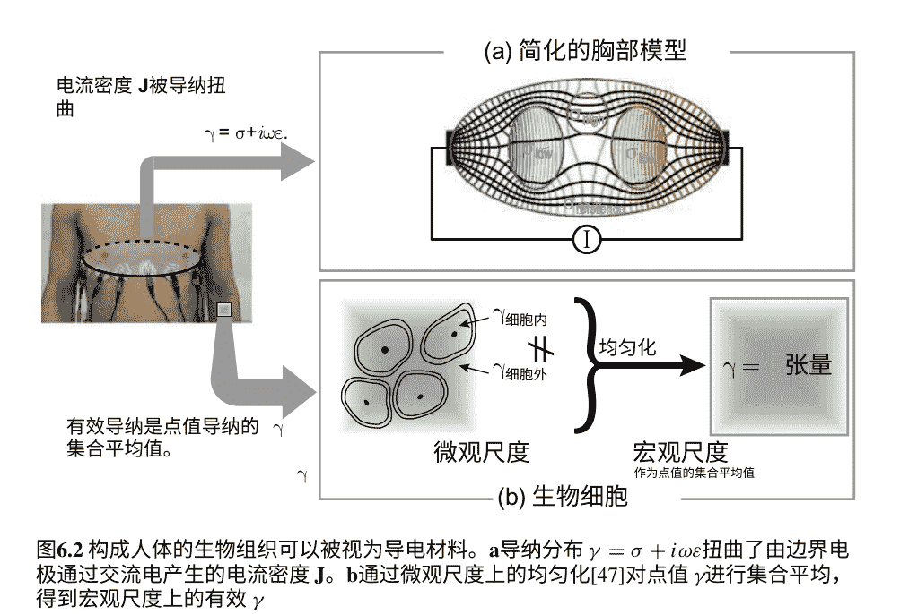

### 6.2.2 电阻抗层析成像中的正问题

### 6.2.2.1 欧姆定律

在提供数学模型之前，让我们先考虑EIT的物理现象。当正弦电流注入到一个物理域（Ω）中时，相应的电势（u）可以在该区域的边界上测量到（∂Ω）。我们将 u 对 ∂Ω 的限制表示为 u|_{\partial\Omega}。我们考虑一个可以根据时间改变的交流电流（AC）。

在最简单的情况下，我们考虑一个包含电阻器和正弦电流源的电路，如图6.3所示。电流从顶部流向底部表面电极，测量的电压是顶部和底部表面电势之间的差异。

$$V = u|_{\text{顶部}} - u|_{\text{底部}} \tag{6.1}$$

注入的电流和相应测量的电压成正比：

$$Z = \frac{V}{I} \text{（欧姆定律）} \tag{6.2}$$

阻抗（Z）是材料阻碍电流流动的能力。

阻抗的倒数是一个依赖于物体长度和电极表面积的导纳（$\gamma = \sigma + i\omega\epsilon$）。介电常数（$\epsilon$）是衡量材料电极化能力的指标。

我们通过表面电极（$\mathcal{E}_+, \mathcal{E}_-$）注入电流 $I$，生成体内的电位$u$。在二维空间中，电位和电流分布随导电性在圆和椭圆异常处发生扰动。由于电阻层析成像（EIT）是一种非侵入性技术，所以只能测量到电流施加后在物体表面产生的电压（图6.4）。相反，从高导电异常（圆形，10）聚集的电流线会逃逸到低导电异常（椭圆形，0.15）中，其中背景导电性为1。

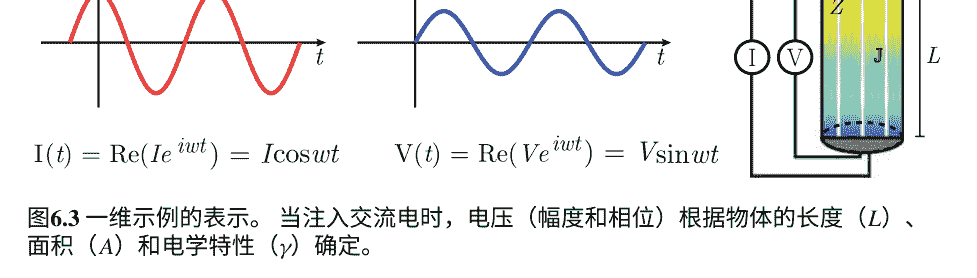

图6.3一维示例的表示。当注入交流电时，电压（幅度和相位）根据物体的长度（$L$）、面积（$A$）和电学特性（$\gamma$）确定。

### 6.2.2.2 椭圆偏微分方程的推导

当我们通过一个物体注入电流时，会产生一个电场和一个磁场。电场和磁场之间的关系在麦克斯韦方程中显示（表6.2）。我们使用法拉第和安培定律进行推导。

| 名称 | 方程 |
| :--- | :--- |
| 高斯定律 | ∇·E = ρ/ε |
| 磁场的高斯定律 | ∇·H = 0 |
| 法拉第感应定律 | ∇×E = -iωB |
| 安培环路定律 | ∇×H = J + iωD |

EIT问题，我们考虑时间谐波场，其中时间变化是正弦的。法拉第定律的思想是，当通过导体的电流改变时，会产生感应电动势。在其周围产生交变磁场。安培环路定律说明了电流和由该电流产生的磁场之间的关系。

存在如 \( \mathbf{B} = \mu \mathbf{H} \), \( \mathbf{J} = \sigma \mathbf{E} \), \( \mathbf{D} = \varepsilon \mathbf{E} \) 等关系。磁场 \( \mathbf{H} \) 和磁通密度 \( \mathbf{B} \) 通过磁导率 \( \mu \) 相关，电场 \( \mathbf{E} \) 和电流密度 \( \mathbf{J} \) 通过电导率 \( \sigma \) 相关，电场 \( \mathbf{E} \) 和电通量密度 \( \mathbf{D} \) 通过介电常数 \( \varepsilon \) 相关，适用于线性、各向同性的物体。

该领域涉及的基本场量是电场和电流密度。在法拉第定律中，将磁场和磁通密度的关系 \( \mathbf{B} = \mu \mathbf{H} \) 代入后，我们有 \( \nabla \times \mathbf{E} = -i \mu \omega \mathbf{H} \)。如果我们假设 \( \mu = \mu_0 \)，则有 \( \nabla \times \mathbf{E} \approx 0 \)。根据斯托克斯定理，存在一个势函数 \( u \) 满足 \( u(\mathbf{r}_2) - u(\mathbf{r}_1) = - \int_{C_{\mathbf{r}_1 \to \mathbf{r}_2}} \) 对于任意两点 \( \mathbf{r}_1 \) (起始点) 和 \( \mathbf{r}_2 \) (终点), \( \mathbf{E} \cdot d\mathbf{l} \approx \mathbf{E} \) 在 \( \Omega \) 中。根据安培环路定律，我们有

$$ \nabla \times \mathbf{H} = \mathbf{J} + i\omega\mathbf{D} = \sigma\mathbf{E} + i\omega\varepsilon\mathbf{E} = (\sigma + i\omega\varepsilon)\mathbf{E} = -\gamma\nabla u, $$

其中导纳 \( \gamma = \sigma + i\omega\varepsilon \)。

### 注6.1 矢量场的旋度的散度为零。

$$ \begin{aligned} \nabla \cdot (\nabla \times \mathbf{H}) &= \frac{\partial}{\partial x}(\nabla \times \mathbf{H})_x + \frac{\partial}{\partial y}(\nabla \times \mathbf{H})_y + \frac{\partial}{\partial z}(\nabla \times \mathbf{H})_z \\ &= \frac{\partial}{\partial x} \left( \frac{\partial H_z}{\partial y} - \frac{\partial H_y}{\partial z} \right) + \frac{\partial}{\partial y} \left( \frac{\partial H_x}{\partial z} - \frac{\partial H_z}{\partial x} \right) + \frac{\partial}{\partial z} \left( \frac{\partial H_y}{\partial x} - \frac{\partial H_x}{\partial y} \right) \\ &= \left( \frac{\partial}{\partial x} \frac{\partial H_z}{\partial y} - \frac{\partial}{\partial x} \frac{\partial H_y}{\partial z} \right) + \left( \frac{\partial}{\partial y} \frac{\partial H_x}{\partial z} - \frac{\partial}{\partial y} \frac{\partial H_z}{\partial x} \right) + \left( \frac{\partial}{\partial z} \frac{\partial H_y}{\partial x} - \frac{\partial}{\partial z} \frac{\partial H_x}{\partial y} \right) \\ &= 0. \end{aligned} $$

因此，\( \nabla \cdot \nabla \times \mathbf{H} = 0 \), 椭圆型偏微分方程可以由

$$ - \nabla \cdot (\gamma \nabla u) = 0 \quad \text{在} \quad \Omega. \tag{6.3} $$

注6.2 在用于监测肺通气的电阻抗层析成像中，域 \( \Omega \) 在(6.3)中将是人体胸部。时间差电阻抗层析成像具有在床边长期、连续监测肺通气的独特能力[73]。重建算法涉及灵敏度矩阵，该矩阵主要取决于成像对象的几何形状和电极位置。因此，希望能够简单地分割身体的几何形状并确定电极位置，以改善重建图像的质量 (图6.5)。

## 6.2.2.3 有限元法

在正向模型中，我们想要找到给定 γ 的电位 u。在实践中，材料属性 γ 可能会突然改变。例如，人体内部的电导率分布可能在两个不同器官的边界上跳跃。

在这种情况下，经典意义上不存在解 u ∈ C²(Ω)。我们可以在Sobolev空间 H¹(Ω)中解决最小化和变分问题：

```
\begin{cases}
-\nabla \cdot (\gamma \nabla u) = 0 & \text{在 } \Omega \text{中} \\
(\gamma \nabla u) \cdot \mathbf{n} = f & \text{在 } \partial \Omega \text{上}
\end{cases}
```

我们构建有限元空间 V ⊂ H₀¹(Ωₕ):

```
V = \{ v \in C(\Omega_h) : v|_{T_j}, \text{对于 } j = 1, \ldots, M \} \cap H_0^1(\Omega_h), \text{ 我们有 piecewise linear f}
```

我们乘以权重函数 φ ∈ V并使用Green第一恒等式进行分部积分，得到

```
\int_{\Omega} -\nabla \cdot (\gamma \nabla u) \phi \, d\mathbf{r} = 0 \Rightarrow -\int_{\partial \Omega} \phi (\nabla u \cdot \mathbf{n}) \, ds + \int_{\Omega} \gamma \nabla u \cdot \nabla \phi \, d\mathbf{r} = 0.
```

重新排列和替换边界条件后，我们得到

```
\int_{\Omega} \gamma \nabla u \cdot \nabla \phi \, d\mathbf{r} = \int_{\partial \Omega} \gamma \phi (\nabla u \cdot \mathbf{n}) \, ds = \int_{\partial \Omega} \phi (\gamma \nabla u \cdot \mathbf{n}) \, ds = \int_{\partial \Omega} f \phi \, ds.
```

根据Lax-Milgram定理[17]，存在一个满足条件的唯一解

```
\int_{\Omega} \gamma \nabla u \cdot \nabla \phi \, d\mathbf{r} = \int_{\partial \Omega} f \phi \, ds, \text{ 对于所有的 } \phi \in V
```

令 \(u = \sum_{i=1}^{N} u_i \phi_i\) 是一个有限元解 \(\mathbf{u} = [u_1, u_2, \cdots, u_N]^T\)，其中 \(u_i = u(\mathbf{r}_i)\) 和 \(N\) 是节点数。有限元方法是一种数值逼近函数在一个区域上的值的技术。对于在网格节点上定义的势分布 \(u\) 的近似进行离散化，通过线性组合的基函数 \(\phi_i\) 和权重函数 \(\phi_j\) 选择为相同的基函数，得到一个线性方程组。

\[\sum_j \int_{\Omega} \gamma u_j \nabla \phi_i \cdot \nabla \phi_j d\mathbf{r} = \sum_j \int_{\partial \Omega} \phi_i (\gamma \nabla u_j \cdot \mathbf{n}) ds \quad \text{对于行 } i.\]

然后 \(\mathbf{u}\) 满足

\[\begin{pmatrix}
\int_{\Omega} \gamma \nabla \phi_1 \cdot \nabla \phi_1 d\mathbf{r} & \cdots & \int_{\Omega} \gamma \nabla \phi_1 \cdot \nabla \phi_N d\mathbf{r} \\
\vdots & \ddots & \vdots \\
\int_{\Omega} \gamma \nabla \phi_N \cdot \nabla \phi_1 d\mathbf{r} & \cdots & \int_{\Omega} \gamma \nabla \phi_N \cdot \nabla \phi_N d\mathbf{r}
\end{pmatrix}
\underbrace{
\begin{pmatrix}
u_1 \\
\vdots \\
u_j \\
\vdots \\
u_N
\end{pmatrix}
}_{\mathbf{u}}
=
\underbrace{
\begin{pmatrix}
\int_{\partial \Omega} f \phi_1 ds \\
\vdots \\
\int_{\partial \Omega} f \phi_i ds \\
\vdots \\
\int_{\partial \Omega} f \phi_N ds
\end{pmatrix}
}_{\mathbf{b}}\]
\[(6.8)\]

让 \(\tau = [T_1, \cdots, T_M]\) 是三角形元素的集合。矩阵\(A\)的第\(i,j\)个元素可以分解为 \(a_{ij} = \sum_{T \in \tau} \int_{T} \gamma \nabla \phi_i \cdot \nabla \phi_j d\mathbf{r}\) 和矩阵 \(A\) 是对称且稀疏的。

正问题 (6.4) 通过有限元法求解。在计算电位 \(u\) (见图6.6) 时，正问题采用有限元模型 (节点、FEM三角剖分和基函数)。电流注入两个相邻电极之间的圆盘的电位场 \(u\) 从源电极到汇电极单调递减。

线性方程 \(A\mathbf{u} = \mathbf{b}\) 的解如图6.6所示。如果我们假设\(\mathbf{u}\) 是 (6.4) 的解，则 \(\mathbf{u} + c\) 也是 (6.4) 的解，其中 \(c\) 是任意常数。这意味着 \(A\) 不可逆，且 \(A\) 的秩为 \(N-1\)。通过去掉 \(A\) 的第一行和第一列，线性方程可求解，\(\hat{\mathbf{u}} = [A_{N-1}]^{-1}\hat{\mathbf{b}}\)。利用 \(\hat{\mathbf{u}}\) 的知识，我们得到解 \(u = \sum_{j=2}^{N} \hat{u}_j \phi_j - c\)，其中 \(c\) 是一个常数，选择使得 \(\int_{\partial \Omega} u ds = 0\)。

## 6.2.3 EIT中的反问题

### 6.2.3.1均匀材料中电导率的计算

假设有两对电极，注入电流的是 \((\mathcal{E}_+^1, \mathcal{E}_-^1)\) 并测量电压的是 \((\mathcal{E}_+^2, \mathcal{E}_-^2)\)，如图6.7所示。电势 \(u^i\) 由以下公式确定

几何形状 $\Omega$ 和电流驱动电极 $(\mathcal{E}_+^i, \mathcal{E}_-^i)$，其中 $i = 1, 2$:

$$\begin{cases} -\nabla \cdot (\gamma \nabla u^i) = 0 & \text{在 } \Omega \\ (\gamma \nabla u^i) \cdot \mathbf{n} = I(\delta_{\mathcal{E}_+^i} - \delta_{\mathcal{E}_-^i}) & \text{在 } \partial\Omega\text{上}, \end{cases}$$

其中 $\delta_{\mathcal{E}_+^i}$ 是具有峰值在 $\mathcal{E}_+^i$ 的狄拉克 $\delta$ 函数。

$$\int_{\Omega} -\nabla \cdot (\gamma \nabla u^1)u^2 d\mathbf{r} = 0,$$

通过分部积分，

$$ - \int_{\partial \Omega} (\gamma \nabla u^1 \cdot \mathbf{n}) u^2 ds + \int_{\Omega} \gamma \nabla u^1 \cdot \nabla u^2 d\mathbf{r} = 0 $$
$$ \int_{\Omega} \gamma \nabla u^1 \cdot \nabla u^2 d\mathbf{r} = \int_{\partial \Omega} (\gamma \nabla u^1 \cdot \mathbf{n}) u^2 ds = I[(u^2(\mathcal{E}_+^1) - u^2(\mathcal{E}_-^1))], $$
$$ \gamma = \frac{I[(u^2(\mathcal{E}_+^1) - u^2(\mathcal{E}_-^1))]}{\int_{\Omega} \nabla u^1 \cdot \nabla u^2 d\mathbf{r}}. \tag{6.10} $$

γ取决于电极位置和 Ω的几何形状。

### 6.2.3.2 Inbody的阻抗测量

Inbody的多频测量方法通过使用1-1000 kHz范围内的多个宽带频率准确测量细胞内水和细胞外体水。电流通过细胞膜的能力根据其频率而变化。

通过考虑人体的结构特征，Inbody使用每只手和脚两个电流和电压电极，需要用户抓握和踩踏总共八个电极。该设计显著提高了重复测试的易用性，即使测量姿势改变或多次进行测量。测量始终从相同的点开始和结束-手腕和脚踝-确保准确的结果。

人体是不均匀的。人体 Ω可以分解为五个部分：$Z_{RA}$, $Z_{LA}$, $Z_{RL}$, $Z_{LL}$ 和 $Z_{B}$。
正弦电流被注入这五个身体部位的六个组合，如图6.8所示，六个电压 $V^1$ , $V^2$, $V^3$, $V^4$, $V^5$和$V^6$。数据用于计算身体组成 $V^{jk} = \int_{\Omega} \gamma \nabla u^j \cdot \nabla u^k d\mathbf{r}$和

图6.8 Inbody测量：当人体被视为具有均匀电导率的五个部分时，注入电流和测量电压的六种不同方法如下所示

$$ Z^j = \frac{V^j}{I} = \frac{1}{I^2} \int_{\Omega} \frac{1}{\gamma} |\gamma \nabla u^j|^2 dx : \text{可测量} $$
$$ Z^1 = \frac{1}{I^2} \int_{\Omega_{\text{右臂}}} \frac{1}{\gamma} |\gamma \nabla u^1|^2 dx + \frac{1}{I^2} \int_{\Omega_{\text{左臂}}} \frac{1}{\gamma} |\gamma \nabla u^1|^2 dx + \frac{1}{I^2} \int_{\Omega_{\text{身体}}} \frac{1}{\gamma} |\gamma \nabla u^1|^2 dx + \frac{1}{I^2} \int_{\Omega_{\text{右腿}}} \frac{1}{\gamma} |\gamma \nabla u^1|^2 dx + \frac{1}{I^2} \int_{\Omega_{\text{左腿}}} \frac{1}{\gamma} |\gamma \nabla u^1|^2 dx . $$

### 6.2.3.3 16通道EIT系统

电导率分布 γ 在域 Ω 中给出，电势 u^j 由电流 I 通过电极对 (ℰ_j, ℰ_{j+1}) 诱导：

```
\[
\begin{cases}
    -\nabla \cdot (\gamma \nabla u^j) = 0 & \text{在 } \Omega, \\
    (\gamma \nabla u^j) \cdot \mathbf{n} = 0 & \text{在 } \partial \Omega \setminus \bigcup_{i}^{16} \mathcal{E}^i, \\
    \displaystyle\int_{\mathcal{E}^i} (\gamma \nabla u^j) \cdot \mathbf{n} = 0 & \text{对于 } i \in \{1, \ldots, 16\} \setminus \{j, j+1\}, \\
    \mathbf{n} \times \nabla u^j = 0 & \text{在 } \mathcal{E}^i \text{ 对于 } i = 1, \ldots, 16, \\
    \displaystyle\int_{\mathcal{E}^j} (\gamma \nabla u^j) \cdot \mathbf{n} ds = I = -\int_{\mathcal{E}^{j+1}} (\gamma \nabla u^j) \cdot \mathbf{n} ds.
\end{cases}
\]
(6.11)
```

为了解释分流模型 (6.11) 的边界条件，我们考虑电压配置。在图6.9中，16个电极附着在腹部域的边界上。每个电极上的电位是恒定的。边界表面上也是绝缘体。除了注入电流的2个电极之间，边界上没有电流流动。换句话说，注入电流的2个电极之间的电流可以通过第j个汇电极和 (j+1) 个源电极传递。上述测得的数据是电压差 V^{jk} = u^j|_{ℰ^k} - u^j|_{ℰ^{k+1}} 对于 k = 1, ..., j-2, j+2, ..., 16。在相邻的驱动模式中，电流被应用到相邻的一对电极上，并测量其余13对电极之间的电压。我们的目标是通过应用有限元模型来解决方程 (6.11) ，提取208个电压测量值。

图6.9 16通道EIT系统。使用一对相邻的电极来施加电流，并使用其余电极上的相邻电极来测量电压。施加的电流在内部引起电压分布，电导率分布扭曲了电压分布。

## 6 电阻抗成像

在逆问题中，电势 $\mathbf{V}$ 已知， $\gamma$ 未知。将 $u^k$ 乘以(6.11)中的第一个方程得到

$$- \int_{\Omega} \nabla \cdot (\gamma \nabla u^j) u^k \mathrm{d}\mathbf{r} = 0$$
$$- \int_{\partial\Omega} \gamma \nabla u^j \cdot \mathbf{n} u^k \mathrm{d}s + \int_{\Omega} \gamma \nabla u^j \cdot \nabla u^k \mathrm{d}\mathbf{r} = 0$$
$$\int_{\Omega} \gamma \nabla u^j \cdot \nabla u^k \mathrm{d}\mathbf{r} = \int_{\partial\Omega} u^k \gamma \nabla u^j \cdot \mathbf{n} \mathrm{d}s$$
$$\frac{1}{I} \int_{\Omega} \gamma \nabla u^j \cdot \nabla u^k \mathrm{d}\mathbf{r} = \frac{1}{I} \int_{\partial\Omega} u^k (\gamma \nabla u^j) \cdot \mathbf{n} \mathrm{d}s$$
$$= \frac{1}{I} \int_{\mathscr{E}^j \cup \mathscr{E}^{j+1}} u^k (\gamma \nabla u^j) \cdot \mathbf{n} \mathrm{d}s$$
$$= u^k|_{\mathscr{E}^j} - u^k|_{\mathscr{E}^{j+1}}$$
$$= V^{k j}.$$

对于给定的参考导纳 $\gamma_0$，相应的电位 $u_0$满足

$$\frac{1}{I} \int_{\Omega} \gamma_0 \nabla u_0^j \cdot \nabla u_0^k \mathrm{d}\mathbf{r} = V_0^{jk}.$$

差值 $V^{jk} - V_0^{jk}$满足

$$V^{jk} - V_0^{jk} = \frac{1}{I} \int_{\Omega} \gamma \nabla u^j \cdot \nabla u^k \mathrm{d}\mathbf{r} - \frac{1}{I} \int_{\Omega} \gamma_0 \nabla u_0^j \cdot \nabla u_0^k \mathrm{d}\mathbf{r}$$
$$= -\frac{1}{I} \int_{\Omega} (\gamma - \gamma_0) \nabla u^j \cdot \nabla u_0^k \mathrm{d}\mathbf{r}$$
$$\approx -\frac{1}{I} \int_{\Omega} (\gamma - \gamma_0) \nabla u_0^j \cdot \nabla u_0^k \mathrm{d}\mathbf{r}.$$

将$\Omega$离散化为$M$个元素，其中$\Omega= \bigcup_{m}^{M} T_m$，

$$- \sum_{m}^{M} \frac{1}{I} \int_{T_m} \left(\gamma|_{T_m} - \gamma_0|_{T_m}\right) \nabla u^j \cdot \nabla u_0^k \mathrm{d}\mathbf{r} = V^{jk} - V_0^{jk}.$$

逆问题的矩阵形式为$\mathbb{S} \dot{\gamma} = \dot{\mathbf{V}}$，其中 $\dot{\gamma} = \gamma - \gamma_0$， $\dot{\mathbf{V}} = \mathbf{V} - \mathbf{V}_0$ 并且 $\mathbf{V} = [V^{1,2}, ..., V^{15,16}, ..., V^{j,k}, ...]^T$。

注意到互易原理
$$
V^{jk} = u^j|_{\mathcal{E}_k} - u^j|_{\mathcal{E}_{k+1}} = \frac{1}{I} \int_{\Omega} \gamma \nabla u^j \cdot \nabla u^k d\mathbf{r} = u^k|_{\mathcal{E}_j} - u^k|_{\mathcal{E}_{j+1}} = V^{kj},
$$
我们有 $(N-3)N/2$ 个独立数据。见图6.10的灵敏度矩阵。

时间差EIT是提供变化图像（即 $\delta\gamma = \gamma - \gamma_0$）的方法
$$
0 = \nabla \cdot \left( (\gamma_0 + \delta \gamma) \nabla (u_0^j + \delta u^j) \right) \\
= \nabla \cdot (\gamma_0 \nabla \delta u^j) + \nabla \cdot (\delta \gamma \nabla u_0^j) \\
\int_\Omega -\nabla \cdot (\gamma_0 \nabla \delta u^j) u_0^k = \int_\Omega \nabla \cdot (\delta \gamma \nabla u_0^j) u_0^k \\
\int_\Omega \gamma_0 \nabla \delta u^j \cdot \nabla u_0^k = \int_{\partial \Omega} (\gamma_0 \nabla \delta u^j) \cdot \mathbf{n} \cdot u_0^k \\
= \int_\Omega \delta \gamma \nabla u_0^j \cdot \nabla u_0^k \\
\int_\Omega \delta \gamma \nabla u_0^j \cdot \nabla u_0^k = \int_{\partial \Omega} (\gamma_0 \nabla \delta u^j) \cdot \mathbf{n} \cdot u_0^k \\
= \delta u^j(\mathcal{E}_{k+1}) - \delta u^j(\mathcal{E}_k) = \delta V^{jk} \quad (6.19)
$$

## 6.2.4 敏感性分析

逆问题满足矩阵方程 $\mathbb{S} \dot{\gamma} = \dot{\mathbf{V}}$。雅可比矩阵 $\mathbb{S}$ 被称为敏感性矩阵。

让我们考虑奇异值分解的 $\mathbb{S}^T \mathbb{S}$：
$$\mathbb{S}^T \mathbb{S} = W \cdot \Sigma \cdot W^T = (w_1 \cdots w_M) \begin{pmatrix} \lambda_1^2 & \cdots & 0 \\ \vdots & \ddots & \vdots \\ 0 & \cdots & \lambda_M^2 \end{pmatrix} \begin{pmatrix} w_1^T \\ \vdots \\ w_M^T \end{pmatrix}, \quad (6.20)$$
其中 $w_i$ 是特征向量, $\lambda_i$ 是奇异值。由于条件数非常高 (例如在图6.11中, $\lambda_1/\lambda_{35} = 2.7 \times 10^3$), 雅可比矩阵 $\mathbb{S}$ 是病态的。假设 $\dot{\gamma}$ 可以表示为特征向量的线性组合 $\dot{\gamma} = \sum_{i=1}^M a_i w_i$，逆问题可以简化为找到 $(a_1, a_2, ..., a_M)$ 使得
$$\mathbb{S}^T \mathbb{S} \left( \sum_{i=1}^M a_i w_i \right) = \mathbb{S}^T \dot{\mathbf{V}} \quad \Leftrightarrow \quad \sum_{i=1}^M a_i \lambda_i^2 w_i = \mathbb{S}^T \dot{\mathbf{V}}. \quad (6.21)$$
如果 $\lambda_j \approx 0$, 那么
$$a_i = \frac{1}{\lambda_i^2} \frac{(\mathbb{S}^T \dot{\mathbf{V}}, w_i)}{(w_i, w_i)} \approx \infty \cdot \frac{(\mathbb{S}^T \dot{\mathbf{V}}, w_i)}{(w_i, w_i)}. \quad (6.22)$$
因此, $\dot{\gamma}$ 的一个小误差会导致 $a_i$ 的一个大误差。

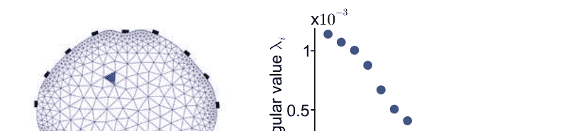

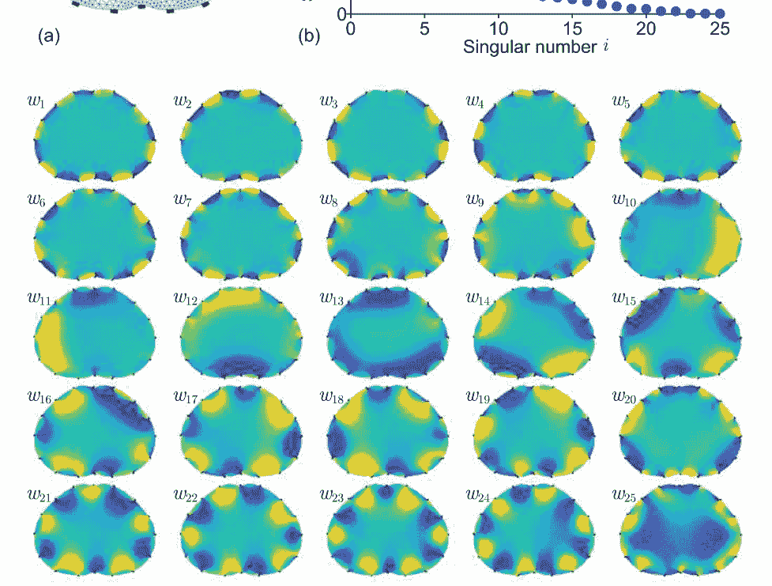

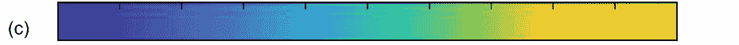

图6.11 当我们使用16个相邻对的电极时，计算了 $\mathbb{S}^T\mathbb{S}$ 的奇异值和奇异向量。a 带有电极（黑色）和网格（蓝线）的腹部模型。b $\mathbb{S}^T\mathbb{S}$ 的奇异值。在500多个奇异值中，只显示了前25个，因为之后的值几乎为零。c $\mathbb{S}^T\mathbb{S}$ 的前25个特征向量 $w_i (i=1, 2, ..., 25)$ 的可视化。

### 6.2.4.1 问题的不适定性和正则化

不适定的反问题被定义为逆问题的逆问题[26]。如果满足以下条件，则问题是适定的：存在解，解是唯一的，并且解在输入上连续变化。由于矩阵 $\mathbb{S}$ 的条件数很大，$\mathbb{S}\dot{\gamma}=\dot{\mathbf{V}}$ 是不适定的。此外，未知数的数量（即像素数量，例如5000）在 $\gamma$ 中比方程的数量（即电流-电压模式的数量，例如208）要大。因此，存在无穷多个解。

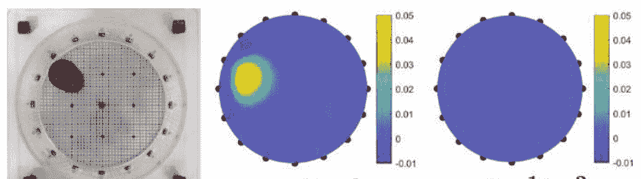

图6.12 使用不同正则化参数进行Tikhonov正则化的重建图像

为了处理这种不适定性，我们通常使用正则化技术：从（6.21）中，我们有
$$(\alpha I + \mathbb{S}^T \mathbb{S}) \sum_{i=1}^M a_i w_i = \mathbb{S}^T \dot{\mathbf{V}} \Rightarrow \sum_{i=1}^M a_i (\alpha + \lambda_i^2) w_i = \mathbb{S}^T \dot{\mathbf{V}}. \tag{6.23}$$
标准重建算法基于传统的正则化模型拟合方法:
$$\dot{\gamma} = \text{argmin}_{\dot{\gamma}} \| \mathbf{V} - \mathbb{S} \dot{\gamma} \|^2 + \lambda Reg(\dot{\gamma}). \tag{6.24}$$
其中 $\| \cdot \|$ 是标准欧几里得范数, $Reg$ 是正则化算子, 而 $\lambda >0$ 是正则化参数。

我们将处理两个正则化参数; Tikhonov正则化和总变差。首先, Tikhonov正则化是指 $Reg(\cdot):= \| \cdot \|_2^2$。 因此, 相应的解是 $\dot{\gamma}^*$:
$$\dot{\gamma}^* = \text{argmin}_{\dot{\gamma}} \| \mathbb{S} \dot{\gamma} - \mathbf{V} \|^2 + \alpha \| \dot{\gamma} \|_2^2. \tag{6.25}$$
其中 $\alpha$ 是正则化参数[75]。 这里的目标函数是 $\Phi(\dot{\gamma}) = \|\mathbb{S}\dot{\gamma} - \mathbf{V}\|^2 + \alpha\|\dot{\gamma}\|_2^2$。 最小化者 $\dot{\gamma}^*$ 满足 $\nabla\Phi(\dot{\gamma}^*) = 2\mathbb{S}^T(\mathbb{S}\dot{\gamma} - \mathbf{V}) + 2\alpha\dot{\gamma} =0$, 其解可以得到
$$\dot{\gamma}^* = (\mathbb{S}^T \mathbb{S} + \alpha I)^{-1} \mathbb{S}^T \dot{\mathbf{V}}. \tag{6.26}$$
图6.12显示了使用不同正则化参数的(6.25)计算得到的 $\dot{\gamma}^*$。

总变差正则化使用 $Reg(\cdot):= \|D\dot{\gamma}\|_1$。 因此, 相应的解为 $\dot{\gamma}^*$:
$$\dot{\gamma}^* = \text{argmin}_{\dot{\gamma}} \frac{1}{2} \| \mathbb{S} \dot{\gamma} - \mathbf{V} \|^2 + \lambda \| D \dot{\gamma} \|_1.$$

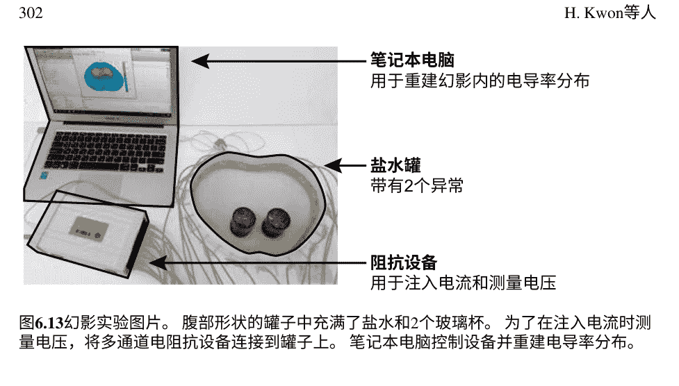

图6.13 幻影实验图片。腹部形状的罐子中充满了盐水和2个玻璃杯。为了在注入电流时测量电压，将多通道电阻抗设备连接到罐子上。笔记本电脑控制设备并重建电导率分布。

相应的对偶问题是 $\text{argmin}_{\dot{\gamma}} \frac{1}{2} \| \mathbb{S} \dot{\gamma} - \mathbf{V} \|^2 + \lambda \| z \|_1$ subject to $z = D \dot{\gamma}$，并且增广拉格朗日函数是
$$ L(\dot{\gamma}, y, z) = \frac{1}{2} \| \mathbb{S} \dot{\gamma} - \mathbf{V} \|_2^2 + \lambda \| z \|_1 + y^T (D \dot{\gamma} - z) + \frac{\rho}{2} \| D \dot{\gamma} - z \|_2^2. $$
因此，可以使用交替方向乘子法（ADMM）获得解决方案：

- 1. 初始猜测为 $\dot{\gamma}^{(0)}$, $y^{(0)}$ 和 $z^{(0)}$。
- 2. 解决问题
$$
\begin{cases}
\dot{\gamma}^{(k+1)} := (\mathbb{S}^T\mathbb{S} + \rho D^T D)^{-1} (\mathbb{S}^T\dot{\mathbf{V}} - D^T (y^{(k)} - \rho z^{(k)})). \\
z^{(k+1)} := \text{收缩算子}_{\lambda/\rho} (D \dot{\gamma}^{(k+1)} + \frac{1}{\rho} y^{(k)}), \\
y^{(k+1)} := y^{(k)} + \rho (D \dot{\gamma}^{(k+1)} - z^{(k+1)}).
\end{cases}
$$

图6.13显示了一个EIT系统幻影。图6.14显示了两个正则化模型的比较。

> 备注6.3 EIT中的反问题存在重大问题，例如非线性和不适定性。还有其他各种问题，如几何误差、电极位置误差、测量噪声、域截断误差和电流-电压模式效应。我们应该注意到 $\mathbb{S}\dot{\gamma}$ 可以被视为 $\dot{\gamma}$ 的高度非线性函数。此外，$\mathbf{V}$ 主要取决于边界几何和电极位置，而对 $\gamma$ 的局部扰动的依赖相对较小。Barber和Brown[7]提出了以下观察结果：如果电极在胸部周围间隔10厘米，1毫米的位置变化将导致数据 $\mathbf{V}$ 的1%的误差。对于大多数临床应用来说，这样的1%误差太大了。因此，静态EIT问题是高度非线性且严重不适定的。即使有无限多的传输阻抗数据 $Z^{j,k}$ 可用，似乎很难恢复阻抗分布 $1/\gamma$。一些研究人员正在关注异常的检测，而不是成像[4, 42]，而不是电导率成像。

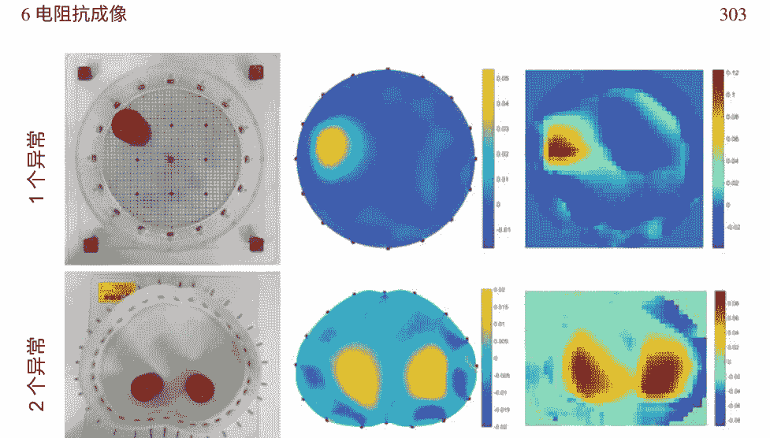

图6.14 时间差 EIT 的重建图像

## 基于深度学习的 EIT

一个反问题是否是良态的可能取决于解的表达方式。许多问题是不良态的，因为我们过于雄心勃勃或者表达能力不足。为了使临床EIT在商业化中取得成功，有必要承认其局限性，并努力提供适合医学诊断中跟踪投影成像特征的阻抗图像。

例如，对于一个16通道的EIT系统，我们必须处理一些自由参数的不确定性（像素维度-数据维度 = 16384-208）。为了解决EIT中的非线性和病态逆问题，最近采用了深度学习技术[13, 14, 27, 66]。深度学习方法似乎具有强大的能力，可以通过训练数据探索预期图像的先验信息，从而处理病态逆问题的不确定性解。深度学习框架可以在训练数据上提供非线性回归，从而学习输出的复杂先验知识。在[66]中，基于变分自动编码器（VAE）和多层感知器（MLP）（图6.15）创建了一种图像重建算法。第一个网络，图6.15a，是一个VAE网络，可以实现肺部EIT图像的紧凑表示（或低维流形学习）的先验信息。

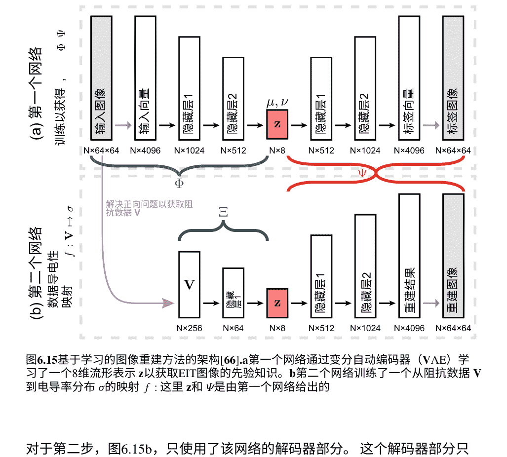

图6.15 基于学习的图像重建方法的架构[66]。a第一个网络通过变分自动编码器（VAE）学习了一个8维流形表示 $\mathbf{z}$ 以获取EIT图像的先验知识。b第二个网络训练了一个从阻抗数据 $\mathbf{V}$ 到电导率分布 $\sigma$ 的映射 $f$：这里 $\mathbf{z}$ 和 $\psi$ 是由第一个网络给出的

对于第二步，图6.15b，只使用了该网络的解码器部分。这个解码器部分只使用了很少的潜在变量，并将它们转换回在有意义的重建流形上产生图像。第二个网络现在接收一个数据向量，并将其映射到潜在变量，然后输入解码器。这种方法利用了神经网络在构建近似解映射的低维非线性表示方面的潜力。

## 6.2.6 应用

电阻抗层析成像（EIT）可以应用于许多领域。其中最活跃的领域是心肺功能监测。机械通气机中的高气压经常导致肺部的部分过度充气，从而导致通气相关性肺损伤（VALI）。为了解决这些未满足的临床需求，可以使用EIT的动态电导图像进行肺保护通气（LPV），为每个患者找到最佳的呼气末正压（PEEP）值，并进行连续的床边监测。

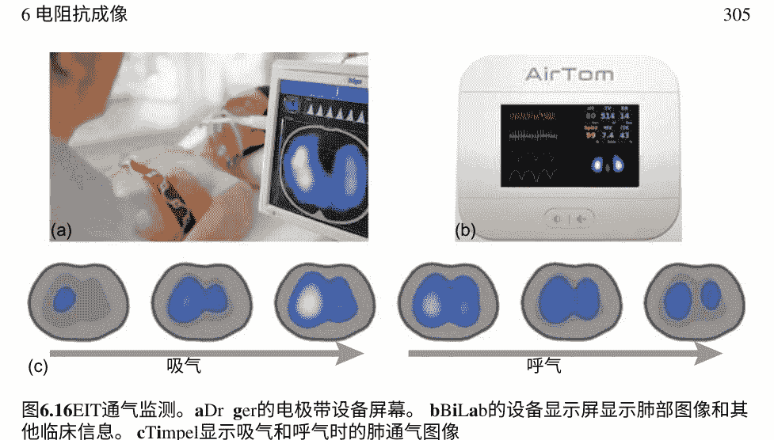

图6.16 EIT通气监测。a Dräger的电极带设备屏幕。b BiLab的设备显示屏显示肺部图像和其他临床信息。c Timpel显示吸气和呼气时的肺通气图像

监测肺部区域气体分布。有许多相关的公司，例如德国的Dräger [19]，韩国的BiLab [9]，巴西的Timpel [76]，瑞士的Swisstom [71]（已被瑞士Sentec [55]收购）。图6.16显示了EIT技术在肺部监测中的应用，包括电极带、设备、显示屏和肺部电导分布。

另一个可能的应用是估计腹部肥胖，这需要静态图像。腹部肥胖与代谢综合征密切相关，也是各种其他健康问题的风险因素。EIT的静态电导图像可以提供腹部脂肪（如皮下脂肪和内脏脂肪）的区域分布，以进行连续的自我监测，以跟踪身体脂肪状况作为日常例行程序的一部分。在2017年，Ammari等人[5]提供了一种重建方法，用于成像腹部电导率分布，该方法使用围绕腹部的一些电极。静态EIT图像重建技术在[5, 44]中经过了多个数值实验的验证（例如图6.17a，b），表明EIT可以提供人体腹部电导图像，用于估计腹部肥胖。使用人体生物阻抗的一个例子是InBody Co. Ltd. [34]的设备。InBody使用在人体腹部的四个电极获得的生物阻抗来测量腹部肥胖（不使用腹部图像）（图6.17c，d）。

睡眠呼吸暂停症影响超过1亿人，是一种潜在严重的睡眠障碍，呼吸会反复开始和停止。最常见的睡眠呼吸暂停症类型是在睡眠时由于喉咙松弛的舌头和/或脂肪组织塌陷而导致呼吸阻塞。EIT技术可以用于对患有呼吸暂停症的患者进行友好的家庭睡眠测试（HST），通过提供每次呼吸时气道的开合和/或肺部充气的图像。目前，可以通过良好的方法估计上气道尺寸的变化。

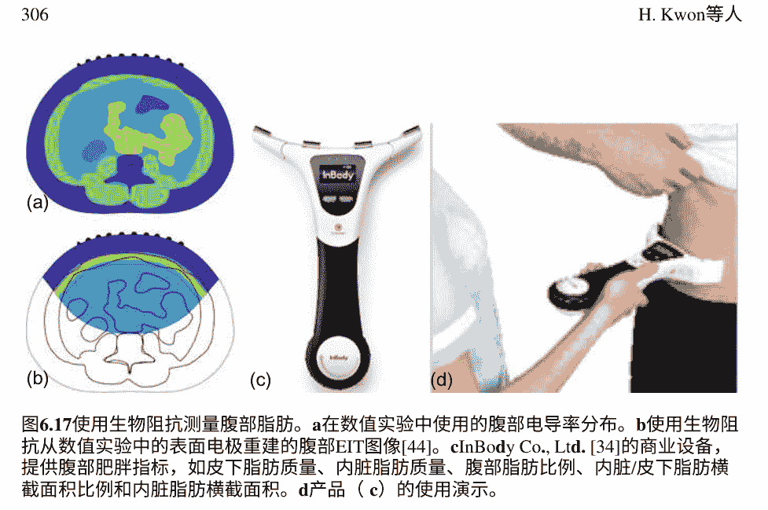

图6.17 使用生物阻抗测量腹部脂肪。a在数值实验中使用的腹部电导率分布。b使用生物阻抗从数值实验中的表面电极重建的腹部EIT图像[44]。c InBody Co., Ltd. [34]的商业设备，提供腹部肥胖指标，如皮下脂肪质量、内脏脂肪质量、腹部脂肪比例、内脏/皮下脂肪横截面积比例和内脏脂肪横截面积。d产品（c）的使用演示。

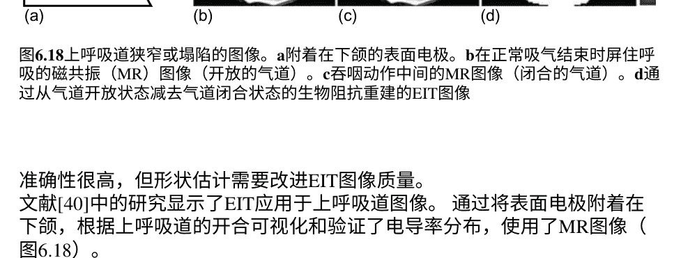

图6.18 上呼吸道狭窄或塌陷的图像。a附着在下颌的表面电极。b在正常吸气结束时屏住呼吸的磁共振（MR）图像（开放的气道）。c吞咽动作中间的MR图像（闭合的气道）。d通过从气道开放状态减去气道闭合状态的生物阻抗重建的EIT图像

准确性很高，但形状估计需要改进EIT图像质量。文献[40]中的研究显示了EIT应用于上呼吸道图像。通过将表面电极附着在下颌，根据上呼吸道的开合可视化和验证了电导率分布，使用了MR图像（图6.18）。

## 6.3 磁共振电阻抗层析成像（MREIT）

由于过去三十年来EIT研究中的许多努力已经向我们展示了EIT中的边界数据可能不足以实现稳健的重建 $\gamma$，我们应该找到一种不同的方法来探测 $\mathbf{J}$ 和 $\mathbf{E}$。由于 $\gamma \mathbf{E} = \mathbf{J} = \nabla \times \mathbf{B}$，其中 $\mathbf{B}$ 是磁通密度，MRI将成为用于导电成像估计 $\mathbf{J}$ 的首选方法。1989年，多伦多大学的一个研究小组开发了一种使用MRI的电流密度成像（CDI）技术[36]，通过表面电极注入电流来可视化 $\Omega$ 中的 $\mathbf{J}$。CDI的主要缺点是需要在MRI扫描仪内旋转物体以获取诱导磁通密度的三个分量，因为MRI只能测量 $\mathbf{B} = (B_x, B_y, B_z)$ 的 $z$ 分量，其中 $z$ 轴是MRI扫描仪的轴向磁化方向。因此，我们必须旋转物体以获取 $\mathbf{B}$ 的三个分量，这导致严重的技术困难。

尽管自1990年以来已经有许多尝试来处理物体旋转的要求，但在处理这个缺点方面仍然存在严重的技术困难，这严重限制了该工具的临床适用性。为了达到动物和人体成像的阶段，我们应该仅使用 $B_z$ 数据来恢复 $\sigma$，以避免物体旋转。直到2000年，仅使用 $B_z$ 数据进行电导成像似乎是不可能的。根据麦克斯韦方程组，电流密度与 $\mathbf{B}$ 的三个分量直接相关，并且必须从关系式 $\mathbf{J} = \sigma \mathbf{E}$ 中计算 $\sigma$。因此，大多数研究人员认为仅使用 $B_z$ 数据是不足以恢复 $\sigma$ 的。

2003年，Seo等人通过Biot-Savart定律仔细研究了电导率与测量数据之间的非线性关系，并做出了一个关键观察：在每个成像切片的等电位曲线上，$\nabla^2 B_z$ 探测到 $\sigma$ 的对数变化。在这种方法中，将两种不同的电流注入体内，以产生两个线性无关的电流密度 $\mathbf{J}^{(1)}$ 和 $\mathbf{J}^{(2)}$。他们表明，如果在成像切片的每个位置上 $|(\mathbf{J}^{(1)} \times \mathbf{J}^{(2)}) \times (0, 0, 1)| \neq 0$，那么可以精确重建 $\nabla \sigma \times (0, 0, 1)$。他们使用数学中的几何指数理论严格证明了当两对表面电极适当连接时，平行四边形的面积非零。利用这些数学观察结果，他们找到了一个表示电导率的公式，从而开发出一种称为谐波 $B_z$ 算法的构造性无旋MREIT算法。由于电导率与测量数据之间的非线性关系，这个表示公式存在隐式形式，但它被设计为使用不动点理论。这意味着该公式具有收缩映射性质，可以使用迭代方法。有趣的是，这种方法利用了EIT的主要缺点，即病态性，即电流密度的整体流对电导率分布的局部扰动不敏感。事实上，谐波 $B_z$ 方法利用了这一事实使算法工作。在谐波 $B_z$ 算法发明之后，图6.19数学导向的研究克服了电性组织属性成像中的技术障碍[59]。谐波 $B_z$ 算法是第一种静态电导率和电流密度分布的成像技术，不需要在MRI中旋转物体[56, 58, 59]。

MREIT中的成像技术发展迅速，现在可以使用MRI动物和人体实验提供最先进的电导率成像[58, 78]。请参见图6.20。

MREIT图像重建过程如下[56-58]：

- 步骤1. 如图6.19所示，在$\Omega$的表面上连接两对电极 $\mathscr{E}_1^{\pm}$和 $\mathscr{E}_2^{\pm}$。
- 步骤2. 通过电极对 $\mathscr{E}_1^{\pm}$和$\mathscr{E}_2^{\pm}$注入两个线性独立的电流，分别产生两个线性独立的电流密度 $\mathbf{J}^1$和$\mathbf{J}^2$在$\Omega$内。
- 步骤3. 从MRI扫描仪中获取 $k$-空间数据。MR谱仪提供了复杂的 $k$-空间数据 $\mathscr{S}_j$：

```
$$\mathscr{S}_j(k_x, k_y, z_0) = \int_{\Omega_{z_0}} M(x, y, z_0) e^{i\delta(x, y, z_0)} e^{i\hbar T_c B_{z, j}(x, y, z_0)} e^{i(xk_x + yk_y)} dxdy \quad (6.27)$$
```

其中 $M$是传统的MR幅度图像，$\delta$是任何系统性相位伪影，$\hbar = 26.75 \times 10^7\text{rad/T} \cdot \text{s}$是氢的旋磁比和 $T_c$是电流脉冲宽度（以秒为单位）。对 $k$-空间MR信号进行二维离散傅里叶变换，并应用二维相位展开算子，我们得到如图6.19所示，复杂的MR图像 \( B_{z,1} \) 和 \( B_{z,2} \) 。详细信息请参考[56, 58]。

- 步骤4. 获取模拟的 \( \mathbf{J}_j = -\sigma \nabla u_j[\sigma] \)。
  - 使用MR幅度图像 \( M \) 来分割 \( \partial\Omega \) 和 \( \mathscr{E}_j^{\pm} \)。
  - 计算 \( \mathbf{E}_j = -\nabla u_j[\sigma] \):

    \[ \nabla u_j[\sigma] = \beta_j \nabla \tilde{u}_j \quad . \]

    其中 \( \tilde{u}_j \) 是解的

    \[ \begin{cases} \nabla \cdot (\sigma \nabla \tilde{u}_j) = 0 & \text{在 } \Omega \\ \tilde{u}_j|_{\mathscr{E}_j^{\pm}} = \pm 1, & \\ -\sigma \frac{\partial \tilde{u}_j}{\partial \mathbf{n}}|_{\partial\Omega \setminus (\mathscr{E}_j^+ \cup \mathscr{E}_j^-)} = 0 & \end{cases} \]

    和

    \[ \beta_j = I \left( \mathscr{E}_j^+ \sigma \frac{\partial \tilde{u}_j}{\partial \mathbf{n}} \right)^{-1} . \]

- 步骤5. 对于 \( \sigma^0 = 1 \)，计算 \( \mathbb{A}[\sigma^0] \) 其中 \( \mathbb{A}[\sigma] \) 的定义为

    \[ \mathbb{A}[\sigma] := \begin{bmatrix} \sigma \frac{\partial u_1[\sigma]}{\partial x} & -\sigma \frac{\partial u_1[\sigma]}{\partial y} \\ \sigma \frac{\partial u_2[\sigma]}{\partial x} & -\sigma \frac{\partial u_2[\sigma]}{\partial y} \end{bmatrix} . \]

- 步骤6. 计算

    \[ F_{\sigma^0} := \mathbb{A}[\sigma^0]^{-1} \begin{bmatrix} \nabla^2 B_{z,1} \\ \nabla^2 B_{z,2} \end{bmatrix} (1 - \chi_{\Omega^{\delta}}), \]

    其中 \( \Omega^{\delta} \) 是 \( \Omega \) 的子域：

    \[ \Omega^{\delta} := \{(x, y, z) \in \Omega : |M| < \delta_M, \quad |\det \mathbb{A}[\sigma^0]| < \delta_A \}. \]

    在这里，\( \delta_M \) 和 \( \delta_A \) 是取决于测量 $B_z$ 数据的信噪比（SNR）的小正数。

- 步骤7. 对于每个切片 \( \Omega_{z_0} \)，解二维泊松方程

    \[ \begin{cases} \nabla_{xy}^2 \ln \sigma^1(x, y, z_0) = \nabla_{xy} \cdot F_{\sigma^0}(x, y, z_0) & \text{对于 } (x, y, z_0) \in \Omega_z \\ \ln \sigma^1 = 0 & \text{在 } \partial\Omega_z. \end{cases} \quad (6.28) \]

- 步骤8. 将 \( \sigma^1 \) 缩放为

    \[ \sigma^1 \leftarrow \frac{V_1^+ - V_1^-}{u_1[\sigma^1]|_{\mathscr{E}_2^+} - u_1[\sigma^1]|_{\mathscr{E}_2^-}} \sigma^1, \]

    其中 \( V_1^+ - V_1^- \) 是由于注入电流引起的电极 \( \mathscr{E}_2^+ \) 和 \( \mathscr{E}_2^- \) 之间的测量电压差。

图6.20 MREIT动物和人体实验[59]。 在谐波 $B_z$算法发明之后，MREIT的成像技术得到了快速发展，现在可以通过MRI动物和人体实验提供最先进的电导率成像[58]。

- 步骤9. 如果需要，重复步骤4到7，将 $\sigma^0$替换为 $\sigma^1$，并将更新后的电导率表示为 $\sigma^2$。 重复这个过程以改善重建的电导率图像的质量。

我们应该强调通过人体的电流量要遵循FDA的临床使用指南。 目前，MREIT在临床使用中需要克服的主要技术障碍是将电流量降低到不会产生不良神经或肌肉刺激的水平。 这是因为重建图像的质量大致与测量 $B_z$数据的信噪比（SNR）成正比，而SNR与注入电流的量成正比。 为了FDA的批准，将电流幅度降低到1 mA是可取的。 理论上，通过在一个脉冲重复时间（TR）内增加电流注入时间 $T_c$，可以保持 $B_z$数据的SNR。 实际上，在不优化脉冲序列的情况下，这会导致MR相位图像和MR幅度图像的信噪比恶化。

我们需要创新的数据处理方法和改进的测量技术来减少电流的数量。

## 6.4电性断层扫描

MREIT可以在几千赫兹以下的低频提供 $\sigma$，而EPT在3T MRI的Larmor频率128兆赫时产生 $\gamma = \sigma + i\omega\varepsilon$。 由于 $\sigma$和 $\varepsilon$ 随频率变化，MREIT和EPT可能提供相同的生物组织的不同图像。

EPT使用标准的RF场映射技术来测量受 $\gamma$ 影响的主动磁性RF场分量。

EPT在MR扫描仪中使用RF线圈以Larmor频率 $\omega$ 馈送正弦电流。 它在MR扫描仪内部的成像对象 $\Omega$ 产生一个时间谐波磁场 $\mathbf{H} = (H_x, H_y, H_z)$。 然后，$B_1$映射[2, 56, 70]允许测量正旋转磁场 $H^+ := \frac{1}{2}(H_x + iH_y)$。 这个 $H^+$受 $\gamma$ 的影响如下:

```
$$ - \nabla^2 \mathbf{H} = \nabla \ln \gamma \times [\nabla \times \mathbf{H}] - i \omega \mu_0 \gamma \mathbf{H} \quad \text{在 } \Omega, \tag{6.29} $$
```

其中 $\mu_0 = 4\pi \times 10^{-7}$ H/m 是自由空间的磁导率。 EPT的逆问题是从测量数据 $H^+ = \frac{1}{2}(H_x + iH_y)$中确定 $\gamma$。 如果 $\nabla \gamma = \mathbf{0}$， 那么 (6.29) 变为

```
$$ - \nabla^2 \mathbf{H} = i \omega \mu_0 \gamma \mathbf{H} \quad \text{在 } \Omega. \tag{6.30} $$
```

因此，在局部均匀性的假设下[38, 77]， $\gamma$ 可以直接通过

```
$$ \gamma = \frac{1}{i \omega \mu_0} \frac{\nabla^2 H^+}{H^+} \quad \text{在 } \Omega. \tag{6.31} $$
```

然而，这个直接的公式忽略了 $\nabla \ln \gamma \times (\nabla \times \mathbf{H})$ 的贡献， 导致在复杂电导界面上产生严重的伪影。 Seo等人[64]理论上和实验上都表明， 重建误差是基本的，并且来自于忽略了 $\nabla \ln \gamma \times (\nabla \times \mathbf{H})$ 的贡献。 图6.21展示了应用于乳腺癌诊断的EPT实验[37]。

它应该处理 $\nabla \ln \gamma \times (\nabla \times \mathbf{H})$ 的贡献。 最近， Song和Seo[69]开发了一种去除此假设的重建方法（即假设 $(\frac{\partial}{\partial x}, \frac{\partial}{\partial y}) \gamma = \mathbf{0}$）。这种方法仍然需要 $\frac{\partial \gamma}{\partial z} = 0$ 的假设。 在这种方法中， 重建问题转化为求解一个半线性椭圆PDE， 其系数仅依赖于 $H^+$。 我们参考[56, 58]了解EPT的综述。

## 6.5 讨论和结论

最近，在电磁性质和机械性质成像技术方面取得了显著进展，其中追求在人体内部的横截面图像重建。 这些技术在医学、生物技术、无损检测、工业过程监测和其他领域 (图6.22) 中也有广泛应用作为成像方法。

从三十年的医学成像数学技术中汲取的教训表明， 理论数学、计算数学和实验之间的共生相互作用对于理解和解决这些问题至关重要。

### 实践中的非线性问题

有必要了解测量方法所施加的实际限制。 为了有效处理医学成像中的非线性逆问题，我们建议按照以下步骤进行[57]。

1.  了解底层的物理现象和对问题施加的约束，这可能使我们能够改进非线性逆问题的解决方案。物理学、化学和生物学在这里起着至关重要的作用。
2.  了解通常是信息丢失过程的前向问题。 它们为寻找非线性逆问题的解决方案提供了战略性的见解。 我们描述底层原理，以便读者能够理解它们的数学公式。
3.  以系统和定量的方式制定前向问题。
4.  了解如何探测成像对象以及可用工程技术可以测量的内容。 必须正确理解和分析与测量灵敏度和特异性、噪声、伪影、目标对象和仪器之间的界面、数据采集时间等相关的实际限制。
5.  了解在特定的非线性逆问题中可行的内容。
6.  通过定义与物理量相关的图像对比度，制定适当的非线性反问题。数学公式应包括这些特性和可测数据之间的任何相互关系。
7.  构建反演方法以生成对比度信息的图像。
8.  开发计算机程序并正确处理数值分析的关键问题。
9.  通过包含先验信息来定制反演过程。
10. 通过模拟和实验验证结果。

致谢本研究得到三星科学技术基金会的支持（编号：SRFC-IT1902-09）。Seo得到韩国卫生产业发展研究院（KHIDI）的韩国卫生技术研发项目的资助（资助号：HI20C0127），该项目由韩国卫生福利部资助。

## 参考文献

1.  Adler, A., Arnold, J., Bayford, R., Borsic, A., Brown, B., Dixon, P., Faes, T., Frerichs, I., Gagnon, H., Garber, Y., Grychtol, B., Hahn, G., Lionheart, W., Malik, A., Patterson, R., Stocks, J., Tizzard, A., Weiler, N., Wolf, G.: GREIT: 2D线性EIT重建肺部图像的统一方法。生理测量。 **30**, S35–S55 (2009)
2.  Akoka, S., Franconi, F., Seguin, F., le Pape, A.: 通过成像获得NMR线圈的射频图。磁共振成像。 **11**, 437–441 (2009)
3.  Ammari, H., Garnier, J., Giovangigli, L., Jing, W., Seo, J.K.: 稀释细胞悬浮液的光谱成像(2013)。arXiv:1310.1292
4.  Ammari, H., Kang, H.: 极化和矩张量在反问题和有效介质理论中的应用。在：应用数学科学，第162卷。Springer (2007)
5.  Ammari, H., Kwon, H., Lee, S., Seo, J.K.: 腹部电阻抗断层扫描的数学框架评估肥胖程度。SIAM J. Imag. Sci. **10(2)**, 900-919 (2017)
6.  Astala, K., P iv rinta, L.: 平面上的Calderon逆电导问题。Ann. Math. **163**, 265-299 (2006)
7.  Barber, D.C., Brown, B.H.: 使用线性重建技术重建电阻图像的误差。Clin. Phys. Physiol. Meas. **9(Suppl A)**, 101-104 (1988)
8.  Barber, D.C., Brown, B.H.: 应用电位层析成像。J. Phys. E: Sci. Instrum. **17**, 723-733 (1984)
9.  BiLab. http://bilabhealthcare.com/
10. Brown, B.H., Leathard, A.D., Lu, L., Wang, W., Hampshire, A.: 人体胸部电阻抗断层成像的测量和预期的科尔参数。Physiol. Meas. **16**, A57–67 (1995)
11. Calderón, A.P.: 关于一个反问题的边界值值问题。在：数值分析和其在连续介质物理学中的应用研讨会，巴西数学学会，第65-73页 (1980)
12. Cand s, E.J., Romberg, J.K., Tao, T.: 从不完全和不准确的测量中稳定地恢复信号。Commun. Pure Appl. Math. **59**, 1207–1223 (2006)
13. Capps, M., Mueller, J.L.: 在电阻抗断层成像的D-bar方法中使用深度学习重建器官边界。IEEE Trans. Biomed. Eng. **68**, 826–833 (2021)
14. Chen, Z., Yang, Y., Jia, J., Bagnaninchi, P.: 基于电阻抗断层成像的深度学习细胞成像。在：IEEE国际仪器与测量技术会议，第1-6页 (2020)
15. Cheney, M., Isaacson, D., Newell, J., Goble, J., Simske, S.: NOSER: 解决逆导电性问题的算法。Int. J. Imag. Syst. Technol. **2**, 66–75 (1990)
16. Cheney, M., Isaacson, D., Newel, J.C.: 电阻抗成像。SIAM Rev. **41**, 85–101 (1999)
17. Chipot, M.: 椭圆方程：入门课程。Springer Science & Business Media (2009)
18. Cole, K.S.: 膜、离子和冲动。加州大学出版社，伯克利 (1972)
19. Dr gerwerk AG & Co. KGaA. https://www.draeger.com/
20. Fricke, H.: 对胶体和细胞悬浮液的电导率进行数学处理。J. Gen. Physiol. **6**, 375–384 (1924)
21. Gabriel, C., Gabriel, S., Corthout, E.: 生物组织的介电特性：I. 文献调查。Phys. Med. Biol. **41**, 2231–2249 (1996)
22. Gabriel, S., Lau, R.W., Gabriel, C.: 生物组织的介电特性：II. 在频率范围10Hz至20GHz的测量。Phys. Med. Biol. **41**, 2251–2269 (1996)
23. Geddes, L.A., Baker, L.E.: 生物材料的特殊电阻：生物医学工程师和生理学家的数据汇编。Med. Biol. Eng. **5**, 271–293 (1967)
24. Grimnes, S., Martinsen, O.G.: 生物阻抗和生物电学基础。Academic Press, 伦敦, 英国 (2000)
25. Haacke, E.M., Petropoulos, L.S., Nilges, E.W., Wu, D.H.: 利用磁共振成像提取电导率和介电常数。物理医学与生物学。 **36**, 723–733 (1991)

26. Hadamard, J.: 关于偏微分方程问题及其物理意义。普林斯顿大学公报 49-52 (1902)

27. Hamilton, S.J., Hauptmann, A.: 基于深度神经网络的实时电阻抗断层扫描成像。IEEE医学成像交易 37, 2367–2377 (2018)

28. Hanke, M., Harrach, B., Hyvönen, M.: 电阻抗断层扫描中点电极模型的合理性证明。数学模型方法应用科学 21(06), 1395–1413 (2011)

29. Hanke, M., Brühl, M.: 电阻抗断层扫描的最新进展。反问题 19, S65–S90 (2003)

30. Hao, T.: 电流流体：非水悬浮液。爱思唯尔出版社 (2011年)

31. Harrach, B., Ullrich, M.: 基于单调性的电阻抗成像中的形状重建。SIAM J. Math. Anal. 45 (6), 3382–3403 (2013)

32. Henderson, R.P., Webster, J.G.: 用于胸部空间特定测量的阻抗相机。IEEE Trans. Biomed. Eng. 25, 250–254 (1978)

33. Holder, D.: 电阻抗成像：方法、历史和应用。IOP出版社，英国布里斯托尔 (2005年)

34. Inbody技术。http://www.inbody.com/

35. Isaacson, D.: 通过电流计算断层扫描区分电导率。IEEE Trans. Med. Imag. MI-5, 91–95 (1986)

36. Joy, M.L., Scott, G.C., Henkelman, R.M.: 通过磁共振成像在体内检测施加的电流。磁共振成像 7, 89–94 (1989)

37. Katscher, U., Kim, D., Seo, J.K.: 磁共振电特性层析成像的最新进展和未来挑战。In: 计算和数学方法在医学中, 2013年, 文章ID 546562 (2013)

38. Katscher, U., Voigt, T., Findeklee, C., Vernickel, P., Nehrke, K., Dossel, O.: 通过B1映射确定电导率和局部SAR。IEEE Trans. Med. Imag. 28, 1365–1374 (2009)

39. Khang, H.S., Lee, B.I., Oh, S.H., Woo, E.J., Lee, S.Y., Cho, M.H., Kwon, O.I., Yoon, J.R., Seo, J.K.: 磁共振电阻层析成像中的J替代算法(MREIT)：静态电阻率图像的幻影实验。IEEE Trans. Med. Imag. 21(6), 695–702 (2002)

40. Kim, Y.E., Woo, E.J., Oh, T.I., Kim, S.W.: 利用电阻抗成像实时识别上气道阻塞。J. Clin. Sleep Med. 15, 563–571 (2019)

41. Kohn, R., Vogelius, M.: 通过边界测量确定导电性。Commun. Pure Appl. Math. 37, 113–123 (2006)

42. Kwon, O., Seo, J.K., Yoon, J.R.: 一种用于不连续导电性位置搜索的实时算法。Comm. Pure Appl. Math. LV, 1-29 (2002)

43. Kwon, O., Woo, E.J., Yoon, J.R., Seo, J. K.: 磁共振电阻抗成像(MREIT): J替代算法的模拟研究。IEEE Trans. Biomed. Eng. 49(2), 160–167 (2002)

44. 李, K., 尤, M., 贾加尔, A., 权, H.: 基于深度学习的电阻抗断层扫描腹部皮下脂肪估计方法。In: 计算和数学医学方法 (2020年)

45. Martinsen, O.G., Grimnes, S.: 生物阻抗和生物电学基础，第二版。学术出版社 (2011年)

46. Metherall, P., Barber, D.C., Smallwood, R.H., Brown, B.H.: 三维电阻抗断层扫描。自然 380, 509–512 (1996年)

47. Milton, G.W.: 复合材料理论。剑桥大学出版社 (2002年)

48. Mueller, J., Siltanen, S., Isaacson, D.: 电阻抗断层扫描的直接重建算法。IEEE Trans. Med. Imag. 21 (6), 555–559 (2002年)

49. Nachman, A.: 二维反问题的全局唯一性。Ann. Math. 143, 71–96 (1996)

50. Nachman, A., Tamasan, A., Timonov, A.: 利用边界和内部数据进行电导率成像的单次测量。Inverse Prob. 23, 2551–2563 (2007)

51. Nachman, A., Tamasan, A., Timonov, A.: 从不完整数据中重建平面电导率在子域中的应用。SIAM J. Appl. Math. 70(8), 3342–3362 (2010)

52. Romansauerova, A., McEwan, A., Horesh, L., Yerworth, R., Bayford, R.H., Holder, D.S.: 成人头部多频电阻抗断层扫描（EIT）：脑肿瘤、动静脉畸形和慢性中风的初步发现，分析方法和校准的发展。Physiol. Meas. 27, S147-61 (2006)

53. Santosa, F., Vogelius, M.: 电阻抗成像的反投影算法。SIAM J. Appl. Math. 50, 216–243 (1990)

54. Schwan, H.P.: 组织和细胞悬浮液的电性质。Adv. Biol. Med. Phys. 5, 147–209 (1957)

55. Sentec AG. https://www.sentec.com/

56. Seo, J.K., Woo, E.J., Katcher U., Wang, Y.: 电磁组织特性MRI。Imperial College Press (2013)

57. Seo, J.K., Woo, E.J.: 成像中的非线性逆问题。Wiley (2013)

58. Seo, J.K., Woo, E.J.: 磁共振电阻抗成像(MREIT)。SIAM Rev. 53, 40–68 (2011)

59. Seo, J.K., Woo, E.J.: 低频电组织特性成像(MREIT)。IEEE Trans. Biomed. Eng. 61, 1390–1399 (2013)

60. Seo, J.K., Yoon, J.R., Woo, E.J., Kwon, O.: 仅使用磁场测量的一个分量重建电导率和电流密度图像。IEEE Trans. Biomed. Eng. 50, 1121–1124 (2003)

61. Seo, J.K., Pyo, H.C., Park, C., Kwon, O., Woo, E.J.: MREIT中各向异性电导率张量分布的图像重建：计算机模拟研究。Phys. Med. Biol. 49, 4371–4382 (2004)

62. Seo, J.K., Lee, J., Kim, S.W., Zribi, H., Woo, E.J.: 频率差电阻抗成像（fdEIT）：算法开发和可行性研究。Physiol. Meas. 29, 929–944 (2008)

63. Seo, J.K., Jeon, K., Lee, C.O., Woo, E.J.: MREIT中的非迭代谐波Bz算法。Inverse Prob. 27, 085003 (2011)

64. Seo, J.K., Ghim, M., Lee, J., Choi, N., Woo, E.J., Kim, H.J., Kwon, O.I., Kim, D.: 电学特性成像使用MREPT的误差分析。IEEE Trans. Med. Imag. 31(3), 430–437 (2012)

65. Seo, J.K., Kim, D.H., Lee, J., Kwon, O.I., Sajib, S.Z.K., Woo, E.J.: 使用MRI在直流和拉莫尔频率下的电组织特性成像。Inverse Prob. 28, 084002 (2012)

66. Seo, J.K., Kim, K.C., Jargal, A., Lee, K., Harrach, B.: 解决不适定非线性反问题的基于学习的方法：肺EIT的模拟研究。SIAM J. Imag. Sci. 12, 1275–1295 (2019)

67. Somersalo, E., Cheney, M., Isaacson, D., Isaacson, E.: 层剥离：一种用于阻抗成像的直接数值方法。逆问题 7, 899-926 (1991年)

68. Somersalo, E., Cheney, M., Isaacson, D.: 电流计算断层扫描电极模型的存在性和唯一性。SIAM J. Appl. Math. 52, 1023-40 (1992年)

69. Song, Y., Seo, J.K.: 利用MRI在拉莫尔频率下进行电导率和介电常数图像重建。SIAM J. Appl. Math. 73, 2262-2280 (2013年)

70. Stollberger, R., Wach, P.: 体内活跃B1场的成像。磁共振医学 35, 246-251 (1996年)

71. Swisstom AG. http://www.swisstom.com/

72. Sylvester, J., Uhlmann, G.: 一个逆边界值问题的全局唯一性定理。Ann. Math. 125, 153–169 (1987)

73. Teschner, E., Imhoff, M.: 电阻抗断层扫描:区域通气监测的实现。Dräger技术为生命服务。http://www.draeger.com

74. Thury, J.: 微波: 工业、科学和医疗应用。Artech House Inc., 伦敦 (1992)

75. Tikhonov, A.N., Arsenin, V.Y.: 无解问题的解决方案。纽约, vol. 1, 487 (1977)

76. Timpel Medical. https://www.timpelmedical.com/

77. Wen, H.: 非侵入性定量映射导电性和介电分布，利用高场MRI中的射频波传播效应。In: Yaffe, M.J., Antonuk, L.E. (eds.) Proceedings of SPIE, vol. 5030, pp. 471–477. 圣地亚哥, 加利福尼亚 (2003)

78. Woo, E.J., Seo, J.K.: 磁共振电阻层析成像 (MREIT) 用于高分辨率电导率成像。生理测量 29, R1–R26 (2008年)

79. Woo, E.J., Lee, S.Y., Mun, C.W.: 核磁共振测量的内部电流密度分布的阻抗层析成像。SPIE 2299, 377–385 (1994年)

80. Zolgharni, M., Ledger, P.D., Armitage, D.W., Holder, D.S., Griffiths, H.: 用磁感应层析成像成像脑出血：数值建模。生理测量 30, S187–S200 (2009年)

Chang Min Hyun和Jin Keun Seo

### 摘要
最近，随着深度学习（DL）技术的显著发展，解决欠定逆问题已成为医学成像领域的主要关注点之一，其中欠定问题的动机是通过优化数据收集来尽可能提供高分辨率的医学图像，以减少数据量，减少采集时间，降低成本和侵入性。DL方法似乎具有强大的能力，可以通过训练数据探索预期图像的先验信息，从而处理病态逆问题的解的不确定性。本章旨在讨论基于DL的非线性低维表示对病态逆问题的预期解的一些数学解释。

## 7.1 引言
逆问题涉及到寻找物理量（例如CT中的衰减、MRI中的核自旋密度以及EIT中的电组织特性），这些物理量是可观测或可测量的，并且其值随着位置和时间的变化而形成信号。
逆问题是否具有良好的解决方案可能取决于解决方案的表达方式。许多问题是不适定的，因为我们过于雄心勃勃或者表达能力不足。大致上有两种类型的逆问题。
类型1的特点是数据的维度远小于输入的维度（即违反奈奎斯特准则的欠采样模型，即方程的数量远小于未知数的数量）[16, 18]（如图7.1所示）；类型2指的是具有不准确正向模型的逆问题，其数据受到各种噪声和伪影的污染（例如，正向模型不准确的逆问题）。

图7.1 欠定的线性逆问题。在压缩感知MRI和稀疏视图CT中，测量数据的维度远小于待重建的未知数的维度。如果不对解施加适当的约束，我们无法解决这个病态问题。

与各种不确定因素相关的建模误差以及与输入的局部扰动不敏感的测量数据）[26]。为什么我们要关注CT和MRI中的欠定问题（方程数少于未知数）？在医学成像（例如CT和MRI）中，我们希望提供高分辨率的医学图像，同时在数据收集方面进行优化，以实现最小采集时间、成本效益和低侵入性。愿意以尽可能少的数据提供高分辨率图像导致了经典意义上的病态逆问题。解决逆问题需要建立一个数学模型作为正问题的基础物理现象。正确的正问题表述对于获得相关逆问题的有意义解决方案至关重要。在深度学习之前，经典上认为在设置正问题时需要“良好定义”。为了清楚解释，让$\mathbf{u} \in \mathbb{C}^{N \times N}$表示要重建的CT或MR图像，其中$N^2$是像素的数量，$\mathbb{C}$是复数集合。让$\mathbf{s}$表示与图像$\mathbf{u}$相对应的测量数据（或信号）。在本章中，$\mathbf{A}$表示线性算子；对于MRI，$\mathbf{A}$是傅里叶变换，对于CT，$\mathbf{A}$是Radon变换。

根据Hadamard [14]，线性系统$\mathbf{Au} = \mathbf{s}$如果满足以下三个条件，则被认为是“良好定义”的：
- 存在性：存在一个解。这意味着$\mathbf{s}$位于$\mathbf{A}$的值域空间上。
- 唯一性：对于每组数据$\mathbf{s}$，$\mathbf{Au} = \mathbf{s}$ has a unique solution. 这意味着$\mathbf{A}$的零空间是平凡的。
- 稳定性：解决方案连续地依赖于数据。如果矩阵$\mathbf{A}$的条件数非常大，那么$\mathbf{A}$是病态的。

传统的CT和MRI数据采集旨在确保相应的系统$\mathbf{Au} = \mathbf{s}$是良态的。这意味着方程（数据）的数量与未知数（图像像素）的数量相似。

让我们简要解释一下MRI中的采样数据与空间分辨率的关系。为了方便解释，考虑一个宽度为$FOV$的正方形图像。
假设图像由 $N^2$ 个正方形像素组成，其中像素宽度为 $\Delta x = FOV/N$。注意MRI大致测量的是图像的傅里叶变换，k空间数据通过傅里叶空间进行采样。为了可靠地通过对离散k空间样本应用逆傅里叶变换来重建MR图像，傅里叶空间中的间距（$\Delta k$）和总样本范围必须满足 $\Delta k \approx 1/FOV$ 和 $\Delta x \approx 1/(k\text{-空间FOV})$。因此，为了使MRI重建问题从经典数学观点（即未知数的数量 = 方程的数量）来看是良好定义的，图像空间中的空间分辨率与频率空间中的 k-空间采样之间的关系大致满足以下条件：

图像中的像素数 ∝ 在 k-空间中的采样数, (7.1)

其中∝代表“数量”。这个规则被称为k-空间中的奈奎斯特采样，奈奎斯特采样率意味着采样数据提供完美重建的充分条件。为了缩短数据采集时间，欠采样MRI违反了这个奈奎斯特采样准则（7.1）。

压缩感知MRI是欠定问题的典型例子[11]。传统CT大约测量了一个图像的Radon变换，使得

√像素宽度 ∝ 投影角度 ∝ 探测器数量。 (7.2)

在CT中，严格意义上的解决方案并不保证存在，因为大部分测量得到的正弦图数据与任何图像的Radon变换不匹配。稀疏视图CT是违反（7.2）的欠定问题的典型例子。解决一个高度欠定的问题需要处理由数据引起的不确定性，其中数据的维度（方程的数量）远小于图像的像素维度（未知数的数量）。为了将一个不适定问题转化为适定问题，我们需要一个适当的数据采样策略，涉及到A和选择一个高度减少的解空间（或流形），表示为M，以便这些选择使我们能够满足受限等距性质（RIP）条件[5, 6, 18]：

1/e ||u - u'|| ≤ ||Au - Au'|| ≤ c ||u - u'|| 对于所有的 u, u' ∈ M (7.3)

其中c是一个正常数。然后，欠定问题 Au = s 变成了以下约束问题：

求解 Au = s
在约束条件 u ∈ M下 (7.4)

这里的挑战是什么是解空间 M? 关于解 u 的什么样的先验信息构成了 M? 在尽可能少的潜在变量的情况下，以使其在计算上可行的情况下，很难紧凑地表示 M。
这个 $\mathcal{M}$ 可以是一个线性子空间，线性子空间的并集（与稀疏表示相关），或者是一个非线性流形。传统上，基于范数的正则化技术被广泛用于粗略地施加对预期图像的先验知识：

$$\mathbf{u} = \arg\min_{\mathbf{u}} \frac{1}{2} \|\mathbf{u} - \mathbf{A}^{\dagger}\mathbf{s}\|_{\ell_2}^2 + \lambda \text{Reg}(\mathbf{u}), \tag{7.5}$$

其中$\text{Reg}(\mathbf{u})$是一个正则化项，强制期望解的某些属性，而$\lambda$是正则化参数，控制数据保真度（即 $\mathbf{u} \approx \mathbf{A}^{\dagger}\mathbf{s}$）和规则性之间的权衡。例如，$\text{Reg}(\mathbf{u})$可以是$\|\nabla \mathbf{u}\|_{\ell_1}$（$\ell_1$-范数，强制 $\nabla \mathbf{u}$的稀疏性）或 $\|\mathbf{h}\|_{\ell_1}$，其中 $\mathbf{h}$是 $\mathbf{u} = \mathbf{D}\mathbf{h}$（字典 $\mathbf{D}$上的稀疏表示）的稀疏表示。这种方法在降噪图像方面已被证明是有效的。然而，在医学影像中，这些正则化数据拟合方法可能无法有选择性地保留小的临床有用特征[18]。

通过训练数据，DL技术通过复杂的“解缠结表示学习”扩展了我们处理各种不适定问题的能力，并且似乎克服了现有数学方法的局限性。DL方法是一种完全不同的范式，与传统的正则化数据拟合方法不同，它使用“单一”数据拟合和正则化，并且通过有效利用先验和附加信息作为“组”数据拟合具有学习复杂输出的优秀能力[18]。深度学习方法可以在训练数据上提供非线性回归，用于学习关于输出的复杂先验知识。见图7.2。

本章基于论文[18]，试图解释为什么深度学习方法在上述不适定逆问题中表现出优秀的性能。对于理论分析，我们引入了基于深度学习的M-RIP条件，用于解决医学中的不适定逆问题（类型1）。假设医学数据在低维流形上或接近低维流形。

图7.2 数据驱动回归。主成分分析（PCA）是线性回归（左侧）。稀疏感知（中间）可以被视为分段线性回归，因为解决方案预计在低维线性子空间的并集中。深度学习方法是对训练数据的非线性回归（右侧），将底层数据分布回归到低维流形中。

## 7.2 亚采样磁共振成像 (MRI)

### 7.2.1 磁共振物理学

图7.3 欠定问题的可解性 $Au = s$。通过学习 $f : u^\dagger = A^\sharp s \to u = A^{-1}_{\text{full}} s_{\text{full}}$ (在 (7.24) 中) 来解决 $Au = s$ 可以实现对解决流形 $M$ 的探测。如果 $A$ 满足 $M$-RIP 条件，则 $A^\sharp A : M \to M'$ 是一对一的，即 $N_s (A) \cap M = \{u\}$ 是唯一的。一般来说，$f$ 是非线性的，非线性程度取决于 $s$ 的采样策略和解决流形的弯曲程度。在这里，流形 $M$ 可以被视为对所有真实 $MR$ 图像 $\mathcal{M}$ 的非线性回归。

嵌入在高维环境空间中，我们需要将非线性解决方案流形拟合到训练数据中。图7.3描述了原理概念。作为高分辨率医学图像的低维表示，流形学习将成为一个重要的未来研究课题。

MRI通过测量人体内的磁矩来可视化生物组织内的氢原子数量，形成横截面图像。MRI使用各种技术来定位磁矩，以提供人体内净磁化矢量密度的横截面图像。MRI使用几种磁场源，可以广义地分为由MRI扫描仪产生的外部场和通过体内核共振发射的内部场。外部场包括主场、RF场和梯度场，这些场被设计用于利用核磁共振（NMR）现象，该现象由核自旋与外部磁场的相互作用决定。

磁场及其局部环境 在关闭RF场并适当应用梯度场后，测量内部场。

为了方便解释，我们将概述基本的MR物理学，忽略复杂的细节。为了对MRI有基本的理解，我们建议阅读书籍[15, 31]。我们考虑一个人体在MRI扫描仪内部，其主磁场为B0，其中B0被假定为常数$\mathbf{B}_0=(0, 0, B_0)$。这个$\mathbf{B}_0=(0, 0, B_0)$产生了一个依赖于时间$t$和位置$\mathbf{r}=(x, y, z)$的净磁化强度分布$\mathbf{M}=(M_x, M_y, M_z)$。$\mathbf{M}$与外部磁场$\mathbf{B}_0$的相互作用由Bloch方程决定：

$$
\frac{\partial}{\partial t} \begin{pmatrix} M_x \\ M_y \\ M_z \end{pmatrix} = \gamma \begin{vmatrix} \hat{\mathbf{x}} & \hat{\mathbf{y}} & \hat{\mathbf{z}} \\ M_x & M_y & M_z \\ 0 & 0 & B_0 \end{vmatrix} = \begin{pmatrix} \gamma B_0 M_y \\ -\gamma B_0 M_x \\ 0 \end{pmatrix}, \quad (7.6)
$$

其中 $\gamma$ 是旋磁比，$\hat{\mathbf{x}} = (1, 0, 0)$, $\hat{\mathbf{y}} = (0, 1, 0)$, 和 $\hat{\mathbf{z}} = (0, 0, 1)$。上述表达式解释了 $\mathbf{B}_0$如何导致 $\mathbf{M}$绕$\hat{\mathbf{z}}$轴以 $\gamma B_0$的角频率进动。

为了提取 $\mathbf{M}$ 的信号，我们施加一个垂直于 $\mathbf{B}_0 = (0, 0, B_0)$的第二个磁场 $\mathbf{B}_1$，将$\mathbf{M}$翻转到$xy$方向产生其$xy$分量。在这里，$\mathbf{B}_1$可以是由RF线圈产生的射频磁场，我们通过RF线圈注入Larmor频率 $\gamma B_0$的正弦电流。在终止射频脉冲后，我们在 $y$方向施加一个相位编码梯度，使得自旋相位在相位编码方向上线性变化。然后我们施加频率编码梯度场。通过多个相位编码，我们可以收集一组k空间数据。

在二维傅里叶成像中，使用笛卡尔k-空间采样，完全采样的MR数据与图像之间的关系可以表示为 完全 $\mathbf{u}$的图像可以表示为

$$
\mathbf{u}(x, y) = \sum_{k_x=1-N/2}^{N/2} \sum_{k_y=1-N/2}^{N/2} \mathbf{s}_{\text{完全}}(k_x, k_y) e^{2i\pi (k_x x + k_y y)/N} \quad (7.7)
$$

对于 $x, y = 1 – N/2, …, 0, …, N/2$。这里$(k_x, k_y)$表示在 $k$ -空间位置 $(2 \pi k_x/N, 2\pi k_y/N)$接收到的MR信号。频率编码沿着 $k_x$轴，相位编码沿着 $k_y$轴。

MRI扫描时间大致与耗时的相位编码步骤数量成比例在k空间中。由于MRI扫描将患者困在不舒适和狭窄的空间中很长时间，缩短MRI扫描时间可以帮助提高患者满意度，减少患者运动引起的伪影，并降低医疗成本。这就是欠采样MRI的动机，它的目标是在k空间中跳过相位编码线，同时消除混叠。

有许多关于MRI基础知识的组织良好的书籍/教程。我们参考Haacke等人的书籍[15]，详细解释了MRI。

### 7.2.2 朝着高度欠采样的MRI

高速和高分辨率的MRI是显著减少MRI扫描时间的同时保持空间分辨率。高速MRI可以帮助提高患者满意度，减少患者运动引起的伪影，并降低医疗成本。

此外，这种高速MRI预计将成为一种高需求的技术用于检查儿童和胎儿的大脑，他们在没有麻醉的情况下难以控制运动。由于MRI扫描时间大致与相位编码步骤数量成比例，减少MRI扫描时间的最简单方法是增加相位编码方向的子采样率。

目标是找到一种使用高度欠采样的数据的最佳重建方法，而不会影响重建准确性。高度欠采样的MRI重建问题是一个高度不适定的问题，需要用比未知数少得多的方程来解决以下线性系统：

$$
A u = s \quad (7.8)
$$

其中

-   $2D$ MR图像$\mathbf{u}$与相应的k空间数据$\mathbf{s}$之间的关系表示为$A_{\text{完全}} \mathbf{u} = \mathbf{s}_{\text{完全}}$ 在(7.7)中；
-   $S_{\text{sub}}$表示子采样算子；
-   $\mathbf{s} = S_{\text{sub}}(\mathbf{s}_{\text{完全}})$是违反奈奎斯特采样准则的欠采样k空间数据。

在标准（即完全采样）MRI中，奈奎斯特采样使矩阵$A$可逆，其中$A^{-1}$对应于离散逆傅里叶变换。另一方面，系统$Au = s$在(7.8)中有无穷多个解，因为$A$是一个高度欠采样的矩阵，不可逆。在这种情况下，我们可以使用Moore-Penrose逆矩阵，表示为$A^\dagger$，得到最小范数解$A^\dagger \mathbf{s}$，与真解$\mathbf{u} = A^{-1} \mathbf{s}_{\text{完全}}$完全不同。

$$
A^\dagger = A_{\text{完全}}^{-1} S_{\text{sub}}^* = (A^* A)^{-1} A^* \quad (7.9)
$$

其中 $A^*$ 表示 $A$ 的共轭转置，$S_{\text{sub}}^*$ 是 $S_{\text{sub}}$ 的对偶算子，可以理解为与子采样 $S_{\text{sub}}$ 对应的零填充算子 $S_{\text{sub}}^*$。

图7.4欠采样MRI重建问题。在没有适当的约束条件的情况下，解 $s = A\tilde{u}$ 的重建问题有无穷多个解（左图）。目标是从无穷多个解中提取出 $\mathbf{u} = A^{-1}\mathbf{s}_{\text{full}}$。这相当于找到一个一对一映射 $f$，使得 $f(A\mathbf{u}) = \mathbf{u}$，对于所有的 $\mathbf{u} \in \mathcal{M}$（右图）。

让我们从最简单的欠采样MRI问题开始，其中 $\mathbf{s}$ 是数据均匀按$2$倍进行子采样。然后，相应的系统可以表示为

$$
\begin{array}{cccc}
\cdots & \mathbf{s}_{\text{完全}}\left( \frac{N}{2}-1, \frac{N}{2} \right) & \mathbf{s}_{\text{完全}}\left( \frac{N}{2}, \frac{N}{2} \right) \\
\cdots & 0 & 0 \\
\cdots & \mathbf{s}_{\text{完全}}\left( \frac{N}{2}-1, \frac{N}{2}-2 \right) & \mathbf{s}_{\text{完全}}\left( \frac{N}{2}, \frac{N}{2}-2 \right) \\
\cdots & 0 & 0 \\
\cdots & \vdots & \vdots
\end{array}, \qquad (7.10)
$$

通过泊松求和公式[29]，$A^\dagger\mathbf{s}$ 产生以下双折叠图像：

$$
\mathbf{A}^{\dagger} \mathbf{s} = \mathbf{u} + \mathbf{u}, \quad \mathbf{u}(x, y) = \mathbf{u}(x, y + N/2), \qquad (7.11)
$$

因此，$A^\dagger\mathbf{s}$ 是一个不需要的图像。那么，我们如何提取 $\mathbf{u} = A^{-1}\mathbf{s}_{\text{完全}}$ 这么多解决方案之外？

让我们简要解释一下通过回顾本科线性代数来解释 $Au = s$ 的解空间。如果 $A$ 的行数是 $m$，则零空间 $\{u: Au = 0\}$ 有 $N - m$ 个基 $\{\phi_1, \phi_2, ..., \phi_{N-m}\}$。如果 $u^*$ 是 $Au = s$ 的解，则所有线性组合 $u^* + \sum_{j=1}^{N-m} c_j \phi_j$ 满足 $Au = s$。在没有对真正的解有一些了解的情况下，很难从这些巨大的组合中选择正确的一个。

见图7.4。

### 7.2.2.1 压缩感知MRI

压缩感知技术利用图像的稀疏性来补偿欠采样数据[4, 6, 7, 9, 11, 25]。压缩感知MRI使用随机采样，因为矩阵 $A$ 的零空间是一组类似噪声的图像，可以通过施加稀疏诱导先验来有效处理。准确地说，CS-MRI可以通过以下正则化数据拟合方法找到解决方案：

$$\mathbf{u} = \underset{\mathbf{u}}{\text{argmin}} \frac{1}{2} \|\mathbf{u} - \mathbf{A}^{\dagger} \mathbf{s}\|_{\ell_2}^2 + \lambda \|\Gamma(\mathbf{u})\|_{\ell_1}, \quad \quad \quad \quad \quad \quad (7.12)$$

其中$\Gamma(\mathbf{u})$表示捕捉 $\mathbf{u}$的稀疏模式的变换，$\lambda$是控制残差范数和正则性之间权衡的正则化参数。在这里，术语 $\|\mathbf{u} - \mathbf{A}^{\dagger} \mathbf{s}\|_{\ell_2}^2$ 强制残差 $\mathbf{u} - \mathbf{A}^{\dagger} \mathbf{s}$很小，而 $\|\Gamma(\mathbf{u})\|_{\ell_1}$ 强制$\Gamma(\mathbf{u})$的稀疏性。在CS-MRI中，MR图像的先验知识被转化为$\Gamma(\mathbf{u})$的稀疏性，通过适当选择 $\Gamma$。基于总变差(TV)的CS方法采用$\Gamma(\mathbf{u}) = \nabla\mathbf{u}$来施加图像梯度的稀疏性（即 $\|\nabla\mathbf{u}\|_{\ell_1}$），如图7.5所示。这种TV正则化广泛用于降噪，基于的假设是图像中的噪声具有较高的TV。减小总变差 $\|\nabla\mathbf{u}\|_{\ell_1}$ 受限于 $\|\mathbf{u} - \mathbf{A}^{\dagger} \mathbf{s}\|_{\ell_2}^2 \approx 0$去除不需要的噪音，同时保留图像的特征，如边缘。最小化问题 $\mathbf{u}$在(7.12)中可以被视为相应的欧拉-拉格朗日方程的解：

$$-\lambda \nabla \cdot \left( \frac{\nabla \mathbf{u}}{|\nabla \mathbf{u}| + \varepsilon} \right) + (\mathbf{u} - \mathbf{A}^{\dagger} \mathbf{s}) = 0, \quad \varepsilon \approx 0. \quad \quad \quad \quad \quad \quad (7.13)$$

在这里，为了方便起见，我们滥用了 $\nabla$和 $\mathbf{u}$的符号，同时使用离散和连续形式。从计算的角度来看，问题(7.12)可以通过迭代收缩阈值算法（ISTA）[2]来解决。写作 $\mathbf{v} = \nabla\mathbf{u}$，最小化问题（7.12）等价于

$$\mathbf{v} = \underset{\mathbf{v}}{\text{argmin}} \frac{1}{2} \|\mathcal{U} \mathbf{v} - \mathbf{u}^{\dagger}\|_{\ell_2}^2 + \lambda \|\mathbf{v}\|_{\ell_1}, \quad \quad \quad \quad \quad \quad (7.14)$$

其中 $\mathbf{u}^\dagger = \mathbf{A}^\dagger\mathbf{s}$ 且 $\mathcal{W} : \mathbf{v} \to \mathbf{u}$ 是一个解决泊松方程的线性算子$\nabla^2 \mathbf{u} = \nabla \cdot \mathbf{v}$并且具有适当的边界条件。然后，通过以下迭代过程[24]，可以实现(7.14)中的最小化器 $\mathbf{v}$：

$$\mathbf{v}_{n+1} = \nabla \mathcal{W} \left( \mathcal{S}_{\lambda \alpha} \left\{ \mathbf{v}_n - \alpha \mathcal{W}^* \left( \mathcal{W} \mathbf{v}_n - \mathbf{u}^\dagger \right) \right\} \right), \tag{7.15}$$

其中 $\alpha$ 是步长，$\mathcal{S}_\tau$ 是给定的收缩算子

$$\mathcal{S}_\tau(\mathbf{v})_i = \text{sign}(v_i) (|v_i| - \tau)_+ \tag{7.16}$$

而 $\mathcal{W}^*$ 是 $\mathcal{W}$ 的伴随算子，定义为 $\langle \mathcal{W} \mathbf{v}, \mathbf{u} \rangle = \langle \mathbf{v}, \mathcal{W}^* \mathbf{u} \rangle$ 对于所有的 $\mathbf{u}$ 和 $\mathbf{v}$。在这里， $(\cdot)_+$ 是一个将负值变为零的算子。因此，对于大的 $\mathbf{u} = \mathcal{W} (\mathbf{v}_n)$ 来说，它可以很好地近似(7.12)中的最小化器。因此，TV方法通过收缩阈值去除了一些高振荡，而不会有例外。TV可能无法有选择地保留临床上有用的小特征。

**备注7.1** 让我们简要解释一下关于ISTA [2]在(7.15)方面的基本概念。考虑

$$\mathbf{u} = \underset{\mathbf{u}}{\text{argmin}} \frac{1}{2} \|\mathbf{A}\mathbf{u} - \mathbf{b}\|_{\ell_2}^2 + \lambda \|\mathbf{u}\|_{\ell_1}, \tag{7.17}$$

以下梯度下降方法用于解决(7.14)：

-   选择一个初始猜测 $\mathbf{u}_0$。
-   对于迭代 $n = 1, \dots$，更新 $\mathbf{u}_{n+1} = \mathbf{u}_n - \alpha_n \nabla \Phi(\mathbf{u}_n)$。

如果我们对 $\Phi_0$ 进行二次近似，同时保持 $\ell_1$-范数项不变，上述迭代可以写成以下近端梯度下降：

$$\mathbf{u}_{n+1} = \underset{\mathbf{u}}{\text{argmin}} \left( \Phi_0(\mathbf{u}_n) + (\mathbf{u} - \mathbf{u}_n) \cdot \nabla \Phi_0(\mathbf{u}_n) + \frac{1}{2\alpha} \|\mathbf{u} - \mathbf{u}_n\|_{\ell_2}^2 + \lambda \|\mathbf{u}\|_{\ell_1} \right), \tag{7.18}$$

通过去除所有常数项，上述表达式可以表示为：

$$\mathbf{u}_{n+1} = \underset{\mathbf{u}}{\text{argmin}} \left( \frac{1}{2} \|\mathbf{u} - (\mathbf{u}_n - \alpha \nabla \Phi_0(\mathbf{u}_n))\|_{\ell_2}^2 + \lambda \alpha \|\mathbf{u}\|_{\ell_1} \right), \tag{7.19}$$

上述表达式意味着 $\mathbf{u}_{n+1} \approx \mathbf{u}_n - \alpha \nabla \Phi_0 (\mathbf{u}_n)$ 和 $\|\mathbf{u}_{n+1}\|_{\ell_1} \approx 0$。然后，进行简单计算得到

$$\mathbf{u}_{n+1} = \mathcal{S}_{\lambda \alpha} \left( \mathbf{u}_n - \alpha \nabla \Phi_0 (\mathbf{u}_n) \right). \tag{7.20}$$

压缩感知基于人类MR图像可以由基 $\{\mathbf{d}_k\}_{k=1}^N$ 稀疏表示的假设；即，如果 $\mathbf{u}$ 是人类MR图像，则

$$\mathbf{u} = D \mathbf{h} \quad \text{使得} \quad \| \mathbf{h} \|_0 \ll N, \tag{7.21}$$

其中 $D$ 是一个矩阵，其第 $k$ 列对应于 $\mathbf{d}_k$ 和 $\| \mathbf{h} \|_0$ 是 $\mathbf{h}$ 的非零元素的数量。这些 $\{\mathbf{d}_k\}_{k=1}^N$ 可以是各种小波基 [10, 23]。通过 $\Gamma(\mathbf{u}) = D \mathbf{h}$ 在 (7.12) 中，CS-MRI 可以被解决。

$$\mathbf{u} = D \mathbf{h}, \quad \mathbf{h} = \arg\min_{\mathbf{h}} \| D \mathbf{h} - A^{\dagger} \mathbf{s} \|_2^2 + \lambda \| \mathbf{h} \|_1, \tag{7.22}$$

压缩感知可以通过 $A$ 的火花概念来解释，它是 $A$ 的线性相关列的最小数量 [9]。Donoho 和 Elad [9] 表明，如果 $\mathbf{u}$ 和 $\mathbf{u}'$ 满足 $A \mathbf{u} = A \mathbf{u}'$ 且 $\max(\| \mathbf{u}' \|_0, \| \mathbf{u} \|_0) < \text{spark}(A)/2$，然后 $\mathbf{u} = \mathbf{u}'$。在这里，$\| \mathbf{u} \|_0$ 表示 $\mathbf{u}$ 的非零元素个数。请注意，对于 $k = 1, 2, 3, ...$，集合 $\mathcal{A}_k := \{\mathbf{u} : \| \mathbf{u} \|_0 \leq k\}$ 是所有可能的 $k$-维线性子空间的并集。上述唯一性可以解释如下：对于 $\mathbf{u}, \mathbf{u}' \in \mathcal{A}_k$ 且 $k < \text{spark}(A)/2$，$\mathbf{u} = \mathbf{u}'$ 当且仅当 $A \mathbf{u} = A \mathbf{u}'$。这意味着在受限集合 $\mathcal{A}_k$ 中，方程 $A \mathbf{u} = \mathbf{s}$ 的解最多只有一个 $k < \text{spark}(A)/2$。因此，可以考虑通过最小化 $\| \mathbf{u} \|_0$ 来解决欠定问题，同时满足约束条件 $A \mathbf{u} = \mathbf{s}$。不幸的是，$\ell_0$ 最小化问题非常困难（NP-难）由于缺乏凸性；我们无法使用牛顿迭代法。Donoho 和 Elad [9] 观察到 $\ell_0$ 最小化问题（非凸）可以通过满足与受限等距性质（RIP）条件相关的 $\ell_1$ 最小化问题（凸）来放松，该条件由 Candes 和 Tao [5, 6] 引入。如果 $A$ 具有 $2k$ 阶的 RIP，则欠定线性系统在 $k$-稀疏集合 $\mathcal{S}_k$ 内具有“良好可区分性”。

然而，在医学成像中，这种稀疏先验（或分段线性回归）可能不适用于保留包含临床有用信息的小特征。参见图7.6中的一个简单的去噪示例。

$$
f_{\text{TV}}^{\lambda}(\mathbf{u}_{\dagger}) = \arg\min_{\mathbf{u}} \| \mathbf{u} - \mathbf{u}_{\dagger} \|_{\ell_2}^2 + \lambda \| \nabla \mathbf{u} \|_{\ell_1}
$$## 7.2.3 深度学习方法

为了唯一地解决 Au = s，解决方案必须限制在低维流形 M 上，所有真实的MR图像都位于 M 附近。通过使用流形 M，我们期望通过解决以下约束问题获得 f(u†)：

$$
\begin{cases}
\text{求解} \quad Au = s \\
\text{满足约束} \quad u \in M.
\end{cases} \qquad (7.23)
$$

我们简化的目的是找到一个函数 f，用于低采样MRI重建，该函数由以下方式给出

$$
f : u† \in M' \to u \in M, \qquad (7.24)
$$

其中

$$
M' := \{u† = A^\dagger Au : u \in M\}. \qquad (7.25)
$$

然而，M 是未知的。关键是找到一个生成器 G : h \in H \to u 满足

$$
M = \{u : u = G(h) \text{ 且 } h \in H\} \qquad (7.26)
$$

和

$$
c\|h - h'\| \leq \|G(h) - G(h')\| \leq \frac{1}{c}\|h - h'\| \quad \text{对于某个} \quad c \in (0, 1], \qquad (7.27)
$$

其中 H 表示 \mathbb{R}^{d_{\text{mfd}}} 的一个子集，d_{\text{mfd}} << N是流形的豪斯多夫维度。在这个流形约束下，欠定重建问题可以被很好地定义，即存在一个唯一的 h \in H 使得 AG(h) = s。

d_{\text{mfd}} ≤ N - m.

不幸的是，找到生成器 G可能是一项非常困难的任务。变分自编码器（VAE）[20]和生成对抗网络（GANs）[12]可以通过一个训练数据集 \{u^{(k)}\}_{k=1}^{n_{\text{data}}} 来找到生成器 G。尽管基于自编码器的方法在几个应用中表现出色[8, 19, 32, 33]，但对于高维数据，自编码器似乎效果不佳，会产生模糊和丢失细节的问题。尽管生成对抗网络（GANs）[1, 13, 22]在生成各种逼真图像方面取得了显著成功，但在合成高分辨率医疗数据方面存在一些限制。改善自编码器和生成对抗网络（GANs）在高维医学图像应用中的性能仍然是一个具有挑战性的问题[18]。

由于很难知道流形 M，可以通过以下方式实现重建映射 f:

$$
f = \argmin_{f \in \text{NN}} \sum_{k=1}^{n_{\text{data}}} \|f(u†^{(k)}) - u^{(k)}\|^2_{\ell^2}, \qquad (7.28)
$$

其中 NN表示一种特殊形式的神经网络中描述的一组函数 和 \{(u^{(k)}, u†^{(k)}) : k = 1, ..., n_{\text{数据}}\}是训练数据。见图7.7。

Hyun等人[18]观察到子采样策略 S_{\text{sub}} 对于流形 M 上解 u 的唯一性是重要的。准确地说，适当的子采样策略 S_{\text{sub}} 与受限等距性质（RIP）条件有关：与 S_{\text{sub}} 相关的矩阵 A 如果存在常数 c \in (0, 1] 使得矩阵A满足M-RIP条件，则称矩阵A满足M-RIP条件：

$$
c \|u - u'\| \leq \|Au - Au'\| \leq C \|u - u'\| \quad \text{对于所有} \quad u, u' \in M. \qquad (7.29)
$$

Hyun等人[18]观察到以下情况:

-   如果 A 满足(7.29)中的 M-RIP条件，则 A^\dagger A : M \to M' 是一对一的。 (7.30)
-   重建映射 f : u_† \in M' \to u \in M 是可学习的，如果 A 满足 M-RIP条件(7.29)。

给定一个高度欠采样的算子 S_{\text{sub}}，映射 f 可以被视为具有填充丢失数据或展开图像数据的图像恢复函数；因此，f 取决于图像结构。f 的非线性受到 S_{\text{sub}} 的影响和流形 M 的弯曲程度。

U-net [28]是一个深度学习网络，可以有效地处理欠采样MRI重建问题，同时通过训练数据[16-18]隐式学习底层数据分布，如图7.8所示。网络架构包括一个收缩路径\varphi：u_†→h和一个扩展路径\psi：h→u，因此重建f由f(u_†)=\psi \circ \varphi(u_†)给出。在U-net的第一层，输入u_†经过一组卷积滤波器\theta_1的卷积和偏置c_1的加法，生成一组特征图h_1，如下所示：

$$
h_1 = \text{ReLU}(\theta_1 \otimes^1 u_† + c_1),
$$

其中ReLU是逐像素定义的修正线性单元，由\text{ReLU}(p) = \max\{p, 0\}定义，\otimes^1表示步长为1的卷积。我们重复这个过程得到h_2 = \text{ReLU}(\theta_2 \otimes^1 h_1 + c_2)并应用最大池化得到h^{(3)}。通过这个收缩路径，我们可以通过应用卷积或最大池化来获得低维特征图。在扩张路径中，我们使用2\times2的平均上采样而不是最大池化来恢复输出的大小。为了恢复图像中的细节，上采样的输出与收缩路径中相应的特征进行连接。在最后一层，使用没有ReLU激活函数的1\times1卷积将每个特征与一个综合特征结合起来。

使用U-net，重建映射 f: u_† \to u，作为\Theta = \{\theta_1, c_1, \theta_2, c_2, ...\}的函数进行学习，具体如下所示：

$$
f = \argmin_{f_\Theta} \frac{1}{n_{\text{数据}}} \sum_{k=1}^{n_{\text{数据}}} \| f_\Theta(\mathbf{x}^{(k)}) - \mathbf{y}^{(k)} \|^2_2.
$$

图7.9（上）均匀子采样无法满足M-RIP条件。深度学习不是魔法。均匀子采样存在位置不确定性。这是为什么在均匀子采样下f不可学习的主要原因。通过向均匀子采样的k空间数据中添加一个相位编码线，学习效果发生了显著变化

经过训练的重建映射f在欠采样 MRI 重建问题中表现出色，如图7.8所示[16-18]。
在[16]中有一个有趣的观察是，重建映射 f与U-net在均匀采样下是不可学习的，但是只添加一个低频相位编码线就可以显著改善学习映射 f，如图7.9所示。Hyun等人[18]通过 M-RIP条件(7.29)分析了原因。

分析的基本思想如下：图7.10b和d显示了通过严格均匀子采样得到的 u†图像，分别采用了2和4的因子。仅使用这些图像，无法确定异常是在顶部还是底部。这种位置的不确定性可以理解为 M-RIP条件的违反，因此重建映射 f是不可学习的。另一方面，图7.10c和e显示了通过采用因子为2和4 + 几个低频相位编码线的均匀子采样得到的 u†图像。额外的低频线使我们能够处理位置的不确定性，这可以理解为防止 M-RIP条件的违反。详细分析将在下一节中提供。

### 7.2.3.1 均匀子采样

为了方便解释，假设图像大小为 N × N，其中 N是4的倍数。 根据泊松求和公式，离散傅里叶变换

这个图形是从[16]中提取的

对于均匀子采样数据的4倍图像 u† 如下所示[29]:

$$
\mathbf{u}_{\dagger}(x, y) = \mathbf{A}^{\dagger} \mathbf{A} \mathbf{u} = \frac{1}{4} \sum_{y' \equiv y \pmod{N/4}} \mathbf{u}(x, y'), \qquad (7.33)
$$

其中 y' \equiv y \pmod{N/4} 表示 y 和 y' 在被 N/4 除时余数相同。不幸的是，存在一个不确定性，使得无法从 \mathbf{u}_{\dagger} 中重建 \mathbf{u}，因此重建映射 f 是不可学习的。为了研究原因，我们定义如下:

$$
\Psi_{\mathrm{ufm}} := \mathcal{N}_{0}\left(\mathbf{A}^{\dagger} \mathbf{A}\right) = \operatorname{Span}\{\psi_{x_{*}, y_{*}}^{0, \eta}: x_{*}, y_{*} \in \mathbb{Z}_N, \eta=1,2,3\}, \qquad (7.34)
$$

其中 \mathbb{Z}_{N}:=\{1, \ldots, N\} 对于任何正整数 N 和 \psi_{x_{*}, y_{*}}^{0, \eta} 由以下给出

$$
\psi_{x_{*}, y_{*}}^{0, \eta}(x, y)=\left\{\begin{array}{ll}
1, & \text { 如果 } (x, y)=\left(x_{*}, y_{*}\right), \\
1, & \text { 如果 } (x, y)=\left(x_{*}, y_{*}\right)+\left(0, \frac{N}{4} \eta\right) \mod N, \quad (7.35) \\
0, & \text { 否则 }.
\end{array}\right.
$$

在这里，y_{*}+\frac{N}{4} \eta 应被理解为模N。定理1（Hyun等人[18]）存在一个非零 \psi \in \Psi_{\mathrm{ufm}} 和 \mathbf{u} \in \mathcal{M}_{\text {图像 }} 这样的 \mathbf{u}+\psi \in \mathcal{M}_{\text {图像 }}。

图7.11 使用4倍均匀子采样时的位置不确定性。 让我们考虑两个不同的MR图像（\mathbf{u}和\mathbf{u}+\boldsymbol{\psi}），只有小的异常位置不同。 如果我们对图像进行\mathbf{A}^{\dagger} \mathbf{A}的操作，将产生相同的输出\mathbf{u}_{\dagger}=\mathbf{A}^{\dagger} \mathbf{A} \mathbf{u}=\mathbf{A}^{\dagger} \mathbf{A} (\mathbf{u}+\boldsymbol{\psi})。

观察表明\mathcal{M}-RIP条件不成立，因为f需要以下两个矛盾条件f\left(\mathbf{u}_{\dagger}\right)=\mathbf{u}和f\left(\mathbf{u}_{\dagger}\right)=\mathbf{u}+\boldsymbol{\psi}，其中\mathbf{u}_{\dagger}=\mathbf{A}^{\dagger} \mathbf{A} \mathbf{u}=\mathbf{A}^{\dagger} \mathbf{A} (\mathbf{u}+\boldsymbol{\psi})。 在均匀子采样下，无法确定小异常的位置，因此在均匀子采样下存在许多位置的不确定性，如图7.11所示。这是为什么在均匀子采样下f不可学习的主要原因。

### 7.2.3.2 添加一条相位编码线的均匀采样

设 \mathcal{S}_{\text{sub}} 为添加一条相位编码线的4倍均匀子采样。 那么，u†=\mathbf{A}^{\dagger} \mathbf{S} 可以分解为两部分：

$$
u†(x, y) = (u†)_{1}(x, y) + (u†)_{2}(x, y), \qquad (7.36)
$$

其中， (u†)_1 是由均匀采样给出的部分，定义为

$$
(u†)_{1}(x, y) := \frac{1}{4} \sum_{\substack{y' \\ y' \equiv y \pmod{N / 4}}} \mathbf{u}(x, y') \qquad (7.37)
$$

而 (u†)_2 是由单相位编码给出的部分，定义为

$$
(u†)_{2}(x, y) := \sum_{\substack{y' \\ y' \in \mathbb{Z}_{N}}} \mathbf{u}(x, y') e^{2 \pi i\left(y-y^{\prime}\right) \Delta k}. \qquad (7.38)
$$

在 k-空间中添加额外的低频线（与之前的均匀采样相比）提供了 (u†)_2 的额外信息。随后，情况在均匀采样中发生了戏剧性的变化，以应对异常位置的不确定性。

## 7.3 讨论

医学影像学已经发展到以最小侵入和经济有效的方式来准确诊断和治疗，以可视化人体的解剖和生理特征。断层图像的像素/体素值不仅与解剖结构有关，还与器官和组织的生理和病理条件有关。

在开发尚未商业化的新型医学影像技术时，需要全面考虑可用性、图像质量限制、数据采集、运营成本、便利性、非侵入性等因素。只要不担心辐射剂量暴露和CT设备成本，开发高分辨率CT成像系统并不困难。

同样地，如果对于MR数据采集时间、运动伪影和MRI扫描仪成本没有任何顾虑，开发高分辨率MRI成像系统并不困难。如果对注入到人体中的电流量和运行成本没有任何顾虑，MREIT已经可以商业化并在临床实践中使用，提供高分辨率的电导率分布。如果我们接受EIT系统的基本成像限制（即数据对人体内部局部电导率扰动的敏感性非常低），并且可以在几秒钟内轻松地将多个电极连接到人体表面，那么EIT已经可以在临床实践中得到很好的应用。在MR和超声弹性成像中，如果能够很好地解决应力和应变测量的不确定性，鲁棒性和重复性可能不是问题。从医学成像的三十年经验中可以得出教训，仅建立在理想情况下的数学方法可能不适用于临床实践，并且在某些实际方面甚至可能成为实现最终目标的障碍。

在研究的早期阶段，最好在理想条件下进行研究，以发展基本数学理论。然而，如果研究人员想要实现最终目标，他们应该尽快在真实而非理想的情况下进行研究。从过去几十年的研究中可以看出，如果长时间进行以理论为中心的研究而没有实验证实，就会失去科学平衡感，而是进行以技术为中心的研究而非有效性。忽视实用性而专注于理论本身的研究人员很容易陷入自满、仅仅夸耀天赋和口才的危险之中。

UFC格斗家的真实战斗训练似乎也适用于我们的科学界。当我们被打在脸上并感受到疼痛时，我们可以有效地纠正自己的问题并积极学习新技能。这种亲身实践的培训将使我们能够在受到攻击时有创造力并做出适当的回应。另一方面，像传统武术一样，在一个树前每天进行基本姿势、攻击和防御的训练在这个快速变化的时代似乎不太合适。培训和学习应该通过与他人的互动来获得，而不是独自进行。

深度学习在医学影像领域的最新发展意味着研究结果不仅仅停留在实验室，而且对于实际应用的达到起到了巨大的贡献。深度学习的进展似乎是由于高性能GPU计算和大数据分析/利用技术的快速发展以及大公司的积极投资。在医学影像领域，随着积累高质量的训练数据，深度学习技术的可靠性将得到提高。许多实验证明，经过良好训练的神经网络仅在与训练数据生成的回归流形的近邻区域内工作。即使从放射科医生的角度来看，两幅图像几乎相同，深度神经网络也可能产生不同的结果，因为它们容易受到各种噪声样式的扰动。因此，数据的归一化是改善网络泛化能力的重要部分（通过增强对分布外鲁棒性），但这可能非常具有挑战性。数据的归一化和标准化可以减少由扫描仪或成像协议之间的变化引起的图像多样性。

尽管有许多媒体报道和论文关于深度学习，但许多医生在医疗界认为深度学习只会在非常有限的医疗业务环境中使用。人工智能算法应该是可解释和透明的，以便医生可以追溯人工智能诊断。人工智能算法应该被适当地配置，以尽可能减少黑盒预测。

在古埃及，从公元前3000年到公元前300年的一段时间内，通过一种迭代方法解决了Aha问题，^3 x + 4 = 10，这种方法被称为虚位法：选择一个猜测答案，并通过迭代调整答案以获得正确答案。这是因为当时的埃及人没有直接找到解决方案的数学方法 x = \frac{3}{2}。同样，多年来已经使用复杂的迭代方法解决了许多不适定的非线性问题，答案与真实答案非常不同。这似乎是因为我们不知道如何处理低维流形的非线性解空间。著名的黎曼（1826 ~ 1866）和魏尔斯特拉斯（1815 ~ 1897）之间关于迪里希雷原理中极小化问题收敛性问题的辩论是当时没有索伯列夫空间（作为适当的解空间）和雷利希紧致性。我们应该注意到，众所周知的适定问题（例如，拉普拉斯方程的迪里希雷问题）如果没有定义适当的解空间，可能是不适定的。例如，众所周知，在2D域 \(\Omega = \{ (r \cos \theta, r \sin \theta) | 0 < r < 1, 0 < \theta < \frac{3\pi}{2} \}\) 中，u = 0是拉普拉斯方程 \(\nabla \cdot \nabla u = 0\) 的唯一解，具有齐次Dirichlet边界条件 \(u|_{\partial\Omega} = 0\)。然而，在没有Sobolev空间 \(H^1(\Omega) = \{ u | \int_{\Omega} |u|^2 + |\nabla u|^2 < \infty \}\) 在解空间中，存在无限多个Dirichlet问题的解，例如 \(u = (r^{2/(3n)} - r^{-2/(3n)}) \sin(\frac{2}{3} \theta)\) 对于 \(n = 0, 1, 2, \ldots\)[29]。换句话说，在没有 \(u \in H^1(\Omega)\) 的约束下，我们无法定义

$$
u = \underset{u \text{ s.t. } u|_{\partial\Omega}=0}{\text{argmin}} \int_{\Omega} |\nabla u|^2.
$$

在二十世纪之前，希尔伯特空间 H^1(\Omega) 和测度论还没有被引入；因此，没有足够的知识来严格验证狄利克雷原理。确定最小化器的存在可能是发展紧致性概念的一个可能动机，包括雷利-康德拉科夫定理。显著减少解空间是解决问题的关键。

同样，许多不适定问题 \mathbf{Au = s} 可能仍然无法解决，因为我们没有一个减少的解空间（即适当的低维解流形）。当前的数学系统使用的解空间太大（欧几里得空间），因此存在太多的解。医学图像（256级灰度，256 \times 256大小）可以看作是像素维度欧几里得空间中的一个点 \mathbf{x} = (x_1, \ldots, x_{256^2})，其中 x_j（即第j个坐标轴）对应于第j个像素的灰度强度。因此，所有可能图像的数量是 256^{256 \times 256}。即使我们每天收集一百年的一百万张断层扫描图像，总数也远远小于 256^{4 \times 4}，即所有可能的256级灰度图像的4 \times 4像素的数量。因此，即使这个庞大的断层扫描图像集合占据的面积也比所有可能图像的 0.00000001% 小得多。因此，超过99.99999%的图像看起来像噪声图像，同样大多数的\mathbf{Au = s}的解也会看起来像噪声。我们无法解决这个不适定问题\mathbf{Au = s}，除非显著减少解空间。由于深度学习方法具有学习数据表示的出色能力，它们可能具有生成低维流形的能力。

致谢：本研究得到三星科学技术基金会的支持（编号：SRFC-IT1902-09）。Seo得到了韩国卫生产业发展研究所（KHIDI）通过韩国卫生福利部资助的韩国卫生技术研发项目的支持（编号：HI20C0127）。

## 参考文献

1.  Arjovsky, M., Chintala, S., Bottou, L.: Wasserstein gan (2017). arXiv:1701.07875
2.  Beck, A., Teboulle, M.: 用于线性逆问题的快速迭代收缩阈值算法. SIAM J. Imag. Sci. 2(1), 183–202 (2009)
3.  Bayaraa, T., Hyun, C.M., Jang, T.J., Lee, S.M., Seo, J.K.: 一种用于低剂量牙科CBCT中减少光束硬化伪影的两阶段方法. IEEE Access (2020)
4.  Bruckstein, A.M., Donoho, D.L., Elad, M.: 从方程组的稀疏解到信号和图像的稀疏建模. SIAM Rev. 51, 3481 (2008)
5.  Candes, E.J., Tao, T.: 通过线性规划进行解码. IEEE Trans. Inf. Theory 51, 4203–4215 (2005)
6.  Candes, E.J., Romberg, J., Tao, T.: 鲁棒性不确定性原理：从高度不完整的频率信息中精确信号重建. IEEE Trans. Inf. Theory 52, 489–509 (2006)
7.  Candes, E.J., Tao, T.: 对压缩感知的反思. IEEE Inf. Theory Soc. Newsl. 58,20–23 (2008)

8. Chang, J.H.R., Li, C., Poczos, B., Kumar, B.V.K.V., Sankaranarayanan, A.C.: 用深度投影模型解决线性逆问题的通用网络。在：2017年IEEE国际计算机视觉会议（ICCV），第5889-5898页（2017年）

9. Donoho, D.L., Elad, M.: 通过ℓ1最小化在一般（非正交）字典中实现最优稀疏表示。美国国家科学院院刊100, 2197-2202页（2003年）

10. Daubechies, I., Defrise, M., De Mol, C.: 用稀疏约束的线性逆问题的迭代阈值算法。纯粹应用数学通信57, 1413-1457页（2004年）

11. Donoho, D.L.: 压缩感知。IEEE信息论交易52, 1289-1306页（2006年）

12. Goodfellow, I., Pouget-Abadie, J., Mirza, M., Xu, B., Warde-Farley, D., Ozair, S., Courville, A., Bengio, Y.: 生成对抗网络。Adv. Neural. Inf. Process. Syst. 27, 2672–2680 (2014)

13. Gulrajani, I., Ahmed, F., Arjovsky, M., Dumoulin, V., Courville, A.: 改进的Wasserstein GANs训练(2017). arXiv:1704.00028

14. Hadamard, J.: 关于偏微分方程及其物理意义的问题. Bull. Univ. Princeton 13, 49–52 (1902)

15. Haacke, E., Brown, R., Thompson, M., Venkatesan, R.: 磁共振成像物理原理和序列设计. Wiley, 纽约 (1999)

16. Hyun, C.M., Kim, H.P., Lee, S.M., Lee, S., Seo, J.K.: 深度学习用于欠采样MRI重建。物理医学与生物学。63 (13) (2018年)

17. Hyun, C.M., Kim, K.C., Cho, H.C., Choi, J.K., Seo, J.K.: 基于框架池化的深度学习网络：处理高维医学数据的方法。机器学习：科学与技术。1, 015009 (2020年)

18. Hyun, C.M., Baek, S.H., Lee, M., Lee, S.M., Seo, J.K.: 基于深度学习的医学成像中欠定反问题的可解性。医学图像分析（2021年）

19. Jalali, S., Yuan, X.: 使用自编码器解决不适宜线性反问题（2019年）。

20. Kingma, D.P., Welling, M.: 自动编码变分贝叶斯(2013). arXiv:1312.6114

21. Kolmogorov, A.N.: L^p空间中函数的某些性质. Dokl. Akad. Nauk SSSR 48, 535–538 (1945)

22. Karras, T., Aila, T., Laine, S., Lehtinen, J.: 逐步增长的GANs以提高质量稳定性和变化. ICLR (2018)

23. Mallat, S.G.: 信号处理的小波之旅. 学术出版社 (2009)

24. Michailovich, O.V.: 迭代收缩法在总变差图像恢复中的应用. IEEE Trans. Image Process. 20(5), 1281–1299 (2010)

25. Lustig, M., Donoho, D.L., Pauly, J.M.: 稀疏MRI: 压缩感知在快速MR成像中的应用. 磁共振医学58, 1182–1195 (2007)

26. Park, H.S., Baek, J., You, S.K., Choi, J.K., Seo, J.K.: 使用生成对抗网络的X射线CT图像去噪. IEEE Access (2019)

27. Rellich, F.: 关于中等收敛性的一个定理, Göttingen Nachr. Acta Math. 141, 165–186 (1930)

28. Ronneberger, O., Fischer, P., Brox, T.: U-net: 用于生物医学图像分割的卷积网络. 在：医学图像计算与计算机辅助干预的论文集, pp. 234–241. Springer (2015)

29. Seo, J.K., Woo, E.J.: 成像中的非线性逆问题. Wiley, Chichester (2013)

30. Seo, J.K., Zorgati, H.: 紧致性和Dirichlet原理. J Korean Soc. Ind. Appl. Math. 18(2), 193–207 (2014)

31. Seo, J.K., Woo, E.J., Katscher, U., Wang, Y.: 电磁组织特性MRI. 帝国学院出版社 (2014)

32. Seo, J.K., Kim, K.C., Jargal, A., Lee, K., Harrach, B.: 一种基于学习的方法来解决不适宜的非线性反问题: 肺EIT的模拟研究. SIAM J Imaging Sci (2019)