# 深度学习和机器学习的分类应用

# 前言

如今，随着深度学习和机器学习分类方法的显著增长，涵盖了许多现实世界问题，如Artocarpus分类、Rambutan分类、Mango品种分类、Salak分类、图像处理、Sapodilla迁移学习技术的识别、Jackfruit Artocarpus整数和Artocarpus heterophyllus的分类、Markisa/Passion Fruit分类、大数据分类和阿拉伯文本分类。深度学习和机器学习已成为当前时代不可或缺的技术，这是人工智能的时代。 这些技术在数据分析、文本挖掘、分类问题、计算机视觉、图像分析、模式识别、医学等领域发挥着作用。数据的流动是持续不断的，因此无法手动管理和分析这些数据。 结果取决于对高维数据的处理。 其中大部分是不规则和无序的，以文本、图像、视频、音频、图形等各种形式存在。水果图像识别系统用于对不同类型的水果进行分类，并区分单一水果类型的不同变种。 红毛丹是一种异国情调的水果，主要分布在东南亚地区，是马来西亚的主要水果。 它有不同的品种或栽培品种。 这些栽培品种在肉眼中看起来很相似。 因此，由深度学习方法驱动的图像识别系统可以准确地对红毛丹栽培品种进行分类。 目前，对芒果栽培品种的分类和分类是通过观察芒果的特征或属性（如大小、皮肤颜色、形状、甜度和肉色）手动完成的。 通常，有经验的分类学专家可以识别不同的物种。 然而，对于大多数人来说，区分这些芒果并不容易。 如今，社会在科学和技术方面不断进步。 有很多技术可以解决这个问题，可以让人们轻松区分栽培品种。 我们想提出的解决方案是计算机视觉技术。 人工智能训练计算机解释和理解视觉世界，如图像和视频。 深度学习，也称为深度神经网络或深度神经理解，用于处理数据并通过模仿人脑进行决策。 它使用在分层神经网络中相互连接的神经编码来分析传入的数据。 图像识别是最受欢迎的深度学习应用之一，帮助许多人特别是在水果农业领域，用于识别水果的分类。本书提案旨在汇集来自学术领域和全球各行业的研究人员和开发人员，致力于深度学习和机器学习的广泛领域，以进行全面讨论，共同探讨将影响和促进该领域持续研究的思想，以更好地造福人类。本书强调引入一些基于技术的革命性解决方案，使分类过程更加高效。通过从给定章节中获取信息，本书还提供了对分类技术的深入洞察。

约旦安曼

Laith Abualigah


# 基于深度学习的Artocarpus分类技术使用卷积神经网络

李志平，孔贤贤，程凤友，王瑞豪，普特拉·苏马里，莱斯·阿布阿利加，阿布萨隆·埃祖古，穆罕默德·阿尔·沙因万，法伊扎·古尔和阿拉·穆盖德

摘要 马来西亚有许多种类的 Artocarpus水果，具有不同的市场潜力。本研究使用深度学习方法，即卷积神经网络（CNN），对4种 Artocarpus水果进行分类。本研究比较了新提出的CNN模型与预训练模型（VGG-16、ResNet 50和Xception）。还研究了变量（隐藏层、感知器、过滤器数量、优化器和学习率）对提出的模型的影响。本研究中表现最佳的模型是新提出的模型，具有2个CNN层（12个、96个过滤器）和6个密集层，共147个感知器，准确率达到87%。

关键词 深度学习·迁移学习·卷积神经网络·水果分类·Artocarpus

L. Z. Pen ·K. Xian Xian ·C. F. Yew ·O. S. Hau ·P. Sumari ·L. Abualigah (囧)马来西亚槟城大学计算机科学学院，邮编11800，马来西亚

电子邮件：Aligah.2020@gmail.com

L. Abualigah 阿拉伯阿利亚阿曼大学应用科学研究中心，阿曼安曼11328

中东大学信息技术学院，阿曼安曼11831

A. E. Ezugwu 南非夸祖鲁纳塔尔大学计算机科学学院，皮特马里茨堡校区，邮编3201，南非

M. A. Shinwan 应用科学私立大学信息技术学院，阿曼安曼11931

F. 古尔 巴基斯坦，阿托克，空军大学，航空航天校区，电气工程系，邮编43600

A. 穆盖德 约旦，扎尔卡，哈希姆王子阿卜杜拉信息技术学院，信息技术系，邮编13133，哈希姆大学，邮编330127

## 1 引言

农业领域面临劳动力成本的挑战，自动化农业系统需求增加以克服这些挑战 [1]。 计算机视觉技术为自动化做出了贡献，例如使用实时杂草识别的除草机器人从作物田中除去杂草，从而降低劳动力和化学成本 [2, 3]。 水果采摘可以利用这项技术来提高行业的盈利能力，水果识别是解决方案的关键部分 [4]。

已经进行了多项使用机器学习方法进行水果识别的研究。然而，只有少数研究是关于马来西亚水果的。

以往的水果识别或分类研究使用了传统的机器学习方法和深度学习方法。通过专门的计算模块提取水果的颜色和形状作为特征，使用KNN算法的水果识别系统的准确率可以达到30%到90%，尽管水果类型之间具有很高的区分度[5]。系统达到的广泛准确率（30%至90%）引发了对其能力和特征提取计算模块的优化的质疑，因为使用不同水果类型进行优化将耗费时间和成本。另一项使用传统机器学习方法的研究是在超市产品数据集上进行的，该数据集非常详细且噪声最小。虽然该研究在使用支持向量机模型时准确率很高，但在复杂的实际收获环境中推广这种模型仍然存在问题。少数使用深度学习方法的研究也能够在详细记录的数据集上获得高准确率（>90%），同时研究人员正在研究噪声对神经网络泛化能力的影响。

本研究旨在使用深度学习方法识别马来西亚的四种 Artocarpus 水果，包括面包果(Artocarpus altilis), Keledang (Artocarpus lanceifolius), Nangka (Artocarpus heterophyllus), 和Tarap (Artocarpus odoratissimus)。

## 2 提出深度学习

### 2.1 提出的卷积神经网络 (CNN) 架构

图1展示了我们提出的CNN架构。它包括两层卷积层，两层最大池化层，一层展平层，六层稠密层和一层输出层[6,7]。超参数如图2所示。第一层卷积层有12个过滤器，3个内核大小和relu激活函数。然后，接下来是大小为=2的最大池化层。接下来，输出将被馈送到第二层卷积层，该层具有96个过滤器，3个内核大小，relu激活函数和大小为=2的第二层最大池化层。使用卷积的主要目的是总结我们输入图像中检测到的特征的存在，而使用最大池化层的目的是减小输入的维度，以便我们可以减少需要训练的参数。之后，使用一个flatten层将所有输出展平，并继续使用6个具有147个感知器的全连接层。这些全连接层用于识别输入数据中的特征，并帮助输出层生成正确的输出。在连接到输出层之前，使用丢弃层并设置丢弃率为0.3。最后，它与具有softmax激活函数的输出层连接，生成4个标签类别的输出，分别是面包果（Artocarpus altilis）、Keledang（Artocarpus lanceifolius）、Nangka（Artocarpus heterophyllus）和Tarap（Artocarpus odoratissimus）。

图1提出的CNN架构

```
model = tf.keras.Sequential()
model.add(Conv2D(filters=12, kernel_size=3, padding='same', activation='relu', input_shape=(224,224,3)))
model.add(MaxPooling2D(pool_size=2))
model.add(Conv2D(filters=96, kernel_size=3, padding='same', activation='relu'))
model.add(MaxPooling2D(pool_size=2))
model.add(Flatten())
model.add(Dense(147, activation='relu'))
model.add(Dense(147, activation='relu'))
model.add(Dense(147, activation='relu'))
model.add(Dense(147, activation='relu'))
model.add(Dropout(rate=0.3))
model.add(Dense(4, activation='softmax'))
model.summary()
```

图2 所提出的CNN架构的超参数

### 2.2 艾塔树分类的迁移学习模型

迁移学习模型是一种将已学习的知识从一个应用转移到另一个应用的方法，而在我们的案例中是用于艾塔树分类[8-12]。那些在不同应用上训练过的模型被称为预训练模型。对于我们的研究，我们选择了三个主要的预训练模型，它们是VGG16、ResNet50和Xception。还可以使用其他一些优化方法来优化问题，如[13-18]所述。

#### VGG16

VGG16是由Karen Simonyan和Andrew Zisserman于2015年在国际学习表示会议上发表的一篇论文中提出的[19]。该模型在ImageNet验证数据集上实现了90.1%的准确率，该数据集包含超过1400万张图像。VGG16的架构如下所示，见图3。

为了识别我们的Artocarpus图像分类的最佳性能模型，进行了多种不同的配置和微调。对于VGG16，使用4096个感知器冻结整个模型，除了顶层，并使用一个新的分类器运行，最高准确率达到81.50%，如图4所示。图5显示了VGG16 Transfer Model，冻结除顶层外的所有层，使用2个密集层的新分类器和4096个感知器。

| | VGG16 |
|---|---|
| Freeze All, original model | 30.00% |
| Freeze All with new classifier, 150 perceptrons, 1 dense layer | 64.00% |
| Freeze All with new classifier, 150 perceptrons, 2 dense layer | 50.50% |
| Freeze All with new classifier, 1024 perceptrons, 1 dense layer | 54.50% |
| Freeze All with new classifier, 4096 perceptrons, 1 dense layer | 77.00% |
| Freeze All with new classifier, 4096 perceptrons, 2 dense layer | 81.50% |
| Freeze All with new classifier, 4096 perceptrons, 3 dense layer | 71.00% |
| Freeze All with new classifier, 1024 then 4096 perceptrons, 2 dense layer | 48.00% |
| Freeze All with new classifier, 1024 then 4096 perceptrons, 3 dense layer | 25.00% |
| Train Entire Model with new classifier, 1024 perceptrons, 1 dense layer | 26.50% |

图4 VGG16转移模型在Artocarpus图像分类上的性能

#### ResNet50

ResNet50是残差网络的一种变体，由48个卷积层、1个最大池化层和1个平均池化层组成。这种架构使得能够训练许多层（数百到数千层），同时保持高性能。在ResNet50之前，没有模型能够在深层训练中实现相同的成果。ResNet50在ImageNet验证数据集上实现了92.1%的准确率。图6显示了ResNet50的架构。对于我们使用ResNet50的Artocarpus图像分类，最高准确率是冻结除顶层外的所有层，并使用2个密集层的新分类器运行。第一层使用1024个感知器，而第二层使用4096个感知器。这种配置在我们的Artocarpus图像分类中实现了86%的准确率。图7显示了ResNet50转移模型在Artocarpus图像分类上的性能。图8显示了ResNet50 Transfer Model，冻结除顶层外的所有层，使用2个密集层的新分类器，分别使用1024个感知器和4096个感知器。

#### Xception

Xception是一种深度卷积神经网络，由Google Inc.的Francois Chollet开发。图9显示了Xception架构。该名称代表极端Inception，并基于Inception模型，但使用了深度可分离卷积来替换其模块。Xception在ImageNet验证数据集上达到了94.5%的准确率。

图10显示了Xception迁移模型在Artocarpus图像分类上的性能。图11显示了除顶层外全部冻结的Xception迁移模型，以及具有3个每个包含4096个感知器的密集层的新分类器。对于使用Xception进行Artocarpus图像分类，最佳模型的准确率仅达到了66.50%。这是通过冻结全部层并使用新分类器和3个每个包含4096个感知器的密集层来实现的。

| Layer (type) | Output Shape | Param # |
|--------------|--------------|---------|
| input_3 (InputLayer) | [(None, 224, 224, 3)] | 0 |
| block1_conv1 (Conv2D) | (None, 224, 224, 64) | 1792 |
| block1_conv2 (Conv2D) | (None, 224, 224, 64) | 36928 |
| block1_pool (MaxPooling2D) | (None, 112, 112, 64) | 0 |
| block2_conv1 (Conv2D) | (None, 112, 112, 128) | 73856 |
| block2_conv2 (Conv2D) | (None, 112, 112, 128) | 147584 |
| block2_pool (MaxPooling2D) | (None, 56, 56, 128) | 0 |
| block3_conv1 (Conv2D) | (None, 56, 56, 256) | 295168 |
| block3_conv2 (Conv2D) | (None, 56, 56, 256) | 590080 |
| block3_conv3 (Conv2D) | (None, 56, 56, 256) | 590080 |
| block3_pool (MaxPooling2D) | (None, 28, 28, 256) | 0 |
| block4_conv1 (Conv2D) | (None, 28, 28, 512) | 1180160 |
| block4_conv2 (Conv2D) | (None, 28, 28, 512) | 2359808 |
| block4_conv3 (Conv2D) | (None, 28, 28, 512) | 2359808 |
| block4_pool (MaxPooling2D) | (None, 14, 14, 512) | 0 |
| block5_conv1 (Conv2D) | (None, 14, 14, 512) | 2359808 |
| block5_conv2 (Conv2D) | (None, 14, 14, 512) | 2359808 |
| block5_conv3 (Conv2D) | (None, 14, 14, 512) | 2359808 |
| block5_pool (MaxPooling2D) | (None, 7, 7, 512) | 0 |
| flatten (Flatten) | (None, 25088) | 0 |
| dense (Dense) | (None, 4096) | 102764544 |
| dense_1 (Dense) | (None, 4096) | 16781312 |
| dense_2 (Dense) | (None, 10) | 40970 |

Total params: 134,301,514
Trainable params: 119,586,826
Non-trainable params: 14,714,688

## 图5 VGG16迁移模型，除顶层外全部冻结，新的分类器有2个密集层和4096个感知器

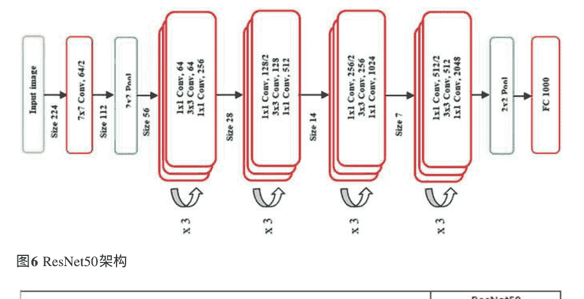

## 图6 ResNet50架构

## 图7 ResNet50迁移模型在Artocarpus图像分类上的性能

| 配置 (Configuration) | ResNet50 |
| :--- | :--- |
| Freeze All, original model | 23.00% |
| Freeze All with new classifier, 150 perceptrons, 1 dense layer | 80.50% |
| Freeze All with new classifier, 150 perceptrons, 2 dense layer | 70.50% |
| Freeze All with new classifier, 1024 perceptrons, 1 dense layer | 78.00% |
| Freeze All with new classifier, 4096 perceptrons, 1 dense layer | 75.00% |
| Freeze All with new classifier, 4096 perceptrons, 2 dense layer | 84.50% |
| Freeze All with new classifier, 4096 perceptrons, 3 dense layer | 82.00% |
| Freeze All with new classifier, 1024 then 4096 perceptrons, 2 dense layer | **86.00%** |
| Freeze All with new classifier, 1024 then 4096 perceptrons, 3 dense layer | 81.00% |
| Train Entire Model with new classifier, 1024 perceptrons, 1 dense layer | 78.50% |

## 图8 ResNet50迁移模型，除顶层外全部冻结，新的分类器有2个密集层，第一个有1024个感知器，第二个有4096个感知器

```
python
from keras.applications.resnet import ResNet50

base_model14 = ResNet50(weights=None, include_top=False, input_shape=(224, 224, 3), classes=4 )
base_model14.trainable=False
flat1 = Flatten()(base_model14.layers[-1].output)
class1 = Dense(1024 ,activation='relu')(flat1)
class2 = Dense(4096 ,activation='relu')(class1)
output = Dense(10, activation='softmax')(class2)

base_model14 = Model(inputs=base_model14.inputs, outputs=output)
# summarize
base_model14.summary()


Model: "model_5"
__________________________________________________________________________________________________
Layer (type)                Output Shape                 Param #   Connected to
==================================================================================================
...
Total params: 130,588,554
Trainable params: 107,000,842
Non-trainable params: 23,587,712
```

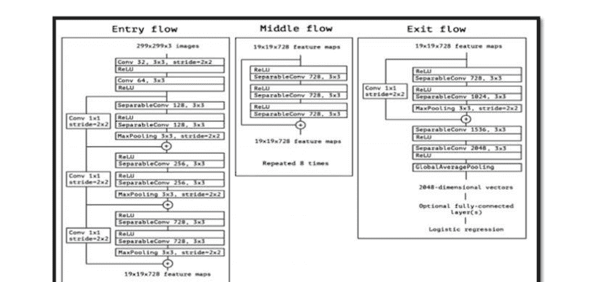

| 配置 | Xception |
|------|----------|
| Freeze All, original model | 22.00% |
| Freeze All with new classifier, 150 perceptrons, 1 dense layer | 23.00% |
| Freeze All with new classifier, 150 perceptrons, 2 dense layer | 24.00% |
| Freeze All with new classifier, 1024 perceptrons,1 dense layer | 23.00% |
| Freeze All with new classifier, 4096 perceptrons, 1 dense layer | 33.00% |
| Freeze All with new classifier, 4096 perceptrons, 2 dense layer | 44.00% |
| Freeze All with new classifier, 4096 perceptrons, 3 dense layer | 66.50% |
| Freeze All with new classifier, 1024 then 4096 perceptrons, 2 dense layer | 24.50% |
| Freeze All with new classifier, 1024 then 4096 perceptrons, 3 dense layer | 27.00% |
| Train Entire Model with new classifier , 1024 perceptrons , 1 dense layer | 26.50% |

## 迁移学习模型总结

图12展示了VGG16、ResNet50和Xception在Artocarpus图像分类上的性能。一眼看去，如果使用原始的预训练模型和原始的分类器并冻结所有配置，这三个模型的性能都很差。这可能是因为它们在预训练时使用的ImageNet数据集中缺乏Artocarpus图像。其次，VGG16和Xception模型在使用更高的感知器数量时表现更好。在ResNet50上，这种特征不太显著，因为它的所有配置似乎都表现得相当好。

在所有三个模型上都观察到的另一个特征是，在较低的感知器数量（150）时，增加密集层的数量会降低准确性，而在较高的感知器数量（4096）时，增加密集层的数量会提高准确性。此外，我们可以看到ResNet50是最合适的

```
In [47]: base_model19 = Xception(weights=None, include_top=False, input_shape=(224, 224, 3), classes=4)
base_model19.trainable=False
flat1 = Flatten()(base_model19.layers[-1].output)
class1 = Dense(4096, activation='relu')(flat1)
class2 = Dense(4096, activation='relu')(class1)
class3 = Dense(4096, activation='relu')(class2)
output = Dense(10, activation='softmax')(class3)

base_model19 = Model(inputs=base_model19.inputs, outputs=output)
# summarize
base_model19.summary()
_________________________________________________________________
 Layer (type)                Output Shape              Param #
=================================================================
 block14_sepconv2 (Separabl  (None, 7, 7, 2048)       3159552
 eConv2D)
                                                                
 block14_sepconv2_bn (Batch  (None, 7, 7, 2048)       8192
 Norma)
                                                                
 block14_sepconv2_act (Acti  (None, 7, 7, 2048)       0
 vatio)
                                                                
 flatten_8 (Flatten)         (None, 100352)            0
                                                                
 dense_21 (Dense)            (None, 4096)              411045888
                                                                
 dense_22 (Dense)            (None, 4096)              16781312
                                                                
 dense_23 (Dense)            (None, 4096)              16781312
                                                                
 dense_24 (Dense)            (None, 10)                40970
                                                                
=================================================================
Total params: 465,510,962
Trainable params: 444,649,482
Non-trainable params: 20,861,480
_________________________________________________________________
```

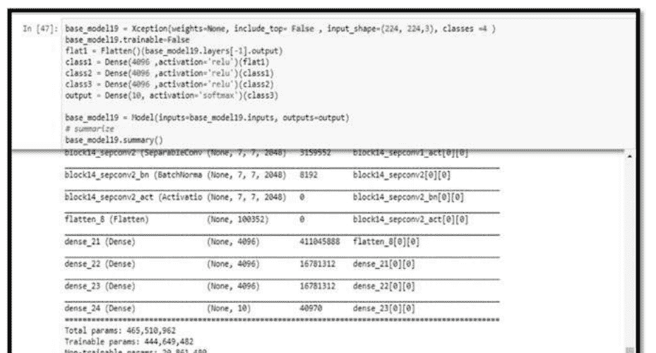

最适合 Artocarpus图像分类的转移模型。 这是因为ResNet50能够在所有测试的配置中保持相当好的准确性>70%。 VGG16排名第二，其中大约一半的模型表现相当好，而Xception在所有测试的配置中无法达到>70%的准确性。

在这里，我们可以得出结论，Xception模型不适合用于 Artocarpus图像分类。 然而，需要注意的是，如果增加训练轮数，所有三个模型仍然可以达到更高的准确性。 总之，与VGG16和Xception相比，ResNet50是用于 Artocarpus图像分类的最佳转移模型。

| | VGG16 | ResNet50 | Xception |
| :--- | :--- | :--- | :--- |
| Freeze All, original model | 30.00% | 23.00% | 22.00% |
| Freeze All with new classifier, 150 perceptrons, 1 dense layer | 64.00% | 80.50% | 23.00% |
| Freeze All with new classifier, 150 perceptrons, 2 dense layer | 50.50% | 70.50% | 24.00% |
| Freeze All with new classifier, 1024 perceptrons, 1 dense layer | 54.50% | 78.00% | 23.00% |
| Freeze All with new classifier, 4096 perceptrons, 1 dense layer | 77.00% | 75.00% | 33.00% |
| Freeze All with new classifier, 4096 perceptrons, 2 dense layer | **81.50%** | 84.50% | 44.00% |
| Freeze All with new classifier, 4096 perceptrons, 3 dense layer | 71.00% | 82.00% | **66.50%** |
| Freeze All with new classifier, 1024 then 4096 perceptrons, 2 dense layer | 48.00% | **86.00%** | 24.50% |
| Freeze All with new classifier, 1024 then 4096 perceptrons, 3 dense layer | 25.00% | 81.00% | 27.00% |
| Train Entire Model with new classifier, 1024 perceptrons, 1 dense layer | 26.50% | 78.50% | 26.50% |

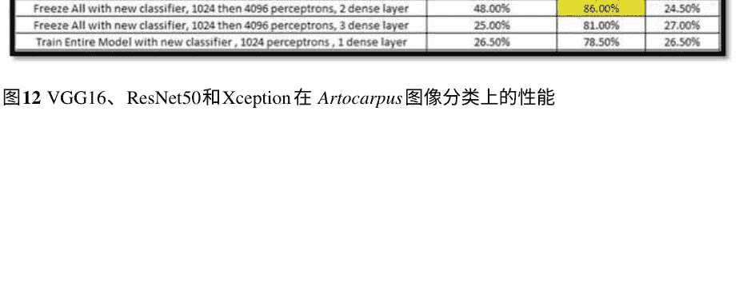图13 *Artocarpus*数据集的样本图像

## 2.3 数据集

*Artocarpus*属大约有50种树木，主要分布在东南亚[20]。在我们的研究中，我们重点关注了4种可食用水果的物种，分别是(1)*Artocarpus altilis* (2)*Artocarpus lanceifolius* (3)*Artocarpus heterophyllus*和(4)*Artocarpus odoratissimus*。该数据集总共包含1000张图像，每个物种有250张图像。图像的大小调整为224×224像素。然后将数据集分为80%的训练集和20%的测试集。样本图像可见于图13。

## 2.4 增强

使用90°图像旋转来增强图像，以提高准确性和训练模型的效果。代码和示例图像可见于图14。

## 3 性能结果

### 3.1 实验设置

原始数据集包含1000张图像，分为4类，即面包果（*Artocarpus altilis*）、Keledang（*Artocarpus lanceifolius*）、Nangka（*Artocarpus heterophyllus*）和Tarap（*Artocarpus odoratissimus*）。每个类别有250张图像，并且已经预处理为224像素×224像素×3个滤波器。我们将使用Python编程语言，如Keras和Tensorflow库，以及Jupyter笔记本本来构建我们的程序。

```python
img_path = '/content/Artocarpus'
# Convert all images to PNG, rotate 90 degrees, remove old JPG images
for folder, subfolder, files in os.walk(img_path):
    for file in files:
        file_path = os.path.join(folder, file)
        file_name = os.path.splitext(file_path)[0]
        img = Image.open(file_path)
        img = img.rotate(90)
        if file_path.endswith(('.JPEG','.JPG')):
            img.save(file_name+".PNG")
            os.remove(os.path.join(folder, file))

import random
plt.figure(figsize=(22,22))
test_folder='/content/Artocarpus/Breadfruit (Artocarpus altilis)'
for i in range(5):
    file = random.choice(os.listdir(test_folder))
    image_path = os.path.join(test_folder, file)
    img=mpimg.imread(image_path)
    ax=plt.subplot(1,5,i+1)
    ax.title.set_text(file)
    plt.imshow(img)
```

图14 使用90°旋转增强的图像

构建我们的程序。首先，我们加载所有图像，然后通过将所有图像旋转90°来执行数据增强。然后，我们将所有2000张图像输入Keras库函数“image_dataset_from_directory()”中，对数据进行预处理，以转换为Tensorflow库支持的格式。数据集进一步分为20%的测试数据集和80%的训练数据集。接下来，我们进行超参数优化，从隐藏层（密集层和CNN层）的数量、感知器的数量、滤波器的数量、优化器、迭代次数和学习率开始。为了减少尝试不同超参数组合的调整时间，我们决定单独调整每个超参数。这可以通过在调整特定超参数时固定所有其他超参数来实现。一旦超参数达到最佳状态，然后再进行下一个超参数的调整。超参数优化工作流程和使用的超参数的详细说明见图15和表1。

### 3.2 提出的CNN模型的性能

在本节中，我们将讨论隐藏层、感知器、滤波器数量、优化器、迭代次数和学习率对我们模型性能的影响。之后，为我们提出的CNN模型确定最佳超参数，并将其准确度与VGG16和Xception模型的迁移学习性能进行比较。

i) Start hyperparameter optimization.
ii) Tune Hyperparameter 1 and fixed all other hyperparameters.
iii) If Hyperparameter 1 has reached optimum, carry forward the hyperparameter and proceed to tune the next hyperparameter.
iv) Repeat the same proceed for Hyperparameter N, N= 2, 3, 4, 5, 6
v) End hyperparameter optimization

#### 3.2.1 隐藏层的影响（卷积层和全连接层）

超参数调整是在卷积层和全连接层上进行的。卷积神经网络的性能在不同隐藏层数量的情况下有很大影响。图16显示了在构建模型时使用不同组合的卷积层和全连接层时的准确度结果。卷积层的测试包括2、3、4和5层，而全连接层的测试包括1、2、3、4、5、6和7层。测试了不同的组合，例如2个卷积层和1个全连接层，2个卷积层和2个全连接层，5个卷积层和6个全连接层，5个卷积层和7个全连接层等。观察到最佳结果是使用2个卷积层和5个全连接层，准确度为76%。

表1 优化中使用的超参数及其值

| 编号 | 超参数 | 解释 | 隐藏层 | 感知器的数量 | 过滤器的数量 | 优化器 | 迭代次数 | 学习率 |
|------|--------|------|--------|--------------|--------------|--------|----------|--------|
| 1 | 超参数1 | 隐藏层的影响（卷积层和全连接层） | 调整 | 与平铺后的感知器数量相同 | 3 | 损失 = 'sparse_categorical_crossentropy'，优化器 = 'adam' | 15 | 0.01（默认值） |
| 2 | 超参数2 | 感知器数量的影响 | 最佳值 | 调整 | 3 | 损失 = 'sparse_categorical_crossentropy'，优化器 = 'adam' | 15 | 0.01（默认值） |
| 3 | 超参数3 | 过滤器数量的影响 | 最佳值 | 最佳值 | 调整 | 损失 = 'sparse_categorical_crossentropy'，优化器 = 'adam' | 15 | 0.01（默认值） |
| 4 | 超参数4 | 优化器的影响 | 最佳值 | 最佳值 | 最佳值 | 调整 | 15 | 0.01（默认值） |
| 5 | 超参数5 | 迭代次数的影响 | 最佳值 | 最佳值 | 最佳值 | 最佳值 | 调整 | 0.01（默认值） |
| 6 | 超参数6 | 学习率的影响 | 最佳值 | 最佳值 | 最佳值 | 最佳值 | 最佳值 | 调整 |

#### 3.2.2 感知器的影响

在CNN模型的开发过程中，测试了一个超参数，即感知器的数量。使用从3.2.1中获得的最佳模型，将密集层中的感知器数量减少以观察其对模型准确性的影响。最初，感知器的数量为9408，根据flatten层获得的感知器数量。然后，9408个感知器逐渐被2、4、8、16、32、64和128分割。图17显示了在应用不同数量的感知器时模型的准确性变化。当密集层中的感知器数量减少64倍，即147个感知器时，模型达到了最高的81%准确性。

#### 3.2.3 滤波器数量的影响

测试了3、6、12、24、48、96、192个卷积滤波器层。根据图18，观察到从3个卷积滤波器层增加到192个时，准确性从81%降低到54%。

在卷积层中测试了不同组合的过滤器数量。结果显示在图19中。例如，第一个卷积层使用3个过滤器，而第二个卷积层使用24个过滤器。当第一个卷积层使用12个过滤器，第二个卷积层使用96个过滤器时，获得了最高的准确率85%。根据收集到的结果，卷积层中使用不同的过滤器数量比使用相同的过滤器数量获得了更高的准确率。

图17 具有不同感知器数量的模型准确率

图18 当卷积层使用相同的过滤器数量时，模型的准确率

#### 3.2.4 优化器的影响

使用不同类型的优化器，如Adam、Adagrad、RMSprop、SGD、Adadelta、Adamax、Nadam和Ftrl来优化模型的性能。这些优化器通过更新权重参数来最小化神经网络的损失。根据图20，模型的最佳优化器是Adagrad，准确率达到了86.3%。其他优化器如Adam的准确率为77%，RMSprop的准确率为79%，SGD的准确率为28%，Adadelta的准确率为65%，Adamax的准确率为86%，Nadam的准确率为82%，Ftrl的准确率为37%。

根据图21，Adam是最快达到自己最高准确率的优化器，相比其他优化器更快。Adam在7个时期达到了78%的准确率。其他优化器只在13个时期后达到了自己的最高准确率。Adagrad在14个时期达到了最高准确率。Adamax和Adagrad在4个时期后的准确率相当稳定。RMSprop在1个时期能够达到71%的准确率。然而，准确率并不稳定。RMSprop在运行的各个时期中最高准确率为85%，最低准确率为60%，导致最终准确率为79%。

图21 每个时期中不同优化器的准确率

#### 3.2.5 学习率的影响

学习率是训练CNN模型中使用的重要超参数之一。在这个项目中采用和观察到的学习率分别为0.1、0.01、0.001、0.0001、0.00001和0.000001。当学习率为0.001时，模型达到了最高的87%的准确率。图22显示，准确率从0.1到0.001的学习率范围内从23%提高到了87%。然而，当学习率为0.0001时，准确率下降到了42%。当学习率为0.00001时，准确率提高到63%，而当学习率为0.000001时准确率再次下降。因此，可以得出结论，0.001是CNN模型的最佳学习率。根据图23，为了达到更高的准确率，可能需要修改其他学习率的迭代次数。

图22 不同学习率下模型的准确率

### 3.3 准确率比较

预训练模型和提出的模型的准确率如表2所示，粗体字表示最佳结果。可以观察到，表现最好的模型是我们提出的模型，准确率为87.00%。其次是ResNet50（冻结所有权重，使用新的分类器，1024个感知器，2个全连接层）和 VGG-16（冻结所有权重，使用新的分类器，4096个感知器，2个全连接层），准确率分别为86.00%和81.50%。这些模型的准确率几乎相似，即使我们尝试了其他超参数的组合也没有改善。

这可能是因为我们的数据集中存在贝叶斯误差，其中有些图像具有几乎相似的特征但具有不同的目标。这是可能的，因为几乎所有我们的图像都包含大量的绿色像素，但具有不同的标签。这将导致图像难以训练，并且具有不可约的贝叶斯误差。因此，我们的模型可能已经达到了最佳性能。所有预训练的模型都冻结了所有超参数，在预测中都没有显示出很高的准确性，并且准确性在22.00%到30.00%之间。这是因为预训练模型很复杂，需要更多的迭代才能收敛到最佳准确性。

### 3.4 模型性能比较

预训练模型和提出的模型在连续15个迭代中的准确性如图24所示。在这个图中，提出的模型在第一个迭代中具有最高的准确性。然后，它急剧增加，并在第十个迭代达到最大准确性。在第十个迭代之后，它稳定在80-87%的水平。对于ResNet50（冻结所有并使用新的分类器，1024个感知器，2个密集层）和VGG-16（冻结所有并使用新的分类器，4096个感知器，2个密集层），它有所增加，从第一个周期到第十五个周期逐渐增加。然而，增加量不超过提出的模型。这意味着我们提出的模型需要较少的周期进行训练，以达到最佳和更高的准确性，而这些模型则不需要。对于其他预训练模型，在从第一个周期到第十五个周期进行训练时，它并没有提供显著的改进，但仍然显示上升趋势。

表2 预训练模型、提出的模型及其超参数的准确性

| 模型 | 超参数 | 准确率 (%) |
| --- | --- | --- |
| VGG-16 | 全部冻结 | 30.00 |
| VGG-16 | 全部冻结, 新分类器, 4096个感知器, 2个密集层 | 81.50 |
| ResNet50 | 全部冻结 | 23.00 |
| ResNet50 | 全部冻结, 新分类器, 1024个感知器, 然后4096个感知器, 2个密集层 | 86.00 |
| Xception | 全部冻结 | 22.00 |
| Xception | 全部冻结, 新分类器, 4096个感知器, 3个密集层 | 66.50 |
| 提出的模型 | 2个CNN层 (12个, 96个过滤器) 和6个具有147个感知器的密集层 | 87.00 |

图24 预训练模型和提出模型在每个时期的准确性

## 4 结论

总之，我们提出的模型是表现最好的模型，预测准确率为87%，其架构包括2个CNN层（12个96个过滤器）和6个具有147个感知器的密集层。与其他预训练模型相比，它还需要较少的时期进行训练以达到最佳准确性。

## 参考文献

1. Araújo, S. O., Peres, R. S., Barata, J., Lidon, F., & Ramalho, J. C. (2021). Characterising the agriculture 4.0 landscape—Emerging trends, challenges and opportunities. *Agronomy*, *11*(4), 667.
2. Fennimore, S. A., Slaughter, D. C., Siemens, M. C., Leon, R. G., & Saber, M. N. (2016). 用于特种作物杂草控制自动化的技术。杂草技术，*30*(4), 823–837。
3. Jamei, M., Karbasi, M., Malik, A., Abualigah, L., Islam, A. R. M. T., & Yaseen, Z. M. (2022). 孟加拉国沿海多层含水层地下水盐度分布的计算评估。科学报告，*12*(1), 1–28。
4. Sarig, Y. (1993). 水果采摘机器人：现状综述。农业工程研究杂志，*54*(4), 265–280。
5. Sa, I., Ge, Z., Dayoub, F., Upcroft, B., Perez, T., & McCool, C. (2016). Deepfruits: 使用深度神经网络的水果检测系统。传感器，*16*(8), 1222。
6. Daradkeh, M., Abualigah, L., Atalla, S., & Mansoor, W. (2022). 使用深度学习和机器学习技术的编辑分类应用电子学，*11*(13), 2066。
7. AlShourbaji, I., Kachare, P., Zogaan, W., Muhammad, L. J., & Abualigah, L. (2022). 使用优化的人工神经网络学习特征进行乳腺癌诊断SN计算机科学，*3*(3), 1–8。
8. ud Din, A. F., Mir, I., Gul, F., Mir, S., Saeed, N., Althobaiti, T., Abbas, S. M., & Abualigah, L. (2022). 深度强化学习用于自主无人机的综合非线性控制过程，*10*(7), 1307。
9. Alkhatib, K., Khazaleh, H., Alkhazaleh, H. A., Alsoud, A. R., & Abualigah, L. (2022). 一种新的股票价格预测方法，使用主动深度学习方法。开放创新杂志：技术、市场和复杂性，*8*(2), 96。
10. Shehab, M., Abualigah, L., Shambour, Q., Abu-Hashem, M. A., Shambour, M. K. Y., Als alibi, A. L., & Gandomi, A. H. (2022). 医学应用中的机器学习：现有方法综述。计算机生物学与医学，*145*, 105458。
11. Ezugwu, A. E., Ikotun, A. M., Oyelade, O. O., Abualigah, L., Agushaka, J. O., Eke, C.I., & Akinyelu, A. A. (2022). 聚类算法的综合调查：现有机器学习应用、分类、挑战和未来研究前景。人工智能工程应用，*110*, 104743。
12. Wu, D., Wang, S., Liu, Q., Abualigah, L., & Jia, H. (2022). 一种改进的基于教学学习的优化算法与强化学习策略用于解决优化问题。计算智能与神经科学。
13. Abualigah, L., Diabat, A., Mirjalili, S., Abd Elaziz, M., & Gandomi, A. H. (2021). 算术优化算法。应用力学和工程计算方法，*376*, 113609。
14. Abualigah, L., Yousri, D., Abd Elaziz, M., Ewees, A. A., Al-Qaness, M. A., & Gandomi, A.H. (2021). 神鹰优化器：一种新颖的元启发式优化算法。计算机与工业工程，*157*, 107250。

- 15. Abualigah, L., Abd Elaziz, M., Sumari, P., Geem, Z. W., & Gandomi, A. H. (2022). 爬行动物搜索算法（RSA）：一种受自然启发的元启发式优化器。专家系统与应用，191, 116158。
- 16. Agushaka, J. O., Ezugwu, A. E., & Abualigah, L. (2022). 侏儒狮优化算法。计算方法在应用力学和工程中，391, 114570。
- 17. Oyelade, O. N., Ezugwu, A. E. S., Mohamed, T. I., & Abualigah, L. (2022). 埃博拉优化搜索算法：一种新的受自然启发的元启发式优化算法。IEEE Access, 10, 16150–16177。
- 18. Ezugwu, A. E., Agushaka, J. O., Abualigah, L., Mirjalili, S., & Gandomi, A. H. (2022). 草原犬优化算法。神经计算与应用，1–49。
- 19. 洪, S., 诺, H., & 韩, B. (2015). 解耦的深度神经网络用于半监督语义分割。神经信息处理系统的进展，28。
- 20. Jagtap, U. B., & Bapat, V. A. (2010). Artocarpus：传统用途，植物化学和药理学综述。民族药理学杂志，129（2），142-166。

# 使用各种深度学习方法进行红毛丹图像分类

Nur Alia Anuar, Loganathan Muniandy, Khairul Adli Bin Jaafar, Yi Lim, Al Lami Lamyaa Sabeeh, Putra Sumari, Laith Abualigah, Mohamed Abd Elaziz, Anas Ratib Alsoud和Ahmad MohdAziz Hussein

摘要 红毛丹（Nephelium lappaceum L.）是一种在马来西亚、印度尼西亚、泰国和菲律宾等热带国家广泛种植和喜爱的水果。这种水果根据果实、果肉和树木特征被分为几十个不同的品种。在这个项目中，基于1000个红毛丹图像数据集，开发了五种不同的红毛丹品种分类模型，使用了深度学习技术。常见的深度学习方法用于图像分类任务，包括卷积神经网络（CNN）和迁移学习方法，被应用于识别每个红毛丹变种。结果显示，VGG16预训练模型表现最佳，在测试数据集上达到了96%的准确率。这表明该模型在红毛丹分类任务中是可靠的。

关键词 深度学习·卷积神经网络·水果分类·红毛丹·ResNet·VGG

N. A. Anuar · L. Muniandy · K. A. B. Jaafar · Y. Lim · A. L. L. Sabeeh · P. Sumari · L. Abualigah（図）马来西亚槟城乔治敦市大学科学学院计算机科学系电子邮件：Aligah.2020@gmail.com L. Abualigah · A. R. Alsoud Hourani Center for Applied Scientific Research, Al-Ahliyya Amman University, Amman 19328, Jordan L. Abualigah 中东大学信息技术学院，阿曼安曼11831 M. A. Elaziz Faculty of Computer Science and Engineering, Galala University, Al Galala City, Egypt Artificial Intelligence Research Center (AIRC), Ajman University, 346 Ajman, United Arab Emirates Department of Mathematics, Faculty of Science, Zagazig University, Zagazig 44519, Egypt School of Computer Science and Robotics, Tomsk Polytechnic University, Tomsk, Russia A. M. Hussein Deanship of E-Learning and Distance Education, Umm Al-Qura University, Makkah 21955, Saudi Arabia

© The Author(s), under exclusive license to Springer Nature Switzerland AG 2023 23 L. Abualigah (ed.), Classification Applications with Deep Learning and Machine Learning Technologies, Studies in Computational Intelligence 1071, https://doi.org/10.1007/978-3-031-17576-3_2

## 1 引言

计算机视觉是人工智能（AI）的一个子领域，负责“教导”机器理解和解释视觉世界，如数字图像或视频。大数据的崛起，更快更便宜的计算资源以及新的算法，促进了这一领域的广泛发展。图像分类是计算机视觉方法之一，应用于包括技术、医疗、制造和农业在内的各个领域。在农业领域，自动水果图像识别可以辅助质量控制和果园机器采摘系统的开发[1]。

水果图像识别系统用于分类不同类型的水果，并区分同一种水果的不同变种[2, 3]。红毛丹是一种异国水果，主要存在于东南亚地区，尤其在马来西亚非常受欢迎。它有不同的品种或栽培品种，如宾贾伊、加丁、糖石、金针和荣瑞恩[4]。这些栽培品种在肉眼中看起来很相似。因此，由深度学习方法驱动的图像识别系统可以准确地对红毛丹栽培品种进行分类[5-11]。

卷积神经网络（CNN）算法在图像分类任务中始终表现出卓越的性能，包括在图像数据库中的MNIST数据库、NORB数据库和CIFAR10数据集[12]。除了CNN之外，迁移学习是研究人员用于图像分类的流行方法之一。迁移学习采用预训练模型，这是一个在大型数据集上训练并取得最先进性能的网络。在本文中，我们使用CNN和迁移学习等深度学习模型研究了红毛丹品种的分类。

## 2 文献综述

深度学习使计算机模型能够直接从各种类型的数据（如图像、文本或音频）中学习和执行分类任务[13-16]。它通过使用大量标记数据和包含许多层的神经网络架构来提供高准确率的模型训练。网络在一系列数据上训练时学习相关特征。这种在网络训练过程中进行的特征提取使得深度学习模型在目标分类等计算机视觉任务中具有高准确性。它已成为包括医学诊断在内的机器关键人工智能应用的核心技术之一，用于筛查各种类型的癌症[18]。最近，图像分类技术被用于对患者的胸部X射线和CT图像进行Covid-19筛查测试[19]。

深度学习在许多应用中取得了巨大的性能，包括水果分类。有关水果分类的研究工作有不同的目标和应用[20]。其中一个应用是农业。无论如何，深度学习的缺点是需要异常高的处理能力，因为其参数数量可以轻易达到数百万。因此，需要一种轻量级的深度学习架构，以加快诊断速度而不牺牲准确性。

在本节中，让我们回顾一下以前使用神经网络和深度学习进行水果识别的几个尝试。关于使用深度神经网络从图像中检测水果的主题，论文[21]展示了一个训练用于识别水果的网络。研究人员似乎采用了一种更快的基于区域的卷积网络。目标是创建一个由自主机器人使用的神经网络，可以收获水果。该网络使用RGB和近红外（NIR）图像进行训练。RGB和NIR模型的组合在两种不同的情况下进行，分别称为早期融合和晚期融合。结果是一个多模态网络，比现有网络的性能要好得多。

另一篇论文[22]使用了两个基于反向传播的神经网络，对带有“Gala”品种苹果树的图像进行训练，以预测即将到来的季节的产量。为了完成这个任务，从图像中提取了四个特征，如水果的总横截面积、水果数量、小水果的总横截面积和叶片的横截面积。研究发现，深度学习方法非常有效地对水果进行分类。还可以使用其他优化方法来优化问题，如[23–28]所述。

## 3 提出的深度学习方法

在本文中，我们计划使用几种深度学习方法，包括卷积神经网络（CNN）、残差网络（ResNet）和VGG16。

### 3.1 CNN

卷积神经网络（CNN）是一种特殊类型的前馈神经网络，广泛用于图像识别。CNN从输入图像中提取每个部分，称为感受野，并根据感受野对每个神经元分配权重，以区分神经元之间的重要性。CNN的架构包括三种类型的层：（1）卷积层，（2）池化层和（3）全连接层，如图1所示。卷积操作用于应用多个滤波器从图像中提取特征，形成特征图。通过这种方式，可以保留数据集中的相应空间信息。池化操作，也称为子采样，用于减少卷积操作生成的特征图的维度。池化层是在卷积层之后添加的新层。

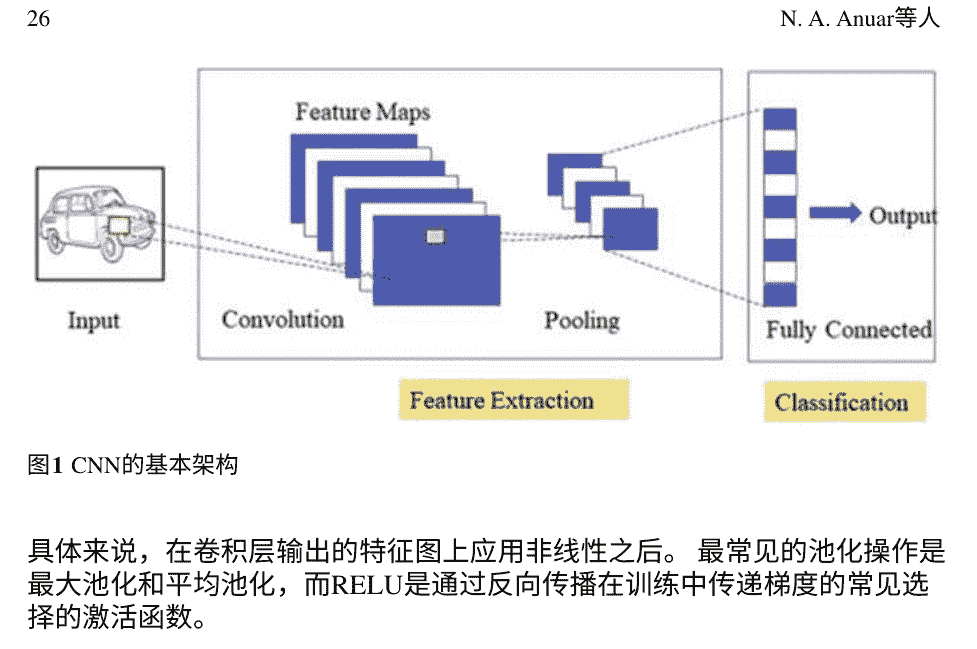

图1 CNN的基本架构

具体来说，在卷积层输出的特征图上应用非线性之后。最常见的池化操作是最大池化和平均池化，而RELU是通过反向传播在训练中传递梯度的常见选择的激活函数。

在我们的工作中，我们提出了一个CNN模型来分类五种红毛丹类型：红毛丹宾加伊、加丁、糖块、金针和荣瑞恩。该模型由四个卷积层组成。第一个卷积层使用32个卷积滤波器，滤波器大小为3 × 3，核正则化器为0.001。正则化器用于在优化过程中对层进行惩罚。这些惩罚用于网络优化中的损失函数中。填充用于确保输入和输出张量保持相同的形状。输入图像大小为224 × 224 × 3。批量归一化应用于每个卷积层之前的激活函数。RELU是一种修正线性激活函数，在每个卷积中常用的激活函数。

这个激活函数确保输出只能是正数或零。每个卷积层的输出作为输入传递给最大池化层，池大小为2 × 2。这一层通过下采样来减少参数的数量。因此，它减少了计算所需的内存和时间。因此，这一层仅聚合了分类所需的特征。从第二个卷积层开始，分别应用了0.3、0.2和0.1的Dropout。这旨在减少模型复杂性，防止过拟合，并减少每个卷积的计算能力和时间。第二个卷积层使用64个2 × 2的卷积滤波器，第三个卷积层使用128个2 × 2的卷积滤波器，然后是带有256个2 × 2的卷积滤波器的第四层。最后，我们使用4个密集层和0.5的Dropout，然后使用SoftMax分类器。在使用密集层之前，将第四个卷积的特征图展平。在我们的模型中，使用的损失函数是分类交叉熵，Adam优化器的学习率为0.001。所提出的CNN模型的架构如图2、3和4所示。图5显示了模型的预期分类输出。

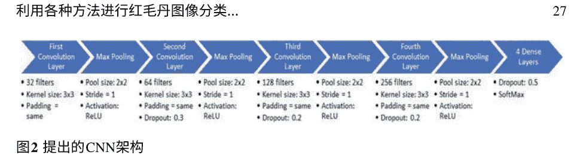

```python
l2_reg = 0.001
opt = Adam(learning_rate = 0.001)

#Defining the CNN Model
cnn_model = Sequential()
cnn_model.add(Conv2D(filters = 32, kernel_size = (3,3), input_shape = (224,224, 3), padding = 'same', activation = 'relu',kernel_regularizer = l2(l2_reg)))
cnn_model.add(MaxPool2D(pool_size = (2,2)))
cnn_model.add(Conv2D(filters = 64, kernel_size = (3,3), padding = 'same', activation = 'relu',kernel_regularizer = l2(l2_reg)))
cnn_model.add(MaxPool2D(pool_size = (2,2)))
cnn_model.add(Dropout(0.3))
cnn_model.add(Conv2D(filters = 128, kernel_size = (3,3), padding = 'same', activation = 'relu',kernel_regularizer = l2(l2_reg)))
cnn_model.add(MaxPool2D(pool_size = (2,2)))
cnn_model.add(Dropout(0.2))
cnn_model.add(Conv2D(filters = 256, kernel_size = (3,3), padding = 'same', activation = 'relu',kernel_regularizer = l2(l2_reg)))
cnn_model.add(MaxPool2D(pool_size = (2,2)))
cnn_model.add(Dropout(0.2))

cnn_model.add(Flatten())

cnn_model.add(Dense(256, activation = 'relu'))
cnn_model.add(Dense(128, activation = 'relu'))
cnn_model.add(Dense(64, activation = 'relu'))
cnn_model.add(Dropout(0.3))
cnn_model.add(Dense(5, activation = 'softmax'))
```

### 3.2 迁移学习

#### 3.2.1 ResNet

残差网络（ResNet）是由微软研究团队开发的，用于实现深度残差学习的图像识别任务。该算法在ILSVRC 2015分类任务中获得了第一名。深度残差学习架构是为了解决由于增加堆叠层数（深度）而导致的退化问题而开发的。尽管与VGG网络相比具有更多的深度，但网络的复杂性较低[29]。这些模型在超过128万张图像上进行了训练，并在5万张验证图像上进行了评估。ResNet以18、34、50、101和152层的形式构建了五个卷积块。

我们提出使用Keras库在我们的红毛丹类型分类任务上应用ResNet-50和ResNet-101预训练模型。为了研究使用完全训练的模型与部分训练的预训练模型的效果，将冻结部分或全部ResNet卷积块。一个新的分类器层由两个具有256个神经元单元的稠密层和SoftMax激活函数组成。使用自适应矩估计（Adam）优化器来计算具有不同学习率的分类器层的最优权重。全连接层应用分类交叉熵损失函数来计算预测值和实际标签之间的损失。图6显示了ResNet模型的架构。

Model: "sequential_36"

| Layer (type) | Output Shape | Param # |
|--------------|--------------|---------|
| conv2d_134 (Conv2D) | (None, 224, 224, 32) | 896 |
| max_pooling2d_134 (MaxPoolin) | (None, 112, 112, 32) | 0 |
| conv2d_135 (Conv2D) | (None, 112, 112, 64) | 18496 |
| max_pooling2d_135 (MaxPoolin) | (None, 56, 56, 64) | 0 |
| dropout_134 (Dropout) | (None, 56, 56, 64) | 0 |
| conv2d_136 (Conv2D) | (None, 56, 56, 128) | 73856 |
| max_pooling2d_136 (MaxPoolin) | (None, 28, 28, 128) | 0 |
| dropout_135 (Dropout) | (None, 28, 28, 128) | 0 |
| conv2d_137 (Conv2D) | (None, 28, 28, 256) | 295168 |
| max_pooling2d_137 (MaxPoolin) | (None, 14, 14, 256) | 0 |
| dropout_136 (Dropout) | (None, 14, 14, 256) | 0 |
| flatten_36 (Flatten) | (None, 50176) | 0 |
| dense_138 (Dense) | (None, 256) | 12845312 |
| dense_139 (Dense) | (None, 128) | 32896 |
| dense_140 (Dense) | (None, 64) | 8256 |
| dropout_137 (Dropout) | (None, 64) | 0 |
| dense_141 (Dense) | (None, 5) | 325 |
| Total params: | 13,275,205 | |
| Trainable params: | 13,275,205 | |
| Non-trainable params: | 0 | |

图4 模型的摘要

- 1. **ResNet和VGG的特征提取和模型训练：**
    1. 通过指定“include-top =False”和图像数据的形状来加载预训练模型。
    2. 通过预训练层绕过图像数据提取卷积视觉特征。
    3. 生成的特征堆栈将是三维的，在被分类器用于预测之前需要被压平。
    4. 创建并与预训练层一起使用全连接层。用随机权重初始化这个全连接层，在训练过程中会更新权重（图7和8）。

#### 3.2.2 VGG

迁移学习是在新问题上重复使用预训练模型的方法。在深度学习中，它的流行之处在于用较少的数据训练深度神经网络的优势。这非常有用，因为大多数现实世界的问题通常没有数百万个标记数据点来训练这样复杂的模型[30]。

再次强调，在迁移学习中，已经训练好的机器学习模型的知识被应用于一个不同但相关的问题。通过迁移学习，我们基本上尝试利用在一个任务中学到的知识来提高在另一个任务中的泛化能力。我们将网络在“任务A”上学到的权重转移到一个新的“任务B”上[31]。

VGG16是迁移学习算法之一。该模型在ImageNet数据集上实现了92.7%的前5个测试准确率，该数据集包含了超过1400万张属于1000个类别的图像[32]。它是提交给ILSVRC-2014的著名模型之一。VGG16通过选择较小的卷积核尺寸（第一层和第二层分别为3 × 3）改进了AlexNet，而不是使用较大的卷积核（11 ×11和5 ×5）。

VGG16架构接受固定的224 * 224 RGB图像输入大小，其中它有总共1.38亿个参数。该架构由5个卷积层块组成，在每个块后面都有一个最大池化层，并且最后有三个全连接层，分别具有4096、4096、1000个神经元。最后一个全连接层是用于分类的SoftMax层。VGG16架构使用非常小的卷积核大小，即3 * 3，在每个卷积层之后，通过ReLU激活函数执行非线性操作。每个块至少包含两个卷积层，最多包含三个卷积层，其中卷积的滤波器数量随着2的幂从64增加到512 [33]。

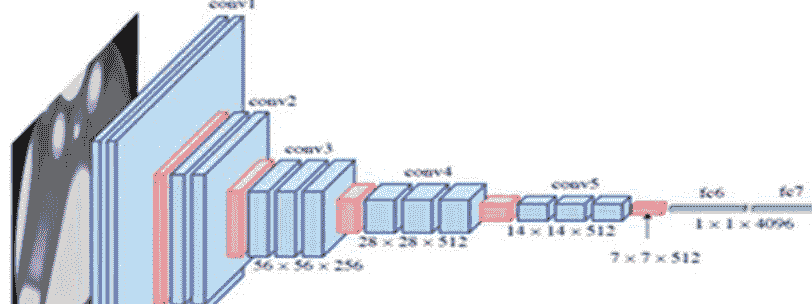

图9 VGG16架构

卷积的滤波器数量按照2的幂从64增加到512 [33]。图9显示了VGG16的架构。在加载了VGG16预训练模型之后，除了最后5层外，所有层都被冻结，因为最后几层代表了较低特征的更高级组合，我们希望训练这些层以适应我们的问题（图10）。然后通过添加VGG卷积基模型和一些完全连接层（包括一个Flatten层、3个具有1024、1024和5个过滤器大小的Dense层）创建了一个顺序模型。前两个Dense层使用ReLU激活函数。

在第二个Dense层之后，添加了一个Dropout层，权重为0.5，以减少过拟合。最后一个Dense层是分类层，使用SoftMax激活函数和Adam优化器，学习率为0.0001。模型摘要如图11所示。

### 3.3 数据集

有各种各样的红毛丹。然而，我们只收集了五种不同类型的红毛丹（Gading、Binjai、Gula Batu、Jarum Mas、Rongrien），每个标签有200张图片。因此，本研究使用的数据集总大小为1000张图片。所有图片都被调整为224 × 224像素。所有图片被分为80%的训练集、10%的验证集和10%的测试集。图12展示了可用的红毛丹类型。

```
# Freeze all the layers expect the last 5
for layer in vgg_model.layers[:-5]:
    layer.trainable = False

# Create the model
model1 =  tf.keras.models.Sequential()

# Add the vgg convolutional base model
model1.add(vgg_model)

# Add fully connected layers
model1.add( tf.keras.layers.Flatten())
model1.add( tf.keras.layers.Dense(1024, activation='relu'))
model1.add( tf.keras.layers.Dense(1024, activation='relu'))
model1.add( tf.keras.layers.Dropout(0.5))
model1.add( tf.keras.layers.Dense(5, activation='softmax'))
```

图10 构建VGG16模型

Model: "sequential_1"

| Layer (type) | Output Shape | Param # |
|---|---|---|
| vgg16 (Functional) | (None, 7, 7, 512) | 14714688 |
| flatten_1 (Flatten) | (None, 25088) | 0 |
| dense_3 (Dense) | (None, 1024) | 25691136 |
| dense_4 (Dense) | (None, 1024) | 1049600 |
| dropout_1 (Dropout) | (None, 1024) | 0 |
| dense_5 (Dense) | (None, 5) | 5125 |
| Total params: 41,460,549 |
| Trainable params: 33,825,285 |
| Non-trainable params: 7,635,264 |

图11 VGG16模型摘要

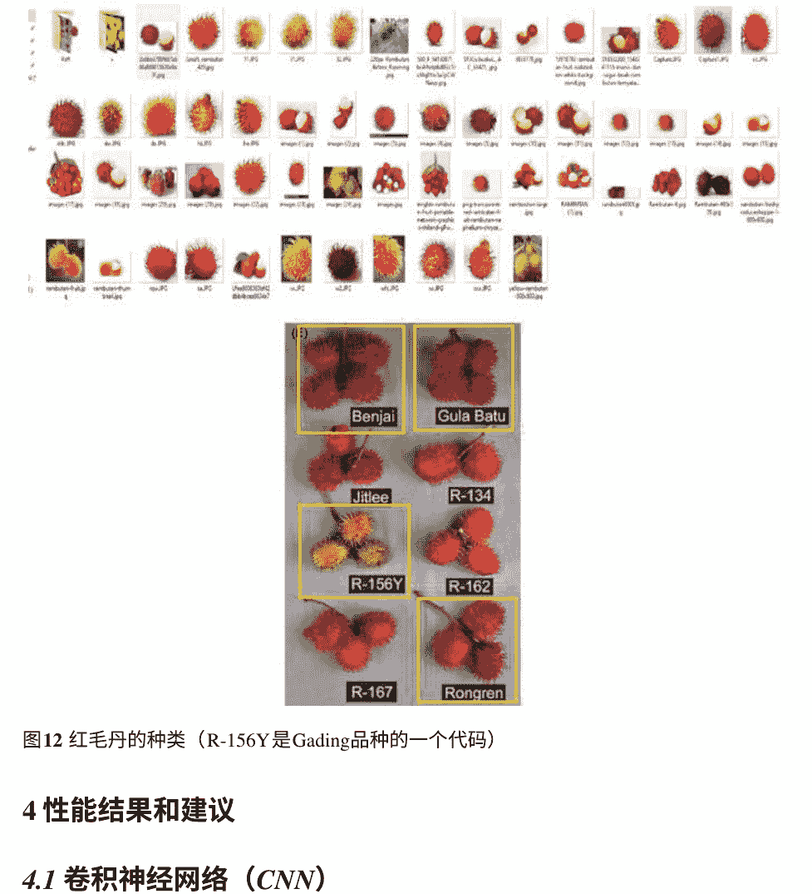

## 4 性能结果和建议

### 4.1 卷积神经网络（CNN）

建立了一个基本的卷积神经网络（CNN）作为基准模型，以与更复杂的迁移学习模型ResNet和VGG16模型进行性能比较。基本CNN模型的参数是基于4个卷积层，每个卷积后的过滤器大小加倍。模型中使用了最大池化。卷积层的架构如图2所示。

使用了3层密集神经元，每层的神经元数量减半（256个神经元> 128个神经元> 64个神经元），然后将所有输出传递到基于5类红毛丹的输出层，其中有5个神经元进行预测。训练的批量大小设置为每批128个样本，共100个周期。然而，使用了提前停止机制以确保训练具有最低的损失。所有层都使用了Relu激活函数，除了用于类别预测的最后输出层，该层使用了SoftMax激活函数。

在设置了所有参数的情况下，模型在测试集上的整体准确率为79%。该模型在第40个epoch之前进行了训练，达到了最低损失。表1显示了基本模型对红毛丹每个类别的F1分数的分割情况。

表1 卷积神经网络的F1分数分割

| 红毛丹类别 | 红毛丹照片 | F1分数（%） |
| :--- | :--- | :--- |
| 宾戴 |  | 77 |
| 加丁 |  | 99 |
| 糖块 |  | 82 |
| 金针 |  | 74 |
| 荣瑞恩 |  | 68 |

加丁红毛丹的分类得分最高，为99%，而荣瑞恩的得分最低，为59%。从所有5个红毛丹类别中，加丁的明显特征是黄色，而其他类别是红色。这个特征被模型很好地提取出来，作为加丁的定义特征。另一方面，其他4个红毛丹的明显特征可能会重叠，从而导致较低的分类性能。进一步研究荣瑞恩（性能最低）的表现，其召回率也明显低于其他类别，仅为47%。这意味着荣瑞恩的假阴性率很高，即荣瑞恩常常被误认为是其他类别的红毛丹。

通过基准模型，我们进一步尝试调整训练参数，包括批量大小、运行周期和卷积层数，以观察模型的性能。参数逐个更改，其余参数与基准模型相同。观察结果如表2、3和4所示。对于卷积层，最大层数为6，超过最大池化层会导致负维度出现，因此将层数调整为略低或略高于基准模型的层数（2至6层）。

| 批量大小 | 运行周期 \| 卷积层数 | 整体准确率，% |
|----------|----------------------|----------------|
| 32       | 提前停止运行周期 4个卷积层 | 79             |
| 64       |                      | 77             |
| 100      |                      | 74             |
| 256      |                      | 77             |

| 运行周期 | 批量大小 \| 卷积层数 | 整体准确率，% |
|----------|----------------------|----------------|
| 30       | 每批128个样本 4个卷积层 | 79             |
| 60       |                      | 81             |
| 90       |                      | 80             |
| 120      |                      | 79             |

| 卷积层 | 批大小 \| 迭代次数 | 整体准确率，% |
|--------|----------------------|----------------|
| 3      | 每批128个样本 提前停止迭代次数 | 77             |
| 6      |                      | 65             |
| 2      |                      | 80             |
| 5      |                      | 80             |

| 卷积层 | 批量大小 | 运行周期 | 整体准确率，% |
|--------|----------|----------|----------------|
| 5      | 32       | 60       | 20             |

综合每个参数的最佳性能，我们得到的性能是（表5）：

当综合所有最佳参数时，整体性能比基准模型差得多。对每个类别的分类进行检查发现，只对一种类型的红毛丹进行了预测。主要原因是批大小较小，将批大小更改为基准值128后，准确率为77%，低于基准模型。因此，基准模型具有4个卷积层，批大小为128，提前停止，给出了最高准确率为79%的模型。

### 4.2 迁移学习模型

我们使用了前面讨论过的两种不同的迁移学习模型：VGG16和ResNet模型。对于这两个迁移学习模型，我们解冻了一些层进行训练。

#### 4.2.1 ResNet

在ResNet模型中有两个参数进行了测试，即批量大小和学习率。

对于ResNet，测试了三种批量大小：32、64和128。表6显示了每个测试批量大小的模型准确性摘要。一个有趣的观察是，解冻一些层可以提高模型的性能，而这种效果比批量大小的差异更为明显。在每个模型中，改变批量大小并没有显著提高准确性，除了ResNet101，当批量大小从32增加到64时，准确性从20%提高到77%。

然而，将批量大小增加到128并没有带来更多显著的改进。关于部分冻结的层，解冻层可以提取和学习我们数据集的独特特征，从而提高它们的性能。

对于学习率，我们使用了两个较低的学习率（0.01、0.05）和两个较高的学习率（0.1、0.5）。表7显示了模型性能结果的摘要。对于3个模型：ResNet50，部分冻结的ResNet50和ResNet101，观察到的趋势是随着学习率的增加，性能准确性在达到平稳状态之前会增加。所有模型训练都使用了50个时期，并使用了提前停止。当训练结束时，较低的学习率可能仍然远离最低损失解决方案。

表6 不同批次大小使用不同模型的性能结果

| 模型 | 批量大小 | 准确率，% |
| :--- | :---: | :---: |
| ResNet50 | 32 | 38.9 |
| | 64 | 40 |
| | 128 | 40 |
| ResNet50（部分冻结） | 32 | 66 |
| | 64 | 67 |
| | 128 | 71 |
| ResNet101 | 32 | 20 |
| | 64 | 77 |
| | 128 | 78 |
| ResNet101（部分冻结） | 32 | 76 |
| | 64 | 80 |
| | 128 | 80 |

\*学习率设置为0.001

表7 不同学习率使用模型的性能结果

| 模型 | 批量大小 | 学习率 | 准确率, % |
|:-----|:--------:|:------:|:---------:|
| ResNet50 | 64 | 0.01 | 81 |
| | | 0.05 | 85 |
| | | 0.1 | 85 |
| | | 0.5 | 85 |
| ResNet50（部分冻结） | | 0.01 | 58 |
| | | 0.05 | 71 |
| | | 0.1 | 75 |
| | | 0.5 | 75 |
| ResNet101 | | 0.01 | 67 |
| | | 0.05 | 83 |
| | | 0.1 | 82 |
| | | 0.5 | 83 |
| ResNet101（部分冻结） | | 0.01 | 84 |
| | | 0.05 | 82 |
| | | 0.1 | 82 |
| | | 0.5 | 82 |

与较高的学习率相比，较低的学习率可能更接近优化解决方案，当训练结束时，可能是通过达到最终时期或最低损失序列来结束训练。另一方面，增加ResNet101部分冻结模型的学习率会导致性能略有下降，原因是过度追求优化解决方案（图13）。

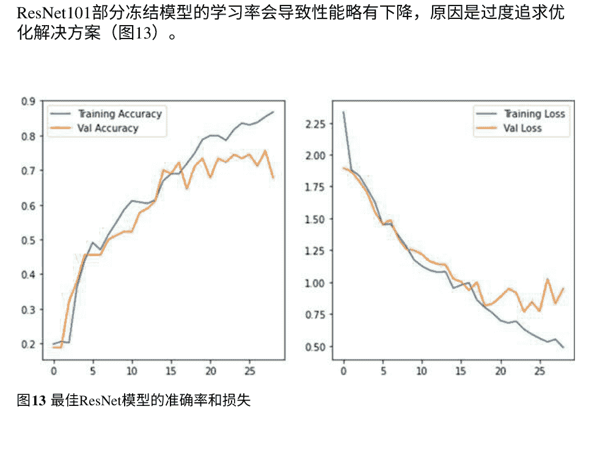

图13 最佳ResNet模型的准确率和损失

#### 4.2.2 VGG16

VGG16模型已经尝试了不同的架构、批次大小、时期和优化器进行训练。 VGG16训练使用的批次大小为100、128、256。 如前所述，除了最后几层外，所有层都被冻结。 模型的性能因批次大小和架构而异。 表8显示了VGG16的性能摘要，其中粗体字表示最佳结果。 与其他模型相比，模型2的准确率达到了96%。 模型2使用批次大小为128和Adam优化器进行了125个时期的训练。 另一方面，使用相同架构和Adam优化器（模型1、模型3）的模型，批次大小为256时，验证准确率达到了89%，批次大小为100时，验证准确率达到了91%。 使用SGD优化器的模型4，批次大小为256时，验证准确率为87%。 使用RMSprop优化器的模型5，验证准确率也很高，达到了95%。 模型6和模型7使用相同的架构和Adam优化器，但批次大小不同。 模型6使用批次大小为256时，验证准确率为87%，而模型7使用批次大小为128时，验证准确率为94%。

当批量大小从256减少到128时，模型的性能有所提高。 在每个模型中，改变批量大小并没有显著提高准确性性能。 在Adam优化器中，将批量大小从256改变为128，验证准确性从89%提高到96%。 与其他优化器相比，RMSprop在批量大小为256时达到了95%的良好验证准确性。

增加架构中的层数并没有带来更多显著的模型性能改善。 学习模型的性能历史和最佳模型的性能指标如图14（图15；表9）所示。 基于验证集，最佳模型的整体验证准确性为96%。 该模型使用批量大小为128和Adam优化器进行了125个时期的训练。 基本模型对红毛丹每个类别的F1分数进行了分类，如表10所示。

Gading rambutan在F1得分方面表现最好，达到100%，而Binjai得分最低，为92%。 正如之前讨论的，Gading具有独特的黄色，而其他的则是红色，这一特征被模型很好地提取出来。 另一方面，其他4种红毛丹的清晰特征可能会重叠，从而导致与Gading相比，分类性能较低。 然而，与之前讨论的其他模型相比，该模型仍能以高准确率对每种类型的红毛丹进行分类。

基于模型的最高准确率，我们推荐使用VGG16作为列出的红毛丹类型的分类器。

## 5 结论

使用卷积神经网络对红毛丹进行分类显示出巨大的潜力，能够正确识别红毛丹的类型。 最初的假设是所有类型的迁移学习模型都能优于从头开始构建的传统模型。

## 表8 VGG16性能总结

| 模型 | 优化器 | 批量大小 | 运行周期 | 全连接层 | 训练准确率% | 测试准确率% |
| :--- | :--- | :--- | :--- | :--- | :--- | :--- |
| VGG16 | | | | | | |
| 模型1 | Adam | 256 | 150 | 展平 + 2 个具有过滤器尺寸(1024, 1024)的密集层 + dropout (0.5) + 输出层 | 94.5 | 89 |
| 模型2 | Adam | 128 | 125 | 展平 + 2 个具有过滤器尺寸(1024, 1024)的密集层 + dropout (0.5) + 输出层 | 97 | 96 |
| 模型3 | Adam | 100 | 100 | 展平 + 2 个具有过滤器尺寸(1024, 1024)的密集层 + dropout (0.5) + 输出层 | 98.5 | 91 |
| 模型4 | SGD | 256 | 125 | 展平 + 3 个具有过滤器尺寸(4096, 1024, 512)的密集层 + 输出层 | 93.6 | 87 |
| 模型5 | RMSprop | 256 | 100 | 展平 + 2 个具有过滤器尺寸(1024, 1024)的密集层 + dropout (0.5) + 输出层 | 97.75 | 95 |
| 模型6 | Adam | 256 | 125 | 展平 + 3 个具有过滤器尺寸(4096, 1024, 512)的密集层 + dropout + 输出层 | 96.5 | 87 |
| 模型7 | Adam | 128 | 125 | 展平 + 3个密集层具有过滤器尺寸(4096, 1024, 512) + dropout (0.5) + 输出层 | 98.87 | 94 |

图15 最佳模型混淆矩阵

| | precision | recall | f1-score | support |
| :--- | :--- | :--- | :--- | :--- |
| 0 | 0.95 | 0.90 | 0.92 | 20 |
| 1 | 1.00 | 1.00 | 1.00 | 20 |
| 2 | 0.95 | 0.95 | 0.95 | 20 |
| 3 | 1.00 | 0.95 | 0.97 | 20 |
| 4 | 0.95 | 1.00 | 0.98 | 20 |
| micro avg | 0.97 | 0.96 | 0.96 | 100 |
| macro avg | 0.97 | 0.96 | 0.96 | 100 |
| weighted avg | 0.97 | 0.96 | 0.96 | 100 |
| samples avg | 0.96 | 0.96 | 0.96 | 100 |

CNN模型得到支持，使用ResNet和VGG模型展示，相对于传统的CNN模型，取得了更高的改进。在这两个迁移学习模型中，VGG16在分类所有类型的红毛丹时具有更好的准确性，总体准确率达到96%，而ResNet50为85%。VGG16还能够很好地识别每种类型的红毛丹，每种类型的红毛丹的分类正确率都超过90%。从头开始构建的CNN模型具有

## 表9 VGG16最佳模型参数

| 参数       | 值       |
|------------|----------|
| 优化器     | Adam     |
| 批量大小   | 128      |
| 运行周期   | 125      |
| 学习率     | 0.0001   |
| 训练准确率 | 0.9737   |
| 训练损失   | 0.0790   |
| 验证准确率 | 0.9600   |
| 验证损失   | 0.1914   |

## 表10 VGG16最佳模型分割的F1分数

| 红毛丹类别 | 红毛丹图片       | F1分数（%） |
|------------|------------------|-------------|
| 宾戴       |  | 92          |
| 加丁       |  | 100         |
| 糖块       |  | 95          |
| 金针       |  | 97          |
| 荣瑞恩     |  | 98          |

最佳模型的最低准确率达到了79%。Gading红毛丹在其他类型的红毛丹中具有最高的准确率，这可能是因为模型很好地提取了其独特的颜色。建议下一次训练迭代中移除Gading红毛丹，以便模型能够充分提取其他4种红毛丹的定义特征。这个专家系统是未来的基础。建议未来的研究扩大数据集的规模，以分类更多种类的红毛丹，并可以应用于农业领域。

## 参考文献

- 1. Risdin, F., Mondal, P. K., & Hassan, K. M. (2020). 使用机器学习技术的卷积神经网络（CNN）用于检测水果信息。计算机工程杂志（IOSR-JCE），22(2), 1–13.
- 2. Morton, J. F. (1987).温暖气候的水果. Morton.
- 3. Rojas-Aranda, J. L., Nunez-Varela, J. I., Cuevas-Tello, J. C., & Rangel-Ramirez, G. (2020). 使用深度学习的零售店水果分类计算机科学讲义, 12088, 3–13.
- 4. Goenaga, R., & Jenkins, D. (2011). 波多黎各两个地点上嵌接到共同砧木上的红毛丹品种的产量和果实品质特征园艺技术,21(1),136–140.
- 5. Abualigah, L., Al-Okbi, N. K., Elaziz, M. A., & Houssein, E. H. (2022). 通过水母群算法增强海洋捕食者算法进行多级阈值图像分割. 多媒体工具与应用, 81(12), 16707–16742.
- 6. Mehbodniya, A., Douraki, B. K., Webber, J. L., Alkhazaleh, H. A., Elbasi, E., Dameshghi, M., Abu Zitar, R., & Abualigah, L. (2022).基于差分扩展方法的多层可逆数据隐藏, 基于史莱姆菌算法的宿主图像多级阈值处理。过程, 10(5), 858。
- 7. Otair, M., Abualigah, L., & Qawaqzeh, M. K. (2022). 改进的近无损技术, 使用霍夫曼编码来提高图像压缩的质量。多媒体工具和应用, 1–21。
- 8. Liu, Q., Li, N., Jia, H., Qi, Q., & Abualigah, L. (2022). 改进的吸盘鱼优化算法用于全局优化和多级阈值图像分割。数学, 10(7), 1014。
- 9. Lin, S., Jia, H., Abualigah, L., & Alтарhi, M. (2021). 增强的粘液模具算法用于多级阈值图像分割, 使用熵测量。熵, 23(12), 1700。
- 10. Ewees, A. A., Abualigah, L., Yousri, D., Sahlol, A. T., Al-qaness, M. A., Alshathri, S., & Elaziz, M. A. (2021). 修改的基于人工生态系统的优化方法用于多级阈值图像分割。数学, 9(19), 2363。
- 11. Abualigah, L., Diabat, A., Sumari, P., & Gandomi, A. H. (2021). 一种新颖的进化算术优化算法用于Covid-19 CT图像的多级阈值分割。进程, 9(7), 1155。
- 12. Rawat, W., & Wang, Z. (2017). 深度卷积神经网络用于图像分类: 综述。神经计算, 29(9), 2352–2449。
- 13. Sumari P., Syed, S. J., & Abualigah, L. (2021). 一种基于CNN的新型深度学习流水线架构用于检测胸部X射线图像中的Covid-19。土耳其计算机和数学教育杂志（TURCOMAT），12(6), 2001–2011。
- 14. Kadyan, V., Singh, A., Mittal, M., & Abualigah, L. (2021).深度学习方法用于口语和自然语言处理。
- 15. Abuowaida, S. F. A., Chan, H. Y., Alshdaifat, N. F. F., & Abualigah, L. (2021).一种基于改进的深度学习算法的新型实例分割算法, 用于多目标图像。约旦计算机与信息技术杂志（JJCIT）, 7(01), 10–5455。
- 16. Danandeh Mehr, A., Rikhtehgar Ghiasi, A., Yaseen, Z. M., Sorman, A. U., & Abualigah, L. (2022).一种新颖的智能深度学习预测模型用于气象干旱预测。环境智能与人性化计算杂志, 1–15.
- 17. MathWorks. (2021).什么是深度学习? 它的工作原理、技术和应用. Math-Works. [在线].https://www.mathworks.com/discovery/deep-learning.html. 访问日期: 2021年07月01日.
- 18. Ardila, D., Kiraly, A. P., Bharadwaj, S., Choi, B., Reicher, J. J., Peng, L., Tse, D., Etemadi, M, Ye, W., Corrado, G., Naidich, D. P., & Shetty, S. (2019). 端到端的低剂量胸部计算机断层扫描的三维深度学习肺癌筛查。自然医学,25(6), 954–961.
- 19. 王，S.，康，B.，马，J.，曾，X.，肖，M.，郭，J.，蔡，M.，杨，J.，李，Y.，孟，X.，和徐，B. (2021) 使用CT图像进行深度学习算法筛查冠状病毒疾病(COVID-19) 。欧洲放射学, 31(8), 6096-6104。
- 20. 哈米德, K., 柴, D., 和拉索, A. (2018). 水果和蔬菜的综合评述分类技术。图像与视觉计算, 80, 24-44。
- 21. 萨, L., 盖, Z., 戴, F., 阿普罗罗夫特, B., 佩雷斯, T., 和麦库尔, C. (2016). DeepFruits: 一种水果使用深度神经网络的检测系统。传感器, 16(8), 1222。
- 22. 程, H., 达梅罗, L., 孙, Y., & 布兰克, M. (2017). 利用神经网络对苹果果实和树冠特征进行图像分析的早期产量预测。成像杂志, 3(1), 6。
- 23. 阿布阿利加, L., 迪亚巴特, A., 米尔贾利利, S., 阿卜杜勒阿齐兹, M., & 甘多米, A. H. (2021). 算术优化算法。应用力学与工程计算机方法, 376, 113609。
- 24. 阿布阿利加, L., 尤斯里, D., 阿卜杜勒阿齐兹, M., 伊维斯, A. A., 阿尔-卡内斯, M. A., & 甘多米, A. H. (2021). 天鹰优化器: 一种新颖的元启发式优化算法。计算机与工业工程, 157, 107250。
- 25. Abualigah, L., Abd Elaziz, M., Sumari, P., Geem, Z. W., & Gandomi, A. H. (2022). 爬行动物搜索算法 (RSA) : 一种受自然启发的元启发式优化器。专家系统与应用, 191, 116158。
- 26. Agushaka, J. O., Ezugwu, A. E., & Abualigah, L. (2022). 侏儒狮优化算法。计算方法在应用力学和工程中, 391, 114570。
- 27. Oyelade, O. N., Ezugwu, A. E. S., Mohamed, T. I., & Abualigah, L. (2022). 埃博拉优化搜索算法: 一种新的受自然启发的元启发式优化算法。IEEE Access, 10, 16150-16177。
- 28. Ezugwu, A. E., Agushaka, J. O., Abualigah, L., Mirjalili, S., & Gandomi, A. H. (2022). 草原犬优化算法。神经计算与应用, 1-49。
- 29. He, K., Zhang, X., Ren, S., & Sun, J. (2016). 深度残差学习用于图像识别. 在2016年IEEE计算机视觉和模式识别会议(CVPR)(pp. 770-778)中。
- 30. Qassim, H., Verma, A., & Feinzimer, D. (2018). 压缩残差-VGG16卷积神经网络模型用于大数据场所图像识别. 在2018年IEEE第8届年度计算与通信研讨会和会议(CCWC)中。
- 31. Ferguson, M., Ak, R., Lee, Y.-T. T., & Law, K. H. (2017) 用卷积神经网络自动定位铸造缺陷. 在2017年IEEE国际大数据大会(big data)(pp. 1726-1735)中。
- 32. Naranjo-Torres, J., Mora, M., Hernández-García, R., Barrientos, R. J., Fredes, C., & Valenzuela, A. (2020). 卷积神经网络在水果图像处理中的应用综述.应用科学, 10(10), 3443。
- 33. ul Hassan, M. (2021). VGG16-用于分类和检测的卷积网络。Neurohive, 2018年11月20日。[在线]。https://neurohive.io/en/popular-networks/vgg16/。访问日期: 2021年7月31日。

# 基于迁移学习和深度学习方法的芒果品种分类优化

陈科，吴智荣，杨一凡，张明阳，普特拉·苏马里，
Laith Abualigah, Salah Kamel, Mohsen Ahmadi,
Mohammed A. A. Al-Qaness, Agostino Forestiero和Anas Ratib Alsoud

摘要芒果是一种著名的热带水果，原产于南亚，目前已知有500多个品种的芒果。 根据品种的不同，芒果的大小、皮肤颜色、形状、甜度和果肉颜色可能会有所不同，可能是淡黄色、金色或橙色。 然而，有时候我们很难区分芒果的品种。 因此，在本文中，提出了四种芒果分类方法。 因此，我们将使用卷积神经网络（CNN）算法和迁移学习方法（VGG16和Xception）对收集的1000张芒果图像进行训练，并获得一个能够分类四种芒果（Alampur Baneshan， Alphonso， Harum Manis 和 Keitt) 自动化。总之，本文的目标是开发一种深度学习算法，自动分类四种芒果品种。

C. Ke · N. T. Weng ·Y. Yang ·Z. M. Yang ·P. Sumari ·L. Abualigah (☒)马来西亚槟城乔治市11800号，马来西亚
电子邮件：Aligah.2020@gmail.com
L. Abualigah · A. R. Alsoud
Hourani应用科学研究中心， Al-Ahliyya Amman大学， 约旦安曼
L. Abualigah
中东大学信息技术学院， 阿曼安曼11831
S. Kamel
埃及阿斯旺大学工程学院电气工程系， 埃及阿斯旺81542号
M. Ahmadi
伊朗乌尔米亚工艺大学工业工程系
M. A. A. Al-Qaness
武汉大学测绘遥感信息工程国家重点实验室， 中国武汉430079号
萨那大学工程学院， 也门萨那12544号
浙江师范大学物理与电子信息工程学院， 中国金华321004号
A. Forestiero
意大利国家研究委员会高性能计算与网络研究所， 雷恩德， 科森扎， 意大利

关键词芒果 · 卷积神经网络 (CNN) · 迁移学习 · 深度学习 · VGG16 · Xception

## 1 引言

目前，芒果的分类和分类是通过观察芒果的特征或属性（如大小、皮肤颜色、形状、甜度和果肉颜色）手动完成的[1-3]。通常，有经验的分类学专家可以识别不同的物种。
然而，对于大多数人来说，很难区分这些芒果。如今，社会在科学和技术方面不断进步。有很多技术可以用来解决这个问题，可以让人们轻松区分品种。我们希望提出的解决方案是计算机视觉技术，它是一种训练计算机解释和理解视觉世界（如图像和视频）的人工智能[4-8]。

如今，在这个创新时代，最流行的技术是用于水果识别的计算机视觉技术。与其他机器学习算法相比，卷积神经网络 (CNN) 在图像中识别水果方面提供了有希望的结果[9]。深度学习通常能够帮助人们解决一些问题，如种子分类和检索[10]，农民的水果检测[11]，荔枝水果的区分[12]等。图像分类的主要过程包括三个步骤：特征提取，模型训练和测试。特征提取过程是指提取图像中的特征属性。之后，训练算法将用于为特定类别的模型训练生成唯一描述。测试步骤是使用训练好的模型对测试图像进行分类[13]。此外，修改卷积层可以实现更准确和更快的检测。测试结果显示，所提出的算法比传统检测器具有更高的检测准确性和更低的处理时间[11]。还可以使用其他优化方法来优化问题，如[14-19]所述。简而言之，表1总结了文献综述。

通过使用来自相机和视频的数字图像和深度学习模型，机器可以准确地识别和分类四种类型的芒果。因此，在本文中，我们将使用我们收集的1000张图像来开发一个深度学习模型进行训练。此外，将测试三种算法：一种是卷积神经网络 (CNN)，另外两种是迁移学习方法VGG16和Xception。因此，通过训练模型，我们可能能够将其实现在某些手机系统或应用程序中，以便人们可以通过使用手机相机拍摄一张照片来对芒果品种进行分类。

| 作者 | 主题 | 目标 | 数据 | 算法 | 性能(%) |
| :--- | :--- | :--- | :--- | :--- | :--- |
| Jaswal等人 [13] | 使用卷积神经网络进行图像分类 | 图像分类 | 图像被转换为灰度 | 卷积神经网络 | 95 |
| Chung 和 Van Tai [9] | 基于现代深度学习技术的水果识别系统 | 水果识别 | Fruit 360数据集 | 卷积神经网络/深度学习 | 95 |
| Shaohua 和 Goudos [11] | 使用机器人视觉系统的Faster R-CNN进行多类别水果检测 | 使用机器人视觉系统的多类别水果检测 | 水果图像 | Faster R-CNN | 86.41 |
| Osako等人 [12] | 使用深度学习 | 对荔枝水果图像进行品种区分 | 荔枝水果图像 | 深度学习 | 98.33 |
| Andrea等人 [10] | 一种基于深度学习的新方法用于 | 种子图像分类和检索 | 种子图片 | 具有不同结构的CNNs | 95.65 |

## 2 方法论

### 2.1 数据集

本研究的数据集包括1000张芒果照片，分为4个类别：Alampur Baneshan、Alphonso、Harum Manis和Keitt，每个类别有250个单位，所有照片均来自Google图像。图1展示了每种芒果的一些示例。

此外，所有图像都是3维通道的，并且所有图像都被调整为224 * 224的尺寸。此外，将使用数据增强来增加模型的鲁棒性。简而言之，我们将使用这些数据通过三种不同的深度学习算法进行模型训练，其中一个是卷积神经网络，另外两种是迁移学习方法。简而言之，在第二部分中，我们将讨论与该主题相关的一些文献综述，然后在接下来的部分中，我们将展示我们设计的深度学习模型并讨论模型的性能。

# 图1 使用的图像数据集

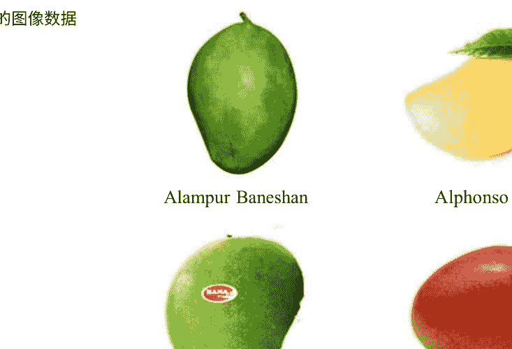

### 2.2 数据准备

#### 2.2.1 增强

数据增强是数据处理中的重要步骤。它可以通过旋转、放大、不同的颜色强度等方式增加数据的大小，从而防止模型过拟合。同时，模型的泛化能力也得到了增强。在所有的实验中，我们使用ImageDataGenerator函数来处理输入图像数据。图2展示了我们在实验中使用的增强代码。

在第一行中，我们将RGB值从0-255转换为0-1的范围。其次，我们随机将图像在0到180度之间旋转。接下来，在第三行和第四行中，我们随机将图像在垂直或水平方向上进行平移。在第五行，我们应用了随机剪切变换来剪切图像。此外，在第六行中，使用缩放函数将图像随机缩放为不同的大小。此外，水平翻转以50%的随机概率水平翻转图像。最后，最近的填充模式是用于在增强（如旋转或平移）后填充图像的填充策略。

### 2.3 提出的CNN架构

卷积神经网络（CNN）是一种前馈神经网络，对大规模图像处理具有出色的性能。卷积神经网络由一个或多个卷积层和顶部的所有连接层以及相关权重和池化层组成。与其他深度学习结构相比，卷积神经网络在图像和语音识别方面可以给出更好的结果。

首先，训练集数据进行增强，因为在深度学习中，通常需要足够数量的样本。样本数量越多，训练模型效果越好，模型的泛化能力越强。对于输入图像，进行一些简单的平移、缩放、颜色变换等。如图3所示，CNN架构模型由五个卷积层、五个最大池化层和两个全连接层组成。

网络输入层是224 × 224 ×3像素的RGB图像。卷积层和池化层：第一个卷积层是卷积层1，包含32个大小为3 *3的卷积核，激活函数为relu，最大池化层1为2 *2。第二个卷积层是卷积层2，有64个大小为3 *3的卷积核，激活函数为relu，最大池化层2为2 *2。第三个卷积层是卷积层3，有128个大小为3 *3的卷积核，激活函数为relu，最大池化层3为2 *2。

第四个卷积层是卷积层4，有256个大小为3 *3的卷积核，激活函数为relu，最大池化层4为2 *2。第五个卷积层是卷积层5，有512个大小为3 *3的卷积核，激活函数为relu，最大池化层5为2 *2。

展平层：从多维输入到一维的全连接层。

全连接层：Dense(256, activation='relu')。然后使用0.5的dropout和relu进行更快的卷积计算。最后，使用分类层Dense(4, activation='softmax')来预测模型的输出和代表四种不同的芒果。

SGD: 我们设置SGD优化器的参数（LR =0.001，衰减 = 1e-6，动量 =0.9，nesterov =true）。

```python
batch_size = 20
#Training set data enhancement
train_datagen = keras.preprocessing.image.ImageDataGenerator(
    rescale=1./255, #rescale Scale -- the brightness value of
    rotation_range=40, #rotation_range is a degree (
    width_shift_range=0.2, #width_shift and height_shif
    height_shift_range=0.2,
    shear_range=0.2, #shear_range --Used to rand
    zoom_range=0.2, #zoom_range --For random sc
    horizontal_flip=True, #horizontal_flip --50% random
    fill_mode='nearest') #fill_mode -- Pixel filling
```

# 图2 增强代码

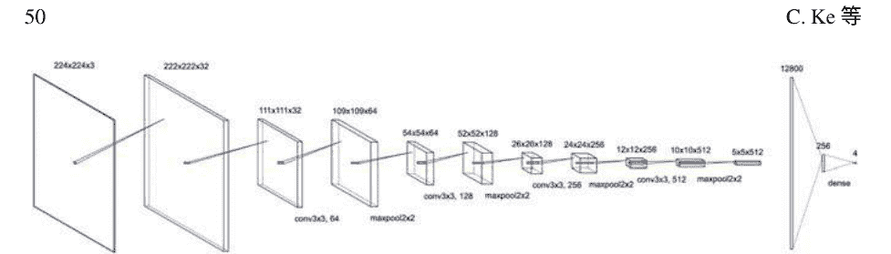

图3 CNN模型

### 2.4 迁移学习模型

#### 2.4.1 VGG16

VGG16是由牛津大学的K.Simonyan和A. Zisserman提出的卷积神经网络（CNN）算法，在论文“Very Deep Convolutional Networks for Large-Scale Image Recognition”中。该模型能够在包含14百万张图像和1000个类标签的imagenet中实现top one准确率0.713和top five准确率0.901。 该模型包含5个卷积层，1个展平层和一个全连接层。 此外，全连接层包含2个具有4096个神经元的层。此外，原始输出层为1000。

然而在我们的数据集中，我们只有4个类别标签（Alampur Baneshan，Alphonso，Harum Manis和Keitt），因此在我们的实验中我们将把数量调整为4。由于VGG16是一个CNN模型，所以激活函数使用的是relu和softmax用于输出。图4显示了VGG16模型的摘要。

#### 2.4.2 Xception

Xception是基于inception的卷积神经网络（CNN）算法，如图5所示。Xception架构有36个卷积层，构成了网络特征提取的基础。 在我们的实验中，我们将专注于芒果图像分类，因此我们的卷积基础将遵循逻辑回归层。 因此，在逻辑回归层之前必须插入一个全连接层，这将在密集层部分讨论。 这36个卷积层被构建成14个模块，除了第一个和最后一个模块之外，所有模块都通过线性残差连接。 最后，xception架构是一个由深度可分离卷积层和残差连接组成的线性堆叠。

根据需求，使架构非常容易定义和修改。使用高级库，如keras或tensorflow slim，只需要很少的代码。

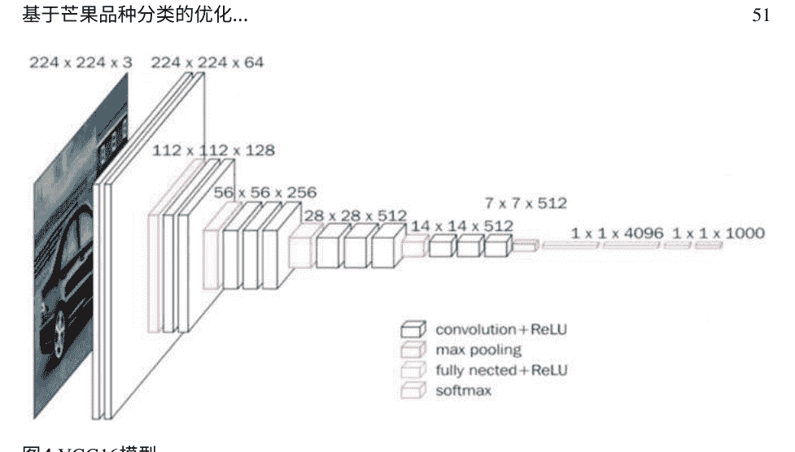

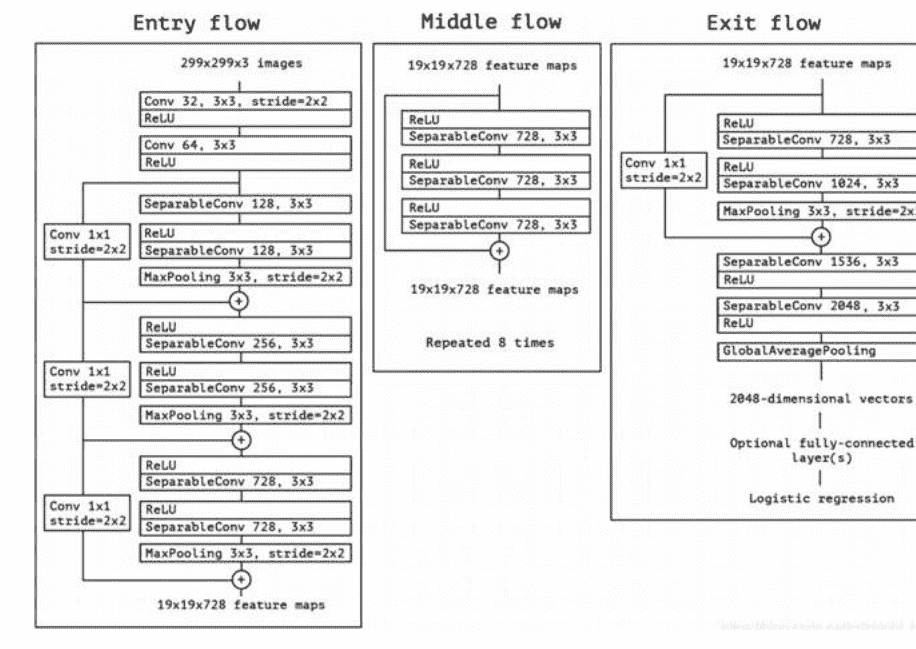

## 3 实验结果

### 3.1 CNN

#### 3.1.1 实验设置

数据集中有1000个芒果图像，所有图像大小为224 * 224像素，共有四种类型，即Alampur Baneshan， Alphonso， Harum Manis和Keitt。包括60%的训练集，20%的验证集，20%的测试集。深度学习实验在本地jupyter笔记本中进行。模型摘要显示在图6中，显示了模型架构和每个层的输入和输出。

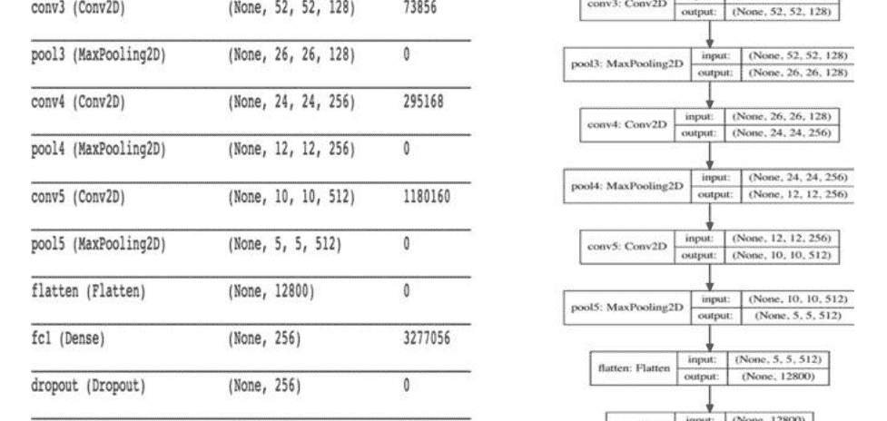

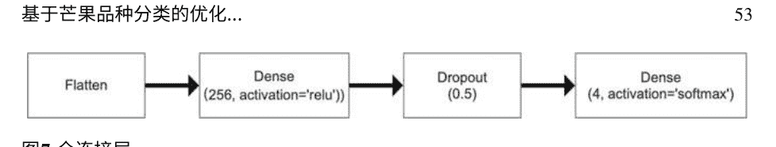

#### 3.1.2 全连接层

Flatten层用于“展平”输入，即将多维输入变为一维，通常用于从卷积层过渡到全连接层（Dense），如图7所示。

换句话说，在卷积卷积层之后，无法直接连接全连接层。卷积层的数据需要被展平（Flatten），然后才能直接添加全连接层。Dense（256，activation ='relu'）在使用relu之后，训练使用传统的Dropout，丢弃率为0.5。对于使用Dropout的每个神经元，在训练过程中有50%的概率被丢弃，最后的全连接层使用softmax输出4个类别。

#### 3.1.3 模型优化器

该模型使用SGD优化器，学习率=0.001，衰减=1e-6，动量=0.9，nesterov=True，梯度下降可以使损失下降。在训练模型后，计算测试集上的准确率。

#### 3.1.4 训练轮数

如图8所示，我们选择了10、50和100轮的训练。图8显示了50和100个周期的准确率和损失。10个周期测试集的准确率为0.65，损失为0.82。50个周期测试集的准确率为0.78，损失为0.67。100个周期测试集的准确率为0.75，损失为1.07。

#### 3.1.5 学习率

如表2所示，不同学习率对准确率的影响。如图9所示，不同学习率对训练集准确率、验证集准确率和损失的影响。

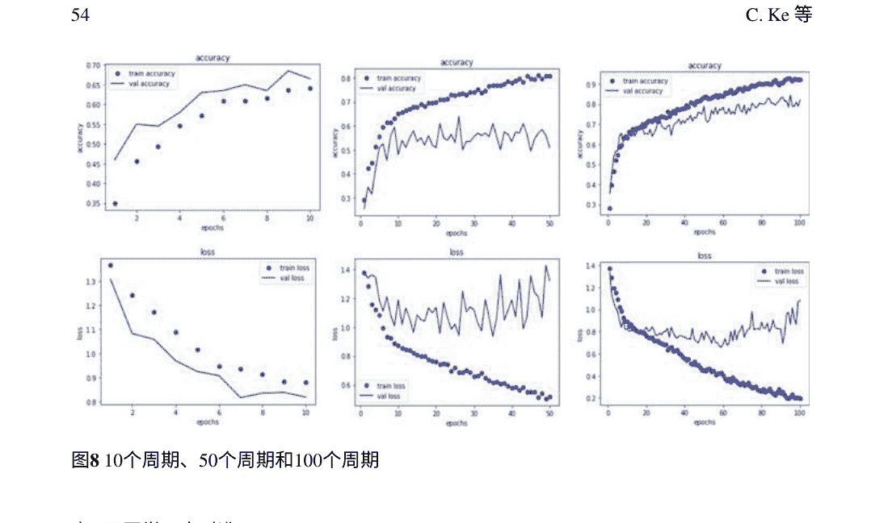

图8 10个周期、50个周期和100个周期

表2 不同学习率对准确率的影响

| 运行周期 | Lr   | 测试集准确率 | 损失   |
|----------|------|--------------|--------|
| 10       | 0.01 | 0.72         | 0.82   |
| 10       | 0.001| 0.65         | 0.82   |
| 50       | 0.001| 0.78         | 0.67   |
| 100      | 0.001| 0.75         | 1.07   |

### 3.2 迁移学习

在本节中，我们将进行实验，其中指南在文章[20]中提出。通过观察图表，我们可以指出，由于我们的图像数据只有1000个单位，可以被认为是数量较少的，所以更适合我们遵循第三和第四季度。在第一次实验中，我们将尝试使用Figs.10和11中显示的原始模型来训练模型，而不冻结任何层。第二个实验，我们将尝试微调预训练模型的较低层，并在最后一个实验中尝试微调预训练模型的输出密度。

#### 3.2.1 VGG16

**实验1：使用原始算法设计训练整个模型（不冻结任何层）**

我们为这个实验设置的超参数是批量大小等于2，学习率等于0.0001，时期等于18和100。之后，输出层从1000变为4。

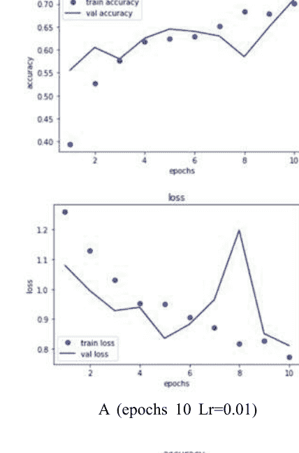

A (epochs 10 Lr=0.01)

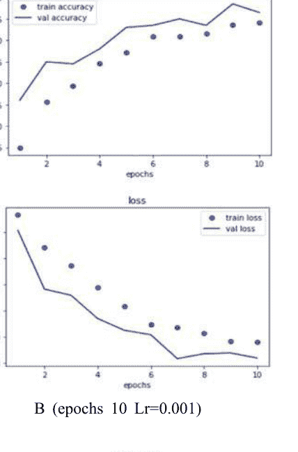

B (epochs 10 Lr=0.001)

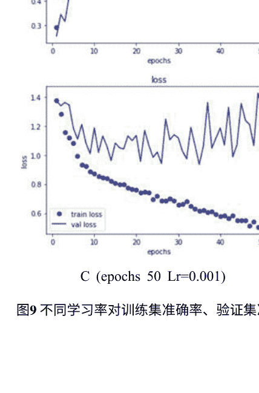

C (epochs 50 Lr=0.001)

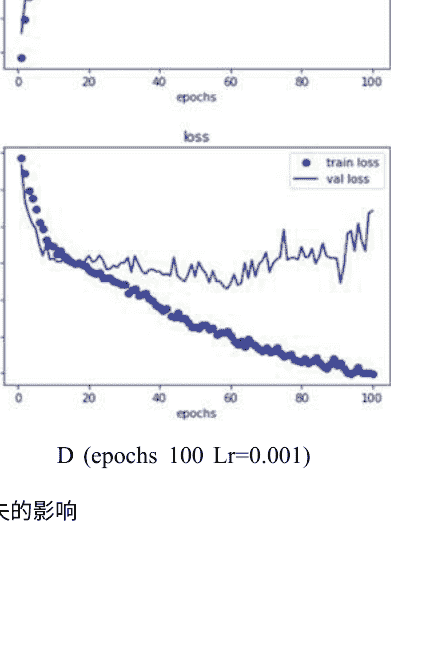

D (epochs 100 Lr=0.001)

# 图9 不同学习率对训练集准确率、验证集准确率和损失的影响

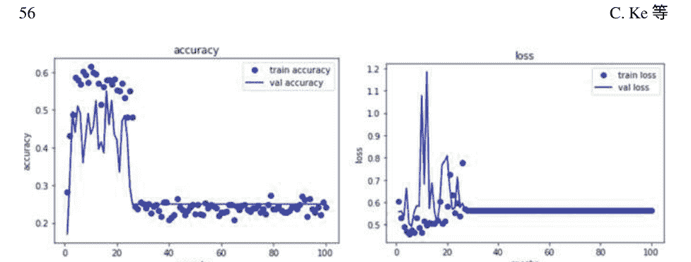

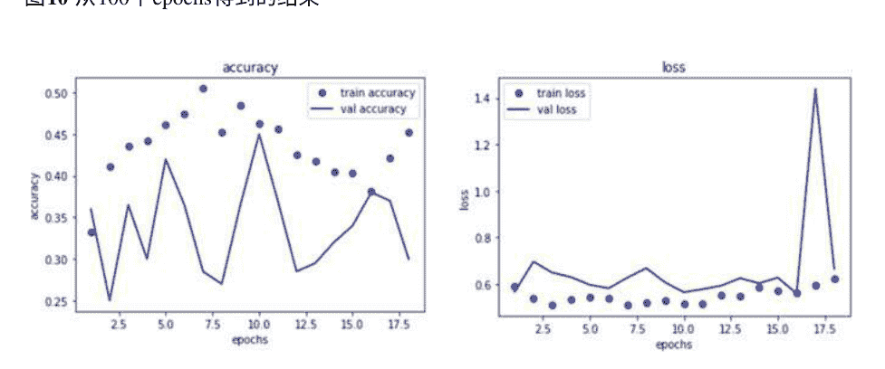

在这个第一个实验中，我们能够指出这个模型在我们训练的数据上表现不好。 如图和表所示，当使用100个epochs时，模型出现了过拟合问题，并且性能很差，如Table3所示，两个模型的准确率都低于0.4。因此，我们进行第二个实验来测试不同的方法或超参数。

**实验2：通过冻结卷积层来训练模型**

在这个实验中，我们冻结了所有的卷积层，并使用原始的全连接层对模型进行训练，与我们在图12中展示的CNN模型中使用的全连接层进行了比较。 使用原始的VGG16密集层得到的结果如下图12所示。 这两个模型都经过了100个epochs的训练。

表3 两个模型的结果

| 运行周期 | 准确性 | 损失 |
|----------|--------|------|
| 18       | 0.3    | 0.665|
| 100      | 0.25   | 0.5627|

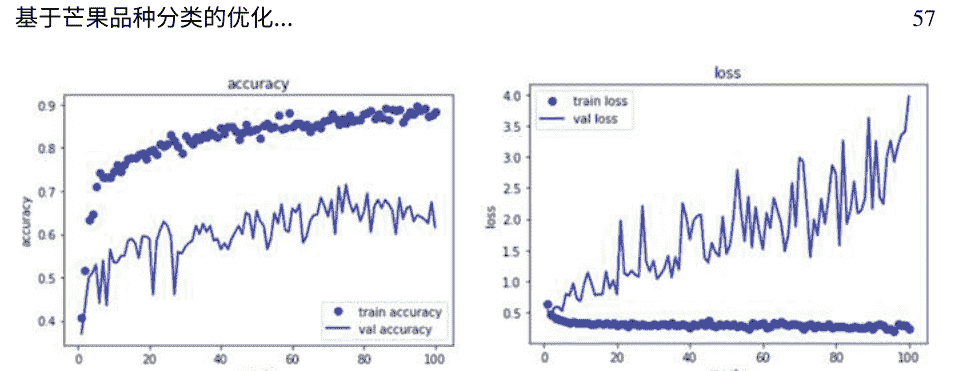

使用这个模型，我们能够获得61.5%的准确率和3.9735的损失，但结果并不理想，而且还存在过拟合的问题，如图12所示，验证准确率和训练准确率之间的距离相差很大。 接下来，我们根据文章[21]中所示的方法再次对全连接层进行修改，并在图12中展示了结果。对于这个模型，最佳准确率为0.61，损失为1.1217。 此外，通过观察图13，我们可以发现该模型仍然存在过拟合问题，准确率与原始设计模型相差不大，但是如果比较损失，这个模型会更好。 因此，我们将使用这个新的设计模型并继续进行下一个实验。

此外，我们还尝试将神经元数量从4096减少到128个单位，令人惊讶的是，结果比之前的实验更好，准确率为66.5%，损失为0.5039。 下图14显示了本实验的结果。

**实验3：训练部分层并冻结其他层**

在本节中，我们尝试冻结前几层并保持其余层不可训练。 本节中我们使用的时期是100，其余部分与实验1相同。

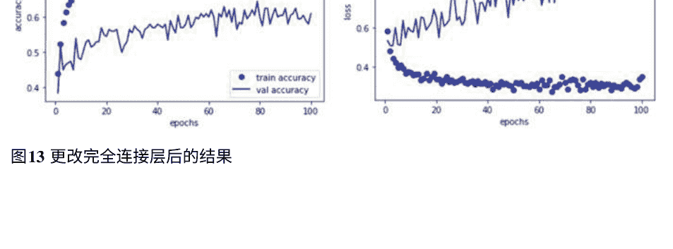

# 图14 使用128个神经元获得的结果

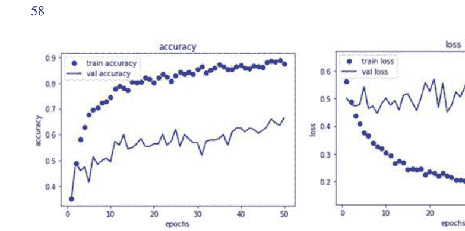

# 图15 冻结前10层的结果

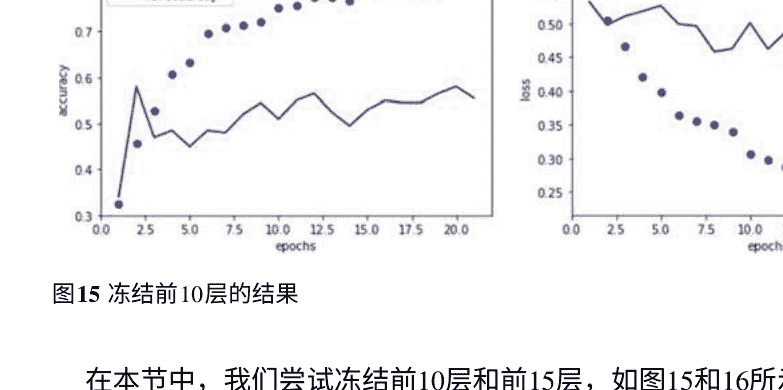

在本节中，我们尝试冻结前10层和前15层，如图15和16所示。我们获得的最佳结果是准确率为72.5%，损失为0.4586，来自冻结前15层的模型。与原始模型或先前的实验相比，我们能够指出这个模型有了很大的改进，准确率为72.5%。与先前的实验相比，它提高了10%。然而，如果谈论过拟合问题，我们可以注意到它仍然没有解决，因此在参考了一些论文后，我们发现这个问题可能受到我们收集的数据的影响。因此，在本节中，我们想总结一下，在这个实验中，使用128个神经元并冻结前15个卷积层的模型是我们获得的最佳模型。

### 3.3 Xception

#### 3.3.1 实验设置

首先，我们需要创建一个基准模型，然后逐个修改参数来分割结果，并将其与基准模型进行比较以了解其影响。

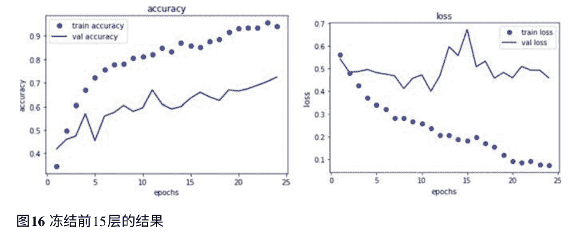

图16 冻结前15层的结果

为了实现这个目标，总共设计了五个实验。实验1：创建一个基准模型，主要修改冻结层的数量。实验2：修改优化器并与基准模型进行性能比较。实验3：修改拒绝层并与基准模型进行性能比较。实验4：修改训练轮数并与基准模型进行性能比较。实验5：修改学习率并与基准模型进行性能比较。我们将数据集分为三个部分：训练数据集、验证数据集和测试数据集。我们将以测试数据集的性能作为模型的评估标准。

#### 3.3.2 实验 1：创建基准模型

在创建基准模型时，我们尝试冻结原始模型中的所有层、部分层和无层。表4显示了基准模型的设置。表5显示了具有不同冻结层的模型的性能。

表4 基准模型设置

| | 优化器 | 稠密层 | 迭代次数 | 学习率 |
| :--- | :--- | :--- | :--- | :--- |
| 基准模型 | RMSprop | x = GlobalAveragePooling2D()(x)<br>x = Dropout(0.5)(x)<br>x = Dense(1024)(x)<br>x = Activation('relu')(x)<br>x = Dropout(0.5)(x)<br>x = Dense(512)(x)<br>x = Activation('relu')(x)<br>Predictions = Dense(4, activation='sigmoid')(x) | 50 | 学习率调度器 |

# 表5 具有不同冻结层的模型的性能

|          | 准确率（测试） | 损失（测试） |
|----------|----------------|--------------|
| 全部冻结 | 0.185          | 1.3884       |
| 部分冻结 | 0.42           | 1.4410       |
| 无冻结   | 0.78           | 1.5862       |

考虑到解冻会使模型表现更好，我们选择解冻作为基准模型，并且以下实验都选择解冻。

#### 3.3.3 实验2：优化器的影响

为了与实验1形成对比实验，这里只修改了优化器。Table6显示了实验2的模型设置，Table7显示了实验2的模型比较。

从图17的实验结果可以看出，模型的准确性大大降低。对于我们的数据集，RMSprop是一个更好的选择。 原因是Adagrad的学习率下降速度比RMSprop慢，导致模型收敛缓慢。

# Table 6 实验2模型设置

|          | 优化器    | 稠密层                                                                 | 迭代次数 | 学习率       |
|----------|-----------|------------------------------------------------------------------------|----------|--------------|
| 实验2模型 | Adagrad() | x = GlobalAveragePooling2D()(x)<br>x = Dropout(0.5)(x)<br>x = Dense(1024)(x)<br>x = Activation('relu')(x)<br>x = Dropout(0.5)(x)<br>x = Dense(512)(x)<br>x = Activation('relu')(x)<br>Predictions = Dense(4, activation = 'sigmoid')(x) | 50       | 学习率调度器 |

# Table 7 实验2模型比较

|          | 准确率（测试） | 损失（测试） |
|----------|----------------|--------------|
| 基准模型 | 0.78           | 1.5862       |
| 实验2模型 | 0.315          | 1.3310       |

#### 3.3.4 实验3：密集层的影响

与实验1相比，我们改变了密集层的设置。Table 8显示了实验3的设置。Table 9显示了实验3的模型比较。显然，基准模型的密集层具有更好的性能，这表明它能更好地区分图像特征。

|  | 优化器 | 稠密层 | 迭代次数 | 学习率 |
| :--- | :--- | :--- | :--- | :--- |
| 实验3模型 | RMSprop | x = GlobalAveragePooling2D()(x)<br>x = Dense(1024)(x)<br>x = BatchNormalization()(x)<br>x = Activation('relu')(x)<br>x = Dropout(0.2)(x)<br>x = Dense(256)(x)<br>x = BatchNormalization()(x)<br>x = Activation('relu')(x)<br>x = Dropout(0.2)(x)<br>Predictions = Dense(4, activation = 'sigmoid')(x) | 50 | 学习率调度器 |

|  | 准确率(测试) | 损失(测试) |
| :--- | :--- | :--- |
| 基准模型 | 0.78 | 1.5862 |
| 实验3模型 | 0.70 | 1.6954 |

表10 实验4设置

| 优化器 | 稠密层 | 迭代次数 | 学习率 |
| :--- | :--- | :--- | :--- |
| RMSprop | x = GlobalAveragePooling2D()(x)<br>x = Dropout(0.5)(x)<br>x = Dense(1024)(x)<br>x = Activation('relu')(x)<br>x = Dropout(0.5)(x)<br>x = Dense(512)(x)<br>x = Activation('relu')(x)<br>Predictions = Dense(4, activation='sigmoid')(x) | 100 | 学习率调度器 |

表11 实验4模型对比

| | 准确率(测试) | 损失(测试) |
| :--- | :--- | :--- |
| 基准模型 | 0.78 | 1.5862 |
| 实验4模型 | 0.61 | 3.2966 |

#### 3.3.5 实验4：迭代次数的影响

表10显示了实验4的设置。表11显示了实验4模型的对比。从表11可以看出，模型的准确率有所下降。然而，通过观察训练日志，模型在训练数据集上的准确率达到了0.96，这表明高epochs使模型过拟合。在这个实验中，epochs的数量从50增加到了100。

#### 3.3.6 实验5：学习率的影响

在实验2中，我们通过修改优化器来测试不同学习率对模型准确率的影响。在这个实验中，我们通过ReduceLROnPlateau测试学习率对准确率的影响。表12显示了实验5的设置。表13显示了实验5的模型比较。通过观察训练日志，ReduceLROnPlateau函数将学习率保持在0.0001。但结果不如RMSprop好。

### 3.4 准确率比较

在本文中，我们使用了三种深度学习算法（卷积神经网络、迁移学习（Xception）和迁移学习（VGG16））来训练模型。表14显示了我们对每个训练模型获得的最佳结果。

表12 实验5设置

|  | 优化器 | 稠密层 | 迭代次数 | 学习率 |
| :--- | :--- | :--- | :--- | :--- |
| 实验5模型 | RMSprop | x = GlobalAveragePooling2D()(x)<br>x = Dropout(0.5)(x)<br>x = Dense(1024)(x)<br>x = Activation('relu')(x)<br>x = Dropout(0.5)(x)<br>x = Dense(512)(x)<br>x = Activation('relu')(x)<br>Predictions = Dense(4, activation = 'sigmoid')(x) | 50 | ReduceLROnPlateau |

表13 实验5模型比较

|  | 准确率(测试) | 损失(测试) |
| :--- | :--- | :--- |
| 基准模型 | 0.78 | 1.5862 |
| 实验5模型 | 0.675 | 3.872 |

表14 准确率比较

| 模型 | 准确性 | 损失 |
| :--- | :--- | :--- |
| 卷积神经网络 | 0.78 | 0.67 |
| VGG16 | 0.725 | 0.4586 |
| Xception | 0.78 | 1.59 |

在这个实验中出现了两个问题；我们实验的结果很好，但是过拟合问题无法最小化。预训练模型的参数无法准确适应我们的数据集。

因此，为了解决第一个问题，我们可能需要增加数据集中的样本数量并且多样化图像收集，或者改进能够有效减少过拟合问题的数据增强函数。

此外，为了解决第二个问题，我们需要用训练数据重新训练所有参数，这需要很长时间。由于时间宝贵，因此为了解决这个问题，我们可能需要订阅一个能够快速处理和获取结果的云虚拟机。因此，我们将能够在有限的时间内进行更多的实验。

## 4 结论

在这项研究中，提出了三种CNN模型的变体。其中一种是定制一个CNN模型，另外两种是迁移学习，我们使用的模型是Xception和VGG16。通过比较这三种算法的准确性，我们得出结论，在第3.3节中展示的CNN模型是我们最好的模型。尽管我们注意到Xception也给出了相同的结果，但损失较低。然而，与VGG16的性能相比，损失矩阵似乎不太理想。因此，在这三个模型中，我们选择CNN作为最佳模型，因为该模型与其他两个模型相比具有平均性能。

## 参考文献

1.  Alhaj, Y. A., Dahou, A., Al-Qaness, M. A., Abualigah, L., Abbasi, A. A., Almaweri, N. A. O., Elaziz, M. A., & Damaševičius, R. (2022). 一种改进的粒子群优化的新型文本分类技术：阿拉伯语案例研究。未来互联网，14(7)，194。
2.  Daradkeh, M., Abualigah, L., Atalla, S., & Mansoor, W. (2022). 使用深度学习和机器学习技术的编辑分类应用电子学，11(13)，2066.
3.  Wu, D., Jia, H., Abualigah, L., Xing, Z., Zheng, R., Wang, H., & Altalhi, M. (2022). 增强基于教学学习的优化方法用于Tsallis熵特征选择分类方法过程，10(2)，360.
4.  Ali, M. A., Balasubramanian, K., Krishnamoorthy, G. D., Muthusamy, S., Pandiyan, S., Panchal, H., Mann, S., Thangaraj, K., El-Attar, N. E., Abualigah, L., & Elminaam, A. (2022). 基于象群优化算法和深度置信网络的青光眼分类。电子学，11(11)，1763。
5.  Abualigah, L., Kareem, N. K., Omari, M., Elaziz, M. A., & Gandomi, A. H. (2021). 。关于Twitter情感分析的调查：架构，分类和挑战。 在深度学习方法中，用于口语和自然语言处理的(pp. 1–18)。Springer。
6.  Fan, H., Du, W., Dahou, A., Ewees, A. A., Yousri, D., Elaziz, M. A., Elsheikh, A. H., Abualigah, L., & Al-Qaness, M. A. (2021). 使用深度学习的社交媒体毒性分类：真实世界应用UK Brexit。电子学，10(11)，1332。
7.  Alomari, O. A., Khader, A. T., Al-Betar, M. A., & Abualigah, L. M. (2017). MRMR BA: 一个用于癌症分类的混合基因选择算法。理论与应用信息技术杂志，95(12), 2610–2618.
8.  Alomari, O. A., Khader, A. T., Al-Betar, M. A., & Abualigah, L. M. (2017). 通过结合最小冗余最大相关性和蝙蝠启发式算法进行癌症分类的基因选择。国际数据挖掘与生物信息学杂志, 19(1), 32–51.
9.  Chung, D. T. P., & Van Tai, D. (2019). 基于现代深度学习技术的水果识别系统。物理学杂志: 会议系列, 1327.
10. Andrea, L., Mauro, L., & Di Ruberto, C. (2021). 一种基于深度学习的新颖方法用于种子图像分类和检索。农业中的计算机与电子学，187.
11. Shaohua, W., & Guodos, S. (2019). 使用机器视觉系统的多类水果检测的更快 R-CNN。 信息与安全工程学院。
12. Osako, Y., et al. (2020). 使用深度学习进行荔枝水果图像的品种鉴别。 Scientia Horticulturae, 269.
13. Jaswal, D., Vishvanathan, S., & Soman, K. P. (2014). 使用卷积神经网络的图像分类。国际科学与工程研究杂志, 5(6), 1661–1668.
14. Abualigah, L., Diabat, A., Mirjalili, S., Abd Elaziz, M., & Gandomi, A. H. (2021). 算术优化算法。应用力学和工程的计算机方法, 376,113609.
15. Abualigah, L., Yousri, D., Abd Elaziz, M., Ewees, A. A., Al-Qaness, M. A., & Gandomi, A. H. (2021). Aquila优化器：一种新颖的元启发式优化算法。计算机与工业工程，157，107250。
16. Abualigah, L., Abd Elaziz, M., Sumari, P., Geem, Z. W., & Gandomi, A. H. (2022). 爬行动物搜索算法（RSA）：一种自然启发的元启发式优化器。专家系统与应用, 191, 116158。
17. Agushaka, J. O., Ezugwu, A. E., & Abualigah, L. (2022). 侏儒矮猫优化算法。应用力学和工程的计算机方法, 391, 114570。
18. Oyelade, O. N., Ezugwu, A. E. S., Mohamed, T. I., & Abualigah, L. (2022). 埃博拉优化搜索算法：一种新的自然启发式元启发式优化算法。IEEE Access, 10, 16150–16177。
19. Ezugwu, A. E., Agushaka, J. O., Abualigah, L., Mirjalili, S., & Gandomi, A. H. (2022). 草原犬优化算法。神经计算与应用, 1–49。
20. Diahashree, G. (2017年6月1日). 迁移学习和在深度学习中使用预训练模型的艺术. https://www.analyticsvidhya.com/blog/2017/06/transfer-learning-the-art-of-fine-tuning-a-pre-trained-model/
21. 在Keras中使用VGG16进行迁移学习, 2020.. https://thebinarynotes.com/transfer-learning-keras-vgg16/

# 基于深度学习和机器学习技术的编辑分类应用

刘伟腾，梅美珊，王志诚，黄伟深，普特拉苏马里，莱斯·阿布阿利加，拉伊德·阿布·齐塔尔，达伍特·伊兹奇，梅迪·贾梅伊，和沙迪·阿尔祖比

摘要 沙拉克是东南亚的一种水果植物，至少有30个品种。 根据品种的不同，大小、形状、皮肤颜色、甚至果肉颜色都会有所不同。 因此，基于品种对沙拉克进行分类成为水果农民的日常工作。 使用计算机视觉技术进行水果分类的方法有很多。 与其他机器学习算法相比，深度学习是最有前途的算法。 本文提出了一种基于卷积神经网络（CNN）、VGG16和ResNet50的4种沙拉克（沙拉克蓬多、沙拉克加丁、沙拉克西登潘和沙拉克阿菲尼斯）图像分类方法。 数据集包含1000张图像，每种沙拉克有250张图像。 需要对数据集进行预处理，将图像调整为224 * 224像素，转换为jpg格式并进行增强。 根据模型的准确性结果，沙拉克分类的最佳模型是ResNet50，准确率为84%，其次是VGG16，准确率为77%，CNN的准确率为31%。

L. W. Theng · M. M. San · O. Z. Cheng · W. W. Shen · P. Sumari · L. Abualigah (✉)
马来西亚槟城大学计算机科学学院，马来西亚槟城11800，
马来西亚
电子邮件：Aligah.2020@gmail.com

L. Abualigah
Hourani Center for Applied Scientific Research, Al-Ahliyya Amman University, Amman 19328, Jordan
中东大学信息技术学院，阿曼安曼11831

R. A. Zitar
巴黎索邦大学人工智能中心，阿布扎比索邦大学，阿布扎比38044，
阿拉伯联合酋长国

D. Izci
巴特曼大学电子与自动化系，巴特曼72060，土耳其

M. Jamei
沙希德·查姆兰大学霍韦泽校区工程学院，伊朗达什特阿扎德甘

S. Al-Zu’bi
约旦阿曼大学科学与信息技术学院，安曼，约旦

关键词沙拉克分类 · 深度学习 · 卷积神经网络 · ResNet50 · VGG16

## 1 引言

蛇果，也被称为沙拉克或沙拉卡Salacca zalacca是一种棕榈树物种原产于印度尼西亚，但现在在东南亚地区种植和生产[1]。它因其红褐色的鳞片状皮肤而被称为蛇果[2]。水果内部由3个类似于剥了皮的大蒜瓣的叶片组成。口感通常甜而酸，类似于苹果的质地[2]。有很多种类的沙拉克，如沙拉克庞多、沙拉克西登普安、沙拉克加丁、沙拉克阿菲尼斯等。它们非常相似，很难区分。因此，这就是深度学习发挥作用的地方。

深度学习，也被称为深度神经网络或深度神经学习，用于处理数据并通过模仿人脑来进行决策[3]。它使用神经编码在分层神经网络中相互连接以分析传入的数据[3]。图像识别是最受欢迎的深度学习应用之一，尤其在水果农业领域有很大帮助，可以识别水果的分类。

在过去的几十年中，CNN或深度学习已被证明是处理大量数据的强大工具，尤其是水果、字符、动物分类[4–8]。说起来容易做起来难，图像分类也面临一些挑战。图像分类主要是根据模式（类别）对图像进行标记[9, 10]。例如，对一个苹果的图像分类可以至少分为三种颜色，即红色、绿色、黄色等等。

水果检测中的一些常见问题包括大小、颜色和视角变化，红樱桃和番茄的输入图像可能与红苹果相似[10]。根据使用计算机视觉进行水果分类系统的期刊，本文使用图像分类和处理来进行水果的分级质量、排序和疾病检测，然后再销售到市场[11]。这种实现有助于水果行业的质量，节省时间，减少人为错误，快速高效，并保护良好的消费者关系[11]。水果疾病检测使用的技术涉及聚类、基于颜色的分割和其他疾病分类器[11]。

卷积神经网络（CNN）是一种常用的用于识别图像中模式的算法[12]。图像是一种以物体的形式出现的图片，例如榴莲、草莓或芒果。对于人眼来说，很容易检测图像中的物体，但对于计算机视觉来说，它只能将其视为以位或二进制格式读取的像素。CNN是一种深度神经网络，非常高效可靠，适用于所有图像处理。CNN的组合包括几个卷积层、池化层和全连接神经网络[13]。CNN的第一个过程需要输入图像，将输入图像的一部分裁剪到卷积层。卷积层包含一些滤波器，用于从输入图像的部分提取大小为3 × 3 × 1的特征核（K）[13]。接下来，图像将通过池化层进行处理，在过程中使用非线性下采样，将图像的一半大小缩短 [13]。池化层有两种类型，即最大池化和平均池化，也被称为激活图 [13]。最大池化从图像的某个区域中识别出最大值，而平均池化使用图像中的（总和/池大小）[13]。下一步的过程再次复制卷积和池化层的流程，以通过图像提取更多信息。最后的过程只使用一个全连接层，将所有神经元连接到少数类别。它确定图像属于几个可能的类别，例如苹果占0.97%，香蕉占0.02%，榴莲占0.01%。最后，它将选择所有类别中最高的准确性来填充结果。

快速解决图像分类问题的好方法是通过迁移学习模型。应用迁移学习模型的最重要优势之一是它减少了开发人员的工作量，因为在开始时不需要花费太多时间构建新模型，因为迁移学习模型可以立即应用于当前的图像分类问题 [14]。除了直接应用迁移学习模型外，开发人员或用户还应了解所面临的图像分类问题的问题定义，并对某些卷积层进行微调。冻结一些层并训练更多层以适应所需的目标情况。可以使用各种迁移学习模型，例如VGG，AlexNet，MobileNet，ResNet等 [14]。

除了使用普通的卷积神经网络进行图像分类外，牛津大学的Karen Simonyan和Andrew Zisserman发表了一篇名为“用于大规模图像识别的非常深的卷积网络”的论文，介绍了VGG16模型[15]。这个VGG16模型的参数规模更大，可能与AlexNet模型相同，但VGG16由16个卷积层组成。VGG16的架构在第一个卷积层中固定了(224 ×224)的RGB大小，然后继续使用一个最大池化层(3 ×3)。第二个卷积层固定了(112 ×112)的RGB大小，并使用一个最大池化层(3 ×3)。然后在第三到第五阶段继续使用三个卷积层和一个最大池化层，最后以三个完全连接层结束。最大池化层用于将图像提取尺寸减小一半。这个出色的模型在ImageNet上获得了高达92.7%的准确率，位列前五位[15]。虽然模型的结果很好，但也存在一些缺点，比如模型需要更长的训练时间和庞大的架构尺寸[16]。

另一个流行的迁移学习模型是ResNet50，也被称为残差神经网络[17]。与VGG16相比，ResNet50使用较少的参数，这使得模型运行更快，因为它的权重较少。在特征提取和权重学习期间，ResNet50通过CNN使用相同的softmax层[18]。首先，ResNet50的预处理将所有图像调整为(224 ×224)像素以适应模型的输入尺寸[18]。然后，根据应用于卷积核(3 ×3)的滤波掩模，在图像提取方面执行CNN滤波方法[18]。接下来，输入图像的部分将通过2D卷积滤波器进行特征提取[18]。根据图像中的权重量，将提取出更有价值的特征。每个层将继续通过激活层以理解。

| Class | Dataset |
|-------|----------|
| Affinis | [图像示例] |
| Gading | [图像示例] |
| Pondoh | [图像示例] |
| Sideempuan | [图像示例] |

图1 沙拉克数据集样本

复杂特征。最后，在完全连接的层中通过重复反向传播过程来处理，取决于输入的迭代次数[18]。基于keras应用的结果，该模型在参数为25,636,712的情况下达到了92.1%的准确率[19]。其他一些优化方法可以用来优化问题，如[20-25]所述。

本文的主要目标是开发一个CNN模型和2个迁移学习模型，分别是VGG16和ResNet50，用于图像分类。开发的模型应能将沙拉克图像分类为4种类型的分类，即沙拉克庞多、沙拉克加丁、沙拉克西德姆普安和沙拉克阿菲尼斯。

## 2 数据集

### 2.1 数据集描述

该数据集是从谷歌、Facebook、Instagram、YouTube等收集的图像集合。所有收集到的图像都是真实的彩色照片，噪声不超过30%。沙拉克数据集总共有1000张彩色图像，每个类别（沙拉克庞多、沙拉克阿菲尼斯、沙拉克加丁和沙拉克西德姆普安）各有250张图像。图1显示了收集到的沙拉克数据集的样本。

### 2.2 数据集准备

数据集准备是将收集到的图像进行处理或转换，使其能够在设计模型中使用。在这项研究中，进行了调整大小、增强以及将图像转换为标准格式的操作。

- 调整大小——将图像的像素调整为224 × 224 × 3像素。
- 图像格式——转换为JPEG标准格式。
- 增强——通过旋转、翻转等方式来扩展数据集的大小。这仅适用于数据集不足的情况，例如salak affinis、salak gading和salak sideempuan。图2显示了增强图像的示例。

所有1000张图像被分为70%的训练集、20%的验证集和10%的测试集。训练集和验证集将用于构建模型，而测试集是一个未经训练的数据集，将用于测试模型的整体准确性。图3显示了目录结构的示例，其中有一个名为Salak的主目录。在主目录中，将有3个文件夹，分别是training、validation和testing，每个文件夹下又有4个子文件夹，分别是Pondoh、Gading、Sideempuan和Affinis，如图4、5和6所示。

图2 增强图像样本

| Class | Dataset |
|-------|---------|
| Affinis |    |
| Gading |    |
| Sideempuan |    |

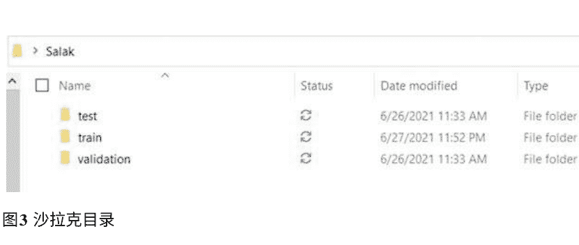

图3 沙拉克目录

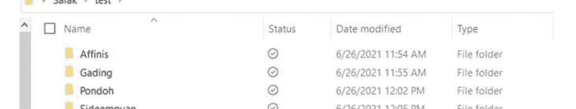

## 图4 测试目录

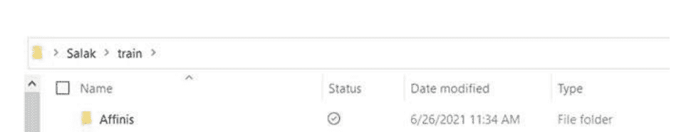

## 图5 训练目录


## 图6 验证目录

## 3 提出的深度学习

在本研究中，将开发卷积神经网络（CNN）以及两个迁移学习模型，即VGG16和ResNet50模型。所有模型将使用沙拉克数据集进行训练和测试，以选择其中最佳准确性。

### 3.1 CNN

在我们提出的CNN模型中，我们使用2个卷积层，2个池化层，1个展平运算符和2个密集层来生成所需的输出。我们首先接收

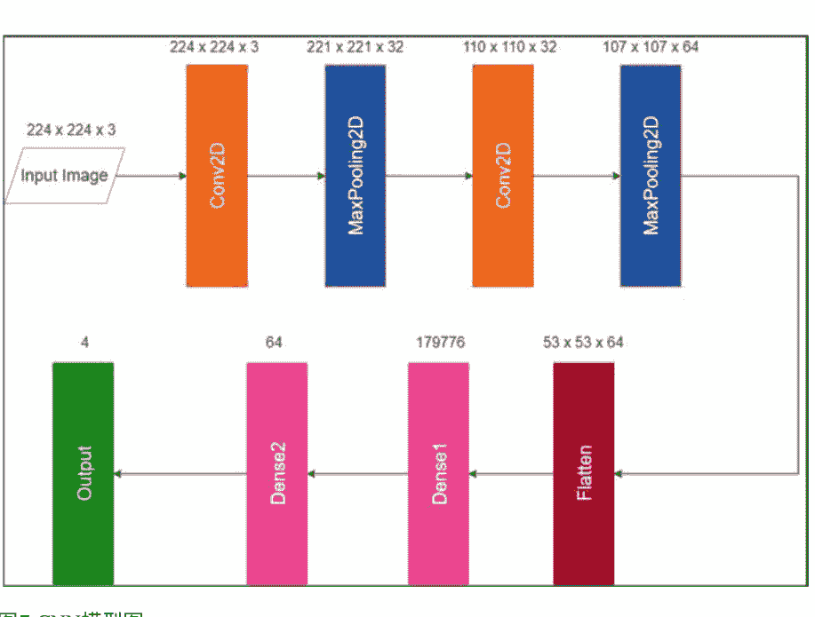

图7 CNN模型图

尺寸为（224 × 224 × 3）的输入图像，并将其馈送到2组卷积层和池化层中。然后将输出展平为单个维度，并在最终层之前馈送到2个隐藏层。密集层使用relu作为激活函数，分类器的最终层使用softmax作为激活函数。由于沙拉克数据集中有4个类别，最终输出应该有4个节点（图7）。

### 3.2 VGG16

在VGG16中，卷积基模型被冻结，我们解冻顶层。
添加了两个具有2048和1048个单元的密集层，以及具有4个单元的输出层。
输出层指示类别输出。VGG16模型图如图8所示。

### 3.3 ResNet50

在ResNet50中，卷积基模型被冻结，我们解冻顶层。
添加了两个具有2048和1048个单元的密集层和

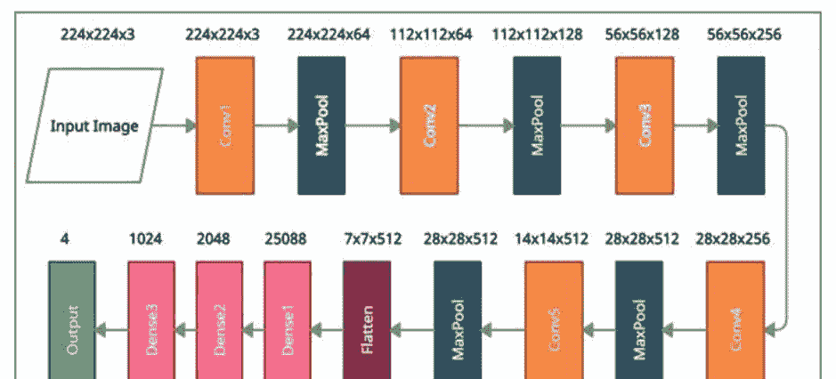

具有4个单元的输出层。输出层指示类别输出。
图9、10和11

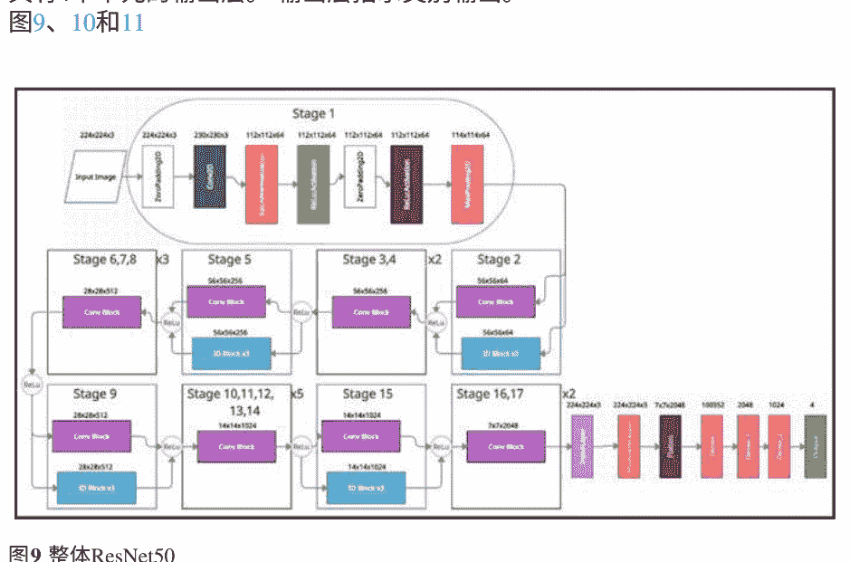

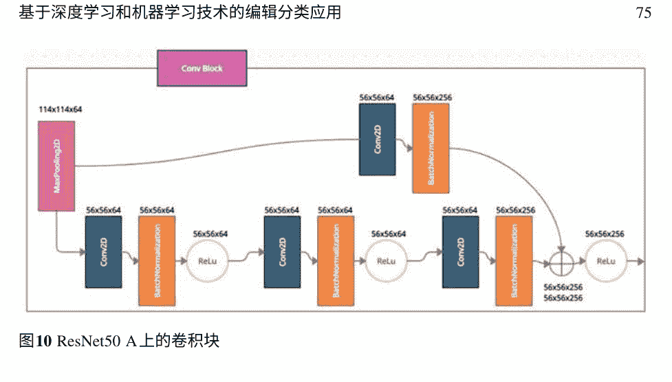

图10 ResNet50 A上的卷积块

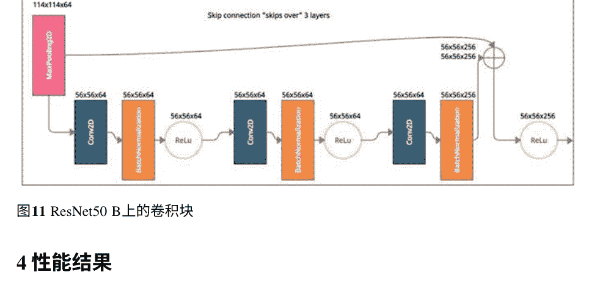

图11 ResNet50 B上的卷积块

## 4 性能结果

### 4.1 实验设置

沙拉克数据集中总共有1000张彩色图像，每个类别（沙拉克庞多、沙拉克阿菲尼斯、沙拉克加丁和沙拉克西德姆普安）各有250张图像。所有图像都被调整为224 × 224像素。数据集被分为70%的训练集，20%的验证集和10%的测试集。训练集用于训练模型，验证集用于评估给定模型在调整模型超参数时的性能。测试集用作评估最终模型性能的新数据。在这些实验中，我们使用Python，因为它拥有丰富的人工智能和机器学习库，如TensorFlow、Keras和Scikit-learn。我们使用Keras API来构建、训练和验证我们的模型。我们使用Google Colaboratory（Colab）平台进行所有实验，因为它不需要任何设置。

需要与他人共享代码，无需任何设置即可使用。数据集上传到Google驱动，并在团队成员之间共享路径，他们需要为共享路径添加快捷方式。Colab允许我们使用google.colab中的驱动模块访问我们的Google驱动。图12显示了挂载驱动的代码。通过点击链接输入授权码后，它会挂载到驱动器上。我们可以在不下载数据集的情况下访问相同的数据集。

## 图12 上传到Google驱动

```
python
[3] from google.colab import drive
    drive.mount('/content/drive')
```

Mounted at /content/drive

ImageDataGenerator API用于从子目录Sideempuan、Pondoh、Gading和Affinis返回图像批次。图13、14、15、16、17、18和19显示了VGG16和ResNet50的模型摘要。

对于迁移学习模型（VGG16和ResNet50）和CNN，我们执行了几个微调参数，如epochs的数量、优化器、学习率和几个密集层。对于CNN，还需要调整滤波器大小、而对于迁移学习模型，则需要调整模型的未冻结百分比。除了输出层外，密集层的激活函数都使用relu，输出层使用softmax进行所有实验。使用验证和测试准确性来评估模型的性能。

### 4.2 核大小的影响：CNN

核大小指的是卷积在特征图周围的滤波器的大小。在这些实验中，CNN只使用了3个核大小，分别为2、3和4，而VGG16和ResNet50模型仍然使用默认值。

图20和图21显示了所获得的测试和验证准确率。结果显示，当核大小为3时，验证准确率达到最佳准确率68%，而测试准确率最差，仅为20%。对于测试准确率，当核大小为4时，达到最佳准确率31%。

### 4.3 池大小的影响：CNN

池大小是用来减少特征图维度的大小。这将减少要学习的参数数量和网络中执行的计算量。在这个实验中，使用了3个池大小，分别为2、3和4，而VGG16和ResNet50模型仍然使用默认值。

图22和23显示了验证和测试准确性的结果。与卷积核大小类似，当池化大小为3时，它提供了最佳的36%验证准确性，当池化大小为2时，它提供了31%的测试准确性。

### 4.4 Epoch的影响

Epoch是神经网络的超参数之一，代表通过训练数据集的完整传递次数的梯度下降。在这个实验中，使用了3个不同的Epoch值，分别为10、20和50。

Model: "model"

| Layer (type) | Output Shape | Param # |
| :--- | :--- | :--- |
| input_1 (InputLayer) | [(None, 224, 224, 3)] | 0 |
| block1_conv1 (Conv2D) | (None, 224, 224, 64) | 1792 |
| block1_conv2 (Conv2D) | (None, 224, 224, 64) | 36928 |
| block1_pool (MaxPooling2D) | (None, 112, 112, 64) | 0 |
| block2_conv1 (Conv2D) | (None, 112, 112, 128) | 73856 |
| block2_conv2 (Conv2D) | (None, 112, 112, 128) | 147584 |
| block2_pool (MaxPooling2D) | (None, 56, 56, 128) | 0 |
| block3_conv1 (Conv2D) | (None, 56, 56, 256) | 295168 |
| block3_conv2 (Conv2D) | (None, 56, 56, 256) | 590080 |
| block3_conv3 (Conv2D) | (None, 56, 56, 256) | 590080 |
| block3_pool (MaxPooling2D) | (None, 28, 28, 256) | 0 |
| block4_conv1 (Conv2D) | (None, 28, 28, 512) | 1180160 |
| block4_conv2 (Conv2D) | (None, 28, 28, 512) | 2359808 |
| block4_conv3 (Conv2D) | (None, 28, 28, 512) | 2359808 |
| block4_pool (MaxPooling2D) | (None, 14, 14, 512) | 0 |
| block5_conv1 (Conv2D) | (None, 14, 14, 512) | 2359808 |
| block5_conv2 (Conv2D) | (None, 14, 14, 512) | 2359808 |
| block5_conv3 (Conv2D) | (None, 14, 14, 512) | 2359808 |
| block5_pool (MaxPooling2D) | (None, 7, 7, 512) | 0 |
| flatten (Flatten) | (None, 25088) | 0 |
| dense (Dense) | (None, 2048) | 51382272 |
| dense_1 (Dense) | (None, 1024) | 2098176 |
| dense_2 (Dense) | (None, 4) | 4100 |

Total params: 68,199,236
Trainable params: 53,484,548
Non-trainable params: 14,714,688


## 图14 ResNet50模型包装器摘要第1部分

Model: "resnet50"

| Layer (type) | Output Shape | Param # | Connected to |
| --- | --- | --- | --- |
| input_4 (InputLayer) | [(None, 224, 224, 3) | 0 | - |
| conv1_pad (ZeroPadding2D) | (None, 230, 230, 3) | 0 | input_4[0][0] |
| conv1_conv (Conv2D) | (None, 112, 112, 64) | 9472 | conv1_pad[0][0] |
| conv1_bn (BatchNormalization) | (None, 112, 112, 64) | 256 | conv1_conv[0][0] |
| conv1_relu (Activation) | (None, 112, 112, 64) | 0 | conv1_bn[0][0] |
| pool1_pad (ZeroPadding2D) | (None, 114, 114, 64) | 0 | conv1_relu[0][0] |
| pool1_pool (MaxPooling2D) | (None, 56, 56, 64) | 0 | pool1_pad[0][0] |
| conv2_block1_1_conv (Conv2D) | (None, 56, 56, 64) | 4160 | pool1_pool[0][0] |
| conv2_block1_1_bn (BatchNormalization) | (None, 56, 56, 64) | 256 | conv2_block1_1_conv[0][0] |
| conv2_block1_1_relu (Activation) | (None, 56, 56, 64) | 0 | conv2_block1_1_bn[0][0] |
| conv2_block1_2_conv (Conv2D) | (None, 56, 56, 64) | 36928 | conv2_block1_1_relu[0][0] |
| conv2_block1_2_bn (BatchNormalization) | (None, 56, 56, 64) | 256 | conv2_block1_2_conv[0][0] |
| conv2_block1_2_relu (Activation) | (None, 56, 56, 64) | 0 | conv2_block1_2_bn[0][0] |
| conv2_block1_0_conv (Conv2D) | (None, 56, 56, 256) | 16640 | pool1_pool[0][0] |
| conv2_block1_3_conv (Conv2D) | (None, 56, 56, 256) | 16640 | conv2_block1_2_relu[0][0] |
| conv2_block1_0_bn (BatchNormalization) | (None, 56, 56, 256) | 1024 | conv2_block1_0_conv[0][0] |
| conv2_block1_3_bn (BatchNormalization) | (None, 56, 56, 256) | 1024 | conv2_block1_3_conv[0][0] |
| conv2_block1_add (Add) | (None, 56, 56, 256) | 0 | conv2_block1_0_bn[0][0] conv2_block1_3_bn[0][0] |
| conv2_block1_out (Activation) | (None, 56, 56, 256) | 0 | conv2_block1_add[0][0] |
| conv2_block2_1_conv (Conv2D) | (None, 56, 56, 64) | 16448 | conv2_block1_out[0][0] |
| conv2_block2_1_bn (BatchNormalization) | (None, 56, 56, 64) | 256 | conv2_block2_1_conv[0][0] |
| conv2_block2_1_relu (Activation) | (None, 56, 56, 64) | 0 | conv2_block2_1_bn[0][0] |
| conv2_block2_2_conv (Conv2D) | (None, 56, 56, 64) | 36928 | conv2_block2_1_relu[0][0] |
| conv2_block2_2_bn (BatchNormalization) | (None, 56, 56, 64) | 256 | conv2_block2_2_conv[0][0] |
| conv2_block2_2_relu (Activation) | (None, 56, 56, 64) | 0 | conv2_block2_2_bn[0][0] |
| conv2_block2_3_conv (Conv2D) | (None, 56, 56, 256) | 16640 | conv2_block2_2_relu[0][0] |
| conv2_block2_3_bn (BatchNormalization) | (None, 56, 56, 256) | 1024 | conv2_block2_3_conv[0][0] |
| conv2_block2_add (Add) | (None, 56, 56, 256) | 0 | conv2_block1_out[0][0] conv2_block2_3_bn[0][0] |
| conv2_block2_out (Activation) | (None, 56, 56, 256) | 0 | conv2_block2_add[0][0] |
| conv2_block3_1_conv (Conv2D) | (None, 56, 56, 64) | 16448 | conv2_block2_out[0][0] |
| conv2_block3_1_bn (BatchNormalization) | (None, 56, 56, 64) | 256 | conv2_block3_1_conv[0][0] |
| conv2_block3_1_relu (Activation) | (None, 56, 56, 64) | 0 | conv2_block3_1_bn[0][0] |
| conv2_block3_2_conv (Conv2D) | (None, 56, 56, 64) | 36928 | conv2_block3_1_relu[0][0] |
| conv2_block3_2_bn (BatchNormalization) | (None, 56, 56, 64) | 256 | conv2_block3_2_conv[0][0] |
| conv2_block3_2_relu (Activation) | (None, 56, 56, 64) | 0 | conv2_block3_2_bn[0][0] |
| conv2_block3_3_conv (Conv2D) | (None, 56, 56, 256) | 16640 | conv2_block3_2_relu[0][0] |
| conv2_block3_3_bn (BatchNormalization) | (None, 56, 56, 256) | 1024 | conv2_block3_3_conv[0][0] |
| conv2_block3_add (Add) | (None, 56, 56, 256) | 0 | conv2_block2_out[0][0] conv2_block3_3_bn[0][0] |
| conv2_block3_out (Activation) | (None, 56, 56, 256) | 0 | conv2_block3_add[0][0] |
| conv3_block1_1_conv (Conv2D) | (None, 28, 28, 128) | 32896 | conv2_block3_out[0][0] |
| conv3_block1_1_bn (BatchNormalization) | (None, 28, 28, 128) | 512 | conv3_block1_1_conv[0][0] |
| conv3_block1_1_relu (Activation) | (None, 28, 28, 128) | 0 | conv3_block1_1_bn[0][0] |
| conv3_block1_2_conv (Conv2D) | (None, 28, 28, 128) | 147584 | conv3_block1_1_relu[0][0] |
| conv3_block1_2_bn (BatchNormalization) | (None, 28, 28, 128) | 512 | conv3_block1_2_conv[0][0] |
| conv3_block1_2_relu (Activation) | (None, 28, 28, 128) | 0 | conv3_block1_2_bn[0][0] |
| conv3_block1_0_conv (Conv2D) | (None, 28, 28, 512) | 131584 | conv2_block3_out[0][0] |
| conv3_block1_3_conv (Conv2D) | (None, 28, 28, 512) | 66048 | conv3_block1_2_relu[0][0] |
| conv3_block1_0_bn (BatchNormalization) | (None, 28, 28, 512) | 2048 | conv3_block1_0_conv[0][0] |
| conv3_block1_3_bn (BatchNormalization) | (None, 28, 28, 512) | 2048 | conv3_block1_3_conv[0][0] |
| conv3_block1_add (Add) | (None, 28, 28, 512) | 0 | conv3_block1_0_bn[0][0] conv3_block1_3_bn[0][0] |
| conv3_block1_out (Activation) | (None, 28, 28, 512) | 0 | conv3_block1_add[0][0] |
| conv3_block2_1_conv (Conv2D) | (None, 28, 28, 128) | 65664 | conv3_block1_out[0][0] |
| conv3_block2_1_bn (BatchNormalization) | (None, 28, 28, 128) | 512 | conv3_block2_1_conv[0][0] |
| conv3_block2_1_relu (Activation) | (None, 28, 28, 128) | 0 | conv3_block2_1_bn[0][0] |
| conv3_block2_2_conv (Conv2D) | (None, 28, 28, 128) | 147584 | conv3_block2_1_relu[0][0] |
| conv3_block2_2_bn (BatchNormalization) | (None, 28, 28, 128) | 512 | conv3_block2_2_conv[0][0] |
| conv3_block2_2_relu (Activation) | (None, 28, 28, 128) | 0 | conv3_block2_2_bn[0][0] |
| conv3_block2_3_conv (Conv2D) | (None, 28, 28, 512) | 66048 | conv3_block2_2_relu[0][0] |
| conv3_block2_0_conv (Conv2D) | (None, 28, 28, 512) | 131584 | conv3_block1_out[0][0] |
| conv3_block2_0_bn (BatchNormalization) | (None, 28, 28, 512) | 2048 | conv3_block2_0_conv[0][0] |
| conv3_block2_3_bn (BatchNormalization) | (None, 28, 28, 512) | 2048 | conv3_block2_3_conv[0][0] |
| conv3_block2_add (Add) | (None, 28, 28, 512) | 0 | conv3_block2_0_bn[0][0] conv3_block2_3_bn[0][0] |
| conv3_block2_out (Activation) | (None, 28, 28, 512) | 0 | conv3_block2_add[0][0] |
| conv3_block3_1_conv (Conv2D) | (None, 28, 28, 128) | 65664 | conv3_block2_out[0][0] |
| conv3_block3_1_bn (BatchNormalization) | (None, 28, 28, 128) | 512 | conv3_block3_1_conv[0][0] |
| conv3_block3_1_relu (Activation) | (None, 28, 28, 128) | 0 | conv3_block3_1_bn[0][0] |
| conv3_block3_2_conv (Conv2D) | (None, 28, 28, 128) | 147584 | conv3_block3_1_relu[0][0] |
| conv3_block3_2_bn (BatchNormalization) | (None, 28, 28, 128) | 512 | conv3_block3_2_conv[0][0] |
| conv3_block3_2_relu (Activation) | (None, 28, 28, 128) | 0 | conv3_block3_2_bn[0][0] |
| conv3_block3_3_conv (Conv2D) | (None, 28, 28, 512) | 66048 | conv3_block3_2_relu[0][0] |
| conv3_block3_0_conv (Conv2D) | (None, 28, 28, 512) | 131584 | conv3_block2_out[0][0] |
| conv3_block3_0_bn (BatchNormalization) | (None, 28, 28, 512) | 2048 | conv3_block3_0_conv[0][0] |
| conv3_block3_3_bn (BatchNormalization) | (None, 28, 28, 512) | 2048 | conv3_block3_3_conv[0][0] |
| conv3_block3_add (Add) | (None, 28, 28, 512) | 0 | conv3_block3_0_bn[0][0] conv3_block3_3_bn[0][0] |
| conv3_block3_out (Activation) | (None, 28, 28, 512) | 0 | conv3_block3_add[0][0] |
| conv3_block4_1_conv (Conv2D) | (None, 28, 28, 128) | 65664 | conv3_block3_out[0][0] |
| conv3_block4_1_bn (BatchNormalization) | (None, 28, 28, 128) | 512 | conv3_block4_1_conv[0][0] |
| conv3_block4_1_relu (Activation) | (None, 28, 28, 128) | 0 | conv3_block4_1_bn[0][0] |
| conv3_block4_2_conv (Conv2D) | (None, 28, 28, 128) | 147584 | conv3_block4_1_relu[0][0] |
| conv3_block4_2_bn (BatchNormalization) | (None, 28, 28, 128) | 512 | conv3_block4_2_conv[0][0] |
| conv3_block4_2_relu (Activation) | (None, 28, 28, 128) | 0 | conv3_block4_2_bn[0][0] |
| conv3_block4_3_conv (Conv2D) | (None, 28, 28, 512) | 66048 | conv3_block4_2_relu[0][0] |
| conv3_block4_0_conv (Conv2D) | (None, 28, 28, 512) | 131584 | conv3_block3_out[0][0] |
| conv3_block4_0_bn (BatchNormalization) | (None, 28, 28, 512) | 2048 | conv3_block4_0_conv[0][0] |
| conv3_block4_3_bn (BatchNormalization) | (None, 28, 28, 512) | 2048 | conv3_block4_3_conv[0][0] |
| conv3_block4_add (Add) | (None, 28, 28, 512) | 0 | conv3_block4_0_bn[0][0] conv3_block4_3_bn[0][0] |
| conv3_block4_out (Activation) | (None, 28, 28, 512) | 0 | conv3_block4_add[0][0] |

## 图15 ResNet50模型包装器摘要第2部分| Layer | Type | Output Shape | Params | Input |
|-------|------|--------------|--------|-------|
| conv3_block2_1_relu | Activation | (None, 28, 28, 128) | 0 | conv3_block2_1_bn[0][0] |
| conv3_block2_2_conv | Conv2D | (None, 28, 28, 128) | 147584 | conv3_block2_1_relu[0][0] |
| conv3_block2_2_bn | BatchNormalization | (None, 28, 28, 128) | 512 | conv3_block2_2_conv[0][0] |
| conv3_block2_2_relu | Activation | (None, 28, 28, 128) | 0 | conv3_block2_2_bn[0][0] |
| conv3_block2_3_conv | Conv2D | (None, 28, 28, 512) | 66048 | conv3_block2_2_relu[0][0] |
| conv3_block2_3_bn | BatchNormalization | (None, 28, 28, 512) | 2048 | conv3_block2_3_conv[0][0] |
| conv3_block2_add | Add | (None, 28, 28, 512) | 0 | conv3_block1_out[0][0], conv3_block2_3_bn[0][0] |
| conv3_block2_out | Activation | (None, 28, 28, 512) | 0 | conv3_block2_add[0][0] |
| conv3_block3_1_conv | Conv2D | (None, 28, 28, 128) | 65664 | conv3_block2_out[0][0] |
| conv3_block3_1_bn | BatchNormalization | (None, 28, 28, 128) | 512 | conv3_block3_1_conv[0][0] |
| conv3_block3_1_relu | Activation | (None, 28, 28, 128) | 0 | conv3_block3_1_bn[0][0] |
| conv3_block3_2_conv | Conv2D | (None, 28, 28, 128) | 147584 | conv3_block3_1_relu[0][0] |
| conv3_block3_2_bn | BatchNormalization | (None, 28, 28, 128) | 512 | conv3_block3_2_conv[0][0] |
| conv3_block3_2_relu | Activation | (None, 28, 28, 128) | 0 | conv3_block3_2_bn[0][0] |
| conv3_block3_3_conv | Conv2D | (None, 28, 28, 512) | 66048 | conv3_block3_2_relu[0][0] |
| conv3_block3_3_bn | BatchNormalization | (None, 28, 28, 512) | 2048 | conv3_block3_3_conv[0][0] |
| conv3_block3_add | Add | (None, 28, 28, 512) | 0 | conv3_block2_out[0][0], conv3_block3_3_bn[0][0] |
| conv3_block3_out | Activation | (None, 28, 28, 512) | 0 | conv3_block3_add[0][0] |
| conv3_block4_1_conv | Conv2D | (None, 28, 28, 128) | 65664 | conv3_block3_out[0][0] |
| conv3_block4_1_bn | BatchNormalization | (None, 28, 28, 128) | 512 | conv3_block4_1_conv[0][0] |
| conv3_block4_1_relu | Activation | (None, 28, 28, 128) | 0 | conv3_block4_1_bn[0][0] |
| conv3_block4_2_conv | Conv2D | (None, 28, 28, 128) | 147584 | conv3_block4_1_relu[0][0] |
| conv3_block4_2_bn | BatchNormalization | (None, 28, 28, 128) | 512 | conv3_block4_2_conv[0][0] |
| conv3_block4_2_relu | Activation | (None, 28, 28, 128) | 0 | conv3_block4_2_bn[0][0] |
| conv3_block4_3_conv | Conv2D | (None, 28, 28, 512) | 66048 | conv3_block4_2_relu[0][0] |
| conv3_block4_3_bn | BatchNormalization | (None, 28, 28, 512) | 2048 | conv3_block4_3_conv[0][0] |

## 图16 ResNet50模型包装器摘要第3部分

#### 4.4.1 Epoch的影响：CNN

根据图24，当epoch值为10和50时，验证准确率最高达到35%。而最低的验证准确率为20%，当epoch值为20时。测试准确率在epoch值为10、20和50时分别为31%和27%，如图25所示。

| Layer (type) | Output Shape | Param # | Connected to |
| :--- | :--- | :--- | :--- |
| conv3_block4_add (Add) | (None, 28, 28, 512) | 0 | conv3_block3_out[0][0]<br>conv3_block4_3_bn[0][0] |
| conv3_block4_out (Activation) | (None, 28, 28, 512) | 0 | conv3_block4_add[0][0] |
| conv4_block1_1_conv (Conv2D) | (None, 14, 14, 256) | 131328 | conv3_block4_out[0][0] |
| conv4_block1_1_bn (BatchNormalization) | (None, 14, 14, 256) | 1024 | conv4_block1_1_conv[0][0] |
| conv4_block1_1_relu (Activation) | (None, 14, 14, 256) | 0 | conv4_block1_1_bn[0][0] |
| conv4_block1_2_conv (Conv2D) | (None, 14, 14, 256) | 590080 | conv4_block1_1_relu[0][0] |
| conv4_block1_2_bn (BatchNormalization) | (None, 14, 14, 256) | 1024 | conv4_block1_2_conv[0][0] |
| conv4_block1_2_relu (Activation) | (None, 14, 14, 256) | 0 | conv4_block1_2_bn[0][0] |
| conv4_block1_0_conv (Conv2D) | (None, 14, 14, 1024) | 525312 | conv3_block4_out[0][0] |
| conv4_block1_3_conv (Conv2D) | (None, 14, 14, 1024) | 263168 | conv4_block1_2_relu[0][0] |
| conv4_block1_0_bn (BatchNormalization) | (None, 14, 14, 1024) | 4096 | conv4_block1_0_conv[0][0] |
| conv4_block1_3_bn (BatchNormalization) | (None, 14, 14, 1024) | 4096 | conv4_block1_3_conv[0][0] |
| conv4_block1_add (Add) | (None, 14, 14, 1024) | 0 | conv4_block1_0_bn[0][0]<br>conv4_block1_3_bn[0][0] |
| conv4_block1_out (Activation) | (None, 14, 14, 1024) | 0 | conv4_block1_add[0][0] |
| conv4_block2_1_conv (Conv2D) | (None, 14, 14, 256) | 262400 | conv4_block1_out[0][0] |
| conv4_block2_1_bn (BatchNormalization) | (None, 14, 14, 256) | 1024 | conv4_block2_1_conv[0][0] |
| conv4_block2_1_relu (Activation) | (None, 14, 14, 256) | 0 | conv4_block2_1_bn[0][0] |
| conv4_block2_2_conv (Conv2D) | (None, 14, 14, 256) | 590080 | conv4_block2_1_relu[0][0] |
| conv4_block2_2_bn (BatchNormalization) | (None, 14, 14, 256) | 1024 | conv4_block2_2_conv[0][0] |
| conv4_block2_2_relu (Activation) | (None, 14, 14, 256) | 0 | conv4_block2_2_bn[0][0] |
| conv4_block2_3_conv (Conv2D) | (None, 14, 14, 1024) | 263168 | conv4_block2_2_relu[0][0] |
| conv4_block2_3_bn (BatchNormalization) | (None, 14, 14, 1024) | 4096 | conv4_block2_3_conv[0][0] |
| conv4_block2_add (Add) | (None, 14, 14, 1024) | 0 | conv4_block1_out[0][0]<br>conv4_block2_3_bn[0][0] |
| conv4_block2_out (Activation) | (None, 14, 14, 1024) | 0 | conv4_block2_add[0][0] |
| conv4_block3_1_conv (Conv2D) | (None, 14, 14, 256) | 262400 | conv4_block2_out[0][0] |
| conv4_block3_1_bn (BatchNormalization) | (None, 14, 14, 256) | 1024 | conv4_block3_1_conv[0][0] |
| conv4_block3_1_relu (Activation) | (None, 14, 14, 256) | 0 | conv4_block3_1_bn[0][0] |

## 图17 ResNet50模型包装器摘要第4部分

#### 4.4.2 Epoch的影响：VGG16

图26和27显示了测试集和验证集的准确率。当epoch值为10时，验证准确率最高达到75.5%，接着是当epoch值为20时的69.5%，以及当epoch值为50时的71%。而测试准确率分别为当epoch为20时的75%，当epoch为50时的73%，以及当epoch为10时的68%。

| Layer (type) | Output Shape | Param # | Connected to |
| :--- | :--- | :--- | :--- |
| conv4_block3_2_conv (Conv2D) | (None, 14, 14, 256) | 590080 | conv4_block3_1_relu[0][0] |
| conv4_block3_2_bn (BatchNormalization) | (None, 14, 14, 256) | 1024 | conv4_block3_2_conv[0][0] |
| conv4_block3_2_relu (Activation) | (None, 14, 14, 256) | 0 | conv4_block3_2_bn[0][0] |
| conv4_block3_3_conv (Conv2D) | (None, 14, 14, 1024) | 263168 | conv4_block3_2_relu[0][0] |
| conv4_block3_3_bn (BatchNormalization) | (None, 14, 14, 1024) | 4096 | conv4_block3_3_conv[0][0] |
| conv4_block3_add (Add) | (None, 14, 14, 1024) | 0 | conv4_block2_out[0][0]<br>conv4_block3_3_bn[0][0] |
| conv4_block3_out (Activation) | (None, 14, 14, 1024) | 0 | conv4_block3_add[0][0] |
| conv4_block4_1_conv (Conv2D) | (None, 14, 14, 256) | 262400 | conv4_block3_out[0][0] |
| conv4_block4_1_bn (BatchNormalization) | (None, 14, 14, 256) | 1024 | conv4_block4_1_conv[0][0] |
| conv4_block4_1_relu (Activation) | (None, 14, 14, 256) | 0 | conv4_block4_1_bn[0][0] |
| conv4_block4_2_conv (Conv2D) | (None, 14, 14, 256) | 590080 | conv4_block4_1_relu[0][0] |
| conv4_block4_2_bn (BatchNormalization) | (None, 14, 14, 256) | 1024 | conv4_block4_2_conv[0][0] |
| conv4_block4_2_relu (Activation) | (None, 14, 14, 256) | 0 | conv4_block4_2_bn[0][0] |
| conv4_block4_3_conv (Conv2D) | (None, 14, 14, 1024) | 263168 | conv4_block4_2_relu[0][0] |
| conv4_block4_3_bn (BatchNormalization) | (None, 14, 14, 1024) | 4096 | conv4_block4_3_conv[0][0] |
| conv4_block4_add (Add) | (None, 14, 14, 1024) | 0 | conv4_block3_out[0][0]<br>conv4_block4_3_bn[0][0] |
| conv4_block4_out (Activation) | (None, 14, 14, 1024) | 0 | conv4_block4_add[0][0] |
| conv4_block5_1_conv (Conv2D) | (None, 14, 14, 256) | 262400 | conv4_block4_out[0][0] |
| conv4_block5_1_bn (BatchNormalization) | (None, 14, 14, 256) | 1024 | conv4_block5_1_conv[0][0] |
| conv4_block5_1_relu (Activation) | (None, 14, 14, 256) | 0 | conv4_block5_1_bn[0][0] |
| conv4_block5_2_conv (Conv2D) | (None, 14, 14, 256) | 590080 | conv4_block5_1_relu[0][0] |
| conv4_block5_2_bn (BatchNormalization) | (None, 14, 14, 256) | 1024 | conv4_block5_2_conv[0][0] |
| conv4_block5_2_relu (Activation) | (None, 14, 14, 256) | 0 | conv4_block5_2_bn[0][0] |
| conv4_block5_3_conv (Conv2D) | (None, 14, 14, 1024) | 263168 | conv4_block5_2_relu[0][0] |
| conv4_block5_3_bn (BatchNormalization) | (None, 14, 14, 1024) | 4096 | conv4_block5_3_conv[0][0] |
| conv4_block5_add (Add) | (None, 14, 14, 1024) | 0 | conv4_block4_out[0][0]<br>conv4_block5_3_bn[0][0] |
| conv4_block5_out (Activation) | (None, 14, 14, 1024) | 0 | conv4_block5_add[0][0] |

## 图18 ResNet50模型包装器摘要部分5

#### 4.4.3 Epoch的影响：ResNet50

测试和验证的准确性如图28和29所示。10个Epoch的值给出了最高的84%准确率，并且随着Epoch值的增加而减少。至于测试准确率，在Epoch值为20时达到了82%的峰值准确率。

| Layer | Type | Output Shape | Parameters | Connected to |
|-------|------|--------------|------------|--------------|
| conv5_block2_3_bn | BatchNormalization | (None, 7, 7, 2048) | 8192 | conv5_block2_3_conv[0][0] |
| conv5_block2_add | Add | (None, 7, 7, 2048) | 0 | conv5_block1_out[0][0], conv5_block2_3_bn[0][0] |
| conv5_block2_out | Activation | (None, 7, 7, 2048) | 0 | conv5_block2_add[0][0] |
| conv5_block3_1_conv | Conv2D | (None, 7, 7, 512) | 1049088 | conv5_block2_out[0][0] |
| conv5_block3_1_bn | BatchNormalization | (None, 7, 7, 512) | 2048 | conv5_block3_1_conv[0][0] |
| conv5_block3_1_relu | Activation | (None, 7, 7, 512) | 0 | conv5_block3_1_bn[0][0] |
| conv5_block3_2_conv | Conv2D | (None, 7, 7, 512) | 2359808 | conv5_block3_1_relu[0][0] |
| conv5_block3_2_bn | BatchNormalization | (None, 7, 7, 512) | 2048 | conv5_block3_2_conv[0][0] |
| conv5_block3_2_relu | Activation | (None, 7, 7, 512) | 0 | conv5_block3_2_bn[0][0] |
| conv5_block3_3_conv | Conv2D | (None, 7, 7, 2048) | 1050624 | conv5_block3_2_relu[0][0] |
| conv5_block3_3_bn | BatchNormalization | (None, 7, 7, 2048) | 8192 | conv5_block3_3_conv[0][0] |
| conv5_block3_add | Add | (None, 7, 7, 2048) | 0 | conv5_block2_out[0][0], conv5_block3_3_bn[0][0] |
| conv5_block3_out | Activation | (None, 7, 7, 2048) | 0 | conv5_block3_add[0][0] |

## 图19 ResNet50整体模型摘要

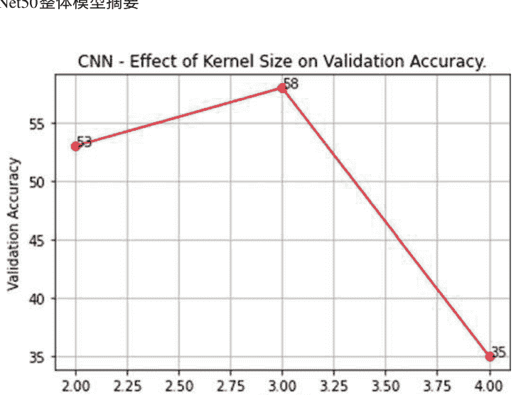

## 图20 CNN—核大小对验证准确率的影响

### 4.5 优化器的影响

优化器是一种神经网络算法，用于改变神经网络的属性，如权重参数和学习率。优化器的目标是通过增强神经网络函数的损失来减少损失。

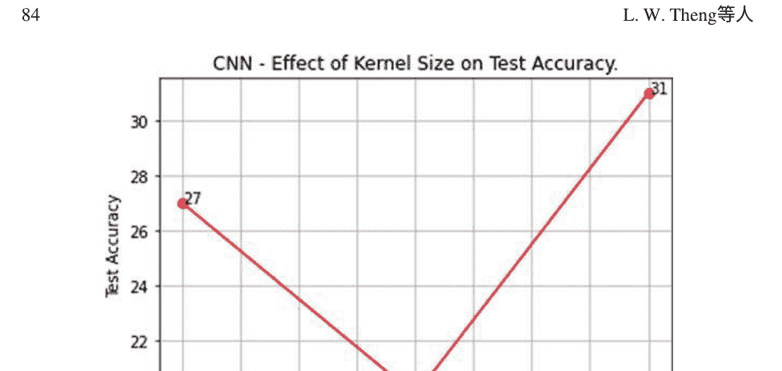

## 图21 CNN—核大小对测试准确率的影响

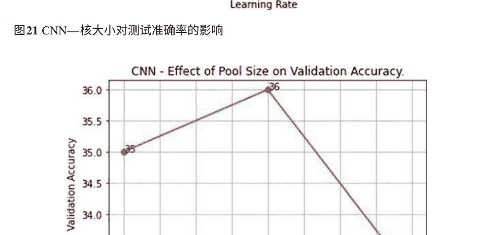

## 图22 卷积神经网络—池大小对验证准确性的影响

神经网络的参数。在这个实验中，使用了4种优化器，分别是Adam、SGD、Adadelta和Adagrad。

### 4.5.1 优化器的影响：卷积神经网络

图30和图31显示了在使用不同优化器时验证集和测试集的准确性。Adagrad 优化器的验证准确性最高，达到了67%。

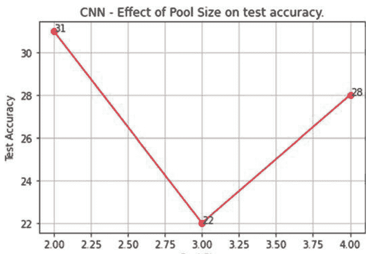

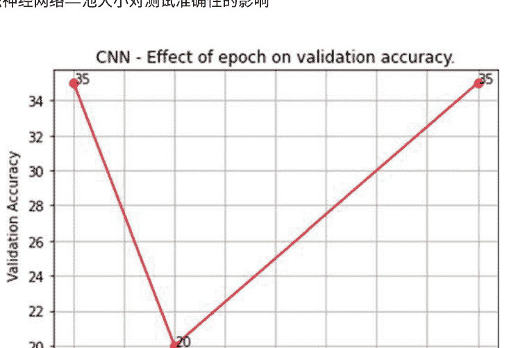

Adadelta的准确性为41.5%，Adam为35%，SGD为25%。对于测试准确性，Adam的准确性最高，为31%，而SGD为25%，Adagrad为19%，Adadelta为17%。

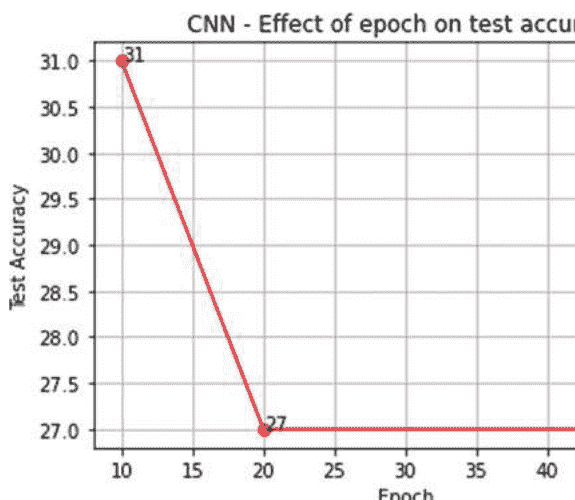

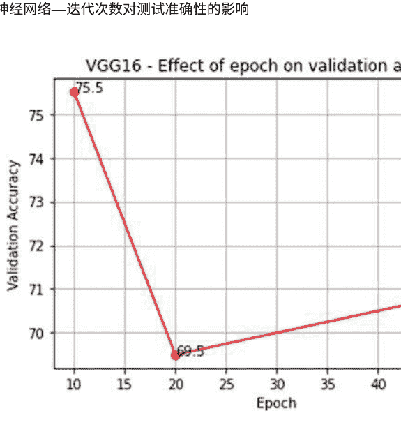

#### 4.5.2 优化器的影响：VGG16

图32和33显示了在VGG16模型中使用测试和验证数据集进行准确性比较。使用验证数据集时，SGD优化器显示出最佳优化器，准确率为71%，其次是Adam和Adagrad，准确率为69.5%，最后是Adadelta，准确率为44%。至于测试数据集，Adam在所有优化器中提供了最佳准确率。Adam的准确率为76%，SGD为69%，Adagrad为66%，Adadelta为50%。

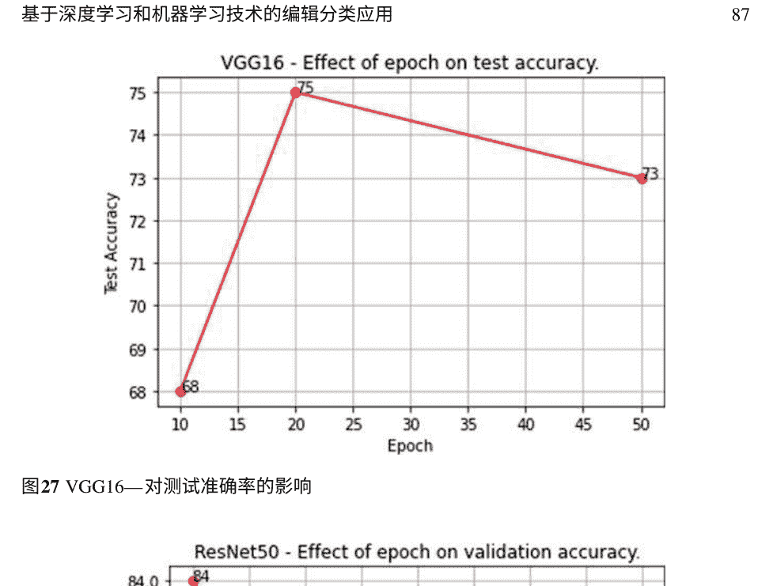

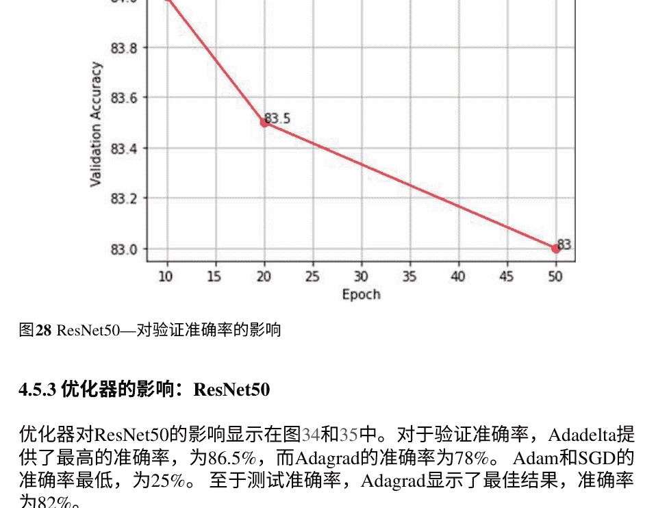

#### 4.5.3 优化器的影响：ResNet50

优化器对ResNet50的影响显示在图34和35中。对于验证准确率，Adadelta提供了最高的准确率，为86.5%，而Adagrad的准确率为78%。Adam和SGD的准确率最低，为25%。至于测试准确率，Adagrad显示了最佳结果，准确率为82%。然而，Adadelta的准确率也很高，达到了79%，而Adam和SGD的准确率最低，只有25%。

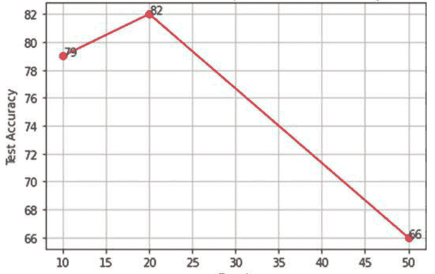

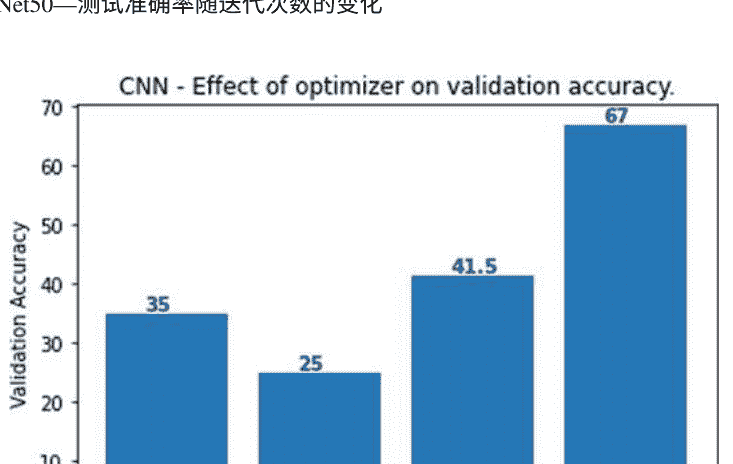

### 4.6 学习率的影响

学习率是神经网络的一个超参数，它控制着在每次更新模型权重时，根据估计的误差来改变模型的程度。选择学习率是一个挑战，因为太小的值会导致训练过程时间过长，而太大的值会导致训练过程不稳定。

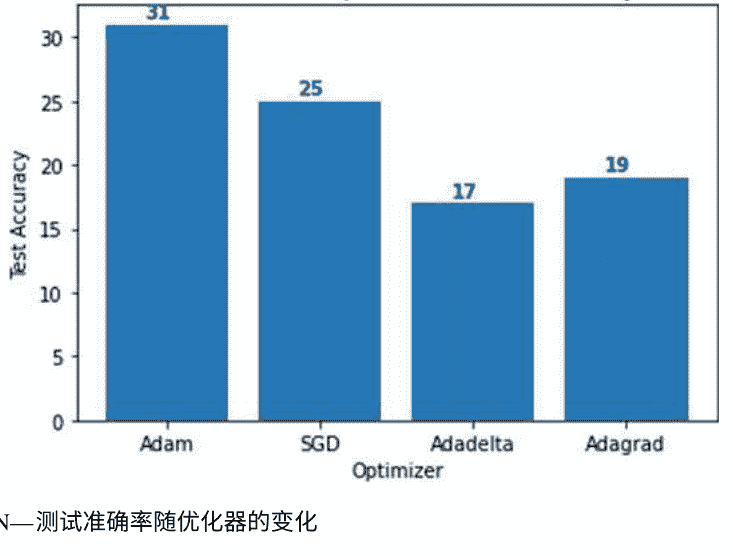

图31 CNN—测试准确率随优化器的变化

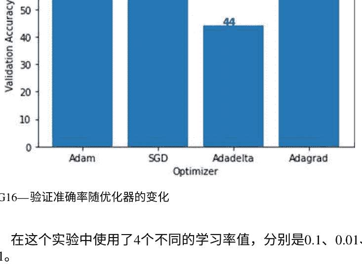

图32 VGG16—验证准确率随优化器的变化

不稳定。在这个实验中使用了4个不同的学习率值，分别是0.1、0.01、0.001和0.0001。

# VGG16 - Effect of optimizer on test accuracy.

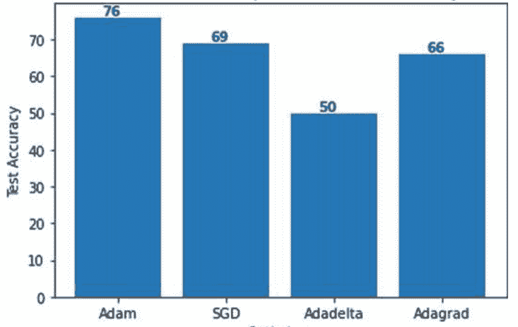

图33 VGG16—优化器对测试准确率的影响

# ResNet50 - Effect of optimizer on validation accuracy.

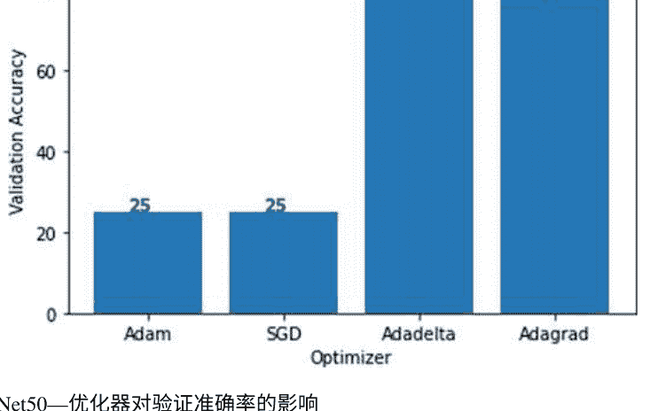

图34 ResNet50—优化器对验证准确率的影响

#### 4.6.1 学习率的影响：CNN

图36和37显示了验证准确率和测试准确率的结果。CNN的验证准确率在学习率为0.01时达到峰值82.14%。当学习率为0.1时，准确率为26.7%，学习率为0.001和0.1时准确率为25%。至于测试准确率，与验证准确率呈现相似的模式。

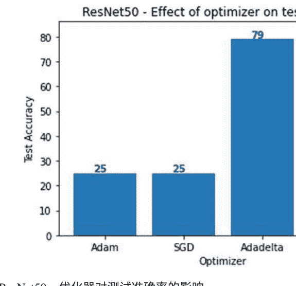

图35 ResNet50—优化器对测试准确率的影响

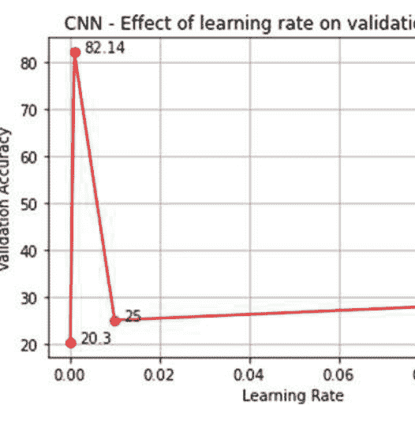

图36 CNN—学习率对验证准确率的影响

准确率。当学习率为0.01时，测试准确率最高达到35%，学习率为0.1、0.001和0.0001时，准确率为25%。

#### 4.6.2 学习率的影响：VGG16

图38和39显示了测试和验证数据集的准确性。当学习率值为0.0001时，验证准确率最高，为76%，

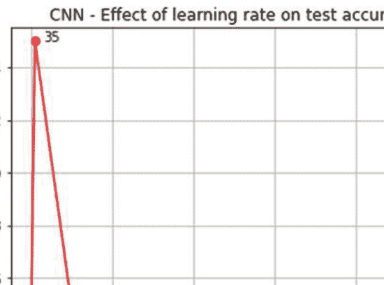

测试准确率为0.001。总体结果表明，学习率值越高，准确率越低。

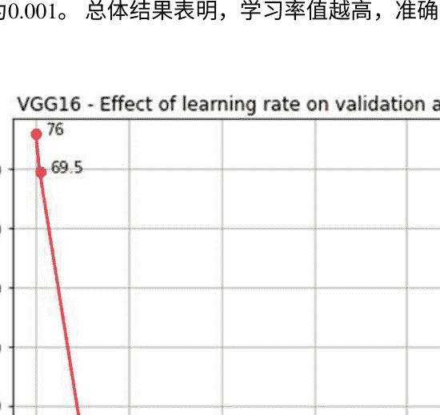

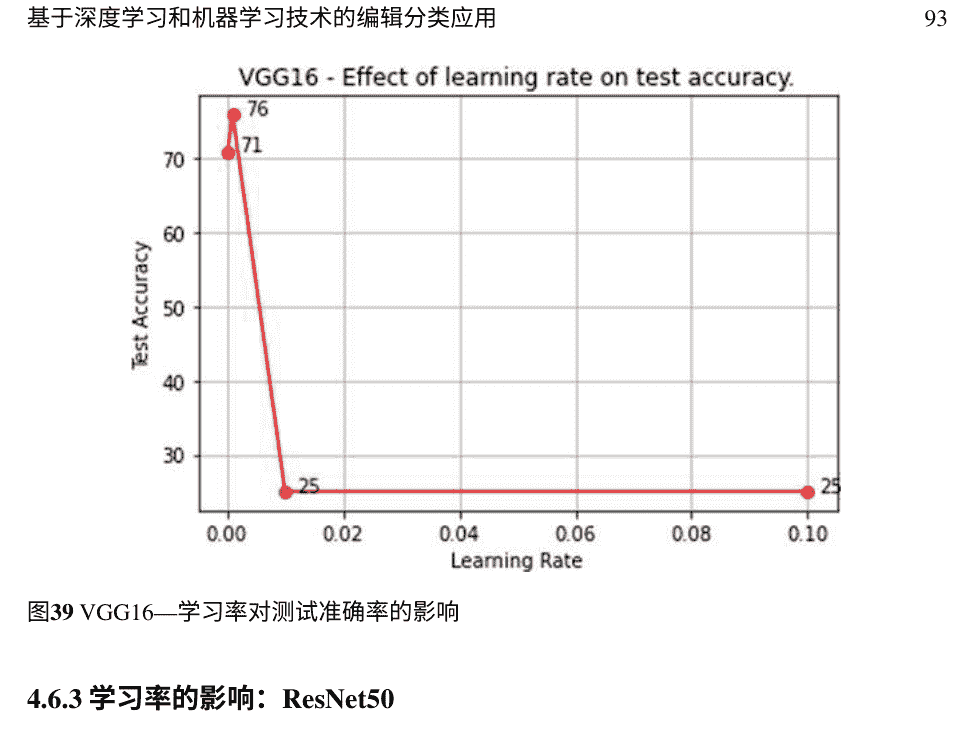

### 4.6.3 学习率的影响： ResNet50

图40和41显示了基于学习率的ResNet50的准确性。结果显示与VGG16类似的模式，即学习率值越高，准确率越低。测试和验证的最高准确率分别为83%，学习率分别为0.0001和0.001。

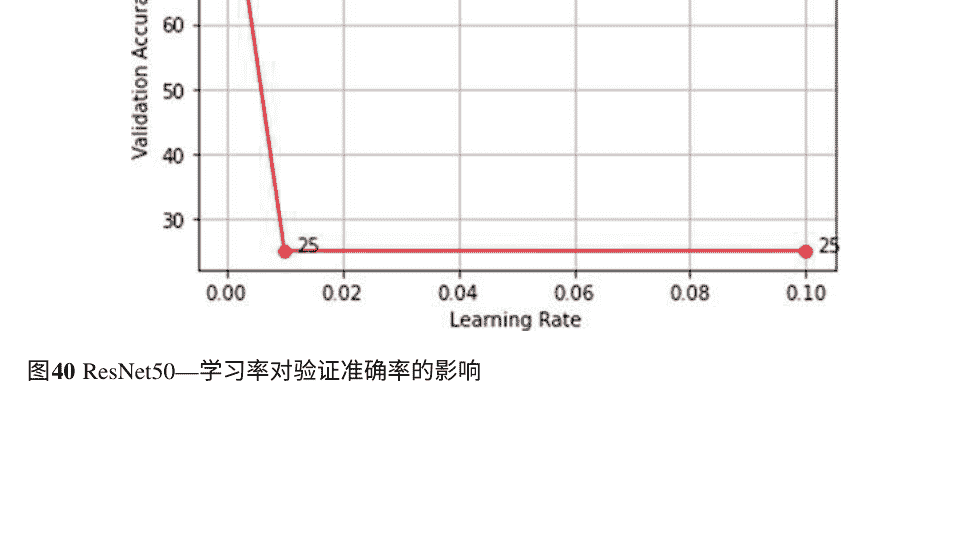

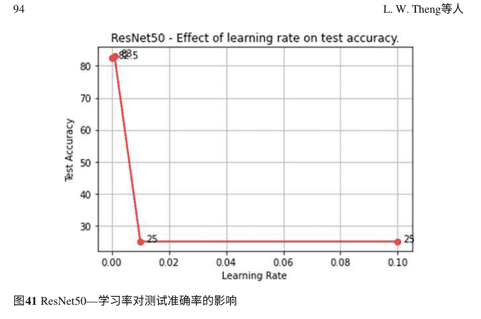

图41 ResNet50—学习率对测试准确率的影响

## 4.7 Dense Layer的影响

Dense Layer是一个深度连接的神经网络层。这意味着Dense Layer中的每个神经元都接收来自前一层的输入。在这个实验中，使用了4个不同的Dense Layer，分别是1、2、3和4。

### 4.7.1 Dense Layer的影响：CNN

图42和图43展示了Dense Layer对CNN验证和测试准确率的影响。结果表明，随着Dense Layer的增加，准确率会降低。验证准确率分别为1个Dense Layer的51%，2个Dense Layer的33.5%，3个Dense Layer的28%和4个Dense Layer的31.5%。至于测试准确率，最高准确率为25%，其次是16%和23%。

#### 4.7.2 密集层的影响：VGG16

图44和图45显示了验证和测试准确性的结果。当密集层为3时，最高验证准确率为76%，而最高测试准确率为77%。当密集层为2时，最低准确率均为25%。

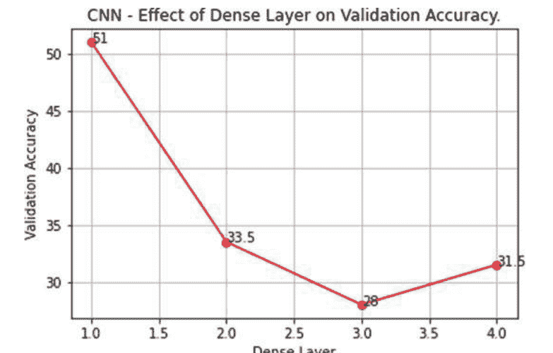

图42 CNN-密集层对验证准确率的影响

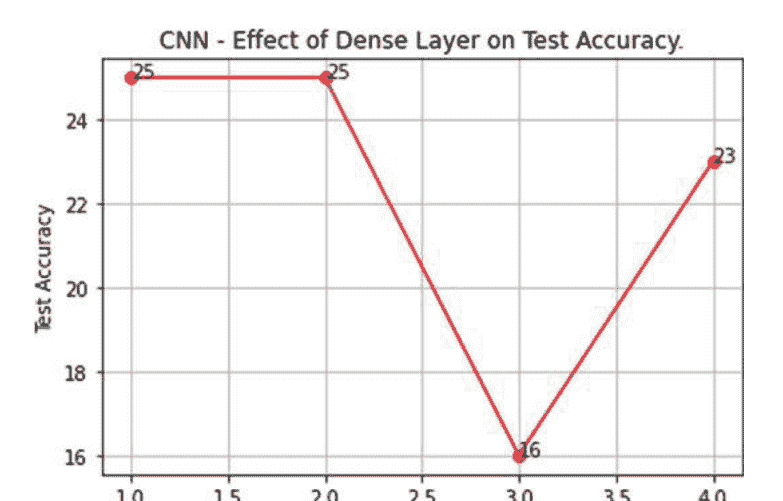

图43 CNN-密集层对测试准确率的影响

#### 4.7.3 密集层的影响：ResNet50

图46和图47显示了验证和测试准确性的结果。随着密集层的增加，验证准确率最高达到86.5%。测试准确率最高为82%，最低为72%。

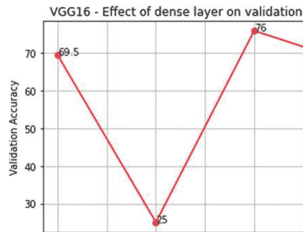

图44 密集层对验证准确率的影响

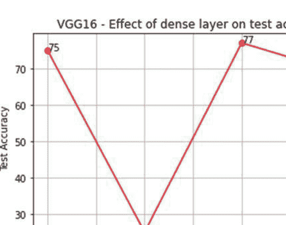

图45 密集层对测试准确率的影响

## 4.8 微调预训练模型的影响（VGG16和ResNet50）

微调是修改预训练模型的特征表示，使模型更适合特定任务的过程，在本例中是salak数据集。微调的步骤包括解冻冻结的预训练模型的顶层

# ResNet50 - Effect of dense layer on validation accuracy.

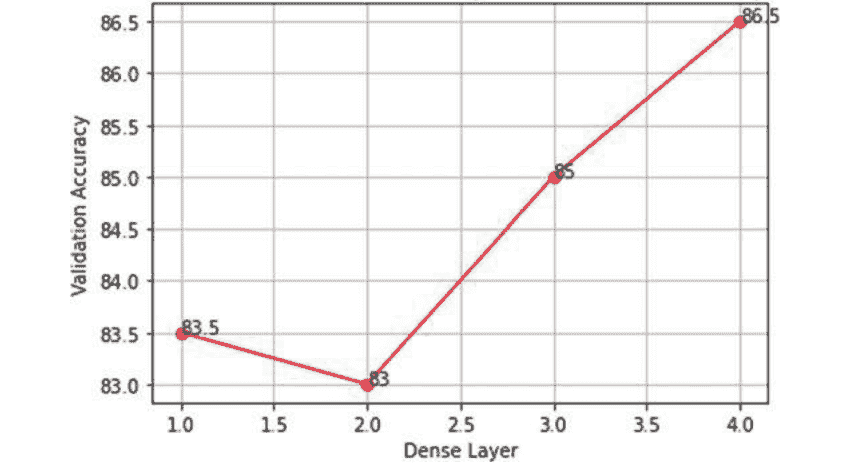

## 图46 ResNet50-验证准确率对密集层的影响

# ResNet50 - Effect of dense layer on test accuracy.

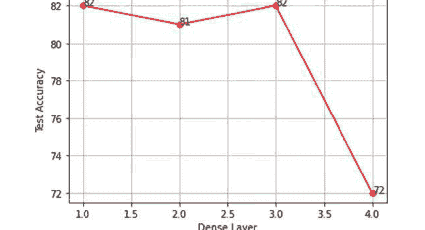

## 图47 ResNet50-测试准确率对密集层的影响

模型基础上添加了几个新的分类器层。需要重新训练修改后的模型以获得新的权重和偏置。如表1和表2所示，当冻结预训练模型的100%层时，预训练模型表现最佳。对于该数据集，ResNet-50通常比VGG-16表现更好，当冻结100%的层时，可以达到80%以上的准确率。粗体字表示最佳结果。解冻层后，两个模型的性能都下降。VGG-16对所有解冻层的准确率为25%。

## 表1 验证准确率

| 预训练模型的解冻百分比（%） | 0 | 20 | 40 | 60 | 80 | 100 |
|---|---|---|---|---|---|---|
| VGG-16 | 0.70 | 0.25 | 0.25 | 0.25 | 0.25 | 0.25 |
| ResNet-50 | 0.83 | 0.80 | 0.81 | 0.68 | 0.71 | 0.87 |

## 表2 测试准确率

| 预训练模型的解冻百分比（%） | 0 | 20 | 40 | 60 | 80 | 100 |
|---|---|---|---|---|---|---|
| VGG-16 | 0.76 | 0.25 | 0.25 | 0.25 | 0.25 | 0.25 |
| ResNet-50 | 0.81 | 0.21 | 0.23 | 0.18 | 0.26 | 0.23 |

百分比。而ResNet-50在获得高验证准确率的同时，测试准确率非常低。这表明在解冻层之后，ResNet-50模型存在过拟合问题。简而言之，当所有层都被冻结时，预训练模型在salak数据集上表现更好。

### 4.9 准确率比较

当epoch =10时，所有三个模型的验证准确率最高。在10、20和50的范围内。之后，在epoch=20时，验证准确率下降，然后在epoch =50时再次增加。至于测试准确率，上面的图表显示，在10、20和50的范围内，预训练模型在epoch =20时可以达到最高的测试准确率。另一方面，CNN在epoch =10时具有最高的测试准确率。这表明CNN可以比预训练模型更快地达到高测试准确率（图48和49）。

从两个柱状图（图50和图51）可以推断出，使用Adadelta和Adagrad可以为所有模型提供更好的验证准确性。当我们比较测试准确性时，使用Adadelta和Adagrad的预训练模型可以获得更高的测试准确性。然而，使用Adam优化器的CNN模型相对于使用其他优化器的CNN模型可以获得更高的测试准确性。

对于学习率图表，验证准确性和测试准确性的趋势非常相似（图52和图53）。预训练模型的验证准确性呈下降趋势，而CNN模型在验证准确性和测试准确性上的最佳学习率为0.001。预训练模型在测试准确性上的最佳学习率也是0.001。因此，我们可以推断出在这项研究中，0.001的学习率对于salak数据集效果最好。

根据两个图表（图54和图55），我们可以看到对于ResNet-50预训练模型，增加密集层会提高其验证准确性，但会降低其测试准确性。而对于VGG-16，验证准确性和测试准确性呈现类似的模式，当密集层 =3时得分最高，当密集层 =2时得分最低。而对于CNN模型，我们可以看到准确性下降。

# VGG16, ResNet-50 & CNN - Effect of Epochs on validation accuracy.

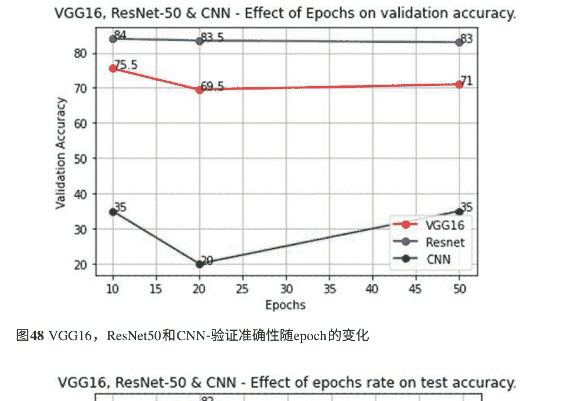

## 图48 VGG16，ResNet50和CNN-验证准确性随epoch的变化

# VGG16, ResNet-50 & CNN - Effect of epochs rate on test accuracy.

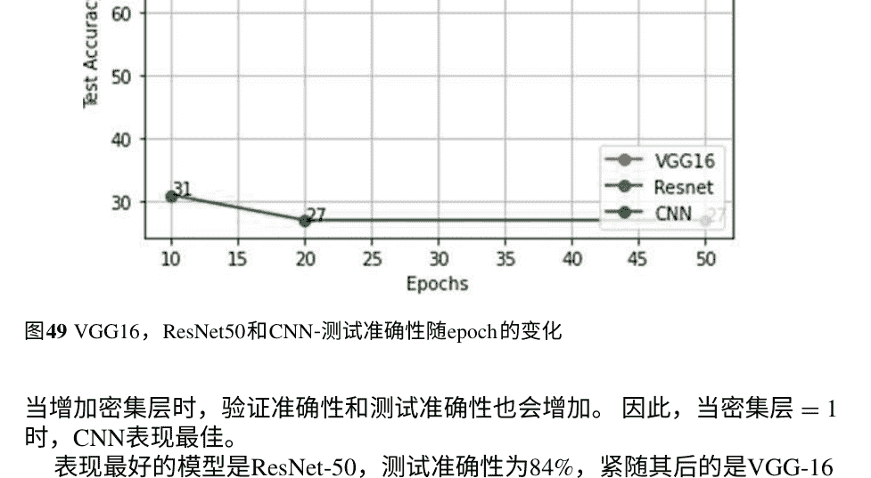

## 图49 VGG16，ResNet50和CNN-测试准确性随epoch的变化

当增加密集层时，验证准确性和测试准确性也会增加。因此，当密集层 = 1 时，CNN表现最佳。表现最好的模型是ResNet-50，测试准确性为84%，紧随其后的是VGG-16模型，测试准确性为77%（图56）。CNN在salak数据集上的测试准确性最低，为31%。表3中呈现了3个模型的最佳参数组合和超参数。

Comparison of the effect of optimizer on validation accuracy for VGG16 Resnet and CNN.

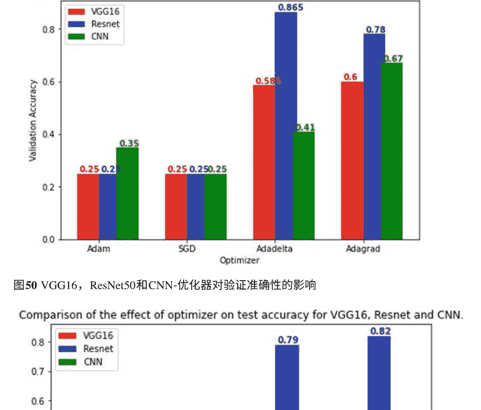

## 图50 VGG16，ResNet50和CNN-优化器对验证准确性的影响

Comparison of the effect of optimizer on test accuracy for VGG16, Resnet and CNN.

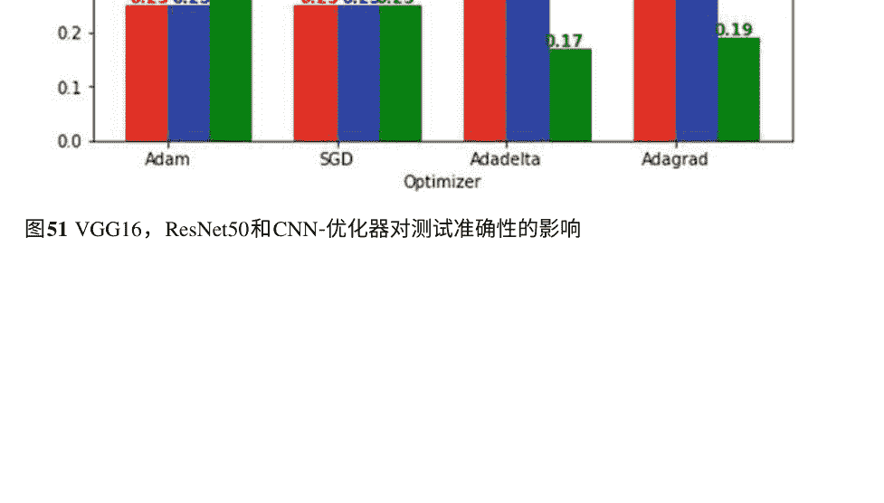

## 图51 VGG16，ResNet50和CNN-优化器对测试准确性的影响

# VGG16, ResNet-50 & CNN - Effect of learning rate on validation accuracy.

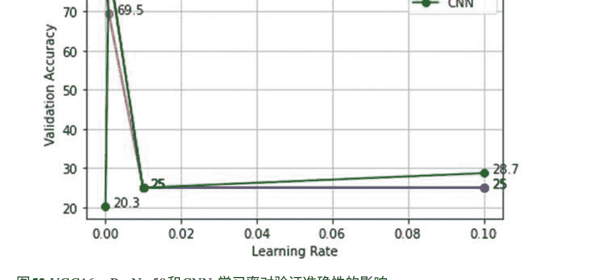

## 图52 VGG16，ResNet50和CNN-学习率对验证准确性的影响

# VGG16, ResNet-50 & CNN - Effect of learning rate on test accuracy.

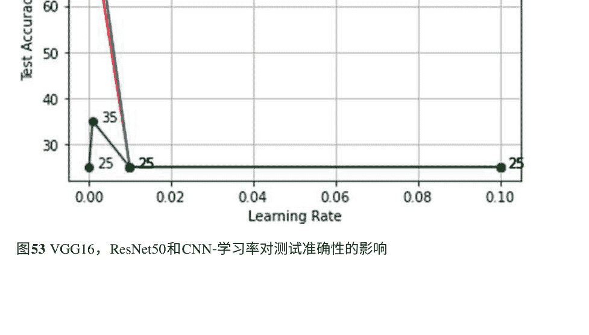

## 图53 VGG16，ResNet50和CNN-学习率对测试准确性的影响

# VGG16, ResNet-50 & CNN - Effect of Dense Layer on validation accuracy.

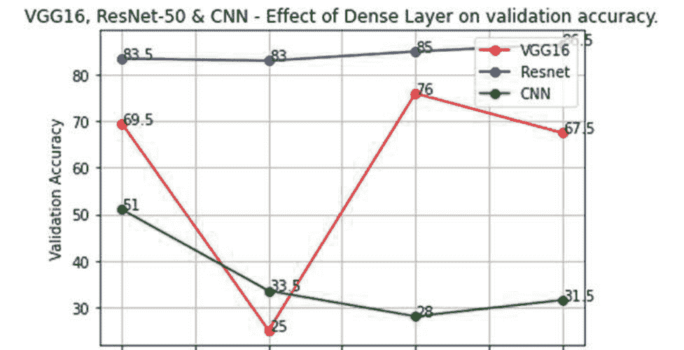

## 图54 VGG16，ResNet50和CNN-密集层对验证准确性的影响

# VGG16, ResNet-50 & CNN - Effect of Dense Layer on test accuracy.

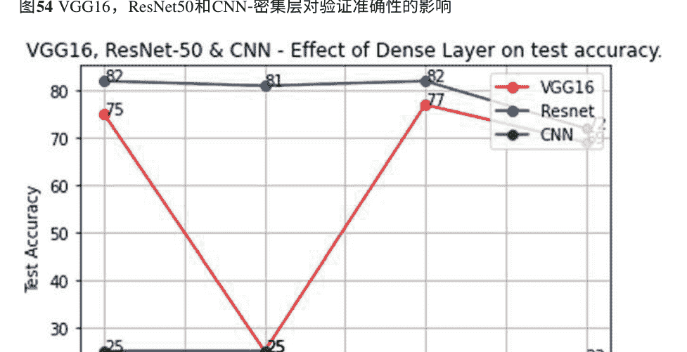

## 图55 VGG16，ResNet50和CNN-密集层对测试准确性的影响Comparison of best validation and test accuracy for VGG16, Resnet & CNN.

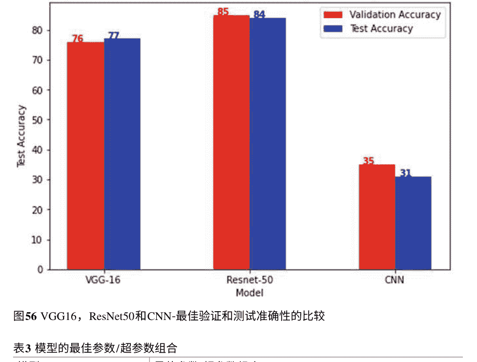

图56 VGG16，ResNet50和CNN-最佳验证和测试准确性的比较

表3 模型的最佳参数/超参数组合

| 模型 | 最佳参数/超参数组合 |
|------|---------------------|
| VGG-16 | • 基础模型：VGG-16（100%冻结权重）<br>•20个周期<br>•Adam 优化器<br>•学习率为0.001<br>•3 个稠密层 |
| ResNet-50 | • 基础模型：ResNet-50（100%冻结权重）<br>•20个周期<br>•Adagrad 优化器<br>•学习率为0.001<br>•2 个稠密层 |
| 卷积神经网络 | •10 个周期<br>•Adam 优化器<br>•学习率为0.001<br>•2 个卷积层<br>•2 个池化层<br>•1 个隐藏层/稠密层<br>•卷积核大小：(4, 4)<br>•池化大小：(2, 2) |

## 5 结论

总之，使用 CNN 模型和 2 个迁移学习模型（VGG16 和 ResNet50）进行实验。通过测试准确率和验证准确率比较模型在每个微调参数上的性能。当周期为 10 时，每个模型的最高验证准确率值。当周期为 20 时，迁移学习模型（VGG16 和 ResNet50）的最高测试准确率，而 CNN 模型的最高测试准确率为 10。ResNet50 的最高测试准确率为 84%，相比之下，VGG16 和 CNN 的准确率较低。迁移学习模型的性能优于 CNN 模型。在这个数据集中，模型在训练数据上表现良好，但在验证数据上表现不佳，存在过拟合问题。可以进行一些未来的工作来提高准确性。可以使用采样方法将数据集分为训练集、验证集和测试集。

## 参考文献

1. 蛇果-美味的味道，可怕的噩梦。Migrationology。[在线]。https://migrationology.com/snake-fruit-salak/
2. 沙拉克水果的事实和健康益处。HealthBenefits。[在线]。https://www.healthbenefittimes.com/health-benefits-of-salak-fruit/
3. 深度学习。Investopedia。[在线]。https://www.investopedia.com/terms/d/deep-learning.asp
4. ud Din, A. F., Mir, I., Gul, F., Mir, S., Saeed, N., Althobaiti, T., Abbas, S. M., & Abualigah, L. (2022). 无人机综合非线性控制的深度强化学习。Processes, 10(7), 1307.
5. Gharaibeh, M., Alzu’bi, D., Abdullah, M., Hmeidi, I., Al Nasar, M. R., Abualigah, L., &Gandomi, A. H. (2022). 肾肿瘤早期诊断的放射学成像扫描：基于数据分析的机器学习和深度学习方法综述。大数据和认知计算，6(1)，29。
6. Danandeh Mehr, A., Rikhtehgar Ghiasi, A., Yaseen, Z. M., Sorman, A. U., & Abualigah,L. (2022). 一种新颖的智能深度学习预测模型用于气象干旱预测。环境智能与人性化计算杂志，1–15。
7. Abualigah, L., Zitar, R. A., Almotairi, K. H., Hussein, A. M., Abd Elaziz, M., Nikoo, M.R., & Gandomi, A. H. (2022). 具有和不具有能量存储优化的风能、太阳能和光伏可再生能源系统：先进机器学习和深度学习技术综述。能源，15(2)，578。
8. Ali, M. A., Balasubramanian, K., Krishnamoorthy, G. D., Muthusamy, S., Pandiyan, S., Panchal, H., Mann, S., Thangaraj, K., El-Attar, N. E., Abualigah, L., & Elminaam, A. (2022). 基于象群优化算法和深度置信网络的青光眼分类。电子学，11(11), 1763。
9. 卷积神经网络（CNN）。. Analytics Vidhya，2021年5月1日。[在线]。https://www.analyticsvidhya.com/blog/2021/05/convolutional-neural-networks-cnn/。访问日期：2021年6月6日。
10. Gilani, R. (2021).图像分类的主要挑战。towards data science，2020年6月13日。[在线]。https://towardsdatascience.com/main-challenges-in-image-classification-ba24dc78b558。访问日期：2021年6月20日。
11. Naik, S., & Patel, B. (2017). 基于机器视觉的水果分类和分级-综述。国际计算机应用杂志，170(9)，22-34。
12. 什么是卷积神经网络? [在线]。https://poloclub.github.io/cnn-explainer/。访问日期: 2021年6月22日。
13. Das, A. (2020).使用Keras进行图像处理的卷积神经网络。朝着数据科学迈进，2020年8月21日。[在线]。https://towardsdatascience.com/convolution-neural-network-for-image-processing-using-keras-dc3429056306。访问日期: 2021年6月22日。
14. Marcelino, P. (2018).快速轻松解决任何图像分类问题。KDnuggets，2018年12月。[在线]。https://www.kdnuggets.com/2018/12/solve-image-classification-problem-quickly-easily.html。访问日期: 2021年6月24日。
15. Simonyan, K., & Zisserman, A. (2015). 非常深的卷积网络用于大规模图像识别，康奈尔大学，2015年4月10日。[在线]. https://arxiv.org/abs/1409.1556。于2021年6月24日访问。
16. VGG16—用于分类和检测的卷积网络。Neurohive，2018年11月20日。[在线]. https://neur ohive.io/en/popular-networks/vgg16/。于2021年6月24日访问。
17. He, K., Zhang, X., Ren, S., & Sun, J. (2015). 用于图像识别的深度残差学习，康奈尔大学，2015年12月10日。[在线]. https://arxiv.org/abs/1512.03385。于2021年6月25日访问。
18. Zahisham, Z., Lee, C. P., & Lim, K. M. (2020). 使用ResNet-50进行食物识别。在第二届IEEE国际工程与技术人工智能会议(IIICAET)中
19. “Keras”[在线].https://keras.io/api/applications/。2021年6月6日访问。
20. Abualigah, L., Diabat, A., Mirjalili, S., Abd Elaziz, M., & Gandomi, A. H. (2021). 算术优化算法.计算方法在应用力学和工程中的应用,376,113609。
21. Abualigah, L., Yousri, D., Abd Elaziz, M., Ewees, A. A., Al-Qaness, M. A., & Gandomi, A. H. (2021). Aquila优化器: 一种新颖的元启发式优化算法.计算机和工业工程, 157, 107250.
22. Abualigah, L., Abd Elaziz, M., Sumari, P., Geem, Z. W., & Gandomi, A. H. (2022). Reptile Search算法(RSA):一种受自然启发的元启发式优化器.专家系统与应用,191,116158.
23. Agushaka, J. O., Ezugwu, A. E., & Abualigah, L. (2022). 侏儒狮优化算法。应用力学和工程的计算机方法，391，114570。
24. Oyelade, O. N., Ezugwu, A. E. S., Mohamed, T. I., & Abualigah, L. (2022). 埃博拉优化搜索算法: 一种新的自然启发式元启发式优化算法。IEEE Access, 10，16150-16177。
25. Ezugwu, A. E., Agushaka, J. O., Abualigah, L., Mirjalili, S., & Gandomi, A. H. (2022). 草原犬优化算法。神经计算和应用，1-49。

# 使用卷积神经网络（CNN）和迁移学习技术进行图像处理识别番石榴

Ali Khazalah, Boppana Prasanthi, Dheniesh Thomas, Nishathinee Vello, Suhanya Jayaprakasam, Putra Sumari, Laith Abualigah, Absalom E. Ezugwu, Essam Said Hanandeh和Nima Khodadadi

摘要图像识别是农业企业中分类和组织水果的有用工具。本研究旨在利用深度学习构建一个Sapodilla识别和分类的设计。Sapodilla来自世界各地的各种品种。Sapodilla的大小、形状和口感因物种和种类而异。目标是创建一个系统，该系统使用卷积神经网络和迁移学习来提取特征并确定Sapodilla的类型。该系统可以对Sapodilla的类型进行排序。本研究使用包括1000多张图片的数据集来演示四种不同的Sapodilla分类方法。本作业使用卷积神经网络（CNN）算法完成，这是一种广泛应用于图像分类的深度学习技术。基于深度学习的分类器最近能够从各种图像中区分Sapodilla。此外，我们利用不同的隐藏层和迭代次数来改进预测性能。在建议的研究中，我们研究了迁移学习方法在Sapodilla分类中的应用。建议的CNN模型在结果方面改进了迁移学习技术和最先进的方法。

A. Khazalah · B. Prasanthi · D. Thomas · N. Vello · S. Jayaprakasam · P. Sumari · L. Abualigah (✉)
马来西亚槟城乔治敦市大学科学学院计算机科学系
电子邮件：Aligah.2020@gmail.com
L. Abualigah
Hourani应用科学研究中心，Al-Ahliyya Amman大学，约旦安曼
中东大学信息技术学院，阿曼安曼11831
A. E. Ezugwu
数学、统计学和计算机科学学院，南非夸祖鲁-纳塔尔大学，皇家爱德华路，彼得马里茨堡3201，夸祖鲁-纳塔尔，南非
E. S. Hanandeh
计算机信息系统系，扎尔卡大学，约旦扎尔卡
N. Khodadadi
土木与环境工程系，佛罗里达国际大学，迈阿密，FL，美国

关键词 Sapodilla ·深度学习 ·卷积神经网络 ·迁移学习

## 1 引言

在农业业务中，寻找有才华的牧场工作（尤其是耕作）可能是最费用高昂的因素之一[1]。这可能是由于诸如电力、水灌溉和转基因作物等供应价格的上涨。农场企业和农业部门由于低利润率而受到挤压。在某些条件下，农业生产必须继续满足不断增长的全球人口需求，这是一个严重的问题。

Sapodilla是一种热带水果，可以在南美和南亚找到。在马来西亚，这种水果更为人所知为Ciku。农田中最大的问题之一是检测Sapodilla并对其进行分类。此外，这导致了更高的价格[2]。因此，我们需要一个自动化系统，它将减少人工劳动，提高生产力，并减少维护费用和努力。图1显示了不同类型的Sapodilla。

通过降低劳动力成本（因为增加了耐久性和可预测性），机器人种植有机会克服这一挑战，同时也提高作物产量。对于其中一些因素，在过去的30年中，似乎在使用农业机器人收获水果方面有着显著的关注[3]。这种系统的创建涉及各种困难的活动，包括操纵和选择等。然而，开发一个精确的水果识别系统是实现完全自动化收获机器人的关键一步。

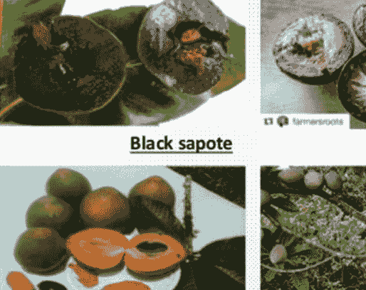

图1 不同类型的人心果

因为它是前端感知技术，先于后续的操纵和抓取技术；如果水果没有被识别或者甚至没有被看到，就无法被收获[1]。

由于光照变化、遮挡和水果与背景具有一致的图像外观等各种情况，这个阶段非常困难。随着人类文明的快速发展，我们越来越注重我们的生活的完善，特别是我们所消费的食物。计算机视觉在个性化推荐技术中越来越受欢迎。深度神经网络（DNN）在图像识别和特征描述领域经常用于识别照片中的水果[4]。DNN优于其他机器学习算法。卷积神经网络（CNN）是一种神经网络类型。深度学习算法是一种被归类为这种类型的算法。CNN现在是深度学习中最广泛使用的一种类型。

它被用于各种图像处理分析中。在某些领域，如使用CNN进行水果分类，准确率已经超过了人类的能力[5]。

CNN的框架与ANN非常相似。ANN的每一层都有很多神经元。因此，一层神经元的加权总和现在是下一层神经元的来源，这增加了一个有偏差的结果。CNN中的层包含三个元素[6]。所有的神经元都与一个单独的卷积层连接，而不是完全连接。为了训练分类器，定义了一个成本过程。它分析网络参数与预期结果之间的关系[7]。深度学习方法在最近取得了很好的进展，以满足这些目标。水果检测是一个可以被认为是特征提取问题的挑战。

在所提出的系统中，使用卷积神经网络（CNN）从照片中检测水果通信系统[5]。与其他研究相比，建议的技术试图解决所有类似水果检测系统操作的约束，并实现高水平的准确性。该技术提供了简单而高效的功能[3]。其他一些优化方法可以用来优化给定的问题[8-13]。

为了通过机器实现水果识别的努力。我们建议使用卷积神经网络进行训练，在这种情况下，计算机必须显示网络提供的输出类型作为结果，独立于其类型、颜色、数量、纹理或其他特征[14]。

## 2 文献综述

尽管有几位科学家处理了水果识别的问题，例如在[2, 15–17]的研究中得出的结论是，开发快速高效的水果检测器的难度仍然存在。这是因为这些情况中的颜色、尺寸、纹理、易感性以及不断变化的光照和阴影条件的多样性。

水果识别作为特征提取问题已经得到了解决。

在文献中有很多关于水果与背景的研究。王等人研究了苹果识别用于产量估计的问题[2]。他们建立了一个可以主要通过颜色和闪光反射结构来识别苹果的模型。还使用了其他细节来排除不准确的情况或分离可能包含多个苹果的区域，包括苹果的大小分布。另一种策略是只考虑主要是圆形的位置的检测方法。Bac等人在[15]提出了一种甜椒的分类方法。他们使用了6个多光谱相机和多种特征，包括未处理的光谱信息、标准化的降水指数和基于熵的特征描述符。在精心控制的温室环境中的研究表明，该方法产生了相当准确的分割图像。然而，作者指出，它不足以创建一个可靠的阻碍地图。

对于杏仁的识别，Hung等人[16]提倡使用人工潜力场。他们建议基于稀疏自编码器（SAE）的五类别分类方法。这些特征再次应用于CRF框架，超过了早期研究。他们能够很好地划分数据，但无法识别任何对象。他们还提到折射是一个重要的困难。本能地，这种策略只能处理适量的不透明度。

例如，Yamamoto等人[15]使用基于颜色的分割来进行番茄的识别。然后，使用颜色和图像信息，训练了一个分类器和回归树（CART）分类器。结果，创建了一个分类地图，将相关像素分成区域。为了限制虚警数量，每个区域被分配一个检测器。他们在受控温室条件下使用随机森林训练了一个非水果分类器。

在之前的研究中，图像识别的像素级分离方法已经被广泛应用，其中大部分工作主要集中在水果识别上，以进行产量估计。目前只有在受控的温室环境中进行了水果识别的少数实验。总的来说，在极具挑战性的条件下进行水果检测仍然是一个未解决的问题。这是因为农业环境中目标物体的外观变化很大，传统的滑动窗口方法虽然在选定图像数据集上表现出色，但无法处理实际农场环境中目标物体的尺度和外观的不确定性[2,15]。

深度学习模型已经在对象的分类和识别方面取得了重大进展。在PASCAL-VOC上，最先进的识别架构分为两个阶段。流水线项目的第一步使用全卷积方法，如特征提取或边缘框，从图像中选择焦点区域，然后将其发送到深度学习进行分类。这个流水线计算量很大，无法在工程应用中实时使用，尽管其具有很好的识别记忆[16,17]。RPNs

通过将识别卷积神经基础设施与图像集成在一起，解决这些问题有助于增加设备的预测和识别能力，并且可以异步地从每个位置进行调节和识别。网络实体的具体规格是决定共享的，从而显著提高吞吐量，使其非常适合工程操纵器。

在现实世界的农业区域之外，多传感器模态很少足以处理来自不同光照条件下各种水果的数据，部分不变性和各种外观。这为多模式水果检测方法提供了有力的论据，因为多种类型的设备可以提供关于水果特定特征的互补信息。深度学习模型在农业技术以外的多模式算法中已经展示了相当大的潜力，例如在音频/视频方面已经得到了非常好的应用，在照片方面已经超越了每个模态单独的性能。正如下面的部分所示，本研究采用相同的技术，并展示了多模式地理区域水果识别系统相对于像素级分割技术的优势[15-17]。

本研究介绍了一种利用深度卷积神经网络从照片中识别有机产品的显著过程。科学家们使用了更快的基于区域的卷积神经网络模型来实现这一目标。目标是培养一个可以独立驾驶机器人来采摘有机产品的计算模型。RGB和NIR（红外区域）图像被用来训练神经网络。RGB和NIR版本以两种不同的方式进行组合：早期和中期融合。启动组合的初始工作包括四个流程：三个用于RGB图像，另一个用于NIR图像。

延迟组合利用两个独立训练的图像，通过对输出进行平均来进行组合。结果是，比以前的系统更好的多模块组织被开发出来[26]。

## 3 提出的深度学习用于人心果识别

人工神经网络[18, 19]在图像识别和分类领域取得了最有效的成果。大多数深度学习方法都是建立在这些系统之上的。

神经网络[18]是一种机器学习技术，它采用了多层非对称处理元素。每一层都能够将其输入信息转化为更复杂的形式，模型是一个合适的选择[19]。深度学习模型已经超越了其他机器学习技术。

在某些领域，它们还实现了第一个超人类的图像识别[18]。这得益于神经网络被视为实现大规模数量的重要一步。其次，深度学习模型，特别是卷积神经网络（CNN），已经被证明在分类性能识别方面表现出色。

### 3.1 提出的CNN架构

概念模型使用了深度学习框架。框架中有三个CNN层。图片中的一组像素可能表示图片的边界、图片的阴影或其他结构。卷积是一种检测这些连接的方法。在计算过程中，使用矩阵来描述图片元素。CNN模型的框架如图2所示。它涉及特征的提取和分类。裁剪从输入照片中删除任何不必要的数据。这些图片都已经调整大小。卷积和池化层被重复应用以提取特征。在前两个块中，有一个卷积层和一个最大池化层。为了识别示例，我们需要利用一个“过滤器”网络，该网络与图片像素网格一起增加。这些通道大小可能会变化，通道数量取决于通道大小，可以根据卷积的过滤器大小从图片像素网格中取出子集，从图片像素网格的第一个像素开始。然后，卷积继续向前到下一个像素，这个过程重复直到网格中的所有图片像素完成。然后，卷积继续向前到下一个像素，这个过程重复直到网格中的所有图片像素完成。池化层将是CNN方法中的下一个级别。该层减小了输出大小，即特征图，从而避免了维度灾难。全连接层被用作输出层。这一层将前面层的结果“压缩”成一个描述符号，可以作为下一阶段的输入。图3显示了CNN模型的训练图像。

### 3.2 迁移学习模型

迁移学习是一种机器学习技术，它使用一次开发的原型作为另一个活动的仿真基础。因为当给定的数据不足时，这种方法表现良好，并且算法快速响应。迁移学习可以用于以各种不同的方式对图像进行分类。我们首先加载预训练模型并丢弃最后一层。当它们被消除时，我们将剩余的层级调整为不可训练的。然后，在平台的末尾，我们插入了额外的全连接层，这次是我们希望预测的人心果类型的数量。图4显示了迁移学习。

#### 3.2.1 VGG16

卷积和完全连接的层组成了16层矩阵。为了方便起见，只在其他层的顶部放置了33个卷积层。第一和第二个卷积层由64个元素的卷积核滤波器组成，大小为3×3。当输入图片通过第一和第二个卷积层时，输入图片的参数增加到224 × 224 × 64。然后将结果传输到具有两个时间间隔的池化层。第三和第四个卷积层中的124个元素卷积核具有3×3的过滤器。在这两个阶段之后，应用2 × 2的最大池化，并将结果缩小到56 × 56 × 128。在第五、第六和第七层中只使用33个卷积核的卷积层。在所有3个层中使用256个局部特征。这些细胞被第二个池化层包围。有两种卷积操作，卷积核大小分别为3×3和1×1。每个卷积核集合中都有512个卷积核过滤器。在这些层之后是持续时间为1的最大池化。图5显示了VGG16的架构。

图5 VGG16的架构

#### 3.2.2 VGG19

VGG19可能是最新的VGG架构，它看起来与VGG16非常相似。当我们检查VGG16的网络结构时，我们会注意到它们都是基于5个卷积层构建的。然而，通过在最后3个组中实施卷积操作，网络的复杂性已经进一步增强。输入是一个形状为(224, 224, 3)的RGB图像，输出是具有相同结构的特征向量(224, 224, 3)。VGG19在Keras中有自己的准备方法，但是如果我们查看源代码，我们会发现它与VGG16完全相同。因此，我们不需要重新定义任何东西。

#### 3.2.3 MobileNet

MobileNet是一个用于分类、识别和其他典型应用的神经网络。它们非常小巧，可以在便携应用程序上使用，它们的尺寸为17 MB。使用简化的框架来创建它们。这种设计使用复杂可持续性构建了紧凑而深入的神经网络模型。这些复杂的卷积层产生了简化的好处，减少了模型的长度并加快了执行速度。MobileNet可以用于提高各种应用的生产力。MobileNet可以用于各种活动，包括物体识别、细粒度分类、人脸特征分类等。MobileNet是一个强大的神经网络，可以用于图像识别。在我们的框架中，只需使用一些方法，我们就更新了MobileNet框架的最后一层。

### 3.3 数据集

数据集中包含了四种不同类型的人心果图片。这四种人心果分别是Subang人心果、Mega人心果、Jantung人心果和Betawi人心果。收集的图片中包括了来自不同类别的各种大小的人心果。这些照片没有统一的背景。数据集中包含了同一种人心果的不同姿势。数据集中包含了人心果的各种姿势和视角，包括侧面角度、背面视图、各种背景、部分切割、盘子上切割、切成小块、显示种子以及变异程度。人心果可能是新鲜的、腐烂的或者包装成一束的。许多照片存在照明不好、不寻常的照明特征、被网覆盖、装饰、有树叶等情况。数据集包含了1000多张图片。图6展示了样本数据集图片。表1展示了数据集的描述。

### 图6 样本数据集图像

### 表1 数据集描述

| 输入 | 标签 |
|------|------|
| Ciku Subang | 250 |
| Ciku Mega | 250 |
| Ciku Betawi | 250 |
| Ciku Jantung | 250 |

## 3.4 增强

数据的可用性经常提高深度学习神经网络模型的效果。数据增强是一种从以前的事实中动态创建新的训练数据的方法。这是通过使用数据库方法将学习算法的实例转换为不同和创新的训练图像来实现的。维度缩减的一种非常好的方法是图像数据增强，它涉及将训练数据集中的图像转换为几乎相同分类和实际图像的修改副本。变换中包括转换、旋转、数字缩放和其他图像修改领域的方法。目标是向训练集中添加新的可信实例。

这指的是训练数据集图像的变化，也许算法有兴趣研究。例如，一个水蜜桃拍摄的水平倾斜在逻辑上是有意义的，因为它的图片可能是从左侧或右侧拍摄的。一个水蜜桃图像的垂直翻转在某种程度上是有意义的，但考虑到建模不常见地查看倒置的水蜜桃图像，这是不可接受的。

因此，很明显，只有确切的数据增强方法才会被有意地选择，考虑到训练样本以及问题领域的理解。此外，进行实验仅通过数据增强方法以及结合使用来确定是否会导致系统性能的显著提升是有益的。高级深度学习方法，包括卷积神经网络（CNN）[17]，可以理解特征，这些特征与它们在图片中出现的位置无关。然而，增强可以帮助算法理解许多特征，其中许多特征是一致变化的，包括从右到左到从上到下的排序以及照片中的光照强度。通常，数字数据增强仅用于训练集，而不是验证集或测试集。预处理，包括图片裁剪和像素调整，不同之处在于它将在与算法交互的所有变量上均匀进行。图7显示了增强后的图像。

## 4 性能结果

为了消除任何额外的信息，收藏中的图片被标准化、缩小和裁剪。信息分为两部分：训练和验证。数据集被划分为80%和20%。

### 4.1 实验设置

我们进行了全面的测试，以检验基于皮肤颜色、材料和与系统相关的结构的分类器的性能，利用了许多独立隔离的图片示例，以确定最佳的特征子集和分类技术。所使用的样本是平衡的，共有1000张图片，其中250张是Ciku Mega，250张是Ciku Jantung，250张是Ciku Subang，250张是Ciku Betawi。这个数据集的图片已经初始化。为了开发所提出的方法，我们使用Python编程（特别是Keras模块）。我们使用了几个模型，我们自己从头开始构建的模型，还有一些现有的图像分类模型，以进行迁移学习，如下所述。图8显示了提出的模型。图9显示了VGG16模型。图10显示了VGG19模型。

**图8 自己的模型**

| Layer (type) | Output Shape | Param # |
|---|---|---|
| conv2d (Conv2D) | (None, 224, 224, 64) | 832 |
| max_pooling2d (MaxPooling2D) | (None, 112, 112, 64) | 0 |
| conv2d_1 (Conv2D) | (None, 112, 112, 64) | 16448 |
| max_pooling2d_1 (MaxPooling2D) | (None, 56, 56, 64) | 0 |
| conv2d_2 (Conv2D) | (None, 56, 56, 64) | 16448 |
| max_pooling2d_2 (MaxPooling2D) | (None, 28, 28, 64) | 0 |
| flatten (Flatten) | (None, 50176) | 0 |
| dense (Dense) | (None, 256) | 12845312 |
| dense_1 (Dense) | (None, 256) | 65792 |
| dense_2 (Dense) | (None, 256) | 65792 |
| dense_3 (Dense) | (None, 4) | 1028 |
| Total params: 13,011,652 | Trainable params: 13,011,652 | Non-trainable params: 0 |

**图9 VGG16**

| Layer (type) | Output Shape | Param # |
| --- | --- | --- |
| input_2 (InputLayer) | [(None, 224, 224, 3)] | 0 |
| block1_conv1 (Conv2D) | (None, 224, 224, 64) | 1792 |
| block1_conv2 (Conv2D) | (None, 224, 224, 64) | 36928 |
| block1_pool (MaxPooling2D) | (None, 112, 112, 64) | 0 |
| block2_conv1 (Conv2D) | (None, 112, 112, 128) | 73856 |
| block2_conv2 (Conv2D) | (None, 112, 112, 128) | 147584 |
| block2_pool (MaxPooling2D) | (None, 56, 56, 128) | 0 |
| block3_conv1 (Conv2D) | (None, 56, 56, 256) | 295168 |
| block3_conv2 (Conv2D) | (None, 56, 56, 256) | 590080 |
| block3_conv3 (Conv2D) | (None, 56, 56, 256) | 590080 |
| block3_pool (MaxPooling2D) | (None, 28, 28, 256) | 0 |
| block4_conv1 (Conv2D) | (None, 28, 28, 512) | 1180160 |
| block4_conv2 (Conv2D) | (None, 28, 28, 512) | 2359808 |
| block4_conv3 (Conv2D) | (None, 28, 28, 512) | 2359808 |
| block4_pool (MaxPooling2D) | (None, 14, 14, 512) | 0 |
| block5_conv1 (Conv2D) | (None, 14, 14, 512) | 2359808 |
| block5_conv2 (Conv2D) | (None, 14, 14, 512) | 2359808 |
| block5_conv3 (Conv2D) | (None, 14, 14, 512) | 2359808 |
| block5_pool (MaxPooling2D) | (None, 7, 7, 512) | 0 |
| flatten (Flatten) | (None, 25088) | 0 |
| fc1 (Dense) | (None, 4096) | 102764544 |
| fc2 (Dense) | (None, 4096) | 16781312 |
| predictions (Dense) | (None, 1000) | 4097000 |

**图10 VGG19**

| Layer (type) | Output Shape | Param # |
|--------------|--------------|---------|
| input_3 (InputLayer) | [(None, 224, 224, 3)] | 0 |
| block1_conv1 (Conv2D) | (None, 224, 224, 64) | 1792 |
| block1_conv2 (Conv2D) | (None, 224, 224, 64) | 36928 |
| block1_pool (MaxPooling2D) | (None, 112, 112, 64) | 0 |
| block2_conv1 (Conv2D) | (None, 112, 112, 128) | 73856 |
| block2_conv2 (Conv2D) | (None, 112, 112, 128) | 147584 |
| block2_pool (MaxPooling2D) | (None, 56, 56, 128) | 0 |
| block3_conv1 (Conv2D) | (None, 56, 56, 256) | 295168 |
| block3_conv2 (Conv2D) | (None, 56, 56, 256) | 590080 |
| block3_conv3 (Conv2D) | (None, 56, 56, 256) | 590080 |
| block3_conv4 (Conv2D) | (None, 56, 56, 256) | 590080 |
| block3_pool (MaxPooling2D) | (None, 28, 28, 256) | 0 |
| block4_conv1 (Conv2D) | (None, 28, 28, 512) | 1180160 |
| block4_conv2 (Conv2D) | (None, 28, 28, 512) | 2359808 |
| block4_conv3 (Conv2D) | (None, 28, 28, 512) | 2359808 |
| block4_conv4 (Conv2D) | (None, 28, 28, 512) | 2359808 |
| block4_pool (MaxPooling2D) | (None, 14, 14, 512) | 0 |
| block5_conv1 (Conv2D) | (None, 14, 14, 512) | 2359808 |
| block5_conv2 (Conv2D) | (None, 14, 14, 512) | 2359808 |
| block5_conv3 (Conv2D) | (None, 14, 14, 512) | 2359808 |
| block5_conv4 (Conv2D) | (None, 14, 14, 512) | 2359808 |
| block5_pool (MaxPooling2D) | (None, 7, 7, 512) | 0 |
| flatten (Flatten) | (None, 25088) | 0 |
| fc1 (Dense) | (None, 4096) | 102764544 |

### 4.2 提出的CNN模型的性能

该方法采用了20%的样本大小，学习率，批量大小为500，和20个epochs。在开发了人心果训练数据集后，对测试样本进行了评估。模型的准确率为0.54。图11显示了训练准确率和验证准确率的图表。

#### 4.2.1 优化器的影响

神经网络系统通过不断改变网络中所有节点的参数来构建，优化在其中起着关键作用。梯度下降技术是CNN优化的首选方法。此外，Adam优化器的分类模式在某种程度上优于许多其他自适应优化方法创建的模式。Adam：它保存指数函数的均值，包括其先前的倾斜度（a_t），表示第一个瞬间（均值），以及先前的平方变化（u_t），表示第二个剪切（方差）。

以下是如何计算 a_t 和 u_t 的方法：

```
a_t = β_1 a_{t-1} + (1 - β_1) d_t
u_t = β_2 u_{t-1} + (1 - β_2) d_t^2
```

与定量评估相比，使用多种优化方法的深度卷积层的有效性确实得到了证明。使用adam优化器后，准确率提高到了0.99，训练周期为30。图12展示了训练好的CNN模型。图13展示了训练后的准确率结果。

**图12 训练好的CNN模型**

| Layer (type) | Output Shape | Param # |
|--------------|--------------|---------|
| conv2d_104 (Conv2D) | (None, 222, 222, 32) | 896 |
| max_pooling2d_89 (MaxPooling) | (None, 111, 111, 32) | 0 |
| conv2d_105 (Conv2D) | (None, 109, 109, 32) | 9248 |
| max_pooling2d_90 (MaxPooling) | (None, 54, 54, 32) | 0 |
| conv2d_106 (Conv2D) | (None, 52, 52, 32) | 9248 |
| max_pooling2d_91 (MaxPooling) | (None, 26, 26, 32) | 0 |
| conv2d_107 (Conv2D) | (None, 24, 24, 32) | 9248 |
| max_pooling2d_92 (MaxPooling) | (None, 12, 12, 32) | 0 |
| conv2d_108 (Conv2D) | (None, 10, 10, 64) | 18496 |

## 图13 训练后

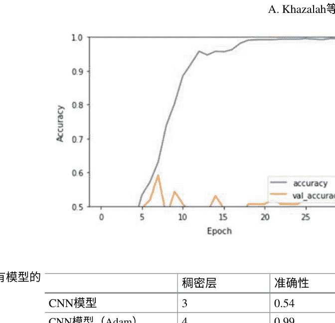

## 表2 使用密集层的所有模型的性能

| 模型 | 稠密层 | 准确性 |
|------|--------|--------|
| CNN模型 | 3 | 0.54 |
| CNN模型 (Adam) | 4 | 0.99 |
| 迁移学习1 | 3 | 0.45 |
| VGG16 | 3 | 0.57 |
| VGG19 | 3 | 0.70 |
| MobileNet | 3 | 0.65 |

#### 4.2.2 密集层的影响

我们添加了密集层，并使用了压缩的卷积神经网络来增加前向操作的速度。表2显示了使用密集层的所有模型的性能。

当密集层为4时，密集层的效果很高，准确率为0.99；当密集层为3时，准确率较低。

#### 4.2.3 滤波器数量的影响

在第一次试验中，使用了3个卷积层，过滤器尺寸为3 * 3像素分辨率，32个过滤器；在第二次实验中，过滤器数量从32增加到64，对于三个独立的卷积层，采样频率大致相同，为3 * 3像素值；在第三次实验中，尝试应用了128个过滤器，过滤器尺寸为3 * 3像素。表3显示了过滤器尺寸。过滤器尺寸和过滤器数量也会影响运行时间。表3显示，当过滤器尺寸为128时，模型的准确率更高。

## 表3 过滤器尺寸

| 模型 | 稠密层 | 过滤器尺寸 | 准确性 |
|------|--------|------------|--------|
| CNN模型 | 3 | 32 | 0.54 |
| CNN模型 (Adam) | 4 | 64 | 0.99 |
| 迁移学习1 | 3 | 128 | 0.45 |
| VGG16 | 3 | 32 | 0.57 |
| VGG19 | 3 | 32 | 0.70 |
| MobileNet | 3 | 32 | 0.65 |
| Inception | 1 | 32 | 0.27 |
| Xception | 1 | 32 | 0.24 |

#### 4.2.4 训练轮数的影响

神经网络隐藏层中的每个输出组件都具有可变的距离度量。我们试图使它们具有数据的特征，因为它们是可适应的。隐藏元素的边界由各种字符组成。因此，我们修改所有这些隐藏元素线的质量，以改变边界的形状。图14和表4显示了训练轮数的准确性。训练轮数决定了网络参数的更新频率。随着训练轮数的增加，神经网络参数的更新次数增加，边界从最小化误差到最优解再到维度诅咒之间变化。在这个实验中，当训练轮数为30时，模型的准确性提高到0.99。

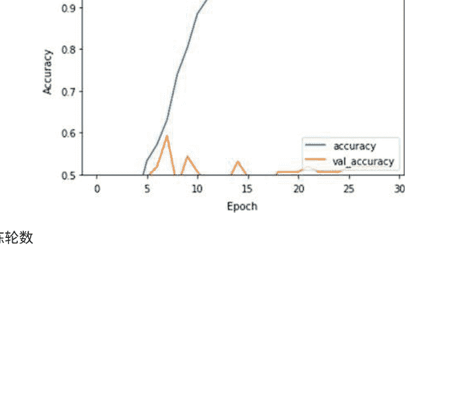

## 表4 训练轮数的影响

| 模型 | 稠密层 | 运行周期 | 准确性 |
| :--- | :--- | :--- | :--- |
| CNN模型 | 3 | 20 | 0.54 |
| CNN模型 (Adam) | 4 | 30 | 0.99 |
| 迁移学习1 | 3 | 20 | 0.45 |
| VGG16 | 3 | 25 | 0.57 |
| VGG19 | 3 | 25 | 0.70 |
| MobileNet | 3 | 20 | 0.65 |
| Inception | 1 | 100 | 0.27 |
| Xception | 1 | 100 | 0.24 |

#### 4.2.5 学习率的影响

采样频率，通常称为学习率，是参数在学习过程中的变化量。图15展示了学习率的变化。

学习率是一个可定制的参数，在神经网络应用中通常在0.0和1.0之间，具有适度的特定优势。

学习率是一个确定系统在挑战中适应速度的参数。考虑到迭代过程中参数的微小改进，较小的学习率需要更多的训练迭代次数，而较大的学习率需要较少的训练迭代次数。较高的学习率可以帮助网络更快地进行估计，但代价是最终的深度网络可能不是最优的。较慢的学习率可能会使系统获得稍微更优或完全优化的权重矩阵，但训练时间会更长。

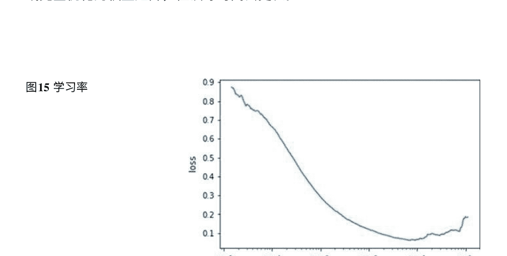

## 表5 准确性比较

| 模型 | 稠密层 | 过滤器尺寸 | 运行周期 | 准确性 |
|------|--------|------------|----------|--------|
| CNN模型 | 3 | 32 | 20 | 0.54 |
| 提出的模型 | 4 | 64 | 30 | 0.99 |
| 迁移学习1 | 3 | 128 | 20 | 0.45 |
| VGG16 | 3 | 32 | 25 | 0.57 |
| VGG19 | 3 | 32 | 24 | 0.70 |
| MobileNet | 3 | 32 | 20 | 0.65 |
| Inception | 1 | 32 | 100 | 0.27 |
| Xception | 1 | 32 | 100 | 0.24 |

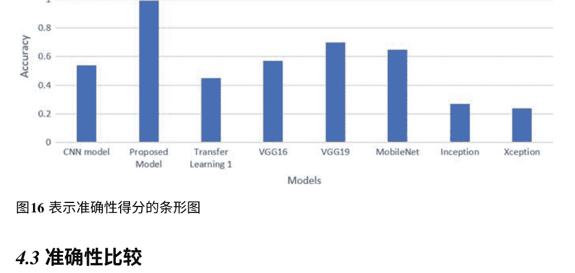

## 图16 表示准确性得分的条形图

### 4.3 准确性比较

与其它层相比，具有最少层的CNN具有较低的安装需求和更快的训练周期。表5显示了准确性的比较。较短的恢复时间使得可以测试更多的参数，并使整个开发过渡更加容易。降低的计算需求还可以提高图像质量。最佳模型是使用adam优化器获得的，准确率为0.99。图16显示了表示准确性得分的条形图。

## 5 结论

该研究开发了一个用于沙梨识别和分类的深度卷积神经网络。该研究描述了一种执行自动化沙梨物种检测的技术。在数据方面，CNN方法表现得非常好。

该技术可以用于训练各种各样的沙梨在下一级应用中。它还可以考虑其他变量的影响，如优化器、迭代次数、密集层、学习率和池化函数。我们还使用Keras库进行了几个定量测试，根据内容对照片进行分类。只有借助建议的卷积神经网络，提供的方法才能简化神经网络在分类沙梨种类时的过程，减少沙梨分类中的管理错误。建议的卷积层具有99%的准确率。

## 参考文献

- 1. ABARE. (2015). 澳大利亚蔬菜种植农场：经济调查，2013-14和2014-15. 澳大利亚农业和资源经济学局（ABARE），澳大利亚堪培拉。研究报告。
- 2. Abualigah, L., Al-Okbi, N. K., Elaziz, M. A., & Houssein, E. H. (2022). 通过鲨鱼群算法提升海洋捕食者算法进行多级阈值图像分割。多媒体工具与应用，81(12)，16707–16742。
- 3. Palakodati, S. S., Chirra, V. R., Dasari, Y., & Bulla, S. (2020). 使用CNN和迁移学习进行新鲜和烂水果分类。Revue d’Intelligence Artificielle，34 (5)，617–622。https://doi.org/10.18280/ria.340512
- 4. Sakib, S., Ashrafi, Z., & Siddique, M. A. (2019). 使用卷积神经网络算法实现水果识别分类器以观察不同隐藏层的准确性。ArXiv, abs/1904.00783。
- 5. Mettleq, A. S. A., Dheir, I. M., Elsharif, A. A., & Abu-Naser, S. S. (2020). 使用深度学习进行芒果分类。国际学术工程研究杂志（IJAER），3 (12)，22–29。
- 6. Rojas-Aranda, J. L., Nunez-Varela, J.I., Cuevas-Tello, J.C., & Rangel-Ramirez, G. (2020). 使用深度学习进行零售店水果分类。在模式识别会议第12届墨西哥会议，墨西哥莫雷利亚（第3-13页）。
- 7. Risdin, F., Mondal, P., & Hassan, K. M. (2020). 使用机器学习技术的卷积神经网络（CNN）用于检测水果信息。
- 8. Abualigah, L., Diabat, A., Mirjalili, S., Abd Elaziz, M., & Gandomi, A. H. (2021). 算术优化算法。应用力学和工程的计算机方法，376，113609。
- 9. Abualigah, L., Yousri, D., Abd Elaziz, M., Ewees, A. A., Al-Qaness, M. A., & Gandomi, A.H. (2021). Aquila优化器：一种新颖的元启发式优化算法。计算机与工业工程，157，107250。
- 10. Abualigah, L., Abd Elaziz, M., Sumari, P., Geem, Z. W., & Gandomi, A. H. (2022). 爬行动物搜索算法（RSA）：一种自然启发的元启发式优化器。专家系统与应用，191，116158。
- 11. Agushaka, J. O., Ezugwu, A. E., & Abualigah, L. (2022). 侏儒狮优化算法。应用力学和工程计算方法，391，114570。
- 12. Oyelade, O. N., Ezugwu, A. E. S., Mohamed, T. I., & Abualigah, L. (2022). 埃博拉优化搜索算法：一种新的自然启发式元启发式优化算法。IEEE Access, 10，16150–16177。
- 13. Ezugwu, A. E., Agushaka, J. O., Abualigah, L., Mirjalili, S., & Gandomi, A. H. (2022). 草原犬优化算法。神经计算与应用，1–49。
- 14. Álvarez-Canchila, O. I., Arroyo-Pérez, D. E., Patino-Saucedo, A., González, H. R., & Patiño-Vanegas, A. (2020). 使用卷积神经网络和迁移学习的哥伦比亚水果和蔬菜识别。
- 15. Otair, M., Abualigah, L., & Qawaqzeh, M. K. (2022). 改进的近无损技术使用霍夫曼编码来提高图像压缩的质量。多媒体工具和应用, 1–21.
- 16. Liu, Q., Li, N., Jia, H., Qi, Q., & Abualigah, L. (2022). 改进的寄生虫优化算法用于全局优化和多级阈值图像分割。数学, 10(7), 1014.
- 17. Lin, S., Jia, H., Abualigah, L., & Altslhi, M. (2021). 增强的粘液菌算法用于使用熵度量的多级阈值图像分割。熵, 23(12), 1700.
- 18. Ciresan, D. C., Meier, U., Masci, J., Gambardella, L. M., & Schmid-Huber, J. (2011). 灵活的、高性能卷积神经网络用于图像分类。在第二十二届国际人工智能联合会议论文集—第二卷, IJCAI'11 (pp. 1237–1242). AAAI出版社。
- 19. Srivastava, R. K., Greff, K., & Schmidhuber, J. (2015). 训练非常深的网络。CoRR abs/1507.06228.

## 预训练和卷积神经网络的比较用于菠萝蜜 Artocarpus整数和Artocarpus heterophyllus

Song-Quan Ong, Gomesh Nair, Ragheed Duraid Al Dabbagh, Nur Farihah Aminuddin, Putra Sumari, Laith Abualigah, Heming Jia, Shubham Mahajan, Abdelazim G. Hussien, 和Diaa Salama Abd Elminaam

摘要：Cempedak (Artocarpus heterophyllus)和nangka (Artocarpus integer)在外观上非常相似，对人眼来说很难辨认。通常也会将两种菠萝蜜都称为jackfruit。计算机视觉和深度卷积神经网络（DCNN）可以提供一个很好的解决方案来识别水果。尽管已经有几项研究证明了DCNN和迁移学习在水果识别系统上的应用，但之前的研究没有解决两个关键问题；水果分类直到物种级别，以及预训练CNN在迁移学习中的比较。在这项研究中，我们旨在构建一个识别系统，用于cempedak和nangka，并比较所提出的DCNN的性能。

S.-Q. Ong · G. Nair · R. D. A. Dabbagh · N. F. Aminuddin · P. Sumari · L. Abualigah (✉)
马来西亚槟城大学计算机科学学院，邮编11800，乔治城，槟城，马来西亚
电子邮件：Aligah.2020@gmail.com

L. Abualigah
Hourani应用科学研究中心，Al-Ahliyya Amman大学，约旦安曼
中东大学信息技术学院，阿曼安曼11831

H. Jia
三明大学信息工程学院，邮编365004，中国

S. Mahajan
印度夏利马塔维什诺德维大学电子与通信学院，邮编182320，喀什米尔，印度

A. G. Hussien
林雪平大学计算机与信息科学系，邮编581 83，林雪平，瑞典
法尤姆大学理学院，邮编63514，法尤姆，埃及

D. S. A. Elminaam
本哈大学计算机与人工智能学院信息系统系，邮编12311，本哈，埃及
计算机科学系，计算机科学学院，Misr国际大学，开罗12585，埃及


通过五个预训练的CNN进行架构和迁移学习。我们还比较了优化器和三个时期级别对模型性能的影响。总体而言，使用预训练的VGG16神经网络进行迁移学习可以提供更高的数据集性能；与ADAM相比，数据集在SGD优化器下表现更好。

关键词：Cempedak · Nangka · 深度学习 · 计算机视觉 · 优化

## 1 引言

“Nangka”（Artocarpus heterophyllus）和“Cempedak”（Artocarpus integer）如图1所示，是东南亚常见的热带水果。实际上，人们常常错误地将两者都称为菠萝蜜。这两种水果属于Artocarpus属，其特点是不规则的椭圆形和稍微弯曲的形状，除了体积较大。它的外皮以其锐利的刺而著称。

有时这些刺并不只是尖锐的。当它成熟或变老时，皮肤会变黄[1]。从远处看，很难区分它们，可能更容易接近它们，仔细观察并认真对待这个问题。然而，水果的外观使得区分它们成为一项独特的挑战[2]。

在许多方面，Cempedak与Nangka相似；然而，Cempedak较小、花梗较细。Nangka的大小范围从8英寸到3英尺（20-90厘米）长，6到20英寸（15-50厘米）宽，重量从10到60磅甚至更多（4.5-20或50千克）。成熟时，复合或束状果实的“皮肤”或外部是绿色或黄色的，有许多硬的圆锥形点连接到厚厚的橡胶状浅黄色或白色壁[2]。Cempedak的大小范围从10到15厘米宽，20到35厘米长，可以是圆柱形或椭圆形。薄而有弹性的皮肤呈绿色、黄色或棕色，有凸起的五边形或扁平的眼睛边[3, 4]。气味识别和水果束的质地是区分Cempedak和Nangka的最常见方法，其中Cempedak通常具有更浓烈的气味和更柔软的质地。

由于品种之间的相似性和不一致的特征，在水果和蔬菜分类中存在重大问题[3, 5]。根据大小和有时的香气，常常会将刺榴莲和菠萝蜜弄混，然而，用肉眼观察，往往很难注意到这些水果的区别。尽管这可能不是一个很大的问题，但本报告提出了使用DCNN和迁移学习算法来区分两者的想法。

已经开发了水果和蔬菜质量评估和自动收获的方法，但最新的技术只适用于有限的类别和小规模数据集。通常，应用DCNN需要不同的算法来训练最佳模型，但迄今为止还没有结果能够准确区分刺榴莲和菠萝蜜。

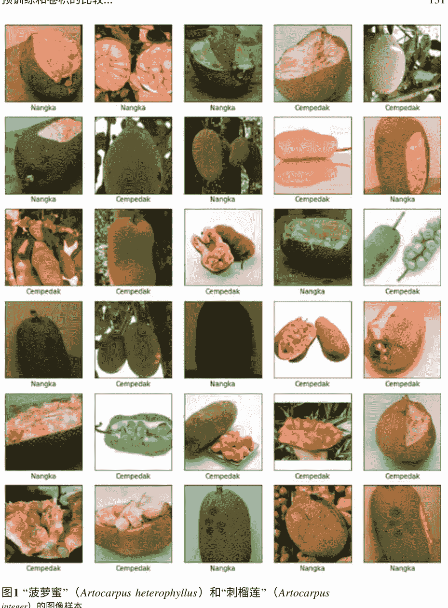

图1 “菠萝蜜”（Artocarpus heterophyllus）和“刺榴莲”（Artocarpus integer）的图像样本

这项研究旨在利用多模态信息检索准确确定cempedak和nangka水果，因此研究的目标是：(a) 构建一个用于cempedak（Artocarpus integer）和nangka（Artocarpus heterophyllus）的DCNN分类系统。

## 2 文献综述

由于类别之间的相似性和品种内不一致的特征，水果和蔬菜分类存在重大问题[6-8]。由于每种类型的广泛多样性，选择适当的数据收集传感器和特征表示方法尤为关键[9-12]。已经开发了水果和蔬菜质量评估和自动收获的方法，但最新技术仅适用于有限的类别和小数据集。这个问题是多维的，具有许多超维属性，是当前机器学习技术中的一个基本问题[13]。本研究的作者得出结论，机器视觉方法在处理多特征、超维数据进行分类时效果不佳。水果和蔬菜分为几个组，每个组都有自己的特征集。

由于基础数据集的匮乏，特定的分类方法受到限制。大多数试验在类别或数据集大小方面受到限制。对构建预训练的卷积神经网络的研究是创建供应即插即用的计算机视觉组件的一步。另一方面，这些预训练的卷积神经网络是数据驱动的，而水果和蔬菜的大型数据集非常稀缺[13]。

Rahnemoonfar和Sheppard [14]在这篇文章中利用深度神经网络（DNN）应用于机器人农业。本研究侧重于在互联网上找到的番茄图片。他们使用了一个经过调整的Inception-ResNet架构。使用各种训练数据对模型进行训练（在阴影下，被叶子包围，被树枝包围，水果之间的重叠）。他们的搜索结果显示，合成图片的平均测试准确率为93%，实际照片为91%。在这项研究中，研究人员使用卷积神经网络创建了一个可以在司机疲劳时通知司机的模型。为了在学习阶段提取特征并应用它们，创建了深度卷积网络。卷积神经网络分类器使用SoftMax层来确定司机是否在睡觉。对于这项研究，改编了Viola-Jones人脸检测方法。当发现眼睛区域时，将其从脸部移除。建议的堆叠深度卷积神经网络克服了标准卷积神经网络的缺点，如回归中的位置准确性。建议的模型具有96.42%的准确率。研究人员建议将来可以使用迁移学习来提高模型的性能[15]。基于四种不同的水果品种，本研究提供了一种识别水果种类（荔枝、苹果、葡萄和柠檬）的方法[16]。使用智能手机拍摄照片，然后使用现代检测框架进行处理。

由于该模型使用了来自四种不同水果类别的2403个数据的新数据集进行训练，因此使用了CNN进行训练。该模型的总体性能非常出色。

精确度达到99.89%。CNN成功地识别了水果的种类。研究人员计划将该算法用于未来检测各种水果。可以使用其他优化方法来优化所给出的问题[17-22]。

## 3 方法论

### 3.1 数据集

水果数据集使用数码单反相机（佳能7D，∅22.3×14.9 mm CMOS传感器，RGB彩色滤光片阵列，有效像素1800万）拍摄。数据分为两类，分别是cempedak (Artocarpus integer) 和nangka (Artocarpus heterophyllus)，共有1000张图像（每类500张），分辨率为4608×3456像素。为了训练网络，对整个数据集进行了72倍的子采样，生成了48×64像素的图像。图像采用了绿光、红光、蓝光（通过在闪光灯上加装外部凝胶滤光片）和白光四种光谱。这样做是为了获得一个能够代表水果位置和数量的高变异性数据集，以设计一个真实的场景。

### 3.2 数据预处理和分区

整个图像数据集被重新调整为 224 × 224 × 3 并转换为 NumPy 数组，以便在构建 CNN 模型时进行更快的卷积。转换后的图像数据集根据两个类别进行标记，并应用随机图像增强进行数据集的训练，同时进行验证并在测试集上进行测试。数据分区是通过将数据分为训练集和测试集来完成的，如图2所示。

### 3.3 卷积神经网络

对于这项研究，用于分类 cempedak (Artocarpus integer) 和 nangka (Artocarpus heterophyllus) 的 DCNN 模型如图3所示。它由15个深度学习的卷积层/块组成。第一个卷积层使用16个卷积滤波器，滤波器大小为 3 × 3，核正则化器和偏差正则化器为 0.05。它还使用了 random_uniform，这是一个核初始化器。它用于初始化神经网络的一些权重，然后在每次迭代中更新它们以获得更好的值。Random_uniform是一种生成具有均匀分布的张量的初始化器。

### 3.4 迁移学习

在数据集上对深度卷积神经网络模型进行定制可能需要更长的训练时间。迁移学习包括利用在一个数据集的一个问题上学到的特征，在一个新的类似问题上进行利用。在这项研究中，首先从之前训练过的模型（VGG16、VGG19、Xception、ResNet50、InceptionV3）中获取层，并将它们冻结，以避免在未来的训练轮次中破坏它们所包含的任何信息。接下来，在冻结层之上添加新的可训练层。然后，架构的层学会将旧特征转化为新数据集上的预测。在这里，我们将提出的CNN模型与VGG16、VGG19、Xception、ResNet50、InceptionV3这五个迁移学习模型进行比较。

#### 3.4.1 VGG16

VGG16是由Simonyan和Zisserman为ILSVRC 2014竞赛开发的。它由16个卷积层组成，仅使用3×3的卷积核。作者选择的设计与Alexnet类似，即随着网络深度的增加，增加特征映射或卷积的数量。该网络包含138百万个参数。在我们的模型中，这个架构在最后的全连接层进行了修改。有1000个类别。我们用我们的类别数量（即2个）替换1000个类别。使用Adam优化器并获得准确性。类似地，通过将深度增加到19层，定义了VGG19架构。如上所述，我们在最后一层将输出类别的数量更改为2。

#### 3.4.2 VGG19

VGG19是VGG16模型的升级。VGG19通过消除AlexNet的缺陷并提高系统准确性[3]来增强VGG16的架构。它是一个19层的卷积神经网络模型，通过堆叠卷积层来构建，然而，由于梯度消失现象的限制，模型的深度受到了限制。由于这个问题，深度卷积网络很难训练。

#### 3.4.3 ResNet50

ResNet代表残差网络。ResNet-50是基于卷积神经网络的深度学习模型，用于图像分类，已经进行了预训练。许多其他图像识别任务也从非常深的模型中获得了很大的好处[5]。ResNet-50是一个50层的神经网络，它在ImageNet数据库的1000个类别中训练了一百万张照片。此外，该模型包含大约2300万个可训练参数，表明了一个改进图像识别的深度架构。与从头开始构建模型相比，通常需要收集和训练大量数据，使用预训练模型是一个非常有效的选择。由于其高泛化性能和低错误率，ResNet-50是一个有用的工具来进行识别任务。

#### 3.4.4 Inception V3

Inception-v3 是一个48层深的预训练卷积神经网络模型。这是一个已经在ImageNet上训练过一百万张照片的网络版本。这是Google的Inception CNN模型的第三个版本，最初是在ImageNet Recognition Challenge中提出的。Inception V3能够将照片分类为1000种不同的物体类型。因此，该网络已经学习到了各种图像的丰富特征表示。该网络的图片输入尺寸为299乘以299像素。在第一阶段，模型从输入照片中提取通用特征，然后在第二部分使用这些特征对其进行分类。在ImageNet数据集上，Inception v3已经证明可以达到超过78.1%的准确率，并且在前5个结果中准确率约为93.9%。

#### 3.4.5 Xception

Xception代表“极端Inception”。这个架构是由Google提出的。它包含了与Inception V3中使用的相同数量的参数。模型中参数的高效使用和容量的增加是Xception性能提升的原因。Inception架构中的输出映射包括跨通道和空间相关性映射。这些类型的映射在Xception架构中完全解耦[23]。网络中的特征提取使用了36个卷积层。这36层被分为14个模块。对于每个模块，它都被线性残差连接所包围。最后和第一个模块没有这种表示。在最后的全连接层中，类别的数量被替换为2。

## 4 结果与讨论

使用各种分析方法对数据集进行了处理和分析。对于提出的DCNN模型的定制构建，可训练权重较高，训练时间较长。根据表1中的数据，可以看出提出的DCNN架构能够提供0.89至0.9367的准确度。图4和图5分别显示了提出方法（用黄色标出）与其他模型的比较。其中，VGG16和SGD的准确度最高。虽然SGD最高，但VGG16在整个训练过程中提供了更稳定和一致的性能，如图6所示。总体而言，随着训练轮数的增加，准确度也会增加。

表1 使用Adam或SGD优化器的DCNN和迁移学习模型的准确率在三个时期的水平

| 优化器 | Adam (25) | Adam (50) | Adam (75) | SGD (25) | SGD (50) | SGD (75) |
|---|---|---|---|---|---|---|
| 提出的模型 | 0.8933 | 0.9267 | 0.9100 | 0.9233 | 0.9267 | 0.9367 |
| Xception | 0.8200 | 0.8800 | 0.9000 | 0.9000 | 0.9167 | 0.9000 |
| VGG16 | 0.4733 | 0.8667 | 0.8700 | 0.6000 | 0.9567 | 0.9633 |
| VGG19 | 0.7967 | 0.8567 | 0.8800 | 0.8800 | 0.8800 | 0.8800 |
| ResNet50 | 0.6800 | 0.7200 | 0.7500 | 0.7933 | 0.6900 | 0.8000 |
| InceptionV3 | 0.8800 | 0.8900 | 0.9167 | 0.9133 | 0.9000 | 0.9167 |

## 5 结论

Cempedak (Artocarpus integer) 和nangka (Artocarpus heterophyllus) 在外观上非常相似，人眼难以区分，由于类别之间的相似性和品种内部特征的不一致性，水果和蔬菜分类存在重大问题。基于这两个类别，生成了500个cempedak和nangka图像，每个图像的分辨率为4608 × 3456像素，并对整个数据集进行了72倍的子采样，生成了48 × 64像素的图像。根据进行的实验，数据集已经使用各种CNN方法进行处理和分析。根据所提出方法中的方法学，结果显示所提出的DCNN架构能够提供89-93.67%的准确性。尽管SGD是最高的，VGG16在整个时期内提供更稳定和一致的性能，如图6所示。总体而言，结果显示时期越长，准确性越高。

## 参考文献

1.  Grimm, J. E., & Steinhaus, M. (2020). Cempedak的主要气味特征-与菠萝蜜的差异。农业与食品化学杂志，68(1)，258-266。
2.  Balamaze, J., Muyonga, J. H., & Byaruhanga, Y. B. (2019). 选定菠萝蜜 (Artocarpus Heterophyllus Lam) 品种的物理化学特性。食品研究杂志，8(4)，11。
3.  Shaha, M., & Pawar, M. (2018). 图像分类的迁移学习。在2018年第二届国际电子、通信和航空技术会议 (ICECA) 中 (第656-660页)。 https://doi.org/10.1109/ICECA.2018.8474802
4.  Wang, M. M. H., Gardner, E. M., Chung, R. C. K., Chew, M. Y., Milan, A. R., Pereira, J. T., & Zerega, N. J. C. (2018). 一个被低估的水果树作物，cempedak (Artocarpus integer, Moraceae)。美国植物学杂志，105 (5)，898-914。
5.  Sharma, N., Jain, V., & Mishra, A. (2018). 卷积神经网络的图像分类分析。在国际计算智能和数据科学会议 (ICCIDS 2018) 中；Procedia计算机科学，132，377-384。ISSN 1877-0509. https://doi.org/10.1016/j.procs.2018.05.198
6.  Alhaj, Y. A., Dahou, A., Al-qaness, M. A., Abualigah, L., Abbasi, A. A., Almaweri, N. A. O., Elaziz, M. A., & Damaševičius, R. (2022). 一种使用改进的粒子群优化的新型文本分类技术：阿拉伯语案例研究。未来互联网，14(7)，194。
7.  Daradkeh, M., Abualigah, L., Atalla, S., & Mansoor, W. (2022). 使用卷积神经网络的科学计量分析和分类研究：数据科学和分析案例研究。电子学，11(13)，2066。
8.  Wu, D., Jia, H., Abualigah, L., Xing, Z., Zheng, R., Wang, H., & Altalhi, M. (2022). 增强基于教学学习优化的Tsallis熵特征选择分类方法。过程，10(2)，360。
9.  Ali, M. A., Balasubramanian, K., Krishnamoorthy, G. D., Muthusamy, S., Pandiyan, S., Panchal, H., Mann, S., Thangaraj, K., El-Attar, N. E., Abualigah, L., & Elminaam, A. (2022). 基于象群优化算法和深度置信网络的青光眼分类。电子学，11(11)，1763。
10. Abualigah, L., Kareem, N. K., Omari, M., Elaziz, M. A., & Gandomi, A. H. (2021). 关于Twitter情感分析的调查：架构、分类和挑战。在深度学习中处理口语和自然语言的方法 (第1-18页)。Springer.
11. Fan, H., Du, W., Dahou, A., Ewees, A. A., Yousri, D., Elaziz, M. A., Elsheikh, A. H., Abualigah, L., & Al-qaness, M. A. (2021). 使用深度学习进行社交媒体毒性分类：英国脱欧的实际应用。电子学，10 (11)，1332。
12. Abualigah, L. M. Q. (2019).特征选择和增强的鲸群算法用于文本文档聚类(pp. 1–165). Springer.
13. Hameed, K., Chai, D., & Rassau, A. (2018). 水果和蔬菜分类技术的综合评述。图像与视觉计算, 80(九月), 24–44.
14. Rahmoonfar, M., & Sheppard, C. (2017). 基于深度模拟学习的水果计数。传感器 (瑞士), 17(4), 1–12.
15. Reddy Chirra, V. R., Uyyala, S. R., & Kishore Kolli, V. K. (2019). 基于眼部状态的司机疲劳检测的深度卷积神经网络方法。人工智能评论, 33(6), 461–466.
16. Ris din, F., Mondal, P. K., & Hassan, K. M. (2020). 使用机器学习技术的卷积神经网络（CNN）用于检测水果信息。IOSR计算机工程杂志, 22（2）, 1–13.
17. Abualigah, L., Diabat, A., Mirjalili, S., Abd Elaziz, M., & Gandomi, A. H. (2021). 算术优化算法。应用力学和工程的计算机方法, 376, 113609.
18. Abualigah, L., Yousri, D., Abd Elaziz, M., Ewees, A. A., Al-Qaness, M. A., & Gandomi, A. H. (2021). Aquila优化器：一种新颖的元启发式优化算法。计算机与工业工程, 157, 107250.
19. Abualigah, L., Abd Elaziz, M., Sumari, P., Geem, Z. W., & Gandomi, A. H. (2022). 爬行动物搜索算法（RSA）：一种受自然启发的元启发式优化器。专家系统与应用, 191, 116158.
20. Agushaka, J. O., Ezugwu, A. E., & Abualigah, L. (2022). 侏儒狮优化算法。计算方法在应用力学和工程中, 391, 114570.
21. Oyelade, O. N., Ezugwu, A. E. S., Mohamed, T. I., & Abualigah, L. (2022). 埃博拉优化搜索算法：一种新的受自然启发的元启发式优化算法。IEEE Access, 10, 16150–16177.
22. Ezugwu, A. E., Agushaka, J. O., Abualigah, L., Mirjalili, S., & Gandomi, A. H. (2022). 草原犬优化算法。神经计算与应用, 1–49.
23. Chollet, F. (2021). Xception：深度学习与深度可分离卷积。[在线] arXiv.org. https://arxiv.org/abs/1610.02357v3. 访问日期：2021年5月30日。

# 马基萨/百香果图像基于改进的深度学习方法的分类学习

Ahmed Abdo, Chin Jun Hong, Lee Meng Kuan, Maisarah Mohamed Pauzi, Putra Sumari, Laith Abualigah, Raed Abu Zitar和Diego Oliva

摘要 水果识别在农业行业中变得越来越重要。传统上，我们需要手动识别和标记生产线上的所有水果，这是一项劳动密集型、容易出错和低效的工作。因此，许多水果识别系统被创建来自动化这个过程，但是马来西亚本地水果的识别系统有限。因此，本项目将专注于分类马来西亚本地水果之一的马基萨/百香果。我们提出了两个用于马基萨分类的CNN模型。所提出模型的性能在我们自己的数据集上进行评估，并分别达到97%和65%的准确率。结果表明，CNN模型的架构非常重要，因为不同的架构可以产生不同的结果。因此，选择第一个CNN模型，因为它可以以更高的准确率对4种类型的马基萨进行分类。在所提出的工作中，我们还检查了两种迁移学习方法在马基萨分类中的应用，分别是VGG-16和InceptionV3。结果显示，第一个提出的CNN模型的性能优于VGG-16（95%准确率）和InceptionV3（65%准确率）。

关键词 马基萨 · 百香果 · 卷积神经网络 · 深度学习 · 迁移学习 · VGG-16 · InceptionV3

A. Abdo · C. J. Hong · L. M. Kuan · M. M. Pauzi · P. Sumari · L. Abualigah (📧) 马来西亚槟城大学计算机科学学院，马来西亚槟城，11800
电子邮件：Aligah.2020@gmail.com

L. Abualigah
Hourani应用科学研究中心，Al-Ahliyya Amman大学，约旦安曼
中东大学信息技术学院，阿曼安曼11831

R. A. Zitar
巴黎索邦大学阿布扎比人工智能中心，阿布扎比，阿拉伯联合酋长国

D. 奥利瓦
IN3—加泰罗尼亚开放大学计算机科学系，卡斯特尔德费尔斯，西班牙
Dept. 墨西哥瓜达拉哈拉大学计算机科学系，瓜达拉哈拉，哈利斯科州## 1 引言

计算机视觉的最新发展促进了机器学习（ML）、神经网络（NN）和传统神经网络（CNN），提高了图像分类任务的效率。检测几种不同的品种和分类西番莲（Passiflora edulis）[1,2]，通常被称为百香果或马来语中的Markisa，是水果包装和加工行业面临的重要挑战之一[3,4]。不同的颜色、大小、形状和方向由该水果的几个栽培品种引起，如图1所示，导致了错误分类，影响了生产力和包装质量。

通常情况下，Markisa的几个栽培品种的分类是在生产线上手动完成的，工人会将其手动分拣到不同的加工线上，使整个过程劳动密集、耗时、容易出错，并且无效的。此外，雇用员工进行手工工作会增加生产成本，引入工资成本和运营开销，从而导致生产产量的下降。因此，我们需要一个自动化系统，可以减少人力投入，提高生产效率，降低生产成本和时间[5,6]。

在本研究中，我们提出了一个卷积神经网络架构，用于马基萨的几个品种之间的分类，特别是以下马基萨品种，甜百香果（马基萨·马尼斯），黄百香果（马基萨·库宁），紫百香果（马基萨·乌古），和大百香果（马基萨·贝萨）。本文的创新之处在于：（i）用于马基萨分类的端到端深度学习流水线架构。本文的结构如下：第2节提供了所提出的卷积神经网络架构的文献调研。然后，第3节介绍了用于马基萨分类的所提出的卷积神经网络流水线架构的详细信息。至于第4节，介绍了实验概述，列出了实验和结果的工具、参数和标准。最后，第5节是我们的结论。

## 2 文献综述

在图像目标检测或分类中，有两种可用的方法，深度学习或卷积神经网络（CNN）和传统的计算机视觉（CV）方法[7,8]。传统的CV算法用于特征提取，包括边缘检测、角点检测和阈值分割[9-12]。与传统的CV技术相比，深度学习方法在图像分类方面具有更高的准确性[13]。深度学习还提供了对专家的较少需求，以进行微调或特征提取，这可以通过CNN来完成，具有很高的灵活性和重新训练以获得最佳结果。因此，CNN或深度学习被应用于许多图像分类、水果分类等分类任务，以帮助机器人采摘系统或检查水果的质量[14]。Risdin等人[14]开发了一个在水果分类中达到98.99%准确率的CNN，比传统的机器学习技术如SVM的87%准确率要好[5]。此外，Palakodati等人[15]开发了一个新鲜和烂水果分类的CNN模型，并能够达到高达97.82%的准确率。在已经进行过水果和蔬菜数据集实验的最佳迁移学习模型是VGG16。Kishore等人的研究[16]证明，使用VGG16在包含4个类别（香蕉、番茄、胡萝卜和土豆）的数据集上可以达到约97%的准确率[16]。数据集中的每个类别都包含600张图像。有趣的是，该模型经过了对不同图像尺寸的测试，以证明VGG16在较小和噪声较大的图像上表现良好。通过达到的准确率，毫无疑问VGG16是水果或蔬菜数据集的一个很好的选择。

还有一项由Pardede等人进行的研究[17]，该研究在水果数据集上应用了VGG16模型。该研究的目标是构建一个能够检测水果成熟度的深度学习模型，这与之前的研究有些不同，但数据集的性质相同。在那项研究中，有8类水果（成熟芒果、未成熟芒果、成熟番茄、未成熟番茄、成熟橙子、未成熟橙子、成熟的苹果，未成熟的苹果）。研究结果显示，在Dropout率为0.5的情况下，他们达到了约90%的准确率。研究得出的结论是，在迁移学习中减少过拟合的最佳技术是使用Dropout。

Inception-v3是一种卷积神经网络架构，以克里斯托弗·诺兰执导的电影《盗梦空间》命名；该模型主要用于图像分析和目标检测，并在Google举办的ImageNet Recognition Challenge期间引入。维基媒体基金会发表的一项研究[18]。

Szegedy等人[19]提出了Inception-v3的架构，并在Inception架构的背景下对其进行了研究；该架构被证明具有“相对较低的计算成本，与更简单、更单一的架构相比，具有高性能的视觉网络”。此外，Inception-v3的最高质量训练版本在单一裁剪评估中的“top-1错误率为21.2%，top-5错误率为5.6%”，与当时的其他CNN架构相比。

Chunmian Lin等人发表的另一篇论文通过迁移学习探索了Inception-v3模型的应用；基于迁移学习的模型“在不同的学习率下进行了5000个时期的重新训练[20]。”准确性测试结果表明，基于迁移学习的方法对于交通标志识别具有鲁棒性，在学习率为0.05时具有最佳的识别准确率为99.18%”。其他一些优化方法可以用于优化问题，如[8,21-25]所述。

## 3 提出的深度学习和机器学习技术在百香果分类应用中的应用

### 3.1 提出的卷积神经网络架构

#### 3.1.1 模型 1

所提出的用于百香果分类的卷积神经网络模型的架构可以在图2和图3中看到。该卷积神经网络模型包括4个卷积层，如图2和图4所示，用于神经网络分类器的稠密层不包括输入和输出层，如图3所示[12,26]。该模型能够在分类4种百香果时给出97%的测试准确率。如图2所示，在尺寸为(224, 224)的RGB彩色图像的训练数据输入之后，它被传递到第一个卷积层。第一个卷积层设计为具有64个卷积滤波器的尺寸为(3, 3)；当将滤波器在输入图像上平移一步时，步幅为(1, 1)，填充设置为相同，这将在第一个卷积之后提供相同的输出。接下来，在ReLU激活函数之后应用批归一化，以使平均激活输出接近零，标准差接近1[3]。然后，结果将传递给大小为(2, 2)的最大池化层，以减小输出大小以简化模型。此外，在第二个卷积层中应用相同数量的卷积滤波器。然而，滤波器尺寸增加到(5, 5)，没有填充，并且应用相同的批归一化在大小为（2,2）的最大池化层之前使用ReLU激活函数。卷积层2使用相同的架构，但将滤波器大小增加到（7,7），在最大池化层之前应用相同的ReLU激活和批归一化以防止模型过拟合。在卷积层4中，卷积滤波器仅减少到16个大小为（7,7）的滤波器，并在输出上应用批归一化而不使用ReLU函数和最大池化层。在提取输入图像的特征后，基础模型提供给提议的CNN的输出将成为神经网络架构的输入。

在卷积层提取水果数据集内部特征后，像素值被展平，然后输入到神经网络中，如图3所示。神经网络内有3个密集层，不包括输入和输出层。第一个密集层由512个节点构成，并使用L2正则化或岭回归正则化，lambda和偏差都为0.01，对权重进行惩罚，以创建一个更简单的模型并防止过拟合[4]。

在训练时，通过忽略25%的神经元来快速计算，避免过拟合，丢弃率为0.25。因此，由于训练神经元较多，第一个密集层使用了两种正则化技术，即L2正则化和丢弃正则化，丢弃率为0.25。第一个密集层使用ReLU激活函数，输入到第二个密集层，只有64个神经元，并且与第一层相同的丢弃率0.25，没有L2正则化。然后，输出经过ReLU激活函数，并成为输出层之前最后一个密集层的输入。神经网络的第三层只有32个节点，没有丢弃率和正则化。第三个密集层使用ReLU激活函数，输出层使用Softmax激活函数，具有4个神经元，用于进行多类别分类。在神经网络中，用于更新权重和偏差的损失函数的优化器是分类交叉熵，因为输入是独热编码，学习率为0.001的Adagrad优化器。将epoch设置为30，批量大小设置为10。用于衡量多类别分类的度量标准是分类准确率。

#### 3.1.2 模型 2

图4展示了第二个提出的CNN模型架构。该模型有6个卷积块，2个池化块，2个全连接层和一个SoftMax分类器。所有输入图像都是尺寸为224×224像素，3个通道的彩色图像。所有卷积块的滤波器尺寸都相同（3×3），并且应用填充以确保输出图像与输入图像具有相同的尺寸。然而，不同的滤波器数量被使用，卷积块1使用128个滤波器，块2使用96个滤波器，块3使用64个滤波器，块4和块5使用32个滤波器，块6使用12个滤波器。所有卷积块都使用相同的激活函数，即ReLU。在卷积块1和2之后应用2×2的最大池化，将图像的尺寸缩小一半（从224×224到56×56）。经过卷积基之后，图像的维度为56×56×12。然后，图像被展平为向量在进入全连接层之前，大小为37,632。两个全连接层都有1000个节点，使用ReLU作为激活函数。唯一的区别是第一层应用了0.3的dropout率。然后，SoftMax分类器将输出结果，无论图像是markisa besar、markisa kuning、markisa manis还是markisa ungu。

### 3.2 迁移学习模型

作为本研究的一部分，我们还包括了迁移学习模型。由于我们设备的一些限制和有限的资源，我们只能在VGG16和InceptionV3模型之间进行比较。在这两个模型中，我们冻结了基础卷积层并删除flatten层及其分类器。然而，我们通过使用“imagenet”选项来保持权重。然后，我们将其替换为适应我们的数据集，该数据集包含4个类别。我们使用ReLU作为密集层的激活函数，使用softmax作为输出层的激活函数，并实现了早停法来减少训练时间。每当模型达到99%的准确率时，我们停止模型训练。这也会减少过拟合的可能性。

#### 3.2.1 VGG16

VGG16是由Karen Simonyan和Andrew Zisserman于2014年在牛津大学开发的卷积神经网络[27]。该模型包含16个层，在ImageNet数据集上实现了92.7%的前5测试准确率，该数据集包含1400万张属于1000个类别的图像。图5显示了VGG16的架构。

#### 3.2.2 InceptionV3

第二个迁移学习模型是基于Inception-v3模型的顺序连接。该模型由通过(1 × 1)和(3 × 3)卷积核进行基本卷积操作学习的低级特征映射组成。此外，多尺度特征表示被连接起来输入到具有不同卷积核（即，1 × 1，1 × 3，3 × 1，3 × 3，5 × 5，1 × 7和7 × 7滤波器）的辅助分类器中，以产生更好的收敛性能。在实验部分，我们配置了一个全连接层，其中包括一个Dense层和一个dropout层，然后进行了另一个实验，其中包括两个Dense层和两个dropout层。

最后，使用Sigmoid分类器生成一个与四类概率一致的one-hot向量。最后，可以根据四类概率的最大值确定分类结果。图6显示了InceptionV3的架构。

### 3.3 数据集

有许多种类的马基萨/百香果。在我们的数据集中，我们包括了4种不同的这种水果，它们是马基萨贝萨（巨型百香果），马基萨昆宁（黄色百香果），马基萨曼尼斯（甜百香果）和马基萨乌古（紫色百香果）。我们将数据集分为80%的训练集，10%的验证集和10%的测试集。图7显示了我们数据集中的图像示例。

### 3.4 增强

我们还对图像进行了一些增强处理，通过将图像旋转到一定角度。表1显示了马基萨贝萨类别中一张图像的旋转情况。

表1 马基萨贝萨的图像增强
| 旋转角度 | 图像 |
| :--- | :--- |
| 0°（原始图像） | (显示人物手持一个绿色椭圆形水果，背景为红砖墙) |
| 180° | (显示人物手持同一个水果，图像旋转了180度) |
| 90°逆时针 | (显示人物手持同一个水果，图像逆时针旋转了90度) |
| 275° | (显示人物手持同一个水果，图像顺时针旋转了275度) |

表2 建议的CNN模型参数调整选项
| 参数 | 选项 |
| --- | --- |
| 优化器 | Adam, SDG, Adagrad, RMSprop |
| 稠密层 | - |
| 学习率 | 0.1, 0.01, 0.001, 0.0001 |
| 时期 | 10, 30, 50, 70 |
| 过滤器 | - |
| 批量大小 | 10, 20, 30, 40 |

表3 参数调整迁移学习选项
| 参数 | 选项 |
| --- | --- |
| 单个密集层中的神经元数量 | 512, 1024 |
| 优化器类型 | Adam, SGD |
| 运行周期 | 10, 20 |
| 丢弃 | 0.1, 0.2 |
| 学习率 | 0.01, 0.001 |
| 批量大小 | 50, 100 |

## 4 性能结果

### 4.1 实验设置

使用的数据集非常平衡，包括250个Markisa Besar，250个Markisa Kuning，250个Markisa Manis，250个Markisa Ungu，总共1000张图片。图像的尺寸已经标准化为224 × 244 × 3。本研究使用的编程语言是Python，使用Tensorflow和Keras库。为了运行代码，我们使用带有GPU的Google Colaboratory。然而，GPU运行时受到限制，我们无法广泛使用它。因此，我们将参数调整选项从每个参数的4个不同值减少到仅有2个不同值，仅适用于迁移学习部分。表2和表3显示了所提出的CNN模型和迁移学习的参数调整选项。

### 4.2 提出的CNN模型的性能

#### 4.2.1 模型1

为了获得图2和图3中所示的97%的百香果分类模型，卷积神经网络架构的模型摘要如图8所示。 我们将首先尝试不同的架构设计和不同的超参数调整。

第一个提出的模型如图9所示，用于尝试不同的优化器、密集层的数量、学习率、训练轮数、过滤器数量以及训练批次大小。 最佳模型是卷积神经网络架构，如图8所示，在测试数据上具有97%的准确率。

最初提出的卷积神经网络架构如图9所示，包括4个卷积层和3个密集层，就像图8中的最佳模型一样。

| Layer (type) | Output Shape | Param # |
| :--- | :--- | :--- |
| conv2d (Conv2D) | (None, 224, 224, 64) | 1792 |
| module_wrapper (ModuleWrappe) | (None, 224, 224, 64) | 256 |
| conv2d_1 (Conv2D) | (None, 220, 220, 64) | 102464 |
| module_wrapper_1 (ModuleWrap) | (None, 220, 220, 64) | 256 |
| max_pooling2d (MaxPooling2D) | (None, 110, 110, 64) | 0 |
| conv2d_2 (Conv2D) | (None, 104, 104, 64) | 200768 |
| module_wrapper_2 (ModuleWrap) | (None, 104, 104, 64) | 256 |
| max_pooling2d_1 (MaxPooling2) | (None, 52, 52, 64) | 0 |
| conv2d_3 (Conv2D) | (None, 46, 46, 16) | 50192 |
| module_wrapper_3 (ModuleWrap) | (None, 46, 46, 16) | 64 |
| flatten (Flatten) | (None, 33856) | 0 |
| dense (Dense) | (None, 512) | 17334784 |
| module_wrapper_4 (ModuleWrap) | (None, 512) | 0 |
| module_wrapper_5 (ModuleWrap) | (None, 64) | 32832 |
| module_wrapper_6 (ModuleWrap) | (None, 64) | 0 |
| module_wrapper_7 (ModuleWrap) | (None, 32) | 2080 |
| dense_1 (Dense) | (None, 4) | 132 |
| Total params | 17,725,876 | |
| Trainable params | 17,725,460 | |
| Non-trainable params | 416 | |

图8 最佳提出的卷积神经网络模型的模型摘要，准确率为97%。

```
=================================================================
Layer (type)                 Output Shape              Param #   
=================================================================
conv2d (Conv2D)              (None, 224, 224, 64)      1792      
module_wrapper (Modulewrappe (None, 224, 224, 64)      256      
conv2d_1 (Conv2D)            (None, 220, 220, 16)      25616     
module_wrapper_1 (Modulewrap (None, 220, 220, 16)      64       
max_pooling2d (MaxPooling2D) (None, 110, 110, 16)      0         
conv2d_2 (Conv2D)            (None, 104, 104, 16)      12560     
module_wrapper_2 (Modulewrap (None, 104, 104, 16)      64       
max_pooling2d_1 (MaxPooling2 (None, 52, 52, 16)        0         
conv2d_3 (Conv2D)            (None, 46, 46, 16)        12560     
module_wrapper_3 (Modulewrap (None, 46, 46, 16)        64       
flatten (Flatten)            (None, 33856)             0         
dense (Dense)                (None, 512)               17334784  
module_wrapper_4 (Modulewrap (None, 512)               0         
module_wrapper_5 (Modulewrap (None, 64)                32832     
module_wrapper_6 (Modulewrap (None, 64)                0         
module_wrapper_7 (Modulewrap (None, 32)                2080      
dense_1 (Dense)              (None, 4)                 132       
=================================================================
Total params: 17,422,804
Trainable params: 17,422,580
Non-trainable params: 224
```

图9 第一个实验模型

第一个卷积层由64个大小为(3, 3)、步长为(1, 1)和零填充的滤波器组成，将输出与图2、3和8中的最佳模型相同的结果。然而，与最佳模型相比，第二和第三个卷积层的滤波器数量仅为16个。其余的卷积架构和神经网络密集层架构与最佳模型相同。然而，初始学习率设置为0.0001，并使用Adam优化器来获得分类准确性。此外，训练数据集的epoch设置为30，批量大小为10。因此，我们可以观察到最佳模型的总参数为17,725,876，比初始模型的17,422,804多，这是由于CNN架构中使用的滤波器数量较少，如图8和9所示。

##### (I) 优化器的影响

初始模型已经尝试了不同的优化器，如Adam、SGD、Adagrad和RMSprop。训练准确率和验证准确率可以在图10中看到。在这4个优化器中，我们可以看到Adagrad优化器在检测多类别分类方面具有稳定的验证准确率，接近90%的准确率。RMSprop在第30个epoch附近也显示出良好的验证准确率，但与Adagrad相比，数值波动较大。Adagrad的训练准确率和验证准确率比其他3个优化器更稳定，验证准确率没有波动。Adagrad的训练和验证准确率非常接近，表明模型变得不那么过拟合。图11对不同优化器的水平条形图进行了测试评估准确率的比较。因此，根据验证准确率的表现，我们可以看到Adagrad优化器的性能更好，过拟合程度更低。高验证准确率也显示了图11中的高测试评估准确率。因此，我们现在将Adam优化器切换为Adagrad优化器，并继续调整超参数。

##### (II) 密集层的影响

初始模型在神经网络分类器中有3个密集层，它进行了实验随着一个具有64个节点和0.25的丢弃率的密集层的增加，ReLU。

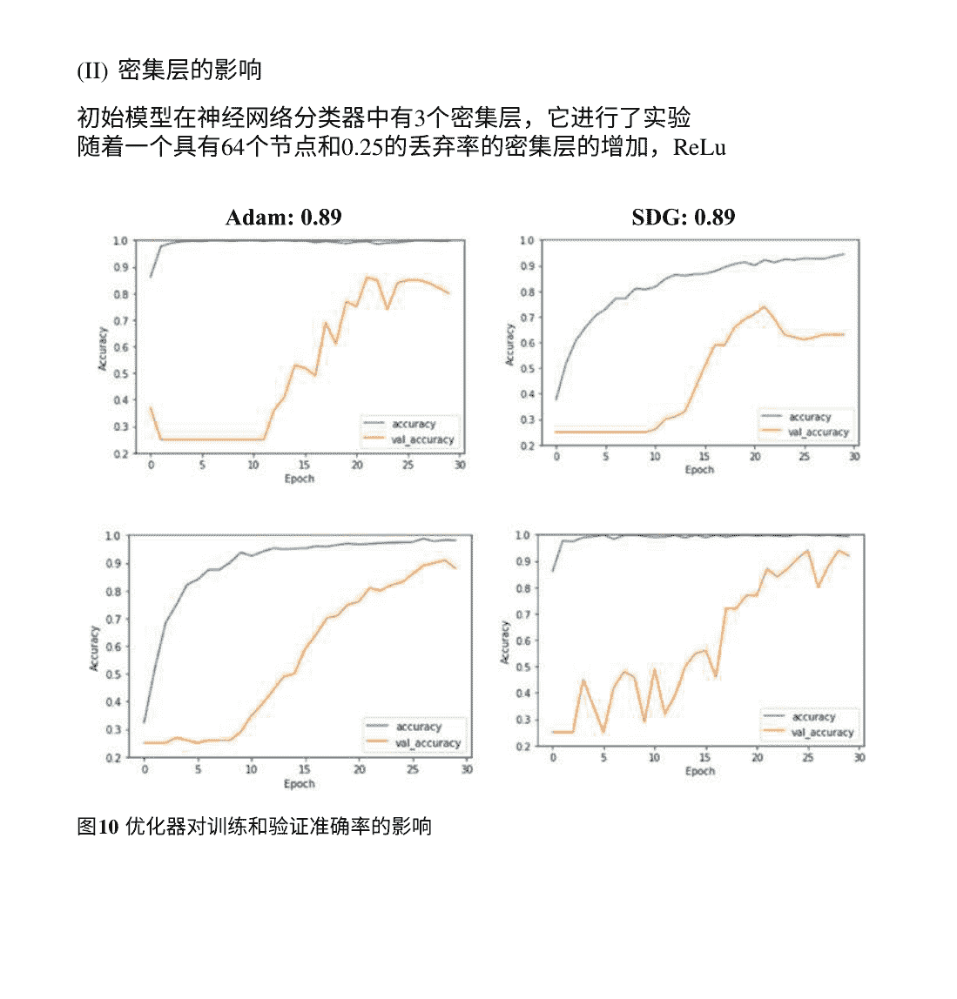

图11 不同优化器的测试评估准确性比较

如图12所示，在第二个密集层之后的激活。因此，实验在分类器中添加新的密集层3次后，将有多达6个密集层。结果显示，当添加更多的密集层时，模型学习速度较慢，需要更多的训练周期或训练集才能进行良好的预测。在模型存在4个密集层后，验证准确率将高于训练准确率，因为模型的复杂性增加了。因此，如图13所示的测试评估准确性表明，在30个epoch的情况下，具有3个密集层的模型具有更高的测试评估准确性，为0.96，而更多的密集层。因此，我们将保留只有3个密集层，Adagrad优化器，学习率为0.0001，训练epoch为30，批量大小为10作为我们当前的模型。

##### (III) 学习率的影响

接下来，模型将使用不同的学习率进行测试，包括0.1、0.01、0.001和0.0001，如图14所示。结果显示，当学习率较高时，模型会在不到10个epoch内收敛，验证准确率接近训练准确率。然而，这种情况并不稳定，因为较高的学习率意味着模型的权重和偏差会更快地更新，在10个epoch后可能无法很好地学习，验证准确率会出现波动。学习率越小，模型学习的速度越慢，准确率越高，如图14所示。当学习率变小时，测试评估准确率会增加，但只有在0.001之前。这是因为学习率为0.001时，测试评估准确率最高，接近1或0.99，而学习率为0.0001时，测试评估准确率为0.96。这个结果可以解释为只测试了30个epoch，较小的学习率可能需要更大的epoch数来进行更好的训练。因此，由于快速计算和高准确率的需要，我们将选择学习率为0.001，而不是初始学习率。

Dense Layer_3: 0.96

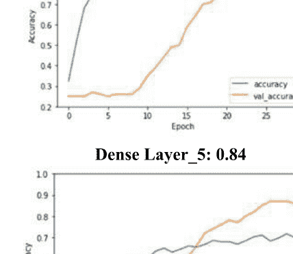

Dense Layer_4: 0.95

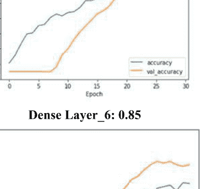

Dense Layer_5: 0.84

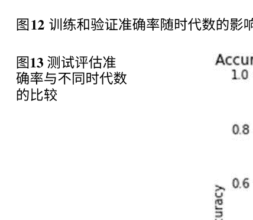

Dense Layer_6: 0.85

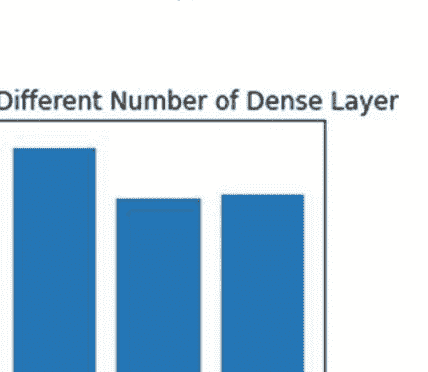

图12 训练和验证准确率随epoch数的影响

图13 测试评估准确率与不同时期数的比较

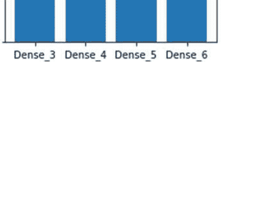

初始模型设置为0.0001。尽管学习率为0.0001的验证准确率略高于0.001（如图15所示），但我们将选择快速收敛的模型。当前模型是Adagrad优化器，学习率为0.001，有3个密集层，epoch大小为30，批量大小为10。

## (IV) 时代数的影响

此外，模型现在经过不同的epoch大小进行实验，从10、30、50到70（如图16所示）。前10个epoch显示验证准确率较低，模型过拟合，测试评估准确率仅为0.39。当epoch大小增加时，验证准确率开始收敛，并在进一步增加epoch大小后保持一致，如70 epoch所示。epoch数达到后，模型将开始具有一致的验证准确率。

不同的epoch大小的测试评估准确性可以在图17中看到。结果显示，epoch大小为30和50的测试评估准确性最高，为0.99，而epoch 70的准确性为0.95。因此，我们将选择epoch大小为30来训练模型，因为它需要较少的计算资源，同时在验证准确性上也能得到良好的结果。当前模型是Adagrad优化器，学习率从0.0001变为0.001，有3个密集层，epoch大小为30，批量大小为10。

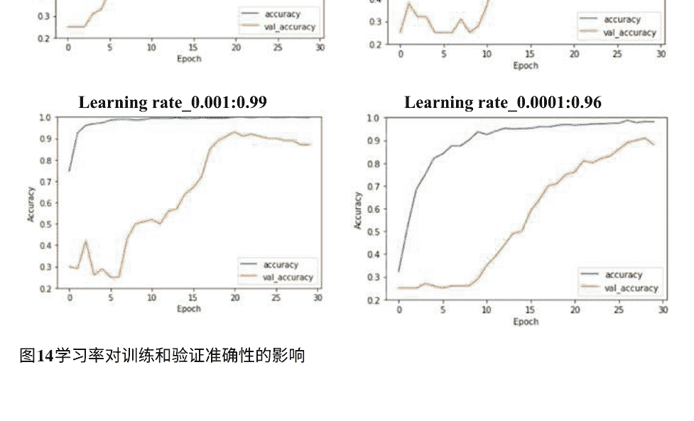

图15 不同学习率下的测试评估准确性比较

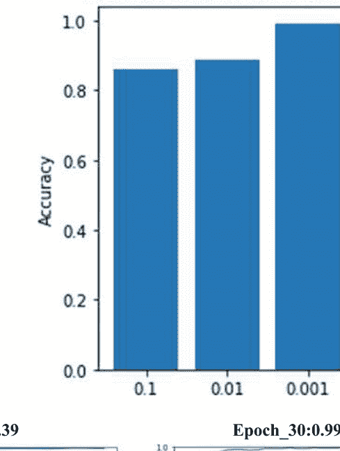

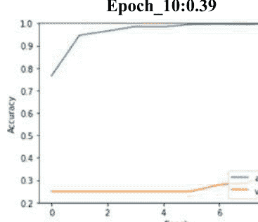

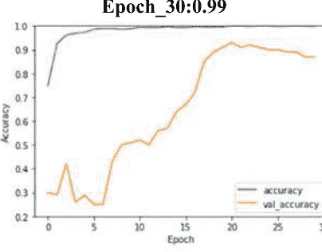

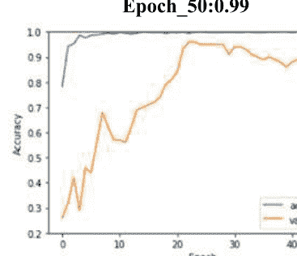

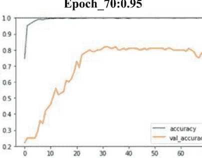

图16 学习率对训练和验证准确性的影响

##### (V) 滤波器数量的影响

初始模型只有第一卷积层有64个滤波器，第二卷积层有16个滤波器，第三卷积层也有16个滤波器。当第二和第三层的卷积层滤波器也改为64时，结果如图18所示。如果只添加第二个卷积层，则总共添加的滤波器数量为48，否则，对于第二和第三层的卷积滤波器改为64，总共添加的滤波器数量为90。当添加更多滤波器时，模型能够更好地捕捉图像特征，如48个和90个添加的滤波器的验证准确率接近训练准确率。另一方面，在添加48个滤波器和90个滤波器后，测试评估准确率显示出改善，两者都从99%提高到100%，如图19所示。因此，前3个卷积层的滤波器数量将改为64个滤波器，这是最佳的模型架构，如图2和图3所示。

##### (VI) 批量大小的影响

由于我们已经确定了最佳模型的架构，现在我们将在图20中观察训练批量大小对模型性能的影响。我们可以观察到，当批量大小增加时，模型更新速度变慢，模型测试评估准确性变小，如图21所示。批量大小增加后，准确性下降至0.97和0.98。

这可以解释为较大的批量大小会减少参数更新的次数。因此，我们将保留批量大小为10的输入数据集训练。现在最佳模型是10个epoch，批量大小为10，学习率为0.001，3个密集层，前3个卷积层的64个过滤器和Adagrad优化器。

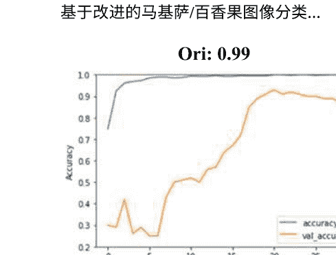

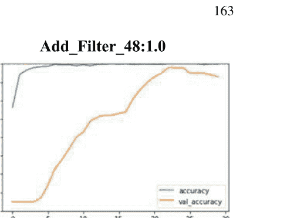

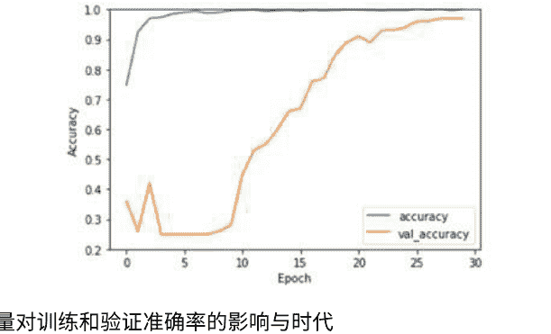

图18 过滤器数量对训练和验证准确率的影响与时代

图19 不同过滤器数量的测试评估准确性比较

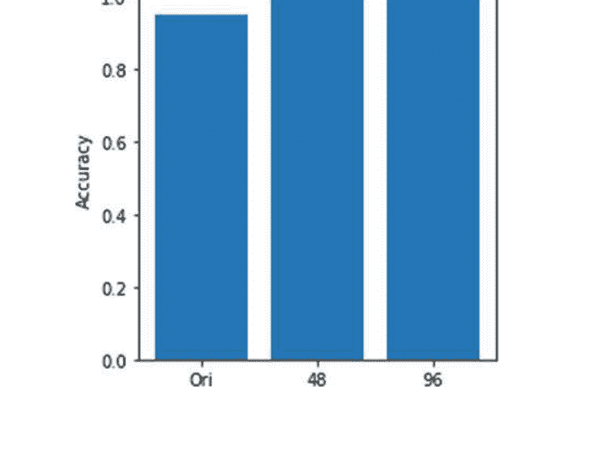

图20 过滤器数量对训练和验证准确率的影响与时代

图21 不同过滤器数量的测试评估准确性比较

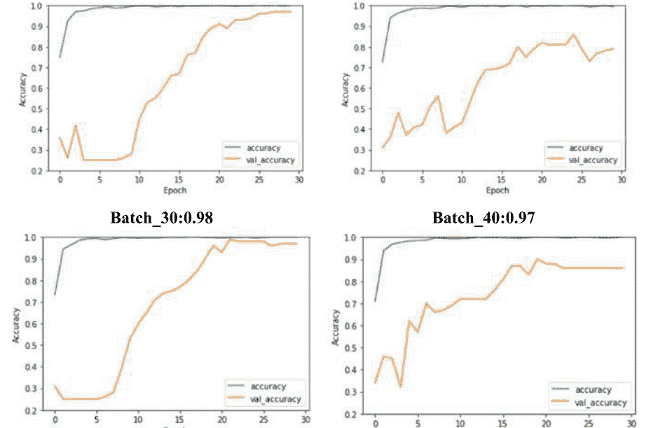

图22展示了对测试数据集的最佳模型预测准确率，其中对于百香果分类显示了97%的准确率。在Markisa Besar上发生了3次错误分类，但模型能够正确预测其他所有类别。最佳模型在测试评估准确性方面显示出100%的准确率，但是实际预测准确率在输入数据集上为97%，在测试数据集的100张图像中有3张被错误分类。因此，人们认为通过提供更多不同品种的Markisa Besar图像来训练模型可以提高测试准确性。

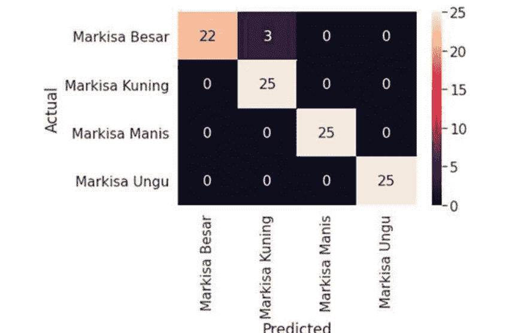

图22 模型1的最佳预测准确率为97%

#### 4.2.2 模型2

图23显示了第二个CNN模型的摘要。根据摘要，我们需要训练38838816个参数。我们首先使用训练数据训练模型，然后使用验证数据进行超参数调整，最后使用测试数据测试模型的准确性。为了获得该模型的最佳参数，我们根据表2中提到的设置进行了超参数调整。经过超参数调整后，该模型的测试准确率为65%，具体参数如下：

- 优化器 = Adam
- 学习率 = 0.001
- 最后的过滤器数量 = 12
- 每个密集层中的节点数量 = 1000
- 迭代次数 = 50
- 批量大小 = 20

下面的部分展示了每个超参数对模型性能的影响。

| Layer (type) | Output Shape | Param # |
| :--- | :--- | :--- |
| conv2d_54 (Conv2D) | (None, 224, 224, 128) | 3584 |
| max_pooling2d_18 (MaxPooling) | (None, 112, 112, 128) | 0 |
| conv2d_55 (Conv2D) | (None, 112, 112, 96) | 110688 |
| max_pooling2d_19 (MaxPooling) | (None, 56, 56, 96) | 0 |
| conv2d_56 (Conv2D) | (None, 56, 56, 64) | 55360 |
| conv2d_57 (Conv2D) | (None, 56, 56, 32) | 18464 |
| conv2d_58 (Conv2D) | (None, 56, 56, 32) | 9248 |
| conv2d_59 (Conv2D) | (None, 56, 56, 12) | 3468 |
| flatten_9 (Flatten) | (None, 37632) | 0 |
| dense_27 (Dense) | (None, 1000) | 37633000 |
| dropout_9 (Dropout) | (None, 1000) | 0 |
| dense_28 (Dense) | (None, 1000) | 1001000 |
| dense_29 (Dense) | (None, 4) | 4004 |
| | | |
| Total params: | 38,838,816 | |
| Trainable params: | 38,838,816 | |
| Non-trainable params: | 0 | |

图23 第二个CNN模型的总结

##### (I) 最后一个过滤器大小的影响

为了测试最后一个卷积基于模型性能的过滤器大小的影响，我们将其他参数保持不变：

- 节点数 = 2000
- 优化器 = Adam
- 迭代次数 = 30
- 批量大小 = 40

图24显示了最后一个过滤器大小的影响。根据结果，我们可以看到过滤器数量为12时具有最高的验证准确率，为0.71。我们还可以看到该模型在训练数据上过拟合，因为它可以完美地对训练图像进行分类，但在验证集上的性能仅为0.71准确率。在下一次超参数调整中，我们将保持过滤器大小为12。

##### (II) 每个稠密层中节点数的影响

为了测试每个密集层中节点数量对模型性能的影响，我们将其他参数保持不变：

- 最后一个滤波器大小 = 12
- 优化器 = Adam
- 迭代次数 = 30
- 批量大小 = 40

| | Last Filter Size | Training Accuracy | Validation Accuracy |
| :--- | :--- | :--- | :--- |
| 0 | 10 | 1.0 | 0.64 |
| 1 | 12 | 1.0 | 0.71 |
| 2 | 14 | 1.0 | 0.70 |
| 3 | 16 | 1.0 | 0.60 |

图24 最后一个滤波器大小对模型性能的影响

每个密集层中节点数量的影响如图25所示。根据结果，我们可以看到1000个节点具有最高的验证准确率，为0.70。我们还可以看到模型在训练数据上过拟合，因为它可以完美地对训练图像进行分类，但在验证集上的性能只有0.70的准确率。在下一次超参数调整中，我们将保持节点数为1000。

##### (III) 优化器的影响

为了测试优化器对模型性能的影响，我们将其他参数保持不变：

- 最后一个滤波器大小 = 12
- 节点数量 = 1000
- 迭代次数 = 30
- 批量大小 = 40

优化器的影响如图26所示。根据结果，我们可以看到Adam优化器具有最高的验证准确率，为0.80。我们还可以看到模型对训练数据过拟合，因为它可以以0.99的准确率对训练图像进行分类，但在验证集上的性能仅为0.80的准确率。在下一次超参数调整中，我们将保持优化器为Adam。

| | Number of Nodes | Training Accuracy | Validation Accuracy |
| :--- | :--- | :--- | :--- |
| 0 | 500 | 0.735 | 0.39 |
| 1 | 1000 | 1.000 | 0.70 |
| 2 | 2000 | 1.000 | 0.67 |

图25 节点数量对模型性能的影响

| Optimizers | Training Accuracy | Validation Accuracy |
| :--- | :--- | :--- |
| **0** | adam | 0.9900 | 0.80 |
| **1** | rmsprop | 0.9025 | 0.58 |
| **2** | adagrad | 1.0000 | 0.72 |
| **3** | sdg | 1.0000 | 0.72 |

图26 优化器对模型性能的影响

##### (IV) 批量大小的影响

为了测试批量大小对模型性能的影响，我们将保持其他参数不变：

- 最后一个滤波器大小 = 12
- 节点数量 = 1000
- 迭代次数 = 30
- 优化器 = Adam

批量大小的影响如图27所示。根据结果，我们可以看到批量大小为20具有最高的验证准确率，为0.58。我们还可以看到模型对训练数据过拟合，因为它可以完美地对训练图像进行分类，但在验证集上的性能仅为0.58的准确率。在下一次超参数调整中，我们将保持批量大小为20。

##### (V) 迭代次数的影响

为了测试迭代次数对模型性能的影响，我们保持其他参数不变：

- 最后一个滤波器大小 = 12
- 节点数量 = 1000
- 批次大小 = 20
- 优化器 = Adam

图28显示了迭代次数的影响。根据结果，我们可以看到50个迭代次数具有最高的验证准确率，为0.65。我们还可以看到，由于模型可以完美地对训练图像进行分类，但在验证集上的性能仅为0.65准确率，因此可以看出模型对训练数据过拟合。

| Batch Size | Training Accuracy | Validation Accuracy |
| :--- | :--- | :--- |
| **0** | 10 | 1.0 | 0.58 |
| **1** | 20 | 1.0 | 0.58 |
| **2** | 30 | 1.0 | 0.49 |
| **3** | 40 | 1.0 | 0.53 |

图27 批次大小对模型性能的影响

| Epochs | Training Accuracy | Validation Accuracy |
| :--- | :--- | :--- |
| 0 (10) | 0.98375 | 0.61 |
| 1 (30) | 0.99625 | 0.65 |
| 2 (50) | 1.00000 | 0.65 |
| 3 (70) | 1.00000 | 0.62 |

图28 迭代次数对模型性能的影响

### 4.3 提出的迁移学习模型的性能

#### 4.3.1 VGG16

在这个实验中，我们在flatten层后面只添加了1个dense层和1个dropout层，在冻结基础VGG16卷积层的同时。图29展示了模型的架构。

正如前一节所述，在模型训练过程中，我们进行了不同的参数调整。从参数选项中，我们使用不同的参数组合训练了64个模型（请参见附录）。作为比较，我们选择了具有不同参数的最佳模型。在训练中取得的最佳准确率为0.97。图30显示了在不同的epoch内训练和验证的准确率和损失，当最佳模型在此部分达到99%准确率时停止学习。

## (一) 优化器的影响

对于优化器，我们选择了具有相同参数的Adam和SGD。这两个优化器之间的比较如表4所示。从表中可以看出，Adam优化器在具有相同参数的情况下表现更好。

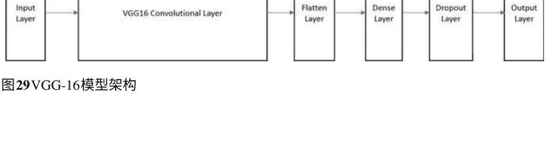

图30 训练/验证准确率和损失在不同时期的变化

### 表4 Adam和SGD优化器之间的比较

| 相同的参数 | 优化器 | 准确性 |
| :--- | :--- | :--- |
| 稠密层中的神经元数量：512<br>丢弃率：0.2<br>迭代次数：20<br>学习率：0.01<br>批量大小：100 | Adam | 0.97 |
| | SGD | 0.75 |

##### (II) 稠密层中神经元数量的影响

对于稠密层中的神经元数量，我们尝试了两个不同的值，512或1024。结果显示在表5中。从所得结果来看，较低数量的神经元表现得比较好，与较高数量的神经元相比，准确度差异为0.10。

## (III) 丢弃率的影响

在这个实验中使用了不同的丢弃率，分别为0.1和0.2。结果显示在表6中。

### 表5 不同数量神经元之间的比较

| 相同的参数 | 编号 稠密层中的神经元数量 | 准确性 |
| :--- | :--- | :--- |
| 优化器：Adam<br>丢弃率：0.2<br>迭代次数：20<br>学习率：0.01<br>批量大小：100 | 512 | 0.97 |
| | 1024 | 0.87 |表格6比较不同的丢弃率相同参数之间的比较
| 相同的参数 | 丢弃率 | 准确性 |
| :--- | :--- | :--- |
| 优化器：Adam<br>密集层中的神经元数：512<br>时期：20<br>学习率：0.01<br>批量大小：100 | 0.2 | 0.97 |
| | 0.1 | 0.81 |

表格7比较不同学习率之间的比较
| 相同的参数 | 学习率 | 准确性 |
| :--- | :--- | :--- |
| 优化器：Adam<br>密集层中的神经元数：512<br>时期：20<br>丢弃率：0.2<br>批量大小：100 | 0.01 | 0.97 |
| | 0.001 | 0.97 |

从结果来看，较高的丢弃率比较低的丢弃率表现更好。

##### (IV) 学习率的影响

除了丢弃率之外，我们还测试了不同的学习率，0.01或0.001。结果显示在表格7中。

改变学习率对结果没有影响，准确度相同。

##### (V) 批量大小的影响

我们还测试了模型训练过程中不同批量大小的影响。结果显示在表格8中。

对于批量大小，准确性只有0.03的小差异。可以得出结论，批量大小对性能有一定影响。

## (VI) 对Epochs的影响

最后，我们尝试了两个不同的epochs，10和20。结果显示在表9中。与批量大小相同，epochs的数量对准确性只有0.06的小差异。

从VGG16迁移学习的实验总结来看，我们需要选择最佳的优化器、dropout率和密集层中的神经元数量，以获得最佳模型。然而，不同的学习率对模型的性能没有影响，而批量大小和epochs的数量只对准确性值有一点影响。

表8不同批量大小的比较
| 相同的参数 | 批量大小 | 准确性 |
| :--- | :--- | :--- |
| 优化器：Adam<br>密集层中的神经元数量：512<br>Epochs: 20<br>Dropout: 0.2<br>学习率：0.01 | 100 | 0.97 |
| | 50 | 0.94 |

表格9 不同时期之间的比较
| 相同的参数 | 运行周期 | 准确性 |
| :--- | :--- | :--- |
| 优化器：Adam<br>密集层中的神经元数量：512<br>批量大小：100<br>丢弃率：0.2<br>学习率：0.01 | 20 | 0.97 |
| | 10 | 0.91 |

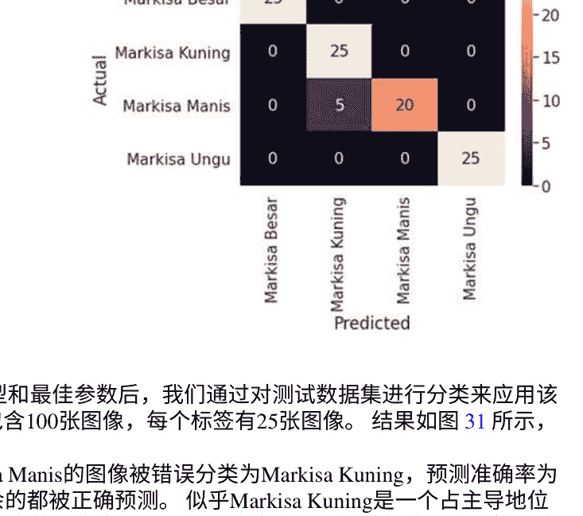

在获得最佳模型和最佳参数后，我们通过对测试数据集进行分类来应用该模型，该数据集包含100张图像，每个标签有25张图像。结果如图31所示，非常好。
只有5张Markisa Manis的图像被错误分类为Markisa Kuning，预测准确率为95%。然而，其余的都被正确预测。似乎Markisa Kuning是一个占主导地位的标签。也许在未来的研究中，我们可以确定为什么其他标签在这个模型中总是被错误分类为Markisa Kuning，尽管被错误分类的图像是少数。

#### 4.3.2 InceptionV3

在这个实验中，我们导入了InceptionV3的基础模型，并省略了它的顶层，该顶层由Dense层和dropout层组成。然后，基础模型的权重和偏置被冻结，以保留来自先前训练的可学习参数。
接下来，使用一个密集层和一个配置了Relu激活函数的dropout层的全连接层。最后，使用Sigmoid激活函数作为输出层，表示四个Markisa的品种。图33展示了模型的架构。必须提到，实验部分使用了Dense层和两个dropout层。
图32展示了通过Inception-V3模型进行的迁移学习。

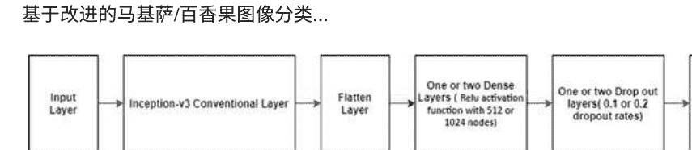

图32 通过Inception-V3模型进行的迁移学习

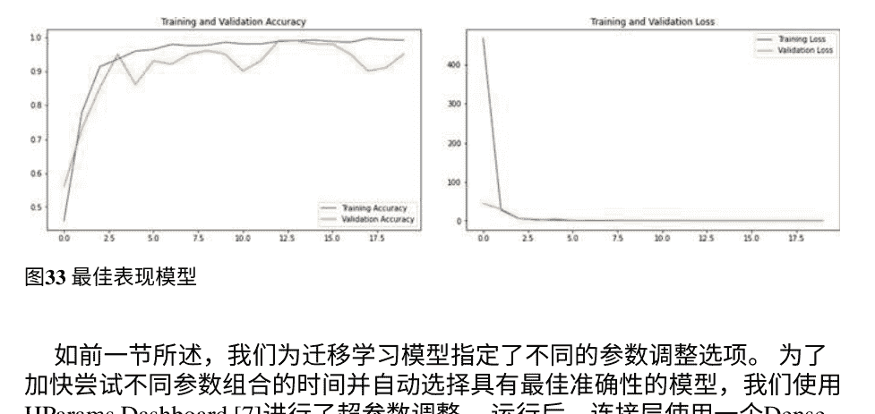

图33 最佳表现模型

如前一节所述，我们为迁移学习模型指定了不同的参数调整选项。为了加快尝试不同参数组合的时间并自动选择具有最佳准确性的模型，我们使用HParams Dashboard [7]进行了超参数调整。运行后，连接层使用一个Dense层产生了64个模型或试验，并使用两个Dense层产生了额外的64个模型或试验。

通过比较所有128个模型的准确性结果，我们可以得出结论，最好的模型准确率为93%（参见附录）。

## (一) 优化器的影响

对于优化器，我们在Adam和SGD之间进行了选择，如图34所示。

从图34可以得出结论，在一层全连接层实验中，Adam优化器的准确率整体上高于SGD优化器；在准确性方面，它也对表现最好的模型做出了贡献。

从图35可以得出结论，在两层全连接层实验中，Adam优化器的准确率整体上也高于SGD优化器；结果不如一层全连接层实验好，但在准确性方面，它对表现最好的模型做出了贡献。

##### (II) 全连接层神经元数量的影响

对于全连接层的神经元数量，我们尝试了两个不同的值，512和1024。

从图36可以得出结论，神经元的数量对模型的准确性没有影响，无论是512个还是1024个神经元的配置都导致了更低和更高的准确性；可能是其他参数起到了更大的作用。

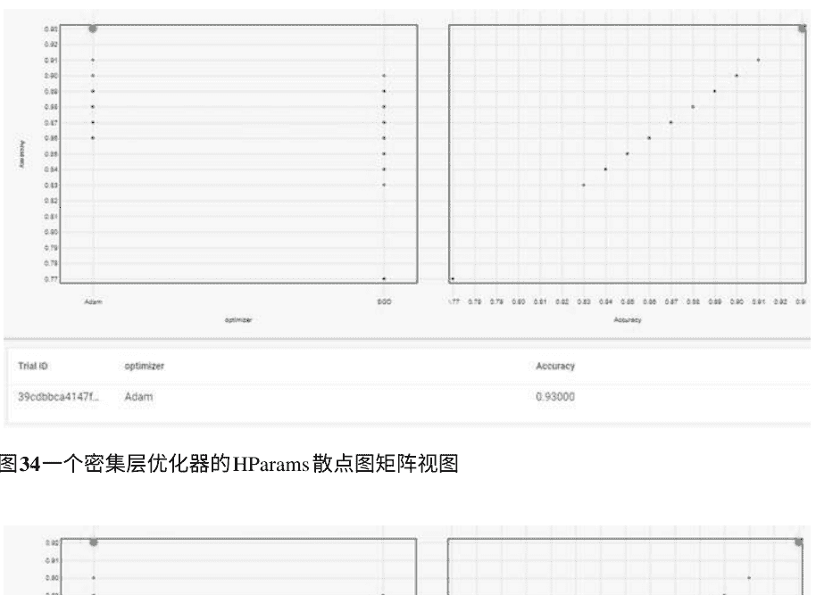

图34一个密集层优化器的HParams散点图矩阵视图

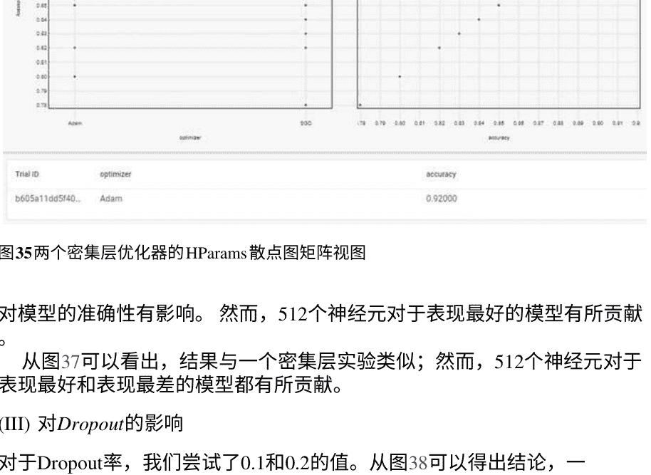

图35两个密集层优化器的HParams散点图矩阵视图

对模型的准确性有影响。 然而，512个神经元对于表现最好的模型有所贡献。
从图37可以看出，结果与一个密集层实验类似；然而，512个神经元对于表现最好和表现最差的模型都有所贡献。

## (III) 对Dropout的影响

对于Dropout率，我们尝试了0.1和0.2的值。从图38可以得出结论，一个密集层的Dropout值为0.2的结果整体上更好；然而，它未能产生表现最好的模型，而是产生了表现最差的模型。

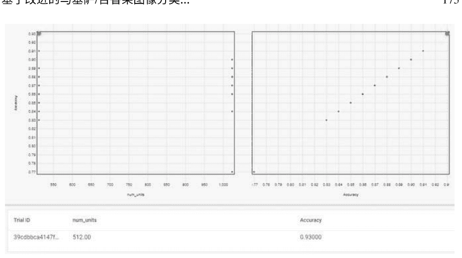

图36 一个密集层神经元的HParams散点图矩阵视图

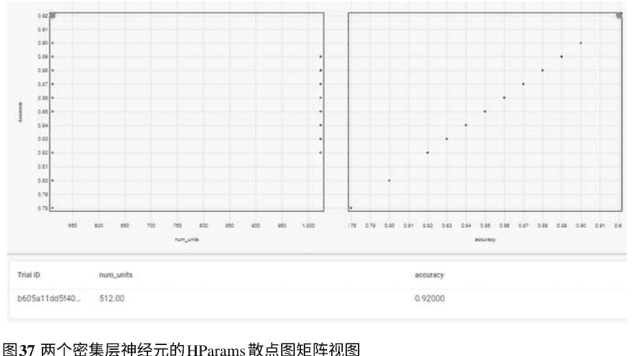

图37 两个密集层神经元的HParams散点图矩阵视图

从图39可以得出结论，对于两个密集层，丢弃率为0.2的模型表现更好；可能较高的丢弃率与密集多层的准确性更高相关。

##### (IV) 学习率的影响

除了丢弃率，我们还测试了不同的学习率，0.01或0.001。从图40可以得出结论，在一个密集层实验中，学习率为0.01的模型整体准确性更高；它也对准确性最高的模型做出了贡献（图41）。

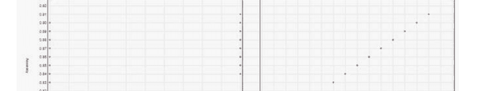

| Trial ID | dropout | Accuracy |
|----------|---------|----------|
| 39cdbbca4147f... | 0.10000 | 0.93000 |

图38 一个密集层丢弃率的HParams散点图矩阵视图


| Trial ID | dropout | accuracy |
|----------|---------|----------|
| b605a11dd5f40... | 0.20000 | 0.92000 |

图39 两个密集层丢弃率的HParams散点图矩阵视图

与一个稠密层实验相反，0.001的较低值在两个稠密层实验中表现更好；可能较低的学习率值与稠密多层的更高准确性相关。

##### (V) 批量大小的影响

我们还测试了模型训练过程中不同批次大小的影响。

我们可以得出结论，批次大小对于具有一个稠密层的模型准确性没有影响，参见图42。50和100批次大小的两种配置都导致较低和较高的准确性；可能其他参数影响了模型的准确性。然而，批次大小为50对于表现最佳的模型有所贡献。

## 基于改进的马基萨/百香果图像分类...

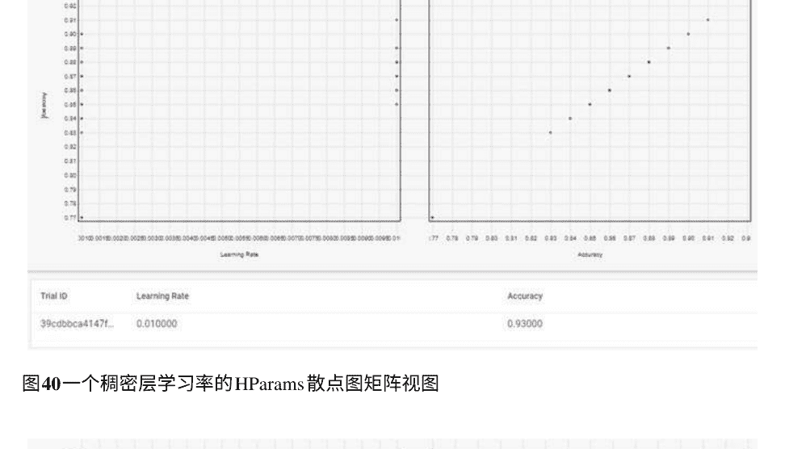

| Trial ID | Learning Rate | Accuracy |
| :--- | :--- | :--- |
| 39cdbbca4147f... | 0.010000 | 0.930000 |

图40一个稠密层学习率的HParams散点图矩阵视图

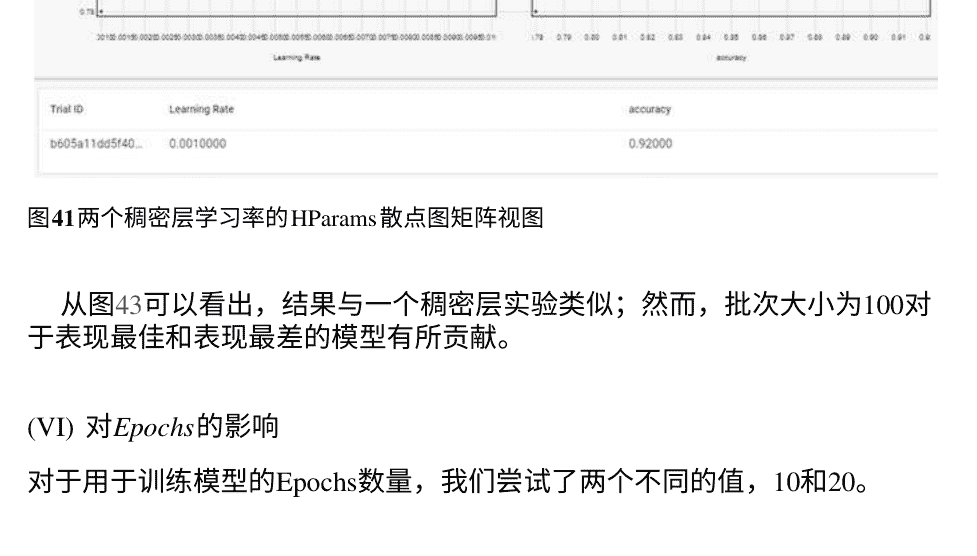

| Trial ID | Learning Rate | accuracy |
| :--- | :--- | :--- |
| b605a11dd5f40... | 0.0010000 | 0.920000 |

图41两个稠密层学习率的HParams散点图矩阵视图

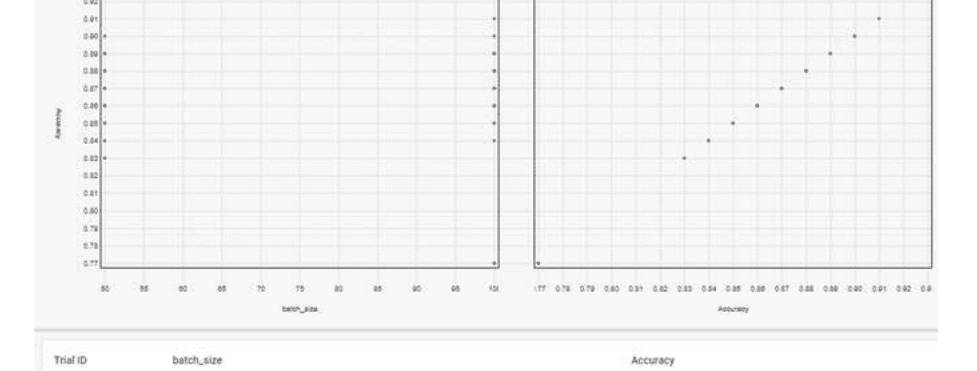

| Trial ID | batch_size | Accuracy |
|----------|------------|----------|
| 39cdbbca4147f... | 50.000 | 0.93000 |

### 图42 一个密集层批量大小的HParams散点图矩阵视图

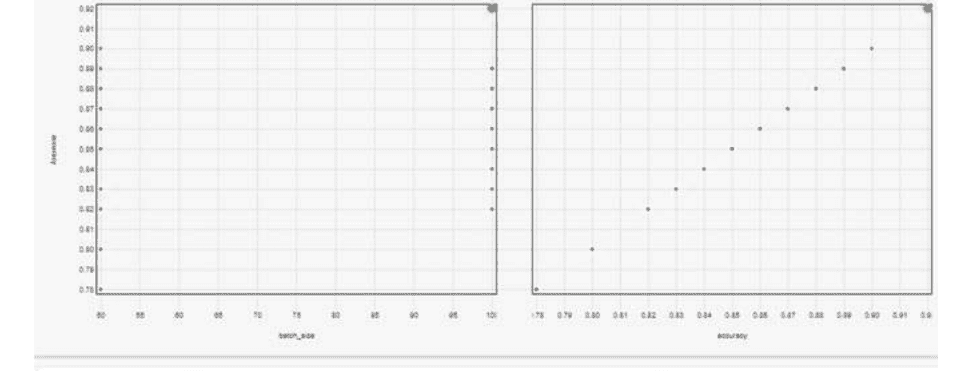

| Trial ID | batch_size | accuracy |
|----------|------------|----------|
| b605a11dd5f40... | 100.00 | 0.92000 |

### 图43 两个密集层批量大小的HParams散点图矩阵视图

从图44可以得出结论，在一个密集层实验中，更高的Epochs导致整体上更高的准确性；在准确性方面，它也对表现最好的模型做出了贡献。

从图45可以得出结论，在两个密集层实验中，更高的Epochs值也导致更高的准确性。然而，已经证明更高的Epochs会导致非常高的训练准确性；然而，非常高的Epochs会导致过拟合，验证准确性会降低，因为模型无法很好地泛化。

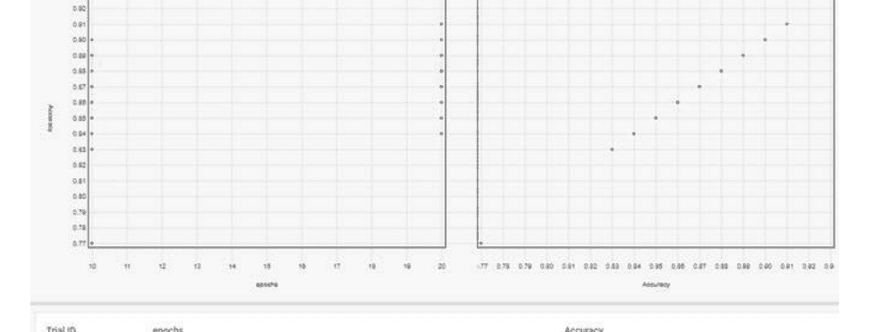

| Trial ID | epochs | Accuracy |
|----------|--------|----------|
| 39cdbbca4147f... | 20.000 | 0.93000 |

### 图44 一个密集层Epochs的HParams散点图矩阵视图

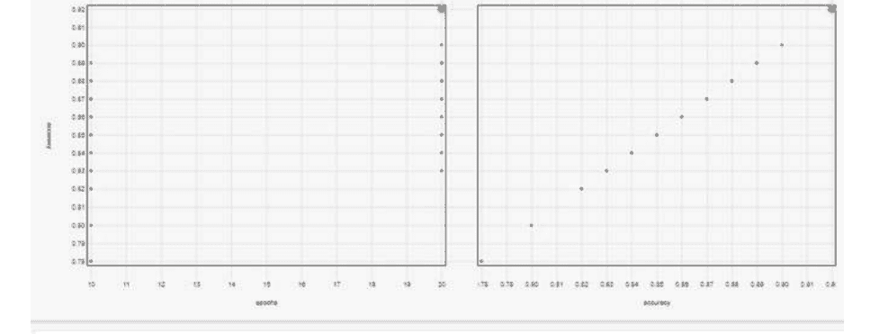

| Trial ID | epochs | accuracy |
|----------|--------|----------|
| b605a11dd5f40... | 20.000 | 0.92000 |

### 图45 两个密集层时期的HParams散点图矩阵视图

##### (VII) 密集层的影响

图46显示，只有一个密集层的模型比两个密集层的模型具有更一致的性能。然而，当配置特定属性时，后者的性能会出现突增。因此，通过对Inception-V3迁移学习的实验总结，我们可以得出结论，表现最佳的模型是具有以下参数的模型（图47）。

最后，在找到具有最佳参数的表现最佳模型后，我们使用包含每个标签25张图像的数据集对模型进行测试。结果如图48所示。

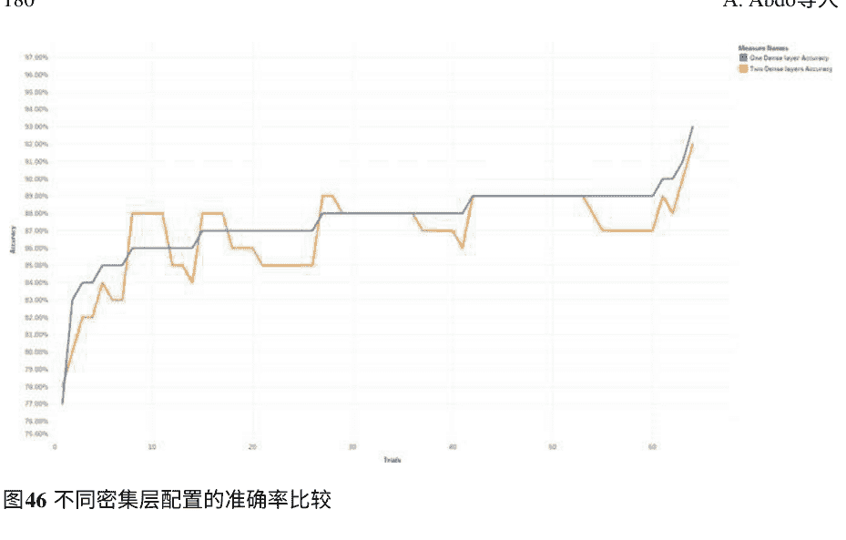

图47 顶级模型参数

从图48可以得出结论，表现最佳的Inception-V3迁移学习具有较低的测试性能和平均准确率为65.3%。该模型无法对Markisa Manis进行分类。

### 4.4 准确率比较

为了比较，完全相同的测试集被应用于其他流行的深度学习架构，结果如表10所示。

## 基于改进的马基萨/百香果图像分类...

### 图48 Inception-V3的混淆矩阵

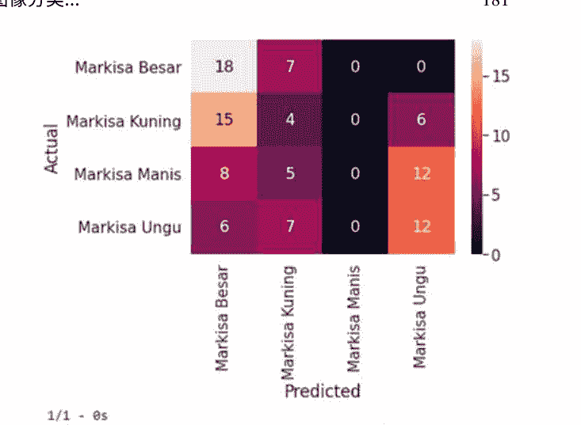

### 表10 所有模型的测试准确率

| 模型 | 准确率 (%) |
| :--- | :--- |
| 自定义CNN1 | 97 |
| 自定义CNN2 | 65 |
| VGG16 | 95 |
| Inceptionv3 | 65 |

## 5 结论

在这项研究中，为Markisa水果分类创建了4种不同的CNN模型，用于4种不同类型的Markisa。创建了两个自定义CNN模型，并使用了基于VGG16和Inceptionv3的两个迁移学习模型。两个迁移学习模型的分类器使用不同的分类器进行自定义，并用于进行预测。结果显示，第一个自定义CNN模型的准确率最高，为97%，其次是VGG16的迁移学习模型，准确率为95%。第二个自定义CNN模型和Inceptionv3的测试准确率都为65%。因此，自定义CNN在测试准确率上的表现与VGG16等迁移学习模型相当。架构设计对于确定模型能够多好地捕捉输入数据集中的特征至关重要。

## 附录

### 表10 VGG16参数调整结果

| 单元数 | 丢弃 | 优化器 | 运行周期 | 学习率 | 批量大小 | 准确性 |
| :--- | :--- | :--- | :--- | :--- | :--- | :--- |
| 512 | 0.2 | Adam | 20 | 0.01 | 100 | 0.97 |
| 512 | 0.2 | Adam | 20 | 0.001 | 100 | 0.97 |
| 512 | 0.1 | Adam | 20 | 0.001 | 50 | 0.96 |
| 512 | 0.2 | Adam | 20 | 0.001 | 50 | 0.96 |
| 1024 | 0.2 | Adam | 10 | 0.001 | 50 | 0.96 |
| 512 | 0.1 | SGD | 20 | 0.001 | 100 | 0.95 |
| 1024 | 0.1 | Adam | 10 | 0.001 | 100 | 0.95 |
| 512 | 0.1 | Adam | 10 | 0.001 | 50 | 0.94 |
| 512 | 0.2 | Adam | 20 | 0.01 | 50 | 0.94 |
| 512 | 0.1 | SGD | 10 | 0.001 | 50 | 0.94 |
| 512 | 0.2 | Adam | 10 | 0.01 | 50 | 0.94 |
| 512 | 0.1 | Adam | 20 | 0.001 | 100 | 0.94 |
| 512 | 0.2 | Adam | 10 | 0.001 | 100 | 0.94 |
| 1024 | 0.2 | Adam | 10 | 0.01 | 100 | 0.94 |
| 1024 | 0.1 | SGD | 10 | 0.001 | 100 | 0.94 |
| 1024 | 0.1 | SGD | 20 | 0.001 | 100 | 0.94 |
| 1024 | 0.2 | Adam | 10 | 0.001 | 100 | 0.94 |
| 512 | 0.1 | Adam | 10 | 0.01 | 100 | 0.93 |
| 1024 | 0.2 | Adam | 20 | 0.01 | 50 | 0.93 |
| 512 | 0.2 | SGD | 20 | 0.001 | 50 | 0.92 |
| 1024 | 0.1 | Adam | 10 | 0.01 | 50 | 0.92 |
| 1024 | 0.1 | Adam | 20 | 0.001 | 50 | 0.92 |
| 512 | 0.2 | Adam | 10 | 0.01 | 100 | 0.91 |
| 1024 | 0.2 | SGD | 10 | 0.01 | 50 | 0.91 |
| 1024 | 0.2 | Adam | 20 | 0.001 | 100 | 0.9 |
| 1024 | 0.2 | SGD | 10 | 0.001 | 50 | 0.89 |
| 512 | 0.1 | SGD | 20 | 0.01 | 100 | 0.87 |
| 512 | 0.1 | Adam | 10 | 0.001 | 100 | 0.87 |
| 1024 | 0.1 | Adam | 20 | 0.01 | 50 | 0.87 |
| 1024 | 0.2 | Adam | 20 | 0.01 | 100 | 0.87 |
| 1024 | 0.1 | Adam | 10 | 0.01 | 100 | 0.87 |
| 1024 | 0.2 | SGD | 20 | 0.001 | 100 | 0.87 |
| 512 | 0.2 | SGD | 20 | 0.001 | 100 | 0.86 |
| 1024 | 0.1 | Adam | 20 | 0.01 | 100 | 0.86 |

(继续)# 基于改进的马铃薯/百香果图像分类...

| 单元数 | 丢弃 | 优化器 | 运行周期 | 学习率 | 批量大小 | 准确性 |
| :--- | :--- | :--- | :--- | :--- | :--- | :--- |
| 512 | 0.1 | SGD | 10 | 0.001 | 100 | 0.85 |
| 1024 | 0.2 | SGD | 20 | 0.001 | 50 | 0.85 |
| 1024 | 0.2 | SGD | 20 | 0.01 | 50 | 0.85 |
| 512 | 0.1 | SGD | 10 | 0.01 | 100 | 0.84 |
| 1024 | 0.2 | SGD | 10 | 0.01 | 100 | 0.84 |
| 512 | 0.1 | Adam | 20 | 0.01 | 50 | 0.83 |
| 1024 | 0.2 | SGD | 20 | 0.01 | 100 | 0.83 |
| 1024 | 0.2 | Adam | 20 | 0.001 | 50 | 0.83 |
| 512 | 0.2 | SGD | 10 | 0.01 | 50 | 0.82 |
| 1024 | 0.1 | SGD | 20 | 0.01 | 50 | 0.82 |
| 1024 | 0.1 | SGD | 20 | 0.001 | 50 | 0.82 |
| 512 | 0.1 | SGD | 20 | 0.001 | 50 | 0.81 |
| 512 | 0.1 | Adam | 20 | 0.01 | 100 | 0.81 |
| 512 | 0.1 | Adam | 10 | 0.01 | 50 | 0.81 |
| 1024 | 0.2 | SGD | 10 | 0.001 | 100 | 0.81 |
| 1024 | 0.1 | Adam | 20 | 0.001 | 100 | 0.81 |
| 512 | 0.2 | SGD | 20 | 0.01 | 50 | 0.8 |
| 1024 | 0.1 | SGD | 10 | 0.001 | 50 | 0.8 |
| 1024 | 0.1 | Adam | 10 | 0.001 | 50 | 0.8 |
| 512 | 0.2 | SGD | 10 | 0.001 | 100 | 0.79 |
| 512 | 0.2 | SGD | 10 | 0.001 | 50 | 0.78 |
| 512 | 0.1 | SGD | 10 | 0.01 | 50 | 0.78 |
| 512 | 0.1 | SGD | 20 | 0.01 | 50 | 0.77 |
| 512 | 0.2 | Adam | 10 | 0.001 | 50 | 0.75 |
| 512 | 0.2 | SGD | 20 | 0.01 | 100 | 0.75 |
| 512 | 0.2 | SGD | 10 | 0.01 | 100 | 0.75 |
| 1024 | 0.1 | SGD | 10 | 0.01 | 50 | 0.75 |
| 1024 | 0.1 | SGD | 20 | 0.01 | 100 | 0.73 |
| 1024 | 0.2 | Adam | 10 | 0.01 | 50 | 0.73 |
| 1024 | 0.1 | SGD | 10 | 0.01 | 100 | 0.72 |

# 表10 Inception-V3参数调整结果（一个密集层）

| 神经元数量 | 丢失率 | 优化器 | 运行周期 | 学习率 | 批量大小 | 准确率(%) |
| :--- | :--- | :--- | :--- | :--- | :--- | :--- |
| 512 | 0.1 | Adam | 20 | 0.01 | 50 | 93 |
| 512 | 0.2 | Adam | 20 | 0.01 | 100 | 91 |
| 1024 | 0.1 | Adam | 10 | 0.001 | 50 | 90 |
| 1024 | 0.1 | Adam | 10 | 0.001 | 100 | 89 |
| 1024 | 0.1 | Adam | 20 | 0.01 | 50 | 89 |
| 512 | 0.1 | Adam | 20 | 0.001 | 50 | 89 |
| 512 | 0.2 | Adam | 10 | 0.001 | 50 | 89 |
| 512 | 0.1 | Adam | 10 | 0.001 | 50 | 89 |
| 1024 | 0.2 | Adam | 20 | 0.001 | 100 | 89 |
| 1024 | 0.2 | Adam | 20 | 0.01 | 50 | 89 |
| 1024 | 0.2 | Adam | 20 | 0.01 | 100 | 89 |
| 1024 | 0.1 | Adam | 20 | 0.001 | 100 | 89 |
| 512 | 0.2 | Adam | 20 | 0.001 | 100 | 89 |
| 1024 | 0.2 | Adam | 20 | 0.001 | 50 | 89 |
| 512 | 0.2 | Adam | 20 | 0.001 | 50 | 89 |
| 512 | 0.1 | Adam | 10 | 0.01 | 100 | 88 |
| 1024 | 0.2 | Adam | 10 | 0.001 | 50 | 88 |
| 1024 | 0.1 | Adam | 20 | 0.01 | 100 | 88 |
| 512 | 0.2 | Adam | 10 | 0.01 | 50 | 88 |
| 1024 | 0.1 | Adam | 10 | 0.01 | 100 | 88 |
| 512 | 0.1 | Adam | 20 | 0.01 | 100 | 88 |
| 512 | 0.1 | Adam | 10 | 0.01 | 50 | 88 |
| 1024 | 0.1 | Adam | 20 | 0.001 | 50 | 88 |
| 512 | 0.1 | Adam | 10 | 0.001 | 100 | 88 |
| 512 | 0.1 | Adam | 20 | 0.001 | 100 | 88 |
| 1024 | 0.1 | Adam | 10 | 0.01 | 50 | 87 |
| 1024 | 0.2 | Adam | 10 | 0.01 | 50 | 87 |
| 1024 | 0.2 | Adam | 10 | 0.001 | 100 | 87 |
| 512 | 0.2 | Adam | 10 | 0.01 | 100 | 86 |
| 1024 | 0.2 | Adam | 10 | 0.01 | 100 | 86 |
| 512 | 0.2 | Adam | 20 | 0.01 | 50 | 86 |
| 512 | 0.2 | Adam | 10 | 0.001 | 100 | 86 |
| 1024 | 0.2 | SGD | 20 | 0.001 | 100 | 90 |
| 1024 | 0.2 | SGD | 20 | 0.01 | 100 | 89 |
| 512 | 0.1 | SGD | 20 | 0.001 | 100 | 89 |
| 1024 | 0.1 | SGD | 20 | 0.01 | 50 | 89 |
| 1024 | 0.1 | SGD | 20 | 0.01 | 100 | 89 |
| 512 | 0.2 | SGD | 20 | 0.01 | 100 | 89 |
| 512 | 0.1 | SGD | 20 | 0.01 | 100 | 89 |
| 1024 | 0.2 | SGD | 10 | 0.01 | 50 | 89 |
| 1024 | 0.1 | SGD | 10 | 0.01 | 100 | 88 |
| 1024 | 0.2 | SGD | 10 | 0.01 | 100 | 88 |
| 1024 | 0.1 | SGD | 20 | 0.001 | 50 | 88 |
| 512 | 0.1 | SGD | 10 | 0.01 | 50 | 88 |
| 1024 | 0.2 | SGD | 20 | 0.01 | 50 | 88 |
| 512 | 0.2 | SGD | 20 | 0.001 | 100 | 87 |
| 512 | 0.2 | SGD | 10 | 0.01 | 50 | 87 |
| 1024 | 0.2 | SGD | 20 | 0.001 | 50 | 87 |
| 1024 | 0.1 | SGD | 10 | 0.01 | 50 | 87 |
| 512 | 0.1 | SGD | 20 | 0.01 | 50 | 87 |
| 512 | 0.1 | SGD | 10 | 0.01 | 100 | 87 |
| 512 | 0.1 | SGD | 20 | 0.001 | 50 | 87 |
| 512 | 0.2 | SGD | 10 | 0.001 | 100 | 87 |
| 1024 | 0.1 | SGD | 20 | 0.001 | 100 | 87 |
| 1024 | 0.1 | SGD | 10 | 0.001 | 50 | 86 |
| 1024 | 0.2 | SGD | 10 | 0.001 | 50 | 86 |
| 512 | 0.2 | SGD | 10 | 0.01 | 100 | 86 |
| 512 | 0.2 | SGD | 10 | 0.001 | 50 | 85 |
| 512 | 0.1 | SGD | 10 | 0.001 | 100 | 85 |
| 512 | 0.2 | SGD | 20 | 0.01 | 50 | 85 |
| 1024 | 0.1 | SGD | 10 | 0.001 | 100 | 84 |
| 512 | 0.2 | SGD | 20 | 0.001 | 50 | 84 |
| 512 | 0.1 | SGD | 10 | 0.001 | 50 | 83 |
| 1024 | 0.2 | SGD | 10 | 0.001 | 100 | 77 |

# 表10 Inception-V3参数调整结果（两个密集层）

| 优化器 | 学习率 | 批量大小 | 丢失率 | 运行周期 | 神经元数量 | 准确率(%) |
| --- | --- | --- | --- | --- | --- | --- |
| Adam | 0.001 | 100 | 0.2 | 20 | 512 | 92 |
| Adam | 0.001 | 50 | 0.1 | 20 | 512 | 90 |
| Adam | 0.001 | 100 | 0.1 | 20 | 512 | 89 |
| Adam | 0.001 | 100 | 0.1 | 10 | 512 | 89 |
| Adam | 0.001 | 50 | 0.1 | 20 | 1024 | 89 |
| Adam | 0.001 | 50 | 0.2 | 20 | 1024 | 89 |
| Adam | 0.01 | 100 | 0.2 | 20 | 512 | 89 |
| Adam | 0.01 | 50 | 0.1 | 20 | 512 | 89 |
| Adam | 0.001 | 100 | 0.1 | 10 | 1024 | 89 |
| SGD | 0.001 | 50 | 0.1 | 20 | 1024 | 89 |
| SGD | 0.001 | 50 | 0.2 | 20 | 512 | 89 |
| SGD | 0.01 | 100 | 0.1 | 20 | 512 | 89 |
| SGD | 0.01 | 100 | 0.2 | 20 | 512 | 89 |
| SGD | 0.01 | 50 | 0.1 | 20 | 512 | 89 |
| SGD | 0.01 | 50 | 0.1 | 20 | 1024 | 89 |
| SGD | 0.01 | 50 | 0.1 | 10 | 1024 | 89 |
| SGD | 0.01 | 100 | 0.2 | 20 | 1024 | 89 |
| Adam | 0.001 | 100 | 0.2 | 10 | 1024 | 88 |
| Adam | 0.001 | 100 | 0.2 | 10 | 512 | 88 |
| Adam | 0.001 | 50 | 0.2 | 20 | 512 | 88 |
| Adam | 0.001 | 50 | 0.1 | 10 | 1024 | 88 |
| Adam | 0.001 | 100 | 0.1 | 20 | 1024 | 88 |
| Adam | 0.01 | 100 | 0.2 | 20 | 1024 | 88 |
| Adam | 0.001 | 100 | 0.2 | 20 | 1024 | 88 |
| Adam | 0.01 | 50 | 0.2 | 20 | 512 | 88 |
| Adam | 0.001 | 50 | 0.2 | 10 | 512 | 88 |
| Adam | 0.001 | 50 | 0.2 | 10 | 1024 | 88 |
| Adam | 0.01 | 100 | 0.1 | 10 | 512 | 88 |
| SGD | 0.01 | 50 | 0.2 | 20 | 1024 | 88 |
| SGD | 0.01 | 50 | 0.1 | 10 | 512 | 88 |
| SGD | 0.01 | 50 | 0.2 | 10 | 1024 | 88 |
| SGD | 0.01 | 50 | 0.2 | 20 | 512 | 88 |
| SGD | 0.01 | 100 | 0.1 | 20 | 1024 | 88 |
| SGD | 0.01 | 50 | 0.2 | 10 | 512 | 88 |
| Adam | 0.01 | 100 | 0.1 | 20 | 512 | 87 |
| Adam | 0.01 | 100 | 0.1 | 10 | 1024 | 87 |
| Adam | 0.01 | 50 | 0.2 | 20 | 1024 | 87 |
| Adam | 0.001 | 50 | 0.1 | 10 | 512 | 87 |
| Adam | 0.01 | 100 | 0.2 | 10 | 1024 | 87 |
| SGD | 0.01 | 100 | 0.2 | 10 | 512 | 87 |
| SGD | 0.001 | 50 | 0.1 | 20 | 512 | 87 |
| SGD | 0.01 | 100 | 0.2 | 10 | 1024 | 87 |
| SGD | 0.01 | 100 | 0.1 | 10 | 512 | 87 |
| SGD | 0.01 | 100 | 0.1 | 10 | 1024 | 87 |
| Adam | 0.01 | 100 | 0.2 | 10 | 512 | 86 |
| SGD | 0.001 | 50 | 0.1 | 10 | 1024 | 86 |
| SGD | 0.001 | 100 | 0.1 | 20 | 512 | 86 |
| SGD | 0.001 | 50 | 0.2 | 10 | 512 | 86 |
| Adam | 0.01 | 50 | 0.1 | 10 | 512 | 85 |
| Adam | 0.01 | 50 | 0.2 | 10 | 1024 | 85 |
| Adam | 0.01 | 100 | 0.1 | 20 | 1024 | 85 |
| Adam | 0.01 | 50 | 0.1 | 20 | 1024 | 85 |
| SGD | 0.001 | 100 | 0.1 | 20 | 1024 | 85 |
| SGD | 0.001 | 100 | 0.2 | 10 | 512 | 85 |
| SGD | 0.001 | 50 | 0.2 | 10 | 1024 | 85 |
| SGD | 0.001 | 100 | 0.2 | 20 | 512 | 85 |
| SGD | 0.001 | 100 | 0.2 | 20 | 1024 | 84 |
| SGD | 0.001 | 100 | 0.2 | 10 | 1024 | 84 |
| SGD | 0.001 | 100 | 0.1 | 10 | 1024 | 83 |
| SGD | 0.001 | 50 | 0.2 | 20 | 1024 | 83 |
| Adam | 0.01 | 50 | 0.1 | 10 | 1024 | 82 |
| SGD | 0.001 | 100 | 0.1 | 10 | 512 | 82 |
| Adam | 0.01 | 50 | 0.2 | 10 | 512 | 80 |
| SGD | 0.001 | 50 | 0.1 | 10 | 512 | 78 |

## 参考文献

- 1. 西番莲。2021年7月1日。[在线]。https://zh.wikipedia.org/wiki/西番莲
- 2. Abualigah, L. M. Q. (2019).特征选择和增强的鲸群算法用于文本文档聚类 (第1-165页)。Springer。
- 3. Dwivedi, R. (2020年12月4日)。关于CNN中的丢失和批量归一化，你应该知道的一切。*Analytics India Magazine*。https://analyticsindiamag.com/everything-you-should-know-about-dropouts-and-batchnormalization-in-cnn/
- 4. Khandelwal, R. (2019年1月10日)。L1和L2正则化—DataDrivenInvestor。*Medium*。https://medium.datadriveninvestor.com/l1-l2-regularization-7f1b4fe948f2?gi=bccf46d4504a5。
- 5. Kumari, N., Bhatt, A. K., Dwivedi, R. K., & Belwal, R. (2019年)。支持向量机在有缺陷和无缺陷芒果分类中的性能分析。
- 6. Alhaj, Y. A., Dahou, A., Al-qaness, M. A., Abualigah, L., Abbasi, A. A., Almaweri, N. A. O., Elaziz, M. A., & Damaševičius, R. (2022)。一种使用改进的粒子群优化的新型文本分类技术：阿拉伯语案例研究。未来互联网，*14(7)*，194。

# 增强的MapReduce性能
用于分布式并行计算：
大数据应用

Nathier Milhem, Laith Abualigah, Mohammad H. Nadimi-Shahraki,
Heming Jia, Absalom E. Ezugwu, 和 Abdelazim G. Hussien

摘要 现在和以前的几年里，数据量的增加加快了，这需要更多的存储空间来存储数据，因为大数据具有大量的用户和云计算，这些用户需要随时随地安全、私密地访问数据。 因此，在物联网（IOT记录文件）中提供安全的数据流并减小其大小而不影响其目的或用途非常重要。 数据挖掘的最重要领域是在存储位置内搜索项目和重复数据。

Apriori算法是最常用的算法，用于从数据中找到一组重复的元素。 这需要删除一组重复次数超过的数据

N. Milhem · L. Abualigah (✉)
马来西亚槟城11800乔治市计算机科学学院

电子邮件: Aligah.2020@gmail.com

L. Abualigah
Hourani应用科学研究中心，Al-Ahliyya Amman大学，约旦安曼
中东大学信息技术学院，阿曼安曼11831

M. H. Nadimi-Shahraki
伊斯兰阿扎德大学纳贾法巴德分校计算机工程学院8514143131纳贾法巴德，伊朗

伊斯兰阿扎德大学纳贾法巴德分校大数据研究中心8514143131纳贾法巴德，伊朗

澳大利亚托伦斯大学人工智能研究与优化中心布里斯班4006，澳大利亚

H. Jia
中国福建省三明大学信息工程系365004

A. E. Ezugwu
南非夸祖鲁-纳塔尔大学数学、统计和计算机科学学院皮特马里茨堡3201，南非

A. G. Hussien
瑞典林雪平大学计算机与信息科学系，林雪平，瑞典
埃及法尤姆大学科学学院，法尤姆，埃及

© 作者，独家许可给 Springer Nature Switzerland AG 2023L. Abualigah (编),
深度学习和机器学习的分类应用，计算智能研究 1071, https://doi.org/10.1007/978-3-031-17576-3_8

删除重复项后，一次性创建多个新组，从而增加存储空间并提高性能速度。在本文中，我们在 ApacheHadoop 集群上实现了 MapReduce Apriori (MRA) 算法，该算法包括两个函数 (Map 和 Reduce) 来查找重复的 k 元素集。

关键词物联网 (IoT) ·大数据 ·Hadoop ·Map Reduce ·Apriori算法 ·数据挖掘

## 1 引言

现代技术变得更加复杂，特别是随着物联网设备的发展，导致了巨大数据的增加，使其在大小和复杂性上呈指数级增长，以至于难以存储和缺乏高效处理的工具[1]。连接到分布式和云基础设施的物联网设备提供和传输数据和其他资源以上传到云端。因此，确保数据和资源准备就绪，并且用户能够在任何物联网环境中安全访问它们，并以有序的方式分布并减少其体积是非常重要的[2]。

分布式和并行计算系统是大规模处理数据的最佳方式，这些算法已被用于处理大数据的‘大算法’。MapReduce对数据分析做出了贡献，是这个领域中最好的算法之一，它是用于并行和分布式执行大数据的编程模型[3]。Apriori算法是数据挖掘中最流行和广泛使用的算法，它使用过滤器生成挖掘重复元素的集合。

Apriori是关联规则挖掘（ARM）的核心算法，它的起源推动了数据挖掘的研究。Apriori是IEEE国际数据挖掘会议（ICDM）在2006年确定的前10个数据挖掘算法之一基于最有影响力的数据挖掘[4]。它不仅可以用于缩小大数据，还关注一系列特征，如速度和各种形式的数据移动。这主要取决于大尺寸和高速度。多样性很高。传统的数据挖掘技术和工具在分析/提取数据方面是有效的，但在管理大数据方面不具有可扩展性和高效性。已经采用了大数据架构和技术来分析这些数据。

本研究旨在实现在大数据上添加分布式并行计算性能的提出应用，并考虑如何将从物联网收集到的大数据作为输入数据，并在处理后进行简化使用Hadoop。在分析数据和数据结果的算法中，减少大数据的重复性和确保其质量的有效性如何包括（数据收集和处理）的操作。

## 2 背景

## 2.1 大数据（BD）

“大数据”一词包括来自公司和个人的数字数据的（大量、不同形式、处理速度、技术、方法和影响）[5-12]。大数据是一种信息资产，其特点是需要特定的技术和分析方法将其转化为价值的高容量、速度和多样性[13, 14]。

容量：这个特性代表了从各种来源（如社交媒体、银行、政府和私营部门）生成或获取的大量数据，并且到2021年，这些数据量将超过44万亿GB。

价值：它显示通过从不同来源收集数据、对其进行分析并确保其价值，分析告诉我们为公司和企业的增长和进步提供感兴趣的价值，因此可以在未来做出一些决策和想法。

真实性：这部分澄清了在过程中存在的数据矛盾和疑虑。必须删除一些数据包。

速度：累积所有数据的速率，该属性通过物联网访问，测量随着用户数量的增加而产生的数据生成速率。

多样性：这个特性涉及不同格式的数据，包括来自物联网的数据（图像、视频、JSON文件和社交媒体）。包括三种数据格式，即结构化数据、非结构化数据和半结构化数据，图1解释了数据格式。

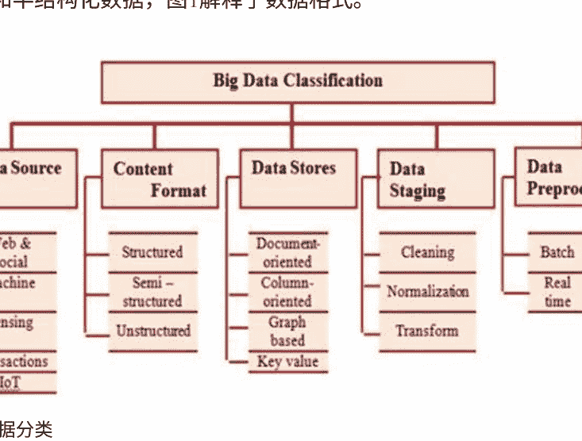

### 2.2 Hadoop

它是一个基于Java的开源编程系统，用于处理分布式计算环境中存在的一组大数据。Hadoop生态系统是一个为解决大数据问题提供各种服务的程序。它包含Apache项目和一套工具和特殊解决方案。 它包括Hadoop的四个主要组件，即HDFS、Map Reduce、YARN和Hadoop Common。这些工具用于找到解决方案并支持这些关键组件。这些工具相互连接，提供数据摄取、分析、存储、维护等服务。

#### 2.2.1 HDFS

分布式文件系统的设计目的是为了容纳从物联网获取的大量数据，并且其大小（以太字节甚至拍字节）和连接到信息。 它在存储设备之间存储冗余文件，以防发生故障并提供高可用性。

### 2.2.2 Map Reduce

它是一种编程模型，通过将大数据分成一组独立任务并进行并行划分，来处理大数据的模型之一。[1]。第一个模型是**Map**。第二个模型是**Reduce**。每个模型都完成自己的工作，**Map**的功能是提取结果作为值对的形式，**Reduce**模型接收**Map**的输出并进行处理，生成一组值（图2）。

### 2.3 Apriori算法

Apriori算法针对重复元素集合进行工作，以建立它们之间的相关性因子K，并且它设计用于具有相关参数的大数据。 借助相关性因子K +1，以确定两个对象之间的联系的强度或弱度。 这个算法被广泛用于高效计算元素的函数集合。

这个迭代过程的目标是从庞大的数据集中找到重复的数据集。可以使用其他优化方法来优化问题，如[15-20]所示（图3）。

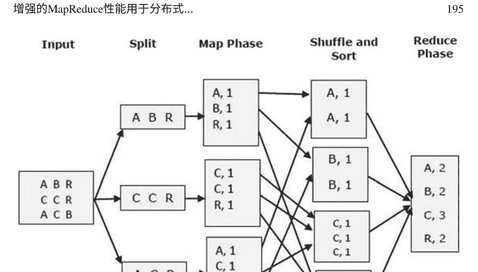

## 图2 MapReduce编程模型

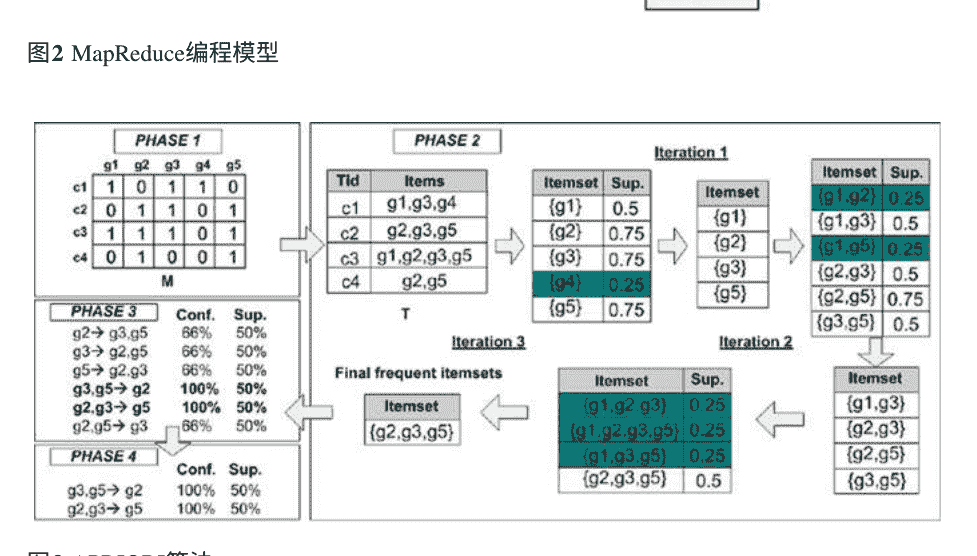

## 图3 APRIORI算法

## 3 相关工作

研究人员和研究社区在大数据分析方面提供了太多的实验方法。这部分研究提供了每个方法的实施工作和结果。

MapReduce用于扩展大数据分析算法。它研究了在这种情况下，通过开发MapReduce及其与Apriori [3]的集成来减少数据量的重点。这些算法正在处理分析大数据。 在他的研究中，他专注于解决常见相关挖掘算法的“大算法”扩展问题。 本研究的结果证实，有效的MapReduce实现应避免依赖迭代，例如原始Apriori顺序算法的迭代。

基于Apriori MapReduce算法的大规模数据上的实用频繁模式挖掘，主要目标是通过提出一套基于MapReduce架构和Hadoop环境的算法集合来增强“模式挖掘算法”在大数据上的工作能力。 该算法将Apriori与MapReduce相结合，结果表明在擦拭器方面表现良好[21]。

Apriori算法在Hadoop上的MapReduce的有效实现，提出了一系列问题，如负载平衡、数据划分和分发机制、监控工作以及节点之间的参数传递[22]。并行和分布式计算是最广泛的领域之一，已经变得广泛和多样化，而Hadoop的可扩展性、工作简单性和高可靠性也是区别于其他的主要特点，能够轻松有效地解决大多数挑战和问题。

为了确定基于MapReduce的Apriori算法的分布式并行计算环境的方式，研究人员提出了文献调研（表1）作为一个案例研究，以突出实施MapReduce Apriori（MRA）算法在Apache Hadoop集群上的挑战。流/处理BD。

## 4 方法论（规范研究）

### 4.1 Hadoop架构

Hadoop集群的架构如图4所示，包括主节点和从节点，主节点是Name Node，从节点是Data Node。主节点中的Name Node在从节点中运行dataNode守护进程。主提交节点中的作业运行在从节点中的任务跟踪器上，这是客户端希望执行MapReduce作业的唯一联系点。主节点中的作业跟踪器监视正在运行的MapReduce任务的进度，并负责协调map和reduce的执行[14]。

这些服务在两台不同的机器上工作，并且在小型集群中通常是共存的。Hadoop集群的主要部分由运行任务跟踪器（负责运行用户代码）和数据节点守护程序（用于提供HDFS数据）的从节点组成[13]。

## 表1 现有方法用于处理频繁元素的比较，以实现高效、验证、可扩展性和可靠性

| 作者 | 年份 | 目标 | 优点 | 缺点 |
|------|------|------|------|------|
| [23] | 2010 | Apache Mapreduce框架用于计算实现并行性和查找频繁元素 | 使用9台机器（1台主节点和8台从节点），使用IBM公司的数据，并通过hadoop集群的速度提升进行了节点数量比较 | Mapreduce与Apriori相结合的能力可以提供更多优势。它可以轻松应用于许多机器，处理大数据时不会出现同步问题 |
| [24] | 2011 | 数据挖掘在云计算环境中使用了新的规则策略，并提出了一种大数据集分布的方法 | 使用了来自Google的数据集，并且输入数据被分成了两组：第一组包括一个16MB的和第二组包括一个64MB的和实验节点数量和执行次数之间的关系 | 该算法在云计算环境中有效地工作，并且可以从数据组中提取冗余数据集，通过数据分割和分发的机制。算法的效率得到了提高 |
| [25] | 2012 | 提出了一个新的框架用于处理某些问题类型的大数据使用大量的节点来高效地扩展和处理 | 数据集实验针对一个AllElectronics分支和框架使用了三个阶段：规模增加-大小增加-速度增加 | 实验和结果在三个阶段之间实际上更高效，可以处理大量数据 |
| [26] | 2013 | 一种用于挖掘频繁元素数据集的新模型，以应用验证、可扩展性和可靠性 | 使用256 MB数据集和单个机器来通过运行时间和数据大小实验Apriori和FP-Gro wth算法 | 该模型证明了该方法的结果是可行的、有效的，并能够提高大规模数据挖掘操作的整体性能 |
| [27] | 2014 | 当阈值值和原始数据库在同一级别上同时变化时，该算法适用于大数据处理和高效数据挖掘 | 在Java中创建了一个程序，并在Intel计算机处理器3.10 GHz i3-200双核和4 GB主内存上应用了Apriori和FP-Growth耦合算法，并通过比较进行了分析（数据集大小，数据集事务） | 结果证明，该算法导致更高的加速度，并在减少工作频繁时间方面具有有效性 |
| [28] | 2015 | 讨论通过挖掘大数据来实现电子商务公司并改进销售流程的使用和实施机制 | 在Ubuntu 14.04上设置了一个由4个系统节点（3个从节点和1个主节点）组成的Hadoop集群 | 电子商务公司的产品库存可以根据定期出现的商品集合进行更新 |
| [29] | 2016 | 它专注于在每个阶段获取时间戳，并将其视为其事务中的一个符号，并且这被认为是使用时间戳对数据进行索引的过程中的合适方法 | 设计是在Hadoop集群上增强了MR和HBASE上的Apriori实现，并比较了原始Apriori和MH Apriori Linux with Hadoop 0.20.0之间的差异。由5个节点（1个主节点和4个从节点）组成，数据集大小为1.8 GB，来自IBM | Map-Hbase-Apriori只能扫描一次以完成频繁元素的数据库匹配 |

7. 使用HParams仪表板进行超参数调整. TensorFlow, 2021年4月8日.
   [在线]. 可访问: https://www.tensorflow.org/tensorboard/hyperparameter_tuning_with_hparams. 访问日期: 2021年6月5日.
8. Abualigah, L., Diabat, A., Mirjalili, S., Abd Elaziz, M., & Gandomi, A. H. (2021). 算术优化算法。应用力学和工程的计算机方法, 376, 113609.
9. Daradkeh, M., Abualigah, L., Atalla, S., & Mansoor, W. (2022). 使用卷积神经网络的科学计量分析和研究分类：数据科学和分析的案例研究。电子学, 11(13), 2066.
10. Wu, D., Jia, H., Abualigah, L., Xing, Z., Zheng, R., Wang, H., & Altalhi, M. (2022). 增强基于教学学习优化的Tsallis熵特征选择分类方法。过程, 10 (2), 360.
11. Ali, M. A., Balasubramanian, K., Krishnamoorthi, G. D., Moussa, S., Pandiyan, S., Panchariya, H., Mann, S., Tangaraj, G. K., El-Attar, N. E., Abualigah, L., & ElMinshawy, A. (2022). 基于象群优化算法和深度置信网络的青光眼分类。电子学, 11(11), 1763.
12. Abualigah, L., Karim, N. K., Omari, M., Elaziz, M. A., & Gandomi, A. H. (2021). 关于Twitter情感分析的调查：架构, 分类和挑战。在深度学习中处理口语和自然语言的方法 (第1-18页)。斯普林格。
13. O'Mahony, N., Campbell, S., Carvalho, A., Harapanahalli, S., Hernandez, G. V., Krpalkova, L., Riordan, D., & Walsh, J. (2019年4月). 深度学习与传统计算机视觉。在科学和信息会议中 (第128-144页)。斯普林格。
14. Risdi, F., Mondal, P. K., & Hassan, K. M. (2020). 使用机器学习技术的卷积神经网络 (CNN) 用于检测水果信息。IOSR计算机工程杂志, 22, 1-13。
15. Palakodati, S. S. S., Chirra, V. R. R., Yakobu, D., & Bulla, S. (2020). 使用CNN和迁移学习的新鲜和烂水果分类。Revue d'Intelligence Artificielle, 34(5), 617–622。
16. Kishore, M., Kulkarni, S., & Senthil Babu, K. (n.d.). 使用渐进调整和迁移学习的水果和蔬菜分类。上海理工大学学报。检索于2021年7月5日, 来自https://jusst.org/wp-content/uploads/2021/02/Fruits-and-Vegetables-Classification-using-Progressive-Resizing-and-Transfer-Learning-1.pdf。
17. Pardede, J., Sitohang, B., Akbar, S., & Khodra, M. (2021). 使用VGG16进行迁移学习的成熟度检测实现。国际智能系统和应用杂志, 13(2), 52-61。 https://doi.org/10.5815/ijisa.2021.02.04
18. Inceptionv3. 维基媒体基金会, 2021年6月29日. [在线]. https://en.wikipedia.org/wiki/Inceptionv3. 于2021年7月5日访问。
19. Szegedy, C., Vanhoucke, V., Ioffe, S., Shlens, J., & Wojna, Z. (2016). 重新思考计算机视觉中的Inception架构。在IEEE计算机视觉和模式识别会议论文集中, 第2818-2826页。
20. Lin, C., Li, L., Luo, W., Wang, K. C., & Guo, J. (2019). 基于迁移学习的交通标志识别, 使用Inception-v3模型。Periodica Polytechnica Transportation Engineering, 242–250。
21. Abualigah, L., Yousri, D., Abd Elaziz, M., Ewees, A. A., Al-Qaness, M. A., & Gandomi, A. H. (2021). Aquila优化器: 一种新颖的元启发式优化算法.计算机和工业工程, 157, 107250.
22. Abualigah, L., Abd Elaziz, M., Sumari, P., Geem, Z. W., & Gandomi, A. H. (2022). Reptile Search Algorithm (RSA): 一种受自然启发的元启发式优化器。Expert Systems with Applications, 191, 116158.
23. Agushaka, J. O., Ezugwu, A. E., & Abualigah, L. (2022). 侏儒狮优化算法。应用力学和工程的计算机方法, 391, 114570。
24. Oyelade, O. N., Ezugwu, A. E. S., Mohamed, T. I., & Abualigah, L. (2022). 埃博拉优化搜索算法: 一种新的自然启发式元启发式优化算法。IEEE Access, 10, 16150–16177.
25. Ezugwu, A. E., Agushaka, J. O., Abualigah, L., Mirjalili, S., & Gandomi, A. H. (2022). 草原犬优化算法。神经计算和应用， 1–49。
26. Fan, H., Du, W., Dahou, A., Ewees, A. A., Yousri, D., Elaziz, M. A., Elsheikh, A. H., Abualigah, L., & Al-qaness, M. A. (2021). 使用深度学习的社交媒体毒性分类：真实世界应用UK Brexit。电子学, 10(11), 1332。
27. Simonyan, K., & Zisserman, A. (2014). 用于大规模图像识别的非常深的卷积网络。 arXiv预印本 arXiv:1409.1556# 表1 (续)

| 作者 | 年份 | 目标 | 优点 | 缺点 |
|------|------|------|------|------|
| [30] | 2017 | 基于Hadoop集群的改进Apriori算法在大数据中应用于EMU轴故障 | 经过数据预处理，获得了2007年至2014年的35万条记录，并应用于基于Hadoop集群的Apriori算法 | 结果表明，该算法在错误预测过程中实现了高准确性，并且在操作过程中速度快 |
| [31] | 2018 | 为递归数据挖掘开发的基于Apriori算法的MR方法，适用于任何类型的数据库 | 提出了一种新的算法，Apriori Core MapReduce，用于处理大数据，比原始算法所需的时间和内存更少 | 该算法适用于任何类型的数据库 |
| [32] | 2019 | 使用Hadoop的FP-Growth和Apriori算法进行迭代元素集并行挖掘的性能改进比较 | 该算法在数据集和市场篮子分析上实施 | 如果提出的方法不能与MapReduce一起工作，勘探力量的时间将减少 |
| [33] | 2020 | 基于深度学习和机器学习技术的编辑分类应用 | 创建一个基于实际数据集的算法，能够有效地并行挖掘数据，并将原始数据集分割 | Hadoop v1.2.1由AIS Global使用400 GB的数据大小进行了两个月的实验（4-5），用于2012年和实验数据通过三个阶段，第一阶段计算分区数N，第二阶段确定分区边界，第三阶段包括对数据集进行分 |

图4 Hadoop：主/从架构

## 图5 Hadoop中的MapReduce

## 4.2 MR编程模型

MAP-REDUCE计算模型（图5）包括两个函数，Map()和Reduce()函数。这两个函数都是使用数据结构（key1； value1）进行定义。Map函数对输入数据集（key1； value1）中的每个项进行处理，并生成一个列表（key2； value2）。所有具有相同键的（键，值）在输出列表中保存到reduce()函数中，该函数生成一个（value3）或空返回。

### 4.3 Apriori算法

Apriori算法使用一种称为逐层搜索的迭代方法，通过使用k个元素集合来探索元素集合(k + 1)。首先，扫描数据库，计算每个项的数量，并收集满足最小支持度得分的项，以找到1个重复项集合。这个组被称为L1。然后，使用L1来找到两个重复元素集合的L2集合，使用L2来搜索L3，依此类推，直到无法找到重复的k元素集合为止。每个Lk的存在都需要对数据库进行完整的扫描。Apriori算法利用重复元素组的先验属性来压缩搜索空间。

## 5 结果与讨论（提出的框架）

在这些结果中，实施了在云计算环境中改进大数据分布式并行计算性能的提出的框架，图6解释了如何构建过程。

本节在mapreduce基本Apriori算法的框架架构和基本概念方面进行了解释，我们提出了一个高层抽象架构来查找频繁项集数据。 框架的概念包括：

日志文件：颜色组是从物联网收集的数据，并存储在Hadoop集群中的HDFS中，这些数据是无序的。

MAP-Apriori：数据以(K, V)对的形式从HDFS中获取，并根据数据类型进行排列，这个过程可以重复多次，因为它包括频繁项。

Reduce-Apriori：这个过程的输入是来自MAP-Apriori的一组相似的(K, V)对，它们按照种类在多个层次中到达，主要任务是收集相似的值(K, Vn)。

输出：在这个阶段，在存储到HDFS输出之前，数据会经过验证，所有频繁值(K1, V1)都会被检索到MAP-Apori，直到完全收集。

## 6 结论

在本文中，我们提出了一种新的框架，用于高效地挖掘大数据中可用的频繁模式，并应用算法来有效地减少大数据的重复，并确保其在操作中的质量。通过在Hadoop集群中使用MapReduce基于Apriori算法。在这个领域中，将所有与此领域相关的实际研究相互比较，结果表明在数据挖掘领域中广泛有效。在比较所有研究并验证算法在这个领域中给出可靠结果的有效性之后，我们将把它们应用于基于神经网络的深度学习，特别是因为它在不同的研究中都在MapReduce上工作。

## 参考文献

1. Altaf, M. A. B., Barapatre, H. K., & Sangvi, A. 使用最大Apriori映射减少技术在大数据上挖掘频繁模式的压缩表示。
2. Apache Hadoop. http://hadoop.apache.org/
3. Kijsanayothin, P., Chalumporn, G., & Hewett, R. (2019). 使用MapReduce扩展大数据分析算法的案例研究。 *J Big Data*, 6, 105. https://doi.org/10.1186/s40537-019-0269-1
4. Singh, S., Garg, R., & Mishra, P. K. (2018). 基于Hadoop集群的MapReduce优化Apriori算法的性能。计算机与电气工程, 67, 348–364. ISSN 0045-7906.
5. Gharaibeh, M., Alzu’bi, D., Abdullah, M., Hmeidi, I., Al Nasar, M. R., Abualigah, L., & Gandomi, A. H. (2022). 肾肿瘤早期诊断的放射学成像扫描：基于数据分析的机器学习和深度学习方法综述。大数据和认知计算, 6(1), 29。
6. Gandomi, A. H., Chen, F., & Abualigah, L. (2022). 大数据分析的机器学习技术。电子学, 11(3), 421.
7. Basha, M. Q., Abualigah, L., & Alshinwan, M. (2022). 使用混合元启发式优化算法和MapReduce框架的大数据分析. 在集成元启发式和机器学习用于实际优化问题(第181-223页). Springer.
8. Gharaibeh, M., Almahamid, M., Ali, M. Z., Albadane, A., El-Has, M., Abualigah, L., Al-Tarawneh, M., Alrayed, A., & Gandomi, A. H. (2021). 基于深度学习方法的脑导管血管造影神经影像早期诊断阿尔茨海默病: 一种新模型. 大数据与认知计算, 6(1), 2.
9. Abualigah, L., Diabat, A., & Elaziz, M. A. (2021). 物联网云计算环境中的大数据智能工作流调度.集群计算, 24(4), 2957–2976.
10. Abualigah, L., Gandomi, A. H., Elaziz, M. A., Hamad, H. A., Omari, M., Alshinwan, M., & Khasawneh, A. M. (2021). 大数据文本聚类中元启发式优化算法的进展。电子学, 10(2), 101。
11. Abualigah, L., & Masri, B. A. (2021). MapReduce大数据处理的进展：平台、工具和算法。在人工智能和物联网(pp. 105–128)。
12. Al-Sai, Z. A., & Abualigah, L. M. (2017, May). 大数据与电子政务：一项综述。在 2017年第八届国际信息技术会议(*ICIT*)(pp. 580–587). IEEE。
13. Kumar, A., Kiran, M., Mukherjee, S., & Ravi Prakash G. (2013). 验证和验证MapReduce程序模型在Hadoop集群上并行K-means算法。国际计算机应用杂志72(8). (0975-8887)。
14. Qayyum, R. (2020). 通往大数据机遇、新兴问题和Hadoop作为解决方案的路线图。国际教育与管理工程学报, 10, 8–17. https://doi.org/10.5815/ijeme.2020.04.02
15. Abualigah, L., Diabat, A., Mirjalili, S., Abd Elaziz, M., & Gandomi, A. H. (2021). 算术优化算法。应用力学与工程的计算方法, 376,113609.
16. Abualigah, L., Yousri, D., Abd Elaziz, M., Ewees, A. A., Al-Qaness, M. A., & Gandomi, A. H. (2021). Aquila优化器: 一种新颖的元启发式优化算法。计算机与工业工程, 157, 107250.
17. Abualigah, L., Abd Elaziz, M., Sumari, P., Geem, Z. W., & Gandomi, A. H. (2022). 爬行动物搜索算法 (RSA) : 一种受自然启发的元启发式优化器。专家系统与应用, 191, 116158.
18. Agushaka, J. O., Ezugwu, A. E., & Abualigah, L. (2022). 侏儒猫优化算法。应用力学和工程的计算机方法, 391, 114570.
19. Oyelade, O. N., Ezugwu, A. E. S., Mohamed, T. I., & Abualigah, L. (2022). 埃博拉优化搜索算法: 一种新的受自然启发的元启发式优化算法。IEEE Access, 10, 16150–16177.
20. Ezugwu, A. E., Agushaka, J. O., Abualigah, L., Mirjalili, S., & Gandomi, A. H. (2022). 草原犬优化算法。神经计算与应用, 1–49.
21. Nandini, G. V. S., & Rao, N. K. K. (2019) 基于Apriori MapReduce算法的大规模数据实用频繁模式挖掘。国际研究期刊中的研究信息科学应用和技术(IJIRSAT), 3(8), 19381–19387.
22. Yahya, A. A., & Osman, A. (2019). 使用数据挖掘技术指导学术课程设计和评估。Procedia计算机科学, 163, 472–481. ISSN 1877-0509.
23. Yang, X. Y., Liu, Z., & Fu, Y. (2010). MapReduce作为Hadoop上关联规则算法的编程模型。在第三届国际信息科学和交互科学会议(pp. 99–102). https://doi.org/10.1109/ICICIS.2010.5534718.
24. Li, L., & Zhang, M. (2011). 基于云计算的关联规则挖掘策略, 在2011年国际商业计算和全球信息化会议(pp. 475–478).https://doi.org/10.1109/BCGIn.2011.125.
25. Li, N., Zeng, L., He, Q., Shi, Z. (2012). 基于MapReduce的Apriori算法的并行实现。在2012年第13届ACIS国际软件工程、人工智能、网络和并行/分布式计算会议上(pp. 236–241)。 https://doi.org/10.1109/SNPD.2012.31.
26. Rong, Z., Xia, D., & Zhang, Z. (2013). 大数据的复杂统计分析: 基于MapReduce的Apriori和FP-Growth算法的实现和应用。在2013年IEEE第4届国际软件工程和服务科学会议上(pp. 968–972)。 https://doi.org/10.1109/ICSESS.2013.6615467.
27. Wei, X., Ma, Y., Zhang, F., Liu, M., & Shen, W. (2014). 基于MapReduce的动态阈值和数据库的增量FP-Growth挖掘策略。在2014年IEEE第18届国际计算机支持的合作设计工作会议上(pp. 271–276)。 https://doi.org/10.1109/CSCWD.2014.6846854.
28. Chaudhary, H., Yadav, D. K., Bhatnagar, R., & Chandrasekhar, U. (2015). 基于MapReduce的流数据频繁项集挖掘算法。 在2015年全球通信技术大会上(pp. 598–603)。 https://doi.org/10.1109/GCCT.2015.7342732.
29. Feng, D., Zhu, L., & Zhang, L. (2016). 基于MapReduce和HBase的改进Apriori算法研究。在2016年IEEE高级信息管理, 通信, 电子和自动化控制会议 (IMCEC) (第887-891页)。 https://doi.org/10.1109/IMCEC.2016.7867338.
30. Li, L., Shi, T., & Zhang, W. (2017). 基于改进Apriori算法的电动多元单元轴故障预测。在2017年第29届中国控制与决策会议 (CCDC) (第4229-4233页)。 https://doi.org/10.1109/CCDC.2017.7979241.
31. Pandey, K. K., & Shukla, D. (2018) 利用改进的Apriori算法在大数据时代挖掘关系。 在2018年国际高级计算和电信会议 (ICACAT) (第1-5页)。 https://doi.org/10.1109/ICACAT.2018.8933674.
32. Deshmukh, R. A., Bharathi, H. N., & Tripathy, A. K. (2019). 基于MapReduce编程模型的频繁项集的并行处理。 在2019年第5届国际计算、通信、控制和自动化会议 (ICCUBEA) 中 (第1-6页) https://doi.org/10.1109/ICCUBEA47591.2019.9128369.
33. Lei, B. (2020). 基于Apriori的大数据空间模式挖掘算法。 在2020年城市工程与管理科学国际会议 (ICUEMS) 中 (第310-313页)。 https://doi.org/10.1109/ICUEMS50872.2020.00074.

# 一种新的大数据分类技术用于医疗应用使用支持向量机、随机森林和J48

Hitham Al-Manaseer, Laith Abualigah, Anas Ratib Alsoud, Raed Abu Zitar, Absalom E. Ezugwu, and Heming Jia

摘要 本研究探讨了利用人工智能（AI）和机器学习（ML）的能力来提高物联网（IoT）和大数据在医疗领域中支持决策者的系统的有效性。通过研究三种知名的分类算法随机森林分类器（RFC）、支持向量机（SVM）和决策树-J48（J48）的性能，预测心脏病发作的概率。使用在kagle上免费提供的医疗保健（心脏病发作可能性）数据集评估算法的准确性。数据被分为三个类别，分别为（303，909，1808）个实例，并在WEKA平台上进行了分析。结果显示，RFC是表现最好的算法。

- 大数据
- 物联网
- 随机森林分类器
- J48
- 支持向量机
- Weka
- 电子健康

H. Al-Manaseer · L. Abualigah (✉)
马来西亚槟城乔治敦市大学科学学院计算机科学系
电子邮件： Aligah.2020@gmail.com

L. Abualigah · A. R. Alsoud
Hourani Center for Applied Scientific Research, Al-Ahliyya Amman University, Amman 19328, Jordan

L. Abualigah
中东大学信息技术学院，阿曼安曼11831

R. A. Zitar
巴黎索邦大学阿布扎比人工智能中心，阿布扎比，阿拉伯联合酋长国

A. E. Ezugwu
南非夸祖鲁-纳塔尔大学数学、统计和计算机科学学院皮特马里茨堡3201，南非

H. Jia
中国福建省三明大学信息工程系365004

## 1 引言

在当前时代，通过互联网，许多事物之间的通信变得广泛，例如计算机、大型网络服务器、智能设备等。这种联系形式被称为物联网（IoT）[1]。物联网的特点是其庞大的结构和复杂性，代表了互联网的第二组，可能有数万亿个互连点。物联网的使用将带来高度的经济效益，因为它可以增强生产和创新的可能性[2–5]。它带来了巨大而前所未有的变化，有助于降低成本，提高效率和增加收入，从而产生了大量的数据。图1描述了这个概念。当前的技术革命导致了大量的数据生成[6–9]。由于物联网的大规模发展，已经产生了大量的数据。这些数据被称为“大数据”，它指的是一种需要新的结构和技术来管理这些数据的广泛数据，无论是捕获和处理它以便能够提取价值以增强洞察力和决策能力[10]。大数据具有许多特点，如规模大、速度快、多样性高和准确性高[11,12]。由于医疗数据集管理系统的进步，产生了大量的医疗数据，这种类型的机器学习被归类为监督学习。

分析和分类方法可以在大数据科学和数据挖掘中使用，以提高物联网的效果，并满足其面临的挑战，如存储、传输和处理大量数据的机制。

大数据科学面临的问题之一是分类问题。如果数据集包含许多维度，则编译过程变得适度。然而，必须考虑从数据集的特征集中选择提取所需特征的方法，因为这会导致数据集的一部分数据丢失[13,14]。选择特定特征并忽略不必要的特征的主要好处是减少数据量并提高“分类/预测准确性”[15]。

分类方法是数据挖掘中最常用的方法之一，因为

图1 物联网概念它使用一组先前分类的示例来构建新模型，可以用于多个应用，如物联网电子健康系统。

数据挖掘被定义为从数据集中提取数据的机制，发现其中的有用信息，然后分析收集的数据以增强决策机制。数据挖掘使用不同的算法，并寻求揭示数据的特定特征[16]。

本研究旨在将数据挖掘技术应用于物联网的电子健康系统，特别是研究健康护理（心脏病发作可能性）数据集以及这些技术在物联网电子健康领域的实际可行性。有多种方法可以利用数据挖掘原理为物联网创建智能电子健康系统。作为案例研究，使用免费、开源软件（如WEKA）开发了可扩展的医疗数据集的技术可行性研究。还旨在比较随机森林分类器（RFC）、支持向量机（SVM）和决策树-J48（J48）算法在分类和分析医疗数据方面的准确性。

- 这里是使用医疗数据挖掘的主要优势的回顾：
- 预测患者患心脏病的可能性。
- 使用数据挖掘技术帮助决策者（即医护人员）做出与疾病案例相关的决策。
- 通过在这项研究中提前预测心脏病的可能性，减少医疗错误的发生率。

本文的其余部分组织如下。第2节文献综述。第3节方法论。第4节过程开发。第5节实验和结果。最后，第6节给出结论和未来工作。

## 2 文献综述

目前有大量文献涵盖了大数据和物联网领域的各种技术，可以作为整体的一部分。以下各节调查了该领域中使用的最佳方法。

Lakshmanaprabu等人在[17]中使用随机森林分类器（RFC）和MapReduce过程开发了基于大数据分析的物联网医疗系统技术。从患有各种疾病的患者收集了电子健康数据，并对该数据进行了分析。为了获得最佳评分，根据数据集使用了增强的Dragonfly算法（IDA）选择了最佳特征。使用增强特征对电子健康数据进行分类的RFC。所提出的技术优于其他分类方法，如高斯混合模型和逻辑回归。所提出技术的最大训练和测试准确率为94.2%，召回率为89.99%。分析了各种性能指标，并将其结果与现有方法进行了比较，以验证所提方法的效率。对所提方法的限制由于大规模数据集，这些技术在计算上较慢。其他一些优化方法可以用于优化问题，如[18-23]所述。

Cervantes等人在[24]中对SVM进行了全面的调查，包括应用、挑战和趋势的分类，其中包括对SVM的简要介绍、其众多应用的描述以及对其挑战和趋势的总结。检查和定义SVM的局限性[24]。研究并讨论SVM在更多应用中的未来。根据遇到这些缺陷的研究人员的工作，详细描述SVM的主要缺陷以及用于解决这些缺陷的各种算法。

Jain等人[25]将Apache Hadoop与Weka相连。使用Hadoop分布式文件系统（HDFS）存储的大数据，并使用Weka的知识流程进行处理。知识流程提供了一种使用HDFS组件构建拓扑结构的好方法，这些拓扑结构可以为Weka中可用的机器学习算法提供数据[25]。在大数据挖掘中，使用了监督式机器学习方法，包括朴素贝叶斯、SVM和J48。将这些方法的准确性与相同结构的原始数据和规范数据进行了比较。提出了一种新的大数据挖掘方法，与参考方法相比，取得了更好的结果。

对原始数据集进行分类的准确性已经提高。对原始数据集进行归一化处理，并在对数据集进行监督估计后发现准确性有所提高。

Siou-Wei等人在[26]中使用SVM对基于健康、不健康和非常不健康三个特征的数据进行分类和处理。将测试对象的生理参数和分类结果上传到云存储，并在网页上进行渲染，为未来的大数据分析研究提供基础。所有配备无线传感器网络芯片的生物医学单元都可以处理和收集测量数据，然后通过无线网络将数据传输到云服务器进行存储和分析。

Li等人在[27]中提出了在物联网上使用大数据科学和数据挖掘方法的综合调查，旨在确定当前或未来研究中应更加关注的主题。通过跟踪2010年至2017年间关于物联网大数据和物联网数据挖掘领域的会议文章和发表的期刊。

文章使用文献综述集和方法论图进行筛选，共有44篇文章。这些文章分为三类：架构、平台、框架和应用。

## 3 方法论

本部分研究了在物联网E-Health系统中分析大数据的方法论，使用了一些建模过程。该分析使用医疗保健（心脏病发作可能性）数据集进行训练和测试。

物联网数据用于系统、基础设施和物联网对象的性能。物联网对象包含由人与人、系统与系统之间的互动产生的数据。这些数据可以用于改进所提供的服务。

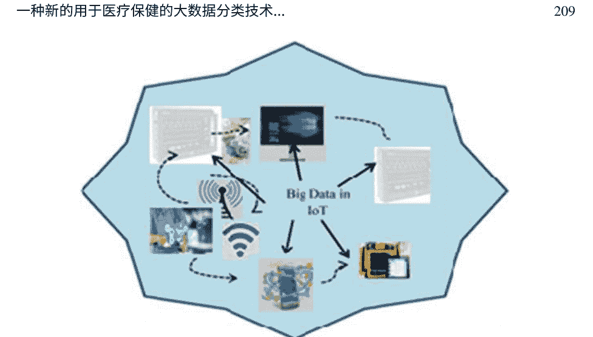

图2 物联网中的大数据模型[17]

物联网。 所有的健康中心，无论测试在哪里进行，都可以访问每个患者的信息，使用大数据科学，同时测试结果也会被存储，从患者进行测试的那一刻起就可以做出适当的决策。

从大数据中提取特定数据，以及从智能数据中提取任何数据，都是可以通过数据挖掘技术解决的棘手问题。 因此，可以使用不同的模型来提取数据。图2展示了物联网中大数据的模型[17]。 物联网对象、基础设施上的数据集包括一些细节和关于健康数据的信息，如患者年龄、性别等。健康数据使用RFC、SVM和J48进行分类。

### A. 随机森林分类器 (RFC)

RFC表示一个不可变的分类树集合。 它在许多工作问题中表现良好。 原因是它对信息集中的任何干扰都不敏感，并且没有过拟合问题。 它结合了许多树的预测，每个树都是独立训练的[28]。 RFC对信息生成一个随机示例，并可视化一个主要顺序的比率以开发选择树。

### B. 支持向量机 (SVM)

SVM被分类为预测预期解决方案中使用的最佳技术之一[29]。 SVM被Vapnik提出作为一种机器学习模型，用于执行分类和回归任务。 由于SVM的泛化、优化和判别能力，在过去的几年中，它已经在数据挖掘、机器学习和模式识别领域得到了广泛应用。 广泛使用SVM来解决二进制过程分类问题。 SVM在近年来的超越了其他监督式机器学习方法[30]。

由于良好的理论基础和泛化能力，它们已成为最广泛使用的分类方法之一[24]。

## 4 提出的方法

本节描述了选择的方法，以开发数据挖掘技术，以便专注于分析数据和发现探索原则，从而为患者提供健康信息并预测心脏病。

### C. 案例研究

使用了存档的历史数据，数据集包含76个属性，但在所有已发布的实验中只使用了14个属性的子集。特别是，迄今为止，机器学习（ML）研究人员只使用了克利夫兰数据集。“目标”字段表示患者患有心脏病的程度。具有值为（0）的整数表示没有更少的机会或患心脏病的机会。至于患心脏病的机会，用数字（1）表示。这个数据集可以在kaggle网站上免费获取。表1显示了属性的完整列表[31]。

根据数据集的组成，提出了一种准备数据并从中提取知识的机制的假设。经过案例研究的验证过程，该方法在许多患者电子健康数据的分析中是适用和可行的。该方法的目标是构建一个分析模型

| 编号 | 描述 | 属性 |
|---|---|---|
| 1 | 年龄 | 年龄 |
| 2 | 性别 | 性别 |
| 3 | cp | 胸痛类型（4个值） |
| 4 | trestbps | 静息血压 |
| 5 | chol | 血清胆固醇（mg/dl） |
| 6 | fbs | 空腹血糖 > 120 mg/dl |
| 7 | restecg | 静息心电图结果（值为0、1、2） |
| 8 | thalach | 达到的最大心率 |
| 9 | exang | 运动诱发心绞痛 |
| 10 | oldpeak | oldpeak =运动相对于休息引起的ST段压低 |
| 11 | slope | 峰值运动ST段的斜率 |
| 12 | ca | 主要血管数目（0-3）通过荧光成像染色 |
| 13 | thal | thal: 可逆缺陷 = 2，正常 = 0; 1 = 固定缺陷 = 1; |
| 14 | 目标 | 目标：0 =低患心脏病的概率，1 =高患心脏病的概率 |

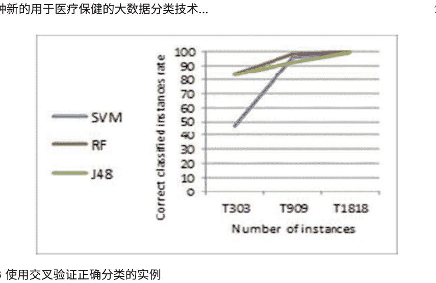

图3 使用交叉验证正确分类的实例

为了为电子健康决策支持系统生成一组决策。图3显示了说明所提方法的流程图。

经过案例研究的数据验证过程后，该方法适用于许多患者电子健康数据的分析[17]。

使用WEKA数据挖掘软件实现了所提出的系统。WEKA是免费开源软件，被定义为一组用于解决实际数据挖掘问题的机器学习方法，使用Java开发，并可在几乎任何平台上运行。它是一种应用数据挖掘方法于任何数据集的分析工具。尽管有几种支持和专业的数据挖掘软件包，但WEKA具有许多优势，如开源、可下载应用程序、快速、易于使用和访问、易于实施，且不需要任何财务要求（即无需费用）[32, 33]。

在这项研究中，以逗号分隔值（csv）格式存储的数据被使用。目标属性被选择为试验类别的主要属性。 然后，一组规则被用作卫生中心决策者的决策支持系统，为他们提供信息来预测心脏病发作的可能性。 实验类别的主要属性被选择为目标属性。 然后，一组规则被卫生中心的决策者用作决策支持系统，为他们提供信息来预测心脏病发作的可能性。

## 5 实验和结果

由于计算能力的增加和当前可用的大量数据，机器学习算法变得越来越复杂和强大[34]。 在这项研究中，测试了三种类型的分类算法：SVM，RFC和J48。

表2 正确分类的实例交叉验证

| 算法 | T303 | T909 | T1818 |
|------|------|------|-------|
| 支持向量机 | 47.4 | 96 | 100 |
| 随机森林 | 84.2 | 98.7 | 100 |
| J48 | 82.9 | 92.5 | 99.1 |

确定数据集的最佳大小是必要的，因为太多或太少的情况可能导致不精确的模型[32]。因此，健康护理（心脏病发作可能性）数据集被分为三个类别，第一个类别包含303个实例，第二个类别包含909个实例，第三个类别包含1818个实例。SVM、RFC和J48算法在十折交叉验证下运行和评估。

由于交叉验证存在过拟合问题，因为被测试的数据与用于训练的数据相同，这意味着它经常在数据集中学习和保持模式[34]。因此，另一种评估机制是基于创建一个独立的测试集，该测试集包含总数据集的25%，用于评估这些算法的性能。

图3显示了当算法应用于前三个类别时，正确分类实例的百分比。从图表中可以看出，当数据集大小超过909个案例时，算法的分类准确率趋于稳定。而当案例数为303时，支持向量机的排名失败。表2显示了结果的摘要。

图4显示了当算法应用于三个先前类别时，正确分类实例的百分比。从图中可以看出，RFC在其他算法中表现出色，并且当数据集的大小超过1818个实例时，三者在分类准确性上趋于一致。而且，SVM在303个案例中再次排名失败。表3显示了结果的摘要。

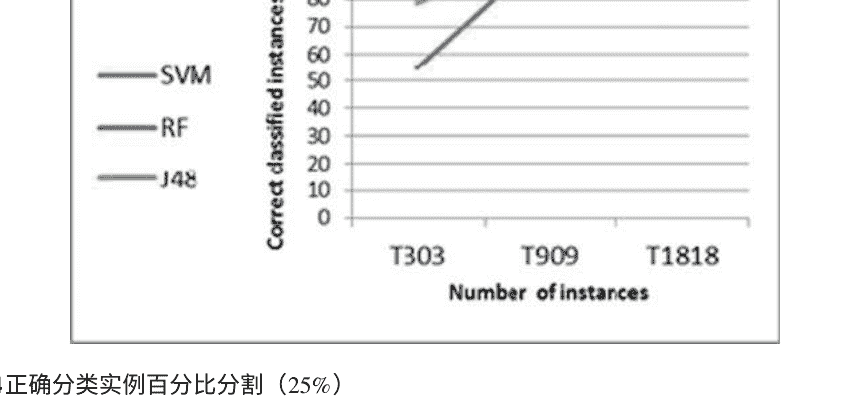

表3 正确分类实例百分比分割（25%）

| 算法 | T303 | T909 | T1818 |
| :--- | :--- | :--- | :--- |
| 支持向量机 | 47.4 | 96 | 100 |
| 随机森林 | 84.2 | 98.7 | 100 |
| J48 | 82.9 | 92.5 | 99.1 |

## 6 结论

当需要处理和分析大规模信息时，物联网与大数据密切合作。在这项研究中，使用分类算法对电子健康数据进行了分析，特别使用了医疗保健（心脏病发作可能性）数据集。确定了医疗数据库的最佳特征，有助于构建一个有效的心脏病预测模型。结果显示RFC的优越性。

## 参考文献

1. Firouzi, F., Farahani, B., Weinberger, M., DePace, G., & Aliee, F. S. (2020). 物联网基础知识: 定义、架构、挑战和前景。在智能物联网(pp. 3-50)中。Springer.
2. Gharaibeh, M., Alzu'bi, D., Abdullah, M., Hmeidi, I., Al Nasar, M. R., Abualigah, L., & Gand omi, A. H. (2022). 放射学影像扫描用于肾肿瘤早期诊断: 基于数据分析的机器学习和深度学习方法综述。大数据和认知计算, 6(1), 29.
3. Gandomi, A. H., Chen, F., & Abualigah, L. (2022). 大数据分析的机器学习技术。电子学, 11(3), 421。
4. 巴沙布舍, M.Q., 阿布阿利加, L., 和阿尔辛万, M. (2022). 使用混合元启发式优化算法和MapReduce框架的大数据分析. 在集成元启发式和机器学习解决实际优化问题(第181-223页). Springer.
5. 加拉伊贝, M., 阿尔马哈茂德, M., 阿里, M.Z., 阿尔巴达内, A., 埃尔-海斯, M. , 阿布阿利加, L., 阿尔塔尔希, M., 阿拉伊德, A., 和甘多米, A.H. (2021). 基于深度学习方法的脑血管导管血管造影早期诊断阿尔茨海默病: 一种新颖模型. 大数据与认知计算, 6(1), 2.
6. 阿布阿利加, L., 迪亚巴特, A., 和埃拉齐兹, M.A. (2021). 物联网云计算环境中的大数据应用智能工作流调度集群计算, 24(4), 2957-2976.
7. Abualigah, L., Gandomi, A. H., Elaziz, M. A., Hamad, H. A., Omari, M., Alshinwan, M., & Kh asawneh, A. M. (2021). 深度学习和机器学习技术在编辑分类应用中的应用.电子学, 10(2), 101.
8. Abualigah, L., & Masri, B. A. (2021). MapReduce大数据处理的进展: 平台, 工具和算法. 在人工智能和物联网(pp. 105–128).
9. Al-Sai, Z. A., & Abualigah, L. M. (2017, May). 大数据和电子政务: 一项综述. 在 2017第八届国际信息技术会议 (ICIT)(pp. 580–587). IEEE.
10. Katal, A., Wazid, M., & Goudar, R. H. (2013). 大数据: 问题, 挑战, 工具和良好实践. 在2013第六届当代计算会议 (IC3)(pp. 404–409). IEEE.
11. Chebbi, I., Boulila, W., & Farah, I. R. (2015) 大数据：概念、挑战和应用。在计算集体智能(pp. 638–647). Springer.
12. Alam, F., Mehmood, R., Katib, I., Albogami, N. N., & Albeshri, A. (2017). 数据融合和物联网用于智能普适环境：一项调查。*IEEE Access*, 5, 9533–9554.
13. Revathi, L., & Appandiraj, A. (2015). 基于Hadoop的并行框架用于大数据中的特征子集选择。国际科学、工程和技术创新研究杂志, 4(5), 3530–3534.
14. Shankar, K. (2017). 使用Apriori算法预测肝炎疾病中的大多数风险因素。制药生物化学科学研究杂志, 8(5), 477–484.
15. Manogaran, G., Lopez, D., & Chilamurti, N. (2018). 基于In-mapper combiner的MapReduce算法用于大气候数据处理。未来一代计算机系统, 86, 433–445.
16. Injadat, M., Moubayed, A., Nassif, A. B., & Shami, A. (2020). 多分类教育数据挖掘的多分割优化装袋集成模型选择。应用智能, 50(12), 4506–4528.
17. Lakshmanaprabu, S. K., et al. (2019). 利用最优特征的物联网中的大数据分类随机森林。机器学习与控制国际期刊, 10(10), 2609–2618.
18. Abualigah, L., Diabat, A., Mirjalili, S., Abd Elaziz, M., & Gandomi, A. H. (2021). 算术优化算法。计算方法在应用力学和工程中的应用, 376, 113609.
19. Abualigah, L., Yousri, D., Abd Elaziz, M., Ewees, A. A., Al-Qaness, M. A., & Gandomi, A. H. (2021). Aquila优化器：一种新颖的元启发式优化算法。计算机与工业工程, 157, 107250.
20. Abualigah, L., Abd Elaziz, M., Sumari, P., Geem, Z. W., & Gandomi, A. H. (2022). 爬行动物搜索算法（RSA）：一种自然启发的元启发式优化器。专家系统与应用, 191, 116158.
21. Agushaka, J. O., Ezugwu, A. E., & Abualigah, L. (2022). 侏儒狮优化算法应用力学和工程的计算机方法, 391, 114570.
22. Oyelade, O. N., Ezugwu, A. E. S., Mohamed, T. I., & Abualigah, L. (2022). 埃博拉优化搜索算法：一种新的自然启发式元启发式优化算法。*IEEE Access*, 10, 16150–16177.
23. Ezugwu, A. E., Agushaka, J. O., Abualigah, L., Mirjalili, S., & Gandomi, A. H. (2022). 草原犬优化算法。神经计算和应用, 1–49.
24. Cervantes, J., Garcia-Lamont, F., Rodríguez-Mazahua, L., & Lopez, A. (2020). 支持向量机分类的综合调查：应用、挑战和趋势。神经计算, 408, 189–215.
25. Jain, A., Sharma, V., & Sharma, V. (2017). 使用监督机器学习的大数据挖掘Hadoop与Weka分布。国际计算智能研究杂志, 13 (8), 2095–2111.
26. 苏, M. Y., 魏, H. S., 陈, X. Y., 林, P. W., & 邱, D. Y. (2018). 使用广告相关网络行为来区分广告库。应用科学, 8 (10), 1852.
27. 李, W., 柴, Y., 汗, F., 詹, S. R. U, 维尔马, S., 梅农, V. G., & 李, X. (2021). 基于机器学习的物联网智能医疗大数据分析综述系统。移动网络和应用, 26 (1), 234–252.
28. Chin, J., Callaghan, V., & Lam, I. (2017). 使用机器学习、物联网和大数据理解和个性化智能城市服务 在2017年IEEE第26届国际工业电子学术研讨会(ISIE)上(第2050-2055页). *IEEE*.
29. Vapnik, V. (2013).统计学习理论的本质.*Springer*科学与商业媒体.
30. Liang, X., Zhu, L., & Huang, D. (2017). 用于图像共分割的多任务排序支持向量机.神经计算, 247, 126–136.
31. Naresh, B. (2021)医疗保健: 心脏病发作可能性[在线]. Kaggle, 2021年7月4日.https://www.kaggle.com/nareshbhat/health-care-data-set-on-heart-attack-possibility32. Oliff, H., & Liu, Y. (2017). 利用数据挖掘技术实现工业4.0：质量改进案例研究. *Procedia CIRP*, 63, 167-172.
33. WEKA. (2021). 机器学习工作台[在线]. WEKA. https://www.cs.waikato.ac.nz/ml/weka/index.html. 最后访问日期：2021年6月4日。
34. Géron, A. (2019). Hands-on machine learning with Scikit-Learn, Keras, and TensorFlow: Concepts, tools, and techniques to build intelligent systems. O’Reilly Media.

# 阿拉伯文本分类的比较研究：挑战与机遇


Mohammed K. Bani Melhem, Laith Abualigah, Raed Abu Zitar, Abdelazim G. Hussien, 和 Diego Oliva

摘要：在过去的几年里，网络技术取得了巨大的进步，使得互联网上充斥着不同领域的各种数字内容。这使得研究人员在找到适用于特定语言或一组语言的文本分类算法方面面临困难。文本分类或分类是将给定的文本文档分配给一个或多个预定义的标签或类别的实践，其目的是从非结构化的文本文档中获取有价值的信息。

本文基于一系列选择的已发表论文进行了比较研究，重点是改进阿拉伯文本分类，以突出给定的模型和使用的分类器，并讨论了这些类型研究面临的挑战，然后本文提出了文本分类研究领域的预期研究机会。根据审查的研究，SVM和朴素贝叶斯是阿拉伯文本分类中最常用的分类器，但需要更多努力来开发和实施灵活的阿拉伯文本分类方法和分类器。

- M. K. B. Melhem · L. Abualigah (✉)
马来西亚槟城乔治敦市大学科学学院计算机科学系
电子邮件：Aligah.2020@gmail.com
- L. Abualigah
Hourani应用科学研究中心，Al-Ahliyya Amman大学，约旦安曼
中东大学信息技术学院，阿曼安曼11831
- R. A. Zitar
巴黎索邦大学阿布扎比人工智能中心，阿布扎比，阿拉伯联合酋长国
- A. G. Hussien
瑞典林雪平大学计算机与信息科学系，林雪平，瑞典
埃及法尤姆大学科学学院，法尤姆，埃及
- D. Oliva
IN3—加泰罗尼亚开放大学计算机科学系，卡斯特尔德费尔斯，西班牙
Depto. 墨西哥瓜达拉哈拉大学计算机科学系，瓜达拉哈拉，哈利斯科州

## 1 引言

如今，在全球分布的数字内容背后，互联网上有大量的信息和许多隐藏的知识可用，如果给定的数字内容应用合适和创新的工具，这些知识可以被提取出来[1,2]。多个科学和方法有助于从数字内容中自动提取信息，文本分类是其中之一，它对于获取信息和知识的速度和准确性有着重要贡献。以前，专业人员和领域专家手动分类文档[3, 4]。然而，随着阿拉伯数字内容的数量和质量的巨大增长，手动分类变得无效和不可行，这给文本分类过程带来了重大挑战，激发了研究人员开发和改进自动方法来进行文本分类，这反过来又给研究人员带来了许多挑战[5–12]。

感兴趣的研究人员提出并实施了许多解决方案，但大多数这些解决方案局限于使用经典的机器学习分类器与小型数据集一起使用，这些数据集不是免费提供的，也不足以满足大多数情况。为了克服这个挑战，许多研究人员转向适应深度学习技术，改进给定的算法，提供和建议更多的免费数据集，这些都为文本分类的过程带来了明显的改进。

本研究的目的是探索关于阿拉伯文本分类主题的可用出版物，并总结这些出版物的结果，并将它们列为研究挑战和机会，以帮助对这类研究感兴趣的研究人员。因此，本文的主要目标是选择一些最新的阿拉伯文本分类研究，并对其进行探索，以突出它们带来的最显著的改进和补充，以及通过这些改进出现的研究领域，以帮助用户、研究人员和社区利用阿拉伯数字内容中存在的信息。为了实现这一目标，研究人员选择了2020年发表的五篇关于阿拉伯文本分类的论文，这些论文关注使用不同的技术来改进文本分类过程。

## 2 文献综述

Alshaer等人在[13]中研究了ImpCHI方块对文本分类器（随机森林、多项式朴素贝叶斯、决策树、贝叶斯网络、人工神经网络和朴素贝叶斯）的影响，以及使用改进的CHI方块作为特征选择对文本分类过程结果的影响。根据精确度、F-度量、召回率和时间，他们描述了数据预处理步骤在文本分类过程中的重要性，以得出支持结果并提高效率。

Chantar等人在[14]中研究了增强灰狼二进制优化器（GWO）在FS打包方法上对阿拉伯文本分类问题的影响，然后作者使用新闻数据集Akhbar-Alkhaleej、Al-jazeera和Alwatan将所提出的方法的性能与SVM、决策树、NB和KNN分类器进行了比较。

Bahassine等人在[15]中提出了一种改进的方法，该方法关注使用卡方特征选择（以下简称ImpCHI）来提高阿拉伯文本分类性能，并将其与三个度量（互信息、信息增益和卡方）进行了比较。Marie-Sainte等人在[16]中研究了一种新的提出的算法（基于萤火虫算法的特征选择方法），并将其应用于不同的组合问题。该技术通过使用支持向量机分类器和三个评估指标（精确度、召回率和F-measure）进行了验证。

Ashraf Elnagar在[17]中介绍了一种使用深度学习模型进行阿拉伯文本分类的方法（2020年），为阿拉伯文本分类任务引入了一种新的自由丰富和无偏见的数据集：单标签（SANAD）和多标签（NADiA）任务。还提出了对用于分类阿拉伯文本的各种深度学习模型进行全面比较的方法，以评估这些模型在NADiA和SANAD数据集中的有效性。还可以使用其他优化方法来优化问题，如[18-23]所述。

## 3 背景

### 1. 文本分类

文本分类或者归类是将给定的文本文档分配给一个或多个预定义的标签或类别的实践[24, 25]。它旨在从非结构化的文本文档中获取有价值的信息，以便在许多应用程序中使用，例如检测和分类垃圾邮件，新闻监控和自动索引科学文章[26, 27]。

一般来说，有两种类型的标签分类：单标签分类（将文档分配给单个特定相关类别）和多标签分类（意味着每个文档或实例被识别为多个类别或类别）[1,2]。基本上，在大多数情况下，文本文档将作为词频向量运行[3,4]。

### 2. 深度学习模型

深度神经网络（DNN）是具有深层、丰富的隐藏层的神经网络。网络的三个主要部分是输入层、隐藏层和输出层。正如其名称所示，每种类型的层的主要目的是输入或输出，除了隐藏层。隐藏层是一个额外的层，用于在网络中添加更多的计算，当任务对于一个小网络来说过于复杂时。隐藏层的数量可以达到一百个或更多。深度神经网络具有出色的精度，被认为是革命性的。有许多类型的深度神经网络（卷积神经网络（CNN），循环神经网络（RNN）和其他类型），各种深度神经网络模型之间的区别在于它们的连接方式[28]，使用深度学习模型进行阿拉伯文本分类，2020年)。

### 3. 特征选择

特征选择是可能增加排序过程性能的最重要因素之一。它是消除冗余和不相关数据以及选择重要数据以减少分类过程的复杂性[15]。

### 4. 卡方检验

卡方检验是一种从大数据集中提取随机数据的统计方法，使用两个独立变量和两个变量。在数据挖掘过程中，它是一种选择特征的方法。卡方检验方法在文本分类系统的预处理步骤中使用[13]。

### 5. 改进的卡方检验

增强的卡方检验方法（impCHI）是经典卡方检验方法的改进。ImpCHI方法与中文一起使用。研究结果表明，在选择阿拉伯文本数据时，该函数是有效的。此外，在使用光学干燥过程时，ImpCHI方法与阿拉伯语和决策树一起使用。给出的结果显示，在恢复度量方面，ImpCHI的表现优于传统的卡方检验。

### 6. 灰狼优化算法（GWO）

该算法在[29]中提出，是最近的一种群体智能（SI）算法之一，引起了许多不同优化领域的研究人员的关注。

### 7. 萤火虫算法

萤火虫算法（FA）是一种受生物启发的算法，也是一种著名且高效的算法[30]。它已成功应用于处理阿拉伯语语音识别系统中的FS概念，但尚未用于阿拉伯文本分类[31]。

## 4 文献综述结果与讨论

Alshaer等人在[13]中使用了不同类型的阿拉伯文本分类器（Bayes Net（BN），Naïve Bayes（NB），Naïve Bayes Multinomial（NBM），Random Forest（RF），Decision Tree（DT）和Artificial Neural Networks（ANNs）），并使用改进的CHI（ImpCHI）Square算法对其进行了比较，根据平均精度，平均召回率，平均F-measure和平均时间进行了六次测试：无预处理，有预处理，无预处理和CHI，有预处理和CHI，无预处理和ImpCHI，以及有预处理和impCHI。本研究的结果表明，使用ImpCHI square作为特征选择方法，在精度，召回率和F-measure方面取得了更好的结果。但在构建模型的时间方面，结果较差。此外，结果在无预处理的情况下优于分类的CHI Square，对于平均精度，平均召回率，平均F-measure和平均时间。总体而言，朴素贝叶斯分类器在平均精度，平均召回率和平均F-measure方面取得了最佳结果，这意味着朴素贝叶斯分类器是进行比较的最佳算法。所使用的数据集是从不同的阿拉伯资源中收集的，包含9055个阿拉伯文档。

在另一项研究中，Bahassine等人在[15]中使用改进的卡方和SVM分类器的特征选择方法来增强阿拉伯文本分类过程，并通过常见的评估标准精确度、召回率和F-度量与先前的特征选择方法互信息（MI）、卡方、信息增益（IG）和词频-逆文档频率（TFIDF）进行比较。结果表明，ImpCHI在大多数特征上的表现优于其他特征选择方法，在特征数量不等于20时，不同大小的特征在精确度、召回率和F-度量方面使用SVM分类器相对于DT的所有特征选择都表现更好。但是这项研究提到了决策树所做的非导出易于解释的结果，这有助于识别每个类别的重要和相关术语，而SVM很难解释结果。

Chantar等人在[14]中提出了一种增强的二进制灰狼优化器（GWO）的包装器FS方法，该方法使用了不同的学习模型和分类器决策树、K最近邻、朴素贝叶斯和支持向量机以及三个阿拉伯公共数据集Alwatan、Akhbar-Alkhaleej和Al-jazeera-News来研究和评估不同的基于BGWO的包装器方法。提出了两种不同的方法将连续GWO（CGWO）转换为二进制版本（BGWO）BGWO1和BGWO2。同时使用了常见的评估标准精确度、召回率和F-measure。该研究结果表明，在阿拉伯文档分类过程中，基于SVM的特征选择技术、提出的二进制GWO优化器和基于精英的交叉方案都能显著提高性能。

Marie-Sainte等人在[16]中采用了另一种不同的方法来增强阿拉伯文本分类中的组合问题，使用萤火虫算法（Firefly Algorithm）进行特征选择。支持向量机分类器和三个评估指标（精确度、召回率和F-measure）被用来验证这种方法。本研究使用的数据集名为OSAC，从BBC和CNN阿拉伯网站收集而来。该数据集还包含5843个文本文档。它被分成两个子集，用于构建分类系统的训练和测试数据。本研究跳过了预处理阶段，因为数据集已经过预处理。本文的结果表明，所提出的特征选择方法在改善阿拉伯文本分类准确性方面非常高效。该方法的精确度值达到了0.994，这是其高效性的很好证明。

在一项非常有吸引力和广泛的研究中，Ashraf Elnagar在[28]中研究了深度学习模型在阿拉伯文本分类中的影响，并提出了一个免费、丰富和公正的数据集，供研究社区使用，用于阿拉伯文本分类的单标签和多标签任务，分别称为SANAD和NADiA，NADiA的最终大小约为485,000篇文章，涵盖了30个类别的子集。在这项研究中，开发了九个深度学习模型（BIGRU、BILSTM、CGRU、CLSTM、CNN、GRU、HANGRU、HANLSTM和LSTM），用于阿拉伯文本分类任务，无需预处理要求。这项研究表明，所有模型在SANAD语料库中表现良好。卷积GRU的最低精度为91.18%，GRU的最高性能为96.94%。关于NADiA，在“Masrawy”数据集的最大子集中，Attention-GRU实现了最高的整体准确率，达到了88.68%。

## 5 结果与讨论

本研究中审查的出版物总数为5篇，其中1篇实现了萤火虫算法，1篇实现了二进制灰狼优化器，2篇使用了改进的卡方检验，1篇实现了深度学习模型。所选出版物发表于2020年。其中2篇介绍了新的数据集，其中一篇介绍了广泛且大型的数据集，此外，所有出版物都使用了现有的数据集，其中一些已经进行了预处理。总的来说，所有被审查的出版物都使用了所提出的方法，对阿拉伯文本分类过程进行了改进。

本研究取得的挑战和研究机会列表如下：

- 自由可用阿拉伯数据集的资源匮乏仍然是研究者面临的重要挑战。
- 像朴素贝叶斯和支持向量机这样的文档分类器可以与其他研究中提出的方法一起使用，形成一个验证良好的分类器。
- 即使在特定方法中给出了更差的结果，所提出的方法也可以与其他分类器一起使用。
- ImpCHI、Firefly和GWO是有效的方法，具有良好的研究机会。
- 深度学习模型是一种重要的技术，可以通过任何方法或算法进行改进，以获得更有效的结果。

## 6 结论和未来工作

近年来，阿拉伯文本的分类被视为知识发现领域中最重要的主题之一。每天都有大量的数据在线提交，包括社交媒体帖子、评论和产品评价。通过使用阿拉伯文本分类工具，可以利用这些数据源获取有用的信息。我们的研究探索和分析了五篇最近的文章，应用了不同的技术来探索和改进阿拉伯文本的分类。我们的研究结果总结如下：

- 阿拉伯数据集对研究人员仍然被认为是低资源的。
- 在不同算法上使用经过验证的分类器可能会增强阿拉伯文本分类。
- 在深度学习中，热门话题被认为有许多研究机会。

在未来的工作中，我们将扩展所选出版物到所有在2020年发表的出版物，并找到可能接受改进的最有效的分类器和方法，以及在阿拉伯文本分类中使用的更差的分类器和方法。

## 参考文献

1. Jackson, P., & Moulinier, I. (2007). 在线应用的自然语言处理：文本检索、提取和分类(第5卷). John Benjamins Publishing.
2. Sanasam, R., Murzhy, H., & Gonsalves, T. (2010). 基于基尼系数的文本分类特征选择. FSDM, 10, 76–85.
3. Feldman, R. (2007). 文本挖掘手册：分析非结构化数据的高级方法。剑桥大学出版社。
4. Salton, G., & Buckley, C. (1988). 自动文本检索中的词权重方法。
5. Gharaibeh, M., Alzu’bi, D., Abdullah, M., Hmeidi, I., Al Nasar, M. R., Abualigah, L., & Gandomi, A. H. (2022). 肾肿瘤早期诊断的放射学成像扫描：基于数据分析的机器学习和深度学习方法综述。大数据和认知计算, 6(1), 29。
6. Gandomi, A. H., Chen, F., & Abualigah, L. (2022). 大数据分析的机器学习技术。电子学, J 1(3), 421.
7. Bashaqbah, M. Q., Abualigah, L., & Alswan, M. (2022). 使用混合元启发式优化算法和MapReduce框架的大数据分析。在集成元启发式和机器学习用于实际优化问题(第181-223页). Springer.
8. Gharaibeh, M., Almahamid, M., Ali, M. Z., Albadani, A., El-Hesis, M., Abualigah, L., Al-Tarhi, M., Alraied, A., & Gandomi, A. H. (2021). 基于深度学习方法的脑导管血管造影神经影像早期诊断阿尔茨海默病:一种新模型。大数据与认知计算, 6(1), 2.
9. Abualigah, L., Diabat, A., & Elaziz, M. A. (2021). 物联网云计算环境中的智能工作流调度大数据应用。集群计算, 24(4), 2957–2976.
10. Abualigah, L., Gandomi, A. H., Elaziz, M. A., Hamad, H. A., Omari, M., Alshinwan, M., & Khasawneh, A. M. (2021). 大数据文本聚类中元启发式优化算法的进展。电子学，10(2), 101.
11. Abualigah, L., & Masri, B. A. (2021). MapReduce大数据处理的进展：平台、工具和算法。在人工智能和物联网(pp. 105–128)。
12. Al-Sai, Z. A., & Abualigah, L. M. (2017, May). 大数据和电子政务：一项综述。在2017年第8届国际信息技术会议 (ICIT) (pp. 580–587). IEEE.
13. Alshaer, H., Otair, M., Abualigah, L., Alshinwan, M., & Khasawneh, A. (2020). 改进的卡方在阿拉伯文本分类器上的特征选择方法。
14. Chantar, H., Mafarja, M., Alsawalqah, H., Heidari, A. A., Aljarah, I., & Faris, H. (2020). 使用基于精英交叉的二进制灰狼优化器进行阿拉伯文本分类的特征选择。
15. Bahassine, S., Madani, A., Al-Sarem, M., & Kissi, M. (2020). 使用改进的卡方进行阿拉伯文本的特征选择。
16. Marie-Sainte, S. L., & Alalyani, N. (2020). 基于萤火虫算法的阿拉伯文本分类特征选择。
17. Elnagar, A., Al-Debsi, R., & Einea, O. (2020). 使用深度学习模型进行阿拉伯文本分类。
18. Abualigah, L., Diabat, A., Mirjalili, S., Abd Elaziz, M., & Gandomi, A. H. (2021). 算术优化算法。计算方法在应用力学和工程中的应用, 376, 113609.
19. Abualigah, L., Yousri, D., Abd Elaziz, M., Ewees, A. A., Al-Qaness, M. A., & Gandomi, A. H. (2021). Aquila优化器：一种新颖的元启发式优化算法。计算机与工业工程, 157, 107250.
20. Abualigah, L., Abd Elaziz, M., Sumari, P., Geem, Z. W., & Gandomi, A. H. (2022). 爬行动物搜索算法 (RSA) : 一种自然启发的元启发式优化器。专家系统与应用, 191, 116158.
21. Agushaka, J. O., Ezugwu, A. E., & Abualigah, L. (2022). 侏儒狮优化算法。应用力学和工程的计算机方法, 391, 114570.
22. Oyelade, O. N., Ezugwu, A. E. S., Mohamed, T. I., & Abualigah, L. (2022). 埃博拉优化搜索算法：一种新的自然启发式元启发式优化算法。IEEE Access, 10, 16150–16177.
23. Ezugwu, A. E., Agushaka, J. O., Abualigah, L., Mirjalili, S., & Gandomi, A. H. (2022). 草原犬优化算法。神经计算和应用, 1–49.
24. Khreisat, L. (2009). 使用N-gram频率统计的阿拉伯文本分类的机器学习方法。信息计量学杂志, 72-77.
25. Sebastiani, F. (2005). 文本分类。在J. H. Doorn, L. C. Rivero和V. E. Ferraggine (Eds.), 数据库技术和应用百科全书 (pp. 683–687). IGI Global.
26. Dharmadikari, S., Ingle, M., & Kulkarni, P. (2011). 基于机器学习的文本分类算法的实证研究。高级计算：国际期刊, 161–169.
27. El Kourdi, M., Bensaid, A., & Rachidi, T. (2004). 基于朴素贝叶斯算法的自动阿拉伯文档分类。在计算方法研究工作坊上的论文：计算阿拉伯语基于字母的语言 (pp. 51–58)。
28. Elnagar, A., Al-Debsi, R., & Einea, O. (2020). 使用深度学习的阿拉伯文本分类模型。信息处理和管理。
29. Mirjalili, S., Mirjalili, S. M., & Lewis, A. (2014). 灰狼优化器。工程软件进展。

# 使用前馈神经网络进行行人速度预测

## Abubakar Dayyabu, Hashim Mohammed Alhassan, 和 Laith Abualigah

摘要 行人速度行为受行人特征的影响，如性别、年龄、团体规模和设施类型，许多研究者在动态行人研究中进行了调查。然而，对行人服装对行人速度行为的影响关注较少。本研究通过使用非线性前馈神经网络来模拟行人速度行为，考虑到行人服装对高架人行天桥的影响。该研究使用视频数据收集方法，从视频中手动提取数据，使用Excel和Minitab进行统计分析，使用人工神经网络（ANN）进行模型构建、训练、验证和预测。统计分析结果表明，上行速度高于下行速度，分别为67.72 m/min和52.19 m/min。速度分布还表明，男性行人穿着英式/短款非洲服装和鞋套的平均速度更高，分别为84.21 m/min和60.10 m/min。人工神经网络在模型构建、训练和验证方面表现良好，如表3a-d中所示的R和RMSE值。

关键词 行人微观建模 · 人工神经网络 · R和RMSE

A. Dayyabu · H. M. Alhassan
尼日利亚卡诺州巴耶罗大学土木工程系，新校区瓜尔佐路，卡诺700241，尼日利亚
电子邮件：hmalhassan.civ@b.u.k.edu.ng

A. Dayyabu
尼日利亚尼罗大学土木工程系，阿布贾，尼日利亚

L. Abualigah (✉)
Hourani Center for Applied Scientific Research, Al-Ahliyya Amman University, Amman 19328, Jordan
电子邮件：Aligah.2020@gmail.com
中东大学信息技术学院，阿曼安曼11831

© 作者，独家许可给Springer Nature Switzerland AG 2023
L. Abualigah (编者)，深度学习和机器学习的分类应用技术，计算智能研究 1071，
https://doi.org/10.1007/978-3-031-17576-3_11

## 1 引言

步行是人类寻找庇护所、饮水和食物的最古老、自然和最常用的交通方式，因此行人设施可以追溯到人类起源的时候，当第一个人类出现在地球表面时。在寻找庇护所之后，第一个人类创造了一条小径来寻找饮水和食物，直到动物被驯化之前，小径仍然是唯一的交通方式[1]。许多人步行是为了娱乐，为了锻炼，有些人步行是因为它对健康有益，有些人步行是因为它简单，有些人步行是因为它便宜且没有私人交通工具[2, 3]。

尽管具有上述优势、使用和历史起源，但对于步行设施的设计标准、规范和安全性却给予了很少关注。这导致了更多的行人事故。

根据世界卫生组织（WHO，2010年，2013年，[4]）的数据，全球道路交通事故中有22%的死亡人数是行人。尽管非洲地区在六个世界地区中拥有最少的机动车辆，但却占了最高比例的38%。尼日利亚和南非在该地区的死亡率最高，分别为每年每10万人口33.7和31.9人。加纳的一项研究发现，68%的行人死亡是因为他们在道路中间过马路时被车辆撞倒的[5]。在另一项研究中，Ogendi等人[6]报告称，在肯尼亚发生的176起道路交通事故中，59.1%是行人。

研究还发现，72.6%的行人在过马路时受伤，11%的行人站在路边，8.2%的行人沿着路走，另外8.2%的行人在进行其他活动时被撞到，包括叫卖。在尼日利亚，趋势也是类似的；例如，Aladelusi等人[7]发现行人是道路交通事故中最高的受害者之一。此外，Solagberu等人[8]调查了尼日利亚拉各斯的行人受伤情况，发现702名行人中有67%是由于过马路时发生的道路事故。

Odeleye [9]提到了尼日利亚的行人事故的主要原因，包括规划不良、机动车司机对行人的鲁莽行为以及道路交通环境的不安全等。

基于全球和本地行人死亡率上升的趋势，理解行人行为成为了这项研究的重点。本研究旨在开发一个基于人工神经网络(ANN)方法的行人速度预测模型，考虑尼日利亚卡诺地区个体行人的性别、服装类型和鞋子类型对行人速度的影响。许多研究人员对微观行人模型进行了广泛研究，包括[10]，他们使用磁场理论的概念来描述行人的移动，将每个行人和障碍物都视为正磁极，行人目的地视为负磁极。Gipps和Marksjö [11]使用类似于元胞自动机的概念来模拟行人交通流。作者使用反重力规则将行人移动到一个六边形单元格网格上。Blue和Adler [12]（2001年），使用细胞自动机原理对单向和双向运动的行人行为进行建模。Dijkstra和Jessurun [13]以及Wang等人[14]都扩展了细胞自动机模型，以模拟公共场所的行人行为。Chen等人[15]在吸引事件下扩展了细胞自动机模型，用于建模行人行为。Hu等人[16]扩展了细胞自动机（CA）以提高疏散效率，并分析了排队时间模型。Alghadi等人[17]允许更多的行人在同一个单元格中。Lu等人[18]扩展了地板场细胞自动机（CA）模型，以捕捉和评估群体行为对人群疏散的影响，因为个体在人群中与家人和朋友在一起，而不仅仅是个体的集合。Helbing和Molnár [19]建议，行人沿着移动路径的行为可以建模为社会力。然而，Lewin [20]之前已经采取了一些步骤，他建议人类行为变化是由社会场或社会力引导的。Teknomo [21]扩展了社会力模型，考虑到面前有行人时斥力为两个，当两个或更多行人的半径重叠时斥力生效。Helbing等人[22]，Lakoba等人[23]，Parisi等人[2009]引入了“自我停止”机制，以防止行人在模拟过程中推倒其他行人。Zanlungo等人[24]在模拟过程中引入了碰撞预测和避免机制。Moussaïd等人[25]开发了一个基于个体的模型，可以描述行人如何与同一群体的其他成员以及其他群体成员互动。

Xun等（2015年）研究了地理距离、占有密度和出口宽度对地铁站出口选择的影响。Abualigah等人[26]提出了一种新的优化技术，可以用来解决这个问题。Gruden等人[27]使用人工神经网络模拟微观行人过街行为。Das等人[28]使用人工神经网络模拟宏观行人交通流关系。作者比较了人工神经网络与其他确定性模型在不同行人设施上的表现，并发现人工神经网络具有出色的性能。Zampieri等人[29]比较了空间语法和人工神经网络模拟行人移动行为，并发现人工神经网络具有更好的性能，相关系数的准确率超过90%，平均误差小于0.02。

## 2 材料和方法

### 2.1 数据收集地点

研究数据是在尼日利亚卡诺Sa’adatu Rimi教育学院的天桥上收集的；该天桥于2014年由卡诺州政府通过卡诺州工程、住房和交通部门建造，旨在提高行人安全并减少行人过街对车辆的延误。使用天桥的大多数人是Sa’adatu Rimi教育学院，卡诺。该学院是尼日利亚最大的师范学院之一，2012年学生人数超过45,000人。数据收集的位置在图1中呈现。桥下的道路是一条四车道的分隔式干道，交通流量较大。

### 2.2 数据捕获和提取

使用海康威视立方体IP安全摄像机DS-2CD2442FWD-IW 4 MP WDR进行数据捕获。摄像机安装在地面以上7米处，以完整地捕捉行人的性别、服装类型和鞋子类型。从周一到周四的上午7点到下午7点收集了12小时的数据。通过AVS视频编辑手动从录制的视频回放中提取了个体的特征和速度。研究考虑了年龄在18-40岁之间的行人的单个速度数据。速度数据被重新分组为三种行人组合，所有行人由所有单个行人组成，组合I由穿着英式/非洲短款服装的单个行人组成。

组合 II；由穿着非洲长袍的单个行人组成。

### 2.3 数据准备

行人的性别、服装类型、鞋子类型和速度的输入数据，从现场观察视频的回放中获得，在模型构建和分析之前被归一化为0-1的标准尺度。归一化是使用方程（1）中提出的归一化方程进行的。

$$X_s = \frac{X_i - X_{\min}}{X_{\max} - X_{\min}}$$

其中 X_s 是标准化值；X_i 是原始值；X_min 是 X 的最小值；X_max 是 X 的最大值。

### 2.4 敏感性分析

进行敏感性分析以找到输入变量与输出变量之间的关系，并确定每个输入变量在模型构建中的重要性。敏感性分析使用皮尔逊积矩相关系数进行。皮尔逊相关方程式如下（2）所示。

$$r = \frac{S_{xy}}{\sqrt{S_{xx} S_{yy}}}$$

其中；r是皮尔逊积矩相关系数；Sxx是变量X的标准差；Syy是变量Y的标准差；Sxy是变量X和Y的乘积的标准差。

### 2.5 人工神经网络模型制定

人工神经网络作为一种基于人工智能的模型，是一个数学模型，旨在处理输入-输出数据集的非线性关系。从历史上看，人工神经网络是从类比于大脑的生物神经系统中派生出来的信息处理工具，其基本组成部分称为神经元（节点）（Sirhan和Koch，2013年）。人工神经网络在各个领域中已经证明在复杂函数方面是实用的，包括预测、模式识别、分类、预测、控制系统和仿真[30,31]。在人工神经网络算法的不同分类中，前馈神经网络（FFNN）与反向传播（BP）广泛应用且最常见[32]。人工神经网络（ANN）是一种非常快速发展的非线性建模技术，因其预测能力和快速学习系统行为的能力而闻名。ANN由输入、隐藏和输出层组成的并行操作架构，通过神经元相互连接，如图2所示。ANN通过隐藏神经元的激活函数与输入和目标输出值的关联进行训练，并通过调整每个神经元的连接权重来提高其预测能力，直达到所需的性能值（最大相关系数或目标和输出值之间的最小均方误差）。解决复杂的ANN架构的关键问题是获得所需的性能值以及隐藏层和神经元的数量。有几种尝试基于的替代方法

### 2.6 人工神经网络模型验证

验证是建模的重要部分，它展示了模型代表实际系统的合理程度。相关系数、确定系数、均方差和均方根误差用于模型验证。均方根误差表示预测值和观测值之间差异的样本标准差。这些R²、R、MSE和RMSE的值是使用公式5-8估计的。

表2b，d展示了上升和下降方向的验证结果行人。

$$ R^2 = 1 - \frac{\sum_{i=1}^{n} (O_i - P_i)^2}{\sum_{i=1}^{n} (O_i - \overline{O})^2} $$
(5)

$$ R = \sqrt{R^2} $$
(6)

$$ MSE = \frac{\sum_{i=1}^{n} (O_i - P_i)^2}{N} $$
(7)

$$ RMSE = \sqrt{MSE} $$
(8)

## 3 结果分析与讨论

### 3.1 观察到的行人数据描述

收集到的数据被分类为离散和连续的，离散数据在图3a-e中呈现；图3a基于性别类型的行人分类；图3b基于行动方向的行人分类；图3c基于年龄组的行人分类；图3d基于服装类型的行人分类；图3e基于鞋子类型的行人分类。

研究显示存在不同类型的行人，总共观察到的行人有5672名男性，其中4443名向上行走，1229名向下行走，以及1138名女性，其中983名向上行走，155名向下行走，如图3a所示。观察到的行人群体大小有单个行人共4219名，其中3254名向上行走，965名向下行走，两个行人群体共1939名，其中1716名向上行走，223名向下行走，三个行人群体共631名，其中456名向上行走，175名向下行走，四个行人群体共271名，其中250名向上行走，21名向下行走，如图3b所示。

行人包括所有年龄段的行人，年龄范围在18-40之间的行人有5233人，其中4182人向上行走，1051人向下行走，年龄小于18岁的行人有402人，其中242人向上行走，160人向下行走，年龄大于40岁的行人有1175人，其中1002人向上行走，173人向下行走，如图3c所示。观察到的行人穿着不同类型的衣服，包括英式服装，总共有1601人，其中1342人向上行走，259人向下行走。按降序排列，短款非洲服装总共有583人向上行走，344人向下行走；长款非洲服装总共有4131人向上行走，3047人向下行走；穿着长袍/头巾的行人总共有495人向上行走，333人向下行走，如图3d所示。观察到的行人穿着不同类型的鞋子，其中1756人穿着罩鞋，按升序排列有1376人，按降序排列有380人；而5054人穿着拖鞋，按升序排列有4050人，按降序排列有1004人，如图3e所示。

### 3.2 速度特征和分布结果

介绍了方法中提到的所有不同行人组合的最大速度、最小速度和平均速度特征；表1a根据罩鞋类型介绍了男性行人的速度特征；表1b根据拖鞋类型介绍了男性行人的速度特征；表1c根据拖鞋类型介绍了女性行人的速度特征。

表1a-c中的统计分析表明，上升方向的行人速度高于下降方向的行人速度，分别为67.72 m/min和52.19 m/min。速度分布还表明，穿着英式/短款非洲服装和鞋套的男性行人在上升和下降方向上的平均速度分别为84.21 m/min和60.10 m/min，其次是穿着英式/短款非洲服装和拖鞋的男性行人，平均速度为72.7和57.70 m/min，在上升和下降方向上，其次是穿着长款/长袍式服装和鞋套的男性行人。在升序和降序方向上，穿长袍/礼服类型和拖鞋的男性行人的平均速度分别为70.14 m/min和58.92 m/min，其次是穿长袍/礼服类型和拖鞋的女性行人，平均速度分别为68.30 m/min和56.07 m/min，然后是穿英式/短款非洲服装和拖鞋的女性行人，平均速度为55.25 m/min和50.5 m/min，最后是穿长袍/礼服非洲服装和拖鞋的女性行人，平均速度为49.1 m/min和48.90 m/min。

表1a 基于鞋套类型的男性行人速度特征。

|  | 所有行人 |  | 行人组合I |  | 行人组合II |  |
| --- | --- | --- | --- | --- | --- | --- |
|  | 升序 | 降序 | 升序 | 降序 | 升序 | 降序 |
| 行人数量 | 1167 | 300 | 240 | 60 | 141 | 39 |
| 最大值 (m/min) | 102 | 85 | 102 | 63.75 | 78 | 54.35 |
| 最小值 (m/min) | 34 | 34 | 51 | 46.36 | 51.57 | 42.35 |
| 平均值 (m/min) | 67.74 | 52.19 | 84.21 | 60.1 | 70.14 | 58.92 |

表1b 基于拖鞋类型的男性行人速度特征。

|  | 所有行人 |  | 行人组合I |  | 行人组合II |  |
| --- | --- | --- | --- | --- | --- | --- |
|  | 升序 | 降序 | 升序 | 降序 | 升序 | 降序 |
| 行人数量 | 1167 | 300 | 203 | 56 | 583 | 145 |
| 最大值 (m/min) | 102 | 85 | 102 | 72.86 | 70 | 48.35 |
| 最小值 (m/min) | 34 | 34 | 56.67 | 46.36 | 39.35 | 34.23 |
| 平均值 (m/min) | 67.74 | 52.19 | 72.7 | 57.70 | 68.3 | 56.07 |

表1c 基于拖鞋类型的女性行人速度特征。

|  | 所有行人 |  | 行人组合I |  | 行人组合II |  |
| --- | --- | --- | --- | --- | --- | --- |
|  | 升序 | 降序 | 升序 | 降序 | 升序 | 降序 |
| 行人数量 | 330 | 123 | 37 | 18 | 293 | 105 |
| 最大值 (m/min) | 85 | 85 | 85 | 72.86 | 85 | 85 |
| 最小值 (m/min) | 26.84 | 28.33 | 28.33 | 34 | 26.84 | 28.33 |
| 平均值 (m/min) | 50.42 | 47.09 | 55.25 | 50.5 | 49.1 | 48.90 |

表2a 升序方向行人的皮尔逊相关系数矩阵。

|  | 男性 | 女性 | C型 I | C型 II | S型 I | S型 II | 种子 |
|---|---|---|---|---|---|---|---|
| 男性 | 1 |  |  |  |  |  |  |
| 女性 | -1 | 1 |  |  |  |  |  |
| C型 I | 0.002295 | -0.00229 | 1 |  |  |  |  |
| C型 II | 0.010094 | -0.01009 | -0.9053 | 1 |  |  |  |
| S型 I | -0.07758 | 0.077585 | 0.319891 | -0.39542 | 1 |  |  |
| S型 II | 0.06734 | -0.06734 | -0.32385 | 0.389791 | -0.99453 | 1 |  |
| 种子 | 0.205272 | -0.20527 | 0.522692 | -0.49069 | 0.611517 | -0.6234 | 1 |

表2b 降序方向行人的皮尔逊相关系数矩阵。

|  | 男性 | 女性 | C型 I | C型 II | S型 I | S型 II | 种子 |
|---|---|---|---|---|---|---|---|
| 男性 | 1 |  |  |  |  |  |  |
| 女性 | -1 | 1 |  |  |  |  |  |
| C型 I | 0.267199 | -0.2672 | 1 |  |  |  |  |
| C型 II | -0.20397 | 0.203973 | -0.95477 | 1 |  |  |  |
| S型 I | 0.147209 | -0.14721 | 0.153344 | -0.15923 | 1 |  |  |
| S型 II | -0.14413 | 0.144127 | -0.1508 | 0.157253 | -0.98757 | 1 |  |
| 种子 | 0.487616 | -0.487622 | 0.822385 | -0.78832 | 0.433206 | -0.42792 | 1 |

基于方法论中指定的组合，提出了观测到的行人数据的速度分布；图4a表示所有单个行人的升序方向；图4b表示所有单个行人的降序方向；图4c–f表示穿着鞋套的男性行人；图4g–j表示穿着拖鞋的男性行人。图4k–n表示穿着拖鞋的女性行人。

### 3.3 敏感性分析结果

研究使用皮尔逊相关方法确定模型构建中每个变量的重要性顺序。表1a、b展示了敏感性分析结果，提供了独立变量与因变量之间的关系。

表3a ANN模型训练升序方向。表3b ANN模型验证升序方向。表3c ANN模型训练降序方向。表3d ANN模型验证降序方向。

## (a) 训练阶段

|    | R²    | R     | MSE    | RMSE   |
|----|-------|-------|--------|--------|
| ANN-M1 | 0.4125 | 0.6423 | 0.03880 | 0.1971 |
| ANN-M2 | 0.4559 | 0.6752 | 0.0357  | 0.1890 |
| ANN-M3 | 0.4953 | 0.7038 | 0.0326  | 0.1806 |
| ANN-M4 | 0.4165 | 0.6454 | 0.0386  | 0.1964 |
| ANN-M5 | 0.5020 | 0.7085 | 0.0320  | 0.1790 |

## (b) 验证阶段

|    | R²    | R     | MSE   | RMSE   |
|----|-------|-------|-------|--------|
| ANN-M1 | 0.4272 | 0.6536 | 0.0364 | 0.1908 |
| ANN-M2 | 0.4499 | 0.6708 | 0.0348 | 0.1866 |
| ANN-M3 | 0.4946 | 0.7046 | 0.0312 | 0.1767 |
| ANN-M4 | 0.4311 | 0.6566 | 0.0362 | 0.1901 |
| ANN-M5 | 0.4948 | 0.7034 | 0.0314 | 0.1771 |

## (c) 训练阶段

|    | R²    | R     | MSE   | RMSE   |
|----|-------|-------|-------|--------|
| ANN-M1 | 0.3997 | 0.6366 | 0.0285 | 0.1687 |
| ANN-M2 | 0.5908 | 0.6322 | 0.0287 | 0.1695 |
| ANN-M3 | 0.5482 | 0.7687 | 0.0196 | 0.1400 |
| ANN-M4 | 0.6193 | 0.7404 | 0.0216 | 0.1471 |
| ANN-M5 | 0.6193 | 0.7870 | 0.0182 | 0.1350 |

## (d) 训练阶段

|    | R²    | R     | MSE   | RMSE   |
|----|-------|-------|-------|--------|
| ANN-M1 | 0.3974 | 0.6304 | 0.0297 | 0.1723 |
| ANN-M2 | 0.3975 | 0.6305 | 0.0297 | 0.1723 |
| ANN-M3 | 0.5803 | 0.7618 | 0.0207 | 0.1438 |
| ANN-M4 | 0.5405 | 0.7352 | 0.0226 | 0.1505 |
| ANN-M5 | 0.6077 | 0.7795 | 0.0193 | 0.1390 |

图4. a行人速度分布（所有行人上升方向）。b行人速度分布（所有行人下降方向）。c行人速度分布（基于鞋套的行人组合I上升方向）。d行人速度分布（基于鞋套的行人组合I下降方向）。e行人速度分布（基于鞋套的行人组合II上升方向）。f行人速度分布（基于鞋套的行人组合II下降方向）。g行人速度分布（基于拖鞋的行人组合I上升方向）。h行人速度分布（基于拖鞋的行人组合I下降方向）。i行人速度分布（基于拖鞋的行人组合II上升方向）。j行人速度分布（基于拖鞋的行人组合II下降方向）。k行人速度分布（基于拖鞋的行人组合I上升方向）。l行人速度分布（基于拖鞋的行人组合I下降方向）。m行人速度分布（基于拖鞋的行人组合II上升方向）。n行人速度分布（基于拖鞋的行人组合II下降方向）。

### 图4 (续)

在模型构建中，每个变量的重要性。表2a展示了升序方向的关系，表2b展示了降序方向的关系。

此外，敏感性分析结果表明，在升序方向上，鞋子类型的重要性更高，拖鞋最重要，其次是覆盖鞋，然后是服装类型I，然后是服装类型II，性别的重要性较低，如表2a所示。而在降序方向上，服装类型I最重要，其次是服装类型II，然后是女性性别，然后是男性性别，然后是覆盖鞋类型和鞋子类型I，如表2b所示。

### 3.4 模型估计分析结果

在这项研究中，使用Levenberg-Marquardt算法训练的两层前馈网络来分析ANN模型。前馈网络由一系列层组成，每个后续层都与前一层相连。

该模型是使用MATLAB 2019a构建的；根据皮尔逊相关系数，开发了五个人工神经网络模型。在这个过程中，使用了75%的数据进行训练，25%的数据进行验证，以分析人工神经网络模型。网络性能是根据均方误差（MSE）来衡量的。表3a-d展示了所有五个人工神经网络模型在训练和验证中的性能指标，按升序和降序排列。

从表3a-d中呈现的人工神经网络性能分析可以看出，R值和RMSE值的结果表明人工神经网络可以用于建模楼梯上的行人速度，因为从模型1到模型5的所有R值都比0.5更显著，而模型5在训练和验证升序方向上的R值为（0.7085和0.7034），在训练和验证降序方向上的R值为（0.7870和0.7795）（图5）。

## 4 结论

基于ANN的人工智能建模可以用于考虑性别、服装类型和鞋子类型的行人速度预测，如本研究所示的ANN性能分析中所示。从观测数据构建的所有ANN模型的性能都大于0.5，表明ANN在楼梯上的行人速度预测中是可接受的。

研究还得出结论，行人的着装（服装、鞋子类型和性别）会影响行人的速度，男性行人穿着英式/短款非洲服装和鞋子的速度比其他任何着装的行人都要快。穿着长款非洲服装和拖鞋的女性行人速度比其他任何行人组合都要慢。

### 使用深度学习和机器学习技术的编辑分类应用

图5 a预测数据与观测数据之间的行人速度关系（训练）。b预测数据与观测数据之间的行人速度关系（测试）。c预测数据与观测数据之间的行人速度关系（训练）。d预测数据与观测数据之间的行人速度关系（测试）。

## 参考文献

1.  Jacobson, H. R. (1940). 从古代到机动车时代的道路历史(乔治亚理工学院). https://smarte ch.gatech.edu/bitstream/handle/1853/36216/jacobson_herbert_r_194005_ms_95034.pdf
2.  Olojede, O., Yoade, A., & Olufemi, B. (2017). 尼日利亚城市中步行作为一种主动出行方式的决定因素. 交通与健康杂志, 6, 327–334. https://doi.org/10.1016/j.jth.2017.06.008
3.  Litman, T. (2011). 评估公共交通健康益处. (四月). http://site.ebrary. com/lib/sfu/docDetail.action?docID=10534560
4.  WHO. (2015). 全球道路安全状况报告2013. WHO. http://www.who.int/violence_ injury_prevention/road_safety_status/2013/en/
5.  Damsere-Derry, J., 等 (2010). 加纳的行人伤害模式。事故分析与预防, 42(4), 1080–1088。
6.  Ogendi, J., Odero, W., Mitullah, W., & Khayesi, M. (2013). 内罗毕市行人伤害模式：对城市安全规划的影响。城市健康杂志, 90(5), 849–856。
7.  Aladelusi, T. O., 等 (2014). 尼日利亚一所三级医院行人道路交通颌面部损伤的评估。非洲医学与医学科学杂志, 43(4), 353–359。
8.  Solagberu, B. A., 等 (2014). 发展中国家的儿童行人伤害和死亡。儿科外科国际, 30(6), 625–632。
9.  Odeleye, A. J. (2001). 改善尼日利亚的道路交通环境，以提高儿童安全。在道路用户特征，重点关注生活方式、生活质量和安全-第14届ICTCT研讨会在意大利卡塔塞塔举行，2001年10月，第72-82页。http://trid.trb.org/view/745284
10. Okazaki, S., & Matsushita, S. (1979). 行人移动的仿真模型研究。在建筑空间，第3部分：考虑火灾、拥堵和未被认可的空间，以最短路径为基础，日本建筑学会交易，285。https://citeseerx.ist.psu.edu/viewdoc/summary?doi=10.1.1.626.596
11. Gipps, P. G., & Marksjö, B. (1985). 行人流的微观仿真模型。数学和计算机模拟，27(2-3)，95-105。https://doi.org/10.1016/0378-4754(85)90027-8
12. Blue, V. J., and Adler, J. L. (1998). 从细胞自动机微观模拟中产生的紧急基本行人流动。交通研究记录：交通研究委员会，1644(1)，29-36。https://doi.org/10.3141/1644-04
13. Dijkstra, J., and Jessurun, J. (2001). 细胞自动机的理论和实际问题。细胞自动机的理论和实际问题，(2000年1月)。https://doi.org/10.1007/978-1-4471-0709-5
14. Wang, J., Zhang, L., Shi, Q., Yang, P., and Hu, X. (2015). 模拟和模拟拥堵恐慌行人疏散。物理学A：统计力学及其应用，428，396-409。https://doi.org/10.1016/j.physa.2015.01.057
15. Chen, Y., Chen, N., Wang, Y., Wang, Z., & Feng, G. (2015). 使用细胞自动机对吸引事件下的行人行为进行建模。物理学A：统计力学及其应用，432，287–300。https://doi.org/10.1016/j.physa.2015.03.017
16. Hu, J., You, L., Zhang, H., Wei, J., & Guo, Y. (2018). 通过扩展的细胞自动机模型研究行人疏散中的排队行为。物理学A：统计力学及其应用，489，112–127。https://doi.org/10.1016/j.physa.2017.07.004
17. Alghadi, M. Y., Mazlan, A. R., & Azhari, A. (2019). 董事会性别和多重董事职位对现金持有的影响：来自约旦的证据。国际金融与银行研究，5(4)，71–75。
18. Lu, L., Guo, X., & Zhao, J. (2017). 一种统一的非局部应变梯度模型用于纳米梁和高阶项的重要性。国际工程科学杂志, 119, 265–277.
19. Helbing, D., & Molnár, P. (1995). 行人动力学的社会力模型。物理评论E, 51(5), 4282–4286. https://doi.org/10.1103/PhysRevE.51.4282
20. Lewin, K. (1951). 社会科学中的场论. Amazon.co.uk: Lewin, Kurt: Books. Retrieved September 24, 2020, from https://www.amazon.co.uk/Field-Theory-Social-Science-Lewin/dp/B0007DDXKY
21. Teknomo, K. (2006). 微观行人仿真模型的应用。交通研究F部分：交通心理学和行为, 9(1), 15–27. https://doi.org/10.1016/j.trf.2005.08.006
22. Helbing, D., Buzna, L., Johansson, A., & Werner, T. (2005). 自组织行人群体动力学：实验、模拟和设计解决方案。交通科学, 39(1), 1–24.
23. Lakoba, T. I., Kaup, D. J., & Finkelstein, N. M. (2005). 对行人演化的Helbing-Molnár-Farkas-Vicsek社会力模型的修改。模拟, 81(5), 339–352. https://doi.org/10.1177/0037549705052772
24. Zanlungo, F., Brščić, D., & Kanda, T. (2014). 在不同密度条件下的行人群体行为分析。交通研究会议, 2, 149–158. https://doi.org/10.1016/j.trpro.2014.09.020
25. Moussaïd, M., Perozo, N., Garnier, S., Helbing, D., & Theraulaz, G. (2010). 行人社交群体的行走行为及其对人群动力学的影响。PLoS ONE, 5(4), e10047. https://doi.org/10.1371/journal.pone.0010047
26. Abualigah, L., Diabat, A., Mirjalili, S., Abd Elaziz, M., & Gandomi, A. H. (2021). 算术优化算法。应用力学与工程计算方法, 376, 113609.
27. Gruden, C., Otkovi´c, I. I., & Šraml, M. (2020). 神经网络应用于微观模拟：行人过马路时间的预测模型。可持续性（瑞士），12(13).
28. Das, P., Parida, M., & Katiyar, V. K. (2015). 使用人工神经网络分析行人流参数之间的相互关系。医学与生物工程杂志，35(6)，298–309。
29. Zampieri, F. L., Rigatti, D., & Ugalde, C. (2009). 基于空间语法、性能指标和人工神经网络的行人移动评估模型。在第7届国际空间语法研讨会上，第1-8页。
30. Govindaraju, R. S. (2000). 水文学中的人工神经网络。II: 水文学应用。水文工程杂志，5(2)，124–137。
31. Solgi, M., Najib, T., Ahmadnejad, S., & Nasernejad, B. (2017). 从枸杞籽制备新型活性炭用于铬去除的合成和表征：实验分析和人工神经网络与支持向量回归建模。资源高效技术，3(3)，236–248。
32. Elkiran, G., Nourani, V., & Abba, S. I. (2019). 基于集成人工智能的多步骤河流水质参数建模方法。水文学杂志, 577, 123962。
33. Price, J. L., McKeel Jr, D. W., Buckles, V. D., Roe, C. M., Xiong, C., Grundman, M., ... & Morris, J. C. (2009). 非痴呆性老化的神经病理学：预测性证据阿尔茨海默病。神经老化, 30(7), 1026–1036。
34. Zare, M., & Koch, M. (2016, July). 使用ANN和ANFIS模型模拟和预测伊朗Miandarband平原地下水位波动。在第四届IAHR欧洲大会论文集中。全球变化时代的可持续水力学(p. 416), 列日,比利时。
35. Schuchhardt, J., Schneider, G., Reichelt, J., Schomburg, D., & Wrede, P. (1995). 通过Kohonen网络对局部蛋白质结构模体进行分类。生物信息学：从核酸和蛋白质到细胞代谢, 85–92。
36. Blue, V. J., & Adler, J. L. (2001). 基于元胞自动机微观模拟的双向行人通道建模。交通研究第B部分：方法论, 35(3), 293–312。
37. Zheng, X., Li, H. Y., Meng, L. Y., Xu, X. Y., & Chen, X. (2015). 基于出口选择的改进社会力模型在地铁站微观行人仿真中的应用。中南大学学报, 22(11), 4490–4497。

## 阿拉伯文本分类使用改进的人工蜜蜂群算法进行情感分析：以约旦方言为例

Abdallah Habeeb, Mohammed A. Otair, Laith Abualigah, Anas Ratib Alsoud, Diaa Salama Abd Elminaam, Raed Abu Zitar, Absalom E. Ezugwu, 和Heming Jia

摘要阿拉伯客户每天都会发表评论和意见，通过公司的产品或服务的在线评论，这种评论数量急剧增加，无论是阿拉伯语还是其方言。本文描述了用户的状况或需求，以及对此进行的评价，评价可以是负面的或正面的极性。基于对阿拉伯文本情感分析问题的需求，以约旦方言为例。本文的主要目的是将文本分类为两类：负面或正面，这有助于企业维护一份报告。

A. Habeeb · M. A. Otair
计算机科学与信息学院，阿曼阿拉伯大学，阿曼 11953，约旦

L. Abualigah (✉) · A. R. Alsoud
Hourani 应用科学研究中心，阿拉伯阿利亚阿曼大学，安曼，约旦
电子邮件： Aligah.2020@gmail.com

L. Abualigah
中东大学信息技术学院，约旦安曼 11831
马来西亚槟城11800 Pulau Pinang, Gelugor

D. S. A. Elminaam
本哈大学计算机与人工智能学院，本哈，埃及
Misr国际大学计算机科学学院，Obour，埃及

R. A. Zitar
索邦大学阿布扎比人工智能中心，阿布扎比，阿拉伯联合酋长国

A. E. Ezugwu
数学、统计和计算机科学学院，南非夸祖鲁-纳塔尔大学，皮特马里茨堡，夸祖鲁-纳塔尔3201，南非

H. Jia
中国福建省三明大学信息工程系365004

> ©作者（们），在2023年独家许可给Springer Nature Switzerland AG. L. Abualigah（编），深度学习和机器学习技术的分类应用，计算智能研究1071，https://doi.org/10.1007/978-031-17576-3_12关于服务或产品。第一阶段使用自然语言处理工具；词干提取、停用词去除和分词以进行文本过滤。
第二阶段，修改了人工蜂群（ABC）算法，采用上置信界限（UCB）算法，以提高最小维度的开发能力，获得最小数量的最优特征，然后使用四种机器学习算法的前向特征选择策略：K最近邻（KNN）、支持向量机（SVM）、朴素贝叶斯（NB）和多项式神经网络（PNN）。该模型应用于包含来自约旦电信公司客户的评论的约旦方言数据库。根据情感分析的结果，可以提供一些建议，以终止或放弃产品或服务，或进行升级。此外，该模型应用于包含长篇阿拉伯文本的阿尔及利亚方言数据库，以评估该模型对短文本和长文本的效率。使用了四个性能评估指标：精确度、召回率、F1分数和准确度。作为未来的一步，为了构建或用于阿拉伯方言的分类，实验结果表明，该模型在应用于约旦方言时的准确度高达99%，在应用于阿尔及利亚方言时为82%。

关键词: 自然语言处理 · 文本分类 · 情感分析 · 特征选择 · 启发式算法 · ABC · UCB · KNN · SVM · PNN · Naïve Bayes

## 1 引言

人类智能的一部分是使用语言进行交流，包括能够说话、阅读和分析图像以理解内容。通过人工智能，该方法使用机器学习来达到阅读和理解上下文的一部分智能[1]。

机器学习算法处理自动文本分类。学习用于构建各个领域中的文本分类的特征，如电子邮件路由、垃圾邮件过滤、网页分类、情感分析、主题跟踪。为了执行文本分类任务，将使用提出的特征选择、预处理工具（词干提取、分词和停用词去除）以及基于优化算法的特征选择来处理高维特征。特征选择是从高维数据集中选择最有价值的特征的一种方法。然后将其用于降低分类性能[2]。

动态网页和互联网上的数据量每秒都在增加，这些数据来自社交媒体、关注客户意见的公司和多个来源，因此需要对非结构化数据的文本文档进行分类。非结构化数据的存在需要具备在许多领域中使用的知识。文本分类和分类使用于指定任务的预测预定义领域或类别给定的书面文本。自动化的分类任务报告相关的多个和单个封闭的格式，使非结构化文本与机器学习算法兼容。挖掘有趣的知识并了解客户需求。自然语言处理（NLP）技术中最重要的任务是使用情感分析来确定文本是积极的还是消极的。使用NLP完成文本的自动分析，以适合机器学习的格式表示数据[3]。

优化算法之一是人工蜜蜂群算法(ABC)，在许多研究中成功使用。这个算法在一定程度上受到其随机特性的影响，当搜索贫瘠的开发方程式时，为了改进最佳解决方案[4]。由于算法的这个弱点，使用带有精英对立学习策略的ABC算法来解决原始ABC中的贫瘠开发[5]。使用带有精英对立学习策略的检查ABC算法 (EOABC) [5]。

客户反馈对于业务很重要；为了充分了解您的客户的要求；了解客户的满意度水平；有必要记录客户的意见以评估他们的回应。这可以帮助创新、产品开发和改善服务，从而建立忠诚的客户基础。然而，需要处理大量的数据。本文的问题是在约旦方言中进行分类阿拉伯文本，这将用于分类器算法来测试训练数据集以预测标签。

典型的ABC算法是一些搜索方程的解决方案，它们擅长探索，但常常表现出不足的利用，即利用是将搜索限制在搜索空间的一个小区域以细化解决方案的行为。在人工蜂群算法中，贪婪方程根据概率值选择一个食物源，基于轮盘赌方法。贪婪选择应用于食物源和新的食物源之间。作为第一个贡献，我们通过应用UCB算法而不是贪婪选择来增强利用的人工蜂群算法。根据概率值选择一个食物源，并在搜索利用的小区域中获得最优解。作为第二个贡献，分类器通过使用监督机器学习算法来确定文本的价值，可以是表示不满意的负值，或表示满意的正值，以描述一个人对产品、服务或当前状态的感受。

## 2 相关工作

### 2.1 引言

该研究应用于社交媒体客户意见内容，以解决阿拉伯情感（SA）分析问题。分析他们的书面文本以改善客户服务和产品质量。SA处理海量数据。为了减少高维空间中的特征选择需求，提出了一种基于生物启发式优化器的增强型鲨鱼群算法（SSA），用于解决阿拉伯情感分析问题。提出了两个阶段，首先通过基于信息增益度量的过滤技术减少特征数量[6]。

第二阶段采用组合了四种S形转移函数的鲨鱼群优化器（SSA）的包装器（FS）技术，并应用KNN进行分类。实验结果显示，SSA与S形转移函数相结合的分类准确率优于粒子群优化器和灰狼优化器[6]。

情感分析，提出了一种半监督方法，应用于阿拉伯语及其方言。这种方法由深度学习算法组成，用于处理阿拉伯文本并检测其极性（积极、消极），应用于情感语料库。该方法应用于使用MSA（现代标准阿拉伯语）和DALG（阿尔及利亚方言）编写的Facebook文本消息，用于处理阿拉伯文本和阿拉伯语拼音。处理阿拉伯语拼音有两种选择，即翻译和音译。实验使用了许多专门用于DALG/MSD的测试语料库，结合了快速文本和Word2vec的深度学习分类器，如逻辑回归（LR）、随机森林（RF）、短期记忆（LSTM）和卷积神经网络（CNN）。分类器与快速文本和Word2vec相结合，实验结果的F1得分达到95%，外部实验为89%[7]。

优化算法是选择特征的最重要方法，因为在高维文本的分类过程中，它在选择一组最优特征以减少计算和成本方面非常重要。它提高了文本分类的准确性。基于自然差异测量和二进制Jaya优化算法（NDM-BJO）的特征选择方法，并使用支持向量机和朴素贝叶斯进行评估，以找到错误率。结果表明，NDM-BJO模型有所改进。评估各类特征选择方法[8]。

在机器学习中，文本分类是一个困难的数学任务，因为自然语言文本文档的数量大幅增加。在这里，特征选择是该过程的基础，因为有成千上万种特征集可以用来对文本进行分类。提出的模型建议使用增强的二进制灰狼（GWO）修改包装器（FS）方法来解决阿拉伯文字分类问题。

在使用各种学习模型（朴素贝叶斯、K最近邻和SVM分类器）时，基于Shell的特征选择，从三个阿拉伯公共数据集（海湾新闻、Al Watan和Al Jazeera新闻）的训练数据中，使用BGWO包装器方法。结果和分析表明，基于SVM的特征选择技术与提出的二进制GWO优化器和基于精英的交叉方案相结合，相对于其他同行[9]，在处理阿拉伯文本分类问题方面具有增强的效能。

从数据集中选择高效的特征对于人工智能、模式识别、文本分类和数据挖掘非常重要，特征选择（FS）可以排除与分类任务无关的特征，并减少数据集的维度，从而更好地理解数据。通过选择特征选择，机器学习技术可以进行优化，并减少计算要求。到目前为止，提出了大量的特征选择方法，但没有找到最实用的方法。

虽然可以想象不同类别的特征选择方法根据不同的标准评估变量，这些方法侧重于罕见的研究评估不同类别的特征选择方法。特征选择方法分为五个不同的类别，共有十三种优越方法，重点评估这些方法的一般多样性和有效性。

使用排名聚合方法对十三种特征选择方法进行分类。越晚越好选择五种特征选择方法进行多类别分类。SVM是一种分类器。不同数量、不同语言的选定特征以及不同的性能度量用于这些方法的一般多样性和度量验证。分析结果表明马氏距离是迄今为止最好的方法[10]。

许多不同的技术用于识别媒体和推特社区中的冒犯性言论。这项研究对神经网络进行分类。为了参加SemEval 2020研讨会的OffensEval No. 12任务，使用了一个由CNN、双向RNN组成的C-BiGRU模型来识别冒犯性言论。使用快速文本对每个单词进行多维数值表示，并在标记推文的数据集上训练模型来检测具有冒犯性含义的单词。该模型用于英语、土耳其语和丹麦语。分别获得了90.88%、76.76%和76.70%的F1分数[11]。

通过情感分析技术在自然语言处理中了解客户的情绪状态。为了分析中文语言，提出了基于LSTM的中文文本情感分析、Bi-GRU和注意力机制模型。该模型基于文本的深层特性，并合并上下文以更精确地学习文本特性。然后使用多头自注意模型来减少外部交易，并确定单词权重和误导不同的文本。实验结果显示准确率为87.1% [12]。

网络欺凌是一个有受害者的问题，随着互联网的使用增加，网络欺凌的结果也越来越多。对阿拉伯语和英语中的欺凌进行了分类研究。本文建议使用经过训练的RNN算法和连接的预词嵌入，对新闻评论数据集进行一系列实验，得到0.84的F1得分 [13]。

主要的问题出现在(ABC)算法中的利用问题。这个算法受到了蜜蜂群的启发。它解决了许多问题。为了更好地解决ABC算法中的利用问题，本文提出了一种基于精英对立学习策略的混沌ABC算法。其结果是提高了利用能力。此外，精英对立被用于最大程度地利用现有解决方案的潜力。将结果与几种人工蜂群算法进行了比较 [14]。

为自然语言处理的情感分析做出贡献，关注的是对文本的极性进行分类和理解观点、情感、情绪和评价数据的需求迫切。这项工作旨在实现一个情感分析系统可以在没有语言资源的情况下识别和理解语义。提出的模型经过检测，可以确定其极性是积极的还是消极的[15]。

特征选择对于分类非常重要，它可以提高分类性能，去除冗余特征，并减少计算时间。提出了一种基于错误的人工蜂群算法来解决特征选择问题。通过引入基于错误的标准化解决方案搜索机制进行开发。使用了十三个机器学习数据集。使用了SVM和KNN分类算法[16]。

提出的多目标人工蜂群特征加权技术（MOABC-FWNB）考虑了特征与特征（冗余）之间和特征与类别（相关性）之间的关系，使用朴素贝叶斯（NB）确定特征的权重，对20个基准UCI数据集[17]（表1）进行了实验研究。

文献综述与文本值提取相关，以便以多种方式使用文本值。从分类或分析情感或提取特定值的过程中使用它。我们在这项研究中提到了阿拉伯文本情感分析的问题，为了填补这些差距，我们通过修改人工蜜蜂群算法来识别一组最佳特征子集，然后在监督式机器学习中将这个特征子集应用于分类过程中，以构建一个集成应用程序，用于分析文本的人类感受。

## 3 提出的方法

### 3.1 引言

本章介绍了实验的过程和实施以及如何获得我们提出的模型的结果。本文旨在通过增强的ABC-UCB特征选择方法来获取影响文本值的最小优化特征数量，然后应用于机器学习所需的包装器技术分类器，以提高文本分类器的准确性。解决阿拉伯情感分析问题。所提出的模型在两个数据集上进行了测试，（1）约旦方言情感语料库（2）阿尔及利亚方言情感语料库。此外，数据集将被划分为80%的训练集和20%的测试集。

学习模型阶段取决于来自基本阶段的一组最佳特征，这些特征将用于分类器算法来测试训练数据集对预测标签的准确性。与广泛使用的分类技术相比，评估所提出的模型。本章还将讨论数据集的预处理步骤。

整个实验使用Python进行设计和实施。使用的版本包括Python 3.8、Spyder 3和Jupiter笔记本服务器版本为6.1.4，用于导入数据集和评估和比较结果。使用CountVectorizer意味着将句子、段落或任何文本分解为单词，然后将单词转换为多维矩阵，以便在机器学习算法中训练数据进行特征选择。操作系统使用的是Windows 10 20H2，处理器是Intel(R) Core(TM) i7-3520M，内存为12 GB。

表1 相关研究摘要

| 作者 | 方法 | 数据集 | 研究标题 | 摘要 |
|------|------|--------|----------|------|
| [6] | 鲨鱼群算法 | 阿拉伯推文基准数据集 | 基于鲨鱼群算法和S型转移函数的阿拉伯情感分析 | 平均分类准确率为80.08%。其次是PSO，平均分类准确率为80.06% |
| [7] | Word2vec | 阿尔及利亚方言语料库 | 一种半监督的阿拉伯情感分析方法：应用于阿尔及利亚方言消息 | 最佳结果可达80.58%（F1得分） |
| [8] | 基于归一化差异度量和二进制Jaya优化算法（NDM-BJO）的混合特征选择方法 | 10个新闻组文本语料库 | 使用混合二进制Jaya优化算法进行最优特征子集选择的文本分类SVM, NB | 92.5%的准确率（5648个特征）和97.8%的准确率（300个特征） |
| [9] | 增强的二进制灰狼优化算法 | 阿拉伯文本语料库 | 使用基于精英交叉的二进制灰狼优化算法进行阿拉伯文本分类的特征选择 | 使用深度学习和机器学习技术进行编辑分类应用 |
| [10] | 机器学习技术 | 英语小说语料库 | 比较多个特征选择方法在文本分类中的应用 | 宏平均F-measure为0.93、0.94、0.89和0.90。kappa系数为0.93、0.94、0.88。随着选择特征数量的增加 |
| [11] | 神经网络模型表示嵌入 | 推特数据集 | NLP_Passau在SemEval-2020任务12中：英语、丹麦语和土耳其语的多语言神经网络用于冒犯性语言检测 | CNN、NN的f1分数高达90.88% 76.76% |
| [12] | 神经网络模型 | 中文文本 | 一种基于智能CNN-BiLSTM方法的中文情感分析在Spark上 | 模型(CNN-BiLSTM)实验结果达到87.1%的准确率 |
| [13] | 神经网络模型 | 阿拉伯频道新闻评论数据集 | 阿拉伯语网络暴力文本的分类 | F1得分的结果达到84% |
| [14] | 带有精英对抗学习策略(EOABC)的ABC算法 | 基准测试函数 | 对使用机器学习(ML)增强人工蜂群(ABC)优化算法的研究进行了调查 | 对改进ABC使用ML的研究进行了调查 |
| [15] | 神经网络模型 | 阿拉伯文本语料库 | 基于深度注意力的评论级别阿拉伯语情感分析 | 使用深度学习ANN |
| [16] | 基于新标准误差的人工蜂群(SEABC)算法 | 从UCI机器学习数据集中使用了13个数据集 | 一种基于新标准误差的人工蜜蜂群算法及其在特征选择中的应用 | 使用人工蜜蜂群算法 |
| [17] | 基于多目标人工蜜蜂群的特征加权技术用于朴素贝叶斯 | 使用了20个基准UCI数据集 | 使用多目标人工蜜蜂群算法对朴素贝叶斯进行特征加权 | 使用多目标人工蜜蜂群算法进行特征加权 |

### 3.2 数据准备

本文使用了两个数据集，如图1所示，首先是约旦方言情感语料库，其中3000条笔记是用阿拉伯约旦方言编写的，从不同的电信公司收集而来，数据集收集自约旦电信公司注意到这些是由呼叫中心员工撰写的笔记，这些笔记是在客户与呼叫中心通话期间撰写的。呼叫中心员工将接收到的电话总结为笔记。数据集的特征见表2。

第二个数据集，阿尔及利亚方言情感语料库，从阿尔及利亚阿拉伯报纸网站上选取的政治、新闻、体育、宗教和社会文章中提取的。数据集的特征见表3。

### 3.3 数据标注

该数据集被分为积极和消极两个不同的类别。该数据集由一组专家进行了标注，将阿拉伯消息分类为两个类别，并与一个数字相关联，以便于分类过程，其中1表示积极，2表示消极。

表4显示了约旦方言情感语料库的样本，表5显示了阿尔及利亚方言情感语料库的样本。

图1 提出的模型

- Pre-Processing
    - Stop Word removal
    - Stemming
    - Tokenization
    - CountVectorizer
- Forward feature selection using Machine Learning – Classifiers
    - Enhanced ABC with UCB
    - Support Vector Machine Algorithm
    - Naïve Bayes Algorithm
    - K-Nearest Neighbors Algorithm
    - Probabilistic Neural Network Algorithm
    - Final Training Data
- Predicted Label (Positive, Negative)
- Evaluation

表2 约旦方言情感语料库的特征

| 实例数量 | 3000 |
| 积极笔记数量 | 1116 |
| 消极数量 | 1884 |
| 主题 | 客户的评论和反馈笔记 |
| 语言 | 约旦方言（AD） |
| 注释 | 手动（由专家母语者） |
| 预测属性 | 意见极性类别（积极、消极） |
| 词数统计 | 1631 |
| 词干词数统计 | 847 |

表3 阿尔及利亚方言情感语料库的特征

| 实例数量 | 5630 |
| 积极笔记数量 | 3046 |
| 消极数量 | 2584 |
| 主题 | 从新闻、政治、宗教、体育和社会中提取的文章 |
| 语言 | 阿尔及利亚方言（AD）现代标准阿拉伯语（MSA） |
| 注释 | 手动（由专家母语者） |
| 预测属性 | 意见极性类别（积极、消极） |
| 词数统计 | 9468 |
| 词干词数统计 | 3848 |

表4 数据集示例

| 注意 | 极性 |
|------|------|
| التغطية صارت ممتازة بضمانية الراضي | 1 |
| سرعة الانترنت صارت منيعة بتلاع على | 1 |
| العرض الجديدة مشجعة | 1 |
| التطبيق سهل علينا كثير | 1 |
| ععم بحاول احول تعرفت خططي لخط كل بعلك و بيعطيني ب rzegi المحاولة لاحقا | 2 |
| الات بصل بفصل مع انه معي حزم كثير | 2 |
| برن على رقم خاص و بصل بز عجني | 2 |
| حبيت معاكم كثير و هاي المشكلة العشران و ما هذا حالي مشكلتي | 2 |

表5 数据集示例

| 文章 | 极性 |
|------|------|
| شيء عجيب و الله ان يكون مناظل كبير كما يقال و رئيس حكومة يجبل مكارة الشيخ الإبراهيمي في العالم الاسلامي و ما قيمه للثورة الجزائرية و كلامة و بيانته معروفة و منشور بامكان اي انسان الاطلاع عليها و على تاريخ اصدارها و قد استمع احد الصهاين الفاهمين كالسيد بلعيد و بدأ بثوق كلام الشفهي و الإفتساس للإمام الشهير الإبراهيمي هذا الامام الذي كانت تتجربه عيون العلماء امثال العقاد و طه حسين على اد مجتمع اللغة العربية بالقاهرة بتقدير و احتراما لعلمها الكبير و تشرفت لا متناعي في اللغة و الادب بين هذه المرة على اedi اطفال في العلم و الفكر كم تنمنت لو كان البريمي مسجدا لرأينا الحجjad في الحفل تفكر او اجتره و ربما لقى من طرف المصريين ملك البيان العربي و جعلوا له نمتالا ينتمق من قيمة و جهده ومن خلال تجنيس المثمرة لكن عندنا حيث الجهل و الركازة العوي لا بد ان نتقصد من قيمة و جهده ومن خلال تجنيس لمسيرة تاربنا المعاسر لاحظنا ان عالم مصرولوا رميت بهم الصدفة و الوجهة الحلم وليس كما هو عند عصرنا حينا لبعت الكفاءة و العلم و النزاهة هي ميزان الاختيار و اللقافة ان معظهم و زملاء السبئين كانوا طل لاجل يومينين فهو من قاام بكل شيء في المجال السبسيوي و الاقتصادية و الاجتماعية و هم مجرد ذي متحركة الامرة الفقة و الدليل ان هؤلاء عندما رجعوا للحكم مرة لمقدموا شيئ يذكر و التيليد الذي لقب باب الصناعة التقيلة كان من المفرض ان يصبح هو رئيس الوزراء هو مصنع و الفكر الذي يحمل صنعته وحده ليبتدع ل.idea الحادق و صغير و اضطر لبيع الخواص لا بد من اعادة قراءة تاريخنا بعيدا عن واعبة تعد فقط على الحدائق الداعمة التي تسندها الوناقة و ليس على الاجابطيل | 2 |
| كما أطل الله في عمري أتأكد بما لا بد من مجالثة الثقة أن جل من قاوا الجزائر بعد الاستقلالالي يومئذ هذا هم الارب الى الجهل المركب العاملة بل الإنجابلي فرنسا الاستعمار فلا التصور كيف لجهاد - كما يقولون ورئيس حكومة الدولة الجزائرية المستقلة ينتمي بهذا الجهل المركب ونطرح الحق وتلك الحزين ونحسن أصاحبا الرأي الآخر ليس ان نحن عليه الآن هو ثمرة زاعه امثل هو المضلون عقابا والمطعمون منذ زمن والliteyton حالتها الله يا جزاير | 2 |
| مافقون بلا عنوان هؤلاء لا يستخدمون مازالوا يستغلون الشعب وكينونة عليه الرحل في حالة والثاعة غغا يركزون على إظهار صورة الشعب ولكن هو من يمكن و يبيد شعوب البلاد والله لا تستحقون على ارواحكم والله لو كما في دولة العدالة المستقلة ودولة الحق والقانون حكومة هؤلاء على مليار 800 دولار دا لان دهت انا صرفت مادمنا نخاف من ظلما تجمعنا رزعة عند اول الشرف وتفارقا هاروا الدركي فلن يبغثنا حالنا | 2 |
| قد تكون معي وقد تكون ضدي فيما أقوله فما يسعد سعد بو عقبة هو الامتدادلين يبصرون الفرصة الذاب بعد وهم على علم بنهم لايستيطعون تادي ريح الهمام التي تسند بهم مثل من كانوا يصفقون له و هو ي penet الم opposes الأقاح ويزيغ عدون ويصفقون لو كانوا فعلا مناضلين من اجل البلاد والعبد كان الأجر بهم ان يسقطوا لنا مناضلين لأنيهم غير مقتنيين بما حدث الذين صفقو لسيد هم سيفقرون لسيد آخر فقط أعضائهم سيدم الأول لأنيهم كانوا يظنون ان يكونوا مشارعين في البرمان شكر الأخ سعد عائدات الله الرد على مناضلين يفكر فقط في انسفه | 1 |
| اريد ان انبه السيد تجلاؤو ان المقال الذي تبناه السيد بو عقبة برحيل السيد سعداني كان 05 ايام قبل حدوث الحدث - وهذا يدل على ان السيد بو عقبة هو اكبر من ان يبتأوله احد بسوء هو في خدمة القارة ولولا كان يريد الجاه والمكان لذا ذلك زمن طويل وعندما تحدث عن السيد سعداني فانما عرب بابور في مخيلة القراء وقال للسيدة ان حزب جبهة التحرير يمنع بالمناضلين الأكفأ وعلينا من ان نصدق الوضاع وان بدا لكم الامر لا يستحق ذلك الفازع اسبوعا حدثت الشعب | 1 |## 3.4 预处理

#### 3.4.1 分词

将文本转换为标记后再将其转换为向量的过程。这样也更容易过滤掉不必要的标记。例如，将文档分成段落或将句子分成单词。在这种情况下，分词将句子分成单词，如图1所示的预处理阶段。使用CAMel工具对阿拉伯自然语言处理（ANLP）Python [18]进行分词处理。

#### 3.4.2 文本预处理

主要任务是避免非意义的内容，对于文本分类来说，以高准确性减少错误非常重要。语料库中的每个文件都经过如图1所示的预处理阶段的以下步骤：

- 删除数字、标点符号和数字。
- 删除所有非阿拉伯字符。
- 删除停用词和无用词，如代词、冠词。
- 此外，还有命题。
- 将字母“ي”替换为“ى”。
- 将字母“ة”替换为“ه”。
- 将字母“أ”， “إ”， “آ” 替换为“ا”。删除混淆分类过程的字符[19]。

#### 3.4.3 词干提取

在预处理阶段，使用CAMel工具对ANLP阿拉伯自然语言处理进行实现，如图1所示，这是一个开源工具集，用于方言识别、预处理、形态建模、情感分析和命名实体识别，并描述了阿拉伯词汇的功能和词干提取[18]。

这是一个通过删除后缀、前缀和插入来将感染的单词减少到一个根或词干的过程。词干提取的类型有：统计[20]。

表6 计数向量化器示例
| 单词 | 向量编号 |
|------|----------|
| بصل | 898     |
| يوجد | 901     |
| ينخصم | 899     |

#### 3.4.4 文本到数值数据表示

实现计数向量化器预训练算法，对表6中的示例单词进行编码，计算每个单词的数值矩阵，如图2所示，在每个评论文本中[21]。

#### 3.4.5 最有效的约旦词汇

请参见表7。图3展示了预处理阶段如何将步骤转换为数值数据表示，如计数向量化器所示。

## 3.5 修改后的人工蜜蜂群算法与上界置信度算法

## 3.5.1 原始人工蜜蜂群算法

Karaboga [22] 将群体智能定义为“受社会昆虫群体和其他动物社会集体行为启发而设计算法或分布式问题解决设备的任何尝试”，蜜蜂群体有一种特殊的智能行为，基于这种觅食行为，

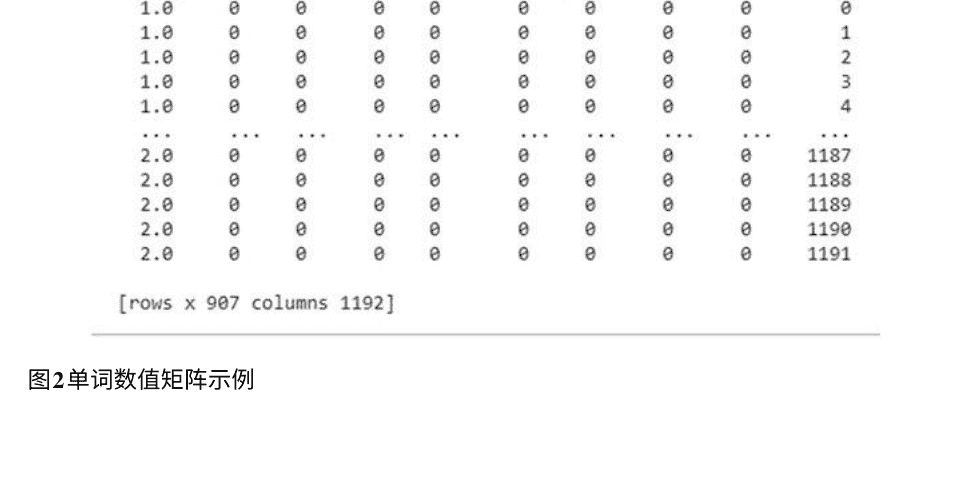

表7最有效的约旦方言词汇在分类器中：
| 特征 | 单词 | 得分 |
|---|---|---|
| 特征: 750 | ما | 得分: 0.01007 |
| 特征: 728 | لا | 得分: 0.28105 |
| 特征: 626 | عالتلطيّة | 得分: 0.01048 |
| 特征: 605 | صارت | 得分: 0.01314 |
| 特征: 598 | شكر | 得分: 0.21708 |
| 特征: 597 | انتكّي | 得分: 0.05050 |
| 特征: 306 | غالي | 得分: 0.01008 |
| 特征： 153 | خطّا | 得分： 0.01989 |
| 特征： 211 | غير | 得分： 0.00226 |
| 特征： 223 | مش | 得分： 0.00115 |
| 特征： 246 | زابط | 得分： 0.00152 |
| 特征： 261 | جيدة | 得分： 0.00186 |
| 特征： 272 | مشكلة | 得分： 0.00426 |
| 特征： 294 | ارخص | 得分： 0.00265 |
| 特征: 306 | رصيدي | 得分: 0.01008 |
| 特征： 315 | صلاحية | 得分： 0.00160 |
| 特征： 318 | الغيها | 得分： 0.00114 |
| 特征： 321 | عالمصول | 得分： 0.00152 |
| 特征： 337 | اوفق | 得分： 0.00488 |
| 特征： 348 | بالاقسام | 得分： 0.00379 |
| 特征： 401 | عباس | 得分： 0.00371 |
| 特征： 402 | يضّل | 得分： 0.00613 |
| 特征： 403 | بيطّن | 得分： 0.00006 |
| 特征： 455 | تتخانق | 得分： 0.00267 |
| 特征： 467 | مضطر | 得分： 0.00335 |
| 特征： 492 | محترمين | 得分： 0.00155 |
| 特征： 498 | جوايز | 得分： 0.00666 |
| 特征： 575 | ساعدي | 得分： 0.00446 |
| 特征： 576 | سرعة | 得分： 0.00342 |
| 特征： 587 | اقيت | 得分： 0.00471 |
| 特征： 581 |سهل | 得分： 0.00362 |
| 特征: 626 | الحل | 得分: 0.01048 |
| 特征： 637 | احسن | 得分： 0.00479 |
| 特征： 641 |سهل | 得分： 0.00646 |
| 特征： 644 | علينّا | 得分： 0.00423 |
| 特征： 656 | عندي | 得分： 0.00317 |
| 特征： 733 | فاصال | 得分： 0.00111 |
| 特征： 740 | لما | 得分： 0.00125 |
| 特征： 751 | ماكس | 得分： 0.00179 |
| 特征： 760 | ربحنا | 得分： 0.00446 |
| 特征: 779 | مش | 得分: 0.00286 |
| 特征: 780 | مشكل | 得分: 0.00458 |
| 特征: 782 | مشعمة | 得分: 0.00552 |
| 特征: 802 | ممتاز | 得分: 0.01359 |
| 特征: 804 | اعطالوي | 得分: 0.00505 |
| 特征: 815 | فرت | 得分: 0.00443 |
| 特征: 812 | منبحة | 得分: 0.00310 |
| 特征: 828 | تزلت | 得分: 0.00472 |
| 特征: 887 | يطلطي | 得分: 0.00542 |
| 特征: 888 | يعمل | 得分: 0.00117 |

建立模拟现实世界的新ABC算法。ABC算法可以高效地用于解决多模态和多维优化问题。

ABC有三个群体，雇佣的，旁观者和侦察蜜蜂。分布作为 first一半是雇佣的人工蜜蜂，第二半是旁观者。
一个雇佣的蜜蜂用于食物来源，旁观者蜜蜂在蜂巢中等待，并根据与雇佣蜜蜂共享的信息决定要利用的食物来源。
在耗尽食物后，雇佣的蜜蜂会变成侦查兵[22]。

原始的ABC算法：
(1) 随机生成初始解源
(2) 评估种群的适应度 ( fit($x_i$))
(3) 将循环设置为1
(4) 重复
(5) 对于每个雇佣的蜜蜂 {
    (a) 使用(2)生成新的解$V_i$
    (b) 计算其适应度值 fit($V_i$)
    (c) 应用贪婪选择过程}
(6) 通过 (3) 计算解 ($x_i$) 的概率值 $P_i$
(7) 对于每个观察蜜蜂 {
    (a) 根据 $P_i$选择一个解 $x_i$
    (b) 生成新解 $V_j$
    (c) 计算其适应度值 fit($V_j$)
    (d) 应用贪婪选择过程}
(8)如果有一个被放弃的解，则用 (4) 随机产生一个新解
    然后用迄今为止最好的解进行替换
(10) 循环 = 循环 + 1
(11) 直到 循环 = 最大循环次数
伪代码 1: ABC算法

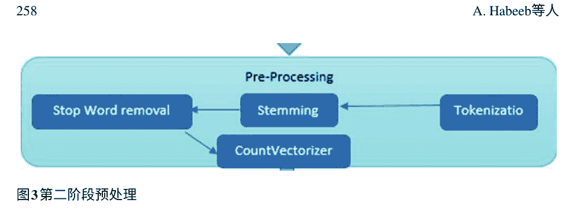

## 图3第二阶段预处理

ABC算法作为群体智能，是一个迭代过程，ABC根据以下方程创建候选解决方案：

每个解决方案 X_i= 1, 2, ..., SN; 其中SN表示解决方案的数量,x^j= (1, 2, ..., D) a D维向量。食物源随机分配给SN个受雇蜜蜂，其 fitness被评估。然后，对受雇蜜蜂、观察蜜蜂和侦察蜜蜂的搜索过程进行循环's。

```
x_i^j = x_{min}^j + rand(0,1)(x_{max}^j - x_{min}^j)  (1)
```

根据 V_i^j， 在此阶段由受雇蜜蜂的旧位置产生一个候选解，由方程表示。

2，其中 j ∈(1, 2, ..., D),k ∈(1, 2, ..., SN). θ_i; ^jtheta是一个在[-1, 1]范围内的随机数。为每个食物源 x_i分配一个食物源 v_i。一旦获得 v_i，将对其进行评估并与 x_i进行比较。在 x_i和 v_i之间应用贪婪选择。然后，根据 fitness值和 x_i的食物数量选择最佳解。

```
v_i^j = x_i^j + φ_i^j(x_i^j - x_k^j)  (2)
```

ABC选择食物，每个旁观者蜜蜂选择食物取决于适应度值，该值是从雇佣蜜蜂获得的。其中 fit(x_i)是解决方案i的适应度值。旁观者将选择食物源并产生新的候选位置 p_i of the selected food。此外，每个解决方案的选择概率由以下公式计算：

```
p_i = \frac{fit(x_i)}{\sum_{m=1}^{SN} fit(x_m)}  (3)
```

在完成雇佣蜜蜂和旁观者蜜蜂的搜索后，ABC算法检查是否有任何用尽的资源要被丢弃。侦察兵可以发现丰富的未知食物源。

原始人工蚁群算法有三个控制参数，食物源，停止迭代的限制值以找到最优食物源，以及最大循环次数MEN [23]。

#### 3.5.2 用深度学习和机器学习技术增强人工蜜蜂算法与上置信度界限

上置信度界限算法在收集更多环境信息以实现最佳利用时，改变了纯探索和利用的平衡 [24]。

探索和利用是基于人口的优化算法的关键。像PSO、GA、DE这样的算法，其中探索是指实现对未知领域的最优发现能力。在利用方面，它是将先前的知识应用于实践中以获得更好解决方案的能力 [25]。

ABC算法是在可能的搜索空间内解决问题的过程。侦查蜜蜂必须控制探索能力，而观察蜜蜂则具有利用能力。人工蜜蜂群对于约束和多维基本函数是高效的。当我们处理局部搜索能力时。收敛速度在复杂多模态函数中较差。

根据概率值，基于轮盘赌方法，人工蜜蜂群算法在方程（2）中选择一个食物源。在$x_i$和$v_i$之间应用贪婪选择。在原始ABC伪代码的这个阶段（1）：（5）（c）和（6）（d）应用贪婪选择，以改善利用能力，受到上置信界限算法（UBC）的启发进行了一些修改。通过这种修改，影响了四个结果：模式、均值、中位数和标准差。

当UCB有关于可用动作的信息时，UCB算法会修改其探索和利用的水平。对最佳动作的低置信度可以增加对利用的好动作的偏好。随着时间的推移，UBC调整平衡，实现了与贪婪算法相比的平均奖励的最优动作。

```
$$A(t) = \text{argmax}[Q_t(a) + \sqrt{\frac{\ln t}{N_t(a)}}]$$ UBC算法 (4)
```

其中Nt(k)是在时间t之前选择治疗组k的次数，方程（5）。

```
$$A(t) = \text{argmax}Q_t(a)$$ 贪婪算法 (5)
```

其中argmax指定选择动作'a'以最大化Qt(a)动作'a'在时间步't'上。

表8展示了如何从贪婪选择映射参数到UBC选择过程中的方程。
| UBC参数 | 估计值 | 贪婪参数 |
|---|---|---|
| $Q_t(a)$ | 动作'a'在时间步't'上 | $Q_t(a)$ |
| 指定选择动作'a'以最大化 $Q_t(a)$ | argmax | 指定选择动作'a'以最大化 $Q_t(a)$ |
| $N_t(a)$ | 在时间't'之前选择动作'a'的次数 |  |
| C | 控制探索水平的置信度值 | 常数 |
| $Q_t(a)$ | 代表方程的开发部分 | $Q_t(a)$ |

由于UBC具有高潜力成为最优解，它启发了一种称为（上置信度界限）方法的MAB问题解决方案[26]。

为了简化使用UBC的修改ABC的Pseudocode 2步骤(5)(a)，(6)(d)，以及修改的新食物源选择对ABC-UBC行为的影响，使用强化学习在人工蜜蜂群中。

```
(1) 生成初始种群 $x_i$ ($i=1,2,..., SN$)
(2) 评估种群的适应度 ( fit($x_i$))
(3) 将循环设置为1
(4) 重复
(5) 对于每个雇佣的蜜蜂 {
    (a) 使用(2)生成新的解V$_i$
    (b) 计算其适应度值 fit(V$_i$)
    (c) 应用UBC选择过程}
(6) 通过 (3) 计算解 ($x_i$) 的概率值 $P_i$
(7) 对于每个观察蜜蜂 {
    (a) 根据 $P_i$选择一个解 $x_i$
    (b) 生成新解 V$_j$
    (c) 计算其适应度值 fit(V$_j$)
    (d) 应用UBC选择过程}
(8) 如果有一个被放弃的解决方案，然后用迄今为止最好的解进行替换
(10) 循环 = 循环 + 1
(11) 直到 循环 = 最大循环次数
```

## 伪代码 2: 使用深度学习和机器学习技术的编辑分类应用

#### 3.5.3 使用修正后的ABC-UBC获取特征选择的数量

修正后的ABC-UBC过程用于找到具有更高分类准确性的特征子集的最小特征数（单词）。

初始食物源：特征数等于搜索空间的数量，这是找到包装器方法中最佳准确性的步骤。在提出的模型中，使用前向特征选择来找到最佳准确性。基于最小特征数找到最优特征。

然后将子集特征的数量应用于前向特征选择。为了将食物源表示为位向量，如果值为1，则表示考虑，如果值为0，则表示不考虑。在每个食物源的每个位置上，生成的介于0和1之间的随机数为R<sub>i</sub>，如果R<sub>i</sub>值小于MR值，则将该位置的值视为1。作为特征子集的一部分，如果值为0，则不考虑该特征。

变量n特征的数量是一个控制子特征的随机数，子特征通过分类准确性来评估分类器。并且作为食物源的适应度值。特征（食物源）的邻居由雇用的蜜蜂确定，新的食物源通过UBC算法选择，如方程（5）[27]所示。

### 3.6 特征选择

特征选择的三个目标是开发具有更具成本效益和更快速的预测解释预测器。最好处理生成数据的底层测试[28]。

在第一阶段，选择最佳特征非常重要，这意味着从特征集中选择出有区别的特征，同时排除无关的特征。[29].

实际上，可以使用任何组合的机器学习和搜索策略作为包装器，为了得到最佳特征组合的模型训练。寻找特征集合的子集作为n，其中n是从修改的ABC-UBC中获得的特征数量，以优化下一步的机器学习算法分类器的性能，并使用性能度量评估新训练的机器学习模型的性能。

此提议模型中的结束条件是由ABC-UBC预定义的特征数量，此外，还使用接收器操作特性(ROC)来衡量分类器的性能。ROC图用于可视化、组织和选择基于性能的分类。

ROC和准确度之间的区别在于ROC有助于处理不平衡的类实例，而准确度是一个总结性的指标。

ROC分析使用假阳性率(FPR)和真阳性率(TPR)来评估模型。这些计算为 FPR= FP 和 TPR = TP / P 其中N是负样本数，p是正样本数，TP是真正样本数。研究人员使用前向特征选择，从没有特征开始，逐个评估所有特征，然后选择性能最佳的特征。

### 3.7 文本分类

文本分类或标记是将文本标记为带有标签的组的过程，文本分类器可以分析文本并根据其内容分配标签或标记[30]。

#### 3.7.1 支持向量机分类器（SVM）

属于非参数监督技术，通过单一标识界限来进行二元分类，SVM文本分类中最重要的模型是线性和径向基函数。线性分类倾向于训练数据集，然后构建一个将类别或类别分配给模型的模型[31]。在这个模型中，主要目标是在前向特征选择分类器文本中使用SVM。在最简单的情况下，使用训练数据来分离数据到类别取决于训练数据标签（0和1）的最佳线。

在SVM中的学习阶段，用于处理具有最优决策边界的重复约束分类器[31]。

#### 3.7.2 K最近邻分类器（KNN）

属于非参数有监督技术，假设存在一个相似的类在用于分类问题的部分附近，该模型的主要目标是在文本分类中使用KNN进行前向特征选择。为了解决阿拉伯情感分析问题，KNN根据其最近邻的标签确定新样本的标签[32]。

#### 3.7.3 朴素贝叶斯分类器

朴素贝叶斯是一种学习方法，其中引入了多项式模型或概率学习方法。朴素贝叶斯通常依赖于文档的词袋视图，结合最常用的单词，而忽略其他罕见的单词。词袋模型依赖于特征提取方法，为一些数据提供分类fication。这个模型的主要目标是在前向特征选择中使用它fiers文本[33]。

#### 3.7.4多项式神经网络分类器

PNNs flexible神经架构分类fi器算法基于GMDH方法，并利用一类多项式，如线性、修正二次、立方，可以在训练和测试过程中设置层数，具有捕捉句子中单词之间关系的能力。在这个模型中，主要目标是将其用于前向特征选择分类器文本。解决阿拉伯情感分析问题[34]。

## 4 结果

### 4.1 结果信息

本文旨在提取阿拉伯文本的极性，针对引入的数据集。使用所提出的模型图1对这些文本进行分类。结果部分是对实验的总结，将在表格中呈现结果。使用了四个性能评估指标：精确度、召回率、F1分数和准确度。

### 4.2 约旦方言数据集实验

#### 4.2.1 预处理阶段的阿拉伯文本分类器结果

使用预处理阶段的KNN分类器结果如下（表9）。SVM（表10）。NB（表11）。PNN（表12）。

表9 带预处理的KNN结果
| 模型 | 数据集 | 分类器 | 标签1的精确度2 | 标签1 2的召回率 | 标签1 2的F1得分 | 准确性 |
| :--- | :--- | :--- | :--- | :--- | :--- | :--- |
| 预处理（词干处理，停用词）计数向量化 | 约旦方言 | KNN | 0.82 1.00 | 0.93 0.99 | 0.87 0.99 | 0.98 |
| | | 宏平均 | 0.91 | 0.96 | 0.93 | |
| | | 加权平均 | 0.98 | 0.97 | 0.97 | |
| | | 准确性 | | | 0.98 | |## 表10 带预处理的SVM结果

| 模型 | 数据集 | 分类器 | 标签1的精确度 | 标签2的精确度 | 标签1的召回率 | 标签2的召回率 | 标签1的F1得分 | 标签2的F1得分 | 准确性 |
| :--- | :--- | :--- | :--- | :--- | :--- | :--- | :--- | :--- | :--- |
| 预处理（词干处理，停用词）计数向量化 | 约旦方言 | 支持向量机 | 1.00 | 0.99 | 0.80 | 1.00 | 0.89 | 0.99 | 0.99 |
| | | 宏平均 | 0.99 | | 0.90 | | 0.94 | | |
| | | 加权平均 | 0.99 | | 0.99 | | 0.99 | | |
| | | 准确性 | | | | | | | 0.99 |

## 表11 使用预处理的NB结果

| 模型 | 数据集 | 分类器 | 标签1的精确度 | 标签2的精确度 | 标签1的召回率 | 标签2的召回率 | 标签1的F1得分 | 标签2的F1得分 | 准确性 |
| :--- | :--- | :--- | :--- | :--- | :--- | :--- | :--- | :--- | :--- |
| 预处理（词干处理，停用词）计数向量化 | 约旦方言 | 朴素贝叶斯 | 0.67 | 0.99 | 0.80 | 0.97 | 0.73 | 0.98 | 0.96 |
| | | 宏平均 | 0.83 | | 0.89 | | 0.85 | | |
| | | 加权平均 | 0.97 | | 0.96 | | 0.96 | | |
| | | 准确性 | | | | | | | 0.96 |

## 表12 使用预处理的PNN结果

| 模型 | 数据集 | 分类器 | 标签1的精确度 | 标签2的精确度 | 标签1的召回率 | 标签2的召回率 | 标签1的F1得分 | 标签2的F1得分 | 准确性 |
| :--- | :--- | :--- | :--- | :--- | :--- | :--- | :--- | :--- | :--- |
| 预处理（词干处理，停用词）计数向量化 | 约旦方言 | PNN | 0.80 | 0.99 | 0.80 | 0.99 | 0.80 | 0.99 | 0.97 |
| | | 宏平均 | 0.89 | | 0.89 | | 0.89 | | |
| | | 加权平均 | 0.97 | | 0.97 | | 0.97 | | |
| | | 准确性 | | | | | | | 0.97 |

#### 4.2.2 不带预处理阶段的阿拉伯文本分类器结果

- KNN（表13）。
- SVM（表14）。
- NB（表15）。
- PNN（表16）。

## 表13 不使用预处理的KNN结果

| 模型 | 数据集 | 分类器 | 标签1的精确度 | 标签2的精确度 | 标签1的召回率 | 标签2的召回率 | 标签1的F1得分 | 标签2的F1得分 | 准确率 |
|---|---|---|---|---|---|---|---|---|---|
| 不使用预处理的CountVectorizer | 约旦方言 | KNN | 0.56 | 1.00 | 0.93 | 0.95 | 0.70 | 0.97 | 0.95 |
| | | 宏平均 | 0.78 | | 0.94 | | 0.84 | | |
| | | 加权平均 | 0.97 | | 0.95 | | | | |
| | | 准确性 | | | | | | | 0.95 |

## 表14 不使用预处理的SVM结果

| 模型 | 数据集 | 分类器 | 标签1的精确度 | 标签2的精确度 | 标签1的召回率 | 标签2的召回率 | 标签1的F1得分 | 标签2的F1得分 | 准确性 |
|---|---|---|---|---|---|---|---|---|---|
| 不使用预处理的CountVectorizer | 约旦方言 | 支持向量机 | 1.00 | 0.99 | 0.80 | 1.00 | 0.89 | 0.99 | 0.99 |
| | | 宏平均 | 0.99 | | 0.90 | | 0.94 | | |
| | | 加权平均 | 0.99 | | 0.99 | | 0.99 | | |
| | | 准确性 | | | | | | | 0.99 |

## 表15 不使用预处理的NB结果

| 模型 | 数据集 | 分类器 | 标签1的精确度 | 标签2的精确度 | 标签1的召回率 | 标签2的召回率 | 标签1的F1得分 | 标签2的F1得分 | 准确性 |
|---|---|---|---|---|---|---|---|---|---|
| 不使用预处理的CountVectorizer | 约旦方言 | 朴素贝叶斯 | 0.71 | 0.99 | 0.80 | 0.98 | 0.75 | 0.98 | 0.97 |
| | | 宏平均 | 0.85 | | 0.89 | | 0.87 | | |
| | | 加权平均 | 0.97 | | 0.97 | | 0.97 | | |
| | | 准确性 | | | | | | | 0.97 |

## 表16 不使用预处理的PNN结果

| 模型 | 数据集 | 分类器 | 标签1的精确度 | 标签2的精确度 | 标签1的召回率 | 标签2的召回率 | 标签1的F1得分 | 标签2的F1得分 | 准确性 |
|---|---|---|---|---|---|---|---|---|---|
| 不使用预处理的CountVectorizer | 约旦方言 | PNN | 0.87 | 0.99 | 0.87 | 0.99 | 0.87 | 0.99 | 0.98 |
| | | 宏平均 | 0.93 | | 0.93 | | 0.93 | | |
| | | 加权平均 | 0.98 | | 0.98 | | 0.98 | | |
| | | 准确性 | | | | | | | 0.98 |

#### 4.2.3 使用前向特征选择的阿拉伯文本结果
使用ABC-UBC和预处理阶段

- KNN（表17和图4）。
- SVM（表18和图5）。
- NB（表19和图6）。
- PNN（表20和图7）。

## 表17 使用ABC-UBC和预处理的KNN结果

| 模型 | 数据集 | ABC UBC Fno | 分类器 | 标签1的精确度 | 标签2的精确度 | 标签1的召回率 | 标签2的召回率 | 标签1的F1得分 | 标签2的F1得分 | 准确性 |
|------|--------|-------------|--------|----------------|-----------------|-----------------|-----------------|-----------------|-----------------|--------|
| 特征选择与ABC-UBC结果和预处理 | 约旦方言 | 10 | KNN | 0.89 | 0.94 | 0.94 | 0.89 | 0.92 | 0.91 | 0.92 |
| | | | 宏平均 | 0.92 | | 0.92 | | 0.92 | | |
| | | | 加权平均 | 0.92 | | 0.92 | | 0.92 | | |
| | | | 准确性 | | | | | | | 0.92 |

## 表18 使用ABC-UBC和预处理的SVM结果

| 模型 | 数据集 | ABC UBC Fno | 分类器 | 标签1的精确度 | 标签2的精确度 | 标签1的召回率 | 标签2的召回率 | 标签1的F1得分 | 标签2的F1得分 | 准确性 |
|------|--------|-------------|--------|----------------|-----------------|----------------|----------------|----------------|----------------|--------|
| 特征选择与ABC-UBC结果和预处理 | 约旦方言 | 10 | 支持向量机 | 0.86 | 0.99 | 0.80 | 1.00 | 0.83 | 0.99 | 0.98 |
| | | | 宏平均 | 0.92 | | 0.90 | | 0.91 | | |
| | | | 加权平均 | 0.98 | | 0.98 | | 0.98 | | |
| | | | 准确性 | | | | | | | 0.98 |

## 表19 使用ABC-UBC和预处理阶段的NB结果

| 模型 | 数据集 | ABC UBC Fno | 分类器 | 标签1的精确度 | 标签2的精确度 | 标签1的召回率 | 标签2的召回率 | 标签1的F1得分 | 标签2的F1得分 | 准确性 |
|------|--------|-------------|--------|----------------|-----------------|----------------|----------------|----------------|----------------|--------|
| 特征选择与ABC-UBC结果和预处理 | 约旦方言 | 10 | 朴素贝叶斯 | 1.00 | 0.99 | 0.80 | 1.00 | 0.89 | 0.99 | 0.99 |
| | | | 宏平均 | 0.99 | | 0.90 | | 0.94 | | |
| | | | 加权平均 | 0.99 | | 0.99 | | 0.99 | | |
| | | | 准确性 | | | | | | | 0.99 |

## 表20 使用ABC-UBC和预处理的PNN结果

| 模型 | 数据集 | ABC UBC Fno | 分类器 | 标签1的精确度 | 标签2的精确度 | 标签1的召回率 | 标签2的召回率 | 标签1的F1得分 | 标签2的F1得分 | 准确性 |
| :--- | :--- | :--- | :--- | :--- | :--- | :--- | :--- | :--- | :--- | :--- |
| 特征选择与ABC-UBC结果和预处理 | 约旦方言 | 8 | PNN | 0.92 | 0.99 | 0.80 | 1.00 | 0.86 | 0.99 | 0.98 |
| | | | 宏平均 | 0.95 | | 0.90 | | 0.92 | | |
| | | | 加权平均 | 0.98 | | 0.98 | | 0.98 | | |
| | | | 准确性 | | | | | | | 0.98 |

#### 4.2.4 使用ABC-UBC进行前向特征选择的阿拉伯文本结果
无预处理阶段

- KNN (表21和图8)。
- SVM (表22和图9)。
- NB (表23和图10)。
- PNN (表24和图11)。

## 表21 使用ABC-UBC进行前向特征选择的KNN结果，不包括预处理阶段

| 模型 | 数据集 | ABC UBC Fno | 分类器 | 标签1的精确度 | 标签2的精确度 | 标签1的召回率 | 标签2的召回率 | 标签1的F1得分 | 标签2的F1得分 | 准确性 |
| :--- | :--- | :--- | :--- | :--- | :--- | :--- | :--- | :--- | :--- | :--- |
| 使用ABC-UBC进行特征选择的结果，不包括预处理 | 约旦方言 | 10 | KNN | 0.89 | 0.94 | 0.94 | 0.89 | 0.92 | 0.91 | 0.92 |
| | | | 宏平均 | 0.92 | | 0.92 | | 0.92 | | |
| | | | 加权平均 | 0.92 | | 0.92 | | 0.92 | | |
| | | | 准确性 | | | | | | | 0.92 |

## 表22 使用ABC-UBC进行前向特征选择的SVM结果，不包括预处理阶段

| 模型 | 数据集 | ABC UBC Fno | 分类器 | 标签1的精确度 | 标签2的精确度 | 标签1的召回率 | 标签2的召回率 | 标签1的F1得分 | 标签2的F1得分 | 准确性 |
| :--- | :--- | :--- | :--- | :--- | :--- | :--- | :--- | :--- | :--- | :--- |
| 使用ABC-UBC进行特征选择的结果，不包括预处理 | 约旦方言 | 10 | 支持向量机 | 0.86 | 0.99 | 0.80 | 0.99 | 0.83 | 0.99 | 0.98 |
| | | | 宏平均 | 0.92 | | 0.90 | | 0.91 | | |
| | | | 加权平均 | 0.98 | | 0.98 | | 0.98 | | |
| | | | 准确性 | | | | | | | 0.98 |

## 表23 使用ABC-UBC进行前向特征选择的NB结果，不包括预处理阶段

| 模型 | 数据集 | ABC UBC Fno | 分类器 | 标签1的精确度 | 标签2的精确度 | 标签1的召回率 | 标签2的召回率 | 标签1的F1得分 | 标签2的F1得分 | 准确性 |
|------|--------|-------------|--------|-------------------|-------------------|-------------------|-------------------|-------------------|-------------------|---------|
| 使用ABC-UBC进行特征选择的结果，不包括预处理 | 约旦方言 | 10 | 朴素贝叶斯 | 0.92 | 0.99 | 0.80 | 1.00 | 0.86 | 0.99 | 0.98 |
| | | | 宏平均 | 0.95 | | 0.90 | | 0.92 | | |
| | | | 加权平均 | 0.98 | | 0.98 | | 0.98 | | |
| | | | 准确性 | | | | | | | 0.98 |

## 表24 使用ABC-UBC进行前向特征选择的PNN结果，不包括预处理阶段

| 模型 | 数据集 | ABC UBC Fno | 分类器 | 标签1的精确度 | 标签2的精确度 | 标签1的召回率 | 标签2的召回率 | 标签1的F1得分 | 标签2的F1得分 | 准确率 训练 | 准确率 测试 |
|------|--------|-------------|--------|-----------------|-------------|-----------------|-----------------|-----------------|-----------------|------------------|------------------|
| 使用ABC-UBC进行特征选择的结果，不包括预处理 | 约旦方言 | 8 | PNN | 0.92 | 0.99 | 0.80 | 1.00 | 0.86 | 0.99 | 0.99 | 0.97 |
| | | | 宏平均 | 0.95 | | 0.90 | | 0.98 | | | |
| | | | 加权平均 | 0.98 | | 0.98 | | 0.92 | | | |
| | | | 准确性 | | | | | | | | 0.98 |

## 表25 带预处理的KNN结果

| 模型 | 数据集 | 分类器 | 标签1的精确度 | 标签2的精确度 | 标签1的召回率 | 标签2的召回率 | 标签1的F1得分 | 标签2的F1得分 | 准确性 |
| :--- | :--- | :--- | :--- | :--- | :--- | :--- | :--- | :--- | :--- |
| 预处理（词干处理，停用词）计数向量化 | 约旦方言 | KNN | 0.59 | 0.62 | 0.88 | 0.26 | 0.71 | 0.36 | 0.60 |
| | | 宏平均 | 0.61 | | 0.57 | | 0.53 | | |
| | | 加权平均 | 0.61 | | 0.60 | | 0.55 | | |
| | | 准确率 | | | | | | | 0.60 |

### 4.3 阿尔及利亚方言数据集实验
#### 4.3.1 带预处理阶段的阿拉伯文本分类器结果

- KNN (表25)
- SVM (表26)
- NB (表27)
- PNN (表28)

## 表26 带预处理的SVM结果

| 模型 | 数据集 | 分类器 | 标签1的精确度 | 标签2的精确度 | 标签1的召回率 | 标签2的召回率 | 标签1的F1得分 | 标签2的F1得分 | 准确率 训练 | 准确率 测试 |
|---|---|---|---|---|---|---|---|---|---|---|
| 预处理（词干处理，停用词）计数向量化 | 约旦方言 | 支持向量机 | 0.72 | 0.68 | 0.75 | 0.64 | 0.73 | 0.66 | 0.70 | 0.72 |
| | | 宏平均 | 0.70 | | 0.70 | | 0.70 | | | |
| | | 加权平均 | 0.70 | | 0.70 | | 0.70 | | | |
| | | 准确性 | | | | | | | | 0.70 |

## 表27 带预处理的NB结果

| 模型 | 数据集 | 分类器 | 标签1的精确度 | 标签2的精确度 | 标签1的召回率 | 标签2的召回率 | 标签1的F1得分 | 标签2的F1得分 | 准确性 |
|---|---|---|---|---|---|---|---|---|---|
| 预处理（词干处理，停用词）计数向量化 | 约旦方言 | 朴素贝叶斯 | 0.63 | 0.63 | 0.79 | 0.44 | 0.70 | 0.52 | 0.63 |
| | | 宏平均 | 0.63 | | 0.61 | | 0.61 | | |
| | | 加权平均 | 0.63 | | 0.63 | | 0.62 | | |
| | | 准确性 | | | | | | | 0.63 |

## 表28 带预处理的PNN结果

| 模型 | 数据集 | 分类器 | 标签1的精确度 | 标签2的精确度 | 标签1的召回率 | 标签2的召回率 | 标签1的F1得分 | 标签2的F1得分 | 准确率 训练 | 准确率 测试 |
|---|---|---|---|---|---|---|---|---|---|---|
| 预处理（词干处理，停用词）计数向量化 | 约旦方言 | PNN | 0.61 | 0.57 | 0.73 | 0.44 | 0.67 | 0.49 | 0.60 | 0.74 |
| | | 宏平均 | 0.59 | | 0.58 | | 0.58 | | | |
| | | 加权平均 | 0.59 | | 0.60 | | 0.59 | | | |
| | | 准确性 | | | | | | | | 0.60 |

#### 4.3.2 不带预处理阶段的阿拉伯文本分类器结果

- KNN (表29)。
- SVM (表30)。
- NB (表31)。
- PNN (表32)。

## 表29 KNN 无预处理结果

| 模型 | 数据集 | 分类器 | 标签1的精确度 | 标签2的精确度 | 标签1的召回率 | 标签2的召回率 | 标签1的F1得分 | 标签2的F1得分 | 准确性 |
|------|--------|-----------|---------------|----------------|----------------|----------------|----------------|----------------|---------|
| 不使用预处理的CountVectorizer | 约旦方言 | KNN | 0.66 | 0.84 | 0.94 | 0.91 | 0.78 | 0.75 | 0.70 |
| | | 宏平均 | 0.75 | | 0.67 | | 0.66 | | |
| | | 加权平均 | 0.74 | | 0.70 | | 0.68 | | |
| | | 准确性 | | | | | | | 0.70 |

## 表30 SVM 无预处理结果

| 模型 | 数据集 | 分类器 | 标签1的精确度 | 标签2的精确度 | 标签1的召回率 | 标签2的召回率 | 标签1的F1得分 | 标签2的F1得分 | 准确率 训练 | 准确率 测试 |
|------|--------|-----------|---------------|----------------|----------------|----------------|----------------|----------------|------------------|------------------|
| 不使用预处理的CountVectorizer | 约旦方言 | 支持向量机 | 0.79 | 0.72 | 0.77 | 0.74 | 0.78 | 0.73 | 0.76 | 0.76 |
| | | 宏平均 | 0.76 | | 0.76 | | 0.76 | | | |
| | | 加权平均 | 0.76 | | 0.76 | | 0.76 | | | |
| | | 准确性 | | | | | | | | 0.76 |

## 表31 NB 无预处理结果

| 模型 | 数据集 | 分类器 | 标签1的精确度 | 标签2的精确度 | 标签1的召回率 | 标签2的召回率 | 标签1的F1得分 | 标签2的F1得分 | 准确性 |
|------|--------|-----------|---------------|----------------|----------------|----------------|----------------|----------------|---------|
| 无预处理CountVectorizer | 约旦方言 | 朴素贝叶斯 | 0.60 | 0.58 | 0.79 | 0.36 | 0.68 | 0.44 | 0.60 |
| | | 宏平均 | 0.59 | | 0.58 | | 0.56 | | |
| | | 加权平均 | 0.59 | | 0.60 | | 0.58 | | |
| | | 准确性 | | | | | | | 0.60 |

## 表32 PNN 无预处理结果

| 模型 | 数据集 | 分类器 | 标签1的精确度 | 标签2的精确度 | 标签1的召回率 | 标签2的召回率 | 标签1的F1得分 | 标签2的F1得分 | 准确性 |
|------|--------|-----------|---------------|----------------|----------------|----------------|----------------|----------------|---------|
| 不使用预处理的CountVectorizer | 约旦方言 | PNN | 0.70 | 0.61 | 0.67 | 0.64 | 0.68 | 0.62 | 0.66 |
| | | 宏平均 | 0.65 | | 0.65 | | 0.65 | | |
| | | 加权平均 | 0.66 | | 0.66 | | 0.66 | | |
| | | 准确性 | | | | | | | 0.66 |

## 4.3.3 使用前向特征选择和 ABC-UBC 进行预处理的阿拉伯文本结果

- KNN（表格 33 和 图 12）。
- SVM（表格 34 和 图 13）。
- NB（表格 35 和 图 14）。
- PNN（表格 36 和 图 15）。

### 表格 33 使用前向特征选择和 ABC-UBC 进行预处理的 KNN 结果

| 模型 | 数据集 | ABC UBC Fno | 分类器 | 标签1的精确度 | 标签2的精确度 | 标签1的召回率 | 标签2的召回率 | 标签1的F1得分 | 标签2的F1得分 | 准确性 |
| :--- | :--- | :--- | :--- | :--- | :--- | :--- | :--- | :--- | :--- | :--- |
| 特征选择与ABC-UBC预处理结果 | 约旦方言 | 10 | KNN | 0.94 | 0.67 | 0.62 | 0.95 | 0.75 | 0.79 | 0.77 |
| | | | 宏平均 | 0.81 | | 0.79 | | 0.77 | | |
| | | | 加权平均 | 0.82 | | 0.77 | | 0.77 | | |
| | | | 准确性 | | | | | | | 0.77 |

### 图 12 特征性能

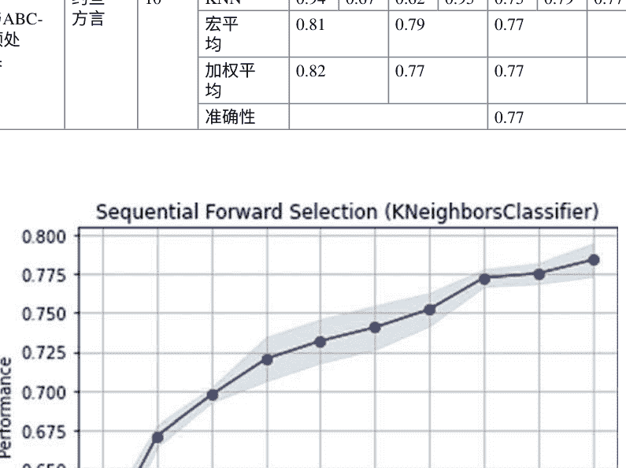

### 表格 34 使用前向特征选择和 ABC-UBC 进行预处理的 SVM 结果

| 模型 | 数据集 | ABC UBC Fno | 分类器 | 标签1的精确度 | 标签2的精确度 | 标签1的召回率 | 标签2的召回率 | 标签1的F1得分 | 标签2的F1得分 | 准确性 |
| :--- | :--- | :--- | :--- | :--- | :--- | :--- | :--- | :--- | :--- | :--- |
| 特征选择与ABC-UBC预处理结果 | 约旦方言 | 10 | 支持向量机 | 0.83 | 0.76 | 0.79 | 0.79 | 0.81 | 0.77 | 0.79 |
| | | | 宏平均 | 0.79 | | 0.79 | | 0.79 | | |
| | | | 加权平均 | 0.79 | | 0.79 | | 0.79 | | |
| | | | 准确性 | | | | | | | 0.79 |

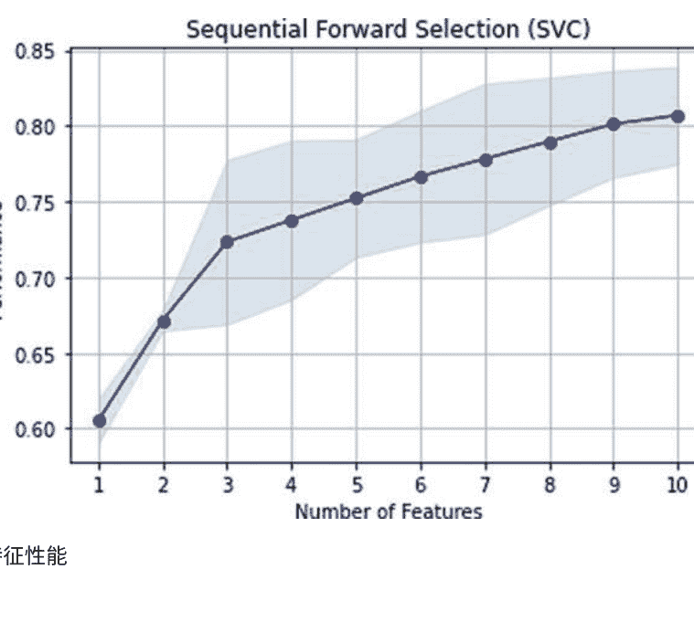

### 图 13 特征性能

### 表格 35 使用前向特征选择和 ABC-UBC 进行预处理的 NB 结果

| 模型 | 数据集 | ABC UBC Fno | 分类器 | 标签1的精确度 | 标签2的精确度 | 标签1的召回率 | 标签2的召回率 | 标签1的F1得分 | 标签2的F1得分 | 准确性 |
| :--- | :--- | :--- | :--- | :--- | :--- | :--- | :--- | :--- | :--- | :--- |
| 特征选择与ABC-UBC结果和预处理 | 约旦方言 | 10 | 朴素贝叶斯 | 0.90 | 0.74 | 0.75 | 0.90 | 0.82 | 0.81 | 0.82 |
| | | | 宏平均 | 0.82 | | 0.82 | | 0.82 | | |
| | | | 加权平均 | 0.83 | | 0.82 | | 0.82 | | |
| | | | 准确性 | | | | | | | 0.82 |

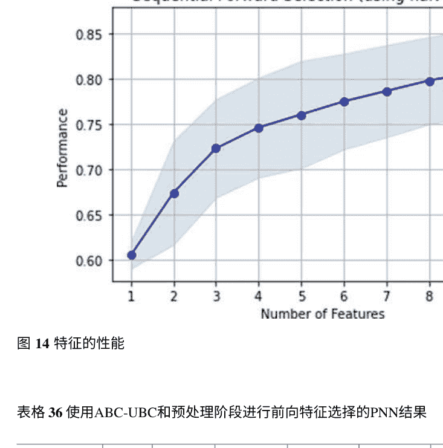

### 图 14 特征的性能

### 表格 36 使用前向特征选择和 ABC-UBC 进行预处理的 PNN 结果

| 模型 | 数据集 | ABC UBC Fno | 分类器 | 标签1的精确度 | 标签2的精确度 | 标签1的召回率 | 标签2的召回率 | 标签1的F1得分 | 标签2的F1得分 | 准确性 |
|------|--------|-------------|--------|----------------|----------------|----------------|----------------|----------------|----------------|-------------------|
| 使用ABC-UBC进行特征选择带有预处理的结果 | 约旦方言 | 10 | PNN | 0.86 | 0.65 | 0.62 | 0.87 | 0.72 | 0.75 | 0.74 |
|      |        |             | 宏平均 | 0.76 | | 0.75 | | 0.74 | | |
|      |        |             | 加权平均 | 0.77 | | 0.74 | | 0.73 | | |
|      |        |             | 准确率 | | | | | | | 0.74 |

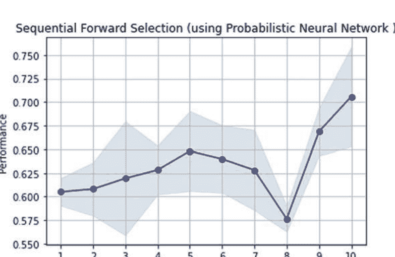

### 图 15 特征的性能

### 表格 37 使用 ABC-UBC 进行前向特征选择的 KNN 结果（无预处理阶段）

| 模型 | 数据集 | ABC UBC Fno | 分类器 | 标签1的精确度 | 标签2的精确度 | 标签1的召回率 | 标签2的召回率 | 标签1的F1得分 | 标签2的F1得分 | 准确率（训练/测试） |
| :--- | :--- | :--- | :--- | :--- | :--- | :--- | :--- | :--- | :--- | :--- |
| 使用ABC-UBC进行特征选择无预处理的结果 | 约旦方言 | 10 | KNN | 0.94 | 0.70 | 0.67 | 0.95 | 0.78 | 0.80 | 0.79 |
| | | | 宏平均 | 0.82 | | 0.81 | | 0.79 | | |
| | | | 加权平均 | 0.70 | | 0.95 | | 0.80 | | |
| | | | 准确性 | | | | | | | 0.79 |

## 4.3.4 使用 ABC-UBC 进行前向特征选择的阿拉伯文本结果（无预处理阶段）

- KNN（表格 37 和图 16）。
- SVM（表格 38 和图 17）。
- NB（表格 39 和图 18）。
- PNN（表40和图19）。

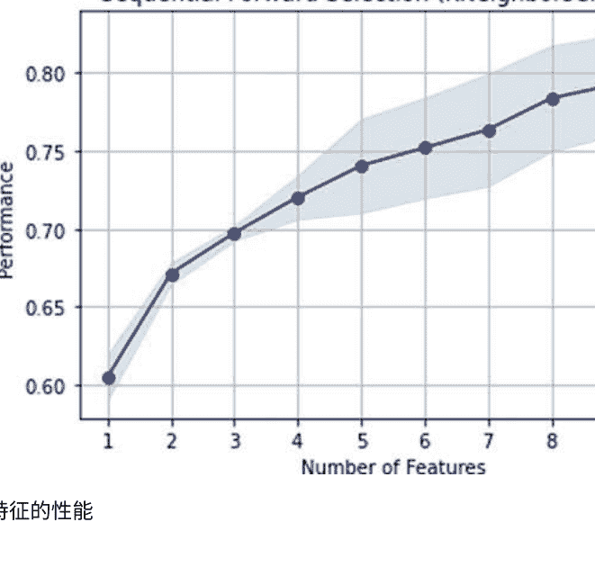

### 图16 特征的性能

### 表38 使用 ABC-UBC 进行前向特征选择的 SVM 结果（不包括预处理阶段）

| 模型 | 数据集 | ABC UBC Fno | 分类器 | 标签1的精确度 | 标签2的精确度 | 标签1的召回率 | 标签2的召回率 | 标签1的F1得分 | 标签2的F1得分 | 准确性 |
|------|--------|-------------|--------|-------------------|-------------|-------------------|-------------|----------------|----------------|--------|
| 使用ABC-UBC进行特征选择的结果，不包括预处理 | 约旦方言 | 10 | 支持向量机 | 0.81 | 0.96 | 0.71 | 0.79 | 0.76 | 0.74 | 0.75 |
| | | | 宏平均 | 0.75 | | 0.75 | | 0.75 | | |
| | | | 加权平均 | 0.75 | | 0.75 | | 0.75 | | |
| | | | 准确性 | | | | | | | 0.75 |

# Sequential Forward Selection (SVC)

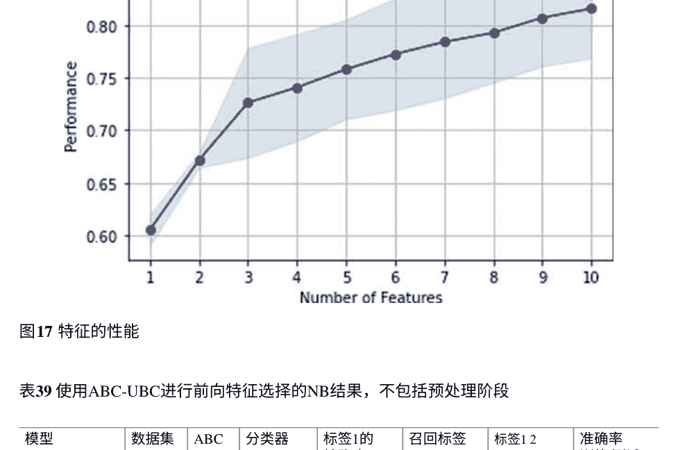

### 图17 特征的性能

### 表39 使用 ABC-UBC 进行前向特征选择的 NB 结果（不包括预处理阶段）

| 模型 | 数据集 | ABC UBC Fno | 分类器 | 标签1的精确度 | 标签2的精确度 | 标签1的召回率 | 标签2的召回率 | 标签1的F1得分 | 标签2的F1得分 | 准确率（训练/测试） |
|------|--------|-------------|--------|----------------|------------|----------------|------------|----------------|----------------|----------------|
| 使用ABC-UBC进行特征选择的结果，不包括预处理 | 约旦方言 | 10 | 朴素贝叶斯 | 0.90 | 0.74 | 0.75 | 0.90 | 0.82 | 0.81 | 0.82 |
| | | | 宏平均 | 0.82 | | 0.82 | | 0.82 | | |
| | | | 加权平均 | 0.83 | | 0.82 | | 0.82 | | |
| | | | 准确性 | | | | | | | 0.82 |

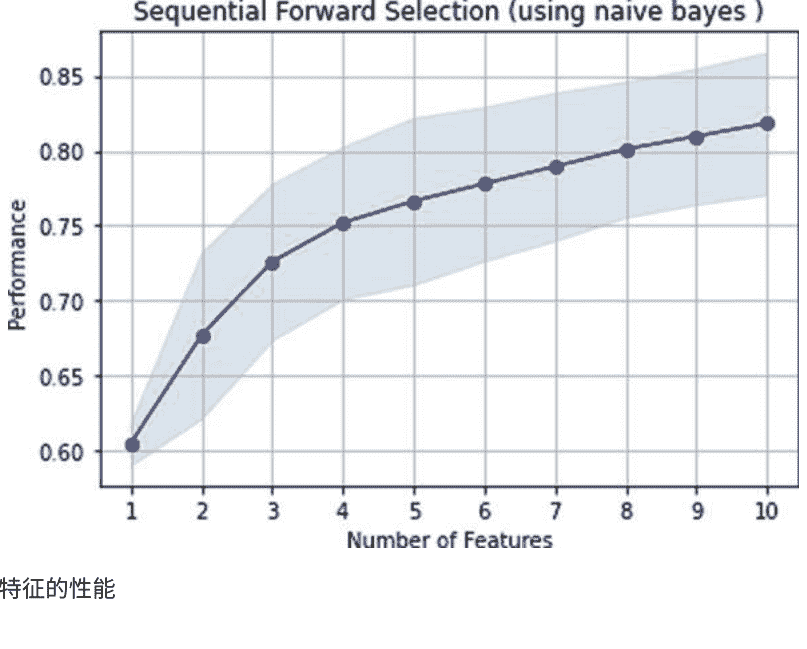

### 表40 使用 ABC-UBC 进行前向特征选择的 PNN 结果（不包括预处理阶段）

| 模型 | 数据集 | ABC UBC Fno | 分类器 | 标签1的精确度 | 标签2的精确度 | 标签1的召回率 | 标签2的召回率 | 标签1的F1得分 | 标签2的F1得分 | 准确性 |
| :--- | :--- | :--- | :--- | :--- | :--- | :--- | :--- | :--- | :--- | :--- |
| 使用ABC-UBC进行特征选择的结果，不包括预处理 | 约旦方言 | 6 | PNN | 0.91 | 0.67 | 0.62 | 0.92 | 0.74 | 0.77 | 0.76 |
| | | | 宏平均 | 0.79 | | 0.77 | | 0.76 | | |
| | | | 加权平均 | 0.80 | | 0.76 | | 0.76 | | |
| | | | 准确性 | | | | | | | 0.76 |

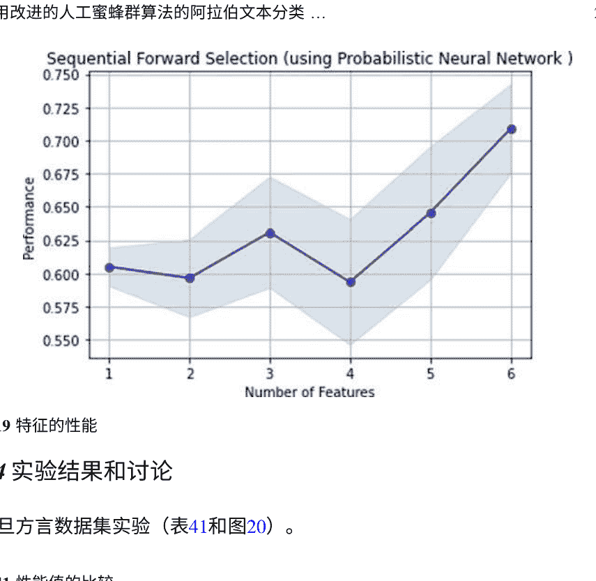

### 图19 特征的性能

## ### 4.4 实验结果和讨论

约旦方言数据集实验（表41和图20）。

### 表41 性能值的比较

| 模型 | 优化算法 | 机器学习分类器 | 精确率 | 召回率 | F1-得分 | 准确性 |
| --- | --- | --- | --- | --- | --- | --- |
| 带有预处理阶段的阿拉伯文本分类器 |  | KNN | 0.91 | 0.96 | 0.93 | 0.98 |
|  |  | 支持向量机 | 0.99 | 0.90 | 0.94 | 0.99 |
|  |  | NB | 0.83 | 0.89 | 0.85 | 0.96 |
|  |  | PNN | 0.89 | 0.89 | 0.89 | 0.97 |
| 阿拉伯文本分类器无需预处理阶段 |  | KNN | 0.78 | 0.94 | 0.84 | 0.95 |
|  |  | 支持向量机 | 0.99 | 0.90 | 0.94 | 0.99 |
|  |  | NB | 0.85 | 0.89 | 0.87 | 0.97 |
|  |  | PNN | 0.98 | 0.98 | 0.98 | 0.98 |
| 使用ABC-UBC和预处理阶段的阿拉伯文本前向特征选择 |  | KNN | 0.92 | 0.92 | 0.92 | 0.92 |
|  |  | 支持向量机 | 0.92 | 0.90 | 0.91 | 0.98 |
|  |  | NB | 0.99 | 0.90 | 0.94 | 0.99 |
|  |  | PNN | 0.95 | 0.90 | 0.92 | 0.98 |
| 使用ABC-UBC进行前向特征选择的阿拉伯文本无需预处理阶段 |  | KNN | 0.92 | 0.92 | 0.92 | 0.99 |
|  |  | 支持向量机 | 0.92 | 0.90 | 0.91 | 0.98 |
|  |  | NB | 0.95 | 0.90 | 0.92 | 0.98 |
|  |  | PNN | 0.95 | 0.90 | 0.92 | 0.98 |

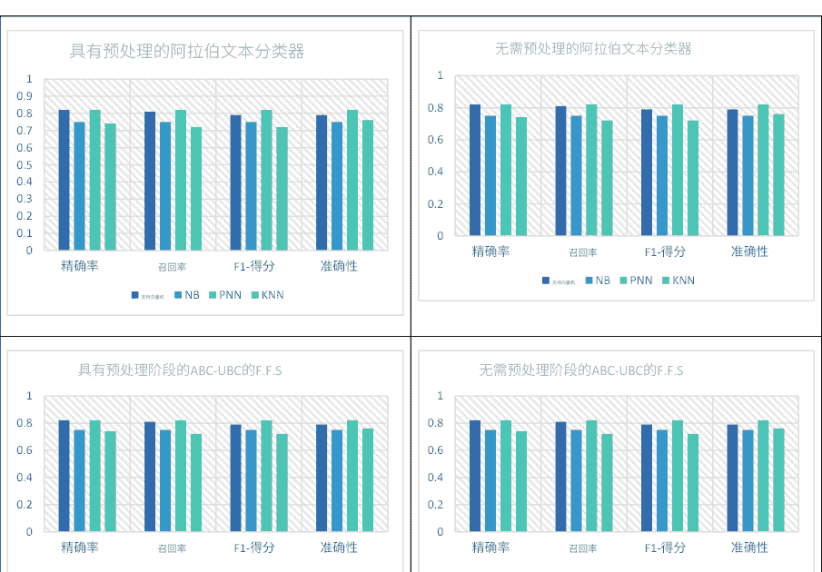

### 图20 使用约旦方言数据集进行四个测试的预测准确性比较

### 4.5 实验结果和讨论

阿尔及利亚方言数据集实验（表42和图21）。

### 表42 性能值的比较

| 模型 | 优化算法 | 机器学习分类器 | 精确率 | 召回率 | F1-得分 | 准确性 |
| :--- | :--- | :--- | :--- | :--- | :--- | :--- |
| 带有预处理阶段的阿拉伯文本分类器 | | KNN | 0.61 | 0.57 | 0.53 | 0.60 |
| | | 支持向量机 | 0.70 | 0.70 | 0.70 | 0.70 |
| | | NB | 0.63 | 0.61 | 0.61 | 0.63 |
| | | PNN | 0.59 | 0.58 | 0.58 | 0.60 |
| 阿拉伯文本分类器无需预处理阶段 | | KNN | 0.75 | 0.76 | 0.66 | 0.70 |
| | | 支持向量机 | 0.76 | 0.76 | 0.76 | 0.76 |
| | | NB | 0.59 | 0.58 | 0.56 | 0.60 |
| | | PNN | 0.63 | 0.65 | 0.65 | 0.66 |
| 使用ABC-UBC和预处理阶段的阿拉伯文本前向特征选择 | 修改后的ABC-UB | KNN | 0.81 | 0.79 | 0.77 | 0.77 |
| | | 支持向量机 | 0.79 | 0.79 | 0.79 | 0.79 |
| | | NB | 0.82 | 0.82 | 0.82 | 0.82 |
| | | PNN | 0.76 | 0.75 | 0.74 | 0.74 |
| 使用ABC-UBC进行前向特征选择的阿拉伯文本无需预处理阶段 | 修改后的ABC-UB | KNN | 0.82 | 0.81 | 0.79 | 0.79 |
| | | 支持向量机 | 0.75 | 0.75 | 0.75 | 0.75 |
| | | NB | 0.82 | 0.82 | 0.82 | 0.82 |
| | | PNN | 0.74 | 0.72 | 0.72 | 0.76 |

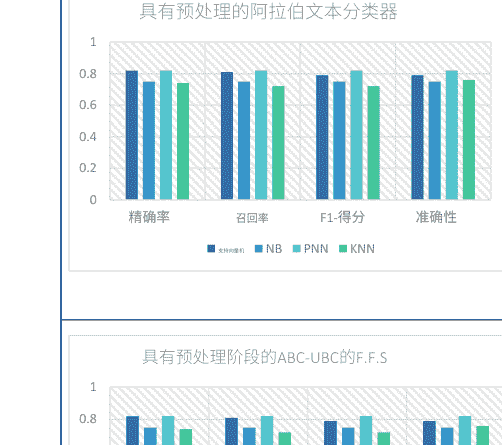

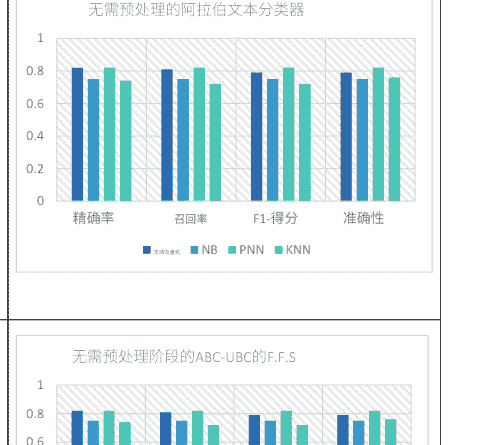

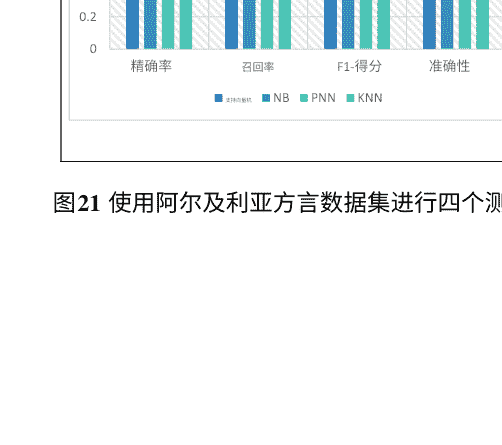

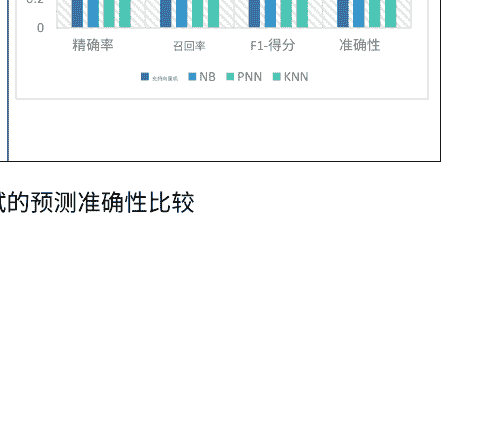

### 图21 使用阿尔及利亚方言数据集进行四个测试的预测准确性比较

## 5 结论

在本文中，修改后的算法对最优特征的影响程度。在约旦文本分类器中，以及它们的影响，提出的修改后的ABC-UBC从单词中选择出最优特征以进行分类任务。使用约旦方言数据集进行了测试。在约旦文本分类器中，性能指标的比较如表41所示：使用预处理阶段，不使用预处理阶段，使用ABC-UBC进行前向特征选择并使用预处理阶段，以及使用ABC-UBC进行前向特征选择但不使用预处理阶段。我们推断出优化后的特征被用于分类任务。准确率高达99%，此外，精确率、召回率和F1分数也在95%至99%之间。在测试分类算法后，我们比较了四个测试的预测准确率，其中包括支持向量机（SVM）、K最近邻分类器（KNN）、朴素贝叶斯（NB）和概率神经网络（PNN），如图20所示，KNN、NB和PNN的最佳结果准确率高达99.9%。测试使用了阿尔及利亚方言数据集。在阿尔及利亚文本分类器中，性能指标的比较如表42所示：使用预处理阶段，不使用预处理阶段，使用ABC-UBC进行前向特征选择并使用预处理阶段，以及使用ABC-UBC进行前向特征选择但不使用预处理阶段。这个模型经过四个测试后的准确率高达82%（F1分数）。

对比约旦方言数据集和阿尔及利亚方言数据集的内容。

约旦方言中的文本大小不超过数据库中每行的二十个单词。而阿尔及利亚方言中的文本大小是一个长段落，数据库中每行的单词超过一百个。通过经验，观察到以下情况：分类准确性受到单词数量的影响。如果单词数量减少，分类准确性会增加。

未来的目标是在阿拉伯语及其方言中应用所提出的监督模型方法，以在更多阿拉伯语数据集上进行测试后与其他方法进行比较。该方法将引入不同的功能，如垃圾邮件检测和其他功能，以实现阿拉伯文本分类系统的优秀结果。

## 参考文献

1. Proudfoot, D. (2020). 重新思考图灵测试和哲学意义。Minds and Machines, 1–26.
2. Janani, R., & Vijayarani, S. (2020). 使用机器学习和优化算法的自动文本分类。fi, 1–17.
3. Elnagar, A., Al-Debsi, R., & Einea, O. (2020). 使用深度学习的阿拉伯文本分类模型。信息处理与管理, 57(1), 102121.
4. Karaboga, D., Gorkemli, B., Ozturk, C., & Karaboga, N. (2014). 一项全面调查: 人工蜜蜂群算法（ABC）及其应用。人工智能评论, 42(1), 21–57.
5. Jiang, D., Yue, X., Li, K., Wang, S., & Guo, Z. (2015). 精英对抗人工蜜蜂群体算法用于全局优化。国际工程学杂志, 28(9), 1268–1275.
6. Alzaqebah, A., Smadi, B., & Hammo, B. H. (2020). 基于S型传递函数的salp群算法的阿拉伯情感分析.在2020年第11届国际信息与通信系统会议(ICICS)(pp. 179–184). IEEE.
7. Guellil, I., Adeel, A., Azouaou, F., Benali, F., Hachani, A. E., Dashtipour, K., ... & Hussain, A. (2021). 一种半监督方法用于阿拉伯(ic+ izi)信息的情感分析:应用于阿尔及利亚方言.SN计算机科学, 2(2), 1–18.
8. Thirumoorthy, K., & Muneeswaran, K. (2020). 使用混合二进制Jaya优化算法进行文本分类的最优特征子集选择fication.Sādhanā, 45(1), 1–13.
9. Chantar, H., Mafarja, M., Alsawalqah, H., Heidari, A. A., Aljarah, I., & Faris, H. (2020). 使用基于精英交叉的二进制灰狼优化器进行阿拉伯文本分类的特征选择。神经计算与应用, 32(16), 12201–12220.
10. Zheng, W., & Jin, M. (2020). 比较多个特征选择方法的文本分类。人文学科的数字学术研究, 35(1), 208–224.
11. Hussein, O., Sfar, H., Mitrović, J., & Granitzer, M. (2020). NLP_Passau在SemEval-2020任务12中的多语言神经网络用于英语、丹麦语和土耳其语的冒犯性语言检测。在语义评估第十四届研讨会论文集中 (pp. 2090–2097).
12. 潘, Y., 梁, M. (2020). 基于BI-GRU和自注意力的中文文本情感分析。在2020年IEEE第四届信息技术, 网络、电子和自动化控制会议 (ITNEC) (卷1, 页1983–1988). IEEE.
13. Rachid, B. A., Azza, H., Ghezala, H. H. B. (2020). 阿拉伯语中的网络欺凌文本分类fi。在2020年国际联合神经网络会议 (IJCNN) (页1–7). IEEE.
14. 郭, Z., 石, J., 熊, X., 夏, X., 刘, X. (2019). 混沌人工蜜蜂群与精英对抗学习。国际计算科学与工程杂志, 18(4), 383–390.
15. Almani, N., & Tang, L. H. (2020). 基于深度注意力的阿拉伯评论级情感分析。在2020年第6届数据科学和机器学习应用会议 (CDMA) 中(第47–53页). IEEE.
16. Hanbay, K. (2021). 一种基于标准误差的人工蜂群算法及其在特征选择中的应用。沙特国王大学计算机与信息科学学报.
17. Chaudhuri, A., & Sahu, T. P. (2021). 多目标人工蜂群算法用于朴素贝叶斯的特征加权。国际计算科学与工程学报, 24(1), 74–88.
18. Obeid, O., Zalmout, N., Khalifa, S., Taji, D., Oudah, M., Alhafni, B., ... & Habash, N. (2020). CAMEL工具: 用于阿拉伯自然语言处理的开源Python工具包。在第12届语言资源和评估会议论文集中(第7022–7032页).
19. Ayedh, A., Tan, G., Alwesabi, K., & Rajeh, H. (2016). 预处理对阿拉伯语文档分类的影响。算法, 9(2), 27.
20. 陈, P. H. (2020). 自然语言处理的基本要素: 放射科医生应该了解的内容。学术放射学, 27(1), 6–12.
21. Vijayaraghavan, S., & Basu, D. (2020). 使用监督机器学习算法进行药物评论的情感分析。arXiv预印本arXiv:2003.11643.
22. Karaboga, D. (2005).基于蜜蜂群的数值优化思想 (vol.200, pp. 1–10). 技术报告-tr06, Er ciyes大学，工程学院，计算机工程系.

- 23. Ghambari, S., & Rahati, A. (2018). 一种改进的人工蜂群算法及其在可靠性优化问题中的应用。应用软计算, 62, 736–767.

- 24. Xiang, Z., Xiang, C., Li, T., & Guo, Y. (2020). 一种自适应的层次化动作和结构联合优化框架，用于机器人和动画骨骼的自动设计。软计算, 1–14.

- 25. Sharma, A., Sharma, A., Choudhary, S., Pachauri, R. K., Shrivastava, A., & Kumar, D. A. (2020). 人工蜂群算法及其工程应用的综述。关键评论杂志.

- 26. Li, Y. (2020). 各种多臂赌博算法（ε-贪婪、汤普森抽样和UCB-）与标准A/B测试的比较。

- 27. Hijazi, M., Zeki, A., & Ismail, A. (2021). 使用混合特征选择方法的阿拉伯文本分类使用卡方二进制人工蜜蜂群算法。计算机科学, 16(1), 213–228.

- 28. Zhang, X., Fan, M., Wang, D., Zhou, P., & Tao, D. (2020). 基于鲁棒的0-1整数规划的前k个特征选择框架。IEEE神经网络和学习系统交易.

- 29. Janani, R., & Vijayarani, S. (2020). 使用机器学习和优化算法的自动文本分类软计算, 1–17.

- 30. Dhar, A., Mukherjee, H., Dash, N. S., & Roy, K. (2021). 文本分类：过去和现在。人工智能评论, 54(4), 3007–3054.

- 31. Sheykhmousa, M., Mahdianpari, M., Ghanbari, H., Mohammadimanesh, F., Ghamisi, P., & Homayouni, S. (2020). 支持向量机与随机森林在遥感图像分类中的比较: 一项元分析和系统综述。IEEE选定主题期刊应用地球观测与遥感.

- 32. Saadatfar, H., Khosravi, S., Jouloudari, J. H., Mosavi, A., & Shamshirband, S. (2020). 一种基于高效数据修剪的大数据K最近邻分类器。数学, 8(2), 286.

- 33. Ruan, S., Li, H., Li, C., & Song, K. (2020). 类别特定的深度特征加权用于朴素贝叶斯文本分类器。IEEE Access, 8, 20151–20159.

- 34. O, S. K., Pedrycz, W., & Park, B. J. (2003). 多项式神经网络架构：分析与设计。计算机与电气工程, 29(6), 703–725.