# 深度学习和物理学

## 前言

对于那些想要研究物理学的人来说，什么是深度学习？ 它与物理学完全不同吗？还是它真的很相似？

近年来，包括深度学习在内的机器学习开始在各种物理学研究中使用。为什么会这样？ 了解物理学对机器学习有用吗？反过来，了解机器学习对物理学有用吗？

本书致力于回答这些问题。 从物理学的基本思想开始，神经网络被“自然地”推导出来。通过物理学的语言，你可以学习深度学习的概念。

事实上，机器学习的基础可以归因于物理概念。 决定物理系统的哈密顿量表征了各种机器学习结构。由哈密顿量给出的统计物理定义了神经网络的机器学习。 此外，通过机器学习和泛化解决物理学中的逆问题，实质上为物理学的进展甚至革命提供了进展。 出于这些原因，近年来，机器学习和物理学的跨学科研究正在迅速扩展。

本书是为了让任何想要了解、学习和应用深度学习/机器学习与物理学之间关系的人而编写的。阅读本书所需的只是物理学的基本概念：能量和哈密顿量。统计力学的概念和量子力学的括号表示法，这些在专栏中介绍，被用来解释深度学习框架。

这本书分为两个部分。 第一部分涉及从物理学的角度理解机器学习方法，第二部分探讨了物理学中各种问题与机器学习方法之间的关系。也就是说，第一部分是一本教科书，但第二部分不是教科书，而是一本关于最新高级主题的集合（因此，第二部分的章节几乎可以独立阅读）。请参考每个章节开头的读者指南。

如果读者已经学过物理，然后阅读一本普通的机器学习教材，读者可能会感到不舒服，因为各种概念突然而且经验主义地被介绍，没有解释。这本书的动机就是这样的差距。另一方面，本书不涵盖代码实现，因为它依赖于库。读者可以尝试使用一些喜欢的库来实现一个机器。

假设读者已经学习了物理的基础知识：大约在物理学本科二年级或三年级。 我们将基于哈密顿量来解释一切，但不需要具备分析力学的知识。

一位著名的物理学家内山凉梦在他的著作《相对论理论》[1]的前言中说：“如果你读了这本书还是不理解，那你应该放弃学习相对论理论。”另一方面，“机器学习×物理学”这个书的主题并不像相对论理论那样有着悠久的历史，而是一个仍在取得巨大进展的研究领域。因此，我们的信息是这样的：“如果你读了这本书还是不理解，那将成为未来发展的种子。”我们最喜欢的是粒子物理学家S. Weinberg的一句话[2]：“我的建议是去处理混乱的地方 - 那里才有动作。”读者可以自己选择自己的道路。我们希望这本书能帮助读者学习和研究。

东京，日本
2019年3月

田中明典
富谷明夫
橋本浩二

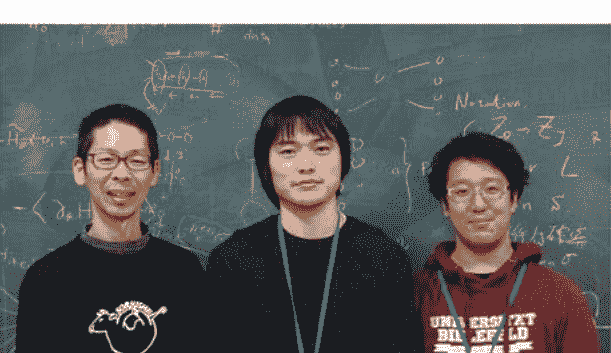

作者

## 致谢

本书是基于我们周围许多人关于物理和机器学习的讨论而撰写的。特别重要的是在大阪大学举办的“深度学习与物理”和“深度学习与物理2018”研讨会以及世界各地的研究会和研讨会上的讨论。 我们想借此机会感谢所有参与其中的人。

我们感谢阿久田川哲也、住本直之、白井典仁、永井祐樹、菊池裕太、鬼虎修司和曾树沙也加对日文草稿的阅读和评论。 田中明典感谢RIKEN先进智能项目和RIKEN跨学科理论和数学科学计划（iTHEMS）的支持。 富谷明夫感谢中国华中师范大学的丁恒通教授。 如果他没有聘请富谷作为博士后，并为富谷提供一个自由研究与他专业不同的问题的环境，这本书的论文将不可能存在。 富谷要感谢广岛大学的松本真教授，他指出了真随机数与科尔莫哥洛夫复杂性之间的关系。

橋本浩二感謝他的妻子橋本春子對写作和研究的理解。 我們都感謝橋本春子對英文翻譯的支持，以及小田切科學的編輯阿澄敦志先生對這本書的出版努力（於2019年6月出版）。 我們感謝大賀浩司教授和今田正敏教授在Springer出版這本書的支持，還有中村先生對這本書的編輯工作。 最後，我們要感謝來自世界各地的研究人員在不同地點討論物理和機器學習。

### 第1章 前言：机器学习和物理学

摘要 机器学习和物理学之间的关系是什么？首先让我们通过体验来了解为什么机器学习和物理学可以相关。有一个概念将物理学和机器学习联系起来：那就是信息。物理学和信息论长期以来一直相互关联。此外，机器学习是基于信息论的。学习是关于传递信息和重新建立信息之间的关系，并自发地找到信息。因此，在机器学习中，需要使用能够灵活处理信息量的信息论，并且作为结果，机器学习与信息论系统密切相关。本章探讨了物理学、信息论和机器学习之间的关系，这是本书的核心概念。

机器学习和物理之间的关系是什么？我们将在本书中更详细地探讨这个问题，但首先让我们通过体验来了解为什么机器学习和物理可以相关联。有一个概念将物理学和机器学习联系起来，那就是信息。

物理学和信息论长期以来一直相互关联，并且这种关系仍然广泛而深入地发展着。此外，机器学习是基于信息论的。学习是关于传递信息、重新创建信息之间的关系，并自发地发现信息。因此，在机器学习和深度学习中，有必要使用灵活处理信息量的信息论，并且结果上，机器学习与信息论系统密切相关。

从这些事情中，读者可以想象出机器学习和物理学之间应该有一些与“信息”作为中介媒介的重要关系。本书的一个目标是澄清这个坚实的桥梁。图1.1显示了一个概念图。

本章探讨了物理学、信息论和机器学习之间的关系，这本书的核心概念。让我们解释一下这本书的标题，“深度学习”和“物理学”之间的关系。

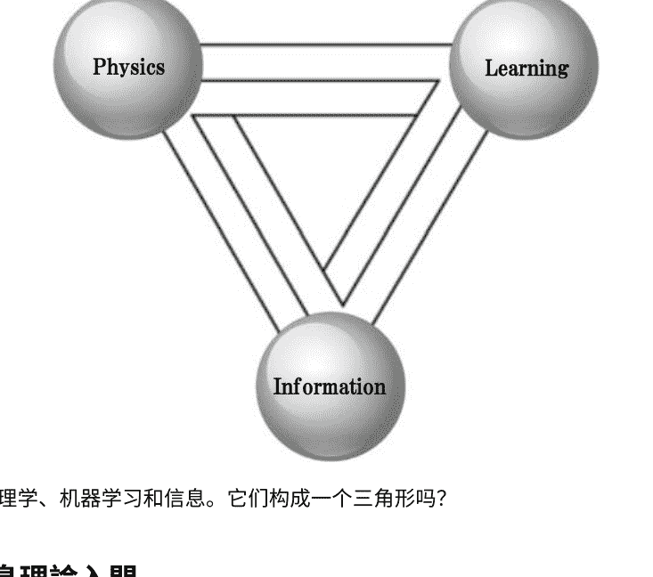

### 1.1 信息理論入門

##### 量化信息

本章通过信息论作为桥梁，探讨了物理学和机器学习之间的关系。为此，我们需要准确地定义“信息”是什么。首先，“信息”是什么？首先，阅读以下两个句子[3]:

- 人类教会大猩猩如何加法. (1.1)
- 大猩猩教会人类如何加法. (1.2)

这两个句子中哪一个可以说有更多信息？(1.1) 如果是真的，那并不令人惊讶，因为无论大猩猩是否理解，都有可能。你可能真的听过这样的新闻。另一方面，如果(1.2)是真的，那就相当令人惊讶。然后人们会改变主意，记住可能有一只大猩猩可以教人类。这可以说是增加了信息的数量。换句话说[4],

> 信息的数量 = 惊讶的程度. (1.3)

无论如何，让我们继续这个政策。 惊讶程度越大，发生的可能性就越小。此外，如果我们试图通过“加法增加信息”，有

$P$ (事件)事件发生的概率，我们有<sup>1</sup>

事件A的信息量 $= -\log P$ (事件A).\n(1.4)

当概率较低时，信息量较大。

##### 平均信息量

让我们进一步假设各种事件 $A_1, A_2, ..., A_W$以概率 $p_1, p_2, ..., p_W$分别发生。此时，每个事件的信息量为 $-\log p_i$，其期望值为

$S_{\text{信息}} = -\sum_{i=1}^{W} p_i \log p_i$.\n(1.5)

被称为信息熵。<sup>2</sup>让我们举一个具体的例子来说明信息熵的含义。假设有 $W$ 个盒子，让 $p_i$是第$i$个盒子含有宝藏的概率。当然，我们希望尽可能准确地预测哪个盒子含有宝藏，但可预测性取决于 $p_i$的值。

例如，如果我们知道宝藏总是在第一个盒子里，那就很容易预测。这种情况下的信息熵值为零：

$p_i = \begin{cases} 1 & (i=1) \\ 0 & (除此之外) \end{cases}$ \quad $S_{\text{信息}} = 0$.\n(1.6)

另一方面，如果概率完全随机，

$p_i = \dfrac{1}{W}$ \quad $S_{\text{信息}} = \log W$.\n(1.7)

对于这种情况，即使我们知道概率，也很难预测，因为我们不知道它在哪个盒子里。这时，信息熵的值很大，为$\log W$。换句话说，预测越困难，信息熵就越大。因此，与常说的“信息”相关的关系如下：

- 少量“信息” $\Leftrightarrow$ 难以预测 $\Leftrightarrow$ 大的信息熵
- 大量“信息” $\Leftrightarrow$ 容易预测 $\Leftrightarrow$ 小的信息熵\n(1.8)

这里的‘信息’是我们已经拥有的信息，而(1.4)中的信息量是从事件中获得的信息。

#### 1.2 物理学和信息论

物理学中有许多重要的概念，但没有物理学家会反对熵是其中最重要的之一。熵是热力学发展中的一个基本概念，可以表示为 $S = k_{\mathrm{B}} \log W$，其中 $W$ 是微观状态的数量，在统计力学中使用。比例系数 $k_{\mathrm{B}}$ 是玻尔兹曼常数，如果使用适当的温度单位，可以将其设置为1。在这种情况下，系统的熵为

$S = \log W$ . (1.9)

在物理学中，通过熵的概念揭示了与信息论的关系：这是因为(1.7)的信息熵 $S$ 的公式与(1.9)完全相同。通过这种方式，对于处理多个自由度的物理系统（如热力学和统计力学），可以进行各种讨论，并且可以进行信息论的解释。

顺便说一下，现代物理学研究中（如粒子物理学和凝聚态物理学），大部分的兴趣都在于多体系统。这表明信息论在现代物理学研究的前沿起着重要的作用。这里有两项最近的研究。

##### 黑洞信息丢失问题

J. Bekenstein和S. Hawking [6, 7]的研究理论上表明黑洞具有熵，并将其质量以热的形式辐射出去。为了解释黑洞辐射特性中隐藏的内在问题，以下示例很有启发性：假设有一个弹簧，并将其拉伸固定。如果将其投入黑洞，黑洞将通过储存的能量变得更大，然后将该能量作为热辐射出去。但是这里存在问题。在弹簧被投入黑洞之前，可以自由提取能量，但热辐射能够提取的能量效率受到热力学第二定律的限制。换句话说，即使在投入之前只有一个状态（即熵为零），热辐射后的随机性会导致熵增加。熵的增加意味着信息的丢失（参见(1.8)）。这被称为信息丢失问题，是现代物理学中最重要的问题之一，尚未得到明确的解决。³

##### 麦克斯韦的恶魔

麦克斯韦的恶魔是一个虚拟的恶魔，在思想实验中打破了热力学第二定律，至少表面上是这样；它由詹姆斯·克拉克·麦克斯韦引入。假设一个盒子中含有温度为T的气体；在这个盒子的中间插入一个带有小孔的隔板。这个孔足够小，只允许一个气体分子通过。孔旁边还有一个开关，可以按下来关闭或打开孔。根据统计力学，在具有气体分子质量m和温度T的气体中，存在速度为v的分子

概率与 $e^{-\frac{mv^2}{2k_B T}}$ 成正比。这意味着气体分子以不同的速度飞行：有些分子速度快，有些分子速度慢。假设在隔板孔附近有一个小恶魔，恶魔只让“从右边来的快速分子通过孔到左边，只让从左边来的慢速分子通过孔到右边。”结果是，相对较慢的分子留在右边，快速移动的分子聚集在左边。也就是说，如果右边的温度是 $T_R$，左边的温度是 $T_L$，那么就意味着 $T_R < T_L$。使用理想气体状态方程，$p_R < p_L$，所以力 $F = p_L - p_R$ 作用在房间右边的方向上。如果我们允许隔板滑动并将一些绳子系在上面，那么这个 $F$可以做一些功。这个故事中应该有一些奇怪的地方，因为它可以无限地将热量转化为功，这意味着我们创造了第二类永动机。近年来，信息理论已被证明是填补这一差距的有效方法[8]。

在这种方式下，与信息理论的关系在理论物理的各个方面变得越来越突出。著名的惠勒在引力理论上的工作中甚至说“它来自位”（物理存在来自信息）[9]。近年来，不仅基于普通概率论的信息理论，还有基于干涉概率的量子力学的一个领域，即量子信息理论的研究也在积极进行，并且每天都有各种发展报道。这本书没有涵盖这个内容，但是感兴趣的读者可以阅读[10]和其他书籍。

#### 1.3 机器学习和信息论

数学上描述机器学习方法的一种方式是基于概率论。事实上，这本书遵循这种格式。这种方法的一个好处是我们仍然可以使用包括熵在内的各种信息理论概念。机器学习的目的是“从一些经验中预测未知的未来”，在数学上进行这种描述时，如式（1.8）所示，需要处理一个衡量预测困难程度的量。然而，式（1.8）中描述的“可预测性”是基于我们知道事件发生的概率 $p_i$ 的假设。即使在机器学习中，也假设现象背后存在 $p_i$，而其值相对熵和Sanov定理

尚不清楚。下面的例子说明，即使在这种情况下，考虑类似于熵的概念仍然非常重要。

在这里，让我们简要地看一下我们在本书中研究的一种典型的机器学习方法。与以前一样，让我们假设可能的事件是 $A_1, A_2, \dots, A_W$，并且它们以概率 $p_1, p_2, \dots, p_W$ 发生。如果我们实际上可以知道 $p_i$ 的值，我们将能够在信息熵的水平上在一定程度上预测未来的情况。然而，在许多情况下，$A_i$ 的概率 $p_i$ 是未知的，而我们只知道 $A_i$ 实际发生的次数的“信息”，

+   • $\left\{ \begin{array}{l} A_1: \#_1 \text{次}, A_2: \#_2 \text{次}, \dots, A_W: \#_W \text{次}, \\ \#(= \sum_{i=1}^W \#_i) \text{总共.} \end{array} \right.$ (1.10)

这里，# (数字符号) 是一个适当的正整数，表示次数。正如物理实验不能观察到理论方程本身一样，我们不能直接观察到这里的 $p_i$。因此，考虑创建一个尽可能接近 $p_i$ 的预期概率 $q_i$，并将确定一个“好”的 $p_i$ 的问题视为机器学习。我们应该如何仅凭“信息”(1.10) 确定 $q_i$ 的值？我们可以做的一件事是评估

+   • 假设 $q_i$ 是真实概率，获得信息 (1.10) 的概率。 (1.11)

如果我们可以计算这个，我们需要确定使概率 (1.11) 尽可能大 (接近1) 的 $q_i$。这个想法被称为最大似然估计。首先，假设每个 $A_i$ 以概率 $q_i$ 发生，

$$p(\text{事件}A \text{发生的概率为} i \text{次}) = q_i^{\#_i}.$$
(1.12)

此外，在这个设置中，我们假设 $A_i$ 可以以任意顺序发生。例如，$[A_1, A_1, A_2]$ 和 $[A_2, A_1, A_1]$ 被视为相同，并且这样的组合数量应在概率计算中予以考虑。这是多项式系数

$$\binom{\#}{\#_1, \#_2, \dots, \#_W} = \frac{\#!}{\#_1! \#_2! \dots \#_W!}.$$
(1.13)

然后我们可以将概率写成这些因子的乘积,

$$(1.11) = q_1^{\#_1} q_2^{\#_2} \dots q_W^{\#_W} \frac{\#!}{\#_1! \#_2! \dots \#_W!}.$$
(1.14)

然后，我们应该寻找使这个值尽可能大的 $q_i$。在机器学习中，$q_i$是变化的，以实际上尽可能增加与(1.14)等价的数量。

5这个问题可以通过拉格朗日乘数法来解决。定义一个拉格朗日函数

$$L(q_i, \lambda) = \log[\text{Eq. (1.14)}] + \lambda \left(1 - \sum_{i=1}^{W} q_i\right). \tag{1.15}$$

如果我们寻找使得这个 $L$ 达到极值的 $\lambda$，那么我们找到

$$q_i = \frac{\#_i}{\#}, \quad \lambda = \#. \tag{1.16}$$

读者可以看到这符合大数定律(1.17)的直觉。
6大数定律将在第5章中解释。

顺便说一下，如果数据的数量很大($#\approx \infty$)，根据大数定律，我们有

$$\frac{\#_i}{\#} \approx p_i \quad \Leftrightarrow \quad \#_i \approx \# \cdot p_i. \tag{1.17}$$

在这里，$\#_i$也必须是一个很大的值，所以根据斯特林公式(在物理学中很熟悉)，我们发现

$$\#_i! \approx \#_i^{\#_i}. \tag{1.18}$$

通过将(1.17)和(1.18)代入(1.14)，我们可以得到一个有趣的量：

$$\begin{align}
(1.14) &\approx q_1^{\# \cdot p_1} q_2^{\# \cdot p_2} \dots q_W^{\# \cdot p_W} \frac{\#!}{(# \cdot p_1)! (# \cdot p_2)! \dots (# \cdot p_W)!} \\
&\approx q_1^{\# \cdot p_1} q_2^{\# \cdot p_2} \dots q_W^{\# \cdot p_W} \frac{\#^{\#}}{(\# \cdot p_1)^{\# \cdot p_1} (\# \cdot p_2)^{\# \cdot p_2} \dots (\# \cdot p_W)^{\# \cdot p_W}} \\
&= q_1^{\# \cdot p_1} q_2^{\# \cdot p_2} \dots q_W^{\# \cdot p_W} \frac{1}{p_1^{\# \cdot p_1} p_2^{\# \cdot p_2} \dots p_W^{\# \cdot p_W}} \\
&= \exp \left[ -\# \sum_{i=1}^{W} p_i \log \frac{p_i}{q_i} \right]. \tag{1.19}
\end{align}$$

$\sum_{i=1}^{W} p_i \log \frac{p_i}{q_i}$ 接近于零。这个量被称为相对熵，只有当 $p_i = q_i$ 时才为零。因此，使原始目标(1.11)尽可能接近1对应于减小相对熵。我们的意思是,

相对熵 = 用来衡量预测 $q_i$ 与真实值 $p_i$ 的接近程度的量。

相对熵的性质将在本书后面解释。相对熵在信息论中被称为Kullback-Leibler散度，在机器学习中也很重要，正如我们在这里看到的，同时还具有许多数学上有趣的性质。式(1.11)与Kullback-Leibler散度近似相同是大偏差理论中Sanov定理[12, 13]的一个结果。

##### 1.4 机器学习和物理

到目前为止，我们简要描述了物理学和信息论之间的关系，以及机器学习和信息论之间的关系。那么，机器学习和物理学可能在某种意义上存在联系。上述图1.1展示了这个概念：物理学和信息相关联，信息和机器学习相关联。那么，物理学和机器学习如何相互关联呢？

###### 一个思想实验

假设我们这里有一个仙女。一个按钮和一个时钟放在仙女面前，每分钟，仙女选择按下按钮还是不按下。如果仙女按下按钮，机器输出1。如果仙女不按下按钮，输出为0。“特殊仙女”的结果是以下序列:

```
{1, 0, 0, 0, 0, 0, 0, 0, 0, 1, 1, 0, 0, 1, 1, ...} \quad (1.20)
```

下图显示了这项单调工作大约4小时的结果，以15 × 15的矩阵形式显示:


我们让仙女继续工作五天的整个晚上。结果是：

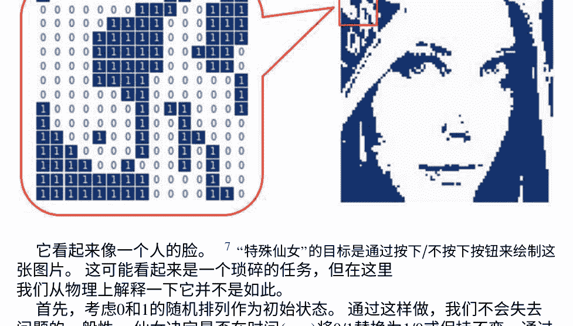

它看起来像一个人的脸。$^7$“特殊仙女”的目标是通过按下/不按下按钮来绘制这张图片。这可能看起来是一个琐碎的任务，但在这里我们从物理上解释一下它并不是如此。

首先，考虑0和1的随机排列作为初始状态。通过这样做，我们不会失去问题的一般性。仙女决定是否在时间$(x, y)$将0/1替换为1/0或保持不变，通过操作按钮。仙女检查时间$(x, y)$的单个位的状态，并决定是否反转它。是的，读者现在知道这个“特殊仙女”的身份是麦克斯韦的恶魔。$^8$

从这个角度来看，“画一幅画”是从无数可能性（高熵）中绘制出一个有意义的组合（低熵）的行为。换句话说，它是以某种方式增加信息。你可能听说过人工智能绘制画作的新闻。

毫不怀疑，我们可以说这意味着在当前背景下成功创造了一个麦克斯韦的恶魔。

上面麦克斯韦的恶魔的故事是一个思想实验，它暗示了机器学习和物理学可能有关联，但实际上，这本书的主题，机器学习和物理学，能否通过一根粗管道连接起来呢？

事实上，即使在机器学习领域，也有许多问题经常需要“物理意义”，并且有许多受其启发的研究成果。例如，在深度学习的早期阶段，使用了一种使用随机神经网络的模型（Boltzmann机器），这个模型受到了统计力学的启发，尤其是处理自旋自由度的伊辛模型。神经网络是一种模拟大脑中神经元连接的人工网络，而霍普菲尔德模型则提供了一种将记忆存储为物理系统的机制，可以说是一种伊辛模型的类型。在本书中，我们重点描述了从统计力学角度看各种神经网络的设置。

在玻尔兹曼机器学习和贝叶斯统计中，需要生成（或采样）遵循某些复杂概率分布的（伪）随机数。这是在凝聚态物理学和基本粒子物理学的数值计算中流行的方法，因此在这里有一些共同之处。9对于复杂模型来说，采样时间太长，所以近年来玻尔兹曼机器已被神经网络取代，并且不再受到关注。

然而，学术意义可能尚未揭示，所以不仅要关注深度学习的最新主题，还要回到起点，重新思考Boltzmann机器。

如今，深度学习只是一系列在将深度神经网络应用于各种机器学习方案时被发现“经验上”有效的技术的集合。然而，感知到任何技术在“经验上”有效的思维，与所谓的“物理感觉”有些相似。10例如，近年来已经知道，一个名为ResNet的模型，在神经网络中包含一个“旁路”，具有很高的能力。ResNet学习的是深度神经网络的“残差”，而不是直接学习普通深度神经网络所获得的“特征”。这些“特征”是执行所需任务的重要量。在ResNet中，残差被累积以表示特征。这被表达为关系“微分=残差”和“积分=特征”，让人想起运动方程及其解。

从这个意义上讲，机器学习和物理似乎有着“某种”关系。要实际尝试翻译，我们需要创建一个相应的字典，如表1.1。回到图1.1，结合上面列出的许多零碎的关系，机器学习和深度学习方法可以从物理角度来看和构建。

考虑到这一点，本书的目标是：

+   1. 从物理角度理解机器学习方法

9事实上，计算物理学专业的人转向数据科学领域并不罕见。
10例如，大多数量子场论尚未在数学上得到证明，但与实验结果一致。它们是通过物理感觉来表述的。量子电动力学的计算结果，它是量子场论的一个分支，包含了一些在数学上没有得到证明的操作，但它们与实验测量结果相差不到10个数量级。当然，从理论物理学家的角度来看，执行的操作是一致的，但它们在数学上还没有得到严格的证明。

##### 2. 寻找物理问题和机器学习方法之间的联系

表1.1 机器学习相关领域中使用的术语和符号以及它们在物理学中的对应

| 机器学习 | 物理学 |
|---|---|
| 期望值  $\mathbb{E}_{\theta}[\bullet]$ | 期望值 $\langle\bullet\rangle_{J}$ |
| 训练参数 $W, \theta$ | 耦合常数（外场） $J$ |
| 能量函数 $E$ | 哈密顿量 $H$ |

在本书中，前半部分是“从物理学的角度介绍机器学习/深度学习”，后半部分是“应用于物理学”。虽然本书中没有介绍许多主题，但我们尽可能包含了参考文献，所以想要了解更多的读者应该查阅文献或通过关键词搜索。

此外，本书的最后一章描述了写作背景、研究动机以及对正在学习机器学习的人的信息，从作者的三个不同角度。正如读者所看到的，作者有不同的相互关联的观点，机器学习和物理学在什么意义上仍然相关是研究人员不完全同意的一个谜。换句话说，这也意味着“一个未被探索的领域，可能存在着一些东西。”随着从现在开始学习机器学习的读者，让我们通过这本书踏入这个神秘的领域。

## 第一部分

## 深度学习的物理视角

让我们进入本书的第一部分，从物理角度研究和理解机器学习。在这篇文章中，我们将使用物理语言来看待神经网络的“出现”。在一般的教科书中，神经网络被介绍为模仿大脑神经网络和神经元的功能，并且为了学习和应用的目的改进了各种神经网络结构。在那里没有特定的物理视角。因此，许多读者可能怀疑，即使神经网络具有物理视角，它们也只能被解释为对个别概念的回顾性解释。然而，在第一部分中，从物理角度出发，我们将重点关注神经网络及其相关概念是如何自然地出现的，并主要关注神经网络的“推导”。

顺便说一下，虽然我们不能确定，但我们想象这里的“推导”似乎是研究人员在思维中实际上隐含地完成的事情。这是我们在阅读从玻尔兹曼机到神经网络转变时撰写的论文时的感受。

当然，并非所有的机器学习概念都是从物理上推导出来的。我们将用物理语言解释基本概念，比如什么是机器学习。如果你学过一点物理，你就能自然地感受到如何执行和优化机器学习的答案。

此外，下面描述的概念并不详尽地涵盖了机器学习中的所有概念，而只关注了理解机器学习所必需的基本概念。然而，用物理语言理解这些概念将有助于理解目前以各种方式应用的机器学习，并且对于与物理和机器学习相关的研究也将非常有用。现在，我们将为每个章节给出一个简要介绍，作为读者的目的地指示牌。

### 第二章：机器学习简介

首先，我们学习机器学习的一般理论。我们将看一些学习的例子，了解“机器学习”的含义以及相对熵是什么。我们将学习如何处理概率论中的数据，并描述“泛化”及其在学习中的重要性。

### 第三章：神经网络基础

接下来，在本章中，我们从物理模型的视角推导出神经网络。神经网络是一个非线性函数，将输入映射到输出，给定网络等效于给定一个函数，在监督学习的情况下称为误差函数。

通过将输出视为动力学自由度，将输入视为外部场，从简单的哈密顿量中产生了各种神经网络及其加深版本。¹训练（学习）是一种减小误差函数值的过程，我们将学习在量子力学中流行的bra-ket符号表示法中的反向传播具体方法。我们将看一下“通用逼近定理”的工作原理，这就是为什么神经网络可以表达各种类型数据之间的连接。

### 第四章：高级神经网络

在本章中，我们将解释近年来深度学习的两种主要神经网络结构，这是根据前一章物理学的观点进行的。

卷积神经网络具有强调输入数据空间接近性的结构。此外，循环神经网络具有学习时间序列输入数据的结构。您将学习如何提供一个符合数据特征的网络结构。

### 第五章：采样

在进行训练的情况下，假设输入数据是由概率分布给出的。通常需要计算由概率分布给出的各种输入值的函数的期望值。在本章中，我们将介绍“采样”的方法和必要性，即执行期望值计算的方法。统计力学中经常使用的概念，如大数定律、中心极限定理、马尔可夫链蒙特卡洛方法、细致平衡原理、Metropolis方法和热浴方法，也被应用于机器学习。熟悉物理学和机器学习中常见的概念可以帮助理解两者。

### 第六章：无监督深度学习

在第一部分结束时，我们将解释玻尔兹曼机和生成对抗网络（GANs）。这两个模型都不是第3章中提到的“找到答案”的网络，而是网络本身给出输入的概率分布。玻尔兹曼机一直是神经网络的基石，其基础是多粒子自旋系统的哈密顿统计力学。它是机器学习和物理之间的重要桥梁。生成对抗网络也是近年来深度学习中的重要主题之一，我们试图从物理角度解释它们。

在第一部分中，关键是如何将学习的数学建模为一个物理模型，并由此得出神经网络是如何从物理上和自然地推导出来的事实。这些将对各种场合有用：进一步学习各种机器学习架构的构建，理解将来出现的新的学习方法，将物理应用于机器学习的研究，以及将机器学习应用于物理研究。

## 第二章 机器学习导论

摘要 在本章中，我们学习机器学习的一般理论。我们将看一些学习的例子，了解“机器学习”的含义以及相对熵的含义。我们将学习如何处理概率论中的数据，并描述“泛化”及其在学习中的重要性。

#### 2.1 机器学习的目的

深度学习是所谓的机器学习的一个分支。计算机科学家Arthur Samuel [16]对机器学习的旧“定义”是“一门研究领域，使计算机能够在没有明确编程的情况下学习。”用更现代的术语来说，“仅凭经验，让机器自动获得提取其背后结构并将其应用于未知情况的能力。”根据将经验提供给机器的方式，有各种各样的方法，因此在这里让我们假设经验已经存储在数据库中。在这个背景下，有两种类型的数据需要考虑：

+   * 监督数据 \(\{(\mathbf{x}[i], \mathbf{d}[i])\}_{i=1,2,...,\#}\)
* 无监督数据 \(\{(\mathbf{x}[i], -)\}_{i=1,2,...,\#}\)

这里的 \(\mathbf{x}[i]\)表示第 \(i\)个数据值（通常是向量值），而 \(\mathbf{d}[i]\)表示教学信号。标记“-”表示没有给出教学信号，在无监督数据的情况下，只提供 \(\{\mathbf{x}[i]\}\)。#表示数据的数量。例如，参见图2.1。

> 理查德·费曼[17]说：“我们可以想象，这个由移动的事物组成的复杂数组，即“世界”，就像是众神玩的一场伟大的国际象棋游戏，而我们是游戏的观察者。我们不知道游戏的规则；我们只被允许观看游戏的进行。当然，如果我们观察足够长的时间，我们可能最终会掌握一些规则。”这是一个很好的寓言，捕捉到了猜测规则和结构的逆问题的本质。与这个例子相比，机器学习意味着观察者是一台机器，而不是一个人。

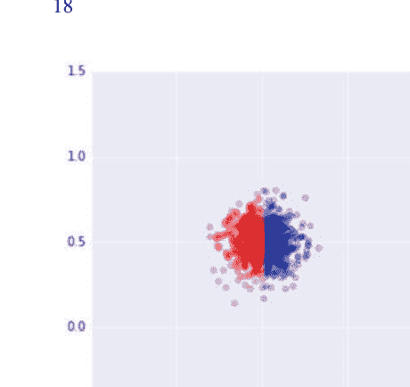

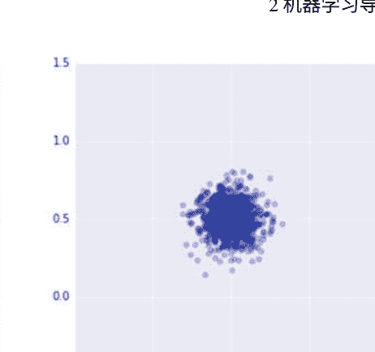

有监督数据的典型示例是 MNIST[18] 和 CIFAR-10[19]，它们的格式为 {(图像数据[i], 标签[i])}i=1,2,...,# (2.1)

例如，在MNIST²（图2.2的左侧图像）中，手写数字的数据以28×28像素图像数据的形式存储，可以看作是一个784维的实向量 x。教学信号指示了数字 x 表示的是哪个数字：n∈{0,1,2,3,4,5,6,7,8,9}，或者是一个10维向量 d=(d⁰, d¹, d², d³, d⁴, d⁵, d⁶, d⁷, d⁸, d⁹)，其中与数字 n 对应的分量是 dⁿ=1，其他分量为0。

CIFAR-10³（图2.2的右侧图片）将彩色自然图像存储为32×32像素的图像数据。每个图像由每个像素的红色、绿色和蓝色的强度描述为实数值，因此可以将其视为32×32×3=3072维向量 x。教学信号指示图像 x 是否表示{飞机、汽车、鸟、猫、鹿、狗、青蛙、马、船、卡车}，并以与MNIST相同的方式存储。

$^7$这是样本数据“Lenna图像”的二进制图像[14]。它被用作研究领域（如图像压缩）的标准。
$^8$这个类比是对[15]中故事的稍作修改。在这个背景下，讨论现代物理学对麦克斯韦恶魔问题的解决方案将是有趣的，即在机器学习中用于学习某种有意义的概率分布的熵减来自哪里？

##### 2.1.1 数据的数学表达

给定有监督/无监督数据，目标是设计一个学习机器，能够提取其特征并能够预测未知数据的属性。为了找到构建这样一台机器的方法，我们需要在数学上明确我们所说的“预测未知数据的属性”。出于这个原因，让我们尝试以下思想实验。

###### 两个骰子

假设我们这里有两个骰子。

- 骰子A以1,...,6的概率1/6掷出。
- 骰子B只有数字6的概率为1。

然后我们重复以下步骤：

1. 以1/2的概率选择A或B，对于A，设置 d = 0，对于B，设置 d = 1。
2. 掷骰子并将点数命名为 x。
3. 记录 ( x, d)。

然后我们可以得到以下数据。

$(x[1] = 6, d[1] = 1) (x[10] = 6, d[10] = 1) (x[19] = 6, d[19] = 1)$
$(x[2] = 6, d[2] = 1) (x[11] = 3, d[11] = 0) (x[20] = 6, d[20] = 1)$
$(x[3] = 6, d[3] = 1) (x[12] = 3, d[12] = 0) (x[21] = 6, d[21] = 1)$
$(x[4] = 6, d[4] = 1) (x[13] = 6, d[13] = 1) (x[22] = 6, d[22] = 1)$
$(x[5] = 6, d[5] = 0) (x[14] = 4, d[14] = 0) (x[23] = 6, d[23] = 1)$
$(x[6] = 6, d[6] = 1) (x[15] = 3, d[15] = 0) (x[24] = 5, d[24] = 0)$
$(x[7] = 6, d[7] = 0) (x[16] = 6, d[16] = 0) (x[25] = 5, d[25] = 0)$
$(x[8] = 2, d[8] = 0) (x[17] = 1, d[17] = 0) (x[26] = 6, d[26] = 1)$
$(x[9] = 5, d[9] = 0) (x[18] = 6, d[18] = 1) (x[27] = 4, d[27] = 0)$ (2.2)

现在我们用“^”（帽子）来定义一个概率：

$\hat{P}(x, d) = \frac{(x, d)\text{在数据中出现的次数}}{\text{数据的总数}}$ (2.3)

一个例子实验使用1000个数据计算$\hat{P}(x, d)$的值如下：

| | $d=0$ | $d=1$ |
| :--- | :--- | :--- |
| $x=1$ | 0.086 | 0.0 |
| $x=2$ | 0.087 | 0.0 |
| $x=3$ | 0.074 | 0.0 |
| $x=4$ | 0.089 | 0.0 |
| $x=5$ | 0.083 | 0.0 |
| $x=6$ | 0.082 | 0.499 |

$\hat{P}(x, d) =$ (2.4)

我们拥有的数据越多，我们的表格就越接近于

| | $d=0$ | $d=1$ |
| :--- | :--- | :--- |
| $x=1$ | $1/12$ | $0$ |
| $x=2$ | $1/12$ | $0$ |
| $x=3$ | $1/12$ | $0$ |
| $x=4$ | $1/12$ | $0$ |
| $x=5$ | $1/12$ | $0$ |
| $x=6$ | $1/12$ | $1/2$ |

$P(x, d) =$ , $(1/12 = 0.08\dot{3}, 1/2 = 0.5)$. (2.5)

事实上，定义表明(2.5)是$(x, d)$的实现概率。(2.2)中的数据可以看作是从$P(x, d)$中采样得到的。让我们将其写成如下形式：

$(x[i], d[i]) \sim P(x, d).$ (2.6)

###### 数据生成概率只有上帝知道

上述(2.2)是有监督数据的一个例子 $\{(x[i], d[i])\}_{i=1,2,...,\#}$。虽然体积小、MNIST和CIFAR-10等有监督数据基本上是通过重复以下协议获得的：

1. 以一定的概率选择一个标签，并将其表示为 d。
2. 通过某种方法获取与 d 相对应的图像，并将其设置为 x。
3. 记录 (x, d)。

因此，可以自然地期望在世界上的所有数据背后存在一个数据生成概率 $P(x, d)$ 类似于(2.5)，并且数据本身是根据该概率进行采样的结果

$(x[i], d[i]) \sim P(x, d).$ (2.7)

我们假设存在数据生成概率 $P(x, d)$ 和(2.7)是统计机器学习的起点。据说爱因斯坦在给伯恩的一封信中写道：“上帝不掷骰子”，但是机器学习相反地说：“上帝掷骰子”。当然，没有人知道 $P(x, d)$ 的具体表达式，但是在后续讨论中做出这个假设是有用的。

#### 2.2 机器学习和奥卡姆剃刀

我们上面断言“我们不知道 $P(x, d)$ 的具体表达式。”然而，机器学习的目标是“近似”知道 $P(x,d)$的具体表达式，尽管它们似乎相互矛盾。基本上，我们采取以下策略：

- Ⅰ. 根据参数$J$定义概率$Q_J(\mathbf{x}, d)$
- Ⅱ. 调整$J$使$Q_J(\mathbf{x}, d)$尽可能接近$P(\mathbf{x}, d)$

第二阶段被称为训练或学习。

假设模型 $Q_J(\mathbf{x}, d)$以某种方式定义。为了在第二阶段将其与 $P(\mathbf{x}, d)$更接近，我们需要一个衡量它们之间差异的函数。

一个合适的函数是相对熵:

$$D_{KL}(P||Q_J) = \sum_{\mathbf{x},d} P(\mathbf{x}, d) \log \frac{P(\mathbf{x}, d)}{Q_J(\mathbf{x}, d)}. \tag{2.8}$$

许多读者可能对这里使用的||符号不熟悉。这只是一种符号强调参数$P$, $Q_J$的不对称性。相对熵是非负的，即 $D_{KL} \geq 0$，当且仅当$P(\mathbf{x}, d) = Q_J(\mathbf{x}, d)$对于任意 $(\mathbf{x}, d)$(见本章的一栏)。因此，如果我们可以调整（学习）$J$和减少 $D_{KL}$，学习将继续。方程（2.8）被称为泛化误差。泛化是一个技术术语，用于描述机器能够适应未知情况的状态，正如本章开头所描述的。

##### 数据数量的重要性

实际学习存在各种困难。首先，由于我们永远不知道$P(\mathbf{x}, d)$的具体表达式，因此无法计算（2.8）的值或梯度。在现实情况下，我们使用从数据中导出的近似概率$\hat{P}(\mathbf{x}, d)$（这称为经验概率），如（2.4），并考虑

$$D_{KL}(\hat{P}||Q_J) \tag{2.9}$$

这被称为经验误差。从这可以直观地理解，除非数据量足够大，否则无法获得可靠的学习结果。例如，（2.4），计算是使用一组1000个数据进行的。

如果我们只使用10个数据，我们得到

|  | d = 0 | d = 1 |
| :--- | :--- | :--- |
| x = 1 | 0.0 | 0.0 |
| x = 2 | 0.0 | 0.0 |
| x = 3 | 0.1 | 0.0 |
| x = 4 | 0.1 | 0.0 |
| x = 5 | 0.1 | 0.0 |
| x = 6 | 0.2 | 0.5 |

$\hat{P}(x, d) =$ (2.10)

人们发现应该是非零的值为零，并且它远离真实概率 (2.5)。在这种情况下，模型 $Q_J(x, d)$ 只能基于 (2.10) 进行建模，因此对于真实概率 (2.2) 的近似精度较差。

##### 2.2.1 泛化

我们必须记住，最终目标是使(2.8)尽可能接近零，尽管我们实际上只能计算出(2.9)。从这个角度来看，解决使(2.9)消失的问题可能并不总是有帮助的。

更糟糕的是，将经验误差(2.9)减小到极小值通常会导致一种称为过度训练的现象，即使经验误差的值很小，泛化误差(2.8)的值也会增加。这类似于以下日常经验：即使一个人通过记住教科书上的每个单词在一次常规测试中得到满分，也并没有达到真正的理解，所以在成就测试中得分很低。相反，最好只从(2.9)的信息来考虑减小(2.8)。如果能够实现这一点，$Q_J$作为数据生成概率$P$的近似将足够，并且从$Q_J$中采样将具有泛化能力，即“对未知数据进行预测的能力”。

###### 泛化的困难

实际上，通过使用上述定义，可以证明不等式：

$(\text{泛化误差}) \leq (\text{经验误差}) + O\left(\sqrt{\frac{\log(\#/d_{VC})}{\#/d_{VC}}}\right)$ (2.11)

这里，$d_{VC}$是模型$Q_J$的表达能力（或复杂性）的数值，称为VC维度(Vapnik-Chervonenkis维度)。粗略地说，$d_{VC}$对应于模型中包含的参数$J$的数量。让我们使用这个表达式来考虑泛化的困难。

首先，调整参数$J$以减少经验误差，因为这是可以做的第一件事。最好增加模型的表达能力，否则它无法处理各种数据。因此，原则上，通过复杂化模型，经验误差可以非常小。

另一方面，在使经验误差极小化的复杂模型中，$d_{VC}$的值会跳跃上升。为简单起见，我们假设这已经变成了无穷大。然后，在固定数量的数据$\#$下，(2.11)中的第二项的值发散为

$$\lim_{\# / d_{VC} \to +0} \frac{\log(\# / d_{VC})}{\# / d_{VC}} \to \infty$$

那么(2.11)是一个无意义的不等式

$$(泛化误差) \le (经验误差) + \infty$$

无论在这种状态下经验误差减少多少，都不能保证泛化误差减少。因此，学习的泛化不能在不根据数据规模使用适当的模型的情况下得到保证。在创建物理现象的现象学模型时，不喜欢过于复杂的模型来描述现象。这个论点被称为奥卡姆剃刀。不等式(2.11)在数学上表达了奥卡姆剃刀原理。

VC维度的确切定义如下。我们将模型$Q_J$定义为
$Q_J(\mathbf{x}, \mathbf{d}) = Q_J(\mathbf{d} | \mathbf{x}) P(\mathbf{x})$，(2.12)
我们稍后会讨论。此外，使用函数$f_J$和参数$J$以及狄拉克$\delta$函数$\delta$，我们可以写成
$Q_J(\mathbf{d} | \mathbf{x}) = \delta(f_J(\mathbf{x}) - \mathbf{d})$，(2.13)
进一步假设我们正在处理二元分类问题，其中$\mathbf{d} = 0,1$。这意味着$f_J(\mathbf{x})$正在将输入$\mathbf{x}$分配给0或1。顺便说一下，如果有$\#$个数据，那么有$2^\#$种可能的0/1分配方式。如果我们可以完全变化$J$，那么$[f_J(\mathbf{x}[1]), f_J(\mathbf{x}[2]), \dots, f_J(\mathbf{x}[\#])$可以实现所有可能的0/1分布，这个模型具有完全拟合数据的能力（与数据数量$\#$相比，容量饱和）。VC维度是指实现这种情况的最大值$\#$。

过度训练是一种陷入这种情况的状态。

基于类似思想的一个著名指标是阿卡奇信息准则(AIC)：
$AIC = -2 \log L + 2k$，(2.16)
其中$L$是最大似然函数，$k$是模型参数的数量。此外，AIC和确定拟合精度的$\chi^2$的数量存在关系。

###### 深度学习中的泛化之谜

另一方面，正如下文所解释的那样，深度学习中的模型随着层数的增加变得越来越复杂。例如，著名的ResNet有数百层，这给出了一个极其巨大的$d_{VC}$。因此，根据(2.11)的不等式，不能保证通过上述逻辑来改善泛化性能。尽管如此，ResNet似乎获得了很强的泛化性能。这似乎与上述逻辑相矛盾，但实际上并不矛盾，因为虽然使用(2.11)进行评估不能保证泛化性能，但可能存在更详细的不等式：

$$\underbrace{(\text{泛化误差}) \stackrel{?}{\leq} (\text{经验误差}) + O_{DL}}_{\text{类似于 (2.11) 这样的东西吗？}}$$
$$\leq (\text{经验误差}) \quad + O\left(\sqrt{\frac{\log(\# / d_{VC})}{\# / d_{VC}}}\right). \quad (2.17)$$

有一种运动试图从更详细的不等式评估中解决深度学习的泛化性能之谜，但截至撰写本文时（2019年1月），尚无明确结果。

#### 2.3 随机梯度下降法

实现学习的最简单方法之一是使用误差参数$J$的梯度（下面方程的第二项）并更新参数

$$J_{t+1} = J_t - \epsilon \nabla_J D_{KL} (P||Q_J), \quad (2.18)$$

在设置适当的初始值$J_{t=0}$之后。这被称为梯度下降方法。这里$\epsilon$是一个小的正实数。然后，对于$J$的变化$\delta J=J_{t+1}-J_t$，$D_{KL}$的变化是

$$\delta D_{KL}(P||Q_J) \approx \delta J \cdot \nabla_JD_{KL}(P||Q_J) = -\epsilon |\nabla_JD_{KL}(P||Q_J)|^2$$ (2.19)

我们可以看到$D_{KL}$减少。然而，正如我们多次强调的那样，计算梯度需要知道真实的数据分布$P$，因此这是一个纸上谈兵的理论。问题是，我们如何更接近(2.18)？

##### 随机梯度下降方法

那么我们如何得到一个对(2.18)进行良好近似的量呢？首先，让我们计算误差的斜率，

$$\nabla_JD_{KL}(P||Q_J) = \nabla_J \sum_{x,d} P(x,d)\log\frac{P(x,d)}{Q_J(x,d)} = \sum_{x,d} P(x,d)\left(\nabla_J\log\frac{P(x,d)}{Q_J(x,d)}\right)$$ (2.20)

因此，误差的梯度是$\nabla_J\log\frac{P(x,d)}{Q_J(x,d)}$的期望值——因此，我们考虑用$P$的样本平均值来近似期望值

$$(x[i], d[i]) \sim P(x,d), i=1,2,\ldots, \#$$ (2.21)
$$\hat{g} = \sum_{i=1}^\#\frac{1}{\#}\left(\nabla_J\log\frac{P(x[i], d[i])}{Q_J(x[i], d[i])}\right)$$ (2.22)

一旦对每个样本进行期望值计算，这个量肯定会减少到(2.20)。此外，根据大数定律，一个大的#应该是(2.20)的一个很好的近似。我们将使用样本近似的梯度下降方法称为随机梯度下降(SGD)方法：

1. 适当地初始化$J_{t=0}$
2. 重复以下步骤(重复变量为$t$)：采样#数据(参见(2.21))
根据公式(2.22)计算 $\hat{g}$
$$J_{t+1} = J_t - \epsilon \hat{g} \quad (2.23)$$

请注意，为了使用大数定律来证明这个近似，(2.21)中的所有采样必须是独立的，因此必须在每一步的参数更新中单独执行。 这种始终使用新数据的学习方法称为在线学习。

##### 当数据有限时

当使用预先准备好的数据库时，上述情况是不可能的。 在这种情况下，使用一种称为批量学习的方法。 我们希望考虑一种同时最小化偏差的随机梯度下降方法，在深度学习中，经常使用以下称为小批量学习的方法：

- (数据$\{(x[i], d[i])\}_{i=1,2,...}$应提前给出)
1. 适当地初始化 J。
2. 重复以下步骤:
   - 将数据随机分成M个部分。
   - 从 m =1到 m = M重复以下步骤:
     - 用第 m个部分数据替换(2.22)中的数据，并计算 $\hat{g}$。
     - $J \leftarrow J - \epsilon\hat{g}$.   (2.24)

请注意，在第2步循环的开始时，需要进行随机分割数据的过程。 在监督学习中应用梯度下降方法时，通常会使用此方法。 与原始的梯度下降方法(2.23)不同，即使重复第2步的循环，每个 $\hat{g}$都不独立于其他$\hat{g}$，因此不能保证梯度的近似精度会更好。 通常需要单独准备验证数据，并同时监视(观察)经验误差，以避免过度训练。

##### 深度学习的案例

在大多数情况下，训练是根据方法 (2.24) 进行的。 以下是一些要强调的点。 首先，梯度 $\hat{g}$是误差函数的梯度，稍后将介绍，当使用神经网络时，微分计算可以被算法化：这被称为反向传播，并提供了一种快速算法，稍后将解释。 此外，要注意的是，不仅仅是简单的随机梯度下降方法，还经常使用各种演化形式的梯度下降方法。 总结各种梯度方法的参考文献包括。 此外，可以免费阅读原始论文。

##### 专栏：概率论与信息论

正如本书所解释的，概率论和信息论对于发展机器学习理论是不可或缺的。本专栏解释了一些重要概念。

###### 联合概率和条件概率

机器学习方法经常考虑输入值 $\mathbf{x}$ 和教学信号 $\mathbf{d}$ 的概率。联合概率表示这两个变量的出现概率。让我们将其写为

$P(\mathbf{x}, \mathbf{d})$. \ (2.25)

当然，我们有

$1 = \sum_{\mathbf{x}} \sum_{\mathbf{d}} P(\mathbf{x}, \mathbf{d})$. \ (2.26)

在这里，$\sum$ 是一个求和符号，当 $\mathbf{x}, \mathbf{d}$ 是离散值时，用积分替代，当它们是连续变量时。
有一些情况下，我们不想看 $\mathbf{x}$ 的值，而是想考虑 $\mathbf{d}$ 的概率。可以表示为

$P(\mathbf{d}) = \sum_{\mathbf{x}} P(\mathbf{x}, \mathbf{d})$. \ (2.27)

求和运算称为边缘化，概率 $P(\mathbf{d})$ 称为**边缘概率**。
在某些情况下， $\mathbf{d}$ 可能已经给定。这种情况表示为

$P(\mathbf{x}|\mathbf{d})$: 当给定 $\mathbf{d}$ 时， $\mathbf{x}$ 的概率。 \ (2.28)

这被称为条件概率。在这种情况下， $\mathbf{d}$ 被视为固定量，

$1 = \sum_{\mathbf{x}} P(\mathbf{x}|\mathbf{d})$. \ (2.29)

所以，实际上，我们发现

$P(\mathbf{x}|\mathbf{d}) = \frac{P(\mathbf{x}, \mathbf{d})}{P(\mathbf{d})} = \frac{P(\mathbf{x}, \mathbf{d})}{\sum_{\mathbf{X}} P(\mathbf{X}, \mathbf{d})}$. \ (2.30)分子因为使用原始联合概率，但这个等式可以被视为对其进行重新归一化，因为d的固定。如果你熟悉外部磁场下自旋的统计力学，那么可以将自旋自由度视为x，外部磁场视为d来理解这个概念。顺便说一下，即使x和d的角色互换，由于相同的原因，结果仍然成立:

$$P(\mathbf{d|x}) = \frac{P(\mathbf{x, d})}{P(\mathbf{x})} = \frac{P(\mathbf{x, d})}{\sum_{\mathbf{D}} P(\mathbf{x, D})}. \tag{2.31}$$

请注意，右侧的分子在(2.30)和(2.31)之间是相同的。

$$P(\mathbf{x|d})P(\mathbf{d}) = P(\mathbf{d|x})P(\mathbf{x}) = P(\mathbf{x, d}). \tag{2.32}$$

这被称为贝叶斯定理，经常在这本书中使用。

###### 蒙提霍尔问题和条件概率

这是一个臭名昭著的概率论问题。假设只有三个盒子中有一个奖品。让每个盒子的内容为x1, x2, x3。可能的组合是

$$(x_1 = o, x_2 = x, x_3 = x),$$
$$(x_1 = x, x_2 = o, x_3 = x),$$
$$(x_1 = x, x_2 = x, x_3 = o). \tag{2.33}$$

因此，每个盒子的概率都是1/3，

$$P(x_1, x_2, x_3) = \frac{1}{3}. \tag{2.34}$$

然后你选择任意一个盒子。在这个阶段，所有的盒子都是相等的，所以假设你选择了x1。找到奖品的概率是1/3，找不到的概率是2/3:

$$P(x_1 = o) = \frac{1}{3}, \quad P(x_1 = x) = \frac{2}{3}. \tag{2.35}$$

这只是一个边际概率，因为你已经对除了x1之外的概率求和。

现在，假设你不能打开x1盒子。相反，有一个主持人，他知道每个盒子的内容。主持人打开了其中一个盒子x2, x3，并向你展示里面没有东西。然后，剩下的只有你选择的x1和主持人没有打开的x2, x3之一。你应该留在x1还是选择主持人没有打开的盒子？这就是蒙提霍尔问题。

让我们解决这个问题，考虑到条件概率。首先，

$$P(x_2 \text{ 或 } x_3 = o|x_1 = o) = 0. \tag{2.36}$$

在这种情况下，很明显只有一个盒子有奖品。另一方面，

$$P(x_2 \text{或} x_3 = o | x_1 = x) = P\left( (x_2, x_3) = (o, x) | x_1 = x \right) + P\left( (x_2, x_3) = (x, o) | x_1 = x \right) = \frac{\frac{1}{3}}{\frac{2}{3}} + \frac{\frac{1}{3}}{\frac{2}{3}} = \frac{1}{2} + \frac{1}{2} = 1. \tag{2.37}$$

在这种情况下，你获得奖品的概率是确定的，这与我们的直觉一致。然后，通过改变盒子选择获得奖品的概率是

$$P (\text{改变} = o) = P(x_2 \text{或} x_3 = o | x_1 = o) P(x_1 = o) + P(x_2 \text{或} x_3 = o | x_1 = x) P(x_1 = x) = \frac{2}{3}. \tag{2.38}$$

当不改变时，找到奖品的概率比$P(x_1=o)=1/3$更高，所以这个问题的答案是“你应该改变。”更简单地说，结合

$$P (\text{不改变} = o) = P(x_1 = o) = \frac{1}{3}, \tag{2.39}$$

和

$$P (\text{改变后} = o) + P (\text{不改变} = o) = 1, \tag{2.40}$$

你发现

$$P (\text{改变后} = o) = \frac{2}{3}. \tag{2.41}$$

这是一个简单的问题，但乍一看，获胜的概率是1/3，无论主持人做什么都不会改变，所以结果似乎是一样的，无论你是否改变盒子。当然，主持人不会干扰原始概率1/3，但当添加信息时，我们应该考虑条件概率而不是原始概率。^17这是一个很好的问题，因为它教给我们一些东西。

###### 相对熵

我们在本章介绍了相对熵 $D_{KL}$。这个量是机器学习领域中最重要的函数之一。在这里，我们将展示本章中引用的属性：对于概率分布$p(x)$, $q(x)$，我们有 $D_{KL}(p||q) \geq 0$，只有当 $D_{KL}(p||q) = 0$时，概率分布才匹配，$p(x) = q(x)$。此外，作为一项练习，我们将解释一个使用高斯分布和一些意外的几何结构的计算示例。

> 定义和性质

对于概率分布 $p(x)$和 $q(x)$，我们定义
$$ D_{KL}(p||q) := \int dx \ p(x) \log \frac{p(x)}{q(x)} \tag{2.42} $$
并称其为相对熵。相对熵满足
$$ D_{KL}(p||q) \geq 0, \quad D_{KL}(p||q) = 0 \Leftrightarrow \forall x, \ p(x) = q(x). \tag{2.43} $$

有几种方法可以检查上述性质，在本专栏中我们将以以下方式证明它们。首先，将相对熵写为

$$ D_{KL}(p||q) = \int dx \left[ p(x) \log \frac{p(x)}{q(x)} + q(x) - p(x) \right]. \tag{2.44} $$

这里我们使用 $\int dx \ q(x) = \int dx \ p(x) =1$。我们只是加了一个单位并减去了一个单位。我们可以将其转换为

$$ (2.44) = \int dx \ p(x) \left[ \left( \frac{q(x)}{p(x)} - 1 \right) - \log \frac{q(x)}{p(x)} \right]. \tag{2.45} $$

使用（见图2.3）

$$ (X-1) \geq \log X, \tag{2.46} $$

例如，即使你在附近有一家喜欢的餐厅，如果听说另一家餐厅的食物非常美味，你会被诱惑去那里。考虑条件概率是一种接近这种简单感觉的东西。

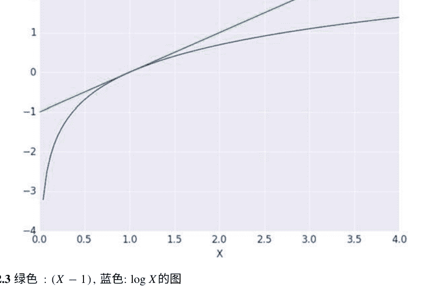

(2.45) 的被积函数始终大于或等于零。由于被积函数始终大于或等于零，我们可以证明

$$D_{KL}(p||q) \geq 0. \tag{2.47}$$

接下来，当(2.46)的等式成立时，等式得到满足 ($X = 1$)。 这意味着对于任何 $x$, 我们需要有

$$\frac{q(x)}{p(x)} = 1, \tag{2.48}$$

这证明了(2.43)。

###### 例子：高斯分布

为了对相对熵有一个概念，让我们计算一下

### 高斯分布的相对熵:

$$\frac{1}{\sqrt{2\pi\sigma}} e^{-\frac{1}{2\sigma^2}(x-\mu)^2}. \tag{2.49}$$

所以在这里我们考虑

$$ p(x) = \frac{1}{\sqrt{2\pi}\sigma_p} e^{-\frac{1}{2\sigma_p^2}(x-\mu_p)^2}, \quad (2.50) $$
$$ q(x) = \frac{1}{\sqrt{2\pi}\sigma_q} e^{-\frac{1}{2\sigma_q^2}(x-\mu_q)^2}. \quad (2.51) $$

然后根据定义

$$ D_{KL}(p||q) = \int_{-\infty}^{\infty} dx \, p(x) \left( \log \frac{\sigma_q}{\sigma_p} - \frac{1}{2\sigma_p^2}(x - \mu_p)^2 + \frac{1}{2\sigma_q^2}(x - \mu_q)^2 \right) $$
$$ = \log \frac{\sigma_q}{\sigma_p} - \frac{1}{2\sigma_p^2}(\sigma_p)^2 + \frac{1}{2\sigma_q^2} \int_{-\infty}^{\infty} dx \, p(x) \quad \frac{(x - \mu_q)^2}{(\mu_p - \mu_q)^2 + 2(\mu_p - \mu_q)(x - \mu_p) + (x - \mu_p)^2} $$
$$ = \log \frac{\sigma_q}{\sigma_p} - \frac{1}{2\sigma_p^2}(\sigma_p)^2 + \frac{1}{2\sigma_q^2} \left( (\mu_p - \mu_q)^2 + 0 + \sigma_p^2 \right) $$
$$ = \frac{1}{2} \left( -\log \frac{\sigma_p^2}{\sigma_q^2} + \left( \frac{\sigma_p^2}{\sigma_q^2} - 1 \right) + \frac{1}{\sigma_q^2} (\mu_p - \mu_q)^2 \right) \quad (2.52) $$

在第二个等式中，我们进行了泰勒展开。你可以再次使用（2.46）证明这个值是正的。

###### 高斯分布和AdS时空

相对熵的定义似乎表示概率分布之间的“距离”。如果存在距离，每个概率分布对应一个点，当它们被收集起来时，就形成了一个“空间”。实际上，在上面的高斯分布示例中，均值μ取值在(-∞, +∞)之间，标准差σ取值在(0, ∞)之间，因此整个高斯分布可以形成一个“空间”(-∞, +∞)×(0, ∞)。让我们从相对熵中找到这种情况下的“无穷小距离”。我们考虑一个点

$$ \sigma_p = \sigma, \quad \mu_p = \mu, \quad (2.53) $$

以及一个靠近它的点

$$ \sigma_q = \sigma + d\sigma, \quad \mu_q = \mu + d\mu. \quad (2.54) $$

我们计算相对熵，直到二阶的$d\sigma, d\mu$为止

\begin{align}
D_{KL}(p||q) &= \frac{1}{2} \left( -\log \frac{\sigma^2}{(\sigma + d\sigma)^2} + \left( \frac{\sigma^2}{(\sigma + d\sigma)^2} - 1 \right) + \frac{1}{(\sigma + d\sigma)^2} (\mu - \mu - d\mu)^2 \right) \\
&= \frac{1}{2} \left( \log (1 + \frac{d\sigma}{\sigma})^2 + \left( \frac{1}{(1 + \frac{d\sigma}{\sigma})^2} - 1 \right) + \frac{1}{\sigma^2 (1 + \frac{d\sigma}{\sigma})^2} d\mu^2 \right) \\
&\approx \frac{1}{2} \left( 2 \frac{d\sigma}{\sigma} - \frac{d\sigma^2}{\sigma^2} + \left( 1 - 2 \frac{d\sigma}{\sigma} + 3 \frac{d\sigma^2}{\sigma^2} - 1 \right) + \frac{d\mu^2}{\sigma^2} \right) \\
&= \frac{1}{2} \left( 2 \frac{d\sigma^2}{\sigma^2} + \frac{d\mu^2}{\sigma^2} \right) = \frac{d\sigma^2 + d\mu^2}{\sigma^2}. \quad (2.55)
\end{align}

(在最后一个表达式中，我们定义$\tilde{\mu} = \mu/\sqrt{2}$。)这是一个双曲面的度量，也是反德西特时空（AdS时空）的度量的一部分。近年来，反德西特时空在被称为弦论中的AdS/CFT对应的现象中起着重要作用。有趣的是，高斯空间也具有这样一个“隐藏”的反德西特时空。反德西特时空具有度量在其无限边界处发散的特性（距离被无限拉伸）。在当前的背景下，它对应于$\sigma \approx 0$。$\sigma$是高斯分布的方差，因此这种异常行为的起源是清楚的：极限不再是通常意义上的函数，因为将高斯分布的方差趋近于零的极限对应于狄拉克$\delta$函数。第$^{12}$章介绍了将AdS/CFT对应与机器学习相关的研究。

## 第三章 神经网络基础

摘要在本章中，我们从物理模型的视角推导出神经网络。神经网络是一个非线性函数，将输入映射到输出，在监督学习的情况下，给定网络等价于给定一个称为误差函数的函数。通过将输出视为动力学自由度，将输入视为外部场，简单的哈密顿量产生了各种神经网络及其深化版本。训练（学习）是一种减小误差函数值的过程，我们将学习在量子力学中流行的bra-ket符号表示法下的反向传播具体方法。我们将研究“通用逼近定理”的工作原理，这就是为什么神经网络能够表达各种类型数据之间的连接。

现在，让我们继续使用神经网络解释监督学习。与许多深度学习教材不同，本章将以经典统计物理学的术语来描述机器学习

#### 3.1 统计力学中的误差函数

误差函数是由库尔巴克-莱布勒散度描述的误差的对数项，在前一章中我们引入了(2.8)和(2.9)。许多教材的一般解释方向是在定义误差函数之后讨论泛化误差和经验误差，但在本书中，我们将从(2.8)和(2.9)开始考虑监督学习的问题设置，将其视为一个适当的统计力学系统，可以为每个问题导出适当的误差函数。在这个过程中，我们将看到深度学习中使用的sigmoid函数等非线性函数的结构

> 对于传统的解释，我们推荐参考文献[20]。阅读这些文献可以补充理解。

自然地出现。此外，深度学习中经常使用的修正线性单元（ReLU）函数的起源将从统计力学的角度进行解释，为进一步深入研究提供了一个基础。

##### 从哈密顿量到神经网络

##### 二元分类

让我们来看一下之前给出的有监督数据的示例。在图 3.1 中，似乎 d = 0 或 d = 1 取决于 x of x = (x, y)的值是否超过 0.5。换句话说，x和d似乎是相关的。

我们将考虑用一个物理系统来表达这种相关性。任何物理系统都由一个哈密顿量定义，并且哈密顿量被写成动力学自由度的函数。²当物理系统中存在多个动力学自由度 A_i(t)(i = 1, 2, ...)时，哈密顿量H由这些自由度的函数给出。（确切地说，A_i(t)是一个函数，所以H是一个函数的函数，即一个泛函）。例如，如果 A_1(t)表示粒子的空间坐标 x(t)， A_2(t)表示其动量 p(t)，谐振子的哈密顿量是

$$ H = \frac{1}{2} p(t)^2 + \frac{1}{2} x(t)^2. \qquad (3.1) $$

²如果读者对解析力学不熟悉，将机械自由度转化为坐标（或动量），将哈密顿量转化为能量是没有问题的。

在这里，为了简单起见，粒子的质量和频率被设定为单位。如果有两个粒子，将哈密顿量表示为它们的和是很自然的。

$$H = \frac{1}{2}p_1(t)^2 + \frac{1}{2}x_1(t)^2 + \frac{1}{2}p_2(t)^2 + \frac{1}{2}x_2(t)^2.\tag{3.2}$$

然而，在这种情况下，两个粒子之间没有相关性。每个粒子都表现为一个自由粒子；能量或哈密顿量只是它们能量的简单求和。例如，当力作用于第一个粒子和第二个粒子之间时，两个粒子是相关的。如果这个力的大小与两个粒子之间的距离成正比，哈密顿量将有一个额外的项，

$$H = c (x_1(t) - x_2(t))^2.\tag{3.3}$$

展开括号，我们发现它包含 $c x_1(t) x_2(t)$，表示为两个粒子的动力学自由度的乘积。这代表了两者之间的相关性。总结起来，相关性通常由哈密顿量中动力学自由度的乘积项组成。相关性的强度由乘积项的系数 $c$ 表示。这个系数被称为耦合常数。

现在，给定一个物理系统，如何一般地描述它的统计力学行为？当一个物理系统与温度为 $T$ 的热浴接触时，物理系统从热浴中获得能量，并且其能量分布采用玻尔兹曼分布（正则分布）的形式。实现能量为 $E$ 的状态的概率 $P$ 由以下公式给出：

$$P = \frac{1}{Z} \exp\left[-\frac{E}{k_B T}\right].\tag{3.4}$$

这里 $k_B$ 是玻尔兹曼常数，$Z$ 是配分函数，

$$Z = \sum_{\text{所有状态}} \exp\left[-\frac{H}{k_B T}\right].\tag{3.5}$$

这是为了使概率 $P$ 归一化，使总概率为1。对于简单的示例，请参见本章和第5章的章末栏。

在引入物理系统的统计力学描述之后，让我们回到图3.1，这是一个有监督数据的示例。由于 $x$ 和 $d$ 似乎存在相关性，首先，作为一个物理系统，我们考虑以 $x$ 为外部场和 $d$ 为动力学自由度的统计力学。为了简单起见，我们决定只包含 $d$ 的一阶项，并将最简单的哈密顿量写为

$$H_{J,x}(d) = -(x J_x + y J_y + J) d.\tag{3.6}$$这里 \( J_x \)，\( J_y \)和 \( J \) 是耦合常数。让我们使用这个“物理系统”制作一个模型 \( Q_J( \mathbf{x}, d) \)。首先，根据(3.6)，自然而然地制作一个关于 \( d \) 的玻尔兹曼分布，

$$ Q_J(d|\mathbf{x}) = \frac{e^{-H_{J,\mathbf{x}}(d)}}{Z} = \frac{e^{(x J_x + y J_y + J)d}}{\sum_{d=0}^{1} e^{(x^\mu J_\mu + J)d}} = \frac{e^{(x J_x + y J_y + J)d}}{1 + e^{(x^\mu J_\mu + J)}}. $$

在这里，我们引入了一个称为sigmoid函数的函数，

$$ \sigma (X) = \frac{1}{e^{-X} + 1}. $$

然后我们发现

$$ Q_J(d=1|\mathbf{x}) = \sigma (x J_x + y J_y + J). $$
$$ Q_J(d=0|\mathbf{x}) = 1 - \sigma (x J_x + y J_y + J). $$

这个表达式是给定的 \( \mathbf{x} \) 的，但是如果我们假设存在数据生成概率 \( P( \mathbf{x}, d) \)，那么 \( \mathbf{x} \) 应该根据这个概率生成

$$ P (\mathbf{x}) = P (\mathbf{x}, d = 0) + P (\mathbf{x}, d = 1). $$

所以我们使用这个来定义

$$ Q_J(\mathbf{x}, d) = Q_J(d|\mathbf{x}) P (\mathbf{x}). $$

现在我们有了一个模型，让我们考虑实际调整（学习）耦合常数 \( J_x \)，\( J_y \) 和 \( J \) 以模拟真实分布 \( P( \mathbf{x}, d) \)。相对熵（2.8）是根据诸如（3.12）的设置计算的。

$$ D_{KL}(P||Q_J) = \sum_{\mathbf{x},d} P (\mathbf{x}, d) \log \frac{P (d|\mathbf{x})}{Q_J(d|\mathbf{x})} = - \sum_{\mathbf{x},d} P (\mathbf{x}, d) \log Q_J(d|\mathbf{x}) + (J\text{-独立部分}). $$

当我们使用梯度方法时，我们只需要关注第一项，⁵并使其尽可能小。最后，如果这通过数据（经验概率 P̂）近似，使用（3.9）、（3.10）等，我们得到：

(3.13)的第一项

$$ \approx -\frac{1}{\#}\sum_{i:数据}^{\#} \text{对数 } Q_J(d[i] \mid x[i])\newline = \frac{1}{\#}\sum_{i:数据}^{\#}\left( -\left[d[i]\text{的对数}\left\{\sigma (x[i]J_x + y[i]J_y + J)\right\}\right.\right.\newline \left.\left. + (1-d[i])\text{对数}\left\{1 - \sigma (x[i]J_x + y[i]J_y + J)\right\}\right]\right). \tag{3.14} $$

这里的#表示数据的数量。总之，通过调整 J来减小这个值被称为“学习”。

顺便问一下，当 J_x, J_y, J和输入数据 x[i]固定时，输出的期望值是多少？计算结果如下

$$\langle d \rangle_{J,x[i]} = \sum_{d=0,1} d \cdot Q_J(d|x[i]) = Q_J(d=1|x[i]) = \sigma (x[i]J_x + y[i]J_y + J). \tag{3.15}$$

这被认为是机器的“输出值”。然后，使用以下名为交叉熵的函数，

$$L(X, d) = -\left[d \log X + (1-d) \log(1-X)\right], \tag{3.16}$$

最小化(3.13)是为了最小化以下误差函数在输入数据x[i]的教学信号 d[i]和机器的输出值 \langle d \rangle_{J,x[i]}之间的。

$$L(\langle d \rangle_{J,x[i]}, d[i]) \tag{3.17}$$

通过调整 J_x, J_y, J等，使用梯度法对每个数据项 (x[i], d[i])进行调整。由于深度学习使用随机梯度下降法，因此需要计算相对于 J_x, J_y和 J的误差函数的梯度。在这个例子中，梯度计算很容易，因为它是一个“单层”的。

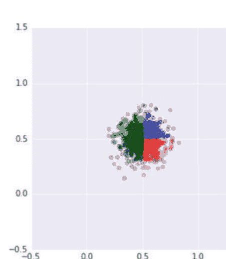

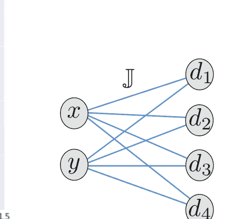

图3.2左：数据为 (1, 0, 0, 0)，蓝色；(0, 1, 0, 0)，红色；(0, 0, 1, 0)，绿色；(0, 0, 0, 1)，黑色。右：哈密顿量的示意图(3.18)

系统，但稍后将介绍的深度神经网络具有稍微复杂的结构，因此如果没有好的梯度计算方法，计算时间会被消耗。幸运的是，有一种有效的方法可以计算从网络结构中导出的梯度。这将在后面解释。

##### 多类别分类

假设教学信号为 $\mathbf{d} = (d^1, d^2, d^3, d^4)$，其中 $\sum_{I=1}^{4} d^I = 1$，并且让 $d^1$ 为蓝色，$d^2$ 为红色，$d^3$ 为绿色，$d^4$ 为黑色，如图3.2所示。由于 $\mathbf{d}$ 增加到4个分量，模型哈密顿量被修改为

$$H_{J,\mathbf{x}}(\mathbf{d}) = -\sum_{I=1}^{4} (xJ_{xI} + yJ_{yI} + J_I)d^I.$$ (3.18)

由于明确写出求和符号很麻烦，我们将使用矩阵表示法：$\mathbb{J} = (J_{xI}, J_{yI})$ ($4 \times 2$ 矩阵)，$\mathbf{J} = (J_1, J_2, J_3, J_4)$ (4维向量)，$\mathbf{x} = (x, y)$ (2维向量)。然后，

$$H_{J,\mathbf{x}}(\mathbf{d}) = -\mathbf{d} \cdot (\mathbb{J}\mathbf{x} + \mathbf{J}).$$ (3.19)

具有这个哈密顿量的玻尔兹曼权重是

$$Q_{J}(\mathbf{d}|\mathbf{x}) = \frac{e^{-H_{J,\mathbf{x}}(\mathbf{d})}}{Z} = \frac{e^{\mathbf{d} \cdot (\mathbb{J}\mathbf{x}+\mathbf{J})}}{e^{(\mathbb{J}\mathbf{x}+\mathbf{J})_1} + e^{(\mathbb{J}\mathbf{x}+\mathbf{J})_2} + e^{(\mathbb{J}\mathbf{x}+\mathbf{J})_3} + e^{(\mathbb{J}\mathbf{x}+\mathbf{J})_4}}.$$ (3.20)

#### 3.1 统计力学中的误差函数

在这里，让我们介绍以下被称为softmax函数的函数，它是sigmoid函数的扩展，

$$\sigma_I(\mathbf{X}) = \frac{e^{X_I}}{\sum_J e^{X_J}}.$$

使用这个softmax函数，我们可以将Boltzmann权重写为

$$Q_J(d^I = 1|\mathbf{x}) = \sigma_I(\mathbb{J}\mathbf{x} + \mathbf{J}).$$

与单个教学信号的情况一样，我们将模型定义为

$$Q_J(\mathbf{x}, \mathbf{d}) = Q_J(d^I|\mathbf{x})P(\mathbf{x}).$$

然后我们要考虑相对熵的最小化

$$D_{KL}(P||Q_J) = - \sum_{\mathbf{x},\mathbf{d}} P(\mathbf{x}, \mathbf{d}) \log Q_J(\mathbf{d}|\mathbf{x}) + (J\text{独立部分})$$

尤其是，

$$(3.24)\text{中的第一项} \approx - \sum_{i:\text{数据}} \frac{1}{\#} \log Q_J(\mathbf{d}[i] | \mathbf{x}[i]) \ = \frac{-1}{\#} \sum_{i:\text{数据}} \sum_{I=1}^4 d_I[i] \log \sigma_I(\mathbb{J}\mathbf{x}[i] + \mathbf{J}).$$

与之前一样，我们看一下 $I$ 分量的期望值 $\mathbf{d}$,

$$\langle d_I \rangle_{J,\mathbf{x}[i]} = \sum_{\mathbf{d}} d_I \cdot Q_J(\mathbf{d} | \mathbf{x}[i]) \ = Q_J(d_I = 1| \mathbf{x}[i]) = \sigma_I(\mathbb{J}\mathbf{x}[i] + \mathbf{J}).$$

因此我们引入交叉熵$^{6}$

$$L(\mathbf{X}, \mathbf{d}) = - \sum_{I=1}^4 d_I \log X_I,$$

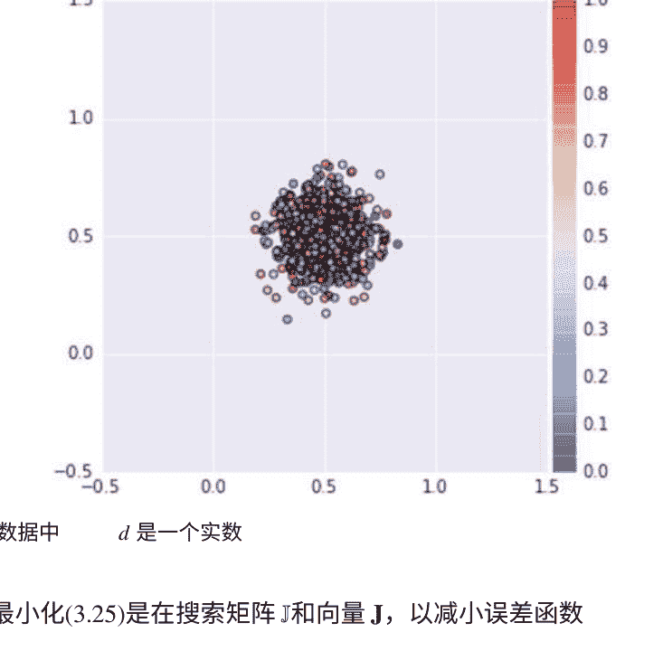

图3.3 数据中 d 是一个实数

然后，最小化(3.25)是在搜索矩阵 ℑ 和向量 J，以减小误差函数

$$L((d)_{J, x[i]}, d[i])$$

对于每个数据。

##### 回归（第1部分）

在某些情况下， d可以是一个实数 d ∈ [−∞, ∞], 如图3.3所示。对于这种情况，如果我们采用与上述相同的方法，我们可以定义实数自由度的哈密顿量

$$H_{J, x}(d) = \frac{1}{2} (d - (ℑ x + J))^2$$

然后我们找到一个高斯分布,

$$Q_J(d|x) = \frac{e^{-\frac{1}{2} (d - (ℑ x + J))^2}}{Z} = \frac{e^{-\frac{1}{2} (d - (ℑ x + J))^2}}{\sqrt{2\pi}}$$

d的期望值是在高斯分布下的均值，所以

$$⟨d⟩_{J, x[i]} = ℑ x[i] + J$$

#### 3.1 统计力学中的误差函数

误差函数只是这个的对数，结果是均方误差,

$$L(\langle d\rangle_{J,\mathbf{x}[i]}, d[i]) = \frac{1}{2}\left(d[i] - \langle d\rangle_{J,\mathbf{x}[i]}\right)^2.$$

这不过是线性回归.

##### 回归（第2部分）

对于 $d\in [0, \infty)$, 已知一种稍微有趣的有效建模。考虑辅助 $N$位自由度$\{h^{(u)}_{位} u=1,2,...,N\}$ 称为修正线性单元 (ReLU) [29], 并准备以下两个哈密顿量:

$H_{J,\mathbf{x}}(\{h_{位}^{(u)}\}) = -\sum_{u=1}^{N_{位}} (\mathbb{J}\mathbf{x} + J + 0.5 - u) h_{位}^{(u)} ,$

$H_h(d) = \frac{1}{2}(d - h)^2.$

这里, (3.33) 是 (3.6) 对所有 $N$位进行求和, 同时将$^7 J$进行移位。 而 (3.34) 是给出均方误差的哈密顿量。我们等式

$h = \sum_{u=1}^{N_{位}} h_{位}^{(u)} ,$

而 $h$在 (3.34) 中被视为外部场。 然后, 从每个玻尔兹曼分布中我们找到

$Q_J(\{h_{位}^{(u)}|\mathbf{x}\}) = \prod_{u=1}^{N_{位}} \left\{ \begin{array}{ll} \sigma (\mathbb{J}\mathbf{x} + J + 0.5 - u) & (h_{位}^{(u)} = 1) \\ 1 - \sigma (\mathbb{J}\mathbf{x} + J + 0.5 - u) & (h_{位}^{(u)} = 0) \end{array} \right. ,$

$Q(d|h) = \frac{e^{-\frac{1}{2}(d-h)^2}}{\sqrt{2\pi}} .$

从这两个中, 我们定义条件概率

$Q_J(d|\mathbf{x}) = \sum_{\{h_{位}^{(u)}\}} Q\left(d \left| h = \sum_{u=1}^{N_{位}} h_{位}^{(u)}\right. \right) Q_J(\{h_{位}^{(u)}\}|\mathbf{x}) .$

7这样，增加自由度的数量, 同时共享参数, 对应于处理 $h$位的集合, 并在统计意义上提高准确性。这被认为会提高性能[30]。在我们的情况下, $J$被移动了0.5, 这简化了$\langle h\rangle$如主文所示, 因此计算成本低于普通集合。

然后我们发现

$$-\sum_{\mathbf{x},d} P(\mathbf{x}, d) \log Q_J(d|\mathbf{x}) \approx -\sum_{i:\text{数据}} \frac{1}{\#} Q_J(d[i]|\mathbf{x}[i]) = \frac{-1}{\#} \sum_{i:\text{数据}} \log \left[ \sum_{\{h_{\text{位}}^{(u)}\}} Q\left(d[i]\Big|h = \sum_{u=1}^{N_{\text{位}}} h_{\text{位}}^{(u)}\right) Q_J(\{h_{\text{bit}}^{(u)}\}|\mathbf{x}[i]) \right]$$ (3.39)

正如对于 $\mathbf{x}$, $d$的概率均值被替换为数据（从 $P$中采样）的均值一样，让对于 $\{h_{\text{bit}}^{(u)}\}$在日志中的概率均值也被替换为平均值 $Q_J(\{h_{\text{bit}}^{(u)}\}|\mathbf{x}[i])$。作为一个测试，我们计算 $Q_J(\{h_{\text{bit}}^{(u)}\}|\mathbf{x}[i])$下的平均值，然后我们发现

$$\langle h \rangle_{J,\mathbf{x}[i]} = \sum_{\{h_{\text{位}}^{(u)}\}} \left( \sum_{u=1}^{N_{\text{bits}}} h_{\text{位}}^{(u)} \right) Q_J(\{h_{\text{bit}}^{(u)}\}|\mathbf{x}[i]) = \sum_{u=1}^{N_{\text{位}}} \sigma(\mathbb{J}\mathbf{x} + J + 0.5 - u).$$ (3.40)

定义 $z = \mathbb{J}\mathbf{x} + J$并将其作为水平轴绘制，我们在图3.4中找到了蓝色线条。

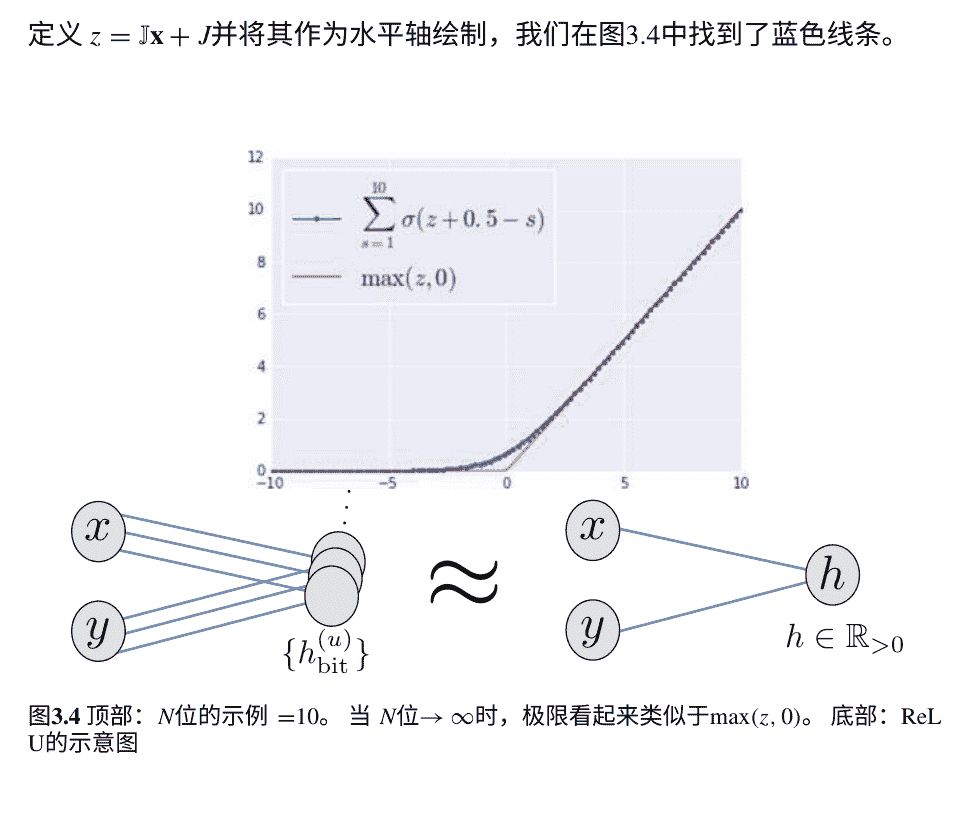

#### 3.1 统计力学中的误差函数

从图中可以看出，\( h \) 的期望值随着位数的增加逐渐接近于 \( \max(\mathbb{I}x + J, 0) \)。让我们称之为 \( \sigma_{\text{ReLU}}(z) = \max(z, 0) \)，如果我们采用这个近似，我们可以得到：

$$ \langle h \rangle_{J, x[i]} \approx \sigma_{\text{ReLU}}(\mathbb{I}x[i] + J), \quad (3.41) $$

$$ \sum_{\{h^u\}} Q\left(d[i] \Big| h = \sum_{u=1}^{N} h^u\right) Q_J\left(\{h^u\} \Big| x[i]\right) \approx Q\left(d[i] \Big| h = \langle h \rangle_{J, x[i]}\right), \quad (3.42) $$

此外，误差函数是

$$ -\log Q\left(d[i] \Big| h = \langle h \rangle_{J, x[i]}\right) \approx \frac{1}{2} \left(d[i] - \sigma_{\text{ReLU}}(\mathbb{I}x[i] + J)\right)^2, \quad (3.43) $$

##### 多组分教学信号

除了图3.2所示的多组分标签外，我们还可以设置 \( d^I \in \) 在这种情况下，我们需要考虑将 \( \sigma \) 或 \( \sigma_{\text{ReLU}} \) 应用于每个组分后的输出。

##### 3.1.2 深度神经网络

扩展两哈密顿方法，就像上面的ReLU一样，自然地引出了深度模型的概念。深度神经网络是一种在输入和输出之间具有多个中间层的神经网络，如图3.5所示。

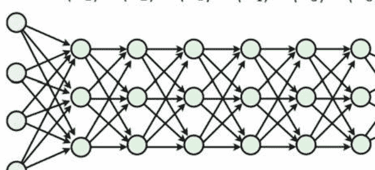

图3.5 深度神经网络。通过应用非线性函数\( \sigma_{\bullet} \)，在每一层上获得的输出值对应于从统计力学的角度来看的期望值

准备了$(N-1)$个额外的自由度，并考虑相应的$N$哈密顿量

$H^1_{J_1,\mathbf{x}}(\mathbf{h}_1)$, \quad (3.44)

$H^2_{J_2,\mathbf{h}_1}(\mathbf{h}_2)$, \quad (3.45)

$\ldots$, \quad (3.46)

$H^N_{J_N,\mathbf{h}_{N-1}}(\mathbf{d})$, \quad (3.47)

该模型是

$Q_J(\mathbf{d}|\mathbf{x}) = \sum_{\mathbf{h}_1,\mathbf{h}_2,\ldots,\mathbf{h}_{N-1}} Q_{J_N}(\mathbf{d}|\mathbf{h}_{N-1}) \ldots Q_{J_2}(\mathbf{h}_2|\mathbf{h}_1) Q_{J_1}(\mathbf{h}_1|\mathbf{x})$. \quad (3.48)

我们采用将求和替换为平均值的近似方法

$Q_J(\mathbf{d}|\mathbf{x}) \approx Q_{J_N}(\mathbf{d}|\langle \mathbf{h}_{N-1} \rangle)$, \quad $\langle \mathbf{h}_{N-1} \rangle = \sigma_{N-1}(\mathbb{I}_{N-1} \langle \mathbf{h}_{N-2} \rangle + \mathbf{J}_{N-1})$, \quad (3.49)

$\langle \mathbf{h}_{N-2} \rangle = \sigma_{N-2}(\mathbb{I}_{N-2} \langle \mathbf{h}_{N-3} \rangle + \mathbf{J}_{N-2})$, \quad (3.50)

$\ldots$

$\langle \mathbf{h}_1 \rangle = \sigma_1(\mathbb{I}_1 \mathbf{x} + \mathbf{J}_1)$. \quad (3.51)

这里 $\sigma_{\bullet}$是从相应的哈密顿量（如 $\sigma$ 或 $\sigma_{\text{ReLU}}$上面）确定的函数，称为激活函数。你可以看到结构重复以下内容：

- 1. 通过 $\mathbb{I}$, $\mathbf{J}$进行线性变换
- 2. 通过激活函数进行非线性变换

重复结构的每个元素称为层. 此外，对于给定的数据 $(\mathbf{x}, \mathbf{d})$，相对熵的近似值可写为

$-\log Q_{J_N}(\mathbf{d}|\langle \mathbf{h}_{N-1} \rangle) = L(\mathbf{d}, \langle \mathbf{h}_N \rangle)$, \quad $\langle \mathbf{h}_N \rangle = \sigma_N(\mathbb{I}_N \langle \mathbf{h}_N \rangle + \mathbf{J}_N)$. \quad (3.52)

为简洁起见，省略 $\mathbf{J}$部分，这意味着计算 $\mathbf{d}$ 和之间的差异

$\langle \mathbf{h}_N \rangle = \sigma_N\left(\mathbb{I}_N \sigma_{N-1}\left( \ldots \mathbb{I}_2 \sigma_1(\mathbb{I}_1 \mathbf{x}) \ldots \right)\right)$. \quad (3.53)

#### 3.2 使用括号表示法推导反向传播方法

我们将推导出著名的神经网络反向传播方法[31]。反向传播方法只是复合函数微分方法和一点线性代数的结合。在这里，我们使用量子力学符号表示 ket |●⟩为向量空间中的一个元素并使用 bra ⟨●|表示其对偶。我们定义

```
$$\langle \mathbf{h}_l \rangle := \begin{pmatrix} \langle h_l^1 \rangle \\ \langle h_l^2 \rangle \\ \vdots \\ \langle h_l^{n_l} \rangle \end{pmatrix} = |h_l \rangle ,$$
```

和基向量

```
$$|m \rangle = \begin{pmatrix} 0 \\ \vdots \\ 0 \\ 1 \\ 0 \\ \vdots \\ 0 \end{pmatrix} \leftarrow m\text{th.}$$
```

为了简单起见，我们现在忽略 Jpart；然后方程

```
$$\langle \mathbf{h}_l \rangle = \sigma_l (\mathbb{J}_l \langle \mathbf{h}_{l-1} \rangle) \text{ (对每个分量应用激活函数)}$$
```

⁸在这里，每个 |h_l⟩都是由基 |m⟩扩展的，意味着所有向量的维度都是相同的。然而，如果(3.59)中求和符号的范围没有缩写，这个符号可以应用于不同的维度。

可以写成

$$|h_l\rangle = \sum_m |m\rangle \sigma_l(\langle m|\mathfrak{J}_l|h_{l-1}\rangle). \qquad (3.59)$$

此外，对于参数 $\mathfrak{J}$ 的“变分”，可以计算如下

$$\delta|h_l\rangle = \sum_m |m\rangle \sigma_l'(\langle m|\mathfrak{J}_l|h_{l-1}\rangle)\langle m|\left(\delta\mathfrak{J}_l|h_{l-1}\rangle + \mathfrak{J}_l\delta|h_{l-1}\rangle\right)$$

我们将这部分命名为 $\mathbb{G}_l$

$$= \mathbb{G}_l\left(\delta\mathfrak{J}_l|h_{l-1}\rangle + \mathfrak{J}_l\delta|h_{l-1}\rangle\right). \qquad (3.60)$$

另外，使用以下符号

$$\mathbf{d} = |d\rangle, \qquad (3.61)$$

最后一层的激活函数为 $\sigma_N(\langle m|z\rangle) = -\log\sigma_m(z)$，出现在误差函数中的softmax交叉熵为

$$E = \langle d|h_N\rangle. \qquad (3.62)$$

如果我们想考虑均方误差，$\sigma_N$可以是任何值，我们可以写成

$$E = \frac{1}{2}(|d\rangle - |h_N\rangle)^2 = \frac{1}{2}\langle h_N - d|h_N - d\rangle. \qquad (3.63)$$

无论如何，最后一层输出的变化都可以用bra矢量表示，

$$\frac{\delta E}{\delta|h_N\rangle} = \begin{cases} \langle d| & \ \langle h_N - d| & \end{cases} =: \langle\delta_0|. \qquad (3.64)$$

我们将其命名为 $\langle\delta_0|$. 如果我们对所有 $\mathfrak{J}_l$ 而不是最后一层的输出取误差函数的变化，可以使用(3.60)反复变换 $\delta E$ 如下：

$$\delta E = \frac{\delta E}{\delta|h_N\rangle}\delta|h_N\rangle = \langle\delta_0| \delta|h_N\rangle$$

用(3.60)进行转换

$$= \langle\delta_0|\mathbb{G}_N\left(\delta\mathfrak{J}_N|h_{N-1}\rangle + \mathfrak{J}_N\delta|h_{N-1}\rangle\right)$$

定义这个 $=:\langle\delta_1|$

$$= \langle \delta_1 | \delta \mathfrak{J}_N | h_{N-1} \rangle + \langle \delta_1 | \mathfrak{J}_N \quad \delta | h_{N-1} \rangle \qquad \text{用(3.60)进行转换}$$

$$= \langle \delta_1 | \delta \mathfrak{J}_N | h_{N-1} \rangle + \langle \delta_1 | \mathfrak{J}_N \mathfrak{G}_{N-1} \left( \delta \mathfrak{J}_{N-1} | h_{N-2} \rangle + \mathfrak{J}_{N-1} \delta | h_{N-2} \rangle \right) \ \text{定义这个} =: \langle \delta_2 |$$

$$= \cdots$$

$$= \langle \delta_1 | \delta \mathfrak{J}_N | h_{N-1} \rangle + \langle \delta_2 | \delta \mathfrak{J}_{N-1} | h_{N-2} \rangle + \cdots + \langle \delta_N | \delta \mathfrak{J}_1 | h_0 \rangle. \qquad (3.65)$$

这里最后 \quad | h_0 \rangle = \sum_m | m \rangle \langle m | x \rangle = \sum_m | m \rangle x^m \text{是} \mathbf{x} \text{的ket表示。}

因此，如果我们想要减小误差函数的值，我们只需要取

\delta \mathfrak{J}_l = -\epsilon | \delta_{N-l+1} \rangle \langle h_{l-1} |. \qquad (3.66)

这是因为通过这样我们找到

\delta E = -\epsilon \left( | | \delta_1 \rangle |^2 | | h_{N-1} \rangle |^2 + | | \delta_2 \rangle |^2 | | h_{N-2} \rangle |^2 + \dots | | \delta_N \rangle |^2 | | h_0 \rangle |^2 \right), \qquad (3.67)

误差 \( E \) 的变化变成了一个小的负数。我们可以用不同的配对\((x, d)\)重复这个过程。顺便说一下，(3.66)式的右边是负数 \( \epsilon \) 乘以误差函数 \( E \) 的导数，所以这是前一章中描述的随机梯度下降方法。Bra矢量 \( \langle \delta_l | \) 在(3.65)式的推导中人为引入，满足递推公式

\langle \delta_l | = \langle \delta_{l-1} | \mathfrak{J}_{N-l+2} \mathfrak{G}_{N-l+1}, \qquad (3.68)

与 \( \mathfrak{J}_{N+1} = 1 \) 相似的表达式，即 (3.59)。反向传播算法是一种通过结合 (3.59)，(3.66) 和 (3.68) 计算所有 \( \mathfrak{J}_l \) 的 \( E \) 的微分值的算法。它是

- 1. 使用初始值 \( | h_0 \rangle = | x[i] \rangle \)，重复 (3.59) 并计算 \( | h_l \rangle \)。
- 2. 使用初始值 \( \langle \delta_0 | = \langle d[i] | \)，重复 (3.68) 并计算 \( \langle \delta_l | \)。
- 3. \( \nabla_{\mathfrak{J}_l} E = | \delta_{N-l+1} \rangle \langle h_{l-1} | \). \qquad (3.69)

“反向传播”一词表示 \( \langle \delta | \) 的传播方向与 (3.68) 的方向相反。这个事实在我们的括号表示法中写作

| h \rangle : \text{正向传播}, \qquad (3.70)
\langle \delta | : \text{反向传播}. \qquad (3.71)

这种对应关系在视觉上很清晰.

#### 3.3 神经网络的通用逼近定理

为什么神经网络可以表达数据之间的连接（相关性）？在某种极限下，神经网络的通用逼近定理成立 [32]。类似的定理已经被许多人证明过，这里我们将解释 M. Nielsen [33] 的一个简单证明。⁹

##### 一维神经网络的通用逼近定理

让我们先从最简单的模型开始。考虑一个具有单个隐藏层的神经网络，当给定一个一维变量 \(x\) 时，它会给出一个一维实数。它的形式如下：

```
$$f (x) = \mathbf{J}^{(2)} \cdot \sigma_{\text{step}}(\mathbf{J}^{(1)} x + \mathbf{b}^{(1)}) + \mathbf{b}^{(2)}.$$
```

\(\sigma_{\text{step}}(x)\) 是一个阶跃函数，它作为激活函数，

```
$$\sigma_{\text{step}}(x) = \begin{cases} 0 & (x < 0), \ 1 & (x \geq 0). \end{cases}$$
```

当激活函数是一个 sigmoid 函数时，可以在某个极限处得到它。¹⁰当参数是多组分时，我们定义操作在每个组分上。\(\mathbf{J}^{(i)}\) 是权重，而 \(\mathbf{b}^{(i)}\) 是偏置。

```
$$\mathbf{J}^{(l)} = (j^{(l)}_1, j^{(l)}_2, j^{(l)}_3, \cdots, j^{(l)}_{n_{\text{单元}}})^\top,$$
$$\mathbf{b}^{(l)} = (b^{(l)}_1, b^{(l)}_2, b^{(l)}_3, \cdots, b^{(l)}_{n_{\text{单元}}})^\top.$$
$$\quad(3.74) \qquad (3.75)$$
```

这里 \(j^{(l)}_i\) 和 \(\mathbf{b}^{(l)}\) 是实数。\(l\) 是层的序号，\(l = 1, 2.\) \(n_{\text{单元}}\) 是每层的单元数，稍后会给出。

##### 第一层和第二层发生了什么

首先，让我们看看第一层和第二层发生了什么，其中 \(n_{\text{单位}} =1\)。在这种情况下，以下是输入到第三层的内容：

```
$$g_1(x) = \sigma_{\text{step}}(j^{(1)}_1 x + b^{(1)}_1).$$
```

如果我们改变 \(j^{(1)}_1\) 和 \(b^{(1)}_1\)，我们发现阶跃函数向左或向右移动。然后将其乘以系数 \(j^{(2)}_1\)，

```
$$g_2(x) = j^{(2)}_1 \sigma_{\text{step}}(j^{(1)}_1 x + b^{(1)}_1).$$
```

然后我们可以自由地改变高度（甚至在负方向）。为第二层添加一个偏置项 $b_1^{(2)}$ 也可以改变阶跃函数的最小值。

然后，让 $n$ 单位=2。我们可以使用 $\mathbf{J}()$ 和 $\mathbf{b}()$ 作为参数来绘制任意形状的矩形函数。现在我们准备好证明了。考虑 $n$ 单位= $2k$ ($k > 1$)。然后我们可以绘制许多叠加的矩形函数的图形。给定一个连续的目标函数$t(x)$，上述神经网络$f(x)$可以通过增加$n$单位和调整参数来近似它。一个人可以无论多么接近。$^{11}$因此，一维神经网络可以表示任何连续函数。

### 神经网络的通用逼近定理

上述事实可以推广到更高的维度。也就是说，从 $\mathbf{x}$ 到 $f(\mathbf{x})$ 的连续映射可以用神经网络表示。这个事实被称为神经网络的通用逼近定理。

同时，注意这个定理是指一个不现实的情况。首先，激活函数是一个阶跃函数。在基于反向传播的学习中，激活函数需要是可微的，所以阶跃函数无法满足要求。其次，我们需要无限多的中间单元。

作为一个定量问题，它没有描述神经网络以什么速度和准确度改进其对目标函数的逼近。另一个注意事项是，这个定理只是说神经网络可以给出所需函数的近似。尽管如此，这个定理在一定程度上直观地解释了神经网络为什么强大。

##### 为什么要有深层网络？

到目前为止，我们只看到了一个具有单个隐藏层的神经网络。即使隐藏层的数量为1，如果单元的数量是无限的，任何函数都可以近似。那么，为什么深度学习有效？

- 已知以下事实[34]:
1. 中间层中的更多单元 ⇒ 表达能力呈指数增长
2. 更深的神经网络 ⇒ 表达能力呈指数增长

在本节中，我们将考虑为什么加深对于神经网络是有用的，使用一个玩具模型来说明。

##### 深度学习的玩具模型

让我们引入一个简单的玩具模型，可以展示隐藏层的数量对神经网络的表达能力产生影响。一个具有一个隐藏层的神经网络是

```
$$ f_{1\text{h-NN}}(x) = \mathbf{J}_L \cdot \sigma_{\text{act}}(\mathbf{J}_0 x + \mathbf{b}_0) + b_L, \quad \text{(3.78)} $$
```

其中[b0] = N个单元. 在这里假设激活函数不是一个偶函数。 一个具有两个隐藏层的神经网络是

```
$$ f_{2h-NN}(x) = \mathbf{j}_L \cdot \sigma_{\text{act}}(J \sigma_{\text{act}}(\mathbf{j}_0 x + \mathbf{b}_0) + \mathbf{b}_1) + b_L \qquad (3.79) $$
```

让我们比较这些并看看深化的意义。

##### 具有线性激活函数的情况

作为准备，让我们考虑激活函数为线性的情况，特别是恒等映射。 也就是说，

```
$$ \sigma_{\text{act}}(x) = x \qquad (3.80) $$
```

在这种情况下，对于单隐藏层，我们找到了一个线性映射，

```
$$ f_{1h-NN}(x) = \mathbf{j}_L \cdot (\mathbf{j}_0 x + \mathbf{b}_0) + b_L \qquad (3.81) $$
```

```
$$ = (\mathbf{j}_L \cdot \mathbf{j}_0)x + (\mathbf{j}_L \cdot \mathbf{b}_0 + b_L) \qquad (3.82) $$
```

此外，即使有两层，我们也发现

```
$$ f_{2h-NN}(x) = \mathbf{j}_L \cdot (J_1(\mathbf{j}_0 x + \mathbf{b}_0) + \mathbf{b}_1) + b_L \qquad (3.83) $$
```

```
$$ = (\mathbf{j}_L \cdot J_1 \mathbf{j}_0)x + (\mathbf{j}_L \cdot J_1 \mathbf{b}_0 + \mathbf{j}_L \cdot \mathbf{b}_1 + b_L) \qquad (3.84) $$
```

换句话说，如果我们将激活函数设置为恒等映射，我们将始终得到一个线性映射。

##### 非线性激活函数的情况

接下来，考虑激活函数为非线性的情况。 特别地，我们希望将神经网络能够表达的函数的复杂性视为其幂次，因此我们取

```
$$ \sigma_{\text{act}}(x) = x^3 \qquad (3.85) $$
```

为了简单起见，假设神经网络具有一个隐藏层和两个单元，$\mathbf{j}_0 = (j_1^0, j_2^0)^\top$ , $\mathbf{j}_L = (j_1^L, j_2^L)^\top$。然后我们找到

```
$$ f_{1h-NN}(x) = \mathbf{j}_L \cdot \sigma_{\text{act}}((j_1^0 x, j_2^0 x)^\top + (b_1^0, b_2^0)^\top) + b_L \qquad (3.86) $$
```

```
$$ = \mathbf{j}_L \cdot \sigma_{\text{act}}((j_1^0 x + b_1^0, j_2^0 x + b_2^0)^\top) + b_L \qquad (3.87) $$
```

```
$$ = \mathbf{j}_L((j_1^0 x + b_1^0)^3, (j_2^0 x + b_2^0)^3)^\top + b_L \qquad (3.88) $$
```

```
$$ = j_1^L (j_1^0 x + b_1^0)^3 + j_2^L (j_2^0 x + b_2^0)^3 + b_L \qquad (3.89) $$
```

因此，这个神经网络可以表示高达三次函数，具有七个参数。在一般单位数的情况下，拟合是通过一个三次函数进行的，使用3N个单位 + 1个参数。

相反，考虑单位数为1但有两个隐藏层的情况，我们发现一个九阶函数。

```
$$f_{2h\text{-NN}}(x) = \mathbf{j}_L \cdot \sigma_{\text{act}}(J \sigma_{\text{act}}(\mathbf{j}_0 x + \mathbf{b}_0) + \mathbf{b}_1) + b_L\qquad\qquad (3.90)$$
$$= j_L \left(j (j_0 x + b_0)^3 + b_1\right)^3 + b_L.\qquad\qquad (3.91)$$
```

参数的数量是6。一般情况下，当激活函数的阶数为n，隐藏层数为h时，所表示函数的最高阶数为$x^{(h+1)n}$。我们可以看到，当激活函数是奇函数时，所有阶数都会出现。

根据这个模型，即使中间层的单元数增加了三层，可以表示的函数的复杂性也不会改变。另一方面，如果我们增加具有n > 1的激活函数的层数，函数的复杂性会引起组合爆炸。换句话说，神经网络可以表示更复杂的函数。

最后，应强调这里的讨论仅限于用于直观理解的模型。特别是在经常使用的ReLU激活函数的情况下，这里的论点不成立，因为它是线性的。

然而，由于ReLU实际上也受到通用逼近[35]的影响，可以相信深度学习可以放心使用通用逼近。

##### 专栏：统计力学和量子力学

###### 统计力学中的正则分布

本书中使用的统计力学称为给定温度下的正则分布。物理情况如下。假设我们有一些物理自由度，例如自旋或粒子位置。将其表示为 d。由于这是一个物理自由度，它应该具有依赖于其值的能量。让它为H(d)。当该系统浸入具有温度 T（称为热浴）的环境中时，实现具有能量H(d)的 d的概率已知为

```
$$P(d) = \frac{e^{-\frac{H(d)}{k_B T}}}{Z}.\qquad\qquad (3.92)$$
```

在这里， $k_B$ 是一个重要的常数，称为玻尔兹曼常数，而 $Z$ 被称为配分函数，定义为

$$Z = \sum_{d} e^{-\frac{H(d)}{k_B T}} \qquad (3.93)$$

在正文中，我们将 $k_B T = 1$。

###### 简单例子：能量均分定律

以一个例子来说明，考虑 $d$ 作为一个粒子在一个长度为 $L$ 的盒子中的位置 $x$ 和动量 $p$，其能量函数为标准动能。能量的期望值是

$$\langle E \rangle = \int_{0}^{L} dx \int_{-\infty}^{+\infty} dp \, \frac{p^{2}}{2m} \frac{e^{-\frac{p^{2}}{2m k_B T}}}{Z} \qquad (3.94)$$

在这里

$$Z = \int_{0}^{L} dx \int_{-\infty}^{+\infty} dp \, e^{-\frac{p^{2}}{2m k_B T}} = L (2\pi m k_B T)^{1/2}. \qquad (3.95)$$

计算 $\langle E \rangle$ 看起来有点困难，但使用 $\beta = \frac{1}{k_B T}$ 我们发现

$$Z = L \left( \frac{2\pi m}{\beta} \right)^{1/2}, \qquad (3.96)$$

$$\langle E \rangle = -\frac{\partial}{\partial \beta} \log Z = \frac{1}{2} \frac{1}{\beta} = \frac{1}{2} k_B T. \qquad (3.97)$$

换句话说，当系统温度 $T$ 很高（即系统很热）时，能量的期望值很高，而当温度很低时，能量的期望值很低。这与我们的直觉一致。此外，如果我们考虑三个空间维度的情况，我们可以得到著名的公式 $\frac{3}{2} k_B T$ 作为能量的期望值。

###### 量子力学中的括号表示法

在反向传播方法的推导中，引入了括号表示法作为一种简单的方法。这只不过是将向量写成一个 $\text{ket}$ 的形式。

$$\mathbf{v} = |v \rangle. \qquad (3.98)$$

有一些符号上的便利。例如，内部括号通常被写作

$$ \mathbf{w} \cdot \mathbf{v} = \langle w|v\rangle, $$

这意味着内积被视为“矩阵的乘积”，

$$ \mathbf{w} \cdot \mathbf{v} = (w_1, w_2, \cdots) \begin{pmatrix} v_1 \\ v_2 \\ \vdots \end{pmatrix}. $$

在正文中我们也提到过

$$ |v\rangle\langle w| $$

这也可以被视为一个“矩阵”，由矩阵乘积构成，

$$ |v\rangle\langle w| = \begin{pmatrix} v_1 \\ v_2 \\ \vdots \end{pmatrix} (w_1, w_2, \cdots) = \begin{pmatrix} v_1w_1 & v_1w_2 & \cdots \\ v_2w_1 & v_2w_2 & \cdots \\ \cdots & \cdots & \cdots \end{pmatrix}. $$

### 第4章 高级神经网络

摘要 在本章中，我们将解释近年来深度学习的两种主要神经网络结构，按照前一章中的物理术语。卷积神经网络具有强调输入数据空间接近性的结构。此外，循环神经网络具有学习时间序列输入数据的结构。您将学习如何提供一个尊重数据特征的网络结构。

在第3章中，我们使用物理语言描述了最基本的神经网络（前向传播神经网络）以及经验误差的误差函数和梯度计算（误差反向传播方法）。本章介绍了最近深度学习架构的两个代表性例子：

-   卷积神经网络
-   循环神经网络

我们将解释这些结构及相关主题。

#### 4.1 卷积神经网络

##### 4.1.1 卷积

考虑一个二维图像。对于灰度图像，输入值为 $x_{ij}$ 作为第 $ij$ 个像素值，对于彩色图像，输入值为 $x_{ij}^{c}$ 作为第 $ij$ 个像素值，其中 $c$ 表示颜色通道。因此，我们自然考虑张量结构。作为一个例子，让我们考虑 $d_{I,J}$ 为

-   一只猫出现在 $i \approx I, j \approx J$ 的概率。 (4.1)

图4.1 耦合常数的示意图 哈密顿量(4.2)。颜色线对应于每个IJ

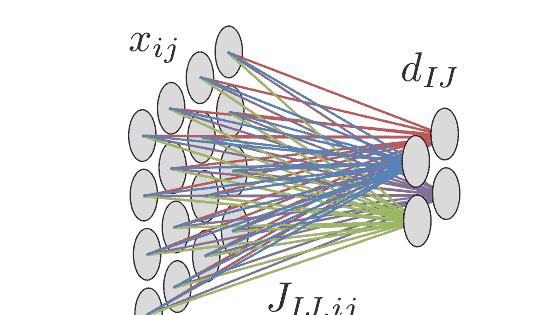

图4.2 耦合常数的示意图(4.4)。颜色线对应于每个IJ

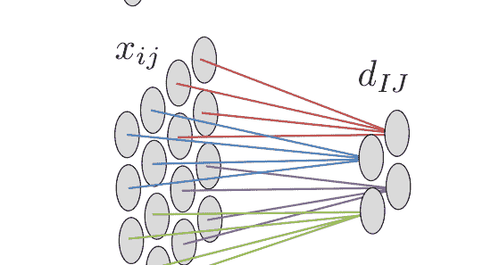

在这种情况下，最简单的哈密顿量是

$$H_{J,x}(\{d_{IJ}\}) = -\sum_{IJ} \left( \sum_{ij} d_{IJ} J_{IJ,ij} x_{ij} + d_{IJ} J_{IJ} \right).$$

如图4.1所示。然而，对于讨论(4.1)，考虑所有ij和所有相互作用是没有用的。此外，当考虑(4.1)时，最好定义离ij有多远我们必须考虑。因此，我们想要考虑

$$J_{IJ,ij} = \begin{cases} \text{非零} & \begin{pmatrix} i = s_1 I + \alpha, & \alpha \in [-W_1/2, W_1/2) \\ j = s_2 J + \beta, & \beta \in [-W_2/2, W_2/2) \end{cases} \\ \text{零} & \text{其他。} \end{cases}$$

在这里， s1, s2是被称为步幅的自然数，它们是用于每次跳过多少个像素来捕捉特征的参数。 W1, W2是被称为过滤器尺寸的自然数，它们是用于捕捉特征的区域有多大的参数。这是通过将耦合常数限制为（见图4.2）来实现的。

$$J_{IJ,ij} = \sum_{\alpha\beta} J_{IJ,\alpha\beta} \delta_{i,s_1 I + \alpha} \delta_{j,s_2 J + \beta}.$$

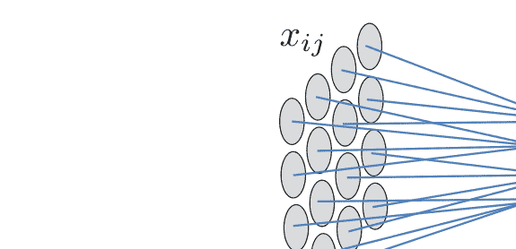

此外，如果我们想要捕捉图像的特征是“猫状”的话，这个特征不应该依赖于图像的像素坐标$I, J$。这是因为有时猫出现在照片的右上角，有时出现在中间。因此，在耦合常数中不包含$I J$的依赖关系是很自然的。这将耦合常数简化为以下形式

$$J_{IJ,ij} = \sum_{\alpha\beta} J_{\alpha\beta} \delta_{i,s_1 I+\alpha} \delta_{j,s_2 J+\beta}. \tag{4.5}$$

参见图4.3。然后，它导致了一个哈密顿量，

$$H_{J,x}^{\mathrm{conv}}(\{d_{IJ}\}) = -\sum_{IJ} d_{IJ} \left( \sum_{\alpha\beta} J_{\alpha\beta} x_{s_1 I+\alpha, s_2 J+\beta} + J \right). \tag{4.6}$$

通过这个哈密顿量计算玻尔兹曼权重，我们发现

$$Q_J(\{d_{IJ}=1\}|x) = \sigma \left( \sum_{\alpha\beta} J_{\alpha\beta} x_{s_1 I+\alpha, s_2 J+\beta} + J \right). \tag{4.7}$$

这个操作

$$x_{ij} \rightarrow \sum_{\alpha\beta} J_{\alpha\beta} x_{s_1 I+\alpha, s_2 J+\beta} \tag{4.8}$$

被称为卷积，$^{1}$包含卷积操作的神经网络被称为卷积神经网络。它首次在[36]中引入。$^{2}$ 如

$^{1}$这个卷积本质上与数学物理中使用的卷积相同，尽管符号可能不同。

$^{2}$在[36]中写道，作者从Hubel和Wiesel的论文[37]中得到了卷积神经网络的思想，该论文指出视觉皮层中有两种类型的细胞，并从Fukushima和Miyake的论文中将其在实现到神经网络中[38]。

最近深度学习热潮的起源之一是，人们经常引用一项图像识别竞赛中的卷积神经网络（AlexNet [39]³），该网络在2012年取得了令人难以置信的表现。从那时起，卷积神经网络在图像识别中已经成为“寿司是金枪鱼”一样的常态。

##### 4.1.2 转置卷积

顺便说一下，如果我们将卷积视为图像之间的“交互”，即图像$x_i$和特征 $d_{I J}$之间的“交互”，那么仅关注卷积操作（从输入产生等效于 $d_{ I J}$的结果）是不自然的。换句话说，考虑到特征$d_{ I J}$作为输入，图像$x_{ij}$作为输出的操作是很自然的。如果我们适当地改变指标，这被认为只是通过转置矩阵进行的操作，从哈密顿量（4.6）的角度来看，它是 $x$和 $d$的二次型。这个转置卷积

$$d_{I J} \rightarrow \sum_{I J} d_{I J} J_{I J, i j}$$

例如，当我们想要通过“猫的相似性”输入来生成一个类似猫的图像时，可以使用它来生成一个类似猫的图像。参见图4.4。读者可能听说过人工智能绘制的图片以高价在拍卖会上售出的新闻。这种转置卷积是实现与图像生成相关的神经网络的常用技术。例如，图4.5展示了一个名为DCGAN（深度卷积生成对抗网络）的神经网络对手写字符的无监督学习的结果。神经网络只接收MNIST的输入图像，并通过学习其特征（停止、击打和翻转等）生成一个模仿MNIST的图像。我们可以看到它的成功程度。

###### 棋盘伪影

转置卷积被认为是从低维特征生成高维特征的一种自然方法，作为逆操作

³ Alex是本文的第一作者的名字。

⁴说到过去的金枪鱼，“腌制”是用来防止腐烂的，所以吃瘦肉很常见，而金枪鱼的脂肪部分似乎是没有价值的。然而，由于制冷技术的发展，新鲜的金枪鱼可以运送到远离海洋的地区，这导致了金枪鱼肚的传播。同样，如果机器学习中出现新的技术，可能会出现一种“下一代”架构，可能超越卷积神经网络。事实上，近年来一种名为胶囊网络[40]的新型神经网络引起了人们的关注。

⁵对于想要了解更多的读者，我们建议参考[41]，例如。

⁶我们将在第6.3节详细解释这种方法。

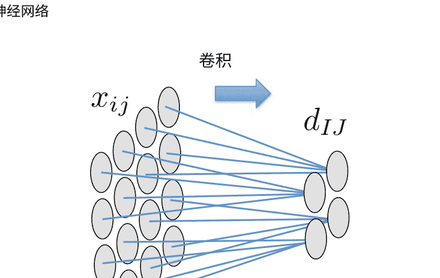

图4.4 卷积和转置卷积之间的关系

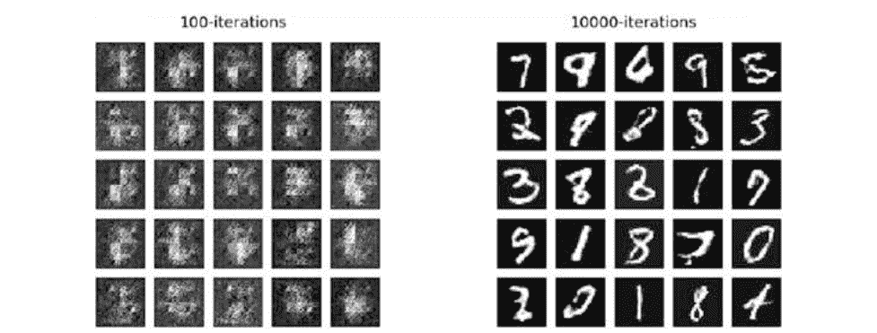

图4.5 由DCGAN生成的手写字符。左侧：在学习的开始阶段可以看到棋盘格图案。右侧：在学习的后期，图案变得不明显。

卷积。然而，由于定义的特性，经常会生成一种称为棋盘格伪影的独特图案（参见图4.5左和4.6）。

在深度神经网络中，如果训练直到输入层 $d_{IJ}$ 没有进展，例如，如果 $d_{IJ}$ 变得几乎均匀，那么转置卷积将只是在计算中进行平移和添加滤波器，从而产生棋盘格伪影。如果输入层的训练进展顺利，最后的 $d_{IJ}$ 将不均匀，棋盘格图案将不可见。

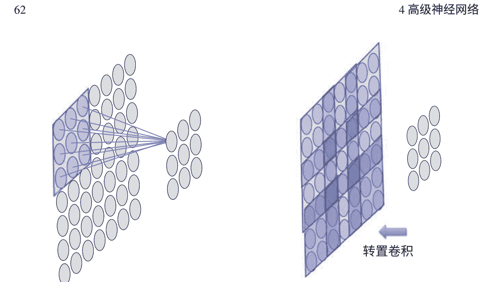

#### 4.2 循环神经网络和反向传播

到目前为止，我们考虑了以下单向传播：

$$|h\rangle = \mathbb{T}|x\rangle := \sum_{m} |m\rangle \sigma (\langle m|\mathbb{J}|x\rangle).$$

那么我们如何处理时间序列数据，例如

$$|x(t)\rangle, \quad t = 1,2,3,\ldots,T,$$

在神经网络模型中如何处理？逐个将其放入神经网络是一种方法。然而，作为(4.11)的一个例子，如果我们有以下情况怎么办？

-   $|x(t=1)\rangle = |\mathbb{I}\rangle,$
-   $|x(t=2)\rangle = |\text{有}\rangle,$
-   $|x(t=3)\rangle = |a\rangle,$
-   $|x(t=4)\rangle = |\text{pen}\rangle,$
-   $|x(t=5)\rangle = |\cdot\rangle.$

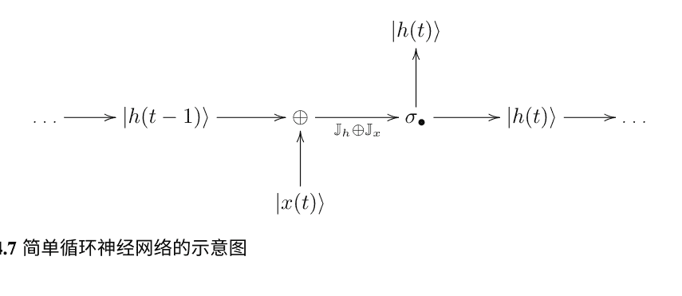

迄今为止描述的模型不包括数据项之前和之后的时间戳信息，无法捕捉上下文。因此，作为一个简单的扩展，让我们考虑

$$|h(t)\rangle = \sum_m |m\rangle\sigma\left(\langle m|\mathfrak{J}_x|x(t)\rangle + \langle m|\mathfrak{J}_h|h(t-1)\rangle\right).$$

这是所谓的循环神经网络的最简形式。见图4.7。在这里，$|h(t)\rangle$是每个时间t的输出值，也是下一个时间t+1的第二个输入。第一个输入是$|x(t+1)\rangle$。如果我们考虑机器人手臂搬运行李，$|x(t)\rangle$是每个时间从机器人视野中进入的图像数据，而$|h(t)\rangle$是该时间的手臂运动。例如，对于手臂运动的响应，如果在时间t加速度过大，则需要在下一个时间步骤应用刹车，以防止行李被抛出。这样，递归结构被包含在内，以处理需要知道先前行为以便在当前时间操作的情况。

顺便说一下，通过调整 $\mathfrak{J}_h, \mathfrak{J}_x, \sigma$，即使是这样一个简单的递归神经网络也可以具有任意的计算能力。这是已知的[43]。这被认为是神经网络的一种通用逼近定理，但换句话说，它意味着“递归神经网络可以用作编程语言”，并且“它具有与计算机相同的能力”。这种性质被称为图灵完备或计算通用。如果构建一个“通用人工智能”（尽管这在我们写于2019年1月的时候还是遥远的未来），它应该具备从数据（经验）中自己实现（获取）任何逻辑操作（语言功能）的能力。递归神经网络的计算完备性使我们有些想起它的可能性。

##### 误差反向传播

让我们来看看递归神经网络中的误差反向传播。我们重复使用以下递归表达式：

$$
\begin{aligned}
\delta|h(t)\rangle
&= \underbrace{\sum_m |m\rangle \sigma' \left(\langle m|\mathfrak{J}_x|x(t)\rangle + \langle m|\mathfrak{J}_h|h(t-1)\rangle \right) \langle m|}_{\text{我们将其命名为 }=:\mathbb{G}(t)} \begin{pmatrix} \delta\mathfrak{J}_x|x(t)\rangle \\ +\delta\mathfrak{J}_h|h(t-1)\rangle \\ +\mathfrak{J}_h\delta|h(t-1)\rangle \end{pmatrix} \\
&= \mathbb{G}(t)\delta\mathfrak{J}_x|x(t)\rangle + \mathbb{G}(t)\delta\mathfrak{J}_h|h(t-1)\rangle + \mathbb{G}(t)\mathfrak{J}_h\delta|h(t-1)\rangle. \quad\quad (4.14)
\end{aligned}
$$

##### 误差函数

$L$ 通常是

$$L = \langle d(1)|h(1)\rangle + \langle d(2)|h(2)\rangle + \ldots. \quad\quad (4.15)$$

并且它只是个别项的求和。因此，只需考虑第$t$个项：

$$
\begin{aligned}
\delta\langle d(t) |h(t)\rangle &= \langle d(t) |\delta|h(t)\rangle \\
&= \underline{\langle d(t) |\mathbb{G}(t)} \rangle \left(\delta\mathfrak{J}_x|x(t)\rangle + \delta\mathfrak{J}_h|h(t-1)\rangle + \mathfrak{J}_h\delta|h(t-1)\rangle \right) \\
&=:\langle \delta_t(t) | \\
&= \langle \delta_t(t) |\delta\mathfrak{J}_x|x(t)\rangle + \langle \delta_t(t) |\delta\mathfrak{J}_h|h(t-1)\rangle \\
&\quad + \underbrace{\langle \delta_t(t) |\mathfrak{J}_h\mathbb{G}(t-1)} \rangle \left(\delta\mathfrak{J}_x|x(t-1)\rangle + \delta\mathfrak{J}_h|h(t-2)\rangle + \mathfrak{J}_h\delta|h(t-2)\rangle \right) \\
&=:\langle \delta_t(t-1)| \\
&= \ldots \\
&= \langle \delta_t(t) |\delta\mathfrak{J}_x|x(t)\rangle + \langle \delta_t(t) |\delta\mathfrak{J}_h|h(t-1)\rangle \\
&\quad + \langle \delta_t(t-1) |\delta\mathfrak{J}_x|x(t-1)\rangle + \langle \delta_t(t-1) |\delta\mathfrak{J}_h|h(t-2)\rangle \\
&\quad \ldots \\
&\quad + \langle \delta_t(1) |\delta\mathfrak{J}_x|x(1)\rangle + \langle \delta_t(1) |\delta\mathfrak{J}_h|h(0)\rangle. \quad\quad (4.16)
\end{aligned}
$$

在这里，使用

$$\delta\mathfrak{J} = \sum_{m,n} |m\rangle\langle n| \delta J^{mn}, \quad\quad (4.17),$$我们发现

δ⟨d(t)|h(t)⟩ = \sum_{\tau \leq t} \left( \langle \delta_t(\tau) | \delta \mathbb{J}_x | x(\tau) \rangle + \langle \delta_t(\tau) | \delta \mathbb{J}_h | h(\tau-1) \rangle \right) = \sum_{\tau \leq t} \sum_{m,n} \left( \langle \delta_t(\tau) | m \rangle \langle n | x(\tau) \rangle \delta J_x^{mn} + \langle \delta_t(\tau) | m \rangle \langle n | h(\tau-1) \rangle \delta J_h^{mn} \right) = \sum_{m,n} \left( \sum_{\tau \leq t} \langle \delta_t(\tau) | m \rangle \langle n | x(\tau) \rangle \delta J_x^{mn} + \sum_{\tau \leq t} \langle \delta_t(\tau) | m \rangle \langle n | h(\tau-1) \rangle \delta J_h^{mn} \right). \quad (4.18)

因此，

δL = \sum_{t} \delta\langle d(t) | h(t) \rangle = \sum_{m,n} \left( \sum_{t} \sum_{\tau \leq t} \langle \delta_t(\tau) | m \rangle \langle n | x(\tau) \rangle \delta J_x^{mn} + \sum_{t} \sum_{\tau \leq t} \langle \delta_t(\tau) | m \rangle \langle n | h(\tau-1) \rangle \delta J_h^{mn} \right), \quad (4.19)

然后，更新规则是

δJ_x^{mn} = -\epsilon \sum_{t} \sum_{\tau \leq t} \langle \delta_t(\tau) | m \rangle \langle n | x(\tau) \rangle, \quad δJ_h^{mn} = -\epsilon \sum_{t} \sum_{\tau \leq t} \langle \delta_t(\tau) | m \rangle \langle n | h(\tau-1) \rangle. \quad (4.20)

另外，

⟨δ_t(\tau - 1)| = ⟨δ_t(\tau)|\mathbb{J}_h \mathbb{G}(\tau - 1), \quad ⟨δ_t(t)| = ⟨d(t)|\mathbb{G}(t) \quad (4.21)

在当前情况下，反向传播的公式是

##### 梯度爆炸/梯度消失

使用上述方法，我们可以用数据训练一个循环神经网络，但这足够吗？例如，我们可以使用语言数据训练网络生成一个好的句子吗？答案是否定的。例如，它不能很好地处理括号结构。也就是说，会发生记忆丢失。接下来，我们将从反向传播方程的角度解释为什么会发生这种情况。

由于我们根据 (4.20) 调整参数 J，让我们从这些方程开始。⟨δ_t(\tau)|在更新表达式中都常常出现。考虑到τ=0状态，从反向传播公式 (4.21) 我们可以得到

⟨δ_t(1)| = ⟨δ_t(2)|\mathbb{J}_h \mathbb{G}(1) = ⟨δ_t(3)|\mathbb{J}_h \mathbb{G}(2)\mathbb{J}_h \mathbb{G}(1) = \ldots = ⟨d(t)|\mathbb{G}(t)\mathbb{J}_h \mathbb{G}(t-1) \ldots \mathbb{J}_h \mathbb{G}(2)\mathbb{J}_h \mathbb{G}(1). \quad (4.22)

注意，完全相同的$J_h$从右边作用$t-1$次。由于$t$是句子的长度，它可能非常长。然后

$|J_h| > 1: \langle \delta_t(1) \rangle \text{太大} \quad (4.23)$
$|J_h| < 1: \langle \delta_t(1) \rangle \text{太小} \quad (4.24)$

因此，这两种情况都阻碍了学习。例如，如果它太大，它会与“小”更新发生冲突，这是(4.20)中更新表达式有效的一个隐含假设。如果它太小，意味着τ=0在更新公式中没有影响，这意味着记忆被遗忘了。这些分别被称为梯度爆炸和梯度消失。这在Hochreiter的博士论文[44]中指出。

#### 4.3 LSTM

如上所述，使用简单的循环神经网络，梯度消失/爆炸问题无法通过结构、加深、卷积等方式得到改善。需要一种新的思路来解决这个问题。本节介绍了常用的LSTM（长短期记忆）[46]。

##### 记忆向量

LSTM的核心思想是在循环神经网络中设置一个控制内部记忆的向量。它类似于RAM（随机存取存储器，临时存储区域）。我们将时间t时的记忆向量称为

$|c(t)\rangle \quad (4.25)$

图4.8显示了LSTM的整体结构图。这里的$g_f$、$g_i$和$g_o$被称为

- $g_f$: 遗忘门
- $g_i$: 输入门
- $g_o$: 输出门

我们将它们视为每个组件的sigmoid函数，

$g_f = g_i = g_o = \sigma \quad (4.26)$

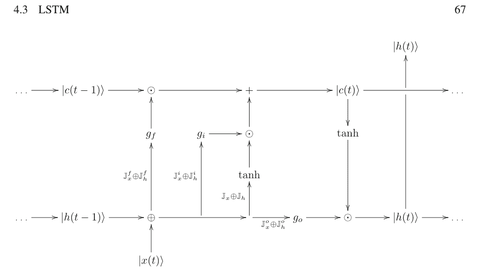

图4.8 LSTM的示意图。⊕表示输入层中两个向量的直和，+表示在|c(t)⟩层中的向量加法，⊙表示每个向量分量的乘法(因此，输出向量具有相同的维度)。

图中所示的关系总结如下：

$$|h(t)\rangle = \sum_{m} |m\rangle\langle m|g_o\rangle\langle m|\tanh(c(t))\rangle$$

$$|c(t)\rangle = \sum_{m} |m\rangle\langle m|c(t-1)\rangle\langle m|g_f\rangle + \sum_{m} |m\rangle \tanh\left(\langle m|(\mathcal{J}_x|x(t)\rangle + \mathcal{J}_h|h(t-1))\rangle\right)\langle m|g_i\rangle$$

$$|g_f\rangle = \sum_{m} |m\rangle g_f\left(\langle m|(\mathcal{J}_x^f|x(t)\rangle + \mathcal{J}_h^f|h(t-1))\rangle\right)$$

$$|g_i\rangle = \sum_{m} |m\rangle g_i\left(\langle m|(\mathcal{J}_x^i|x(t)\rangle + \mathcal{J}_h^i|h(t-1))\rangle\right)$$

$$|g_o\rangle = \sum_{m} |m\rangle g_o\left(\langle m|(\mathcal{J}_x^o|x(t)\rangle + \mathcal{J}_h^o|h(t-1))\rangle\right)$$

让我们看看误差是如何反向传播的：

$$\delta|h(t)\rangle = \sum_{m} |m\rangle\left[ \langle m|\delta|g_o\rangle\langle m|\tanh(c(t))\rangle + \langle m|g_o\rangle\langle m|\delta|\tanh(c(t))\rangle \right]$$

首先，第一部分 (A) 被转换如下：

$(A) = \delta | g_o \rangle = \delta \sum_m |m\rangle g_o \left( \langle m|(\mathbb{J}_x^o | x(t) \rangle + \mathbb{J}_h^o | h(t-1) \rangle ) \right)$
$= \sum_m |m\rangle g'_o(\bullet) \left[ \langle m| \delta |(\mathbb{J}_x^o | x(t) \rangle + \mathbb{J}_h^o | h(t-1) \rangle ) \rangle + \mathbb{J}_h^o \delta | h(t-1) \rangle \right]. \quad (4.33)$

第三项是一个形式，其中参数 $\mathbb{J}_h^o$ 作用于 $\delta | h \rangle$ 一个时间步骤之前，所以如果我们回溯更多时间，就会有很多 $\mathbb{J}_h^o$，导致梯度爆炸/消失问题。接下来，下半部分 (B) 写作

$(B) = \delta \sum_m |m\rangle \tanh(\langle m| c(t) \rangle)$
$= \sum_m |m\rangle \text{双曲正切}'(\bullet) \left[ \langle m| \delta | c(t) \rangle \right], \quad (4.34)$

因此，梯度的大小取决于(C)的行为。

$(C) = \delta \sum_m |m\rangle \langle m| c(t-1) \rangle \langle m| g_f \rangle$
$+ \delta \sum_m |m\rangle \tanh \left( \langle m|(\mathbb{J}_x | x(t) \rangle + \mathbb{J}_h | h(t-1) \rangle ) \right) \langle m| g_i \rangle$
$= \sum_m |m\rangle \left[ \langle m| \delta | c(t-1) \rangle \langle m| g_f \rangle + \langle m| c(t-1) \rangle \langle m| \delta | g_f \rangle \right] \quad (D)$
$+ \sum_m |m\rangle \left[ \text{双曲正切}'(\bullet) \left( \langle m| (\delta \mathbb{J}_x | x(t) \rangle + \delta \mathbb{J}_h | h(t-1) \rangle ) + \mathbb{J}_h \delta | h(t-1) \rangle ) \right) \langle m| g_i \rangle$
$+ \text{双曲正切}(\bullet) \langle m| \delta | g_i \rangle \right]. \quad (4.35)$
$+ \text{双曲正切}(\bullet) \langle m| \delta | g_i \rangle \right]. \quad (F)$

由于 (D) 和 (F) 基本上与 $g_o$, $\mathbb{J}^f$ 和 $\mathbb{J}^i$ 多次作用，可能导致梯度爆炸/消失问题。然而，在 (4.35) 的第一项中， $| c(t-1) \rangle$ 没有 $\mathbb{J}$。这部分是向后传播到一次时间步骤之前的记忆向量，并起到“尽可能保持记忆”的作用-因为学习参数 $\mathbb{J}$ 原则上不起作用，它可以尽可能传播。这实际上可以从定义中清楚地看出： $| x(t) \rangle$, $| h(t) \rangle$ 始终输入到激活函数中，而 $| c(t) \rangle$ 只是通过 $g_f$ 乘以一些常数。这是LSTM最重要的部分，也是最不容易出现梯度爆炸/消失问题的地方。

请注意，由于遗忘门的权重和输入门的输入在每个 $\tau$ 处都被放置，一次记录的信息并没有完全保留。在记忆向量中，只由$\mathbb{I}$控制的“遗忘”和“记住”操作是提前以明确的形式给出的。例如，让我们来看下面的记忆向量：

$$|c\rangle = \begin{pmatrix} c_1 \\ c_2 \\ \vdots \\ c_d \end{pmatrix} \quad (4.36)$$

并假设 $c_1$ = (控制主题的分量)。如果输入是我喜欢机器学习。，并且成功训练的LSTM是一个“预测下一个单词”的机器，当第一个单词我出现时，记忆应该能够起作用

$$|c\rangle = \begin{pmatrix} 1 \\ 0 \\ \vdots \\ 0 \end{pmatrix} \quad (4.37)$$

并将情况识别为“我们正在处理主题部分no”。⁹在这个阶段，可能会跟着和你...因此，不可能取消“主题”状态。当第二个单词喜欢输入时，由于这是一个动词，在英语语法中主题将不再跟随。在这种情况下，遗忘门的输出为

$$|g_f\rangle = \begin{pmatrix} 0 \\ 1 \\ \vdots \\ 1 \end{pmatrix} , \quad (4.38)$$

当 $|c\rangle$ 与此相乘时，它是一个使 $c_1$ = (控制主题的分量) 为零的操作。此外，如果记忆向量的第二个分量 = (控制动词的分量)，则当输入第二个单词享受时，输入门就会打开，例如，

$$|g_i\rangle = \begin{pmatrix} 0 \\ 1 \\ 0 \\ \vdots \\ 0 \end{pmatrix}. \quad (4.39)$$

根据上述结果，记忆从“主题”状态转移到“动词”状态，$^{10}$

$$|c(\text{下一个时间步})\rangle = |c\rangle \odot |g_f\rangle + |g_i\rangle$$
$$= \begin{pmatrix} 1 \\ 0 \\ 0 \\ \vdots \\ 0 \end{pmatrix} \odot \begin{pmatrix} 0 \\ 1 \\ 1 \\ \vdots \\ 1 \end{pmatrix} + \begin{pmatrix} 0 \\ 1 \\ 0 \\ \vdots \\ 0 \end{pmatrix} = \begin{pmatrix} 0 \\ 1 \\ 0 \\ \vdots \\ 0 \end{pmatrix}. \quad (4.40)$$

##### 注意机制

根据输入对特征向量的重要性进行评分的操作，类似于遗忘门，被称为注意机制。已知如果在LSTM中添加外部注意机制，可以显著提高自然语言翻译的准确性[48]。此外，有一篇论文[49]声称神经网络的循环结构甚至不是必需的，只需要注意机制，事实上，在自然语言处理（NLP）中表现出了很高的性能。注意机制还被证明可以显著提高图像处理的准确性[50, 51]，并在现代深度学习中发挥着关键作用。鼓励感兴趣的读者阅读，例如[52]及其参考文献。

##### 专栏：混沌边缘与可计算性的出现

在今天的世界中，电子设备如个人电脑和智能手机是不可或缺的，我们可以做我们想做的事情的原因是什么？在这个问题的背后，存在着一个超越了简单的“有用工具”的深奥世界，与任何物理定律一样好。

###### 排序算法

首先，让我们考虑将以下序列按升序排序：

$$[3, 1, 2].$$

当然，答案是[1,2,3]，但如果序列很长，比如[38, 90, 25, 74, 87, 26, 53, 86, 14, 89, ... ]，就很难立即回答。当我们需要做这种工作时，最聪明的方法之一是编写一个进行排序的程序。换句话说：

$$[3, 1, 2] \rightarrow (\text{某种“机械”过程}) \rightarrow [1, 2, 3].$$

关键词是“机械”，在过程中不应该有人类思考。$^{11}$实施此过程的一种方法是按顺序逐个拾取输入数据，并在右侧数字较小时进行交换，否则保持不变：

$$[3, 1, 2] \rightarrow [1, 3, 2] \rightarrow [1, 2, 3].$$

在单次尝试中可能不完整。在另一个例子中，我们发现

$$[3, 2, 1] \rightarrow [2, 3, 1] \rightarrow [2, 1, 3],$$

这是不完整的，在这种情况下，从左侧再次执行相同的过程：

$$(4.44) = [2, 1, 3] \rightarrow [1, 2, 3] \rightarrow [1, 2, 3].$$

即使我们不想判断“是否已完成”，该过程也应通过重复相同的操作至少与序列元素数量相同的次数来完成排序。

> $^{11}$ 允许人类手动转动齿轮，向机器输入一些能量。

###### 使用递归神经网络进行实现

在主文中，我们描述了一个递归神经网络是图灵完备的。这意味着如果我们很好地调整网络的训练参数，我们可以实现类似于（4.42）的东西。论文[43]描述了如何通过手动确定权重来实现所需的处理，而最近的深度学习模型（使用神经图灵机（NTM）[53]）可以通过学习自动决定这一点。换句话说，网络正在变得能够从数据本身实现上述过程。12下面显示了当输入一个不在训练数据中的输入时，训练网络的实际输出。虽然由于训练不太好，它没有完全正确，但看到输出按照正确的顺序和正确的长度（尽管值略有不同）出现仍然令人惊讶。

```
[1, 1, 1, 2, 12] -> { 正确答案 [1, 1, 1, 2, 12]
                  NTM    [1, 1, 1, 1, 12] }

[13, 3, 1, 2, 5, 9, 9] -> { 正确答案 [1, 2, 3, 5, 9, 9, 13]
                    NTM    [0, 3, 3, 3, 9, 13, 13] }

[8, 10, 8, 3, 14, 4, 15, 5] -> { 正确答案 [3, 4, 5, 8, 8, 10, 14, 15]
                       NTM    [0, 4, 6, 10, 10, 14, 14, 14] }

[5, 2, 8, 12, 0] -> { 正确答案 [0, 2, 5, 8, 12]
                NTM    [2, 6, 6, 8, 12] }

[5, 7, 12, 10, 2] -> { 正确答案 [2, 5, 7, 10, 12]
                 NTM    [2, 6, 6, 8, 12] }
```

###### KdV方程和盒球系统

让我们介绍另一个故事，一个被称为盒球系统的物理系统。盒-球系统是通过对KdV方程进行特定离散化得到的13该方程是从流体Navier-Stokes方程得到的，当波浪

- 浅波浪，并且
- 仅在一个方向传播。

最初，系统具有空间上的1维+时间演化，现在两者都被离散化。我们将离散化的空间表示为

```
...○○●●○○○○...    (4.46)
```

此外，○对应于波不是驻波的状态，而●对应于波是驻波的状态。盒球系统的单位时间演化是

1. 选择最左边的●
2. 将其变为○。(并收集●)
3. 向右移动一个单位
4. 如果状态是○，则将■放在那里并返回到1；如果状态是●或■，则返回到3
5. 将所有的■替换为●
(4.47)

将这个单位时间演化应用于初始配置的结果如下：

```
●●○○○○○○○●●○○○○○○○○●○○○○○○○○○○○○○○○○○○○○
○○○●●●●○○○○●●●○○○○○○●○○○○○○○○○○○○○○○○○○
○○○○○○●●●○○○○○○●●○○○○●○○○○○○○○○○○○○○○○○○
○○○○○○○○●●●○○○●○○○●○○○○○○○○○○○○○○○○○○○○○
○○○○○○○○○○●●●○○○●●○●○○○○○○○○○○○○○○○○○○○○○
○○○○○○○○○○○○○●●●○●●●○○○○○○○○○○○○○○○○○○○○○
○○○○○○○○○○○○○○○●○○●●●●○○○○○○○○○○○○○○○○○○○
○○○○○○○○○○○○○○○○○●○○●●●●○○○○○○○○○○○○○○○○○
○○○○○○○○○○○○○○○○○○○●○○●●●●○○○○○○○○○○○○○○○
○○○○○○○○○○○○○○○○○○○○○●○○●●●●○○○○○○○○○○○○○
○○○○○○○○○○○○○○○○○○○○○○○●○○●●●●○○○○○○○○○○○
○○○○○○○○○○○○○○○○○○○○○○○○○●○○●●●●○○○○○○○○○
○○○○○○○○○○○○○○○○○○○○○○○○○○○●○○●●●●○○○○○○○
○○○○○○○○○○○○○○○○○○○○○○○○○○○○○●○○●●●●○○○○○
```

读者可能会发现，类似于KdV方程的孤立子散射的时间演化被获得。顺便说一下，如果我们计算从左边以。分隔的 • 的数量，这是 [3, 2, 1] → [1, 2, 3]，与排序算法相同！以防万一，如果我们输入另一个对应于

[3, 4, 2, 1, 2, 3], 然后得到[1, 2, 2, 3, 3, 4]是<sup>15</sup>

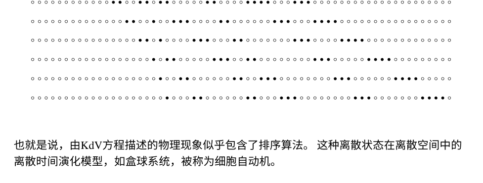

也就是说，由KdV方程描述的物理现象似乎包含了排序算法。这种离散状态在离散空间中的离散时间演化模型，如盒球系统，被称为细胞自动机。

###### 一维细胞自动机的临界状态和图灵完备性

著名的数学软件Mathematica的创始人Stephen Wolfram最初是一位从事基本粒子理论的物理学家。他还因对一维（基本）细胞自动机的分类而闻名[54]。

根据分类，细胞自动机的动力学要么是：

- I. 静态的（任何初始状态立即停止并稳定下来）
- II. 周期性（任何初始状态立即停止或周期性移动并稳定下来）
- III. 混沌性（状态即使经过足够长时间也不会稳定）
- IV. 除上述情况外（稳定性和混沌的“边缘”）

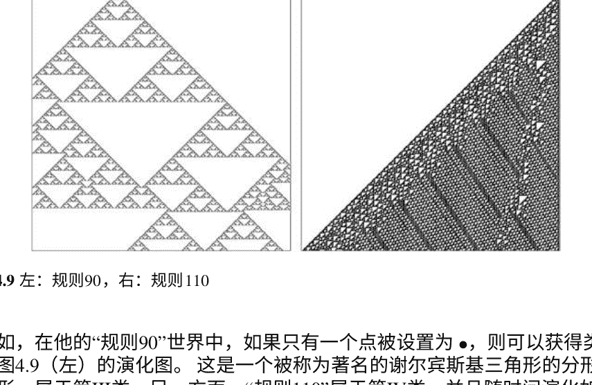

图4.9左：规则90，右：规则110

例如，在他的“规则90”世界中，如果只有一个点被设置为 ●，则可以获得类似图4.9（左）的演化图。 这是一个被称为著名的谢尔宾斯基三角形的分形图形，属于第III类。另一方面，“规则110”属于第IV类，并且随时间演化如图4.9（右）所示。 我们可以看到生成各种大小的三角形，事实上，已经证明这个世界是图灵完备的[55]。 换句话说，在这个一维世界中，可以制造计算机。 关于[55]的作者的更详细解释可在[56]中找到。 克里斯托弗·朗顿（Christopher Langton）以被称为朗顿蚂蚁的元胞自动机而闻名，他进一步认为第IV类时间演化由于与凝聚态系统中的相变现象相似，因此对应于图灵完备性[57]。 顺便说一下，在我们生活的世界中有计算机它们可以进行计算。 这与宇宙的物理定律有关吗？ 研究可能会进展，我们可能会在未来回答这样一个问题。

### 第5章 采样

摘要 在进行训练的情况下，假设输入数据由概率分布给出。通常需要计算由概率分布给出的各种输入值的函数的期望值。在本章中，我们将讨论“采样”的方法和必要性，即执行期望值计算的方法。在机器学习中也使用了统计力学中经常使用的概念，如大数定律、中心极限定理、马尔可夫链蒙特卡洛方法、细致平衡原理、Metropolis方法和热浴方法。熟悉物理学和机器学习中的常见概念可以帮助理解两者。

正如我们在第2章中解释的那样，在本书中我们将机器学习定义为：

1. 假设存在一个生成数据的概率分布P (x, d)
2. 调整参数 J of 概率分布 Q_J(x, d) 以接近 P (x, d)

为了在第3章和第4章引入神经网络，我们运用了我们对统计力学的知识从这个角度来看。深度神经网络的输出可以被视为条件概率 distribution Q_J(d|x) 的期望值 d 给定输入 x. 然而，人们经常希望根据 Q_J(d|x) 的发生概率来进行抽样，而不是取期望值。例如，让我们考虑

    Q_J(d|x) = 将输入图像 x 分类为 d 的概率。

假设

    x = 祖父与他的狗开心笑的照片，

然后我们可能会发现
$$Q_J(\text{祖父}|x) = \frac{1}{2}, \quad Q_J(\text{狗}|x) = \frac{1}{2}.$$
当然，这样做没问题，但如果我们把这台机器卖给我们的客户，其中一个会抱怨说，

$x$应该被归类为祖父还是狗？！

在这种情况下，一个不负责任的解决方案是使用抛硬币的方式：
$$\begin{aligned}
&\text{如果硬币正面朝上，则 } d = \text{祖父}\\
&\text{如果硬币背面朝上，则 } d = \text{狗}
\end{aligned}$$
(5.1)
通过这种方式，我们可以回应那个抱怨。当然，基于 (5.1)，如果使用同一张图片多次提问，有时会判断为“祖父”，有时会判断为“狗”。这不会有问题，因为向人类展示这张图片的结果是一样的。

在实际创建训练数据 $\{(x[i], d[i])\}_i$ 之前，甚至在使用经过训练的模型 $Q_J$ 时，都会出现相同的问题。也就是说，当许多对象 $a, b$ 在单个数据项 $x[i]$ 中显示时，问题是正确答案应该是 $d[i] = a$，还是 $d[i] = b$。再次，这取决于创建数据的人的判断，这些信息包含在数据生成概率 $P(x, d)$ 中。

虽然我们到现在为止对这个问题保持沉默，但从上面的考虑可以看出，在存在概率分布 $P$ 时，有必要考虑实际采样的含义。因此，在本章中，我们将重点介绍与采样相关的重要内容，以及周围的基础知识：

- 训练数据的采样（数据收集）
- 从训练好的机器中采样（数据模仿）

#### 5.1 中心极限定理及其在机器学习中的作用

让我们回顾一下第1章中介绍机器学习的例子。
我们有可能的事件 $A_1, A_2, \ldots, A_W$，且发生的概率为 $p_1, p_2, \ldots, p_W$，但我们不知道概率的具体值 $p_i$。相反，

我们只知道每个事件发生的次数，

$$
\begin{cases}
A_1: \#_1\text{次}, A_2: \#_2\text{次}, \ldots, A_W: \#_W\text{次}, \\
\# = \sum_{i=1}^W \#_i \text{总} \# \text{次}.
\end{cases}
$$ (5.2)

在第一章中，我们在没有任何证明的情况下使用了最大似然估计收敛于所需概率 \( p_i \) 的事实，当数据数量趋于无穷大时 \( \# \to \infty \),

$$ \frac{\#_i}{\#} \to p_i $$ (5.3)

这似乎是直观正确的。 然而，当被问及为什么可以使用(5.3)时，我们如何正确回答呢？

##### 大数定律

在这里，考虑以下情况：

$$ X_n^{(i)} = \begin{cases} 1, & \text{如果事件 } A_i \text{在第}n\text{次试验中发生,} \\ 0, & \text{如果事件 } A_i \text{在第}n\text{次试验中不发生.} \end{cases} $$ (5.4)

然后，我们可以写成

$$ \frac{\#_i}{\#} = \frac{1}{\#} \sum_{n=1}^{\#} X_n^{(i)} $$ (5.5)

让我们考虑这个比率的“期望值”，即

$$ \begin{aligned} \left\langle \frac{\#_i}{\#} \right\rangle_p &= \left\langle \frac{1}{\#} \sum_{n=1}^{\#} X_n^{(i)} \right\rangle_p \\ &= \frac{1}{\#} \sum_{n=1}^{\#} \left\langle X_n^{(i)} \right\rangle_p \\ &= \frac{1}{\#} \sum_{n=1}^{\#} \left( p_i \cdot 1 + (1 - p_i) \cdot 0 \right) \\ &= \frac{1}{\#} \sum_{n=1}^{\#} p_i = p_i, \end{aligned} $$ (5.6)

并且等于事件 \( A_i \) 发生的概率。 这非常类似于 (5.3) ，但并不完全等于 (5.3 ) 本身。 因此，让我们研究一下“差异”

实际 # #和其期望值之间的差异 $\left\langle \frac{\#_i}{\#} \right\rangle_p$。请注意，实际观察到的 #波动，因此仅仅取差异没有太多意义。解决这种情况的一种方法是考虑具有 $\left\langle \frac{\#_i}{\#} \right\rangle_p - \epsilon \leq \frac{\#_i}{\#} \leq \left\langle \frac{\#_i}{\#} \right\rangle_p + \epsilon$ 的概率，其中 $\epsilon$ 是一个适当的正常数。如果我们能够证明

$$ P\left(\left|\frac{\#_i}{\#} - \left\langle \frac{\#_i}{\#} \right\rangle_p\right| < \epsilon \right) \geq 1 - \frac{\spadesuit}{\#\text{正数},} $$

那么对于任意的 $\epsilon$，当 $\#$（数据的数量）足够大时，这个概率趋近于1，从而证明了（5.3）。这不是一个 $\epsilon$-$\delta$ 的极限定义，而是“$\epsilon$-#”的极限定义。为了证明这一点，首先考虑差异的平方的期望值：

$$ \left\langle \left| \frac{\#_i}{\#} - \left\langle \frac{\#_i}{\#} \right\rangle_p \right|^2 \right\rangle_p = \sum_{\text{所有可能的}} P\left( \frac{\#_i}{\#} \right) \left| \frac{\#_i}{\#} - \left\langle \frac{\#_i}{\#} \right\rangle_p \right|^2 \geq \sum_{\left| \frac{\#_i}{\#} - \left\langle \frac{\#_i}{\#} \right\rangle_p \right| \geq \epsilon} P\left( \frac{\#_i}{\#} \right) \left| \frac{\#_i}{\#} - \left\langle \frac{\#_i}{\#} \right\rangle_p \right|^2 \geq \epsilon^2 \sum_{\left| \frac{\#_i}{\#} - \left\langle \frac{\#_i}{\#} \right\rangle_p \right| \geq \epsilon} P\left( \frac{\#_i}{\#} \right) = \epsilon^2 P\left( \left| \frac{\#_i}{\#} - \left\langle \frac{\#_i}{\#} \right\rangle_p \right| \geq \epsilon \right). $$

第一个“$\geq$”来自于对求和范围的限制，而第二个“$\geq$”则是根据限制求和的条件得到的 $\left| \frac{\#_i}{\#} - \left\langle \frac{\#_i}{\#} \right\rangle_p \right| \geq \epsilon$。最后的“$=$”是 $P$ 的定义本身 $P\left( \left| \frac{\#_i}{\#} - \left\langle \frac{\#_i}{\#} \right\rangle_p \right| \geq \epsilon \right)$。在这里的计算结果中，与所期望的概率 $P$ 相比 $P\left( \left| \frac{\#_i}{\#} - \left\langle \frac{\#_i}{\#} \right\rangle_p \right| < \epsilon \right)$，括号中的不等式被颠倒了然而，它们的总和应该是一致的，所以我们得到

$$ P\left( \left| \frac{\#_i}{\#} - \left\langle \frac{\#_i}{\#} \right\rangle_p \right| < \epsilon \right) = 1 - P\left( \left| \frac{\#_i}{\#} - \left\langle \frac{\#_i}{\#} \right\rangle_p \right| \geq \epsilon \right) \geq 1 - \frac{1}{\epsilon^2} \left\langle \left| \frac{\#_i}{\#} - \left\langle \frac{\#_i}{\#} \right\rangle_p \right|^2 \right\rangle_p. $$

接下来，我们得到右侧第二项的以下表达式:

$$\begin{aligned}
\left\langle\left|\frac{\#_{i}}{\#}-\left\langle\frac{\#_{i}}{\#}\right\rangle_{p}\right|^{2}\right\rangle_{p} &=\left\langle\left(\frac{\#_{i}}{\#}\right)^{2}-2\left\langle\frac{\#_{i}}{\#}\right\rangle_{p}\left(\frac{\#_{i}}{\#}\right)+\left\langle\frac{\#_{i}}{\#}\right\rangle_{p}^{2}\right\rangle_{p} \\ &=\left\langle\left(\frac{\#_{i}}{\#}\right)^{2}\right\rangle_{p}-2\left\langle\left(\frac{\#_{i}}{\#}\right)\right\rangle_{p}\left\langle\frac{\#_{i}}{\#}\right\rangle_{p}+\left\langle\frac{\#_{i}}{\#}\right\rangle_{p}^{2} \\ &=\left\langle\left(\frac{\#_{i}}{\#}\right)^{2}\right\rangle_{p}-\left\langle\frac{\#_{i}}{\#}\right\rangle_{p}^{2} \\ &=\frac{1}{\#}\left(p_{i}\left(1-p_{i}\right)\right),
\end{aligned}$$
(5.11)

总结一下，我们得到

$$ P\left(\left|\frac{\#_{i}}{\#}-p_{i}\right|<\epsilon\right) \geq 1-\frac{p_{i}\left(1-p_{i}\right)}{\epsilon^{2} \#} $$
(5.12)

这就是我们想要展示的。

##### 大数定律（一般情况）

到目前为止，我们已经考虑了经验概率与真实概率 $p_i$ 的接近程度。一般来说，已知对于一个“可观测量” $X$， $\#$次试验的平均值

$$ X^{\#}=\frac{1}{\#} \sum_{n=1}^{\#} X_{n} $$
(5.13)

受以下条件限制:

$$ P\left(\left|X^{\#}-\mu\right|<\epsilon\right) \geq 1-\frac{\sigma^{2}}{\epsilon^{2} \#}, $$
(5.14)

2第一项的计算可以与（5.6）相同的方式进行:

$$\begin{aligned}
\left\langle\left(\frac{\#_{i}}{\#}\right)^{2}\right\rangle_{p} &=\left\langle\left(\frac{1}{\#} \sum_{n=1}^{\#} X_{n}^{(i)}\right)^{2}\right\rangle_{p}=\left\langle\frac{1}{\#^{2}} \sum_{n=1, m=1}^{\#} X_{n}^{(i)} X_{m}^{(i)}\right\rangle_{p} \\ &=\frac{1}{\#^{2}} \sum_{n=1, m=1}^{\#}\left\langle X_{n}^{(i)} X_{m}^{(i)}\right\rangle_{p}=\frac{1}{\#^{2}} \sum_{n=1, m=1}^{\#}\left\{\begin{array}{l}p_{i} \quad(m=n) \\ p_{i}^{2} \quad(m \neq n)\end{array}\right. \\ &=\frac{1}{\#^{2}}\left(\# p_{i}+\#(\#-1) p_{i}^{2}\right)=\frac{1}{\#}\left(p_{i}\left(1-p_{i}\right)\right)+p_{i}^{2}.
\end{aligned}$$
(5.10)

关键是在计算中存在一个情况分割。
3一般情况下的推导留给读者。

用
$$\mu = \langle X \rangle, \quad \sigma^2 = \langle (X - \mu)^2 \rangle. \tag{5.15}$$
换句话说，如果样本数量足够大，我们可以使用采样平均值 X#来代替期望值 μ= ⟨X⟩。 因此，毫不担心被误解，当样本数量很大时，无需计算期望值。 事实上，在粒子物理学和凝聚态物理学中，统计力学中的多自由度系统中，通常通过采样计算可观测量的平均值，而不是精确的期望值。 当 X#以 #→ ∞的方式收敛到某个特定值 μ时，概率为1，我们称 X#以概率收敛到μ。

##### 中心极限定理

现在让我们回到之前的例子中的顾客：

> 我知道(5.14)成立，但是最终 X#的值是多少？

从某种意义上说，这样的观点是自然的。 方程(5.14)说明采样平均值接近期望值（即概率收敛），但是并没有说明它是如何接近这个值的。 中心极限定理实际上告诉我们：

$$P (X^\#) \to N\left(\mu, \frac{\sigma^2}{\#}\right), \tag{5.16}$$
其中 N(μ, σ²)是一个均值为 μ，方差为 σ²的高斯分布。 换句话说，当样本数量 #很大时，样本平均值 X#遵循一个均值为期望值，方差为原始观测值方差除以样本数量 # 的高斯分布。 这被称为分布收敛。⁴更具体地说，⁵
$$X^\#\text{在区间内的可能性约为70\%} \left[\mu - \frac{\sigma}{\sqrt{\#}}, \mu + \frac{\sigma}{\sqrt{\#}}\right]. \tag{5.17}$$
⁴也被称为依概率收敛
⁵这个时期被称为1σ在粒子物理学中，具有约3σ =99.73%的置信度的观测被称为“证据”，具有约5σ = 99.99994%的置信度的观测被称为“发现”[58]。

#### 5.1 中心极限定理及其在机器学习中的作用

这可以通过对概率分布进行傅里叶变换来推导出来，$^{6}$
$$
\begin{aligned}
\int dX^{\#} e^{it X^{\#}} P(X^{\#}) &= \langle e^{it X^{\#}} \rangle_{X^{\#}} \\
&= \left\langle e^{it \mu} \prod_{n=1}^{\#} e^{it \frac{1}{\#}(X_n - \mu)} \right\rangle_{X^{\#}} \\
&= \left\langle e^{it \mu} \prod_{n=1}^{\#} \left(1 + it \frac{1}{\#}(X_n - \mu) - \frac{t^2}{2\#^2}(X_n - \mu)^2 + \ldots \right) \right\rangle_{X_n} \\
&= \left\langle e^{it \mu} \prod_{n=1}^{\#} \left(1 + \frac{1}{\#} \left(\frac{-t^2}{2\#} \sigma^2 + \ldots \right) \right) \right\rangle = \left\langle e^{it \mu} \left(1 + \frac{\spadesuit}{\#} \right)^{\#} \right\rangle \\
&\to e^{it \mu + \spadesuit}. \tag{5.18}
\end{aligned}
$$
然后，这个的逆变换（应该返回到原始的概率分布为 $X^{\#}$）是
$$
\begin{aligned}
\frac{1}{2\pi} \int dt e^{-it X^{\#}} e^{it \mu + \spadesuit} &= \frac{1}{2\pi} \int dt e^{-it X^{\#}} e^{it \mu - \frac{t^2}{2\#} \sigma^2 + \ldots} \\
&= \frac{1}{2\pi} \int dt \exp\left(-it(X^{\#} - \mu) - \frac{t^2}{2\#} \sigma^2 + \ldots\right) \\
&= \frac{1}{2\pi} \int dt \exp\left(-\frac{\sigma^2}{2\#}\left(t + i\# \frac{X^{\#} - \mu}{\sigma^2}\right)^2 - \frac{\#}{2\sigma^2}(X^{\#} - \mu)^2 + \ldots\right) \\
&\approx \sqrt{\frac{\#}{2\pi \sigma^2}} \exp\left(-\frac{\#}{2\sigma^2}(X^{\#} - \mu)^2\right). \tag{5.19}
\end{aligned}
$$
这确实是一个均值为 $\mu$ 和方差为 $\sigma^2$ 的高斯分布 $\mathcal{N}\left(\mu, \frac{\sigma^2}{\#}\right)$。请注意，根据[59]，可以使用物理学中的“重整化群”概念得出相同的结论。我们建议感兴趣的读者去看一下。

##### 中心极限定理在机器学习中的意义

让我们回到大数定律的第一个例子。当真实概率未知，只给出(5.2)时，最可能的真实概率估计$q_i$是
$$q_i = \frac{\#_i}{\#} \tag{5.20}$$
(见第1章脚注5)。根据中心极限定理，这个“最佳”估计$q_i$是受到限制的

以大约70%的可能性，$p_i - \sqrt{\frac{p_i(1 - p_i)}{\#}} < q_i < p_i + \sqrt{\frac{p_i(1 - p_i)}{\#}}$ \tag{5.21}

当将(5.20)视为机器学习的结果时，(5.21)被认为是这个“机器”的泛化性能。为了使$q_i$非常接近$p_i$，最好采用更大的样本数量$\#$。这让人想起了第2章中使用VC维度描述的广义性能不等式(2.11)。实际上，

右侧第二项的分母中的$\#$与(5.21)相同，这表明该部分来自中心极限定理。因此，中心极限定理与泛化性能密切相关。

#### 5.2 各种采样方法

接下来，让我们看看模型。在本书中，监督机器学习的模型是具有参数的条件概率，
$$Q_J(d|x) \text{。} \tag{5.22}$$
当我们实际“操作”这个模型时，我们希望根据其概率对一些输入进行标记。在这里，知道概率的值与根据该概率进行采样之间存在差距。例如，如果读者想要创建一个以1/6的概率输出1、2、3、4、5、6中的一个的机器，那么她/他该怎么做？最简单的解决方案是制作一个骰子，然后进行采样时只需掷骰子。然而，在模型(5.22)中，$d$的概率对于每个输入$x$都不同。

每次都制作各种形状的骰子是荒谬的。

更糟糕的是，有些机器学习模型使得计算概率值变得更加困难，正如所描述的。下一章将详细介绍。即使在这种情况下，也有可能进行抽样。只要能够进行抽样，就可以根据大数定律（5.14）和中心极限定理（5.16）将期望值替换为样本平均值来计算期望值。

因此，抽样技术是理解机器学习方法中的重要概念。在下面，假设给定了随机数（从均匀分布中抽样），我们将解释一些从更复杂概率中进行抽样的方法。

##### 5.2.1 逆变换采样

假设可以抽样符合均匀分布的z，那么如何抽样符合概率分布P(x)的x呢？首先，找到x的概率是
$$P(x)dx$$
假设这可以写成某个函数F(x)的全导数，如下所示：
$$dF(x) = P(x)dx$$
由于在均匀分布下找到z的概率与 dz成比例，(5.24)意味着，关于F(x) = z并使用F的逆函数F^{-1}
$$x := F^{-1}(z)$$
虽然本书中没有描述，但在贝叶斯估计中，计算称为后验概率分布的概率分布对应于这种情况。

事实上，使用经典计算器无法生成真正的随机数。随机数的定义可以通过科尔莫戈洛夫复杂性给出，因此无法提供无限长度的随机序列。在物理学中的许多情况下，需要可重现的随机数序列以供实际使用，因此使用伪随机数，这些数列是可以重现且统计上无偏的有限周期数列。

> 冯·诺伊曼说：“任何考虑用算术方法产生随机数的人，当然是在犯罪状态。”但是在现代，它被用于很多巧妙的方式。众所周知，统计偏倚的伪随机数生成方法可能导致模拟伊辛模型的转变温度计算不正确[60]。不仅需要统计上无偏，而且还需要长周期性，即大规模模拟中不出现相同序列[60]。最近，全球范围内使用的一种是松本真和西村拓士发表的Mersenne Twister[61]。它具有长周期、均匀分布和快速生成等优点[61]。还提出了其他伪随机数生成器，如XorShift和MIXMAX[62]。我们建议读者参考其他参考资料获取更多信息[63]。

其中 x是从所需概率分布 P(x)中进行抽样。这被称为逆变换抽样。要实际执行逆变换方法，需要能够通过解析计算 F 和 F^{-1}。

Box-Muller方法

作为逆变换方法的一个具体示例，让我们考虑如何从二维高斯分布中进行(x, y)的抽样
$$P(x, y) = \frac{1}{2\pi} e^{-\frac{1}{2}(x^2+y^2)}.$$
(5.26)
建议记住使用极坐标导出高斯积分。首先，考虑二维极坐标
$$x = r \cos \theta, \quad y = r \sin \theta.$$
(5.27)
然后，使用 λ = -r^2 / 2，概率密度为
$$P(x, y) dxdy = \frac{d\theta}{2\pi} \cdot e^{-\lambda} d\lambda.$$
(5.28)
因此，θ被发现服从 [0, 2π]的均匀分布。另一方面，λ现在遵循一个称为指数分布的概率分布，在 [0, ∞]区间上。由于假设均匀分布是可能的，如果可以从 λ中进行采样，则设置 r = √(2λ)，并应用 (5.27) ，然后采样(x, y)。可以使用反变换方法对 λ进行采样。实际上，由于
$$e^{-\lambda} d\lambda = d(-e^{-\lambda}),$$
(5.29)
我们发现 F(λ) = -e^{-λ}。通过解 z = F(λ) = -e^{-λ} 得到反函数 λ，如
$$\lambda = -\log(-z) = F^{-1}(z).$$
(5.30)
所以这个值应该是 λ。这被称为Box-Muller方法[64]。通过使用反变换方法，从均匀分布抽样，可以在满足(5.24)的情况下进行抽样，即在可以准确写出不定积分的概率密度函数的情况下。

##### 5.2.2 拒绝抽样

不幸的是，概率密度函数P(x)的不定积分并不总是已知的。即使在未知的情况下，我们仍然可以使用拒绝抽样方法。在拒绝抽样中，我们假设可以从某个概率分布 Q(x)进行抽样。例如，我们可以使用 Q(x)来使用反变换方法。使用这种方法的另一个假设是
存在某个数 M(>0)，对于任意的x，MQ(x) ≥ P(x)。 (5.31)
只要这个条件满足，从P (x)中进行采样是可能的，如下所示：

+ 1. 根据 Q(x)对x候选进行采样。
2. 如果 P(x候选)/(MQ(x候选)) 大于一个随机数 0 < r < 1，采样 x候选被接受。这被称为接受。如果上述条件不满足，我们丢弃 x候选，这被称为拒绝。

为了理解这个方法为什么有效，我们使用贝叶斯定理（见第2章中的专栏）来找到接受的 x概率分布，
P(x|接受) = (P(接受|x)Q(x)) / P(接受) . (5.32)
这是因为
P(接受|X) = P(X) / (MQ(X)) (5.33)
然后我们替换
P(接受) = ∫ P(接受|X)Q(X)dX = 1/M (5.34)
将其代入(5.32)中找到
P(X|接受) = P(X) . (5.35)
只收集被接受的X候选结果，从而得到我们想要的概率分布的样本。通过这种方法，我们现在可以从一个相当大的概率分布类中进行采样。

拒绝抽样的弱点

拒绝抽样需要方程(5.31)成立。此外，即使(5.31)成立，如果 M 的值非常大，拒绝的可能性增加，无法进行采样。此外，在拒绝抽样中，计算得到的 X 候选可能会被简单地丢弃，因此如果从 Q(X) 中进行一次采样需要时间，收集样本的效率就不高。为了使拒绝抽样变得实用，我们需要找到一个适合所需 P(X) 的好 Q(X)。

例如，考虑自旋配置为 x = s_i 的情况，并且让 P(x) = P(s_i) 作为统计力学中的伊辛模型^10。伊辛模型是一个经典的磁体模型，在格点上标记为 i 的每个点都有一个可以取值为 1 或 -1 的变量（自旋）。对于一个二维伊辛模型，其格点大小为 L_x × L_y，标记 i 的范围从 1 到 2^{L_x L_y}。具体来说，例如，即使 L_x = L_y = 10，我们也有 2^{10×10} ≈ 1.27 × 10^{30}，因此我们必须考虑一个巨大区域内的概率分布。此外，维度越高，标记 i 可以运行的次数越多，以指数形式增长。^11 这种现象被称为维度灾难。在这种情况下，很难提出一个好的建议分布 Q(s_i)。

##### 5.2.3 马尔可夫链

即使在这种情况下，一种有用的采样技术是使用马尔可夫链。在这个子节中，我们将使用具体的例子来解释马尔可夫链的基础知识[65]。特别地，我们将介绍两个例子的马尔可夫链，即哥德堡天气模型和洛杉矶天气模型。这些例子在这里没有维度诅咒的问题，但并没有失去论证的本质。

马尔可夫链

从现在开始，我们将通过具体的例子介绍马尔可夫链。特别地，让我们关注某个位置的当天天气，并且为了简单起见，假设天气只有雨天和晴天。这里的天气是所谓的“状态”。根据文献，我们取 s_1 = 雨天，s_2 = 晴天。此外，让我们引入一个表示两个状态的概率分布的向量 P。

如果下雨的概率是 P_{rainy}，晴天的概率是 P_{sunny}，我们将它们对齐
$$ \mathbf{P} = \begin{pmatrix} P_{\text{下雨}} \ P_{\text{sunny}} \end{pmatrix} . \tag{5.36}$$
^10 不熟悉伊辛模型的读者应参考该专栏。
^11 如果 L 是 d 维正方格点阵的一边的长度，则 i 的范围是 2^{L^d}。例如，如果一个三维立方体的一边有10个格点，则 i 的范围是 2^{10^3} ≈ 1.07 × 10^{301}。

这是一个概率分布，所以注意关系 ∑ i P i = 1。某个地点的天气每天都在变化，如 s1 → s2 → s1 → s1→ ···。考虑一个简单的模型来预测明天的天气。例如，如果我们假设晴天后的一天会更晴朗，下雨后的一天会更多雨，这就是一个叫做哥德堡天气模型的模型。这是一个马尔可夫链，如下所述。

马尔可夫链是通过状态之间的转换来定义的。然而，我们只考虑那些状态转换仅依赖于当前状态而不依赖于过去历史的情况。上述天气模型是一个马尔可夫链，假设明天的天气仅取决于前一天的天气。

此时，我们可以引入所谓的转移矩阵，它给出了“下一天天气的概率分布”从“前一天的概率分布”：
$$\mathbb{T}_G = \begin{pmatrix} 0.75 & 0.25 \\ 0.25 & 0.75 \end{pmatrix}.$$
(5.37)
在这里，下一天是相同天气的概率为75%，下一天是不同天气的概率为25%。

接下来，让我们看看如何使用转移矩阵。给定一个初始状态，我们将使用一个例子来解释它是如何转换的。我们以雨天作为初始状态：
$$P_0 = \begin{pmatrix} 1 \\ 0 \end{pmatrix}.$$
(5.38)
然后，可以使用转移矩阵计算出下一天的天气概率分布 P1如下所示：
$$\mathbf{P}_1 = \mathbb{T}_G P_0 = \begin{pmatrix} 0.75 \\ 0.25 \end{pmatrix}.$$
(5.39)
换句话说，下一天的天气概率分布显示，下雨的概率为75%，晴天的概率为25%。考虑到下一天的天气概率分布 P2,
$$\mathbf{P}_2 = \mathbb{T}_G^2 P_0 = \begin{pmatrix} 0.625 \\ 0.375 \end{pmatrix}.$$
(5.40)
可以预期，晴天的概率约为40%。如果经过\(n\)天后的概率分布为\(\mathbf{P}_n\)，

\[ \mathbf{P}_n = \lim_{n\to\infty} P_0 = \begin{pmatrix} \frac{1+2^{-n}}{2} \ \frac{1-2^{-n}}{2} \end{pmatrix}, \tag{5.41}\]
而在极限 \(n \to \infty\)，
\[ \mathbf{P}_\infty = \begin{pmatrix} \frac{1}{2} \ \frac{1}{2} \end{pmatrix}. \tag{5.42}\]
我们得出结论，在遥远的未来，我们不知道天气是下雨还是晴天。

顺便说一下，转移矩阵 \(\mathbb{T}_G\) 的最大特征值为1，对应的特征向量是
\[ \mathbf{v}_G = \begin{pmatrix} \frac{1}{2} \ \frac{1}{2} \end{pmatrix}, \tag{5.43}\]
这与 \(\mathbf{P}_\infty\) 相同.^[13]这不是巧合，\(\mathbf{P}_\infty\) 与 \(\mathbf{v}_G\) 匹配，实际上是一个被称为Perron-Frobenius定理的定理的特殊情况。
让我们解释一下Perron-Frobenius定理对于一个元素为非负数的矩阵 \(A\) 的后果。^[14]Perron-Frobenius定理：

假设 \(A\) 是一个元素为正实数的矩阵，且是不可约的^[15]并且假设特征值是非负的。还假设对于正整数 \(n\)，\(A^n\) 的每个分量都大于零。^[16]那么 \(A\) 有一个正特征值 \(\alpha\)（Perro\(^n\)-Frobe\(^n\)ius根），满足以下条件：1. 对于 \(A\) 的特征值 \(\lambda\) 而不是特征值 \(\alpha\)，\(|\lambda| < \alpha\)。

2.\(\alpha\) 不是简并的，其特征向量的所有分量都是正的。

^[13]另一个特征向量 \(\mathbf{v}'_G\) 是
\[ \mathbf{v}'_G \propto \begin{pmatrix} 1 \ -1 \end{pmatrix}, \tag{5.44}\]
这不满足概率的半正定性。
^[14]注意矩阵 \(A\) 是正定的和每个元素都是正的之间的区别。
当对角化时，如果矩阵 \(A\) 的特征值都是正的，则矩阵A是正定的，并且被定义为在相似变换下不变的性质。另一方面，每个元素都是正的这个性质在相似变换下不是不变的。

^[15]这意味着矩阵不是块对角的。

^[16]这是马尔可夫链中的非周期性假设。

在前面的例子中，由于第一个性质，\(n \to \infty\) 时的概率分布和 \(\mathbb{T}_G\) 的特征向量是匹配的。当多次乘以 \(\mathbb{T}_G\) 时，提取属于最大特征值的非简并特征向量。17特征向量的分量是正的，并且可以解释为概率分布，这些都是由于Perron-Frobenius定理保证的。

接下来，考虑一个称为洛杉矶天气模型的模型。这是一个不对称的模型，根据这个想法，将会有很多晴天。过渡矩阵如下：

$$\mathbb{T}_{\mathrm{LA}} = \begin{pmatrix} 0.5 & 0.1 \\ 0.5 & 0.9 \end{pmatrix}.$$

让初始状态为 \(P_0 = s_1\)，再考虑下一天的天气概率分布：

$$\mathbf{P}_1 = \mathbb{T}_{\mathrm{LA}} P_0 = \begin{pmatrix} 0.5 \\ 0.5 \end{pmatrix}.$$

有一个下雨天的概率分布为50%，晴天的概率分布为50%。对于下一天，

$$\mathbf{P}_2 = \mathbb{T}_{\mathrm{LA}}^2 P_0 = \begin{pmatrix} 0.3 \\ 0.7 \end{pmatrix}.$$

并且显示晴天的概率很高。由于 \(\mathbb{T}_{\mathrm{LA}}\) 的每个元素都是正数，可以应用Perron-Frobenius定理。因此，计算 \(\mathbb{T}_{\mathrm{LA}}\) 的特征向量，并计算在 \(n \to \infty\) 时的概率分布。属于最大特征值的特征向量 \(\mathbf{v}_{\mathrm{LA}}\) 为

$$\mathbf{v}_{\mathrm{LA}} = \begin{pmatrix} 1/6 \\ 5/6 \end{pmatrix} \approx \begin{pmatrix} 0.17 \\ 0.83 \end{pmatrix}.$$

那是，

$$\mathbf{P}_{\infty} \approx \begin{pmatrix} 0.17 \\ 0.83 \end{pmatrix}.$$

因此，未来的晴天概率约为83%。

##### 5.2.4 主方程和详细平衡原理

在本小节中，我们推导出详细平衡原理，这是马尔可夫链收敛到概率分布的充分条件。前一小节介绍了两个状态的马尔可夫链，而本小节处理的是$N$个状态。（连续变量标记的状态在此处未描述。）为了后续目的，我们将步数的标签从$n$更改为$t$。

$$[在马尔可夫链的第t步实现状态s_i的概率]\equiv P(s_i; t). \tag{5.50}$$

$$1 = \sum_{i} P(s_i; t). \tag{5.51}$$

设$P(s_j|s_i)$为从状态$s_i$到状态$s_j$的转移概率。18让我们要求在步骤$t$和下一步$t + \Delta t$中的所有概率满足以下概率守恒定律。回顾流体力学和电磁学中的能量守恒和电荷守恒定律，由于$s_i$的变化=流出的数量−流入的数量$s_i$，守恒定律应为

$$\frac{P(s_i; t + \Delta t) - P(s_i; t)}{\Delta t} = - \sum_{j \neq i} P(s_i; t)P(s_j|s_i) + \sum_{j \neq i} P(s_j; t)P(s_i|s_j). \tag{5.52}$$

通过稍微修改，我们得到实现状态$s_i$在步骤$t + \Delta t$的概率，

$$P(s_i; t + \Delta t) = P(s_i; t) - \sum_{j \neq i} P(s_i; t)P(s_j|s_i) \Delta t + \sum_{j \neq i} P(s_j; t)P(s_i|s_j) \Delta t. \tag{5.53}$$

右侧的第二项是退出状态$s_i$的概率，第三项是成为状态$s_i$的概率。接下来，我们引入一个概率向量来表示$N$个状态，

$$\mathbf{P}(t) = \begin{pmatrix} P(s_1; t) \\ P(s_2; t) \\ \vdots \\ P(s_N; t) \end{pmatrix}. \tag{5.54}$$

18这是一个条件概率，在这个上下文中被称为转移概率。

#### 5.2 各种采样方法

使用概率向量 \(\mathbf{P}(t)\)，分布的变化（5.53）可以写成

$$\mathbf{P}(t + \Delta t) = \mathbb{T}\mathbf{P}(t). \tag{5.55}$$

这里的过渡矩阵 \(\mathbb{T}\) 是

$$\mathbb{T} = \begin{pmatrix} a_{11} & \cdots & a_{1N} \\ \vdots & \ddots & \vdots \\ a_{N1} & \cdots & a_{NN} \end{pmatrix}, \tag{5.56}$$

其中与过渡概率 \(P(s_j|s_i)\) 的关系是

$$a_{ij} = P(s_i|s_j) \Delta t \quad (i \neq j), \tag{5.57}$$
$$a_{ii} = 1 - \sum_{j \neq i} P(s_j|s_i) \Delta t. \tag{5.58}$$

在接下来的内容中，我们将取 \(\Delta t = 1\).

假设 \(\mathbf{P}(0)\) 是一个确定的概率向量，我们假设

$$\mathbb{T}^n\mathbf{P}(0) \rightarrow \mathbf{P}_{eq}, \tag{5.59}$$

在 \(n \rightarrow \infty\) 的极限下。换句话说，我们假设存在一个概率向量的收敛目标，并且达到了。在这个背景下，出现在这个极限中的概率分布 \(\mathbf{P}_{eq}\) 被称为平衡分布。如果在上述极限中出现平衡分布 \(\mathbf{P}_{eq}\)，则它满足

$$\mathbb{T}\mathbf{P}_{eq} = \mathbf{P}_{eq}. \tag{5.60}$$

这是用矩阵元素写的

$$\sum_{j} a_{ij} P_{eq}(s_j) = P_{eq}(s_i), \tag{5.61}$$

进一步将左边的求和分为 \(j \neq i\) 和 \(j = i\)，得到

$$\sum_{j \neq i} a_{ij} P_{eq}(s_j) + a_{ii} P_{eq}(s_i) = P_{eq}(s_i). \tag{5.62}$$

- 在一般情况下，为了使元素都为非负的马尔可夫链 \(\mathbb{T}\) 唯一收敛，所有转移必须满足以下两个条件[66]:
1. 不可约（遍历性）。也就是说，\(\mathbb{T}\) 不是一个块对角线矩阵。
2. 非周期性。也就是说，没有一个状态总是以恒定周期出现。

代入 \(a_{ij}\) 的定义，我们得到

$$ \sum_{j \neq i} P(s_i|s_j) P_{\text{eq}}(s_j) + \left(1 - \sum_{j \neq i} P(s_j|s_i)\right) P_{\text{eq}}(s_i) = P_{\text{eq}}(s_i). \quad\quad (5.63) $$

然后找到给出收敛条件的方程

$$ \sum_{j \neq i} \left( P(s_i|s_j) P_{\text{eq}}(s_j) - P(s_j|s_i) P_{\text{eq}}(s_i) \right) = 0. \quad\quad (5.64) $$

这被称为主方程。

这个主方程的解之一是详细平衡原理，如下所述:

$$ P(s_i|s_j) P_{\text{eq}}(s_j) = P(s_j|s_i) P_{\text{eq}}(s_i). \quad\quad (5.65) $$

请注意，这是马尔可夫链收敛的充分条件。

详细平衡原理给出了马尔可夫链收敛的充分条件，并且在选择出现的转移概率 \(P(s_i|s_j)\) 方面有一定的自由度。在接下来的部分，我们首先解释马尔可夫链蒙特卡洛方法，这是其中一个应用，然后在下一节中我们将介绍一个典型的选择 \(P(s_i|s_j)\).

在这里，让我们提到在前一节中提到的天气问题和马尔可夫链蒙特卡罗方法之间的区别。在天气模型中，给定转移矩阵 \(T\)，收敛目标 \(P_{eq}\) 稍后确定。另一方面，使用马尔可夫链蒙特卡罗方法时，\(P_{eq}\) 是已知的，并且 \(T\) 是相应地设计的。设计的指导原则是详细平衡原理。

##### 5.2.5 使用马尔可夫链和重要性抽样进行期望值计算

从上面的讨论中，发现可以通过使用满足适当条件的马尔可夫链来获得平衡分布 \(P_{eq}\)。在实际计算中，不可能取精确极限 \(n \rightarrow \infty\)，因此计算将按以下步骤进行。

首先，我们考虑从适当状态开始并进行足够的转换后的概率分布。换句话说，对于 \(k \gg 1\)，我们考虑

$$ \mathbf{P}_{\text{eq}} \approx \mathbb{T}^k \mathbf{P}_0 = \mathbf{P}_{\text{eq}, \text{app}}^{(k)}. \quad\quad (5.66) $$

因此，从收敛性和 \(k \gg 1\)，我们预计 \(\mathbf{P}^{(k)}_{\text{eq,app}}\) 足够接近\(\mathbf{P}_{\text{eq}}\)。换句话说，这个点得到的状态被认为是从平衡态中采样得到的。实际上，很难判断，但如果在每一步计算期望值并观察到它开始围绕某个中心值波动，那么可以认为在此之后达到了平衡。

只从似乎已经达到平衡的状态更新一次的状态几乎与原始状态相同，因此不能被视为独立的样本。因此，我们继续更新并假设我们达到了 \(k' \gg k\)。那时的状态可以被视为从先前样本中独立采样得到的。我们重复这个过程。

对结果集进行平均意味着，由于大数定律，我们可以计算平衡分布中高概率状态的平均值。换句话说，我们可以做以下操作：

$$\sum_i P_{\text{eq}}(s_i) O(s_i) \approx \frac{1}{N_{\text{smp}}} \sum_{k}^{\text{MC}} O(s_k). \tag{5.67}$$

在这里， \(k\)表示长时间分离的马尔可夫链（MC）的步骤，如上所述。而 \(N_{\text{smp}}\)表示使用了多少个状态。包括偏离平衡分布的误差，我们有

$$\sum_i P_{\text{eq}}(s_i) O(s_i) = \frac{1}{N_{\text{MC}}} \sum_{k}^{\text{MC}} O(s_k) + O\left(\frac{1}{\sqrt{N_{\text{MC}}}}\right) \tag{5.68}$$

重要的是，这个误差不依赖于左侧的 \(i\)范围。也就是说，无论状态空间的维度有多大，如果可以使用马尔可夫链更新状态并获得许多状态，期望值可以被精确计算。这种方法用于随机组装使用马尔可夫链可能以高概率实现的状态，被称为马尔可夫链蒙特卡罗（MCMC）方法。

最后，我们对条件的起源进行评论 \(k \gg 1\)。正如我们所见，由于Perron-Frobenius定理，收敛目标是唯一的，对于过渡矩阵 \(\mathbb{T}\)。而对于最大特征值1，收敛目标就是特征向量本身。另一种说法是，特征向量可以通过多次矩阵乘积从适当的初始向量获得，并且其收敛性由 \(\mathbb{T}\)的第二大特征值确定。

20满足 \(\mathbf{P}_{\text{eq}} \approx \mathbb{T}^k \mathbf{P}_0\)的第一个\(k\)被称为燃烧时间或热化时间。

21自相关时间是一个衡量给定 \(|k' - k|\)的合适度量。详细信息请参见[67, 68]。

22这就是所谓的幂法。

23详细讨论见[69]。

在下一节中，我们介绍具体的马尔可夫链蒙特卡罗算法。

#### 5.3 具有详细平衡的采样方法

在本节中，作为满足详细平衡的采样方法，我们介绍了（狭义定义的）Metropolis方法（算法）[70]和热浴方法（算法）[71]（在机器学习背景下是Gibbs采样器[72]）。这里介绍的方法通常称为Metropolis-Hastings算法[73]。由于这些方法是从前一节中描述的详细平衡原理推导出来的，它们会收敛到目标概率分布。24

##### 5.3.1 Metropolis方法

在这里，我们以狭义的Metropolis方法作为具体方法介绍如何进行转移概率 \(P(s_i|s_j)\)。作为Metropolis方法的特点，无需显式计算概率分布，只需要物理上的Hamiltonian（能量函数）即可。

为了使讨论具体化，考虑平衡分布 \(P_{\mathrm{eq}}(s_i)\) 如下：
$$P_{\mathrm{eq}}(s_i) = \frac{1}{Z_\beta} e^{-\beta H[s_i]}. \tag{5.69}$$
在这里，\(s_i\) 是一个状态，\(H[s_i]\) 是系统的哈密顿量。

现在，准备两个状态 \(s_i\) 和 \(s_j\) 使得 \(H[s_i] < H[s_j]\)。状态 \(s_i\) 的能量比状态 \(s_j\) 低，因此 \(s_i\) 以高概率实现是合理的。

基于这个考虑，我们可以采取如下的转移概率：
$$P (s_i|s_j) = 1. \tag{5.70}$$

然后，根据详细平衡原理，可以确定相反方向的转移概率 \(P (s_j|s_i)\) 为
$$e^{-\beta H[s_j]} = P (s_j|s_i) e^{-\beta H[s_i]}. \tag{5.71}$$

换句话说，我们得到
$$P (s_j|s_i) = e^{-\beta (H[s_j]-H[s_i])}. \tag{5.72}$$

请注意，转移概率仅取决于能量差异。换句话说，如果我们通过某种适当的方法改变状态并观察能量的变化，我们将知道转移概率。由于不需要找到整个转移矩阵（或分区函数），它是一种通用的算法，可以应用于任意数量的状态，只要我们不质疑它是否是最优的。

执行Metropolis方法的步骤总结如下：
1. 首先，准备一个适当的状态 \(s_0\)。以下，重复 \(i = 0, 1, 2, 3\cdots\)。
2. 计算哈密顿量 (\(= H[s_i]\)) 在 \(s_i\)处。
3. 通过某种方式将状态 \(s_i\)改变为 \(s_{candidate}\)。
4. 计算改变后的候选状态\(s_{candidate}\)的哈密顿量 \(= H[s_{candidate}]\)。
5. 如果 \(H[s_{candidate}]\)小于 \(H[s_i]\)，则进行 \(s_{i+1} = s_{candidate}\)。这被称为接受。
否则，如果 \(e^{-\beta(H[s_{candidate}]-H[s_i])}\)大于随机数 \(0 < r < 1\)，接受 \(s_{candidate}\)。如果以上所有条件都不满足，则 \(s_{i+1} = s_i\)。（这被称为拒绝。）

最后一部分（步骤5）也被称为Metropolis测试。\(\beta\)是统计力学中的逆温度，但在一般计算中，\(\beta H\)可以重新定义为\(H\)并进行重整化。

在这个阶段，如何更新状态还没有被指定，并且这取决于系统。作为更新的一个例子，在伊辛模型的情况下，可以尝试翻转一个站点的自旋。

##### 5.3.2 热浴方法

在物理学中，所谓的热浴方法也可以从细致平衡原理推导出来。在机器学习领域，它也被称为吉布斯采样器。热浴方法关注系统中的单个自由度，将整个系统分为单个自由度和其他自由度（热浴），仅使用单个自由度与热浴接触时的存在概率（无论提取的单个自由度如何），并确定该自由度的下一个状态。

假设从状态 \(s_i\)到状态 \(s_j\)的转移概率与状态 \(s_j\)的存在概率成比例。也就是说，我们将其视为\(P(s_j|s_i) \propto P_{\mathrm{eq}}(s_j)\)。包括归一化因子，我们有

$$P(s_j|s_i) = \frac{P_{\mathrm{eq}}(s_j)}{\sum_k P_{\mathrm{eq}}(s_k)} . \tag{5.73}$$

25HMC (Hamiltonian/Hybrid Monte Carlo) 方法可以被看作是Metropolis方法的一个例子，尽管我们在本书中不会介绍它。

如果状态是连续的，分母将是一个积分。由于这种形式本身就是详细平衡原理，因此始终可以在满足详细平衡原理的同时更新状态。热浴法还具有一个特点，即根据定义，更新不依赖于当前状态。另一方面，需要计算到所有状态的转移概率，或者用物理术语来说，局部配分函数（局部自由能）。在物理系统的情况下，如果哈密顿量被写成局部求和的形式，这是可行的，如下所述。在这种情况下，与感兴趣的自由度（Ising模型中的单个自旋）相连的最近邻被视为热浴，这就是该术语的起源。

作为一个具体的例子，我们解释了热浴方法用于伊辛模型。伊辛模型的哈密顿量，在位置 \(i\) 上，

$$ H_i = -S_i \sum_{j \in <i,j>} S_j + (\text{与 } i \text{ 无关的项})。 \qquad (5.74) $$

如果我们对所有的 \(i\) 求和，就得到了整个系统的哈密顿量。在伊辛模型的情况下，我们可以用这种方式为每个位置写出哈密顿量，并写出伴随其的局部玻尔兹曼权重 \(\exp(-\beta H_i)\)。在下一步中，位于位置 \(i\) 的自旋 \(S_i\) 可以采取的值可以通过以下方式确定。根据位于位置 \(i\) 的一个自旋的转移概率的定义，我们发现对于任何状态，从一个位置 \(i\) 的一个自旋的转移概率的定义，我们发现对于任何状态，

$$ P_i(+|\ast) = \frac{\exp[-\beta R_i]}{\exp[-\beta R_i] + \exp[\beta R_i]} \quad (\text{在下一步中，自旋变为 } +1), \qquad (5.75) $$

$$ P_i(-|\ast) = \frac{\exp[\beta R_i]}{\exp[-\beta R_i] + \exp[\beta R_i]} \quad (\text{在下一步中，自旋变为 } -1)。 \qquad (5.76) $$

在这里，最近邻的能量贡献为 \(R_i = -\sum_{j \in <i,j>} S_j\)。仔细观察，\(P_i(+|\ast) = 1 - P_i(-|\ast)\)，可以进一步简化表达式。总结以上步骤，我们定义

$$ \omega^{(i)} = \frac{\exp[-\beta R_i]}{\exp[-\beta R_i] + \exp[\beta R_i]}。 \qquad (5.77) $$

然后我们使用均匀随机数 \(\xi \in [0, 1)\) 按照规则进行更新

$$ \text{下一个状态为 } S_i = \begin{cases} 1 & (\xi < \omega^{(i)}), \\ -1 & \text{除此之外} \end{cases}。 \qquad (5.78) $$

这是伊辛模型的热浴方法。我们看到除了我们关注的自旋之外的自旋被视为热浴并固定。此外，由于只关注一个点，我们只有两个状态，并且可以计算过渡概率的分母。我们对每个点执行此操作并更新整个系统。然而，由于这个框架，不能总是对一般模型使用热浴方法。

##### 专栏：从伊辛模型到霍普菲尔德模型

让我们来看看与机器学习和物理相关的重要模型——伊辛模型。伊辛模型是一个从微观角度解释磁体的模型，每个晶格点上有一个可以取±1的变量（自旋）。我们称之为一个构型，并将其写为 $s=\{s_n\}_n$，其中 $n$ 是指定晶格点的坐标。伊辛模型的哈密顿量 $H[s]$ 是自旋构型的函数。使用伊辛模型的哈密顿量，配分函数 $Z_β$ 可以写成如下形式：
$$
Z_β = \sum_{\{s\}} e^{-\beta H[s]}, \quad (5.79)
$$
其中 $\beta = 1/(k_B T)$ 是逆温度。分布函数是关于温度的函数。这个 $\{s\}$ 的求和是对所有可能的自旋构型求和。分布函数通常以求和的形式书写，但这些求和通常是不可计算的。目前，求和只能在1D和2D的伊辛模型中进行[74, 75]。这不仅是伊辛模型中的一个常见问题，也是统计力学处理的许多系统中的问题。

让我们考虑一个1D的伊辛模型来获得一些见解。一维伊辛模型是由W. Lenz开发并由他的学生E. Ising解决的磁体模型，其哈密顿量如下：
$$
H[s] = -J \sum_{\langle i,j \rangle} s_i s_j, \quad (5.80)
$$
这里 $i$ 和 $j$ 是可以取值为 $1⋯L$ 的整数，其中系统的大小为 $L$。自旋的值为 $s_i = ±1$。$J (>0)$ 是一个耦合常数，我们在下面取 $J =1$。在这种情况下，它被称为铁磁性伊辛模型，因为当自旋的符号对齐时能量减小。另外，$\langle i, j \rangle$ 是一个表示对格点的最近邻对进行求和的符号。

如果我们考虑系统长度为 $L = 3$ 的所有可能配置，那么有八种可能的配置：

| 配置 $\{ s \}$ | 哈密顿量 $H[s]$ | 自旋和 $\sum_j s_j$ |
| :--- | :--- | :--- |
| $↑↑↑$ | $-3$ | $3$ |
| $↑↑↓$ | $1$ | $1$ |
| $↑↓↑$ | $1$ | $1$ |
| $↑↓↓$ | $1$ | $-1$ |
| $↓↑↑$ | $1$ | $1$ |
| $↓↑↓$ | $1$ | $-1$ |
| $↓↓↑$ | $1$ | $-1$ |
| $↓↓↓$ | $-3$ | $-3$ |

我们还展示了哈密顿量 $H[s]$ 和自旋（α磁化）的值之和，对于周期边界条件。对于一个通用的 $L$，有 $2^L$ 个自旋构型，我们发现很难将它们全部加起来。我们在这里不会详细介绍，但可以通过一种称为传递矩阵方法的方法来精确解决它。也就是说，可以得到 $Z_β$ 的闭合函数形式。根据精确解，我们知道一维伊辛模型在任何低温下都不能是铁磁性的，而是顺磁性的。

在经典统计力学中，任何构型的实现都受到概率的影响。在逆温度 $\beta$ 下实现自旋构型 $s$ 的概率由以下公式给出：
$$
P(s) = \frac{1}{Z_β} e^{-\beta H[s]} \tag{5.81}
$$
在费米子的量子统计力学中，存在一些概率解释不成立的例子，比如负符号问题。

利用这个实现概率，可以定义期望值。例如，自旋的空间平均值的期望值是：
$$
\langle M \rangle = \lim_{V \to \infty} \frac{1}{V} \sum_{\{s\}} \sum_n P(s) \sigma_n. \quad (5.82)
$$
这里，$V$ 是空间体积。亥姆霍兹自由能是：
$$
F(\beta) = -\frac{1}{\beta} \log Z_{\beta}, \quad (5.83)
$$
而其他物理量则是通过对亥姆霍兹自由能的导数得到的。 一旦得到亥姆霍兹自由能的闭合形式，我们就说该模型作为一个统计力学问题得到了解决。

## 解决Ising模型的主要方法如下：

- 平均场近似
- 转移矩阵法

平均场近似是一种自洽近似方法，其中将磁化产生的磁场与外部磁场相等。在一维情况下，它给出了错误的答案，但在二维或更高维情况下，它给出了定性正确的结果。传递矩阵方法是一种在一维和二维情况下都能给出精确解的有效方法。

然而，截至2019年1月，我们还不知道超过两个维度的伊辛模型的解。

作为一个具有非平凡相结构的模型，我们考虑一个二维伊辛模型。二维伊辛模型由以下哈密顿量给出：
$$
H[s] = -J \sum_{\langle i, j \rangle} s_i s_j. \quad (5.84)
$$
这里 $\mathbf{i} = (i_x, i_y)$ 是晶格上的一个点， $\langle \mathbf{i}, \mathbf{j} \rangle$ 表示最近邻对。如果系统的尺寸为 $L_x \times L_y$，则状态的数量为 $2^{L_x \times L_y}$。已知这个模型也可以通过传递矩阵方法求解。根据精确解，我们知道在有限温度 $T_c$ 处存在相变：
$$
T_c = \frac{2}{\log(\sqrt{2}+1)} \quad [74, 75]
$$
这是顺磁和铁磁之间的相变。在第8章中，我们将解释如何使用神经网络来检测这个相变。

顺便说一下，通过扩展伊辛模型，我们将找到出现在机器学习背景下的**Hopfield模型**的哈密顿量（见第10章）。首先，考虑Edwards-Anderson模型，这是伊辛模型的一个稍微扩展的版本。最近邻的耦合常数取决于自旋的位置，
$$
H[s] = -\sum_{\langle i,j \rangle} k_{i,j} s_i s_j - B \sum_i s_i.
$$
当作为自旋玻璃模型观察时，在对 $s$ 进行状态求和后，通常采用高斯平均作为耦合常数。我们不仅可以考虑耦合常数的最近邻依赖性，还可以考虑具有坐标依赖性磁场的模型。
$$
H[s] = -\sum_{i,j} k_{i,j} s_i s_j - \sum_i B_i s_i.
$$
这被称为Hopfield模型的能量函数。这是Boltzmann机器使用的哈密顿量。这种形式的哈密顿量也出现在自旋玻璃模型的描述中。

在这里，我们描述了统计力学和机器学习的观点之间的区别。在统计力学中，给定逆温度 $\beta$ 和给定外磁场 $B$ 的情况下，得到了磁化强度 $\langle M \rangle$，它是自旋的空间平均。另一方面，在机器学习中，我们必须找到一个 $k_{i,j}$ 来重现给定的 $s$，这正是一个逆问题。这些逆问题通常在第7章中描述。

现在，让我们将自旋的种类数量加倍，并将它们称为 $v$ 和 $h$，
$$
H[v, h] = -\sum_{i,j} k^{vv}_{i,j} v_i v_j - \sum_i B^v_i v_i - \sum_{i,j} k^{hh}_{i,j} h_i h_j - \sum_i B^h_i h_i - \sum_{i,j} k^{vh}_{i,j} v_i h_j.
$$
$k^{vv}$ 是 $v$ 自旋之间的耦合，$k^{hh}$ 是 $h$ 自旋之间的耦合，$k^{vh}$ 是自旋 $v$ 和自旋 $h$ 之间的耦合。$B$ 是外部场对每个自旋的耦合。这个模型还有一个名字，叫做Boltzmann机器，将在下一章中出现。为了避免一些困难，使用了受限玻尔兹曼机 $k^{vv}_{i,i}=k^{hh}_{i,i}=0$ 实际上被使用。详细内容将在下一章中解释。通过这种方式，虽然伊辛模型是一个简单的模型，但它已经成为机器学习的思想和应用的源泉。

### 第6章 无监督深度学习

在本章的第一部分结束时，我们将解释玻尔兹曼机和生成对抗网络（GANs）。这两个模型都不是第3章中提到的“找到一个答案”的网络，而是网络本身给出输入的概率分布。玻尔兹曼机历史上一直是神经网络的基石，它由多粒子自旋系统的哈密顿统计力学给出。它是机器学习和物理之间的重要桥梁。生成对抗网络也是近年来深度学习中的重要主题之一，我们试图从物理角度对其进行解释。

第2章和第3章描述了当给定一个由输入和训练标签组成的数据集时的机器学习。在本章中，我们改变了主题，并解释了当没有训练标签时的机器学习方法：生成模型的情况。

#### 6.1 无监督学习

什么是无监督学习？这是一种只使用“输入数据”而没有“答案信号”的机器学习方案：
$$
\{\mathbf{x}^{(i)}\}_{i=1,2,...,N} . \quad (6.1)
$$
除了生成模型，无监督学习还包括聚类和主成分分析等任务。值得注意的是，在数据提前提供的意义上，它与不提供数据的强化学习等方案不同。

强化学习是一种非常重要的机器学习技术，在本书中没有讨论。相反，在这里我们提供一些参考资料。首先，标准教材是Sutton等人写的第76参考文献。这也描述了历史背景。

即使在这种情况下，我们假设存在某种概率分布 $P(\mathbf{x})$，
$$
\mathbf{x}^{(i)} \sim P(\mathbf{x}). \quad (6.2)
$$
现在，让我们考虑存在一个模型 $Q_J(\mathbf{x})$，即一个概率分布具有一组参数 $J$，并且我们希望使其更接近 $P(\mathbf{x})$。换句话说，我们希望减少：
$$
K(J) = \int d\mathbf{x} \ P(\mathbf{x}) \log \frac{P(\mathbf{x})}{Q_J(\mathbf{x})}。 \quad (6.3)
$$
一旦实现了这种最小化，$Q_J(\mathbf{x})$ 可以用来创建“假”数据。

#### 6.2 波尔兹曼机

首先，像往常一样，我们考虑一个“统计力学”模型，记作 $Q_J(\mathbf{x})$。例如，考虑一个哈密顿量，其中每个分量 $\mathbf{x}$ 都有一个相互作用：
$$
H_J(\mathbf{x}) = \sum_{i} x_i J_i + \sum_{ij} x_i J_{ij} x_j + \ldots \quad (6.4)
$$
模型给出为：
$$
Q_J(\mathbf{x}) = \frac{e^{-H_J(\mathbf{x})}}{Z_J}。 \quad (6.5)
$$
只需要调整“耦合常数” $J$ 以减小(6.3)。这被称为波尔兹曼机。最简单的算法是对(6.3)进行微分，并使用导数来改变 $J$ 的值：
$$
J \leftarrow J - \epsilon \partial_J K(J)。 \quad (6.6)
$$
导数给出：
$$
\begin{aligned}
\partial_J K(J) &= \partial_J \int d\mathbf{x} \ P(\mathbf{x}) \log \frac{P(\mathbf{x})}{Q_J(\mathbf{x})} \\
&= - \int d\mathbf{x} \ P(\mathbf{x}) \partial_J \log Q_J(\mathbf{x}) \\
&= - \int d\mathbf{x} \ P(\mathbf{x}) \partial_J \left[ - H_J(\mathbf{x}) - \log Z_J \right] \\
&= \langle \partial_J H_J(\mathbf{x}) \rangle_P - \langle \partial_J H_J(\mathbf{x}) \rangle_{Q_J}。 \quad (6.7)
\end{aligned}
$$
在这里：
$$
\langle \bullet(\mathbf{x}) \rangle_P = \int d\mathbf{x} P(\mathbf{x}) \bullet(\mathbf{x}) \quad (6.8)
$$
通过概率分布 $P$ 表示期望值。

##### **在实际情况中进行训练**

实际上，$P(\mathbf{x})$ 并不直接知道，但已知的是数据（6.1），被视为从中进行抽样。在这种情况下，可以通过用抽样平均值替换积分来近似计算（6.7）中的第一项。另一方面，即使 $Q_J(\mathbf{x})$ 的形式已知，计算第二项也很困难，因为需要计算配分函数。因此，通常我们也通过某种模型使用抽样来近似计算第二项。
$$
\mathbf{y}^{(i)} \sim Q_J(\mathbf{x}) \quad (6.9)
$$
获得：
$$
\begin{aligned}
\partial_J K(J) &= \langle \partial_J H_J(\mathbf{x}) \rangle_P - \langle \partial_J H_J(\mathbf{x}) \rangle_{Q_J} \\
&\approx \sum_{i=1}^{N_{\text{正}}} \frac{1}{N_{\text{正}}} \partial_J H_J(\mathbf{x}^{(i)}) - \sum_{i=1}^{N_{\text{负}}} \frac{1}{N_{\text{负}}} \partial_J H_J(\mathbf{y}^{(i)}) \quad (6.10)
\end{aligned}
$$
尽管无法改进（6.7）中第一项的近似，但算法的质量取决于第二项的采样效果如何。

##### **6.2.1 限制性波尔兹曼机**

实际上，通过一点巧妙的构造，可以构建一个具有稍微更高效的学习算法的玻尔兹曼机。为了做到这一点，我们引入了一个“隐藏的自由度” $\mathbf{h}$ 并考虑以下哈密顿量：
$$
H_J(\mathbf{x}, \mathbf{h}) = \sum_i x_i J_i + \sum_{\alpha} h_{\alpha} J_{\alpha} + \sum_{i\alpha} x_i J_{i\alpha} h_{\alpha} \quad (6.11)
$$
使用蒙特卡罗方法计算配分函数非常困难。粗略地说，配分函数需要所有状态的信息，但蒙特卡罗方法只关注对期望值有贡献的部分信息。

以及由此产生的有效哈密顿量：
$$
H_J^{\text{eff}}(\mathbf{x}) = \log Z_J - \log \sum_{\mathbf{h}} e^{-H_J(\mathbf{x}, \mathbf{h})} . \quad (6.12)
$$
我们将该模型定义为：
$$
Q_J(\mathbf{x}) = e^{-H_J^{\text{eff}}(\mathbf{x})} . \quad (6.13)
$$
在这种方式下相互作用受限的模型被称为受限玻尔兹曼机。

##### **在受限玻尔兹曼机中的学习**

将 (6.12) 代入 (6.10) 的表达式中，我们得到：
$$
\begin{aligned}
\partial_J K(J) &= \langle \partial_J H_J^{\text{eff}}(\mathbf{x}) \rangle_{\mathbf{x} \sim P} - \langle \partial_J H_J^{\text{eff}}(\mathbf{y}) \rangle_{\mathbf{y} \sim Q_J} \\
&= \left\langle \partial_J \left[ \log Z_J - \log \sum_{\mathbf{h}} e^{-H_J(\mathbf{x}, \mathbf{h})} \right] \right\rangle_{\mathbf{x} \sim P} - \left\langle \partial_J \left[ \log Z_J - \log \sum_{\mathbf{h}} e^{-H_J(\mathbf{y}, \mathbf{h})} \right] \right\rangle_{\mathbf{y} \sim Q_J} \\
&= \left\langle \frac{\sum_{\mathbf{h}_n} e^{-H_J(\mathbf{x}, \mathbf{h}_n)} \partial_J H_J(\mathbf{x}, \mathbf{h}_n)}{\sum_{\mathbf{h}_d} e^{-H_J(\mathbf{x}, \mathbf{h}_d)}} \right\rangle_{\mathbf{x} \sim P} - \left\langle \frac{\sum_{\mathbf{h}_n} e^{-H_J(\mathbf{y}, \mathbf{h}_n)} \partial_J H_J(\mathbf{y}, \mathbf{h}_n)}{\sum_{\mathbf{h}_d} e^{-H_J(\mathbf{y}, \mathbf{h}_d)}} \right\rangle_{\mathbf{y} \sim Q_J} \\
&= \left\langle \sum_{\mathbf{h}_n} P_J(\mathbf{h}_n | \mathbf{x}) \partial_J H_J(\mathbf{x}, \mathbf{h}_n) \right\rangle_{\mathbf{x} \sim P} - \left\langle \sum_{\mathbf{h}_n} P_J(\mathbf{h}_n | \mathbf{y}) \partial_J H_J(\mathbf{y}, \mathbf{h}_n) \right\rangle_{\mathbf{y} \sim Q_J} 。 \quad (6.14)
\end{aligned}
$$
这里：
$$
P_J(\mathbf{h}_n | \mathbf{x}) = \frac{e^{-H_J(\mathbf{x}, \mathbf{h}_n)}}{\sum_{\mathbf{h}_d} e^{-H_J(\mathbf{x}, \mathbf{h}_d)}} 。 \quad (6.15)
$$
是第2章中列出的条件概率。逆条件概率：
$$
P_J(\mathbf{x}_n | \mathbf{h}) = \frac{e^{-H_J(\mathbf{x}_n, \mathbf{h})}}{\sum_{\mathbf{x}_d} e^{-H_J(\mathbf{x}_d, \mathbf{h})}} 。 \quad (6.16)
$$
在下面还需要。

##### 受限玻尔兹曼机的训练

以这个速率，y ~ Q_J(y)需要来近似(6.14)的第二项，因此需要计算分区函数，就像正常玻尔兹曼机一样。为了改善情况，在受限玻尔兹曼机的训练中，我们关注的采样 y ~ Q_J(y)被替换为

y ~ P_J(x_n|h), h ~ P_J(h|x), x ~ P(x). (6.17)

这被称为对比散度方法。因此学习算法是

J ← J - εδJ, (6.18)
δJ = ⟨∂_J H_J(x, h_n)⟩_{h_n ~ P_J(h_n|x), x ~ P(x)} - ⟨∂_J H_J(y, h_2)⟩_{h_2 ~ P_J(h_2|y), y ~ P_J(x_n|h_1), h_1 ~ P_J(h_1|x), x ~ P(x)}. (6.19)

由于该算法在采样时仅使用条件概率(6.15)和(6.16)，因此无需计算分区函数(6.12)的第一项。这使得它成为一种非常快速的学习算法。这种方法是由Hintons在参考文献[77]中提出的，为什么可以进行这样的替换在参考文献[78]和其他文献中有解释。在接下来的内容中，我们将对其进行物理解释。

##### 热浴方法和详细平衡

一旦你训练好了受限玻尔兹曼机并获得了良好的参数 J*, 你可以将其用作数据采样机。然后使用热浴方法的算法进行采样，如下所示：

1.  适当地初始化 x 并将其命名为 x_0。 (6.20)
2.  对于 t = 1, 2, ..., 重复以下步骤： (6.21)
    h_t ~ P_{J^*}(h|x_t), (6.22)
    x_{t+1} ~ P_{J^*}(x|h_t)。 (6.23)

在这个采样中，转移概率可以写成

P_{J^*}(x'|x) = ∑_h P_{J^*}(x'|h) P_{J^*}(h|x)。(6.24)

让我们考虑一下这个转移概率满足什么样的detailed balance条件。 为了做到这一点，我们只需要知道原始概率与在 (6.24) 中交换 x 和 x' 后的概率之间的差异。作为一次尝试，我们用替换了 x 和 x' 的 (6.24) 式写出，并尽可能接近原始形式：

P_{J^*}(x|x') = ∑_h P_{J^*}(x|h) P_{J^*}(h|x') = ∑_h P_{J^*}(h|x') P_{J^*}(x|h) \quad (6.25)

从第一行到第二行，求和中的乘法顺序发生了变化。 当然，这与原始公式 (6.24) 不相等，但我们注意到条件概率的论证已经交换了。 使用贝叶斯定理 (在第2章的栏中解释) ，以下恒等式成立：

P_J(h|x)e^{-H_J^{\text{eff}}(x)} = P_J(x|h)e^{-H_J^{\text{eff}}(h)} \quad (6.26)

这里，H_J^{\text{eff}}(h)是隐藏自由度的有效哈密顿量，

H_J^{\text{eff}}(h) = \log Z_J - \log \sum_x e^{-H_J(x,h)} \quad (6.27)

使用贝叶斯定理 (6.26) 将 (6.25) 中的两个条件概率转换，我们发现 H_J^{\text{eff}}(h) 这些项正好相互抵消，而

(6.25) = \frac{e^{-H_{J^*}^{\text{eff}}(x)}}{e^{-H_{J^*}^{\text{eff}}(x')}} P_{J^*}(x'|x) \quad (6.28)

这是收敛极限为的详细平衡条件的方程

Q_{J^*}(x) = e^{-H_{J^*}^{\text{eff}}(x)} \quad (6.29)

因此，如果 Q_{J^*} 足够接近目标分布 P，它可以通过使用热浴方法进行采样产生一个非常接近真实样本的伪样本。 此外，对比散度方法在某种程度上是一种“自治”的优化方法。 原因是公式(6.19)的第二项最初是从 Q_J 中采样的，但是如果训练进行得足够好， Q_J 足够接近 P，那么第二项就只是上述热浴算法的迭代部分。 实际上，对比散度方法的推导可以从这种详细平衡的角度来讨论。

#### 6.3 生成对抗网络

到目前为止，解释无监督学习基本上是基于减少相对熵（6.3）的算法。然而，这不是使概率分布 Q_y 接近 P 的唯一方法。在这里，我们将解释一种被称为生成对抗网络（GANs）[79]的模型，这种模型近年来引起了人们的关注。

##### 基本设置

在GAN设置中，我们准备了两种类型的网络。 在接下来的内容中，图像的每个像素值排列的空间（数据所在的空间）被称为 X，GAN的用户设置的另一个空间（称为潜在空间或特征空间）被称为 Z。每个网络都是一个函数

G: Z \rightarrow X, \quad (6.30)
D: X \rightarrow \mathbb{R}, \quad (6.31)

它们由神经网络表示。G被称为生成器， D被称为判别器。 类比地说， G是在制造尽可能精细和逼真的数据 x_fake，而 D是一名警察，其学习目标是能够区分真实样本 x_real和伪造样本 x_fake。 GAN的目标是让两个不同（但对抗性的）网络相互竞争，以获得能够产生可以被误认为是真实数据的假数据 x_fake 的G。

##### 由 G 引起的概率分布

GAN的公式也基于概率论。 首先，我们手动设置了一个概率分布在 Z 上。这是假数据的“种子”，我们通常选择一个相对容易采样的分布，例如高斯分布、球面上的均匀分布或者在一个盒子中的均匀分布[-1, 1]^{dim Z}。 我们给选择的分布命名为 p_z(z)。G将“种子” z 作为参数，并将其转化为数据空间中的一个点，而 X 上的概率分布则由 p_z 引起，

Q_G(x) = \int dz \, p_z(z) \delta\left(x - G(z)\right). \quad (6.32)

这里 δ 是量子力学和电磁学中经常使用的狄拉克δ函数。 换句话说，这与

x \sim Q_G(x) \Leftrightarrow z \sim p_z(z), \; x =G(z). \quad (6.33)

> 顺便说一下，由于 z 通常带来几百维的空间，高斯分布和球面上的均匀分布之间由于维度诅咒的影响几乎没有区别。 这是因为维度越高，球壳与球面内部的比例越大。

##### 目标函数和学习过程

GAN的有趣之处在于它不直接使用相对熵(6.3)来优化(6.32)。相反，我们考虑以下函数：⁶

V_D(G, D) = \langle \log(1 + e^{-D(x)}) \rangle_{x \sim P(x)} + \langle \log(1 + e^{+D(x)}) \rangle_{x \sim Q_G(x)} \quad (6.35)
V_G(G, D) = -V_D(G, D) \quad (6.36)

这只是意味着：(V_D 的值很小) ⇔ (D(x_真实)=大, D(x_假的)=小)。如果我们训练 D 来减少 V_D，那么我们可以将其作为“警察”的角色。另一方面，根据(6.36)，减少 V_G= 增加 V_D，所以如果这个 V_G 的值减小，G 可以欺骗 D。也就是说，GAN的学习过程是重复以下更新：

G \leftarrow G - \epsilon \nabla_G V_G(G, D) \quad (6.37)
D \leftarrow D - \epsilon \nabla_G V_D(G, D) \quad (6.38)

这个优化是在寻找纳什均衡点，

G^*\text{满足}\forall G, \quad V_G(G^*, D^*) \leq V_G(G, D^*) \quad (6.39)
D^*\text{满足}\forall D, \quad V_D(G^*, D^*) \leq V_D(G^*, D) \quad (6.40)

事实上，在条件(6.36)下，即 G 的目标函数和 D 的目标函数之和为零，平衡点满足

V_D(G^*, D^*) = \min_{G} \max_{D} V_D(G, D) \quad (6.41)

这是冯·诺伊曼的极小极大定理[80]的结果。⁷根据这个条件，相对容易证明 Q_G 能够复制 P。首先，我们来看一下(6.41)的最大值 D。D 是 X 上的一个函数，而泛函 V_D 是可微的；这可以看作是物理学中的一个变分问题，寻求方程的解

0 = \frac{\delta V_D(G, D)}{\delta D(x)}

对 V_D 的变分是

\delta V_D(G, D) = \delta \int dx \left( P(x) \log(1+e^{-D(x)}) + Q_G(x) \log(1+e^{+D(x)}) \right)
= \int dx \, \delta D(x) \left( - P(x) \frac{e^{-D(x)}}{1+e^{-D(x)}} + Q_G(x) \frac{e^{+D(x)}}{1+e^{+D(x)}} \right).

因此，解 D = D^* 使得括号中的量消失，这导致

e^{-D^*(x)} = \frac{Q_G(x)}{P(x)}.

将其代入 V_G = -V_D 得到最小化_G 的目标函数，

V_G(G, D^*) = \int dx \left( P(x) \log \frac{P(x)}{P(x)+Q_G(x)} + Q_G(x) \log \frac{Q_G(x)}{P(x)+Q_G(x)} \right)
= D_{KL}\left( P \Big\| \frac{P+Q_G}{2} \right) + D_{KL}\left( Q_G \Big\| \frac{P+Q_G}{2} \right) - 2 \log 2.

由于相对熵的性质，对于 G 的最小化函数必须通过

P(x) = \frac{P(x) + Q_G(x)}{2} = Q_G(x).

---

⁶这是用sigmoid函数σ(u) = (1 + e^{-u})^{-1}写的
-⟨ log σ(D(x)) ⟩_{x ~ P(x)} - ⟨ log(1 - σ(D(x))) ⟩_{x ~ Q_G(x)} \quad (6.34)
并且它与交叉熵误差(3.16)相似，这是在第3章中推导出的用于二进制分类的误差函数。事实上，这与一个二进制分类问题完全相同，即区分数据项是真实的(x ~ P(x))还是不真实的(x ~ Q_G(x))。

⁷极小极大定理是，如果f(x, y)对于第一个变量x（或第二个变量y）是凹（凸）函数，

\min_{x} \max_{y} f(x, y) = \max_{y} \min_{x} f(x, y) \quad (6.42)

取 f = V_D 并将此最小最大化问题的解设为 G, D，可以证明这些满足纳什均衡条件(6.39)和(6.40)。在证明中，使用了条件V_G + V_D = 0（零和条件）。

##### 在实际情况中进行训练

然而，在实际的GAN训练中，事情并不像理论中那样，导致各种学习不稳定。一个早期的问题是，D 变得过于强大首先，G 的梯度消失了。为了避免这种情况，在大多数情况下，而不是使用(6.36)，

V_G(G, D) = \langle \log(1 + e^{-D(x)}) \rangle_{x \sim Q_G(x)} \quad (6.48)

被使用。上述证明严重依赖于(6.41)，因此没有理论保证替换 V_G 会起作用。自从将其实现到卷积神经网络（深度卷积GAN，DCGAN）[42]以来，GAN已经被广泛认可，以实现更稳定的学习。从这个角度来看，预计创建一个解释其工作原理的理论将需要结合算法和实际使用的网络结构的条件。截至2019年4月，据作者所知，(6.48)版本的GAN的理论保证是一个未解决的问题。

##### 6.3.1 基于能量的生成对抗网络

另一个例子是能量基GAN [81]，它被定义为

V_D(G, D) = \langle D(x) \rangle_{x \sim P(x)} + \langle \max(0, m - D(x)) \rangle_{x \sim Q_G(x)}, \qquad (6.49)
V_G(G, D) = \langle D(x) \rangle_{x \sim Q_G(x)}. \qquad\qquad\qquad\quad (6.50)

这里 m (> 0)是一个手动设置的值，对应于虚假数据的能量。它是衡量“数据 x看起来有多真实”的能量，由分类器 D 建模。与普通物理系统一样，能量必须有下界：

D(x) \geq 0. \qquad (6.51)

在基于能量的GAN中，一个分类器网络被配置为满足能量条件(6.51)。在这些设置下，D的训练如下进行：

如果x是真实的，使D(x)接近0。
如果x是假的，使D(x)接近m。 \qquad (6.52)

这相当于使(6.49)的值尽可能小。G的训练是使x_fake= G(z)具有最低可能的能量(真实)。基于(6.49)和(6.50)，基于(6.39)和(6.40)的“平衡点”可以被证明给出Q_G*(x)= P(x)，不需要极小极大定理的帮助。证明可能过于数学化，但在这里我们将展示它。

###### 从 V_D 的平衡点得到的性质

不等式(6.40)表明对于 V_D(G*, D)，其中 G = G*被替换，D*取得最小值。因此，我们首先看一下使下面的 D(x)最小化的情况：

V_D(G*, D) = \int dx \left[ P(x)D(x) + Q_{G*}(x) \max(0, m - D(x)) \right]. \qquad (6.53)

正如原始GAN中的 V_D 对应于交叉熵一样，目标函数(6.49)称为铰链损失，对应于支持向量机的误差函数(本书中未描述)。这是原始论文附录中提供的证明的详细版本。

与之前一样，我们可能希望对 D(x)进行变分，但不幸的是，由于条件(6.51)和不连续函数“max”，这种方法行不通。因此，我们评估每个 x 处的被积函数的形式。 基本上，我们只需要考虑一个一元函数

f(D) = P D + Q \max(0, m - D), \quad 0 < P, Q < 1. \qquad (6.54)

我们发现这只是一个分情况讨论的问题:

\min f(D) = \begin{cases} f(D=0) = mQ & (P < Q), \\ f(D=m) = mP & (P \geq Q). \end{cases} \qquad (6.55)

然后，对于每个点 x，我们找到了这个函数

V_D(G^*, D^*) = m \left[ \int 1_{P(x) < Q_{G^*}(x)} dx P(x) + \int 1_{P(x) \geq Q_{G^*}(x)} dx Q_{G^*}(x) \right]. \qquad (6.56)

这里，1_{condition} 是一个阶梯函数，当条件满足（不满足）时取1（0）。根据定义

1_{P(x) \geq Q_{G^*}(x)} = 1 - 1_{P(x) < Q_{G^*}(x)}. \qquad (6.57)

将其代入(6.56)中，并利用 Q_{G^*}(x) 是一个概率分布的事实并且其积分为1，我们得到

V_D(G^*, D^*) = m \left[ 1 + \int 1_{P(x) < Q_{G^*}(x)} dx \left( P(x) - Q_{G^*}(x) \right) \right] \leq m. \qquad (6.58)

这个不等式是第一个重要的结论。关键在于与最后一个 m 的关系是 \leq 而不是 <。这是证明的核心，让我们详细解释一下。之所以没有 < 是因为不存在一个点 x 满足 P(x) - Q_{G^*}(x) < 0。在这种情况下，由于阶跃函数 1_{P(x) < Q_{G^*}(x)}，(6.58)的第二项贡献为零。

###### 从 V_G 的平衡点获得的性质

接下来，我们将不等式(6.39)通过积分写成
\int dx Q_{G^*}(x) D^*(x) \leq \int dx Q_{G}(x) D^*(x). \qquad (6.59)

我们能从这里提取到任何有用的信息吗？关键是想象一个“完美的发电机” G_perfect，

Q_{G_{\text{perfect}}}(x) = P(x) . \quad (6.60)

由于在这个证明中假设 G 具有无限的表达能力（它可以逼近所有可能的函数），我们可以将 G_perfect 代入 G 中。由于(6.59)对于任意 G 都成立，不等式也对于“完美的发电机”成立:

\int dx Q_{G^*}(x) D^*(x) \leq \int dx Q_{G_{\text{perfect}}} (x) D^*(x) = \int dx P (x) D^*(x) . \quad (6.61)

这个最后表达式中的积分与(6.53)的第一项相同 D = D^* 被替换，所以使用这个不等式我们得到

V_D(G^*, D^*) \geq \int dx Q_{G^*}(x) \left[ D^*(x) + \max(0, m - D^*(x)) \right] . \quad (6.62)

在这里，我们可以证明“几乎处处”以下成立:

D^*(x) \leq m . \quad (6.66)

¹¹让我们通过反证法来证明它。几乎处处我们都有(6.66)的否定是

S = \{ x | D^*(x) > m \} \text{对积分有贡献}. \quad (6.63)

我们定义一个新的 \tilde{D}(x) = \min(m, D^*(x)) 并将其代入 D of V_D(G^*, D)，我们只需将其放入 D = D in (6.53),

V_D(G^*, \tilde{D}) = \int_{S \cup S^c} dx \left[ P(x) \tilde{D}(x) + Q_{G^*}(x) \max(0, m - D(x)) \right]
= \int_S dx \left[ P(x) \tilde{D}(x) + Q_{G^*}(x) \max(0, m - D(x)) \right]
+ \int_{S^c} dx \left[ P(x) \tilde{D}(x) + Q_{G^*}(x) \max(0, m - D(x)) \right]
< \int_{S \cup S^c} dx \left[ P(x) D^*(x) + Q_{G^*}(x) \max(0, m - D^*(x)) \right] = V_D(G^*, D^*) . \quad (6.64)

这个不等式与纳什均衡定义(6.40)相矛盾，其中 D^* 给出了 V_D(G, D) 的最小值 对于 D。

¹²这相当于

\int 1_{D^*(x) > m} dx = 0 . \quad (6.65)

换句话说，支持集合 S = \{ x | D^*(x) > m \} 对积分没有贡献。

因此我们发现

$$V_D(G^*, D^*) \geq \int dx\ Q_{G^*}(x)\left[ D^*(x) + \underbrace{\max(0,\ m-D^*(x))}_{=m-D^*(x)} \right] = m.$$

这是第二个重要的结论。

**证明完成**
最后，两个包括等式的不等式（6.58）和（6.67），它们只在方向上有所不同，成立，因此我们发现

$$V_D(G^*, D^*) = m \ .$$

连同

$$(6.58):V_D(G^*, D^*) = m\left[ 1 + \int 1_{P(x)<Q_{G^*}(x)}dx\ \left( \underbrace{P(x) - Q_{G^*}(x)}_{<0} \right) \right] \leq m \ ,$$

这导致

$$0 = \int 1_{P(x)<Q_{G^*}(x)}dx\ \left( \underbrace{P(x) - Q_{G^*}(x)}_{<0} \right) .$$

由于 \( \underbrace{\quad}_{\quad} \) 部分只贡献负值，这意味着一开始就没有积分范围，

$$0 = \int 1_{P(x)<Q_{G^*}(x)}dx \ .$$

这意味着我们几乎在每个地方都需要 \( P(x) \geq Q_{G^*}(x) \)。考虑不等式符号被颠倒的情况，

$$\begin{aligned}
&\int 1_{P(x)>Q_{G^*}(x)}dx\ \left( \underbrace{P(x) - Q_{G^*}(x)}_{>0} \right) \\
&= \int (1 - 1_{P(x)\leq Q_{G^*}(x)})dx\ \left( P(x) - Q_{G^*}(x) \right) \\
&= \underbrace{\int dx\ \left( P(x) - Q_{G^*}(x) \right)}_{1-1=0} - \int \underbrace{1_{P(x)\leq Q_{G^*}(x)}}_{\text{被积函数在“=”处为零}} dx\ \left( P(x) - Q_{G^*}(x) \right) \\
&= - \int 1_{P(x)<Q_{G^*}(x)}dx\ \left( P(x) - Q_{G^*}(x) \right) \stackrel{(6.70)}{=} 0 .
\end{aligned}$$

出于同样的原因，我们发现

$$0 = \int 1_{P(x) > Q_{G^*}(x)} dx, \quad (6.73)$$

现在，几乎处处都有 $P(x) \leq Q_{G^*}(x)$。所以最终，几乎处处

$$P(x) = Q_{G^*}(x). \quad (6.74)$$

这就是我们想要展示的。

##### 6.3.2 Wasserstein 生成对抗网络

GAN的另一个有趣的扩展[82]是在最优输运[83, 84]的背景下考虑无监督学习。最优输运处理输运能量的最小化，因此该模型可以在物理上解释。

将概率分布 $Q$ 视为一堆沙子，将概率分布 $P$ 视为在地面上挖的同体积的洞，那么最优输运能量被定义为从一堆沙子运输到洞中以形成平坦表面所消耗的最小能量。典型的最优输运能量之一是所谓的Wasserstein距离。定义如下：

$$D_W(P, Q) = \min_{\pi \in (6.77)} U(\pi), \quad (6.75)$$

$$U(\pi) = \langle E(x, y) \rangle_{(x,y) \sim \pi(x,y)}. \quad (6.76)$$

这里 $E(x, y)$ 表示数据点 $x, y$ 之间的运输成本能量。通常，我们采用 $x, y$ 之间的距离来表示。$\pi(x, y)$ 是一个联合概率分布，表示将 $y$ 运输到 $x$ 的概率。

$$\int dx \, \pi(x, y) = Q(y), \quad \int dy \, \pi(x, y) = P(x). \quad (6.77)$$

$U(\pi)$ 是使用这个概率分布 $\pi$ 计算的运输成本能量的期望值，在类比热力学中，我们可以将其视为“内部能量”。如果运输成本 $E(x, y)$ 满足距离的性质：

$$\begin{cases} 0 \leq D_W(P, Q), \\ 0 = D_W(P, Q) \Leftrightarrow \forall x, P(x) = Q(x), \end{cases} \quad (6.78)$$

它具有作为相对熵替代物的属性。

###### 广义到Helmholtz自由能

这个距离有一个等价的表达式，看起来完全不同。为了推导它，我们将这个系统放在非零温度下，并考虑内部能量的最小值，而不是Helmholtz自由能的最小值。$^{13}$

$$D_{W}^{T}(P, Q) = \min_{\pi \in (6.77)} \left( U(\pi) - T S(\pi) \right). \tag{6.79}$$

在这里，我们采用以下的熵$^{14}$of the transportation plan $\pi$,

$$S(\pi) = \langle -\log \pi(x, y) + 1 \rangle_{(x,y) \sim \pi(x,y)}. \tag{6.80}$$

由于温度的存在，这实际上并不满足距离的性质(6.78)。然而，在热力学中，自由能通常比内部能量更好地描述问题，因此它具有良好的性质。$^{15}$现在，我们想确定最小化这个自由能的运输方案$\pi$，并且如何考虑约束(6.77)是一个困难。我们使用拉格朗日乘数法将约束条件引入优化中。期望值可以用积分的形式表示

$$\begin{aligned} D_{W}^{T}(P, Q) &= \min_{\pi} \max_{f,g} \left( \int dx dy \, \pi(x, y) \left[ E(x, y) + T \log \pi(x, y) - T \right] \right. \\ &+ \left. \int dx \, f(x) \left[ P(x) - \int dy \, \pi(x, y) \right] \right. \\ &+ \left. \int dy \, g(y) \left[ Q(y) - \int dx \, \pi(x, y) \right] \right). \tag{6.81} \end{aligned}$$

我们考虑改变顺序，因为$\min_{\pi} \max_{f,g} = \max_{f,g} \min_{\pi}$。要找到$\pi$上的最小值，只需对$\pi$进行变分并将其设为零即可。

$$0 = E(x, y) + T \log \pi^*(x, y) - f(x) - g(y). \tag{6.82}$$

然后我们可以替换这个解并考虑$\max_{f,g}$，以找到另一个表达式。

$$D_{W}^{T}(P, Q) = \max_{f,g} \left( \langle f(x) \rangle_{x \sim P(x)} + \langle g(y) \rangle_{y \sim Q(y)} - T \int dx dy \, \pi^*(x, y) \right). \tag{6.83}$$

$^{13}$这种概括并不是推导出WGAN最终形式所必需的，但考虑到Helmholtz自由能会使推导更容易理解。

$^{14}$“+1”这个术语并不是必需的，但它会使后面的讨论更清晰。

$^{15}$例如，与原始的零温度问题[85]相比，实际计算算法中有一种方法可以减少计算量。

在机器学习中，原始问题（min）等价于其他问题（max）的情况经常出现，这被称为优化问题中的强对偶。从这里的推导中，我们可以看到对偶问题的新自由度是表示约束的Lagrange乘子，它类似于统计力学和场论中的对偶性。

在撰写本文时，作者无法确定这只是一种相似性还是具有深远意义。

###### 康托洛维奇-鲁宾斯坦对偶

考虑将零温度极限 T → +0 应用于返回原始问题（6.76）。对偶问题似乎能够在没有任何困难的情况下达到极限。解决（6.82）得到

$$\pi^*(x, y) = e^{\frac{-H(x,y)}{T}}, \tag{6.84}$$
$$H(x, y) = E(x, y) - f(x) - g(y). \tag{6.85}$$

由于（6.83）是关于最大值的问题，从一开始，最好去掉f，g，使得最后一项变为 −∞。根据这个论证，我们找到了一个类似于（6.51）的条件，其中“哈密顿量”（6.85）从下方有界，

$$H(x, y) ≥ 0, \quad 即 f(x) + g(y) ≤ E(x, y). \tag{6.86}$$

因此，

$$D_W(P, Q) = \max_{f(x)+g(y)≤E(x,y)} \left( \langle f(x) \rangle_{x\sim P(x)} + \langle g(y) \rangle_{y\sim Q(y)} \right). \tag{6.87}$$

特别是，如果将输运的能量函数取为E(x, y)=||x - y||，至少要达到 g = -f 才能达到最大值，因此最终

$$D_W(P, Q) = \max_{f(x)-f(y)≤||x-y||} \left( \langle f(x) \rangle_{x\sim P(x)} - \langle f(y) \rangle_{y\sim Q(y)} \right). \tag{6.88}$$

换句话说，关键是 f 受到具有利普希茨连续性的函数的限制。

###### WGAN

然后，采用 f = D，我们发现这是一个零和GAN中的极小极大问题（6.41）！也就是说，对于

$$V_D(G, D) = \langle D(x) \rangle_{x \sim P(x)} - \langle D(y) \rangle_{y \sim Q(y)} , \tag{6.90}$$

$$V_G(G, D) = -V_D(G, D) , \tag{6.91}$$

GAN的平衡点也应满足 $D_W(P, Q_G)$的性质

$$P(x) = Q_G(x) . \tag{6.92}$$

需要注意的是，在这里 $D$ 必须是Lipschitz连续的。当使用神经网络制作 $D$ 时，通常不满足这个条件。原始论文通过限制权重值的范围来实现近似的Lipschitz连续性。后来出现了一些想法，例如使用梯度惩罚 $(\|\nabla_x D(x)\|_2 - 1)^2$ 作为 $D$ 的正则化项来实现近似实现，或者使用谱归一化，其中网络权重通过其最大奇异值进行归一化。梯度惩罚和谱归一化也被认为可以提高其他非WGAN的GAN的性能。

#### 6.4 生成模型中的泛化

到目前为止，我们已经介绍了各种无监督机器学习和深度学习的模型和算法。$^{18}$所有这些都旨在使

$$Q_{J^*}(x) = P(x) . \tag{6.93}$$

然而，正如我们多次强调的那样，在机器学习中，我们无法访问数据生成概率分布 $P(x)$ 首先。因此，学习算法必须使用经验分布 $\hat{P}(x)$ 代替 $P(x)$，那么我们应该如何思考泛化问题呢？

> 17实际上，谱归一化是为了稳定传统GAN的学习过程，而不是用于WGAN，作者们并不知道在WGAN实现中使用谱归一化的成功案例。通过这种归一化，网络获得了 $K$-利普希茨连续性，具有一定的数 $K$，所以没有理由不能用于WGAN。

> 18我们无法在这里介绍的值得注意的深度生成模型包括变分自动编码器（VAE）[88, 89]和非线性独立分量估计（NICE）[90]。一位物理学家L. Wang [91]提供了一个简要回顾。

##### 死记硬背的情况

首先，如果我们仅仅用经验分布替换（6.93），

$$Q_{J^*}(x) = \hat{P}(x) , \tag{6.94}$$

看起来机器只是记住了数据的输出。实际上，我们希望机器能够生成不存在于数据中的新图像，所以这是不够的。然而，我们可以从这个设置中学到一些东西。我们已经推导出了关于死记硬背的无监督机器学习的泛化性能的不等式：它是（5.21），在中心极限定理的部分末尾进行了解释。在这里我们再次重复解释这个问题。一个发生概率为 $p_1, p_2, \ldots, p_W$ 的事件被定义为 $A_1, A_2, \ldots, A_W$，而概率 $p_i$ 的具体值是未知的。相反，我们只有数据

-   - 事件 $A_1$ 的数量是 $#_1$，事件 $A_2$ 的数量是 $#_2$，$\ldots$，事件 $A_W$ 的数量是 $#_W$，总共的事件数量是 $# = \sum_{i=1}^W $#_i$。
(6.95)

问题是估计 $p_i$ 的值。这个问题可以看作是无监督学习。显然，适当的估计概率是“经验分布” $q_i = \frac{#_i}{#}$，如果这个概率接近 $p_i$，可以说模型是泛化的。中心极限定理说

大约有70%的概率，

可以找到 $$p_i - \sqrt{\frac{p_i(1 - p_i)}{#}} < q_i < p_i + \sqrt{\frac{p_i(1 - p_i)}{#}} . \tag{6.96}$$

因此，即使在无监督学习的情况下，泛化性能的数量级预计为 $1/\sqrt{#}$。

##### 实际情况

实际的深度生成模型是否完全靠死记硬背来记住所有内容？在使用实际经验分布 $\hat{P}(x)$ 的情况下，GANs的(6.93)的证明可以完全适用，看起来(6.94)也被证明了。然而，证明和实际情况之间还存在其他差异：

-   - GAN的收敛证明假设 $G$ 和 $D$ 具有无限的表达能力，而在实际训练中，$G$ 和 $D$ 是具有固定结构的深度神经网络，它们的表达能力是有限的。

-   - 纳什均衡条件（6.39），（6.40）在证明中假设是通过梯度法（6.37），（6.38）求解的。然而，梯度法并不是精确的，因此得到的训练模型并不是一个精确的均衡点。


图6.1左：由 G生成的图像。右：由 G生成的图像（左上角红色框）及其在训练数据中最接近的9个图像。

因此，现在就说（6.93）在理想假设下的证明实际上只是“仅仅”是一个带有经验分布的替代（6.94）为时尚早。那么，最终的结论是什么呢？一图胜过千言万语。在这里，我们展示了一个实际上是用CIFAR-10训练的GAN生成的图像，如图6.1（左）所示。仅凭这一点，我们无法得出更多的结论，只能说“生成了一个类似自然图像的东西”，因此在图6.1（右）中，我们展示了GAN生成的图像以及在图像空间中找到的其附近的训练数据。

一眼看去，没有一个图像看起来与由 G生成的图像完全相同，而且即使在最近的图像中，详细结构也是不同的。这是支持GAN的证据，GAN是一种深度生成模型，避免了机械记忆（6.94）并具有泛化能力。

### ## Inception分数

让我们从完全不同的角度介绍一种衡量“泛化性能”的尝试，即图像生成。首先，我们将（6.93）视为一种泛化状态，因为从这个生成器中采样会给我们一个“逼真”的图像 x。因此，泛化性能是指是否能够生成“对人类来说看起来真实”的图像。另一方面，现在已经知道，由ImageNet数据集[26]训练的许多由ResNet [24]领导的“图像分类网络”的分类准确性优于人类[92]。因此，这个想法是让图像分类网络决定生成的图像是否“对人类来说看起来真实”。让我们准备

$$\text{由生成器给出的概率分布：} Q_{G^*}(x), \tag{6.97}$$
$$\text{经过训练的图像分类网络：} Q_{J^*}(d|x). \tag{6.98}$$

使用这两个量应该考虑什么？首先，假设生成器生成了一些图像：

$$x_{\text{fake}} \sim Q_{G^*}(x). \tag{6.99}$$

使用这个图像，分类标签 $d$ 的概率 $Q_{J^*}(d|x_{\text{fake}})$ 是多少？为了简单起见，假设 $d = (\text{dog}, \text{cat})$。作为第一个例子，假设生成的图像完全没有用处，$x_{\text{fake}}$ 看起来像是狗和猫之间的神秘动物。那么这个图像看起来既像猫又像狗，所以

$$Q_{J^*}(d = \text{dog}|x_{\text{fake}}) \approx \frac{1}{2}, \quad Q_{J^*}(d = \text{cat}|x_{\text{fake}}) \approx \frac{1}{2}. \tag{6.100}$$

另一方面，如果 $x_{\text{fake}}$ 是一张看起来非常像狗的图片，我们应该有

$$Q_{J^*}(d = \text{dog}|x_{\text{fake}}) \approx 1, \quad Q_{J^*}(d = \text{cat}|x_{\text{fake}}) \approx 0. \tag{6.101}$$

每种情况下的熵是

$$S(x_{\text{fake}}) = -\sum_d Q_{J^*}(d|x_{\text{fake}}) \log Q_{J^*}(d|x_{\text{fake}})$$
$$\approx \begin{cases} \log 2 & (x_{\text{fake}} \text{是一张糟糕的图片 (6.100)}), \\ 0 & (x_{\text{fake}} \text{是一张好的图片 (6.101)}). \end{cases} \tag{6.102}$$

也就是说，$S(x_{\text{fake}})$ 越接近0，它就越真实。因此，这个量是适合计算的。

但是这里有一个陷阱。方程(6.102)确实衡量了真实性，但它只衡量了单个 $x_{\text{fake}}$ 的好坏。例如，通过从生成器中采样，我们获得了许多图片

$$x_{\text{假1}}, x_{\text{假2}}, \ldots \sim Q_{G^*}(x) , \tag{6.103}$$

如果大多数图像都是相似的狗图像，那么个体(6.102)的值肯定很大，但是不可能创建一个新的图像，因此，机器没有泛化。换句话说，生成器需要生成“足够多样化”的逼真图像。熵也可以用来衡量这种多样性。我们只需要计算各种输入的分类概率的期望值的熵，当输入各种 $x_{\text{fake}}$ 时，

$$Q(d) = \int dx Q_{J^*}(d|x) Q_{G^*}(x) = \langle Q_{J^*}(d|x) \rangle_{x \sim Q_{G^*}(x)} . \tag{6.104}$$

再次以狗和猫的例子解释，如果 $Q_{G^*}(x)$ 生成的狗和猫图像数量相等，那么 $x_{\text{fake}}$ 被分类为狗或猫的概率是 $\frac{1}{2}$。

$$Q(d=\text{狗}) \approx \frac{1}{2},\quad Q(d=\text{猫}) \approx \frac{1}{2}.$$
(6.105)

另一方面，如果 $Q_{G^*}(x)$ 只生成狗，就像上面的情况一样，我们有

$$Q(d=\text{狗}) \approx 1,\quad Q(d=\text{猫}) \approx 0.$$
(6.106)

然后 $Q(d)$ 的熵是

$$S = -\sum_d Q(d) \log Q(d)$$
$$\approx \begin{cases} \log 2 & (Q_{G^*} \text{是多样的}, (6.105)), \\ 0 & (Q_{G^*} \text{不是多样的}, (6.106)). \end{cases}$$
(6.107)

我们可以看到，熵越大，多样性越高。

综上所述，一个好的生成器应该减小(6.102)并增加(6.107)。由于熵是可加的，生成器的‘得分’可以被看作是这种差异。然后，这可以被写成相对熵的期望值。$^{19}$

$$S - \langle S(x)\rangle_{x\sim Q_{G^*}(x)}$$
$$= \sum_d \bigg( \langle Q_{J^*}(d\|x) \log Q_{J^*}(d\|x)\rangle_{x\sim Q_{G^*}(x)} - \underbrace{Q(d)}_{\text{将其转化为积分}} \log Q(d) \bigg)$$
(6.104)
$$= \sum_d \bigg( \int dx \ Q_{G^*}(x) Q_{J^*}(d\|x) \log Q_{J^*}(d\|x) - \int dx \ Q_{G^*}(x) Q_{J^*}(d\|x) \log Q(d) \bigg)$$
$$= \int dx \ Q_{G^*}(x) \bigg( \sum_d Q_{J^*}(d\|x) \log \frac{Q_{J^*}(d\|x)}{Q(d)} \bigg)$$
$$= \int dx \ Q_{G^*}(x) D_{KL}\big( Q_{J^*}(d\|x) \| Q(d) \big)$$
$$= \langle D_{KL}\big( Q_{J^*}(d\|x) \| Q(d) \big) \rangle_{x\sim Q_{G^*}(x)}.$$
(6.109)

19另一个变换
$$(6.109) = \int dx \sum_d Q_{J^*G^*}(x,d) \log \frac{Q_{J^*G^*}(x,d)}{Q_{G^*}(x)Q(d)},\quad Q_{J^*G^*}(x,d) = Q_{J^*}(d\|x)Q_{G^*}(x)$$
(6.108)提供了一个称为生成图像和分类标签之间互信息的量。参考文献[93]使用这个方法来破解IS，即生成具有异常高IS值的图像（尽管这些图像对人眼来说没有太多意义）。从这个例子可以看出，IS值越高并不总是越好。

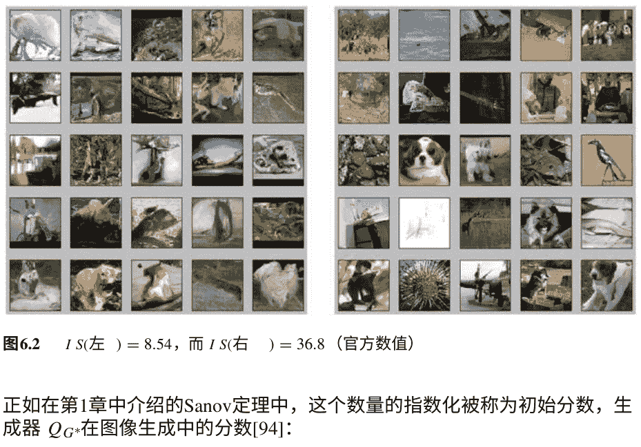

图6.2 IS(左) = 8.54，而IS(右) = 36.8（官方数值）

正如在第1章中介绍的Sanov定理中，这个数量的指数化被称为初始分数，生成器 $Q_{G^*}$ 在图像生成中的分数[94]:

```
IS(Q_{G^*}) = \exp \left( \left\langle D_{KL} \left( Q_{J^*} (d | x) \| Q(d) \right) \right\rangle_{x \sim Q_{G^*} (x)} \right).
```

这个分数是使用从 $Q_{G^*} (x)$ 的采样近似计算的，基于大数定律。这是衡量GAN指标的事实上的标准之一。^{20} 这个“Inception”是GoogLeNet结构中的一个神经网络模块[96]，它是Google在2014年ImageNet分类竞赛中的获胜模型^{21}，而这个GoogLeNet专门用于计算IS。

图6.2显示了使用STL-10 [97]训练的GAN生成的图像和使用ImageNet训练的模型的图像，后者可以免费获取[87, 98] (https://github.com/pfnet-research/sngan_projection)。我们可以看到，当生成器能够很好地生成图像时，IS值很高。

> ^{20} 还有另一个指标叫做Fréchet inception distance (FID) [95]，它是图像分类网络中隐藏层（特征空间）中数据图像分布和生成图像分布之间的Wasserstein距离（也称为Fréchet距离，FID的名称由此而来），假设分类网络中的特征服从某种高斯分布。

> ^{21} Inception这个名字来自于一部很受欢迎的好莱坞电影《盗梦空间》：GoogLeNet论文的标题是“用卷积更深入”，而电影中主角的台词是“我们需要更深入”。原始论文甚至引用了这部电影（总结背景的文章）。这是一个机智的命名，让看过这部电影的人都会笑出声来。

截至2019年3月，ImageNet的IS最高值可能是$IS = 166.3$，见文献[99]。感兴趣的读者可以看一下论文第一页给出的图片（可以免费阅读）。我们相信读者们会对它的精致程度感到惊讶。作为参考，如果使用$Q_{J^*}(d|x)$来处理一个分类1000个标签的任务（使用ImageNet进行分类），得分的满分是$IS = 1000$ [93, 95]。

##### 专栏：自学习蒙特卡洛方法

根据参考文献[100]，对比散度方法是一种“误差函数”的优化方法

```
$$K_{ex}(\theta) = D_{KL}\left( P_\theta(\mathbf{x}'|\mathbf{x}) P(\mathbf{x}) \middle\| P_\theta(\mathbf{x}|\mathbf{x}') P(\mathbf{x}') \right).$$ (6.111)
```

在 $\theta = \theta_0$处，这个量消失，满足详细平衡条件，因此目标分布$P(\mathbf{x})$是马尔可夫链$P_{\theta_0}(\mathbf{x}'|\mathbf{x})$的收敛目标。对这个方程稍作改写，使用贝叶斯定理得到

```
$$K_{ex}(\theta) = D_{KL}\left( P_\theta(\mathbf{x}'|\mathbf{x}) P(\mathbf{x}) \middle\| P_\theta(\mathbf{x}'|\mathbf{x}) \frac{e^{-H_\theta^{\text{eff}}(\mathbf{x})}}{e^{-H_\theta^{\text{eff}}(\mathbf{x}')}} P(\mathbf{x}') \right) \\ = -\left\langle \log \frac{P(\mathbf{x}') e^{-H_\theta^{\text{eff}}(\mathbf{x})}}{P(\mathbf{x}) e^{-H_\theta^{\text{eff}}(\mathbf{x}')}} \right\rangle_{P_\theta(\mathbf{x}'|\mathbf{x}) P(\mathbf{x})} \geq 0.$$ (6.112)
```

最后一个不等式是由于相对熵的性质。因此，粗略地说，将以下数量接近于1，

```
$$\frac{P(\mathbf{x}') e^{-H_\theta^{\text{eff}}(\mathbf{x})}}{P(\mathbf{x}) e^{-H_\theta^{\text{eff}}(\mathbf{x}')}}$$ (6.113)
```

是对比散度方法。事实上，通过热浴方法得到的转移概率，再加上使用该因子的Metropolis测试，完全满足详细平衡条件。

```
$$P_\theta^{ex}(\mathbf{x}'|\mathbf{x}) = \min\left(1, \frac{P(\mathbf{x}') e^{-H_\theta^{\text{eff}}(\mathbf{x})}}{P(\mathbf{x}) e^{-H_\theta^{\text{eff}}(\mathbf{x}')}}\right) P_\theta(\mathbf{x}'|\mathbf{x}) \\ = \frac{P(\mathbf{x}') e^{-H_\theta^{\text{eff}}(\mathbf{x})}}{P(\mathbf{x}) e^{-H_\theta^{\text{eff}}(\mathbf{x}')}} \min\left(\frac{P(\mathbf{x}) e^{-H_\theta^{\text{eff}}(\mathbf{x}')}}{P(\mathbf{x}') e^{-H_\theta^{\text{eff}}(\mathbf{x})}}, 1\right) \frac{e^{-H_\theta^{\text{eff}}(\mathbf{x}')}}{e^{-H_\theta^{\text{eff}}(\mathbf{x})}} P_\theta(\mathbf{x}|\mathbf{x}') \\ = \frac{P(\mathbf{x}')}{P(\mathbf{x})} P_\theta^{\text{指数}}(\mathbf{x}|\mathbf{x}').$$ (6.114)
```

通过这种方式，即使由P定义的概率不完全匹配目标收敛也是保证的。$H_{\theta}^{\mathrm{eff}}$与目标 $P$不完全匹配。请注意，要实现这个修正项，需要访问$P(\mathbf{x})$的值。例如，如果目标由某个哈密顿量写成

$$P(\mathbf{x}) = \frac{e^{-H_{\mathrm{true}}(\mathbf{x})}}{Z} , \quad \quad (6.115)$$

是可能的。在这种情况下，训练样本是由该哈密顿量定义的统计力学系统的配置快照。通过使用马尔可夫链蒙特卡洛方法生成的配置来重复（1）使用$H_{\theta}^{\mathrm{eff}}$进行训练（6.115），以及（2）使用类型为（6.114）的马尔可夫链生成新的配置，称为自学习蒙特卡洛方法，自2016年以来一直受到积极研究[101]。

## 第二部分 物理应用

第二部分描述了机器学习在理论物理中的应用，最近开始出现，包括示例和历史。由于机器学习是科学中的一种新技术，它在物理学中的应用是多样的。从物理学的标准观点出发：“逆问题”、“相位”、“微分方程”、“量子多体系统”和“时空”，我们将探讨机器学习的可能观点、其历史发展以及一些最近的进展。从物理学的角度来理解机器学习将为读者提供迄今为止和未来机器学习与物理学之间关系的视角，并对学习和研究有所帮助。

第七章：物理学中的逆问题首先，我们考虑物理学中的逆问题。事实上，逆问题是物理学革命性发展的核心。解决逆问题意味着什么？短语“机器学习擅长解决逆问题”是什么意思？通过将机器学习应用于理论物理，您将获得全面的视角和意义。

第8章：机器检测相变作为机器是否能够学习物理发现的一种方法，本章研究了“深度学习是否能够发现相变？”的问题。理解相变是物理学中最重要的课题之一。

机器学习是否真的能够在基本物理系统（伊辛模型）中发现热相变？

第9章：动力系统和神经网络神经网络是一种表达各种非线性函数的方式，但也可以被看作是信息在层之间传播的波动。在本章中，我们展示了这种多层传播可以被解释为动力系统的时间演化，因此也是哈密顿系统的时间演化，并研究了物理学中“时间演化”和深度神经网络之间的密切关系。

## 第10章：自旋玻璃和神经网络

首先，神经网络是基于人脑中神经元形成的神经电路。大脑的一个重要机制是记忆。霍普菲尔德模型以物理学的角度解释了记忆的机制，是物理学和神经网络之间的桥梁。在本章中，我们解释了霍普菲尔德模型，并研究了机器学习和自旋玻璃之间的关系，后者在凝聚态物理学中仍然是一个丰富的课题。

## 第11章：量子多体系统，张量网络和神经网络

在凝聚态物理学中，找到量子多体系统的波函数是最重要的问题。近年来的理论发展包括使用张量网络进行波函数近似。

乍一看，它非常类似于神经网络图表，它们实际上有什么关系？在本章中，我们将看到关系和映射，并且受限玻尔兹曼机与张量网络密切相关。

## 第12章：超弦理论的应用

最后一章描述了将深度学习应用于解决超弦理论的逆问题的示例。超弦理论统一了引力和其他力量，并且近年来，"全息原理"，即由引力统治的世界等效于其他力量的世界，已经得到了积极研究。我们将通过将对应关系应用于第9章中所见的动力系统来解决引力世界的出现的逆问题，并探索机器学习与时空之间的新关系。

这些章节，从第7章到第12章，几乎可以独立阅读。你可以选择感兴趣的部分。阅读所有章节将使读者通过各种物理学中的例子和应用以及其历史，对机器学习和物理学之间的关系有一个清晰的理解。

### 第7章 物理学中的逆问题

摘要 首先，我们考虑物理学中的逆问题。事实上，逆问题是物理学革命性发展的核心。解决逆问题意味着什么？短语“机器学习擅长解决逆问题”的含义是什么？通过将机器学习应用于理论物理学，您将获得全面的视角和重要性。

世界上有许多逆问题，物理学也是如此。在本章中，我们将从机器学习的角度来看物理学中可能出现的逆问题，并了解它们的重要性。首先，什么是“逆问题”？一般来说，机器学习通常被认为擅长解决逆问题。为什么会这样？通过研究这些问题，我们可以具体地看到机器学习和深度学习如何应用于物理学，同时我们将了解为什么在个别研究人员的物理问题中依赖机器学习是有意义的。

#### 7.1 反问题和学习

通常将解决问题的逆过程称为反问题。反问题的一般性质将在后面描述，让我们从一个简单的例子开始。

考虑一个经典力学问题，它跟随时间的演化。
给定一个确定时间演化的微分方程，然后给定在某个时间 $t =0$的初始状态，任意时间$t >0$的状态就确定了。

1数学中的反问题与这里处理的通用反问题不同。
在数学中，当存在一个定理C，使得A是B，那么B是A的命题被称为定理C的反问题。例如，岡清的一个著名定理是Hartogs的反问题，它是在那个意义上的反问题。
2本章的内容不列举反问题的一般解。

在量子力学中，薛定谔方程被认为是相同的。另一方面，作为它的“逆问题”，我们可以提出以下问题：在某个时间$t > 0$的状态已知的情况下，是否可以确定时间$t = 0$时的状态以重现它？这就是所谓的初始值问题，它是一个逆问题。

这个时间演化的例子很容易理解。更一般地，逆问题可以表述如下。考虑一个以实数$x$为参数的多项式函数：

$$f(x) = \sum_{k=0}^{n} J_k x^k.$$
(7.1)

给定$x$，确定$f(x)$，因此从$x$计算$f(x)$的过程可以被看作是“时间演化”，在这个过程中，给定$x$的初始值，在一段时间后，系统给出$f(x)$。因此，“倒退时间”的逆问题是，当给定一个函数$f(x)$和一个值$y = f(a)$时，“解$a$”是问题。从因果关系的角度来看，这是从结果估计原因的问题。${}^{3}$在考虑时间顺序时，原因和结果之间存在因果关系。有许多逆问题不涉及时间顺序，而是涉及空间顺序。例如，无损检测和X射线断层扫描常被认为是典型的逆问题的例子。

这是一种利用传导定律估计物体内部是否存在空腔的方法。给定物体的外部形状（外表面边界条件，即上述方程中的$y=f(a)$）和传导定律（例如泊松方程、波动方程、热传导方程等，给出函数$f(x)$的形式，即系数$J_k$），问题是找到内部空腔的形状，即$x$。通过这种方式，从给定的方程组的值中找到原始初始条件或边界条件，是一个逆问题。

现在，还有另一种逆问题，即当函数$f(x)$本身未知时，找到函数$f(x)$。在这种情况下，给定条件是当输入数据为$x=x_1$时，输出数据为$y_1=f(x_1)$。给定这样的条件，问题是确定未知函数$f(x)$。

当然，只有一个条件$y_1 = f(x_1)$不能确定一个一般的函数。这对$(x_1, y_1)$只有一个未知系数的约束表达式
$J_0, \cdots, J_n$是多项式函数的系数。因此，要确定未知函数$f(x)$，通常需要准备相同数量的输入/输出对$(x_i, y_i)$ (i = 1, 2, 3, $\cdots$)。
监督式机器学习就是这个后一种问题。输入数据和输出数据的对成为训练数据，未知函数成为神经网络。换句话说，未知函数的系数对应于神经网络的权重。

如果对函数$f(x)$的形式有一定了解，则通常使用“建模”这个术语，而不是机器学习。由于物理要求，$f(x)$的形状受到限制。例如，如果我们知道像热扩散系统和波动系统这样的基本行为，并且如果外部场波动和其他相互作用被添加到其中，$f(x)$的基本形式就确定了，人们会用小效应的摄动方式编写模型。附加效应会向函数中添加一个新的项，因此其系数是未知的。这个未知系数是通过输入数据和输出数据来确定的。例如，如果已知$f(x)$是$x$的线性函数，则线性回归就足够了。

另一方面，在深度学习的情况下，由于函数形式的多样性，我们处理的是一类非常广泛的函数，而不需要指定模型。通过机器的训练，我们逐渐限制了模型，也就是函数的形状。因此，机器学习和深度学习是上述两种含义中后一种类型的逆问题，可以说是不假设模型（函数形式）作为其未知函数的问题。

这样，在映射（7.1）中逆问题的性质在很大程度上取决于哪个部分被认为是未知的。学习被认为是一种逆问题，如上所述。但是，当将其应用于物理系统或探索与物理系统的类比时，需要明确自己试图解决什么问题以及哪个部分是未知的。

所谓“逆问题”的一般特性包括以下内容：

- 知道无法直接测量的物体
- 从结果推断原因
- 确定物理定律和控制方程
- 确定物理常数

逆问题是上述问题之一，需要找到一种解决逆向问题的方法。在这些问题中，“确定物理定律”之类的事情是物理学中最重要的事情，可以说所有物理创新都是逆问题。约翰内斯·开普勒从第谷·布拉赫精确的行星观测数据中发现了他的第三定律。马克斯·普朗克发现了辐射公式。数据中的基本规律升华为定律，这就是逆问题。它的重要性是显而易见的。

机器学习是一种有潜力应用于这四个属性的技术。当然，尽管我们还不完全理解其基本机制，例如泛化，但机器学习提供了一种强大且通用的方法来解决逆问题，而不依赖于那些所谓的“天才物理学家”的物理感觉。

#### 7.2 逆问题中的正则化

现在，为了更仔细地研究机器学习和逆问题之间的关系，考虑线性函数的情况，而不是非线性函数（7.1），逆问题的性质更清晰。正如我们将在下面看到的，有办法很好地解决线性函数问题的逆问题。

在此过程中，我们介绍了一个重要的概念，称为正则化。

首先，考虑以下线性变换：

```
y_i = \sum_{k=1}^{m} J_{ik} x_{k\circ}. \quad\quad\quad (7.2)
```

这里，输入或初始值是向量 \(x_{k\circ}\)。假设其维度为 \(m\)。如果输出的维度为 \(y_i\)，则 \(J\) 是一个大小为 \(n \times m\) 的矩阵。

在这个线性方程（7.2）中，考虑通常的（上述意义上的第一个）逆问题，即找到给定 \(y_i\) 的 \(x_{k\circ}\)。对于方阵的情况，即 \(m = n\)，情况就简单了。如果获得了矩阵 \(J\) 的逆矩阵 \(J^{-1}\)，那么可以如下获得 \(x_k\)：

```
x_k = \sum_{i=1}^{m} [J^{-1}]_{ki} y_i. \quad\quad\quad (7.3)
```

虽然这个逆问题似乎可以解决，但实际存在两个困难：

- 首先，当矩阵 \(J\) 的行列式在数值上非常接近零时，问题在于即使 \(y_i\) 的值稍有不同，\(x_k\) 也会发生显著变化。
- 其次，如果数据 \(y_i\) 的数量不足够，即使存在逆矩阵，也很难确定 \(x_k\) 的值。这可以被视为 \(m > n\) 的情况。这些问题与数据误差有关。在实际处理数据时，总是伴随着测量的波动和误差。考虑到这些因素，即使对于一个简单的线性问题，解决逆问题也可能存在困难。

一般来说，由J. S. Hadamard定义的良态问题满足以下三个特性：(1) 存在解 (2) 解的唯一性 (3) 解的稳定性（当初始条件微小变化时，解也微小变化）

任何一个条件不满足的问题都被称为不适定问题。我们在上面描述的逆问题就是一个不适定问题。

在许多情况下，尽管正问题满足适定性，逆问题却是不适定的。一个典型的例子是多体系统演化到宏观平衡的过程。在一个正常的物理系统中，如热扩散系统，为了从时间演化后的状态得到时间演化前的初始状态，必须测量输出值的非常小的波动（从完美平衡状态）。换句话说，松弛系统通常不具有稳定性（3）。

我们如何处理病态问题？例如，在方程组（7.2）中，当n > m时，它是一个超定系统，无法以那种形式确定解。为了在这种情况下获得一个“接近解”，考虑以下内容。首先，将（7.2）重写为等价方程：

```
L = \sum_{i=1}^{n} \left( y_i - \sum_{k=1}^{m} J_{ik}x_k \right)^2 = 0. \qquad (7.4)
```

这个方程通常没有解，但我们不是寻找解，而是寻找最小化L的 x_k。这正是最小二乘法。

Tikhonov的正则化方法是处理病态问题的一种通用方法。让我们考虑条件不足的情况（n < m），而不是超定系统。有无数个满足方程（7.2）的解 x_k，但需要一个具有所需属性的解。

这个“属性”取决于问题的物理背景。例如，一个可能需要一个物理属性，要求 x_k 的数量级应该相同，或者它们之间不应该有太大的差异。为了添加任何一个 x_k 都不应该比另一个大很多的条件，将一个正则化项添加到L中，并找到 x_k 使得以下 L' 最小化：

```
L' = L + \alpha \sum_{k=1}^{m} (x_k)^2. \qquad (7.5)
```

然后，从众多解中，可以得到具有所需属性的解。在一个病态问题中，通过添加正则化项并以这种方式将问题转化为良态问题，这被称为Tikhonov的正则化方法。要添加的正则化项可以是如上所述的L2范数或L1范数。如果需要无抖动的条件，则可以添加项：

$$L \equiv \alpha \sum_{k=1}^{m-1} (x_k - x_{k+1})^2 \text{。}$$

正则化系数 α 被称为正则化参数，从学习的角度来看，它被称为超参数。选择超参数通常取决于想要的解决方案以及如何使学习更加高效，它还可以防止机器过度训练。一种确定超参数 α 的方法是根据解决方案的性质（例如，在（7.4）的情况下，输入/输出误差的大小与 |x| 大致相同），这被称为Morozov的差异原则。

这些情况被称为稀疏建模，并应用于物理系统[102]。

找到最小化（7.5）的解的一种方法是奇异值分解（SVD）。将矩阵 $J$ 分解如下：

$$J_{ik} = \sum_{p=1}^{P} \mu_p u_i^{(p)} v_k^{(p)} \text{。}$$

这里向量 $u$ 和 $v$ 是正交基，满足

$$\sum_{i=1}^{n} u_i^{(p)} u_i^{(q)} = \delta_{p,q} \text{,} \quad \sum_{i=1}^{m} v_k^{(p)} v_k^{(q)} = \delta_{p,q} \text{。}$$

可以取 $P$ 满足 $n \geq P$, $m \geq P$。这样的 (7.7) 被称为 $J$ 的奇异值分解。使用这个奇异值分解，最小化 (7.5) 的解 $x_k$ 可以如下构造：

$$x_k = \sum_{i=1}^{n} A(\alpha)_{ki} y_i \text{,}$$

$$A(\alpha)_{ki} \equiv \sum_{p=1}^{P} \frac{\mu_p}{(\mu_p)^2 + \alpha} u_i^{(p)} v_k^{(p)} \text{。}$$

矩阵 $A(\alpha)$ 是逆矩阵的一种推广，特别是当 $\alpha=0$ 时被称为 **Moore-Penrose逆矩阵**。

因此，在线性变换的情况下，即使逆问题是病态的，也可以使用正则化得到一个通解。然而，在机器学习的情况下，参数的数量和数据的量都非常庞大，因此它是一个大规模的欠定系统或超定系统，并且由于函数是非线性的，所以没有解析解。因此，人们必须通过包含各种正则化方法的数值计算来寻找解决方案。

#### 7.3 逆问题和物理机器学习

正如前面所述，逆问题有两种类型：边界值问题和系统决策问题。所有这些都是物理学中经常出现的问题，也是实际研究中的重要场景。

根据Hadamard的说法，当存在稳定性问题时，边界值问题效果不好，这是病态问题之一。作为这种情况的一个例子，我们描述了热扩散方程。更一般地，混沌系统的逆问题存在稳定性问题。混沌系统是一个确定性的动力系统，其轨道有界，并且初始条件的微小差异会呈指数增长。换句话说，它是一个“随着时间的推移变得混乱并且不记得初始状态”的系统。给定最终状态，将无法倒退到过去来构建初始状态。

然而，混沌的研究以各种方式取得了进展。原因是关于产生混沌的时间演化决策方程的研究视角存在，并且存在着混沌的源头。例如，有一个证明表明，如果自由度的数量太小，就不会发生混沌：即庞加莱-本迪克森定理。因此，即使边界值逆问题是不适定的，研究的目标可能是丰富的，将可解性的实际问题放在一边。

例如，有许多研究表明，混沌吸引子与大脑记忆机制有关，因此可以预期与神经网络相关的研究将来会有所发展。此外，用于表征混沌强度的李雅普诺夫指数（李雅普诺夫指数 λ衡量差异指数级放大的程度，即λ^t），可以定量地说明逆问题的不适定性。量子系统的李雅普诺夫指数正在与弦论和量子信息理论中的AdS/CFT对应关系相关联进行研究，并且进一步发展与机器学习的关系也是可以期待的。

另一方面，逆问题被归类为系统确定问题，这正是机器学习所应用的地方。长期以来，一个被研究的系统确定问题是量子力学中的潜在确定问题。在这里，我们描述了量子力学中逆问题的一个例子。

一个单体系统的量子力学由哈密顿算符 H定义。给定初始态波函数，通过时间演化算符 e^{-iHt}和哈密顿算符 H可以得到最终态波函数。这是一个正向问题。逆问题作为系统确定问题是当哈密顿算符 H未知的情况。我们应该将什么视为已知对于解决这个问题很重要。作为一个例子，让我们描述一个被广泛研究的方法，逆散射方法。在逆散射方法中，当哈密顿算符的未知部分是势能V(x)并且势能在渐近处是平坦的时候，可以通过散射振幅等信息确定势能。假设给定一个一维非相对论量子力学，其势能为未知势能V(x)。假设我们还测量了S矩阵，它告诉我们从空间无穷远处来的平面波有多少被传输和反射。

此外，假设我们知道波函数与势能V(x)在无限远处趋近于零。一种从这些信息中重建势能V(x)的方法是逆散射方法。在逆散射方法中，通过解决某个积分方程，可以构造出势能函数V(x)从这些数据中。⁷

在逆散射方法中，通过散射和束缚态的渐近数据构造出未知的势能或哈密顿量。 那么，对于只有束缚态的系统呢？ 在这种情况下，哈密顿量的本征值将是已知数据。 我们能否从能量本征值重建哈密顿量?

多年来，已经进行了各种各样的这类研究。 例如，在探索超导材料时，正在寻找能够在高温下产生超导态的相互作用哈密顿量。

从广义上讲，药物发现是同一类型的问题。 从这些动机可以看出，我们需要在一定程度上对哈密顿量进行建模，并从数据中确定其系数。 机器学习研究的最新进展表明，机器学习在确定模型和系数方面具有巨大潜力。

弦理论中的全息原理（AdS/CFT对应关系）是一个反问题，可以在第12章中作为一个例子进行描述，也是一个系统确定问题。 从边界上的量子场论来确定引力理论内部（体积）也可以成为一个边界值问题。 在接下来的章节中，我们还将介绍如何将神经网络本身视为动力系统时间演化的时间轴，以及如何将其视为AdS/CFT对应中的新兴空间。

深度学习和物理之间的关系可能揭示出各种物理问题中的“瓶颈”问题的解决方案。 制定反问题本质上是发现科学基础的方法。 因此，自然而然地期望通过揭示机器学习和物理之间的关系来发现新的定律。

##### 专栏：稀疏建模

在这个专栏中，让我们来看一下一种叫做稀疏建模的技术。 稀疏建模是图像感知的研究领域，例如用于医学目的⁸并且已经使用了近20年。 一些读者可能听说过最近它被用于“捕捉黑洞阴影的方法”[103]。 通过使用这种方法，可以从嘈杂的数据中提取出美丽的图像。⁹

我们仔细研究了本章中描述的Tikhonov的正则化方法。 一般来说，当未知数的数量大于方程的数量时，方程系统被称为欠定系统。 考虑以下方程：

$$Ax = y. (7.11)$$

在这里，$A$是一个$n \times m$矩阵，$x$是一个$m$维向量，$y$是一个$n$维向量。问题是在给定$A$和$y$的情况下找到未知向量$x$。 如本章所示，方程系统 (7.11) 被重写为一个最小化问题¹⁰。

$$\min_{x} \{|Ax - y|^{2}_{2}\} \text{ (对于给定的}y\text{)} . \quad (7.12)$$

这里L2范数$|v|_{2}$被定义为$|v|_{2} = \sqrt{v_{1}^{2} + v_{2}^{2} + v_{3}^{2} + \cdots}$对于向量$v$ 。不幸的是，一般来说，如果未知数的数量大于独立方程的数量（大致等于给定信息的数量），即如果$m > n$，则无法解决该系统。 这样的系统被称为欠定系统。没有足够的信息来解决它。本章描述的技术是找到

$$\min_{x} \{|Ax - y|^{2}_{2} + \lambda |x|_{2}\} \text{ (对于给定的 } y \text{和 } \lambda) \quad (7.13)$$

然后你可以得到一个合理的解 $x$。 这被称为岭回归。 以这种方式给出了Moore-Penrose逆。 让我们沿着这个方向继续。 例如，假设 $A$是稀疏的且维度较低。 在这种情况下，解 $x$将有许多消失的元素。 因此，考虑以下最小化问题：

$$\min_{x} \{|Ax - y|^{2}_{2} + \lambda |x|_{0}\} \text{ (对于给定的 } y \text{和 } \lambda)。 \quad (7.14)$$

这里 $|v|_{0}$是向量 $v$中消失元素的数量。 由于这个正则化项，它仍然可以被解决，并且可以得到一个合理的答案。 而且，这种方法在丢弃不必要的零元素方面非常有效。 另一方面，为了解决这个问题，需要解决所有的 $x$元素，同时检查它们是否为0，这会导致组合爆炸，不实际。

在这里， $|v|_1$ 是分量绝对值的总和， $|v|_1 = |v_1| + |v_2| + \cdots$ 对于向量 $v$。这是一种称为LASSO（最小绝对收缩和选择算子）的回归。这种回归被认为没有计算困难，并且具有比岭回归更好的性质。

解决同时方程的问题可能发生在各种情况下，一个例子是两个量通过积分变换相关。这确实适用于图像感知和黑洞阴影。在物理学的背景下，能谱 $\rho(\omega)$ 和格林函数 $G(\tau)$ 通常通过以下方程相关联：傅里叶变换，

```
G(\tau) = \int d\omega K(\tau, \omega) \rho(\omega)。
```

离散化时间 $\tau$ 和能量 $\omega$，并将积分视为黎曼和，这可以看作是一个向量 $\mathbf{G}$、$\rho$ 和一个矩阵 $K$ 的方程：

```
\mathbf{G} = K \rho。
```

我们想从 $G(\tau)$ 中得到 $\rho(\omega)$。在实际计算中，关于格林函数 $G(\tau)$ 只有大约10个点是已知的，而对于其能谱 $\rho$，我们希望获得超过1000个点，例如。因此，这是一个欠定系统，¹¹ 你可以使用LASSO，我们上面描述过的。¹² 有关更多细节，我们建议读者参考[105]。

### 第8章 通过机器检测相变

摘要作为机器是否能够学习物理学发现的一种方法，本章研究了“深度学习是否能够发现相变？”这个问题。 理解相变是物理学中最重要的课题之一。机器学习是否真的能够在基本物理系统（伊辛模型）中发现热相变？

在本章中，我们将解释如何通过机器学习检测伊辛模型中的相变。 在简要回顾相变之后，我们将解释使用神经网络进行相变检测。

### 8.1 什么是相变?

让我们回顾一下伊辛模型的相变，这将作为本章的目标物理系统。 首先，考虑一个自旋变量 $s_i$ 在总体积 $V$ 中，并考虑自旋变量的空间平均值的期望值 $M[s] = \frac{1}{V} \sum_i s_i$ 在正则系综中，也就是（自发的）磁化。这可以表示为

$$\langle M \rangle = \frac{1}{Z} \sum_{\{s\}} e^{-\beta H[s]} M[s].$$

在右侧，自旋变量 $s$ 被视为随机变量，磁化被定义为自旋变量在概率分布 $\frac{1}{Z} e^{-\beta H[s]}$ 下的空间平均值 $M[s]$。

如果Hamiltonian具有自旋反演对称性 $H[s] = H[-s]$，那么磁化 $\langle M \rangle$ 总是为零。 这可以通过以下方式证明。我们写下磁化强度的定义，并按如下方式处理：

$$ \begin{align} \langle M \rangle &= \frac{1}{Z} \sum_{\{s\}} e^{-\beta H[s]} M[s] \tag{8.2} \\ &= \frac{1}{Z} \sum_{\{-s\}} e^{-\beta H[-s]} M[-s] \tag{8.3} \\ &= \frac{1}{Z} \sum_{\{s\}} e^{-\beta H[s]} M[-s] \tag{8.4} \\ &= -\frac{1}{Z} \sum_{\{s\}} e^{-\beta H[s]} M[s] \tag{8.5} \\ &= -\langle M \rangle. \tag{8.6} \end{align} $$

因此，我们得到方程 $\langle M \rangle = -\langle M \rangle$，但唯一的解是 $\langle M \rangle = 0$。 在推导方程的过程中，我们使用了状态求和变量 $s$ 是一个虚拟变量，并且 $H$ 关于 $s$ 的翻转是对称的。 另外，根据定义，$M[-s] = -M[s]$。 在自旋对齐且倾向于平行的哈密顿量情况下，我们可以预期出现自发磁化，但是这个计算哪里出错了呢？ 实际上，状态求和 $\sum_{\{s\}}$ 是一个无限求和，所以你必须小心处理。换句话说，由于求和的顺序不能任意改变，上述给出的计算并不总是正确的：即使 $H$ 关于 $s$ 的符号翻转对称，也可能导致 $\langle M \rangle \neq 0.$¹ 更具体地说，在二维或更高维的伊辛模型中，已知在低温下 $\langle M \rangle \neq 0$，而在高于某个温度时 $\langle M \rangle = 0$。 使 $\langle M \rangle = 0$的温度区域被称为顺磁或无序相，而使 $\langle M \rangle \neq 0$的区域被称为铁磁相或有序相。 相变温度称为相变温度，相变称为相变。

¹ 为了实现这一点，数学上需要取极限$V \rightarrow \infty$（热力学极限，或自由度的大数极限）。 在物理学中，可以实现足够大的$V$。 例如，在伊辛模型中，考虑所有自旋指向上方的基态和所有自旋指向下方的基态。 这两种状态之间的转变在有限体积中是可能的，因为它具有有限的转变概率。 因此，如果不进行大数极限，自旋平均值（自发磁化）必须始终为零。 然而，如果状态之间的转变概率足够小于$\exp(-1/\text{宇宙寿命})$，这意味着在假设没有转变时没有实际问题。 虽然实际材料的体积是有限的，但原子数约为阿伏伽德罗常数，实际上，无限极限是一个很好的近似（这是一种理想化）。 为了在统计力学中理论上描述相变，需要计算$\lim_{B \rightarrow 0} \lim_{V \rightarrow \infty} \langle M \rangle$，同时保持极限的顺序，并找到$\langle M \rangle$作为温度的函数的极限，其中 $B$是打破对称性的外部场（在这种情况下，沿着$z$轴的磁场）。

这里出现的磁化强度 M 被称为序参量，它描述了相变的特征。

相变现象不仅广泛存在于材料中，如磁化相变和水的气液相变，还存在于基本粒子物理学领域。 例如，改变真空本身性质的真空相变与质量的存在有关，是一个重要的研究课题。

相变通过寻找描述相的对称性并定义与对称性相关的序参量来描述。 通常，序参量是从自由能的导数中得出的。 除了少数模型，如二维伊辛模型，相变温度尚未通过解析方法确定，只能通过数值计算确定。 众所周知，拓扑材料的相变没有局域序参量，这使得对相变的表征变得困难。 在这种情况下，使用神经网络寻找相变是一个自然的想法。 下面描述了使用神经网络直接寻找相变的研究。

#### 8.2 通过神经网络检测相变

当使用神经网络进行监督学习时，神经网络可以做到以下几点：

- 当给定大量的数据 $(x, d) = (输入, 答案)$ 时，它可以猜测新的输入值 $x'$ 的结果 $d'$。

为了预测未知现象，必须准备大量的训练数据。 幸运的是，在计算物理学研究中，通过数值计算可以获得大量的数据。 特别是在使用蒙特卡洛方法进行计算物理学研究时，数据几乎可以无限生成（只要计算资源允许），因此这种情况非常适合机器学习。 例如，考虑一个在统计力学中具有某种相变的模型，并通过蒙特卡洛方法生成其自旋构型。 机器学习能够确定每个自旋构型属于哪个相位吗？ 二维伊辛模型是具有有限温度下相变的最简单的模型之一，在文献[106]中肯定地回答了神经网络能否区分伊辛模型的相变。

首先，可以通过使用Metropolis方法相对容易地生成训练数据。考虑一个在二维正方格子上的自旋。哈密顿量 H 是

$$H[s] = - \sum_{i,j} s_{i,j} (s_{i+1,j} + s_{i,j+1})$$ (8.7)

在这里，交换相互作用常数取为 -1，表示铁磁性。众所周知，该模型在 T = 2.27附近经历顺磁/铁磁相变，如第5章的栏目中所提到的（参见[74, 75]）。

让我们继续使用神经网络进行相变检测。作为训练数据的自旋构型由以下过程生成：

1. 选择一个温度值 T。
2. 使用Metropolis方法生成的温度为 T 的自旋构型进行采样。
3. 如果 T < 2.27，则设置 d =0。如果 T > 2.27，则设置 d = 1。
4. 将 (s, d) 添加到训练数据中。

如果在范围 T ∈ [ T_low, T_high ]内重复此步骤，该范围包括相变温度T = 2.27，则可以生成用于确定给定自旋构型的神经网络的训练数据，该自旋构型在有序相T < 2.27或无序相 (T > 2.27) 中。换句话说，神经网络被设计和训练为“相位判别器”。

使用训练有素的神经网络进行有趣的应用是可能的。与先前定义的方格子伊辛模型 H 不同，三角格子伊辛模型是已知的。

$$H_3[s] = - \sum_{i,j} s_{i,j} (s_{i+1,j} + s_{i,j+1} + s_{i+1,j+1})$$ (8.8)

具有类似的相结构。相变温度不是 T = 2.27，而是 T = 3.64。事实上，使用 H 训练的神经网络可以检测到相变 H_3（图8.1）。我们可以看到神经网络的输出在 T = 3.64左右从0跳变到1。如果这个事实适用于其他模型，我们就有了一种新的方法来检测相变。

这个“相位判别器”的想法确实很有趣，但是在实际发现未知相变时它也有弱点。关键是，在生成训练数据时，至少必须知道类似模型的相变点。换句话说，神经网络无法覆盖所有的相变检测，对于一个模型，理论上必须知道相变点。这意味着使用的范围有限。下面的简单问题浮现出来：我们能否自动检测出单个模型中的相变点——在本例中为过渡温度 T = 2.27?

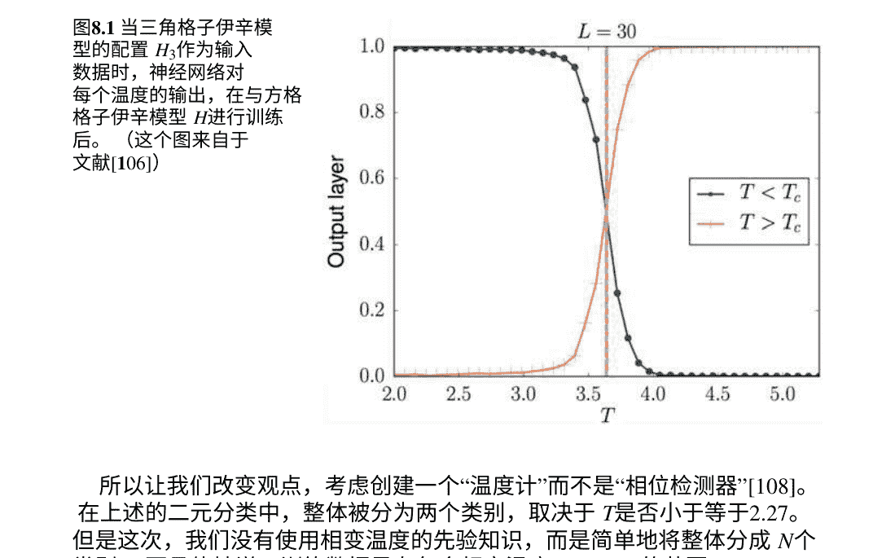

所以让我们改变观点，考虑创建一个“温度计”而不是“相位检测器”[108]。在上述的二元分类中，整体被分为两个类别，取决于 $T$ 是否小于等于2.27。但是这次，我们没有使用相变温度的先验知识，而是简单地将整体分成 $N$ 个类别。更具体地说，训练数据是在包含相变温度 $T = 2.27$ 的范围 $[ T_{\text{low}}, T_{\text{high}} ]$ 内生成的，并被分为 $N$ 个部分：第1类，第2类，等等。，取决于温度。误差函数选择为softmax熵。

我们可视化连接最后一层和倒数第二层A的训练神经网络的权重 $J$。我们将权重绘制为表示训练权重矩阵元素的像素图像 $J$。水平轴是最后一层的节点（温度的离散类别），垂直轴是层A的组件标签 $m$。然后，我们发现在接近相变温度（图8.2）的矩阵组件附近存在突变。论文[108]提出了一种从这个热图中估计特定相界值的方法。结果发现，温度值接近 $T = 2.27$（逆温度为 $\beta = 0.44\cdots$）。详细信息请参阅原始论文，结果显示在表8.1中，相变温度已被确定。这种方法很有趣，因为它提出了在事先不知道系统物理性质的情况下发现相变现象的可能性。

#### 8.3 神经网络看到了什么

也可以从理论上考虑为什么这种技术可以检测到相变现象。在这里，我们将根据[109]进行解释。首先，在下面的网络中，让我们将中间层的单元数设置为3

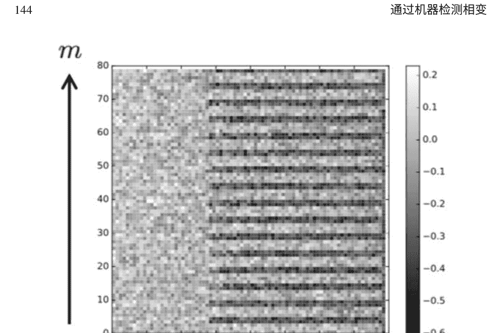

表8.1前三行显示了神经网络检测到的相变温度值。给出了它们的逆温度 $\beta$ 的值。极限 $L \rightarrow \infty$ 对应于无限体积，在这种情况下，相变的精确逆温度已知： $\beta_c^{\text{Exact}} = \frac{1}{2} \log(\sqrt{2} + 1)$。“CNN”是卷积神经网络，“FC”是全连接神经网络系统大小

| | $\beta_c$ CNN | $\beta_c$ FC |
| :--- | :--- | :--- |
| $8\times8$ | 0.478915 | 0.462494 |
| $16\times16$ | 0.448562 | 0.433915 |
| $32\times32$ | 0.451887 | 0.415596 |
| $L \rightarrow \infty$ | $\beta_c^{\text{Exact}} \sim 0.440686$ | |

重复线性和非线性变换两次的(8.9)式：

$f_{\theta,\varphi}(\mathbf{x}) = \boldsymbol{\sigma}(\theta\mathbf{z}) , \quad \mathbf{z} = \boldsymbol{\sigma}(\varphi\mathbf{s}) \tag{8.9}$

这里 $\mathbf{s}$ 是自旋配置的类似向量排列 $s$。所使用的激活函数 $\boldsymbol{\sigma}$ 是一个softmax函数，其定义为

$[\boldsymbol{\sigma}(\mathbf{z})]_I = \frac{e^{z_I}}{\sum_J e^{z_J}} \tag{8.10}$

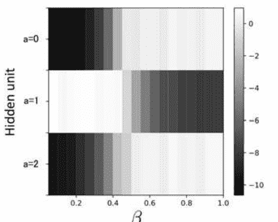

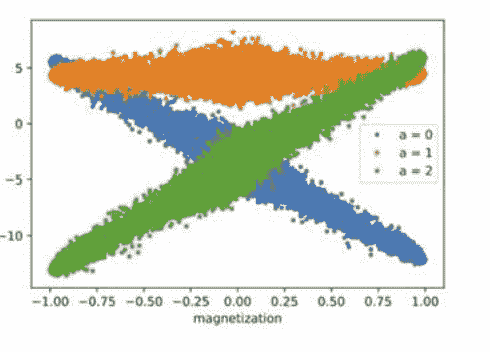

输出经过归一化，因此可以视为概率。θ和φ是要训练的参数（权重）。数值实验的结果显示在图8.3的左侧。从这种情况下得到的θ*可以看出，相变再次被检测到。

顺便问一下，以下中间三维向量中隐藏了什么样的信息？

$u = \begin{pmatrix} u_{\text{红色}} \\ u_{\text{绿色}} \\ u_{\text{蓝色}} \end{pmatrix} = \varphi^{*} \mathbf{x}. \tag{8.11}$

矢量分量绘制在不同的自旋构型上（磁化\langle M \rangle在水平轴上，u在垂直轴上）。请参考图8.3的右侧面板。正如您所看到的，存在明显的相关性，因此我们可以得出结论，相变的序参量已经在中间层中学习到。

一旦您加深网络，您实际上可以确认内能的信息直接嵌入其中。这表明神经网络和统计系统之间存在理论联系。有兴趣的读者应参考文献[109]，以及相关参考文献[110]。

### 第9章 动力系统和神经网络

摘要神经网络是表达各种非线性函数的一种方式，但也可以被看作是信息在层之间传播的波动。在本章中，我们展示了这种多层传播可以被解释为动力系统的时间演化，因此也是哈密顿系统的演化，并研究了物理学中“时间演化”这一基本概念与深度神经网络之间的密切关系。

如果各种物理系统可以用神经网络表示，那么将极大地开启将这些系统应用于机器学习进行分析的可能性。在物理学中，微分方程是基于局部性和因果性的基本方程，因此有必要找出哪些微分方程可以表示神经网络。在机器学习中，有很多种类型的神经网络，主要从提高学习效率的角度提出了新的网络结构，因此与微分方程的对应关系并不清楚。换句话说，通过离散化微分方程得到的网络与用于机器学习和深度学习的神经网络有不同的目的。

在本章中，我们回顾了微分方程和神经网络之间的关系，并特别讨论了哈密顿动力系统，以及哪些哈密顿量允许典型神经网络的结构。

#### 9.1 微分方程和神经网络

首先，让我们定义本章中所谓的“典型神经网络”。考虑图9.1中给出的神经网络。层从左到右排列，每个层都有一个相同维度的向量 $x_i$（下标 $i$ 标记向量的元素）。在层之间，线性变换 $x_i \rightarrow J_{ij} x_j$ 和局部非线性变换 $x_i \rightarrow \sigma (x_i)$ 通过激活函数按顺序进行。

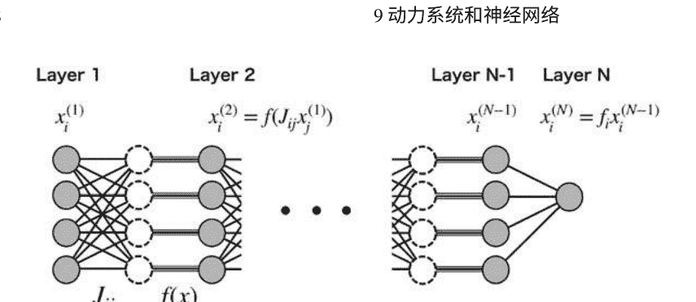

图9.1典型的深度神经网络。实线表示线性变换乘以矩阵 J，三重线表示非线性变换（激活函数）

通过堆叠，神经网络的最终输出写作

$y(\mathbf{x}^{(1)}) = f_i \sigma (J_{ij}^{(N-1)} \sigma (J_{jk}^{(N-2)} \dots \sigma (J_{lm}^{(1)} x_m^{(1)}))) .$

再强调一下，学习意味着通过改变网络变量 $(f_i, J_{ij}^{(n)})$ $(n = 1,2,\cdots, N-1)$，来最小化以下误差函数:

$L \equiv \sum_{\text{数据}} \left| y(\overline{\mathbf{x}}^{(1)}) - \overline{y} \right| + L_{\text{reg}}(J) .$

这里的求和是在整个训练数据对集合 $\{(\mathbf{x}^{(1)}, y)\}$ 上进行的。输入数据 $\mathbf{x}^{(1)}$ 被放入第一层，$y$ 是应该从最后一层输出的正确输出数据。附加项 $L_{reg}$ 被称为正则化项，用于控制学习。

现在让我们来看看神经网络和微分方程之间的关系。在2016年，提出了一种称为 ResNet(残差网络，残差神经网络)的深度神经网络[24]。它被认为是一种高效的网络，即使有很多层，学习也可以进行。在这种方法中，在神经网络中提供了一条绕道路，而且这条绕道路是没有任何修改的:

$x_i^{(n+1)} = f (J_{ij} x_j^{(n)}) + x_i^{(n)} .$

右边的第一项是典型的神经网络，但第二项是“跳跃连接”，即绕道路。通过添加这样的项，已经发现

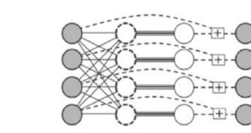

图9.2 ResNet的概念图。通过虚线表示的添加效果$x_i^{(n)}$与图9.1中典型深度神经网络的结构相结合。包围“+”的方框表示添加输入的线性变换

即使网络变得更深，学习仍然可以进行。¹认为原因可能是误差反向传播的效率。ResNet的概念图如图9.2所示。

这个ResNet可以解释为微分方程的离散化版本[112]。让我们考虑一个确定动力学系统时间演化的方程，

$\dot{x}_i(t) = f_i(x_j(t)) \quad (9.5)$

如果我们离散化时间坐标，我们发现

$x_i(t_{n+1}) = x_i(t_n) + \Delta t f_i(x_j(t_n)), \quad t_{n+1} = t_n + \Delta t_0 \quad (9.6)$

ResNet（9.3）具有以下形式。也就是说，如果对激活函数的大小（这个大小等同于$\Delta t$，并被视为学习的超参数）施加适当的限制，深化的ResNet就变成了一个连续的时间演化方程。²

请注意，并非所有动力系统中的微分方程都可以像ResNet那样写出来。如果$\mathbf{x}$有多个分量，也就是说，如果有多个单元，通常不能像ResNet那样写出微分方程。为了构建一个神经网络，非线性项必须采用（9.3）中的激活函数的形式，即$f（\mathbf{J}_{ij}x_j$）。任何定义动力系统的$f_i$（x（t））都不是

¹即使在ResNet出现之前，也考虑了绕行的可能性。它被称为高速公路网络[111]，具有以下形式：

$\mathbf{x}^{(n+1)} = T\left(\tilde{\mathbf{J}}\mathbf{x}^{(n)}\right) f\left(\mathbf{J}\mathbf{x}^{(n)}\right) + \left(1 - T\left(\tilde{\mathbf{J}}\mathbf{x}^{(n)}\right)\right)\mathbf{x}^{(n)} \quad (9.4)$

在这里，$T(\tilde{\mathbf{J}}\mathbf{x}^{(n)})$是网络的变量参数，决定了发送到绕行的比例。如果$T(\tilde{\mathbf{J}}\mathbf{x}^{(n)})$是一个常数，并且T=1/2，则可以得到ResNet（9.3）。从数据同化的角度，[113]讨论了深化的连续极限。

总是以那种形式存在。我们将在哈密顿动力系统的情况下更详细地讨论这些细微之处。

现在，作为ResNet的进一步推广，有一个称为RevNet（可逆残差网络）的神经网络[114]。RevNet再次是一种残差学习，但具有对称形式：

$x_i^{(n+1)} = f\left(J_{ij}y_j^{(n)}\right) + x_i^{(n)}, \tag{9.7}$

$y_i^{(n+1)} = g\left(J_{ij}x_j^{(n+1)}\right) + y_i^{(n)}. \tag{9.8}$

通过相同的类比，可以看出这个神经网络是以下动力系统的离散化版本：

$\dot{x}(t) = f\left(y(t)\right), \quad \dot{y}(t) = g\left(x(t)\right). \tag{9.9}$

可逆意味着可以按照从最后一层的数据输出值的顺序返回到输入层。如果你仔细观察(9.8)的右边，你会发现$x_j^{(n+1)}$而不是$x_j^{(n)}$。有了这个，如果输出数据$(y_i^{(n+1)}, x_i^{(n+1)})$被给出，首先通过(9.8)得到$y_i^{(n)}$，然后(9.7)返回$x_i^{(n)}$，以此类推。能够返回实际上与用于学习的内存量有关。在正常的神经网络反向传播方法中，每层的权重值必须存储在内存中。然而，在可逆神经网络的情况下，可以从最后一层的数据重新计算每层的权重值，因此不需要将权重存储在内存中，提供了关于内存消耗的高效学习。

此外，可逆性与动力系统中的微分方程密切相关。在动力系统中，一种被称为混沌的特征行为是重要的研究课题之一。混沌是对初始值的敏感性。

就神经网络而言，即使初始输入数据稍微扰动，输出值也会完全改变。通过对混沌动力系统进行离散化得到的神经网络容易受到输入数据扰动的影响，也就是说，学习被认为是困难的。基于没有混沌的动力系统的神经网络被称为“稳定神经网络”[115]。另一方面，在可逆神经网络中，如果在反向传播中存在混沌行为，类似的问题也可能发生。在这种情况下，更确切地说，它对应于初始值差异在到达最终层之前完全消失的情况（由于输入数据的差异，输出数据不会改变）。这与存在一个吸引子有关。动力系统中的混沌程度由称为Lyapunov指数的常数来衡量。

当系统为正时，系统是混沌的，而当系统为负时，系统是“坍缩”的。具有Lyapunov指数没有实部的动力系统适用于可逆神经网络[116]。

#### 9.2 哈密顿动力系统的表示

用神经网络表示任何哈密顿动力系统的时间演化是困难的。然而，对于有限类的哈密顿量，使用局部激活函数表示神经网络可以很容易地获得。让我们来看看。

给定哈密顿量$H(p, q)$，系统的时间演化由以下哈密顿方程确定：

$\dot{q} = \frac{\partial H}{\partial p}, \quad \dot{p} = -\frac{\partial H}{\partial q}. \qquad (9.12)$

在这里，为了简单起见，我们考虑一个一维系统，即一个 $p(t)$ 和一个 $q(t)$，但是可以很容易地推广到多维系统。首先，让我们尝试最简单的解释。它将神经网络每一层的向量维度设为2，并将其与$(q(t), p(t))$相等。然后，我们将 $t$ 方向离散化，并将其视为层叠的深度方向。不幸的是，这种方法只适用于自由哈密顿量（即，仅由 $p$ 和 $q$ 的二次多项式组成的哈密顿量）的神经网络表示，如下所示。

例如，参考文献[115]给出了一个基于哈密顿动力系统离散化以下微分方程的神经网络：

$\dot{y}(t) = \sigma\left(k(t) z(t) + b(t)\right), \qquad (9.10)$

$\dot{z}(t) = -\sigma\left(k(t) y(t) + b(t)\right). \qquad (9.11)$

在这里，$k(t)$ 和 $b(t)$ 是对应于权重和偏置的部分，$\sigma$ 是一个激活函数。从第二个方程右侧的负号可以看出，这是受到Hamilton方程启发的类神经网络微分方程。（然而，如果你仔细观察，这个微分方程并不是从任何Hamiltonian导出的。）

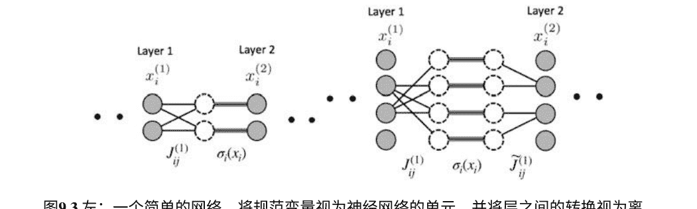

一个神经网络，将离散时间平移 $t \rightarrow t + \Delta t$ 与层之间的转换等价表示为

$q(t + \Delta t) = \sigma_1(J_{11}q(t) + J_{12}p(t)),$

$p(t + \Delta t) = \sigma_2(J_{21}q(t) + J_{22}p(t)). \tag{9.13}$

也就是说，线性变换 $J$ 和非线性局部变换 $\sigma$ 依次进行。这里，“局部”表示 $\sigma_1$ 的参数仅为第一个单元的值， $\sigma_2$ 的参数仅为第二个单元的值。

这个网络在图9.3左边显示。在这里，单位 $x_1^{(n)}$ 和 $x_2^{(n)}$ 直接对应于 $q(t)$ 和 $p(t)$。时间 $t$ 被离散化，间隔为 $\Delta t$；表示为 $t = n\Delta t$。

那么，哈密顿方程(9.12)能否写成神经网络(9.13)的形式？
首先，为了将(9.13)解释为连续时间微分方程的离散化版本，(9.13)必须具有一致的极限 $\Delta t \rightarrow 0$。对于权重 $J$ 和激活函数 $\sigma$，需要满足以下条件：

$J_{11} = 1 + \mathcal{O}(\Delta t), \quad J_{22} = 1 + \mathcal{O}(\Delta t), \tag{9.14}$

$J_{12} = \mathcal{O}(\Delta t), \quad J_{21} = \mathcal{O}(\Delta t), \tag{9.15}$

$\sigma(x) = x + \mathcal{O}(\Delta t). \tag{9.16}$

为了满足这些条件，让我们假设以下内容：

$J_{ij} = \delta_{ij} + w_{ij}\Delta t, \quad \sigma_i(x) = x + g_i(x)\Delta t. \tag{9.17}$

这里 $w_{ij}(i,j = 1, 2)$ 是权重（常数参数），而 $g_i(x) (i = 1, 2)$ 是非线性函数。将它们代入 (9.13) 并取极限 $\Delta t \rightarrow 0$得到以下公式：

$$\dot{q} = w_{11} q + w_{12} p + g_1(q) ,$$
$$\dot{p} = w_{21} q + w_{22} p + g_2(p) .$$

为了使它们成为哈密顿方程 (9.12) ，它们的右侧必须满足辛关系：

$$\frac{\partial}{\partial q} (w_{11} q + w_{12} p + g_1(q)) + \frac{\partial}{\partial p} (w_{21} q + w_{22} p + g_2(p)) = 0 .$$

然而，这个方程不允许任何非线性 $g_i(x)$ 。因此，简单地将单位向量与 $(p, q)$ 等同起来只能得到一个线性的哈密顿方程。

所以，让我们使用一些巧思。我们扩展了单位和规范变量之间的关系，也扩展了时间演化和层之间的转换关系。我们假设以下关系：

$$x_i(t + \tau) = \widetilde{J}_{ij} \sigma_j (J_{jk} x_k(t)) .$$

这与(9.13)有两个不同之处: 首先，$x_1 = q$ 和 $x_2 = p$ 与之前一样，但我们添加了 $x_0$ 和 $x_3$，并设置 $i, j, k = 0,1,2,3$。其次，它引入了 $\widetilde{J}$。这第二点不会改变神经网络。我们只是将 $J$ 在层之间分成两个线性变换，并将第一个线性变换重写为在前一层工作的变换。因此，以下组合，线性平移 $J$ →非线性局部变换 $\sigma$ →线性变换 $\widetilde{J}$，被视为一个 $t$ 时间平移。

在这样扩展的神经网络中，我们选择稀疏权重和局部激活函数如下:

$$J = \begin{pmatrix} 0 & 0 & v & 0 \\ 0 & 1 + w_{11} t & w_{12} t & 0 \\ 0 & w_{21} t & 1 + w_{22} t & 0 \\ 0 & u & 0 & 0 \end{pmatrix}, \quad \widetilde{J} = \begin{pmatrix} 0 & 0 & 0 & 0 \\ \lambda_1 & 1 & 0 & 0 \\ 0 & 0 & 1 & \lambda_2 \\ 0 & 0 & 0 & 0 \end{pmatrix}.$$

$$\begin{pmatrix} \sigma_0(x_0) \\ \sigma_1(x_1) \\ \sigma_2(x_2) \\ \sigma_3(x_3) \end{pmatrix} = \begin{pmatrix} f(x_0) t \\ 1 \\ 1 \\ g(x_3) t \end{pmatrix}.$$

这里 $(u, v, w_{ij}) (i, j = 1,2)$ 是一个权重常数。 这个神经网络的概念图在图9.3的右侧面板中显示。

使用这个时间平移的定义，层之间的转换是

$$\dot{q} = w_{11}q + w_{12}p + \lambda_1 f(vp) \quad (9.24)$$

$$\dot{p} = w_{21}q + w_{22}p + \lambda_2 g(uq) \quad (9.25)$$

哈密顿方程的辛结构条件是

$$w_{11} + w_{22} = 0 \quad (9.26)$$

这个条件很容易满足。相应的哈密顿量是

$$H = w_{11}pq + \frac{1}{2}w_{12}p^2 - \frac{1}{2}w_{21}q^2 + \frac{\lambda_1}{v}F(vp) - \frac{\lambda_2}{u}G(uq) \quad (9.27)$$

我们在这里选择了

$$F'(x_0) = f(x_0), G'(x_3) = g(x_3) \quad (9.28)$$

这是一个具有深度神经网络表示的非线性哈密顿量。

举个例子，如果我们选择

$$w_{11} = w_{21} = 0, w_{12} = 1/m, \lambda_1 = 0, \lambda_2 = 1, u = 1 \quad (9.29)$$

相应的哈密顿量是一个在任意势能下运动的非相对论粒子的哈密顿量：

$$H = \frac{1}{2m}p^2 - G(q) \quad (9.30)$$

很容易看出，如果你设计$F(p)$，你也可以创建一个相对论粒子的哈密顿量。

为了使用神经网络构建一个包含$p$和$q$作为非线性函数的一般非线性哈密顿量，需要一个使用整个非线性的线性组合基础的网络配置。虽然这里没有详细描述，但可以通过将网络推广为上述描述的方式来构建各种类型的哈密顿量。

在本章中，我们已经看到微分方程和哈密顿方程的时间演化可以重建为神经网络上的数据传播。通过使用这里介绍的方法，物理系统的时间演化可以直接应用于深度学习方案。机器学习的主要问题是泛化和解决逆问题。如果一个物理系统的时间演化问题是一个逆问题，或者基于对未知数据的应用，这一章中的方法可能是有效的。

在第12章中，我们通过深度学习解释了一个物理系统演化问题是一个逆问题的例子。换句话说，当演化方程未知且演化前后的数据已知时，确定演化方程本身是一个问题。确定一个方程组是物理学中最基本的部分，使用机器学习技术在这样一个方面上有时可以帮助有效地分析它。

#### 9.2 哈密顿动力系统的表示

## 第十章 自旋玻璃和神经网络

摘要 首先，神经网络是基于人脑中的神经元形成的神经电路。大脑的一个重要机制是记忆。霍普菲尔德模型通过物理学解释记忆机制，是物理学和神经网络之间的桥梁。在本章中，我们解释了霍普菲尔德模型，并研究了机器学习和自旋玻璃之间的关系，这仍然是凝聚态物理学中一个丰富的课题。

神经网络和物理系统之间的相似性不能没有霍普菲尔德模型来描述[120]。这个模型通过许多耦合的自旋来解释大脑记忆的机制。¹让我们考虑许多带有自旋的粒子聚集在一起，并且自旋之间存在各种相互作用。

在低能量下会出现许多亚稳态，它们是简并的。这样的系统被称为自旋玻璃。它被称为自旋玻璃，因为玻璃可以采取许多状态，而不是像固体那样有序排列的原子。这样一个经典的自旋玻璃系统可以被看作是一种神经网络。

将神经网络与我们熟悉的物理系统联系起来是本书的一个主题之一。有趣的是，自旋玻璃系统在统计物理学中起着重要作用，与神经网络有关，这是物理学和机器学习之间的一个主要交叉点。Hopfield使用自旋玻璃的一些集体动力学模拟了人类的记忆（信息存储），我们将在下面看到。这给出了长期记忆可以被视为动力系统的吸引子的想法。从历史的角度来看，大脑的混沌，也就是将大脑理解为动力系统的混沌，已经发展起来。

在本章中，我们将回顾Hopfield的想法，并研究自旋玻璃和神经网络之间的关系。

> ¹S. Amari在十年前发表了一个类似的模型[121]，Hopfield的模型也被称为Amari-Hopfield模型。


© 作者（们），在Springer Nature Singapore Pte Ltd.的独家许可下。2021年 A. Tanaka等人，深度学习与物理学，数学物理学研究，https://doi.org/10.1007/978-981-33-6108-9_10

#### 10.1 Hopfield模型和自旋玻璃

让我们介绍Hopfield模型，这是一个关于长期记忆和关联的大脑模型。神经回路由神经元的相互连接组成（神经元）。神经元通过突触连接，并且神经元可以处于发射和非发射状态。当一个神经元发射时，信号通过突触传递到下一个神经元。当所有传入的电信号的加权和超过一定阈值时，下一个神经元会发射。

我们将这样的系统建模如下。在一个收集了 N 个神经元的系统中，每个神经元的状态为 {s_i} (i = 1, 2, ..., N)，其中发射状态被定义为{s_i =1}，非发射状态被定义为{s_i =0}。然后，将第i个神经元和第 j个神经元之间的突触强度写为 J_ij。决定输入如何改变状态{s_i}到状态{s_j}的规则是

$$s_i \rightarrow s'_i \equiv \theta \left( \sum_{j} J_{ij} s_j - h_i \right) \quad (10.1)$$

在这里，$h_i$是阈值，$\theta(x)$是阶跃函数：

$$\theta(x) = \begin{cases} 1 & (x > 0), \\ 0 & (x \leq 0). \end{cases} \quad (10.2)$$

因此，当输入信号的加权和 $\sum_j J_{ij} s_j$ 超过阈值 $h_i$ 时，它会发射：$s'_i = 1$。

Hopfield模型（10.1）的规则似乎与具有层间数据传播的神经网络相同，如果将阶跃函数视为激活函数的话，回顾迄今为止出现的神经网络。那么Hopfield模型与深度学习有何不同呢？

首先，用于普通深度学习的深度神经网络具有分层结构，并采用从输入层到输出层逐步传播的规则。另一方面，在Hopfield模型中，随机提取一个神经元，并仅使用规则（10.1）更新该神经元。然后再次随机提取并重复操作。这是基于真实大脑中更新不完全同步的想法。因此，Hopfield模型没有通过层传播的框架。与此相关的是，Hopfield模型假设以下内容：

$$J_{ij} = J_{ji} \quad (10.3)$$

²Hopfield模型类似于Boltzmann机器，不允许层内耦合的Boltzmann机器称为受限Boltzmann机器（RBM）。参见第6章。

与大脑中神经元之间的连接不同，神经元之间的连接被假设为双向的。这强调了与自旋系统的相似性。现在，为了看到与自旋玻璃的关系，重新定义自由度如下：

$$ S_i \equiv 2s_i - 1 . $$

然后， $S_i= \pm 1$可以解释为向上和向下的自旋。³此外，假设一个虚拟的（$N + 1$）-th自旋只取 $S_{N+1}= +1$。 然后，更新规则 （10.1）以以下简洁形式组合在一起：

$$ S_i \to S'_i \equiv \mathrm{sgn}\left(\sum_{j=1}^{N+1} J_{ij} S_j\right) . $$

在这里，我们定义了⁴

$$ J_{i,N+1} = J_{N+1,i} \equiv \sum_{j=1}^{N} J_{ij} - 2h_i . $$

而且， $\mathrm{sgn}(x)$是一个定义为的符号函数

$$ \mathrm{sgn}(x) = \begin{cases} 1 & (x > 0), \\ -1 & (x \leq 0) . \end{cases} $$

有用的是记住在 $x =0$时，它可以写成$\mathrm{sgn}(x) = x/|x|$.

现在让我们考虑当规则(10.1)被应用时整个自旋如何行为。

在自旋系统中，我们定义了以下基本函数，即势能（自旋之间的相互作用能量）：

$$ E \equiv -\frac{1}{2} \sum_{i,j} J_{ij} S_i S_j . \quad (10.9)$$

可以证明，这个函数是一个**Lyapunov**函数，如下所示。**Lyapunov**函数是一个在演化过程中单调变化的函数。它用于找到动力系统平衡点的稳定性，并且可以被视为系统能量的物理等效物。在规则下 $E$的变化是

$$\Delta E = - \sum_{j} J_{ij} S_j \quad \Delta S_i .$$

如果 $S_i$ 从 $(-1)$ 变为 $(+1)$，那么 $\Delta S_i = (+1) - (-1) =2$，那么 $\sum_{j} J_{ij} S_j >0$，所以贡献是 $\Delta E < 0$。 如果 $S_i$ 从 $(+1)$ 变为 $(-1)$，因为 $J_{ij} S_j < 0$，所以贡献再次为负，即 $\Delta E <0$。如果 $S_i$ 不变，贡献对 $E$没有影响。因此，我们可以证明

$$\Delta E \le 0.$$

也就是说，$E$是不变的或单调递减的，并且满足任何Lyapunov函数的性质。

函数 $E$扮演能量的角色应该以广义的意义来理解，系统朝着能量减小的方向进行。⁵在这个意义上，Hopfield模型类似于多体自旋系统的势能部分。事实上，Hopfield模型是第6章中描述的Boltzmann机的历史起源。

什么是使势能最小或最大化的自旋配置（10.9）？考虑一个一般的 $J_{ij}$，我们可以看到有很多配置达到局部最小值。这样的系统被称为自旋玻璃。

例如，如果自旋在一维线上等间距排列，并且只有相邻的自旋之间有 $J_{i,i+1}=J(>0)$的键合，实现的最低能量状态是铁磁性的，即 $S_i=+1$对于所有的 $i$。在这种情况下，没有退化。另一方面，例如，只考虑三个自旋，如果 $J_{12}=J_{13}=-J_{23}=J(>0)$，最低能量状态有六种模式，因此存在六重简并。这三个自旋处于三方僵局的状态，如果你试图降低任何一个相互作用能量，其他一些将会增加。实现这种状态的系统被称为具有“挫折”的系统。如果允许一个值可以是正值或负值的一般耦合 $J$，你将得到一个受挫折的系统。

总结一下，在Hopfield模型中，当每个神经元的发射状态根据规则（10.1）演化时，状态最终达到各种相当退化的状态。

#### 10.2 记忆和吸引子

在Hopfield模型中，“记忆”是指自旋值集合 $\{S_i = a_i\}$。记忆的信息存储在一个突触 $J_{ij}$ 中。假设突触通过某种机制具有以下值 ($\alpha > 0$)，我们稍后会解释：

$$J_{ij} = \alpha a_i a_j. \quad (10.11)$$

然后记忆 $\{S_i = a_i\}$在更新规则（10.1）下是一个固定点：

$$S_i' = \mathrm{sgn}\left(\sum_j J_{ij} a_j\right) = \mathrm{sgn}\left(\sum_j \alpha a_i a_j a_j\right) = \mathrm{sgn}\left(\alpha(N+1)a_i\right) = a_i. \quad (10.12)$$

因此，一旦自旋状态落入 $\{S_i = a_i\}$，它将保持在那里。这个状态稳定吗？当状态因某些外部扰动略微改变时，它是否会返回到原来的固定点？让我们评估Lyapunov函数（10.9）

$$E = -\frac{\alpha}{2} \sum_{i,j} a_i a_i a_j a_j = -\frac{\alpha}{2}(N+1)^2. \quad (10.13)$$

这个具有非常大的负值。事实上，$O(N^2)$的值是Lyapunov函数可以达到的最大幅度，而记忆 $\{S_i = a_i\}$位于一个非常深的山谷底部，因此是一个稳定的固定点。换句话说，从任意的发射状态开始，根据规则(10.1)更新状态，最终达到一个稳定的固定点 $\{S_i = a_i\}$并停止移动。从动力系统的观点来看，这样的固定点被称为吸引子。到达吸引子被解释为“回忆”记忆的机制。

对于一个重要的记忆，Lyapunov函数必须陷入更深的山谷。此外，由于挫折的存在，还有许多浅的山谷。即使它被困在这样一个浅的山谷中，预计各种外部扰动最终会导致进入深谷。

当然，有很多要记住的模式，不仅仅是一个单一的模式 $\{S_i = a_i\}$。所以，让我们考虑一种情况，你想要存储 $M$种模式 $\{S_i = a^{(m)}_i\} (m = 1, 2, \cdots, M)$。然后适当的耦合是

$$J_{ij} = \frac{\alpha}{M} \sum_m a^{(m)}_i a^{(m)}_j. \quad (10.14)$$

特别是，假设记忆的模式彼此正交：

$$\sum_i a^{(m)}_i a^{(n)}_i = (N+1)\delta_{m,n}. \quad (10.15)$$

然后，和以前一样，你可以看到每个记忆 $\{S_i = a_i^{(m)}\}$在更新规则 (10.1) 下是一个不动点，

$$ S'_i = \text{sgn} \left( \sum_j J_{ij} a_j^{(m)} \right) $$
$$ = \text{sgn} \left( \sum_n \sum_j \frac{\alpha}{M} a_i^{(n)} a_j^{(n)} a_j^{(m)} \right) $$
$$ = \text{sgn} \left( \frac{\alpha (N + 1)}{M} a_i^{(m)} \right) $$
$$ = a_i^{(m)}. \quad (10.16) $$

在这里，记忆的正交条件（10.15）被使用。此外，我们可以评估记忆$\{S_i = a_i^{(m)}\}$的Lyapunov函数（10.9）。

$$ E = -\frac{\alpha}{2M} \sum_{i,j} \left( \sum_n a_i^{(n)} a_j^{(n)} \right) a_i^{(m)} a_j^{(m)} = -\frac{\alpha}{2M} (N + 1)^2. \quad (10.17) $$

毕竟，每个记忆都在一个 $O(N^2)$ 的深谷底部。
如果你从任何初始条件开始更新，最终会进入一个“接近”深谷。这可以解释为一种机制，当感知到接近的现象时，过去的记忆被唤醒。在这里，“接近”具体取决于Lyapunov函数结构的细节。由于记忆的正交条件（10.15），预计“接近”可能意味着与模式 $\{S_i = a_i^{(m)}\}$的内积较大。这是因为Lyapunov函数的评估方法是内积，如（10.17）所示。迄今为止，我们已经看到当耦合 $J_{ij}$ 取值为（10.11）时，实现了一个深谷，它表现为一个稳定的固定点。那么，值（10.11）本身是如何实现的？在监督式机器学习中，神经网络通过使用梯度下降法更新权重进行训练，而Hopfield模型不考虑输入和输出之间的相关性。

（10.11）的实现被认为是通过一种通常称为赫布学习理论的理论来完成的。赫布规则是一种规则，当连接它们的两个神经元都在发射时，突触会被加强，而当神经元没有发射时，突触会被减弱。从这个想法出发，例如，可以期望得到以下方程：

$$ \mu \frac{d}{dt} J_{ij}(t) = -J_{ij}(t) + \alpha a_i a_j. \quad (10.18) $$

#### 10.3 同步和分层

根据规则 (10.1)，仅随机选择的自旋进行更新与多层深度神经网络不相似。然而，修改Hopfield模型使其同时更新所有自旋，可以将层次结构纳入其中。

由于我们一次更新所有自旋的状态，我们将同步更新的步数标记为 n：

```math
S_i(n) \rightarrow S_i(n+1) \equiv \text{sgn} \left( \sum_{i=1}^{N+1} J_{ij} S_j(n) \right).
```

然后，作为一个Lyapunov函数，以下选择效果良好：

```math
E(n) \equiv -\frac{1}{2} \sum_{ij} J_{ij} S_i(n+1) S_j(n).
```

事实上，通过一个显示 \(E(n)\) 随更新变化的量，

```math
\Delta E(n) \equiv E(n+1) - E(n),
```

我们可以证明它始终为负数或零，如下所示。首先，让我们来推导一下 \(\Delta E(n)\)：

```math
\begin{align*}
\Delta E(n) &= -\frac{1}{2} \sum_{ij} J_{ij} \left( S_i(n+2) - S_i(n) \right) S_j(n+1) \\
&= -\frac{1}{2} \sum_i \left( S_i(n+2) - S_i(n) \right) \sum_j J_{ij} S_j(n+1) \\
&= -\frac{1}{2} \sum_i \left( S_i(n+2) - S_i(n) \right) \frac{S_i(n+2)}{| \sum_j J_{ij} S_j(n+1) |}.
\end{align*}
```

对于最后一行，我们使用了 $\text{sgn}(x) = x/|x|$。在这最后一行中，使用

$$ (S_i (n + 2) - S_i(n)) S_i(n + 2) = 0 \text{ 或 } 2 \quad (10.23) $$

如下所示已经被证明符合预期:

$$ \Delta E(n) \leq 0 \quad (10.24) $$

换句话说，$\Delta E(n)$是一个李雅普诺夫函数，并且通过系统的更新，$\Delta E(n)$会演化到一个更小的值。

当$J_{ij}$满足(10.11)时，可以通过之前的逻辑证明固定点是 $\{S_i = a_i\}$。在这个固定点，$\Delta E(n)$的值为 $O(N^2)$，因此它是一个吸引子。与没有同步的情况不同的是，由于李雅普诺夫函数的差异，允许两种吸引子行为。

第一种类型与之前的固定点相同，但第二种类型可以是

$$ S_i (n + 2) = S_i(n) \quad (10.25) $$

这个条件导致 $\Delta E(n) = 0$，从而产生一个稳定的轨道。在动力系统中，这样的周期被称为极限环。因此，我们得出结论，除了通常的固定点外，周期为2的极限环也可以作为一个稳定轨迹。

现在，同步Hopfield模型可以被重写为一个分层网络。换句话说，通过将更新的标签 $n$ 视为一个层标签，Hopfield模型可以被任意数量的层复制。如果你准备多个吸引子，它将成为一个用于分类的神经网络。

另一方面，与普通的深度神经网络相比，有两个主要的区别。首先，$J_{ij}$关于指标是对称的，并且相同的 $J_{i,j}$ 在所有层中是共享的。从这个意义上说，它可以被称为稀疏网络。其次，训练的方式完全不同。这些差异可以被看作是根据目的的学习方法的差异。

我们在本章中看到的Hopfield模型是一个神经网络的原始模型，它在历史上引导了Boltzmann机器（见第6章），我们应该认识到该模型与自旋玻璃系统的典型特性密切相关。在讨论物理学和机器学习之间的关系时，重要的不仅是知道你想要训练什么，还要对神经网络本身进行物理解释。在处理物理学中的多体系统的凝聚态物理学中，自旋模型是基础，各种自旋模型主导着引人注目的物理现象和相图。从这个角度来看，类似于自旋玻璃的Hopfield模型可以成为物理学和机器学习未来发展的起点。

### 第11章 量子多体系统，张量网络和神经网络

摘要 在凝聚态物理学中，找到量子多体系统的波函数是最重要的问题。近年来的理论发展包括使用张量网络进行波函数近似。乍一看，张量网络看起来与神经网络图表非常相似，但它们实际上有什么关系？在本章中，我们将看到它们之间的关系和映射，并且受限玻尔兹曼机与张量网络密切相关。

从微观上讲，物理学是一个量子系统，所有孤立的量子系统都由波函数控制。例如，为了简单起见，让我们考虑一个零温度的情况。给定一个系统的哈密顿量，量子相位由其最低能量态（基态）确定。获得一个具体的波函数是表征量子系统最重要的方法之一。

希尔伯特空间，用于构建量子多体系统的状态，受到巨大的组合可能性的困扰。例如，考虑一个具有N个量子比特的系统。量子比特是一个具有两个状态的系统，|0⟩和|1⟩，量子力学上与一个自旋为ħ/2的系统相同。在这种情况下，希尔伯特空间具有 $2^N$ 维度，因此状态的数量随着自由度的增加呈指数增长。由于在这个巨大的希尔伯特空间中只需要选择一个状态作为量子多体系统的基态，因此需要一些“物理意义”。这就是机器学习方法发挥作用的地方。

到目前为止，已经开发出了在希尔伯特空间中仅考虑由相对较少的参数描述的状态的能量最小化方法。一种特别高效构建子空间的方法被称为张量网络。根据其物理意义和目标的不同，有各种类型的张量网络。另一方面，在本书中，我们描述了各种神经网络及其使用方法。根据神经网络的通用逼近定理（见第3章），任何函数都可以

> 1 张量网络不是空间排列的物理网络。它是一个指定自旋等如何相互纠缠的图。

通过增加足够数量的单元，可以近似表示。因此，我们可以使用神经网络作为构建量子态的方法。接下来，我们将介绍文献[122]中提出的方法和结果，并且还将比较张量网络和神经网络之间的差异。

#### 11.1 神经网络波函数

首先，让我们考虑如何用神经网络表示量子系统的波函数。一个 N 量子比特系统的波函数是状态 $|\psi\rangle$ 中的系数 $\psi(s_1,\cdots,s_N)$。

$$ |\psi\rangle = \sum_{s_1,\dots,s_N} \psi(s_1,\cdots,s_N)|s_1\rangle\cdots|s_N\rangle. \quad (11.1) $$

在这里，$s_a = 0,1$ 是量子比特的基，而 $\psi$ 是一个复函数，其变量为这些 $s_a$。也就是说，非线性函数 $\psi$ 将输入例如 $(s_1,\cdots,s_N) = (0,0,1,0,1,\cdots)$ 转化为复数值输出 $\psi(0,0,1,0,1,\cdots)$。非线性函数 $\psi$ 定义了量子态。当确定了这个非线性函数以使系统的能量

$$ E = \frac{\langle\psi|H|\psi\rangle}{\langle\psi|\psi\rangle} \quad (11.2) $$

当最小时，我们称状态为基态。因此，如果我们将这个问题重新定义为机器学习，我们用神经网络表示非线性函数 $\psi$，并将误差函数视为系统能量 $E$。因此，这不是监督学习。在监督机器学习中，误差函数被定义为与正确输出的差异，因为存在一种正确的输入和输出的组合，并且在给定输入时，训练使函数提供正确的输出。另一方面，在寻找基态波函数的问题中，系统的能量被采用为误差函数，并且波函数被训练使能量变小。

现在，根据文献[122]，让我们用受限玻尔兹曼机来表示波函数。如第6章所示，受限玻尔兹曼机提供玻尔兹曼权重因子作为输出。隐藏层单元与输入单元之间的关系由自旋哈密顿量给出。如果隐藏层中的值为 $h_1, \cdots, h_M$，输出如下：

$$ \psi(s_1, \cdots, s_N) = \sum_{\{h_A\}} \exp \left[ \sum_a a_a s_a + \sum_A b_A h_A + \sum_{a,A} J_{aA} s_a h_A \right]. \quad (11.3) $$

指数部分是产生玻尔兹曼因子的“哈密顿量”。请注意，这个哈密顿量与我们正在思考的量子系统的哈密顿量无关。$a_a$ 和 $b_A$ 是偏置，而 $J_{aA}$ 是神经网络的权重。

可以明确地进行求和 $\sum_{\{h_A\}}$，以找到

$$ \psi(s_1, \cdots, s_N) = e^{\sum_a a_a s_a} \prod_{A=1}^{M} \left[ 1 + e^{b_A + \sum_a J_{aA} s_a} \right]. \quad (11.4) $$

基于这个表达式，更新偏置 $a_a$，$b_A$ 和权重 $J_{aA}$，并降低系统的能量 (11.2)。更新过程与之前的监督学习相同。

让我们看一下实际应用示例的结果。考虑一个具有反铁磁哈密顿量的二维海森堡模型。哈密顿量使用自旋算符 $\hat{\sigma}^x, \hat{\sigma}^y, \hat{\sigma}^z$，

$$ \mathcal{H} = \sum_{\langle a,b \rangle} [\hat{\sigma}_a^x \hat{\sigma}_b^x + \hat{\sigma}_a^y \hat{\sigma}_b^y + \hat{\sigma}_a^z \hat{\sigma}_b^z]. \quad (11.5) $$

这里 $\langle a, b \rangle$ 表示一个 $10 \times 10$ 周期性格点上的两个相邻格点。
在这个系统中，在使用受限玻尔兹曼机更新波函数的权重和偏置之后，得到了一个低能量的波函数。根据文献[122]，如图11.1所示，神经网络波函数给出的能量比通过优化传统方法（“EPS”或“PEPS”）的波函数实现的能量值要低。

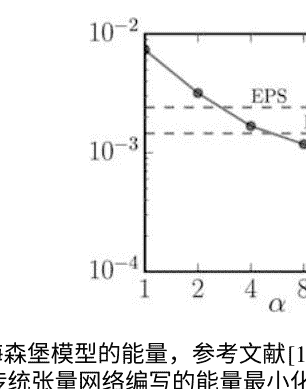

可以看出，隐藏单元 $\alpha$ 越多，神经网络波函数越好。

#### 11.2 张量网络和神经网络

张量网络提供了一种有效表示量子多体系统波函数的方法，即在希尔伯特空间中构建子空间的方法。因此，让我们在这里讨论与神经网络的关系。

##### 11.2.1 张量网络

用最简单的张量网络表示的状态是 $N = 2$ 的情况，

$$ \sum_{i,j=0,1} A_{ij}|i\rangle|j\rangle. \quad (11.6) $$

在这里，$i, j = 0,1$ 是自旋的指标，$A_{ij}$ 被称为张量。张量 $A$ 有 $2 \times 2 = 4$ 个分量，因此它有四个复数自由度。在接下来的内容中，我们将使用爱因斯坦的约定（省略 $\sum$ 符号）。接下来，考虑 $N =4$ 的以下状态：

$$ B_{mn}A_{mij}A_{nkl}|i\rangle|j\rangle|k\rangle|l\rangle. \quad (11.7) $$

张量 $A$ 有三个指标，张量 $B$ 有两个指标。它们通过指标 $m, n$ 缩并。在 $N =2$ 的例子（11.6）中，张量参数 $A$ 可以表示整个希尔伯特空间，但在 $N =4$ 的例子（11.7）中，这是不可能的。这是因为如果 $N =4$，整个希尔伯特空间由 $2^4 =16$ 个复数张成，但张量 $A$ 的自由度为 $2^3 =8$，张量 $B$ 的自由度为 $2^2 =4$，因此只有总共12个。换句话说，希尔伯特空间的一个子空间被参数化了。

使用图形来表示波函数是标准的，通过张量 $A$ 或 $B$。典型的符号是张量具有与指标数量相同的腿（见图11.2）。它看起来类似于神经网络符号，但请注意以下几点：在张量网络中，张量由正方形、三角形和圆形表示。从中伸出的线（腿）表示下标 $i = 0,1$，因此该线表示输入或输出。由于具有三个指标的张量有三个腿，其中一些是输入，其余的线是输出。在神经网络中，另一方面，线条表示“乘以权重 $W$”，这是张量网络中张量的作用。此外，在神经网络中，单元（圆圈）具有输入和输出的含义，在张量网络中，圆圈是张量（权重的作用）。因此，在张量网络和神经网络中，线条和圆圈的含义是相反的。

##### 11.2.2 受限玻尔兹曼机的张量网络表示

现在让我们来看看受限玻尔兹曼机和张量网络之间的关系[125]。在给出受限玻尔兹曼机的神经网络图中，我们将以下 $2 \times 2$ 矩阵与连接可见单元 $s_a$ 和隐藏单元 $h_A$ 相关联，

$$ M_{ss'}^{(aA)} \equiv \begin{pmatrix} 1 & 1 \\ 1 & \exp[J_{aA}] \end{pmatrix}_{ss'}, \quad (11.8) $$

并且在单元和线条的连接处关联以下 $2 \times 2$ 矩阵，

$$ \Lambda_{ss'}^{(a)} \equiv \begin{pmatrix} 1 & 0 \\ 0 & \exp[a_a] \end{pmatrix}_{ss'}, \quad \tilde{\Lambda}_{ss'}^{(A)} \equiv \begin{pmatrix} 1 & 0 \\ 0 & \exp[b_A] \end{pmatrix}_{ss'}. \quad (11.9) $$

根据这个规则，所有受限玻尔兹曼机可以解释为张量网络。

例如，考虑由一个可见单元、一个隐藏单元和一条连接它们的线构成的最简单的受限玻尔兹曼机（图11.3左）。根据上述规则，

$$ \tilde{\Lambda}^{(A=1)} M^{(a=1,A=1)} \Lambda^{(a=1)} = \begin{pmatrix} 1 & e^{a_1} \\ e^{b_1} & e^{a_1+b_1+J_{11}} \end{pmatrix}. \quad (11.10) $$

该矩阵的元素对应于受限玻尔兹曼机的权重，其中替换了 $(s, h) = (0,0), (0,1), (1,0), (1,1)$。为了对隐藏单元变量求和，我们只需要与向量 $(1,1)$ 取乘积，

$$ \psi(s) = \left[ (1,1) \tilde{\Lambda}^{(A=1)} M^{(a=1,A=1)} \Lambda^{(a=1)} \right]_s $$

这等价于(11.3)。表达式(11.10)将受限玻尔兹曼机描述为矩阵的乘积，由于最终矩阵乘积的元素表示单元的分量，因此它正好是一个张量网络表示。

让我们考虑一个稍微复杂一点的例子：如图11.3右侧面板所示的受限玻尔兹曼机。根据规则，我们有一个矩阵乘积

$$ \tilde{\Lambda}_{st}^{(A=1)} M_{tt'}^{(a=1,A=1)} M_{t't''}^{(a=2,A=1)} \Lambda_{t's'}^{(a=1)} \Lambda_{t''s''}^{(a=2)} $$

这里矩阵 $M$ 乘以两次，因为行数为两行，矩阵 $\Lambda$, $\tilde{\Lambda}$ 乘以三次，因为单位数为三个。注意指标 $t$ 出现了三次，上述表达式指标求和不能用矩阵乘法表示。因此，我们定义

$$ \tilde{M}_{st't''} \equiv \tilde{\Lambda}_{st}^{(A=1)} M_{tt'}^{(a=1,A=1)} M_{t't''}^{(a=2,A=1)} $$

这很有效，并且以后会有用。新的元素 $\tilde{M}$ 有三个指标，并对应于一个三腿张量。所以，我们再次发现这个受限玻尔兹曼机在张量网络中有一个表示。从图11.3的右侧面板可以看到，给出了一个张量网络表示。

因此，受限玻尔兹曼机允许张量表达式。另一方面，由神经网络表示的是一个通用张量网络吗？事实上，已经证明了由张量网络组成的每个状态（即，可以由量子电路表示的每个状态）都可以由深度玻尔兹曼机表示[126]。因此，在凝聚态物理中经常使用的张量网络在玻尔兹曼机的意义上非常适合机器学习。从这个角度来看，各种研究正在进行中。

那么，用前馈神经网络代替玻尔兹曼机呢？正如我们在第3章中看到的，前馈神经网络具有通用逼近定理，因此任何非线性函数都可以表示，从这个意义上说，任何张量网络都可以表示。然而，构建一个表示给定张量网络的神经网络存在一些困难，如下所述。

首先，在图11.3的情况下，两个 $A$ 连接到张量 $B$ 的两条腿上，张量网络的状态包括 $A$ 的乘法。一般来说，张量通过乘法组合，这会产生非线性，而前馈神经网络则不会，并且以单元为单位创建非线性的激活函数。为了弥补这种差异，您需要使用一种乘法形式的激活函数。使用这种新的激活函数可以将张量网络表示为神经网络的树状图。具有内部循环的张量网络图（也包括所谓的MERA）与树状图不同，难以用前馈类型表示。这是因为循环图在中间层具有两个或多个输出，并且与它们连接的张量以并行方式出现（张量乘积结构），但在前馈神经网络中，当排列在并行位置的张量重新组合时，只允许优先表达其中一个，并且张量的并行性受到阻碍。

如上所述，张量网络在许多方面与神经网络不同。然而，每种方法都有其优势，并且可以在共同概念中相互转换。正如第10章所解释的那样，神经网络源自物理多体系统，如Hopfield模型，因此它们与物理系统兼容。未来，量子多体系统和机器学习的相互连接将以各种形式取得进展。

还有一项研究使用乘积池化来观察对应关系[128]。

MERA代表多尺度纠缠重整化假设。

## 第12章 应用于超弦理论


摘要 最后一章描述了将深度学习应用于解决字符串理论的逆问题的示例。超弦理论统一了引力和其他力量，近年来，“全息原理”活跃地研究了引力统治的世界与其他力量的世界等效的观点。我们将通过将对应关系应用于第9章中所见的动力学系统来解决引力世界的出现的逆问题，并探索机器学习与时空之间的新关系。

超弦理论已被研究为引力的量子理论和以统一的方式描述宇宙中所有力的理论。本章展示了将机器学习，特别是深度学习，应用于超弦理论中的数学问题的示例。尽管有着悠久的历史，但将机器学习技术应用于物理学的各种研究直到最近才开始。本章的内容主要基于作者与杉下薫太郎[118, 130]之间的合作研究，以及对超弦理论的其他研究，因此可以期待各种进展。

首先，让我们从一个一般的视角，不使用数学公式，概述超弦理论中的两个反问题。接下来，我们解释如何将深度神经网络视为时空，作为解决全息原理中的一个方法之一的逆问题。

#### 12.1 弦论中的逆问题

超弦理论的数学成就有两个主要特点，使得引力的量子化成为可能。第一个特点是时空必须是10维的约束条件，第二个特点是它导致了各种规范对称性和在其下变换的基本粒子集合。

从这两个特点来看，可以说弦理论的研究取得了很大的进展。接下来，我们将提到弦理论中存在两个重要的逆问题。第一个逆问题是压缩问题，第二个逆问题是全息原理。

#### 12.1 弦论中的逆问题

第一个约束和第二点是相关的。我们宇宙的时空维度是4，所以如果它最初是一个10维时空，那么6维空间必须是一个非常小而紧凑的空间。如果我们采用通常被称为 Calabi–Yau 流形作为空间，已知得到的4维时空理论将更接近我们熟悉的基本粒子理论。在微扰弦理论中，有许多类型的 Calabi–Yau 流形都是数学上允许的。如果采用一个 Calabi–Yau 流形作为紧致的6维内部空间，剩余部分的类型、数量和对称性将确定4维时空的基本粒子。

从这个意义上讲，弦理论留下了各种可能性。它不是在4维时空中推导出单一的基本粒子模型，而是推导出许多类型的基本粒子模型。由于Calabi-Yau流形的数量是有限的，从数学上讲，模型的数量是有限的，但数量非常大。当然，存在着许多不包括引力的量子场论的无限种类，而弦理论对量子场论施加了限制。然而，这些限制并不是非常强，各种基本粒子模型都是允许的。

因此，如果我们将弦理论视为描述我们宇宙的理论，我们需要找到一个导致更接近标准模型的4维模型的Calabi-Yau流形。到目前为止，已经知道了许多Calabi-Yau变体，它们提供了与标准模型的粒子内容和对称性接近的粒子内容。然而，研究还没有完成。

此外，在从弦论中推导出一个4维基本粒子模型时，选择卡拉比-丘流形不仅仅是一个问题。例如，引入了D-膜，它们是弦论中可以结束的弦的一种形式。可以考虑各种维度的D-膜，并将它们放置在10维空间中。这些是相互关联的，但这太过于技术性，所以我们只会对每个进行概述。

当然，弦论研究的进一步进展可能会带来更多限制。这有两个原因。首先，超弦理论作为引力的量子理论被充分理解的区域是在耦合常数很小的情况下，即弦的耦合常数很小时。因此，一旦非微扰性质被理解，就可以施加更强的限制。其次，量子引力理论并不总是超弦理论。在稍后将描述的AdS/CFT对应中，量子引力理论被更广泛地定义，从这个意义上说，弦论得到了扩展。

在时空中，可以实现各种对称性。通过放置一组良好的D-膜，可以重现标准模型的对称性和粒子内容。通过在弦论中组合D-膜，以这种方式创建一个4维时空的基本粒子模型（或量子场论）通常被称为膜构造。已经结合了各种方法来创建一个4维时空的基本粒子模型。

目前，已经开发出一种称为F理论紧致化的方法，其中通过Calabi-Yau流形从10维度和D-膜的组合来近似整合。F理论被定义为一个12维时空，其2维紧致化可以重现IIB型弦论。当进行8维紧致化时，在剩余的4维时空中创建了一个基本粒子模型。这个8维紧致空间采用了一个复4维的Calabi-Yau流形。从这个角度来看，如果确定了复4维Calabi-Yau流形的类型，那么4维时空的基本粒子模型也就确定了，因此需要仔细研究Calabi-Yau多样性的类型。

正如你所看到的，从弦论中推导出基本粒子的标准模型是一个逆问题。问题是选择一个对弦论压缩必要的流形，使其成为基本粒子的标准模型。这个问题的一个困难之处在于Calabi-Yau流形并不被很好地理解（例如，甚至很难知道流形上的度规）。为了探索紧致空间，已经开始使用对逆问题有效的机器学习[131-134]。

##### 12.1.1 紧致化作为一个逆问题

##### 12.1.2 全息原理作为逆问题

过去20年来，弦论研究的进展一直由AdS/CFT对应推动。1997年J. Maldacena发现的AdS/CFT对应被认为是G. 't Hooft最初提出并由L. Susskind推广的全息原理的一个具体实现[135-137]。

全息原理是指包括引力的量子理论等效于在低维时空中定义的没有引力的量子场理论。Maldacena给出的第一个例子是IIB型超弦理论在 $AdS_5 \times S^5$ 上的等价性，即一个5维反德西特时空和一个5维球体，以及 $\mathcal{N} = 4$ 超对称Yang-Mills理论在一个平坦的4维时空上。这是通过考虑带有D-膜的10维弦理论中的一个特殊极限提出的。这是这两个理论的等价性：前者是一个量子引力理论，而后者是一个没有引力的低维量子场理论。这是全息原理的一个具体例子。一般来说，前者被称为“引力侧”或“AdS侧”，后者被称为“CFT侧”或“边界侧”或“规范理论侧”。CFT是共形场论的缩写，是一种场论，在共形变换下不变。N=4超对称Yang-Mills理论是CFT的一个例子。

在Maldacena的第一个例子中，引力方面是一个量子引力理论（即超弦理论），但经常考虑经典极限和低能区域。这是因为在这个领域，量子引力理论变成了一个经典的爱因斯坦理论（在具有一些超对称性的高维时空中），而拉格朗日量是众所周知且易于处理的。众所周知，在引力方面进行这样的极限等价于在CFT方面的Yang-Mills理论中进行以下两个极限。首先，你需要大N极限，其中N是Yang-Mills理论的规范对称性SU(N)。通过将N取为无穷大，引力方面变得经典化（可以忽略量子效应）。

接下来，需要强耦合极限。这被称为大λ极限，其中λ≡Ng²被称为't Hooft耦合常数，而g是Yang-Mills理论的耦合常数。通过使λ无限大，在引力方面，可以忽略作用在场上的高阶导数。

全息原理有两个重要的开放问题。第一个是证明Maldacena最初提出的例子。第二个是给出边界上的量子场论可以允许的引力描述的条件。当然，这些问题被认为是相互关联的，但是Maldacena的第一个例子是由一些弦论的极限提出的，而第二个问题被认为是超弦理论之外需要讨论的一个问题。特别是，随着第二个问题的阐明，我们将对弦论是否是唯一的引力量子理论获得重要的洞察。解决这些问题的困难在于，如上所述，规范理论方面的Yang-Mills理论具有强耦合，因此无法使用常规的微扰方法，因此研究方法是困难的。

在这个背景下，已经建立了各种AdS/CFT对应的例子。AdS/CFT对应通常被称为“规范/引力对偶”。最早的主要例子是通过对Maldacena提出的例子进行修正而得到的。此外，已经发表了许多超越了来自弦论的推导的例子。这些例子具有预期在规范和引力两侧共同存在的性质（如对称性）。

在我们所知的基本粒子标准模型中，负责强力的部分由量子色动力学（QCD）编写，它基于SU（3）杨-米尔斯理论。由于其强耦合，低能下出现了各种强子图像。解决QCD对于指示实验数据与标准模型的可能偏差非常重要。此外，作为研究最深入的强耦合场量子理论的最佳例子，它具有重要的数学意义，吸引了许多研究人员。有一个研究领域将规范/引力对应应用于这个QCD，并在引力侧进行各种计算以评估强子物理量。这个领域被称为全息QCD。

研究人员正在尝试各种引力模型，因为尚未找到与QCD等效的引力-侧理论。在引力方面，可以在一个维度更高的时空中写出一个时空度规，并在其中的各种物质场的拉格朗日量。可以基于这个进行各种经典计算，并可以使用规范/引力对偶的字典来计算生活在边界上的QCD物理量。那么引力理论与QCD等效吗？

正如你所看到的，这是一个逆问题之一。QCD是一个定义明确的量子场论，其拉格朗日量已知，并且其物理量已经被广泛研究。由于强耦合的原因，计算并不容易，但已经证明可以通过使用超级计算机进行数值计算来评估各种物理量：格点QCD。特别是对于QCD中的基本夸克的束缚态（强子）的光谱（质量分布），格点QCD的计算结果与加速器实验的测量结果非常吻合，从而确认了我们的世界是由QCD描述的。找到这样一个给定量子场论的引力描述的问题是一个逆问题。这是因为，到目前为止，几乎所有的全息QCD计算都是通过手工进行的，解释为类似于QCD的量。

在下一节中，我们将介绍一种使用深度学习[118, 130]来解决这个逆问题的方法。在这种方法中，格点QCD模拟的数据可以用来确定引力侧的度规，使其能够重现数据，通过学习。

规范/引力对应的一个基本问题是如何为给定的边界量子场论构建引力侧，以及如何判断是否首先存在引力侧的描述。这种问题不仅限于QCD。近年来，基于纠缠熵和量子信息理论的更广泛的规范/引力对应已经被研究。“涌现引力”的概念正在广泛接受，并且对于逆问题的解决方法有希望。

#### 12.2 弯曲时空是一个神经网络

为了部分解决从边界量子场论（如QCD）中找到涌现的引力理论的逆问题，我们进行了以下简单设置。我们将引力时空本身视为一个神经网络。

> 这是一个研究领域，在这个领域中，核内部可以从第一原理上进行数值计算，计算出夸克/胶子水平。由于大量的数值计算，计算是通过使用超级计算机的马尔可夫链蒙特卡罗方法进行的。这个表述本身类似于统计力学。详细内容请参见[104]。

图12.1 AdS/CFT的概念图。这个图和一个典型的深度神经网络的概念图（图9.1）被认为是相同的，用于解决逆问题。

给定引力理论，要找到边界侧量子场论的一点函数，我们只需在引力时空（称为“体积”）上简单地解微分方程。特别是，如果引力侧是经典的，我们解经典微分方程。关于边界侧量子场论的一点函数的信息，通过在引力侧的解（在边界附近的区域）的值（给定边界值）提供。因此，从边界侧的量子场论确定引力侧的度规意味着以下问题：当给定一个场的边界值时，作为解的微分方程是什么？这是一个逆问题的例子，如第7章所解释的。

在这一点上，我们认为引力理论本身被视为一个神经网络，神经网络的权重被视为引力的度量，因此度量从训练好的权重中读取。对于训练数据，我们使用边界侧量子场论的一个一点函数。由于这给出了引力理论中边界处场的值，它就像神经网络的输入数据一样起作用。

##### 12.2.1 弯曲时空中场论的神经网络表示

让我们用一个神经网络重新描述引力理论。当你看图9.1和12.1时，这个意义就清楚了。为了建立具体的关系，第9章介绍的各种物理系统的神经网络表达式非常有用。

特别地，哈密顿系统的时间演化形式可以写成一个神经网络，因此引力理论可以像神经网络一样写成同样的方式，将全息原理中的紧急空间方向视为哈密顿系统的时间方向。具体来说，神经网络是一个非线性关系，输入数据$x^{(1)}$和输出数据$y$之间的关系由以下给出

$$y(x^{(1)}) = f_i \varphi(J_{ij}^{(N-1)} \varphi(J_{jk}^{(N-2)} \cdots \varphi(J_{lm}^{(1)} x_m^{(1)}))) .$$

这里J是权重，φ是激活函数。

首先，让我们考虑一个 (d + 1)维度的弯曲时空。我们考虑在其中的引力理论，但为了简单起见，我们考虑一个在弯曲时空中的标量场 φ 的理论。标量场理论的作用量如下所示：

$$S = \int d^{d+1}x \sqrt{-\det g} \left[ -\frac{1}{2} (\partial_{\mu} \phi)^2 - \frac{1}{2} m^2 \phi^2 - V(\phi) \right]. \tag{12.2}$$

让量子场论在边界上的时空是平坦的 d-维度，让在引力方面出现的空间方向是 η。

引力侧的弯曲时空的度量可以一般地写成

$$ds^2 = -f(\eta) dt^2 + d\eta^2 + g(\eta)(dx_1^2 + \cdots + dx_{d-1}^2). \tag{12.3}$$

这里 f(η) 和 g(η) 是度规分量，需要通过学习来确定。在我们的规范下，度规分量在 η 方向上等于1。在这一点上，f(η) 和 g(η) 是未确定的，但是为了使 AdS/CFT 对应关系成立，必须满足以下两个条件。首先，在边界 η → ∞ 处，时空需要渐近地是 AdS 的，即 f ≃ g ≃ exp[2η/R] (η ∼ ∞)，其中 R 是 AdS 半径。另一个条件是对于弯曲时空的相反边界。假设边界侧的量子场论是一个有限温度系统，结果是引力侧变成了一个黑洞时空。所以，另一个边界条件是黑洞的事件视界。这被表示为 f ∝ η², g ≃ const (η ∼ 0)。

从这个作用量 (12.3) 出发，场 φ(η) 的运动方程是一个普通的微分方程。

$$\partial_{\eta} \pi + h(\eta) \pi - m^2 \phi - \frac{\delta V[\phi]}{\delta \phi} = 0, \quad \pi \equiv \partial_{\eta} \phi. \tag{12.4}$$

在这里，如第9章所解释的，我们引入了 π(η) 作为 φ 的共轭动量，并将微分方程转化为一阶微分方程。度规分量包括 h(η) ≡ ∂η log √(f(η)g(η)^{d-1})。

此外，我们像第9章那样将 η 方向离散化。

$$\phi(\eta + \eta) = \phi(\eta) + \eta \pi(\eta), \tag{12.5}$$

$$\pi(\eta + \eta) = \pi(\eta) - \eta \left( h(\eta) \pi(\eta) - m^2 \phi(\eta) - \frac{\delta V(\phi)}{\delta \phi(\eta)} \right). \tag{12.6}$$

这是一个神经网络对于标量场 φ 在弯曲时空中的运动方程的表示。图12.2显示了一个示意图。特别地，由于 η方向被离散化为 η^{(n)} = (N - n + 1) η，神经网络的输入数据是 (φ(∞), π(∞))^T，神经网络的权重 J是

$$J^{(n)} = \begin{pmatrix} 1 & \eta \\ \eta m^2 & 1 - \eta h(\eta^{(n)}) \end{pmatrix} . \tag{12.7}$$

因此，它被解释为包含度量信息的一部分。注意，一些权重被固定为1。换句话说，这是一个稀疏网络。激活函数选择如下以重现(12.6):

$$\begin{cases} \varphi(x_1) = x_1, \\ \varphi(x_2) = x_2 + \eta \frac{\delta V(x_1)}{\delta x_1} . \end{cases} \tag{12.8}$$

通过使用最简单的深度神经网络（图12.2），如果选择权重和激活函数为（12.7）和（12.8），则引力侧标量场的经典运动方程可以表示为神经网络（12.1）。

##### 12.2.2 如何选择输入/输出数据

如果将体积微分方程视为神经网络，微分方程的边界条件自动成为输入数据和输出数据。在AdS/CFT对应中，已知体积微分方程在渐近AdS区域（η→∞）的行为对应于边界侧量子场论的一点函数。因此，您可以选择该一点函数作为输入数据。另一方面，黑洞的事件视界将成为体积时空的另一边界（η=0）上的边界条件。在这个阶段，我们可以问：什么是训练？训练是调整神经网络的权重，即引力度规，以便当从η→∞边界输入“正确”的数据时，黑洞视界边界条件在η=0处正确满足。这是一个函数自由度优化问题，因此是机器学习。

渐近AdS区域中标量场的边界值与边界上量子场论的一点函数之间的关系由文献[139]中定义的一般原理确定。假设边界上的量子场论算符为 O，并且量子场论的拉格朗日量中存在项 gO作为其源项。给定源 g，一点函数 ⟨O⟩ 表示真空期望值 ⟨O⟩作为 g的函数给出。例如，当外部磁场作为源时，⟨O⟩是一个磁化算符，即对外部场的响应。在量子色动力学中，例如，如果源 g是夸克的质量，那么QCD的质量项是 m_q \bar{\psi} \psi，因此手征凝聚 ⟨\bar{\psi} \psi⟩对应于响应。以这种方式，当边界上的量子场论得到 g和 ⟨O⟩时，AdS/CFT对应关系告诉我们在引力侧存在以下关系[139]^6，在AdS半径 R为1的归一化条件下。

$$\phi(\eta_{\text{ini}}) = g \exp[-\eta_{\text{ini}}] + \langle O \rangle \frac{\exp[-\eta_{\text{ini}}]}{\nu_+ - \nu_-} . \tag{12.9}$$

这里是由块的质量确定的，如 $\nu_\pm \equiv (d/2) \pm \sqrt{d^2/4 + m^2 R^2}$，而 $\nu_+$是算符 O的共形维度^7。此外，在区域 $\eta \rightarrow \infty$中进行了截断：边界给出为 $\eta = \eta_{\text{ini}}$. 通过对 $\eta$求导得到这个关系

$$\pi(\eta_{\text{ini}}) = -g \exp[-\eta_{\text{ini}}] - \langle O \rangle \frac{\nu_+ \exp[-\eta_{\text{ini}}]}{\nu_+ - \nu_-} . \tag{12.10}$$

这些是给定量子场论的一个单点函数的 $\phi$和 $\pi$在 $\eta \rightarrow \infty$时的值的公式。

另一方面，输出数据怎么样？在黑洞的事件视界上，只允许进入视界的波动。因此，运动方程的解只允许负方向的波动解。具体来说，我们可以找出（同时恢复时间导数项）以下条件：

$$0 = F \equiv \left[ \frac{2}{\eta} \pi - m^2 \phi - \frac{\delta V (\phi)}{\delta \phi} \right]_{\eta=\eta_{\text{fin}}} . \tag{12.11}$$

这里 $\eta = \eta_{\text{fin}} \sim 0$是靠近地平线的截断。在 $\eta \to 0$时，只有 $F$ 的第一项是重要的，因此地平线条件简化为以下形式:

$$\pi = 0. \tag{12.12}$$

也就是说，输入数据是否正确取决于神经网络最后一层的$\pi$值是否为零。

当然，由于这是一个数值实验，如果要求输出 $\pi$完全为零，训练将根本无法进行。因此，需要一个技巧来判断当值接近0时数据是否正确。可以通过设置一个阈值来实现：例如，如果输出的幅值小于0.1，则认为其为0。此外，最终层的 $\pi$值可能非常大，考虑到神经网络在二元分类问题上的优势，通过将最终层的 $\pi$值转换为tanh($\pi$)来限制值的范围也是有效的。通过这种修改，如果输入的是无法重现单点函数的“不正确数据”，则训练将使输出应为1而不是0。

通过这种方式，我们有一种方法来解决从边界量子场论的量子数据中确定重力度规的逆问题。在这个问题的“转化”中，重要的不仅是将微分方程改写成神经网络形式，还要将微分方程和边界值问题分为未知和已知部分，使得未知部分成为网络权重，已知数据成为输入和输出。如果这样的分离是可能的，那么可以使用本章描述的技术来解决逆问题。

#### 12.3 神经网络上的紧急时空

现在，让我们实际在计算机上实现上述神经网络，并进行数值实验，看看是否可以通过学习获得时空度规。在这里，我们介绍两个独立的数值实验[118]。第一个实验是为了看是否可以重现已知的度规。第二个实验是回答以下问题：当神经网络被提供了一个完全不知道其重力方面的真实材料的实验数据时，是否会出现时空？在下一节中，将更详细地描述从QCD数据中出现的时间和空间[130]。

## 12.3 “正数据” (蓝色)和“负数据”(绿色)通过离散化AdS Schwarzschild度规(12.13)生成

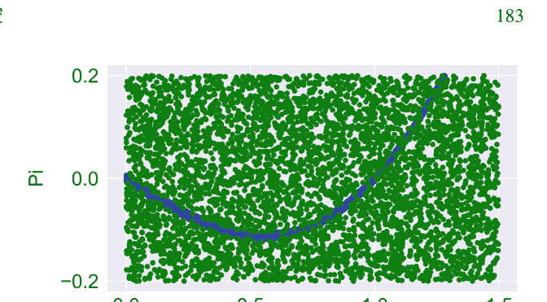

## 12.3.1 AdS黑洞时空是否被学习到？

首先，为了确定这样的学习系统是否真的很好用，让我们通过数值实验来检查已知的度规是否被复制。在渐近AdS黑洞中，作为纯爱因斯坦方程的解的最好解是AdS Schwarzschild解。对于 \(d =3\)，它是一个简单的函数 (使用单位 \(R = 1\))

\[
h(\eta) = 3 \coth(3\eta) .
\]

现在，这是否会通过学习来复制？

我们将体积的 \(\eta\)方向离散化为10层，并选择截断为\(\eta_{\mathrm{ini}} =1\)和 \(\eta_{\mathrm{fin}} = 0.1\)。为简单起见，我们选择运动方程中的质量和势能项为 \(m^2= -1\)和 \(V[\phi] = \frac{1}{4} \phi^4\)。首先，我们使用离散化的AdS Schwarzschild度规(12.13)生成一组“正确数据”。从随机生成的 \((\phi(\eta_{\mathrm{ini}}), \pi(\eta_{\mathrm{ini}}))\)开始，我们使用权重为(12.13)的神经网络，并将满足 \(|\pi| < 0.1\)的 \((\phi(\eta_{\mathrm{ini}}), \pi(\eta_{\mathrm{ini}}))\)命名为“正数据”。类似地，那些在最后一层不满足条件的数据被称为“负数据”。我们收集了1000个这样的数据来构建一个带有正/负标签的训练数据集。请参见图12.3。

接下来，使用这些训练数据，我们从一个随机的初始权重集合 \(h(\eta^{(n)})\)开始训练神经网络。结果如图12.4所示。(a-1)(a-2)是训练前的状态，(b-1)(b-2)是训练后的状态。左边的图表显示数据被判断为正确的程度。右边的图表是度量函数 \(h(\eta)\)的绘图。随着训练的进行，可以看到正数据和负数据可以被正确区分。在

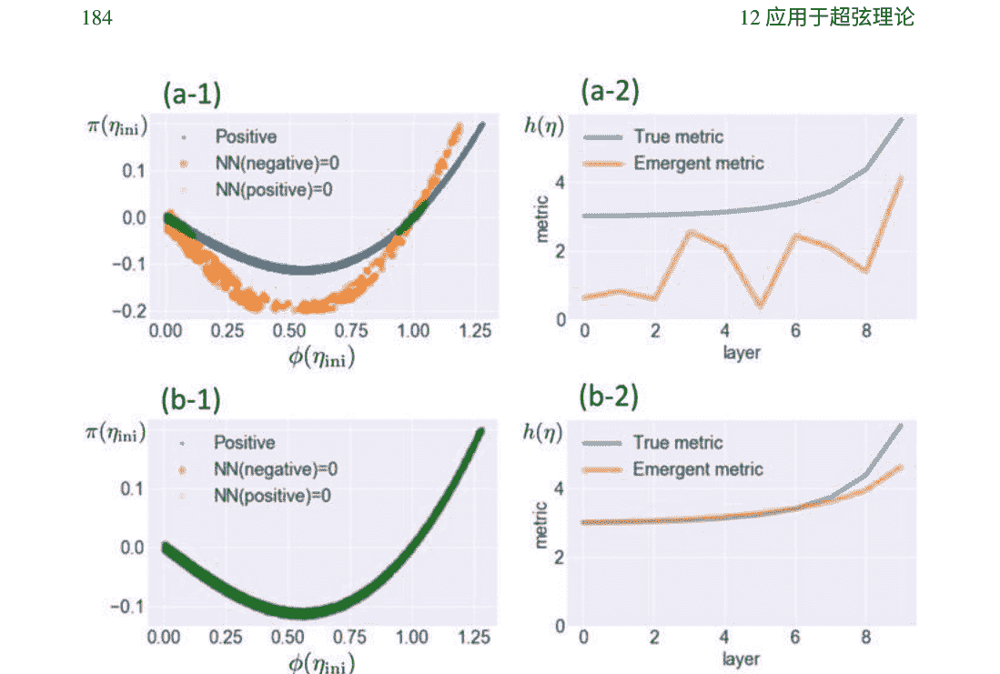

图12.4 AdS Schwarzschild时空再现实验的结果。在上排，(a-1)和(a-2)显示了训练前的判别数据和度量，而在下排，(b-1)和(b-2)展示了训练后的数据。在(a-1)中，蓝色点是正数据，橙色点是由随机生成的初始度量（橙色锯齿线在图(a-2)中）判断为正的数据。它们当然是不同的。然而，在训练后它们在(b-1)中匹配。根据(b-2)，训练后的度量（称为“新兴度量”）在除了\(\eta\)接近0的一个小区域外，重现了AdS Schwarzschild时空（称为“真实度量”）。

同时，您可以看到生成的度量如何复现了AdS Schwarzschild解（12.13）。

在这个数值实验中，引入适当的正则化是必要的。如果不引入正则化，\(h(\eta)\)的结果通常是不平滑的。即使度量的结果是不平滑的，网络仍然可以区分正数据和负数据。这是因为一般来说，训练后的神经网络的权重不是唯一的，会得到各种各样的误差函数局部最小值作为训练结果。在得到的各种\(h(\eta)\)中，为了挑选出有意义的光滑度量作为时空，我们添加以下正则化项：

\[
L_{\text{reg}}^{(1)} \equiv c_{\text{reg}} \sum_{n=1}^{N-1} (\eta^{(n)})^4 \left( h(\eta^{(n+1)}) - h(\eta^{(n)}) \right)^2. \tag{12.14}
\]

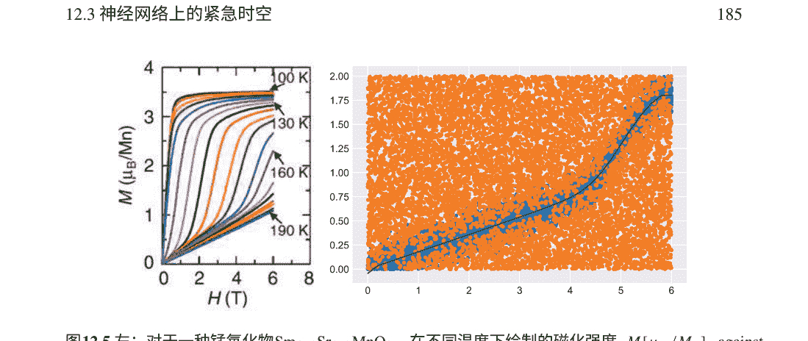

图12.5左：对于一种锰氧化物\(Sm_{0.6}Sr_{0.4}MnO_3\)，在不同温度下绘制的磁化强度 \(M [\mu_B/Mn]\) 对外加磁场 \(H\)[特斯拉]。摘自论文[140]。右：通过给155K数据添加厚度生成的正数据和负数据。

通过添加这个项，相邻的 \(\eta\) 中的 \(h\) 值变得更接近，从而得到一个平滑的度量。这个项的作用是减小误差函数在连续极限下 \(\int d\eta (h'(\eta)\eta^2)^2\)。数值实验表明，如果添加的正则化系数为 \(c_{reg} = 10^{-3}\)，可以提取出平滑的度量而不增加最终损失值。

这个数值实验表明，通过求解边界上算符的单点函数的逆问题，可以重现AdS Schwarzschild时空。深度学习已被发现在解决逆问题方面非常有效。

##### 12.3.2 材料数据中的紧急时空

接下来，让我们看看当真实材料的数据被采用为单点函数的数据时，会出现什么时空。在材料中，通常被测量为单点函数的是外部磁场响应。特别是，所谓的强关联物质在电子和自旋之间有很强的相关性，并且与考虑边界上的强耦合极限的AdS/CFT相容。因此，我们将使用锰氧化物\(Sm_{0.6}Sr_{0.4}MnO_3\)[140]的外部磁场响应数据。在图12.5中，我们在左侧选择了温度为155K的数据，并将数据分为正数据和负数据（图12.5右侧）。

接下来，我们考虑神经网络的输入部分。由于边界值与量子场论的一点函数（如（12.9）和（12.10））有关，

由于实验数据没有误差条，我们手动添加了数据的厚度。技术原因是当数据宽度太小时，训练无法进行。

物质的数据\((H, M)\)可以转换为\((\phi, \pi)\)。然而，在当前情况下，物质的AdS半径\(R\)未知，通常必须从\(M\)的两点函数确定的算符的归一化也未知，我们将不情愿地将其放在以下位置:

\[
\phi(\eta_{\text{ini}}) = \alpha H + \beta M, \\
\pi(\eta_{\text{ini}}) = -\alpha H - +\beta M.
\tag{12.15}
\]

这里\(\alpha\)和\(\beta\)是未知的归一化常数，而

\[
\Delta = (d/2) \left(1 \pm \sqrt{1 + 4m^2 / h(\infty)^2}\right)
\tag{12.16}
\]

确定算符的共形维度 (\(h(\infty)\)给出了AdS半径)。在数值代码中，一切都以单位 \(R=1\)来衡量。我们将这个 (12.15) 视为第0层，并将其添加到由 \(h(\eta)\)构成的原始神经网络中。

输入数据和输出数据的处理方式与之前的AdS Schwarzschild时空再现实验相同，并且神经网络的权重进行训练。在10层神经网络中，此时需要训练的参数是体积质量 \(m\)，相互作用势能 \(V = (\lambda/4)\phi^4\)中的 \(\lambda\)，归一化常数 \(\alpha\) 和 \(\beta\)，以及度规 \(h(\eta)\)。

图12.6显示了训练结果。左边和中间的图显示了训练后正数据的拟合以及紧急度量 \(h(\eta)\)。你可以看到了一个平滑的紧急度量。右边的图显示了13次试验的统计数据。我们可以看到它如何收敛到某个函数形式。

同时，学习了体积质量的值和相互作用的强度。结果是 \(m^2 R^2 = 5.6 \pm 2.5\)和\(\lambda R = 0.61 \pm 0.22\)。通过使用深度神经网络，可以解决AdS/CFT的逆问题。从给定材料的数据中，有趣的问题等待着，例如紧急时空具有什么属性以及它如何普遍地用于AdS/CFT对应。

¹¹在这个数值实验中，我们使用两个正则化项进行训练： \(L_{\text{reg}} = L_{\text{reg}}^{(1)} + L_{\text{reg}}^{(2)}\)。第一个正则化项 \(L_{\text{reg}}^{(1)}\) 与之前的相同 (12.14)。对于第二个项，我们引入了正则化 \(L_{\text{reg}}^{(2)} = c_{\text{reg}}^{(2)} (h(\eta^{(N)}) - 1/\eta^{(N)})^2\)。 (12.17) 这使得 \(h(\eta^{(N)})\) 的行为类似于黑洞地平线条件 \(h(\eta) \sim 1/\eta\)。为了不妨碍训练，我们采用了正则化项的值 \(c_{\text{reg}}^{(2)} = 10^{-4}\) 作为其系数。

¹²当总误差函数低于0.02时，我们停止训练。这是基于训练结果已经足够接近训练数据的判断。

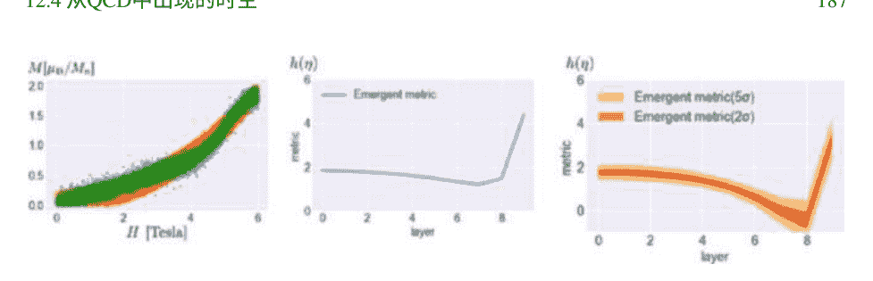

表12.1 左边：手征凝聚度[141]作为夸克质量（以格点常数\(a\)为单位）的函数。右边：将相同数据转换为物理单位（使用\(1/a = 0.829(19)[\mathrm{GeV}]\)）。误差约为8%。

| \(m_q\) | \(\langle \bar{\psi} \psi \rangle\) | \(m_q[\mathrm{GeV}]\) | \(\langle \bar{\psi} \psi \rangle [(\mathrm{GeV})^3]\) |
| :--- | :--- | :--- | :--- |
| 0.0008125 | 0.0111(2) | 0.00067 | 0.0063 |
| 0.0016250 | 0.0202(4) | 0.0013 | 0.012 |
| 0.0032500 | 0.0375(5) | 0.0027 | 0.021 |
| 0.0065000 | 0.0666(8) | 0.0054 | 0.038 |
| 0.0130000 | 0.1186(5) | 0.011 | 0.068 |
| 0.0260000 | 0.1807(4) | 0.022 | 0.10 |

#### 12.4 从QCD中出现的时空

然后，最后，让我们通过解决逆问题，从QCD的数据中得到出现的时空[130]，将渐近AdS时空视为神经网络，如前所述。

在QCD中，最重要的一点函数是手征凝聚度 \(\langle \bar{q}q \rangle\)，其中 \(q(x)\)是夸克场¹³。手征凝聚度是算符 \(\bar{q}q\)的真空期望值，而 \(\bar{q}q\)被包含在QCD拉格朗日量中作为夸克质量项 \(m_q \bar{q}q\)。因此， \(\bar{q}q\)的源是夸克质量 \(m_q\)。幸运的是，在改变 \(m_q\)时，存在由格子QCD测量的手征凝聚度 \(\langle \bar{q}q \rangle\)的数据。让我们将其作为我们的训练数据。表12.1给出了 \(\langle O \rangle_g = \langle \bar{q}q \rangle_m\) 以物理单位测量 [141]。温度选择为207 [MeV]。

接下来，取\(0 < m_q < 0.022\)和\(0 < \langle \bar{q}q \rangle < 0.11\)的区域，并在该区域内生成随机点。将靠近曲线（该曲线是拟合表12.1数据的三次函数）的点视为正数据，距离为0.004以内，而不进入曲线邻域的点视为负数据（图12.7）。随机生成10000个点并用作我们的训练数据。

¹³手征凝聚对应于伊辛模型中的磁化。参见第8章。

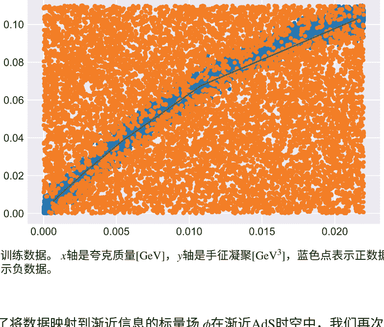

为了将数据映射到渐近AdS时空中的标量场 \(\phi\)，我们再次使用AdS/CFT字典[139]。体积中的标量场理论是 \(\phi^4\) 理论，势能为

\[
V[\phi] = \frac{\lambda}{4}\phi^4. \tag{12.18}
\]

这个耦合常数 \(\lambda\) 也需要学习（学习的值必须为正）。由于手征凝聚算符 \(\bar{q}q\) 的维度为3，公式

\[
\Delta = (d/2) + \sqrt{d^2/4 + m^2 R^2} \tag{12.19}
\]

给出了标量场的质量 \(m^2 = -3/R^2\)。这里 \(R\) 是AdS半径，也是学习的对象。在AdS的渐近边界处，\(h(\eta) \approx 4/R\)，因此体积标量场的运动方程为

\[
\partial^2_{\eta}\phi + \frac{4}{R}\partial_{\eta}\phi - \frac{3}{R^2}\phi - \lambda \phi^3 = 0. \tag{12.20}
\]

解决方案如下：

\[
R^{3/2} \phi \approx \alpha e^{-\eta/R} + \beta e^{-3\eta/R} - \frac{\lambda \alpha^3}{2R^2}\eta \ e^{-3\eta/R}. \tag{12.21}
\]

在这里，第一项是一个非可归一化模式，第二项是一个可归一化模式，第三项是来自相互作用项的项。这些系数与夸克质量和手征凝聚度的关系如下：

\[
\alpha = \frac{\sqrt{N_c}}{2\pi} m_q R, \quad \beta = \frac{\pi}{\sqrt{N_c}} \langle \bar{q}q \rangle R^3. \quad (12.22)
\]

由于数据是QCD的数据，我们以后将代入 \(N_c = 3\)。所有数值计算将以 \(R\) 为单位，并处理无量纲量。总之，QCD数据被映射到渐近边界处的标量场值

\[
\phi(\eta_{\text{ini}}) = \alpha e^{-\eta_{\text{ini}}} + \beta e^{-3\eta_{\text{ini}}} - \frac{\lambda \alpha^3}{2} \eta_{\text{ini}} e^{-3\eta_{\text{ini}}}. \quad (12.23)
\]

\[
\pi(\eta_{\text{ini}}) = -\alpha e^{-\eta_{\text{ini}}} - \left( 3\beta + \frac{\lambda \alpha^3}{2} \right) e^{-3\eta_{\text{ini}}} + \frac{3\lambda \alpha^3}{2} \eta_{\text{ini}} e^{-3\eta_{\text{ini}}}. \quad (12.24)
\]

在训练中确定的未知参数为 \(\lambda\), \(R\), \(h(\eta)\)。 我们将使用一个15层的神经网络，并相应地离散化 \(\eta\) 方向。 如果将时空的端点选择为 \(\eta_{\text{ini}} = 1\) 和 \(\eta_{\text{fin}} = 0.1\)（以 \(R = 1\) 为单位），那么 \(\eta_{\text{fin}} \leq \eta \leq \eta_{\text{ini}}\) 将被等分为15部分。在这个设置下，我们进行了机器学习。¹⁴区分正负数据的条件与之前的事件视界条件相同。我们使用PyTorch实现了机器学习。作为初始条件，我们取 \(h\) 为围绕 \(h = 4\) 随机生成的值，波动大小为3，\(\lambda = 0.2\) 和 \(R = 0.8[\text{GeV}^{-1}]\)。批量大小为10，训练在1500个时期内完成。

训练结果（8次试验）的误差小于0.008，显示在表12.2中，图示在图12.8中。学习到的耦合常数 \(\lambda\) 和

¹⁴我们使用正则化 \(L_{\text{reg}} = L_{\text{reg}}^{\text{(平滑)}} + L_{\text{reg}}^{\text{(边界)}}\)。第一项是
\[
L_{\text{reg}}^{\text{(平滑)}} \equiv c_{\text{reg}} \sum_{n=1}^{N-1} (\eta^{(n)})^4 \left( h(\eta^{(n+1)}) - h(\eta^{(n)}) \right)^2, \quad (12.25)
\]
这使得 \(h(\eta)\) 成为一个平滑函数 (\(c_{\text{reg}} = 0.01\))。因子 \(\eta^4\) 不会阻止函数形式 \(h(\eta) \propto 1/\eta\) 在事件视界附近的期望。第二项是
\[
L_{\text{reg}}^{\text{(边界)}} \equiv c_{\text{reg}} \left( d - h(\eta^{(1)}) \right)^2, \quad (12.26)
\]
这是为了确保渐近时空是 \((d+1)\) 维的AdS时空。该系数选择为 \(c_{\text{reg}} = 0.01\)。

AdS半径 \(R\) 是

\[
\begin{aligned}
\lambda &= 0.01243 \pm 0.00060, &\quad &(12.27) \\
R &= 3.460 \pm 0.021[\text{GeV}^{-1}]. &\quad &(12.28)
\end{aligned}
\]

这意味着，使用标准转换\(5.0677\ [\text{GeV}^{-1}]=1\ [\text{fm}]\)，我们得到 \(R = 0.6828 \pm 0.0041\ [\text{fm}]\)。 让我们来看看从量子色动力学数据中得出的度规。 有三个有趣的点：

- 所有八次试验都给出了相同的紧急度规。因此，可以说得到的度规是普遍的。
- 当 \(\eta\) 接近事件视界时，得到的度规发散 as \(\eta\) 发散。这与黑洞度规的行为相同。它被认为是从有限温度格点量子色动力学数据中自动出现的黑洞。

表12.2 时空度规 \(h(\eta^{(n)})\)（\(n-1 = 0, 1, \cdots , 14\)是训练后出现的层号）。

| \(n-1\) | \(h\) |
| :--- | :--- |
| 0 | \(3.0818 \pm 0.0081\) |
| 1 | \(2.296 \pm 0.016\) |
| 2 | \(1.464 \pm 0.025\) |
| 3 | \(0.627 \pm 0.035\) |
| 4 | \(-0.141 \pm 0.045\) |
| 5 | \(-0.727 \pm 0.049\) |
| 6 | \(-0.974 \pm 0.043\) |
| 7 | \(-0.687 \pm 0.032\) |
| 8 | \(0.374 \pm 0.087\) |
| 9 | \(2.50 \pm 0.19\) |
| 10 | \(6.03 \pm 0.30\) |
| 11 | \(11.46 \pm 0.35\) |
| 12 | \(19.47 \pm 0.27\) |
| 13 | \(31.07 \pm 0.17\) |
| 14 | \(46.70 \pm 0.52\) |

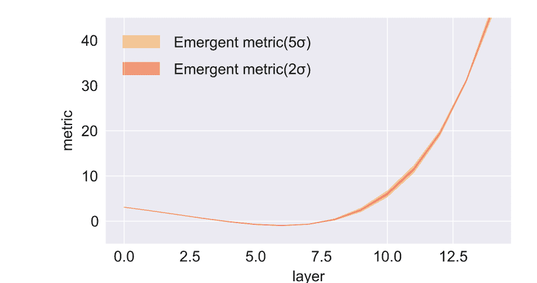

在中间区域，h(η)是负的。这是在普通真空爱因斯坦方程的任何解中都找不到的行为。

通过这种方式，得到了一个一致重现量子色动力学手征凝聚数据的渐近AdS emergent spacetime metric。通过机器学习，解决了逆问题并获得了一个引力模型的方法。

那么，从这个学习中获得的度规是否提供了任何有趣的新预测？得到的度规的奇怪之处在于，如上述第三点所提到的，h是负的。这意味着黑洞时空实际上显示出了禁闭行为。禁闭时空是一个度规值在某个时空位置上增加的时空，因此当从渐近AdS区域前往时空的深处时，会到达底部并无法进一步前进。由于h是通过η的微分，其符号的反转表示这种度规的行为。因此，尽管我们的时空具有黑洞视界（解禁），但度规同时显示出禁闭。

事实上，使用AdS/CFT字典，我们可以计算所谓的Wilson环算符的真空期望值。然后我们可以看到来自事件视界的德拜屏蔽特性和来自约束时空的线性势能。它们定性地很好地匹配了格点QCD的预测。令人惊讶的是，从QCD数据中使用深度学习得到的时空具有这两个特性。通过使用深度学习来解决逆问题时，已经可以构建一个超越传统全息模型的概念模型。

非常有趣的是，网络本身可以被解释为一个平滑的时空，超越了这样一个实际模型的构建。正如在Ising模型的专栏中提到的那样，Hopfield模型将神经网络本身视为一个自旋系统，网络的权重对应于自旋之间的相互作用强度。在本章介绍的模型中，网络权重直接包含度量。因此，网络节点之间的距离由权重定义，并且整个网络被解释为一个空间。这样的想法特别让人想起基于动力学三角剖分的量子引力理论。网络成为时空的想法可以推广到多远？

基于深度学习的全息模型是经典引力理论，但在未来，我们可能能够理解量子效应和引力的本质效应是如何出现的，以及这种建模与其他量子引力概念的关系。

##### 专栏：黑洞和信息

在第1章中，我们解释了麦克斯韦的恶魔通过log 2使熵减少。在本书的最后一章中，我们将讨论J. Bekenstein和S. Hawking关于黑洞熵的引入。在他们的提议之前，人们指出熵增定律与黑洞无限吞噬周围气体的相似性。Bekenstein假设熵S由以下公式给出

```
$S = f(A) \quad (12.29)$
```

其中黑洞视界的面积为$A$，并试图确定函数$f$。他的想法的关键是“S的最小变化量是多少？”他假设答案如下：

-   1. 它应该对应于一个粒子的康普顿长度等于其径向尺寸的情况，它掉入了黑洞中。
-   2. 熵的变化应该是log 2，因为粒子要么被保留，要么被摧毁。

首先，从假设1中计算的最小面积变化是半经典计算的

```
$\delta A = 2\hbar \quad (12.30)$
```

将此与假设2相结合得到

```
$\log 2 = \delta S = \delta A \cdot f'(A) = 2\hbar f'(A) \quad (12.31)$
```

以这种方式，贝肯斯坦推导出

```
$S = f(A) = \frac{\log 2 A}{2 \hbar} \quad (12.32)$
```

这是贝肯斯坦的原始论断。他在他的论文[6]中提到：“然而，应该清楚的是，如果系数不完全是\frac{\log 2}{2}，那么它必须非常接近这个值，可能在两倍范围内。”霍金后来在关于带量子化场的黑洞蒸发的论文[7]中得到的精确公式是

```
$S = \frac{1}{4} \frac{A}{\hbar} \quad (12.33)$
```

这些系数中的每一个在数值上都很接近

```
$$\frac{\log 2}{2} = 0.34\ldots, \quad (12.34)$$
```

```
$$\frac{1}{4} = 0.25. \quad (12.35)$$
```

它们彼此之间很接近。值log 2是落入黑洞的粒子所具有的近似信息，它被转化为黑洞的面积。

在第1章提到的Maxwell's demon主题和这个黑洞主题中，信息和物理之间的基本联系得以展现。事实上，在量子引力理论的最新发展中，时空本身由量子纠缠形成的观念已经成为主流。此外，虽然在关于全息原理的研究中，黑洞被描述为最混乱的，如第4章的专栏所述，计算可以在混沌的边缘进行。

深度学习有潜力成为处理信息的“智能”基础。在本书中，我们看到物理学在其中发挥了积极的作用。到目前为止，深度学习和物理在各种方式上似乎是相互关联的。我们真的很期待未来信息、可计算性、机器学习和物理的进步和演变。

## # 第13章

### 结语

摘要在本书中，我们详细探讨了深度学习和物理之间的关系。我们的作者（田中明典，富谷明夫和橘本浩司）也是这个跨学科领域研究论文的合著者。合作研究只有在志同道合但背景不同的人聚集在一起时才有趣。我们猜测读者们以各种动机开始阅读本书，但实际上，我们三个人对“深度学习和物理”有不同的想法。在这里，三位作者表达了他们的感受，而不是采用普通教科书的结论风格，以便成为未来这个新领域中你们辩论的源泉。

到目前为止，我们详细探讨了深度学习和物理之间的关系。我们的作者（田中明典，富谷明夫和橘本浩司）也是这个跨学科领域研究论文的合著者。合作研究只有在志同道合但背景不同的人聚集在一起时才有趣。我们猜测读者们以各种动机开始阅读本书，但实际上，我们三个人对“深度学习和物理”有不同的想法。在这里，三位作者表达了他们的感受，而不是采用普通教科书的结论风格，以便成为未来这个新领域中你们辩论的源泉。

#### 13.1 神经网络、物理学和技术创新
（富谷昭夫）

从2003年到2005年，当我还在是一名初中生时，世界正处于人工智能的第二个冬天。作为一个计算机男孩，我制作电脑游戏、编写程序——一个能打败人类的井字棋程序，还有聊天机器人。

> > 1聊天机器人是能自动对特定关键词做出反应的程序。

那时人工智能的代表有专家系统和IBM的DeepBlue。在使用谷歌网页进行各种搜索时（那时已经有了谷歌网页），我了解到神经网络非常有趣，但是因为无法理解反向传播方法而放弃了。另一方面，在进入高中后，我开始对物理学感兴趣，然后在2015年获得了粒子物理学博士学位，并成为一名博士后研究员。 然后在2016年，谷歌的人工智能在围棋比赛中击败了人类，这是一个重大的新闻。作为对这个新闻的回应，我开始与本书的作者之一田中明则交流信息，进行学习和研究。当我第一次学习机器学习时，我意识到数学工具与物理学相似，所以我能够轻松理解这些思想并应用它们。 随着我进一步的学习，我了解到一些思想是从物理学引入的。研究进展顺利，并形成了几篇论文。 在这本书中，物理学研究人员从基础到应用的角度解释了深度学习和相关领域，而事实上，这正是我所走过的道路。

我的专长是格点量子色动力学，毫不奇怪地发现，这个领域的一个人是Jupyter Notebook的开发者之一。这是因为如果你用计算机做物理学，你必须可视化大量的数据。 今天互联网的核心技术WWW是在欧洲核子研究组织（CERN）开发的。此外，一个名为arXiv的预印本服务是由一个粒子物理学家创建的。在元层面上，物理学支持着下一代技术。 如果读者通过这本书学习了物理学和深度学习，并在理论上解决了深度学习的泛化之谜，并澄清了物理学和机器学习之间的关系，我会很高兴。

同时，如果读者能为给予我们WWW和Jupyter Notebook的下一代技术创新负责，我也会很高兴。

²Deep Blue是一台在1997年击败国际象棋世界冠军加里·卡斯帕罗夫的超级计算机。
³DeepMind的Alpha Go击败了李世石。
⁴这是关于Boltzmann机在深度学习中引发了巨大进展的。
⁵这个人是来自科罗拉多大学波尔得分校的Fernando Pérez。他在格点QCD方面获得了博士学位，并且是Anna Hasenfratz的学生，后者在该领域非常有名。
⁶实际的发展是由信息科学家Tim Berners-Lee完成的，他在场，但我认为如果没有加速器（一种能够自动生成大量数据的机器）或者没有强烈的理解自然的动机，这个系统不可能完成。 很容易看出，物理学家社区（在最初的意义上）的黑客精神如何使这个系统免费使用。
⁷arXiv，https://arxiv.org是一个供研究人员上传物理学和数学研究预印本的网络存档服务。
⁸Paul Ginsparg是一位著名的物理学家，他的名字在格点QCD中的重要Gisparg-Wilson关系中广为人知，他首先为arXiv建立了服务器。 前述服务是由物理学家Joanne Cohn创立的。（我感谢名古屋大学教授Shinichi Nojiri提供这些信息。）

### 13.2 为什么存在智能？（田中明典）

瑞秋·卡森是最著名的生物学家之一，她写了一本书《寂静的春天》，描述了化学物质对生态系统的有害影响，在她的另一本书《惊奇的感觉》中有一篇短文。在那篇短文中，惊奇的感觉是“感受自然本身和它的美妙”的心灵。当学习物理和数学时，人们经常被问到“为什么学这种无用的学科？”或被贴上“怪人”的标签。对我来说，也有过这样的时候，当我无法用言语表达为什么我被这些领域吸引时，我感到沮丧。但一个可能的答案是，为了感受到惊奇的感觉。

为什么我们首先会有这种“惊奇的感觉”呢？如果大脑的行为都可以用化学反应来解释，那么“意识”就不可能出现。一切都只是由化学反应引起的物理现象。从这个意义上说，意识可能是一种幻觉。即使意识是一种幻觉，至少人类拥有“智慧”，毫无疑问他们具有逻辑信息处理的能力。

因为这个世界上有智能生物，我觉得智能的存在与物理定律可能有一些关系。 我对宇宙为什么开始、为什么膨胀、为什么是四维等伟大（和天真）的谜题感兴趣，但同样，我认为以下问题也很有趣：为什么存在智能？一旦你知道答案，甚至可能能够创造智能。尽管近年来深度学习的发展显示出其潜力，正如经常所说的那样，目前还没有理论解释为什么深度学习有效。揭示这一点，你可能能够接近智能的谜题。

### 13.3 为什么存在物理定律？（橘本浩司）

“在做物理学时，哲学是无用的。”当我还是研究生新生时，我带着托马斯·库恩的《科学革命的结构》走在走廊上，我仍然记得我的导师告诉我这些话。它真的毫无用处吗？

“广义相对论中的广义坐标变换不变性是自然的，因为这是人类认识外部世界的一种方式。”当我还是大学新生时，一个粒子理论家田中翔告诉我这个。这是真的吗？

正如本书第7章讨论的那样，物理学中的概念革命是一个逆问题。进行学习（这是一个逆问题）的是神经网络，这是人类认识、思考和记忆外部世界的手段。而且，正如本书中反复提到的，人工神经网络在实现深度学习时使用了物理学的概念。

在机器上。 这些循环连接中是否隐藏着可以称为“理论的理论”的东西？

在学习近年来机器学习的惊人发展时，我反复意识到它与物理学中基本和创新概念的关系，其频率和广度令人惊讶。 这种感觉是否只是因为我的工作记忆太小而导致的重言？

基本粒子的约化理论有一个历史，它随着新概念的产生而发展。 我觉得机器学习与量子引力的起源——超弦理论的主题——与人类智能最终阐明的空间时间本身是不可能完全无关的。 我期待与读者见面并讨论物理学。

## # 参考文献

-   1. 内山隆：相对论理论（日文版）。岩波书店（1987年）
-   2. 温伯格，S.：科学家：四个黄金教训。自然 426（6965），389（2003年）
-   3. 丰田，T.：信息物理学（日文版）。物理之种子。講談社（1997年）
-   4. Amari，S.-I.：信息理论（日文版）。筑摩书房（2011年）
-   5. Shannon，C.E.：通信的数学理论。贝尔系统技术杂志 27（3），379-423（1948年）
-   6. Bekenstein，J.D.：黑洞和熵。物理评论D 7(8)，2333 (1973)
-   7. Hawking，S.W.：黑洞的粒子产生。数学物理通讯 43(3)，199–220（1975）
-   8. Sagawa，T.，Ueda，M.：信息热力学：非平衡动力学中的麦克斯韦恶魔。在：小系统的非平衡统计物理学：涨落关系和更多，Wiley Online Library，pp. 181–211 (2013)
-   9. Wheeler，J.A.：信息，物理，量子：寻找联系。在：第3届量子力学基础国际研讨会，东京，1989年，pp. 354–368，日本物理学会 (1990)
-   10. Nielsen，M.A.，Chuang，I.L.：量子计算和量子信息。剑桥大学出版社 (2010)
-   11. Witten，E.：信息论迷你介绍。arXiv预印本 arXiv:1805.11965 (2018)
-   12. Sanov，I.N.：关于随机量大偏差的概率。Matematiceskii Sbornik 84(1)，11–44 (1957)
-   13. Sanov，I.N.：关于随机变量大偏差的概率。美国空军科学研究办公室 (1958)
-   14. Rosenberg，C.：lenna故事。www.lenna.org
-   15. Poundstone，W.：递归宇宙。当代图书 (1984)
-   16. Samuel，A.L.：使用跳棋游戏进行机器学习的一些研究。II – 最近进展。在：计算机游戏 I, pp. 366–400. Springer (1988)
-   17. Feynman，R.P.，Leighton，R.B.，Sands，M.：费曼物理学讲义：主要电磁学和物质，第2卷。Addison-Wesley，Reading. 重印 (1977)
-   18. LeCun，Y.：手写数字的mnist数据库。http://yann.lecun.com/exdb/mnist/ (1998)
-   19. Krizhevsky，A.，Hinton，G.：从微小图像中学习多层特征。技术报告，Citeseer (2009)
-   20. Bishop，C.M.：模式识别和机器学习。Springer (2006)
-   21. Mohri, M., Rostamizadeh, A., Talwalkar, A.: 机器学习基础。MIT Press (2018)
-   22. Akaike, H.: 信息论和最大似然原理的扩展。 在： Hirotugu Akaike 的选定论文，pp. 199–213. Springer (1998)
-   23. Borsanyi, S., et al.: 中子-质子质量差的从头计算。 科学 **347**, 1452–1455 (2015)
-   24. He, K., Zhang, X., Ren, S., Sun, J.: 深度残差学习用于图像识别。 在:IEEE计算机视觉和模式识别会议论文集, 第770-778页 (2016年)
-   25. Shalev-Shwartz, S., Ben-David, S.: 理解机器学习： 从理论到算法。剑桥大学出版社（2014年）
-   26. Deng, J., Dong, W., Socher, R., Li, L., Li, K., Fei-Fei, L.: ImageNet: 一个大规模的分层图像数据库。 在：2009年IEEE计算机视觉和模式识别会议论文集，第248-255页（2009年）
-   27. Kawaguchi, K., Kaelbling, L.P., Bengio, Y.: 深度学习中的泛化。 arXiv预印本 arXiv:1710.05468 (2017年)
-   28. Goodfellow, I., Bengio, Y., Courville, A.: 深度学习。麻省理工学院出版社（2016年）
-   29. Nair, V., Hinton, G.E.: 矫正线性单元改进了受限玻尔兹曼机。 在：第27届国际机器学习大会（ICML-10）论文集，第807–814页（2010年）
-   30. Teh, Y.W., Hinton, G.E.: 速率编码的受限玻尔兹曼机用于人脸识别。 在：神经信息处理系统的进展，第908–914页（2001年）
-   31. Rumelhart, D.E., Hinton, G.E., Williams, R.J.: 通过误差传播学习内部表示。 技术报告，加利福尼亚大学圣地亚哥拉霍亚认知科学研究所（1985年）
-   32. Cybenko, G.: 通过叠加S型函数进行逼近。数学控制信号系统 **2**(4), 303–314页（1989年）
-   33. Nielsen, M.: 神经网络可以计算任何函数的可视化证明。 http://neuralnetworksanddeeplearning.com/chap4.html.
-   34. 李，H.，格，R.，马，T.，里斯特斯基，A.，阿罗拉，S.： 神经网络表达分布的能力。 arXiv预印本arXiv:1702.07028 (2017年)
-   35. Sonoda, S., Murata, N.: 具有无界激活函数的神经网络是通用逼近器。Appl. Comput. Harmon Anal. **43** (2) , 233–268 (2017年)
-   36. LeCun, Y., Bottou, L., Bengio, Y., Haffner, P., 等： 基于梯度的学习应用于文档识别。Proc. IEEE **86** (11) , 2278–2324 (1998年)
-   37. Hubel, D.H., Wiesel, T.N.: 猫的视觉皮层的感受野，双眼交互作用和功能结构。J. Physiol. **160** (1) , 106–154 (1962年)
-   38. 福岛，K.，宫城，S.： 新认知机：一种对变形和位置偏移具有容忍性的模式识别新算法。模式识别。 **15**(6), 455–469 (1982)
-   39. Krizhevsky, A., Sutskever, I., Hinton, G.E.: 使用深度卷积神经网络的ImageNet分类。 在：神经信息处理系统的进展，第1097-1105页（2012）
-   40. Sabour, S., Frosst, N., Hinton, G.E.: 胶囊之间的动态路由。 在：神经信息处理系统的进展, 第3856-3866页（2017）
-   41. Dumoulin, V., Visin, F.: 深度学习的卷积算术指南。 arXiv预印本 arXiv:1603.07285 (2016)
-   42. Radford, A., Metz, L., Chintala, S.: 无监督表示学习与深度卷积生成对抗网络。 arXiv预印本arXiv:1511.06434 (2015)
-   43. Siegelmann, H.T., Sontag, E.D.: 关于神经网络的计算能力。
-   44. Hochreiter, S.: 动态神经网络的研究。
-   45. Hochreiter, S., Bengio, Y., Frasconi, P., Schmidhuber, J. 等： 循环网络中的梯度流：学习长期依赖性的困难。 在：动态循环神经网络领域指南。

## 参考文献

-   46. Hochreiter, S., Schmidhuber, J.: 长短期记忆，神经计算 **9**(8), 1735–1780 (1997)
-   47. Olah, C.: 理解LSTM网络 (2015). http://colah.github.io/posts/2015-08-Understanding-LSTMs/
-   48. Bahdanau, D., Cho, K., Bengio, Y.: 通过联合学习对齐和翻译的神经机器翻译. arXiv预印本 arXiv:1409.0473 (2014)
-   49. Vaswani, A., Shazeer, N., Parmar, N., Uszkoreit, J., Jones, L., Gomez, A.N., Kaiser, Ł., Polosukhin, I.: 注意力就是你所需要的. 在: 神经信息处理进展系统, pp. 5998–6008 (2017)
-   50. Xu, K., Ba, J., Kiros, R., Cho, K., Courville, A., Salakhudinov, R., Zemel, R., Bengio, Y.: 展示、关注和描述: 带有视觉注意力的神经图像字幕生成. 在: 国际机器学习会议, pp. 2048–2057 (2015)
-   51. 张, H., Goodfellow, I., Metaxas, D., Odena, A.: 自注意力生成对抗网络. arXiv预印本 arXiv:1805.08318 (2018年)
-   52. Olah, C., Carter, S.: 注意力和增强循环神经网络. Distill (2016年)
-   53. Graves, A., Wayne, G., Danihelka, I.: 神经图灵机. arXiv预印本 arXiv:1410.5401 (2014年)
-   54. Wolfram, S.: 细胞自动机的理论和应用: 包括1983年至1986年的选定论文. 世界科学 (1986年)
-   55. Cook, M.: 基本细胞自动机中的普遍性. 复杂系统. **15** (1), 1-40 (2004年)
-   56. Cook, M.: 对规则110计算的具体观点. arXiv预印本 arXiv:0906.3248 (2009年)
-   57. Langton, C.G.: 混沌边缘的计算: 相变和新兴计算. Physica D: 非线性现象 **42**(1–3), 12–37 (1990)
-   58. Lyons, L.: 发现5 sigma的重要性. arXiv预印本 arXiv:1310.1284 (2013)
-   59. Jona-Lasinio, G.: 重整化群和概率论. Phys. Rep. **352**(4–6), 439–458 (2001)
-   60. Ferrenberg, A.M., Landau, D.P., Wong, Y.J.: 蒙特卡洛模拟: 来自“好”随机数生成器的隐藏错误. Phys. Rev. Lett. **69**(23), 3382 (1992)
-   61. Matsumoto, M., Nishimura, T.: Mersenne twister: 一个623维均匀分布的伪随机数生成器. ACM Trans. Model. Comput. Simul. (TOMACS) **8**(1), 3–30 (1998)
-   62. Savvidy, G.K., Ter-Arutyunyan-Savvidy, N.G.: 关于蒙特卡洛模拟物理系统的研究. J. Comput. Phys. **97**(2), 566–572 (1991)
-   63. Marsaglia, G., et al.: Xorshift RNGS. J. Stat. Softw. **8**(14), 1–6 (2003)
-   64. Box, G.E.P.: 关于生成随机正态分布的注记. Ann. Math. Stat. **29**, 610–611 (1958)
-   65. Häggström, O.: 有限马尔可夫链和算法应用，卷52. 剑桥大学出版社 (2002)
-   66. Tierney, L.: 用于探索后验分布的马尔可夫链. Ann. Stat. **22**(4), 1701–1728 (1994)
-   67. Chowdhury, A., De, A.K., De Sarkar, S., Harindranath, A., Maiti, J., Mondal, S., Sarkar, A.: 使用DD-HMC算法探索两种口味的Wilson格点QCD中的自相关性. Comput. Phys. Commun. **184**, 1439–1445 (2013)
-   68. Luscher, M.: Computational strategies in Lattice QCD. In: Modern perspectives in lattice QCD: Quantum Field Theory and High Performance Computing. Proceedings, International School, 93rd Session, Les Houches, France, 3–28 Aug 2009, pp. 331–399 (2010)
-   69. Madras, N., Sokal, A.D.: The pivot algorithm: a highly efficient monte carlo method for the self-avoiding walk. J. Stat. Phys. **50**(1–2), 109–186 (1988)
-   70. Metropolis, N., Rosenbluth, A.W., Rosenbluth, M.N., Teller, A.H., Teller, E.: Equation of state calculations by fast computing machines. J. Chem. Phys. **21**(6), 1087–1092 (1953)
-   71. Creutz, M., Jacobs, L., Rebbi, C.: Monte carlo study of abelian lattice gauge theories. Phys. Rev. D **20**(8), 1915 (1979)
-   72. Geman, S., Geman, D.: 随机松弛，Gibbs分布和贝叶斯恢复图像. IEEE Trans. Pattern Anal. Mach. Intell. PAMI 6(6), 721-741 (1984)
-   73. Hastings, W.K.: 使用马尔可夫链的蒙特卡罗采样方法及其应用. 牛津大学出版社 (1970)
-   74. Onsager, L.: 晶体统计学. I. 具有有序-无序相变的二维模型. Phys. Rev. 65(3–4), 117 (1944)
-   75. Nambu, Y.: 晶体统计学中的特征值问题注记. 在: 破缺对称性: Y. Nambu的选集, pp. 1–13. 世界科学出版社 (1995)
-   76. Sutton, R.S., Barto, A.G., 等: 强化学习导论, vol. 135. 麻省理工学院出版社, 剑桥, 麻省 (1998)
-   77. Hinton, G.E.: 通过最小化对比散度训练专家的产品. 神经计算. 14(8), 1771-1800 (2002)
-   78. Bengio, Y., Delalleau, O.: 证明和推广对比散度. 神经计算. 21(6), 1601-1621 (2009)
-   79. Goodfellow, I., Pouget-Abadie, J., Mirza, M., Xu, B., Warde-Farley, D., Ozair, S., Courville, A., Bengio, Y.: 生成对抗网络. 在: 神经信息处理的进展系统, 第2672-2680页 (2014)
-   80. Neumann, V.: 关于社会游戏理论. 数学年鉴 100(1), 295-320 (1928)
-   81. Zhao, J., Mathieu, M., LeCun, Y.: 基于能量的生成对抗网络. arXiv预印本 arXiv:1609.03126 (2016)
-   82. Arjovsky, M., Chintala, S., Bottou, L.: Wasserstein gan. arXiv预印本 arXiv:1701.07875 (2017)
-   83. Villani, C.: 最优输运: 新旧之争, vol. 338. Springer Science & Business Media (2008)
-   84. Peyré, G., Cuturi, M., et al.: 计算最优输运. Found. Trends® Mach. Learn. 11(5–6), 355–607 (2019)
-   85. Cuturi, M.: Sinkhorn距离: 最优输运的高速计算. In: Advances in 神经信息处理系统, pp. 2292–2300 (2013)
-   86. Gulrajani, I., Ahmed, F., Arjovsky, M., Dumoulin, V., Courville, A.C.: 改进的wasserstein gan训练. In: Advances in神经信息处理系统, pp. 5767–5777(2017)
-   87. Miyato, T., Kataoka, T., Koyama, M., Yoshida, Y.: 生成对抗网络的谱归一化. arXiv预印本 arXiv:1802.05957 (2018)
-   88. Kingma, D.P., Welling, M.: 自编码变分贝叶斯. arXiv预印本 arXiv:1312.6114 (2013)
-   89. Tolstikhin, I., Bousquet, O., Gelly, S., Schoelkopf, B.: Wasserstein自编码器. arXiv预印本 arXiv:1711.01558 (2017)
-   90. Dinh, L., Krueger, D., Bengio, Y.: NICE: 非线性独立成分估计. arXiv预印本 arXiv:1410.8516 (2014)
-   91. Wang, L.: 物理学家的生成模型 (2018). https://wangleiphy.github.io/lectures/piltutorial.pdf. https://wangleiphy.github.io/lectures/PILtutorial.pdf
-   92. Dodge, S., Karam, L.: 人类和深度学习在视觉扭曲下的识别性能研究和比较. 在: 第26届国际计算机通信和网络会议 (ICCCN), 第1-7页. IEEE (2017年)
-   93. Barratt, S., Sharma, R.: 关于初始分数的注释. arXiv预印本 arXiv:1801.01973 (2018年)
-   94. Salimans, T., Goodfellow, I., Zaremba, W., Cheung, V., Radford, A., Chen, X.: 改进的GAN训练技术. 在: 神经信息处理系统的进展, 第2234-2242页 (2016年)
-   95. Heusel, M., Ramsauer, H., Unterthiner, T., Nessler, B., Hochreiter, S.: 通过两个时间尺度更新规则训练的GAN收敛到局部纳什均衡. 在: 神经信息处理系统的进展, 第6626-6637页 (2017年)
-   96. Szegedy, C., Liu, W., Jia, Y., Sermanet, P., Reed, S., Anguelov, D., Erhan, D., Vanhoucke, V., Rabinovich, A.: 用卷积深入研究. 在: IEEE计算机视觉和模式识别会议论文集，第1-9页 (2015年)
-   97. Coates, A., Ng, A., Lee, H.: 无监督特征学习中单层网络的分析. 在: 第十四届人工智能和统计学国际会议论文集，第215-223页 (2011年)
-   98. Miyato, T., Koyama, M.: 具有投影鉴别器的cGANs. arXiv预印本 arXiv:1802.05637 (2018年)
-   99. Brock, A., Donahue, J., Simonyan, K.: 用于高保真自然图像合成的大规模GAN训练. arXiv预印本 arXiv:1809.11096 (2018年)
-   100. 前田, S., 青木, Y., 石井, S.: 具体なバランス学習を用いたマルコフ連鎖のトレーニング（日本語）。第19回日本ニューラルネットワーク学会総会予稿集、40-41ページ (2009年)
-   101. 劉, J., 齊, Y., 孟, Z.Y., 傅, L.: 自己学習モンテカルロ法. Phys. Rev. B 95(4), 041101 (2017年)
-   102. 大槻, J., 大関, M., 品岡, H., 吉見, K.: 虚時間量子モンテカルロデータの解析的継続へのスパースモデリングアプローチ. Phys. Rev. E 95(6), 061302 (2017年)
-   103. イベントホライズン望遠鏡コラボレーション：初めのM87イベントホライズン望遠鏡の結果。IV.中央の超大質量ブラックホールのイメージング。Astrophys. J. Lett. 875, 1, L4 (2019年)
-   104. Montvay, I., Münster, G.: 格子上の量子場. ケンブリッジ大学出版局 (1994年)
-   105. Mehta, P., Bukov, M., Wang, C.-H., Day, A.G.R., Richardson, C., Fisher, C.K., Schwab, D.J.: 物理学者のための高バイアス、低分散な機械学習入門. Phys. Rep. 810, 1-124 (2019年)
-   106. Carrasquilla, J., Melko, R.G.: 机器学习物质的相. 自然物理学. 13(5), 431 (2017)
-   107. Wang, L.: 用无监督学习发现相变. 物理评论 B 94(19), 195105 (2016)
-   108. Tanaka, A., Tomiya, A.: 通过卷积神经网络检测相变. 日本物理学会杂志. 86(6), 063001 (2017)
-   109. Kashiwa, K., Kikuchi, Y., Tomiya, A.: 用神经网络编码相变. PTEP 2019(8), 083A04 (2019)
-   110. Arai, S., Ohzeki, M., Tanaka, K.: 深度神经网络检测量子相变. 日本物理学会杂志. 87(3), 033001 (2018)
-   111. Srivastava, R.K., Greff, K., Schmidhuber, J.: 高速公路网络. arXiv预印本 arXiv:1505.00387 (2015)
-   112. Weinan, E.: 通过动力系统进行机器学习的建议. Commun. Math. Stat. 5(1), 1–11 (2017)
-   113. Abarbanel, H.D.I., Rozdeba, P.J., Shirman, S.: 机器学习; 最深的学习作为统计数据同化问题. Neural Comput. 30(Early Access), 1–31 (2018)
-   114. Gomez, A.N., Ren, M., Urtasun, R., Grosse, R.B.: 可逆残差网络: 不存储激活的反向传播. 在: Advances in Neural Information ProcessingSystems, pp. 2214–2224 (2017)
-   115. Haber, E., Ruthotto, L.: 深度神经网络的稳定架构. Inverse Prob. 34(1), 014004 (2017)
-   116. Chang, B., Meng, L., Haber, E., Ruthotto, L., Begert, D., Holtham, E.: 可逆架构用于任意深度的残差神经网络. arXiv预印本 arXiv:1709.03698 (2017)
-   117. Chen, T.Q., Rubanova, Y., Bettencourt, J., Duvenaud, D.: 神经常微分方程. arXiv预印本 arXiv:1806.07366 (2018)
-   118. Hashimoto, K., Sugishita, S., Tanaka, A., Tomiya, A.: 深度学习和AdS/CFT对应关系. Phys. Rev. D 98(4), 046019 (2018)
-   119. Lin, H.W., Tegmark, M., Rolnick, D.: 为什么深度和廉价学习效果如此好? J. Stat. Phys. 168(6), 1223–1247 (2017)
-   120. Hopfield, J.J.: 神经网络和具有新兴集体计算能力的物理系统. 国家科学院院刊 79(8), 2554–2558 (1982)
-   121. Amari, S.-L.: 类似神经元元素的随机网络特性. IEEE系统人类控制论SMC 2(5), 643–657 (1972)
-   122. Carleo, G., Troyer, M.: 用人工神经网络解决量子多体问题. 科学 355(6325), 602–606 (2017)
-   123. Nomura, Y., Darmawan, A.S., Yamaji, Y., Imada, M.: 用于解决强关联量子系统的受限玻尔兹曼机器学习. 物理评论B 96(20), 205152 (2017)
-   124. Carleo, G., Nomura, Y., Imada, M.: 用深度神经网络构建量子多体系统的精确表示. 自然通讯 9(1), 1–11 (2018)
-   125. Chen, J., Cheng, S., Xie, H., Wang, L., Xiang, T.: 受限玻尔兹曼机器和张量网络状态的等价性. 物理评论B 97(8), 085104 (2018)
-   126. 高, X., 段, L.-M.: 用深度神经网络高效表示量子多体态. 自然通讯 8(1), 662 (2017)
-   127. 黄, Y., Moore, J.E.: 张量网络和手性态的神经网络表示. arXiv预印本 arXiv:1701.06246 (2017)
-   128. Cohen, N., Shashua, A.: 卷积整流网络作为广义张量分解. 在: 机器学习国际会议, pp. 955–963 (2016)
-   129. 桥本, K.: D-膜: 超弦和我们世界的新视角. Springer Science & Business Media (2012)
-   130. 桥本, K., 杉下, S., 田中, A., 富谷, A.: 深度学习和全息QCD. 物理评论 D 98(10), 106014 (2018)
-   131. 何， Y.-H.: 深度学习景观. arXiv预印本 arXiv:1706.002714 (2017)
-   132. 何， Y.-H.: 机器学习字符串景观. 物理学快报B 774, 564-568 (2017)
-   133. Ruehle, F.: 用遗传算法演化神经网络研究字符串景观. J.高能物理. 8, 038 (2017)
-   134. Carifio, J., Halverson, J., Krioukov, D., Nelson, B.D.: 机器学习在字符串中景观. J.高能物理. 9, 157 (2017)
-   135. Maldacena, J.M.: 超共形场论和超引力的大N极限. 国际杂志。理论物理。 38, 1113-1133 (1999). [理论和数学物理学进展 2, 231 (1998)]
-   136. Gubser, S.S., Klebanov, I.R., Polyakov, A.M.: 非临界弦理论中的规范理论相关函数. 物理学报 B 428, 105–114 (1998)
-   137. Witten, E.: 反德西特空间和全息学. 高级理论数学物理学 2, 253–291 (1998)
-   138. Susskind, L.: 世界作为全息图. 数学物理学杂志 36, 6377–6396 (1995)
-   139. Klebanov, I.R., Witten, E.: AdS/CFT对应和对称性破缺. 核物理 B 556, 89–114 (1999)
-   140. Sakai, H., Taguchi, Y., Tokura, Y.: 钙钛矿锰酸盐中双临界涨落对磁热现象的影响. 日本物理学会杂志 78(11), 113708 (2009)
-   141. Unger, W.: 具有2+1味道的QCD的手征相变：关于Goldstone模和普适标度的格点研究. 德国比勒费尔德大学博士论文 (2010)

## 索引

### 符号
- χ squared, 25
- #, 6

### A
- 激活函数, 46
- AdS/CFT对应, 34, 175
- Akaike信息准则, 24
- 反德西特(AdS)时空, 34, 175
- 注意力机制, 70
- 吸引子, 150, 161

### B
- 反向传播方法, 47, 49, 64
- 贝叶斯定理, 29
- 偏差, 50
- 二元分类, 36
- 黑洞, 179, 183
- 黑洞熵, 192
- 玻尔兹曼常数, 54
- 玻尔兹曼分布, 37
- 玻尔兹曼机, 102, 104
- 盒球系统, 72
- 布拉, 47, 49
- 括号, 54

### C
- 正则分布, 53
- 细胞自动机, 74
- 混沌, 74, 135, 150
- 棋盘伪影, 60
- CIFAR-10, 18
- 紧致化, 174
- 计算通用, 63
- 条件概率, 28
- 共形维度, 181
- 对比散度方法, 107, 125
- 卷积, 57
- 卷积神经网络, 57
- 耦合常数, 37, 58
- 交叉熵, 39
- 维度诅咒, 88

### D
- 数据生成概率, 21
- 深度卷积生成对抗网络 (DCGAN), 60
- 深度学习, 27, 51
- 深度神经网络, 45
- 详细平衡, 92, 108
- 微分方程, 147
- 散度, 22

### E
- 出现, 182
- 经验误差, 22
- 经验概率, 22
- 能量, 160
- 熵, 3
- 运动方程, 179
- 能量均分定理, 54
- 误差函数, 35, 39, 64, 125, 148
- 期望值, 26, 101
- 梯度爆炸, 66

### F
- 铁磁相, 140
- 前向传播, 49
- 自由能, 101
- 挫折, 160

### G
- 高斯分布, 32
- 泛化, 22, 23
- 泛化误差, 22
- 生成对抗网络, 109
- 梯度下降法, 26
- 基态, 166

### H
- 哈密顿方程, 151
- 哈密顿量, 36, 58, 96, 99, 105, 139, 151, 167
- 热浴法, 97
- 赫布定律, 162
- 希尔伯特空间, 165
- 全息原理, 175
- 全息量子色动力学, 176
- 霍普菲尔德模型, 102, 157

### I
- 病态问题, 132
- 图像识别, 60
- 信息, 2, 3
- 信息熵, 3
- 智能, 197
- 逆问题, 129, 173
- 伊辛模型, 88, 98, 99, 139

### J
- 联合概率, 28

### K
- KdV方程, 72
- Ket, 47, 49, 54
- Kullback-Leibler散度, 8, 22

### L
- 长短期记忆(LSTM), 66
- Lyapunov指数, 135, 150
- Lyapunov函数, 159

### M
- 机器学习, 17
- 磁化, 139
- 边际概率, 28
- 马尔可夫链, 88, 125
- 马尔可夫链蒙特卡洛方法, 95
- 主方程, 94
- 最大似然估计, 6
- 麦克斯韦的恶魔, 5, 9
- 记忆, 66, 157, 161
- Metropolis方法, 96
- Metropolis测试, 97, 125
- 修改的NIST(MNIST), 18, 60
- Moore-Penrose逆, 134
- Morozov的差异原则, 133
- 多类分类, 40

### N
- 最近邻居, 100
- 神经元, 158
- 神经元, 158
- 非线性, 52

### O
- 奥卡姆剃刀, 24
- 有序相, 140
- 序参量, 141
- 过定系统, 133
- 过度训练, 23

### P
- 分区函数, 54, 99
- 佩龙-弗罗贝尼乌斯定理, 90
- 相变, 140

### Q
- 量子色动力学, 176, 187
- 量子位, 165

### R
- 修正线性单元 (ReLU), 43
- 循环神经网络, 62, 72
- 回归, 42
- 正则化, 132
- 强化学习, 103
- 相对熵, 7, 22, 31
- 残差神经网络 (ResNet), 148
- 受限玻尔兹曼机, 106, 166, 169
- 可逆残差网络 (RevNet), 150

### S
- 采样, 105
- 自学蒙特卡洛方法, 126
- Sigmoid函数, 38
- 奇异值分解, 134
- Softmax函数, 41
- 孤立子, 74
- 排序, 71
- 排序算法, 71
- 稀疏建模, 136
- 自旋, 157
- 自旋玻璃, 157
- 阶跃函数, 50
- 随机梯度下降法, 26
- 强对偶性, 118
- 强相关, 185
- 超弦理论, 173
- 监督数据, 17
- 监督学习, 35
- 突触, 161
- 系统确定问题, 135

### T
- 教学信号, 17
- 温度, 140
- 张量, 168
- 张量网络, 168
- 热力学极限, 140
- Tikhonov正则化方法, 133
- 时间序列数据, 62
- 训练, 22
- 转移矩阵, 89
- 转移概率, 107
- 转置卷积, 61
- 图灵完备, 63, 72

### U
- 通用逼近定理, 50
- 无监督数据, 17
- 无监督学习, 103

### V
- 消失梯度, 66
- VC维度, 24

### W
- 波函数, 166
- 天气模型, 88
- 权重, 50
- 良好定义的问题, 132

### Z
- 零和条件, 110