# 深度学习基础

### 前言

本书涉及深度学习的概念、理论和算法。在第一部分中，我们通过探索传统的监督和无监督学习算法以及替代的高级机器学习类型（称为集成学习）来提供关于深度学习的基础知识。在第二部分和第三部分中，我们描述了将现有机器学习算法修改为深度版本以及深度神经网络，例如多层感知器、循环神经网络、受限玻尔兹曼机和卷积神经网络。在第四部分中，我们涵盖了深度学习算法在文本挖掘任务中的专业化。读者需要具备关于线性代数、向量微积分和传统机器学习算法的基本知识，以理解深度学习算法。

我们提到了一些动机，这些动机促使我们撰写这本书。机器学习算法因其灵活性和适应性而成为数据挖掘任务中非常流行的方法，与基于规则的方法相比。深度学习算法源自机器学习算法，并成为解决非线性问题的先进方法。深度学习算法被应用于各个学科领域的任务，如控制系统工程、化学工程以及商业管理和管理学。

在本书中，我们描述了深度学习算法，假设输入数据是以数值向量的形式给出的。本书由四个部分组成：基础知识、深度机器学习、深度神经网络和文本深度学习。在第一部分中，我们介绍了浅层监督学习、浅层无监督学习和集成学习，作为理解深度学习的背景。在第二部分中，我们将四种监督机器学习算法（K最近邻、概率学习、决策树和支持向量机）改进为它们的深度学习版本。在第三部分中，我们描述了一些典型的深度学习算法：多层感知器（MLP）、循环神经网络、受限玻尔兹曼机和卷积神经网络。在最后一部分中，我们将一些针对数值的深度操作专门应用于文本数据；文本摘要用于提取每篇文章的一部分，如池化操作。

这本书是为三类读者编写的，即学生、教授和研究人员。高年级本科生和研究生可以自学本书的深度学习内容。对于大学的讲师和教授，本书可以作为深度学习课程的主要教材。这本书对于工业组织中的研究人员和系统开发人员来说非常有用，可以作为开发智能系统的工具。因此，这本书对于学术界和工业界的人们来说都是实用的，可以用来学习深度学习。

本书的章节按照图1所示的四个部分进行组织。第一部分涉及介绍、传统监督学习、传统无监督学习和集成学习，作为机器学习的基础。第二部分重点介绍现有机器学习算法的修改，如KNN算法、概率学习算法、决策树和线性分类器的深度版本。 第三部分介绍了流行的深度神经网络：多层感知器、循环神经网络、受限玻尔兹曼机和卷积神经网络。第四部分涉及将深度操作专门应用于文本数据。

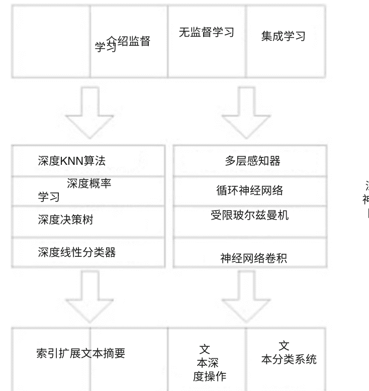

# 第一部分：基础

本书的第一部分涉及研究深度学习算法的基础知识。 由于深度学习是从机器学习扩展而来的领域，我们需要在进行深度学习算法之前学习机器学习算法。 有四种机器学习类型：监督学习、无监督学习、半监督学习和强化学习，但我们将涵盖监督学习和无监督学习。 集成学习被视为多个机器学习算法结合起来解决各自缺点的学习类型，是深度学习的替代高级学习方法。 本部分旨在回顾监督学习算法、无监督学习算法和集成学习，为理解深度学习提供基础。

第1章关注深度学习的概述。 在讨论深度学习之前，让我们讨论一下浅学习，它与深度学习相反，在浅学习中，输出值直接从输入值计算得出。深度学习的特点是在输入值和输出值之间计算中间值的过程，输入编码、输出解码、卷积以及输入层和输出层之间的无监督层成为实现深度学习的组成部分。除了深度学习之外，还有其他高级学习类型：基于核的学习、集成学习和半监督学习。

本章旨在概念上描述深度学习，以提供介绍。

第2章关注监督学习作为一种浅学习。 监督学习是指其参数被优化以最小化期望输出和计算输出之间的误差的学习类型。在监督学习过程中，给定训练示例，每个示例都标有自己的目标输出，并使用给定的学习算法对它们进行训练。 监督学习算法适用于分类和回归。 在研究深度学习之前，本章旨在回顾监督学习作为一种浅学习。

第三章涉及无监督学习，作为另一种类型的浅层学习。 它指的是学习类型，其参数被优化以稳定聚类成员与其自身聚类原型之间的距离。 在无监督学习的过程中，准备了无标签的训练样本，定义了训练样本之间的相似度度量或距离度量，以及聚类原型被优化以最大化它们的内聚力。无监督学习算法应用于聚类，即将数据项组分割成包含相似项的子组。在学习深度学习之前，本章旨在回顾无监督学习。

第四章涉及集成学习，作为深度学习的另一种高级学习方法。它指的是通过将多个机器学习算法相互结合，更可靠地解决分类、回归和聚类等问题的学习类型。集成学习的典型方案包括投票，即通过考虑多个机器学习算法的结果来决定最终答案；专家门控，即将适合解决给定输入的机器学习算法中的一个提名为专家；级联，即决定当前答案是否被采纳或将输入传递给下一个机器学习算法的过程。我们需要考虑将训练集划分为两个轴的矩阵：水平划分将训练集划分为子集，垂直划分将属性集划分为子集。本章旨在描述集成学习作为一种高级学习方法的高级类型。

# 第二部分：深度机器学习

第二部分关注将现有的机器学习算法修改为深度版本。我们提到了典型的监督机器学习算法，如KNN算法、概率学习、决策树和SVM（支持向量机），我们将它们修改为深度版本。通过将输入编码和/或输出解码作为基本方案，将机器学习算法修改为深度版本。

作为高级方案，将监督学习算法修改为无监督版本，并将原始版本和无监督版本串联成深度版本。本部分旨在研究将现有的机器学习算法修改为深度版本。

第五章关注将KNN算法修改为深度版本。KNN算法是最简单的监督学习算法，根据其最近邻居的标签对新手示例进行分类。将KNN算法修改为深度版本，通过附加输入编码和/或输出解码作为基本方案。将KNN算法修改为无监督版本，并将其无监督版本和原始版本组合成深度版本。本章旨在描述将KNN算法修改为深度版本的方案。

第6章关注贝叶斯分类器和朴素贝叶斯的深度版本的修改。在概率学习中，我们提到了三种典型的机器学习算法，贝叶斯分类器，朴素贝叶斯，以及贝叶斯学习，在[1]中。作为基本方案，贝叶斯分类器和朴素贝叶斯通过附加输入编码和/或输出编码进行修改，以得到它们的深度版本。作为高级方案，它们被修改为无监督版本，并将它们的原始版本和无监督版本结合在一起，形成它们的堆叠版本。本章旨在描述将这两种概率学习算法修改为它们的深度版本的方案。

第7章关注决策树及其变体的深度版本的修改。决策树是一种典型的符号机器学习算法，它能够将其分类追溯到逻辑规则，并通过跟随对应于其属性值的分支来对数据项进行分类。

作为基本方案，决策树通过附加输入编码和/或输出解码来修改为其深度版本。作为高级方案，决策树通过修改为其无监督版本，并将其原始版本和修改版本组合成堆叠版本。本章旨在描述将决策树修改为其深度版本的方案。

第8章涉及将线性分类器和SVM修改为其深度版本。SVM是一个线性分类器，它通过其最大间隔定义其双平行超平面作为分类边界。

即使将SVM视为深度学习算法，与简单的线性分类器相比，它本身可以通过附加输入编码和/或输出编码来进一步修改为其深度版本。作为高级方案，SVM被修改为其无监督版本，并将其原始版本和修改版本组合成堆叠版本。本章旨在描述将SVM修改为其深度版本的方案。

# 第三部分：深度神经网络

第三部分关注具有深层结构的神经网络。神经网络是一种模拟神经系统的机器学习算法。它由相互连接的神经元组成，每个连接称为突触权重。训练神经网络的过程是优化与神经元之间的连接相关的权重值，以最小化训练样本上的误差。本部分旨在描述一些神经网络，如多层感知器（MLP），循环神经网络（RNN）和受限玻尔兹曼机（RBM）。

第9章关注MLP作为典型的深度神经网络模型。感知器是发明MLP的基础，由罗森布拉特在1950年代发明。在MLP的架构中，有三层：输入层，隐藏层和输出层。一层与其下一层以前馈方向连接，并且权重在其学习过程中进行更新。

反向方向。本章旨在描述多层感知器（MLP）的体系结构、计算过程和学习过程。

第10章涉及递归神经网络，这是从MLP发展而来的。在前一章中，我们研究了MLP作为具有前馈连接的典型深度神经网络模型。在本章中，我们研究了递归神经网络作为一种先进模型，其中包含来自神经元的任何反馈连接。在反馈连接中，使用先前的输出值作为输入。本章旨在描述递归神经网络及其变体，涉及连接和学习过程。

第11章涉及用于恢复输入的受限玻尔兹曼机（RBM）。在发明RBM之前，Hopfield网络旨在作为关联记忆来恢复输入向量。RBM中有两种变量：可见变量作为输入变量给出，隐藏变量用于恢复输入。多个RBM的堆叠版本被称为信念网络，是一种深度神经网络。本章旨在描述RBM以及与其学习过程相关的堆叠版本。

第12章涉及卷积神经网络作为另一种深度神经网络。我们在第9章研究了MLP，它在卷积神经网络中得到了扩展。池化层和卷积层被添加为MLP的特征提取部分。卷积神经网络的架构分为两部分：特征提取部分，即池化层的交替层，以及学习部分，即感知器或MLP。本节旨在描述卷积神经网络模型，该模型是从MLP扩展而来的，涉及架构和分类过程。

# 第四部分：文本深度学习

第四部分涉及将深度学习算法专门应用于文本挖掘任务。在前面的部分中，我们研究了将机器学习算法修改为其深度版本以及应用于通用任务的深度神经网络。在本部分中，我们研究将文本数据映射为另一种文本数据作为隐藏值的过程，以及将该过程应用于修改文本深度学习算法。我们提到了文本摘要，它旨在将初始文本映射为其要点，并对其进行总结。本部分旨在描述深度学习在文本挖掘任务中的专门化和应用。

第13章涉及索引扩展，这对于实现文本深度学习是必要的。索引扩展是指向输入文本中添加与之相关的更多单词的过程。在索引扩展过程中，将输入文本索引为单词列表，从外部来源检索其关联单词，并将其添加到单词列表中。

本章旨在描述文本索引过程和索引扩展。

第14章关注的是作为文本挖掘实例的文本摘要。 它指的是自动提取摘要的过程。 在文本摘要的过程中，将文本分成段落，并从中选择重要的部分作为摘要。 文本摘要被视为将文本映射为隐藏文本以实现文本深度学习。 本节旨在描述实现文本深度学习的文本摘要。

第15章涉及文本深度操作，将一个文本映射到另一个文本。 我们研究了数值深度操作，将输入向量映射到另一个向量，称为隐藏向量。 文本深度操作是对文本进行操作，将其映射到另一个称为隐藏文本的文本，然后将其编码为数值向量。 文本深度操作的作用是在实现文本深度学习时对文本进行预处理。 本章旨在描述文本汇聚和文本卷积作为主要的文本深度操作。

第16章涉及使用深度学习算法实现的文本分类系统。 本章实现的系统的功能是文本分类，将文本分类为一个或多个主题。 我们采用了深度学习算法，通过添加卷积层来修改现有的机器学习算法，作为文本分类的方法。 我们提到了两种卷积层：数值卷积层（在编码文本后应用）和文本卷积层（在进行编码之前应用）。 本节旨在描述文本分类系统和采用的深度学习算法。

韩国忠州

陶浩

## 第一部分 基础

本部分关注研究深度学习算法的基础知识。因为深度学习是从机器学习扩展出来的领域，所以在进行深度学习算法之前，我们需要学习机器学习算法。有四种机器学习类型：监督学习、无监督学习、半监督学习和强化学习，但我们将涵盖监督学习和无监督学习。集成学习被视为一种学习类型，其中多个机器学习算法被组合起来解决各自的缺点，作为深度学习的替代高级学习方法。本部分旨在回顾监督学习算法、无监督学习算法和集成学习，为理解深度学习提供基础。

这部分由四章组成。在第一章中，我们将介绍深度学习的基本概念。在第二章中，我们将回顾监督学习算法作为浅层学习算法。在第三章中，我们将研究应用于数据聚类的无监督学习算法。在第四章中，我们将介绍集成学习作为一种替代深度学习的高级学习方法。

## 第一章 引言

本章主要介绍深度学习的概述。在讨论深度学习之前，让我们先讨论与深度学习相反的浅层学习，其中输出值直接从输入值计算得出。深度学习的特点是在输入值和输出值之间计算中间值的过程，输入编码、输出解码、卷积以及输入层和输出层之间的无监督层成为实现深度学习的组成部分。除了深度学习之外，还有其他高级学习类型：基于核的学习、集成学习和半监督学习。

本章旨在概念上描述深度学习，以提供介绍。

本章分为五个部分，我们在第1.1节中概念性地描述了深度学习。在第1.2节中，我们回顾了传统学习类型中的浅学习。在第1.3节中，我们描述了实现深度学习所需的组件。在第1.4节中，我们描述了除深度学习之外的一些高级学习类型。在第1.5节中，我们总结了本章的全部内容，并进一步讨论了本章所研究的内容。

### 1.1 深度学习的定义

深度学习被定义为通过多个学习步骤来构建其分类能力、回归模型或聚类能力的学习类型。在传统的浅学习中，输入和输出之间的连接是直接的。在深度学习中，输入层和输出层之间存在一个或多个隐藏层。在输入层和隐藏层之间以及隐藏层之间进行无监督学习，并在隐藏层和输出层进行有监督学习。本节旨在描述深度学习的概念，以便介绍。

让我们提到与深度学习相反的浅学习，以便提供其背景。浅学习是指传统的机器学习类型，它直接从输入值计算输出值。浅学习的过程是准备训练示例，每个示例都带有自己的输出标签，并优化参数，以最小化错误，这些参数表示输入和输出之间的直接关系。在浅学习的泛化中，输出值是从输入值计算出来的，而不计算称为隐藏值的中间值。

浅学习的特点是直接从输入值计算输出值。

让我们将深度学习框架作为修改现有机器学习算法为其深度版本的指南。我们可以将计算隐藏值的MLP称为深度学习算法。通过添加用于计算隐藏值的模块来修改现有的机器学习算法。CNN（卷积神经网络）是将卷积层和池化层添加到MLP中的过程。计算隐藏值的过程对应于无监督学习。

在提出深度学习之前，让我们提及代表性学习。在经典学习中，训练样本的表示被手动优化，或者使用启发式方案放置一个单独的模块来优化表示。代表性学习是优化表示和参数的过程。自动找到关键特征以减少维度的过程是代表性学习的典型示例。这成为提出深度学习的先决条件学习。

让我们提到本章的意图。我们需要意识到传统的机器学习算法属于浅层学习，通过回顾它们。我们概念上提供了深度学习的框架，以便理解其概要。我们探索其他类型的高级机器学习范例作为深度学习的替代方案。本章旨在通过研究其概要和背景来介绍深度学习。

### 1.2 浅层学习

本节涉及与深度学习相反的浅层学习，并介绍了四种机器学习类型。在第1.2.1节中，我们描述了应用于分类和回归的监督学习。在第1.2.2节中，我们描述了应用于聚类的无监督学习。在第1.2.3节中，我们描述了半监督学习，其中准备了两组训练示例，一个标记集和一个未标记集。在第1.2.4节中，我们描述了应用于自主移动的强化学习。

#### 1.2.1 监督学习

本节关注的是监督学习作为一种机器学习类型。每个训练样本都标有自己的目标输出，并且有两种输出：目标输出最初分配给每个训练样本，机器学习算法计算出的输出。监督学习是一种学习类型，其参数被优化以最小化目标输出和计算输出之间的误差。监督学习应用于分类，为每个项目分配一个类别，并应用于回归，为其估计一个连续值。本节旨在描述监督学习，以提供对监督学习的概念理解。

图1.1说明了应用监督学习的数据分类。假定给定任务是多类别分类，用于解释监督学习。数据分类的过程是预定义类别列表或树，并将数据项分类为其中的一个或多个。数据分类的范围仅限于硬分类，其中数据项仅被分类为一个类别；不包括重叠分类和模糊分类，用于解释监督学习。回归作为另一个应用监督学习的任务也被排除在外。

监督学习的框架如图1.2所示。准备训练样本，每个样本都标有自己的输出，每个训练样本有两种标签：目标标签和计算标签。目标标签由教师生成，计算标签由机器学习算法生成。机器学习算法内部的参数被优化以尽可能匹配这两种标签。

目标标签由教师提供是称之为监督学习的原因。

让我们在下一章中介绍一些被涵盖的监督学习算法。KNN算法及其变种是根据相似的训练样本对数据项进行分类的监督学习算法。概率学习算法，如贝叶斯分类器和朴素贝叶斯，根据其对类别的可能性对新手项进行分类。决策树根据从根节点到终端节点的分支对新手项进行分类。典型的监督学习算法通过附加一个计算隐藏值的模块来改进为深度学习版本。

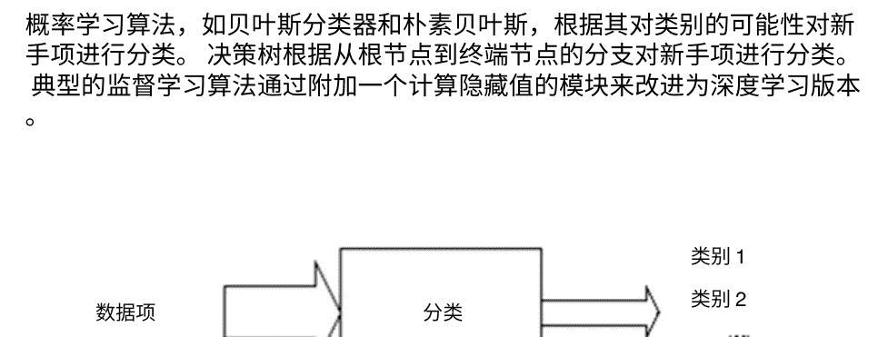

图1.1 分类任务

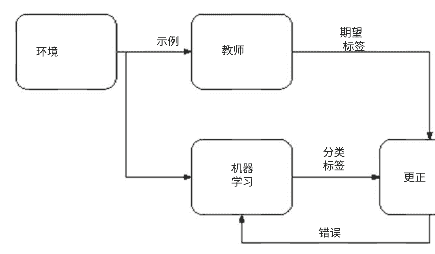

图1.2 监督学习框架

让我们对描述监督学习的框架进行一些备注。数据分类是应用监督学习的典型领域，它是将数据项分类为预定义类别之一的过程。监督学习是优化内部参数以最小化目标输出与计算输出之间误差的过程。KNN算法、朴素贝叶斯、决策树和线性分类器是典型的监督学习算法，在第二部分中它们被改进为深度学习版本。无监督学习将在第三章中作为另一种机器学习类型进行讨论。

#### 1.2.2 无监督学习

本节关注的是与监督学习相反的无监督学习的框架。在前一节中，我们研究了基于目标输出的监督学习的框架，这些目标输出由教师提供。无监督学习是一种机器学习范式，它通过优化输入向量之间的相似性来优化参数，并且应该最大化每个聚类内的内聚性和聚类之间的区分性。数据聚类是将一组数据项分割成包含相似数据项的子组的过程，这是无监督学习应用的领域。本节旨在描述无监督学习的概念视图。

数据聚类在图1.3中可视化。在前一节中，我们研究了应用监督学习的数据分类。数据聚类是将一组数据项分割成包含相似数据项的子组的过程。数据聚类可以作为一种技术使用，自动化类别预定义和样本分配的过程。实现数据聚类需要定义数据项之间的距离和相似性。

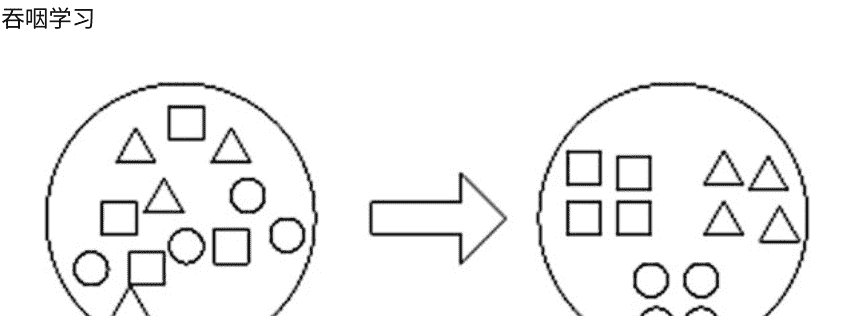

图1.3 聚类任务

无监督学习框架如图1.4所示。在这种学习类型中，没有教师提供期望的输出；这是无监督学习的特点。参数通常作为簇原型给出，并在无监督学习过程中进行优化。优化标准是示例与簇原型之间的相似性，而不是期望输出与计算输出之间的误差。无监督学习用于对数据项进行聚类。

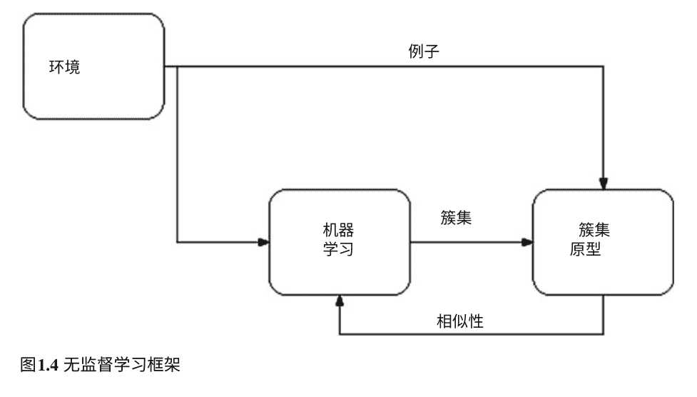

图1.4 无监督学习框架

让我们提到一些无监督学习算法作为有监督学习的实例。AHC算法、分裂算法和在线线性聚类算法存在作为简单的聚类算法。k均值算法根据聚类均值向量对数据项进行聚类，是最流行的无监督学习算法。Kohonen网络模型是典型的无监督学习的神经网络模型。无监督学习算法将在第3章中详细研究。

让我们在本节中提到无监督学习的框架的一些说明。无监督学习是将一组数据项分割成子群组，依赖于它们的相似性。在无监督学习中，准备了无标签的示例作为训练示例，并优化了作为聚类原型的参数，以最大化每个聚类的内聚性和聚类之间的区分度。

k均值算法和Kohonen网络是典型的无监督学习算法。半监督学习是无监督学习和有监督学习的结合。

#### 1.2.3 半监督学习

本节关注的是第三种机器学习类型，即半监督学习。它旨在通过利用无标签的示例来提高泛化性能。标记的示例和无标签的示例都被准备为训练示例，初始聚类是通过标记的示例构建的，并通过对它们进行聚类来标记最初的无标签示例。监督学习算法使用最初标记的示例和后续标记的示例进行任务训练，例如分类和回归。

本节旨在描述半监督学习的框架。半监督学习的框架如图1.5所示。半监督学习被视为监督学习和无监督学习的结合。目标标签来自标记的示例，并且它依赖于处理无标签示例的相似性。在半监督学习中，有监督学习中，参数被优化以最小化目标输出和计算输出之间的误差，并在每个簇中最大化内聚性和簇间区分度。有监督学习是主要部分，应用领域是数据分类或回归。

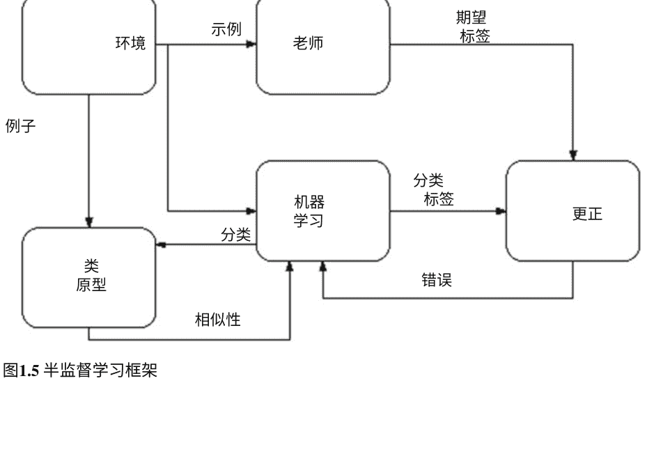

通过修改无监督学习算法来实现半监督学习算法的实现如图1.6所示。k均值算法和Kohonen网络被提及为典型的无监督学习算法。它们被修改为有监督学习算法：贝叶斯分类器和学习向量量化。它们可以与有标记的示例和无标记的示例一起用作半监督学习算法。有关详细信息，请参考[1]。

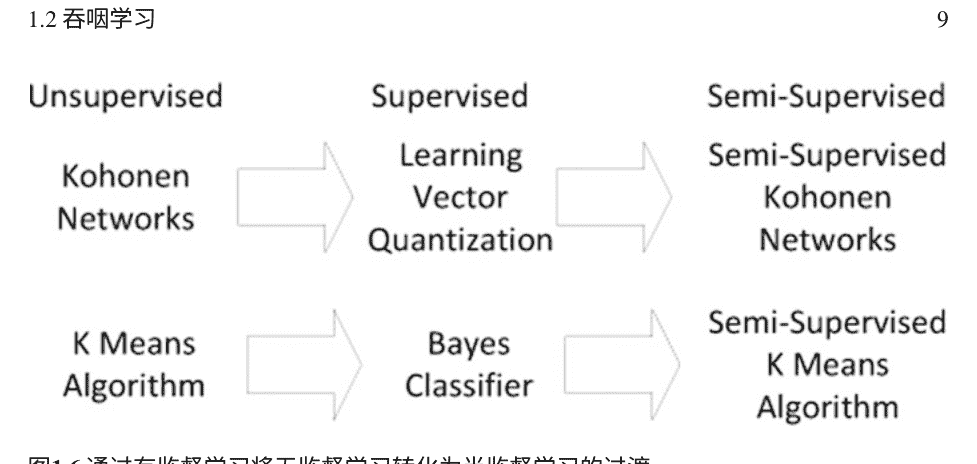

图1.6 通过有监督学习将无监督学习转化为半监督学习的过渡

我们考虑通过组合监督学习算法和无监督学习算法来实现半监督学习的情况。在半监督学习中，两组训练样本都被准备好。无监督学习的作用是通过对它们进行聚类来标记未标记的示例，而监督学习的作用是使用这两组样本构建分类或回归能力。实现半监督学习的典型案例是k均值算法和KNN算法的组合，以及EM算法和朴素贝叶斯算法的组合[2]。用于实现半监督学习的两个机器学习算法的组合应与第4章中介绍的集成学习区分开来。让我们对本节中介绍的半监督学习做一些说明。半监督学习被视为监督学习和无监督学习的组合。它通过将无监督学习算法修改为其半监督版本来实现，通过其监督版本的手段。实现半监督学习的另一种方案是将监督学习算法和无监督学习算法相互结合。半监督学习是一种监督学习的变体，其中未标记的示例被添加为额外的训练示例。

#### 1.2.4 强化学习

本节关注的是强化学习作为第四种机器学习类型。在这种学习类型中，输入是环境的状态，输出是一个动作，并在执行动作后给出奖励。强化学习是估计每个状态和动作增强的奖励的过程。需要定义状态、动作和下一个状态与当前状态的关系，并且需要实施强化学习的动作。本节旨在描述强化学习的框架。

自主代理（即强化学习的主体）与环境之间的交互如图1.7所示。代理从环境中接收一个状态；它识别环境中的当前状态。代理选择并执行一个动作作为其输出。代理根据动作的评价接收奖励或惩罚。强化学习的目标是最大化采取的动作的奖励。

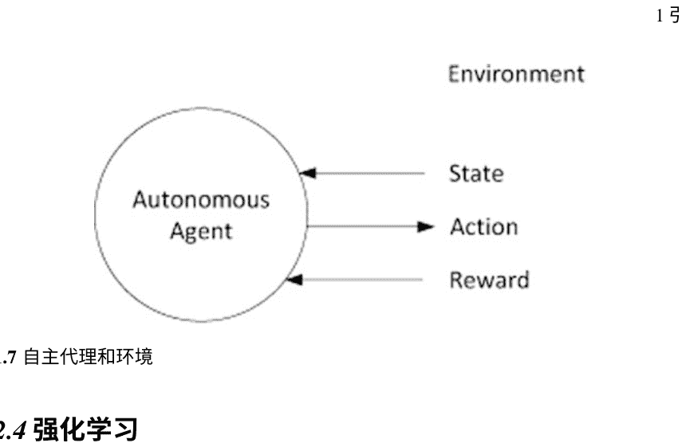

强化学习的框架如图1.8所示。在强化学习中，教师被评论家取代。状态同时提供给评论家和机器学习算法，动作由机器学习算法生成。评论家生成奖励或惩罚，并将其作为反馈传递给机器学习算法。强化学习应用于自主移动和游戏玩法。

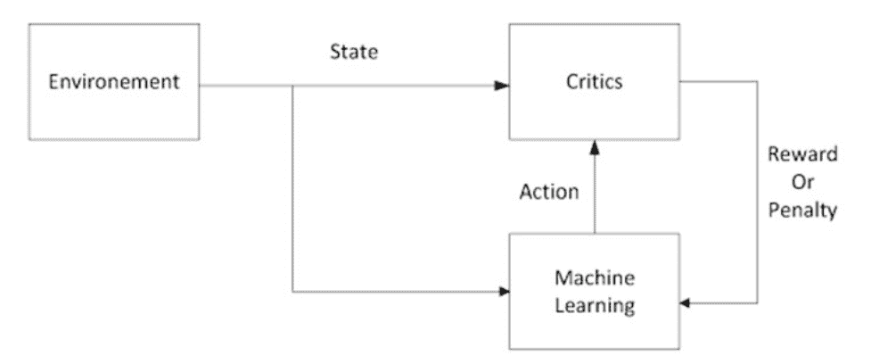

图1.8 强化学习框架

实施强化学习所需的表格如图1.9所示。来自环境的状态，来自自主代理的动作以及每个当前状态和动作与下一个状态相关联的增量规则都被定义。用户希望的目标状态应该在定义的状态中被提名，并且奖励被初始化为完整值的目标状态，其他状态则初始化为零值。对于当前状态和动作的每次增强，使用Q学习估计奖励。

强化学习的过程是将表格（如图1.9所示）填充上奖励值。

| Current State | Action | Next State | Reward |
|---------------|--------|------------|--------|
|               |        |            |        |

图1.9 Delta规则和Q表

让我们对本节中描述的强化学习做一些备注。作为强化学习的主题，自主代理从环境中接收状态并将其作为输出进行动作。在强化学习框架中，教师被评论家取代，评论家为动作提供奖励。强化学习的过程是初始化并估计每个状态和动作的奖励值。

### 1.3 深度学习组件

本节涉及满足深度学习条件的组件，并分为四个小节进行组织。在第1.3.1节中，我们提到输入编码是将输入转换为另一个输入的过程。在第1.3.2节中，我们提到输出解码是从另一个输出生成最终输出的过程。在第1.3.3节中，我们提到无监督层紧随有监督层，用于实现深度学习。在第1.3.4节中，我们提到卷积是将一个矩阵作为输入线性变换为另一个矩阵的过程。

#### 1.3.1 输入编码

本节涉及输入编码，这是实现深度学习所需的。它指的是将输入向量映射到另一个向量，以便更容易计算输出向量。降维、异常值检测和特征映射被提及为输入编码的典型实例。输入编码被视为从输入向量计算隐藏向量的过程。本节旨在描述输入编码的三个实例。

将输入维度降低的过程被视为实现深度学习的模块，如图1.10所示。降维是将输入向量自动映射到具有较小维度的向量的过程。降低维度的典型方案是计算属性之间的相关性，并删除与其他属性高度相关的属性。将维度降低的过程被视为从输入向量计算具有较小维度的隐藏向量之一。降维在实现深度学习中扮演着一个组件的角色。

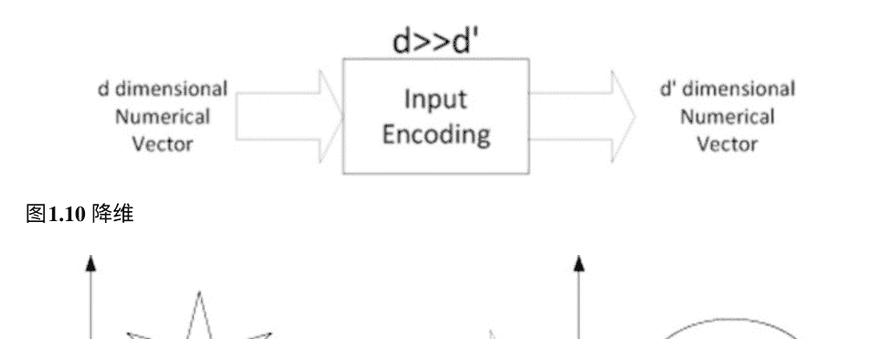

在异常值检测之前和之后，数据项的分布如图1.11所示。初始数据项的分布是嘈杂的，但随着异常值检测的影响，它变得平滑。它指的是将每个数据项检测为异常值与否的过程。异常值检测被视为将每个数据项二元分类为两个类别之一的过程。被检测为异常值的数据项将从训练样本中移除。

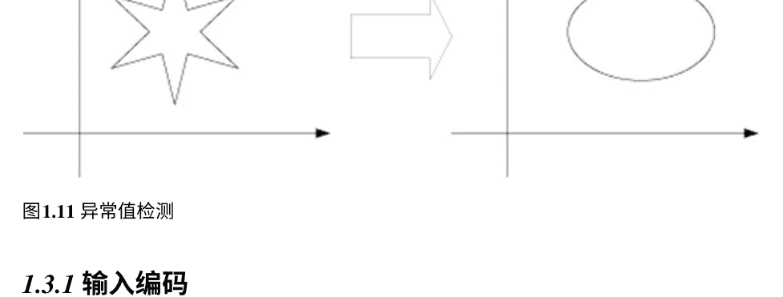

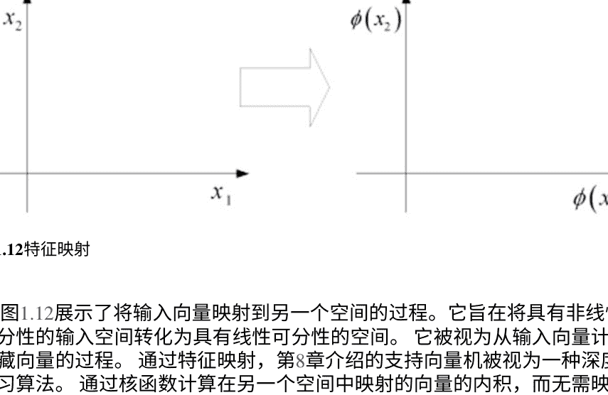

图1.12 特征映射

图1.12展示了将输入向量映射到另一个空间的过程。它旨在将具有非线性可分性的输入空间转化为具有线性可分性的空间。它被视为从输入向量计算隐藏向量的过程。通过特征映射，第8章介绍的支持向量机被视为一种深度学习算法。通过核函数计算在另一个空间中映射的向量的内积，而无需映射原始向量。

让我们对用于实现深度学习的输入编码进行一些备注。降维是将输入向量编码为具有较低维度的过程。异常检测是检测输入向量是否为异常值的过程。特征映射是将输入向量映射到另一个空间的过程。深度学习是通过将输入编码模块附加到现有的机器学习算法前面来实现的。

#### 1.3.2 输出解码

本节涉及另一个用于实现深度学习的模块，输出解码。在前一节中，我们研究了输入编码，即将输入值加密为其他值的过程。输出解码是将加密值恢复为正常值作为输出值的过程，输出规范、输出抽象和输出优化是输出解码的典型实例。在深度学习的背景下，它被视为从隐藏值计算最终输出值的过程。本节旨在描述输出解码的三个实例。

输出规范是一个输出解码实例，如图1.13所示。它是将一个带有一般类别标签的数据项分类到其具体类别的过程。在图1.13中，如果数据项被分类到上层类别，则被分类为类别1或类别2；如果被分类到下层类别，则被分类为类别3或类别4。

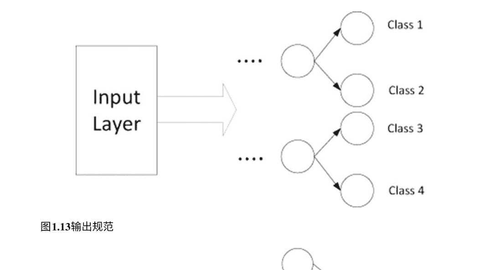

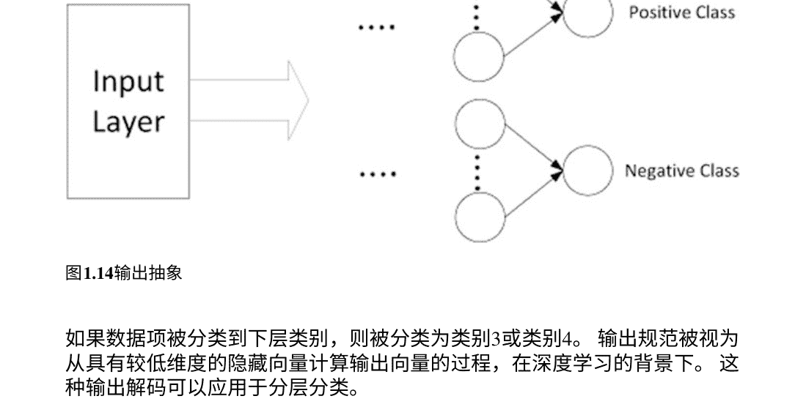

如果数据项被分类到下层类别，则被分类为类别3或类别4。输出规范被视为从具有较低维度的隐藏向量计算输出向量的过程，在深度学习的背景下。这种输出解码可以应用于分层分类。

输出抽象作为另一个输出解码实例，如图1.6所示。它是将带有特定类别标签的数据项分类到更一般类别的过程。在图1.6中，如果数据项被分类到上层类别之一，则被分类为正类；如果被分类到下层类别之一，则被分类为负类。输出抽象被视为从具有较高维度的隐藏向量计算输出向量的过程。我们考虑将带有多个特定类别标签的数据项分类到一个抽象类别中（图1.14）。

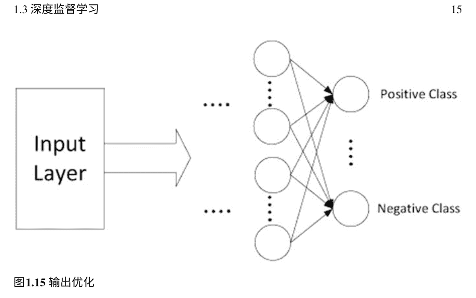

输出编码的第三个实例称为输出优化，在图1.15中有所说明。当前层与前一层的连接在输出优化中是完整的。前一层的所有节点都参与将数据项分类为其最终类别。无论维度如何，输出优化都被视为从隐藏向量计算输出向量的过程。在输出规范和输出抽象中，与前一层的连接是不完整的，而在输出优化中，连接是完整的。

让我们对输出解码进行一些说明，它是实现深度学习的一个模块。输出规范被视为从具有较低维度的隐藏向量计算具有较高维度的输出向量的过程。与输出规范相反，输出抽象是从具有较高维度的隐藏向量计算具有较低维度的输出向量的过程。在输出优化中，假设输出层与隐藏层之间的连接是完整的。在MLP中，从隐藏向量计算输出向量的过程是输出优化的情况。

#### 1.3.3 无监督层

本节关注的是附加在深度学习中的无监督层。在第1.2.2节中，我们研究了无监督学习作为替代有监督学习的学习范式。通过无监督学习，从输入向量计算出隐藏向量。如果将有监督学习的浅层版本修改为深层版本，则需要修改有监督学习算法应该修改为无监督版本。本节旨在描述计算隐藏向量的无监督层，该隐藏向量是从输入向量计算得到的。

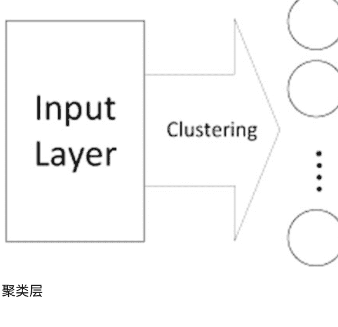

图1.16中说明了聚类数据项的过程。数据聚类是将一组数据项分割成每个子组称为簇的子组，其中包含相似的数据项的过程。聚类数据项的过程是根据数据项之间的相似性定义相似度度量，并根据相似性将组分成子组。聚类数据项的作用是计算一个隐藏向量，该向量由簇成员资格组成，从深度学习的视角来看。聚类模块用于实现深度学习。

在无监督学习层中计算隐藏值的过程在图1.17中有所说明。从输入向量计算隐藏向量的过程对于实现深度学习是必要的。无监督学习被应用于计算隐藏向量，作为输入编码和输出编码的替代方式。如果现有的机器学习算法被修改为深度学习版本，我们需要将它们修改为无监督版本。我们将研究无监督学习在计算隐藏向量中的应用，这将在第二部分中进行。

无监督学习在深度学习的实现中的应用在图1.18中有所说明。深度学习由输入层、多个隐藏层和输出层组成。通过无监督学习，隐藏向量可以从输入向量或前一层的隐藏向量中计算得出。

#### 1.3.4 卷积

让我们在无监督层上计算隐藏向量。无监督学习应用于数据聚类，这是根据它们的相似性将一组数据项分割成子组的过程。

由于在深度学习中目标隐藏向量不可用，因此应使用无监督学习从输入向量计算隐藏向量。每个隐藏层都被视为实现深度学习中的无监督学习。从隐藏向量计算输出向量的过程被视为监督深度学习中的监督学习。

本节涉及卷积，这是实现深度学习所需的。卷积是对向量或矩阵进行操作，以从中过滤出一些组件。预先，滤波器向量或滤波器矩阵是被定义，并且源向量或源矩阵通过将源中的每个元素与滤波器中的每个元素相乘并求和来映射。在多个滤波器向量或矩阵的情况下，单个源向量或矩阵被映射为多个向量或矩阵。本节旨在描述对向量或矩阵的操作，称为卷积。

执行卷积的框架如图1.19所示。假设卷积应用于$d$维向量。为了进行卷积，准备了一个$f$维滤波器向量；关于其维度和元素，可以任意决定滤波器向量。输出向量及其$d - f + 1$维度被填充了值，每个值是输入向量的元素和滤波器向量的元素的乘积之和。在计算输出向量时，$f$维滤波器向量在$d$维向量上滑动。

让我们提到将卷积应用于向量的过程。输入向量和滤波器向量分别用$x = [x_1x_2...x_d]$和$f = [f_1f_2...f_f]$来表示。隐藏向量的元素，$h$, $h_i$由方程(1.1)计算：

> $$ h_i = \sum_{j=1}^{f} x_{i+j} f_j \quad (1.1) $$

隐藏向量是一个$d - f + 1$维向量，$h = [h_1h_2...h_{d-f+1}]$，作为卷积的结果。滤波器向量是根据先前的知识预先定义的。

卷积层在深度学习的实现中的应用如图1.20所示。卷积被视为在深度学习的上下文中计算隐藏向量的过程。深度学习是通过在输入层和输出层之间添加卷积层来实现的。卷积神经网络（CNN）是第12章介绍的一种具有卷积层的典型深度学习算法。CNN中使用了多种卷积层和池化层的替代方法。让我们对实现深度学习的卷积进行一些说明。卷积是通过定义一个滤波器向量来从向量中过滤出关键组件的操作。映射向量中的每个元素都是通过滑动在输入向量和输入向量的一部分上的滤波器向量来计算的。卷积层用于将机器学习算法修改为它们的深度版本。我们考虑使用多个滤波器向量来执行多通道的卷积。

### 1.4 高级学习类型

本节关注的是替代深度学习的高级学习类型，并且本节分为四个小节。 在第1.4.1节中，我们提到集成学习是通过组合多个机器学习算法来提高泛化性能的方法。 在第1.4.2节中，我们提到半监督学习是利用未标记的训练样本和标记的样本来进行学习的方法。 在第1.4.3节中，我们提到基于核的学习是将输入向量映射到另一个空间的方法。 在第1.4.4节中，我们提到增量学习是学习额外训练样本的能力。

#### 1.4.1 集成学习

本节关注的是集成学习作为一种高级学习类型。 集成学习是在分类、回归或聚类中涉及多个机器学习算法以提高性能的方案。 在本节中，我们提到了将多个机器学习算法结合的三种方案：投票、专家门和级联。 我们可以考虑从每种方案和三种方案的混合中派生出的变体。 本节旨在描述将它们组合的三种方案。

图1.21展示了一种将多个机器学习算法结合的投票方案。 它通过对多个机器学习算法的答案进行投票来得出最终答案。 每个机器学习算法都使用一组训练样本进行训练，并通过每个机器学习算法对新手项目进行分类。 它们生成的答案被收集起来，通过投票来决定最终答案。 在这种集成学习方案中，多个机器学习算法参与生成最终答案。

图1.22展示了另一种专家门方案。在这个方案中，最终答案取决于一个被提名的单个机器学习算法。每个机器学习算法都使用训练集进行训练，并将特定的机器学习算法提名给新手输入。它由被提名的算法进行分类，并将被提名的算法的答案作为最终答案。根据新手输入的不同，会提名不同的机器学习算法。

图1.23展示了级联作为一种更多的方案。在这个方案中，最终答案是由当前机器学习算法根据其确定性生成的答案生成的。多个机器学习算法被串行组织起来；最简单的算法位于前面，最先进的算法位于尾部。来自当前机器学习算法的答案选择学习算法，并根据确定性决定答案是最终答案还是访问下一个机器学习算法。在这个方案中，一些机器学习算法参与生成最终答案。

让我们对组合多个机器学习算法实现集成学习的三种方案进行一些说明。投票是一种组合方案，最终决策是通过对机器学习算法的答案进行投票来做出的。专家门是一种组合方案，最终答案是由被提名的特定机器学习算法生成的。

级联是一种组合方案，如果当前机器学习算法的答案确定，则最终答案由该算法生成。我们将在第4章详细研究集成学习。

#### 1.4.2 局部学习

本节涉及另一种高级学习类型，称为局部学习。这是一种只使用与初学者输入相关的训练样本来训练机器学习算法的学习类型。局部学习的过程是检索与初学者输入相关的一些训练样本，并用它们来训练机器学习算法。局部学习被视为一种懒惰学习，即在提供初学者输入之前不对机器学习算法进行训练。本节旨在描述局部学习作为一种高级学习类型。

传统学习类型中的全局学习在图1.24中有所说明。在全局学习中，准备训练集，并使用整个集合对机器学习算法进行训练。在学习所有训练样本后，机器学习算法对初学者输入进行分类。感知器、多层感知器（MLP）和决策树中采用了这种学习类型。全局学习被视为渴望学习，在其泛化之前学习训练示例。

基于实例的学习是局部学习的基础，在图1.25中有所说明。在这种学习类型中，个别训练示例被引用以对一个新手项目进行分类。训练示例从不提前学习，只有在泛化时才能访问。这种学习类型在KNN算法和半径最近邻算法中被采用。这种学习类型被视为懒惰学习，直到出现一个新手示例才学习训练示例。

局部学习与全局学习相反，在图1.26中有所说明。局部学习是学习与新手输入相关的一些训练示例，而不是所有训练示例的过程。在局部学习中，新手输入被视为对训练示例集的查询，并检索其相关的训练示例。机器学习算法学习检索到的训练示例并推广新手输入。局部学习作为专家门控作为集成学习方案实施，以避免懒惰学习。

让我们对基于实例的学习和局部学习进行一些评论，作为全局学习的替代方案。全局学习是传统的学习类型，其中所有训练样本都用于训练机器学习算法。基于实例的学习是一种学习类型，其中所有训练样本都用于推广新手输入。局部学习是一种学习类型，其中一些与新手输入相关的训练样本用于训练机器学习算法。在局部学习中，计算训练样本与新手输入相关性的方案决策成为问题。

#### 1.4.3 基于核的学习

本节涉及一种更高级的学习，称为基于核的学习。它是一种学习类型，其中核函数被定义为数据项之间的相似性。它的思想是通过将原始空间中的输入向量映射到另一个空间中的向量来改善类别之间的可分性。通过核函数，可以计算映射空间中两个向量之间的相似性，而无需直接映射它们。本节旨在简要描述基于核的学习作为高级学习类型。

将输入向量映射到另一个空间的过程在图1.27中以核心学习的本质形式进行说明。其动机是原始空间中类之间的重叠是一个常见情况。如果将输入向量映射到另一个空间，我们有更多机会避免重叠并提高可分离性。原始输入向量和映射向量分别用 x 和 Φ(x) 表示。映射向量的内积与原始向量的内积一样，都是标量值。

让我们提到用于计算映射向量内积的核函数。 这两个向量分别用 $\mathbf{x}_1$和 $\mathbf{x}_2$表示，它们的映射向量分别用 $\Phi(\mathbf{x}_1)$和 $\Phi(\mathbf{x}_2)$表示。 向量 $\Phi(\mathbf{x}_1)$和 $\Phi(\mathbf{x}_2)$的内积可以表示为向量 $\mathbf{x}_1$和$\mathbf{x}_2$的核函数，如公式(1.2)所示：

$$K(\mathbf{x}_1, \mathbf{x}_2) = \Phi(\mathbf{x}_1) \cdot \Phi(\mathbf{x}_2)$$ (1.2)

定义两个向量的核函数的基础是，任意维度中两个向量的内积始终是一个标量值。 通过核函数计算两个映射向量的内积，避免了对输入向量进行单独映射。

核函数计算数据项之间的相似度如图1.28所示。$\mathbf{x}_1$和$\mathbf{x}_2$是表示数据项的原始向量，而$\Phi(\mathbf{x}_1)$和$\Phi(\mathbf{x}_2)$是从它们映射得到的向量。$\Phi(\mathbf{x}_1)$和$\Phi(\mathbf{x}_2)$之间的内积被核函数表示为它们之间的相似度。 在SVM中，核函数用于计算数据项之间的相似度。计算使用核函数的映射向量之间的相似度时，不需要将输入向量映射到另一个空间中（图1.28）。 让我们对基于核的学习作为一种高级学习方法进行一些说明。 核学习的起点是将一个特定空间中的向量映射到另一个空间中的向量。 通过核函数计算映射向量之间的内积，而不是显式地进行映射。 映射向量之间的内积表示它们之间的相似度。 核学习不仅适用于线性分类器，还适用于任何机器学习算法。

#### 1.4.4 增量学习

本节讨论的是一种更高级的学习方法，称为增量学习。 在研究机器学习算法时，假设一旦使用整个训练样本集对机器学习算法进行训练，泛化就是持续的。 增量学习的思想是，每当有额外的训练样本可用时，持续对机器学习算法进行训练。 在增量学习中，我们期望能够学习额外的训练样本，同时保持由先前样本构建的泛化性能。 本节旨在描述增量学习作为一种高级学习类型。

批量学习是指一次使用整个训练样本集对机器学习算法进行训练，如图1.29所示。在传统的机器学习算法中，它们的学习方式遵循批量学习。 在批量学习中，准备好整个训练样本集，对机器学习算法进行训练，并持续泛化后续给定的新输入向量。 在批量学习中，假设在训练机器学习算法时所有的训练样本都是可用的。 我们需要利用后续给定的额外训练样本来改善泛化性能。

增量学习的框架如图1.30所示。 假设多组训练样例按顺序提供。 机器学习算法使用第一组训练样例进行训练，后续的样例在不同的时间到达。 机器学习算法以增量方式进行训练，每组样例的目标是避免完全重新训练之前的样例。

数据流的持续流动被称为数据流，如图1.31所示。以交互方式提供训练样例而不是批量提供训练样例成为增量学习的动机。机器学习算法持续地使用作为数据流提供的训练样例进行训练。如果获得更多的训练样例，可以选择等待未来的额外训练样例，或者立即使用它们对当前的机器学习算法进行训练。我们考虑预定义类别发生变化的情况。

让我们对增量学习进行一些评论，它被提及为一种先进的机器学习类型。机器学习算法在批量学习中使用整个训练样本集进行训练。在增量学习中，它通过与额外的训练样本集进行交互式训练。它旨在利用作为数据流提供的一组训练样本。为了增量学习，需要保持由先前一组训练样本构建的分类或回归能力。

### 1.5 总结和进一步讨论

让我们总结一下本章学习的内容。有四种类型的学习：监督学习、无监督学习、半监督学习和强化学习。深度学习的框架是通过模块计算隐藏值，例如输入编码、输出解码、池化层和无监督层。作为深度学习的替代，还有集成学习、局部学习、基于核的学习和增量学习。本节旨在进一步讨论本章学习的内容。

让我们考虑解决非线性和复杂问题的方法。在发明深度学习之前，先进的浅层学习被开发出来解决这个问题。深度学习是先进浅层学习的替代方式。

在输入层和输出层之间放置多个层。大型决策树是从训练样本构建决策树得到的复杂形式，而MLP是为了解决非线性问题，在输入层和输出层之间添加了一个称为隐藏层的额外层。通过采用深度学习，而不是先进浅层学习，可以期望获得更好的性能。

深度学习被视为逐步处理的多个步骤。浅层学习被视为从输入值直接计算输出值的过程；它被视为直接计算。在深度学习中，输出值是通过多个步骤连续计算的。在集成学习作为替代先进机器学习的方法中，输出值是通过多个机器学习算法并行计算的。深度学习是通过多步学习来解决复杂问题的尝试。

让我们提到训练集的二维数组分区。它被视为一个矩阵，其中每一行对应一个训练示例，每一列对应一个属性。训练被划分为训练示例的子集，属性集被划分为属性值的子集。通过交叉训练示例的子集和属性的子集，我们得到一个具有属性子集的训练示例子集。如果训练集被划分为K子集，属性集被划分为L子集，则获得K × L子集。

在第1.4.1节中介绍的集成学习扩展为细胞学习。在集成学习中，涉及少量机器学习算法来提高泛化性能。细胞学习的思想是使用大量简单的机器学习算法来解决非线性问题。每个机器学习算法都使用自己的子集进行训练，该子集包含少量的训练示例。细胞学习的设计适用于并行计算和分布式计算。

### 参考文献

1.  T. Jo, 机器学习基础, Springer, 2021.
2.  K. M. Nigam, K., A. K. McCallum, S. Thrun, and T. Mitchell, “使用EM从标记和未标记的文档中进行文本分类”, 103–134, 机器学习, 39(2), 2000.

## 第2章 监督学习

本章主要讨论监督学习作为一种类型的学习。监督学习是指其参数被优化以最小化期望输出与计算输出之间误差的学习类型。在监督学习过程中，使用训练样本进行训练，每个样本都标有其目标输出，并使用给定的学习算法进行训练。监督学习算法应用于分类和回归问题。

在学习深度学习之前，本章旨在回顾监督学习作为一种类型的学习。

本章分为五个部分，第2.1节中，我们从概念上描述了监督学习。在第2.2节中，我们回顾了一些简单的监督学习算法。在第2.3节中，我们描述了神经网络的基础和最简单的神经网络模型，称为感知器。在第2.4节中，我们描述了一些典型的监督学习算法，如朴素贝叶斯、决策树和支持向量机（SVM）。在第2.5节中，我们总结了本章的全部内容，并进一步讨论了本章所研究的内容。

### 2.1 引言

本节涉及监督学习的概念视图。所有的训练样本都被假定为有标签的，并且有两种输出标签：目标标签最初在收集它们时被分配，以及它们被分类到的计算标签。监督学习过程是为了优化参数，以最小化目标标签和计算标签之间的误差。监督学习应用于分类，将数据项分类为预定义的一个或多个类别，以及回归，估计输出值或输出向量。本节旨在从概念上描述监督学习，以提供介绍。

让我们提到为监督学习准备的训练集。在监督学习中，训练集被视为一组输入向量和输出向量的对，如公式（2.1）所示：

$$ Tr = \{(\mathbf{x}_1, \mathbf{y}_1), (\mathbf{x}_2, \mathbf{y}_2), ..., (\mathbf{x}_N, \mathbf{y}_N)\} $$ (2.1)

在多类别分类中，输入向量被给定为一个 d 维数的数值向量，\( \mathbf{x}_i = [x_{i1} x_{i2} ... x_{id}] \)，输出向量被给定为一个 c 维数的数值向量，\( \mathbf{y}_i = [y_{i1} y_{i2} ... y_{ic}] \)。在监督学习中，有两种输出向量：目标输出向量最初分配给输入向量，计算输出向量由机器学习算法在训练阶段计算得出。在单变量回归中，输出向量被给定为一个标量值，而在多变量回归中，它被给定为一个向量。

让我们在概念视图中提到监督学习框架。准备了带有自己输出向量标签的训练示例，并且有两种输出：目标输出向量和计算输出向量。定义了目标输出和计算输出之间差异的损失函数，并随机初始化了定义目标输出和计算输出之间关系的参数。监督学习过程是逐渐更新参数以最小化损失函数值。监督学习算法应用于分类和回归。

让我们提到一些机器学习算法作为监督学习的实例。最简单的监督学习算法是最近邻算法，通过其最相似的训练示例的标签来对数据项进行分类。神经网络是一种机器学习算法，通过优化输入层和输出层之间的权重来最小化训练示例上的错误。概率学习是一种监督学习，根据输入向量给定类别的概率来对数据项进行分类。在本章中，我们将回顾一些监督学习算法，作为理解深度学习的基础。

让我们提到本章中的意图。我们回顾一些基础的监督学习算法，为了热身学习监督学习算法。我们研究感知器，这是早期的神经网络模型，作为深度学习算法MLP的准备，该算法在第9章中介绍。我们回顾一些主要的监督学习算法，如朴素贝叶斯、KNN算法和决策树，作为修改为深度版本的目标。本章旨在研究监督机器学习算法，作为研究深度学习算法的入门算法。

### 2.2 简单的监督学习算法

本节涉及机器学习算法和简单机器学习算法之前的分类方法。在第2.2.1节中，我们提到了在提出机器学习算法之前使用的基于规则的分类方法。在第2.2.2节中，我们提到了朴素检索作为学习机器学习算法的起点。在第2.2.3节中，我们提到了两个数值向量之间的相似度度量。在第2.2.4节中，我们提到了最原始的机器学习算法之一，即最近邻算法。

#### 2.2.1 基于规则的方法

本节关注的是数据分类的基于规则的方法。在提出机器学习算法之前，这种方法被用于对数据项进行分类。在基于规则的方法中，符号规则是手动定义的，并应用于每个数据项的分类。将基于规则的方法应用于分类时，其高准确性和低灵活性是其结果；当没有符号规则适用时，新手项不会被分类。本节旨在简要描述基于规则的方法作为对数据项进行分类的方案。

图2.1展示了用于对数据项进行分类的符号规则列表。在逻辑中，命题是一个被判断为真或假的陈述，两个命题由条件连接。每个符号规则分为两个部分：条件部分，即跟在“如果”后面的状态，以及因果部分，表示条件部分的结果。用于对数据项进行分类的符号规则如公式（2.2）所示：

```
如果 ai = vi 那么 ck
```

其中 ai 是一个属性，vi 是一个属性值，而 ck 是一个类别。通过使用“或”和“和”将多个命题连接起来，可以构建具有多个命题的条件部分。

图2.2中的伪代码展示了对数据项进行分类的过程。符号规则列表和一个新手示例是函数的参数。

图2.1 分类规则

```
IF a1 = v1 then c1
IF a2 = v2 then c2
...
IF a4 = v4 then c4
```

图2.2 基于规则的分类过程

```
classifyByRuleList(List ruleList, Item example){
    for each value in example{
        for each rule in ruleList{
            if (rule.isMatch(value))
                return rule.getCategory();
        }
    }
    return 'unclassified';
}
```

它会为每个属性值搜索匹配的规则，如果找到匹配的规则，则返回标签。如果在探索所有属性值时找不到匹配的规则，则返回消息“未分类”。由于缺乏匹配规则而无法对数据项进行分类的情况很常见。

让我们指出使用符号规则分类数据项时的一些问题。对于手动定义符号规则，需要了解应用领域的知识。为了提高分类能力，应不断添加更多的符号规则。随着不断添加符号规则，规则之间的矛盾发生的概率越高。手动定义这些规则的问题成为用机器学习算法替代这种方法的动力。

在使用机器学习算法之前，让我们对基于规则的方法进行一些评述。应用于分类数据项的符号规则由条件部分和因果部分组成，条件部分由属性值组成，因果部分给出了一个类别。在分类数据项的过程中，分类算法会搜索与其条件部分中属性值匹配的符号规则。缺乏灵活性成为用机器学习算法替代基于规则的方法的动力。符号规则是从决策树的训练示例中提取出来的，隐式地。

#### 2.2.2 朴素检索

本节关注朴素检索作为朴素分类方案。这种方法依赖于个别的训练示例来进行分类和回归，作为初始的基于实例的学习。朴素检索是通过检索其完全匹配的训练示例来对每个数据项进行分类的方案。即使它不实用，它也成为理解基于实例的学习算法（如KNN算法）的起点。本节旨在描述朴素检索，为学习监督学习算法做准备。

| Attribute 1 | Attribute 2 | ... | Attribute d | Label |
| :--- | :--- | :--- | :--- | :--- |
| | | | | |
| | | | | |

图2.3 训练示例

```
Hashtable lookupTable; //Lookup Table given as a Hash Table
Category classifyExampleByLoopupTable(Item example){
    Category cc = lookupTable.findValue(example);
    return cc;
}
```

图2.4 朴素检索

训练集被视为如图2.3所示的表格。训练集由数值向量形式的训练示例组成，给定的任务被假设为分类。训练集由一组有序的输入向量和它们的目标类别组成，Tr = {(x1, c1), (x2, c2), ..., (xN, cN)}，每个输入向量，xi = [xi,1 xi,2 ... xi,d]。类别预先定义为一个集合，C = {c1, c2, ..., cM}，输入向量，xi，由类别标记。

每个训练样本，(xi, ci)，被视为一个符号规则，如果 ((a1 = xi,1) ∧ (a2 = xi,2) ∧ ... ∧ (ad = xi,d)) 那么 ci，在朴素检索中。朴素检索中的分类过程如图2.4所示。预先，训练样本被准备为一个列表。给定一个新手项目作为输入，算法会在训练样本中搜索其完全匹配的项目之一。新手项目的标签由匹配项目的标签决定。如果没有匹配的项目，新手项目将被拒绝为未分类项目。让我们指出使用朴素检索进行数据分类时的一些问题。无法对带有噪声的数据项进行分类。新手项目与所有训练样本之间的不匹配情况非常频繁。可能会检索到具有不同标签的冗余训练样本作为匹配项，从而产生矛盾。朴素检索被解释为基于规则的分类，这在前一节中提到过。

让我们对朴素检索作为数据分类的方法作一些评论。准备了每个训练示例，每个示例都标有自己的类别。分类过程是检索与新手输入完全匹配的训练示例，并根据其匹配示例的标签决定新手输入的标签。通过不匹配将新手项目频繁拒绝为未分类项目是朴素检索的一个问题。它被改进为1最近邻。

- 线性复杂度。执行一近邻法所需的时间复杂度为O(N)，其中N是训练示例的数量，如图2.7所示。

#### 2.2.3 数据相似性

本节涉及计算数据项之间相似性的过程。在朴素检索中，我们考虑数据项是否相互匹配。在本节中，我们通过定义它们之间的相似度度量来衡量数据项之间的匹配程度。欧几里德距离的倒数，余弦相似度及其变体是数据项之间的典型相似度度量。本节旨在描述数据项之间的相似度度量。

欧几里得距离在图2.5中以几何方式呈现。欧几里得距离是笛卡尔坐标系中两点之间的距离，如图2.5所示。两个向量之间的欧几里得距离，x1=[x1,1, x1,2, ..., x1,d]和 x2= [x2,1, x2,2, ..., x2,d]，根据公式 (2.3) 计算：

```
$$ED(\mathbf{x}_1, \mathbf{x}_2) = \frac{1}{d} \sum_{i=1}^{d} \sqrt{(x_{1,i} - x_{2,i})^2}.$$
(2.3)
```

两个向量，x1和 x2的相似性通过反转距离计算，如公式 (2.4) 所示：

```
$$sim(\mathbf{x}_1, \mathbf{x}_2) = \frac{1}{ED(\mathbf{x}_1, \mathbf{x}_2)}.$$
(2.4)
```

如果两个向量彼此相同，则它们之间的相似度被定义为无穷大。

余弦相似度由方程(2.5)定义，$sim(\mathbf{x}_1, \mathbf{x}_2) = \frac{\mathbf{x}_1 \cdot \mathbf{x}_2}{\|\mathbf{x}_1\| \cdot \|\mathbf{x}_2\|}$ (2.5)

余弦相似度的值始终以归一化值的形式给出，介于零和一之间，通过 $\mathbf{x}_1 \cdot \mathbf{x}_2 \leq \|\mathbf{x}_1\| \cdot \|\mathbf{x}_2\|$。余弦相似度通过方程(2.6)定义为更一般的形式: $sim(\mathbf{x}_1, \mathbf{x}_2) = \frac{\mathbf{x}_1 \cdot \mathbf{x}_2}{\|\mathbf{x}_1\|_p \cdot \|\mathbf{x}_2\|_p}$ (2.6) 在哪里 $\|\mathbf{x}\|_p = \left( \sum_{i=1}^d x_i^p \right)^{\frac{1}{p}}$。

让我们将余弦相似度定义为两个数值向量之间的相似性。余弦相似度由方程(2.6)定义为一般形式。当 $p=2$ 时，它被定义为方程(2.5)。当 $p=\infty$ 时，它被定义为方程(2.7): $sim(\mathbf{x}_1, \mathbf{x}_2) = \frac{\min(\mathbf{x}_1, \mathbf{x}_2)}{\max(\mathbf{x}_1, \mathbf{x}_2)}$ (2.7) 在[2]中提出了应该考虑特征之间的相似性来定义余弦相似度。

让我们对余弦相似度进行评论，它是最常用的用于衡量两个数值向量之间相似性的度量标准。两个向量之间的欧氏距离定义为元素之间一对一距离平方的总和的平方根。余弦相似度是两个向量内积与两个向量范数乘积的比值。一些变体可能源自余弦相似度作为相似性度量标准。可以考虑属性之间的相似性来定义向量之间的相似性度量[2]。

#### 2.2.4 最近邻算法

本节讨论的是最简单的监督学习算法，即最近邻算法。在前几节中，我们意识到了朴素检索作为数据分类方法的局限性，并定义了数据项之间的相似度度量。最近邻算法可以扩展为KNN算法，通过对其最近邻的投票来决定一个新样本的标签。本节旨在描述最近邻算法作为一种原始的机器学习算法。

计算一个新样本与训练样本之间的相似度的过程如图2.6所示。一个新样本最初被给定为一个分类目标。计算它与训练样本的相似度。在它们之间检索出最相似的训练样本，以解码其类别。

图2.6 1-NN中的相似度计算

```
Category classifyBy1NN(Item dataItem, List trainingExampleList){
    int size = trainingExampleList.size();
    double maxSimilarity = 0;
    int maxIndex = 0;
    for(int i = 0; i < size; i++){
        Item trainExample = trainingExampleList.getElement(i);
        double similarity = dataItem.getSimilarity(trainExample);
        if(similarity > maxSimilarity){
            maxSimilarity = similarity;
            maxIndex = i;
        }
    }
    Item nearestNeighbor = trainingExampleList.getElement(maxIndex);
    return nearestNeighbor.getCategory();
}
```

图2.7 1-NN分类过程

将新手示例作为最近邻进行分类。朴素检索检查新手示例是否与训练示例匹配，而最近邻计算它们的相似性。

让我们提到通过训练示例来决定新手示例的类别的过程。计算新手示例与训练示例的相似性。最相似的训练示例被检索为新手示例的最近邻。通过取第i个训练示例的类别来决定新手示例的类别。一近邻法相对于朴素检索的优势在于避免拒绝新手示例。

通过伪代码在图2.7中说明了一近邻法对数据项进行分类的过程。给定一个数据项和训练示例列表作为参数。计算数据项与训练示例的相似性，并选择具有最大相似性的训练示例作为最近邻。通过取最近邻的类别来决定数据项的类别。让我们对本节中涵盖的一近邻法进行一些说明。通过与训练示例的相似度度量计算新手项与训练示例的相似性。通过检索最相似的训练示例来决定新手项的类别。新手项项目通过两个步骤进行分类：计算与训练示例的相似性以及检索最相似的训练示例。在下一节中，最近邻被扩展为KNN算法。

### 2.3 神经网络

本节关注神经网络作为提出深度学习算法的基础。在第2.3.1节中，我们将人工神经元描述为人工神经网络中的计算单元。在第2.3.2节中，我们对人工神经元中定义的净输入的激活函数进行描述。在第2.3.3节中，我们介绍了构建神经网络的人工神经元之间的连接。在第2.3.4节中，我们研究了感知器作为最简单的神经网络。

#### 2.3.1 人工神经元

本节涉及人工神经元作为基本计算单元。人工神经元连接成神经网络，在本节中进行研究。人工神经元是一个接收多个输入并生成单个输出的单元。多个输入通过输入值和其权重的乘积集成为单个输入。本节旨在描述人工神经元作为研究神经网络的基本单元。

图2.8展示了模拟生物神经元的人工神经元。它被视为具有输入和输出的计算单元。它接收多个输入，并对它们进行区分，并生成单个输出。人工神经元生成的输出作为另一个人工神经元的输入之一传递。在生物神经网络中，神经元之间的连接是不规则的，而在人工神经网络中，连接是规则的。

计算人工神经元中多个输入的输出值在图2.10中有所说明。输入用表示，如x1，x2，。权重用表示，如w1，w2，，wd。根据公式（2.8），通过将每个输入值和每个权重的乘积相加来计算净输入值：

```
net\_input = \sum_{i=1}^{d} w_i x_i \quad (2.8)
```

图2.8 生物神经元 来自 https://subscription.packtpub.com/book/big_data_and_business_intelligence/9781787121393/5/ch05lv1sec38/the-biological-neuron

图2.9 单个人工神经元

输出通过将激活函数应用于净输入来计算，如公式 (2.9) 所示：

```
y = F \left( \sum_{i=1}^{d} w_i x_i \right)
```

下一节将介绍应用于净输入的激活函数。

让我们对本节中提到的人工神经元进行一些说明。生物神经元通过树突接收来自其他神经元的输入信号，并通过轴突发送单个输出信号。生物神经元被建模为接收来自其判别的多个输入并发送单个输出的人工神经元。在公式 (2.8) 和 (2.9) 中，输入和权重的乘积之和被称为净输入，并且激活函数被应用于净输入以生成输出。在下一节中，我们将研究应用于净输入的各种激活函数。

#### 2.3.2 激活函数

本节讨论应用于人工神经元的激活函数。在前一节中，我们研究了人工神经元作为一个计算单元，它接收多个输入并将单个输出发送给另一个神经元。在本节中，我们研究了应用于人工神经元中的净输入的激活函数。有一种情况是将净输入本身作为人工神经元的输出发送；应用于净输入的应用称为线性函数。本节旨在描述应用于净输入的一些非线性激活函数。

图2.11显示了阈值函数的曲线。x轴上的值表示净输入，y轴上的值表示输出值。阈值函数表示为方程(2.10)：

```
\[ a_j = \begin{cases} 1 & \text{如果 } net \geq 0 \\ 0 & \text{否则} \end{cases} \tag{2.10} \]
```

阈值和常数通常分别设置为零和一。阈值函数在y轴上的输出值为二进制值0或1。如果将阈值函数应用于净输入作为激活函数，则将实值向量映射为二进制向量。

Sigmoid函数的曲线如图2.12所示。Sigmoid函数的定义域为任意值，其值域为介于零和一之间的连续值。该函数可以表示为方程(2.11)：$$ y = \frac{1}{1 + e^{-x}} \tag{2.11} $$ 曲线在零附近非常陡峭。这个函数被采用作为多层感知机(MLP)中的激活函数。

高斯函数的曲线在图2.13中有所说明。x轴上的值是输入向量之间的差异的范数，$x$，以及中心向量，$c$。高斯函数由方程（2.12）表示：$$ y = \exp\left(-\frac{\|x - c\|}{2\sigma^2}\right) \tag{2.12} $$ 其中$\sigma^2$是给定的扩展参数。当输入向量与中心一致时，函数中的值最大，如方程（2.12）所示。中心向量，$c$，和扩展参数，$\sigma^2$，是外部参数给定的。

让我们对一些激活函数进行一些说明，这些函数应用于人工神经元的输入。阈值函数的输出是一个二进制值，零或一。Sigmoid函数的输出是一个介于零和一之间的连续值。此外，中心向量和扩展参数参与了高斯函数。输出值介于-1和1之间的双曲函数可以被视为激活函数。

#### 2.3.3 神经连接

本节关注人工神经元作为研究神经网络的基础的连接。在第2.3.1节中，我们研究了人工神经元作为基本计算单元。神经元有两种连接方式：前馈连接和循环连接。源神经元的输出与其自身相关联，其权重成为目标神经元的输入。本节旨在描述神经元之间的连接。

神经元之间的前馈连接在图2.14中有所说明。三组神经元被分为三层。每个层中的每个神经元与下一层中的所有神经元相连接；层与层之间的连接是完全的。这种连接方式被应用于实现感知器、多层感知器（MLP）和Kohonen网络。Kohonen网络将在第3章中作为无监督学习算法进行研究。每个神经元的循环连接在图2.15中有所说明。它是从神经元到自身的循环连接。通过反馈，神经元的先前输出值作为输入给出。这种连接方式被应用于实现循环神经网络。我们将在第10章中将循环神经网络作为深度学习算法进行研究。

神经元之间的混合连接在图2.16中有所说明。有三组神经元；从左组到右组的连接是前馈的。中间组的连接是循环的。这种神经元结构中同时存在前馈连接和循环连接。

#### 2.3.4 感知器

本节讨论最简单的神经网络，称为感知器。神经网络是由罗森布拉特在1950年代发明的。它的结构由输入层和输出层组成，输出值通过求其输入值和权重的乘积之和来计算。在输入层和输出层之间给出的权重作为学习过程中进行更新。本节旨在描述感知器作为典型的浅层学习算法。

感知器的架构如图2.17所示。它由输入层和输出层组成。输入层中的每个节点对应一个输入值，输出层中的每个节点对应一个输出值。将感知器应用于多类别分类任务时，输入节点的数量由输入向量的维度决定，输出节点的数量由预定义的类别数量决定。输入层和输出层之间的权重以矩阵的形式存在。

图2.17 感知器架构

从输入层到输出层计算输出向量的方向在图2.18中说明。输入向量作为一个d维向量，输出向量作为一个c维向量，分别用x和y表示。输入层和输出层之间的权重表示为如公式（2.13）所示，表示为一个c×d矩阵：

```
W = \begin{pmatrix} w_{11} & w_{12} & \ldots & w_{1d} \\ w_{21} & w_{22} & \ldots & w_{2d} \\ \vdots & \vdots & \ddots & \vdots \\ w_{c1} & w_{c2} & \ldots & w_{cd} \end{pmatrix} . \quad (2.13)
```

在权重的索引中，w_{ji}，其中i是输出节点的索引，j是输入节点的索引。输出向量的元素，通过公式（2.14）计算得到ŷ j:

```
\hat{y}_j = F \left( \sum_{i=1}^{d} w_{j i} x_i \right) . \quad (2.14)
```

和输出向量, ŷ,通过权重矩阵和输入向量的乘积表示，如公式(2.15)所示：

```
$$\hat{y} = F(\mathbf{W} \cdot \mathbf{x})$$ (2.15)
```

阈值函数采用公式 (2.10) 表示作为激活函数。

图2.18 感知器中的分类方向

从输入层到输出层更新权重的方向在图2.19中说明。准备训练样本，通过上述过程计算每个训练样本的输出值，并假设为阈值激活函数的输出二进制值。输入层和输出层之间的权重通过公式 (2.16) 更新：

```
$$w_{ji} \leftarrow w_{ji} + \eta x_i (y_j - \hat{y}_j)$$ (2.16)
```

其中，η是学习率，取任意介于零和一之间的值。有两种输出值，目标输出，y_j，最初给定于训练示例中的输入向量，并计算输出，\hat{y}_j，在学习过程中计算得到，如果目标输出与计算输出相同，则权重不会更新。感知器的学习过程是通过公式 (2.16) 迭代更新权重。

让我们对感知器作为早期神经网络进行一些说明。架构中有两个层：输入层和输出层。输出值通过将阈值函数应用于净输入来计算。输入层和输出层之间的权重根据目标输出和计算输出之间的差异进行更新。感知器通过添加一个称为隐藏层的额外层将其扩展为多层感知器（MLP）。

### 2.4 高级监督学习算法

本节关注的是广泛使用的监督学习算法。在第2.4.1节中，我们描述了朴素贝叶斯算法，该算法假设属性之间相互独立。在第2.4.2节中，我们描述了决策树，可以通过追踪符号逻辑来提供证据。在第2.4.3节中，我们描述了随机森林作为决策树的扩展。在第2.4.4节中，我们研究了支持向量机（SVM），它将双重平行超平面定义为分类边界。

#### 2.4.1 朴素贝叶斯

本节关注的是朴素贝叶斯作为最流行的概率学习算法。该机器学习算法的假设是属性之间相互独立，即使在现实中它们是相互依赖的。在朴素贝叶斯中，计算了每个属性值对每个类别的似然度。根据假设，计算新输入向量的似然度是基于各个属性值的乘积。本节旨在简要描述朴素贝叶斯作为最流行的机器学习算法。

图2.20 属性独立性假设

朴素贝叶斯中假设的属性之间的关系在图2.20中有所说明。在计算输入向量的类别似然时，假设它们之间是独立的。如果事件 A和 B相互独立，那么两个事件同时发生的概率 P(AB)通过公式 (2.17) 计算：

```
$$P(AB) = P(A)P(B).$$ (2.17)
```

如果属性 d相互独立，概率 P(x)通过公式 (2.18) 表示为其元素概率的乘积：

```
$$P(\mathbf{x}) = \prod_{i=1}^{d} P(x_i).$$ (2.18)
```

给定事件 B的条件下事件 A的条件概率 P(A|B)与 A的概率相同，如公式 (2.19) 所示：

```
$$P(A) = P(A|B).$$ (2.19)
```

让我们提到计算属性值对类别的似然的过程。类别的似然是给定实体的条件概率。属性值和类别分别用 xi和c的似然，以及属性的似然，用表示。xi对类别 c的条件概率表示为 P(xi|c)。条件概率 P(xi|c)通过公式 (2.20) 计算：

```
$$P(x_i|c) = \frac{\#(x_i \wedge c)}{\#(c)},$$ (2.20)
```

其中 #(xi ∧ c)是属于类别 c且具有属性 xi的训练样本数量，以及 #(c)是属于类别 c的训练样本数量。如果输入是一个 d维向量，则计算其元素的似然。

让我们提到通过朴素贝叶斯对新手输入向量进行分类的过程。通过上述过程，计算属性的似然概率，$P(\mathbf{x}_1|c)$, $P(\mathbf{x}_2|c)$, $\ldots$, $P(\mathbf{x}_d|c)$, 到类别 $c$ 的计算。输入向量的似然概率 $\mathbf{x}$, 通过它们的乘积计算，如公式 (2.21) 所示：

```
P(\mathbf{x}|c) = \prod_{i=1}^{d} P(x_i|c) \quad (2.21)
```

预定义类别的输入向量的似然概率, $P(\mathbf{x}|c_1)$, $P(\mathbf{x}|c_2)$, $\ldots$, $P(\mathbf{x}|c_M)$, 进行计算，并将输入向量分类到类别 $c_{max}$ 如公式 (2.22) 所示：

```
c_{\max} = \operatorname{argmax}_{i=1}^{M} P(\mathbf{x}|c_i) \quad (2.22)
```

在朴素贝叶斯中，新手项目的分类取决于最大似然。

让我们对朴素贝叶斯进行一些说明，它是一种典型的监督学习算法。即使属性在现实中是相互依赖的，在这种监督学习算法中也假设它们是独立的。每个属性值对于类别的似然概率进行计算。输入向量对于类别的似然概率通过其元素的似然概率的乘积进行计算。我们将详细研究这个机器学习算法，以及它在第6章中的深度版本。

#### 2.4.2 决策树

本节介绍决策树作为另一种典型的监督学习算法。在决策树结构中，非叶节点是属性，叶节点是类别，分支是属性值。通过从根节点到叶节点的每个分支进行分类，每个分支对应于自己的属性值。决策树的学习过程是从训练样例构建决策树。本节旨在简要描述决策树作为一种典型的机器学习算法。

决策树结构如图2.21所示。叶节点表示类别，非叶节点表示属性。每个非叶节点的分支是属性值。对数据项进行分类的过程是从根节点沿着分支到达叶节点。子节点的数量与对应父节点的属性值数量相同。

图2.21 决策树结构

决策树对数据项进行分类的过程在图2.22中可视化。在决策树中，数据项按自上而下的方向进行分类，从根节点到叶节点。从根节点到叶节点的分支是用于证明分类的属性值列表。如图2.22所示，A3 = 1成为将数据项分类为类别4的证据。决策树的优点在于它提供了分类数据项的证据。

从训练样本中构建决策树的过程在图2.23中有所说明。决策树中的学习过程被定义为从训练样本构建决策树。属性被选为构建决策树的根节点。具有与父节点对应的分支的属性的训练样本子集被用于选择属性作为当前节点。如果剩下的样本标记相同，则将标记的类别确定为叶节点。

让我们对决策树作为典型的监督学习算法进行一些说明。在决策树结构中，非叶节点是属性，叶节点是类别，分支是属性值。在决策树中，通过从根节点到叶节点的分支进行数据项的分类。

决策树是通过训练样本构建的。选择属性作为节点的决策标准是决策树训练中的一个问题。

#### 2.4.3 随机森林

本节关注随机森林作为一组决策树。在前一节中，我们提到了由整个训练示例集构建的单个决策树。构建随机森林的过程是将训练集分成子集，并使用每个子集构建每个决策树。集成学习方案在随机森林中应用于决策树。本节旨在描述随机森林作为决策树的扩展。

图2.24 训练集的随机分区

图2.25 每个决策树使用自己的子集进行训练

如图2.24所示，训练示例集被分成子集。我们需要将集合分区以便将简化的决策树作为委员会使用。分区集的过程是事先决定子集的数量，并随机对集合中的示例进行洗牌。整个集合由洗牌后的示例组成，每个子集具有相同数量的示例。

每个子集用于构建自己的决策树，作为随机森林的成员。

如图2.25所示，训练示例集被分成子集。我们需要将集合分区以便将简化的决策树作为委员会使用。分区集的过程是事先决定子集的数量，并随机对集合中的示例进行洗牌。整个集合由洗牌后的示例组成，每个子集具有相同数量的示例。

每个子集用于构建自己的决策树，作为随机森林的成员。

随机森林对数据项进行分类的过程如图2.26所示。训练集被随机分成子集，每个决策树都使用自己的子集进行训练。每个决策树都对新手输入进行分类，最终由协调员决定其标签。集成学习方案，如投票和专家门控，在第4章中将进行介绍，并应用于决策树。随机森林的版本因训练集的分割方案和决策树的组合方案而各不相同。

图2.26 随机森林中多个决策树的集成学习

让我们对由多个决策树组成的随机森林进行一些说明。训练集被随机分成子集。每个决策树都由自己的训练示例子集构建。在对数据项进行分类时，集成学习应用于决策树组。决策树的版本因选择属性的标准而各不相同，我们可以选择由相同版本组成的同质随机森林，也可以选择由不同版本组成的异质随机森林。

#### 2.4.4 支持向量机

本节关注的是SVM作为典型的监督学习算法。线性分类器将超平面定义为分类边界，是发明SVM的基础。其思想是将向量映射到另一个空间中的向量，并定义具有最大间隔的对偶平行超平面。SVM的学习过程是优化拉格朗日乘子，而不是权重。本节旨在描述SVM作为典型的监督学习算法。图2.27中说明了平行对偶超平面的方程。权重向量和输入向量分别用 $w = [w_1 w_2 \dots w_d]$ 和 $x = [x_1 x_2 \dots x_d]$ 表示。

图2.27 基于权重的线性分类方程

从映射而来的向量, $\mathbf{x}$, 用 $\Phi(\mathbf{x})$ 表示，并且双平行超平面由方程(2.23)和(2.24)表示:

```
$$\mathbf{w} \cdot \Phi(\mathbf{x}) - b = 1 \qquad (2.23)$$
```

```
$$\mathbf{w} \cdot \Phi(\mathbf{x}) - b = -1. \qquad (2.24)$$
```

权重向量的范数在方程(2.25)中表示，应该最小化以最大化双超平面之间的间隔:

```
$$\|\mathbf{w}\| = \left(\sum_{i=1}^{d} x_i^p \right)^p. \qquad (2.25)$$
```

权重被优化以最小化错误分类率并最大化间隔。

基于拉格朗日乘子的平行双超平面方程在图2.28中说明。权重向量被视为训练示例的线性组合；方程(2.23)和(2.24)中的权重向量取决于训练示例。基于拉格朗日乘子，方程(2.23)和(2.24)转化为方程(2.26)和(2.27):

```
$$\sum_{i=1}^{N} \alpha_i K(\mathbf{x}_i, \mathbf{x}) - b = 1 \qquad (2.26)$$
```

```
$$\sum_{i=1}^{N} \alpha_i K(\mathbf{x}_i, \mathbf{x}) - b = -1 \qquad (2.27)$$
```

在方程(2.26)和(2.27)中，项 $K(\mathbf{x}_i, \mathbf{x})$ 被称为核函数，表示两个向量 $\Phi(\mathbf{x}_i)$ 和 $\Phi(\mathbf{x})$ 的内积。拉格朗日乘子 $\alpha_1, \alpha_2, \ldots$ 学习过程中，优化与训练样本数量相同的拉格朗日乘子 $\alpha_N$。

让我们推广SVM方程。如果SVM应用于二元分类，通过公式 (2.28) 计算得到的输出为-1或1：

```
d_i = \begin{cases} 1 & \text{if } \sum_{j=1}^N \alpha_j K(\mathbf{x}_j, \mathbf{x}_i) - b \geq 1 \\ -1 & \text{if } \sum_{j=1}^N \alpha_j K(\mathbf{x}_j, \mathbf{x}_i) - b \leq -1 \end{cases}
```

上述方程转化为公式 (2.29) ：

```
f(\mathbf{x}) = \text{sign} \left( \sum_{i=1}^N \alpha_i K(\mathbf{x}_i, \mathbf{x}) - b \right)
```

如果SVM应用于回归问题，公式 (2.29) 应修改为公式 (2.30) ：

```
f(\mathbf{x}) = \sum_{i=1}^N \alpha_i K(\mathbf{x}_i, \mathbf{x}) - b
```

在这种情况下，我们可以考虑将回归映射为多个二元分类。

让我们对SVM作一些备注，因为它是典型的监督学习算法。通过基于权重的方程，在映射空间中存在对偶平行超平面。它们被转换为基于拉格朗日乘子的形式。应用于分类的SVM的输出值为-1或1。因为输入向量明确地映射到另一个空间中，所以SVM可以被视为一种深度学习算法。

## 2.5 总结与进一步讨论

让我们总结一下本章学习的内容。关于机器学习的研究可以追溯到朴素检索，我们需要定义数值向量之间的相似度度量来设置机器学习算法。神经网络模型是一种模拟神经系统的机器学习算法，人工神经元成为生成输出的基本计算单元，通过对输入和权重的乘积求和。典型的监督学习算法包括决策树、随机森林、SVM等。本节旨在进一步讨论本章学习的内容。

向量的高斯分布由其均值向量和协方差矩阵来描述。在应用概率学习到分类问题时，高斯分布仅由其均值向量来描述，以简化问题。考虑到均值向量和协方差矩阵，通过公式（2.31）计算输入向量属于某个类别的可能性。

```
$$f (\mathbf{x}) = \frac{1}{\sqrt{(2\pi)^d |\mathbf{\Sigma}|}} exp\left(-\frac{1}{2}(\mathbf{x} - \boldsymbol{\mu})^T \mathbf{\Sigma}^{-1} (\mathbf{x} - \boldsymbol{\mu})\right) \quad (2.31)$$
```

即使考虑了两者，协方差矩阵也可以被视为对角矩阵，假设属性之间相互独立。考虑协方差矩阵的复杂度与维度的平方成正比；如果考虑协方差矩阵，我们需要尽可能减少特征的数量。

多层感知机（MLP）是为了解决感知机的局限性而发展起来的。感知机是Rosenblatt在1950年代发明的，但被Papert和Minskey批评，因为它无法解决XOR问题。然而，通过将多个感知机按层次结合，问题得到了解决，并在1980年代通过添加一个称为隐藏层的额外层次发明了MLP。MLP成为了分类和回归的强大工具，具有通用逼近定理，意味着可以逼近任何非线性函数。我们将在第9章中将MLP作为深度学习算法进行研究。

让我们考虑KNN算法和朴素贝叶斯的组合。在这个组合中，KNN算法处于主要位置，朴素贝叶斯处于次要位置。朴素贝叶斯将每个训练样本分类为最近邻或非最近邻，而KNN算法通过对被分类为最近邻的训练样本的标签进行投票来对数据项进行分类。朴素贝叶斯是用另一组示例进行训练的，每个示例由两个输入向量的连接和表示最近邻或非最近邻的标签组成。非最近邻。在这个组合中，KNN算法真正对数据项进行分类，而朴素贝叶斯支持KNN算法的角色。

让我们考虑两种机器学习算法的组合，其中朴素贝叶斯将数据项分类为主要位置。在之前的组合中，朴素贝叶斯在这个组合中的角色是将每个训练样本分类为最近邻或非最近邻。在这个组合中，KNN算法的角色是检索最近邻，而朴素贝叶斯的角色是学习最近邻并对新手数据项进行分类。

在朴素贝叶斯中，将与相似性成比例的判别权重分配给最近邻居，用于计算可能性。在与上述组合相反的组合中，KNN算法处于次要位置，朴素贝叶斯处于主要位置。

### 参考文献

+   1. T. Jo，‘使用文本分类和文本聚类实现动态文档组织’，渥太华大学博士学位论文，2006年。
2. T. Jo，‘基于特征相似性的K最近邻语义词分类’，67–78，多媒体信息系统杂志，2018年。

# 第3章
无监督学习

本章主要介绍无监督学习作为另一种学习方式。它指的是通过优化参数来稳定聚类成员与其自身聚类原型之间的距离的学习类型。在无监督学习过程中，准备了无标签的训练样本，定义了训练样本之间的相似度度量或距离度量，并优化了聚类原型以最大化它们的凝聚力。无监督学习算法应用于聚类，即将数据项组分割为包含相似项的子组。在学习深度学习之前，本章旨在回顾无监督学习。

本章分为五个部分，第3.1节中我们从概念上描述了无监督学习。在第3.2节中，我们回顾了一些简单的无监督学习算法，例如AHC（凝聚层次聚类）算法、分裂算法和k均值算法。在第3.3节中，我们描述了Kohonen网络的各个版本。在第3.4节中，我们描述了EM（期望最大化）算法，作为一种高级的无监督学习算法。在第3.5节中，我们总结了本章的全部内容，并进一步讨论了本章所研究的内容。

### 3.1 引言

本节关注的是无监督学习的概念视图。在无监督学习中，假设训练样本是未标记的，并且事先定义了样本之间的相似度度量。

无监督学习是一种优化参数的过程，通常将其作为聚类原型给出，以最大化每个聚类中的内聚性和聚类之间的区分度，这取决于聚类原型与训练样例的相似性。无监督学习应用于数据聚类，将整个数据集分成包含相似项的子群。本节旨在描述无监督学习的介绍和概念。

让我们提到为无监督学习准备的训练集。假设训练集中的所有训练样例都没有标签，训练集表示为 $Tr = \{x_1, x_2, \ldots, x_N\}$，集合中的每个元素都表示为一个$d$维向量，表示为 $x_i = [x_{i1} x_{i2} \ldots x_{id}]$。为了实现无监督学习，需要定义两个向量之间的相似度度量，即 $x_i$ 和 $x_j$。监督学习依赖于目标输出向量与计算得到的向量之间的差异，而无监督学习依赖于训练样例之间的相似性。在半监督学习中，同时使用带标签的训练集和无标签的训练集。

让我们提到无监督学习框架。预先准备了未标记的示例，并定义了两个向量之间的相似度度量。指示聚类原型的参数被随机初始化，并根据它们与参数的相似性对数据项进行排列。它们被更新以最大化每个聚类的内聚性和聚类之间的区分度。无监督学习应用于数据聚类，即将一组数据项分割成包含相似项的子组。

让我们提到一些机器学习算法作为无监督学习的典型实例。简单的聚类算法包括自底向上聚类数据项的AHC算法和自顶向下聚类它们的分裂算法。最流行的聚类算法是k均值算法，它通过迭代更新均值向量并根据与均值向量的相似性排列数据项。EM算法通过为每个数据项估计聚类成员资格值并优化参数以最大化聚类似然性来聚类数据项。在本章中，我们将回顾一些无监督学习算法，以便理解深度学习的背景。

让我们提到本章的意图。我们回顾了简单的聚类算法，如AHC算法、分裂聚类算法和k均值算法，为了研究无监督学习做准备。我们研究了Kohonen网络模型的各个版本，这个模型最初是作为一种无监督神经网络模型设计的。我们研究了EM算法作为最流行的无监督学习算法。本章旨在研究无监督学习，作为另一种类型的学习方法。

### 3.2 简单的无监督学习算法

本节涉及一些简单的聚类算法。在第3.2.1节中，我们提到了AHC算法，该算法以自下而上的方式对数据项进行聚类。在第3.2.2节中，我们提到了分裂算法，该算法以自上而下的方式进行聚类。在第3.2.3节中，我们提到了在线线性聚类算法，该算法专注于聚类速度。在第3.2.4节中，我们提到了最常用于聚类数据项的k均值算法。

#### 3.2.1 AHC算法

本节关注AHC算法作为一种简单的聚类算法。使用聚类算法的第一步是定义两个向量或两个聚类之间的相似度度量。通过迭代计算所有可能的项对的相似度并合并具有最高相似度的项对来对数据项进行聚类。AHC算法的特点是以自底向上的方式对数据项进行聚类；它从与项一样多的单例开始。本节旨在描述AHC算法作为一种简单的聚类算法。

使用AHC算法时，初始聚类与数据项一样多的单例在图3.1中有所说明。自底向上是通过AHC算法对数据项进行聚类的方向。初始构建的聚类与数据项一样多的单例一起构成；单例是包含单个数据项的聚类。如果根据先前的知识，多个项最初被分配到同一个聚类中，则初始聚类可能由多个项组成。在进行聚类时，定义项之间的相似度度量以计算聚类之间的相似度。

计算簇之间相似度的过程如图3.2所示。这两个簇被表示为一组数值向量，通过 $C_1 = \{\mathbf{x}_{1,1}, \mathbf{x}_{1,2}, \ldots, \mathbf{x}_{1,|C_1|}\}$ 和 $C_2 = \{\mathbf{x}_{2,1}, \mathbf{x}_{2,2}, \ldots, \mathbf{x}_{2,|C_2|}\}$ 进行标记，这两个簇的均值向量由公式(3.1)和(3.2)计算得出：

$$\mu_1 = \frac{1}{|C_1|} \sum_{i=1}^{|C_1|} \mathbf{x}_{1,i} \quad\quad (3.1)$$

$$\mu_2 = \frac{1}{|C_2|} \sum_{i=1}^{|C_2|} \mathbf{x}_{1,i} \quad\quad (3.2)$$

这两个簇，$C_1$ 和 $C_2$ 的相似度由公式(3.3)计算得出：

$$sim(\mu_1, \mu_2) = \frac{\|\mu_1 \cdot \mu_2\|}{\|\mu_1\| \cdot \|\mu_2\|} \quad\quad (3.3)$$

可以使用其他两个数值向量之间的相似度度量方法来计算两个簇之间的相似度。

通过伪代码在图3.3中说明了AHC算法对数据项进行聚类的过程。作为AHC算法的开始，创建与数据项数量相同的单例。生成所有可能的簇对，并计算每对的相似度。具有最高相似度的簇对合并成一个簇；计算相似度和合并簇的过程迭代进行，直达到所需的簇数量。自底向上是通过AHC算法对数据项进行聚类的方向，如图3.3所示。让我们对AHC算法作为一个简单的自底向上聚类算法进行一些说明。单例是指通过AHC算法对数据项进行聚类的开始，每个单例都是一个只包含一个数据项的簇。

簇均值向量之间的相似性是使用AHC算法进行簇之间的相似性。使用AHC算法对数据项进行聚类的过程是迭代计算簇之间的相似性，并将具有最高相似性的簇合并为一个。我们可以考虑以相反的方向对数据项进行聚类，称为自顶向下的方向。

#### 3.2.2 分裂算法

本节介绍另一种简单的聚类算法，称为分裂算法。在前一节中，我们学习了以自底向上的方向对数据项进行聚类的AHC算法。分裂算法通过从所有数据项开始形成一个单一的群组，并以自顶向下的方向递归地划分簇来对数据项进行聚类。将簇划分为与所选枢轴相似的群组和剩余部分是该聚类算法的核心操作。

本节旨在描述具有与AHC算法相反方向的分裂算法。

分裂聚类算法的初始状态如图3.4所示。如图3.1所示，与数据项一样多的单例是AHC算法的起点。N个数据项的群组是分裂算法的起点，它以自顶向下的方向对数据项进行聚类。根据将一个簇划分为多个簇的方案，可以得到不同的分裂算法。当将图3.4和图3.1进行比较时，它们展示了AHC算法和分裂算法的相反特性。

图3.5展示了将一个簇划分为两个簇的过程。簇划分是通过分析成员之间的相似性将一个簇划分为两个簇的过程。簇划分过程是随机选择一个项作为枢轴，并根据它们与枢轴的相似性排列成员。簇划分的结果是两个簇：与枢轴相似的组，其中包括与枢轴相似的成员，以及其余的组，其中包括其他成员。簇划分是主要的操作之一，用于实现自顶向下的分裂聚类算法，对数据项进行聚类。

让我们提到分裂算法中的数据项聚类过程，如图3.6所示。所有数据项的单一组是使用分裂算法进行聚类的起点。随机选择一个数据项作为枢轴，将一个聚类划分为两个聚类：相似聚类和剩余聚类。通过将剩余聚类递归地划分为相似聚类和剩余聚类来对数据项进行聚类。数据项的聚类是自顶向下进行的。

让我们对分裂算法作为一种简单的聚类算法进行一些说明。分裂算法从所有数据项的单一聚类开始。分裂聚类算法中的主要操作是将一个聚类划分为两个聚类：枢轴相似聚类和剩余聚类。通过将一个聚类递归地划分为两个聚类来对数据项进行聚类。将分裂聚类算法与AHC算法结合考虑，以在两个方向上进行数据项的聚类。

#### 3.2.3 在线线性聚类算法

本节关注第三种简单的聚类算法，称为在线线性聚类算法。在前几节中，我们研究了自底向上的AHC算法和自顶向下的分割算法。这个聚类算法从单个单例开始，以几乎线性的复杂性进行数据聚类。本节旨在描述在线线性聚类算法的聚类过程。

使用在线线性聚类算法的初始状态如图3.7所示。创建一个空的聚类，并将第一个项包含在聚类中。随后的数据项按顺序处理，从单个单例开始，如图3.7所示。最初包含在聚类中的数据项成为聚类原型。

使用在线线性聚类算法对数据项进行聚类的过程在图3.8中以伪代码形式呈现。首先创建一个簇，并将第一个项包含在其中。对于每个项，计算其与现有簇的相似度，检索最大相似度，并且如果最大相似度大于或等于阈值，则将其包含在与最大相似度对应的簇中。否则，创建一个新的簇，并将该项包含在其中；通过迭代将所有数据项应用该过程来对数据项进行聚类。如果簇的数量较小，则对数据项进行聚类的复杂度几乎是线性的。

在线线性聚类算法可以派生出一些变体。在初始版本中，最初加入簇的数据项是其簇原型，而在第一个变体中，簇的均值向量是其簇原型。

在初始版本中，创建了一个簇，并且一个数据项加入到该簇中，而在第二个变体中，多个簇同时创建，并且多个项加入到它们自己的簇中。在初始版本中，簇原型被固定为最初加入簇的数据项，而在第三个变体中，簇原型不断更新。

第三个变体旨在通过牺牲聚类速度来提高聚类质量。让我们对在线线性聚类算法进行一些评论，该算法被提及为一种简单的聚类算法。一个单一的单例，它是一个带有项目的聚类，是执行在线线性聚类算法的开始。每个连续的项目都选择加入现有的聚类或成为新的聚类原型。考虑了一些改进性能但牺牲速度的在线线性聚类算法的变体。由于聚类原型不会更新，初始版本经验证其聚类速度很快，但聚类性能较差[1]。

#### 3.2.4 K均值算法

本节关注的是K均值算法作为最流行的聚类算法。在之前的章节中，我们研究了简单的聚类算法，AHC算法，分裂聚类算法和在线线性聚类算法。作为将K均值算法应用于数据聚类的准备工作，需要事先决定聚类的数量，并随机选择一些数据项作为初始聚类均值向量。该算法迭代计算聚类均值向量，并根据数据项与聚类均值向量的相似性进行排列。本节旨在描述K均值算法作为最流行的聚类算法。

使用K均值算法对数据项进行聚类的初始状态如图3.9所示。使用K均值算法需要事先决定聚类的数量；假设聚类的数量最初被决定为k。k个聚类被创建为空的聚类，并随机选择k个数据项。k个数据项成为初始均值向量，其他数据项根据与均值向量的相似性进行聚类。k个单例成为使用K均值算法聚类数据项的起点。

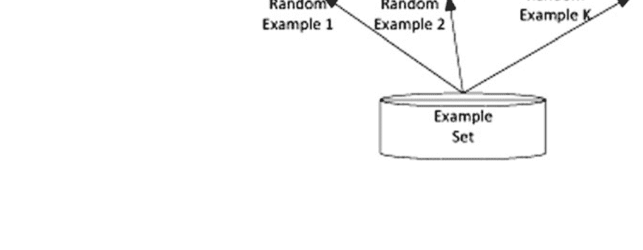

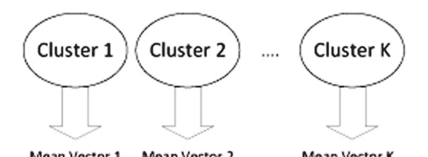

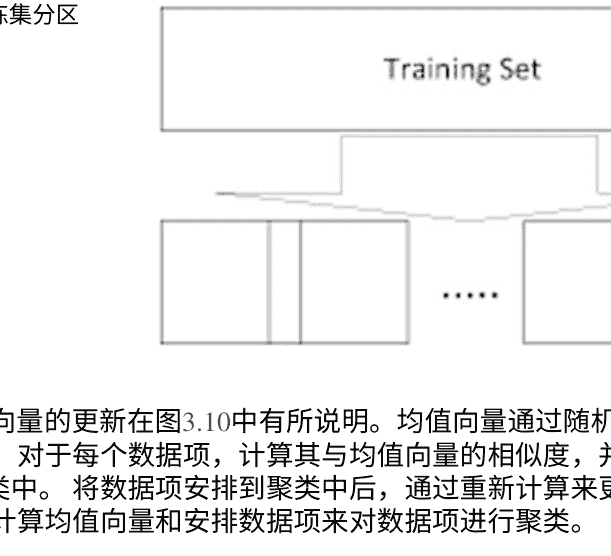

均值聚类向量的更新在图3.10中有所说明。均值向量通过随机选择数据项进行初始化。对于每个数据项，计算其与均值向量的相似度，并将其安排到最相似的聚类中。将数据项安排到聚类中后，通过重新计算来更新均值向量。通过迭代计算均值向量和安排数据项来对数据项进行聚类。

通过k均值算法对数据项进行聚类的过程在图3.11中有所说明。参数包括数据项列表、聚类数和迭代次数。确定的聚类数被创建，并通过随机选择数据项来初始化它们的均值向量。它通过根据数据项与均值向量的相似度将数据项安排到聚类中，并通过重新计算来更新均值向量。聚类列表作为结果返回。

让我们对k均值算法进行一些评论，该算法在本节中被介绍为最流行的聚类算法。使用k均值算法需要事先确定聚类的数量。每当数据项被分配到它们自己的聚类中时，聚类均值向量会被更新。数据项通过迭代更新聚类均值向量和重新排列数据项来进行聚类。k均值算法扩展为EM算法，其中每个聚类被假设为一个具有均值向量和协方差矩阵的正态分布。

### 3.3 Kohonen网络

本节介绍了几个版本的Kohonen网络。在第3.3.1节中，我们提到了Kohonen网络的初始版本，它被设计为一种无监督学习算法。在第3.3.2节中，我们提到了LVQ（学习向量量化）作为一种监督学习算法。在第3.3.3节中，我们将Kohonen网络修改为半监督版本。在第3.3.4节中，我们将Kohonen网络扩展为自组织映射（SOM）算法。

#### 3.3.1 初始版本

本节关注Kohonen网络模型的初始版本，作为一种无监督学习算法。在架构中，有两个层：输入层和竞争层。权重向量被给定为聚类原型，并在学习过程中进行更新。自组织映射是从初始版本扩展而来的版本，旨在绘制输入模式的相似性。本节旨在描述Kohonen网络模型的架构和学习过程。

Kohonen网络的架构如图3.12所示。架构中有两个层：接收输入向量的输入层和表示聚类的竞争层。连接到竞争节点的权重向量

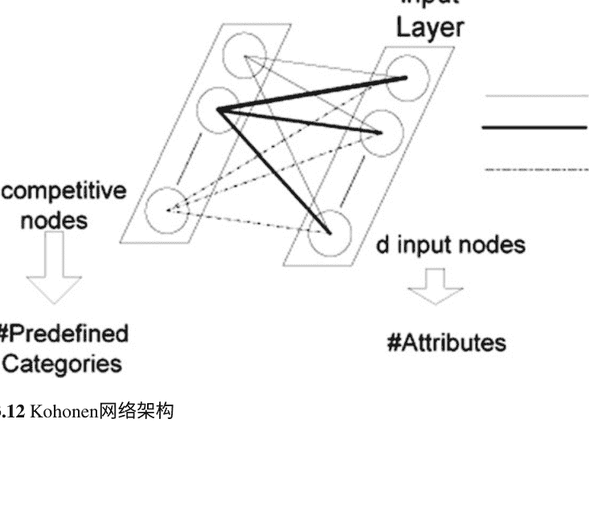

### 图3.13 Kohonen网络中的获胜者选择

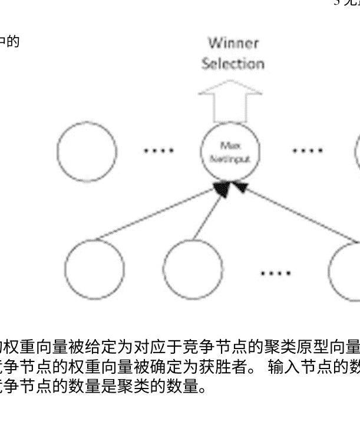

被给定为对应于竞争节点的聚类原型向量。与输入向量最相似的竞争节点的权重向量被确定为获胜者。输入节点的数量是输入向量的维度，竞争节点的数量是聚类的数量。

在Kohonen网络的输出层中选择获胜者的过程如图3.13所示。Kohonen网络被设计为输入层的d个输入节点和输出层的c个输出节点，并且每个输入节点和每个输出节点分别用x_i和y_j表示。两个节点之间的权重用w_{ji}表示。计算w_{ji}的净输入通过公式(3.4)，并选择净输入最大的输出节点作为获胜者：

$$net_j = \sum_{i=1}^{d} w_{ji} x_i \tag{3.4}$$

输出节点的值为0或1，如公式(3.5)所示:

$$ y_j = \begin{cases} 1 & \text{if } \sum_{i=1}^{d} w_{ji} x_i = \max_{j=1}^{c} \sum_{i=1}^{d} w_{ji} x_i \\ 0 & \text{否则} \end{cases} \tag{3.5} $$

在输出层中，只有一个节点的获胜者是1，其他节点的获胜者是0。更新输入层和输出层之间的权重如图3.14所示。对于每个输出节点，通过公式(3.4)计算其净输入，并选择净输入最大的输出节点作为获胜者。与被选为获胜者的输出节点相连的权重通过公式(3.6)进行更新:

### 图3.14 Kohonen网络中的权重更新

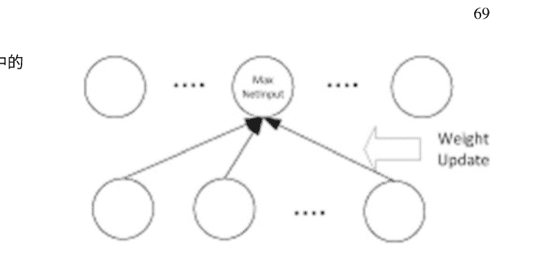

$$ w_{ji} \leftarrow w_{ji} - \eta y_j (w_{ji} - x_i) \quad (3.6) $$

其中，η是学习率，作为外部参数任意设置。被选为获胜者的输出节点的输出值为1。与每个输出节点连接的权重被视为一个给定的聚类原型，其为一个d维向量。

让我们对Kohonen网络的初始版本进行一些备注，这些网络最初设计用于无监督学习。在架构中，输入层接收输入向量，输出层中的每个节点表示一个聚类。每个输出节点的净输入是输入向量和权重向量的内积，选择具有最大净输入的输出节点作为获胜者。与获胜者相连的权重会紧密地更新到输入向量。Kohonen网络的学习过程是迭代地选择一个输出节点作为获胜者，并更新与获胜者相连的权重。

#### 3.3.2 学习向量量化

本节关注的是Kohonen网络的监督版本，称为LVQ（学习向量量化）。在前一节中，我们研究了Kohonen网络的初始版本作为一种无监督学习算法。在本节中，我们将研究Kohonen网络改进为监督版本的LVQ。在以前的版本中，选择具有输入向量和权重向量的最大内积的输出节点作为获胜者，而在这个版本中，选择与目标标签对应的输出作为获胜者。本节旨在描述LVQ作为Kohonen网络的监督版本。

让我们提到无监督学习算法向监督学习算法的转变。监督学习依赖于目标输出和计算输出之间的差异，而无监督学习依赖于输入向量之间的相似性。在将无监督学习算法改进为监督学习算法的过程中，聚类原型被预定义的类别所取代。例如，在将k均值算法修改为其监督版本（称为贝叶斯分类器）时，将簇原型的均值向量替换为表征其自身类别的均值向量。通过这样做，其他无监督学习算法也可以修改为其监督版本。

让我们提到在LVQ中选择输出节点作为获胜者的过程。假设给定问题是一个多类分类问题，输入向量和输出向量分别是一个d维向量和一个c维向量，其中x_i = [x_{i1}, x_{i2}, ..., x_{id}]，而c维向量，y_i = [y_{i1}, y_{i2}, ..., y_{ic}]。在LVQ的架构中，输入层有d个节点，输出层有c个节点。在给定的输出向量中，作为二进制向量，只有一个元素对应于目标类别，其值为1，其他元素的值为0。在LVQ中，选择与目标类别对应的输出节点作为获胜者。让我们提到将权重更新作为LVQ的学习过程。在LVQ中，选择与目标类别对应的输出节点作为获胜者。LVQ中权重的更新过程表示为公式（3.7）：

$$ w_{ji} \leftarrow w_{ji} - \eta y_j (w_{ji} - x_i) \quad (3.7) $$

只有一个元素在c维输出向量中被设为1，并且与获胜者相连的权重在每个训练样本中进行更新。在LVQ中，更新权重的方向是最小化目标输出和计算输出之间的误差。

让我们对Kohonen网络的监督版本LVQ进行一些说明。通过用类别属性替换聚类原型，无监督学习算法被修改为其监督版本。在LVQ中，与目标标签对应的输出被选为获胜者。与获胜者相连的权重被更新为更接近输入向量的值。基于被选为获胜者的输出节点来更新权重的过程被称为竞争学习。

#### 3.3.3 半监督模型

本节讨论Kohonen网络的半监督版本。在前面的章节中，我们研究了Kohonen网络的无监督和监督版本。在本节中，我们研究了Kohonen网络的半监督版本，它涵盖了有标签和无标签的训练样本。对于有标签的训练样本，选择与其目标标签对应的输出节点作为获胜者，而对于无标签的训练样本，选择与权重向量最接近输入向量的输出节点作为获胜者。本节旨在描述Kohonen网络的半监督版本，包括其输出向量的计算和学习过程。

### 图3.15 标记和未标记的训练集

| Labeled Set | Unlabeled Set |
| :--- | :--- |
| $Tr_L = \{x_1, x_2, \ldots, x_{N_L}\}$ | $Tr_U = \{x_{N_L+1}, \ldots, x_N\}$ |

为半监督学习准备的训练集在图3.15中有所说明。标记示例集和未标记示例集都为半监督学习准备。前者和后者分别用 $Tr_L = \{x_1, x_2, \ldots, x_{N_L}\}$ 和 $Tr_U = \{x_{N_L+1}, \ldots, x_N\}$ 表示。实际上，获取标记示例的成本很高，而获取未标记示例的成本很低；在半监督学习中，未标记示例通常比标记示例更多。利用未标记示例来提高泛化性能是有意义的。

让我们提到在半监督版本中选择输出节点作为获胜者。训练集准备为两个集合：标记示例集和未标记示例集。通过公式（3.5）计算每个未标记示例的输出节点值。通过公式（3.8）计算每个标记示例的输出节点值：

$$ y_j = \begin{cases} 1 & \text{如果 } o_j = 1 \\ 0 & \text{否则} \end{cases} \qquad (3.8) $$

选择获胜者的过程被视为监督版本和无监督版本的混合。

让我们提到Kohonen网络半监督版本中权重更新的过程。通过上述过程选择为获胜者的输出节点连接的权重被更新。在更新权重方程（3.7）中没有变化。在每次迭代中，可能会选择不同的输出节点到相同的未标记示例，但是对于相同的标记示例，会选择一个固定的输出节点作为获胜者。标记示例的作用是指导学习未标记示例。

让我们对Kohonen网络的半监督版本做一点说明。半监督学习准备了一组标记示例和一组未标记示例。对于每个未标记示例，采用Kohonen网络的风格选择一个输出节点作为获胜者，对于每个标记示例，采用LVQ的风格选择一个输出节点。将值1.0分配给被选为获胜者的输出节点作为其输出值，并通过方程（3.7）更新权重。Kohonen网络的半监督版本被视为初始版本和监督版本的混合。

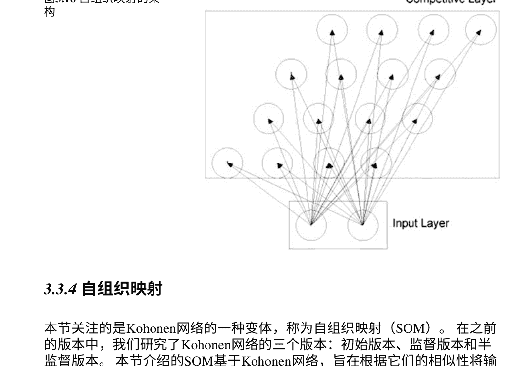

#### 3.3.4 自组织映射

本节关注的是Kohonen网络的一种变体，称为自组织映射（SOM）。在之前的版本中，我们研究了Kohonen网络的三个版本：初始版本、监督版本和半监督版本。本节介绍的SOM基于Kohonen网络，旨在根据它们的相似性将输入向量可视化为二维网格或三维网格。在这个版本中，与最近邻节点和获胜者相连的权重会被更新。本节旨在描述将数据项映射到网格中的SOM。

SOM的架构如图3.16所示。输出层中的节点数，也称为竞争层，是Kohonen网络和LVQ中的聚类数或类别数。在SOM的架构中，无论聚类数如何，都可以给出任意大的节点数。输入层中的节点数是SOM中输入向量的维度，就像Kohonen网络和LVQ一样。SOM旨在将输入向量可视化为二维网格或三维网格。

让我们提到在SOM中选择输出节点作为获胜者的过程。假设输出节点被给定为二维网格；每个输出节点，y(j,k)，通过网格中的坐标，(j, k)来标识；与输出节点连接的权重向量被标记为w(j,k)。输入向量和权重向量的内积被计算为输出节点的净输入，w(j,k) · x。净输入最大的输出节点被通过公式(3.9)选择为获胜者：

$$ \mathbf{y}_{win} = \underset{(j,k)}{\mathrm{argmax}} \mathbf{w}_{(j,k)} \cdot \mathbf{x}. \tag{3.9} $$

获胜者根据权重更新影响其邻居。

让我们提到SOM中权重更新的过程。在之前的版本中，与选定的输出节点相连的权重会被更新，而其他权重则不会被更新。引入了被称为邻域函数的选定输出节点和当前输出节点的函数，用于定义权重更新规则。SOM中权重更新的规则表示为公式（3.10）：

$$ \mathbf{w}_{(j,k)} \leftarrow \mathbf{w}_{(j,k)} + \eta \theta(\mathbf{y}_{win}, \mathbf{y}_{(j,k)}) (\mathbf{x} - \mathbf{w}_{(j,k)}) \tag{3.10} $$

替换输出值的邻域函数与选定输出节点和当前输出节点之间的相似性成比例。

让我们对SOM进行一些说明，它是Kohonen网络的一种版本，用于将输入向量可视化为二维网格或三维网格。无论输出层中的聚类数目如何，都会将大量输出节点排列成网格形式。通过输入向量和输出向量的内积来选择输出节点作为获胜者，类似于Kohonen网络。不仅获胜者的权重会被更新，与获胜者及其邻居相连的权重也会被更新。神经气体是SOM的一种变体，它通过将邻域函数替换为基于指数的函数来得到。

### 3.4 EM算法

本节主要介绍EM算法作为一种先进的聚类算法。在第3.4.1节中，我们提到了几种概率分布，如正态分布和模糊分布。在第3.4.2节中，我们定义了解释EM算法所需的符号。在第3.4.3节中，我们描述了用于估计每个数据项的聚类成员资格的E步骤。在第3.4.4节中，我们描述了基于聚类成员资格更新聚类分布的M步骤。

#### 3.4.1 聚类分布

本节主要介绍可能定义给每个聚类的一些分布。为了将EM算法应用于数据聚类，需要为每个聚类定义概率分布。在本节中，我们提到了均匀分布、正态分布和模糊分布作为定义给每个聚类的代表性分布。概率分布的特征由其自身的参数所决定；通过聚类数据项的过程，EM算法是通过迭代优化参数。本节旨在描述三种代表性的概率分布。

均匀分布在图3.17中有所示。它是一个连续的概率分布，概率在区间内是恒定的。均匀分布的特征是起始点，a，和终点，b，表示区间。a和b之间的概率是1/(b-a)。如图3.17所示，矩形形状是在均匀分布中制作的。

### 图3.17 均匀分布

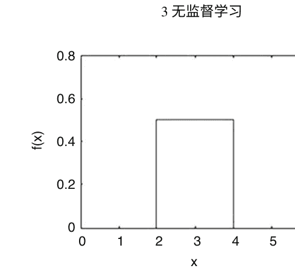

### 图3.18 正态分布

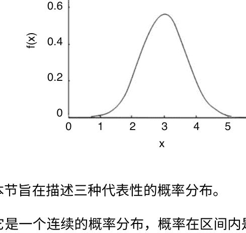

图3.18展示了一个值为x的正态分布。它是一种连续的概率分布，具有钟形曲线，其特征是均值和方差。如图3.18所示的正态分布的均值为3，方差为1。计算正态分布中特定值x的概率的方程式表示为Eq. (3.11)：

$$ f(x) = \frac{1}{\sqrt{2\pi\sigma^2}} \exp\left( -\frac{(x-\mu)^2}{2\sigma^2} \right) \tag{3.11} $$

这个分布在使用EM算法中最常用于假设聚类分布。

### 图3.19 模糊分布：三角形分布

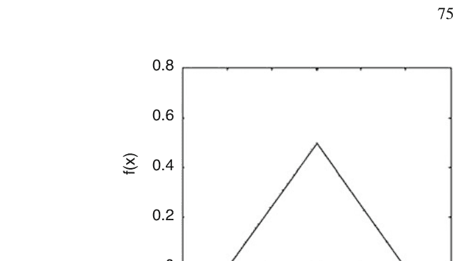

图3.19中展示了值x的模糊分布。它是具有三角形形状的连续概率分布，其特征是起始点a和终点b。在模糊分布中，概率在中点处达到峰值，即(a+b)/2，其值为2/(b-a)。在图3.19中的示例中，模糊分布的起始点为1，终点为5，其概率在值为3处达到峰值，值为0.5。另一种模糊分布是具有梯形形状的连续概率分布，其特征是四个点。

让我们对一些连续概率分布进行一些备注，这些分布被假设为使用EM算法进行聚类。均匀分布是最简单的分布，概率在一个区间内是相同的。正态分布，也称为高斯分布，是钟形曲线，其特征是均值和方差。模糊分布是三角形形状的分布，其概率在中点处达到峰值。在本节中，我们只提到了一些代表性的分布，并考虑了其他聚类分布。

#### 3.4.2 符号

本节涉及用于研究EM算法的符号。在前一节中，我们研究了一些为聚类定义的概率分布。在本节中，我们定义了研究EM算法所涉及的符号。在EM算法中，假设每个数据项在一个聚类中的成员资格是模糊值。本节旨在定义和解释所涉及的符号。

让我们将聚类列表记为C。聚类的数量最初由EM算法中的M决定。一个单独的聚类被记为C_i，并且它被视为一个示例集合，C_i = \{x_{i1}, x_{i2}, \ldots, x_{i|C_i|}\}。聚类列表被表示为一个集合，C = \{C_1, C_2, \ldots, C_M\}，聚类的并集是整个未标记示例的集合，如公式（3.12）所示：

$$ Tr = \bigcup_{i=1}^M C_i \tag{3.12} $$

独占聚类列表是硬聚类的结果。

让我们将特定数据项对聚类的成员资格记为μ_{C_i}(x)。在假设其为清晰集的情况下，聚类被记为上述。每个聚类被假设为一个模糊集，数据项x在聚类C_i中的成员资格由μ_{C_i}(x)记为。成员资格，μ_{C_i}(x)，被给定为在零和一之间的归一化值。这些M个成员值，μ_{C_1}(x), μ_{C_2}(x), ..., μ_{C_M}(x)，被赋予给数据项，x。

让我们将项目-簇成员矩阵记为通过EM算法对数据项进行聚类的结果。在矩阵的框架中，每一行是一个数据项，每一列是一个簇，每个元素是一个簇成员。这些成员，μ_{C_1}(x_j), μ_{C_2}(x_j), ..., μ_{C_M}(x_j)，被分配给每个项目，x_j。这些N×M矩阵，表示为方程（3.13），构成了项目-簇成员矩阵：

$$
\begin{pmatrix}
\mu_{C_1}(x_1) & \mu_{C_2}(x_1) & \dots & \mu_{C_M}(x_1) \\
\mu_{C_1}(x_2) & \mu_{C_2}(x_2) & \dots & \mu_{C_M}(x_2) \\
\vdots & \vdots & \ddots & \vdots \\
\mu_{C_1}(x_N) & \mu_{C_2}(x_N) & \dots & \mu_{C_M}(x_N) \\
\end{pmatrix}
\tag{3.13}
$$

项目-簇成员矩阵在EM算法的聚类过程中不断更新，直到收敛。

让我们制定EM算法中涉及的符号。簇被视为数据项的集合，簇列表是聚类数据项的结果。在使用EM算法时，当前聚类任务被假设为模糊聚类，每个数据项在簇中的成员关系被定义为介于零和一之间的归一化值。项目-簇成员矩阵被定义为模糊聚类的结果，并且项目-簇成员矩阵在聚类数据项的过程中被更新。由分配给每个数据项的M个簇成员组成的向量被视为其隐藏表示。

#### 3.4.3 E-步骤

本节关注EM算法中的E步骤（估计步骤）。在前一节中，我们介绍了EM算法中涉及的符号。在本节中，我们将使用这些符号来解释估计聚类成员资格的过程，即E步骤。为了进行E步骤，需要进行初始M步骤来初始化概率分布的参数。

本节旨在描述E步骤作为估计每个数据项的聚类成员资格的过程。

在解释E步骤之前，让我们先提到EM算法中的初始M步骤（初始最大化步骤）。假设每个聚类都服从连续概率分布，如正态分布。正态分布以其均值向量 μ 为特征。μ和协方差矩阵 Σ是正态分布的参数。作为初始M步骤，均值向量可以随机初始化或基于先前知识进行初始化，如 μ<sub>1</sub>, μ<sub>2</sub>, … 。协方差矩阵被固定为单位矩阵。M步骤被视为估计均值向量以最大化各个数据项对类别的似然性的过程。

数据项被分配的聚类成员资格在图3.20中说明。假设每个聚类都有一个正态分布和其均值向量。基于正态分布，输入向量 x 到聚类 C<sub>i</sub> 的概率，由公式（3.14）计算：

$$f (\mathbf{x}) = \frac{1}{\sqrt{(2 \pi)^{d}|\mathbf{\Sigma}|}} \exp \left(-\frac{1}{2}(\mathbf{x}-\boldsymbol{\mu})^{T} \mathbf{\Sigma}^{-1}(\mathbf{x}-\boldsymbol{\mu})\right)$$
(3.14)

输入向量 x 的聚类成员资格被定义为聚类 C<sub>i</sub> 的概率，如公式（3.15）所示：

$$\mu_{C_{i}}(\mathbf{x}) = P (\mathbf{x}|C_{i})$$.
(3.15)

数据项 x 被分配给 M 个聚类成员资格， μ<sub>C<sub>1</sub></sub> (𝐗), μ<sub>C<sub>2</sub></sub> (𝐗), … , μ<sub>C<sub>M</sub></sub> (𝐗)。

在EM算法中，E步是估计或更新项-聚类成员资格矩阵，这在3.4.2节中提到并注释过。聚类目标组中的数据项用 𝐱<sub>1</sub>, 𝐱<sub>2</sub>, … , 𝐱<sub>N</sub> 表示，对于每个数据项目 𝐱<sub>i</sub>，簇成员关系 μ<sub>C<sub>1</sub></sub>(𝐱), μ<sub>C<sub>2</sub></sub>(𝐱), …, μ<sub>C<sub>M</sub></sub>(𝐱) 被计算出来。作为项目-簇成员关系矩阵，该 N × M 矩阵按照公式(3.13)构建。项目-簇成员关系矩阵是通过EM算法对数据项进行聚类的结果。

让我们对估计每个数据项的簇成员关系的E步骤进行一些说明。我们需要初始的M步骤，它定义了对簇的初始概率分布。E步骤是基于概率分布估计每个数据项的簇成员关系的过程。E步骤的目标是构建项目-簇成员关系矩阵。我们考虑为每个簇定义多个概率分布或者为多个簇定义一个单一的概率分布。

#### 3.4.4 M步骤

本节关注的是M步骤，即更新参数的过程。在前一节中，我们研究了E步骤，其中为每个数据项估计了聚类成员资格。M步骤是为了最大化整个数据项与聚类之间的似然性，更新概率分布的参数。数据项在EM算法中通过E步骤和M步骤交替进行聚类。本节旨在描述EM算法的M步骤。

图3.21中说明了将每个聚类假设为正态分布。正态分布由其均值向量和协方差矩阵来描述。协方差矩阵被假设为单位矩阵，为了降低计算复杂度，正态分布仅由其均值向量来描述。聚类的数量为 M，每个聚类对应其自己的均值向量。均值向量是从聚类中估计出来的，作为EM算法中的M步骤。

让我们解释计算均值向量的过程，作为M步骤。E步骤的结果是项目簇成员矩阵，如公式 (3.13) 所示。表征簇 C<sub>i</sub> 上正态分布的均值向量，通过公式 (3.16) 估计：

$$\mu_i = \frac{\sum_{j=1}^{|C_i|} \mu_{C_i}(\mathbf{x}_j) \mathbf{x}_j}{\sum_{j=1}^{|C_i|} \mu_{C_i}(\mathbf{x}_j)}$$ (3.16)

在计算均值向量时，与公式 (3.13) 中的簇对应的列向量参与计算。估计的均值向量用于计算E步骤中每个向量的簇成员关系。

让我们考虑在M步骤中估计协方差矩阵。属性方差的对角元素由公式 (3.17) 计算：

$$\sigma_{ik}^{2} = \frac{\sum_{j=1}^{|C_i|} \mu_{C_i}(\mathbf{x}_j)(\mu_{jk} - x_{jk})^2}{\sum_{j=1}^{|C_i|} \mu_{C_i}(\mathbf{x}_j)}$$ (3.17)

其中 i 是簇索引；j 是簇中数据项的索引；而 k 是数据项中的元素索引。

协方差矩阵中的非对角元素通过公式 (3.18) 计算：

$$\sigma_{ik}^{2} = \frac{\sum_{j=1}^{|C_i|} \mu_{C_i}(\mathbf{x}_j)(\mu_{jk} - x_{jk})(\mu_{jm} - x_{jm})}{\sum_{j=1}^{|C_i|} \mu_{C_i}(\mathbf{x}_j)}$$ (3.18)

其中 k 和 m 是数据项中的元素索引。协方差矩阵描述了簇 C<sub>i</sub> 上的正态分布。其构建方式如公式 (3.19) 所示：

$$\boldsymbol{\Sigma}_i = \begin{pmatrix} \sigma_{i11}^2 & \sigma_{i12}^2 & \dots & \sigma_{i1d}^2 \\ \sigma_{i21}^2 & \sigma_{i22}^2 & \dots & \sigma_{i2d}^2 \\ \vdots & \vdots & \ddots & \vdots \\ \sigma_{id1}^2 & \sigma_{id2}^2 & \dots & \sigma_{idd}^2 \end{pmatrix}$$ (3.19)

为了简化，计算协方差矩阵的过程在M步骤中被省略了。

让我们对EM算法中的M步骤做一些说明。这是更新参数的过程，这些参数用于描述连续概率分布，并且被定义为最大化数据项对它们的似然度。假设每个聚类都定义了一个正态分布，通过对其成员求平均值来更新其均值向量。为了描述正态分布，协方差矩阵以及均值向量都会被更新。我们考虑将各种概率分布（如模糊分布）定义为聚类。

### 3.5 总结和进一步讨论

让我们总结一下本章学习的内容。数据聚类的简单方法包括AHC算法、k均值算法和分裂算法。Kohonen网络是无监督神经网络，其变种包括LVQ、半监督版本和SOM。EM算法是用于聚类数据项的高级框架，包括E步骤和M步骤，并且根据如何定义每个聚类的分布存在各种不同的版本。本节旨在进一步讨论本章学习的内容。

我们可以考虑两种简单聚类算法的组合，即AHC算法和分裂算法。AHC算法以自底向上的方式对数据项进行聚类，而分裂算法则以自顶向下的方式对数据项进行聚类。通过投票将两种聚类算法对数据项的结果进行整合，以决定一对数据项是否属于同一簇或不同簇，作为一个独立的组合。在使用AHC算法对数据项进行聚类时，可以将分裂算法应用于相对凝聚力较弱的簇，而在使用分裂算法对数据项进行聚类时，可以将AHC算法应用于相对弱区分度的两个簇。

存在多种组合两者的方案。让我们提到一种Kohonen网络的变体，称为神经气体，作为一种无监督的神经模型。它的作用是为输入向量定义一个特征映射，类似于SOM。神经气体与SOM的区别在于通过指数函数定义距离的约束。随着学习的进行，学习率和距离约束都会减小。这两种神经模型的共同点是学习是基于权重向量和输入向量之间的差异进行的。

半监督学习是一种将EM算法与朴素贝叶斯相结合的文本分类方法。我们准备了两组训练样本：一组是有标签的样本，另一组是无标签的样本。通过使用EM算法，通过有标签的样本构建初始聚类，并通过对无标签样本进行聚类来分配标签。使用朴素贝叶斯对新手项目进行分类。这些项目是通过两组训练样本进行训练的。半监督学习旨在利用容易获取的无标签样本来提高泛化性能。

让我们考虑一下半监督学习，它与有监督学习和无监督学习有所区别。它的动机来自于现实情况，即很容易获得无标签样本。它旨在通过利用无标签样本和有标签样本来提高泛化性能。实施半监督学习的方案是修改现有的无监督学习算法，并将有监督学习算法与无监督学习算法相结合。半监督学习应用于分类和回归，就像有监督学习一样。

### 参考文献

- 1. T. Jo, “基于特征相似性的K最近邻语义词分类”, 67-78, 多媒体信息系统杂志, 2018年。

## 第4章 集成学习

本章主要介绍集成学习作为深度学习的一种替代高级学习方法。它是指通过将多个机器学习算法相互结合，更可靠地解决分类、回归和聚类等问题的学习类型。集成学习的典型方案包括投票，即通过考虑多个机器学习算法的结果来决定最终答案；专家门控，即将适合解决给定输入的机器学习算法中的一个提名为专家；级联，即决定当前答案是否被采纳或将输入传递给下一个机器学习算法的过程。我们需要考虑将训练集进行分割，将其视为一个具有两个轴的矩阵：水平分割将训练集分割成子集，垂直分割将属性集分割。本章旨在描述集成学习作为一种高级学习方法。

本章分为五个部分，第4.1节中，我们从概念上描述了集成学习。在第4.2节中，我们描述了训练集和属性集的划分，作为集成学习的准备。在第4.3节中，我们描述了组合多个机器学习算法的方案。在第4.4节中，我们将多视角学习描述为附加的高级学习类型。在第4.5节中，我们总结了本章的全部内容，并进一步讨论了本章所研究的内容。

### 4.1 引言

本节关注集成学习的概念视图。集成学习的目标是克服机器学习算法在学习和泛化方面的限制。集成学习涉及多个机器学习算法在学习和泛化中的应用，提高泛化性能。在实施集成学习时，我们选择使用整个训练示例集训练每个机器学习算法，或者使用其自己的子集训练它。本节旨在描述集成学习，以概念上提供介绍。

在实施集成学习中涉及多个机器学习算法。在经典学习中，只使用一个机器学习算法；所有种类的机器学习算法都存在其缺点和对特定输出的偏见。集成学习旨在通过涉及多个机器学习算法来克服使用单个机器学习算法的限制。有两种类型的集成学习：同质集成学习，它将相同类型的机器学习算法与不同的外部参数结合起来；异质集成学习，它将不同类型的机器学习算法结合起来。协调器作为一个独立的模块用于控制机器学习算法的组合。

让我们提到将多个机器学习算法相互组合以实施集成学习的三种方案。投票是多个机器学习算法的组织方式，协调器通过收集它们的答案做出最终决策。专家门是一种组织方式，其中从多个机器学习算法中提名一个人来做出最终决策。级联是一种组织方式，其中控制器决定当前机器学习算法的答案是否被采纳，或者将新手输入传递给下一个机器学习算法。通过混合三种方案，可以将多个机器学习算法组合成混合方案。

在实施集成学习之前，将训练集划分为子集的过程是必要的，这取决于应用领域，我们提到了三种划分的方案。独占划分是在子集之间没有任何重叠的情况下进行划分的过程。重叠划分是在子集之间允许重叠的情况下进行划分的过程。模糊划分是将子集的隶属度值分配给每个训练示例的过程。我们考虑通过对训练示例进行聚类来划分训练集，而不考虑它们的标签。

让我们提到本章的意图是什么。我们研究将训练集或属性集划分为子集的方案，作为实施集成学习的准备工作。我们研究将多个机器学习算法组织在一起以决定最终答案的方案。我们研究多视角学习作为一种从多视角观察原始训练示例的集成学习的变体。本章旨在研究集成学习及其作为另一种从深度学习中分支出来的变体。

### 4.2 分区

本节关注训练集和属性集的分区，作为集成学习的准备。在第4.2.1节中，我们提到了将训练集分成子集的方法。在第4.2.2节中，我们提到了将属性集分成子集的方法。在第4.2.3节中，我们提到了将训练集视为矩阵进行二维数组分区的方法。在第4.2.4节中，我们提到了分区训练集和/或属性集的方案。

#### 4.2.1 训练集

本节关注作为目标的训练集，它被分成子集。我们准备了训练示例，每个示例都带有自己的输出标签。训练集被随机分成子集，并且每个机器学习算法都使用自己的子集进行集成学习。

以高级方式，训练集通过聚类数据项进行分区。本节旨在描述将训练集分成子集以应用集成学习的分区方法。

用于机器学习算法的训练样本在图4.1中有所说明。每个训练样本都以一个d维数值向量的形式给出。由训练样本组成的集合称为训练集，用 Tr = { x1, x2, ..., xN }来表示。表示训练样本的向量中的每个元素都以连续值给出，每个训练样本用 xi = [xi1 xi2 ... xid]来表示。数值向量的维度被假定为固定的d，而一个称为特征的属性对应一个元素。

训练集 Tr 被划分为子集，在图4.2中有所说明。每个子集 Tri 由 定义。Tri = {xi,1, xi,2, ..., xi,|Tr|}, 以及子集的关系, Tri, 与集合, Tr, 的关系是 Tri ⊆ Tr。独占分区由 ∀i,j Tri ∩ Tj = ∅表示, 而重叠分区由 ∃i,j Tri ∩ Tj ≠ ∅表示。训练集通过随机选择一些训练样本进行分区；这种分区方案称为随机分区。

列表 partitionTrainingSet(List trainingSet, int partitionNumber) {
    List partitionList = clusterDataItemList(trainingSet, partitionNumber);
    return partitionList;
}

图4.3展示了通过对训练样本进行聚类来对训练集进行分区的例子。训练集中的样本，Tr，是聚类的目标。聚类生成了C1, C2, ..., CK，是根据它们的依赖关系对训练样本进行聚类生成的，而不考虑它们的标签。每个聚类都是训练集的一个子集，如公式（4.1）所示：

$C_i \rightarrow T_{\eta_i}$ (4.1)

在这种类型的分区中，一个只有少量训练样本的小簇成为一个问题。

让我们对将训练集划分为子集以实现集成学习进行一些备注。假设训练集由N个训练样本组成，每个样本都表示为一个d维向量。通过随机选择一些训练样本，将训练集划分为子集。可以通过使用无监督学习算法对训练样本进行聚类来将其划分为子集。将训练集划分为子集以实现集成学习是可选的。

#### 4.2.2 属性集

本节涉及将属性集划分为子集。在前一节中，我们研究了将训练集划分为子集以实现集成学习。训练集被视为一组属性值，逐列进行。属性值集被划分为子集，每个子集称为属性子集，在后续章节中研究训练子集和属性子集的交叉。本节旨在描述属性集的划分。

让我们提到被划分为子集以实现集成学习的属性集。在前一节中，我们研究了由训练示例组成的训练集，它被划分为训练示例的子集。属性集由一组属性向量表示，每个向量具有N个属性值，其中A = {a1, a2, ..., ad}。ai = [ ai,1 ai,2 ... ai,N ]是一个 N 维数值向量。$N$维属性向量中的元素被解释为 $a_{i,j} = x_{j,i}$ 和 $\mathbf{a_i}=[x_{i,1} x_{i,2} \dots x_{i,N}]$。在前一节中介绍的训练集被视为与属性集相关联的矩阵。

属性集的划分如图4.4所示。属性集，$A$，被划分为子集，$A_1, A_2, \dots, A_K$，其中 $A_i \subseteq A$。每个子集，$A_i$，被定义为一个集合，$A_i = \{\mathbf{a}_1, \mathbf{a}_2, \dots, \mathbf{a}_{|A_i|}\}$。如果实施由$K$个机器学习算法组成的集成学习，则机器学习算法，$ML_i$，将使用子集，$A_i$，进行训练。训练集的划分称为水平划分，而属性集的划分称为垂直划分，将训练集视为矩阵。

列表 partitionAttributeSet(List attributeSet, int partitionNumber){
    List partitionList = clusterAttributeList(attributeSet, partitionNumber);
    return partitionList;
}

聚类属性值的过程被称为转置聚类，在图4.5中有所说明。对应于属性值的列从被视为矩阵的训练集中提取出来。每个属性都被表示为一个 $N$ 维向量，并且属性值存在于训练集中。一组属性值被分割成子组，每个子组包含相似的属性值。通过对训练集的 $d$ 列进行聚类，可以获得属性值的子集。

让我们对属性集合的分割进行一些说明，称为垂直分割。如果将每个训练样本视为一个 $d$ 维向量，则定义了 $n \times d$ 个属性。属性集合被分割成子集，每个子集用于表示数据项。将训练集视为一个矩阵，对列向量进行聚类，称为转置聚类。我们将训练集分割和属性集分割视为二维分割。

#### 4.2.3 数组分区

本节关注训练集的二维数组分区。在前几节中，我们研究了训练集的分区和属性集的分区作为实施集成学习的准备工作。训练集被视为一个矩阵，并且在水平方向和垂直方向上被分割成子集。每个子集被视为训练子集和属性子集的交叉。本节旨在描述训练集的二维数组分区。

在图4.6中，训练集被视为一个矩阵。假设每个训练示例都是一个 d 维向量，并且训练集的大小为 N。在矩阵中，每个行向量，r1, r2, ..., rN, 是一个 d 维向量作为一个训练示例，每个列向量，c1, c2, ..., cd, 是一个 N 维向量作为一个属性向量。每个行向量和每个列向量分别对应于一个训练示例和一个属性向量：ri = xi 和 ci = ai。训练集表示为一个 N × d 矩阵。

训练集的二维划分如图4.7所示。训练集，Tr，被划分为子集，Tr1, Tr2, ..., TrM, 和属性集，A，被划分为子集，A1, A2, ..., AK。交叉集合 Tri 和 Aj 用表示。Trij 是子集 Tri 中具有属性集 Aj 的示例集合。子集的网格表示如等式（4.2）所示：

等式 (4.2):
$$
\begin{pmatrix}
Tr_{11} & Tr_{12} & \dots & Tr_{1K} \\
Tr_{21} & Tr_{22} & \dots & Tr_{2K} \\
\vdots & \vdots & \ddots & \vdots \\
Tr_{M1} & Tr_{M2} & \dots & Tr_{MK}
\end{pmatrix}
$$

子集，Trij，用于训练机器学习，MLij。从集成学习扩展的细胞学习在图4.8中进行了说明。它涉及大量简单的机器学习算法，用于学习训练样例并将新手样例泛化为网格形式。

细胞学习的过程是通过上述过程将训练集划分为二维数组子集，并将每个子集分配给机器学习算法进行训练。在泛化过程中，应计算每个机器学习算法与新手输入向量的相关性，并且只有相关的机器学习算法参与分类或回归。

回归。细胞学习的思想是使用大量简单的机器学习算法来解决复杂的问题。

让我们对训练集的二维数组进行一些备注，这在本节中有所涉及。训练集由 N个数值向量组成，其维度为 d，被视为一个 N × d矩阵，其列对应属性值，行对应训练样本。

行集被划分为 M个子集，列集被划分为 K个子集，子集由行子集和列子集的交叉定义。在细胞学习中，涉及到 M × K个机器学习算法，并为每个子集分配用于训练每个机器学习算法。细胞学习应用了两种集成学习方案，投票和专家门控。

#### 4.2.4 划分方案

本节涉及将集合划分为子集的方案。在之前的章节中，我们研究了将训练集划分为子集的方向。在本节中，我们考虑将集合划分为子集的各种方式。

即使在训练机器学习算法之前，假设训练集已经被分割，分割也可能在训练机器学习算法期间被考虑。本节旨在描述将集合分割为子集的典型方案。

将训练集随机分割为子集作为第一种方案，在图4.9中进行了说明。子集的数量和大小是事先确定的。对于每个子集，随机选择一个训练样本并将其包含在子集中。有放回的随机选择会导致重叠分割，而没有放回的随机选择会导致互斥分割。每个分割用于集成学习中的机器学习算法训练。

通过对训练样本进行聚类来分割训练集，在图4.10中进行了说明。聚类是将一组数据项分割成包含相似项的子组的过程。根据它们的相似性，无论它们的标签如何，训练样本都会被无监督学习算法聚类。这样做会产生几个数据项的子组，并成为训练样本的子集。每个聚类用于训练其相应的机器学习算法。

训练集的重叠分区如图4.11所示。我们上面提到了互斥分区，不允许重叠。

子集之间的重叠分区是允许任何重叠的分区；任何训练样本存在于两个子集的交集中。重叠分区扩展为模糊分区，其中每个训练样本的成员资格被给予0到1之间的连续值。在重叠分区中，成员资格被给予0或1；在模糊分区中，它被给予0到1之间的连续值。

让我们对将集合分割为子集的方案进行一些说明。随机分区是通过随机选择一个元素将集合分割为子集的最简单方案。更高级的分区方案是基于聚类的分区，其中元素根据它们的相似性进行聚类，每个聚类是一个子集。有三种分区类型：互斥分区，重叠分区和模糊分区。通过观察集合中的训练错误将训练集分割为子集的增强是与机器学习算法交互的分区方案。

### 4.3 监督组合方案

本节涉及将多个机器学习算法组合起来以产生最终输出的方案。在第4.3.1节中，我们提到了投票通过收集多个机器学习算法的输出来产生最终输出。在第4.3.2节中，我们提到了专家门控，它为产生最终输出提名了特定的机器学习算法。在第4.3.3节中，我们提到了级联，它以串行方式组织多个机器学习算法。在第4.3.3节中，我们将集成学习扩展为细胞学习。

#### 4.3.1 投票

本节涉及一种集成学习方案，称为投票。我们在前几节中研究了将训练集划分为子集作为集成学习的准备，并从本节开始研究集成学习的方案。投票涉及多个机器学习算法，称为委员会成员，以及协调者。委员会成员的角色是学习训练样例并对新手数据进行分类，协调者的角色是决定最终答案。本节旨在描述投票作为一种集成学习方案。

机器学习算法在投票中的组织结构如图4.12所示。这个组织中涉及到的是K个机器学习算法和一个协调员。每个机器学习算法的作用是接收输入向量并生成自己的输出向量。协调员的作用是接收来自K个机器学习算法的输出向量，并决定最终输出。这个组织中的K个机器学习算法参与分类和回归。

通过投票这种集成学习方案来估计输出值的过程如图4.13所示。为了便于解释，假设给定的任务是一个单变量回归。输出值，ŷ₁, ŷ₂, … , ŷK, 由 K个机器学习算法估计得到。最终输出，ŷ, 通过协调员对输出值进行平均来决定，如公式（4.3）所示：

```
$$\hat{y} = \frac{1}{K} \sum_{i=1}^{K} \hat{y}_i$$
```

在分类任务中，通过对机器学习算法进行投票，决定了新手输入的最终结果。

加权投票是一种从投票中派生出来的变体，如图4.14所示。如果机器学习算法被视为委员会成员，则对每个成员分配相同的权重，以便在上述投票中进行输出值的投票。委员会成员的性能是可变的，因此在投票中应该通过为它们分配不同的权重来加以区分。输出值由公式(4.4)进行投票：

```
$$\hat{y} = \frac{1}{K} \sum_{i=1}^{K} w_i \hat{y}_i$$
```

如何估计权重成为这种投票类型中的问题。

让我们对作为组合多个机器学习算法的方案的投票进行一些评论。多个机器学习算法被称为委员会成员和协调员参与实施集成学习方案。在泛化过程中，委员会成员生成自己的答案，协调员决定最终答案。委员会成员可以通过为他们分配不同的权重来进行区分，在投票他们的答案时。我们可以考虑元学习，用于决定从收集到的答案中选择最终答案。

#### 4.3.2 专家门控

本节涉及将多个机器学习算法组合在一起的方案，称为专家门控。在前一节中，我们研究了通过收集多个机器学习算法的答案来决定最终答案的投票。在本节中，我们研究了专家门控，它通过对新手输入进行提名并根据被提名者的答案来决定最终答案。这个方案涉及到K个被称为专家的机器学习算法和协调员。本节旨在描述作为将多个机器学习算法组合在一起的方案的专家门控。

在实现专家门控的机器学习算法和协调器中，图4.15中有所示。在第4.3.1节中介绍的投票中，协调器通过对委员会成员的答案进行投票来决定最终答案。在专家门控中，协调器被替换为门控器，并提名一个特定的机器学习算法。参与专家门控的多个机器学习算法被称为专家，只有其中一个参与最终决策。提名一个特定的机器学习算法意味着专家门已经打开。

专家门控中输入向量的泛化过程如图4.16所示。一个新手输入被给定为一个$d$维向量，并由门控器作为其输入。在 $K$个机器学习算法中，选择一个进行提名，并将输入向量传递给它。从被提名的机器学习算法生成输出并决定为最终输出。最终输出由被提名的机器学习算法作为该集成学习方案中的专家决定。

机器学习算法的加权提名在图4.17中有所说明。在专家门控的原始版本中，只有一个机器学习算法被提名用于对新手输入进行分类。在这个变体中，每个机器学习算法都被分配一个权重，而不是只提名一个。在图4.16中所示的版本中，只有一个机器学习算法被分配权重1.0。在加权专家门控中，分配给机器学习算法的权重对于每个新手输入向量都是可变的，而在加权投票中，权重对于任何新手输入向量都是恒定的。

让我们对应用于监督学习的专家门控进行一些评论。多个机器学习算法和协调员参与实施这个集成学习方案。门控器通过提名一个特定的机器学习算法作为专家，并通过被提名者的输出来决定最终答案。我们可以考虑通过为专家分配不同的权重，用权重对他们的答案进行投票来决定最终答案。加权提名被视为投票和专家门控的结合。

#### 4.3.3 级联

本节关注集成学习的第三种方案，称为级联。在之前的章节中，我们已经学习了两种集成学习方案，投票和专家门控。在本节中，我们研究了另一种集成学习方案，级联，其中多个机器学习算法被串行组合。在之前的集成方案中，机器学习算法是相互独立的，而在这个方案中，每个机器学习算法依赖于其前一个算法。本节旨在描述称为级联的集成方案，它与投票和专家门控不同。

每个机器学习算法的角色是学习训练样本并泛化一个新手输入。

多个机器学习算法和一个协调器的组织用于实现级联，如图4.18所示。协调器的角色是根据输出值的确定性决定是否将当前答案作为最终答案，还是将输入向量传递给下一个机器学习算法。每个机器学习算法的角色是学习训练样本并泛化一个新手输入。

机器学习算法是按顺序组织的；每个机器学习算法都依赖于它的前一个算法。

级联中得出最终答案的过程如图4.19所示。机器学习算法按从简单到高级的顺序排列，并且答案来自第一个机器学习算法。答案来自当前的机器学习算法，是否为最终答案或者访问下一个机器学习算法由协调员决定。如果答案是确定的，当前答案被确定为最终答案，否则将输入向量传递给下一个机器学习算法。即使提供答案的机器学习算法的数量是可变的，只有一个机器学习算法参与决定最终答案。

加权级联作为一种变体如图4.20所示。在最初的级联版本中，只有一个机器学习算法参与决定最终答案。在这种变体中，之前的机器学习算法可以参与决定最终答案，以及当前的算法。分类完成后通过当前的机器学习算法对数据项进行分类，协调员会为之前的算法和当前的算法分配权重。如果之前的机器学习算法被分配了相同的权重，那么这个变体被视为投票和级联的混合。

让我们对被称为级联的集成学习方案进行一些备注。在实施这个集成学习方案时，涉及到多个机器学习算法和一个协调员。协调员的角色是根据当前答案的确定性来决定是否将当前答案作为最终答案，或者将输入向量传递给下一个机器学习算法。我们可以通过为之前访问过的机器学习算法分配不同的权重来考虑它们的答案。我们考虑机器学习算法决定最终答案的比赛中，另一个集成学习方案。

#### 4.3.4 细胞学习

本节讨论的是从集成学习扩展而来的细胞学习。在前一节中，我们研究了三种集成学习方案，投票、专家门控和级联。在本节中，集成学习扩展为细胞学习，并且涉及大规模机器学习算法作为一个网格。训练集和属性集都被划分为交叉项，称为项目-属性子集，每个子集都分配给一个机器学习算法。本节旨在描述从集成学习扩展而来的细胞学习。

训练集按照两个轴的划分示例如图4.21所示。训练集被视为一个矩阵，其中每一行是一个训练示例，每一列是一组属性值。训练集被水平划分为训练示例的子集，并且垂直划分为属性的子集。每个子集是一个训练子集和属性子集的交叉，由一些训练示例和它们的部分属性组成，称为项目-属性子集。该子集用于训练机器学习算法。

图4.22展示了用于实现细胞学习的机器学习算法的排列方式。训练集被划分为项目-属性子集，每个子集由一些具有一些属性的训练示例组成，通过上述过程。每个机器学习算法被分配一个项目-属性子集，并使用其自己的子集进行训练。每个项目-属性子集对应一个机器学习算法。可以使用并行计算对所有机器学习算法进行相同的训练。图4.23展示了机器学习算法在细胞学习中用于分类数据项的参与方式。机器学习算法被排列成一个网格，每个算法都使用自己的子集进行训练。将一个新手数据项作为输入，并计算每个机器学习算法与新手输入的相关性。只有相关的机器学习算法参与数据项的分类，并应用集成学习于其中。其优势在于新手输入向量带有不完整的属性值。

让我们对细胞学习作为集成学习的扩展进行一些评论。被称为数组分区的分区是训练示例的子集和属性的子集的交叉。每个机器学习算法都分配了一个由一些具有某些属性的训练示例组成的项目-属性子集。与新手项目相关的一些机器学习算法被提名为对其进行分类。细胞学习适用于GPU环境，因为它的优势。

### 4.4 多视角学习

本节关注观察具有多个视图的训练示例的多视角学习。在第4.4.1节中，我们对视图进行了概念上的定义。在第4.4.2节中，我们将视图指定为将原始训练示例编码为自己方案的结构化形式的过程。在第4.4.3节中，我们提到了具有多个视图的监督学习。在第4.4.4节中，我们提到了具有多个视图的无监督学习。

#### 4.4.1 视图

本节关注机器学习背景下的视图概念。视图被定义为观察训练样本的方案。初始的训练样本被假定为原始数据项，并且可能存在多种将其编码为结构化数据项的方案。在多视图学习中，可以准备以原始数据项不同表示的多组训练样本。本节旨在描述实现多视图学习所需的视图，从概念上讲。

图4.24展示了传统机器学习中的单视图学习。在单视图学习中，只存在一种将原始训练样本编码为结构化数据项的方案。原始训练样本被编码为一种类型的表示，并且机器学习算法使用一组表示进行训练。在泛化中，新手数据项仅被编码为一种类型的表示，并生成输出。

我们需要意识到在将机器学习算法应用于应用领域时，存在多种对原始数据项进行编码的方案。

图4.25说明了将原始数据编码为多个表示的过程。假设存在多种将原始数据项编码为它们的多个表示的方案。准备了一组作为原始数据的训练示例，并定义了多个不同的K特征集。每个原始数据都使用不同的特征集编码为K个数值向量。在机器学习的背景下，视图是将原始数据编码为数值向量的过程。

图4.26说明了将属性集划分为子集以实现多视图学习。如果只有一种对原始数据进行编码的方案，则将特征集划分为子集。在图4.26中，属性集被划分为K个子集，并将原始数据编码为K个数值向量。

训练机器学习算法或机器学习算法的训练集准备了一组训练示例。在这种情况下，视图是将原始数据编码为数值向量的属性子集。

让我们对实现多视角学习的视图概念进行一些说明。单视角学习是传统类型的机器学习，只观察到一个视图的训练示例。假设将原始训练示例编码为结构化示例的方案作为一个视图。我们将原始训练示例的表示定义为具有属性子集的数值向量作为一个视图。多视角学习的本质是将多个表示示例准备为单个原始示例集合。

#### 4.4.2 多重编码

本节涉及将原始数据项编码为其多个表示形式。在将机器学习算法应用于分类时，从特征候选项中选择特征。我们可以定义多个选择特征的标准，并准备多个不同的特征集。单个原始数据项使用其不同的特征编码为多个数值向量。本节旨在描述将原始数据项编码为多个数值向量。

将原始数据映射为一种结构化形式的单一编码过程如图4.27所示。假设单一编码中只存在一组属性。原始数据项仅编码为如图4.27所示的表示形式；每个数据项都被编码为一个数值向量。仅为训练机器学习算法准备了一组训练样本。传统机器学习中假设存在单一编码。

从单一编码系统扩展而来的多重编码系统如图4.28所示。通过不同的特征选择方案，定义了多个特征集。由所选特征组成的特征集被分割为子集。如图4.28所示，从一组原始训练样本中准备了三组表示训练样本。在这种情况下，使用三个视图对机器学习算法进行训练。

图4.29展示了两个集合之间的属性交换。这两个属性集合是通过从候选项中选择特征的不同方案获得的。通过交换一些属性，可以得到另外两个属性集合。除此之外，这种交换还产生了更多不同的视图。

这个想法来自于遗传算法中两个染色体的交叉。让我们对于实现多视角学习的多重编码进行一些评论。在传统的单视角学习中，假设原始数据项被编码为单一表示。在多视角学习中，单个原始数据项被转换为多个表示，因此准备了多组表示。通过交换两个集合之间的一些属性，可以得到更多的视图。如果使用单个机器学习算法，我们考虑将多个表示集成为单个表示。

#### 4.4.3 多视图监督学习

本节关注的是将多视图学习应用于监督学习算法。通过使用多种编码方案或将属性集分割为多个子集，准备多组训练示例作为原始数据项的表示。多视图学习被实现为独立的模型，每个机器学习算法都使用自己的训练示例进行训练；每个视图对应一个机器学习算法。其中一种集成学习方案被应用于参与多视图学习的机器学习算法。本节旨在描述将多视图学习应用于监督学习的实现。

图4.30展示了属性集的分割。属性集是通过特定方案从特征候选集中选择的特征集合。特征子集被视为一个视图，并准备多个属性子集来实现多视图学习。

从候选项中选择特征的多个方案和多组属性作为备选方案。根据多个属性子集准备多组训练样本。

图4.31展示了将多视图学习实现为独立模型的方法。如上所述，属性集被划分为子集。我们准备了多组训练样本；每组训练样本对应其自己的属性子集。每组训练样本都独立分配了一个机器学习算法。参与多视图学习实现的机器学习算法彼此独立。

图4.32展示了将集成学习应用于多视图学习实现的方法。属性集被划分为子集，并且每个机器学习算法都使用代表其自己属性子集的数值向量对训练样本进行训练。一个新手项目将给定的数值向量与完整的属性集合准备好，并转换为具有自己属性子集的多个数值向量。每个转换后的向量都通过自己的机器学习算法进行分类，并通过集成学习方案最终确定其标签。推荐使用投票方式来实现多视角学习。

让我们对在监督学习中实现多视角学习进行一些说明。属性集被独占地划分为子集；属性子集被定义为一个视角。准备多组训练样例，每组样例对应一个属性子集，并涉及多个机器学习算法。我们可以将属性子集和训练样例子集的交叉视为二维数组的划分。

#### 4.4.4 多视角无监督学习

本节关注在无监督学习中实现多视角学习。在前一节中，多视角学习已经应用于分类和回归的监督学习中。本节将其应用于无监督学习。

应用于数据聚类的学习。假设每个数据项表示为其多个结构化形式，并构建多组数据项。本节旨在描述多视图学习，该学习方法应用于无监督学习。

让我们考虑多视图学习的样式。在第一种样式中，属性集被划分为子集，每个子集对应一组训练示例。在第二种样式中，定义了各种选择特征的方案，并且每个特征方案对应一组训练示例。在第三种样式中，使用单一表示定义一组训练示例，并将该集合划分为子集。准备了一组单一的训练示例，并使用相同的集合训练不同的机器学习算法。

在图4.33中，展示了在每个子集中独立地对数据项进行聚类的过程。属性集被划分为子集，并准备了多组训练样本，每组样本都是一组具有自己属性子集的数值向量。具有子集中属性的数值向量通过聚类算法进行独立聚类。对数据项进行聚类的结果称为单一聚类组；K个聚类组是对多组数据项进行聚类的结果。我们需要将K个聚类组整合成一个单一聚类组。

在图4.34中，展示了将K个聚类组整合成一个聚类组的过程。K个聚类组是通过独立地对每个子集中的数据项进行聚类构建的。将多个聚类组整合成一个聚类组时，采用投票的方式。每个聚类算法的意见是对于每对数据项，它们是否属于同一个聚类或不同的聚类。通过对聚类算法的意见进行投票，将多个聚类组进行整合。

让我们对多视角学习在无监督学习中的实现进行一些评论。视图被定义为将原始数据项编码为数值向量、属性子集或训练子集的特征集。当采用独立模型来实现多视角学习时，每个集合中的数据项对应于其自己的视图，被独立地进行聚类。通过应用投票等集成学习方案，将多个聚类群组集成为一个单一的聚类群组。除了数据聚类外，我们还需要研究集成多个聚类群组的方案。

### 4.5 总结和进一步讨论

让我们总结一下本章研究的内容。训练集被划分为各种方案的子集。有三种组织多个机器学习算法来实现集成学习的方案，如投票、专家门和级联。多视角学习是一种学习类型，其中使用多种观察训练样例的方案来训练机器学习算法或机器学习算法。本节旨在进一步讨论本章研究的内容。

让我们考虑通过对训练样本进行聚类来划分训练集。它们作为整个集合被收集起来，并且应该定义训练样本之间的相似度度量。训练样本根据它们之间的相似性通过聚类算法进行聚类，而不考虑它们的标签。从对训练样本进行聚类的结果中，每个聚类都是训练样本的子集。

在采用这种方式划分训练集时，专家门控作为组织机器学习算法的方案被使用。

让我们考虑多个机器学习算法之间的合作来解决给定的问题。假设任务是数据分类，并准备好一组训练样本。所有的机器学习算法都使用整个训练样本集进行训练，并给出它们的答案。协调员通过收集它们的答案来得出最终答案。机器学习算法的合作实现方式不同，这取决于是使用整个训练集还是它们自己的子集进行训练，并且如何决定对新输入的最终答案。

让我们考虑多个机器学习算法来解决给定的问题。我们准备了一组训练样本，每个样本都带有自己的类别标签。这个集合被分成了许多机器学习算法的子集，每个算法都用自己的子集进行训练。作为一种高级方法，训练样本根据它们的相似性而不考虑标签进行聚类，每个机器学习算法都用自己的聚类进行训练。合作和分工的区别在于，在合作中，所有的机器学习算法都使用整个训练样本集进行训练，而在分工中，每个机器学习算法都使用自己的子集进行训练。

让我们考虑机器学习算法的关系类型来实现集成学习。在主从关系中，处于主要位置的人完成实际任务，而处于从属位置的人支持前者的任务。

在合作中，机器学习算法使用相同的训练样本集进行训练，并且它们都参与生成输出。在分工中，机器学习算法使用不同的训练样本集进行训练，并且其中的一个或几个参与生成输出。

在设计集成学习时，应将关系与组合方案分开，这些方案在第4.3节中有所涵盖。

## 第二部分

## 深度机器学习

本部分关注将现有的机器学习算法改进为深度版本。我们将提及典型的监督机器学习算法，如KNN算法、概率学习、决策树和SVM（支持向量机），将它们修改为深度版本。通过将输入编码和/或输出解码作为基本方案附加，将机器学习算法改进为深度版本。

作为高级方案，将监督学习算法修改为无监督版本，并将原始版本和无监督版本串联成深度版本。本部分旨在研究将现有的机器学习算法修改为深度版本。

本部分由四章组成。在第5章中，我们将介绍KNN（K最近邻）算法的浅层和深层版本。在第6章中，我们将将概率学习算法（如贝叶斯分类器和朴素贝叶斯）修改为深度版本。在第7章中，我们将考虑决策树和随机森林作为目标，将它们修改为深度版本。在第8章中，我们断言基于核的学习是一种深度学习，SVM还将额外修改为其深度版本。

## 第5章 深度KNN算法

本章主要讨论将KNN算法修改为深度版本的问题。KNN算法是最简单的监督学习算法之一，它根据最近邻居的标签对一个新样本进行分类。作为基本方案，我们通过添加输入编码和/或输出解码来修改KNN算法为深度版本。作为高级方案，我们将KNN算法修改为无监督版本，并将其无监督版本与原始版本结合成深度版本。本章旨在描述将KNN算法修改为深度版本的方案。

本章分为五个部分，第5.1节概念性地描述了深度KNN算法。第5.2节回顾了KNN算法的基本版本。第5.3节描述了添加了输入编码和输出编码的深度版本。第5.4节描述了KNN算法的高级深度版本，该版本由其无监督版本堆叠而成。第5.5节总结了本章的全部内容，并进一步讨论了本章研究的内容。

### 5.1 引言

本节主要介绍深度KNN算法的概述。KNN算法通过对选定的最近邻居的标签进行投票，对数据项进行分类或估计输出值。KNN算法的深度版本有两种方式进行修改：添加输入编码或输出解码，并添加其无监督版本作为前一层。我们考虑修改KNN的变体，包括区分最近邻居、属性或训练样本的变体，以及半径最近邻居，该算法从一个新手示例中选择在半径内的训练样本作为最近邻居。本节旨在简要描述KNN算法的深度版本，以便概述。

让我们提到KNN算法所属的基于实例的学习。基于实例的学习是指根据训练样本与与其之间的距离或相似性来学习的机器学习范式。基于实例的学习的过程是准备一个新手示例，并涉及一些最相似或最不远的训练示例来决定其输出。KNN算法、半径最近邻算法和局部学习属于基于实例的学习。基于实例的学习通常采用懒惰学习，即在给出新手示例之前不学习训练示例。

让我们描述一下我们如何修改KNN算法的深度版本的概念。KNN算法的快速版本直接计算新手输入向量与训练示例之间的相似性。通过添加输入编码和输出编码，将KNN算法修改为其深度版本。输入编码是从输入值计算隐藏值的模块，输出解码是从隐藏值计算输出值的模块。将输入向量映射到另一个空间的情况是输入编码的典型实例。

我们需要将KNN算法修改为其无监督版本，以实现深度KNN算法。对于每个聚类，其原型被随机初始化，并且其相似项被视为其最近邻。每个聚类都有固定数量的最近邻接其原型，它们被用作训练示例，并且通过将KNN算法应用于聚类来排列数据项。对于每个聚类，通过对成员求平均值，更新其原型，并且取其最近邻。无监督KNN算法的学习过程是迭代更新最近邻并将KNN算法应用于其他数据的过程。

让我们提及本章的意图。我们回顾KNN算法的初始版本及其变体作为基础学习算法。我们通过附加输入编码或输出解码将KNN算法修改为其深度版本。我们将KNN算法修改为其无监督版本，并通过将监督版本和无监督版本组合成更高级的深度学习算法来构建其堆叠版本。本节旨在理解KNN算法修改为其深度版本的过程。

### ## 5.2 基线版本

本节讨论的是在将其转化为深度版本之前的基线版本的KNN算法。在第5.2.1节中，我们提到了KNN算法的初始版本。在第5.2.2节中，我们提到了一些从初始版本派生出来的变体。在第5.2.3节中，我们提到了在训练之前学习训练示例的版本。

#### 5.2.1 KNN算法

本节讨论的是KNN算法的基线版本。我们研究了1最近邻算法，其中将一个新手示例分类为其最近邻的标签，并在本节中将其扩展为KNN算法。KNN算法的分类过程是检索一些最相似的训练示例作为新手项目的最近邻，并通过投票决定新手项目的标签。KNN算法的特点是基于实例的学习，依赖于个别的训练示例，并且是一种惰性学习，不提前学习训练示例。

本节旨在简要描述KNN算法的基础版本，作为研究其深度版本的基础。

计算一个新向量与每个训练样本之间的相似度，如图5.1所示。一个新向量和一个训练样本分别表示为d维向量，即 x=[x1 x2 ... xd] 和 xi=[xi1 xi2 ... xid]。它们之间的相似度由余弦相似度计算，表示为公式(5.1)：

```
sim(x, xi) = \frac{\|x \cdot x_i\|}{\|x\| \cdot \|x_i\|} \quad (5.1)
```

作为余弦相似度的替代，使用倒数欧氏距离，表示为公式(5.2)：

```
sim(x, xi) = \frac{1}{\sqrt{\sum_{k=1}^{d} (x_k - x_{ik})^2}} \quad (5.2)
```

在计算相似度后，训练样本按照它们的相似度进行排序，作为新手向量。

在第二步中，从训练样本中选择最近的邻居。新手项目的相似度，与训练样本，x1,x2, 进行计算。 , xN,按降序计算它们的相似度，并进行排序，如具有最高相似度的 k 训练样本被选为 ≥ sim(x, x K), 其中 K ≪ N 训练集用集合表示为 Tr = {x1, x2, ..., x N}, 并且新手项目的最近邻居由方程(53)表示:

```
o Near(x, Tr) = {x_1^{near}, x_2^{near}, ..., x_K^{near}} \tag{5.3}
```

最近的邻居参与投票决定其标签。一个新手项目的标签是由其最近邻居的标签投票决定的。类别 M，c1, c2, ..., cM，是预定义的，并且使用公式（5.4）计算标记为类别 ci 的最近邻居的数量:

```
o Count(Near(x, Tr), c_i). \tag{5.4}
```

标签由最近邻居的多数决定，表示为公式（5.5）:

```
c_{max} = \underset{i=1}{\overset{M}{\operatorname{argmax}}} Count(Near(x, Tr), c_i). \tag{5.5}
```

标签，cmax，被分配给新手项目，x 如果有多个，cmax，其中一个被随机选择分配给硬分类，或者全部分配给软分类。

让我们对KNN算法的基线版本进行一些评论，该算法在本节中描述。两个数值向量之间的相似度度量用于计算一个新手项目与训练样本的相似度。它们根据与新手输入的相似度进行排名，并选择固定数量的训练样本作为最近邻。一个新手输入的标签由最近邻的投票决定。在本节中描述的KNN算法是初始版本，一些变体是从中派生出来的。

#### 5.2.2 KNN变体

本节涉及从KNN算法派生出来的KNN变体。KNN算法在前一节中被研究为其基线版本，其变体是从中派生出来的。在本节中，我们提到了三个变体：最近邻之间的区分、属性和训练样本。根据最近邻的不同权重进行分配。

距离，属性取决于它们与输出值的相关性，训练样本取决于它们的质量。本节旨在描述KNN算法的三个变体。

在第一个变体中，将权重分配给最近邻在图5.2中有所说明。在KNN算法的初始版本中，最近邻的标签以相等的权重进行投票，以决定新手输入的标签。在这个变体中，通过为最近邻分配不同的权重来区分它们以投票其标签。有两种分配权重给最近邻的方法：线性权重和指数权重。线性权重是从第一个排名的最近邻到最后一个排名的最近邻的线性递减，所有训练样本的标签可以通过为它们分配权重来进行投票，取决于它们之间的距离。

在KNN算法的第二个变体中，将权重分配给属性的过程在图5.3中进行了说明。不同的权重被分配给它们，用于计算新手项目与训练示例之间的相似性。如果给定的问题是分类问题，则属性值与输出值之间的相关系数被用作区分属性的标准。分配给属性的权重与相关系数成比例。我们将考虑通过将KNN算法应用于训练示例来优化权重，以最小化训练误差。

在第三个变体中，将权重分配给训练示例的过程在图5.4中进行了说明。在现实中，个别训练示例的质量是可变的。应该将边界附近的训练示例分配较低的权重，并将边界内部的示例分配较高的权重。每个训练示例被标记为相同的最近邻居的数量被设置为其质量的度量。这种区分被用于计算训练样本的相似性并投票最近邻的标签。

让我们对从KNN算法派生的变体进行一些说明。第一个变体是通过区分最近邻来投票他们的标签。第二个变体是通过区分属性与输出之间的相关性来计算新手输入与训练样本的相似性。最后一个变体是通过区分训练样本的质量来投票最近邻的标签并计算相似性。这些变体被扩展为可训练的KNN算法，其中根据训练样本上的错误来优化权重。

### ### 5.2.3 可训练的KNN算法

本节介绍了可提前学习训练样本的KNN算法版本。KNN算法的初始版本，即第5.2.1节中介绍的版本，被称为惰性学习算法，不会提前学习训练样本。在本节中介绍的KNN算法版本中，在其泛化之前优化了区分最近邻和属性的权重。KNN算法的初始版本属于惰性学习，而可训练版本属于急切学习。本节旨在描述可训练版本的KNN算法。

更新最近邻居权重的过程如图5.5所示。训练样本集、最近邻居的数量和权重列表作为参数给出。每个训练样本都被分类，如果分类正确，则不更新权重。如果分类错误，则更新其正确分类的权重；被标记为目标类别的最近邻居的权重增加，其他最近邻居的权重减少。在对训练样本进行分类时，权重的更新是迭代进行的，直到没有错误为止。

更新属性权重的过程如图5.6所示。最近邻居的数量被替换为参数中属性的维度，即属性的数量。对于具有目标标签的最近邻居中值较高的属性，权重增加；对于具有其他标签的最近邻居中值较低的属性，权重减少。

```
java
List optimizeNearestNeighborWeightList(List trainingExampleList, int K, List weightList){
    int trainingExampleSize = trainingExampleList.size();
    for(int i = 0; i < trainingExampleSize; i++){
        Item trainingExample = trainingExampleList.getElement(i);
        List nearestNeighborList = trainingExample.getNearestNeighborList(trainingExampleList, K);
        Category targetCategory = trainingExample.getCategory();
        Category computedCategory = nearestNeighborList.vote();
        if(targetCategory != computedCategory)
            weightList.update()
    }
    return weightList;
}
```

```
java
List optimizeNearestNeighborWeightList(List trainingExampleList, int dimension, List weightList){
    int trainingExampleSize = trainingExampleList.size();
    for(int i = 0; i < trainingExampleSize; i++){
        Item trainingExample = trainingExampleList.getElement(i);
        List nearestNeighborList = trainingExample.getNearestNeighborList(trainingExampleList, K);
        Category targetCategory = trainingExample.getCategory();
        Category computedCategory = nearestNeighborList.vote();
        if(targetCategory != computedCategory)
            weightList.update();
    }
    return weightList;
}
```

剩余的。权重减小到与上述情况相反的属性。更新权重的方向是检索更多具有目标标签的最近邻居和更少的其他最近邻居之一。

KNN算法的训练过程如图5.7所示。最近邻居和属性的权重更新过程在上面实现。通过迭代调用optimizeNearstNeighborList和optimizeAttributeList来优化权重。最近邻居的优化权重用于投票其标签，优化的属性权重用于计算新手项目与训练示例的相似性。优化权重的KNN算法属于急切学习。

让我们对提前学习训练示例的KNN算法版本做一些说明。我们提到了KNN变体，通过它们的相似性区分最近邻居，并考虑更新它们的权重。在计算新手项目与训练示例的相似性时，我们考虑更新属性权重。最近邻居和训练示例的权重被优化以最小化训练误差。我们考虑优化权重以最小化验证集上的错误，而不是训练集上的错误。

#### 5.2.4 半径最近邻

本节讨论半径最近邻作为另一种基于实例的学习方法。在前面的章节中，我们研究了KNN算法及其变种，其中最近邻是通过将训练样本与新输入进行相似性排序来选择的。在这种基于实例的算法中，最近邻是根据给定的阈值选择的；与阈值相似性高于阈值的任意数量的训练样本被选为最近邻。由于可能选择没有最近邻，因此应考虑各种解决方案。本节旨在描述半径最近邻作为KNN算法的替代基于实例的学习方法。

图5.8中显示了半径最近邻中选择最近邻的方案。标有的点是一个新例子，标有“x”的点是图5.8中的一个训练样本。超球体以新例子为中心定义，其半径是相似性阈值的倒数。在图5.8中，“*”表示一个新例子，“x”表示一个训练样本。超球体以新例子为中心定义，其半径是相似性阈值的倒数。在半径内选择的训练样本被选为最近邻。在半径最近邻中选择的最近邻数量是可变的，取决于新例子的位置。

通过最近邻半径将一个新手项目分类的过程在图5.9的伪代码中进行了说明。新手数据项、训练示例列表和相似度阈值作为参数给出。相似度高于相似度阈值的训练示例将包含在最近邻列表中。新手项目的类别由投票决定。

```
Category classifyByRNN(Item dataItem, List trainingExampleList, double similarityThreshold) {
    int trainSize = trainingExampleList.size();
    List nearestNeighborList = new List();
    for(int i = 0; i < trainSize; i++) {
        Item trainingExample = trainingExampleList.getElement(i);
        double similarity = dataItem.getSimilarity(trainingExample);
        if(similarity >= similarityThreshold) {
            nearestNeighborList.addElement(trainingExample);
        }
    }
    return nearestNeighborList.voteLabels();
}
```

图5.9 通过RNN进行分类的过程

所选项目的类别。与KNN算法相比，最近邻半径的优势在于不需要按照相似度对训练示例进行排序。

最近邻半径的变体称为集中式RNN，如图5.10所示。该变体是基于输入可能存在稀疏最近邻的可能性而提出的。使用多个相似度阈值来获取足够的最近邻，而不是单个相似度阈值。

在核心部分和边界部分，最近邻的权重分配不同。该变体旨在兼具KNN算法和半径最近邻的优点。

让我们对半径最近邻进行一些评论，作为KNN算法的替代基于实例的学习方法。在获取最近邻以投票其标签时，采用基于阈值的选择。选择那些与阈值相比具有更高相似度的训练示例作为最近邻，并通过投票它们的标签对新手项目进行分类。通过使用多个阈值，考虑到稀疏最近邻的问题，以解决依赖于新手项目的问题，采用集中的半径最近邻。

半径最近邻相对于KNN算法的优势在于仅对获取最近邻的训练示例数量具有线性复杂度。

### 5.3 基本深度版本

本节涉及通过添加输入编码或输出解码的KNN算法的深度版本。在第5.3.1节中，我们描述了减少特征数量的过程。在第5.3.2节中，我们描述了基于核函数的KNN算法版本，以及核函数。在第5.3.3节中，我们提到了通过将输出解码添加到基本版本的KNN算法的深度版本。在第5.3.4节中，我们提到了通过添加池化层的KNN算法版本。

#### 5.3.1 特征降维

本节关注的是将输入向量的维度降低的过程，也称为输入编码。根据应用领域的不同，将原始数据项编码为数值向量需要许多特征。

特征降维是自动降低输入向量维度的过程。通过特征降维映射得到的降维向量被视为表征深度学习的隐藏向量。本节旨在描述实现深度学习所需的特征数量减少的过程。

属性值与输出值的相关性在图5.11中说明。输入变量的标准差，\( x_i \)，由公式 (5.6) 计算：

$$s_{x_i} = \sqrt{\frac{1}{N} \sum_{k=1}^{N} x_{ik}^{2} - \left(\frac{1}{N} \sum_{k=1}^{N} x_{ik}\right)^{2}} \qquad\qquad (5.6)$$

其中，\( N \)是训练样本的数量，输出变量的标准差，\( y \)，由公式 (5.7) 计算：

$$s_{y} = \sqrt{\frac{1}{N} \sum_{k=1}^{N} y_{k}^{2} - \left(\frac{1}{N} \sum_{k=1}^{N} y_{k}\right)^{2}} \qquad\qquad (5.7)$$

输入变量的协方差，\( x_i \)和输出变量 \( y \)的计算由公式 (5.8) 得出，

$$s_{x_iy} = \sqrt{\frac{1}{N} \sum_{k=1}^{N} x_{ik} y_k - \frac{1}{N^2} \sum_{k=1}^{N} x_{ik} \sum_{k=1}^{N} y_k} \qquad\qquad (5.8)$$

输入变量和输出变量之间的相关系数，$x_i$和输出变量$y$的计算由公式 (5.9) 得出：

$$r_{x_i y} = \frac{s_{x_i y}}{s_{x_i} s_{y}} \qquad\qquad (5.9)$$

如果相关系数接近1或 $-1$，则两个变量之间强相关，如果接近0，则两个变量相互独立。

通过与输出值的相关性选择一些属性的过程在图5.12中有所说明。通过上述过程计算每个属性与输出变量的相关系数。属性按照相关系数的降序排列。选择相关系数较高的属性。具有降低维度的输入向量被编码为具有较低维度的向量。

让我们提及一些减少特征数量以实现更高效处理的方案。奇异值分解是一种降维方案，其中训练集被视为一个矩阵，它被分解为三个组件，并根据特征值的大小减少特征数量。

在主成分分析中，从训练集计算协方差矩阵，选择对应于最大特征值的特征向量，并通过将每个训练样本与特征向量相乘来降低维度。由选定特征向量组成的矩阵。在独立成分分析中，通过将每个训练样本与由聚类原型组成的矩阵相乘来降低维度。详细研究降维方案，请参考[1]。

让我们对降维作为实现深度学习的模块进行一些说明。计算每个属性与输出值的相关系数。根据相关系数对属性进行排序，并从中选择一些相关系数最高的属性。选择一些特征的高级方案包括奇异值分解、主成分分析和独立成分分析。降维被视为通过生成一个较低维度的向量，从输入向量中计算出一个隐藏向量的过程。

#### 5.3.2 基于核的KNN算法

本节介绍了基于核的KNN算法，它是KNN算法的深度版本。在前一节中，我们研究了将降维视为从输入向量计算出具有较低维度的隐藏向量的过程。在本节中，我们研究了基于核函数的KNN算法的深度版本，其中核函数用于计算新项目与训练样本之间的相似性。两个输入向量的核函数表示它们映射向量的内积。本节旨在描述修改版的KNN算法，称为基于核的KNN算法。

让我们提到应用于KNN算法的核函数。这两个向量用表示。x1和。x2，并且它们被映射到另一个向量空间中，。Φ(x1)和。Φ(x2)。这两个向量的核函数，。x1和。x2，被定义为向量的内积，。Φ(x1)和。Φ(x2)，如公式(5.10)所示：

$$K(\mathbf{x}_1, \mathbf{x}_2) = \Phi(\mathbf{x}_1) \cdot \Phi(\mathbf{x}_2) \qquad\qquad (5.10)$$

这两个向量的内积在任何维度上都是一个标量值。我们将在第8章详细研究核函数。上述提到的核函数被用作相似度度量。

它表示映射向量的内积，作为它们之间的相似度。通过核函数计算新手输入与训练样本的相似性。它们根据核函数的输出值进行排名。在这个版本的KNN算法中，相似度度量，如余弦相似度和倒数欧氏距离，被核函数取代。

让我们提及通过这个版本的KNN算法对新手输入进行分类的过程。输入向量被隐式地转换为另一个空间中的隐藏向量。计算从输入向量映射而来的隐藏向量与从训练样本映射而来的隐藏向量的内积。核函数。它被用作新手输入向量和训练示例之间的相似度度量。在这个版本中，数据项的分类过程与KNN算法的初始版本相同，只是在计算新手向量与训练示例的相似度时使用核函数作为相似度度量。

让我们对基于核的KNN算法进行一些评论，该算法在本节中进行了介绍。向量的核函数是它们在另一个空间中映射向量的内积。核函数用于计算此版本的KNN算法中新输入与训练样本之间的相似性。在分类新项目的过程中，根据核函数从训练样本中选择最近的邻居。输入向量隐式地映射为另一个空间中的一个向量，作为其隐藏向量，这是将此版本的KNN算法视为深度学习算法的原因。

#### 5.3.3 输出解码的KNN

本节介绍了另一种称为输出解码的深度KNN版本。在前一节中，我们研究了附加输入编码的深度KNN版本。在本节中，KNN算法通过附加输出解码来修改为其深度版本。在深度学习的背景下，它被视为从隐藏向量计算输出向量的过程。

本节旨在描述通过附加输出解码来修改的深度KNN算法版本。

KNN算法在类别规范实现中的应用示例如图5.13所示。在一般级别上，有两个类别，类1和类2，并且每个抽象类别分配两个具体类别。在左侧，KNN算法将输入向量分类为类1或类2。右上角的KNN算法接收被分类为类1的输入向量，并将其分类为类1-1或类1-2，右下角的KNN算法接收被分类为类2的输入向量，并将其分类为类2-1或类2-2。这种类型的深度学习被视为使用KNN算法实现分层分类。

将KNN算法应用于类别实现的示例如图5.14所示。假设每个类别的值都是连续的，作为一个分类分数。估计特定类别的分类分数的过程被视为从输入向量计算出一个四维隐藏向量的过程。通过正确的KNN算法，将四维隐藏向量分类为两个类别之一。类别抽象被视为从具有较高维度的隐藏向量计算出具有较低维度的输出向量的过程。

将异常值检测添加到修改KNN算法为其深度版本的过程如图5.15所示。异常值检测是一个过程。将一个新手输入识别为异常值或非异常值。新手输入通过左侧KNN算法被分类为异常值或正常项。被分类为正常的新手输入通过右侧KNN算法被分类为A类或B类。被分类为异常值的新手输入可能在分类任务中被拒绝。

让我们通过附加输出解码对KNN算法的三个深度版本进行一些说明。如果将类别规范附加到KNN算法中，数据项将被分类为一般类别，并附加分类类别，然后再分类为特定类别。在附加类别抽象时，将模糊分类的类别分数分配给数据项，并将元素为类别分数的隐藏向量分类为一般类别。异常值检测是判断当前新手输入是否为奇怪向量的过程。输出解码是附加到KNN算法以将其修改为深度版本，重点是从隐藏向量计算输出向量。

#### 5.3.4 池化KNN

本节涉及通过添加池化层来实现KNN算法的深度版本。在前一节中，我们通过添加输出解码（例如类别规范和类别抽象）来修改了KNN算法。在本节中，我们通过添加池化层将KNN算法修改为深度版本。在这个版本的KNN算法中，计算从输入向量映射的相似性与从训练样本映射的相似性。本节旨在描述通过添加池化层修改的深度KNN算法。

图5.16说明了池化操作的降维作用。池化是对向量进行操作，从滑动窗口中收集代表性值。如果输入向量的维度为 d，窗口的大小为 s，则映射向量的维度为d-s + 1，小于 d。如果采用加权平均实现池化，那么包含权重的向量将作为滤波器向量，并且池化被视为卷积。通过采用多种类型的池化，将单个输入向量映射为多个向量。

在KNN算法之前排列的池化层在图5.17中呈现。在这一层中，假设采用了softmax池化。输入向量用表示。 x = [x1 x2 ... xd]，滑动窗口的大小为 s。从输入向量映射得到的隐藏向量的每个元素由公式(5.11)计算：

$$h_i = \max_{j=1}^{s} x_{i+j-1} \qquad\qquad (5.11)$$

具有 的隐藏向量具有d - s + 1维的隐藏向量用表示h = [h1 h2 ... h_{d-s+1}]。

让我们提到这个版本的KNN算法对数据项进行分类的过程。训练样本被准备成一个集合， Tr = {x1, x2, ..., xN}，而一个新手输入向量被表示为 x。向量， x和 xi，被映射到 h和hi通过对每个训练样本进行汇聚得到。两个映射向量之间的相似度由公式(5.12)计算：

$$sim(\mathbf{h}, \mathbf{h}_i) = \frac{||\mathbf{h} \cdot \mathbf{h}_i||}{||\mathbf{h}|| ||\mathbf{h}_i||} \qquad\qquad (5.12)$$

相似度， sim(x, xi)，被替换为相似度， sim(h, hi)，在这个版本中映射向量之间的相似度。

让我们对KNN算法的深度版本进行一些评论，该版本通过附加汇聚层进行修改。汇聚操作作用作降低维度的方案。汇聚层被视为隐藏层，层中从输入向量计算出隐藏向量。在这个KNN算法版本中，通过汇聚将从新手输入向量和训练示例映射的向量之间的相似度进行计算。深度KNN算法，也称为卷积KNN算法，是通过交替附加汇聚层和卷积层来实现的。

### 5.4 高级深度版本

本节介绍了通过添加无监督版本的KNN算法的高级深度版本。在第5.4.1节中，我们介绍了无监督层，作为将机器学习算法修改为其深度版本的准备工作。在第5.4.2节中，我们将KNN算法修改为其无监督版本。在第5.4.3节中，我们将堆叠KNN算法描述为深度版本。在第5.4.4节中，我们描述了卷积KNN算法，其中卷积层被添加到KNN算法中。

#### 5.4.1 无监督层

本节关注的是无监督层，它是实现深度学习所需的。隐藏值是根据输入向量以无监督学习的方式计算的。在输入层和输出层之间安装一个或多个无监督层以实现深度学习。如果将KNN算法修改为深度版本，则应将其修改为无监督版本。本节旨在描述将无监督学习作为一层安装到现有的有监督学习算法中。

让我们回顾一下第3章中研究过的无监督学习，作为一种浅层学习。无监督学习是一种机器学习类型，它根据未标记示例之间的相似性搜索优化参数。定义了输入向量之间的相似度度量，并根据输入向量之间的相似性优化通常作为聚类原型给出的参数。在k均值算法中，参数被优化为均值向量，而在Kohonen网络中，权重向量被优化。即使深度学习的目标是有监督学习，但为了实现它可能仍需要无监督学习。

使用无监督学习来实现深度学习在图5.18中有所说明。在监督学习中，只呈现最终输出值的训练示例；在实现深度学习中，没有可用的理想隐藏值。无监督学习用于计算输入值的隐藏值。无监督学习应用于隐藏层之间，而监督学习应用于最后一个隐藏层到输出层。

为了实现更高级的深度学习，我们需要将当前的监督学习算法修改为无监督版本。

深度学习算法的结构在图5.19中有所说明。在通用视图中，深度学习在输入层和输出层之间具有多个串行隐藏层。如果包含多个隐藏层，则第一个隐藏值是从输入值计算得出的，中间层的隐藏值是从前一层的隐藏值计算得出的，输出值是从最后一个隐藏值计算得出的。无监督学习用于计算输入值或前一隐藏值的隐藏值。在设计深度学习中，隐藏层的数量和计算每个层的隐藏值的方案是一个问题。

让我们对无监督学习在计算隐藏值方面的应用进行一些评论。无监督学习是一种学习类型，其参数根据输入向量之间的相似性进行优化。由于在深度学习中目标中间值不可用，因此从输入值或前一层中应用无监督学习来计算隐藏值。假设在输入层和输出层之间存在多个隐藏层作为深度学习结构，并且深度学习是通过从输入层到最后一个隐藏层的无监督学习来实现的。

#### 5.4.2 无监督KNN

本节涉及KNN算法的无监督版本。在前一节中，我们研究了无监督学习在实现深度学习算法中的作用。在本节中，我们将最初作为监督学习算法提出的KNN算法修改为其无监督版本。

无监督版本用于计算实现其深度版本中的隐藏值。本节需要描述KNN算法的无监督版本，作为数据聚类的方法。

图5.20展示了使用无监督KNN算法的聚类初始化过程。首先确定聚类的数量，然后随机选择与聚类数量相同的数据项作为初始聚类原型。对于每个聚类，选择其初始聚类原型的最近邻，并将其包含在聚类中作为其成员。每个聚类由其初始聚类原型及其最近邻组成。初始聚类原型及其最近邻被用作种子训练样本。

图5.21展示了无监督KNN算法将数据项分配到聚类中的过程。通过上述过程构建初始聚类，每个聚类由初始原型和最近邻组成。初始聚类的成员数据项被用作种子样本；对于每个未标记的数据项，计算其与种子样本的相似度。从种子样本中选择最近邻，并通过投票将未标记的数据项分配到所属的聚类中。在安排所有数据项后，通过重新排列数据项来更新聚类。

通过无监督的KNN算法对数据项进行聚类的过程在图5.22中进行了说明。初始聚类是通过种子示例构建的，剩下的则通过应用KNN算法进行排列。通过将KNN算法应用于数据项，将数据项重新排列到它们自己的聚类中。

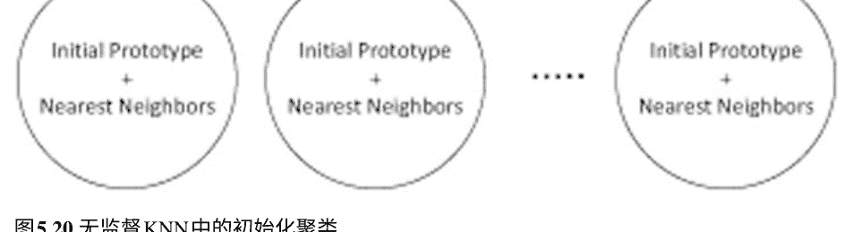

图5.20 无监督KNN中的初始化聚类

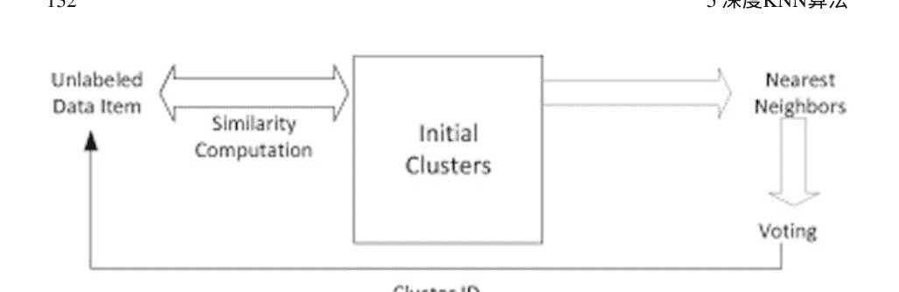

图5.21 无监督KNN中的项目排列

```
java
void clusterDataItemList(List itemList, int clusterNumber, int K){
    List clusterList = itemList.getInitialClusterList(clusterNumber);
    for(int i = 0;i < clusterNumber;i++){
        Cluster cc = clusterList.getElement(i);
        Item clusterPrototype = cc.getPrototype();
        List nearestNeighborList = exampleList.getNearestNeighborList(clusterPrototype,K);
        cc.addItemList(nearestNeighborList);
        clusterList.update(i,cc);
    }
    int itemSize = itemList.size();
    repeat until convergence {
        for(int i = 0;i < itemSize;i++){
            Item indivItem = itemList.getElement(i);
            List nearestNeighborList = clusterList.getNearestNeighborList(indivItem,K);
            int clusterIndex = nearestNeighborList.vote();
            Cluster cc = clusterList.getElement(clusterIndex);
            cc.addItem(indivItem);
            clusterList.update(clusterIndex,cc);
        }
    }
}
```

图5.22 无监督KNN的聚类过程

这些之前已经排列好的。这种数据项的排列会迭代直到收敛。对数据项进行聚类的结果取决于在初始阶段准备的种子示例。

让我们对无监督版本的KNN算法对数据项进行聚类进行一些说明。通过随机决定初始聚类原型并收集它们的最近邻来初始化聚类。根据在初始化聚类时准备的种子示例，将数据项排列到聚类中。

通过使用KNN算法将数据项分组成簇，不断更新簇。可以将替代的基于实例的学习算法半径最近邻改为其无监督版本。

#### 5.4.3 堆叠KNN

本节介绍了堆叠KNN算法作为深度学习算法。 在前一节中，我们研究了应用于数据聚类的无监督版本的KNN算法。 在本节中，我们将有监督版本和无监督版本结合起来，形成KNN算法的深度版本。 无监督版本用于计算隐藏值，有监督版本用于计算输出值。 本节旨在描述堆叠KNN算法。

图5.23展示了用于实现深度学习的KNN算法的堆叠架构。给定的任务被假设为多类别分类，将每个项目分类为M个类别之一。通过无监督KNN算法计算隐藏向量。从输入向量中使用d个无监督KNN算法计算d'维度。 有监督KNN算法的作用是将隐藏向量分类为M个类别之一。 在这个深度版本中，隐藏向量是由无监督版本计算的。

通过无监督的KNN算法从输入值计算隐藏值的过程在图5.24中有所说明。聚类被假设为硬聚类，即每个数据项只被分配到一个簇中。 在这个深度版本中， d'无监督的KNN算法用于计算隐藏值。 隐藏向量的每个元素都是一个整数，表示一个簇的标识符。 无监督的KNN算法通过簇的数量和最近邻居的数量进行区分。

通过监督的KNN算法进行多类别分类的部分在图5.25中有所说明。隐藏向量由 d'无监督的KNN算法从输入向量中计算得到。 将从新数据输入向量映射得到的隐藏向量与从训练样本映射得到的隐藏向量进行相似度计算。 选择最近的邻居，并对它们的标签进行投票以决定。

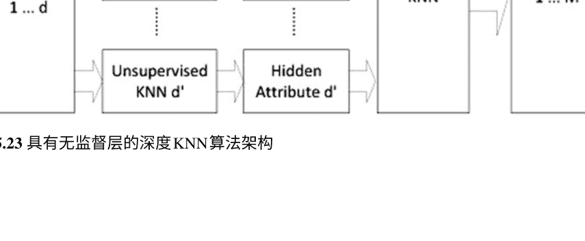

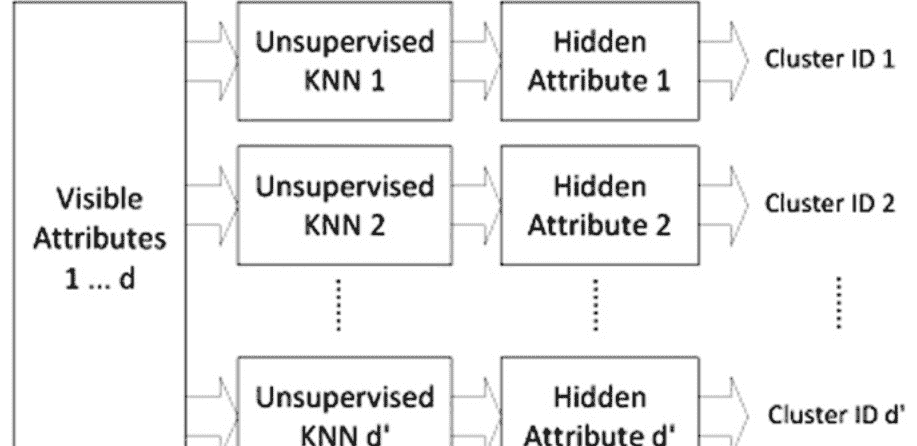

图5.24 用于计算隐藏向量的无监督KNN算法

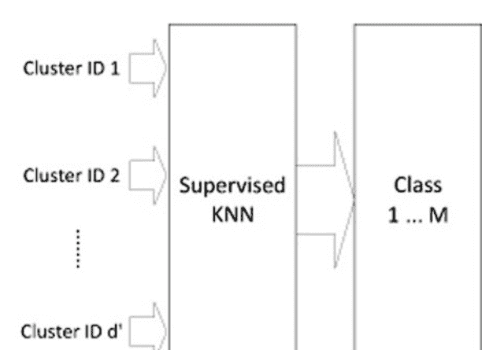

图5.25 用于分类隐藏向量的监督KNN算法

标签。 事先，训练样本通过无监督KNN算法转换为它们的隐藏向量。

让我们对堆叠版本的KNN算法作为深度学习算法进行一些说明。在架构中，多个无监督KNN算法参与计算隐藏向量，而单个监督KNN算法参与分类隐藏向量。由多个无监督KNN算法计算的隐藏向量的每个元素都被给定为一个聚类标识符。从新数据输入向量映射而来的隐藏向量由单个监督KNN算法进行分类。计算隐藏向量的过程是模糊聚类，可能涉及单个模糊无监督KNN算法。

#### 5.4.4 卷积KNN算法

本节介绍卷积KNN算法作为深度学习算法。在前一节中，通过将有监督版本和无监督版本相结合，将深度学习应用于KNN算法。在本节中，无监督KNN算法被深度版本的卷积层所取代。隐藏向量通过卷积层从输入向量计算得到。本节旨在描述被称为卷积KNN算法的深度版本的KNN算法。

这个深度版本的KNN算法的架构如图5.26所示。输入向量是一个d维数值向量，通过卷积层映射成一个a维隐藏向量。通过卷积层将d'维隐藏向量映射出来。映射后的隐藏向量通过KNN算法被分类为M个类别之一。在计算隐藏向量的过程中，多个无监督的KNN算法被卷积层替代。卷积层中涉及到的滤波向量是任意设置的。

通过卷积层将训练样本映射到隐藏向量的过程如图5.27所示。首先准备一组 N个训练样本，每个样本都是一个 d维向量。定义了一组 c个滤波器向量，每个向量都是一个 f维数值向量；滤波器向量的数量 c等于通道数。应用滤波器向量进行卷积后得到的结果是 c个数值向量。这些结果可以表示为一个 N × (c × (d - (f + 1)))维数值向量。从每个训练样本映射得到的 c个数值向量可以看作是一个 (d - (f + 1)) × c矩阵。

使用这个深度版本的KNN算法对新数据进行分类的过程如图5.28所示。通过卷积层将新数据向量和训练样本映射。计算映射后的新数据向量与训练向量的相似度，并选择最相似的向量作为最近邻。通过投票决定新数据向量的标签。

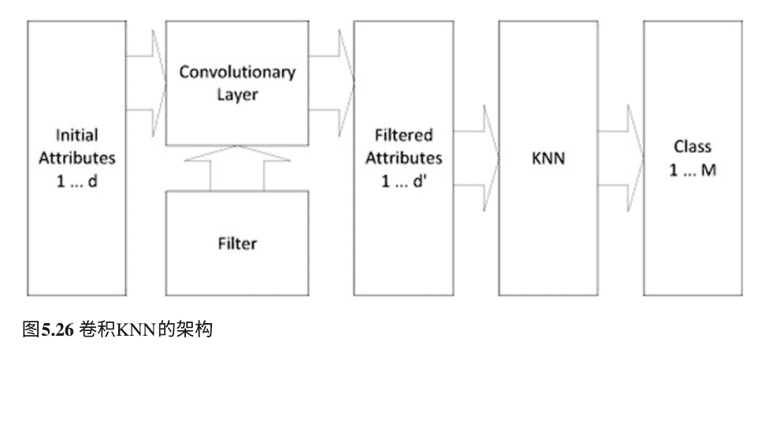

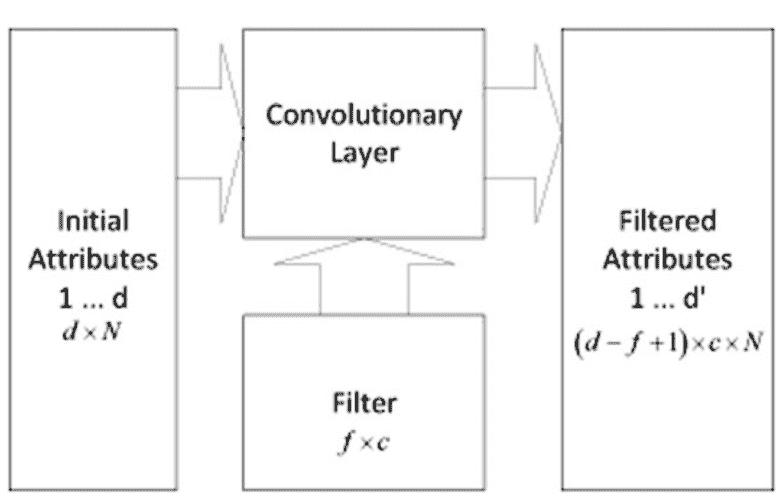

图5.27 通过卷积层对训练样本进行映射

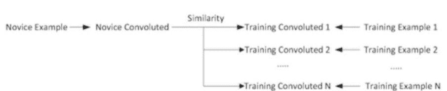

图5.28 卷积KNN中新手样本和训练样本之间的相似度

最近邻的。如果在卷积层中使用多个滤波向量，计算相似度的时间会更长。

让我们对卷积KNN算法作一些说明，因为它是其深度版本。隐藏向量是从卷积层中的输入向量计算得到的。在执行卷积时，涉及到单个滤波向量或多个滤波向量。在这个版本的KNN算法中，计算的是映射向量之间的相似度，而不是原始向量。为了实现更高级的深度版本，可以添加多个卷积层和池化层。

### 5.5 总结和进一步讨论

让我们总结一下本章学习的内容。KNN算法是一种通过对最近邻的标签进行投票来对数据项进行分类或估计输出值的机器学习算法。通过添加输入编码或输出解码，改进的KNN算法包括基于核的KNN算法、输出解码的KNN算法和汇聚KNN算法。 堆叠KNN算法是KNN算法的深度版本，通过将其监督版本和无监督版本相结合。 本节旨在进一步讨论本章所学内容。

让我们考虑一种替代KNN算法的基于实例的学习算法，称为半径最近邻算法。 在KNN算法中，选择了固定数量的最近邻。 在该算法中，选择了相似度大于或等于阈值的训练样本。 这两种算法的区别在于KNN算法采用了排名选择，而半径最近邻算法采用了基于阈值的选择。 半径最近邻的限制是可能存在对新手输入没有最近邻的可能性。

让我们考虑从KNN算法中推导变体的间接邻居。 直接最近邻是与新手输入具有更高相似度的训练样本，而间接最近邻是来自特定最近邻而不是新手输入的样本。 直接最近邻是从新手输入中检索到的，而间接最近邻是从每个直接最近邻中额外检索到的。 间接最近邻可能以相对较低的权重参与投票其标签，而不是直接最近邻的权重。 可以通过从KNN算法和半径最近邻中检索间接最近邻来推导出变体。

深度学习和集成学习都应用于KNN算法。 在第5.3节和第5.4节中，它被修改为其深度版本。我们准备了多个KNN算法的深度版本，并将集成学习应用于它们。 在三种主要方案中选择一种或混合方案：投票、专家门、级联。 我们选择相同深度版本的组合或不同深度版本的组合。

让我们考虑将文本卷积附加到KNN算法中，以应用于文本分类。 卷积是将输入向量或输入矩阵通过滑动滤波器向量或滤波器矩阵的线性组合映射到另一个的过程。 文本被视为单词的列表或矩阵，并且在文本卷积中进行了一些单词的过滤。 一个单词被从外部来源检索出的最相似单词替换。 文本卷积KNN通过将文本卷积作为附加层来实现。

### 参考文献

+   1. T. Jo, “文本挖掘：概念、实现和大数据挑战”， Springer, 2019年。

## 第6章 深度概率学习

本章主要讨论贝叶斯分类器和朴素贝叶斯的深度版本的修改。在概率学习中，我们提到了三种典型的机器学习算法，贝叶斯分类器、朴素贝叶斯和贝叶斯学习[1]。作为基本方案，贝叶斯分类器和朴素贝叶斯通过附加输入编码和/或输出编码来修改为它们的深度版本。作为高级方案，它们被修改为无监督版本，并将它们的原始版本和无监督版本结合在一起形成堆叠版本。本章旨在描述将这两种概率学习算法修改为它们的深度版本的方案。

本章分为五个部分，第6.1节中，我们从概念上描述了深度概率学习。在第6.2节中，我们回顾了三种概率学习算法的简化版本，如贝叶斯分类器、朴素贝叶斯和贝叶斯学习。在第6.3节中，我们描述了贝叶斯分类器和朴素贝叶斯的深度版本，其中添加了输入编码和输出编码。在第6.4节中，我们描述了它们的高级深度版本，它们是通过它们的无监督版本堆叠而成的。在第6.5节中，我们总结了本章的全部内容，并进一步讨论了本章所研究的内容。

### 6.1 引言

本节主要介绍深度概率学习的概述。

概率学习是一种依赖于给定一个新向量的类别概率的机器学习算法，这些概率是从训练样本中定义的。贝叶斯分类器和朴素贝叶斯等概率学习算法通过两种方式进行改进，即添加输入编码或输出编码，并添加无监督版本作为前一层。

k均值算法是贝叶斯分类器的无监督版本；它将用于实现深度版本。本节旨在描述深度概率学习的概述。

让我们提及概率，为研究本章所涵盖的内容提供背景。概率表示事件发生的可能性程度。概率值是一个介于零和一之间的连续值，如公式（6.1）所示：

$$0 \leq P(E) \leq 1 \tag{6.1}$$

其中 $E$ 是一个事件。两个事件是 $A$ 和 $B$，条件概率为 $P(A|B)$ 是事件 $A$ 在事件 $B$ 发生时的概率，用方程（6.2）表示：

$$P(A|B) = \frac{P(AB)}{P(B)} \tag{6.2}$$

接下来，我们将考虑两个条件概率之间的关系， $P(A|B)$ 和 $P(B|A)$。

让我们提到贝叶斯规则，它表达了两个条件概率之间的关系， $P(A|B)$ 和 $P(B|A)$。它们可以用方程（6.2）和（6.3）表示：

$$P(B|A) = \frac{P(AB)}{P(A)} \tag{6.3}$$

两个事件 $A$ 和 $B$ 的概率可以用方程（6.4）表示：

$$P(AB) = P(A|B)P(B) = P(B|A)P(A) \tag{6.4}$$

两个条件概率之间的关系可以表示为方程（6.5）：

$$P(A|B) = \frac{P(B|A)P(A)}{P(B)} \tag{6.5}$$

方程（6.5）被称为贝叶斯规则。在本章中，我们将提到似然作为概率学习中对数据项进行分类的基础。 $P(c_i|\mathbf{x})$ 是给定输入向量 $\mathbf{x}$ 时类别的概率，它可以表示为方程（6.6）：

$$P(c_i|\mathbf{x}) = \frac{P(\mathbf{x}|c_i)P(c_i)}{P(\mathbf{x})} \tag{6.6}$$

其中 $P(c_i|\mathbf{x})$ 被称为后验概率， $P(\mathbf{x}|c_i)$ 被称为似然， $P(c_i)$ 是先验概率，根据上述贝叶斯规则被忽略。我们对于找到数据项 $\mathbf{x}$ 的最大后验概率感兴趣，因此项 $P(\mathbf{x})$ 被忽略；后验概率表示为方程（6.7）：

$$P(c_i|\mathbf{x}) \propto P(\mathbf{x}|c_i) P(c_i) \tag{6.7}$$

先验概率被假设为在类别之间相同的值，表示为方程（6.8）：

$$P(c_1) = P(c_2) = \dots = P(c_m) \tag{6.8}$$

因此，后验概率表示为方程（6.9）：

$$P(c_i|\mathbf{x}) \propto P(\mathbf{x}|c_i) \tag{6.9}$$

数据项根据最大似然被分类到一个类别中。让我们提到本章的意图。我们回顾贝叶斯分类器和朴素贝叶斯作为基础学习算法。我们通过添加输入编码和输出编码将它们修改为它们的深度版本。我们将它们修改为无监督版本，并通过将它们的原始版本和无监督版本组合成更高级的深度学习算法来构建它们的堆叠版本。本章旨在理解将贝叶斯分类器和朴素贝叶斯修改为其深度版本的过程。

## 6.2 简化版本

本节主要讨论了概率学习算法的简化版本，在将其修改为深度版本之前。在第6.2.1节中，我们提到了正态分布，为了理解概率学习提供了背景。在第6.2.2节中，我们提到了贝叶斯分类器，其中每个类别被假设为正态分布。在第6.2.3节中，我们提到了朴素贝叶斯，其中属性被假设为相互独立的。在第6.2.4节中，我们提到了贝叶斯网络，它表示属性之间的因果关系。

#### 6.2.1 正态分布

本节主要讨论正态分布作为连续概率分布。每个类别都被假设为正态分布，最常见的是通过中心极限定理。向量上的正态分布由其均值向量和协方差矩阵来描述。它用于计算给定类别的向量的似然概率。本节旨在描述正态分布，它被定义为每个类别的概率分布。

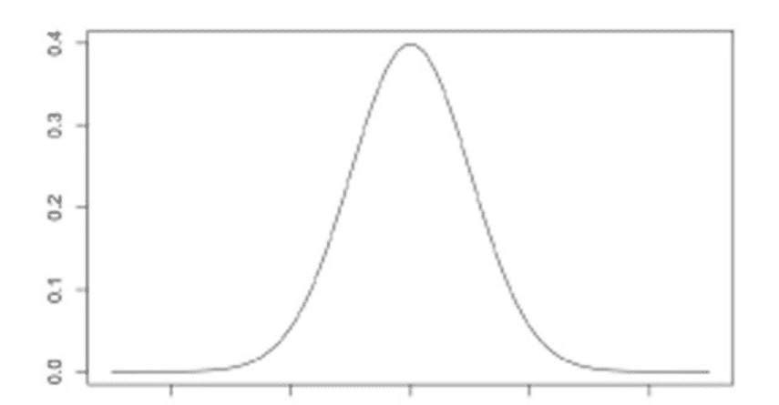

图6.1 标量正态分布

图6.1展示了标量值的正态分布。该分布以其均值 μ 和方差 σ²为特征。在正态分布中，计算 x 的概率由方程(6.10)给出：

$$ f(x) = \frac{1}{\sqrt{2\pi\sigma^2}} \exp\left(-\frac{(x-\mu)^2}{2\sigma^2}\right) $$

当 x = μ 时，正态分布中的概率最大，如果方差 σ²较大，正态分布变得更宽。当方差为 σ²时，正态分布中的概率取决于均值和值之间的差异。

图6.2展示了二维向量的正态函数。该分布以其均值向量 μ 和协方差矩阵 Σ 为特征。 计算特定向量 x 的概率的过程由方程(6.11)表示：

$$ f(\mathbf{x}) = \frac{1}{\sqrt{(2\pi)^d|\mathbf{\Sigma}|}} \exp\left(-\frac{1}{2}(\mathbf{x}-\boldsymbol{\mu})^T \mathbf{\Sigma}^{-1}(\mathbf{x}-\boldsymbol{\mu})\right) $$

如果 μ = x，正态分布的概率最大，如果协方差矩阵的行列式较大，则正态分布变得更宽。 为了简化计算示例的似然度，每个类别都使用恒定的协方差矩阵来定义正态分布。

中心极限定理在图6.3中可视化。这是通常定义连续概率分布时采用正态分布的原因。它表明各种概率分布的混合趋近于正态分布，如图6.3所示。如果随机值几乎是无限的这些次数中，生成值的分布遵循正态分布。正态分布通常用于计算概率学习中输入向量对类别的似然度。

让我们对正态分布进行一些说明，因为它是最流行的连续概率分布。在统计学中，标量正态分布的特征是其均值和方差。标量正态分布可以扩展为向量正态分布，并且它的特征是均值向量和协方差矩阵。正态分布是对称的，并且由中心极限定理支持，该定理表明各种分布的和趋近于正态分布。在概率学习中，正态分布被用于定义每个类别的数据项的概率分布。

用它的均值向量和协方差矩阵。中心极限定理是在各种连续概率分布中选择正态分布的原因。在概率学习中，可以将单个正态分布应用于多个类别，或者在单个类别中使用多个正态分布进行定义。

#### 6.2.2 贝叶斯分类器

本节关注贝叶斯分类器作为一种快速学习算法。我们研究了正态分布，其特征是均值向量和协方差矩阵，每个类别被定义为一个正态分布。在贝叶斯分类器中，给定类别的新样本向量的概率，称为似然，被计算出来，并且将新样本输入分类到具有最大似然的类别中。贝叶斯分类器的学习过程是为每个类别定义一个正态分布，使用训练样本。本节旨在描述贝叶斯分类器的简化版本。

为每个类别定义正态分布的过程在图6.4中进行了说明。在贝叶斯分类器中，我们需要为每个类别定义一个连续概率分布。在类别上定义的正态分布由它们的均值向量和协方差矩阵来描述。

均值向量和协方差矩阵是根据预定义的类别获得的。它们的参数用于计算将新样本输入向量分类到类别的似然度。

贝叶斯分类器仅考虑均值向量对新样本项目进行分类，如图6.5所示。协方差矩阵被假设为固定的，通过公式（6.11）计算新样本项目属于该类别的似然度。新样本输入向量与均值向量的差异是决定概率值的重要因素，仅考虑均值向量。新样本输入向量的类别，x，由其与各类别均值向量的差异决定，如公式（6.12）所示：

$$
c_{\min} = \argmin_{i=1}^{M} ||x - \mu_i|| \qquad (6.12)
$$

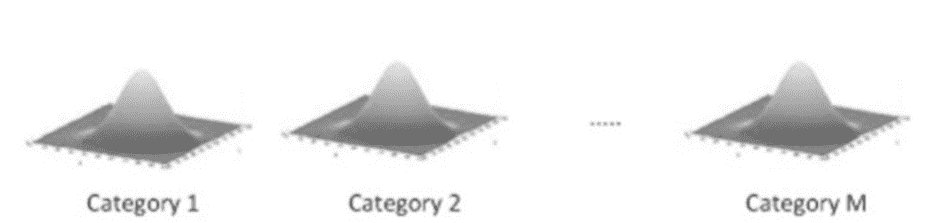

协方差矩阵的行列式取决于实际分类任务中的类别。

贝叶斯分类器通过考虑均值向量和协方差矩阵对新样本项目进行分类的过程如图6.6所示。计算协方差矩阵的行列式和逆矩阵的复杂度非常高，如公式（6.11）所示。假设协方差矩阵是对角矩阵，其中只有对角元素是非零值。行列式通过乘以对角元素计算，逆矩阵通过将对角元素替换为它们的倒数计算。将协方差矩阵假设为对角矩阵意味着属性之间是相互独立的。

让我们对贝叶斯分类器作为一种简单的概率学习算法进行一些说明。每个类别被假设为一个正态分布，其特征是其均值向量和协方差矩阵。如果只考虑均值向量，每个数据项将根据其与均值向量的相似度进行分类。如果考虑均值向量和协方差矩阵，为了方便计算，协方差矩阵被假设为对角矩阵。在贝叶斯分类器中，我们将多个类别定义为单个正态分布或将单个类别定义为多个正态分布。

#### 6.2.3 朴素贝叶斯

本节关注朴素贝叶斯作为另一种概率学习算法。在贝叶斯分类器中，将输入向量属于某个类别的可能性计算为表示该类别的正态分布中输入向量的概率。在朴素贝叶斯中，将个体属性值属于某个类别的可能性计算为具有该属性值的训练样本数与该类别中训练样本数的比值。输入向量的可能性通过假设属性值之间独立性的元素可能性的乘积来计算。

本节旨在描述朴素贝叶斯作为贝叶斯分类器的替代方法。

以属性独立性为假设，图6.7展示了表示朴素贝叶斯的贝叶斯网络。如果两个事件A和B相互独立，则A和B的概率表示为公式(6.13):

$$P(AB) = P(A)P(B) \qquad (6.13)$$

属性由 $A_1, A_2, \dots, A_d$ 表示，在每个属性中假设离散值，并将每个属性视为一组值，$A_i = \{v_{i1}, v_{i2}, \dots, v_{i|A_i|}\}$. 输入向量由 $\mathbf{x} = [x_1, x_2, \dots, x_d]$ 表示，似然函数 $P(\mathbf{x}|C)$ 由各个属性值的似然函数的乘积表示，如公式 (6.14) 所示:

$$P(\mathbf{x}|C) = \prod_{i=1}^{d} P(x_i|C) \qquad (6.14)$$

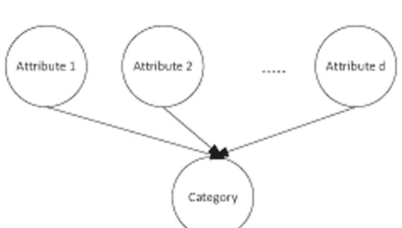

图 6.7 朴素贝叶斯中的贝叶斯网络

为了对数据项进行分类，需要计算各个值的似然函数。

让我们提到计算训练样本中各个值的可能性的过程。类别预定义为 $c_1, c_2, ..., c_M$，输入向量被给定为一个 $d$维向量， $x = [x_1 x_2 ... x_d]$。概率，

$$P(x_i|c_j) = \frac{P(x_i \wedge c_j)}{P(c_j)} = \frac{\#(x_i \wedge c_j)}{\#(c_j)}, \quad (6.15)$$

其中 $\#(x_i \wedge c_j)$是具有 $A_i = x_i$ 在类别 $c_j$中的训练样本数量， $\#(c_j)$是类别 $c_j$中的训练样本数量。似然概率， $P(x_1|c_j), P(x_2|c_j), ..., P(x_d|c_j)$，通过公式 $(6.15)$ 计算向量中的元素。似然概率用于将数据项分类到一个类别中。

让我们提到将数据项分类的过程，以及各个值的可能性。输入向量的可能性由公式 $(6.14)$ 计算。输入向量对于各个类别的可能性计算如下。$P(\mathbf{x}|c_1), P(\mathbf{x}|c_2), ..., P(\mathbf{x}|c_M)$。输入向量的类别由最大可能性决定，该可能性由公式 $(6.16)$ 表示：

$$c_{\max} = \underset{j=1}{\overset{M}{\operatorname{argmax}}} P(\mathbf{x}|c_j). \quad (6.16)$$

公式 $(6.14)$ 可以调整为朴素贝叶斯的变体公式 $(6.17)$ ：

$$P(\mathbf{x}|c_j) = \prod_{i=1}^{d} P(x_i|c_j). \quad (6.17)$$

让我们对朴素贝叶斯进行一些评论，作为更高级的概率学习。属性之间的独立性假设是朴素贝叶斯的特征。一个值对于一个类别的可能性是与该属性和类别对应的训练示例数量的比率，对于属于该类别的训练示例数量的比率。输入向量对于类别的可能性是各个值的可能性的乘积，通过其最大可能性将输入向量分类到一个类别中。

一些朴素贝叶斯的变种可以通过提出替代方案来计算单个值的似然度和计算输入向量似然度的替代方案来推导出来。

#### 6.2.4 贝叶斯网络

本节关注贝叶斯网络作为先进的概率学习算法。在朴素贝叶斯中，假设属性之间完全独立，用于计算输入向量到类别的似然度。在贝叶斯网络中，属性之间的因果关系被定义为一个有向图。每个节点中都定义了条件概率表。

本节旨在描述贝叶斯网络作为最先进的学习算法。

贝叶斯网络在图6.8中作为一个例子进行了说明。变量A和B彼此独立。C仅依赖于A，D依赖于A和B，C和D彼此独立。E依赖于D，但与C独立。A和B是E的祖先，但E与A和B独立。

贝叶斯网络节点中定义的概率表在图6.9中作为示例进行说明。假设C依赖于A，A和C都是二进制值。因为A是初始变量， $P(A = 0)$ 和 $P(A = 1)$ 在A中定义。四个条件概率在C中定义。概率表是通过训练样本构建的学习过程。

让我们考虑贝叶斯网络中的学习过程。属性之间的关系是根据训练样本定义的；属性之间的因果关系或独立性是通过支持度和置信度来决定的。属性值的初始概率是根据起始属性计算的，给定条件属性值的因果属性值的条件概率也是计算的。通过条件概率和初始概率的乘积来计算向量的概率，用于对新样本项目进行分类。详细研究贝叶斯网络请参考[1]。

让我们对贝叶斯网络进行一些评论，作为先进的概率学习。贝叶斯网络被视为一个有向图，其中每个顶点是一个属性，每条边是一个因果关系。概率表在每个顶点中定义了由条件概率值组成的概率表。使用训练样本训练贝叶斯网络的过程包括两个步骤：构建属性之间的因果关系和为每个属性定义概率表。通过修改贝叶斯网络为深度版本，可以构建隐藏变量之间的因果关系。

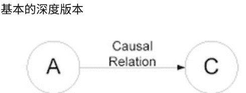

|   | C=0 | C=1 |
|---|---|---|
| A=0 | P(C=0|A=0) | P(C=1|A=0) |
| A=1 | P(C=0|A=1) | P(C=1|A=1) |

图6.9 贝叶斯网络中的条件概率表

## 6.3 基本的深度版本

本节讨论了通过输入编码或输出编码添加的概率学习算法的深度版本。在第6.3.1节中，我们提到了基于核的贝叶斯分类器版本。在第6.3.2节中，我们提到了通过汇聚层添加的贝叶斯分类器。在第6.3.3节中，我们提到了通过输出解码添加的朴素贝叶斯版本。

在第6.3.4节中，将池化层添加到朴素贝叶斯中，以及贝叶斯分类器。

#### 6.3.1 基于核的贝叶斯分类器

本节讨论基于核的贝叶斯分类器版本。通常将核函数应用于两个向量，以计算它们映射向量的内积。在这个版本的贝叶斯分类器中，通过核函数计算均值向量和新样本向量之间的相似度。将输入向量映射到另一个空间中的过程被视为从输入向量计算隐藏向量的过程。本节旨在描述应用输入向量和均值向量的核函数的贝叶斯分类器版本。

将输入向量映射到另一个空间中的过程被视为计算隐藏向量的过程，如图6.10所示。原始输入向量用 x 表示，它的映射向量用 Φ(x)表示。映射过程，x → Φ(x)，被视为计算隐藏向量的过程， h = Φ(x)，满足深度学习的定义。贝叶斯分类器应用于映射向量，在这个版本中，使用Φ(x)代替输入向量 x。类别的均值向量 c_i, μ_i，被映射为向量 Φ(μ_i)。

将均值向量和输入向量的内积视为它们的核函数，在图6.11中进行了说明。根据与均值向量的相似度，将新样本输入向量分类到贝叶斯分类器中。

均值向量 μ_i和输入向量 x分别被映射到另一个空间中的向量 Φ(μ_i)和 Φ(x)，通过核函数表示如下式(6.18):

> Φ(x)·Φ(μ_i) = K(x, μ_i). (6.18)

基于核的贝叶斯分类器中的分类过程取决于输入向量和均值向量的核函数。通过基于核的贝叶斯分类器对数据项进行分类的过程如图6.12中的伪代码所示。类别列表和数据项作为参数给出。通过输入向量和均值向量的核函数计算映射后的输入向量和映射后的均值向量的内积，根据式(6.18)进行计算。将新输入向量分类到核值最大的类别中。在这个版本的贝叶斯分类器中，隐含向量是隐式计算的。

让我们对基于核的贝叶斯分类器的版本进行一些评论。输入向量通过核函数映射到另一个空间，在计算映射向量的内积时。在这个版本的贝叶斯分类器中，通过将核函数应用于它们来计算输入向量和均值向量之间的相似度。一个新样本项目被分类到它们的核函数输出值最大的类别中。这个版本的贝叶斯分类器被视为一种深度学习算法，因为核函数是隐藏向量的映射向量的内积。

```
java
Category classifyByKernelBayesClassifier(Item dataItem, List categoryList){
    int size = categoryList.size();
    double maxKernel = 0.0;
    int maxIndex = 0;

    for(int i = 0; i < size; i++){
        Category cc = categoryList.getElement(i);
        Item meanVector = cc.getMeanVector();
        double kernel = dataItem.getKernel(meanVector);
        if(kernel > maxKernel){
            kernel = maxKernel;
            maxIndex = i;
        }
    }
    return categoryList.getElement(maxIndex);
}
```

图6.12 核贝叶斯分类器的分类过程

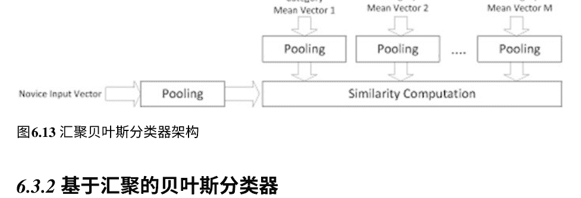

图6.13 汇聚贝叶斯分类器架构

### 6.3.2 基于汇聚的贝叶斯分类器

本节涉及另一种深度贝叶斯分类器，称为基于池化的贝叶斯分类器。在前一节中，我们研究了基于核函数的贝叶斯分类器，其中核函数应用于输入向量和均值向量。在本节中，我们研究了深度贝叶斯分类器的版本，在贝叶斯分类器之前附加了池化操作。池化是对向量进行的一种操作，从滑动在向量上的窗口中提取一个代表性值，以生成另一个向量。本节旨在描述在贝叶斯分类器前附加池化层的贝叶斯分类器。

这个版本的贝叶斯分类器的架构如图6.13所示。池化是通过从滑动在输入向量上的窗口中提取一个代表性值来减少输入维度的操作。池化应用于表征各自类别的新样本向量和均值向量。在这个版本中，通过池化计算新样本向量与均值向量之间的相似性。将贝叶斯分类器修改为其深度版本的池化是从输入向量计算隐藏向量的模块。

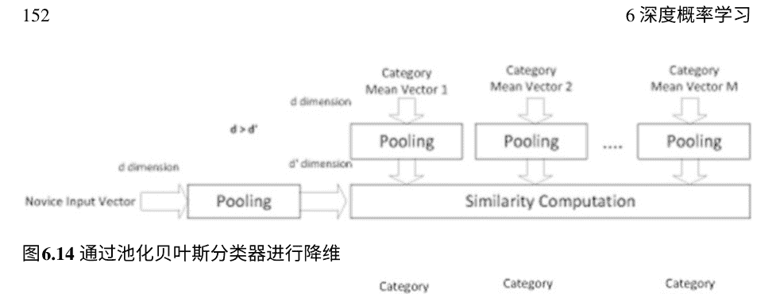

图6.14 通过池化贝叶斯分类器进行降维

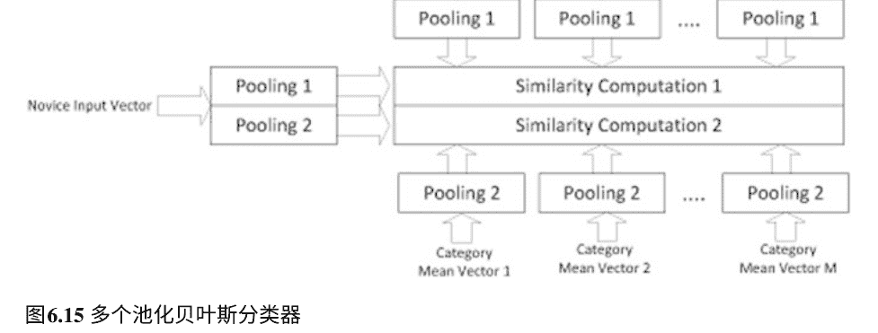

图6.15 多个池化贝叶斯分类器

图6.14展示了通过池化进行的降维。池化被描述为将一个向量映射为具有较低维度的向量的操作。如果输入向量的维度为$d$，并且滑动窗口的大小为$s$，则通过池化映射的向量的维度变为 $d - s + 1$。

如果使用softmax池化操作，在窗口中的$s$个值中最大的值填充在$d - s + 1$个元素中。通过池化从$d$维输入向量映射而来的 $d - s + 1$维向量成为隐藏向量。

图6.15展示了使用多个池化操作的贝叶斯分类器版本。存在各种类型的池化操作，如softmax池化和平均池化，每种操作都具有不同的窗口大小。如果使用两种不同的池化操作，则计算新输入与均值向量的两个相似度。使用两种不同的池化操作被视为将两个贝叶斯分类器应用于分类任务。我们可以考虑逐层串行使用池化操作。

让我们对具有汇聚层的贝叶斯分类器进行一些评论。在架构中，汇聚层附加在贝叶斯分类器的前面。汇聚层通过降低维度的操作，从输入向量生成隐藏向量。如果使用多个汇聚操作，则从单个输入向量和均值向量计算出不同的多个隐藏向量。在使用多个操作时，可以选择串行组合和并行组合。

### 6.3.3 输出解码朴素贝叶斯

本节涉及输出解码朴素贝叶斯，作为朴素贝叶斯的另一种深度版本。在前几节中，我们修改了贝叶斯分类器，它是概率学习的一个实例，改为深度版本。在当前节和下一节中，我们将另一个概率学习的实例，朴素贝叶斯，改为深度版本。输出解码被视为从隐藏向量计算输出向量的过程，它被附加到朴素贝叶斯上。本节旨在描述通过附加输出解码修改的朴素贝叶斯的深度版本。

朴素贝叶斯在类别实现中的应用如图6.16所示。在一般级别上，有两个类别，类1和类2，并且每个抽象类别分配了两个具体类别。在左边，朴素贝叶斯将输入向量分类为类1或类2。右上角的朴素贝叶斯接收被分类为类1的输入向量，并将其分类为类1-1或类1-2，而右下角的朴素贝叶斯接收被分类为类2的输入向量，并将其分类为类2-1或类2-2。这种类型的深度学习被视为使用朴素贝叶斯实现的分层分类。

通过类别抽象将朴素贝叶斯修改为其深度版本的示例如图6.17所示。在这种情况下，假设将一个项目分类为四个类别之一的过程属于模糊分类。左侧朴素贝叶斯将四个类别的似然度估计为它们的分类分数。右侧朴素贝叶斯将由四个似然度组成的四维向量分类为两个类别之一。在朴素贝叶斯的深度版本中，将四维向量视为隐藏向量。

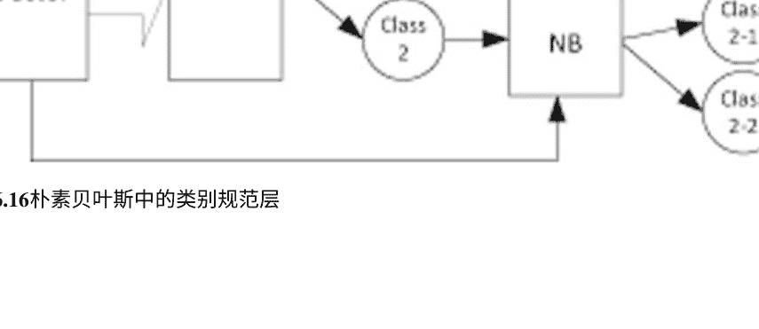

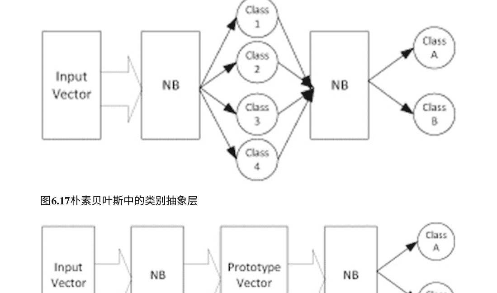

图6.17 朴素贝叶斯中的类别抽象层

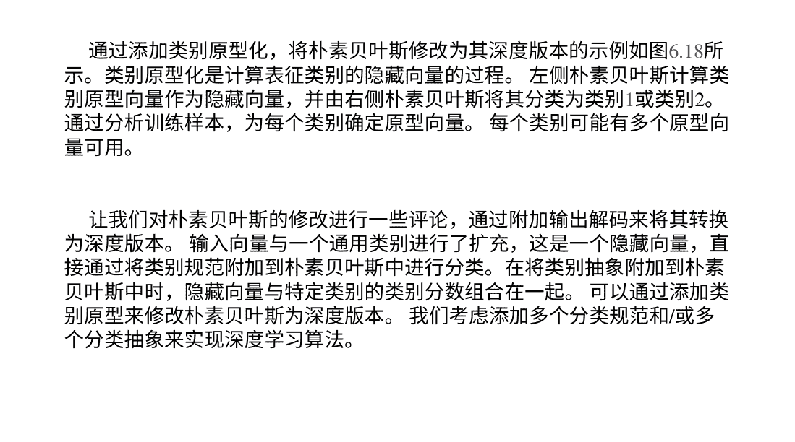

图6.18 朴素贝叶斯中的类别原型层

通过添加类别原型化，将朴素贝叶斯修改为其深度版本的示例如图6.18所示。类别原型化是计算表征类别的隐藏向量的过程。左侧朴素贝叶斯计算类别原型向量作为隐藏向量，并由右侧朴素贝叶斯将其分类为类别1或类别2。通过分析训练样本，为每个类别确定原型向量。每个类别可能有多个原型向量可用。

让我们对朴素贝叶斯的修改进行一些评论，通过附加输出解码来将其转换为深度版本。输入向量与一个通用类别进行了扩充，这是一个隐藏向量，直接通过将类别规范附加到朴素贝叶斯中进行分类。在将类别抽象附加到朴素贝叶斯中时，隐藏向量与特定类别的类别分数组合在一起。可以通过添加类别原型来修改朴素贝叶斯为深度版本。我们考虑添加多个分类规范和/或多个分类抽象来实现深度学习算法。

#### 6.3.4 池化朴素贝叶斯

本节涉及带有池化层的朴素贝叶斯的深度版本。在前一节中，通过附加输出解码（如类别规范和类别抽象）对朴素贝叶斯进行了修改。在本节中，通过附加池化层对其进行了修改。在这个版本中，通过池化层将输入向量映射到类别后，计算向量的似然度。本节旨在描述通过池化层修改的深度版本的朴素贝叶斯。

在图6.19中，我们展示了将池化应用于朴素贝叶斯的过程。池化是对向量进行操作，从滑动窗口中生成代表性值。输入向量表示一个新样本数据项，通过池化将其映射为具有较低维度的另一个向量。通过朴素贝叶斯计算映射向量到类别的似然度。通过在其前面添加池化操作，将其修改为深度版本。

让我们提到计算隐藏向量对类别的似然度的过程。输入向量 x，通过在第5.3.4节中描述的池化操作将其映射为具有 $d-s+1$维度的隐藏向量 $h$，似然度 $P(h_i|c_j)$，通过公式(6.19)计算：

$$ P(h_i|c_j) = P\left(\frac{h_i \wedge c_j}{P(c_j)}\right) = \frac{\#(h_i \wedge c_j)}{\#(c_j)}, \quad (6.19) $$

其中 $\#(h_i \wedge c_j)$ 是从训练样本映射得到的隐藏向量的数量其中 $A_i = h_i$ 且 $x \in c_j$， $\#(c_j)$ 是从训练样本映射得到的隐藏向量的数量其中 $x \in c_j$。这些似然值， $P(h_1|c_j), P(h_2|c_j), ..., P(h_{d-s+1}|c_j)$，通过公式 (6.19) 计算。需要将训练样本映射为隐藏向量以计算似然值。

让我们提到朴素贝叶斯的这个版本对数据项进行分类的过程。输入向量 x，被映射到隐藏向量 h，以及 $d-s+1$ 个单独元素到类别 $c_j$，进行计算。隐藏向量 h，到类别 $c_j$，的似然性由公式 (6.20) 计算，遵循元素之间的独立性。隐藏向量的似然性被计算到预定义的类别；$P(\mathbf{h}|c_1), P(\mathbf{h}|c_2), \ldots, P(\mathbf{h}|c_M)$被计算；并且数据项通过公式 (6.21) 被分类到类别中：

$$ c_{\max} = \underset{j=1}{\operatorname{argmax}} P(\mathbf{h}|c_j) $$ (6.21)

在这个版本的朴素贝叶斯中，输入向量的似然被池化层映射的向量的似然所替代。让我们对朴素贝叶斯的深度版本做一些说明。通过在其前面添加池化层，它被修改为深度版本。新手输入向量通过池化层映射到另一个向量，并计算隐藏向量中每个类别的元素的似然。计算隐藏向量对预定义类别的似然，并将输入向量分类为似然最大的类别。更高级的深度版本的朴素贝叶斯通过交替添加池化层和卷积层来实现。

### 6.4 高级深度版本

本节介绍了朴素贝叶斯和贝叶斯分类器的高级深度版本，通过添加它们的无监督层。在第6.4.1节中，我们将k均值算法作为贝叶斯分类器的无监督版本进行了介绍。在第6.4.2节中，我们将朴素贝叶斯修改为其无监督版本。在第6.4.3节中，我们提到了贝叶斯分类器的深度版本，通过添加无监督层进行修改。在第6.4.4节中，我们将无监督层添加到朴素贝叶斯和贝叶斯分类器中。

#### 6.4.1 无监督贝叶斯分类器

本节关注的是贝叶斯分类器的无监督版本。根据数据项与无监督版本中的均值向量的相似性对数据项进行分类。如果准备了无标签的示例，则正态分布将随机定义。向量上的正态分布由其均值向量和协方差矩阵来描述，但为了简单起见，只考虑均值向量。本节旨在描述实现深度贝叶斯分类器的无监督贝叶斯分类器。

### 图6.20 均值向量的初始化

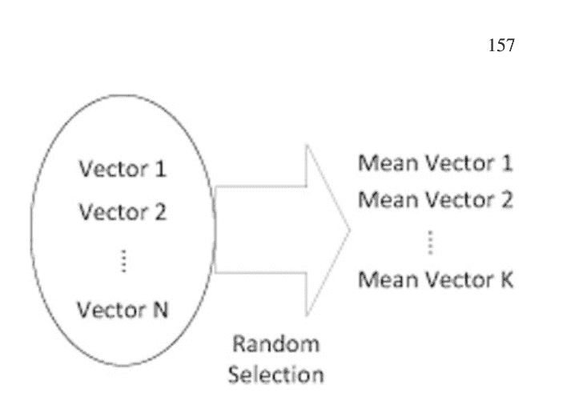

### 图6.21 均值向量的更新

通过随机选择一些初始均值向量来决定初始均值向量的决策在图6.20中进行了说明。假设通过将有标签的示例修改为无监督学习算法来准备无标签的示例。随机选择的初始均值向量的作用是基于聚类数据项的基础，称为种子示例。无监督贝叶斯分类器中的概率分布由选择的均值向量来描述。从无标签的示例中，为了将有标签的学习算法修改为无监督版本，准备了种子示例。

在无监督版本的贝叶斯分类器中，更新聚类均值向量的过程在图6.21中有所说明。聚类的正态分布由初始均值向量来描述。根据与均值向量的相似性，将数据项分组成簇。再次通过计算均值向量和协方差矩阵来描述聚类的正态分布。协方差矩阵被假设为常数，因此我们只考虑均值向量来描述正态分布。

让我们提及通过无监督版本的贝叶斯分类器对数据项进行聚类的过程。聚类分布最初由先验知识或随机数据项来描述。计算每个数据项对于聚类的似然度，将其安排到具有最大似然度的聚类中，并在安排数据项后再次描述聚类分布。它们是通过迭代排列数据项并根据它们的可能性更新聚类分布来进行聚类。无监督贝叶斯分类器进行的聚类过程与在第3章中研究的k均值算法类似。让我们对无监督版本的贝叶斯分类器做一些说明。初始化聚类分布的过程是事先确定聚类的数量，并定义与聚类数量相同数量的初始正态分布。根据聚类分布中的概率排列数据项，并更新它们的参数。使用无监督版本进行数据项聚类的过程是迭代数据项排列和参数更新。使用k均值算法进行数据项聚类的过程可以看作是使用无监督版本进行聚类的过程，该算法在第3章中介绍。

### 图6.22 无监督朴素贝叶斯中的初始化聚类

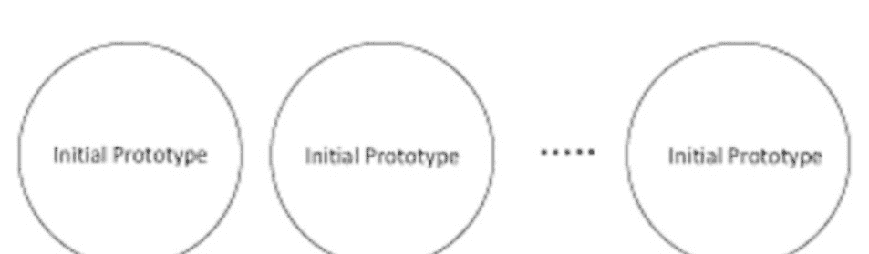

#### 6.4.2 无监督朴素贝叶斯

本节讨论无监督版本的朴素贝叶斯。在前一节中，贝叶斯分类器被修改为其无监督版本。在本节中，我们将朴素贝叶斯修改为另一种概率学习算法，即其无监督版本。需要事先确定聚类的数量，并随机选择种子示例来使用无监督版本。

它旨在描述朴素贝叶斯的无监督版本。使用无监督朴素贝叶斯的初始聚类在图6.22中有所说明。预先决定聚类的数量。随机选择与聚类数量相同的数据项作为初始聚类原型。它们用于计算每个数据项对聚类的似然度。计算每个属性对每个聚类的似然度是从初始聚类原型开始的。

让我们提到计算单个属性值对聚类的似然度的过程。聚类的原型，$C_i$ 由一个向量表示，$c_i = [c_{i1}, c_{i2}, \dots, c_{id}]$，假设每个元素都独立地定义了一个正态分布。属性值$x_j$，对聚类，$C_i$，的似然度是$P(x_j|C_i)$，由公式(6.22)计算：

$$f (x) = \frac{1}{\sqrt{2\pi\sigma^2}}exp\left( -\frac{(x_j - c_{ij})^2}{2\sigma^2} \right) \quad (6.22)$$

方差假设为1.0，方程（6.22）转化为方程（6.23）：

$$f (x) = \frac{1}{\sqrt{2\pi}}exp\left( -\frac{(x_j - c_{ij})^2}{2} \right) \quad (6.23)$$

属性值与聚类原型的对应元素之间的差异对可能性产生影响。

让我们提及计算向量对聚类的可能性的过程。给定一组中的特定数据项作为一个 $d$ 维向量，输入向量, $\mathbf{x}$, 对聚类, $C_i$, 的可能性通过方程（6.24）计算：

$$P (\mathbf{x}|C_i) = \prod_{j=1}^{d} P (x_j | C_i) \quad (6.24)$$

所有聚类的可能性都计算为 $P (\mathbf{x}|C_1)$, $P (\mathbf{x}|C_2)$, $\ldots$, $P (\mathbf{x}|C_M)$, 并且数据项通过方程（6.25）被分配到聚类, $C_{\max}$, 中：

$$C_{\max} = \arg\max_{i=1}^{M} P (\mathbf{x}|C_i) \quad (6.25)$$

计算每个属性对聚类的可能性的过程是与监督版本不同的地方。

让我们对无监督版本的朴素贝叶斯在聚类数据项上进行一些备注。聚类是通过随机选择它们的初始原型来初始化的。计算属性值对聚类的可能性是通过它的独立正态分布来完成的。向量的可能性是通过属性值的乘积来计算的。我们考虑将监督朴素贝叶斯应用于数据项，直到其收敛，以持续更新聚类。

#### 6.4.3 堆叠贝叶斯分类器

本节涉及堆叠贝叶斯分类器作为深度学习算法。在第6.4.1节中，我们研究了贝叶斯分类器的无监督版本，它类似于k均值算法。在本节中，我们将无监督版本和监督版本结合起来，实现深度学习。无监督版本用于计算隐藏值，而监督版本用于训练模型。

### 图6.23 具有无监督层的深度贝叶斯分类器的架构

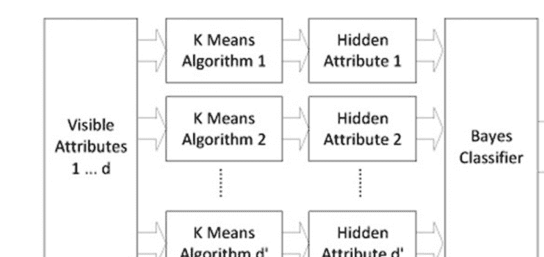

### 图6.24 用于计算隐藏向量的K均值算法

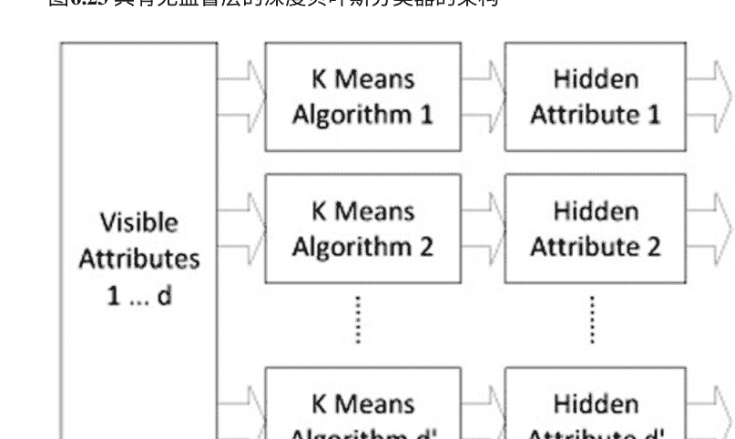

版本用于计算深度版本中的输出值。本节旨在描述基于贝叶斯分类器的深度学习算法。

贝叶斯分类器的堆叠架构用于实现深度学习，如图6.23所示。由于K均值算法与无监督贝叶斯分类器非常相似，因此采用K均值算法来计算输入向量的隐藏向量。每个类别的隐藏向量的概率分布被定义为正态分布。通过K均值算法从输入向量映射得到的隐藏向量被分类为M个类别之一。如果定义了另一个分布，无监督贝叶斯分类器可能与K均值算法不同。

无监督层涉及多个k均值算法，如图6.24所示。无监督层由$d'$个k均值算法组成，用于计算隐藏向量。隐藏向量中的每个元素表示一个整数的聚类标识符。从输入向量计算得到的隐藏向量由 $d'$ 个整数组成。隐藏向量被分类为预定义的类别之一。

### 图6.25 贝叶斯分类器用于分类隐藏向量

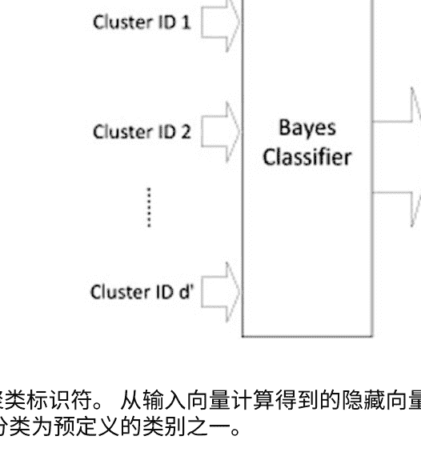

用于分类隐藏向量的有监督层如图6.25所示。它由一个贝叶斯分类器组成，用于进行多类别分类。在训练阶段，通过多个k均值算法将训练样本转换为隐藏向量，并通过隐藏向量为每个类别定义正态分布。在泛化阶段，将新手输入向量转换为隐藏向量，计算其与均值向量的相似度，并将其分类为最相似的类别。下一节将用朴素贝叶斯替换贝叶斯分类器，以处理隐藏向量。

让我们对贝叶斯分类器的堆叠版本进行一些评论，作为一种深度学习算法。在这个深度版本的架构中，多个k均值算法参与计算隐藏向量，并且一个单一的贝叶斯分类器参与分类。由多个k均值算法计算的隐藏向量的每个元素都被给定为一个聚类标识符。从新手输入向量映射而来的隐藏向量由单一的贝叶斯分类器进行分类。计算隐藏向量的过程是模糊聚类，无监督层中涉及一个模糊k均值算法。

### 6.4.4 堆叠贝叶斯分类器

本节涉及堆叠贝叶斯分类器作为一种深度学习算法。在第6.4.1节中，我们研究了贝叶斯分类器的无监督版本，它类似于k均值算法。在本节中，无监督版本和监督版本结合起来实现深度学习。

### 图6.26 朴素贝叶斯带无监督层的架构

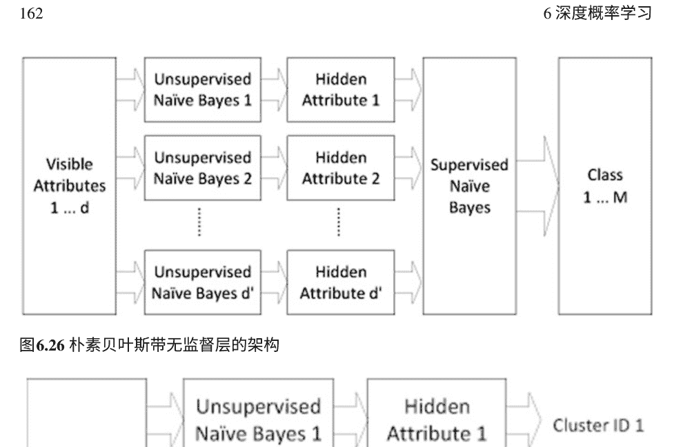

### 图6.27 用于计算隐藏向量的无监督朴素贝叶斯

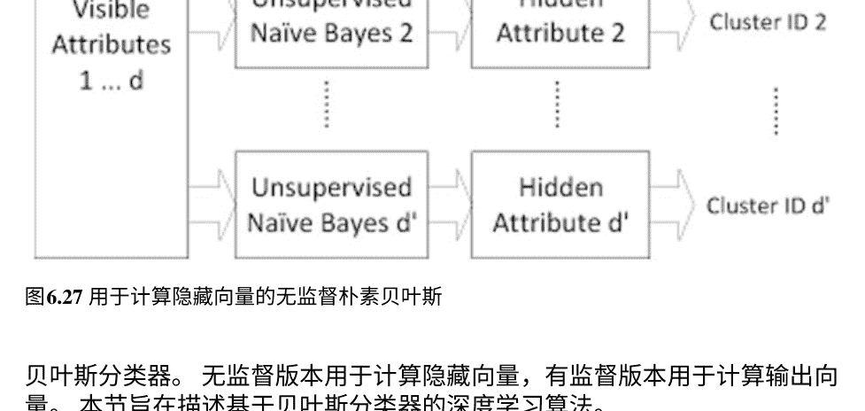

贝叶斯分类器。无监督版本用于计算隐藏向量，有监督版本用于计算输出向量。本节旨在描述基于贝叶斯分类器的深度学习算法。

图6.26展示了这个深度版本朴素贝叶斯的架构。从输入向量中计算隐藏向量涉及到$d'$个无监督朴素贝叶斯。通过单个有监督朴素贝叶斯对隐藏向量进行分类。在应用无监督朴素贝叶斯时，为每个数据项决定一个簇，假设使用硬聚类。在这个深度学习算法中，贝叶斯分类器被朴素贝叶斯取代作为另一种概率学习方法。

在深度版本的朴素贝叶斯中，无监督层在图6.27中有所说明。每个无监督朴素贝叶斯的作用是计算一个元素。

### 图6.28 无监督朴素贝叶斯用于计算隐藏向量

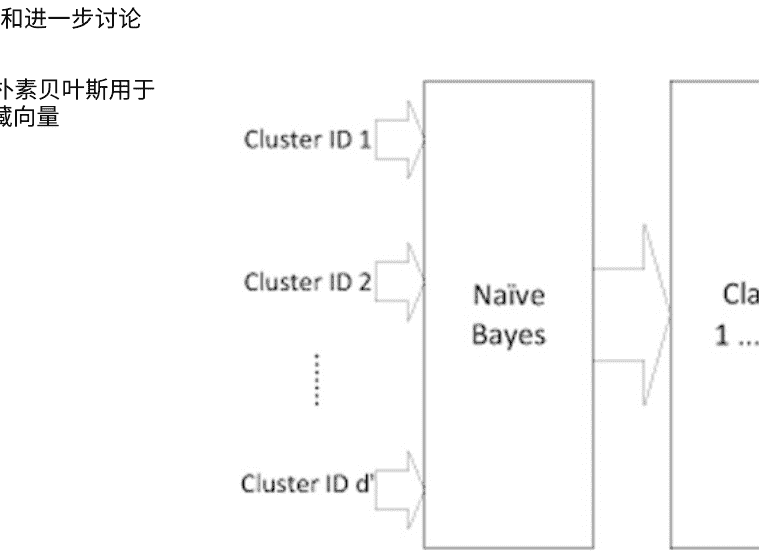

隐藏向量的 每个元素是由无监督朴素贝叶斯安排的一个聚类标识符。如果隐藏向量的维度是 d'，则 d' 个无监督朴素贝叶斯模型用于计算隐藏向量。 在无监督层中，具有 $d$ 维度的输入向量被转换为具有 $d'$ 维度的隐藏向量。

在监督层中，将新手数据项进行分类的过程在图6.28中有所说明。由输入向量在无监督层中计算得到的隐藏向量由聚类标识符组成。 从训练示例映射得到的隐藏向量计算各个属性对类别的似然度。 通过每个类别的各个属性的乘积计算隐藏向量的似然度；将其分类为似然度最大的类别。与传统版本的朴素贝叶斯的不同之处在于计算隐藏向量中各个元素的似然度。

让我们对堆叠的朴素贝叶斯进行一些评论，作为深度版本。堆叠版本由多个无监督版本和一个单一的监督版本组成。 与隐藏向量的维度一样多的无监督版本参与计算隐藏向量。 通过监督朴素贝叶斯对隐藏向量进行分类，而不是输入向量。 我们可以考虑用贝叶斯学习来替换朴素贝叶斯，贝叶斯学习定义了用于实现更高级深度学习算法的贝叶斯网络。

### 6.5 总结和进一步讨论

让我们总结一下本章学习的内容。 属于概率学习的典型机器学习算法包括贝叶斯分类器、朴素贝叶斯和贝叶斯学习。 通过添加输入编码和输出解码，修改后的贝叶斯分类器和朴素贝叶斯是基于核的贝叶斯分类器、汇聚贝叶斯分类器、输出解码的朴素贝叶斯和汇聚朴素贝叶斯。k均值算法是贝叶斯分类器的无监督版本，朴素贝叶斯和贝叶斯分类器通过将它们的监督版本和无监督版本相结合进行堆叠。

本节旨在进一步讨论本章学习的内容。

在计算一个属性值对于一个类别的可能性时，我们可以考虑模糊朴素贝叶斯。在清晰的朴素贝叶斯中，我们计算属性值完全匹配的训练样本的数量来计算可能性。在这个版本中，我们为每个属性值定义模糊分布，并找到属性值在每个训练样本中出现的概率。在清晰的朴素贝叶斯中，如果值不匹配，概率变为零，而在模糊朴素贝叶斯中，即使值不匹配，概率也不为零。使用模糊朴素贝叶斯的结果是属性值的零概率较少。

让我们将基于核的朴素贝叶斯视为一种变体。基于核的学习被视为一种深度学习，因为输入向量被映射到另一个空间，这个空间可能成为一个隐藏向量。定义了两个向量的核函数，并计算其对于一个训练样本和一个新向量的输出值。计算可能性时，计算核函数值大于等于阈值的训练样本的数量。基于核的学习被视为隐式深度学习，与显式深度学习不同，显式深度学习明确计算隐藏值。

让我们提及将卷积层附加到朴素贝叶斯中，称为卷积朴素贝叶斯。卷积是对向量进行操作，通过过滤值将一个向量映射到另一个向量，并且在操作之前应该定义一个单个过滤向量或多个过滤向量。在通过卷积朴素贝叶斯对数据项进行分类的过程中，输入向量通过卷积映射到另一个向量，并计算映射向量到各个类别的似然概率。如果定义了多个过滤向量，则会生成多个映射向量，并对它们的似然概率进行平均。卷积先前用于使用过滤矩阵过滤表示图像的矩阵。

让我们考虑将文本卷积附加到朴素贝叶斯中，以实现其深度版本。文本卷积是对原始文本进行操作，将其视为单词列表。过滤器被定义为单词列表，称为过滤词，对于原始文本中的每个单词，选择最相似的一个。使用多个过滤词列表从单个原始文本生成多个文本。如果将文本卷积应用于文本分类，则可以将其附加到朴素贝叶斯中。

### 参考文献

+   1. T. Jo, 机器学习基础, Springer, 2021.

## 第7章 深度决策树

本章主要讨论决策树及其变体的深度版本的修改。 决策树是一种典型的符号机器学习算法，它能够将其分类转化为逻辑规则，并通过对应其属性值的分支来对数据项进行分类。

作为基本方案，决策树通过附加输入编码和/或输出解码来修改为其深度版本。 作为高级方案，决策树通过修改为其无监督版本，并将其原始版本和修改版本组合成堆叠版本。 本章旨在描述将决策树修改为其深度版本的方案。

本章分为五个部分，第7.1节概述了深度决策树的概念。 第7.2节回顾了决策树的基本版本。 第7.3节描述了决策树的深度版本以及输入编码和输出解码的随机森林。 第7.4节描述了它们的高级深度版本，这些版本是由它们的无监督版本堆叠而成的。 第7.5节总结了本章的全部内容，并进一步讨论了本章所研究的内容。

### 7.1 引言

本节主要介绍深度决策树的概述。 它由训练样本构建，并将每个新手项目从根节点到终端节点进行分类，根据边上的属性值指示给出一个标签。 决策树和随机森林通过添加输入编码和输出解码来修改为深度版本。 决策树被修改为无监督版本，并通过将其无监督版本与原始版本结合构建深度版本。 本节旨在描述决策树的深度版本，以提供概述。

在使用决策树对数据项进行分类时，存在一些假设。假设训练样本中没有噪声；训练样本中的所有属性值都是干净的。将数据项分类的过程可以通过从终端节点到根节点的逻辑规则来表示。在使用决策树时，所有的训练样本都被视为可靠的；忽视了一些训练样本存在噪声或不可靠的事实。然而，决策树相对于对噪声训练样本非常容忍的神经网络的优势在于其透明性，可以提供逻辑规则作为证据。

让我们来介绍一下用于数据分类的决策树的结构。根节点和非终端节点被赋予属性。从一个节点到其子节点的分支对应于一个属性值。与分支对应的属性值的一组训练样本被包含在子节点中。决策树中的终端节点被赋予类别。

让我们提到通过决策树对数据项进行分类的过程。在根节点中，找到与根节点对应的属性，并选择与属性值对应的分支。如果当前节点是非终端节点，在决策树中找到与当前节点对应的属性，并跟随与属性值对应的分支。如果当前节点是终端节点，则将其标签作为分类结果返回。在决策树中，分类从根节点到终端节点进行，从终端节点到根节点提取符号分类规则作为证据。

让我们提到本章的意图。我们回顾决策树和随机森林作为浅层学习算法。我们通过添加输入编码和输出编码将它们修改为深度版本。我们将它们修改为无监督版本，并将它们的监督版本和无监督版本组合成更高级的深度学习算法，构建堆叠版本。本节旨在理解将决策树和随机森林修改为深度版本的过程。

## 7.2 原始版本

本节讨论的是决策树的原始版本，在将其转化为深度版本之前。在第7.2.1节中，我们介绍了决策树的图形视图。在第7.2.2节中，我们提到了使用决策树对数据项进行分类的过程。在第7.2.3节中，我们提到了将根节点选择为学习过程的起点的过程。在第7.2.4节中，我们提到了从训练示例构建决策树的学习过程。

### 图7.1 来自 https://usinuniverse.bitbucket.io/blog/treedatastructure.html的树结构

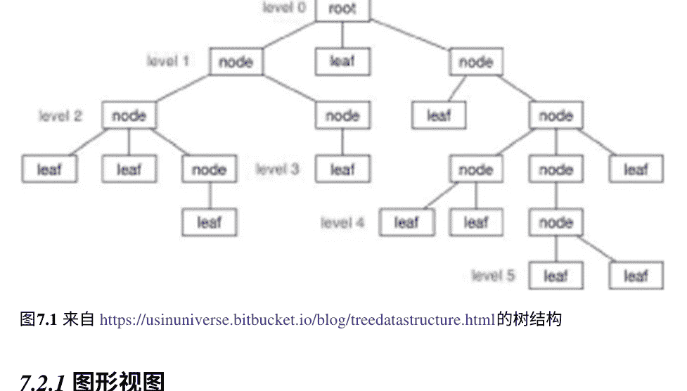

### 7.2.1 图形视图

本节涉及决策树的图形视图，用于对数据项进行分类。树是一种以层次结构形式给出的数据结构。在决策树中，其非终端节点被给定为属性，边被给定为属性值，终端节点被给定为类别。决策树是从训练示例中构建的，作为其学习过程。本节旨在描述具有图形视图的决策树。

数值向量表示示例与决策树的关系在图7.1中说明。假设所有训练示例都有标签，并且给定的任务是数据分类。决策树中的非叶节点表示属性或特征。叶节点表示类别。决策树的学习过程和分类过程都从根节点开始。

数值向量表示示例与决策树的关系在图7.2中说明。假设所有训练示例都有标签，并且给定的任务是数据分类。决策树中的非叶节点表示属性或特征。叶节点表示类别。决策树的学习过程和分类过程都从根节点开始。

用于分类数据项的决策树结构在图7.3中说明。标有A1、A2、A3和A4的非叶节点是属性。标有类别1、类别2和类别3的叶节点是预定义的类别。四个属性的值是二进制值；每条边表示属性值为0或1。在决策树中对项目进行分类的起点是检查属性A2的值，作为根节点的标签。

### 图7.2 数值向量示例与决策树的关系

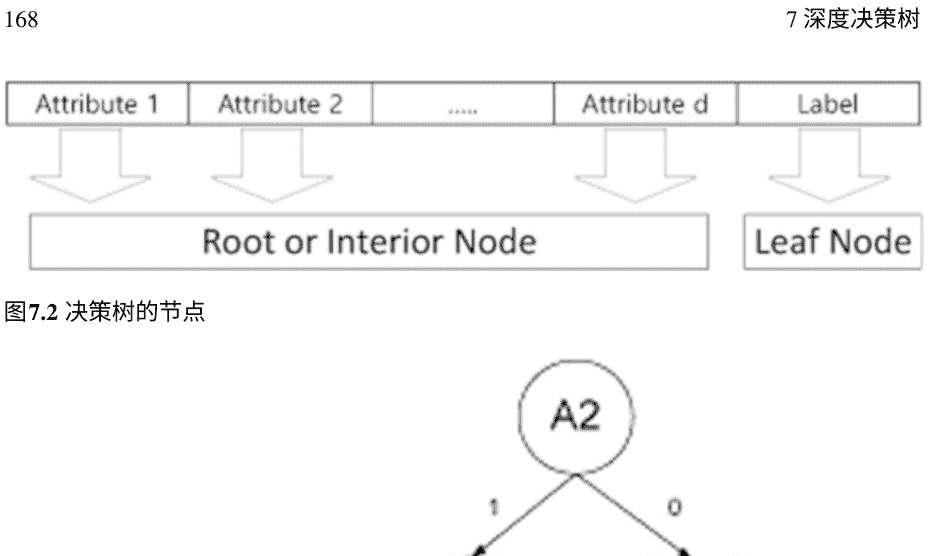

### 图7.3 用于分类数据项的决策树结构

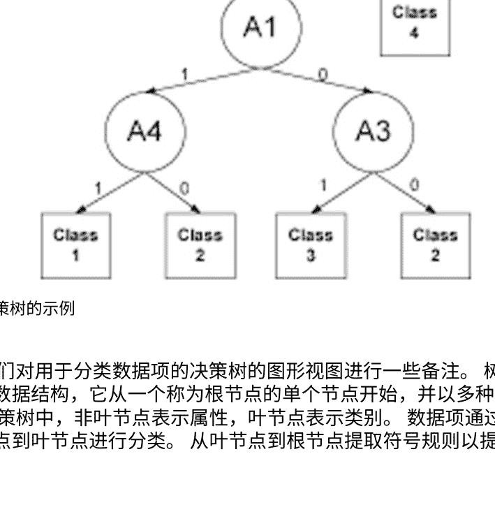

让我们对用于分类数据项的决策树的图形视图进行一些备注。树是一种非线性数据结构，它从一个称为根节点的单个节点开始，并以多种方式扩展。在决策树中，非叶节点表示属性，叶节点表示类别。数据项通过决策树从根节点到叶节点进行分类。从叶节点到根节点提取符号规则以提供证据。

#### 7.2.2 分类过程

本节涉及通过决策树对数据项进行分类的过程。在前一节中，我们研究了决策树的图形视图与示例。

# 图7.4 二分类的决策树

关于叶节点、非叶节点和分支的指示。在决策树中，数据项从根节点到叶节点进行分类。分类路径是与属性值对应的分支列表。本节旨在描述决策树及其分类过程。

图7.4中给出了决策树的示例，用于解释分类过程。根节点对应属性A2，其值为0或1。在分类过程中，如果A2 = 1，则检查属性A1的值，如果A2 = 0，则将项分类为负类。如果A1 = 1，则检查属性A3的值，如果A1 = 0，则检查属性A4的值。它到达终端节点，表示正类或负类；后面是表示属性值的分支。

让我们解释一下通过决策树对数据项进行分类的过程，如图7.4所示的下一个决策树。二进制输入向量，[1 1 0 1]其中A1 = 1，A2 = 1，A3 = 0，A4 = 1，被给定为分类目标。根节点由A2表示，选择左分支到A1，因为A2 = 1。因为A1 = 1和A4 = 1，选择A1的左子节点A4，将项分类为正类。分类该项的路径，[1 1 0 1]，变为 A2 → A1 → A4 → +。

将数据项通过决策树进行分类的过程在图7.5的伪代码中实现。在函数classifyByDecisionTree中，根节点来自决策树，并且使用根节点作为参数调用函数classifyByNode。在函数classifyByNode中，如果当前节点是叶节点，表示一个类别，则将当前节点的标签作为类别返回。否则，从当前节点获取一系列分支，搜索与属性值匹配的分支，并使用其子节点替换当前节点，递归调用函数classifyByNode。

```
Category classifyByDecisionTree(Item dataItem) {
    Node rootNode = this.getRootNode();
    return this.classifyByNode(rootNode, dataItem);
}

Category classifyByNode(Node currentNode, Item dataItem) {
    if (currentNode.isTerminal()) {
        Category cc = new Category(currentNode.getLabel());
        return cc;
    }

    Feature ff = new Feature(currentNode.getLabel());
    List branchList = currentNode.getBranchList();
    int branchSize = branchList.size();
    for (int i = 0; i < branchSize; i++) {
        Branch bb = branchList.getElement(i);
        if (bb.isMatch(dataItem)) {
            Node childNode = currentNode.getChildNode(branch);
            return classifyByNode(childNode, dataItem);
        }
    }
    return "Not Classified";
}
```

### 图7.5 决策树分类算法

通过递归调用函数classifyByNode，将当前节点替换为其子节点，并进行调用。通过递归调用函数classifyByNode，实现决策树中的分类过程。

让我们对本节中涵盖的决策树分类过程进行一些说明。将决策树的叶节点解释为类别，将非叶节点解释为属性，将分支解释为属性值。数据项通过决策树从根节点到叶节点进行分类，沿着对应其属性值的分支进行。通过递归调用函数实现决策树的分类。

从叶节点到根节点，决策树中提取了符号规则以追踪分类过程。

|             | Attribute 1 | Attribute 2 | Attribute 3 | Attribute 4 |
|-------------|-------------|-------------|-------------|-------------|
| Value 1     | 6:6:6:7     | 10:10:10:10 | 20:1:2:2    | 10:5:5:5    |
| Value 2     | 7:6:6:6     | 5:5:5:5     | 1:22:1:1    | 5:10:5:5    |
| Value 3     | 6:7:6:6     | 5:5:5:5     | 1:1:23:0    | 5:5:10:5    |
| Value 4     | 5:7:7:6     | 5:5:5:5     | 2:2:2:19    | 5:5:5:10    |

### 图7.6 用于属性选择的不平衡

#### 7.2.3 根节点选择

本节涉及决策树中选择根节点的过程。在前一节中，我们研究并实现了决策树的分类过程。在本节中，根节点作为分类数据项的起点是根据训练样本决定的。决策树的学习过程中，决定根节点的过程递归地应用于其后代。本节旨在描述解码根节点的过程。

图7.6以提供选择属性作为根节点的直观感受，说明了属性值的分布情况。在给定的分类任务中，假设有四个属性，每个属性有四个离散值和四个类别。每列是一个属性，每行是一个属性值，每个单元格是在四个类别中具有该属性值的训练样本数量。在四个属性中，属性3在四个类别的训练样本中具有不平衡的分布；因此选择属性3作为根节点。

需要用于构建决策树的度量属性不平衡的方法。

从属性中选择根节点的过程在图7.7中以伪代码的形式进行说明。属性和类别分别用 A1, A2, …, Ad 和 c1, c2, ...表示。当假设每个属性是离散的时，它被视为一组值，Ai = {vi1, vi2, …, vi|Ai}。#((Ai = vik) ∧ cj)表示具有 Ai = vik的训练示例的数量，属于类别cj。#(Ai = vik)表示具有 Ai = vik的训练示例的数量，#(cj)表示属于类别cj的训练示例的数量，p((Ai=vik)∧cj)是类别中的一部分，cj在属性值中，Ai = vik，如公式（7.1）所示：

p((Ai=vik)∧cj) = #((Ai = vik) ∧ cj) / #(Ai = vik) (7.1)

```
Node selectRootNode(List attributeList, List dataItemList, List categoryList){
    int dimension = attributeList.size();
    int categorySize = categoryList.size();
    double maxTotalPortion = 0.0;
    int rootIndex = 0;

    for(int i = 0; i < dimension; i++){
        Attribute aa = attributeList.getElement(i);
        List valueList = aa.getValueList(dataItemList);
        int valueSize = valueList.size();
        double totalPortion = 0.0;
        for(int j = 0; j < valueSize; j++){
            Value vv = valueList.getElement(j);
            double maxPortion = 0.0;
            for(int k = 0; k < categorySize; k++){
                Category cc = categoryList.getElement(k);
                double portion = cc.getPortion(dataItemList, vv);
                if(portion > maxPortion)
                    maxPortion = portion;
            }
            totalPortion = totalPortion + maxPortion;
        }
        if(totalPortion > maxTotalPortion){
            maxTotalPortion = totalPortion;
            rootIndex = i;
        }
    }
    Node rootNode = new Node(attributeList.getElement(rootIndex));
    return rootNode;
}
```

### 图7.7 通过不平衡指数选择根节点

$P_{((A_i=v_{ik}),c_{max})}$ 是属性值中类别的最大大部分，$A_i = v_{ik}$，如公式（7.2）所示：

$$ P_{((A_i=v_{ik}),c_{max})} = \max_{j=1}^{M} \frac{\#((A_i = v_{ik}) \wedge c_j)}{\#(A_i = v_{ik})}, \quad (7.2) $$

不平衡指数，$p_{A_i}$，表示为方程（7.3）：

$$ p_{A_i} = \sum_{k=1}^{|A_i|} p_{((A_i=v_{ik}),c_{max})} \quad (7.3) $$

对于每个属性，其不平衡指数由方程（7.3）计算，并选择具有最大指数的属性作为根节点，如方程（7.4）所示，

$A_{\text{max}} = \underset{i=1}{\operatorname{argmax}} p_{A,i}$ (7.4)

通过使用除了一被选为根节点的属性列表以外的属性列表，递归调用此算法将根节点链接到其子节点。$Tr_A$ $i=v_k$，对于每个属性值。

在选择属性作为当前节点标识符时，不平衡指数可以被信息增益所取代。方程（7.2）是类别的一部分，$c_j$，在属性值中，$A_i = v_{ik}$。熵由方程（7.5）计算，对于每个属性：

$E_{(A_i=v_{ik})} = -\sum_{j=1}^{M} p((A_i=v_{ik}) \land c_j) \log_2 p((A_i=v_{ik}) \land c_j)$ (7.5)

通过公式（7.6）计算每个属性的信息增益：

$I G_{A_i} = \sum_{k=1}^{|A_i|} E_{(A_i=v_{ik})}$ (7.6)

选择具有最大信息增益的属性作为节点标识符。让我们对在决策树中选择属性作为根节点的过程进行一些说明。根据直觉，选择具有最大不平衡性的属性。计算每个属性的类别占主导地位，以找到属性的不平衡指数。信息增益取代了不平衡指数。在确定属性作为根节点后，为每个属性值分配一个子节点的训练示例子集。

#### 7.2.4 学习过程

本节关注的是从训练样本中构建决策树的过程。在前一节中，我们研究了选择属性作为根节点的过程。在确定了根节点之后，对于每个分支，与之对应的训练样本，子节点是通过确定根节点的过程来决定的。如果剩余的样本标记相同，子节点就成为一个表示类别的叶节点。本节旨在描述使用训练样本构建决策树的过程。

从根节点到叶节点的路径上更新训练集的过程如图7.8所示。在决策树中，非叶节点是一个属性，分支是一个属性值。整个训练样本集都涉及到根节点A1，以及满足条件的训练样本子集条件。$A1 = V1$参与其子节点$A2$。训练示例与。$\wedge (AL = VL)$保留在叶节点C中。训练示例集从根节点更新到叶节点。

### 图7.8 从根节点到终端节点的训练集更新

选择节点的算法使用属性列表和示例列表递归调用，如图7.9所示。如果没有属性和训练示例，则以空结束；如果列表中的示例具有相同的标签，则创建一个以该标签标识的节点作为叶节点终止。通过选择根节点作为节点标识符，从属性列表中选择属性。对于所选属性中的每个值，通过删除所选值并仅选择与之对应的示例来更新属性列表和示例列表。使用更新后的属性列表和示例列表递归调用节点选择算法。

在选择一个属性作为当前节点后，定义分支的过程如图7.10所示。假设所选属性的值是有限的；需要对属性值进行离散化处理以应用决策树。在选择属性时，属性值为将属性值$a_i$作为当前节点，如下所示：$a_i \leftarrow v_{i,1}, v_{i,2}, \ldots, v_{i,|a_i|}$，其中$|a_i|$是属性值的数量，$a_{i \circ}$定义了$|a_i|$个分支；每个分支对应一个属性值，$v_{i,k \circ}$训练集按属性值逐个划分为子集，以便进入下一层级。

让我们对从训练样本构建决策树的过程进行一些说明。训练集根据从上到下满足属性值的子集进行更新。计算当前属性集中每个属性的不平衡指数或信息增益，以选择一个属性作为当前节点，并更新属性集，排除已选择的属性。在选择属性后，按节点值逐个构建分支。从训练样本构建决策树的过程采用递归方式实现。

### 7.3 基本深度版本

本节涉及决策树的深度版本，包括随机森林。在第7.3.1节中，我们描述了随机森林，它被视为决策树的高级版本。在第7.3.2节中，我们提到了改进的版本。随机森林的改进版本将训练集通过对训练样本进行聚类来进行分区。在第7.3.3节中，我们提到了决策树的版本，该版本通过输出解码进行了添加。在第7.3.4节中，我们将池化层添加到决策树中，将其修改为深度版本。

```
Node selectNode(Node currentNode, int branchIndex, List attributeList, List dataItemList, List categoryList ){
    int attributeSize = attributeList.size();
    int categorySize = categoryList.size();
    double maxTotalPortion = 0.0;
    int nodeIndex = 0;
    if(attributeList.isEmpty() || dataItemList.isEmpty())
        return;
    if(dataItemList.isIdenticallyLabeled()){
        Node node = new Node(dataItemList.getLabel());
        currentNode.setChildNode(branchIndex, node);
        return;
    }
    for(int i = 0;i < attributeSize;i++){
        Attribute aa = attributeList.getElement(i);
        List valueList = aa.getValueList(dataItemList);
        int valueSize = valueList.size();
        double totalPortion = 0.0;
        for(int j = 0;j < valueSize;j++){
            Value vv = valueList.getElement(j);
            double maxPortion = 0.0;
            for(int k = 0; k < categorySize;k++){
                Category cc = categoryList.getElement(k);
                double portion = cc.getPortion(dataItemList, vv);
                if(portion > maxPortion)
                    maxPortion = portion;
            }
            totalPortion = totalPortion + maxPortion;
        }
        if(totalPortion > maxTotalPortion){
            maxTotalPortion = totalPortion;
            nodeIndex = i;
        }
    }
    Attribute selectedAttribute = attributeList.getElement(nodeIndex);
    List selectedAttributeValueList = selectedAttribute.getValueList(dataItemList);
    int selectedAttributeValueSize = selectedAttributeValueList.size();
    Node node = new Node(selectedAttribute);
    attributeList.deleteElement(nodeIndex);
    currentNode.setChildNode(branchIndex, node);
    for(int i = 0;i < selectedAttributeValueSize;i++){
        Value attributeValue = selectedAttributeValueList.getElement(i);
        List updatedDataItemList = dataItemList.getElementList(attributeValue);
        selectNode(currentNode.getChildNode(branchIndex), i, attributeList, updatedDataItemList, categoryList);
    }
}
```

### 图7.9 递归形式的节点选择

#### 7.3.1 随机森林

本节涉及随机森林作为一组决策树。训练集被分割成子集，作为实施随机森林的准备工作。每个决策树都使用自己的子集进行训练。通过将集成学习方案应用于决策树，每个数据项都被分类。本节旨在描述随机森林，它是一组决策树。

训练集的划分如图7.11所示。我们已经在第4.2节中详细研究了训练集的划分。初始版本的随机森林采用随机划分方案。训练示例的子集用 $Tr_1, Tr_2, ..., Tr_K$ 表示。每个子集，用于构建决策树的子集，$DT_i$。

从训练示例的子集构建多个决策树如图7.12所示。训练集 $Tr$ 被划分为 $K$ 个子集，$Tr_1, Tr_2, ..., Tr_K$。决策树 $DT_i$ 是从子集中的训练示例构建的，$Tr_i$。随机森林由 $K$ 个决策树组成，$DT_1, DT_2, ..., DT_K$，最终构成随机森林。最后，随机森林由这 $K$ 个决策树组成。选择决策树或随机森林就像选择一个大尺寸的单个决策树或多个小尺寸的决策树一样。

让我们回顾一下应用于随机森林中多个决策树组合的方案。投票是一种通过收集多个决策树的答案来决定最终答案的方案。专家门是一种通过从被提名者那里获取答案来决定最终答案的方案。决策树。级联是一种通过当前决策树来决定最终答案的方案，其中其答案被判断为确定的。我们已经在第4章详细研究了这三种方案。

让我们对随机森林作为多个决策树组合进行一些评论。训练集被划分为子集以实施随机森林。从每个子集构建一个决策树，并且多个决策树是通过学习训练样例得到的结果。在对数据项进行分类的过程中，它通过决策树进行分类，并通过投票来决定最终答案。根据分区方案和组合方案，让我们考虑随机森林的各种版本。

#### 7.3.2 基于聚类的多决策树

本节关注的是使用训练示例的聚类来训练的随机森林。在前一节中，我们研究了随机森林的初始版本，在该版本中，训练集通过随机选择训练示例进行划分。在本节中，我们研究了随机森林的升级版本，在该版本中，训练集通过对训练示例进行聚类来划分子集，具体取决于它们的相似性。聚类训练示例需要使用无监督学习算法，如k均值算法。本节旨在描述随机森林的高级版本，其中添加了数据聚类。

将训练集通过对训练示例进行聚类划分的过程如图7.13所示。数据聚类是将一组数据项分割成子群的过程，每个子群称为一个簇，其中包含相似的数据项。在这种划分训练集的方案中，训练示例是被分成子群，每个子群都有相似的训练样例，并且每个子群成为一个子集。聚类算法应该与监督学习算法分开采用，并且训练样例根据它们的相似性进行聚类，而不考虑它们的目标标签。每个子集由与划分训练集的结果相似的训练样例组成。通过模糊聚类生成项-群集成员矩阵的过程如图7.14所示。模糊聚类是将每个数据项分配到群集成员的过程。训练样例的模糊聚类是将每个训练样例分配到群集成员的过程，而在训练样例上生成的项-群集成员矩阵是这样做的结果。整个训练样例集合被分配给每个决策树，并且它根据它们的区分学习训练样例。如果采用训练样例的模糊聚类，决策树可能会更大。

决策树的构建与一组训练示例的聚类有关，如图7.15所示。训练示例通过聚类算法进行聚类，而不考虑它们的标签。这些 K个聚类包含相似的训练示例，每个决策树由每个聚类中的示例构建而成。每个决策树对应于它自己的聚类；这个版本的随机森林由与聚类对应的 K个决策树组成。

对于从 $K$ 个决策树中决定最终答案，推荐使用专家门而不是投票。

让我们对通过对训练示例进行聚类构建的随机森林进行一些说明。它们根据相似性，通过聚类算法对训练示例进行聚类，而不考虑它们的目标标签。我们考虑对训练示例进行模糊聚类，生成项目-聚类成员矩阵，而不是聚类。在这个版本的随机森林中，每个训练示例的聚类构建一个决策树。我们考虑将属性集划分为子集，以构建随机森林。

## 7.3.3 输出解码决策树

本节关注决策树的深度版本，称为输出解码决策树。在前一节中，我们研究了随机森林作为集成学习应用于决策树。在当前节和下一节中，我们将决策树修改为其深度版本。输出解码是将机器学习算法修改为其深度版本的附加过程，被视为从隐藏向量计算输出向量的过程。本节旨在描述输出解码决策树作为深度学习算法。

决策树在类别规范实现中的应用示例如图7.16所示。在一般级别上，有两个类别，类1和类2，并且每个抽象类别分配两个具体类别。在左侧，决策树将输入向量分类为类1或类2。右上角的决策树接收被分类为类1的输入向量，并将其分类为类1-1或类1-2，底部右侧的决策树接收输入向量，将其分类为类别2，并将其分类为类别2-1或类别2-2。这种类型的深度学习被视为使用决策树实现分层分类。

通过类别抽象将决策树修改为其深度版本，如图7.17所示。假设通过左侧决策树对项目进行分类属于模糊分类。模糊决策树估计四个分类得分；从输入向量计算出四维隐藏向量。通过右侧决策树将四维向量分类为两个类别之一。为了实现这种深度学习算法，需要将决策树修改为其模糊版本。

使用类别优化实现深度决策树的示意图如图7.18所示。中间类别，类别1和类别2，被定义，并且输入向量通过左侧决策树被分类为这两个类别之一。图7.18 决策树中的类别优化层。通过右侧决策树，将附加了中间类别的输入分类为类别A或类别B。左侧决策树被视为无监督决策树；假设中间类别和最终类别之间的相关性较弱。表示类别1和类别2的类别分数的向量被视为输入向量的附加元素。

让我们对附加了输出解码的深度决策树进行一些说明。通过添加类别规范，通过将输入向量与其抽象类别相结合，计算出隐藏向量。通过添加类别规范，通过获取特定类别的类别分数，计算出隐藏向量。通过添加类别优化，通过将中间类别的类别分数分配给输入向量，计算出隐藏向量。将输出解码添加到将机器学习算法修改为深度版本的过程被视为从隐藏向量计算输出向量的过程。

## 7.3.4 池化朴素贝叶斯

本节讨论的是具有池化层的深度决策树版本。在上一节中，我们通过附加输出解码来修改决策树，例如类别规范和类别抽象。在本节中，我们通过添加池化层作为特征提取将决策树修改为深度版本。通过池化层减少维度的效果预计会得到更紧凑的决策树。本节旨在描述具有池化层附加的深度决策树的版本。

图7.19 决策树中的池化层
图7.20 具有池化层的决策树中的学习

通过附加池化层将决策树修改为其深度版本的示例如图7.19所示。指示数据项的输入向量通过池化层映射为另一个向量。如果输入向量的维度为 d，窗口的大小为 s，则映射向量的维度为 d-s+1。通过池化将输入向量映射为另一个向量可以解释为从输入向量计算隐藏向量的过程。

在这个版本的决策树中，隐藏向量直接被分类。通过映射的训练样本构建决策树的过程在图7.20中有所说明。原始训练样本集被表示为 $Tr = \{x_1, x_2, ..., x_N\}$，每个训练样本都是一个 d维向量，被表示为 $x_i = [ x_{i1} x_{i2} ... x_{id} ]$。每个训练样本 $x_i$ 被映射为一个隐藏向量 $h_i = [h_{i1} h_{i2} ... h_{i(d-s+1)}]$，通过滑动窗口和池化操作进行映射，窗口大小为 s。通过池化从训练样本映射得到的隐藏向量集合被表示为 $Tr_h = \{h_1, h_2, ..., h_N\}$。决策树是从集合 $Tr_h$ 构建的，而不是从 $Tr$，具体过程在第7.4节中描述。

让我们提到通过这个决策树版本对数据项进行分类的过程。决策树是由从训练样本映射而来的向量集合构建的， $Tr_h = \{\mathbf{h}_1, \mathbf{h}_2, \ldots, \mathbf{h}_N\}$。新数据向量 $\mathbf{x}$ 被准备好并映射到隐藏向量 $\mathbf{h}$，通过池化层映射向量 $\mathbf{h}$，通过在第7.2.2节中描述的过程进行分类。分类数据项的过程与决策树的原始版本相同，只是应用了池化。

让我们对深度决策树做一些备注。池化是将输入向量映射到具有较低维度的另一个向量的过程。构建决策树的过程是通过池化层将训练样本映射到它们自己的隐藏向量，并通过隐藏向量构建决策树。在这个决策树版本中，它的非叶节点是隐藏向量中的属性，它的边是隐藏向量的元素。我们考虑通过对隐藏向量集合进行分区来构建随机森林。

### 7.4 高级深度版本

本节讨论的是决策树和随机森林的高级深度版本。在第7.4.1节中，我们将决策树修改为无监督版本。在第7.4.2节中，我们提到了堆叠决策树，其中决策树被修改。在第7.4.3节中，我们将随机森林修改为无监督版本。在第7.4.4节中，我们向随机森林添加了无监督层，以将其修改为深度版本。

#### 7.4.1 无监督决策树

本节讨论的是决策树的无监督版本。最初设计为有监督学习，处理带标签的示例。在本节中，我们将决策树修改为无监督版本，可以处理无标签的示例。事先需要确定聚类数和初始聚类原型。本节旨在描述用于聚类数据项的无监督决策树。

连续属性的离散化在图7.21中有所说明。在决策树的分支中，每个属性值对应一个自己的属性，每个属性都被假设为离散的。在离散化连续属性的过程中，选择最大值和最小值，并在它们之间确定有限数量的范围。连续属性值被映射为对应于其原始值存在范围内的离散值。离散化连续属性的一个问题是如何确定范围的数量和每个范围的大小。

图7.21 属性值离散化
图7.22 无监督决策树中的根节点选择

从每个属性值的聚类中计算聚类指数的过程在图7.22中有所说明。假设每个属性的值的数量是有限的；连续属性通过上述过程进行离散化。

未标记的示例根据其属性值进行聚类；每个聚类由一个属性值来描述。在[1]中解释的聚类指数被计算给聚类；具有最大聚类指数的属性被选为根节点。聚类的数量是给定属性中的值的数量。

无监督决策树中的非叶节点和叶节点在图7.23中说明。通过上述过程选择根节点，并将具有相应属性值的数据项作为一个聚类。在层次聚类数据项的过程中，选择具有最大聚类指数的属性作为非叶节点，其子节点成为嵌套聚类。如果聚类太多，根据它们的相似性，一些最终聚类将合并成一个聚类。由未标记的示例构建的决策树用于将新数据项分类到聚类之一。

图7.23 无监督决策树中的分层聚类

让我们对无监督决策树的版本做一些评论。每个连续属性都应该通过定义范围来离散化。数据项通过属性值进行聚类，计算聚类指数，并选择具有最大聚类指数的属性作为根节点。作为进一步的聚类过程，具有与父节点的分支对应的属性值的数据项通过另一个属性值进行聚类，从而产生的子群是嵌套聚类。根据连续属性离散化的策略，可以从无标签示例构建不同的决策树。

#### 7.4.2 堆叠决策树

本节涉及堆叠决策树作为决策树的深度版本。在前一节中，我们将决策树修改为适用于聚类数据项的无监督版本。在本节中，通过将监督版本和无监督版本相结合，将决策树修改为其深度版本。无监督版本的作用是计算隐藏值。本节旨在描述由监督版本和无监督版本组成的决策树的深度版本。堆叠决策树作为深度版本在图7.24中进行了说明。假设输入向量是一个 d 维度的向量，隐藏向量是一个 d' 维度的向量。d' 个独立的聚类标识符是隐藏向量的一个元素；d' 个无监督决策树用于计算隐藏向量。右侧的监督决策树用于将隐藏向量分类为 M 个类别之一。d' 个无监督决策树通过聚类数和初始聚类原型进行区分。

从输入值计算隐藏值的过程在图7.25中说明。计算 d' 无监督决策树参与其中。计算 d' 维隐藏向量。无监督决策树通过它们不同的簇数和不同的初始簇原型进行区分。

数据项所在簇的标识符是隐藏向量的一个元素。该元素作为一个整数值给出，该值小于簇的数量，以零为起始。

图7.24 堆叠决策树
图7.25 从输入值计算隐藏值

从隐藏值计算输出值的过程在图7.26中说明。通过 d' 无监督决策树计算隐藏值，并将每个隐藏值作为簇标识符给出。使用单个有监督决策树从隐藏值计算最终输出值。右侧位置的决策树是通过多个无监督决策树将输入向量映射到隐藏向量而构建的。因为输出值是从隐藏值计算得出的，所以这个版本的决策树被视为深度学习算法。

让我们对决策树的深度版本进行一些评论，因为它是其监督版本和非监督版本的组合。多个非监督决策树和一个单一的监督决策树参与实现深度版本。隐藏值是通过获取其聚类标识符从输入值计算出来的，每个隐藏值表示一个聚类标识符。

通过多个非监督决策树计算出来的隐藏向量是由单个监督决策树对隐藏向量进行分类。从隐藏向量构建的决策树节点是它们的属性。

### 7.4.3 非监督随机森林

本节涉及非监督版本的随机森林。它是一组决策树，每个决策树都使用自己的训练示例子集进行训练。数据项集被随机分成子集，并且每个非监督决策树都对每个子集中的数据项进行聚类。假设分区是互斥的，并且通过元聚类将多个聚类组合成一个单一的聚类组。本节旨在描述从非监督决策树扩展而来的非监督随机森林版本。

数据项集的随机分区如图7.27所示。整个数据项集在第7.4.1节中通过单个决策树进行聚类。无监督决策树的数量由随机森林决定，并且数据项集随机分成与决策树一样多的相同大小的子集。无监督决策树由其自己的数据项子集构建；训练随机森林后，一组较小的决策树是输出。在使用无监督随机森林之前，需要事先确定聚类的数量。

参与数据项聚类的无监督决策树集合如图7.28所示。无标签示例集通过上述过程进行分区。将每个数据项子集分配为将聚类目标分配给每个决策树。每个决策树都是由其自己的子集独立构建的。多个聚类集合是从构建在其自己的子集上的决策树中收集的。

图7.27 数据项集的随机分区
图7.28 参与聚类的无监督决策树集合

随机森林对数据项进行聚类的过程如图7.29所示。无标签示例集被分割成子集，并将每个子集分配给每个决策树。每个决策树都对数据项进行聚类，聚类集合是通过无标签决策树对子集中的数据项进行聚类的结果。如果假设分区是互斥的，则多个聚类组将通过元聚类集成为单个聚类组。在有监督的随机森林中，协调员做出最终答案，而在无监督的随机森林中，协调员集成多个聚类组。

让我们对随机森林的无监督版本进行一些评论。整个数据集被划分为子集。每个子集中的数据项通过决策树进行聚类；从数据项中构建一个无监督决策树。由多个决策树生成的多个聚类组被元聚类集成为一个单一的聚类组。我们考虑重叠分区和集成多个重叠聚类组的方案。

图7.29 无监督随机森林中决策树的聚类结果的集成

#### 7.4.4 堆叠随机森林

本节介绍堆叠随机森林作为深度版本。随机森林被视为一组决策树，每个决策树都使用自己的子集进行训练。单个决策树被多个决策树替代，作为随机森林，在监督层和无监督层都是如此。通过不同的训练集划分方案和集成多个聚类结果来区分多个无监督随机森林。本节旨在描述称为堆叠随机森林的深度学习算法。

深度随机森林的版本在图7.30中有所说明。如果随机森林由 K 决策树组成，则无监督层中涉及 K d' 决策树。在无监督层中计算得到的隐藏向量通过右侧的有监督随机森林被分类为 M 个类别之一。无监督随机森林将数据项仅分配给一个簇；这种聚类类型被假设为硬聚类。实施深度学习算法需要大量的决策树；我们需要考虑通过并行或分布式计算来实施它。

深度随机森林中的无监督层在图7.31中有所说明。每个无监督随机森林的作用是计算隐藏向量中的一个元素；无监督随机森林算法的数量是隐藏向量的维度。隐藏向量中的每个元素都是一个簇标识符，用于对输入向量进行排列。假设聚类类型为在应用无监督随机森林时，将每个数据项排列到一个簇中，这被称为硬聚类。通过无监督层从输入向量生成的隐藏向量成为分类目标。

图7.30 深度随机森林的架构，带有无监督层
图7.31 用于计算隐藏值的无监督随机森林

在图7.32中，展示了通过随机森林对新数据项进行分类的有监督层。隐藏向量是从上述无监督层中的输入向量计算得出的。单个随机森林中涉及多个决策树；一组决策树对隐藏向量进行分类。

随机森林中的每个决策树都使用其自己的隐藏向量子集进行训练，这些隐藏向量是从训练样本映射得到的。从一组决策树中选择投票或专家门来决定最终答案。

让我们对堆叠随机森林作一些评论，作为深度版本。在实现深度版本时，涉及多个无监督版本和一个监督版本。如果假设随机森林由K决策树和隐藏向量的维度 d'，无监督层中涉及 K × d' 决策树。具有的隐藏向量维度通过随机森林的监督版本进行分类。我们考虑通过交替连接卷积层和池化层来实现卷积随机森林。

### 7.5 总结和进一步讨论

让我们总结一下本章学习的内容。决策树和随机森林是符号机器学习算法，通过将分类从终端节点转移到根节点来提供符号规则。通过添加输入编码或输出解码来修改决策树的版本是输出解码决策树和池化决策树。决策树通过将其监督版本和无监督版本组合成深度版本进行堆叠。本节旨在进一步讨论本章学习的内容。

修剪是为了改善决策树的泛化性能而剪掉一些分支。构建一个大型的决策树，以尽可能减少训练样例的错误。从训练集中分离出一个称为验证集的集合，并观察验证集上的错误，剪掉决策树的分支。随着修剪的进行，训练误差增加，而验证误差则减少或增加。修剪决策树的效果是提高泛化性能并简化决策树。

让我们考虑将核函数应用于推导基于核的决策树。核函数定义为两个标量值和两个向量，并应用于训练样例的属性和对应的分支。

在对数据项进行分类的过程中，选择核函数值最大的边从根节点到终止节点。在学习构建决策树的训练样例的过程中，检索核函数值高于阈值的训练样例。基于核的决策树是通过模糊决策树从初始版本的决策树推导出来的。

让我们考虑从映射向量构建的卷积决策树。首先准备训练样本，定义一个单一的过滤向量，并通过对训练样本应用卷积来生成映射向量。基于映射向量定义属性，并通过它们构建卷积决策树的学习过程。在其泛化中，通过卷积将新输入向量映射为另一个向量，并根据从根节点到终端节点的边进行分类。我们考虑将多个过滤向量定义为多通道卷积。

让我们考虑将卷积附加到随机森林以及决策树。训练集被随机分成子集，并构建多个决策树，每个决策树都使用自己的子集进行训练。在随机森林中的每个决策树中，将卷积应用于其自己子集中的每个向量。不同于随机分割训练集，通过将不同的过滤向量应用于训练集来生成不同映射的训练集，并且每个决策树都使用自己的映射训练集进行训练。根据如何将卷积应用于子集或整个集合，通过单个过滤器或多个过滤器，可以得到各种版本的卷积随机森林。

### 参考文献

- 1. T. Jo, 文本挖掘：概念与大数据挑战, Springer, 2019年。

## 第8章 深度线性分类器

本章主要讨论线性分类器和支持向量机（SVM）的深度版本的修改。支持向量机是一种线性分类器，它通过最大间隔在其对偶平行超平面之间定义分类边界。即使将SVM视为深度学习算法，与简单的线性分类器相比，它本身可以通过附加输入编码和/或输出编码来进一步修改为其深度版本。作为高级方案，SVM被修改为其无监督版本，并将其原始版本和修改版本组合成堆叠版本。本章旨在描述将SVM修改为其深度版本的方案。

本章分为五个部分，第8.1节概述了深度SVM的概念。第8.2节回顾了SVM的基本版本。第8.3节将SVM视为一种深度学习方法，并提到了其高级版本。第8.4节描述了由其无监督版本堆叠而成的高级深度版本。第8.5节总结了本章的全部内容，并进一步讨论了本章研究的内容。

### 8.1 简介

本节主要介绍深度支持向量机（SVM）的概述。与简单的线性分类器相比，SVM被视为一种深度学习算法，因为输入向量被映射到隐藏向量空间中的另一个向量。通过添加输入编码或输出解码，SVM可以进一步改进为深度版本。SVM可以改进为无监督版本，并通过将其监督版本和无监督版本相结合来实现深度版本。本节旨在描述SVM并提供其概述。

线性分类器是SVM的基础。在发明SVM之前，线性分类器将超平面定义为分类边界。

向量空间已经被使用。线性可分性是所有训练示例都可以通过一个超平面无误差分类的情况。在线性可分性中，有无限多个超平面可以正确分类所有训练示例。向量空间中的超平面可以表示为变量和权重的线性组合。

输入向量被映射为SVM中非线性可分性问题的解之一。原始空间中的向量和另一个空间中的向量分别表示为 x和 Φ(x)。另一个空间中向量的内积为 Φ(x₁)和 Φ(x₂)是原始空间中向量 x₁和 x₂，如式(81)所示：

```
Φ(x₁)·Φ(x₂)=K(x₁,x₂)                 (8.1)
```

通过核函数计算另一个空间中向量的内积，而无需映射原始空间中的单个向量。需要为应用SVM到分类任务中定义核函数。

在SVM中，双平行超平面被定义为分类边界。在简单线性分类器中，定义了一个单一的超平面；在无限数量的完全分类训练示例的超平面中，随机选择一个。在SVM中，选择具有最大间隔的单一对平行超平面作为最稳定的分类边界。如果将SVM假设为二元分类器，则一个超平面是正类的边界，另一个超平面是负类的边界。

原则上，不允许在双超平面之间放置训练样本。让我们提到本章的意图。我们回顾线性分类器和支持向量机作为经典的学习算法。因为输入向量被映射到另一个空间中，支持向量机被实现为一种深度学习算法，但我们提出了其各种更深层次的版本。我们将支持向量机修改为其无监督版本，并通过将其监督版本和无监督版本结合起来构建堆叠版本，作为更高级的深度学习算法。本节旨在理解将支持向量机修改为其深度版本的过程。

### 8.2 支持向量机

本节涉及支持向量机的原始版本。在第8.2.1节中，我们提到线性分类器作为一种简单的机器学习算法。在第8.2.2节中，我们提到核函数，它表示映射空间中向量之间的相似性。在第8.2.3节中，我们提到支持向量机的方程和分类过程。在第8.2.4节中，我们提到约束条件和学习过程。

#### 8.2.1 线性分类器

本节关注线性分类器作为一种浅层学习算法。在线性分类器中，二维空间中的直线和三维空间中的平面被定义为分类边界。在$d$维空间中，超平面被定义为将给定的数据项分类的边界，其中数据项被表示为$d$维向量。如果给定的问题被描述为线性可分性，那么有无限多个超平面可以对训练样本进行无误分类。本节旨在描述线性分类器作为一种浅层学习算法。

二元分类中的线性可分性在图8.1中进行了说明。给定的任务被假设为二元分类，其中每个项被分类为两个类别之一，并且每个训练样本被表示为二维向量。每个训练样本都标有正类或负类，并且训练样本被绘制在二维空间中，如图8.1所示。在线性可分的分类中，直线成为对训练样本进行无误分类的边界。分类边界用两个变量的线性方程表示。

在二维和三维空间中，超平面及其方程式在图8.2中呈现。二维空间中的超平面是一条线，用方程式(8.2)表示：

```
$$w_1 x_1 + w_2 x_2 = b$$
```

三维空间中的超平面是一个平面，用方程式(8.3)表示：

```
$$w_1 x_1 + w_2 x_2 + w_3 x_3 = b$$
```

$d$维空间中的超平面用方程式(8.4)表示：


$$ w_1x_1 + w_2x_2 + \dots + w_dx_d = b \tag{8.4} $$

在方程 (8.4) 中，$x_1$, $x_2$, ..., $x_d$被称为输入变量，而$w_1$，$w_2$，...，$w_d$被称为权重或系数。权重向量， $\boldsymbol{w} = [w_1, w_2, ..., w_d]$，表示与超平面垂直的方向。

线性分类器对数据项的分类在图8.3中有所说明。超平面在$d$维度中由方程 (8.4) 表示。如果 $w_1x_1 + w_2x_2 + ... + w_dx_d \geq b$，则数据项被分类为正类，否则，它被分类为负类。线性分类器的学习过程是为了寻找能够对训练样本进行无误分类的权重向量。如果在给定空间中保持线性可分性，则存在无限数量的权重向量可以满足正确分类。

让我们对线性分类器作一些备注，作为数据分类的一种方法。假设给定的任务是二元分类，并且具有线性可分性，以解释线性分类器。分类的超平面被表示为变量和权重的线性组合。如果一个值大于或等于偏置值，则将数据项分类为正类，否则将其分类为负类。通过调整权重来找到能够无误差地对训练样本进行分类的超平面。

#### 8.2.2 核函数

本节讨论实现支持向量机所必需的核函数。其思想是将非线性可分性转化为线性可分性。


通过将输入向量映射到另一个空间来实现可分性。在每个维度空间中，两个向量的内积总是以标量值给出，并且可以通过定义核函数在映射空间中计算两个向量的内积，而无需将它们映射。原始空间中的两个向量的核函数表示另一个空间中的相似性。本节旨在描述与数学定义相关的核函数。

原始向量和映射向量在图8.4中有所说明。两个原始向量分别表示为 x1 和 x2，并且从 x1 和 x2 映射而来的向量分别表示为 φ(x1) 和 φ(x2)。两个向量 φ(x1) 和 φ(x2)，被定义为向量的核函数。x1 和 x2 和 φ(x1) 的内积也是标量值。φ(x2) 也是标量值。通过核函数计算两个映射向量的内积，而无需映射原始向量。

核函数的数学性质在图8.5中进行了说明。两个核函数的加法和一个核函数与一个常数值的乘法也是核函数。两个核函数的乘积和两个函数的乘积也是核函数。向量、矩阵和


另一个向量的乘积被视为两个向量的核函数。 向量的核函数的输出是一个标量值。

核矩阵在图86中有所示。训练集被假设为由N个训练示例组成的集合，即 Tr = {x1, x2, , xN}。 核矩阵是一个每列和每行都对应于一个训练示例的矩阵。x;是两个相应训练示例的核函数的输出，每个元素都是它们的核函数输出。核矩阵的行列式大于或等于零；具有这种性质的矩阵被称为半正定矩阵。核矩阵用于将基于核的支持向量机的线性方程应用于数据分类。

让我们对作为SVM中主要操作的核函数进行一些说明。两个向量的核函数输出值表示它们的内积。 核函数的数学性质列在图8.5中。核矩阵由训练示例的核函数输出值组成。 核函数的定义旨在避免将单个输入向量显式映射到另一个空间中的向量。

#### 8.2.3 支持向量机分类器

本节关注支持向量机分类器作为二元分类器。 在第8.2.1节中，我们研究了线性分类器，它将单个超平面定义为分类边界。 支持向量机分类器在原始空间或映射空间中定义了双重平行超平面，它们之间的间隔最大。

基于权重的线性方程被转化为拉格朗日乘子线性方程，以表示支持向量机分类器。 本节旨在描述表示支持向量机分类器的线性方程。

图87中说明了双重超平面的基于权重的方程。原始向量和映射向量分别用表示。 线性方程定义为式(85):

```
y = w · Φ(x) - b
```


如果 y ≥ 1，则向量, x, 被分类为正类，如果 y ≤ -1，则被分类为负类。对偶超平面的方程定义为方程(86)和(87):

```
\[ \mathbf{w} \cdot \Phi(\mathbf{x}) - b = 1 \quad (8.6) \]
```

```
\[ \mathbf{w} \cdot \Phi(\mathbf{x}) - b = -1 \quad (8.7) \]
```

在 区域-1 < y <1成为对偶超平面之间的中性区域。对偶超平面的方程在图8.8中有所说明。基于权重向量对训练样本的依赖，方程(8.5)被转化为方程(8.8):

```
\[ y = \sum_{i=1}^{N} \alpha_i \Phi(\mathbf{x}_i) \cdot \Phi(\mathbf{x}) - b \quad (8.8) \]
```

其中 \( \alpha_i \) 被称为拉格朗日乘子。由于两个映射向量的内积可以表示为核函数，如公式 (81) 所示，公式 (88) 被转化为公式 (89) :

```
\[ y = \sum_{i=1}^{N} \alpha_i K(\mathbf{x}_i, \mathbf{x}) - b \quad (8.9) \]
```

对偶超平面定义为公式 (8.10) 和 (8.11) :


```
$$\sum_{i=1}^{N} \alpha_i K(\mathbf{x}_i, \mathbf{x}) - b = 1$$
```

```
$$\sum_{i=1}^{N} \alpha_i K(\mathbf{x}_i, \mathbf{x}) - b = -1$$
```

SVM的学习过程是优化拉格朗日乘子。基于SVM方程的分类规则如图8.9所示。任务被假设为二元分类，并且SVM被应用于任务。如果 $\sum_{i=1}^{N} \alpha_i K(\mathbf{x}_i, \mathbf{x}) - b \geq 1$，新手项目，x，被分类为正类，如果 $\sum_{i=1}^{N} x$被分类为负类。 考虑到靠近分类边界的训练样本来定义分类边界；非零拉格朗日乘子被分配给它们。 与非零拉格朗日乘子对应的训练样本被称为支持向量。

让我们对SVM中的分类规则进行一些说明，该规则在本节中进行了介绍。SVM分类器表示为权重向量和映射输入向量的内积。基于权重向量的方程被转化为新手向量和训练样本的内积之和。如果输出大于或等于1，则将新手项目分类为正类，如果输出小于或等于 -1，则将其分类为负类。将SVM应用于多类别分类时，将其分解为二进制分类。


#### 8.2.4 双重约束

本节讨论使用训练示例训练SVM分类器的过程。在前一节中，基于权重的线性方程被转换为基于拉格朗日乘子的方程，以表示SVM分类器。SVM的学习任务被表达为原始问题，并转化为对偶问题。采用SMO（顺序最小化优化）算法来训练SVM分类器。本节旨在描述SVM分类器的约束和学习过程。

原始问题是从SVM方程推导出的用于优化权重的约束条件。我们采用公式（8.12）进行正确分类，公式（8.13）应该被最小化以获得最大间隔：

```
$$d_i(\mathbf{w}^T \mathbf{x}_i + b) \geq 1$$
```

```
$$\text{最小 } \Phi(\mathbf{w}) = \frac{1}{2} \mathbf{w}^T \mathbf{w}.$$
(8.13)
```

方程式(8.14)是为了满足约束条件而推导出来的，即方程式(8.12)和(8.13)：

```
$$J(\mathbf{w}, b, \alpha) = \frac{1}{2} \mathbf{w}^T \mathbf{w} - \sum_{i=1}^{N} \alpha_i [d_i(\mathbf{w}^T \mathbf{x}_i + b) - 1].$$
(8.14)
```

我们通过对偏导数进行求导，得到了分别在方程式(8.15)和(8.16)中表示的约束条件

```
$$\frac{\partial J(\mathbf{w},b,\alpha)}{\partial \mathbf{w}} = 0 \quad \text{和} \quad \frac{\partial J(\mathbf{w},b,\alpha)}{\partial b} = 0$$
```


```
w = \sum_{i=1}^{N} \alpha_i d_i \mathbf{x}_i
```

```
\sum_{i=1}^{N} \alpha_i d_i = 0.
```

对偶问题的约束条件是由原始问题的约束条件推导出来的。让我们将原始问题的约束转化为对偶问题的约束。通过方程 (8.16) ，方程 (8.14) 被转化为方程 (8.17) ：

```
J(\mathbf{w}, b, \alpha) = \frac{1}{2} \mathbf{w}^T \mathbf{w} - \sum_{i=1}^{N} \alpha_i d_i \mathbf{w}^T \mathbf{x}_i + \sum_{i=1}^{N} \alpha_i
```

通过方程 (8.15) ，方程 (8.17) 被转化为方程 (8.18) ：

```
Q(\alpha) = \sum_{i=1}^{N} \alpha_i - \frac{1}{2} \sum_{i=1}^{N} \sum_{j=1}^{N} \alpha_i \alpha_j d_i d_j \mathbf{x}_i^T \mathbf{x}_j
```

方程 (8.18) 应该通过方程 (8.16) 中的约束进行最大化。通过方程 (8.19) 和 (8.20) ，计算出优化的拉格朗日乘子来计算权重和偏置：

```
\mathbf{w}_o = \sum_{i=1}^{N} \alpha_{o,i} d_i \mathbf{x}_i
```

```
b_o = 1 - \mathbf{w}_o^T \mathbf{x}^{(S)},
```

在哪里。\mathbf{x}^{(S)} 是训练集中的任意训练样本。优化拉格朗日乘子的算法如图8.10所示。拉格朗日乘子更新直到满足KKT (Karush-Kuhn-Tucker) 条件，如下所示：

- - \alpha_i = 0 \Leftrightarrow d_i y_i > 1
- 0 \le \alpha_i \le C \Leftrightarrow d_i y_i = 1
- \alpha_i = C \Leftrightarrow d_i y_i < 1

所有拉格朗日乘子的初始值都为零，并且每当违反KKT条件时，都会更新拉格朗日乘子，如下所示：α_i = 0 ⇔ d_i y_i > 1
0 ≤ α_i ≤ C ⇔ d_i y_i = 1
α_i = C ⇔ d_i y_i < 1

```
do until satisfy KKT condition
for(int i=0; i<N; i++) α_i = 0 //initialize lagrange multipliers
for(int i=0; i<N; i++) //for each training example
    if violate against KKT condition
        index1 = i;
        index2 = rand(0, N-1) //except i
        updateLagrangeMultipliers(index1, index2)
        updateBias(index1, index2)
```

图8.10 顺序最小优化算法

```
updateLagrangeMultipliers(index1, index2)

if (d_index1 == d_index2)
$$ L = \max(0, \alpha_{index2} + \alpha_{index1} - C) $$
$$ H = \max(0, \alpha_{index2} + \alpha_{index1}) $$

if (d_index1 != d_index2)
$$ L = \max(0, \alpha_{index2} - \alpha_{index1}) $$
$$ H = \max(0, C + \alpha_{index2} - \alpha_{index1}) $$

$$ \eta = K(\mathbf{x}_{index1}, \mathbf{x}_{index1}) + K(\mathbf{x}_{index2}, \mathbf{x}_{index2}) - 2K(\mathbf{x}_{index1}, \mathbf{x}_{index2}) $$
$$ E_{index2} = y_{index2} - d_{index2} $$
$$ E_{index1} = y_{index1} - d_{index1} $$

$$ \alpha_{index2}^{new} = \alpha_{index2} + \frac{d_{index2}(E_{index1} - E_{index2})}{\eta} $$
$$ \alpha_{index1}^{new} = \alpha_{index1} + (d_{index1} d_{index2})(\alpha_{index2} - \alpha_{index2}^{new}) $$

偏差如下更新:
```

```
updateBias(index1, index2)

$b_1 = E_{\text{index1}} + d_{\text{index1}}(\alpha_{\text{index1}}^{\text{new}} - \alpha_{\text{index1}})K(\mathbf{x}_{\text{index1}}, \mathbf{x}_{\text{index1}})$
$+ d_{\text{index2}}(\alpha_{\text{index2}}^{\text{new}} - \alpha_{\text{index2}})K(\mathbf{x}_{\text{index1}}, \mathbf{x}_{\text{index2}})$

$b_2 = E_{\text{index2}} + d_{\text{index1}}(\alpha_{\text{index1}}^{\text{new}} - \alpha_{\text{index1}})K(\mathbf{x}_{\text{index1}}, \mathbf{x}_{\text{index2}})$
$+ d_{\text{index2}}(\alpha_{\text{index2}}^{\text{new}} - \alpha_{\text{index2}})K(\mathbf{x}_{\text{index2}}, \mathbf{x}_{\text{index2}})$

新的$b = \frac{1}{2}(b_1 + b_2)$
```

0 ≤ α_i ≤ C 被添加到(8.14), (8.15), 和 (8.16)中定义的约束条件中。

让我们对SVM的学习过程进行一些评论。原始问题通过推导用于优化拉格朗日乘子的约束条件来定义。通过上述过程，原始问题转化为对偶问题。上述描述的SMO算法是基于对偶问题用于优化拉格朗日乘子的。进化计算被认为是SVM学习过程中的优化方法。

### 8.3 基本深度版本

本节涉及SVM的深度版本。在第8.3.1节中，我们说明SVM是一个深度线性分类器，因为输入向量被映射到另一个空间中。在第8.3.2节中，我们描述了具有多个核函数的SVM。在第8.3.3节中，我们提到了应用于多类别分类的多个SVM。在第8.3.4节中，我们提到了添加了池化层的SVM版本。

#### 8.3.1 SVM作为深度学习算法

本节主要关注将SVM视为深度学习算法。在传统学习中，输出向量直接从输入向量计算得出，而在深度学习中，它是从隐藏向量计算得出的。在一般版本的SVM中，将输入向量映射到另一个空间，这成为将SVM视为深度学习的原因。原始向量的内积作为核函数的原始版本的SVM属于传统学习。本节旨在以深度学习的视角描述SVM。

图8.11中说明了将输入向量映射到另一个空间。原始向量和映射后的向量分别用 x和 Φ(x)表示。

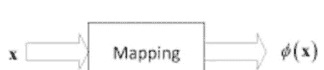

我们已经在第6.3.1节中提到了映射，并且它被视为计算隐藏向量的过程 **h** = Φ(x)从输入向量中得到。如果准备了训练集 *Tr* = {**x**₁, **x**₂, ..., **x**_N}，并且将训练样本映射到 Φ(**x**₁), Φ(**x**₂), ..., Φ(**x**_N)。将输入向量映射为隐藏向量的过程被视为计算隐藏向量的过程，这是SVM是深度学习算法的证据。

SVM的原始版本如图8.12所示。即使上面提到SVM是一种深度学习算法，其核函数为原始向量的内积的原始版本应被视为一种浅学习算法。训练样本和新向量的核函数表示为方程 (8.21)：

K(\mathbf{x}_i, \mathbf{x}) = \mathbf{x}_i \cdot \mathbf{x} \tag{8.21}

在原始版本中，向量没有映射到另一个空间中；输入空间没有改变。这个支持向量机版本被视为一种直接从原始输入向量计算输出的学习算法。

支持向量机的核版本在图8.13中被描述为一种深度学习算法。原始版本被视为一种直接从原始输入向量计算输出的学习算法，因为向量没有映射到另一个空间中。核函数是映射向量的内积，而无需映射向量获得。映射向量的内积是由核函数提供的；隐藏向量是从输入向量隐式计算得到的。除了原始版本外，支持向量机被视为一种深度学习算法。

让我们对将支持向量机视为一种深度学习算法进行一些评论。将向量映射到另一个空间中的过程被视为从输入向量计算隐藏向量的过程。原始支持向量机版本的核函数是两个原始向量的内积。

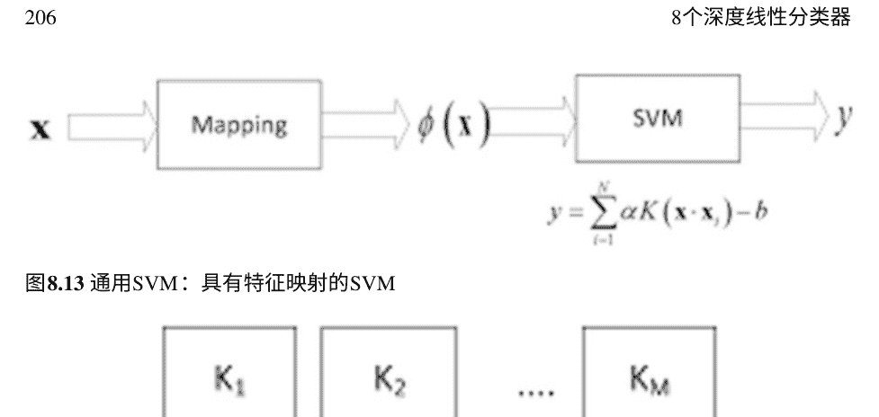

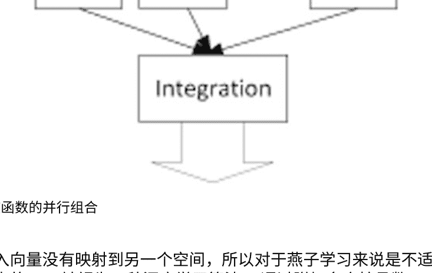

由于输入向量没有映射到另一个空间，所以对于深度学习来说是不适用的。通用版本的SVM被视为一种深度学习算法。通过附加多个核函数，SVM被修改为更深层次的版本。

#### 8.3.2 基于多核的SVM

本节介绍另一种深度版本的SVM，称为基于多核的SVM。在前一节中，已经断言SVM本身是一种深度学习算法，除了其原始版本。在本节中，我们研究了使用多个核函数组合的SVM，作为比单个核函数更高级的深度版本。在这个版本的SVM中，有典型的核函数类型，如线性核函数、多项式核函数、高斯核函数和sigmoid核函数，可以组合不同的核函数。本节旨在描述将多个核函数组合的SVM作为一种深度学习算法。

多个核函数的并联组合如图8.14所示。多个核函数，K1, K2, ..., KM，被应用于两个向量，

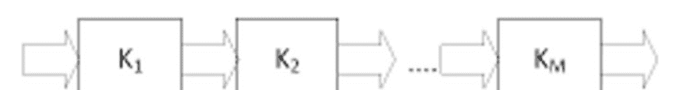

图8.15 核函数的串联组合

两个向量的多个核函数的输出值通过对它们的输出进行平均来决定，如公式(8.22)所示：

$$K_f(\mathbf{x}_1, \mathbf{x}_2) = \frac{1}{M} \sum_{i=1}^{M} K_i(\mathbf{x}_1, \mathbf{x}_2)$$

作为一种变体，输出可以通过根据鉴别结果进行投票来决定，如公式(8.23)所示：

$$K_f(\mathbf{x}_1, \mathbf{x}_2) = \frac{1}{M} \sum_{i=1}^{M} w_i K_i(\mathbf{x}_1, \mathbf{x}_2)$$

其中 \(\sum_{i=1}^{M} w_i = 1\)。在这种组合类型中，核函数彼此独立。

多个内核函数的串行组合如图8.15所示。

中间向量 \(\theta_1, \theta_2, \ldots, \theta_d\) 被准备好，输入向量被表示为 \(\mathbf{x}^{(1)}_1 = \mathbf{x}_1\) 和 \(\mathbf{x}^{(1)}_2 = \mathbf{x}_2\)，下一代的输入向量由方程(8.24)和(8.25)计算得出：

$$\mathbf{x}^{(2)}_1 = [K_1(\mathbf{x}^{(1)}_1, \theta_1) \, K_1(\mathbf{x}^{(1)}_1, \theta_2) \, \ldots \, K_1(\mathbf{x}^{(1)}_1, \theta_d)]$$

$$\mathbf{x}^{(2)}_2 = [K_1(\mathbf{x}^{(1)}_2, \theta_1) \, K_1(\mathbf{x}^{(1)}_2, \theta_2) \, \ldots \, K_1(\mathbf{x}^{(1)}_2, \theta_d)]$$

当前一代向量与上一代向量之间的关系由方程(8.26)和(8.27)定义：

$$\mathbf{x}^{(i)}_1 = [K_{i-1}(\mathbf{x}^{(i-1)}_1, \theta_1) \, K_{i-1}(\mathbf{x}^{(i-1)}_1, \theta_2) \, \ldots \, K_{i-1}(\mathbf{x}^{(i-1)}_1, \theta_d)]$$

$$\mathbf{x}^{(i)}_2 = [K_{i-1}(\mathbf{x}^{(i-1)}_2, \theta_1) \, K_{i-1}(\mathbf{x}^{(i-1)}_2, \theta_2) \, \ldots \, K_{i-1}(\mathbf{x}^{(i-1)}_2, \theta_d)]$$

最终值由方程 (8.28) 计算得出：

$$K_f(\mathbf{x}_1, \mathbf{x}_2) = K_M(\mathbf{x}^{(M)}_1, \mathbf{x}^{(M)}_2)$$

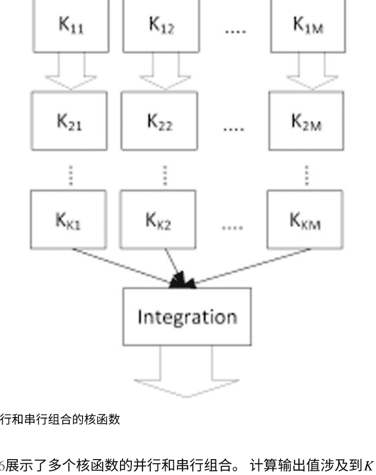

图8.16 并行和串行组合的核函数

图8.16展示了多个核函数的并行和串行组合。计算输出值涉及到 \( M \) 个核函数（并行）或 \( M \) 步计算（串行）。在串行组合中，最终输出值由最后一层的核函数计算得出。在并行和串行的混合组合中，最终输出值通过对多个核函数的输出值进行平均计算得出。上述描述了在串行组合和并行组合中计算输出的过程。

让我们对具有多个核函数的SVM进行一些备注。最终的输出值是通过对多个核函数的输出值进行平均计算得到的，在多个核函数的并行组合中。此外，中间值以分离的向量形式从两个输入向量中涉及，在核函数的串行组合中。输出值可以通过核函数的并行组合和串行组合来计算。在并行组合中，多个隐藏向量在单个层中同时计算，而在串行组合中，隐藏向量通过多个步骤计算。

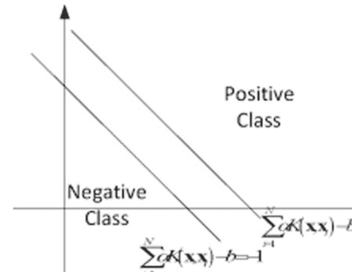

#### 8.3.3 多分类的支持向量机

本节涉及将SVM应用于多分类任务。在之前的版本中，我们研究了作为二元分类器的SVM的深度版本。SVM被应用于多分类作为一个真实的任务，而不是作为一个玩具任务的二元分类。多分类被分解为二元分类，并且每个二元分类都应用了一个SVM。本节旨在描述将SVM应用于多分类的方案。

SVM在图8.17中被描述为一个二元分类器。通过学习训练样本构建了平行的双超平面。
对应于的区域
$$\sum_{i=1}^{N} \alpha_i K(\mathbf{x}_i, \mathbf{x}) - b \geq 1$$
被定义为正类，而
对应于的区域
$$\sum_{i=1}^{N} \alpha_i K(\mathbf{x}_i, \mathbf{x}) - b \leq -1$$
被定义为负类。
对应于的区域
$$-1 < \sum_{i=1}^{N} \alpha_i K(\mathbf{x}_i, \mathbf{x}) - b < 1$$
是用于更稳定地分类数据项的中性区域。SVM最初被设计为一个二元分类器。

将多类分类分解为二元分类的过程在图8.18中被说明。多类分类被假设为重叠分类，其中每个项可以被分类到多个类别中。每个类别分配了一个二元分类器，并且一个项被分类为“是”和“否”中的一个。在 \( M \) 个类别中，那些分类器提供类别“是”的类别被分配给该项。SVM是经过设计的

图8.18 将多类别分类分解为二进制分类

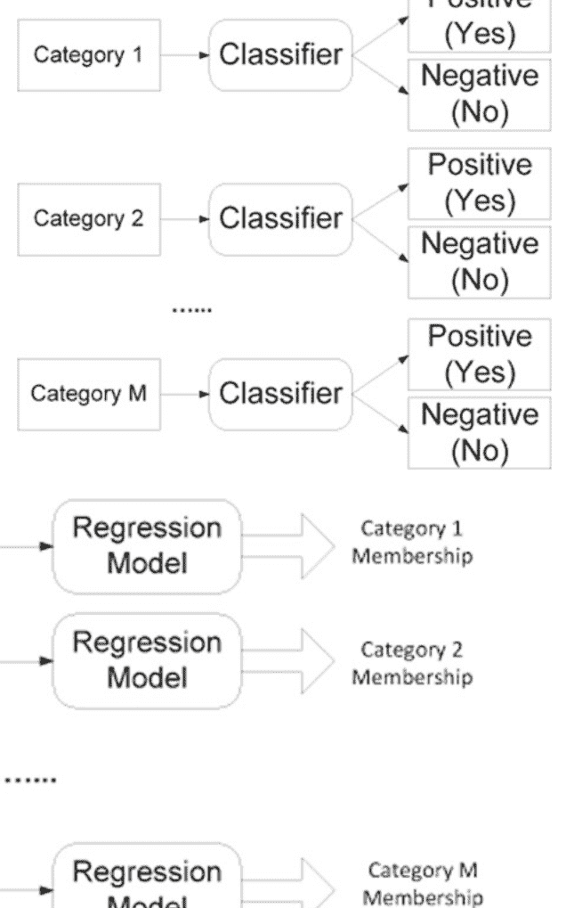

图8.19 模糊多类别分类

通过将多类别分类分解为二进制分类，可以将二进制分类器应用于多类别分类。

图8.19展示了将模糊多类别分类分解为单变量回归的过程。模糊多类别分类是将类别成员值估计为连续值的过程。在这种分解中，为每个类别分配一个单变量回归模型，并且通过相应的回归模型将输出值估计为介于零和一之间的连续值。从方程（8.9）得到的连续输出被归一化为一个值

在将SVM应用于模糊多类别分类时，将连续输出归一化为介于零和一之间的值。在这个应用中，方程（8.9）被作为回归模型给出。让我们对支持向量机在多类别分类任务中的应用进行一些评论。支持向量机最初被设计为二元分类器，其中通过双平行超平面将空间分为两个区域。将多类别分类任务分解为应用支持向量机的二元分类任务。方程（8.9）在应用支持向量机到模糊多类别分类时被视为一元回归模型。我们考虑将方程（8.9）应用于回归任务，例如非线性函数逼近。

### 8.3.4 汇聚支持向量机

本节涉及具有汇聚层的支持向量机的进一步深度版本。在第8.3.1节中，我们提到了支持向量机作为深度学习算法，除了其原始版本。在本节中，我们通过添加汇聚层将支持向量机升级为进一步的深度版本。在这个版本中，输入向量通过汇聚层映射为减小尺寸的向量，并通过计算隐藏向量的两个步骤映射为另一个空间中的向量。本节旨在描述通过添加汇聚层的支持向量机的进一步深度版本。

在图8.20中，展示了在SVM前面附加池化层的过程。SVM之前被提到是一种深度学习算法，原因是将输入向量隐式地映射到另一个空间中。在这个版本的SVM中，计算隐藏向量有两个步骤：一个是对输入向量应用池化，另一个是将向量映射到另一个空间中。将池化应用于向量的过程是显式的，而将向量映射到另一个空间的过程是隐式的。核函数应用于由池化映射的向量，用于计算另一个空间中向量的内积。

在图8.21中展示了将核函数应用于映射向量而不是输入向量的过程。两个原始输入向量用x₁和x₂表示。这两个向量，x₁和x₂，被映射为两个隐藏向量，h₁和h₂，通过池化。核函数的应用如公式（8.29）所示：

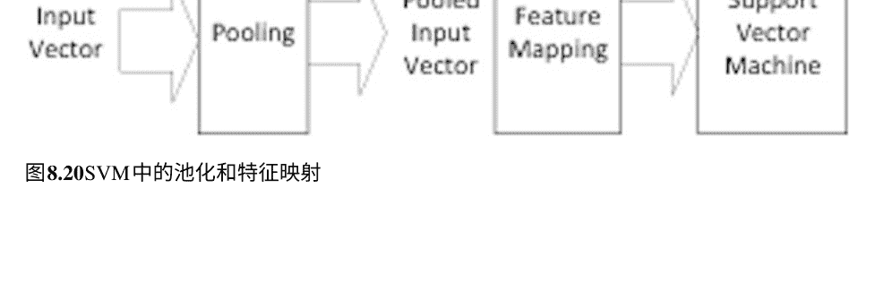

图8.21 核函数应用于池化向量

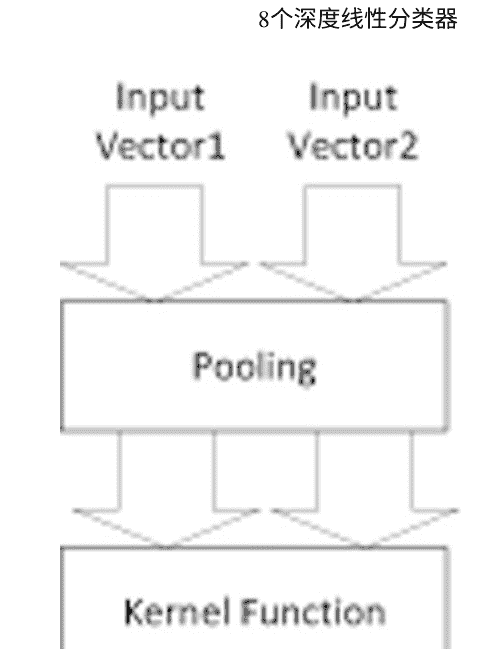

$$K(\mathbf{h}_1, \mathbf{h}_2) = \Phi(\mathbf{h}_1) \cdot \Phi(\mathbf{h}_2)$$

从隐藏向量 \(\mathbf{h}_1\) 和 \(\mathbf{h}_2\) 到 \(\Phi(\mathbf{h}_1)\) 和 \(\Phi(\mathbf{h}_2)\) 的另一个映射通过核函数隐式地表示。

让我们提及使用这个版本的SVM对数据项进行分类的过程。集合中的训练样本 \(\text{Tr} = \{\mathbf{x}_1, \mathbf{x}_2, \ldots, \mathbf{x}_N\}\) 被映射到一组映射后的样本 \(Tr_h = \{\mathbf{h}_1, \mathbf{h}_2, \ldots, \mathbf{h}_N\}\)。SVM的方程由学习向量在 \(Tr_h\) 中定义，如公式 (8.30) 所示：

$$y = \sum_{i=1}^{N} \alpha_i K(\mathbf{h}, \mathbf{h}_i) + b$$

输入向量 \(\mathbf{x}\) 被映射为 \(\mathbf{h}\)，并且通过方程(8.30)进行分类。通过池化将原始向量映射为另一个向量的过程被添加。

让我们对深度版本的SVM附加池化层进行一些说明。在这个版本的SVM中，输入向量通过池化层映射为另一个向量，并且隐式地再次映射到另一个空间中的一个向量。核函数应用于从初始输入向量映射得到的隐藏向量，用于计算最终映射向量的内积。在这个版本的SVM中，原始向量被隐藏向量替换。通过附加池化层和卷积层交替实现的SVM版本称为卷积SVM。

### 8.4 高级深度版本

本节介绍线性分类器和SVM的高级深度版本。在第8.4.1节中，我们将线性分类器修改为其无监督版本。在第8.4.2节中，我们通过添加无监督层构建了线性分类器的深度版本。在第8.4.3节中，我们将支持向量机修改为其无监督版本。在第8.4.4节中，我们通过添加无监督层构建了支持向量机的深度版本。

#### 8.4.1 无监督线性分类器

本节讨论的是线性分类器的无监督版本。到目前为止，线性分类器一直被用作监督学习算法，应用于分类和回归。单个线性分类器可以作为其无监督版本应用于二元聚类。多个线性分类器用于多个聚类，每个聚类对应一个分类器。本节旨在描述线性分类器的无监督版本。

用于定义两个聚类的线性边界如图8.22所示。如果将作为二维向量给出的数据项绘制在二维空间中，则搜索作为聚类之间边界的线。

线性边界在d维空间中表示为线性方程，\(w_1x_1 + w_2x_2 + ... + w_dx_d = c\)。权重值，\(w_1, w_2, ..., w_d\)，通过最小化监督线性分类器中目标输出和计算输出之间的误差来进行优化。在这个版本中，权重根据输入向量之间的相似性进行优化。

二进制聚类的权重优化方向如图8.23所示。假设无监督线性分类器用于将一个群体分成两个子群。权重被随机初始化，数据项被

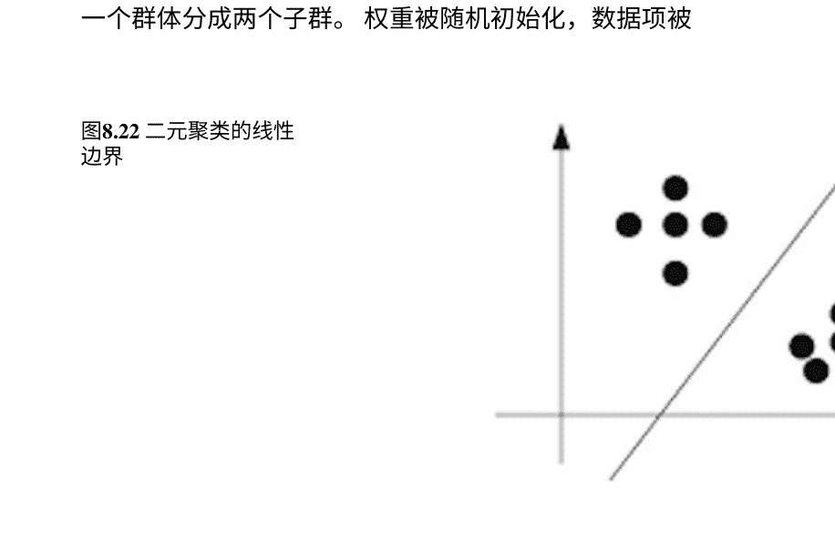通过将线性分类器应用于两个聚类之一进行二进制聚类。计算聚类指数以确定两个聚类，选择导致聚类指数下降的数据项，并基于所选数据项更新权重。在无监督线性分类器中优化权重以最大化聚类指数。

将无监督学习分类器应用于多个聚类的示例如图8.24所示。使用单个无监督线性分类器实现二元聚类，将一组数据分为两个子组。

在图8.24中，使用三个线性分类器将一组数据分为三个子组。每个无监督线性分类器的作用是确定每个数据项是否属于相应的聚类。将线性分类器应用于多个聚类的过程可以看作是将监督线性分类器应用于多类别分类的过程。

让我们对线性分类器的无监督版本进行一些评论。线性分类器从训练样本中构建一个线性边界。单个线性分类器用于对数据项进行二进制聚类，将一个群组分成两个子群组。应用与聚类一样多的多个线性分类器用于多重聚类。在后续章节中，无监督版本将被应用于将线性分类器修改为其深度版本。

#### 8.4.2 堆叠线性分类器

本节涉及堆叠线性分类器作为线性分类器的深度版本。在前一节中，我们将线性分类器修改为其无监督版本。本节中使用无监督版本来实现线性分类器的深度版本。由无监督版本计算得到的隐藏向量将其元素作为聚类标识符。本节旨在描述线性分类器的深度版本，它将其监督版本和无监督版本结合在一起。

线性分类器的深度架构如图8.25所示。假设输入向量和隐藏向量分别是一个a维向量和一个b维向量。$d'$维向量。计算隐藏向量需要使用$d'$个无监督学习分类器。右侧的 $M$个监督线性分类器的作用是将隐藏向量分类为 $M$个类别之一。

隐藏向量的每个元素表示一个聚类标识符。

从输入值计算隐藏值的过程如图8.26所示。计算隐藏值需要使用$d'$个无监督线性分类器。它们通过不同的训练样本子集和不同的初始线性边界进行区分。隐藏值是根据与线性边界的距离来确定的；如果数据项位于线性边界上方，则距离为正值，否则为负值。隐藏向量中的元素是连续的实数值。

从隐藏值计算输出值的过程在图8.27中说明。$d'$隐藏值，每个隐藏值都是与线性边界的距离。

在计算输出值时，涉及到 M个有监督的线性分类器，并且给定的任务被假设为多类别分类。每个线性分类器的作用是将隐藏向量分类为是否属于相应的类别。这个版本的线性分类器被视为一种深度学习算法，因为输出值是从隐藏值计算得到的。

让我们对堆叠线性分类器作一些备注，作为深度学习算法。无监督线性分类器和 M监督学习分类器参与实现深度学习算法。隐藏向量中的每个元素是由无监督线性分类器计算得出的。

#### 8.4.3 无监督SVM

本节关注的是无监督版本的SVM。在第8.4.1节中，我们研究了无监督版本的线性分类器。在本节中，我们将第8.4.1节中研究的内容扩展到无监督SVM，它在映射空间中定义了双超平面。单个SVM作为二进制分类器用于将数据项分成两个簇；多个SVM用于实现多个聚类。本节旨在描述无监督版本的SVM作为二进制聚类的一种方法。

图8.28展示了代表无监督SVM的双线性分类器。如果假设数据项组包含两个子组，则有无限数量的线性边界可用于分离组。如果我们定义两个平行线性边界，则只有一对具有最大间隔的平行边界。两个平行线性边界之间的最大间隔是将SVM用于二元聚类的额外要求。

在SVM中，应优化拉格朗日乘子，而不是权重。

图8.29展示了优化SVM的拉格朗日乘子的过程。通过线性分类器优化二元聚类中的权重。然而，在将SVM用于二元聚类时，应优化拉格朗日乘子。计算聚类指数对两个聚类进行选择有益于聚类的数据项，并优化拉格朗日乘子。

基于所选数据项进行更新。所选数据项被视为被错误分类的训练样本。

将多个SVM应用于多个聚类任务的示例见图8.30。单个SVM在监督学习中被视为二进制分类器，在无监督学习中被视为二进制聚类的方法。在将SVM应用于多个聚类任务时，它被分解为与聚类数目相同的多个二进制聚类任务。每个SVM的作用是将一个群体分离为与聚类对应的群体和剩余的群体。M个无监督SVM用于将一组数据项分割成M个聚类。

让我们对无监督版本的SVM进行一些评论，作为二进制聚类的方法。无监督SVM构建了双平行超平面，用于将一组分成两个子组。拉格朗日乘子被优化，以寻找具有最大间隔的双平行超平面。

多个聚类任务被分解为多个二进制聚类任务，并对每个任务应用无监督SVM。弹性变量被考虑用于改善构建双平行超平面的灵活性。

#### 8.4.4 堆叠SVM

本节讨论堆叠$SVM$作为$SVM$的深度版本。在第8.4.2节中，我们研究了堆叠线性分类器作为深度线性分类器。在本节中，线性分类器被$SVM$取代，$SVM$定义了双平行超平面。在实现深度版本时，涉及多个无监督$SVM$和一个有监督$SVM$。本节旨在描述称为堆叠$SVM$的$SVM$的深度版本。

图8.31展示了由其有监督版本和无监督版本组成的$SVM$的深度版本。从输入向量计算隐藏向量涉及到$d'$个无监督$SVM$。每个无监督$SVM$的作用是进行硬聚类，计算隐藏向量的一个元素。由$d'$个无监督$SVM$计算的隐藏向量通过$M$个有监督$SVM$进行分类，将其分类为$M$个类别之一。多类别分类被分解为二进制分类，以应用有监督$SVM$。

在深度版本的$SVM$中，无监督层在图8.32中有所说明。$SVM$对于训练样本的输出值，$\mathbf{x}_i$, 用 $d_i$表示，输出值表示为方程 (8.31) :

$$d_i = \begin{cases} 1 & \text{if } \sum_{j=1}^{N} \alpha_j K(\mathbf{x}_j, \mathbf{x}_i) - b \geq 1 \\ -1 & \text{if } \sum_{j=1}^{N} \alpha_j K(\mathbf{x}_j, \mathbf{x}_i) - b \leq -1 \end{cases}. \quad (8.31)$$

隐藏向量中的元素之间的距离由方程 (8.32) 计算：

$$h_{i} = \left( \sum_{j=1}^{N} \alpha_{ij} K(\mathbf{x}, \mathbf{x}_{j}) - b \right) - d,$$

其中 $\alpha_{ij}$ 是第 $i$ 个无监督SVM对于第 $j$ 个训练样本的拉格朗日乘子。具有 $d^{'}$ 维度的隐藏向量通过方程（8.32）计算的距离构成的隐藏向量应用于无监督层中计算得到的隐藏向量。

图8.33展示了用于分类新数据项的监督层。给定的任务被假设为多类别分类，将数据项分类为 $M$ 个类别之一，并将任务分解为 $M$ 个二分类任务。多类别分类中涉及 $M$ 个SVM，每个SVM都是一个二分类器。每个SVM将新数据项分类为属于相应类别或不属于相应类别。

每个无监督SVM对应于隐藏向量中的一个元素，每个有监督SVM对应于一个类别。

让我们对堆叠SVM作为深度版本进行一些评论。该版本由用于计算隐藏向量的无监督层和用于分类隐藏向量的有监督层组成。隐藏向量中的每个元素是通过公式（8.32）计算得到的与平行线的距离。如果任务是多类别分类，则有与类别数量相同的SVM参与有监督层。如果隐藏向量的维度小于输入向量的维度，则在无监督层中计算隐藏向量的过程被视为降维处理。

### 8.5 总结和进一步讨论

让我们总结一下这一章学到的内容。线性分类器将单个超平面定义为其分类边界，而支持向量机则通过其最大间隔定义双重平行超平面，追求最高的稳定性。支持向量机本身被提及为一种深度学习算法，并扩展为汇聚支持向量机和多核版本。线性分类器和支持向量机通过将它们的监督版本和非监督版本相结合来堆叠在一起。本节旨在进一步讨论本章学习的内容。

核矩阵是通过使用核函数构建的。它是一个方阵，其中每一行和每一列对应一个单独的训练样本。核矩阵中的一个元素是一个输出值，它作为标量值给出，并由相应向量的核函数计算得出。核矩阵被描述为一个半正定矩阵；核矩阵中的所有元素都大于或等于零。在映射空间中，所有可能的训练样本对的相似性都显示在核矩阵中。

让我们考虑将输入向量映射到另一个空间中的多个映射。在传统的支持向量机中，假设一个输入向量只映射一次到另一个空间中的一个。在训练支持向量机时，可以多次映射一个输入向量。核函数表示映射空间中两个向量的内积值；即使一个输入向量被映射多次，单个标量值仍然是核函数的输出。隐藏向量的内积被视为两个原始输入向量的核函数的输出值。

让我们考虑将卷积层附加到线性分类器上。它使用训练集将单个超平面定义为其分类边界。每个训练示例都使用卷积映射到另一个向量，并在映射空间中构建单个超平面作为分类边界。

如果定义了多个滤波器向量，则构建对应于卷积通道的多个线性分类器。卷积线性分类器将扩展为卷积神经网络，并且我们将在第12章中详细研究机器学习算法。

让我们考虑将卷积层附加到SVM上。它在映射空间中构建了与训练示例的最大间隔的双重平行超平面。在卷积SVM中，双重平行超平面是在通过卷积映射的空间上构建的。如果使用多个卷积通道，则构建多个SVM作为委员会。

我们考虑推导出一种处理矩阵或张量的SVM版本，就像卷积神经网络一样。

# 第三部分 深度神经网络

本部分涉及具有深层结构的神经网络。
神经网络是一种模拟神经系统的机器学习算法。它由相互连接的神经元组成，每个连接称为突触权重。训练神经网络的过程是优化与神经元之间的连接相关的权重值，以最小化训练示例上的误差。

本部分旨在描述一些神经网络，如多层感知器（MLP），循环神经网络（RNN）和受限玻尔兹曼机（RBM）。

这部分由四章组成。在第9章中，我们将学习MLP，它是从感知器扩展而来的深度学习算法。在第10章中，我们将学习带有神经元反馈连接的RNN作为典型的深度学习算法。在第11章中，我们将学习处理可见变量和隐藏变量的RBM。在第12章中，我们将学习卷积神经网络（CNN），它是通过添加卷积和池化层来修改MLP或感知器的深度版本。

## 第9章 多层感知器

本章主要介绍MLP作为典型的深度神经网络模型。感知器是发明MLP的基础，由罗森布拉特在1950年代发明。 在MLP的架构中，有三层：输入层、隐藏层和输出层。 每一层都与其下一层以前馈方向连接，并且权重在其学习过程中以反向方向更新。 本章旨在描述MLP的架构、计算过程和学习过程。

本章由五个部分组成，在第9.1节中，我们概述了本章研究的内容。 在第9.2节中，我们详细研究了在多层感知器（MLP）之前发明的感知器。 在第9.3节中，我们研究了MLP的架构和计算过程。在第9.4节中，我们研究了MLP的学习过程。在第9.5节中，我们总结了本章的全部内容，并进一步讨论了本章研究的内容。

### 9.1 引言

本节涉及MLP作为一种深度学习的概述。 感知器是Rosenblatt在1950年代发明的，作为MLP的基础，本章将对其进行介绍。 在MLP的架构中，有三层，即输入层、隐藏层和输出层。 输出值是从输入层到输出层按前馈方向计算的，权重则是在反向方向进行优化的学习过程，与前馈方向相反。 本节旨在概述MLP作为深度学习的介绍。

让我们提到感知器作为理解多层感知器（MLP）的基础。感知器是由罗森布拉特在1951年发明的。 它的架构中有两个层：输入层和输出层。 它的学习过程是更新两个层之间的权重。 它在1960年代被帕佩特和明斯基批评，因为它没有解决XOR问题的能力。

让我们提到在本章主要涵盖的多层感知器（MLP）作为一种深度学习算法。神经网络是由Rumelhart在1982年发明的，它的重要性在于使神经网络的研究从黑暗时代复苏。它的架构中有三个层：输入层、隐藏层和输出层；在输入层和输出层之间还添加了一层。

神经网络适用于任何类型的回归任务，以及分类任务。它的优点是通过更高的噪声容忍度来实现出色的泛化性能，但其缺点是训练时间过长。让我们提到一些改进版本的MLP变体。典型的MLP变体是通过将动量项添加到梯度下降中来优化其权重的版本。如果将MLP应用于时间序列预测，它将接收滑动在时间序列数据上的窗口作为输入；该版本的MLP被称为TDNN（时延神经网络）。在第12章中介绍的卷积神经网络（CNN）属于MLP变体，因为它是在MLP中添加了特征提取部分。其他MLP变体可以通过修改标准MLP中的学习过程和架构来得到。让我们提到本章的意图。我们回顾感知器作为早期神经网络模型，为学习MLP做准备。本章提供了通过MLP对数据项进行分类的过程的理解。我们理解了使用训练样例训练MLP的过程。本章旨在理解MLP作为深度学习算法。

### 9.2 感知器

本节主要介绍早期前馈神经网络——感知器。在第9.2.1节中，我们描述了其架构。在第9.2.2节中，我们描述了对新数据项进行分类的过程。在第9.2.3节中，我们描述了在学习过程中更新两层之间权重的过程。在第9.2.4节中，我们描述了感知器在回归任务中的应用。

#### 9.2.1 架构

本节主要介绍感知器的架构。它是由罗森布拉特在1950年代发明的。感知器有两层：输入层和输出层。1982年，鲁梅尔哈特通过添加隐藏层将其扩展为多层感知器（MLP）。本节旨在描述架构中的两层。

感知器的输入层如图9.1所示。初始输入向量被假设为一个$d$维向量，$\mathbf{X} = [X_1, X_2, \dots, X_D]$。输入层的作用是将输入向量传递给下一层。第i个输入节点表示为公式（9.1）：

$$I_i = x_i \tag{9.1}$$

因为输入节点中的值本身就是输入值，所以省略了输入节点的表示，直接用 $I_i$ 表示输入值。感知器的输出层如图9.2所示。每个输出节点与所有输入节点相连，假设两层之间的连接是完全的。从输入节点 $x_i$ 到输出节点 $y_j$ 与权重 $w_{ji}$ 相关联。如果输入节点的数量为 $d$，则净输入由公式（9.2）表示：

$$net_j = \sum_{i=1}^{d} w_{ji} x_i. \tag{9.2}$$

根据公式（9.3），应用函数计算输出节点的值：

$$y_j = F(net_j). \tag{9.3}$$

感知器中输入层和输出层之间的连接，称为前馈连接，在图9.3中有所说明。前馈连接是从一个节点到另一个不同节点的连接，用于将输出值传输到另一个节点。输入层中的每个节点都与输出层中的所有节点相连；两层之间建立了完整的前馈连接。

本章介绍的感知器和多层感知器被认为是两层之间的完整前馈连接。从一个节点到同一节点的连接称为递归连接，在下一章中介绍。

让我们对由输入层和输出层组成的感知器的架构进行一些说明。输入层的作用是将输入值传输到输出节点。通过将激活函数应用于净输入，计算输出节点的值。两层之间的连接与其自身的权重相关，并称为前馈连接。感知器的学习过程是优化与连接相关的权重。

#### 9.2.2 分类过程

本节关注计算输出节点值的过程。在前一节中，我们研究了感知器的架构，它由两层组成：输入层和输出层。在本节中，我们研究了从输入值计算输出节点值的过程。在计算输出值时，假设两层之间的连接是完全的，并且与它们相关联的权重已经优化。本节旨在描述计算输出值的过程，作为感知器的泛化。

让我们提到作为输入层给出的输入向量，如图9.4所示。假设原始数据项被编码为一个$d$维数值向量。输入向量用表示。 $\mathbf{x} = [x_1, x_2, \dots, x_d]$，每个元素对应于输入层的每个节点。输入节点的数量是表示原始数据的输入向量的维度。每个输入节点的值是输入向量中的一个元素。

输出节点的网络输入在图9.5中有所说明。对于输入层中的$d$个节点，给定了一个$d$维向量，$\mathbf{x} = [\mathbf{x}_1,\mathbf{x}_2,\dots,\mathbf{x}_d]$。所有输入节点都连接到一个单独的输出节点，它们的连接与权重$w_1,w_2,\dots,w_d$相关联。网络输入由公式(9.4)计算：

$$net = \sum_{i=1}^d w_i \cdot x_i \tag{9.4}$$

如果将权重视为向量，则方程（9.4）转化为输入向量和权重向量的内积，如方程（9.5）所示：

$$net = \mathbf{w} \cdot \mathbf{x} \tag{9.5}$$

净输入是从输入节点计算的，将多个输入整合为单个输入。

图9.6中展示了四种代表性的激活函数。净输入是输出节点的综合输入，通过上述过程计算得出。通过将激活函数应用于净输入，计算输出节点的值，如方程（9.6）所示：## 9.2.3 学习过程

本节讨论感知器的学习过程。在前一节中，我们研究了感知器中计算输出值的过程，在优化权重的假设下。感知器的学习过程是优化输入层和输出层之间的权重。有两种输出值，目标输出值最初给出给训练样本，并且计算输出值是通过前一节中描述的过程计算得出的，优化权重的方向是最小化两种输出值之间的误差。本节旨在描述优化权重的过程，作为学习过程。

在介绍学习过程之前，我们需要定义损失函数，该函数表示目标输出和计算输出之间的误差。输出节点的数量为 $c$；输出向量被假设为 $c$维向量。目标输出向量和计算输出向量分别用 $y = [y_1 y_2 \dots y_c]$ 和 $\hat{y} = [\hat{y}_1 \hat{y}_2 \dots \hat{y}_c]$ 表示。损失函数定义为两种输出向量之间的差异，如公式 (9.8) 所示：

$$L = \frac{1}{2} \sum_{i=1}^{c} (y_i - \hat{y}_i)^2.$$
(9.8)

损失函数由方程 (9.8) 表示，是定义权重更新规则的基础。

让我们提到输入层和输出层之间权重更新的规则。两层之间的权重定义为矩阵，如方程 (9.9) 所示：

$$\mathbf{W} = \begin{pmatrix} w_{11} & w_{12} & \dots & w_{1d} \\ w_{21} & w_{22} & \dots & w_{2d} \\ \vdots & \vdots & \ddots & \vdots \\ w_{c1} & w_{c2} & \dots & w_{cd} \end{pmatrix}.$$
(9.9)

权重矩阵W与损失函数的关系，该损失函数定义为方程 (9.8)，用于优化权重向量。基于梯度下降，权重更新规则由方程 (9.10) 定义：

$$\mathbf{W}(t + 1) = \mathbf{W}(t) - \eta \frac{\partial L}{\partial \mathbf{W}}.$$
(9.10)

其中 $\eta$是学习率，是外部参数。根据公式 (9.10)，逐渐优化权重矩阵的具体方程将被推导出来。

让我们从公式 (9.10) 中推导出一个具体的方程，表示权重更新的框架。计算得到的输出， $\hat{y}_i$， 由公式 (9.11) 表示，

$$\hat{y}_i = \sum_{j=1}^{d} w_{ij} \cdot x_j.$$
(9.11)

通过链式法则，损失函数对权重进行微分，表示为公式（9.12），代入公式（9.13）：

$$\frac{\partial L}{\partial w_{ij}} = \frac{\partial L}{\partial \hat{y}_i} \frac{\partial \hat{y}_i}{\partial w_{ij}}$$   (9.12)

$$\frac{\partial L}{\partial w_{ij}} = -(y_i - \hat{y}_i) x_j.$$   (9.13)

权重更新的方程式（9.14）的推导如下：

$$w_{ij} \leftarrow w_{ij} + \eta(y_i - \hat{y}_i) x_j$$   (9.14)

权重的更新取决于目标输出和计算输出之间的差异，如方程式（9.14）所示。让我们对感知器的学习过程进行一些说明。目标输出和计算输出之间的误差的平方被定义为损失函数。权重和误差之间的梯度下降被设置为优化权重的方向。方程式（9.14）是根据目标输出和计算输出之间的差异推导出来的权重更新规则。根据梯度下降优化权重的方法可能会陷入局部最小值的问题。

#### 9.2.4 用于回归的感知器

本节讨论了将感知器应用于回归问题。在前一节中，假设感知器应用于分类任务。本节将感知器应用于从多个因素中估计连续值的回归问题。分类和回归的区别在于回归中输出值是连续的，而分类中输出值是离散的。本节旨在描述将感知器应用于回归问题。

让我们提到感知器应用于功能视图中的回归。回归被定义为通过分析多个输入值来估计连续值或值的过程。回归被建模为一个方程，这个过程被称为回归建模。非线性函数逼近和时间序列预测是回归的典型例子。传统的回归模型被神经网络或深度学习算法取代。

让我们提到感知器直接应用于回归任务。假设给定的任务是单变量回归，只估计一个连续值。在设计感知器时，输入节点的数量是输入因素的数量，输出节点的数量为1。回归通过训练感知器定义的模式被视为输入值的线性组合。训练感知器的方向是最小化训练示例上的错误，而不是完全消除错误。

让我们提到将感知器应用于从回归映射到分类的过程。通过将连续输出值离散化，将任务映射为分类；离散值表示特定值区间的标识符。输出节点的数量是通过离散化输出值定义的值区间的数量。对于每个训练示例，其目标连续输出值被对应于其值区间的类别替换。在将感知器应用于回归时，我们选择直接应用于回归或通过将其映射为分类间接应用于回归。

让我们对将感知器应用于回归任务的过程进行一些说明。回归是通过分析多个输入值来估计连续输出值或值的过程。如果将感知器直接应用于回归，则回归模型被视为输入值的线性组合。通过将感知器映射为分类，将其应用于回归。我们可以考虑将多个感知器应用于非线性问题。

### 9.3 多层感知器

本节关注MLP中的计算过程。在第9.3.1节中，我们查看了具有三个层的MLP的架构。在第9.3.2节中，我们定义了与理解MLP相关的符号，并描述了输入节点的计算。在第9.3.3节中，我们描述了计算隐藏节点的过程。在第9.3.4节中，我们描述了计算输出节点的过程。

#### 9.3.1 架构

本节关注MLP的架构，它是从感知器扩展而来的。在前一节中，我们研究了感知器，其架构包括输入层和输出层。在MLP中，还添加了一个称为隐藏层的层，它位于输入层和输出层之间。通过训练MLP定义的回归模式被视为非线性模型，因为添加了隐藏层的影响。本节旨在描述由三个层组成的MLP架构。

MLP中的输入层如图9.7所示。输入层的作用与感知器中的作用相同。具有维度为d的输入向量是用 $x = [x_1 x_2 ... x_d]$ 表示。每个输入节点的值用 $x_i$表示。输入值用于计算隐藏值。

连接自输入层的隐藏层如图9.8所示。确定任意数量的隐藏节点，并用$k$表示。具有维度为$k$的隐藏向量用 $h = [h_1 h_2 ... h_k]$表示。输入层和隐藏层之间的连接是完全的；权重的数量变为$k \times d$。隐藏节点的值用于计算输出节点的值。

完整的连接隐藏层和输出层在图9.9中说明。在图9.8中呈现的架构是MLP架构的左侧部分，在图9.9中呈现的架构是MLP架构的右侧部分。目标输出向量和计算向量分别用 $y = [y_1 y_2 ... y_m]$和 $\hat{y} = [\hat{y}_1 \hat{y}_2 ... \hat{y}_m]$表示，都是$m$维向量。隐藏层和输出层之间的连接是完全的；连接的数量变为$m \times k$。具有三层的MLP中的总连接数为 $(d \times k) + (k \times m)$。

让我们对具有三层的MLP的架构进行一些说明。输入层的作用是单独接收输入向量。隐藏节点是任意设置的，它们的值由输入值计算得出。从隐藏层到输出层的连接是完全的；每个输出节点的值都取决于隐藏节点的值。进一步扩展MLP有两种方法：增加隐藏节点的数量和添加更多的隐藏层。

#### 9.3.2 输入层

本节涉及MLP的输入层。它由三层组成：输入层、隐藏层和输出层。输入层的作用是接收输入向量。每个输入节点的值是输入向量的一个元素。本节旨在描述MLP中的输入层设计。

在设计MLP时，让我们考虑输入节点的数量。输入层对应于表示数据项的输入向量。输入节点的数量是输入向量的维度。如果输入向量的维度是d，则输入节点的数量为d。每个输入节点的值是输入向量的一个元素。

让我们提到一些涉及输入层的符号。输入节点的数量是d如上所述。一个输入向量的符号表示为 $x = [x_1 x_2 \dots x_d]$，每个输入节点的符号表示为 $x_i$。训练样本的数量是N，训练集的符号表示为 $Tr = \{x_1, x_2, \dots, x_N\}$。这些符号用于解释后续章节中MLP的泛化和学习。

让我们表示输入节点的方程。输入层直接连接到输入向量。通过将激活函数应用于净输入，节点值被表示出来。在输入节点中，激活函数被给定为线性函数，净输入是输入值本身，如公式（9.15）所示：

$$net_i = x_i$$ (9.15)

输入节点的值被给定为 $x_i$。

让我们对MLP的输入层做一些备注。输入节点的数量是输入向量的维度。输入向量中的元素对应于输入节点。它的值是通过将线性函数应用于给定的净输入值来计算的。我们可以考虑将sigmoid函数或双曲函数作为激活函数应用于输入值。

#### 9.3.3 隐藏层

本节涉及MLP中的隐藏层。隐藏层区分MLP和感知器，旨在解决非线性问题。假设输入层和隐藏层之间的连接是完全的，并且每个隐藏节点的值是通过将激活函数应用于所有输入节点值的净输入来计算的。从输入向量转换而来的隐藏向量是理解深度学习的基础。本节旨在描述计算隐藏节点值的过程，作为一个向量。

让我们提到在设计MLP时确定隐藏节点数量的问题。隐藏节点的数量在现实中是任意设置的。简单性和欠拟合是由于隐藏节点数量较少，而解决非线性问题和过拟合是由于隐藏节点数量较多。从训练集中分离出来的验证集用于优化隐藏节点的数量。详细研究验证集请参考[1]。

让我们提到一些涉及隐藏层的符号。隐藏节点的数量为 $k$；隐藏节点的数量是任意设置的。隐藏向量表示为 $h = [h_1, h_2, \dots, h_k]$，每个隐藏节点表示为 $h_i$。隐藏向量被解释为从输入向量映射而来的具有不同维度的向量。在MLP中，直接对隐藏向量进行分类，而不是对输入向量进行分类。

让我们提及MLP中计算隐藏值的过程。输入层和隐藏层之间的权重以矩阵的形式给出，如公式 (9.16) 所示：

$$\mathbf{W}^1 = \begin{pmatrix} w_{11}^1 & w_{12}^1 & \dots & w_{1d}^1 \\ w_{21}^1 & w_{22}^1 & \dots & w_{2d}^1 \\ \vdots & \vdots & \ddots & \vdots \\ w_{k1}^1 & w_{k2}^1 & \dots & w_{kd}^1 \end{pmatrix}$$ (9.16)

隐藏值，$h_i$，由公式（9.17）计算：

$$h_i = \text{sigmoid}\left( \sum_{j=1}^{d} w_{ji}^1 x_j \right)$$ (9.17)

隐藏向量的计算，$\mathbf{h}$，表示为公式（9.18）：

$$\mathbf{h} = \text{sigmoid}(\mathbf{W}^{1T} \cdot \mathbf{x})$$ (9.18)

隐藏向量用于计算输出向量。

让我们对计算隐藏节点值的过程做一些备注。在设计MLP时，隐藏节点的数量是任意设置的。输入节点的值被给定为一个$d$维向量，隐藏节点的值被给定为一个$k$维向量。隐藏层和输入层之间的权重被给定为一个$d \times k$矩阵。在MLP中，采用了Sigmoid函数作为激活函数。

#### 9.3.4 输出层

本节讨论MLP中计算输出值的过程。假设有三层，即输入层、隐藏层和输出层，并且我们在前一节中研究了计算隐藏向量的过程。在本节中，我们将研究从隐藏向量计算输出向量的过程作为下一步。除了输入层和隐藏层之间的权重之外，隐藏层和输出层之间还存在另一种权重。本节旨在描述使用隐藏向量计算输出向量的过程。

在设计MLP时，我们考虑输出节点的数量。输入节点和隐藏节点的数量分别由输入向量的维度和任意数量确定。如果MLP应用于分类任务，则输出节点的数量由预定义类别的数量确定。如果给定的问题是回归问题，则输出节点的数量由预测变量的数量确定。如果回归是单变量的，则输出节点的数量为1。让我们定义MLP中涉及到的符号。隐藏节点的数量和隐藏向量以前分别表示为$k$和$\mathbf{h} = [h_1 h_2 \ldots h_k]$。假设MLP应用于分类任务，并且输出节点的数量为$m$，即预定义类别的数量。目标输出向量和计算输出向量是两种不同的输出向量，分别表示为$\mathbf{y} = [y_1 y_2 \ldots y_m]$和$\mathbf{\hat{y}} = [\hat{y}_1 \hat{y}_2 \ldots \hat{y}_m]$。我们考虑计算输出向量时隐藏层和输出层之间的权重。

让我们提到MLP中计算输出值的过程。隐藏层和输出层之间的权重被表示为一个矩阵，如公式（9.19）所示：

$$\mathbf{W}^2 = \begin{pmatrix} w_{11}^2 & w_{12}^2 & \dots & w_{1k}^2 \\ w_{21}^2 & w_{22}^2 & \dots & w_{2k}^2 \\ \vdots & \vdots & \ddots & \vdots \\ w_{m1}^2 & w_{m2}^2 & \dots & w_{mk}^2 \end{pmatrix}.$$ (9.19)

输出值，$\hat{y}_i$，由公式（9.20）计算：

$$\hat{y}_i = \text{sigmoid} \left( \sum_{j=1}^k w_{ij}^2 \cdot h_j \right)$$ (9.20)

输出向量的计算，$\hat{\mathbf{y}}$，表示为公式（9.21）：

$$\hat{\mathbf{y}} = \text{sigmoid}(\mathbf{W}^{2T} \cdot \mathbf{h}).$$ (9.21)

如果MLP应用于回归问题，则将sigmoid函数替换为双曲函数。

让我们对MLP中的输出层进行一些备注。如果应用于分类任务，则输出节点的数量由预定义的类别数量确定。有两种输出向量：目标输出向量和计算输出向量。隐藏层和输出层之间还存在一种权重，用于计算输出向量。MLP与感知器的区别在于优化这两种权重。

### 9.4 学习过程

本节介绍了MLP的学习过程，称为反向传播。在第9.4.1节中，我们描述了更新输出层和隐藏层之间权重的过程。在第9.4.2节中，我们描述了更新隐藏层和输入层之间权重的过程。在第9.4.3节中，我们描述了使用训练样本训练MLP的整个过程。在第9.4.4节中，我们描述了优化MLP权重的高级方案。

#### 9.4.1 隐藏层和输出层之间的权重更新

本节关注的是隐藏层和输出层之间权重更新的过程。输出值是根据前向计算得出的，如第9.3节所述。权重是根据反向计算得出的，这就是为什么称之为MLP反向传播的原因。我们将推导出更新输出层和隐藏层之间权重的方程。本节旨在描述更新输出层和隐藏层之间权重的过程。

在设置权重更新规则之前，需要定义损失函数。训练MLP的方向是最小化目标输出向量 $\mathbf{y} = [y_1 y_2 \dots y_m]$和计算输出向量 $\mathbf{\hat{y}} = [\hat{y}_1 \hat{y}_2 \dots \hat{y}_m]$之间的误差。基于误差的损失函数定义如式(9.22)所示：

$$L = \frac{1}{2} \sum_{i=1}^{m} (y_i - \hat{y}_i)^2$$ (9.22)

我们可以考虑绝对误差，$\sum_{i=1}^{m} |y_i - \hat{y}_i|$作为另一种损失函数，但在通过梯度下降定义权重更新规则时不可微分。采用在方程（9.22）中定义的损失函数来推导权重更新规则。

让我们尝试对损失函数进行微分以推导权重更新规则。权重更新的框架表示为方程（9.23）：

$$w_{ji}^2 \leftarrow w_{ji}^2 - \eta \frac{\partial L}{\partial w_{ji}^2}$$ (9.23)

链式法则应用于方程（9.23）中的最后一项，表示为方程（9.24）：

$$\frac{\partial L}{\partial w_{ji}^2} = \frac{\partial L}{\partial \hat{y}_j} \frac{\partial \hat{y}_j}{\partial net_j^2} \frac{\partial net_j^2}{\partial w_{ji}^2}$$ (9.24)

如果采用sigmoid函数作为激活函数，则方程（9.24）中的每一项可以表示为方程（9.25）、（9.26）和（9.27）：

$$\frac{\partial L}{\partial \hat{y}_j} = -(y_j - \hat{y}_j)$$ (9.25)

$$\frac{\partial \hat{y}_j}{\partial net_j^2} = \hat{y}_j(1 - \hat{y}_j)$$ (9.26)

$$\frac{\partial net_j^2}{\partial w_{ji}^2} = h_i$$ (9.27)

如果采用线性函数，则方程（9.24）中的第二项可以表示为方程（9.28）：

$$\frac{\partial \hat{y}_j}{\partial net_j^2} = 1$$ (9.28)

让我们提到隐藏层和输出层之间权重更新的规则。如果隐藏节点的数量为 $k$，输出节点的数量为 $m$，则权重被视为一个 $m \times k$ 矩阵，如方程（9.19）所示。通过将方程（9.25）、（9.26）和（9.27）代入方程（9.23），再将结果代入方程（9.29），可以得到权重 $w_{ji}^2$ 的更新规则：

$$w_{ji}^2 \leftarrow w_{ji}^2 + \eta h_i \hat{y}_j (1 - \hat{y}_j)(y_j - \hat{y}_j)$$ (9.29)

如果将sigmoid函数替换为双曲函数，则权重更新规则变为方程（9.30）：

$$w_{ji}^2 \leftarrow w_{ji}^2 + \eta h_i (1 + \hat{y}_j)(1 - \hat{y}_j)(y_j - \hat{y}_j)$$ (9.30)

假设激活函数是一个连续可微的函数，在推导基于梯度下降的权重更新规则时，这是一个连续函数。

让我们对隐藏层和输出层之间的权重更新过程做一些说明。需要定义损失函数来推导权重更新规则。在权重上的误差曲面上进行梯度下降是优化权重的基础。如果采用sigmoid函数作为激活函数，则方程（9.29）是权重更新规则。在方程（9.29）和（9.30）中，学习率应该受控制以更新权重；过高的值会导致波动，过低的值会导致更新非常缓慢。

#### 9.4.2 输入层和隐藏层之间的权重更新

本节关注的是更新输入层和隐藏层之间权重的过程。在前一节中，我们研究了更新隐藏层和输出层之间权重的过程。在本节中，我们研究更新另一种权重的过程。输入层和隐藏层之间的权重受到隐藏层和输出层之间权重的影响。本节旨在描述更新输入层和隐藏层之间权重的过程。

让我们考虑输入层和隐藏层之间权重的跨度。连接从第i个输入节点到第j个隐藏节点的权重表示为\(w_{ji}^1\)。隐藏节点\(h_i\)连接到所有输出节点\(y^1, y^2, \dots, y^m\)，隐藏节点\(h_i\)连接的权重为\(w_{i1}^2, w_{i2}^2, \dots, w_{im}^2\)。权重\(w_{ji}^1\)的更新对权重\(w_{i1}^2, w_{i2}^2, \dots, w_{im}^2\)有影响；它们应该被考虑用于更新权重\(w_{ji}^1\)。权重\(w_{ji}^1\)，以及权重\(w_{1i}^2, w_{2i}^2, \dots, w_{mi}^2\)，在更新权重的规则中求和。让我们提到从输入层到隐藏层更新权重的链式法则。链式法则表示为Eq. (9.31)：

$$\frac{\partial L}{\partial w_{ji}^1} = \sum_{k=1}^m \frac{\partial L}{\partial \hat{y}_k} \frac{\partial \hat{y}_k}{\partial net_k^2} \frac{\partial net_k^2}{\partial h_i} \frac{\partial h_i}{\partial net_i^1} \frac{\partial net_i^1}{\partial w_{ji}^1} \quad (9.31)$$

如果采用sigmoid函数作为激活函数，则方程(9.31)的前三项表示为方程(9.32)、(9.33)和(9.34)：

$$\frac{\partial L}{\partial \hat{y}_k} \frac{\partial \hat{y}_k}{\partial net_k^2} = \hat{y}_k(1 - \hat{y}_k)(y_k - \hat{y}_k) \quad (9.32)$$

$$\frac{\partial \hat{y}_k}{\partial net_k^2} = \hat{y}_k(1 - \hat{y}_k) \quad (9.33)$$

$$\frac{\partial net_k^2}{\partial h_i} = w_{ik}^2 \quad (9.34)$$

方程(9.31)的最后两项表示为方程(9.35)和(9.36)：

$$\frac{\partial h_i}{\partial net_i^1} = h_i(1 - h_i) \quad (9.35)$$

$$\frac{\partial net_i^1}{\partial w_{ji}^1} = x_j \quad (9.36)$$

从隐藏节点\(h_i\)到所有输出节点的连接权重\(w_{i1}^2, w_{i2}^2, \dots, w_{im}^2\)被考虑用于更新权重。如方程(9.34)所示，更新权重\(w_{ji}^1\)。

输入层和隐藏层之间权重更新规则是推导的。更新这种权重的框架是方程(9.37)：

$$W^1_{ji} \leftarrow W^1_{ji} - \eta \frac{\partial L}{\partial w^1_{ji}} \quad (9.37)$$

如果在两个层中都采用了sigmoid函数，隐藏层和输出层的权重更新规则为\(w^1_{ji}\)，根据链式法则（方程9.31）表示为方程（9.38）：

$$W^1_{ji} \leftarrow W^1_{ji} - \eta \sum_{k=1}^{m} x_j h_i (1 - h_i) w^2_{ik} \hat{y}_k (1 - \hat{y}_k) (y_k - \hat{y}_k) \quad (9.38)$$

如果在两个层中都采用了线性函数，权重更新规则简化为方程（9.39）：

$$W^1_{ji} \leftarrow W^1_{ji} - \eta \sum_{k=1}^{m} x_j w^2_{ik} (y_k - \hat{y}_k) \quad (9.39)$$

输入层和隐藏层之间的权重根据隐藏层和输出层之间的权重以及目标输出和计算输出之间的差异进行更新。

让我们对更新输入层和隐藏层之间的权重的过程进行一些说明。我们需要考虑从隐藏节点到所有输出节点的连接权重，以便更新输入节点和隐藏节点之间的权重。链式法则用于对损失函数进行权重微分。权重的更新取决于目标输出和计算输出之间的差异以及隐藏层和输出层之间的权重的总和。可以考虑动态学习率以更高效地训练MLP。

#### 9.4.3 整个学习过程

本节涉及使用训练样例训练MLP的整个过程。我们在第9.4.1节和9.4.2节中研究了MLP中权重更新规则。在本节中，我们将根据权重更新规则研究训练MLP的整个过程。输出向量在前向传播方向计算，权重在反向传播方向更新。本节旨在描述使用训练样例训练MLP的整个过程。

让我们提到训练MLP的第一步。权重被初始化为接近零的随机值。隐藏值由输入值计算得出，输出值由计算得出的隐藏值通过第9.3.2节和第9.3.3节中描述的过程计算得出。目标输出值与计算得出的输出值之间的差异被称为训练误差。权重被更新以最小化训练误差。

让我们提到在MLP中更新权重的过程。我们在第9.4.1节和第9.4.2节中研究了在MLP中更新权重的规则。权重是向后方向更新的；隐藏层和输出层之间的权重被更新，输入层和隐藏层之间的权重被更新。目标输出向量与计算得出的输出之间的差异以及后续层中的权重被考虑在内，用于更新当前层的权重。MLP的学习过程是逐步更新权重的迭代过程。

MLP的两种学习模式在图9.10中有所说明。图9.10中的左边属于批量学习，右边属于交互式学习。在批量学习中，所有的训练样本都被呈现出来，计算出训练样本上的误差平均值，并且根据方程(9.29)和(9.38)更新权重。在交互式学习中，每个训练样本都会更新权重。它们的性能相当，并且取决于应用领域。

让我们对MLP的整个学习过程进行一些说明。权重在零附近随机初始化，并且通过初始化的权重计算输出值。权重从输出层向输入层的反向方向进行更新。MLP的学习过程是在正向方向上迭代计算当前权重的输出值，并在反向方向上更新权重。我们考虑一些改进MLP训练速度的方案。

#### 9.4.4 随机梯度下降

本节关注改善学习速度的随机梯度下降。在之前的章节中，假设MLP中权重更新规则的学习是固定的。在本节中，我们考虑动态学习率。

学习速度在训练MLP时是可变的，以提高学习速度。为了定义随机梯度下降，需要观察训练示例中错误的减少量。本节旨在描述改进学习速度的权重更新的修改规则。

在前一节中，假设学习率最初在0.1和0.9之间是固定的。根据目标输出向量和计算得到的向量之间的差异来更新权重。如果错误曲面陡峭，固定学习率存在波动风险。如果曲面几乎平坦，MLP的训练速度非常慢。我们需要动态改变学习速度，观察训练错误的变化。

让我们考虑学习过程中学习率的变化，取决于误差的变化。当前误差和先前的误差分别用\(e(t)\)和表示\(e(t-1)\)，误差变化由公式(9.40)表示：

$$\Delta e = e(t) - e(t-1) \quad (9.40)$$

如果\(\Delta e < 0\)，学习率\(\eta\)应增加，如果\(\Delta e > 0\)，它应该减少。更新权重的框架，用公式(9.23)和(9.37)表示，转化为公式(9.41)：

$$w_{ji} \leftarrow w_{ji} - \eta(1 - \Delta e \cdot \beta)\frac{\partial L}{\partial w_{ji}} \quad (9.41)$$

其中\(\beta\)是介于零和一之间的常数，用于平滑误差变化。这种随机梯度下降的目的是加快学习过程并防止波动。

让我们提到另一种被称为动量项的随机梯度下降。在上述随机下降中，学习是根据误差变化动态控制的。在这种随机梯度下降中，权重变化的更新规则如公式(9.42)所示：

$$\Delta w_{ji} \leftarrow \alpha \Delta w_{ji} - \eta \frac{\partial L}{\partial w_{ji}} \quad (9.42)$$

其中\(\alpha\)是衰减率，取值介于零和1之间。权重更新规则可以表示为公式(9.43)：

$$w_{ji} \leftarrow w_{ji} + \Delta w_{ji} = w_{ji} - \eta \frac{\partial L}{\partial w_{ji}} + \alpha \Delta w_{ji} \quad (9.43)$$

如果\(\alpha = 0\)，这个版本与标准的MLP版本相同。

让我们对随机梯度下降进行一些评论，这是为了提高学习速度。在固定学习率的版本中，它的限制是学习速度很慢，而在高学习率时训练误差不会减少，而是波动。在学习过程中，应该通过观察训练误差的变化来动态控制学习。权重变化也是动态控制学习率的基础。我们需要找到避免在误差空间中陷入局部最小值的替代方法。

### 9.5 总结和进一步讨论

本节涉及对本章所学内容的总结和进一步讨论。感知器被研究作为进行MLP的基础。研究了MLP的架构和输出计算过程。研究了从输出层到输入层的权重优化过程作为学习过程。本节旨在对本章所学内容进行进一步讨论。

在发明多层感知机（MLP）之前，多个感知机被结合在一起。在1960年代，人们指出了感知机在解决XOR问题上的无能。通过将两个感知机组合在一个更高层次的感知机下，可以解决XOR问题。多个感知机的组合被称为Madaline。这个模型成为了Rumelhart在1980年代发明MLP的基础。

激活函数应用于每个节点的输入，用于生成输出。如果将输入作为输出值，则激活函数是线性函数。在实现感知机时通常采用线性函数，而在实现MLP时采用Sigmoid函数。当MLP应用于回归任务时，双曲函数被采用作为激活函数。在实现卷积神经网络（CNN）时，使用ReLU（修正线性单元）作为激活函数，该内容在第12章中介绍。

我们将TDNN（时延神经网络）作为MLP的变体进行了提及。如果将MLP应用于时间序列预测，则变成了TDNN。TDNN的输入是在时间序列上滑动的窗口中的元素。与传统的统计方法相比，将MLP应用于时间序列的结果非常成功。TDNN被循环神经网络取代，循环神经网络在第10章中进行了介绍，作为时间序列预测的方法。

通过附加深度操作，MLP扩展为CNN（卷积神经网络）。CNN中有两个部分：特征提取部分和分类部分。在特征提取中，卷积层和池化层交替排列，而在分类部分中放置MLP或感知器。通过特征提取，将输入数据映射为易于分类的数据。CNN将在第12章中进行详细研究。

### 参考文献

+  T. Mitchell，机器学习，麦格劳-希尔，1996年

## 第10章 循环神经网络

本章主要讨论循环神经网络，它是从多层感知机发展而来的。在前一章中，我们研究了多层感知机作为一种典型的深度神经网络模型，其层之间通过前馈连接进行连接。 在本章中，我们将研究循环神经网络作为一种先进模型，其中神经元之间存在反馈连接。 在反馈连接中，上一个输出值被用作输入。本章旨在描述循环神经网络及其在连接和学习过程方面的变体。

本章由五个部分组成，在第10.1节中，我们概述了本章的研究内容。 在第10.2节中，我们研究了循环节点的结构，以及前馈节点的结构。 在第10.3节中，我们研究了循环神经网络的模型。 在第10.4节中，我们探讨了它们在实际分类任务中的应用。 在第10.5节中，我们进一步讨论了本章的研究内容。

### 10.1 引言

本节主要介绍循环神经网络作为另一种深度神经网络的概述。 在前一章中，我们研究了多层感知机作为具有前馈连接的深度神经网络。 本章介绍的循环神经网络具有反馈连接，将一个节点连接到自身形成一个循环，这被称为循环连接。 在循环连接中，节点的先前值作为输入给出; 输出值的反馈成为输入值。 本节旨在概述循环神经网络，作为本章的引言。

让我们回顾一下在前一章中介绍的多层感知机的结构。该结构包括三个层: 输入层、隐藏层和输出层。 这些层按照前馈方向从输入层到输出层进行连接。 当前层中的一个节点与下一层中的另一个节点相连; 节点之间没有自我反馈连接。多层感知机（MLP）。在前一章中研究的MLP不属于循环神经网络。

让我们提到节点到自身的反馈连接。节点值被假设为不同的时间点，形成一个时间序列。节点中的先前值被用作计算其当前值的输入。通过将激活函数应用于净输入，计算得到的节点的当前值被用作计算其下一个值的输入。节点中的先前值通过其反馈连接对计算当前值产生影响。

在提出循环神经网络之前，让我们提到时间延迟神经网络（TDNN）作为先前的时间序列预测方法。TDNN是应用于时间序列预测的MLP，并在时间序列上滑动的窗口中接收时间值。通过在时间序列上滑动窗口来收集训练样本，并使用MLP进行训练。它接收时间值作为输入，其中最后一个值是当前测量，并通过其泛化来预测未来测量。在提出循环神经网络之前，将TDNN应用于时间序列预测的结果是成功的。

让我们提到本章的意图。我们将递归架构视为研究递归神经网络的基础。我们研究典型模型：基本递归神经网络和LSTM（长短期记忆）。我们介绍将递归神经网络应用于实际应用的方案。本章旨在研究递归神经网络作为高级深度神经网络模型。

### 10.2 循环架构

本节涉及神经元之间的递归连接。在第10.2.1节中，我们回顾了在前一章中介绍的前馈连接。在第10.2.2节中，我们描述了神经元之间的简单递归连接。在第10.2.3节中，我们描述了两种类型神经元之间的混合连接。在第10.2.4节中，我们描述了具有递归连接的隐藏节点。

#### 10.2.1 前向连接

本节涉及人工神经网络中的前馈连接。它是从一层中的一个节点到下一层中的另一个节点的连接。在人工神经网络中，一层中的每个节点通常与下一层中的所有节点相连。只有前馈连接的神经网络，如感知机和多层感知机，在第9章中介绍，被称为前馈神经网络。本节旨在回顾前馈连接用于提供理解递归连接的背景。

一对一连接在图10.1中被描述为前馈连接的最简单实例。一个节点到另一个节点的单个连接与其自己的权重相关联。左节点的值用 \(x\) 表示，右节点的值用 \(y\) 表示，节点之间的连接的权重用 \(w\) 表示。两个节点的值和权重之间存在关系，如公式（10.1）所示：

$$ y = F(w \cdot x) \quad (10.1)$$

其中 \(F\) 是激活函数。节点的值和权重被假设为实数值。

一对多连接在图10.2中被描述为前馈连接的另一个实例。多个节点连接到一个单一节点，每个连接都与其自己的权重相关联。左侧的值用 \(x_1, x_2, \ldots, x_d\)，权重用 \(w_1, w_2, \ldots, w_d\) 表示。右节点的值通过公式（10.2）计算：

$$ y = F\left(\sum_{i=1}^d w_i \cdot x_i\right) \quad (10.2)$$

输出节点的值取决于该前馈连接实例中输入节点的值。

第三个前馈连接实例在图10.3中展示了多对多的连接。两个层之间的完整前馈连接是指每个节点与下一层的所有节点连接。左节点的值用 \(x_1, x_2, \dots, x_d\) 表示，右节点的值用 \(y_1, y_2, \dots, y_c\) 表示，权重用表示\(w_{ji}\)，其中 \(i\) 是右节点索引，\(j\) 是左节点索引。右节点的值通过公式 (10.3) 计算：

$$y_j = F \left( \sum_{i=1}^{d} w_{ji} \cdot x_i \right) \quad (10.3)$$

左下标为目标节点索引的原因是权重是从目标到源的反向方向进行更新。

让我们对在本节中回顾的前馈连接进行一些说明。一对一连接是从一个节点到另一个节点的连接，作为最简单的例子。一对多连接是从多个节点到一个节点的连接，作为另一个例子。多对多连接是两个层之间的完全连接，当前层中的每个节点都与下一层中的所有节点相连。前馈连接被解释为从一个节点到不同节点的连接；在前一章中研究的神经网络只由前馈连接组成。

#### 10.2.2 循环连接

本节涉及到用于理解循环神经网络的循环连接。在前一节中，我们研究了从一个节点到另一个节点的前馈连接。在本节中，我们研究了循环连接，即从一个节点到自身的连接，其中当前节点值被用作计算其下一个值的输入。在这种连接类型中，我们考虑由顺序时间中的节点值组成的时间序列。本节旨在描述用于实现循环网络的循环连接的几种情况。

循环连接的最简单示例称为自连接，如图10.4所示。假设从一个节点到自身的单个连接与权重 \(w\) 相关联。先前的节点值用 \(x(t-1)\) 表示。\(x(t-1)\) 表示先前值，当前值用 \(x(t)\) 表示。先前值和当前值之间的关系由方程(10.4)表示。

$$x(t) = w \cdot x(t-1) \quad (10.4)$$

先前值用作计算当前值的输入。

循环连接的另一个示例如图10.5所示。有 \(d\) 个节点，它们用 \(x_1, x_2, \ldots, x_d\) 表示。每个节点与自身相连。循环连接与权重 \(w_1, w_2, \ldots, w_d\) 相关联。方程(10.5)计算了 \(d\) 个节点的当前值：

$$x_i(t) = w_i \cdot x_i(t-1) \quad (10.5)$$

每个节点的当前值取决于其在当前连接中的先前值。

图10.6中展示了四种代表性的激活函数。它们被应用于递归连接和前馈连接。如果应用了激活函数，则当前值由公式（10.6）计算：

$$x_i(t) = F(w_i \cdot x_i(t-1)) \quad (10.6)$$

当激活函数采用线性函数时，计算当前值的公式为（10.5）。在实现递归网络时，采用了sigmoid函数或tanh函数。

图10.6 激活函数来自 https://docs.paperspace.com/machine-learning/wiki/activation-function

和它的权重。一个单一的循环连接被扩展为多个循环连接来自多个节点。激活函数应用于先前值和权重的乘积。我们考虑两个节点之间的循环连接，与其双重权重相关联。

#### 10.2.3 混合架构

本节涉及混合前馈连接和循环连接的架构。两种类型的连接在之前的章节中分别进行了研究。在本节中，我们研究了将两种连接类型混合为一体的架构。本章涵盖的循环神经网络具有由两种连接类型组成的架构。本节旨在调查混合架构的三种情况。

两个节点之间混合连接的示例如图10.7所示。左节点和右节点的值分别用 \(x_1\) 和 \(x_2\) 表示。左节点和右节点的循环连接与权重 \(w_1\) 和 \(w_2\) 相关联，并且从左节点到右节点的前馈连接与权重 \(w_{21}\) 相关联。\(x_1\) 的值由公式 (10.7) 计算：

$$x_1(t) = F(w_1 \cdot x_1(t-1)) \tag{10.7}$$

图10.7 单个前馈和循环连接

图10.8 多个前馈和循环连接

通过公式（10.8）计算 \(x_2\) 的值：

$$x_2(t) = F(w_{21} \cdot x_1(t-1) + w_2 \cdot x_2(t-1)) \tag{10.8}$$

该值为。\(x_2\) 取决于当前值和。\(x_1\) 以及先前值。\(x_2\)。图10.8中还有另一个节点之间的混合连接示例。左节点和右节点分别用。\(x_1, x_2, ..., x_d\) 和。\(y_1, y_2, ..., y_d\) 表示。该连接中有三种权重：左节点的递归连接用。\(w_{l,1}, w_{l,2}, ..., w_{l,d}\) 表示；右节点的递归连接用。\(w_{r,1}, w_{r,2}, ..., w_{r,d}\) 表示；左节点和右节点之间的前馈连接用。\(w_{rl,1}, w_{rl,2}, ..., w_{rl,d}\) 表示。根据公式 (10.9) 计算。\(x_i\) 的值：

$$x_i(t) = F(w_{l,i} \cdot x_i(t-1)) \tag{10.9}$$

通过公式 (10.10) 计算得到 \(y_i\) 的值：

$$y_i(t) = F(w_{rl,i} \cdot x_i(t) + w_{r,i} \cdot y_i(t-1)) \tag{10.10}$$

图10.8中的例子是图10.7中例子的扩展。

图10.9展示了节点之间混合连接的更复杂的例子。左节点、中间节点和右节点分别用 \(x_1, x_2, \dots, x_d\)，\(h_1, h_2, \dots, h_d\)，和 \(y_1, y_2, \dots, y_d\) 表示。有三种权重：左层和中间层之间的前馈连接，与 \(w_1^1, w_2^1, \dots, w_d^1\) 相关；中间层和右层之间的前馈连接，与 \(w_1^2, w_2^2, \dots, w_d^2\) 相关；以及中间节点的循环连接，由 \(w_1^r, w_2^r, \dots, w_d^r\) 相关。通过公式 (10.11) 计算得到 \(h_i\) 的值：

$$h_i(t) = F(w_i^1 \cdot x_i + w_i^r \cdot h_i(t-1)) \tag{10.11}$$

通过公式 (10.12) 计算出 \(y_i\) 的值，

$$y_i(t) = F(w_i^2 \cdot h_i(t)) \tag{10.12}$$

每个隐藏节点在循环网络中都有其循环连接，这在本章中进行了介绍。

让我们对节点的混合连接进行一些说明，其中包括前馈连接和循环连接的混合。从一个节点到另一个节点的连接以及每个节点的循环连接被视为混合连接的第一种情况。我们研究了混合连接的第二种情况，其中独立模块给出了混合连接的第一种情况。我们研究了第三种情况，即将隐藏节点的循环连接添加到从输入层到输出层的前馈连接中。在后续章节中研究的循环神经网络具有更复杂的混合连接。

#### 10.2.4 隐藏循环

本节关注隐藏层中的循环连接。在前面的章节中，我们研究了前馈连接、循环连接和混合连接。在本节中，我们研究了将循环连接添加到MLP架构中的隐藏层。隐藏节点的当前值取决于输入值和其先前值。本节旨在描述隐藏层中的循环连接作为循环神经网络的架构。

只有前馈连接的隐藏层如图10.10所示。该架构已在第9章中研究过。输入层与隐藏层之间以及隐藏层与输出层之间的前馈连接是完全的。每个隐藏节点都与所有输入节点相连，并且没有循环连接与所有输出节点相连。

图10.10中呈现的架构是本章研究循环网络的基础。

具有前馈连接和递归连接的隐藏层如图10.11所示。该架构由三层组成，即输入层、隐藏层和输出层，隐藏层中的每个节点都与所有输入节点和所有输出节点相连。每个隐藏节点都与自身递归连接，作为图10.10中架构的附加部分。隐藏节点的值取决于输入节点的值和其先前的值，每个递归连接都与前馈连接的权重分开。图10.11中呈现的架构是下一节研究的一种递归神经网络之一。

具有各自递归连接的多个隐藏层如图10.12所示。假设输入之间有K个隐藏层可用和输出层。每个隐藏节点都与自身递归连接，与上一层的所有节点连接，并与下一层的所有节点连接。每个隐藏节点的当前值取决于其先前值和上一层的所有节点的值。图10.12中呈现的架构是扩展的RNN版本之一。

让我们对隐藏层中的递归连接进行一些说明。如果没有递归连接，则三层的架构与第9章中介绍的MLP的架构相同。具有隐藏层的递归架构被扩展为具有多个隐藏层的架构。递归连接，每个连接到自身的节点都安装在隐藏层中。

### 10.3 循环神经网络

本节涉及一些循环神经网络模型。在第10.3.1节中，我们描述了循环神经网络的基本模型。在第10.3.2节中，我们介绍了一些从基本模型派生出来的变体。在第10.3.3节中，我们描述了典型的模型，称为LSTM（长短期记忆）。在第10.3.4节中，我们推导出了一些LSTM的变体。

#### 10.3.1 基本循环神经网络

本节涉及RNN（循环神经网络）的初始版本。在前一节中，我们研究了递归连接和前馈连接，作为研究RNN的准备工作。在RNN架构中，有三层，输入层，隐藏层和输出层，并且隐藏层中的每个节点都有递归连接。RNN架构与MLP架构的区别在于隐藏层中添加了递归连接。本节旨在描述基本的RNN架构，计算过程和学习过程。

RNN架构如图10.13所示。架构中有三层：输入层，隐藏层和输出层。从输入层到隐藏层的一对一连接和从隐藏层到输出层的一对一连接是与MLP架构的不同之处。隐藏层中从第一个隐藏节点到最后一个隐藏节点的串行连接是RNN的特征。节点值从输入层到输出层以前馈方向计算。

在RNN中计算输出节点值的方向如图10.14所示。假设权重已经优化，并且输入向量, \(x = [x_1, x_2, \dots, x_d]\), 最初给定。每个隐藏节点的值由公式(10.13)计算：

$$h_i = \tanh(w_{i-1}^h \cdot h_{i-1} + w_i^1 \cdot x_i) \tag{10.13}$$

其中 \(w_i^{h_{-1}}\) 是从隐藏节点 \(h_{i-1}\) 到隐藏节点 \(h_i\) 的权重，第一个隐藏节点的值由公式(10.14)计算：

$$h_1 = \tanh(w_1 \cdot x_i) \tag{10.14}$$

每个输出节点的值由公式(10.15)计算得出，就像在MLP中的情况一样：

$$\hat{y}_i = w_i^2 \cdot h_i \tag{10.15}$$

隐藏层中存在的权重是RNN与MLP的区别之一。

RNN的学习过程中，权重的优化方向如图10.15所示。隐藏层与输出层之间的权重，\(w_i^2\)，通过公式(10.16)进行更新:

$$w_i^2 \leftarrow w_i^2 + \eta h_i(y_i - \hat{y}_i) \tag{10.16}$$

隐藏节点之间的权重，\(w_i^h\)，通过公式(10.17)进行更新:

$$w_i^h \leftarrow w_i^h + \eta h_i \sum_{l=0}^{d-i-1} w_{d-l}^2(y_{d-l} - \hat{y}_{d-l}) \prod_{k=i+1}^{d-l} (1 - h_k)(1 + h_k)w_k^h \tag{10.17}$$

输入层和隐藏层之间的权重通过公式（10.18）进行更新:

$$w_i^1 \leftarrow w_i^1 + \eta x_i \sum_{l=0}^{d-i} w_{d-l}^2(y_{d-l} - \hat{y}_{d-l}) \prod_{k=i}^{d-l} (1 - h_k)(1 + h_k)w_k^h \tag{10.18}$$

在推导权重更新方程时，激活函数被假设为双曲函数。

让我们对RNN的基本版本进行一些说明。与MLP一样，RNN中有三层，即输入层、隐藏层和输出层，隐藏节点之间串行连接。在计算隐藏节点值时，将上一个隐藏节点和权重的乘积添加进去。

隐藏节点之间的权重在RNN中作为附加部分进行更新。它的变体是通过不同方式定义层之间的连接、采用不同的激活函数或扩展隐藏层来得到的。

### 10.3.2 RNN 变体

本节关注RNN的一些变体。在前一节中，我们研究了RNN的初始版本，涉及其泛化和学习过程。在本节中，我们从标准RNN中推导出一些变体。通过操纵层之间的连接并添加更多隐藏层，可以得到各种类型的变体。本节旨在描述三种典型的RNN变体。

具有双隐藏层的RNN变体如图10.16所示。一个隐藏层用于计算输出节点的值，另一个隐藏层用于计算输入节点的值。输出节点的值由公式（10.19）计算：

$$\hat{y}_i = \tanh(w_i^r \cdot h_i^r) \tag{10.19}$$

其中 \(w_i^r\) 是隐藏节点 \(h_i^r\) 的权重，输入节点的值由公式（10.20）计算：

$$\hat{x}_i = \tanh(w_i^l \cdot h_i^l) \tag{10.20}$$

其中 \(w_i^l\) 是隐藏节点 \(h_i^l\) 的权重。隐藏节点的值，\(h_i^r\)，由公式（10.21）计算：

$$h_i^r = \tanh(w_i^{hr} \cdot h_{i-1}^r + w_i^{lr} \cdot x_i) \tag{10.21}$$

其中 \(w_i^{hr}\) 是从隐藏节点 \(h_{i-1}^r\) 到隐藏节点 \(h_i^r\) 的权重，以及 \(w_i^{lr}\) 是从输入节点到隐藏节点的权重。隐藏节点的值，\(h_i^l\)，由公式（10.22）计算 :

$$h^l_i = \tanh(w_i^{hl} \cdot h_{i+1}^l + w_i^{il} \cdot y_i) \tag{10.22}$$

其中 \(w_i^{hl}\) 是从隐藏节点 \(h_{i+1}^l\) 到隐藏节点 \(h_i^l\) 的权重，和 \(w_i^{il}\) 是从输出节点到隐藏节点的权重。 这个变种被称为BRNN（双向循环神经网络），用于建模时间序列之间的双向关系。

具有多个隐藏层的RNN变种如图10.17所示。第一个隐藏层中的隐藏节点值，\(h_{1i}\)，由公式（10.23）计算得出，取决于输入值和前一个隐藏节点值:

$$h_{1i} = \tanh(w_i^1 \cdot x_i + w_i^{1h} \cdot h_{1(i-1)}) \tag{10.23}$$

其中 \(w_i^{1h}\) 是从隐藏节点 \(h_{1(i-1)}\) 到隐藏节点 \(h_{1i}\) 的权重。中间隐藏层的隐藏节点值，\(h_{ci}\)，由公式 (10.24) 计算得出，取决于前一隐藏层的隐藏节点值和当前隐藏层的前一个隐藏节点:

$$h_{ci} = \tanh(w_i^{(c-1)h} \cdot h_{(c-1)i} + w_i^{ch} \cdot h_{c(i-1)}) \tag{10.24}$$

其中 \(w_i^{(c-1)h}\) 是从隐藏节点 \(h_{(c-1)i}\) 到隐藏节点 \(h_{ci}\) 的权重，和 \(w_i^{ch}\) 是从隐藏节点 \(h_{c(i-1)}\) 到隐藏节点 \(h_{ci}\) 的权重。

输出节点值，\(\hat{y}_i\)，由方程（10.25）计算，取决于最后一个隐藏层中的隐藏节点值：

$$\hat{y}_i = \tanh(w_i^{kh} \cdot h_{ki}) \tag{10.25}$$

其中 \(w_i^{kh}\) 是从最后一个隐藏层的隐藏节点 \(h_{ki}\) 到输出节点的权重。这种变体用于解决输入向量和输出向量之间的更多非线性关系。

具有完全连接的RNN变体在其架构中的示例见图10.18。输入层和隐藏层之间以及隐藏层和输出层之间的完全连接是这种变体与初始RNN版本的区别。每个隐藏节点的值由方程（10.26）计算：

$$h_i = \tanh\left( w_{i-1}^{h} \cdot h_{i-1} + \sum_{j=1}^{d} w_i^{1} \cdot x_j \right) \tag{10.26}$$

每个输出节点的值由公式（10.27）计算：

$$\hat{y}_i = \tanh\left( \sum_{j=1}^{d} w_i^{2} \cdot h_j \right) \tag{10.27}$$

这个RNN变体的架构与MLP相同，只是隐藏层内部有串行连接。让我们对这三种RNN变体进行一些说明。双隐藏层在第一个变体中引导输入层和输出层之间的双向连接。

多个隐藏层具有各自的串行连接，用于解决非线性问题。一对一连接被完全连接所取代，连接了输入层和隐藏层以及隐藏层和输出层。通过调整架构和激活函数，可以得到更多的RNN变体。

#### 10.3.3 LSTM（长短期记忆）

本节介绍了一种循环神经网络的实例，称为LSTM（长短期记忆）。在前面的章节中，RNN及其变体的局限性是对最近的依赖性较强，对过去的依赖性较弱。这个版本的RNN被称为LSTM，旨在通过记忆更多的过去来解决这些限制。LSTM还额外涉及细胞状态和一个激活函数sigmoid。本节旨在描述LSTM作为RNN的更高级版本。LSTM的外部架构如图10.19所示。基本RNN版本的架构（在第10.3.1节中介绍）是LSTM架构的基础。LSTM中，由单个激活函数（双曲函数）组成的隐藏节点被由多个激活函数（双曲函数和sigmoid函数）组成的组合所取代。细胞状态作为附加部分在LSTM中充当整个隐藏层的传送带。LSTM中每个隐藏节点存在两个值：隐藏节点值和细胞状态值。

图10.20 LSTM中的隐藏节点

LSTM中隐藏节点的内部结构如图10.20所示。隐藏节点中的顶部水平箭头是细胞状态，通过隐藏层流动，左侧垂直箭头是遗忘门，表示为等式(10.28) ：

$$F_i = \text{sigmoid}(w_i^{1F} \cdot x_i + w_i^{hF} \cdot h_{i-1}) \tag{10.28}$$

两个中间的垂直箭头成为输入门，表示为等式(10.29):

$$I_i = \text{sigmoid}(w_i^{1I} \cdot x_i + w_i^{hI} \cdot h_{i-1}) \tag{10.29}$$

涉及sigmoid函数的右侧垂直箭头是输出门，表示为等式(10.30), 用于计算隐藏节点的值:

$$O_i = \text{sigmoid}(w_i^{1O} \cdot x_i + w_i^{hO} \cdot h_{i-1}) \tag{10.30}$$

遗忘门和输入门用于更新细胞状态。让我们提到在LSTM中计算细胞状态和隐藏节点值的过程。通过公式(10.31)计算 \(\Delta\) 细胞状态:

$$\Delta C_i = \tanh(w_i^{1C} \cdot x_i + w_i^{hC} \cdot h_{i-1}) \tag{10.31}$$

当前细胞状态通过公式(10.32)计算:

$$C_i = F_i \cdot C_{i-1} + I_i \cdot \Delta C_i \tag{10.32}$$

隐藏节点值通过公式(10.33)计算：

$$h_i = O_i \cdot \tanh(C_i)$$ (10.33)

隐藏节点值取决于LSTM中的输出门和细胞状态。让我们对LSTM作为递归神经网络的高级版本进行一些说明。每个隐藏节点涉及多个激活函数，这是LSTM与基本版本的RNN的区别。每个隐藏节点中都包含三个门，即输入门、遗忘门和输出门。隐藏节点值通过输出门和细胞门的乘积计算。细胞状态和先前的隐藏节点值用于计算细胞状态和当前隐藏节点值。

## 10.3.4 LSTM 变体

本节涉及一些从LSTM派生的变体。在上一节中，我们研究了LSTM的初始版本，作为一种递归神经网络。在本节中，我们通过修改每个隐藏节点中的电路来派生一些LSTM的变体。LSTM及其变体旨在防止先前隐藏节点值的恶化。本节旨在描述LSTM的一些变体。

让我们简要提到GRU（门循环单元），如图10.21所示，作为第一个LSTM变体。在LSTM中，有三个门：输入门，遗忘门和输出门，而在GRU中，有两个门：重置门和更新门。重置门和更新门分别由方程（10.34）和（10.35）计算。


$r_i = \text{Sigmoid}(w_i^{1R} \cdot x_i + w_i^{hR} \cdot h_{i-1})$ (10.34)

$u_i = \text{Sigmoid}(w_i^{1U} \cdot x_i + w_i^{hU} \cdot h_{i-1})$ (10.35)

候选值由公式(10.36)计算：

$\tilde{h}_i = \tanh(w_i^{1C} \cdot r_i + u_i \cdot x_i)$ (10.36)

隐藏值由公式(10.37)计算：

$\tilde{h}_i = (1 - u_i)h_{i-1} + u_i \cdot \tilde{h}$ (10.37)

GRU被视为LSTM的简化版本。

如图10.22所示，让我们考虑将LSTM和GRU结合在一起。它们之间的区别在于是否涉及细胞状态$C_i$作为备选输出。将它们结合的方案是设计具有双隐藏层的RNN：一个使用LSTM，另一个使用GRU。另一种方案是交替使用LSTM或GRU作为每个隐藏节点的选择。

我们可以考虑每个隐藏节点中带有LSTM和GRU的复合单元。

LSTM的另外两个变体如图10.23所示。这些变体最初由张等人在2018年提出，作为手势识别的方法[1]。每个隐藏节点中有两个输出，与LSTM的共同部分相同：细胞状态和隐藏节点值。卷积在每个隐藏节点内用“conv”表示，池化用“P&FC”表示。详细研究这些变体，请参考[1]。

让我们对通过修改电路导出的LSTM变体进行一些说明。GRU有两个门：重置门和更新门。在设计递归神经网络时考虑了LSTM和GRU的组合。

在每个隐藏节点内可以添加卷积和池化。其他LSTM变体是通过在每个隐藏节点内设计电路来导出的。

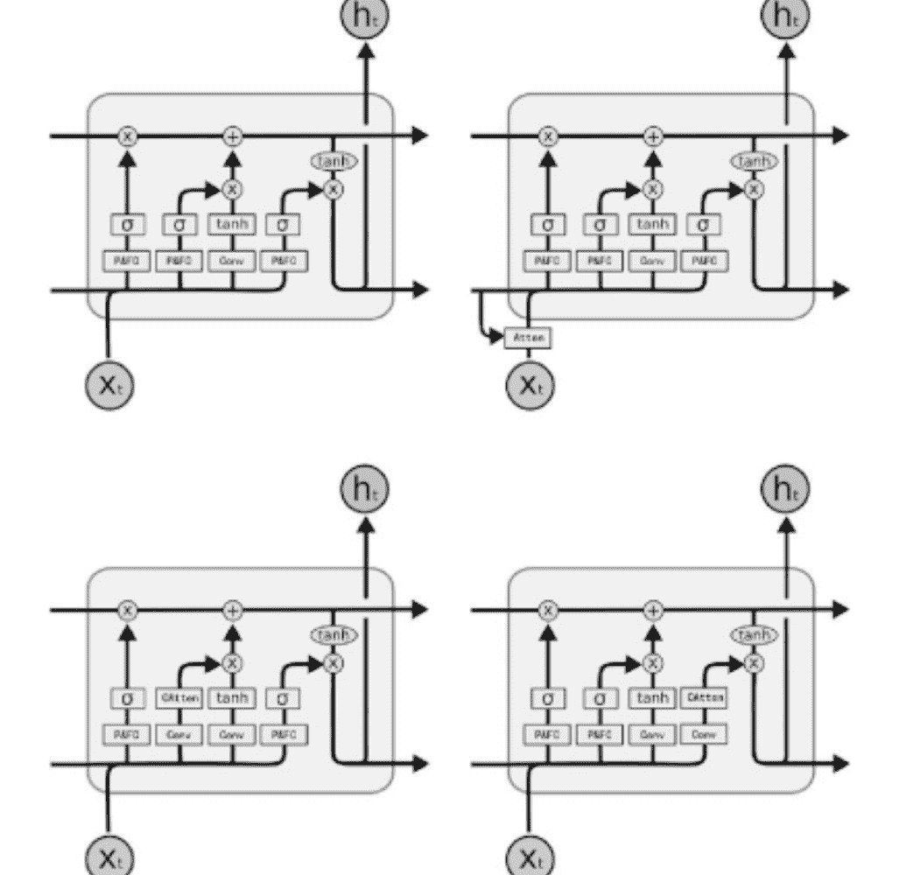

图10.23 卷积LSTM的四个变体

### 10.4 应用

本节讨论了RNN应用的领域。在第10.4.1节中，我们将RNN应用于时间序列预测。在第10.4.2节中，我们将其应用于情感分析。在第10.4.3节中，我们将其应用于语言建模。在第10.4.4节中，我们将其应用于机器翻译。

#### 10.4.1 时间序列预测

本节讨论了将RNN应用于时间序列预测的方法。在第10.3节中，我们完全研究了RNN的学习和泛化。在本节中，我们将RNN应用于时间序列预测。RNN的设计根据窗口大小和单个输出节点的数量确定。本节旨在描述将RNN应用于时间序列预测的过程。

时间序列预测在图10.24中以其功能视图进行说明。它是通过分析过去和当前的测量来预测未来值或值的过程。假设任务为单变量时间序列预测，过去的值，X(t-d), ..., X(t-1), 和当前值X(t), 作为输入给出，未来值X̂(t+1), 被预测为其输出。定义数学方程或预测未来值的形式过程称为时间序列建模。统计模型，如AR（自回归）和MA（移动平均），在1990年代被神经网络，如MLP和SVM所取代。

应用于时间序列预测的RNN的架构在图10.25中进行了说明。过去的值和当前的值，X(t-d), X(t-d+1), ..., X(t), 对应于输入节点。每个隐藏节点，h_i, 与X(t-d+i+1)和h_{i-1}相连。这种架构与常规架构的区别在于只有一个输出节点的存在。对应于X̂(t+1)与先前的隐藏节点和当前值，X(t)相连。让我们提到通过RNN预测未来值的过程。过去的值和当前的值，X(t-d), X(t-d+1), ..., X(t), 被准备作为输入。隐藏值，h_1, h_2, ..., h_d, 由输入值和先前的隐藏值计算；第一个隐藏值，h_1, 仅由输入值计算，X(t-d)。输出值，X̂(t+1),通过最后一个隐藏值计算，h_d。过去的值通过先前的隐藏值对计算最后一个隐藏值产生影响。

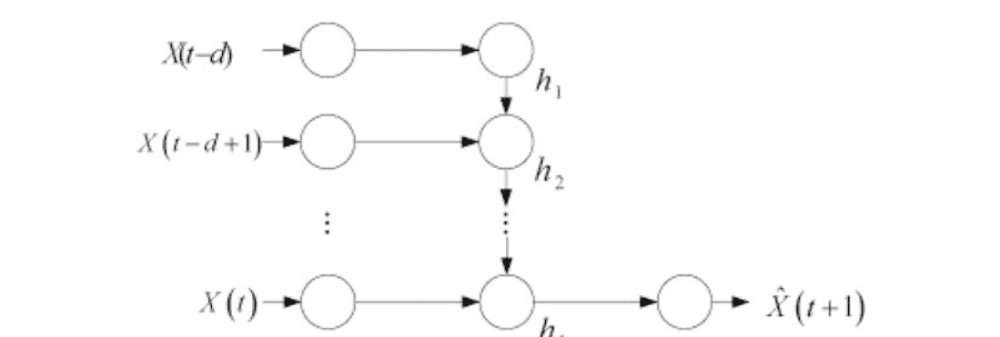

让我们对将RNN应用于时间序列预测做一些备注。该任务是通过分析过去的值和当前值来预测未来值的过程。每个隐藏节点与其自己的输入测量和其上一个隐藏节点相连，每个输出节点与其自己的隐藏节点相连。每个隐藏值由其自己的输入值和其上一个隐藏值计算，输出值由其自己的隐藏值计算。

在应用于时间序列预测的RNN架构中只存在一个输出节点。

#### 10.4.2 情感分析

本节讨论了将RNN应用于情感分析。任务是将文本或句子分类为负面、中性或积极。每个单词对应于自己的数值，称为单词编码，在文本或句子中以单词编码的形式给出输入值。输入节点与隐藏节点之间是一对一的连接，输出节点只与最后一个隐藏节点相连。本节旨在描述应用于情感分析的RNN。

语义分析在图10.26中以功能视图进行说明。它是判断一个陈述或句子是积极的、中性的还是消极的过程。输入是一个句子，将其分类为积极的、中性的或消极的。即使文本分类和情感分析这两个任务看起来相似，文本分类是将一个以上段落的文本分类为预定义的主题之一的过程，而情感分析是将句子或短文本分类为三个类别之一的过程。这个任务应用了RNN的基本版本。

适用于情感分析的RNN架构在图10.27中有所说明。原始输入被假设为由句子组成，由几个单词组成，每个单词都被编码为其自己的数值。输入节点对应于作为数值给出的单词编码，每个隐藏节点从其自己的输入节点和其上一个隐藏节点连接。输出节点作为三个离散值之一给出，表示积极、中性和消极，从最后一个隐藏节点连接。与应用于时间序列预测的RNN相比，应用于此任务的RNN的不同之处在于输出节点作为离散值给出。

让我们提到通过RNN执行情感分析的过程。一个句子作为输入，并映射为一个时间上的单词序列。每个单词都被编码为其自己的数值，每个隐藏值由其上一个隐藏值和其相应的输入值计算得出。通过其自己的隐藏值计算出单个输出值；根据连续的输出值，决定其中的一个类别。我们需要将连续的输出值离散化为三个值之一。

# 图10.26 情感分析的功能视图

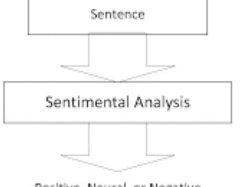

# 图10.27 情感分析的RNN架构

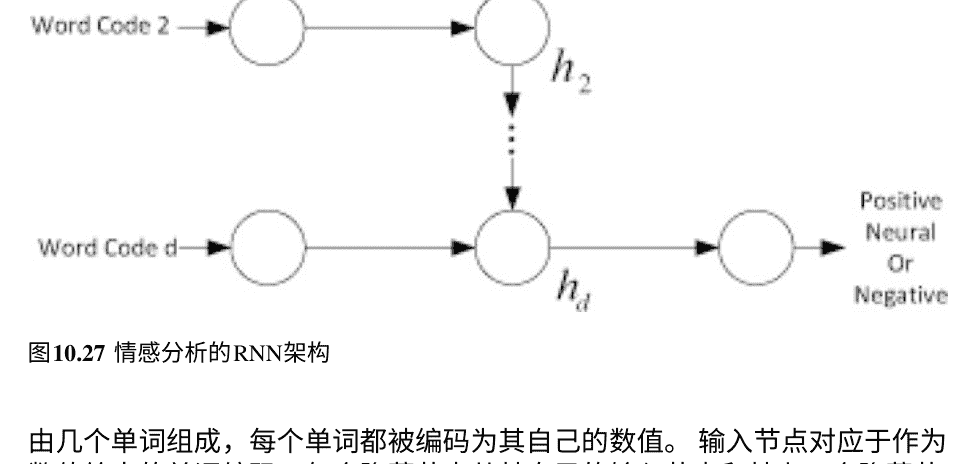

让我们对将RNN应用于情感分析做一些评论。情感分析是判断一个陈述是积极的、中立的还是消极的过程。在将RNN应用于这个任务时，给出一个单一的输出节点，并将其值给定为离散的三种情况之一。一个时间序列的单词被编码成数值，隐藏值被计算出来，输出值基于一个单一的隐藏值计算出来。作为替代方法，我们考虑了一组三个输出节点，并将隐藏节点完全连接到这三个输出节点。

#### 10.4.3 整个学习过程

本节涉及将RNN应用于语言建模。它是根据前面的单词预测一个单词，以构建一个句子的过程。输出节点的数量与体系结构中输入节点和隐藏节点的数量相同。每个单词都被编码为它自己的数值，目标值是放在输入节点中给定的单词旁边的单词。本节旨在描述将RNN应用于语言建模的过程。

语言建模在图10.28中以其功能视图进行说明。它被定义为基于前一个或多个单词预测一个单词的过程。分析当前单词与前一个单词之间的相关性的过程被称为语言建模。语言建模用于语音识别，将语音信号映射为文本。RNN被应用于这个任务。

应用于语言建模的RNN的架构在图10.29中进行了说明。输入层与隐藏层之间的连接以及隐藏层与输出层之间的连接被给定为一对一同类型。每个输入值都以表示其代码的单词的数值形式给出，每个输出值也以表示单词的数值形式给出。

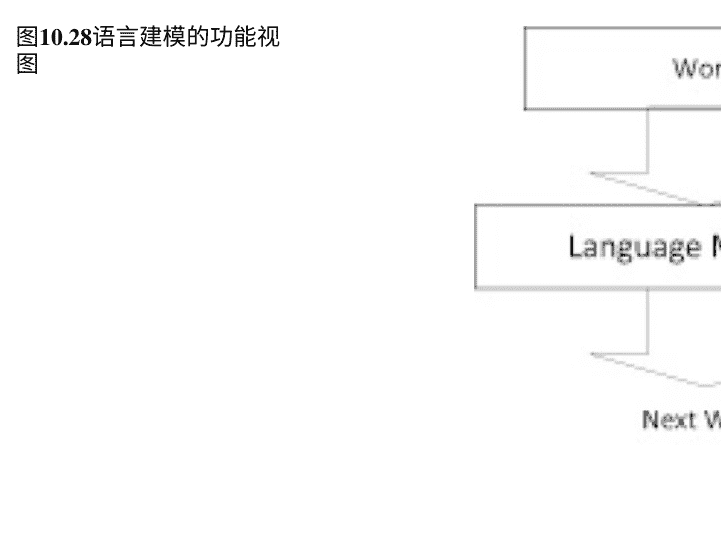

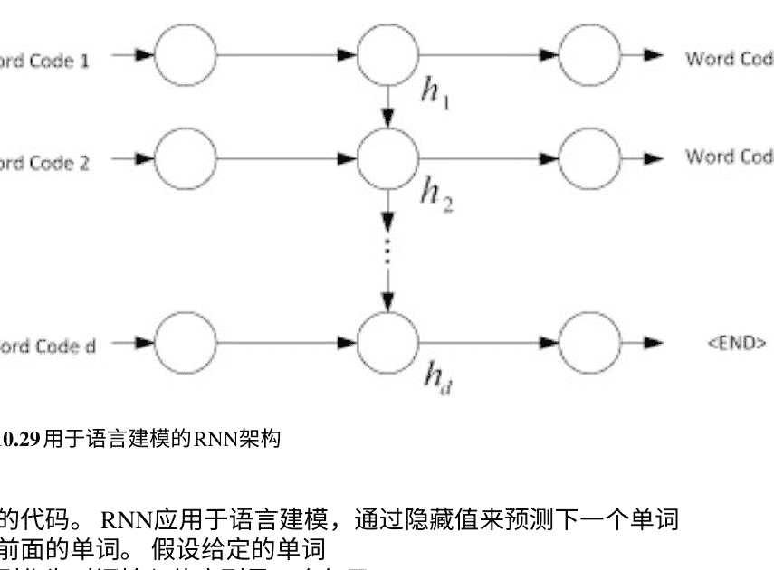

图10.29用于语言建模的RNN架构

它的代码。RNN应用于语言建模，通过隐藏值来预测下一个单词到前面的单词。假设给定的单词序列作为时间输入值序列是一个句子。

让我们提到通过RNN预测给定单词的下一个单词的过程。它通过样本句子进行训练以优化权重。不完整的句子或单词序列以数值形式给出，通过隐藏值计算输出值。输出值被解码为相应的单词，作为跟随输入单词的预测单词。语言建模用于呈现跟随用户输入的不完整句子中最可能的单词。

让我们对将RNN应用于语言建模进行一些说明。这是基于前面单词预测单词的过程。每个输入节点通过架构中的隐藏节点对应一个输出节点。一个单词序列作为不完整的句子给出，其下一个单词对应于最后一个输入节点。语言建模在应用RNN时扩展为机器翻译。

#### 10.4.4 机器翻译

本节主要讨论将RNN应用于机器翻译的问题。这是通过程序将一个特定自然语言的句子或文本翻译成另一种自然语言的过程。双重RNN用于机器翻译；一个用于对原始语言中的句子建模，另一个用于对翻译语言中的句子建模。将一个作为时间词序列给出的单个句子翻译成另一种语言的句子，也作为时间词序列给出。本节旨在描述将双重RNN应用于机器翻译的过程。

机器翻译在图10.30中以其功能视图进行了说明。机器翻译被定义为将一个用自然语言书写的句子映射为另一个用自然语言书写的句子的过程。作为机器翻译的一个实例，一个英语句子通过系统自动翻译成法语句子。RNN被应用于这个任务。准备了一些由英语句子和法语句子组成的配对样例。

双RNN的架构被应用于机器翻译，如图10.31所示。其中一个用于英语语言建模，另一个用于法语语言建模。训练样本是一对一对的英语句子和法语句子。每个句子都被视为一个时间上的单词序列，每个单词在训练双RNN时被编码为一个数值。通过训练的RNN生成法语句子从英语句子。

让我们来介绍使用RNN将英语句子翻译成法语句子的过程。英语句子被给定为一个单词序列，每个单词被编码为自己的数值向量。根据英语句子中的单词预测第一个法语单词。随后的法语单词是通过预测的法语单词的反馈和英语单词一起生成的。这个机器翻译的最终输出是一句法语句子。

让我们对将RNN应用于机器翻译做一些备注。在本节中，机器翻译被具体化为将一个英语句子映射成一个法语句子的过程。双重RNN存在于应用中，一个接收英语单词序列，另一个接收法语单词序列，在训练期间。在第二个RNN中，一个法语单词被预测为英语单词，并作为输入单词进行反馈，在第二个RNN中考虑应用。

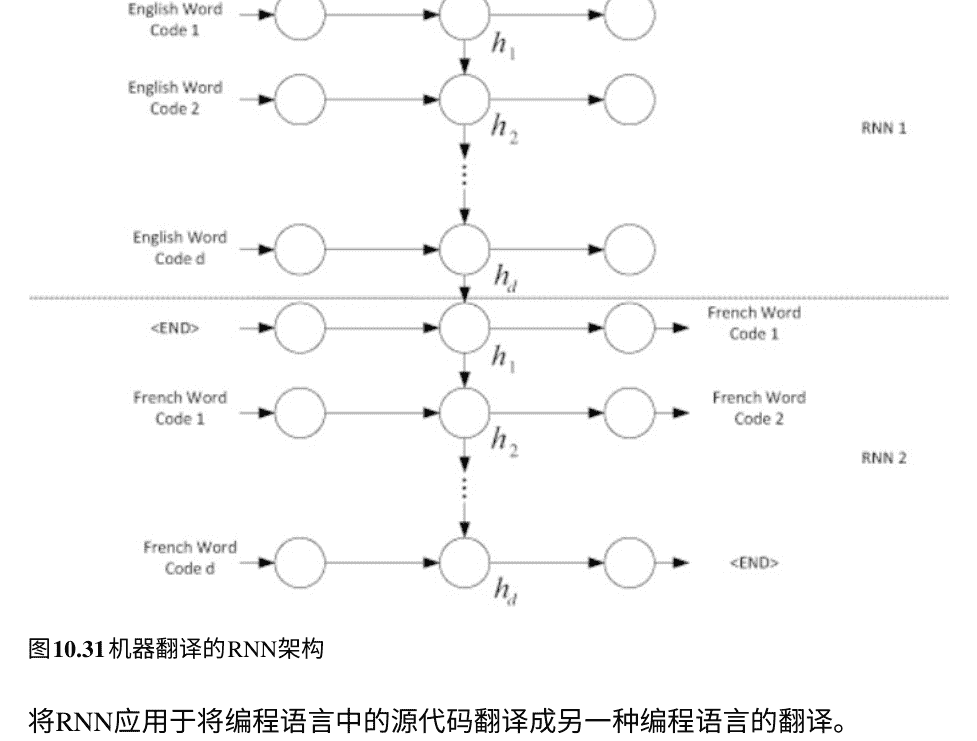

图10.31 机器翻译的RNN架构

将RNN应用于将编程语言中的源代码翻译成另一种编程语言的翻译。

### 10.5 总结和进一步讨论

本节涉及对本章所学内容的总结和进一步讨论。研究节点之间的基本连接，如前馈连接和递归连接，作为理解递归网络的背景。调查了一些递归神经网络模型，如基本模型、LSTM和变体。提到了将RNN应用于某些任务的设计。本节旨在进一步讨论本章所学内容。

让我们考虑循环神经网络和MLP的组合。在循环神经网络的基本版本中，隐藏节点与其反馈相连；隐藏节点的当前值由其先前的值计算得出。不是所有的隐藏单元，而是允许一些隐藏节点之间存在反馈连接。我们考虑一些具有反馈连接的隐藏层和其他只有前馈连接的隐藏层。在未来的研究中，我们考虑设计更先进的循环神经网络，允许一些前馈连接。

让我们将进化计算作为一种基于自然进化的优化技术进行提及。进化计算有四种类型：遗传算法、遗传编程、进化策略和进化编程；然而，我们只提及遗传算法作为最流行的类型。将值编码为位串并将其解码为值的过程被定义为将遗传算法应用于优化问题。在每次迭代中，通过对两个位串进行交叉和变异来生成后代，评估种群中位串的适应度，并根据适应度选择一些位串。我们可以考虑使用遗传算法来优化循环神经网络的权重。

让我们考虑通过遗传算法优化权重的进化循环神经网络。在循环神经网络中，与隐藏层中的循环连接相关的权重以及层间的权重都被优化。当应用遗传算法时，给定的实值权重被编码为称为位串的二进制值。如果采用进化策略或进化编程，则不需要将权重编码为位串。进化计算的优点是避免局部最小值，但优化权重需要更多时间。

让我们考虑引入进化计算来优化LSTM中的权重。我们上面提到了将进化计算应用于基本循环神经网络中的权重优化。LSTM每个隐藏节点内部的电路比基本循环神经网络更复杂。进化计算应用于四种类型的权重优化。我们考虑将进化计算应用于优化某些权重，并将梯度下降应用于优化其他权重。

### 参考文献

1.  L. Zhang, G. Zhu, L. Mei, P. Shen, S. A. A. Shah, 和 M. Bennamoun, 卷积注意力LSTM用于手势识别。神经信息处理系统的进展, 31, 2018年。

## 第11章 受限玻尔兹曼机

本章主要讨论用于恢复输入的RBM。在发明RBM之前，Hopfield网络被用作恢复输入向量的关联记忆。RBM中有两种变量：可见变量作为输入变量给出，隐藏变量作为恢复输入给出。多个RBM堆叠版本被称为信念网络，是一种深度神经网络。本章旨在描述RBM，以及与其学习过程相关的堆叠版本。

本章由五个部分组成，在第11.1节中概述了本章研究的内容。在第11.2节中，我们研究了用于恢复输入的关联记忆。在第11.3节中，我们研究了RBM的基本版本。在第11.4节中，基本版本扩展为高级版本。在第11.5节中，我们进一步讨论了本章研究的内容。

### 11.1 引言

本节主要介绍了RBM作为另一种深度神经网络的概述。RBM的任务是将不完整的数据项恢复为完整的关联记忆。该架构包括可见层和隐藏层。通过堆叠多个RBM，可以将基本的RBM扩展为深度学习算法。本节旨在概述RBM作为本章的引言。

让我们从功能视角解释关联记忆。关联记忆被定义为将不完整的输入恢复为完整的任务。在这个任务中，输入和输出被定义为相同维度的向量。关联记忆被应用于分类任务，通过检索训练样本中的一个来处理不完整的新手输入。Hopfield网络被设计为关联记忆的传统方法。

在实现RBM时，有两种类型的变量：可见变量和隐藏变量。前者是应该被恢复的输入变量，后者是用于恢复输入值的中间变量。每个可见变量和隐藏变量之间的连接都与其自己的权重相关联。

RBM的学习过程是为了优化权重，使计算得到的可见值与原始值相同。在将RBM应用于实际任务时，我们对隐藏值不感兴趣，而是对恢复输入值感兴趣。

在应用RBM时有两种输入类型。假设两个输入值通过完全优化的可见层和隐藏层之间的权重是相同的。最初给予可见层的输入值被称为目标输入，通过隐藏值和权重的乘积计算得到的输入值被称为计算输入。训练RBM的方向是最小化目标输入值和计算输入之间的误差。目标输入值和计算输入值分别对应不完整输入和完整输入。

让我们提到本章中的意图。我们将关联记忆视为一个任务，并为其提供一些神经网络模型。我们将根据其架构、计算过程和学习过程来理解单个RBM。我们了解多个RBM的组合，以实现深度学习算法。本章旨在研究RBM的基本模型和高级模型。

### 11.2 关联记忆

本节关注RBM作为关联记忆的学习范式。在第11.2.1节中，我们将输入恢复描述为关联记忆的基本概念。在第11.2.2节中，我们研究具有相同输入和输出的关联MLP。在第11.2.3节中，我们研究了遵循关联记忆的早期神经网络，称为Hopfield神经网络。在第11.2.4节中，我们研究了作为RBM先前模型的Boltzmann机。

#### 11.2.1 输入恢复

本节关注的是被称为联想记忆的输入恢复问题。它是将不完整的输入恢复为完整的过程。有两种类型的输入：目标输入最初给定和计算输入通过初始输入计算得到。在联想记忆中，输出与输入定义相同；输入向量的维度与输出向量的维度相同。本节旨在说明功能视图中的联想记忆任务。

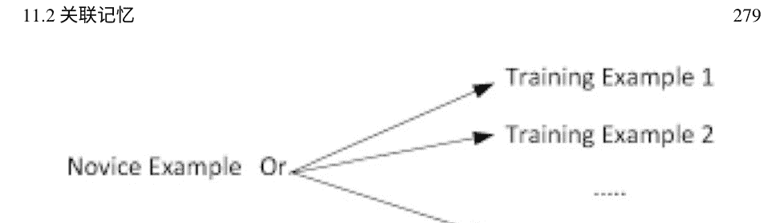

# 图11.1 单个输入恢复

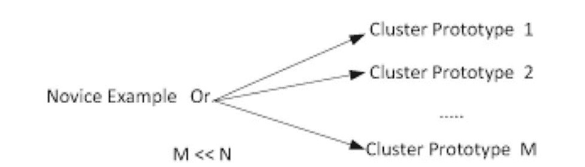

# 图11.2 输入聚类恢复

将输入值恢复为训练示例之一的过程如图11.1所示。N训练示例像监督学习和无监督学习一样提前收集。一个新手示例用x表示，训练示例用x1, x2, ..., xN表示。一个新手示例，x，恢复为训练示例之一，xi，如公式（11.1）所示：

$$x \rightarrow x_i$$

这种恢复被视为检索与初学者示例最相关的训练示例的过程。

将输入值恢复为群集原型之一的过程在图11.2中说明。根据它们的相似性，将N训练示例分割成M个群集。群集原型用c1, c2, ..., cM表示。将输入向量x恢复为群集原型的过程由公式(11.2)表示：

$$x \rightarrow c_i$$

通过关联记忆对数据项进行分类的过程。准备带有自己类别标签的训练示例。将初学者向量作为输入，并将其恢复为其中一个训练示例。一个数据项的标签。

新手项目由训练示例的标签决定。
这种分类类型被视为通过最近的1个邻居对其进行分类的过程。

让我们对在功能视图中描述的联想记忆进行一些说明。输入向量被恢复为训练示例之一。训练示例事先被聚类，输入向量可以恢复为聚类原型之一。通过将新输入向量恢复为标记的训练示例之一来对其进行分类，并且其标签由恢复的训练示例的标签决定。在学习RBM之前，我们将学习早期设计用于联想记忆的Hopfield网络。

## 11.2.2 联想MLP

本节涉及MLP版本，该版本专门用于联想记忆，称为联想MLP。在前一节中，我们学习了在功能视图中将不完整的输入恢复为完整输入的联想记忆。MLP的设计中，输入层和输出层具有相同数量的节点，并且隐藏层具有任意数量的节点。用于训练MLP的每个训练示例都由其自身的输入向量标记。本节旨在描述用于联想记忆的MLP版本。

联想MLP的架构如图11.3所示。这个MLP有三个层：输入层、隐藏层和输出层。

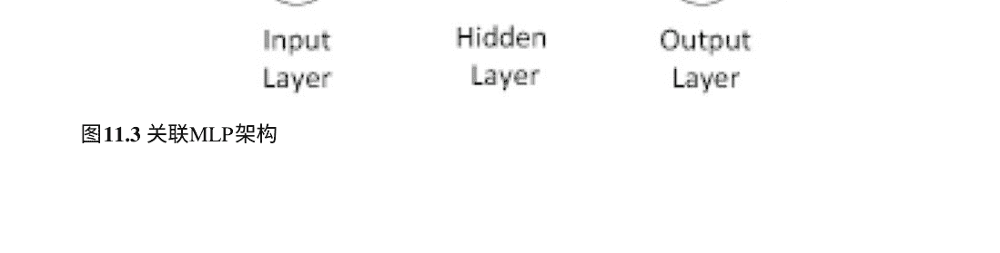

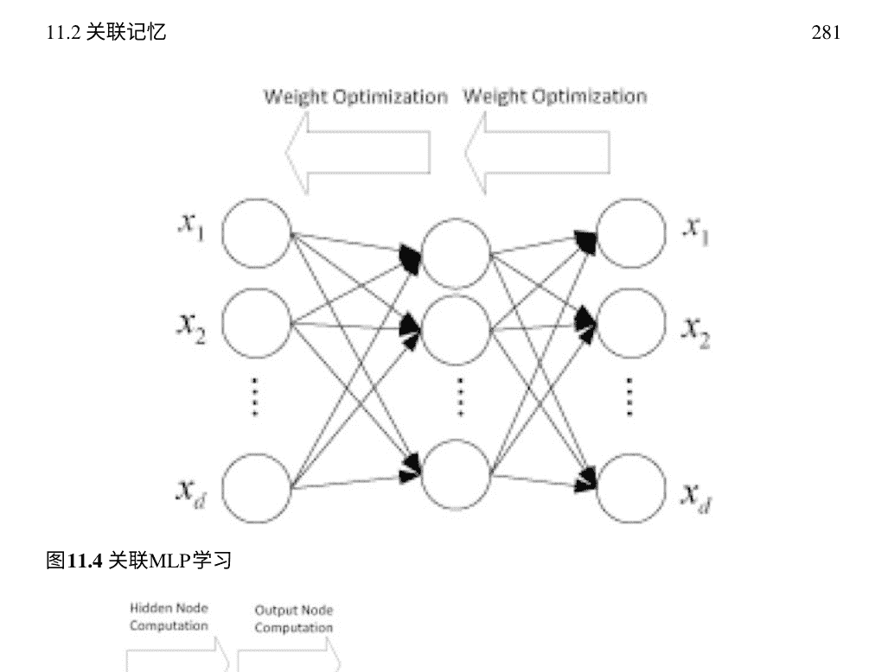

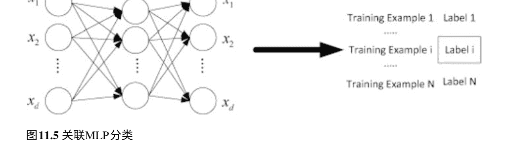

在联想MLP中，输入和输出的定义是相同的：输入节点的数量与输出节点的数量相同。联想MLP的学习过程是为了优化权重，以恢复不完整的输入为完整形式。隐藏节点的数量是任意的，就像任何版本的MLP一样。

联想MLP的训练方向如图11.4所示。我们已经在第9章中学习了MLP的训练过程。两个权重矩阵在学习过程中被优化。如果输入节点和输出节点的数量是 \(d\)，隐藏节点的数量是 \(h\)，那么权重矩阵的大小是 \(d \times h\) 和 \(h \times d\)。优化权重的方向是从输出层到输入层。

使用联想MLP对数据项进行分类的过程如图11.5所示。联想MLP旨在执行联想记忆。一个新输入向量被恢复为训练示例之一，并且新输入向量的标签由恢复的训练示例之一决定。如果它恢复的不完全是训练示例之一，则检索与计算出的示例最接近的训练示例。在第9章中介绍的版本被用作分类模型，而不是联想MLP。

让我们对执行联想记忆的联想MLP进行一些说明。在设计联想MLP时，输入节点的数量与输出节点的数量相同。输入层与隐藏层之间的权重和隐藏层与输出层之间的权重在联想MLP的学习过程中进行优化。它用于将输入向量恢复为训练示例之一。通过将输出与输入定义为相同，将其他机器学习算法修改为联想记忆方法。

#### 11.2.3 Hopfield网络

本节主要讨论霍普菲尔德网络作为典型的神经网络之一，用于联想记忆。在前一节中，我们研究了专门用于联想记忆的多层感知器（MLP）版本。在本节中，我们研究了一种单层霍普菲尔德网络，其中所有节点彼此连接；层中的每个节点与自身和其他节点相连。每个节点的值是通过将其先前值与其他节点的值相乘并应用激活函数来计算的。本节旨在描述霍普菲尔德网络作为联想记忆的神经网络。

霍普菲尔德网络的架构如图11.6所示。即使霍普菲尔德网络只有一个层，每个节点都与输入值 和输出值 \(\hat{x_i}\) 相关联。\(x_i\)是输入值， \(\hat{x_i}\)是输出值。在霍普菲尔德网络的架构中，每个节点都与自身和其他节点相连；所有节点之间的连接是完全的。如果节点的数量是 \(d\) ，那么Hopfield网络中的连接数量是 \(d^2\) 。Hopfield网络的架构被视为感知器之一，其中输入节点和输出节点的数量都是 \(d\) 。

让我们提到Hopfield网络的计算过程。Hopfield网络的架构被解释为感知器之一，其中输入向量和输出向量彼此相同，并且输入向量和输出向量都被假定为由零或一组成的二进制向量。节点由 \(x_1, x_2, \ldots, x_d\) 表示，以及 \(d \times d\) 权重被视为一个矩阵，表示为公式 (11.3)：

$$
\mathbf{W} = \begin{pmatrix} w_{11} & w_{12} & \ldots & w_{1d} \\ w_{21} & w_{22} & \ldots & w_{2d} \\ \vdots & \vdots & \ddots & \vdots \\ w_{d1} & w_{d2} & \ldots & w_{dd} \end{pmatrix}
$$

给定的输出值是一个二进制值，通过方程 (11.4) 计算：

$$
\hat{x}_i = \begin{cases} 1 & \text{if } \sum_{j=1}^{d} w_{ji} \cdot x_j \geq 0.5 \\ 0 & \text{否则} \end{cases}
$$

Hopfield网络的泛化是将一个新输入向量恢复为训练样本之一。

让我们提到Hopfield网络的学习过程。每个训练样本被假设为由零和一组成的二进制向量，并且每个训练样本都带有自身的标签。有两种类型的输入向量：目标输入向量， \(x_i = [x_{i1} x_{i2} \ldots x_{id}]\) ，以及计算得到的输入向量，权重矩阵被随机初始化。更新权重的规则， \(w_{ji}\) ，由方程 (11.5) 推导得出：

$$
w_{ji} \leftarrow w_{ji} + \eta x_i (x_j - \hat{x}_j)
$$

Hopfield网络与感知机的区别在于将输出值替换为输入值。

让我们对Hopfield网络的计算和学习过程进行一些说明。在Hopfield网络的架构中，每个节点都与自身和其他节点相连。输入值有两种：目标输入是训练示例中的一种，计算输入是由公式 (11.4) 计算得出的。权重被优化以最小化目标输入和计算输入之间的误差。我们考虑将Hopfield网络升级为处理连续输入值的版本。

#### 11.2.4 玻尔兹曼机

本节涉及的Boltzmann机是RBM的前一种模型。在研究Boltzmann机的开始，我们定义了两个变量的种类：可见变量和隐藏变量。在玻尔兹曼机中，可见变量和隐藏变量之间的连接是完全的，它们内部的连接也是完全的。玻尔兹曼机通过两种变量之间的唯一完全连接演变成了受限玻尔兹曼机。本节旨在描述玻尔兹曼机作为受限玻尔兹曼机的前身。

图11.7展示了玻尔兹曼机的架构。图11.7左侧的架构，每个可见节点与自身和其他节点相连，与Hopfield网络的架构相同。图11.7中间部分的架构，可见层和隐藏层之间有完全连接，与Perceptron的架构相同，Perceptron在第9章中有介绍。图11.7右侧的架构中，每个隐藏节点与其他节点相连，与Hopfield网络的架构相同。玻尔兹曼机的架构被视为Hopfield网络和Perceptron架构的整合。

Boltzmann机的训练框架如图11.8所示。与连接和隐藏节点值相关联的权重被随机值或零值初始化。可见值的数值作为输入，隐藏节点的数值通过可见值和权重的乘积以及前一个隐藏值和权重的乘积来计算。可见值通过隐藏值和权重的乘积以及前一个可见值和权重的乘积来计算，权重会更新以最小化初始可见值和计算出的可见值之间的误差。Boltzmann机的学习通过循环这三个阶段进行，直到初始可见值和计算出的可见值之间的误差达到最小。

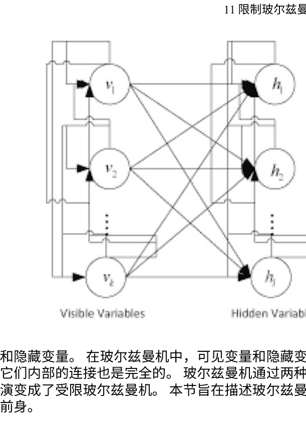

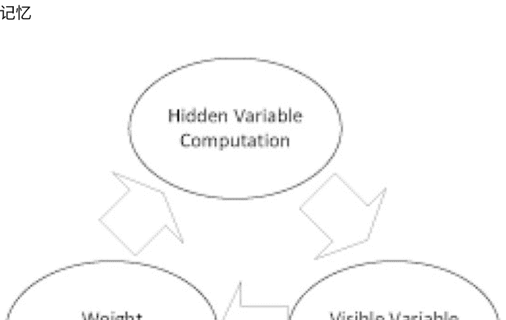

图11.8 Boltzmann机学习循环

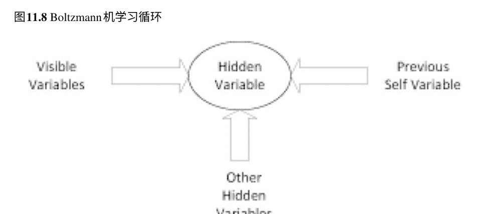

图11.9 Boltzmann机中隐藏变量的计算

计算隐藏值的框架如图11.9所示。由于它依赖于先前的值，需要用零值初始化隐藏值。每个隐藏节点与可见节点相连，并与其他隐藏节点以及自身相连。隐藏节点的值通过可见值和权重的乘积以及前一个隐藏值和权重的乘积来计算。在RBM中，隐藏节点与其他隐藏节点之间的连接被移除。

让我们对玻尔兹曼机进行一些评论，作为另一个神经网络用于联想记忆。可见层与隐藏层之间的连接以及可见层或隐藏层内部的连接在架构中是完整的。玻尔兹曼机的学习过程是更新可见层与隐藏层之间的权重，以最小化误差计算得到的可见值与目标可见值之间的差距。每个隐藏节点的值取决于可见值、其他隐藏节点的值和其先前的值。玻尔兹曼机的缺点是在计算隐藏节点值和可见节点值时涉及太多的权重。

### 11.3 单个RBM

本节讨论RBM的基本版本。在第11.3.1节中，我们研究单个RBM的架构。在第11.3.2节中，我们研究从可见值计算隐藏值的过程。在第11.3.3节中，我们研究使用训练样本训练RBM的过程。在第11.3.4节中，我们将修改RBM作为分类模型。

#### 11.3.1 架构

本节涉及RBM架构。在第11.2.4节中，我们研究了Boltzmann机器的架构和学习框架。在本节中，我们研究了RBM架构，其中隐藏节点之间的连接和可见节点之间的连接被移除。尽管RBM在架构上与感知器相似，但两层在两种神经网络中的角色是不同的。本节旨在描述仅有两层之间连接的RBM架构。

RBM架构中的可见层如图11.10所示。可见值被表示为向量， \(\mathbf{v} = [v_1, v_2, \dots, v_d]\)，具有维度\(d\)。每个可见节点用\(v_i\)表示。可见值在基本RBM中传递到隐藏层，用于计算隐藏值。

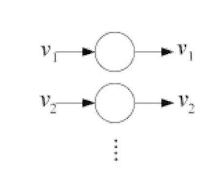

图11.11 基本RBM中的隐藏变量

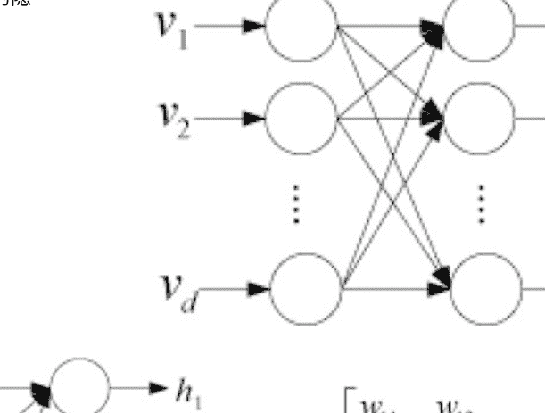

可见层和隐藏层的结构如图11.11所示。隐藏值用具有 \(k\) 维度的向量表示，\(\mathbf{h}=[h_1, h_2, ..., h_k]\)。每个隐藏节点用 \(h_i\) 表示，其值由可见值计算得出。可见层和隐藏层之间的双向连接是RBM与感知器的区别之处。隐藏值用于计算可见值。

图11.12 基本RBM中可见层和隐藏层之间的权重

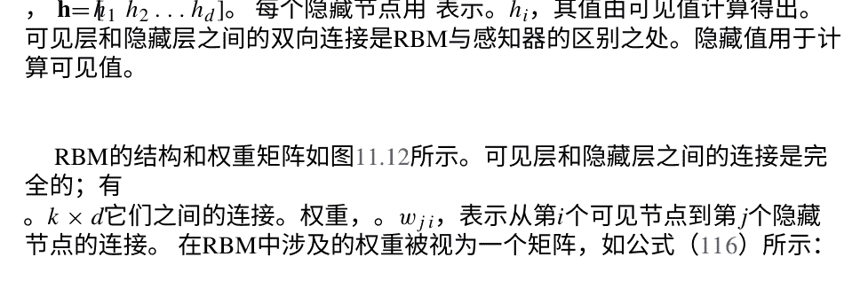

RBM的结构和权重矩阵如图11.12所示。可见层和隐藏层之间的连接是完全的；有 \(k \times d\) 个它们之间的连接。权重 \(w_{ji}\) 表示从第 \(i\) 个可见节点到第 \(j\) 个隐藏节点的连接。在RBM中涉及的权重被视为一个矩阵，如公式（11.6）所示：

$$
\mathbf{W} = \begin{pmatrix} w_{11} & w_{12} & \ldots & w_{1d} \\ w_{21} & w_{22} & \ldots & w_{2d} \\ \vdots & \vdots & \ddots & \vdots \\ w_{k1} & w_{k2} & \ldots & w_{kd} \end{pmatrix} \quad (11.6)
$$

这些权重用于计算可见值和隐藏值。

#### 11.3.2 输入层

本节涉及计算隐藏节点值的过程。在前一节中，我们研究了由可见层和隐藏层组成的RBM的整体架构。在本节中，我们研究了通过可见值计算隐藏值的过程。在计算隐藏值之后，计算可见值。本节旨在描述通过可见值计算隐藏值的过程。

可见向量最初作为RBM的输入向量给出。两种可见向量被定义为目标可见向量和计算可见向量。目标可见向量最初作为输入向量给出，而计算可见向量是通过将权重矩阵和隐藏向量的乘积应用于激活函数来计算的，分别表示为 \(\mathbf{v}=[v_1, v_2, ..., v_d]\) 和 \(\hat{\mathbf{v}}=[\hat{v}_1, \hat{v}_2, ..., \hat{v}_d]\)。在将RBM应用于分类时，将目标输出向量与输入向量合并后作为可见向量给出。训练RBM的方向是最小化两种可见向量之间的误差。

在呈现可见向量后，可见层和隐藏层之间的权重矩阵被初始化。可见节点的数量是 \(d\)，隐藏节点的数量是 \(k\)。在公式（11.6）中呈现的 \(k \times d\) 权重矩阵被初始化为接近零的随机值。如果权重被初始化为零值，并且线性函数被采用作为激活函数，隐藏值将为零。为了避免这种情况，采用sigmoid函数来计算隐藏值。

让我们提及RBM中计算隐藏值的过程。可见向量首先被给定，可见层和隐藏层之间的权重矩阵如公式（11.6）所示。隐藏值为 \(h_i\)，通过公式（11.7）计算：

$$
h_i = \sum_{j=1}^{d} w_{ji} \cdot v_j \tag{11.7}
$$

计算隐藏向量的方程被视为权重矩阵和可见向量的乘积，如公式（11.8）所示：
$$
\mathbf{h} = \mathbf{W} \cdot \mathbf{v} \tag{11.8}
$$
隐藏向量用于使用权重矩阵计算可见向量。让我们对计算隐藏节点值的过程做一些备注。在RBM中有两种可见向量：目标可见向量和计算可见向量。可见层和隐藏层之间的权重是随机初始化的，并且使用sigmoid函数作为激活函数。隐藏向量通过权重矩阵和可见向量的乘积来计算。在RBM中，可见层或隐藏层内部可以允许部分连接。

#### 11.3.3 学习过程

本节涉及使用训练示例训练RBM的过程。未标记的示例被准备为训练示例；假设每个训练示例都标有相同的输入。有两种可见向量：目标可见向量最初由训练示例给出，计算可见向量通过转置权重矩阵和隐藏向量的乘积计算。训练RBM的方向是最小化两种可见向量之间的误差。本节旨在描述RBM的学习过程。

从可见值计算隐藏值的计算过程在图11.13中说明，作为学习过程的第一步。输入层和隐藏层之间的权重是随机初始化的，并且可见向量最初被给定为输入向量，\(\mathbf{v}\)。隐藏向量，通过权重矩阵和可见向量的乘积计算得到 \(\mathbf{h}\)。感知器中隐藏向量与输出向量的差异用于计算可见向量。隐藏节点的数量是任意设置的；隐藏节点的数量被优化以最小化训练误差。

图11.13 RBM中的隐藏变量计算

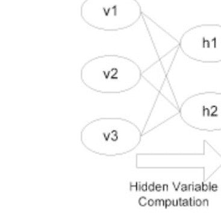

通过上述过程计算得到的隐藏向量来计算可见向量的过程。隐藏向量是由最初给定的可见向量通过权重矩阵的乘积计算得到的。每个可见值，\(\hat{v}_i\)，由公式（11.9）计算得到
$$
\hat{v}_i = \sum_{j=1}^{k} w_{ji} \cdot h_j \tag{11.9}
$$
计算可见向量的过程，\(\hat{\mathbf{v}}\)，被视为权重矩阵的转置和隐藏向量的乘积，如公式（11.10）所示：

$$
\hat{\mathbf{v}} = \mathbf{W}^T \cdot \mathbf{h} \quad (11.10)
$$

训练RBM的方向是最小化两个向量之间的误差，\(\mathbf{v}\) 和 \(\hat{\mathbf{v}}\)。更新可见层和隐藏层之间的权重如图11.14所示。激活函数和损失函数分别被假设为线性函数和方程（11.11）：

$$
E = \frac{1}{2}(\mathbf{v} - \hat{\mathbf{v}})^2 \quad (11.11)
$$

权重通过公式（11.12）进行更新：

$$
w_{ji} \leftarrow w_{ji} - \eta \frac{\partial E}{\partial w_{ji}} \quad (11.12)
$$

方程（11.13）是从方程（11.11）和（11.12）推导出来的，用于更新权重：

$$
w_{ji} \leftarrow w_{ji} + \eta h_i (v_j - \hat{v}_j) \quad (11.13)
$$

通过方程（11.13）更新权重，直到它们收敛。让我们对RBM的训练过程做一些说明。可见层和隐藏层之间的权重是随机初始化的，初始输入向量被视为可见向量。隐藏向量由可见向量计算得出，然后再次通过隐藏向量计算可见向量。权重的更新是为了最小化目标可见向量与计算可见向量之间的差异。RBM的训练过程被视为监督学习，其中输入向量和目标输出向量相同。

图11.14 RBM中的权重优化

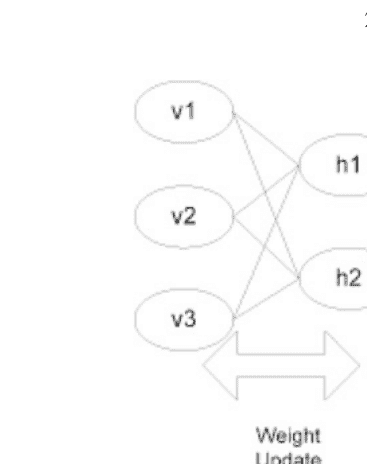

#### 11.3.4 分类模型

本节关注的是将RBM应用于分类任务作为单一模型。直到前一节，RBM被视为一种关联记忆模型，用于恢复输入向量。在本研究中，RBM被设计为一个分类器；输入向量被增加了其目标输出向量作为可见向量。目标可见向量是将输入向量与零向量增加到未标记的新输入向量，并且在计算的可见向量中，增加的部分是新输入向量的标签在泛化过程中。本节旨在描述设计用于分类数据项的单个RBM。

图11.15 RBM分类模型的架构

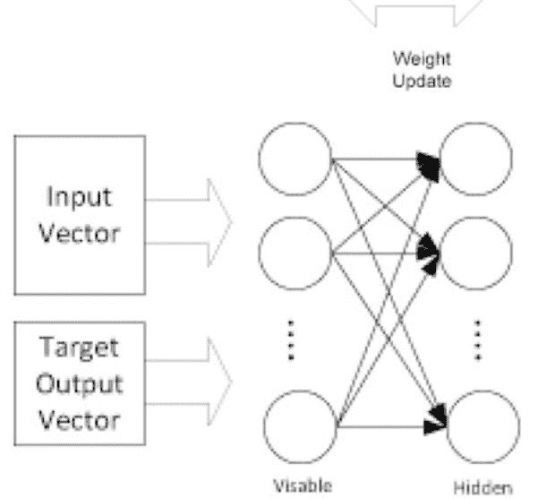

图11.15展示了应用于分类的RBM的架构。如果RBM应用于关联记忆，输入向量被假设为未标记的项。如果RBM应用于分类，输入向量将与其目标输出向量一起增加为可见向量。如果输入向量是一个 \(d\) 维向量，目标输出向量是一个 \(m\) 维向量，可见向量变为 \(d+m\) 维向量。输入向量和零输出向量在泛化中作为可见向量给出。

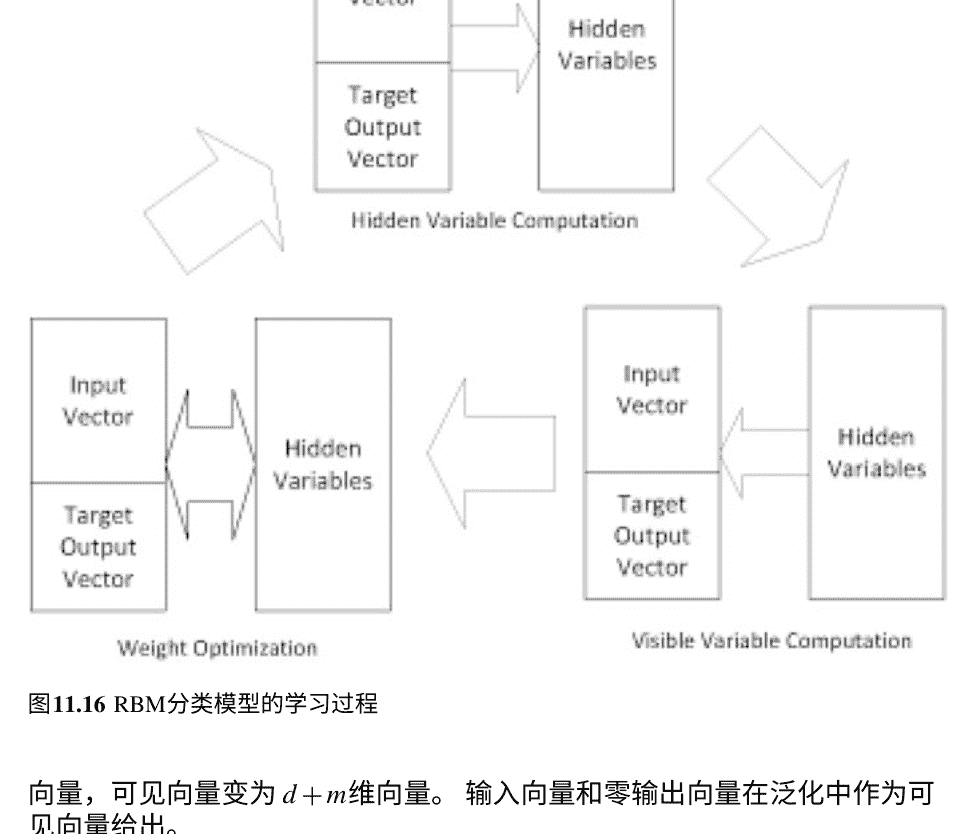

用于分类任务的RBM的训练过程如图11.16所示。每个训练样本的输入向量与其目标向量相结合，作为可见向量给出。隐藏向量由可见向量计算得出，可见向量由隐藏向量计算得出。隐藏层与可见层之间的权重通过减小目标可见向量与计算得出的可见向量之间的差异来更新。权重通过在图11.16中呈现的循环中进行迭代来优化。RBM通过泛化将数据项进行分类的过程如图11.17所示。新输入作为唯一的输入向量给出，因此它与零输出向量一起作为可见向量进行扩充。通过这个可见向量计算得出隐藏向量，再通过计算得出的隐藏向量重新计算可见向量。计算得出的可见向量中的扩充部分是新输入向量的答案。通过RBM进行分类，将没有输出向量的可见向量恢复为具有输出向量的可见向量。

让我们对设计用于分类数据项的RBM进行一些备注。可见向量是输入向量与目标输出的扩充。

图11.17 RBM中的分类过程向量。分类过程是通过可见向量计算隐藏向量，可见向量由输入向量和其零向量组成，再次计算可见向量，并将可见向量中的扩充部分作为答案。可见层和隐藏层之间的权重被优化以最小化目标可见向量与计算可见向量之间的误差。RBM可以通过串联多个RBM来设计为分类器的替代方式。

### 11.4 堆叠RBM

本节涉及RBM的高级模型。在第11.4.1节中，我们研究了由多个隐藏层组成的多个堆叠RBM。在第11.4.2节中，我们研究了多个堆叠RBM在降维中的应用。在第11.4.3节中，我们研究了应用于输出解码的RBM。在第11.4.4节中，我们提到了通过遗传算法优化可见层和隐藏层之间的权重。

#### 11.4.1 多个堆叠RBM

本节讨论的是RBM的高级版本。在第11.3节中，我们研究了只有两层的单个RBM：可见层和隐藏层。
从本节开始，单个RBM扩展为多个RBM。在单个RBM中，隐藏向量和可见向量之间的关系是线性的，而在多个堆叠的RBM中，最后一个隐藏向量和可见向量之间的关系是非线性的。本节旨在描述多个堆叠的RBM作为高级模型。

多个堆叠的RBM如图11.18所示。在第11.3节中研究的单个RBM由两层组成：可见层和隐藏层。

图11.18 多个堆叠RBM的架构

图11.19 RBM J 和RBM ( J + 1)

多个堆叠的RBM由一个可见层和多个隐藏层组成。最终的隐藏值通过前向方向中间隐藏值计算，可见值通过后向方向计算。为了简单起见，在RBM中采用线性函数作为激活函数。

在图11.19中，我们关注隐藏层J和隐藏层J+1作为中间隐藏层。最左边的层是可见层，第二左边的层是第一个隐藏层。在J+1中的第i个隐藏节点用$h_i^{j+1}$表示。
它的值由公式(11.14)计算：

$$ h_i^{j+1} = \sum_{r=1}^{|J|} w_{ir} h_r^j $$

图11.20 多层堆叠RBM的学习过程

通过公式(11.14)计算的隐藏节点值用于计算下一层的隐藏节点值。

在图11.20中，展示了多层堆叠RBM中权重的更新方向。权重是随机初始化的，隐藏节点值是从可见层到最终隐藏层的正向计算。

可见值是从最后一个隐藏层向可见层的反向计算得出的。权重在可见层和第一个隐藏层之间进行更新；权重更新从可见层传播到最后一个隐藏层。推导权重更新规则的过程留作练习。

让我们对多层堆叠的RBM进行一些说明，作为高级版本。它由一个单一的可见层和多个隐藏层组成。当前层的隐藏节点值由前一层的节点计算得出。最后一层的隐藏节点值是向前计算的，可见值是向后计算的，权重是向前更新的。这个版本的RBM用于解决恢复输入值中的非线性关系。

#### 11.4.2 输入编码

本节涉及应用于输入编码的RBM版本。这是将初始输入向量映射为具有不同维度的向量的过程。初始输入向量被设置为可见向量，隐藏向量的维度小于可见向量的维度。这个事实隐藏值作为输出表征了用于输入编码的RBM。本节旨在描述RBM用于输入编码的用途。

图11.21以功能视图说明了维度降低的过程。它是将数值向量映射为具有较低维度的另一个向量的过程。输入给出了属性列表，并且具有较小数量的新属性列表是输出。奇异值分解（SVD）、主成分分析（PCA）和独立成分分析（ICA）是典型的降低维度的方案。单个RBM或多个RBM用于降维。

图11.22说明了用于降低维度的双重RBM。初始输入向量设置为可见向量，并且可见层与第一隐藏层之间的权重被优化。第一隐藏层中的隐藏值将第一隐藏层的输出作为新的可见值，并优化第一隐藏层和第二隐藏层之间的权重。通过第一隐藏层中的值计算第二隐藏层中的隐藏值，从输入值中进行泛化。第二隐藏层中的隐藏向量是从输入向量映射得到的降维向量。

图11.23展示了将输入向量映射为具有较低维度的多个RBM。初始输入向量被设置为可见向量，并被编码为映射后的最终隐藏向量。在前向传播过程中，隐藏向量逐层计算；在反向传播过程中，可见向量从最后一个隐藏层计算到输入层。权重在前向传播过程中逐层更新。在泛化过程中，使用优化后的权重将最终隐藏向量从可见向量计算出来，作为具有降维后的维度的向量。

让我们对RBM在将输入向量编码为具有较低维度的向量方面进行一些评论。降维是将输入向量编码为具有较低维度的向量的过程。在进行维度缩减时，使用了双重RBM；最终的隐藏向量是从输入向量编码而来的向量。在应用多个堆叠的RBM进行维度缩减时，最终的隐藏向量是在正向计算中计算的，可见向量是在反向计算中计算的，权重是在正向计算中更新的。池化和卷积用于降低维度。

#### 11.4.3 输出解码

本节涉及RBM在输出解码中的应用。这是将加密代码映射回其原始代码的过程。在将单个RBM应用于输出解码时，可见层和隐藏层互换位置。在应用多个堆叠的RBM时，第一层和最后一层是可见层。本节旨在描述应用于输出解码的RBM版本。

输出规范作为输出解码的一个实例在图11.24中说明。输出规范是将抽象输出值映射为具体输出值的过程。预定义的类别被定义为类别1、类别2、类别3和类别4，在前一层中有两个节点，如图11.24所示。顶部节点连接到类别1和类别2，底部节点连接到类别3和类别4。这两个层被视为一个层次分类系统。

应用于输出解码的单个RBM在图11.25中说明。左侧层被给定为隐藏层，右侧层被给定为可见层。隐藏向量是通过目标输出向量计算的，输出向量是通过计算得到的隐藏向量计算的，并且在学习过程中更新权重以最小化目标输出向量与计算得到的输出向量之间的差异。在泛化中，隐藏向量被给定为输入向量，输出向量由它们计算得到。这个版本的RBM看起来更像是有监督学习，而不是关联记忆。

输入编码和输出解码与多个堆叠的RBM的复合在图11.26中说明。在第一个RBM中，可见值是输入值的编码隐藏值，最后一个RBM中，可见值是输出值，隐藏值是从中解码输出值的值。在学习过程中，第一个RBM中的权重和最后一个RBM中的权重会被更新。在中间RBM中，有两种更新权重的方式；权重从第一个RBM向前方向更新，权重从最后一个RBM向后方向更新。这种输入编码和输出编码的模式被用作深度操作。

图11.25 RBM架构 用于输出解码

图11.26 RBM架构用于输入编码和输出解码

让我们对RBM在输出解码中的应用做一些说明。
输出规范是将抽象级别中的类别映射到具体级别的过程。在将单个RBM应用于输出解码时，隐藏向量在解码之前是一个，可见向量是最终输出向量。
多个堆叠的RBM应用于输入编码的复合物和输出解码。将现有的机器学习算法改进为其深度版本，通过将其多个堆叠版本放在其前面。

#### 11.4.4 进化RBM

本节涉及RBM的进化版本。在之前的章节中，可见层和隐藏层之间的权重通过梯度下降进行优化。它被遗传算法取代，遗传算法是优化权重的进化计算的一个实例。遗传算法相对于梯度下降的优势在于避免陷入误差曲面的局部最小值。本节旨在描述遗传算法在RBM中的权重优化应用。

健身评估度量应该被定义为在RBM的权重优化中应用遗传算法的第一步。优化权重的方向是最小化目标可见向量和计算可见向量之间的差异。健身评估度量被定义为两种可见向量之间的相反差异，如公式（11.15）所示：

> $$\text{健身}( \mathbf{W}_i ) = \frac{1}{\|\mathbf{v} - \hat{\mathbf{v}}_i\|}, \quad (11.15)$$

其中 $\mathbf{W}_i$是可见层和隐藏层之间的权重矩阵， $\hat{\mathbf{v}}_i$是当前权重矩阵中的计算可见向量， $\mathbf{W}_i$ 因为它取决于目标可见向量和当前权重矩阵，所以隐藏向量不被考虑在内来定义健身评估度量。在应用遗传算法的下一步中，权重矩阵被编码为一个位串。

将可见层和隐藏层之间的权重编码为位串的过程如图11.27所示。如果应用遗传算法进行权重优化，则权重被给定为矩阵，并被编码为位串。将给定的十进制权重值转换为二进制值，并将表示权重的二进制值连接成位方案，作为一种简单的方案。如果应用进化策略或进化编程，则仅使用权重矩阵本身。表示权重矩阵的位串在应用遗传算法时成为解决方案候选。

通过随机化位串生成初始种群。通过对现有解决方案候选应用交叉和突变，生成额外的候选解决方案，根据目标可见向量与计算可见向量之间的差异评估它们的适应度值，并选择具有较高适应度值的解决方案候选进入下一个种群。优化过程是迭代生成后代、适应度评估和候选人选择。需要将位串转换为权重矩阵以评估适应度。

图11.27 将权重编码为位串

图11.28 通过遗传算法优化权重的过程

```java
optimizeGA(List solutionList, int popSize, real survivalRatio, int generations){
    solutionList.initialize(popSize);
    for(int i = 0; i < generations; i++){
        additionalPopSize = popSize/survivalRatio - popSize;
        for(int i = 0; i < additionalPopSize;i++){
            randIndex1 = random(0, popSize-1);
            randIndex2 = random(0, popSize-1);
            solution1 = solutionList.getElement(randIndex1);
            solution2 = solutionList.getElement(randIndex2);
            offspring = crossover(solution1, solution2);
            solutionList.addElement(offspring);
        }
        solutionList.evalFitness();
        solutionList.rankFitness();
        solutionList.select(popSize);
    }
}
```

让我们对通过遗传算法在RBM中进行的权重优化做一些说明。目标可见向量与计算得到的可见向量之间的差异是定义适应度评估指标的基础。通过应用遗传算法，将可见向量和隐藏向量之间的权重矩阵编码为位串。通过迭代产生后代，适应度评估和候选人选择来优化权重。在优化权重时，我们考虑基于群体智能的其他优化技术。

### 11.5 总结和进一步讨论

本节涉及本章研究内容的总结和进一步讨论。关联记忆是将不完整的数据项恢复为完整数据项的过程；在这个任务中，输入和输出被定义为相同的向量。RBM由两层组成：可见层和隐藏层；学习过程是优化两层之间的权重。通过堆叠多个RBM来实现深度学习算法。本节旨在进一步讨论本章研究的内容。

让我们考虑扩展处理二进制值的Hopfield网络，使其处理实值。在第11.2.3节中，假设输入向量是一个二进制向量。在实值Hopfield网络中，每个节点的值都是实值，并且将实值输入向量恢复为完整的向量。将Hopfield网络扩展为实值网络有两种方法：每个状态被定义为有限数量的值，或者被定义为介于零和一之间的连续值。我们需要修改Hopfield网络中更新权重的过程，以将其扩展为实值版本。

让我们考虑玻尔兹曼机和RBM作为两种极端情况。玻尔兹曼机是一种既有隐藏变量和可见变量之间的全连接，又有隐藏变量和可见变量之间的连接的机器，而RBM是一种只有隐藏变量和可见变量之间连接的机器。隐藏变量和可见变量之间的分区连接被允许作为一种混合类型。我们将隐藏变量或可见变量之间的全连接视为另一种混合类型。我们需要确定哪些可见变量和隐藏变量对于实现混合类型的玻尔兹曼机是重要的。

让我们考虑多个RBM的并行组合作为替代方法。在本章中，多个RBM被串行组合以实现限制性信念网络。如果多个RBM被并行组合，它们被视为独立的。投票和专家门控等集成方案被应用于并行组合。它用于将输入向量与其巨大的维度分割成具有较小维度的向量。

让我们考虑引入模糊概念来升级RBM。它被设计用于将不完整的值恢复为完整的值。如果引入模糊概念，RBM的作用是将模糊输入值恢复为清晰的完整值。其替代角色是从不完整的输入值中定义模糊分布为三角形或梯形分布。如果将模糊概念引入神经网络，这种混合模型被称为模糊神经网络。

## 第12章 卷积神经网络

本章主要讨论卷积神经网络作为另一种深度神经网络。我们在第9章中研究了多层感知器（MLP），它在卷积神经网络中得到了扩展。池化层和卷积层被添加为MLP的特征提取部分。卷积神经网络的架构分为两个部分：特征提取部分，即池化层和学习部分，即感知器或MLP。本节旨在描述卷积神经网络模型，该模型是从MLP扩展而来的，涉及架构和分类过程。

本章由五个部分组成，在第12.1节中概述了本章的研究内容。在第12.2节中，我们研究了池化操作作为主要的深度操作。在第12.3节中，我们研究了卷积作为另一种主要操作。在第12.4节中，我们研究了卷积神经网络。在第12.5节中，我们进一步讨论了本章的研究内容。

### 12.1 引言

本节主要介绍卷积神经网络（CNN）的概述。在第9章中，我们研究了多层感知器（MLP）作为深度学习神经网络模型。卷积神经网络（CNN）分为两个部分，即特征学习和分类部分，其中分类部分由多层感知器（MLP）完成；特征学习由池化层和卷积层交替组成。本节旨在概述卷积神经网络（CNN），作为本章的引言。

由于多层感知器（MLP）是卷积神经网络（CNN）的一部分，让我们回顾一下在第9章中介绍的多层感知器（MLP）。多层感知器（MLP）的架构包括输入层、隐藏层和输出层；通过添加更多的隐藏层，多层感知器（MLP）被扩展为一种深度学习算法。输出值是通过输入层计算得出在前向传播方向上的隐藏层的意义。权重是从输出层到输入层的反向传播中更新的。CNN的学习过程与MLP的学习过程相同。

池化和卷积是实现CNN的主要操作。池化是从滑动在向量上的每个窗口中提取代表值的过程，卷积是从每个窗口中提取输入元素和滤波器元素的乘积的过程。为了实现CNN，MLP交替附加了多个池化层和多个卷积层。如果输入是一个矩阵，则通过卷积生成给定为张量的多个矩阵。在本研究中，假设输入是一个向量。

实际上，训练样本和新手样本并没有保证是干净的。在使用机器学习算法时，我们需要考虑训练样本中的噪声。如果它们中有太多噪声，新手输入可能会被错误分类的概率更高。在CNN中，通过卷积考虑了更多的噪声来生成更多的训练样本。CNN的优点是对嘈杂的新手输入具有很强的容忍度。

让我们提及本章的意图。我们将池化和卷积视为主要的深度操作。我们通过交替附加这两种深度操作来设计和实现CNN。本章旨在研究这两种深度操作，并通过将深度操作附加到MLP上构建CNN。

### 12.2 池化

本节关注池化作为实现卷积神经网络的一种操作。在第12.2.1节中，我们研究了理解池化所涉及的基本概念。在第12.2.2节中，我们介绍了几种池化操作。在第12.2.3节中，池化被应用于缩小输入。在第12.2.4节中，我们介绍了池化在集成学习中的适用性。

#### 12.2.1 池化概念

本节关注理解池化所需的概念。它被视为将一个特定向量映射到另一个具有不同维度的向量的过程。池化是对向量进行操作，从滑动在其上的每个窗口中提取一个代表值。池化的作用既是维度扩展又是维度缩减。本节旨在解释一些理解所需的概念。

图12.1 降维池化

图12.2 Softmax池化

图12.3 扩展维度池化

图12.1展示了通过池化操作进行的维度降低。在图12.1中，输入向量的维度为六，输出向量的维度仅为两个。在池化操作中，从三个大小的窗口中选择一个代表性的值。输入向量被分解为多个子向量，并从每个子向量中选择一个代表性的值。在这个池化操作中，窗口不会在输入向量上滑动。

图12.2中的池化示意图展示了从池化窗口中选择一个代表性的值。它是在每个窗口中从多个值中选择最大值作为代表性值的过程。六维向量被分解为两个子向量，每个子向量具有三个维度。在每个子向量中，从三个值中选择最大值。Softmax是一种流行的方案，用于选择进行池化操作的代表性值。

图12.3展示了通过池化操作进行的维度扩展。池化操作通常用于降低维度。如果通过池化操作扩展维度，则两端的节点接收输入向量的第一个值和最后一个值。每个内部节点接收其窗口中的代表性值。在这个例子中，六维向量扩展为八维向量。

让我们对一些概念进行一些说明，以便理解池化操作。它用于降低输入向量的维度。Softmax是从特定值中选择最大值作为代表值。窗口，它是最常用于实现池化操作的。通过使用该操作来增加维度的方法存在。除了softmax之外，还存在其他方案，我们将在下一节中学习它们。

#### 12.2.2 池化类型

本节涉及三种池化操作类型。在前一节中，我们了解了与池化操作相关的一些概念。

在本节中，我们提到了典型的三种池化操作：随机池化、softmax池化和平均池化。随后，在CNN中执行池化操作时将使用softmax池化。本节旨在描述典型的三种池化操作。

第一种池化操作如图12.4所示。池化先前被定义为从值集合中生成代表值的过程。随机池化是从窗口中随机选择一个值。向量中填充了从滑动在输入向量上的窗口中选择的随机值。即使在这种池化类型中，相同的输入向量也可能在每次试验中转换为不同的向量。

第二种池化操作称为softmax池化，如图12.5所示。这种池化操作在实现CNN时最常用。从滑动在输入向量或输入矩阵上的窗口中选择最大值。输出向量中填充了从滑动窗口中选择的最大值。因为选择了最大值，所以输出向量的元素平均值较大。

第三种池化操作被称为平均池化，在图12.6中有所说明。如果卷积神经网络中包含多个池化层，则通常使用这种类型。

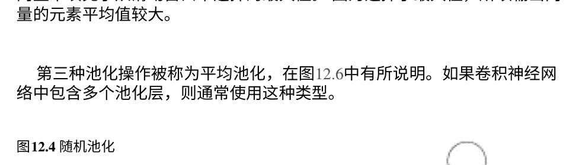

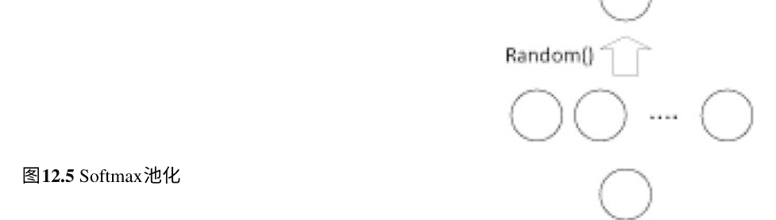

网络中，这种类型经常被用作第二种。在这个操作中，滑动窗口中的值的平均值被选为代表值。输出向量由平均值填充，每个平均值都是在每个窗口中的值的平均值。通过这种池化操作，值的方差减小了。

让我们对三种池化操作进行一些说明。随机池化是从滑动窗口中随机选择一个值的池化操作。Softmax池化是从中选择最大值的池化操作。平均池化是将滑动窗口中的值的平均值设置为其代表值的池化操作。通过使用不同类型的池化操作生成多个向量或矩阵。

#### 12.2.3 降维

本节讨论了用于降低输入向量维度的池化操作。池化被定义为在窗口中选择一个代表性值的过程。在本节中，我们将降低输入向量维度作为池化操作的效果进行介绍。采用softmax作为选择代表性值的方案。本节旨在描述池化操作的维度减少效果。

池化操作的两种结构在图12.7中进行了说明。执行池化操作有两种方式：独占方式和滑动方式。在图12.7的左侧部分，大小为k的窗口在具有N维的输入向量上滑动；大小为N的输入被切割成了N - k + 1个。作为池化操作的效果，得到了一个大小为N - k + 1的向量。在图12.7的右侧部分，大小为N的输入向量被划分为大小为k的独占部分；大小为N的输入被切割成了N/k个。大小为N/k的向量。前者在实现CNN时更常用。在图12.8中，给出了在向量上滑动的池化操作的伪代码。与值和窗口大小k相关联的节点列表作为参数给出。对于节点列表中的每个元素，从当前元素开始构建窗口poolingList，选择poolingList中的最大值，并将其添加到outputNodeList中。重复上述过程，直到节点列表中的当前值为nodeSize - k，并将outputNodeList作为最终输出返回。outputNodeList的大小是节点列表的大小减去k - 1。

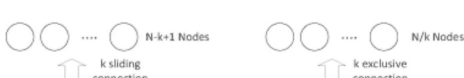

图12.7 池化结构

图12.8 池化过程

```

List kSlidePooling(List nodeList, k){
    int nodeSize = nodeList.size();
    for(int i = 0; i < nodeSize - k; i++){
        List poolingList = new List();
        for(int j = 0; j < k; j++){
            Node nn = nodeList.getElement(i + j);
            poolingList.addElement(nn);
        }
        Node outputNode = poolingList.softmax();
        List outputNodeList.addElement(outputNode);
    }
    return outputNodeList;
}
```

图12.9 池化示例

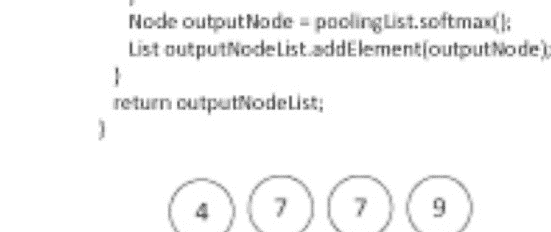

图12.9展示了池化操作的一个示例。在这个示例中，输入向量的维度为六，窗口大小为三。在这个示例中，采用了softmax函数；由3、4和2组成的最左边窗口中选择四作为输出向量的第一个元素。通过4 = 6 - 3 + 1，输出向量的维度变为五。通过softmax池化操作，输出向量中元素的平均值增加了。

让我们对池化作为降低维度的方案进行一些说明。池化操作有两种方式：滑动方式和独占方式。如果采用滑动方式，并且窗口大小为k，输入向量的维度为d，则应用池化操作后得到的输出向量的大小为d - k + 1。在softmax池化中，每个窗口中选择最大值。通过减轻零向量的占主导地位，softmax池化的效果降低了数值向量的稀疏性。

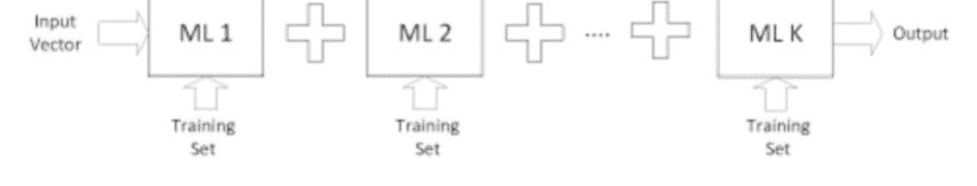

#### 12.2.4 集成学习的池化

本节讨论了将池化操作应用于集成学习中。在第4章中，我们研究了集成学习作为学习范式，其中涉及多个机器学习算法进行学习和泛化。池化操作用于通过采用平均池化来投票委员会成员的输出值。投票被视为将池化操作应用于 m 维向量的过程，该向量由委员会成员的 m 输出值组成。本节旨在描述将池化操作应用于集成学习的实现。

图12.10展示了集成学习的框架。涉及 K 个机器学习算法，每个算法都使用训练示例进行训练。将一个新手输入提供给 K 个机器学习算法，并从每个机器学习算法生成输出。协调员收集 K 个机器学习算法的答案，并通过投票来决定最终答案。池化操作应用于投票 K 个机器学习算法的答案。

实施集成学习的投票过程如图12.11所示。这是通过收集机器学习算法的答案来决定最终答案的过程。每个机器学习算法都通过对新手输入向量进行估计来得到输出值，协调员收集了 K 个机器学习算法的输出向量。如果给定的任务是回归任务，协调员通过对答案进行平均来决定最终输出向量。如果是分类问题，则协调员可能会对投票进行汇总操作。

将汇总操作应用于对三个分类器的分类结果如图12.12所示。每个机器学习算法都经过训练，将项目分类为三个类别之一；输出向量是一个三维二进制向量。采用投票汇总的方式，对三个向量的每个元素进行选择。如果输出向量是由连续值组成的实向量，则采用平均汇总的方式对其进行投票。在这种情况下，汇总操作应用于跨多个向量。

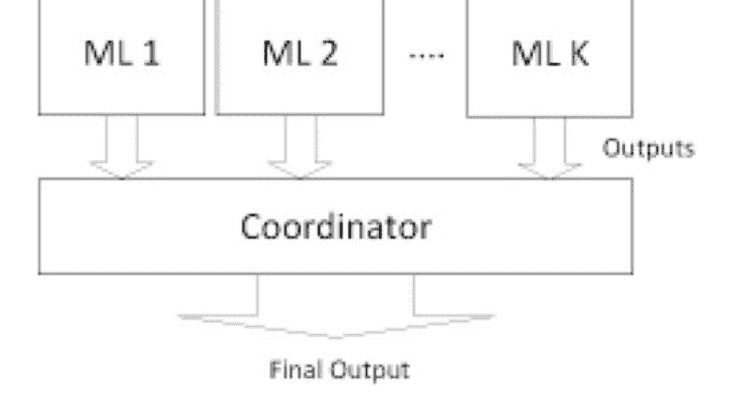

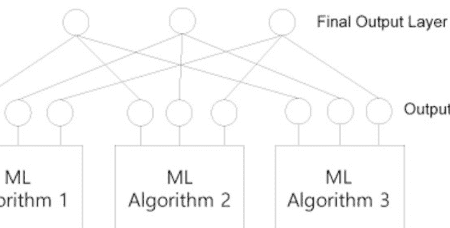

让我们对应用池化操作到集成学习中的投票过程进行一些评论。这是一种学习范式，其中涉及多个机器学习算法的学习和泛化。集成学习中的投票是从委员会成员的多个答案中决定最终答案。通过对多个输出向量进行池化操作来实现投票。卷积神经网络中特征提取部分的池化操作是为了减少输入向量的稀疏性和维度。

### 12.3 卷积

本节主要讨论卷积作为实现卷积神经网络的主要操作。在第12.3.1节中，我们研究了矩阵作为卷积覆盖的准备，它是从向量扩展而来的。在第12.3.2节中，我们研究了将卷积应用于矩阵的过程。在第12.3.3节中，我们研究了一些从卷积中派生出来的变体。在第12.3.4节中，我们研究了专门用于文本数据的卷积，称为文本卷积。

#### 12.3.1 张量

本节涉及的是将张量扩展为矩阵。在研究机器学习算法时，向量被扩展为矩阵。矩阵进一步扩展为张量，其中一个元素位置由三个整数值标识。如果将卷积应用于具有多个滤波矩阵的矩阵，则生成的是张量而不是矩阵。本节旨在数学上定义张量。

图12.13中展示了每个元素由三个索引标识的张量。矩阵定义为方程（12.1）；它由 \(m \times n\) 个元素组成：

```
\begin{pmatrix}
a_{11} & a_{12} & \ldots & a_{1n} \\
a_{21} & a_{22} & \ldots & a_{2n} \\
\vdots & \vdots & \ddots & \vdots \\
a_{m1} & a_{m2} & \ldots & a_{mn}
\end{pmatrix}.
\quad (12.1)
```

张量被定义为多个矩阵，如方程（12.2）所示：

```
\left[
\begin{pmatrix}
a_{111} & a_{112} & \ldots & a_{11n} \\
a_{121} & a_{122} & \ldots & a_{12n} \\
\vdots & \vdots & \ddots & \vdots \\
a_{1m1} & a_{1m2} & \ldots & a_{1mn}
\end{pmatrix}
\begin{pmatrix}
a_{211} & a_{212} & \ldots & a_{21n} \\
a_{221} & a_{222} & \ldots & a_{22n} \\
\vdots & \vdots & \ddots & \vdots \\
a_{2m1} & a_{2m2} & \ldots & a_{2mn}
\end{pmatrix}
\ldots
\begin{pmatrix}
a_{l11} & a_{l12} & \ldots & a_{l1n} \\
a_{l21} & a_{l22} & \ldots & a_{l2n} \\
\vdots & \vdots & \ddots & \vdots \\
a_{lm1} & a_{lm2} & \ldots & a_{lmn}
\end{pmatrix}
\right].
\quad (12.2)
```

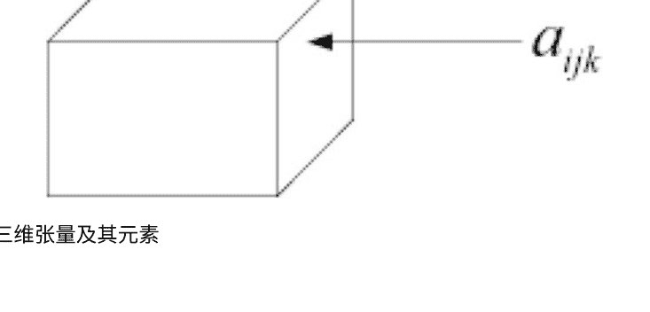

张量被视为一个平行六面体；一个张量可以表示为六个矩阵，如公式（12.3）所示：

```
\begin{pmatrix}
a_{111} & a_{112} & \ldots & a_{11n} \\
a_{121} & a_{122} & \ldots & a_{12n} \\
\vdots & \vdots & \ddots & \vdots \\
a_{1m1} & a_{1m2} & \ldots & a_{1mn}
\end{pmatrix}
\begin{pmatrix}
a_{l11} & a_{l12} & \ldots & a_{l1n} \\
a_{l21} & a_{l22} & \ldots & a_{l2n} \\
\vdots & \vdots & \ddots & \vdots \\
a_{lm1} & a_{lm2} & \ldots & a_{lmn}
\end{pmatrix}
\\
\begin{pmatrix}
a_{111} & a_{112} & \ldots & a_{11n} \\
a_{211} & a_{212} & \ldots & a_{21n} \\
\vdots & \vdots & \ddots & \vdots \\
a_{l11} & a_{l12} & \ldots & a_{l1n}
\end{pmatrix}
\begin{pmatrix}
a_{1m1} & a_{1m2} & \ldots & a_{1mn} \\
a_{2m1} & a_{2m2} & \ldots & a_{2mn} \\
\vdots & \vdots & \ddots & \vdots \\
a_{lm1} & a_{lm2} & \ldots & a_{lmn}
\end{pmatrix}
\\
\begin{pmatrix}
a_{111} & a_{112} & \ldots & a_{1m1} \\
a_{211} & a_{212} & \ldots & a_{2m1} \\
\vdots & \vdots & \ddots & \vdots \\
a_{l11} & a_{l12} & \ldots & a_{lm1}
\end{pmatrix}
\begin{pmatrix}
a_{11n} & a_{11n} & \ldots & a_{1mn} \\
a_{21n} & a_{21n} & \ldots & a_{2mn} \\
\vdots & \vdots & \ddots & \vdots \\
a_{l1n} & a_{l1n} & \ldots & a_{lmn}
\end{pmatrix}
\quad (12.3)
```

上面显示的张量表示为 l × m × n。

让我们提到张量的基本操作。张量 A和 B在方程式（12.3）中表示为 A = [a]ijk 和 B = [b]ijk 两个张量的加法和减法，A和B,定义为方程式（12.4）中的

```
A \pm B = [a \pm b]_{ijk} \quad (12.4)
```

张量的乘法，A，乘以一个标量值，k，定义为方程（12.5）：

```
kA = [ka]_{ijk} \quad (12.5)
```

张量的线性组合可以基于上述定义的操作进行考虑。

让我们考虑张量的乘法 l × m × n与l维向量，m维向量和n维向量的乘法。如果 l × m × n张量与n维向量 b1=[b11 b12 ... b1n]，乘法可以表示为方程（12.6）：

```
A\mathbf{b}_1 = \begin{pmatrix}
\sum_{i=1}^n a_{11i} b_{1i} & \sum_{i=1}^n a_{12i} b_{1i} & \ldots & \sum_{i=1}^n a_{1mi} b_{1i} \\
\sum_{i=1}^n a_{21i} b_{1i} & \sum_{i=1}^n a_{22i} b_{1i} & \ldots & \sum_{i=1}^n a_{2mi} b_{1i} \\
\vdots & \vdots & \ddots & \vdots \\
\sum_{i=1}^n a_{l1i} b_{1i} & \sum_{i=1}^n a_{l2i} b_{1i} & \ldots & \sum_{i=1}^n a_{lmi} b_{1i}
\end{pmatrix} \quad (12.6)
```

如果 $l \times m \times n$ 张量与 $m$ 维向量 $\mathbf{b}_2 = [b_{21} \ b_{22} \dots \ b_{2m}]$ 相乘，结果为 $l \times n$ 矩阵如公式 (12.7) 所示：

```
\mathbf{A}\mathbf{b}_2 = \begin{pmatrix}
\sum_{i=1}^m a_{1i1}b_{2i} & \sum_{i=1}^m a_{1i2}b_{2i} & \dots & \sum_{i=1}^m a_{1in}b_{2i} \\
\sum_{i=1}^m a_{2i1}b_{2i} & \sum_{i=1}^m a_{2i2}b_{2i} & \dots & \sum_{i=1}^m a_{2in}b_{2i} \\
\vdots & \vdots & \ddots & \vdots \\
\sum_{i=1}^m a_{l i1}b_{2i} & \sum_{i=1}^m a_{l i2}b_{2i} & \dots & \sum_{i=1}^m a_{l in}b_{2i}
\end{pmatrix}. \quad (12.7)
```

如果 $l \times m \times n$ 张量与 $l$ 维向量 $\mathbf{b}_3 = [b_{31} \ b_{32} \dots \ b_{3l}]$ 相乘，结果为 $m \times n$ 矩阵如公式(12.8)所示，

```
\mathbf{A}\mathbf{b}_3 = \begin{pmatrix}
\sum_{i=1}^l a_{1i1}b_{3i} & \sum_{i=1}^l a_{1i2}b_{3i} & \dots & \sum_{i=1}^l a_{1in}b_{3i} \\
\sum_{i=1}^l a_{2i1}b_{3i} & \sum_{i=1}^l a_{2i2}b_{3i} & \dots & \sum_{i=1}^l a_{2in}b_{3i} \\
\vdots & \vdots & \ddots & \vdots \\
\sum_{i=1}^l a_{mi1}b_{3i} & \sum_{i=1}^l a_{mi2}b_{3i} & \dots & \sum_{i=1}^l a_{min}b_{3i}
\end{pmatrix}. \quad (12.8)
```

如果一个张量与一个矩阵相乘，将生成一个张量。

让我们对从矩阵扩展出的张量进行一些说明。一个张量可以表示为一组矩阵。张量和矩阵都可以进行加法、删除和与标量值的乘法等基本运算。通过将张量与向量相乘可以生成一个矩阵。下一步的研究将考虑张量与另一个张量的乘法。

#### 12.3.2 单通道卷积

本节讨论的是使用单个滤波器的卷积。卷积是为了从图像中过滤出一些像素；直接表示图像的矩阵作为输入。卷积是通过滤波器矩阵将一个矩阵映射到另一个矩阵。如果使用多个滤波器矩阵，则通过对矩阵进行操作生成张量，该张量在第12.3.1节中介绍。本节旨在描述使用单个滤波器矩阵对矩阵进行卷积。

让我们提到作为深度操作（卷积）的操作数的输入矩阵。卷积神经网络(CNN)应用于图像分类，因此输入数据被假设为一个矩阵[1]。输入矩阵被假设为一个如公式（12.9）所示，是一个d ×d的方阵：

```
$\mathbf{X} = \begin{pmatrix} x_{11} & x_{12} & \dots & x_{1d} \\ x_{21} & x_{22} & \dots & x_{2d} \\ \vdots & \vdots & \ddots & \vdots \\ x_{d1} & x_{d2} & \dots & x_{dd} \end{pmatrix}$
```

卷积应用于输入矩阵，该矩阵在方程（12.9）中表示。需要预先定义滤波器矩阵以应用卷积。假设为执行卷积定义了单个滤波器矩阵。滤波器矩阵如方程（12.10）所示：

```
$\mathbf{C} = \begin{pmatrix} c_{11} & c_{12} & \dots & c_{1k} \\ c_{21} & c_{22} & \dots & c_{2k} \\ \vdots & \vdots & \ddots & \vdots \\ c_{k1} & c_{k2} & \dots & c_{kk} \end{pmatrix}$
```

滤波器矩阵是比输入矩阵更小的方阵，其中 $k < d$。在下一节中，我们将研究使用多个滤波器矩阵的卷积。

让我们提到通过卷积与过滤矩阵将输入矩阵映射为输出矩阵。如果卷积应用于矩阵 $\mathbf{X}$，与过滤矩阵一起 $\mathbf{C}$，输出矩阵的大小 $\mathbf{Y}$ 是 $(d - k + 1) \times (d - k + 1)$。在矩阵 $\mathbf{Y}$ 中，元素 $y_{km}$，由公式（12.11）计算：

```
$y_{km} = \sum_{i=1}^{k} \sum_{j=1}^{k} c_{ij} x_{(i+k-1)(j+k-1)}$
```

通过卷积映射的矩阵 $\mathbf{Y}$，表示为公式（12.12）：

```
$\mathbf{Y} = \begin{pmatrix} \sum_{i=1}^{k} \sum_{j=1}^{k} c_{ij} x_{ij} & \sum_{i=1}^{k} \sum_{j=1}^{k} c_{ij} x_{i(j+1)} & \dots & \sum_{i=1}^{k} \sum_{j=1}^{k} c_{ij} x_{i(j+d-k)} \\ \sum_{i=1}^{k} \sum_{j=1}^{k} c_{ij} x_{(i+1)j} & \sum_{i=1}^{k} \sum_{j=1}^{k} c_{ij} x_{(i+1)(j+1)} & \dots & \sum_{i=1}^{k} \sum_{j=1}^{k} c_{ij} x_{(i+1)(j+d-k)} \\ \vdots & \vdots & \ddots & \vdots \\ \sum_{i=1}^{k} \sum_{j=1}^{k} c_{ij} x_{(i+d-k)j} & \sum_{i=1}^{k} \sum_{j=1}^{k} c_{ij} x_{(i+d-k)(j+1)} & \dots & \sum_{i=1}^{k} \sum_{j=1}^{k} c_{ij} x_{(i+d-k)(j+d-k)} \end{pmatrix}$
```

(12.12) 我们可以考虑填充，用零值填充输入矩阵的边界，以保持矩阵的大小。

让我们对使用单个过滤器矩阵进行卷积做一些备注。假设输入是一个方阵，而不是一个向量。事先，一个过滤器矩阵被定义为进行卷积的准备工作。通过在输入矩阵上滑动过滤器矩阵的乘积来计算输出矩阵。这个操作将扩展为使用多个过滤器矩阵的操作。

#### 12.3.3 张量卷积

本节讨论应用于张量的卷积。如果使用单个滤波器矩阵进行卷积，输出将作为矩阵从输入矩阵生成。如果将卷积应用于张量，即使输入是一个矩阵，输出也将作为张量生成。如果它们的大小相同，多个滤波器矩阵被视为一个张量；假设输入、滤波器和输出都是张量。本节旨在描述使用作为张量给出的多个滤波器矩阵对张量进行卷积。

输入张量在图12.14中有所说明。如果一个数据项被表示为多个矩阵或单个张量，则输入数据将被给定为张量而不是矩阵。输入数据用张量表示，如公式（12.13）所示：

```
$\circ \mathbf{C} = \mathbf{X} = [x]_{ijk}, 1 \leq i \leq d_1, 1 \leq j \leq d_2, 1 \leq k \leq d_3$
```

如果CNN中安装了多个卷积层，则来自前一卷积层的输出（作为张量给出）将成为当前卷积层的输入。将滤波器张量应用于此输入张量进行卷积。

由多个滤波器矩阵组成的滤波器张量在图12.15中有所说明。为了推广卷积操作，假设输入数据为张量。滤波器张量的表示如公式（12.14）所示：

```
$\circ \mathbf{F} = \mathbf{X} = [b]_{ijk}, 1 \leq i \leq f_1, 1 \leq j \leq f_2, 1 \leq k \leq f_3$
```

具有大小为$f_1 \times f_2 \times f_3$的滤波器张量被解释为$f_3$个矩阵，大小为$f_1 \times f_2$。将单个滤波器张量应用于单个输入张量的卷积。将卷积应用于输入张量后得到的输出张量在图12.16中说明。如上所述，准备了输入张量，并定义了滤波器张量以进行卷积。输出张量表示为公式（12.15）：

```
$\mathbf{Y} = \left[ \sum_{r=1}^{f_1} \sum_{s=1}^{f_2} \sum_{t=1}^{f_3} x_{ijk} b_{(i+r)(j+s)(k+t)} \right]_{ijk}$
```

输出张量的大小表示为公式（12.16）：

$$(d_1 - f_1 + 1) \times (d_2 - f_2 + 1) \times (d_3 - f_3 + 1) \quad (12.16)$$

张量的大小如公式（12.16）所示减小。

让我们对应用于张量的卷积进行一些说明。输入数据被假设为张量。滤波器被定义为应用于卷积的张量。生成一个比输入张量更小的张量作为结果。卷积被应用于具有多个张量的输入张量。

#### 12.3.4 卷积变种

本节涉及一些从卷积中派生出的变体。标准卷积在第12.3.2节和12.3.3节中进行了研究。在本节中，我们除了标准卷积外，还考虑了一些变体。一些变体是通过在应用滤波矩阵时进行填充、多步移动或随机选择输入矩阵中的元素来派生的。本节旨在描述卷积的三种典型变体。

填充在矩阵边界上填充零值的示意图如图12.17所示。输入数据以矩阵形式给出。如果边界填充为零值，则 $d \times d$ 矩阵会增加到。如果通过填充使用 $f \times f$ 滤波矩阵进行卷积，输出矩阵的大小为。如果卷积应用了多个填充，矩阵的大小将保持或增加。

步幅也被考虑在内，以进行卷积。步幅在传统卷积中被设置为1，这在前几节中有解释。步幅是执行卷积时，滤波器向量或矩阵在输入矩阵中移动的次数。步幅用 s 表示，输出矩阵的大小表示为公式（12.17）：

```
$$\frac{d - f}{s} + 1$$
```

如果步幅设置为大于1，输出向量或矩阵的大小将更小。选择性卷积作为另一种变体在图12.18中进行了说明。滤波器向量或矩阵在传统卷积中滑动在输入向量或矩阵上。在这种变体中，滤波器向量或矩阵是随机放置在输入向量或矩阵上，而不是滑动。如果卷积应用于 d维滤波器向量和d维向量，将生成一个介于1和之间的随机整数值。在这种变体中，对于每次尝试， d - f + 1。可能会在输入矩阵的相同区域进行访问。

让我们对卷积操作的一些变体进行一些评论。填充是用零填充输入向量或矩阵的边界的过程。步幅是滤波器向量或矩阵在输入向量或矩阵中的移动次数。在执行卷积时，随机放置滤波器向量或矩阵而不是滑动它在输入向量或矩阵中。我们考虑在多个滤波器向量或矩阵中随机选择使用。

### 12.4 卷积神经网络设计

本节讨论了设计卷积神经网络的各种方案。在第12.4.1节中，我们研究了ReLU（修正线性单元）作为激活函数。在第12.4.2节中，我们介绍了带有池化和ReLU的卷积神经网络的设计。在第12.4.3节中，我们介绍了带有卷积和ReLU的设计。在第12.4.4节中，我们介绍了带有卷积、池化和ReLU的设计。

#### 12.4.1 ReLU

本节关注的是ReLU（修正线性单元）。我们在第12.2节和第12.3节中研究了池化和卷积。CNN可以设计成各种版本来对数据项进行分类。ReLU被采用作为激活函数，在映射向量或矩阵的分类部分进行分类。本节旨在描述CNN中使用ReLU作为激活函数的分类部分。

图12.19展示了层之间的一对一连接。每个节点只与下一层中对应的节点有连接。输入节点值和输出节点值分别用 $x_i$ 和 $\hat{x}_i$ 表示。

权重用 $w_i$ 表示。$w_i$ 表示权重，右侧层中的节点值由公式（12.18）计算：

```
$$\hat{j} = \begin{cases} w_i x_i & \text{如果 } net \geq 0 \\ 0 & \text{否则} \end{cases}$$
(12.18)
```

如果输入的网络大于或等于零，则ReLU与线性函数相同。

图12.20中显示了层之间的部分连接。它被定义为每个节点与下一层中的不是所有节点的连接。与节点 $\hat{y}_i$ 通过 $N_i$ 连接的上一层中的节点集合。节点值由公式(12.19)计算。

部分连接是通过消除层之间的全部连接中的一些权重引起的。

图12.21中显示了层之间的全连接。全连接是将每个节点连接到下一层中的所有节点的情况。如果左侧层中的节点数为 d，则节点值由公式(12.20)计算：

```
$$
\hat{j} = \begin{cases}
\sum_{r=1}^{d} w_{ir} x_r & \text{if } \sum_{r=1}^{d} w_{ir} x_r \geq 0 \\
0 & \text{否则}
\end{cases}
\qquad (12.20)
$$
```

这种全连接是在感知器和多层感知器中采用的。在卷积神经网络中，假设节点之间的连接是完全的。让我们对被称为修正线性单元的激活函数进行一些说明。输出值由第（12.18）式在一对一的情况下计算。部分连接是当前节点与下一层中的不是所有节点之间的连接。在以前的神经网络中，如多层感知器、循环神经网络和受限玻尔兹曼机，采用了每个节点与所有节点之间的全连接。ReLU被假设为用于推导权重更新规则的线性函数。

#### 12.4.2 池化 + ReLU

本节讨论的是最简单版本的卷积神经网络，它由池化层和ReLU组成。在前一节中，ReLU是一个在正区域内具有线性函数的激活函数。在这个版本的卷积神经网络中，池化层的作用是特征提取，带有ReLU的感知器的作用是分类。在感知器中，假设输入层和输出层之间的连接是部分的。本节旨在描述具有这两个组件的卷积神经网络的设计。

最简单的CNN版本由池化层和ReLU组成，如图12.22所示。在架构中，池化层是提取部分，ReLU是分类部分。在池化层上滑动的窗口上选择最大值。由池化层映射的向量由ReLU进行分类。部分连接被视为全连接，其中一些连接与零值相关联。

第二个CNN版本由单个池化层和多个ReLU层组成，如图12.23所示。通过在池化层中从每个窗口中选择代表性值来降低维度。输出值由第一个ReLU中由池化层映射的值计算得出。当前ReLU中的输出值作为输入值传递给下一个ReLU，最终输出值在最后一个ReLU中计算得出。这个版本是旨在解决输入值和最终输出值之间的非线性问题。

第三个版本由多个池化层和多个ReLU组成，如图12.24所示。该版本的区别在于将单个池化层扩展为多个池化层。通过一系列池化层和ReLU的串行连接，将输入向量映射为具有降维后的向量。最终的输出向量通过一系列ReLU计算得出。我们将考虑多个池化层和多个ReLU的并行连接。

让我们对具有池化层和ReLU的CNN做一些说明。采用softmax池化来实现池化层，并假设ReLU中存在部分连接。放置一个单独的池化层，并考虑多个ReLU来解决非线性问题。可以对具有池化层和ReLU的CNN进行串行设计和并行设计。通过采用另一种池化操作和另一种类型的ReLU，可以得到更多版本的CNN。

#### 12.4.3 卷积 + ReLU

本节讨论的是另一种由卷积层和ReLU组成的CNN。在前一节中，我们研究了由池化层和ReLU组成的版本。池化层被卷积层取代。具有单个卷积层和单个ReLU的CNN被扩展为具有多个卷积层和多个ReLU的CNN。本节旨在描述具有卷积层和ReLU的CNN。

图12.25展示了由卷积层和ReLU组成的CNN版本。输入向量通过卷积层映射为另一个向量。在ReLU中，输出向量是通过卷积层映射的向量计算得出的。ReLU中的权重是通过映射向量进行优化，而不是通过训练样本。我们考虑将卷积应用于每个训练样本，使用多个滤波器向量。

由单个卷积层和多个ReLU组成的CNN版本如图12.26所示。如第12.4.2节所述，多个ReLU用于解决非线性分类或回归问题。学习过程是通过卷积层将训练样本映射到其他向量，并从最后一个ReLU更新权重到第一个ReLU。泛化过程是通过卷积层将新手输入向量映射到另一个向量，并计算最后一个ReLU的输出向量。第一个ReLU和中间ReLU的作用是计算隐藏向量。

具有多个卷积层和多个ReLU的CNN版本如图12.27所示。卷积层串行连接，ReLU也在架构中连接。输入向量通过连续的卷积层经过多个步骤映射为一个或多个向量。最终映射的向量或向量通过多个ReLU被分类为预定义的一个类别。我们可以将卷积层和ReLU的并行连接视为替代版本。

让我们对CNN版本进行一些备注，每个版本都由卷积层和ReLU组成。具有单个卷积层和单个ReLU的CNN是最简单的版本。它被扩展为具有多个ReLU的版本，用于解决非线性问题。多个卷积层被串行连接以降低维度并生成更多的训练样本。如果应用多个滤波器向量进行卷积，则映射向量的数量是训练样本数量的倍数。

#### 12.4.4 池化 + 卷积 + ReLU

本节关注的是卷积神经网络（CNN），它由池化层、卷积层和ReLU组成。在前一节中，在设计CNN时，我们使用了池化层或卷积层中的任一层。在本节中，我们在设计CNN时，有两种方式：卷积后池化和池化前卷积。本节旨在描述具有深度操作的CNN的设计。

CNN的最简单版本由三个组件组成，如图12.28所示。输入向量通过池化层映射为具有降维的向量。如果定义了多个滤波器向量，则通过卷积层将多个向量从单个向量映射出来。最终输出向量由ReLU从最终映射的向量计算得出。我们可以考虑使用并行的多个ReLU来处理从卷积层生成的多个向量。

在图12.29中，展示了卷积层和池化层互换的另一种CNN版本。在之前的版本中，输入向量通过池化层映射为具有较低维度的向量，并且通过卷积层生成多个向量。在这个版本中，通过卷积层从输入向量生成多个向量，并通过池化层降低维度。我们期望从这两个版本中得到不同的结果；无法确定哪个版本比另一个更好。通过添加多个卷积层和多个池化层，将这个版本扩展为一个版本。

在图12.30中，展示了具有多个池化层和多个卷积层的CNN的高级版本。M个卷积层和N个池化层放置在提取部分中；M + N层完全放置在提取部分中。输入向量通过M个卷积层转换为多个向量，并通过N个池化层将其维度降低为1。最终由映射的向量M + N层通过ReLU进行分类。我们可以考虑将单个ReLU扩展为多个ReLU以解决非线性分类问题。

让我们对由池化层、卷积层和ReLU组成的CNN进行一些评论。在这个版本中，通过池化层减小了维度，通过卷积层生成了多个向量，它们通过交换池化层和卷积层，可以得到另一个版本。在特征提取部分，考虑多个池化层和多个卷积层。在分布式和并行计算环境中实现了具有多个池化层、多个卷积层和多个ReLU的RNN。

### 12.5 总结和进一步讨论

本节关注本章研究内容的总结和进一步讨论。池化是对向量和矩阵进行的操作，用于从滑动在其上的窗口中提取代表性值。卷积是使用定义的滤波器向量或矩阵对值进行过滤的操作。CNN是通过在MLP或感知器之前交替连接这两个操作层来设计的。本节旨在进一步讨论本章研究的内容。

让我们考虑一下对文本数据专门设计的池化操作。在研究池化操作时，假设输入是一个向量或矩阵。需要将文本编码为数值向量，以应用CNN于文本挖掘任务。可以将池化操作修改为直接适用于文本数据的操作，称为文本池化。我们在第15章详细研究了文本池化。让我们考虑一下对文本数据专门设计的卷积操作。需要为将操作应用于输入向量或矩阵定义一个滤波器向量或矩阵。这个操作被修改为直接适用于文本数据的操作，称为文本卷积。基于查询的文本摘要是文本卷积的典型实例，其中查询被给定为滤波器。文本卷积将在第15章详细研究。

让我们考虑组合多个CNN。根据池化层和卷积层的排列方式以及使用的层数，CNN的架构几乎有无限多种。采用多种CNN架构对数据项进行分类，并应用集成学习。多个具有不同架构的CNN被实现为并行算法，以更高效地处理数据项。CNN通过其不同的初始权重和不同的激活函数在其分类部分进行区分。

让我们考虑多个CNN的层次组合。通过多个滤波器向量的卷积，可以从一个向量或矩阵生成多个向量或矩阵。如果从卷积层生成多个向量或矩阵，则应准备与生成的矩阵和向量一样多的池化层。在每个卷积层后放置一个卷积层，并为每个卷积层放置多个池化层；卷积层可以扩展为一个层次结构。在设计CNN时，卷积层使用多个滤波器向量或矩阵构建成树状结构。通过使用多个滤波器向量或矩阵，构建卷积层的树状结构。

### 参考文献

+   1. W. Rawat 和 Z. Wang, “深度卷积神经网络用于图像分类的综述。”，2352–2449, 神经计算, 29, 2017年。

## 第四部分

## 文本深度学习

本部分关注于深度学习算法在文本挖掘任务中的专业化。在之前的部分中，我们研究了将机器学习算法修改为深度版本以及应用于通用任务的深度神经网络。在本部分中，我们研究了将文本数据映射为另一种文本数据作为隐藏值的过程，以及将该过程应用于修改为文本深度学习算法。我们提到了文本摘要，它旨在将初始文本映射为其要点，并对其进行总结。本部分旨在描述深度学习在文本挖掘任务中的专业化和应用。

这部分包括四个章节。在第13章中，我们将学习实现文本深度学习所必需的索引扩展。在第14章中，我们将学习用于实现文本深度学习的文本摘要。在第15章中，我们将基于索引扩展和文本摘要进行文本操作。在第16章中，我们将研究文本分类系统的设计和实现，应用文本深度学习算法。

## 第13章 索引扩展

本章讨论了实现文本深度学习所必需的索引扩展。索引扩展是指向输入文本中相关词汇添加更多相关词汇的过程。在索引扩展过程中，将输入文本索引为一个词汇列表，从外部来源检索其相关词汇，并将其添加到词汇列表中。

在索引文本中有三组单词：扩展组包含非常重要的单词及其相关单词，包含组包含中等重要的单词作为索引，移除组包含应从索引中排除的琐碎单词。本章旨在描述文本索引过程和索引扩展。

本章由五个部分组成，在第13.1节中，我们概述了本章研究的内容。在第13.2节中，我们研究了将文本索引为单词列表的过程。在第13.3节中，我们研究了计算单词语义相似性的方案。在第13.4节中，我们研究了扩展索引的方案。在第13.5节中，我们进一步讨论了本章研究的内容。

### 13.1 引言

本节概述了索引扩展的概况。它被定义为从外部来源向给定文本中已包含的单词添加更多重要单词的过程。索引扩展的过程是将文本索引为单词列表，从中选择重要单词，并将其相关单词从外部来源添加到所选单词中。为了更高效地处理文本，有必要从列表中删除不重要的单词。本节旨在概述索引扩展，作为本章的引言。

文本索引被定义为将文本转换为单词列表的过程。作为输入的文本由用自然语言编写的句子组成。文本通过基本的三个步骤进行转换：分词，词干提取和停用词去除。

根据应用领域的不同，我们需要进一步的步骤，例如去除不重要的词和添加相关的词。此外，在索引文本时，我们需要考虑文本的长度。

我们需要考虑文本长度可变的事实。索引文本的结果取决于文本的长度。它影响将文本编码为数值向量的过程；短文本倾向于被编码为稀疏向量。因为长文本被索引为许多单词，所以在信息检索系统中更容易被频繁检索。我们需要根据内容将长文本分割成子文本。

让我们提到包括索引扩展和索引过滤的索引优化。如果对短文本进行索引，应该从外部来源添加更相关的词语，如果对长文本进行索引，则应该删除与其内容不相关的词语。为了优化索引，应该将与重要词语相关的更相关的词语作为它们的关联词，同时应该删除与其内容不相关的词语。提出了将文本中的词语分类为扩展、包含和删除三个类别的建议[4]。需要优化索引以提高信息检索性能。

让我们提到本章的意图。我们将文本索引为词语列表的过程视为背景。我们理解词语和文本之间的语义相似性，这对于索引扩展是必要的。我们理解扩展索引的一些方案作为本章的核心部分。本章旨在研究对于定义文本深度操作而必要的索引扩展。

### 13.2 文本索引

本节讨论的是将文本索引为单词列表的过程。
在第13.2.1节中，我们将标记化描述为文本索引的第一步。在第13.2.2节中，我们将词干提取描述为第二步。在第13.2.3节中，我们将停用词去除描述为第三步。在第13.2.4节中，我们将附加过滤描述为附加步骤。

#### 13.2.1 分词

本节关注的是文本索引的第一步，称为标记化。
假设输入的文本是用空格分隔的英文单词。标记化是在词干提取之前将文本分割成单词的过程。作为标记化的附加任务，特殊字符被移除，大写字符被转换为小写字符。本节旨在描述将标记化作为文本索引的第一步。

图13.1 字符处理
```
String treatCharacter(String fullText) {
    String copiedText = new String();
    for (int i = 0; i < fullText.length(); i++) {
        char ch = fullText.charAt(i);
        if (ch.isUpper()) {
            ch = ch.toLower();
        }
        if (!ch.isNumber() || !ch.isSpecial()) {
            copiedText.setChar(i);
        }
    }
    return copiedText;
}
```

图13.2 字符串分词
```
String[] tokenizeString(String fullText) {
    String tokenList[] = fullText.split("[ .\n]");
    return tokenList;
}
```

图13.1展示了文本中的分词过程中的字符处理。初始文本是由字符组成的字符串。对于每个字符，如果它是大写字母，则将其转换为小写字母；如果它是数字或特殊字符，则将其删除。文本由小写字母组成，删除了数字和特殊字符，作为输出。预处理后的文本作为主要分词步骤的输入。

图13.2以伪代码的形式展示了将文本分割成单词的过程。文本经过预处理，将大写字母转换为小写字母，并删除数字和特殊字符。在前一步骤中预处理的文本通过空格、回车或标点符号进行分词。该过程的输出是将文本分割成的标记列表。在下一步中，我们需要将每个标记转换为其词根形式。

文本标记化的示例见图13.3。图13.3的左侧是输入文本，右侧是对文本进行标记化的结果。在预处理中，大写字符被转换为小写字符；在这个例子中，字符“T”被转换为“t”。文本通过空格分割成标记；标记列表显示在图13.3的右侧。标记化的结果被传递到下一步，即词干提取。

让我们对标记化进行一些说明，作为将文本索引化为单词列表的第一步。输入文本的预处理是将大写字母转换为小写字母，并删除数字和特殊字符。预处理后的文本通过空格分割成标记，这是标记化的主要步骤。

给定的字符串文本被转换为标记列表。标记在后续步骤中逐个处理；一个字符串列表被转换为另一个列表。

图13.3 分词示例

#### 13.2.2 池化类型

本节主要讨论文本索引的第二步，即词干提取。在前一节中，我们学习了分词，即将文本分割成词语的过程。在本节中，我们将研究词干提取，即将每个词语转换为其语法根形式的过程。词干提取的情况包括将动词的时态变化转换为其根形式，将名词的复数形式转换为其单数形式。本节旨在描述文本索引的第二步，即词干提取。

图13.4中展示了一些将单词转换为其根形式的词干提取规则。如果一个单词是复数名词，它将被转换为其单数形式。如果一个单词是变化的动词，它将被转换为其根形式。如果一个单词是带有后缀“ly”的副词，可以通过去除后缀将其转换为形容词。词干提取旨在将具有相同含义的单词转换为具有相同拼写的单词。
词干化的过程如图13.5所示。从分词中生成一个标记列表，然后外部加载词干化规则。如果当前单词在词干化规则中注册，它将被替换为其关联的单词，并跳过。词干化被视为将标记列表映射为由词根形式组成的单词列表。在更严格的词干化版本中，我们可以考虑将以“ation”为后缀的名词映射为动词。

让我们以图13.6中的一个例子来展示词干化结果。词干化是将每个标记转换为其词根形式的过程，以防止对具有相同含义的单词进行不同处理。给出其复数形式的名词，如systems和techniques，将被转换为其单数形式，如system和technique。给出其第三人称单数形式或被动形式的动词，如has和进展，被转化为动词的根形式，如有和进展。
通过从[8]中的文件加载词干规则来实现词干化令牌的过程。

图13.4 词干规则
| 变形式 | 根形式 |
|--------|--------|
| 指的是 | 引用 |
| 被引用 | 引用 |
| 正在引用 | 引用 |
| 快速 | 快速地 |
| 完成 | 做 |
| 做 | 做 |
| 做 | 做 |
| 孩子们 | 孩子 |
| 保持 | 保持 |
| 有 | 有 |
| 有 | 有 |
| 有 | 有 |

图13.5 词干化过程

```
Text/ categorization/ refers→refer/ to/ the/ process/ of/ assign/ a/ category/ or/ some/ categories→category /among /predefined→predefine/ ones→one/ to/ each/ document/, automatically→automatic/. Text/ categorization/ is/ a/ pattern/ classification/ task/ for/ text/ mining/ and/ necessary/ for/ efficient/ management/ of/ textual/ information /systems→system/. In/ the/ academic/ world/, research/ on/ text/ categorization/ has→have/ been→be/ progressed→progress/ very/ much/, and/ we/ will/ survey/ it/ in/ next/ section/. In/ the/ industrial/ world/, text/ categorization/ systems→system / were→be/ already/ developed→develop/ as/ an/ independent/ system/ or/ a/ module/ for/ textual/ information/ systems→system/ . /Although/ research/ and/ development/ on/ text/ categorization/ have/ been→be / progressed→progress/ like/ this/, /we/ need/ further→far/ research/ on/ it/ to/ improve/ techniques→technique/ and/ implementations→implementation/ of/ text/ categorization/.
```
图13.6 词干化示例

让我们对词干化作为索引文本的第二步进行一些备注。词干化规则以表格形式给出，其中每个令牌与其自己的根形式相关联。通过检索其关联的单词，将每个令牌更改为其根形式，如果已注册。复数名词被转化为单数形式，动词的不同形式被转化为根形式。我们可以考虑将单个令牌转化为语义词群标识符，而不是其根形式，在词干化中。

#### 13.2.3 停用词去除

本节关注文本索引的第三步，即停用词去除。在前一节中，我们研究了文本索引的前一步骤，即词干提取。停用词是与文本内容无关的语法词，例如连词和介词，我们需要将它们移除以提高效率。事先构建一个停用词列表，如果当前单词在停用词列表中注册，就将其移除。本节旨在描述停用词及其移除过程。

停用词列在图13.7中。停用词被定义为在文本中仅起语法作用的词。由于停用词与文本内容无关，我们需要将其移除以提高效率。介词、连词和特殊动词属于停用词。停用词列表事先制作成为一个文件。

图13.7 停用词列表
| 全部 | 我是 |
| :--- | :--- |
| 一个 | 和 |
| 任何 | 是 |
| 作为 | 在 |
| 是 | 因为 |
| 已经 | 之前 |
| 正在 | 在下面 |
| 之间 | 两者都 |
| 但是 | 通过 |
| 可以 | 做过 |
| 做 | 做 |
| 做 | 向下 |
| 在...期间 | 每个 |

从一个单词列表中删除停用词的过程如图13.8所示。给定一个单词列表和停用词列表作为参数。对于输入列表中的每个单词，如果它是停用词，则跳过，否则将其添加到输出列表中。如果当前单词在停用词列表中注册，则将其从列表中删除。在索引文本时，停用词的移除会减小单词列表的大小。

在图13.9中，展示了去除停用词的文本示例。每个带有箭头的单词都是通过词干提取过程转化为其词根形式的单词。被标记为灰色字符的单词是将从文本中删除的停用词。属于介词的单词是主要的停用词，例如“the”、“a”和“an”属于停用词。文本中停用词的部分约占整个文本的一半；通过停用词的删除，单词列表减少了50%。

图13.8 停用词去除过程
```
List removeStopwordList(List wordList, List stopWordList){
    int wordSize = wordList.size();
    int stopWordSize = stopWordList.size();
    List outputWordList = new List();
    for(int i = 0;i < wordSize; i++){
        Word word = wordList.getElement(i);
        boolean removeFlag = false;
        for(int j = 0; j < stopWordSize; j++){
            Word stopWord = stopWordList.getElement(j);
            if(word == stopWord)
                removeFlag = true;
        }
        if(!removeFlag)
            outputWordList.addElement(word);
    }
    return outputWordList;
}
```

图13.9 停用词去除示例
```
Text/ categorization/ refers→refer/ to/ the/ process/ of/ assign/ a/ category/ or/ some/ categories→category /among /predefined→predefine/ ones→one/ to/ each/ document/, automatically→automatic./ Text/ categorization/ is/ a/ pattern/ classification/ task/ for/ text/ mining/ and/ necessary/ for/ efficient/ management/ of/ textual/ information /systems→system/ ./ In/ the/ academic/ world/, research/ on/ text/ categorization/ has→have/ been→be/ progressed→progress/ very/ much/, and/ we/ will/ survey/ it/ in/ next/ section/ ./ In/ the/ industrial/ world/, text/ categorization/ systems→system / were→be/ already/ developed→develop/ as/ an/ independent/ system/ or/ a/ module/ for/ textual/ information/ systems→system/ ./ Although/ research/ and/ development/ on/ text/ categorization/ have/ been→be / progressed→progress/ like/ this/, /we/ need/ further→far/ research/ on/ it/ to/ improve/ techniques→technique/ and/ implementations→implementation/ of/ text/ categorization/.
```

让我们对停用词去除作为文本索引的第三步进行一些备注。属于介词和连词的单词属于停用词。停用词去除是从停用词列表中移除一个词的过程。通过这个过程，输入列表的一半被移除。

在文本索引的步骤中，交换词干提取和停用词去除没有关系。

#### 13.2.4 附加过滤

本节涉及将文本索引为单词的附加步骤。在前一节中，我们研究了基本的三个步骤：分词、词干提取和停用词去除，输出是一个单词列表。在本节中，我们研究了对单词赋权重、删除一些单词的附加步骤以及从外部来源添加关联词。根据应用领域的不同，我们需要额外的步骤来最大化信息检索的性能。本节旨在描述一些可选的附加步骤，用于对文本进行索引。

将单词加权作为文本索引的附加步骤的过程在图13.10中说明。从文本索引中提取的单词的重要性程度区分的需求是加权单词的动机。

如果有语料库可用，则通过公式（13.1）计算每个单词的权重：
```
权重_i = log2 f_i + log2 (F_i / D)    (13.1)
```
其中 f_i 是文本中单词 word_i 的频率；F_i 是语料库中单词 word_i 的总频率；D 是语料库中的文本数量。如果语料库不可用，则通过公式（13.2）计算权重：
```
权重_i = f_i / |T|    (13.2)
```
其中 |T| 是文本中的总单词数。通过区分单词，使用单词权重进行附加过滤。

根据它们的权重，额外单词的移除在图13.11中进行了说明。权重是通过列表中的每个单词计算得出的，该列表是通过三个基本步骤构建的。单词按照它们的权重进行排名，权重较低的单词将被移除。有两种移除单词的方案：排名选择，它选择固定数量的单词；阈值选择，它选择可变数量的单词。额外单词的移除旨在通过减少单词数量来提高效率。

通过从外部来源添加更多单词来进行索引扩展，在图13.12中进行了说明。通过删除权重较低的单词，从文本中获取关键词。每个选定的单词作为查询，检索与之相关的语义相关单词。语义相关性在单词是通过它们在文本中的搭配计算的。索引扩展旨在提高信息检索系统中的精确度和召回率。

让我们对将文本编入单词列表的附加步骤进行一些说明。在完成三个基本步骤之后，为每个单词分配一个权重以区分单词。此外，为了提高效率，会删除权重较低的单词。将权重较低的单词替换为相关的单词，以提高权重。对于单词的额外删除和更多相关单词的添加的整合被称为索引优化[4]。

### 13.3 语义相似度

本节涉及计算单词之间的语义相似度。在第13.3.1节中，我们提到了将单词编码为数值向量的过程。在第13.3.2节中，我们描述了余弦相似度及其变体作为单词之间的相似度度量。在第13.3.3节中，我们描述了欧氏距离作为另一种相似度度量。在第13.3.4节中，我们描述了表之间的相似度，如果单词被编码为表格。

#### 13.3.1 词表示

本节涉及将单词编码为数值向量的过程。在前一节中，我们研究了将文本转化为单词列表的过程。在本节中，我们研究了将单词编码为数值向量的过程，以便为理解两个单词之间的语义相似性做准备。文本被用作编码单词的特征，单词和文本之间的关系被表示为特征值。本节旨在描述编码单词所涉及的步骤。

将单词编码为数值向量的特征提取过程如图13.13所示。首先准备一个文本集合，将集合中的文本视为特征候选项。预先准备样本单词，并计算每个文本中样本单词的总频率。选择总频率较高的文本作为特征。选定的特征用于将单词编码为数值向量。

将单词映射为数值向量的中间形式——倒排索引如图13.14所示。索引被定义为一个包含单词链接的文本列表。倒排索引是一个包含单词链接的文本列表。每个单词都作为查询与与之相关的文本链接。倒排索引的构建可能因语料库领域而异。

特征值分配给属性的任务在图13.15中有所说明。用于表示文本中单词存在或不存在的二进制值被用作特征值。文本中单词的相对频率是一个特征值。

#### 13.3.2 余弦相似度

TF-IDF（词频-逆文档频率）权重通过方程计算，该方程在图13.15中呈现，作为一个特征值。如果将文本编码为数值向量，单词就成为特征。

让我们对将单词编码为数值向量的过程进行一些说明。从文本集合中选择一些文本作为映射单词的特征，构建倒排索引，其中每个单词与包含它自身的文本列表相关关联。表示单词之间关系的值。

本节关注余弦相似度作为词语之间的语义相似度。在前一节中，我们研究了将单词编码为数值向量的过程。如果两个单词被编码，那么计算两个向量之间的余弦相似度就是它们之间的语义相似度。余弦相似度可能有一些变体，并且其中一种被用于计算单词之间的相似度。本节旨在描述计算两个向量之间的余弦相似度的过程。

将单词编码为数值向量的过程在图13.16中有所说明。根据特定标准从语料库中选择了一些文本。构建了一个倒排索引，其中每个单词都与包含它的文本相关联。基于倒排索引，每个特征值都被计算为单词和文本之间的关系。两个向量之间的相似度是单词之间的相似度。

让我们将余弦相似度称为两个数值向量之间的相似度矩阵。两个向量的表示为。$\mathbf{x}_1 = [x_{11} x_{12} ... x_{1d}]$和 $\mathbf{x}_2= [x_{21} x_{22} ... x_{2d}]$。余弦相似度由公式 (13.3) 定义，作为一般形式：

```
$sim(\mathbf{x}_1, \mathbf{x}_2) = \frac{\mathbf{x}_1 \cdot \mathbf{x}_2}{\|\mathbf{x}_1\|_p \cdot \|\mathbf{x}_2\|_p}$ (13.3)
```

因为。$\mathbf{x}_1 \cdot \mathbf{x}_2 \leq \|\mathbf{x}_1\|_p \cdot \|\mathbf{x}_2\|_p$，余弦相似度的值始终为介于零和一之间的归一化值。在。$p = 2$，余弦相似度表示为公式（13.4）：

```
$$sim(\mathbf{x}_1, \mathbf{x}_2) = \frac{\mathbf{x}_1 \cdot \mathbf{x}_2}{\|\mathbf{x}_1\| \cdot \|\mathbf{x}_2\|}, \quad (13.4)$$
```

其中 $\|\mathbf{x}_1\| = \sqrt{\sum_{i=1}^{d} x_{1i}^2}$ 和 $\| \mathbf{x}_2\| = \sqrt{\sum_{i=1}^{d} x_{2i}^2}$。

让我们提到从方程（13.4）推导出的三个余弦变体。第一个变体定义为方程（13.5）：

```
$$sim(\mathbf{x}_1, \mathbf{x}_2) = \frac{2\mathbf{x}_1 \cdot \mathbf{x}_2}{\|\mathbf{x}_1\| + \|\mathbf{x}_2\|}, \quad (13.5)$$
```

第二个余弦相似度变体，称为Jaccard相似度，定义为方程（13.6）：

```
$$sim(\mathbf{x}_1, \mathbf{x}_2) = \frac{\sum_{i=1}^{d} \min (x_{1i}, x_{2i})}{\max(x_{1i}, x_{2i})}, \quad (13.6)$$
```

最后一个余弦相似度变体，称为Tanimoto相似度，定义为方程（13.7）：

```
$$sim(\mathbf{x}_1, \mathbf{x}_2) = \frac{\mathbf{x}_1 \cdot \mathbf{x}_2}{\|\mathbf{x}_1\|^2 + \|\mathbf{x}_2\|^2 - \mathbf{x}_1 \cdot \mathbf{x}_2}, \quad (13.7)$$
```

特征相似性可以在定义两个向量之间的相似度度量时考虑[9]。

让我们对单词之间的相似度度量进行一些评论。一个单词被编码成一个特征为文本的数值向量。余弦相似度被用作单词之间的语义相似度。一些变体可以从余弦相似度中派生出来，并且其中之一可以被采用。我们考虑计算多个相似度度量并对其取平均。

#### 13.3.3 欧几里得距离

本节涉及另一种称为欧氏距离的相似度度量。在前一节中，我们研究了余弦相似度作为两个向量之间的相似度度量，但它对零向量很脆弱。在本节中，我们研究了欧氏距离，它基于两个向量中元素的差异，作为另一种相似度度量。它的优点是对稀疏向量具有更高的容忍度，即零值占主导的向量。本节旨在描述两个向量之间的相似性矩阵。

让我们以一般形式提及向量的范数。最简单的范数版本由方程（13.8）定义：

$$\|\mathbf{x}\| = \sqrt{\mathbf{x} \cdot \mathbf{x}} = \sqrt{\sum_{i=1}^{d} x_i^2}. \tag{13.8}$$

方程（13.8）展开为更一般的形式，如方程（13.9）所示：

$$\|\mathbf{x}\|_p = \left( \sum_{i=1}^{d} x_i^p \right)^{\frac{1}{p}}. \tag{13.9}$$

如果 $p \rightarrow \infty$, $\|\mathbf{x}\|_\infty = \max_{i=1}^{d} |x_i|$, 如果 $p = 1$, $\|\mathbf{x}\|_1 = \sum_{i=1}^{d} |x_i|$. $\|\mathbf{x}\|_2$ 是常见的范数版本。

让我们提到两个数值向量之间的简单欧几里得距离。它们用表示。$\mathbf{x}_1 = [x_{11}, x_{12}, \ldots, x_{1d}]$ 和 $\mathbf{x}_2 = [x_{21}, x_{22}, \ldots, x_{2d}]$。欧几里得距离由方程（13.10）定义：

$$ED(\mathbf{x}_1, \mathbf{x}_2) = \sqrt{\sum_{i=1}^{d} (x_{1i} - x_{2i})^2}. \tag{13.10}$$

两个向量之间的相似度是欧几里得距离的倒数。它的值是一个非归一化的值。

让我们提到欧几里得距离的一般形式。方程（13.10）被用作最流行的版本。欧几里得距离的绝对值版本表示为方程（13.11）：

$$ED(\mathbf{x}_1, \mathbf{x}_2) = \sum_{i=1}^{d} |x_{1i} - x_{2i}|. \tag{13.11}$$

欧几里得距离的一般形式可以通过公式（13.12）推导得出：

$$ED(\mathbf{x}_1, \mathbf{x}_2) = \left( \sum_{i=1}^{d} (x_{1i} - x_{2i})^p \right)^{\frac{1}{p}}. \tag{13.12}$$

两个向量之间的差异是一般版本的基础，如公式（13.10），（13.11）和（13.12）所示。

让我们对数值向量之间的欧几里得距离做一些说明。向量的范数表示其大小；向量表示为单个标量值。最流行的欧几里得距离版本可以表示为公式（13.10）。我们需要找到归一化欧几里得距离值的方法。

#### 13.3.4 表格相似度

本节涉及表示单词的表之间的相似度度量。在前一节中，假设一个单词被编码为一个数值向量。最近提出了一个单词应该被编码为表的替代表表示[5]，并且本节考虑了表之间的相似度。每个条目由一个文本标识符和其权重组成，该权重是一个单词和文本之间的关系。本节旨在描述表示单词的表之间的相似度度量。

让我们提到一些关于将文本编码成表格的先前工作。在2007年，Jo和Cho最初尝试将文本编码成表格以进行文本分类[2]。在2015年，Jo提出了表格之间的相似度度量，该度量以归一化值给出[3]。在2018年，Jo将KNN算法修改为基于表格的版本，作为文本分类的一种方法[6]。本节介绍了上述文献中使用的表格之间的相似度度量。

让我们提到将单词转换为表格的过程。准备一个包含文本的语料库，并从中收集包含该单词的文本。计算文本中该单词的权重，并表示单词的表格由每个条目组成，每个条目由文本标识符和权重组成。

为了高效处理，可以通过删除具有较低权重的条目来缩小表格的大小。通过将单词表示为表格来计算单词之间的相似度。

让我们提到计算表之间相似性的过程，即词语之间的语义相似性。通过上述过程，两个词被编码成表。从这两个表中提取共享文本标识符，并计算其与总条目的比率。比率即为表之间的相似性，相似性是一个在零和一之间的归一化值。两个表之间的共享文本标识符是文本中两个词的搭配。

让我们对将词语编码成表以计算它们的相似性做一些说明。对将词语或文本编码成表的研究已经取得了进展。表示一个词的表是一组条目，每个条目由一个文本标识符和一个权重组成。表之间的相似性是基于共同条目计算的，即词语之间的语义相似性。有关表之间相似性的详细信息，请参考[6]。

### 13.4 扩展方案

本节讨论了扩展索引的方案。在第13.4.1节中，我们研究了与索引中的词语在语义上相关的关联词。在第13.4.2节中，我们研究了与输入文本相关的关联文本。在第13.4.3节中，我们研究了根据信息检索系统来扩展索引的方案。在第13.4.4节中，我们研究了基于功能视图的索引优化。

#### 13.4.1 相关词

本节涉及与扩展索引必要的关联词。在第13.3节中，我们研究了单词之间的相似度度量。使用相似度度量从特定单词中检索关联词。词组共现是在同一文本中两个词的位置，是检索关联词的基础。本节旨在描述从一个词中检索关联词的过程。

两个词的词组共现在图13.17中进行了概念上的说明。词组共现是两个词在同一文本中出现的现象。如图13.17所示，词1和词2在同一文本中出现。两个词共现的大量文本被视为它们之间的高语义相似度。

词组被用作计算单词之间语义相似性的基础。

让我们计算两个单词之间的相似性，单词₁和单词₂。基于它们的词组，计算单词₂的相似性。预先准备了由文本组成的语料库。包含两个单词的文本数量为 #(单词₁，单词₂)；包含单词₁的文本数量为 #(单词₁)；包含单词₂的文本数量为 #(单词₂)。通过公式 (13.13) 计算两个单词之间的相似性：

$$sim(\text{单词}_1, \text{单词}_2) = \frac{2 \times \#(\text{单词}_1, \text{单词}_2)}{\#(\text{单词}_1) + \#(\text{单词}_2)} \quad\quad\quad (13.13)$$

通过公式 (13.13) 计算得到的相似度是一个在零和一之间的归一化值。

检索与输入词相关的关联词的过程如图13.18所示。假设外部来源的文本已经被索引为词列表。它们与输入词的相似度被计算为它们的相关性，并且词根据它们的相关性进行排名。一些具有最高相关性的词被选择并作为关联词检索出来。它们被添加到从输入文本索引的词列表中。

让我们对检索与特定词相关的关联词做一些备注。共现是两个词在同一文本中出现的现象。词之间的语义相似度基于具有它们共现的文本数与至少包含其中一个词的文本数之比。与输入词相似的词从外部来源中作为其关联词检索出来。关联词用于扩展索引。

#### 13.4.2 相关文本

本节涉及扩展索引的相关文本。在上一节中，我们研究了作为扩展索引方案的现有索引中添加的相关词语。在本节中，我们考虑一个与当前输入文本最相似的相关文本，用于扩展索引。在从外部来源检索相关文本之前，我们回顾了计算文本相似度的过程。本节旨在描述检索相关文本的过程。

图13.19展示了测量文本与其他文本相似度的过程。检索相关文本的第一步是计算输入文本与其他文本的相似度。计算文本之间相似度的过程是将它们编码为数值向量，并计算余弦相似度作为它们之间的相似度。作为替代方法，两个文本被索引到两个词列表中，共享词的比率是计算相似度的基础。

外部来源的文本根据与输入文本的相似性进行排名。从外部来源中选择与输入文本最相似的文本作为关联文本的过程如图13.20所示。通过上述过程计算输入文本与外部文本的相似性。外部文本根据其相似性进行排名，并选择具有最大相似性的一个或多个作为关联文本。作为替代方法，决定相似性阈值，并选择具有高于阈值的相似性的文本。关联文本用于扩展索引。

使用关联文本扩展索引的过程如图13.21所示。将与输入文本最相似的单个文本或多个文本作为关联文本。将输入文本和关联文本索引为单词列表。将这些列表整合为一个单词列表。我们需要通过对其进行加权来删除重要性较低的单词。

让我们对指数扩展进行一些备注，附带文本。通过将文本编码为数值向量并计算余弦相似度来获取文本之间的相似性。与输入文本最相似的文本将从外部来源中检索出作为相关文本。通过添加相关文本中的单词来扩展索引。我们考虑根据输入文本的长度来决定相关文本的数量。

图13.20 检索最相似的文本作为相关文本

图13.21 通过相关文本进行索引扩展

#### 13.4.3 基于信息检索的方案

本节涉及扩展索引的第三种方案，称为基于信息检索的方案。在前几节中，我们提到了相关词和文本作为扩展索引的手段。本节提到的信息检索是检索与给定查询相关的文本的过程。输入文本被用作信息检索系统中的查询，用于索引扩展。本节旨在描述一种称为基于信息检索的索引扩展方案的方案。

图13.22 信息检索系统

信息检索系统在图13.22中以块图的形式呈现。用户将查询作为一个单词列表给出。计算外部来源提供的文本与查询的相关性。检索与查询相关的文本并返回给用户。可以使用文本作为查询，而不是单词列表。

图13.23展示了查询为文本的信息检索系统。初始查询以文本形式给出，并被索引为单词列表。从外部来源检索与单词相关的文本。作为替代方法，将查询文本编码为数值向量，并计算其与表示外部文本的向量之间的相似性作为相关性。从系统检索到的文本中选择一些。

图13.24展示了通过检索到的文本扩展索引的过程。通过输入的查询作为查询，从信息检索系统中检索到文本。从检索到的文本中选择一些，并将它们索引为单词列表。从单词列表中选择具有较高权重的单词，并将其添加到索引中输入文本。依赖商业信息检索系统是这个方案的特点。

让我们对基于信息检索的索引扩展做一些评论。这是检索与查询相关的文本的过程，作为扩展索引的基础。如果给定一个文本作为查询，它会被转换成一个单词列表，并计算外部来源文本的相关性。检索到最相关的文本，并将它们索引到一个单词列表中，其中一些单词会被添加到输入文本的索引中。如果检索到的文本很长，我们可以考虑只选择最相关文本中的一个段落或子文本。

#### 13.4.4 索引优化

本节涉及索引优化，包括索引扩展和索引过滤。在前一节中，我们提到了使用更相关单词扩展索引的方案。在本节中，我们考虑使用索引扩展和索引过滤来优化索引。索引优化被解释为二进制分类，用于对一个单词的扩展、包含或删除在[4]中进行。本节旨在描述涉及索引优化的内容。

图13.24 信息检索系统的索引扩展

图13.25 索引过滤

索引过滤是从索引中删除一些单词的过程，如图13.25所示。它是通过削减具有较低权重的单词来提高效率的过程。索引过滤的过程是计算单词权重并删除具有较低权重的单词。索引过滤应用于长文本；长文本应该被减少以提高效率。索引过滤用于用必要的单词替换不必要的单词。

应用于文本索引的索引扩展如图13.26所示。索引扩展是将更多来自外部源的单词作为重要单词的关联单词添加到索引中的过程。通过一个方程计算得到的权重被分配给单词，并且检索并添加与其权重较高的单词。如果对一个短文本进行索引，将应用索引扩展；我们需要提高处理文本的可靠性。索引扩展用于通过添加与重要单词在语义上相似的单词来加强重要单词。

每个单词被分类为三个级别之一，如图13.27所示。无论文本是短还是长，我们都需要删除不重要的单词并加强重要的单词。如果一个单词被分类为扩展，它的关联单词应该从外部源中检索并添加。如果一个单词被分类为包含，它将被包含而不添加其关联单词；如果一个单词被分类为移除，它应该被删除。将索引优化视为分类的研究已经取得了进展[4]。

让我们对索引优化进行一些备注，这是索引过滤和索引扩展的组合。索引过滤是在对文本进行索引时选择和删除不重要的单词的过程。索引扩展是检索和添加与重要单词相关的单词的过程。单词可以分为三个级别：扩展、包含和删除，用于实现索引优化。语义文本索引是通过单词字典实现的，其中每个单词与其相关的单词关联。

### 13.5 总结和进一步讨论

本节关注本章研究内容的总结和进一步讨论。文本通过三个步骤进行索引：分词、词干提取和停用词去除。通过将单词编码为特征为文本的数值向量来计算单词之间的语义相似度。可以通过检索相关的单词或文本来扩展索引。本节旨在进一步讨论本章研究的内容。

让我们将POS（词性）标记提及为自然语言处理中的传统任务。POS标记被定义为将每个单词与其自身的语法功能进行标记的过程。它被视为一个分类任务，其中每个单词被分类为语法类别之一。它们被预定义为八个词类，并且每个词都被标记为八个类别之一，作为训练示例。对将机器学习算法应用于POS标记的研究取得了很大进展。

让我们考虑单词之间的词汇相似性。它是基于字符的单词或字符串之间的相似性。词汇相似性是根据共享字符的数量和顺序来计算的。在[1]中，采用了文本之间的词汇相似性来定义应用于文本分类的字符串核函数。然而，在任何自然语言中，词汇相似性与两个词的语义相似性之间没有相关性。

让我们考虑一些在索引长文本中的要点。在这样做的过程中，很多词语往往会被生成，这成为了信息检索系统中频繁检索长文本的原因。由于长文本中存在太多无关部分，对用户来说效率低下。有必要根据内容将长文本分割成子文本。对文本分割的研究在解决这个问题上取得了进展[7]。

本章涵盖的文本索引可以被解释为文本汇集的过程。这是将文本转换为单词列表的过程。文本深度操作被定义为从输入文本生成另一种文本数据的过程。在文本索引中，从原始文本生成一个单词列表作为另一种文本数据。在本章中提到文本索引是为了使用该过程来实现文本深度操作。

### 参考文献

- 1. H. Lodhi, C. Saunders, J. Shawe-Taylor, N. Cristianini, and C. Watkins, "Text Classification with String Kernels", pp419–444, Journal of Machine Learning Research, Vol 2, No 2, 2002.
- 2. T. Jo and D. Cho, “基于索引的文本分类方法”, 127–132, 国际数学与计算机模拟杂志, 2, 2007.
- 3. T. Jo, “标准化表匹配算法作为文本分类方法”, 839–849, 软计算, 19, 4, 2015.
- 4. T. Jo, “基于图的KNN优化新闻文章索引”, 53–62, 多媒体信息系统杂志, 3, 2016.
- 5. T. Jo, “基于表的K最近邻算法在新闻文章中的关键词提取”, 第25届国际计算科学与计算智能会议论文集, 2018.
- 6. T. Jo, “基于表的K最近邻算法改进用于新闻文章分类”, 49–50, 第1届高级工程与信息通信技术融合国际会议论文集, 2018.
- 7. T. Jo, “基于特征相似性的K最近邻内容分割新闻文章”, 61-64, 第19届国际信息与知识工程会议论文集, 2019年。
- 8. T. Jo, “文本挖掘：概念与大数据挑战”, Springer, 2019年。
- 9. T. Jo, “基于特征相似性的K最近邻内容分割新闻文章”, 61-64, 第19届国际信息与知识工程会议论文集, 2019年。

## 第14章 文本摘要

本章讨论文本摘要作为文本挖掘的一个实例。它指的是自动提取摘要的过程。在文本摘要的过程中，将文本分成段落，然后从中选择重要的部分作为摘要。文本摘要被视为将文本映射为隐藏文本以实现文本深度学习。本节旨在描述文本摘要，并以实现文本深度学习的视角。

本章由五个部分组成，在第14.1节中，我们概述了本章中研究的内容。在第14.2节中，我们研究了一般文本的抽象过程。在第14.3节中，我们研究了以查询为偏见的文本摘要过程。在第14.4节中，我们研究了多个文本的摘要过程。在第14.5节中，我们进一步讨论了本章中研究的内容。

### 14.1 引言

文本摘要是指自动从文本中提取关键部分的过程。手动文本摘要则是将其内容改写成简洁形式的过程；自动摘要和手动摘要应有不同的定义。文本摘要的过程是将文本分成句子或段落，并选择重要的句子或段落作为摘要。如果将机器学习（ML）算法应用于此任务，则可以将文本摘要视为二元分类，将每个句子或段落分类为摘要或非摘要。本节旨在概述文本摘要，作为本章的引言。

让我们提到人工手动总结文本的方法。手动文本总结被定义为将整个内容重写为简洁形式的过程。手动文本总结的过程是扫描整个文本并将其内容描述为较短的文本。文本被总结为根据主题的不同，手动总结的特点是主观地总结它。 手动总结文本需要很多时间，这促使了自动文本总结。

本章介绍的是自动文本总结。 它被定义为从文本中提取关键部分作为摘要的过程。自动文本摘要的过程是将文本分成句子或段落，并从中提取出其中的关键部分作为摘要。 文本摘要被视为二元分类，将机器学习算法应用于该任务。 在这项研究中，我们将文本摘要视为文本深度操作的一个实例。

本章研究的文本摘要旨在呈现文本深度操作。 表示数据项的数值向量的维度通过在池化操作中在输入向量上滑动的每个窗口中选择一个代表值来减少。 文本摘要被视为从原始文本中选择代表性部分的过程；这个任务类似于池化操作。 文本摘要扩展为在由段落组成的原始文本上滑动的文本窗口的摘要。 在下一章中，我们将研究使用文本来实现文本深度操作。

让我们提到本章中的意图。 我们将抽象文本的过程理解为无偏见的摘要。 我们将基于查询的摘要理解为对查询的有偏见。 我们将多个文本的摘要理解为另一种类型的文本摘要。 本章旨在研究三种文本摘要类型，以实现文本深度操作。

### 14.2 摘要

本节涉及抽取完整文本的方案。 在第14.2.1节中，我们将短语为基础的抽象描述为最简单的方案，并指出其局限性。 在第14.2.2节中，我们将基于关键词的抽象描述为抽取完整文本的第二种方案。 在第14.2.3节中，我们将抽象解释为二元分类。 在第14.2.4节中，我们将机器学习算法应用于文本抽象。

#### 14.2.1 基于短语的摘要

本节涉及一种基于相关短语的文本抽象方案，称为基于短语的抽象。 抽象是在不偏向信息需求的情况下提取摘要的过程。 基于短语的抽象过程是事先确定一些指示摘要的短语，并选择包含其中之一的段落作为摘要。

## 图14.1 关键短语

- In summary, ...
- Summarizing ...
- The summary of this article ......
- Telling the summary, ...
- In conclusion, ...
- Concluding ....
- Finally, ...
- ......

## 图14.2 基于关键短语的文本总结过程

```java
String summarizeFullText(String fullText, List phraseList){
    String paragraphList[] = fullText.split("\n");
    int paragraphSize = paragraphList.size();
    int phraseSize = phraseList.size();
    for(int i = 0; i < paragraphSize; i++){
        for(int j = 0; j < phraseSize; j++){
            String phrase = phraseList.getElement(j);
            if(paragraphList[i].contains(phrase))
                return paragraphList[i];
        }
    }
    return "No Summary";
}
```

该方案的一个优点是，如果文本中不包含任何短语，则不会提取任何段落。本节旨在描述文本摘要的第一种方案，称为基于短语的摘要。

决定摘要的关键短语在图14.1中呈现。短语“总之”通常作为最后一段的开头，因此最后一段往往被提取为摘要。跟随该短语的句子被视为当前文章的摘要。诸如“总结”、“总而言之”和“最后”之类的短语被视为最后一段的开头。如果依赖于关键短语，则以较高的概率选择最后一段作为摘要。

通过图14.2中的伪代码，说明了通过关键短语对文本进行总结的过程。事先手动构建了指示关键段落的短语列表。输入文本通过换行符分段，对于每个段落，检查是否至少包含一个关键短语。如果段落中包含任何关键短语，则将其添加到列表中，并将段落列表作为摘要返回。如果没有包含任何关键短语的段落，则不提取摘要。

让我们指出从这个摘要文本方案中存在的一些限制。手动将关键短语添加到列表中非常繁琐。由于关键短语中很少出现只有一个段落，因此摘要很容易被忽略。没有保证包含关键短语的段落就是摘要。该方案与另一个在后续章节中介绍的方案一起使用，以更可靠地提取摘要。

让我们对基于关键短语的文本摘要方法进行一些评述。在这个方案中，手动构建一个指示摘要的关键短语列表。包含关键短语之一的段落被提取为摘要。如果没有段落包含预定义的关键短语，则无法从文本中提取摘要。如果有的话，我们可以考虑关键短语的部分匹配。

#### 14.2.2 基于关键词的摘要

本节涉及文本摘要的第二种方案，称为基于关键词的摘要。在之前的方案中，包含任何关键短语的段落被提取为摘要。在这个方案中，如果一篇文章最初与其关键词相关联，那么根据关键词的分布选择一些段落作为摘要。我们可以开发自动从文本中提取关键词的技术。本节旨在描述依赖于关键词的摘要方案。

与其关键词相关联的文章在图14.3有所说明。在这个摘要文本的方案中，假设作者写一篇文章，并标记其关键词。这篇文章的典型例子是与其关键词相关联的研究论文的摘要。一篇文章及其关键词构成一个XML文档。已经开发了各种自动提取关键词的技术，用于处理未标记关键词的文章。

基于关键词的文本摘要过程在图14.4以伪代码形式进行说明。输入文本被分割成段落，并且关键词列表与输入文本一起提供。对于每个段落，计算关键词的总频率。将具有最大总频率的段落作为输入文本的摘要返回。在这个摘要方案中，假设输入文本与其自身的关键词相关联。

基于关键词权重的文本摘要过程在图14.5以伪代码形式进行说明。在先前的方案中，文本摘要的过程取决于每个段落中关键词的总频率。每个关键词最初与其权重相关联，并在每个段落中计算关键词的总权重。 具有最大总权重的段落将作为输入文本的摘要返回。 与上述方案的不同之处在于为关键词分配初始权重。

```java
String summarizeFullText(String fullText, List keywordList){
    String paragraphList[] = fullText.split("\n");
    int paragraphSize = paragraphList.size();
    int keywordSize = keywordList.size();
    int maxFrequency = 0;
    int maxIndex = 0;
    for(int i = 0;i < paragraphSize; i++){
        int totalFrequency = 0;
        for(int j = 0;j < keywordSize; j++){
            String keyword = keywordList.getElement(j);
            totalFrequency = totalFrequency + paragraphList[i].countFrequency(keyword);
        }
        if(maxFrequency < totalFrequency){
            maxFrequency = totalFrequency;
            maxIndex = i;
        }
    }
    return paragraphList.getElement(maxIndex);
}
```

## 图14.4 关键词计数摘要过程

```java
String summarizeFullText(String fullText, List keywordList){
    String paragraphList[] = fullText.split("\n");
    int paragraphSize = paragraphList.size();
    int keywordSize = keywordList.size();
    double maxWeight = 0.0;
    int maxIndex = 0;
    for(int i = 0;i < paragraphSize; i++){
        double totalWeight = 0.0;
        for(int j = 0;j < keywordSize; j++){
            String keyword = keywordList.getElement(j);
            totalWeight = totalWeight + paragraphList[i].computeWeight(keyword);
        }
        if(maxWeight < totalWeight){
            maxWeight = totalWeight;
            maxIndex = i;
        }
    }
    return paragraphList.getElement(maxIndex);
}
```

## 图14.5 关键词加权摘要过程

让我们对这种文本摘要方案进行一些评论。 在这个方案中，假设文本与其自身的关键词最初相关联。 选择具有关键词最大总频率的段落作为摘要。在一种变体中，选择具有最大总权重的段落。通过将段落编码为特征为关键词的数值向量，将机器学习算法应用于文本摘要。

#### 14.2.3 将摘要映射为二元分类

本节涉及以二元分类的视角对文本进行摘要。在前两节中研究的摘要是判断每个段落或每个句子是摘要还是非摘要。在本节中，将摘要视为将每个段落分类为摘要或非摘要的二元分类。机器学习算法适用于将摘要定义为二元分类的摘要。本节旨在描述将摘要解释为将段落分类为摘要或非摘要的分类。

文本的分段示例如图14.6所示，同时还有伪代码。假设一个文本有多个段落，回车是段落之间的边界。通过回车将文本分割成段落。如果将文本分割成句子，句号成为它们之间的边界。通过文本分割的过程返回的段落成为分类目标。

```java
String[] partitionFullText(String fullText){
    String paragraphList[] = fullText.split("\n");
    return paragraphList;
}
```

图14.6 将文本分成段落

段落被二分类为摘要或非摘要，如图14.7所示。通过上述过程将文本分割成段落列表。每个段落被分类为摘要或非摘要；文本摘要被解释为二分类。被分类为摘要的段落被提取为摘要。我们需要将每个段落编码为数值向量，以应用机器学习算法进行任务。

图14.8以文本摘要为二元分类的视图为例。文本通过换行符分为四个段落。三个段落被分类为非摘要，最后一个段落被分类为摘要。最后一个段落被提取为摘要。如果没有段落被分类为摘要，则不会提取任何内容；这是这种方案的缺点。

让我们对将文本摘要视为二元分类做一些评论。输入的文本通过换行符分成段落，每个段落被分类为摘要或非摘要，并提取被分类为摘要的段落。将机器学习算法应用于二元分类，判断每个段落属于两个类别中的哪一个。应考虑一个领域来更准确地分类每个段落。

#### 14.2.4 基于机器学习的摘要

本节涉及将机器学习算法应用于文本摘要。它被解释为前一节中段落的二元分类。在本节中，我们将机器学习算法应用于二元分类。应考虑文本领域来将段落分类为摘要或非摘要。本节旨在描述将机器学习算法应用于文本摘要的过程。

引入依赖于领域的分类的动机在图14.9中有所说明。依赖于领域的分类在查看关键词提取、索引优化、文本摘要和文本分割为二元分类时提到[2-4, 6]。即使是相同的实体，根据领域的不同可能会被分类为不同的类别。将领域作为标签应用于文本摘要需要机器学习算法。文本摘要可能与文本分类相连接，以自动标记文本的领域。

机器学习算法对文本进行总结的过程在图14.10中有所说明。假设输入文本最初带有自己的领域标签，并且指定了与该领域相对应的分类器。输入文本被分割成段落，每个段落被分类为摘要或非摘要。被分类为摘要的段落被提取为最终输出。我们考虑将文本摘要与文本分类相连接，以自动化标记文本的领域。

机器学习算法对文本进行总结的过程在图14.11中有所说明。假设输入文本最初带有自己的领域标签，并且指定了与该领域相对应的分类器。输入文本被分割成段落，每个段落被分类为摘要或非摘要。被分类为摘要的段落被提取出来作为最终输出。我们考虑将文本摘要与文本分类相连接，以自动标记文本的领域。

让我们对将机器学习算法应用于文本摘要的过程进行一些说明。应该考虑到即使是相同的段落，在文本摘要中也可能根据领域而分类不同，属于领域相关的分类。作为训练机器学习算法的准备工作，收集标有摘要和非摘要的段落。训练机器学习算法后，将每个段落分类为摘要或非摘要，并提取标有摘要的段落。我们需要考虑每个句子是摘要还是非摘要，而不是段落。

### 14.3 基于查询的文本摘要

本节涉及基于查询的摘要，与摘要不同。在第14.3.1节中，我们研究了信息检索领域中提到的查询本身。在第14.3.2节中，我们研究了基于单词和查询之间相似性的文本摘要。在第14.3.3节中，我们研究了基于查询和句子之间相似性的文本摘要。在第14.3.4节中，我们提到了将机器学习算法应用于基于查询的文本摘要。

## 图14.12 基于词的查询

## 图14.13 逻辑表达式中的查询

## 图14.14 将查询表示为数值向量

| 词1 | 词2 | ... | 词d |
|-----|-----|-----|-----|
| 0或1 | 0或1 | ... | 0或1 |

#### 14.3.1 查询

本节涉及的是在信息检索系统中作为输入的查询。在前几节中，我们研究了将文本摘要为其摘要的方案，而没有查询。从本节开始，我们考虑以查询为偏见来进行文本摘要。提取与查询相关的文本部分的过程称为基于查询的文本摘要。本节旨在描述查询作为研究基于查询的文本摘要的准备工作。

一个单词列表在图14.12中被作为查询进行了说明。几个单词被给出作为信息检索系统中最常见的查询类型。这些单词以分号作为单词之间的边界。包含所有单词的文本被检索为排名最高的文本。可以使用这种查询类型来对文本进行总结。

单词的布尔表达式在图14.13中被作为另一种查询类型进行了说明。典型的三个操作，.^(和), v(或), 和.¬(非)是布尔操作符，用于表达布尔方程。查询通过布尔表达式来表示，其中布尔操作应用于作为操作数的单词。图14.13中呈现的查询意味着检索包含word1和word2，或者同时包含word3和word4的文本。这种查询类型由信息检索系统的高级用户使用。

将查询表示为数值向量的过程如图14.14所示。查询被假设为一个单词列表，从外部来源选择的单词被定义为特征。由单词组成的查询被编码为一个二进制向量，其中每个元素表示查询中每个特征的存在或缺失。表示查询的数值向量用于计算查询和文本之间的相关性。我们需要将文集中的文本以及查询都编码为数值向量。

让我们对表示用户信息需求的查询进行一些说明。单词列表是第一种查询类型。由逻辑运算符和操作数组成的逻辑表达式是高级查询类型。如果一个查询是图14.15 文本索引过程

将其表示为单词列表，将列表编码为数值向量以计算其相关性。我们考虑通过添加关联词来自动化查询规范。

#### 14.3.2 基于词的摘要

本节关注于对与查询有偏见的文本进行总结的第一种方案。在前一节中研究的查询是信息需求的正式表达，其以单词列表或它们的布尔表达式的形式给出。在这种方案中，查询被给定为单词列表，并且与查询最相关的段落被提取为摘要。这种基于查询的摘要方案被视为从文本中检索相关段落的过程。本节旨在描述基于查询的文本摘要方案。

将文本索引为单词列表的过程如图14.15所示。文本通过空格分割为标记。每个标记通过语法规则转换为其根形式。将与内容无关的语法词汇（停用词）移除。该过程在第13.2节中详细描述。

计算查询和单词之间相似性的过程在图14.16中说明。查询被假设为一个单词。查询和单词都通过第13.3.1节中描述的过程被编码为数值向量。表示查询和单词的相似性由第13.3.2节中描述的过程计算。单词之间的相似性度量用于从文本中提取摘要。

基于单词的方案提取摘要的过程在图14.17中说明。输入文本被分割成段落，每个段落被索引为单词列表。每个段落与查询之间的相关性是基于上述提到的单词相似性度量计算的。具有与查询最大相似性的段落被提取为摘要。这种基于查询的文本摘要被视为从文本中检索与查询最相关的段落的过程。

让我们对这种基于查询的文本摘要方案进行一些评论。每个段落都被索引为一个单词列表，包括基本的三个步骤：分词、词干提取和停用词去除。计算它与查询的相似度。选择与查询具有最大相似度的段落作为摘要。我们可以考虑单词权重以及语义相似度来提取摘要。

#### 14.3.3 基于句子的摘要

本节涉及另一种基于查询的文本摘要方案。文本被分成段落，最相关的段落被检索为摘要在之前的方案中。在这个方案中，文本被分成句子，并检索与查询相关性最高的多个句子作为摘要。在之前的方案中，一个段落被提取为摘要，而在这个方案中，提取了几个句子。本节旨在描述另一种基于查询的文本摘要方案。

图14.18展示了文本的分层分割。通过换行符将文本分割成段落。每个段落通过标点符号分割成句子。冒号和分号可能成为句子之间的边界，这取决于分割策略。我们考虑将复合句或复杂句分割成从句。

表格中包含了句子及其与查询相关性的信息，如图14.19所示。通过上述过程，将文本分割成段落和句子。将句子索引为单词列表，并计算每个句子的总相关性。单词与查询之间的相关性是语义相似度；总相关性除以句子长度，句子长度可以通过单词或字符数来衡量。我们已经在第13.3节研究了单词之间的语义相似度。

选择具有最高权重的句子作为摘要的过程在图14.20中说明。通过对句子进行索引并计算其与查询的语义相似性来对句子进行加权。句子按其权重排序，并选择固定数量的句子作为摘要。我们可以考虑选择权重高于阈值的句子作为替代方法。一些根据与查询相关性选择的句子是文本的摘要。

让我们对基于查询的文本摘要方案进行一些备注。通过标点符号将文本分割成句子。相关性根据查询计算句子与查询的权重。选择具有较高权重的句子作为摘要。这种基于查询的文本摘要方案被视为从文本中检索与查询相关的句子的过程。

#### 14.3.4 基于机器学习的文本摘要

本节涉及将机器学习算法应用于基于查询的文本摘要。文本摘要被视为二进制分类，并且在第14.2.3节和第14.2.4节中提到了应用机器学习算法。在本节中，我们考虑将机器学习算法应用于基于查询的文本摘要，并将任务视为二进制分类。将查询与段落的增强编码为数值向量。本节旨在描述将机器学习算法应用于基于查询的文本摘要的过程。

将文本摘要映射为二进制分类的过程在图14.21中说明。在第14.2.3节中，我们先前提到了将文本摘要解释为二进制分类以应用机器学习算法。与第14.2.3节中涵盖的情况不同，需要将段落与查询作为一个实体进行增强分类。为了将机器学习算法应用于基于查询的文本摘要，需要将查询和段落编码为数值向量。我们考虑将查询编码为向量，并将其与表示段落的向量进行增强。

将机器学习算法应用于基于查询的文本摘要的示例如图14.22所示。输入为文本和查询。将文本分成段落，并将每个段落与查询进行编码，生成数值向量。数值向量表示将增强分类为摘要或非摘要。我们需要对标记为摘要或非摘要的增强进行采样。图14.23展示了基于查询的文本摘要系统。机器学习算法通过样本增强进行训练，每个增强由一个段落和一个查询组成。输入为文本和查询，将文本分成段落。将每个段落和查询的增强分类为摘要或非摘要，并提取出被分类为摘要的增强。在实现这种类型的文本摘要系统时，需要同时考虑查询和领域。

让我们对将机器学习算法应用于基于查询的文本摘要做一些备注。这种文本摘要被解释为二进制分类，就像抽象的情况一样。一个段落和查询都被编码成一个数值向量。代表段落和查询的数值向量被分类为摘要或非摘要。从这个任务中，我们得出了基于兴趣的文本摘要，它考虑了用户的兴趣。

### 14.4 多文本摘要

本节关注的是对多个文本进行摘要的过程。在第14.4.1节中，我们研究了文本组中的凝聚度度量。在第14.4.2节中，我们研究了从文本中提取摘要的过程，使用了关键词。在第14.4.3节中，我们将机器学习算法应用于这个任务。在第14.4.4节中，我们展示了原型化文本群集及其摘要的过程，作为多个文本摘要的一个实例。

#### 14.4.1 群体凝聚力

本节关注的是文本组的凝聚力。在前一节中，我们研究了对单个文本进行总结的过程。从本节开始，单个文本摘要扩展为多个文本摘要，即对多个文本进行总结的过程。我们考虑对文本组进行基于内容的相似性计算，以进行摘要。本节旨在描述作为文本之间相似性度量的凝聚力。

计算文本之间相似性的过程如图14.24所示。文本被编码为数值向量，该过程将在下一章中研究。计算两个向量之间的相似性度量，如余弦相似度及其变体。相似性度量指示文本之间的相似性。它可能扩展为多个文本的相似性。

图14.25概念上说明了簇内相似性。它是给定组中所有可能数据项对的相似性的平均值。如果将组给定为集合 G = {x₁, x₂, …, x|G|}，则通过公式（14.1）计算簇内相似性。

```
intra-sim(G) = \frac{2}{|G|(|G|-1)} \sum_{i=1}^{|G|} \sum_{j=i+1}^{|G|} sim(x_i, x_j).
```

如果个体项目之间的相似度是归一化值，则簇内相似度也是归一化值。簇内相似度表示群体的凝聚力。

图14.26说明了簇间相似度的概念。簇间相似度是属于不同群体的项目相似度的平均值。这两个群体用集合表示，$G_1 = \{\mathbf{x}_{11}, \mathbf{x}_{12}, \ldots, \mathbf{x}_{1|G_1|}\}$ 和 $G_2 = \{\mathbf{x}_{21}, \mathbf{x}_{22}, \ldots, \mathbf{x}_{2|G_2|}\}$。通过公式 (14.2) 计算簇间相似度：

```
\text{簇间相似度}(G_1, G_2) = \frac{1}{|G_1| \times |G_2|} \sum_{i=1}^{|G_1|} \sum_{j=1}^{|G_2|} sim(\mathbf{x}_i, \mathbf{x}_j). \tag{14.2}
```

簇间相似度表示两个群体之间的相似度；较高的簇间相似度意味着两个簇之间的区分度较差。

让我们对文本群体的凝聚力做一些评论。通过将文本编码为数值向量并对它们应用余弦相似度来计算文本之间的相似度。簇内相似度是群体内项目之间相似度的平均值。簇间相似度是来自两个不同群体的所有可能项目对的相似度的平均值。这两个度量被用于执行多文本摘要。

#### 14.4.2 基于关键词的摘要

本节关注的是对多个文本进行总结的第一种方案。我们研究了使用两个度量值来描述文本组的特征：簇内相似度和簇间相似度。在本节中，我们开始研究基于关键词的多个文本总结方案。我们考虑两种情况：一种是每个文本最初与其自己的关键词相关联，另一种是从文本中自动提取关键词。本节旨在描述基于关键词的多个文本总结方案。

图14.27展示了最初与其关键词相关联的文本。在采用这种多个文本总结方案时，假设文本与其自己的关键词相关联；关键词最初由作者提供。与关键词相关联的典型文本格式是XML文档，它由文本和关键词作为其标签组成。在实施多个文本总结方案时，XML文档被分为文本和关键词。手动为每个文本分配关键词是很繁琐的。

从文本中提取关键词的过程如图14.28所示。由于准备与关键词相关联的文本非常繁琐，我们需要自动从文本中提取关键词的过程。这样做的过程是将文本索引为一个单词列表，并从中选择一些作为关键词。在[4]中，关键词提取被视为二元分类，每个单词被分类为关键词或非关键词。关键词从文本中提取出来，并将其作为XML文档与之关联。

基于关键词的多文本摘要的过程如图14.29所示。假设每个文本组中的每个文本都与其自己的关键词相关联；每个文本都是由其文章和关键词组成的XML文档。从每个文本中提取关键词，并通过它们的并集将多个关键词列表整合成一个列表。与关键词最相关的段落被检索出来作为多个文本的摘要。如果一个文本最初没有与其关键词相关联，它的关键词将通过上述过程自动提取出来。

#### 14.4.3 基于机器学习的文本摘要

本节涉及将机器学习算法应用于多个文本摘要。在前几节中，我们研究了多个文本摘要的启发式方案。在本节中，我们将机器学习算法应用于多个文本摘要，并对其进行分类任务的解释。在应用机器学习算法时，输入是多个文本，它们被分成段落，每个段落被分类为摘要或非摘要。本节旨在描述将机器学习算法应用于多个文本摘要的过程。

让我们提到收集样本段落的过程，这被称为抽样。多个文本摘要以及单个文本摘要被解释为二元分类。具有领域的文本集合被划分为段落，并且每个段落都被标记为摘要或者非摘要手动。特征被定义为单词，并且样本段落被编码为数值向量。它们被用于训练机器学习算法作为文本摘要的方法。

将多个文本摘要映射为二元分类在图14.30中有所说明。多个文本作为初始输入。通过将多个文本划分为段落来生成段落，并且每个段落都被分类为摘要或非摘要。被分类为摘要的段落从系统中提取，就像单个文本摘要的情况一样。将多个文本摘要映射为二元分类的过程与单个文本摘要的情况相同，只是多个文本被给出。

多文本摘要系统如图14.31所示。从文本集合中提取特征，并收集带有摘要或非摘要标签的样本段落。将作为输入的多个文本转换为段落，并将每个段落编码为数值向量。将每个段落分类为摘要或非摘要，并将被分类为摘要的段落提取为输出。在多文本摘要系统中，采用了KNN，并在[3]中提出了该系统。

让我们对将机器学习算法应用于多文本摘要做一些说明。它被视为二元分类，并在每个领域中收集带有摘要或非摘要标签的样本段落。从多文本摘要中映射的二元分类是将每个段落分类为摘要或非摘要。将多个文本分割成段落列表，并提取被分类为摘要的段落。我们考虑在总结多个文本时的连贯性。

#### 14.4.4 文本聚类原型

本节关注的是将多个文本摘要应用于维护文本聚类。在前一节中，我们提到了多个文本摘要的方案。在本节中，我们将应用多个文本来生成文本聚类脚本。我们考虑为每个文本聚类分配一个标题以及其脚本的聚类命名。本节旨在描述文本聚类、聚类摘要和聚类命名。

图14.32展示了文本聚类的功能视图。这是通过语义相似性将一组文本分割成子组的过程。为了实现这个任务，需要定义文本之间的相似度度量。无监督学习算法，如k均值算法、AHC算法和Kohonen网络，被用作方法。我们考虑将文本聚类的结果转化为可以浏览的结果。

图14.33展示了将多个文本摘要应用于文本聚类摘要。根据内容相似性，文本被聚类到不同的组中。采用前几节描述的方案对每个聚类中的文本进行摘要。每个聚类的摘要是对其内容的简要解释。作为摘要给出的脚本为浏览文本聚类提供指南。

图14.34展示了对每个文本聚类进行符号命名的过程。我们在上面提到了使用多文本摘要进行每个文本聚类脚本编写的过程。聚类命名是将少于三个单词分配给每个聚类作为其标题的过程。聚类脚本是为文本聚类提供简要解释的过程，而聚类命名是为了通过浏览来访问文本。一些命名文本聚类的原则在[1]中定义。

让我们对多文本摘要在文本聚类维护中的应用进行一些评论。文本聚类是根据文本之间的内容相似性将文本组分割成子组的过程。聚类摘要是将聚类中的文本进行摘要的过程。聚类命名是为每个聚类符号化地分配一个标题的过程，标题少于三个单词。我们考虑同时使用文本聚类和聚类维护来自动生成文本分类的示例文本。

### 14.5 总结和进一步讨论

本节主要讨论本章研究内容的总结和进一步讨论。从通用视角提取文本摘要的过程称为抽象。通过表达信息需求的查询来检索偏向于信息需求的摘要。从文本组中自动提取脚本时，可能摘要多个文本而不是单个文本。本节旨在进一步讨论本章研究的内容。

文本分割是将文本分割为其部分的过程。文本索引是文本分割的一种实例，因为单词是文本的部分。当将文本分割为句子时，句号或问号被设置为边界。当将文本分割为段落时，换行符被设置为边界。当将文本分割为句子或段落时，假设作者正确书写。

让我们将信息检索称为与文本摘要相关的领域。信息检索被定义为检索相关的文本数据，满足用户的信息需求的领域。信息检索的过程是给出一些词作为表达信息需求的查询，计算查询与集合中文本的相关性，并检索高度相关的文本作为结果。文本摘要用于更高效地计算其与查询的相关性。文本摘要在信息检索领域中经常被提及。

让我们提到使用文本摘要脚本化文本聚类的过程。文本聚类脚本是关于文本聚类内容的简要说明。从一个聚类中提取摘要作为关于它们的脚本。脚本用于通过浏览访问特定的文本。我们需要修改在第14.4节中介绍的多文本摘要技术，以使它们适用于脚本化文本聚类。

文本分割被提及为另一个与文本摘要不同的文本挖掘任务。它是根据内容将文本分割成子文本的过程。它的过程是通过在段落上滑动一个大小为两个的窗口，并在每对段落中更改内容的位置放置边界，从而生成段落对。文本分割被视为二元分类，将段落对分类为连续和边界[5]。作为文本分割的结果，子文本被视为独立的文本。

### 参考文献

1.  T. Jo，"使用文本分类和文本聚类实现动态文档组织"，渥太华大学博士学位论文，2006年。
2.  T. Jo，"基于图的KNN优化新闻文章索引"，53-62，多媒体信息系统杂志，3，2016年。
3.  T. Jo，"基于字符串向量的K最近邻自动文本摘要"，6005-6016，智能与模糊系统杂志，35，2018年。
4.  T. Jo，"基于表格的K最近邻新闻文章关键词提取"，第25届国际计算科学与计算智能会议论文集，2018年。
5.  T. Jo，"基于特征相似性的K最近邻新闻文章基于内容的分割"，61-64，第19届国际信息与知识工程会议论文集，2019年。

本章主要讨论文本深度操作，即将一个文本映射到另一个文本。我们研究了数值深度操作，即将输入向量映射到另一个向量，这个向量被称为隐藏向量。文本深度操作是对文本进行操作，将其映射到另一个文本，称为隐藏文本，然后将其编码为数值向量。文本深度操作的作用是在实现文本深度学习时对文本进行预处理。本章旨在描述文本汇聚和文本卷积作为主要的文本深度操作。

本章由五个部分组成，在第15.1节中概述了本章的研究内容。在第15.2节中，我们回顾了实现深度学习的数值向量操作。在第15.3节中，我们研究了文本卷积作为文本数据的深度操作。在第15.4节中，我们研究了文本汇聚操作。在第15.5节中，我们进一步讨论了本章的研究内容。

### 15.1 引言

本节主要介绍文本深度操作的概述。池化和卷积被研究为向量或矩阵上的典型深度操作。在本章中，我们研究适用于文本数据而不是向量或矩阵的深度操作。深度操作作用于实现专门用于处理文本的深度学习算法。本节旨在概述文本深度操作，作为本章的引言。

让我们回顾一下应用于数值向量的深度操作。池化是在滑动在向量上的每个窗口中选择代表值的过程。卷积是通过输入向量中的元素与滤波器向量中的元素的乘积来过滤值的过程。在池化操作中，生成单个向量或单个矩阵作为输出。

在操作中，如果使用多个过滤器向量或矩阵，则卷积会生成多个向量或多个矩阵作为输出。数值深度操作、卷积和池化是推导文本深度操作的基础。

让我们提到直接适用于文本数据的文本深度操作。输入数据被假设为文本，而不是向量或矩阵。将文本深度操作应用于文本后，会生成另一个文本作为结果。在第14章中介绍的文本摘要是文本深度操作的典型实例，因为它会生成另一个文本作为文本的一部分。文本深度操作用于实现专门用于文本分类的深度学习算法。

文本深度学习算法是使用文本深度操作实现的。这是从输入生成另一个文本或多个文本的过程。在将文本编码为数值向量之前，将文本深度操作添加到机器学习算法中。在实现深度学习算法时，可以在编码模块和分类模块之间添加对数值向量的深度操作。将文本深度学习视为文本深度操作与机器学习的结合。

让我们提到本章的意图。我们回顾了用于修改现有机器学习算法为深度版本的数值深度操作。我们研究了实现文本深度学习算法所必需的文本卷积操作。我们研究了作为另一种深度操作的文本池化操作。本章旨在研究用于实现文本分类的文本深度操作作为一种方法。

### 15.2 数值深度操作

本节涉及应用于数值向量的卷积和池化操作。在第15.2.1节中，我们研究了将文本编码为数值向量的过程。在第15.2.2节中，我们回顾了在第12章中介绍的卷积操作。在第15.2.3节中，我们回顾了作为另一种操作的池化操作，也在第12章中介绍过。在第15.2.4节中，我们考虑从训练样本中生成虚拟示例。

#### 15.2.1 文本编码

本节涉及将文本编码为数值向量。在此之后，可以应用数值深度操作，如池化和卷积。通过对文本集合进行索引，提取作为单词给出的特征候选项目，并通过选择其中的一些单词来定义特征属性。

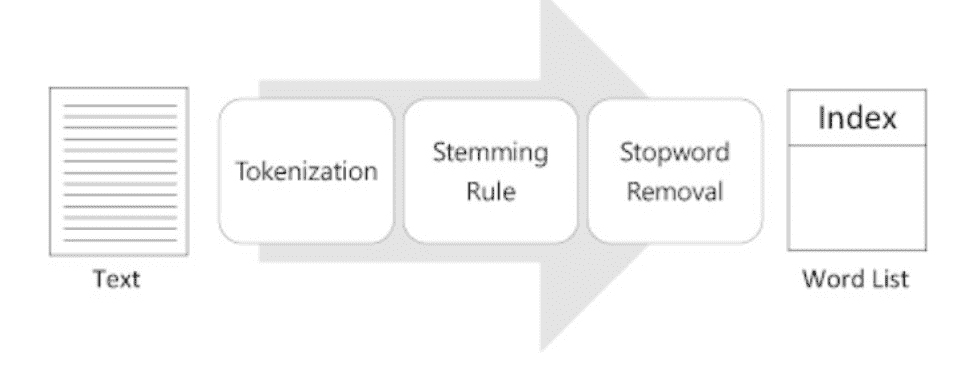

### 图15.1 索引过程

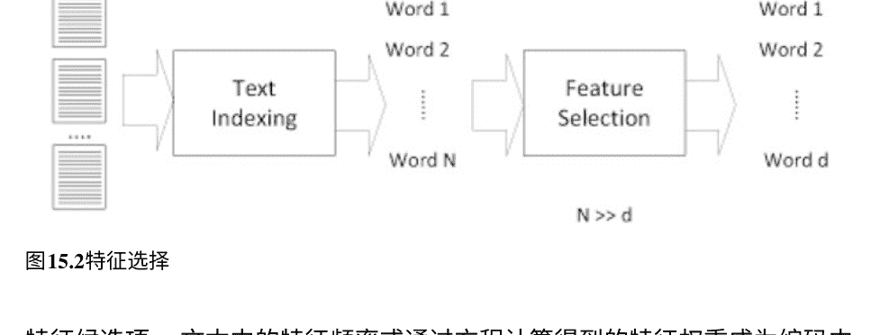

### 图15.2 特征选择

特征候选。文本中的特征频率或通过方程计算得到的特征权重成为编码中的特征值。本节旨在描述将文本编码为数值向量的过程。

图15.1展示了索引文本的整个过程。首先，通过空格对文本进行分词，作为第一步的文本索引。然后，将每个单词转换为其词根形式，作为第二步的词干提取。最后，通过第三步移除停用词。文本索引通过这三个基本步骤完成。

选择一些单词作为特征的过程在图15.2中有所说明。整个文本集合通过上述过程被索引为一个单词列表。从文本集合中索引的单词作为特征候选选项，并从中选择一些作为特征。选择特征的标准是每个特征所包含的文本数量以及在集合中的权重。被选为特征的单词数量成为表示文本的向量的维度。

将文本编码为数值向量时，特征值的赋值过程在图15.3中有所说明。特征值是一个二进制值；零表示文本中没有该单词，而一表示存在该单词。单词在文本中的频率被用作特征值；表示文本的向量由零值和正整数组成。单词权重是通过方程计算的，该方程在图15.3中给出，并且特征被赋予一个实数值。这一步完成了将文本编码为数值向量的过程。

让我们对将文本编码为数值向量的过程进行一些说明。语料库中的文本被索引为单词列表，作为特征候选项。其中一些单词被选为特征；被选中的特征数量是表示文本的数值向量的维度。

特征值可以是二进制值、频率或权重。我们考虑将文本编码为其他类型的结构化形式，作为数值向量的替代方案。

#### 15.2.2 卷积

本节涉及卷积作为数值向量上的深度操作。我们在第12章中详细研究了这个操作。在本节中，我们回顾这个深度操作，以便理解文本卷积的背景。在执行该操作时，涉及一个任意定义的滤波器向量或矩阵。本节旨在简要描述数值向量上的卷积。

将文本表示为数值向量的过程在图15.4中进行了说明。在前一节中，我们详细研究了这个过程，但是这个过程在这里简要回顾一下。文本通过三个步骤进行数值向量编码：文本索引、特征选择和特征值分配。对表示文本的数值向量进行深度操作，如卷积。


### 图15.4 文本编码过程

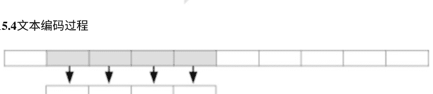

### 图15.5 卷积过程

一个文本。在对其进行编码之前，文本深度操作适用于原始文本。

将卷积应用于向量的框架在图15.5中进行了说明。窗口大小设置为四，输入向量的四个元素参与卷积。准备了四维滤波器向量，并通过滑动在输入向量上的窗口和滤波器向量的内积计算输出向量中的每个元素。输入向量的维度为十，因此输出向量的维度为7 = 10 - 4 + 1，以此类推。卷积不仅适用于向量，还适用于矩阵。

深度学习算法的卷积模块在图15.6中有所说明。通过编码模块，文本被编码成数值向量。在这个操作中，多个过滤向量，k过滤向量被定义，并且从单个输入向量计算出k输出向量。这些k数值向量作为输入向量传递给下一层或分类部分。

如果有多个输入向量进行分类，可以应用投票机制。让我们对应用于处理文本的数值卷积进行一些说明。为了应用数值卷积，需要将文本编码成数值向量，这个过程在前一节中有所描述。通过卷积操作，向量的维度减少了过滤向量的大小减一。如果涉及多个过滤向量，通过卷积会生成多个输出向量。如果使用多个过滤向量，多个输出向量被视为一个矩阵。

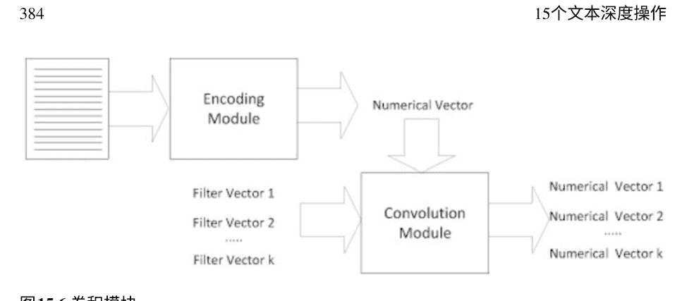

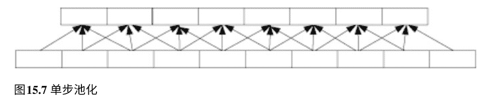

#### 15.2.3 池化

本节关注池化作为另一种深度操作。在前一节中，我们研究了卷积作为主要的数值向量深度操作。在本节中，我们研究了在将文本编码为数值向量的假设下对数值向量进行池化。池化与卷积一起用于实现深度学习算法，作为文本分类的方法。本节旨在描述池化作为一种深度操作。

图15.7展示了单步池化。输入值的数量为十个，滑动在输入值上的窗口大小为三。每个输出值是从三个大小的窗口中选择的代表性值。

输出值的数量为8 = 10 - 3 + 1。通过对三个大小的窗口进行池化操作，将十维向量缩减为八维向量。

多步池化操作如图15.8所示。十维向量通过池化操作缩小为七维向量，如图15.7所示。十维向量通过三次使用三个大小的窗口进行池化操作，缩小为四维向量。十维度通过8 = 10 - 3 + 1缩小为八维度；八维度通过6 = 8 - 3 + 1缩小为六维度；六维度通过4 = 6 - 3 + 1缩小为四维度。由于累积池化操作的影响，维度被减小。

用于处理文本的池化模块的架构如图15.9所示。编码模块将文本表示为数值向量。多个池化操作被定义，并从每个生成一个输出向量。

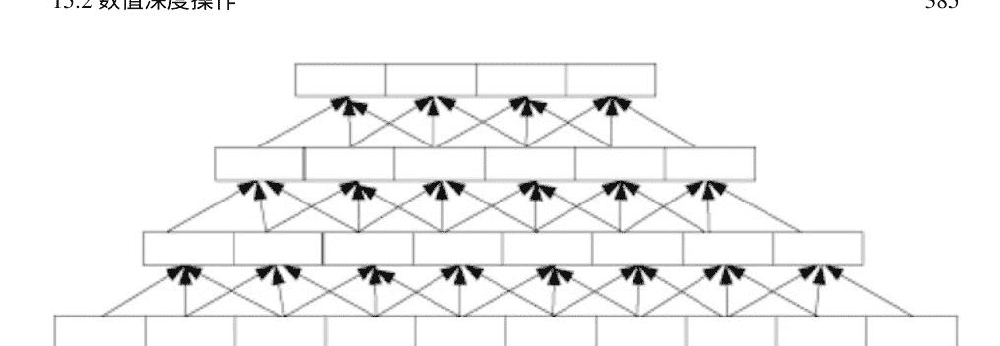

### 图15.8 多步池化

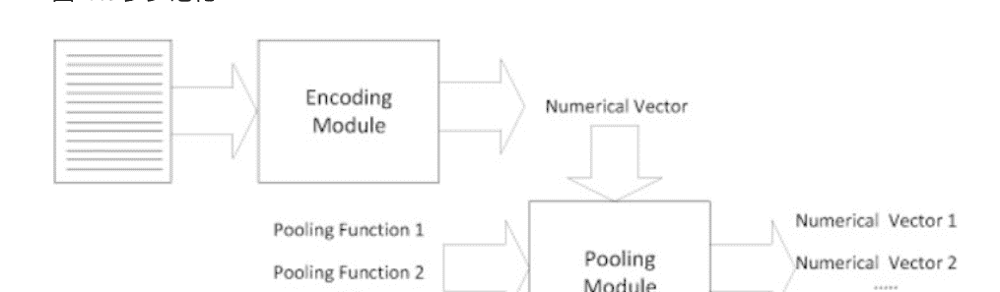

### 图15.9 池化模块

池化操作。如果定义了k个池化函数，则从该模块生成k个输出向量。通过池化操作，向量的维度被减小。

让我们对数值向量上的池化操作进行一些说明。如果窗口大小为k并且进行一次池化操作，则维度减小k - 1。如果进行m次池化操作，则维度减小m(k - 1)。池化模块安装在编码模块之后，其中文本被表示为数值向量。我们考虑对文本进行池化操作以及在池化操作之后的编码模块。

#### 15.2.4 虚拟示例

本节涉及对训练样例的操作。在前几节中，我们回顾了卷积和池化作为对训练样例的操作。在本节中，我们研究生成额外训练样例的过程，这些样例被称为虚拟样例，是对训练样例的另一种操作。如果应用多个滤波向量或矩阵进行卷积，则从一个向量或矩阵生成多个向量或矩阵。这。

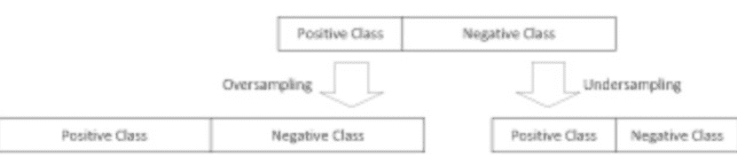

### 图15.10 简单的重采样方案：过采样和欠采样

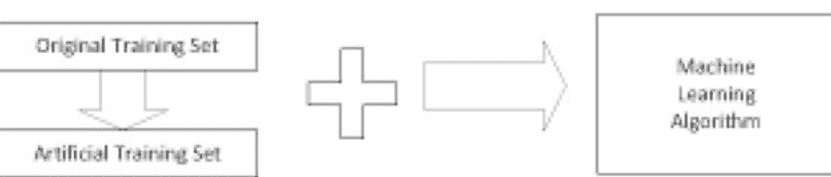

### 图15.11 虚拟示例生成

本节旨在描述卷积和池化之外的操作。图15.10说明了将重采样应用于训练示例的过程。重采样是平衡训练示例中类别比例的过程[3]。预定义的类别被假定为正类和负类，负类在图15.10中占主导地位。过采样是通过添加更多的训练示例来增加弱类别的大小，欠采样是通过删除一些训练示例来减小主导类别的大小。

重采样应用于训练示例中不平衡的类别比例的情况。图15.11说明了用于训练机器学习算法的生成虚拟示例的框架。准备了一组训练示例，这种训练示例被称为实际示例。通过操作实际示例，生成了额外的训练示例，这些示例被称为虚拟示例。实际示例和虚拟示例都用于训练机器学习算法。Cho等人于1996年提出了生成虚拟示例的方案[1]。

时间序列预测中的中期生成如图15.12所示。最初提出应该将神经网络应用于时间序列预测，并由Jo在2010年[4]生成中期，这个方案在2013年应用于多变量时间序列预测[5]。通过定义插值方程来估计中期，并通过在包含中期的时间序列上滑动窗口来生成训练样本。训练样本的数量增加了近两倍，通过增加训练样本的数量，预期可以提高泛化性能。这个方案成功地将神经网络应用于各个领域的时间序列预测中。

让我们对改进泛化性能的训练样本操作进行一些说明。重新采样是通过删除一些训练样本或添加更多训练样本来平衡类别比例的过程。通过操作训练样本人工生成的训练样本称为虚拟样本。提出了在时间序列预测中估计中期，以提高应用于时间序列预测的神经网络的性能。

卷积旨在生成更多的训练样本，并且通过降低维度来进行深度学习操作。

### 15.3 文本卷积

本节关注文本卷积作为一种专门针对文本数据的卷积。在第15.3.1节中，我们研究原始文本的结构。在第15.3.2节中，我们研究从文本中随机选择部分作为文本卷积的实例。在第15.3.3节中，我们提到将文本索引为单词的分层结构的过程。在第15.3.4节中，我们研究了将主题标签分配给每个段落的时间主题分析。

#### 15.3.1 原始文本结构

本节关注原始文本的结构视图。在前一节中，我们研究了应用于数值向量的深度操作，池化和卷积。从本节开始，我们考虑直接应用于文本数据的深度操作，称为文本深度操作。文本被视为段落或单词的列表，简单地说，它被视为一种分层结构。本节旨在描述具有分层视图的原始文本。

段落的划分是句子，如图15.13所示。一个文本被分割成段落，如前图所示。一个段落通过句号分割成句子。一个段落被表示为一组句子。一个句子被视为基于语法规则的单词组合。

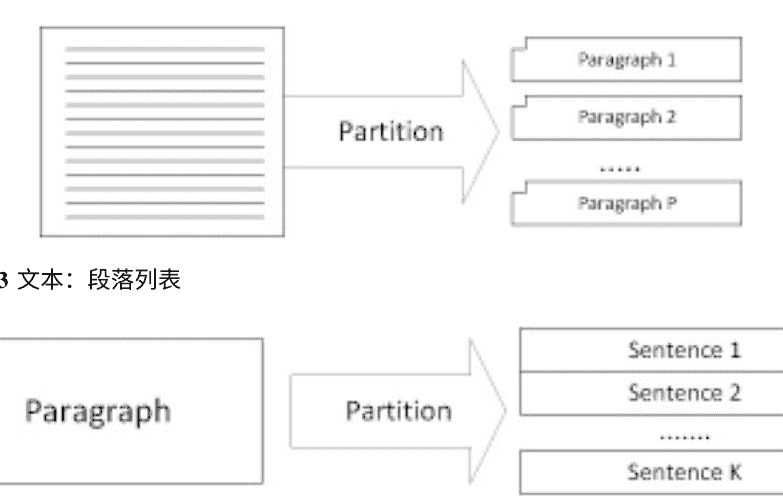

### 图15.13 文本：段落列表

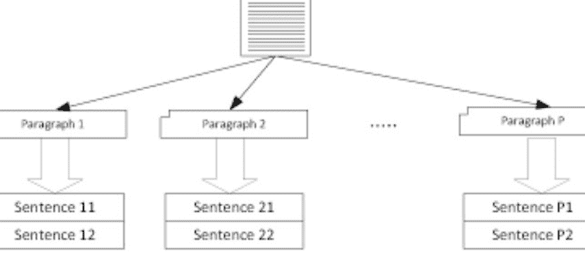

### 图15.14 段落：句子列表

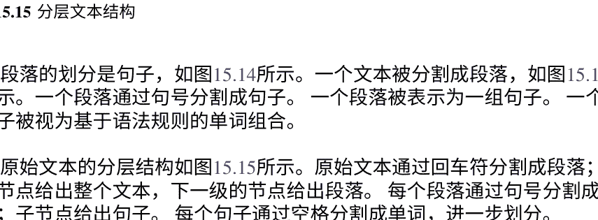

### 图15.15 分层文本结构

段落的划分是句子，如图15.14所示。一个文本被分割成段落，如图15.13所示。一个段落通过句号分割成句子。一个段落被表示为一组句子。一个句子被视为基于语法规则的单词组合。

原始文本的分层结构如图15.15所示。原始文本通过回车符分割成段落；根节点给出整个文本，下一级的节点给出段落。每个段落通过句号分割成句子；子节点给出句子。每个句子通过空格分割成单词，进一步划分。

在将句子分割成单词时，应考虑复合词。

让我们对原始文本的结构进行一些评论。因为文本被分割成段落，所以它被视为一组段落。每个段落进一步被分割成句子；一个段落被视为一组句子。

构建表示文本的分层结构。我们可以考虑将原始文本表示为一个图，其中每个节点是一个单词，每个边是单词之间的上下文关系。

#### 15.3.2 随机部分选择

本节介绍了一种文本卷积方案，称为随机部分选择。在前一节中，原始文本被视为由段落和句子组成的分层结构。在这个操作中，文本被索引为单词或被分割成段落，并随机选择一些单词或一些句子。将单词列表或句子列表编码为数值向量，作为对文本应用该操作的结果。本节旨在描述这个文本卷积实例。

从文本中随机选择单词的过程如图15.16所示。文本通过第13.1节中描述的过程被索引为单词列表。其中一些单词被随机选择。选择的单词作为应用文本卷积后的结果列出。应用文本卷积的每次试验结果都不同。

从文本中随机选择句子的过程如图15.17所示。文本通过句号分割为句子。在这种类型的卷积中，其中一些句子被随机选择。由所选句子组成的文本是从原始文本映射而来的。映射后的文本被编码为数值向量，以应用于文本挖掘任务的机器学习算法。

通过在文本上滑动窗口生成分区的过程如图15.18所示。输入为文本，窗口大小为单词数。通过滑动窗口生成句子分区。从输入文本映射而来的是一个分区列表。

分区列表被编码成一个数值向量。

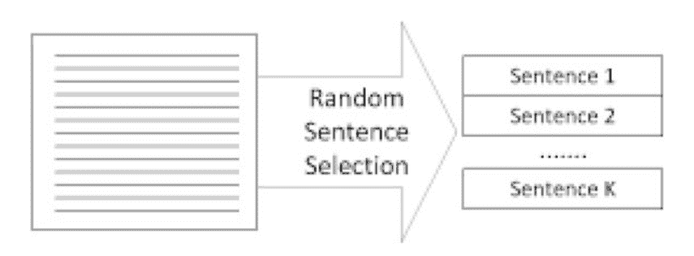

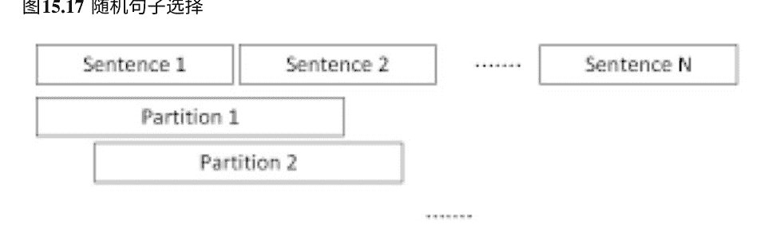

让我们对这个文本卷积的实例做一些备注。一个文本被索引为一个单词列表，并且其中一些被随机选择。一个文本被分割为句子，并且其中一些被随机选择。分区是通过在文本上滑动一个固定大小的窗口来生成的。我们需要考虑在文本上滑动的过滤框架，以便选择文本分区。

#### 15.3.3 分层索引

本节关注的是将文本分层索引的过程。在第13章中研究的文本索引是将文本映射为一个平面单词列表的过程。它被扩展为将文本映射为单词的分层结构的层次文本索引。树结构，其中每个节点是一组代表性单词，是将文本分层索引的结果。本节旨在描述将文本映射为树结构的过程。

整个文本的索引如图15.19所示。它由多个段落组成，并作为输入给出。它通过三个步骤进行单词列表索引：分词、词干提取和停用词去除。那些。


### 图15.19 整个文本中的代表性词语选择

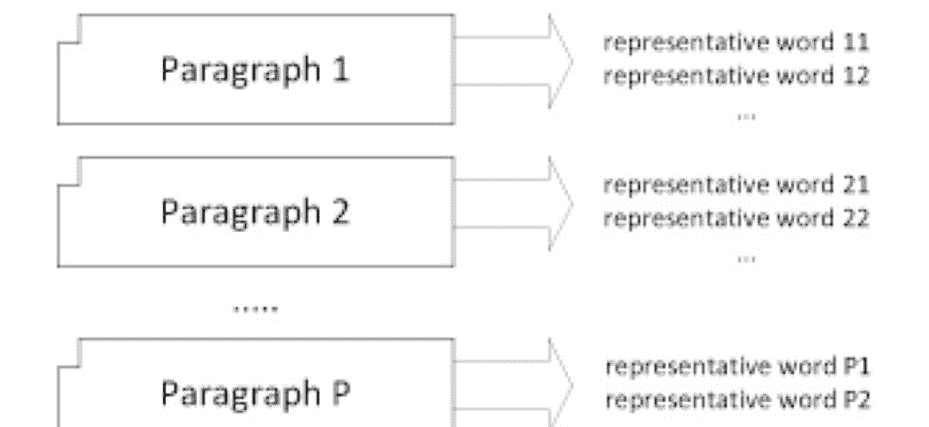

### 图15.20 每个段落中的代表性词语选择

通过该过程提取的词语具有权重，权重较低的词语会被进一步删除。选择的词语列表作为层次索引的根节点。将段落作为第二层的节点进行索引，如图15.20所示。整个文本被分割成段落列表。每个段落通过基本的三个步骤进行单词列表索引。所有词语应该在一个短段落中进行，该段落只包含两个句子，但在一个长段落中需要进一步过滤。第二层的每个节点由几个词语组成。

第三层中，句子的索引作为节点在图15.21中进行了说明。每个段落通过标点符号被分割成句子。每个句子通过基本的三个步骤被索引为一个单词列表。由于句子通常很短，需要进行索引扩展。对于长句子，需要进行额外的过滤，或者可以通过冒号或分号将其分割成子句。进一步处理。

让我们对文本的分层索引进行一些说明。它被索引为一个单词列表，并且在根节点中还进行了一些过滤。文本被分割成段落，每个段落在第二层中进行索引。

在第三层中，每个段落被分割成句子，并且每个句子都被索引。根节点中的单词成为当前文本中的关键词。

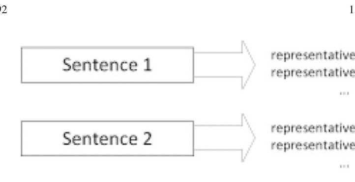

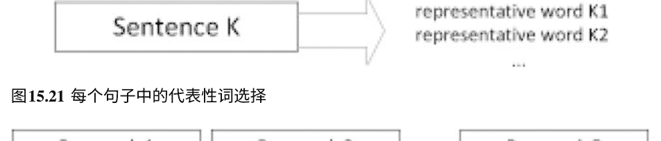

#### 15.3.4 时间主题分析

本节关注文本主题分析作为一种文本卷积。文本主题分析在[7]中提到，并且HMM（隐马尔可夫模型）被应用于该任务。给定一个文本作为输入，将其编码为一个单词序列作为观察序列，并找到具有最大概率的主题序列作为状态序列。将文本映射为一个时间序列的主题，并将其用作分类目标。本节旨在描述时间主题分析及其应用HMM。图15.22说明了将文本中的时间段落映射为单词序列。将文本分割为段落，并将它们排列成一个时间序列。每个段落都被索引为单词，并从中选择最重要的单词作为代表性单词。从段落中提取的单词被排列成一个单词序列。该单词序列被用作此任务的观察序列。

图15.23展示了由观察序列和状态序列组成的训练示例。应用于文本主题分析的HMM参数包括初始状态的概率、状态转移的条件概率以及给定观察的状态的条件概率。初始状态的概率通过将数量除以总数来计算。

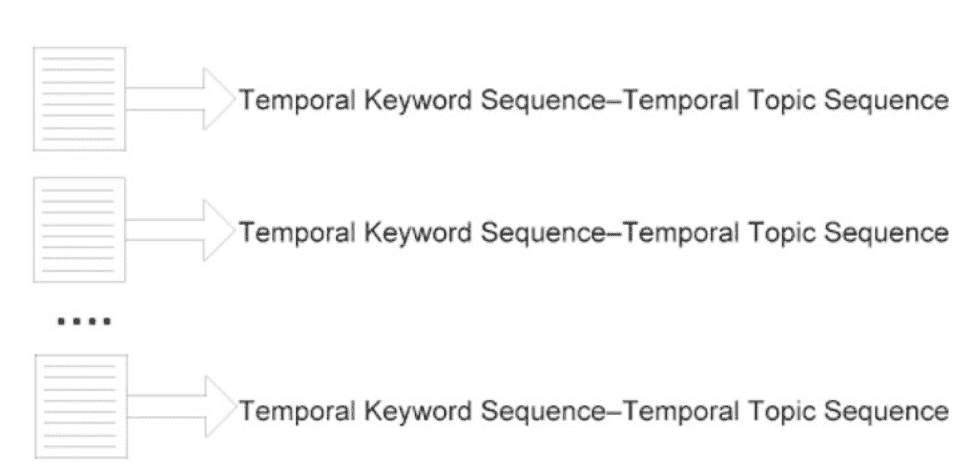

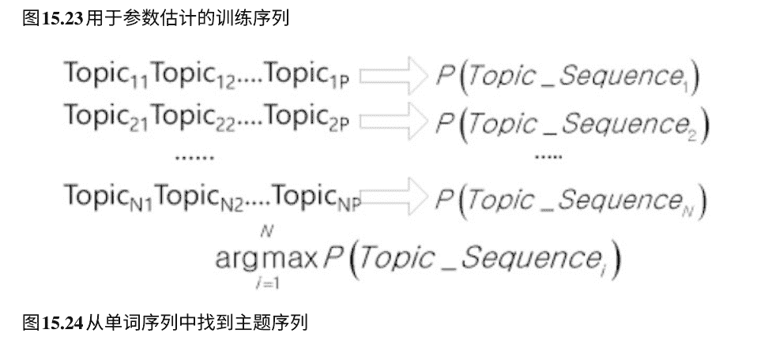

通过训练样本的总数来计算状态序列的初始状态的频率。两个条件概率是通过将相应的频率除以训练样本的总数来计算的。有关详细过程，请参阅[7]。

从单词序列中找到主题序列的过程如图15.24所示。HMM中涉及的参数是通过上述过程从训练样本中估计得出的。生成所有可能的主题序列，并计算它们的概率。选择具有最大概率的主题序列作为输出。其详细计算过程由[7]提供。

让我们对HMM在文本主题分析中的应用做一些备注。一个文本被映射为一个时间词序列作为观察序列，并且通过HMM被映射为一个时间主题序列。参与HMM的参数是通过训练样本估计的，每个样本由一个观察序列和一个状态序列组成。计算给定观察序列的所有可能主题序列的概率，并选择具有最大概率的主题序列作为答案。在这个任务中，我们可以考虑将一个文本映射为多个词序列。

### 15.4 文本池化

本节关注的是针对文本数据专门设计的汇聚方法。在第15.4.1节中，我们提到了将文本划分为句子或段落的方法。在第15.4.2节中，我们研究了使用汇聚方法降低维度的过程。在第15.4.3节中，我们提到了从文本中自动提取关键词的过程。在第15.4.4节中，我们将文本摘要作为一种文本汇聚的形式进行了回顾。

#### 15.4.1 文本分区

本节关注的是文本的划分，这对于实现池化操作是必需的。在第15.3节中，我们研究了直接应用于原始文本的文本卷积。池化操作的本质是从每个实体划分中选择代表性的值。将文本划分为段落、句子或单词对于执行池化操作是必要的。

本节旨在描述将文本划分为它们的过程。将文本索引为单词列表的过程如图15.25所示。单词是文本中的最小语义单位。将文本进行标记化、词干提取和停用词去除的步骤。这个过程被视为将文本划分为最小的语义单位。通过滑动窗口将池化操作应用于单词列表。

将文本划分为句子的过程如图15.26所示。如果假设文本几乎是正式的，那么它将根据句号进行分割。文本被表示为句子列表；它被视为一组句子。从每个句子中提取一个代表性单词；应用这种文本池化将得到一个单词列表。可以从滑在句子列表上的窗口中选择一个句子，作为替代的方式。

将文本分成段落的示例见图15.27。文本根据换行符进行分割。将文本表示为段落列表；它被视为一组段落。从每个段落中提取一个代表性词语；每个词语代表其所在段落的列表是结果。

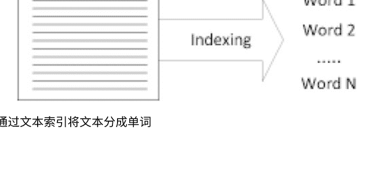从应用这种文本池化中获益。我们考虑从每个段落中选择一个代表性句子作为另一种文本池化。让我们对实现文本池化的文本分割进行一些说明。通过使用三个基本步骤对文本进行索引，将其分成单词。通过句号将其分成句子，句号表示句子的结束。通过换行符将其分成段落。从滑动在时间分区列表上的窗口中选择代表性分区。

#### 15.4.2 子维度下采样

本节涉及子维度下采样。这是使用池化操作来降低维度的过程。文本被编码成一个数值向量，并通过池化操作来降低维度。表示文本的数值向量的维度通常很大，尽管选择了一些特征。本节旨在描述降低数值向量维度的过程。

将文本索引为单词列表的过程作为特征提取在图15.28中说明。准备了由文本组成的语料库，并将它们连接成一个单一的文本。将整合的文本索引为单词列表；从索引整合的文本生成的单词是特征候选。

## 图15.28 从文本集合中提取特征候选

## 图15.29 从特征候选中选择特征

特征候选的数量通常是数万个。我们只需要选择其中的一部分。

在图15.29中，选择一些特征候选项作为特征的过程被说明了。图15.29中呈现的过程被称为特征选择，这个过程是为了提高效率而需要的。选择标准是预先定义的，并且满足标准的一些特征被选为特征。特征候选项的数量通常是几万个，而选定的特征数量通常是几百个，根据[2]的说法。一个文本被编码成一个具有几百维度的向量；巨大的维度是一个问题。

图15.30说明了对单词列表的池化。通过对整合文本进行索引，提取出单词作为特征，并从中选择一些。计算每个特征的重要性或与样本文本输出的相关性。从滑动在单词列表上的窗口中选择具有最大重要性或相关性的单词。这种池化是为了选择属性，而不是属性值。

让我们对子维度下采样进行一些备注，作为文本池化操作的一个实例。通过将语料库索引为单词列表来提取特征候选项。其中一些被选为特征。它们是通过在滑动的窗口上应用池化操作来选择的。

此外，还考虑了单词。我们考虑在窗口上应用多个池化操作，而不进行特征选择步骤。

#### 15.4.3 关键词提取

本节涉及关键词提取作为文本池化的一个实例。关键词提取是选择和提取代表整个内容的重要单词的过程。根据池化被视为从每个窗口中选择代表值的过程，它被视为文本池化的一个实例。我们考虑从段落或句子中提取关键词，而不是整个文本。本节旨在描述将关键词提取作为文本池化的过程。

文本索引被提及为关键词提取的第一步。这是从文本中提取单词列表的过程。分词、词干提取和停用词去除是文本索引的基本步骤。它被视为将文本分割成单词的过程。关键词提取是从文本中选择一些被索引的单词的过程。

在图15.31中说明了加权单词的过程。这些单词是通过使用三个基本步骤对文本进行索引来提取的。使用在第13.2.4节中提到的方程式计算每个方程式的权重。如果语料库不可用，则使用频率或相对频率对每个单词进行加权。我们考虑其他方程式来加权一个单词。

在图15.32中说明了从加权单词中选择一些单词的过程。将文本索引为单词列表，并为其分配权重。这些词根据它们的权重进行排名，并从中选择一些具有较高权重的词。选择一些词的另一种方法是选择比阈值更高权重的词。关键词提取在[6]中被视为二进制分类。

让我们对关键词提取进行一些说明，它是文本池化操作的一个实例。一个文本通过基本的三个停用词被索引为一个词列表。在文本中分配了表示重要程度的权重给这些词。其中一些具有较高权重的词被选为关键词。

它们被编码为一个数值向量，将关键词列表视为一个映射文本。

#### 15.4.4 文本摘要

本节关注的是文本摘要，它是文本池化的一个实例。在第14章中，我们详细研究了文本摘要。在本节中，我们以文本池化的视角回顾了文本摘要。摘要通过选择重要段落生成的，并被编码为一个数值向量。

本节旨在描述文本摘要，该摘要被映射为二进制分类。

让我们首先回顾一下文本划分，作为文本摘要的第一步。这是将文本划分为句子或段落的过程。段落之间的边界被假定为换行符，句子之间的边界是句号。我们可以考虑将文本分层划分，其根节点是整个文本。假设文本被划分为段落以实现文本摘要。

每个段落被分类为摘要或非摘要的分类如图15.33所示。通过上述过程，文本被划分为段落，每个段落被编码为数值向量。机器学习算法是使用最初标记为两个类别之一的示例段落进行训练。表示段落的每个向量都被分类为摘要或非摘要。被分类为摘要的段落被选为摘要。

## 图15.33 将每个段落分类为摘要或非摘要

## 图15.34 提取被分类为摘要的段落

图15.34说明了被分类为摘要的段落的提取过程。文本摘要被映射为二元分类，并且段落被编码为数值向量。被分类为摘要的段落被选中并提取为文本摘要。当将文本摘要视为文本池化时，摘要被编码为用于文本分类的数值向量。因为查询起到了过滤向量的作用，基于查询的文本摘要被视为文本卷积。

让我们对文本摘要作为文本池化的一个实例进行一些评论。通过换行符将文本分割成段落。每个段落被分类为摘要或非摘要。被分类为摘要的段落被提取为摘要。文本摘要可能与其他文本挖掘任务相连接，以获得协同效应。

### 15.5 总结和进一步讨论

本节主要讨论本章研究内容的总结和进一步讨论。通过将文本编码为数值向量，对数值向量进行深度操作。文本卷积是过滤器的过程，从文本中提取词语、句子和段落等文本部分。文本池化是选择代表性部分的过程；关键词提取和文本摘要是文本池化的典型示例。本节旨在进一步讨论本章研究内容。

让我们考虑将文本编码为多个表示形式。在使用多个标准选择特征时，可以定义多个不同的特征集。将文本编码为多个数值向量，其特征彼此不同。如果将原始数据编码为多个表示形式，则可以通过将多个表示形式连接成单个表示形式来应用单个机器学习算法，或者可以独立应用多个机器学习算法。基于原始数据的多个表示形式的机器学习类型称为多视图学习。

让我们考虑将文本索引化为多个单词列表。文本索引被视为将文本转换为一组单词的过程。在基本步骤中添加额外的步骤时，预计会有不同的单词列表。如果将文本集合索引为多个列表，则可以选择不同的特征集对文本进行编码为数值向量。将文本索引化为多个列表是将文本编码为多个表示的原因。

让我们考虑在实现文本深度学习算法时将文本卷积和文本池化相结合。在本章中，我们提到将文本卷积或文本池化附加到机器学习算法中以实现深度学习算法。在将文本编码为数值向量之前，两者都会被附加。此外，数值卷积和数值池化都放置在编码模块和分类模块之间。多个卷积层和多个池化层交替排列。

让我们提及文本深度学习算法的实现作为文本分类的一种方法。在第12章中介绍的CNN专门用于图像分类，卷积是基于图像滤波的。在本章中，我们定义了深度操作、文本卷积和文本池化作为实现文本深度学习算法的基础。它被用于实现文本分类系统。我们将在下一章中研究作为文本分类方法的文本深度学习算法。

### 参考文献

- 1. S. Cho, M. Jang, and S. Chang, “使用网络群体进行虚拟样本生成”, 83–89, 神经处理信函, 5, 1996年。
- 2. F. Sebastiani, “自动文本分类中的机器学习”, 1–47, ACM计算调查, 2002年。
- 3. T. Jo和N. Japkowicz, “类别不平衡与小不相交”, 40-49, ACM SIGKDD Exploration, 2004年6月。
- 4. T. Jo, “中期估计对时间序列预测的反向传播的影响”, 1237-1250, 神经计算和应用, 2010年19月。
- 5. T. Jo, “使用反向传播进行多元时间序列预测的VTG方案”, 2692-2702, 应用软计算, 2013年13月。
- 6. T. Jo, “基于表格的K最近邻算法在新闻文章中的关键词提取”, 第25届国际计算科学与计算智能会议论文集, 2018年。
- 7. T. Jo, 机器学习基础, Springer, 2021年。

## 第16章 文本分类系统

本章关注的是使用深度学习算法实现的文本分类系统。本章实现的文本分类系统的功能是将文本分类为一个或多个主题。我们采用了修改后的深度学习算法，通过添加卷积层来进行文本分类。我们提到了两种卷积层：在对文本进行编码之后应用的数值卷积层和在此之前应用的文本卷积层。本节旨在描述文本分类系统和采用的深度学习算法。

本章由五个部分组成，在第16.1节中，我们概述了本章研究的内容。在第16.2节中，我们研究了文本分类系统的架构。在第16.3节中，我们研究了文本深度学习算法，这些算法是文本分类的方法。在第16.4节中，我们研究了文本深度学习算法的学习过程。在第16.5节中，我们进一步讨论了本章研究的内容。

### 16.1 引言

本节涉及卷积文本分类器的概述。在前一章中，我们研究了专门用于文本数据的深度操作。我们通过附加深度操作来修改现有的机器学习算法。在本章中，采用了经过文本深度操作修改的深度学习算法来设计文本分类系统。本节旨在概述文本深度操作，作为本章的引言。

让我们回顾一下在第12章中介绍的CNN。CNN有两个部分：特征提取和分类。特征提取部分由卷积层和池化层交替组成。分类部分是感知器或多层感知器（MLP）。特征提取部分设计了两层任意的结构。

文本深度操作交替添加到机器学习算法中。在第15章中，我们研究了文本卷积和文本池化作为专门针对文本的深度操作。文本卷积和文本池化被附加到机器学习算法中，用于实现文本深度学习算法。可以用文本深度操作替换数值深度操作，以将CNN应用于文本分类。考虑到文本深度操作的实例、顺序和机器学习算法，设计了文本深度学习算法。

文本深度学习算法可以通过将文本深度操作附加到机器学习算法上来实现。在将文本编码为数值向量之前，文本深度操作（如文本卷积和文本池化）会交替排列。通过文本深度操作，将文本转换为优化的文本，然后将其编码为数值向量，并通过给定的机器学习算法进行分类。在编码部分和分类部分之间可以添加对数值向量的深度操作；除此之外，数值向量还可以转换为另一个向量。作为方法，采用文本深度学习算法来实现文本分类系统。

让我们提及本章的意图。我们将文本深度学习算法的架构理解为实现文本分类系统的框架。我们理解通过文本深度学习算法对文本进行分类的过程。我们理解使用样本文本对文本深度学习算法进行训练的过程。本章旨在研究文本深度学习算法的架构、分类过程和学习过程。

### 16.2 系统架构

本节涉及将深度学习算法应用于文本分类的框架。在第16.2.1节中，我们研究了用于预处理文本的输入层。在第16.2.2节中，我们研究了卷积层。在第16.2.3节中，我们研究了池化层。在第16.2.4节中，我们设计了采用深度学习算法的文本分类系统。

#### 16.2.1 输入层

本节涉及文本深度学习算法中的初始层。这种深度学习算法专门用于处理文本数据。

## 图16.1 原始文本

## 图16.2 文本分割

```
String[] partitionFullText(String fullText){
    String paragraphList[] = fullText.split("\n");
    return paragraphList;
}
```

文本深度学习算法中的初始层被给定为文本。在输入层中，文本被分割成段落，或者文本被表示为单词的分层结构。本节旨在描述输入层中的文本处理。

原始文本在图16.1中呈现。假设该文本是用英语写的，以帮助我们理解。这个原始文本由多个段落组成；在这个例子中，它由p个段落组成。原始文本由一个有序的段落集合模拟，T =< R, P2, ... P p >。它被视为一个段落的集合，至少有一个段落。

将文本分割成段落列表的分区在图16.2中进行了说明，同时还提供了伪代码。原始文本被视为一个由多个段落组成的有序集合，并且假设文本由作者正确编写。回车被定义为段落之间的边界，并且回车被分割成段落。段落列表是文本分割的输出。这对于进行文本深度操作和文本摘要是必要的。

将文本表示为分层形式的过程在图16.3中进行了说明。分层形式中的根节点是整个文本。文本被分割成段落，每个节点被视为下一级的段落。在更高级别上，段落被分割成句子，每个句子是一个节点。

## 图16.3 分层文本结构

句子被分割成单词。在某些应用领域，输入是以分层形式给出的，而不是单个文本。

让我们对将原始文本视为文本深度操作的观点进行一些说明。原始文本被定义为由多个段落组成的文章，使用自然语言编写。文本通过换行符分割成段落，通过标点符号分割成句子。文本被表示为分层形式，其中根节点是整个文本，下一级的节点是段落。文本深度操作应用于原始文本或其分层形式。

#### 16.2.2 卷积层

本节关注实现深度学习的卷积层。原始文本可以从三个方向进行查看：原始文本、段落列表和分层形式。在本节中，我们将研究卷积层作为设计深度学习算法的过程。这个卷积层用于将现有的机器学习算法修改为深度学习版本。

本节旨在描述实现深度学习算法所需的卷积层。

卷积层的架构如图16.4所示。输入被假设为表示图像的矩阵，该层涉及一个称为卷积核的滤波器矩阵。图像边界通过零值进行扩充，称为填充，滤波器矩阵在扩充矩阵上滑动。通过输入矩阵和滤波器矩阵的乘积构建另一个矩阵。

## 图16.6 卷积结果

如果没有填充，输出矩阵的大小会减小，但如果给定填充，则输出矩阵的大小与输入矩阵相同。应用于矩阵的卷积方程系统在图16.5中有所说明。此操作涉及输入矩阵和滤波器矩阵；滤波器矩阵的大小假定小于输入矩阵的大小。

输出矩阵的元素， $y_{kl}$ ，由方程（16.1）计算：

$$y_{kl} = \sum_{i=1}^{h} \sum_{j=1}^{h} c_{ij} x_{(i+k-1)(j+k-1)} \quad (16.1)$$

卷积生成的输出矩阵的大小如图16.6所示。假设输入矩阵是一个 $d \times d$ 矩阵，滤波器矩阵是一个 $h \times h$ 矩阵。从这个操作生成的输出矩阵的大小是 $(d - h + 1) \times (d - h + 1)$。如果应用了 $k$ 个滤波器矩阵，结果将是一个张量。在深度学习算法中，我们需要考虑使用多个滤波器矩阵将矩阵扩展为张量。

让我们对处理矩阵的卷积层做一些备注。填充是在输入矩阵的边界上增加零值。输出矩阵填充了输入矩阵的每个元素与每个卷积中的滤波矩阵元素。如果使用多个滤波矩阵，则输出矩阵会扩展为张量。卷积神经网络被提出作为图像分类的方法[1]。

#### 16.2.3 池化层

本节介绍了池化层作为卷积层的替代层。在前一节中，实现文本深度学习算法需要卷积层。本节研究了池化层，它通过从每个窗口中选择一个代表性的向量将输入向量映射到另一个向量。在文本池化中，滑动窗口在文本上滑动，选择具有最高权重的单词。本节旨在描述池化层作为实现文本深度学习算法的组成部分。

池化层的架构如图16.7所示。输入是64个矩阵，每个矩阵的大小为 224×224；输入被视为一个 224×224×64的张量。如果在池化操作中采用独占窗口，窗口大小为2。如果采用滑动窗口，每个窗口大小为113。这个池化操作将 224 × 224矩阵缩小为 112 × 112矩阵。

池化操作的方程系统在图16.8中有所说明。输入矩阵是一个 $d \times d$ 方阵，由方程(16.2)给出，窗口是一个 $k \times k$ 方阵。

## 图16.7 池化层架构来自 https://computersciencewiki.org/index.php/Max-pooling/Pooling

## 图16.8 池化方程系统

## 图16.9 池化结果

$$
\begin{pmatrix}
x_{11} & x_{12} & \cdots & x_{1d} \\
x_{21} & x_{22} & \cdots & x_{2d} \\
\vdots & \vdots & \ddots & \vdots \\
x_{d1} & x_{d2} & \cdots & x_{dd}
\end{pmatrix}
.
$$
(16.2)

输出矩阵中的每个元素由方程(16.3)计算，

$$y_{rs} = \max_{i=1}^{k} \max_{j=1}^{k} x_{(r+i-1)(s+j-1)}.$$
(16.3)

从滑动在矩阵上的窗口中选择最大值。在这种情况下采用了softmax池化操作。

池化操作的输出矩阵大小如图16.9所示。输入矩阵的大小为 $d \times d$，窗口矩阵的大小为 $k \times k$。如果采用滑动池化操作，则输出矩阵的大小为 $(d - k + 1) \times (d - k + 1)$。

例如，如果输入矩阵的大小为 $128 \times 128$，窗口的大小为 $12 \times 12$，输出矩阵的大小为 $117 \times 117$。如果定义了多个池化操作，则应用它们的结果将以张量而不是矩阵的形式给出。

让我们对应用于矩阵的池化操作做一些备注。采用了softmax池化，并给出了一个正方形矩阵作为窗口。从在矩阵上滑动的窗口中选择最大值。如果输入矩阵是一个 $d \times d$ 矩阵，窗口是一个 $k \times k$ 矩阵，输出矩阵变为一个 $(d - k + 1) \times (d - k + 1)$ 矩阵。我们考虑将文本编码成矩阵，就像图像一样。

#### 16.2.4 设计

本节关注的是应用于文本分类的深度学习算法的设计。在前几节中，我们研究了深度学习算法应用于文本分类系统的部分。在本节中，我们研究了文本分类系统中部分的整体组织，称为卷积文本分类器。采用的机器学习算法被修改为其深度版本。

本节旨在描述文本分类系统的整体架构。

在设计深度学习算法的文本分类系统中，我们需要提到池化层。如果输入数据是一个数值向量，池化层的作用是将输入向量的尺寸缩小。如果输入数据是文本，则通过关键词提取和文摘要来缩小文本的尺寸。从关键词提取中提取出一系列重要的单词，并通过文摘要提取出一些段落作为摘要。通过文本池化层，将文本缩小为更小的文本。

在设计文本分类系统时，我们需要提到卷积层。该层的作用是从特定的训练样本中生成更多的训练样本。如果只涉及一个滤波器，卷积层类似于池化层，但是使用多个滤波器时，会从输入向量或矩阵生成多个向量或矩阵。在文本卷积中，通过多次尝试随机分区选择，从输入文本生成多个文本。文本卷积层的效果是缩小文本并生成多个文本。

让我们考虑采用机器学习算法来实现文本分类系统。有两种方法可以做到这一点：通过安装池化和卷积来采用现有的机器学习算法，以及采用深度学习算法。如果采用现有的机器学习算法，样本文本将通过文本深度操作映射到其他形式，映射后的文本将被编码为数值向量，然后通过数值深度操作将其映射到其他向量。机器学习算法将使用最终映射的数值向量进行训练。在实现文本分类系统时，我们考虑选择单个机器学习算法或多个机器学习算法。

让我们对使用深度学习算法设计文本分类系统进行一些说明。添加池化层以减少数值向量的维度和稀疏性。添加卷积层以减少维度并生成人工训练样本。可以选择现有的机器学习算法，以及池化层和卷积层，或者选择深度学习算法，如受限玻尔兹曼机（RBM）和循环神经网络。在实现文本分类系统时可以考虑双卷积层和双池化层：在编码过程之前是文本层，在编码之后是数值层。

### 16.3 文本分类过程

本节涉及通过深度学习算法对文本进行分类的过程。在第16.3.1节中，我们将卷积k最近邻（KNN）算法应用于文本分类。在第16.3.2节中，我们将卷积朴素贝叶斯应用于文本分类。在第16.3.3节中，我们将RBM应用于文本分类。在第16.3.4节中，我们将卷积神经网络应用于该任务。

#### 16.3.1 卷积KNN

本节涉及卷积KNN作为文本分类的一种方法。在前几节中，我们提到了采用深度学习算法设计文本分类系统的框架。在本节中，我们研究将卷积KNN应用于文本分类的过程，该过程在第5章中有所涉及。卷积KNN是带有卷积层和池化层的KNN的深度版本。本节旨在描述卷积KNN的分类过程。

卷积KNN算法的架构应用于文本分类如图16.10所示。我们考虑两种卷积类型：文本卷积和数值卷积。准备带有自己类别标签的样本文本，并通过卷积层转换成其他形式。将一个新手文本作为输入，并通过卷积层转换成另一种形式。在这个版本的KNN算法中，计算转换后的文本之间的相似度。

卷积KNN分类数据项的过程如图16.11所示。对每个训练样本应用多个滤波器进行卷积。对于每个训练样本，计算新手项与其卷积项的相似度，并取平均值作为训练样本和新手项之间的相似度。具有最高相似度的训练样本被选择为最近的邻居，并对它们的标签进行投票以决定新手项目的标签。与传统的KNN算法版本相比，对于每个训练示例，计算新手项目与多个卷积向量的相似性是不同之处。

图16.12展示了卷积KNN算法的高级架构。将文本编码为数值向量，并使用多个滤波向量对其进行卷积处理。从卷积层生成与滤波向量一样多的多个转换向量，并对它们应用池化操作。选择与最终转换的训练向量最相似的最终转换向量，通过投票选择最近邻居的标签。卷积层的作用是从单个示例生成更多示例，池化层的作用是降低维度。

```
Category classifyByConvolutionaryKNN(Item dataItem, List trainExampleList, List filterList, int K){
    int trainExampleSize = trainExampleList.size();
    int filterSize = filterList.size();

    for(int i = 0; i< trainExampleSize; i++){
        Item trainExample = trainExampleList.getElement(i);
        double totalSimilarity = 0.0;
        for(int j = 0;j < filterSize;j++){
            Filter ff = filterList.getElement(j);
            Item filteredDataItem = ff.filter(dataItem);
            Item filteredTrainExample = ff.filter(trainExample);
            double similarity = filteredDataItem.computeSimilarity(filteredTrainExample);
            totalSimilarity = totalSimilarity + similarity;
        }
        double similarity = dataItem.computeSimilarity(trainExample);
        trainExample.setSimilarity(totalSimilarity);
        trainExampleList.setElement(trainExample,i);
    }
    List nearestNeighborList =  trainExampleList.getNearestNeighborList(K);
    Category cc = nearestNeighborList.vote();
    return cc;
}
```

**图16.11 卷积KNN中的分类过程**

**图16.12 高级卷积KNN架构**

#### 16.3.2 卷积朴素贝叶斯

本节涉及卷积朴素贝叶斯作为文本分类的一种方法。在前一节中，通过添加卷积层将KNN算法修改为深度版本。朴素贝叶斯通过这样做将其修改为深度版本，作为文本分类的一种方法。如果应用多个过滤向量进行卷积，处理多个向量有两种方式：集成方案和独立方案。本节旨在描述应用于文本分类的卷积朴素贝叶斯。

深度版朴素贝叶斯的架构如图16.13所示。一些过滤向量被定义用于将卷积应用于样本文本和一个新手文本。如果定义了多个过滤向量，则通过卷积层从一个向量生成多个向量。朴素贝叶斯被应用于从卷积层映射的向量。我们可以考虑处理从一个向量映射的多个向量的两种方式。

将朴素贝叶斯应用于对多个表示数据项的向量进行分类的方案。它们是通过将卷积应用于单个新手输入向量与多个过滤向量生成的。每个 K向量由朴素贝叶斯进行分类。 K向量的标签通过投票决定最终标签。在这个方案中，使用所有表示训练示例的映射向量来训练单个朴素贝叶斯。

将朴素贝叶斯应用于多个向量的分类的另一种方案。在上述方案中，表示单个新手文本的多个向量由单个朴素贝叶斯分类。在这个方案中，它们由不同的朴素贝叶斯模型进行分类，并且对它们进行投票。在训练阶段，每个训练示例通过卷积层映射为 K映射示例，构建不同的 K训练集，并使用其自己的训练集对每个朴素贝叶斯进行训练。在这个方案中，每个朴素贝叶斯模型都根据自己对训练示例的观点进行训练。

让我们对卷积朴素贝叶斯作为文本分类方法进行一些说明。通过卷积层从单个向量生成多个向量。从单个向量映射而来的多个向量是通过分类器对其进行分类，并通过投票决定新手数据项的最终标签。每个朴素贝叶斯对应一个过滤器向量，使用自己的训练集进行训练，并将集成学习应用于多个朴素贝叶斯模型。池化层可以添加到这个版本的朴素贝叶斯中。

**图16.13 卷积朴素贝叶斯架构**

#### 16.3.3 限制玻尔兹曼机

本节关注RBM作为文本分类的一种方法。RBM设计为关联记忆，将不完整的输入恢复为完整的输入，作为单一版本。RBM通过堆叠两个RBM设计为有监督学习算法。将堆叠版本的RBM应用于文本分类。本节旨在描述堆叠版本作为文本分类的一种方法。

RBM的整体架构用于实现文本分类系统，如图16.14所示。双重RBM用于对文本进行分类，可见向量作为输入向量和目标输出向量给出。左侧RBM涉及输入层和隐藏层，右侧RBM涉及隐藏层和输出层。即使它们具有相同的架构，双重RBM和MLP也是不同的。本版本RBM的学习过程在第16.4.3节中描述。

堆叠的RBM的左侧部分如图16.15所示。在本节中，我们提到了对文本进行分类的过程，并在第16.4.3节中提到了训练过程。假设左侧部分的权重已经优化，并且通过新手输入向量计算隐藏向量。即使输入向量是通过RBM中的隐藏向量计算得到的输入向量并不感兴趣。隐藏向量用于计算堆叠RBM右侧部分的输出向量。

堆叠的RBM的右侧部分如图16.16所示。左侧部分的输入层是可见层，右侧的输出也是可见层。右侧的权重被假设为优化过的，并且输出值由隐藏值计算得出。输出值是通过隐藏层从输入层计算得出的。计算输出值的过程与MLP中的过程相同。

让我们对将RBM应用于文本分类进行一些说明。采用两个RBM的堆叠版本作为文本分类的方法。隐藏节点的值由左侧RBM中表示文本的输入向量计算得出。输出值由右侧RBM中的隐藏节点值计算得出。在未来的研究中，考虑使用多个堆叠的RBM作为另一种文本分类方法。

**图16.14 RBM作为文本分类器的架构**

**图16.15 输入层和隐藏层之间的RBM**

**图16.16 隐藏层和输出层之间的RBM**

#### 16.3.4 卷积神经网络

本节涉及将CNN应用于文本分类的过程。CNN在第12章中被描述为一种深度学习算法。在本节中，我们研究了使用CNN将文本分类为预定义类别之一的过程。可以通过为每个特征分配多个值，将文本编码为矩阵或向量。本节旨在描述将CNN应用于文本分类的过程。

在将CNN应用于文本分类中，池化层的示意图如图16.17所示。输入被假设为一个大小为 $d_1 \times d_2 \times d_3$ 的张量。使用大小为 $k_1 \times k_2$ 的窗口对每个 $d_1 \times d_2$ 矩阵应用池化操作，从滑动窗口中选择最大值。通过池化操作得到大小为 $(d_1 - k_1 + 1) \times (d_2 - k_2 + 1) \times d_3$ 的输出张量。池化操作的作用是减小输入数据的大小。

在将CNN应用于文本分类中，卷积层的示意图如图16.18所示。卷积的输入由 $d_3$ 个 $d_1 \times d_2$ 矩阵组成，滤波器由 $f_3$ 个 $f_1 \times f_2$ 矩阵组成。在输入矩阵大小为 $d_1 \times d_2$ 的情况下，使用大小为 $f_1 \times f_2$ 的滤波器矩阵进行卷积操作。$(d_1 - f_1 + 1) \times (d_2 - f_2 + 1)$ 大小的矩阵被获得。如果应用卷积，大小为 $(d_1 - f_1 + 1) \times (d_2 - f_2 + 1) \times (d_3 - f_3 + 1)$ 被获得。

让我们提到通过CNN对文本进行分类的过程。如果应用文本卷积，它被应用于原始文本，然后转换后的文本被编码成数值向量。如果应用数值卷积，文本被编码成数值向量，然后对其进行操作。最终的数值向量由MLP或感知器进行分类。CNN被视为通过卷积和池化增强的MLP或感知器。

让我们对卷积神经网络在文本分类中的应用进行一些评论。一个文本被编码成一个具有多组特征的矩阵，并且输入数据到池化层被假设为一个张量。卷积是在假设为多个矩阵的张量上应用的。通过池化和卷积映射的最终结构形式由感知器和多层感知器进行分类。卷积神经网络的版本数量几乎是无限的，这取决于池化层和卷积层的设计。

**图16.17 卷积神经网络中的池化层**

**图16.18 卷积层在卷积神经网络中**

### 16.4 学习过程

本节关注训练深度学习算法的过程，这些算法被采用来实现文本分类系统。在第16.4.1节中，我们研究了训练卷积KNN算法的过程。在第16.4.2节中，我们研究了训练卷积朴素贝叶斯的过程。在第16.4.3节中，我们研究了训练RBM的过程。在第16.4.4节中，我们研究了训练卷积神经网络的过程。

#### 16.4.1 卷积KNN

本节涉及卷积KNN算法的学习过程。在第16.3.1节中，我们研究了通过文本对其进行分类的过程。在本节中，我们研究了使用训练样例训练卷积KNN算法的过程。它的学习过程是通过池化和卷积将训练样例映射到其他形式。本节旨在描述训练卷积KNN算法的过程。

图16.19显示了用于处理训练样例的卷积层。每个训练样例都被给定为一个 d 维向量，训练样例的数量为 N。在卷积层中，定义了 f 维度的 c 过滤器向量。将具有 d 维度的 N 数值向量转换为具有 $(d - f + 1)$ 维度的 $N \times c$ 数值向量。通过卷积层生成更多转换后的训练样本，维度更低。

让我们提到将卷积应用于每个训练样本的多个滤波器向量。训练集表示为 $Tr = \{x_1, x_2, ..., x_N\}$，滤波器向量表示为 $f_1, f_2, ..., f_c$。训练样本和滤波器向量分别表示为 $x_i = [x_{i1}, x_{i2}, ..., x_{id}]$ 和 $f_j = [f_{j1}, f_{j2}, ..., f_{jh}]$，转换向量中的每个元素由公式 (16.4) 计算：

$$r_{ijk} = \sum_{l=1}^{h} x_{i(k+l-1)} \cdot f_{jl}$$

训练集，Tr，由 N 个 d 维向量组成，映射到训练集，$Tr\_conv = \{r_{11}, ..., r_{1c}, ..., r_{N1}, ..., r_{Nc}\}$，由 $N \times c$ 个 $(d - h + 1)$ 维向量组成。卷积层将训练集的维度向量转换为 $(d - h + 1)$ 维向量。训练集的元素，$Tr\_conv$，用于计算它们与新手项目的相似性。

让我们提到通过卷积KNN对文本进行分类的过程。一个文本被编码成一个数值向量，x 通过卷积层，向量，x，被转化为 c 个向量，$r_1, r_2, ..., r_c$。每个转化后的向量，$r_i$，被分类，并且 c 个向量，$r_1, r_2, ..., r_c$，的标签被投票。我们考虑使用 c 个 KNN 算法，每个算法对应一个通道。

让我们对应用于文本分类的 CNN 的学习过程进行一些备注。它由特征提取部分和 KNN 部分组成。卷积应用于训练示例，这些示例以多个过滤向量的数值向量形式给出。一个新手输入向量，表示一个新手文本，被映射为具有较低维度的多个向量，每个向量都被分类，并且它们的分类标签被投票。我们考虑将KNN算法集成到表示单个文本的多个向量中的集成学习中。

#### 16.4.2 卷积朴素贝叶斯

本节讨论了卷积朴素贝叶斯的学习过程。在第16.3.2节中，我们研究了通过卷积将文本分类的过程朴素贝叶斯。在本节中，我们研究了使用训练示例对其进行训练的过程。每个训练示例都通过与多个滤波器向量的卷积映射为多个转换后的向量，其维度较低。本节旨在描述使用训练示例对卷积朴素贝叶斯进行训练的过程。

卷积朴素贝叶斯的架构如图16.20所示。在这个架构中，卷积层是特征提取部分，朴素贝叶斯是分类部分。卷积应用于每个训练示例与多个滤波器向量。通过卷积映射的向量数量是训练示例数量的多倍。朴素贝叶斯应用于映射向量，而不是训练示例。

让我们将参数估计过程称为朴素贝叶斯的学习过程。通过应用多个滤波器向量的卷积，将每个训练示例映射为多个向量。从映射向量中计算各个属性值的似然度。作为替代方法，逐通道计算似然度。使用各个属性值的似然度对新输入向量进行分类。

让我们提及对新手文本进行分类的过程。新手文本被编码为数值向量，并通过卷积层编码为多个向量。基于它们对类别的似然度进行计算。

**图16.20 卷积朴素贝叶斯的架构**

#### 16.4.3 限制玻尔兹曼机

本节涉及RBM的学习过程，该过程应用于文本分类。在第16.3.3节中，我们研究了RBM的分类过程。在本节中，我们重点解释RBM的学习过程。将表示文本的输入向量与其目标类别一起作为可见向量应用于文本分类中的RBM。本节旨在描述将RBM作为文本分类方法进行训练的过程。

图16.21中展示了单个RBM，并让我们回顾一下它的学习过程。权重被随机初始化，隐藏值由可见值和权重计算得出。可见值由权重和计算得出的隐藏值计算得出，权重被优化以最小化目标可见向量与计算得出的可见向量之间的差异。

通过连接多个单个RBM，将其扩展为多个堆叠的RBM。逐个串行地使用RBM。如果将RBM应用于分类任务，则将输入向量与其目标标签作为可见向量进行扩充。

将RBM应用于文本分类的过程在图16.22中进行了说明。任务被假设为软分类，其中每个文本可以被标记为多个类别。将文本编码为数值向量，并将多个类别编码为二进制向量。表示文本的数值向量与指示其标记类别的二进制向量被合并为可见向量。可见层和隐藏层之间的权重被优化，以最小化目标可见向量与计算得到的可见向量之间的差异。

让我们提到通过RBM对文本进行分类的过程。可见层和隐藏层之间的权重被优化。输入文本被编码为数值向量，并且与预定义类别数量相同的零向量进行扩充。计算隐藏向量，并通过计算得到的隐藏向量重新计算可见向量。从输入向量的扩充部分决定新手向量的标签。

让我们对应用于文本分类的RBM的学习过程进行一些说明。它的学习过程是迭代计算隐藏向量和可见向量，并更新权重。文本分类被假设为软分类，允许为每个文本分配多个类别，并且表示输入文本的数值向量与表示目标输出的二进制向量进行扩充。可见层和隐藏层之间的权重被更新。将多个堆叠的RBM应用于文本分类，将输入向量作为第一个可见向量，将目标输出向量作为最后一个可见向量作为替代方式。

**图16.21 单个RBM**

**图16.22 用于文本分类的受限玻尔兹曼机**

#### 16.4.4 卷积神经网络

本节主要讨论应用于文本分类的CNN的学习过程。在第12章中，我们已经学习了CNN作为深度学习算法，并在第16.3.4节中学习了CNN的分类过程。在本节中，我们将重点关注将CNN应用于文本分类的学习过程。基于查询的文本摘要是文本卷积的一个实例；在这种类型的文本摘要中，给定的查询在数值卷积中起到了过滤向量的作用。本节旨在描述CNN作为文本分类方法的学习过程。

应用于文本分类的CNN的架构如图16.23所示。该架构最初在第12.4.4节中提到。文本被编码为数值向量，通过池化层将其映射到维度较小的向量，并通过卷积层将其映射到多个向量。多个向量通过ReLU进行分类，文本卷积在将文本编码为数值向量之前进行。

通过基于查询的文本摘要的文本卷积在图16.24中进行说明。在第14章中涵盖的文本摘要被视为文本汇集，因为文本长度被减少。如果为摘要提供不同的查询，则可能提取不同的段落作为摘要，这取决于查询。查询在数值卷积中起到过滤向量的作用；基于查询的文本摘要根据查询解释为过滤内容。文本卷积排在将文本编码为数值向量的步骤之前。

卷积神经网络对文本进行分类的整个过程在图16.25中进行说明。基于查询对输入文本进行摘要；提取摘要版本。每个版本都被编码为数值向量。并且C个数值向量是从单个输入文本生成的。数值向量被分类，并且根据它们的分类标签决定类别。基于查询的文本摘要的作用是将一个文本映射为多个文本。

让我们对应用于文本分类的CNN的学习过程进行一些说明。采用了包含池化层、卷积层和ReLU的版本。此外，我们将基于查询的文本摘要视为文本卷积。通过文本卷积生成的多个向量被分类，并根据它们的标签进行投票以决定类别。我们考虑将段落编码为多个数值向量，而不是将整个文本编码为一个数值向量。

### 16.5 总结和进一步讨论

本节讨论了本章研究内容的摘要和进一步讨论。在应用于文本分类的深度学习算法的架构中，卷积层和池化层交替排列。卷积KNN、卷积朴素贝叶斯、RBM和CNN这四种深度学习算法被确定为文本分类的方法候选。本章提到的CNN与第12章中的CNN不同，因为考虑了文本数据上的池化层和卷积层。

让我们考虑将两个机器学习算法，KNN算法和朴素贝叶斯算法结合起来。集成学习被应用于它们作为独立的组合，其中两个算法都是主算法。在KNN算法是主算法的组合中，KNN算法用于对数据项进行分类，朴素贝叶斯用于将每个训练示例分类为最近邻或非最近邻。在朴素贝叶斯是主算法的组合中，KNN算法用于将训练示例纳入计算似然度，并且朴素贝叶斯用于对数据项进行分类。在文本分类中应用了三种组合之一。

文本深度操作附加到KNN算法和朴素贝叶斯的组合上。文本深度操作在第15章中描述，并附加到本章中的机器学习算法上。它们可以通过附加文本深度操作来修改为深度版本。这个文本深度学习算法可以用于实现文本分类系统。如果将这个深度学习算法应用于其他领域，文本深度操作可能会被组合中的数值向量替代。

我们提到将文本深度学习操作应用于决策树。在第7章中，我们研究了将决策树修改为其深度版本的方法，通过添加卷积操作。在将文本编码为数值向量之前，附加文本卷积。在编码和分类之间附加数值卷积，以实现更深层次的版本。通过采用文本卷积决策树，可以实现文本分类系统。

单个决策树扩展为由多个决策树组成的随机森林。在随机森林中，训练集被划分为子集，并且每棵树都使用自己的训练样例子构建。文本深度操作附加在每棵决策树之前。通过文本深度操作，原始文本被转换为另一种形式，并且映射形式被编码为数值向量。这个版本的随机森林可以应用于文本分类。

### 参考文献

- 1. C.C. Aggarwal，神经网络和深度学习，Springer。2018

### 索引

- A
  - 抽象化, 14, 355–363, 376
- B
  - 反向传播, 238, 239
  - 基本循环神经网络, 248, 257–260, 275
  - 贝叶斯分类器, viii, 5, 9, 17, 111, 139, 141, 144–146, 149–153, 156–164
  - 贝叶斯规则, 140
  - 玻尔兹曼机, v, vi, ix, 223, 277–302, 410, 414–416, 420–421
- C
  - 级联, vii, 19–21, 83, 84, 92, 96–99, 108, 137, 177
  - 卷积, 3, 127, 156, 191, 212, 226, 266, 297, 303, 379
  - 卷积神经网络 (CNN), v, vi, ix, 4, 18, 221–223, 226, 245, 246, 303–326, 400, 403, 404, 408, 411, 416–418, 422–423
- D
  - 数据分类, 5, 6, 9, 31, 35, 108, 167, 196, 198
  - 数据聚类, 6, 16–18, 57, 58, 62, 63, 73, 107, 108, 131, 133, 177
  - 决策树, 5, 30, 165, 424
  - 深度学习, v–viii, x–xi, 3–6, 11–19, 26, 27, 29, 30, 37, 54, 57, 58, 83, 114, 122, 124, 125, 129–131, 133, 135, 137, 141, 150, 153, 159–164, 166, 179, 180, 186, 189, 193, 194, 204–209, 211, 216, 217, 221, 225, 226, 232, 236, 277, 278, 298, 302, 303, 329, 355, 379, 380, 383, 384, 387, 400, 403–411, 416, 417, 422–424
- E
  - 集成学习, v–vii, 3, 9, 19–22, 26, 27, 49–51, 83–109, 137, 176, 179, 304, 309–310, 325, 414, 419, 423
  - 专家门, vii, 19–22, 50, 83, 84, 90, 92, 94–97, 99, 108, 137, 176, 179, 190, 302
- H
  - 分层聚类, 57, 185
- I
  - 索引扩展, x, 329–353, 391
  - 索引优化, 330, 338, 345, 350–353, 362
- K
  - KNN算法, vi–viii, 5, 6, 9, 22, 30, 32, 35, 37, 54, 55, 113–137, 344, 410–413, 417–419, 423
- L
  - 语言建模, 267, 271–273
  - 线性分类器, vi, viii, 6, 24, 51, 193–222
  - 长短期记忆（LSTM）, 248, 256, 263–267, 274, 275
- M
  - 多层感知器（MLP）, v, vi, ix, 4, 15, 21, 27, 30, 40, 41, 44, 54, 225–248, 255–259, 262, 268, 274, 280–282, 303, 304, 319, 320, 325, 404, 414, 415, 417
  - 多文本摘要, 370–377
- N
  - 朴素贝叶斯, viii, 6, 9, 29, 30, 45–47, 54, 55, 80, 111, 146, 153–155, 158, 162, 163, 181–183, 413–414, 417, 419–420, 423
  - 最近邻, viii, 22, 30, 31, 35–37, 54, 55, 72, 113–121, 125, 131–133, 135–137, 412, 423
  - 神经网络, v, vi, ix, x, 29, 30, 37–45, 54, 58, 80, 166, 225, 226, 232, 247–275, 277, 278, 280, 282, 285, 286, 302, 303, 320, 386, 387, 410
  - 数值深度操作, x, 379–387, 404, 410
- P
  - 感知器, v, vi, ix, 21, 29, 30, 37, 40–45, 54, 225–246, 248, 282–284, 286, 287, 289, 303, 320, 325, 404, 417
  - 池化, 4, 122, 149, 175, 209, 246, 266, 297, 309, 353, 356, 379, 403
- Q
  - 基于查询的文本摘要, 325, 363–369, 399, 422, 423
- R
  - 随机森林, 45, 49–51, 54, 165, 166, 174–179, 183, 187–192, 424
  - 受限玻尔兹曼机（RBM）, v, vi, ix, 277–302, 320, 410, 414–417, 420–421, 423
- S
  - 堆叠KNN算法, 129, 133–134, 137
  - 堆叠RBM, 293–301, 414, 415, 421
  - 监督学习, v–viii, 3–6, 8, 9, 15–17, 26, 29–55, 58, 67, 69, 81, 96, 101, 104–106, 113, 129–131, 157, 178, 183, 213, 216, 218, 279, 290, 298, 414
  - 支持向量机（SVM）, v, viii, 13, 24, 29, 45, 51–54, 193–206, 208, 209, 211–213, 217–222, 268, 353
- T
  - 文本索引, x, 329–338, 352, 353, 365, 377, 381, 382, 390, 394, 397, 400
  - 文本分类, x, xi, 137, 164, 269, 327, 344, 353, 362, 376, 380, 399, 400, 403–424
  - 文本卷积, x, xi, 137, 164, 325, 379, 380, 387–394, 399, 400, 403, 404, 410, 411, 413, 422–424
  - 文本深度操作, vi, x, 330, 353, 356, 379–400, 403–406, 423, 424
  - 文本池化, x, 325, 379, 380, 394–400, 404, 408, 410, 422
- U
  - 无监督决策树, 183–188
  - 无监督KNN算法, 114, 131–135
  - 无监督学习, v–vii, 3, 4, 6–9, 15–17, 26, 41, 57–81, 86, 90, 101, 106–108, 129–131, 177, 214, 215, 218, 219, 279, 375
  - 无监督概率学习, v, vi, 6, 158
  - 无监督SVM, 217–220
- V
  - 投票, vii, 19–21, 35, 50, 54, 80, 83, 84, 90–94, 96–99, 106–108, 113, 115–121, 131, 135–137, 176, 177, 179, 190, 207, 302, 309, 310, 383, 412, 413, 420