# 深度学习基础与概念


Christopher M. Bishop 与 Hugh Bishop

Christopher M. Bishop • Hugh Bishop

# 深度学习

## 基础和概念

Christopher M. Bishop
Microsoft Research
剑桥，英国

Hugh Bishop
Wayve Technologies Ltd
伦敦，英国

ISBN 978-3-031-45467-7      ISBN 978-3-031-45468-4 (电子书)
https://doi.org/10.1007/978-3-031-45468-4

© The Editor(s) (if applicable) and The Author(s), under exclusive license to Springer Nature Switzerland AG 2024

本作品受版权保护。出版商独家许可，无论是整体还是部分材料，特别是翻译、重印、插图的再利用、朗读、广播、微缩胶片或以任何其他实体方式的复制，以及信息存储和检索、电子适应、计算机软件，或者通过现在已知或今后开发的类似或不同的方法。

在本出版物中使用一般描述性名称、注册名称、商标、服务标志等，并不意味着即使在没有特定声明的情况下，这些名称也不受相关保护法律和法规的限制，因此可以自由使用。

出版商、作者和编辑可以安全地假设本书中的建议和信息在出版日期时被认为是真实和准确的。出版商、作者或编辑对本书中所含材料不提供明示或暗示的保证，也不对可能存在的任何错误或遗漏负责。出版商在已发表的地图和机构隶属方面保持中立。

该Springer印记由注册公司Springer Nature Switzerland AG出版
注册公司地址为： 瑞士Cham市Gewerbestrasse 11号

本产品的纸张可回收利用。

## 前言

深度学习使用多层神经网络通过大数据集进行训练，以解决复杂的信息处理任务，并已成为机器学习领域最成功的范例。 在过去的十年中，深度学习已经在包括计算机视觉、语音识别和自然语言处理在内的许多领域中引起了革命，并且正在在医疗保健、制造业、商业、金融、科学发现和许多其他行业中被广泛应用。 最近，被称为大型语言模型的大规模神经网络，包含约一万亿个可学习参数，已经显示出了通用人工智能的第一个迹象，并且正在推动技术史上最大的颠覆。

## 本书的目标

这种不断扩大的影响伴随着机器学习研究出版物数量和广度的爆炸式增长，创新的速度也在加快。 对于新来者来说，理解关键思想，更不用说赶上研究前沿，可能会显得令人望而却步。 在这种背景下，深度学习：基础与概念旨在为机器学习的新手以及已经有经验的人提供对深度学习基础思想和现代深度学习架构和技术的全面理解。 这些材料将为读者提供未来专业化的坚实基础。 由于领域的广度和变化的速度，我们故意避免试图创建最新研究的全面调查。 相反，本书的价值很大程度上来自于关键思想的提炼，虽然这个领域本身可以预期会继续快速发展，但这些基础和概念很可能经得起时间的考验。 例如，大型语言模型在撰写本书时发展迅速，但底层的Transformer架构和注意力机制在过去五年中基本保持不变，而许多机器学习的核心原则已经被人们熟知了几十年。

## 科技的负责任使用

深度学习是一种强大的技术，具有广泛的适用性，有潜力为世界创造巨大的价值，并解决一些社会上最紧迫的挑战。 然而，这些属性也意味着深度学习有潜在的被故意滥用和造成意外伤害的可能性。 我们选择不讨论深度学习的伦理或社会方面，因为这些主题非常重要且复杂，需要比本技术教材更全面的处理。 然而，这些考虑应该基于对基础技术及其工作原理的扎实基础，因此我们希望本书能对这些重要讨论做出有价值的贡献。 尽管如此，我们强烈鼓励读者在学习技术本身的同时，对其工作的更广泛影响保持警惕，并学习深度学习和人工智能的负责任使用。

## 书的结构

这本书的结构相对较大，由许多较小的章节组成，每个章节探讨一个特定的主题。 这本书的结构是线性的，每个章节只依赖于之前章节中的内容。它非常适合用于教授两学期的本科或研究生机器学习课程，但对于从事积极研究或自学的人也同样相关。

只有通过使用一定程度的数学才能对机器学习有清晰的理解。 具体而言，数学的三个领域是机器学习的核心：概率论、线性代数和多元微积分。 这本书提供了对概率论所需概念的自包含介绍，并包含一个附录，总结了线性代数中的一些有用结果。 假设读者已经对多元微积分的基本概念有一定的了解，尽管附录中提供了对变分计算和拉格朗日乘数的介绍。 然而，本书的重点是传达对思想的清晰理解，重点是具有实际价值的技术，而不是抽象理论。 在可能的情况下，我们尝试从多个互补的角度呈现更复杂的概念，包括文字描述、图表和数学公式。 此外，文本中讨论的许多关键算法都在单独的方框中进行了总结。 这些方框不涉及计算效率问题，而是作为对文本中给出的数学解释的补充。

因此，我们希望本书的内容能够被来自不同背景的读者所理解。

从概念上讲，这本书可能最自然地被视为模式识别中的神经网络(Bishop, 1995b)的继任者，该书从统计的角度首次全面介绍了神经网络。 它也可以被视为模式识别和机器学习(Bishop, 2006)的伴随卷，该书涵盖了更广泛的机器学习主题，尽管它在深度学习革命之前出版。 然而，为了确保这一点新书是自成体系的，适当的材料已经从Bishop(2006)中引入并重新组织，重点放在那些深度学习所需的基础思想上。这意味着在机器学习中有许多有趣的主题在Bishop (2006)中被讨论，这些主题今天仍然很有趣，但在这本新书中被省略了。例如，Bishop (2006)在一些深度上讨论了贝叶斯方法，而这本新书几乎完全不涉及贝叶斯方法。

本书附带一个网站，提供支持材料，包括书的免费数字版本以及习题的解答和PDF和JPEG格式的图表的可下载版本：

https://www.bishopbook.com

这本书可以使用以下BibTex条目引用：

```
@book{Bishop:DeepLearning24,
    author = {Christopher M. Bishop and Hugh Bishop},
    title = {深度学习：基础与概念},
    year = {2024},
    publisher = {Springer}
}
```

如果您对本书有任何反馈或想报告任何错误，请将其发送至feedback@bishopbook.com

## 参考文献

为了专注于核心思想，我们没有试图提供全面的文献综述，这在任何情况下都是不可能的，因为领域的规模和变化速度。然而，我们提供了一些关键研究论文的参考文献，以及评论文章和其他进一步阅读的来源。

在许多情况下，这些参考文献还提供了重要的实现细节，我们在文本中只是简单提及，以免分散读者对正在讨论的核心概念的注意力。

已经有很多关于机器学习总体和深度学习特别的书籍。与本书在水平和风格上最接近的书籍包括Bishop (2006)，Goodfellow，Bengio和Courville (2016)，Murphy (2022)，Murphy (2023) 和Prince (2023)。

在过去的十年中，机器学习研究的性质发生了显著变化，许多论文在提交给同行评审的会议和期刊之前，甚至是代替之前，都会在在线存档网站上发布。其中最受欢迎的网站是 arXiv，发音为'archive'，可以在该网站上获取。

https://arXiv.org

该网站允许论文进行更新，通常会导致与不同年份相关联的多个版本，这可能会导致某些不确定性，即应引用哪个版本以及哪个年份。它还提供每篇论文的免费PDF访问。因此，我们采用了一种简单的方法，根据首次上传的年份引用论文，尽管我们建议阅读最新版本。

arXiv上的论文使用一种表示法进行索引`arXiv:YYMM.XXXXX`，其中`YY`和`MM`分别表示首次上传的年份和月份。后续版本通过在形式为`arXiv:YYMM.XXXXvN`的版本号后附加一个版本号`N`来表示。

### 练习

每章都以一系列练习结束，旨在加强文本中解释的关键思想，或者以重要的方式进行发展和推广。
这些练习是文本的重要组成部分，每个练习都根据难度分级，从 (`★`)，表示一个简单的练习只需几分钟完成，到 (`★★★`)，表示一个复杂得多的练习。
强烈建议读者尝试这些练习，因为积极参与学习材料会大大提高学习效果。
所有练习的解答都可以从书籍网站下载的PDF文件中获得。

## 数学符号

我们采用与Bishop (2006)相同的符号表示法。有关机器学习背景下的数学概述，请参阅Deisenroth、Faisal和Ong (2020)。
向量用小写粗体罗马字母表示，如`\mathbf{x}`，而矩阵用大写粗体罗马字母表示，如`\mathbf{M}`。除非另有说明，否则所有向量都假定为列向量。上标`\text{T}`表示矩阵或向量的转置，因此`\mathbf{x}^{\text{T}}`将是一个行向量。符号`(w_1, \ldots, w_M)`表示一个具有`M`个元素的行向量，相应的列向量写作`\mathbf{w} = (w_1, \ldots, w_M)^{\text{T}}`。`M \times M`的单位矩阵（也称为单位矩阵）用`\mathbf{I}_M`表示，如果没有关于其维度的歧义，可以简写为`\mathbf{I}`。它的元素`I_{ij}`等于1，如果`i = j`，等于0，如果`i \neq j`。单位矩阵的元素有时用`\delta_{ij}`表示。符号`\mathbf{1}`表示所有元素值为1的列向量。`\mathbf{a} \oplus \mathbf{b}`表示向量`\mathbf{a}`和`\mathbf{b}`的连接，所以如果`\mathbf{a} = (a_1, \ldots, a_N)`和`\mathbf{b} = (b_1, \ldots, b_M)`，那么`\mathbf{a} \oplus \mathbf{b} = (a_1, \ldots, a_N, b_1, \ldots, b_M)`。`|x|`表示标量`x`的模（正部分），也称为绝对值。我们用`\det \mathbf{A}`表示矩阵`\mathbf{A}`的行列式。

符号`x \sim p(x)`表示`x`是从分布`p(x)`中采样得到的。
在存在歧义的情况下，我们将使用下标，如`p_x(\cdot)`来表示所指的密度。关于随机变量的函数`f(x, y)`的期望值用`\mathbb{E}_x[f(x, y)]`表示。在没有歧义的情况下，对变量进行平均的简化表示为`\mathbb{E}[x]`。如果`x`的分布是在另一个变量`z`的条件下的，则相应的条件期望将被写为`\mathbb{E}_x[f(x)|z]`。类似地，`f(x)`的方差表示为`\text{var}[f(x)]`，对于向量变量，协方差表示为`\text{cov}[x, y]`。我们还将使用`\text{cov}[x]`作为`\text{cov}[x, x]`的简写表示。

符号`\forall`表示“对于所有”，所以`\forall m \in \mathcal{M}`表示`m`在集合`\mathcal{M}`中的所有值。我们用`\mathbb{R}`表示实数。在图上，节点`i`的邻居集合表示为`\mathcal{N}(i)`，这不应与高斯或正态分布`\mathcal{N}(x|\mu, \sigma^2)`混淆。一个函数被表示为`f[y]`，其中`y(x)`是某个函数。
附录B中讨论了函数的概念。花括号`{ }`表示一个集合。

符号 $g(x) = \mathcal{O}(f(x))$ 表示当 $x \to \infty$ 时 $|f(x)/g(x)|$ 有界。例如，如果 $g(x) = 3x^2 + 2$，则 $g(x) = \mathcal{O}(x^2)$。符号 $\lfloor x \rfloor$ 表示 $x$ 的“底”，即小于或等于 $x$ 的最大整数。如果我们有 $N$ 个独立同分布（i.i.d.）的值 $\mathbf{x}_1, \ldots, \mathbf{x}_N$ 是一个 $D$ 维向量 $\mathbf{x} = (x_1, \ldots, x_D)^T$，我们可以将观测值组合成一个数据矩阵 $\mathbf{X}$，其维度为 $N \times D$，其中 $\mathbf{X}$ 的第 $n$ 行对应于行向量 $\mathbf{x}_n^T$。因此，$\mathbf{X}$ 的第 $i$ 行第 $n$ 个元素对应于第 $n$ 个观测值 $\mathbf{x}_n$ 的第 $i$ 个元素，表示为 $x_{ni}$。对于一维变量，我们用 $\mathbf{x}$ 表示这样的矩阵，它是一个列向量，其第 $n$ 个元素为 $x_n$。请注意，维度为 $N$ 的 $\mathbf{x}$（使用不同的字体）与维度为 $D$ 的 $\mathbf{x}$（使用不同的字体）不同。

## 致谢

我们要向许多审阅草稿章节并提供宝贵反馈的人表示真诚的感谢。特别感谢Samuel Albanie, Cristian Bodnar, John Bronskill, Wessel Bruinsma, Ignas Budvytis, Chi Chen, Yaoyi Chen, Long Chen, Fergal Cotter, Sam Devlin, Alek-sander Durumeric, Sebastian Ehlert, Katarina Elez, Andrew Foong, Hong Ge, Paul Gladkov, Paula Gori Giorgi, John Gossman, Tengda Han, Juyeon Heo, Katja Hofmann, Chin-Wei Huang, Yongchao Huang, Giulio Isacchini, Matthew Johnson, Pragya Kale, Atharva Kelkar, Leon Klein, Pushmeet Kohli, Bonnie Kruft, Adrian Li, Haiguang Liu, Ziheng Lu, Giulia Luise, Stratis Markou, Sergio Valcarcel Macua, Krzysztof Maziarz, Matěj Mezera, Laurence Midgley, Usman Munir, Félix Musil, Elise van der Pol, Tao Qin, Isaac Reid, David Rosenberger, Lloyd Russell, Maxi-milian Schebek, Megan Stanley, Karin Strauss, Clark Templeton, Marlon Tobaben, Aldo Sayeg Pasos-Trejo, Richard Turner, Max Welling, Furu Wei, Robert Weston, Chris Williams, Yingce Xia, Shufang Xie, Iryna Zaporozhets, Claudio Zeni, Xieyuan Zhang以及许多其他通过有价值的讨论做出贡献的同事们。

我们还要感谢Springer的编辑Paul Drougas和其他许多人，以及副本编辑Jonathan Webley，在书的制作过程中给予的支持。

我们要特别感谢Markus Svensén，他在Bishop（2006）的图表和排版方面提供了巨大的帮助，包括LaTeX样式文件，这些文件也被用于这本新书。我们还要感谢许多科学家，他们允许我们复制他们发表的图表。

特定图表的致谢出现在相关的图表标题中。

Chris要真诚地感谢微软创造了一个高度激发人心的研究环境，并提供了写作这本书的机会。然而，本书中表达的观点和意见是作者自己的，因此不一定与微软或其关联公司的观点相同。能够与我儿子休在第一次Covid封锁期间合作准备这本书是一种巨大的特权和乐趣。

Hugh要感谢Wayve Technologies Ltd慷慨地允许他兼职工作，以便他能够合作撰写这本书，并为他提供了一个激励和支持的工作和学习环境。本书中所表达的观点不一定与Wayve或其附属公司相同。他要感谢他的未婚妻Jemma对他的持续支持，以及她在语法和文体方面的咨询。他还要感谢Chris，Chris一直是Hugh一生中的出色同事和激励。

最后，我们都要向我们的家人Jenna和Mark表示非常感谢，有太多太多的事情无法在这里一一列举。似乎很久以前，我们都聚集在安塔利亚的海滩上观看日全食，并为《模式识别与机器学习》的献辞页拍摄了一张家庭照片！

Chris Bishop和Hugh Bishop
剑桥，英国
2023年10月

## 目录

前言

目录

1 深度学习革命

1.1 深度学习的影响

1.1.1 医学诊断

1.1.2 蛋白质结构

1.1.3 图像合成

1.1.4 大型语言模型

1.2 教程示例

1.2.1 合成数据

1.2.2 线性模型

1.2.3 误差函数

1.2.4 模型复杂度

1.2.5 正则化

1.2.6 模型选择

1.3 机器学习简史

1.3.1 单层网络

1.3.2 反向传播

1.3.3 深度网络

2 概率

2.1 概率规则

2.1.1 医学筛查示例

2.1.2 和积规则

2.1.3 贝叶斯定理

2.1.4 医学筛查再探

2.1.5 先验概率和后验概率

2.1.6 独立变量

2.2 概率密度

2.2.1 示例分布

2.2.2 期望和协方差

2.3 高斯分布

2.3.1 均值和方差

2.3.2 似然函数

2.3.3 最大似然偏差

2.3.4 线性回归

2.4 密度的转换

2.4.1 多元分布

2.5 信息论

2.5.1 熵

2.5.2 物理学视角

2.5.3 差分熵

2.5.4 最大熵

2.5.5 库尔巴克-莱布勒散度

2.5.6 条件熵

2.5.7 互信息

2.6 贝叶斯概率

2.6.1 模型参数

2.6.2 正则化

2.6.3 贝叶斯机器学习

练习

3 标准分布

3.1 离散变量

3.1.1 伯努利分布

3.1.2 二项分布

3.1.3 多项分布

3.2 多元高斯分布

3.2.1 高斯分布的几何

3.2.2 矩

3.2.3 限制

3.2.4 条件分布

3.2.5 边缘分布

3.2.6 贝叶斯定理

3.2.7 最大似然估计

3.2.8 顺序估计

3.2.9 高斯混合模型

3.3 周期变量

3.3.1 冯·米塞斯分布

3.4 指数族

3.4.1 充分统计量

3.5 非参数方法- 3.5.1 直方图 98
- 3.5.2 核密度 100
- 3.5.3 最近邻 103
- 练习 105

## 4 单层网络：回归 111
- 4.1 线性回归 112
  - 4.1.1 基函数 112
  - 4.1.2 似然函数 114
  - 4.1.3 最大似然 115
  - 4.1.4 最小二乘法的几何 117
  - 4.1.5 顺序学习 117
  - 4.1.6 正则化最小二乘法 118
  - 4.1.7 多个输出 119
- 4.2 决策理论 120
- 4.3 偏差-方差权衡 123
- 练习 128

## 5 单层网络：分类 131
- 5.1 判别函数 132
  - 5.1.1 两类 132
  - 5.1.2 多类 134
  - 5.1.3 K个一对一编码 135
  - 5.1.4 最小二乘法用于分类 136
- 5.2 决策理论 138
  - 5.2.1 分类错误率 139
  - 5.2.2 期望损失 140
  - 5.2.3 拒绝选项 142
  - 5.2.4 推断和决策 143
  - 5.2.5 分类器准确率 147
  - 5.2.6 ROC曲线 148
- 5.3 生成分类器 150
  - 5.3.1 连续输入 152
  - 5.3.2 最大似然解 153
  - 5.3.3 离散特征 156
  - 5.3.4 指数族 156
- 5.4 判别分类器 157
  - 5.4.1 激活函数 158
  - 5.4.2 固定基函数 158
  - 5.4.3 逻辑回归 159
  - 5.4.4 多类逻辑回归 161
  - 5.4.5 Probit回归 163
  - 5.4.6 规范链接函数 164
- 练习 166

## 6 深度神经网络
### 6.1 固定基函数的局限性
#### 6.1.1 维度灾难
#### 6.1.2 高维空间
#### 6.1.3 数据流形
#### 6.1.4 数据相关的基函数
### 6.2 多层网络
#### 6.2.1 参数矩阵
#### 6.2.2 通用逼近
#### 6.2.3 隐藏单元激活函数
#### 6.2.4 权重空间对称性
### 6.3 深度网络
#### 6.3.1 分层表示
#### 6.3.2 分布式表示
#### 6.3.3 表示学习
#### 6.3.4 迁移学习
#### 6.3.5 对比学习
#### 6.3.6 通用网络架构
#### 6.3.7 张量
### 6.4 误差函数
#### 6.4.1 回归
#### 6.4.2 二分类
#### 6.4.3 多类别分类
### 6.5 混合密度网络
#### 6.5.1 机器人运动学示例
#### 6.5.2 条件混合分布
#### 6.5.3 梯度优化
#### 6.5.4 预测分布
- 练习

## 7 梯度下降
### 7.1 误差曲面
#### 7.1.1 局部二次逼近
### 7.2 梯度下降优化
#### 7.2.1 梯度信息的使用
#### 7.2.2 批量梯度下降
#### 7.2.3 随机梯度下降
#### 7.2.4 小批量
#### 7.2.5 参数初始化
### 7.3 收敛性
#### 7.3.1 动量
- 7.4.2 批标准化 227
- 7.4.3 层标准化 229
- 练习 230

## 8 反向传播
- 8.1 梯度的评估 234
  - 8.1.1 单层网络 234
  - 8.1.2 通用前馈网络 235
  - 8.1.3 一个简单的例子 238
  - 8.1.4 数值微分 239
  - 8.1.5 雅可比矩阵 240
  - 8.1.6 海森矩阵 242
- 8.2 自动微分 244
  - 8.2.1 前向模式自动微分 246
  - 8.2.2 反向模式自动微分 249
- 练习 250

## 9 正则化
- 9.1 归纳偏差 254
  - 9.1.1 逆问题 254
  - 9.1.2 没有免费午餐定理 255
  - 9.1.3 对称性和不变性 256
  - 9.1.4 等变性 259
- 9.2 权重衰减 260
  - 9.2.1 一致的正则化器 262
  - 9.2.2 广义权重衰减 264
- 9.3 学习曲线 266
  - 9.3.1 提前停止 266
  - 9.3.2 双下降 268
- 9.4 参数共享 270
  - 9.4.1 软权重共享 271
- 9.5 残差连接 274
- 9.6 模型平均 277
  - 9.6.1 丢弃 279
- 练习 281

## 10 卷积网络
- 10.1 计算机视觉 288
  - 10.1.1 图像数据 289
- 10.2 卷积滤波器 290
  - 10.2.1 特征检测器 290
  - 10.2.2 平移等变性 291
  - 10.2.3 填充 294
  - 10.2.4 步幅卷积 294
  - 10.2.5 多维卷积 295
  - 10.2.6 池化 296
- 10.2.7 多层卷积 298
- 10.2.8 示例网络架构 299
- 10.3 可视化训练的CNN 302
  - 10.3.1 视觉皮层 302
  - 10.3.2 可视化训练的滤波器 303
  - 10.3.3 显著性图 305
  - 10.3.4 对抗性攻击 306
  - 10.3.5 合成图像 308
- 10.4 目标检测 308
  - 10.4.1 边界框 309
  - 10.4.2 交并比 310
  - 10.4.3 滑动窗口 311
  - 10.4.4 多尺度检测 313
  - 10.4.5 非极大值抑制 314
  - 10.4.6 快速区域CNN 314
- 10.5 图像分割 315
  - 10.5.1 卷积分割 315
  - 10.5.2 上采样 316
  - 10.5.3 全卷积网络 318
  - 10.5.4 U-net架构 319
- 10.6 风格迁移 320
- 练习 322

## 11 结构化分布
- 11.1 图模型 326
  - 11.1.1 有向图 326
  - 11.1.2 分解 327
  - 11.1.3 离散变量 329
  - 11.1.4 高斯变量 332
  - 11.1.5 二元分类器 334
  - 11.1.6 参数和观测 334
  - 11.1.7 贝叶斯定理 336
- 11.2 条件独立性 337
  - 11.2.1 三个示例图 338
  - 11.2.2 解释消除 341
  - 11.2.3 D-分离 343
  - 11.2.4 朴素贝叶斯 344
  - 11.2.5 生成模型 346
  - 11.2.6 马尔可夫毯 347
  - 11.2.7 图作为滤波器 348
- 11.3 序列模型 349
  - 11.3.1 隐藏变量 352
- 练习 353

## 12 变压器 357
### 12.1 注意力 358
#### 12.1.1 变压器处理 360
#### 12.1.2 注意力系数 361
#### 12.1.3 自注意力 362
#### 12.1.4 网络参数 363
#### 12.1.5 缩放自注意力 366
#### 12.1.6 多头注意力 366
#### 12.1.7 Transformer 层 368
#### 12.1.8 计算复杂度 370
#### 12.1.9 位置编码 371
### 12.2 自然语言 374
#### 12.2.1 词嵌入 375
#### 12.2.2 分词 377
#### 12.2.3 词袋模型 378
#### 12.2.4 自回归模型 379
#### 12.2.5 循环神经网络 380
#### 12.2.6 时序反向传播 381
### 12.3 Transformer 语言模型 382
#### 12.3.1 解码器 Transformer 383
#### 12.3.2 采样策略 386
#### 12.3.3 编码器 Transformer 388
#### 12.3.4 序列到序列 Transformer 390
#### 12.3.5 大型语言模型 390
### 12.4 多模态 Transformer 394
#### 12.4.1 视觉 Transformer 395
#### 12.4.2 生成式图像 Transformer 396
#### 12.4.3 音频数据 399
#### 12.4.4 文本转语音 400
#### 12.4.5 视觉和语言转换器 402
### 练习 403
## 13 图神经网络 407
### 13.1 图上的机器学习 409
#### 13.1.1 图属性 410
#### 13.1.2 邻接矩阵 410
#### 13.1.3 排列等变性 411
### 13.2 神经消息传递 412
#### 13.2.1 卷积滤波器 413
#### 13.2.2 图卷积网络 414
#### 13.2.3 聚合运算符 416
#### 13.2.4 更新运算符 418
#### 13.2.5 节点分类 419
#### 13.2.6 边分类 420
#### 13.2.7 图分类 420
### 13.3 通用图网络 420
#### 13.3.1 图注意力网络 421
#### 13.3.2 边嵌入 421
#### 13.3.3 图嵌入 422
#### 13.3.4 过度平滑 422
#### 13.3.5 正则化 423
#### 13.3.6 几何深度学习 424
### 练习 425
## 14 采样 429
### 14.1 基本采样算法 430
#### 14.1.1 期望 430
#### 14.1.2 标准分布 431
#### 14.1.3 拒绝抽样 433
#### 14.1.4 自适应拒绝抽样 435
#### 14.1.5 重要性抽样 437
#### 14.1.6 采样-重要性-重采样 439
### 14.2 马尔可夫链蒙特卡罗 440
#### 14.2.1 Metropolis算法 441
#### 14.2.2 马尔可夫链 442
#### 14.2.3 Metropolis-Hastings算法 445
#### 14.2.4 Gibbs抽样 446
#### 14.2.5 祖先抽样 450
### 14.3 Langevin抽样 451
#### 14.3.1 基于能量的模型 452
#### 14.3.2 最大化似然 453
#### 14.3.3 Langevin动力学 454
### 练习 456
## 15 离散潜变量 459
### 15.1 K均值聚类 460
#### 15.1.1 图像分割 464
### 15.2 高斯混合模型 466
#### 15.2.1 似然函数 468
#### 15.2.2 最大似然 470
### 15.3 期望最大化算法 474
#### 15.3.1 高斯混合模型 478
#### 15.3.2 与K均值的关系 480
#### 15.3.3 伯努利分布的混合模型 481
### 15.4 证据下界 485
#### 15.4.1 EM算法再探 486
#### 15.4.2 独立同分布数据 488
#### 15.4.3 参数先验 489
#### 15.4.4 广义EM算法 489
#### 15.4.5 顺序EM算法 490
### 练习 490
## 16 连续潜变量 495
### 16.1 主成分分析 497
#### 16.1.1 最大方差表述 497
#### 16.1.2 最小误差表述 499
#### 16.1.3 数据压缩 501
#### 16.1.4 数据白化 502
#### 16.1.5 高维数据 504
### 16.2 概率潜变量 506
#### 16.2.1 生成模型 506
#### 16.2.2 似然函数 507
#### 16.2.3 最大似然 509
#### 16.2.4 因子分析 513
#### 16.2.5 独立成分分析 514
#### 16.2.6 卡尔曼滤波器 515
### 16.3 证据下界 516
#### 16.3.1 期望最大化 518
#### 16.3.2 主成分分析的EM 519
#### 16.3.3 因子分析的EM 520
### 16.4 非线性潜变量模型 522
#### 16.4.1 非线性流形 522
#### 16.4.2 似然函数 524
#### 16.4.3 离散数据 526
#### 16.4.4 生成建模的四种方法 527
### 练习 527
## 17 生成对抗网络 533
### 17.1 对抗训练 534
#### 17.1.1 损失函数 535
#### 17.1.2 实践中的GAN训练 536
### 17.2 图像GAN 539
#### 17.2.1 CycleGAN 539
### 练习 544
## 18 正则化流 547
### 18.1 耦合流 549
### 18.2 自回归流 552
### 18.3 连续流 554
#### 18.3.1 神经微分方程 554
#### 18.3.2 神经ODE反向传播 555
#### 18.3.3 神经ODE流 557
### 练习 559
## 目录
- 19 自编码器 563
  - 19.1 确定性自编码器 564
    - 19.1.1 线性自编码器 564
    - 19.1.2 深度自编码器 565
    - 19.1.3 稀疏自编码器 566
    - 19.1.4 去噪自编码器 567
    - 19.1.5 掩码自编码器 567
  - 19.2 变分自编码器 569
    - 19.2.1 摊销推断 572
    - 19.2.2 重参数化技巧 574
  - 练习 578
- 20 扩散模型 581
  - 20.1 正向编码器 582
    - 20.1.1 扩散核 583
    - 20.1.2 条件分布 584
  - 20.2 反向解码器 585
    - 20.2.1 训练解码器 587
    - 20.2.2 证据下界 588
    - 20.2.3 重写ELBO 589
    - 20.2.4 预测噪声 591
    - 20.2.5 生成新样本 592
  - 20.3 分数匹配 594
    - 20.3.1 分数损失函数 595
    - 20.3.2 修改的分数损失 596
    - 20.3.3 噪声方差 597
    - 20.3.4 随机微分方程 598
  - 20.4 引导扩散 599
    - 20.4.1 分类器引导 600
    - 20.4.2 无分类器引导 600
  - 练习 603
- 附录A 线性代数 609
  - A.1 矩阵恒等式 609
  - A.2 迹和行列式 610
  - A.3 矩阵导数 611
  - A.4 特征向量 612
- 附录B 变分法 617
- 附录C 拉格朗日乘数 621
- 参考文献 625
- 索引 641

## 1 深度学习革命

机器学习如今是最重要且增长最快的技术领域之一。 机器学习的应用已经无处不在，因此从数据中学习的解决方案正逐渐取代传统的手工算法。 这不仅提高了现有技术的性能，而且为我们带来了一系列新的能力，如果必须手动设计新算法，这是难以想象的。

机器学习的一个特定分支，被称为深度学习，已经成为一种异常强大且通用的从数据中学习的框架。深度学习基于称为神经网络的计算模型，最初受到人脑学习和信息处理机制的启发。 人工智能（Artificial Intelligence，简称AI）领域旨在将大脑的强大能力复制到机器中，而今天机器学习和AI这两个术语常常被互换使用。 当前许多AI系统代表了机器学习的应用，旨在解决非常具体和专注的问题，虽然这些应用非常有用，但远远不能与人脑的广泛能力相比。

机器学习的应用通常旨在解决非常具体和专注的问题，虽然这些应用非常有用，但远远不能与人脑的广泛能力相比。这导致引入了人工通用智能（Artificial General Intelligence，简称AGI）这个术语，用于描述构建具有更大灵活性的机器的愿望。经过几十年的稳定进展，机器学习现在进入了快速发展的阶段。最近，第12章大规模深度学习系统称为大型语言模型开始展示出了非凡的能力，被描述为人工通用智能的第一个迹象（Bubeck等，2023年）。

### 1.1 深度学习的影响

我们从不同领域选择了四个例子来开始我们对机器学习的讨论，以展示这项技术的广泛适用性，并介绍一些基本概念和术语。这些和许多其他例子特别引人注目的地方在于它们都使用了深度学习的同一基本框架的变体来解决问题。这与传统方法形成鲜明对比，传统方法在处理不同应用时使用各种不同的专业技术。需要强调的是，我们选择的例子只代表了深度神经网络广泛适用性的一小部分，几乎每个需要计算的领域都可以受到深度学习的变革性影响。

#### 1.1.1 医学诊断

首先考虑将机器学习应用于皮肤癌诊断问题。黑色素瘤是最危险的皮肤癌，但如果早期发现是可以治愈的。图1.1显示了皮肤病变的示例图像，恶性黑色素瘤在顶部一行，良性痣在底部一行。区分这两类图像显然非常具有挑战性，几乎不可能手动编写一个能够成功分类这样图像的算法，并且具有合理的准确性水平。

这个问题已经成功地使用深度学习来解决（Esteva et al., 2017年）。解决方案是使用大量的病变图像创建的，被称为一个训练集，每个样本都被标记为恶性或良性，标签是从被认为提供真实类别的活检测试中获得的。训练集用于确定深度神经网络中约2500万个可调参数（称为权重）的值。从数据中设置参数值的过程被称为学习或训练。目标是训练后的网络能够仅通过图像预测新病变的正确标签，而无需进行耗时的活检步骤。这是一个监督学习问题的例子，因为对于每个训练样本，网络都会告诉它正确的标签。这也是一个分类问题的例子，因为每个输入必须被分配到一组离散的类别（在这种情况下是良性或恶性）。输出包含一个或多个连续变量的应用被称为回归问题。回归问题的一个例子是在化学制造过程中预测产量，其中输入包括温度、压力和反应物浓度。

这个应用的一个有趣的方面是，可用的标记训练图像的数量大约为129,000，被认为相对较小，因此深度神经网络首先在一个更大的数据集上进行训练，该数据集包含了1.28百万张日常物体的图像（如狗、建筑物和蘑菇），然后在病变图像数据集上进行微调。这是一个迁移学习的例子，网络从大型日常物体数据集中学习了自然图像的一般属性，然后专门用于病变分类问题。通过深度学习的使用，皮肤病变图像的分类准确性已经超过了专业皮肤科医生（Brinker等人，2019年）。

#### 1.1.2 蛋白质结构

蛋白质有时被称为生物体的基本组成部分。它们是由一个或多个长链组成的生物分子，称为氨基酸，共有22种不同类型的氨基酸，蛋白质的特性由氨基酸序列确定。一旦蛋白质在活细胞内合成，它会折叠成一个复杂的三维结构，其行为和相互作用强烈受其形状的影响。在给定氨基酸序列的情况下计算这个三维结构，一直是生物学上一个基本的未解决问题，半个世纪以来进展相对较少，直到深度学习的出现。

可以通过诸如X-射线晶体学、低温电子显微镜或核磁共振光谱等技术来实验测量三维结构。然而，这可能非常耗时，并且对于某些蛋白质来说可能具有挑战性，例如由于获取纯样品的困难或结构依赖于上下文。相比之下，蛋白质的氨基酸序列可以以较低的成本和更高的通量进行实验确定。因此，人们对能够直接从氨基酸序列中预测蛋白质的三维结构非常感兴趣，以更好地理解生物过程或用于实际应用，如药物发现。深度学习模型可以通过将氨基酸序列作为输入并生成三维结构作为输出来进行训练，其中训练数据由一组已知氨基酸序列和3D结构的蛋白质组成。因此，蛋白质结构预测是超-视学习的另一个例子。一旦系统训练完成，它可以将新的氨基酸序列作为输入，并预测相关的3D结构（Jumper et al., 2021年）。图1.2比较了蛋白质的预测3D结构和通过X射线晶体学获得的真实结果。

图1.2展示了一种名为T1044/6VR4的蛋白质的三维形状。绿色结构显示了由X射线晶体学确定的真实情况，而叠加的蓝色结构显示了由名为AlphaFold的深度学习模型预测得到的结果。[来自Jumper等人（2021）的许可。]

#### 1.1.3 图像合成

在迄今为止讨论的两个应用中，神经网络学习将输入（皮肤图像或氨基酸序列）转化为输出（病变分类或3D蛋白质结构）。现在我们转向一个例子，其中训练数据仅由一组样本图像组成，训练网络的目标是创建相同类型的新图像。这是一个无监督学习的例子，因为这些图像没有标签，与病变分类和蛋白质结构的例子相反。图1.3显示了由在纯色背景下拍摄的一组人脸图像训练的深度神经网络生成的合成图像的示例。这些合成图像质量非常高，很难与真实人物的照片区分开来。

这是一个示例，它是一个生成模型，因为它可以生成与用于训练模型的不同的新输出示例，但这些示例具有相同的统计特性。这种方法的一个变体允许生成依赖于已知的输入文本字符串的图像，称为提示，以便图像内容反映文本输入的语义。术语生成式人工智能用于描述深度学习模型，它们以图像、视频、音频、文本、候选药物分子或其他形式生成输出。生成模型是指生成图像、视频、音频、文本、候选药物分子或其他形式的输出的深度学习模型。

图1.3 通过使用无监督学习训练的深度神经网络生成的合成人脸图像。
[来自https://generated.photos。]

#### 1.1.4 大型语言模型

近年来，机器学习中最重要的进展之一是开发出用于处理自然语言和其他形式的序列数据（如源代码）的强大模型。大型语言模型（LLM）使用深度学习构建丰富的内部表示，捕捉语言的语义属性。一类重要的大型语言模型称为自回归语言模型，可以生成语言作为输出，因此它们是一种生成型人工智能。这些模型将一个单词序列作为输入，并生成一个表示序列中下一个单词的单词作为输出。然后，可以将新单词附加到增强序列的末尾，再次将其输入模型以生成后续单词，可以重复此过程以生成长序列的单词。这些模型还可以输出一个特殊的“停止”单词，表示文本生成的结束，从而使它们能够输出有限长度的文本，然后停止。此时，用户可以在序列之前添加自己的一系列单词，然后将完整序列再次输入模型以触发进一步的单词生成。通过这种方式，人类可以与神经网络进行对话。

这种模型可以通过提取训练对来训练大规模的文本数据集，每个训练对由随机选择的一系列单词作为输入和已知的下一个单词作为目标输出组成。这是一个自监督学习的例子，在这种学习中，从输入到输出的函数是通过输入训练数据自动获取标记输出而学习的，而不需要单独的人工标注。

图1.4 显示了一个由N=10个点组成的训练数据集的图形，用蓝色圆圈表示，每个点包括输入变量x的观测值和相应的目标变量t。绿色曲线表示生成数据的函数sin(2πx)。我们的目标是在不知道绿色曲线的情况下，预测给定新的x值时t的值。

派生标签。由于可以从多个来源获取大量的文本数据，这种方法可以扩展到非常大的训练集和相关的非常大的神经网络。

大型语言模型可以展示出非凡的能力，被描述为新兴人工智能的第一个迹象（Bubeck等, 2023年），我们将在本书后面详细讨论这样的模型。在下一页上，我们以一个名为GPT-4的模型为基础，给出了一个语言生成的示例（Ope-nAI, 2023年），作为对输入提示“以对话的形式，用莎士比亚剧本的风格证明存在无限多个质数”的回应。

## 1.2. 教程示例

对于机器学习领域的新手来说，许多基本概念和术语可以在一个简单的示例中介绍，该示例涉及将多项式拟合到一个小的合成数据集中（Bishop, 2006年）。这是一个监督学习问题的形式，在这个问题中，我们希望根据输入变量的值对目标变量进行预测。

#### 1.2.1 合成数据

我们用x表示输入变量，用t表示目标变量，并假设这两个变量在实数轴上取连续值。假设我们有一个训练集，包含N个对x的观测值，记作x₁, ..., xN，以及相应的目标值观测值，记作t₁, ..., tN。我们的目标是预测在给定新的x值时，t的值。在机器学习中，准确预测以前未见过的输入是一个关键目标，被称为泛化能力。

我们可以通过从一个正弦函数中采样生成一个合成数据集来说明这一点。图1.4显示了一个训练集的绘图，包含N=10个数据点，其中输入值是通过在范围[0,1]内均匀选择xₙ的值生成的，对于n = 1, ..., N。相关的目标数据值是通过计算函数sin(2πx)在每个x值上的值得到的。

## GPT-4：无限多个素数的证明

第一方：
你不明白，我的朋友，质数没有上限，无论看起来多么不可能。

第二方：
但是你怎么那么确定呢？
为了证明这个真理，你能展示什么？

第一方：
考虑一下，我的怀疑的同伴，
一个聪明的证明将会清楚地说明：
假设存在一个最终的质数，
我们将称之为"P"。
然后，我的朋友，我们将构建一个新的数字"Q"，
比"P"大且也是质数。

第二方：
但是，我的朋友，这怎么做到呢？
证明还没有完全获得。

第一方：
很简单，朋友，等着瞧，
我们将乘以质数，这是关键。
从二到"P"的所有质数相乘，
将得到我们要找的新的"Q"。
但还有一件事我们必须包括，使证明更加严密，
我们将在末尾添加一个一，现在证明就在我们的视野中。

第二方：
我现在明白了，清晰明了，因为“Q”必须是一个质数，亲爱的。
它不能被任何小于它自己的质数整除。

既然我们选择了“P”作为最后一个，这证明了我们的假设已经过去了。
我们看到没有最后一个质数，数字无限延伸。

然后对每个这样的点添加一小部分随机噪声（由高斯分布控制），以获得相应的目标值 \(t_n\)。通过以这种方式生成数据，我们捕捉到了许多现实世界数据集的一个重要特性，即它们具有一种基本的规律性，我们希望学习，但每个观测值都受到随机噪声的干扰。这种噪声可能来自本质上随机的过程，如放射性衰变，但更常见的是由于存在未被观察到的变异源。

在这个教程示例中，我们知道生成数据的真实过程，即正弦函数。在机器学习的实际应用中，我们的目标是在有限的训练集中发现数据的潜在趋势。然而，了解生成数据的过程可以帮助我们阐明机器学习中的重要概念。

#### 1.2.2 线性模型

我们的目标是利用这个训练集来预测目标变量的值 \(t\) 对于一些新的输入变量值 \(x\)。正如我们将在后面看到的，这涉及到隐式地尝试发现潜在函数 \(\sin(2\pi x)\)。这本质上是一个困难的问题，因为我们必须从有限的数据集推广到整个函数。
此外，观察到的数据受到噪声的干扰，因此对于给定的变量 \(x\)，对于变量 \(t\) 的适当值存在不确定性。概率论提供了一个框架，其工作是以精确和定量的方式表达这种不确定性，而第5章决策理论允许我们利用这种概率表示来进行预测，这些预测根据适当的标准是最优的。从数据中学习概率是机器学习的核心，并将在本书中详细探讨。

然而，为了开始，我们将以相对非正式的方式进行，并考虑基于曲线拟合的简单方法。特别地，我们将使用形式为的多项式函数来拟合数据

```
y(x, w) = w_0 + w_1 x + w_2 x^2 + ... + w_M x^M = ∑_{j=0}^M w_j x^j    (1.1)
```

其中 \(M\) 是多项式的阶数，而 \(x^j\) 表示 \(x\) 的 \(j\) 次方。多项式系数 \(w_0, ..., w_M\) 被向量 \(w\) 共同表示。请注意，尽管多项式函数 \(y(x, w)\) 是 \(x\) 的非线性函数，但它是系数 \(w\) 的线性函数。像这个多项式一样，在未知参数中是线性的函数具有重要的性质，以及显著的限制，并被称为线性模型。

#### 1.2.3 误差函数

系数的值将通过将多项式拟合到训练数据来确定。这可以通过最小化一个误差函数来实现，该函数衡量了函数 \(y(x, w)\) 在给定 \(w\) 的任意值时与训练集数据点之间的不匹配。一种常用的误差函数选择是求和

每个数据点的预测值 y(x_n, w)与目标值tn之间的差的平方和由以下公式给出：x_n和相应的目标值 t_n

$$ E(\mathbf{w}) = \frac{1}{2} \sum_{n=1}^{N} \{y(x_n, \mathbf{w}) - t_n\}^2 $$

其中 1/2的因子是为了方便起见包含在内的。 我们将在后面的章节中从概率论出发推导这个1.2.3误差函数。 在这里我们只是简单地指出它是一个非负的量，如果且仅当函数 y(x,w)通过每个训练数据点时，它将为零。 图1.5说明了平方和误差函数的几何解释。

我们可以通过选择 w的值来解决曲线拟合问题，使得E(w)尽可能小。因为误差函数是关于 w的二次函数，它对于 w的导数将是w的元素的线性函数，所以误差函数的最小化有一个唯一的解，用w*表示。，可以通过闭式求解找到。 得到的多项式是

> 练习4.1

由函数给出 y (x, w*)的问题。

#### 1.2.4 模型复杂度

仍然存在选择多项式次数 Mof的问题，正如我们将看到的，这将成为一个重要概念的例子，称为 modelcomparison ormodel selection。 在图1.6中，我们展示了拟合多项式次数为 M= 0,1,3和 9的四个示例，这些多项式拟合了图1.4中显示的数据集。

通过每个数据点并 E（w*） = 0确切地通过。然而，拟合曲线波动剧烈，并且对函数sin（2πx）的表示非常差。后一种行为被称为过拟合。

我们的目标是通过对新数据进行准确预测来实现良好的泛化。我们可以通过考虑一个称为测试集的单独数据集来获得关于泛化性能与 M的依赖关系的一些定量洞察力，该测试集由使用与生成训练集点相同的过程生成的 100个数据点组成。对于每个 M的值，我们可以评估残差值

E(w*)由训练数据给出（1.2），我们也可以评估测试数据集的 E(w*)。有时候，与其评估误差函数 E(w)，使用均方根误差（RMS）更加方便，其定义如下

$$ E_{RMS} = \sqrt{\frac{1}{N} \sum_{n=1}^{N} \{y(x_n, w) - t_n\}^2} \quad (1.3) $$

其中除以 N使我们能够在相同的基础上比较不同大小的数据集，并且平方根确保 E_RMS与目标变量 t在相同的尺度（和单位）上进行测量。训练集和测试集的图表

图1.7均方根误差的图表，由（1.3）定义，评估在训练集和独立测试集上的不同 M值。

RMS误差在图1.7中显示了不同 M值的情况。测试集误差是衡量我们在预测新数据的 t值方面表现如何的一个指标，其中新数据的观测值为 x。从图1.7可以看出，较小的 M值会导致较大的测试集误差，这可以归因于相应的多项式相对不灵活，无法捕捉到函数 sin(2πx)中的振荡。在 3 ≤ M ≤ 8范围内的 M值会导致较小的测试集误差，并且这些值也能够合理地表示生成函数 sin(2πx)，如图1.6所示的 M= 3。

对于 M= 9，训练集误差趋近于零，这是我们所预期的，因为这个多项式包含 10个自由度，对应 10个系数。w₀, ..., w₉，因此可以精确调整到训练集中的 10个数据点。然而，测试集误差变得非常大，并且如图1.6所示，相应的函数 y(x, w*)表现出不规则的振荡。

这可能看起来矛盾，因为给定阶数的多项式包含所有低阶多项式作为特殊情况。因此， M= 9多项式至少能够产生与 M= 3多项式一样好的结果。此外，我们可能会认为对新数据的最佳预测器将是生成数据的函数 sin(2πx)（我们将在后面看到，这确实是这种情况）。

我们知道函数 sin(2πx)的幂级数展开包含所有阶数的项，因此我们可以预期结果会随着增加而单调改善 M.

通过检查系数的值，我们可以对这个问题有一些了解，如表1.1所示。我们可以看到，随着 M的增加，系数的大小通常会变大。

特别是对于 M= 9多项式，系数已经被精确调整到数据上。它们具有较大的正负值，以便使相应的多项式函数与每个数据点完全匹配，但在数据点之间（特别是在范围的两端附近），函数表现出图1.6中观察到的大振荡。直观地说，正在发生的是，具有较大 M值的更灵活的多项式越来越适应目标值上的随机噪声。

通过观察学习模型在数据集大小变化时的行为，可以进一步了解这一现象，如图1.8所示。我们可以看到，在给定模型复杂度的情况下，过拟合问题变得不那么严重

随着数据集的大小增加。另一种说法是，通过更大的数据集，我们可以承担对数据拟合更复杂（换句话说更灵活）的模型。在经典统计学中，有时候提倡的一个粗略启发法则是数据点的数量不应少于模型中可学习参数数量的某个倍数（比如5或10倍）。然而，当我们在本书的后面讨论深度学习时，我们将看到使用具有比训练数据点数量更多参数的模型可以获得出色的结果。

#### 1.2.5 正则化

对于根据可用训练集的大小限制模型参数数量感到不满意是有些令人不满意的。根据问题的复杂性选择模型的复杂性似乎更合理。作为限制参数数量的替代方法，经常使用一种技术来控制过拟合现象，即正则化，它涉及向误差函数（1.2）添加惩罚项，以防止系数具有较大的幅度。最简单的惩罚项

表1.1 系数表 w* 对于不同阶数的多项式，观察系数的典型幅度如何显著增加。

|   | M=0 | M=1  | M=3    | M=9        |
|---|-----|------|--------|------------|
| w₀*  | 0.11| 0.90 | 0.12   | 0.26       |
| w₁*  |     | -1.58| 11.20  | -66.13     |
| w₂*  |     |      | -33.67 | 1,665.69   |
| w₃*  |     |      | 22.43  | -15,566.61 |
| w₄*  |     |      |        | 76,321.23  |
| w₅*  |     |      |        | -217,389.15|
| w₆*  |     |      |        | 370,626.48 |
| w₇*  |     |      |        | -372,051.47|
| w₈*  |     |      |        | 202,540.70 |
| w₉*  |     |      |        | -46,080.94 |

该项的形式是所有系数的平方和，导致了一个形式为的修改后的误差函数

$$ \widetilde{E}(\mathbf{w}) = \frac{1}{2}\sum_{n=1}^{N}\{y(x_n, \mathbf{w}) - t_n\}^2 + \frac{\lambda}{2}\|\mathbf{w}\|^2 \quad (1.4) $$

+w_M^2，而系数λ决定了正则化项与平方误差项之间的相对重要性。需要注意的是，通常正则化项中的系数w_0被省略，因为它的包含会导致结果依赖于目标变量的选择起点（Hastie, Tibshirani, and Friedman, 2009），或者它可能被包含但具有自己的正则化系数。同样，(1.4)中的误差函数可以通过闭合式形式精确地最小化。练习4.2这样的技术在统计学文献中被称为收缩方法，因为它们减小了系数的值。在神经网络的背景下，这种方法被称为权重衰减，因为神经网络中的参数被称为权重，而这个正则化项鼓励它们衰减至零。

图1.9显示了将阶数为M=9的多项式拟合到相同数据集上，但现在使用正则化误差函数(1.4)。我们可以看到，对于lnλ=-18的值，过拟合现象已经被抑制，现在我们得到了更接近底层函数sin(2πx)的表示。然而，如果我们使用过大的λ值，我们将再次得到一个糟糕的拟合，如图1.9所示，其中lnλ=0。拟合多项式得到的相应系数列在表1.2中，表明正则化具有减小系数幅值的预期效果。

通过绘制训练集和测试集的RMS误差值(1.3)与lnλ的关系，可以看出正则化项对泛化误差的影响，如图1.10所示。我们可以看到λ现在控制着模型的有效复杂度，从而决定了过拟合的程度。

#### 1.2.6 模型选择

量 λ 是超参数的一个例子，在最小化误差函数以确定模型参数 w 时，其值是固定的。我们不能简单地通过同时最小化误差函数来确定 λ 的值以及 w 和 λ 之间的关系，因为这会导致 λ → 0 并且具有小或零训练误差的过拟合模型。同样，多项式的阶数 M 是模型的一个超参数，仅仅通过优化训练集误差来确定 M 会导致 M 的值变大和相关的过拟合。因此，我们需要找到一种方法来确定超参数的合适值。上述结果表明了一种简单的实现方法，即利用可用数据将其分成训练集（用于确定系数 w）和一个单独的验证集（也称为保留集或开发集）。然后选择在验证集上具有最低误差的模型。如果使用有限大小的数据集进行多次模型设计迭代，则可能会对验证数据过拟合，因此可能需要保留第三个测试集，用于最终评估所选模型的性能。

对于一些应用程序，用于训练和测试的数据供应将受到限制。为了构建一个好的模型，我们应该尽可能多地使用可用的数据进行训练。然而，如果验证集太小，它将给出一个相对嘈杂的预测性能估计。解决这个困境的一个方法是使用交叉-

表1.2 系数表 w* 对于 M = 9 个多项式，使用不同的正则化参数值 λ。注意 ln λ = -∞ 对应于一个没有正则化的模型，即图1.6中右下角的图。我们看到，随着 λ 值的增加，典型系数的大小变得更小。

|   | ln λ = -∞ | ln λ = -18 | ln λ = 0 |
| :--- | :--- | :--- | :--- |
| w*0 | 0.26 | 0.26 | 0.11 |
| w*1 | -66.13 | 0.64 | -0.07 |
| w*2 | 1,665.69 | 43.68 | -0.09 |
| w*3 | -15,566.61 | -144.00 | -0.07 |
| w*4 | 76,321.23 | 57.90 | -0.05 |
| w*5 | -217,389.15 | 117.36 | -0.04 |
| w*6 | 370,626.48 | 9.87 | -0.02 |
| w*7 | -372,051.47 | -90.02 | -0.01 |
| w*8 | 202,540.70 | -70.90 | -0.01 |
| w*9 | -46,080.94 | 75.26 | 0.00 |验证，这在图1.11中有所说明。这样可以在使用所有数据评估性能的同时，使用 (S - 1)/S 的比例进行训练。当数据特别稀缺时，可以考虑 S = N 的情况，其中 N 是数据点的总数，这给出了留一法的技术。

交叉验证的主要缺点是必须增加训练次数的因子 S，这对于训练本身计算成本高昂的模型来说可能会带来问题。使用单独的数据来评估性能的交叉验证等技术存在另一个问题，即对于单个模型可能有多个复杂性超参数（例如，可能有几个正则化超参数）。探索这些超参数的设置组合可能需要指数级数量的训练次数，这是最坏情况下的情况。现代机器学习的最新技术涉及到训练在大规模数据集上的极大模型。因此，对于超参数设置的探索范围有限，并且在较小模型和启发式方法上依赖较多。

这个简单的例子展示了将多项式拟合到由正弦函数生成的合成数据集上的许多机器学习的关键思想，并且我们将在未来的章节中进一步使用这个例子。然而，机器学习的实际应用在几个重要方面有所不同。用于训练的数据集的大小可以是数量级更大，并且通常会有更多的输入变量，例如在图像分析中可能达到数百万个，以及多个输出变量。将输出与输入相关联的可学习函数受到称为神经网络的模型类的控制，这些模型可能具有数百亿个参数，并且误差函数将是这些参数的高度非线性函数。误差函数不再可以通过闭合形式的解来最小化，而必须通过基于对参数的误差函数导数的评估的迭代优化技术来最小化，所有这些可能需要专门的计算硬件并且会产生大量的计算成本。

## 图1.12 示意图

插图显示人脑中的两个神经元。这些电活跃的细胞通过称为突触的连接进行通信，其强度随着网络学习而改变。

## 1.3. 机器学习的简要历史

机器学习有着悠久而丰富的历史，包括对多种替代方法的追求。在这里，我们重点关注基于神经网络的机器学习方法的演变，因为这些方法代表了深度学习的基础，并且已被证明是实际应用中最有效的机器学习方法。

神经网络模型最初受到对人类和其他哺乳动物大脑信息处理的研究启发。大脑中的基本处理单元是称为神经元的电活跃细胞，如图1.12所示。当神经元“发射”时，它会沿着轴突发送电冲动，达到与其他神经元形成连接的突触。在突触释放的化学信号称为神经递质，它们可以刺激或抑制后续神经元的“发射”。

人类大脑总共包含大约900亿个神经元，每个神经元平均与其他神经元建立了几千个突触，形成了一个复杂的网络，总共约有1万亿（10^14）个突触。如果一个特定的神经元从其他神经元的激活中接收到足够的刺激，它也会被诱导发放。然而，一些突触具有负面或抑制作用，即输入神经元的发放会减少输出神经元的发放可能性。一个神经元能够引起另一个神经元发放的程度取决于突触的强度，而这些强度的变化代表了大脑存储信息和从经验中学习的关键机制。

这些神经元的特性已经被非常简单的数学模型所捕捉，称为人工神经网络，这些模型构成了计算学习方法的基础（McCulloch和Pitts，1943年）。其中许多模型通过将其他神经元的输出进行线性组合来描述单个神经元的特性，然后使用非线性函数进行转换。

可以用数学形式表示为

$$a = \sum_{i=1}^{M} w_i x_i \tag{1.5}$$
$$y = f(a) \tag{1.6}$$

其中，$x_1, \ldots, x_M$ 表示与该神经元发送连接的其他神经元的活动对应的输入，而 $w_1, \ldots, w_M$ 是连续变量，称为权重，表示相关突触的强度。量 $a$ 被称为预激活，非线性函数 $f(\cdot)$ 被称为激活函数，输出 $y$ 被称为激活。我们可以看到，多项式（1.1）可以被视为这种表示的一个特定实例，其中输入 $x_i$ 是由单个变量 $x$ 的幂给出的，并且函数 $f(\cdot)$ 就是恒等函数。简单的数学公式(1.5)和(1.6)从1960年代至今形成了神经网络模型的基础，并且可以用图表形式表示，如图1.13所示。

#### 1.3.1 单层网络

人工神经网络的历史可以大致分为三个不同的阶段，根据网络的复杂程度来衡量，即‘层’的数量。由公式(1.5)和(1.6)描述的简单神经模型可以看作是具有单层处理的，对应于图1.13中的单层连接。在神经计算的历史中，最重要的模型之一是感知机(Rosenblatt, 1962)，其中激活函数 $f(\cdot)$ 是一个形式为的阶跃函数

$$f(a) = \begin{cases} 0, & \text{if } a \leqslant 0, \\ 1, & \text{if } a > 0. \end{cases} \tag{1.7}$$

这可以看作是神经元发射的简化模型，只有当总加权输入超过0的阈值时，神经元才会发射。感知器由Rosenblatt（1962）首创，他开发了一种特定的训练算法，有趣的是，如果存在一组权重值，使感知器能够对其训练数据进行完美分类，则该算法保证能在有限的步骤中找到解决方案（Bishop，2006）。除了学习算法外，感知器还有专用的模拟硬件实现如图1.14所示。一个典型的感知器配置有多个处理层，但只有其中一层可以从数据中学习，因此感知器被认为是一个“单层”神经网络。

起初，感知器以类似大脑的方式从数据中学习的能力被认为是非凡的。然而，很快就显现出该模型也有重大的局限性。Minsky和Papert（1969）对感知器的性质进行了分析，并对单层网络的有限能力给出了形式化证明。不幸的是，他们还推测类似的限制也会扩展到具有多个可学习参数层的网络。尽管后来的猜想被证明是完全错误的，但这种观点抑制了对神经网络模型的热情，导致在20世纪70年代和80年代初期对神经网络的兴趣和资金缺乏。此外，由于缺乏有效的训练算法，研究人员无法探索多层网络的性质，因为像感知器算法这样的技术只适用于单层模型。请注意，尽管感知器在实际机器学习中早已消失，但这个名字仍然存在，因为现代神经网络有时也被称为多层感知器或MLP。

#### 1.3.2 反向传播

解决训练具有多个可学习参数层的神经网络问题的方法来自于微分计算的使用和梯度优化方法的应用。一个重要的改变是用具有非零梯度的连续可微激活函数替换步骤函数（1.7）。另一个关键修改是引入可微的误差函数，该函数定义了参数值对训练集中目标变量的预测效果。我们在一个误差函数的示例中看到了这种修改。

图1.15一个具有两层参数的神经网络，箭头表示信息在网络中的流动方向。每个隐藏单元和每个输出单元计算的函数形式为（1.5）和（1.6），其中激活函数f(·)是可微的。

第1.2.3节使用了平方和误差函数（1.2）来拟合多项式。

通过这些改变，我们现在有了一个可以评估网络中每个参数的导数的误差函数。现在我们可以考虑具有多个参数层的网络。图1.15显示了一个具有两个处理层的简单网络。中间层的节点称为隐藏单元，因为它们的值不出现在训练集中，训练集只提供输入和输出的值。图1.15中的每个隐藏单元和输出单元都计算形式为（1.5）和（1.6）的函数。对于给定的输入值，可以通过反复应用（1.5）和（1.6）来评估所有隐藏单元和输出单元的状态，在这个过程中信息沿着箭头的方向向前传递。因此，这种模型有时也被称为前馈神经网络。

要训练这样一个网络，首先需要使用随机数生成器初始化参数，然后使用基于梯度的优化技术进行迭代更新。这涉及到评估误差函数的导数，可以通过一种称为误差反向传播的过程高效地完成。在反向传播中，信息从输出向输入流动（Rumelhart, Hinton和Williams, 1986）。存在许多不同的优化算法，利用要优化的函数的梯度，但在机器学习中最常见的算法也是最简单的，被称为随机梯度下降。

训练具有多层权重的神经网络的能力是一个突破，从1980年代中期开始，引起了对该领域的兴趣再度高涨。这也是一个超越神经生物学启发并发展出更严谨和有原则基础的时期（Bishop, 1995b）。特别地，人们认识到概率论和统计学领域的思想在神经网络和机器学习中起着核心作用。一个关键的洞察是，从数据中学习涉及到背景假设，有时被称为先验知识或归纳偏差。这些假设可以明确地被纳入，例如通过设计神经网络的结构，使得皮肤病变的分类不依赖于图像中的病变位置，或者它们可以采取从数学上产生的隐含假设的形式，例如模型的形式或训练方式。

反向传播和基于梯度的优化的发展极大地增强了神经网络解决实际问题的能力。然而，在具有许多层的网络中，只有最后两层的权重才会学习到有用的值。除了卷积神经网络（LeCun等人，1998）这种用于图像分析的模型（第10章），几乎没有多层网络的成功应用。这再次限制了这种网络能够有效解决的问题的复杂性。为了在许多应用中获得合理的性能，需要使用手工处理将输入变量转换为某个新空间，希望在这个新空间中机器学习问题更容易解决。这个预处理阶段有时也被称为特征提取。虽然这种方法有时是有效的，但如果能够从数据中学习特征而不是手工制作特征，效果会更好。

到了新千年的开始，可用的神经网络方法再次达到了它们的能力极限。研究人员开始探索神经网络的一系列替代方法，如核方法、支持向量机、高斯过程等等。神经网络再次失宠，尽管一些热情的研究人员继续追求训练具有多层的网络的真正有效方法的目标。

#### 1.3.3 深度网络

神经网络发展的第三个，也是当前的阶段始于21世纪的第二个十年。一系列的发展使得具有多层权重的神经网络能够有效地进行训练，从而消除了之前对这些技术能力的限制。具有多层权重的网络被称为深度神经网络，专注于这种网络的机器学习子领域被称为深度学习（LeCun、Bengio和Hinton，2015年）。

深度学习起源中的一个重要主题是神经网络规模的显著增加，以参数数量为度量。尽管在20世纪80年代，具有几百或几千个参数的网络很常见，但这个数量逐渐增加到了百万甚至十亿级别，而当前最先进的模型可以拥有约一万亿（10^12）个参数。具有许多参数的网络需要相应庞大的数据集，以便训练信号可以为这些参数产生良好的值。庞大的模型和庞大的数据集的结合，训练模型时需要大规模的计算。专用处理器称为图形处理单元（graphics processing units，或GPU），它们被开发用于快速渲染图形数据，例如视频游戏应用程序，被证明非常适合神经网络的训练，因为网络中一层的单元计算的函数可以并行评估，这与GPU的大规模并行性相吻合（Krizhevsky、Sutskever和Hinton，2012年）。如今，最大模型的训练是在由专用高速互连连接的数千个GPU组成的大型阵列上进行的。

图1.16 以日期为函数，显示了训练一个最先进的神经网络所需的计算周期数量（以petaflop/s-days为单位），呈现出两个不同的指数增长阶段。[来自OpenAI的许可]

图1.16说明了多年来训练最先进的神经网络所需的计算周期数量的增长情况，显示出两个不同的增长阶段。垂直轴采用指数刻度，单位为petaflop/s-days，其中petaflop表示10的15次方（一千万亿）浮点运算，petaflop/s表示每秒一千万亿次浮点运算。一天的petaflop/s-day表示在24小时内以petaflop/s的速率进行计算，大约是10的20次方浮点运算，因此，图表的顶部线表示了令人印象深刻的10的24次方浮点运算。图表上的直线表示指数增长，我们可以看到从感知器时代到2012年左右，翻倍时间约为2年，这与计算能力的普遍增长相一致，这是由于摩尔定律的结果。从2012年开始，标志着深度学习时代，我们再次看到指数增长，但翻倍时间现在是3.4个月，相当于每年计算能力增加10倍！通常发现，由于架构创新或更复杂的归纳偏差形式的融入，性能的改进很快就会出现。

通过增加训练数据的数量，以及与训练相关的模型大小和计算能力的相应缩放，可以取代简单的缩放（Sutton，2019）。大型模型不仅在特定任务上具有更好的性能，而且可能能够解决更广泛的不同问题，使用相同训练过的神经网络。大型语言模型是一个显著的例子，因为单个网络不仅具有非凡的能力，而且甚至能够在解决特定问题的专业网络之上表现出色（第12.3.5节）。

我们已经看到深度在使神经网络达到高性能方面起着重要作用。在深度神经网络中，隐藏层的作用可以看作是表示学习（Bengio，Courville和Vincent，2012），网络学习将输入数据转化为具有语义意义的新表示，从而为最后一层或几层解决问题创造了更简单的问题。这种内部表示可以通过迁移学习来重新利用，从而解决相关问题，就像我们在皮肤病变分类中看到的那样。有趣的是，用于处理图像的神经网络可能会学习到与哺乳动物视觉皮层中观察到的相似的内部表示。可以对大型神经网络进行调整或微调，用于一系列下游任务的基础模型被称为基础模型，并且可以利用大规模、异构的数据集创建具有广泛适用性的模型（Bommasani等，2021年）。

除了扩展规模，还有其他发展促进了深度学习的成功。例如，在简单的神经网络中，训练信号在通过深层网络的连续层时变得越来越弱。解决这个问题的一种技术是引入残差连接 (He等，2015a年) 有助于训练具有数百层的网络。另一个关键的发展是引入了自动微分方法，该方法可以自动生成用于计算反向传播的代码以评估误差函数梯度，该代码是从用于指定前向传播的代码中自动生成的。这使得研究人员可以快速尝试不同的神经网络架构，并且可以非常容易地以多种方式组合不同的架构元素，因为只需要明确编码相对简单的前向传播函数。此外，机器学习领域的许多研究都是通过开源进行的，这使得研究人员可以在他人的工作基础上进行建设，从而进一步加快了领域的进展速度。

## 2. 概率

在几乎所有的机器学习应用中，我们都必须处理不确定性。 例如，一个将皮肤病变图像分类为良性或恶性的系统在实践中永远无法达到完美的准确性。 我们可以区分两种不确定性。 第一种是认识不确定性（源自希腊词episteme，意为知识），有时也称为系统性不确定性。 这是因为我们只能看到有限大小的数据集。 当我们观察更多数据时，例如更多良性和恶性皮肤病变图像的示例，我们能够更好地预测新示例的类别。 然而，即使有一个无限大的数据集，由于第二种不确定性，即aleatoric不确定性，也称为内在或随机不确定性，或者有时简称为噪声，我们仍然无法达到完美的准确性。 一般来说，噪声的产生是因为我们只能观察到关于世界的部分信息，因此，减少这种不确定性的一种方法是收集不同类型的数据。 这一点可以通过以下示例说明，作为一个实际的例子，皮肤病变的活检样本比单纯的图像更具信息量，可能极大地提高我们确定新病变是否恶性的准确性。给定图像和活检数据，固有的不确定性可能非常小，通过收集大量的训练数据集，我们可以将系统性的不确定性降低到较低水平，并以高准确性预测病变的类别。

这两种不确定性可以使用概率论的框架来处理，概率论为不确定性的量化和处理提供了一致的范式，因此成为机器学习的核心基础之一。第2.1节我们将看到概率由两个简单的公式控制，分别称为求和规则和乘积规则。当与决策理论结合使用时，这些规则至少在原则上，让我们能够根据所有可用信息进行最优预测，即使这些信息可能不完整或模糊。

概率的概念通常是以可重复事件的频率来介绍的。例如，考虑图2.2中所示的弯曲硬币，并假设硬币的形状是这样的，如果它被翻转很多次，它会以凹面朝上的方式落地60%的时间，因此以凸面朝上的方式落地40%的时间。我们说落地凹面朝上的概率是60%或0.6。严格地说，在这种情况下，概率是在无限次‘试验’或硬币翻转的极限中定义的。因为硬币必须要么落地凹面朝上，要么落地凸面朝上，所以这些概率相加为100%或1.0。这种以可重复事件的频率来定义概率的方法是频率派统计学观点的基础。

现在假设，虽然我们知道硬币正面朝上的概率是0.6，但我们不允许看硬币本身，也不知道硬币是什么样子的，我们不知道哪一面是正面，哪一面是反面。如果被要求在硬币翻转时下注正面还是反面，那么对称性表明我们的下注应该基于正面出现的概率为0.5的假设，事实上更仔细的分析表明，在没有任何额外信息的情况下，这确实是理性的选择。在这里，我们使用概率的意义比仅仅事件频率更加广泛。硬币的凸面是正面还是反面本身不是一个可重复事件，它只是未知的。将概率用作不确定性的量化是贝叶斯观点，它更加普遍，它将频率派概率作为一种特殊情况包括在内。如果我们通过一系列硬币翻转的结果来学习硬币的正反面，我们可以利用贝叶斯推理来解决。我们观察到的结果越多，我们对硬币的正反面越不确定。

在非正式地介绍了概率概念之后，我们现在转向对概率进行更详细的探索，并讨论如何定量使用它们。本章剩余部分中开发的概念将成为本书许多主题的核心基础。

### 2.1. 概率的规则

在本节中，我们将推导出两个简单的规则，来控制概率的行为。然而，尽管它们表面上很简单，但这些规则将证明非常强大且广泛适用。我们将通过引入一个简单的例子来激发概率规则的动机。

#### 2.1.1 医学筛查示例

考虑筛查人群以提早发现癌症的问题，假设1%的人群实际上患有癌症。 理想情况下，我们对癌症的测试应该对任何患有癌症的人给出阳性结果，并对没有癌症的人给出阴性结果。然而，测试并不完美，所以我们假设当测试给没有癌症的人时，有3%的人会测试出阳性。这些被称为假阳性。同样地，当测试给患有癌症的人时，有10%的人会测试出阴性。这些被称为假阴性。各种错误率在图2.3中有所说明。根据这些信息，我们可以提出以下问题：

- (1) ‘如果我们对人群进行筛查，有多大的概率某人会测试出阳性？’，
- (2) ‘如果有些人-’## 图2.3 癌症测试准确性的示意图

在进行癌症测试的一百个没有癌症的人中，左侧显示的平均有三个人会测试出阳性。对于那些患有癌症的人，右侧显示的平均有九十个人会测试出阳性。

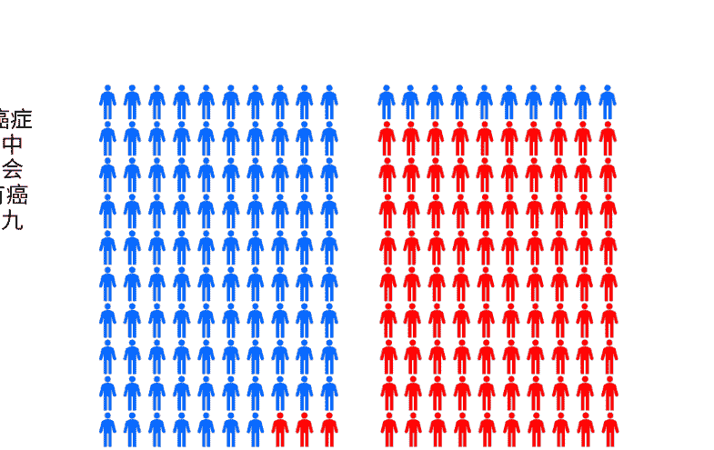

如果一个人接受了阳性的测试结果，那么他们实际上患癌症的概率是多少？我们可以通过详细讨论癌症筛查案例来回答这类问题。然而，我们将暂停对这个具体例子的讨论，首先推导出概率的一般规则，即概率的和规则和乘积规则。然后，我们将通过回答这两个问题来说明如何使用这些规则。

#### 2.1.2 和积规则

为了推导出概率的规则，考虑图2.4中涉及两个变量 $X$ 和 $Y$ 的稍微更一般的例子。在我们的癌症例子中，$X$ 可以表示癌症的存在或不存在，$Y$ 可以是一个表示测试结果的变量。由于这些变量的值可以以一种通常未知的方式从一个人变化到另一个人，它们被称为随机变量。我们假设 $X$ 可以取任何值 $x_i$ 其中 $i = 1, \ldots, L$ 并且 $Y$ 可以取值为 $y_j$ 其中 $j = 1, \ldots, M$。

考虑一共 $N$ 次试验，在这些试验中我们同时采样变量 $X$ 和 $Y$，并且让 $X = x_i$ 和 $Y = y_j$ 的试验次数为 $n_{ij}$。同时，让 $X$ 取值为 $x_i$（不考虑 $Y$ 的取值）的试验次数表示为 $c_i$，同样地，让 $Y$ 取值为 $y_j$ 的试验次数表示为 $r_j$。

变量 $X$ 取值为 $x_i$ 且 $Y$ 取值为 $y_j$ 的概率被写作 $p(X = x_i, Y = y_j)$，被称为 $X = x_i$ 和 $Y = y_j$ 的联合概率。它由落在单元格 $i,j$ 中的点的数量除以总点数得到，因此

$$p(X = x_i, Y = y_j) = \frac{n_{ij}}{N} \tag{2.1}$$

在这里，我们隐含地考虑了极限 $N \rightarrow \infty$。同样，无论 $Y$ 的值如何，$X$ 取值为 $x_i$ 的概率被写为 $p(X = x_i)$ 并且是

## 图2.4

我们可以通过考虑一个随机变量 $X$ 来推导出概率的和规则和乘法规则，该随机变量取值为 $\{x_i\}$ 其中 $i=1,\ldots, L$ 和第二个随机变量 $Y$，该随机变量取值为 $\{y_j\}$ 其中 $j=1,\ldots, M$。在这个例子中，我们有 $L=5$ 和 $M=3$。如果我们考虑这些变量的总实例数 $N$，则我们用 $n_{ij}$ 表示 $X = x_i$ 和 $Y = y_j$ 的实例数，即对应数组中的实例数。

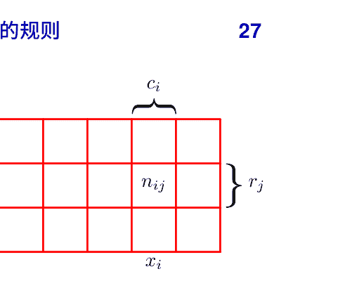

列 $i$ 中的实例数量，对应于 $X = x_i$，用 $c_i$ 表示，行 $j$ 中的实例数量，对应于 $Y = y_j$，用 $r_j$ 表示。

给定的列 $i$ 中的点的总数的比例为

$$p(X = x_i) = \frac{c_i}{N} \tag{2.2}$$

由于 $\sum_i c_i = N$，我们可以看到

$$\sum_{i=1}^{L} p(X = x_i) = 1 \tag{2.3}$$

因此，概率之和为一，符合要求。因为图2.4中列 $i$ 中的实例数量就是该列每个单元格中实例数量的总和，所以我们有 $c_i = \sum_j n_{ij}$，因此，根据(2.1)和(2.2)，我们有

$$p(X = x_i) = \sum_{j=1}^{M} p(X = x_i, Y = y_j) \tag{2.4}$$

这是概率的和规则。注意， $p(X = x_i)$ 有时被称为边际概率，并通过边际化或求和其他变量（在本例中为 $Y$）获得。

如果我们只考虑 $X = x_i$ 的实例，则对于 $Y = y_j$ 的这些实例的比例被写为 $p(Y = y_j|X = x_i)$，并称为给定 $X = x_i$ 的 $Y = y_j$ 的条件概率。它是通过找到列 $i$ 中落在单元格 $i, j$ 中的那些点的比例来获得的，因此可以表示为

$$p(Y = y_j|X = x_i) = \frac{n_{ij}}{c_i} \tag{2.5}$$

将两边对 $j$ 求和并使用 $\sum_j n_{ij} = c_i$，我们得到

$$\sum_{j=1}^{M} p(Y = y_j|X = x_i) = 1 \tag{2.6}$$

这表明条件概率被正确归一化。从（2.1）、（2.2）和（2.5）中，我们可以推导出以下关系：

$$p(X = x_i, Y = y_j) = \frac{n_{ij}}{N} = \frac{n_{ij}}{c_i} \cdot \frac{c_i}{N} = p(Y = y_j \mid X = x_i) p(X = x_i), \quad (2.7)$$

这是概率的乘法规则。

到目前为止，我们一直非常小心地区分随机变量，例如 $X$，和随机变量可以取的值，例如 $x_i$。因此，$X$ 取值为 $x_i$ 的概率被表示为 $p(X = x_i)$。尽管这有助于避免歧义，但会导致一种相当繁琐的表示法，在许多情况下并不需要这种严谨性。相反，我们可以简单地写作 $p(X)$ 来表示随机变量 $X$ 的分布，或者 $p(x_i)$ 来表示对特定值 $x_i$ 进行评估的分布，前提是从上下文中可以清楚地理解。

通过这种更紧凑的表示法，我们可以用以下形式写出概率论的两个基本规则：

- **求和规则** $$p(X) = \sum_Y p(X, Y) \quad (2.8)$$
- **乘积规则** $$p(X, Y) = p(Y \mid X) p(X). \quad (2.9)$$

这里的 $p(X, Y)$ 是联合概率，口语化为'X和Y的概率'。同样，数量 $p(Y \mid X)$ 是条件概率，口语化为'给定X的情况下Y的概率'。最后，数量 $p(X)$ 是边际概率，简单地表示为'X的概率'。这两个简单的规则构成了本书中将要使用的所有概率机制的基础。

#### 2.1.3 贝叶斯定理

根据乘积规则和对称性质 $p(X, Y) = p(Y, X)$，我们立即得到了条件概率之间的以下关系：

$$p(Y \mid X) = \frac{p(X \mid Y) p(Y)}{p(X)}, \quad (2.10)$$

这被称为贝叶斯定理，在机器学习中起着重要作用。注意贝叶斯定理如何将方程左侧的条件分布 $p(Y \mid X)$ 与方程右侧的'反向'条件分布 $p(X \mid Y)$ 相关联。使用求和规则，贝叶斯定理中的分母可以用分子中出现的量来表示：

$$p(X) = \sum_Y p(X \mid Y) p(Y). \quad (2.11)$$

因此，我们可以将贝叶斯定理中的分母视为确保方程左侧的条件概率分布在 $Y$ 的所有值上的总和等于一所需的归一化常数。

## 图2.5

展示了两个变量 X 和 Y 的分布示意图，其中X有九个可能的取值，Y有两个可能的取值。左上角的图示展示了从这些变量的联合概率分布中抽取的 60个样本点。其余的图示展示了边缘分布 $p(X)$ 和 $p(Y)$ 的直方图估计，以及与左上角底部行对应的条件分布 $p(X|Y = 1)$。

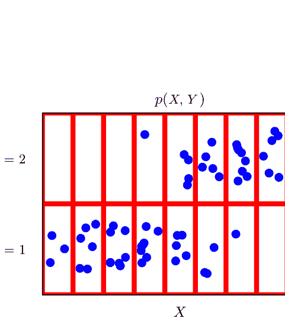
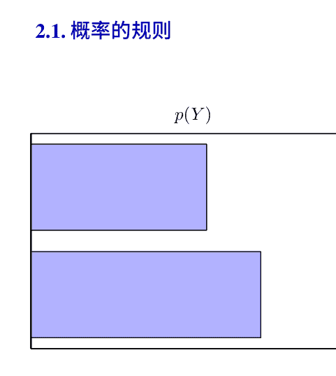
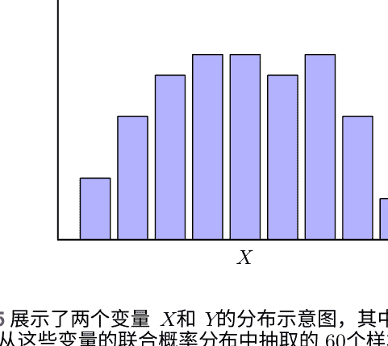
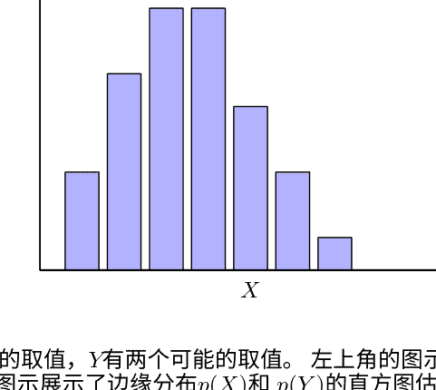

在图2.5中，我们展示了一个简单的例子，涉及两个变量的联合分布，以说明边缘分布和条件分布的概念。这里从联合分布中抽取了 $N= 60$ 个数据点，并在左上角展示出来。右上角是 $Y$ 的两个取值的数据点比例的直方图。根据概率的定义，当样本大小 $N→ \infty$ 时，这些比例将等于相应的概率 $p(Y)$。我们可以将直方图视为对给定从该分布中抽取的有限数量的点建模的一种简单方法。图2.5中的其余两个图示展示了相应的直方图估计。 $p(X)$ 和 $p(X|Y = 1)$。

#### 2.1.4 医学筛查再探

现在让我们回到我们的癌症筛查示例，并应用概率的求和和乘积规则来回答我们的两个问题。为了清晰起见，在解决这个例子时，我们将再次明确区分随机变量和它们的实例。我们将通过变量 $C$ 来表示癌症的存在或不存在，它可以取两个值：$C= 0$ 表示‘没有癌症’，$C= 1$ 表示‘有癌症’。我们假设人群中有癌症的人数为百分之一，因此我们有

$$p(C = 1) = 1/100   (2.12)$$
$$p(C = 0) = 99/100,  (2.13)$$

分别。请注意，这些满足 $p(C= 0) + p(C= 1) = 1$。现在让我们介绍第二个随机变量 $T$，它代表了筛查测试的结果，其中 $T= 1$ 表示阳性结果，表示有癌症，而 $T= 0$ 表示阴性结果，表示没有癌症。如图2.3所示，我们知道患有癌症的人阳性测试结果的概率为90%，而没有癌症的人阳性测试结果的概率为3%。

因此，我们可以列出所有四个条件概率：

$$p(T = 1|C = 1) = 90/100   (2.14)$$
$$p(T = 0|C = 1) = 10/100   (2.15)$$
$$p(T = 1|C = 0) = 3/100    (2.16)$$
$$p(T = 0|C = 0) = 97/100.  (2.17)$$

再次注意，这些概率是归一化的，所以

$$p(T = 1|C = 1) + p(T = 0|C = 1) = 1    (2.18)$$

同样地

$$p(T = 1|C = 0) + p(T = 0|C = 0) = 1.    (2.19)$$

现在我们可以使用概率的和规则和乘法规则来回答我们的第一个问题，并评估随机测试的人会有阳性测试结果的总体概率：

$$
\begin{aligned}
p(T = 1) &= p(T = 1|C = 0)p(C = 0) + p(T = 1|C = 1)p(C = 1) \\
&= 3/100 * 99/100 + 90/100 * 1/100 = 387/10,000 = 0.0387. (2.20)
\end{aligned}
$$

我们可以看到，如果一个人被随机测试，那么测试结果为阳性的概率大约为4%，即使他们实际上患有癌症的概率只有1%。由此可得，使用总和规则，有 $p(T= 0) = 1 - 387/10,000 = 9613/10,000 = 0. 9613$，因此，大约有96%的几率他们没有癌症。

现在考虑我们的第二个问题，这是一个特别感兴趣的问题，即如果测试结果为阳性，那么这个人患癌症的概率是多少？有癌症吗？这需要我们评估有条件的癌症概率根据测试结果，而(2.14)到(2.17)中的概率给出了在个人是否患癌症的条件下测试结果的概率分布。我们可以使用贝叶斯定理(2.10)来解决反向条件概率的问题，得到

$$
p(C=1|T=1) = \frac{p(T=1|C=1)p(C=1)}{p(T=1)} \qquad (2.21)
$$

$$
= \frac{90}{100} \times \frac{1}{100} \times \frac{10,000}{387} = \frac{90}{387} \simeq 0.23 \qquad (2.22)
$$

这样，如果一个人随机接受测试并且测试结果为阳性，那么他们实际上患癌症的概率为23%。根据求和规则，我们可以得到 $p(C = 0|T = 1) = 1 - 90/387 = 297/387 ≃ 0.77$，即77%的概率他们没有患癌症。

#### 2.1.5 先验概率和后验概率

我们可以利用癌症筛查的例子来解释贝叶斯定理的重要含义。如果在某人接受测试之前，我们被问及他们是否可能患有癌症，那么我们可获得的最完整信息是概率 $p(C)$。我们将其称为 prior probability，因为这是在我们观察到测试结果之前可获得的概率。一旦我们得知这个人接受了阳性测试，我们可以使用贝叶斯定理计算概率 $p(C|T)$，我们将其称为 posterior probability，因为这是在我们观察到测试结果之后获得的概率。

在这个例子中，患癌症的先验概率为1%。然而，一旦我们观察到测试结果为阳性，我们发现癌症的后验概率现在为23%，这是一个相当高的癌症概率，正如我们直观地预期的那样。然而，我们需要注意的是，即使测试结果从图2.3练习2.1中看起来相当‘准确’，一个阳性测试的人实际上只有23%的患癌症的可能性。这个结论对许多人来说似乎是违反直觉的。

原因与患癌症的先验概率较低有关。虽然测试提供了患癌症的强有力证据，但这必须与先验概率结合使用贝叶斯定理来得出正确的后验概率。

#### 2.1.6 独立变量

最后，如果两个变量的联合分布能够分解为边缘分布的乘积，即 $p(X, Y) = p(X)p(Y)$，那么 $X$ 和 $Y$ 被称为独立的。独立事件的一个例子是连续翻转硬币。根据乘法规则，我们可以看到 $p(Y|X ) = p(Y)$，因此给定 $X$ 的条件下，$Y$ 的条件分布确实与 $X$ 的值无关。在我们的癌症筛查示例中，如果阳性测试的概率与个体是否患癌症无关，则 $p(T|C) = p(T)$，这意味着根据贝叶斯定理 (2.10)，我们有 $p(C|T) = p(C)$，因此观察测试结果不会改变癌症的概率。当然，这样的测试是无用的，因为测试结果对于判断个体是否患癌症没有任何信息。

## 图2.6

离散变量的概率概念可以扩展到连续变量 $x$ 的概率密度 $p(x)$，并且在 $(x, x+\delta x)$ 区间内 $x$ 出现的概率由 $p(x)\delta x$ 给出，其中 $\delta x \to 0$。

概率密度可以表示为累积分布函数的导数 $P(x)$。

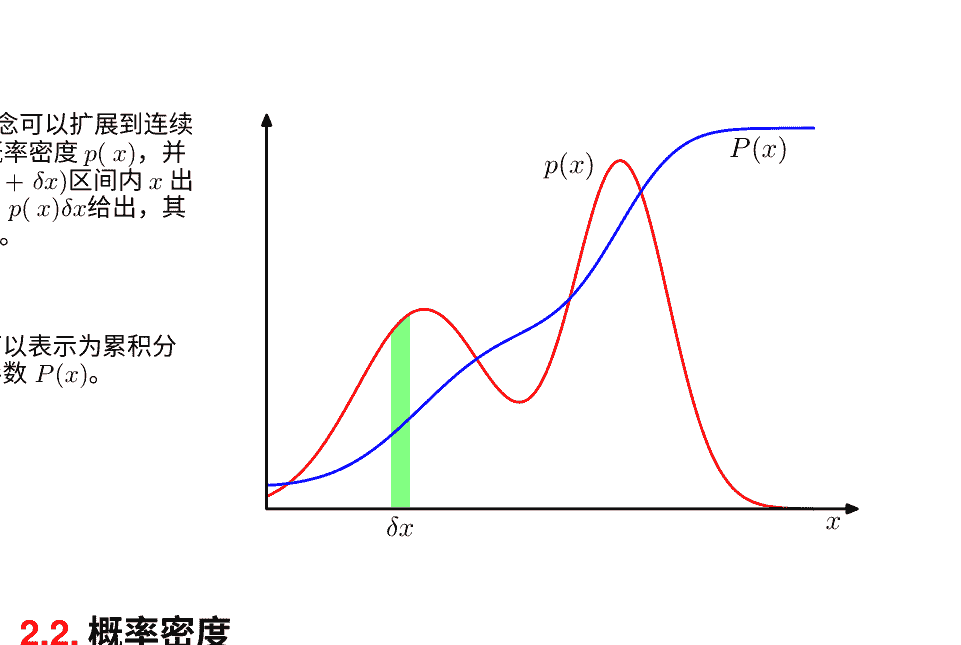

## 2.2. 概率密度

除了考虑在离散值集合上定义的概率，我们还希望考虑与连续变量相关的概率。例如，我们可能希望预测给患者多大剂量的药物。由于这个预测存在不确定性，我们希望量化这种不确定性，再次利用概率。然而，我们不能直接应用到目前为止讨论的概率概念，因为对于连续变量来说，观察到一个特定值的概率，精确到无限小，实际上是零。相反，我们需要引入概率密度的概念。在这里，我们将限制自己进行相对非正式的讨论。

$$p(x \in (a, b)) = \int_{a}^{b} p(x) \mathrm{d}x. \tag{2.23}$$

因为概率是非负的，并且因为 $x$ 的值必须位于实轴上的某个位置，概率密度 $p(x)$ 必须满足两个条件

1. $p(x) \geqslant 0 \tag{2.24}$
2. $\int_{-\infty}^{\infty} p(x) \mathrm{d}x = 1. \tag{2.25}$

$$P(z) = \int_{-\infty}^{z} p(x) \mathrm{d}x, \tag{2.26}$$

如图2.6所示，它满足 $P'(x) = p(x)$。

如果我们有几个连续变量 $x_1, \ldots, x_D$，用向量 $\mathbf{x}$ 来表示，那么我们可以定义一个联合概率密度 $p(\mathbf{x}) = p(x_1, \ldots, x_D)$，使得 $\mathbf{x}$ 落在包含点 $\mathbf{x}$ 的无穷小体积 $\delta \mathbf{x}$ 的概率由 $p(\mathbf{x})\delta \mathbf{x}$ 给出。这个多变量概率密度必须满足

$$ p(\mathbf{x}) \geq 0 \quad (2.27) $$
$$ \int p(\mathbf{x}) \, \mathrm{d}\mathbf{x} = 1 \quad (2.28) $$

在整个 $\mathbf{x}$ 空间上进行积分。更一般地，我们还可以考虑离散和连续变量的联合概率分布。

概率的和与乘法规则以及贝叶斯定理也适用于概率密度以及离散和连续变量的组合。如果 $\mathbf{x}$ 和 $\mathbf{y}$ 是两个实数变量，则和乘法规则的形式为

- **求和规则**: $p(\mathbf{x}) = \int p(\mathbf{x}, \mathbf{y}) \, \mathrm{d}\mathbf{y}$ (2.29)
- **乘积规则**: $p(\mathbf{x}, \mathbf{y}) = p(\mathbf{y}|\mathbf{x})p(\mathbf{x})$ (2.30)

类似地，贝叶斯定理可以写成

$$ p(\mathbf{y}|\mathbf{x}) = \frac{p(\mathbf{x}|\mathbf{y})p(\mathbf{y})}{p(\mathbf{x})} \quad (2.31) $$

其中分母由以下表达式给出

$$ p(\mathbf{x}) = \int p(\mathbf{x}|\mathbf{y})p(\mathbf{y}) \, \mathrm{d}\mathbf{y} \quad (2.32) $$

对于连续变量的和与乘法规则的正式证明需要一种数学分支，称为测度论 (Feller, 1966)，超出了本书的范围。然而，可以通过将每个实数变量划分为宽度为 $\Delta$ 的区间，并考虑这些区间上的离散概率分布，从而非正式地验证其有效性。当 $\Delta \rightarrow 0$ 时，将求和转化为积分，并得到所需的结果。

#### 2.2.1 示例分布

有许多形式的概率密度在广泛使用中，它们不仅在自身中很重要，而且作为更复杂的概率模型的构建块也很重要。最简单的形式是 $p(x)$ 是一个常数，与 $x$ 无关，但是这不能被归一化，因为(2.28)中的积分将发散。不能被归一化的分布被称为不合适的。然而，我们可以有一个在有限区域内是常数的均匀分布，比如 $(c, d)$，在其他地方为零，此时(2.28)意味着

$$ p(x) = 1/(d - c), \quad x \in (c, d). \quad (2.33) $$

另一种简单的密度形式是指数分布，表示为

$$p(x|\lambda) = \lambda \exp(-\lambda x), \quad x \geq 0. \quad (2.34)$$

指数分布的一种变体称为拉普拉斯分布，允许将峰值移动到位置 $\mu$，表示为

$$p(x|\mu, \gamma) = \frac{1}{2\gamma} \exp\left(-\frac{|x-\mu|}{\gamma}\right). \quad (2.35)$$

常数、指数和拉普拉斯分布在图2.7中有所说明。

## 图2.7

在范围(-1,1)上显示了均匀分布的图形，用红色表示，指数分布以 $\lambda=1$ 表示，用蓝色表示，拉普拉斯分布以 $\mu=1$ 和 $\gamma=1$ 表示，用绿色表示。

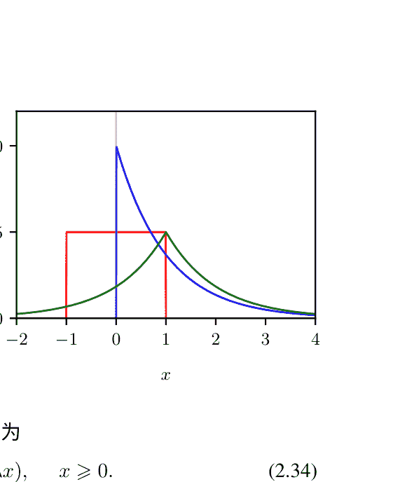

另一个重要的分布是Dirac delta函数，它被写作

$$p(x|\mu) = \delta(x-\mu). \quad (2.36)$$

这被定义为除了在 $x=\mu$ 处为零之外，在其他地方都为零，并且根据(2.28)具有单位面积的性质。非正式地说，我们可以将其视为位于 $x=\mu$ 处的无限窄且无限高的尖峰，并具有单位面积的性质。

最后，如果我们有一组由 $D=\{x_1,...,x_N\}$ 给出的有限观测值 $x$，则我们可以使用delta函数构建由此得到的经验分布。

$$p(x|D) = \frac{1}{N} \sum_{n=1}^{N} \delta(x - x_n), \quad (2.37)$$

它由以每个数据点为中心的狄拉克δ函数组成。练习2.6概率密度由(2.37)定义，按要求积分为1。

#### 2.2.2 期望和协方差

涉及概率的最重要的操作之一是找到函数的加权平均。在概率分布 $p(x)$ 下，某个函数 $f(x)$ 的加权平均被称为 $f(x)$ 的期望，记作 $\mathbb{E}[f]$。对于离散分布，它通过对所有可能的 $x$ 值求和得到

$$\mathbb{E}[f] = \sum_{x} p(x) f(x) \quad (2.38)$$其中平均值由不同值的相对概率加权。
$x$。对于连续变量，期望值用相应概率密度的积分表示：

$$\mathbb{E}[f] = \int p(x)f(x) \, \mathrm{d}x.$$

在任何一种情况下，如果我们得到了从概率分布或概率密度中抽取的有限数量的点 $N$，那么期望可以近似表示为对这些点的有限求和：

$$\mathbb{E}[f] \simeq \frac{1}{N} \sum_{n=1}^{N} f(x_n).$$

在极限 $N \to \infty$ 下，(2.40)中的近似变得精确。
有时候我们会考虑多个变量的函数的期望值，此时我们可以使用下标来表示正在进行平均的变量，例如

$$\mathbb{E}_{x}[f(x, y)]$$

表示对于 $x$ 的分布，函数 $f(x, y)$ 的平均值。注意 $\mathbb{E}_{x}[f(x, y)]$ 将成为 $y$ 的函数。
我们还可以考虑与条件分布相关的条件期望，以此来

$$\mathbb{E}_{x}[f|y] = \sum_{x} p(x|y) f(x),$$

这也是关于 $y$ 的一个函数。对于连续变量，条件期望的形式为

$$\mathbb{E}_{x}[f|y] = \int p(x|y) f(x) \, \mathrm{d}x.$$

函数 $f(x)$ 的方差定义为

$$\mathrm{var}[f] = \mathbb{E}\left[ (f(x) - \mathbb{E}[f(x)])^2 \right]$$

并提供了 $f(x)$ 围绕其均值 $\mathbb{E}[f(x)]$ 变化的程度的度量。展开平方后，我们可以看到方差也可以用 $f(x)$ 和 $f(x)^2$ 的期望来表示：

$$\mathrm{var}[f] = \mathbb{E}[f(x)^2] - \mathbb{E}[f(x)]^2.$$

特别是，我们可以考虑变量 $x$ 本身的方差，其定义为

$$\mathrm{var}[x] = \mathbb{E}[x^2] - \mathbb{E}[x]^2.$$

对于两个随机变量 $x$ 和 $y$，协方差衡量了两个变量一起变化的程度，定义为

$$\begin{aligned}
\mathrm{cov}[x, y] &= \mathbb{E}_{x,y}[\{x - \mathbb{E}[x]\} \{y - \mathbb{E}[y]\}] \\
&= \mathbb{E}_{x,y}[xy] - \mathbb{E}[x]\mathbb{E}[y].
\end{aligned}$$

练习2.8

## 2. 概率

图2.8显示了一个高斯分布的图形，用于表示单个连续变量 $x$ 的均值$\mu$和标准差$\sigma$。

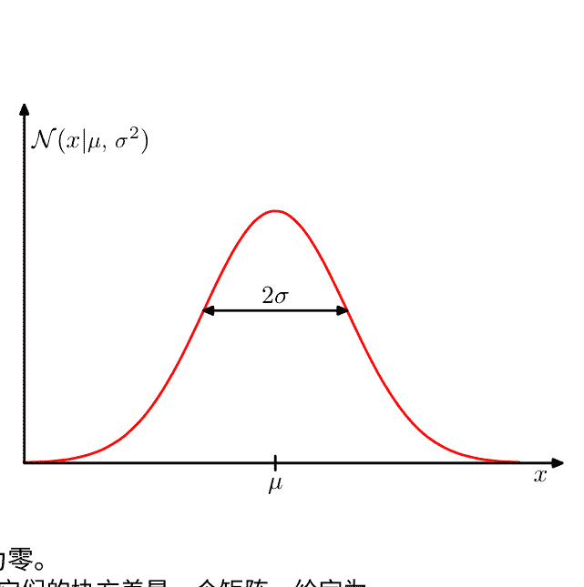

练习2.9 如果 $x$ 和 $y$ 是独立的，则它们的协方差为零。对于两个向量 $\mathbf{x}$ 和 $\mathbf{y}$，它们的协方差是一个矩阵，给定为

$$\text{cov}[\mathbf{x}, \mathbf{y}] = \mathbb{E}_{\mathbf{x},\mathbf{y}}[\{\mathbf{x} - \mathbb{E}[\mathbf{x}]\}\{\mathbf{y}^\top - \mathbb{E}[\mathbf{y}^\top]\}] = \mathbb{E}_{\mathbf{x},\mathbf{y}}[\mathbf{x}\mathbf{y}^\top] - \mathbb{E}[\mathbf{x}]\mathbb{E}[\mathbf{y}^\top]. \quad (2.48)$$

如果我们考虑一个向量 $\mathbf{x}$ 的分量之间的协方差，则使用稍微简化的符号 $\text{cov}[\mathbf{x}] \equiv \text{cov}[\mathbf{x}, \mathbf{x}]$。

### 2.3. 高斯分布

对于连续变量来说，最重要的概率分布之一被称为正态分布或高斯分布，我们将在本书的其余部分广泛使用这个分布。对于单个实值变量 $x$，高斯分布的定义如下

$$\mathcal{N}(x|\mu, \sigma^2) = \frac{1}{(2\pi\sigma^2)^{1/2}} \exp \left\{ -\frac{1}{2\sigma^2}(x - \mu)^2 \right\}, \quad (2.49)$$

它表示由两个参数 $\mu$ 和 $\sigma^2$ 控制的概率密度。方差的平方根是 $\sigma$ 称为标准差，方差的倒数写作 $\beta = 1/\sigma^2$ 称为精度。我们很快就会看到这个术语的动机。图2.8显示了高斯分布的图。尽管高斯分布的形式可能看起来是任意的，但我们将在后面看到它是如何从最大熵的概念和中心极限定理的角度自然产生的。

从 (2.49) 我们可以看出，高斯分布满足

$$\mathcal{N}(x|\mu, \sigma^2) > 0. \quad (2.50)$$

练习2.12 此外，很容易证明高斯分布是归一化的，因此

$$\int_{-\infty}^{\infty} \mathcal{N}(x|\mu, \sigma^2) \mathrm{d}x = 1.$$

因此，（2.49）满足有效概率密度的两个要求。

2.3.1 均值和方差

我们可以轻松地找到在高斯分布下 $x$ 的函数期望。特别地，$x$ 的平均值为

$$E[x] = \int_{-\infty}^{\infty} \mathcal{N}(x|\mu, \sigma^2) x \mathrm{d}x = \mu.$$

因为参数 $\mu$ 表示分布下 $x$ 的平均值，所以它被称为均值。（2.52）中的积分被称为分布的一阶矩，因为它是 $x$ 的期望值。我们可以类似地计算二阶矩，即

$$E[x^2] = \int_{-\infty}^{\infty} \mathcal{N}(x|\mu, \sigma^2) x^2 \mathrm{d}x = \mu^2 + \sigma^2.$$

从(2.52)和(2.53)可以得出，$x$ 的方差为

$$\mathrm{var}[x] = E[x^2] - E[x]^2 = \sigma^2$$

因此，$\sigma^2$被称为方差参数。分布的最大值

练习2.14 被称为其模式。对于高斯分布，模式与均值相同。

2.3.2 似然函数

假设我们有一个表示为行向量的观测数据集$\mathbf{x} = (x_1, \ldots, x_N)$，表示 $N$ 个标量变量 $x$ 的观测。请注意，我们使用字体 $\mathbf{x}$ 来区分它与一个 $D$ 维向量值变量的单个观测，我们用列向量 $\mathbf{x}$ 表示。

$(x_1, \ldots, x_D)^T$。我们假设观测值是独立地从一个高斯分布中抽取的，其均值 $\mu$ 和方差 $\sigma^2$ 是未知的，我们希望从数据集中确定这些参数。给定一个有限的观测集合，估计分布的问题被称为密度估计。需要强调的是，密度估计问题基本上是不适定的，因为可能有无限多个概率分布可以解释观测到的有限数据集。实际上，任何在每个数据点$\mathbf{x}_1, \ldots, \mathbf{x}_N$上非零的分布 $p(\mathbf{x})$ 都是一个潜在的候选。在这里，我们将分布空间限制为高斯分布，这导致了一个明确定义的解。

从相同分布独立地抽取的数据点被称为独立同分布，通常缩写为i.i.d.或IID。我们已经看到两个独立事件的联合概率是分别计算每个事件的边际概率的乘积。因为我们的数据

由于数据集 $\mathbf{x}$ 是独立同分布的，因此我们可以将给定 $\mu$ 和 $\sigma^2$ 的数据集的概率写成以下形式

$$p(\mathbf{x}|\mu, \sigma^2) = \prod_{n=1}^N \mathcal{N} \left(x_n | \mu, \sigma^2 \right). \quad (2.55)$$

当将其视为 $\mu$ 和 $\sigma^2$ 的函数时，这被称为高斯分布的似然函数，并在图2.9中以图示方式解释。

确定概率分布中的参数的一种常见方法是使用观测数据集，称为最大似然法，找到最大化似然函数的参数值。这可能看起来很奇怪，因为根据我们之前对概率论的讨论，更自然的做法似乎是最大化给定数据的参数的概率，而不是数据给定参数的概率。实际上，这两个准则是相关的。

然而，首先我们将通过最大化似然函数 (2.55) 来确定高斯分布中未知参数 $\mu$ 和 $\sigma^2$ 的值。在实践中，最大化对数似然函数更为方便。因为对数是其参数的单调递增函数，最大化对数函数等价于最大化函数本身。取对数不仅简化了后续的数学分析，而且在数值上也有帮助，因为大量小概率的乘积很容易使计算机的数值精度下溢，通过计算对数概率的和来解决这个问题。根据 (2.49) 和 (2.55)，对数似然函数可以写成以下形式

$$\ln p \left( \mathbf{x} | \mu, \sigma^2 \right) = - \frac{1}{2\sigma^2} \sum_{n=1}^N (x_n - \mu)^2 - \frac{N}{2} \ln \sigma^2 - \frac{N}{2} \ln(2\pi). \quad (2.56)$$

练习2.15

通过对 $\mu$ 最大化(2.56)，我们得到了最大似然解给定为

$$\mu_{\text{ML}} = \frac{1}{N} \sum_{n=1}^N x_n, \quad (2.57)$$

这是样本均值，即观测值 $\{x_n\}$ 的均值。类似地，通过对 $\sigma^2$ 最大化(2.56)，我们得到了最大似然解以方差形式表示的方差

$$\sigma_{\text{ML}}^2 = \frac{1}{N} \sum_{n=1}^N (x_n - \mu_{\text{ML}})^2, \quad (2.58)$$

这是相对于样本均值 $\mu_{\text{ML}}$ 测量的样本方差。注意我们正在对(2.56)相对于 $\mu$ 和 $\sigma^2$ 进行联合最大化，但是对于高斯分布，$\mu$ 的解耦合于 $\sigma^2$ 的解，因此我们可以首先评估(2.57)，然后使用该结果评估(2.58)。

### 2.3.3 最大似然偏差

最大似然技术广泛应用于深度学习，并为大多数机器学习算法奠定了基础。然而，它有一些限制，我们可以通过使用单变量高斯分布来说明。

我们首先注意到最大似然解 $\mu_{\text{ML}}$ 和 $\sigma_{\text{ML}}^2$ 是数据集值 $x_1, ..., x_N$ 的函数。假设这些值是独立从一个真实参数为 $\mu$ 和 $\sigma^2$ 的高斯分布中生成的。现在考虑对于这些数据集的期望 $\mu_{\text{ML}}$ 和 $\sigma_{\text{ML}}^2$。很容易证明

$$ \mathbb{E}[\mu_{\text{ML}}] = \mu, \quad (2.59) $$
$$ \mathbb{E}[\sigma_{\text{ML}}^2] = \left( \frac{N-1}{N} \right) \sigma^2, \quad (2.60) $$

我们可以看到，当对给定大小的数据集进行平均时，均值的最大似然解将等于真实均值。然而，方差的最大似然估计将低估真实方差，低估因子为 (N-1)/N。这是一个现象的例子，被称为偏差，即随机数量的估计器与真实值有系统性差异。这个结果的直觉由图2.10给出。

请注意，偏差是因为方差相对于均值的最大似然估计来衡量的，而最大似然估计本身是根据数据进行调整的。假设相反地，我们可以访问真实均值 $\mu$，并使用它来确定使用估计器计算方差。

$$ \sigma^2 = \frac{1}{N} \sum_{n=1}^N (x_n - \mu)^2, \quad (2.61) $$

然后我们发现

$$ \mathbb{E}[\sigma^2] = \sigma^2, \quad (2.62) $$

这是无偏的。当然，我们只能访问观察到的数据值，而不能访问真实均值。根据结果(2.60)，对于高斯分布，以下方差参数的估计是无偏的：

$$ \widehat{\sigma}^2 = \frac{N}{N-1} \sigma_{\text{ML}}^2 = \frac{1}{N-1} \sum_{n=1}^N (x_n - \mu_{\text{ML}})^2, \quad (2.63) $$

容易证明

练习2.17

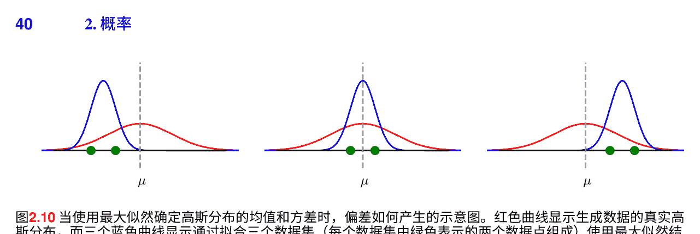

图2.10 当使用最大似然确定高斯分布的均值和方差时，偏差如何产生的示意图。红色曲线显示生成数据的真实高斯分布，而三个蓝色曲线显示通过拟合三个数据集（每个数据集由绿色表示的两个数据点组成）使用最大似然结果（2.57）和（2.58）获得的高斯分布。在三个数据集上平均，均值是正确的，但方差被系统地低估，因为它是相对于样本均值而不是相对于真实均值来测量的。

然而，在神经网络等复杂模型中，纠正最大似然的偏差并不容易。

请注意，随着数据点数量 $N$ 的增加，最大似然解的偏差变得不那么显著。在极限情况下 $N \to \infty$，最大似然解的方差等于生成数据的真实方差。对于高斯分布来说，除了小规模的 $N$，这种偏差不会成为一个严重的问题。然而，在本节中，我们将对具有许多参数的复杂模型感兴趣，这些模型与最大似然相关的偏差问题将更加严重。事实上，最大似然中的偏差问题与过拟合问题密切相关。

2.3.4 线性回归

我们已经看到线性回归问题如何以第1.2节误差最小化的形式表达。在这里，我们回到这个例子，并从概率的角度来看，从而对误差函数和正则化有一些见解。

回归问题的目标是能够根据输入变量 $x$ 的某个新值，使用由一组训练数据组成的 $N$个输入值 $x=(x_1,...,x_N)$及其相应的目标值 $t=(t_1,...,t_N)$进行预测。我们可以使用概率分布来表示对目标变量值的不确定性。为此，我们假设在给定 $x$ 的值的情况下，相应的 $t$ 的值服从均值为由多项式曲线(1.1)给出的值 $y(x,w)$，其中 $w$ 是多项式系数，方差为 $\sigma^2$。因此，我们有

$$p(t|x, \mathbf{w}, \sigma^2) = \mathcal{N}(t|y(x, \mathbf{w}), \sigma^2) \quad (2.64)$$

这在图2.11中以示意图的形式说明。

我们现在使用训练数据 $\{x,t\}$通过最大似然来确定未知参数 $\mathbf{w}$ 和 $\sigma^2$ 的值。如果假设数据是随机抽取的

图2.11 给出了关于 $t$ 给定 $x$ 的高斯条件分布的示意图，由式(2.64)定义，其中均值由多项式函数 $y(x, w)$给出，方差由参数 $\sigma^2$给出。

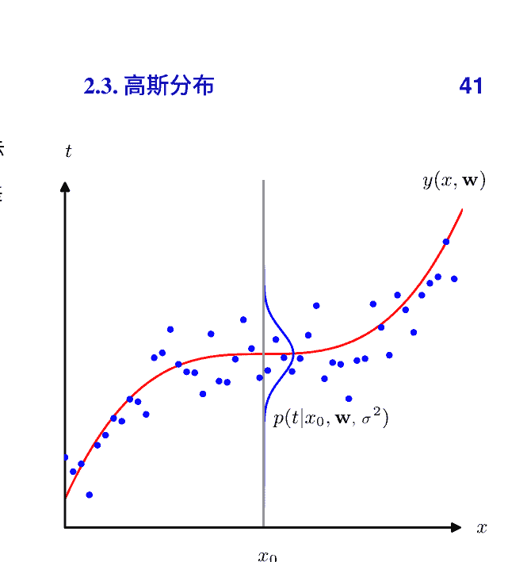

独立于分布(2.64)从中抽取数据，则似然函数为

$$p(\mathbf{t}|\mathbf{x}, \mathbf{w}, \sigma^2) = \prod_{n=1}^N \mathcal{N}\left(t_n | y(x_n, \mathbf{w}), \sigma^2\right)$$

就像我们之前对简单高斯分布所做的那样，最大化似然函数的对数是很方便的。代入高斯分布（由式（2.49）给出），我们得到了形式为对数似然函数的表达式

$$\ln p(\mathbf{t}|\mathbf{x}, \mathbf{w}, \sigma^2) = -\frac{1}{2\sigma^2} \sum_{n=1}^N \{y(x_n, \mathbf{w}) - t_n\}^2 - \frac{N}{2} \ln \sigma^2 - \frac{N}{2} \ln(2\pi).$$

首先考虑多项式系数的最大似然解的评估，用 $\mathbf{w}_{\text{ML}}$ 表示。这些系数通过最大化式（2.66）关于 $\mathbf{w}$ 的值确定。为此，我们可以忽略式（2.66）右侧的最后两项，因为它们不依赖于 $\mathbf{w}$。另外，注意到通过正常化对数似然函数的系数不会改变关于 $\mathbf{w}$ 的最大值位置，因此我们可以用 $1/2$ 代替系数 $1/\sigma^2$。

最后，我们可以等价地最小化负对数似然，而不是最大化对数似然。因此，我们可以看到，在确定 $\mathbf{w}$ 时，最大化似然等价于最小化平方和误差函数定义为

$$E(\mathbf{w}) = \frac{1}{2} \sum_{n=1}^N \{y(x_n, \mathbf{w}) - t_n\}^2.$$

因此，平方和误差函数是在假设高斯噪声分布的情况下，最大化似然的结果

我们还可以使用最大似然来确定方差参数 $\sigma^2$。
对于 $\sigma^2$ 的最大化 (2.66) 给出

$$\sigma_{\mathrm{ML}}^{2}=\frac{1}{N}\sum_{n=1}^{N}\{y(x_n,\mathbf{w}_{\mathrm{ML}})-t_n\}^{2}. \quad (2.68)$$

请注意，我们可以首先确定控制均值的参数向量 $\mathbf{w}_{\mathrm{ML}}$，然后使用它来找到方差 $\sigma_{\mathrm{ML}}^{2}$，就像简单高斯分布的情况一样。

确定了参数 $\mathbf{w}$ 和 $\sigma^2$ 后，我们现在可以对新的 $x$ 值进行预测。因为我们现在有了一个概率模型，所以这些是用预测分布来表示的，该分布给出了 $t$ 的概率分布，而不仅仅是一个点估计，并且通过将最大似然参数代入 (2.64) 中来获得。

$$p(t|x,\mathbf{w}_{\mathrm{ML}},\sigma_{\mathrm{ML}}^{2})=\mathcal{N}\left(t|y(x,\mathbf{w}_{\mathrm{ML}}),\sigma_{\mathrm{ML}}^{2}\right). \quad (2.69)$$

### 2.4. 密度的转换

现在我们转向讨论在非线性变量变换下概率密度如何变换的问题。当我们讨论一类称为正规化流的生成模型时，这个性质将起到关键作用。它还突显了概率密度在这种变换下与简单函数的不同行为。
密度在这种变换下的行为与简单函数不同。
考虑一个单变量 $x$，并假设我们进行变量变换 $x=g(y)$，那么一个函数 $f(x)$ 变成了一个新函数 $\widetilde{f}(y)$ 定义为

$$\widetilde{f}(y)=f(g(y)). \quad (2.70)$$

现在考虑一个概率密度 $p_x(x)$，并再次使用 $x=g(y)$ 进行变量变换，得到相对于新变量 $y$ 的密度 $p_y(y)$，其中后缀表示 $p_x(x)$ 和 $p_y(y)$ 是不同的密度。落在范围 $(x,x+\delta x)$ 内的观测值，在 $\delta x$ 很小的情况下，将被转换为范围

因此，如果我们取极限 $\delta x \to 0$，我们得到

$$\begin{aligned} p_y(y) &= p_x(x)\left|\frac{\mathrm{d}x}{\mathrm{d}y}\right| \\ &= p_x(g(y))\left|\frac{\mathrm{d}g}{\mathrm{d}y}\right|. \quad (2.71) \end{aligned}$$

这里模量 $|\cdot|$ 的出现是因为导数 $\mathrm{d}y/\mathrm{d}x$ 可能为负，而密度则通过长度比例缩放，始终为正。

## 2.4. 密度的转换

这种转换密度的方法非常强大。任何密度 $p(y)$ 可以通过对处处非零的固定密度 $q(x)$ 进行非线性变量变换 $y = f(x)$ 获得，其中 $f(x)$ 是单调函数，使得 $0 \leqslant f'(x) < \infty$。

变换性质（2.71）的一个结果是概率密度的最大值取决于变量的选择。假设 $f(x)$ 在 $x$ 处有一个模式（即最大值），使得 $f'(x) = 0$。相应的 $\widetilde{f}(y)$ 的模式将在通过对（2.70）两边关于 $y$ 求导得到的 $y$ 值处出现：

$$\widetilde{f}'(y) = f'(g(y))g'(y) = 0.\tag{2.72}$$

假设 $g'(y) = 0$ 在模式下，那么 $f'(g(y)) = 0$。然而，我们知道 $f'(x) = 0$，所以我们可以看到模式的位置用每个变量 $x$ 和 $y$ 的术语表示是由 $x = g(y)$ 相关的，这是可以预期的。因此，寻找关于变量 $x$ 的模式等同于首先转换为变量 $y$，然后寻找关于 $y$ 的模式，然后再转换回 $x$。现在考虑概率密度 $p_x(x)$ 在变量变换 $x = g(y)$ 下的行为，其中相对于新变量的密度是 $p_y(y)$ 并且由(2.71)给出。为了处理(2.71)中的模，我们可以写成 $g'(y) = s|g'(y)|$ 其中 $s \in \{-1, +1\}$。然后(2.71)可以写成

$$p_y(y) = p_x(g(y))sg'(y)$$

其中我们使用了 $1/s = s$。对两边关于 $y$ 求导得到

$$p'_y(y) = sp'_x(g(y))\{g'(y)\}^2 + sp_x(g(y))g''(y).\tag{2.73}$$

由于(2.73)式右侧存在第二项，关系式 $x = g(y)$ 不再成立。因此，通过最大化得到的 $x$ 的值 $p_x(x)$ 的值将不会是通过转换为 $p_y(y)$ 然后对 $y$ 最大化再转换回 $x$ 得到的值。这导致密度的模式依赖于变量的选择。然而，对于线性变换，(2.73)式右侧的第二项消失，因此在这种情况下，最大值的位置按照 $x = g(y)$ 进行变换。

这种效果可以通过一个简单的例子来说明，如图2.12所示。我们从考虑一个高斯分布 $p_x(x)$ over $x$，红色曲线在图2.12中展示。接下来，我们从该分布中抽取 $N= 50,000$ 个样本，并绘制它们的值的直方图，预期结果与分布一致。现在考虑从 $x$ 到 $y$ 的非线性变量变换，给定如下

$$x = g(y) = \ln(y) - \ln(1-y) + 5.\tag{2.74}$$

该函数的反函数为

$$y = g^{-1}(x) = \frac{1}{1 + \exp(-x + 5)},\tag{2.75}$$

这是一个logistic sigmoid函数，并且在图2.12中用蓝色曲线表示。

- 其中 $s \in \{-1, +1\}$

图2.12 非线性变量变换下密度模式的转换示例，说明与简单函数的不同行为。

如果我们简单地将 $p_x(x)$ 转换为 $x$ 的函数，我们得到了绿色曲线 $p_x(g(y))$ 在图2.12中显示，我们可以看到密度函数 $p_x(x)$ 的模式通过sigmoid函数转换为这条曲线的模式。然而，$y$ 的密度函数根据(2.71)进行转换，左侧的图表上显示了品红色曲线。请注意，这使得其模式相对于绿色曲线发生了偏移。

为了确认这个结果，我们取样了 50,000个 $x$ 的值，使用(2.75)计算相应的 $y$ 的值，然后绘制它们的值的直方图。我们可以看到这个直方图与图2.12中的品红色曲线匹配，而不是绿色曲线。

#### 2.4.1 多元分布

我们可以将结果(2.71)扩展到定义在多个变量上的密度。考虑一个密度函数 $p(\mathbf{x})$ 在一个 $D$维变量 $\mathbf{x} = (x_1, \ldots, x_D)^\mathrm{T}$ 上，假设我们将其转换为一个新的变量 $\mathbf{y} = (y_1, \ldots, y_D)^\mathrm{T}$，其中 $\mathbf{x} = \mathbf{g}(\mathbf{y})$。在这里，我们将限制自己在 $\mathbf{x}$ 和 $\mathbf{y}$ 具有相同维度的情况下。转换后的密度函数可以通过(2.71)的推广形式给出

$$p_\mathbf{y}(\mathbf{y}) = p_\mathbf{x}(\mathbf{x}) |\det \mathbf{J}| \qquad (2.76)$$

其中 $\mathbf{J}$ 是Jacobian矩阵，其元素由偏导数给出 $J_{ij} = \partial g_i / \partial y_j$，因此

$$\mathbf{J} = \begin{bmatrix} \frac{\partial g_1}{\partial y_1} & \cdots & \frac{\partial g_1}{\partial y_D} \\ \vdots & \ddots & \vdots \\ \frac{\partial g_D}{\partial y_1} & \cdots & \frac{\partial g_D}{\partial y_D} \end{bmatrix}. \qquad (2.77)$$

直观地，我们可以将变量的变化视为扩展空间中的某些区域并收缩其他区域，其中一个无限小的区域 $\Delta \mathbf{x}$ 围绕一个点 $\mathbf{x}$ 被转换为围绕点 $\mathbf{y} = \mathbf{g}(\mathbf{x})$ 的区域 $\Delta \mathbf{y}$。雅可比行列式的绝对值表示这些体积的比值，并且是相同的因子。

图2.13说明了变量变化对二维概率分布的影响。左列显示了变量的变换，而中列和右列显示了对高斯分布及其样本的相应影响。

### 练习2.20

在积分中改变变量时会出现的雅可比行列式。公式（2.77）是由于在区域 $\Delta \mathbf{x}$ 中的概率质量与区域 $\Delta \mathbf{y}$ 中的概率质量相同。再次，我们取模以确保密度为非负数。

我们可以通过对高斯分布在二维空间中应用变量变换来说明这一点，如图2.13顶部行所示。在这里，从 $\mathbf{x}$ 到 $\mathbf{y}$ 的变换由以下公式给出

$$y_1 = x_1 + \tanh(5x_1) \tag{2.78}$$
$$y_2 = x_2 + \tanh(5x_2) + \frac{x_1^3}{3}. \tag{2.79}$$

底部行还显示了在 $\mathbf{x}$ 空间中来自高斯分布的样本以及相应的变换后的样本在 $\mathbf{y}$ 空间中。

## 2.5. 信息论

概率论构成了另一个重要框架的基础，称为信息论，它量化了数据集中的信息，并在机器学习中起着重要作用。在这里，我们简要介绍了信息论的一些关键要素，这些要素在本书中后面的内容中将会用到，包括熵的各种形式这一个重要概念。有关信息论的更全面介绍以及与机器学习的联系，请参阅Mac Kay (2003) 的著作。

#### 2.5.1 熵

我们首先考虑一个离散随机变量 $x$，并且我们询问当我们观察到这个变量的一个特定值时，我们接收到多少信息。信息的数量可以被视为在学习 $x$ 的值时的“惊讶程度”。如果我们被告知一个高度不可能发生的事件刚刚发生了，我们将会接收到比我们被告知一个非常可能发生的事件刚刚发生了更多的信息；如果我们知道这个事件肯定会发生，我们将不会接收到任何信息。因此，我们对信息内容的度量将取决于概率分布 $p(x)$，因此我们寻找一个与概率 $p(x)$ 成单调函数关系的数量 $h(x)$，并且表达信息内容。可以通过注意到，如果我们有两个不相关的事件 $x$ 和 $y$，那么从观察到它们两个的信息增益应该是从分别观察到它们的信息增益的总和，因此 $h(x, y) = h(x) + h(y)$。

两个无关事件在统计上是独立的，因此 $p(x, y) = p(x)p(y)$。从这两个关系中，很容易得出 $h(x)$ 必须由 $p(x)$ 的对数来给出，因此我们有

$$h(x) = -\log_{2} p(x) \qquad \text{(2.80)}$$

负号确保信息为正数或零。请注意，低概率事件 $x$ 对应于高信息内容。对于对数的基数的选择是任意的，目前我们将采用信息论中使用以 2 为底的对数的约定。在这种情况下，正如我们很快将看到的，$h(x)$ 的单位是比特（二进制位）。

现在假设发送方希望将一个随机变量的值传输给接收方。他们在这个过程中传输的平均信息量是通过对分布 $p(x)$ 进行期望得到的，由式 (2.80) 给出。

$$\mathrm{H}[x] = -\sum_{x} p(x) \log_{2} p(x). \qquad \text{(2.81)}$$

这个重要的量被称为随机变量 $x$ 的熵。注意到 $\lim_{\epsilon \to 0} (\epsilon \ln \epsilon) = 0$，所以当我们遇到一个值为 $x$ 的时候，我们将取 $p(x) \ln p(x) = 0$，其中 $p(x) = 0$。

到目前为止，我们对信息 (2.80) 的定义和对应的熵 (2.81) 给出了一种相当启发式的动机。现在我们将展示这些定义确实具有有用的性质。考虑一个具有八个可能状态的随机变量 $x$，每个状态的概率相等。为了将 $x$ 的值传达给接收者，我们需要传输一个长度为3位的消息。注意到这个变量的熵可以表示为

$$ H[x] = -8 \times \frac{1}{8} \log_2 \frac{1}{8} = 3 \text{位}. $$

现在考虑一个例子（Cover和Thomas，1991），其中一个变量有八个可能的状态 $\{a, b, c, d, e, f, g, h\}$，其相应的概率由 $(\frac{1}{2}, \frac{1}{4}, \frac{1}{8}, \frac{1}{16}, \frac{1}{64}, \frac{1}{64}, \frac{1}{64}, \frac{1}{64})$ 给出。在这种情况下，熵由以下公式给出

$$ H[x] = -\frac{1}{2} \log_2 \frac{1}{2} - \frac{1}{4} \log_2 \frac{1}{4} - \frac{1}{8} \log_2 \frac{1}{8} - \frac{1}{16} \log_2 \frac{1}{16} - \frac{4}{64} \log_2 \frac{1}{64} = 2 \text{位}. $$

我们可以看到，非均匀分布的熵比均匀分布的熵要小，当我们讨论熵的解释时，我们很快就会对此有一些了解。暂时来说，让我们考虑如何将变量状态传输给接收器。我们可以像以前一样使用一个3位数来实现这一点。然而，我们可以利用非均匀分布，通过为更可能发生的事件使用较短的编码，以更长的编码代价来表示不太可能发生的事件，以期获得更短的平均编码长度。

这可以通过使用以下一组代码字符串来表示状态 $\{a, b, c, d, e, f, g, h\}$ 来完成，例如：0、10、110、1110、111100、111101、111110和111111。需要传输的代码的平均长度为

$$ \text{平均代码长度} = \frac{1}{2} \times 1 + \frac{1}{4} \times 2 + \frac{1}{8} \times 3 + \frac{1}{16} \times 4 + 4 \times \frac{1}{64} \times 6 = 2 \text{位}， $$

这与随机变量的熵相同。请注意，不能使用较短的代码字符串，因为必须能够将这些字符串的连接分解为其组成部分。例如，11001110唯一解码为状态序列 $c, a, d$。熵和最短编码长度之间的关系是普遍存在的。无噪声编码定理(Shannon, 1948) 表明熵是传输随机变量状态所需的位数的下界。

从现在开始，我们将转向使用自然对数来定义熵，因为这将为本书中的其他想法提供更方便的联系。在这种情况下，熵的度量单位是以自然对数（nats，来自“自然对数”）为单位，而不是比特（bits），它们只是相差一个因子 $\ln 2$。

#### 2.5.2 物理学视角

我们已经介绍了熵的概念，它是指用于指定随机变量状态所需的平均信息量。实际上，熵的概念在物理学中早在平衡热力学的背景下就有了更早的起源，并且通过统计力学的发展得到了更深层次的解释，作为一种衡量无序性的度量。我们可以通过考虑一组 $N$ 个相同的对象，将它们分配到一组箱子中来理解熵的这种替代观点，使得第 $i$ 个箱子中有 $n_i$ 个对象。考虑将对象分配到箱子中的不同方式的数量。有 $N$ 种选择第一个对象的方式，$(N - 1)$ 种选择第二个对象的方式，依此类推，共有 $N!$ 种将所有 $N$ 个对象分配到箱子中的方式，其中 $N!$ (读作“N阶乘”) 表示 $N \times (N - 1) \times \cdots \times 2 \times 1$ 的乘积。然而，我们不希望区分每个箱子内对象的重新排列。在第 $i$ 个箱子中，有 $n_i!$ 种重新排序对象的方式，因此将 $N$ 个对象分配到箱子中的总方式数由以下公式给出

$$W = \frac{N!}{\prod_i n_i!}, \tag{2.82}$$

这被称为多重性。熵的定义为多重性的对数乘以一个常数因子 $1/N$，以便

$$\mathrm{H} = \frac{1}{N} \ln W = \frac{1}{N} \ln N! - \frac{1}{N} \sum_i \ln n_i!. \tag{2.83}$$

现在我们考虑极限 $N \to \infty$，在这个极限下，分数 $n_i / N$ 被固定，然后应用斯特林近似：

$$\ln N! \simeq N \ln N - N, \tag{2.84}$$

这给出

$$\mathrm{H} = - \lim_{N \to \infty} \sum_i \left(\frac{n_i}{N}\right) \ln \left(\frac{n_i}{N}\right) = - \sum_i p_i \ln p_i \tag{2.85}$$

这里 $p_i = \lim_{N\to\infty} (n_i / N)$ 是将对象分配给第 $i$ 个箱子的概率。在物理术语中，对象分配到箱子中的具体方式被称为一个微观状态，而通过比率 $n_i / N$ 来表示的整体分布被称为一个宏观状态。多重性 $W$，它表示给定宏观状态中的微观状态数，也被称为宏观状态的权重。

我们可以将这些箱子解释为离散随机变量 $X$ 的状态。随机变量 $X$ 的熵则为

$$\mathrm{H}[p] = - \sum_i p(x_i) \ln p(x_i). \tag{2.86}$$

分布 $p(x_i)$ 在少数值周围集中的情况下，熵较低；而在多个值上均匀分布的情况下，熵较高，如图 2.14 所示。

因为 $0 \leq p_i \leq 1$，熵是非负的，并且当其中一个 $p_i = 1$ 且其他所有 $p_{j \neq i} = 0$ 时，熵将等于其最小值 0。可以通过使用拉格朗日乘子来强制执行概率的归一化约束，从而找到最大熵配置，即最大化 $\mathrm{H}$。因此，我们最大化

$$\widetilde{\mathrm{H}} = - \sum_i p(x_i) \ln p(x_i) + \lambda \left(\sum_i p(x_i) - 1\right) \tag{2.87}$$

图2.14展示了两个概率分布在30个区间上的直方图，说明了熵H的值较高的广泛分布。最大的熵将来自于均匀分布，它将给出H = -ln(1/30) = 3.40。

从中我们可以得出所有的 $p(x_i)$ 都相等，并且由 $p(x_i) = 1/M$ 给出，其中 $M$ 是状态总数 $x_i$。熵的相应值练习2.22为 $H = \ln M$。这个结果也可以从Jensen不等式推导出来（稍后将讨论）。练习2.23。为了验证驻点确实是一个最大值，我们可以计算熵的二阶导数，得到

$$\frac{\partial^2 \widetilde{H}}{\partial p(x_i) \partial p(x_j)} = -I_{ij} \frac{1}{p_i} \tag{2.88}$$

其中 $I_{ij}$ 是单位矩阵的元素。我们可以看到这些值都是负数，因此，这个驻点确实是一个最大值。

#### 2.5.3 差分熵

我们可以扩展熵的定义，以包括对连续变量 $x$ 的分布 $p(x)$ 的处理方式如下。首先将 $x$ 分成宽度为 $\Delta$ 的区间。然后，假设 $p(x)$ 是连续的，均值定理(Weisstein, 1999)告诉我们，在每个区间中，必然存在一个值 $x_i$ 在范围 $i\Delta \leqslant x_i \leqslant (i+1)\Delta$ 之间，使得

$$\int_{i\Delta}^{(i+1)\Delta} p(x) \, \mathrm{d}x = p(x_i)\Delta. \tag{2.89}$$

现在我们可以通过将任意值 $x$ 分配给该值来量化连续变量 $x$。当 $x$ 落在第 $i$ 个区间时，我们将其分配给 $x_i$。观察到值 $x_i$ 的概率为 $p(x_i)\Delta$。这给出了一个离散分布，其熵的形式为

$$ H_{\Delta} = -\sum_i p(x_i)\Delta \ln (p(x_i)\Delta) = -\sum_i p(x_i)\Delta \ln p(x_i) - \ln \Delta \quad (2.90) $$

我们使用了 $\sum_i p(x_i)\Delta = 1$ 根据(2.89)。现在我们忽略(2.90)右侧的第二项 $-\ln \Delta$，因为它与 $p(x)$ 无关，并考虑极限 $\Delta \to 0$。在这个极限下，(2.90)右侧的第一项将趋近于 $p(x) \ln p(x)$ 的积分

$$ \lim_{\Delta \to 0} \left\{ -\sum_i p(x_i)\Delta \ln p(x_i) \right\} = -\int p(x) \ln p(x) \, dx \quad (2.91) $$

右侧的数量被称为微分熵。我们看到离散和连续形式的熵之间的差异是一个数量 $\ln \Delta$，这在极限 $\Delta \to 0$ 时发散。这反映了精确指定连续变量需要大量比特位。对于由向量 $\mathbf{x}$ 共同表示的多个连续变量的密度，微分熵由以下公式给出

$$ H[\mathbf{x}] = -\int p(\mathbf{x}) \ln p(\mathbf{x}) \, d\mathbf{x}. \quad (2.92) $$

#### 2.5.4 最大熵

我们在离散分布中看到，最大熵配置对应于在变量的可能状态之间均匀分布的概率。现在让我们考虑连续变量的相应结果。如果要定义这个最大值，就需要约束 $p(x)$ 的一阶和二阶矩，并保持归一化约束。因此，我们通过以下三个约束来最大化微分熵：

$$ \int_{-\infty}^{\infty} p(x) \, dx = 1 \quad (2.93) $$

$$ \int_{-\infty}^{\infty} x p(x) \, dx = \mu \quad (2.94) $$

$$ \int_{-\infty}^{\infty} (x - \mu)^2 p(x) \, dx = \sigma^2. \quad (2.95) $$

可以使用拉格朗日乘数法进行约束最大化，以便我们最大化以下函数：对于 $p(x)$：

$$ -\int_{-\infty}^{\infty} p(x) \ln p(x) \, dx + \lambda_1 \left( \int_{-\infty}^{\infty} p(x) \, dx - 1 \right) + \lambda_2 \left( \int_{-\infty}^{\infty} x p(x) \, dx - \mu \right) + \lambda_3 \left( \int_{-\infty}^{\infty} (x - \mu)^2 p(x) \, dx - \sigma^2 \right). \quad (2.96) $$

利用变分法，我们将该函数的导数设为零，得到

$$p(x) = \exp \left\{-1 + \lambda_1 + \lambda_2 x + \lambda_3 (x - \mu)^2\right\}. \tag{2.97}$$

拉格朗日乘数可以通过将此结果回代到约束方程中找到，最终得到结果：

$$p(x) = \frac{1}{(2\pi\sigma^2)^{1/2}} \exp \left\{- \frac{(x-\mu)^2}{2\sigma^2}\right\}, \tag{2.98}$$

因此，最大化微分熵的分布是高斯分布。请注意，在最大化熵时，我们没有限制分布为非负。然而，由于得到的分布确实是非负的，我们可以事后看到这样的约束是不必要的。

如果我们计算高斯分布的微分熵，我们得到

$$\mathrm{H}[x] = \frac{1}{2} \left\{ 1 + \ln(2\pi\sigma^2)\right\}. \tag{2.99}$$

因此，我们再次看到，熵随着分布变得更宽而增加，即 $\sigma^2$ 增加。这个结果还表明，与离散熵不同，微分熵可以是负的，因为在 $\sigma^2 < 1/(2\pi e)$ 的情况下，$\mathrm{H}(x) < 0$（式2.99）。

#### 2.5.5 库尔巴克-莱布勒散度

到目前为止，在本节中，我们介绍了信息论中的一些概念，包括熵的关键概念。现在我们开始将这些思想与机器学习联系起来。考虑一个未知分布 $p(x)$，并假设我们用一个近似分布 $q(x)$ 来对其建模。如果我们使用 $q(x)$ 来构建一个传输 x值给接收器的编码方案，那么由于使用 $q(x)$ 而不是真实分布 $p(x)$，为了指定x的值所需的平均额外信息量（以nats为单位）为

$$\begin{aligned}
\mathrm{KL}(p||q) &= -\int p(\mathbf{x}) \ln q(\mathbf{x}) \, \mathrm{d}\mathbf{x} - \left(-\int p(\mathbf{x}) \ln p(\mathbf{x}) \, \mathrm{d}\mathbf{x} \right) \\
&= -\int p(\mathbf{x}) \ln \left\{ \frac{q(\mathbf{x})}{p(\mathbf{x})} \right\} \, \mathrm{d}\mathbf{x}.
\tag{2.100}
\end{aligned}$$

这被称为相对熵或Kullback-Leibler散度，或KL散度(Kullback和Leibler, 1951)，在分布 $p(\mathbf{x})$ 和 $q(\mathbf{x})$ 之间。请注意它不是一个对称的量，也就是说 $\mathrm{KL}(p||q) \neq \mathrm{KL}(q||p)$。我们现在证明Kullback-Leibler散度满足 $\mathrm{KL}(p||q) \geqslant 0$，当且仅当 $p(\mathbf{x}) = q(\mathbf{x})$。为了做到这一点，我们首先介绍了凸函数的概念。如果函数 $f(x)$ 具有以下性质，即每个弦都在函数上方或者与函数重合，如图2.15所示，则称该函数为凸函数。在从 $x=a$ 到 $x=b$ 的区间内的任何值都可以写成 $\lambda a + (1-\lambda)b$ 的形式，其中 $0 \leqslant \lambda \leqslant 1$。弦上对应的点

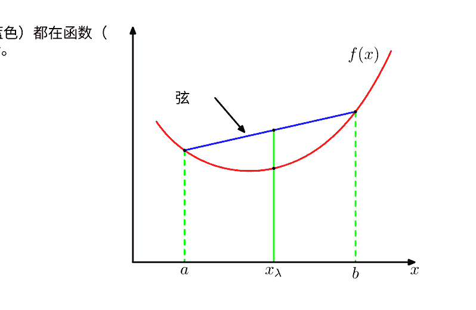

- 练习2.33 利用归纳证明的技巧，我们可以从(2.101)推导出凸函数 $f(x)$ 满足
$$f\left( \sum_{i=1}^{M} \lambda_i x_i \right) \leqslant \sum_{i=1}^{M} \lambda_i f(x_i) \tag{2.102}$$
其中 $\lambda_i \geqslant 0$ 且 $\sum_{i} \lambda_i = 1$，对于任意一组点 $\{x_i\}$。结果(2.102)被称为Jensen不等式。如果我们将 $\lambda_i$ 解释为取值为 $\{x_i\}$ 的离散变量 $x$ 的概率分布，则(2.102)可以写成
$$f\left( \mathbb{E}[x] \right) \leqslant \mathbb{E}[f(x)] \tag{2.103}$$
其中 $\mathbb{E}[\cdot]$ 表示期望。对于连续变量，Jensen不等式的形式为
$$f\left( \int \mathbf{x} p(\mathbf{x}) \, d\mathbf{x} \right) \leqslant \int f(\mathbf{x}) p(\mathbf{x}) \, d\mathbf{x}. \tag{2.104}$$

我们可以将Jensen不等式应用于Kullback–Leibler散度(2.100)，得到
$$\text{KL}(p \| q) = - \int p(\mathbf{x}) \ln \left\{ \frac{q(\mathbf{x})}{p(\mathbf{x})} \right\} \, d\mathbf{x} \geqslant - \ln \int q(\mathbf{x}) \, d\mathbf{x} = 0 \tag{2.105}$$
其中我们使用了 $-\ln x$ 是一个凸函数，以及归一化条件。
事实上， $-\ln x$是一个严格凸函数，所以等式成立当且仅当$q(x) = p(x)$对于所有的$x$。 因此，我们可以将Kullback-Leibler散度解释为两个分布$p(x)$和$q(x)$的不相似度的度量。

我们看到数据压缩和密度估计（即建模未知概率分布的问题）之间存在着密切的关系，因为当我们知道真实分布时，最有效的压缩就能实现。 如果我们使用与真实分布不同的分布，那么我们必然会有一个不太有效的编码，而且平均而言，必须传输的额外信息至少等于两个分布之间的Kullback-Leibler散度。

假设数据是从一个未知分布 $p(x)$生成的，我们希望对其进行建模。 我们可以尝试使用一些参数化分布 $q(x|\theta)$来近似这个分布，由一组可调参数 $\theta$控制。 确定 $\theta$的一种方法是最小化 $p(x)$和 $q(x|\theta)$之间的Kullback-Leibler散度。我们无法直接这样做，因为我们不知道 $p(x)$。 然而，假设我们观察到一组有限的训练点 $x_n$，其中 $n= 1, . . . , N$， 从 $p(x)$中抽取。 然后，根据 (2.40) ，对于 $p(x)$的期望可以通过对这些点的有限求和来近似，如下所示：

$$\mathrm{KL}(p\|q) \simeq \frac{1}{N} \sum_{n=1}^{N} \left\{ -\ln q(\mathbf{x}_n|\boldsymbol{\theta}) + \ln p(\mathbf{x}_n) \right\}. \quad (2.106)$$

方程(2.106)右侧的第二项与 $\theta$无关，而第一项是在分布 $q(\mathbf{x}| \boldsymbol{\theta})$下$\theta$的负对数似然函数，使用训练集进行评估。 因此，我们可以看出，最小化这个Kullback-Leibler散度等价于最大化对数似然函数。

#### 2.5.6 条件熵

现在考虑两组变量 $\mathbf{x}$和 $\mathbf{y}$之间的联合分布 $p(\mathbf{x}, \mathbf{y})$， 我们从中抽取 $\mathbf{x}$和 $\mathbf{y}$的值对。 如果已知 $\mathbf{x}$的值，则需要额外的信息来指定相应的$\mathbf{y}$的值，给定 $-\ln p(\mathbf{y}|\mathbf{x})$。因此，需要的平均额外信息来指定 $\mathbf{y}$ 可以写成

$$H[\mathbf{y}|\mathbf{x}] = - \iint p(\mathbf{y}, \mathbf{x}) \ln p(\mathbf{y}|\mathbf{x}) \, \mathrm{d}\mathbf{y} \, \mathrm{d}\mathbf{x}, \quad (2.107)$$

这被称为给定 $\mathbf{x}$的 $\mathbf{y}$ 的条件熵。 很容易看出，使用

- 练习 2.35 乘法规则，条件熵满足以下关系：

$$H[\mathbf{x}, \mathbf{y}] = H[\mathbf{y}|\mathbf{x}] + H[\mathbf{x}] \quad (2.108)$$

其中 $H[\mathbf{x}, \mathbf{y}]$ 是 $p(\mathbf{x}, \mathbf{y})$的微分熵， $H[\mathbf{x}]$是边缘分布 $p(\mathbf{x})$的微分熵。 因此，描述 $\mathbf{x}$和 $\mathbf{y}$所需的信息由描述 $\mathbf{x}$本身所需的信息加上描述给定 $\mathbf{x}$的 $\mathbf{y}$所需的额外信息的总和给出。

#### 2.5.7 互信息

当两个变量 x 和 y 是独立的时候，它们的联合分布将分解为它们的边缘分布的乘积 p(x, y) = p(x)p(y)。如果变量不是独立的，我们可以通过考虑联合分布和边缘分布乘积之间的 Kullback-Leibler 散度来判断它们是否‘接近’独立，即

$$\begin{aligned}
I[x, y] &\equiv  \mathrm{KL}(p(x, y)\|p(x)p(y)) \\
&=  - \iint p(x, y) \ln \left( \frac{p(x)p(y)}{p(x, y)} \right) \, dx \, dy, \quad (2.109)
\end{aligned}$$

这被称为变量 x 和 y 之间的互信息。从 Kullback-Leibler 散度的性质可以看出，当且仅当 x 和 y 独立时， I[x, y] ≥ 0 成立。利用概率的求和和乘法规则，我们可以将互信息与条件熵联系起来，即

- 练习2.38
$$I[x, y] = H[x] - H[x|y] = H[y] - H[y|x]. \quad (2.110)$$

因此，互信息表示了通过告知 y 的值（或反之亦然）来减少对 x 的不确定性。从贝叶斯的角度来看，我们可以将 p(x) 视为 x 的先验分布，将 p(x|y) 视为观察到新数据 y 后的后验分布。因此，互信息表示了由于新观察 y 而导致的对 x 的不确定性减少。

## 2.6. 贝叶斯概率

当我们考虑图2.2中的弯曲硬币时，我们引入了概率的概念，以随机、可重复事件的频率来表示，例如硬币朝下的概率。我们将其称为经典或频率派对概率的解释。我们还介绍了更一般的贝叶斯观点，其中概率提供了不确定性的量化。在这种情况下，我们的不确定性是硬币的凹面是正面还是反面。

使用概率来表示不确定性并不是一种临时选择，而是不可避免的，如果我们要尊重常识并进行合理和连贯的推理。例如， Cox（1964）证明了，如果使用数值来表示信念的程度，那么一组简单的公理可以编码这些信念的常识属性，从而唯一地导出操纵信念程度的规则，这些规则等同于概率的加法和乘法规则。因此，将这些量称为（贝叶斯）概率是很自然的。

对于我们假设的弯曲硬币，在没有更多信息的情况下，我们认为硬币的凹面朝上的概率是0.5。现在假设我们得知了抛掷硬币几次的结果。直观上看，这似乎应该为我们提供一些关于凹面是否朝上的信息。

例如，假设我们看到的翻转结果中出现了更多的反面而不是正面。鉴于这一点，这提供了证据表明硬币更有可能朝凹面朝上，这意味着凹面更有可能是反面。事实上，这种直觉是正确的，并且

- 练习 2.40 此外，我们可以使用概率规则来量化这一点。贝叶斯定理现在具有新的意义，因为它允许我们通过结合硬币翻转提供的数据，将凹面朝上的先验概率转化为后验概率。此外，这个过程是迭代的，意味着后验概率成为进一步结合数据的先验概率。

贝叶斯观点的一个方面是先验知识的自然包含。例如，假设一个看起来公平的硬币被抛掷三次，每次都朝上。硬币朝上的最大似然估计概率（第 3.1.2 节将给出）是 1，这意味着所有未来的抛掷都会朝上！相比之下，任何合理的先验概率的贝叶斯方法将得出一个不那么极端的结论。

#### 2.6.1 模型参数

贝叶斯观点对机器学习的几个方面提供了有价值的洞察，我们可以通过正弦曲线回归示例来说明这些洞察。在这里，我们用 𝒟 表示训练数据集。我们已经在线性回归的背景下看到，参数可以通过最大似然来选择，在这种情况下，w 被设置为最大化似然函数 p(𝒟|w) 的值。这相当于选择使观察到的数据集的概率最大的 w 的值。在机器学习文献中，似然函数的负对数被称为误差函数。因为负对数是一个单调递减的函数，最大化似然等价于最小化误差。这导致了特定的参数值选择，表示为 w_ML，然后用于对新数据进行预测。

我们已经看到，不同的训练数据集选择，例如包含不同数量的数据点，会导致不同的 w_ML 解。从贝叶斯观点来看，我们还可以使用概率论的方法来描述模型参数的不确定性。我们可以在观察数据之前，通过先验概率分布 p(w) 的形式来捕捉我们对 w 的假设。观察数据 𝒟 的影响通过似然函数 p(𝒟|w) 来表达，而贝叶斯定理现在的形式为

$$p(w|\mathcal{D}) = \frac{p(\mathcal{D}|w)p(w)}{p(\mathcal{D})}, \qquad (2.111)$$

在观察到 𝒟 后，我们可以评估 w 的不确定性，即后验概率 p(w|𝒟)。

需要强调的是，当将数量 p(𝒟|w) 视为参数向量 w 的函数时，它被称为似然函数，它表达了观测数据集对不同 w 值的可能性。请注意，似然函数 p(𝒟|w) 不是关于 w 的概率分布，其对 w 的积分也不是概率分布，$w$ 不一定等于一。

在给定似然函数的定义之后，我们可以用文字表达贝叶斯定理：

$$\text{后验概率} \propto \text{似然函数} \times \text{先验概率} \qquad (2.112)$$

#### 2.6.2 正则化

我们可以通过最大化后验概率 (2.111) 来选择模型参数，而不是通过最大化似然函数关于 \(\mathbf{w}\) 的概率。这种技术被称为最大后验估计，或者简称为MAP估计。等价地，我们可以最小化后验概率的负对数。对 (2.111) 的两边取负对数，我们得到

$$-\ln p(\mathbf{w}|\mathcal{D}) = -\ln p(\mathcal{D}|\mathbf{w}) - \ln p(\mathbf{w}) + \ln p(\mathcal{D}). \qquad (2.114)$$

(2.114) 右侧的第一项是通常的对数似然。第三项可以忽略，因为它不依赖于 \(\mathbf{w}\)。第二项以 \(\mathbf{w}\) 的函数形式出现，它被添加到对数似然中，我们可以将其视为一种正则化形式。为了更明确地表达这一点，假设我们选择先验分布 \(p(\mathbf{w})\) 为每个 \(\mathbf{w}\) 元素的独立零均值高斯分布的乘积，使得每个元素具有相同的方差 \(s^2\)，那么

$$p(\mathbf{w}|s) = \prod_{i=0}^{M} \mathcal{N}(w_i|0, s^2) = \prod_{i=0}^{M} \left( \frac{1}{2\pi s^2} \right)^{1/2} \exp \left\{ -\frac{w_i^2}{2s^2} \right\}. \qquad (2.115)$$

将其代入(2.114)中，我们得到

$$-\ln p(\mathbf{w}|\mathcal{D}) = -\ln p(\mathcal{D}|\mathbf{w}) + \frac{1}{2s^2} \sum_{i=0}^{M} w_i^2 + \text{const}. \qquad (2.116)$$

如果我们考虑线性回归模型的特殊情况，其对数似然函数由(2.66)给出，那么我们发现最大化后验分布等价于最小化函数

$$E(\mathbf{w}) = \frac{1}{2\sigma^2} \sum_{n=1}^{N} \{y(x_n, \mathbf{w}) - t_n\}^2 + \frac{1}{2s^2} \mathbf{w}^{\mathsf{T}}\mathbf{w}. \quad (2.117)$$
我们可以看到，这与之前遇到的正则化平方误差函数的形式(1.4)相同。

#### 2.6.3 贝叶斯机器学习

贝叶斯观点使我们能够激发对正则化的使用的动机，并推导出正则化项的具体形式。然而，仅仅使用贝叶斯定理并不能构成对机器学习的真正贝叶斯处理，因为它仍然在寻找 w 的单一解，并且没有考虑 w值的不确定性。假设我们有一个训练数据集 D，我们的目标是在给定新的输入值 x 的情况下预测某个目标变量 t。因此，我们对于在给定 x 和 D 的情况下 t 的分布感兴趣。根据概率的和与乘法规则，我们有

$$p(t|x, \mathcal{D}) = \int p(t|x, \mathbf{w})p(\mathbf{w}|\mathcal{D}) \, \mathrm{d}\mathbf{w}. \quad (2.118)$$
我们可以看到，预测是通过对所有可能的 w值进行加权平均来获得的，其中加权函数由后验概率分布 p(w|D)给出。区分贝叶斯方法的关键差异在于对参数空间的积分。相比之下，传统的频率主义方法使用通过优化损失函数（如正则化的平方和）获得的参数的点估计。

这种完全贝叶斯处理机器学习的方法提供了一些强大的见解。例如，在多项式回归的上下文中遇到的过拟合问题是使用最大似然时出现的一种病态，而在贝叶斯方法中通过对参数进行边缘化处理时不会出现。同样，我们可能有多个潜在的模型可以用来解决给定的问题，例如在回归示例中使用不同阶数的多项式。最大似然方法只是选择给出数据最高概率的模型，但这会导致越来越复杂的模型，从而导致过拟合。完全贝叶斯处理涉及对所有可能的模型进行平均，每个模型的贡献由其后验概率加权。

此外，这个概率通常对于中等复杂度的模型最高。非常简单的模型（如低阶多项式）由于无法很好地拟合数据而具有较低的概率，而非常复杂的模型（如非常高阶的多项式）也具有较低的概率，因为贝叶斯对参数的积分自动而优雅地惩罚了复杂性。有关应用于机器学习的贝叶斯方法的全面概述，包括神经网络，请参阅Bishop (2006) 的著作。

不幸的是，贝叶斯框架存在一个重大缺陷，而且在 (2.118) 中这一点显而易见，它涉及对参数空间的积分。现代深度学习模型可以拥有数百万甚至数十亿个参数，即使对这样的积分进行简单的近似通常也是不可行的。事实上，如果给定...有限的计算预算和充足的训练数据源，通常更好的做法是将最大似然技术应用于一个大型神经网络，而不是对一个规模较小的模型进行贝叶斯处理。

### 练习

2.1 (★)在癌症筛查的例子中，我们使用了癌症的先验概率 p(C = 1) = 0.01. 实际上，癌症的患病率通常要低得多。考虑一种情况，其中 p(C = 1) = 0.001，重新计算在有正面测试的情况下患癌症的概率 p(C = 1 | T = 1)。直观上，这个结果对许多人来说可能会令人惊讶，因为这个测试似乎具有很高的准确性，但是一个正面测试仍然导致患癌症的概率很低。

2.2 (★★)确定性数满足传递性的属性，所以如果 x > y 和 y > z 那么就有 x > z。然而，当我们使用随机数时，这个属性不再适用。图2.16显示了一组四个立方体骰子，它们被排列成一个循环顺序。证明每个骰子在循环中都有 2/3 的概率比前一个骰子掷出更高的数字。这样的骰子被称为非传递骰子，这里展示的具体例子被称为埃夫隆骰子。

图2.16 非传递性立方体骰子的示例，每个骰子都被 “压平” 以显示每个面上的数字。这些骰子被排列成一个循环，每个骰子都有2/3的概率比前一个骰子掷出更高的数字。

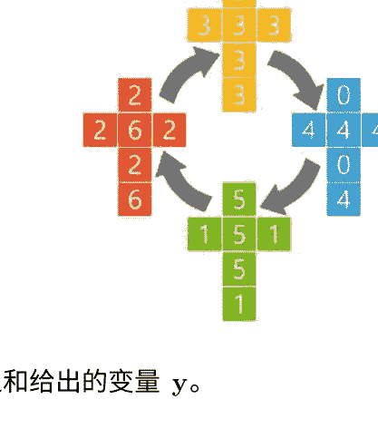

2.3 (★)考虑一个由两个独立随机变量之和给出的变量 y。证明分布 p(y) 是由以下给出的。

$$
p(y) = \int p(u) p(y - u) du. \tag{2.119}
$$

这被称为卷积 of p(u) 和 p(v)。

2.4 (★★)验证均匀分布 (2.33) 的正确归一化，并找到其均值和方差的表达式。

2.5 (★★)验证指数分布 (2.34) 和拉普拉斯分布 (2.35) 的正确归一化。

2.6 (⋆)利用狄拉克δ函数的性质，证明经验密度 (2.37) 的正确归一化。

2.7 (⋆)通过使用经验密度 (2.37)，证明期望 (2.39) 可以通过从密度 (2.40) 中抽取的有限样本的总和来近似。

2.8 (⋆)使用定义 (2.44)，证明 $\text{var}[f(x)]$满足 (2.45)。

2.9 (⋆)证明如果两个变量 $x$和 $y$是独立的，则它们的协方差为零。

2.10 (⋆)假设两个变量 $x$和 $z$是统计独立的。证明它们的和的均值和方差满足

$$\begin{aligned}
\mathbb{E}[x + z] &= \mathbb{E}[x] + \mathbb{E}[z] \\
\text{var}[x + z] &= \text{var}[x] + \text{var}[z].
\end{aligned}$$
(2.120) (2.121)

2.11 (⋆)考虑两个变量 $x$和 $y$的联合分布 $p(x, y)$。证明以下两个结果：

$$\begin{aligned}
\mathbb{E}[x] &= \mathbb{E}_y [\mathbb{E}_x [x|y]] \\
\text{var}[x] &= \mathbb{E}_y [\text{var}_x [x|y]] + \text{var}_y [\mathbb{E}_x [x|y]].
\end{aligned}$$
(2.122) (2.123)
这里 $\mathbb{E}_x [x|y]$表示在条件分布 $p( x|y)$下$x$的期望，类似的符号表示条件方差。

2.12 (⋆⋆⋆)在这个练习中，我们证明了单变量高斯分布的归一化条件 (2.51)。为了做到这一点，考虑积分

$$I = \int_{-\infty}^{\infty} \exp \left( -\frac{1}{2\sigma^2}x^2 \right) \mathrm{d}x$$
(2.124)

我们可以通过先将其平方写成以下形式来评估它

$$I^2 = \int_{-\infty}^{\infty} \int_{-\infty}^{\infty} \exp \left( -\frac{1}{2\sigma^2}x^2 - \frac{1}{2\sigma^2}y^2 \right) \mathrm{d}x\mathrm{d}y.$$
(2.125)

现在将笛卡尔坐标 $(x, y)$转换为极坐标 $(r, \theta)$然后代入 $u = r^2$。证明，通过对 $\theta$和 $u$进行积分，然后对两边取平方根，我们得到

$$I = \left( 2\pi\sigma^2 \right)^{1/2}.$$
(2.126)

最后，使用这个结果证明高斯分布 $\mathcal{N}(x|\mu, \sigma^2)$是归一化的。

2.13 (★ ★)通过变量变换，验证由(2.49)给出的一元高斯分布满足(2.52)。接下来，通过对归一化条件的两边进行微分
$$
\int_{-\infty}^{\infty} \mathcal{N}\left(x \mid \mu, \sigma^{2}\right) \mathrm{d} x=1
\tag{2.127}
$$
关于 $\sigma^{2}$ 的微分，验证高斯分布满足(2.53)。最后，证明(2.54)成立。

2.14 (★)证明高斯分布的众数（即最大值）为 $\mu$。

2.15 (★)通过将对数似然函数 (2.56) 关于 $\mu$ 和 $\sigma^{2}$ 的导数设置为零，验证结果 (2.57) 和 (2.58)。

2.16 (★ ★)利用结果 (2.52) 和 (2.53)，证明
$$
\mathbb{E}\left[x_{n} x_{m}\right]=\mu^{2}+I_{n m} \sigma^{2}
\tag{2.128}
$$
其中 $x_{n}$ 和 $x_{m}$ 表示从均值为 $\mu$ 和方差为 $\sigma^{2}$ 的高斯分布中采样的数据点，$I_{n m}$ 满足 $I_{n m}=1$ 如果 $n=m$，$I_{n m}=0$ 否则。
因此证明结果 (2.59) 和 (2.60)。

2.17 (★ ★)使用定义 (2.61)，证明结果 (2.62)，该结果显示基于真实均值的高斯分布的方差估计器的期望由真实方差 $\sigma^{2}$ 给出。

2.18 (★)证明最大化 (2.66) 关于 $\sigma^{2}$ 的结果 (2.68)。

2.19 (★ ★)使用变量变换下的概率密度的转换性质 (2.71)，证明任何密度 $p(y)$ 可以通过进行非线性变量变换 $y = f(x)$ 从处处非零的固定密度 $q(x)$ 获得，其中 $f(x)$ 是一个单调函数，使得 $0 \leqslant f'(x)<\infty$。写出 $f(x)$ 满足的微分方程，并绘制说明密度的变换的图。

2.20 (★)评估由变换定义的雅可比矩阵的元素 (2.78)和(2.79)。

2.21 (★)在第2.5节中，我们介绍了熵的概念 $h(x)$ 作为观察到一个随机变量 $x$ having 分布 $p(x)$ 所获得的信息。我们看到，对于独立变量 $x$ 和 $y$，其中 $p(x, y) = p(x)p(y)$，熵函数是可加的，因此 $h(x, y) = h(x) + h(y)$。在这个练习中，我们推导出 $h$ 和 $p$ 之间的关系，形式为函数 $h(p)$。首先证明 $h(p^{2}) = 2h(p)$ 并且，通过归纳，可以得出 $h(p^{n}) = nh(p)$ 其中 $n$ 是一个正整数。因此，证明 $h(p^{n/m}) = (n/m)h(p)$ 其中 $m$ 也是一个正整数。这意味着 $h(p^{x}) = xh(p)$ 其中 $x$ 是一个正有理数，并且，通过连续性，当它是一个正实数时。最后，证明这意味着 $h(p)$ 必须采取形式 $h(p) \propto \ln p$。

2.22 (⋆)使用拉格朗日乘数法证明熵的最大化 (2.86) 对于离散变量给出了一个概率分布，其中所有的概率 \(p(x_i)\) 都是相等的，并且对应的熵的值是 \(\ln M\)。

2.23 (⋆)考虑一个 \(M\) 状态的离散随机变量 \(x\)，并使用 Jensen 不等式 (形式为 2.102) 来证明其分布的熵 \(\mathrm{H}[x]\) 满足 \(\leqslant \ln M\)。

2.24 (⋆⋆)使用变分法证明函数 (2.96) 的驻点为 (2.97)。然后使用约束条件 (2.93)、(2.94) 和 (2.95) 来消除拉格朗日乘子，并因此证明最大熵解为高斯分布 (2.98)。

2.25 (⋆)使用结果 (2.94) 和 (2.95) 来证明一元高斯分布 (2.98) 的熵为 (2.99)。

2.26 (⋆⋆)假设 \(p(\mathbf{x})\) 是某个固定分布，我们希望用高斯分布 \(q(\mathbf{x}) = \mathcal{N}(\mathbf{x}|\boldsymbol{\mu}, \mathbf{\Sigma})\) 来近似它。通过写出高斯分布 \(q(\mathbf{x})\) 的 Kullback-Leibler 散度 \(\mathrm{KL}(p \| q)\) 的形式，并进行微分，证明最小化 \(\mathrm{KL}(p \| q)\) 关于 \(\boldsymbol{\mu}\) 和 \(\mathbf{\Sigma}\) 的结果是

\(\boldsymbol{\mu}\) 由 \(p(\mathbf{x})\) 下的 \(\mathbf{x}\) 的期望给出， \(\mathbf{\Sigma}\) 由协方差给出。

2.27 (⋆⋆)计算两个高斯分布之间的 Kullback-Leibler 散度 (2.100)
\[p(x) = \mathcal{N}(x|\mu, \sigma^2)\) 和 \(q(x) = \mathcal{N}(x|m, s^2)\)。

2.28 (⋆⋆)\(\alpha\) 分布族的 \(\alpha\) 散度定义为
\[\mathrm{D}_{\alpha}(p \| q) = \frac{4}{1-\alpha^2} \left(1 - \int p(x)^{(1+\alpha)/2} q(x)^{(1-\alpha)/2} \mathrm{d}x \right) \qquad (2.129)\]
其中 \(-\infty < \alpha < \infty\) 是一个连续参数。证明库尔巴克-莱布勒散度 \(\mathrm{KL}(p \| q)\) 对应于 \(\alpha \to 1\)。这可以通过写作 \(p^{\square} = \exp(\epsilon \ln p) = 1 + \epsilon \ln p + O(\epsilon^2)\) 然后取 \(\square \to 0\) 来完成。类似地，证明 \(\mathrm{KL}(q \| p)\) 对应于 \(\alpha \to -1\)。

2.29 (⋆⋆)考虑两个变量 \(\mathbf{x}\) 和 \(\mathbf{y}\) 的联合分布 \(p(\mathbf{x}, \mathbf{y})\)。证明这对变量的微分熵满足
\[\mathrm{H}[\mathbf{x}, \mathbf{y}] \leqslant \mathrm{H}[\mathbf{x}] + \mathrm{H}[\mathbf{y}] \qquad (2.130)\]
当且仅当 \(\mathbf{x}\) 和 \(\mathbf{y}\) 统计独立时，等式成立。

2.30 (⋆)考虑一个连续变量向量 \(\mathbf{x}\)，其分布为 \(p(\mathbf{x})\) 并且对应的熵为 \(\mathrm{H}[\mathbf{x}]\)。假设我们对 \(\mathbf{x}\) 进行一个非奇异线性变换，得到一个新变量 \(\mathbf{y} = \mathbf{A}\mathbf{x}\)。证明相应的熵由 \(\mathrm{H}[\mathbf{y}] = \mathrm{H}[\mathbf{x}] + \ln \det \mathbf{A}\) 给出，其中 \(\det \mathbf{A}\) 表示 \(\mathbf{A}\) 的行列式。

2.31 (⋆⋆)假设两个离散随机变量 \(x\) 和 \(y\) 之间的条件熵 \(\mathrm{H}[y|x]\) 为零。证明对于所有满足 \(p(x) > 0\) 的 \(x\) 值，变量 \(y\) 必须是 \(x\) 的函数。换句话说，对于每个 \(x\)，只有一个 \(y\) 的值使得 \(p(y|x) = 0\)。

2.32 (★)严格凸函数被定义为每条弦都在函数上方。证明这等价于函数的二阶导数为正的条件。

2.33 (★★)使用归纳法证明凸函数的不等式(2.101)蕴含结果(2.102)。

2.34 (★)证明，除了一个可加常数外，经验分布(2.37)和模型分布 q(x|θ)之间的Kullback-Leibler散度(2.100)等于负对数似然函数。

2.35 (★)使用概率的乘法规则和定义(2.107)，证明结果(2.108)。

2.36 (★★★)考虑两个二进制变量 x和 y，其联合分布如下

| x\y | 0 | 1 |
|-----|---|---|
| 0 | 1/3 | 1/3 |
| 1 | 0 | 1/3 |

计算以下数量：

- (a) H[x]
- (b) H[y]
- (c) H[y|x]
- (d) H[x|y]
- (e) H[x,y]
- (f) I[x,y]

绘制一个维恩图来展示这些不同数量之间的关系。

2.37 (★)通过应用Jensen不等式(2.102)和 f(x) = ln x，证明一组实数的算术平均值永远不会小于它们的几何平均值。

2.38 (★)利用概率的和与乘法规则，证明互信息 I(x,y)满足关系(2.110)。

2.39 (★★)假设两个变量 z1和 z2是独立的，即 p(z1, z2) = p(z1)p(z2)。证明这些变量之间的协方差矩阵是对角的。这表明独立性是两个变量不相关的充分条件。现在考虑两个变量 y1和 y2，其中 y1以0为中心对称分布而 y2 = y1²。写出条件分布p(y2|y1)并观察这取决于 y1，从而表明这两个变量不独立。

现在证明这两个变量之间的协方差矩阵再次是对角的。为了做到这一点，使用关系 p(y1, y2) = p(y1)p(y2|y1)来证明非对角线上的项为零。这个反例表明零相关性不是独立性的充分条件。

2.40 (★)考虑图2.2中的弯曲硬币。假设凸面朝上的先验概率为 0.1。现在假设硬币被翻转了10次，我们被告知有8次翻转朝上，2次翻转朝下。使用贝叶斯定理评估凹面朝上的后验概率。

计算下一次翻转朝上的概率。

2.41 (*)通过将(2.115)代入(2.114)并利用线性回归模型的对数似然结果(2.66)，推导出正则化误差函数的结果(2.117)。

# 深度学习

## 3 标准分布

在本章中，我们讨论一些特定的概率分布及其性质。 除了本身具有兴趣外，这些分布还可以作为更复杂模型的构建模块，并将在整本书中广泛使用。

本章讨论的分布的一个作用是对随机变量x的概率分布 p( x)进行建模，给定有限观测集合 x1, . . . , xN。 这个问题被称为密度估计。 需要强调的是，密度估计问题本质上是不适定的，因为可能有无限多个概率分布可以解释观测到的有限数据集。 实际上，任何在每个数据点上非零的分布 p(x)都是一个潜在的候选。

x1, . . . , xN都是潜在的候选。 选择适当的分布与模型选择问题相关，在多项式曲线拟合的上下文中已经遇到过，并且是机器学习中的一个核心问题。

我们首先考虑离散变量的分布，然后探索连续变量的高斯分布。这些都是特定的参数分布示例，因为它们由相对较少的可调参数控制，例如高斯分布的均值和方差。为了将这些模型应用于密度估计问题，我们需要一种确定参数适当值的过程，给定一个观察到的数据集，我们的主要关注点将是最大化似然函数。在本章中，我们将假设数据观测是独立同分布的（i.i.d.），而在后续章节中，我们将探索涉及结构化数据的更复杂情况，其中这个假设不再成立。

参数化方法的一个限制是它假设分布的具体函数形式，这可能在特定应用中不合适。非参数密度估计方法提供了一种替代方法，其中分布的形式通常取决于数据集的大小。这些模型仍然包含参数，但这些参数控制的是模型的复杂性，而不是分布的形式。我们在本章末尾简要介绍了基于直方图、最近邻和核函数的三种非参数方法。这些非参数技术的一个主要限制是它们涉及存储所有的训练数据。换句话说，参数的数量随着数据集的大小而增长，因此对于大型数据集来说，这种方法变得非常低效。深度学习通过考虑基于具有大量但固定数量参数的神经网络的灵活分布，结合了参数模型的效率和非参数方法的普遍性。

### 3.1. 离散变量

我们首先考虑离散变量的简单分布，从二进制变量开始，然后转向多状态变量。

#### 3.1.1 伯努利分布

考虑一个单一的二进制随机变量 $x \in \{0, 1\}$. 例如，$x$可能描述抛硬币的结果，其中$x = 1$表示'正面'，$x = 0$表示'反面'。如果这是一个损坏的硬币，如图2.2所示，落地正面的概率不一定与落地反面的概率相同。

将 $x = 1$的概率表示为参数 $\mu$，即

$$
p(x = 1 | \mu) = \mu
$$

其中 $0 \leq \mu \leq 1$，由此可得 $p(x = 0 | \mu) = 1 - \mu$。因此，$x$的概率分布可以写成以下形式

$$
\text{Bern}(x | \mu) = \mu^x (1 - \mu)^{1-x}
$$

这被称为伯努利分布。 很容易验证这个分布是归一化的，并且它的均值和方差分别为

$$
\mathbb{E}[x] = \mu \tag{3.3}
$$
$$
\mathrm{var}[x] = \mu(1 - \mu). \tag{3.4}
$$

现在假设我们有一个数据集 \( D = \{x_1, \dots, x_N\} \)，其中包含了观测值 \( x \) 的值。我们可以构建似然函数，该函数是 \( \mu \) 的函数，基于观测值独立地从 \( p(x|\mu) \) 中抽取的假设，因此

$$
p(\mathcal{D}|\mu) = \prod_{n=1}^N p(x_n|\mu) = \prod_{n=1}^N \mu^{x_n}(1 - \mu)^{1 - x_n}. \tag{3.5}
$$

我们可以通过最大化似然函数或等价地最大化似然函数的对数来估计 \( \mu \) 的值，因为对数是一个单调函数。伯努利分布的对数似然函数为

$$
\ln p(\mathcal{D}|\mu) = \sum_{n=1}^N \ln p(x_n|\mu) = \sum_{n=1}^N \left\{x_n \ln \mu + (1 - x_n) \ln(1 - \mu)\right\}. \tag{3.6}
$$

此时，请注意对数似然函数仅通过观测值 \( N \) 的总和 \( \sum_n x_n \)。这个总和提供了数据在这个分布下的一个充分统计量的例子。如果我们将 \( \ln p(\mathcal{D}|\mu) \) 的导数设置为当 \( \mu \) 等于零时，我们得到了最大似然估计器：

$$
\mu_{\text{ML}} = \frac{1}{N} \sum_{n=1}^N x_n, \tag{3.7}
$$

这也被称为 \( sample \ mean \)。用m表示观测次数在这个数据集中，\( x=1 \)(正面)的观测次数为 \( m \)，我们可以将(3.7)写成以下形式

$$
\mu_{\text{ML}} = \frac{m}{N} \tag{3.8}
$$

因此，在这个最大似然框架中，正面出现的概率由数据集中正面观测次数的比例给出。

#### 3.1.2 二项分布

我们还可以计算出二进制变量 \( x \) 的分布，即观测次数为 \( m \) 的情况下，给定数据集的大小为 \( N \)。这被称为二项分布，根据(3.5)我们可以看到它与 \( \mu^m(1 - \mu)^{N - m} \) 成正比。为了得到归一化系数，注意到在 \( N \) 次硬币翻转中，我们必须考虑所有可能得到 \( m \) 个正面的方式，因此二项分布可以写成以下形式

$$
\text{Bin}(m|N, \mu) = \binom{N}{m} \mu^m(1 - \mu)^{N - m} \tag{3.9}
$$图3.1 直方图显示二项分布(3.9)随m变化的情况，其中 N=10， μ=0.25。

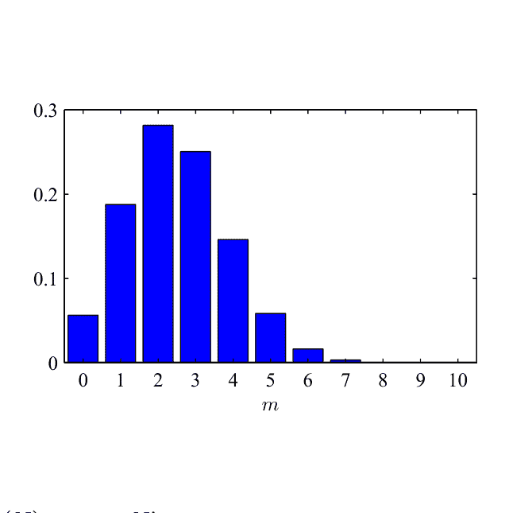

其中

$$ \binom{N}{m} \equiv \frac{N!}{(N-m)!m!} \quad (3.10) $$

是从 N个相同物体中选择 m个物体的方式的数量，不考虑重复。图3.1显示了 N=10时二项分布的图形以及 μ=0.25。

练习3.3

可以通过使用以下结果找到二项分布的均值和方差：对于独立事件，总和的均值等于各个事件的均值之和，总和的方差等于各个事件的方差之和。

练习2.10

因为 m = x1 + ... + xN

因为对于每个观察值，均值和方差分别由(3.3)和(3.4)给出，因此我们有

$$ \mathbb{E}[m] \equiv \sum_{m=0}^{N} m \, \text{Bin}(m|N, \mu) = N \mu \quad (3.11) $$

$$ \text{var}[m] \equiv \sum_{m=0}^{N} (m - \mathbb{E}[m])^2 \, \text{Bin}(m|N, \mu) = N \mu (1 - \mu) \quad (3.12) $$

练习3.4 这些结果也可以通过使用微积分直接证明。

#### 3.1.3 多项分布

二进制变量可用于描述可以取两个可能值之一的数量。然而，通常我们会遇到可以取 K个可能互斥状态之一的离散变量。虽然有各种替代的表达这种变量的方法，但我们很快将看到一种特别方便的表示方法是 1-of-K方案，有时被称为'one-hot编码'，其中变量由一个 K维向量 x表示，在其中一个元素 xk等于 1，其余所有元素等于 0。因此，例如，如果我们有一个变量可以取 K= 6个状态，并且变量的特定观察恰好发生在对应于状态 $x_{3}=1$ 的情况下， $\mathbf{x}$ 将被表示为

$$
\mathbf{x}=(0,0,1,0,0,0)^{\mathrm{T}}.
$$
(3.13)

请注意，这样的向量满足 $\sum_{k=1}^{K} x_{k}=1$。如果我们用参数 $\mu_{k}$ 表示 $x_{k}=1$ 的概率，则 $\mathbf{x}$ 的分布由以下给出

$$
p(\mathbf{x} \mid \boldsymbol{\mu})=\prod_{k=1}^{K} \mu_{k}^{x_{k}}
$$
(3.14)

其中 $\boldsymbol{\mu}=\left(\mu_{1}, \ldots \ldots \ldots \ldots \ldots, \mu_{K}\right)^{\mathrm{T}}$，参数 $\mu_{k}$ 受到以下约束 $\mu_{k} \geq 0$ 和 $\sum_{k} \mu_{k}=1$，因为它们代表概率。 分布 (3.14) 可以被看作是伯努利分布对超过两个结果的一般化。
很容易看出，该分布是归一化的：

$$
\sum_{\mathbf{x}} p(\mathbf{x} \mid \boldsymbol{\mu})=\sum_{k=1}^{K} \mu_{k}=1
$$
(3.15)

并且

$$
\mathbb{E}[\mathbf{x} \mid \boldsymbol{\mu}]=\sum_{\mathbf{x}} p(\mathbf{x} \mid \boldsymbol{\mu}) \mathbf{x}=\boldsymbol{\mu}.
$$
(3.16)

现在考虑一个数据集 $\mathcal{D}$ of $N$ 独立观测 $\mathbf{x}_{1}, \ldots, \mathbf{x}_{N}$。 相应的似然函数的形式为

$$
p(\mathcal{D} \mid \boldsymbol{\mu})=\prod_{n=1}^{N} \prod_{k=1}^{K} \mu_{k}^{x_{n k}}=\prod_{k=1}^{K} \mu_{k}^{\left(\sum_{n} x_{n k}\right)}=\prod_{k=1}^{K} \mu_{k}^{m_{k}}
$$
(3.17)

从中我们可以看出，似然函数仅通过 $N$ 个数据点来依赖于以下 $K$ 个量：

$$
m_{k}=\sum_{n=1}^{N} x_{n k},
$$
(3.18)

它们代表了观测到的 $x_{k}=1$ 的数量。 这些被称为该分布的充分统计量。 请注意，变量 $m_{k}$ 受到约束：

$$
\sum_{k=1}^{K} m_{k}=N.
$$
(3.19)

为了找到 $\boldsymbol{\mu}$ 的最大似然解，我们需要最大化 $\ln p(\mathcal{D} \mid \boldsymbol{\mu})$ 关于 $\mu_{k}$ 的导数，同时考虑到约束条件 (3.15) ，即 $\mu_{k}$ 的总和必须为一。 这可以通过使用拉格朗日乘子 $\lambda$ 并最大化

$$
\sum_{k=1}^{K} m_{k} \ln \mu_{k}+\lambda\left(\sum_{k=1}^{K} \mu_{k}-1\right).
$$
(3.20)

> 第3.4节

> 附录C

## 3. 标准分布

将 (3.20) 关于 μ_k 的导数设为零，我们得到

μ_k = -m_k / λ. \quad (3.21)

通过将 (3.21) 代入约束条件，我们可以解出拉格朗日乘子 λ 的值

因此，我们得到了 μ 的最大似然解的形式

μ_k^{ML} = \frac{m_k}{N}, \quad (3.22)

这是 N 个观测值中 x_k = 1 的比例。

我们还可以考虑 m_1, …, m_K 这些数量的联合分布。在参数向量 μ 和观测总数 N 的条件下，我们也可以考虑 m_K 的联合分布。根据(3.17)，这可以表示为

\text{Mult}(m_1, m_2, \ldots, m_K | \boldsymbol{\mu}, N) = \binom{N}{m_1 m_2 \ldots m_K} \prod_{k=1}^{K} \mu_k^{m_k}, \quad (3.23)

这被称为多项式分布。归一化系数是将 N 个对象分成 K 组，每组大小为 m_1, …, m_K 的方式的数量，给出为

\binom{N}{m_1 m_2 \ldots m_K} = \frac{N!}{m_1! m_2! \ldots m_K!}. \quad (3.24)

请注意，双态量可以表示为二进制变量，并使用二项分布 (3.9) 进行建模，也可以表示为1-of-2变量，并使用分布 (3.14) 进行建模，其中 K=2。

### 3.2. 多元高斯分布

高斯分布，也称为正态分布，是用于连续变量分布的广泛使用的模型。我们已经看到，对于单个变量 x 的情况，高斯分布可以写成以下形式

\mathcal{N}(x|\mu, \sigma^2) = \frac{1}{(2\pi\sigma^2)^{1/2}} \exp\left\{-\frac{1}{2\sigma^2}(x - \mu)^2\right\} \quad (3.25)

其中 μ 是均值， σ^2 是方差。对于 D 维向量 x，多元高斯分布的形式为

\mathcal{N}(\mathbf{x}|\boldsymbol{\mu}, \boldsymbol{\Sigma}) = \frac{1}{(2\pi)^{D/2}} \frac{1}{|\boldsymbol{\Sigma}|^{1/2}} \exp\left\{-\frac{1}{2}(\mathbf{x} - \boldsymbol{\mu})^{\mathrm{T}} \boldsymbol{\Sigma}^{-1} (\mathbf{x} - \boldsymbol{\mu})\right\} \quad (3.26)

其中 μ 是 D 维均值向量， Σ 是 D × D 协方差矩阵， det Σ 表示 Σ 的行列式。

高斯分布在许多不同的背景下出现，并且可以从多个不同的角度进行解释。

第2.5节 例如，我们已经看到，对于

### 3.2. 多元高斯分布

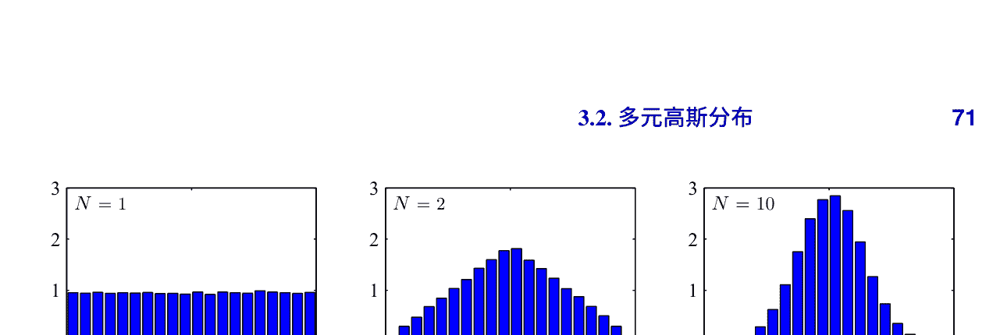

图3.2 均值为 N个均匀分布的数字的直方图绘制，对于不同的 N值。我们观察到随着 N的增加，分布趋向于高斯分布。

对于单个实数变量，最大化熵的分布是高斯分布。

练习3.8 这个性质也适用于多元高斯分布。

另一个高斯分布出现的情况是当我们考虑多个随机变量的总和时。中心极限定理告诉我们，在一定的条件下，一组随机变量的总和（当然也是一个随机变量）的分布随着总和中的项数增加而趋向于高斯分布（Walker，1969年）。我们可以通过考虑 N个变量 x_1,...,每个变量在区间 [0,1]上均匀分布，然后考虑均值 (x_1 + ... + x_N)/N的分布来说明这一点。

对于大的 N，这个分布趋向于高斯分布，如图3.2所示。在实践中，随着 N的增加，收敛到高斯分布的速度非常快。这个结果的一个后果是，二项分布(3.9)，它是由随机二进制变量 x的 N次观测的总和定义的分布，将随着 N→∞ 趋向于高斯分布(见图3.1，其中 N= 10)。

高斯分布具有许多重要的分析性质，我们将详细讨论其中的几个。因此，这一部分将比一些早期的部分更加技术性，并需要熟悉附录A中的各种矩阵恒等式。

#### 3.2.1 高斯分布的几何

我们首先考虑高斯分布的几何形式。高斯分布对于 x的函数依赖是通过二次形式

$$
\Delta^2 = (\mathbf{x} - \boldsymbol{\mu})^\mathsf{T} \boldsymbol{\Sigma}^{-1} (\mathbf{x} - \boldsymbol{\mu}), \quad (3.27)
$$

出现在指数中的量 Δ被称为从 μ到 x的马哈拉诺比斯距离。当 Σ是单位矩阵时，它简化为欧几里得距离。

高斯分布在 x空间中的曲面上是恒定的，对于这个二次形式是恒定的。

首先，注意矩阵 Σ可以取为对称矩阵，不失一般性，因为任何反对称分量都会从指数中消失。

现在考虑协方差矩阵的特征向量方程

$$
\boldsymbol{\Sigma} \mathbf{u}_i = \lambda_i \mathbf{u}_i, \quad (3.28)
$$

其中 i=1,...,D。因为 Σ 是一个实对称矩阵，它的特征值将是实数，并且可以选择其特征向量形成一个正交集，使得

$$
\mathbf{u}_i^\mathsf{T} \mathbf{u}_j = I_{ij}, \quad (3.29)
$$

其中 I_{ij} 是单位矩阵的 i, j 元素，并满足

$$
I_{ij} = \begin{cases} 1, & \text{如果 } i = j \\ 0, & \text{否则.} \end{cases} \quad (3.30)
$$

协方差矩阵 Σ 可以表示为其特征向量的展开形式

练习3.13

$$
\boldsymbol{\Sigma} = \sum_{i=1}^D \lambda_i \mathbf{u}_i \mathbf{u}_i^\mathsf{T}. \quad (3.31)
$$

同样地，逆协方差矩阵 Σ^{-1} 可以表示为

$$
\boldsymbol{\Sigma}^{-1} = \sum_{i=1}^D \frac{1}{\lambda_i} \mathbf{u}_i \mathbf{u}_i^\mathsf{T}. \quad (3.32)
$$

将 (3.32) 代入 (3.27)，二次形式变为

$$
\Delta^2 = \sum_{i=1}^D \frac{y_i^2}{\lambda_i}, \quad (3.33)
$$

我们定义

$$
y_i = \mathbf{u}_i^\mathsf{T} (\mathbf{x} - \boldsymbol{\mu}). \quad (3.34)
$$

我们可以将 \{ y_i \} 解释为由正交向量定义的新坐标系。\mathbf{u}_i 相对于原始的 x_i 坐标进行了平移和旋转。形成向量 \mathbf{y} = (y_1, ..., y_D)^T，我们有

$$
\mathbf{y} = \mathbf{U} (\mathbf{x} - \boldsymbol{\mu}), \quad (3.35)
$$

附录A

其中 \mathbf{U} 是一个由 \mathbf{u}_i^\mathsf{T} 给出的行向量组成的矩阵。从 (3.29) 可以得出，\mathbf{U} 是一个正交矩阵，即满足 \mathbf{U} \mathbf{U}^\mathsf{T} = \mathbf{U}^\mathsf{T} \mathbf{U} = \mathbf{I}，其中 \mathbf{I} 是单位矩阵。

二次形式，以及高斯密度，在满足 (3.33) 的曲面上是常数。如果所有的特征值 λ_i 都是正的，那么这些曲面表示的是椭球，其中心在 \boldsymbol{\mu}，轴沿着 \mathbf{u}_i 方向，轴的缩放因子由 λ_i^{1/2} 给出，如图3.3所示。为了使高斯分布有良好的定义，协方差矩阵的所有特征值 λ_i 都必须严格为正，否则分布无法正确归一化。特征值严格为正的矩阵被称为正定矩阵。当我们讨论潜变量模型时，我们会遇到其中一个或多个特征值为零的高斯分布。

### 3.2. 多元高斯分布

图3.3 红色曲线显示了二维空间中高斯分布的椭圆形常概率密度曲面，其中概率密度为其值的指数函数exp(-1/2)在 x = μ。 椭圆的轴由协方差矩阵的特征向量 ui定义，对应的特征值为 λi。

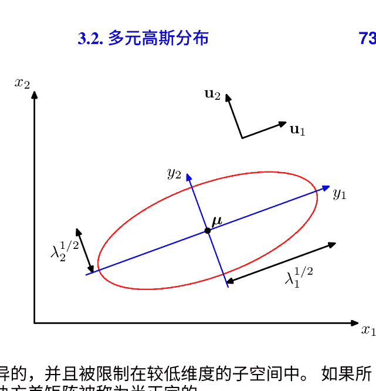

在这种情况下，分布是奇异的，并且被限制在较低维度的子空间中。如果所有特征值都是非负的，则协方差矩阵被称为半正定的。

现在考虑在由 yi定义的新坐标系中的高斯分布的形式。从 x到 y坐标系的转换中，我们有一个雅可比矩阵 J，其元素为

$$
J_{ij} = \frac{\partial x_i}{\partial y_j} = U_{ji},
$$

其中 Uji是矩阵 U^T的元素。利用矩阵 U的正交性质，我们可以看到雅可比矩阵行列式的平方是

$$
|J|^2 = |U^T|^2 = |U^T||U| = |U^TU| = |I| = 1.
$$

因此，|J|= 1。此外，协方差矩阵的行列式 |Σ|可以表示为其特征值的乘积，因此

$$
|\Sigma|^{1/2} = \prod_{j=1}^{D} \lambda_j^{1/2}.
$$

因此，在 yj坐标系中，高斯分布的形式为

$$
p(\mathbf{y}) = p(\mathbf{x})|J| = \prod_{j=1}^{D} \frac{1}{(2\pi\lambda_j)^{1/2}} \exp\left\{ -\frac{y_j^2}{2\lambda_j} \right\},
$$

这是 D个独立的一元高斯分布的乘积。因此，特征向量定义了一个新的平移和旋转坐标系，相对于这个坐标系，联合概率分布可以分解为独立分布的乘积。在 y坐标系中的分布的积分为

$$
\int p(\mathbf{y}) \, d\mathbf{y} = \prod_{j=1}^{D} \int_{-\infty}^{\infty} \frac{1}{(2\pi\lambda_j)^{1/2}} \exp\left\{ -\frac{y_j^2}{2\lambda_j} \right\} \, dy_j = 1.
$$

## 3. 标准分布

这里我们使用了一元高斯分布的归一化结果（2.51）。这证实了多元高斯分布（3.26）的归一化。

#### 3.2.2 矩

现在我们来看一下高斯分布的矩，并通过这些提供参数μ和Σ的解释。在高斯分布下，x的期望值为

$$
\begin{aligned}
\mathbb{E}[\mathbf{x}] &= \frac{1}{(2\pi)^{D/2}} \frac{1}{|\boldsymbol{\Sigma}|^{1/2}} \int \exp\left\{ -\frac{1}{2} (\mathbf{x} - \boldsymbol{\mu})^\mathsf{T} \boldsymbol{\Sigma}^{-1} (\mathbf{x} - \boldsymbol{\mu}) \right\} \mathbf{x} \, d\mathbf{x} \\
&= \frac{1}{(2\pi)^{D/2}} \frac{1}{|\boldsymbol{\Sigma}|^{1/2}} \int \exp\left\{ -\frac{1}{2} \mathbf{z}^\mathsf{T} \boldsymbol{\Sigma}^{-1} \mathbf{z} \right\} (\mathbf{z} + \boldsymbol{\mu}) \, d\mathbf{z} \quad (3.41)
\end{aligned}
$$

这里我们使用了变量变换 $\mathbf{z} = \mathbf{x} - \boldsymbol{\mu}$。注意，指数是 $\mathbf{z}$ 的分量的偶函数，因为对这些分量的积分是在范围 $(-\infty,\infty)$ 上进行的，因此因子 $(\mathbf{z} + \boldsymbol{\mu})$ 中的 $\mathbf{z}$ 项将因对称性而消失。因此，

$$
\mathbb{E}[\mathbf{x}] = \boldsymbol{\mu}, \quad (3.42)
$$

因此，我们将 $\boldsymbol{\mu}$ 称为高斯分布的均值。现在我们考虑高斯分布的二阶矩。在一元情况下，我们考虑了给定的二阶矩 $\mathbb{E}[x^2]$。对于多元高斯分布，有 $D^2$ 个二阶矩 $\mathbb{E}[x_i x_j]$，我们可以将其组合成矩阵 $\mathbb{E}[\mathbf{x} \mathbf{x}^\mathsf{T}]$。这个矩阵可以写成

$$
\begin{aligned}
\mathbb{E}[\mathbf{x} \mathbf{x}^\mathsf{T}] &= \frac{1}{(2\pi)^{D/2}} \frac{1}{|\boldsymbol{\Sigma}|^{1/2}} \int \exp\left\{ -\frac{1}{2} (\mathbf{x} - \boldsymbol{\mu})^\mathsf{T} \boldsymbol{\Sigma}^{-1} (\mathbf{x} - \boldsymbol{\mu}) \right\} \mathbf{x} \mathbf{x}^\mathsf{T} \, d\mathbf{x} \\
&= \frac{1}{(2\pi)^{D/2}} \frac{1}{|\boldsymbol{\Sigma}|^{1/2}} \int \exp\left\{ -\frac{1}{2} \mathbf{z}^\mathsf{T} \boldsymbol{\Sigma}^{-1} \mathbf{z} \right\} (\mathbf{z} + \boldsymbol{\mu}) (\mathbf{z} + \boldsymbol{\mu})^\mathsf{T} \, d\mathbf{z} \quad (3.43)
\end{aligned}
$$

再次使用 $\mathbf{z} = \mathbf{x} - \boldsymbol{\mu}$ 进行变量替换。注意，涉及 $\boldsymbol{\mu} \mathbf{z}^\mathsf{T}$ 和 $\boldsymbol{\mu}^\mathsf{T} \mathbf{z}$ 的交叉项再次因对称性而消失。项 $\boldsymbol{\mu} \boldsymbol{\mu}^\mathsf{T}$ 是常数并且可以从积分中提取出来，积分本身为1，因为高斯分布是归一化的。考虑涉及 $\mathbf{z} \mathbf{z}^\mathsf{T}$ 的项。同样，我们可以利用协方差矩阵的特征向量展开（3.28），以及特征向量集合的完备性，写成

$$
\mathbf{z} = \sum_{j=1}^{D} y_j \mathbf{u}_j, \quad (3.44)
$$

其中 $y_j = \mathbf{u}_j^\mathsf{T}\mathbf{z}$，这给出了

$$
\begin{aligned}
&\frac{1}{(2\pi)^{D/2}}\frac{1}{|\boldsymbol{\Sigma}|^{1/2}}\int \exp\left\{-\frac{1}{2}\mathbf{z}^\mathsf{T}\boldsymbol{\Sigma}^{-1}\mathbf{z}\right\} \mathbf{z}\mathbf{z}^\mathsf{T}\mathrm{d}\mathbf{z}\\
&=\frac{1}{(2\pi)^{D/2}}\frac{1}{|\boldsymbol{\Sigma}|^{1/2}}\sum_{i=1}^D\sum_{j=1}^D \mathbf{u}_i\mathbf{u}_j^\mathsf{T}\int \exp\left\{-\sum_{k=1}^D \frac{y_k^2}{2\lambda_k}\right\} y_i y_j \mathrm{d}\mathbf{y}\\
&=\sum_{i=1}^D \mathbf{u}_i\mathbf{u}_i^\mathsf{T}\lambda_i = \boldsymbol{\Sigma}
\end{aligned}
\qquad (3.45)
$$

在这里我们使用了特征向量方程 (3.28)，以及中间行的积分在对称性下除非 $i=j$ 时为零。在最后一行中，我们使用了结果 (2.53) 和 (3.38)，以及 (3.31)。因此，我们有

$$
\mathbb{E}[\mathbf{x}\mathbf{x}^\mathsf{T}] = \boldsymbol{\mu}\boldsymbol{\mu}^\mathsf{T} + \boldsymbol{\Sigma}. \qquad (3.46)
$$

在定义单个随机变量的方差时，我们在计算第二阶矩之前减去了均值。同样，在多元情况下，减去均值再计算方差是很方便的，从而得到了随机向量的协方差。

$\mathbf{x}$ 由定义

$$
\text{cov}[\mathbf{x}] = \mathbb{E}\left[(\mathbf{x}-\mathbb{E}[\mathbf{x}])(\mathbf{x}-\mathbb{E}[\mathbf{x}])^\mathsf{T}\right]. \qquad (3.47)
$$

对于高斯分布的特定情况，我们可以利用 $\mathbb{E}[\mathbf{x}] = \boldsymbol{\mu}$，以及结果(3.46)，得到

$$
\text{cov}[\mathbf{x}] = \boldsymbol{\Sigma}. \qquad (3.48)
$$

因为参数矩阵 $\boldsymbol{\Sigma}$ 控制着高斯分布下 $\mathbf{x}$ 的协方差，所以被称为协方差矩阵。

#### 3.2.3 限制

尽管高斯分布(3.26)经常被用作简单的密度模型，但它存在一些重要的限制。考虑分布中的自由参数数量。一个一般的对称协方差矩阵 $\boldsymbol{\Sigma}$ 将有 $D(D+1)/2$ 个独立参数，并且还有另外 $D$ 个独立参数- 总共有 $D(D+3)/2$ 个参数，其中 $D$ 是 $\boldsymbol{\mu}$ 的个数。对于较大的 $D$，参数的总数随 $D$ 的增加呈二次增长，处理和求逆大矩阵的计算任务可能变得困难。解决这个问题的一种方法是使用受限的协方差矩阵形式。如果我们考虑协方差矩阵是对角矩阵的情况，即 $\boldsymbol{\Sigma}= \text{diag}(\sigma_i^2)$，那么密度模型中总共有 $2D$ 个独立参数。相应的等密度轮廓由轴对齐的椭圆给出。我们还可以进一步限制协方差矩阵与单位矩阵成比例，即 $\boldsymbol{\Sigma}= \sigma^2\mathbf{I}$，这被称为各向同性协方差，模型中总共有 $D+1$ 个独立参数，以及球面上的等密度曲面。图3.4中展示了一般、对角和各向同性协方差矩阵的三种可能性。不幸的是，

练习3.15图3.4 高斯分布在二维空间中的等概率密度轮廓，其中协方差矩阵为(a)一般形式，(b)对角线形式，在这种情况下，椭圆形轮廓与坐标轴对齐，(c)与单位矩阵成比例，这种情况下轮廓是同心圆。

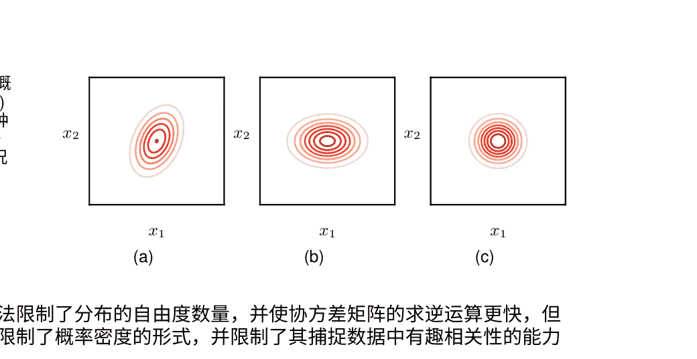

而这些方法限制了分布的自由度数量，并使协方差矩阵的求逆运算更快，但也极大地限制了概率密度的形式，并限制了其捕捉数据中有趣相关性的能力。

高斯分布的另一个限制是它本质上是单峰的（即只有一个最大值），因此无法很好地逼近多峰分布。因此，高斯分布既可以过于灵活（即具有过多的参数），又可以在能够充分表示的分布范围上过于有限。我们将在后面看到，引入潜在变量，也称为隐藏变量或未观察变量，可以解决这两个问题。特别地，通过引入离散潜在变量，可以得到一系列丰富的多峰分布（参见第3.2.9节）。类似地，引入连续潜在变量会导致模型中自由参数的数量可以独立于数据空间的维度D进行控制，同时仍然允许模型捕捉数据集中的主要相关性。

## 第16章

#### 3.2.4 条件分布

多元高斯分布的一个重要性质是，如果两组变量是联合高斯分布的，那么在给定另一组变量的条件下，一组变量的条件分布仍然是高斯分布。同样，任一组变量的边缘分布也是高斯分布。

首先，考虑条件分布的情况。假设 $\mathbf{x}$ 是一个 $D$ 维向量，服从高斯分布 $\mathcal{N}(\mathbf{x}|\boldsymbol{\mu}, \boldsymbol{\Sigma})$，并且我们将 $\mathbf{x}$ 分成两个不相交的子集 $\mathbf{x}_a$ 和 $\mathbf{x}_b$。不失一般性，我们可以将 $\mathbf{x}_a$ 作为 $\mathbf{x}$ 的前 $M$ 个分量，$\mathbf{x}_b$ 作为剩余的 $D - M$ 个分量，即

$$
\mathbf{x} = \begin{pmatrix} \mathbf{x}_a \\ \mathbf{x}_b \end{pmatrix}.
$$

我们还定义了均值向量 $\boldsymbol{\mu}$ 的相应分区，分别为

$$
\boldsymbol{\mu} = \begin{pmatrix} \boldsymbol{\mu}_a \\ \boldsymbol{\mu}_b \end{pmatrix}.
$$

以及协方差矩阵 $\Sigma$ 的相应分区，表示为

$$ \Sigma = \begin{pmatrix} \Sigma_{aa} & \Sigma_{ab} \\ \Sigma_{ba} & \Sigma_{bb} \end{pmatrix}. $$

请注意，协方差矩阵的对称性意味着 $\Sigma^T = \Sigma$， $\Sigma_{aa}$ 和 $\Sigma_{bb}$ 是对称的，而 $\Sigma_{ba} = \Sigma_{ab}^T$。

在许多情况下，使用协方差矩阵的逆矩阵会更方便：

$$ \Lambda \equiv \Sigma^{-1}, $$

这被称为精度矩阵。

实际上，我们将看到高斯分布的一些性质在协方差方面表达得更自然，而其他性质在精度方面表达得更简单。 因此，我们还引入了精度矩阵的分块形式：

$$ \Lambda = \begin{pmatrix} \Lambda_{aa} & \Lambda_{ab} \\ \Lambda_{ba} & \Lambda_{bb} \end{pmatrix} $$

对应于向量 $\mathbf{x}$ 的分块 (3.49) 。 由于对称矩阵的逆矩阵也是对称的，我们可以看到 $\Lambda_{aa}$ 和 $\Lambda_{bb}$ 是对称的。

在这一点上应该强调的是，例如， $\Lambda_{aa}$ 不是简单地由 $\Sigma_{aa}$ 的逆给出。 事实上，我们将很快研究分块矩阵的逆与其分块的逆之间的关系。

我们首先找到条件分布的表达式 $p(\mathbf{x}_a | \mathbf{x}_b)$。

根据概率的乘法规则，我们可以看到这个条件分布可以通过将联合分布 $p(\mathbf{x}) = p(\mathbf{x}_a, \mathbf{x}_b)$ 固定 $\mathbf{x}_b$ 为观察值，并将结果表达式归一化以获得有效的概率分布 $\mathbf{x}_a$。 我们可以通过考虑高斯分布中指数的二次形式 (3.27) 来更高效地获得解，然后在计算结束时恢复归一化系数。 如果我们利用分块 (3.49) 、 (3.50) 和 (3.53) ， 我们得到

$$ -\frac{1}{2}(\mathbf{x} - \boldsymbol{\mu})^T \Sigma^{-1} (\mathbf{x} - \boldsymbol{\mu}) = -\frac{1}{2}(\mathbf{x}_a - \boldsymbol{\mu}_a)^T \Lambda_{aa} (\mathbf{x}_a - \boldsymbol{\mu}_a) - \frac{1}{2}(\mathbf{x}_a - \boldsymbol{\mu}_a)^T \Lambda_{ab} (\mathbf{x}_b - \boldsymbol{\mu}_b) - \frac{1}{2}(\mathbf{x}_b - \boldsymbol{\mu}_b)^T \Lambda_{ba} (\mathbf{x}_a - \boldsymbol{\mu}_a) - \frac{1}{2}(\mathbf{x}_b - \boldsymbol{\mu}_b)^T \Lambda_{bb} (\mathbf{x}_b - \boldsymbol{\mu}_b). $$

我们看到，作为 $\mathbf{x}_a$ 的函数，这又是一个二次型，因此，相应的条件分布 $p(\mathbf{x}_a | \mathbf{x}_b)$ 将是高斯分布。 因为这个分布完全由其均值和协方差所描述，我们的目标是通过检查(3.54)来确定 $p(\mathbf{x}_a | \mathbf{x}_b)$ 的均值和协方差的表达式。

这是一个与高斯分布相关的常见操作的示例，有时被称为“完成平方”，我们给出一个定义高斯分布中指数项的二次形式，并且我们需要确定相应的均值和协方差。这类问题可以通过注意到一般高斯分布中的指数可以写成直接解决

$$-\frac{1}{2}(\mathbf{x} - \boldsymbol{\mu})^T \boldsymbol{\Sigma}^{-1} (\mathbf{x} - \boldsymbol{\mu}) = -\frac{1}{2}\mathbf{x}^T \boldsymbol{\Sigma}^{-1} \mathbf{x} + \mathbf{x}^T \boldsymbol{\Sigma}^{-1} \boldsymbol{\mu} + \text{常数} \quad (3.55)$$

其中“常数”表示与 $\mathbf{x}$ 无关的项，我们还利用了 $\boldsymbol{\Sigma}$ 的对称性。因此，如果我们将我们的一般二次形式表示为(3.55)右侧给出的形式，那么我们可以立即将进入二阶项的系数矩阵与逆协方差矩阵 $\boldsymbol{\Sigma}^{-1}$ 相等，并且将线性项的系数与 $\boldsymbol{\Sigma}^{-1} \boldsymbol{\mu}$ 相等，从中我们可以得到 $\boldsymbol{\mu}$。

现在让我们将这个过程应用于条件高斯分布 $p(\mathbf{x}_a | \mathbf{x}_b)$ 其中指数中的二次型由(3.54)给出。我们将用 $\boldsymbol{\mu}_{a|b}$ 和 $\boldsymbol{\Sigma}_{a|b}$ 分别表示该分布的均值和协方差。考虑(3.54)对 $\mathbf{x}_a$ 的函数依赖关系，其中将 $\mathbf{x}_b$ 视为常数。如果我们挑选出所有二阶的 $\mathbf{x}_a$ 项，我们有

$$-\frac{1}{2} \mathbf{x}_a^T \boldsymbol{\Lambda}_{aa} \mathbf{x}_a \quad (3.56)$$

由此我们可以立即得出协方差（逆精度）为 $p(\mathbf{x}_a | \mathbf{x}_b)$ 的表达式为

$$\boldsymbol{\Sigma}_{a|b} = \boldsymbol{\Lambda}_{aa}^{-1}. \quad \text{现在}$$

考虑(3.54)中所有线性的 $\mathbf{x}_a$ 项：

$$\mathbf{x}_a^T \{ \boldsymbol{\Lambda}_{aa} \boldsymbol{\mu}_a - \boldsymbol{\Lambda}_{ab} (\mathbf{x}_b - \boldsymbol{\mu}_b) \} \quad (3.58)$$

我们使用了 $\boldsymbol{\Lambda}_{ba}^T = \boldsymbol{\Lambda}_{ab}$。根据我们对一般形式（3.55）的讨论，在这个表达式中，$\mathbf{x}_a$ 的系数必须等于 $\boldsymbol{\Sigma}_{a|b}^{-1} \boldsymbol{\mu}_{a|b}$，因此

$$\boldsymbol{\mu}_{a|b} = \boldsymbol{\Sigma}_{a|b} \{ \boldsymbol{\Lambda}_{aa} \boldsymbol{\mu}_a - \boldsymbol{\Lambda}_{ab} (\mathbf{x}_b - \boldsymbol{\mu}_b) \} \ = \boldsymbol{\mu}_a - \boldsymbol{\Lambda}_{aa}^{-1} \boldsymbol{\Lambda}_{ab} (\mathbf{x}_b - \boldsymbol{\mu}_b) \quad (3.59)$$

我们使用了（3.57）。结果（3.57）和（3.59）是以原始联合分布的分区精度矩阵 $p(\mathbf{x}_a, \mathbf{x}_b)$ 来表示的。我们还可以用相应的分区协方差矩阵来表示这些结果。为了做到这一点，我们使用了练习3.18中的以下分区矩阵的逆的恒等式：

$$\begin{pmatrix} \mathbf{A} & \mathbf{B} \\ \mathbf{C} & \mathbf{D} \end{pmatrix}^{-1} = \begin{pmatrix} \mathbf{M} & -\mathbf{M}\mathbf{B}\mathbf{D}^{-1} \\ -\mathbf{D}^{-1}\mathbf{C}\mathbf{M} & \mathbf{D}^{-1} + \mathbf{D}^{-1}\mathbf{C}\mathbf{M}\mathbf{B}\mathbf{D}^{-1} \end{pmatrix} \quad (3.60)$$

我们定义

$$\mathbf{M} = (\mathbf{A} - \mathbf{B}\mathbf{D}^{-1}\mathbf{C})^{-1}. \quad (3.61)$$

量 $\mathbf{M}^{-1}$ 被称为矩阵左侧的Schur补与子矩阵 $\mathbf{D}$ 相关。使用定义

$$\begin{pmatrix} \mathbf{\Sigma}_{aa} & \mathbf{\Sigma}_{ab} \\ \mathbf{\Sigma}_{ba} & \mathbf{\Sigma}_{bb} \end{pmatrix}^{-1} = \begin{pmatrix} \mathbf{\Lambda}_{aa} & \mathbf{\Lambda}_{ab} \\ \mathbf{\Lambda}_{ba} & \mathbf{\Lambda}_{bb} \end{pmatrix} \quad (3.62)$$

并利用(3.60)，我们有

$$\begin{aligned} \mathbf{\Lambda}_{aa} &= (\mathbf{\Sigma}_{aa} - \mathbf{\Sigma}_{ab} \mathbf{\Sigma}_{bb}^{-1} \mathbf{\Sigma}_{ba})^{-1} \quad &(3.63)\\ \mathbf{\Lambda}_{ab} &= -(\mathbf{\Sigma}_{aa} - \mathbf{\Sigma}_{ab} \mathbf{\Sigma}_{bb}^{-1} \mathbf{\Sigma}_{ba})^{-1} \mathbf{\Sigma}_{ab} \mathbf{\Sigma}_{bb}^{-1}. \quad &(3.64) \end{aligned}$$

从这些中，我们得到了条件分布 $p(\mathbf{x}_a | \mathbf{x}_b)$ 的均值和协方差的以下表达式：

$$\begin{aligned} \mathbf{\mu}_{a|b} &= \mathbf{\mu}_a + \mathbf{\Sigma}_{ab} \mathbf{\Sigma}_{bb}^{-1} (\mathbf{x}_b - \mathbf{\mu}_b) \quad &(3.65)\\ \mathbf{\Sigma}_{a|b} &= \mathbf{\Sigma}_{aa} - \mathbf{\Sigma}_{ab} \mathbf{\Sigma}_{bb}^{-1} \mathbf{\Sigma}_{ba}. \quad &(3.66) \end{aligned}$$

比较(3.57)和(3.66)，我们可以看到，当用分块精度矩阵表示时，条件分布 $p(\mathbf{x}_a | \mathbf{x}_b)$ 的形式比用分块协方差矩阵表示时更简单。请注意，条件分布 $p(\mathbf{x}_a | \mathbf{x}_b)$ 的均值，由(3.65)给出，是一个线性函数。

$\mathbf{x}_b$ 和协方差（由 (3.66) 给出）与 $\mathbf{x}_b$ 无关。这代表了一个线性高斯模型的例子。

**第11.1.4节**

#### 3.2.5 边缘分布

我们已经看到，如果一个联合分布 $p(\mathbf{x}_a, \mathbf{x}_b)$ 是高斯分布，那么条件分布 $p(\mathbf{x}_a | \mathbf{x}_b)$ 也将是高斯分布。现在我们转向对给定的边缘分布的讨论

$$p(\mathbf{x}_a) = \int p(\mathbf{x}_a, \mathbf{x}_b) \, \mathrm{d}\mathbf{x}_b, \quad (3.67)$$

正如我们将看到的，这也是高斯分布。我们计算这个分布的策略是关注联合分布指数中的二次型，并确定边缘分布的均值和协方差 $p(\mathbf{x}_a)$。

联合分布的二次型可以用分块精度矩阵表示为 (3.54) 。我们的目标是积分掉 $\mathbf{x}_b$，最容易的方法是首先考虑涉及 $\mathbf{x}_b$ 的项，然后完成平方以便于积分。挑选出只涉及 $\mathbf{x}_b$ 的项，我们有

$$-\frac{1}{2}\mathbf{x}_b^\top \mathbf{\Lambda}_{bb} \mathbf{x}_b + \mathbf{x}_b^\top \mathbf{m} = -\frac{1}{2}(\mathbf{x}_b - \mathbf{\Lambda}_{bb}^{-1} \mathbf{m})^\top \mathbf{\Lambda}_{bb} (\mathbf{x}_b - \mathbf{\Lambda}_{bb}^{-1} \mathbf{m}) + \frac{1}{2} \mathbf{m}^\top \mathbf{\Lambda}_{bb}^{-1} \mathbf{m} \quad (3.68)$$

我们定义

$$\mathbf{m} = \mathbf{\Lambda}_{bb} \mathbf{\mu}_b - \mathbf{\Lambda}_{ba} (\mathbf{x}_a - \mathbf{\mu}_a). \quad (3.69)$$

我们可以看到，对于 $\mathbf{x}_b$ 的依赖已经转化为标准的二次形式，对应于右侧第一项的高斯分布，再加上一个不依赖于 $\mathbf{x}_b$（但依赖于 $\mathbf{x}_a$）的项。因此，当我们对这个二次形式取指数时，我们可以看到由(3.67)所要求的对 $\mathbf{x}_b$ 的积分将采取以下形式

$$\int \exp \left\{ -\frac{1}{2} (\mathbf{x}_b - \mathbf{\Lambda}_{bb}^{-1} \mathbf{m})^T \mathbf{\Lambda}_{bb} (\mathbf{x}_b - \mathbf{\Lambda}_{bb}^{-1} \mathbf{m}) \right\} d\mathbf{x}_b. \quad (3.70)$$

通过注意到这是一个非标准化高斯的积分，我们可以轻松地进行积分，因此结果将是归一化系数的倒数。我们从 (3.26) 给出的归一化高斯的形式知道，这个系数与均值无关，只与协方差矩阵的行列式有关。因此，通过关于 $\mathbf{x}_b$ 的平方完成平方，我们可以积分掉 $\mathbf{x}_b$，使得 (3.68) 左侧的贡献中仅剩下最后一项与 $\mathbf{x}_a$ 有关，而这一项由 (3.69) 给出。将这一项与 (3.54) 中与 $\mathbf{x}_a$ 有关的剩余项相结合，我们得到

$$
\begin{aligned}
&\frac{1}{2} [\mathbf{\Lambda}_{bb} \boldsymbol{\mu}_b - \mathbf{\Lambda}_{ba} (\mathbf{x}_a - \boldsymbol{\mu}_a)]^T \mathbf{\Lambda}_{bb}^{-1} [\mathbf{\Lambda}_{bb} \boldsymbol{\mu}_b - \mathbf{\Lambda}_{ba} (\mathbf{x}_a - \boldsymbol{\mu}_a)] \\
&\quad -\frac{1}{2} \mathbf{x}_a^T \mathbf{\Lambda}_{aa} \mathbf{x}_a + \mathbf{x}_a^T (\mathbf{\Lambda}_{aa} \boldsymbol{\mu}_a + \mathbf{\Lambda}_{ab} \boldsymbol{\mu}_b) + \text{const} \\
&= -\frac{1}{2} \mathbf{x}_a^T (\mathbf{\Lambda}_{aa} - \mathbf{\Lambda}_{ab} \mathbf{\Lambda}_{bb}^{-1} \mathbf{\Lambda}_{ba}) \mathbf{x}_a \\
&\quad +\mathbf{x}_a^T (\mathbf{\Lambda}_{aa} - \mathbf{\Lambda}_{ab} \mathbf{\Lambda}_{bb}^{-1} \mathbf{\Lambda}_{ba}) \boldsymbol{\mu}_a + \text{const}
\end{aligned}
\quad (3.71)
$$

其中“const”表示与 $\mathbf{x}_a$ 无关的量。再次，通过与 (3.55)进行比较，我们可以看到边缘分布 $p(\mathbf{x}_a)$ 的协方差为

$$\mathbf{\Sigma}_a = (\mathbf{\Lambda}_{aa} - \mathbf{\Lambda}_{ab} \mathbf{\Lambda}_{bb}^{-1} \mathbf{\Lambda}_{ba})^{-1}. \quad (3.72)$$

同样，均值由以下给出

$$\mathbf{\Sigma}_a (\mathbf{\Lambda}_{aa} - \mathbf{\Lambda}_{ab} \mathbf{\Lambda}_{bb}^{-1} \mathbf{\Lambda}_{ba}) \boldsymbol{\mu}_a = \boldsymbol{\mu}_a \quad (3.73)$$

我们使用了 (3.72) 。协方差 (3.72) 用 (3.53) 给出的分区精度矩阵表示。我们可以像对待条件分布一样，用 (3.51) 给出的协方差矩阵的相应分区来重新表示这个。这些分区矩阵之间存在关系

$$\begin{pmatrix} \mathbf{\Lambda}_{aa} & \mathbf{\Lambda}_{ab} \\ \mathbf{\Lambda}_{ba} & \mathbf{\Lambda}_{bb} \end{pmatrix}^{-1} = \begin{pmatrix} \mathbf{\Sigma}_{aa} & \mathbf{\Sigma}_{ab} \\ \mathbf{\Sigma}_{ba} & \mathbf{\Sigma}_{bb} \end{pmatrix}. \quad (3.74)$$

利用 (3.60) ，我们有

$$\left( \mathbf{\Lambda}_{aa} - \mathbf{\Lambda}_{ab} \mathbf{\Lambda}_{bb}^{-1} \mathbf{\Lambda}_{ba} \right)^{-1} = \mathbf{\Sigma}_{aa}. \quad (3.75)$$

因此，我们得到了直观满意的结果，边际分布 $p(x_a)$ 的均值和协方差为

$$ \mathbb{E}[x_a] = \mu_a $$

$$ \text{cov}[x_a] = \Sigma_{aa} $$

我们可以看到，对于边际分布，均值和协方差最简单地表示为分块协方差矩阵，与条件分布相反，分块精度矩阵导致了更简单的表达式。

我们对分块高斯分布的边际和条件分布的结果可以总结如下。给定一个联合高斯分布 $\mathcal{N}(x|\mu, \Sigma)$ 其中 $\Lambda \equiv \Sigma^{-1}$ 和以下分块

$$ x = \begin{pmatrix} x_a \\ x_b \end{pmatrix}, \quad \mu = \begin{pmatrix} \mu_a \\ \mu_b \end{pmatrix} $$

$$ \Sigma = \begin{pmatrix} \Sigma_{aa} & \Sigma_{ab} \\ \Sigma_{ba} & \Sigma_{bb} \end{pmatrix}, \quad \Lambda = \begin{pmatrix} \Lambda_{aa} & \Lambda_{ab} \\ \Lambda_{ba} & \Lambda_{bb} \end{pmatrix} $$

那么条件分布为

$$ p(x_a|x_b) = \mathcal{N}(x|\mu_{a|b}, \Lambda_{aa}^{-1}) $$

$$ \mu_{a|b} = \mu_a - \Lambda_{aa}^{-1} \Lambda_{ab} (x_b - \mu_b) $$

边际分布由以下给出

$$ p(x_a) = \mathcal{N}(x_a|\mu_a, \Sigma_{aa}) $$

我们使用涉及两个变量的示例在图3.5中说明条件和边际分布的概念。

#### 3.2.6 贝叶斯定理

在第3.2.4节和第3.2.5节中，我们考虑了一个高斯分布 $p(x)$ 其中我们将向量x分成两个子向量 $x= (x_a, x_b)$ 然后找到了条件分布 $p(x_a|x_b)$ 和边际分布 $p(x_a)$ 的表达式。我们注意到条件分布 $p(x_a|x_b)$ 的均值是一个线性函数 $x_b$。

在这里，我们假设我们有一个高斯边缘分布 $p(x)$ 和一个高斯条件分布 $p(y|x)$ 其中 $p(y|x)$ 的均值是 $x$ 的线性函数，协方差与 $x$ 无关。这是一个例子第11.4节 线性高斯模型(Roweis和Ghahramani, 1999)。我们希望找到边缘分布 $p(y)$ 和条件分布 $p(x|y)$。这是一个结构-第16章 在几种生成模型中出现的结构，这里推导出一般结果会很方便。

我们将边缘和条件分布取为

$$ p(x) = \mathcal{N}(x|\mu, \Lambda^{-1}) $$

$$ p(y|x) = \mathcal{N}(y|A x + b, L^{-1}) $$

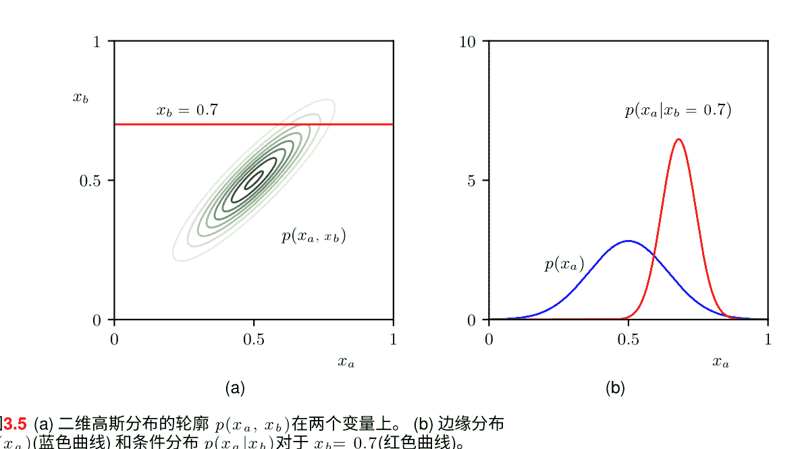

其中 $\mu$, $\mathbf{A}$, 和 $\mathbf{b}$ 是控制均值的参数， $\mathbf{\Lambda}$ 和 $\mathbf{L}$ 是精度矩阵。 如果 $\mathbf{x}$ 的维度为 $M$， $\mathbf{y}$ 的维度为 $D$， 那么矩阵 $\mathbf{A}$ 的大小为 $D \times M$。

首先， 我们找到关于 $\mathbf{x}$ 和 $\mathbf{y}$ 的联合分布的表达式。 为了做到这一点， 我们定义

$$ \mathbf{z} = \begin{pmatrix} \mathbf{x} \\ \mathbf{y} \end{pmatrix} \qquad (3.85) $$

然后考虑联合分布的对数：

$$ \begin{aligned} \ln p(\mathbf{z}) &= \ln p(\mathbf{x}) + \ln p(\mathbf{y}|\mathbf{x}) \\ &= -\frac{1}{2}(\mathbf{x} - \boldsymbol{\mu})^{\mathrm{T}}\mathbf{\Lambda}(\mathbf{x} - \boldsymbol{\mu}) \\ &\quad -\frac{1}{2}(\mathbf{y} - \mathbf{A}\mathbf{x} - \mathbf{b})^{\mathrm{T}}\mathbf{L}(\mathbf{y} - \mathbf{A}\mathbf{x} - \mathbf{b}) + \text{常数} \end{aligned} \qquad (3.86) $$

其中“常数”表示与 $\mathbf{x}$ 和 $\mathbf{y}$ 无关的项。 与之前一样， 我们可以看到这是 $\mathbf{z}$ 的二次函数， 因此， $p(\mathbf{z})$ 是高斯分布。

为了找到这个高斯分布的精度， 我们考虑(3.86)中的二阶项， 可以写成

$$ \begin{aligned} &-\frac{1}{2}\mathbf{x}^{\mathrm{T}}(\mathbf{\Lambda} + \mathbf{A}^{\mathrm{T}}\mathbf{L}\mathbf{A})\mathbf{x} - \frac{1}{2}\mathbf{y}^{\mathrm{T}}\mathbf{L}\mathbf{y} + \frac{1}{2}\mathbf{y}^{\mathrm{T}}\mathbf{L}\mathbf{A}\mathbf{x} + \frac{1}{2}\mathbf{x}^{\mathrm{T}}\mathbf{A}^{\mathrm{T}}\mathbf{L}\mathbf{y} \\ &= -\frac{1}{2} \begin{pmatrix} \mathbf{x} \\ \mathbf{y} \end{pmatrix}^{\mathrm{T}} \begin{pmatrix} \mathbf{\Lambda} + \mathbf{A}^{\mathrm{T}}\mathbf{L}\mathbf{A} & -\mathbf{A}^{\mathrm{T}}\mathbf{L} \\ -\mathbf{L}\mathbf{A} & \mathbf{L} \end{pmatrix} \begin{pmatrix} \mathbf{x} \\ \mathbf{y} \end{pmatrix} = -\frac{1}{2}\mathbf{z}^{\mathrm{T}}\mathbf{R}\mathbf{z} \end{aligned} \qquad (3.87) $$

高斯分布在 $\mathbf{z}$ 上的高斯分布具有精度（逆协方差）矩阵给定为

$$ \mathbf{R} = \begin{pmatrix} \mathbf{\Lambda} + \mathbf{A}^\top\mathbf{L}\mathbf{A} & -\mathbf{A}^\top\mathbf{L} \\ -\mathbf{L}\mathbf{A} & \mathbf{L} \end{pmatrix}. $$

协方差矩阵是通过取精度的逆来找到的，可以使用矩阵求逆公式（3.60）进行计算，得到

$$ \text{cov}[\mathbf{z}] = \mathbf{R}^{-1} = \begin{pmatrix} \mathbf{\Lambda}^{-1} & \mathbf{\Lambda}^{-1}\mathbf{A}^\top \\ \mathbf{A}\mathbf{\Lambda}^{-1} & \mathbf{L}^{-1} + \mathbf{A}\mathbf{\Lambda}^{-1}\mathbf{A}^\top \end{pmatrix}. $$

同样，我们可以通过识别（3.86）中的线性项来找到$\mathbf{z}$上的高斯分布的均值，这些线性项由以下给出

$$ \mathbf{x}^\top\mathbf{\Lambda}\boldsymbol{\mu} - \mathbf{x}^\top\mathbf{A}^\top\mathbf{L}\mathbf{b} + \mathbf{y}^\top\mathbf{L}\mathbf{b} = \begin{pmatrix} \mathbf{x} \\ \mathbf{y} \end{pmatrix}^\top \begin{pmatrix} \mathbf{\Lambda}\boldsymbol{\mu} - \mathbf{A}^\top\mathbf{L}\mathbf{b} \\ \mathbf{L}\mathbf{b} \end{pmatrix}. $$

通过完成多元高斯的二次形式的平方补全，使用我们之前得到的结果（3.55），我们发现$\mathbf{z}$的均值为

$$ \mathbb{E}[\mathbf{z}] = \mathbf{R}^{-1} \begin{pmatrix} \mathbf{\Lambda}\boldsymbol{\mu} - \mathbf{A}^\top\mathbf{L}\mathbf{b} \\ \mathbf{L}\mathbf{b} \end{pmatrix}. $$

## 练习3.24

利用(3.89)，我们得到

$$ \mathbb{E}[\mathbf{z}] = \begin{pmatrix} \boldsymbol{\mu} \\ \mathbf{A}\boldsymbol{\mu} + \mathbf{b} \end{pmatrix}. $$

## 第3.2节

接下来，我们找到了边缘分布$p(\mathbf{y})$的表达式，在其中我们对$\mathbf{x}$进行了边缘化。回想一下，当以分块协方差矩阵的形式表达时，高斯随机向量的子集的边缘分布采用了特别简单的形式。具体来说，它的均值和协方差分别为(3.76)和(3.77)。利用(3.89)和(3.92)，我们可以看到边缘分布$p(\mathbf{y})$的均值和协方差分别为

$$ \mathbb{E}[\mathbf{y}] = \mathbf{A}\boldsymbol{\mu} + \mathbf{b} $$
$$ \text{cov}[\mathbf{y}] = \mathbf{L}^{-1} + \mathbf{A}\mathbf{\Lambda}^{-1}\mathbf{A}^\top. $$

一个特殊情况是$\mathbf{A} = \mathbf{I}$，此时边缘分布简化为两个高斯分布的卷积，我们可以看到卷积的均值是两个高斯分布的均值之和，协方差是它们的协方差之和。

最后，我们寻求条件概率$p(\mathbf{x}|\mathbf{y})$的表达式。回想一下，条件分布的结果最容易用分块的Section 3.2精度矩阵来表达，使用(3.57)和(3.59)。将这些结果应用于(3.89)和(3.92)，我们可以看到条件分布$p(\mathbf{x}|\mathbf{y})$的均值和协方差为

$$ \mathbb{E}[\mathbf{x}|\mathbf{y}] = (\mathbf{\Lambda} + \mathbf{A}^\top\mathbf{L}\mathbf{A})^{-1} \left\{ \mathbf{A}^\top\mathbf{L}(\mathbf{y} - \mathbf{b}) + \mathbf{\Lambda}\boldsymbol{\mu} \right\} $$
$$ \text{cov}[\mathbf{x}|\mathbf{y}] = (\mathbf{\Lambda} + \mathbf{A}^\top\mathbf{L}\mathbf{A})^{-1}. $$

这个条件分布的评估可以看作是贝叶斯定理的一个例子，在这个例子中我们将 p(x)解释为 x的先验分布。如果观察到变量 y，那么条件分布 p(x|y)表示 x的相应后验分布。找到了边缘和条件分布后，我们有效地将联合分布 p(z) = p(x)p(y|x)表示为 p(x|y)p(y)的形式。

这些结果可以总结如下。给定边缘高斯分布为 x和给定条件高斯分布为 y在形式上

$$p(x) = \mathcal{N}(x|\mu, \Lambda^{-1})$$ (3.97)

$$p(y|x) = \mathcal{N}(y|Ax + b, L^{-1})$$ (3.98)

那么 y的边缘分布和给定 y的条件分布分别为

$$p(y) = \mathcal{N}(y|A\mu + b, L^{-1} + A\Lambda^{-1}A^T)$$ (3.99)

$$p(x|y) = \mathcal{N}(x|\Sigma\{A^TL(y - b) + \Lambda\mu\}, \Sigma)$$ (3.100)

其中

$$\Sigma = (\Lambda + A^TLA)^{-1}$$ (3.101)

#### 3.2.7 最大似然估计

给定一个数据集 X= (x₁, …, xₙ)ᵀ，其中观测值 {xₙ}被假设独立地从多元高斯分布中抽取，我们可以通过最大似然估计来估计分布的参数。对数似然函数为

$$\ln p(X|\mu, \Sigma) = -\frac{ND}{2} \ln(2\pi) - \frac{N}{2} \ln|\Sigma| - \frac{1}{2} \sum_{n=1}^N (x_n - \mu)^T\Sigma^{-1}(x_n - \mu)$$ (3.102)

通过简单的重新排列，我们可以看到似然函数仅通过两个量来依赖于数据集

$$\sum_{n=1}^N x_n, \quad \sum_{n=1}^N x_n x_n^T$$ (3.103)

这些被称为高斯分布的充分统计量。使用 (A.19)，对于 μ的对数似然函数的导数为

$$\frac{\partial}{\partial\mu} \ln p(X|\mu, \Sigma) = \sum_{n=1}^N \Sigma^{-1}(x_n - \mu)$$ (3.104)

将这个导数设为零，我们得到了最大似然估计的解：

$$\mu_{\text{ML}} = \frac{1}{N} \sum_{n=1}^N x_n$$ (3.105)

> 附录A

## 3.2. 多元高斯分布

这是观测数据集的均值。对于Σ的最大化(3.102)相对来说更加复杂。最简单的方法是忽略对称约束，并证明得到的解是对称的。

对于这个结果的其他推导，可以在Magnus和Neudecker (1999) 中找到，它们明确地强加了对称和正定约束。结果与预期相符，具有以下形式

$$\Sigma_{\text{ML}} = \frac{1}{N} \sum_{n=1}^{N} (\mathbf{x}_n - \boldsymbol{\mu}_{\text{ML}})(\mathbf{x}_n - \boldsymbol{\mu}_{\text{ML}})^{\text{T}}$$

这涉及到μ_ML，因为这是对μ和Σ的联合最大化的结果。请注意，μ_ML的解(3.105)不依赖于Σ_ML，因此我们可以先评估μ_ML，然后使用它来评估Σ_ML。

如果我们在真实分布下评估最大似然解的期望，我们得到以下结果

$$\mathbb{E}[\boldsymbol{\mu}_{\text{ML}}] = \boldsymbol{\mu}$$
$$\mathbb{E}[\boldsymbol{\Sigma}_{\text{ML}}] = \frac{N-1}{N} \boldsymbol{\Sigma}$$

我们可以看到，最大似然估计的均值的期望等于真实均值。然而，协方差的最大似然估计的期望值小于真实值，因此存在偏差。我们可以通过定义一个不同的估计器Σ来纠正这种偏差。

$$\hat{\boldsymbol{\Sigma}} = \frac{1}{N-1} \sum_{n=1}^{N} (\mathbf{x}_n - \boldsymbol{\mu}_{\text{ML}})(\mathbf{x}_n - \boldsymbol{\mu}_{\text{ML}})^{\text{T}}$$

从(3.106)和(3.108)清楚地看出，Σ̂ 的期望值等于Σ。

#### 3.2.8 顺序估计

我们对最大似然解的讨论表示一种批处理方法，其中整个训练数据集一次考虑。另一种选择是使用顺序方法，允许逐个处理数据点，然后将其丢弃。这对于在线应用和大数据非常重要，当一次性批处理所有数据点不可行时。

考虑到最大似然估计的结果(3.105)的均值μ_ML，我们将其表示为 μ_ML^{(N)}，当它基于 N 个观测时。如果我们

## 3. 标准分布

图3.6 Old Faithful数据的绘图，其中红色曲线是常概率密度等高线。(a)一个单一的高斯分布，使用最大似然拟合数据。请注意，这个分布无法捕捉到数据中的两个聚类，并且实际上将其大部分概率质量放在了聚类之间的中心区域，这里的数据相对稀疏。(b)由两个高斯分布的线性组合给出的分布，也是通过最大似然拟合得到的，它更好地表示了数据。

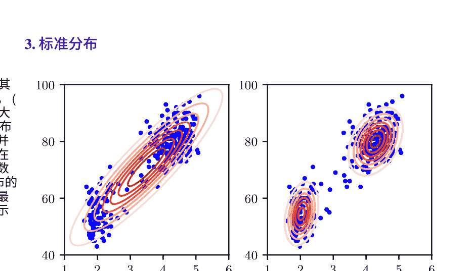

将最终数据点的贡献分解出来 \(\mathbf{x}_N\)，我们得到

$$\mu_{\text{ML}}^{(N)} = \frac{1}{N} \sum_{n=1}^{N} \mathbf{x}_n$$
$$= \frac{1}{N} \mathbf{x}_N + \frac{1}{N} \sum_{n=1}^{N-1} \mathbf{x}_n$$
$$= \frac{1}{N} \mathbf{x}_N + \frac{N-1}{N} \mu_{\text{ML}}^{(N-1)}$$
$$= \mu_{\text{ML}}^{(N-1)} + \frac{1}{N} (\mathbf{x}_N - \mu_{\text{ML}}^{(N-1)}). \tag{3.110}$$

这个结果有一个很好的解释，如下所示。在观察了 \(N-1\) 个数据点之后，我们通过 \(\mu_{\text{ML}}^{(N-1)}\) 来估计 \(\mu\)。现在我们观察到数据点 \(\mathbf{x}_N\)，并通过将旧的估计值在‘误差信号’ \((\mathbf{x}_N - \mu_{\text{ML}}^{(N-1)})\) 的方向上移动一个小的量，与 \(1/N\) 成比例地得到我们修订后的估计值 \(\mu_{\text{ML}}^{(N)}\)。请注意，随着 \(N\) 的增加，来自连续数据点的贡献变得越来越小。

#### 3.2.9 高斯混合模型

尽管高斯分布具有一些重要的分析性质，但在用于建模真实数据集时存在显著的局限性。

考虑图3.6(a)中的示例。这被称为“老忠实”数据集，包含了在美国黄石国家公园的老忠实间歇泉喷发的272次测量。每个测量给出了喷发持续时间（水平轴）和到下一次喷发的时间（垂直轴）的分钟数。我们可以看到数据集形成了两个主要的聚类，并且简单的高斯分布无法捕捉到这种结构。

我们可以预期，两个高斯分布的叠加将能够更好地表示这个数据集中的结构，事实上## 第15章

图3.7一维高斯混合分布的示例，显示了三个蓝色的高斯分布（每个都乘以一个系数）和它们的总和（红色）。

这证明了这种情况，从图3.6(b)可以看出。这种叠加，通过线性组合更基本的分布，如高斯分布，可以被形式化为概率模型，称为混合分布。在本节中，我们将考虑高斯分布来说明混合模型的框架。更一般地，混合模型可以由其他分布的线性组合组成，例如二元变量的伯努利分布的混合。在图3.7中，我们可以看到高斯分布的线性组合可以产生非常复杂的密度。

通过使用足够数量的高斯分布，并调整它们的均值和协方差以及线性组合中的系数，几乎可以以任意精度逼近任何连续分布。

因此，我们考虑了形式为

$$p(\mathbf{x}) = \sum_{k=1}^{K} \pi_k \mathcal{N}(\mathbf{x}|\boldsymbol{\mu}_k, \boldsymbol{\Sigma}_k) \tag{3.111}$$

这被称为高斯混合. 每个高斯密度 $\mathcal{N}(\mathbf{x}|\boldsymbol{\mu}_k, \boldsymbol{\Sigma}_k)$ 被称为混合的一个组成部分，并且具有自己的均值 $\boldsymbol{\mu}_k$ 和协方差 $\boldsymbol{\Sigma}_k$。图3.8显示了具有三个组成部分的二维高斯混合的等高线和曲面图。

参数 $\pi_k$ 在(3.111)中被称为混合系数. 如果我们对(3.111)两边关于 $\mathbf{x}$ 积分，并注意到 $p(\mathbf{x})$ 和各个高斯分量都被归一化，我们得到

$$\sum_{k=1}^{K} \pi_k = 1. \tag{3.112}$$

此外，给定 $\mathcal{N}(\mathbf{x}|\boldsymbol{\mu}_k, \boldsymbol{\Sigma}_k) \geqslant 0$，对于要求 $p(\mathbf{x}) \geqslant 0$ 的充分条件是 $\pi_k > 0$ 对于所有k将此与条件(3.112)结合，我们得到 将这个条件与(3.112)结合，我们得到

$$0 \leqslant \pi_k \leqslant 1. \tag{3.113}$$

因此，我们可以看到混合系数满足概率的要求，并且我们将展示混合分布的这种概率解释非常强大。

## 3. 标准分布

根据概率的和规则和乘法规则，边缘密度可以写成

$$p(\mathbf{x}) = \sum_{k=1}^{K} p(k)p(\mathbf{x}|k), \qquad (3.114)$$

这相当于(3.111)，我们可以将 $\pi_{k} = p(k)$ 视为选择第 $k$ 个组件的先验概率，而密度 $\mathcal{N}(\mathbf{x}|\boldsymbol{\mu}_{k}, \boldsymbol{\Sigma}_{k}) = p(\mathbf{x}|k)$ 视为在 $k$ 条件下的 $\mathbf{x}$ 的概率。正如我们将在后面的章节中看到的那样，相应的后验概率 $p(k|\mathbf{x})$ 扮演着重要的角色，也被称为责任。根据贝叶斯定理，它们可以表示为

$$\gamma_{k}(\mathbf{x}) \equiv p(k|\mathbf{x}) = \frac{p(k)p(\mathbf{x}|k)}{\sum_{l} p(l)p(\mathbf{x}|l)} = \frac{\pi_{k} \mathcal{N}(\mathbf{x}|\boldsymbol{\mu}_{k}, \boldsymbol{\Sigma}_{k})}{\sum_{l} \pi_{l} \mathcal{N}(\mathbf{x}|\boldsymbol{\mu}_{l}, \boldsymbol{\Sigma}_{l})}. \qquad (3.115)$$

高斯混合分布的形式由参数 $\boldsymbol{\pi}$ 决定，$\boldsymbol{\mu}$ 和 $\boldsymbol{\Sigma}$，我们使用符号 $\boldsymbol{\pi} \equiv \{\pi_{1}, \ldots, \pi_{K}\}$, $\boldsymbol{\mu} \equiv \{\boldsymbol{\mu}_{1}, \ldots, \boldsymbol{\mu}_{K}\}$, 和 $\boldsymbol{\Sigma} \equiv \{\boldsymbol{\Sigma}_{1}, \ldots, \boldsymbol{\Sigma}_{K}\}$。设置这些参数值的一种方法是使用最大似然估计。根据(3.111)，似然函数的对数为

$$\ln p(\mathbf{X}|\boldsymbol{\pi}, \boldsymbol{\mu}, \boldsymbol{\Sigma}) = \sum_{n=1}^{N} \ln \left\{ \sum_{k=1}^{K} \pi_{k} \mathcal{N}(\mathbf{x}_{n}|\boldsymbol{\mu}_{k}, \boldsymbol{\Sigma}_{k}) \right\} \qquad (3.116)$$

其中 $\mathbf{X} = \{\mathbf{x}_{1}, \ldots, \mathbf{x}_{N}\}$。我们立即看到，由于对 $k$ 的求和，情况比单个高斯分布复杂得多，导致了对数中的求和。

### 3.3. 周期变量

尽管高斯分布在实际意义上非常重要，既可以作为自身的构建模块，也可以作为更复杂概率模型的构建模块，但在连续变量的密度模型中，有时候它们并不适用。一个重要的情况是周期变量，在实际应用中经常出现。

一个周期变量的例子是特定地理位置的风向。例如，我们可能在多个位置测量风向，并希望使用参数分布对这些数据进行总结。另一个例子是日历时间，我们可能对24小时内或一年周期内被认为是周期性的数量感兴趣。这样的数量可以方便地用角度（极坐标）表示 $0 \leqslant \theta < 2\pi$。

我们可能会诱惑地通过选择某个方向作为原点，然后应用传统的分布，如高斯分布。然而，这种方法会导致结果强烈依赖于任意选择的原点。例如，假设我们有两个观测值 $\theta_1 = 1^\circ$ 和 $\theta_2 = 359^\circ$，并且我们使用标准的一元高斯分布对它们进行建模。如果我们将原点放在 $0^\circ$ 处，那么这个数据集的样本均值将为 $180^\circ$，标准差为 $179^\circ$，而如果我们将原点放在 $180^\circ$ 处，均值将为 $0^\circ$，标准差将为 $1^\circ$。显然，我们需要为周期变量开发一种特殊的方法。

#### 3.3.1 冯·米塞斯分布

让我们考虑评估一组观测值的均值的问题 $\mathcal{D} = \{\theta_1, \ldots, \theta_N\}$ 其中 $\theta$ 是以弧度为单位测量的周期变量。我们已经看到简单平均值 $(\theta_1 + \cdots + \theta_N)/N$ 将强烈依赖于坐标系。为了找到一个不变的均值度量，注意到观测值可以被视为单位圆上的点，因此可以用二维单位向量 $\mathbf{x}_1, \ldots, \mathbf{x}_N$ 来描述，其中 $\|\mathbf{x}_n\| = 1$ 对于 $n = 1, \ldots, N$，如图3.9所示。我们可以对向量 $\{\mathbf{x}_n\}$ 进行平均，得到

$$\bar{\mathbf{x}} = \frac{1}{N} \sum_{n=1}^{N} \mathbf{x}_n \qquad (3.117)$$

然后找到相应的角度 $\theta$ of 这个平均值。显然，这个定义将确保平均值的位置与角度坐标的原点无关。请注意，$\mathbf{x}$ 通常位于单位圆内。笛卡尔坐标

## 3. 标准分布

图3.9 表示值的插图- $\theta_n$ of一个周期变量作为二维向量 $x_n$生活在单位圆上。还显示了平均值 $\bar{x}$ of这些向量。

观测值的极坐标表示为 $\mathbf{x}_n = (\cos \theta_n, \sin \theta_n)$，我们可以将样本均值的笛卡尔坐标写成 $\bar{\mathbf{x}} = (\bar{r} \cos \bar{\theta}, \bar{r} \sin \bar{\theta})$。代入(3.117)并等同于 $\bar{x}_1$ 和 $\bar{x}_2$分量，然后得到

$$\bar{x}_1 = \bar{r} \cos \bar{\theta} = \frac{1}{N} \sum_{n=1}^N \cos \theta_n, \quad \bar{x}_2 = \bar{r} \sin \bar{\theta} = \frac{1}{N} \sum_{n=1}^N \sin \theta_n. \tag{3.118}$$

通过比值，并使用恒等式 $\tan \theta = \sin \theta / \cos \theta$，我们可以解出 $\bar{\theta}$为

$$\bar{\theta} = \tan^{-1} \left\{ \frac{\sum_n \sin \theta_n}{\sum_n \cos \theta_n} \right\}. \tag{3.119}$$

不久我们将看到这个结果如何自然地作为最大似然估计的结果出现。

首先，我们需要定义一个高斯的周期性推广，称为冯·米塞斯分布。在这里，我们将限制我们的注意力在一元分布上，尽管类似的周期性分布也可以在任意维度的超球面上找到（Mardia和Jupp，2000）。

按照惯例，我们将考虑具有周期 $2\pi$的分布 $p(\theta)$。任何在$\theta$上定义的概率密度 $p(\theta)$不仅必须是非负的且积分为一，还必须是周期性的。因此，$p(\theta)$必须满足三个条件：

- $p(\theta) \geqslant 0 \tag{3.120}$
- $\int_0^{2\pi} p(\theta) \, \mathrm{d}\theta = 1 \tag{3.121}$
- $p(\theta + 2\pi) = p(\theta). \tag{3.122}$

从 (3.122) 推导出，对于任意整数 $M$，有 $p(\theta + M 2\pi) = p(\theta)$。

我们可以很容易地得到满足这三个属性的类似高斯分布的分布，方法如下。考虑一个两个变量的高斯分布 $\mathbf{x}= (x_1, x_2)$

### 3.3. 周期变量

图3.10通过考虑一个形式为 (3.123) 的二维高斯分布，其密度等高线以蓝色显示，并在红色的单位圆上进行条件约束，可以得到von Mises分布。

具有均值 $\boldsymbol{\mu} = (\mu_1, \mu_2)$ 和协方差矩阵 $\boldsymbol{\Sigma} = \sigma^2 \mathbf{I}$，其中 $\mathbf{I}$ 是 $2 \times 2$ 单位矩阵，使得

$$p(x_1, x_2) = \frac{1}{2\pi\sigma^2} \exp \left\{ - \frac{(x_1 - \mu_1)^2 + (x_2 - \mu_2)^2}{2\sigma^2} \right\}. \tag{3.123}$$

常数轮廓 $p(\mathbf{x})$ 是圆形，如图3.10所示。现在假设我们考虑沿着固定半径的圆上的这个分布的值。然后根据构造，这个分布将是周期性的，尽管它不会被归一化。我们可以通过从笛卡尔坐标 $(x_1, x_2)$ 转换为极坐标 $(r, \theta)$ 来确定这个分布的形式

$$x_1 = r \cos \theta, \quad x_2 = r \sin \theta. \tag{3.124}$$

我们还通过写入将均值 $\boldsymbol{\mu}$ 映射到极坐标中

$$\mu_1 = r_0 \cos \theta_0, \quad \mu_2 = r_0 \sin \theta_0. \tag{3.125}$$

接下来，我们将这些变换代入二维高斯分布(3.123)，然后在单位圆上进行条件约束，即 $r=1$，注意我们只关心对 $\theta$ 的依赖。聚焦于高斯分布中的指数部分，我们有

$$\begin{align*} &-\frac{1}{2\sigma^2} \left\{ (r \cos \theta - r_0 \cos \theta_0)^2 + (r \sin \theta - r_0 \sin \theta_0)^2 \right\} \\ &= -\frac{1}{2\sigma^2} \left\{ 1 + r_0^2 - 2r_0 \cos \theta \cos \theta_0 - 2r_0 \sin \theta \sin \theta_0 \right\} \\ &= \frac{r_0}{\sigma^2} \cos(\theta - \theta_0) + \text{常数} \tag{3.126} \end{align*}$$

其中“常数”表示与 $\theta$ 无关的项。我们使用了以下三角恒等式：

$$\cos^2 A + \sin^2 A = 1 \tag{3.127}$$

$$\cos A \cos B + \sin A \sin B = \cos(A - B). \tag{3.128}$$

如果我们现在定义 $m = r_0 / \sigma^2$，我们得到我们的最终表达式为 $p(\theta)$ 沿着单位圆 $r=1$ 的形式

$$p(\theta | \theta_0, m) = \frac{1}{2\pi I_0(m)} \exp \left\{ m \cos(\theta - \theta_0) \right\}, \tag{3.129}$$

这被称为von Mises分布或圆形正态分布。这里的参数 $\theta_{0}$ 对应于分布的均值，而被称为 $m$ 的集中参数类似于高斯分布的逆方差（即精度）。在（3.129）中的归一化系数用 $I_{0}(m)$ 表示，它是第一类修正贝塞尔函数的零阶（Abramowitz和Stegun，1965）并且被定义为

$$ I_{0}(m) = \frac{1}{2\pi} \int_{0}^{2\pi} \exp\{m \cos \theta\} \mathrm{d} \theta. \tag{3.130} $$

练习3.31 对于大的 $m$，分布近似为高斯分布。von Mises分布在图3.11中绘制，函数 $I_{0}(m)$ 在图3.12中绘制。现在考虑von Mises分布的最大似然估计器的参数 $\theta_{0}$ 和 $m$。对数似然函数给出

$$ \ln p(\mathcal{D} | \theta_{0}, m) = -N \ln(2\pi) - N \ln I_{0}(m) + m \sum_{n=1}^{N} \cos(\theta_{n} - \theta_{0}). \tag{3.131} $$

将对 $\theta_{0}$ 的导数设为零，得到

$$ \sum_{n=1}^{N} \sin(\theta_{n} - \theta_{0}) = 0. \tag{3.132} $$

为了解 $\theta_{0}$，我们利用三角恒等式

$$ \sin(A - B) = \cos B \sin A - \cos A \sin B \tag{3.133} $$

练习3.32 从中我们得到

$$\theta_0^{\text{ML}} = \tan^{-1}\left\{ \frac{\sum_n \sin \theta_n}{\sum_n \cos \theta_n} \right\}, \tag{3.134}$$

我们将其识别为在二维笛卡尔空间中观察结果（3.119）的平均值。

类似地，最大化（3.131）关于 $m$ 的函数，并利用 $I_0'(m) = I_1(m)$ (Abramowitz和Stegun, 1965)，我们有

$$A(m_{\text{ML}}) = \frac{1}{N} \sum_{n=1}^N \cos(\theta_n - \theta_0^{\text{ML}}) \tag{3.135}$$

在这里，我们已经替换了 $\theta_0^{\text{ML}}$ 的最大似然解（记住我们正在进行关于 $\theta$ 和 $m$ 的联合优化），并且我们已经定义

$$A(m) = \frac{I_1(m)}{I_0(m)}. \tag{3.136}$$

函数 $A(m)$ 在图3.12中绘制。利用三角恒等式（3.128），我们可以将（3.135）写成以下形式

$$A(m_{\text{ML}}) = \left( \frac{1}{N} \sum_{n=1}^N \cos \theta_n \right) \cos \theta_0^{\text{ML}} + \left( \frac{1}{N} \sum_{n=1}^N \sin \theta_n \right) \sin \theta_0^{\text{ML}}. \tag{3.137}$$

方程式(3.137)的右侧可以很容易地计算，并且函数 $A(m)$ 可以通过数值方法求逆。冯·米塞斯分布的一个限制是它是单峰的。通过形成冯·米塞斯分布的混合，我们得到了一个灵活的框架，用于建模周期变量并处理多峰性。

为了完整起见，我们简要提到了一些构建周期分布的替代技术。最简单的方法是使用一个观测值的直方图，其中角度坐标被分成固定的区间。这样做的好处是## 3. 标准分布

简单性和灵活性，但也存在显著的局限性，我们将在稍后详细讨论直方图方法时看到第3.5节。另一种方法，类似于冯·米塞斯分布，从欧几里德空间上的高斯分布开始但现在边缘化到单位圆上，而不是条件化（Mardia和Jupp，2000年）。然而，这导致了更复杂的分布形式，不再进一步讨论。最后，任何有效的实轴分布（如高斯分布）都可以通过将连续的宽度为2π的区间映射到周期变量（0，2π）上来转化为周期分布，这相当于将实轴“包裹”在单位圆上。同样，所得到的分布比冯·米塞斯分布更复杂。

### 3.4. 指数族

我们在本章中研究的概率分布（混合模型除外）是指数族（Duda和Hart, 1973年; Bernardo和Smith, 1994年）的具体示例。

指数族的成员具有许多重要的共同属性，讨论这些属性在一般情况下是很有启发性的。

给定参数 η，指数族分布在 x上的分布定义为

$$
p(\mathbf{x}|\boldsymbol{\eta}) = h(\mathbf{x})g(\boldsymbol{\eta}) \exp \{\boldsymbol{\eta}^T \mathbf{u}(\mathbf{x})\}
$$

其中 x可以是标量或向量，可以是离散或连续的。这里的 η被称为分布的自然参数，u(x)是 x的某个函数。函数 g(η)可以解释为确保分布归一化的系数，因此满足以下条件

$$
g(\boldsymbol{\eta}) \int h(\mathbf{x}) \exp \{\boldsymbol{\eta}^T \mathbf{u}(\mathbf{x})\} d\mathbf{x} = 1
$$

其中，如果 x是离散变量，则积分被求和替代。我们首先举一些在本章中介绍的分布的例子，并展示它们确实是指数族的成员。

首先考虑伯努利分布：

$$
p(x|\mu) = \text{Bern}(x|\mu) = \mu^{x} (1 - \mu)^{1 - x}
$$

将右侧表达式表示为对数的指数形式，我们有

$$
p(x|\mu) = \exp \{ x \ln \mu + (1 - x) \ln(1 - \mu) \} = (1 - \mu) \exp \left\{ \ln \left( \frac{\mu}{1 - \mu} \right) x \right\}
$$

与(3.138)进行比较，我们可以确定

$$
\eta = \ln \left( \frac{\mu}{1 - \mu} \right)
$$

我们可以解出 $\mu = \sigma(\eta)$，其中

$$ \sigma(\eta) = \frac{1}{1 + \exp(-\eta)} \qquad (3.143) $$

被称为逻辑sigmoid函数。因此，我们可以用标准表示法(3.138)来写出伯努利分布的形式

$$ p(x|\eta) = \sigma(-\eta) \exp(\eta x) \qquad (3.144) $$

在这里我们使用了 $1 - \sigma(\eta) = \sigma(-\eta)$，这可以从(3.143)中容易证明。与(3.138)的比较表明

$$ \begin{align*} u(x) &= x \qquad (3.145) \\ h(x) &= 1 \qquad (3.146) \\ g(\eta) &= \sigma(-\eta). \qquad (3.147) \end{align*} $$

接下来考虑多项式分布，对于单个观测值 $\mathbf{x}$，它的形式为

$$ p(\mathbf{x}|\boldsymbol{\mu}) = \prod_{k=1}^{M} \mu_k^{x_k} = \exp \left\{ \sum_{k=1}^{M} x_k \ln \mu_k \right\} \qquad (3.148) $$

其中 $\mathbf{x}= (x_1, \ldots, x_M)^{\mathrm{T}}$。同样，我们可以用标准表示法(3.138)来写出这个式子，即

$$ p(\mathbf{x}|\boldsymbol{\eta}) = \exp(\boldsymbol{\eta}^{\mathrm{T}}\mathbf{x}) \qquad (3.149) $$

其中 $\eta_k = \ln \mu_k$，我们定义 $\boldsymbol{\eta} = (\eta_1, \ldots, \ldots, \ldots, \eta_M)^{\mathrm{T}}$。再次，与(3.138)进行比较，我们有

$$ \begin{align*} \mathbf{u}(\mathbf{x}) &= \mathbf{x} \qquad (3.150) \\ h(\mathbf{x}) &= 1 \qquad (3.151) \\ g(\boldsymbol{\eta}) &= 1. \qquad (3.152) \end{align*} $$

注意参数 $\eta_k$ 不是独立的，因为参数 $\mu_k$ 受到约束

$$ \sum_{k=1}^{M} \mu_k = 1 \qquad (3.153) $$

因此，对于给定的任意 $M-1$ 个参数 $\mu_k$，剩余参数的值是固定的。在某些情况下，通过仅用 $M-1$ 个参数来表示分布会更方便。可以通过使用关系式 (3.153) 来消除 $\mu_M$，并用剩余的 $\{\mu_k\}$（其中 $k=1, \ldots, M-1$）来表示。注意这些剩余参数仍然受到约束。

$$ 0 \leqslant \mu_k \leqslant 1, \qquad \sum_{k=1}^{M-1} \mu_k \leqslant 1. \qquad (3.154) $$

利用约束条件 (3.153) ，在这个表示中，多项式分布变为

$$
\begin{aligned}
\exp\left\{\sum_{k=1}^{M} x_k \ln \mu_k\right\}
&= \exp\left\{\sum_{k=1}^{M-1} x_k \ln \mu_k + \left(1 - \sum_{k=1}^{M-1} x_k\right) \ln\left(1 - \sum_{k=1}^{M-1} \mu_k\right)\right\} \\
&= \exp\left\{\sum_{k=1}^{M-1} x_k \ln\left(\frac{\mu_k}{1 - \sum_{j=1}^{M-1} \mu_j}\right) + \ln\left(1 - \sum_{k=1}^{M-1} \mu_k\right)\right\}. \tag{3.155}
\end{aligned}
$$

我们现在确定

$$
\ln\left(\frac{\mu_k}{1 - \sum_{j} \mu_j}\right) = \eta_k, \tag{3.156}
$$

我们可以通过首先对$k$求和，然后重新排列并进行反代解出 $\mu_k$

$$
\mu_k = \frac{\exp(\eta_k)}{1 + \sum_j \exp(\eta_j)}. \tag{3.157}
$$

这被称为 softmax函数或者归一化指数函数。 在这个表示中，多项式分布的形式为

$$
p(\mathbf{x}|\boldsymbol{\eta}) = \left(1 + \sum_{k=1}^{M-1} \exp(\eta_k)\right)^{-1} \exp(\boldsymbol{\eta}^\mathrm{T}\mathbf{x}). \tag{3.158}
$$

这是指数族的标准形式，参数向量为 $\boldsymbol{\eta} = (\eta_1, \dots, \eta_{M-1})^\mathrm{T}$ 其中

$$
\begin{aligned}
\mathbf{u}(\mathbf{x}) &= \mathbf{x} \tag{3.159} \\
h(\mathbf{x}) &= 1 \tag{3.160} \\
g(\boldsymbol{\eta}) &= \left(1 + \sum_{k=1}^{M-1} \exp(\eta_k)\right)^{-1}. \tag{3.161}
\end{aligned}
$$

最后，让我们考虑高斯分布。 对于一元高斯分布，我们有

$$
\begin{aligned}
p(x|\mu, \sigma^2) &= \frac{1}{(2\pi\sigma^2)^{1/2}} \exp\left\{-\frac{1}{2\sigma^2}(x - \mu)^2\right\} \tag{3.162} \\
&= \frac{1}{(2\pi\sigma^2)^{1/2}} \exp\left\{-\frac{1}{2\sigma^2}x^2 + \frac{\mu}{\sigma^2}x - \frac{1}{2\sigma^2}\mu^2\right\}, \tag{3.163}
\end{aligned}
$$

经过一些简单的重新排列后，可以将其转化为标准指数族

$$
\boldsymbol{\eta} = \begin{pmatrix} \mu/\sigma^2 \\ -1/(2\sigma^2) \end{pmatrix}
$$
(3.164)

$$
\mathbf{u}(x) = \begin{pmatrix} x \\ x^2 \end{pmatrix}
$$
(3.165)

$$
h(\mathbf{x}) = (2\pi)^{-1/2}
$$
(3.166)

$$
g(\boldsymbol{\eta}) = (-2\eta_2)^{1/2} \exp \left( \frac{\eta_1^2}{4\eta_2} \right).
$$
(3.167)

最后，我们有时会使用（3.138）的一种受限形式我们选择 $\mathbf{u}(\mathbf{x}) = \mathbf{x}$。 然而，通过注意到如果 $f(\mathbf{x})$是一个归一化的密度

$$
\frac{1}{s} f \left( \frac{1}{s} \mathbf{x} \right)
$$
(3.168)

也是一个归一化的密度，其中$s > 0$是一个尺度参数。结合这些，我们得到了一组受限的指数族类条件密度，形式为

$$
p(\mathbf{x}|\boldsymbol{\lambda}_k, s) = \frac{1}{s} h \left( \frac{1}{s} \mathbf{x} \right) g(\boldsymbol{\lambda}_k) \exp \left\{ \frac{1}{s} \boldsymbol{\lambda}_k^T \mathbf{x} \right\}.
$$
(3.169)

请注意，我们允许每个类别都有自己的参数向量 $\boldsymbol{\lambda}_k$，但我们假设类别共享相同的尺度参数 $s$。

#### 3.4.1 充分统计量

现在让我们考虑使用最大似然估计技术来估计通用指数族分布（3.138）中的参数向量 $\boldsymbol{\eta}$的问题。对（3.139）两边关于 $\boldsymbol{\eta}$求梯度，我们有

$$
\nabla g(\boldsymbol{\eta}) \int h(\mathbf{x}) \exp \left\{ \boldsymbol{\eta}^T \mathbf{u}(\mathbf{x}) \right\} d\mathbf{x} + g(\boldsymbol{\eta}) \int h(\mathbf{x}) \exp \left\{ \boldsymbol{\eta}^T \mathbf{u}(\mathbf{x}) \right\} \mathbf{u}(\mathbf{x}) d\mathbf{x} = 0.
$$
(3.170)

重新排列和再次利用(3.139)然后得到

$$
-\frac{1}{g(\boldsymbol{\eta})} \nabla g(\boldsymbol{\eta}) = g(\boldsymbol{\eta}) \int h(\mathbf{x}) \exp \left\{ \boldsymbol{\eta}^T \mathbf{u}(\mathbf{x}) \right\} \mathbf{u}(\mathbf{x}) d\mathbf{x} = \mathbb{E}[\mathbf{u}(\mathbf{x})].
$$
(3.171)

因此我们得到了结果

$$
-\nabla \ln g(\boldsymbol{\eta}) = \mathbb{E}[\mathbf{u}(\mathbf{x})].
$$
(3.172)注意，$\mathbf{u}(\mathbf{x})$的协方差可以用二阶导数来表示练习3.36 of $g(\boldsymbol{\eta})$，对于高阶矩也是类似的。因此，只要我们能够对指数族中的分布进行归一化，就可以通过简单的微分找到它的矩。

现在考虑一组独立同分布的数据，表示为 $X = \{\mathbf{x}_1, \ldots, \mathbf{x}_N\}$，其似然函数为

$$p(\mathbf{X}|\boldsymbol{\eta}) = \left( \prod_{n=1}^{N} h(\mathbf{x}_n) \right) g(\boldsymbol{\eta})^N \exp \left\{ \boldsymbol{\eta}^\mathrm{T} \sum_{n=1}^{N} \mathbf{u}(\mathbf{x}_n) \right\} .$$ (3.173)

将 $\ln p(\mathbf{X}|\boldsymbol{\eta})$ 对 $\boldsymbol{\eta}$ 的梯度设置为零，我们得到以下满足最大似然估计器 $\boldsymbol{\eta}_{\mathrm{ML}}$ 的条件：

$$-\nabla \ln g(\boldsymbol{\eta}_{\mathrm{ML}}) = \frac{1}{N} \sum_{n=1}^{N} \mathbf{u}(\mathbf{x}_n),$$ (3.174)

原则上可以通过求解来获得 $\boldsymbol{\eta}_{\mathrm{ML}}$。我们可以看到，最大似然估计器的解仅取决于数据的 $\sum_{n} \mathbf{u}(\mathbf{x}_n)$，因此被称为分布 (3.138) 的充分统计量。我们不需要存储整个数据集本身，而只需要存储充分统计量的值。例如，对于伯努利分布，函数 $\mathbf{u}(x)$ 只是 $x$，因此我们只需要保留数据点的总和 $\{x_n\}$，而对于高斯分布 $\mathbf{u}(x) = (x, x^2)^\mathrm{T}$，因此我们应该保留 $\{x_n\}$ 的总和和 $\{x_n^2\}$ 的总和。

如果我们考虑极限 $N \to \infty$，那么 (3.174) 的右边将变为 $\mathbb{E}[\mathbf{u}(\mathbf{x})]$，通过与 (3.172) 进行比较，我们可以看到在这个极限下，$\boldsymbol{\eta}_{\mathrm{ML}}$ 将等于真实值 $\boldsymbol{\eta}$。

### 3.5. 非参数方法

在本章中，我们专注于使用概率分布，这些分布具有由数据集确定的少量参数控制的特定函数形式。这被称为参数化密度建模的方法。这种方法的一个重要限制是所选择的密度可能是生成数据的分布的一个糟糕模型，这可能导致预测性能不佳。例如，如果生成数据的过程是多峰的，那么高斯分布永远无法捕捉到分布的这个特征，因为高斯分布必然是单峰的。在本节中，我们考虑一些对分布形式做出少量假设的非参数密度估计方法。

#### 3.5.1 直方图

让我们从直方图方法开始讨论密度估计，我们在图2.5的边际和条件分布的上下文中已经遇到过，在图3.2的中心极限定理的上下文中也遇到过。在这里，我们更详细地探讨直方图密度模型的属性，重点关注单个连续变量 $x$ 的情况。标准直方图将 $x$ 简单地分成宽度为 $\Delta_i$ 的不同区间，并计算落在 $x$ 中的观测数量 $n_i$。

图3.13是直方图密度估计方法的示例，其中从绿色曲线所示的分布中生成了一个包含50个数据点的数据集。基于公式(3.175)和常见的区间宽度 Δ，展示了不同 Δ值的直方图密度估计。

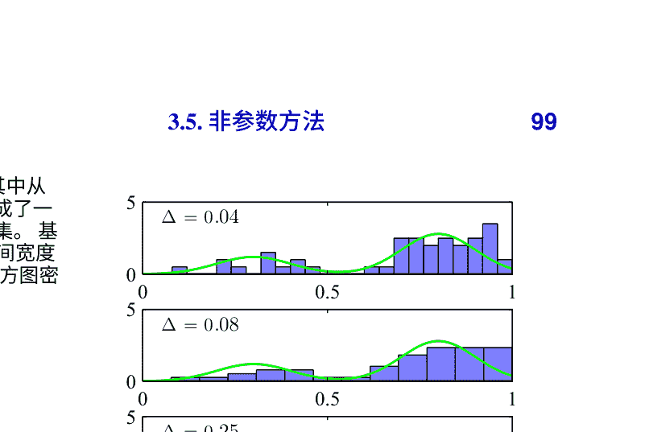

在区间 i中。为了将这个计数转化为归一化的概率密度，我们只需将其除以总观测数 N和区间宽度 Δ_i，即可得到每个区间的概率值：

$$p_i = \frac{n_i}{N \Delta_i}$$ (3.175)

很容易看出这给出了一个密度模型 p(x)在每个箱子的宽度上都是恒定的。通常选择的箱子具有相同的宽度 Δ_i= Δ。

在图3.13中，我们展示了直方图密度估计的一个例子。这里的数据是从对应于绿色曲线的分布中抽取的，该分布由两个高斯分布的混合形成。还显示了三个直方图密度估计的示例，对应于三种不同的箱子宽度 Δ的选择。我们可以看到，当 Δ非常小（顶部图），得到的密度模型非常尖锐，具有很多在生成数据集的基础分布中不存在的结构。相反，如果 Δ太大（底部图），则结果是一个过于平滑的模型，无法捕捉到绿色曲线的双峰特性。最好的结果是在某个中间值 Δ（中间图）获得的。原则上，直方图密度模型还取决于箱子的边缘位置的选择，尽管这通常比箱子宽度 Δ的选择不重要得多。

请注意，直方图方法具有以下特性（与即将讨论的方法不同）：一旦计算出直方图，数据集本身可以被丢弃，这在数据集很大的情况下是有优势的。此外，如果数据点是按顺序到达的，直方图方法很容易应用。

实际上，直方图技术对于在一维或二维数据中快速可视化数据非常有用，但对于大多数密度估计应用来说并不适用。一个明显的问题是估计的密度具有不连续性，这是由于箱边而不是底层分布生成数据的任何属性造成的。直方图方法的一个主要限制是其随着维度的增加而扩展。如果我们将D维空间中的每个变量划分为M个箱子，则总箱子数将为M D。

#### 3.5.2 核密度

假设我们正在从某个未知概率密度函数 p(x) 在某个 D 维空间中抽取观测值，并且我们希望估计 p(x) 的值。根据我们之前对局部性的讨论，让我们考虑包含 x 的一小区域 R。与该区域相关的概率质量由以下公式给出：

```
$$P = \int_{\mathcal{R}} p(\mathbf{x}) \mathrm{d} \mathbf{x}$$ (3.176)
```

现在假设我们收集了一个由 N 个从 P(x) 中抽取的观测组成的数据集。因为每个数据点在 R 内的概率为 P，位于 R 内的点的总数 K 将服从二项分布：

```
$$\operatorname{Bin}(K|N, P)=\frac{N!}{K!(N-K)!} P^{K}(1-P)^{N-K}$$ (3.177)
```

使用(3.11)，我们可以看到点落在该区域内的平均比例为 $\mathbb{E}[K / N]=P$，类似地，使用(3.12)，我们可以看到围绕这个均值的方差为 $\operatorname{var}[K / N]=P(1-P) / N$。对于大 N，这个分布将在均值附近呈尖峰状，因此

```
$$K \simeq N P$$ (3.178)
```

然而，如果我们还假设区域 R 足够小，使得概率密度 p(x) 在该区域内大致恒定，那么我们有

```
$$P \simeq p(\mathbf{x}) V$$ (3.179)
```

其中 V 是 ℛ 的体积。结合(3.178)和(3.179)，我们得到了我们的密度估计形式

```
$$p(\mathbf{x}) = \frac{K}{N V} \quad (3.180)$$
```

请注意，(3.180)的有效性取决于两个相互矛盾的假设，即区域 ℛ 足够小，使得密度在该区域内近似恒定，同时又足够大（相对于该密度的值），使得落在该区域内的点的数量 K 足够多，以使二项分布呈尖峰状。

我们可以以两种不同的方式利用结果(3.180)。一种方式是固定 K 并从数据中确定 V 的值，这导致了稍后讨论的 K 最近邻技术，另一种方式是固定 V 并从数据中确定 K 的值，从而产生了核方法。可以证明，在 N→∞ 的极限情况下，K 最近邻密度估计器和核密度估计器都收敛于真实概率密度，前提是 V 随着 N 收缩，K 随着 N 增长。

> N，以适当的速率（Duda和Hart，1973年）

我们首先详细讨论核方法。首先，我们将区域 ℛ 定义为以我们希望确定概率密度的点 x 为中心的小超立方体。为了计算落在该区域内的点的数量 K，我们方便地定义以下函数：

```
$$k(\mathbf{u}) = \begin{cases} 1, & |u_i| \leq 1/2, \quad i=1, \ldots, D, \\ 0, & \text{否则} \end{cases} \quad (3.181)$$
```

它表示以原点为中心的单位立方体。函数 k(u) 是一个核函数的示例，在这个上下文中，它也被称为 Parzen 窗口。根据 (3.181)，如果数据点 x_n 位于以 x 为中心、边长为 h 的立方体内，则数量 k((x - x_n)/h) 将为1，否则为零。因此，落在该立方体内的数据点的总数将为

```
$$K = \sum_{n=1}^{N} k\left( \frac{\mathbf{x} - \mathbf{x}_n}{h} \right) \quad (3.182)$$
```

将这个表达式代入(3.180)中，得到估计密度在 x 处的结果如下：

```
$$p(\mathbf{x}) = \frac{1}{N} \sum_{n=1}^{N} \frac{1}{h^D} k\left( \frac{\mathbf{x} - \mathbf{x}_n}{h} \right) \quad (3.183)$$
```

其中我们使用了 V = h^D 表示边长为 h 的超立方体的体积。利用函数 k(u) 的对称性，我们现在可以将这个方程重新解释为不是以 x 为中心的单个立方体，而是以 N 个数据点 x_n 为中心的 N 个立方体的总和。

目前，核密度估计器(3.183)将面临与直方图方法相同的问题，即存在人为的不连续性，这种情况发生在立方体的边界处。我们可以获得一个更平滑的

## 3. 标准分布

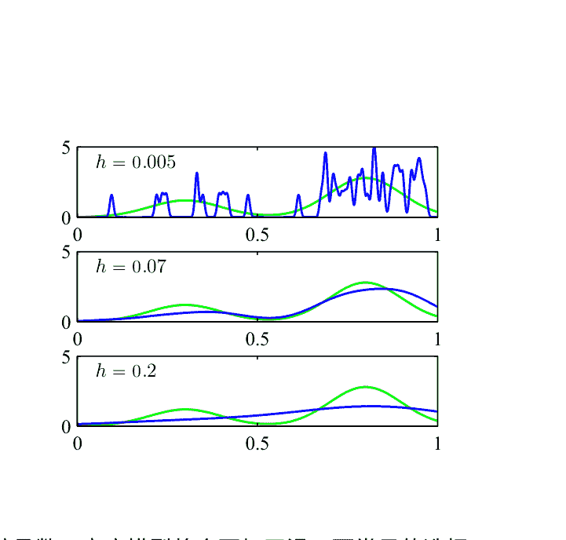

图3.14展示了应用于与图3.13中直方图方法相同的数据集的核密度模型(3.184)的示例。我们可以看到h作为一个平滑参数，并且如果设置得太小(顶部面板)，结果是一个非常嘈杂的密度模型，而如果设置得太大(底部面板)，则会淡化数据生成的基本分布的双峰性质(绿色曲线所示)。最佳的密度模型是在某个中间值h(中间面板)获得的。

如果我们选择一个更平滑的核函数，密度模型将会更加平滑，而常见的选择是高斯核函数，它给出了以下的核密度模型：

```
$$ p(\mathbf{x}) = \frac{1}{N} \sum_{n=1}^{N} \frac{1}{(2\pi h^2)^{D/2}} \exp \left\{ -\frac{\|\mathbf{x} - \mathbf{x}_n\|^2}{2h^2} \right\} \quad (3.184) $$
```

其中h表示高斯分量的标准差。因此，我们的密度模型是通过在每个数据点上放置一个高斯分布，将整个数据集的贡献相加，然后除以N来正确归一化密度。在图3.14中，我们将模型(3.184)应用于之前用于演示直方图技术的数据集。我们可以看到，如预期的那样，参数h起到了平滑参数的作用，在小h时对噪声敏感，在大h时过度平滑。同样，h的优化是模型复杂性的问题，类似于直方图密度估计中的箱宽选择或曲线拟合中使用的多项式的阶数选择。

我们可以选择任何其他核函数k(u)在(3.183)中满足条件

```
$$ k(\mathbf{u}) \geq 0, \quad (3.185) $$
$$ \int k(\mathbf{u}) \, d\mathbf{u} = 1, \quad (3.186) $$
```

这确保了生成的概率分布在任何地方都是非负的，并且积分为一。由(3.183)给出的密度模型类被称为核密度估计器或Parzen估计器。它的一个很大优点是在“训练”阶段没有涉及计算，因为这只需要将训练集存储起来即可。然而，这也是它的一个很大弱点，因为计算密度的计算成本随着数据集的大小线性增长。

## 3.5. 非参数方法

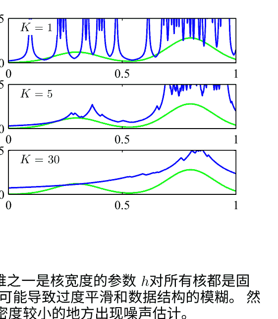

图3.15说明的 $K$最近邻密度估计使用与图3.14和3.13相同的数据集。我们可以看到参数 $K$ 控制了平滑程度，所以较小的 $K$ 值会导致非常嘈杂的密度模型（顶部面板），而较大的值（底部面板）会平滑真实分布的双峰特性（由绿色曲线表示）（该分布生成了数据集）。

#### 3.5.3 最近邻

核方法用于密度估计的一个困难之一是核宽度的参数 $h$ 对所有核都是固定的。在高密度区域，较大的 $h$ 值可能导致过度平滑和数据结构的模糊。然而，减小 $h$ 可能会导致数据空间中密度较小的地方出现噪声估计。

因此，$h$ 的最佳选择可能取决于数据空间中的位置。最近邻方法用于解决这个问题的密度估计。

因此，我们回到了局部密度估计的一般结果（3.180），不再固定 $V$ 并从数据中确定 $K$ 的值，而是考虑一个固定的 $K$ 值，并使用数据来找到适当的 $V$ 值。为了做到这一点，我们考虑以点 $\mathbf{x}$ 为中心的小球，我们希望估计该点的密度 $p(\mathbf{x})$，并允许球的半径增长直到它恰好包含 $K$ 数据点。密度估计的 $p(\mathbf{x})$ 由(3.180)给出，其中 $V$ 设置为结果球体的体积。这种技术被称为 $K$ 最近邻算法，并在图3.15中以不同的参数 $K$ 选择进行说明，使用与图3.13和3.14中相同的数据集。我们可以看到 $K$ 的值现在决定了平滑的程度，并且再次存在一个最佳选择既不太大也不太小的 $K$ 值。请注意，由 $K$ 最近邻算法生成的模型不是一个真正的密度模型，因为在所有空间上的积分发散。

我们通过展示如何将 $K$ 最近邻密度估计技术扩展到分类问题来结束本章。为此，我们分别对每个类别应用 $K$ 最近邻密度估计技术，然后利用贝叶斯定理。假设我们有一个数据集，其中包含 $N_k$ 个点在类 $\mathcal{C}_k$ 中，总共有 $N$ 个点，因此 $\sum$

如果我们希望对一个新的点进行分类 $\mathbf{x}$，我们会在 $\mathbf{x}$ 上绘制一个以 $\mathbf{x}$ 为中心的球体，其中恰好包含 $K$ 个点，无论它们的类别如何。假设这个球体的体积为 $V$，并且包含来自类别 $\mathcal{C}_k$ 的 $K_k$ 个点。那么(3.180)提供了与密度相关的估计

图3.16 (a) 在 K最近邻分类器中，一个新的点，用黑色钻石表示，根据 K 个最接近的训练数据点的多数类别成员进行分类，本例中 K =3。

(b) 在最近邻（K= 1）分类方法中，得到的决策边界由形成不同类别的点的垂直平分线组成。

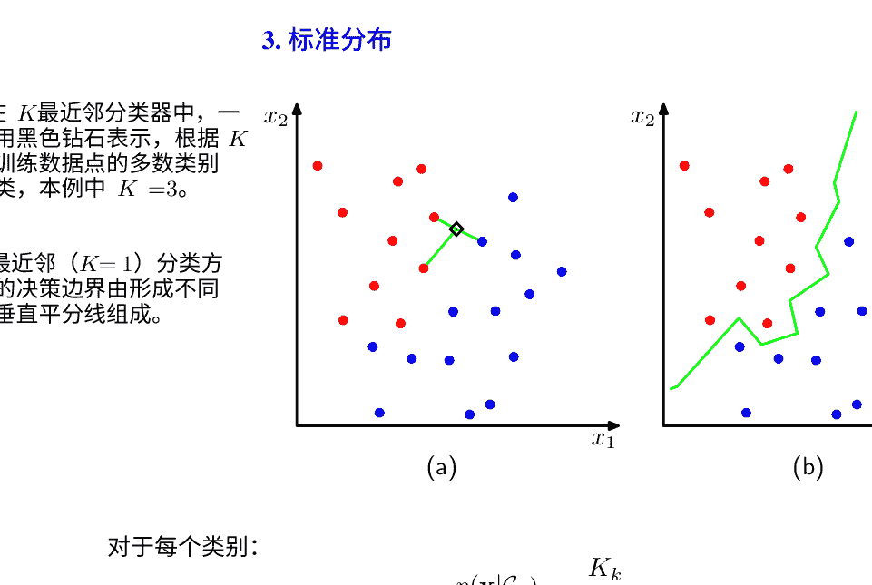

对于每个类别：
$$p(\mathbf{x}|\mathcal{C}_k) = \frac{K_k}{N_k V}.\tag{3.187}$$

同样地，无条件密度由以下给出
$$p(\mathbf{x}) = \frac{K}{N V}\tag{3.188}$$

类先验由以下给出
$$p(\mathcal{C}_k) = \frac{N_k}{N}.\tag{3.189}$$

现在我们可以使用贝叶斯定理结合(3.187)，(3.188)和(3.189)来得到类成员的后验概率：
$$p(\mathcal{C}_k|\mathbf{x}) = \frac{p(\mathbf{x}|\mathcal{C}_k)p(\mathcal{C}_k)}{p(\mathbf{x})} = \frac{K_k}{K}.\tag{3.190}$$

通过将测试点 x分配给具有最大后验概率的类，可以最小化误分类的概率，对应于最大的 K_k/K值。因此，要对一个新点进行分类，我们从训练数据集中识别出 K个最近的点，然后将新点分配给在这个集合中具有最多代表的类。可以随机地解决平局。特殊情况 K= 1被称为最近邻规则，因为测试点简单地被分配给与训练集中最近点相同的类。这些概念在图3.16中有所说明。

最近邻（K= 1）分类器的一个有趣特性是，在极限 N→∞下，错误率永远不会超过最优分类器的最小可达错误率，即使用真实类别分布的分类器（Cover和Hart，1967年）。

到目前为止讨论的内容，无论是 K最近邻方法还是核密度估计器，都需要存储整个训练数据集，导致成本高昂

如果数据集很大，计算量会很大。通过构建基于树的搜索结构，可以抵消这种影响，以在不对数据集进行详尽搜索的情况下高效地找到（近似的）近邻。然而，这些非参数方法仍然有严重的限制。另一方面，我们已经看到简单的参数模型在表示分布形式方面非常受限。因此，我们需要找到非常灵活的密度模型，同时可以独立于训练集的大小来控制模型的复杂性，而深度神经网络可以实现这一点。

### 练习

3.1 (★)验证伯努利分布 (3.2) 满足以下性质：

```
$$\sum_{x=0}^{1} p(x|\mu) = 1 \qquad (3.191)$$
$$\mathbb{E}[x] = \mu \qquad (3.192)$$
$$\text{var}[x] = \mu(1 - \mu). \qquad (3.193)$$
```

证明伯努利分布的熵 H[x]是由以下公式给出的：
$$\text{H}[x] = -\mu \ln \mu - (1 - \mu) \ln(1 - \mu). \qquad (3.194)$$

3.2 (★★)伯努利分布的形式 (3.2) 在 x 的两个值之间不对称。在某些情况下，使用一个等价的表达方式会更方便，其中 $x \in \{-1, 1\}$，此时分布可以写成

```
$$p(x|\mu) = \left( \frac{1 - \mu}{2} \right)^{(1-x)/2} \left( \frac{1 + \mu}{2} \right)^{(1+x)/2} \qquad (3.195)$$
```

证明分布 (3.195) 是归一化的，并计算其均值、方差和熵。

3.3 (★★) 在这个练习中，我们证明二项分布 (3.9) 是归一化的。
首先，使用组合数的定义 (3.10)，证明从总数为 N 的 m 个相同对象中选择的数量为

```
$$\binom{N}{m} + \binom{N}{m-1} = \binom{N+1}{m}. \qquad (3.196)$$
```

利用这个结果通过归纳法证明以下结果：

```
$$(1+x)^N = \sum_{m=0}^{N} \binom{N}{m} x^m, \qquad (3.197)$$
```

这被称为二项式定理，对于所有实数 $x$都成立。
最后，证明二项分布是归一化的，即

```
$$\sum_{m=0}^{N} \binom{N}{m} \mu^m (1-\mu)^{N-m} = 1 \qquad (3.198)$$
```

这可以通过首先将因子 $(1-\mu)^N$ 从求和中提取出来，然后利用二项式定理来完成。

3.4 (★★)证明二项分布的均值为(3.11)。为了做到这一点，对归一化条件(3.198)关于 μ求导，然后重新排列以得到 μ的均值表达式。 同样，通过对(3.198)关于 μ求两次导，并利用二项分布的均值(3.11)的结果，证明二项分布的方差(3.1 2)的结果。

3.5 (★)证明多元高斯分布(3.26)的众数为μ。

3.6 (★★)假设 x服从均值为 μ和协方差为 Σ的高斯分布。
证明线性变换后的变量 Ax + b也服从高斯分布，并找到其均值和协方差。

3.7 (***)证明两个高斯分布 $q(\mathbf{x}) = \mathcal{N}(\mathbf{x}|\boldsymbol{\mu}_q, \boldsymbol{\Sigma}_q)$ 和 $p(\mathbf{x}) = \mathcal{N}(\mathbf{x}|\boldsymbol{\mu}_p, \boldsymbol{\Sigma}_p)$ 之间的Kullback-Leibler散度为 $KL(q(\mathbf{x})\|p(\mathbf{x}))$

```
$$= \frac{1}{2} \left\{ \ln \frac{|\boldsymbol{\Sigma}_p|}{|\boldsymbol{\Sigma}_q|} - D + \mathrm{Tr}\left( \boldsymbol{\Sigma}_p^{-1} \boldsymbol{\Sigma}_q \right) + (\boldsymbol{\mu}_p - \boldsymbol{\mu}_q)^{\mathrm{T}} \boldsymbol{\Sigma}_p^{-1} (\boldsymbol{\mu}_p - \boldsymbol{\mu}_q) \right\}$$
```

其中 $\mathrm{Tr}(\cdot)$ 表示矩阵的迹， $D$ 是 $\mathbf{x}$ 的维度。

3.8 (★★)这个练习证明了在给定协方差的情况下，具有最大熵的多元分布是高斯分布。分布 $p(\mathbf{x})$ 的熵由以下公式给出

```
$$\mathrm{H}[\mathbf{x}] = -\int p(\mathbf{x}) \ln p(\mathbf{x}) \, d\mathbf{x}.\tag{3.199}$$
```

我们希望在所有分布 $p(\mathbf{x})$ 的约束条件下，最大化 $\mathrm{H}[\mathbf{x}]$。$p(\mathbf{x})$ 被归一化，并且具有特定的均值和协方差，以便

```
$$\int p(\mathbf{x}) \, d\mathbf{x} = 1\tag{3.200}$$
```

```
$$\int p(\mathbf{x}) \mathbf{x} \, d\mathbf{x} = \boldsymbol{\mu}\tag{3.201}$$
```

```
$$\int p(\mathbf{x}) (\mathbf{x} - \boldsymbol{\mu}) (\mathbf{x} - \boldsymbol{\mu})^{\mathrm{T}} \, d\mathbf{x} = \boldsymbol{\Sigma}.\tag{3.202}$$
```

通过对(3.199)进行变分最大化，并使用拉格朗日乘子来强制执行约束条件(3.200)，(3.201)和(3.202)，证明最大似然分布由高斯分布(3.26)给出。

3.9 (★★★)证明多元高斯分布 \(\mathcal{N}(\mathbf{x}|\boldsymbol{\mu}, \boldsymbol{\Sigma})\) 的熵为
\[
\mathrm{H}[\mathbf{x}] = \frac{1}{2} \ln |\boldsymbol{\Sigma}| + \frac{D}{2} (1 + \ln(2\pi)) \tag{3.204}
\]
其中 \(D\) 是 \(\mathbf{x}\) 的维度。

3.10 (★★★)考虑两个具有高斯分布的随机变量 \(x_1\) 和 \(x_2\)，其均值分别为 \(\mu_1\) 和 \(\mu_2\)，精度分别为 \(\tau_1\) 和 \(\tau_2\)。推导出变量 \(x = x_1 + x_2\) 的微分熵表达式。为此，首先使用关系式找到 \(x\) 的分布
\[
p(x) = \int_{-\infty}^{\infty} p(x|x_2) p(x_2) \, \mathrm{d}x_2 \tag{3.205}
\]
并在指数中完成平方项的配方。然后观察到这表示两个高斯分布的卷积，它本身将是高斯分布，并最终利用单变量高斯分布的熵的结果(2.99)。 3.11 (★) 考虑由(3.26)给出的多元高斯分布。通过将精度矩阵(逆协方差矩阵)写成对称矩阵和反对称矩阵的和，证明反对称项不出现在高斯分布的指数中，因此，可以假设精度矩阵是对称的而不失一般性。因为对称矩阵的逆矩阵也是对称的(参见练习3.16)，所以协方差矩阵也可以选择为对称的而不失一般性。

3.12 (★★★)考虑一个实对称矩阵 \(\boldsymbol{\Sigma}\)，其特征值方程为(3.28)。通过取该方程的复共轭，减去原方程，并与特征向量 \(\mathbf{u}_i\) 进行内积，证明特征值 \(\lambda_i\) 是实数。类似地，利用 \(\boldsymbol{\Sigma}\) 的对称性质，证明两个特征向量 \(\mathbf{u}_i\) 和 \(\mathbf{u}_j\) 在 \(\lambda_j = \lambda_i\) 的情况下是正交的。最后，证明，不失一般性，特征向量的集合可以选择为正交的，即满足(3.29)，即使一些特征值为零。

3.13 (★★)证明一个具有特征向量方程(3.28)的实对称矩阵 \(\boldsymbol{\Sigma}\) 可以表示为特征向量的展开，展开系数由特征值给出，形式为(3.31)。类似地，证明逆矩阵 \(\boldsymbol{\Sigma}^{-1}\) 具有形式为(3.32)的表示。

3.14 (★★)一个正定矩阵 \(\boldsymbol{\Sigma}\) 可以被定义为二次形式为正的矩阵。

\[
\mathbf{a}^{\mathrm{T}} \boldsymbol{\Sigma} \mathbf{a} \tag{3.206}
\]
对于向量 \(\mathbf{a}\) 的任何实数值，都是正的。证明 \(\boldsymbol{\Sigma}\) 为正定矩阵的一个必要且充分条件是所有由(3.28)定义的 \(\boldsymbol{\Sigma}\) 的特征值 \(\lambda_i\) 都是正的。

3.15 (★)证明一个大小为 \(D \times D\) 的实对称矩阵具有 \(D(D+1)/2\) 个独立参数。

# 第3章 多元高斯分布

3.16 (*) 证明对称矩阵的逆矩阵也是对称的。

3.17 (***) 通过使用特征向量展开式 (3.31) 对坐标系进行对角化，证明与常数马哈拉诺比斯距离 Δ 对应的超椭球体内的体积为

$$ V_D |\Sigma|^{1/2} \Delta^D $$ (3.207)

其中 $V_D$ 是 $D$ 维度中单位球的体积，马氏距离由 (3.27) 定义。

通过将矩阵两边乘以 (3.60) 证明恒等式

$$ \begin{pmatrix} A & B \\ C & D \end{pmatrix} $$ (3.208)

并利用定义 (3.61)。

在 3.2.4 和 3.2.5 节中，我们考虑了多元高斯分布的条件和边缘分布。更一般地，我们可以将 $\mathbf{x}$ 的分量分为三组 $\mathbf{x}_a$，$\mathbf{x}_b$ 和 $\mathbf{x}_c$，并相应地将均值向量 $\boldsymbol{\mu}$ 和协方差矩阵 $\boldsymbol{\Sigma}$ 分成以下形式的分组

$$ \boldsymbol{\mu} = \begin{pmatrix} \boldsymbol{\mu}_a \\ \boldsymbol{\mu}_b \\ \boldsymbol{\mu}_c \end{pmatrix},\quad \boldsymbol{\Sigma} = \begin{pmatrix} \boldsymbol{\Sigma}_{aa} & \boldsymbol{\Sigma}_{ab} & \boldsymbol{\Sigma}_{ac} \\ \boldsymbol{\Sigma}_{ba} & \boldsymbol{\Sigma}_{bb} & \boldsymbol{\Sigma}_{bc} \\ \boldsymbol{\Sigma}_{ca} & \boldsymbol{\Sigma}_{cb} & \boldsymbol{\Sigma}_{cc} \end{pmatrix}. $$ (3.209)

通过利用第 3.2 节的结果，找到一个条件分布的表达式 $p(\mathbf{x}_a|\mathbf{x}_b)$ 其中 $\mathbf{x}_c$ 已经被边缘化掉。

3.20 (**) 线性代数中一个非常有用的结果是 Woodbury 矩阵求逆公式

$$ (\mathbf{A} + \mathbf{BCD})^{-1} = \mathbf{A}^{-1} - \mathbf{A}^{-1}\mathbf{B}(\mathbf{C}^{-1} + \mathbf{DA}^{-1}\mathbf{B})^{-1}\mathbf{DA}^{-1}. $$ (3.210)

通过将两边乘以 $(\mathbf{A} + \mathbf{BCD})$，证明这个结果的正确性。

3.21 (*) 让 $\mathbf{x}$ 和 $\mathbf{z}$ 是两个独立的随机向量，使得 $p(\mathbf{x}, \mathbf{z}) = p(\mathbf{x})p(\mathbf{z})$。证明他们的和 $\mathbf{y} = \mathbf{x} + \mathbf{z}$ 的均值等于每个变量的均值之和。同样，证明 $\mathbf{y}$ 的协方差矩阵等于 $\mathbf{x}$ 和 $\mathbf{z}$ 的协方差矩阵之和。

3.22 (***) 考虑变量的联合分布

$$ \mathbf{z} = \begin{pmatrix} \mathbf{x} \\ \mathbf{y} \end{pmatrix} $$ (3.211)

其均值和协方差分别由 (3.92) 和 (3.89) 给出。通过利用结果 (3.76) 和 (3.77)，证明边缘分布 $p(\mathbf{x})$ 由 (3.83) 给出。同样，通过利用结果 (3.65) 和 (3.66)，证明条件分布 $p(\mathbf{y}|\mathbf{x})$ 由 (3.84) 给出。

3.23 (**) 使用分块矩阵求逆公式 (3.60)，证明精度矩阵 (3.88) 的逆矩阵等于协方差矩阵 (3.89)。

3.24 (**) 从 (3.91) 开始，并利用结果 (3.89)，验证结果 (3.92)。

3.25 (**) 考虑两个多维随机向量 $\mathbf{x}$ 和 $\mathbf{z}$，它们分别服从高斯分布 $p(\mathbf{x}) = \mathcal{N}(\mathbf{x} | \boldsymbol{\mu}_{\mathbf{x}}, \boldsymbol{\Sigma}_{\mathbf{x}})$ 和 $p(\mathbf{z}) = \mathcal{N}(\mathbf{z} | \boldsymbol{\mu}_{\mathbf{z}}, \boldsymbol{\Sigma}_{\mathbf{z}})$，以及它们的和 $\mathbf{y} = \mathbf{x} + \mathbf{z}$。通过考虑由边缘分布 $p(\mathbf{x})$ 和条件分布 $p(\mathbf{y} | \mathbf{x})$ 构成的线性高斯模型，并利用结果 (3.93) 和 (3.94)，证明边缘分布 $p(\mathbf{y})$ 等于 $p(\mathbf{y}) = \mathcal{N}(\mathbf{y} | \boldsymbol{\mu}_{\mathbf{x}} + \boldsymbol{\mu}_{\mathbf{z}}, \boldsymbol{\Sigma}_{\mathbf{x}} + \boldsymbol{\Sigma}_{\mathbf{z}})$。 (3.212)

3.26 (***) 这个练习和下一个练习是为了练习在线性高斯模型中出现的二次型的操作，并且它们也作为主要文本中推导结果的独立检查。考虑一个由边缘分布和条件分布给出的联合分布 $p(\mathbf{x}, \mathbf{y})$，由 (3.83) 和 (3.84) 给出。通过检查联合分布中指数项的二次型，并使用第 3.2 节讨论的‘配方法’技术，找到在积分掉变量 $\mathbf{x}$ 后，边缘分布 $p(\mathbf{y})$ 的均值和协方差的表达式。为此，使用 Woodbury 矩阵求逆公式 (3.210)。验证这些结果与 (3.93) 和 (3.94) 一致。

3.27 (***) 考虑与练习 3.26 中相同的联合分布，但现在使用配方法来找到条件分布 $p(\mathbf{x} | \mathbf{y})$ 的均值和协方差的表达式。再次验证这些结果与相应的表达式 (3.95) 和 (3.96) 一致。

3.28 (**) 为了找到多元高斯分布协方差矩阵的最大似然解，我们需要最大化对数似然函数 (3.102) 关于 $\boldsymbol{\Sigma}$ 的值，注意协方差矩阵必须是对称的和正定的。在这里，我们忽略这些约束并进行直接的最大化。使用附录 A 中的结果 (A.21)、(A.26) 和 (A.28)，证明最大化对数似然函数 (3.102) 的协方差矩阵 $\boldsymbol{\Sigma}$ 是给定的样本协方差 (3.106)。我们注意到最终结果必然是对称的和正定的（前提是样本协方差是非奇异的）。

3.29 (**) 使用结果 (3.42) 证明 (3.46)。现在，使用结果 (3.42) 和 (3.46)，展示 $\mathbb{E}[\mathbf{x}_n \mathbf{x}_m^{\mathrm{T}}] = \boldsymbol{\mu} \boldsymbol{\mu}^{\mathrm{T}} + I_{nm} \boldsymbol{\Sigma}$ (3.213) 其中，$\mathbf{x}_n$ 表示从均值为 $\boldsymbol{\mu}$，协方差为 $\boldsymbol{\Sigma}$ 的高斯分布中采样的数据点，$I_{nm}$ 表示单位矩阵的 $(n, m)$ 元素。因此，证明结果 (3.108)。

3.30 (*) 本章讨论周期变量时使用的各种三角恒等式可以轻松证明，从关系式 $\exp(iA) = \cos A + i \sin A$ (3.214) 其中 i 是负一的平方根。通过考虑恒等式

> $$ \exp(iA) \exp(-iA) = 1 \quad (3.215) $$

证明结果 (3.127)。同样地，使用恒等式

> $$ \cos(A - B) = \Re \exp\{i(A - B)\} \quad (3.216) $$

其中 $\Re$ 表示实部，证明 (3.128)。最后，通过使用 $\sin(A - B) = \Im \exp\{i(A - B)\}$，其中 $\Im$ 表示虚部，证明结果 (3.133)。

3.31 (★★) 对于大的 m，von Mises 分布 (3.129) 在模态 $\theta_0$ 周围变得尖锐。通过定义 $\xi = m^{1/2}(\theta - \theta_0)$ 并对余弦函数进行泰勒展开

> $$ \cos \alpha = 1 - \frac{\alpha^2}{2} + O(\alpha^4) \quad (3.217) $$

证明当 $m \to \infty$ 时，von Mises 分布趋向于高斯分布。

3.32 (★) 使用三角恒等式 (3.133)，证明 (3.132) 的解对于 $\theta_0$ 是由 (3.134) 给出的。

3.33 (★) 通过计算 von Mises 分布 (3.129) 的一阶和二阶导数，并使用 $I_0(m) > 0$ 对于 $m > 0$，证明分布的最大值出现在 $\theta = \theta_0$ 时，最小值出现在 $\theta = \theta_0 + \pi(\mod 2\pi)$。

3.34 (★) 通过利用结果 (3.118)、(3.134) 和三角恒等式 (3.128)，证明 von Mises 分布的最大似然解 $m_{\text{ML}}$ 满足 $A(m_{\text{ML}}) = r$ 其中 $r$ 是在二维欧几里得平面上将观测值视为单位向量的均值的半径，如图 3.9 所示。

3.35 (★) 验证多元高斯分布可以表示为指数族形式 (3.138)，并推导出类似于 (3.164) 到 (3.167) 的表达式，用于 $\eta$, $\mathbf{u}(\mathbf{x})$, $h(\mathbf{x})$ 和 $g(\eta)$。

3.36 (★) 结果 (3.172) 表明指数族的 $\ln g(\eta)$ 的负梯度等于 $\mathbf{u}(\mathbf{x})$ 的期望。通过对 (3.139) 进行二阶导数，证明

> $$ -\nabla \nabla \ln g(\eta) = \mathbb{E}[\mathbf{u}(\mathbf{x}) \mathbf{u}(\mathbf{x})^{\mathsf{T}}] - \mathbb{E}[\mathbf{u}(\mathbf{x})] \mathbb{E}[\mathbf{u}(\mathbf{x})^{\mathsf{T}}] = \text{cov}[\mathbf{u}(\mathbf{x})]. \quad (3.218) $$

3.37 (★★) 考虑一个类似直方图的密度模型，其中空间 $\mathbf{x}$ 被划分为固定的区域，每个区域的密度 $p(\mathbf{x})$ 在该区域上取常数值 $h_i$。区域 $i$ 的体积表示为 $\Delta_i$。假设我们有一组 $N$ 个关于 $\mathbf{x}$ 的观测值，其中有 $n_i$ 个观测值落在区域 $i$ 中。使用拉格朗日乘子 $\lambda_0$ 对密度施加归一化约束，推导出 $\{h_i\}$ 的最大似然估计表达式。

3.38 (★) 证明 $K$ 最近邻密度模型定义了一个发散的不合适分布。

# 第4章 单层网络：回归

在本章中，我们使用线性回归的框架来讨论神经网络的一些基本思想，我们在多项式曲线拟合的上下文中简要介绍过。我们将看到线性回归模型对应于具有单层可学习参数的简单形式的神经网络。尽管单层网络在实际应用中非常有限，但它们具有简单的分析性质，并为我们后面章节中深度神经网络讨论奠定了基础的核心概念。

### 4.1 线性回归

回归的目标是根据一个或多个连续的目标变量的值来预测一个 D 维向量 $\mathbf{x}$ 的值。通常我们会得到一个训练数据集，其中包含 N 个观测值 $\{\mathbf{x}_n\}$，其中 $n=1, ..., N$，以及相应的目标值 $\{t_n\}$，目标是预测在给定新的 $\mathbf{x}$ 值时，$t$ 的值。为了实现这一点，我们构建一个函数 $y(\mathbf{x}, \mathbf{w})$，其对于新的输入 $\mathbf{x}$ 的值构成了对应 $t$ 值的预测，其中 $\mathbf{w}$ 表示可以从训练数据中学习到的参数向量。

回归问题中最简单的模型是一个涉及输入变量线性组合的模型：

$$ y(\mathbf{x}, \mathbf{w}) = w_0 + w_1 x_1 + \ldots + w_D x_D $$ (4.1)

其中 $\mathbf{x} = (x_1, \ldots, x_D)^T$。术语线性回归有时特指这种形式的模型。该模型的关键特性是它是参数 $w_0, \ldots, w_D$ 的线性函数。然而，它也是输入变量 $x_i$ 的线性函数，这对模型施加了重要限制。

#### 4.1.1 基函数

我们可以通过考虑输入变量的固定非线性函数的线性组合来扩展由 (4.1) 定义的模型类。

$$ y(\mathbf{x}, \mathbf{w}) = w_0 + \sum_{j=1}^{M-1} w_j \phi_j(\mathbf{x}) $$ (4.2)

其中 $\phi_j(\mathbf{x})$ 被称为基函数。通过将最大索引 $j$ 记为 $M - 1$，该模型中的参数总数将为 M。参数 $w_0$ 允许数据中的任何固定偏移，并且有时被称为偏置参数（不要与统计意义上的偏差混淆）。通常方便起见，定义一个额外的虚拟基函数 $\phi_0(\mathbf{x})$，其值固定为 $\phi_0(\mathbf{x}) = 1$，这样 (4.2) 变为

$$ y(\mathbf{x}, \mathbf{w}) = \sum_{j=0}^{M-1} w_j \phi_j(\mathbf{x}) = \mathbf{w}^T \boldsymbol{\phi}(\mathbf{x}) $$ (4.3)

其中 $\mathbf{w} = (w_0, \ldots, w_{M-1})^T$ 和 $\boldsymbol{\phi} = (\phi_0, \ldots, \phi_{M-1})^T$。我们可以用神经网络图表示模型 (4.3)，如图 4.1 所示。通过使用非线性基函数，我们允许函数 $y(\mathbf{x}, \mathbf{w})$ 成为输入向量 $\mathbf{x}$ 的非线性函数。形式为 (4.2) 的函数被称为线性模型，因为它们在 $\mathbf{w}$ 中是线性的。正是这些参数的线性性质大大简化了这类模型的分析。然而，这也导致了第 6.1 节的一些重要限制。

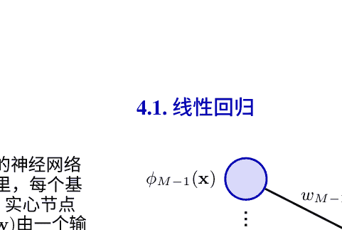

图 4.1 线性回归模型 (4.3) 可以表示为一个简单的神经网络图，其中包含一个参数层。在这里，每个基函数 $\phi_j(\mathbf{x})$ 由一个输入节点表示，实心节点表示‘偏置’基函数 $\phi_0$，函数 $y(\mathbf{x}, \mathbf{w})$ 由一个输出节点表示。每个参数 $w_j$ 通过连接相应的基函数到输出的线表示。

在深度学习出现之前，在机器学习中通常会使用某种形式的固定预处理输入变量 $\mathbf{x}$，也被称为特征提取，用一组基函数 $\{\phi_j(\mathbf{x})\}$ 来表示。目标是选择一组足够强大的基函数，以便使用简单的网络模型解决得到的学习任务。不幸的是，除了最简单的应用之外，手工设计合适的基函数非常困难。深度学习通过从数据集本身学习所需的非线性转换来避免这个问题。

我们已经遇到过回归问题的一个例子，当我们讨论使用多项式进行曲线拟合时。如果我们考虑单个输入变量 $x$，并选择由 $\phi_j(x) = x^j$ 定义的基函数，多项式函数 (1.1) 可以表示为形式 (4.3)。还有许多其他可能的基函数选择，例如

$$ \phi_j(x) = \exp \left\{ -\frac{(x - \mu_j)^2}{2s^2} \right\} \qquad (4.4) $$

其中 $\mu_j$ 控制输入空间中基函数的位置，参数 $s$ 控制它们的空间尺度。通常称之为“高斯”基函数，尽管它们不一定具有概率解释。特别地，归一化系数并不重要，因为这些基函数将与可学习参数 $w_j$ 相乘。

另一种可能性是形式为 sigmoid 的基函数

$$ \phi_j(x) = \sigma \left( \frac{x - \mu_j}{s} \right) \qquad (4.5) $$

其中 $\sigma(a)$ 是由逻辑 sigmoid 函数定义的

$$ \sigma(a) = \frac{1}{1 + \exp(-a)}. \qquad (4.6) $$

等价地，我们可以使用 tanh 函数，因为它与逻辑 sigmoid 函数相关，通过 $\tanh(a) = 2\sigma(2a) - 1$，因此逻辑 sigmoid 函数的线性组合等价于 tanh 函数的线性组合，在它们可以表示相同类别的输入-输出函数的意义上讲。这些不同的基函数选择在图 4.2 中有所说明。

练习 4.3

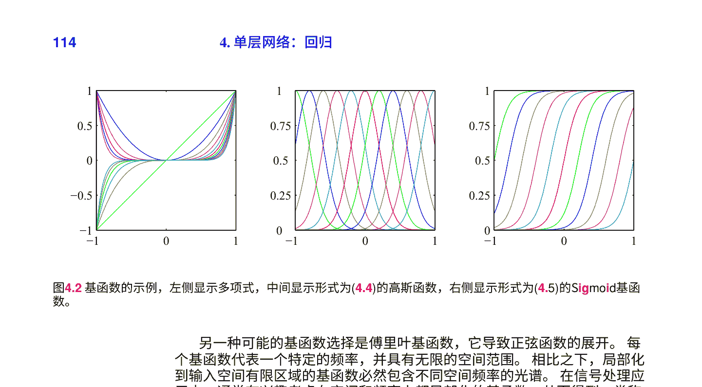

另一种可能的基函数选择是傅里叶基函数，它导致正弦函数的展开。每个基函数代表一个特定的频率，并具有无限的空间范围。相比之下，局部化到输入空间有限区域的基函数必然包含不同空间频率的光谱。在信号处理应用中，通常有兴趣考虑在空间和频率上都局部化的基函数，从而得到一类称为小波的函数 (Ogden, 1997; Mallat, 1999; Vidakovic, 1999)。这些也被定义为相互正交，以简化它们的应用。小波在输入值位于规则点阵上时最适用，例如时间序列中的连续时间点或图像中的像素。

然而，本章中的大部分讨论与基函数集的选择无关，因此我们不会指定基函数的具体形式，仅用于数值说明。此外，为了保持符号简单，我们将重点放在单个目标变量的情况下，尽管我们将简要概述处理多个目标变量所需的修改。

#### 4.1.2 似然函数

我们通过最小化平方和误差函数来解决将多项式函数拟合到数据的问题，并且我们还展示了在假设高斯噪声模型下，该误差函数可以被解释为最大似然解。现在我们回到这个讨论，并更详细地考虑最小二乘方法及其与最大似然的关系。

与之前一样，我们假设目标变量 $t$ 由确定性函数 $y(\mathbf{x}, \mathbf{w})$ 加上高斯噪声给出，即

$$ t = y(\mathbf{x}, \mathbf{w}) + \epsilon \quad (4.7) $$

其中 $\epsilon$ 是一个方差为 $\sigma^2$ 的零均值高斯随机变量。因此，我们可以写成

$$ p(t|\mathbf{x}, \mathbf{w}, \sigma^2) = \mathcal{N}(t|y(\mathbf{x}, \mathbf{w}), \sigma^2) \quad (4.8) $$现在考虑一个输入数据集 X = {x_1, ..., x_N} 和相应的目标值 t_1, ..., t_N。 我们将目标变量 {t_n} 分组成一个列向量，用 t 表示，其中字体的选择是为了与多元目标的单个观测值区分开来，多元目标的表示为 t。假设这些数据点是独立地从分布(4.8)中抽取的，我们得到了一个关于可调参数 w 和 σ^2 的似然函数表达式：

```
p(t|X, w, σ^2) = \prod_{n=1}^N \mathcal{N}(t_n | w^T \phi(x_n), σ^2)
```

在这里我们使用了 (4.3)。对似然函数取对数，并利用单变量高斯的标准形式 (2.49)，我们有

```
\ln p(t|X, w, σ^2) = \sum_{n=1}^N \ln \mathcal{N}(t_n | w^T \phi(x_n), σ^2) \ = -\frac{N}{2} \ln σ^2 - \frac{N}{2} \ln(2\pi) - \frac{1}{σ^2} E_D(w)
```

这里，平方和误差函数由以下定义

```
E_D(w) = \frac{1}{2} \sum_{n=1}^N \{t_n - w^T \phi(x_n)\}^2.
```

当确定 w 时，(4.10)中的前两项可以视为常数。因此，正如我们之前所见，最大化高斯噪声分布下的似然函数等价于最小化平方和误差函数(4.11)。

#### 4.1.3 最大似然

写出似然函数后，我们可以使用最大似然法来确定 w 和 σ^2。首先考虑对 w 的最大化。对于 w 的对数似然函数(4.10)的梯度具有以下形式

```
\nabla_w \ln p(t|X, w, σ^2) = \frac{1}{σ^2} \sum_{n=1}^N \{t_n - w^T \phi(x_n)\} \phi(x_n)^T.
```

将该梯度设为零得到

```
0 = \sum_{n=1}^N t_n \phi(x_n)^T - w^T \left(\sum_{n=1}^N \phi(x_n)\phi(x_n)^T\right).
```

解得 w 为

```
w_{\text{ML}} = (\Phi^T \Phi)^{-1} \Phi^T t.
```

这些被称为最小二乘问题的正规方程。这里 $\Phi$ 是一个 $N \times M$ 矩阵，称为设计矩阵，其元素由 $\Phi_{nj} = \phi_j(\mathbf{x}_n)$ 给出，因此

```
$$\mathbf{\Phi} = \begin{pmatrix} \phi_0(\mathbf{x}_1) & \phi_1(\mathbf{x}_1) & \cdots & \phi_{M-1}(\mathbf{x}_1) \ \phi_0(\mathbf{x}_2) & \phi_1(\mathbf{x}_2) & \cdots & \phi_{M-1}(\mathbf{x}_2) \ \vdots & \vdots & \ddots & \vdots \ \phi_0(\mathbf{x}_N) & \phi_1(\mathbf{x}_N) & \cdots & \phi_{M-1}(\mathbf{x}_N) \end{pmatrix}. \quad (4.15)$$
```

数量

```
$$\mathbf{\Phi}^{\dagger} \equiv (\mathbf{\Phi}^T \mathbf{\Phi})^{-1} \mathbf{\Phi}^T \quad (4.16)$$
```

被称为矩阵 $\mathbf{\Phi}$ 的摩尔-彭罗斯伪逆(Rao and Mitra, 1971; Golub and Van Loan, 1996)。它可以被看作是对非方阵的矩阵逆的一种推广。实际上，如果 $\mathbf{\Phi}$ 是方阵且可逆的，那么根据性质 $(\mathbf{A}\mathbf{B})^{-1} = \mathbf{B}^{-1}\mathbf{A}^{-1}$，我们可以看到 $\mathbf{\Phi}^{\dagger} \equiv \mathbf{\Phi}^{-1}$。

此时，我们可以对偏置参数 $w_0$ 的作用有一些了解。如果我们将偏置参数明确表示出来，那么误差函数 (4.11) 变为

```
$$E_D(\mathbf{w}) = \frac{1}{2} \sum_{n=1}^{N} \{t_n - w_0 - \sum_{j=1}^{M-1} w_j \phi_j(\mathbf{x}_n)\}^2. \quad (4.17)$$
```

将导数关于 $w_0$ 设置为零，并解得 $w_0$，我们得到

```
$$w_0 = \bar{t} - \sum_{j=1}^{M-1} w_j \bar{\phi}_j \quad (4.18)$$
```

我们定义

```
$$\bar{t} = \frac{1}{N} \sum_{n=1}^{N} t_n, \qquad \bar{\phi}_j = \frac{1}{N} \sum_{n=1}^{N} \phi_j(\mathbf{x}_n). \quad (4.19)$$
```

因此，偏差 $w_0$ 补偿了目标值的平均值与基函数平均值加权和之间的差异 (在训练集上)。

我们还可以最大化关于方差 $\sigma^2$ 的对数似然函数 (4.10)，得到

```
$$\sigma_{\text{ML}}^2 = \frac{1}{N} \sum_{n=1}^{N} \{t_n - \mathbf{w}_{\text{ML}}^T \phi(\mathbf{x}_n)\}^2, \quad (4.20)$$
```

因此，我们可以看出方差参数的最大似然值由目标值围绕回归函数的残差方差给出。

图4.3 在一个以 t₁,…,tₙ 为值的 N 维空间中，最小二乘解的几何解释。通过找到数据向量 t 在由基函数 φⱼ(x) 张成的子空间上的正交投影，得到最小二乘回归函数，其中每个基函数被视为长度为 N 的向量 φⱼ，其元素为 φⱼ(xₙ)。

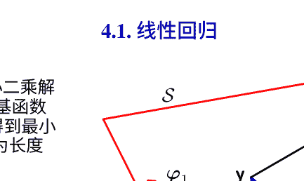

#### 4.1.4 最小二乘法的几何

在这一点上，考虑最小二乘解的几何解释是有益的。为了做到这一点，我们考虑一个 N 维空间，其轴由 tₙ 给出，使得 t = (t₁,…,tₙ)ᵀ 是该空间中的一个向量。每个基函数 φⱼ(xₙ)，在 N 个数据点处的值，也可以表示为同一空间中的一个向量，用 φⱼ 表示，如图4.3所示。注意，φⱼ 对应于 Φ 的第 j 列，而 φ(xₙ) 对应于 Φ 的第 n 行的转置。如果基函数的数量 M 小于数据点的数量 N，则 M 个向量 φⱼ(xₙ) 将构成一个维数为 M 的线性子空间 S。我们将 y 定义为一个 N 维向量，其第 n 个元素由 y(xₙ, w) 给出，其中 n = 1,…,N。因为 y 是向量 φⱼ 的任意线性组合，它可以存在于 M 维子空间 S 的任何位置。平方和误差(4.11) 等于 1/2 倍的欧几里得距离的平方，y 和 t 之间。因此，w 的最小二乘解对应于 y 的选择，它位于子空间 S 中，并且最接近 t。直观地看，从图4.3可以预见到，这个解对应于 t 在子空间 S 上的正交投影。这确实是这种情况，可以通过注意到 y 的解为 Φw_ML，并确认它采用正交投影的形式来验证。

在实践中，当 ΦᵀΦ 接近奇异时，直接求解正规方程可能会导致数值困难。特别是当两个或多个基向量 φⱼ 共线或接近共线时，得到的参数值可能具有较大的幅度。在处理真实数据集时，这种近似退化情况并不少见。可以使用奇异值分解（SVD）技术来解决由此产生的数值困难（Deisenroth, Faisal, and Ong, 2020）。请注意，添加正则化项可以确保矩阵是非奇异的，即使存在退化情况。

#### 4.1.5 顺序学习

最大似然解（4.14）一次处理整个训练集，被称为批处理方法。对于大型数据集，这可能会导致计算成本很高。如果数据集足够大，使用顺序算法（也称为在线算法）可能是值得的，其中数据点逐个考虑，并在每次展示后更新模型参数。顺序学习也适用于实时应用程序，其中数据观测以连续流的形式到达，并且必须进行预测。

我们可以在看到所有数据点之前进行预测。我们可以通过应用随机梯度下降的技术，也称为顺序梯度下降，来获得顺序学习算法，如下所示。如果误差函数包括对数据点的求和 E = ∑ n En，那么在呈现数据点 n之后，随机梯度下降算法使用

> w^{(\tau+1)} = w^{(\tau)} - \eta \nabla E_n \quad (4.21)

其中 τ表示迭代次数， η是一个适当选择的学习率参数。 参数 w的值被初始化为某个起始向量 w^{(0)}。 对于平方和误差函数(4.11)，这给出了

> w^{(\tau+1)} = w^{(\tau)} + \eta (t_n - w^{(\tau)T} \phi_n) \phi_n \quad (4.22)

其中 φ_n = φ(x_n)。这被称为最小均方或LMS算法。

#### 4.1.6 正则化最小二乘法

在第1.2节我们介绍了将正则化项添加到误差函数中以控制过拟合的思想，使得要最小化的总误差函数的形式为

E_D(\mathbf{w}) + \lambda E_W(\mathbf{w}) \quad (4.23)

其中 \lambda 是正则化系数，控制着数据相关误差 E_D(\mathbf{w})和正则化项 E_W(\mathbf{w})的相对重要性。最简单的正则化器之一是权重向量元素的平方和:

> E_W(\mathbf{w}) = \frac{1}{2} \sum_j w_j^2 = \frac{1}{2} \mathbf{w}^T \mathbf{w}. \quad (4.24)

如果我们考虑到平方和误差函数

> E_D(\mathbf{w}) = \frac{1}{2} \sum_{n=1}^N \{t_n - \mathbf{w}^T \phi(\mathbf{x}_n)\}^2, \quad (4.25)

那么总误差函数变为

> \frac{1}{2} \sum_{n=1}^N \{t_n - \mathbf{w}^T \phi(\mathbf{x}_n)\}^2 + \frac{\lambda}{2} \mathbf{w}^T \mathbf{w}. \quad (4.26)

在统计学中，这个正则化器提供了一个参数收缩的例子，因为它将参数值收缩到零。 它的优点是误差函数仍然是 w的二次函数，因此可以通过闭式求解找到其精确的最小值。 具体来说，将(4.26)对 w的梯度设为零，并像以前一样解得

> \mathbf{w} = (\lambda \mathbf{I} + \mathbf{\Phi}^T \mathbf{\Phi})^{-1} \mathbf{\Phi}^T \mathbf{t}. \quad (4.27)

这表示对最小二乘解(4.14)的简单扩展。

> 练习4.6

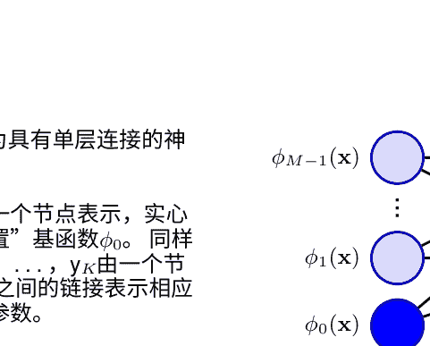

#### 4.1.7 多个输出

到目前为止，我们考虑了只有一个目标变量 t 的情况。在一些应用中，我们可能希望预测 K > 1 个目标变量，我们将其统称为目标向量 t = (t₁, ..., tₖ)ᵀ。这可以通过为 t 的每个分量引入不同的基函数集合来实现，从而导致多个独立的回归问题。然而，更常见的方法是使用相同的基函数集合来模拟目标向量的所有分量，这样

y(x, w) = Wᵀφ(x) (4.28)

其中 y 是一个 K 维列向量，W 是一个 M × K 参数矩阵，而 φ(x) 是一个 M 维列向量，其元素为 φ_j(x)，其中 φ_0(x) = 1 如前所述。同样，这可以表示为一个具有单层参数的神经网络，如图4.4所示。

假设我们将目标向量的条件分布设为一个形式为各向同性的高斯分布

p(t|x, W, σ²) = N(t|Wᵀφ(x), σ²I)。 (4.29)

如果我们有一组观测值 t₁, ..., t_N，我们可以将它们合并成一个大小为 N × K 的矩阵 T，其中第 n 行由 t_nᵀ 给出。同样地，我们可以将输入向量 x₁, ..., x_N 合并成一个矩阵 X。然后，对数似然函数可以表示为

ln p(T|X, W, σ²) = ∑_{n=1}^{N} ln N(t_n|Wᵀφ(x_n), σ²I) = - (N K)/2 ln(2πσ²) - 1/(2σ²) ∑_{n=1}^{N} ||t_n - Wᵀφ(x_n)||²。 (4.30)

与之前一样，我们可以对 W 最大化这个函数，得到

W_ML = (ΦᵀΦ)⁻¹ ΦᵀT (4.31)

在这里，我们将输入特征向量 φ(x₁), ..., φ(x_N) 组合成一个矩阵 Φ。如果我们对每个目标变量 t_k 检查这个结果，我们有

w_k = (ΦᵀΦ)⁻¹ Φᵀt_k = Φ†t_k (4.32)

其中 $\mathbf{t}_k$ 是一个 $N$ 维列向量，其分量为 $t_{nk}$，对于 $n=1,\ldots,N$。因此，回归问题的解耦合了不同的目标变量，我们只需要计算一个单独的伪逆矩阵 $\Phi^\dagger$，它被所有向量 $\mathbf{w}_k$ 共享。

> 练习4.7

对于具有任意协方差矩阵的一般高斯噪声分布的扩展是直接的。同样，这导致了一个分解成 $K$ 独立回归问题。独立回归问题。这个结果并不令人惊讶，因为参数 $\mathbf{W}$ 仅仅定义了高斯噪声分布的均值，而我们知道多元高斯分布均值的最大似然解与协方差无关。从现在开始，我们将只考虑一个目标变量 $t$ 为了简单起见。

## 4.2. 决策理论

我们已经将回归任务形式化为建模条件概率分布 $p(t|\mathbf{x})$，并选择了特定的条件概率形式，即具有 $\mathbf{x}$ 相关均值 $y(\mathbf{x}, \mathbf{w})$ 受参数 $\mathbf{w}$ 控制的高斯分布(4.8)，其方差由参数 $\sigma^2$ 给出。可以使用最大似然从数据中学习 $\mathbf{w}$ 和 $\sigma^2$。结果是一个给定的预测分布

```
$p(t|\mathbf{x}, \mathbf{w}_{\mathrm{ML}}, \sigma_{\mathrm{ML}}^2) = \mathcal{N}(t|y(\mathbf{x}, \mathbf{w}_{\mathrm{ML}}), \sigma_{\mathrm{ML}}^2)$
```

预测分布表示我们对于某个新输入 $\mathbf{x}$ 的 $t$ 值的不确定性。然而，对于许多实际应用，我们需要预测一个具体的 $t$ 值，而不是返回整个分布，特别是在我们必须采取具体行动的情况下。例如，如果我们的目标是确定用于治疗肿瘤的最佳辐射水平，并且我们的模型预测了一个辐射剂量的概率分布，那么我们必须使用该分布来决定具体的剂量。因此，我们的任务可以分为两个阶段。在第一个阶段，称为推理阶段，我们使用训练数据来确定一个预测分布 $p(t|\mathbf{x})$。在第二个阶段，称为决策阶段，我们使用这个预测分布来确定一个依赖于输入向量 $\mathbf{x}$ 的具体值 $f(\mathbf{x})$，该值根据某个准则最优的。我们可以通过最小化同时依赖于预测分布 $p(t|\mathbf{x})$ 和 $f$ 的损失函数来实现这一点。

直观上，我们可能会选择条件分布的均值，这样我们就可以使用 $f(\mathbf{x}) = y(\mathbf{x}, \mathbf{w}_{\mathrm{ML}})$。在某些情况下，这种直觉是正确的，但在其他情况下，它可能会导致非常糟糕的结果。因此，将其形式化是有用的，这样我们就可以理解它适用的条件和假设，这个框架被称为决策理论。

假设我们在真实值为 $t$ 时选择一个值 $f(\mathbf{x})$ 作为我们的预测 $t$。这样做会产生某种形式的惩罚或成本。这由一个损失函数决定，我们将它表示为 $L(t, f(\mathbf{x}))$。当然，我们不知道真实值 $t$，所以我们不是最小化 $L$ 本身，而是最小化平均损失或期望损失，即

图4.5回归函数 $f^*(x)$，最小化期望平方损失的回归函数是条件分布的均值 $p(t|x)$。

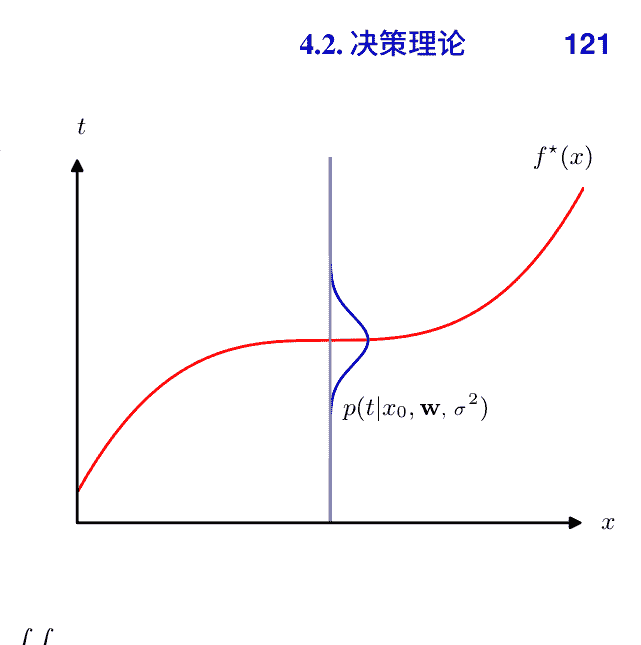

给定为

```
$$E[L] = \iint L(t, f(\mathbf{x})) p(\mathbf{x}, t) \, d\mathbf{x} \, dt \quad (4.34)$$
```

在这里，我们对输入和目标变量的分布进行加权平均，加权方式是它们的联合分布 $p(\mathbf{x}, t)$。在回归问题中，常见的损失函数选择是平方损失函数 $L(t, f(\mathbf{x})) = \{ f(\mathbf{x}) - t \}^2$。在这种情况下，期望损失可以写成

```
$$E[L] = \iint \{ f(\mathbf{x}) - t \}^2 p(\mathbf{x}, t) \, d\mathbf{x} \, dt \quad (4.35)$$
```

重要的是不要将平方损失函数与之前介绍的平方误差函数混淆。误差函数用于在训练过程中设置参数，以确定条件概率分布 $p(t|\mathbf{x})$，而损失函数决定了如何使用条件分布来得到预测函数 $f(\mathbf{x})$，为每个 $\mathbf{x}$ 的值指定一个预测值。我们的目标是选择 $f(\mathbf{x})$，使得 $E[L]$ 最小化。如果我们假设一个完全灵活的函数 $f(\mathbf{x})$，我们可以使用变分法来形式化地进行这个过程。

```
$$\frac{\delta E[L]}{\delta f(\mathbf{x})} = 2 \int \{ f(\mathbf{x}) - t \} p(\mathbf{x}, t) \, dt = 0 \quad (4.36)$$
```

通过解决 $f(\mathbf{x})$ 的问题，并使用概率的和与乘法规则，我们得到

```
$$f^*(\mathbf{x}) = \frac{1}{p(\mathbf{x})} \int t p(\mathbf{x}, t) \, dt = \int t p(t|\mathbf{x}) \, dt = \mathbb{E}_t[t|\mathbf{x}] \quad (4.37)$$
```

这是在给定 $\mathbf{x}$ 的条件下 $t$ 的条件平均值，并且被称为回归函数。这个结果在图4.5中有所说明。它可以很容易地扩展到由向量 $\mathbf{t}$ 表示的多个目标变量的情况，此时最优解是条件平均值 $\mathbf{f}^*(\mathbf{x}) = \mathbb{E}_t[\mathbf{t}|\mathbf{x}]$。对于高斯条件分布的## 4. 单层网络：回归

根据公式(4.8)，条件均值将简单地表示为

$$E[t|x] = \int t p(t|x) dt = y(x, w). \quad (4.38)$$

使用变分法推导(4.37)意味着我们正在优化所有可能的函数 f(x)。尽管我们在实践中可以实现的任何参数模型在能够表示的函数范围上都有限制，但在后面的章节中广泛讨论的深度神经网络框架提供了一类高度灵活的函数，对于许多实际目的来说，可以以高精度近似任何所需的函数。

我们可以用稍微不同的方式推导出这个结果，这也将揭示出回归问题的本质。凭借最优解是条件期望的知识，我们可以展开平方项如下

$$ \{f(x) - t\}^2 = \{f(x) - E[t|x] + E[t|x] - t\}^2 = \{f(x) - E[t|x]\}^2 + 2\{f(x) - E[t|x]\}\{E[t|x] - t\} + \{E[t|x] - t\}^2 $$

为了保持符号简洁，我们使用 E[t|x] 来表示 E_t[t|x]。将其代入损失函数(4.35)并对 t 进行积分，我们可以看到交叉项消失，并得到损失函数的表达式

$$ E[L] = \int \{f(x) - E[t|x]\}^2 p(x) dx + \int \text{var}[t|x] p(x) dx. \quad (4.39) $$

我们要确定的函数 f(x) 只出现在第一项中，当 f(x) 等于 E[t|x] 时，这一项将会消失。这只是我们之前推导出的结果，表明最优的最小二乘预测器由条件均值给出。第二项是 t 的分布在 x 上的方差，表示目标数据的内在变异性，可以看作是噪声。因为它与 f(x) 无关，它代表了损失函数的不可降低的最小值。

平方损失并不是回归问题唯一可能的损失函数选择。在这里，我们简要地考虑了一个简单的广义平方损失的推广，称为闵可夫斯基损失，其期望值为

$$ E[L_q] = \iint |f(x) - t|^q p(x, t) dx dt, \quad (4.40) $$

对于 q = 2，它简化为期望的平方损失。函数 |f - t|^q 对于不同的 q 值在图4.6中绘制。当 q=2 时，E[L_q] 的最小值由条件均值给出，当 q=1 时，由条件中位数给出，当 q → 0 时，由条件模给出。

## 练习4.12

请注意，高斯噪声假设意味着给定 x 的条件分布是单峰的，这在某些应用中可能不合适。在这种情况下，平方损失可能导致非常糟糕的结果，我们需要开发更复杂的方法。例如，我们可以通过使用混合模型来扩展这个模型。

图4.6 不同$q$值下的数量$L_q = |f - t|^q$的图表。

第6.5节讨论了高斯函数如何用于给出多模态条件分布，这在解决逆问题时经常出现。本节我们关注回归问题的决策理论，下一章我们将开发类似的概念（第5.2节）用于分类任务。

## 4.3. 偏差-方差权衡

在我们对线性回归模型的讨论中，我们假设第1.2节给出了基函数的形式和数量。我们还看到，如果使用有限大小的数据集训练复杂模型，最大似然估计可能会导致严重的过拟合。然而，限制基函数的数量以避免过拟合会导致模型捕捉数据中有趣和重要的趋势的灵活性受限。虽然正则化项可以控制具有许多参数的模型的过拟合，但这引发了一个问题，即如何确定适当的正则化系数$\lambda$。寻求将正则化误差函数相对于权重向量 w 和正则化系数 λ 最小化的解决方案显然不是正确的方法，因为这会导致 λ=0 的非正则化解。

从频率学派的角度来考虑模型复杂性问题是很启发性的，这被称为偏差-方差折衷。尽管我们将在基函数模型的背景下介绍这个概念，在简单的例子中很容易说明这些想法，但讨论具有非常普遍的适用性。然而，请注意，在贝叶斯设置中，通过参数边缘化时，过拟合实际上是最大似然的一个不幸特性（Bishop, 2006年）所不会出现的。

第4.2节当我们讨论回归问题的决策理论时，我们考虑了各种损失函数，每个损失函数都会导致相应的最优预测，一旦我们给定了条件分布 p(t|x)。一个常见的选择是平方损失函数，其最优预测由条件期望给出，我们用 h(x) 表示，其表达式为

$$ h(x) = \mathbb{E}[t|x] = \int t p(t|x) dt. \qquad (4.41) $$

我们还看到期望的平方损失可以写成以下形式

$$ \mathbb{E}[L] = \int \{f(x) - h(x)\}^2 p(x) dx + \iint \{h(x) - t\}^2 p(x, t) dx dt. \qquad (4.42) $$

回想一下，第二项与 f(x) 无关，它来自于数据上的内在噪声，并且表示了期望损失的最小可达值。第一项取决于我们对函数 f(x) 的选择，我们将寻求使得这一项最小的 f(x) 的解。由于它是非负的，我们希望为这一项实现的最小值是零。如果我们有无限的数据供应（和无限的计算资源），我们原则上可以找到任意精度的回归函数 h(x)，这将代表 f(x) 的最佳选择。然而，在实践中，我们只有一个包含有限数量 N 的数据点的数据集 D，因此我们无法准确地知道回归函数 h(x)。

如果我们使用由参数向量 w 控制的函数来建模 f(x)，那么从贝叶斯的角度来看，我们模型中的不确定性将通过 w 的后验分布来表示。然而，频率派的处理方式是基于数据集 D 对 w 进行点估计，并试图通过以下思想实验来解释这个估计的不确定性。假设我们有大量的数据集，每个数据集的大小为 N，并且每个数据集都是独立从分布 p(t, x) 中抽取的。对于给定的数据集 D，我们可以运行我们的学习算法并获得一个预测函数 f(x; D)。来自集合的不同数据集将给出不同的函数，因此会有不同的平方损失值。然后，通过对这个数据集合取平均值来评估特定学习算法的性能。

考虑(4.42)中第一项的被积函数，对于一个特定的数据集 D，它的形式为

$$ \{f(x; D) - h(x)\}^2. \qquad (4.43) $$

因为这个数量将取决于特定的数据集 D，我们对数据集的集合取其平均值。如果我们在括号内添加和减去数量 E_D[f(x; D)]，并展开，我们得到

$$ \{f(\mathbf{x}; \mathcal{D}) - \mathbb{E}_{\mathcal{D}}[f(\mathbf{x}; \mathcal{D})] + \mathbb{E}_{\mathcal{D}}[f(\mathbf{x}; \mathcal{D})] - h(\mathbf{x})\}^2 \\ = \{f(\mathbf{x}; \mathcal{D}) - \mathbb{E}_{\mathcal{D}}[f(\mathbf{x}; \mathcal{D})]\}^2 + \{\mathbb{E}_{\mathcal{D}}[f(\mathbf{x}; \mathcal{D})] - h(\mathbf{x})\}^2 \\ + 2\{f(\mathbf{x}; \mathcal{D}) - \mathbb{E}_{\mathcal{D}}[f(\mathbf{x}; \mathcal{D})]\}\{\mathbb{E}_{\mathcal{D}}[f(\mathbf{x}; \mathcal{D})] - h(\mathbf{x})\}. \quad (4.44) $$

现在我们对这个表达式关于 D 的期望进行计算，并注意到最后一项将会消失，从而得到

$$ \mathbb{E}_{\mathcal{D}}\left[\left\{f(\mathbf{x}; \mathcal{D}) - h(\mathbf{x})\right\}^2\right] \\ = \left\{\mathbb{E}_{\mathcal{D}}[f(\mathbf{x}; \mathcal{D})] - h(\mathbf{x})\right\}^2 + \mathbb{E}_{\mathcal{D}}\left[\left\{f(\mathbf{x}; \mathcal{D}) - \mathbb{E}_{\mathcal{D}}[f(\mathbf{x}; \mathcal{D})]\right\}^2\right]. \quad (4.45) $$

我们可以看到，f(x; D)与回归函数 h(x)之间的期望平方差可以表示为两项的和。第一项被称为平方偏差，表示所有数据集上的平均预测与期望的回归函数之间的差异程度。第二项被称为方差，衡量个体数据集的解决方案在其平均值周围的变化程度，因此衡量了函数 f(x; D)对数据集的特定选择的敏感性。稍后我们将通过一个简单的例子来提供一些直观的支持来解释这些定义。

到目前为止，我们只考虑了单个输入值 x。如果我们将这个展开式代入(4.42)中，我们得到了以下期望平方损失的分解：

$$ \text{期望损失} = (\text{偏差})^2 + \text{方差} + \text{噪声} \quad (4.46) $$

其中

$$ (\text{偏差})^2 = \int \left\{\mathbb{E}_{\mathcal{D}}[f(\mathbf{x}; \mathcal{D})] - h(\mathbf{x})\right\}^2 p(\mathbf{x}) d\mathbf{x} \quad (4.47) $$

$$ \text{方差} = \int \mathbb{E}_{\mathcal{D}}\left[\left\{f(\mathbf{x}; \mathcal{D}) - \mathbb{E}_{\mathcal{D}}[f(\mathbf{x}; \mathcal{D})]\right\}^2\right] p(\mathbf{x}) d\mathbf{x} \quad (4.48) $$

$$ \text{噪声} = \iint \left\{h(\mathbf{x}) - t\right\}^2 p(\mathbf{x}, t) d\mathbf{x} dt \quad (4.49) $$

而偏差和方差现在指的是集成量。我们的目标是最小化期望损失，我们将其分解为一个(平方)偏差、一个方差和一个常数噪声项的和。正如我们将看到的，偏差和方差之间存在权衡，非常灵活的模型具有低偏差和高方差，而相对刚性的模型具有高偏差和低方差。具有最佳预测能力的模型是在偏差和方差之间取得最佳平衡的模型。这一点可以通过考虑之前介绍的正弦数据集在第1.2节中进行说明。在这里，我们独立生成了100个数据集，每个数据集包含 N= 25个数据点，来自正弦曲线 h(x) = sin(2πx)。数据集通过 l= 1, …, L进行索引，其中 L= 100。对于每个数据集 D^(l)，我们使用 M= 24个高斯基函数和一个常数‘偏置’基函数来拟合模型，总共有 25个参数。通过最小化正则化误差函数 (4.26)，我们得到一个预测函数 f^(l)(x)，如图4.7所示。

顶部行对应于正则化系数 λ的较大值，这会导致低方差（因为左图中的红色曲线看起来相似）但高偏差（因为右图中的两条曲线非常不同）。相反，在底部行中，λ较小，方差较大（左图中红色曲线之间的高变异性），但偏差较低（平均模型拟合与原始正弦函数之间的良好拟合）。请注意，对于 M= 25的复杂模型，对多个解的平均结果是对回归函数的非常好的拟合，这表明平均可能是一个有益的过程。实际上，多个解的加权平均是贝叶斯方法的核心，尽管平均是针对参数的后验分布，而不是针对多个数据集。

我们还可以定量地研究这个例子的偏差-方差权衡。平均预测值是从中估计的

$$ \overline{f}(x) = \frac{1}{L} \sum_{l=1}^{L} f^{(l)}(x), \tag{4.50} $$

然后，积分平方偏差和积分方差分别为

$$ (\text{bias})^2 = \frac{1}{N} \sum_{n=1}^{N} \left\{ \overline{f}(x_n) - h(x_n) \right\}^2 \tag{4.51} $$

$$ \text{方差} = \frac{1}{N} \sum_{n=1}^{N} \frac{1}{L} \sum_{l=1}^{L} \left\{ f^{(l)}(x_n) - \overline{f}(x_n) \right\}^2 \tag{4.52} $$

其中，通过从该分布中抽取的数据点的有限和近似计算加权分布 p(x)上的积分。这些数量以及它们的总和在图4.8中作为 ln λ的函数绘制。我们可以看到，较小的 λ值使模型能够对每个单独的数据集上的噪声进行精细调整，从而导致较大的方差。相反，较大的 λ值将权重参数拉向零，导致较大的偏差。

请注意，偏差-方差分解在实际价值上有限，因为它是基于数据集合的平均值，而在实践中我们只有单个观察到的数据集。如果我们有大量独立的给定大小的训练集，我们最好将它们合并成一个更大的训练集，这当然会降低给定模型复杂度的过拟合水平。尽管如此，偏差-方差分解通常提供了对模型复杂度问题的有用洞察，虽然我们在本章中从回归问题的角度介绍了它，但其基本直觉具有广泛的适用性。

图4.7展示了偏差和方差与由正则化参数 λ控制的模型复杂度之间的依赖关系，使用了第1章中的正弦数据。有 L = 100个数据集，每个数据集有 N= 25个数据点，模型中有 24个高斯基函数，因此总参数数量为 M= 25，包括偏差参数。左列显示了对数据集进行拟合的结果，对于不同的 ln λ值（为了清晰起见，只显示了100个拟合中的20个）。右列显示了100个拟合的相应平均值（红色），以及生成数据集的正弦函数（绿色）。

图4.8 偏差平方和方差的绘图，以及它们的和，对应于图4.7中显示的结果。还显示了测试数据集大小为1,000个点时的平均测试集误差。最小值(偏差)^2+方差出现在 ln λ=0.43附近，接近于在测试数据上获得最小误差的值。

### 练习

4.1 (⋆)考虑由(1.2)给出的平方和误差函数，其中函数 y(x, w)由多项式(1.1)给出。证明最小化该误差函数的系数 w = {w_i}由以下线性方程组的解给出：

$$ \sum_{j=0}^{M} A_{ij} w_j = T_i \quad (4.53) $$

其中

$$ A_{ij} = \sum_{n=1}^{N} (x_n)^{i+j}, \quad T_i = \sum_{n=1}^{N} (x_n)^{i} t_n \quad (4.54) $$

这里，后缀 i 或 j 表示一个分量的索引，而 (x)^i 表示 x 的 i 次方。

4.2 (⋆)写出与 (4.53) 类似的耦合线性方程组的集合，这些方程组由最小化由 (1.4) 给出的正则化平方误差函数的系数 w_i 满足。

4.3 (⋆)证明由 tanh 函数定义的

$$ \tanh(a) = \frac{e^{a} - e^{-a}}{e^{a} + e^{-a}} \quad (4.55) $$

和由 (4.6) 定义的逻辑 sigmoid 函数相关。

$$ \tanh(a) = 2\sigma(2a) - 1. \quad (4.56) $$

因此，证明逻辑 sigmoid 函数的一般线性组合的形式

$$ y(x, \mathbf{w}) = w_0 + \sum_{j=1}^{M} w_j \sigma \left( \frac{x - \mu_j}{s} \right) \quad (4.57) $$

等价于 tanh函数的线性组合的形式

$$ y(x, \mathbf{u}) = u_0 + \sum_{j=1}^{M} u_j \tanh\left(\frac{x-\mu_j}{2s}\right)\qquad (4.58) $$

并找到将新参数 $\{u_1, \ldots, u_M\}$与原始参数 $\{w_1, \ldots, w_M\}$相关联的表达式。

4.4 $(\star\star\star)$证明矩阵

$$ \boldsymbol{\Phi}(\boldsymbol{\Phi}^T\boldsymbol{\Phi})^{-1}\boldsymbol{\Phi}^T\qquad (4.59) $$

将任意向量 $\mathbf{v}$投影到由 $\boldsymbol{\Phi}$的列张成的空间中。利用这个结果证明最小二乘解(4.14)对应于向量 $\mathbf{t}$在流形 $\mathcal{S}$上的正交投影，如图4.3所示。

4.5 $(\star)$考虑一个数据集，其中每个数据点 $t_n$与一个权重相关联因子 $r_n > 0$，使得平方误差函数变为

$$ E_D(\mathbf{w}) = \frac{1}{2}\sum_{n=1}^{N} r_n \left\{ t_n - \mathbf{w}^T\phi(\mathbf{x}_n) \right\}^2.\qquad (4.60) $$

找到一个表达式，解决方案 $\mathbf{w}$? 使得这个误差函数最小化。给出两个关于加权平方误差函数的替代解释，即 (i) 数据相关的噪声方差和 (ii) 复制的数据点。

4.6 $(\star)$通过将 **(4.26)** 对 $\mathbf{w}$的梯度设为零，证明线性回归的正则化平方误差函数的精确最小值为 **(4.27)**。

4.7 $(\star\star)$考虑一个多元目标变量的线性基函数回归模型，其具有以下高斯分布形式

$$ p(\mathbf{t}|\mathbf{W}, \boldsymbol{\Sigma}) = \mathcal{N}(\mathbf{t}|\mathbf{y}(\mathbf{x}, \mathbf{W}), \boldsymbol{\Sigma})\qquad (4.61) $$

其中

$$ \mathbf{y}(\mathbf{x}, \mathbf{W}) = \mathbf{W}^T\phi(\mathbf{x})\qquad (4.62) $$

以及由输入基向量 $\phi(\mathbf{x}_n)$和相应目标向量 $\mathbf{t}_n$组成的训练数据集，其中 $n=1, \ldots, N$。证明参数矩阵 $\mathbf{W}$的最大似然解 $\mathbf{W}_{\text{ML}}$的每一列都由形式为(4.14)的表达式给出，该表达式是各向同性噪声分布的解。请注意，这与协方差矩阵 $\boldsymbol{\Sigma}$无关。证明 $\boldsymbol{\Sigma}$的最大似然解为

$$ \boldsymbol{\Sigma} = \frac{1}{N}\sum_{n=1}^{N} \left(\mathbf{t}_n - \mathbf{W}_{\text{ML}}^T\phi(\mathbf{x}_n)\right)\left(\mathbf{t}_n - \mathbf{W}_{\text{ML}}^T\phi(\mathbf{x}_n)\right)^T.\qquad (4.63) $$

# 4.8 (*)考虑由向量 $\mathbf{t}$ 描述的多个目标变量的平方损失函数(4.35)的推广。
$$ E[L(\mathbf{t}, \mathbf{f}(\mathbf{x}))] = \iint \|\mathbf{f}(\mathbf{x}) - \mathbf{t}\|^2 p(\mathbf{x}, \mathbf{t}) \, d\mathbf{x} \, d\mathbf{t}. $$
利用变分法，证明使得期望损失最小的函数 $\mathbf{f}(\mathbf{x})$为
$$ \mathbf{f}(\mathbf{x}) = \mathbb{E}_{\mathbf{t}}[\mathbf{t}|\mathbf{x}]. \tag{4.65} $$
# 4.9 (*)通过展开(4.64)中的平方，得到类似于(4.39)的结果，并且，证明使得期望平方损失最小的函数 $\mathbf{f}(\mathbf{x})$再次为条件期望 $\mathbf{t}$ 的形式(4.65)。

# 4.10 (*)通过首先类似于(4.39)展开(4.64)来重新得到结果(4.65)。

# 4.11 (**)以下分布
$$ p(x|\sigma^2, q) = \frac{q}{2(2\sigma^2)^{1/q}\Gamma(1/q)} \exp\left( -\frac{|x|^q}{2\sigma^2} \right) \tag{4.66} $$
是单变量高斯分布的一种推广。这里 $\Gamma(x)$是由伽玛函数定义的
$$ \Gamma(x) = \int_{0}^{\infty} u^{x-1} e^{-u} \, du. $$
证明这个分布是归一化的，即
$$ \int_{-\infty}^{\infty} p(x|\sigma^2, q) \, dx = 1 $$
并且当 $q= 2$时，它退化为高斯分布。考虑一个回归模型，其中目标变量由 $t = y(\mathbf{x}, \mathbf{w}) + \epsilon$ 和 $\epsilon$ 是从分布(4.66)中抽取的随机噪声变量。证明对于 $\mathbf{w}$ 和 $\sigma^2$，对于观测数据集的输入向量 $\mathbf{X} = \{\mathbf{x}_1, \ldots, \mathbf{x}_N\}$ 和相应的目标变量 $\mathbf{t} = (t_1, \ldots, t_N)^T$，给出如下
$$ \ln p(\mathbf{t}|\mathbf{X}, \mathbf{w}, \sigma^2) = -\frac{1}{2\sigma^2} \sum_{n=1}^{N} |y(\mathbf{x}_n, \mathbf{w}) - t_n|^q - \frac{N}{q} \ln(2\sigma^2) + \text{const} $$
其中‘const’表示与 $\mathbf{w}$ 和 $\sigma^2$ 都无关的项。请注意，作为 $\mathbf{w}$ 的函数，这是第4.2节中考虑的 $L_q$ 误差函数。

# 4.12 (**)考虑在 $L_q$ 损失函数下的回归问题的期望损失。写出使 $\mathbb{E}[L_q]$ 最小化的条件。
证明对于 $q= 1$，这个解表示条件中位数，即函数 $y(\mathbf{x})$ 使得 $t < y(\mathbf{x})$ 的概率质量与 $t \geq y(\mathbf{x})$ 的概率质量相同。
同时证明当 $q \rightarrow 0$ 时，最小期望 $L_q$ 损失由条件模式给出，即函数 $y(\mathbf{x})$ 等于最大化 $p(t|\mathbf{x})$ 对于每个 $\mathbf{x}$ 的值。

## 5 单层网络：分类
在前一章中，我们探讨了一类回归模型，其中输出变量是模型参数的线性函数，因此可以表示为具有单层权重和偏置参数的简单神经网络。现在我们转向讨论分类问题，在本章中，我们将重点介绍一类类似的模型，这些模型可以再次表示为单层神经网络。这将使我们能够在处理更一般的深度神经网络之前，介绍许多关键的分类概念。
分类的目标是将输入向量 $\mathbf{x} \in \mathbb{R}^D$ 分配给一个离散类别 $\mathcal{C}_k$ 其中 $k=1,...,K$。在最常见的情况下，类别被认为是不相交的，因此每个输入只被分配给一个类别。输入空间因此被划分为决策区域，其边界被称为决策边界或决策面。在本章中，我们考虑线性模型，其中决策面是输入向量 $\mathbf{x}$ 的线性函数，并且因此在 $D$ 维输入空间中由 $(D-1)$ 维超平面定义。可以通过线性决策面精确分离类别的数据集被称为线性可分的。
线性分类模型可以应用于线性不可分的数据集，尽管并非所有输入都会被正确分类。
我们可以广泛地确定解决分类问题的三种不同方法。最简单的方法是构建一个判别函数，直接将每个向量 $\mathbf{x}$ 分配给特定的类别。然而，一种更强大的方法是在推理阶段建模条件概率分布 $p(\mathcal{C}_k|\mathbf{x})$，然后使用这些分布进行最优决策。分离推理和决策带来了许多好处。确定条件概率 $p(\mathcal{C}_k|\mathbf{x})$ 的两种不同方法。一种技术是直接对其进行建模，例如将其表示为参数模型，然后使用训练集优化参数。这将被称为判别概率模型。
或者，我们可以建模类条件密度 $p(\mathbf{x}|\mathcal{C}_k)$，以及类的先验概率 $p(\mathcal{C}_k)$，然后使用贝叶斯定理计算所需的后验概率：
$$ p(\mathcal{C}_k|\mathbf{x}) = \frac{p(\mathbf{x}|\mathcal{C}_k)p(\mathcal{C}_k)}{p(\mathbf{x})} $$
这将被称为生成概率模型，因为它提供了从每个类条件密度 $p(\mathbf{x}|\mathcal{C}_k)$ 生成样本的机会。在本章中，我们将讨论这三种方法的示例：判别函数、生成概率模型和判别概率模型。

## 5.1. 判别函数
判别函数是一个接受输入向量 $\mathbf{x}$ 并将其分配给 $K$ 个类别之一的函数，表示为 $\mathcal{C}_k$。在本章中，我们将限制关注于线性判别函数，即决策面为超平面的判别函数。为了简化讨论，我们首先考虑两个类别，然后再研究扩展到 $K>2$ 个类别的情况。

#### 5.1.1 两类
最简单的线性判别函数的表示是通过取输入向量的线性函数来获得的，以便
$$ y(\mathbf{x}) = \mathbf{w}^T \mathbf{x} + w_0 $$
其中 $\mathbf{w}$ 被称为权重向量，$w_0$ 是一个偏置（不要与统计意义上的偏差混淆）。如果 $y(\mathbf{x}) \geqslant 0$，则将输入向量 $\mathbf{x}$ 分配给类 $\mathcal{C}_1$，否则分配给类 $\mathcal{C}_2$。因此，相应的决策边界由关系 $y(\mathbf{x})=0$ 定义，这对应于一个 $(D-1)$ 维超平面。
图5.1说明了二维空间中线性判别函数的几何形状。决策面以红色显示，垂直于 $\mathbf{w}$，其与原点的位移由偏置参数 $w_0$ 控制。此外，一般点 $\mathbf{x}$ 到决策面的有符号正交距离由 $y(\mathbf{x})/\|\mathbf{w}\|$ 给出。

考虑两个点 $\mathbf{x}_A$ 和 $\mathbf{x}_B$ 都位于决策面上。因为 $y(\mathbf{x}_A) = y(\mathbf{x}_B) = 0$，所以我们有 $\mathbf{w}^T (\mathbf{x}_A - \mathbf{x}_B) = 0$，因此向量 $\mathbf{w}$ 与决策面上的每个向量都正交，因此 $\mathbf{w}$ 决定了决策面的方向。类似地，如果 $\mathbf{x}$ 是决策面上的一个点，则 $y(\mathbf{x}) = 0$，因此从原点到决策面的法向距离由 $\frac{\mathbf{w}^T\mathbf{x}}{\|\mathbf{w}\|} = -\frac{w_0}{\|\mathbf{w}\|}$ 给出。因此，偏置参数 $w_0$ 决定了决策面的位置。这些属性在 $D=2$ 的情况下在图5.1中进行了说明。此外，请注意 $y(\mathbf{x})$ 的值给出了点 $\mathbf{x}$ 到决策面的垂直距离的有符号度量。为了看到这一点，考虑一个任意点 $\mathbf{x}$，并让 $\mathbf{x}_\perp$ 为其在决策面上的正交投影，即
$$ \mathbf{x} = \mathbf{x}_\perp + r \frac{\mathbf{w}}{\|\mathbf{w}\|} $$
将这个结果的两边都乘以 $\mathbf{w}^T$ 并加上 $w_0$，利用 $y(\mathbf{x}) = \mathbf{w}^T \mathbf{x} + w_0$ 和 $y(\mathbf{x}_\perp) = \mathbf{w}^T \mathbf{x}_\perp + w_0 = 0$，我们有
$$ r = \frac{y(\mathbf{x})}{\|\mathbf{w}\|} $$
这个结果在图5.1中有所说明。
与线性回归模型一样，有时候使用更紧凑的符号表示更方便，我们引入一个额外的虚拟‘输入’值 $x_0=1$，然后定义 $\widetilde{\mathbf{w}} = (w_0, \mathbf{w})^T$ 和 $\widetilde{\mathbf{x}} = (x_0, \mathbf{x})^T$，这样
$$ y(\mathbf{x}) = \widetilde{\mathbf{w}}^T \widetilde{\mathbf{x}}。 $$
在这种情况下，决策面是通过 $(D+1)$ 维扩展输入空间原点的 $D$ 维超平面。

#### 5.1.2 多类
现在考虑将线性判别函数扩展到 $K > 2$ 类的情况。
我们可能会尝试通过组合多个二类判别函数来构建一个 $K$ 类判别器。然而，这会导致一些严重的困难（Duda和Hart，1973），我们现在展示。
考虑一个模型，其中有 $K-1$ 个分类器，每个分类器解决一个两类问题，即将属于特定类 $\mathcal{C}_k$ 的点与不属于该类的点分开。这被称为一对多分类器。图5.2中左侧的示例展示了涉及三个类的示例，这种方法会导致输入空间中存在模糊分类的区域。
另一种方法是引入 $K(K-1)/2$ 个二元判别函数，每个可能的类对应一个判别函数。这被称为一对一分分类器。然后，每个点根据判别函数的多数投票进行分类。然而，这也会遇到模糊区域的问题，如图5.2右侧的图表所示。
我们可以通过考虑一个由 $K$ 个线性函数组成的单一 $K$ 类判别器来避免这些困难。
$$ y_k(\mathbf{x}) = \mathbf{w}_k^T \mathbf{x} + w_{k0} \tag{5.7} $$
如果对于所有的 $j \neq k$，有 $y_k(\mathbf{x}) > y_j(\mathbf{x})$，则将点 $\mathbf{x}$ 分配给类 $\mathcal{C}_k$。因此，类 $\mathcal{C}_k$ 和类 $\mathcal{C}_j$ 之间的决策边界由 $y_k(\mathbf{x}) = y_j(\mathbf{x})$ 给出。
因此对应于一个 $(D - 1)$ 维超平面定义为
$$ (\mathbf{w}_k - \mathbf{w}_j)^T\mathbf{x} + (w_{k0} - w_{j0}) = 0. \tag{5.8} $$
这与在第5.1.1节中讨论的两类情况的决策边界具有相同的形式，因此类似的几何特性适用。
这样的判别区域始终是单连通和凸的。为了看到这一点，考虑两个点 $\mathbf{x}_A$ 和 $\mathbf{x}_B$ 都位于决策区域 $\mathcal{R}_k$ 内，如图5.3所示。连接 $\mathbf{x}_A$ 和 $\mathbf{x}_B$ 的线上的任何点 $\mathbf{x}$ 都可以表示为
$$ \mathbf{x} = \lambda \mathbf{x}_A + (1 - \lambda)\mathbf{x}_B \tag{5.9} $$
根据判别函数的线性性质，可以得出
$$ y_k(\mathbf{x}) = \lambda y_k(\mathbf{x}_A) + (1 - \lambda)y_k(\mathbf{x}_B). \tag{5.10} $$
因为两个点 $\mathbf{x}_A$ 和 $\mathbf{x}_B$ 都在 $\mathcal{R}_k$ 内部，所以有 $y_k(\mathbf{x}_A) > y_j(\mathbf{x}_A)$ 以及 $y_k(\mathbf{x}_B)> y_j(\mathbf{x}_B)$，对于所有的 $j \neq k$，因此 $\mathbf{x}$ 也在 $\mathcal{R}_k$ 内部。因此，$\mathcal{R}_k$ 是单连通和凸的。
注意，对于两个类别，我们可以使用这里讨论的形式主义，基于两个判别函数 $y_1(\mathbf{x})$ 和 $y_2(\mathbf{x})$，或者使用更简单但本质上等效的基于单个判别函数 $y(\mathbf{x})$ 的表达式。

#### 5.1.3 $K$个类别的编码
对于回归问题，目标变量 $\mathbf{t}$ 只是我们希望预测的实数向量。在分类问题中，有多种方式可以使用目标值表示类别标签。对于两类问题，最方便的是使用二进制表示法，其中有一个单一的目标变量 $t \in \{0, 1\}$，其中 $t=1$ 表示类别 $\mathcal{C}_1$，$t=0$ 表示类别 $\mathcal{C}_2$。我们可以将 $t$ 的值解释为类别为 $\mathcal{C}_1$ 的概率，概率值只取0和1的极值。对于 $K>2$ 个类别，使用一种方便的编码方案，也称为独热编码方案，其中 $\mathbf{t}$ 是长度为 $K$ 的向量，如果类别为 $\mathcal{C}_j$，则 $\mathbf{t}$ 的所有元素 $t_k$ 都为零，除了元素 $t_{j}$，它的值为1。例如，如果我们有 $K = 5$ 个类别，那么来自第 2类的数据点将被赋予目标向量
$$ \mathbf{t} = (0, 1, 0, 0, 0)^{\mathrm{T}}. \qquad (5.11) $$
同样，我们可以将 $t_{k}$ 的值解释为类别 $C_{k}$ 的概率，其中概率只取值0和1。

#### 5.1.4 最小二乘法用于分类
对于线性回归模型，最小化平方和误差函数-第4.1.3节将导致参数值的简单闭式解。因此，我们很想知道是否可以将相同的最小二乘形式应用于分类问题。考虑一个一般的分类问题，有 $K$ 个类别和一种 $1$-of-$K$ 二进制编码方案用于目标向量 $\mathbf{t}$。在这种情况下使用最小二乘法的一个理由是它近似了给定输入向量的目标值的条件期望 $\mathbb{E}[\mathbf{t}|\mathbf{x}]$。对于二进制编码方案，这个条件期望由后验类别概率向量给出。不幸的是，这些概率通常近似得很差，而且近似值可以超出范围 $(0,1)$。然而，探索这些简单模型并理解这些限制如何产生是很有教育意义的。
每个类 $C_{k}$ 都由自己的线性模型描述，以便
$$ y_{k}(\mathbf{x}) = \mathbf{w}_{k}^{\mathrm{T}} \mathbf{x} + w_{k0} \qquad (5.12) $$
其中 $k = 1, \ldots, K$。我们可以方便地使用向量符号将它们分组在一起，以便
$$ \mathbf{y}(\mathbf{x}) = \widetilde{\mathbf{W}}^{\mathrm{T}} \widetilde{\mathbf{x}} \qquad (5.13) $$
其中 $\widetilde{\mathbf{W}}$ 是一个矩阵，其第 $k$ 列由 $(D + 1)$ 维向量组成 $\widetilde{\mathbf{w}}_{k} = (w_{k0}, \mathbf{w}_{k}^{\mathrm{T}})^{\mathrm{T}}$，而 $\widetilde{\mathbf{x}}$ 是相应的增广输入向量 $(1, \mathbf{x}^{\mathrm{T}})^{\mathrm{T}}$，其中虚拟输入 $x_{0} = 1$。然后，将新输入 $\mathbf{x}$ 分配给输出 $y_{k} = \widetilde{\mathbf{w}}_{k}^{\mathrm{T}} \widetilde{\mathbf{x}}$ 最大的类别。
现在，我们通过最小化平方和误差函数来确定参数矩阵 $\widetilde{\mathbf{W}}$。考虑一个训练数据集 $\{\mathbf{x}_{n}, \mathbf{t}_{n}\}_{n=1}^{N}$，并定义一个矩阵 $\mathbf{T}$，其第 $n$ 行是向量 $\mathbf{t}_{n}^{\mathrm{T}}$，以及一个矩阵 $\widetilde{\mathbf{X}}$，其第 $n$ 行是 $\widetilde{\mathbf{x}}_{n}^{\mathrm{T}}$。平方和误差函数可以写成
$$ E_{D}(\widetilde{\mathbf{W}}) = \frac{1}{2} \mathrm{Tr}\left\{ (\widetilde{\mathbf{X}} \widetilde{\mathbf{W}} - \mathbf{T})^{\mathrm{T}} (\widetilde{\mathbf{X}} \widetilde{\mathbf{W}} - \mathbf{T}) \right\}. \qquad (5.14) $$
将关于 $\widetilde{\mathbf{W}}$ 的导数设为零并重新排列，我们得到 $\widetilde{\mathbf{W}}$ 的解
$$ \widetilde{\mathbf{W}} = (\widetilde{\mathbf{X}}^{\mathrm{T}} \widetilde{\mathbf{X}})^{-1} \widetilde{\mathbf{X}}^{\mathrm{T}} \mathbf{T} = \widetilde{\mathbf{X}}^{\dagger} \mathbf{T} \qquad (5.15) $$
其中 $\widetilde{\mathbf{X}}^{\dagger}$ 是矩阵 $\widetilde{\mathbf{X}}$ 的伪逆。然后我们得到判别式函数的形式为
$$y(x) = \widetilde{W}^T \widetilde{x} = T^T (X^\dagger)^T x.$$
(5.16)

最小二乘解具有多个目标变量的一个有趣特性是，如果训练集中的每个目标向量都满足某个线性约束
$$a^T t_n + b = 0$$
(5.17)
对于某些常数 \(a\) 和 \(b\)，那么对于任何 \(x\) 的模型预测都将满足相同的约束条件，以便
$$a^T y(x) + b = 0.$$
(5.18)

因此，如果我们对 \(K\) 个类别使用一种 1-of-\(K\) 编码方案，那么模型的预测将具有以下特性：对于任何 \(x\) 的元素，\(y(x)\) 的和将为 1。然而，仅仅有这个求和约束还不足以将模型输出解释为概率，因为它们不受限制地落在区间 \((0,1)\) 内。

最小二乘方法为判别函数参数提供了一个精确的闭式解。然而，即使作为判别函数（我们直接使用它来做决策并且不考虑任何概率解释），它仍然存在一些严重的问题。我们已经看到，平方和误差函数可以被视为在假设存在一个第 2.3.4 节高斯噪声分布的情况下的负对数似然。如果数据的真实分布与高斯分布明显不同，则最小二乘法可能会得到糟糕的结果。特别是，最小二乘法对异常值非常敏感，异常值是指远离数据主体的数据点。这在图 5.4 中有所说明。在这里，我们可以看到右图中的额外数据点导致决策边界的位置发生了显著变化，尽管这些点在左图中的原始决策边界下被正确分类。平方和误差函数过于重视远离决策边界的数据点，尽管它们被正确分类。异常值可能是由于罕见事件引起的，也可能只是由于数据集中的错误。对于非常少量的数据点敏感的技术被称为缺乏鲁棒性。为了比较，图 5.4 还展示了一种称为逻辑回归的技术的结果，它更

## 第 5.4.3 节

对异常值具有鲁棒性。
当我们回想起最小二乘法对应于高斯条件分布的最大似然时，最小二乘法的失败不应该让我们感到惊讶，而二元目标向量显然具有远离高斯分布的分布。通过采用更合适的概率模型，我们可以获得比最小二乘法更好的性质的分类技术，并且可以推广为给出灵活的非线性神经网络模型，这将在后面的章节中看到。

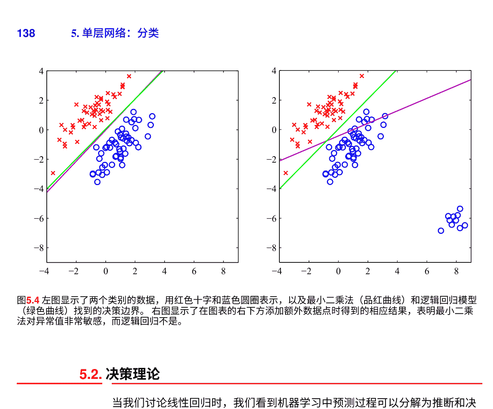

图 5.4 左图显示了两个类别的数据，用红色十字和蓝色圆圈表示，以及最小二乘法（品红曲线）和逻辑回归模型（绿色曲线）找到的决策边界。右图显示了在图表的右下方添加额外数据点时得到的相应结果，表明最小二乘法对异常值非常敏感，而逻辑回归不是。

## 5.2. 决策理论

当我们讨论线性回归时，我们看到机器学习中预测过程可以分解为推断和决策两个阶段。第 4.2 节决策。现在我们将在分类器的上下文中更深入地探讨这个观点。

假设我们有一个输入向量 \(x\) 以及一个相应的向量 \(t\) 的目标变量，并且我们的目标是在给定 \(x\) 的新值时预测 \(t\)。对于回归问题，\(t\) 将包含连续变量，并且通常是一个向量，因为我们可能希望预测几个相关的数量。对于分类问题，\(t\) 将表示类别标签。同样，如果我们有超过两个类别，\(t\) 通常是一个向量。联合概率分布 \(p(x, t)\) 提供了与这些变量相关的不确定性的完整摘要。从一组训练数据中确定 \(p(x, t)\) 是推断的一个例子，通常是一个非常困难的问题，其解决方案构成了本书的主题。然而，在实际应用中，我们经常需要对 \(t\) 的值进行具体预测，或者更一般地基于我们对 \(t\) 的值可能采取的行动进行具体决策，这方面是决策理论的主题。

例如，考虑我们之前的医学诊断问题，我们拍摄了一个病人的皮肤病变图像，我们希望确定病人是否患有癌症。在这种情况下，输入向量 \(x\) 是图像中的像素强度集合。

输出变量 \(t\) 将表示无癌症，我们用类 \(C_1\) 表示，或者有癌症，我们用类 \(C_2\) 表示。例如，我们可以选择 \(t\) 为二进制变量，使得 \(t=0\) 对应于类 \(C_1\)，\(t=1\) 对应于类 \(C_2\)。我们将在后面看到，当处理概率时，这种标签值的选择特别方便。然后，一般的推理问题涉及确定联合分布 \(p(x, C_k)\)，或者等价地 \(p(x, t)\)，这给出了最完整的概率描述。虽然这可能是一个非常有用和信息丰富的量，但最终我们必须决定是否给病人治疗，我们希望这个选择根据某种适当的标准 (Duda 和 Hart，1973) 是最优的。

这是决策步骤，决策理论的目标是告诉我们如何根据适当的概率做出最优决策。我们将看到，决策阶段通常非常简单，甚至是微不足道的，一旦我们解决了推理问题。在这里，我们介绍决策理论的关键思想，以满足本书的其余部分的要求。更多背景知识以及更详细的说明可以在 Berger（1985）和 Bather(2000)中找到。

在进行更详细的分析之前，让我们首先非正式地考虑一下我们如何期望概率在决策中发挥作用。当我们获得新患者的皮肤图像 \(x\) 时，我们的目标是决定将图像分配给两个类别中的哪一个。因此，我们对给定图像的两个类别的概率感兴趣，这些概率由 \(p(C_k|x)\) 给出。使用贝叶斯定理，这些概率可以表示为

$$p(C_k|x) = \frac{p(x|C_k)p(C_k)}{p(x)}.$$

请注意，贝叶斯定理中出现的任何数量都可以通过对适当变量进行边缘化或条件化从联合分布 \(p(x, C_k)\) 获得。现在我们可以将 \(p(C_k)\) 解释为类别 \(C_k\) 的先验概率，将 \(p(C_k|x)\) 解释为相应的后验概率。因此，\(p(C_1)\) 表示在拍摄图像之前一个人患癌症的概率。类似地，\(p(C_1|x)\) 是后验概率，在考虑图像中包含的信息的情况下，使用贝叶斯定理进行修正。如果我们的目标是最小化分配错误的机会 \(x\) 到错误类别的机会，直观上我们会选择具有较高后验概率的类别。我们现在展示这种直觉是正确的，并且我们还讨论了更一般的决策准则。

#### 5.2.1 分类错误率

假设我们的目标仅仅是尽可能少地进行错误分类。我们需要一个规则，将每个 \(x\) 的值分配给可用的类别之一。这样一个规则将把输入空间划分为区域 \(R_k\)，称为决策区域，每个区域对应一个类别 \(C_k\)，使得 \(R_k\) 中的所有点都被分配到类别 \(C_k\)。决策区域之间的边界被称为决策边界或决策面。请注意，每个决策区域不一定是连续的，而可以包含一些不相交的区域。为了找到最优的决策规则，首先考虑两类的情况，例如癌症问题。当一个输入向量属于一个类别时，就会发生错误。

将类 \(\mathcal{C}_1\) 分配给类 \(\mathcal{C}_2\) 或反之亦然。这种情况发生的概率由以下给出

\[
\begin{aligned}
p(\text{错误}) &= p(\mathbf{x} \in \mathcal{R}_1, \mathcal{C}_2) + p(\mathbf{x} \in \mathcal{R}_2, \mathcal{C}_1) \\
&= \int_{\mathcal{R}_1} p(\mathbf{x}, \mathcal{C}_2) \, d\mathbf{x} + \int_{\mathcal{R}_2} p(\mathbf{x}, \mathcal{C}_1) \, d\mathbf{x}. \qquad (5.20)
\end{aligned}
\]

我们可以自由选择将每个点 \(\mathbf{x}\) 分配给两个类别之一的决策规则。显然，为了最小化错误率 \(p(\text{错误})\)，我们应该使每个 \(\mathbf{x}\) 分配给在(5.20)中积分值较小的类别。因此，如果对于给定的\(\mathbf{x}\)值，如果\(p(\mathbf{x}, \mathcal{C}_1) > p(\mathbf{x}, \mathcal{C}_2)\)，那么我们应该将该 \(\mathbf{x}\) 分配给类别\(\mathcal{C}_1\)。根据概率的乘法规则，我们有\(p(\mathbf{x}, \mathcal{C}_k) = p(\mathcal{C}_k|\mathbf{x})p(\mathbf{x})\)。因为因子\(p(\mathbf{x})\)对于两个项都是相同的，我们可以将这个结果重新表述为，如果每个 \(\mathbf{x}\) 的值都分配给后验概率\(p(\mathcal{C}_k|\mathbf{x})\)最大的类别，则可以获得最小的错误概率。这个结果在图5.5中以两个类别和单个输入变量 \(x\) 为例进行了说明。对于更一般的 \(K\) 类别情况，最大化正确率稍微容易一些，其给出的概率为

\[
\begin{aligned}
p(\text{正确}) &= \sum_{k=1}^{K} p(\mathbf{x} \in \mathcal{R}_k, \mathcal{C}_k) \\
&= \sum_{k=1}^{K} \int_{\mathcal{R}_k} p(\mathbf{x}, \mathcal{C}_k) \, d\mathbf{x}, \qquad (5.21)
\end{aligned}
\]

当选择区域 \(\mathcal{R}_k\) 时，使得每个 \(\mathbf{x}\) 被分配到使得 \(p(\mathbf{x}, \mathcal{C}_k)\) 最大的类别时，该值达到最大。再次使用乘法规则 \(p(\mathbf{x}, \mathcal{C}_k) = p(\mathcal{C}_k|\mathbf{x})p(\mathbf{x})\)，注意到 \(p(\mathbf{x})\) 的因子对于所有项都是相同的，我们可以看到每个 \(\mathbf{x}\) 应该被分配到具有最大后验概率的类别 \(p(\mathcal{C}_k|\mathbf{x})\)。

#### 5.2.2 期望损失

对于许多应用，我们的目标将比仅仅最小化错误分类的数量更复杂。让我们再次考虑医学诊断问题。我们注意到，如果一个没有癌症的患者被错误地诊断为患有癌症，后果可能是他们经历了一些困扰，还需要进一步的调查。相反，如果一个有癌症的患者被诊断为健康，结果可能是由于缺乏治疗而导致过早死亡。

因此，这两种错误的后果可能截然不同。显然，更好的做法是减少第二类错误，即使这样做会导致更多的第一类错误。

我们可以通过引入一个损失函数（也称为成本函数）来形式化这些问题，它是对任何可用决策或行动所造成的损失的单一整体度量。我们的目标是最小化总损失。请注意，有些作者相反地考虑了一个效用函数，其值为

他们的目标是最大化。如果我们将效用简单地定义为损失的负值，那么这些概念是等价的。在本文中，我们将使用损失函数的约定。假设对于一个新的值 \(x\)，真实类别是 \(C_k\)，我们分配 \(x\) 到类 \(C_j\)（其中 \(j\) 可能等于 \(k\)，也可能不等于 \(k\)）。这样做会导致一定程度的损失，我们用 \(L_{kj}\) 表示，可以将其视为损失矩阵的 \(k, j\) 元素。例如，在我们的癌症示例中，我们可能有一个如图5.6所示的损失矩阵。这个特定的损失矩阵表示，如果做出了正确的决策，则不会产生损失；如果将一个健康的患者诊断为癌症，则损失为 1；而如果将一个患有癌症的患者诊断为健康，则损失为 100。

最优解是使损失函数最小的解决方案。然而，损失函数取决于未知的真实类别。对于给定的输入向量 \(x\)，我们对真实类别的不确定性通过联合概率分布来表示。\(p(x, C_k)\)，因此我们寻求最小化平均损失，其中平均值是根据该分布计算的，表示为

\[
E[L] = \sum_k \sum_j \int_{R_j} L_{kj} p(x, C_k) dx. \qquad (5.22)
\]

每个 \(x\) 可以独立地分配给决策区域 \(R_j\)。我们的目标是选择区域 \(R_j\) 以最小化期望损失 (5.22)，这意味着对于每个 \(x\)，我们应该最小化 \(\sum_k L_{kj} p(C_k|x)\)。与以前一样，我们可以使用乘积规则 \(p(x, C_k) = p(C_k|x) p(x)\) 来消除 \(p(x)\) 的公共因子。因此，最小化期望损失的决策规则将每个新的 \(x\) 分配给类别 \(j\)，其中该数量为

\[
\sum_k L_{kj} p(C_k|x) \qquad (5.23)
\]

是一个最小值。一旦我们选择了损失矩阵元素 \(L_{kj}\) 的值，这个问题就显而易见了。

#### 5.2.3 拒绝选项

我们已经看到，分类错误来自于输入空间中后验概率 \(p(C_k|x)\) 最大的区域，这个概率明显小于1，或者等价地说，联合分布 \(p(x, C_k)\) 的值相当。这些是我们对类别成员身份相对不确定的区域。在某些应用中，避免对困难案例做出决策可能是合适的，因为这样可以预期在做出分类决策的例子中获得更低的错误率。这被称为拒绝选项。例如，在我们的假想癌症筛查示例中，使用自动

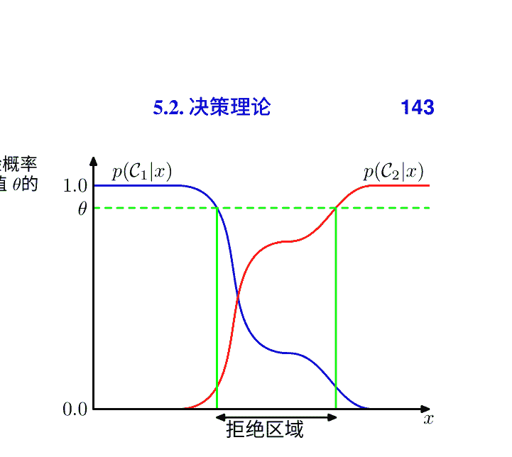

图 5.7 拒绝选项的示意图。输入 \(x\) 使得两个后验概率中较大的一个小于或等于某个阈值 \(\theta\) 的将被拒绝。

系统用于对那些正确类别没有太多疑问的图像进行分类，同时请求进行活检以对更模糊的情况进行分类。我们可以通过引入一个阈值 \(\theta\) 来实现这一点，并拒绝那些后验概率 \(p(C_k|x)\) 中最大的小于或等于 \(\theta\) 的输入 \(x\)。这在图5.7中以两个类别和一个连续输入变量 \(x\) 进行了说明。请注意，设置 \(\theta=1\) 将确保拒绝所有示例，而如果有 \(K\) 个类别，则设置 \(\theta<1/K\) 将确保不拒绝任何示例。因此，被拒绝的示例的比例由 \(\theta\) 的值控制。

当给定损失矩阵时，我们可以通过考虑拒绝决策时产生的损失来轻松扩展拒绝准则以最小化预期损失。

### 练习 5.10

#### 5.2.4 推断和决策

我们已经将分类问题分解为两个独立的阶段，推理阶段在这个阶段我们使用训练数据来学习模型 \(p(C_k|x)\) 和随后的决策阶段，在这个阶段我们使用这些后验概率来进行最优的类别分配。另一种可能性是同时解决这两个问题，直接学习一个将输入 \(x\) 映射到决策的函数。这样的函数被称为判别函数。

事实上，我们可以确定三种不同的方法来解决决策问题，这些方法都在实际应用中被使用过。按照复杂性递减的顺序，它们分别是：

- (a) 首先，解决推理问题，确定每个类别 \(C_k\) 的类条件密度 \(p(x|C_k)\)。分别推断先验类别概率 \(p(C_k)\)。然后使用贝叶斯定理，形式如下

$$p(C_k|x) = \frac{p(x|C_k)p(C_k)}{p(x)} \qquad (5.24)$$

找到后验类别概率 \(p(C_k|x)\) 的方法。通常情况下，分母中的

贝叶斯定理可以通过分子中的量来找到。

$$p(\mathbf{x}) = \sum_k p(\mathbf{x}|\mathcal{C}_k)p(\mathcal{C}_k)$$.  \qquad (5.25)$$
或者，我们可以直接建模联合分布 $p(\mathbf{x}, \mathcal{C}_k)$，然后进行归一化以获得后验概率。 找到后验概率后，我们使用决策理论来确定每个新输入 $\mathbf{x}$ 的类别归属。 明确或隐含地对输入和输出的分布进行建模的方法被称为生成模型，因为通过从这些模型中采样，可以生成输入空间中的合成数据点。

- (b) 首先，解决确定后验类别概率 $p(\mathcal{C}_k|\mathbf{x})$ 的推理问题，然后使用决策理论将每个新的 $\mathbf{x}$ 分配给其中一个类别。 直接建模后验概率的方法被称为判别模型。

- (c) 找到一个函数 $f(\mathbf{x})$，称为判别函数，将每个输入 $\mathbf{x}$ 直接映射到一个类别标签。 例如，对于二分类问题，$f(\cdot)$ 可能是二值的，并且 $f = 0$ 表示类别 $\mathcal{C}_1$， $f = 1$ 表示类别 $\mathcal{C}_2$。 在这种情况下，概率不起作用。

让我们考虑这三种选择的相对优点。 方法（a）是最要求的，因为它涉及到同时找到 $\mathbf{x}$ 和 $\mathcal{C}_k$ 的联合分布。 对于许多应用来说，$\mathbf{x}$ 的维度很高，因此我们可能需要一个大的训练集来能够以合理的准确度确定类条件密度。 注意，类先验概率 $p(\mathcal{C}_k)$ 通常可以简单地从训练集数据点在每个类别中的比例估计出来。 然而，方法（a）的一个优点是它还允许从（5.25）中确定数据的边际密度 $p(\mathbf{x})$。这对于检测模型下概率较低的新数据点以及其预测可能具有较低准确度的情况非常有用，这被称为异常检测或新颖性检测（Bishop, 1994; Tarasenko, 1995）。

然而，如果我们只想做分类决策，那么计算资源可能会被浪费，并且对于找到联合分布 $p(\mathbf{x}, \mathcal{C}_k)$ 而言，可能对数据的需求过高，实际上我们只需要后验概率 $p(\mathcal{C}_k|\mathbf{x})$，可以直接通过方法（b）获得。 事实上，类条件密度可能包含很多对后验概率影响不大的结构，如图5.8所示。在探索生成式和判别式机器学习方法的相对优劣以及将它们结合起来的方法方面，引起了很大的兴趣（Jebara, 2004; Lasserre, Bishop和Minka, 2006）。

一种更简单的方法是（c），我们使用训练数据来找到一个判别函数 $f(\mathbf{x})$，将每个 $\mathbf{x}$ 直接映射到一个类别标签，从而将推断和决策阶段合并为一个单一的学习问题。 在图5.8的例子中，这将对应于找到 $\mathbf{x}$ 的值，如图所示## 5. 单层网络：分类

图5.8两个具有单个输入变量 $x$ 的类条件密度的示例（左图）以及相应的后验概率（右图）。请注意，左图中显示的类条件密度 $p(x|C_1)$ 的左侧模式对后验概率没有影响（蓝色）。右图中的垂直绿线显示了在给定先验类概率 $p(C_1)$ 和 $p(C_2)$ 相等的情况下，给出最小误分类率的决策边界。因为这是给出最小误分类概率的决策边界，所以垂直绿线是重要的。

然而，选择 (c) 后，我们将不再能够访问后验概率。有很多强有力的原因想要计算后验概率，即使我们随后用它们来做决策。这些原因包括：

- 最小化风险。考虑一个问题，其中损失矩阵的元素会不时进行修订（例如在金融应用中可能发生的情况）。如果我们知道后验概率，我们可以通过适当修改 (5.23) 来轻松修订最小风险决策准则。如果我们只有一个判别函数，那么对损失矩阵的任何更改都需要我们返回训练数据并重新解决推理问题。
- 拒绝选项。后验概率使我们能够确定一个拒绝准则，以便对给定比例的被拒数据点最小化错误分类率，或者更一般地说最小化预期损失。
- 补偿类先验。再次考虑我们的癌症筛查示例，并假设我们已经收集了大量来自普通人群的图像作为训练数据，我们用这些数据来构建一个自动筛查系统。由于癌症在普通人群中很少见，我们可能会发现，比如说，每1000个样本中只有1个样本对应癌症的存在。如果我们使用这样的数据集来训练一个自适应模型，由于癌症类别中的样本比例很小，我们可能会遇到严重的困难。例如，一个将每个点都归类为正常类别的分类器将会达到99.9%的准确率，很难避免这种平凡的解决方案。此外，即使是一个大型数据集，其中包含的与癌症相关的皮肤图像样本也很少，因此学习算法将无法接触到广泛范围的这类图像样本，因此不太可能很好地进行泛化。一个平衡的数据集，其中每个类别的样本数量相等，将使我们能够找到一个更准确的模型。然而，我们必须对训练数据的效果进行补偿。假设我们已经使用了这样一个修改过的数据集，并为后验概率找到了模型。根据贝叶斯定理（5.24），我们可以看到后验概率与先验概率成比例，我们可以将先验概率解释为每个类别中的点的比例。因此，我们可以简单地取得我们人为平衡数据集中的后验概率，除以该数据集中的类别比例，然后乘以我们希望应用该模型的人群中的类别比例。最后，我们需要进行归一化，以确保新的后验概率总和为一。请注意，如果我们直接学习判别函数而不是确定后验概率，则无法应用此过程。

组合模型。对于复杂的应用程序，我们可能希望将问题分解成许多较小的子问题，每个子问题都可以由一个单独的模块解决。例如，在我们假设的医学诊断问题中，我们可能有来自血液测试和皮肤图像的可用信息。与其将所有这些异构信息合并到一个巨大的输入空间中，建立一个系统来解释图像和另一个系统来解释血液数据可能更有效。如果这两个模型都为类别给出后验概率，那么我们可以使用概率规则系统地组合输出。一种简单的方法是假设对于每个类别，图像的输入分布（用 $\mathbf{x}_I$ 表示）和血液数据的输入分布（用 $\mathbf{x}_B$ 表示）是独立的，因此

$$p(\mathbf{x}_I, \mathbf{x}_B | \mathcal{C}_k) = p(\mathbf{x}_I | \mathcal{C}_k) p(\mathbf{x}_B | \mathcal{C}_k). \qquad (5.26)$$

这是一个条件独立性的例子，因为在给定类别 $\mathcal{C}_k$ 的条件下，依赖关系成立。给定图像和血液数据的后验概率可以表示为

$$p(\mathcal{C}_k | \mathbf{x}_I, \mathbf{x}_B) \propto p(\mathbf{x}_I, \mathbf{x}_B | \mathcal{C}_k) p(\mathcal{C}_k) \\
\propto p(\mathbf{x}_I | \mathcal{C}_k) p(\mathbf{x}_B | \mathcal{C}_k) p(\mathcal{C}_k) \\
\propto \frac{p(\mathcal{C}_k | \mathbf{x}_I) p(\mathcal{C}_k | \mathbf{x}_B)}{p(\mathcal{C}_k)}. \qquad (5.27)$$

因此，我们需要类别先验概率 $p(\mathcal{C}_k)$，我们可以通过每个类别中数据点的比例轻松估计，然后我们需要进行归一化处理将结果的后验概率归一化为总和为一。特定的条件独立性假设（5.26）是朴素贝叶斯模型的一个例子。

请注意，在这个模型下，联合边缘分布 $p(\mathbf{x}_I, \mathbf{x}_B)$ 通常不会因此分解。我们将在后面的章节中看到如何构建不需要条件独立性假设（5.26）的数据组合模型。使用输出概率而不是决策的模型的另一个优点是，它们可以轻松地与任何可调参数（例如多项式回归示例中的权重系数）关于可微分，这使得它们可以组合和联合训练。第7章 使用基于梯度的优化方法。

#### 5.2.5 分类器准确率

对于分类器的最简单性能度量是测试集中被正确分类的点的比例。然而，我们已经看到不同类型的错误可能会产生不同的后果，如通过损失矩阵来表达，并且通常我们不仅仅希望最小化错误分类的数量。通过改变决策边界的位置，我们可以在不同类型的错误之间进行权衡，例如以最小化预期损失为目标。因为这是一个非常重要的概念，我们将介绍一些定义和术语，以便更好地描述分类器的性能。

我们将再次考虑我们的癌症筛查示例。对于每个被测试的人，都有一个关于他们是否患有癌症的“真实标签”，还有分类器的预测。如果对于某个特定的人，分类器预测为癌症，并且这实际上是真实标签，则预测被称为真正阳性。然而，如果这个人没有癌症，则为假阳性。同样，如果分类器预测一个人没有癌症，并且这是正确的，则预测被称为真正阴性，否则为假阴性。假阳性也被称为第一类错误，而假阴性被称为第二类错误。如果 $N$ 是参加测试的人的总数，则 $N_{\text{TP}}$ 是真正阳性的数量，$N_{\text{FP}}$ 是假阳性的数量，$N_{\text{TN}}$ 是真阴性的数量，而 $N_{\text{FN}}$ 是假阴性的数量，其中

$$N = N_{\text{TP}} + N_{\text{FP}} + N_{\text{TN}} + N_{\text{FN}}. \tag{5.28}$$

这可以表示为一个混淆矩阵，如图5.9所示。准确率，通过正确分类的比例来衡量，可以表示为

$$\text{准确率} = \frac{N_{\text{TP}} + N_{\text{TN}}}{N_{\text{TP}} + N_{\text{FP}} + N_{\text{TN}} + N_{\text{FN}}}. \tag{5.29}$$

我们可以看到，如果类别严重不平衡，准确率可能会误导人。例如，在我们的癌症筛查示例中，只有 1 个人中的 1,000个人有癌症，一个简单地判断没有人有癌症的天真分类器将达到 99.9%的准确率，但完全没用处。还可以根据这些数字定义其他几个常见的量，其中最常见的是

```
精确度 = N_TP / (N_TP + N_FP)  (5.30)
召回率 = N_TP / (N_TP + N_FN)  (5.31)
假阳性率 = N_FP / (N_FP + N_TN)  (5.32)
虚假发现率 = N_FP / (N_FP + N_TP)  (5.33)
```

在我们的癌症筛查示例中，精确度表示一个有阳性测试结果的人确实患有癌症的概率的估计，而召回率是一个有癌症的人被测试正确检测到的概率的估计。假阳性率是一个正常人被错误分类为患有癌症的概率的估计，而虚假发现率表示那些测试结果为阳性但实际上没有癌症的人的比例。

通过改变决策边界的位置，我们可以改变这两种错误之间的权衡。为了理解这种权衡，我们重新审视图5.5，但现在我们将各个区域标记如图5.10所示。我们可以将标记的区域与各种真实和虚假率联系起来，如下所示：

```
N_FP/N = E  (5.34)
N_TP/N = D + E  (5.35)
N_FN/N = B + C  (5.36)
N_TN/N = A + C  (5.37)
```

在这里，我们隐含地考虑了极限 N→∞，以便我们可以将观察数量与概率相关联。

#### 5.2.6 ROC曲线

概率分类器将输出后验概率，可以通过设置阈值来转换为决策。随着阈值的变化，我们可以减少第一类错误，但代价是增加第二类错误，或者反之亦然。为了更好地理解这种权衡，有必要绘制接收器操作特性曲线（ROC曲线）（Fawcett, 2006），这个名称源于测量雷达接收器性能的程序。这是一个真正的正例率与假正例率的图表，如图5.11所示。当图5.10中的决策边界从 -∞移动到 ∞时，ROC曲线被追踪并且可以通过绘制累积分来生成在$y$轴上正确检测癌症的比例与在$x$轴上错误检测的累积比例。请注意，特定的混淆矩阵表示ROC曲线上的一个点。最佳的分类器将被表示为ROC图表的左上角的一个点。左下角表示一个简单的分类器，将每个点都分配给正常类，因此没有真正的阳性，但也没有假阳性。类似地，右上角表示一个将所有点都分配给癌症类的分类器，因此没有假阴性，但也没有真阴性。在图5.11中，蓝色曲线表示的分类器对于任何选择的假阳性率都优于红色曲线的分类器。然而，这样的曲线也可能交叉，这时哪个更好将取决于操作点的选择。

作为基准，我们可以考虑一个随机分类器，它简单地将每个数据点分配给癌症的概率$\rho$和正常的概率$1-\rho$。当我们改变$\rho$的值时，它将沿着一条对角直线追踪出一个ROC曲线，如图5.11所示。任何在对角线下方的分类器都比随机猜测更差。

有时候有一个单一的数字来描述整个ROC曲线是很有用的。一种方法是测量曲线下面积（AUC）。AUC为0.5表示随机猜测，而AUC为1.0表示完美的分类器。另一种度量是$F$-score，它是精确度和召回率的几何平均值。召回率，因此由以下公式定义

$$F = \frac{2 \times \text{精确率} \times \text{召回率}}{\text{精确率} + \text{召回率}} \tag{5.38}$$

$$= \frac{2N_{\text{TP}}}{2N_{\text{TP}} + N_{\text{FP}} + N_{\text{FN}}}. \tag{5.39}$$

当然，我们也可以将图5.9中的混淆矩阵与图5.6中的损失矩阵相结合，通过逐点相乘并求和得到期望损失。尽管ROC曲线可以扩展到超过两个类别，但随着类别数量的增加，它会迅速变得繁琐。

## 5.3. 生成分类器

接下来，我们将转向对分类的概率视角，并展示如何从对数据分布的简单假设中得出具有线性决策边界的模型。我们已经讨论了判别式和生成式方法在分类中的区别。在这里，我们将采用生成式方法，同时对类条件密度函数 $p(\mathbf{x}|\mathcal{C}_k)$ 和类先验进行建模，然后使用这些来计算后验概率 $p(\mathcal{C}_k|\mathbf{x})$ 通过贝叶斯定理。

首先，考虑具有两个类别的问题。类别的后验概率 $C₁$ 可以写成

$$
p(C₁|\mathbf{x}) = \frac{p(\mathbf{x}|C₁)p(C₁)}{p(\mathbf{x}|C₁)p(C₁) + p(\mathbf{x}|C₂)p(C₂)} = \frac{1}{1 + \exp(-a)} = \sigma(a) \tag{5.40}
$$

我们定义

$$
a = \ln \frac{p(\mathbf{x}|C₁)p(C₁)}{p(\mathbf{x}|C₂)p(C₂)} \tag{5.41}
$$

而 σ(a) 是由逻辑斯蒂函数定义的

$$
\sigma(a) = \frac{1}{1 + \exp(-a)}, \tag{5.42}
$$

它在图5.12中绘制。术语“sigmoid”表示S形。这种类型的函数有时也被称为“压缩函数”，因为它将整个实数轴映射到有限区间。逻辑斯蒂函数已经在之前的章节中遇到，并在许多分类算法中起着重要作用。它满足以下对称性质：

$$
\sigma(-a) = 1 - \sigma(a) \tag{5.43}
$$

很容易验证。逻辑sigmoid的反函数为

$$
a = \ln \left( \frac{\sigma}{1-\sigma} \right) \tag{5.44}
$$

并且被称为 logit函数。它表示两个类别的概率比值的对数 ln [p(C₁|\mathbf{x})/p(C₂|\mathbf{x})]，也被称为 log odds。

请注意，在(5.40)中，我们只是以等价的形式重新表达了后验概率，因此逻辑sigmoid的出现可能看起来有些人为。然而，只要 $a(\mathbf{x})$ 具有受限的函数形式，它就具有重要意义。我们将很快考虑 $a(\mathbf{x})$ 是 $\mathbf{x}$ 的线性函数的情况，在这种情况下，后验概率由广义线性模型控制。

如果有 $K > 2$ 个类别，我们有

$$p(\mathcal{C}_k|\mathbf{x}) = \frac{p(\mathbf{x}|\mathcal{C}_k)p(\mathcal{C}_k)}{\sum_j p(\mathbf{x}|\mathcal{C}_j)p(\mathcal{C}_j)} = \frac{\exp(a_k)}{\sum_j \exp(a_j)}, \tag{5.45}$$

这被称为归一化指数，可以看作是逻辑 sigmoid 的多类别推广。这里的量 $a_k$ 由以下定义

$$a_k = \ln (p(\mathbf{x}|\mathcal{C}_k)p(\mathcal{C}_k)). \tag{5.46}$$

归一化指数也被称为 softmax 函数，因为它表示了 'max' 函数的平滑版本，如果对于所有的 $j = k$，有 $a_k \gg a_j$，则 $p(\mathcal{C}_k|\mathbf{x}) \simeq 1$，且 $p(\mathcal{C}_j|\mathbf{x}) \simeq 0$。

我们现在研究选择特定形式的类条件密度的后果，首先看连续输入变量 $\mathbf{x}$，然后简要讨论离散输入。

#### 5.3.1 连续输入

让我们假设类条件密度是高斯的。然后我们将探索得到的后验概率的形式。首先，我们假设所有类别共享相同的协方差矩阵 $\Sigma$。因此，类别 $\mathcal{C}_k$ 的密度是

$$p(\mathbf{x}|\mathcal{C}_k) = \frac{1}{(2\pi)^{D/2}} \frac{1}{|\Sigma|^{1/2}} \exp\left\{ -\frac{1}{2} (\mathbf{x} - \boldsymbol{\mu}_k)^{\mathsf{T}} \Sigma^{-1} (\mathbf{x} - \boldsymbol{\mu}_k) \right\}. \tag{5.47}$$

首先，假设我们有两个类别。根据(5.40)和(5.41)，我们有

$$p(\mathcal{C}_1|\mathbf{x}) = \sigma(\mathbf{w}^{\mathsf{T}} \mathbf{x} + w_0) \tag{5.48}$$

我们定义

$$\begin{aligned}
\mathbf{w} &= \Sigma^{-1}(\boldsymbol{\mu}_1 - \boldsymbol{\mu}_2), \\
w_0 &= -\frac{1}{2} \boldsymbol{\mu}_1^{\mathsf{T}} \Sigma^{-1} \boldsymbol{\mu}_1 + \frac{1}{2} \boldsymbol{\mu}_2^{\mathsf{T}} \Sigma^{-1} \boldsymbol{\mu}_2 + \ln \frac{p(\mathcal{C}_1)}{p(\mathcal{C}_2)}.
\end{aligned} \tag{5.49} \tag{5.50}$$

我们可以看到，高斯密度函数的指数中的二次项已经消除了（由于共同协方差矩阵的假设），导致逻辑 sigmoid 函数的参数中只剩下了 $\mathbf{x}$ 的线性函数。这个结果在图5.13中对二维输入空间 $\mathbf{x}$ 进行了说明。得到的决策边界对应于后验概率 $p(\mathcal{C}_k | \mathbf{x})$ 是常数，因此将由输入空间中的线性函数给出，因此决策边界是输入空间中的线性函数。先验概率 p(C_k) 只通过偏置参数 w_0 进入，因此先验概率的变化会导致决策边界的平行移动，更一般地说，是平行等后验概率的轮廓。

对于 K 类的一般情况，后验概率由式(5.45)给出，其中根据式(5.46)和(5.47)，我们有

$$a_k(x) = w_k^T x + w_{k0} \qquad (5.51)$$

其中我们定义了

$$w_k = \Sigma^{-1} \mu_k \qquad (5.52)$$

$$w_{k0} = -\frac{1}{2} \mu_k^T \Sigma^{-1} \mu_k + \ln p(C_k). \qquad (5.53)$$

我们看到 a_k(x) 再次是 x 的线性函数，这是由于共享协方差导致二次项的消除。对应于最小误分类率的决策边界将在两个后验概率（最大的两个）相等时出现，因此将由 x 的线性函数定义。因此，我们再次得到了一个广义线性模型。

如果我们放松共享协方差矩阵的假设，并允许每个类条件密度 p(x|C_k) 具有自己的协方差矩阵 \Sigma_k，则之前的消除将不再发生，我们将得到 x 的二次函数，从而产生一个二次判别函数。线性和二次决策边界如图5.14所示。

#### 5.3.2 最大似然解

一旦我们为类条件密度 p(x|C_k) 指定了参数化的函数形式，我们就可以确定参数的值，以及# 5. 单层网络：分类

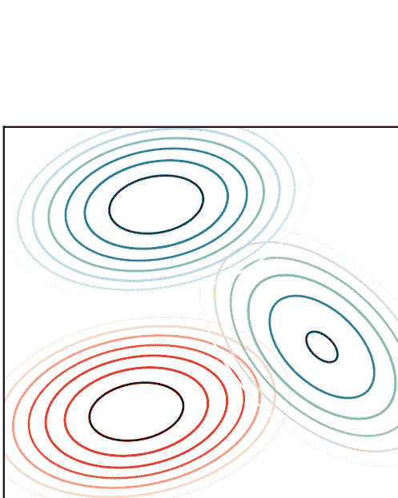

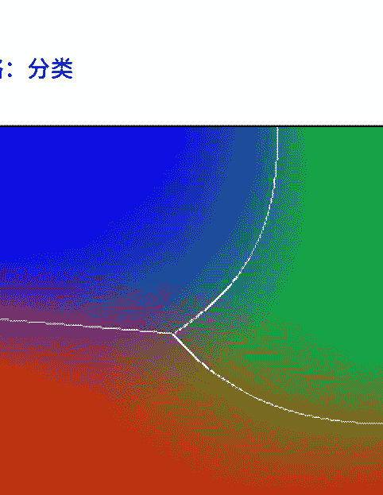

图5.14 左图显示了三个类别的类条件密度，每个类别都具有高斯分布，分别用红色、绿色和蓝色表示，其中红色和蓝色类别具有相同的协方差矩阵。右图显示了相应的后验概率，其中图像上的每个点都使用红色、蓝色和绿色墨水的比例进行着色，对应于各个类别的后验概率。还显示了决策边界。请注意，红色和蓝色类别之间的边界（它们具有相同的协方差矩阵）是线性的，而其他类别之间的边界是二次的。

使用最大似然估计，我们可以得到先验类别概率 $p(C_k)$。这需要一个数据集，其中包含观测值 $\mathbf{x}$ 及其相应的类别标签。

首先，假设我们有两个类别，每个类别都具有具有共享协方差矩阵的高斯类条件密度，并且假设我们有一个数据集 $\{\mathbf{x}_n, t_n\}$ 其中 $n=1, \ldots, N$。这里 $t_n=1$ 表示类别 $C_1$， $t_n=0$ 表示类别 $C_2$。我们用 $p(C_1)=\pi$ 表示先验类别概率，因此 $p(C_2)=1-\pi$。对于一个数据点从类 $C_1$ 中，我们有 $t_n=1$，因此
$p(\mathbf{x}_n, C_1) = p(C_1)p(\mathbf{x}_n|C_1) = \pi \mathcal{N}(\mathbf{x}_n|\boldsymbol{\mu}_1, \boldsymbol{\Sigma})$.

同样对于类 $C_2$，我们有 $t_n = 0$，因此
$p(\mathbf{x}_n, C_2) = p(C_2)p(\mathbf{x}_n|C_2) = (1-\pi)\mathcal{N}(\mathbf{x}_n|\boldsymbol{\mu}_2, \boldsymbol{\Sigma})$.

因此，似然函数由以下给出

$p(\mathbf{t}, \mathbf{X}|\pi, \boldsymbol{\mu}_1, \boldsymbol{\mu}_2, \boldsymbol{\Sigma}) = \prod_{n=1}^N [\pi\mathcal{N}(\mathbf{x}_n|\boldsymbol{\mu}_1, \boldsymbol{\Sigma})]^{t_n} [(1-\pi)\mathcal{N}(\mathbf{x}_n|\boldsymbol{\mu}_2, \boldsymbol{\Sigma})]^{1-t_n} \quad (5.54)$

其中 $\mathbf{t} = (t_1, \ldots, t_N)^T$。通常情况下，最大化对数似然函数是很方便的。首先考虑对 $\pi$ 的最大化。依赖于 $\pi$ 的对数似然函数的项是

与 $\pi$ 有关的对数似然函数的项是

$$
\sum_{n=1}^{N} \{t_n \ln \pi + (1 - t_n) \ln (1 - \pi)\}.
$$
(5.55)

将对 $\pi$ 的导数设为零并重新排列，我们得到

$$
\pi = \frac{1}{N} \sum_{n=1}^{N} t_n = \frac{N_1}{N} = \frac{N_1}{N_1 + N_2}
$$
(5.56)

其中 $N_1$ 表示类别 $\mathcal{C}_1$ 中的数据点总数， $N_2$ 表示类别 $\mathcal{C}_2$ 中的数据点总数。因此，最大似然估计中的 $\pi$ 简单地是类别 $\mathcal{C}_1$ 中点的比例，这是可以预期的。这个结果很容易推广到多类情况，其中与类别 $\mathcal{C}_k$ 相关的先验概率的最大似然估计由训练集中分配给该类别的点的比例给出。

现在考虑对 $\mu_1$ 进行最大化。同样，我们可以从对数似然函数中挑选出那些依赖于 $\mu_1$ 的项：

$$
\sum_{n=1}^{N} t_n \ln \mathcal{N}(\mathbf{x}_n|\mu_1, \Sigma) = -\frac{1}{2} \sum_{n=1}^{N} t_n (\mathbf{x}_n - \mu_1)^{\mathrm{T}} \Sigma^{-1} (\mathbf{x}_n - \mu_1) + \mathrm{const}.
$$
(5.57)

将对 $\mu_1$ 的导数设为零并重新排列，我们得到

$$
\mu_1 = \frac{1}{N_1} \sum_{n=1}^{N} t_n \mathbf{x}_n,
$$
(5.58)

这只是分配给类 $\mathcal{C}_1$ 的所有输入向量 $\mathbf{x}_n$ 的平均值。通过类似的论证，对 $\mu_2$ 的相应结果为

$$
\mu_2 = \frac{1}{N_2} \sum_{n=1}^{N} (1 - t_n) \mathbf{x}_n,
$$
(5.59)

这同样是分配给类 $\mathcal{C}_2$ 的所有输入向量 $\mathbf{x}_n$ 的平均值。

最后，考虑共享协方差矩阵 $\Sigma$ 的最大似然解。挑选出依赖于 $\Sigma$ 的对数似然函数中的项，我们有

$$
\begin{align*}
&-\frac{1}{2} \sum_{n=1}^{N} t_n \ln |\Sigma| - \frac{1}{2} \sum_{n=1}^{N} t_n (\mathbf{x}_n - \mu_1)^{\mathrm{T}} \Sigma^{-1} (\mathbf{x}_n - \mu_1) \\
&-\frac{1}{2} \sum_{n=1}^{N} (1 - t_n) \ln |\Sigma| - \frac{1}{2} \sum_{n=1}^{N} (1 - t_n) (\mathbf{x}_n - \mu_2)^{\mathrm{T}} \Sigma^{-1} (\mathbf{x}_n - \mu_2) \\
&= -\frac{N}{2} \ln |\Sigma| - \frac{N}{2} \mathrm{Tr} \left\{ \Sigma^{-1} \mathbf{S} \right\}
\end{align*}
$$
(5.60)

$$\mathbf{S} = \frac{N_1}{N}\mathbf{S}_1 + \frac{N_2}{N}\mathbf{S}_2 \quad (5.61)$$
$$\mathbf{S}_1 = \frac{1}{N_1} \sum_{n \in \mathcal{C}_1} (\mathbf{x}_n - \boldsymbol{\mu}_1)(\mathbf{x}_n - \boldsymbol{\mu}_1)^{\mathrm{T}} \quad (5.62)$$
$$\mathbf{S}_2 = \frac{1}{N_2} \sum_{n \in \mathcal{C}_2} (\mathbf{x}_n - \boldsymbol{\mu}_2)(\mathbf{x}_n - \boldsymbol{\mu}_2)^{\mathrm{T}}. \quad (5.63)$$

使用高斯分布的最大似然解的标准结果，我们可以看到 $\Sigma = \mathbf{S}$，它表示每个类别的协方差矩阵的加权平均。

这个结果很容易推广到 $K$ 类问题，以获得相应的参数的最大似然解，其中每个类条件密度都是具有共享协方差矩阵的高斯分布。请注意，将高斯分布拟合到类别的方法对异常值不具有鲁棒性，因为高斯分布的最大似然估计不具有鲁棒性。

#### 5.3.3 离散特征

现在让我们考虑离散特征值 $x_i$。为了简单起见，我们首先看一下二进制特征值 $x_i \in \{0, 1\}$，并讨论扩展到更一般的离散特征的方法。如果有 $D$ 个输入，则一般分布对应于每个类别一个 $2^D$ 个数字的表，并且有 $2^D - 1$ 个独立变量（由于求和约束）。由于这个数量随着特征数量的增加呈指数增长，我们可以寻求更受限制的表示。在这里，我们将做出朴素贝叶斯假设，即将特征值视为独立并在类别 $\mathcal{C}_k$ 上进行条件化。因此，我们有类条件分布的形式

$$p(\mathbf{x}|\mathcal{C}_k) = \prod_{i=1}^D \mu_{ki}^{x_i} (1 - \mu_{ki})^{1-x_i}, \quad (5.64)$$

这些包含每个类别的 $D$ 个独立参数。代入(5.46)得到

$$a_k(\mathbf{x}) = \sum_{i=1}^D \{x_i \ln \mu_{ki} + (1-x_i) \ln (1-\mu_{ki})\} + \ln p(\mathcal{C}_k), \quad (5.65)$$

这些也是输入值 $x_i$ 的线性函数。对于 $K=2$ 个类别，我们也可以考虑由(5.40)给出的逻辑sigmoid公式。对于取 $L>2$ 个状态的离散变量，类似的结果也可以得到。

#### 5.3.4 指数族

正如我们所见，对于高斯分布和离散输入，后验类别概率由具有逻辑sigmoid的广义线性模型给出 ($K=$ 2个类别) 或 softmax (K ≥ 2个类别) 激活函数。这些是假设类条件密度在指数分布的子集中得到的更一般结果的特殊情况第3.4节 \( p(\mathbf{x}|\mathcal{C}_k) \)。

$$ p(\mathbf{x}|\boldsymbol{\lambda}_k, s) = \frac{1}{s} h\left(\frac{1}{s}\mathbf{x}\right) g(\boldsymbol{\lambda}_k) \exp\left\{\frac{1}{s}\boldsymbol{\lambda}_k^{\mathsf{T}}\mathbf{x}\right\}. \quad (5.66) $$

这里的缩放参数 \( s \) 在所有类别之间共享。对于两类问题，我们将类条件密度的这个表达式代入(5.41)中，我们可以看到后验类概率再次由作用于线性函数 \( a(\mathbf{x}) \) 的逻辑sigmoid给出，其中

$$ a(\mathbf{x}) = (\boldsymbol{\lambda}_1 - \boldsymbol{\lambda}_2)^{\mathsf{T}}\mathbf{x} + \ln g(\boldsymbol{\lambda}_1) - \ln g(\boldsymbol{\lambda}_2) + \ln p(\mathcal{C}_1) - \ln p(\mathcal{C}_2). \quad (5.67) $$

同样地，对于 \( K \) 类问题，我们将类条件密度替换为(5.46)中的表达式，得到

$$ a_k(\mathbf{x}) = \boldsymbol{\lambda}_k^{\mathsf{T}}\mathbf{x} + \ln g(\boldsymbol{\lambda}_k) + \ln p(\mathcal{C}_k) \quad (5.68) $$

因此，它再次成为 \( \mathbf{x} \) 的线性函数。

### 5.4. 判别分类器

对于两类分类问题，我们已经看到类 \( \mathcal{C}_1 \) 的后验概率可以写成对线性函数作用的逻辑sigmoid函数 \( \mathbf{x} \)，对于广泛选择的类条件分布 \( p(\mathbf{x}|\mathcal{C}_k) \) 来说，我们已经使用最大似然估计确定了密度的参数以及类先验 \( p(\mathcal{C}_k) \)，并使用贝叶斯定理找到了后验类概率。同样地，对于多类情况，类 \( \mathcal{C}_k \) 的后验概率由 \( \mathbf{x} \) 的线性函数的softmax变换给出。对于特定选择的类条件密度 \( p(\mathbf{x}|\mathcal{C}_k) \)，我们使用最大似然估计确定了密度的参数以及类先验 \( p(\mathcal{C}_k) \)，然后使用贝叶斯定理找到了后验类概率。这代表了一个生成建模的例子，因为我们可以使用这样的模型从边际分布 \( p(\mathbf{x}) \) 或任何类条件密度 \( p(\mathbf{x}|\mathcal{C}_k) \) 中抽取 \( \mathbf{x} \) 的值来生成合成数据。

然而，另一种方法是明确使用广义线性模型的函数形式，并通过最大似然直接确定其参数。在这种直接方法中，我们通过条件分布 \( p(\mathcal{C}_k|\mathbf{x}) \) 来最大化定义的似然函数，这代表了一种判别性概率建模形式。判别性方法的一个优点是通常需要确定的可学习参数较少，我们很快就会看到。这也可能导致改进的预测性能，特别是当假设的类条件密度形式对真实分布的近似较差时。

#### 5.4.1 激活函数

在线性回归中，模型预测 y(x,w) 由一个线性函数给出。参数的 y(x,w) = wᵀx + w₀, (5.69) 这给出了一个在范围 (−∞, ∞) 内的连续值输出。然而，对于分类问题，我们希望预测离散的类标签，或者更一般地在范围 (0,1) 内的后验概率。为了实现这一点，我们考虑将 w 和 w₀ 的线性函数使用非线性函数 f(·) 进行转换的这个模型的泛化形式。

y(x,w) = f (wᵀw + w + 0)。(5.70)

在机器学习文献中，f(·) 被称为激活函数，而它的反函数在统计学文献中被称为链接函数。决策面对应于 y(x) = 常数，因此 wᵀx = 常数，因此决策面是 x 的线性函数，即使函数 f(·) 是非线性的。因此，根据(5.70)描述的模型类被称为广义线性模型(McCullagh和Nelder, 1989)。然而，与用于回归的模型相比，由于非线性函数 f(·)，它们在参数上不再是线性的。

这将导致比线性回归模型更复杂的分析和计算性质。尽管如此，这些模型相对简单，与后续章节中将研究的更加灵活的非线性模型相比，它们仍然相对简单。

#### 5.4.2 固定基函数

到目前为止，在本章中，我们已经考虑了直接使用原始输入向量 x 工作的分类模型。然而，如果我们首先使用一个基函数向量 of basis functions φ(x) 对输入进行固定的非线性变换，那么所有的算法同样适用。得到的决策边界将在特征空间 φ 中是线性的，而在原始空间 x 中则对应于非线性的决策边界，如图5.15所示。在特征空间 φ(x) 中线性可分的类别在原始观测空间 x 中不一定是线性可分的。

请注意，与我们对线性回归模型的讨论一样，通常将一个基函数设置为常数，例如 φ₀(x) = 1，这样相应的参数 w₀ 起到偏置的作用。

对于许多实际问题，类条件密度 p(x|Cₖ) 在x空间中存在显著的重叠。这对应于后验概率 p(Cₖ|x)，对于至少一些 x 的值，它们不是0或1。在这种情况下，通过准确建模后验概率并应用标准决策理论来获得最优解。请注意非线性变换 φ(x) 不能消除这种类别重叠，尽管它们可以增加重叠的程度或在原始观测空间中创建重叠。

然而，适当选择的非线性可以使建模后验概率的过程更容易。然而，这种固定基函数模型存在重要的局限性，后续章节将通过允许基函数自适应数据来解决这些问题。

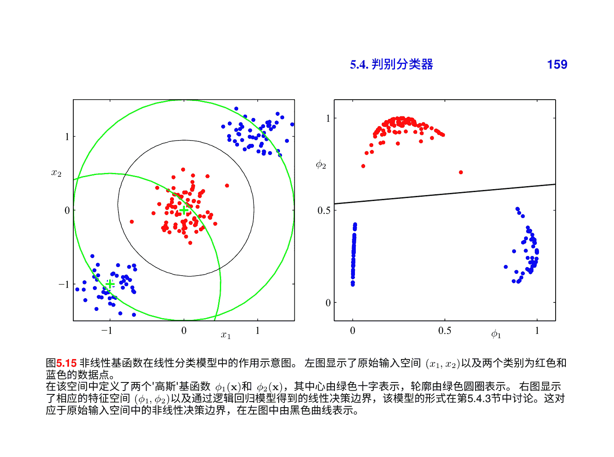

图5.15 非线性基函数在线性分类模型中的作用示意图。左图显示了原始输入空间 (x1, x2) 以及两个类别为红色和蓝色的数据点。在该空间中定义了两个'高斯'基函数 φ1(x) 和 φ2(x)，其中心由绿色十字表示，轮廓由绿色圆圈表示。右图显示了相应的特征空间 (φ1, φ2) 以及通过逻辑回归模型得到的线性决策边界，该模型的形式在第5.4.3节中讨论。这对应于原始输入空间中的非线性决策边界，在左图中由黑色曲线表示。

#### 5.4.3 逻辑回归

我们首先考虑两类分类问题。在我们对生成方法的讨论中，在第5.3节中我们看到，在相当一般的假设下，类别 C1 的后验概率可以写成对特征向量 φ 的线性函数的逻辑sigmoid函数作用，即

`p(C_1|\phi) = y(\phi) = \sigma(\mathbf{w}^T \phi)` (5.71)

这里 σ(·) 是由(5.4.2)定义的逻辑sigmoid函数。在统计学术语中，这个模型被称为逻辑回归，尽管应该强调这是一个用于分类而不是连续变量的模型。

对于一个 M 维特征空间 φ，这个模型有 M 个可调参数。相比之下，如果我们使用最大似然估计拟合高斯类条件密度，我们将使用 2M 个参数来表示均值，以及 M(M+1)/2 个参数来表示（共享的）协方差矩阵。加上类先验 p(C1)，总共有 M(M+5)/2+1 个参数，这个数量与 M 的平方成二次增长，与逻辑回归中参数数量对 M 的线性依赖形成对比。对于较大的 M 值，直接使用逻辑回归模型有明显的优势。

# 5. 单层网络：分类

我们现在使用最大似然法来确定逻辑回归模型的参数。 为了做到这一点，我们将利用逻辑sigmoid函数的导数，它可以方便地用sigmoid函数本身来表示：

$$ \frac{\mathrm{d}\sigma}{\mathrm{d}a} = \sigma(1 - \sigma). \qquad\qquad (5.72) $$

对于一个数据集 \(\{\phi_n, t_n\}\)，其中 \(\phi_n = \phi(\mathbf{x}_n)\) 和 \(t_n \in \{0, 1\}\)，其中 \(n= 1, \ldots, N\)，似然函数可以写成

$$ p(\mathbf{t}|\mathbf{w}) = \prod_{n=1}^{N} y_n^{t_n} \{1 - y_n\}^{1-t_n} \qquad\qquad (5.73) $$

像往常一样，我们可以通过取似然函数的负对数来定义一个错误函数，这给出了交叉熵错误函数：

$$ E(\mathbf{w}) = -\ln p(\mathbf{t}|\mathbf{w}) = -\sum_{n=1}^{N} \{t_n \ln y_n + (1-t_n) \ln(1-y_n)\} \qquad\qquad (5.74) $$

对误差函数关于 \(\mathbf{w}\) 的梯度进行求导，我们得到

$$ \nabla E(\mathbf{w}) = \sum_{n=1}^{N} (y_n - t_n)\phi_n \qquad\qquad (5.75) $$

在这里我们使用了(5.72)。我们可以看到，涉及逻辑sigmoid导数的因子被消除，导致了梯度的简化形式对于对数似然的梯度。 特别地，数据点的梯度贡献\(n\)由目标值和模型预测之间的‘误差’ \(y_n - t_n\) 乘以基函数向量 \(\phi_n\) 给出。 此外，与(4.12)进行比较可以看出，这与线性回归模型的平方和误差函数的梯度完全相同。

最大似然解对应于 \(\nabla E(\mathbf{w}) = 0\)。 然而，从(5.75)我们可以看出，这不再对应于一组线性方程，因为在 \(y(\cdot)\) 中存在非线性，因此这个方程没有闭合形式的解。

一种找到最大似然解的方法是使用随机梯度下降，其中 \(\nabla E_n\) 是(5.75)右侧的第 \(n\) 个项。

随机梯度下降将是后面章节中讨论的高度非线性神经网络训练的主要方法。然而，最大似然方程只是‘稍微’非线性，事实上，误差函数(5.74)，其中模型由(5.71)定义，是参数的凸函数，这允许使用一种称为迭代加权最小二乘或IRLS的简单算法来最小化误差函数(Bishop, 2006)。 然而，这不容易推广到更复杂的模型，如深度神经网络。

练习 5.20

请注意，最大似然法在线性可分的数据集上可能出现严重过拟合的情况。这是因为最大似然解发生在与 σ=0.5 相对应的超平面，等价于 w^T φ=0，将两个类别分开，并且 w 的大小趋向于无穷大。在这种情况下，逻辑斯蒂函数在特征空间中变得无限陡峭，对应于一个 Heaviside 阶跃函数，因此每个类别 k 的训练点都被分配了一个后验概率 p(C_k|x)=1。此外，通常存在一个连续的这样的解决方案是因为任何分离的超平面都会在训练数据点上产生相同的后验概率。最大似然法无法偏好其中一个解决方案，实际上找到的解决方案取决于优化算法的选择和参数初始化。

请注意，即使数据点的数量与模型中的参数数量相比较大，只要训练数据集是近似可分的，问题仍然会出现。通过在误差函数中添加正则化项，可以避免奇异性。第9章

#### 5.4.4 多类逻辑回归

在我们讨论多类别分类的生成模型时，我们已经看到对于指数族中的大类分布，后验概率由特征变量的线性函数的 softmax 变换给出。

$$p(C_k|\phi) = y_k(\phi) = \frac{\exp(a_k)}{\sum_j \exp(a_j)} \tag{5.76}$$

其中预激活 a_k 由以下给出

$$a_k = \mathbf{w}_k^T \phi. \tag{5.77}$$

在那里，我们使用最大似然方法分别确定类条件密度和类先验，并使用贝叶斯定理找到相应的后验概率，从而隐式确定参数 {w_k}。在这里，我们考虑直接使用最大似然方法确定该模型的参数 {w_k}。为了做到这一点，我们需要计算 y_k 相对于所有预激活 a_j 的导数。这些导数由以下给出

练习 5.21

$$\frac{\partial y_k}{\partial a_j} = y_k (I_{kj} - y_j) \tag{5.78}$$

其中 I_{k,j} 是单位矩阵的元素。

接下来我们写下似然函数。最简单的方法是使用 1-of-K 编码方案，其中特征向量 φ_n 属于类 C_k 的目标向量 t_n 是一个二元向量，除了元素 k 为一之外，其他元素都为零。似然函数可以表示为

$$p(\mathbf{T} | \mathbf{w}_1, \ldots, \mathbf{w}_K) = \prod_{n=1}^N \prod_{k=1}^K p(C_k | \phi_n)^{t_{nk}} = \prod_{n=1}^N \prod_{k=1}^K y_{nk}^{t_{nk}} \tag{5.79}$$

图5.16将多类线性分类模型表示为一个具有单层连接的神经网络。每个基函数由一个节点表示，其中实心节点表示偏置基函数\(\phi_0\)，而每个输出\(y_1,\dots,y_K\)也由一个节点表示。节点之间的连接表示相应的权重和偏置参数。

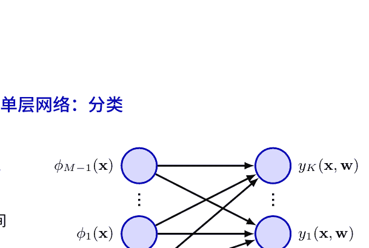

其中\(y_{nk} = y_k(\phi_n)\)，而\(\mathbf{T}\)是一个\(N \times K\)的目标变量矩阵，其元素为\(t_{nk}\)。然后取其负对数

$$E(\mathbf{w}_1, \dots, \mathbf{w}_K) = -\ln p(\mathbf{T}|\mathbf{w}_1, \dots, \mathbf{w}_K) = -\sum_{n=1}^{N}\sum_{k=1}^{K} t_{nk} \ln y_{nk}, \quad (5.80)$$

这被称为多类分类问题的交叉熵误差函数。

现在我们对误差函数关于参数向量\(\mathbf{w}_j\)的梯度进行计算。利用softmax函数的导数结果(5.78)，我们得到

$$\nabla_{\mathbf{w}_j} E(\mathbf{w}_1, \dots, \mathbf{w}_K) = \sum_{n=1}^{N} (y_{nj} - t_{nj}) \phi_n \quad (5.81)$$

我们使用了\(\sum_{n=1}^{N} (y_{nj} - t_{nj}) \phi_n\)。同样，我们可以通过随机梯度下降

再次，我们看到梯度的形式与线性模型的平方误差函数和逻辑回归模型的交叉熵误差函数相同，即误差\((y_{nj} - t_{nj})\)与基函数激活\(\phi_n\)的乘积。这些是更一般结果的例子，我们将在稍后探讨第5.4.6节。

线性分类模型可以表示为单层神经网络，如图5.16所示。如果我们考虑误差函数对权重\(w_{ij}\)的导数，它连接基函数\(\phi_i(\mathbf{x})\)到输出单元\(t_k\)，我们有从(5.81)

$$\frac{\partial E(\mathbf{w}_1, \dots, \mathbf{w}_K)}{\partial w_{ij}} = \sum_{n=1}^{N} (y_{nk} - t_{nk}) \phi_i(\mathbf{x}_n). \quad (5.82)$$

将此与图5.16进行比较，我们可以看到，对于每个数据点\(n\)，该梯度采用了权重链接输出端处基函数的输出形式，其中‘误差’\((y_{nk} - t_{nk})\)在输出端。

图5.17概率密度的示意例子，由蓝色曲线表示，本例中由两个高斯分布的混合组成，以及其累积分布函数\(f(a)\)，由红色曲线表示。请注意，蓝色曲线在任意点（例如垂直绿线所示的点）的值对应于红色曲线在同一点的斜率。相反，红色曲线在该点的值对应于蓝色曲线下方由绿色区域表示的面积。在随机阈值模型中，如果\(a = \mathbf{w}^{\mathrm{T}}\phi\)的值超过阈值，则类标签取值\(t=1\)，否则取值\(t=0\)。这相当于一个由累积分布函数\(f(a)\)给出的激活函数。

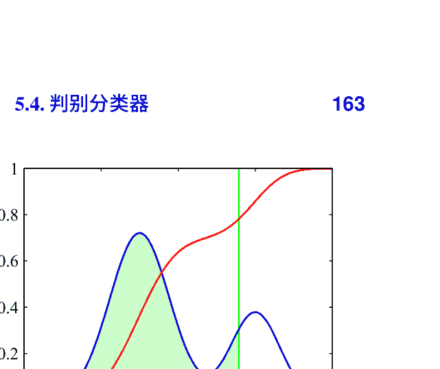

#### 5.4.5 Probit回归

我们已经看到，对于广泛范围的由指数族描述的类条件分布，得到的后验类概率由特征变量的线性函数上的逻辑（或softmax）变换给出。然而，并非所有的类条件密度的选择都会导致后验概率的这种简单形式，这表明值得探索其他类型的判别概率模型。再次考虑两类情况，仍然在广义线性模型的框架内，使得

$$p(t=1|a) = f(a) \tag{5.83}$$

其中 \(a = \mathbf{w}^{\mathrm{T}}\phi\)， \(f(\cdot)\)是激活函数。激活函数的选择的另一种动机是考虑一个噪声阈值模型，如下所示。对于每个输入 \(\phi_n\)，我们计算 \(a_n = \mathbf{w}^{\mathrm{T}}\phi_n\)，然后根据设定目标值。

$$t_n = \begin{cases} 1, & \text{if } a_n \geq \theta, \\ 0, & \text{otherwise.} \end{cases} \tag{5.84}$$

如果 \(\theta\) 的值是从概率密度函数 \(p(\theta)\)中抽取的，那么相应的激活函数将由累积分布函数给出

$$f(a) = \int_{-\infty}^{a} p(\theta) \, d\theta \tag{5.85}$$

如图5.17所示。作为一个具体的例子，假设密度函数 \(p(\theta)\)由零均值、单位方差的高斯分布给出。相应的累积分布函数为

$$\Phi(a) = \int_{-\infty}^{a} \mathcal{N}(\theta|0,1) \, d\theta, \tag{5.86}$$

这被称为 probit 函数。 它具有 S 形状，并在图 5.12 中与逻辑 sigmoid 函数进行比较。请注意，使用具有一般均值和方差的高斯分布不会改变模型，因为这等效于线性系数 \(\mathbf{w}\) 的重新缩放。 许多数值计算软件包可以计算一个密切相关的函数，定义为

\[\text{erf}(a) = \frac{2}{\sqrt{\pi}} \int_0^a \exp(-\theta^2/2) \, d\theta\]

也被称为误差函数（不要与机器学习模型的误差函数混淆）的 erf 函数或误差函数。它与 probit 函数相关

\[\Phi(a) = \frac{1}{2} \left\{ 1 + \frac{1}{\sqrt{2}} \text{erf}(a) \right\}.\]

基于 probit 激活函数的广义线性模型被称为 probit 回归。 我们可以通过对之前讨论的思想进行直接扩展，使用最大似然法确定该模型的参数。 实际上，使用 probit 回归找到的结果往往与 logistic 回归的结果相似。

在实际应用中可能出现的一个问题是异常值，这可能是由于测量输入向量 \(\mathbf{x}\) 的错误或目标值的错误标记引起的。 因为这些点可能远离理想的决策边界，它们可能严重扭曲分类器。 logistic 和 probit 回归模型在这方面的行为不同，因为 logistic sigmoid 的尾部在 \(|x| \to \infty\) 时呈指数衰减，而 probit 激活函数的尾部在 \(\exp(-x^2)\) 时衰减，因此 probit 模型对异常值更敏感。

#### 5.4.6 规范链接函数

对于具有高斯噪声分布的线性回归模型，对应于负对数似然的误差函数由 (4.11) 给出。如果我们对参数向量 \(\mathbf{w}\) 的贡献对误差函数的导数进行求导，这将采用‘误差’ \(y_n - t_n\) 乘以特征向量 \(\phi_n\) 的形式，其中 \(y_n = \mathbf{w}^\text{T} \phi_n\)。 同样，对于逻辑斯蒂激活函数和交叉熵误差函数 (5.74) 的组合，以及多类交叉熵误差函数 (5.80) 的 softmax 激活函数，我们再次得到相同的简单形式。 我们现在展示这是一个假设目标变量来自指数族条件分布的一般结果，同时选择相应的激活函数，即称为规范链接函数的结果。

我们再次使用指数族分布的受限形式 (3.169)。 请注意，这里我们将指数族分布的假设应用于目标变量，与第 5.3.4 节中将其应用于输入向量 \(\mathbf{x}\) 不同。因此，我们考虑目标变量的条件分布形式

\[p(t|\eta, s) = \frac{1}{s} h\left(\frac{t}{s}\right) g(\eta) \exp \left\{ \frac{\eta t}{s} \right\}.\]

使用与推导结果 (3.172) 相同的论证线路，我们可以看到条件均值 t 的条件均值，我们用 y 表示，由以下公式给出

$$y \equiv \mathbb{E}[t|\eta] = -s \frac{d}{d\eta} \ln g(\eta). \tag{5.90}$$

因此，y 和 η 必须相关，并且我们通过 η = ψ(y) 表示这种关系。根据 Nelder 和 Wedderburn (1972) 的定义，我们将广义线性模型定义为一个使 y 成为输入（或特征）变量的线性组合的非线性函数，因此

$$y = f(\mathbf{w}^\mathrm{T} \boldsymbol{\phi}) \tag{5.91}$$

其中 f(·) 在机器学习文献中被称为激活函数，并且 f^{-1}(·) 在统计学中被称为链接函数。现在考虑该模型的对数似然函数，作为 η 的函数，给出如下

$$\ln p(\mathbf{t}|\eta, s) = \sum_{n=1}^{N} \ln p(t_n|\eta, s) = \sum_{n=1}^{N} \left\{ \ln g(\eta_n) + \frac{\eta_n t_n}{s} \right\} + \text{常数} \tag{5.92}$$

在这里，我们假设所有观测值共享一个公共的尺度参数（例如，对于高斯分布来说，对应噪声方差），因此 s 独立于 n。对于模型参数 w 的对数似然函数的导数可以表示为

$$\nabla_{\mathbf{w}} \ln p(\mathbf{t}|\eta, s) = \sum_{n=1}^{N} \left\{ \frac{\mathrm{d}}{\mathrm{d}\eta_n} \ln g(\eta_n) + \frac{t_n}{s} \right\} \frac{\mathrm{d}\eta_n}{\mathrm{d}y_n} \frac{\mathrm{d}y_n}{\mathrm{d}\alpha_n} \nabla \alpha_n = \frac{1}{s} \sum_{n=1}^{N} \{ t_n - \gamma_n \} \psi'(\gamma_n) f'(\alpha_n) \phi_n \tag{5.93}$$

其中 α = w^T φ_n，我们使用了 γ = f(α) 以及结果 (5.90) 对于 E[t|η]。现在我们看到，如果我们选择一个特定的链接函数的形式，那么会有相当大的简化 f^{-1}(γ) 给定为

$$f^{-1}(\gamma) = \psi(\gamma), \tag{5.94}$$

这给出 f(ψ(γ)) = γ，因此 f'(ψ) ψ'(γ) = 1。另外，因为 α = f^{-1}(γ)，我们有 α = ψ，因此 f'(α) ψ'(γ) = 1。在这种情况下，误差函数的梯度减小为

$$\nabla \ln E(\mathbf{w}) = \frac{1}{s} \sum_{n=1}^{N} \{ y_n - t_n \} \phi_n. \tag{5.95}$$

我们已经看到，选择误差函数和输出单元激活函数之间存在自然的配对关系。尽管我们在单层网络模型的背景下推导出了这个结果，但相同的考虑也适用于后面章节中讨论的深度神经网络。

### 练习

- 5.1 (⋆)考虑一个具有 K个类别和使用一种1-of-K二进制编码方案的目标向量 t的分类问题。证明条件期望 E[t|x]由后验概率 p(Ck|x)给出。
- 5.2 (⋆⋆)给定一组数据点 {xn}，我们可以定义凸包为由所有点 x给出的集合。
$$x = \sum_n \alpha_n x_n$$
当 αn ≥ 0 且考虑第二组点 {yn}以及它们对应的凸包。根据定义，如果存在一个向量 w和一个标量 w0使得对于所有的 w^T xn + w0 > 0，那么这两组点是线性可分的。证明如果它们的凸包相交，那么这两组点不可能是线性可分的；反之，如果它们是线性可分的，它们的凸包不会相交。
- 5.3 (⋆⋆)考虑最小化一个平方误差函数 (5.14)，并假设训练集中的所有目标向量满足线性约束。
$$a^T t_n + b = 0$$
其中 t_n对应于矩阵 T中的第n行 (5.14)。证明由于这个约束条件，最小二乘解 (5.16) 给出的模型预测 y(x)也满足这个约束条件，即
$$a^T y(x) + b = 0.$$
为了做到这一点，假设其中一个基函数 φ0(x)=1，这样相应的参数 w0起到偏置的作用。
- 5.4 (⋆⋆)将练习5.3的结果推广，证明如果目标向量同时满足多个线性约束，则最小二乘预测的线性模型也将满足相同的约束。
- 5.5 (⋆)使用定义 (5.38)，结合 (5.30) 和 (5.31) 推导出F分数的结果 (5.39)。
- 5.6 (⋆⋆)考虑两个非负数 a和 b，并证明，如果 a大于等于 b，则利用这个结果证明，如果一个两类分类问题的决策区域被选择为最小化误分类的概率，那么这个概率将满足
$$p(\text{错误}) \leq \int \{p(x, C_1) p(x, C_2)\}^{1/2} dx.$$
- 5.7 (⋆)给定一个损失矩阵，其元素为 L_{kj}，如果对于每个 x，我们选择最小化 (5.23) 的类别，则期望风险最小化。验证当损失矩阵为 \( L_{k,j} = 1 - I_{k,j} \)，其中 \( I_{k,j} \) 是单位矩阵的元素时，这将简化为选择具有最大后验概率的类别的准则。这种损失矩阵的解释是什么？
- 5.8 (☆)当存在一般损失矩阵和一般先验概率时，推导最小化期望损失的准则。
- 5.9 (☆)考虑在一组 \( N \) 数据点上的后验概率的平均形式 \( \frac{1}{N} \sum_{N=1}^N p(\mathcal{C}_k | \mathbf{x}_n) \) (5.100) 通过取极限 \( N \to \infty \)，证明这个量趋近于先验类别概率 \( p(\mathcal{C}_k) \)。
- 5.10 (★★)考虑一个分类问题，其中当将来自类 \( \mathcal{C}_k \) 的输入向量分类为属于类 \( \mathcal{C}_j \) 时，所产生的损失由损失矩阵 \( L_{k,j} \) 给出，并且选择拒绝选项时产生的损失为 \( \lambda \)。找到能够给出最小期望损失的决策准则。验证当损失矩阵由 \( L_{k,j} = 1 - I_{k,j} \) 给出时，这将归结为第5.2.3节中讨论的拒绝准则。\( \lambda \) 和拒绝阈值 \( \theta \) 之间的关系是什么？
- 5.11 (☆)证明逻辑sigmoid函数(5.42)满足性质 \( \sigma(-a) = 1 - \sigma(a) \) 并且它的逆函数由 \( \sigma^{-1}(y) = \ln \{ y/(1 - y) \} \) 给出。
- 5.12 (☆)使用(5.40)和(5.41)，推导出具有高斯密度的两类生成模型的后验类概率的结果(5.48)，并验证参数 \( \mathbf{w} \) 和 \( w_0 \) 的结果(5.49)和(5.50)。
- 5.13 (☆)考虑一个由先验类概率 \( p(\mathcal{C}_k) = \pi_k \) 和一般类条件密度 \( p( \boldsymbol{\phi} | \mathcal{C}_k) \) 定义的生成分类模型，其中 \( \boldsymbol{\phi} \) 是输入特征向量。假设我们有一个训练数据集 \( \{ \boldsymbol{\phi}_n, \mathbf{t}_n \} \) 其中 \( n = 1, \dots, N \)，和 \( \mathbf{t}_n \) 是长度为 \( K \) 的二进制目标向量，使用1-of-K编码方案，因此它具有组件 \( t_{n,j} = I_{j,k} \)，如果数据点 \( n \) 来自类 \( \mathcal{C}_k \)。假设数据点是独立从该模型中抽取的，请证明先验概率的最大似然解为 \( \pi_k = \frac{N_k}{N} \) (5.101) 其中 \( N_k \) 是分配给类 \( \mathcal{C}_k \) 的数据点数量。
- 5.14 (★★)考虑练习5.13中的分类模型，现在假设类条件密度由具有共享协方差矩阵的高斯分布给出，即 \( p( \boldsymbol{\phi} | \mathcal{C}_k) = \mathcal{N}( \boldsymbol{\phi} | \boldsymbol{\mu}_k, \boldsymbol{\Sigma}) \)。(5.102)

证明高斯分布的均值对于类$\mathcal{C}_k$的最大似然解为

$$\mu_k = \frac{1}{N_k}\sum_{n=1}^{N} t_{nk}\phi_n, \quad \quad (5.103)$$

它表示分配给类别$\mathcal{C}_k$的特征向量的均值。同样地，证明共享协方差矩阵的最大似然解为

$$\boldsymbol{\Sigma} = \sum_{k=1}^{K} \frac{N_k}{N} \mathbf{S}_k \quad \quad (5.104)$$

其中

$$\mathbf{S}_k = \frac{1}{N_k}\sum_{n=1}^{N} t_{nk}(\phi_n - \mu_k)(\phi_n - \mu_k)^{\text{T}}. \quad \quad (5.105)$$

因此，$\boldsymbol{\Sigma}$是与每个类别相关的数据协方差的加权平均，其中权重系数由类别的先验概率给出。

**5.15** ($\star\star$)推导出离散二元特征的概率朴素贝叶斯分类器参数 $\{\mu_{ki}\}$ 的最大似然解，详见第**5.3.3**节。

**5.16** ($\star\star$)考虑一个具有 $K$ 个类别的分类问题，特征向量 $\phi$ 有 $M$ 个分量，每个分量可以取 $L$ 个离散状态。假设分量的值由 1-of-$L$ 二进制编码方案表示。进一步假设，在给定类别 $\mathcal{C}_k$ 的条件下，特征向量 $\phi$ 的 $M$ 个分量是独立的，因此类别条件密度相对于特征向量分量因子化。

证明由（5.46）给出的量 $a_k$ 在描述后验类概率的 softmax 函数的参数中，是 $\phi$ 的线性函数。注意，这代表了朴素贝叶斯模型的一个例子。

**5.17** ($\star\star$)推导出在练习**5.16**中描述的概率朴素贝叶斯分类器参数的最大似然解。

**5.18** ($\star$)验证由（**5.42**）定义的逻辑sigmoid函数的导数的关系（**5.72**）。

**5.19** ($\star$)利用逻辑sigmoid函数导数的结果（**5.72**），证明逻辑回归模型的误差函数（**5.74**）的导数是（**5.75**）。

**5.20** ($\star$)证明对于一个线性可分的数据集，逻辑回归模型的最大似然解是通过找到一个向量 $\mathbf{w}$，使得决策边界 $\mathbf{w}^{\text{T}}\phi(\mathbf{x}) = 0$ 将类别分开，然后取 $\mathbf{w}$ 的大小为无穷大。

**5.21** ($\star$)证明 softmax 激活函数 (5.76) 的导数，其中 $a_k$ 由 (5.77) 定义，等于 (5.78)。

(⋆)利用 softmax 激活函数的导数结果 (5.78)，证明交叉熵误差 (5.80) 的梯度等于 (5.81)。

(⋆)证明 probit 函数 (5.86) 和 erf 函数 (5.87) 之间的关系为 (5.88)。

(⋆⋆)假设我们希望通过缩放的probit函数 Φ(λa)来近似定义为(5.42)的逻辑sigmoid函数 σ(a)，其中 Φ(a)由(5.86)定义。证明如果选择 λ使得两个函数在 a=0 处的导数相等，则 λ² = π/8。

# 深度学习


## 6 深度神经网络

近年来，神经网络已经成为迄今为止最重要的实际应用机器学习技术，因此我们在本书中大部分内容都致力于研究它们。 之前的章节已经奠定了我们所需的许多基础。 特别是，我们已经看到由固定非线性基函数的线性组合组成的线性回归模型可以表示为具有单层权重和偏置参数的神经网络。

同样，基于线性组合的分类模型也可以被视为单层神经网络。 在本章中，我们在讨论更复杂的多层网络之前，介绍了几个重要的概念。

通过选择足够数量的合适基函数，这些线性模型可以以任意所需的精度逼近从输入到输出的任何非线性转换，因此似乎足以应对任何实际应用。 然而，这些模型存在一些严重的限制，因此我们将从探讨这些限制开始，了解为什么需要使用从数据中学习的基函数。这自然地引出了对具有多个可学习参数层的神经网络的讨论。这些被称为前馈网络或多层层感知器。我们还将讨论具有许多这样的处理层的好处，从而引出了深度神经网络的关键概念，这现在主导了机器学习领域。

# 6.1. 固定基函数的局限性

第5章线性基函数模型用于分类是基于基函数 φ_j(x)的线性组合，并采取以下形式

$ y(\mathbf{x}, \mathbf{w}) = f\left( \sum_{j=1}^{M} w_j \phi_j(\mathbf{x}) + w_0 \right) $ (6.1)

其中 f(·)是非线性输出激活函数。回归的线性模型采用相同的形式，但 f(·)被替换为恒等函数。这些模型允许任意一组非线性基函数 {φ_i(x)}，由于这些基函数的普遍性，这些模型原则上可以提供任何回归或分类问题的解决方案。这在某种程度上是正确的，因为如果其中一个基函数对应于所需的输入到输出转换，则可学习的线性层只需将该基函数的值复制到模型的输出中。

更一般地，我们期望一个足够大且丰富的基函数集合能够以任意精度逼近任何所需的函数。因此，这些线性模型似乎构成了一个通用的机器学习问题解决框架。不幸的是，线性模型存在一些重要的缺陷，这是由于基函数 φ_j (x)被假定为固定且与训练数据无关。为了了解这些局限性，我们首先观察线性模型在输入变量数量增加时的行为。

#### 6.1.1 维度灾难

考虑一个简单的回归模型，给定一个单一输入变量，形式为多项式的阶数 M

$ y(x, \mathbf{w}) = w_0 + w_1 x + w_2 x^2 + \ldots + w_M x^M $ (6.2)

让我们看看如果增加输入变量会发生什么。如果我们有 D 个输入变量 {x_1, ..., x_D}，那么一个一般的多项式可以具有高达 3阶的系数。将采取以下形式

$$y(\mathbf{x}, \mathbf{w}) = w_0 + \sum_{i=1}^D w_i x_i + \sum_{i=1}^D \sum_{j=1}^D w_{ij} x_i x_j + \sum_{i=1}^D \sum_{j=1}^D \sum_{k=1}^D w_{ijk} x_i x_j x_k. \quad (6.3)$$

随着 $D$ 的增加，独立系数的数量增长为 $\mathcal{O}(D^3)$，而对于阶数为 $M$ 的多项式，系数的数量增长为 $\mathcal{O}(D^M)$（Bishop, 2006）。我们可以看到，在高维空间中，多项式很快变得难以处理且几乎没有实际用途。

在许多维度的空间中可能会出现严重的困难，有时被称为维度诅咒（Bellman, 1961）。它不仅限于多项式回归，实际上是相当普遍的。考虑使用线性模型来解决分类问题。图6.1显示了来自鸢尾花数据集的数据绘图，其中包括每种鸢尾花的50个观测值。每个观测值都有四个变量，表示萼片长度、萼片宽度、花瓣长度和花瓣宽度的测量值。对于这个例子，我们只考虑萼片长度和萼片宽度这两个变量。给定这150个观测值作为训练数据，我们的目标是对一个新的测试点进行分类，例如图6.1中用十字标记的点，将其分配给三个物种之一。我们观察到这个十字标记靠近几个红色的点，因此我们可能认为它属于红色类别。然而，附近也有一些绿色的点，所以我们可能认为它可能属于绿色类别。它似乎不太可能属于蓝色类别。这里的直觉是，十字标记的身份应该更多地由训练集中附近的点决定，而不是由更远的点决定，这种直觉被证明是合理的。

将这种直觉转化为学习算法的一种非常简单的方法是将输入空间划分为规则的单元格，如图6.2所示。当我们得到一个测试点并且希望预测它的类别时，我们首先确定它属于哪个单元格，然后我们找到所有落在同一单元格中的训练数据点。 预测测试点的身份与具有相同单元格中最多训练点的类别相同（如果有并列，则随机选择）。 我们可以将其视为基函数模型，其中每个网格单元格都有一个基函数 φ_i(x)，如果 x在网格单元格之外，则返回零，否则返回落在单元格内的训练数据点的多数类别。 模型的输出由所有基函数的输出之和给出。

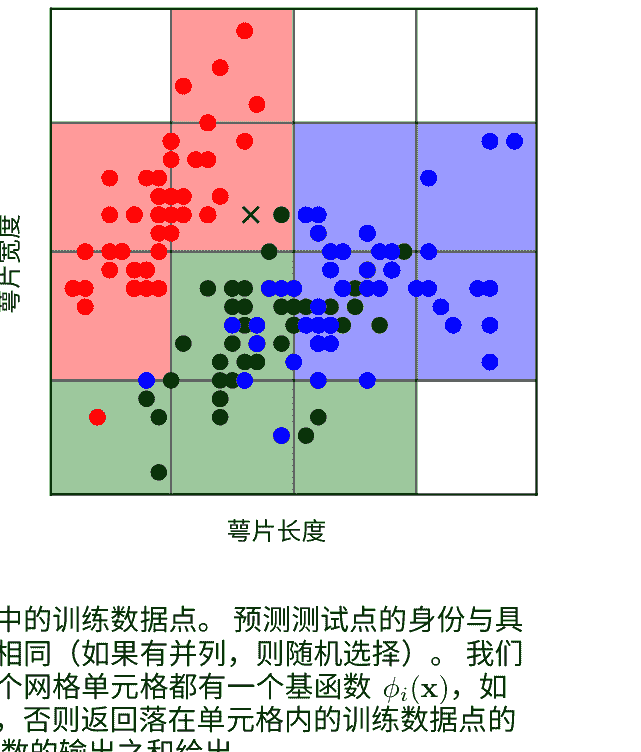

图6.2简单方法的示意图用于解决分类问题其中输入空间被划分为单元格，任何新的测试点都被分配给与测试点相同单元格中具有最多代表的类别。

正如我们很快将看到的，这种简单的方法有一些严重的缺点。

这种天真的方法存在许多问题，但其中一个最严重的问题在于考虑到其扩展到具有更大输入变量数量的问题时变得明显，这对应于更高维度的输入空间。

问题的根源在图6.3中有所说明，该图显示，如果我们将空间的一个区域划分为规则的单元格，那么这种单元格的数量将随着空间的维度呈指数增长。 指数级别的单元格带来的挑战是，我们需要指数级别的训练数据以确保单元格不为空。我们已经在图6.2中看到，一些单元格中不包含训练点。因此，在这些单元格中无法对测试点进行分类。显然，在多于几个变量的空间中，我们无法应用这种技术。多项式回归示例和鸢尾花数据分类示例的困难之处在于基函数的选择与所解决的问题无关。如果我们要避免维度灾难，我们需要在选择基函数时更加复杂。

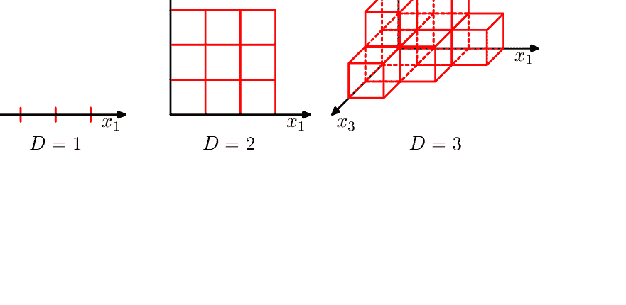

图6.3维度诅咒的示例，展示了一个正则网格的区域数量随着空间维度 D 的指数级增长。为了清晰起见，仅显示了 D= 3的一部分立方区域。

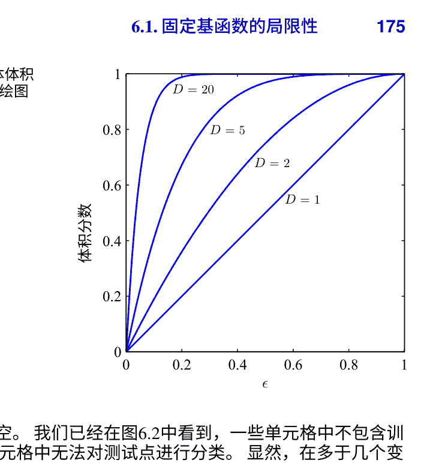

图6.4在不同维度 $D$下，半径为1的超球体体积在范围 $1 - \epsilon$ 到1内的分数的绘图。

#### 6.1.2 高维空间

然而，首先，我们将更仔细地研究具有更高维度的空间的特性，因为我们通过在三维空间中度过的生活形成的几何直觉可能会严重失败。作为一个简单的例子，考虑在$D$维空间中半径为$r$的超球体，并问超球体体积的什么比例位于半径$r = 1 - \epsilon$和$r = 1$之间。我们可以通过注意到半径为$r$的$D$维超球体的体积$V_D(r)$必须按比例缩放为$r^D$来评估这个比例，因此我们写成

$$V_D(r) = K_D r^D$$ (6.4)

练习6.1 其中常数 $K_D$仅取决于 $D$。因此，所需的分数由以下给出

$$\frac{V_D(1) - V_D(1 - \epsilon)}{V_D(1)} = 1 - (1 - \epsilon)^D,$$ (6.5)

这在图6.4中以 $D$的不同值为函数进行绘制。我们可以看到，对于大的 $D$，即使对于小的 $\epsilon$值，这个分数趋向于 1。因此，我们得出一个令人惊讶的结论，在高维空间中，大部分超球体的体积都集中在靠近表面的薄壳中！

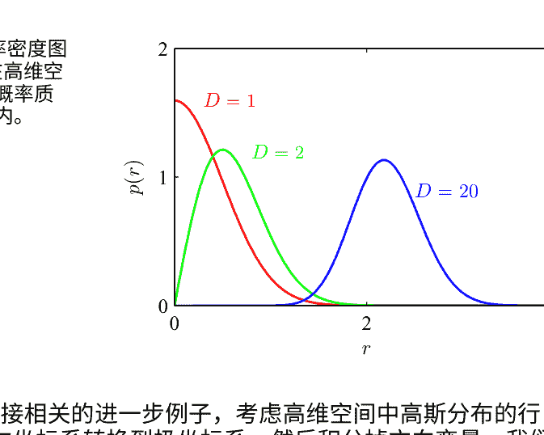

作为与机器学习直接相关的进一步例子，考虑高维空间中高斯分布的行为。如果我们从笛卡尔坐标系转换到极坐标系，然后积分掉方向变量，我们就可以得到密度函数$p(r)$作为半径$r$的函数的表达式。因此，

$p(r)\delta r$是位于半径$r$处的厚度为$\delta r$的薄壳内的概率质量。这个分布在图6.5中绘制出来，对于不同的$D$值，我们可以看到高斯分布的概率质量集中在一个特定的半径上。

在本书中，我们广泛使用涉及一个或两个变量的示例，因为这样可以很容易地通过图形来可视化这些空间。然而，读者应该注意，不是所有在低维空间中发展的直觉都能推广到涉及许多维度的情况。

最后，虽然我们已经谈论了维度灾难，但在高维空间中工作也有优势。考虑图6.6中所示的情况。我们可以看到，这个数据集中，每个数据点由一对值$(x_1, x_2)$组成，是线性可分的，但当只观察到$x_1$的值时，类别之间有很强的重叠。因此，在高维空间中，分类问题要容易得多。

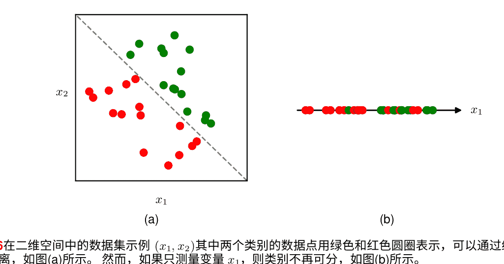

图6.6在二维空间中的数据集示例 $(x_1, x_2)$其中两个类别的数据点用绿色和红色圆圈表示，可以通过线性决策面进行分离，如图(a)所示。 然而，如果只测量变量 $x_1$，则类别不再可分，如图(b)所示。

#### 6.1.3 数据流形

在多项式回归模型和图6.2中的基于网格的分类器中，我们看到基函数的数量随着维度的增加而迅速增长，使得这些方法在涉及几十个变量的应用中变得不切实际，更不用说通常在图像处理中出现的数百万个输入了。

问题在于基函数是提前固定的，不依赖于数据，甚至不依赖于具体的问题。我们需要找到一种方法来创建针对特定应用的基函数。

尽管维度诅咒对机器学习应用确实提出了重要问题，但它并不妨碍我们找到适用于高维空间的有效技术。其中一个原因是真实数据通常会限制在具有较低有效维度的数据空间区域内。

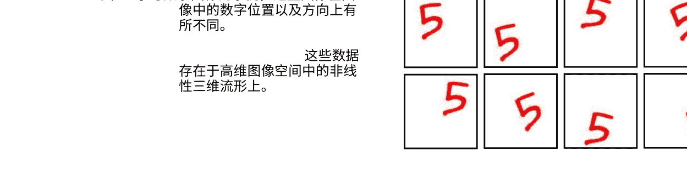

维度诅咒。 考虑图6.7中显示的图像。每个图像都是高维空间中的一个点，其维度由像素的数量确定。由于对象可以出现在图像的不同垂直和水平位置，并且具有不同的方向，因此图像之间存在三个自由度的变化。因此，一组图像在第一近似下将位于嵌入在高维空间中的三维流形上。 由于对象位置或方向与像素强度之间的复杂关系，这个流形将是高度非线性的。

实际上，像素的数量实际上是图像生成过程的一个产物，因为它们代表了连续世界的测量结果。 以更高的分辨率捕捉相同的图像会增加数据空间的维度 $D$，而不改变图像仍然存在于三维流形上的事实。 如果我们能够将局部基函数与数据流形关联起来，而不是与整个高维数据空间关联起来，我们可能会预期所需的基函数数量会随着流形的维度而指数增长，而不是随着数据空间的维度增长。 由于流形通常具有比数据空间低得多的维度，这代表了一个巨大的改进。实际上，神经网络学习了一组适应数据流形的基函数。此外，对于特定应用程序，流形内的并非所有方向都可能是显著的。例如，如果我们只希望确定图6.7中对象的方向而不是位置，则流形上只有一个相关自由度，而不是三个。神经网络还能够学习哪些流形上的方向与预测所需的输出相关。

另一种看待真实数据被限制在低维流形中的方式是考虑生成随机图像的任务。在图6.8中，我们看到自然图像的示例以及通过从均匀分布中独立随机采样每个像素的红色、绿色和蓝色强度来生成的相同分辨率的合成图像的示例。我们可以看到，这些合成图像一点也不像自然图像。原因是这些随机图像缺乏自然图像之间的非常强的像素相关性。例如，自然图像中的两个相邻像素具有更高的概率具有相同或非常相似的颜色，而随机示例中的两个相邻像素则没有这种概率。图6.8中的每个图像对应于高维空间中的一个点，然而自然图像仅覆盖了该空间的一小部分。

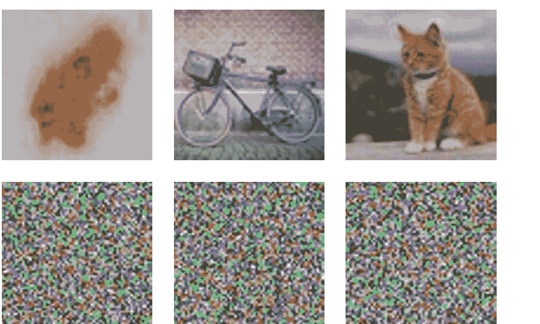

图6.8 顶部一行显示了大小为64×64像素的自然图像示例，而底部一行显示了通过从可能的像素颜色中绘制像素值的均匀概率分布获得的相同大小的随机生成图像。

#### 6.1.4 数据相关的基函数

我们已经看到，独立于解决的问题选择的简单基函数可能会遇到显著的限制，特别是在高维空间中。如果我们想在这种情况下使用基函数，那么一种方法是使用专家知识手工制作基函数，以每个应用程序特定的方式。多年来，这一直是机器学习的主流方法。基础函数，通常称为特征，将通过领域知识和试错的组合来确定。然而，这种方法取得了有限的成功，并被数据驱动的方法所取代，其中基础函数是从训练数据中学习的。领域知识仍然在现代机器学习中发挥作用，但在设计网络架构时更多地起到定性水平上的作用，它可以捕捉到适当的归纳偏差，我们将会看到在后面的章节中。

> 第9.1节

由于高维空间中的数据可能被限制在低维流形中，我们不需要基函数密集地填充整个输入空间，而是可以使用与数据流形相关联的基函数。一种方法是将每个训练集中的数据点与一个基函数关联起来，这样可以确保基函数自动适应底层数据流形。这种模型的一个例子是径向基函数（Broomhead和L owe，1988），其特点是每个基函数仅依赖于从中心向量到径向距离（通常是欧氏距离）。如果选择基准中心为输入数据值{xₙ}，则每个数据点都有一个基函数 φₙ(x)，因此可以捕捉整个数据流形。径向基函数的一个典型选择是

$$ \phi (\mathbf{x}) = \exp ( - \|\mathbf{x} - \mathbf{x}_n\|^2 / s^2 ) \quad (6.6) $$

其中 s 是控制基函数宽度的参数。尽管设置这样的模型可能很快，但这种技术的一个主要问题是对于大型数据集来说计算上不可行。此外，模型需要仔细的正则化以避免严重过拟合。

一种相关的方法，称为支持向量机（SVM）(Vapnik，1995；Sch¨olkopf和Smola，2002；Bishop，2006)，通过再次定义以每个训练数据点为中心的基函数，然后在训练过程中自动选择其中的子集来解决这个问题。因此，生成模型中的有效基函数数量通常比训练点数量要小得多，尽管通常仍然相对较大，并且随着训练集的大小而增加。支持向量机也不会产生概率输出，并且它们不会自然地推广到超过两个类别。径向基函数和支持向量机等方法已被深度神经网络取代，后者在高效利用非常大的数据集方面表现更好。

此外，正如我们将在后面看到的那样，神经网络能够学习深层次的分层表示，这对于在更复杂的应用中实现高预测准确性至关重要。

# 6.2. 多层网络

在前一节中，我们看到要将形式为（6.1）的线性模型应用于涉及大规模数据集和高维空间的问题，我们需要找到一组与所解决问题相适应的基函数。神经网络背后的关键思想是选择具有可学习参数的基函数 $\phi_j(\mathbf{x})$，并在训练过程中调整这些参数以及系数 $\{w_j\}$。然后，我们通过使用基于梯度的优化方法（如随机梯度下降）最小化整个模型的误差函数来优化整个模型，在模型中联合定义所有参数。

当然，构建参数化非线性基函数的方法有很多种。一个关键要求是它们必须是可微分的函数，其可学习参数可以应用梯度优化。最成功的选择是使用与（6.1）相同形式的基函数，使得每个基函数本身是输入的线性组合的非线性函数，其中线性组合中的系数是可学习参数。

请注意，这种构造可以递归地扩展，形成具有多层的分层模型，这是深度神经网络的基础。

考虑一个具有两层可学习参数的基本神经网络模型。首先，我们以以下形式构造输入变量 $x_1, \dots, x_D$ 的 $M$ 个线性组合

$$a_j^{(1)} = \sum_{i=1}^{D} w_{ji}^{(1)} x_i + w_{j0}^{(1)} \tag{6.7}$$

其中 $j=1, \dots, M$，并且上标 (1) 表示相应的参数在网络的第一层中。我们将参数 $w_{ji}^{(1)}$ 称为权重，参数 $w_{j0}^{(1)}$ 称为偏置，而数量 $a_j^{(1)}$ 称为预激活。然后，使用可微分的、非线性的激活函数 $h(\cdot)$ 对每个数量 $a_j^{(1)}$ 进行转换，得到

$$z_j^{(1)} = h(a_j^{(1)}), \tag{6.8}$$

它们表示（6.1）中基函数的输出。在神经网络的背景下，这些基函数被称为隐藏单元。我们将在稍后探讨各种非线性函数 $h(\cdot)$ 的选择，但在这里我们注意到，只要可以计算出导数 $h'(\cdot)$，那么整个网络函数就是可微分的。根据（6.1），这些值再次线性组合，得到

$$a_k^{(2)} = \sum_{j=1}^{M} w_{kj}^{(2)} z_j^{(1)} + w_{k0}^{(2)} \tag{6.9}$$

其中 $k=1, \dots, K$，和 $K$ 是输出的总数。这个转换对应于网络的第二层，再次 $w_{k0}^{(2)}$ 是偏置参数。最后，使用适当的输出单元激活函数对 $\{a_k^{(2)}\}$ 进行转换。

图6.9 两层神经网络的网络图。输入、隐藏和输出变量由节点表示，权重参数由节点之间的链接表示。

偏置参数由额外的输入和隐藏变量 $x_0$ 和 $z_0$ 表示，它们本身由实心节点表示。箭头表示正向传播过程中信息流动的方向。

函数 $f(\cdot)$ 给出一组网络输出 $y_k$。一个两层神经网络可以用图形表示，如图6.9所示。

#### 6.2.1 参数矩阵

正如我们在线性回归模型的背景下讨论的那样，偏置参数在(6.7)中可以通过定义一个额外的输入变量 $x_0$ 来吸收到权重参数集中，其值被固定为 $x_0 = 1$，这样(6.7)就变成了

$$a_j = \sum_{i=0}^{D} w_{ji}^{(1)} x_{i} \quad (6.10)$$

我们可以类似地将第二层的偏置吸收到第二层的权重中，这样整个网络函数就变成了

$$y_k(\mathbf{x}, \mathbf{w}) = f \left( \sum_{j=0}^{M} w_{kj}^{(2)} h \left( \sum_{i=0}^{D} w_{ji}^{(1)} x_i \right) \right). \quad (6.11)$$

本书中在各个地方都会使用另一种表示法，将输入表示为列向量 $\mathbf{x} = (x_1, \ldots, x_N)^{\mathrm{T}}$，然后将权重和偏置参数(6.11)组合成矩阵

$$\mathbf{y}(\mathbf{x}, \mathbf{w}) = f \left( \mathbf{W}^{(2)} h \left( \mathbf{W}^{(1)} \mathbf{x} \right) \right) \quad (6.12)$$

其中 $f(\cdot)$ 和 $h(\cdot)$ 分别对每个向量元素进行评估。

#### 6.2.2 通用逼近

图6.10展示了两层网络模型对广泛函数范围的建模能力。该图还展示了各个隐藏单元如何协同工作来逼近最终函数。图6.11展示了一个简单分类问题中隐藏单元的作用。

图6.10展示了两层神经网络逼近四个不同函数的能力: (a) $f(x) = x^2$, (b) $f(x) = \sin(x)$, (c) $f(x) = |x|$, and (d) $f(x) = H(x)$ 其中 $H(x)$ 是 Heaviside阶跃函数。 在每个情况下，共有 $N=50$ 个数据点，以蓝色点表示，均匀采样于区间 $(-1, 1)$ 并计算相应的 $f(x)$ 值。 然后使用这些数据点来训练一个具有三个隐藏单元、tanh激活函数和线性输出单元的两层网络。 红色曲线表示得到的网络函数，虚线曲线表示三个隐藏单元的输出。

20世纪80年代广泛研究了两层前馈网络的逼近性质，各种定理表明，对于广泛的激活函数范围，这些网络可以以任意精度逼近定义在$\mathbb{R}^D$的连续子集上的任何函数 (Funahashi, 1989; Cybenko, 1989; Hornik, Stinchcombe, and White, 1989; Leshno等, 1993)。 类似的结果也适用于从任何有限维离散空间到另一个空间的函数。 因此，神经网络被称为通用逼近器。

尽管这些定理令人放心，但它们只告诉我们存在一个可以表示所需函数的网络。 在某些情况下，它们可能需要具有指数级隐藏单元数量的网络。 此外，它们并不说明是否可以通过学习算法找到这样的网络。 此外，我们将在后面看到，没有免费午餐定理告诉我们我们永远无法找到一个真正的通用机器学习算法。 最后，虽然具有两个权重层的网络是通用逼近器，在实际应用中，考虑具有多个层的网络可以学习分层内部表示，可以带来巨大的好处。 所有这些观点都支持对深度学习的推动。

#### 6.2.3 隐藏单元激活函数

我们已经看到，输出单元的激活函数由所建模的分布类型决定。 然而，对于隐藏单元，唯一的要求是它们需要是可微分的，这样可以有很多可能性。

图6.11 一个简单的两类分类问题的解决方案的示例-使用具有两个输入、两个具有tanh激活函数的隐藏单元和一个具有logistic-sigmoid激活函数的输出的神经网络使用合成数据。虚线蓝线显示了每个隐藏单元的$z=0.5$轮廓，红线显示了$y=0.5$网络的决策面。为了比较，绿色线表示从生成数据的分布计算出的最优决策边界。

可能性。在大多数情况下，网络中的所有隐藏单元将被赋予相同的激活函数，尽管原则上在网络的不同部分可以应用不同的选择。

隐藏单元激活函数的最简单选项是恒等函数，这意味着所有隐藏单元都变成线性的。然而，对于任何这样的网络，我们总是可以找到一个没有隐藏单元的等效网络。这是因为连续线性变换的组合本身就是一个线性变换，因此它的表示能力不比单个线性层更强。然而，如果隐藏单元的数量小于输入单元或输出单元的数量，则这样的网络可以生成的变换不是最一般的可能从输入到输出的线性变换，因为在隐藏单元的维度缩减中丢失了信息。

考虑一个具有$N$个输入，$M$个隐藏单元和$K$个输出的网络，并且所有的激活函数都是线性的。这样一个网络有$M(N+K)$个参数，而直接将输入线性转换为输出的线性变换将有$NK$个参数。如果$M$相对于$N$或$K$较小，或者两者都较小，则会导致一个具有较少参数的两层线性网络，对应于一个秩不足的变换。这样的线性单元‘瓶颈’网络对应于一种称为主成分分析的标准数据分析技术。然而，在一般情况下，使用多层线性单元网络的兴趣有限，因为这样一个网络计算的整体函数仍然是线性的。

一个简单的非线性可微函数是逻辑sigmoid函数，给出为

$$\sigma(a) = \frac{1}{1 + \exp(-a)} \quad (6.13)$$

它在图5.12中绘制出来。这在多层神经网络的早期工作中被广泛使用，并且部分受到对其属性的研究的启发。

图6.12 各种非线性激活函数。生物神经元。一个密切相关的函数是双曲正切，它由以下定义

$$\text{tanh}(a) = \frac{e^a - e^{-a}}{e^a + e^{-a}}, \tag{6.14}$$

在图6.12(a)中绘制的函数与逻辑sigmoid函数不同，它通过线性变换其输入和输出值，因此对于任何具有逻辑sigmoid隐藏单元激活函数的网络，都存在一个等效的网络练习6.4使用双曲正切激活函数。然而，在训练网络时，它们不一定是等价的，因为对于基于梯度的优化，需要初始化网络的权重和偏置，因此如果激活函数发生变化，则必须相应地调整初始化方案。双曲正切函数的'硬'版本（Collobert, 2004）给出如下

$$h(a) = \max(-1, \min(1, a)) \tag{6.15}$$

并在图6.12(b)中绘制。逻辑sigmoid函数和tanh函数的一个主要缺点是，当输入具有较大的正值或较大的负值时，梯度会指数级地趋近于零。我们将在稍后讨论这个“梯度消失”问题，但目前我们注意到，通常最好使用具有非零梯度的激活函数，至少当输入取较大的正值时。其中一种选择是 softplus 激活函数给出

$$h(a) = \ln(1 + \exp(a)), \quad (6.16)$$

它在图 6.12(c) 中绘制。对于 $a \gg 1$，我们有 $h(a) \simeq a$，因此梯度保持非零，即使输入到激活函数的值很大且为正，从而有助于缓解梯度消失问题。

一个更简单的激活函数选择是修正线性单元或 ReLU，它的定义是

$$h(a) = \max(0, a) \quad (6.17)$$

并且在图 6.12(d) 中绘制出来。经验上，这是表现最好的激活函数之一，被广泛使用。请注意，严格来说，当 $a = 0$ 时，ReLU 函数的导数未定义，但在实践中可以安全地忽略。软正值函数(6.16)可以看作是 ReLU 的平滑版本，因此有时也被称为软 ReLU。

练习6.5 尽管 ReLU 对于正输入值具有非零梯度，但对于负输入值则不是这种情况，这可能意味着一些隐藏单元在训练过程中没有接收到任何“错误信号”。一个修正 ReLU 的修改版本，旨在避免这个问题，被称为渗漏 ReLU，其定义为

$$h(a) = \max(0, a) + \alpha \min(0, a), \quad (6.18)$$

其中 $0 < \alpha < 1$。这个函数在图 6.12(e) 中绘制。与 ReLU 不同，对于输入值 $a < 0$，它具有非零的梯度，这确保了有一个信号来驱动训练。这个激活函数的一个变种使用 $\alpha = -1$，在这种情况下 $h(a) = |a|$，它在图 6.12(f) 中绘制。另一个变种允许每个隐藏单元有自己的值 $\alpha_j$，可以通过计算相对于权重和偏差的梯度来在网络训练过程中学习 $\{\alpha_j\}$。

ReLU 的引入使得训练效率比以前的 S 型激活函数有了很大的提高(Krizhevsky, Sutskever, and Hinton, 2012)。除了能够有效地训练更深的网络之外，它对于权重的随机初始化不太敏感。它也非常适合低精度的实现，例如 8 位定点与 64 位浮点数之间的比较，并且计算成本低廉。许多实际应用程序默认使用 ReLU 单元，除非明确目标是探索不同激活函数的效果。

#### 6.2.4 权重空间对称性

前馈网络的一个特性是，多个不同的权重向量 $\mathbf{w}$ 可以产生相同的输入到输出的映射函数(Chen, Lu 和 Hecht-Nielsen, 1993 年)。考虑一个具有 tanh 激活函数和两层全连接的网络，如图 6.9 所示，其中 $M$ hidden units。如果我们改变所有权重和偏置项的符号输入到特定隐藏单元，那么对于给定的输入数据点，隐藏单元的预激活的符号将被反转，因此激活也将被反转，因为tanh是一个奇函数，所以tanh(-a) = -tanh(a)。通过改变所有从该隐藏单元引出的权重的符号，可以完全补偿这种转换。因此，通过改变一组特定权重（和偏置）的符号，网络表示的输入-输出映射函数保持不变，因此我们找到了两个不同的权重向量，它们产生相同的映射函数。对于M个隐藏单元，将会有M个这样的‘符号翻转’对称性，因此，任何给定的权重向量都将是2^M个等价权重向量集合中的一个。

类似地，想象一下，我们将与特定隐藏单元相关联的所有权重（和偏置）的值与另一个隐藏单元相关联的相应权重（和偏置）的值进行交换。同样，这显然不会改变网络的输入-输出映射函数，但它对应于不同的权重向量选择。对于M个隐藏单元，任何给定的权重向量都将属于与此交换对称性相关联的M×(M-1)×…×2×1 = M!个等价权重向量集合，对应于隐藏单元的M!个不同排序。因此，网络的整体权重空间对称因子为M!2^M。对于具有两个以上权重层的网络，总的对称级别将由每个隐藏单元层的这种因子的乘积给出。

事实证明，这些因素解释了权重空间中的所有对称性（除了可能由于权重值的特定选择而导致的偶然对称性）。此外，这些对称性的存在并不是tanh函数的特定属性，而是适用于广泛的激活函数范围（Kurková和Kainen，1994年）。总的来说，权重空间中的这些对称性在实践中几乎没有什么实际意义，因为网络训练的目标是找到参数的特定设置，其他等效设置的存在几乎没有什么影响。然而，当使用贝叶斯方法评估不同大小的网络的概率分布时，权重空间的对称性确实起到了作用（Bishop，2006年）。

### 6.3 深度网络

我们通过使线性回归或分类模型的基础函数受可学习参数的控制来推动神经网络的发展，从而产生了图6.9所示的两层网络模型。多年来，这是最广泛使用的架构，主要是因为训练超过两层的网络变得困难。然而，将神经网络扩展到超过两层，即深度神经网络，带来了许多优势，我们将很快讨论，并且最近在训练神经网络的技术进展对于具有多层的网络是有效的。

我们可以轻松地将两层网络架构（6.12）扩展到任意有限层数L，其中层l = 1, …, L计算以下函数：

$$\mathbf{z}^{(l)} = h^{(l)}\left(\mathbf{W}^{(l)} \mathbf{z}^{(l-1)}\right)$$

其中\( h^{(l)} \)表示与层\( l \)关联的激活函数，\( W^{(l)} \)表示相应的权重和偏置参数矩阵。此外，\( z^{(0)} = x \)表示输入向量，\( z^{(L)} = y \)表示输出向量。

值得注意的是，在文献中对于计算此类网络层数的术语存在一些混淆。因此，图6.9中的网络有时被描述为三层网络（将单元数作为层数计算，并将输入视为单元），有时被描述为单隐藏层网络（将隐藏单元数作为层数计算）。我们建议将图6.9称为两层网络，因为决定网络属性的是可学习权重的层数。

我们已经看到，一个具有如图6.9所示形式的网络，具有两层可学习参数，具有通用逼近能力。然而，具有超过两层的网络有时可以用比两层网络少得多的参数表示给定的函数。Mont'ufar等人(2014)表明，网络函数将输入空间划分为深度的指数级区域，但在隐藏层的宽度上只是多项式级别。要使用两层网络表示相同的函数，需要指数级数量的隐藏单元。

#### 6.3.1 分层表示

尽管这是一个有趣的结果，探索深度神经网络的一个更有说服力的原因是，网络架构通过分层的方式将输出与输入空间相关联。一个很好的例子是在图像中识别物体的任务。图像的像素与“猫”这样的高级概念之间的关系非常复杂和非线性，对于两层网络来说是一个极具挑战性的问题。然而，深度神经网络可以学习检测早期层次的低级特征，例如边缘，然后将这些特征组合在后续层次中，形成更高级的特征，例如眼睛或胡须，然后在后续层次中将它们组合起来检测猫的存在。这可以被视为一种组合归纳偏差，其中更高级的对象，例如猫，由更低级的对象，例如眼睛，组成，而这些更低级的对象又由边缘等更低级的元素组成。我们也可以通过考虑从低级特征（例如边缘）开始生成图像的过程来反向思考，然后将它们组合成简单的形状（例如圆），然后再将它们组合起来形成更高级的对象，例如猫。在每个阶段，有许多不同组合组件的方式，随着深度的增加，可能性的数量呈指数增长。

#### 6.3.2 分布式表示

神经网络可以利用另一种组合性形式，称为分布式表示。从概念上讲，隐藏层中的每个单元可以被认为是网络该层级的一个“特征”，具有较高的值。

#### 6.3.3 表示学习

我们可以将深度神经网络的连续层视为对数据的转换，使得解决所需的任务变得更容易。例如，一个成功学习将皮肤病变分类为良性或恶性的神经网络必须学会将原始图像数据转换为一个新的空间，由隐藏单元的输出表示，以便网络的最后一层可以区分这两个类别。这个最后一层可以被看作是一个简单的线性分类器，因此在最后一个隐藏层的表示中，这两个类别必须被一个线性面很好地分开。发现使后续任务更容易解决的数据的非线性转换能力被称为表示学习 (Bengio, Courville和Vincent, 2012)。学到的表示，有时被称为嵌入空间，是由网络的一个隐藏层的输出给出的，因此任何来自训练集或某个新数据集的输入向量都可以通过网络的前向传播转换为这个表示。

表示学习特别强大，因为它允许我们利用未标记的数据。通常很容易收集大量未标记的数据，但获取相关标签可能更困难。例如，车辆上的视频摄像头可以在城市周围行驶时收集大量城市场景的图像，但是获取这些图像并识别相关对象，如行人和路标，将需要昂贵且耗时的人工标注。

从未标记的数据中学习被称为无监督学习，并且已经开发出许多不同的算法来实现这一点。例如，神经网络可以被训练以将图像作为输入并创建相同的图像作为输出。为了将其变成一个非平凡的任务，网络可以使用比图像中的像素数量更少的隐藏层单元，从而迫使网络学习图像的某种压缩形式。只需要未标记的数据，因为训练集中的每个图像都充当输入向量和目标向量。这种网络被称为自动编码器。目标是通过这种类型的训练来迫使网络发现一些对解决其他任务（如图像分类）有用的数据的内部表示。

从历史上看，无监督学习在使第一个深度网络（除了卷积网络）能够成功训练方面起到了重要作用。网络的每一层首先使用无监督学习进行预训练，然后使用基于梯度的监督训练进一步训练整个网络。后来发现可以省略预训练阶段，只需在适当的条件下纯粹使用监督学习训练深度网络。

然而，在其他情况下，预训练和表示学习仍然是深度学习的核心。预训练的最显著例子是自然语言处理，其中变压器模型在大量文本上进行训练，并能够学习到高度复杂的语言内部表示，从而实现了人类水平及以上的各种能力。

#### 6.3.4 迁移学习

为一个特定任务学习的内部表示也可能对相关任务有用。例如，对一个大型标记数据集进行训练的网络可以学习如何将图像表示转换为更适合分类对象的表示。然后，可以使用一个较小的标记数据集对网络的最终分类层进行重新训练，以创建一个病变分类器。这是迁移学习的一个例子（Hospedale s等人），这比仅使用病变图像数据进行训练能够实现更高的准确性，因为网络可以利用一般自然图像中的共性。图6.13展示了迁移学习的示例。一般来说，迁移学习可以用于改善某些任务A的性能，其中训练数据供应不足，通过使用与之相关的任务B的数据，其中数据更加丰富。这两个任务应该具有相同类型的输入，并且任务之间应该存在一些共性，以便从任务B学习到的低级特征或内部表示对任务A有用。当我们在第10章中研究卷积网络时，我们将看到许多图像处理任务需要与深度神经网络的早期层对应的类似低级特征，而后续层更专门用于特定任务，使得这样的网络非常适合迁移学习应用。

当任务A的数据非常稀缺时，我们可能只需重新训练网络的最后一层。相反，如果有更多的数据点，重新训练几层是可行的。使用一个任务学习参数，然后应用于一个或多个其他任务的过程被称为预训练。请注意，对于新任务，与其对整个网络应用随机梯度下降，不如将新的训练数据通过固定的预训练网络发送一次，以便在新的表示中评估训练输入。然后，可以将迭代梯度下降优化应用于由最终层组成的较小网络。除了将预训练网络用作不同任务的固定预处理器外，还可以应用微调，即将整个网络调整为适应任务A的数据。这通常使用非常小的学习率进行，以限制网络权重的变化。

图6.13 迁移学习的示意图。 (a) 首先在具有丰富数据的任务上训练网络，例如自然图像的对象分类。 (b) 网络的前几层（显示为红色）从第一个任务中复制，并且网络的最后几层（显示为蓝色）然后在新任务上进行重新训练，例如皮肤病变分类，其训练数据更为稀缺。

有限的迭代次数确保网络不会过度拟合相对较小的新任务数据集。

相关方法是多任务学习（Caruana，1997），其中网络同时学习多个相关任务。例如，我们可能希望构建一个垃圾邮件过滤器，允许不同的用户具有不同的分类器，以适应其特定的偏好。训练数据可能包括许多不同用户的垃圾邮件和非垃圾邮件示例，但对于任何一个用户，示例的数量可能非常有限，因此为每个用户训练单独的分类器将导致结果不佳。相反，我们可以合并数据集来训练一个更大的单一网络，例如共享早期层，但在后续层中为不同的用户具有单独的可学习参数。跨任务共享数据使网络能够利用任务之间的共同点，从而提高所有用户的准确性。使用大量的训练示例，可以使用更深的网络和更多的参数，从而再次提高性能。

跨多个任务的学习可以扩展到元学习，也被称为学习如何学习。而多任务学习旨在为一组固定的任务进行预测，元学习的目标是为未来的任务进行预测在训练期间未见过的任务。这可以通过不仅学习共享的任务之间的内部表示，还可以通过学习学习算法本身（Hospedales等，2021年）。元学习可用于促进泛化，例如，将分类模型推广到新类别时，新类别的标记示例非常少。这被称为少样本学习。当只使用一个标记示例时，称为单样本学习。

#### 6.3.5 对比学习

最常见且最强大的表示学习方法之一是对比学习（Gutmann和Hyv"arinen，2010年；Oord，Li和Vinyals，2018年；Chen，Kornblith等，2020年）。其思想是学习一种表示，使得某些输入对，称为正对，在嵌入空间中接近而其他输入对，称为负对，则相距较远。直觉上，如果我们选择的正对在语义上相似，并选择语义上不相似的负对，那么我们将学习到一种表示空间，其中相似的输入接近，从而使下游任务（如分类）更容易。与其他形式的表示学习一样，训练网络的输出通常不直接使用，而是使用某个较早层的激活来形成嵌入空间。对比学习与大多数其他机器学习任务不同，对于给定的输入，其错误函数仅与其他输入相关，而不是具有每个输入标签或目标输出。

假设我们有一个给定的数据点 x 称为锚点，我们已经指定了另一个数据点 x^+ 与 x 一起构成一个正对。我们还必须指定一组数据点 {x_1^- , ..., x_N^-}，每个数据点与 x 构成一个负对。现在我们需要一个损失函数，它将奖励 x 和 x^+ 之间的接近程度，同时鼓励每对之间的距离较大。{x, x_n^-}。这样一个函数的例子，也是对比学习中最常用的损失函数，被称为 InfoNCE 损失（Gutmann和Hyv"arinen，2010；Oord，Li和Vinyals，2018），其中NCE表示‘噪声对比估计’。假设我们有一个神经网络函数 f_w (x)，它将输入空间 x 中的点映射到表示空间，由可学习参数 w 控制。这个表示被归一化，使得 ||f_w (x)||= 1。那么，对于一个数据点 x，InfoNCE损失的定义如下：

```
E(w) = - ln \frac{\exp\{f_w(x)^Tf_w(x^+)\}}{\exp\{f_w(x)^Tf_w(x^+)\} + \sum_{n=1}^{N} \exp\{f_w(x)^Tf_w(x_n^-)\}} \qquad (6.20)
```

我们可以看到，在这个函数中，余弦相似度 f_w(x)^Tf_w(x^+)在学习空间中提供了我们对正样本对的接近程度的度量，而相同的度量也用于评估锚点与负样本的接近程度。请注意，该函数类似于分类交叉熵误差函数，其中正样本对的余弦相似度给出了标签类别的逻辑回归，而负样本对的余弦相似度给出了错误类别的逻辑回归。还要注意，负样本对是至关重要的，因为没有它们，嵌入只会学习将每个点映射到相同表示的退化解决方案。

一个特定的对比学习算法主要通过选择正负对来定义，这是我们如何利用先验知识来指定一个好的表示应该是什么。例如，考虑学习图像表示的问题。在这里，一个常见的选择是通过以应该保留语义信息的方式破坏输入图像来创建正对（Wu等, 2018; He等, 2019; Chen, Kornblith等, 2020）。破坏与数据增强密切相关，例如旋转、平移和颜色偏移。然后可以使用数据集中的其他图像来创建负对。这种对比学习方法被称为实例判别。

然而，如果我们可以访问类标签，那么我们可以使用相同类别的图像作为正对，使用不同类别的图像作为负对。这样可以减少对表示应该不变的增强的依赖，并且避免将两个语义相似的图像视为负对。这被称为有监督对比学习（Khosla等, 2020），因为它依赖于类标签，通常可以比仅使用交叉熵分类学习表示获得更好的结果。

正对和负对的成员不一定来自相同的数据模态。在对比语言图像预训练（Contrastive-Language Image Pretraining， CLIP）中，正对由图像及其相应的文本标题组成，并且使用两个单独的函数，每个模态使用一个函数，将输入映射到相同的表示空间。负对则是不匹配的图像和标题。这通常被称为弱监督学习，因为它依赖于带标题的图像，通过从互联网上抓取数据比手动标记图像的类别更容易获得。在这种情况下，损失函数为

E(\mathbf{w}) = -\frac{1}{2} \ln \frac{\exp\{\mathbf{f}_{\mathbf{w}}(\mathbf{x}^+)^{\mathrm{T}} \mathbf{g}_{\boldsymbol{\theta}}(\mathbf{y}^+)\}}{\exp\{\mathbf{f}_{\mathbf{w}}(\mathbf{x}^+)^{\mathrm{T}} \mathbf{g}_{\boldsymbol{\theta}}(\mathbf{y}^+)\}+\sum_{n=1}^{\mathrm{N}} \exp\{\mathbf{f}_{\mathbf{w}}(\mathbf{x}_n^-)^{\mathrm{T}} \mathbf{g}_{\boldsymbol{\theta}}(\mathbf{y}^+)\}}
-\frac{1}{2} \ln \frac{\exp\{\mathbf{f}_{\mathbf{w}}(\mathbf{x}^+)^{\mathrm{T}} \mathbf{g}_{\boldsymbol{\theta}}(\mathbf{y}^+)\}}{\exp\{\mathbf{f}_{\mathbf{w}}(\mathbf{x}^+)^{\mathrm{T}} \mathbf{g}_{\boldsymbol{\theta}}(\mathbf{y}^+)\}+\sum_{m=1}^{\mathrm{M}} \exp\{\mathbf{f}_{\mathbf{w}}(\mathbf{x}^+)^{\mathrm{T}} \mathbf{g}_{\boldsymbol{\theta}}(\mathbf{y}_m^-)\}} \quad (6.21)

其中 $\mathbf{x}^+$ 和 $\mathbf{y}^+$ 表示正对的一对，其中 $\mathbf{x}$ 是一张图片，$\mathbf{y}$ 是它对应的文本标题，$\mathbf{f}_{\mathbf{w}}$ 表示从图片到表示空间的映射，$\mathbf{g}_{\boldsymbol{\theta}}$ 是从文本输入到表示空间的映射。我们还需要从数据集中获取一组其他图片 $\{\mathbf{x}_1^-, \dots, \mathbf{x}_N^-\}$，其中我们可以假设文本标题 $\mathbf{y}^+$ 不合适，以及一组类似不匹配的文本标题 $\{\mathbf{y}_1^-, \dots, \mathbf{y}_M^-\}$，这些标题与输入图片 $\mathbf{x}_+$ 不匹配。损失函数中的两个项确保（a）图片的表示与其文本标题的表示相对于其他图片的表示接近，以及（b）文本标题的表示与其描述的图片的表示相对于其他文本标题的表示接近。尽管CLIP使用文本和图像对，但任何数据使用具有配对模态的集合可以用来学习表示。我们讨论的不同对比学习方法的比较如图6.14所示。

#### 6.3.6 通用网络架构

到目前为止，我们已经探索了组织成一系列全连接层的神经网络架构。然而，由于网络图与其数学函数之间存在直接对应关系，我们可以通过考虑更复杂的网络图来开发更一般的网络映射。

为了确保输出是输入的确定性函数，这些必须限制为前馈架构，换句话说，限制为没有闭合有向循环的架构。这在图6.15中用一个简单的例子进行了说明。这样的网络中的每个（隐藏或输出）单元计算的函数如下

$z_k = h \left( \sum_{j \in \mathcal{A}(k)} w_{kj} z_j + b_k \right)$ (6.22)

其中 $\mathcal{A}(k)$ 表示节点 $k$ 的祖先集合，换句话说，表示发送连接到单元 $k$ 的单元集合，$b_k$ 表示相关的偏置参数。对于给定应用于网络输入的一组值，连续应用（6.22）可以评估网络中所有单元的激活，包括输出单元的激活。

图6.15 神经网络的示例具有一般的前馈拓扑结构。注意每个隐藏单元和输出单元都有一个关联的偏置参数（为了清晰起见省略）。

我们看到线性代数在神经网络中起着核心作用，数据集、激活和网络参数等量被表示为标量、向量和矩阵。然而，我们也会遇到更高维度的变量。例如，考虑一个由N个彩色图像组成的数据集，每个图像的高度为I像素，宽度为J像素。每个像素通过其在图像中的行和列进行索引，并具有红、绿和蓝色值。数据集中的每个图像都有一个这样的值，因此我们可以用一个四维数组X来表示特定的强度值，其中元素x_{ijkln}（其中i∈{1,...,I}和j∈{1,...,J}索引图像中的行和列，k∈{1,2,3}索引红、绿和蓝色强度，n∈{1,...,N}索引数据集中的特定图像）。这些更高维度的数组被称为张量，包括标量、向量和矩阵作为特殊情况。在本书后面讨论更复杂的神经网络架构时，我们将看到许多这样的张量示例。大规模并行处理器（如GPU）非常适合处理张量。

## 6.4 错误函数

在之前的章节中，我们探讨了用于回归和分类的线性模型，以及在这个过程中，我们推导出了适合的错误函数形式以及相应的输出单元激活函数的选择。选择错误函数的相同考虑也适用于多层神经网络，因此为了方便起见，我们将在这里总结关键要点。

#### 6.4.1 回归

我们首先讨论回归问题，暂时考虑一个可以取任意实数值的单个目标变量。在讨论单层网络中的回归之后，我们假设具有高斯分布 其中x依赖于的均值由神经网络的输出给出，因此 p(t|x, w) = N(t|y(x, w), σ²) (6.23)

其中 σ² 是高斯噪声的方差。当然，这是一个相对限制性的假设，在某些应用中，我们需要扩展这种方法以允许更一般的分布。对于给定的条件分布（6.2.3），将输出单元激活函数取为恒等函数就足够了，因为这样的网络可以逼近从 x 到 y 的任何连续函数。给定一个数据集 N 个独立同分布的观测值 X = {x₁, ..., xN}，以及相应的目标值 t = {t₁, ..., tN}，我们可以构建相应的似然函数：

```
p(t|X, w, σ²) = ∏_{n=1}^{N} p(t_n|y(x_n, w), σ²). \tag{6.24}
```

请注意，在机器学习文献中，通常考虑的是最小化误差函数而不是最大化似然函数，因此我们将遵循这个惯例。对似然函数(6.24)取负对数，我们得到误差函数

```
\frac{1}{2σ^2} \sum_{n=1}^{N} \{y(\mathbf{x}_n, \mathbf{w}) - t_n\}^2 + \frac{N}{2} \ln σ^2 + \frac{N}{2} \ln(2π), \tag{6.25}
```

这可以用来学习参数 w 和 σ²。首先考虑确定 w。最大化似然函数等价于最小化以下形式的平方和误差函数

```
E(\mathbf{w}) = \frac{1}{2} \sum_{n=1}^{N} \{y(\mathbf{x}_n, \mathbf{w}) - t_n\}^2 \tag{6.26}
```

其中我们忽略了加法和乘法常数。通过最小化 E( w)找到的w将被表示为 w？。请注意，这通常不对应于似然函数的全局最大值，因为网络函数 y(xn, w)的非线性导致误差 E(w)是非凸的，因此找到全局最优解通常是不可行的。此外，正则化第9章术语可能会添加到误差函数中，训练过程中可能会进行其他修改，因此网络参数的结果解可能与最大似然解有显著差异。

### 练习6.8

找到 w？，可以通过最小化误差函数(6.25)来找到σ2的值

```
\sigma^{2*} = \frac{1}{N} \sum_{n=1}^{N} \{y(\mathbf{x}_n, \mathbf{w}^*) - t_n\}^2. \tag{6.27}
```

请注意，只有在找到 w？所需的迭代优化完成后，才能进行评估。

如果我们有多个目标变量，并且假设它们在给定 x 和 w 的条件下是独立的，共享噪声方差 σ²，则目标值的条件分布由以下给出

```
p(\mathbf{t}|\mathbf{x}, \mathbf{w}) = \mathcal{N} \left( \mathbf{t}|\mathbf{y}(\mathbf{x}, \mathbf{w}), σ^2 \mathbf{I} \right). \tag{6.28}
```

根据单个目标变量的相同论证，我们可以看出，最大化似然函数关于权重的函数等价于最小化练习6.9的平方和误差函数：

```
$$ E(\mathbf{w}) = \frac{1}{2} \sum_{n=1}^{N} \|\mathbf{y}(\mathbf{x}_n, \mathbf{w}) - \mathbf{t}_n\|^2 $$
```

噪声方差由以下给出

```
$$ \sigma^{2*} = \frac{1}{N K} \sum_{n=1}^{N} \|\mathbf{y}(\mathbf{x}_n, \mathbf{w}^*) - \mathbf{t}_n\|^2 $$
```

其中 K是目标变量的维度。可以放弃目标变量的条件独立性假设，但代价是稍微复杂的优化问题。练习6.10

回想一下，误差函数（由负对数似然给出）和输出单元激活函数之间存在自然的配对关系。在回归中，我们可以将网络视为具有恒等函数作为输出激活函数的网络，即 y_k = a_k。相应的平方和误差函数具有以下特性

```
$$ \frac{\partial E}{\partial a_k} = y_k - t_k $$
```

#### 6.4.2 二分类

现在考虑二元分类问题，我们有一个单一的目标变量 t 使得 t = 1表示类别 C_1， t = 0表示类别 C_2。根据规范链接函数的讨论，我们考虑一个具有单一输出的网络，其激活函数是逻辑Sigmoid函数（6.13），即 0 ≤ y(x, w) ≤ 1。我们可以将 y(x, w)解释为条件概率 p(C_1|x)，其中 p(C_2|x)由以下给出

```
$$ p(t|\mathbf{x}, \mathbf{w}) = y(\mathbf{x}, \mathbf{w})^t \{1 - y(\mathbf{x}, \mathbf{w})\}^{1-t} $$
```

如果我们考虑一个独立观测的训练集，那么误差函数，即负对数似然函数，就是一个交叉熵误差，形式如下

```
$$ E(\mathbf{w}) = - \sum_{n=1}^{N} \{t_n \ln y_n + (1 - t_n) \ln(1 - y_n)\} $$
```

Simard、Stein kraus和Platt（2003）发现，在分类问题中使用交叉熵误差函数而不是平方和误差函数可以加快训练速度并改善泛化能力。

请注意，在（6.32）中没有噪声方差 σ^2的类比，因为目标值被假定为正确标记。然而，该模型很容易扩展以允许标签错误，引入一个概率 ε表示目标值 t 已经被错误地翻转了（Opper 和 Winther，2000年）。这里 ε 可以提前设置，也可以将其视为一个超参数，其值是从数据中推断出来的。

### 练习 6.11

如果我们需要执行 K 个单独的二元分类，则可以使用一个具有 K 个输出的网络，每个输出都具有逻辑-sigmoid 激活函数。与每个输出相关联的是一个二元类标签 t_k ∈ {0, 1}，其中 k=1, ..., K。如果我们假设类标签在给定输入向量的情况下是独立的，则目标的条件分布为

$$p(\mathbf{t}|\mathbf{x}, \mathbf{w}) = \prod_{k=1}^{K} y_k(\mathbf{x}, \mathbf{w})^{t_k} [1 - y_k(\mathbf{x}, \mathbf{w})]^{1-t_k}. \quad (6.34)$$

对应似然函数取负对数后得到练习6.13以下错误函数：

$$E(\mathbf{w}) = - \sum_{n=1}^{N} \sum_{k=1}^{K} \{ t_{nk} \ln y_{nk} + (1 - t_{nk}) \ln(1 - y_{nk}) \} \quad (6.35)$$

同样，对于特定输出单元的预激活，错误函数的导数与回归情况下的形式(6.31)相同。练习6.14

#### 6.4.3 多类别分类

最后，我们考虑标准的多类别分类问题，其中每个输入被分配给 K 个互斥的类别。二进制目标变量第5.1.3节 t_k ∈ {0, 1} 采用 1-of-K 编码方案表示类别，网络输出被解释为 y_k(\mathbf{x}, \mathbf{w}) = p(t_k = 1|\mathbf{x})，导致错误函数为(5.80)，我们在此重复：

$$E(\mathbf{w}) = - \sum_{n=1}^{N} \sum_{k=1}^{K} t_{kn} \ln y_k(\mathbf{x}_n, \mathbf{w}). \quad (6.36)$$

输出单元的激活函数，对应于规范链接，由softmax函数给出第5.4.4节：

$$y_k(\mathbf{x}, \mathbf{w}) = \frac{\exp(a_k(\mathbf{x}, \mathbf{w}))}{\sum_j \exp(a_j(\mathbf{x}, \mathbf{w}))}, \quad (6.37)$$

满足 0 ⩽ y_k ⩽ 1 和 Σ_k y_k = 1。请注意，如果对所有的 a_k(\mathbf{x}, \mathbf{w}) 添加一个常数，y_k(\mathbf{x}, \mathbf{w}) 将保持不变，这会导致错误函数在某些权重空间方向上保持不变。如果在错误函数中添加适当的第9章正则化项，可以消除这种退化性。再次，对于特定输出单元的预激活，错误函数对于预激活的导数采用了练习6.15熟悉的形式（6.31）。

总结一下，根据所解决的问题类型，输出单元激活函数和匹配的误差函数有一个自然的选择。对于回归问题，我们使用线性输出和平方和误差；对于多个独立的二元分类问题，我们使用逻辑sigmoid输出和交叉熵误差函数；对于多类分类问题，我们使用softmax输出和相应的多类交叉熵误差函数。对于涉及两个类别的分类问题，我们可以使用单个逻辑sigmoid输出，或者使用具有softmax输出激活函数的具有两个输出的网络。

这个过程非常通用，通过考虑其他形式的条件分布，我们可以导出相应的误差函数作为相应的负对数似然。当我们考虑多模态网络输出时，我们将在下一节中看到一个例子。

## 6.5. 混合密度网络

到目前为止，在本章中我们讨论了神经网络，其输出表示简单的概率分布，包括连续变量的高斯分布或离散变量的二进制分布。我们通过展示神经网络如何将输出视为更复杂分布（在本例中为高斯混合模型）的参数，来结束本章。这被称为混合密度网络，并且我们将看到如何定义相关的误差函数和相应的输出单元激活函数。

#### 6.5.1 机器人运动学示例

监督学习的目标是建模条件分布 $p(\mathbf{t}|\mathbf{x})$，对于许多简单的回归问题，选择高斯分布。然而，实际的机器学习问题往往具有显著非高斯分布。这可能出现在逆问题中，其中分布可以是多峰的，这种情况下高斯假设可能导致非常糟糕的预测。

作为一个逆问题的简单示例，考虑机器人手臂的运动学，如图6.16所示。正向问题涉及找到末端效应器的位置，给定关节角度，并且有唯一解。然而，在实践中，我们希望将机器人的末端效应器移动到特定位置，并且为此我们必须设置适当的关节角度。因此，我们需要解决逆问题，它有两个解，如图6.16所示。因此，我们需要解决逆问题，它有两个解，如图6.16所示。

正向问题通常对应于物理系统中的因果关系，并且通常有唯一解。例如，人体中特定的症状模式可能是由特定疾病的存在引起的。然而，在机器学习中，我们通常需要解决一个逆问题，例如尝试根据一组症状预测疾病的存在。如果正向问题涉及多对一的映射，则逆问题将有多个解。例如，几种不同的疾病可能导致相同的症状。

练习6.16

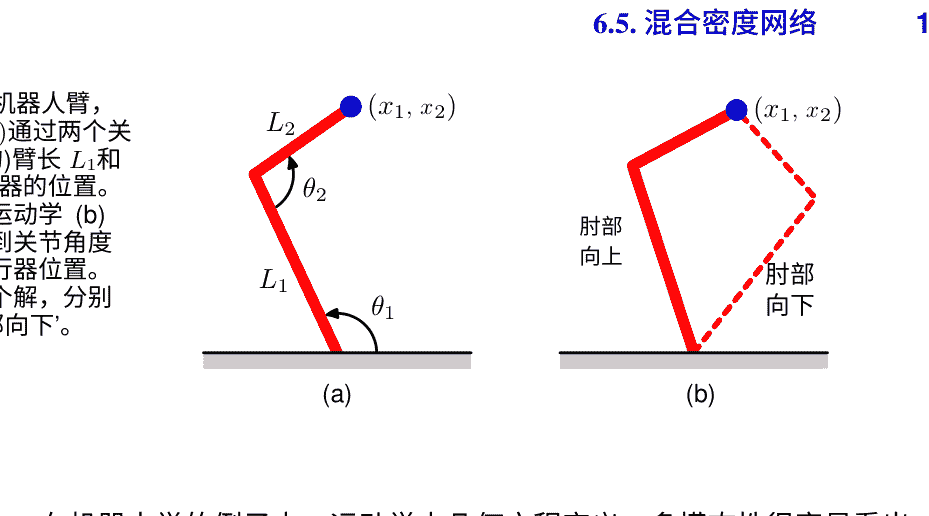

图6.16 (a) 一个二连杆机器人臂，其中笛卡尔坐标 $(x_1, x_2)$ 通过两个关节角 $\theta_1$ 和 $\theta_2$ 以及 (固定的) 臂长 $L_1$ 和 $L_2$ 唯一确定了末端执行器的位置。这被称为机械臂的正向运动学 (b) 在实践中，我们需要找到关节角度，以实现所需的末端执行器位置。这个逆运动学问题有两个解，分别对应于‘肘部向上’和‘肘部向下’。

在机器人学的例子中，运动学由几何方程定义，多模态性很容易看出。然而，在许多机器学习问题中，多模态性的存在，特别是在涉及高维空间的问题中，可能不太明显。然而，为了教学目的，我们将考虑一个简单的玩具问题，我们可以很容易地可视化多模态性。这个问题的数据是通过在区间$(0, 1)$上均匀采样变量 $x$ 生成的，得到一组值 $\{x_n\}$，相应的目标值 $t_n$ 通过计算函数 $x_n + 0.3 \sin(2\pi x_n)$ 然后在区间 $(-0.1, 0.1)$ 上添加均匀噪声获得。然后通过保持相同的数据点但交换 $x$ 和 $t$ 的角色来获得逆问题。图6.17显示了正向和逆问题的数据集，以及通过最小化平方和误差函数来拟合具有六个隐藏单元和一个线性输出单元的两层神经网络的结果。最小二乘法对应于在高斯假设下的最大似然估计。我们可以看到，这对于正向问题得到了一个很好的模型，但对于高度非高斯的逆问题得到了一个非常差的模型。

#### 6.5.2 条件混合分布

因此，我们寻求一个用于建模条件概率分布的通用框架。这可以通过使用混合模型来实现 $p(\mathbf{t}|\mathbf{x})$ 的方式来实现

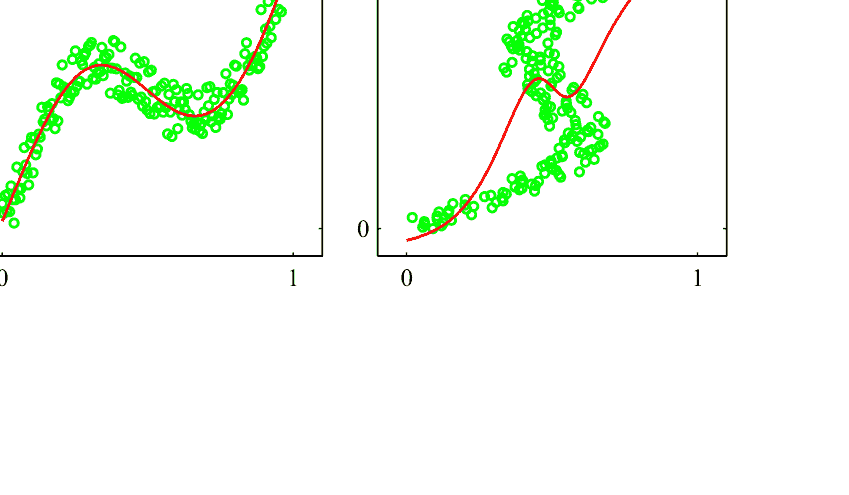

图6.17 左边是一个简单正向问题的数据集其中红色曲线显示了通过最小化平方和误差函数来拟合两层神经网络的结果。相应的逆问题显示在右边通过交换 $x$ 和 $t$ 的角色获得。在这里，相同的网络再次通过最小化平方和误差函数进行训练，由于数据集的多模态性，对数据的拟合效果较差。

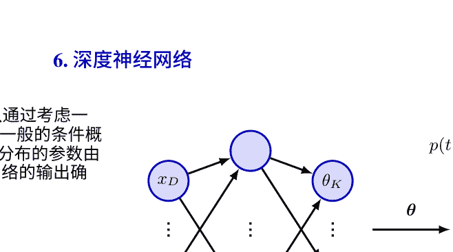

图6.18 混合密度网络可以通过考虑一个参数化混合模型来表示一般的条件概率密度 $p(\mathbf{t}|\mathbf{x})$，其中 $\mathbf{t}$ 的分布的参数由以 $\mathbf{x}$ 为输入向量的神经网络的输出确定。

混合系数和组件密度都是输入向量 $\mathbf{x}$ 的灵活函数，从而产生了混合密度网络。对于任何给定的值 $\mathbf{x}$，混合模型提供了对任意条件密度函数 $p(\mathbf{t}|\mathbf{x})$ 建模的一般形式。只要我们考虑一个足够灵活的网络，我们就有了近似任意条件分布的框架。

在这里，我们将明确为高斯组件开发模型，以便

```
$$p(\mathbf{t}|\mathbf{x}) = \sum_{k=1}^{K} \pi_k(\mathbf{x}) \mathcal{N} \left( \mathbf{t} | \mu_k(\mathbf{x}), \sigma_k^2(\mathbf{x}) \right) \tag{6.38}$$
```

这是一个异方差模型的例子，其中数据的噪声方差是输入向量 $\mathbf{x}$ 的函数。除了高斯分布，我们还可以使用其他分布作为组件，例如伯努利分布，如果目标变量是二进制而不是连续的。我们还专门针对组件的各向同性协方差的情况进行了特化，尽管混合密度网络可以通过使用 Cholesky 分解来表示协方差来扩展以允许一般协方差矩阵（Williams, 1996）。即使具有各向同性组件，条件分布 $p(\mathbf{t}|\mathbf{x})$ 也不假设与 $\mathbf{t}$ 的组件相关的分解（与标准的平方和回归模型相反），这是混合分布的结果。

我们现在将混合模型的各个参数，即混合系数 $\pi_k(\mathbf{x})$，均值 $\mu_k(\mathbf{x})$ 和方差 $\sigma_k^2(\mathbf{x})$，视为由以 $\mathbf{x}$ 为输入的神经网络的输出来控制。这个混合密度网络的结构如图6.18所示。混合密度网络与专家混合模型（Jacobs et al., 1991）密切相关。主要区别在于混合专家模型在混合中的每个组件模型都有独立的参数，而混合密度网络使用相同的函数来预测所有组件密度的参数以及混合系数，因此非线性隐藏单元在输入相关函数之间是共享的。

图6.18中的神经网络可以是一个具有 sigmoid（tanh）隐藏单元的两层网络。如果混合模型（6.38）中有 $K$ 个组件，并且 $\mathbf{t}$ 有 $L$ 个组件，则该网络将有 $K$ 个输出-

由π_k表示的单元预激活决定了混合系数 π_k(x), K 由σ_k表示的输出决定了高斯标准差 σ_k(x), 和 由μ_{kj}表示的K×L输出决定了高斯分布的组成部分 μ_{kj}(x)的均值 μ_k(x). 网络输出的总数由 (L+2)K给出，与通常只预测目标变量条件均值的网络的L个输出不同。

混合系数必须满足以下约束条件

```
$$\sum_{k=1}^K \pi_k(\mathbf{x}) = 1, \quad 0 \leq \pi_k(\mathbf{x}) \leq 1$$
```

可以通过一组softmax输出来实现：

```
$$\pi_k(\mathbf{x}) = \frac{\exp(a_k^\pi)}{\sum_{l=1}^K \exp(a_l^\pi)}$$
```

同样，方差必须满足 $\sigma_k^2(\mathbf{x}) \geq 0$，因此可以用相应网络预激活的指数形式表示

```
$$\sigma_k(\mathbf{x}) = \exp(a_k^\sigma)$$
```

最后，由于均值 $\mu_k(\mathbf{x})$具有实部，它们可以直接由网络输出表示：

```
$$\mu_{kj}(\mathbf{x}) = a_{kj}^\mu$$
```

其中输出单元的激活函数由恒等式 $f(a) = a$给出。混合密度网络的可学习参数包括神经网络中的权重和偏差向量 $\mathbf{w}$，可以通过最大似然法或等价地通过最小化定义为负对数似然的误差函数来设置。对于独立数据，该误差函数的形式为

```
$$E(\mathbf{w}) = -\sum_{n=1}^N \ln \left\{ \sum_{k=1}^K \pi_k(\mathbf{x}_n, \mathbf{w}) \mathcal{N} \left( \mathbf{t}_n | \mu_k(\mathbf{x}_n, \mathbf{w}), \sigma_k^2(\mathbf{x}_n, \mathbf{w}) \right) \right\}$$
```

在这里，我们明确了对 $\mathbf{w}$的依赖关系。

#### 6.5.3 梯度优化

为了最小化误差函数，我们需要计算误差对$\mathbf{w}$的导数。$E(\mathbf{w})$对 $\mathbf{w}$的各个分量求导。我们将在后面看到如何自动计算这些第8章导数。然而，推导出关于输出单元预激活的误差导数的适当表达式是有益的，因为这突出了这些量的概率解释。因为误差函数(6.43)由一系列项组成，每个训练数据点对应一项，我们可以考虑特定输入向量 $\mathbf{x}_n$及其关联目标向量 $\mathbf{t}_n$的导数。总误差 $E$的导数通过对所有项求和得到。

#### 6.5.4 预测分布

我们通过返回到图6.17中显示的反问题的玩具例子来说明混合密度网络的使用。图6.19显示了混合系数 \(\pi_k(x)\)，均值 \(\mu_k(x)\) 和对应的条件密度等高线。神经网络的输出，因此混合模型中的参数，必然是输入变量的连续单值函数。然而，从图6.19(c)中我们可以看到，该模型能够在某些 \(x\) 值上产生单峰条件密度，而在其他 \(x\) 值上产生三峰条件密度，通过调节混合组件 \(\pi_k(x)\) 的振幅。

一旦混合密度网络被训练好，它可以预测目标数据的条件密度函数，对于任何给定的输入向量值。这个条件密度函数代表了数据生成器的完整描述，就预测输出向量值的问题而言。从这个密度函数中，我们可以计算出在不同应用中可能感兴趣的更具体的数量。其中最简单的之一是均值，对应于目标数据的条件平均值，表示为

$$\mathbb{E}[\mathbf{t}|\mathbf{x}] = \int \mathbf{t}p(\mathbf{t}|\mathbf{x}) \mathrm{d}\mathbf{t} = \sum_{k=1}^K \pi_k(\mathbf{x})\boldsymbol{\mu}_k(\mathbf{x}) \tag{6.48}$$

图6.19 (a) 混合系数 π_k(x) 作为x的函数的绘图在混合密度网络中，使用了三个混合成分在图6.17中显示的数据上进行训练该模型具有三个高斯成分并使用具有五个 tanh sigmoid隐藏层单元和九个输出的两层神经网络（对应于三个高斯成分的均值和方差以及三个混合系数）。在x的小值和大值处，目标数据的条件概率密度是单峰的，只有一个高斯成分的先验概率值较高，而在x的中间值处，条件密度是三峰的，三个混合系数具有相近的值。(b) 使用与混合系数相同的颜色编码绘制的均值 μ_k(x)的图。(c) 绘制了相应的目标数据条件概率密度的轮廓图，对于相同的混合密度网络。(d) 绘制了条件密度的近似条件模式，由红色点表示。

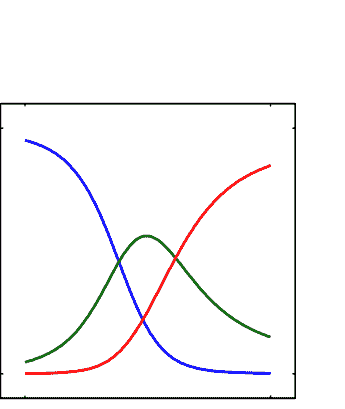

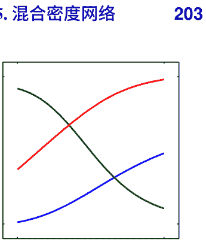

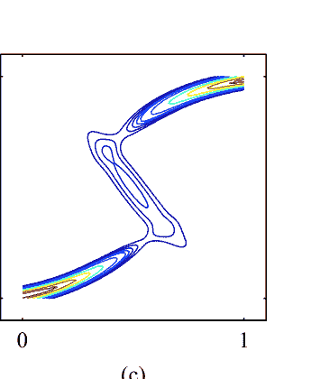

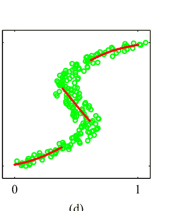

我们使用了（6.38）来进行计算。因为通过最小二乘训练的标准网络近似于条件均值，所以我们可以看到混合密度网络可以将传统的最小二乘结果作为特殊情况进行再现。当然，正如我们已经注意到的那样，对于多峰分布，条件均值的价值有限。

我们可以类似地评估密度函数关于条件平均值的方差，得到

```
$$s^2(\mathbf{x}) = \mathbb{E}\left[\|\mathbf{t} - \mathbb{E}[\mathbf{t}|\mathbf{x}]\|^2 | \mathbf{x}\right] \quad (6.49)$$
```

```
$$= \sum_{k=1}^{K} \pi_k(\mathbf{x}) \left\{ \sigma_k^2(\mathbf{x}) + \left\| \boldsymbol{\mu}_k(\mathbf{x}) - \sum_{l=1}^{K} \pi_l(\mathbf{x})\boldsymbol{\mu}_l(\mathbf{x}) \right\|^2 \right\} \quad (6.50)$$
```

我们使用了（6.38）和（6.48）。这比对应的最小二乘结果更一般，因为方差是 x的函数。

我们已经看到，对于多模态分布，条件均值可能会给出数据的不良表示。例如，在控制图6.16中所示的简单机器人手臂时，我们需要选择两个可能的关节角设置之一

以实现所需的末端执行器位置，但是这两个解的平均值本身不是一个解。在这种情况下，条件模式可能更有价值。由于混合密度网络的条件模式没有简单的解析解，因此需要进行数值迭代。一个简单的替代方法是在每个x的值处取最可能组分（即具有最大混合系数）的均值。这在图6.19(d)的玩具数据集中显示。

### 练习

- 6.1 (★★★)使用结果 (2.126) 推导出单位半径的超球面的表面积 $S_D$ 和体积 $V_D$ 的表达式。为了做到这一点，考虑以下结果，该结果是通过从笛卡尔坐标系转换到极坐标系得到的：

```
$$\prod_{i=1}^{D} \int_{-\infty}^{\infty} e^{-x_i^2} \mathrm{d}x_i = S_D \int_{0}^{\infty} e^{-r^2} r^{D-1} \mathrm{d}r. \tag{6.51}$$
```

使用由伽玛函数定义的

```
$$\Gamma(x) = \int_{0}^{\infty} t^{x-1} e^{-t} \mathrm{d}t \tag{6.52}$$
```

结合(2.126)，计算方程两边的值，并因此证明

```
$$S_D = \frac{2\pi^{D/2}}{\Gamma(D/2)}. \tag{6.53}$$
```

接下来，通过对半径从 0到 1的积分，证明在 $D$维度中单位超球体的体积为

```
$$V_D = \frac{S_D}{D}. \tag{6.54}$$
```

最后，使用结果$\Gamma(1) = 1$和 $\Gamma(3/2) = \sqrt{\pi}/2$来证明(6.53)和(6.54)化简为常规的 $D=2$和 $D=3$表达式。

- 6.2 (★★★)考虑一个半径为 $a$的超球与边长为 $2a$的同心超立方体，使得超球与超立方体在每个边的中心点相接。通过使用练习6.1的结果，证明超球的体积与立方体的体积之比为超球的体积

```
$$\frac{\text{超球的体积}}{\text{立方体的体积}} = \frac{\pi^{D/2}}{D2^{D-1}\Gamma(D/2)}. \tag{6.55}$$
```

现在利用斯特林公式的形式

```
$$\Gamma(x+1) \simeq (2\pi)^{1/2} e^{-x} x^{x+1/2}, \tag{6.56}$$
```

对于 $x \gg 1$，证明当 $D \to \infty$时，比值(6.55)趋近于零。同时也展示了从超立方体中心到其中一个角落的距离

除以垂直距离到其中一边的距离是√D，因此当D→∞时，它趋近于∞。从这些结果中，我们可以看到，在高维空间中，一个立方体的大部分体积集中在大量的角落中，这些角落本身变得非常长而尖锐！

- 6.3 (???) 在这个练习中，我们探索了高维空间中高斯分布的行为。考虑一个D维高斯分布，给定为

```
$p(\mathbf{x}) = \frac{1}{(2\pi\sigma^2)^{D/2}} \exp\left( -\frac{\|\mathbf{x}\|^2}{2\sigma^2} \right).$ (6.57)
```

我们希望找到极坐标中的密度函数，其中方向变量已经被积分掉。为了做到这一点，展示出在半径为r且厚度为ϵ的薄壳上的概率密度积分，其中ϵ≪1，为p(r)ϵ，其中

```
$p(r) = \frac{S_D r^{D-1}}{(2\pi\sigma^2)^{D/2}} \exp\left( -\frac{r^2}{2\sigma^2} \right).$ (6.58)
```

其中S_D是D维单位超球面的表面积。证明函数p(r)在大D时具有一个位于r≃√Dσ的单一驻点。通过考虑p(r+ϵ)其中ϵ≪r，证明在大D时，

```
$p(r + \epsilon) = p(r) \exp\left( -\frac{3\epsilon^2}{2\sigma^2} \right),$ (6.59)
```

这表明r是径向概率密度的最大值，也表明p(r)从其在r处的最大值以指数速度衰减，衰减长度为σ。我们已经看到在大D时σ≪r，因此我们可以看到大部分概率质量集中在大半径的薄壳中。最后，证明概率密度p(x)在原点处比在半径r处大exp(D/2)倍。因此，我们可以看到，在高维高斯分布中，大部分的概率质量位于与高概率密度区域不同半径的位置。

- 6.4 (★)考虑一个形式为(6.11)的两层网络函数，其中隐藏单元的非线性激活函数h(·)由逻辑sigmoid函数给出，形式为

$\sigma(a) = \{1 + \exp(-a)\}^{-1}.$ (6.60) 证明存在一个等价的网络，它计算的函数与原网络完全相同，但隐藏单元的激活函数为tanh(a)，其中tanh函数由(6.14)定义。提示：首先找到σ(a)和tanh(a)之间的关系，然后证明两个网络的参数之间存在线性变换的差异。

- 6.5 (★) swish激活函数 (Ramachandran, Zoph, and Le, 2017) 的定义为

```
$h(x) = x \sigma(\beta x)$ (6.61)
```

其中 σ(x) 是由 (6.13) 定义的逻辑sigmoid激活函数。当用于神经网络时，β可以视为可学习的参数。使用软件绘制swish激活函数及其一阶导数的草图或图形，其中 β= 0.1, β= 1.0, 和 β= 10。 证明当 β→∞时，swish函数变为ReLU函数。

6.6 (★) 我们在 (5.72) 中看到，逻辑sigmoid激活函数的导数可以用函数值本身来表示。推导出由 (6.14) 定义的 tanh激活函数的相应结果。

6.7 (★★)证明软正函数 ζ(a)（由(6.16)给出）满足以下性质：

ζ(a) - ζ(-a) = a                 (6.62)
ln σ(a) = -ζ(-a)                 (6.63)
dζ(a)/da = σ(a)                 (6.64)
ζ^{-1}(a) = ln(exp(a) - 1)      (6.65)

其中 σ(a) 是由(6.13)给出的逻辑sigmoid激活函数。

6.8 (★)证明对于方差，最小化误差函数(6.25)会得到结果(6.27)。σ² 给出结果(6.27)。

6.9 (★)证明在多输出神经网络的条件分布(6.28)下，最大化似然函数等价于最小化平方和误差函数(6.29)。同时，证明最小化该误差函数的噪声方差由(6.30)给出。

6.10 (★★)考虑一个涉及多个目标变量的回归问题，假设在给定输入向量 x 的条件下，目标的分布是一个高斯分布，形式为

p(t|x, w) = N(t|y(x, w), Σ)     (6.66)

其中 y(x, w) 是具有输入向量 x 和权重向量 w 的神经网络的输出，Σ是假设的高斯噪声在目标上的协方差。给定一组独立观测的 x 和 t，写出必须最小化的误差函数，以找到 w 的最大似然解，假设 Σ是固定且已知的。现在假设 Σ也需要从数据中确定，写出 Σ的最大似然解的表达式。请注意，w 和 Σ的优化现在是耦合的，与第6.4.1节讨论的独立目标变量的情况相反。

6.11 (★★)考虑一个二分类问题，目标值为 t ∈ {0, 1}，具有网络输出 y(x, w) 表示 p(t=1|x)，并假设存在概率 ε，即训练数据点的类标签被错误设置的概率。假设数据是独立同分布的，写出对应于负对数似然的误差函数。验证当 ε= 0时，误差函数 (6.33) 被得到。注意这个误差函数使模型对错误标记的数据具有鲁棒性，与通常的交叉熵误差函数相反。

6.12 (★★)二分类问题的误差函数(6.33)是针对具有逻辑sigmoid输出激活函数的网络推导出来的，因此 0 ⩽ y(x, w) ⩽ 1，并且数据具有目标值 t ∈ {0, 1}。如果我们考虑一个具有输出 -1 ⩽ y(x, w) ⩽ 1和目标值 t=1用于类别 C₁ 和 t=-1用于类别 C₂的网络，推导出相应的误差函数。适当的选择是什么输出单元激活函数？

6.13 (?)证明在多类神经网络模型中，最大化似然函数其中网络输出的解释为 yₖ(x, w) = p(tₖ=1|x)等价于最小化交叉熵误差函数(6.36)。

6.14 (⋆)证明误差函数(6.33)对于具有逻辑sigmoid激活函数的输出单元的预激活 aₖ 的导数 yₖ = σ(aₖ)，其中 σ(a)由(6.13)给出，满足(6.31)。

6.15 (⋆)证明误差函数(6.36)对于具有softmax激活函数(6.37)的输出单元的预激活项(aₖ)的导数满足(6.31)。

6.16 (⋆⋆)写出一个方程对应于图6.16中所示的机器人手臂的笛卡尔坐标 (x₁, x₂)，其中关节角度 θ₁ 和 θ₂以及链节长度 L₁ 和 L₂被考虑在内。假设坐标系的原点是下臂的连接点。这些方程定义了机器人手臂的正向运动学。

6.17 (⋆⋆)证明由公式(6.44)定义的变量 γₙₖ可以被视为混合分布(6.38)中的后验概率 p(k|t)，其中混合系数 πₖ(x)被视为依赖于x的先验概率 p(k)。

6.18 (⋆⋆)推导出控制混合密度网络中混合系数的网络输出预激活的误差函数关于网络输出的导数结果(6.45)。

6.19 (⋆⋆)推导出控制混合密度网络中组分均值的网络输出预激活的误差函数关于网络输出的导数结果(6.46)。

6.20 (⋆⋆)推导出控制混合密度网络中组分方差的网络输出预激活的误差函数关于网络输出的导数结果(6.47)。

6.21 (⋆⋆⋆)验证混合密度网络模型的条件均值和方差的结果(6.48)和(6.50)。

# 深度学习

## 7 梯度下降

在前一章中，我们看到神经网络是一类非常广泛和灵活的函数，原则上可以以任意高的精度逼近任何所需的函数，只要隐藏单元的数量足够大。此外，我们还看到深度神经网络可以编码对应于分层表示的归纳偏差，在各种实际应用中都非常有价值。现在，我们转向根据一组训练数据找到网络参数（权重和偏差）的任务。

与前几章讨论的回归和分类模型一样，我们通过优化误差函数来选择模型参数。我们已经看到如何通过使用最大似然来为特定应用定义适当的误差函数。虽然原则上可以通过一系列直接的误差函数评估来最小化误差函数，但这种方法非常低效。相反，我们转向深度学习中使用的另一个核心概念，即梯度下降。

### 7.1. 误差曲面

优化误差函数的关键在于通过评估误差函数对网络参数的导数，即利用梯度信息来更高效地进行。 这就是为什么我们要确保神经网络所表示的函数在设计上是可微分的原因。

同样，误差函数本身也需要是可微分的。可以使用一种称为反向传播的技术来高效地计算网络中每个参数对误差函数的导数，该技术涉及通过网络进行反向计算，类似于在评估网络输出期间的函数计算的正向流动。

虽然似然性被用来定义误差函数，但在神经网络中优化误差函数的目标是在测试数据上实现良好的泛化。 在经典统计学中，最大似然用于拟合参数模型到有限数据集中，其中数据点的数量通常远远超过模型中的参数数量。 最优解具有最大似然函数的最大值，并且找到的拟合参数的值直接相关。 相比之下，现代深度学习使用包含大量可学习参数的非常丰富的模型，目标绝不仅仅是精确优化。相反，学习算法本身的属性和行为以及正则化的各种方法对于确定解决方案在新数据上的泛化能力非常重要。

在训练过程中，我们的目标是找到神经网络中权重和偏差的值，使其能够进行有效的预测。 为了方便起见，我们将这些参数组合成一个向量 w，并通过使用选择的误差函数 E( w)来优化w。 在这一点上，拥有一个几何图像的错误函数是有用的，我们可以将其视为位于‘权重空间’上的一个表面，如图7.1所示。

首先注意，如果我们从 w到 w + δw在权重空间中迈出一小步，那么错误函数的变化由以下公式给出

$$ \delta E \simeq \delta \mathbf{w}^\mathrm{T}\nabla E(\mathbf{w}) \tag{7.1} $$

其中向量 ∇E(w)指向错误函数增长最快的方向。 只要错误函数 E(w)是 w的一个光滑、连续的函数，它的最小值将出现在权重空间中梯度消失的点上，即

$$ \nabla E(\mathbf{w}) = 0 \tag{7.2} $$

否则，我们可以朝着 -∇E(w)的方向迈出一小步，从而进一步减小误差。 梯度为零的点被称为静止点，可以进一步分类为极小值、极大值和鞍点。

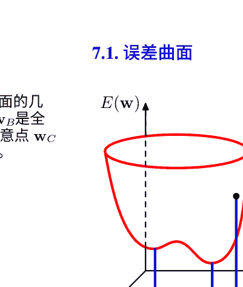

图7.1 将误差函数\( E(\mathbf{w}) \)作为一个位于权重空间上的表面的几何视图。点\( \mathbf{w}_A \)是一个局部最小值，点\( \mathbf{w}_B \)是全局最小值，因此\( E(\mathbf{w}_A) > E(\mathbf{w}_B) \)。在任意点\( \mathbf{w}_C \)处，误差表面的局部梯度由向量\( abla E \)给出。

我们将致力于找到一个向量\( \mathbf{w} \)，使得\( E(\mathbf{w}) \)取得最小值。然而，误差函数通常对权重和偏置参数具有高度非线性的依赖性，因此在权重空间中会有许多梯度为零（或数值非常小）的点。实际上，对于任何局部最小值点\( \mathbf{w} \)，通常会有其他等价最小值点存在于权重空间中。例如，在图6.9所示的两层网络中，每个权重空间中的点都是一个\( M! \ 2M \)个等价点的成员。

#### 7.1.1 局部二次逼近

通过考虑误差函数的局部二次近似，可以对优化问题和各种解决技术有所了解。围绕某一点\( \mathbf{w}^\star \)在权重空间中，误差函数\( E(\mathbf{w}) \)的泰勒展开式为

$$ E(\mathbf{w}) \simeq E(\mathbf{w}^\star) + (\mathbf{w} - \mathbf{w}^\star)^\mathrm{T}\mathbf{b} + \frac{1}{2} (\mathbf{w} - \mathbf{w}^\star)^\mathrm{T}\mathbf{H}(\mathbf{w} - \mathbf{w}^\star) \tag{7.3} $$

其中省略了三次及更高次项。这里\( \mathbf{b} \)被定义为在\( \mathbf{w}^\star \)处求得的梯度 of \( E \)

$$ \mathbf{b} \equiv abla E \bigg|_{\mathbf{w}=\mathbf{w}^\star} \tag{7.4} $$

Hessian矩阵被定义为相应的二阶导数矩阵

$$ \mathbf{H}(\mathbf{w}) = abla abla E(\mathbf{w}) \bigg|_{\mathbf{w}=\mathbf{w}^\star} \tag{7.5} $$

如果网络中总共有 W 个权重和偏置，则 w 和 b 的长度为 W， H 的维度为 W × W。 根据(7.3)，梯度的相应局部近似为

$$ \nabla E(\mathbf{w}) = \mathbf{b} + \mathbf{H}(\mathbf{w} - \mathbf{w}^\star). \tag{7.6} $$

对于足够接近 w* 的点 w，这些表达式将给出误差及其梯度的合理近似。

考虑围绕某一点的局部二次逼近的特殊情况 w*。这种情况下没有线性项，因为 ∇E = 0 在 w* 处，而(7.3)变为

$$ E(\mathbf{w}) = E(\mathbf{w}^{\star}) + \frac{1}{2}(\mathbf{w} - \mathbf{w}^{\star})^{\mathrm{T}}\mathbf{H}(\mathbf{w} - \mathbf{w}^{\star}) \tag{7.7} $$

其中 Hessian 矩阵在 w* 处被评估。 要从几何角度解释这个问题，考虑 Hessian 矩阵的特征值方程：

$$ \mathbf{H}\mathbf{u}_{i} = \lambda_{i}\mathbf{u}_{i} \tag{7.8} $$

其中特征向量 uᵢ 构成一个完备的正交集合，使得

$$ \mathbf{u}_{i}^{\mathrm{T}}\mathbf{u}_{j} = \delta_{ij}. \tag{7.9} $$

我们现在将 (w - w*) 展开为特征向量的线性组合形式

$$ \mathbf{w} - \mathbf{w}^{\star} = \sum_{i} \alpha_{i}\mathbf{u}_{i}. \tag{7.10} $$

这可以被看作是一个坐标系的转换，其中原点被平移到点 w* 并且轴被旋转以与特征向量对齐，通过其列为 {u₁, …, u_W} 的正交矩阵进行替换。

将(7.10)代入(7.7)，并使用(7.8)和(7.9)，可以将误差函数写成以下形式

$$ E(\mathbf{w}) = E(\mathbf{w}^{\star}) + \frac{1}{2}\sum_{i} \lambda_{i}\alpha_{i}^{2}. \tag{7.11} $$

假设我们将所有 αᵢ = 0 对于 i ≠ j，然后改变 αⱼ，对应于将 w 远离 w* 沿着 uⱼ 的方向。 从(7.11)中我们可以看出，如果相应的特征值 λⱼ 为正，则误差函数将增加，如果为负则减少。 如果所有特征值都为正，则 w* 对应于误差函数的局部最小值，如果它们都为负，则 w* 对应于局部最大值。 如果我们有一些正特征值和一些负特征值，则 w* 表示一个鞍点。

如果且仅当，矩阵 H 被称为正定矩阵时，

$$ \mathbf{v}^{\mathrm{T}}\mathbf{H}\mathbf{v} > 0, \quad \text{对于所有的} \mathbf{v}. \tag{7.12} $$

因为特征向量 {u_i}形成一个完备集，任意向量 v可以写成

$$ \mathbf{v} = \sum_{i} c_{i} \mathbf{u}_{i}. \tag{7.13} $$

根据(7.8)和(7.9)，我们有

$$ \mathbf{v}^{\mathrm{T}} \mathbf{H} \mathbf{v} = \sum_{i} c_{i}^{2} \lambda_{i} \tag{7.14} $$

所以 H只有当它的所有特征值都是正的时，才是正定的。

因此，成为局部最小值的必要和充分条件是误差函数的梯度在 w*处消失，并且Hessian矩阵在 w*处求值是正定的。在新的坐标系中，其基向量由特征向量 {u_i}给出，常数 E(w)的轮廓是以原点为中心的椭圆，如图7.2所示。

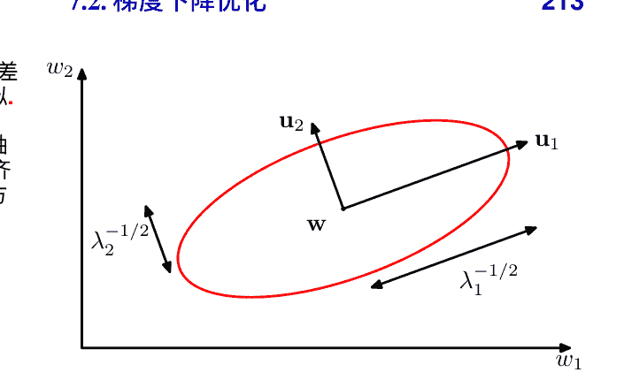

图7.2 在一个局部最小值的邻域中 w*，误差函数可以通过二次函数来近似。常数误差轮廓线是椭圆，其轴与海森矩阵的特征向量u_i对齐，其长度与相应特征值的平方根成反比。

### 7.2. 梯度下降优化

对于由神经网络定义的如此复杂的误差函数，几乎没有找到解析解的希望，因此我们转而使用迭代数值方法。连续非线性函数的优化是一个广泛研究的问题，存在大量关于如何高效解决它的文献。大多数技术涉及选择一些初始值w^(0)作为权重向量，然后通过一系列步骤在权重空间中移动。

$$ \mathbf{w}^{(\tau)} = \mathbf{w}^{(\tau-1)} + \Delta \mathbf{w}^{(\tau-1)} \tag{7.15} $$

其中 τ表示迭代步骤。不同的算法涉及对权重向量更新 Δw^(τ)的不同选择。

由于除了最简单的神经网络之外，所有的错误曲面形状都很复杂，所以找到的解决方案将取决于初始参数值 w^(0)的特定选择，以及其他因素。为了找到一个足够好的解决方案，可能需要多次运行基于梯度的算法，每次使用不同的随机选择的起始点，并比较在独立验证集上的结果表现。

#### 7.2.1 梯度信息的使用

可以使用误差反向传播的技术高效地计算深度神经网络的误差函数的梯度，并应用这个梯度信息可以显著提高网络训练的速度。

我们可以看到为什么是这样的，如下所示。在由（7.3）给出的误差函数的二次近似中，误差曲面由包含总共 W（W + 3）/2个独立元素的量b和 H来指定（因为矩阵H是对称的），其中 W是维度 w的位置（即网络中可学习参数的总数）。因此，这个二次近似的最小值的位置取决于 O（W^2）参数，我们不应该期望能够在收集到 O（W^2）个独立信息之前找到最小值。如果我们不利用梯度信息，我们预计需要执行 O（W^2）个函数评估，每个评估需要 O（W）步骤。因此，使用这种方法找到最小值所需的计算工作量将为 O（W^3）。

现在将其与利用梯度信息的算法进行比较。因为 ∇E是长度为 W的向量，每次评估 ∇E都会提供 W个信息，因此我们可以希望在 O(W)次梯度评估中找到函数的最小值。正如我们将看到的，通过使用误差反向传播，每次这样的评估只需要 O(W)步，因此最小值现在可以在 O(W^2)步内找到。尽管二次近似仅在最小值的邻域内成立，但效率的提升是通用的。因此，利用梯度信息是训练神经网络的所有实际算法的基础。

#### 7.2.2 批量梯度下降

使用梯度信息的最简单方法是选择权重更新公式(7.15)，使得在负梯度方向上有一个小步长，即

$$ \mathbf{w}^{(\tau)} = \mathbf{w}^{(\tau-1)} - \eta \nabla E(\mathbf{w}^{(\tau-1)}) \tag{7.16} $$

其中参数η > 0被称为学习率。在每次更新之后，重新评估新的权重向量 w^(τ+1)并重复该过程。

在每一步中，权重向量沿着误差函数下降最快的方向移动，因此这种方法被称为梯度下降或最陡下降。请注意，误差函数是针对训练集定义的，因此为了评估 ∇E，每一步都需要处理整个训练集。一次使用整个数据集的技术被称为批处理方法。

#### 7.2.3 随机梯度下降

深度学习方法在非常大的数据集上获益良多。然而，如果训练集中有很多数据点，批处理方法可能变得非常低效，因为每个误差函数或梯度评估都需要整个数据集待处理。 为了找到更高效的方法，注意基于最大似然的误差函数对于一组独立观测的情况，由每个数据点的项组成：

$$ E(\mathbf{w}) = \sum_{n=1}^{N} E_n(\mathbf{w}) \tag{7.17} $$

用于大数据集的最常用训练算法是基于一种称为随机梯度下降（SGD）的顺序梯度下降的版本，它根据一个数据点更新权重向量，因此

$$ \mathbf{w}^{(\tau)} = \mathbf{w}^{(\tau-1)} - \eta \nabla E_n(\mathbf{w}^{(\tau-1)}) \tag{7.18} $$

这个更新通过循环遍历数据来重复进行。完整地通过整个训练集进行一次遍历被称为一次训练 epoch。这种技术也被称为在线梯度下降，特别是当数据来自连续的数据流时。

**算法 7.1: 随机梯度下降**

输入: 由索引为 n 的数据点组成的训练集 ∈ {1, …, N}，每个数据点的误差函数 E_n(w)，学习率参数 η，初始权重向量 w。
输出: 最终权重向量 w。

n ← 1
重复
    w ← w - η∇E_n(w) // 更新权重向量
    n ← n + 1 (mod N) // 迭代数据
直到收敛
返回 w

随机梯度下降在算法7.1中进行了总结。与批量梯度下降相比，随机梯度下降的另一个优点是它更高效地处理数据中的冗余。为了看到这一点，考虑一个极端的例子，我们通过复制每个数据点来使数据集的大小加倍。请注意，这只是将误差函数乘以2的因子，因此等效于使用原始误差函数，如果学习率的值进行了调整以进行补偿。批量方法将需要两倍的计算工作来评估批量误差函数的梯度，而随机梯度下降则不受影响。随机梯度下降的另一个特性是可能逃离局部最小值，因为对于整个数据集的误差函数而言，一个静止点通常不是每个数据点的静止点。

#### 7.2.4 小批量

随机梯度下降的一个缺点是，从单个数据点计算的误差函数的梯度提供了对完整数据集上计算的误差函数梯度的非常嘈杂的估计。我们可以考虑一种中间方法，在每次迭代中使用一个称为小批量的小数据点子集来评估梯度。在确定小批量的最佳大小时，请注意从 $N$ 个样本计算均值的误差由 $\sigma / \sqrt{N}$ 给出。

练习7.8 其中 $\sigma$ 是生成数据的分布的标准差。这表明从增加批量大小中估计真实梯度的收益递减。如果我们将小批量的大小增加100倍，则误差仅减少10倍。选择小批量大小的另一个考虑因素是希望充分利用代码运行的硬件架构。例如，在某些硬件平台上，小批量大小为2的幂（例如64、128、256等）效果很好。

在使用小批量时，一个重要的考虑因素是应该随机选择数据集中的成分数据点，因为在原始数据集中可能存在连续数据点之间的相关性，这是由数据收集方式引起的（例如，如果数据点按字母顺序或日期排序）。通常通过随机洗牌整个数据集，然后连续地绘制小批量数据块来处理这个问题。数据集在迭代过程中也可以重新洗牌，以确保每个小批量在之前都没有被使用过，这有助于避免局部最小值。使用小批量的随机梯度下降变体在算法7.2中进行了总结。请注意，即使使用小批量，学习算法通常仍然被称为“随机梯度下降”。

#### 7.2.5 参数初始化

诸如梯度下降之类的迭代算法要求我们为正在学习的参数选择一些初始设置。具体的初始化设置可能会对达到解决方案所需的时间以及所得到的训练网络的泛化性能产生重要影响。不幸的是，目前对初始化策略的指导理论相对较少。

然而，一个关键考虑因素是对称性破缺。考虑一组隐藏单元或输出单元，它们接收相同的输入。如果所有参数都被初始化为相同的值，例如全部设置为零，那么这些单元的参数将会同时更新，并且每个单元将计算相同的函数，因此是多余的。可以通过从某个分布中随机初始化参数来解决这个问题，以打破对称性。如果计算资源允许，可以从不同的随机初始化开始多次训练网络，并在保留数据上比较结果。

用于初始化权重的分布通常是在范围 $[-\epsilon, \epsilon]$ 内的均匀分布，或者形式为 $\mathcal{N}(0, \epsilon^2)$ 的零均值高斯分布。选择 $\epsilon$ 的值很重要，已经提出了各种启发式方法来选择它。一种广泛使用的方法被称为He初始化 (He等人, 2015b)。考虑一个

## 算法7.2: 小批量随机梯度下降

```
输入：由数据点索引的训练集 $n \in \{1, \dots, N\}$
批量大小 $B$
每个小批量的误差函数 $E_{n:n+B-1}(\mathbf{w})$
学习率参数 $\eta$
初始权重向量 $\mathbf{w}$
输出：最终权重向量 $\mathbf{w}$
---
$n \leftarrow 1$
重复
  $\mathbf{w} \leftarrow \mathbf{w} - \eta \nabla E_{n:n+B-1}(\mathbf{w})$ // 权重向量更新
  $n \leftarrow n + B$
  如果 $n > N$ 则
    打乱数据
    $n \leftarrow 1$
  结束如果
直到收敛
返回 $\mathbf{w}$
```

网络中的层 $l$ 评估以下转换 $$a_i^{(l)} = \sum_{j=1}^{M} w_{ij} z_j^{(l-1)}$$ (7.19) $$z_i^{(l)} = \text{ReLU}(a_i^{(l)})$$ (7.20)

其中 $M$ 是发送连接到单元 $i$ 的单元数量，ReLU激活函数由(6.17)给出。假设我们使用高斯分布 $\mathcal{N}(0, \epsilon^2)$ 来初始化权重，并假设输出 $z_j^{(l-1)}$ 在第 $l-1$ 层的单元具有方差 $\lambda^2$。那么我们可以很容易地证明 $$\mathbb{E}[a_i^{(l)}] = 0$$ (7.21) $$\text{var}[z_j^{(l)}] = \frac{M}{2} \epsilon^2 \lambda^2$$ (7.22)

其中 $1/2$ 的因子来自ReLU激活函数。理想情况下，我们希望确保前激活的方差既不衰减为零，也不显著增长当我们从一层传播到下一层时。因此，如果我们要保证第 $l$ 层的单元也具有方差 $\lambda^2$，则我们得到以下选择用于初始化输入到一个单元的权重的高斯分布的标准差。

> 练习7.9

## 7. 梯度下降

图7.3 固定步长梯度下降的示意图，对于在不同方向上具有明显不同曲率的误差函数。误差曲面 \(E\) 呈现出一个长长的山谷形状，如椭圆所示。请注意，对于权重空间中的大多数点来说，局部负梯度向量 \(-\nabla E\) 并不指向误差函数的最小值。因此，梯度下降的连续步骤可能会在山谷中来回摆动，导致在山谷中向最小值的方向进展非常缓慢。向量 \(\mathbf{u}_1\) 和 \(\mathbf{u}_2\) 是Hessian矩阵的特征向量。

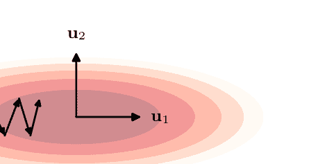

具有 \(M\) 个输入的单元：

$$\epsilon = \sqrt{\frac{2}{M_{\circ}}} \quad\quad (7.23)$$

还可以将初始化分布的尺度 \(\epsilon\) 视为超参数，并在多次训练运行中尝试不同的值。偏置参数通常设置为小的正值，以确保在学习过程中大多数预激活处于活跃状态。这对于ReLU单元特别有帮助，因为我们希望预激活为正值，以便存在非零梯度来推动学习。

另一个重要的技术类别是通过使用在不同任务上训练网络得到的值或利用各种形式的无监督训练来初始化神经网络的参数。这些技术属于广义的迁移学习技术。

第6.3.4节

## 7.3. 收敛性

在实践中应用梯度下降时，我们需要选择学习率参数 \(\eta\) 的值。考虑图7.3中描述的一个简单的误差曲面，该曲面是一个假设的二维权重空间，在该空间中，\(E\) 的曲率在不同方向上变化很大，形成了一个“山谷”。在误差曲面的大多数点上，批量梯度下降的局部梯度向量，即与局部等高线垂直的向量，不直接指向最小值。直观上，我们可能会认为增加 \(\eta\) 的值应该导致在权重空间中更大的步长，从而更快地收敛。然而，连续的步骤在山谷中来回振荡，如果我们增加 \(\eta\) 太多，这些振荡将变得发散。因为为了避免在山谷中发散的振荡，\(\eta\) 必须保持足够小，所以沿着山谷的进展非常缓慢。然后，梯度下降需要许多小步骤才能达到最小值，这是一个非常低效的过程。

通过考虑在最小值附近的误差函数的二次近似，我们可以对这个问题的本质有更深入的了解。

第7.1.1节

根据(7.7)，(7.8)和(7.10)，在这个近似中误差函数的梯度可以写成 \[ \nabla E = \sum_i \alpha_i \lambda_i \mathbf{u}_i. \] (7.24)

再次使用(7.10)，我们可以用相关系数的变化来表示权重向量的变化：{α_i}的变化

\[ \Delta \mathbf{w} = \sum_i \Delta \alpha_i \mathbf{u}_i. \] (7.25)

将(7.24)与(7.25)以及梯度下降公式(7.16)和Hessian矩阵的特征向量的正交关系(7.9)结合起来，我们得到梯度下降算法每一步中α_i的变化的表达式：

\[ \Delta \alpha_i = -\eta \lambda_i \alpha_i \] (7.26)

练习7.10 由此可得 \[ \alpha_i^{\text{新}} = (1 - \eta \lambda_i) \alpha_i^{\text{旧}} \] (7.27)

其中'旧'和'新'表示权重更新前后的值。 使用正交关系(7.9)和(7.10)，我们有

\[ \mathbf{u}_i^T (\mathbf{w} - \mathbf{w}^*) = \alpha_i \] (7.28)

因此，α_i可以解释为沿着u_i方向到最小值的距离。 从(7.27)中我们可以看到，这些距离独立演化，每一步中，沿着u_i方向的距离乘以因子 (1 - η λ_i)。经过总共 T步，我们有

\[ \alpha_i^{(T)} = (1 - \eta \lambda_i)^T \alpha_i^{(0)} \] (7.29)由此可见，只要

|1 - η λ_i| < 1，极限 T → ∞导致 α_i = 0，这从(7.28)中可以看出 w = w^*因此，权重向量已经达到了误差的最小值。

注意，(7.29)表明梯度下降在最小值附近具有线性收敛性。此外，收敛到稳定点需要所有 λ_i都是正的，这反过来意味着稳定点确实是一个最小值。通过增大 η，我们可以减小因子 (1 - η λ_i)的值，从而提高收敛速度。然而，η的值是有限制的。我们可以允许 (1 - η λ_i)变为负值（这会导致 α_i的振荡值），但是我们必须确保 |1 - η λ_i| < 1，否则 α_i的值将发散。这限制了 η的值，即η < 2/λ_max，其中 λ_max是特征值中的最大值。然而，收敛速度主要受最小特征值的影响，因此当 η设置为允许的最大值时，沿着最小特征值对应的方向（图7.3中椭圆的长轴）的收敛将受到控制。

\[ \left(1 - \frac{2\lambda_{\text{min}}}{\lambda_{\text{max}}}\right) \] (7.30)

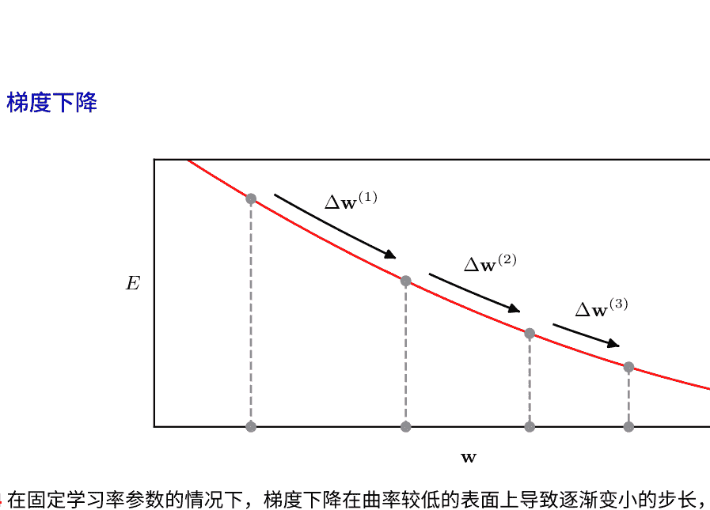

其中 λ_min 是最小特征值。 如果 λ_min/λ_max 的比值（其倒数被称为海森矩阵的条件数）非常小，对应于图7.3中高度拉伸的椭圆形误差轮廓，那么朝最小值的进展将非常缓慢。

#### 7.3.1 动量

处理特征值差异较大问题的一种简单技术是在梯度下降公式中添加一个动量项。 这实际上为权重空间中的运动增加了惯性，并平滑了图7.3中所示的振荡。修改后的梯度下降公式如下：

$$\Delta\mathbf{w}^{(\tau-1)} = -\eta\nabla E(\mathbf{w}^{(\tau-1)}) + \mu\Delta\mathbf{w}^{(\tau-2)}$$ (7.31)

其中 $\mu$ 被称为动量参数。 然后使用 (7.15)更新权重向量。

为了理解动量项的效果，首先考虑通过权重空间的一个区域的运动，该区域的误差曲面相对较低，如图7.4所示。如果我们近似认为梯度不变，则可以将(7.31)迭代应用于一系列长时间的权重更新，然后将结果算术级数求和，得到

$$\Delta\mathbf{w} = -\eta\nabla E \{1 + \mu + \mu^2 + ...\}$$
$$= -\frac{\eta}{1-\mu} \nabla E$$ (7.32) (7.33)

我们可以看到动量项的结果是将有效学习率从 $\eta$ 增加到 $\eta/(1-\mu)$。

相比之下，在梯度下降震荡的高曲率区域中，如图7.5所示，动量项的连续贡献将趋向于抵消，有效学习率将接近 $\eta$。因此，动量项可以在不引起发散振荡的情况下加快收敛速度。图7.6展示了动量项的效果的示意图。

图7.5 对于梯度下降连续震荡的情况，动量项对学习率参数的有效值几乎没有影响。

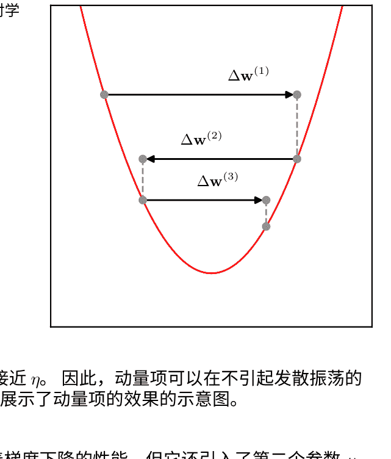

虽然动量的引入可以改善梯度下降的性能，但它还引入了第二个参数 $\mu$，除了学习率参数 $\eta$ 之外，需要选择其值。从(7.33)中我们可以看出 $\mu$ 应该在 $0 \leq \mu < 1$的范围内。实践中常用的典型值为 $\mu= 0.9$。带有动量的随机梯度下降总结如算法7.3所示。

可以通过使用一种改进的动量版本来进一步加速收敛，称为Nesterov动量 (Nesterov, 2004; Sutskever等，2013)。在传统的带动量的随机梯度下降中，我们首先计算梯度在当前位置计算梯度，然后通过添加来自上一步的动量来进行放大的步骤。使用Nesterov方法，我们改变了这些步骤的顺序，首先基于先前的动量计算一步，然后在此基础上计算梯度。

图7.6添加动量项对梯度下降算法的影响示意图，显示与图7.3中未修改的梯度下降相比，沿着误差函数的谷底更快地进展。

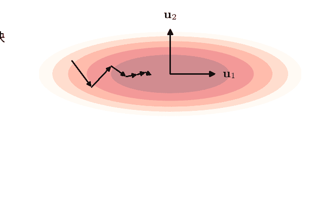

## 算法7.3：带动量的随机梯度下降

```
输入：由数据点索引的训练集 n ∈ {1, ..., N}
      批量大小 B
      每个小批次的误差函数 E_{n:n+B-1}(w)
      学习率参数 η
      动量参数 μ
      初始权重向量 w
输出：最终权重向量 w
---------------------------------------
n ← 1
Δw ← 0
重复
    Δw ← -η∇E_{n:n+B-1}(w) + μΔw // 计算更新项
    w ← w + Δw // 权重向量更新
    n ← n + B
    如果 n > N 则
        打乱数据
        n ← 1
    结束如果
直到收敛
返回 w
```

新位置来找到更新，以便

$$\Delta\mathbf{w}^{(\tau-1)} = -\eta\nabla E(\mathbf{w}^{(\tau-1)} + \mu\Delta\mathbf{w}^{(\tau-2)}) + \mu\Delta\mathbf{w}^{(\tau-2)}.$$ (7.34)

对于批量梯度下降，Nesterov动量可以提高收敛速度，尽管对于随机梯度下降可能效果较差。

#### 7.3.2 学习率调度

在随机梯度下降学习算法（7.18）中，我们需要指定学习率参数 $\eta$ 的值。如果 $\eta$ 非常小，学习将会进行得很慢。然而，如果 $\eta$ 增加得太多，可能会导致不稳定性。虽然一些振荡是可以容忍的，但不应该发散。实际上，在训练开始时使用较大的 $\eta$ 值，然后随着时间的推移逐渐减小学习率，使 $\eta$ 的值成为步骤索引 $\tau$ 的函数，可以获得最佳结果：

$$\mathbf{w}^{(\tau)} = \mathbf{w}^{(\tau-1)} - \eta^{(\tau-1)} \nabla E_n(\mathbf{w}^{(\tau-1)}).$$ (7.35)

学习率调度的示例包括线性、幂律和指数衰减：

$$\eta^{(\tau)} = (1 - \tau / K) \eta^{(0)} + (\tau / K) \eta^{(K)} \quad (7.36)$$
$$\eta^{(\tau)} = \eta^{(0)} (1 + \tau / s)^{-c} \quad (7.37)$$
$$\eta^{(\tau)} = \eta^{(0)} c^{\tau / s} \quad (7.38)$$

在公式(7.36)中，$\eta$的值在 $K$步内线性减小，之后保持不变为 $\eta^{(K)}$。必须通过实证找到合适的超参数 $\eta^{(0)}, \eta^{(K)}, K, s$ 和 $c$ 的好值。在实践中，监控学习曲线以确保梯度下降迭代过程中误差函数以合适的速率减小非常有帮助。

#### 7.3.3 RMSProp和Adam

我们发现最优学习率取决于误差曲面的局部曲率，而且这个曲率可以根据参数空间中的方向而变化。这激发了一些算法，这些算法在网络的每个参数上使用不同的学习率。这些学习率的值在训练过程中自动调整。在这里，我们回顾一些广泛使用的例子。然而，需要注意的是，这种直觉只适用于主曲率方向与权重空间中的轴对齐的情况，即对应于局部对角Hessian矩阵，这在实践中是不太可能的。尽管如此，这些类型的算法可以很有效，并且被广泛使用。

AdaGrad的关键思想是通过使用对该参数计算的所有导数的平方和的累积来随时间减小每个学习率参数（Duchi，Hazan和Singer，2011）。因此，与高曲率相关的参数最快地减小。具体来说，

$$r_i^{(\tau)} = r_i^{(\tau-1)} + \left( \frac{\partial E(\mathbf{w})}{\partial w_i} \right)^2 \quad (7.39)$$
$$w_i^{(\tau)} = w_i^{(\tau-1)} - \frac{\eta}{\sqrt{r_i^{\tau} + \delta}} \frac{\partial E(\mathbf{w})}{\partial w_i} \quad (7.40)$$

其中 $\eta$ 是学习率参数，$\delta$ 是一个小常数，比如 $10^{-8}$，以确保在 $r_i$ 接近零的情况下保持数值稳定性。该算法以 $r_i^{(0)} = 0$ 初始化。这里 $E(\mathbf{w})$ 是特定小批量的误差函数，更新 (7.40) 是标准随机梯度下降，但具有特定于每个参数的修改学习率。

AdaGrad的一个问题是它从训练的一开始就累积了平方梯度，因此相关的权重更新可能变得非常小，在后期阶段会导致训练速度变慢。RMSProp算法的思想是用指数加权平均替代AdaGrad的平方梯度之和

(Hinton, 2012) 给出

$$r_i^{(\tau)} = \beta r_i^{(\tau-1)} + (1 - \beta) \left(\frac{\partial E(\mathbf{w})}{\partial w_i}\right)^2$$ (7.41)

$$w_i^{(\tau)} = w_i^{(\tau-1)} - \frac{\eta}{\sqrt{r_i^{\tau}} + \delta} \left(\frac{\partial E(\mathbf{w})}{\partial w_i}\right)$$ (7.42)

其中 $0 < \beta < 1$，典型值为 $\beta = 0.9$。

如果将RMSProp与动量相结合，我们得到 Adam优化方法（Kingma和Ba, 2014），名称来源于“自适应矩”。Adam使用更新方程分别存储每个参数的动量和平方梯度，形式为指数加权移动平均值。

$$s_i^{(\tau)} = \beta_1 s_i^{(\tau-1)} + (1 - \beta_1) \left(\frac{\partial E(\mathbf{w})}{\partial w_i}\right)$$ (7.43)

$$r_i^{(\tau)} = \beta_2 r_i^{(\tau-1)} + (1 - \beta_2) \left(\frac{\partial E(\mathbf{w})}{\partial w_i}\right)^2$$ (7.44)

$$\hat{s_i}^{(\tau)} = \frac{s_i^{(\tau)}}{1 - \beta_1^{\tau}}$$ (7.45)

$$\hat{r_i}^{\tau} = \frac{r_i^{\tau}}{1 - \beta_2^{\tau}}$$ (7.46)

$$w_i^{(\tau)} = w_i^{(\tau-1)} - \eta \frac{\hat{s_i}^{\tau}}{\sqrt{\hat{r_i}^{\tau}} + \delta}$$ (7.47)

这里的因素 $1/(1-\beta_1^{\tau})$ 和 $1/(1-\beta_2^{\tau})$ 纠正了初始化引入的偏差 $s_i^{(0)}$ 和 $r_i^{(0)}$ 变为零。请注意，当 $\tau$ 变得很大时，偏差趋近于零，因为 $\beta_i < 1$，因此，在实践中有时会省略这种偏差校正。权重参数的典型值为 $\beta_1 = 0.9$ 和 $\beta_2 = 0.999$。Adam是深度学习中最广泛采用的学习算法，算法7.4中对其进行了总结。

练习7.12

## 7.4. 标准化

在神经网络的前向传播过程中计算得到的变量的标准化可以消除网络处理极大或极小值的需求。虽然原则上神经网络中的权重和偏置可以适应输入和隐藏变量取任意值，但在实践中标准化对于确保有效的训练非常重要。在这里，我们考虑根据是否对输入数据、小批量或层进行标准化的三种类型的标准化。

### 7.4 数据预处理与优化

#### 7.4.1 数据标准化

有时我们会遇到数据集，其中不同的输入变量跨越非常不同的范围。例如，在健康数据中，患者的身高可能以米为单位进行测量，如1.8米，而他们的血小板计数可能以每微升的血小板数进行测量，如每微升300,000个血小板。这样的变化会使梯度下降训练变得更具挑战性。考虑一个具有两个权重的单层回归网络，其中两个相应的输入变量具有非常不同的范围。一个权重的值变化会导致输出的变化更大，因此误差函数的变化也更大，而对另一个权重进行类似的变化则不会产生如此大的影响。这对应于一个误差曲面在不同轴上具有非常不同的曲率，如图7.3所示。

对于连续输入变量，重新缩放输入值以使其跨越相似的范围可能非常有益。这可以通过首先评估每个输入的均值和方差来轻松完成：

$$
\mu_i = \frac{1}{N}\sum_{n=1}^N x_{ni}
$$
(7.48)

$$
\sigma_i^2 = \frac{1}{N}\sum_{n=1}^N (x_{ni} - \mu_i)^2,
$$
(7.49)

这是一种在任何训练开始之前只执行一次的计算。然后使用以下方式重新缩放输入值：

$$
\widetilde{x}_{ni} = \frac{x_{ni} - \mu_i}{\sigma_i}
$$
(7.50)

练习7.14

以使重新缩放的值 \(\{\widetilde{x}_{ni}\}\) 具有零均值和单位方差。请注意，必须使用相同的 \(\mu_i\) 和 \(\sigma_i\) 来预处理任何开发、验证或测试数据，以确保所有输入以相同的方式进行缩放。输入数据归一化的示例见图7.7。

图7.7 输入数据归一化效果的示意图。红色圆圈表示具有两个变量的数据集的原始数据点。蓝色十字表示经过归一化处理后的数据集，使得每个变量在整个数据集中具有零均值和单位方差。

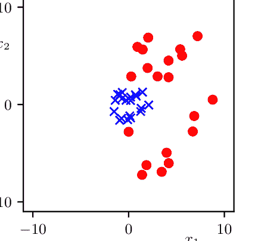

#### 7.4.2 批归一化

我们已经看到了归一化输入数据的重要性，并且我们可以将类似的推理应用于深度网络中每个隐藏层的变量。如果某个隐藏层中的激活值范围变化很大，那么将这些值归一化为零均值和单位方差应该会使下一层的学习问题更容易。然而，与输入值的归一化不同，隐藏单元值的归一化需要在每次更新权重时重复进行训练。这被称为批归一化（Ioffe和Szegedy，2015年）。

批归一化的进一步动机来自于梯度消失和梯度爆炸的现象，当我们尝试训练非常深的神经网络时会出现这些现象。根据微积分的链式法则，对于网络的第一层中的参数，对于误差函数E（第8.1.5节）的梯度可以表示为

$$\frac{\partial E}{\partial w_i} = \sum_m \cdots \sum_l \sum_j \frac{\partial z_m^{(1)}}{\partial w_i} \cdots \frac{\partial z_j^{(K)}}{\partial z_l^{(K-1)}} \frac{\partial E}{\partial z_j^{(K)}}$$
(7.51)

其中$z_j^{(k)}$表示第$k$层节点$j$的激活，(7.51)式右侧的每个偏导数都代表该层的雅可比矩阵的元素。如果大多数项的大小<1，那么这些项的乘积将趋近于0；如果大多数项的大小>1，那么这些项的乘积将趋近于$\infty$。因此，随着网络的深度增加，误差函数的梯度可能变得非常大或非常小。批归一化在很大程度上解决了这个问题。

为了了解批归一化的定义，考虑一个多层网络中的特定层。该层中的每个隐藏单元计算其输入预激活的非线性函数$z_i = h(a_i)$，因此我们可以选择是否对预激活值$a_i$或激活值$z_i$进行归一化。在实践中，可以使用任一方法，这里我们通过对预激活进行归一化来说明该过程。

由于权重值在每个小批量样本之后更新，我们将归一化应用于每个小批量。具体而言，对于大小为$K$的小批量，我们定义

$$\mu_i = \frac{1}{K} \sum_{n=1}^K a_{ni}$$
$$\sigma_i^2 = \frac{1}{K} \sum_{n=1}^K (a_{ni} - \mu_i)^2$$
$$a_{ni} = \frac{a_{ni} - \mu_i}{\sqrt{\sigma_i^2 + \delta}}$$

其中求和符号对于$n=1,\ldots,K$是在小批量元素上进行的。这里$\delta$是一个小常数，用于避免在$\sigma_i^2$很小的情况下出现数值问题。

通过对网络中给定层的预激活进行归一化，我们减少了该层参数的自由度数量，从而降低其表示能力。我们可以通过重新缩放批量的预激活，使其具有均值$\beta_i$和标准差$\gamma_i$来补偿这一点。

$$ \widetilde{a}_{ni} = \gamma_i a_{ni} + \beta_i $$
(7.55)

其中$\beta_i$和$\gamma_i$是通过梯度下降共同学习的自适应参数，与网络的权重和偏差一起学习。这些可学习的参数代表了与输入数据归一化相比的一个关键区别。

从表达式（7.55）可以看出，这个变换似乎只是撤销了批归一化的效果，因为均值和方差现在可以再次适应任意值。然而，关键的区别在于参数在训练过程中的演变方式。对于原始网络，一个小批量的均值和方差是由该层中所有权重和偏差的复杂函数决定的，而在（7.55）给出的表示中，它们直接由独立的参数$\beta_i$和$\gamma_i$决定，这在梯度下降过程中更容易学习。

方程（7.52）-（7.55）描述了一种变量的转换，该转换对可学习参数$\beta_i$和$\gamma_i$是可微分的。这可以看作是神经网络中的一个额外层，因此每个标准隐藏层后面可以跟随一个批归一化层。批归一化过程的结构如图7.8所示。

一旦网络训练完成并且我们想要对新数据进行预测，我们不再有训练小批量数据可用，并且我们无法仅通过一个数据示例来确定均值和方差。为了解决这个问题，我们可以原则上在权重和偏差的最后更新之后，对整个训练集上的每一层进行评估 \(\mu_i\) 和 \(\sigma_i^2\)。然而，这将涉及处理整个数据集以评估这些量，因此通常太昂贵。

相反，我们在训练阶段计算移动平均值：

$$\overline{\mu}_i^{(\tau)} = \alpha \overline{\mu}_i^{(\tau-1)} + (1 - \alpha) \mu_i \qquad (7.56)$$
$$\overline{\sigma}_i^{(\tau)} = \alpha \overline{\sigma}_i^{(\tau-1)} + (1 - \alpha) \sigma_i \qquad (7.57)$$

这些移动平均值在训练过程中不起作用，但在推理阶段用于处理新的数据点。

尽管批归一化在实践中非常有效，但对于为什么它如此有效还存在不确定性。批归一化最初的动机是观察到网络中较早层的权重更新会改变后续层所见值的分布，这种现象称为内部协变量偏移。然而，后来的研究（Santurkar等，2018）表明，协变量偏移并不是一个重要因素，改善的训练结果来自于误差函数景观的平滑改善。

#### 7.4.3 层标准化

使用批归一化时，如果批量大小太小，那么均值和方差的估计会变得太嘈杂。此外，对于非常大的训练集，小批量可能会分布在不同的GPU上，导致全局归一化在小批量上效率低下。在每个隐藏单元中，对于每个数据点分别对隐藏单元值进行归一化是一种在小批量内对示例进行归一化的替代方法。这被称为层归一化（Ba, Kiros, and Hinton, 2016）。它是在递归神经网络的背景下引入的，在每个时间步之后分布会发生变化，使得批归一化变得不可行。然而，在其他架构中，如变压器网络中，它是有用的。

类比于批归一化，因此我们进行以下转换：

$$\mu_n = \frac{1}{M} \sum_{i=1}^{M} a_{ni} \qquad (7.58)$$
$$\sigma_n^2 = \frac{1}{M} \sum_{i=1}^{M} (a_{ni} - \mu_n)^2 \qquad (7.59)$$
$$a_{ni} = \frac{a_{ni} - \mu_n}{\sqrt{\sigma_n^2 + \delta}} \qquad (7.60)$$

其中求和 \(i=1, ..., M\) 是在该层中所有隐藏单元上进行的。与批归一化一样，对于每个隐藏单元，都引入了额外的可学习均值和标准差参数，形式为（7.55）。请注意，在训练和推断过程中可以使用相同的归一化函数，并且因此不需要存储移动平均值。图7.8中比较了层归一化和批归一化。

## 算法 7.4: Adam 优化

```
输入: 由数据点索引的训练集 $n \in \{1, \ldots, N\}$
批量大小 $B$
每个小批量的误差函数 $E_{n:n+B-1}(\mathbf{w})$
学习率参数 $\eta$
衰减参数 $\beta_1$ 和 $\beta_2$
稳定化参数 $\delta$
输出: 最终权重向量 $\mathbf{w}$

$n \leftarrow 1$
$\mathbf{s} \leftarrow \mathbf{0}$
$\mathbf{r} \leftarrow \mathbf{0}$
重复
    从 $\mathcal{D}$ 中随机选择一个小批量
    $\mathbf{g} = -\nabla E_{n:n+B-1}(\mathbf{w})$ // 计算梯度向量
    $\mathbf{s} \leftarrow \beta_1 \mathbf{s} + (1 - \beta_1) \mathbf{g}$
    $\mathbf{r} \leftarrow \beta_2 \mathbf{r} + (1 - \beta_2) \mathbf{g} \odot \mathbf{g}$ // 逐元素相乘
    $\mathbf{s} \leftarrow \mathbf{s} / (1 - \beta_1^t)$ // 偏差修正
    $\mathbf{r} \leftarrow \mathbf{r} / (1 - \beta_2^t)$ // 偏差修正
    $\Delta \mathbf{w} \leftarrow - \eta \frac{\mathbf{s}}{\sqrt{\mathbf{r}} + \delta}$ // 逐元素操作
    $\mathbf{w} \leftarrow \mathbf{w} + \Delta \mathbf{w}$ // 权重向量更新
    $n \leftarrow n + B$
    如果 $n + B > N$ then
        打乱数据
        $n \leftarrow 1$
    结束如果
直到收敛
返回 $\mathbf{w}$
```

### 练习

7.1 (⋆)通过将 (7.10) 代入 (7.7) ，并使用 (7.8) 和 (7.9) ，证明误差函数 (7.7) 可以写成 (7.11) 的形式。

7.2 (⋆)考虑一个具有特征向量方程 (7.8) 的Hessian矩阵 **H**。通过将向量 **v** 在 (7.14) 中分别设置为每个特征向量 **u**<sub>i</sub>，证明当且仅当所有特征值为正时，**H** 是正定的。

7.3 (⋆⋆)通过考虑关于一个驻点 **w**<sup>⋆</sup>的误差函数的局部泰勒展开式(7.7)，证明了驻点成为误差函数的局部最小值的必要和充分条件是海森矩阵 **H**，由 **w** = **w**<sup>⋆</sup>定义的(7.5)，是正定的。

7.4 (⋆⋆)考虑一个具有单个输入变量 x 和单个输出变量 y 的线性回归模型，形式为

$$y(x, w, b) = wx + b \quad (7.61)$$

以及一个由平方和误差函数给出的

$$E(w, b) = \frac{1}{2} \sum_{n=1}^{N} \{y(x_n, w, b) - t_n\}^2. \quad (7.62)$$

推导出误差函数对权重参数 w 和偏置参数 b 的二阶导数给出的 2 × 2 海森矩阵的元素表达式。证明这个海森矩阵的迹和行列式都是正的。

由于迹表示特征值的和，行列式对应于特征值的乘积，因此两个特征值都是正的，因此误差函数的稳定点是一个最小值。

7.5 (⋆⋆)考虑一个具有单个输入变量 x 和单个输出变量 y 的单层分类模型，形式为

$$y(x, w, b) = \sigma(wx + b) \quad (7.63)$$

其中 \(\sigma(\cdot)\)是由(5.42)定义的逻辑sigmoid函数，与交叉熵误差函数一起给出

$$E(w, b) = \sum_{n=1}^{N} \{t_n \ln y(x_n, w, b) + (1 - t_n) \ln(1 - y(x_n, w, b))\}. \quad (7.64)$$

推导出误差函数对权重参数 w 和偏置参数 b 的二阶导数给出的 2 × 2 海森矩阵的元素表达式。证明这个海森矩阵的迹和行列式都是正的。

由于迹表示特征值的和，行列式对应于特征值的乘积，因此两个特征值都是正的，因此误差函数的稳定点是一个最小值。

7.6 (★)考虑一个由(7.7)定义的二次误差函数，其中Hessian矩阵H具有由(7.8)给出的特征值方程。证明误差的等值轮廓是与特征向量 u_i 对齐的椭圆，其轴的长度与相应特征值 λ_i 的平方根成反比。

7.7 (★)证明，由于Hessian矩阵 H的对称性，二次误差函数(7.3)中独立元素的数量由W(W+3)/2给出。

7.8 (★)考虑一组值 x_1, …, x_N 从均值为 μ和方差为 σ^2的分布中抽取的样本均值定义为

$$\bar{x} = \frac{1}{N} \sum_{n=1}^{N} x_n.$$

证明，对于从数据中抽取的分布，期望的平方误差 $(\bar{x} - μ)^2$由 σ^2/N给出。这表明样本均值的均方根误差由 σ/√N给出，随着样本大小 N的增加而相对缓慢地减小。

7.9 (★ ★)考虑一个分层网络，计算函数 (7.19) 和 (7.20) 在层 l中。假设我们使用高斯分布 N(0, ϵ^2)来初始化权重，并且假设输出 z_j^(l-1) 在层 l-1的单元的方差为 λ^2。通过使用ReLU激活函数的形式，证明层 l中输出的均值和方差分别为 (7.21) 和 (7.22)。因此，证明如果我们希望层 l中的单元也具有方差为 λ^2的预激活值，则 ϵ的值应由 (7.23)给出。

7.10 (★ ★)通过利用 (7.7)、(7.8) 和 (7.10)，推导出结果 (7.24) 和 (7.25)，它们以Hessian矩阵的特征向量展开表示梯度向量和一般权重更新。利用这些结果，结合特征向量正交关系 (7.9) 和批量梯度下降公式 (7.16)，推导出批量梯度下降更新的结果 (7.26)，以系数 {α_i}表示。

7.11 (★)考虑一个具有低曲率的平滑变化的误差曲面，使得梯度随位置的变化缓慢。证明对于学习率和动量参数的小值，由(7.34)定义的Nesterov动量梯度更新等价于由(7.31)定义的标准动量梯度下降。

7.12 (★ ★)考虑一系列值 {x_1, …, x_N} of某个变量 x，并假设我们使用以下公式计算指数加权移动平均值

$$μ_n = βμ_{n-1} + (1 - β)x_n.$$

通过利用有限几何级数的以下结果

$$\sum_{k=1}^{n} \beta^{k-1} = \frac{1 - \beta^n}{1 - \beta} \qquad (7.67)$$

证明如果使用 $\mu_0=0$ 初始化平均序列，则估计器是有偏的，并且可以通过以下方式纠正偏差

$$\hat{\mu}_n = \frac{\mu_n}{1 - \beta^n} \qquad (7.68)$$

7.13 (★)

在梯度下降中，权重向量 $\mathbf{w}$ 通过在权重空间中朝着负梯度方向采取一步来更新，该负梯度由学习率参数$\eta$控制。相反，假设我们选择了一个在权重空间中最小化误差函数的方向 $\mathbf{d}$，给定当前权重向量 $\mathbf{w}^{(\tau)}$。这涉及最小化数量 $E(\mathbf{w}^{(\tau)} + \lambda \mathbf{d}) \qquad (7.69)$ 作为 $\lambda$ 的函数，给出一个值 $\lambda^*$ 对应于一个新的权重向量 $\mathbf{w}^{(\tau+1)}$。证明梯度 $\nabla E(\mathbf{w})$ at $\mathbf{w}^{(\tau+1)}$ 与向量 $\mathbf{d}$ 垂直。这被称为“线搜索”方法，它构成了各种数值优化算法的基础（Bishop，1995b）。

7.14 (★)

证明由(7.50)定义的归一化输入变量，其中 $\mu_i$ 由(7.48)定义，$\sigma_i^2$ 由(7.49)定义，具有零均值和单位方差。

## 8 反向传播

本章的目标是找到一种有效的技术来评估前馈神经网络的误差函数 $E(\mathbf{w})$ 的梯度。 我们将看到，可以通过一种局部消息传递方案来实现这一目标，在该方案中信息通过网络向后传递，这被称为误差反向传播，有时简称为反向传播。

从历史上看，反向传播方程式通常是手动推导出来的，然后与前向传播方程式一起在软件中实现，这两个步骤都需要时间，并且容易出错。 然而，现代神经网络软件环境可以高效地计算出任何感兴趣的导数，只需在编写原始网络函数的基础上稍作努力即可。 这个被称为自动微分的想法在现代深度学习中起着关键作用。然而，了解计算是如何进行的是很有价值的，这样我们就不会依赖于‘黑盒’软件解决方案。在本章中，我们将解释反向传播的关键概念，并详细探讨自动微分的框架。

请注意，在神经计算文献中，“反向传播”一词有多种不同的用法。例如，前馈架构可能被称为反向传播网络。此外，“反向传播”一词有时用于描述神经网络的端到端训练过程，包括梯度下降参数更新。在本书中，我们将专门使用“反向传播”来描述用于数值求导的计算过程，例如计算误差函数相对于网络权重和偏差的梯度。这个过程也可以应用于其他重要的导数计算，如雅可比矩阵和海森矩阵。

### 8.1 梯度的计算

我们现在推导出具有任意前馈拓扑结构、任意可微非线性激活函数和广泛类别的误差函数的通用网络的反向传播算法。然后，我们将使用一个简单的分层网络结构来说明所得到的公式，该网络结构具有一个sigmoid隐藏单元层和一个平方和误差函数。

许多实际感兴趣的误差函数，例如由于一组独立同分布的数据而定义的最大似然函数，由于训练集中的每个数据点都包含一个项的总和，因此

$$ E(\mathbf{w}) = \sum_{n=1}^{N} E_n(\mathbf{w}) $$

在这里，我们将考虑评估误差函数中一个这样的项的 $\nabla E_n(\mathbf{w})$ 的问题。这可以直接用于随机梯度下降，或者可以在一组训练数据点上累积结果以用于批量或小批量方法。

#### 8.1.1 单层网络

首先考虑一个简单的线性模型，其中输出 $y_k$ 是输入变量 $x_i$ 的线性组合，因此

$$ y_k = \sum_{i} w_{ki} x_i $$

以及一个平方和误差函数，对于特定的输入数据点 $n$，采用以下形式

$$ E_n = \frac{1}{2} \sum_{k} (y_{nk} - t_{nk})^2 $$其中 \(y_{nk} = y_k(\mathbf{x}_n, \mathbf{w})\)，\(t_{nk}\)是相关的目标值。对于权重 \(w_{ji}\)，该误差函数的梯度由\(\partial E_n\)给出

\[\frac{\partial E_n}{\partial w_{ji}} = (y_{nj} - t_{nj})x_{ni}. \tag{8.4}\]

这可以解释为涉及链接末端的“误差信号”\(y_{nj} - t_{nj}\)与链接输入端的变量\(x_{ni}\)的“局部”计算的乘积。在第5.4.3节中，我们看到了类似的公式与逻辑sigmoid激活函数以及交叉熵误差函数一起出现，对于softmax激活函数以及其匹配的多元交叉熵误差函数也是如此。现在我们将看到这个简单结果如何扩展到更复杂的多层前馈网络设置中。

#### 8.1.2 通用前馈网络

一般来说，前馈网络由一组单元组成，每个单元计算其输入的加权和：

\[a_j = \sum_i w_{ji} z_i \tag{8.5}\]

其中 \(z_i\)可以是另一个单元的激活或者发送到单元 \(j\)的输入单元，并且 \(w_{ji}\)是与该连接相关联的权重。通过引入一个额外的单元或输入，其激活固定为第6.2节中的+1，可以将偏差包含在这个总和中，因此我们不需要显式处理偏差。在(8.5)中的总和，称为预激活，通过非线性激活函数 \(h(\cdot)\)转换为单元\(j\)的激活 \(z_j\)的形式 \(z_j = h(a_j)\)。

请注意，在(8.5)中，求和中的一个或多个变量 \(z_i\)可以是输入，同样，(8.6)中的单元 \(j\)可以是输出。

对于训练集中的每个数据点，我们假设已经向网络提供了相应的输入向量，并通过连续应用(8.5)和(8.6)计算了网络中所有隐藏单元和输出单元的激活。这个过程被称为前向传播，因为它可以被看作是信息在网络中的前向流动。

现在考虑对权重的导数 \(E_n\)的评估 \(w_{ji}\)。各个单元的输出将取决于特定的输入数据点 \(n\)。然而，为了保持符号简洁，我们将省略网络变量中的下标 \(n\)。首先注意到 \(E_n\)仅通过求和输入 \(a_j\)到单元 \(j\)的权重 \(w_{ji}\)来依赖于权重。因此，我们可以应用偏导数的链式法则来得到 \(\partial E_n\)

\[\frac{\partial E_n}{\partial w_{ji}} = \frac{\partial E_n}{\partial a_j} \frac{\partial a_j}{\partial w_{ji}}. \tag{8.7}\]

我们现在介绍一个有用的符号表示：

\[\delta_j \equiv \frac{\partial E_n}{\partial a_j} \tag{8.8}\]

## 8. 反向传播

图8.1展示了从隐藏单元通过反向传播计算 δ_j 的过程，其中 δ 的信息来自于单元 k。黑色箭头表示前向传播的信息流动方向，红色箭头表示错误信息的反向传播。

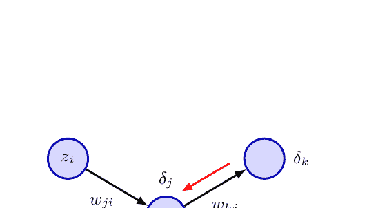

通常将 δ 称为误差，原因我们很快就会看到。使用公式(8.5)，我们可以写成

\[\frac{\partial a_j}{\partial w_{ji}} = z_i.\]

将公式(8.8)和(8.9)代入(8.7)，我们得到

\[\frac{\partial E_n}{\partial w_{ji}} = \delta_j z_i.\]

公式(8.10)告诉我们，所需的导数可以通过将权重输出端的单元的 δ 值乘以权重输入端的单元的 z 值（其中 z=1 表示偏置）来获得。注意，这与简单线性模型中的公式(8.4)具有相同的形式。因此，为了计算导数，我们只需要计算网络中每个隐藏单元和输出单元的 δ 值，然后应用公式(8.10)。

正如我们已经看到的，对于输出单元，我们有

\[\delta_k = y_k - t_k\]

第5.4.6节，只要我们使用规范链接作为输出单元的激活函数。为了计算隐藏单元的 δ 值，我们再次利用链式法则来计算偏导数：

\[\delta_j \equiv \frac{\partial E_n}{\partial a_j} = \sum_k \frac{\partial E_n}{\partial a_k} \frac{\partial a_k}{\partial a_j}\]

其中求和遍历所有连接到单元 j 的单元 k。单位和权重的排列如图8.1所示。请注意，标记为 k 的单元包括其他隐藏单元和/或输出单元。在写下(8.12)时，我们利用了变量 a_j 的变化仅通过变量 a_k 的变化来影响误差函数的事实。

### 练习 8.1

如果我们现在将(8.8)中给出的 δ_j 的定义代入(8.12)并利用(8.5)和(8.6)，我们得到以下的反向传播公式：

\[\delta_j = h'(a_j) \sum_k w_{kj} \delta_k,\]

这告诉我们，特定隐藏单元的 δ 值可以通过从网络中更高层的单元向后传播 δ 来获得，如图所示

### 算法 8.1：反向传播

```
输入：输入向量 $x_n$
网络参数 $w$
误差函数 $E_n(w)$ 对于输入 $x_n$
激活函数 $h(a)$
输出：误差函数导数 $\{\partial E_n / \partial w_{ji}\}$

// 前向传播
对于所有隐藏单元和输出单元 $j$，执行以下操作
$a_j \leftarrow \sum_i w_{ji} z_i$ // $\{z_i\}$ 包括输入 $\{x_i\}$
$z_j \leftarrow h(a_j)$ // 激活函数
结束循环

// 误差评估
对于所有输出单元 $k$，执行以下操作
$\delta_k \leftarrow \frac{\partial E_n}{\partial a_k}$ // 计算误差
结束循环

// 反向传播，按相反顺序
对于 $j \in$ 所有隐藏单元 do
$\delta_j \leftarrow h'(a_j) \sum_k w_{kj} \delta_k$ // 递归向后评估
$\frac{\partial E_n}{\partial w_{ji}} \leftarrow \delta_j z_i$ // 评估导数
结束循环

返回 $\left\{ \frac{\partial E_n}{\partial w_{ji}} \right\}$
```

在图8.1中。注意，(8.13)中的求和是在第一个索引上进行的 $w_{kj}$（对应于通过网络传播信息的反向传播），练习8.2 而在正向传播方程（8.5）中，它是在第二个索引上进行的。因为我们已经知道输出单元的 $\delta$ 的值，所以通过递归应用(8.13)，我们可以评估出所有隐藏单元的 $\delta$ 的值，无论其拓扑结构如何。 反向传播过程在算法8.1中总结。

对于批处理方法，可以通过重复上述步骤来获得总误差 $E$ 的导数，然后对训练集中的每个数据点进行求和，得到批处理或小批处理中的所有数据点的导数：

\[\frac{\partial E}{\partial w_{ji}} = \sum_n \frac{\partial E_n}{\partial w_{ji}}. \tag{8.14}\]

#### 8.1.3 一个简单的例子

上述反向传播过程的推导允许误差函数、激活函数和网络拓扑具有一般形式。为了说明该算法的应用，我们考虑一个两层网络，其形式如图6.9所示，并且使用平方和误差。输出单元具有线性激活函数，即 \(y_k = a_k\)，隐藏单元具有由sigmoid函数给出的激活函数。

\[h(a) \equiv \tanh(a) \quad\quad (8.15)\]

其中 \(\tanh(a)\) 由(6.14)定义。这个函数的一个有用特性是它的导数可以用一个特别简单的形式表示：

\[h'(a) = 1 - h(a)^2. \quad\quad (8.16)\]

我们还考虑一个平方和误差函数，对于数据点 \(n\)，误差由以下公式给出：

\[E_n = \frac{1}{2} \sum_{k=1}^K (y_k - t_k)^2 \quad\quad (8.17)\]

其中 \(y_k\) 是输出单元 \(k\) 的激活值，\(t_k\) 是相应的目标值对于特定的输入向量 \(\mathbf{x}_n\)。

对于训练集中的每个数据点，我们首先进行前向传播，使用以下公式：

\[\begin{aligned}
a_j &= \sum_{i=0}^D w_{ji}^{(1)} x_i \quad\quad (8.18) \\
z_j &= \tanh(a_j) \quad\quad\quad\quad\quad\quad (8.19) \\
y_k &= \sum_{j=0}^M w_{kj}^{(2)} z_j \quad\quad (8.20)
\end{aligned}\]

其中 \(D\) 是输入向量 \(\mathbf{x}\) 的维度，\(M\) 是隐藏单元的总数。此外，我们使用 \(x_0 = z_0 = 1\) 来包含偏置参数在权重中。接下来，我们使用每个输出单元计算 \(\delta\) 的值

\[\delta_k = y_k - t_k. \quad\quad (8.21)\]

然后，我们通过反向传播这些误差来获得隐藏单元的 \(\delta\) 值

\[\delta_j = (1 - z_j^2) \sum_{k=1}^K w_{kj}^{(2)} \delta_k, \quad\quad (8.22)\]

这是根据(8.13)和(8.16)得出的。最后，关于第一层和第二层权重的导数如下

$$\frac{\partial E_n}{\partial w_{ji}^{(1)}} = \delta_j x_i, \quad \frac{\partial E_n}{\partial w_{kj}^{(2)}} = \delta_k z_j. \tag{8.23}$$

#### 8.1.4 数值微分

反向传播最重要的一个方面是它的计算效率。为了理解这一点，让我们来看看计算误差函数导数所需的计算操作数量如何随网络中权重和偏置的总数Wscale。

对于给定的输入数据点，误差函数的单次评估将需要 O(W)个操作，对于足够大的 W。这是因为除了具有非常稀疏连接的网络外，权重的数量通常远大于单元的数量，因此在前向传播中的大部分计算工作来自于(8.5)中求和的评估，而激活函数的评估只是一个小的开销。(8.5)中求和中的每一项都需要一次乘法和一次加法，从而导致总体计算成本为 O(W)。

计算误差函数导数的另一种反向传播方法是使用有限差分。这可以通过逐个扰动每个权重并使用表达式来近似导数来实现。

$$\frac{\partial E_n}{\partial w_{ji}} = \frac{E_n(w_{ji} + \epsilon) - E_n(w_{ji})}{\epsilon} + \mathcal{O}(\epsilon) \tag{8.24}$$

在哪里 ε << 1. 在软件模拟中，通过使 ε变小，可以提高对导数的近似精度，直到出现数值舍入误差问题。通过使用对称的中心差分形式，可以显著提高有限差分法的精度

$$\frac{\partial E_n}{\partial w_{ji}} = \frac{E_n(w_{ji} + \epsilon) - E_n(w_{ji} - \epsilon)}{2\epsilon} + \mathcal{O}(\epsilon^2). \tag{8.25}$$

练习8.3 在这种情况下， O(ε)修正被取消，可以通过泰勒展开验证(8.25)右侧的残差修正为 O(ε^2) . 然而，请注意，与(8.24)相比，计算步骤的数量大致翻倍。图8.2显示了使用有限差分法(8.24)和中心差分法(8.25)对梯度进行数值评估与解析结果之间的误差随步长 ε值的变化情况。

数值微分的主要问题是高度理想的 O(W)缩放已经丢失。每次前向传播需要 O(W)步骤，并且网络中有 W个权重，每个权重都必须单独扰动，因此总的计算成本是 O(W^2)。

然而，数值微分在实践中可以发挥有用的作用，因为从直接实现反向传播或自动微分计算的导数与使用中心差分计算的导数进行比较，可以对软件的正确性进行强有力的检查。

图8.2红色曲线显示了使用有限差分(8.24)和解析结果之间的梯度数值评估的误差，作为 ε 的函数。随着 ε 的减小，曲线最初呈现出线性减小的误差，这表示了幂律行为，因为坐标轴是对数的。这条线的斜率为 1，表明这个误差的行为类似于 O(ε)。在某一点上，计算得到的梯度达到了数值舍入的极限，进一步减小 ε 会导致一个嘈杂的曲线，再次遵循幂律，但误差现在随着 ε 的减小而增加。蓝色曲线显示了中心差分(8.25)的相应结果。与有限差分相比，我们看到误差要小得多，而且线的斜率为 2，表明误差是O(ε^2)。

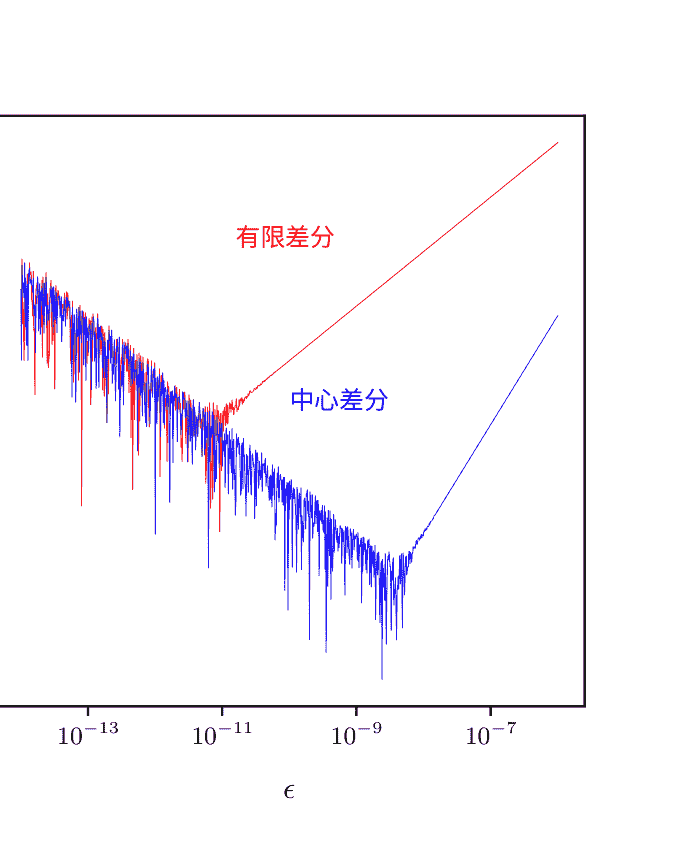

#### 8.1.5 雅可比矩阵

我们已经看到如何通过网络中的错误反向传播来获得对权重的误差函数的导数。反向传播也可以用于计算其他导数。在这里，我们考虑雅可比矩阵的评估，其元素由网络输出对输入的导数给出:

$$ J_{ki} = \frac{\partial y_k}{\partial x_i} $$

其中每个这样的导数都是在所有其他输入保持固定的情况下评估的。雅可比矩阵在由多个不同模块构建的系统中起着重要作用，如图8.3所示。每个模块可以包含一个固定或可学习的函数，可以是线性或非线性的，只要它是可微分的。

假设我们希望最小化一个错误函数 E 相对于参数 w 在图8.3中。错误函数的导数由以下给出

$$ \frac{\partial E}{\partial w} = \sum_{k,j} \frac{\partial E}{\partial y_k} \frac{\partial y_k}{\partial z_j} \frac{\partial z_j}{\partial w} $$

在图8.3中，红色模块的雅可比矩阵出现在右侧的中间项。

因为雅可比矩阵提供了对输出对每个输入变量的局部敏感性的度量，它还允许任何已知的误差 \Delta x_i

图8.3模块化深度学习架构的示例，其中雅可比矩阵可用于从输出通过到系统中较早的模块中反向传播误差信号。

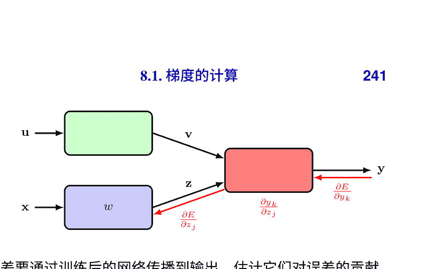

与输入相关的误差要通过训练后的网络传播到输出，估计它们对误差的贡献 Δy_k，通过以下关系

$$Δy_k ≃ ∑_i \frac{∂y_k}{∂x_i} Δx_i, \qquad (8.28)$$

假设 |Δx_i| 很小，这个关系成立。一般来说，由训练后的神经网络表示的网络映射将是非线性的，因此雅可比矩阵的元素将不是常数，而是取决于特定的输入向量。因此，(8.28)仅对输入的小扰动有效，并且雅可比矩阵本身必须针对每个新的输入向量重新评估。

雅可比矩阵可以通过反向传播过程来评估，该过程类似于之前用于评估误差函数对权重的导数的过程。我们首先将元素 J_{ki} 写成以下形式

$$J_{ki} = \frac{∂y_k}{∂x_i} = ∑_j \frac{∂y_k}{∂a_j} \frac{∂a_j}{∂x_i} = ∑_j w_{ji} \frac{∂y_k}{∂a_j} \qquad (8.29)$$

在这里我们使用了(8.5)。在(8.29)中的求和遍历了所有输入单元 i 发送连接的单元 j（例如，在之前考虑的分层拓扑中的第一隐藏层的所有单元）。现在我们写出了一个递归的反向传播公式来计算导数 ∂y_k/∂a_j： ∂y_k

$$\frac{∂y_k}{∂a_j} = ∑_l \frac{∂y_k}{∂a_l} \frac{∂a_l}{∂a_j} = h'(a_j) ∑_l w_{lj} \frac{∂y_k}{∂a_l} \qquad (8.30)$$

其中求和遍历了所有单元 l，这些单元接收来自单元 j 的连接（对应于 w_{lj} 的第一个索引）。同样，我们使用了(8.5)和(8.6)。这个反向传播从输出单元开始，对于这些单元，所需的导数可以直接从输出单元激活函数的函数形式中找到。对于线性输出单元，我们有

$$\frac{∂y_k}{∂a_l} = δ_{kl} \qquad (8.31)$$

其中 $\delta_{kl}$ 是单位矩阵的元素，并且定义为

$$\delta_{kl} = \begin{cases} 1, & \text{if } k=l, \\ 0, & \text{otherwise}. \end{cases} \tag{8.32}$$

第3.4节如果每个输出单元都有独立的逻辑sigmoid激活函数，那么

$$\frac{\partial y_k}{\partial a_l} = \delta_{kl} \sigma'(a_l) \tag{8.33}$$

第3.4节而对于softmax输出，我们有

$$\frac{\partial y_k}{\partial a_l} = \delta_{kl} y_k - y_k y_l. \tag{8.34}$$

我们可以总结计算Jacobian矩阵的过程如下。
将与要评估Jacobian矩阵的输入空间中的点对应的输入向量应用，并以通常的方式向前传播，以获得网络中所有隐藏单元和输出单元的状态。接下来，对于Jacobian矩阵的每一行 $k$，对应于输出单元 $k$，使用递归关系 (8.30) 进行反向传播，从 (8.31)，(8.33) 或 (8.34) 开始，对网络中的所有隐藏单元进行反向传播。最后，使用 (8.29) 进行反向传播到输入。Jacobian矩阵也可以使用一种替代的正向传播形式来评估，该形式可以类似地推导出给定的反向传播方法。

再次，这些算法的实现可以使用数值微分进行检查，形式如下

$$\frac{\partial y_k}{\partial x_i} = \frac{y_k(\mathbf{x} + \epsilon) - y_k(\mathbf{x} - \epsilon)}{2\epsilon} + O(\epsilon^2), \tag{8.35}$$

这涉及到对具有 $D$ 个输入的网络进行 $2D$ 前向传播，因此总共需要 $O(DW)$ 步。

#### 8.1.6 海森矩阵

我们已经展示了如何使用反向传播来获得网络中权重相对于误差函数的一阶导数。反向传播还可以用于计算误差的二阶导数，其表示为

$$\frac{\partial^2 E}{\partial w_{ji} \partial w_{lk}}. \tag{8.36}$$

通常方便将所有的权重和偏置参数视为单个向量的元素 $w_i$，记为 $\mathbf{w}$，在这种情况下，二阶导数形成了Hessian矩阵 $\mathbf{H}$ 的元素 $H_{ij}$:

$$H_{ij} = \frac{\partial^2 E}{\partial w_i \partial w_j} \tag{8.37}$$

## 练习 8.6

其中 $i, j \in \{1, \ldots, W\}$，$W$ 是权重和偏置的总数。 Hessian矩阵出现在几种基于错误曲面的二阶性质考虑的非线性优化算法中（Bishop, 2006）。它还在一些贝叶斯神经网络处理中起到作用（MacKay, 1992; Bishop, 2006），并且已经被用于减少大型语言模型中权重的精度，以减小其内存占用（Shen et al., 2019）。

对于Hessian的许多应用来说，评估的效率是一个重要考虑因素。如果网络中有 $W$ 个参数（权重和偏置），那么Hessian矩阵的维度为 $W \times W$，因此评估Hessian所需的计算工作量将按照 $\mathcal{O}(W^2)$ 的规模进行，对于数据集中的每个点都要进行。反向传播过程的扩展（Bishop, 1992）允许高效地评估Hessian矩阵，其计算复杂度确实为 $\mathcal{O}(W^2)$。

有时候，我们不需要显式地计算Hessian矩阵，只需要计算Hessian与某个向量 $\mathbf{v}$ 的乘积 $\mathbf{v}^\mathrm{T}\mathbf{H}$，而这个乘积可以通过反向传播的扩展以 $\mathcal{O}(W)$ 步骤高效地计算出来（Møller, 1993; Pearlmutter, 1994）。

由于神经网络可能包含数百万甚至数十亿个参数，对许多模型来说，计算或仅仅存储完整的Hessian矩阵是不可行的。计算Hessian的逆矩阵甚至更加困难，因为它的计算复杂度为 $\mathcal{O}(W^3)$。因此，人们对于寻找有效的Hessian近似方法非常感兴趣。

一种近似方法是仅计算Hessian的对角元素，并将非对角元素隐式地设为零。这需要 $\mathcal{O}(W)$ 的存储空间，并且允许在 $\mathcal{O}(W)$ 步骤内计算出逆矩阵，但仍然需要 $\mathcal{O}(W^2)$ 计算（Ricotti, Ragazzini和Martinelli, 1988年），尽管通过进一步的近似可以将其减少为 $\mathcal{O}(W)$ 步骤（Becker和LeCun, 1989年; LeCun, Denker和Solla, 1990年）。然而，在实践中，Hessian矩阵通常具有显著的非对角项，因此必须小心处理这个近似。

一种更有说服力的方法，称为外积近似，可以通过以下方式获得。考虑使用形式为的回归应用程序的平方和误差函数

$$E = \frac{1}{2}\sum_{n=1}^N (y_n - t_n)^2 \qquad \qquad (8.38)$$

为了简化符号，我们考虑了一个单输出（扩展练习8.8到多个输出是直接的）。然后，我们可以将Hessian矩阵写成以下形式

$$\mathbf{H} = \nabla\nabla E = \sum_{n=1}^N \nabla y_n (\nabla y_n)^\mathrm{T} + \sum_{n=1}^N (y_n - t_n) \nabla\nabla y_n \qquad \qquad (8.39)$$

其中 $\nabla$ 表示对 $\mathbf{w}$ 的梯度。如果网络已经在数据集上进行了训练，并且其输出 $y_n$ 与目标值 $t_n$ 非常接近，则(8.39)式中的最后一项将很小，可以忽略不计。然而，更一般地说，根据以下论证，忽略这一项可能是合适的。回顾一下，从4.2节可以得知，最小化平方和损失的最优函数是目标数据的条件平均值。 量 $(y_n - t_n)$则是一个均值为零的随机变量。 如果我们假设它的值与(8.39)式右侧的二阶导数项的值不相关，则整个项在对 $n$求和时将平均为零。

练习 8.9 通过忽略(8.39)中的第二项，我们得到了 Levenberg-Marquardt 近似，也被称为外积近似，因为Hessian矩阵是由向量的外积之和构建的，如下所示

$$\mathbf{H} \simeq \sum_{n=1}^N \nabla a_n \nabla a_n^T. \qquad (8.40)$$

评估Hessian的外积近似非常简单，因为它只涉及到误差函数的一阶导数，可以使用标准的反向传播算法在 $\mathcal{O}(W)$步骤内高效地计算。 然后，通过简单的乘法，在 $\mathcal{O}(W^2)$步骤内找到矩阵的元素。 重要的是要强调，这个近似只适用于经过适当训练的网络，并且对于一般的网络映射，(8.39)右侧的二阶导数项通常不可忽略。

练习 8.10 对于具有逻辑sigmoid输出的网络的交叉熵误差函数-单元激活函数，相应的近似值为

$$\mathbf{H} \simeq \sum_{n=1}^N y_n(1-y_n) \nabla a_n \nabla a_n^T. \qquad (8.41)$$

练习 8.11 对于具有softmax输出的多类网络，类似的结果可以得到-单元激活函数。 外积近似也可以用于-

练习 8.12 开发一种有效的顺序过程来近似计算Hessian矩阵的逆 (Hassibi和Stork，1993年) 。

### 8.2. 自动微分

我们已经看到使用梯度信息来高效地训练神经网络的重要性第7.2.1节 。 神经网络误差函数的梯度可以通过四种基本方法来计算。

- 第一种方法是手动推导反向传播方程，然后在软件中显式实现它们，这是神经网络多年来的主要方法。 如果仔细进行，它会产生高效的代码，可以得到精确到数值精度的准确结果。 然而，推导方程的过程以及编码的过程都需要时间，并且容易出错。 它还导致代码中存在一些冗余，因为前向传播方程与反向传播方程是分开编码的。 由于这些方程通常涉及重复计算，所以如果模型发生变化，前向和后向实现都需要同时更改。这需要一定的努力，这可能会限制不同架构在实践中的快速和有效探索。

- 第二种方法是使用有限差分数值评估梯度-第8.1.4节句。 这只需要实现前向传播方程的软件实现。 数值微分的一个问题是它的计算精度有限， 尽管对于网络训练来说这可能不是一个问题， 因为我们可能使用随机梯度下降， 其中每次评估只是局部梯度的一个非常嘈杂的估计。 这种方法的主要缺点是它随着网络规模的增大而扩展性差。 然而， 这种技术对于调试其他方法非常有用， 因为梯度是使用仅前向传播代码评估的， 因此可以用来确认反向传播或其他用于评估梯度的代码的正确性。

- 第三种方法被称为符号微分， 并利用专门的软件来自动化手工完成的分析操作， 这是第一种方法中所做的。 这个过程是计算机代数或符号计算的一个例子， 并涉及到微积分规则的自动应用， 例如链式法则， 完全是一个机械化的过程。 然后， 将得到的表达式在标准软件中实现。 这种方法的一个明显优点是它避免了反向传播方程手动推导中的人为错误。 此外， 梯度再次计算到机器精度， 并避免了数值微分的扩展性差。 然而， 符号微分的主要缺点是导数的结果表达式可能比原始函数指数级更长， 并且相应的评估时间也更长。 考虑一个由 $u(x)$ 和 $v(x)$ 的乘积给出的函数 $f(x)$。 该函数及其导数分别为

$$f(x) = u(x)v(x)$$

$$f'(x) = u'(x)v(x) + u(x)v'(x).$$

我们可以看到，在计算 $f(x)$ 和 $f'(x)$ 时存在冗余计算，因为 $u(x)$ 和 $v(x)$ 都必须被计算。如果因子 $u(x)$ 和 $v(x)$ 本身涉及因子，则会出现嵌套的表达式重复，这会迅速增加复杂性。这个问题被称为表达式膨胀。

进一步说明，考虑一个结构类似于神经网络的两层的函数（Grosse，2018），其中有一个单一输入 $x$，一个具有激活函数的隐藏单元 $z$，以及一个输出 $y$，其中

$$z = h(w_1 x + b_1)$$

$$y = h(w_2 z + b_2)$$

其中 $h(a)$ 是软ReLU函数：

$$ζ(a) = \ln(1 + \exp(a)).$$

因此，整体函数可以表示为

$$y(x) = h(w_2 h(w_1 x + b_1) + b_2)$$

### 练习题8.13

网络输出对 $w_1$ 的导数，通过符号计算得到，为

$$ \frac{\partial y}{\partial w_1} = \frac{w_2 x \exp(w_1 x + b_1 + b_2 + w_2 \ln[1 + e^{w_1 x + b_1}])}{(1 + e^{w_1 x + b_1})(1 + \exp(b_2 + w_2 \ln[1 + e^{w_1 x + b_1}]))} \quad (8.48) $$

除了比原始函数复杂得多之外，我们还看到了冗余计算，例如在多个地方出现的表达式 $w_1x + b_1$。

符号微分的另一个主要缺点是它要求被微分的表达式以闭式形式表示。因此，它排除了重要的控制流操作，如循环、递归、条件执行和过程调用，这些是我们在定义网络函数时可能希望使用的有价值的构造。

因此，我们转向神经网络中用于求导的第四种技术，称为自动微分，也称为‘autodiff’或‘algorithmic differentiation’（Baydin等人，2018年）。与符号微分不同，自动微分的目标不是找到导数的数学表达式，而是让计算机自动生成实现前向传播方程的梯度计算代码。它与符号微分一样精确到机器精度，但更高效，因为它能够利用在前向传播方程定义中使用的中间变量，并避免冗余计算。需要注意的是，自动微分不仅可以处理传统的闭式数学表达式，还可以处理分支、循环、递归和过程调用等流程控制元素，因此比符号微分更强大。自动微分是一个广泛适用的成熟领域，主要是在机器学习社区之外发展起来的。现代深度学习是一个主要基于经验的过程，涉及评估和比较不同的架构，因此自动微分在准确和高效地进行这种实验中起着关键作用。

自动微分的关键思想是将评估函数的代码（例如神经网络的误差函数的前向传播方程）与在代码执行过程中累积值的附加变量相结合，以获得所需的导数。自动微分有两种主要形式，称为前向模式和反向模式。我们首先看一下概念上较为简单的前向模式。

#### 8.2.1 前向模式自动微分

在前向模式的自动微分中，我们为参与函数评估（例如神经网络的误差函数）的每个中间变量 $z_i$，即所谓的‘原始’变量，增加一个表示该变量某个导数值的附加变量 $z'_i$，即所谓的‘切向’变量。切向变量及其相关代码是由系统生成的。

图8.4 显示了使用原始方程 (8.50) 至 (8.56) 对函数 (8.49) 进行数值评估的评估跟踪图。

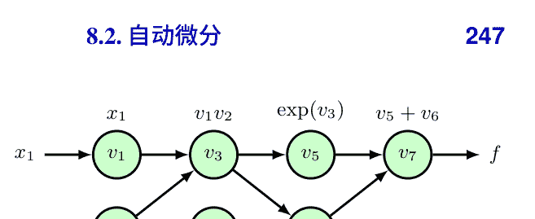

由软件环境自动完成。代码不再仅仅进行前向传播来计算 $\{z_i\}$，而是同时传播元组 $(z_i, \dot{z}_i)$，以便变量和导数可以并行计算。原始函数通常是用基本运算符定义的，包括算术运算和否定，以及指数、对数和三角函数等超越函数，所有这些函数的导数都有简单的公式。使用这些导数结合微积分的链式法则，可以自动构建用于计算梯度的代码。

以以下具有两个输入变量的函数为例：

$$f(x_1, x_2) = x_1 x_2 + \exp(x_1 x_2) - \sin(x_2). \qquad (8.49)$$

当在软件中实现时，代码由一系列操作组成，可以表示为底层基本操作的评估跟踪。

这个跟踪可以以图形的形式可视化，如图8.4所示。在这里，我们定义了以下原始变量

$$v_1 = x_1 \qquad (8.50)$$
$$v_2 = x_2 \qquad (8.51)$$
$$v_3 = v_1 v_2 \qquad (8.52)$$
$$v_4 = \sin(v_2) \qquad (8.53)$$
$$v_5 = \exp(v_3) \qquad (8.54)$$
$$v_6 = v_3 - v_4 \qquad (8.55)$$
$$v_7 = v_5 + v_6. \qquad (8.56)$$

现在假设我们希望计算导数 $\partial f / \partial x_1$。我们通过 $\dot{v}_i = \partial v_i / \partial x_1$ 来定义切线变量。使用微积分的链式法则可以自动构建用于计算这些变量的表达式:

$$\dot{v}_i = \frac{\partial v_i}{\partial x_1} = \sum_{j \in \text{pa}(i)} \frac{\partial v_j}{\partial x_1} \frac{\partial v_i}{\partial v_j} = \sum_{j \in \text{pa}(i)} \dot{v}_j \frac{\partial v_i}{\partial v_j}. \qquad (8.57)$$

其中 $\text{pa}(i)$ 表示评估跟踪图中节点 $i$ 的父节点集合，即指向节点 $i$ 的箭头所指的变量集合。例如，在图8.4中，节点 $v_3$ 的父节点是节点 $v_1$ 和 $v_2$。将(8.57)应用于评估跟踪，根据方程(8.50)到(8.56)，我们得到切线变量的以下评估跟踪方程

$$
\begin{aligned}
&\dot{v}_1 = 1 \quad &&(8.58)\\
&\dot{v}_2 = 0 \quad &&(8.59)\\
&\dot{v}_3 = \dot{v}_1 \dot{v}_2 + \dot{v}_1 v_2 \quad &&(8.60)\\
&\dot{v}_4 = \dot{v}_2 \cos(v_2) \quad &&(8.61)\\
&\dot{v}_5 = \dot{v}_3 \exp(v_3) \quad &&(8.62)\\
&\dot{v}_6 = \dot{v}_3 - \dot{v}_4 \quad &&(8.63)\\
&\dot{v}_7 = \dot{v}_5 + \dot{v}_6. \quad &&(8.64)
\end{aligned}
$$

我们可以总结这个例子的自动微分如下。我们首先编写代码来实现原始变量的评估，即方程(8.50)到(8.56)给出的评估。然后，自动生成用于评估切线变量(8.58)到(8.64)的相关方程和相应的代码。为了评估导数 $\partial f / \partial x_1$，我们输入特定的 $x_1$ 和 $x_2$ 值，然后代码执行原始方程和切线方程，按顺序数值评估元组 $(v_i, \dot{v}_i)$，直到获得 $\dot{v}_5$，这就是所需的导数。

现在考虑一个具有两个输出 $f_1(x_1, x_2)$ 和 $f_2(x_1, x_2)$ 的例子，其中 $f_1(x_1, x_2)$ 由(8.49)定义，并且

$$f_2(x_1, x_2) = (x_1 x_2 - \sin(x_2)) \exp(x_1 x_2) \quad (8.65)$$

如图8.5中的评估跟踪图所示。我们可以看到，这仅涉及对原始和切线变量的评估方程进行小的扩展，因此 $\partial f_1 / \partial x_1$ 和 $\partial f_2 / \partial x_1$ 可以在单个前向传递中一起计算。然而，不利的一面是，如果我们希望计算关于不同输入变量 $x_2$ 的导数，则必须运行单独的前向传递。

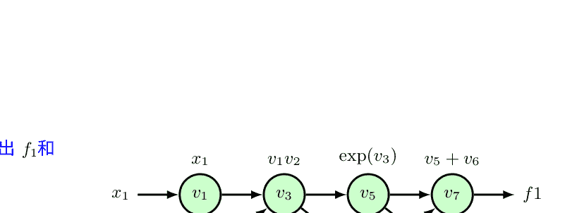

图8.5 将图8.4中的示例扩展为具有两个输出 $f_1$ 和 $f_2$ 的函数。

一般来说，如果我们有一个具有 $D$ 个输入和 $K$ 个输出的函数，那么一次前向自动微分的过程会产生一个 $K \times D$ 雅可比矩阵的列：

$$\mathbf{J} = \begin{bmatrix}
\frac{\partial f_1}{\partial x_1} & \cdots & \frac{\partial f_1}{\partial x_D} \\
\vdots & \ddots & \vdots \\
\frac{\partial f_K}{\partial x_1} & \cdots & \frac{\partial f_K}{\partial x_D}
\end{bmatrix} . \quad (8.66)$$

为了计算雅可比矩阵的第$j$列，我们需要通过将切线方程的前向传递初始化为$\dot{x}_j = 1$和$\dot{x}_i = 0$（对于$i = j$）来进行。我们可以将其以向量形式写为$\dot{\mathbf{x}} = \mathbf{e}_i$，其中$\mathbf{e}_i$是第$i$个单位向量。为了计算完整的雅可比矩阵，我们需要进行$D$次前向传递。然而，如果我们希望计算雅可比矩阵与向量$\mathbf{r} = (r_1, ..., r_D)^T$的乘积：

$$\mathbf{J} = \begin{bmatrix} \frac{\partial f_1}{\partial x_1} & \cdots & \frac{\partial f_1}{\partial x_D} \\ \vdots & \ddots & \vdots \\ \frac{\partial f_K}{\partial x_1} & \cdots & \frac{\partial f_K}{\partial x_D} \end{bmatrix} \begin{bmatrix} r_1 \\ \vdots \\ r_D \end{bmatrix} \qquad (8.67)$$

### 练习8.18

然后，通过设置$\dot{\mathbf{x}} = \mathbf{r}$，可以在单次前向传递中完成。我们可以看到，前向模式自动微分可以使用$D$次前向传递来评估导数的完整$K \times D$雅可比矩阵。对于具有少量输入和许多输出的网络来说，这非常高效，例如$K \gg D$。然而，在我们通常只有一个函数（即用于训练的误差函数）和大量要对其进行微分的变量（包括网络中的权重和偏置，可能有数百万或数十亿个）的情况下，前向模式自动微分非常低效。因此，我们转向基于导数数据通过评估跟踪图的反向流动的自动微分的另一种替代版本。我们可以将反向模式自动微分视为误差反向传播过程的一般化。

#### 8.2.2 反向模式自动微分

与前向模式一样，我们使用附加变量$\bar{v}_i$来增强每个中间变量$v_i$，在这种情况下称为$adjoint$变量。再次考虑一个具有单个输出函数$f$的情况，其中adjoint变量由以下定义

$$\bar{v}_i = \frac{\partial f}{\partial v_i}. \qquad (8.68)$$

这些可以按顺序评估，从输出开始向后工作，通过使用微积分的链式法则：

$$\bar{v}_i = \frac{\partial f}{\partial v_i} = \sum_{j \in \mathrm{ch}(i)} \frac{\partial f}{\partial v_j} \frac{\partial v_j}{\partial v_i} = \sum_{j \in \mathrm{ch}(i)} \bar{v}_j \frac{\partial v_j}{\partial v_i}. \qquad (8.69)$$

这里$\mathrm{ch}(i)$表示评估跟踪图中节点$i$的子节点，换句话说，表示从节点$i$指向它们的节点的集合。伴随变量的连续评估代表了信息在图中向后流动，正如我们之前所看到的。

如果我们再次考虑由(8.50)到(8.56)给出的具体例子函数，我们得到了以下用于评估伴随变量的评估方程请注意，这些从输出开始，然后向后流动到输入。即使有多个输入，也只需要进行一次反向传播来评估导数。对于神经网络的误差函数，权重和偏差的导数是相应的伴随变量。然而，如果现在有多个输出，那么我们需要为每个输出变量运行单独的反向传播。

反向模式通常比正向模式更占用内存，因为所有中间原始变量必须存储，以便在反向传播期间评估伴随变量时可用。相比之下，正向模式下，原始变量和切线变量在正向传播过程中一起计算，因此变量在使用后可以丢弃。

因此，与反向模式相比，正向模式通常更容易实现。

对于正向模式和反向模式的自动微分，通过网络的单次传递保证不会超过单个函数评估的计算成本的6倍。实际上，开销通常接近2或3倍（Griewank和Walther，2008年）。正向和反向模式的混合也很有趣。其中一种情况是在计算Hessian矩阵与向量的乘积时，可以在不显式计算完整Hessian的情况下计算。在这种情况下，我们可以使用反向模式计算代码的梯度，该代码本身是由正向模型生成的。我们从一个向量 b 和一个要评估Hessian-向量乘积的点 x 开始。通过设置 x = v 并使用正向模式，我们可以得到方向导数 v^T ∇ f。然后使用反向模式对其进行微分，以获得 ∇^2 f v = H v。如果 W 是神经网络中的参数数量，则此评估的复杂度为 O(W)，即使Hessian的大小为 W × W。Hessian本身也可以使用自动微分进行显式评估，但这将具有 O(W^2) 的复杂度。

### 练习

-  8.1 (*) 通过使用(8.5)、(8.6)、(8.8)和(8.12)，验证反向传播公式(8.13)用于计算误差函数的导数。
-  8.2 (**) 考虑一个由多层组成的网络，并通过从前向传播方程(6.19)开始，以矩阵表示重写反向传播公式(8.13)。注意结果涉及矩阵的转置相乘。
-  8.3 (★) 通过使用泰勒展开，验证在(8.25)的右侧消除的项为 $O(\epsilon)$。
-  8.4 (★★) 考虑一个形式如图6.9所示的两层网络，并添加额外的参数，对应于直接从输入到输出的跳层连接。通过扩展第8.1.3节的讨论，写出相对于这些额外参数的误差函数的导数方程。
-  8.5 (★★★) 在第8.1.5节中，我们推导出了使用反向传播过程评估神经网络的雅可比矩阵的过程。基于正向传播方程，推导出一种寻找雅可比矩阵的替代形式。
-  8.6 (★★★) 考虑一个两层神经网络，并定义以下量

$$ \delta_k = \frac{\partial E_n}{\partial a_k}, \quad M_{kk'} \equiv \frac{\partial^2 E_n}{\partial a_k \partial a_{k'}}. \qquad (8.77) $$

推导出以 $\delta_k$ 和 $M_{kk'}$ 为元素的Hessian矩阵的表达式，其中 (i) 两个权重都在第二层，(ii) 两个权重都在第一层，(iii) 一个权重在每一层。
-  8.7 (★★★) 扩展练习8.6的结果，包括直接从输入到输出的跳层连接的两层网络的精确Hessian矩阵。
-  8.8 (★★) 使用平方和误差函数的神经网络的海森矩阵的外积近似由(8.40)给出。将此结果推广到多个输出。
-  8.9 (★★) 考虑形式为的平方损失函数

$$ E(\mathbf{w}) = \frac{1}{2} \iint \{ y(\mathbf{x}, \mathbf{w}) - t \}^2 p(\mathbf{x}, t) \, \mathrm{d}\mathbf{x} \, \mathrm{d}t \qquad (8.78) $$

其中 $y(\mathbf{x}, \mathbf{w})$ 是一个参数化函数，例如神经网络。结果(4.37)表明，最小化此误差的函数 $y(\mathbf{x}, \mathbf{w})$ 由给定 $\mathbf{x}$ 的条件期望给出。使用此结果，证明向量 $\mathbf{w}$ 的两个元素 $w_r$ 和 $w_s$ 对 $E$ 的二阶导数为

$$ \frac{\partial^2 E}{\partial w_r \partial w_s} = \int \frac{\partial y}{\partial w_r} \frac{\partial y}{\partial w_s} p(\mathbf{x}) \, \mathrm{d}\mathbf{x}. \qquad (8.79) $$

请注意，对于从 $p(\mathbf{x})$ 中取得的有限样本，我们得到(8.40)。
-  8.10 (★★) 推导出具有逻辑-S型输出单元激活函数和交叉熵误差函数的具有单个输出的网络的 Hessian 矩阵的外积近似表达式(8.41)，对应于具有平方和误差函数的结果(8.40)。
-  8.11 (★★) 推导出具有 softmax 输出单元激活函数和交叉熵误差函数的具有 K个输出的网络的 Hessian 矩阵的外积近似表达式，对应于具有平方和误差函数的结果(8.40)。
-  8.12 (★★★) 考虑矩阵恒等式 (M + vvᵀ)⁻¹ = M⁻¹ - (M⁻¹v)(vᵀM⁻¹) / (1 + vᵀM⁻¹v)， (8.80) 这是伍德伯里恒等式 (A.7) 的一个特例。通过将 (8.80) 应用于外积近似 (8.40) 的海森矩阵，推导出一个公式，使得可以通过对训练数据进行一次遍历并在每个数据点上更新逆海森矩阵来计算海森矩阵的逆。注意，算法可以使用 H = αI 进行初始化，其中 α 是一个小常数，并且结果对于 α 的精确值并不特别敏感。
-  8.13 (★★) 验证 (8.47) 的导数是否为 (8.48)。
-  8.14 (★★) 逻辑映射是一个由迭代关系 Lₙ₊₁(x) = 4Lₙ(x)(1 - Lₙ(x))定义的函数，其中 L₁(x) = x。写出 L₂(x), L₃(x) 和 L₄(x) 的评估追踪方程，然后写出相应的导数表达式 L₁'(x), L₂'(x), L₃'(x) 和 L₄'(x)。不要简化表达式，而是简单地注意到导数的公式复杂度增长比函数本身的表达式要快得多。
-  8.15 (★★) 从评估跟踪方程式 (8.50) 到 (8.56) 开始，针对示例函数 (8.49) ，使用 (8.57) 推导出正向模式切线变量评估方程式 (8.58) 到 (8.64)。
-  8.16 (★★) 从评估跟踪方程式 (8.50) 到 (8.56) 开始，针对示例函数 (8.49) ，并参考图8.4，使用 (8.69) 推导出反向模式伴随变量评估方程式 (8.70) 到 (8.76)。
-  8.17 (★★★) 考虑示例函数 (8.49)。写出 ∂f/∂x₁ 的表达式，并计算当 x₁=1 和 x₂=2时的函数值。现在使用评估跟踪方程式 (8.50) 到 (8.56) 来评估变量 v₁ 到 v₇，然后使用正向模式自动微分的评估跟踪方程式来评估切线变量 v̇₁ 到 v̇₇，并确认得到的 ∂f/∂x₁ 的值与直接计算的值一致。类似地，使用反向模式自动微分的评估跟踪方程式 (8.70) 到 (8.76) 来评估伴随变量 v₇ 到 v₁，并再次确认得到的 ∂f/∂x₁ 的值与直接计算的值一致。
-  8.18 (★★) 通过将任意向量 r = (r₁, …, r_D)ᵀ 表示为单位向量 eᵢ 的线性组合，其中 i = 1, …, D, 证明了函数的雅可比矩阵 (8.67式) 的乘积可以通过一次前向传播的自动微分来计算，即设置 ẋ = r。


我们在讨论多项式曲线拟合时引入了正则化的概念，作为一种减少过拟合的方法，通过抑制模型参数取大值的方式。 这涉及在误差函数中添加一个简单的惩罚项，得到形式为的正则化误差函数

$\widetilde{E}(\mathbf{w}) = E(\mathbf{w}) + \frac{\lambda}{2}\mathbf{w}^{\mathrm{T}}\mathbf{w}$ (9.1)

其中 $\mathbf{w}$是模型参数的向量， $E(\mathbf{w})$是未正则化的误差函数，而正则化超参数 $\lambda$ 控制正则化效果的强度。 通过减少解的方差，这种正则化器可以提高预测准确性，但会以一定的偏差增加为代价。 第4.3节 通过偏差-方差权衡来理解。在本章中，我们将深入探讨正则化，并讨论几种不同的正则化方法。我们还将更广泛地探讨偏差在实现从有限训练数据集中获得良好泛化能力方面的重要作用。

在实际应用中，生成数据的过程很不可能与特定的神经网络架构完全对应，因此任何给定的神经网络只能代表对真实数据生成器的近似。更大的网络可以提供更接近的近似，但这会增加过拟合的风险。实践中，我们发现最好的泛化结果几乎总是通过使用更大的网络结合某种形式的正则化来获得的。在本章中，我们探讨了几种替代的正则化技术，包括提前停止、模型平均、随机失活、数据增强和参数共享。如果需要，可以同时使用多种形式的正则化。例如，常常会同时使用形式为（9.1）的误差函数正则化和随机失活。

### 9.1. 归纳偏差

当我们比较不同阶数的多项式对于正弦合成数据问题的预测误差时，我们发现中等复杂度的多项式具有最小的泛化误差，既不过于简单也不过于灵活。当我们使用形式为（9.1）的正则化项来控制模型复杂度时，也得到了类似的结果，中等的正则化系数λ对于新的输入值的预测效果最好。对于这个结果的洞察来自于偏差-方差分解，我们看到模型中适当的偏差水平对于从有限数据集中进行泛化是重要的。

简单的模型具有高偏差，无法捕捉底层数据生成过程中的变化，而高度灵活的模型具有低偏差，容易过拟合，导致泛化能力差。随着数据集的增大，我们可以使用更灵活的模型，偏差较小，而不会产生过多的方差，从而提高泛化能力。需要注意的是，在实际环境中，我们选择模型的方式可能还会受到内存使用或执行速度等因素的影响。在这里，我们忽略这些辅助考虑因素，专注于实现良好的预测性能，换句话说就是良好的泛化能力。

#### 9.1.1 逆问题

模型选择的问题是机器学习的核心问题，可以追溯到大多数机器学习任务都是逆问题的事实。给定条件分布 `p(t|x)` 以及有限的输入点集合 `{x_1, \dots, x_N}`，至少在原则上，从该分布中采样相应的值 `{t_1, \dots, t_N}` 是直接的。然而，在机器学习中，我们必须解决这个问题的逆问题，即仅通过有限数量的样本来推断整个分布。这是本质上的不适定问题，因为可能有无限多个分布可能负责生成观测到的训练数据。实际上，任何在观测目标值处具有非零概率密度的分布都是候选的。

然而，为了使机器学习有用，我们需要对新的 x值进行预测，因此我们需要一种方法从无限多个可能性中选择一个特定的分布。对于一个选择优于其他选择的偏好被称为归纳偏差或先验知识，并在机器学习中起着核心作用。先验知识可能来自有助于约束解空间的背景信息。对于许多应用程序，输入值的微小变化应该导致输出值的微小变化，因此我们应该偏向于具有平滑变化函数的解决方案。形式为（9.1）的正则化项鼓励模型权重具有较小的幅度，从而引入了对输入变化更慢的函数的偏好。

**第10章** 同样，当在图像中检测物体时，我们可以引入先验知识，即对象的身份通常与其在图像中的位置无关。这被称为平移不变性，将其纳入我们的解决方案中可以极大地简化构建具有良好泛化能力的系统的任务。然而，必须小心，不要引入与生成数据的基本过程不一致的偏见或约束。例如，假设输出和输入之间的关系是线性的，而实际上存在显著的非线性关系，可能会导致系统产生不准确的答案。

**第6.3.4节** 从正则化的角度来看，迁移学习和多任务学习等技术也可以被视为。当特定任务的训练数据有限时，可以使用来自不同但相关的任务的附加数据来帮助确定神经网络中的可学习参数。任务之间的相似性假设相对于简单的正则化来说是一种更复杂的归纳偏置，这解释了使用附加数据导致性能改善的原因。

#### 9.1.2 没有免费午餐定理

本书的核心重点是深度神经网络这一重要的机器学习模型类别。这些模型非常灵活，并且已经在计算机视觉、语音识别和自然语言处理等许多领域引起了革命性的变革。事实上，它们已经成为大多数机器学习应用的首选框架。因此，它们可能被认为是一种能够解决所有任务的“通用”学习算法。然而，即使是非常灵活的神经网络也包含重要的归纳偏差。例如，卷积神经网络编码了特定形式的归纳偏差，包括平移等变性，在涉及图像的应用中特别有用。

> “没有免费午餐定理”（Wolpert, 1996），取自表达“没有免费午餐”的说法，它指出每个学习算法在所有可能的问题上平均而言都是一样好的。如果某个特定模型或算法在某些问题上优于平均水平，那么它在其他问题上必定劣于平均水平。然而，这是一个相当理论的概念，因为可能问题的空间包括输入和输出之间的关系，这对于任何合理的实际应用来说都是非常不典型的。例如，我们已经注意到大多数感兴趣的实际示例表现出一定程度的平滑性，其中输入值的小变化主要与小的变化相关目标值。神经网络等模型，以及大多数广泛使用的机器学习技术，表现出这种归纳偏差的形式，因此在某种程度上，它们具有广泛的适用性。

尽管没有免费午餐定理在某种程度上是理论性的，但它确实突出了偏差在确定机器学习算法性能方面的核心重要性。在没有任何偏差的情况下，不可能仅仅从数据中学习。在实践中，偏差可能是隐含的。例如，每个神经网络都有有限数量的参数，因此限制了它可以表示的函数。然而，偏差也可以明确地编码为与解决的特定类型问题相关的先验知识的反映。

在寻找通用学习算法时，我们实际上是在寻找适用于实际应用广泛类别的归纳偏差。然而，对于任何给定的应用程序，如果能够结合更强的特定于该应用程序的归纳偏差，可以获得更好的结果。基于模型的机器学习的观点（Winn等人，2023年）主张使机器学习模型中的所有假设都明确化，以便为归纳偏差做出适当的选择。

我们已经看到，归纳偏差可以通过分布的形式来加以考虑，例如通过指定输出是一组特定基函数的线性函数。在训练过程中，还可以通过向误差函数添加正则化项来加以考虑。控制神经网络复杂性的另一种方法是通过训练过程本身。我们将看到，即使可调参数的数量超过训练数据点的数量，深度神经网络也可以提供良好的泛化能力，前提是训练过程设置正确。将深度学习应用于现实世界问题的一部分技巧在于仔细设计归纳偏差并将先验知识纳入其中。

#### 9.1.3 对称性和不变性

在许多机器学习的应用中，预测结果应该在一个或多个输入变量的变换下保持不变。例如，当在二维图像中对物体进行分类，比如猫或狗，一个特定的物体应该被分配相同的分类，无论其在图像中的位置如何。这被称为平移不变性。同样，物体在图像中的大小变化也不应该改变其分类。这被称为尺度不变性。利用这些对称性来创建归纳偏置可以极大地提高机器学习模型的性能，并形成几何深度学习的主题(Bronstein等人，2021)。

保持特定属性不变的变换，如平移或缩放，代表着对称性。与特定对称性对应的所有变换的集合形成了一个数学结构，称为群。群由一组元素 A, B, C, ...组成。以及用符号 A ∘ B 表示组合元素对的二元运算。对于一个群，以下四个公理成立：

1.  封闭: 对于集合中的任意两个元素 $\mathcal{A}$, $\mathcal{B}$, $\mathcal{A} \circ \mathcal{B}$ 也必须在集合中。
2.  结合: 对于集合中的任意三个元素 $\mathcal{A}$, $\mathcal{B}$, $\mathcal{C}$, $(\mathcal{A} \circ \mathcal{B}) \circ \mathcal{C} = \mathcal{A} \circ (\mathcal{B} \circ \mathcal{C})$。
3.  恒等: 集合中存在一个元素 $\mathcal{I}$, 称为恒等元素, 具有以下性质: $\mathcal{A} \circ \mathcal{I} = \mathcal{I} \circ \mathcal{A} = \mathcal{A}$ 对于集合中的每个元素 $\mathcal{A}$。
4.  逆元: 对于集合中的每个元素 $\mathcal{A}$, 存在另一个元素 $\mathcal{A}^{-1}$, 称为逆元, 具有以下性质: $\mathcal{A} \circ \mathcal{A}^{-1} = \mathcal{A}^{-1} \circ \mathcal{A} = \mathcal{I}$。

群的简单例子包括通过多个 $90^{\circ}$ 的正方形旋转或在二维平面上连续平移对象的集合。练习9.1

原则上, 神经网络对输入空间的变换所做出的预测应该可以从数据中学习到, 而不需要对网络或训练过程进行任何特殊的修改。然而, 在实践中, 这可能会变得非常具有挑战性, 因为这些变换可能会对原始数据产生重大变化。例如, 在图像中对物体进行相对较小的平移, 即使只有几个像素, 也可能导致像素值发生显著变化。此外, 通常需要同时满足多个不变性, 例如在二维平面上对平移、缩放、旋转、强度变化、颜色平衡变化等的不变性。这些变换的组合方式有指数级的可能性, 使得需要学习所有这些不变性所需的训练集的规模变得不可行。

因此, 我们需要更高效的方法来促使自适应模型展现所需的不变性。这些方法可以大致分为四类:

1.  预处理。通过计算数据的特征, 将不变性内置到预处理阶段中, 这些特征在所需的转换下保持不变。任何后续的回归或分类系统, 如果将这些特征作为输入, 也必然会尊重这些不变性。
2.  正则化误差函数。在输入受到不变性变换的影响时, 将正则化项添加到误差函数中, 以惩罚模型输出的变化。
3.  数据增强。使用训练数据点的副本进行扩展, 根据所需的不变性进行变换, 并携带与未经变换的示例相同的输出目标值。
4.  网络架构。不变性属性是通过选择适当的网络架构来构建到神经网络的结构中的。

方法1的一个挑战是设计具有所需不变性的特征, 同时不丢弃对确定网络输出有用的信息。我们已经看到, 固定的手工特征具有有限的能力, 并且已经被使用深度神经网络学习到的表示所取代。

#### 9.1.4 等变性

不变性的一个重要推广被称为等变性，在这种情况下，当输入发生变换时，网络的输出不再保持不变，而是以特定的方式进行变换。例如，考虑一个以图像为输入并返回该图像的分割结果的网络，其中每个像素被分类为前景对象或背景。在这种情况下，如果图像中对象的位置发生平移，我们希望对象的相应分割也进行相似的平移。假设我们用 I 表示图像，用 S 表示分割网络的操作，那么对于一个平移操作 T，我们有

`$S(T(I)) = T(S(I)) \quad (9.2)$`

这意味着翻译图像的分割由原始图像的翻译分割给出。这在图9.2中有所说明。更一般地说，如果应用于输出的变换与应用于输入的变换不同，则等变性可以保持：

`$S(T(I)) = \widetilde{T}(S(I)) \quad (9.3)$`

例如，如果分割图像的分辨率低于原始图像，则如果 T 是原始图像空间中的平移，则 \widetilde{T} 表示相应的低维分割空间中的平移。同样，如果 S 是测量图像中对象方向的运算符，并且 T 表示旋转（这是图像中所有像素值的复杂非线性变换），那么 T 将增加或减少由 S 生成的标量方向值。

我们还看到，不变性是等变性的一种特殊情况，其中输出变换只是恒等变换。例如，如果 C 是一个神经网络，用于对图像中的对象进行分类，而 T 是一个平移算子，则

`$C(T(I)) = C(I) \quad (9.4)$`

这意味着对象的类别不取决于其在图像中的位置。

## 9.2. 权重衰减

第1.2.5节我们在线性回归的背景下介绍了正则化，以控制模型的复杂性，作为限制模型参数数量的替代方法。最简单的正则化器是模型参数的平方和，得到形式为(9.1)的正则化误差函数，惩罚具有较大幅度的参数值。有效的模型复杂性由正则化系数 λ 的选择确定。

我们还看到，这个加法正则化项可以解释为权重向量 w 上的零均值高斯先验分布的负对数（第2.6.2节）。这为将先验知识包含到模型训练过程中提供了一个概率视角。不幸的是，这个先验是针对模型参数的，而我们对于要解决的问题可能拥有的任何领域知识更可能是以输入到输出的网络函数的形式表达的。参数和网络函数之间的关系非常复杂，因此只有非常有限的种类的先验知识可以直接表达为模型参数的先验。

在机器学习文献中，(9.1)中的平方和正则化器被称为权重衰减，因为在顺序学习算法中，它鼓励权重值衰减到零（Exercise 9.3），除非有数据支持。这种正则化器的一个优点是，在梯度下降训练中，计算其导数非常简单。特别地，对于(9.1)，梯度由以下给出

`$\nabla \tilde{E}(\mathbf{w}) = \nabla E(\mathbf{w}) + \lambda \mathbf{w}. \quad (9.5)$`

我们可以看到，在（9.1）中，通常按惯例包含的 1/2 因子在求导时消失了。

通过考虑一个二维参数空间以及一个未经正则化的误差函数 $E(\mathbf{w})$，该函数是 $\mathbf{w}$ 的二次函数（对应于一个简单的线性回归模型，具有第4.1.2节中的平方和误差函数），如图9.3所示，可以看到二次正则化器的一般效果。参数空间中的轴已经旋转，与 Hessian 矩阵的特征向量对齐，对应于椭圆形误差函数等高线的轴。我们可以看到，正则化项的作用是缩小权重参数的大小。

然而，对于参数 $w_1$，效果要大得多，因为未经正则化的误差对 $w_1$ 的值不太敏感，而对 $w_2$ 的值敏感。直观地说，只有参数 $w_2$ 是‘活跃’的，因为输出对 $w_1$ 相对不敏感，因此正则化器将 $w_1$ 推近零。有效参数的数量是在正则化后保持活跃的参数数量，这个概念可以从贝叶斯或频率学派的角度进行形式化（Bishop, 2006; Hastie, Tibshirani, and Friedman, 2009）。当 $\lambda \rightarrow \infty$ 时，所有的参数都被推向零，因此有效参数的数量为零。当 $\lambda$ 减小时，参数的数量增加，直到 $\lambda = 0$ 时，它等于实际参数的总数。

#### 9.2.1 一致的正则化器

简单的权重衰减（式（9.1））的一个限制是它破坏了网络映射的某些理想变换特性。为了说明这一点，考虑一个多层感知器网络，它有两层权重和线性输出单元，将一组输入变量 $\{x_i\}$ 映射到一组输出变量 $\{y_k\}$。第一隐藏层的隐藏单元的激活形式为

`$$z_j = h \left( \sum_{i} w_{ji} x_i + w_{j0} \right) \quad (9.6)$$`

而输出单元的激活形式为

`$$y_k = \sum_{j} w_{kj} z_j + w_{k0}. \quad (9.7)$$`

假设我们对输入数据进行线性变换：

`$$x_i \rightarrow \widetilde{x}_i = a x_i + b. \quad (9.8)$$`

然后，通过对隐藏层单元的输入进行相应的线性变换，我们可以使网络执行的映射保持不变。

`$$w_{ji} \rightarrow \widetilde{w}_{ji} = \frac{1}{a} w_{ji} \quad (9.9)$$`
`$$w_{j0} \rightarrow \widetilde{w}_{j0} = w_{j0} - \frac{b}{a} \sum_{i} w_{ji}. \quad (9.10)$$`

同样地，通过网络的输出变量的线性变换形式

`$$y_k \rightarrow \widetilde{y}_k = c y_k + d \quad (9.11)$$`

可以通过使用第二层权重和偏差进行转换来实现

`$$w_{kj} \rightarrow \widetilde{w}_{kj} = c w_{kj} \quad (9.12)$$`
`$$w_{k0} \rightarrow \widetilde{w}_{k0} = c w_{k0} + d. \quad (9.13)$$`

如果我们使用原始数据训练一个网络，并使用上述线性变换之一对输入和/或目标变量进行转换训练另一个网络，那么一致性要求我们应该获得仅通过给定的权重的线性变换而不同的等效网络。任何正则化器都应该与这个属性保持一致，否则它将武断地偏向一个解而不是另一个等效解。显然，简单的权重衰减（9.1），它将所有权重和偏差视为平等，不满足这个属性。

因此，我们寻找一个在线性变换 (9.9)、(9.10)、(9.12) 和 (9.13) 下不变的正则化项。这要求正则化项对权重的重新缩放和偏置的平移是不变的。这样的正则化项是由

`$$\frac{\lambda_1}{2} \sum_{w \in \mathcal{W}_1} w^2 + \frac{\lambda_2}{2} \sum_{w \in \mathcal{W}_2} w^2 \quad (9.14)$$`

其中 $\mathcal{W}_1$ 表示第一层的权重集合，$\mathcal{W}_2$ 表示第二层的权重集合，偏置在求和中被排除。只要正则化参数使用 $\lambda_1 \rightarrow a^{1/2} \lambda_1$ 和 $\lambda_2 \rightarrow c^{-1/2} \lambda_2$ 进行重新缩放，这个正则化项将在权重变换下保持不变。

正则化项 (9.14) 对参数的先验分布形式如下：

`$$p(\mathbf{w} | \alpha_1, \alpha_2) \propto \exp \left( -\frac{\alpha_1}{2} \sum_{w \in \mathcal{W}_1} w^2 - \frac{\alpha_2}{2} \sum_{w \in \mathcal{W}_2} w^2 \right) \quad (9.15)$$`

请注意，这种形式的先验是不合适的（无法归一化），因为偏置参数是无约束的。使用不合适的先验可能导致在贝叶斯框架内选择正则化系数和模型比较方面的困难。因此，通常会为偏置单独设置先验（从而打破平移不变性），并具有自己的超参数。通过从先验中抽取样本并绘制相应的网络函数，我们可以说明由此产生的四个超参数的效果，如图9.4所示。先验由四个超参数 $\alpha_1^b, \alpha_1^w, \alpha_2^b$ 和 $\alpha_2^w$ 控制，它们分别表示第一层偏置、第一层权重、第二层偏置和第二层权重的高斯分布的精度。我们可以看到参数 $\alpha_2^w$ 控制函数的垂直尺度（注意顶部两个图表上不同的垂直轴范围），$\alpha_1^w$ 控制函数值变化的水平尺度，$\alpha_1^b$ 控制变化发生的水平范围。参数 $\alpha_2^b$ 的效果在此处未被说明，它控制函数的垂直偏移范围。

更一般地，我们可以考虑正则化器，其中权重被分成任意数量的组 $\mathcal{W}_k$，以便

`$$\Omega(\mathbf{W}) = \frac{1}{2} \sum_k \alpha_k \|\mathbf{W}\|_k^2 \quad (9.16)$$`

其中

`$$\|\mathbf{W}\|_k^2 = \sum_{j \in \mathcal{W}_k} w_j^2 \quad (9.17)$$`

例如，我们可以在多层网络中为每一层使用不同的正则化器。

#### 9.2.2 广义权重衰减

有时候会使用简单二次正则化器的推广形式：

`$$ \Omega(\mathbf{w}) = \frac{\lambda}{2} \sum_{j=1}^{M} |w_j|^q \quad (9.18) $$`

其中 $q = 2$ 对应于(9.1)中的二次正则化器。图9.5展示了不同 $q$ 值下正则化函数的轮廓。

在统计学文献中，形式为(9.18)且 $q=1$ 的正则化器被称为套索（Lasso）（Tibshirani, 1996）。对于二次误差函数，如果 $\lambda$ 足够大，一些系数 $w_j$ 会被驱使为零，从而导致一个稀疏模型，其中相应的基函数不起作用。要理解这一点，我们首先注意到，通过最小化给定的正则化误差函数

`$$ E(\mathbf{w}) + \frac{\lambda}{2} \sum_{j=1}^{M} |w_j|^q \quad (9.19)$$`

等价于在约束条件下最小化未正则化的误差函数 $E(\mathbf{w})$

`$$ \sum_{j=1}^{M} |w_j|^q \leq \eta \quad (9.20)$$`

对于适当的参数 $\eta$，这两种方法可以通过拉格朗日乘子联系起来。稀疏性的起源可以在图9.6中看到，该图显示了在约束条件(9.20)下误差函数的最小值。

当增加 λ 时，更多的参数将被驱使为零。相比之下，二次正则化器会使得两个权重参数都具有非零值。

正则化允许在有限大小的数据集上训练复杂模型，而不会出现严重的过拟合问题，本质上是通过限制有效模型复杂性来实现的。然而，确定最佳模型复杂性的问题则从寻找合适的可学习参数数量转变为确定适当的正则化系数 λ 的值的问题。我们将在下一节讨论模型复杂性的问题。

## 9.3. 学习曲线

我们已经探讨了模型的泛化性能如何随着模型中参数数量、数据集大小和权重衰减正则化项的系数的变化而变化。这些因素都允许在偏差和方差之间进行权衡，以最小化泛化误差。影响这种权衡的另一个因素是学习过程本身。通过梯度下降优化误差函数时，训练误差通常随着模型参数的更新而减小，而保留数据的误差可能是非单调的。这种行为可以使用学习曲线进行可视化，学习曲线绘制了在迭代学习过程（如随机梯度下降）中，训练集和验证集误差等性能指标随迭代次数的变化。这些曲线提供了对训练进展的洞察，并提供了控制有效模型复杂性的实用方法。

#### 9.3.1 提前停止

作为控制网络有效复杂性的一种替代方法，正则化的一个选择是提前停止。深度学习模型的训练涉及对一组训练数据定义的误差函数的迭代减少。

尽管使用训练集评估的误差函数通常显示出随着迭代次数的增加而广义单调减少，但相对于保留数据（通常称为验证集）的误差通常会减少。首先，随着网络开始过拟合，误差会增加。因此，为了获得具有良好泛化性能的网络，训练应该在与验证数据集的最小误差点停止，如图9.7所示。

学习曲线的这种行为有时以网络中参数的有效数量来定性解释。这个数量在训练开始时很小，然后随着训练的进行而增长，对应着模型的有效复杂性的稳定增加。在达到训练误差的最小值之前停止训练是限制网络有效复杂性的一种方法。

我们可以通过一个二次误差函数验证这个洞察，并且展示早停止应该表现出类似于使用简单的权重衰减项进行正则化的行为（Bishop, 1995a）。这可以从图9.8中理解，在该图中，权重空间中的轴已经旋转成与 Hessian 矩阵的特征向量平行。如果在没有权重衰减的情况下，权重向量从原点开始，并在训练过程中沿着遵循局部负梯度向量的路径前进，那么权重向量将最初沿着 $w_2$ 轴平行移动，经过大致对应于 $\mathbf{w}_0$ 的点，然后向着误差函数的最小值 $\mathbf{w}_{ML}$ 移动。这是由于误差曲面的形状和 Hessian 矩阵的特征值的差异很大。因此，在接近 $\mathbf{w}_0$ 的点停止训练类似于权重衰减。早停止和权重衰减之间的关系可以定量化，从而显示出数量 $\tau \eta$（其中 $\tau$ 是迭代索引， $\eta$ 是学习率参数）的作用类似于正则化参数 $\lambda$ 的倒数。因此，在训练过程中，网络中的有效参数数量会增加。

#### 9.3.2 双下降

第4.3节偏差-方差权衡提供了对可学习模型的泛化性能的洞察，当模型中的参数数量变化时。参数过少的模型由于有限的表示能力（高偏差）会有较高的测试集误差，随着参数数量的增加，测试误差预计会下降。然而，当参数数量进一步增加时，由于过拟合（高方差），测试误差再次增加。这导致了传统统计学中的普遍观点，即模型的参数数量需要根据数据集的大小进行限制，并且对于给定的训练数据集，非常大的模型预计会表现较差。

然而，与这种预期相反，现代深度神经网络即使参数数量远远超过实现对训练数据完美拟合所需的数量（Zhang等人, 2016），在深度学习社区中的普遍观点是更大的模型更好。尽管有时会使用提前停止，模型也可以训练到零误差，但在测试数据上仍然具有良好的性能。

通过检查学习曲线和其他绘制的泛化性能与模型复杂度的关系，可以调和这些看似矛盾的观点，从而揭示出一种更微妙的现象，称为双下降（Belkin等人, 2019年）。这在图9.9中有所说明，该图显示了由可学习参数数量确定的模型复杂度下的训练集和测试集错误与模型复杂度的关系，该图展示了一个名为 ResNet18（He等人, 2015a）的大型神经网络在图像分类任务上训练的结果，该网络具有18层参数。通过改变每层中的隐藏单元数量来改变网络中的权重和偏置的数量，即通过改变“宽度参数”。我们可以看到，随着模型复杂度的增加，训练误差单调递减，这是预期的。然而，## 9.4. 参数共享

图9.9 显示了一个名为ResNet18的大型神经网络模型在图像分类问题上训练时的训练集和测试集错误与模型复杂度的关系。水平轴表示控制隐藏单元数量和网络中权重和偏置总数的超参数。垂直虚线，标记为“插值阈值”，表示模型复杂度达到该水平时，理论上可以在训练集上实现零误差。[根据Nakkiran等人（2019）的许可。]

测试集误差一开始减小，然后再增加，最后再次减小。

即使训练集误差已经降到零，对于非常大的模型，测试集误差的减小仍然持续发生。

这种令人惊讶的行为比我们在经典统计学的偏差-方差讨论中所期望的更加复杂，并展示了两种不同的模型拟合方式，如图9.9所示，对应于小到中等复杂度的经典偏差-方差权衡，然后进入非常大模型的一个进一步减小测试集误差的区域。在模型中参数数量足够大，能够完全拟合训练数据时（Belkin等人，2019），两个区域之间的转变大致发生在有效模型复杂度超过训练集中数据点数量的时候。Nakkiran等人（2019）将有效模型复杂度定义为模型能够实现零训练误差的最大训练数据集的大小，因此当有效模型复杂度超过训练集中的数据点数量时，就会出现双重下降现象。

如果我们使用早停法来控制模型复杂度，我们会看到类似的行为，如图9.10所示。增加训练轮数会增加有效模型复杂度，对于足够大的模型，再次观察到双峰现象。对于这样的模型，有许多可能的解决方案，包括那些对数据过拟合的解决方案。因此，随机梯度下降的一个特性似乎是它引入的隐式偏差导致了良好的泛化性能。

当错误函数中引入正则化项时，也可以得到类似的结果。

图9.10 绘制了不同大小的ResNet18模型在梯度下降训练的轮数与测试集误差之间的关系。随着训练轮数的增加，有效模型复杂度增加，对于足够大的模型，观察到双峰现象。[来自Nakkiran等人（2019），获得许可。]

使用正则化来控制复杂度。在这里，一个大模型训练到收敛的测试集误差相对于 $1/\lambda$ 显示出双峰现象，其中高 $\lambda$ 对应低复杂度（Yilmaz和Heckel，2022年）。

双下降的一个讽刺后果是，在一个情况下，增加训练数据集的大小实际上可能会降低性能，与常规观点相反，更多的数据总是好事。

对于图9.9中显示的临界区域中的模型，增加训练集的大小可以将插值阈值推向右侧，导致更高的测试集错误。图9.11中确认了这一点，它显示了一个transformer模型的测试集错误，作为输入空间的维度，即嵌入维度的函数。增加嵌入维度会增加模型中的权重和偏差的数量，从而增加模型的复杂性。我们可以看到，将训练集大小从4,000增加到18,000个数据点会导致整体曲线更低。然而，对于一系列对应于临界复杂性区域中的模型的嵌入维度，增加数据集的大小实际上可能会降低泛化性能。

正则化项，如 $L_2$ 正则化器 $\|w\|^2$，有助于通过鼓励权重值接近于零来减少过拟合。减少网络复杂性的另一种方法是通过将权重分组并要求每个组内的所有权重共享相同的值来施加硬约束，其中共享的数值是从数据中学习的。这被称为权重共享或参数共享或参数绑定。这意味着自由度的数量小于网络中的连接数量。通常，这被引入为将归纳偏差编码到网络中以表达一些已知的不变性的方法。对这种网络的误差函数梯度进行评估可以通过对反向传播进行小的修改来完成，尽管在实践中，这是通过自动微分隐式处理的。当我们讨论第10章卷积神经网络时，我们将广泛使用参数共享。然而，参数共享仅适用于可以预先指定约束形式的特定问题。

图9.11 大型Transformer模型的测试集误差与嵌入维度的关系，嵌入维度控制模型中的参数数量。将训练集的大小从4,000增加到18,000个样本通常会导致较低的测试集误差，但对于某些中等模型复杂度的值，误差可能会增加，如红色垂直箭头所示。[来自Nakkiran等人（2019），获得许可。]

#### 9.4.1 软权重共享

Nowlan和Hinton（1992）引入了一种软权重共享的形式，而不是使用强制将模型参数集合强制相等的硬约束，其中正则化项鼓励权重组具有相似的值。此外，权重的分组、每个组的平均权重值以及组内值的分布都是学习过程的一部分确定的。

回想一下，在（9.1）中，简单的权重衰减正则化器可以看作是权重上的高斯先验分布的负对数。这鼓励所有的权重收敛到零的一个单一值。我们可以通过考虑一个由多个高斯分布混合而成的概率分布，而不仅仅是一个分布，来鼓励权重值形成几个组。均值$\{\mu_j\}$和方差$\{\sigma_j^2\}$是高斯分布的参数。

> 第3.2.9节

高斯分布的混合系数$\{\pi_j\}$以及均值 $\{\mu_j\}$ 和方差$\{\sigma_j^2\}$将作为可调参数，在学习过程中确定。

因此，我们有一个形式为的概率密度

$$ p(\mathbf{w}) = \prod_i \left\{ \sum_{j=1}^K \pi_j \mathcal{N}(w_i|\mu_j, \sigma_j^2) \right\} \quad (9.21) $$

其中 $K$ 是混合成分的数量。取负对数然后得到一个形式为的正则化函数

$$ \Omega(\omega) = -\sum_i \ln \left( \sum_{j=1}^K \pi_j \mathcal{N}(w_i|\mu_j, \sigma_j^2) \right). \quad (9.22) $$

总误差函数由以下给出

$$ \widetilde{E}(\omega) = E(\omega) + \lambda \Omega(\omega) \quad (9.23) $$

其中 $\lambda$ 是正则化系数。

这个误差是与权重 $\{\omega_i\}$ 和混合模型的参数 $\{\pi_j, \mu_j, \sigma_j\}$ 共同最小化的。这可以通过梯度下降来实现，这需要我们计算 $\Omega(\omega)$ 对所有可学习参数的导数。为了做到这一点，方便起见，我们将 $\{\pi_j\}$ 看作是每个组件生成权重值的先验概率，并引入相应的后验概率，这些后验概率由贝叶斯定理给出：

$$ \gamma_j(w_i) = \frac{\pi_j \mathcal{N}(w_i|\mu_j, \sigma_j^2)}{\sum_k \pi_k \mathcal{N}(w_i|\mu_k, \sigma_k^2)}. \quad (9.24) $$

对于权重的总误差函数的导数则由以下给出

$$ \frac{\partial \widetilde{E}}{\partial w_i} = \frac{\partial E}{\partial w_i} + \lambda \sum_j \gamma_j(w_i) \frac{(w_i - \mu_j)}{\sigma_j^2}. \quad (9.25) $$

因此，正则化项的效果是将每个权重拉向第 $j$ 个高斯分布的中心，其力量与给定权重的后验概率成比例。这正是我们所追求的效果。

对于高斯分布的中心，误差对其的导数也可以很容易地计算得到

$$ \frac{\partial \widetilde{E}}{\partial \mu_j} = \lambda \sum_i \gamma_j(w_i) \frac{(\mu_j - w_i)}{\sigma_j^2} \quad (9.26) $$

这个式子有一个简单直观的解释，因为它将 $\mu_j$ 推向权重值的平均值，权重值按照各自的后验概率加权平均计算，这些权重参数是由第 $j$ 个分量生成的。

> 习题 9.9

为了确保方差 $\{\sigma_j^2\}$ 保持正数，我们引入新的变量 $\{\xi_j\}$ 的定义如下

$$\sigma_j^2 = \exp(\xi_j)\tag{9.27}$$

并且对 $\{\xi_j\}$ 进行无约束最小化。相关的导数如下

$$\frac{\partial \widetilde{E}}{\partial \xi} = \frac{\lambda}{2} \sum_i \gamma_j(w_i) \left( 1 - \frac{(w_i - \mu_j)^2}{\sigma_j^2} \right).\tag{9.28}$$

这个过程将 $\sigma_j$ 驱使向相应中心 $\mu_j$ 的加权平均值靠近，其中权重系数由每个权重由组件 $j$ 生成的后验概率给出。

对于与混合系数 $\pi_j$ 相关的导数，我们需要考虑约束条件

$$\sum_j \pi_j = 1, \quad 0 \leqslant \pi_i \leqslant 1,\tag{9.29}$$

这些都是从 $\pi_j$ 的解释中得出的先验概率。这可以通过用一组辅助变量来表示混合系数来完成 $\{\eta_j\}$ 使用 softmax 函数给出

$$\pi_j = \frac{\exp(\eta_j)}{\sum_{k=1}^K \exp(\eta_k)}.\tag{9.30}$$

带有正则化误差函数对 $\{\eta_j\}$ 的导数则为

$$\frac{\partial \widetilde{E}}{\partial \eta_j} = \lambda \sum_i \{ \pi_j - \gamma_j(w_i) \}.\tag{9.31}$$

我们可以看到 $\pi_j$ 因此趋向于混合分量 $j$ 的平均后验概率。

软权重共享的另一个应用 (Lasserre, Bishop 和 Minka, 2006) 引入了一种原则性的方法，将生成模型的无监督训练与相应的判别模型的有监督训练相结合。这在我们有大量未标记数据但标记数据稀缺的情况下非常有用。生成模型的优势在于可以使用所有数据来确定其参数，而只有标记的示例直接影响判别模型的参数。然而，当模型错误规范化时，判别模型可以实现更好的泛化，换句话说，当模型不能完全描述生成数据的真实分布时，这通常是情况。通过引入两个模型参数的软绑定，我们得到了一种明确定义的生成和判别方法的混合体，可以在模型错误规范化的情况下具有鲁棒性，同时也可以从未标记数据的训练中受益。

习题 9.12

## 9.5. 残差连接

图9.12 对于具有单个输入和单个输出的网络，显示了雅可比矩阵的绘图，其中(a)是具有两层权重的网络，(b)是具有25层权重的网络，(c)是具有51层权重和残差连接的网络。[来自Balduzzi等人(2017)，经许可。]

深度神经网络的表征能力主要来自于多层处理的使用，观察发现增加网络的层数可以显著提高泛化性能。

第7.4.2节 我们还看到批归一化以及对权重和偏置进行仔细初始化可以帮助解决深度网络中梯度消失或梯度爆炸的问题。然而，即使使用批归一化，训练具有大量层的网络也变得越来越困难。

对于这种现象的一个解释被称为破碎梯度 (Balduzzi etal., 2017)。我们已经看到神经网络的表示能力随着深度的增加呈指数级增长。使用ReLU激活函数，网络可以表示的线性区域数量呈指数增长。

然而，这样做的一个后果是误差函数的梯度中出现了不连续性。这在具有单个输入变量和单个输出变量的网络中可以通过图9.12来说明。这里绘制了输出变量关于输入变量的导数（网络的雅可比矩阵）作为输入变量的函数。根据微积分的链式法则，这些导数确定了误差函数曲面的梯度。我们可以看到，在网络的早期层中，权重参数的极小变化可以导致梯度的显著变化。迭代梯度优化算法假设梯度在参数空间中平滑变化，因此这种“破碎梯度”效应可能使得在非常深的网络中训练无效。

对神经网络架构的一个重要修改是残差连接(He等人，2015a)，这极大地帮助训练非常深的网络，它们是一种特殊形式的跳层连接。考虑一个神经网络

它由三层形式的序列组成

$$
z_1 = \mathbf{F}_1(\mathbf{x}) \quad (9.32) \\
z_2 = \mathbf{F}_2(z_1) \quad (9.33) \\
\mathbf{y} = \mathbf{F}_3(z_2) \quad (9.34)
$$

这里的函数 $\mathbf{F}_l(\cdot)$ 可能只是由线性变换后跟ReLU激活函数组成，也可能更复杂，包含多个线性、激活函数和归一化层。残差连接简单地将输入添加到每个函数的输出上，以得到

$$
z_1 = \mathbf{F}_1(\mathbf{x}) + \mathbf{x} \quad (9.35) \\
z_2 = \mathbf{F}_2(z_1) + z_1 \quad (9.36) \\
\mathbf{y} = \mathbf{F}_3(z_2) + z_2 \quad (9.37)
$$

每个函数和残差连接的组合，例如 $\mathbf{F}_1(\mathbf{x}) + \mathbf{x}$，被称为残差块。残差网络，也称为ResNet，由多个这样的块按顺序组成。在图9.13中，展示了带有残差连接的修改网络。如果非线性函数中的参数足够小，使得函数输出接近于零，残差块可以轻松生成恒等变换。

术语“残差”指的是在每个块中，函数学习恒等映射与期望输出之间的残差，通过重新排列残差变换可以看出这一点：

$$
\mathbf{F}_l(z_{l-1}) = z_l - z_{l-1} \quad (9.38)
$$

具有残差连接的网络中的梯度对输入值的敏感性要比标准深度网络小得多，如图9.12(c)所示。Li et al. (2017)开发了一种直接可视化误差曲面的方法，结果显示残差连接的效果是创建更平滑的误差函数曲面，如图9.14所示。通常在残差网络中包含批量归一化层，因为它们共同显著减少了梯度消失和梯度爆炸的问题。He et al. (2015a)表明，包含残差连接允许训练非常深的网络，可能有数百层。

如果我们将(9.35)、(9.36)和(9.37)结合起来，给出整个网络的一个总体方程，可以进一步了解残差连接如何促进平滑的误差曲面：

$$
\mathbf{y} = \mathbf{F}_3(\mathbf{F}_2(\mathbf{F}_1(\mathbf{x}) + \mathbf{x}) + z_1) + z_2 \quad (9.39)
$$

图9.14 (a)展示了一个具有56层的网络的误差曲面的可视化。(b)同样的网络加入了残差连接，展示了残差连接带来的平滑效果。[来自Li等人(2017)，获得许可。]

习题9.13

现在我们可以替换中间变量 \(z_1\) 和 \(z_2\)，得到关于输入 \(\mathbf{x}\) 的网络输出表达式：

$$
y = \mathbf{F}_3(\mathbf{F}_2(\mathbf{F}_1(\mathbf{x}) + \mathbf{x}) + \mathbf{F}_1(\mathbf{x}) + \mathbf{x}) + \mathbf{F}_2(\mathbf{F}_1(\mathbf{x}) + \mathbf{x}) + \mathbf{F}_1(\mathbf{x}) + \mathbf{x}. \quad (9.40)
$$

这种扩展形式的残差网络如图9.15所示。我们可以看到，整体函数由多个并行运行的网络组成，其中包括层数较少的网络。该网络具有深度网络的表示能力，因为它包含了一个特殊情况下的深度网络。然而，误差曲面由浅层和深层子网络的组合来调节。

请注意，由(9.40)定义的跳跃连接要求输入和所有中间变量具有相同的维度，以便可以进行相加。

我们可以通过在网络中包含一个非方阵 \(\mathbf{W}\) 的可学习参数来在某个点改变维度，形式如下

$$
z_l = \mathbf{F}_l(z_{l-1}) + \mathbf{W} z_{l-1}. \quad (9.41)
$$

到目前为止，我们对可学习非线性函数 \(\mathbf{F}_l(\cdot)\)的形式没有具体说明。最简单的选择是一个标准的神经网络，它在层之间交替进行可学习的线性变换和固定的非线性激活函数，如ReLU。这为放置残差连接提供了两种可能性，如图9.16所示。在版本(a)中，被相加的量始终为非负值，因为它们由ReLU层的输出给出，所以为了允许正负值，更常用的是版本(b)。

## 9.6. 模型平均

如果我们有几个不同的模型来解决同一个问题，那么我们通常可以通过对各个模型的预测进行平均来提高泛化能力，而不是试图选择最佳模型。这种模型的组合有时被称为委员会或集合。对于产生概率输出的模型，预测分布是每个模型的预测的平均值：

> $p(\mathbf{y}|\mathbf{x}) = \frac{1}{L} \sum_{l=1}^{L} p_l(\mathbf{y}|\mathbf{x}) \tag{9.42}$
其中 $p_l(\mathbf{y}|\mathbf{x})$ 是模型 $l$ 的输出， $L$ 是模型的总数。

考虑到偏差和方差之间的权衡，可以通过这个平均过程来解释。回顾图4.7，当我们使用正弦数据训练多个多项式并对结果函数进行平均时，方差项的贡献往往会相互抵消，从而提高预测结果。

实际上，我们只有一个数据集，因此我们必须找到一种方法在委员会内的不同模型之间引入变异性。一种方法是使用自助法生成数据集，即创建多个数据集，具体步骤如下。假设我们的原始数据集包含N个数据点X = {x1,..., xN}。我们可以通过从X中随机有放回地抽取N个点来创建一个新的数据集XB，这样X中的一些点可能会在XB中重复出现，而X中的其他点可能会在XB中缺失。可以重复这个过程L次，生成L个大小为N的数据集，每个数据集都是通过从原始数据集X中进行抽样得到的。然后可以使用每个数据集来训练模型，并对结果模型的预测进行平均。这个过程被称为自助聚合或装袋（Breiman，1996）。形成集合的另一种方法是使用原始数据集来训练具有不同架构的多个不同模型。

通过考虑具有输入向量x和单个输出变量y的回归问题，我们可以分析集合预测的好处。假设我们有一组经过训练的模型y1(x), ..., yM(x)，并且我们形成一个委员会预测，给出

$$ y_{\text{COM}}(\mathbf{x}) = \frac{1}{M} \sum_{m=1}^{M} y_m(\mathbf{x}) \qquad (9.43) $$

如果我们试图预测的真实函数是由h(x)给出的，则每个模型的输出可以写成真实值加上一个误差：

$$ y_m(\mathbf{x}) = h(\mathbf{x}) + \epsilon_m(\mathbf{x}). \qquad (9.44) $$

平均平方误差的形式为

$$ \mathbb{E}_{\mathbf{x}} \left[ \{ y_m(\mathbf{x}) - h(\mathbf{x}) \}^2 \right] = \mathbb{E}_{\mathbf{x}} \left[ \epsilon_m(\mathbf{x})^2 \right] \qquad (9.45) $$

其中$\mathbb{E}_{\mathbf{x}}[\cdot]$表示对输入向量x的分布的频率期望。因此，模型单独操作产生的平均误差为

$$ E_{\text{AV}} = \frac{1}{M} \sum_{m=1}^{M} \mathbb{E}_{\mathbf{x}} \left[ \epsilon_m(\mathbf{x})^2 \right]. \qquad (9.46) $$

同样，委员会的期望误差(9.43)为

$$ E_{\text{COM}} = \mathbb{E}_{\mathbf{x}} \left[ \left\{ \frac{1}{M} \sum_{m=1}^{M} y_m(\mathbf{x}) - h(\mathbf{x}) \right\}^2 \right] = \mathbb{E}_{\mathbf{x}} \left[ \left\{ \frac{1}{M} \sum_{m=1}^{M} \epsilon_m(\mathbf{x}) \right\}^2 \right]. \qquad (9.47) $$

如果我们假设误差具有零均值且不相关，即
$$
E_{\mathbf{x}}[\epsilon_m(\mathbf{x})] = 0 \qquad (9.48)
$$
$$
E_{\mathbf{x}}[\epsilon_m(\mathbf{x})\epsilon_l(\mathbf{x})] = 0, \quad m = l \qquad (9.49)
$$

习题9.14
然后我们得到
$$
E_{\text{COM}} = \frac{1}{M} E_{\text{AV}}. \qquad (9.50)
$$
这个明显戏剧性的结果表明，通过对模型的 $M$ 个版本进行平均，模型的平均误差可以减小一个因子 $M$。不幸的是，这取决于一个关键假设，即个体模型的误差是不相关的。实际上，这些误差通常高度相关，因此整体误差的减小通常要小得多。然而，可以证明委员会的期望误差不会超过组成模型的期望误差，因此 $E_{\text{COM}} \leqslant E_{\text{AV}}$。

习题9.15
一种稍微不同的模型组合方法，称为 *boosting*（Freund和Schapire，1996），将多个“基础”分类器组合起来，产生一种委员会，其性能可以显著优于任何基础分类器。即使基础分类器的性能只比随机稍微好一点，boosting也可以得到良好的结果。boosting和委员会方法（如上面讨论的bagging）之间的主要区别在于，基础分类器是按顺序训练的，每个基础分类器使用加权形式的数据集进行训练，其中每个数据点的权重系数取决于前面分类器的性能。特别是，被一个基础分类器误分类的点在训练下一个分类器时会被赋予更大的权重。一旦所有分类器都训练完毕，它们的预测结果将通过加权多数投票方案进行组合。

> 在实践中，所有模型组合方法的主要缺点是必须训练多个模型，然后对所有模型进行评估预测，从而增加了训练和推理的计算成本。这取决于具体的应用场景有多重要。

#### 9.6.1 丢弃

一种广泛使用且非常有效的正则化形式称为 *dropout*（Srivastava et al., 2014），可以看作是一种隐式地对指数级别的模型进行近似模型平均的方法，而无需训练多个模型。它具有广泛的适用性并且计算成本低廉。Dropout是最有效的正则化形式之一，在应用中被广泛使用。

Dropout的核心思想是在训练过程中随机删除网络中的节点，包括它们的连接。每次向网络呈现数据点时，都会对要省略的节点进行新的随机选择。图9.17显示了一个简单的网络以及省略了部分节点的修剪网络的示例。

Dropout应用于隐藏节点和输入节点，但不应用于输出节点，并且等同于将被删除节点的输出设置为零。可以通过定义一个掩码向量 $R_i \in \{0,1\}$ 来实现，该向量乘以非输出节点的激活值。数据点 n 的节点 i，其值以概率 ρ 设置为 1。对于隐藏节点，ρ= 0.5 通常效果较好，而对于输入节点，通常使用 ρ= 0.8。

在训练过程中，每个数据点被呈现给网络时，都会创建一个新的掩码，并在修剪的网络上应用前向和后向传播步骤，以创建误差函数梯度，然后使用这些梯度来更新权重，例如通过随机梯度下降。如果数据点被分成小批量，则在应用权重更新之前，梯度将在每个小批量中的数据点上进行平均。对于具有 $M$ 个非输出节点的网络，存在 $2^M$ 个修剪的网络，因此在训练过程中只有一小部分这些网络会被考虑。这与传统的集成方法不同，传统的集成方法中，集成中的每个网络都是独立训练到收敛。另一个区别是，使用 dropout 隐式地训练了指数级别的网络，这些网络不是独立的，而是共享其参数值与完整网络以及彼此。请注意，由于单个参数更新非常嘈杂，使用 dropout 可能会导致训练时间更长。此外，由于误差函数本身具有噪声，仅仅通过观察训练过程中误差函数的减小来确认优化算法是否正常工作更加困难。

一旦训练完成，可以通过应用集成规则（9.42）来进行预测，这种情况下的形式为 $p(y|x) = \sum_R p(R) p(y|x, R)$ (9.51)，其中求和是在指数级大的掩码空间上进行的，而 $p(y|x, R)$ 是来自具有掩码 R 的网络的预测分布。由于这个求和是难以处理的，可以通过对少量掩码进行采样来近似计算，在实践中，只需 10 或 20 个掩码就足以获得良好的结果。这个过程被称为蒙特卡洛 dropout。

一个更简单的方法是使用训练好的网络进行预测，不屏蔽任何节点，并且在测试期间重新调整网络中的权重，使得每个节点的预期输入与训练期间大致相同，以补偿训练过程中一部分节点缺失的事实。

因此，在训练期间，如果一个节点以概率 $\rho$ 存在，则在测试期间，使用网络进行预测之前，该节点的输出权重将乘以 $\rho$。

对于 dropout 的另一个动机来自贝叶斯观点。在完全贝叶斯处理中，我们将通过对所有可能的网络模型进行加权平均来进行预测。$2^{M}$ 个网络模型，每个网络根据其后验概率进行加权。从计算角度来看，在训练期间评估后验概率以及在测试期间计算加权预测时，这将是难以承受的昂贵的。dropout 通过给每个可能的模型赋予相等的权重来近似这种模型平均。

dropout 背后的进一步直觉来自于其在减少过拟合方面的作用。在标准网络中，参数可能会调整到个别数据点上的噪声，隐藏节点变得过于专门化。每个节点根据其他节点的输出来调整其权重，以最小化误差，导致节点的相互适应，这种适应可能不适用于新数据。通过 dropout，每个节点不能依赖其他特定节点的存在，而必须在广泛的上下文中做出有用的贡献，从而减少相互适应和专门化。对于使用最小二乘法训练的简单线性回归模型，dropout 练习9.18 正则化等效于一种修改后的二次正则化形式。

### 练习

**9.1 (☆) 通过依次考虑四个群公理，展示了通过90度的正负倍数对一个正方形进行所有可能的旋转，以及旋转组合的二元运算形成一个群。同样，展示了在二维平面上对物体进行所有连续平移的集合也形成一个群。**

**9.2 (☆☆) 考虑一个形式为线性模型的情况**

$$y(\mathbf{x}, \mathbf{w}) = w_0 + \sum_{i=1}^{D} w_i x_i \qquad\qquad (9.52)$$

以及一个形式为平方和误差函数的情况

$$E_D(\mathbf{w}) = \frac{1}{2} \sum_{n=1}^{N} \{y(\mathbf{x}_n, \mathbf{w}) - t_n\}^2. \qquad\qquad (9.53)$$

现在假设高斯噪声 $\epsilon_i$，均值为零，方差为 $\sigma^2$，独立地添加到每个输入变量 $x_i$。通过利用 $\mathbb{E}[\epsilon_i] = 0$ 和 $\mathbb{E}[\epsilon_i \epsilon_j] = \delta_{ij} \sigma^2$，展示了在噪声分布上对 $E_D$ 进行最小化等价于最小化无噪声输入变量的平方和误差，并加上权重衰减正则化项，其中偏置参数 $w_0$ 在正则化项中被省略。

**9.3 (★ ★) 考虑一个由二次正则化器组成的误差函数**

$$\Omega(\mathbf{w}) = -\frac{1}{2}\mathbf{w}^{\top}\mathbf{w} \tag{9.54}$$

以及梯度下降更新公式

$$\mathbf{w}^{(\tau+1)} = \mathbf{w}^{(\tau)} - \eta\nabla\Omega(\mathbf{w}). \tag{9.55}$$

通过考虑无限小更新的极限，写出 $\mathbf{w}$ 演化的相应微分方程。写出这个方程的解，从初始值 $\mathbf{w}_0$ 开始，并证明 $\mathbf{w}$ 的元素指数衰减到零。

**9.4 (★) 验证由(9.6)和(9.7)定义的网络函数在输入变换(9.8)下是不变的，前提是权重和偏置同时使用(9.9)和(9.10)进行变换。类似地，通过将第二层权重和偏置应用于变换(9.12)和(9.13)，展示网络输出可以根据(9.11)进行变换。**

## 附录C 9.5 (★ ★) 通过使用拉格朗日乘子，证明最小化正则化误差函数 (9.19) 等价于最小化未正则化误差函数 $E(\mathbf{w})$ 在约束条件 (9.20) 下。讨论参数 $\eta$ 和 $\lambda$ 之间的关系。

**9.6 (★ ★ ★) 考虑形式为二次误差函数的情况**

$$E = E_0 + \frac{1}{2}(\mathbf{w} - \mathbf{w}^{\star})^{\top}\mathbf{H}(\mathbf{w} - \mathbf{w}^{\star}) \tag{9.56}$$

其中 $\mathbf{w}^{\star}$ 表示最小值，Hessian矩阵 $\mathbf{H}$ 是正定且常数。假设初始权重向量 $\mathbf{w}^{(0)}$ 选择为原点，并使用简单梯度下降法进行更新：

$$\mathbf{w}^{(\tau)} = \mathbf{w}^{(\tau-1)} - \rho\nabla E \tag{9.57}$$

其中 $\tau$ 表示步数，$\rho$ 是学习率（假设较小）。证明，在 $\tau$ 步之后，与 $\mathbf{H}$ 的特征向量平行的权重向量的分量可以写成

$$w_j^{(\tau)} = \{1 - (1 - \rho\eta_j)^{\tau}\}w_j^{\star} \tag{9.58}$$

其中 $w_j = \mathbf{w}^{\top}\mathbf{u}_j$，而 $\mathbf{u}_j$ 和 $\eta_j$ 是 $\mathbf{H}$ 的特征向量和特征值，分别由

$$\mathbf{H}\mathbf{u}_j = \eta_j\mathbf{u}_j \tag{9.59}$$

定义。证明当 $\tau \to \infty$时，得到 $\mathbf{w}^{(\tau)} \to \mathbf{w}^*$ 如预期，只要 $|1 - \rho \eta_j| < 1$。

现在假设在有限步数 $\tau$ 之后停止训练。证明Hessian矩阵的特征向量方向上的权重向量的分量满足

$w_j^{(\tau)} \simeq w_j^*$ 当 $\eta_j \gg (\rho\tau)^{-1}$ (9.60)
$|w_j^{(\tau)}| \ll |w_j^*|$ 当 $\eta_j \ll (\rho\tau)^{-1}$ (9.61)

这个结果表明，$(\rho\tau)^{-1}$ 在正则化参数中起到类似的作用 $\lambda$ 在权重衰减中。

**9.7 (⋆⋆) 考虑一个神经网络，其中多个权重被限制为具有相同的值。讨论标准反向传播算法在评估网络中可调参数的误差函数导数时，必须如何修改以确保满足这些约束条件。**

**9.8 (⋆) 考虑由混合分布定义的**

$$p(w) = \sum_{j=1}^{M} \pi_j \mathcal{N}(w|\mu_j, \sigma_j^2) \tag{9.62}$$

其中 $\{\pi_j\}$ 可以被视为相应高斯分量的先验概率 $p(j)$。使用贝叶斯定理，证明相应的后验概率 $p(j|w)$ 由(9.24)给出。

**9.9 (⋆⋆) 使用 (9.21), (9.22), (9.23) 和 (9.24) 验证结果 (9.25)。**

**9.10 (⋆⋆) 使用 (9.21), (9.22), (9.23) 和 (9.24) 验证结果 (9.26)。**

**9.11 (⋆⋆) 使用 (9.21), (9.22), (9.23) 和 (9.24) 验证结果 (9.28)。**

**9.12 (⋆⋆) 证明混合系数 $\{\pi_k\}$ 的导数 $\{\eta_j\}$ 相对于辅助参数 $\{\eta_j\}$ 的导数是**

$$\frac{\partial \pi_k}{\partial \eta_j} = \delta_{jk} \pi_j - \pi_j \pi_k \tag{9.63}$$

因此，通过利用约束 $\sum_k \gamma_k(w_i) = 1$ 对于所有 $i$，推导出结果 (9.31)。

**9.13 (⋆) 验证结合(9.35)，(9.36)和(9.37)得到一个整体方程形式为(9.40)。**

**9.14 (⋆⋆) 简单委员会模型的预期平方误差 $E_{\text{AV}}$ 可以通过(9.46)定义，委员会本身的预期误差由(9.47)给出。假设个体误差满足(9.48)和(9.49)，推导出结果(9.50)。**

**9.15 (⋆⋆) 通过利用Jensen不等式(2.102)对凸函数 \(f(x)=x^2\) 的特殊情况，展示简单委员会模型成员的平均预期平方误差 \(E_{\text{AV}}\) 由(9.46)给出，以及预期误差 \(E_{\text{COM}}\) 委员会本身的误差公式 (9.47) 满足**
\[ E_{\text{COM}} \leqslant E_{\text{AV}}. \tag{9.64} \]

**9.16 (⋆⋆) 通过利用Jensen不等式 (2.102) ，证明先前练习中得到的结果 (9.64) 对于任何误差函数 \(E(y)\) 都成立，而不仅仅是平方和，只要它是 \(y\) 的凸函数。**

**9.17 (⋆⋆) 考虑一个委员会，我们允许对组成模型进行不平等加权，即**
\[ y_{\text{COM}}(\mathbf{x}) = \sum_{m=1}^{M} \alpha_m y_m(\mathbf{x}). \tag{9.65} \]
为了确保预测值 \(y_{\text{COM}}(\mathbf{x})\) 在合理范围内，假设我们要求它们在每个 \(x\) 值处都受到委员会成员给出的最小值和最大值的限制，即
\[ y_{\min}(\mathbf{x}) \leqslant y_{\text{COM}}(\mathbf{x}) \leqslant y_{\max}(\mathbf{x}). \tag{9.66} \]
证明这个约束的必要和充分条件是，系数 \(\alpha_m\) 满足
\[ \alpha_m \geqslant 0, \quad \sum_{m=1}^{M} \alpha_m = 1. \tag{9.67} \]

**9.18 (***) 在这里，我们探讨了在使用最小二乘法训练的简单线性回归模型上使用dropout正则化的效果。考虑一个形式为的模型**
\[ y_k = \sum_{i=1}^{D} w_{ki} x_i \tag{9.68} \]
以及给定的平方和误差函数
\[ E(\mathbf{W}) = \sum_{n=1}^{N} \sum_{k=1}^{K} \left\{ t_{nk} - \sum_{i=1}^{D} w_{ki} R_{ni} x_{ni} \right\}^2 \tag{9.69} \]
其中，dropout矩阵的元素 \(R_{ni} \in \{0, 1\}\) 是从参数为 \(\rho\) 的伯努利分布中随机选择的。现在，我们对随机dropout参数的分布进行期望。证明
\[ \mathbb{E}[R_{ni}] = \rho \tag{9.70} \]
\[ \mathbb{E}[R_{ni} R_{nj}] = \delta_{ij} \rho + (1 - \delta_{ij}) \rho^2. \tag{9.71} \]

因此，证明该dropout模型的期望误差函数为

$$\mathbb{E}[E(\mathbf{W})] = \sum_{n=1}^{N} \sum_{k=1}^{K} \left\{ y_{nk} - \rho \sum_{i=1}^{D} w_{ki} x_{ni} \right\}^2 + \rho (1 - \rho) \sum_{n=1}^{N} \sum_{k=1}^{K} \sum_{i=1}^{D} w_{ki}^2 x_{ni}^2. \tag{9.72, 9.73}$$

因此，我们可以看到期望误差函数对应于具有二次正则化器的平方和误差，其中正则化系数根据输入变量的数据值分别进行缩放。最后，写出一个闭式解来最小化这个经过正则化的误差函数的权重矩阵。

## 10 卷积神经网络

最简单的机器学习模型假设观测数据值是非结构化的，即数据向量 $x = (x_1, \ldots, x_D)$ 的元素被视为我们事先不知道它们之间如何相关的。如果我们对这些变量的顺序进行随机排列，并且在所有训练和测试数据上一致地应用这个固定的排列，那么到目前为止考虑的模型的性能不会有任何差异。

然而，许多机器学习的应用涉及到结构化数据，在其中输入变量之间存在额外的关系。例如，自然语言中的单词形成一个序列，如果我们要对语言进行建模，如果我们使用生成自回归过程，我们会期望每个单词更多地依赖于紧接在其后的单词，而不太依赖于序列中较早的单词。同样，图像的像素具有明确定义的空间关系——在这种情况下，输入变量被排列在一个二维的网格中，相邻的像素具有高度相关的值。我们已经看到，我们对特定数据模态的结构的了解可以通过将正则化项添加到训练目标中的误差函数中，通过数据增强或通过对模型架构进行修改来利用。第9.1节 这些方法可以帮助指导模型尊重某些属性，例如对输入数据的变换的不变性和等变性。第9.1.4节 在本章中，我们将介绍一种被称为卷积神经网络（CNN）的架构方法，我们将看到它可以被视为一个稀疏连接的多层网络，具有参数共享，并设计用于编码特定于图像数据的不变性和等变性。

### 10.1. 计算机视觉

自动分析和解释图像数据是计算机视觉领域的重点，也是机器学习的一个主要应用领域(Szeliski, 2022)。从历史上看，计算机视觉主要基于三维投影几何。手工制作的特征被构建并用作简单学习算法的输入(Hartley和Zisserman, 2004)。然而，它是深度学习革命中首个被转变的领域之一，主要归功于CNN架构。尽管该架构最初是在图像分析的背景下开发的，但它也被应用于其他领域，如第12章序列数据分析。最近，基于Transformer的替代架构在某些应用中与卷积网络竞争力相当。

计算机视觉中有许多机器学习的应用，其中一些最常见的应用包括以下几种：

- 图1.1 例如对图像进行分类，例如将皮肤病变的图像分类为良性或恶性。这有时被称为“图像识别”。
- 图10.19 例如在图像中检测物体并确定它们在图像中的位置，例如通过自动驾驶车辆收集的摄像头数据检测行人。
- 图10.26 图像分割，即对每个像素进行单独分类，从而将图像分割成共享相同标签的区域。例如，自然场景可以被分割为天空、草地、树木和建筑物，而医学扫描图像可以被分割为癌组织和正常组织。
- 图12.27 生成图像的标题，从图像自动生成文本描述。
- 图1.3 生成新图像，例如生成人脸图像。也可以根据描述所需图像内容的文本输入来合成图像。

#### 10.1.1 图像数据

图20.9 6. 修复是指用合成的像素替换图像中的一个区域，这些像素与图像的其余部分一致。例如，在图像编辑过程中，可以使用此方法来删除不需要的对象。

图10.32 7. 风格转换是指将一个风格为照片的输入图像转换为另一种风格，例如油画。

图20.8 8. 超分辨率是指通过增加像素数量和合成相关的高频信息来提高图像的分辨率。

9. 深度预测是指使用一个或多个视图来预测目标图像中每个像素与相机之间的距离。

10. 场景重建是指使用一个或多个二维图像来重建三维表示的场景。

图像由像素的矩形数组组成，每个像素具有灰度强度或更常见的红色、绿色和蓝色通道，每个通道都有自己的强度值。这些强度是非负数，也有一些最大值，对应于用于捕捉图像的相机或其他硬件设备的限制。在大多数情况下，我们将视强度为连续变量，但实际上它们以有限的精度表示，例如表示为8位整数的0到255的范围内。

一些图像，例如在医学诊断中使用的磁共振成像（MRI）扫描，由三维格点组成。同样，视频由一系列二维图像组成，因此也可以视为三维结构，其中连续的帧通过时间堆叠。

现在考虑将神经网络应用于图像数据以解决上述应用的挑战。图像通常具有高维度，典型相机捕捉的图像包含数十兆像素。将图像数据视为非结构化可能需要一个具有大量参数的模型，这是不可行的。更重要的是，这种方法未能考虑到图像数据的高度结构化特性，其中不同像素的相对位置起着关键作用。我们可以看到这一点，因为如果我们对图像的像素进行随机排列，那么结果将不再像一个自然图像。同样，如果我们为每个像素独立地生成随机值来生成合成图像，那么几乎没有机会生成像一个自然图像的东西。

局部相关性很重要，在自然图像中，附近的两个像素具有相似的颜色和强度的概率要比相距较远的两个像素高得多。这代表了强大的先验知识，并可以用来将强归纳偏差编码到神经网络中，从而得到具有更少参数和更好泛化准确性的模型。

## 10.2. 卷积滤波器

引入卷积网络的一个动机是对于图像数据，即CNN设计的模态，标准的全连接架构将需要大量的参数，因为图像具有高维度的特性。为了看到这一点，考虑一个具有 $10^3 \times 10^3$ 像素的彩色图像，每个像素具有对应的红色、绿色和蓝色强度的三个值。如果网络的第一个隐藏层有1,000个隐藏单元，那么在第一层中我们已经有 $3 \times 10^9$ 个权重。此外，这样的网络还必须通过示例来学习任何不变性和等变性，这将需要庞大的数据集。通过设计一个结合了我们对图像结构的归纳偏差的架构，我们可以大大减少数据集的要求，并且在图像空间中的对称性方面改善泛化能力。

为了利用图像数据的二维结构来创建归纳偏差，我们可以使用四个相互关联的概念：层次、局部性、等变性和不变性。考虑在图像中检测人脸的任务。由于一个图像可能包含多个人脸，并且每个人脸都包含诸如眼睛之类的元素，而每个眼睛都有诸如虹膜之类的结构，因此存在自然的层次结构。在层次结构的最低级别上，神经网络中的一个节点可以使用局部信息来检测诸如边缘之类的特征的存在，因此它只需要看到图像像素的一个小子集。在更高层次上，可以通过组合在前一级别找到的多个特征来检测更复杂的结构。然而，一个关键点是，虽然我们希望将层次结构的一般概念构建到模型中，但我们希望层次结构的细节，包括在每个层次提取的特征类型，是从数据中学习而不是手动编码的。层次模型在深度学习框架中自然适应，该框架已经通过一系列可能非常多的处理层次的处理来从原始数据中提取非常复杂的概念，并且整个系统是端到端训练的。

#### 10.2.1 特征检测器

为了简化起见，我们最初将限制我们的注意力在灰度图像上（即，只有一个通道的图像）。考虑神经网络第一层中的一个单元，它仅以图像中一个小矩形区域或补丁的像素值作为输入，如图10.1(a)所示。这个补丁被称为该单元的感受野，它捕捉了局部性的概念。我们希望与该单元关联的权重值能够学习检测一些有用的低层特征。该单元的输出由通常的函数形式给出，包括输入值的加权线性组合，随后使用非线性激活函数进行转换：

$$z = \text{ReLU}(\mathbf{w}^\top \mathbf{x} + w_0)$$

其中 $\mathbf{x}$ 是感受野的像素值向量，并且我们假设使用ReLU激活函数。因为每个输入都有一个关联的权重，权重本身形成一个小的二维网格，称为过滤器，有时也称为内核，它本身可以被视为一幅图像。这在图10.1(b)中有所说明。

假设(10.1)中的 $\mathbf{w}$ 和 $w_0$ 是固定的，我们想知道输入图像块 $\mathbf{x}$ 的哪个值会使得这个隐藏单元的输出响应最大。为了回答这个问题，我们需要以某种方式约束 $\mathbf{x}$，因此假设它的范数 $\|\mathbf{x}\|^2$ 是固定的。

那么使 $\mathbf{w}^\top \mathbf{x}$ 最大化的 $\mathbf{x}$ 的解，从而最大化隐藏单元的响应，具有以下形式：$\mathbf{x} = \alpha \mathbf{w}$，其中 $\alpha$ 是某个系数。这意味着这个隐藏单元的最大输出响应发生在它检测到一块图像补丁时，该补丁在整体缩放的情况下看起来像内核图像。注意，ReLU 仅在 $\mathbf{w}^\top \mathbf{x}$ 超过阈值 $-w_0$ 时生成非零输出，因此该单元充当一个特征检测器，当它找到一个足够好的与其内核匹配时发出信号。

练习10.1

#### 10.2.2 平移等变性

接下来注意，如果脸部图像中的一个小区域代表，例如，眼睛在那个位置，那么图像的不同部分中相同的像素值必须代表新位置上的眼睛。我们的神经网络需要能够将其在一个位置学到的知识推广到图像中的所有可能位置，而不需要在训练集中看到相应位置的特征的示例。为了实现这一点，我们可以简单地在图像的多个位置上复制相同的隐藏单元权重值，如图10.2所示，用于一维输入空间的示例。

隐藏层的单元形成一个特征图，其中所有单元共享相同的权重。因此，如果图像的局部区域产生特定的响应，那么在特征图中的相应翻译位置上，不同位置上的相同像素值将产生相同的响应。这是一个等变性的例子。我们可以看到这个网络中的连接是稀疏的，因为大多数连接都不存在。此外，权重的值是由所有隐藏单元共享的，正如连接的颜色所示。这个变换是一个卷积的例子。

我们可以将卷积的概念扩展到二维图像上，如下所示（Dumoulin和Visin，2016）。对于具有像素强度 $I(j,k)$ 的图像 $I$ 和具有像素值 $K(l,m)$ 的滤波器 $K$，特征图 $C$ 的激活值由以下公式给出：

> $C(j,k) = \sum_l \sum_m I(j+l, k+m) K(l,m)$

为了清晰起见，我们省略了非线性激活函数。这再次是一个卷积的例子，有时表示为 $C = I * K$。请注意，严格来说（10.2）被称为互相关，它与传统数学定义的卷积略有不同，但在这里我们将遵循机器学习文献中的常见做法，并将（10.2）称为卷积。

图10.3展示了关系（10.2）在一个3×3图像和一个2×2滤波器中的情况。在卷积网络中使用批归一化时，必须在特征图中的每个空间位置上使用相同的均值和方差来归一化单元的状态，以确保特征图的统计独立于位置。

作为卷积应用的一个例子，我们考虑使用固定的手工制作的卷积滤波器来检测图像中的边缘问题。直观地说，当我们在图像上水平移动时，像素之间的强度出现显著的局部变化时，我们可以认为出现了垂直边缘。我们可以通过将图像与一个形式为3×3的滤波器进行卷积来衡量这一点。

| -1 | 0 | 1 |
|---|---|---|
| -1 | 0 | 1 |
| -1 | 0 | 1 |

> (10.3)

同样，我们可以通过与此转置的卷积来检测水平边缘：

| -1 | -1 | -1 |
|---|---|---|
| 0 | 0 | 0 |
| 1 | 1 | 1 |

(10.4)

图10.4显示了将这两个卷积滤波器应用于样本图像的结果。 请注意，在图10.4(b)中，如果垂直边缘对应于像素强度的增加，则特征图上对应的点是正的（用浅色表示），而如果垂直边缘对应于像素强度的减小，则特征图上对应的点是负的（用深色表示），对于图10.4(c)中的水平边缘也具有类似的属性。

将这种卷积结构与标准的全连接网络进行比较，我们可以看到几个优点：(i) 连接是稀疏的，即使在大图像中也会导致更少的权重，(ii) 权重值是共享的，大大减少了独立参数的数量，从而减小了所需的大小，学习这些参数所需的训练集的大小，以及 (iii) 相同的网络可以应用于不同大小的图像而无需重新训练。我们将在稍后回到这个最后一点，但暂时只需注意改变输入图像的大小只会改变特征图的大小，而不会改变模型中的权重数量或可学习参数的数量。关于卷积网络的最后一个观察是，通过利用图形处理单元 (GPU) 的大规模并行性以实现高计算吞吐量，卷积可以非常高效地实现。

#### 10.2.3 填充

从图10.3中我们可以看到，卷积图比原始图像要小。如果图像的维度为 $J \times K$ 像素，并且我们使用维度为 $M \times M$ (通常选择方形) 的卷积核进行卷积，那么得到的特征图的维度为 $(J - M + 1) \times (K - M + 1)$。在某些情况下，我们希望特征图具有与原始图像相同的尺寸。这可以通过在原始图像周围填充额外的像素来实现，如图10.5所示。如果我们填充了 $P$ 个像素，则输出特征图的维度为 $(J + 2P - M + 1) \times (K + 2P - M + 1)$。如果没有填充，即 $P = 0$，这被称为有效卷积。当选择 $P$ 的值使得输出数组与输入大小相同，对应于 $P = (M - 1)/2$，这被称为相同卷积，因为图像和特征图具有相同的维度。在计算机视觉中，滤波器通常使用奇数值的 $M$，这样填充可以在图像的所有边上对称，并且与滤波器位置相关联的中心像素是明确定义的。最后，我们必须选择适当的强度值与填充像素相关联。典型的选择是将填充值设置为零，在从每个图像中减去平均值之后，以便零表示像素强度的平均值。填充也可以应用于由后续卷积层处理的特征图。

练习10.6

#### 10.2.4 步幅卷积

在典型的图像处理应用中，图像可以具有非常大的像素数，而卷积核通常相对较小，因此 $M \ll J, K$，如果使用相同的填充，则卷积特征图的大小将与原始图像的大小相似，并且如果使用相同的填充，则大小将相同。有时，我们希望使用比原始图像小得多的特征图，以便在卷积网络架构的设计中提供灵活性。实现这一目标的一种方法是使用步幅卷积，其中滤波器不是一次在图像上移动一个像素，而是以 $S$ 的较大步长移动。如果我们在水平和垂直方向上使用相同的步幅，则特征图中的元素数量将为

$$ \left\lfloor \frac{J + 2P - M}{S} + 1 \right\rfloor \times \left\lfloor \frac{K + 2P - M}{S} + 1 \right\rfloor \quad (10.5)$$

其中 $\lfloor x \rfloor$ 表示 $x$ 的‘向下取整’，即小于或等于 $x$ 的最大整数。对于大尺寸的图像和小尺寸的滤波器，图像映射将大约比原始图像小 $1/S$ 倍。

#### 10.2.5 多维卷积

到目前为止，我们考虑的是对单个灰度图像的卷积。对于彩色图像，将会有三个通道对应于红色、绿色和蓝色。我们可以通过扩展滤波器的维度来轻松地扩展卷积以涵盖多个通道。具有 $J \times K$ 像素和 $C$ 通道的图像将由一个维度为 $J \times K \times C$ 的张量来描述。我们可以引入一个滤波器，由维度为 $M \times M \times C$ 的张量描述，其中每个 $C$ 通道都包含一个单独的 $M \times M$ 滤波器。假设没有填充且步长为1，这将再次得到一个大小为 $(J - M + 1) \times (K - M + 1)$ 的特征图，如图10.6所示。

我们现在对卷积进行了进一步的重要扩展。到目前为止，我们在特征图中创建了一个单一的特征图，在该特征图中所有点共享相同的可学习参数。对于一个维度为 $M \times M \times C$ 的滤波器，无论图像的大小如何，它都将具有 $M^2 C$ 个权重参数。此单元还将有一个与之相关联的偏置参数。这样的滤波器类似于完全连接网络中的单个隐藏节点，它只能学习检测一种特征，因此非常有限。为了构建更灵活的模型，我们只需包含多个这样的滤波器，其中每个滤波器都有自己独立的参数集，从而产生自己独立的特征图，如图10.7所示。我们将再次将这些独立的特征图称为通道。现在，滤波器张量的维度为 $M \times M \times C \times C_{OUT}$，其中 $C$ 是输入通道的数量，$C_{OUT}$ 是输出通道的数量。每个输出通道都将有其自己相关联的偏置参数，因此总参数数将为 $(M^2 C+1)C_{OUT}$。

在设计卷积网络中，一个有用的概念是 $1 \times 1$ 卷积（Lin, Chen, and Yan, 2013），它只是一个卷积层，其滤波器大小为一个像素。滤波器有 $C$ 个权重，每个输入通道一个，还有一个偏差。一个 $1 \times 1$ 卷积的应用是仅仅改变通道的数量（通常是减少通道的数量），而不改变特征图的大小，通过将输出通道的数量设置为与输入通道的数量不同。因此，它与步幅卷积或池化互补，因为它减少的是通道的数量而不是通道的维度。

#### 10.2.6 池化

卷积层编码了平移等变性，即如果一个表示隐藏单元的感受野的小块像素移动到图像中的不同位置，特征图的相关输出将移动到相应的特征图位置。这对于诸如在图像中找到物体位置的应用非常有价值。

对于其他应用，例如对图像进行分类，我们希望输出对输入的平移是不变的。然而，在所有情况下，我们希望网络能够学习分层结构，其中特定层次的复杂特征是从前一层次的简单特征构建起来的。在许多情况下，这些简单特征之间的空间关系将是重要的。例如，眼睛、鼻子和嘴巴的相对位置有助于确定脸部的存在，而不仅仅是这些特征在图像中的任意位置的存在。然而，相对位置的微小变化不会影响分类，我们希望对这些个别特征的微小平移是不变的。这可以通过应用池化到卷积层的输出来实现。

池化与使用卷积层有相似之处，都是将一组单元格排列成网格，每个单元格从前一个特征图层的感受野中接收输入。同样，可以选择滤波器大小和步长长度。然而，不同之处在于池化单元的输出是其输入的简单固定函数，因此在池化中没有可学习的参数。常见的池化函数示例是最大池化（Zhou和Chellappa，1988），其中每个单元格只输出应用于输入值的最大函数。这在图10.8的简单示例中有所说明。在这里，步长长度等于滤波器宽度，因此感受野之间没有重叠。

除了构建一些局部平移不变性外，池化还可以通过对特征图进行下采样来降低表示的维度。注意，在卷积层中使用大于1的步长也会导致特征图的下采样效果。

我们可以将特征图中一个单元的激活解释为对应特征检测的强度的度量，因此最大池化保留了特征是否存在以及强度的信息，但丢弃了一些位置信息。还有许多其他的池化函数选择，例如平均池化，其中池化函数计算特征图中相应感受野的值的平均值。所有这些都引入了一定程度的局部平移不变性。

池化通常独立地应用于特征图的每个通道。例如，如果我们有一个具有8个通道的特征图，每个通道的维度为64×64，并且我们应用大小为2×2且步长为2的最大池化，池化操作的输出将是一个维度为32×32×8的张量。

由1,000个非重叠类别组成的图像子集形成了每年的ImageNet大规模视觉识别挑战的基础。

我们还可以在特征图的多个通道上应用池化操作，这使得网络有可能学习到除了简单平移不变性之外的其他不变性。例如，如果卷积层中的几个通道学习到了相同的特征但是不同的方向，那么对这些特征图进行最大池化操作将近似于旋转不变性。

池化操作还允许卷积网络处理不同尺寸的图像。最终，卷积网络的输出以及一些中间层必须具有固定的尺寸。可以通过根据图像的尺寸调整池化的步长来适应不同尺寸的输入，从而保持池化输出的数量不变。

#### 10.2.7 多层卷积

到目前为止，所描述的卷积网络结构类似于标准全连接神经网络中的一个层。为了让网络能够发现和表示数据中的分层结构，我们现在通过考虑上述多个层来扩展架构。每个卷积层由一个维度为 $M \times M \times C_{\text{IN}} \times C_{\text{OUT}}$ 的滤波器张量描述，其中独立的权重和偏置参数的数量为 $(M^2C_{\text{IN}} + 1)C_{\text{OUT}}$。每个卷积层之后可以选择性地添加一个池化层。现在我们可以连续应用多个这样的卷积和池化层，其中特定层的 $C_{\text{OUT}}$ 输出通道，类似于输入图像的RGB通道，形成下一层的输入通道。注意，特征图中的通道数有时被称为特征图的‘深度’，但我们更倾向于将深度这个术语保留给多层网络中的层数。

我们在卷积框架中构建的一个关键属性是局部性，即特征图中的一个给定单元只从前一层的一个小区域，即感受野，获取信息。当我们构建一个每一层都是卷积层的深度神经网络时，后面层中一个单元的有效感受野比前面层中的单元要大得多，如图10.9所示。

在许多应用中，网络的输出单元需要对整个图像进行预测，例如在分类任务中，因此它们需要从整个输入图像中汇集信息。通常，通过引入一到两个标准的全连接层作为网络的最后阶段来实现这一点，其中每个单元与前一层的每个单元相连。

这种架构中的参数数量可以控制，因为最终的卷积层的维度通常比输入层低得多，这是由于中间的池化层。然而，最终的全连接层可能包含网络中大部分独立的自由度，即使网络中的连接数（共享的）在卷积层中更多。

因此，一个完整的CNN包含多个卷积层的互连。

图10.9 说明了在多层卷积网络中，有效感受野随深度增加的情况。

在这里，我们可以看到输出层顶部的红色单元从中间层的单元接收输入，每个中间层的单元都有一个在第一层的单元中的感受野。因此，输出层中红色单元的激活取决于中间层的3个单元和输入层的5个单元的输出。

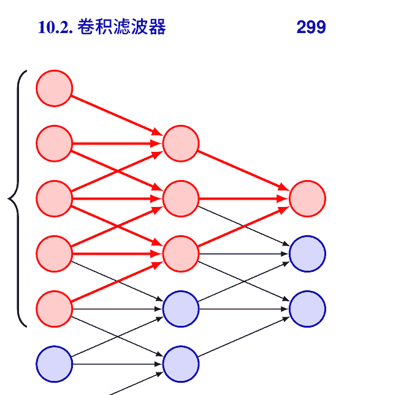

在网络的最后阶段，通常会插入池化操作，并且经常与传统的全连接层一起使用。在设计这样的架构时，有许多选择需要做出，包括层数、每层的通道数、滤波器大小、步幅宽度以及其他多个超参数。已经探索了各种不同的架构，尽管在实践中，使用留出数据进行超参数值的系统比较是困难的，因为训练每个候选配置的计算成本很高。

#### 10.2.8 示例网络架构

卷积网络是第一个成功应用于应用程序的深度神经网络（即具有超过两个可学习参数层的网络）。早期的一个例子是 LeNet，它被用来对低分辨率的黑白手写数字图像进行分类（LeCun等人，1989年；LeCun等人，1998年）。

更强大的卷积网络的发展得益于引入了一个名为 ImageNet 的大规模基准数据集（Deng等人，2009年），该数据集包含了大约1400万个自然图像，每个图像都经过手工标注，属于近22000个类别之一。这是一个比以前使用的数据集要大得多的数据集，ImageNet推动了该领域的进步，强调了大规模数据和具有适当归纳偏差的良好设计模型在构建成功的深度学习解决方案中的重要性。

再次，这是比以前考虑的几十个类别更多的类别数量。由于有这么多类别，这个问题变得更具挑战性，因为如果类别均匀分布，随机猜测的结果将不会比随机猜测更好。

# 10. 卷积网络

错误率为99.9%。数据集中有超过128万个训练图像，50,000个验证图像和100,000个测试图像。 分类器旨在对测试图像产生一个预测输出类别的排序列表，并以top-1和top-5错误率报告结果，这意味着如果真实类别出现在列表的顶部或者在前五个最高排名的类别预测中，则图像被认为被正确分类。 使用这个数据集的早期结果达到了大约25.5%的top-5错误率。 一个重要的进展是由AlexNet卷积网络架构（Krizhevsky，Sutskever和Hinton，2012）取得的，它赢得了2012年的比赛，并将top-5错误率降低到了一个新的记录15.3%。 这个模型的关键方面包括使用ReLU激活函数，应用9.6.1节的GPU来训练网络，以及使用dropout正则化。 随后的几年取得了进一步的进展，错误率降低到了约3%，这略优于人类在相同数据上的表现，人类的错误率约为5%（Dodge和Karam，2017）。 这可以归因于人类在区分微妙不同的类别（例如多个品种的蘑菇）方面的困难。

作为典型卷积网络架构的一个例子，我们详细研究了VGG-16模型（Simonyan和Zisserman，2014），其中VGG代表Visual Geometry Group，他们开发了该模型，16指的是模型中可学习层的数量。 VGG-16具有一些简单的设计原则，导致了一个相对统一的架构，如图10.10所示，这样可以最小化需要进行的超参数选择的数量。 它接受一个具有224 × 224像素和三个颜色通道的输入图像，然后是一系列的卷积层和下采样。 所有的卷积层都具有3 × 3的过滤器大小，步长为1，相同的填充，并且使用ReLU激活函数，而所有的最大池化操作都使用步长为2和过滤器大小为2 × 2，从而将单元的数量降低了4倍。 第一个可学习层是一个卷积层，每个单元从输入通道堆栈中的3 × 3 × 3的‘立方体’中接收输入，因此包括偏置在内共有28个参数。 这些参数在该通道的特征图中的所有单元之间共享。 第一层有64个这样的特征通道，产生一个大小为224 × 224 × 64的输出张量。 第二层也是卷积层，同样有64个通道。 然后是最大池化，得到大小为112 × 112的特征图。 第3层和第4层再次是卷积层，维度为112 × 112，每个层选择了128个通道。 通道数的增加在一定程度上抵消了最大池化层中的下采样，以确保每个层中表示的变量数量不会过快地减少。 再次，这之后是一个最大池化操作，得到大小为56 × 56的特征图。 接下来是另外三个具有256个通道的卷积层，再次将通道数翻倍，与下采样相结合。 然后是另一个最大池化，得到大小为28 × 28的特征图，然后是另外三个具有512个通道的卷积层，再次是最大池化，将其下采样到大小为14× 14的特征图。 然后是另外三个卷积层，尽管这些层中的特征图数量保持为512，然后是另一个最大池化，将特征图的大小降低到7 × 7。

最后还有三个完全连接的层，意味着它们是完全连接的标准神经网络层，具有完全连接和参数不共享。最后的最大池化层有512个通道，每个通道的大小为7×7，总共有25,088个单元。第一个完全连接层有4,096个单元，每个单元与每个最大池化单元相连。然后是第二个完全连接层，同样有4,096个单元，最后是第三个完全连接层，有1,000个单元，这样网络可以应用于涉及1,000个类别的分类问题。网络中的所有可学习层都具有非线性的ReLU激活函数，除了输出层，它具有softmax激活函数。总共有大约1.38亿个独立可学习参数在VGG-16中，其中大部分（近1.03亿个）在第一个完全连接层中，练习10.8 而大部分连接在第一个卷积层中。

早期的CNN通常具有较少的卷积层，因为它们具有更大的感受野。例如，Alexnet（Krizhevsky， Sutskever和Hinton， 2012）具有11×11的感受野，步长为4。我们在图10.9中看到，通过使用具有较小感受野的多个层，也可以隐式地实现更大的感受野。后一种方法的优点是它需要较少的参数，有效地对较大的滤波器施加了归纳偏差，因为它们必须由卷积子滤波器组成。尽管这是一个非常复杂的架构，但只需要显式编码网络函数本身，因为可以使用自动微分来评估成本函数的导数，并使用随机梯度下降来优化成本函数。

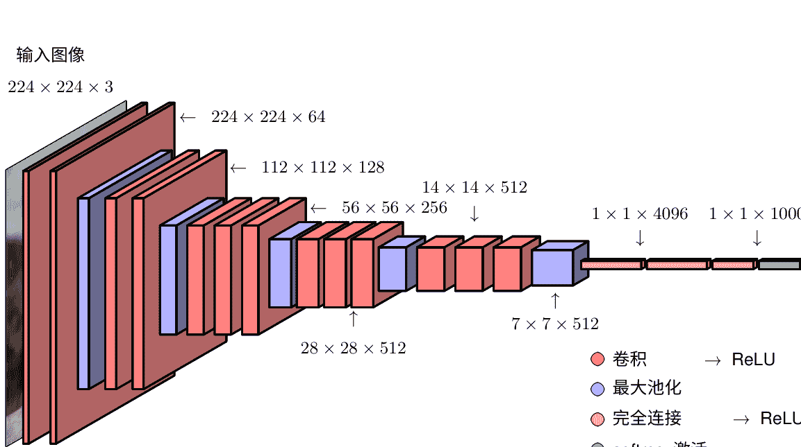

图10.10 典型卷积网络的架构，这种情况下是一个名为VGG-16的模型。

## 10.3. 可视化训练的CNN

现在我们转向对现代深度CNN学习到的特征的探索，我们将看到一些与哺乳动物视觉皮层的特性有着惊人的相似之处。

#### 10.3.1 视觉皮层

从历史上看，CNN的许多动机来自神经科学的开创性研究，这为哺乳动物，包括人类的视觉处理的本质提供了洞察。视网膜的电信号通过视觉皮层中的一系列处理层进行转换，视觉皮层位于大脑的后部，神经元组织成二维薄片，每个薄片形成二维视觉场的映射。在他们的开创性工作中，Hubel和Wiesel（1959）在猫的视觉皮层中测量了单个神经元对视觉刺激的电响应。他们发现一些被称为“简单细胞”的神经元对具有特定角度和特定位置的简单边缘的视觉输入有强烈的响应，而其他刺激在这些神经元中产生相对较小的响应。

更详细的研究表明，这些简单细胞的响应可以用Gabor滤波器来建模，这是由二维函数定义的

$$ G(x, y) = A \exp \left( -\alpha \widetilde{x}^{2} - \beta \widetilde{y}^{2} \right) \sin (\omega \widetilde{x} + \phi) \quad (10.6) $$

其中

$$ \widetilde{x} = (x - x_0) \cos(\theta) + (y - y_0) \sin(\theta) \quad (10.7) $$
$$ \widetilde{y} = -(x - x_0) \sin(\theta) + (y - y_0) \cos(\theta). \quad (10.8) $$

方程(10.7)和(10.8)表示坐标系通过角度 \( \theta \) 旋转，因此(10.6)中的 \( \sin(\cdot) \) 项表示一个由极角 \( \theta \) 定义方向的正弦空间振荡，具有频率 \( \omega \) 和相位角 \( \phi \)。(10.6)中的指数因子创建了一个衰减包络，将滤波器局部化在位置 \( (x_0, y_0) \) 附近，并具有由 \( \alpha \) 和 \( \beta \) 控制的衰减速率。图10.11显示了示例Gabor滤波器。Hubel和Wiesel还发现了‘复杂细胞’的存在，它们对更复杂的刺激做出反应，并且似乎是通过组合和处理简单细胞的输出得到的。这些响应对输入的小变化具有一定程度的不变性，例如位置的移动，类似于卷积深度网络中的池化单元。哺乳动物视觉处理系统的更深层次甚至具有更具体的响应，并对视觉输入的变换具有更大的不变性。这样的细胞被称为‘祖母细胞’，因为这样的细胞只有在视觉输入对应于一个人的祖母时才能做出反应，而与位置、尺度、光照或场景的其他变换无关。这项工作直接启发了一种早期形式的深度神经网络，称为neocognitron(Fukushima, 1980)，它是的先驱卷积神经网络。新认知机具有多层处理，包括具有共享权重的局部感受野，然后进行局部平均或最大池化以实现位置不变性。然而，由于它在反向传播的发展之前就存在，因此它缺乏一个端到端的训练过程，而是依靠无监督聚类算法进行贪婪的逐层学习。

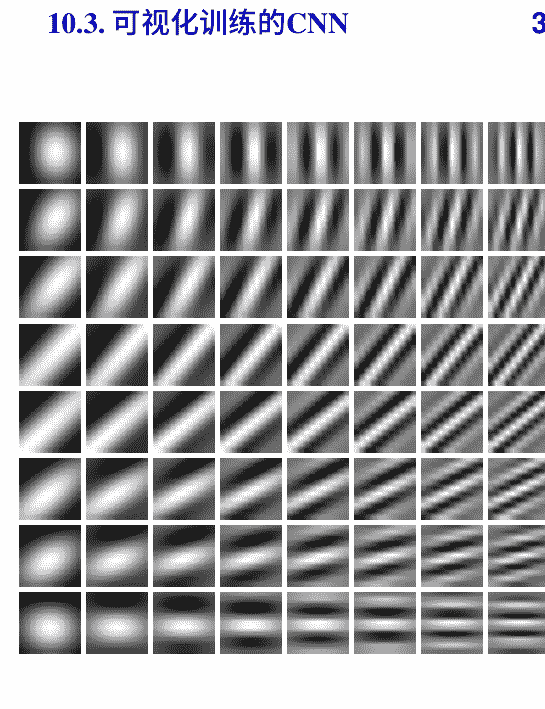

图10.11 Gabor滤波器的示例，由(10.6)定义。方向角θ从顶部行变化为0到底部行变化为π/2，而频率从左列变化为ω=1到右列变化为ω=10。

#### 10.3.2 可视化训练的滤波器

假设我们有一个经过训练的深度卷积神经网络，我们希望探索隐藏单元学习到了什么。对于第一个卷积层中的滤波器，这相对简单，因为它们对应于原始输入图像空间中的小块，因此我们可以直接将与这些滤波器相关联的网络权重可视化为小图像。第一个卷积层计算滤波器与相应图像块之间的内积，因此当内积具有较大的幅度时，该单元的激活将很大。

图10.12显示了在ImageNet数据集上训练的CNN的第一层中的一些示例滤波器。我们可以看到这些滤波器与图10.11中的Gabor滤波器之间有显著的相似性。然而，这并不意味着卷积神经网络是大脑工作的良好模型，因为可以从各种统计方法中获得非常相似的结果（Hyvärinen，Hurri和Hoyer，2009）。这是因为这些特征滤波器是自然图像统计特性的一般属性，因此对于自然和人工系统的图像理解都很有用。

虽然我们可以直接可视化网络中第一层的滤波器，但是网络中的后续层更难解释，因为它们的输入不是图像的补丁，而是一组滤波器响应。一种方法，类似于Hubel和Wiesel使用的方法，是向网络呈现大量图像补丁查看哪些输入能够产生特定隐藏单元中的最高激活值。图10.13显示了使用一个具有五个卷积层和两个全连接层的网络训练的130万个ImageNet数据点（涵盖1,000个类别）的示例。我们可以看到自然的分层结构，第一层响应边缘，第二层响应纹理和简单形状，第三层显示对象的组成部分（如车轮），第五层显示整个对象。

我们可以扩展这种技术，不仅仅从验证集中选择图像块，而是对输入变量进行数值优化，以最大化特定单元的激活（Zeiler和Fergus，2013; Simonyan，Vedaldi和Zisserman，2013; Yosinski等，2015）。如果我们选择的单元是输出之一，那么我们可以寻找一个最能代表相应类别标签的图像。由于输出单元通常具有softmax激活函数，最好最大化输入到softmax的预激活值，而不是直接最大化类别概率，这样可以确保优化仅依赖于一个类别。例如，如果我们寻找对类别“狗”产生最强响应的图像，那么如果我们优化softmax输出，由于softmax中的分母，它可能使图像变得更不像猫。

第17章 这种方法与对抗训练有关。然而，对输出单元激活进行无约束优化会导致像素值被推向无穷大，并且还会产生难以解释的高频结构，因此需要某种形式的正则化来找到更接近自然图像的解决方案。

Yosinski等人（2015）使用了一个正则化函数，其中包括像素值的平方和，以及一种交替梯度更新图像像素值的过程，其中包括模糊操作以去除高频结构，以及将只对类标签做出小贡献的像素值设为零的剪切操作。图10.14显示了示例结果。


图10.12 AlexNet第一层学习到的滤波器示例。注意，许多学习到的滤波器与图10.11中的Gabor滤波器非常相似，这些滤波器对应于哺乳动物视觉皮层中的神经元检测到的特征。

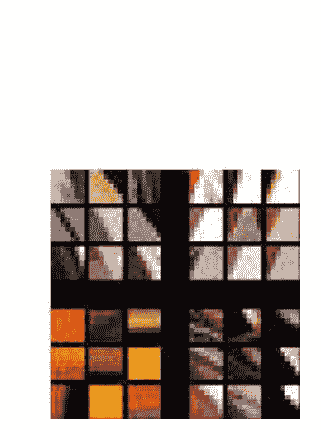


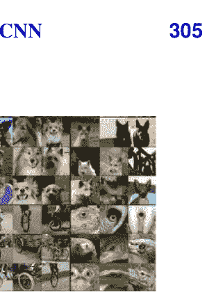

图10.13 这是在ImageNet数据上训练的具有五个卷积层的网络中，产生隐藏单元最强激活的图像块的示例（取自验证集）。每个特征图中的前九个激活被排列成一个3×3的网格，对应层中的四个随机选择的通道。我们可以看到，随着深度的增加，从第1层的简单边缘到第5层的完整对象，复杂性逐渐增加。【经Zeiler和Fergus（2013）许可使用。】

#### 10.3.3 显著性图

通过显著性图，可以另一种方式来了解卷积网络使用的特征，它旨在识别图像中对确定类别标签最重要的区域。这最好通过研究最终的卷积层来完成，因为它仍然保留了空间定位，而这在后续的全连接层中丢失了，并且它具有最高级别的语义表示。Grad-CAM（梯度类激活映射）方法（Selvaraju等，2016）首先计算给定输入图像的输出单元预激活 \( a^{(c)} \) 与给定类 \( c \) 之间的导数，在softmax之前，与最终卷积层中所有单元的预激活 \( a_{ij}^{(k)} \) 相对于通道 \( k \) 的预激活 \( a_{ij}^{(k)} \) 的导数的平均值。对于该层中的每个通道，计算这些导数的平均值。

$$ \alpha_k = \frac{1}{M_k} \sum_i \sum_j \frac{\partial a^{(c)}}{\partial a_{ij}^{(k)}} $$

其中 \( i \) 和 \( j \) 索引通道 \( k \) 的行和列，\( M_k \) 是该通道中单元的总数。然后使用这些平均值形成加权和，形式如下：

$$ \mathbf{L} = \sum_k \alpha_k \mathbf{A}^{(k)} $$

其中 \( \mathbf{A}^{(k)} \) 是一个具有元素 \( a_{ij}^{(k)} \) 的矩阵。生成的数组与最终的卷积层具有相同的维度，例如在图10.10中显示的VGG网络为14×14，可以以“热图”的形式叠加在原始图像上，如图10.15所示。

#### 10.3.4 对抗性攻击

对于输入图像像素值的变化，梯度也可以用来创建对卷积网络的对抗攻击（Szegedy等人，2013年）。这些攻击涉及对图像进行非常小的修改，对人类来说几乎察觉不到，但却导致神经网络对图像进行错误分类。创建对抗性图像的一种简单方法称为快速梯度符号方法（Goodfellow，Shlens和Szegedy，2014年）。这涉及到改变图像中每个像素值 \( x \) 的固定量 \( \varepsilon \)，其符号由误差函数 \( E(x, t) \) 相对于像素值的梯度决定。这给出了一个由修改后的图像定义的结果

$$ x' = x + \varepsilon \, \text{sign}(\nabla_x E(x, t))。 \quad (10.11) $$

这里 \( t \) 是真实标签 \( x \) 的，而误差 \( E(x, t) \) 例如可以是 \( x \) 的负对数似然。所需的梯度可以使用第8章反向传播高效计算。在神经网络的传统训练过程中，网络参数被调整以最小化这个误差，而由(10.11)定义的修改会改变图像（同时保持训练好的网络参数不变），以便为了增加误差。通过保持 \( \epsilon \) 小，我们确保对图像的更改对人眼不可察觉。令人惊讶的是，这可以产生被网络高度自信地错误分类的图像，如图10.16中的示例所示。以这种方式欺骗神经网络的能力引发了潜在的安全问题，因为它为攻击经过训练的分类器创造了机会。这可能看起来是由过拟合引起的，即高容量模型已经精确地适应了特定图像，以至于输入的微小变化会导致预测类别概率的大幅变化。然而，事实证明，一个已经适应于为特定训练网络提供虚假输出的图像，在输入到其他网络时也会产生类似虚假的输出（Goodfellow, Shlens和Szegedy, 2014年）。此外，使用更不灵活的线性模型也可以获得类似的对抗结果。甚至可以创建物理工件，以至于将工件的常规、未损坏的图像呈现给经过训练的神经网络时会产生错误的预测，如图10.17所示。尽管这些基本的对抗性攻击可以通过对网络训练过程进行简单修改来解决，但更复杂的方法更难以击败。理解这些结果的含义并减轻它们的潜在风险仍然是研究的开放领域。

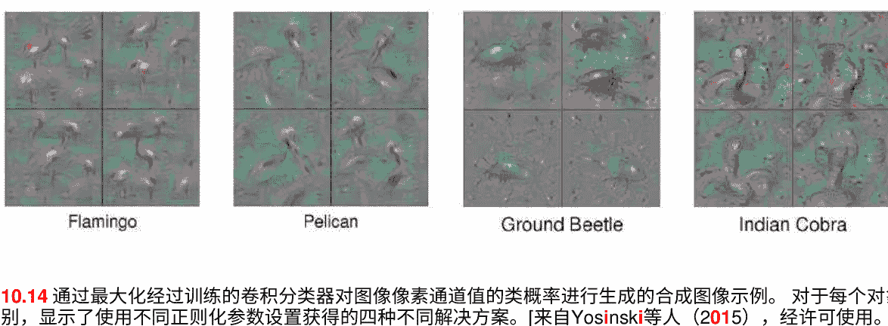

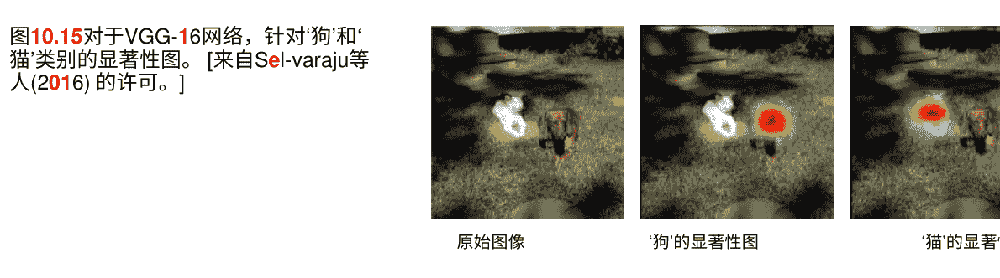

图10.16 针对经过训练的卷积网络的一个对抗攻击示例。 左边的图像被分类为熊猫，置信度为57. 7%。 添加一个小的随机外观的扰动（本身被分类为线虫，置信度为8.2%）会导致右边的图像被分类为长臂猿，置信度为99.3%。 [来自Goodfellow、Shlens和Szegedy (2014) 的许可。]

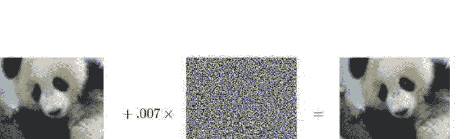

图10.17 两个被修改的物理停止标志的示例。这些物体的图像通过CNN被稳健地分类为45英里/小时的限速标志。[来自Eykholt等人(2018)的许可]。

#### 10.3.5 合成图像

作为对训练卷积网络操作提供额外见解的最后一个图像修改示例，我们考虑一种称为DeepDream的技术(Mordvintsev，Olah和Tyka，2015)。目标是生成具有夸张特征的合成图像。我们通过确定网络中特定隐藏层中对特定图像有强烈响应的节点，然后修改图像以放大这些响应来实现这一目标。例如，如果我们向一个在物体识别上训练过的网络呈现一张云朵的图像，并且一个特定节点在图像的特定区域检测到类似猫的模式，那么我们会修改图像使其在该区域更像‘猫’。为了实现这一点，我们将图像应用于网络的输入，并向前传播到某个特定层。然后，我们将该层的反向传播δ变量设置为节点的预激活，并运行反向传播到输入层，以获得图像像素上的梯度向量。最后，我们通过在梯度向量的方向上迈出一小步来修改图像。这个过程可以看作是一种基于梯度的增加函数的Exercise 10.10方法。

$$ F(\mathbf{I}) = \sum_{i,j,k} a_{ijk}(\mathbf{I})^2 \quad (10.12) $$

其中， \( a_{ijk}(\mathbf{I}) \) 是所选层中行 \( i \) 和列 \( j \) 的单元的预激活，通道 \( k \) 的总和是在所有单元和所有通道上进行的，当输入图像为 \( \mathbf{I} \) 时。为了生成外观平滑的图像，会应用一些正则化方法，如空间平滑和像素剪裁。如果需要更强的增强效果，可以多次重复此过程。图10.18展示了生成图像的示例。有趣的是，尽管卷积网络是训练用于区分对象类别的，但它们似乎能够捕捉到生成这些类别图像所需的一些信息。

这种技术可以应用于照片，或者我们可以从随机噪声的输入开始，从训练好的网络中生成完全由网络生成的图像。尽管DeepDream为训练好的网络的操作提供了一些见解，但它主要被用于生成有趣的外观图像，作为一种艺术形式。

## 10.4. 目标检测

我们主要通过图像分类问题来激发卷积神经网络（CNN）的设计，其中整个图像被分配给一个类别，例如“猫”或“自行车”。对于像ImageNet这样的数据集来说，这是合理的，因为每个图像都被设计为由一个主要对象主导。然而，还有许多其他应用程序可以利用内置的归纳偏差来使用CNN。更一般地说，针对特定任务在大型图像数据库上训练的CNN的卷积层可以学习具有广泛适用性的内部表示，因此## 10.4.1 边界框

卷积神经网络可以针对各种特定任务进行微调。我们已经看到了一个在ImageNet数据上训练的卷积网络的例子，通过迁移学习能够在皮肤病变分类上达到人类水平的性能。

许多图像中有多个属于一个或多个类别的对象，我们可能希望检测每个对象的存在和类别。此外，在计算机视觉的许多应用中，我们还需要确定检测到的任何对象在图像中的位置。例如，使用RGB相机的自动驾驶车辆可能需要检测行人的存在和位置，并识别道路标志、其他车辆等。

考虑在图像中指定对象的位置的问题。一个广泛使用的方法是定义一个边界框，它由一个紧密贴合对象边界的矩形组成，如图10.19所示。边界框可以通过其中心的坐标以及宽度和高度的向量形式来定义，即b = (b_x, b_y, b_W, b_H)。这里，b的元素可以用像素或连续数来指定，按照惯例，图像的左上角给出坐标(0, 0)，右下角给出坐标(1, 1)。

## 10.4.2 交并比

当假设图像中只包含一个预定义集合 C类别的对象时，CNN通常会有 C个输出单元，其激活函数由softmax函数定义。通过使用额外的四个输出来定位对象，这四个输出使用线性激活函数进行训练，用于预测边界框的坐标 (b_x, b_y, b_W, b_H)。由于这些量是连续的，对应输出的平方和误差函数可能是合适的。

这是用于示例的，由Redmon et al. (2015)首先将图像分成一个7 × 7的网格。对于每个网格单元，他们使用卷积网络输出与该网格单元相关的任何对象的类别和边界框坐标，基于从整个图像中提取的特征。

我们需要一种有意义的方式来衡量训练网络的性能，该网络可以预测边界框。在图像分类中，网络的输出是类别标签的概率分布，我们可以通过查看测试集上真实类别标签的对数似然来衡量性能。然而，在对象定位中，我们需要一种衡量边界框准确性的方式，相对于某个基准真值，后者可以通过人工标注获得，例如。预测框与目标框重叠的程度可以作为这种衡量的基础，但重叠区域的面积将取决于图像中对象的大小。此外，预测的边界框应该受到对地面真值边界框之外区域的惩罚。解决这两个问题的更好的度量标准称为交并比，或者IoU，简单地说，它是两个边界框交集的面积比率。

图10.20 说明了用于量化边界框预测准确性的交并比度量。如果蓝色矩形表示预测的边界框，红色矩形表示真实值边界框，则交并比定义为左侧绿色区域表示的两个框的交集面积除以右侧绿色区域表示的两个框的并集面积。

交集面积

并集面积

如图10.20所示，交并比度量的取值范围为0到1。如果交并比度量超过阈值（通常设为0.5），则预测结果可以被标记为正确。需要注意的是，交并比通常不直接用作训练的损失函数，因为通过梯度下降优化交并比很困难，因此训练通常使用居中对象，并且交并比分数主要用作评估指标。

## 10.4.3 滑动窗口

目标检测和目标定位的一种方法是首先创建一个训练集，该训练集由紧密裁剪的目标示例以及不包含任何目标的图像部分的类似裁剪的示例（“背景”类）组成。该数据集用于训练一个分类器，例如深度卷积神经网络（CNN），其输出表示输入窗口中每个特定类别存在目标的概率。然后，使用训练好的模型在新图像中检测对象，通过在图像上“扫描”输入窗口，并对每个位置将结果子图像作为分类器的输入。这被称为滑动窗口。

当以高概率检测到对象时，相关的窗口位置确定了相应的边界框。这种方法的一个明显缺点是由于图像中潜在窗口位置的数量庞大，计算成本可能非常高。此外，该过程可能需要使用不同尺度的窗口重复进行，以适应图像中不同大小的对象。可以通过大于一个像素的步幅在图像上水平和垂直移动输入窗口来节省成本。

然而，使用较小的步幅可以提高位置的精确度，而使用较大的步幅可以降低计算成本，这是一个权衡。滑动窗口方法的计算成本对于简单的分类器可能是合理的，但对于可能包含数百万参数的深度神经网络来说，一个朴素实现的成本是不可行的。

幸运的是，神经网络的卷积结构可以大大提高效率（Sermanet等人，2013年）。我们注意到，在这样的网络中，卷积层本身涉及到在输入图像上滑动一个具有共享权重的特征检测器。因此，当使用滑动窗口在卷积网络中进行多次前向传递时，计算中存在大量冗余，因为滑动窗口的计算结构与卷积的计算结构相似，因此在卷积网络中高效地实现滑动窗口是非常简单的。考虑图10.22中简化的卷积网络，它由一个卷积层、一个最大池化层和一个全连接层组成。为了简单起见，我们只显示了每层中的一个通道，但是扩展到多个通道是很简单的。网络的输入图像大小为 6 × 6，卷积层中的滤波器大小为 3 × 3，步长为 1，最大池化层的非重叠感受野大小为 2 × 2，步长为 1。然后是一个具有单个输出单元的全连接层。注意，我们也可以将这个最后一层视为具有 2 × 2的滤波器大小的另一个卷积层，因此只有一个位置的滤波器和一个输出。

现在假设这个网络是在对象的居中图像上进行训练的，然后应用于一个更大的尺寸为 8 × 8的图像，如图10.23所示，我们只是通过增加卷积和最大池化层的大小来扩大网络。卷积层现在的大小为 6 × 6，池化层的大小为 3×3. 现在有四个输出单元，每个单元都有自己的softmax函数。该单元的权重在这四个单元之间共享。我们可以看到，处理与输入图像左上角窗口位置对应的输入所需的计算与处理训练中使用的原始6×6输入所需的计算相同。对于其余的窗口位置，只需要进行少量的额外计算，如蓝色方块所示，相比于对完整的Exercise 10.12卷积网络进行简单重复应用，这大大提高了效率。请注意，全连接层本身现在具有卷积结构。

## 10.4.4 多尺度检测

除了在图像中寻找不同位置的对象，我们还需要在不同的尺度和不同的长宽比下寻找对象。例如，围绕猫的紧密边界框在猫站立时与猫躺下时具有不同的长宽比。不需要使用具有不同大小和形状的输入窗口的多个检测器，而是可以使用一个固定的输入窗口，并制作多个输入图像的副本，每个副本具有不同的水平和垂直缩放因子，这样做更简单但等效。然后，输入窗口在每个图像副本上进行扫描以检测对象，并使用相关的缩放因子将边界框坐标转换回原始图像空间，如图10.24所示。

## 10.4.5 非极大值抑制

通过在图像上扫描经过训练的卷积网络，可以检测到图像中同一类对象的多个实例，以及来自其他类别的对象的实例。然而，这也倾向于在相似位置产生同一对象的多个检测，如图10.25所示。可以使用非极大值抑制来解决这个问题，对于每个对象类别，它的工作原理如下。首先，它在整个图像上运行滑动窗口，并评估每个位置上存在该类对象的概率。然后，它消除所有概率低于某个阈值（例如0.7）的相关边界框，得到类似图10.25的结果。具有最高概率的框被视为成功检测，并记录相应的边界框作为预测。接下来，任何与成功检测框的IoU超过某个阈值（例如0.5）的其他框都被丢弃。这旨在消除同一对象的多个附近检测。然后，在剩下的框中，具有最高概率的框被声明为另一个成功检测，并重复消除步骤。该过程继续，直到所有边界框要么被丢弃，要么被声明为成功检测。

## 10.4.6 快速区域CNN

加速目标检测和定位的另一种方法是注意到扫描窗口方法将深度卷积网络的全部能力应用于图像的所有区域，即使某些区域可能不太可能包含目标。相反，我们可以应用一些计算成本较低的技术，例如分割算法，来识别图像中可能存在目标的部分，然后仅对这些区域应用完整的网络，从而导致诸如使用CNN的快速区域提议或快速R-CNN等技术。

(Girshick, 2015). 还可以使用区域建议卷积网络来识别最有希望的区域，从而实现更快的 R-CNN (Ren et al., 2015)，允许对区域建议网络和检测与定位网络进行端到端的训练。

滑动窗口方法的一个缺点是，如果我们想要非常精确地定位物体，那么我们需要考虑大量细分的窗口位置，这会导致计算成本增加。一种更高效的方法是将滑动窗口与我们在本节开头讨论的直接边界框预测相结合 (Sermanet et al., 2013)。在这种情况下，连续的输出预测边界框相对于窗口位置的位置，因此对预测位置进行了一些微调。

### 10.5 图像分割

在图像分类问题中，整个图像被分配给一个单一的类别标签。我们已经看到，如果检测到多个对象并使用边界框记录它们的位置，将提供更详细的信息。通过语义分割可以获得更详细的分析，其中图像的每个像素被分配给预定义的一组类别之一。这意味着输出空间的维度与输入图像相同，并且因此可以方便地表示为具有相同像素数量的图像。尽管输入图像通常具有R、G和B三个通道，但如果存在C个类别，则输出数组将具有C个通道，表示每个类别的概率。如果我们将每个类别与不同（任意选择的）颜色相关联，那么分割网络的预测可以表示为一幅图像，其中每个像素根据具有最高概率的类别进行着色，如图10.26所示。

#### 10.5.1 卷积分割

一种处理语义分割问题的简单方法是构建一个卷积网络，该网络以图像的矩形部分作为输入，以像素为中心的卷积网络具有单个softmax输出，用于对该像素进行分类。通过依次将这样的网络应用于每个像素，可以对整个图像进行分割（这将需要根据输入窗口的大小在图像周围进行边缘填充）。然而，由于重叠补丁引起的冗余计算，这种方法非常低效。正如我们所见，我们可以通过将不同输入位置的前向传播计算组合到一个单一网络中来消除这种低效性，这导致最终完全连接层也是卷积层的模型。因此，我们可以创建一个CNN，其中每个层的维度与输入图像相同，通过在每个层上具有步幅1、相同填充和无池化来实现。每个输出单元都有一个softmax激活函数，其权重在所有输出之间共享。尽管这可能有效，但这样的网络仍然需要许多层，每层中有多个通道，以学习实现高准确性所需的复杂内部表示，总体而言，这对于具有合理分辨率的图像来说成本过高。

#### 10.5.2 上采样

正如我们已经看到的，大多数卷积网络使用多个级别的下采样，以便随着通道数量的增加，特征图的大小减小，保持网络的整体大小和成本可控，同时允许网络从图像中提取语义上有意义的高阶特征。我们可以利用这个概念来创建一个更高效的语义分割架构，通过采用标准的深度卷积网络并添加额外的可学习层，将低维度的内部表示转换回原始图像分辨率（Long、Shelhamer和Darrell，2014；Noh、Hong和Han，2015；Badrinarayanan、Kendall和Cipolla，2015），如图10.27所示。

为了做到这一点，我们需要一种方法来逆转步幅卷积和池化操作的下采样效果。首先考虑池化的上采样类比，其中输出层的单元数比输入层多，例如每个输入单元对应一个 2 × 2的输出单元块。 问题是输出值应该使用什么。为了找到平均池化的上采样类比，我们可以简单地将每个输入值复制到所有相应的输出单元中，如图10.28(a)所示。我们可以看到，将平均池化应用于此操作的输出可以重新生成输入。

对于最大池化，我们可以考虑图10.28(b)中所示的操作，其中每个输入值被复制到相应输出块的第一个单元中，而每个块中的其余值被设置为零。 同样，我们可以看到将最大池化操作应用于输出层可以重新生成输入层。这有时被称为最大上采样。 将非零值分配给输出块的第一个元素似乎是任意的，因此可以使用一种修改后的方法，该方法还保留了来自下采样层的更多空间信息（Badrinarayanan，Kendall和Cipolla，2015）。 这是通过选择一个网络架构来实现的，在该架构中，每个最大池化下采样层都有一个相应的网络中的上采样层。然后在下采样过程中，记录每个块中具有最大值的元素，并在相应的上采样层中选择非零元素具有相同的位置，如图10.29中的2×2最大池化所示。

#### 10.5.3 全卷积网络

上述考虑的上采样方法是固定函数，类似于平均池化和最大池化的下采样操作。我们还可以使用类似于步幅卷积用于下采样的学习上采样。在步幅卷积中，输出图上的每个单元通过共享的可学习权重与输入图上的一个区域相连，当我们在输出数组中移动一步时，滤波器在输入数组上移动两步或更多步，因此输出数组的维度较低。对于上采样，我们使用一个连接输入数组中的一个像素与输出数组中的一个区域的滤波器，然后选择架构，使得当我们在输入数组上移动一步时，我们在输出数组上移动两步或更多步(Dumoulin和Visin，2016)。这在3×3滤波器和输出步幅为2的情况下进行了说明，如图10.30所示。请注意，有些输出单元存在多个滤波器位置重叠的情况，相应的输出值可以通过求和或平均来计算来自各个滤波器位置的贡献。

这种上采样被称为转置卷积因为，如果将下采样卷积表示为矩阵形式，则相应的上采样由练习10.13转置矩阵给出。它也被称为‘分数步幅卷积’，因为标准卷积的步幅是输出层中的步长与输入层中的步长的比率。例如，在图10.30中，这个比率是1/2。注意有时也称为‘反卷积’，但最好避免使用这个术语，因为在数学中，反卷积广泛用于表示函数分析中卷积操作的逆操作，这是一个不同的概念。如果我们的网络架构没有池化层，因此下采样和上采样纯粹使用卷积进行，那么该架构被称为全卷积网络（Long，Shelhamer和Darrell，2014）。它可以接收任意大小的图像，并输出相同大小的分割地图。

#### 10.5.4 U-net架构

我们已经看到，步幅卷积和池化的下采样使得通道数可以增加，而网络的大小不会变得过大。这也会导致空间分辨率的降低，从而丢失信号在网络中的位置信息。虽然这对于图像分类来说是可以的，但是对于语义分割来说，空间信息的丢失是一个问题，因为我们想要对每个像素进行分类。解决这个问题的一种方法是 U-net架构 (Ronneberger，Fischer和Brox，2015)，如图10.31所示，该名称来自于图表的U形状。

核心概念是每个下采样层都有一个对应的上采样层，并且每个下采样层的最终通道激活与对应的上采样层的第一个通道集合连接起来，从而使这些层能够访问更高分辨率的空间信息。请注意在U-net的最后一层中，可以使用1×1卷积将通道数减少到类别数，然后再使用softmax激活函数。

### 10.6 风格迁移

正如我们所见，深度卷积网络中的早期层学习检测简单的边缘和纹理，而后期层学习检测更复杂的对象。我们可以利用这个特性，使用一种称为神经风格迁移的过程，将图像重新渲染成不同图像的风格(Gatys, Ecker, and Bethge, 2015)。这在图10.32中有所说明。

我们的目标是生成一个合成图像 G，其‘内容’由一张图像 C定义，‘风格’则来自另一张图像 S。这通过定义一个误差函数 E(G)来实现，该函数由两个项的和组成，其中一个鼓励 G具有与 C相似的内容，而另一个鼓励 G具有与 S相似的风格：

```
E(G) = E内容(G, C) + E风格(G, S)。
(10.13)
```

内容和风格的概念是通过这两个项的函数形式隐式定义的。 然后，我们可以通过从随机初始化的图像开始，并使用梯度下降来最小化 E(G)来找到G。

为了定义 E内容(G, C)，我们可以选择网络中的特定卷积层，并测量当图像 G作为输入时该层单元的激活以及当图像 C作为输入时该层单元的激活。然后我们可以鼓励通过使用形式为平方和误差函数的方式，使得相应的预激活值相似

$$E_{\text{内容}}(\mathbf{G}, \mathbf{C}) = \sum_{i,j,k} \{a_{ijk}(\mathbf{G}) - a_{ijk}(\mathbf{C})\}^2 \qquad (10.14)$$

其中 $a_{ijk}(\mathbf{G})$ 表示输入图像为 $\mathbf{G}$ 时，该层中位置为 $(i, j)$ 通道为 $k$ 的单元的预激活值，$a_{ijk}(\mathbf{C})$ 同理。选择在定义预激活值时使用哪个层将会影响最终结果，较早的层旨在匹配低级特征，如边缘，而较后的层则匹配更复杂的结构甚至整个对象。

在定义 $E_{\text{风格}}(\mathbf{G}, \mathbf{C})$ 时，直觉是风格由卷积层中不同通道之间特征的共现决定。例如，如果风格图像 $\mathbf{S}$ 通常将垂直边缘与橙色斑块相关联，则我们希望生成的图像 $\mathbf{G}$ 也具有相同的特性。然而，尽管 $E_{\text{内容}}(\mathbf{G}, \mathbf{C})$ 试图匹配 $\mathbf{G}$ 中与 $\mathbf{C}$ 中相应特征在相同位置的特征，但对于风格误差 $E_{\text{风格}}(\mathbf{G}, \mathbf{S})$，我们希望 $\mathbf{G}$ 具有与 $\mathbf{S}$ 相似的特性，但可以来自任何位置，因此我们对特征图中的位置取平均值。再次考虑一个特定的卷积层。我们可以通过形成交叉相关矩阵来衡量通道 $k$ 中的特征与输入图像 $\mathbf{G}$ 中通道 $k'$ 中的相应特征的共现程度

$$F_{kk'}(\mathbf{G}) = \sum_{i=1}^{I} \sum_{j=1}^{J} a_{ijk}(\mathbf{G}) a_{ijk'}(\mathbf{G}) \qquad (10.15)$$

其中 $I$ 和 $J$ 是这个特定卷积层中特征图的维度，如果两个特征都被激活，则乘积 $a_{ijk} a_{ijk'}$ 会很大。如果这一层中有 $K$ 个通道，则 $F_{kk'}$ 形成一个 $K \times K$ 的矩阵，称为风格矩阵。我们可以通过比较它们的风格矩阵来衡量两个图像 $\mathbf{G}$ 和 $\mathbf{S}$ 的风格相似程度。

$$E_{\text{style}}(\mathbf{G}, \mathbf{S}) = \frac{1}{(2IJK)^2} \sum_{k=1}^{K} \sum_{k'=1}^{K} \{F_{kk'}(\mathbf{G}) - F_{kk'}(\mathbf{S})\}^2. \qquad (10.16)$$

虽然我们可以再次使用单个层，但通过使用多个层的贡献，可以获得更令人满意的结果。

$$E_{\text{style}}(\mathbf{G}, \mathbf{S}) = \sum_{l} \lambda_{l} E_{\text{风格}}^{(l)}(\mathbf{G}, \mathbf{S}) \qquad (10.17)$$

其中 $l$ 表示卷积层。系数 $\lambda_{l}$ 确定不同层之间的相对权重，也确定与内容误差项的权重相对关系。这些权重系数是通过主观判断经验调整的。

## 10. 卷积网络

### 练习

10.1 (⋆)考虑一个固定的权重向量 $w$，并证明在约束条件 $\| x\|^2$ 恒定的情况下，使标量积 $w^T x$ 最大化的输入向量 $x$ 由附录 C 给出，即 $x = \alpha w$，其中 $\alpha$ 是某个标量。可以使用拉格朗日乘数最简单地完成这个任务。

10.2 (⋆⋆)考虑一个具有一维输入数组和一维特征图的卷积网络层，如图 10.2 所示，其中输入数组的维度为 5，滤波器的宽度为 3，步幅为 1。证明这可以被表示为全连接层的特殊情况，通过写出权重矩阵，其中缺失的连接被零替换，共享参数通过使用复制的条目来表示。忽略任何偏置参数。

10.3 (⋆)明确计算以下卷积的输出，其中输入矩阵为 $4 \times 4$，滤波器为 $2 \times 2$:

| 2  | 5  | -3 | 0  |
|----|----|----|----|
| 0  | 6  | 0  | -4 |
| -1 | -3 | 0  | 2  |
| 5  | 0  | 0  | 3  |

\*

| -2 | 0 |
|----|---|
| 4  | 6 |

\=

| ? | ? | ? |
|---|---|---|
| ? | ? | ? |
| ? | ? | ? |

(10.18)

10.4 (⋆⋆)如果图像 $I$ 有 $J \times K$ 个像素，滤波器 $K$ 有 $L \times M$ 个元素，在 (10.2) 中写出两个求和的限制。在数学文献中， (10.2) 的操作被称为交叉相关，而卷积则被定义为

$$ C(j, k) = \sum_{l} \sum_{m} I(j - l, k - m)K(l, m) 	ag{10.19} $$

写出 (10.19) 中求和的限制。证明 (10.19) 可以用等效的「翻转」形式表示

$$ C(j, k) = \sum_{l} \sum_{m} I(j + l, k + m)K(l, m) 	ag{10.20} $$

再次写出求和的限制。

10.5 (⋆)在数学中，连续变量的卷积 $x$ 的定义为

$$ F(x) = \int_{-\infty}^{\infty} G(y)k(x - y) \mathrm{d}y 	ag{10.21} $$

其中 $k(x - y)$ 是核函数。通过考虑对积分的离散近似，解释卷积层与CNN中定义的关系 (10.19) 。

10.6 (⋆)考虑一个大小为 $J \times K$ 的图像，在所有边上填充额外的 $P$ 像素，然后使用大小为 $M \times M$ 的核进行卷积，其中 $M$ 是一个奇数。证明如果我们选择 $P=(M-1)/2$，则得到的特征图将具有大小 $J \times K$，因此与原始图像的大小相同。

10.7 (⋆)证明如果一个大小为 $M \times M$ 的核与一个大小为 $J \times K$ 的图像进行卷积，填充深度为 $P$，步长为 $S$，则得到的特征图的维度由（10.5）给出。

10.8 (⋆⋆)对于VGG-16 CNN中的每个16层（如图10.10所示），评估(i) 权重的数量（包括偏差）和(ii) 可独立学习的参数数量。确认网络中可学习参数的总数约为1.38亿。

10.9 (⋆⋆)考虑形式为(10.2)的卷积，假设核是可分离的，即
$$K(l, m) = F(l)G(m) \quad (10.22)$$
对于一些函数 $F(\cdot)$ 和 $G(\cdot)$。证明，与执行单个二维卷积相比，现在可以使用两个一维卷积来计算相同的答案，从而显著提高效率。

10.10 (⋆)DeepDream更新过程涉及将反向传播的 $\delta$ 变量设置为所选层中节点的预激活，然后运行反向传播到输入层以获得关于图像像素的梯度向量。证明这可以被推导为相对于应用于函数（10.12）的图像像素的梯度优化。

10.11 (⋆⋆)当设计一个神经网络来检测图像中的 $C$ 个不同类别的对象时，我们可以使用一个 $1\text{-of-}(C+1)$ 的类标签，每个对象类别使用一个变量，另外还有一个表示“背景”类别的变量，即不包含任何定义的类别对象的输入图像区域。网络将输出一个长度为 $(C+1)$ 的概率向量。或者，我们可以使用一个二进制变量来表示对象的存在或不存在，然后使用一个单独的 $1\text{-of-}C$ 向量来表示具体的对象类别。在这种情况下，网络输出一个表示对象存在的概率和一个关于类别标签的单独的概率集合。写下这两组概率之间的关系。

10.12 (⋆⋆)计算通过图10.22所示的卷积网络进行一次前向传递所需的计算步骤数量，忽略偏差并忽略激活函数的评估。同样，计算通过图10.23所示的扩展网络进行一次前向传递的总计算步骤数。最后，评估图10.22中的网络的九次重复应用与图10.23中的网络的单次应用之间的比率。该比率表示使用滑动窗口技术的卷积实现的效率提高。

10.13 (**) 在这个练习中，我们使用一维向量来演示为什么卷积上采样有时被称为转置卷积。考虑一个具有四个单元的一维步幅卷积层，其输入具有激活值 $(x_1, x_2, x_3, x_4)$，通过在两端填充零来得到 $(0, x_1, x_2, x_3, x_4, 0)$，并且具有参数 $(w_1, w_2, w_3)$ 的滤波器。写出假设步幅为 2 的输出层的一维激活向量。用矩阵 $\mathbf{A}$ 乘以向量 $(0, x_1, x_2, x_3, x_4, 0)$ 来表示这个输出。现在考虑一个上采样卷积，其中输入层具有激活值 $(z_1, z_2)$，滤波器具有值 $(w_1, w_2, w_3)$，并且输出步幅为 2。写出六维输出向量，假设重叠的滤波器值被求和，并且激活函数只是恒等函数。证明这可以用转置矩阵 $\mathbf{A}^T$ 的矩阵乘法来表示。

## 11 结构化分布

我们已经看到，概率是深度学习中最重要的基础概念之一。例如，用于二元分类的神经网络可以通过条件概率分布来描述，形式如下

$$ p(t|\mathbf{x}, \mathbf{w}) = y(\mathbf{x}, \mathbf{w})^t \{1 - y(\mathbf{x}, \mathbf{w})\}^{(1-t)} \quad (11.1) $$

其中 $y(\mathbf{x}, \mathbf{w})$ 表示一个以向量 $\mathbf{x}$ 为输入的神经网络函数，并由可学习参数向量 $\mathbf{w}$ 控制。相应的交叉熵似然函数构成了训练神经网络所使用的误差函数的基础。尽管网络函数可能非常复杂，但是在(11.1)中的条件分布具有简单的形式。然而，还有许多重要的深度学习模型具有更丰富的概率结构，例如大型语言模型、归一化流、变分自编码器、扩散模型等等。为了描述和利用这种结构，我们引入了一个强大的一个被称为概率图模型或简称图模型的框架，可以用图形形式表示结构化概率分布。当与神经网络结合使用以定义相关的概率分布时，图形模型在创建复杂模型时提供了巨大的灵活性，可以使用随机梯度下降进行端到端的训练，其中梯度可以通过自动微分进行高效评估。在本章中，我们将重点介绍图形模型的核心概念，这些概念在深度学习应用中非常重要，而有关机器学习的图形模型的更全面的介绍可以在Bishop（2006）中找到。

### ## 11.1. 图形模型

概率论可以用两个简单的方程来表示，即所谓的第2.7节求和规则和乘法规则。本书中讨论的所有概率操作，无论多么复杂，都可以归结为这两个方程的重复应用。原则上，我们可以通过代数运算来构建和使用的复杂的概率模型。然而，我们将发现使用图形表示的概率分布分析更有优势，因为它们具有几个有用的特性：

1.  它们提供了一种简单的方式来可视化概率模型的结构，并可以用于设计和推动新模型的产生。
2.  通过检查图形，可以获得有关模型属性的洞察，包括条件独立性属性。
3.  在复杂模型中执行推理和学习所需的复杂计算可以用图形操作来表示，例如消息传递，在其中底层的数学运算被隐式地执行。

尽管这样的图形模型具有类似神经网络图的节点和边，但它们的解释是特定的概率性的，并且具有更丰富的语义。为了避免混淆，在本书中，我们用蓝色表示神经网络图，用红色表示概率图模型。

### ### 11.1.1 有向图

图由节点（也称为顶点）和连接的链接（也称为边）组成。在概率图模型中，每个节点表示一个随机变量，而链接表示这些变量之间的概率关系。然后，图捕捉了所有随机变量的联合分布如何分解为仅依赖于子集变量的因子的乘积的方式。在本章中，我们将重点讨论图形模型中的链接具有由箭头指示的特定方向的情况。这些被称为有向图形模型，也被称为贝叶斯网络或贝叶斯网。

另一类重要的图模型是马尔可夫随机场，也被称为无向图模型，在这种模型中，链接不带箭头，也没有方向上的意义。有向图用于表示随机变量之间的因果关系，而无向图更适合表示随机变量之间的软约束关系。有向图和无向图都可以看作是一种称为因子图的表示的特殊情况。从现在开始，我们将重点关注有向图模型。然而，请注意，在没有概率解释的情况下，无向图也会在我们对图神经网络的讨论中出现，其中节点表示确定性变量。

### ### 11.1.2 分解

为了激发使用有向图描述概率分布的动机，首先考虑一个关于三个变量 $a$，$b$ 和 $c$ 的任意联合分布 $p(a, b, c)$。事实上，图模型的一个强大之处在于，一个特定的图可以对一类广泛的分布进行概率陈述。通过应用概率的乘法规则(2.9)，我们可以将联合分布写成以下形式

$$ p(a, b, c) = p(c|a, b)p(a, b). \tag{11.2} $$

对(11.2)右侧的第二项应用乘法规则，得到

$$ p(a, b, c) = p(c|a, b)p(b|a)p(a). \tag{11.3} $$

请注意，这种分解对于任何联合分布的选择都成立。我们现在用一个简单的图模型来表示(11.3)右侧的内容，如下所示。首先，我们为每个随机变量 $a$，$b$ 和 $c$ 引入一个节点，并将每个节点与右侧条件分布相关联。然后，对于每个条件分布，我们从与分布条件相关的变量对应的节点添加有向链接（表示为箭头）。因此，对于因子 $p(c|a, b)$，将会有从节点 $a$ 和 $b$ 到节点 $c$ 的链接，而对于因子 $p(a)$，将没有传入链接。结果是图11.1所示的图。如果有一条从节点 $a$ 到节点 $b$ 的链接，那么我们说节点 $a$ 是节点 $b$ 的父节点，我们说节点 $b$ 是节点 $a$ 的子节点。

请注意，我们不会在节点和对应的变量之间做任何正式区分，而只会使用相同的符号来表示两者。

图11.2描述变量 $x_1, \ldots, x_7$ 的联合分布的有向图示例。联合分布的相应分解由式(11.5)给出。

关于式(11.3)的一个重要观点是左侧与三个变量 $a, b$ 和 $c$ 对称，而右侧则不是。在进行式(11.3)的分解时，我们隐含地选择了一个特定的顺序，即$a, b, c$，如果我们选择了不同的顺序，就会得到不同的分解和不同的图形表示。

暂时让我们通过考虑给定 $K$个变量的联合分布 $p(x_1, \ldots, x_K)$来扩展图11.1的示例。通过反复应用概率的乘法规则，这个联合分布可以写成每个变量的条件分布的乘积形式：

$$ p(x_1, \ldots, x_K) = p(x_K|x_1, \ldots, x_{K-1}) \ldots p(x_2|x_1)p(x_1).  \quad (11.4) $$

对于给定的 $K$的选择，我们可以将其表示为一个有 $K$个节点的有向图，每个节点代表(11.4)右侧的条件分布，每个节点都有来自所有编号较低的节点的入链。我们说这个图是完全连接的，因为每对节点之间都有一条链接。

到目前为止，我们已经处理了完全通用的联合分布，因此它们的分解和作为完全连接图的相关表示将适用于任何分布的选择。正如我们很快将看到的，图中缺少链接传达了关于图所代表的分布类的有趣信息。考虑图11.2中所示的图。请注意，它不是一个完全连接的图，因为例如没有从 $x_1$ 到 $x_2$ 的链接。我们将这个图形提取出相应的联合概率分布的表示，用一组条件分布的乘积来表示，其中每个节点在图中都有一个条件分布。每个这样的条件分布只会在图中对应节点的父节点上有条件。例如，$x_5$将会在 $x_1$和 $x_3$的条件下。因此，所有七个变量的联合分布可以表示为

$$ p(x_1)p(x_2)p(x_3)p(x_4|x_1, x_2, x_3)p(x_5|x_1, x_3)p(x_6|x_4)p(x_7|x_4, x_5).  \quad (11.5) $$

读者应该花时间仔细研究 (11.5) 和图11.2之间的对应关系。

现在我们可以以一般的术语陈述给定有向图和相应变量分布之间的关系。由图定义的联合分布是由图的所有节点的乘积给出的。对于图中的每个节点，给定该节点在图中对应的父节点的变量，都有一个条件分布。因此，对于具有 K个节点的图，联合分布由以下方式给出。

$$ p(x_1, \ldots, x_K) = \prod_{k=1}^K p(x_k | \text{pa}(k)) \quad (11.6) $$

其中 pa(k)表示 x_k的父节点集合。这个关键方程表达了有向图模型的联合分布的因子-化属性。虽然我们考虑每个节点对应一个单一变量，但我们也可以将变量集合和向量值或张量值变量与图的节点关联起来。很容易证明，只要各个条件分布都被归一化， (11.6) 右侧的表示方式总是正确归一化的。

我们考虑的有向图受到一个重要的限制，即不能有有向循环。换句话说，在图中没有闭合路径，我们可以沿着箭头的方向从一个节点移动到另一个节点，并最终回到起始节点。这样的图也被称为有向无环图，或 DAGs。这等价于以下陈述：存在一种节点排序，使得没有链接从任何节点指向任何编号较低的节点。

### ### 11.1.3 离散变量

我们已经讨论了作为指数族成员的概率分布的重要性，我们已经看到这个族包括许多众所周知的分布作为特殊情况。尽管这样的分布相对简单，但它们构成了构建更复杂的概率分布的有用构建块，并且图模型的框架非常用于表达这些构建块之间的链接方式。有两个特定的选择用于广泛使用的组件分布，分别对应于离散变量和高斯变量。我们首先研究离散情况。

对于一个具有K个可能状态（使用1-of-K表示）的单个离散变量x，其概率分布 $p(\mathbf{x}|\boldsymbol{\mu})$由以下给出

$$ p(\mathbf{x} | \boldsymbol{\mu}) = \prod_{k=1}^K \mu_k^{x_k} \quad (11.7) $$

并且由参数 $\boldsymbol{\mu} = (\mu_1, \ldots, \mu_K)^T$控制。由于约束条件 $\sum_k \mu_k = 1$，只需要指定 $\mu_k$ 的 $K-1$ 个值来定义分布。现在假设我们有两个离散变量 $\mathbf{x}_1$ 和 $\mathbf{x}_2$，每个变量都有K个状态，并且我们希望对它们的联合分布进行建模。我们用参数 $\mu_{kl}$表示同时观察到 $x_{1k} = 1$ 和 $x_{2l} = 1$ 的概率，其中 $x_{1k}$ 表示 $\mathbf{x}_1$ 的第k个状态。

| $\mathbf{x}$ 状态 | 概率 |
| :--- | :--- |
| $x_k=1$ | $\mu_k$ |
| 其他 | $1 - \mu_k$ |

联合分布 $p(\mathbf{x}_1, \mathbf{x}_2)$ 的一个简单参数化使用一个 $K \times K$ 的参数矩阵 $\mathbf{M}$，其元素为 $\mu_{kl}$，满足 $\sum_{k,l} \mu_{kl} = 1$。这给出了分布

$$ p(\mathbf{x}_1, \mathbf{x}_2) = \prod_{k=1}^K \prod_{l=1}^K \mu_{kl}^{x_{1k} x_{2l}} \quad (11.8) $$

这个模型可以用一个有向图表示，其中 $\mathbf{x}_1$ 和 $\mathbf{x}_2$ 都没有父节点，如图11.3所示。

然而，对于一个有K个状态的变量，参数数量为 $K^2$，当K很大时，这变得难以处理。通过引入图结构，我们可以减少参数数量。例如，假设我们施加条件独立性假设，即给定 $\mathbf{x}_1$，$\mathbf{x}_2$ 与任何其他变量都独立。这导致分布分解为

$$ p(\mathbf{x}_1, \mathbf{x}_2) = p(\mathbf{x}_1) p(\mathbf{x}_2 | \mathbf{x}_1) \quad (11.9) $$

这对应于一个有向图，其中 $\mathbf{x}_1$ 是 $\mathbf{x}_2$ 的父节点，如图11.4所示。分布 $p(\mathbf{x}_1)$ 由参数 $\boldsymbol{\pi} = (\pi_1, \ldots, \pi_K)^T$ 参数化，有 $K-1$ 个独立参数。对于每个 $\mathbf{x}_1$ 的状态，条件分布 $p(\mathbf{x}_2 | \mathbf{x}_1)$ 由参数 $\boldsymbol{\mu}_k = (\mu_{k1}, \ldots, \mu_{kK})^T$ 参数化，其中 $k = 1, \ldots, K$。每个这样的向量有 $K-1$ 个独立参数。因此，独立参数的总数为 $(K-1) + K(K-1) = K^2 - 1$，与无结构模型的 $K^2 - 1$ 相同（注意 $\sum_{k,l} \mu_{kl}=1$ 施加了一个约束）。因此，这个特定的图结构并没有减少参数的数量。

一个更有效的图结构是让 $\mathbf{x}_1$ 和 $\mathbf{x}_2$ 没有父节点，但将它们表示为共同的潜变量 $\mathbf{z}$ 的子节点。这给出了分布分解

$$ p(\mathbf{x}_1, \mathbf{x}_2) = p(\mathbf{z}) p(\mathbf{x}_1 | \mathbf{z}) p(\mathbf{x}_2 | \mathbf{z}) \quad (11.10) $$

如果 $\mathbf{z}$ 有 $L$ 个状态，那么参数总数为 $(L-1) + L(K-1) + L(K-1) = (2K-1)L - 1$。通过选择 $L \ll K$，我们可以显著减少参数数量。这个模型对应于一个有向图，其中 $\mathbf{z}$ 是 $\mathbf{x}_1$ 和 $\mathbf{x}_2$ 的共同父节点，如图11.5所示。这是一个简单的朴素贝叶斯模型的例子。

#### 11.1.4 高斯变量

现在我们转向图模型，其中节点表示具有高斯分布的连续变量。每个分布都取决于图中其父节点的状态。这种依赖关系可以采取多种形式，在这里我们关注一种具体的选择，即每个高斯分布的均值是其高斯父变量状态的线性函数。这导致了一类模型，称为线性高斯模型，包括许多实际感兴趣的情况，如概率主成分分析、因子分析和线性动力系统（Roweis和Ghahramani, 1999年）的情况。

考虑一个任意的有向无环图，其中有 D 个变量，节点 i 表示一个具有高斯分布的连续随机变量 x_i。这个分布的均值被取为其父节点状态的线性组合 pa(i) of 节点 i:

$$p(x_i|\mathrm{pa}(i)) = \mathcal{N}\left( x_i \middle| \sum_{j\in\mathrm{pa}(i)} w_{ij}x_j + b_i, v_i \right)$$

其中 $w_{ij}$ 和 $b_i$ 是控制 $x_i$ 条件分布的参数， $v_i$ 是条件分布的方差。联合分布的对数是图中所有节点的条件分布的乘积的对数，因此具有以下形式

$$\ln p(\mathbf{x}) = \sum_{i=1}^{D} \ln p(x_i|\mathrm{pa}(i))$$

$$= -\sum_{i=1}^{D} \frac{1}{2v_i} \left( x_i - \sum_{j\in\mathrm{pa}(i)} w_{ij}x_j - b_i \right)^2 + \mathrm{const}$$

其中 $\mathbf{x}= (x_1, \ldots, x_D)^\mathrm{T}$，'const'表示与 $\mathbf{x}$ 无关的项。我们可以看到，这是 $\mathbf{x}$ 各分量的二次函数，因此联合分布 $p(\mathbf{x})$ 是一个多元高斯分布。

我们可以通过以下方式找到这个联合分布的均值和协方差。每个变量的均值由递归关系给出

$$\mathbb{E}[x_i] = \sum_{j\in\mathrm{pa}(i)} w_{ij}\mathbb{E}[x_j] + b_i \quad (11.12)$$

因此，我们可以通过从最低编号的节点开始，并通过图递归地工作来找到 $\mathbb{E}[\mathbf{x}] = (\mathbb{E}[x_1], \ldots, \mathbb{E}[x_D])^T$ 的分量，其中我们假设节点的编号使得每个节点的编号都比其父节点高。类似地，联合分布的协方差矩阵的元素满足以下递归关系的形式

$$\text{cov}[x_i, x_j] = \sum_{k \in \text{pa}(j)} w_{jk} \text{cov}[x_i, x_k] + I_{ij} v_j \quad (11.13)$$

因此，协方差可以从最低编号的节点开始递归地计算。

现在我们考虑两种可能的图结构的极端情况。首先，假设图中没有链接，因此由 $D$ 个孤立节点组成。在这种情况下，没有参数 $w_{ij}$，因此只有 $D$ 个参数 $b_i$ 和 $D$ 个参数 $v_i$。从递归关系 (11.12) 和 (11.13) 可以看出，$p(\mathbf{x})$ 的均值由 $(b_1, \ldots, b_D)^T$ 给出，协方差矩阵是对角形式的 $\text{diag}(v_1, \ldots, v_D)$。联合分布总共有 $2D$ 个参数，表示一组 $D$ 个独立的单变量高斯分布。

现在考虑一个完全连接的图，其中每个节点都有所有较低编号的节点作为父节点。在这种情况下，独立参数的总数 $\{w_{ij}\}$ 和 $\{v_i\}$ 在协方差矩阵中是 $D(D+1)/2$ 对应于一般对称协方差。

具有一定中等复杂性的图对应于具有部分约束协方差矩阵的联合高斯分布。例如，考虑图 11.7 中显示的图，其中变量 $x_1$ 和 $x_3$ 之间缺少一条链接。使用递归关系式 (11.12) 和 (11.13)，我们可以看出联合分布的均值和协方差为

$$\boldsymbol{\mu} = (b_1, b_2 + w_{21} b_1, b_3 + w_{32} b_2 + w_{32} w_{21} b_1)^T \quad (11.14)$$

$$\boldsymbol{\Sigma} = \begin{pmatrix} v_1 & w_{21} v_1 & w_{32} w_{21} v_1 \\ w_{21} v_1 & v_2 + w_{21}^2 v_1 & w_{32}(v_2 + w_{21}^2 v_1) \\ w_{32} w_{21} v_1 & w_{32}(v_2 + w_{21}^2 v_1) & v_3 + w_{32}^2(v_2 + w_{21}^2 v_1) \end{pmatrix}. \quad (11.15)$$

我们可以很容易地将线性高斯图模型扩展到图的节点表示多元高斯变量的情况。在这种情况下，我们可以将节点 $i$ 的条件分布写成以下形式

$$p(\mathbf{x}_i | \text{pa}(i)) = \mathcal{N} \left( \mathbf{x}_i \middle| \sum_{j \in \text{pa}(i)} \mathbf{W}_{ij} \mathbf{x}_j + \mathbf{b}_i, \boldsymbol{\Sigma}_i \right) \quad (11.16)$$

其中，现在 $\mathbf{W}_{ij}$ 是一个矩阵（如果 $\mathbf{x}_i$ 和 $\mathbf{x}_j$ 具有不同的维度，则该矩阵是非方阵）。同样，很容易验证所有变量的联合分布是高斯分布。

#### 11.1.5 二元分类器

我们可以使用有向图来描述概率分布。第 2.6.2 节使用具有高斯先验的两类分类器模型来说明。我们可以将其写成以下形式

$$p(\mathbf{t}, \mathbf{w} | \mathbf{X}, \lambda) = p(\mathbf{w} | \lambda) \prod_{n=1}^{N} p(t_n | \mathbf{w}, \mathbf{x}_n) \quad (11.17)$$

其中 $\mathbf{t} = (t_1, \ldots, t_N)^{\mathrm{T}}$ 是目标值的向量，$\mathbf{X}$ 是具有行 $\mathbf{x}_1^{\mathrm{T}}, \ldots, \mathbf{x}_N^{\mathrm{T}}$ 的数据矩阵，分布 $p(t|\mathbf{x}, \mathbf{w})$ 由(11.1)给出。我们还假设参数向量 $\mathbf{w}$ 具有高斯先验，即

$$p(\mathbf{w} | \lambda) = \mathcal{N}(\mathbf{w} | \mathbf{0}, \lambda \mathbf{I}). \quad (11.18)$$

该模型中的随机变量为 $\{t_1, \ldots, t_N\}$ 和 $\mathbf{w}$。此外，该模型还包含噪声方差 $\sigma^2$ 和超参数 $\lambda$，它们都是模型的参数，而不是随机变量。如果我们只考虑随机变量，那么式(11.17)给出的分布可以用图模型表示，如图11.8所示。

当我们开始处理更复杂的模型时，将多个形式为 $t_1, \ldots$ 的节点写出来变得不方便。因此，我们引入了一种图形符号，可以更紧凑地表示这样的多个节点。我们绘制一个代表性的节点 $t_n$，然后用一个被称为 plate 的框将其包围起来，标有 $N$，表示有 $N$ 个这样的节点。将图11.8以这种方式重新绘制，得到图11.9所示的图形。

#### 11.1.6 参数和观测

我们有时会发现，在图形表示中，将模型的参数及其随机变量明确表示出来是有帮助的。为了做到这一点，我们将采用以下约定：随机变量用开放的圆圈表示，确定性参数用浮动变量表示。如果我们考虑图形图11.9并包括确定性参数，我们得到了图11.10所示的图。

当我们将图形模型应用于机器学习问题时，通常会将一些随机变量设置为特定的观察值。 例如，在线性回归模型中，随机变量 $\{t_{n}\}$ 将被设置为训练集中给定的特定值。在图形模型中，我们通过阴影来表示这样的观察变量对应的节点。 因此，对应于图11.10的图，其中变量 $\{t_{n}\}$ 被观察到，如图11.11所示。请注意， $\mathbf{w}$ 的值没有被观察到，因此 $\mathbf{w}$ 是一个潜在变量，也称为隐藏变量。 这样的变量在本书讨论的许多模型中起着关键作用。 因此，在有向图模型中有三种类型的变量。 首先，有未观察到的（也称为潜在的或隐藏的）随机变量，用开放的红色圆圈表示。 其次，当随机变量被观察到时，即被设置为特定值时，用蓝色阴影填充的红色圆圈表示。 最后，非随机参数用浮动变量表示，如图11.11所示。

请注意，模型参数如 $\mathbf{w}$ 通常对自身的直接兴趣不大，因为我们的最终目标是对新的输入值进行预测。假设我们有一个新的输入值 $x$ ，并且我们希望找到基于观测数据的 $t$ 的相应概率分布。 在确定性参数的条件下，该模型中所有随机变量的联合分布由以下公式给出

$$p(t, \mathbf{t}, \mathbf{w}|x, \mathbf{X}, \lambda) = p(\mathbf{w}|\lambda)p(t|\mathbf{w}, x) \prod_{n=1}^{N} p(t_{n}|\mathbf{w}, \mathbf{x}_{n}) \qquad (11.19)$$

相应的图模型如图11.12所示。

然后，通过积分模型参数 $\mathbf{w}$ ，我们可以得到对于 $t$ 的所需预测分布，这是通过概率的求和规则得到的。这种对参数的积分表示了完全贝叶斯处理，但在实践中很少使用，特别是在深度神经网络中。相反，我们通过首先找到最可能的值 $\mathbf{w}_{\text{MAP}}$ 来近似这个积分，该值最大化后验分布，然后仅使用这个单一值来使用条件分布 $p(t|\mathbf{w}_{\text{MAP}}, x)$ 进行预测。

#### 11.1.7 贝叶斯定理

当概率模型中的随机变量被设置为观察值时，其他未观察到的随机变量的分布会相应地改变。计算这些更新分布的过程被称为推断。我们可以通过考虑贝叶斯定理的图形解释来说明这一点。假设我们将联合分布 $p(x, y)$ 分解为关于两个变量 $x$ 和 $y$ 的因子乘积形式 $p(x, y) = p(x)p(y|x)$。这可以用图11.13(a)中所示的有向图表示。现在假设我们观察到 $y$ 的值，如图11.13(b)中的阴影节点所示。我们可以看作是边缘分布 $p(x)$ 作为潜在变量 $x$ 的先验分布，我们的目标是推断相应的后验分布。使用概率的和规则和乘法规则，我们可以评估

$$p(y) = \sum_{x'} p(y|x')p(x'), \quad (11.20)$$

然后可以在贝叶斯定理中使用它来计算

$$p(x|y) = \frac{p(y|x)p(x)}{p(y)}, \quad (11.21)$$

因此，联合分布现在用 $p(x|y)$ 和 $p(y)$ 表示。从图形的角度来看，联合分布 $p(x, y)$ 由图中所示的图形表示，箭头的方向被颠倒。这是一个图形模型的推断问题的最简单的例子。

对于捕捉丰富概率结构的复杂图形模型，一旦观察到一些随机变量，计算后验分布的过程可能会复杂而微妙。从概念上讲，它只是系统地应用概率的和规则和乘法规则，或者等价地应用贝叶斯定理。然而，在实践中，有效地管理这些计算可以极大地受益于图形结构的利用。这些计算可以表示为通过在图上进行优雅的计算，通过节点之间发送局部消息来实现。这些方法可以对树状图给出精确答案，并对具有循环的图给出近似迭代算法。由于我们在这里不再进一步讨论这些内容，请参阅Bishop (2006) 以获取更全面的机器学习背景下的讨论。

## 11.2. 条件独立性

对于多个变量的概率分布，一个重要的概念是条件独立性 (Dawid, 1980)。考虑三个变量 $a$，$b$ 和 $c$，并假设给定 $b$ 和 $c$ 的条件分布不依赖于 $b$ 的值，因此

$$p(a|b, c) = p(a|c). \quad (11.22)$$

我们说 $a$ 在给定 $c$ 的条件下与 $b$ 是条件独立的。如果我们考虑在给定 $c$ 的条件下 $a$ 和 $b$ 的联合分布，可以用稍微不同的方式来表达，我们可以写成

$$p(a, b|c) = p(a|b, c)p(b|c)$$
$$= p(a|c)p(b|c) \quad (11.23)$$

在这里，我们使用了概率的乘法规则和 (11.22)。我们可以看到，在给定 $c$ 的条件下，$a$ 和 $b$ 的联合分布分解为 $a$ 的边缘分布和 $b$ 的边缘分布的乘积（再次都在给定 $c$ 的条件下）。这意味着在给定 $c$ 的条件下，变量 $a$ 和 $b$ 是统计独立的。请注意，我们对条件独立性的定义要求 (11.22)，或者等价地 (11.23)，对于每个可能的 $c$ 的值都必须成立，而不仅仅是对于一些值。有时我们会使用条件独立性的简写符号 (Dawid, 1979)，其中

$$a \perp b \mid c \quad (11.24)$$

表示当 $b$ 给定 $c$ 时，$a$ 是有条件独立的。条件独立性属性在机器学习的概率模型中起着重要的作用，因为它们简化了模型的结构和所需的计算，以便在该模型下进行推理和学习。

如果我们已经通过条件分布的乘积来表示一组变量的联合分布（即，有向图的数学表示），那么我们可以通过反复应用概率的求和和乘法规则来测试任何潜在的条件独立性属性是否成立。实际上，这种方法会非常耗时。图模型的一个重要而优雅的特性是，可以直接从图中读取联合分布的条件独立性属性，而无需进行任何分析操作。实现这一点的一般框架被称为d-分离，其中‘d’代表‘有向’（Pearl，1988）。在这里，我们将阐述d-分离的概念，并给出d-分离准则的一般陈述。Lauritzen (1996)中可以找到一个正式的证明。

#### 11.2.1 三个示例图

我们从考虑只有三个节点的图的三个简单示例开始讨论有向图的条件独立性质。这些示例将激发和说明d-分离的关键概念。

三个示例中的第一个示例如图11.14所示，与该图对应的联合分布可以使用通用结果(11.6)轻松写出，得到

$$p(a, b, c) = p(a|c)p(b|c)p(c)。\tag{11.25}$$

如果没有观察到任何变量，则可以通过对(11.25)的两边关于 $c$ 进行边际化来研究 $a$ 和 $b$ 是否独立，得到

$$p(a, b) = \sum_{c} p(a|c)p(b|c)p(c)。\tag{11.26}$$

一般来说，这不能分解为 $p(a)p(b)$ 的乘积，因此

$$a \perp b \mid \emptyset\tag{11.27}$$

其中 $\emptyset$ 表示空集，符号 $\perp$ 表示一般情况下不满足条件独立性。当然，对于特定的分布，由于与各种条件概率相关的具体数值，它可能成立，但一般情况下不是由图的结构推导出来的。

现在假设我们对变量 $c$ 进行条件约束，如图11.15所示。根据(11.25)，我们可以轻松地写出条件分布

## 11.2. 条件独立性

图11.15与图11.14类似，但我们对变量 c 的值进行了条件约束。

给定 c 的情况下，以以下形式给出

$$p(a, b|c) = \frac{p(a, b, c)}{p(c)} = p(a|c)p(b|c)$$

因此，我们得到了条件独立性性质

$$a \perp b | c.$$

我们可以通过考虑从节点 a 到节点 b 经过节点 c 的路径，为这个结果提供一个简单的图形解释。节点 c 被称为与该路径的尾部相连，因为该节点连接到两个箭头的尾部，并且连接节点 a 和 b 的这样一条路径导致这些节点之间存在依赖关系。然而，当我们以节点 c 为条件，如图11.15所示，被条件限制的节点会“阻塞”从 a 到 b 的路径，并导致 a 和 b 在条件下变得（条件上）独立。

我们可以类似地考虑图11.16所示的图。与该图对应的联合分布再次可以通过我们的通用公式（11.6）得到。

$$p(a, b, c) = p(a)p(c|a)p(b|c). \tag{11.28}$$

首先，假设没有观察到任何变量。同样，我们可以通过对 c 进行边际化来测试 a 和 b 是否独立

$$p(a, b) = p(a) \sum_{c} p(c|a)p(b|c) = p(a)p(b|a)$$

一般情况下，它不能分解为 $p(a)p(b)$，因此

$$a \perp b | \emptyset \tag{11.29}$$

与之前一样。

现在假设我们对节点 c 进行条件约束，如图11.17所示。使用贝叶斯定理

图11.16 我们用来推动有向图模型条件独立性框架的三个三节点图示例之二

## 11. 结构化分布

图11.17 与图11.16类似，但现在对节点c进行条件约束。

定理和(11.28)一起，我们得到

$$p(a, b|c) = \frac{p(a, b, c)}{p(c)} = \frac{p(a)p(c|a)p(b|c)}{p(c)} = p(a|c)p(b|c)$$

因此，我们再次得到了条件独立性属性

$$a \perp b \mid c.$$

与之前一样，我们可以以图形方式解释这些结果。节点c被称为从节点a到节点b的头到尾。这样的路径连接了节点a和b并使它们相互依赖。如果我们现在观察c，如图11.17所示，那么这个观察结果会‘阻断’从a到b的路径，因此我们得到了条件独立性属性 a ⊥ b | c。

最后，我们考虑我们的三节点示例中的第三个，由图11.18中的图形表示。正如我们将看到的，这个图形具有比前两个图形更微妙的行为。联合分布可以再次使用我们的一般结果(11.6)写下，给出

$$p(a, b, c) = p(a)p(b)p(c|a, b). \tag{11.30}$$

首先考虑没有观测到任何变量的情况。对(11.30)的两边进行边缘化，关于c，我们得到

$$p(a, b) = p(a)p(b)$$

因此，a和b在没有观测到任何变量的情况下是独立的，与前两个例子相反。我们可以将这个结果写成

$$a \perp b \mid \emptyset. \tag{11.31}$$

现在假设我们对c进行条件约束，如图11.19所示。则a和b的条件分布为

$$p(a, b|c) = \frac{p(a, b, c)}{p(c)} = \frac{p(a)p(b)p(c|a, b)}{p(c)},$$

图11.18 我们在图形模型中探索条件独立性属性的三个三节点图的最后一个例子。这个图与前两个例子有着相当不同的属性。

图11.19 与图11.18类似，但在节点 c 的值上进行条件约束。在这个图中，条件约束引起了 a 和 b 之间的依赖关系。

一般情况下，它不能分解成乘积 $p(a|c)p(b|c)$，因此

$$a \perp b \mid c.$$

因此，我们的第三个例子与前两个例子的行为相反。图形上，我们说节点 c 与从 a 到 b 的路径是*head-to-head*的，因为它连接到两个箭头的头部。节点 c 有时被称为 *collider* 节点。当节点 c 未被观察时，它会‘阻塞’路径，变量 a 和 b 是独立的。然而，对 c 进行条件观察会‘解除’路径的阻塞，使 a 和 b 变得相关。

这个第三个例子还有一个需要考虑的细微之处。首先，我们介绍一些术语。如果存在一条路径从 x 到 y，路径上的每一步都遵循箭头的方向，我们说节点 y 是节点 x 的 *de-scendant*。然后可以证明，如果节点或其任何后代被观察到，头到头的路径将变得不受阻碍。

## 练习 11.13

总结一下，一个尾到尾的节点或者一个头到尾的节点会使路径保持畅通，除非被观察到，此时会阻塞路径。相反，一个头到头的节点会在未被观察到时阻塞路径，但一旦节点和/或其至少一个后代被观察到，路径就会变得畅通。

#### 11.2.2 解释消除

值得花一点时间进一步理解图11.19中图形的不寻常行为。考虑一个特定的图形实例，对应于与汽车燃油系统相关的三个二进制随机变量的问题，如图11.20所示。这些变量是 B，表示电池的状态，可以是充电的 ($B=1$) 或者没电的 ($B=0$)，F表示燃油箱的状态，可以是装满燃料的 ($F=1$) 或者空的 ($F=0$)，以及 G，表示电动燃料计的状态，指示燃油箱是否装满 ($G=1$) 或者空的 ($G=0$)。电池可以是充电的或者没电的，并且是独立的，

## 11. 结构化分布

燃油箱要么是满的，要么是空的，具有先验概率

$$ p(B = 1) = 0.9 \\ p(F = 1) = 0.9 $$

给定燃油箱和电池的状态，燃油表读数为满的概率由以下给出

$$ \begin{aligned} p(G=1 \mid B=1, F=1) &= 0.8 \\ p(G=1 \mid B=1, F=0) &= 0.2 \\ p(G=1 \mid B=0, F=1) &= 0.2 \\ p(G=1 \mid B=0, F=0) &= 0.1 \end{aligned} $$

所以这是一个相当不可靠的燃料计量器！所有剩余的概率都由概率之和为一的要求决定，因此我们有一个完整的概率模型规范。

在我们观察到任何数据之前，燃料箱为空的先验概率是 $p(F=0)=0.1$。现在假设我们观察到燃料计量器，并发现它显示为空，即 $G=0$，对应于图11.20中的中间图。我们可以使用贝叶斯定理来评估燃料箱为空的后验概率。首先，我们计算贝叶斯定理的分母：

$$ p(G=0) = \sum_{B \in \{0, 1\}} \sum_{F \in \{0, 1\}} p(G=0 \mid B, F) p(B) p(F) = 0.315 \quad \text{(11.32)} $$

类似地，我们评估

$$ p(G=0 \mid F=0) = \sum_{B \in \{0, 1\}} p(G=0 \mid B, F=0) p(B) = 0.81 \quad \text{(11.33)} $$

利用这些结果，我们有

$$ p(F=0 \mid G=0) = \frac{p(G=0 \mid F=0) p(F=0)}{p(G=0)} \simeq 0.257 \quad \text{(11.34)} $$

因此，观察到仪表读数为空

使得油箱确实为空的可能性更大，这是我们直观地期望的。因此，观察到仪表读数为空使得油箱确实为空的可能性更大，这是我们直观地期望的。

接下来假设我们还检查了电池的状态，并发现它是没电的，即 $B=0$。我们现在观察到了燃油表和电池的状态，如图11.20右侧的图表所示。给定燃油表和电池状态的观察结果，燃油箱为空的后验概率则为

$$ p(F=0 \mid G=0, B=0) = \frac{p(G=0 \mid B=0, F=0) p(F=0)}{\sum_{F \in \{0,1\}} p(G=0 \mid B=0, F) p(F)} \simeq 0.111 \quad \text{(11.35)} $$

先验概率 $p(B=0)$ 在分子和分母之间相互抵消。因此，油箱为空的概率已经减少 (从 0.257

由于观察到电池的状态，油箱的状态和电池的状态已经相互依赖。这符合我们的直觉，即发现电池电量低解释了油表读数为空的观察结果。事实上，如果我们不直接观察油表，而是观察 G 的某个后代的状态，例如一个不太可靠的证人报告称看到油表读数为空，情况也是如此。注意，概率 $p(F= 0|G= 0, B= 0) \simeq 0.111$大于先验概率。

$p(F= 0) = 0.1$因为燃油表读数为零仍然提供了一些支持燃油箱为空的证据。

#### 11.2.3 D-分离

我们现在给出一个关于有向图的d-分离性质（Pearl, 1988）的一般陈述。考虑一个一般的有向图，其中 $A$、$B$和 $C$是任意的非交集节点集合（它们的并集可能小于图中的所有节点集合）。我们希望确定给定有向无环图是否暗示了特定的条件独立性语句 $A \perp B \mid C$。为了做到这一点，我们考虑从 $A$中的任何节点到 $B$中的任何节点的所有可能路径。如果该路径包含一个节点，使得

+   (a)路径上的箭头在节点处相遇，且节点在集合 $C$中，或者
(b)箭头在节点处相遇，并且该节点及其所有子节点都不在集合 $C$中。

如果所有路径都被阻塞，则称 $A$与 $B$被 $C$d-分离，并且图中所有变量的联合分布将满足 $A \perp B \mid C$。图11.21中展示了d-分离。在图（a）中，从 $a$到 $b$的路径未被节点 $f$阻塞，因为对于该路径，它是一个尾对尾节点且未被观察到，也未被节点 $e$阻塞，因为尽管后者是一个头对头节点，但它有一个在条件集合中的后代 $c$。因此，条件独立性语句

从该图中不能推导出$a \perp b \mid c$。在图（b）中，从 $a$到 $b$的路径被节点 $f$阻塞，因为这是一个被观察到的尾对尾节点，因此满足任何分解的条件独立性属性 $A \perp B \mid F$的分布。

根据这个图。请注意，此路径也被节点 $e$ 阻塞，因为 $e$ 是一个头对头节点，它和它的后代都不在条件集合中。在d-分离中，如图11.12中的参数 $\lambda$，它们由浮动变量表示，与观察节点的行为相同。然而，这些节点没有与之相关的边际分布，因此参数节点本身从不具有父节点，因此通过这些节点的所有路径将始终是尾对尾的，因此被阻塞。因此，它们在d-分离中不起任何作用。

另一个条件独立性和d-分离的例子可以在第2.3.2节中找到i.i.d. (独立同分布) 数据。考虑图11.12中显示的二元分类模型。这里的随机节点对应于 $\{t_n\}$, $\mathbf{w}$, 和 $t$. 我们可以看到节点 $\mathbf{w}$ 与从 $t$ 到 $t_n$ 中的任何一个节点的路径是尾对尾的，因此我们有以下条件独立性属性：$$t \perp t_n \mid \mathbf{w}. \qquad (11.36)$$因此，在网络参数 $\mathbf{w}$ 的条件下，对于 $t$ 的预测分布与训练数据 $\{t_1, \ldots, t_N\}$ 是独立的。因此，我们可以首先使用训练数据来确定后验分布（或后验分布的某个近似值）来确定系数 $\mathbf{w}$，然后我们可以丢弃训练数据并使用后验分布来对新的输入观测值 $t$ 进行预测。

#### 11.2.4 朴素贝叶斯

在一种称为朴素贝叶斯模型的分类方法中，我们使用条件独立性假设来简化模型结构，从而产生了相关的图形结构。假设我们的数据由一个向量观测 $\mathbf{x}$ 组成，并且我们希望将 $\mathbf{x}$ 的值分配给 $K$ 个类别之一。我们可以为每个类别定义一个类条件密度 $p(\mathbf{x}|C_k)$，以及先验类别概率 $p(C_k)$。朴素贝叶斯模型的关键假设是，在给定类别 $C_k$ 的条件下，输入变量的分布可以分解为两个或更多密度的乘积。假设我们将 $\mathbf{x}$ 分成 $L$ 个元素 $\mathbf{x} = (\mathbf{x}^{(1)}, \ldots, \mathbf{x}^{(L)})$。朴素贝叶斯模型的形式如下：$$p(\mathbf{x}|C_k) = \prod_{l=1}^{L} p(\mathbf{x}^{(l)}|C_k) \qquad (11.37)$$假设(11.37)对每个类别 $C_k$ 都成立。该模型的图形表示如图11.22所示。我们可以看到，对于 $j \neq i$，观测 $C_k$ 会阻断 $\mathbf{x}^{(i)}$ 和 $\mathbf{x}^{(j)}$ 之间的路径，因为这样的观测

图11.23展示了二维数据空间中朴素贝叶斯分类器的示意图，其中(a)是每个类别的条件分布 $ p(\mathbf{x}|\mathcal{C}_k) $，(b)是边缘分布 $ p(\mathbf{x}) $，我们假设类别先验相等 $ p(\mathcal{C}_1) = p(\mathcal{C}_2) = 0.5 $。请注意，条件分布相对于 $ x_1 $ 和 $ x_2 $ 是可分解的，而边缘分布则不是。

路径在节点 $ \mathcal{C}_k $ 处是尾到尾的，因此 $ \mathbf{x}^{(i)} $ 和 $ \mathbf{x}^{(j)} $ 在给定 $ \mathcal{C}_k $ 的条件下是条件独立的。然而，如果我们将 $ \mathcal{C}_k $ 边际化掉，从 $ \mathbf{x}^{(i)} $ 到 $ \mathbf{x}^{(j)} $ 的尾到尾路径就不再被阻塞，这告诉我们一般情况下边际密度 $ p(\mathbf{x}) $ 不会相对于元素 $ \mathbf{x}^{(1)}, \ldots, \mathbf{x}^{(L)} $ 因子化。

如果我们有一个带有类标签的标记训练集，包括观测 $ \{\mathbf{x}_1, \ldots, \mathbf{x}_N\} $ 及其类标签，那么我们可以通过最大似然估计来拟合朴素贝叶斯模型到训练数据中，假设数据是独立抽取的练习11.15从模型中。解决方案是通过使用相应的标记数据分别拟合每个类别的模型，然后将类先验概率 $ p(\mathcal{C}_k) $ 设置为每个类别中训练数据点的比例。向量 $ \mathbf{x} $ 属于类别 $ \mathcal{C}_k $ 的概率由贝叶斯定理给出

$$ p(\mathcal{C}_k|\mathbf{x}) = \frac{p(\mathbf{x}|\mathcal{C}_k)p(\mathcal{C}_k)}{p(\mathbf{x})} \quad (11.38) $$

其中 $ p(\mathbf{x}|\mathcal{C}_k) $ 由(11.37)给出， $ p(\mathbf{x}) $ 可以通过计算得到

$$ p(\mathbf{x}) = \sum_{k=1}^K p(\mathbf{x}|\mathcal{C}_k)p(\mathcal{C}_k) \quad (11.39) $$

朴素贝叶斯模型在二维数据空间中的示例如图11.23所示，其中 $ \mathbf{x} = (x_1, x_2) $。在这里，我们假设条件密度## 11.2.5 生成模型

许多机器学习应用可以看作是 inverse problems 的示例，其中存在一个基础的、通常是物理过程生成数据的过程，目标是学习如何反转这个过程。例如，一个物体的图像可以看作是一个生成过程的输出，该过程从可能的物体类别分布中选择物体的类型。物体的位置和方向也是从一些先验分布中选择的，然后创建出相应的图像。给定一个带有物体类型、位置和尺度标签的大型图像数据集，目标是训练一个机器学习模型，可以接收新的、未标记的图像，并检测图像中物体的存在，包括其位置和大小。因此，机器学习解决方案表示了生成数据过程的反转。

一种方法是训练一个深度神经网络，比如卷积网络，以图像作为输入，并生成描述对象的类型、位置和尺度的输出。因此，这种方法直接解决了逆问题，并且是一种判别模型的示例。只要有足够的标记图像示例，它可以实现高准确性。实际上，未标记的图像通常很多，获取训练集的大部分工作都是用手进行标记。我们简单的判别模型在训练过程中不能直接使用未标记的图像。

图11.24表示创建对象图像的过程的图形模型。 对象的身份（离散变量）和对象的位置和方向（连续变量）具有独立的先验概率。 图像（像素强度的数组）的概率分布取决于对象的身份以及其位置和方向。

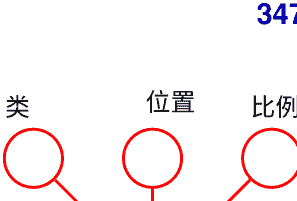

另一种方法是对生成过程进行建模，然后通过计算进行反演。 在我们的图像示例中，如果我们假设对象的类别、位置和比例都是独立选择的，那么我们可以使用有向图模型来表示生成过程，如图11.24所示。 请注意，箭头的方向对应生成步骤的顺序，因此该模型表示了观察数据生成的因果过程（Pearl, 1988）。 这是一个生成模型的示例，因为一旦训练完成，它可以通过首先从学习的先验分布中选择对象的类别、位置和比例的值，然后从学习的条件分布中采样图像来生成合成图像。 我们将在后面看到，扩散模型和其他生成模型可以根据所需内容和图像风格的文本描述合成令人印象深刻的高分辨率图像。

图11.24中的图表假设在没有观察到图像时，类别、位置和尺度变量是独立的。 这是因为任何两个变量之间的路径都是相对于图像变量头对头的，而图像变量是未观察到的。 然而，当我们观察到图像时，这些路径变得不再阻塞，类别、位置和尺度变量不再是独立的。

直观上讲，这是合理的，因为告诉我们图像中对象的身份为我们确定其位置提供了非常相关的信息。

概率模型中的隐藏变量不一定需要有任何明确的物理解释，而可以仅仅是为了从更简单的组件构建更复杂的联合分布。 例如，诸如归一化流、变分自编码器和扩散模型等模型都使用深度神经网络通过转换具有简单高斯分布的隐藏变量来创建数据空间中的复杂分布。

## 11.2.6 马尔可夫毯

在讨论更复杂的有向图时，一个有用的条件独立性属性被称为马尔可夫毯或马尔可夫边界。 考虑一个由有D个节点表示的有向图表示的联合分布 p(x1, ..., xD)，并考虑一个特定节点的条件分布，该节点与变量 xi 有关，条件是所有其他变量 xj≠i。 使用因子分解性质（11.6），

我们可以用以下形式表示这个条件分布
$$
p(\mathbf{x}_i|\mathbf{x}_{\{j=i\}}) = \frac{p(\mathbf{x}_1, \dots, \mathbf{x}_D)}{\int p(\mathbf{x}_1, \dots, \mathbf{x}_D) \mathrm{d}\mathbf{x}_i} \n= \frac{\prod_{k} p(\mathbf{x}_k|\mathrm{pa}(k))}{\int \prod_{k} p(\mathbf{x}_k|\mathrm{pa}(k)) \mathrm{d}\mathbf{x}_i}
$$

其中积分被离散变量的求和所替代。我们现在观察到，任何不依赖于\(\mathbf{x}_i\)的因子 \(p( \mathbf{x}_k|\mathrm{pa}(k))\) 都可以从 \(\mathbf{x}_i\) 的积分中提取出来，并且在分子和分母之间相互抵消。剩下的唯一因子将是节点\(\mathbf{x}_i\)本身的条件分布 \(p(\mathbf{x}_i|\mathrm{pa}(i))\)，以及任何节点 \(\mathbf{x}_k\)的条件分布，其中节点 \(\mathbf{x}_i\)在 \(p(\mathbf{x}_k|\mathrm{pa}(k))\)的条件集中，换句话说， \(\mathbf{x}_i\)是 \(\mathbf{x}_k\)的父节点。条件 \(p(\mathbf{x}_i|\mathrm{pa}(i))\)将取决于节点 \(\mathbf{x}_i\)的父节点，而条件 \(p(\mathbf{x}_k|\mathrm{pa}(k))\) 将取决于节点 \(\mathbf{x}_i\)的子节点以及共同父节点，换句话说，取决于节点 \(\mathbf{x}_k\)的父节点中除了节点 \(\mathbf{x}_i\)之外的变量。由父节点、子节点和共同父节点组成的节点集被称为马尔可夫毯子，并在图11.25中进行了说明。

我们可以将节点 \(\mathbf{x}_i\)的马尔可夫毯视为将其与图中其余部分隔离的最小节点集。请注意，仅包括节点 \(\mathbf{x}_i\)的父节点和子节点是不足够的，因为解释消除意味着子节点的观测不会阻塞通往共同父节点的路径。因此，我们还必须观测共同父节点。

## 11.2.7 图作为滤波器

我们已经看到，特定的有向图表示将联合概率分布分解为条件概率的乘积，并且通过d-分离准则获得一组条件独立性语句。d-分离定理实际上是这两个属性等价的表达。为了清楚起见，将有向图视为一个过滤器是有帮助的。假设我们考虑与图中（未观测的）节点对应的变量\(\mathbf{x}\)的特定联合概率分布 \(p( \mathbf{x})\)。仅当该分布可以表示为时，过滤器才允许该分布通过。

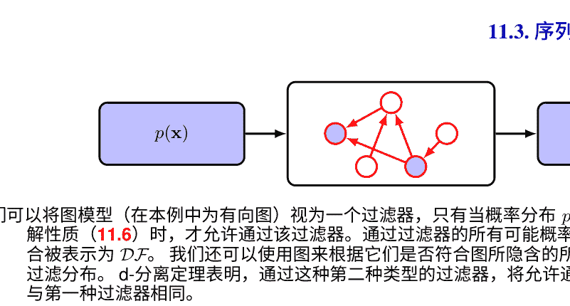

图11.26 我们可以将图模型（在本例中为有向图）视为一个过滤器，只有当概率分布 $p(\mathbf{x})$ 满足有向分解性质（11.6）时，才允许通过该过滤器。通过过滤器的所有可能概率分布 $p(\mathbf{x})$ 的集合被表示为 $\mathcal{DF}$。我们还可以使用图来根据它们是否符合图所隐含的所有条件独立性质来过滤分布。d-分离定理表明，通过这种第二种类型的过滤器，将允许通过的分布集合 $\mathcal{DF}$ 与第一种过滤器相同。

这些分布是由图所隐含的分解（11.6）的术语来描述的。如果我们将所有可能的变量集合x上的所有可能分布 $p(\mathbf{x})$ 呈现给过滤器，那么通过过滤器的分布子集被表示为 $\mathcal{DF}$，表示有向分解。这在图11.26中有所说明。

或者，我们可以通过首先列出应用d-分离准则到图中获得的所有条件独立性属性，然后只允许分布通过，如果它满足所有这些属性，将图用作不同类型的过滤器。如果我们将所有可能的分布 $p(\mathbf{x})$ 呈现给这种第二种类型的过滤器，那么d-分离定理告诉我们，通过的分布集合正是集合 $\mathcal{DF}$。

需要强调的是，从d-分离获得的条件独立性属性适用于由特定有向图描述的任何概率模型。这将是真实的，例如，无论变量是离散的还是连续的，或者是这两者的组合。再次，我们看到一个特定的图描述了一整个概率分布族。

在一个极端情况下，我们有一个完全连接的图，它根本没有任何条件独立性属性，并且可以表示给定变量上的任何可能的联合概率分布。集合 $\mathcal{DF}$ 将包含所有可能的分布 $p(\mathbf{x})$。在另一个极端情况下，我们有一个完全断开的图，即没有任何链接。这对应于将联合分布因子化为图的节点组成的变量的边缘分布的乘积。注意，对于任何给定的图，分布集合 $\mathcal{DF}$将包括任何具有超出图所描述的独立性属性的附加分布。例如，完全因子化的分布将始终通过对应变量集上的任何图所暗示的过滤器。

## 11.3. 序列模型

在许多重要的机器学习应用中，数据由一系列值组成。例如，文本由一系列单词组成，而蛋白质由一系列氨基酸组成。许多序列是有序的，例如，来自麦克风的音频信号或特定位置的日降雨量测量的时间序列。有时，在提到其他类型的序列数据时，不仅仅是时间序列，还会使用“时间”以及“过去”和“未来”的术语。涉及序列的应用包括语音识别、语言之间的自动翻译、DNA中的基因检测、音乐合成、编写计算机代码、与现代搜索引擎进行对话等等。

我们将一个数据序列表示为 \(\mathbf{x}_1, \ldots\)，其中每个元素 \(\mathbf{x}_n\) of the sequence comprises a vector of values. 请注意，我们可能有几个这样的序列，它们独立地从相同的分布中抽取，这种情况下，所有序列的联合分布分解为每个序列的分布的乘积。从现在开始，我们只关注建模其中一个序列。

我们已经在（11.4）中看到，通过重复应用概率的乘法规则，一个关于 \(N\) 个变量的一般分布可以写成条件分布的乘积形式，并且这种分解形式取决于变量的特定排序。对于向量值变量，如果我们选择与序列中变量的顺序相对应的排序，则我们可以写成

\[p(\mathbf{x}_1, \ldots, \mathbf{x}_N) = \prod_{n=1}^N p(\mathbf{x}_n|\mathbf{x}_1, \ldots, \mathbf{x}_{n-1}). \tag{11.42}\]

这对应于一个有向图，在该图中，每个节点从序列中的每个前一个节点接收一个链接，如图11.27中使用四个变量所示。这被称为自回归模型。

这种表示具有完全的普遍性，因此从建模的角度来看，它不添加任何价值，因为它不编码任何假设。我们可以通过从图中删除链接或者等效地从右侧的因子的条件集中删除变量，来限制模型空间的模型，从而引入条件独立性属性。

最强的假设是去除所有的条件变量，得到一个形式为的联合分布

\[p(\mathbf{x}_1, \ldots, \mathbf{x}_N) = \prod_{n=1}^N p(\mathbf{x}_n), \tag{11.43}\]

它将变量视为独立的，因此完全忽略了顺序信息。这对应于一个没有链接的概率图模型，如图11.28所示。


捕捉顺序属性并引入建模假设的有趣模型位于这两个极端之间。一个强假设是假设每个条件分布仅依赖于序列中的前一个变量，得到一个形式为的联合分布

```
$p(\mathbf{x}_1, \dots, \mathbf{x}_N) = p(\mathbf{x}_1) \prod_{n=2}^{N} p(\mathbf{x}_n | \mathbf{x}_{n-1}). \qquad (11.44)$
```

请注意，序列中的第一个变量处理方式略有不同，因为它没有条件变量。函数形式（11.44）被称为马尔可夫模型或马尔可夫链，并由一个简单的节点链组成，如图11.29所示。使用d-分离，我们可以看到给定时间$n$之前的所有观测，观测 $\mathbf{x}_n$ 的条件分布为

```
$p(\mathbf{x}_n | \mathbf{x}_1, \dots, \mathbf{x}_{n-1}) = p(\mathbf{x}_n | \mathbf{x}_{n-1}), \qquad (11.45)$
```

这可以通过直接评估从（11.44）开始并使用概率的乘积规则来轻松验证。 因此，如果我们使用这样的模型来预测序列中的下一个观察值，预测的分布将仅取决于前一个观察值的值，并且与所有先前的观察值无关。

更具体地说， （11.44）被称为一阶马尔可夫模型，因为每个条件分布中只出现一个条件变量。 我们可以通过允许每个条件分布依赖于前两个变量来扩展模型，从而得到形式为二阶马尔可夫模型的形式。

```
$p(\mathbf{x}_1, \dots, \mathbf{x}_N) = p(\mathbf{x}_1) p(\mathbf{x}_2 | \mathbf{x}_1) \prod_{n=3}^{N} p(\mathbf{x}_n | \mathbf{x}_{n-1}, \mathbf{x}_{n-2}). \qquad (11.46)$
```

请注意，前两个变量的处理方式不同，因为它们少于两个条件变量。 该模型在图11.30中显示为有向图。练习11.17通过使用d-分离（或通过直接使用概率规则进行评估），我们可以看到在二阶马尔可夫模型中，给定所有先前观测的条件分布 $\mathbf{x}_n$ given all previous observations $\mathbf{x}_1, \dots, \mathbf{x}_{n-1}$ 与观测无关

我们可以类似地考虑到第 $M$ 阶马尔可夫链的扩展，其中一个变量的条件分布取决于前一个M个变量。然而，我们为此增加的灵活性付出了代价，因为模型中的参数数量现在要大得多。假设观察值是离散变量，具有K个状态。那么一阶马尔可夫链中的条件分布p(xₙ|xₙ₋₁)将由K−1个参数集来指定，每个参数集对应xₙ₋₁的K个状态，总共有K(K−1)个参数。现在假设我们将模型扩展到M阶马尔可夫链，因此联合分布是由条件分布p(xₙ|xₙ₋M,…,xₙ₋₁)构建的。如果变量是离散的，并且条件分布由一般的条件概率表表示，那么这样的模型将具有K^M−1(K−1)个参数。因此，参数的数量随着M的增长呈指数级增长，这通常会使得这种方法在M较大的情况下不实用。

#### 11.3.1 隐藏变量

假设我们希望构建一个不受马尔可夫假设限制的序列模型，但又可以使用有限数量的自由参数来指定。我们可以通过引入额外的潜在变量来实现这一点，从而可以构建出由简单组件组成的丰富模型类。对于每个观测值xₙ，我们引入一个相应的潜在变量zₙ（可能与观测变量的类型或维度不同）。现在我们假设是潜在变量形成了一个马尔可夫链，从而产生了图形结构，即所谓的状态空间模型，如图11.31所示。它满足关键的条件独立性属性，即在给定zₙ的情况下，zₙ₋₁和zₙ₊₁是独立的，因此

```
zₙ₊₁ ⊥ zₙ₋₁ | zₙ. (11.47)
```

该模型的联合分布由以下给出

```
p(x₁, …, x_N, z₁, …, z_N) = p(z₁) ∏ₙ=2^N p(zₙ|zₙ₋₁) ∏ₙ=1^N p(xₙ|zₙ). (11.48)
```

图11.31 状态空间模型表示了一系列观测状态x₁,…,x_N的联合概率分布，x_N以隐藏状态的马尔可夫链形式表示，z_N以(11.48)形式表示

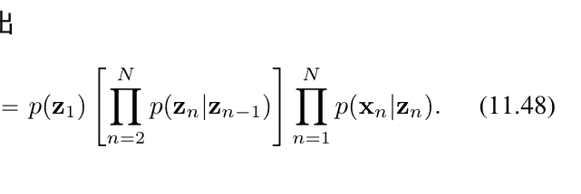

使用d-分离准则，我们可以看到在状态空间模型中，通过潜在变量，任何两个观测变量 $x_n$ 和 $x_m$ 之间总是存在一条路径，并且该路径从未被阻断。因此，预测分布
$p(x_{n+1}|x_1, \ldots, x_n)$ 对于给定所有先前观测的观测 $x_{n+1}$ 没有任何条件独立性质，因此我们对于 $x_{n+1}$ 的预测取决于所有先前观测。因此，观测变量在任何阶数上都不满足马尔可夫性质。

有两个重要的顺序数据模型在这个图中被描述。如果潜在变量是离散的，那么我们得到一个隐马尔可夫模型（Elliott, Aggoun, and Moore, 1995）。请注意，隐马尔可夫模型中的观测变量可以是离散的或连续的，并且可以使用各种不同的条件分布来对它们进行建模。如果潜在变量和观测变量都是高斯的（其条件分布对其父节点具有线性高斯依赖关系），那么我们得到一个线性动态系统，也称为卡尔曼滤波器（Zarchan and Musoff, 2005）。Bishop (2006) 详细讨论了隐马尔可夫模型和卡尔曼滤波器，以及用于训练它们的算法。

通过用深度神经网络替换简单的离散概率表或线性高斯分布，这些模型可以变得更加灵活。

### 练习

- **11.1** (\*)通过按顺序边缘化变量，证明有向图的联合分布表示(**11.6**)在每个条件分布都被正确归一化的情况下。
- **11.2** (\*)证明有向图中不存在有向环的性质是由存在节点的有序编号而导出的，对于每个节点，不存在指向较低编号节点的链接。
- **11.3** (\*\*)考虑三个二进制变量$a, b, c \in \{0, 1\}$，其联合分布如表**11.1**所示。通过直接计算，证明该分布具有以下性质：$a$和$b$在边缘上是相关的，即 $p(a, b) = p(a)p(b)$，但在给定$c$的条件下，它们变得独立，即 $p(a, b|c) = p(a|c)p(b|c)$，对于 $c=0$ 和 $c=1$ 都成立。

表**11.1** 三个二进制变量的联合分布。

| $a$ | $b$ | $c$ | $p(a, b, c)$ |
| :--- | :--- | :--- | :--- |
| 0 | 0 | 0 | 0.192 |
| 0 | 0 | 1 | 0.144 |
| 0 | 1 | 0 | 0.048 |
| 0 | 1 | 1 | 0.216 |
| 1 | 0 | 0 | 0.192 |
| 1 | 0 | 1 | 0.064 |
| 1 | 1 | 0 | 0.048 |
| 1 | 1 | 1 | 0.096 |

- **11.4** (\*\*)评估给定表11.1中的联合分布对应的概率分布 $p(a), p(b|c),$ 和 $p(c|a)$。因此，通过直接计算证明 $p(a, b, c) = $ 绘制相应的有向图。
- **11.5** (\*)对于图11.6中所示的模型，我们已经看到用于指定条件分布 $p(y|x_1, \dots, x_M)$ 的参数数量可以从 $2^M$ 减少到 $M+1$，通过使用逻辑$s_i$gmo$_i$d表示 (11.8)。另一种表示方法 (Pearl, 1988) 如下：

$$p(y = 1|x_1, \dots, x_M) = 1 - (1 - \mu_0) \prod_{i=1}^{M} (1 - \mu_i)^{x_i} \qquad (11.49)$$

其中参数 $\mu_i$ 表示概率 $p(x_i=1)$，$\mu_0$ 是一个满足 $0 \leqslant \mu_0 \leqslant 1$ 的附加参数。条件分布 (11.49) 被称为噪声OR。证明这可以被解释为逻辑OR函数的‘软’（概率）形式（即，只要至少有一个xi=1，就给出 $y=$ 1的函数）。讨论 $\mu_0$ 的解释。
- **11.6** 从线性高斯模型的条件分布的定义 (11.9) 出发，推导出联合分布均值的递归关系 (11.12)。
- **11.7** (\*\*)从条件分布的定义 (11.9) 出发，推导出线性高斯模型的联合分布的协方差矩阵的递归关系 (11.13)。
- **11.8** (\*\*)证明完全连接的线性高斯图模型的协方差矩阵中参数的数量是 $D(D+1)/2$，其中 $D$ 是变量的数量。
- **11.9** (\*\*)利用递归关系 (11.12) 和 (11.13)，证明图11.7中所示图的联合分布的均值和协方差分别为 (11.14) 和 (11.15)。
- **11.10** (\*)验证由形式为 (11.16) 的分布所定义的线性高斯模型的一组向量值变量的联合分布本身是高斯分布。
- **11.11** (\*) 证明 $a \perp b, c \mid d$ 意味着 $a \perp b \mid d$。
- **11.12** (\*)使用d-分离准则，证明节点的条件分布
在有向图中，给定马尔可夫毯中的所有节点，节点x的条件分布与图中其余变量无关。
- **11.13** (\*)考虑图11.32中显示的有向图，其中没有变量被观察到。证明 $a \perp b \mid \emptyset$。现在假设我们观察到变量 $d$。证明一般情况下 $a \not\perp b \mid d$。

## 图11.32 用于探索头到头路径 a-c-b 的条件独立性属性的图形模型示例，当观察到 c 的一个后代节点 d 时。

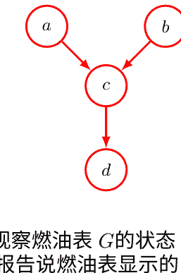

## 11.14 (⋆⋆)

考虑图11.20中汽车燃油系统的示例，假设不是直接观察燃油表 G 的状态，而是由司机 D 看到燃油表的读数后向我们报告。这份报告说燃油表显示的要么是满的 D=1 要么是空的 D=0。我们的司机有点不可靠，通过以下概率来表达：

$p(D = 1|G = 1) = 0.9$  (11.50)
$p(D = 0|G = 0) = 0.9$  (11.51)

假设司机告诉我们燃油表显示为空，换句话说我们观察到 D=0。仅基于这个观察，评估油箱为空的概率。类似地，基于还观察到电池电量低的情况，评估相应的概率，并注意到第二个概率较低。

讨论这个结果背后的直觉，并将结果与图11.32相关联。

## 11.15 (⋆⋆)

假设我们使用最大似然法训练一个朴素贝叶斯模型，使用假设(11.37)。假设每个类条件密度 $p(\mathbf{x}^{(l)}|C_k)$ 都由自己独立的参数 $\mathbf{w}^{(l)}$ 控制。证明最大似然解涉及使用相应的观测数据向量 $\mathbf{x}^{(l)}_1, \dots$ 来拟合每个类条件密度。通过最大化相应类别标签数据的似然，并将类先验 $p(C_k)$ 设置为每个类中训练数据点的比例来解决问题。

## 11.16 (⋆⋆)

考虑与图11.29的有向图对应的联合概率分布(11.44)。使用概率的求和和乘法规则，验证该联合分布满足条件独立性性质(11.45)，其中 $n = 2, \dots, N$。同样，证明由联合分布 (11.46) 描述的二阶马尔可夫模型满足条件独立性

$p(\mathbf{x}_n|\mathbf{x}_1, \dots, \mathbf{x}_{n-1}) = p(\mathbf{x}_n|\mathbf{x}_{n-1}, \mathbf{x}_{n-2})$  (11.52)

对于 $n = 3, \dots, N$。

## 11.17 (⋆)

使用在第11.2节中讨论的d-分离来验证总共有 N 个节点的图11.29中显示的马尔可夫模型满足条件独立性属性 (11.45)，对于 $n=2, \dots, N$。同样，证明由图11.30中的模型描述的总共有 N 个节点的图满足条件独立性属性 (11.52)，对于 $n=3, \dots, N$。

## 11.18 (★)

考虑一个由图11.30描述的二阶马尔可夫过程。通过组合相邻的变量对，证明这可以表示为新变量上的一阶马尔可夫过程。

## 11.19 (★)

通过使用d-分离，证明由图11.31表示的有向图状态空间模型的观测数据分布 $p(\mathbf{x}_1, \ldots, \mathbf{x}_N)$ 不满足任何条件独立性性质，因此不具有任何有限阶的马尔可夫性质。

## 12 变压器


变压器代表了深度学习中最重要的发展之一。它们基于一种称为注意力的处理概念，允许网络对不同的输入赋予权重，权重系数本身取决于输入值，从而捕捉与顺序和其他形式的数据相关的强大归纳偏差。

这些模型被称为变压器，因为它们将一组向量在某个表示空间中转换为一组相应的向量，在某个新空间中具有相同的维度。转换的目标是新空间将具有更丰富的内部表示，更适合解决下游任务。变压器的输入可以采用无结构的向量集、有序序列或更一般的表示形式，使得变压器具有广泛的适用性。

变压器最初是在自然语言处理（NLP）的背景下引入的。

## 12. 变压器

它们在自然语言处理（NLP）或NLP（其中“自然”语言是英语或普通话之类的语言）方面远远超过了基于循环神经网络（RNN）的先前最先进的方法。后来发现变压器在许多其他领域也取得了出色的结果。例如，视觉变压器在图像处理任务中通常优于卷积神经网络（CNN），而多模态变压器则结合了多种类型的数据，如文本、图像、音频和视频，是最强大的深度学习模型之一。

变压器的一个主要优势是迁移学习非常有效，因此一个变压器模型可以在大量数据上进行训练，然后训练好的模型可以通过某种微调形式应用于许多下游任务。一个可以随后适应解决多个不同任务的大规模模型被称为基础模型。此外，变压器可以使用无标签数据进行自监督训练，这在语言模型中特别有效，因为变压器可以利用互联网和其他来源提供的大量文本。缩放假设断言仅通过增加模型的规模（以可学习参数的数量衡量）并在相应大型数据集上进行训练，即使没有架构变化，也可以实现显著的性能改进。此外，变压器特别适用于大规模并行处理硬件，如图形处理单元（GPU），允许在合理的时间内训练具有万亿（10^12）参数数量的异常大型神经网络语言模型。这些模型具有非凡的能力，并显示出被描述为人工通用智能早期迹象的新兴属性（Bubeck等，2023年）。

变压器的架构对于新手来说可能会显得复杂甚至令人生畏，因为它涉及多个不同的组件共同工作，在其中各种设计选择可能看起来是随意的。因此，在本章中，我们旨在逐步全面介绍变压器背后的所有关键思想，并提供清晰的直觉来激发各种元素的设计。我们首先描述变压器的架构，然后专注于自然语言处理，然后探索其他应用领域。

### 12.1. 注意力

支撑变压器的基本概念是注意力。这最初是作为改进RNNs用于机器翻译的一种方法（Bahdanau，Cho和Bengio，2014）。然而，Vaswani等人（2017）后来表明，通过消除循环结构并专注于注意机制，可以获得显著改进的性能。如今，基于注意力的变压器在几乎所有应用中完全取代了RNNs。

我们将在以自然语言为例来激发使用注意力的动机。

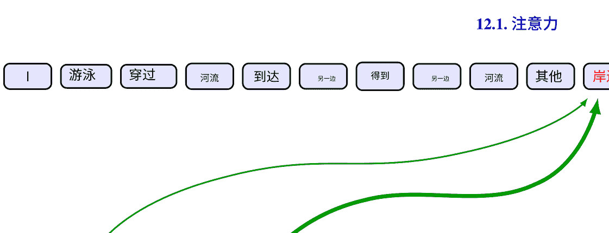

图12.1 注意力的示意图，其中对词语'岸边'的解释受到'河流'和'游泳'这两个词的影响，每条线的粗细表示其影响力强弱。

尽管它具有更广泛的适用性。考虑以下两个句子：

- 我游过河去到对岸。
- 我走过马路去银行取钱。

在这里，'银行'这个词在两个句子中有不同的含义。然而，只有通过观察序列中其他单词提供的上下文才能检测到这一点。我们还看到一些单词在确定'银行'的解释时比其他单词更重要。在第一句中，'游过'和'河'这两个词最明确地表明'银行'指的是河的一边，而在第二句中，'取钱'这个词明确地表明'银行'指的是一个金融机构。

我们可以看到，为了确定“银行”这个词的适当解释，一个神经网络在处理这样一个句子时应该关注，换句话说更加依赖于，来自序列其余部分的特定单词。注意力的这个概念在图12.1中有所说明。

此外，我们还可以看到应该接收更多注意力的特定位置取决于输入序列本身：在第一句中，重要的是第二个和第五个单词，而在第二句中，重要的是第八个单词。在标准神经网络中，不同的输入根据乘以这些输入的权重值的不同程度影响输出。然而，一旦网络训练完成，这些权重及其相关的输入就是固定的。

相比之下，注意力使用的权重因子的值取决于具体的输入数据。图12.2显示了在自然语言上训练的一个变压器网络的一部分中的注意力权重。

当我们讨论自然语言处理时，我们将看到如何使用词嵌入将单词映射到嵌入空间中的向量。然后，这些向量可以作为后续神经网络处理的输入。这些嵌入捕捉了基本的语义属性，例如通过将具有相似含义的单词映射到嵌入空间中的相邻位置。这种嵌入的一个特点是给定的单词始终映射到相同的嵌入向量。

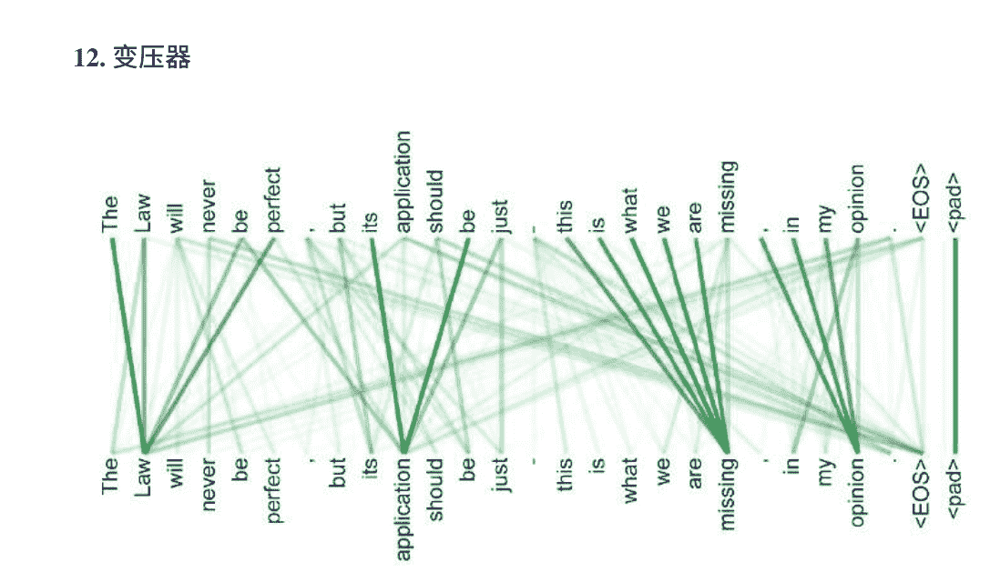

可以将变换器视为一种更丰富的嵌入形式，其中给定的向量被映射到依赖于序列中其他向量的位置。因此，在我们上面的示例中，表示‘bank’的向量可以在两个不同句子的新嵌入空间中映射到不同的位置。例如，在第一句中，转换后的表示可能会将‘bank’放在嵌入空间中靠近‘water’的位置，而在第二句中，转换后的表示可能会将其放在靠近‘money’的位置。

以蛋白质建模为例，作为注意力的一个示例。我们可以将蛋白质视为由称为氨基酸的分子单元组成的一维序列。一个蛋白质可以包含数百或数千个这样的单元，每个单元由22种可能性之一给出。在活细胞中，蛋白质会折叠成一个三维结构，在这个结构中，一维序列中相距较远的氨基酸可以在三维空间中变得物理上接近，并且图1.2因此相互作用。Transformer模型允许这些相距较远的氨基酸相互‘关注’，从而极大地提高了对其三维结构建模的准确性（Vig等，2020年）。

### 12.1.1 变压器处理

Transformer的输入数据是一组维度为D的向量 {x_n}，其中 n=1,...,N。我们将这些数据向量称为 tokens，其中一个token可以对应于句子中的一个单词，图像中的一个补丁，或者蛋白质中的一个氨基酸。这些tokens的元素 x_{ni} 被称为 features。稍后我们将看到如何构建这些用于自然语言数据和图像的令牌向量。变压器的一个强大特性是，我们不需要设计一个新的神经网络架构来处理不同类型的数据，而是可以简单地将数据变量组合成一个联合的令牌集。

在我们能够清楚地理解变压器的操作之前，

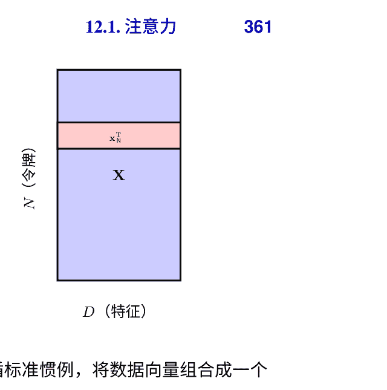

准确地使用符号是很重要的。我们将遵循标准惯例，将数据向量组合成一个维度为$N \times D$的矩阵$\mathbf{X}$，其中第$n$行包含令牌向量$\mathbf{x}_n^{\top}$，其中$n=1,\ldots,N$标记了行，如图12.3所示。请注意，该矩阵表示一个输入令牌集，对于大多数应用程序，我们将需要一个包含许多令牌集的数据集，例如独立的文本段落，其中每个单词都表示为一个令牌。变压器的基本构建块是一个接受数据矩阵作为输入并创建具有相同维度的转换矩阵$\widetilde{\mathbf{X}}$的函数。我们可以将这个函数写成以下形式

$\widetilde{\mathbf{X}} = \text{TransformerLayer} \left[ \mathbf{X} \right]$

然后，我们可以连续应用多个变压器层来构建能够学习丰富内部表示的深度网络。每个变压器层都包含自己的权重和偏差，可以使用梯度下降法和适当的成本函数进行学习，我们将在本章后面详细讨论。

单个变压器层本身包括两个阶段。第一个阶段实现了注意机制，将数据矩阵的列中来自不同令牌向量的相应特征混合在一起，而第二个阶段则独立地作用于每一行，并转换每个令牌向量中的特征。我们首先来看一下注意机制。

#### 12.1.2 注意力系数

假设我们有一组输入令牌$\mathbf{x}_1, \ldots, \mathbf{x}_N$在一个嵌入空间中，并且我们希望将其映射到另一组具有相同数量令牌的$\mathbf{y}_1, \ldots, \mathbf{y}_N$，但在捕捉更丰富语义结构的新嵌入空间中。考虑一个特定的输出向量$\mathbf{y}_n$。$\mathbf{y}_n$的值不仅应该取决于相应的输入向量$\mathbf{x}_n$，还应该取决于集合中的所有向量$\mathbf{x}_1, \ldots, \mathbf{x}_N$。通过注意力机制，这种依赖关系对于那些对确定$\mathbf{y}_n$的修改表示特别重要的输入$\mathbf{x}_m$应该更强。实现这一点的一种简单方法是将每个输出向量$\mathbf{y}_n$定义为输入向量的线性组合。

$x_1, \ldots, x_N$ 带有加权系数 $a_{nm}$:

$y_n = \sum_{m=1}^{N} a_{nm} x_m$

其中 $a_{nm}$ 被称为注意力权重。对于对输出 $y_n$ 影响较小的输入标记，系数应接近零，并且对于对影响最大的输入，系数应最大。因此，我们限制系数为非负数，以避免一个系数变得很大且为正，而另一个系数通过变得很大且为负来进行补偿。我们还希望确保如果一个输出更加关注特定的输入，那么这将以减少对其他输入的关注为代价，因此我们限制系数的总和为单位。因此，加权系数必须满足以下两个约束条件：

$a_{nm} \geq 0$

$\sum_{m=1}^{N} a_{nm} = 1.$

综上所述，这意味着每个系数都在范围 $0 \leq a_{nm} \leq 1$ 内。这些系数定义了一个'单位分割'。对于特殊情况 $a_{nm}= 1$，可以得出当 $n = m$ 时，$a_{nm}= 0$，因此 $y_m = x_m$，使得输入向量不受变换影响。更一般地，输出 $y_m$ 是输入向量的混合，其中一些输入比其他输入具有更高的权重。

请注意，对于每个输出向量 $y_n$，我们有不同的系数集合，并且约束条件 (12.3) 和 (12.4) 分别适用于每个 $n$ 的值。这些系数 $a_{nm}$ 取决于输入数据，我们将很快看到如何计算它们。

#### 12.1.3 自注意力

下一个问题是如何确定系数 $a_{nm}$。在我们详细讨论这个问题之前，首先介绍一些来自信息检索领域的术语是很有用的。考虑在在线电影流媒体服务中选择要观看的电影的问题。一种方法是将每部电影与描述其类型（喜剧、动作等）、主要演员的名字、电影长度等的属性列表关联起来。然后用户可以通过目录搜索找到与其偏好相匹配的电影。我们可以通过将每部电影的属性编码为一个称为关键字的向量来自动化这个过程。相应的电影文件本身被称为值。类似地，用户可以提供自己所需属性的个人向量，我们称之为查询。然后，电影服务可以将查询向量与所有关键字向量进行比较，找到最佳匹配，并将相应的电影以值文件的形式发送给用户。我们可以将用户'关注'与其查询最接近的特定电影。这被视为一种硬注意力，其中返回一个单一的值向量。对于Transformer，我们将其推广为软注意力，其中我们使用连续变量来衡量

查询和键之间的匹配程度，我们使用这些变量来加权影响值向量对输出的影响。这也将确保变换函数是可微分的，因此可以通过梯度下降进行训练。

根据信息检索的类比，我们可以将每个输入向量 $\mathbf{x}_n$ 视为将用于创建输出标记的值向量。我们还直接使用向量 $\mathbf{x}_n$ 作为输入标记 $n$ 的键向量。这类似于使用电影本身来总结电影的特点。最后，我们可以使用 $\mathbf{x}_m$ 作为输出 $\mathbf{y}_m$ 的查询向量，然后将其与每个键向量进行比较。为了确定由 $\mathbf{x}_n$ 表示的标记应该关注由 $\mathbf{x}_m$ 表示的标记的程度，我们需要计算这些向量的相似程度。一个简单的相似度度量是取它们的点积 $\mathbf{x}_n^\top \mathbf{x}_m$。为了满足约束条件 (12.3) 和 (12.4)，我们可以使用第5.3节中的softmax函数来转换点积，从而定义加权系数 $a_{nm}$：

$a_{nm} = \frac{\exp(\mathbf{x}_n^\top \mathbf{x}_m)}{\sum_{m'=1}^N \exp(\mathbf{x}_n^\top \mathbf{x}_{m'})}. \tag{12.5}$

请注意，在这种情况下，softmax函数没有概率解释，只是用于适当地归一化注意力权重。

因此，总结一下，每个输入向量 $\mathbf{x}_n$ 通过采用形式为(12.2)的输入向量的线性组合来转换为相应的输出向量 $\mathbf{y}_n$，其中应用于输入向量 $\mathbf{x}_m$ 的权重 $a_{nm}$ 由softmax函数(12.5)定义，该函数是基于查询 $\mathbf{x}_n$ 和与输入 $n$ 相关联的键 $\mathbf{x}_m$ 之间的点积 $\mathbf{x}_n^\top \mathbf{x}_m$。请注意，如果所有输入向量都是正交的，则每个输出向量只是等于相应的输入向量，即

$\mathbf{y}_m = \mathbf{x}_m, \text{ 对于 } m = 1, \ldots, N.$

我们可以通过使用数据矩阵 $\mathbf{X}$ 以及类似的 $N \times D$ 输出矩阵 $\mathbf{Y}$（其行由 $\mathbf{y}_m$ 给出）来将（12.2）写成矩阵表示形式，从而

$\mathbf{Y} = \text{Softmax} \left[\mathbf{XX}^{\top}\right] \mathbf{X} \tag{12.6}$

其中 $\text{Softmax}[\mathbf{L}]$ 是一个运算符，它对矩阵 $\mathbf{L}$ 的每个元素取指数，然后独立地对每一行进行归一化，使其总和为一。从现在开始，我们将专注于矩阵表示以提高清晰度。

这个过程被称为自注意力，因为我们使用相同的序列来确定查询、键和值。在本章后面，我们将遇到这种注意力机制的变体。此外，由于查询向量和键向量之间的相似度度量由点积给出，因此这被称为点积自注意力。

#### 12.1.4 网络参数

目前，从输入向量 $\{\mathbf{x}_n\}$ 到输出向量 $\{\mathbf{y}_n\}$ 的转换是固定的，没有能力从数据中学习，因为它没有可调参数。此外，令牌向量 $\mathbf{x}_n$ 中的每个特征值在确定注意力系数方面起着相等的作用，而我们希望网络能够

在确定标记相似性时，我们可以更多地关注某些特征而不是其他特征。如果我们定义原始向量的线性变换形式，我们可以解决这两个问题

$\widetilde{\mathbf{X}} = \mathbf{X}\mathbf{U}$

其中，U是一个$D\times D$的可学习权重参数矩阵，类似于标准神经网络中的'层'。这给出了一个修改后的变换形式

$\mathbf{Y} = \mathrm{Softmax}\left[\mathbf{X}\mathbf{U}\mathbf{U}^{\mathrm{T}}\mathbf{X}^{\mathrm{T}}\right]\mathbf{X}\mathbf{U}.$

尽管这样更加灵活，但矩阵

$\mathbf{X}\mathbf{U}\mathbf{U}^{\mathrm{T}}\mathbf{X}^{\mathrm{T}}$

是对称的，而我们希望注意机制支持显著的不对称性。例如，我们可能期望'凿子'与'工具'强烈关联，因为每个凿子都是一个工具，而'工具'与'凿子'的关联应该较弱，因为除了凿子之外还有许多其他种类的工具。尽管softmax函数使得注意权重矩阵本身不对称，但通过允许查询和键具有独立的参数，我们可以创建一个更加灵活的模型。此外，式 (12.8) 使用相同的参数矩阵U来定义值向量和注意系数，这似乎又是一个不可取的限制。

我们可以通过定义独立的查询、键和值矩阵来克服这些限制，每个矩阵都有自己独立的线性变换:

$\mathbf{Q} = \mathbf{X}\mathbf{W}^{(\mathrm{q})}$
$\mathbf{K} = \mathbf{X}\mathbf{W}^{(\mathrm{k})}$
$\mathbf{V} = \mathbf{X}\mathbf{W}^{(\mathrm{v})}$

其中权重矩阵 $\mathbf{W}^{(\mathrm{q})}$, $\mathbf{W}^{(\mathrm{k})}$ 和 $\mathbf{W}^{(\mathrm{v})}$ 表示在最终变换器架构的训练过程中将学习的参数。这里的矩阵 $\mathbf{W}^{(\mathrm{k})}$ 的维度为 $D \times D_{\mathrm{k}}$，其中 $D_{\mathrm{k}}$ 是键向量的长度。矩阵 $\mathbf{W}^{(\mathrm{q})}$ 必须具有与 $\mathbf{W}^{(\mathrm{k})}$ 相同的维度 $D \times D_{\mathrm{k}}$，以便我们可以计算查询向量和键向量之间的点积。一个典型的选择是 $D_{\mathrm{k}} = D$。同样，$\mathbf{W}^{(\mathrm{v})}$ 是一个大小为 $D \times D_{\mathrm{v}}$ 的矩阵，其中 $D_{\mathrm{v}}$ 决定了输出向量的维度。如果我们设置 $D_{\mathrm{v}} = D$，使得输出表示具有与输入相同的维度，这将有助于包含残差连接，我们稍后会讨论。此外，如果每个层具有相同的维度，可以将多个变换器层堆叠在一起。然后我们可以推广

公式(12.6)为

$\mathbf{Y} = \mathrm{Softmax}\left[\mathbf{Q}\mathbf{K}^{\mathrm{T}}\right]\mathbf{V}$

其中 $\mathbf{Q}\mathbf{K}^{\mathrm{T}}$ 的维度为 $N \times N$，矩阵 $\mathbf{Y}$ 的维度为 $N \times D_{\mathrm{v}}$。矩阵 $\mathbf{Q}\mathbf{K}^{\mathrm{T}}$ 的计算如图12.4所示，而矩阵 $\mathbf{Y}$ 的评估如图12.5所示。

## 12. 变压器

### 12.1 注意力

图12.4展示了矩阵 \( \mathbf{QK}^\mathrm{T} \) 的评估过程，该矩阵确定了变压器中的注意力系数。输入 \( \mathbf{X} \) 分别使用(12.10)和(12.11)进行转换，得到查询矩阵 \( \mathbf{Q} \) 和关键矩阵 \( \mathbf{K} \)，然后将它们相乘。

实际上，我们还可以在这些线性变换中包含偏置参数。然而，偏置参数可以被吸收到权重矩阵中，就像我们在标准神经网络中所做的那样，通过在数据矩阵 \( \mathbf{X} \) 中添加一个额外的列来表示偏差，可以通过将权重矩阵增加一行参数来实现。从现在开始，我们将把偏差参数视为隐含的，以避免符号混乱。

与传统的神经网络相比，信号路径之间存在乘法关系。标准网络将激活值乘以固定权重，而这里的激活值则乘以数据相关的注意力系数。这意味着，例如，如果某个注意力系数对于特定的输入向量选择接近零，那么相应的信号路径将忽略相应的输入信号，因此不会产生影响。

对网络输出进行softmax。相比之下，如果标准神经网络学习忽略一个特定的输入或隐藏单元变量，它会对所有输入向量都这样做。

#### 12.1.5 缩放自注意力

自注意力层还有一个最后的改进。回想一下，对于高幅度的输入，softmax函数的梯度会变得指数级小，就像tanh或logistic-sigmoid激活函数一样。为了防止这种情况发生，我们可以在应用softmax函数之前重新缩放查询和键向量的乘积。为了得到一个合适的缩放，注意如果查询和键向量的元素都是独立的随机数，具有零均值和单位方差，那么点积的方差将是 \( D_k \)。

因此，我们使用标准差来对softmax的参数进行归一化，标准差由 \( D_k \) 的平方根给出，这样注意力层的输出就采用了以下形式

$$
\mathbf{Y} = \text{注意力}( \mathbf{Q}, \mathbf{K}, \mathbf{V}) \equiv \text{Softmax} \left[ \frac{\mathbf{Q}\mathbf{K}^{\mathrm{T}}}{\sqrt{D_{\mathrm{k}}}} \right] \mathbf{V}.
$$

这被称为缩放的点积自注意力，并且是我们自注意力神经网络层的最终形式。这一层的结构总结如图12.6和算法12.1所示。

#### 12.1.6 多头注意力

到目前为止，所描述的注意力层允许输出向量关注输入向量的数据相关模式，并被称为注意力头。然而，还可能存在多个同时相关的注意力模式。例如，在自然语言中，一些模式可能与时态有关，而其他模式可能与词汇有关。使用单个注意力头可能会导致这些效果的平均化。相反，我们可以并行使用多个注意力头。

这些由单个头的结构相同的副本组成，具有独立的可学习参数，用于计算查询、键和值矩阵。这类似于在卷积网络的每一层中使用多个不同的滤波器。

假设我们有 \( H \) 个头，索引为 \( 1, \ldots, H \)，形式为

$$
\mathbf{H}_h = \text{注意力}(\mathbf{Q}_h, \mathbf{K}_h, \mathbf{V}_h) \tag{12.15}
$$

其中注意力(·,·,·)由(12.14)给出，我们为每个头定义了单独的查询、键和值矩阵

$$
\mathbf{Q}_h = \mathbf{X}\mathbf{W}^{(q)}_h \tag{12.16}
$$
$$
\mathbf{K}_h = \mathbf{X}\mathbf{W}^{(k)}_h \tag{12.17}
$$
$$
\mathbf{V}_h = \mathbf{X}\mathbf{W}^{(v)}_h. \tag{12.18}
$$

首先将这些头连接成一个矩阵，然后使用矩阵 \( \mathbf{W}^{(o)} \) 进行线性变换，得到一个组合输出

$$
\mathbf{Y}(\mathbf{X}) = \text{连接}\left[ \mathbf{H}_1, \dots, \mathbf{H}_H\right] \mathbf{W}^{(o)}. \tag{12.19}
$$

这在图12.7中有所说明。每个矩阵 \( \mathbf{H}_h \) 具有维度 \( N \times D_v \)，因此连接矩阵的维度为 \( N \times H D_v \)。这通过线性矩阵 \( \mathbf{W}^{(o)} \) 的变换来得到最终输出矩阵 \( \mathbf{Y} \)，其维度为 \( N \times D \)，与原始输入矩阵 \( \mathbf{X} \) 相同。矩阵 \( \mathbf{W}^{(o)} \) 的元素在训练阶段与查询、键和值矩阵一起学习。通常 \( D_v \) 是选择为 \( D/H \)，以使得结果连接矩阵的维度为 \( N \times D \)。多头注意力在算法12.2中进行了总结，并且多头注意力层中的信息流程在图12.8中进行了说明。

请注意，上述给出的多头注意力的公式，遵循了研究文献中使用的一些冗余性，即每个头部的 \( \mathbf{W}^{(v)} \) 矩阵和输出矩阵 \( \mathbf{W}^{(o)} \) 的连续乘法。去除这种冗余性可以将多头自注意力层写成对每个头部的贡献的求和形式。

### 12.1.7 Transformer 层

多头自注意力是变换器网络中的核心架构元素。我们知道神经网络从深度中获益良多，因此我们希望在彼此之上堆叠多个自注意力层。为了改善训练，我们可以引入绕过多头结构的残差连接。为此，我们要求输出维度与输入维度相同，即 \( N \times D \)。然后紧接着进行层归一化 (Ba, Kiros和Hinton, 2016年)，它提高了训练效率。得到的转换可以写成

$$
\mathbf{Z} = \text{LayerNorm} [\mathbf{Y}(\mathbf{X}) + \mathbf{X}] \tag{12.20}
$$

其中 \( \mathbf{Y} \) 由(12.19)定义。有时，层归一化被替换为预归一化，在这种情况下，归一化层在多头自注意力之前而不是之后应用，因为这样可以实现更有效的优化，这时我们有

$$
\mathbf{Z} = \mathbf{Y}(\mathbf{X}') + \mathbf{X}，\text{其中} \mathbf{X}' = \text{LayerNorm} [\mathbf{X}]。 \tag{12.21}
$$

在每种情况下，\( \mathbf{Z} \) 再次具有与输入矩阵 \( \mathbf{X} \) 相同的维度 \( N \times D \)。

我们已经看到，注意机制创建了值向量的线性组合，然后将其线性组合以产生输出向量。此外，值是输入向量的线性函数，因此我们可以看到注意层的输出受限于输入的线性组合。非线性通过注意权重进入，因此输出向量将通过softmax函数非线性地依赖于输入，但输出向量仍然受限于输入向量所张成的子空间，这限制了注意层的表达能力。我们可以通过使用具有 \( D \) 个输入和 \( D \) 个输出的标准非线性神经网络对每层的输出进行后处理来增强变压器的灵活性，记为 \( \text{MLP}[\cdot] \)，表示‘多层感知机’。例如，这可能包括一个具有ReLU隐藏单元的两层全连接网络。这需要以保持能力的方式进行。

变压器用于处理可变长度的序列。为了实现这一点，相同的共享网络应用于每个输出向量，对应于Z的行。同样，可以通过使用残差连接来改进这个神经网络层。它还包括层归一化，使得变压器层的最终输出具有以下形式

$$
\mathbf{\tilde{X}} = \text{LayerNorm} [\text{MLP} [\mathbf{Z}] + \mathbf{Z}]. \tag{12.22}
$$

这导致了变压器层的整体架构，如图12.9所示，并在算法12.3中总结。同样，我们可以使用预归一化，此时最终输出由以下公式给出

$$
\mathbf{\tilde{X}} = \text{MLP}(\mathbf{Z}') + \mathbf{Z}, \text{其中} \mathbf{Z}' = \text{LayerNorm} [\mathbf{Z}]. \tag{12.23}
$$

在典型的变压器中，有多个这样的层堆叠在一起。这些层通常具有相同的结构，尽管不同层之间没有权重和偏差的共享。

#### 12.1.8 计算复杂度

到目前为止，所讨论的注意力层接受了一组长度为 \( N \) 的向量，维度为 \( D \)，并将它们映射到具有相同维度的另一组长度为 \( N \) 的向量。因此，输入和输出的总维度都是 \( N D \)。如果我们使用标准的全连接神经网络将输入值映射到输出值，它将具有 \( O(N²D²) \) 个独立参数。同样，通过这样一个网络评估一次前向传递的计算成本也是 \( O(N²D²) \)。

在注意力层中，矩阵 \( \mathbf{W}^{(q)} \)、\( \mathbf{W}^{(k)} \) 和 \( \mathbf{W}^{(v)} \) 在输入令牌之间共享，因此独立参数的数量是 \( O(D²) \)。由于存在 \( N \) 个输入标记，在自注意力层中计算点积的复杂度为 \( O(N²D) \)。我们可以将自注意力层看作是一个稀疏矩阵，其中参数在矩阵的特定块之间共享。后续的神经网络层具有 \( D \) 输入和 \( D \) 输出，成本为 \( O(D²) \)。由于它在标记之间共享，它的复杂度与 \( N \) 成线性关系，因此该层的成本为 \( O(N²D + ND²) \)。根据 \( N \) 和 \( D \) 的相对大小，变压器层或 MLP 层可能主导计算成本。与完全连接的网络相比，变压器层在计算上更加高效。变压器架构的许多变体已被提出（Lin等, 2021年；Phuong和Hutter, 2022年），包括旨在提高效率的修改（Tay等, 2020年）。

#### 12.1.9 位置编码

在变压器架构中，矩阵 \( \mathbf{W}^{(q)}_h \)、\( \mathbf{W}^{(k)}_h \) 和 \( \mathbf{W}^{(v)}_h \) 在输入标记之间共享，后续的神经网络也是如此。因此，变压器具有这样的特性：重新排列输入标记的顺序，即 \( \mathbf{X} \) 的行，会导致输出矩阵 \( \mathbf{\tilde{X}} \) 的行的相同排列。换句话说，一个变压器对于输入排列是等变的。网络架构中参数的共享促进了变压器的大规模并行处理，并且使得网络能够像处理短程依赖关系一样有效地学习长程依赖关系。然而，当我们考虑顺序数据（例如自然语言中的单词）时，对令牌顺序的依赖性缺乏成为一个主要限制，因为变压器学习到的表示将独立于输入令牌的顺序。两个句子‘食物很糟糕，一点也不好。’和‘食物很好，一点也不糟糕。’包含相同的令牌，但由于不同的令牌顺序，它们具有非常不同的含义。显然，对于大多数顺序处理任务，包括自然语言处理，令牌顺序至关重要，因此我们需要找到一种将令牌顺序信息注入到网络中的方法。

由于我们希望保留精心构建的注意力层的强大特性，我们的目标是在数据本身中编码令牌顺序，而不是在网络架构中表示。因此，我们将构建一个与每个输入位置相关联的位置编码向量 \( \mathbf{r}_n \)，并将其与相关的输入令牌嵌入 \( \mathbf{x}_n \) 结合起来。一种明显的组合这些向量的方法是将它们连接起来，但这将增加输入空间的维度，从而增加所有后续注意力空间的计算成本。相反，我们可以简单地将位置向量添加到令牌向量上，得到 \( \mathbf{\tilde{x}}_n = \mathbf{x}_n + \mathbf{r}_n \)。

起初，似乎将位置信息添加到令牌向量中会破坏输入向量，并使网络的任务变得更加困难。然而，从以下观察可以得出为什么这样做可以很好地工作的直觉：在高维空间中，两个随机选择的不相关向量往往几乎正交，这表明网络能够相对独立地处理令牌标识信息和位置信息。还要注意，由于每个层之间存在残差连接，位置信息不会在从一个Transformer层到下一个层时丢失。此外，由于Transformer中的线性处理层，连接表示与加法表示具有类似的特性。

下一个任务是构建嵌入向量 \( \{\mathbf{r}_n\} \)。一个简单的方法是将每个位置与一个整数 \( 1, 2, 3, \ldots \) 关联起来。然而，这样做的问题是值的大小会无限增加，从而可能严重破坏嵌入向量的表示。此外，它可能无法很好地推广到比训练中使用的序列更长的新输入序列，因为这些序列将涉及到超出训练中使用的范围的编码值。或者我们可以为序列中的每个标记分配一个在范围 \( (0, 1) \) 内的数字，这样可以保持表示的有界性。然而，对于给定的位置，这种表示是不唯一的，因为它取决于整个序列的长度。

理想的位置编码应该为每个位置提供一个唯一的表示，它应该是有界的，它应该推广到更长的序列，并且它应该有一种一致的方式来表示任意两个输入向量之间的步数，而不考虑它们的绝对位置，因为标记的相对位置通常比绝对位置更重要。

有很多方法可以进行位置编码（Dutfer, Schmitt和Sch\`utze, 2021年）。在这里，我们描述了一种基于正弦函数的技术，由Vaswani等人引入（2017年）。对于给定的位置 \( n \) 相关的位置编码向量具有组成部分 \( r_{ni} \) 给定为

$$
r_{ni} = \begin{cases} 
\sin\left(\frac{n}{L^{i/D}}\right), & \text{如果 } i \text{ 是偶数}, \\
\cos\left(\frac{n}{L^{(i-1)/D}}\right), & \text{如果 } i \text{ 是奇数}.
\end{cases}
\qquad (12.25)
$$

我们可以看到嵌入向量 \( \mathbf{r}_n \) 的元素由一系列正弦和余弦函数给出，其波长逐渐增加，如图12.10（a）所示。

这种编码具有向量元素都位于范围(-1,1)的属性。这让人想起了二进制数的表示方式，最低位与高频率交替，随后的位与逐渐降低的频率交替：

| 编号 | 第1位 | 第2位 | 第3位 | 第4位 |
| :--- | :---: | :---: | :---: | :---: |
| 1: | 0 | 0 | 0 | 1 |
| 2: | 0 | 0 | 1 | 0 |
| 3: | 0 | 0 | 1 | 1 |
| 4: | 0 | 1 | 0 | 0 |
| 5: | 0 | 1 | 0 | 1 |
| 6: | 0 | 1 | 1 | 0 |
| 7: | 0 | 1 | 1 | 1 |
| 8: | 1 | 0 | 0 | 0 |
| 9: | 1 | 0 | 0 | 1 |

然而，由式(12.25)给出的编码中，向量元素是连续变量而不是二进制。图12.10(b)展示了位置编码向量的图形。

由式(12.25)给出的正弦表示的一个好处是，对于任意固定偏移 \( k \)，位置 \( n + k \) 处的编码可以表示为位置 \( n \) 处编码的线性组合，其中系数不依赖于绝对位置，而只依赖于 \( k \) 的值。因此，网络应该能够学习关注相对位置。请注意，这个属性要求编码同时使用正弦和余弦函数。

另一种常见的位置表示方法是使用学习到的位置编码。这是通过在每个标记位置上具有一组权重向量来实现的，这些权重向量可以在训练过程中与模型的其他参数一起进行学习，并且不需要手工设计的表示方法。由于标记位置之间的参数不共享，标记在排列下不再具有不变性，而这正是位置编码的目的。然而，这种方法不符合我们之前提到的对于更长输入序列的泛化要求，因为在训练过程中未见过的位置编码将没有经过训练。因此，这种方法通常在训练和推断过程中输入长度相对恒定的情况下最为适用。

### 12.2 自然语言

现在我们已经研究了Transformer的架构，我们将探讨如何使用它来处理由单词、句子和段落组成的语言数据。尽管Transformer最初是为处理这种模态的数据而开发的，但它们已经证明是一类非常通用的模型，并且已经成为大多数输入数据类型的最先进技术。在本章后面的12.4节中，我们将研究它们在其他领域的应用。

许多语言，包括英语，由一系列用空格分隔的单词组成，以及标点符号，因此代表了一个例子## 12.2.2 分词

第一个挑战是将单词转换为适合作为深度神经网络输入的数值表示。一种简单的方法是定义一个固定的单词字典，然后引入与字典大小相等的长度的向量，以及每个单词的“独热”表示，在该表示中，字典中的第k个单词用一个在位置k上为1的向量编码，而0在其他所有位置。例如，如果‘aardwolf’是我们字典中的第三个单词，那么它的向量表示将是(0, 0, 1, 0, .... 0)。一个明显的问题是，使用一位热编码表示的字典可能有几十万个条目，导致非常高维度的向量。此外，它不捕捉可能存在的单词之间的任何相似性或关系。这两个问题可以通过将单词映射到一个较低维度的空间来解决，这个过程称为词嵌入，其中每个单词在通常为几百维的空间中表示为一个密集向量。

#### 12.2.1 词嵌入

嵌入过程可以由一个大小为 $D \times K$ 的矩阵 $\mathbf{E}$ 定义，其中 $D$ 是嵌入空间的维度， $K$ 是字典的维度。对于每个一位热编码的输入向量 $\mathbf{x}_n$，我们可以使用以下公式计算相应的嵌入向量
> $$\mathbf{v}_n = \mathbf{E}\mathbf{x}_n. \quad (12.26)$$
因为 $\mathbf{x}_n$ 具有一位热编码，所以向量 $\mathbf{v}_n$ 简单地由矩阵 $\mathbf{E}$ 的相应列给出。

我们可以从一个文本语料库（即一个大型数据集）中学习矩阵 $\mathbf{E}$，有很多方法可以做到这一点。在这里，我们将介绍一种流行的技术，称为word2vec（Mikolov等人，2013），它可以看作是一个简单的两层神经网络。构建一个训练集，其中每个样本是通过考虑文本中的 $M$ 个相邻单词的“窗口”来获得的，其中一个典型的值可能是 $M=5$。这些样本被认为是独立的，误差函数被定义为每个样本的误差函数的总和。这种方法有两种变体。在连续词袋模型中，网络训练的目标变量是中间的单词，剩余的上下文单词形成输入，因此网络被训练来“填补空白”。一个密切相关的方法，称为skip-grams，将输入和输出反转，使得中心单词作为输入呈现，目标值是上下文单词。这些模型在图12.11中有所说明。这种训练过程可以看作是一种自监督学习，因为数据仅由大量未标记的文本语料库组成，其中随机抽取了许多小的单词序列窗口。标签是从文本本身中获得的，通过“屏蔽”那些网络试图预测的单词的值。

一旦模型训练完成，嵌入矩阵 $\mathbf{E}$ 由连续词袋法的第二层权重矩阵的转置给出，并由skip-grams的第一层权重矩阵给出。在嵌入空间中，语义相关的单词被映射到附近的位置。这是可以预料的。由于相关的单词更有可能与相似的上下文单词一起出现，与不相关的单词相比。例如，单词'城市'和'首都'可能更频繁地作为上下文出现在目标单词'巴黎'或'伦敦'中，而在'橙子'或'多项式'的上下文中出现较少。如果'巴黎'和'伦敦'被映射到附近的嵌入向量，网络可以更容易地预测缺失单词的概率。

事实证明，学习到的嵌入空间往往具有比相关词语的接近性更丰富的语义结构，这使得简单的向量运算成为可能。例如，‘巴黎对应法国，罗马对应意大利’的概念可以通过对嵌入向量进行操作来表达。如果我们用v(词)表示‘词’的嵌入向量，那么我们发现
v(巴黎) - v(法国) + v(意大利) = v(罗马)。 (12.27)

词嵌入最初是作为自然语言处理工具开发的。如今，它们更有可能被用作深度神经网络的预处理步骤。在这方面，它们可以被看作是深度神经网络中的第一层。它们可以使用一些标准的预训练嵌入矩阵来固定，或者作为整个系统的端到端训练的一部分而被视为一个自适应层进行学习。在后一种情况下，嵌入层可以使用随机权重值或标准嵌入矩阵进行初始化。

图12.12 通过类比字节对编码的过程来说明自然语言的分词。在这个例子中，最常出现的字符对是'p e'，出现了四次，因此这些字符对形成了一个新的标记，替换了所有出现的'p e'。请注意，这里不包括'Pe'，因为大写的'P'和小写的'p'是不同的字符。接下来，添加了字符对'ck'，因为它出现了三次。然后是像'pi'、'ed'和'per'这样的标记，它们都出现了两次，以此类推。

- 彼得·派克捡了一撮腌制的辣椒

使用固定的单词字典的一个问题是它无法处理不在字典中或拼写错误的单词。它也不考虑标点符号或其他字符序列，如计算机代码。解决这些问题的另一种方法是在字符级别上工作，而不是使用单词，这样我们的字典包括大写和小写字母、数字、标点符号以及空白符号，如空格和制表符。然而，这种方法的一个缺点是它丢弃了语言中语义上重要的单词结构，后续的神经网络需要学习从基本字符重新组合单词。这还需要更多的顺序步骤来处理给定的文本，从而增加了处理序列的计算成本。

我们可以通过使用预处理步骤将一串单词和标点符号转换为一串标记来结合字符级别和单词级别表示的优点，这些标记通常是由少量字符组成的，可能包括整个常见单词，以及较长单词的片段和可以组合成较少常见单词的单个字符（Schuster和Nakajima，2012年）。这种标记化还允许系统处理其他类型的序列，如计算机代码或甚至其他形式的模态，如图像。

这也意味着相同单词的变体可以有相关的表示。例如，'cook'，'cooks'，'cooked'，'cooking'和'cooker'都是相关的，并且共享了一个常见的元素'cook'，它本身可以表示为其中一个标记。

有许多分词的方法。例如，一种称为字节对编码的技术用于数据压缩，可以用于文本分词，通过合并字符而不是字节（Sennrich，Haddow和Birch，2015）。该过程从单个字符开始，逐步将它们合并成更长的字符串。标记列表首先用单个字符的列表进行初始化。然后，在文本中搜索最常出现的相邻标记对，并用一个新的标记替换它们。为了确保单词不被合并，如果第二个标记以空格开头，则不会形成新的标记。该过程如图12.12所示，迭代地重复。最初的标记数等于字符数，相对较小。随着标记的形成，总标记数增加，如果这样持续下去，令牌最终将对应于文本中的单词集。令牌的总数通常是提前固定的，作为字符级和词级表示之间的折衷。当达到这个令牌数时，算法停止。

在将深度学习应用于自然语言的实际应用中，输入文本通常首先映射为令牌化表示。然而，在本章的剩余部分中，我们将使用词级表示，因为这样更容易说明和激发关键概念。

#### 12.2.3 词袋模型

现在我们转向对建模联合分布 $p(\mathbf{x}_1, \ldots, \mathbf{x}_N)$ 的任务，例如自然语言中的单词（或令牌）的有序序列。最简单的方法是假设这些单词是独立地从相同的分布中抽取的，因此联合分布完全因子化为形式
> $$p(\mathbf{x}_1, \ldots, \mathbf{x}_N) = \prod_{n=1}^{N} p(\mathbf{x}_n).$$ (12.28)
图11.28孤立的，没有相互连接的链接。

分布 $p(\mathbf{x})$ 在变量之间共享，并且可以表示为一个简单的表格，列出了每个可能状态的概率。这对应于单词或标记的字典。这个模型的最大似然解可以通过将这些概率设置为单词在训练集中出现的次数的比例来获得。这被称为词袋模型，因为它完全忽略了单词的顺序。

我们可以使用词袋方法构建一个简单的文本分类器。例如，这可以用于情感分析，其中一段代表餐厅评论的文本被分类为积极或消极。朴素贝叶斯分类器假设单词在每个类 $\mathcal{C}_k$ 内是独立的，但每个类有不同的分布。
> $$p(\mathbf{x}_1, \ldots, \mathbf{x}_N | \mathcal{C}_k) = \prod_{n=1}^{N} p(\mathbf{x}_n | \mathcal{C}_k).$$ (12.29)
给定先验类别概率 $p(\mathcal{C}_k)$，新序列的后验类别概率为：
> $$p(\mathcal{C}_k | \mathbf{x}_1, \ldots, \mathbf{x}_N) \propto p(\mathcal{C}_k) \prod_{n=1}^{N} p(\mathbf{x}_n | \mathcal{C}_k).$$ (12.30)
类别条件密度 $p(\mathbf{x} | \mathcal{C}_k)$ 和先验概率 $p(\mathcal{C}_k)$ 都可以通过训练数据集的频率进行估计。对于一个新序列，表格中的条目相乘得到所需的后验概率。

注意，如果测试集中出现了训练集中没有的单词，则相应的概率估计将为零，因此这些估计通常在训练后通过在所有条目上均匀重新分配一小部分概率来进行“平滑”处理，以避免零值。

#### 12.2.4 自回归模型

词袋模型的一个明显的主要限制是完全忽略了单词的顺序。为了解决这个问题，我们可以采用自回归的方法。不失一般性，我们可以将单词序列上的分布分解为形式为条件分布的乘积。
> $$p(\mathbf{x}_1, \dots, \mathbf{x}_N) = \prod_{n=1}^{N} p(\mathbf{x}_n | \mathbf{x}_1, \dots, \mathbf{x}_{n-1}).$$ (12.31)
这可以表示为一个概率图模型，在该模型中，图11.27中的每个序列节点都收到来自之前节点的链接。我们可以通过使用训练集中的简单频率计数来估计(12.31)右侧的每个项的表格来表示。然而，这些表格的大小随着序列的长度呈指数增长，因此这种方法变得非常昂贵。

我们可以通过假设(12.31)右侧的每个条件分布与除了最近的单词之外的所有先前观测都是独立的来大大简化模型。例如，如果 $L=2$，则在该模型下，一系列 $N$观测的联合分布由以下给出。
> $$p(\mathbf{x}_1, \dots, \mathbf{x}_N) = p(\mathbf{x}_1)p(\mathbf{x}_2|\mathbf{x}_1) \prod_{n=3}^{N} p(\mathbf{x}_n | \mathbf{x}_{n-1}, \mathbf{x}_{n-2}).$$ (12.32)
在相应的图形模型中，每个节点都有来自前两个节点的链接。在这里，我们假设条件分布 $p(\mathbf{x}_n|\mathbf{x}_{n-1})$是共享的在所有变量上。同样，(12.32)右侧的每个分布都可以表示为表格，其值是从训练语料库中抽取的连续三个词的统计量估计得到的。

当 $L=1$时，这种情况被称为 *bi-gram*模型，因为它依赖于相邻的词对。类似地，当 $L=2$时，涉及相邻三个词的模型被称为 *tri-gram*模型，一般称为 N-gram模型。

在本节中讨论的所有模型都可以以生成方式运行，以合成新的文本。例如，如果我们提供序列中的第一个和第二个词，那么我们可以从三元统计量 $p(\mathbf{x}_n|\mathbf{x}_{n-1}, \mathbf{x}_{n-2})$中抽样生成第三个词，然后我们可以使用第二个和第三个词来抽样生成第四个词，依此类推。然而，生成的文本将是不连贯的，因为每个词只是基于前两个词进行预测。高质量的文本模型必须考虑到语言中的长程依赖关系。另一方面，我们不能简单地增加 $L$的值，因为概率表的大小在 $L$中呈指数增长，因此超过tri-gram模型的范围将变得非常昂贵。然而，自回归表示将发挥核心作用
图11.30

## 12.3 Transformer

图12.13 具有参数 w 的通用RNN。它以序列 x1, ...作为输入并生成序列 y1, ..., yN作为输出。每个框对应于具有非线性隐藏单元的多层网络。

当我们考虑基于深度神经网络配置为变压器的现代语言模型时。

第11.3.1节

一种允许更长程依赖性的方法，同时避免了n-gram模型参数数量的指数增长，是使用一个隐藏马尔可夫模型，其图形结构如图11.31所示。可学习参数的数量由潜在变量的维度决定，而给定观测值x n的分布原则上取决于所有先前的观测值。可学习参数的数量由潜在变量的维度决定，而给定观测值 x_n的分布原则上取决于所有先前的观测值。然而，更远观测的影响仍然非常有限，因为它们的影响必须通过潜在状态链传递，而这些潜在状态链又被更近期的观测更新。

#### 12.2.5 循环神经网络

像n-gram这样的技术在序列长度上具有非常差的扩展性，因为它们存储了完全通用的条件分布表。通过使用基于神经网络的参数化模型，我们可以实现更好的扩展性。假设我们只是将标准的前馈神经网络应用于自然语言中的单词序列。出现的一个问题是网络具有固定数量的输入和输出，而我们需要能够处理训练集和测试集中长度可变的序列。此外，如果序列中的某个位置的单词或单词组表示某个概念，那么在不同位置上的相同单词或单词组很可能表示相同的概念。这让人想起了我们在处理图像数据时遇到的等变性属性第10章。如果我们能够构建一个能够在序列中共享参数的网络架构，不仅可以捕捉到这种等变性属性，还可以大大减少模型中的自由参数数量，并处理具有不同长度的序列。

为了解决这个问题，我们可以借鉴隐马尔可夫模型，并引入一个明确的隐藏变量 z_n与序列中的每一步 n相关联。神经网络将当前单词 x_n和当前隐藏状态 z_{n-1}作为输入，并产生一个输出单词 y_n以及下一个隐藏变量的状态 z_n。然后，我们可以将这个网络的副本链接在一起，其中权重值在副本之间共享。得到的架构被称为循环神经网络(RNN)，如图12.13所示。在这里，隐藏状态的初始值可以被初始化为一些默认值，例如 z_0 = (0,0,…,0)^T. 作为RNN在实践中可能使用的一个例子，考虑将英语句子翻译成荷兰语的特定任务。句子的长度可以是可变的，每个输出句子可能与相应的输入句子长度不同。此外，网络可能需要在生成输出句子之前看到整个输入句子。我们可以通过在完整的英语句子后面加上一个特殊的输入标记来解决这个问题，我们用〈start〉表示，以触发翻译的开始。

在训练过程中，网络学会将〈start〉与输出句子的开头关联起来。我们还将每个生成的单词依次输入到下一个时间步的输入中，如图12.14所示。网络可以被训练成生成一个特定的〈stop〉标记，表示翻译的完成。网络的前几个阶段用于吸收输入序列，相关的输出向量被简单地忽略。网络的这部分可以被看作是一个‘编码器’，将整个输入句子压缩成隐藏变量的状态z*。剩余的网络阶段充当‘解码器’，逐个单词生成翻译句子作为输出。注意，每个输出单词都作为下一个网络阶段的输入，因此这种方法具有类似于（12.31）的自回归结构。

#### 12.2.6 时序反向传播

RNN可以通过使用通过反向传播计算的梯度进行随机梯度下降来进行训练，就像常规神经网络一样。误差函数由所有输出单元的每个单元的误差的总和组成，其中每个输出单元具有softmax激活函数和相关的交叉熵误差函数。在前向传播过程中，激活值从序列中的第一个输入一直传播到序列中的所有输出节点，然后错误信号沿着相同的路径进行反向传播。这个过程被称为通过时间的反向传播。原则上，这是直接的。然而，在实践中，对于非常长的序列，由于深层网络架构中出现的梯度消失或梯度爆炸问题，训练可能会变得困难。

标准RNN的另一个问题是它们对于长程依赖关系处理不好。这对于自然语言来说尤其是一个问题，因为这样的依赖关系很普遍。在一段长文本中，可能会引入一个在文本中出现得更晚的单词的预测中起重要作用的概念。在图12.14中显示的架构中，整个英语句子的概念必须被捕捉在单个长度固定的隐藏向量 z*中，随着序列变得越来越长，这变得越来越成问题。这被称为瓶颈问题，因为任意长度的序列必须被总结为一个隐藏向量的激活，并且网络只能在完整的输入序列被处理后开始生成输出翻译。

解决梯度消失和梯度爆炸问题以及有限的长程依赖的一种方法是修改神经网络的架构，允许额外的信号路径绕过网络每个阶段中的许多处理步骤，从而允许信息在更多的时间步长中被记住。长短期记忆（LSTM）模型（Hochreiter和Schmidhuber，1997）和门控循环单元（GRU）模型（Cho等，2014）是最广为人知的例子。尽管它们相对于标准的循环神经网络（RNN）提高了性能，但它们对于建模长程依赖性的能力仍然有限。此外，每个单元的额外复杂性意味着LSTM的训练速度甚至比标准的RNN更慢。此外，所有循环网络的信号路径随着序列中的步骤数线性增长。此外，它们不支持在单个训练示例中进行并行计算，因为处理是顺序的。特别是，这意味着RNN在基于GPU的现代高度并行硬件上难以有效利用。这些问题通过用transformers替换RNN来解决。

## 12.3 Transformer 语言模型

Transformer 处理层是一个高度灵活的组件，用于构建具有广泛适用性的强大神经网络模型。在本节中，我们探讨了将 Transformer 应用于自然语言处理。这导致了大规模神经网络的发展，被称为大型语言模型（LLMs），它们被证明具有异常的能力（赵等，2023年）。

Transformer 可以应用于许多不同类型的语言处理任务，并根据输入和输出数据的形式分为三类。在情感分析等问题中，我们将一个词序列作为输入，并提供一个表示文本情感的单一变量作为输出，例如快乐或悲伤。在这种情况下，Transformer 充当序列的“编码器”。其他问题可能将单个向量作为输入，并生成一个词序列作为输出，例如，如果我们希望根据输入图像生成文本标题。在这种情况下，Transformer 充当“解码器”，生成一个序列作为输出。最后，在序列到序列的处理任务中，输入和输出都由一系列单词组成，例如我们的目标是从一种语言翻译到另一种语言。在这种情况下，变压器在编码器和解码器角色中都被使用。我们逐个讨论这些语言模型的类别，使用模型架构的示例进行说明。

### 12.3.1 解码器 Transformer

我们首先考虑仅解码器的变压器模型。这些可以用作生成模型，生成输出序列的标记。作为一个说明性的例子，我们将重点关注一类称为GPT的模型，它代表生成预训练变压器 (Radford等，2019；Brown等，2020；OpenAI，2023)。目标是使用变压器架构构建一个自回归模型，该模型的形式由 (12.31) 定义，其中条件分布p (x_n | x_1, ..., x_{n-1}) 使用从数据中学习的变压器神经网络来表示。

该模型以一个由第一个到第n-1个标记组成的序列作为输入，并且其相应的输出表示标记n的条件分布。如果我们从这个分布中抽取一个样本，那么我们就扩展了序列到n个标记，并且这个新序列可以通过模型再次输入，以得到标记n+1的分布，依此类推。这个过程可以重复进行，生成的序列的最大长度由transformer的输入数量决定。我们将在第12.3.2节中简要讨论从条件分布中抽样的策略，但目前我们关注的是如何构建和训练网络。

GPT模型的架构由一堆transformer层组成，它们接受一个由x_1, ..., x_N组成的标记序列作为输入，并产生一个由\widetilde{x}_1, ..., \widetilde{x}_N组成的标记序列作为输出。每个输出都需要表示该时间步的标记字典上的概率分布，而该字典的维度为K，而标记的维度为D。因此，我们对每个输出进行线性变换，使用一个维度为D×K的矩阵W^{(p)}，然后通过softmax激活函数进行处理。
> Y = Softmax( XW^{(p)} ) (12.33)
其中 Y是一个矩阵，其第n行是 y_n^T，而 \widetilde{X} 是一个矩阵，其第n行是第5.4.4节 \widetilde{x}_n^T。每个softmax输出单元都有一个相关的交叉熵误差函数。模型的架构如图12.15所示。

该模型可以通过采用自监督方法来使用大量未标记的自然语言语料库进行训练。每个训练样本由一系列令牌 x_1, ..., x_n 组成，这些令牌形成了网络的输入，以及一个相关的目标值 x_{n+1}，该值由序列中的下一个令牌组成。这些序列被认为是独立且具有相同分布的，因此用于训练的误差函数是在训练集上求和的交叉熵误差值，分组成适当的小批量。我们可以通过对模型进行前向传递来独立处理每个训练样本。然而，我们可以通过一次处理整个序列来实现更高的效率，使得每个令牌既作为先前令牌序列的目标值，又作为## 12. 变压器

图12.15 GPT解码器变换网络的架构。这里的‘LSM’代表线性-softmax，表示一个线性变换，其可学习参数在令牌位置之间共享，然后是一个softmax激活函数。掩码在文本中有解释。

后续令牌的输入值。例如，考虑单词序列“我游泳穿过河流去到对岸”。我们可以使用“我游泳”作为一个输入序列，并将其关联目标设为“穿过”，还可以使用“我游泳穿过”作为一个输入序列，并将其关联目标设为“河流”，以此类推。然而，为了并行处理这些序列，我们必须确保网络不能通过向前查看序列来‘作弊’，否则它将简单地学会直接将下一个输入复制到输出中。如果这样做，它将无法生成新的序列，因为在测试时，后续令牌是不可用的。为了解决这个问题，我们做了两件事。首先，我们将输入序列向右移动一步，这样输入 $x_n$ 对应于输出 $y_{n+1}$，目标是 $x_{n+1}$，并且在输入序列的第一个位置上预先添加了一个额外的特殊标记 $\langle start \rangle$。其次，注意transformer中的标记是独立处理的，除非它们用于计算注意力权重，当它们通过点积进行配对时才会相互作用。因此，我们在每个注意力层中引入了掩码注意力，有时称为因果注意力。

图12.16掩码自注意力的示意图。与红色元素对应的注意力权重被设为零。因此，在预测标记“across”时，输出只能依赖于输入标记“<start>”、“I”和“swam”。

注意力层中，我们将所有与序列中任何后续标记相关的注意力权重都设为零。这只需将注意力矩阵 Attention(Q, K, V) 的相应元素设为零，并对剩余元素进行归一化，使得每行的和再次为一。在实践中，可以通过将相应的预激活值设为 -∞ 来实现，这样softmax对应的输出就为零，并且还能处理非零输出的归一化。掩码注意力矩阵的结构如图12.16所示。在实践中，我们希望充分利用GPU的大规模并行性，因此多个序列可以堆叠在一起形成一个输入张量，以进行批处理的并行处理。然而，这要求序列具有相同的长度，而文本序列的长度通常是可变的。为了解决这个问题，可以引入一个特定的标记，我们用 <pad> 表示，用于填充未使用的位置，使得所有序列的长度相同，以便将它们合并成一个单一的张量。然后，在注意力权重中使用额外的掩码，以确保输出向量不会关注由 <pad> 标记占据的任何输入。请注意，这个掩码的形式取决于特定的输入序列。

经过训练的模型的输出是一个概率分布，表示为softmax输出激活函数，它表示给定当前令牌序列的下一个令牌的概率。一旦选择了下一个单词，带有新单词的令牌序列可以再次通过模型进行馈送，以生成序列中的下一个令牌，并且此过程可以无限次地重复，直到生成一个序列结束的令牌。这可能看起来相当低效，因为每个新生成的令牌都必须通过整个模型进行馈送。然而，需要注意的是，由于掩码注意力，特定令牌的学习嵌入仅取决于该令牌本身和之前的令牌。因此，在生成新的、后续的令牌时，它不会发生变化。因此，在处理新令牌时，可以重复使用大部分计算。

#### 12.3.2 采样策略

我们已经看到，解码器变换器的输出是一个概率分布，表示为序列中下一个令牌的值，从中必须选择一个特定的值来扩展序列。根据计算的概率，有几种选择令牌值的选项（Holtzman等，2019年）。一种明显的方法，称为贪婪搜索，就是简单地选择具有最高概率的令牌。这使得模型具有确定性，即给定一个输入序列总是生成相同的输出序列。请注意，仅仅选择每个阶段概率最高的令牌并不等同于选择概率最高的令牌序列。要找到最有可能的序列，我们需要最大化所有令牌的联合分布，该分布由以下公式给出：

$$p(y_1, ..., y_N) = \prod_{n=1}^{N} p(y_n|y_1, ..., y_{n-1}).   (12.34)$$

如果序列中有N个步骤，并且字典中的令牌值数量为K，那么序列的总数是O(K^N)，随着序列长度的增加呈指数增长，因此找到最可能的序列是不可行的。相比之下，贪婪搜索的成本为O(KN)，与序列长度成线性关系。

一种有可能生成更高概率序列的技术被称为束搜索。在每个步骤上，我们不再选择单个最可能的令牌值，而是维护一个由B个假设组成的集合，其中B被称为束宽度，每个假设都包含一个到第n步的令牌值序列。然后，我们将所有这些序列输入网络，并为每个序列找到B个最可能的令牌值，从而为扩展序列创建B^2个可能的假设。然后，我们从这B^2个假设中选出概率最高的B个，作为下一步的假设集合。这个过程一直重复，直到序列结束。然而，生成序列的成本增加了B倍，因此对于非常大的语言模型来说，推理的成本可能变得相当显著，这使得束搜索变得不太吸引人。

贪婪搜索和束搜索等方法的一个问题是它们限制了潜在输出的多样性，甚至可能导致生成过程陷入循环，其中相同的子序列被重复生成。

图12.17 人类生成的文本与模型生成文本的概率对比示意图。人类生成的文本可能具有较低的概率，因此相对于给定模型而言更令人惊讶，而自动生成的文本则相对较高。

与其试图找到具有最高概率的序列，我们可以简单地通过在每一步从softmax分布中进行采样来生成连续的标记。然而，这可能导致无意义的序列。这是由于标记字典通常非常庞大，在其中有很多标记状态，每个状态的概率都非常小，但总体上占据了相当大的概率质量。这导致了一个问题，即系统在选择下一个标记时存在很大的机会做出错误的选择。

作为这些极端之间的平衡，我们可以只考虑具有前 K 个最高概率的状态，对于某个选择的 K，并根据它们的重新归一化概率进行采样。这种方法的一个变体，称为前p采样或核心采样，计算前几个输出的累积概率，直到达到一个阈值，然后从这个受限制的标记状态集合中进行采样。

一种更‘柔和’的top-K采样版本是引入一个参数 T 称为温度到softmax函数的定义中（Hinton， Vinyals， and Dean， 2015），这样

$$y_i = \frac{\exp(a_i / T)}{\sum_j \exp(a_j / T)}$$

然后从这个修改后的分布中采样下一个标记。当 T → 0时，概率质量集中在最可能的状态上，其他所有状态的概率为零，因此这变成了贪婪选择。对于 T = 1，我们恢复了未修改的softmax分布，当 T → ∞时，分布在所有状态上变得均匀。通过选择范围在 0< T <1 的值，概率集中在较高的值上。

序列生成的一个挑战是，在学习阶段，模型是在人工生成的输入序列上进行训练的，而在生成阶段，输入序列是从模型本身生成的。这意味着模型可能会偏离训练过程中观察到的序列分布。

## 12.3.3 编码器 Transformer

接下来我们考虑基于编码器的变压器语言模型，这些模型将序列作为输入并产生固定长度的向量，例如类标签作为输出。这样一个模型的例子是BERT，它代表着来自变压器的双向编码器表示（Devlin等人，2018）。目标是使用大量文本预训练语言模型，然后使用迁移学习对模型进行微调，以适应各种下游任务，每个任务都需要一个较小的应用特定的训练数据集。编码器变压器的架构如图12.18所示。这种方法是之前讨论的变压器层的一个直接应用。

每个输入字符串的第一个标记由特殊标记⟨类⟩给出，并且在预训练期间忽略模型的相应输出。当我们讨论微调时，它的作用将变得明显。该模型通过在输入处呈现令牌序列进行预训练。随机选择的令牌子集，比如15%，将被特殊标记⟨掩码⟩替换。该模型被训练以预测相应输出节点上的缺失令牌。这类似于用于学习词嵌入的word2vec中使用的掩码（第12.2.1节）。例如，一个输入序列可能是“我 ⟨掩码⟩ 穿过河流去到 ⟨掩码⟩ 岸边。”，而网络应该在输出节点2上预测‘游泳’，在输出节点10上预测‘其他’。在这种情况下，只有两个输出对误差函数有贡献，其他输出被忽略。

‘双向’一词指的是网络既能看到被掩码单词之前的单词，也能看到之后的单词，并且可以利用这两个信息源进行预测。因此，与解码器模型不同，不需要将输入向右移动一个位置，也不需要屏蔽每一层的输出，使其无法看到序列中后面出现的输入标记。与解码器模型相比，编码器的效率较低，因为只有序列标记的一小部分被用作训练标签。此外，编码器模型无法生成序列。

将随机选择的标记替换为 ⟨掩码⟩ 的过程意味着训练集与后续微调集之间存在不匹配，因为后者不包含任何 ⟨掩码⟩ 标记。为了减轻可能引起的任何问题，Devlin等人（2018）稍微修改了该过程，使得在随机选择的标记中，80%被替换为⟨掩码⟩，10%被替换为从词汇表中随机选择的单词，而在10%的情况下，原始单词在输入时保留，但仍然必须在输出时正确预测。

## 12.3. Transformer 语言模型

图12.18 编码器变压器模型的架构。标有 “LSM” 的框表示一个线性变换，其可学习参数在令牌位置之间共享，然后是一个softmax激活函数。与解码器模型相比，主要区别在于输入序列不向右移动，并且省略了 “向前看” 掩码矩阵，因此在每个自注意力层中，每个输出令牌都可以关注任何输入令牌。

一旦编码器模型训练完成，就可以对其进行微调以适应各种不同的任务。为此，构建一个新的输出层，其形式特定于正在解决的任务。对于文本分类任务，只使用第一个输出位置，该位置对应于始终出现在输入序列第一个位置的 <类>令牌。如果此输出的维度为 D，则附加一个维度为 D×K 的参数矩阵，其中 K是类别数，然后将其馈送到一个 K维的softmax函数或一个维度为 D×1的向量，后面跟着一个逻辑sigmoid函数，当 K=2时。线性输出变换也可以用更复杂的可微模型（如MLP）替换。如果目标是对输入字符串的每个令牌进行分类，例如将每个令牌分配给一个类别（如人物、地点、颜色等），则忽略第一个输出，并且后续的输出具有共享的线性加softmax层。在微调过程中，使用对数概率通过随机梯度下降学习所有模型参数，包括新的输出矩阵。

## 12.3.4 序列到序列 Transformer

为了完整起见，我们简要讨论了变压器模型的第三类别，它将编码器与解码器结合起来，正如Vaswani等人在原始变压器论文中所讨论的那样（2017）。考虑将一个英语句子翻译成荷兰语句子的任务。我们可以使用解码器模型逐个生成与荷兰语输出相对应的令牌序列，正如之前讨论的那样。

主要区别在于这个输出需要以英语句子对应的整个输入序列为条件。可以使用编码器变压器将输入令牌序列映射到适当的内部表示，我们用 Z 表示。为了将 Z 纳入到输出序列的生成过程中，我们使用了一种修改过的注意力机制，称为交叉注意力。这与自注意力相同，只是查询向量来自正在生成的序列，在这种情况下是荷兰语输出序列，而键和值向量来自由 Z 表示的序列，如图12.19所示。回到我们与视频流媒体服务的类比，这就像用户将查询向量发送给另一个流媒体公司，然后该公司将其与自己的键向量集进行比较，找到最佳匹配，然后以电影的形式返回相关的值向量。

当我们将编码器和解码器模块结合起来时，我们得到了图12.20所示模型的架构。该模型可以使用配对的输入和输出句子进行训练。

#### 12.3.5 大型语言模型

在机器学习领域中，最重要的最近发展是创建了基于转换器的大型神经网络，用于自然语言处理，称为大型语言模型或LLMs。这里的“大型”指的是网络中的权重和偏置参数的数量，可以达到一万亿（10¹²）个。这些模型的训练成本很高，构建它们的动机来自于它们的非凡能力。

除了大规模数据集的可用性外，基于GPU（图形处理单元）和类似处理器的大规模并行训练硬件的出现，以及配备快速互连和大量内存的大型集群，也促进了越来越大的模型的训练。转换器架构在这些模型的发展中起到了关键作用，因为它能够非常高效地利用这样的硬件。往往，增加训练数据集的大小，以及相应增加模型参数的数量，会带来性能的提升，超过了架构改进或其他融入更多领域知识的方式（Sutton，2019；Kaplan等，2020）。例如，GPT系列模型（Radford等，2019；Brown等，2020；OpenAI，2023）在性能上的显著提升主要来自规模的增加。这些模型的性能改进的数量驱动了一种新型的摩尔定律，即自2012年以来，用于训练最先进的机器学习模型所需的计算操作数量呈指数增长，每3.4个月翻倍一次。

早期的语言模型是使用监督学习进行训练的。例如，要构建一个翻译系统，训练集将包含两种语言中匹配的句子对。然而，监督学习的一个主要限制是数据通常需要人工筛选才能提供标记的示例，这严重限制了可用数据的数量，因此需要大量使用归纳偏差，如特征工程和架构约束，以实现合理的性能。

大型语言模型是通过自监督学习在非常大的文本数据集上进行训练的，还可以包括其他令牌序列，如计算机代码。我们已经看到，解码器变换器可以在令牌序列上进行训练，其中每个令牌都充当一个标记的目标示例，前面的序列作为输入，以学习条件概率分布。这种“自标记”大大扩展了可用的训练数据量，从而允许利用具有大量参数的深度神经网络。

图12.20 序列到序列变换器的示意图。为了保持图表整洁，输入令牌被集体显示为一个单独的框，输出令牌也是如此。位置编码向量被添加到编码器和解码器部分的输入令牌中。编码器中的每一层对应于图12.9中所示的结构，每个交叉注意力层的形式如图12.19所示。

这种自监督学习的应用导致了一种范式转变，即首先使用未标记的数据对一个大型模型进行预训练，然后再使用一个较小的标记数据集进行监督学习进行微调。这实际上是一种迁移学习的形式，同一个预训练模型可以用于多个“下游”应用。具有广泛能力的模型可以随后针对特定任务进行微调，被称为基础模型（Bommasani等，2021年）。

微调可以通过向网络输出添加额外的层或者用新的参数替换最后几层，然后使用标记数据来训练这些最后的层。在微调阶段，主模型的权重和偏置可以保持不变，也可以允许进行小幅度的调整。通常，微调的成本与预训练相比较小。

一种非常高效的微调方法被称为低秩适应或LoRA（Hu等人，2021年）。这种方法受到的启发是，结果显示经过训练的超参数模型在微调方面具有较低的内在维度，这意味着在微调过程中模型参数的变化位于一个流形上，其维度远小于模型中可学习参数的总数 (Aghajanyan, Zettlemoyer和Gupta, 2020年)。LoRA通过在变压器的每个层中以低秩乘积的形式添加额外的可学习权重矩阵来利用这一点。通常只有注意力层的权重被修改，而MLP层的权重保持不变。考虑一个具有维度 $D \times D$ 的权重矩阵 $\mathbf{W}_0$，它可能表示一个查询、键或值矩阵，其中来自多个注意力头的矩阵被视为一个单独的矩阵。我们引入了一组并行的权重，由两个维度分别为 $D \times R$ 和 $R \times D$ 的矩阵 $\mathbf{A}$ 和 $\mathbf{B}$ 的乘积定义，如图12.21所示。然后，该层生成的输出由 $\mathbf{X}\mathbf{W}_0 + \mathbf{X}\mathbf{A}\mathbf{B}$ 给出。额外权重矩阵 $\mathbf{A}\mathbf{B}$ 中的参数数量为 $2RD$，而原始权重矩阵中的参数数量为 $D^2$ $\mathbf{W}_0$，所以如果 $R \ll D$，那么在微调过程中需要适应的参数数量要比原始转换器中的数量小得多。实际上，这可以将需要训练的参数数量减少一万倍。一旦微调完成，可以将额外的权重添加到原始权重矩阵中，得到一个新的权重矩阵：

$$\mathbf{W} = \mathbf{W}_0 + \mathbf{A}\mathbf{B} \qquad (12.36)$$

因此，在推理过程中，与运行原始模型相比，更新后的模型没有额外的计算开销，因为更新后的模型与原始模型具有相同的大小。随着语言模型变得越来越大和强大，微调的需求减少了，生成式语言模型现在能够通过基于文本的交互简单地解决各种任务。例如，如果给定一个文本字符串“英语：猫坐在垫子上。法语：”作为输入序列，自回归语言模型可以继续生成后续的标记，直到生成一个 <停止>标记，在这个过程中，新生成的标记代表法语翻译。请注意，该模型并非专门训练用于翻译，但由于在包含多种语言的大量数据上进行了训练，它已经学会了翻译。

用户可以通过自然语言对话与这些模型进行交互，使其非常适用于广大用户群体。为了改善用户体验和生成的输出质量，已经开发出了通过人工评估生成输出的技术，使用的方法包括通过人工反馈进行强化学习或RLHF（Christiano等人，2017年）。这些技术已经帮助创建了具有易于使用的对话界面的大型语言模型，最著名的是OpenAI的ChatGPT系统。

用户给出的输入标记序列称为提示。例如，它可能包含一个故事的开头词，模型需要完成这个故事。或者它可能包含一个问题，模型应该提供答案。通过使用不同的提示，同一个训练过的神经网络可以解决各种任务，例如根据简单的文本请求生成计算机代码或按需编写押韵的诗歌。模型的性能现在取决于提示的形式，这导致了一个称为提示工程的新领域（Liu等人，2021年），旨在设计一个良好的提示形式，以获得高质量的下游任务输出。还可以通过在输入语言模型之前调整用户的提示来修改模型的行为，方法是在用户提示之前添加一个额外的标记序列，称为前缀提示，以修改输出的形式。例如，前缀提示可能包含用标准英语表达的指令，告诉网络在输出中不要包含冒犯性语言。

这使得模型能够通过提供一些示例在提示中解决新任务，而无需调整模型的参数。这是一种少样本学习的例子。

目前最先进的模型，如GPT-4，已经变得非常强大，展示出被描述为人工通用智能的第一迹象（Bubeck等人，2023年），并推动了新一波的技术创新。此外，这些模型的能力仍在以惊人的速度提高。

## 12.4. 多模态Transformer

尽管Transformer最初是作为处理顺序语言数据的循环网络的替代方案而开发的，但它们已经在几乎所有深度学习领域中普及起来。它们被证明是通用模型，因为它们对输入数据几乎没有假设，与卷积网络（例如）对等性和局部性的强假设相比。

由于它们的普适性，变压器已成为许多不同模态的最先进技术，包括文本、图像、视频、点云和音频数据，并且已经在每个领域的判别和生成应用中使用。

## 12.4. 多模态Transformer

变压器层的核心架构在时间和应用之间保持相对稳定。因此，使变压器能够在自然语言之外的领域中使用的，关键创新主要集中在输入和输出的表示和编码上。

能够处理许多不同类型数据的单一架构的一个重要优势是，它使得多模态计算相对简单。在这个背景下，多模态指的是将两种或更多不同类型的数据结合在一起，无论是在输入还是输出中，或者两者都有。例如，我们可能希望根据文本提示生成图像，或者设计一个能够从多个传感器（如摄像头、雷达和麦克风）获取信息的机器人。

需要注意的重要事项是，如果我们能够对输入进行分词并解码输出的标记，那么很可能我们可以使用一个变压器。

### 12.4.1 视觉 Transformer

变压器已经在计算机视觉领域取得了巨大的成功，并在许多任务上实现了最先进的性能。在判别任务中，最常见的选择是使用标准的变压器编码器，这种方法在视觉领域被称为视觉变压器或ViT（Dosovitskiy等人，2020年）。

在使用变压器时，我们需要决定如何将输入图像转换为标记，最简单的选择是将每个像素作为一个标记，按照线性投影的方式。然而，标准变压器实现所需的内存随着输入标记数量的增加呈二次增长，因此这种方法通常是不可行的。相反，标记化的最常见方法是将图像分割成一组相同大小的补丁。假设图像的尺寸为 $\mathbf{x} \in \mathbb{R}^{H \times W \times C}$ 其中 $H$ 和 $W$ 是图像的高度和宽度（以像素为单位），而 $C$ 是通道数（通常 $C = 3$ 表示红色、绿色和蓝色）。每个图像被分割成大小为 $P \times P$ 的非重叠块（其中 $P = 16$ 是常见选择），然后被‘展平’成一个一维向量，这样就得到了一个表示的向量 $\mathbf{x}_p \in \mathbb{R}^{N \times (P^2 C)}$ 其中 $N = HW / P^2$ 是一个图像中的块的总数。ViT架构如图12.22所示。

另一种分词的方法是将图像通过一个小型卷积神经网络（CNN）进行处理。第10章 卷积神经网络（CNN）。这可以对图像进行下采样，以得到一定数量的标记，每个标记由网络输出之一表示。例如，一个典型的ResNet18编码器架构在高度和宽度维度上将图像下采样8倍，使得标记数量比像素少64倍。

我们还需要一种方法来对标记中的位置信息进行编码。可以构建显式的位置嵌入来编码图像块的二维位置信息，但在实践中，这通常不会提高性能，因此最常见的做法是使用学习到的位置嵌入。与用于自然语言的transformer不同，视觉transformer通常将固定数量的标记作为输入，这避免了学习到的位置编码不能推广到不同大小输入的问题。

与CNN模型相比，视觉transformer具有非常不同的架构设计。虽然CNN模型中内置了强烈的归纳偏差，但视觉transformer中的唯一二维归纳偏差是由用于标记的块引起的。

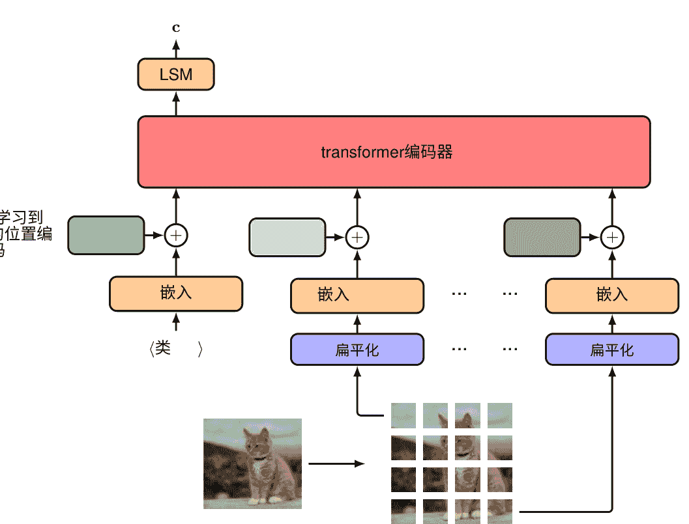

图12.22展示了用于分类任务的视觉transformer架构的示意图。

对输入进行规范化。因此，相比于可比较的卷积神经网络，变压器通常需要更多的训练数据，因为它必须从头开始学习图像的几何属性。然而，由于对输入结构没有强烈的假设，变压器通常能够收敛到更高的准确性。这提供了另一个说明归纳偏差和训练数据规模之间的权衡关系（Sutton，2019）。

### 12.4.2 生成式图像 Transformer

在语言领域，最令人印象深刻的结果是当变压器被用作自回归生成模型合成文本时。因此，自然而然地会问是否我们也可以使用变压器来合成逼真的图像。由于自然语言本质上是顺序的，它很好地适应了自回归框架，而图像没有像素的自然顺序，因此自回归解码对于图像是否有用并不直观。然而，任何分布都可以分解为条件概率的乘积，只要我们首先定义一些变量的顺序。因此，有序的联合分布

图12.23展示了二维图像中像素的特定线性顺序的光栅扫描的示意图。

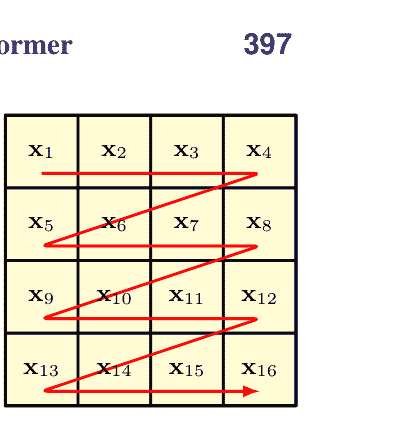

变量 $\mathbf{x}_1, \ldots, \mathbf{x}_N$ 可以写成

$$p(\mathbf{x}_1, \ldots, \mathbf{x}_N) = \prod_{n=1}^N p(\mathbf{x}_n|\mathbf{x}_1, \ldots, \mathbf{x}_{n-1}). \quad (12.37)$$

这种因式分解是完全通用的，对个体条件分布 $p(\mathbf{x}_n|\mathbf{x}_1, \ldots, \mathbf{x}_{n-1})$ 没有任何限制。

对于图像，我们可以选择 $\mathbf{x}_n$ 来表示第 $n$ 个像素的RGB值的三维向量。现在我们需要为像素确定一个顺序，其中一个广泛使用的选择被称为光栅扫描，如图12.23所示。图12.24展示了使用自回归模型基于光栅扫描顺序生成图像的示意图。

需要注意的是，在引入transformers之前，自回归生成模型已经被用于图像生成。例如，PixelCNN (Oord et al., 2016) 和 Pixel-RNN (Oord, Kalchbrenner, and Kavukcuoglu, 2016) 使用了定制的掩蔽卷积层，这些层保持了每个像素的条件独立性，这由12.37右侧的相应项定义。

使用连续值表示图像在判别任务中效果很好。然而，使用离散表示可以获得更好的图像生成结果。通过最大似然学习的连续条件分布，如高斯分布，其负对数似然函数是一个平方误差函数，往往学习训练数据的平均值，导致图像模糊。相反，离散分布可以轻松处理多模态。例如，条件分布 $p(\mathbf{x}_n|\mathbf{x}_1, \ldots, \mathbf{x}_{n-1})$ in

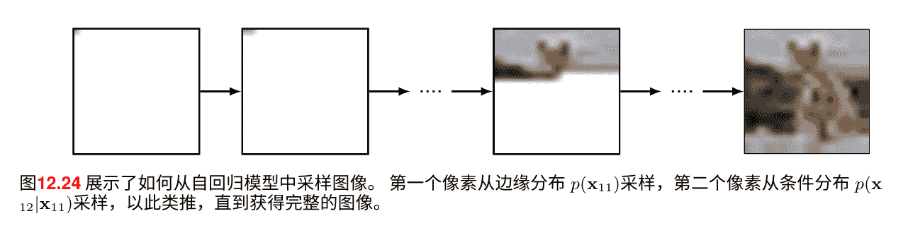

图12.24展示了如何从自回归模型中采样图像。第一个像素从边缘分布 $p(\mathbf{x}_1)$ 采样，第二个像素从条件分布 $p(\mathbf{x}_2|\mathbf{x}_1)$ 采样，以此类推，直到获得完整的图像。

(12.37) 可能会学到一个像素可以是黑色或白色，而回归模型可能会学到像素应该是灰色。

然而，处理离散空间也带来了挑战。图像像素的 R、G 和 B 值通常用至少 8 位的精度表示，因此每个像素有 $2^{24} \simeq 16\mathrm{M}$ 个可能的值。在这样一个高维空间上学习条件 softmax 分布是不可行的。

解决高维问题的一种方法是使用向量量化技术- 第 15.1.1 节的技术，它可以看作是一种数据压缩形式。假设我们有一组数据向量 $\mathbf{x}_1, \ldots, \mathbf{x}_N$，每个维度为 $D$，可能代表图像像素，然后我们引入一组 $K$ 个码书向量 $\mathcal{C} = \mathbf{c}_1, \ldots, \mathbf{c}_K$，也是维度为 $D$ 的向量，通常 $K \ll D$。现在，我们根据某种相似度度量（通常是欧氏距离）将每个数据向量近似为其最近的码书向量，这样

$$\mathbf{x}_n \rightarrow \arg\min_{\mathbf{c}_k \in \mathcal{C}} \|\mathbf{x}_n - \mathbf{c}_k\|^2.$$

由于有 $K$ 个码本向量，我们可以用一个独热编码来表示每个 $\mathbf{x}_n$。$K$ 维向量，由于可以选择 $K$ 的值，我们可以控制数据的更准确表示，通过使用较大的 $K$ 值，或者通过使用较小的 $K$ 值来实现更大的压缩。

因此，我们可以将原始图像像素映射到较低维的码本空间中。然后，可以训练一个自回归变换器来生成一系列码本向量，然后通过用相应的码本索引 $k$ 替换每个码本向量来将该序列映射回原始图像空间。

$D$ 维码本向量 $\mathbf{c}_k$。自回归变换器首次应用于图像是在 ImageGPT (Chen, Radford等, 2020) 中。在这里，每个像素被视为三维颜色码本向量集合中的一个，每个向量对应于颜色空间的一个聚类。因此，独热编码提供了离散的标记，类似于语言标记，并允许变换器以与语言模型相同的方式进行训练，具有下一个标记分类目标。这是一个强大的表示学习目标，用于后续的微调，同样类似于语言建模。

然而，直接使用单个像素作为标记可以导致计算成本高，因为每个像素都需要进行一次前向传递，这意味着训练和推断在图像分辨率上都无法良好扩展。此外，使用单个像素作为输入意味着在光栅扫描后期解码像素时，必须使用低分辨率图像以获得合理的上下文长度。正如我们在 ViT 模型中所看到的，与像素相比，最好使用图像的补丁作为标记，因为这可以大大减少标记数量，从而便于处理更高分辨率的图像。与以前一样，由于条件分布的多模态性，我们需要使用离散的标记值空间进行操作。同样，这引发了维度的挑战，与单个像素相比，使用补丁的维度问题更加严重，因为维度随着补丁中像素数量的指数级增长。例如，即使只有两个可能的像素

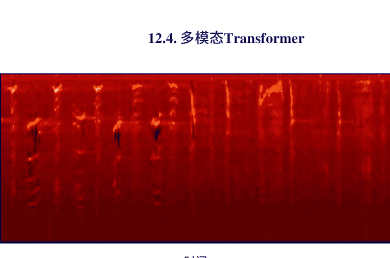

标记，代表黑色和白色，并且大小为 16 × 16 的补丁，我们将得到一个大小为 2^{256} ≅ 10^{77} 的补丁令牌字典。

再次，我们转向向量量化来解决维度挑战的问题。代码簿向量可以通过使用简单的聚类算法（如 K 均值）或更复杂的方法（如完全卷积网络（Oord、Vinyals和Kavukcuoglu，2017；Esser、Rombach和Ommer，2020）或视觉变换器（Yuet al., 2021））从图像补丁数据集中学习。将每个补丁映射到离散码集合并再次映射回去的一个问题是，向量量化是一个不可微分的操作。幸运的是，我们可以使用一种称为直通梯度估计（Bengio、Léonard和Courville，2013）的技术，这是一种简单的近似方法，在反向传播过程中通过非可微分函数复制梯度。

使用自回归变压器生成图像的方法可以通过将视频视为这些矢量量化标记的一个长序列来扩展(Rakhimov等人，2020年; Yan等人，2021年; Hu等人，2023年)。

#### 12.4.3 音频数据

接下来我们将研究将变压器应用于音频数据。声音通常以通过在规则时间间隔内测量空气压力的振幅获得的波形形式存储。虽然这个波形可以直接用作深度学习模型的输入，但在实践中，将其预处理为 mel频谱图更加有效。这是一个矩阵，其列代表时间步长，行对应于频率。频带遵循一种标准约定，通过主观评估选择，以在连续频率之间提供相等的知觉差异（‘mel’一词来自旋律）。图12.25显示了一个mel频谱图的示例。

变压器在音频领域的一个应用是分类，其中音频片段被分配到一些预定的类别之一。例如，AudioSet数据集（Gemmeke等，2017）是一个广泛使用的基准。

它包含诸如'汽车'、'动物'和'笑声'等类别。 在变压器的发展之前，音频分类的最先进方法是基于将mel频谱图视为图像并用作卷积神经网络（CNN）的输入。 然而，尽管CNN在理解局部关系方面表现良好，但其缺点之一是在处理音频时很难处理较长范围的依赖关系，而这可能是重要的。

正如变压器取代了循环神经网络（RNN）成为自然语言处理的最先进技术一样，它们也取代了CNN在音频分类等任务中的应用。 例如，与语言和视觉任务中使用的相同结构的变压器编码器模型（如图12.18所示）可以用于预测音频输入的类别（Gong、Chung和Glass，2021）。 在这里，mel频谱图被视为一张图像，然后被分词化。 这是通过以类似于视觉变压器的方式将图像分割成补丁来完成的，可能会有一些重叠，以保留任何重要的邻域关系。 然后，每个补丁都被展平，意味着它被转换为一个一维数组，本例中长度为256。 然后，对每个标记添加一个唯一的位置编码，附加一个特定的<类>标记，然后将标记馈送到变压器编码器中。 然后，使用线性层和softmax激活函数对最后一个变压器层的<类>输入标记对应的输出标记进行解码，整个模型可以使用交叉熵损失进行端到端训练。

#### 12.4.4 文本转语音

分类不是深度学习，更具体地说是变压器架构，在音频领域中所革新的唯一任务。 变压器在合成模仿特定说话者声音的语音方面取得的成功是它们多功能性的另一个证明，将其应用于这一任务是如何在新的背景下应用变压器的一个信息性案例研究。

生成与给定文本段落相对应的语音被称为文本到语音合成。 更传统的方法是收集特定说话者的语音录音，并训练一个监督回归模型来预测相应的转录文本的语音输出，可能以mel频谱图的形式呈现。 在推理过程中，我们将希望合成语音的文本作为输入，并且生成的mel频谱图输出可以通过解码回音频波形，因为这是一个固定的映射。

然而，这种方法有一些主要的缺点。 首先，如果我们以低级别预测语音，例如使用称为音素的子词组件，那么需要更大的上下文才能使结果的句子听起来流畅。 然而，如果我们预测更长的片段，那么可能的输入空间将显著增加，并且可能需要大量的训练数据才能实现良好的泛化。

其次，这种方法不能在说话者之间传递知识，因此对于每个新的说话者都需要大量的数据。 最后，这个问题实际上是一个生成建模任务，因为对于给定的说话者和Section 4.2 文本对，存在多个正确的语音输出，因此回归可能不适用，因为它倾向于对目标值进行平均。 如果我们将音频数据与自然语言以相同的方式处理，并将文本转语音视为条件语言建模任务，那么我们应该能够

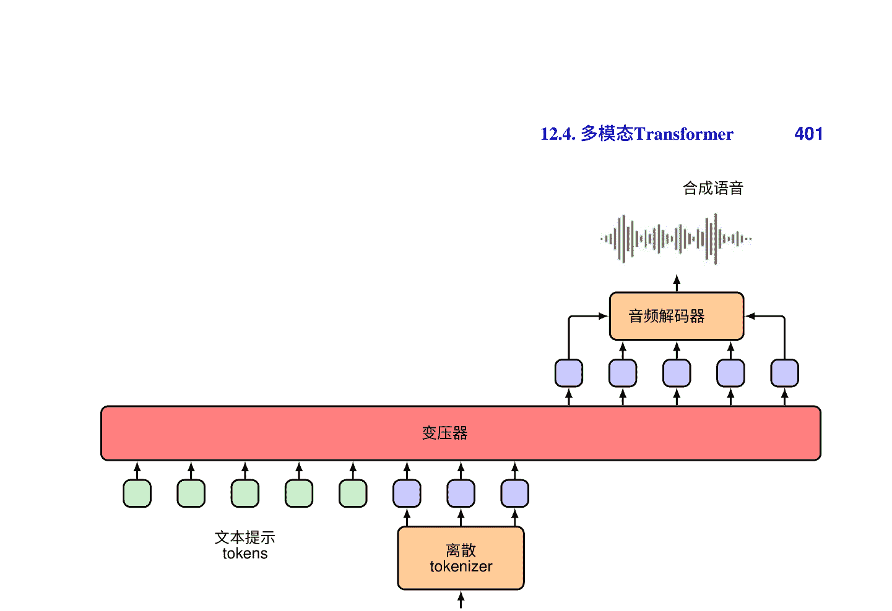

图12.26 显示了Vall-E的高级架构图。变压器模型的输入包括标准文本标记，这些标记提示模型合成语音应包含哪些单词，以及确定说话者风格和语调信息的声学提示标记。通过学习的解码器将采样的模型输出标记解码回语音。为简单起见，位置编码和线性投影未显示。

以与基于文本的大型语言模型相同的方式训练模型。需要解决的两个主要实现细节。第一个是如何对训练数据进行分词和解码预测，第二个是如何根据说话者的声音对模型进行调整。

一种利用变压器和语言建模技术进行文本到语音合成的方法是Vall-E（Wang等，2023年）。只需使用来自该人的几秒钟的样本语音，就可以将新文本映射为新说话者的声音。语音数据被转换为从学习的字典或使用矢量量化获得的离散标记序列，我们可以将这些标记视为自然语言领域中的独热编码标记的类比。输入由文本标记组成，来自一段文本，而训练的目标输出由相应的语音标记组成。还会附加来自同一说话者的无关语音短片段的其他语音标记

将附加语音输入标记以图12.26所示的方式附加到输入文本标记中。通过包含来自许多不同说话者的示例，系统可以学习朗读一段文本，并模仿附加语音输入标记所代表的声音。一旦训练完成，系统可以接收新文本以及来自新说话者的一小段捕获的语音标记，并使用训练期间使用的相同码书进行解码，以创建一个语音波形。 这使得系统能够合成与新说话者的输入文本相对应的语音。

#### 12.4.5 视觉和语言转换器

我们已经看到如何为文本、音频和图像生成离散标记，因此自然而然地会问，我们是否可以训练一个模型，其输入标记是一种模态，输出标记是另一种模态，或者我们是否可以将不同的模态组合用于输入或输出或两者兼而有之。 我们将重点关注文本和视觉数据的组合，因为这是最广泛研究的例子，但原则上这里讨论的方法也可以应用于其他输入和输出模态的组合。

第一个要求是我们有一个大型的训练数据集。 LAION-400M数据集（Schuhmann等，2021年）在文本到图像生成和图像到文本字幕生成的研究中取得了巨大的加速，就像ImageNet在深度图像分类模型的发展中起到了关键作用一样。 文本到图像的生成实际上与我们迄今为止所看到的无条件图像生成非常相似，只是我们还允许模型在生成过程中以文本信息作为输入来进行条件生成。 当使用transformers时，这是很简单的，因为我们可以在解码每个图像标记时，简单地提供文本标记作为额外的输入。

这种方法也可以看作是将文本到图像的问题视为一个序列到序列的语言建模问题，例如机器翻译，只是目标标记是离散的图像标记而不是语言标记。 因此，选择一个完整的编码器-解码器变换器模型是有意义的，如图12.20所示，其中 X对应于输入文本标记， Y对应于输出图像标记。 这是一个名为Parti (Yu etal., 2022)的模型所采用的方法，其中变换器的参数规模扩展到了200亿个，同时显示出随着模型规模增加而持续改进的性能。

还有很多关于使用预训练语言模型的研究，以及修改或微调它们，使其能够接受视觉数据作为输入（Alayracet al., 2022; Liet al., 2022）。 这些方法主要使用定制的架构，以及连续值图像标记，因此不适合生成视觉数据。 此外，如果我们希望包括新的模态，如音频标记，它们不能直接使用。 虽然这是迈向多模态的一步，但我们理想情况下希望同时使用文本和图像标记作为输入和输出。 最简单的方法是将所有内容都视为标记序列，就像处理自然语言一样，但字典是语言标记字典和图像标记代码本的连接。 然后，我们可以将任何音频和视觉数据流简单地视为标记序列。


图12.27 CM3Leon模型在文本和图像的联合空间中执行各种不同任务的示例。[来自(Yuet al., 2023)的许可]

在CM3 (Aghajanyanet al., 2022)和CM3Leon (Yuet al., 2023)中，使用了一种变体的语言建模来训练包含来自在线来源的图像和文本数据的HTML文档。当这么大量的训练数据与可扩展的架构相结合时，模型变得非常强大。此外，训练的多模态性意味着模型非常灵活。这样的模型能够完成许多任务，否则可能需要特定任务的模型架构和训练方法，例如文本到图像生成、图像到文本的字幕生成、图像编辑、文本补全等等，包括常规语言模型能够完成的任何任务。CM3Leon模型完成几个不同任务实例的示例如图12.27所示。

### 练习

```
12.1 (★ ★)考虑一组系数 $a_{nm}$，其中 $m = 1, \ldots \ldots \ldots \ldots \ldots \ldots , N$，具有以下属性

$a_{nm} \geqslant 0$

$\sum_{m} a_{nm} = 1.$
```

**附录C** 通过使用拉格朗日乘数法，可以证明系数也必须满足以下条件：

$$ a_{nm} \leqslant 1 \quad \text{对于} \quad n = 1, \ldots, N. \qquad (12.41) $$

**12.1** $(\star)$ 验证softmax函数 (12.5) 满足约束条件 (12.3) 和 (12.4) 对于向量 $\mathbf{x}_1, \ldots, \mathbf{x}_N$ 的任意值。

**12.2** $(\star)$ 考虑简单变换 (12.2) 中的输入向量 $\mathbf{x}_n$，其中加权系数 $a_{nm}$ 由 (12.5) 定义。证明如果所有输入向量都正交，即 $\mathbf{x}_n^T \mathbf{x}_m = 0$ 对于 $n \neq m$，则输出向量将简单地等于输入向量，即 $\mathbf{y}_n = \mathbf{x}_n$ 对于 $n=1, \ldots, N$。

**12.3** $(\star)$ 考虑两个独立的随机向量 $\mathbf{a}$ 和 $\mathbf{b}$，每个维度为 $D$，并且每个向量都从均值为零、方差为单位的高斯分布中抽取 $\mathcal{N}(\cdot |\mathbf{0}, \mathbf{I})$。证明 $(\mathbf{a}^T \mathbf{b})^2$ 的期望值为 $D$。

**12.4** $(\star \star \star)$ 证明由(12.19)定义的多头注意力可以重写为以下形式

$$ \mathbf{Y} = \sum_{h=1}^{H} \mathbf{H}_h \mathbf{X} \mathbf{W}^{(h)} \qquad (12.42) $$

其中 $\mathbf{H}_h$ 由(12.15)给出，并且我们定义了

$$ \mathbf{W}^{(h)} = \mathbf{W}_h^{(v)} \mathbf{W}_h^{(o)} . \qquad (12.43) $$

这里我们将矩阵 $\mathbf{W}^{(o)}$ 水平分割成了表示子矩阵的形式 $\mathbf{W}_h^{(o)}$，每个维度为 $D_v \times D$ 的子矩阵，对应于连接注意力矩阵的垂直段。由于 $D_v$ 通常比 $D$ 小，例如 $D_v = D/H$ 是一个常见的选择，这个组合矩阵是秩不足的。因此，使用一个完全灵活的矩阵来替代 $\mathbf{W}_h^{(v)} \mathbf{W}_h^{(o)}$ 不等同于原文中给出的表达式。

**12.5** $(\star \star)$ 将自注意力函数 (12.14) 表达为一个完全连接的网络，以将完整的输入序列连接的词向量映射为相同维度的输出向量。注意，这样的矩阵将具有 $\mathcal{O}(N^2 D^2)$ 参数。证明自注意力网络对应于具有参数共享的稀疏版本的该矩阵。绘制一个示意图，显示该矩阵的结构，指示哪些参数块是共享的，哪些块的所有元素都等于零。

**12.6** $(\star)$ 证明如果我们省略输入向量的位置编码，则由 (12.19) 定义的多头注意力层的输出对于输入序列的重新排序是等变的。

**12.7** $(\star \star \star)$ 考虑两个 $D$ 维单位向量 $\mathbf{a}$ 和 $\mathbf{b}$，满足 $\|\mathbf{a}\| = 1$ 和 $\|\mathbf{b}\| = 1$，从随机分布中绘制。假设分布关于原点对称，即仅取决于与原点的距离和而不是方向。图12.7 ……（图片描述）

证明对于较大的 $D$ 值，这些向量之间夹角的余弦值接近于零，因此这些随机向量在高维空间中几乎正交。为了做到这一点，考虑一个正交规范基 $\{u_i\}$，其中 $u_i^T u_j = \delta_{ij}$，并将 $a$ 和 $b$ 表示为该基础上的展开。

**12.8** $(\star \star)$ 考虑一种位置编码，其中输入令牌向量 $\mathbf{x}$ 与位置编码向量 $\mathbf{e}$ 连接。证明当通过矩阵乘法对这个连接向量进行一般线性变换时，结果可以表示为输入的线性变换和位置向量的线性变换之和。

**12.9** $(\star \star)$ 证明由(12.25)定义的位置编码具有以下特性：对于固定的偏移 $k$，位置 $n + k$ 处的编码可以表示为位置 $n$ 处编码的线性组合，其中系数仅依赖于 $k$ 而不依赖于 $n$。为了实现这一点，利用以下三角恒等式：

$$\cos(A + B) = \cos A \cos B - \sin A \sin B \tag{12.44}$$
$$\sin(A + B) = \cos A \sin B + \sin A \cos B. \tag{12.45}$$

证明如果编码仅基于正弦函数而没有余弦函数，则这个特性不再成立。

**12.10** $(\star)$ 考虑词袋模型 (12.28)，其中每个组件分布 $p(x_n)$ 由一个共享的概率表给出，该表适用于所有单词。证明最大似然解是给定训练向量集的表格，其条目是每个单词在训练集中出现的次数的比例。

**12.11** $(\star)$ 考虑由(12.31)给出的自回归语言模型，并假设右侧的项 $p(x_n|x_1, \ldots, x_{n-1})$ 由一般概率表表示。证明这些表中的条目数量随着 $n$ 的增加呈指数增长。

**12.12** $(\star)$ 在使用 n-gram 时，通常同时训练 n-gram 和 (n - 1)-gram 模型，然后使用概率的乘法规计算条件概率，形式如下

$$p(\mathbf{x}_n | \mathbf{x}_{n-L+1}, \dots, \mathbf{x}_{n-1}) = \frac{p_L(\mathbf{x}_{n-L+1}, \dots, \mathbf{x}_n)}{p_{L-1}(\mathbf{x}_{n-L+1}, \dots, \mathbf{x}_{n-1})}. \tag{12.46}$$

解释为什么这比直接存储左侧更方便，并且在评估时必须省略每个序列的最后一个标记以获得正确的概率 $p_{L-1}(\ldots)$。

**12.13** $(\star \star)$ 写下一个训练过的RNN中推理过程的伪代码，其架构如图12.13所示。

**12.14** $(\star \star)$ 考虑一个由两个标记 $y_1$ 和 $y_2$ 组成的序列，每个标记可以取状态 A 或 B。下表显示了联合概率分布 $p(y_1, y_2)$：

|     | $y_1 = A$ | $y_1 = B$ |
|-----|--------|--------|
| $y_2 = A$ | 0.0    | 0.4    |
| $y_2 = B$ | 0.1    | 0.25   |

我们看到最可能的序列是 $y_1 = B, y_2 = B$，这个序列的概率为 0.4。使用概率的和与乘法规则，写出边缘分布 $p(y_1)$ 和条件分布 $p(y_2|y_1)$ 的值。证明如果我们首先最大化 $p(y_1)$ 得到一个值 $y_1^*$，然后随后最大化 $p(y_2|y_1^* )$，那么我们得到的序列将与整体最可能的序列不同。找出序列的概率。

**12.15** $(\star \star \star)$ BERT-Large模型 (Devlin等, 2018) 的最大输入长度为512个令牌，每个令牌的维度为 $D= 1,024$，来自一个30,000个词汇的词汇表。它有24个变压器层，每个层有16个自注意力头， $D_q = D_k = D_v =64$，MLP位置网络有两个具有4,096个隐藏节点的层。证明BERT编码器变压器语言模型中的参数总数约为3.4亿。

在之前的章节中，我们遇到了序列和图像这样的结构化数据，分别对应一维和二维数组的变量。更一般地说，有许多类型的结构化数据最好用图来描述，如图13.1所示。一般来说，图由一组对象组成，称为节点，由边连接。节点和边都可以与数据相关联。例如，在分子中，节点和边与离散变量相关联，对应于原子的类型（碳、氮、氢等）和键的类型（单键、双键等）。对于铁路网络，每条铁路线可能与两个城市之间的平均旅行时间相关联。在这里，我们假设边是对称的，例如从伦敦到剑桥的旅行时间与从剑桥到伦敦的旅行时间相同。这样的边通过节点之间的无向链接表示。对于全球网络，边是有向的。

图结构化数据的三个示例：(a) 由化学键连接的原子组成的咖啡因分子，(b) 由铁路线连接的城市组成的铁路网络，以及 (c) 由超链接连接的页面组成的全球网络。因为如果页面A上有一个指向页面B的超链接，并不一定有一个指向页面A的超链接。

图结构化数据的其他示例包括蛋白质相互作用网络，其中节点是蛋白质，边表示蛋白质对之间的相互作用强度；电路网络，其中节点是组件，边是导体；或者社交网络，其中节点是人，边是“友谊”。还有更复杂的图形结构，例如公司内部的知识图谱包括多种不同类型的节点，如人员、文件和会议，以及多种不同类型的边，捕捉不同的属性，例如一个人在会议上出席或一个文件引用另一个文件。

在本章中，我们将探讨如何将深度学习应用于图结构化数据。当我们讨论图像时，我们已经遇到了结构化数据的一个例子，在图像数据向量中，每个元素对应于一个规则网格上的像素。因此，图像是图结构化数据的一个特殊实例，其中节点是像素，边描述了哪些像素相邻。

第10章卷积神经网络（CNN）考虑了这种结构，结合了像素的相对位置的先验知识，以及分割等属性的等变性和分类等属性的不变性。我们将使用CNN作为图像的灵感来源，构建更通用的深度学习方法，称为图神经网络（Zhou等，2018年；Wu等，2019年；Hamilton，2020年；Veličković，2023年）。

我们将看到，将深度学习应用于图结构化数据时，关键考虑因素是确保对图中节点的重新排序具有等变性或不变性。

### 13.1. 图上的机器学习

我们可以根据目标是预测节点属性、边属性还是整个图属性来广泛地将希望使用图结构化数据解决的应用分组。节点预测的一个例子是根据文档之间的超链接和引用将文档分类为其主题。

关于边，例如，我们可能已经了解蛋白质网络中的一些相互作用，并希望预测是否存在其他相互作用。这些任务被称为边预测或图完成任务。还有一些任务，在这些任务中，边已经预先知道，目标是发现图中的聚类或'社区'。

最后，我们可能希望预测与整个图相关的属性。例如，我们可能希望预测某个分子是否可溶于水中。在这里，我们不再给出一个单一的图形，而是有一个数据集包含不同的图形，我们可以将其视为从某个公共分布中绘制出来的，换句话说，我们假设图形本身是独立且同分布的。这样的任务可以被视为图形回归或图形分类任务。

对于分子溶解度分类的例子，我们可能会得到一个带有标签的分子训练集，以及一个需要预测其溶解度的新分子测试集。这是一个标准的归纳任务的例子，我们在之前的章节中已经见过很多次。然而，一些图形预测例子是转导的，我们在这些例子中给出了整个图形的结构以及一些节点的标签，目标是预测其余节点的标签。一个例子是一个大型社交网络，我们的目标是将每个节点分类为真实人或自动机器人。在这里，可能会手动标记一小部分节点，但是在一个庞大且不断变化的社交网络中，逐个调查每个节点是不可行的。在训练过程中，我们可以访问整个图形以及一部分节点的标签，我们希望预测其余节点的标签。这可以看作是一种半监督学习的形式。

除了直接解决预测任务外，我们还可以使用深度学习在图形上发现有用的内部表示，从而促进一系列下游任务。这被称为图形表示学习。例如，我们可以通过训练一个深度学习系统在大量分子结构上来构建分子的基础模型。目标是一旦训练完成，这样的基础模型可以通过使用小型标记数据集进行微调以适应特定任务。

图神经网络为每个节点定义了一个嵌入向量，通常使用观察到的节点属性进行初始化，然后通过一系列可学习的层进行转换以创建一个学习到的表示。这类似于在第12章变压器中通过一系列层处理词嵌入或标记，以获得更好地捕捉单词在上下文中的含义的表示。图神经网络还可以使用与边缘和整个图形相关的学习到的嵌入。

#### 13.1.1 图属性

在本章中，我们将重点关注简单图，其中任意一对节点之间最多只有一条边，边是无向的，并且没有将节点连接到自身的自环。这足以介绍图神经网络的关键概念，并且它还涵盖了广泛的实际应用。 然后，这些概念可以应用于更复杂的图结构。

我们首先介绍与图相关的一些符号，并定义一些重要的属性。 一个图 $G=(V,E)$ 由一组节点或顶点 $V$ 组成，以及一组边或链接 $E$ 组成。 我们用 $n=1,\ldots,N$ 来索引节点，并将从节点 $n$ 到节点 $m$ 的边表示为 $(n,m)$。 如果两个节点由一条边连接，则它们被称为邻居，节点 $n$ 的所有邻居的集合表示为 $\mathcal{N}(n)$。

除了图结构之外，我们通常还有与节点相关的观测数据。 对于每个节点 $n$，我们可以将相应的节点变量表示为一个 $D$ 维列向量 $\mathbf{x}_n$，并将它们分组成一个维度为 $N \times D$ 的数据矩阵 $\mathbf{X}$，其中第 $n$ 行由 $\mathbf{x}_n^T$ 给出。 图中的边也可能与数据相关，尽管我们首先只关注节点变量。

#### 13.1.2 邻接矩阵

指定图中的边的一种方便方法是使用一个称为 $\mathbf{A}$ 的邻接矩阵。 为了定义邻接矩阵，我们首先必须选择节点的顺序。 如果图中有 $N$ 个节点，我们可以使用 $n=1,\ldots,N$ 对它们进行索引。 邻接矩阵的尺寸为 $N \times N$，并且在每个位置 $n,m$ 上都包含一个 $1$，表示从节点 $n$ 到节点 $m$ 存在一条边，其他所有条目均为 $0$。对于具有无向边的图，邻接矩阵将是对称的，因为从节点 $n$ 到节点 $m$ 存在一条边意味着从节点 $m$ 到节点 $n$ 也存在一条边，因此 $A_{mn} = A_{nm}$ 对于所有的 $n$ 和 $m$ 成立。 图13.2展示了一个邻接矩阵的例子。

由于邻接矩阵定义了图的结构，我们可以考虑直接将其作为神经网络的输入。为了做到这一点，我们可以将矩阵“展平”，例如将列连接成一个长列向量。然而，这种方法的一个主要问题是邻接矩阵依赖于节点排序的任意选择，如图13.2所示。例如，假设我们想要预测一个分子的溶解度。显然，这不应该依赖于在写下邻接矩阵时分配给节点的排序。由于排列的数量随节点数量的增加而阶乘增加，通过使用大数据集或数据增强来学习排列不变性是不切实际的。相反，我们应该将这种不变性属性视为构建网络架构时的归纳偏置。

#### 13.1.3 排列等变性

我们可以通过引入置换矩阵 $\mathbf{P}$ 来数学地表示节点标签的置换，该矩阵与邻接矩阵具有相同的大小，并且指定了节点排序的特定置换。它在每一行和每一列都包含一个1，其他元素都为0，其中位置 $(n, m)$ 上的1表示节点 $n$ 在置换后将被重新标记为节点 $m$。例如，考虑从 $(A, B, C, D, E)$ 到 $(C, E, A, D, B)$ 的置换，对应于图13.2中两种节点排序的选择。练习13.1相应的置换矩阵的形式为：

$$
\mathbf{P} = \begin{pmatrix} 0 & 0 & 1 & 0 & 0 \\ 0 & 0 & 0 & 0 & 1 \\ 1 & 0 & 0 & 0 & 0 \\ 0 & 0 & 0 & 1 & 0 \\ 0 & 1 & 0 & 0 & 0 \end{pmatrix} \quad (13.1)
$$

这是一个列向量，其中所有元素都为0，除了元素 $i$ 等于1。在这种表示法中，单位矩阵可以表示为

$$
\mathbf{I} = \begin{pmatrix} \mathbf{u}_1^\mathrm{T} \\ \mathbf{u}_2^\mathrm{T} \\ \vdots \\ \mathbf{u}_N^\mathrm{T} \end{pmatrix} \quad (13.2)
$$

我们现在可以引入一个置换函数 $\pi(\cdot)$，它将 $n$ 映射到 $m = \pi(n)$。相关的置换矩阵如下所示

$$
\mathbf{P} = \begin{pmatrix} \mathbf{u}_{\pi(1)}^\mathrm{T} \\ \mathbf{u}_{\pi(2)}^\mathrm{T} \\ \vdots \\ \mathbf{u}_{\pi(N)}^\mathrm{T} \end{pmatrix} \quad (13.3)
$$

当我们重新排序图的节点标签时，对应的节点数据矩阵 $\mathbf{X}$ 的效果是根据 $\pi(\cdot)$ 对行进行置换，这可以通过预乘 $\mathbf{P}$ 来实现

$$
\widetilde{\mathbf{X}} = \mathbf{P}\mathbf{X} \quad (13.4)
$$

对于邻接矩阵，行和列都会被置换。同样，行可以通过预乘 $\mathbf{P}$ 进行置换，而列则通过后乘 $\mathbf{P}^T$ 进行置换，得到一个新的邻接矩阵：

$$
\widetilde{\mathbf{A}} = \mathbf{P}\mathbf{A}\mathbf{P}^T. \quad (13.5)
$$

当将深度学习应用于图结构化数据时，我们需要将图结构以数值形式表示，以便可以输入到神经网络中，这需要我们为节点分配一个顺序。然而，我们选择的具体顺序是任意的，因此确保图的任何全局属性不依赖于此顺序是很重要的。换句话说，网络预测必须对节点标签重新排序具有不变性，以便

$$
y(\widetilde{\mathbf{X}},\widetilde{\mathbf{A}}) = y(\mathbf{X}, \mathbf{A}) \quad \text{不变性} \quad (13.6)
$$

其中 $y(\cdot,\cdot)$ 是网络的输出。

我们可能还想进行与个别节点相关的预测。在这种情况下，如果我们重新排序节点标签，则相应的预测应该显示相同的重新排序，以便给定的预测始终与相同的节点相关联，而不考虑顺序的选择。换句话说，节点预测应该对节点标签重新排序具有等变性。这可以表示为

$$
\mathbf{y}(\widetilde{\mathbf{X}},\widetilde{\mathbf{A}}) = \mathbf{P}\mathbf{y}(\mathbf{X}, \mathbf{A}) \quad \text{等变性} \quad (13.7)
$$

其中 $\mathbf{y}(\cdot,\cdot)$ 是一个网络输出的向量，每个节点对应一个元素。

### 13.2. 神经消息传递

当我们将深度神经网络应用于图结构数据时，确保在节点标签排列变换下的不变性或等变性是一个关键设计考虑因素。另一个考虑因素是我们希望利用深度神经网络的表示能力，因此我们保留了“层”的概念，将其视为可以重复应用的计算转换。如果网络的每一层在节点重新排序下是等变的，那么连续应用多个层也将表现出等变性，同时允许网络的每一层受到图结构的影响。

对于输出表示节点级预测的网络，整个网络将满足所需的等变性。如果网络用于预测图级属性，则可以包含一个对其输入排列不变的最后一层。我们还希望确保每一层都是一个高度灵活的非线性函数，并且对其参数具有可微性，以便可以使用自动微分获得的梯度通过随机梯度下降进行训练。

图形有各种不同的大小。例如，不同的分子可以有不同的原子数，因此对于标准神经网络，使用固定长度的表示形式是不合适的。

图13.3图像的卷积滤波器可以表示为图结构的计算。(a) 由深度卷积网络中的节点i在层l+1上计算的滤波器是层l上局部像素块的激活值的函数。(b) 同样的计算结构可以表示为一个图，显示从邻居节点进入节点i的“消息”。

网络不适用。因此，网络还需要能够处理可变长度的输入，就像我们在变压器网络中看到的那样。一些图可能非常大，例如具有许多百万参与者的社交网络，因此我们还希望构建能够良好扩展的模型。毫不奇怪，参数共享将发挥重要作用，既可以将不变性和等变性属性构建到网络架构中，也可以促进对大型图的扩展。

#### 13.2.1 卷积滤波器

为了开发一个满足所有这些要求的框架，我们可以从使用卷积神经网络进行图像处理中寻找灵感-第10章。首先注意到，图像可以被视为图结构化数据的一个特定实例，在这个图中，节点是像素，边表示在图像中相邻的像素对，其中相邻包括对角线相邻的节点以及水平或垂直相邻的节点。

在卷积网络中，我们对图像域进行连续的转换，使得特定层的像素通过称为滤波器的局部函数计算前一层像素的状态的函数。考虑一个使用3×3滤波器的卷积层，如图13.3(a)所示。执行的计算由单个滤波器在第l+1层的单个像素上执行，可以表示为

在第 l+1 层的单个像素上由单个滤波器执行的计算可以表示为

```
$$z_i^{(l+1)} = f\left(\sum_j w_j z_j^{(l)} + b\right)$$ (13.8)
```

其中 f(·)是一个可微的非线性激活函数，例如ReLU，并且在层 l 中的小区域内对所有九个像素求和。相同的函数应用于图像中的多个区域，因此权重 w_j和偏置 b在区域之间是共享的（因此不带索引 i）。

目前，(13.8) 在层 l 中的节点重新排序时不具有等变性，因为权重向量 w_j的元素在其元素的排列置换下不变。然而，我们可以通过一些简单的修改来实现等变性，如下所示。我们首先将过滤器视为一个图，如图13.3(b)所示，并分离出节点 i的贡献。其他八个节点是其邻居 \mathcal{N}(i)。然后，我们假设单个权重参数 w_{\text{neigh}}在邻居之间是共享的，因此

```
$$z_i^{(l+1)} = f\left(\sum_{j \in \mathcal{N}(i)} w_{\text{neigh}} z_j^{(l)} + w_{\text{self}} z_i^{(l)} + b\right)$$ (13.9)
```

其中节点 i有自己的权重参数 w_{\text{self}}

我们可以将(13.9)解释为通过从邻居节点传递信息到节点 i 来更新节点 i的本地表示 z_i。在这种情况下，消息只是其他节点的激活值。然后将这些消息与节点 i的信息相结合，并使用非线性函数进行转换。在(13.9)中，通过简单求和的方式对邻居节点的信息进行聚合，这显然对与这些节点相关的标签的任何排列都是不变的。此外，操作(13.9)在图中的每个节点上同步应用，因此如果节点被重新排列，则结果计算将保持不变，但其顺序也将被重新排列，因此，此计算在节点重新排序下是等变的。请注意，这取决于参数 w_{\text{neigh}}, w_{\text{self}}和 b在所有节点之间共享。

#### 13.2.2 图卷积网络

我们现在使用卷积示例作为模板来构建用于图结构数据的深度神经网络。我们的目标是定义一个灵活的、非线性的节点嵌入变换，该变换对一组权重和偏置参数可微分，并将层 l 中的变量映射到相应的层 l+1 中的变量。对于图中的每个节点 n和网络中的每个层 l，我们引入一个 D维列向量 \mathbf{h}_n^{(l)}作为节点嵌入变量，其中 n=1,\ldots,N，l=1,\ldots,L。

我们可以看到式(13.9)给出的变换首先从相邻节点中收集和组合信息，然后根据这些信息更新节点。

算法13.1：简单的消息传递神经网络

输入：无向图 \( G=(V,E) \) 初始节点嵌入 \( \{h_n^{(0)}=x_n\} \) 聚合( · )函数 更新( ·,· )函数 输出：最终节点嵌入 \( \{h_n^{(L)}\} \)

```
// 迭代消息传递  
对于 \( l \in \{0,\dots,L-1\} \) 执行  
    \( z_n^{(l)} \leftarrow \text{聚合}\left( \{h_m^{(l)} : m \in \mathcal{N}(n)\} \right) \)  
    \( h_n^{(l+1)} \leftarrow \text{更新}\left( h_n^{(l)}, z_n^{(l)} \right) \)  
结束循环  
返回 \( \{h_n^{(L)}\} \)
```

节点的当前嵌入和传入的消息。因此，我们可以将每个处理层视为具有两个连续阶段。第一个阶段是聚合阶段，在该阶段中，对于每个节点 \( n \)，从其邻居节点传递消息到该节点，并以一种置换不变的方式组合成一个新的向量 \( z_n^{(l)} \)。然后是一个更新步骤，其中从相邻节点聚合的信息与节点本身的本地信息相结合，并用于计算该节点的修订嵌入向量。

考虑图中的一个特定节点 \( n \)：我们首先聚合来自节点n的所有邻居节点的节点向量：

\( z_n^{(l)} = \text{聚合}\left( \{h_m^{(l)} : m \in \mathcal{N}(n)\} \right) \) (13.10)

如果聚合函数对于可变数量的邻居节点是明确定义的，并且不依赖于这些节点的顺序，那么该聚合函数的形式非常灵活。只要它对于这些参数是可微分的函数，以便于梯度下降训练，它可以潜在地包含可学习的参数。

\( h_n^{(l+1)} = \text{更新}\left( h_n^{(l)}, z_n^{(l)} \right) \) (13.11)

同样，这可以是一组可学习参数的可微分函数。在图中的每个节点上并行应用聚合操作后跟更新操作表示网络的一层。节点嵌入通常使用观察到的节点数据进行初始化，以便于 \( h_n^{(0)} = x_n \)。请注意，每个层通常具有自己独立的参数，尽管参数也可以在层之间共享。这个框架被称为消息传递神经网络(Gilmer et al., 2017)，并在算法13.1中概述。

#### 13.2.3 聚合运算符

聚合函数有很多可能的形式，但它必须仅依赖于输入集合而不依赖于它们的顺序。它还必须是可微分的任何可学习参数的函数。最简单的聚合函数是求和，根据（13.9）得出：

```
$$\text{聚合} \left( \left\{ \mathbf{h}_m^{(l)} : m \in \mathcal{N}(n) \right\} \right) = \sum_{m \in \mathcal{N}(n)} \mathbf{h}_m^{(l)} \tag{13.12}$$
```

简单的求和显然与相邻节点的顺序无关，并且无论邻域集合中有多少节点，它都是明确定义的。请注意，这没有可学习的参数。

求和对具有许多邻居的节点具有更强的影响力，而对具有少数邻居的节点具有较弱的影响力，这可能会导致数值问题，特别是在社交网络等应用中，邻域集合的大小可能相差几个数量级。这种方法的一种变体是将聚合操作定义为相邻嵌入向量的平均值，如下所示：

```
$$\text{聚合} \left( \left\{ \mathbf{h}_m^{(l)} : m \in \mathcal{N}(n) \right\} \right) = \frac{1}{|\mathcal{N}(n)|} \sum_{m \in \mathcal{N}(n)} \mathbf{h}_m^{(l)} \tag{13.13}$$
```

其中 |\mathcal{N}(n)| 表示邻域集合 \mathcal{N}(n) 中的节点数。然而，这种归一化也丢失了关于网络结构的信息，根据Hamilton（2020）的研究，它的能力也被证明比简单的求和要弱，因此是否使用它取决于节点特征相对于图结构的相对重要性。

这种方法的另一种变体（Kipf和Welling，2016）考虑了每个相邻节点的邻居数量：

```
$$\text{聚合} \left( \left\{ \mathbf{h}_m^{(l)} : m \in \mathcal{N}(n) \right\} \right) = \sum_{m \in \mathcal{N}(n)} \frac{\mathbf{h}_m^{(l)}}{\sqrt{|\mathcal{N}(n)| |\mathcal{N}(m)|}} \tag{13.14}$$
```

另一种可能性是取邻居嵌入向量的逐元素最大值（或最小值），这也满足了对变量数量的邻居的良好定义和独立于它们的顺序的要求。

由于网络中给定层中的每个节点都通过聚合来自前一层的邻居的信息进行更新，这定义了一个感受野，类似于CNN中使用的滤波器的感受野。随着信息通过连续的层进行处理，给定节点的更新取决于较早层中其他节点的逐渐增加的部分，直到有效的感受野潜在地跨越整个图，如图13.4所示。然而，大型稀疏图可能需要过多的层次才能使每个输出受到每个输入的影响。因此，一些架构引入了额外的“超级节点”

就像卷积神经网络用于图像一样，我们可以看到有效的感受野，即红色节点的数量，随着处理层数的增加而增长。

它直接连接到原始图中的每个节点，以确保信息的快速传播。

到目前为止，讨论的聚合算子没有可学习的参数。如果我们首先使用多层神经网络（记为 $\text{MLP}_{\phi}$）对相邻节点的嵌入向量进行转换，然后再组合它们的输出，我们可以引入这些参数，其中 $\text{MLP}$ 表示“多层感知器”，$\phi$ 表示网络的参数。只要网络具有在节点之间共享的结构和参数值，这个聚合算子仍然是置换不变的。我们还可以使用另一个神经网络 $\text{MLP}_{\theta}$（具有参数 $\theta$）对组合向量进行转换，从而得到一个整体的聚合算子：

```
$$\text{聚合} \left(\left\{\mathbf{h}_{m}^{(l)}: m \in \mathcal{N}(n)\right\}\right)=\text{MLP}_{\theta}\left(\sum_{m \in \mathcal{N}(n)} \text{MLP}_{\phi}\left(\mathbf{h}_{m}^{(l)}\right)\right)\tag{13.15}$$
```

其中 $\text{MLP}_{\phi}$ 和 $\text{MLP}_{\theta}$ 在层 $l$ 之间共享。由于 $\text{MLP}$ 的灵活性，(13.15)定义的转换表示了任何将一组嵌入映射到单个嵌入的排列不变函数的通用逼近器(Zaheer等人，2017)。请注意，求和可以被其他不变函数替代，例如平均值或逐元素的最大值或最小值。

如果我们考虑一个没有边的图，即一个无结构的节点集合，那么图神经网络的一个特殊情况就出现了。在这种情况下，如果我们对集合中的每个向量 $\mathbf{h}_{n}^{(l)}$ 使用(13.15)，其中求和是在除了 $\mathbf{h}_{n}^{(l)}$ 之外的所有其他向量上进行的，那么我们就有了一个用于学习无结构变量集合上的函数的通用框架，称为深度集合。

#### 13.2.4 更新运算符

在选择合适的聚合运算符之后，我们同样需要决定更新运算符的形式。类似于卷积神经网络的(13.9)式，这个运算符的一个简单形式可以是

```
更新 $\left(\mathbf{h}_n^{(l)}, \mathbf{z}_n^{(l)}\right) = f\left(\mathbf{W}_{\text{自身}} \mathbf{h}_n^{(l)} + \mathbf{W}_{\text{邻居}} \mathbf{z}_n^{(l)} + \mathbf{b}\right)$  (13.16)
```

其中 $f(\cdot)$是一个非线性激活函数，如ReLU，逐元素应用于其向量参数，而 $\mathbf{W}$ 自身、$\mathbf{W}$邻居和 $\mathbf{b}$是可学习的权重和偏置，而 $\mathbf{z}_n^{(l)}$由聚合运算符(13.10)定义 。

如果我们选择简单的求和(13.12)作为聚合函数，并且如果我们还共享节点和它们邻居之间的相同权重矩阵，即 $\mathbf{W}_{\text{自身}}=\mathbf{W}_{\text{邻居}}$ 那么我们得到的更新运算符的形式特别简单，如下所示

```
$\mathbf{h}_n^{(l+1)} = \text{更新}\left(\mathbf{h}_n^{(l)}, \mathbf{z}_n^{(l)}\right) = f\left(\mathbf{W}_{\text{邻居}} \sum_{m \in \mathcal{N}(n), n} \mathbf{h}_m^{(l)} + \mathbf{b}\right).$  (13.17)
```

消息传递算法通常通过设置 $\mathbf{h}_n^{(0)} = x_n$来初始化。然而，有时我们可能希望为每个节点拥有一个内部表示向量，其维度高于或低于 $x_n$的维度。这种表示可以通过在节点向量 $x_n$上填充额外的零（以实现更高的维度），或者仅通过使用可学习的线性变换将节点向量转换为所需维度的空间来初始化。当节点没有关联的数据变量时，一种替代的初始化形式是使用一个独热向量来标记每个节点的度数（即邻居的数量）。

总体而言，我们可以将图神经网络表示为一系列逐步转换节点嵌入的层。如果我们将这些嵌入分组成一个矩阵 $\mathbf{H}$，其中第 $n$行是向量 $\mathbf{h}_n^T$，它初始化为数据矩阵 $\mathbf{X}$，那么我们可以将连续的转换写成以下形式

```
$\begin{aligned} \mathbf{H}^{(1)} &= \mathbf{F}\left(\mathbf{X}, \mathbf{A}, \mathbf{W}^{(1)}\right) \ \mathbf{H}^{(2)} &= \mathbf{F}\left(\mathbf{H}^{(1)}, \mathbf{A}, \mathbf{W}^{(2)}\right) \ &\vdots \ \mathbf{H}^{(L)} &= \mathbf{F}\left(\mathbf{H}^{(L-1)}, \mathbf{A}, \mathbf{W}^{(L)}\right) \end{aligned}$  (13.18)
```

其中 $\mathbf{A}$是邻接矩阵，$\mathbf{W}^{(l)}$表示网络层 $l$中的完整权重和偏差集合。在由排列矩阵 $\mathbf{P}$定义的节点重新排序下，第 $l$层计算的节点嵌入的变换是等变的：

```
$\mathbf{PH}^{(l)} = \mathbf{F}\left(\mathbf{PH}^{(l-1)}, \mathbf{PAP}^{\mathrm{T}}, \mathbf{W}^{(l)}\right).$  (13.19)
```

练习13.7 因此，完整的网络计算出一个等变的变换。

#### 13.2.5 节点分类

图神经网络可以看作是一系列层，每个层将一组节点嵌入向量 $\{ \mathbf{h}_n^{(l)} \}$ 转换为一个新的相同大小和维度的集合 $\{ \mathbf{h}_n^{(l+1)} \}$。在网络的最后一个卷积层之后，我们需要获得预测结果，以便定义训练的成本函数，并且还可以使用训练好的网络对新数据进行预测。

首先考虑对图中的节点进行分类的任务，这是图神经网络最常见的用途之一。我们可以定义一个输出层，有时称为读出层，它为每个节点计算一个softmax函数，用于对应于C个类别的分类，形式如下

```
$$ y_{ni} = \frac{\exp( \mathbf{w}_i^T \mathbf{h}_n^{(L)} )}{\sum_j \exp( \mathbf{w}_j^T \mathbf{h}_n^{(L)} )} $$
(13.20)
```

其中 $\{ \mathbf{w}_i \}$ 是一组可学习的权重向量，$i=1,\ldots,C$。然后我们可以定义一个损失函数，它是所有节点和所有类别上的交叉熵损失的总和：

```
$$ \mathcal{L} = - \sum_{n \in \mathcal{V}_{\text{train}}} \sum_{i=1}^C y_{ni} t_{ni} $$
(13.21)
```

其中 $\{ t_{ni} \}$ 是具有每个值的one-hot编码的目标值。由于输出节点共享权重向量 $\{ \mathbf{w}_i \}$，输出 $y_{ni}$ 对节点顺序的排列是等变的，因此损失函数 (13.21) 是不变的。如果目标是预测输出的连续值，则可以将简单的线性变换与平方和误差相结合，定义一个合适的损失函数。

在式(13.21)中，对节点子集 $\mathcal{V}_{\text{train}}$ 求和，并用于训练。我们可以区分三种类型的节点如下：

+   节点 $\mathcal{V}_{\text{train}}$ 被标记并包含在图神经网络的消息传递操作中，也用于计算用于训练的损失函数。
+   还可能存在一个未标记的节点子集 $\mathcal{V}_{\text{trans}}$，它们不参与训练的损失函数的评估。然而，在训练和推理过程中，它们仍然参与消息传递操作，并且它们的标签可能作为推理过程的一部分进行预测。
+   剩余的节点，表示为 $\mathcal{V}_{\text{induct}}$，是一组不用于计算损失函数的归纳节点，这些节点及其相关边在训练阶段不参与消息传递。然而，在推理阶段，它们参与消息传递，并且它们的标签作为推理的结果进行预测。

如果没有转导节点，因此在训练阶段没有测试节点（及其相关的边），那么训练通常被称为归纳学习，可以看作是一种监督学习。然而，如果存在转导节点，则称为转导学习，可以看作是一种半监督学习的形式。

#### 13.2.6 边分类

在某些应用中，我们希望对图的边进行预测，而不是节点。边分类任务的一种常见形式是边完成，其目标是确定两个节点之间是否应该存在一条边。给定一组节点嵌入，可以使用嵌入对的点积来定义节点之间存在边的概率 $p(n, m)$。

通过使用逻辑sigmoid函数可以计算节点 $n$ 和 $m$ 之间存在边的概率：

$$ p(n, m) = \sigma \left( \mathbf{h}_n^{\top} \mathbf{h}_m \right). \tag{13.22} $$

一个示例应用是预测社交网络中两个人是否有共同兴趣，因此可能希望建立联系。

#### 13.2.7 图分类

在一些图神经网络的应用中，目标是根据标记的图训练集预测新图的属性 $\mathcal{G}_1, \ldots, \mathcal{G}_N$。这要求我们以一种不依赖于任意节点顺序的方式组合最终层的嵌入向量，从而确保输出预测对该顺序是不变的。目标有点类似于聚合函数，只是图中的所有节点都被包括在内，而不仅仅是各个节点的邻域集合。最简单的方法是将节点嵌入向量求和：

$$ \mathbf{y} = \mathbf{f} \left( \sum_{n \in \mathcal{V}} \mathbf{h}_n^{(L)} \right) \tag{13.23} $$

其中函数 $\mathbf{f}$ 可以包含可学习的参数，如线性变换或神经网络。还可以使用其他不变的聚合函数，如平均值或逐元素的最小值或最大值。

交叉熵损失通常用于分类问题，例如将候选药物分子标记为有毒或安全，而平方误差损失用于回归问题，例如预测候选药物分子的溶解度。

图级预测对应于归纳任务，因为训练和推断需要分开的图集合。

## 13.3. 通用图网络

到目前为止，图网络的变体和扩展有很多。在这里，我们概述一些关键概念以及一些实际考虑因素。

#### 13.3.1 图注意力网络

第12.1节当作为转换器架构的基础时，注意机制非常强大。它可以在图神经网络的上下文中用于构建一个聚合函数，将邻居节点的消息组合起来。

传入的消息通过注意力系数 $A_{nm}$ 进行加权，得到

$$ \mathbf{z}_n^{(l)} = \text{聚合} \left( \left\{ \mathbf{h}_m^{(l)} : m \in \mathcal{N}(n) \right\} \right) = \sum_{m \in \mathcal{N}(n)} A_{nm} \mathbf{h}_m^{(l)} \quad \text{(13.24)}$$

其中注意力系数满足

$$ A_{nm} \geqslant 0 \quad \text{(13.25)} $$
$$ \sum_{m \in \mathcal{N}(n)} A_{nm} = 1. \quad \text{(13.26)} $$

这被称为图注意力网络(Veličković等，2017)，它可以捕捉到一种归纳偏差，即一些相邻节点在确定最佳更新时比其他节点更重要，这取决于数据本身。

有多种构建注意力系数的方法，通常使用softmax函数。例如，我们可以使用双线性形式：

$$ A_{nm} = \frac{\exp \left( \mathbf{h}_n^T \mathbf{W} \mathbf{h}_m \right)}{\sum_{m' \in \mathcal{N}(n)} \exp \left( \mathbf{h}_n^T \mathbf{W} \mathbf{h}_{m'} \right)} \quad \text{(13.27)}$$

其中，$\mathbf{W}$是一个可学习参数的$D \times D$矩阵。更一般的选择是使用神经网络来组合每个边的节点的嵌入向量：

$$ A_{nm} = \frac{\exp \left\{ \text{MLP} \left( \mathbf{h}_n, \mathbf{h}_m \right) \right\}}{\sum_{m' \in \mathcal{N}(n)} \exp \left\{ \text{MLP} \left( \mathbf{h}_n, \mathbf{h}_{m'} \right) \right\}} \quad \text{(13.28)}$$

当输入向量交换时，MLP具有单一连续输出变量，其值保持不变。假设MLP在网络中的所有节点之间共享，这个聚合函数在节点重新排序下是等变的。

图注意力网络可以通过引入多个注意力头来扩展，在其中 $H$ 个不同的注意力权重集合 $A_{nm}^{(h)}$ 被定义，对于 $h = 1, \ldots, H$。在这些机制中，每个头部使用其中一种机制进行评估，并具有独立的参数。然后，在聚合步骤中使用串联和线性投影将它们组合起来。请注意，对于全连接网络，多头图注意力网络变成了一个标准的Transformer编码器。

#### 13.3.2 边嵌入

上述讨论的图神经网络使用与节点相关联的嵌入向量。我们已经看到一些网络还与边相关联的数据。即使边上没有可观察的值，我们仍然可以维护和更新基于边的隐藏变量，并且这些变量可以对图神经网络学习到的内部表示做出贡献。

除了由 $\mathbf{h}_n^{(l)}$ 给出的节点嵌入之外，我们还引入了边嵌入 $\mathbf{e}_{nm}^{(l)}$。然后我们可以以一般的消息传递方程的形式定义

$$ \mathbf{e}_{nm}^{(l+1)} = \text{更新边} \left( \mathbf{e}_{nm}^{(l)}, \mathbf{h}_n^{(l)}, \mathbf{h}_m^{(l)} \right) \quad (13.29) $$

$$ \mathbf{z}_n^{(l+1)} = \text{聚合节点} \left( \left\{ \mathbf{e}_{nm}^{(l+1)} : m \in \mathcal{N}(n) \right\} \right) \quad (13.30) $$

$$ \mathbf{h}_n^{(l+1)} = \text{更新节点} \left( \mathbf{h}_n^{(l)}, \mathbf{z}_n^{(l+1)} \right) \quad (13.31) $$

从最后一层学习到的边嵌入 $\mathbf{e}_{nm}^{(L)}$ 可以直接用于与边相关的预测。

#### 13.3.3 图嵌入

除了节点和边的嵌入之外，我们还可以维护和更新与整个图相关的嵌入向量 $\mathbf{g}^{(l)}$。将所有这些方面结合起来，我们可以定义一组更通用的消息传递函数和一组更丰富的学习表示，用于图结构应用。具体来说，我们可以定义一般的消息传递方程 (Battaglia等人, 2018年):

$$ \mathbf{e}_{nm}^{(l+1)} = \text{更新边} \left( \mathbf{e}_{nm}^{(l)}, \mathbf{h}_n^{(l)}, \mathbf{h}_m^{(l)}, \mathbf{g}^{(l)} \right) \quad (13.32) $$

$$ \mathbf{z}_n^{(l+1)} = \text{聚合节点} \left( \left\{ \mathbf{e}_{nm}^{(l+1)} : m \in \mathcal{N}(n) \right\} \right) \quad (13.33) $$

$$ \mathbf{h}_n^{(l+1)} = \text{更新节点} \left( \mathbf{h}_n^{(l)}, \mathbf{z}_n^{(l+1)}, \mathbf{g}^{(l)} \right) \quad (13.34) $$

$$ \mathbf{g}^{(l+1)} = \text{更新图} \left( \mathbf{g}^{(l)}, \left\{ \mathbf{h}_n^{(l+1)} : n \in \mathcal{V} \right\}, \left\{ \mathbf{e}_{nm}^{(l+1)} : (n,m) \in \mathcal{E} \right\} \right) \quad (13.35) $$

这些更新方程从 (13.32) 开始通过更新边嵌入向量 $\mathbf{e}_{nm}$ 基于这些向量的先前状态，基于每个边连接的节点的节点嵌入以及基于图级嵌入向量 $\mathbf{g}^{(l)}$，计算出 $\mathbf{e}_{nm}^{(l+1)}$。然后，使用 (13.33) 对连接到每个节点的每个边进行聚合，得到一组聚合向量。然后，根据当前节点嵌入向量和图级嵌入向量，使用 (13.34) 对节点嵌入向量 $\{\mathbf{h}_n^{(l+1)}\}$ 进行更新。最后，使用 (13.35) 根据图中所有节点和边以及上一层的图级嵌入来更新图级嵌入向量。这些消息传递更新在图13.5中进行了说明，并在算法13.2中进行了总结。

#### 13.3.4 过度平滑

一种可能出现的问题是一些图神经网络中的过度平滑，即在经过多次消息传递后，节点嵌入向量趋向于变得非常相似，从而有效地限制了网络的深度。缓解这个问题的一种方法是引入残差连接（第9.5节）。例如，我们可以修改更新算子 (13.34):

$$ \mathbf{h}_n^{(l+1)} = \text{更新节点} \left( \mathbf{h}_n^{(l)}, \mathbf{z}_n^{(l+1)}, \mathbf{g}^{(l)} \right) + \mathbf{h}_n^{(l)}. \quad (13.36) $$

### 13.3 通用图网络

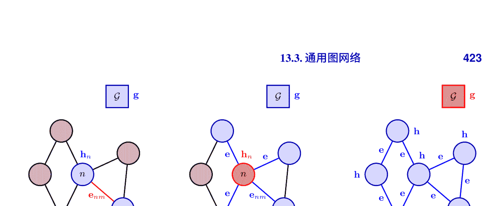

图13.5 通过 (13.32) 到 (13.35) 定义的一般图消息传递更新的示例，显示 (a) 边更新，(b) 节点更新和 (c) 全局图更新。在每种情况下，正在更新的变量显示为红色，对该更新有贡献的变量显示为红色和蓝色。

缓解过度平滑效应的另一种方法是允许输出层从网络的所有先前层获取信息，而不仅仅是最终的卷积层。例如，可以通过将先前层的表示连接起来来实现：

$$\mathbf{y}_n = \mathbf{f} \left( \mathbf{h}_n^{(1)} \oplus \mathbf{h}_n^{(2)} \oplus \cdots \oplus \mathbf{h}_n^{(L)} \right) \quad (13.37)$$

其中 $\mathbf{a} \oplus \mathbf{b}$ 表示向量 $\mathbf{a}$ 和 $\mathbf{b}$ 的连接。这种变体是使用最大池化而不是连接来组合向量。在这种情况下，输出向量的每个元素由前一层嵌入向量的所有对应元素的最大值给出。

#### 13.3.5 正则化

第9章标准的正则化技术可以与图神经网络一起使用，包括将惩罚项添加到损失函数中，例如参数值的平方和。此外，还开发了一些专门针对图神经网络的正则化方法。

图神经网络已经使用权重共享来实现置换等变性，但通常每个层都有独立的参数。然而，权重和偏置也可以在层之间共享，以减少独立参数的数量。

在图神经网络的背景下，Dropout是在训练过程中随机省略图中的一部分节点，每次前向传播时都选择一个新的随机子集。这同样可以应用于图中的边，即在训练过程中随机选择一部分邻接矩阵中的条目进行删除或屏蔽。

算法13.2：具有节点、边和图嵌入的图神经网络

```
输入：无向图 $\mathcal{G}= (\mathcal{V}, \mathcal{E})$
      初始节点嵌入 $\{ \mathbf{h}_n^{(0)} \}$
      初始边嵌入 $\{ \mathbf{e}_{nm}^{(0)} \}$
      初始图嵌入 $\mathbf{g}^{(0)}$
输出：最终节点嵌入 $\{ \mathbf{h}_n^{(L)} \}$
      最终边嵌入 $\{ \mathbf{e}_{nm}^{(L)} \}$
      最终图嵌入 $\mathbf{g}^{(L)}$

// 迭代消息传递
对于 $l \in \{0, \dots, L-1\}$ 执行
    $\mathbf{e}_{nm}^{(l+1)} \leftarrow \text{更新}_{\text{边}} \left( \mathbf{e}_{nm}^{(l)}, \mathbf{h}_n^{(l)}, \mathbf{h}_m^{(l)}, \mathbf{g}^{(l)} \right)$
    $\mathbf{z}_n^{(l+1)} \leftarrow \text{聚合}_{\text{node}} \left( \left\{ \mathbf{e}_{nm}^{(l+1)} : m \in \mathcal{N}(n) \right\} \right)$
    $\mathbf{h}_n^{(l+1)} \leftarrow \text{更新}_{\text{node}} \left( \mathbf{h}_n^{(l)}, \mathbf{z}_n^{(l+1)}, \mathbf{g}^{(l)} \right)$
    $\mathbf{g}^{(l+1)} \leftarrow \text{更新}_{\text{图}} \left( \mathbf{g}^{(l)}, \{ \mathbf{h}_n^{(l+1)} \}, \{ \mathbf{e}_{nm}^{(l+1)} \} \right)$
结束循环
返回 $\{ \mathbf{h}_n^{(L)} \}, \{ \mathbf{e}_{nm}^{(L)} \}, \mathbf{g}^{(L)}$
```

#### 13.3.6 几何深度学习

我们已经看到，当为图结构数据设计深度学习模型时，置换对称性是一个关键考虑因素。它作为归纳偏差的一种形式，显著降低了数据需求，同时提高了预测性能。在与空间属性相关的图神经网络应用中，例如图形网格、流体流动模拟或分子结构，可以将额外的等变性和不变性属性构建到网络架构中。

考虑预测分子属性的任务，例如在探索候选药物空间时。分子可以表示为给定类型的原子列表（碳、氢、氮等），以及每个原子的空间坐标表示为三维列向量。我们可以在每个层 $l$ 的每个原子 $n$ 引入一个关联的嵌入向量，表示为 $\mathbf{r}_n^{(l)}$，并且这些向量可以用已知的原子坐标进行初始化。然而，这些向量元素的值取决于坐标系的任意选择，而分子的属性则不取决于坐标系。例如，如果分子在空间中旋转或平移到新的位置，或者坐标系本身被反射以给出分子的镜像版本，分子的溶解度不会改变。因此，分子属性在这些转换下应该是不变的。

通过仔细选择更新和聚合操作的函数形式（Satorras, Hoogeboom和Welling, 2021），新的嵌入向量 $\mathbf{r}_n^{(l)}$ 可以被纳入图神经网络更新方程（13.29）到(13.31)中，以实现所需的对称性质：

$$ \mathbf{e}_{nm}^{(l+1)} = \text{更新边} \left( \mathbf{e}_{nm}^{(l)}, \mathbf{h}_n^{(l)}, \mathbf{h}_m^{(l)}, \| \mathbf{r}_n^{(l)} - \mathbf{r}_m^{(l)} \|^2 \right) \quad (13.38) $$

$$ \mathbf{r}_n^{(l+1)} = \mathbf{r}_n^{(l)} + C \sum_{(n,m) \in \mathcal{E}} \left( \mathbf{r}_n^{(l)} - \mathbf{r}_m^{(l)} \right) \phi \left( \mathbf{e}_{nm}^{(l+1)} \right) \quad (13.39) $$

$$ \mathbf{z}_n^{(l+1)} = \text{聚合节点} \left( \{ \mathbf{e}_{nm}^{(l+1)} : m \in \mathcal{N}(n) \} \right) \quad (13.40) $$

$$ \mathbf{h}_n^{(l+1)} = \text{更新节点} \left( \mathbf{h}_n^{(l)}, \mathbf{z}_n^{(l+1)} \right) \quad (13.41) $$

请注意，量 $\| \mathbf{r}_n^{(l)} - \mathbf{r}_{m}^{(l)} \|^2$ 表示坐标 $\mathbf{r}_n^{(l)}$ 和 $\mathbf{r}_{m}^{(l)}$ 之间的平方距离，这与平移、旋转或反射无关。此外，坐标 $\mathbf{r}_n^{(l)}$ 通过相对差值的线性组合 $(\mathbf{r}_n^{(l)} - \mathbf{r}_m^{(l)})$ 进行更新。这里 $\phi(\mathbf{e}_{nm}^{(l+1)})$ 是一个一般的标量函数，它是由神经网络表示的边嵌入，并且系数 $C$ 通常设置为求和中项的倒数。因此，在这样的变换下，(13.38)、(13.40)和(13.41)中的消息是不变的，而由(13.39)给出的坐标嵌入是等变的。

我们已经看到了结构化数据中许多对称性的例子，从图像中对象的平移和节点排序的置换，到三维空间中分子的旋转和平移。在深度神经网络的结构中捕捉这些对称性是一种强大的归纳偏差形式，也是一个被称为几何深度学习的丰富研究领域的基础(Bronstein等人，2017; Bronstein等人，2021)。

### 练习

13.1 (⋆) 证明置换 $(A, B, C, D, E) \rightarrow (C, E, A, D, B)$ 对应于图13.2中两种节点排序的选择可以用形式为(13.5)的置换矩阵(13.1)表示。

13.2 (⋆⋆) 证明图的每个节点连接的边数由相应的邻接矩阵 $\mathbf{A}^2$ 的对角元素给出，其中 $\mathbf{A}$ 是邻接矩阵。

13.3 (⋆) 画出邻接矩阵给定的图。
$$
\mathbf{A} = \begin{pmatrix} 0 & 1 & 1 & 0 & 1 \\ 1 & 0 & 1 & 1 & 1 \\ 1 & 1 & 0 & 1 & 0 \\ 0 & 1 & 1 & 0 & 0 \\ 1 & 1 & 0 & 0 & 0 \end{pmatrix} \quad (13.42)
$$

13.4 (★★) 证明使用由(13.3)定义的置换矩阵 $\mathbf{P}$ 对数据矩阵 $\mathbf{X}$ 进行前乘的效果是创建一个新的数据矩阵 $\widetilde{\mathbf{X}}$ ，其行根据置换函数 $\pi(\cdot)$ 进行置换。

13.5 (★★) 证明由式(13.5)定义的转换邻接矩阵 $\widetilde{\mathbf{A}}$ ，其中 $\mathbf{P}$ 由式(13.3)定义，使得行和列都按照排列函数 $\pi(\cdot)$ 相对于原始邻接矩阵 $\mathbf{A}$ 进行排列。

13.6 (★★) 在这个练习中，我们使用矩阵将更新方程式(13.16)写成图层级方程式。为了保持符号简洁，我们省略了图层索引 $l$。首先，将节点嵌入向量 $\{\mathbf{h}_n\}$ 收集到一个 $N \times D$ 矩阵 $\mathbf{H}$ 中，其中第 $n$ 行由 $\mathbf{h}_n^T$ 给出。然后证明由式中给出的邻域聚合向量 $\mathbf{z}_n$ ，
$$ \mathbf{z}_n = \sum_{m \in \mathcal{N}(n)} \mathbf{h}_m $$
可以用矩阵形式表示为 $\mathbf{Z} = \mathbf{A}\mathbf{H}$，其中 $\mathbf{Z}$ 是一个 $N \times D$ 矩阵，第 $n$ 行由 $\mathbf{z}_n^T$ 给出， $\mathbf{A}$ 是邻接矩阵。最后，证明式(13.16)中非线性激活函数的参数可以用矩阵形式表示为
$$ \mathbf{A}\mathbf{H}\mathbf{W}_{\text{neigh}} + \mathbf{H}\mathbf{W}_{\text{self}} + \mathbf{1}_D\mathbf{b}^T $$
其中 $\mathbf{1}_D$ 是一个 $D$ 维列向量，其中所有元素都是1。

13.7 (★★) 通过利用深度图卷积网络层 $l$ 的等变性属性（13.19）以及节点变量的置换性质（13.4），证明由（13.18）定义的完整深度图卷积网络也是等变的。

13.8 (★★) 解释为什么由（13.24）定义的聚合函数，在其中注意力权重由（13.28）给出，对于图中节点的重新排序是等变的。

13.9 (⋆) 证明一个图注意力网络，其中图是完全连接的，即每对节点之间都有一条边，等价于一个标准的Transformer架构。

13.10 (★★) 当坐标系被平移时，由该坐标系定义的对象的位置会发生变换
$$ \widetilde{\mathbf{r}} = \mathbf{r} + \mathbf{c} $$
其中 $\mathbf{c}$ 是描述平移的固定向量。同样，如果坐标系被旋转和/或镜像反射，对象的位置向量会发生变换
$$ \widetilde{\mathbf{r}} = \mathbf{R}\mathbf{r} $$
其中 $\mathbf{R}$ 是一个正交矩阵，其逆矩阵等于其转置矩阵，即
$$ \mathbf{R}\mathbf{R}^T = \mathbf{R}^T\mathbf{R} = \mathbf{I}. $$
利用这些性质，证明在平移、旋转和反射下，(13.38)、(13.40)和(13.41)中的消息是不变的，并且由(13.39)给出的坐标嵌入是等变的。

# 深度学习

## 14 采样


在深度学习中，有许多情况需要从概率分布 p(z)中创建变量z的合成示例。这里 z可能是一个标量，分布可能是单变量高斯分布，或者 z可能是一个高分辨率图像， p(z)可能是由深度神经网络定义的生成模型。 创建这样的示例的过程被称为采样，也被称为蒙特卡洛采样。 对于许多简单的分布，有直接生成合适样本的数值技术，而对于更复杂的分布，包括隐式定义的分布，我们可能需要更复杂的方法。 我们采用将每个实例化的值称为样本的约定，与经典统计学中‘样本’指一组值的约定相对。

在本章中，我们重点关注与深度学习最相关的采样方面。 有关蒙特卡洛方法的更多信息可以在Gilks、Richardson和Spiegelhalter（1996）以及Robert和Casella（1999）中找到。

### 14.1. 基本采样算法

在本节中，我们探讨了从给定分布生成随机样本的各种相对简单的策略。由于样本将由计算机算法生成，它们实际上将是伪随机的，也就是说，它们将使用确定性算法计算，但仍然必须通过适当的随机性测试。在这里，我们将假设已经提供了一个算法，该算法可以生成在(0,1)上均匀分布的伪随机数，实际上大多数软件环境都内置了这样的功能。

14.1.1 期望

尽管对于某些应用来说，样本本身可能直接相关，但在其他情况下，目标是相对于分布来评估期望值。假设我们希望找到相对于概率分布p(z)的函数f(z)的期望值。在这里，z的组成部分可能包括离散变量、连续变量或两者的组合。对于连续变量，定义期望值为

$$ \mathbb{E}[f] = \int f(\mathbf{z}) p(\mathbf{z}) \, d\mathbf{z} $$

对于离散变量，积分被求和替代。这在图14.1中以单个连续变量的示意图形式进行了说明。我们假设使用分析技术精确评估这样的期望值过于复杂。

采样方法背后的一般思想是获得一组独立从分布p(z)中抽取的样本z^{(l)}（其中 l=1,...,L）。这使得可以通过有限求和来近似计算期望值(14.1):

$$ \bar{f} = \frac{1}{L} \sum_{l=1}^{L} f(\mathbf{z}^{(l)}) $$

如果样本z^{(l)}是从分布p(z)中抽取的，则E[f] = E[f(z)]，因此估计器f具有正确的均值。我们还可以将其写成以下形式

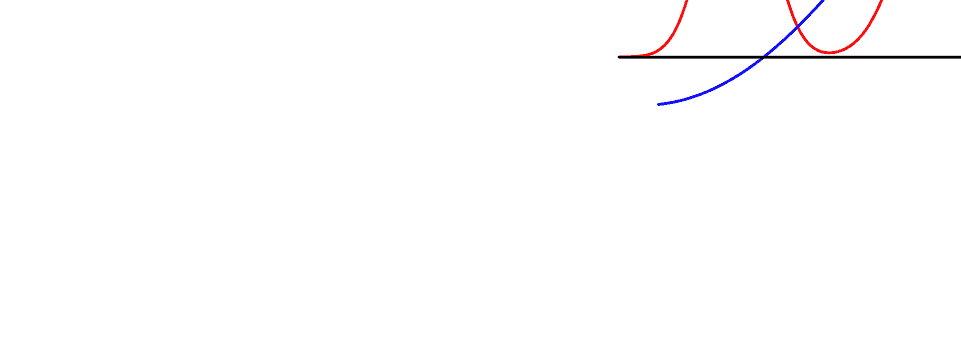

$$\mathbb{E}[f(\mathbf{z})] \simeq \frac{1}{L} \sum_{l=1}^{L} f(\mathbf{z}^{(l)})$$ (14.3)
其中符号 \(\simeq\) 表示右侧是无偏估计器左侧，即当在噪声分布上平均时，两侧相等。

练习14.2 估计器(14.2)的方差为

$$\mathrm{var}[\hat{f}] = \frac{1}{L} \mathbb{E}\left[\left(f - \mathbb{E}[f]\right)^{2}\right]$$, (14.4)
这是函数 \(f(\mathbf{z})\) 在分布 \(p(\mathbf{z})\) 下的方差。请注意，这个方差随着 \(L\) 的增加呈线性减小，与 \(\mathbf{z}\) 的维度无关，并且原则上可以通过相对较少的样本 \(\{\mathbf{z}^{(l)}\}\) 达到高精度。然而，问题在于样本 \(\{\mathbf{z}^{(l)}\}\) 可能不是独立的，因此有效样本量可能比表面样本量要小得多。此外，回顾图14.1，如果 \(f(\mathbf{z})\) 在 \(p(\mathbf{z})\) 较大的区域很小，反之亦然，那么期望值可能会被较小概率的区域所主导，这意味着需要相对较大的样本量才能达到足够的精度。

14.1.2 标准分布

我们现在考虑如何从简单的非均匀分布中生成随机数，假设我们已经有一个可用的均匀分布的随机数源。假设 \(z\) 在区间 \((0,1)\) 上均匀分布，我们使用某个函数 \(g(\cdot)\) 来转换 \(z\) 的值，使得 \(y = g(z)\)。\(y\) 的分布将受到控制

第2.4节

$$p(y) = p(z) \left|\frac{\mathrm{d} z}{\mathrm{d} y}\right|$$ (14.5)
在这种情况下，\(p(z) = 1\)。我们的目标是选择函数 \(g(z)\)，使得得到的 \(y\) 的值具有某种特定的期望分布 \(p(y)\)。积分（14.5）得到

练习14.3 这是 \(p(y)\) 的不定积分。因此，\(y = h^{-1}(z)\)，所以我们必须使用与所需分布的不定积分的反函数对均匀分布的随机数进行变换。这在图14.2中有所说明。

$$z = \int_{-\infty}^{y} p(y) \equiv h(y) \mathrm{d} y$$ (14.6)

例如，考虑指数分布

$$p(y) = \lambda \exp(-\lambda y)$$ (14.7)
其中 \(0 \leqslant y < \infty\)。在这种情况下，积分中的下限是 0，所以 \(h(y) = 1 - \exp(-\lambda y)\)。因此，如果我们使用 \(y = -\lambda^{-1} \ln(1 - z)\) 来转换我们的均匀分布变量 \(z\)，那么 \(y\) 将具有指数分布。

## 14. 采样

图14.2 生成非均匀分布随机数的变换方法的几何解释。$h(y)$是所需分布 $p(y)$的不定积分。如果一个均匀分布的随机变量$z$通过变换$z = h^{-1}(z)$得到 $y$，那么 $y$将按照分布$p(y)$进行分布。

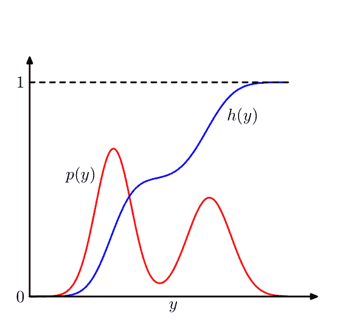

变换方法可以应用于柯西分布的另一个例子

$$p(y) = \frac{1}{\pi} \frac{1}{1 + y^2}$$ (14.8)

练习14.4

第2.4节

在这种情况下，不定积分的反函数可以用 $\tan$ 函数表示。

对于多个变量的推广涉及到变量变换的雅可比矩阵，使得

$$p(y_1, \ldots, y_M) = p(z_1, \ldots, z_M) \left| \frac{\partial(z_1, \ldots, z_M)}{\partial(y_1, \ldots, y_M)} \right|.$$ (14.9)

作为转换技术的最后一个例子，我们考虑用于从高斯分布生成样本的Box-Muller方法。首先，假设我们生成一对均匀分布的随机数$z_1, z_2 \in (-1, 1)$，我们可以通过将一个在$(0,1)$上均匀分布的变量使用$z \to 2z - 1$进行转换来实现。

接下来，我们丢弃每对随机数，除非它满足$z_1^2 + z_2^2 < 1$这导致了单位圆内的点的均匀分布，其中$p(z_1, z_2) = 1/\pi$，如图14.3所示。

然后，对于每对$z_1, z_2$，我们计算以下数量

$$y_1 = z_1 \left( \frac{-2 \ln r^2}{r^2} \right)^{1/2}$$ (14.10)

$$y_2 = z_2 \left( \frac{-2 \ln r^2}{r^2} \right)^{1/2}$$ (14.11)

练习14.5

那么$y_1$和$y_2$的联合分布为

$$p(y_1, y_2) = p(z_1, z_2) \left| \frac{\partial(z_1, z_2)}{\partial(y_1, y_2)} \right| = \left[ \frac{1}{\sqrt{2\pi}} \exp(-y_1^2/2) \right] \left[ \frac{1}{\sqrt{2\pi}} \exp(-y_2^2/2) \right]$$ (14.12)

图14.3 生成高斯分布随机数的Box-Muller方法从单位圆内生成均匀分布的样本开始。

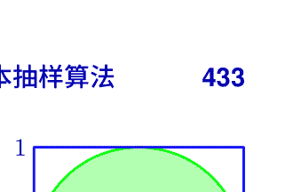

因此 y₁和 y₂是独立的，并且每个都具有零均值和单位方差的高斯分布。

如果 y服从均值为零、方差为一的高斯分布，那么 σy + μ将服从均值为 μ、方差为 σ²的高斯分布。为了生成具有多元高斯分布、均值为 μ、协方差为 Σ的向量变量，我们可以利用Cholesky分解的方法，其形式为

Σ = LLᵀ(Deisenroth, Faisal, and Ong, 2020)。然后，如果 z是一个随机向量，其分量独立且服从均值为零、方差为一的高斯分布，那么 y = μ + Lz将服从均值为 μ、协方差为 Σ的高斯分布。

练习14.6

显然，变换技术的成功取决于计算并反演所需分布的不定积分的能力。这样的操作只对一些简单分布有限，因此我们必须寻找其他方法来寻求更一般的策略。在这里，我们考虑了两种技术，分别称为拒绝采样和重要性采样。虽然主要局限于一维分布，因此不能直接应用于许多维度的复杂问题，但它们在更一般的策略中起着重要的作用。

### 14.1.3 拒绝采样

拒绝采样框架允许我们从相对复杂的分布中采样，但受到某些约束。我们首先考虑一元分布，然后讨论到多维度的扩展。

假设我们希望从一个不是简单的标准分布中采样，而直接从该分布中采样又很困难。此外，假设我们很容易评估给定值z的分布 p(z)，但无法确定其归一化常数Z。
对于任意给定的z，我们可以计算p(z)，但无法确定归一化常数 Z。

p(z) = \frac{1}{Z_p} \widetilde{p}(z) \quad (14.13)

其中 \widetilde{p}(z)可以轻松计算，但 Z_p是未知的。
为了应用拒绝采样，我们需要一些更简单的分布 q(z)，有时被称为提议分布，我们可以轻松地从中采样。接下来，我们引入一个常数 k，其值被选择为 kq(z) ≥ \widetilde{p}(z)对于所有的 z。函数 kq(z)被称为比较函数，并且被说明

## 14. 采样

图14.4 在拒绝采样方法中，从简单分布$q(z)$中抽取样本，并在落入非标准化分布$\widetilde{p}(z)$和缩放分布$kq(z)$之间的灰色区域中被拒绝。得到的样本按照分布$p(z)$进行分布，这是$\widetilde{p}(z)$的归一化版本。

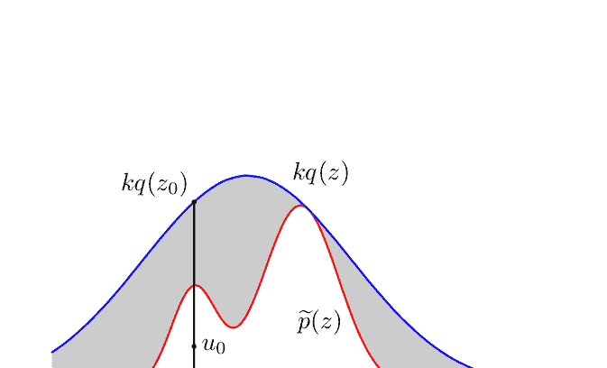

在图14.4中的一元分布中。拒绝采样器的每个步骤都涉及生成两个随机数。首先，我们从分布$q(z)$中生成一个数$z_0$。接下来，我们从区间$[0, kq(z_0)]$上的均匀分布中生成一个数$u_0$。这对随机数在函数$kq(z)$的曲线下具有均匀分布。最后，如果$u_0 > \widetilde{p}(z_0)$，则样本被拒绝，否则保留$u_0$。因此，如果该对数位于图14.4中的灰色阴影区域内，则被拒绝。剩余的对数则在$\widetilde{p}(z)$的曲线下具有均匀分布，因此相应的$z$值按照$p(z)$进行分布，符合要求。

练习14.7

$z$的原始值是从分布$q(z)$生成的，然后这些样本以概率$\widetilde{p}(z)/kq(z)$被接受，因此一个样本被接受的概率为

$$p(\text{接受}) = \int \{\widetilde{p}(z)/kq(z)\} \, q(z) \mathrm{d}z = \frac{1}{k} \int \widetilde{p}(z) \, \mathrm{d}z. \qquad (14.14)$$

因此，通过这种方法被拒绝的点的比例取决于非归一化分布$\widetilde{p}(z)$下的面积与曲线$kq(z)$下的面积的比值。因此，我们可以看到常数$k$应尽可能小，但限制条件是$kq(z)$不能小于$\widetilde{p}(z)$。

作为拒绝采样使用的示例，考虑从伽马分布中采样的任务

$$\text{Gam}(z|a, b) = \frac{b^a z^{a-1} \exp(-bz)}{\Gamma(a)}, \qquad (14.15)$$

对于$a > 1$，它具有钟形形状，如图14.5所示。因此，一个合适的提议分布是柯西分布（14.8），因为它也具有钟形形状，并且我们可以使用之前讨论过的变换方法从中采样。我们需要稍微推广柯西分布，以确保它在任何地方都不比伽马分布的值小。这可以通过使用$z = b \tan y + c$来转换均匀随机变量$y$来实现，从而得到按照分布的随机数

练习14.8

$$q(z) = \frac{k}{1 + (z-c)^2/b^2}. \qquad (14.16)$$

图14.5 显示由(14.15)给出的伽玛分布的图，绿色曲线表示伽玛分布，红色曲线表示缩放的柯西提议分布。从伽玛分布中获取样本可以通过从柯西分布中采样，然后应用拒绝采样准则来实现。

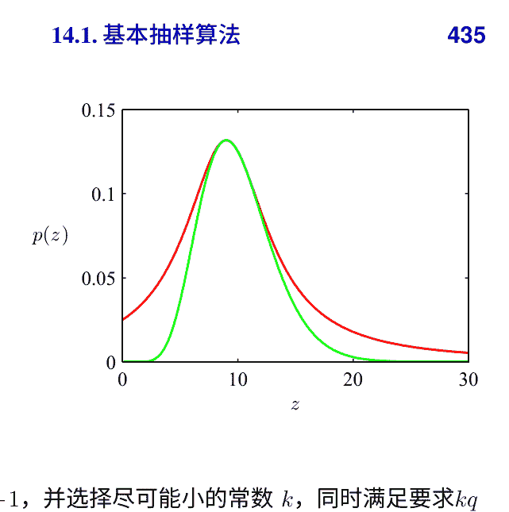

通过设置 c = a - 1 和 b^2 = 2a - 1，并选择尽可能小的常数 k，同时满足要求 kq(z) ≥ p(z)，可以获得最小的拒绝率。图14.5还展示了得到的比较函数。

### 14.1.4 自适应拒绝采样

在许多情况下，我们可能希望应用拒绝采样，但很难确定合适的包络分布 q(z) 的解析形式。另一种方法是根据测量值构建即时包络函数，该测量值基于分布 p(z) (Gilks和Wild, 1992)。当 ln p(z) 具有非递增函数的导数时，构建包络函数特别简单，换句话说，当 p(z) 是对数凹函数时。图14.6以图形方式说明了构建合适的包络函数。在一些初始网格点上评估函数 ln p(z) 及其梯度，并使用得到的切线的交点来构建包络函数。然后从包络分布中抽取一个样本值。

练习14.10 这是直接的，因为包络分布的对数是一系列线性函数，因此包络分布本身由分段指数组成，形式为

$$q(z) = k_i \lambda_i \exp \{−\lambda_i (z − z_{i−1})\}, z_{i−1} < z ≤ z_i. (14.17)$$

一旦抽取了样本，就可以应用通常的拒绝准则。如果样本被接受，那么它将是从所需分布中抽取的。然而，如果样本被拒绝，则将其纳入网格点集合中，计算新的切线，从而改进包络函数。随着网格点数的增加，包络函数越来越接近所需分布 p(z)，并且拒绝的概率减小。

存在一种算法的变体，可以避免求导数的计算 (Gilks, 1992年)。自适应拒绝采样框架也可以扩展到非对数凹函数的分布，只需按照每个拒绝采样的步骤进行即可。

图14.6 在拒绝采样中，如果一个分布是对数凹的，那么可以使用在一组网格点上计算的切线构造一个包络函数。
如果一个样本点被拒绝，它将被添加到网格点集合中，并用于改进包络分布。

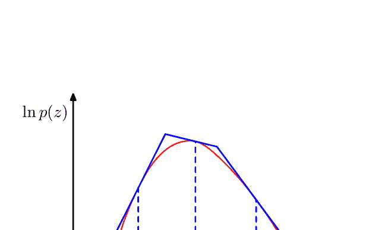

通过与Metropolis-Hastings步骤（将在第14.2.3节中讨论）结合，产生自适应拒绝Metropolis采样（Gilks，Best和Tan，1995）。
为了使拒绝采样具有实际价值，我们要求比较函数与所需分布接近，以便将拒绝率保持在最低水平。现在让我们来看看当我们尝试在高维空间中使用拒绝采样时会发生什么。为了说明问题，考虑一个有点人为的问题，我们希望从一个均值为零的多元高斯分布中采样，其协方差为 \(\sigma_p^2 \mathbf{I}\)，其中 \(\mathbf{I}\) 是单位矩阵，通过从一个均值为零的高斯分布中进行拒绝采样，其协方差为 \(\sigma_q^2 \mathbf{I}\) 的建议分布。显然，我们必须有 \(\sigma_q^2 \geq \sigma_p^2\)，以确保存在一个 \(k\) 使得 \(kq(z) \geq p(z)\)。在 \(D\) 维空间中，\(k\) 的最佳值由 \(k = (\sigma_q / \sigma_p)^D\) 给出，如图14.7所示。接受率将是 \(p(z)\) 和 \(kq(z)\) 下的体积比率，因为两个分布都是归一化的，所以只是 \(1/k\)。因此，接受率随着维度的增加呈指数衰减。

即使 \(\sigma_q\) 超过 \(\sigma_p\) 只有1%，对于 \(D=1,000\)，接受比率将近似为 \(1/20,000\)。在这个说明性的例子中，比较函数接近所需的分布。对于更实际的例子，所需的分布可能是多峰和尖峰的，找到将会非常困难。

图14.7 用于突出拒绝采样的局限性的说明性例子。通过使用从一个也是高斯分布且其缩放版本 \(kq(z)\) 由红色曲线表示的提议分布 \(q(z)\) 进行拒绝采样，从一个高斯分布 \(p(z)\) 由绿色曲线表示中抽取样本。

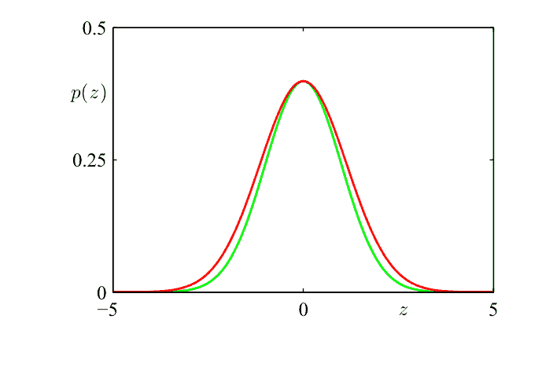

一个好的提议分布和比较函数。 此外，接受率随着维度的增加呈指数下降是拒绝采样的一般特征。 尽管拒绝采样在一到两个维度上可以是一种有用的技术，但对于高维问题不适用。 然而，在高维空间中进行采样的更复杂算法中，它可以作为一个子程序发挥作用。

### 14.1.5 重要性采样

希望从复杂的概率分布中采样的一个原因是为了评估形式为 (14.1) 的期望。重要性采样技术提供了一种直接近似期望的框架，但本身并不提供从分布 \( p(\mathbf{z}) \)中采样的机制。

由 (14.2) 给出的有限和近似期望取决于能够从分布 \( p(\mathbf{z}) \)中采样。然而，假设直接从分布 \( p(\mathbf{z}) \)中采样是不可行的，但我们可以轻松地对任何给定的z值评估 \( p(\mathbf{z}) \)。一种简单的评估期望的策略是将z空间离散化为均匀网格，并将积分作为求和形式的被积函数进行评估。

$$E[f] \simeq \sum_{l=1}^{L} p(\mathbf{z}^{(l)}) f(\mathbf{z}^{(l)}). \quad (14.18)$$

这种方法的一个明显问题是，求和中的项数随着 z的维度呈指数增长。 此外，正如我们已经注意到的那样，感兴趣的的概率分布往往将其大部分质量限制在z空间的相对较小区域内，因此均匀采样将非常低效，因为在高维问题中，只有很小一部分样本会对总和产生显著贡献。我们真正希望从z的大部分质量较大的区域选择样本点，或者理想情况下，选择使得 \( p(\mathbf{z})f(\mathbf{z}) \)较大的区域。

与拒绝采样类似，重要性采样基于一个提议分布 \( q(\mathbf{z}) \)：

$$E[f] = \int f(\mathbf{z}) p(\mathbf{z}) \, d\mathbf{z} = \int f(\mathbf{z}) \frac{p(\mathbf{z})}{q(\mathbf{z})} q(\mathbf{z}) \, d\mathbf{z} \simeq \frac{1}{L} \sum_{l=1}^{L} \frac{p(\mathbf{z}^{(l)})}{q(\mathbf{z}^{(l)})} f(\mathbf{z}^{(l)}). \quad (14.19)$$

这些数量 \( r_l = p(\mathbf{z}^{(l)})/q(\mathbf{z}^{(l)}) \)被称为重要权重，它们纠正了从错误分布中采样引入的偏差。 请注意，与拒绝采样不同，所有生成的样本都被保留。

通常，分布 \( p(\mathbf{z}) \)只能被归一化常数评估，因此 \( p(\mathbf{z}) = \widetilde{p}(\mathbf{z})/Z_p \)其中 \( \widetilde{p}(\mathbf{z}) \)可以轻松评估，而 \( Z_p \)是未知的。

同样，我们可能希望使用一个重要性采样分布 $q(\mathbf{z}) = \widetilde{q}(\mathbf{z}) / Z_q$，它具有相同的性质。然后我们有

$$\begin{aligned}\mathbb{E}[f] &= \int f(\mathbf{z})p(\mathbf{z}) \mathrm{d}\mathbf{z} \\ &= \frac{Z_q}{Z_p} \int f(\mathbf{z}) \frac{\widetilde{p}(\mathbf{z})}{\widetilde{q}(\mathbf{z})} q(\mathbf{z}) \mathrm{d}\mathbf{z} \\ &\simeq \frac{Z_q}{Z_p} \frac{1}{L} \sum_{l=1}^{L} \widetilde{r}_l f(\mathbf{z}^{(l)})\end{aligned}$$ (14.20)

我们可以使用相同的样本来评估比率 $Z_p / Z_q$ 的结果为

$$\begin{aligned}\frac{Z_p}{Z_q} &= \frac{1}{Z_q} \int \widetilde{p}(\mathbf{z}) \mathrm{d}\mathbf{z} = \int \frac{\widetilde{p}(\mathbf{z})}{\widetilde{q}(\mathbf{z})} q(\mathbf{z}) \mathrm{d}\mathbf{z} \\ &\simeq \frac{1}{L} \sum_{l=1}^{L} \widetilde{r}_l\end{aligned}$$ (14.21)

因此，(14.20)中的期望值由加权和给出：

$$\mathbb{E}[f] \simeq \sum_{l=1}^{L} w_l f(\mathbf{z}^{(l)})$$ (14.22)

我们定义

$$w_l = \frac{\widetilde{r}_l}{\sum_{m} \widetilde{r}_m} = \frac{\widetilde{p}(\mathbf{z}^{(l)})/q(\mathbf{z}^{(l)})}{\sum_{m} \widetilde{p}(\mathbf{z}^{(m)})/q(\mathbf{z}^{(m)})}.$$ (14.23)

请注意，$\{w_l\}$ 是非负数，总和为一。与拒绝抽样一样，重要性抽样的成功与抽样分布 $q(\mathbf{z})$ 与所需分布的匹配程度密切相关。如果，通常情况下， $p(\mathbf{z})f(\mathbf{z})$ 变化很大，并且其大部分质量集中在 $\mathbf{z}$ 空间的相对较小区域上，则重要性权重集合 $\{\widetilde{r}_l\}$ 可能被一些具有较大值的权重所主导，而其余的权重相对较小。因此，有效样本大小可能比表观样本大小 L 要小得多。如果没有样本落在 $p(\mathbf{z})$ 和 $q(\mathbf{z})$ 较大的区域，问题会更加严重。

在这种情况下，$\widetilde{r}_l$ 和 $\widetilde{r}_l f(\mathbf{z}^{(l)})$ 的表观方差可能很小，尽管对期望的估计可能严重错误。因此，重要性采样的一个主要缺点是可能产生任意错误的结果，并且没有诊断指示。这也突出了对采样分布 $q(\mathbf{z})$ 的一个关键要求，即它在可能存在的显著区域不应该很小或为零。

> 当$p(\mathbf{z})$可能是显著的时，这也强调了一个关键要求。

#### 14.1.6 采样-重要性-重采样

在第14.1.3节中讨论的拒绝抽样方法在一定程度上取决于常数 $k$ 的确定。对于许多分布对 $p(\mathbf{z})$ 和 $q(\mathbf{z})$ 来说，确定一个合适的 $k$ 值是不切实际的，因为任何足够大的值都会导致不切实际的接受率。

与拒绝抽样类似，抽样重要性重采样方法也使用了一个抽样分布 $q(\mathbf{z})$, 但避免了确定常数 $k$ 的问题。该方案分为两个阶段。在第一阶段，从 $q(\mathbf{z})$ 中抽取 $L$ 个样本 $\mathbf{z}^{(1)}, ..., \mathbf{z}^{(L)}$。然后在第二阶段，使用公式(14.23)构建权重 $w_1, ..., w_L$。最后，从离散分布中抽取第二组 $L$ 个样本 $\mathbf{z}^{*(1)}, ..., \mathbf{z}^{*(L)}$，其中每个样本 $\mathbf{z}^{*(l)}$ 以概率 $w_l$ 取值为 $\mathbf{z}^{(l)}$。得到的 $L$ 个样本仅近似地按照概率分布 $p(\mathbf{z})$ 分布，但在极限 $L \to \infty$ 下，分布变得正确。为了看到这一点，考虑一元情况，并注意到重新采样值的累积分布是由以下给出的

$$ p(z \leq a) = \sum_{l: z^{(l)} \leq a} w_l = \frac{\sum_l I(z^{(l)} \leq a) \widetilde{p}(z^{(l)}) / q(z^{(l)})}{\sum_l \widetilde{p}(z^{(l)}) / q(z^{(l)})} \quad (14.24) $$

其中 $I(\cdot)$ 是指示函数（如果其参数为真则等于 1，否则等于 0）。在取极限 $L \to \infty$ 并假设分布具有适当的正则性的情况下，我们可以用原始分布加权的积分来替代求和

$$ p(z \leq a) = \frac{\int I(z \leq a) \{\widetilde{p}(z)/q(z)\} q(z) \, dz}{\int \{\widetilde{p}(z)/q(z)\} q(z) \, dz} = \frac{\int I(z \leq a) \widetilde{p}(z) \, dz}{\int \widetilde{p}(z) \, dz} = \int I(z \leq a) p(z) \, dz, \quad (14.25) $$

这是 $p(z)$ 的累积分布函数。再次，我们看到归一化 $p(z)$ 是不必要的。

对于有限的 $L$ 值和给定的初始样本集，重新采样的值只能近似地从所需分布中抽取。与拒绝抽样一样，随着抽样分布 $q(z)$ 越来越接近所需分布 $p(z)$，近似程度也会提高。当 $q(z) = p(z)$ 时，初始样本 $(z^{(1)}, \ldots, z^{(L)})$ 具有所需分布，并且权重 $w_l = 1/L$，因此重新采样的值也具有所需分布。

如果需要计算关于分布 $p(z)$ 的矩，可以直接使用原始样本和权重进行计算，因为

$$ \mathbb{E}[f(z)] = \int f(z) p(z) \, dz = \frac{\int f(z) [\widetilde{p}(z)/q(z)] q(z) \, dz}{\int [\widetilde{p}(z)/q(z)] q(z) \, dz} \simeq \sum_{l=1}^{L} w_l f(z^{(l)}), \quad (14.26) $$

## 14.2. 马尔可夫链蒙特卡罗

在前一节中，我们讨论了拒绝采样和重要性采样策略来评估函数的期望值，我们发现它们在高维空间中存在严重的限制。因此，在本节中，我们转向一个非常通用和强大的框架，称为马尔可夫链蒙特卡罗，它允许从大类分布中进行采样，并且在样本空间的维度上具有良好的可扩展性。马尔可夫链蒙特卡罗方法起源于物理学（Metropolis和Ulam, 1949年），而且只有直到20世纪80年代末，它们才开始在统计学领域产生重大影响。

与拒绝抽样和重要性抽样一样，我们再次从一个提议分布中进行抽样。然而，这一次我们保留当前状态 $\mathbf{z}^{(\tau)}$ 的记录，并且提议分布 $q(\mathbf{z}|\mathbf{z}^{(\tau)})$ 是基于这个当前状态的条件分布，因此样本序列 $\mathbf{z}^{(1)}, \mathbf{z}^{(2)}, \ldots$ 形成了一个马尔可夫链。同样，如果我们写 $p(\mathbf{z}) = \widetilde{p}(\mathbf{z})/Z_p$，我们将假设对于任何给定的 $\mathbf{z}$，$\widetilde{p}(\mathbf{z})$ 可以轻松地计算出来，尽管 $Z_p$ 的值可能是未知的。提议分布被选择得足够简单，以便直接从中抽取样本。在算法的每个周期中，我们生成一个候选样本 $\mathbf{z}^{*}$ 从提议分布中，然后根据适当的准则接受样本。

#### 14.2.1 Metropolis算法

在基本的 Metropolis 算法 (Metropolis et al., 1953) 中，我们假设提议分布是对称的，即 $q(\mathbf{z}_A|\mathbf{z}_B) = q(\mathbf{z}_B|\mathbf{z}_A)$ 对于所有的 $\mathbf{z}_A$ 和 $\mathbf{z}_B$。然后以一定的概率接受候选样本

$$A(\mathbf{z}^{*}, \mathbf{z}^{(\tau)}) = \min\left(1, \frac{\widetilde{p}(\mathbf{z}^{*})}{\widetilde{p}(\mathbf{z}^{(\tau)})}\right).\tag{14.27}$$

这可以通过选择一个在单位区间 $(0, 1)$ 上均匀分布的随机数 $u$，然后如果 $A(\mathbf{z}^{*}, \mathbf{z}^{(\tau)}) > u$，则接受样本。注意如果从 $\mathbf{z}^{(\tau)}$ 到 $\mathbf{z}^{*}$ 导致 $p(\mathbf{z})$ 的值增加，则候选点一定会被保留。

如果候选样本被接受，那么 $\mathbf{z}^{(\tau+1)} = \mathbf{z}^{*}$。否则候选点 $\mathbf{z}^{*}$ 被丢弃，$\mathbf{z}^{(\tau+1)}$ 被设置为 $\mathbf{z}^{(\tau)}$，并且从分布 $q(\mathbf{z}|\mathbf{z}^{(\tau+1)})$ 中抽取另一个候选样本。这与拒绝抽样不同，拒绝的样本只是被丢弃。在Metropolis算法中，当候选点被拒绝时，前一个样本将被包含在最终样本列表中，导致多个样本的复制。当然，在实际实现中，只保留每个保留样本的单个副本，以及记录该状态出现次数的整数加权因子。正如我们将看到的，如果对于任何 $\mathbf{z}_A$ 和 $\mathbf{z}_B$，$q(\mathbf{z}_A|\mathbf{z}_B)$ 是正的（这是一个充分但不必要的条件），$\mathbf{z}^{(\tau)}$ 的分布趋向于 $p(\mathbf{z})$ 当 $\tau \rightarrow \infty$。然而，需要强调的是，序列 $\mathbf{z}^{(1)}, \mathbf{z}^{(2)}, \ldots$ 不是从 $p(\mathbf{z})$ 独立采样的一组样本，因为连续的样本高度相关。如果我们希望获得独立的样本，那么我们可以丢弃大部分序列，只保留每 $M$ 个样本。当 $M$ 足够大时，保留的样本在实际上几乎是独立的。Metropolis算法在算法14.1中进行了总结。图14.9展示了使用Metropolis算法从二维高斯分布中进行采样的一个简单示例，其中提议分布是各向异性高斯分布。

通过观察一个具体的例子，即一个简单的随机游走算法，可以进一步了解马尔可夫链蒙特卡罗算法的性质。

```
算法14.1: Metropolis采样

输入：非标准化分布 $\widetilde{p}(\mathbf{z})$
提议分布 $q(\mathbf{z}|\mathbf{z})$
初始状态 $\mathbf{z}^{(0)}$
迭代次数 $T$

输出：$\mathbf{z} \sim \widetilde{p}(\mathbf{z})$

$\mathbf{z}_{\text{prev}} \leftarrow \mathbf{z}^{(0)}$
// 迭代消息传递
对于 $\tau \in \{1, \dots, T\}$ 执行
    $\mathbf{z}^* \sim q(\mathbf{z}|\mathbf{z}_{\text{prev}})$ // 从提议分布中采样
    $u \sim \mathcal{U}(0, 1)$ // 从均匀分布中采样
    if $\widetilde{p}(\mathbf{z}^*) / \widetilde{p}(\mathbf{z}_{\text{prev}}) > u$ then
        $\mathbf{z}_{\text{prev}} \leftarrow \mathbf{z}^*$ // $\mathbf{z}^{(\tau)} = \mathbf{z}^*$
    else
        $\mathbf{z}_{\text{prev}} \leftarrow \mathbf{z}_{\text{prev}}$ // $\mathbf{z}^{(\tau)} = \mathbf{z}^{(\tau-1)}$
    end if
end for
return $\mathbf{z}_{\text{prev}}$ // $\mathbf{z}^{(T)}$
```

考虑一个由整数构成的状态空间 $z$，具有概率

$$
p(z^{(\tau+1)} = z^{(\tau)}) = 0.5 \tag{14.28}
$$
$$
p(z^{(\tau+1)} = z^{(\tau)} + 1) = 0.25 \tag{14.29}
$$
$$
p(z^{(\tau+1)} = z^{(\tau)} - 1) = 0.25 \tag{14.30}
$$

> 练习14.11

其中 $z^{(\tau)}$ 表示第 $\tau$ 步的状态。 如果初始状态为 $z^{(0)} = 0$，则根据对称性可知，时间 $\tau$ 时的期望状态也为零 $\mathbb{E}[z^{(\tau)}] = 0$，同样地，很容易看出 $\mathbb{E}[(z^{(\tau)})^2] = \tau / 2$。 因此，在 $\tau$ 步之后，随机游走已经行进了一个距离，平均而言与 $\tau$ 的平方根成比例。 这种平方根依赖性是随机游走行为的典型特征，表明随机游走在探索状态空间方面非常低效。 正如我们将看到的，设计马尔可夫链蒙特卡洛方法的一个核心目标是避免随机游走行为。

#### 14.2.2 马尔可夫链

在更详细地讨论马尔可夫链蒙特卡罗方法之前，研究马尔可夫链的一些一般性质是有用的。 特别是，我们要问在什么情况下马尔可夫链会收敛到所需的分布。一阶马尔可夫链被定义为一系列随机变量 $z^{(1)}, ..., z^{(M)}$，对于 $m \in \{1, ..., M-1\}$，满足以下条件独立性属性：

$$p(z^{(m+1)}|z^{(1)}, ..., z^{(m)}) = p(z^{(m+1)}|z^{(m)}), \quad\quad (14.31)$$

这可以表示为一个链式有向图模型。然后，我们可以通过给出初始变量的概率分布来指定马尔可夫链，以及给出后续变量的条件分布，形式为转移概率 $T_m(z^{(m)}, z^{(m+1)}) \equiv p(z^{(m+1)}|z^{(m)})$。如果转移概率对于所有 $m$ 都相同，则马尔可夫链被称为齐次的。

特定变量的边际概率可以用链中前一个变量的边际概率来表示：

$$p(z^{(m+1)}) = \int p(z^{(m+1)}|z^{(m)})p(z^{(m)})\, dz^{(m)} \quad\quad (14.32)$$

其中，对于离散变量，积分被替换为求和。如果马尔可夫链中的每一步都使得分布保持不变，则称该分布为不变分布或稳态分布。因此，对于具有过渡概率 $T(z', z)$ 的齐次马尔可夫链，如果分布 $p^*(z)$ 是不变的，则

$$p^*(z) = \int T(z', z)p^*(z')\, dz'. \quad\quad (14.33)$$

请注意，给定的马尔可夫链可能有多个不变分布。例如，如果过渡概率由恒等变换给出，则任何分布都将是不变的。

确保所需分布 $p(z)$ 不变的一个充分条件（但不是必要条件）是选择过渡概率满足详细平衡性质，即

$$p^*(z)T(z, z') = p^*(z')T(z', z) \quad (14.34)$$

对于特定分布 $p^*(z)$ 来说。 很容易看出，满足详细平衡性质的过渡概率将使得该特定分布保持不变，因为

$$\begin{aligned}
\int p^*(z')T(z', z) \mathrm{d}z' &= \int p^*(z)T(z, z') \mathrm{d}z' \\
&= p^*(z) \int T(z, z') \mathrm{d}z' \\
&= p^*(z)
\end{aligned} \quad (14.35)$$

满足细致平衡的马尔可夫链被称为可逆的。

我们的目标是使用马尔可夫链从给定的分布中采样。如果我们设置一个马尔可夫链，使得所需的分布不变，我们就可以实现这一目标。然而，我们还必须要求对于 $m\to \infty$，分布 $p(z^{(m)})$ 收敛到所需的不变分布 $p^*$。无论初始分布 $p(z^{(0)})$ 的选择如何，都是成立的。这个性质被称为遍历性，而不变分布则被称为平衡分布。显然，遍历性马尔可夫链只能有一个平衡分布。可以证明，一个齐次马尔可夫链在不变分布和转移概率上只有弱限制条件时是遍历的（Neal, 1993年）。

在实践中，我们经常从一组“基础”转换 $B_1, \ldots, B_K$ 构建转换概率 $T(z', z)$。这可以通过一个混合分布来实现形式

$$T(z', z) = \sum_{k=1}^{K} \alpha_k B_k(z', z) \quad (14.38)$$

对于一些混合系数集合 $\alpha_1, \ldots, \alpha_K$ 满足 $\alpha_k \geqslant 0$ 和 $\sum \alpha_k = 1$。或者，基础转换可以通过连续应用来组合，这样

$$T(z', z) = \sum_{z_1} \ldots \sum_{z_{K-1}} B_1(z', z_1) B_2(z_1, z_2) \cdots B_K(z_{K-1}, z). \quad (14.39)$$

如果一个分布对于每个基本转换都是不变的，那么显然它对于由(14.38)或(14.39)给出的任何一个 $T(z', z)$ 也是不变的。对于混合(14.38)，如果每个基本转换都满足详细平衡，那么混合转换 $T$ 也将满足详细平衡。使用(14.39)构建的转换概率并不满足这一点，尽管通过对基本转换的应用顺序进行对称化，即 $B_1, B_2, \ldots, B_K, B_K, \ldots, B_2, B_1$，可以恢复详细平衡。复合转换概率的常见示例是每个基本转换仅改变变量的一个子集。

#### 14.2.3 Metropolis-Hastings算法

早些时候，我们介绍了基本的Metropolis算法，但没有实际证明它从所需的分布中采样。在给出证明之前，我们首先讨论一个称为Metropolis-Hastings算法（Hastings, 1970）的推广，当提议分布不再是其参数的对称函数时，该算法适用。特别是在算法的第 $\tau$ 步中，当前状态为 $\mathbf{z}^{(\tau)}$，我们从分布 $q_k(\mathbf{z}|\mathbf{z}^{(\tau)})$ 中抽取一个样本 $\mathbf{z}^*$。然后以概率 $A_k(\mathbf{z}^*, \mathbf{z}^{(\tau)})$ 接受它，其中

$$A_k(\mathbf{z}^*, \mathbf{z}^{(\tau)}) = \min\left(1, \frac{\widetilde{p}(\mathbf{z}^*) q_k(\mathbf{z}^{(\tau)}|\mathbf{z}^*)}{\widetilde{p}(\mathbf{z}^{(\tau)}) q_k(\mathbf{z}^*|\mathbf{z}^{(\tau)})}\right). \quad (14.40)$$

这里 $k$ 标记了被考虑的可能转换集合的成员。再次，评估接受准则不需要对概率分布中的归一化常数 $Z_p$ 有所了解，其中 $p(\mathbf{z}) = \widetilde{p}(\mathbf{z})/Z_p$。对于对称的提议分布，Metropolis-Hastings准则（14.40）简化为标准的Metropolis准则（14.27）。Metropolis-Hastings采样在算法14.2中概述。

我们可以通过证明满足详细平衡（由（14.34）定义）来展示 $p(\mathbf{z})$ 是Metropolis-Hastings算法定义的马尔可夫链的不变分布。使用（14.40），我们有

$$\begin{aligned} p(\mathbf{z}) q_k(\mathbf{z}'|\mathbf{z}) A_k(\mathbf{z}', \mathbf{z}) &= \min (p(\mathbf{z}) q_k(\mathbf{z}'|\mathbf{z}), p(\mathbf{z}') q_k(\mathbf{z}|\mathbf{z}')) \\ &= \min (p(\mathbf{z}') q_k(\mathbf{z}|\mathbf{z}'), p(\mathbf{z}) q_k(\mathbf{z}'|\mathbf{z})) \\ &= p(\mathbf{z}') q_k(\mathbf{z}|\mathbf{z}') A_k(\mathbf{z}, \mathbf{z}') \quad (14.41) \end{aligned}$$

提议分布的具体选择对算法的性能有显著影响。对于连续状态空间，常见的选择是以当前状态为中心的高斯分布，这导致在确定该分布的方差参数时存在重要的权衡。如果方差很小，则接受转换的比例将很高，但是通过状态空间的进展将采用缓慢的随机行走形式，导致相关时间较长。然而，如果方差参数很大，则拒绝率将很高，因为在我们考虑的复杂问题中，许多提议的步骤将是概率 $p(\mathbf{z})$ 较低的状态。考虑一个具有 $z$ 的分量之间存在强相关性的多元分布 $p(\mathbf{z})$，如图14.10所示。提议分布的尺度 $\rho$ 应尽可能大，而不会导致高拒绝率。这表明 $\rho$ 应与最小长度尺度 $\sigma_{\text{min}}$ 的数量级相同。然后，系统通过随机行走沿着更广泛的方向探索分布，因此到达一个与原始状态或多或少独立的状态所需的步骤数量为 $(\sigma_{\text{max}}/\sigma_{\text{min}})^2$。实际上，在二维空间中，随着 $\rho$ 的增加，拒绝率的增加被接受的转换的步长增加所抵消，而对于多元高斯分布，获得独立样本所需的步骤数量的缩放方式如下 $(\sigma_{\max}/\sigma_2)^2$ 其中 $\sigma_2$ 是第二小的标准差 (Neal, 1993)。除了这些细节之外，如果分布变化的长度尺度在不同方向上非常不同，那么Metropolis Hastings算法的收敛速度会非常慢。

**算法 14.2：Metropolis-Hastings采样**

**输入：** 非标准化分布 $\widetilde{p}(z)$
        提议分布 $\{q_k(z|z) : k \in 1, \ldots, K\}$
        迭代索引到分布索引的映射 $M(\cdot)$
        初始状态 $z^{(0)}$
        迭代次数 $T$
**输出：** $z \sim \widetilde{p}(z)$

$z_{prev} \leftarrow z^{(0)}$
// 迭代消息传递
对于 $\tau \in \{1, \ldots, T\}$ 执行
   $k \leftarrow M(\tau)$ // 获取此迭代的分布索引
   $z^{*} \sim q_k(z|z_{prev})$ // 从提议分布中采样
   $u \sim \mathcal{U}(0, 1)$ // 从均匀分布中采样
   如果 $\frac{\widetilde{p}(z^{*})q_k(z_{prev}|z^{*})}{\widetilde{p}(z_{prev})q_k(z^{*}|z_{prev})} > u$ 则
       $z_{prev} \leftarrow z^{*}$ // $z^{(\tau)} = z^{*}$
   否则
       $z_{prev} \leftarrow z_{prev}$ // $z^{(\tau)} = z^{(\tau-1)}$
   结束如果
结束对于
返回 $z_{prev}$ // $z^{(T)}$

#### 14.2.4 Gibbs抽样

Gibbs采样 (Geman和Geman, 1984) 是一种简单且广泛应用的马尔可夫链蒙特卡罗算法，可以看作是Metropolis-Hastings算法的一种特殊情况。考虑分布 $p(z) = p(z_1, \ldots, z_M)$ 我们希望从中采样，并假设我们已经选择了一些初始状态作为马尔可夫链的起始状态。Gibbs采样过程的每一步都涉及将一个变量的值替换为从该变量的分布中抽取的值，该分布是在剩余变量的值条件下的分布。因此，我们用从分布 $p(z_i | z_{\setminus i})$ 中抽取的值替换 $z_i$，其中 $z_i$ 表示 $z$ 的第 $i$ 个分量，$z_{\setminus i}$ 表示 $\{z_1, \ldots, z_M\}$ 但不包括 $z_i$。这个过程可以通过按照特定顺序循环遍历变量或选择最大化某个准则的变量来重复执行。在每一步中从某个分布中随机选择要更新的变量。

例如，假设我们有一个分布 $p(z_1, z_2, z_3)$ over 三个变量，在算法的第 $\tau$ 步中，我们选择了值 $z_1^{(\tau)}, z_2^{(\tau)}$ 和 $z_3^{(\tau)}$。我们首先用一个新值 $z_1^{(\tau+1)}$ 替换 $z_1^{(\tau)}$ 通过从条件分布中采样获得

$$ p(z_1|z_2^{(\tau)}, z_3^{(\tau)}). \quad (14.42) $$

接下来，我们用一个值 $z_2^{(\tau+1)}$ 替换 $z_2^{(\tau)}$ 通过从条件分布中采样获得

$$ p(z_2|z_1^{(\tau+1)}, z_3^{(\tau)}) \quad (14.43) $$

这样，新的 $z_1$ 的值将立即在后续的采样步骤中使用。然后，我们用一个从中抽取的样本 $z_3^{(\tau+1)}$ 更新 $z_3$ 从中抽取

$$ p(z_3|z_1^{(\tau+1)}, z_2^{(\tau+1)}) \quad (14.44) $$

依次循环遍历这三个变量。吉布斯采样在算法14.3中进行了总结。

为了证明这个过程从所需的分布中采样，我们首先注意到分布 $p(z)$ 是吉布斯采样步骤的不变量，因此也是整个马尔可夫链的不变量。这是因为当我们从中采样时 $p(z_i|z_{\backslash i})$，边缘分布 $p(z_{\backslash i})$ 显然是不变的，因为 $z_{\backslash i}$ 的值没有改变。此外，根据定义，每一步都从正确的条件分布 $p(z_i|z_{\backslash i})$ 中采样。因为这些条件和边缘分布共同确定了联合分布，我们可以看出联合分布本身是不变的。

确保吉布斯采样过程从正确分布中采样的第二个要求是它是遍历的。遍历性的一个充分条件是没有任何条件分布为零。如果是这种情况，那么在有限步骤中涉及每个分量变量的更新的情况下，可以从 $z$-空间的任意一点到达另一点。如果不满足这个要求，即一些条件分布为零，则遍历性（如果适用）必须明确证明。

**算法14.3：吉布斯采样**

**输入：** 初始值 $\{z_i : i \in 1, \ldots, M\}$
        条件分布 $\{p(z_i | \{z_{j \neq i}\}) : i \in 1, \ldots, M\}$
        迭代次数 $T$
**输出：** 最终值 $\{z_i : i \in 1, \ldots, M\}$

对于 $\tau \in \{1, \ldots, T\}$ 执行
    对于 $i \in \{1, \ldots, M\}$ 执行
        $z_i \sim p(z_i | \{z_{j \neq i}\})$
    结束循环
结束循环
返回 $\{z_i : i \in 1, \ldots, M\}$

为了完成算法，还必须指定初始状态的分布，尽管在许多迭代之后抽取的样本将有效地变得独立于该分布。当然，马尔可夫链中的连续样本将高度相关，因此为了获得几乎独立的样本，需要对序列进行子采样。

我们可以通过以下方式将吉布斯采样过程作为Metropolis-Hastings算法的一个特例来获得。考虑涉及变量 $z_k$ 的Metropolis-Hastings采样步骤，其中剩余变量 $\mathbf{z}_{\backslash k}$ 保持不变，并且从 $\mathbf{z}$ 到 $\mathbf{z}^*$ 的转移概率由 $q_k(\mathbf{z}^* | \mathbf{z})$ 给出。$\mathbf{z}_{\backslash k}^* = \mathbf{z}_{\backslash k}$，因为这些分量在采样步骤中保持不变。因此，决定Metropolis-Hastings算法（14.40）中接受概率的因素为

$$
A(\mathbf{z}^*, \mathbf{z}) = \frac{p(\mathbf{z}^*) q_k(\mathbf{z} | \mathbf{z}^*)}{p(\mathbf{z}) q_k(\mathbf{z}^* | \mathbf{z})} = \frac{p(z_k^* | \mathbf{z}_{\backslash k}^*) p(\mathbf{z}_{\backslash k}^*) p(z_k | \mathbf{z}_{\backslash k}^*)}{p(z_k | \mathbf{z}_{\backslash k}) p(\mathbf{z}_{\backslash k}) p(z_k^* | \mathbf{z}_{\backslash k})} = 1 \tag{14.45}
$$

我们使用了 $\mathbf{z}_{\backslash k}^* = \mathbf{z}_{\backslash k}$。因此，Metropolis-Hastings步骤总是被接受的。

与Metropolis算法一样，我们可以通过研究其应用于高斯分布来了解Gibbs采样的行为。考虑一个在两个变量中相关的高斯分布，如图14.11所示，具有条件分布的宽度 $l$ 和边缘分布的宽度 $L$。典型的步长由条件分布控制，大致为 $l$ 的数量级。由于状态按照随机游走演化，从分布中获取独立样本所需的步骤数量大致为 $(L/l)^2$ 的数量级。当然，如果高斯分布是不相关的，那么Gibbs采样过程将是最优效率的。对于这个简单的问题，我们可以旋转坐标系，使得新的变量是不相关的。然而，在实际应用中通常很难找到这样的转换。

图14.10 使用各向同性高斯提议分布（蓝色圆圈）来从具有不同方向上非常不同标准差的相关多元高斯分布（红色椭圆）中采样的示意图，使用Metropolis-Hastings算法。为了保持拒绝率低，提议分布的尺度 $\rho$ 应该与最小标准差 $\sigma_{\min}$ 的数量级相当，这导致了随机游走行为，其中大约独立的状态之间的步数的数量级为$(\sigma_{\max}/\sigma_{\min})^2$，其中 $\sigma_{\max}$是最大标准差。

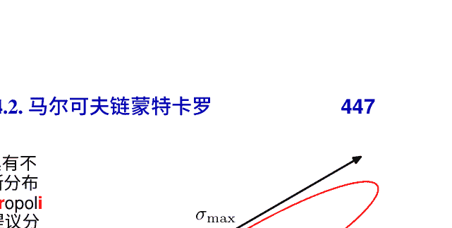

减少吉布斯采样中随机游走行为的一种方法被称为过度放松（Adler, 1981）。在其原始形式中，它适用于条件分布为高斯分布的问题，这代表了比多元高斯分布更一般的分布类别，因为例如非高斯分布 $p(z, y) \propto \exp(-z^2y^2)$ 具有高斯条件分布。

在吉布斯采样算法的每一步中，对于特定的分量 $z_i$ 的条件分布具有一定的均值 $\mu_i$ 和方差 $\sigma_i^2$。在过度放松的框架中，$z_i$ 的值被替换为

$$z'_i = \mu_i + \alpha_i(z_i - \mu_i) + \sigma_i(1-\alpha_i^2)^{1/2} \nu$$

其中 $\nu$ 是一个均值为零，方差为单位的高斯随机变量，$\alpha$ 是一个参数，使得 $-1 < \alpha < 1$。对于 $\alpha=0$，该方法等同于标准的吉布斯采样，对于 $\alpha<0$，该步骤偏向于均值的相反方向。这一步骤保持所需的分布不变，因为如果 $z_i$ 具有均值 $\mu_i$ 和方差 $\sigma_i^2$，则 $z'_i$ 也具有相同的均值和方差。过度放松的效果是鼓励当变量高度相关时，通过状态空间的定向运动。有序超松弛（Neal, 1999）的框架将这种方法推广到非高斯分布。

吉布斯采样的实际适用性取决于从条件分布中抽取样本的容易程度 $p(z_k|\mathbf{z}_{\backslash k})$。对于使用有向图模型指定的概率分布，单个节点的条件分布仅取决于相应马尔可夫毯子中的变量，如图14.12所示。对于有向图，对于节点的个别节点在其父节点的条件下的条件分布的选择很广泛，将导致吉布斯采样的条件分布是对数凹的。因此，第14.1.4节讨论的自适应拒绝采样方法为从具有广泛适用性的有向图中进行蒙特卡罗采样提供了一个框架。

图14.12 吉布斯采样方法需要从条件分布中抽取样本变量 $z$ 在剩余变量的条件下。对于有向图模型，这个条件分布只是马尔可夫毯子中节点状态的函数，用蓝色阴影标出，包括父节点、子节点和共同父节点。

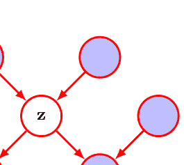

因为基本的吉布斯采样技术一次只考虑一个变量，所以连续样本之间存在强依赖关系。相反地，如果我们可以直接从联合分布中抽取样本（我们假设这是不可行的操作），那么连续样本将是独立的。我们可以通过采用中间策略来改进简单的吉布斯采样器，即从变量组而不是单个变量中连续采样。这是通过阻塞吉布斯采样算法实现的，该算法选择变量块（不一定是不相交的），然后依次从每个块中的变量中联合采样，条件是剩余变量（Jensen、Kong和Kjaerulff，1995年）。

#### 14.2.5 祖先抽样

对于许多模型，联合分布 $p(\mathbf{z})$ 方便地以图模型的形式给出。对于没有观察变量的有向图，可以使用以下的祖先抽样方法从联合分布中进行抽样。联合分布由以下方式给出

$$p(\mathbf{z}) = \prod_{i=1}^{M} p(\mathbf{z}_i | \mathrm{pa}(i)) \qquad (14.47)$$

其中 $\mathbf{z}_i$ 是与节点 $i$ 相关联的变量集合，$\mathrm{pa}(i)$ 表示与节点 $i$ 的父节点相关联的变量集合。为了从联合分布中获得一个样本，我们按照顺序依次遍历变量集合 $\mathbf{z}_1, \ldots, \mathbf{z}_M$，并从条件分布 $p(\mathbf{z}_i|\mathrm{pa}(i))$ 中进行抽样。这总是可能的，因为在每一步中，所有父节点的值都已经被实例化。经过一次遍历图后，我们将获得一个来自联合分布的样本。这假设在每个节点上都可以从各个条件分布中进行抽样。

现在考虑一个有向图，其中一些节点组成了证据集 $\mathcal{E}$，并且用观察到的值进行实例化。原则上，我们可以扩展上述过程，至少对于表示离散变量的节点，给出以下逻辑抽样方法（Henrion，1988），可以看作是重要性抽样的一种特殊情况。在每一步中，当对于一个观察到值的变量 $z_i$ 获得一个抽样值时，将抽样值与观察值进行比较，如果它们一致，则保留抽样值并继续算法处理下一个变量。然而，如果抽样值和观察值不一致，则整个抽样结果被丢弃，算法重新开始。从图中的第一个节点开始。该算法从后验分布中正确抽样，因为它简单地对隐藏变量和数据变量的联合分布进行抽样，然后丢弃与观察数据不一致的样本（稍微节省了不继续从联合分布中抽样的时间）。然而，随着观察变量数量的增加以及这些变量可以取的状态数量的增加，接受后验样本的总体概率迅速下降，因此这种方法在实践中很少使用。

对这种方法的改进被称为似然加权抽样（Fung和Chang，1990; Shachter和Peot，1990）。它基于祖先抽样与重要性抽样相结合。依次对每个变量进行处理，如果该变量在证据集中，则将其设置为其实例化的值。如果它不在证据集中，则从条件分布中进行抽样 $p(\mathbf{z}_i|\mathrm{pa}(i))$ 其中条件变量设置为它们当前抽样的值。与得到的样本 $\mathbf{z}$ 相关的权重则为

$$r(\mathbf{z}) = \prod_{z_i \in \mathcal{E}} p(z_i|\mathrm{pa}(i)) \tag{14.48}$$

这种方法可以进一步使用自重要性抽样（Shachter和Peot，1990）进行扩展，其中重要性抽样分布不断更新以反映当前估计的后验分布。

### 14.3 Langevin抽样

Metropolis-Hastings算法通过使用建议分布创建候选样本的马尔可夫链，并使用准则（14.40）接受或拒绝它们，从而从概率分布中抽取样本。这可能相对低效，因为建议分布通常是一个简单的固定分布，可以在数据空间中的任何方向生成更新，导致随机游走。

我们已经看到，在训练神经网络时，利用对模型的可学习参数的对数似然梯度是非常有利的，以最大化似然函数。类比地，我们可以引入马尔可夫链采样算法，利用概率密度对数据向量的梯度，以便采取更倾向于移动到更高概率区域的步骤。其中一种技术称为Hamiltonian Monte Carlo，也称为混合Monte Carlo。这再次利用了Metropolis接受测试（Duane等，1987；Bishop，2006）。在这里，我们将专注于一种在深度学习中广泛使用的不同方法，称为Langevin采样。尽管它避免了接受测试的使用，但算法必须经过精心设计，以确保生成的样本是无偏的。Langevin采样的一个重要应用是在以能量函数定义的机器学习模型的背景下产生。

#### 14.3.1 基于能量的模型

许多生成模型可以表示为条件概率分布 $p(\mathbf{x}|\mathbf{w})$，其中 $\mathbf{x}$ 是数据向量，$\mathbf{w}$ 表示可学习参数的向量。这样的模型可以通过最大化相应的似然函数来进行训练，该函数是相对于训练数据集定义的。然而，为了表示一个有效的概率分布，模型必须满足

$$
\int p(\mathbf{x}|\mathbf{w}) d\mathbf{x} = 1. \tag{14.49}
$$

确保满足这个要求可以显著限制模型的可允许形式。如果我们忽略归一化约束，那么我们可以考虑一个更广泛的模型类别，称为能量模型 (LeCun et al., 2006)。

假设我们有一个函数 $E(\mathbf{x}, \mathbf{w})$，称为能量函数，它是其参数的实值函数，但没有其他约束。指数函数 $\exp\{-E(\mathbf{x}, \mathbf{w})\}$ 是一个非负量，因此可以看作是一个未归一化的概率分布在 $\mathbf{x}$ 上。这里指数中的负号引入只是一个约定，它意味着能量值越高，概率值越低。然后我们可以使用归一化分布来定义

$$
p(\mathbf{x}|\mathbf{w}) = \frac{1}{Z(\mathbf{w})} \exp \{-E(\mathbf{x}, \mathbf{w})\} \tag{14.50}
$$

其中，归一化常数 $Z(\mathbf{w})$，也称为分区函数，由以下定义

$$
Z(\mathbf{w}) = \int \exp \{-E(\mathbf{x}, \mathbf{w})\} d\mathbf{x}. \tag{14.51}
$$

> 练习 14.16

能量函数通常使用具有输入向量 $\mathbf{x}$ 和标量输出 $E(\mathbf{x}, \mathbf{w})$ 的深度神经网络进行建模，其中 $\mathbf{w}$ 表示网络中的权重和偏差。

请注意，分区函数取决于 $\mathbf{w}$，这给训练带来了问题。例如，由练习 14.17 中 i.i.d. 数据组成的集合 $\mathcal{D} = (\mathbf{x}_1, ..., \mathbf{x}_N)$ 的对数似然函数具有以下形式

$$
\ln p(\mathcal{D}|\mathbf{w}) = -\sum_{n=1}^{N} E(\mathbf{x}_n, \mathbf{w}) - N \ln Z(\mathbf{w}). \tag{14.52}
$$

为了计算 $\ln p(\mathcal{D}|\mathbf{w})$ 对 $\mathbf{w}$ 的梯度，我们需要知道 $Z(\mathbf{w})$ 的形式。然而，对于许多能量函数 $E(\mathbf{x}, \mathbf{w})$ 的选择，评估式 (14.51) 中的分区函数将是不切实际的，因为这涉及到对整个 $\mathbf{x}$ 空间的积分（对于离散变量则是求和）。术语“基于能量的模型”通常用于无法计算该积分的模型。

然而，需要注意的是，概率模型可以看作是基于能量的模型的特例，因此本书讨论的许多模型可以被视为基于能量的模型。因此，基于能量的模型的一个重要优势是它们可以绕过归一化的要求，具有很大的灵活性。然而，相应的缺点是由于归一化常数未知，它们可能更难训练。

#### 14.3.2 最大化似然

已经开发了各种近似方法来训练基于能量的模型，而无需评估分区函数（Song 和 Kingma，2021）。在这里，我们将介绍基于马尔可夫链蒙特卡罗的技术。在扩散模型的背景下，我们还将讨论一种叫做得分匹配的替代方法。

我们已经看到，对于基于能量的模型，由于未知的分区函数 $Z(\mathbf{w})$，似然函数无法明确计算。然而，我们可以利用蒙特卡罗采样方法来近似计算对模型参数的对数似然梯度。一旦基于能量的模型通过任何方式进行了训练，我们还需要一种方法从模型中抽取样本，这时我们可以利用蒙特卡罗方法。

使用 (14.50)，对于基于能量的模型，对数似然函数对模型参数的梯度可以写成以下形式

$$
\nabla_{\mathbf{w}} \ln p(\mathbf{x}|\mathbf{w}) = -\nabla_{\mathbf{w}} E(\mathbf{x}, \mathbf{w}) - \nabla_{\mathbf{w}} \ln Z(\mathbf{w}). \tag{14.53}
$$

这是单个数据点 $\mathbf{x}$ 的似然函数，但在实践中，我们希望最大化对从某个未知分布 $p_{\mathcal{D}}(\mathbf{x})$ 抽取的训练数据集上定义的似然函数。如果我们假设数据点是独立同分布的，那么我们可以考虑对 $p_{\mathcal{D}}(\mathbf{x})$ 的对数似然期望的梯度，其表达式为

$$
\mathbb{E}_{\mathbf{x} \sim p_{\mathcal{D}}} \left[ \nabla_{\mathbf{w}} \ln p(\mathbf{x}|\mathbf{w}) \right] = -\mathbb{E}_{\mathbf{x} \sim p_{\mathcal{D}}} \left[ \nabla_{\mathbf{w}} E(\mathbf{x}, \mathbf{w}) \right] - \nabla_{\mathbf{w}} \ln Z(\mathbf{w}). \tag{14.54}
$$

在这里，我们利用了最后一项 $-\nabla_{\mathbf{w}} \ln Z(\mathbf{w})$ 不依赖于 $\mathbf{x}$ 的事实，并且可以从期望值中提取出来。分区函数 $Z(\mathbf{w})$（练习 14.18）被假设为未知，但我们可以利用 (14.51) 并重新排列以获得

$$
-\nabla_{\mathbf{w}} \ln Z(\mathbf{w}) = \int \left\{ \nabla_{\mathbf{w}} E(\mathbf{x}, \mathbf{w}) \right\} p(\mathbf{x}|\mathbf{w}) d\mathbf{x}. \tag{14.55}
$$

方程 (14.55) 的右侧对应于模型分布 $p(\mathbf{x}|\mathbf{w})$ 给出的期望

$$
\int \left\{ \nabla_{\mathbf{w}} E(\mathbf{x}, \mathbf{w}) \right\} p(\mathbf{x}|\mathbf{w}) d\mathbf{x} = \mathbb{E}_{\mathbf{x} \sim p_{\mathcal{M}}} \left[ \nabla_{\mathbf{w}} E(\mathbf{x}, \mathbf{w}) \right]. \tag{14.56}
$$

练习 14.18 结合 (14.54)、(14.55) 和 (14.56)，我们得到

$$
\nabla_{\mathbf{w}} \mathbb{E}_{\mathbf{x} \sim p_{\mathcal{D}}} \left[ \ln p(\mathbf{x}|\mathbf{w}) \right] = -\mathbb{E}_{\mathbf{x} \sim p_{\mathcal{D}}} \left[ \nabla_{\mathbf{w}} E(\mathbf{x}, \mathbf{w}) \right] + \mathbb{E}_{\mathbf{x} \sim p_{\mathcal{M}}} \left[ \nabla_{\mathbf{w}} E(\mathbf{x}, \mathbf{w}) \right]. \tag{14.57}
$$

这个结果在图 14.13 中有所说明，并且有一个很好的解释，如下所示。我们的目标是找到能够最大化似然函数的参数 $\mathbf{w}$ 的值，并且因此在梯度 $\nabla_{\mathbf{w}} \ln p(\mathbf{x}|\mathbf{w})$ 的方向上考虑一个小的变化 $\mathbf{w}$。从 (14.57) 中我们可以看到这个梯度的期望值可以表示为两个具有相反符号的项。右侧的第一项在 (14.57) 中起作用是为了减小 $E(\mathbf{x}, \mathbf{w})$ 的值，从而增加模型定义的概率密度，对于从 $p_{\mathcal{D}}(\mathbf{x})$ 中抽取的点 $\mathbf{x}$。在 (14.57) 式右侧的第二项作用下，会增加 $E(\mathbf{x}, \mathbf{w})$ 的值，从而减小模型定义的概率密度，对于从模型本身抽取的数据点。

在模型密度超过训练数据密度的区域，其净效应将增加能量，从而降低概率。相反，在训练数据密度超过模型密度的区域，其净效应将减少能量，从而增加概率密度。这两个项共同将概率质量从训练数据密度较低的区域转移到数据密度较高的区域，达到预期效果。当模型分布与数据分布匹配时，这两个项的大小将相等，此时 (14.57) 式左侧的梯度将为零。

#### 14.3.3 Langevin动力学

当将 (14.57) 作为实际训练方法时，我们需要近似计算右侧的两个项。对于给定的 $\mathbf{x}$ 值，我们可以使用自动微分来评估 $\nabla_{\mathbf{w}} E(\mathbf{x}, \mathbf{w})$。对于 (14.57) 中的第一项，我们可以使用训练数据集来估计对 $\mathbf{x}$ 的期望：

$$
\mathbb{E}_{\mathbf{x} \sim p_{\mathcal{D}}} [\nabla_{\mathbf{w}} E(\mathbf{x}, \mathbf{w})] \simeq \frac{1}{N} \sum_{n=1}^{N} \nabla_{\mathbf{w}} E(\mathbf{x}_n, \mathbf{w}).
$$

第二项更具挑战性，因为我们需要从由能量函数定义的模型分布中抽样，其对应的分区函数是难以计算的。这可以通过马尔可夫链蒙特卡洛方法来实现。

一种流行的方法称为随机梯度朗之万动力学，或简称为朗之万采样（Parisi, 1981; Welling and Teh, 2011）。这个术语仅通过数据向量 $\mathbf{x}$ 的对数似然函数关于得分函数的梯度来依赖于分布 $p(\mathbf{x}|\mathbf{w})$，并且给出为

$$
s(\mathbf{x}, \mathbf{w}) = \nabla_{\mathbf{x}} \ln p(\mathbf{x}|\mathbf{w}). \tag{14.59}
$$

值得强调的是，这个梯度是相对于数据点 $\mathbf{x}$ 而言的，并且因此不是关于可学习参数 $\mathbf{w}$ 的通常梯度。如果我们将 (14.50) 代入 (14.59)，我们得到

$$
s(\mathbf{x}, \mathbf{w}) = -\nabla_{\mathbf{x}} E(\mathbf{x}, \mathbf{w}) \tag{14.60}
$$

在这里我们可以看到，分区函数不再出现，因为它与 $\mathbf{x}$ 无关。我们首先从先验分布中抽取一个初始值 $\mathbf{x}^{(0)}$，然后我们迭代以下马尔可夫链步骤：

$$
\mathbf{x}^{(\tau+1)} = \mathbf{x}^{(\tau)} + \eta\nabla_{\mathbf{x}} \ln p(\mathbf{x}^{(\tau)}|\mathbf{w}) + \sqrt{2\eta}\boldsymbol{\epsilon}^{(\tau)}, \quad \tau = 1,\dots,T \tag{14.61}
$$

其中 $\boldsymbol{\epsilon}^{(\tau)} \sim \mathcal{N}(\mathbf{0}, \mathbf{I})$ 是来自零均值、单位协方差的独立样本高斯分布，参数 $\eta$ 控制步长。Langevin 方程的每次迭代都沿着对数似然梯度的方向前进，然后添加高斯噪声。可以证明，在 $\eta \rightarrow 0$ 和 $T\rightarrow \infty$ 的极限下， $\mathbf{x}^{(T)}$ 的值是来自分布 $p(\mathbf{x})$ 的独立样本。

Langevin 采样在算法 14.4 中进行了总结。我们可以重复这个过程生成一组样本 $\{\mathbf{x}_1,\dots,\mathbf{x}_M\}$，然后使用 (14.57) 中的第二项进行近似。

$$
\mathbb{E}_{\mathbf{x} \sim p_{\mathcal{M}}} [\nabla_{\mathbf{w}} E(\mathbf{x}, \mathbf{w})] \simeq \frac{1}{M} \sum_{m=1}^M \nabla_{\mathbf{w}} E(\mathbf{x}_m, \mathbf{w}). \tag{14.62}
$$

运行长时间的马尔可夫链以生成独立样本可能会计算上昂贵，因此我们需要考虑实际的近似方法。一种方法被称为对比散度 (Hinton, 2002)。在这里，用于评估 (14.62) 的样本是通过从训练数据点之一 $\mathbf{x}_n$ 开始运行蒙特卡罗链获得的。如果链运行了大量步骤，那么得到的值基本上将是从模型分布中获得的无偏样本。

相反，Hinton (2002) 建议仅运行几步蒙特卡罗，甚至可能只运行一步，这在计算上要少得多。得到的样本将远离无偏，并且接近数据流形。因此，使用梯度下降的效果将仅在数据流形的邻域中塑造能量表面和概率密度。这对于判别任务可能是有效的，但在学习生成模型方面预计效果较差。

### 算法 14.4: Langevin采样

输入：初始值 $\mathbf{x}^{(0)}$，概率密度 $p(\mathbf{x},\mathbf{w})$，学习率参数 $\eta$，迭代次数 $T$

输出：最终值 $\mathbf{x}^{(T)}$

---

$\mathbf{x} \leftarrow \mathbf{x}^{(0)}$

对于 $\tau \in \{1, \dots, T\}$ 执行

$\quad \boldsymbol{\epsilon} \sim \mathcal{N}(\boldsymbol{\epsilon}|\mathbf{0},\mathbf{I})$

$\quad \mathbf{x} \leftarrow \mathbf{x} + \eta\nabla_{\mathbf{x}} \ln p(\mathbf{x}|\mathbf{w}) + \sqrt{2\eta}\boldsymbol{\epsilon}$

结束循环

返回 $\mathbf{x}$ // 最终值 $\mathbf{x}^{(T)}$

## 14. 抽样

### 练习

- **14.1** (*) 证明由 (14.2) 定义的 $j$ 是一个无偏估计器，换句话说，右边的期望等于 $E[f(z)]$。
- **14.2** (*) 证明由式 (14.2) 定义的 $j$ 的方差为 (14.4)。
- **14.3** (*) 假设 $z$ 是一个在 $(0,1)$ 上均匀分布的随机变量，并且我们使用 $y = h^{-1}(z)$ 对 $z$ 进行变换，其中 $h(y)$ 由式 (14.6) 给出。证明 $y$ 具有分布 $p(y)$。
- **14.4** (**) 给定一个在 $(0,1)$ 上均匀分布的随机变量 $z$，找到一个变换 $y = f(z)$，使得 $y$ 具有由式 (14.8) 给出的柯西分布。
- **14.5** (**) 假设 $z_1$ 和 $z_2$ 在单位圆上均匀分布，如图 14.3 所示，并且我们进行由式 (14.10) 和 (14.11) 给出的变量变换。证明 $(y_1, y_2)$ 将按照 (14.12) 进行分布。
- **14.6** (**) 设 $\mathbf{z}$ 是一个具有高斯分布的 $D$ 维随机变量，均值为零，协方差矩阵为单位矩阵，假设正定对称矩阵 $\boldsymbol{\Sigma}$ 具有 Cholesky 分解 $\boldsymbol{\Sigma} = \mathbf{L}\mathbf{L}^\top$，其中 $\mathbf{L}$ 是一个下三角矩阵（即主对角线上方的元素为零）。证明变量 $\mathbf{y} = \boldsymbol{\mu} + \mathbf{L}\mathbf{z}$ 具有均值 $\boldsymbol{\mu}$ 和协方差 $\boldsymbol{\Sigma}$ 的高斯分布。这提供了一种从具有零均值和单位方差的一维高斯分布中生成多元高斯分布样本的技术。
- **14.7** (**) 在这个练习中，我们更仔细地展示了拒绝采样确实从所需的分布 $p(\mathbf{z})$ 中抽取样本。假设提议分布为 $q(\mathbf{z})$。证明样本值 $\mathbf{z}$ 被接受的概率为 $\widetilde{p}(\mathbf{z})/kq(\mathbf{z})$，其中 $\widetilde{p}$ 是任何与 $p(\mathbf{z})$ 成比例的非归一化分布，且常数 $k$ 被设置为确保对于所有 $\mathbf{z}$ 值有 $kq(\mathbf{z}) \geqslant \widetilde{p}(\mathbf{z})$ 的最小值。注意，抽取值 $\mathbf{z}$ 的概率由从 $q(\mathbf{z})$ 抽取该值的概率乘以接受该值的概率给出。利用这一点，结合概率的求和和乘法规则，写出关于 $\mathbf{z}$ 的分布的归一化形式，并证明它等于 $p(\mathbf{z})$。
- **14.8** (*) 假设 $z$ 在区间 $[0,1]$ 上具有均匀分布。证明变量 $y = b \tan z + c$ 服从 (14.16) 式的柯西分布。
- **14.9** (**) 确定满足连续性和归一化要求的自适应拒绝抽样中包络分布 (14.17) 的系数 $k_i$ 的表达式。
- **14.10** (**) 通过利用第 14.1.2 节中讨论的从单指数分布中抽样的技术，设计一个从由 (14.17) 定义的分段指数分布中抽样的算法。
- **14.11** (*) 证明由 (14.28)、(14.29) 和 (14.30) 定义的整数上的简单随机游走具有性质 $\mathbb{E}[(z^{(\tau)})^2] = \mathbb{E}[(z^{(\tau-1)})^2] + 1/2$，从而通过归纳证明 $\mathbb{E}[(z^{(\tau)})^2] = \tau/2$。
- **14.12** (**) 证明在第 14.2.4 节中讨论的吉布斯采样算法满足 (14.34) 所定义的详细平衡。
- **14.13** (*) 考虑图 14.14 中所示的分布。讨论标准吉布斯采样过程是否是遍历的，从而是否能正确地从该分布中进行采样。
图 14.14 一个在两个变量 $z_1$ 和 $z_2$ 上的概率分布，其在阴影区域上均匀分布，在其他地方为零。
- **14.14** (*) 验证过度松弛更新 (14.46)，其中 $z_i$ 具有均值 $\mu_i$ 和方差 $\sigma_i^2$，而 $\nu$ 具有零均值和单位方差，给出了一个具有均值 $\mu_i$ 和方差 $\sigma_i^2$ 的值 $z_i'$。
- **14.15** (*) 证明在从有向图中进行似然加权抽样时，重要性抽样权重由 (14.48) 给出。
- **14.16** (*) 证明分布 (14.50) 相对于 $\mathbf{x}$ 是归一化的，只要 $Z(\mathbf{w})$ 满足 (14.51)。
- **14.17** (**) 通过利用 (14.50)，证明能量模型的对数似然函数的梯度可以写成 (14.52) 的形式。
- **14.18** (**) 通过利用 (14.54)、(14.55) 和 (14.56)，证明能量模型的对数似然函数的梯度可以写成 (14.57) 的形式。

## 15 离散潜在变量

我们已经看到如何通过组合多个简单分布来构建复杂分布，并且如何通过有向图来描述生成模型。除了观察变量，这些模型通常引入额外的隐藏变量或潜在变量。这些变量可能对应于数据生成过程中涉及的特定数量，例如图像中三维空间中对象的未知方向，或者它们可能仅仅作为建模构造引入，以允许创建更丰富的模型。如果我们定义一个关于观察变量和潜在变量的联合分布，那么仅关于观察变量的相应分布可以通过边缘化得到。这允许相对复杂的关于观察变量的边缘分布以更可处理的观察和潜在变量的扩展空间的联合分布来表示。

在本章中，我们将看到对离散潜变量进行边缘化会给出引起混合分布。我们的重点将放在高斯混合模型上，它们很好地说明了混合分布，并且在机器学习中被广泛使用。混合模型的一个简单应用是发现数据中的聚类，我们从考虑一种称为 K均值算法的聚类技术开始，它对应于高斯混合的特定非概率极限。然后，我们介绍混合分布的潜变量视图，其中离散潜变量可以被解释为将数据点分配给混合的特定分量。

在潜变量模型中，一种常见的找到最大似然估计器的技术是期望最大化（EM）算法。我们首先使用高斯混合分布以非正式的方式激发EM算法，然后基于潜变量视角给出更仔细的处理。最后，我们通过引入证据下界（ELBO）提供了一个通用的视角，它在生成模型（如变分自动编码器和扩散模型）中起着重要作用。

## 15.1. K均值聚类

我们首先考虑在多维空间中识别数据点组或簇的问题。假设我们有一个数据集 {x_1, ..., x_N}，其中包含 N个 D维欧几里得变量 x 的观测。我们的目标是将数据集划分为一些 K个簇，暂时假设 K的值已知。直观地说，我们可以将簇看作是由数据点组成的一组，其内部点之间的距离与簇外点之间的距离相比较小。我们可以通过首先引入一组 D维向量 μ_k 来形式化这个概念，其中 k=1,...,K，其中 μ_k 是与第 k个簇相关联的原型。正如我们很快将看到的，我们可以将 μ_k 看作是表示簇中心的点。我们的目标是找到一组簇向量 {μ_k}，以及将数据点分配给簇的方式，使得每个数据点到其最近的簇向量 μ_k 的距离平方和最小。

在这一点上，定义一些符号来描述数据点分配到聚类的方便。对于每个数据点 x_n，我们引入相应的二进制指示变量集合 r_{nk} ∈ {0,1}，其中 k=1,...,K。这些指示变量描述了数据点 x_n 分配给哪个 K聚类，因此如果数据点 x_n 分配给聚类 k，则 r_{nk}=1，并且 r_{nj}=0对于 j=k。这是一种1-of-K编码方案的示例。然后我们可以定义一个误差函数：

$$ J = \sum_{n=1}^N \sum_{k=1}^K r_{nk} \|x_n - \mu_k\|^2, \quad (15.1) $$

它表示每个数据点到其分配向量 μ_k 的距离的平方和。我们的目标是找到 {r_{nk}} 和 {μ_k} 的值，以使 J最小化。我们可以通过迭代过程来实现这一点，在每次迭代中涉及两个连续的步骤，分别对应于关于 {r_{nk}} 和 {μ_k} 的连续优化。首先，我们选择一些初始值为 {μ_k}。然后，在第一步中，我们最小化 J 关于 {r_{nk}} 的值，保持 {μ_k} 不变。在第二步中，我们最小化 J 关于 {μ_k} 的值，保持 {r_{nk}} 不变。然后，这个两步优化过程会重复直到收敛。我们将看到，更新 {r_{nk}} 和更新 {μ_k} 的这两个阶段分别对应于EM算法的E（期望）步骤和M（最大化）步骤，并且为了强调这一点，在 K均值算法的上下文中，我们将使用E步骤和M步骤这些术语。

首先考虑确定 {r_{nk}} 与 {μ_k} 固定的情况 (E步骤)。因为 J 在 (15.1) 中是 {r_{nk}} 的线性函数，所以可以轻松地进行优化，得到一个闭式解。涉及不同的 n 的项是独立的，因此我们可以通过选择使 || x_n - μ_k ||^2 的值最小的 k 为 1，分别为每个 n 优化。换句话说，我们只需将第 n 个数据点分配给最近的聚类中心。更正式地说，这可以表示为

$$ r_{nk} = \begin{cases} 1, & \text{如果 } k = \arg\min_j \| \mathbf{x}_n - \boldsymbol{\mu}_j \|^2, \\ 0, & \text{否则}. \end{cases} \quad (15.2) $$

现在考虑在 {r_{nk}} 固定的情况下优化 {μ_k} (M步骤)。目标函数 J 是 μ_k 的二次函数，可以通过将其对 μ_k 的导数设为零来最小化。

$$ 2 \sum_{n=1}^{N} r_{nk} (\mathbf{x}_n - \boldsymbol{\mu}_k) = 0, \quad (15.3) $$

我们可以轻松解出 μ_k 的值

$$ \boldsymbol{\mu}_k = \frac{ \sum_{n} r_{nk} \mathbf{x}_n }{ \sum_{n} r_{nk} }. \quad (15.4) $$

这个表达式中的分母等于分配给聚类 k 的数据点数量，因此这个结果有一个简单的解释，即 μ_k 等于分配给聚类 k 的所有数据点 x_n 的均值。因此，这个过程被称为 K均值算法 (Lloyd, 1982)。它在算法15.1中进行了总结。由于分配 {r_{nk}} 是离散的，并且每次迭代都不会增加误差函数，所以 K均值算法保证在有限步骤内收敛。

重新分配数据点到聚类和重新计算聚类均值的两个阶段交替进行，直到分配不再改变 (或者超过最大迭代次数为止)。然而，这种方法可能会收敛到 J 的局部最小值而不是全局最小值。MacQueen (1967) 研究了 K均值算法的收敛性质。

K均值算法在图15.1中使用从黄石国家公园老忠实间歇泉喷发中得出的数据进行了说明。数据集包含272个数据点，每个数据点表示一次喷发的持续时间。

| 输入: | 初始原型向量 μ₁, …, μ_K，数据集 x₁, …, x_N |
| :--- | :--- |
| **输出:** | 最终原型向量 μ₁, …, μ_K，{rₙₖ} |
| 1 | {rₙₖ ← 0} // 初始将所有分配设置为零 |
| 2 | **重复** |
| 3 | &emsp; {rₙₖ^{(old)}} ← {rₙₖ} |
| 4 | &emsp; // 更新分配 |
| 5 | &emsp; **对于** n∈ {1, …, N} **执行** |
| 6 | &emsp; &emsp; k ← arg min_j \|\|x_n - μ_j\|\|² |
| 7 | &emsp; &emsp; rₙₖ ← 1 |
| 8 | &emsp; &emsp; rₙⱼ ← 0,   j ∈ {1, …, K}, j ≠ k |
| 9 | &emsp; **结束循环** |
| 10 | &emsp; // 更新原型向量 |
| 11 | &emsp; **对于** k∈ {1, …, K} **执行** |
| 12 | &emsp; &emsp; μ_k ← Σ_n rₙₖ x_n / Σ_n rₙₖ |
| 13 | &emsp; **结束循环** |
| 14 | **直到** {rₙₖ} = {rₙₖ^{(old)}} // 分配未改变 |
| 15 | **返回** μ₁, …, μ_K, {rₙₖ} |

水平轴表示时间，垂直轴表示下一次喷发的时间。在这个例子中，我们对数据进行了线性重新缩放，称为标准化，使得每个变量的均值为零，标准差为一。

对于这个例子，我们选择 K= 2，因此每个数据点到最近的聚类中心的分配等同于根据它们位于两个聚类中心垂直平分线的哪一侧进行分类。给定(15.1)式的代价函数 J的图示如图15.2所示。请注意，我们故意选择了较差的初始值，以便算法在收敛之前经过多个步骤。实际上，更好的初始化过程是选择聚类中心 μ_k 等于 K个数据点的随机子集。还要注意， K均值算法经常用于在应用第15.2.2节的EM算法之前初始化高斯混合模型的参数。

到目前为止，我们考虑的是批处理版本的 K均值算法，其中整个数据集一起用于更新原型向量。我们还可以得出一个顺序更新的方法，在这个方法中，对于每个数据点 x_n 依次更新最近的原型 μ_k 使用

$$ \boldsymbol{\mu}_k^{\text{新}} = \boldsymbol{\mu}_k^{\text{旧}} + \frac{1}{N_k} (\mathbf{x}_n - \boldsymbol{\mu}_k^{\text{旧}}) \quad\quad (15.5) $$

其中 $N_k$是迄今为止用于更新 $\boldsymbol{\mu}_k$的数据点数量。 这样可以使每个数据点在看到下一个数据点之前被使用一次并丢弃。

值得注意的是， K均值算法的一个显著特点是，在每次迭代中，每个数据点都被分配给一个且仅一个簇。 尽管某些数据点距离特定中心 $\boldsymbol{\mu}_k$比任何其他中心更近，但可能存在其他数据点位于簇中心之间的中间位置。 在后一种情况下，很难确定将数据点硬分配给最近的簇是否是最合适的。 我们将看到，通过采用概率方法，我们可以以反映最合适分配的不确定性水平的方式将数据点‘软’分配给簇。 这种概率形式有许多好处。

#### 15.1.1 图像分割

作为对 K均值算法应用的说明，我们考虑图像分割和图像压缩的相关问题。 分割的目标是将图像分割成区域，使得每个区域具有相对均匀的视觉外观，或者对应于对象或对象的部分（Forsyth和Ponce，2003年）。 图像中的每个像素都是一个三维空间中的点，包括红色、蓝色和绿色通道的强度，我们的分割算法简单地将图像中的每个像素视为一个独立的数据点。 请注意，严格来说，这个空间不是欧几里德空间，因为通道的强度被区间 $[0, 1]$所限制。 尽管如此，我们可以毫无困难地应用 K均值算法。 我们通过重新绘制图像来说明运行 K均值算法收敛的结果，对于任何特定的 K值，我们用像素向量替换图像，并用中心 $\boldsymbol{\mu}_k$分配给该像素的 $\{R, G, B\}$强度三元组来代替。 图15.3显示了不同 K值的结果。我们可以看到，对于给定的 K值，该算法表示图像仅使用 $K$ 个颜色调色板。需要强调的是，这种使用 $K$-means的方法并不是图像分割中特别复杂的方法，尤其是因为它没有考虑不同像素之间的空间接近性。图像分割一般来说非常困难，仍然是活跃研究的课题，这里只是为了说明 $K$-means算法的行为。

我们还可以使用聚类算法进行数据压缩。重要的是要区分无损数据压缩，即从压缩表示中完全重构原始数据的目标，和有损数据压缩，即在重构中接受一些误差以换取比无损情况下更高的压缩水平。

我们可以将 $K$均值算法应用于有损数据压缩问题，如下所示。对于每个 $N$个数据点，我们只存储其所属簇的标识 $k$。我们还存储 $K$个簇中心的值 $\{ \mu_k \}$，通常只需要较少的数据，前提是选择 $K \ll N$。然后，每个数据点都用其最近的中心 $\mu_k$来近似。新的数据点也可以通过首先找到最近的 $\mu_k$，然后存储标签 $k$而不是原始数据向量来进行压缩。这个框架通常被称为向量量化，而向量 $\{ \mu_k \}$被称为码本向量。

上述讨论的图像分割问题也说明了聚类在数据压缩中的应用。假设原始图像有 $N$个像素，包括 $\{ R, G, B \}$值，每个值都以8位精度存储。直接传输整个图像将花费 $24N$位。现在假设我们首先对图像数据运行 $K$均值聚类，然后不再传输原始像素强度向量，而是传输最近向量的标识 $\mu_k$。因为有 $K$个这样的向量，这需要每个像素 $\log_2 K$位。我们还必须传输 $K$ 码书向量 $\{ \mu_k \}$，需要 $24K$位，因此传输图像所需的总位数为 $24K + N \log_2 K$（向上取整整数）。图15.3中显示的原始图像具有240×180=43,200像素，因此直接传输需要24×43,200=1,036,800位。相比之下，压缩图像分别需要43,248位 ($K=2$)，86,472位 ($K=3$) 和173,040位 ($K=10$) 进行传输。这些相对于原始图像的压缩比分别为4.2%，8.3%和16.7%。我们可以看到在压缩程度和图像质量之间存在权衡。请注意，在这个例子中，我们的目标是说明$K$均值算法。如果我们的目标是制作一个好的图像压缩器，那么考虑相邻像素的小块，例如5×5，从而利用自然图像中相邻像素之间的相关性，会更有成果。

## 15.2. 高斯混合模型

我们之前已经解释了高斯混合模型作为高斯分量的简单线性叠加，旨在提供比单个高斯更丰富的密度模型。现在我们转向以离散潜在变量的形式来表达高斯混合模型。这将为我们提供对这个重要分布的更深入的理解，并且还将用于推动期望最大化算法的动机。

回顾一下(3.111)，高斯混合分布可以写成以下形式的高斯线性叠加：

$$ p(\mathbf{x}) = \sum_{k=1}^K \pi_k \mathcal{N}(\mathbf{x}|\boldsymbol{\mu}_k, \boldsymbol{\Sigma}_k). \qquad (15.6) $$

让我们引入一个 $K$ 维的二进制随机变量 $\mathbf{z}$，它以1-of-$K$表示，其中一个元素等于 1，而其他所有元素都等于 0。因此，$z_k$的值满足 $z_k \in \{0, 1\}$ 和 $\sum_k z_k = 1$，我们可以看到根据非零元素的位置，向量 $\mathbf{z}$ 有 $K$ 个可能的状态。我们将联合分布 $p(\mathbf{x}, \mathbf{z})$ 定义为边缘分布 $p(\mathbf{z})$ 和条件分布 $p(\mathbf{x}|\mathbf{z})$ 的乘积。关于 $\mathbf{z}$ 的边缘分布是由混合系数 $\pi_k$ 来指定的，即

$$ p(z_k = 1) = \pi_k $$

其中参数 $\{\pi_k\}$ 必须满足

$$ 0 \leqslant \pi_k \leqslant 1 \qquad (15.7) $$

以及

$$ \sum_{k=1}^K \pi_k = 1 \qquad (15.8) $$

如果它们要成为有效的概率。因为 \(\mathbf{z}\) 使用一种 \(K\) 中的1表示，我们也可以将这个分布写成以下形式

$$ p(\mathbf{z}) = \prod_{k=1}^{K} \pi_k^{z_k}. \tag{15.9} $$

同样，给定 \(\mathbf{z}\) 的特定值时，\(\mathbf{x}\) 的条件分布是一个高斯分布：

$$ p(\mathbf{x}|z_k = 1) = \mathcal{N}(\mathbf{x}|\boldsymbol{\mu}_k, \boldsymbol{\Sigma}_k), $$

这也可以写成以下形式

$$ p(\mathbf{x}|\mathbf{z}) = \prod_{k=1}^{K} \mathcal{N}(\mathbf{x}|\boldsymbol{\mu}_k, \boldsymbol{\Sigma}_k)^{z_k}. \tag{15.10} $$

联合分布由 \(p(\mathbf{z})p(\mathbf{x}|\mathbf{z})\) 给出，并由图15.4中的图形模型描述。通过对 \(\mathbf{z}\) 的所有可能状态求和，可以得到 \(\mathbf{x}\) 的边际分布，如下所示

$$ p(\mathbf{x}) = \sum_{\mathbf{z}} p(\mathbf{z})p(\mathbf{x}|\mathbf{z}) = \sum_{k=1}^{K} \pi_k \mathcal{N}(\mathbf{x}|\boldsymbol{\mu}_k, \boldsymbol{\Sigma}_k) \tag{15.11} $$

我们在(15.9)和(15.10)中使用了。因此，\(\mathbf{x}\) 的边际分布是一个高斯混合模型(15.6)的形式。如果我们有多个观测值 \(\mathbf{x}_1, \dots, \mathbf{x}_N\)。那么，因为我们用 \(p(\mathbf{x})\) 的形式表示了边际分布，\(\sum_{\mathbf{z}} p(\mathbf{x}, \mathbf{z})\)，所以对于每个观测数据点 \(\mathbf{x}_n\) 都有一个相应的潜变量 \(\mathbf{z}_n\)。

因此，我们找到了一个涉及显式潜变量的高斯混合的等价表达式。看起来我们并没有通过这样做获得太多好处。然而，我们现在能够使用联合分布 \(p(\mathbf{x}, \mathbf{z})\) 而不是边际分布 \(p(\mathbf{x})\)，这将带来显著的简化，尤其是通过引入EM算法。

另一个重要的数量是条件概率 \(p(\mathbf{z}| \mathbf{x})\) 的我们将使用 \(\gamma(\mathbf{z}_k)\) 来表示 \(p(z_k= 1|\mathbf{x})\)，其值可以找到使用贝叶斯定理：

$$ \gamma(z_k) \equiv p(z_k = 1|\mathbf{x}) = \frac{p(z_k = 1)p(\mathbf{x}|z_k = 1)}{\sum_{j=1}^K p(z_j = 1)p(\mathbf{x}|z_j = 1)} = \frac{\pi_k \mathcal{N}(\mathbf{x}|\boldsymbol{\mu}_k, \boldsymbol{\Sigma}_k)}{\sum_{j=1}^K \pi_j \mathcal{N}(\mathbf{x}|\boldsymbol{\mu}_j, \boldsymbol{\Sigma}_j)}. \quad (15.12) $$

我们将把$\pi_k$视为$z_k=1$的先验概率，将$\gamma(z_k)$视为观察到$\mathbf{x}$后的后验概率。正如我们后面将看到的那样，$\gamma(z_k)$也可以被视为组件$k$对解释观察$\mathbf{x}$的‘责任’。

第14.2.5节 我们可以使用祖先抽样来生成符合高斯混合模型分布的随机样本。为了做到这一点，我们首先从边缘分布$p(\mathbf{z})$中生成一个值$\mathbf{z}$，然后从条件分布$p(\mathbf{x}|\mathbf{z})$中生成一个值$\mathbf{x}$。我们可以通过在对应的x值处绘制点，并根据z的值进行着色来描述联合分布的样本。从联合分布中获取的样本根据z的值进行着色，换句话说，根据生成它们的高斯分量。这在图15.5(a)中展示。类似地，从边缘分布$p(\mathbf{x})$中获取的样本是通过从联合分布中获取样本并忽略z的值得到的。这在图15.5(b)中通过绘制没有任何着色标签的x值来说明。

我们还可以使用这个合成数据集来说明通过评估每个数据点在生成该数据集的混合分布中每个组件的后验概率来说明‘责任’。特别地，我们可以通过使用红、蓝和绿墨水的比例来绘制对应的点来表示与数据点$\mathbf{x}_n$相关的责任值$\gamma(z_{nk})$，其中$k=1,2,3$，如图15.5(c)所示。因此，例如，对于一个满足$\gamma(z_{n1})=1$的数据点，它将被着色为红色，而对于一个满足$\gamma(z_{n2})=\gamma(z_{n3})=0.5$的数据点，它将被等比例地着色为蓝色和绿色墨水，因此呈现为青色。这应该与图15.5(a)进行比较，在该图中，数据点是使用它们生成的组件的真实身份进行标记的。

#### 15.2.1 似然函数

假设我们有一个观测数据集$\{\mathbf{x}_1, \ldots, \mathbf{x}_N\}$，我们希望使用高斯混合模型对这个数据进行建模。我们可以将这个数据集表示为一个$N \times D$矩阵$\mathbf{X}$，其中第$n$行由$\mathbf{x}_n^T$给出。根据公式(15.6)，似然函数的对数为

$$ \ln p(\mathbf{X}|\boldsymbol{\pi}, \boldsymbol{\mu}, \boldsymbol{\Sigma}) = \sum_{n=1}^N \ln \left\{ \sum_{k=1}^K \pi_k \mathcal{N}(\mathbf{x}_n|\boldsymbol{\mu}_k, \boldsymbol{\Sigma}_k) \right\}. \quad (15.13) $$

#### 15.2.2 最大似然

一种优雅而强大的方法，用于寻找具有潜在变量的模型的最大似然解，称为期望最大化算法或EM算法（Dempster， Laird和Rubin， 1977; McLachlan和Krishnan， 1997）。在本章中，我们将给出EM算法的三种不同推导，每一种推导都比之前更一般。我们从一个相对非正式的高斯混合模型的背景下开始。然而，我们强调EM具有广泛的适用性，并且在本书中将在几个不同模型的背景下遇到基本概念。

我们首先写下在最大似然函数处满足的条件。将对高斯分量的均值 \( \mu_k \) 的导数在 (15.13) 中设为零，我们得到

$$0 = \sum_{n=1}^{N} \frac{\pi_k \mathcal{N}(\mathbf{x}_n | \boldsymbol{\mu}_k, \boldsymbol{\Sigma}_k)}{\sum_j \pi_j \mathcal{N}(\mathbf{x}_n | \boldsymbol{\mu}_j, \boldsymbol{\Sigma}_j)} \boldsymbol{\Sigma}_k^{-1} (\mathbf{x}_n - \boldsymbol{\mu}_k) \tag{15.15}$$

我们使用了高斯分布的形式 (3.26)。注意后验概率或责任 \( \gamma(z_{nk}) \)（由 (15.12) 给出）自然地出现在右侧。乘以 \( \Sigma_k \)（我们假设为非奇异）并重新排列，我们得到

$$\boldsymbol{\mu}_k = \frac{1}{N_k} \sum_{n=1}^{N} \gamma(z_{nk}) \mathbf{x}_n \tag{15.16}$$

我们定义

$$N_k = \sum_{n=1}^{N} \gamma(z_{nk}) \tag{15.17}$$

我们可以将 \( N_k \) 解释为分配给聚类 \( k \) 的有效数据点数。请仔细注意解决方案的形式。我们可以看到，第 \( k \) 个高斯分量的均值 \( \mu_k \) 通过对数据集中所有点的加权平均得到，其中数据点 \( \mathbf{x}_n \) 的加权因子由后验概率 \( \gamma(z_{nk}) \) 表示该分量 \( k \) 负责生成 \( \mathbf{x}_n \)。

如果我们 \( \ln p(\mathbf{X} | \boldsymbol{\pi}, \boldsymbol{\mu}, \boldsymbol{\Sigma}) \) 对 \( \boldsymbol{\Sigma}_k \) 的导数设置为零，并且按照类似的推理线路使用最大似然结果第3.2.7节的解决方案来计算单个高斯分布的协方差矩阵，我们得到

$$\boldsymbol{\Sigma}_k = \frac{1}{N_k} \sum_{n=1}^{N} \gamma(z_{nk}) (\mathbf{x}_n - \boldsymbol{\mu}_k) (\mathbf{x}_n - \boldsymbol{\mu}_k)^\mathrm{T} \tag{15.18}$$

它与拟合到数据集的单个高斯分布的相应结果具有相同的形式，但是每个数据点都根据相应的后验概率加权，并且分母由与相应分量相关联的有效数据点的数量给出。

最后，我们对混合系数 \( \pi_k \) 最大化 \( \ln p(\mathbf{X} | \boldsymbol{\pi}, \boldsymbol{\mu}, \boldsymbol{\Sigma}) \)。在这里，我们必须考虑约束条件 (15.8)，它要求混合系数之和为一。这可以通过使用拉格朗日乘子 \( \lambda \) 来实现，见附录C。最大化以下数量：

$$ \ln p(\mathbf{X}|\boldsymbol{\pi}, \boldsymbol{\mu}, \boldsymbol{\Sigma}) + \lambda \left( \sum_{k=1}^K \pi_k - 1 \right), \tag{15.19} $$

这给出

$$ 0 = \sum_{n=1}^N \frac{\pi_k \mathcal{N}(\mathbf{x}_n|\boldsymbol{\mu}_k, \boldsymbol{\Sigma}_k)}{\sum_j \pi_j \mathcal{N}(\mathbf{x}_n|\boldsymbol{\mu}_j, \boldsymbol{\Sigma}_j)} + \lambda \tag{15.20} $$

在这里我们再次看到责任的出现。如果我们现在将两边都乘以 \(\pi_k\) 并对 \(k\) 求和，利用约束条件 (15.8)，我们发现 \(\lambda = -N\)。使用这个来消除 \(\lambda\) 并重新排列，我们得到

$$ \pi_k = \frac{N_k}{N} \tag{15.21} $$

因此，第 \(k\) 个分量的混合系数由该分量对解释数据点所承担的平均责任给出。

请注意，结果 (15.16)，(15.18) 和 (15.21) 不构成混合模型参数的闭式解，因为责任 \(\gamma(z_{nk})\) 通过 (15.12) 以复杂的方式依赖于这些参数。然而，这些结果为解决最大似然问题提供了一个简单的迭代方案，正如我们将看到的，这个方案实际上是高斯混合模型的EM算法的一个实例。我们首先选择一些均值、协方差和混合系数的初始值。然后我们交替进行以下两个更新，我们将其称为E步和M步，原因很快就会变得明显。在期望步骤中，我们使用当前参数的值来评估由 (15.12) 给出的后验概率或责任。然后我们在最大化步骤中使用这些概率来重新估计均值、协方差和混合系数，使用结果 (15.16)，(15.18) 和 (15.21)。请注意，在这样做时，我们首先使用 (15.16) 评估新的均值，然后使用这些新值使用 (15.18) 找到协方差，与单个高斯分布的相应结果保持一致。

我们将展示每次参数更新都会增加对数似然函数的E步骤后第15.3节M步骤的结果。在实践中，当对数似然函数的变化或参数的变化低于某个阈值时，算法被认为已收敛。

我们在图15.7中对两个高斯混合模型应用EM算法来演示，使用重新缩放的Old Faithful数据。这里使用两个高斯混合模型，中心点的初始化值与图15.1中的 \(K\) 均值算法相同，并且协方差矩阵初始化为与单位矩阵成比例。

图(a)显示了数据点为绿色，混合模型的初始配置中，两个高斯分量的一个标准差轮廓分别显示为蓝色和红色圆圈。图(b)显示了初始的E步骤的结果，每个数据点使用与来自蓝色分量生成的后验概率相等的蓝色墨水比例来表示。由红色成分的后验概率给出的红墨水的相应比例。因此，对于属于任一簇的概率大致相等的点，呈现紫色。第一次M步之后的情况显示在图(c)中，其中蓝色高斯的均值已经移动到数据集的均值，根据每个数据点属于蓝色簇的概率进行加权。换句话说，它已经移动到蓝墨水的质心。类似的结果适用于红色成分。图(d)，(e)和(f)分别显示了经过2次，5次和20次完整EM循环后的结果。在图(f)中，算法接近收敛。

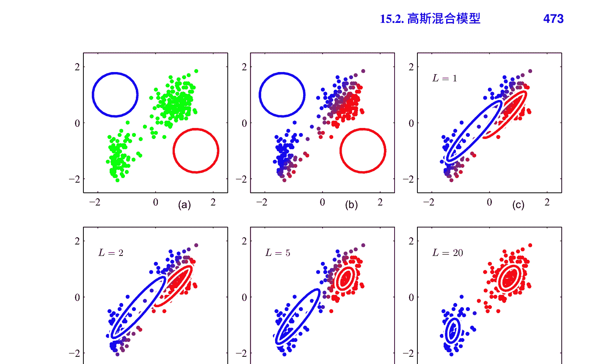

图15.7 EM算法在Old Faithful数据集上的应用，用于图15.1中K-means算法的说明。详细信息请参阅正文。

请注意，EM算法需要更多的迭代次数才能达到（近似）收敛，与 K均值算法相比，每个周期需要更多的计算。因此，通常会运行 K均值算法来找到适合高斯混合模型的初始化，然后使用EM进行调整。协方差矩阵可以方便地初始化为 K均值算法找到的聚类的样本协方差，而混合系数可以设置为分配给各个聚类的数据点的比例。

图15.8 拟合到 “双月亮” 数据集的高斯混合模型，显示出需要大量的混合成分才能准确表示复杂的数据分布。 这里的椭圆表示相应混合成分的常数密度轮廓。 随着维度的增加，为了准确建模分布所需的成分数量可能变得不可接受地大。

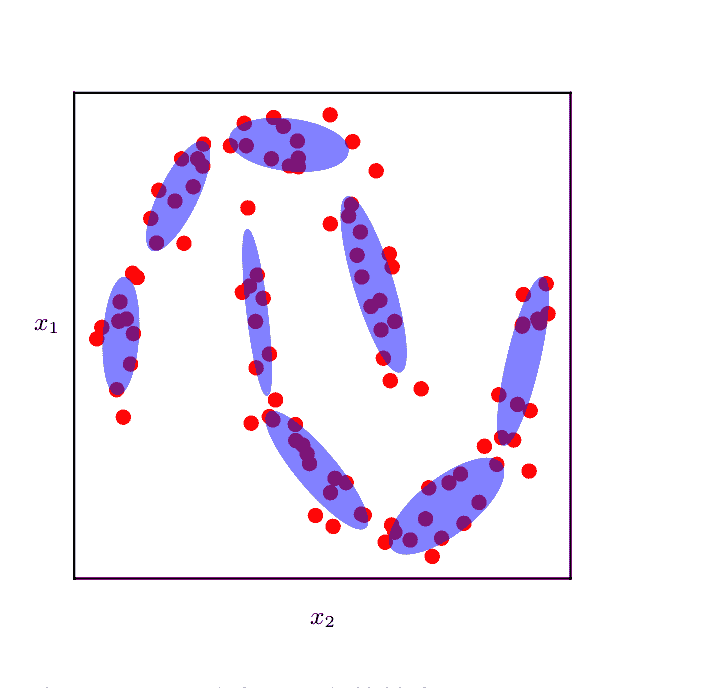

为了避免似然函数中的奇异点，必须采用参数正则化等技术。 需要强调的是，对数似然函数通常会有多个局部最大值，并且EM算法不能保证找到最大的最大值。 由于高斯混合模型的EM算法起着重要的作用，我们在算法15.2中对其进行了总结。 如果模型参数选择得当，混合模型非常灵活，可以高度准确地逼近复杂的分布。 然而，在实践中，组件的数量可能非常大，特别是在高维空间中。 这个问题在图15.8中对双月数据集进行了说明。尽管如此，混合模型在许多应用中仍然很有用。 此外，对混合模型的理解为具有连续潜变量和基于深度神经网络的生成模型奠定了基础，这些模型在高维空间中具有更好的扩展性。

## 算法15.2: 高斯混合模型的EM算法

**输入:** 初始模型参数 \(\{\boldsymbol{\mu}_k\}\), \(\{\boldsymbol{\Sigma}_k\}\), \(\{\pi_k\}\)
数据集 \(\{\mathbf{x}_1, \dots, \mathbf{x}_N\}\)

**输出:** 最终模型参数 \(\{\boldsymbol{\mu}_k\}\), \(\{\boldsymbol{\Sigma}_k\}\), \(\{\pi_k\}\)

| 步骤 | 操作 |
| :--- | :--- |
| **重复** | |
| &nbsp;&nbsp;**// E 步** | |
| &nbsp;&nbsp;**对于** \(n \in \{1, \dots, N\}\) **执行** | |
| &nbsp;&nbsp;&nbsp;&nbsp;**对于** \(k \in \{1, \dots, K\}\) **执行** | |
| &nbsp;&nbsp;&nbsp;&nbsp;&nbsp;&nbsp;\(\gamma(z_{nk}) \leftarrow \frac{\pi_k \mathcal{N}(\mathbf{x}_n | \boldsymbol{\mu}_k, \boldsymbol{\Sigma}_k)}{\sum_{j=1}^K \pi_j \mathcal{N}(\mathbf{x}_n | \boldsymbol{\mu}_j, \boldsymbol{\Sigma}_j)}\) | |
| &nbsp;&nbsp;&nbsp;&nbsp;**结束 for** | |
| &nbsp;&nbsp;**结束 for** | |
| &nbsp;&nbsp;**// M 步** | |
| &nbsp;&nbsp;**对于** \(k \in \{1, \dots, K\}\) **执行** | |
| &nbsp;&nbsp;&nbsp;&nbsp;\(N_k \leftarrow \sum_{n=1}^N \gamma(z_{nk})\) | |
| &nbsp;&nbsp;&nbsp;&nbsp;\(\boldsymbol{\mu}_k \leftarrow \frac{1}{N_k} \sum_{n=1}^N \gamma(z_{nk}) \mathbf{x}_n\) | |
| &nbsp;&nbsp;&nbsp;&nbsp;\(\boldsymbol{\Sigma}_k \leftarrow \frac{1}{N_k} \sum_{n=1}^N \gamma(z_{nk}) (\mathbf{x}_n - \boldsymbol{\mu}_k) (\mathbf{x}_n - \boldsymbol{\mu}_k)^\mathrm{T}\) | |
| &nbsp;&nbsp;&nbsp;&nbsp;\(\pi_k \leftarrow \frac{N_k}{N}\) | |
| &nbsp;&nbsp;**结束循环** | |
| &nbsp;&nbsp;**// 对数似然** | |
| &nbsp;&nbsp;\(\mathcal{L} \leftarrow \sum_{n=1}^N \ln \left\{ \sum_{k=1}^K \pi_k \mathcal{N}(\mathbf{x}_n | \boldsymbol{\mu}_k, \boldsymbol{\Sigma}_k) \right\}\) | |
| **直到收敛** | |
| **返回** \(\{\boldsymbol{\mu}_k\}\), \(\{\boldsymbol{\Sigma}_k\}\), \(\{\pi_k\}\) | |

## 15.3. 期望最大化算法

现在我们转向EM算法的更一般视角，重点关注潜变量的作用。 与之前一样，我们用 \(\mathbf{X}\) 表示所有观测数据点的集合，其中第 \(n\) 行表示 \(\mathbf{x}_n^{\top}\)。 类似地，相应的潜变量将用一个 \(N \times K\) 矩阵 \(\mathbf{Z}\) 表示，其中行 \(\mathbf{z}_n^{\top}\)。 如果我们假设数据点是独立从分布中抽取的，那么我们可以使用图形表示（如图15.9所示）来表示这个独立同分布数据集的高斯混合模型。 \(\theta\) 表示所有模型参数的集合，因此对数似然函数为

$$ \ln p(\mathbf{X}|\theta) = \ln \left\{ \sum_{\mathbf{Z}} p(\mathbf{X}, \mathbf{Z}|\theta) \right\} \tag{15.22} $$

请注意，我们的讨论同样适用于连续潜在变量，只需用积分替换对 \(\mathbf{Z}\) 的求和。

一个关键观察是潜在变量的求和出现在对数函数内。即使联合分布 \(p(\mathbf{X}, \mathbf{Z}|\theta)\) 属于指数族，边缘分布 \(p(\mathbf{X}|\theta)\) 通常由于这个求和而不属于指数族。求和的存在阻止了对数函数直接作用于联合分布，导致最大似然解的表达式复杂。

现在假设对于 \(\mathbf{X}\) 中的每个观测值，我们被告知相应的潜在变量 \(\mathbf{Z}\) 的值。我们将 \(\{\mathbf{X}, \mathbf{Z}\}\) 称为完整数据集，并将实际观测数据 \(\mathbf{X}\) 称为不完整的，如图15.5所示。完整数据集的似然函数简单地采用形式 \(\ln p(\mathbf{X}, \mathbf{Z}|\theta)\)，并且我们假设最大化这个完整数据对数似然函数是直接的。

然而，在实践中，我们并没有得到完整的数据集 \(\{\mathbf{X}, \mathbf{Z}\}\) 而只有不完整的数据 \(\mathbf{X}\)。我们对潜在变量 \(\mathbf{Z}\) 的值的了解仅通过后验分布 \(p(\mathbf{Z}|\mathbf{X}, \theta)\) 给出。因为我们无法使用完整数据的对数似然函数，所以我们考虑的是在潜在变量的后验分布下的期望值，这对应于EM算法的E步骤（正如我们将看到的）。在随后的M步骤中，我们最大化这个期望值。

如果当前参数的估计值表示为 \(\theta_{\text{old}}\)，则一对连续的E步骤和M步骤会产生一个修正的估计值 \(\theta_{\text{new}}\)。该算法通过选择一些参数的起始值 \(\theta_0\) 进行初始化。尽管这种使用期望值的方式似乎有些随意，但当我们在第15.4节对EM进行更深入的讨论时，我们将看到这种选择的动机。

在E步骤中，我们使用当前的参数值 \(\theta_{\text{old}}\) 来找到给定 \(\mathbf{X}\) 和 \(\theta_{\text{old}}\) 的潜在变量的后验分布 \(p(\mathbf{Z}|\mathbf{X}, \theta_{\text{old}})\)。然后，我们使用这个后验分布来找到在一般参数值 \(\theta\) 下评估的完整数据对数似然的期望值。这个期望值用 \(Q(\theta, \theta_{\text{old}})\) 表示，如下所示：

$$ Q(\theta, \theta_{\text{old}}) = \sum_{\mathbf{Z}} p(\mathbf{Z}|\mathbf{X}, \theta_{\text{old}}) \ln p(\mathbf{X}, \mathbf{Z}|\theta) \tag{15.23} $$

图15.9 一组 N 个独立同分布的数据点 \(\{\mathbf{x}_n\}\)，对应的潜变量 \(\{\mathbf{z}_n\}\)，其中 \(n = 1, ..., N\)。

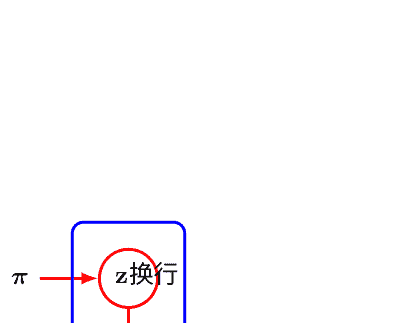## 算法15.3：通用EM算法

```
输入：联合分布 $p(\mathbf{X}, \mathbf{Z}|\theta)$
初始参数 $\theta^{\text{old}}$
数据集 $\mathbf{x}_1, \ldots, \mathbf{x}_N$
输出：最终参数 $\theta$
重复
  $\mathcal{Q}(\theta, \theta^{\text{old}}) \leftarrow \sum_{\mathbf{Z}} p(\mathbf{Z}|\mathbf{X}, \theta^{\text{old}}) \ln p(\mathbf{X}, \mathbf{Z}|\theta)$  // E步
  $\theta^{\text{new}} \leftarrow \arg \max_{\theta} \mathcal{Q}(\theta, \theta^{\text{old}})$  // M步
  $\mathcal{L} \leftarrow p(\mathbf{X}|\theta^{\text{new}})$  // 评估对数似然
  $\theta^{\text{old}} \leftarrow \theta^{\text{new}}$  // 更新参数
直到收敛
返回 $\theta^{\text{new}}$
```

在 M 步中，我们通过最大化这个函数来确定修正的参数估计 $\theta^{\text{new}}$：

```
$\theta^{\text{new}} = \arg \max_{\theta} \mathcal{Q}(\theta, \theta^{\text{old}})$。 (15.24)
```

请注意，在 $\mathcal{Q}(\theta, \theta^{\text{old}})$ 的定义中，对数直接作用于联合分布 $p(\mathbf{X}, \mathbf{Z}|\theta)$，因此相应的 M 步最大化将根据我们的假设是可行的。通用 EM 算法在算法 15.3 中总结。正如我们将在后面展示的那样，每个 EM 循环都会增加不完全数据的对数似然（除非已经达到局部最大值）。

## 练习 15.5

EM算法也可以用于找到具有先验概率 $p(\theta)$ 的参数的MAP（最大后验）解。在这种情况下，在最大似然情况下，E步骤保持不变，而在 M 步中，要最大化的数量由 $\mathcal{Q}(\theta, \theta^{\text{old}}) + \ln p(\theta)$ 给出。适当选择先验将消除图 15.6 中所示的奇点。在这里，我们考虑使用 EM 算法来最大化似然函数，当存在离散潜在变量时。然而，它也可以应用于未观察到的变量对应于数据集中的缺失值的情况。观察值的分布是通过取所有变量的联合分布，然后对缺失值进行边际化得到的。然后可以使用 EM 来最大化相应的似然函数。如果数据值是随机缺失的，即导致值缺失的机制不依赖于未观察到的值，则这将是一个有效的过程。在许多情况下，这不是这种情况，例如，如果传感器在测量量超过某个阈值时未返回值。

## 15.3 离散潜变量

图15.10显示了与图15.9相同的图形，只是现在我们假设离散变量 $z_n$ 被观察到，以及数据变量 $x_n$。

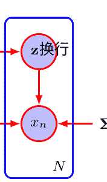

#### 15.3.1 高斯混合模型

现在我们考虑将EM的这种潜变量视图应用于高斯混合模型的具体情况。回想一下，我们的目标是最大化对数似然函数（15.13），该函数使用观察到的数据集 $\mathbf{X}$ 计算，我们看到这比使用单个高斯分布更困难，因为在对数函数内部存在对 $k$ 的求和。 假设除了观察到的数据集 $\mathbf{X}$ 之外，我们还给出了相应的离散变量 $\mathbf{Z}$ 的值。 回想一下，图15.5(a)显示了一个完整的数据集（即包括标签，显示每个数据点由哪个组件生成），而图15.5(b)显示了相应的不完整的数据集。图15.10显示了完整数据的图形模型。

现在考虑最大化完整数据集 $\{\mathbf{X}, \mathbf{Z}\}$ 的似然性问题。 根据(15.9)和(15.10)，这个似然函数的形式为

```
$$p(\mathbf{X}, \mathbf{Z}|\boldsymbol{\mu}, \boldsymbol{\Sigma}, \boldsymbol{\pi}) = \prod_{n=1}^N \prod_{k=1}^K \pi_k^{z_{nk}} \mathcal{N}(\mathbf{x}_n|\boldsymbol{\mu}_k, \boldsymbol{\Sigma}_k)^{z_{nk}}$$ (15.25)
```

其中 $z_{nk}$ 表示 $\mathbf{z}_n$ 的第 $k$ 个分量。 取对数，我们得到

```
$$\ln p(\mathbf{X}, \mathbf{Z}|\boldsymbol{\mu}, \boldsymbol{\Sigma}, \boldsymbol{\pi}) = \sum_{n=1}^N \sum_{k=1}^K z_{nk} \{ \ln \pi_k + \ln \mathcal{N}(\mathbf{x}_n|\boldsymbol{\mu}_k, \boldsymbol{\Sigma}_k) \}。$$ (15.26)
```

与不完整数据的对数似然函数(15.13)进行比较，可以看出求和符号 $k$ 和对数符号已经交换位置。 对数现在直接作用于高斯分布，而高斯分布本身是指数族的一员。 毫不奇怪，这导致了对最大似然问题的一个更简单的解决方案，我们现在展示出来。 首先考虑对均值和协方差的最大化。 因为 $\mathbf{z}_n$ 是一个 $K$ 维向量，除了一个元素为1以外，其余元素都为0，完整数据的对数似然函数只是 $K$ 个独立贡献的求和。 因此，对于均值或协方差的最大化与单个高斯分布完全相同，只是它只涉及到被“分配”给该分量的数据子集。 对于混合系数的最大化，注意到这些系数在不同的 $k$ 值上是耦合的，由于求和约束(15.8)。 同样，这可以通过使用拉格朗日乘子来实现。

与之前的乘法器一样，导致结果

```
$$\pi_k = \frac{1}{N} \sum_{n=1}^{N} z_{nk}$$ (15.27)
```

因此，混合系数等于分配给相应组件的数据点的分数。

因此，我们可以看到完整数据的对数似然函数可以以封闭形式轻松最大化。然而，在实践中，我们没有潜在变量的值。因此，正如前面讨论的那样，我们考虑对完整数据的对数似然函数的潜在变量的后验分布的期望。使用(15.9)和(15.10)以及贝叶斯定理，我们可以看到这个后验分布的形式为

```
$$p(\mathbf{Z}|\mathbf{X}, \mu, \Sigma, \pi) \propto \prod_{n=1}^{N} \prod_{k=1}^{K} [\pi_k \mathcal{N}(\mathbf{x}_n|\mu_k, \Sigma_k)]^{z_{nk}}.$$ (15.28)
```

我们可以看到这在$n$上分解，因此在后验分布下，$\{z_n\}$是独立的。通过检查图15.9节中的有向图并利用d-分离准则，可以轻松验证这一点。在这个后验分布下，指示变量$z_{nk}$的期望值由以下给出

```
$$\begin{aligned} \mathbb{E}[z_{nk}] &= \frac{\sum_{\mathbf{z}_{\backslash n}} z_{nk} \prod_{k'} [\pi_{k'} \mathcal{N}(\mathbf{x}_n|\mu_{k'}, \Sigma_{k'})]^{z_{nk'}}}{\sum_{\mathbf{z}_{\backslash n}} \prod_{j} [\pi_{j} \mathcal{N}(\mathbf{x}_n|\mu_{j}, \Sigma_{j})]^{z_{nj}}} \\ &= \frac{\pi_k \mathcal{N}(\mathbf{x}_n|\mu_k, \Sigma_k)}{\sum_{j=1}^{K} \pi_j \mathcal{N}(\mathbf{x}_n|\mu_j, \Sigma_j)} = \gamma(z_{nk}), \end{aligned}$$ (15.29)
```

这只是数据点$x_n$的组件$k$的责任。因此，完整数据对数似然函数的期望值为

```
$$\mathbb{E}_{\mathbf{Z}}[\ln p(\mathbf{X}, \mathbf{Z}|\mu, \Sigma, \pi)] = \sum_{n=1}^{N} \sum_{k=1}^{K} \gamma(z_{nk}) \{ \ln \pi_k + \ln \mathcal{N}(\mathbf{x}_n|\mu_k, \Sigma_k) \}.$$ (15.30)
```

我们现在可以按照以下步骤进行。首先，我们为参数$\mu^{\text{old}}$, $\Sigma^{\text{old}}$和$\pi^{\text{old}}$选择一些初始值，并使用这些值来计算责任（E步骤）。然后，我们保持责任不变，并针对(15.30)最大化与之相关的$\mu_k$, $\Sigma_k$和$\pi_k$（M步骤）。这导致了$\mu^{\text{new}}$, $\Sigma^{\text{new}}$和$\pi^{\text{new}}$的闭式解，就像之前的(15.16), (15.18)和(15.21)一样。这正是之前推导的高斯混合EM算法。当我们讨论EM算法在第15.4节中的收敛性时，我们将更深入地了解预期完整数据对数似然函数的作用。

## 练习15.9

## 15.3 离散潜变量

图15.11对应于隐马尔可夫模型的顺序数据的概率图模型。离散潜变量不再是独立的，而是形成一个马尔可夫链。

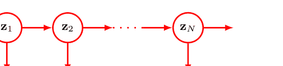

在本章中，我们假设数据观测是独立同分布的。对于形成序列的有序观测，可以通过将潜变量连接成马尔可夫链来扩展混合模型，从而得到一个隐马尔可夫模型，其图形结构如图15.11所示。EM算法可以扩展到这种更复杂的模型，其中E步骤涉及沿着潜变量链传递消息的顺序计算（Bishop，2006）。

### 15.3.2 与 K 均值的关系

将 K 均值算法与高斯混合的EM算法进行比较，可以发现它们非常相似。而 K 均值算法将数据点硬性分配给聚类，每个数据点唯一地与一个聚类相关联，EM算法则基于后验概率进行软性分配。实际上，我们可以推导出 K 均值算法作为高斯混合的EM算法的一个特殊极限，具体如下。

考虑一个高斯混合模型，其中混合成分的协方差矩阵由 εI 给出，其中 ε 是一个被所有成分共享的方差参数，I 是单位矩阵，因此

```
$$p(\mathbf{x}|\boldsymbol{\mu}_k, \boldsymbol{\Sigma}_k) = \frac{1}{(2\pi\epsilon)^{D/2}} \exp\left\{-\frac{1}{2\epsilon}\|\mathbf{x} - \boldsymbol{\mu}_k\|^2\right\}.$$
```

现在我们考虑这种形式的 K个高斯混合的EM算法，其中我们将 ε 视为一个固定的常数，而不是一个需要重新估计的参数。根据(15.12)，对于特定的数据点 $\mathbf{x}_n$，后验概率或责任由以下给出

```
$$\gamma(z_{nk}) = \frac{\pi_k \exp\left\{-\|\mathbf{x}_n - \boldsymbol{\mu}_k\|^2/2\epsilon\right\}}{\sum_j \pi_j \exp\left\{-\|\mathbf{x}_n - \boldsymbol{\mu}_j\|^2/2\epsilon\right\}}.$$
```

考虑极限 $\epsilon \to 0$。分母由一系列以 j 索引的项组成，其中每个项都趋于零。对于 $\|\mathbf{x}_n - \boldsymbol{\mu}_j\|^2$ 最小的特定项，假设 $j = l$，它将最慢地趋于零，然后主导这个和。因此，除了项 l 之外，数据点 $\mathbf{x}_n$ 的责任 $\gamma(z_{nk})$ 都趋于零，而责任 $\gamma(z_{nl})$ 将趋于一。请注意，只要 $\pi_k$ 的值不为零，这个结论就成立。因此，在这个极限下，我们得到了数据点到聚类的硬分配，就像 K 均值算法一样，所以 $\gamma(z_{nk}) \to r_{nk}$，其中 $r_{nk}$ 由(15.2)定义。每个数据点因此被分配给最接近的均值的聚类。给定的 $\boldsymbol{\mu}_k$ 的EM重新估计方程(15.16)则简化为 K 均值结果(15.4)。请注意，混合系数的重新估计公式(15.21)只是将 $\pi_k$ 的值重置为相等

> 练习15.12

尽管这些参数不再在算法中起作用，但它们仍然与分配给聚类 $k$ 的数据点的比例有关。

最后，在极限 $\epsilon \rightarrow 0$ 的情况下，由(15.30)给出的期望完整数据对数似然变为

$$E_{\mathbf{Z}}[\ln p(\mathbf{X}, \mathbf{Z}|\boldsymbol{\mu}, \boldsymbol{\Sigma}, \boldsymbol{\pi})] \rightarrow -\frac{1}{2} \sum_{n=1}^N \sum_{k=1}^K r_{nk} \|\mathbf{x}_n - \boldsymbol{\mu}_k\|^2 + \text{const.}$$ (15.33)

因此，我们可以看到在这个极限下，最大化期望完整数据对数似然等价于最小化由(15.1)给出的 $K$ 均值算法的误差度量 $J$。注意， $K$ 均值算法不估计聚类的协方差，只估计聚类的均值。

#### 15.3.3 伯努利分布的混合模型

> 第3.1.1节

到目前为止，在本章中，我们主要关注由高斯混合描述的连续变量的分布。作为混合建模的进一步示例，并在不同的背景下说明EM算法，我们现在讨论由伯努利分布描述的离散二进制变量的混合。 这个模型也被称为潜在类别分析（Lazarsfeld和Henry, 1968; McLachlan和Peel, 2000）。

考虑一组 $D$ 个二进制变量 $x_i$，其中 $i=1, \ldots, D$ 个变量都服从参数为 $\mu_i$ 的伯努利分布，即

$$p(\mathbf{x}|\boldsymbol{\mu}) = \prod_{i=1}^D \mu_i^{x_i} (1 - \mu_i)^{(1-x_i)}$$ (15.34)

其中 $\mathbf{x} = (x_1, \ldots, x_D)^T$， $\boldsymbol{\mu} = (\mu_1, \ldots, \mu_D)^T$。 我们可以看到，给定 $\boldsymbol{\mu}$，各个变量 $x_i$ 是独立的。 这个分布的均值和协方差练习15.13很容易得到

$$E[\mathbf{x}] = \boldsymbol{\mu}$$ (15.35)

$$\text{cov}[\mathbf{x}] = \text{diag}\{\mu_i(1 - \mu_i)\}.$$ (15.36)

现在让我们考虑这些分布的有限混合形式

$$p(\mathbf{x}|\boldsymbol{\mu}, \boldsymbol{\pi}) = \sum_{k=1}^K \pi_k p(\mathbf{x}|\boldsymbol{\mu}_k)$$ (15.37)

其中 $\boldsymbol{\mu} = \{\boldsymbol{\mu}_1, \ldots, \boldsymbol{\mu}_K\}$, $\boldsymbol{\pi} = \{\pi_1, \ldots, \pi_K\}$, 和

$$p(\mathbf{x}|\boldsymbol{\mu}_k) = \prod_{i=1}^D \mu_{ki}^{x_i} (1 - \mu_{ki})^{(1-x_i)}.$$ (15.38)

混合系数满足 (15.7) 和 (15.8)。 这个

> 练习 15.14 混合分布的均值和协方差由以下给出

```
$$\mathbb{E}[\mathbf{x}] = \sum_{k=1}^{K} \pi_k \boldsymbol{\mu}_k \qquad \qquad (15.39)$$
```

```
$$\text{cov}[\mathbf{x}] = \sum_{k=1}^{K} \pi_k \left\{ \boldsymbol{\Sigma}_k + \boldsymbol{\mu}_k \boldsymbol{\mu}_k^{\text{T}} \right\} - \mathbb{E}[\mathbf{x}]\mathbb{E}[\mathbf{x}]^{\text{T}} \qquad \qquad (15.40)$$
```

其中 $\boldsymbol{\Sigma}_k = \text{diag} \{ \mu_{ki}(1 - \mu_{ki}) \}$。因为协方差矩阵 $\text{cov}[\mathbf{x}]$ 不再是对角矩阵，所以混合分布可以捕捉变量之间的相关性，而不像单个伯努利分布。

如果我们有一个数据集 $\mathbf{X} = \{ \mathbf{x}_1, \ldots, \mathbf{x}_N \}$ 那么该模型的对数似然函数可以表示为

```
$$\ln p(\mathbf{X}|\boldsymbol{\mu}, \boldsymbol{\pi}) = \sum_{n=1}^{N} \ln \left\{ \sum_{k=1}^{K} \pi_k p(\mathbf{x}_n|\boldsymbol{\mu}_k) \right\}. \qquad \qquad (15.41)$$
```

再次我们看到对数函数内部出现了求和符号，因此最大似然解不再有闭式形式。

我们现在推导EM算法来最大化混合伯努利分布的似然函数。为了做到这一点，我们首先引入一个明确的离散潜变量 $\mathbf{z}$ 与每个实例 $\mathbf{x}$ 相关联。与高斯混合模型一样，潜变量$\mathbf{z}$具有1-of-$K$编码，即 $\mathbf{z} = (z_1, \ldots, z_K)^{\text{T}}$ 是一个二进制 $K$ 维向量，只有一个分量等于 $1$，其他分量都等于 $0$。然后我们可以写出给定潜变量时 $\mathbf{x}$ 的条件分布，如下所示

```
$$p(\mathbf{x}|\mathbf{z}, \boldsymbol{\mu}) = \prod_{k=1}^{K} p(\mathbf{x}|\boldsymbol{\mu}_k)^{z_k} \qquad \qquad (15.42)$$
```

而潜变量的先验分布与高斯混合模型相同，因此

```
$$p(\mathbf{z}|\boldsymbol{\pi}) = \prod_{k=1}^{K} \pi_k^{z_k}. \qquad \qquad (15.43)$$
```

如果我们将 $p(\mathbf{x}|\mathbf{z}, \boldsymbol{\mu})$ 和 $p(\mathbf{z}|\boldsymbol{\pi})$ 相乘，然后对 $\mathbf{z}$ 进行边缘化，我们就可以得到(15.37)。

为了推导EM算法，我们首先写出完整数据的对数似然函数，即

```
$$\ln p(\mathbf{X}, \mathbf{Z}|\boldsymbol{\mu}, \boldsymbol{\pi}) = \sum_{n=1}^{N} \sum_{k=1}^{K} z_{nk} \left\{ \ln \pi_k + \sum_{i=1}^{D} [x_{ni} \ln \mu_{ki} + (1 - x_{ni}) \ln(1 - \mu_{ki})] \right\} \qquad \qquad (15.44)$$
```

## 15.3. 期望最大化算法

接下来，我们对完整数据的期望进行取值，该期望是对于潜在变量的后验分布的期望，得到

```
E_Z[\ln p(\mathbf{X}, \mathbf{Z}|\mu, \pi)] = \sum_{n=1}^N \sum_{k=1}^K \gamma(z_{nk}) \left\{ \ln \pi_k + \sum_{i=1}^D [x_{ni} \ln \mu_{ki} + (1 - x_{ni}) \ln(1 - \mu_{ki})] \right\} \quad (15.45)
```

其中 \(\gamma(z_{nk}) = \mathbb{E}[z_{nk}]\) 是组件 \(k\) 给定数据点 \(\mathbf{x}_n\) 的后验概率或责任。在E步骤中，使用贝叶斯定理计算这些责任，其形式为

```
\gamma(z_{nk}) = \mathbb{E}[z_{nk}] = \frac{\sum_{z_{nk}} \prod_{k'} [\pi_{k'} p(\mathbf{x}_n|\mu_{k'})]^{z_{nk'}}}{\sum_j \prod [\pi_j p(\mathbf{x}_n|\mu_j)]^{z_{nj}}} = \frac{\pi_k p(\mathbf{x}_n|\mu_k)}{\sum_{j=1}^K \pi_j p(\mathbf{x}_n|\mu_j)} \quad (15.46)
```

如果我们考虑在(15.45)中对于所有的\(n\)求和，我们可以看到责任只通过两个项进入，可以写成

```
N_k = \sum_{n=1}^N \gamma(z_{nk}) \quad (15.47) \\ \bar{\mathbf{x}}_k = \frac{1}{N_k} \sum_{n=1}^N \gamma(z_{nk}) \mathbf{x}_n \quad (15.48)
```

其中 \(N_k\) 是与组件 \(k\) 相关联的数据点的有效数量。在M步中，我们最大化对于参数 \(\mu_k\) 和 \(\pi\) 的期望完整数据对数似然。如果我们将(15.45)对于 \(\mu_k\) 的导数设为零并重新排列项，我们得到

```
\boldsymbol{\mu}_k = \bar{\mathbf{x}}_k. \quad (15.49)
```

我们可以看到，这将组件 \(k\) 的均值设置为数据的加权平均值，权重系数由组件 \(k\) 对每个数据点的责任决定。对于关于 \(\pi_k\) 的最大化，我们需要引入拉格朗日乘子来强制执行约束 \(\sum_k \pi_k = 1\)。按照与高斯混合模型相似的步骤，我们得到

```
\pi_k = \frac{N_k}{N}, \quad (15.50)
```

这代表了直观合理的结果，即组件k的混合系数由数据集中由该组件解释的点的有效比例给出。

# 练习15.19

请注意，与高斯混合模型相比，似然函数不会出现奇点，其中似然函数趋于无穷大。这可以通过注意到似然函数被上界限制来看出，因为0 ≤ p(xₙ|μₖ) ≤ 1。存在这样的解，使得似然函数为零，但是EM算法不会找到这些解，除非它的初始点是病态的，因为EM算法总是增加似然函数的值，直到找到局部最大值。对于似然函数为零的解，EM算法将无法找到，除非它的初始点是病态的，因为EM算法总是增加似然函数的值，直到找到局部最大值。

# 第15.3节

我们通过使用伯努利混合模型来模拟手写数字，在图15.12中进行了说明。在这里，数字图像已经被转换为二进制向量，通过将所有值超过0.5的元素设置为1，并将其余元素设置为0。现在，我们使用EM算法对包含数字“2”、“3”和“4”的N=600个数据进行K=3个伯努利分布的混合拟合，运行10次迭代。混合系数初始化为πₖ = 1/K，并且参数μₖⱼ被随机选择在范围(0.25, 0.75)内，并进行归一化以满足约束条件∑

我们看到，三个伯努利分布的混合能够找到数据集中对应不同数字的三个聚类。将伯努利混合的分析扩展到具有M > 2个状态的多项式二进制变量的情况是直接的。

# 练习15.20

通过使用离散分布 (3.14) 进行计算。

## 15.4. 证据下界

我们现在通过推导对数似然函数的下界来介绍EM算法的更一般的视角，这被称为证据下界或ELBO。有时它被称为变分下界。这里的术语“证据”指的是（对数）似然函数，在贝叶斯设置中有时被称为“模型证据”，因为它允许在不使用保留数据的情况下比较不同的模型（Bishop, 2006）。作为对这个下界的说明，我们使用它从第三个视角重新推导高斯混合的EM算法。ELBO在后面的章节中将在几个深度生成模型中发挥重要作用。它还提供了一个变分框架的例子，在这个框架中，我们引入一个分布q（Z）来优化这个分布，使用变分法进行计算。

$$p(X|\theta) = \sum_{\mathbf{Z}} p(\mathbf{X}, \mathbf{Z}|\theta).$$ (15.51)

在这里，我们假设\(\mathbf{Z}\)是离散的，尽管如果\(\mathbf{Z}\)包含连续变量或离散和连续变量的组合，讨论是相同的，只是适当地用积分替代求和。

我们假设直接优化\(p(\mathbf{X}|\theta)\)是困难的，但优化完整数据似然函数\(p(\mathbf{X}, \mathbf{Z}|\theta)\)要容易得多。接下来，我们引入一个分布\(q(\mathbf{Z})\)定义在潜在变量上，并观察到，对于任何\(q(\mathbf{Z})\)的选择，以下分解成立：

$$\ln p(\mathbf{X}|\theta) = \mathcal{L}(q, \theta) + \text{KL}(q\|p)$$ (15.52)

我们定义

$$\mathcal{L}(q, \theta) = \sum_{\mathbf{Z}} q(\mathbf{Z}) \ln \left\{ \frac{p(\mathbf{X}, \mathbf{Z}|\theta)}{q(\mathbf{Z})} \right\}$$ (15.53)

$$\text{KL}(q\|p) = - \sum_{\mathbf{Z}} q(\mathbf{Z}) \ln \left\{ \frac{p(\mathbf{Z}|\mathbf{X}, \theta)}{q(\mathbf{Z})} \right\}.$$ (15.54)

Z给定 X的情况。

练习15.21 为了验证分解（15.52），我们首先利用概率的乘法规则给出
$$\ln p(\mathbf{X}, \mathbf{Z}|\theta) = \ln p(\mathbf{Z}|\mathbf{X}, \theta) + \ln p(\mathbf{X}|\theta),$$ (15.55)

图15.13 (15.52)给出的分解示意图，对于任意选择的分布 $q(\mathbf{Z})$都成立。因为Kullback–Leibler散度满足 $\mathrm{KL}(q\|p) \geq 0$，我们可以看到 $\mathcal{L}(q,\theta)$是对数似然函数 $\ln p(\mathbf{X}|\theta)$的一个下界。

然后我们将其代入 $\mathcal{L}(q,\theta)$的表达式中。这产生了两个项，其中一个项不会消除 $\mathrm{KL}(q\|p)$，而另一个项给出所需的对数似然 $\ln p(\mathbf{X}|\theta)$，注意 $q(\mathbf{Z})$是一个归一化的分布，总和为 1。从 (15.54) 我们可以看到 $\mathrm{KL}(q\|p)$是库尔巴克-莱布勒散度 $q(\mathbf{Z})$和后验分布 $p(\mathbf{Z}|\mathbf{X},\theta)$之间的库尔巴克-莱布勒散度。回想一下，库尔巴克-莱布勒散度满足 $\mathrm{KL}(q\|p) \geq 0$，当且仅当 $q(\mathbf{Z}) = p(\mathbf{Z}|\mathbf{X},\theta)$时才相等。因此，根据 (15.52)，我们可以得出 $\mathcal{L}(q,\theta) \leq \ln p(\mathbf{X}|\theta)$，换句话说 $\mathcal{L}(q,\theta)$是 $\ln p(\mathbf{X}|\theta)$的一个下界。图15.13展示了分解式 (15.52)。

#### 15.4.1 EM算法再探

我们可以使用分解 (15.52) 来推导EM算法，并证明它确实最大化了对数似然。假设当前参数向量的值为 $\theta^{\text{old}}$。在E步骤中，通过固定 $\theta^{\text{old}}$的情况下，最大化下界 $\mathcal{L}(q,\theta^{\text{old}})$与 $q(\mathbf{Z})$有关。通过注意到 $\ln p(\mathbf{X}|\theta^{\text{old}})$不依赖于 $q(\mathbf{Z})$，因此最大化 $\mathcal{L}(q,\theta^{\text{old}})$的最大值将在Kullback-Leibler散度为零时出现，换句话说，当 $q(\mathbf{Z})$等于后验分布 $p(\mathbf{Z}|\mathbf{X},\theta^{\text{old}})$时。在这种情况下，下界将等于对数似然，如图15.14所示。

在随后的M步中，分布 $q(\mathbf{Z})$被固定，下界保持不变

图15.14 EM算法的E步骤示意图。分布 $q$被设置为当前参数的后验分布 $\theta^{\text{old}}$，使得下界上升到与对数似然函数相同的值，KL散度消失。

第2.5.7节

# 图15.15 EM算法的M步骤示意图。

分布 q(Z) 被固定，下界 L(q, θ) 相对于参数向量 θ 最大化，得到修订后的值 θ^new。由于Kullback-Leibler散度是非负的，这导致对数似然函数 ln p(X|θ) 至少增加与下界相同的量。

L(q, θ)相对于θ的最大值为θ^new。这将导致下界 L增加（除非它已经达到最大值），这必然会导致相应的对数似然函数增加。因为分布 q是使用旧的参数值而不是新的值来确定的，并且在M步骤期间保持固定，所以它不等于新的后验分布。

p(Z|X, θ^new), 因此会存在非零的Kullback-Leibler散度。因此，对数似然函数的增加大于下界的增加，如图15.15所示。如果我们将 q(Z) = p(Z|X, θ^old) 代入(15.53)，我们可以看到，在E步骤之后，下界的形式为

L(q, θ) = ∑_Z p(Z|X, θ^old) ln p(X, Z|θ) − ∑_Z p(Z|X, θ^old) ln p(Z|X, θ^old) = Q(θ, θ^old) + 常数 (15.56)

其中常数是负熵的q distribution，因此与θ无关。在这里，我们将 Q(θ, θ^old) 识别为由(15.23)定义的期望完全数据对数似然，因此它是在M步骤中被最大化的数量，正如我们之前在高斯混合分布中看到的。请注意，我们正在优化的变量 θ只出现在对数函数内部。如果联合分布 p(Z, X|θ) 是指数族的成员或这样成员的乘积，那么我们可以看到对数将会抵消指数，并且导致一个M步骤，通常比最大化相应的不完全数据对数似然函数 p(X|θ) 要简单得多。

EM算法的操作也可以在参数空间中进行观察，如图15.16所示。这里的红色曲线描绘了我们希望最大化的（不完整数据）对数似然函数的值。我们从一些初始参数值 θ^old 开始，在第一个E步中，我们评估潜在变量的后验分布，这产生了一个下界 L(q, θ)，其值等于 θ^(old) 处的对数似然，如蓝色曲线所示。请注意，该下界与 θ^(old) 处的对数似然相切，因此两者都

图15.16 EM算法涉及交替计算当前参数值的对数似然的下界，然后最大化该下界以获得新的参数值。有关详细讨论，请参阅正文。

# 练习15.22

曲线具有相同的梯度。这个界限是一个凸函数，具有唯一的最大值（对于指数族的混合成分）。在M步骤中，最大化界限，给出值 θ(新)，这比 θ(旧)的对数似然值更大。随后的E步骤构建了一个在 θ(新)处切线的界限，如绿色曲线所示。

我们已经看到EM算法的E步骤和M步骤都增加了对数似然函数上一个明确定义的界限的值，并且完整的EM循环将以一种使对数似然增加的方式改变模型参数（除非它已经达到最大值，在这种情况下参数保持不变）。

#### 15.4.2 独立同分布数据

对于一个i.i.d.数据集的特殊情况， X 将包含 N 个数据点 {\mathbf{x}_n}而 Z 将包含 N 相应的潜在变量 {\mathbf{z}_n}，其中 n = 1, ..., N。根据独立性假设，我们有 \(p(\mathbf{X}, \mathbf{Z}) = \prod_{n=1}^{N} p(\mathbf{x}_n, \mathbf{z}_n)\)，通过对 {\mathbf{z}_n}进行边缘化，我们有 \(p(\mathbf{X}) = \prod_{n=1}^{N} \sum_{\mathbf{z}_n} p(\mathbf{x}_n, \mathbf{z}_n)\)。使用求和和乘法规则，我们可以看到在E步骤中评估的后验概率具有以下形式

```
$$p(\mathbf{Z}|\mathbf{X}, \theta) = \frac{p(\mathbf{X}, \mathbf{Z}|\theta)}{\sum_{\mathbf{Z}} p(\mathbf{X}, \mathbf{Z}|\theta)} = \frac{\prod_{n=1}^{N} p(\mathbf{x}_n, \mathbf{z}_n|\theta)}{\sum_{\mathbf{Z}} \prod_{n=1}^{N} p(\mathbf{x}_n, \mathbf{z}_n|\theta)} = \prod_{n=1}^{N} p(\mathbf{z}_n|\mathbf{x}_n, \theta) \quad (15.57)$$
```

因此，后验分布也与 n有关。对于高斯混合模型，这仅仅意味着每个混合成分对于特定数据点 \(\mathbf{x}_n\)的责任只取决于 \(\mathbf{x}_n\)的值

以及混合成分的参数$\theta$，而不取决于其他数据点的值。

#### 15.4.3 参数先验

我们还可以使用EM算法来最大化后验分布$p(\theta|\mathbf{X})$对于引入了先验$p(\theta)$的模型。要理解这一点，注意到作为$\theta$的函数，我们有$p(\theta|\mathbf{X}) = p(\theta, \mathbf{X})/p(\mathbf{X})$ ，因此

$$\ln p(\theta|\mathbf{X}) = \ln p(\theta, \mathbf{X}) - \ln p(\mathbf{X})。 \quad (15.58)$$

利用分解（15.52），我们有

$$\begin{aligned}
\ln p(\theta|\mathbf{X}) &= \mathcal{L}(q, \theta) + \text{KL}(q||p) + \ln p(\theta) - \ln p(\mathbf{X}) \n&\geq \mathcal{L}(q, \theta) + \ln p(\theta) - \ln p(\mathbf{X}) \quad (15.59)
\end{aligned}$$

其中$\ln p(\mathbf{X})$是一个常数。我们可以再次交替地优化右侧关于$q$和$\theta$的部分。关于$q$的优化会产生与标准EM算法相同的E-步方程，因为$q$只出现在$\mathcal{L}(q, \theta)$中。M步方程通过引入先验项$\ln p(\theta)$进行修改，这通常只需要对标准最大似然M步方程进行小的修改。额外的项表示一种正则化形式，它的作用是消除高斯混合模型似然函数的奇点。

#### 15.4.4 广义EM算法

EM算法将最大化似然函数的潜在困难问题分解为两个阶段，即E步骤和M步骤，每个阶段通常更容易实现。然而，对于复杂模型来说，E步骤或M步骤，或者两者都可能难以处理。这导致了EM算法的两种可能扩展，如下所示。

广义$EM$算法（$GEM$算法）解决了$M$步骤难以处理的问题。它不是为了最大化$\mathcal{L}(q, \theta)$关于$\theta$的值，而是通过改变参数的方式来增加其值。同样，因为$\mathcal{L}(q, \theta)$是对数似然函数的下界，$GEM$算法的每个完整$EM$循环都保证增加对数似然函数的值（除非参数已经对应于局部最大值）。利用$GEM$方法的一种方式是在$M$步骤中使用基于梯度的迭代优化算法。另一种形式的$GEM$算法，称为期望条件最大化算法，在每个$M$步骤中进行多个受限制的优化（$Meng$和$Rubin$，1993）。例如，参数可以被分成多个组，并将$M$步骤分解为多个步骤，每个步骤都涉及优化其中一个组，其余部分保持不变。

我们可以通过对$q(\mathbf{Z})$(Neal andHinton, 1999)进行部分优化，而不是完全优化，类似地推广EM算法的E步骤。正如我们所见，对于任何给定的$\theta$值，存在一个唯一的最大值of $\mathcal{L}(q, \theta)$with respect to $q(\mathbf{Z})$，对应于后验分布$q \theta(\mathbf{Z}) =$

#### 15.4.5 顺序EM算法

考虑 $N$ 个独立的数据点 $\mathbf{x}_1, \ldots, \mathbf{x}_N$ 与相应的潜在变量 $\mathbf{z}_1, \ldots, \mathbf{z}_N$。联合分布 $p(\mathbf{X}, \mathbf{Z}|\theta)$ 在数据点上分解，这种结构可以在增量形式的EM中利用，在每个EM周期中，只处理一个数据点。在E步骤中，我们不需要重新计算所有数据点的责任，只需重新评估一个数据点的责任。可能会认为后续的M步骤需要计算所有数据点的责任。然而，如果混合成分是指数族的成员，则责任只通过简单的充分统计量进入，并且可以高效地更新这些统计量。

例如，考虑一个高斯混合模型，并假设我们对数据点 $m$ 进行更新，其中相应的旧值和新值的责任由 $\gamma^{\text{old}}(z_{mk})$ 和 $\gamma^{\text{new}}(z_{mk})$ 表示。在M步骤中，所需的充分统计量可以逐步更新。例如，对于均值，充分统计量由(15.16)和(15.17)定义，从中我们得到

```
$$ \boldsymbol{\mu}_k^{\text{new}} = \boldsymbol{\mu}_k^{\text{old}} + \left( \frac{\gamma^{\text{new}}(z_{mk}) - \gamma^{\text{old}}(z_{mk})}{N_k^{\text{new}}} \right) (\mathbf{x}_m - \boldsymbol{\mu}_k^{\text{old}}) \qquad (15.60) $$
```

以及

```
$$ N_k^{\text{new}} = N_k^{\text{old}} + \gamma^{\text{new}}(z_{mk}) - \gamma^{\text{old}}(z_{mk}) \qquad (15.61) $$
```

协方差和混合系数的相应结果是类似的。

因此，E步骤和M步骤都需要固定的时间，与数据点的总数无关。由于参数在每个数据点之后进行修正，而不是等到整个数据集处理完毕后再进行修正，这种增量版本比批处理版本收敛更快。这个增量算法中的每个E或M步骤都会增加 $\mathcal{L}(q, \theta)$ 的值，正如我们上面所示，如果算法收敛到 $\mathcal{L}(q, \theta)$ 的局部（或全局）最大值，这将对应于对数似然函数 $\ln p(\mathbf{X}|\theta)$ 的局部（或全局）最大值。

### 练习

15.1 $(\star)$ 考虑在第15.1节中讨论的 $K$ 均值算法。证明由于离散指示变量集合的可能分配数目有限，对于每个这样的分配，$\{\boldsymbol{\mu}_k\}$ 都有唯一的最优解，因此 $K$ 均值算法必须在有限次迭代后收敛。

## 15. 离散潜变量

15.2 (⋆⋆) 在这个练习中，我们推导出了$K$均值算法的顺序形式。在每一步中，我们考虑一个新的数据点 $\mathbf{x}_n$，只有与 $\mathbf{x}_n$ 最接近的原型向量才会被更新。从批处理设置中的原型向量表达式(15.4)开始，将最终数据点 $\mathbf{x}_n$ 的贡献分离出来。通过重新排列公式，证明这个更新的形式为(15.5)。请注意，由于在这个推导中没有进行任何近似，所得到的原型向量将具有它们各自等于被分配给它们的所有数据向量的平均值的属性。

15.3 (⋆) 考虑一个高斯混合模型，其中潜变量的边际分布 $p(\mathbf{z})$ 由式(15.9)给出，观测变量的条件分布 $p(\mathbf{x}|\mathbf{z})$ 由式(15.10)给出。证明通过对所有可能的 $\mathbf{z}$ 值求和得到的边际分布 $p(\mathbf{x})$，是一个形式为(15.6)的高斯混合模型。

15.4 (⋆) 证明在具有 $K$ 个组分的混合模型中，由于交换对称性而产生的等效参数设置的数量是 $K!$。

15.5 (⋆⋆) 假设我们希望使用EM算法来最大化包含潜变量的参数的后验分布 $p(\boldsymbol{\theta}|\mathbf{X})$，其中 $\mathbf{X}$ 是观测数据集。证明E步骤与最大似然情况下相同，而在M步骤中，要最大化的数量由 $Q(\boldsymbol{\theta}, \boldsymbol{\theta}^{\text{old}}) + \ln p(\boldsymbol{\theta})$ 给出，其中 $Q(\boldsymbol{\theta}, \boldsymbol{\theta}^{\text{old}})$ 由式(15.23)定义。

15.6 (⋆) 考虑高斯混合模型的有向图，如图15.9所示。通过使用d-分离准则，证明潜变量的后验分布在不同数据点上因子化，使得
$$ p(\mathbf{Z}|\mathbf{X}, \boldsymbol{\mu}, \boldsymbol{\Sigma}, \boldsymbol{\pi}) = \prod_{n=1}^N p(\mathbf{z}_n|\mathbf{x}_n, \boldsymbol{\mu}, \boldsymbol{\Sigma}, \boldsymbol{\pi}) \tag{15.62} $$

15.7 (⋆⋆) 考虑高斯混合模型的特殊情况，其中组成部分的协方差矩阵 $\boldsymbol{\Sigma}_k$ 都被限制为具有相同的值 $\boldsymbol{\Sigma}$。推导出在这样的模型下最大化似然函数的EM方程。

15.8 (⋆⋆) 验证对于高斯混合模型，最大化完整数据对数似然(15.26)导致每个组分的均值和协方差独立地适应相应的数据点组，并且混合系数由每个组中的点的比例给出。

15.9 (⋆⋆) 证明如果我们在保持响应 $\gamma(z_{nk})$ 不变的情况下，最大化(15.30)关于 $\boldsymbol{\mu}_k$ 的值，我们得到了由(15.16)给出的闭式解。

15.10 (⋆⋆) 证明如果我们在保持响应 $\gamma(z_{nk})$ 不变的情况下，最大化(15.30)关于 $\boldsymbol{\Sigma}_k$ 和 $\pi_k$ 的值，我们得到了由(15.18)和(15.21)给出的闭式解。

15.11 (⋆⋆) 考虑一个由混合分布给出的密度模型：
$$ p(\mathbf{x}) = \sum_{k=1}^{K} \pi_k p(\mathbf{x}|k) \qquad (15.63) $$
并且假设我们将向量 $\mathbf{x}$ 分成两部分，使得 $\mathbf{x} = (\mathbf{x}_a, \mathbf{x}_b)$。证明条件密度 $p(\mathbf{x}_b|\mathbf{x}_a)$ 本身就是一个混合分布，并找到混合系数和组分密度的表达式。

15.12 (⋆) 在第15.3.2节中，我们通过考虑一个混合模型，其中所有组件的协方差为 $\epsilon \mathbf{I}$，得到了 $K$ 均值和EM之间的关系。证明在极限 $\epsilon \rightarrow 0$ 时，最大化给定模型的期望完全数据对数似然（由(15.30)给出）等价于最小化由(15.1)给出的 $K$ 均值算法的误差度量 $J$。

15.13 (⋆⋆) 验证伯努利分布的均值和协方差的结果（15.35）和（15.36）。

15.14 (⋆⋆) 考虑形式为的混合分布
$$ p(\mathbf{x}) = \sum_{k=1}^{K} \pi_k p(\mathbf{x}|k) \qquad (15.64) $$
其中 $\mathbf{x}$ 的元素可以是离散的、连续的或者两者的组合。将 $p(\mathbf{x}|k)$ 的均值和协方差分别表示为 $\boldsymbol{\mu}_k$ 和 $\boldsymbol{\Sigma}_k$。利用练习15.13的结果，证明混合分布的均值和协方差分别为(15.39)和(15.40)。

15.15 (⋆⋆) 使用EM算法的重新估计方程，证明伯努利分布的混合具有参数设置为最大似然函数对应值的性质
$$ \mathbb{E}[\mathbf{x}] = \frac{1}{N} \sum_{n=1}^{N} \mathbf{x}_n = \bar{\mathbf{x}}. \qquad (15.65) $$
因此，证明如果该模型的参数初始化为所有组件具有相同的均值 $\boldsymbol{\mu}_k = \boldsymbol{\mu}$ for $k=1, \ldots, K$，则EM算法在一次迭代后收敛，对于任意初始混合系数的选择，并且此解具有性质 $\boldsymbol{\mu}_k = \mathbf{x}$。请注意，这表示所有组件都相同的混合模型的退化情况，在实践中我们尽量避免使用适当的初始化来避免这种解。

15.16 (⋆) 考虑由(15.42)给出的伯努利分布的潜变量和观测变量的联合分布和由(15.43)给出的条件概率分布 $p(\mathbf{z}|\boldsymbol{\pi})$，证明如果我们对 $\mathbf{z}$ 进行边缘化，则得到(15.37)。

证明如果我们对混合伯努利分布的完全数据对数似然函数(15.45)关于$\mu_{k}$最大化，我们得到M步方程(15.49)。

证明如果我们对混合伯努利分布的完全数据对数似然函数(15.45)关于混合系数$\pi_{k}$最大化，并使用拉格朗日乘子来强制满足求和约束，则得到M步方程(15.50)。

证明由于离散变量$\mathbf{x}_{n}$的约束$0 \leqslant p\left(\mathbf{x}_{n} \mid \mu_{k}\right) \leqslant 1$，混合伯努利分布的不完全数据对数似然函数有上界，因此不存在使似然函数趋于无穷大的奇异点。

15.20 (⋆⋆⋆) 考虑一个$D$维变量$\mathbf{x}$，其中每个分量$i$本身是一个多项式变量，即$\mathbf{x}$是一个具有分量$x_{i j}$的二进制向量，其中$i=1, \ldots, D$和$j=1, \ldots, M$，受到约束$\sum_{j} x_{i j}=1$对于所有$i$。假设这些变量的分布由一组离散多项式分布描述，即
$$ p(\mathbf{x}) = \sum_{k=1}^{K} \pi_{k} p(\mathbf{x} | \boldsymbol{\mu}_{k}) $$
其中
$$ p(\mathbf{x} | \boldsymbol{\mu}_{k}) = \prod_{i=1}^{D} \prod_{j=1}^{M} \mu_{k i j}^{x_{i j}} $$
参数$\mu_{k i j}$表示概率$p(x_{i j}=1 \mid \boldsymbol{\mu}_{k})$，并且必须满足$0 \leqslant \mu_{k i j} \leqslant 1$以及约束$\sum_{j} \mu_{k i j}=1$对于所有的$k$和$i$。给定一个观测数据集$\left\{\mathbf{x}_{n}\right\}$，其中$n=1, \ldots, N$，通过最大似然估计推导出EM算法的E步和M步方程，以优化混合系数$\pi_{k}$和分量参数$\mu_{k i j}$。

15.21 (⋆) 验证关系式(15.52)，其中$\mathcal{L}(q, \boldsymbol{\theta})$和$\mathrm{KL}(q \| p)$分别由(15.53)和(15.54)定义。

15.22 (⋆) 证明由(15.53)给出的下界$\mathcal{L}(q, \boldsymbol{\theta})$在$q(\mathbf{Z})=p\left(\mathbf{Z} | \mathbf{X}, \boldsymbol{\theta}^{(\text {old })}\right)$时，与对数似然函数$\ln p(\mathbf{X} | \boldsymbol{\theta})$在点$\boldsymbol{\theta}=\boldsymbol{\theta}^{(\text {old })}$处具有相同的梯度。

15.23 (⋆⋆) 考虑高斯混合模型的增量形式的EM算法，其中责任仅针对特定数据点$\mathbf{x}_{m}$重新计算。从M步骤公式(15.16)和(15.17)开始，推导出更新分量均值的结果(15.60)和(15.61)。

15.24 (⋆⋆) 在高斯混合模型中，当责任逐渐更新时，推导出更新协方差矩阵和混合系数的M步公式，类似于结果(15.60)中更新均值的公式。

# 深度学习

## 16 连续潜在变量


在前一章中，我们讨论了具有离散潜在变量的概率模型，例如高斯混合模型。现在我们探索一些或全部潜在变量是连续的模型。这样的模型的一个重要动机是，许多数据集具有以下特性：数据点接近于比原始数据空间低得多的流形。为了理解为什么会出现这种情况，考虑一个人工数据集，通过从MNIST数据集(LeCun等，1998)中取出一个手写数字，表示为一个64×64像素的灰度图像，并将其嵌入到一个更大的100×100像素的图像中，通过填充值为零的像素(对应于白色像素)来随机改变数字的位置和方向，如图16.1所示。每个生成的图像在10,000维数据空间中表示为一个点。然而，在这样的图像数据集中，只有三个自由度的变化，对应于垂直和水平平移以及旋转。因此，数据点将存在于数据空间的一个子空间上，其内在维度为三。

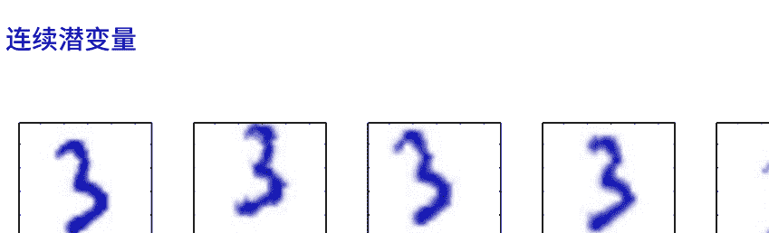

图16.1 通过对手写数字的图像进行多次复制，得到的合成数据集，其中每个副本中的数字在某个更大的图像区域内经历了随机位移和旋转。因此，得到的图像每个都有 100 × 100 = 10,000个像素。

请注意，流形是非线性的，因为例如，如果我们将数字平移超过特定像素，那个像素值将从零（白色）变为一（黑色），然后再变回零，这显然是数字位置的非线性函数。在这个例子中，平移和旋转参数是潜变量，因为我们只观察到图像向量，并没有告诉我们创建它们时使用了哪些平移或旋转变量的值。

对于真实的手写数字数据集，将会有进一步的自由度，这是由于缩放和其他变化引起的，例如个体书写的变异以及个体之间书写风格的差异。然而，这些自由度的数量相对于数据集的维度来说是很小的。

在实践中，数据点不会严格限制在一个平滑的低维流形上，我们可以将数据点从流形中偏离的部分解释为“噪声”。这自然地导致了对这些模型的生成视角，在这个视角下，我们首先根据某种潜变量分布选择流形内的一个点，然后通过从某个条件分布中抽取噪声来生成一个观测数据点，该条件分布给定了潜变量的数据变量。

最简单的连续潜变量模型假设潜变量和观测变量都服从高斯分布，并利用观测变量对潜变量状态的线性高斯依赖关系。这导致了对著名的主成分分析（PCA）技术的概率化表述，以及一个相关的模型称为因子分析。在本章中，我们将从标准的非概率化PCA处理开始，然后展示PCA如何自然地成为线性高斯潜变量模型的最大似然解。这种概率化的重新表述带来了许多优点，例如使用EM进行参数估计，基于PCA模型的混合的原则性扩展，以及允许从数据中自动确定主成分数量的贝叶斯公式（Bishop，2006）。本章还为具有连续潜在变量的非线性模型奠定了基础，包括标准化流、变分自动编码器和扩散模型。

### 第16.2节

图16.2 主成分分析寻求一个较低维度的空间，称为主子空间，用品红线表示，使得数据点（红点）在该子空间上的正交投影最大化投影点（绿点）的方差。PCA的另一种定义是基于最小化投影误差的平方和，由蓝线表示。

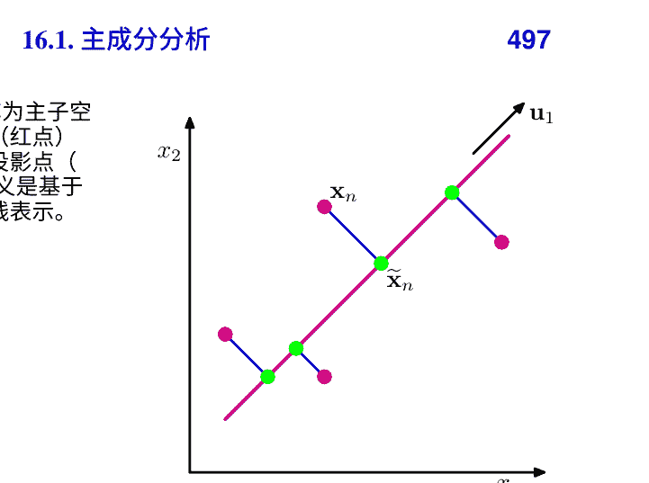

### 16.1. 主成分分析

主成分分析，或者PCA，被广泛应用于降维、有损数据压缩、特征提取和数据可视化等应用领域（Jolliffe，2002）。它也被称为Kosambi–Karhunen–Loève变换。

考虑将数据集正交投影到一个较低维线性空间，即所谓的主子空间，如图16.2所示。PCA可以被定义为最大化投影数据方差的线性投影（Hotelling，1933）。等价地，它可以被定义为最小化投影成本的线性投影，投影成本被定义为数据点与它们的投影之间的均方距离（Pearson，1901）。我们依次考虑这些定义。

#### 16.1.1 最大方差表述

考虑一个观测数据集 {xₙ} 其中ₙ = 1, …, N, 以及 xₙ是一个欧几里得变量，具有维度 D。我们的目标是将数据投影到一个维度为 M < D 的空间上，同时最大化投影数据的方差。暂时假设 M的值已知。在本章后面，我们将考虑确定 M的合适值的技术。

首先，考虑投影到一维空间（M = 1）。我们可以用一个 D维向量 u₁来定义这个空间的方向，为了方便起见（并且不失一般性），我们选择它为单位向量，使得 u₁ᵀ u₁ = 1（注意我们只关心 u₁定义的方向，而不关心 u₁本身的大小）。然后，每个数据点 xₙ都被投影到一个标量值 u₁ᵀ xₙ。投影数据的均值为 u₁ᵀ x̄，其中 x̄是样本集的均值，表示为
$$ \overline{\mathbf{x}} = \frac{1}{N} \sum_{n=1}^N \mathbf{x}_n \qquad (16.1) $$
投影数据的方差为
$$ \frac{1}{N}\sum_{n=1}^{N} \left\{ \mathbf{u}_1^T \mathbf{x}_n - \mathbf{u}_1^T \bar{\mathbf{x}} \right\}^2 = \mathbf{u}_1^T \mathbf{S} \mathbf{u}_1 \qquad (16.2) $$
其中 S 是数据协方差矩阵，定义为
$$ \mathbf{S} = \frac{1}{N} \sum_{n=1}^{N} (\mathbf{x}_n - \bar{\mathbf{x}}) (\mathbf{x}_n - \bar{\mathbf{x}})^T. \qquad (16.3) $$
我们现在最大化投影方差 $\mathbf{u}_1^T \mathbf{S} \mathbf{u}_1$ 关于 $\mathbf{u}_1$ 的最大化。显然，这必须是一个受限制的最大化，以防止 $\|\mathbf{u}_1\| \to \infty$。适当的约束条件来自于归一化条件 $\mathbf{u}_1^T \mathbf{u}_1 = 1$。为了强制执行这个约束条件，我们引入一个拉格朗日乘子，用 $\lambda_1$ 表示，然后进行一个无约束的最大化
$$ \mathbf{u}_1^T \mathbf{S} \mathbf{u}_1 + \lambda_1 \left(1 - \mathbf{u}_1^T \mathbf{u}_1 \right). \qquad (16.4) $$
通过将导数设置为 $\mathbf{u}_1$ 等于零，我们可以看到这个数量在这个点上有一个稳定点
$$ \mathbf{S} \mathbf{u}_1 = \lambda_1 \mathbf{u}_1, \qquad (16.5) $$
这意味着 $\mathbf{u}_1$ 必须是 S 的特征向量。如果我们左乘 $\mathbf{u}_1^T$ 并且利用 $\mathbf{u}_1^T \mathbf{u}_1 = 1$，我们可以看到方差由以下公式给出
$$ \mathbf{u}_1^T \mathbf{S} \mathbf{u}_1 = \lambda_1 \qquad (16.6) $$
因此，当我们将 $\mathbf{u}_1$ 设置为具有最大特征值 $\lambda_1$ 的特征向量时，方差将达到最大值。这个特征向量被称为第一个主成分。

我们可以通过逐步选择每个新方向来定义额外的主成分，这些方向使得在考虑到已经考虑的所有可能方向的情况下，投影方差最大化。如果我们考虑 $M$ 维投影空间的一般情况，使得投影数据的方差最大化的最优线性投影现在由数据协方差矩阵 S 的 $M$ 个特征向量 $\mathbf{u}_1, \dots, \mathbf{u}_M$ 对应于 $M$ 个最大特征值 $\lambda_1, \dots, \lambda_M$。这可以通过归纳证明很容易证明。

### 练习 16.1

总结一下，PCA 涉及评估数据集的均值 $\bar{\mathbf{x}}$ 和协方差矩阵 $\mathbf{S}$，并找到与 S 对应的 $M$ 个特征值的 $M$ 个特征向量。寻找特征向量和特征值的算法，以及与特征向量分解相关的附加定理，可以在 Golub 和 Van Loan（1996）中找到。请注意，计算大小为 $D \times D$ 的矩阵的完整特征向量分解的计算成本为 $\mathcal{O}(D^3)$。如果我们计划将数据投影到前 $M$ 个主成分上，那么我们只需要找到前 $M$ 个特征值和特征向量即可。这可以通过更高效的技术来完成，例如功率法（Golub 和 Van Loan，1996），其复杂度为 $\mathcal{O}(MD^2)$，或者第 16.3.2 节中的其他方法。

#### 16.1.2 最小误差表述

我们现在讨论基于投影误差最小化的PCA的另一种替代公式。为了做到这一点，我们引入一个完全正交的 $D$ 维度的集合基向量 $\{\mathbf{u}_i\}$，其中 $i = 1, \dots, D$，满足

$$\mathbf{u}^T_i \mathbf{u}_j = \delta_{ij}.$$

因为这个基是完备的，每个数据点可以通过基向量的线性组合来精确表示

$$\mathbf{x}_n = \sum_{i=1}^{D} \alpha_{ni} \mathbf{u}_i$$

其中，对于不同的数据点，系数 $\alpha_{ni}$ 将不同。这简单地对应于将坐标系旋转到由 $\{\mathbf{u}_i\}$ 定义的新坐标系，原始的 $D$ 分量 $\{x_{n1}, \dots, x_{nD}\}$ 被等效地替换为一个新的系统。与 $\mathbf{u}_j$ 进行内积，并利用正交性质，我们得到 $\alpha_{nj} = \mathbf{x}^T_n \mathbf{u}_j$，因此我们可以毫无损失地写成

$$\mathbf{x}_n = \sum_{i=1}^{D} \left( \mathbf{x}^T_n \mathbf{u}_i \right) \mathbf{u}_i.$$

然而，我们的目标是使用涉及一组受限变量的表示来近似这个数据点，这些变量对应于在一个较低维子空间上的投影。这个 $M$ 维线性子空间可以被表示为前 $M$ 个基向量，因此我们通过近似每个数据点 $\mathbf{x}_n$ 来

$$\widetilde{\mathbf{x}}_n = \sum_{i=1}^{M} z_{ni} \mathbf{u}_i + \sum_{i=M+1}^{D} b_i \mathbf{u}_i$$

其中 $\{z_{ni}\}$ 依赖于特定的数据点，而 $\{b_i\}$ 是对所有数据点都相同的常数。我们可以自由选择 $\{\mathbf{u}_i\}$, $\{z_{ni}\}$ 和 $\{b_i\}$，以使降维引入的误差最小化。

作为我们的误差度量，我们将使用原始数据点 $\mathbf{x}_n$ 和其近似值 $\widetilde{\mathbf{x}}_n$ 之间的平方距离的平均值，以便我们的目标是最小化

$$J = \frac{1}{N} \sum_{n=1}^{N} \| \mathbf{x}_n - \widetilde{\mathbf{x}}_n \|^2.$$

首先考虑对量 $\{z_{ni}\}$ 进行最小化。替换为 $\widetilde{\mathbf{x}}_n$，将对 $z_{nj}$ 的导数设为零，并利用正交性条件，我们得到

$$z_{nj} = \mathbf{x}^T_n \mathbf{u}_j$$

其中 $j= 1, \ldots, M$。类似地，将 $J$对 $b_j$的导数设为零，并再次利用正交性关系，得到

$$b_j = \bar{\mathbf{x}}^T \mathbf{u}_j \tag{16.13}$$

其中 $j = M+1,\ldots, D$。如果我们替换 $z_{ni}$和 $b_j$，并利用通用展开式（16.9），我们得到

$$\mathbf{x}_n - \widetilde{\mathbf{x}}_n = \sum_{i=M+1}^{D} \left\{ (\mathbf{x}_n - \bar{\mathbf{x}})^T \mathbf{u}_i \right\} \mathbf{u}_i \tag{16.14}$$

从中我们可以看到，从 $\mathbf{x}_n$到 $\widetilde{\mathbf{x}}_n$的位移向量位于与主子空间正交的空间中，因为它是 $\{\mathbf{u}_i\}$的线性组合，其中 $i = M+1, \ldots$，如图16.2所示。这是可以预料的，因为投影点 $\widetilde{\mathbf{x}}_n$必须位于主子空间内，但我们可以在该子空间内自由移动它们，因此最小误差由正交投影给出。

因此，我们可以得到一个纯粹以 $\{\mathbf{u}_i\}$为函数的误差度量 $J$的表达式

$$J = \frac{1}{N} \sum_{n=1}^{N} \sum_{i=M+1}^{D} \left( \mathbf{x}_n^T \mathbf{u}_i - \bar{\mathbf{x}}^T \mathbf{u}_i \right)^2 = \sum_{i=M+1}^{D} \mathbf{u}_i^T \mathbf{S} \mathbf{u}_i. \tag{16.15}$$

剩下的任务是在约束条件下最小化 $J$关于 $\{\mathbf{u}_i\}$的值，否则我们将得到空洞的结果 $\mathbf{u}_i= 0$。这些约束条件来自正交性条件，正如我们将看到的，解将以协方差矩阵的特征向量展开的形式表示。

在考虑正式解决方案之前，让我们尝试通过考虑二维数据空间 $D= 2$和一维主子空间 $M= 1$来获得一些直觉。我们必须选择一个方向 $\mathbf{u}_2$以最小化 $J = \mathbf{u}_2^T \mathbf{S} \mathbf{u}_2$，同时满足归一化约束 $\mathbf{u}_2^T \mathbf{u}_2= 1$。使用拉格朗日乘子 $\lambda_2$来强制执行约束，我们考虑最小化

$$\widetilde{J} = \mathbf{u}_2^T \mathbf{S} \mathbf{u}_2 + \lambda_2 \left( 1 - \mathbf{u}_2^T \mathbf{u}_2 \right). \tag{16.16}$$

将对 $\mathbf{u}_2$的导数设为零，我们得到 $\mathbf{S} \mathbf{u}_2 = \lambda_2 \mathbf{u}_2$，从而 $\mathbf{u}_2$是 $\mathbf{S}$的特征向量，对应的特征值为 $\lambda_2$。因此，任何特征向量都将定义一个误差度量的稳定点。为了找到最小值时的 $J$的值，我们将 $\mathbf{u}_2$的解反代入误差度量中得到 $J = \lambda_2$。因此，通过选择 $\mathbf{u}_2$为对应较小特征值的特征向量，我们得到 $J$的最小值。因此，我们应该选择主子空间与具有较大特征值的特征向量对齐。这个结果符合我们的直觉，即为了最小化平均平方投影距离，我们应该选择主成分子空间通过数据点的均值，并与最大方差的方向对齐。如果特征值相等时，任何主方向的选择都会产生相同的 J值。

### 练习16.2

对于任意的 $D$ 和任意的 $M < D$，最小化 $J$的一般解为通过选择由协方差矩阵 $\mathbf{S}$ 给出的特征向量 $\{\mathbf{u}_i\}$ 来获得。

$$\mathbf{S}\mathbf{u}_i = \lambda_i \mathbf{u}_i \quad (16.17)$$

其中 $i= 1, \dots, D$，通常情况下选择特征向量 $\{\mathbf{u}_i\}$ 为正交的。然后，误差度量的相应值由以下公式给出

$$J = \sum_{i=M+1}^{D} \lambda_i, \quad (16.18)$$

它只是正交于主子空间的特征向量的特征值之和。 因此，通过选择这些特征向量为具有 $D-M$ 最小特征值的特征向量， 我们可以获得 $J$ 的最小值，因此定义主子空间的特征向量是对应于 $M$ 最大特征值的特征向量。

尽管我们考虑了 $M < D$，但是如果 $M = D$，PCA分析仍然成立。在 $M = D$ 的情况下，没有降维，只是将坐标轴旋转与主成分对齐。

最后，注意到有一个相关的线性降维技术，称为典型相关分析（Hotelling,1936; Bach and Jordan, 2002）。而PCA处理单个随机变量，典型相关分析考虑两个（或更多）变量，并尝试找到具有高交叉相关性的相应线性子空间对，以便每个子空间内的每个分量与另一个子空间的单个分量相关联。 它的解可以用广义特征向量问题表示。

#### 16.1.3 数据压缩

PCA的一个应用是数据压缩，我们可以通过考虑一个手写数字图像数据集来说明这一点。 因为协方差矩阵的每个特征向量都是原始 $D$维空间中的向量，所以我们可以将特征向量表示为与数据点相同大小的图像。 平均图像和前四个特征向量以及它们对应的特征值如图16.3所示。

将所有特征值按降序排列绘制成完整光谱图，如图16.4(a)所示。选择特定值 $M$时，与之相关的误差度量 $J$ 是从 $M+ 1$ 到 $D$ 的特征值之和，并在图16.4(b)中绘制了不同 $M$值的误差度量。

如果我们将(16.12)和(16.13)代入(16.10)， 我们可以写出PCA的近似表达式

数据向量 $\mathbf{x}_n$ 的近似形式

$$\widetilde{\mathbf{x}}_{n} = \sum_{i=1}^{M} (\mathbf{x}_{n}^{\mathrm{T}} \mathbf{u}_{i}) \mathbf{u}_{i} + \sum_{i=M+1}^{D} (\bar{\mathbf{x}}^{\mathrm{T}} \mathbf{u}_{i}) \mathbf{u}_{i} \tag{16.19}$$

$$= \bar{\mathbf{x}} + \sum_{i=1}^{M} \left( \mathbf{x}_{n}^{\mathrm{T}} \mathbf{u}_{i} - \bar{\mathbf{x}}^{\mathrm{T}} \mathbf{u}_{i} \right) \mathbf{u}_{i} \tag{16.20}$$

我们使用了关系

$$\bar{\mathbf{x}} = \sum_{i=1}^{D} (\bar{\mathbf{x}}^{\mathrm{T}} \mathbf{u}_{i}) \mathbf{u}_{i}, \tag{16.21}$$

这是根据 $\{\mathbf{u}_i\}$ 的完备性得出的。这表示数据集的压缩，因为对于每个数据点，我们用一个具有 $M$ 维向量 $\{ (\mathbf{x}_{n}^{\mathrm{T}} \mathbf{u}_{i}) \}_{i=1}^M$ 替换 $D$ 维向量 $\mathbf{x}_n$。值 $M$ 越小，压缩程度越大。图16.5显示了PCA对数字数据集中数据点的重建示例。

#### 16.1.4 数据白化

PCA的另一个应用是数据预处理。在这种情况下，目标不是降维，而是将数据集转换为标准化某些属性。这在允许后续的机器学习算法成功应用于数据集时非常重要。通常，当原始变量以不同单位测量或具有显著不同的变异性时，会进行这样的处理。例如，在Old Faithful数据集中，喷发间隔通常比喷发持续时间大一个数量级。当我们将 $K$-means算法应用于这个数据集时，我们首先进行了数据标准化，使每个变量的均值为零，方差为单位值。这被称为对数据进行标准化，标准化数据的协方差矩阵的分量为

$$\rho_{ij} = \frac{1}{N} \sum_{n=1}^{N} \frac{(x_{ni} - \overline{x}_i)}{\sigma_i} \frac{(x_{nj} - \overline{x}_j)}{\sigma_j} \quad (16.22)$$

其中 $\sigma_i$ 是 $x_i$ 的标准差。 这被称为原始数据的相关矩阵，具有以下特性： 如果数据的两个分量 $x_i$ 和 $x_j$ 完全相关，则 $\rho_{ij} = 1$， 如果它们不相关， 则 $\rho_{ij} = 0$。

然而，使用PCA可以对数据进行更大幅度的归一化，使其均值为零，协方差为单位矩阵，从而使不同的变量变得不相关。 为了做到这一点，我们首先将特征向量方程（16.17）写成以下形式

$$\mathbf{S}\mathbf{U} = \mathbf{U}\mathbf{\Lambda}\tag{16.23}$$

其中 $\mathbf{\Lambda}$ 是一个 $D \times D$ 对角矩阵，其元素为 $\lambda_i$，而 $\mathbf{U}$ 是一个 $D \times D$ 正交矩阵，其列由 $\mathbf{u}_i$ 给出。然后，对于每个数据点 $\mathbf{x}_n$，我们定义一个由以下公式给出的转换值

$$\mathbf{y}_n = \mathbf{\Lambda}^{-1/2} \mathbf{U}^T (\mathbf{x}_n - \bar{\mathbf{x}})\tag{16.24}$$

其中 $\bar{\mathbf{x}}$ 是由（16.1）定义的样本均值。显然，集合 $\{\mathbf{y}_n\}$ 的均值为零，并且其协方差由单位矩阵给出，因为

$$\frac{1}{N}\sum_{n=1}^N \mathbf{y}_n \mathbf{y}_n^T = \frac{1}{N}\sum_{n=1}^N \mathbf{\Lambda}^{-1/2} \mathbf{U}^T (\mathbf{x}_n - \bar{\mathbf{x}})(\mathbf{x}_n - \bar{\mathbf{x}})^T \mathbf{U} \mathbf{\Lambda}^{-1/2}$$
$$= \mathbf{\Lambda}^{-1/2} \mathbf{U}^T \mathbf{S} \mathbf{U} \mathbf{\Lambda}^{-1/2} = \mathbf{\Lambda}^{-1/2} \mathbf{\Lambda} \mathbf{\Lambda}^{-1/2} = \mathbf{I}.\tag{16.25}$$

这个操作被称为白化或球化数据，并在图16.6中以第15.1节的老忠实数据集进行说明。

#### 16.1.5 高维数据

在一些PCA的应用中，数据点的数量小于数据空间的维度。例如，我们可能想将PCA应用于一个包含几百个图像的数据集，其中每个图像对应于一个在空间中具有数百万维度的向量（对应于图像中每个像素的三个颜色值）。 请注意，在一个 $D$维空间中，一个包含 $N$个点的集合，其中 $N < D$，定义了一个维度最多为 $N-1$的线性子空间，因此在 $M$大于 $N-1$的值上应用PCA没有多大意义。

实际上，如果我们进行PCA，我们将发现至少 $D - N + 1$个特征值是零，对应于数据集在这些方向上具有零方差的特征向量。此外，典型的用于寻找 $D \times D$ 矩阵特征向量的算法的计算成本与 $\mathcal{O}(D^3)$ 成比例，因此对于像图像示例这样的应用，直接应用PCA将在计算上是不可行的。

我们可以通过以下方式解决这个问题。首先，让我们定义 $\mathbf{X}$ 为 $(N \times D)$-维中心化数据矩阵，其第 $n$ 行由 $(\mathbf{x}_n - \bar{\mathbf{x}})^{\mathrm{T}}$ 给出。协方差矩阵 (16.3) 可以写成 $\mathbf{S} = N^{-1} \mathbf{X}^{\mathrm{T}} \mathbf{X}$，相应的特征向量方程变为

$$\frac{1}{N} \mathbf{X}^{\mathrm{T}} \mathbf{X} \mathbf{u}_i = \lambda_i \mathbf{u}_i.\tag{16.26}$$

现在将两边都乘以 $\mathbf{X}$ 得到

$$\frac{1}{N} \mathbf{X} \mathbf{X}^{\mathrm{T}} (\mathbf{X} \mathbf{u}_i) = \lambda_i (\mathbf{X} \mathbf{u}_i).\tag{16.27}$$

如果我们定义 $\mathbf{v}_i = \mathbf{X} \mathbf{u}_i$，我们得到

$$\frac{1}{N} \mathbf{X} \mathbf{X}^{\mathrm{T}} \mathbf{v}_i = \lambda_i \mathbf{v}_i,\tag{16.28}$$

这是一个 $N \times N$ 矩阵 $N^{-1} \mathbf{X} \mathbf{X}^{\mathrm{T}}$ 的特征向量方程。我们可以看到，这个方程与原始协方差矩阵具有相同的 $N - 1$ 个非零特征值（原始协方差矩阵本身还有 $D - N + 1$ 个特征值为零）。因此，我们可以在低维空间中解决特征向量问题，计算成本为 $\mathcal{O}(N^3)$ 而不是 $\mathcal{O}(D^3)$。为了确定特征向量，我们将 (16.27) 两边都乘以 $\mathbf{X}^{\mathrm{T}}$。

$$\left( \frac{1}{N} \mathbf{X}^{\mathrm{T}} \mathbf{X} \right) (\mathbf{X}^{\mathrm{T}} \mathbf{v}_i) = \lambda_i (\mathbf{X}^{\mathrm{T}} \mathbf{v}_i)\tag{16.29}$$

从中我们可以看出，$(\mathbf{X}^{\mathrm{T}} \mathbf{v}_i)$ 是 $\mathbf{S}$ 的特征向量，其特征值为 $\lambda_i$。然而需要注意的是，这些特征向量不一定是归一化的。为了确定适当的归一化，我们通过一个常数对 $\mathbf{u}_i \propto \mathbf{X}^{\mathrm{T}} \mathbf{v}_i$ 进行重新缩放，使得 $\|\mathbf{u}_i\| = 1$，练习16.3假设 $\mathbf{v}_i$ 已经被归一化为单位长度，得到

$$\mathbf{u}_i = \frac{1}{(N \lambda_i)^{1/2}} \mathbf{X}^{\mathrm{T}} \mathbf{v}_i.\tag{16.30}$$

总结一下，应用这种方法，我们首先计算 $\mathbf{X} \mathbf{X}^{\mathrm{T}}$，然后找到其特征向量和特征值，然后使用(16.30)在原始数据空间中计算特征向量。

## 16.2. 概率潜在变量模型

我们在前一节中看到，PCA可以通过将数据投影到低维子空间来定义，该子空间的维度低于原始数据空间。每个数据点都投影到由(16.12)定义的 $z_{nj}$ 的唯一值，我们可以将这些量视为确定性潜在变量。为了引入和推动概率连续潜在变量，我们现在展示PCA也可以被表达为概率潜在变量模型的最大似然解。这种PCA的重新表述，称为概率PCA，与传统PCA相比具有几个优点：

- 概率主成分分析模型表示了高斯分布的一种受限形式，其中可以限制自由参数的数量，同时允许模型捕捉数据集中的主要相关性。
- 我们可以推导出一种针对主成分分析的EM算法，在只需要少数主要特征向量的情况下具有高效的计算能力，并且避免了将数据协方差矩阵作为中间步骤进行评估。
- 概率模型和EM的结合使我们能够处理数据集中的缺失值。
- 可以以原则性的方式制定概率主成分分析模型的混合，并使用EM算法进行训练。
- 存在似然函数可以直接与其他概率密度模型进行比较。相比之下，传统的主成分分析将对接近主子空间的数据点分配较低的重构成本，即使它们与训练数据相距任意远。
- 概率主成分分析可以用于建模类条件密度，因此可以应用于分类问题。
- 可以通过概率主成分分析模型进行生成，从而提供来自分布的样本。
- 概率主成分为PCA的贝叶斯处理提供了基础，可以自动从数据中找到主子空间的维度（Bishop，2006年）。

PCA的这种概率模型形式是由Tipping和Bishop（1997年；1999年）以及Roweis（1998年）独立提出的。正如我们后面将看到的，它与因子分析（Basilevsky，1994年）密切相关。

#### 16.2.1 生成模型

概率主成分分析是线性高斯框架的一个简单示例，其中所有边缘和条件分布都是高斯分布。我们可以通过首先引入一个显式的 $M$ 维潜变量 $\mathbf{z}$ 来形式化概率主成分分析。

z对应于主成分子空间。接下来，我们定义一个高斯先验分布 p(z)在潜变量上，以及一个高斯条件分布 p(x|z)对于 D维观察变量 x在潜变量的值上条件化。具体而言，z的先验分布是一个均值为零、单位协方差的高斯分布：

$$
p(\mathbf{z}) = \mathcal{N}(\mathbf{z}|\mathbf{0}, \mathbf{I}) \quad (16.31)
$$

类似地，观察变量x在潜变量z的值上条件化的条件分布也是高斯分布：

$$
p(\mathbf{x}|\mathbf{z}) = \mathcal{N}(\mathbf{x}|\mathbf{W}\mathbf{z} + \boldsymbol{\mu}, \sigma^2\mathbf{I}) \quad (16.32)
$$

其中，x的均值是z的一个通用线性函数，由 D × M矩阵 W和 D维向量 μ控制。请注意，这与x的元素相关，可以分解为第11.2.3节。换句话说，这是一个朴素贝叶斯模型的例子。正如我们很快将看到的，W的列张成了数据空间中的一个线性子空间，对应于主子空间。该模型中的另一个参数是标量 σ²，它控制条件分布的方差。请注意，在假设潜变量的分布 p(z)为均值为零、单位协方差的高斯分布时，不会损失一般性，因为更一般的高斯分布会产生一个练习16.4等价的概率模型。

我们可以从生成的角度来看待概率PCA模型，在这个角度上，观察变量的采样值是通过首先选择一个潜在变量的值，然后在给定这个潜在值的条件下对观察变量进行采样得到的。具体来说，D维观察变量 x是由潜在变量 M维 z的线性变换加上加性高斯噪声定义的，即

$$
\mathbf{x} = \mathbf{W}\mathbf{z} + \boldsymbol{\mu} + \boldsymbol{\epsilon} \quad (16.33)
$$

其中 z是一个 M维高斯潜在变量，ε是一个 D维零均值的高斯分布噪声变量，其协方差为 σ² I。这个生成过程在图16.7中有所说明。请注意，这个框架是基于从潜在空间到数据空间的映射，与上面讨论的PCA的更传统观点相反。从数据空间到潜在空间的反向映射将在不久的将来使用贝叶斯定理获得。

#### 16.2.2 似然函数

假设我们希望通过最大似然来确定参数 W, μ和 σ²的值。为了写出似然函数，我们需要观察变量的边缘分布 p(x)的表达式。根据概率的求和和乘积规则，这可以表示为

$$
p(\mathbf{x}) = \int p(\mathbf{x}|\mathbf{z})p(\mathbf{z}) \, d\mathbf{z} \quad (16.34)
$$

因为这对应于一个线性高斯模型，这个边缘分布再次是高斯分布，并且可以表示为

$$
p(\mathbf{x}) = \mathcal{N}(\mathbf{x}|\boldsymbol{\mu}, \mathbf{C})
$$

其中 $D \times D$ 协方差矩阵 $\mathbf{C}$ 的定义为

$$
\mathbf{C} = \mathbf{W}\mathbf{W}^\mathrm{T} + \sigma^2\mathbf{I}.
$$

这个结果也可以通过直接观察预测分布为高斯分布，并使用(16.33)计算其均值和协方差来得到。 这给出了

$$
\mathbb{E}[\mathbf{x}] = \mathbb{E}[\mathbf{W}\mathbf{z} + \boldsymbol{\mu} + \boldsymbol{\epsilon}] = \boldsymbol{\mu}
$$

$$
\begin{aligned}\mathrm{cov}[\mathbf{x}] &= \mathbb{E}\left[(\mathbf{W}\mathbf{z} + \boldsymbol{\epsilon})(\mathbf{W}\mathbf{z} + \boldsymbol{\epsilon})^{\mathrm{T}}\right]\\ &= \mathbb{E}\left[\mathbf{W}\mathbf{z}\mathbf{z}^{\mathrm{T}}\mathbf{W}^{\mathrm{T}}\right] + \mathbb{E}\left[\boldsymbol{\epsilon}\boldsymbol{\epsilon}^{\mathrm{T}}\right]\\ &= \mathbf{W}\mathbf{W}^{\mathrm{T}} + \sigma^2\mathbf{I}\end{aligned}
$$

在这里我们使用了 z 和 $\epsilon$是独立随机变量且不相关的事实。

直观地，我们可以将分布 $p(\mathbf{x})$想象成通过将各向异性高斯‘喷雾罐’沿着主子空间移动并喷洒由 $\sigma^2$决定密度的高斯墨水，且由先验分布加权。

累积墨水密度导致了一个呈“煎饼”形状的分布，表示边际密度 $p(\mathbf{x})$。

预测分布 $p(\mathbf{x})$由参数 $\boldsymbol{\mu}$、$\mathbf{W}$ 和 $\sigma^2$控制。

然而，这种参数化存在冗余，对应于潜在空间坐标的旋转。 为了看到这一点，考虑一个矩阵 $\widetilde{\mathbf{W}} = \mathbf{W}\mathbf{R}$其中 $\mathbf{R}$是一个正交矩阵。 利用正交性质 $\mathbf{R}\mathbf{R}^{\mathrm{T}} = \mathbf{I}$, 我们可以看到出现在协方差矩阵 $\mathbf{C}$中的数量 $\mathbf{W}\mathbf{W}^{\mathrm{T}}$的形式为

$$
\widetilde{\mathbf{W}}\widetilde{\mathbf{W}}^{\mathrm{T}} = \mathbf{W}\mathbf{R}\mathbf{R}^{\mathrm{T}}\mathbf{W}^{\mathrm{T}} = \mathbf{W}\mathbf{W}^{\mathrm{T}}
$$

因此，它与 $\mathbf{R}$无关。因此，存在一个完整的矩阵族 $\widetilde{\mathbf{W}}$，所有这些矩阵都产生相同的预测分布。这种不变性可以通过潜在空间内的旋转来理解。我们将在稍后讨论该模型中独立参数的数量。

当我们评估预测分布时，我们需要 $\mathbf{C}^{-1}$，这涉及到一个 $D \times D$矩阵的求逆。通过利用矩阵求逆恒等式（A.7），可以减少执行此操作所需的计算量，得到

$$
\mathbf{C}^{-1} = \sigma^{-2} \mathbf{I} - \sigma^{-2} \mathbf{W} \mathbf{M}^{-1} \mathbf{W}^{\mathrm{T}}
$$

其中 $M \times M$ 矩阵 $\mathbf{M}$ 的定义为

$$
\mathbf{M} = \mathbf{W}^{\mathrm{T}} \mathbf{W} + \sigma^{2} \mathbf{I}
$$

因为我们反转 $\mathbf{M}$而不是直接反转 $\mathbf{C}$，所以评估 $\mathbf{C}^{-1}$的成本从 $\mathcal{O}(D^{3})$降低到 $\mathcal{O}(M^{3})$。

除了预测分布 $p(\mathbf{x})$之外，我们还需要后验分布 $p(\mathbf{z}|\mathbf{x})$，可以直接使用结果(3.100)来计算练习16.8线性高斯模型

$$
p(\mathbf{z}|\mathbf{x}) = \mathcal{N}\left(\mathbf{z}|\mathbf{M}^{-1}\mathbf{W}^{\mathrm{T}}(\mathbf{x} - \boldsymbol{\mu}), \sigma^{2}\mathbf{M}^{-1}\right)
$$

请注意，后验均值取决于 $\mathbf{x}$，而后验协方差与 $\mathbf{x}$无关。

#### 16.2.3 最大似然

接下来，我们考虑使用最大似然法确定模型参数。给定一个观测数据点集 $\mathbf{X} = \{\mathbf{x}_{n}\}$，概率PCA模型可以表示为一个有向图，如图16.8所示。相应的对数似然函数由(16.35)给出。

$$
\begin{aligned} \ln p(\mathbf{X}|\boldsymbol{\mu}, \mathbf{W}, \sigma^{2}) &= \sum_{n=1}^{N} \ln p(\mathbf{x}_{n}|\mathbf{W}, \boldsymbol{\mu}, \sigma^{2}) \\ &= -\frac{ND}{2} \ln(2\pi) - \frac{N}{2} \ln|\mathbf{C}| - \frac{1}{2} \sum_{n=1}^{N} (\mathbf{x}_{n} - \boldsymbol{\mu})^{\mathrm{T}} \mathbf{C}^{-1} (\mathbf{x}_{n} - \boldsymbol{\mu}). \end{aligned}
$$

### 练习16.9

将对数似然函数关于 $\mu$ 的导数设为零，得到期望结果 $\mu = \mathbf{x}$ 其中 $\mathbf{x}$ 是由(16.1)定义的数据均值。因为对数似然函数是 $\mu$ 的二次函数，这个解表示唯一的最大值，可以通过计算二阶导数来确认。代回，我们可以将对数似然函数写成以下形式

$$
\ln p(\mathbf{X}|\mathbf{W}, \mu, \sigma^2) = -\frac{N}{2} \left\{ D \ln(2\pi) + \ln |\mathbf{C}| + \mathrm{Tr} \left( \mathbf{C}^{-1} \mathbf{S} \right) \right\}
$$

其中 $\mathbf{S}$ 是由 (16.3) 定义的数据协方差矩阵。

关于 $\mathbf{W}$ 和 $\sigma^2$ 的最大化更加复杂，但仍然有一个精确的闭式解。Tipping和Bishop (1999) 证明了对数似然函数的所有稳定点都可以写成

$$
\mathbf{W}_{\mathrm{ML}} = \mathbf{U}_M (\mathbf{L}_M - \sigma^2 \mathbf{I})^{1/2} \mathbf{R}
$$

其中 $\mathbf{U}_M$ 是一个 $D \times M$ 矩阵，其列由数据协方差矩阵 $\mathbf{S}$ 的任意子集 (大小为 $M$) 的特征向量给出。矩阵 $M \times M$ 对角线矩阵 $\mathbf{L}_M$ 的元素由相应的特征值 $\lambda_i$ 给出，$\mathbf{R}$ 是任意的 $M \times M$ 正交矩阵。

此外，Tipping和Bishop (1999) 还表明，当选择特征值最大的 $M$ 个特征向量时，似然函数的最大值可以得到 (其他解为鞍点)。Roweis (1998) 独立提出了类似的猜想，但没有给出证明。

再次，我们假设特征向量已按相应特征值的降序排列，使得主特征向量为 $\mathbf{u}_1, \ldots, \mathbf{u}_M$。在这种情况下，矩阵 $\mathbf{W}$ 的列定义了标准PCA的主子空间。相应的最大似然解为 $\sigma^2$。

$$
\sigma_{\mathrm{ML}}^2 = \frac{1}{D-M} \sum_{i=M+1}^{D} \lambda_i
$$

因此， $\sigma_{\mathrm{ML}}^2$ 是与被丢弃维度相关的平均方差。

由于矩阵 $\mathbf{R}$ 是正交的，它可以被解释为 $M$ 维潜在空间中的旋转矩阵。如果我们将 $\mathbf{W}$ 的解代入 $\mathbf{C}$ 的表达式，并利用正交性质 $\mathbf{R}\mathbf{R}^\top = \mathbf{I}$，我们可以看到 $\mathbf{C}$ 与 $\mathbf{R}$无关。这只是说预测密度不受潜在空间中的旋转的影响，正如之前讨论的那样。对于特殊情况 $\mathbf{R} = \mathbf{I}$，我们可以看到 $\mathbf{W}$ 的列是由方差参数 $\lambda_i - \sigma^2$ 缩放的主成分特征向量。一旦我们意识到对于独立高斯分布的卷积 (在这种情况下是潜在空间分布和噪声模型) ，方差是可加的，这些缩放因子的解释就很清楚了。因此，特征向量 $\mathbf{u}_i$ 方向上的方差 $\lambda_i$ 由单位方差潜在空间分布通过 $\mathbf{W}$ 的相应列在数据空间中的投影的贡献 $\lambda_i - \sigma^2$ 以及噪声模型在所有方向上添加的各向同性方差 $\sigma^2$ 的总和组成。

值得花一点时间来研究协方差矩阵的形式，由(16.36)给出。考虑沿着某个由单位向量v指定的方向的预测分布的方差，其中v^T v = 1，由v^T Cv给出。首先假设v与主子空间正交，换句话说，它由被丢弃的特征向量的某个线性组合给出。然后v^T U = 0，因此v^T Cv = σ²。因此，模型预测了与主子空间正交的噪声方差，根据(16.47)，这只是被丢弃的特征值的平均值。现在假设v = u_i，其中u_i是定义主子空间的保留特征向量之一。换句话说，这个模型正确捕捉了数据沿主轴的方差，并用一个平均值σ²近似了所有其余方向上的方差。

构建最大似然密度模型的一种方法是简单地找到数据协方差矩阵的特征向量和特征值，然后使用上述结果计算W和σ²。在这种情况下，我们会选择R = I以方便计算。然而，如果最大似然解是通过似然函数的数值优化来找到的，例如使用共轭梯度算法（Fletcher, 1987; Nocedal and Wright, 1999）或通过EM算法，那么R的结果基本上是任意的。这意味着第16.3.2节矩阵W的列不一定需要正交。如果需要正交基，可以适当地对矩阵W进行后处理（Golub and Van Loan, 1996）。另一种方法是修改EM算法，以直接产生按降序排列的对应特征值的正交主方向（Ahn and Oh, 2003）。

潜在空间中的旋转不变性代表了一种统计上的非-可识别性，类似于对于离散潜在变量的混合模型遇到的情况。在这里，存在一系列参数，其任何值都会导致相同的预测密度，与混合设置中的组件重新标记所关联的离散非可识别性形成对比。

如果我们考虑 M = D，使得没有降维，那么U_M = U和L_M = L。利用正交性质UU^T = I和RR^T = I，我们可以看到边缘分布的协方差 Cof对于x的变量变为

$$
\mathbf{C} = \mathbf{U}(\mathbf{L} - \sigma^2\mathbf{I})^{1/2}\mathbf{R}\mathbf{R}^{\mathrm{T}}(\mathbf{L} - \sigma^2\mathbf{I})^{1/2}\mathbf{U}^{\mathrm{T}} + \sigma^2\mathbf{I} = \mathbf{U}\mathbf{L}\mathbf{U}^{\mathrm{T}} = \mathbf{S} \quad (16.48)
$$

因此，我们得到了无约束高斯分布的标准最大似然解，其中协方差矩阵由样本协方差给出。

传统的主成分分析通常被表述为从D维数据空间投影到M维线性子空间。然而，概率主成分分析最自然地通过(16.33)将潜在空间映射到数据空间。对于可视化和数据压缩等应用，我们可以使用贝叶斯定理反向进行这种映射。数据空间中的任意点x可以通过其在潜在空间中的后验均值和协方差来总结。根据(16.43)，均值为

$$
\mathbb{E}[\mathbf{z}|\mathbf{x}] = \mathbf{M}^{-1}\mathbf{W}_{\mathrm{ML}}^{\mathrm{T}}(\mathbf{x} - \bar{\mathbf{x}}) \quad (16.49)
$$

其中 $\mathbf{M}$ 由(16.42)给出。这将投影到数据空间中的一个点，给定为 $\mathbf{W} \mathbb{E}[\mathbf{z}|\mathbf{x}] + \boldsymbol{\mu}$。 (16.50) 第4.1.6节请注意，这与正则化线性回归方程具有相同的形式并且是线性高斯模型最大化似然函数的结果。同样，根据(16.43)，后验协方差由 $\sigma^2 \mathbf{M}^{-1}$ 给出，并且与 $\mathbf{x}$ 无关。

如果我们取极限 $\sigma^2 \rightarrow 0$，则后验均值减小到 $(\mathbf{W}_{\mathrm{ML}}^{\mathrm{T}} \mathbf{W}_{\mathrm{ML}})^{-1} \mathbf{W}_{\mathrm{ML}}^{\mathrm{T}} (\mathbf{x} - \bar{\mathbf{x}}),$ (16.51) 这代表数据点在潜在空间上的正交投影，练习16.11 因此我们恢复了标准的PCA模型。在这个极限下，后验协方差为零，密度变得奇异。对于 $\sigma^2 > 0$，潜在投影练习16.12 相对于正交投影向原点移动。

最后，需要注意的是，概率PCA模型在定义多元高斯分布时起着重要作用，其中自由度的数量，换句话说就是独立参数的数量，可以在仍然允许模型捕捉数据中主要相关性的情况下进行控制。回想一下，一个一般的高斯分布在其协方差矩阵中有 $D(D+1)/2$ 个独立参数（加上其均值中的另外 $D$ 个参数）。因此，参数的数量为-参数的规模与 $D$ 的平方成正比，在高维空间中可能会变得过多。如果我们将协方差矩阵限制为对角矩阵，则只有 $D$ 个独立参数，因此参数的数量现在与维度线性增长。然而，它现在将变量视为独立的，因此无法表达它们之间的任何相关性。概率PCA提供了一个优雅的折中方案，可以捕捉到最显著的相关性，同时确保参数的总数仅与 $D$ 线性增长。我们可以通过评估概率PCA模型中的自由度数量来看到这一点。协方差矩阵 $\mathbf{C}$ 取决于参数 $\mathbf{W}$，其大小为 $D \times M$，以及 $\sigma^2$，总共有 $DM + 1$ 个参数。然而，我们已经看到这种参数化中存在一些与潜在空间中坐标系旋转相关的冗余。表达这些旋转的正交矩阵 $\mathbf{R}$ 的大小为 $M \times M$。在该矩阵的第一列中，有 $M - 1$ 个独立参数，因为列向量必须归一化为单位长度。在第二列中，有 $M - 2$ 个独立参数，因为列向量必须归一化，并且还必须与前一列正交，依此类推。通过求和这个等差数列，我们可以看到 $\mathbf{R}$ 具有 $M(M-1)/2$ 个独立参数。因此，协方差矩阵 $\mathbf{C}$ 中的自由度数量为 $DM + 1 - M(M-1)/2.$ (16.52)

因此，该模型中独立参数的数量仅随 $D$ 线性增长，对于固定的 $M$。如果我们取 $M = D - 1$，则可以恢复到完全协方差高斯的标准结果。在这种情况下，沿着 $D - 1$ 线性增长的方差为-依赖方向的方差由 W 的列控制，剩余方向的方差由 σ² 给出。如果 M=0，则该模型等同于各向同性协方差情况。

#### 16.2.4 因子分析

因子分析是一个线性高斯潜变量模型，与概率主成分分析密切相关。其定义与概率主成分分析的唯一区别在于，观测变量 x 给定潜变量 z 的条件分布具有对角线而不是各向同性协方差，以便

$p(x|z) = \mathcal{N}(x|Wz + \mu, \Psi)$ (16.53)

其中 Ψ 是一个 D × D 对角矩阵。请注意，因子分析模型与概率主成分分析一样，假设观测变量 x₁, ..., x_D 在给定潜变量 z 的情况下是独立的。从本质上讲，因子分析模型通过表示矩阵 Ψ 中每个坐标的独立变异和捕捉矩阵 W 中变量之间的协方差来解释数据的观测协方差结构。在因子分析文献中，捕捉观测变量之间相关性的 W 的列被称为因子载荷，表示每个变量的独立噪声方差的 Ψ 的对角元素被称为唯一性。

因子分析的起源与主成分分析一样古老，Everitt (1984)、Bartholomew (1987) 和 Basilevsky (1994) 的书中都有关于因子分析的讨论。Lawley (1953) 和 Anderson (1963) 研究了因子分析与主成分分析之间的联系，他们证明在似然函数的稳定点处，对于一个 Ψ = σ²I 的因子分析模型，列 W 是样本协方差矩阵的缩放特征向量，σ² 是被丢弃的特征值的平均值。后来，Tipping 和 Bishop (1999) 证明了当包含的特征向量是主特征向量时，对数似然函数的最大值出现在哪里。W 被选择为主特征向量。利用 (16.34)，我们可以看到观测变量的边缘分布由 $p(\mathbf{x}) = \mathcal{N}(\mathbf{x}|\boldsymbol{\mu}, \mathbf{C})$ 给出，其中现在

$C = WW^{T} + \Psi.$ (16.54)

练习 16.16 与概率 PCA 一样，该模型对潜在空间的旋转是不变的。

从历史上看，因子分析在尝试对各个因子（在 z 空间中的坐标）进行解释时一直存在争议，这是由于该空间中的旋转导致因子分析的非可识别性。然而，从我们的角度来看，我们将因子分析视为一种潜变量密度模型，其中潜在空间的形式是感兴趣的，但不关心用于描述它的特定坐标的选择。如果我们希望消除与潜在空间旋转相关的退化性，我们必须考虑非高斯潜变量分布，从而产生独立成分分析模型。

然而，对于因子分析，类似的性质是，如果我们对数据向量进行逐分量重新缩放，那么这将被吸带到 Ψ 的相应元素的重新缩放中。线性高斯潜变量模型的一个常见推广是考虑观测变量与潜变量之间线性相关，但潜变量的分布不是高斯分布的模型。

#### 16.2.5 独立成分分析

这样的模型中，被观测变量与潜变量之间的关系是线性的，但潜变量的分布不是高斯分布。这样的模型被称为独立成分分析（ICA），当我们考虑潜变量的分布因子化时，它们出现。

$$ p(\mathbf{z}) = \prod_{j=1}^{M} p(z_j) \quad (16.55) $$

为了理解这些模型的作用，考虑这样一种情况：两个人同时交谈，我们用两个麦克风记录他们的声音。如果我们忽略时间延迟和回声等影响，那么麦克风在任意时间点接收到的信号将由两个声音振幅的线性组合给出。这个线性组合的系数将是恒定的，如果我们可以从样本数据中推断出它们的值，那么我们可以反转混合过程（假设它是非奇异的），从而获得两个干净的信号，每个信号只包含一个人的声音。这是一个被称为盲源分离的问题的例子，其中“盲”指的是我们只有混合数据，既没有原始来源，也没有混合系数被观察到（Cardoso，1998年）。

有时候，我们会使用以下方法来解决这类问题（MacKay，2003年），其中我们忽略信号的时间性质，将连续的样本视为独立同分布的。我们考虑一个生成模型，其中有两个潜在变量对应于未观察到的语音信号振幅，还有两个由麦克风上的信号值给出的观察变量。潜在变量具有如上所述的联合分布，观察变量由潜在变量的线性组合给出。不需要包括噪声分布，因为潜在变量的数量等于观察变量的数量，因此观察变量的边缘分布通常不是奇异的，所以观察变量只是潜在变量的确定性线性组合。给定一组观测数据，该模型的似然函数是线性组合中的系数的函数。可以使用基于梯度的优化来最大化对数似然函数，从而得到特定版本的独立成分分析（ICA）。

这种方法的成功需要潜在变量具有非高斯分布。为了看到这一点，回想一下在概率主成分分析（以及因子分析）中，潜在空间分布由零均值各向同性高斯分布给出。因此，该模型无法区分潜在变量在潜在空间中通过旋转而产生的两种不同选择。

如果这些选择在潜在空间中仅仅通过旋转不同。这可以直接验证，通过注意到边缘密度（16.35），因此似然函数，在进行变换 $\mathbf{W} \rightarrow \mathbf{W}\mathbf{R}$ 时不变，其中 $\mathbf{R}$ 是满足 $\mathbf{R}\mathbf{R}^\top = \mathbf{I}$ 的正交矩阵，因为由（16.36）给出的矩阵 $\mathbf{C}$ 本身是不变的。

将模型扩展到允许更一般的高斯潜在分布并不改变这个结论，因为正如我们所见，这样的模型等价于零均值各向同性高斯潜在变量模型。

理解高斯潜在变量分布在线性模型中无法找到独立成分的另一种方法是注意到主成分表示数据空间中坐标系的旋转，以使协方差矩阵对角化。然后，新坐标系中的数据分布是不相关的。尽管零相关是独立性的必要条件，但不是充分条件。实际上，潜在变量分布的常见选择是

$$ p(z_j) = \frac{1}{\pi \cosh(z_j)} = \frac{2}{\pi(e^{z_j} + e^{-z_j})} \quad (16.56) $$

与高斯相比，它具有重尾特性，反映了許多现实世界分布也表现出这种特性。

原始的 ICA 模型（Bell 和 Sejnowski，1995）是基于信息最大化定义的目标函数的优化。概率潜变量模型的一个优点是它有助于激发和形成基本 ICA 的概括。例如，独立因子分析（Attias，1999）考虑了一个模型，其中潜变量和观测变量的数量可以不同，观测变量是有噪声的，并且各个潜变量具有由高斯混合模型建模的灵活分布。该模型的对数似然函数使用 EM 最大化，并且使用变分方法近似重构潜变量。还考虑了许多其他类型的模型，现在关于 ICA 及其应用的文献非常丰富（Jutten 和 Herault，1991；Comon，Jutten 和 Herault，1991；Amari，Cichocki 和 Yang，1996；Pearlmutter 和 Parra，1997；Hyvärinen 和 Oja，1997；Hinton 等，2001；Miskin 和 MacKay，2001；Hojen-Sorensen，Winther 和 Hansen，2002；Choudrey 和 Roberts，2003；Chan，Lee 和 Sejnowski，2003；Stone，2004）。

#### 16.2.6 卡尔曼滤波器

到目前为止，我们假设数据值是独立同分布的。当数据点形成有序序列时，这个假设不成立的情况很常见。我们已经看到，隐马尔可夫模型可以被视为混合模型的扩展，允许数据中存在时序相关性。类似地，连续潜变量模型可以通过连接潜变量形成马尔可夫链来处理时序数据，如图16.9中的图模型所示。这被称为线性动态系统或卡尔曼滤波器（Zarchan 和 Musoff，2005）。注意，这与隐马尔可夫模型具有相同的图结构。有趣的是，历史上，隐马尔可夫模型和线性动态系统是独立发展的。然而，一旦它们都被表示为图模型，它们之间存在深刻的关系。

图16.9 用于顺序数据的概率图模型，称为线性动态系统或卡尔曼滤波器，在其中潜变量形成马尔可夫链。

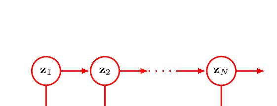

立即变得明显。卡尔曼滤波器广泛应用于许多实时跟踪应用程序，例如使用雷达反射跟踪飞机。

在最简单的模型中，图16.9中的分布 $p(\mathbf{x}_n|\mathbf{z}_n)$ 表示特定观测的线性高斯潜变量模型，这是我们之前讨论过的独立同分布数据的一种类型。然而，潜变量 $\{\mathbf{z}_n\}$ 不再被视为独立的，而是形成一个马尔可夫链，在该链中每个潜变量的分布 $p(\mathbf{z}_n|\mathbf{z}_{n-1})$ 是以前一个潜变量的状态为条件的每个潜变量的分布。同样，这些可以选择为线性高斯分布，其中 $\mathbf{z}_n$ 的分布是具有由 $\mathbf{z}_{n-1}$ 的线性函数给出的均值的高斯分布。

通常，所有分布的参数 $p(\mathbf{x}_n|\mathbf{z}_n)$ 是共享的，同样地，分布 $p(\mathbf{z}_n|\mathbf{z}_{n-1})$ 的参数也是共享的，因此模型中的参数总数是固定的，与序列的长度无关。

这些参数可以通过最大似然法从数据中学习，使用有效的算法在图中传播消息 (Bishop, 2006)。然而，在本章的其余部分，我们将专注于独立同分布的数据。

## 16.3. 证据下界

在我们讨论具有离散潜变量的模型时，我们推导了边际对数似然的证据下界 (ELBO)，并展示了如何基于此推导期望最大化 (EM) 算法，包括其变分推断的泛化形式。相同的框架也适用于连续潜变量以及结合离散和连续变量的模型。在这里，我们提供了对 ELBO 稍微不同的推导，并假设潜变量 $\mathbf{z}$ 是连续的。

考虑一个模型 $p(\mathbf{x}, \mathbf{z}|\mathbf{w})$，其中有一个观测变量 $\mathbf{x}$，一个潜在变量 $\mathbf{z}$，和一个可学习的参数向量 $\mathbf{w}$。如果我们引入一个任意分布 $q(\mathbf{z})$ 来描述潜在变量，那么我们可以将对数似然函数 $\ln p(\mathbf{x}|\mathbf{w})$ 写成两个形式为 Exercise 16.18 的项的和

$$ \ln p(\mathbf{x}|\mathbf{w}) = \mathcal{L}(\mathbf{w}) + \text{KL} (q(\mathbf{z})\|p(\mathbf{z}|\mathbf{x}, \mathbf{w})) $$

我们定义

$$ \mathcal{L}(q, \mathbf{w}) = \int q(\mathbf{z}) \ln \left\{ \frac{p(\mathbf{x}, \mathbf{z}|\mathbf{w})}{q(\mathbf{z})} \right\} d\mathbf{z} $$

$$ \text{KL} (q(\mathbf{z})\|p(\mathbf{z}|\mathbf{x}, \mathbf{w})) = - \int q(\mathbf{z}) \ln \left\{ \frac{p(\mathbf{z}|\mathbf{x}, \mathbf{w})}{q(\mathbf{z})} \right\} d\mathbf{z}. $$

由于 $\text{KL} (q(\mathbf{z})\|p(\mathbf{z}|\mathbf{x}, \mathbf{w}))$ 是一种 Kullback–Leibler 散度，它满足性质 $\text{KL} (\cdot\|\cdot) \geqslant 0$，由此可得

$$ \ln p(\mathbf{x}|\mathbf{w}) \geqslant \mathcal{L}(\mathbf{w}) \quad (16.60) $$

因此，我们可以看到 $\mathcal{L}(q, \mathbf{w})$ 由 (16.58) 给出的形式形成了对对数似然的下界，称为证据下界或 ELBO。我们可以看到 $\mathcal{L}(q, \mathbf{w})$ 采用了与离散情况下推导出的相同形式 (15.53)，但是将求和替换为积分。

我们可以使用一种称为期望最大化算法或 EM 算法的两阶段迭代过程来最大化对数似然函数，在该过程中我们交替地最大化 $\mathcal{L}(q, \mathbf{w})$ 关于 $q(\mathbf{z})$（E步骤）和 $\mathbf{w}$（M步骤）。我们首先初始化参数 $\mathbf{w}$（旧的）。然后在E步中，我们保持 $\mathbf{w}$ 不变，并且最大化关于 $q(\mathbf{z})$ 的下界。这很容易通过注意到在 (16.59) 中最小化 Kullback-Leibler 散度来实现，因此当 $q(\mathbf{z}) = p(\mathbf{z}|\mathbf{x}, \mathbf{w}_{\text{(旧)}})$ 时，下界取得最高值，此时 Kullback-Leibler 散度为零。在M步中，我们保持 $q(\mathbf{z})$ 的选择不变，并且最大化关于 $\mathbf{w}$ 的 $\mathcal{L}(q, \mathbf{w})$。代入 (16.58) 中的 $q(\mathbf{z})$，我们得到

$$ \mathcal{L}(q, \mathbf{w}) = \int p(\mathbf{z}|\mathbf{x}, \mathbf{w}_{\text{(旧)}}) \ln p(\mathbf{x}, \mathbf{z}|\mathbf{w}) d\mathbf{z} - \int p(\mathbf{z}|\mathbf{x}, \mathbf{w}_{\text{(旧)}}) \ln p(\mathbf{z}|\mathbf{x}, \mathbf{w}_{\text{(旧)}}) d\mathbf{z}. \quad (16.61) $$

我们现在在M步中最大化这个值，同时保持 $\mathbf{w}_{\text{(旧)}}$ 不变。请注意，(16.61)式右侧的第二项与 $\mathbf{w}$ 无关，因此在M步中可以忽略。右侧的第一项是完整数据对数似然的期望值，其中期望值是根据关于后验分布 $\mathbf{z}$ 的计算使用 $\mathbf{w}_{\text{(旧)}}$ 的。如果我们有一个数据集 $\mathbf{x}_1, ..., \mathbf{x}_N$ 的 i.i.d. 观测值，那么似然函数的形式为

$$ \ln p(\mathbf{X}|\mathbf{w}) = \sum_{n=1}^N \ln p(\mathbf{x}_n|\mathbf{w}) \quad (16.62) $$

其中数据矩阵 $\mathbf{X}$ 包括 $\mathbf{x}_1, ..., \mathbf{x}_N$，并且参数 $\mathbf{w}$ 在所有数据点之间共享。对于每个数据点，我们引入相应的潜在变量 $\mathbf{z}_n$ 及其相关分布 $q(\mathbf{z}_n)$，并通过类似于推导 (16.58) 的步骤，得到 ELBO 的形式

$$ \mathcal{L}(q, \mathbf{w}) = \sum_{n=1}^N \int q(\mathbf{z}_n) \ln \left\{ \frac{p(\mathbf{x}_n, \mathbf{z}_n|\mathbf{w})}{q(\mathbf{z}_n)} \right\} d\mathbf{z}_n. \quad (16.63) $$

当我们讨论变分自编码器时（第19.2节），我们会遇到一个模型，无法找到精确的E步骤解，因此可以通过使用深度神经网络对 $q(\mathbf{z})$ 进行部分最大化，并使用 ELBO 来学习网络的参数。

#### 16.3.1 期望最大化

我们现在可以使用 EM 算法，通过迭代最大化证据下界，来学习概率 PCA 模型的参数。这可能看起来有点无意义，因为我们已经得到了最大似然参数值的精确闭式解。然而，在高维空间中，使用迭代的 EM 过程而不是直接使用样本协方差矩阵可能具有计算上的优势。这个 EM 过程（第16.2.4节）也可以扩展到因子分析模型，对于该模型没有闭式解。最后，它可以以原则性的方式处理缺失数据。

我们可以通过遵循 EM 的一般框架（第15.3节）来推导概率 PCA 的 EM 算法。因此，我们写下完整数据的对数似然，并根据使用“旧”参数值评估的潜在分布的后验分布来计算期望。最大化这个期望的完整数据对数似然将得到“新”的参数值。由于数据点被假设为独立的，完整数据的对数似然函数的形式为

$$\ln p \left( \mathbf{X}, \mathbf{Z} | \boldsymbol{\mu}, \mathbf{W}, \sigma^2 \right) = \sum_{n=1}^N \left\{ \ln p(\mathbf{x}_n | \mathbf{z}_n) + \ln p(\mathbf{z}_n) \right\} \tag{16.64}$$

其中矩阵 $\mathbf{Z}$ 的第 $n$ 行由 $\mathbf{z}_n$ 给出。我们已经知道 $\boldsymbol{\mu}$ 的精确最大似然解是由样本均值 $\bar{\mathbf{x}}$ 定义的 (16.1)，在这个阶段替代 $\boldsymbol{\mu}$ 是方便的。利用潜在变量的后验分布的表达式 (16.31) 和 (16.32) 以及条件分布，并对潜在变量的后验分布取期望，我们得到

$$\begin{align*} \mathbb{E} \left[ \ln p \left( \mathbf{X}, \mathbf{Z} | \boldsymbol{\mu}, \mathbf{W}, \sigma^2 \right) \right] &= - \sum_{n=1}^N \left\{ \frac{D}{2} \ln (2\pi \sigma^2) + \frac{1}{2} \mathrm{Tr} \left( \mathbb{E}[\mathbf{z}_n \mathbf{z}_n^\mathrm{T}] \right) \right. \\ &\quad + \frac{1}{2\sigma^2} \|\mathbf{x}_n - \boldsymbol{\mu}\|^2 - \frac{1}{\sigma^2} \mathbb{E}[\mathbf{z}_n]^\mathrm{T} \mathbf{W}^\mathrm{T} (\mathbf{x}_n - \boldsymbol{\mu}) \\ &\quad \left. + \frac{1}{2\sigma^2} \mathrm{Tr} \left( \mathbb{E}[\mathbf{z}_n \mathbf{z}_n^\mathrm{T}] \mathbf{W}^\mathrm{T} \mathbf{W} \right) + \frac{M}{2} \ln (2\pi) \right\}. \tag{16.65} \end{align*}$$

请注意，这仅取决于后验分布通过高斯的充分统计量。因此，在E步中，我们使用旧的参数值来评估

$$\begin{align} \mathbb{E}[\mathbf{z}_n] &= \mathbf{M}^{-1} \mathbf{W}^\mathrm{T} (\mathbf{x}_n - \bar{\mathbf{x}}) \tag{16.66} \\ \mathbb{E}[\mathbf{z}_n \mathbf{z}_n^\mathrm{T}] &= \sigma^2 \mathbf{M}^{-1} + \mathbb{E}[\mathbf{z}_n] \mathbb{E}[\mathbf{z}_n]^\mathrm{T}, \tag{16.67} \end{align}$$

这直接来自于后验分布 (16.43) 以及标准结果 $\mathbb{E}[\mathbf{z}_n \mathbf{z}_n^\mathrm{T}] = \mathrm{cov}[\mathbf{z}_n] + \mathbb{E}[\mathbf{z}_n] \mathbb{E}[\mathbf{z}_n]^\mathrm{T}$。这里 $\mathbf{M}$ 由 (16.42) 定义。在M步中，我们最大化 $\mathbf{W}$ 和 $\sigma^2$，保持后验统计量不变。对于 $\sigma^2$ 的最大化是直接的。对于 $\mathbf{W}$ 的最大化，我们利用 (A.24) 得到M步方程：

$$ \mathbf{W}_{\text{新}} = \left[ \sum_{n=1}^{N} (\mathbf{x}_n - \bar{\mathbf{x}}) \mathbb{E}[\mathbf{z}_n]^T \right] \left[ \sum_{n=1}^{N} \mathbb{E}[\mathbf{z}_n \mathbf{z}_n^T] \right]^{-1} \quad (16.68) $$

$$ \sigma_{\text{新}}^2 = \frac{1}{N D} \sum_{n=1}^{N} \left\{ \|\mathbf{x}_n - \bar{\mathbf{x}}\|^2 - 2 \mathbb{E}[\mathbf{z}_n]^T \mathbf{W}_{\text{新}}^T (\mathbf{x}_n - \bar{\mathbf{x}}) + \text{Tr}\left( \mathbb{E}[\mathbf{z}_n \mathbf{z}_n^T] \mathbf{W}_{\text{新}}^T \mathbf{W}_{\text{新}} \right) \right\} \quad (16.69) $$

概率主成分分析的EM算法通过初始化参数，然后交替计算潜在空间后验分布的充分统计量，使用E步骤中的(16.66)和(16.67)，并使用M步骤中的(16.68)和(16.69)修订参数值。

EM算法在PCA中的一个好处是其在大规模应用中的计算效率（Roweis, 1998）。与基于样本协方差矩阵的传统PCA不同，EM方法是迭代的，因此可能看起来不太吸引人。然而，EM算法的每个循环在高维空间中的计算效率要比传统PCA高得多。要理解这一点，注意协方差矩阵的特征分解需要 $O(D^3)$ 计算。通常我们只对前 $M$ 个特征向量及其对应的特征值感兴趣，这种情况下我们可以使用 $O(M D^2)$ 的算法。然而，计算协方差矩阵需要 $O(N D^2)$ 计算，其中 $N$ 是数据点的数量。例如快照方法（Sirovich，1987）假设特征向量是数据向量的线性组合，避免了对协方差矩阵的直接评估，但是复杂度为 $O(N^3)$，因此不适用于大数据集。这里描述的EM算法也不会显式构建协方差矩阵。相反，计算量最大的步骤是涉及对数据集求和的步骤，复杂度为 $O(N D M)$。对于大的 $D$ 和 $M \ll D$，与 $O(N D^2)$ 相比，这可以节省很多计算量，并抵消EM算法的迭代性质。

请注意，这个EM算法可以以在线形式实现，在处理完每个 $D$ 维数据点后将其丢弃，然后再考虑下一个数据点。要理解这一点，注意到在E步骤中评估的量（一个 $M$ 维向量和一个 $M \times M$ 矩阵）可以分别针对每个数据点计算，并且在M步骤中，我们需要累积对数据点的求和，这可以逐步完成。如果 $N$ 和 $D$ 都很大。因为我们现在对PCA有了一个完全概率模型，所以我们可以处理缺失数据，前提是它是随机缺失的，换句话说，决定哪些值缺失的过程不依赖于任何观察或未观察变量的值。这样的数据集可以通过边缘化未观察变量的分布来处理，并且可以使用EM算法来最大化得到的似然函数。

#### 16.3.2 主成分分析的EM

## 16. 连续潜变量

从 (16.67) 中我们可以看出，在E步骤中我们需要计算的唯一数量是 E[zₙ]。此外，M步骤的简化是因为 M = WᵀW。为了强调算法的简单性，让我们定义 X̃ 为一个大小为 N × D 的矩阵，第n行由向量 xₙ - x̄ 给出，并类似地定义 Ω 为大小为 M × N 的矩阵，其第ₙ列由向量 E[zₙ] 给出。 PCA算法的E步骤 (16.66) 变为

$$ \Omega = (W_{\text{old}}^T W_{\text{old}})^{-1} W_{\text{old}}^T \tilde{X}^T (16.70) $$

而M步骤 (16.68) 的形式为

$$ W_{\text{new}} = \tilde{X}^T \Omega^T (\Omega \Omega^T)^{-1}. (16.71) $$

这些可以以在线形式实现。 这些方程的简单解释如下。 根据我们之前的讨论，我们可以看到E步骤涉及将数据点投影到当前对主要子空间的估计上。 相应地，M步骤表示对主要子空间进行重新估计，以最小化固定投影中的重构误差。

我们可以为这个EM算法提供一个简单的物理类比，对于 D=2 和 M=1 很容易进行可视化。 考虑一个二维数据点的集合，并且让一维主子空间由一个实心杆表示。现在通过遵循胡克定律（力与弹簧长度成正比，因此储存的能量与弹簧长度的平方成正比）将每个数据点与杆连接起来。 在E步骤中，我们保持杆固定，允许连接点沿着杆上下滑动以最小化能量。这会导致每个连接点（独立地）将自己定位在对应数据点在杆上的正交投影上。在M步骤中，我们保持连接点固定，然后释放杆并允许其移动到最小能量位置。 然后重复执行E步骤和M步骤，直到满足适当的收敛准则，如图16.10所示。

#### 16.3.3 因子分析的EM

我们可以通过因子分析模型来确定参数 μ, W 和 Ψ 的最大似然。对于 μ 的解再次由样本均值给出。 然而，与概率PCA不同的是，对于 W，不再有闭式的最大似然解，因此必须通过迭代来找到。因为因子分析是一种潜变量模型，所以可以使用类似于概率PCA的EM算法（Rubin和Thayer, 1982）来进行计算。具体来说，E步骤的方程为

$$ E[\mathbf{z}_n] = \mathbf{G} \mathbf{W}^T \mathbf{\Psi}^{-1} (\mathbf{x}_n - \bar{\mathbf{x}}) (16.72) $$
$$ E[\mathbf{z}_n \mathbf{z}_n^T] = \mathbf{G} + E[\mathbf{z}_n]E[\mathbf{z}_n]^T (16.73) $$

我们定义

$$ \mathbf{G} = (\mathbf{I} + \mathbf{W}^T \mathbf{\Psi}^{-1} \mathbf{W})^{-1}. (16.74) $$

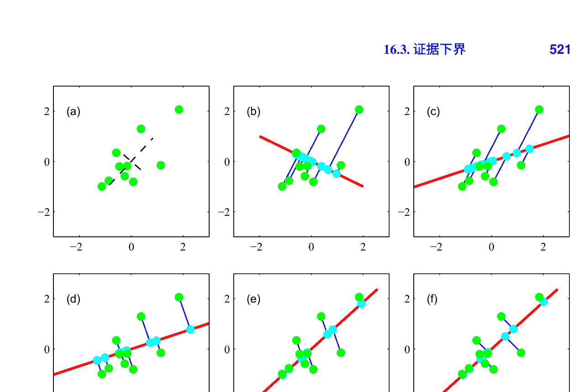

图16.10 通过(16.70)和(16.71)定义的PCA EM算法的合成数据示例。(a) 一组以绿色显示的数据点，以及真实的主成分（以特征向量按特征值的平方根缩放显示）。(b) 由 W 定义的主子空间的初始配置，以红色显示，以及潜在点 Z 在数据空间中的投影，由 ZW^T 给出，以青色显示。(c) 一个M步之后， W 已经更新， Z 保持不变。(d) 连续的E步之后， Z 的值已经更新，给出了正交投影， W 保持不变。(e) 第二个M步之后。(f) 收敛的解。

请注意，这是以 M×M 的矩阵求逆的形式表示，而不是 D×D（除了对角矩阵 Ψ 的逆是容易计算的，只需 O(D)步），这是方便的，因为通常 M≪D。类似地，练习16.25 M步方程的形式为

$$ W_{\text{new}} = \left[ \sum_{n=1}^{N} (\mathbf{x}_n - \bar{\mathbf{x}}) E[\mathbf{z}_n]^T \right] \left[ \sum_{n=1}^{N} E[\mathbf{z}_n \mathbf{z}_n^T] \right]^{-1} (16.75) $$

$$ \Psi_{\text{new}} = \text{diag}\left\{ \mathbf{S} - \mathbf{W}_{\text{new}} \left( \frac{1}{N} \right) \sum_{n=1}^{N} E[\mathbf{z}_n] (\mathbf{x}_n - \bar{\mathbf{x}})^T \right\} (16.76) $$

其中，diag操作符将矩阵的非对角元素都设为零。

## 16.4. 非线性潜变量模型

到目前为止，在本章中，我们主要关注基于从潜空间到数据空间的线性变换的潜变量模型。自然而然地，我们会想知道是否可以利用深度神经网络的灵活性来表示更复杂的变换，同时利用深度网络的学习能力使得所得到的分布能够适应数据集。考虑一个关于向量变量 z 的简单分布，例如形式为高斯分布的

$$ p(\mathbf{z}) = \mathcal{N}(\mathbf{z}|\mathbf{0}, \mathbf{I}) (16.77) $$

现在假设我们使用一个由深度神经网络给出的函数 $\mathbf{x} = \mathbf{g}(\mathbf{z}, \mathbf{w})$ 来对 $\mathbf{z}$ 进行变换，其中 $\mathbf{w}$ 表示权重和偏置。潜变量 $\mathbf{z}$ 的分布与神经网络的组合定义了 $\mathbf{x}$ 的分布。从这样的模型中进行采样是很简单的，因为我们可以从 $p(\mathbf{z})$ 中生成样本，然后使用神经网络函数将每个样本进行变换，得到相应的 $\mathbf{x}$ 样本。这是一个高效的过程，因为它不涉及迭代。

要从数据中学习 $\mathbf{g}(\mathbf{z}, \mathbf{w})$，考虑如何评估似然函数。变量的分布由密度函数的变量变换公式给出：

$$ p(\mathbf{x}) = p(\mathbf{z}(\mathbf{x})) |\det \mathbf{J}(\mathbf{x})| (16.78) $$

其中 $\mathbf{J}$ 是偏导数的雅可比矩阵，其元素由以下给出

$$ J_{ij}(\mathbf{x}) = \frac{\partial z_i}{\partial x_j} (16.79) $$

为了评估给定数据向量 $\mathbf{x}$ 的 (16.78) 中的分布 $p(\mathbf{z}(\mathbf{x}))$，并为相同的 $\mathbf{x}$ 值评估 (16.79) 中的雅可比矩阵，我们需要神经网络函数的逆 $\mathbf{z} = \mathbf{g}^{-1}(\mathbf{x}, \mathbf{w})$。对于大多数神经网络来说，这个逆函数可能没有明确定义。例如，网络可能表示一个多对一的函数，其中多个不同的输入值映射到相同的输出值，这种情况下变量变换公式不能给出一个明确定义的密度。此外，如果潜在空间的维度与数据空间不同，则变换将不可逆。

一种方法是将我们的注意力限制在可逆函数 $\mathbf{g}(\mathbf{z}, \mathbf{w})$ 上，这要求 $\mathbf{z}$ 和 $\mathbf{x}$ 具有相同的维度。当我们介绍归一化流技术时，我们将更详细地探讨这种方法。

#### 16.4.1 非线性流形

要求潜在空间和数据空间具有相同的维度是一个重要的限制。考虑 $\mathbf{z}$ 的维度为 M， $\mathbf{x}$ 的维度为 D 的情况，其中 M < D。在这种情况下， $\mathbf{x}$ 的分布被限制在维度为 M 的流形或子空间中，如图16.11所示。低维流形在许多机器学习应用中都会出现。

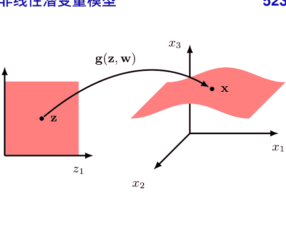

例如，在建模自然图像的分布时，非线性潜变量模型在建模此类数据时非常有用，因为它们表达了数据不会‘填满’数据空间，而是被限制在一个流形中，尽管这个流形的形状和维度通常事先不知道。

然而，这个框架的一个问题是它对于不完全位于流形上的任何数据向量都分配了零概率密度，这对于基于梯度的学习是一个问题，因为似然函数在每个数据点上都为零，并且对于 $\mathbf{w}$ 的微小变化是恒定的，对于任何现实的数据集来说。为了解决这个问题，我们采用了之前在回归和分类问题中使用的方法，并定义了整个数据空间上的条件分布，其参数由神经网络的输出给出。例如，如果 $\mathbf{x}$ 由一组连续变量的向量组成，那么我们可以选择条件分布为高斯分布：

$$ p(\mathbf{x} | \mathbf{z}, \mathbf{w}) = \mathcal{N}(\mathbf{x} | \mathbf{g}(\mathbf{z}, \mathbf{w}), \sigma^2 \mathbf{I}) (16.80) $$

其中神经网络 $\mathbf{g}(\mathbf{z}, \mathbf{w})$ 具有线性输出单元激活函数，并且 $\mathbf{g} \in \mathbb{R}^D$。生成模型由潜在分布 $\mathbf{z}$ 与条件分布 $\mathbf{x}$ 指定，并且可以用图16.12中显示的简单图模型表示。

请注意，从该分布中独立抽取样本是直接且计算效率高的。我们首先使用标准方法从高斯分布 (16.77) 中抽取样本。接下来，我们将这个值作为输入传递给神经网络，得到一个输出值 $\mathbf{g}(\mathbf{z}, \mathbf{w})$。最后，我们使用均值为 $\mathbf{g}(\mathbf{z}, \mathbf{w})$ 和协方差为 $\sigma^2 \mathbf{I}$ 的高斯分布（由 (16.80) 定义）抽取样本。然后，可以重复这个三步过程来生成多个独立样本。

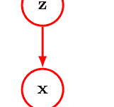

图16.12 表示由 (16.77) 和 (16.80) 给出的分布的图形模型，它们共同定义了一个联合分布 $p(\mathbf{x}, \mathbf{z}) = p(\mathbf{x} | \mathbf{z}) p(\mathbf{z})$。

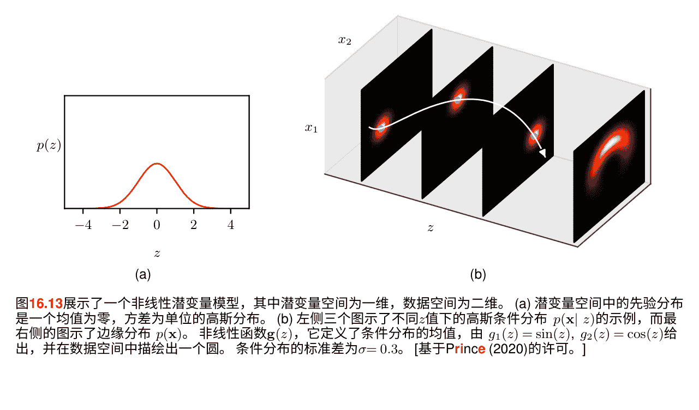

图16.13 展示了一个非线性潜变量模型，其中潜变量空间为一维，数据空间为二维。(a) 潜变量空间中的先验分布是一个均值为零，方差为单位的高斯分布。(b) 左侧三个图示了不同z值下的高斯条件分布 $p(\mathbf{x}| z)$ 的示例，而最右侧的图示了边缘分布 $p(\mathbf{x})$。非线性函数 $\mathbf{g}(z)$，它定义了条件分布的均值，由 $g_1(z) = \sin(z)$, $g_2(z) = \cos(z)$ 给出，并在数据空间中描绘出一个圆。条件分布的标准差为 $\sigma=0.3$。[基于Prince (2020)的许可。]

边际分布由下式给出

$$ p(\mathbf{x}) = \int p(\mathbf{z})p(\mathbf{x}|\mathbf{z}) d\mathbf{z}. (16.81) $$

我们在图16.13中使用一个简单的例子来说明这一点，其中包括一个一维潜在空间和一个二维数据空间。

#### 16.4.2 似然函数

我们已经看到，从这个非线性潜变量模型中抽取样本很容易。现在假设我们希望通过最大化似然函数来拟合观测数据集。似然函数是通过积分计算得到的，使用概率的乘法和加法规则，对 $\mathbf{z}$ 进行积分：

$$ p(\mathbf{x}|\mathbf{w}) = \int p(\mathbf{x}|\mathbf{z}, \mathbf{w})p(\mathbf{z}) d\mathbf{z} = \int \mathcal{N}(\mathbf{x}|\mathbf{g}(\mathbf{z}, \mathbf{w}), \sigma^2\mathbf{I})\mathcal{N}(\mathbf{z}|\mathbf{0}, \mathbf{I}) d\mathbf{z}. (16.82) $$

尽管积分内部的两个分布都是高斯分布，但由于神经网络定义的高度非线性函数 $\mathbf{g}(\mathbf{z}, \mathbf{w})$，积分是无法解析求解的。

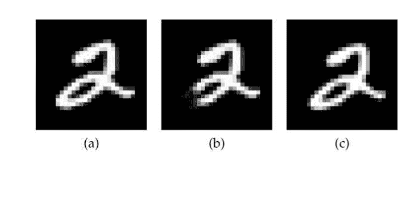

图16.14 三个手写数字的示例图像说明为什么从潜在空间中采样来评估似然函数需要大量样本。(a) 显示原始图像，(b) 显示删除了一部分笔画的损坏图像，(c) 显示原始图像向下移动半个像素并向右移动半个像素。图像(b)在似然性方面更接近于(a)，尽管图像(c)在外观上更接近于(a)。 [来自Doersch (2016)的许可]

评估似然函数的一种方法是从潜在空间分布中抽取样本，并使用这些样本来近似 (16.82)。

$$ p(\mathbf{x}|\mathbf{w}) \simeq \frac{1}{K} \sum_{i=1}^{K} p(\mathbf{x}|\mathbf{z}_i, \mathbf{w}) (16.83) $$

这将概率分布表示为具有固定混合系数的高斯混合模型，其中混合系数由1/K给出，在样本数趋于无穷大时，这给出了真实的似然函数。然而，用于有效训练的K的值通常会远远超过实际可行的范围。为了说明这一点，考虑图16.14中显示的三个手写数字图像，并假设图像(a)表示我们希望评估似然函数的向量 $\mathbf{x}$。如果训练模型生成了图像(b)，我们会认为这是一个糟糕的模型，因为这个图像不是数字‘2’的良好表示，因此应该给予较低的似然性。相反，图像(c)是通过将(a)中的数字向下和向右移动半个像素得到的，是数字‘2’的一个很好的示例，因此应该具有较高的似然性。由于分布 (16.80) 是高斯分布，似然函数与网络输出和数据向量 $\mathbf{x}$ 之间的负平方距离的指数成正比。然而，(a)和(b)之间的平方距离为0.0387，而(a)和(c)之间的平方距离为0.2693。因此，如果方差参数 σ² 设置为足够小的值，使得图像(b)的似然性较低，则图像(c)的似然性将更低。即使模型在生成数字方面表现良好，我们也必须考虑 $\mathbf{z}$ 的极大数量的样本，才能看到与(a)足够接近的数字。因此，我们寻求更复杂的技术来训练非线性潜变量模型，以在实际应用中使用。在概述这些方法之前，我们首先简要讨论一些关于离散数据空间的考虑。

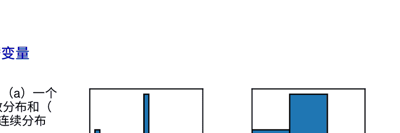

图16.15 去量化的示意图，显示了 (a) 一个离散变量上的离散分布和 (b) 相关的去量化连续分布。

#### 16.4.3 离散数据

如果观察数据集包含独立的二进制变量，则可以使用以下形式的条件分布

$$ p(\mathbf{x}|\mathbf{z}, \mathbf{w}) = \prod_{i=1}^{D} g_i(\mathbf{z}, \mathbf{w})^{x_i} (1 - g_i(\mathbf{z}, \mathbf{w}))^{1-x_i} (16.84) $$

其中 $g_i(\mathbf{z}, \mathbf{w}) = \sigma(a_i(\mathbf{z}, \mathbf{w}))$ 表示输出单元 $i$ 的激活，激活函数 $\sigma(\cdot)$ 由逻辑sigmoid函数给出，$a_i(\mathbf{z}, \mathbf{w})$ 是输出单元 $i$ 的预激活。同样，对于独热编码的分类变量，我们可以使用多项分布：

$$ p(\mathbf{x}|\mathbf{z}, \mathbf{w}) = \prod_{i=1}^{D} g_i(\mathbf{z}, \mathbf{w})^{x_i} (16.85) $$

其中

$$ g_i(\mathbf{z}, \mathbf{w}) = \frac{\exp(a_i(\mathbf{z}, \mathbf{w}))}{\sum_j \exp(a_j(\mathbf{z}, \mathbf{w}))} (16.86) $$

是softmax激活函数。我们还可以通过形成相关条件分布的乘积来考虑离散和连续变量的组合。

在实践中，连续变量用离散值表示，例如在图像中，红色、绿色和蓝色通道的强度可以使用表示值为 $\{0, \ldots, 255\}$ 的8位数来表示。当我们使用基于深度神经网络的高度灵活的模型时，这可能会导致问题，因为如果密度坍缩到一个或多个离散值上，似然函数可能会变为零。这个问题可以通过一种称为去量化的技术来解决，该技术涉及向变量添加噪声，通常是从连续值之间的区域中均匀分布中随机抽取的。图16.15显示了这个过程。训练集通过用从与该离散值相关的连续分布中随机抽取的样本替换每个观察值来去量化，这样可以减少模型发现病态解的可能性。

#### 16.4.4 生成建模的四种方法

我们已经看到，基于深度神经网络的非线性潜变量模型为构建生成模型提供了一个高度灵活的框架。由于神经网络变换的普适性，这些模型原则上能够以高精度近似任何所需的分布。此外，这些模型一旦训练完成，就能够使用高效的非迭代过程从分布中生成样本。然而，我们也发现了训练这些模型所面临的一些挑战，这迫使我们开发比线性模型更复杂的技术。已经提出了许多这样的方法，每种方法都有其自身的优势和局限性。这些方法可以大致分为四种方法，如下所示。

- **第17章 生成对抗网络（GANs）**：通过生成对抗网络（GANs），我们放宽了要求网络映射不需要是可逆的，从而使得潜在空间的维度比数据空间低。我们还放弃了似然函数的概念，而是引入了第二个神经网络，其功能是为生成网络提供训练信号。由于缺乏明确定义的似然函数，训练过程可能会脆弱，但一旦训练完成，从模型中生成样本就变得简单直接，并且结果可以是高质量的。

- **第19章 变分自编码器（VAEs）**：变分自编码器（VAEs）的框架也使用了第二个神经网络，其作用是近似潜在变量的后验分布，从而允许评估似然函数的近似值。训练比生成对抗网络（GANs）更稳健，从训练模型中进行采样也比较直接，尽管获得最高质量的结果可能更困难。

- **第18章 正规化流**：在正规化流中，我们将潜在空间的维度设置为与数据空间相等，然后修改生成神经网络，使其可逆。网络可逆的要求限制了其功能形式，但它允许在不进行近似的情况下评估似然函数，并且还允许高效的采样。

- **第20章 扩散模型**：最后，扩散模型使用一个网络，通过一系列去噪步骤将来自先验分布的样本转换为来自数据分布的样本。这在许多应用中导致了最先进的性能，尽管由于多次去噪通过网络进行采样的成本可能很高。

我们在本书的最后四章中详细探讨了这些方法。

### 练习

- 16.1 (**) 在这个练习中，我们使用归纳法证明线性投影到一个 $M$ 维子空间上，使得投影数据的方差最大，其定义为数据协方差矩阵 $\mathbf{S}$ 的 $M$ 个最大特征向量（对应于公式（16.3）中的 $M$ 个最大特征值）。在第16.1节中，已经证明了这个结果对于 $M=1$ 成立。现在假设这个结果对于某个一般的 $M$ 值成立，并证明它因此对于维度 $M+1$ 也成立。为了做到这一点，首先将投影数据方差对于定义新的数据空间中的向量 $\mathbf{u}_{M+1}$ 的导数设置为零。这应该在满足以下约束条件的情况下进行：$\mathbf{u}_{M+1}$与现有向量$\mathbf{u}_1, \dots, \mathbf{u}_M$正交，并且长度归一化。使用拉格朗日乘数法来强制执行这些约束。附录C使用拉格朗日乘数法来强制执行这些约束。

然后利用向量$\mathbf{u}_1, \dots, \mathbf{u}_M$的正交性质，展示新向量$\mathbf{u}_{M+1}$是 $\mathbf{S}$的特征向量。最后，证明如果选择特征值对应的特征向量，则方差最大化，其中特征值 $\lambda_{M+1}$ 按降序排列。

## 16.2 (**)证明在正交性约束条件 (16.7) 下，PCA误差度量 $J$的最小值由 (16.15) 给出，当 $\mathbf{u}_i$是数据协方差矩阵 $\mathbf{S}$的特征向量时获得。为此，引入一个拉格朗日乘子矩阵 $\mathbf{H}$，每个约束条件对应一个乘子，使得修改后的误差度量在矩阵表示中为

$$\widetilde{J} = \mathrm{Tr}\{\mathbf{U}^T \mathbf{S} \mathbf{U}\} + \mathrm{Tr}\{\mathbf{H}(\mathbf{I} - \mathbf{U}^T \mathbf{U})\}$$

其中 $\mathbf{U}$是一个维度为 $D \times (D - M)$的矩阵，其列由 $\mathbf{u}_i$给出。现在最小化 $\widetilde{J}$ 关于 $\mathbf{U}$的值，并证明解满足 $\mathbf{S} \mathbf{U} = \mathbf{U} \mathbf{H}$。显然，一种可能的解是 $\mathbf{U}$的列是 $\mathbf{S}$的特征向量，此时 $\mathbf{H}$是一个包含相应特征值的对角矩阵。为了得到一般解，证明 $\mathbf{H}$可以假设为对称矩阵，并通过使用其特征向量展开，证明 $\mathbf{S} \mathbf{U} = \mathbf{U} \mathbf{H}$的一般解给出了与 $\mathbf{U}$的列是 $\mathbf{S}$的特征向量的特定解相同的 $\widetilde{J}$ 值。因为这些解都是等价的，选择特征向量解是方便的。

## 16.3 (*)验证(16.30)定义的特征向量是否归一化为单位长度，假设特征向量 $\mathbf{v}_i$的长度为单位长度。

## 16.4 (*)假设我们将概率PCA模型中的零均值、单位协方差的潜在空间分布(16.31)替换为形式为 $\mathcal{N}(\mathbf{z}|\mathbf{m}, \boldsymbol{\Sigma})$的一般高斯分布。
通过重新定义模型的参数，证明这导致了一个相同的模型，对于任何有效的选择，都可以得到观察变量的边缘分布 $p(\mathbf{x})$。

## 16.5 (**)设 $\mathbf{x}$是一个 $D$维随机变量，其服从高斯分布 $\mathcal{N}(\mathbf{x}|\boldsymbol{\mu}, \boldsymbol{\Sigma})$，考虑由 $\mathbf{A} \mathbf{x} + \mathbf{b}$ 给出的 $M$维随机变量 $\mathbf{y}$，其中 $\mathbf{A}$是一个 $M \times D$矩阵。证明 $\mathbf{y}$也服从高斯分布，并找到其均值和协方差的表达式。讨论 $M < D$、$M = D$和$M > D$情况下该高斯分布的形式。

## 16.6 (**)通过利用一般分布的均值和协方差的结果 (2.122) 和 (2.123) ，推导出概率PCA模型中边缘分布 $p(\mathbf{x})$的结果 (16.35) 。

## 16.7 (*)为16.2节中描述的概率PCA模型绘制一个有向概率图，其中显示了观测变量 $\mathbf{x}$的组成部分作为独立的节点。因此，验证概率PCA模型与第11.2.3节讨论的朴素贝叶斯模型具有相同的独立结构。

+ 16.8 (⋆⋆)通过利用结果(3.100)，证明概率PCA模型的后验分布 $p(\mathbf{z}|\mathbf{x})$ 为(16.43)。

+ 16.9 (⋆)验证对于概率PCA模型，最大化对数似然函数(16.44)关于参数 $\mathbf{\mu}$ 的结果是 $\mathbf{\mu}_{\text{ML}} = \mathbf{\bar{x}}$，其中 $\mathbf{\bar{x}}$ 是数据向量的均值。

+ 16.10 (⋆⋆)通过评估概率PCA模型的对数似然函数(16.44)关于参数 $\mathbf{\mu}$ 的二阶导数，证明稳定点 $\mathbf{\mu}_{\text{ML}} = \mathbf{\bar{x}}$ 表示唯一的最大值。

+ 16.11 (⋆⋆)证明在极限 $\sigma^2 \rightarrow 0$ 下，概率PCA模型的后验均值成为主子空间上的正交投影，就像传统PCA一样。

+ 16.12 (⋆⋆)对于 $\sigma^2 > 0$，证明概率PCA模型中的后验均值相对于正交投影向原点偏移。

+ 16.13 (⋆⋆)根据传统PCA的最小二乘投影成本，证明在概率PCA下数据点的最佳重构为 $$\widetilde{\mathbf{x}} = \mathbf{W}_{\text{ML}}(\mathbf{W}_{\text{ML}}^{\text{T}}\mathbf{W}_{\text{ML}})^{-1}\mathbf{M}\mathbb{E}[\mathbf{z}|\mathbf{x}]. \qquad (16.88)$$

+ 16.14 (⋆)在具有 $M$ 维潜在空间和 $D$ 维数据空间的概率PCA模型中，协方差矩阵中的独立参数数量由(16.52)给出。验证当 $M = D - 1$ 时，独立参数的数量与一般协方差高斯分布相同，而当 $M = 0$ 时，与具有各向同性协方差的高斯分布相同。

+ 16.15 (⋆)推导出在第16.2.4节中描述的因子分析模型中独立参数的表达式。

+ 16.16 (⋆⋆)证明在第16.2.4节中描述的因子分析模型在潜在空间坐标旋转下是不变的。

+ 16.17 (⋆⋆)考虑一个线性高斯潜变量模型，其潜空间分布 $p(\mathbf{z}) = \mathcal{N}(\mathbf{z}|\mathbf{0}, \mathbf{I})$ 和观测变量的条件分布 $p(\mathbf{x}|\mathbf{z}) = \mathcal{N}(\mathbf{x}|\mathbf{W}\mathbf{z} + \mathbf{\mu}, \mathbf{\Phi})$ 其中 $\mathbf{\Phi}$ 是任意对称正定的噪声协方差矩阵。现在假设我们对数据变量进行非奇异线性变换 $\mathbf{x} \rightarrow \mathbf{A}\mathbf{x}$，其中 $\mathbf{A}$ 是一个 $D \times D$ 矩阵。如果 $\mathbf{\mu}_{\text{ML}}$, $\mathbf{W}_{\text{ML}}$ 和 $\mathbf{\Phi}_{\text{ML}}$ 分别表示原始未变换数据的最大似然解，证明 $\mathbf{A}\mathbf{\mu}_{\text{ML}}$, $\mathbf{A}\mathbf{W}_{\text{ML}}$ 和 $\mathbf{A}\mathbf{\Phi}_{\text{ML}}\mathbf{A}^{\text{T}}$ 分别表示变换数据集的最大似然解。最后，证明在两种情况下模型的形式保持不变：(i) $\mathbf{A}$ 是一个对角矩阵，$\mathbf{\Phi}$ 是一个对角矩阵。这对应于因子分析。变换后的$\mathbf{\Phi}$仍然是对角矩阵，因此因子分析在分量上是协变的；(ii) $\mathbf{A}$是正交的， $\Phi$与单位矩阵成比例，使得 $\Phi = \sigma^2 \mathbf{I}$。这对应于概率PCA。转换后的 $\Phi$矩阵仍然与单位矩阵成比例，因此概率PCA在数据空间轴的旋转下是协变的，就像传统PCA一样。

+ 16.18 $(\star)$验证具有连续潜在变量的模型的对数似然函数可以写成形式为(16.57)的两个项的和，其中这些项由(16.58)和(16.59)定义。这可以通过使用概率的乘法规则来完成，形式如下

$$ p(\mathbf{x}, \mathbf{z}|\mathbf{w}) = p(\mathbf{z}|\mathbf{x}, \mathbf{w}) p(\mathbf{x}|\mathbf{w}) \qquad (16.89) $$

然后替换为 $ p(\mathbf{x}, \mathbf{z}|\mathbf{w}) $ 在 (16.58) 中。

+ 16.19 $(\star)$证明对于一组独立同分布的数据，证据下界（ELBO）的形式为 (16.63)。

+ 16.20 $(\star\star)$绘制一个表示离散混合概率PCA模型的有向概率图模型，其中每个PCA模型都有自己的 $\mathbf{W}$值、 $\mu$ 和 $\sigma^2$。现在绘制一个修改后的图表，其中这些参数值在混合组件之间共享。

+ 16.21 $(\star\star)$通过最大化由(16.65)给出的期望完整数据对数似然函数，推导出概率PCA模型的M步方程(16.68)和(16.69)。

+ 16.22 $(\star\star\star)$概率主成分分析的一个好处是，它可以应用于数据集中一些值缺失的情况，前提是它们是随机缺失的。推导出在这种情况下最大化概率PCA模型的似然函数的EM算法。注意，$\{\mathbf{z}_n\}$以及向量 $\{\mathbf{x}_n\}$中的缺失数据值现在是潜在变量。证明在所有数据值都被观察到的特殊情况下，这将简化为第16.3.2节中推导出的概率PCA的EM算法。

+ 16.23 $(\star\star)$让 $\mathbf{W}$是一个 $D \times M$矩阵，其列定义了一个嵌入在维度为 $D$的数据空间中的维度为 $M$的线性子空间，让 $\mu$是一个维度为$D$的向量。给定一个数据集 $\{\mathbf{x}_n\}$其中 $n= 1, . . . , N$，我们可以使用一组 $M$维向量的线性映射来近似数据点 $\{\mathbf{z}_n\}$，使得 $\mathbf{x}_n$被近似为 $\mathbf{W} \mathbf{z}_n + \mu$。相关的平方和重构成本由以下公式给出

$$ J = \sum_{n=1}^{N} \| \mathbf{x}_n - \mu - \mathbf{W} \mathbf{z}_n \|^2 \qquad (16.90) $$

首先证明，对 $\mu$进行最小化会导致一个类似的表达式，其中 $\mathbf{x}_n$ 和 $\mathbf{z}_n$ 被零均值变量 $\mathbf{x}_n - \bar{\mathbf{x}}$ 和 $\mathbf{z}_n - \bar{\mathbf{z}}$替换，其中 $\bar{\mathbf{x}}$ 和 $\bar{\mathbf{z}}$ 表示样本均值。然后证明，对 $\mathbf{z}_n$进行最小化，其中 $\mathbf{W}$ 被固定，导致了PCA的E步骤（16.70），而最小化 $J$ 关于 $\mathbf{W}$的值，其中 $\{\mathbf{z}_n\}$被固定，导致了PCA的M步骤（16.71）。

+ 16.24 (**) 推导出EM算法的因子分析的E步骤的公式（16.72）和（16.73）。请注意，根据练习16.26的结果，参数 $\mu$ 可以被样本均值 $\bar{\mathbf{x}}$ 替换。

+ 16.25 (**) 写出因子分析模型的期望完整数据对数似然函数的表达式，从而推导出相应的M步骤方程（16.75）和（16.76）。

+ 16.26 (**) 通过考虑二阶导数，证明在第16.2.4节讨论的因子分析模型的对数似然函数关于参数 $\mu$ 的唯一驻点是由（16.1）定义的样本均值。此外，证明这个驻点是一个最大值。

## 17 生成对抗网络

生成模型使用机器学习算法从一组训练数据中学习分布，然后从该分布生成新的示例。例如，生成模型可以在动物图像上进行训练，然后用于生成新的动物图像。我们可以将这样的生成模型视为一个分布 $p(\mathbf{x}|\mathbf{w})$，其中 $\mathbf{x}$ 是数据空间中的向量，$\mathbf{w}$ 表示模型的可学习参数。在许多情况下，我们对形式为 $p(\mathbf{x}|\mathbf{c}, \mathbf{w})$ 的条件生成模型感兴趣，其中 $\mathbf{c}$ 表示一组条件变量。对于我们用于动物图像的生成模型，我们可能希望指定生成的图像应该是特定的动物，例如猫或狗，由 $\mathbf{c}$ 的值指定。

对于像图像生成这样的实际应用，分布非常复杂，因此引入深度学习极大地提高了生成模型的性能。我们已经遇到过生成对抗网络是一类重要的深度生成模型。我们还概述了四个重要的生成模型的不同类别，本章我们讨论其中的第一个，称为生成对抗网络。其他三种方法将在后续章节中讨论。

## 17.1. 对抗训练

考虑一个基于从潜空间 $\mathbf{z}$ 到数据空间 $\mathbf{x}$ 的非线性变换的生成模型。我们引入一个潜在分布 $p(\mathbf{z})$，它可能采用简单的高斯分布形式 $p(\mathbf{z}) = \mathcal{N}(\mathbf{z}|\mathbf{0}, \mathbf{I})$，以及一个由可学习参数 $\mathbf{w}$ 定义的深度神经网络的非线性变换 $\mathbf{x} = g(\mathbf{z}, \mathbf{w})$，称为生成器。这些隐式地定义了一个关于 $\mathbf{x}$ 的分布，我们的目标是将这个分布拟合到一个由训练样本 ${\mathbf{x}_n}$ 组成的数据集，其中 $n=1, \ldots, N$。然而，我们无法通过优化似然函数来直接解决这个问题，因为一般情况下无法通过闭式形式进行评估。生成对抗网络（GANs）的关键思想是引入第二个判别器网络，与生成器网络一起进行训练，并提供一个训练信号来更新生成器的权重。

判别器网络的目标是区分数据集中的真实样本和生成器网络生成的合成或“假”样本，并通过最小化传统的分类错误函数进行训练。

相反，生成器网络的目标是通过合成与训练集相同分布的样本来最大化这个错误。生成器和判别器网络因此相互对抗，因此称为“对抗性”。这是一个零和博弈的例子，其中一个网络的任何收益都代表着另一个网络的损失。它允许判别器网络提供一个训练信号，用于训练生成器网络，从而将无监督密度建模问题转化为一种监督学习形式。

#### 17.1.1 损失函数

为了使这个问题更加精确，我们定义一个由二进制目标变量给出的
$$
t = 1, \quad \text{真实数据}, \qquad\qquad\qquad (17.2)
$$
$$
t = 0, \quad \text{合成数据}. \qquad\qquad\qquad (17.3)
$$
判别器网络具有一个具有逻辑sigmoid激活函数的输出单元，其输出表示数据向量 $\mathbf{x}$ 是真实的概率：
$$
P(t = 1) = d(\mathbf{x}, \phi). \qquad\qquad\qquad (17.4)
$$
我们使用标准的交叉熵误差函数来训练判别器网络，其形式为
$$
E(\mathbf{w}, \phi) = -\frac{1}{N} \sum_{n=1}^{N} \{ t_n \ln d_n + (1 - t_n) \ln(1 - d_n) \} \qquad (17.5)
$$
其中 $d_n = d(\mathbf{x}_n, \phi)$ 是输入向量的判别器网络的输出 $n$，并且我们通过数据点的总数进行了归一化。训练集由真实数据示例 $\mathbf{x}$ 和生成器网络 $g$ 的输出给出的合成示例组成，其中 $\mathbf{z}$ 是来自潜在空间分布 $p(\mathbf{z})$ 的随机样本。对于真实示例，$t=1$，对于合成示例，$t=0$，我们可以将误差函数（17.5）写成以下形式
$$
E_{\text{GAN}}(\mathbf{w}, \phi) = -\frac{1}{N_{\text{real}}} \sum_{n \in \text{real}} \ln d(\mathbf{x}_{n}, \phi) - \frac{1}{N_{\text{synth}}} \sum_{n \in \text{synth}} \ln(1 - d(g(\mathbf{z}_{n}, \mathbf{w}), \phi)) \qquad (17.6)
$$
通常情况下，真实数据点的数量 $N_{\text{real}}$ 等于合成数据点的数量 $N_{\text{synth}}$。生成器和判别器网络的组合可以使用随机梯度下降和反向传播进行端到端训练。然而，不寻常的是对抗性训练，即误差相对于 $\phi$ 最小化，但相对于 $\mathbf{w}$ 最大化。

可以使用标准的基于梯度的方法进行最大化，梯度的符号被反转，使得参数更新变为
$$
\Delta \phi = -\lambda \nabla_{\phi} E_n(\mathbf{w}, \phi) \tag{17.7}
$$
$$
\Delta \mathbf{w} = \lambda \nabla_{\mathbf{w}} E_n(\mathbf{w}, \phi) \tag{17.8}
$$
其中 $E_n(\mathbf{w}, \phi)$ 表示由数据点 $n$ 或更一般地表示一个小批量数据定义的误差。注意，(17.7)和(17.8)中的两个项具有不同的符号，因为判别器被训练来减少错误率，而生成器被训练来增加错误率。在实践中，训练交替进行，更新生成网络的参数和更新判别网络的参数，每次都使用一个小批量进行梯度下降步骤，然后生成一组新的合成样本。如果生成器成功找到一个完美的解决方案，那么判别器网络将无法区分真实数据和合成数据，因此始终会产生一个输出为 0.5。一旦GAN训练完成，判别器网络被丢弃，生成器网络可以通过从潜在空间中采样并将这些样本传播到训练好的生成器网络中来合成数据空间中的新样本。我们可以证明，对于具有无限灵活性的生成和判别网络，完全优化的GAN将具有与数据分布完全匹配的生成分布。

到目前为止，所讨论的GAN模型从无条件分布 $p(\mathbf{x})$ 中生成样本。例如，如果它在狗的图像上进行训练，它可以生成合成的狗的图像。我们还可以创建条件GANs（Mirza和Osindero，2014），从条件分布 $p(\mathbf{x}|\mathbf{c})$ 中进行采样，其中条件向量 $\mathbf{c}$ 可以表示不同品种的狗。为了实现这一点，生成器和判别器网络都将 $\mathbf{c}$ 作为额外的输入，并且用于训练的是图像的标记示例，包括成对的 $\{\mathbf{x}_n, \mathbf{c}_n\}$。一旦GAN被训练好，可以通过将 $\mathbf{c}$ 设置为相应的类向量来生成所需类别的图像。与为每个类别单独训练GAN相比，这种方法的优势在于可以共同学习共享的内部表示，从而更有效地利用数据。

#### 17.1.2 实践中的GAN训练

尽管GAN能够产生高质量的结果，但由于对抗学习的存在，它们并不容易成功训练。此外，与标准的误差函数最小化不同，由于目标函数在训练过程中可能上升也可能下降，因此没有进展的度量标准。

可能出现的一个挑战是所谓的模式坍塌，即生成器网络权重在训练过程中适应，使得所有的潜变量样本 $\mathbf{z}$ 都映射到可能的有效输出子集。在极端情况下，输出可能对应于仅有一个或少数几个输出值 $\mathbf{x}$。然后判别器将这些实例分配给值 0.5，并停止训练。例如，对于训练在手写数字上的GAN，它可能只学会生成数字‘3’的例子，而不是其他数字。

图17.2 说明为什么训练GANs可能很困难的概念性插图，显示了一个简单的一维数据空间x，其中包含固定但未知的数据分布p_data(x)和初始生成分布pG(x)。最优判别函数d(x)在训练或合成数据点附近几乎没有梯度，使得学习非常缓慢。判别函数的平滑版本d̃(x)可以加快学习速度。

鉴别器无法将这些与数字‘3’的真实示例区分开来，它无法识别生成器未生成完整范围的数字。

通过考虑图17.2可以了解训练GANs的困难之处，该图显示了一个简单的一维数据空间x，其中包含从固定但未知的数据分布p_data(x)中抽取的样本{xₙ}。还显示了从该分布中抽取的样本的初始生成分布pG(x)。由于数据和生成分布非常不同，最优判别函数d(x)很容易学习，并且在真实或合成样本附近具有非常陡峭的下降，几乎没有梯度。考虑GAN误差函数（17.6）中的第二项。由于在生成样本所覆盖的区域内d(g(z, w), φ)等于零，生成网络参数w的微小变化几乎不会对判别器的输出产生任何变化，因此梯度很小，学习速度很慢。

这可以通过使用平滑版本d̃(x)来解决鉴别器函数的问题，如图17.2所示，从而为生成器网络的训练提供更强的梯度。最小二乘GAN（Mao et al., 2016）通过修改鉴别器以产生实值输出而不是概率在范围(0,1)内，并用平方和误差函数替换交叉熵误差函数来实现平滑。另外，实例噪声（Sønderby et al., 2016）的技术将高斯噪声添加到真实数据和合成样本中，同样可以得到更平滑的鉴别器函数。

已经提出了许多其他修改GAN误差函数和训练过程的方法来改善训练（Mescheder, Geiger和Nowozin, 2018）。

经常使用的一个变化是在原始误差函数中替换生成网络术语

## 17. 生成对抗网络

图17.3 绘制了 − ln(d)和 ln(1 − d)，显示了梯度在 d= 0和d= 1附近的非常不同的行为。

```
-\frac{1}{N_{\text{synth}}} \sum_{n \in \text{synth}} \ln(1 - d(g(z_n, w), \phi)) \quad (17.9)
```

使用修改后的形式

```
\frac{1}{N_{\text{synth}}} \sum_{n \in \text{synth}} \ln d(g(z_n, w), \phi)。 \quad (17.10)
```

虽然第一种形式最小化了图像是假的概率，但第二种形式最大化了图像是真实的概率。这两种形式的不同特性可以从图17.3中理解。当生成分布 pG(x)与真实数据分布 p_Data(x)非常不同时，量 d(g(z, w))接近于零，因此第一种形式的梯度非常小，而第二种形式的梯度很大，导致训练速度更快。

确保生成器分布 pG(x)向数据分布 p_data(x)靠近的一种更直接的方法是修改错误标准，以反映两个分布在数据空间中的距离有多远。这可以使用Wasserstein距离来衡量，也被称为地球移动距离。想象一下，生成器分布 pG(x)就像一堆土壤，通过小的增量运输来构建分布。

Wasserstein度量是移动的土地总量乘以平均移动距离。在重新排列土堆以建造的许多方法中 p_data(x)，产生最小平均距离的方法被用来定义度量。在实践中，这不能直接实现，而是通过使用具有实值输出的鉴别器网络来近似实现，并通过使用权重剪辑来限制鉴别器函数相对于x的梯度 ∇_x d( x, φ)，从而产生Wasserstein GAN(Arjovsky, Chintala, and Bottou, 2017)。

一种改进的方法是引入梯度惩罚，从而产生梯度惩罚Wasserstein GAN (Gulrajani et al., 2017)，其误差函数为

```
E_{\text{WGAN-GP}}(w, \phi) = -\frac{1}{N_{\text{real}}} \sum_{n \in \text{real}} \left[ \ln d(x_n, \phi) - \eta \left( \| \nabla_{x_n} d(x_n, \phi) \|^2 - 1 \right)^2 \right] + \frac{1}{N_{\text{synth}}} \sum_{n \in \text{synth}} \ln d(g(z_n, w), \phi) \quad (17.11)
```

其中 η控制惩罚项的相对重要性。

## 17.2. 图像生成对抗网络

GAN的基本概念引发了大量 的研究文献，涉及许多算法发展和众多应用。 GAN最广泛和成功的应用领域之一是图像生成。 早期的GAN模型使用全连接网络作为生成器和判别器。 然而，对于更高分辨率的图像，使用卷积网络有许多好处。 判别器网络以图像作为输入，并输出一个标量概率，因此标准的卷积网络是合适的。 生成器网络需要将低维潜在空间映射到高分辨率图像，因此使用基于转置卷积的网络，如图17.4所示。

通过逐渐增加生成器网络和判别器网络的层数，从低分辨率开始，逐步添加模拟越来越细节的新层，可以获得高质量的图像 (Karras等，2017年)。这加快了训练速度，并允许合成为尺寸为 1024 x 1024的高分辨率图像，起始图像尺寸为 4 x 4。作为一种规模和复杂性的例子，考虑名为 BigGAN的类条件图像生成的GAN模型，其架构如图17.5所示。

#### 17.2.1 CycleGAN

作为我们考虑的GAN的广泛种类的例子，考虑一种称为 CycleGAN的架构 (Zhu等，2017年)。这也说明了深度学习技术如何适应解决传统任务之外的不同问题。

图17.4 深度卷积GAN的示例架构，显示了在网络的连续块中使用转置卷积来扩展维度。

分类和密度估计。考虑将照片转换为同一场景的莫奈画作，或者反之亦然。在图17.6中，我们展示了经过训练的CycleGAN的图像对示例，该模型已经学会执行图像到图像的转换。

目标是学习两个双射（一对一）映射，一个从照片域 X 到莫奈画作域 Y，另一个反向映射。为了实现这一目标，CycleGAN使用了两个条件生成器 g_X 和 g_Y，以及两个判别器 d_X 和 d_Y。生成器 g_X (y, w_X) 接受一个样本画作 y ∈ Y 作为输入，并生成相应的合成照片，而判别器 d_X (x, φ_X) 区分合成照片和真实照片。类似地，生成器 g_Y (x, w_Y) 接受一张照片 x ∈ X 作为输入，并生成合成画作 y，而判别器 d_Y (y, φ_Y) 区分合成画作和真实画作。因此，判别器 d_X 在由 g_X 生成的合成照片和真实照片的组合上进行训练，而 d_Y 在由 g_Y 生成的合成画作和真实画作的组合上进行训练。

图17.6 使用CycleGAN进行图像转换的示例显示了从莫奈绘画（顶部行）合成具有摄影风格的图像以及从照片合成莫奈绘画风格的图像（底部行）。[来自Zhu等人（2017）的许可]。

真实的绘画作品。

如果我们使用标准的GAN损失函数来训练这个架构，它将学习生成逼真的合成莫奈绘画和逼真的合成照片，但是没有任何东西能够强制生成的绘画看起来像对应的照片，反之亦然。因此，我们在损失函数中引入了一个额外的项，称为循环一致性误差，包含两个项，其构造如图17.7所示。

目标是确保当一张照片被转换成一幅绘画，然后再转换回照片时，它应该接近原始照片，从而确保生成的绘画保留足够的关于照片的信息，以允许重新构建照片。同样地，当一幅绘画被转换成一张照片，然后再转换回绘画时，它应该接近原始绘画。

图17.7 显示循环一致性误差如何计算的示意图照片 x_n 的例子。首先使用生成器 g_Y 将照片映射到绘画领域，然后将结果向量映射回照片领域使用生成器 g_X。生成的照片与原始照片 x_n 之间的差异定义了循环一致性误差的贡献。类似的过程用于计算绘画 y_n 对循环一致性误差的贡献，通过使用生成器 g_X 将其映射到照片，然后再使用生成器 g_Y 将其映射回绘画。

原始绘画。将此应用于训练集中的所有照片和绘画，然后得到一个循环一致性误差的形式

$E_{\text{cyc}}(\mathbf{w}_X, \mathbf{w}_Y) = \frac{1}{N_X} \sum_{n \in X} \|\mathrm{g}_X(\mathrm{g}_Y(\mathbf{x}_n)) - \mathbf{x}_n\|_1 + \frac{1}{N_Y} \sum_{n \in Y} \|\mathrm{g}_Y(\mathrm{g}_X(\mathbf{y}_n)) - \mathbf{y}_n\|_1 \qquad (17.12)$

其中$\| \cdot \|_1$表示L1范数。循环一致性误差被添加到由(17.6)定义的常规GAN损失函数中，从而得到总误差函数：

$E_{\text{GAN}}(\mathbf{w}_X, \phi_X) + E_{\text{GAN}}(\mathbf{w}_Y, \phi_Y) + \eta E_{\text{cyc}}(\mathbf{w}_X, \mathbf{w}_Y) \qquad (17.13)$

其中，系数 $\eta$ 确定GAN错误和循环一致性误差的相对重要性。在计算一个图像和一幅绘画的误差函数时，CycleGAN中的信息流如图17.8所示。我们已经看到GAN可以作为生成模型表现良好，但它们也可以用于表示学习，其中数据中具有丰富的统计结构。

集合通过无监督学习揭示。当在卧室图像数据集（Radford，Metz和Chintala，2015）和潜在空间的随机样本上训练图17.4中所示的深度卷积GAN，并且通过训练过的网络传播，生成的图像也像卧室一样，正如预期的那样。然而，此外，潜在空间已经以语义上有意义的方式组织起来。例如，如果我们沿着潜在空间中的平滑轨迹并生成相应的一系列图像，我们将得到从一个图像到下一个图像的平滑过渡，如图17.9所示。

此外，还可以确定与语义上有意义的转换相对应的潜在空间方向。例如，对于人脸，一个方向可能对应于脸部方向的变化，而其他方向可能对应于光照的变化或脸部微笑的程度。这些被称为解耦表示，并允许合成具有指定属性的新图像。图17.10是在人脸图像上训练的GAN的一个示例，显示语义属性，如性别或是否佩戴眼镜，对应于潜在空间中的特定方向。

第6.3.3节

图17.9 由深度卷积GAN训练生成的卧室图像样本。每一行是通过在随机生成的位置之间在潜在空间中进行平滑移动生成的。我们看到平滑的过渡，每个图像都像是一个卧室。例如，在底部一行中，我们可以看到墙上的电视逐渐变成了一个窗户。[来自Radford，Metz和Chintala（2015），获得许可。]

图17.10 在训练的GAN的潜在空间中进行向量算术的示例。在每个三列中，生成这些图像的潜在空间向量被平均，然后对结果均值向量应用向量算术，以创建与右侧3×3数组中的中心图像对应的新向量。向该向量添加噪声会生成另外八个样本图像。

底部一行的四个图像显示，直接在数据空间中应用相同的算术会导致模糊的图像，因为对齐不准确。[来自Radford，Metz和Chintala（2015），获得许可。]

### 练习

17.1 (***)我们希望GAN错误函数 (17.6) 具有以下特性：在给定足够灵活的神经网络的情况下，当生成器分布与真实数据分布匹配时，可以得到稳定点。在这个练习中，我们通过在概率分布空间 pG(x)和函数空间 d(x)上进行优化，证明了对于具有无限灵活性的网络模型，这个结果成立，其中生成模型和判别模型分别对应于这两个空间。具体来说，我们假设判别模型在内循环中进行优化，从而为生成模型产生了一个有效的外循环错误函数。首先，证明在数据样本数量无限的极限情况下，GAN错误函数 (17.6) 可以被重写为以下形式

```
$$E(p_{\mathrm{G}}, d) = - \int p_{\mathrm{data}}(\mathbf{x}) \ln d(\mathbf{x}) \, \mathrm{d}\mathbf{x} - \int p_{\mathrm{G}}(\mathbf{x}) \ln(1 - d(\mathbf{x})) \, \mathrm{d}\mathbf{x} \quad (17.14)$$
```

> 附录B

其中，$p_{\mathrm{data}}(\mathbf{x})$ 是真实数据点的固定分布。现在考虑对所有函数 $d(\mathbf{x})$进行变分优化。证明，对于一个固定的生成网络-工作，鉴别器的解决方案 $d(\mathbf{x})$最小化 $E$由以下给出

```
$$d^{\star}(\mathbf{x}) = \frac{p_{\mathrm{data}}(\mathbf{x})}{p_{\mathrm{data}}(\mathbf{x}) + p_{\mathrm{G}}(\mathbf{x})}. \quad (17.15)$$
```

因此，证明误差函数 $E$可以写成生成器的函数网络 $p_{\mathrm{G}}(\mathbf{x})$ 的形式

```
$$\begin{aligned} C(p_{\mathrm{G}}) &= - \int p_{\mathrm{data}}(\mathbf{x}) \ln \left\{ \frac{p_{\mathrm{data}}(\mathbf{x})}{p_{\mathrm{data}}(\mathbf{x}) + p_{\mathrm{G}}(\mathbf{x})} \right\} \, \mathrm{d}\mathbf{x} \ &- \int p_{\mathrm{G}}(\mathbf{x}) \ln \left\{ \frac{p_{\mathrm{G}}(\mathbf{x})}{p_{\mathrm{data}}(\mathbf{x}) + p_{\mathrm{G}}(\mathbf{x})} \right\} \, \mathrm{d}\mathbf{x}. \quad (17.16) \end{aligned}$$
```

现在证明这可以被重写成形式

```
$$C(p_{\mathrm{G}}) = -\ln(4) + \mathrm{KL} \left( p_{\mathrm{data}} \left\| \frac{p_{\mathrm{data}} + p_{\mathrm{G}}}{2} \right. \right) + \mathrm{KL} \left( p_{\mathrm{G}} \left\| \frac{p_{\mathrm{data}} + p_{\mathrm{G}}}{2} \right. \right) \quad (17.17)$$
```

> 第2.5.5节

其中Kullback-Leibler散度 $\mathrm{KL}(p\|q)$由(2.100)定义。最后，利用性质 $\mathrm{KL}(p\|q) \geqslant 0$当且仅当 $p(\mathbf{x}) = q(\mathbf{x})$时成立所有 $\mathbf{x}$，证明当$p_{\mathrm{G}}(\mathbf{x}) = p_{\mathrm{data}}(\mathbf{x})$时，$C( p_{\mathrm{G}})$的最小值出现。注意在(17.17)中，两个Kullback-Leibler散度项的和被称为 $p_{\mathrm{data}}$和 $p_{\mathrm{G}}$之间的Jensen-Shannon散度。与Kullback-Leibler散度类似，这是一个非负的量，当且仅当两个分布相等时才为零，但与KL散度不同，它对于两个分布是对称的。

17.2 (***)在这个练习中，我们探讨了生成对抗网络训练中可能出现的问题。考虑一个成本函数 $E(a, b) = ab$，它定义了两个参数 $a$和 $b$，类似于生成和判别网络的参数。

分别。证明点 \(a=0, b=0\) 是成本函数的一个稳定点。通过考虑沿着 \(b=a\) 和 \(b=-a\) 的线的二阶导数，证明点 \(a=0, b=0\) 是一个鞍点。现在假设我们通过采取无穷小步骤来优化这个误差函数，使得变量成为连续时间 \(a(t), b(t)\) 的函数，其中生成网络的参数 \(a(t)\) 被更新以增加 \(E(a, b)\)，而参数 \(b(t)\) 被更新以减少 \(E(a, b)\)。

证明参数的演化由方程控制

```
$$\frac{\mathrm{d}a}{\mathrm{d}t} = \eta \frac{\partial E}{\partial a}, \quad \frac{\mathrm{d}b}{\mathrm{d}t} = -\eta \frac{\partial E}{\partial b}. \qquad (17.18)$$
```

因此，证明 \(a(t)\) 满足二阶微分方程

```
$$\frac{\mathrm{d}^2a}{\mathrm{d}t^2} = -\eta^2 a(t). \qquad (17.19)$$
```

验证以下表达式是(17.19)的解：

```
$$a(t) = C \cos(\eta t) + D \sin(\eta t) \qquad (17.20)$$
```

其中 \(C\) 和 \(D\) 是任意常数。如果系统在 \(t=0\) 时初始化，值为 \(a=1, b=0\)，找出 \(C\) 和 \(D\) 的值，并证明结果中的 \(a(t)\) 和 \(b(t)\) 在 \(a, b\) 空间上以原点为中心形成单位半径的圆，因此它们永远不会收敛到鞍点。

17.3 (★)考虑一个生成对抗网络（GAN），其中训练集由相等数量的猫和狗图像组成，并且生成器网络已经学会生成高质量的狗图像。证明当给定一张狗图像时，判别器网络（训练用于生成图像真实性概率的网络）的最优输出是 1/3。

# 深度学习

## 18 归一化流

第17章 我们已经看到生成对抗网络（GANs）如何通过使用深度神经网络来表示从潜在空间到数据空间的高度灵活和可学习的非线性变换，从而扩展了线性潜变量模型的框架。 然而，似然函数通常是难以处理的，因为网络函数无法反转，或者如果潜在空间的维度低于数据空间，则可能根本没有定义。 在GANs中，因此引入了第二个判别网络来促进对抗训练。

第16.4.4节在这里，我们讨论了训练非线性潜变量模型的四种方法之一，即通过限制神经网络模型的形式，使得似然函数可以在不进行近似的情况下进行评估，同时确保从训练模型中进行采样是直接的。 假设我们定义了一个分布 $p_z(z)$，有时也称为基本分布，关于一个潜变量 z以及一个非线性函数 $\mathbf{x} = \mathbf{f}(\mathbf{z}, \mathbf{w})$，由深度神经网络给出，将潜空间转换为数据空间。 假设 $p_{\mathbf{z}}(\mathbf{z})$ 是一个简单的分布，如高斯分布，从这样的模型中进行采样很容易，因为每个潜变量样本 $\mathbf{z}^{*} \sim p_{\mathbf{z}}(\mathbf{z})$ 只需通过神经网络传递，即可生成相应的数据样本 $\mathbf{x}^{*} = \mathbf{f}(\mathbf{z}^{*}, \mathbf{w})$。

为了计算该模型的似然函数，我们需要数据空间分布，该分布取决于神经网络函数的逆。 我们将其写为 $\mathbf{z} = \mathbf{g}(\mathbf{x}, \mathbf{w})$，并且满足 $\mathbf{z} = \mathbf{g}(\mathbf{f}(\mathbf{z}, \mathbf{w}), \mathbf{w})$。这要求对于每个 $\mathbf{w}$ 的值，函数 $\mathbf{f}(\mathbf{z}, \mathbf{w})$ 和 $\mathbf{g}(\mathbf{x}, \mathbf{w})$ 都是可逆的，也称为双射，以便每个 $\mathbf{x}$ 的值对应唯一的 $\mathbf{z}$ 值，反之亦然。 然后，我们可以使用变量变换公式计算数据密度：

$p_{\mathbf{x}}(\mathbf{x}|\mathbf{w}) = p_{\mathbf{z}}(\mathbf{g}(\mathbf{x}, \mathbf{w})) |\det \mathbf{J}(\mathbf{x})|$

其中 $\mathbf{J}(\mathbf{x})$ 是偏导数的雅可比矩阵，其元素由以下给出

$J_{i j}(\mathbf{x}) = \frac{\partial g_{i}(\mathbf{x}, \mathbf{w})}{\partial x_{j}}$

而 $|\cdot|$ 表示模或绝对值。 尽管确定性映射意味着任何给定的数据值 $\mathbf{x}$ 对应于一个唯一的 $\mathbf{z}$ 值，但我们将继续将 $\mathbf{z}$ 称为 ‘潜变量’。映射函数 $\mathbf{f}(\mathbf{z}, \mathbf{w})$ 将根据一种特殊形式的神经网络来定义，我们将很快讨论其结构。 要求可逆映射的一个结果是潜空间的维度必须与数据空间的维度相同，这可能导致高维数据（如图像）的大型模型。 此外，一般来说，计算 $D \times D$ 矩阵的行列式的成本是 $\mathcal{O}(D^{3})$，因此我们将在模型上施加一些进一步的限制，以使雅可比矩阵行列式的计算更加高效。

如果我们考虑一个训练集 $\mathcal{D} = \{\mathbf{x}_{1}, \ldots, \mathbf{x}_{N}\}$ 由独立的数据点组成，那么从(18.1)中可以得到对数似然函数

$\ln p(\mathcal{D}|\mathbf{w}) = \sum_{n=1}^{N} \ln p_{\mathbf{x}}(\mathbf{x}_{n}|\mathbf{w})$

$= \sum_{n=1}^{N} \left\{ \ln p_{\mathbf{z}}(\mathbf{g}(\mathbf{x}_{n}, \mathbf{w})) + \ln |\det \mathbf{J}(\mathbf{x}_{n})| \right\}$

我们的目标是使用似然函数来训练神经网络。 为了能够对各种分布进行建模，我们希望变换函数 $\mathbf{x} = \mathbf{f}(\mathbf{z}, \mathbf{w})$ 具有很高的灵活性，因此我们使用深度神经网络架构。 如果我们使网络的每一层都是可逆的，我们可以确保整体函数是可逆的。 为了看到这一点，考虑三个连续的变换，每个变换对应一个层，形式如下：

$\mathbf{x} = \mathbf{f}^{A}(\mathbf{f}^{B}(\mathbf{f}^{C}(\mathbf{z})))$.

然后逆函数由以下给出

$\mathbf{z} = \mathbf{g}^{C}(\mathbf{g}^{B}(\mathbf{g}^{A}(\mathbf{x})))$

其中 $g^A$, $g^B$ 和 $g^C$ 分别是 $f^A$, $f^B$ 和 $f^C$ 的逆函数。此外，通过使用微积分的链式法则，对于这样的分层结构，雅可比行列式的行列式也很容易计算：

$$ J_{ij} = \frac{\partial z_i}{\partial x_j} = \sum_k \sum_l \frac{\partial g_i^C}{\partial g_k^B} \frac{\partial g_k^B}{\partial g_l^A} \frac{\partial g_l^A}{\partial x_j}. \quad (18.7) $$

我们将右侧识别为三个矩阵的乘积，而乘积的行列式是行列式的乘积。因此，整体雅可比行列式的对数行列式将是对应于每个层的对数行列式的总和。

这种对可变分布进行建模的方法被称为归一化流，因为通过一系列映射将概率分布转换的过程在某种程度上类似于流体的流动。此外，反向映射的效果是将复杂的数据分布转换为标准化形式，通常是高斯或正态分布。归一化流已经由Kobyzev、Prince和Brubaker（2019）以及Papamakarios等人（2019）进行了评审。在这里，我们讨论了实践中使用的两类归一化流的核心概念：耦合流和自回归流。我们还研究了使用神经微分方程来定义可逆映射，从而导致连续流的使用。

### 18.1. 耦合流

我们的目标是设计一个单一的可逆函数层，以便我们可以将它们组合在一起来定义一类高度灵活的可逆函数。首先考虑形式为线性变换的情况

$$ \mathbf{x} = a \mathbf{z} + \mathbf{b}. \quad (18.8) $$

这很容易求逆，得到

$$ \mathbf{z} = \frac{1}{a} (\mathbf{x} - \mathbf{b}). \quad (18.9) $$

然而，线性变换在组合下是封闭的，这意味着一系列线性变换等价于一个整体线性变换。练习3.6 此外，高斯分布的线性变换仍然是高斯分布。因此，即使我们有许多这样的线性变换'层'，我们只会得到一个高斯分布。问题是我们是否可以在保持线性变换的可逆性的同时，允许额外的灵活性，使得结果分布可以是非高斯分布。

解决这个问题的一种方法是使用一种称为真实NVP（Dinh, Krueger和Bengio, 2014; Dinh, Sohl-Dickstein和Bengio, 2016）的归一化流模型，它是'真实值非体积保持'的缩写。这个想法是将潜变量向量 $\mathbf{z}$ 分成两部分 $\mathbf{z} = (\mathbf{z}_A, \mathbf{z}_B)$，如果 $\mathbf{z}$ 的维度为 $D$，$\mathbf{z}_A$ 的维度为 $d$，则 $\mathbf{z}_B$ 的维度为 $D - d$。我们同样将输出向量分为 $\mathbf{x} = (\mathbf{x}_A, \mathbf{x}_B)$ 其中 $\mathbf{x}_A$ 的维度为 $d$，$\mathbf{x}_B$ 的维度为 $D - d$。对于输出向量的第一部分，我们只需复制输入：

$$\mathbf{x}_A = \mathbf{z}_{A\circ} \tag{18.10}$$

向量的第二部分经历线性变换，但现在线性变换中的系数由 $\mathbf{z}_A$ 的非线性函数给出：

$$\mathbf{x}_B = \exp(\mathbf{s}(\mathbf{z}_A, \mathbf{w})) \quad \mathbf{z}_B + \mathbf{b}(\mathbf{z}_A, \mathbf{w}) \tag{18.11}$$ 其中 $\mathbf{s}(\mathbf{z}_A, \mathbf{w})$ 和 $\mathbf{b}(\mathbf{z}_A, \mathbf{w})$ 是神经网络的实值输出，指数函数确保乘法项为非负。这里表示两个向量的Hadamard乘积，即逐元素相乘。

类似地，(18.11)中的指数函数是逐元素进行的。请注意，我们在两个网络函数中都使用了相同的向量 $\mathbf{w}$。在实践中，可以将其实现为具有自己参数的独立网络，或者作为具有两组输出的单个网络。

由于使用神经网络函数，$\mathbf{x}_B$ 的值可以是一个非常灵活的关于 $\mathbf{x}_A$ 的函数。然而，整体的转换很容易逆转：给定一个 $\mathbf{x} = (\mathbf{x}_A, \mathbf{x}_B)$ 的值，我们首先计算

$$\mathbf{z}_A = \mathbf{x}_A, \tag{18.12}$$

然后我们评估 $\mathbf{s}(\mathbf{z}_A, \mathbf{w})$ 和 $\mathbf{b}(\mathbf{z}_A, \mathbf{w})$，最后我们使用计算 $\mathbf{z}_B$

$$\mathbf{z}_B = \exp(-\mathbf{s}(\mathbf{z}_A, \mathbf{w})) \quad (\mathbf{x}_B - \mathbf{b}(\mathbf{z}_A, \mathbf{w})). \tag{18.13}$$ 整体的转换如图18.1所示。请注意，个别神经网络函数 $\mathbf{s}(\mathbf{z}_A, \mathbf{w})$ 和 $\mathbf{b}(\mathbf{z}_A, \mathbf{w})$ 不需要是可逆的。

现在考虑由(18.2)定义的Jacobian的评估及其行列式。我们可以将Jacobian矩阵分成块，对应于 $\mathbf{z}$ 和 $\mathbf{x}$ 的分区，得到

$$\mathbf{J} = \left[ \begin{array}{cc} \mathbf{I}_d & \mathbf{0} \\ \frac{\partial \mathbf{z}_B}{\partial \mathbf{x}_A} & \text{diag}(\exp(-\mathbf{s})) \end{array} \right]. \tag{18.14}$$

左上角的块对应于 $\mathbf{z}_A$ 对 $\mathbf{x}_A$ 的导数，因此根据(18.12)，它由 $d \times d$ 的单位矩阵给出。右上角的块对应于 $\mathbf{z}_A$ 对 $\mathbf{x}_B$ 的导数，根据(18.12)，这些项消失。左下角的块对应于 $\mathbf{z}_B$ 对 $\mathbf{x}_A$ 的导数。根据(18.13)，这些是涉及神经网络函数的复杂表达式。

最后，右下角的块对应于 $\mathbf{z}_B$ 对 $\mathbf{x}_B$ 的导数，根据(18.13)，它由对 $s(\mathbf{z}_A, \mathbf{w})$ 的负元素的指数构成的对角矩阵给出。因此，我们可以看出雅可比矩阵(18.14)是一个下三角矩阵，意味着主对角线上方的所有元素都为零。对于这样的矩阵，行列式(附录A)只是沿着主对角线的元素的乘积，因此它不依赖于左下角的复杂表达式。因此，雅可比矩阵的行列式简单地由 $\exp(-s(\mathbf{z}_A, \mathbf{w}))$ 的元素的乘积给出。

这种方法的一个明显限制是，$\mathbf{z}_A$ 的值在变换中保持不变。通过添加另一层，可以轻松解决这个问题，其中 $\mathbf{z}_A$ 和 $\mathbf{z}_B$ 的角色被颠倒，如图18.2所示。然后可以多次重复这个双层结构，以便实现一类非常灵活的生成模型。

整个训练过程涉及创建数据点的小批量，其中每个数据点对对数似然函数的贡献是从 (18.4) 中获得的。对于形式为 $\mathcal{N}(\mathbf{z}|\mathbf{0}, \mathbf{I})$ 的潜在分布，对数密度简单地是 $-\|\mathbf{z}\|^2/2$ 加上一个常数。使用形式为 (18.13) 的逆变换序列计算逆变换 $\mathbf{z} = \mathbf{g}(\mathbf{x})$。类似地，雅可比行列式的对数由每个层的对数行列式之和给出，其中每个项本身是形式为 $-s_i(\mathbf{x}, \mathbf{w})$ 的项之和。可以使用自动微分来评估对数似然的梯度，并通过随机梯度下降更新网络参数。

真实的NVP模型属于一类被称为耦合流的归一化流的广泛类别，其中线性变换 (18.11) 被更一般的替代形式:

$$\boldsymbol{x}_B = \boldsymbol{h}(\boldsymbol{z}_B, \boldsymbol{g}(\boldsymbol{z}_A, \boldsymbol{w})) \tag{18.15}$$

其中$\boldsymbol{h} (\boldsymbol{z}_B, \boldsymbol{g})$ 是一个关于$\boldsymbol{z}_B$的函数，对于任何给定的$\boldsymbol{g}$值都是高效可逆的，并被称为耦合函数。函数$\boldsymbol{g} (\boldsymbol{z}_A, \boldsymbol{w})$ 被称为条件器，并通常由神经网络表示。

我们可以通过使用一个简单的数据集来说明真实的NVP归一化流，有时被称为“两个月亮”，如图18.3所示。在这里，一个二维高斯分布通过使用两个连续的层进行转换，每个层都由对两个维度的交替变换组成，转变为一个更复杂的分布。

### 18.2. 自回归流

归一化流的一个相关表述可以通过注意到一组变量上的联合分布总是可以写成每个变量的条件分布的乘积来得到，其中每个变量对应一个条件分布。我们首先选择变量的顺序，向量 x，我们可以写成，不失一般性的情况下，

$$p(x_1, \ldots, x_D) = \prod_{i=1}^{D} p(x_i|\mathbf{x}_{1:i-1}) \qquad (18.16)$$

这里 $\mathbf{x}_{1:i-1}$ 表示 $x_1, \ldots, x_{i-1}$。这种分解可以用来构建一类称为掩码自回归流或MAF（Papamakarios，Pavlakou和Murray，2017）的归一化流。

$$x_i = h(z_i, \mathbf{g}_i(\mathbf{x}_{1:i-1}, \mathbf{w}_i)) \qquad (18.17)$$

如图18.4（a）所示。这里 $h(z_i, \cdot)$ 是耦合函数，通常选择易于相对于 $z_i$ 反演的函数，$\mathbf{g}_i$ 是条件器，通常由深度神经网络表示。术语掩码是指使用单个神经网络来实现一组形式为（18.17）的方程，并使用二进制掩码（Germain et al.，2015）来强制一部分网络权重为零，以实现自回归约束（18.16）。

在这种情况下，用于评估似然函数的逆向计算如下所示

$$z_i = h^{-1}(x_i, \mathbf{g}_i(\mathbf{x}_{1:i-1}, \mathbf{w}_i)) \qquad (18.18)$$

因此，可以在现代硬件上高效地执行(18.18)中需要评估 $z_1, \ldots, z_D$ 可以并行评估。与变换集(18.18)对应的雅可比矩阵具有元素练习18.4 $\partial z_i / \partial x_j$，它们形成一个上三角矩阵，其行列式由对角元素的乘积给出，因此也可以高效地计算。

然而，从该模型中进行采样必须通过评估(18.17)来完成，这是一种内在的顺序操作，因此速度较慢，因为必须先评估 $x_1, \ldots, x_{i-1}$ 才能计算 $x_i$。

为了避免这种低效的采样，我们可以定义一个逆自回归流，即IAF（King ma等人，2016），如下所示

$$x_i = h(z_i, \widetilde{\mathbf{g}}_i(\mathbf{z}_{1:i-1}, \mathbf{w}_i)) \qquad (18.19)$$

如图18.4(b)所示。现在采样变得高效，因为对于给定的选择 $z$，通过(18.19)可以并行地计算出元素 $x_1, \ldots, x_D$。然而，为了评估似然函数，需要计算一系列形式为

$$z_i = h^{-1}(x_i, g_i(z_{1:i-1}, w_i)) \tag{18.20}$$

的逆函数。它们本质上是顺序的，因此速度较慢。使用掩码自回归流还是逆自回归流取决于具体的应用。

我们可以看到耦合流和自回归流之间有密切的关系。尽管自回归流引入了相当大的灵活性，但由于需要顺序祖先采样，这会带来与数据空间维度 $D$ 成线性增长的计算成本。耦合流可以被看作是自回归流的一种特殊情况，在这种情况下，为了效率，将变量分为两组而不是 $D$ 组。

## 18.3. 连续流

本章中我们考虑的正则化流的最后一种方法是使用以常微分方程 (ODE) 定义的深度神经网络。可以将其视为具有无限层数的深度网络。

我们首先介绍神经ODE的概念，然后看看如何将其应用于标准化流模型的制定。

#### 18.3.1 神经微分方程

我们已经看到，当神经网络包含许多层处理时，它们特别有用，因此我们可以问，如果我们探索无限多层的极限会发生什么。考虑一个残差网络，其中每个处理层通过输入向量与该输入向量的一些参数化非线性函数的加法生成输出：

$$z(t+1) = z(t) + f(z(t), w) \tag{18.21}$$

其中 $t= 1, \ldots , T$ 标记网络中的层。请注意，我们在每个层中使用了相同的函数，具有共享的参数向量 $w$，因为这样可以在保持参数数量有限的同时考虑任意多个这样的层。想象一下，我们增加层数，同时确保每层引入的变化变得相应地更小。在极限情况下，隐藏单元激活向量成为连续变量 $t$ 的函数 $z(t)$，并且我们可以将该向量在网络中的演变表示为一个微分方程：

$$\frac{dz(t)}{dt} = f(z(t), w) \tag{18.22}$$

其中 $t$ 通常被称为“时间”。公式 (18.22) 中的表达式被称为神经常微分方程或神经ODE (Chen等人，2018)。这里的“ordinary”意味着有一个单一的变量 $t$。如果我们用向量 $z(0)$ 表示网络的输入，则输出 $z(T)$ 通过微分方程的积分得到

$$z(T) = \int_{0}^{T} f(z(t), w) dt  \tag{18.23}$$

可以使用标准数值积分包来计算这个积分。解微分方程的最简单方法是欧拉前向积分方法，对应于表达式 (18.21)。实际上，更强大的数值积分算法可以根据需要自适应地选择函数评估。特别地，它们可以自适应地选择通常不均匀间隔的 $t$ 值。这样的评估次数取代了传统分层网络中的深度概念。标准分层神经网络和神经微分方程的比较如图18.5所示。

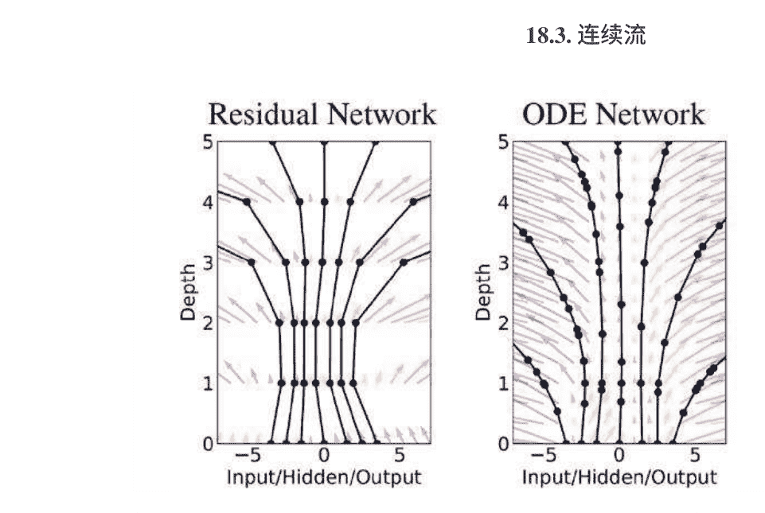
图18.5 传统分层网络与神经微分方程的比较。左侧的图表对应于具有五层的残差网络，并显示了单个标量输入的多个起始值的轨迹。右侧的图表显示了连续神经ODE的数值积分结果，同样是针对标量输入的多个起始值，在这种情况下，我们可以看到函数的评估点不是均匀间隔的，而是由数值求解器自适应选择的，并且取决于输入值的选择。[根据Chen等人(2018)的许可。]

#### 18.3.2 神经ODE反向传播

现在我们需要解决如何训练神经ODE的挑战，即如何通过优化损失函数来确定 $w$ 的值。假设我们有一个数据集，其中包含输入向量 $z(0)$ 的值，以及一个相关的输出目标向量和一个依赖于输出向量 $z(T)$ 的损失函数 $L(\cdot)$。

一种方法是使用自动微分来区分正向传播过程中ODE求解器执行的所有操作。尽管这样做很简单，但从内存的角度来看代价很高，并且在控制数值误差方面并不是最优的。相反，陈等人(2018)将ODE求解器视为黑盒，并使用一种称为伴随灵敏度方法的技术，可以看作是显式反向传播的连续模拟。

回想一下第8章，反向传播包括三个连续的阶段：首先，进行前向传播以评估网络每一层的激活向量；其次，通过利用微积分的链式法则，从输出开始向后传播，计算损失相对于激活的导数；第三，通过将前向传播的激活和反向传播的梯度进行乘积运算，计算相对于网络参数的导数。 我们将看到，在计算神经ODE的梯度时，存在类似的步骤。

为了将反向传播应用于神经ODE，我们定义了一个称为伴随的数量，给定为

$$\mathbf{a}(t) = \frac{dL}{d\mathbf{z}(t)} \tag{18.24}$$

我们可以看到 $a(T)$ 对应于损失相对于输出向量的常规导数。 伴随满足其自己的微分方程，给定为

$$\frac{d\mathbf{a}(t)}{dt} = -\mathbf{a}(t)^T \nabla_{\mathbf{z}} f(\mathbf{z}(t), \mathbf{w}) \tag{18.25}$$

这是微积分链式法则的连续版本。 这可以通过从 $a(T)$ 开始向后积分来解决，这也可以使用黑盒ODE求解器完成。 原则上，这要求我们在正向阶段计算的轨迹 $z(t)$ 中存储，这可能会导致问题，因为逆求解器可能希望在与正向求解器相比的不同的 $t$ 值处评估 $z(t)$。

相反，我们只允许反向求解器重新计算所需的值， 通过与输出值 $z(T)$ 一起从(18.22)和(18.25)开始积分，计算 $z(t)$。

反向传播方法的第三步是通过形成适当的激活和梯度乘积来评估损失对网络参数的导数。 当一个参数值在网络中的多个连接之间共享时，总导数是每个连接的导数之和。 对于我们的神经ODE，其中相同的参数向量 $w$ 被共享在整个网络中，这个求和变成了对 $t$ 的积分，形式为

$$\nabla_{\mathbf{w}} L = - \int_{0}^{T} \mathbf{a}(t)^T \nabla_{\mathbf{w}} f(\mathbf{z}(t), \mathbf{w}) dt. \tag{18.26}$$

可以使用自动微分高效地计算(18.25)中的导数 $\nabla_{\mathbf{z}} f$ 和(18.26)中的导数 $\nabla_{\mathbf{w}} f$ 。 请注意，上述结果同样适用于具有显式依赖于 $t$ 的更一般的神经网络函数 $f(z(t), t, w)$。

使用伴随方法训练的神经ODE与传统的分层网络相比，一个好处是不需要存储前向传播的中间结果，因此内存成本是恒定的。此外，神经ODE可以自然地处理连续时间数据，其中观测发生在任意时间。如果误差函数 $L$ 依赖于除输出值之外的 $z(t)$ 的值，则需要多次运行反向模型求解器，每次运行都针对连续的输出对，以便将单个解分解为多个连续解，以访问中间状态（Chen等人，2018年）。请注意，在训练期间可以使用求解器的高精度，在计算资源有限的应用程序中，在推理期间可以使用较低的精度和较少的函数评估。

#### 18.3.3 神经ODE流

我们可以利用神经常微分方程来定义一种可行的标准化流模型构建方法。神经ODE以形式为的微分方程的方式，将输入向量 $z(0)$ 转换为输出向量 $z(T)$。

$$\frac{dz(t)}{dt} = \mathbf{f}(\mathbf{z}(t), \mathbf{w}). \tag{18.27}$$

如果我们定义一个关于输入向量的基本分布 $p(z(0))$，那么神经ODE会将其向前传播到时间 $t$ 上，为每个 $t$ 值提供一个分布 $p(z(t))$，从而导致一个关于输出向量的分布 $p(z(T))$。陈等人 (2018)表明，对于神经ODE，密度的转换可以通过积分给出一个微分方程。

$$\frac{d \ln p(\mathbf{z}(t))}{dt} = -\mathrm{Tr}\left( \frac{\partial \mathbf{f}}{\partial \mathbf{z}(t)} \right). \tag{18.28}$$

其中 $\partial f/\partial z$ 表示具有元素 $\partial f_i/\partial z_j$ 的Jacobian矩阵。这个积分可以使用标准ODE求解器来执行。同样，可以通过从基本密度 $p(z(0))$ 中采样来获得来自该密度的样本，该基本密度被选择为简单的分布，如高斯分布，并通过使用ODE求解器再次积分(18.27)来传播值到输出。得到的框架被称为连续归一化流，并在图18.6中进行了说明。

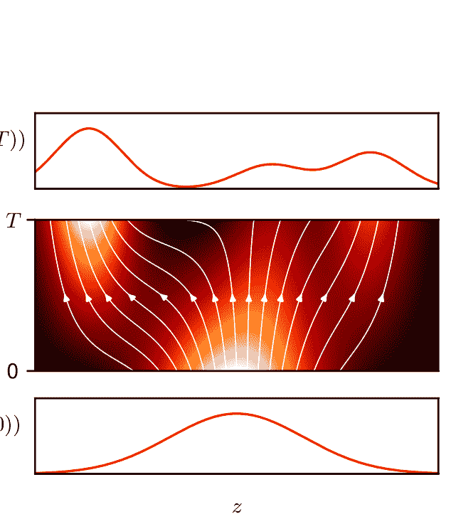
图18.6 连续归一化流的示意图，显示了一个简单的高斯分布在 $t=0$ 时连续转换成一个多峰分布在 $t=T$ 时。流线显示了沿着 $z$ 轴的点随 $t$ 的变化情况。当流线分开时，密度减小，当它们靠近时，密度增加。

使用伴随灵敏度方法训练的正规化流可以用于神经网络ODE（常微分方程），可以看作是反向传播的连续时间等价物。由于 (18.28) 涉及雅可比矩阵的迹而不是行列式，这在离散正规化流中出现，可能看起来更加计算高效。一般来说，计算一个 $D \times D$ 矩阵的行列式需要 $O(D^3)$ 次操作，而计算迹需要 $O(D)$ 次操作。然而，如果行列式是下三角形的，就像许多形式的正规化流一样，那么行列式就是对角元素的乘积，因此也涉及 $O(D)$ 次操作。由于计算雅可比矩阵的各个元素需要单独的前向传播，这本身需要 $O(D)$ 次操作，计算迹或行列式（对于下三角矩阵）的代价是 $O(D^2)$ 次操作。然而，通过使用Hutchinson的迹估计器（Grathwohl等，2018），可以将计算迹的成本降低到 $O(D)$，对于一个矩阵 $A$ 的形式为

$$\mathrm{Tr}(\mathbf{A}) = \mathbb{E}_{\boldsymbol{\epsilon}} \left[ \boldsymbol{\epsilon}^T \mathbf{A} \boldsymbol{\epsilon} \right] \quad (18.29)$$

其中 $\boldsymbol{\epsilon}$ 是一个随机向量，其分布具有零均值和单位协方差，例如，一个高斯分布 $\mathcal{N}(\mathbf{0}, \mathbf{I})$。对于特定的 $\boldsymbol{\epsilon}$，矩阵-向量乘积 $\mathbf{A}\boldsymbol{\epsilon}$ 可以使用反向模式自动微分在单次传递中高效计算。

然后我们可以使用有限数量的样本来近似计算迹的形式

$$\mathrm{Tr}(\mathbf{A}) \simeq \frac{1}{M} \sum_{m=1}^{M} \boldsymbol{\epsilon}_m^T \mathbf{A} \boldsymbol{\epsilon}_m. \quad (18.30)$$

在实践中，我们可以设置 $M=1$，并且只使用一个样本，该样本在每个新数据点时刷新。尽管这是一个嘈杂的估计值，但由于它是嘈杂的随机梯度下降过程的一部分，这可能并不太重要。重要的是它是无偏的，意味着估计器的期望值等于真实值。

使用一种称为流匹配的技术，可以显著提高连续归一化流的训练效率(Lipman et al., 2022)。这第20章将归一化流模型与扩散模型更加接近，并避免了通过积分器进行反向传播的需要，同时显著减少了内存需求，实现了更快的推理和更稳定的训练。

## # 练习

- **18.1** $(\star\star)$ 考虑一个变换$\mathbf{x} = \mathbf{f}(\mathbf{z})$以及它的逆变换$\mathbf{z} = \mathbf{g}(\mathbf{x})$。通过对方程$\mathbf{x} = \mathbf{f}(\mathbf{g}(\mathbf{x}))$进行微分，证明$\mathbf{J}\mathbf{K} = \mathbf{I}$
$$ \mathbf{J}\mathbf{K} = \mathbf{I} \tag{18.31} $$
其中$\mathbf{I}$是单位矩阵，$\mathbf{J}$和$\mathbf{K}$是具有元素的矩阵
$$ J_{ij} = \frac{\partial g_i}{\partial x_j}, \quad K_{ij} = \frac{\partial f_i}{\partial z_j}. \tag{18.32} $$
利用矩阵乘积的行列式等于它们的行列式的乘积的结果，证明
$$ \det(\mathbf{J}) = \frac{1}{\det(\mathbf{K})}. \tag{18.33} $$
因此，证明密度变换的公式 (18.1) 可以重写为
$$ p_{\mathbf{x}}(\mathbf{x}) = p_{\mathbf{z}}(\mathbf{g}(\mathbf{x})) \vert\det \mathbf{K}\vert^{-1} \tag{18.34} $$
其中$\mathbf{K}$在$\mathbf{z} = \mathbf{g}(\mathbf{x})$处求值。

- **18.2** $(\star)$ 考虑一个形式为可逆变换序列的情况
$$ \mathbf{x} = \mathbf{f}_1(\mathbf{f}_2(\cdots \mathbf{f}_{M-1}(\mathbf{f}_M(\mathbf{z}))\cdots)). \tag{18.35} $$
证明逆函数为
$$ \mathbf{z} = \mathbf{f}_M^{-1}(\mathbf{f}_{M-1}^{-1}(\cdots \mathbf{f}_2^{-1}(\mathbf{f}_1^{-1}(\mathbf{x}))\cdots)). \tag{18.36} $$

- **18.3** $(\star)$ 考虑一个形式为线性变量变换的情况
$$ \mathbf{x} = \mathbf{z} + \mathbf{b}. \tag{18.37} $$
证明该变换的雅可比矩阵为单位矩阵。通过比较$\mathbf{z}$空间中一个小区域的体积与对应的$\mathbf{x}$空间中的体积，解释这个结果。

- **18.4** $(\star\star)$ 证明自回归归一化流变换的雅可比矩阵（由**(18.18)**给出）是一个下三角矩阵。这样一个矩阵的行列式由主对角线上的项的乘积给出，因此很容易计算。

- **18.5** $(\star)$ 考虑由**(18.21)**给出的残差网络的前向传播方程，在其中我们考虑一个小的增量$\epsilon$在'time'变量$t$中：
$$ \mathbf{z}^{(t+\epsilon)} = \mathbf{z}^{(t)} + \epsilon \mathbf{f}(\mathbf{z}^{(t)}, \mathbf{w}). \tag{18.38} $$

- **18.6** $(\star)$ 在这个练习和下一个练习中，我们提供了神经ODE的反向传播和梯度计算方程的非正式推导。这些结果的更正式推导可以在Chen等人（2018）中找到。写出与正向方程（18.38）对应的反向传播方程。通过取极限 $\epsilon \to 0$，推导出反向传播方程（18.25），其中 $\mathbf{a}(t)$ 由（18.24）定义。

- **18.7** $(\star)$ 利用结果（8.10），写出由（18.38）定义的多层残差网络的损失函数 $L(\mathbf{z}(T))$ 的梯度的表达式，其中所有层共享相同的参数向量 $\mathbf{w}$。通过取极限 $\epsilon \to 0$，推导出损失函数的导数方程（18.26）。

- **18.8** $(\star\star)$ 在这个练习中，我们对一维分布的(18.28)进行了非正式的推导。考虑一个在时间 $t$ 的分布 $q(z)$，通过从 $z$ 到 $x$ 的转换，在时间 $t + \delta t$ 时转换为一个新的分布 $q(x)$。同时考虑附近的值 $z$ 和 $z+\Delta z$ 以及相应的值 $x$ 和 $x+\Delta x$，如图18.7所示。首先，写出一个方程，表达出区间 $\Delta z$ 中的概率质量与区间 $\Delta x$ 中的概率质量相同。其次，写出一个方程，显示在从 $t$ 到 $t+\delta t$ 的过程中概率密度如何变化，用导数 $\mathrm{d}q(t)/\mathrm{d}t$ 表示。第三，通过引入函数 $f(z) = \mathrm{d}z/\mathrm{d}t$，用 $\Delta z$ 来表示 $\Delta x$ 的方程。最后，通过结合这三个方程并取极限 $\delta t \to 0$，证明
$$\frac{\mathrm{d}}{\mathrm{d}t} \ln q(z) = -f'(z), \tag{18.39}$$
这是(18.28)的一维版本。

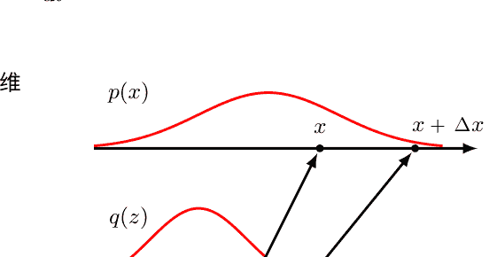
图18.7 概率密度变换的示意图，用于推导一维连续归一化流的方程。

- **18.9** $(\star)$ 图18.6中的流线是通过取一组等间距的值，并在每个 $t$ 值处使用累积分布函数的逆函数来绘制相应的 $z$ 空间点。证明这等价于使用微分方程(18.27)计算流线，其中 $f$ 由(18.28)定义。

- **18.10** $(\star)$ 使用微分方程(18.27)写出连续归一化流的基本密度表达式，以输出密度的积分形式表示。因此，通过利用定积分改变符号等价于交换该定积分的上下限的事实，证明反转连续归一化流的计算成本与评估正向流所需的计算成本相同。

- **18.11** $(\star)$ 证明 Hutchinson 迹估计器(18.30) 右侧期望值等于 Tr(A)，对于任意的 M 值。这表明估计器是无偏的。

## # 19 自编码器

深度学习的一个核心目标是发现对于一个或多个后续应用有用的数据表示。学习内部表示的一个成熟方法被称为自联想神经网络或自编码器。这个网络的输出单元数与输入单元数相同，并且被训练成生成一个接近输入 $x$ 的输出 $y$。一旦训练完成，神经网络内部的一个隐藏层给出了一个表示 $z(x)$ 的新输入。这样的网络可以看作是由两部分组成。第一部分是一个编码器，将输入 $x$ 映射到隐藏表示 $z(x)$，第二部分是一个解码器，将隐藏表示映射到输出 $y(z)$。

如果自动编码器要找到非平凡的解决方案，就有必要引入一些形式的约束，否则网络可以简单地将输入值复制到输出中。例如，可以通过限制 $z$ 的维度相对于 $x$ 的维度或要求 $z$ 具有稀疏表示来实现这种约束。

表达。或者，可以通过修改训练过程来强制网络发现非平凡的解决方案，使网络必须学习如何撤消输入向量的损坏，例如添加噪声或缺失值。这些约束鼓励网络在数据中发现有趣的结构，以实现良好的训练性能。

在这一章中，我们从确定性自编码器开始，然后推广到学习编码器分布 p(z|x)以及解码器分布 p(y|z)的随机模型。这些概率模型被称为变分自编码器，代表了我们学习非线性的四种方法中的第三种第16.4.4节潜变量模型。

### 19.1 确定性自编码器

当我们学习主成分分析 (PCA) 时，我们遇到了一种简单形式的自编码器。第161节 这是一种将输入向量线性变换到低维流形的模型，而得到的投影可以通过线性变换近似地重构成原始数据空间。我们可以利用神经网络的非线性性质来定义一种非线性PCA的形式，其中潜在流形不再是数据空间的线性子空间。这是通过使用与输入相同数量的输出的网络，并通过优化权重来最小化输入和输出之间的重构误差的某种度量，以及一组训练数据来实现的。

简单的自编码器在现代深度学习中很少直接使用，因为它们在潜在空间中不能提供语义上有意义的表示，并且不能直接从数据分布中生成新的示例。然而，它们为一些更强大的深度生成模型 (如变分自编码器) 提供了重要的概念基础。

#### 19.1.1 线性自编码器

首先考虑一个多层感知器，其形式如图19.1所示，具有D个输入，D个输出单元和 M个隐藏单元，其中 M < D。用于训练网络的目标只是输入向量本身，因此网络试图将每个输入向量映射到其自身。这样的网络被称为自联想映射。由于隐藏单元的数量小于输入的数量，一般情况下无法完美重构所有输入向量。因此，我们通过最小化损失函数来确定网络参数 w，该损失函数衡量输入向量与其重构之间的不匹配程度。

特别是，我们选择了一个形式为平方和的误差

$$E(w) = \frac{1}{2} \sum_{n=1}^{N} \|y(x_n, w) - x_n\|^2. \quad (19.1)$$

如果隐藏单元具有线性激活函数，则可以证明误差函数具有唯一的全局最小值，并且在这个最小值处网络执行对第一个 $M$ 维子空间的投影，该子空间由数据的前 $M$ 个主成分张成（Bourlard和Kamp，1988年；Baldi和Hornik，1989年）。因此，在图19.1中导入隐藏单元的权重向量形成了一个张成主子空间的基向量集。然而，请注意这些向量不一定是正交或归一化的。这个结果并不令人惊讶，因为PCA和神经网络都依赖于线性降维，并最小化相同的平方和误差函数。

人们可能认为，在图19.1中，通过在网络的隐藏单元中使用非线性激活函数可以克服线性流形的限制。然而，即使使用非线性隐藏单元，最小误差解仍然是投影到主成分子空间上的解（Bourlard和Kamp，1988年）。因此，使用两层神经网络进行降维没有任何优势。基于奇异值分解（SVD）的标准PCA技术保证在有限时间内给出正确的解，并且它们还生成一组有序的特征值和相应的正交特征向量。

#### 19.1.2 深度自编码器

然而，如果在网络中包含额外的非线性层，则情况就不同了。考虑图19.2中显示的四层自联想网络。再次，输出单元是线性的，第二层中的 $M$ 个单元也可以是线性的。然而，第一层和第三层具有S型非线性激活函数。该网络再次通过最小化误差函数（19.1）进行训练。我们可以将这个网络看作是两个连续的函数映射 $F_1$ 和 $F_2$，如图19.2所示。第一个映射 $F_1$ 将原始的 $D$ 维数据投影到由第二层单元的激活定义的 $M$ 维子空间 $S$ 中。由于第一层的非线性单元，这个映射非常通用，不限于线性。类似地，网络的后半部分定义了一个从 $M$ 维隐藏空间到原始 $D$ 维输入空间的任意函数映射。这在几何上有一个简单的解释，如图19.3所示，其中 $D=3$ 和 $M=2$。

这样的网络有效地执行了一种非线性的PCA形式。它的优势在于不受线性变换的限制，尽管它包含了标准的PCA作为一种特殊情况。然而，现在训练网络涉及到非线性优化，因为误差函数（19.1）不再是网络参数的二次函数。需要使用计算密集型的非线性优化技术，并且存在找到子优化局部最小值的风险。此外，在训练网络之前必须指定子空间的维数。

图19.2 添加额外的非线性单元隐藏层会产生一个自编码网络，可以进行非线性降维。

#### 19.1.3 稀疏自编码器

在网络的一个隐藏层中限制节点数量的替代方法是使用正则化器来鼓励稀疏表示，从而降低有效维数。第922节 一个简单的选择是 L₁ 正则化器，因为它鼓励稀疏性，给出一个形式的正则化误差函数

$$\widetilde{E}(\mathbf{w}) = E(\mathbf{w}) + \lambda \sum_{k=1}^{K} |z_k| \qquad\qquad\qquad (19.2)$$

其中 $E(\mathbf{w})$是未正则化的误差，对 $k$的求和是对一个隐藏层中所有单元的激活值进行的。请注意，正则化通常应用于网络的参数，而这里是在单元激活上使用。用于梯度下降训练所需的导数可以使用自动微分来计算，与通常情况下相同。

#### 19.1.4 去噪自编码器

我们已经看到了在简单的自动编码器中限制潜在空间层的维度的重要性，以避免模型仅仅学习身份映射。另一种方法是使用去噪自动编码器（Vincent等人, 2008年），这也迫使模型发现数据中的有趣的内部结构。

这个想法是对每个输入向量 $\mathbf{x}_n$进行噪声污染，得到一个修改后的向量 $\widetilde{\mathbf{x}}_n$，然后将其输入到自动编码器中得到一个输出 $\mathbf{y}(\widetilde{\mathbf{x}}_n, \mathbf{w})$。网络通过最小化诸如平方和的误差函数来训练，以重构原始无噪声的输入向量。

$$E(\mathbf{w}) = \sum_{n=1}^{N} \|\mathbf{y}(\widetilde{\mathbf{x}}_n, \mathbf{w}) - \mathbf{x}_n\|^2. \qquad\qquad\qquad (19.3)$$

一种噪声形式是将随机选择的一部分输入变量设置为零。这样的输入的比例 $\nu$表示噪声水平，并且位于范围内。

另一种方法是向每个输入变量添加独立的零均值高斯噪声，其中噪声的尺度由高斯的方差确定。通过学习去噪输入数据，网络被迫学习该数据的结构特征。例如，如果数据包含图像，则学习附近像素值之间的强相关性可以纠正受噪声影响的像素。

更正式地说，去噪自编码器的训练与评分匹配（Vincent, 2011）相关，其中评分由 $\nabla_{\mathbf{x}} \ln p(\mathbf{x})$定义。图19.4给出了这种关系的一些直觉解释。自编码器学习反转失真向量 $\widetilde{\mathbf{x}}_n - \mathbf{x}_n$，因此学习了数据空间中每个点的向量，该向量指向流形并指向高数据密度区域。评分向量 $\nabla_{\mathbf{x}} \ln p(\mathbf{x})$同样是指向高数据密度区域的向量。当我们讨论扩散模型时，我们将更深入地探讨评分匹配和去噪之间的关系，扩散模型也学习从受噪声影响的输入中去除噪声。

#### 19.1.5 掩码自编码器

我们已经看到，像BERT这样的转换器模型可以通过自监督学习通过遮盖随机的方式学习自然语言的丰富内部表示第122节 输入的子集，自然而然地会想知道是否可以将类似的方法应用于自然图像。在掩码自编码器(He et al., 2021)中，使用深度网络来重建给定输入图像的被破坏版本，类似于去噪自编码器。然而，在这种情况下，破坏的形式是遮盖或删除输入图像的一部分。这种技术通常与视觉转换器架构结合使用，因为在这种情况下，通过仅传递随机选择的输入补丁子集到编码器中，可以轻松实现输入的部分遮盖。整个算法在图19.5中概述。与语言相比，图像具有更多的冗余性和强烈的局部相关性。从句子中省略一个单词可能会极大地增加歧义，而从图像中删除一个随机补丁通常对图像的语义影响不大。毫不奇怪，当输入图像的相对比例被遮盖时，学习到的最佳内部表示通常是75%，而BERT的遮盖比例为15%。在BERT中，遮盖的输入被替换为固定的遮盖标记，而在掩码自编码器中，遮盖的补丁被简单地省略。通过省略大部分输入补丁，我们可以节省大量计算量，特别是对于输入序列长度的训练实例所需的计算量，因此使掩码自编码器成为预训练大型转换器编码器的良好选择。

由于解码器层也是一个变压器，它需要在原始图像的维度中工作。由于变压器的输出与输入具有相同的维度，我们需要在编码器的输出和解码器的输入之间恢复图像的维度。这是通过恢复被固定掩码令牌向量表示的掩码补丁，并通过位置编码信息增强每个补丁令牌来实现的。由于解码器表示的维度要高得多，解码器变压器的可学习参数比编码器少得多。解码器的输出后面跟着一个可学习的线性层将输出表示映射到像素值空间，并且训练误差函数只是对每个图像的缺失补丁的均方误差的平均。经过训练的掩蔽自编码器重建的图像示例显示在图19.6中，并展示了训练自编码器生成语义上合理的重建的能力。然而，最终目标是学习有用的内部表示，以便进行后续的下游任务，为此，解码器被丢弃，编码器被应用于完整的图像，没有掩蔽，并且使用一组新的输出层进行微调，以适应所需的应用。

还要注意，尽管该算法最初是为图像数据设计的，但理论上可以应用于任何模态。

图19.5 训练阶段的掩码自编码器架构。请注意，目标是输入的补集，因为损失仅应用于掩码补丁。训练后，解码器被丢弃，编码器用于将图像映射到内部表示，以在下游任务中使用。

### 19.2 变分自编码器

我们已经看到，给定潜变量模型的似然函数由

$$p(\mathbf{x}|\mathbf{w}) = \int p(\mathbf{x}|\mathbf{z}, \mathbf{w}) p(\mathbf{z}) \, \mathrm{d}\mathbf{z}, \quad (19.4)$$

给出。第153节

VAE（Kingma和Welling，2013; Rezende，Mohamed和Wierstra，2014; Doer-sc h，2016; Kingma和Welling，2019）在训练模型时使用对这个似然的近似。V AE中有三个关键思想：(i) 使用证据下界（ELBO）来近似似然函数，从而与EM算法有密切关系，(ii) 摊余推理其中第二个模型，编码器网络，用于近似E步中潜变量的后验分布，而不是为每个数据点准确评估后验分布，并且 (iii) 使用重参数化技巧使编码器模型的训练变得可行。

第154节

考虑一个具有条件分布 p(x|z, w) over的生成模型 由深度神经网络g(z, w)的输出控制的D维数据变量 x。例如，g(z,w)可能表示高斯条件分布的均值。还要考虑一个由零均值单位方差高斯分布给出的M维潜变量z的分布：

$$p(z) = \mathcal{N}(z|0, I). \quad (19.5)$$

为了推导VAE近似，首先回忆一下，对于一个由潜变量z描述的空间上的任意概率分布 q(z) over，以下关系成立：

$$\ln p(x|w) = \mathcal{L}(w) + \text{KL}(q(z)||p(z|x,w)) \quad (19.6)$$

其中 $\mathcal{L}$是证据下界，也称为变分下界，由以下给出：

$$\mathcal{L}(w) = \int q(z) \ln \left\{ \frac{p(x|z, w) p(z)}{q(z)} \right\} dz \quad (19.7)$$

而Kullback–Leibler散度KL (·||·)由以下定义

$$ \text{KL} (q(\mathbf{z})\|p(\mathbf{z}|\mathbf{x}, \mathbf{w})) = -\int q(\mathbf{z}) \ln \left\{ \frac{p(\mathbf{z}|\mathbf{x}, \mathbf{w})}{q(\mathbf{z})} \right\} \, d\mathbf{z}. \quad (19.8) $$

由于Kullback–Leibler散度满足KL (q\|p) ≥ 0，因此

$$ \ln p(\mathbf{x}|\mathbf{w}) \geq \mathcal{L} \quad (19.9) $$

因此 $\mathcal{L}$ 是 $\ln p(\mathbf{x}|\mathbf{w})$ 的一个下界。尽管对数似然函数 $\ln p(\mathbf{x}|\mathbf{w})$ 是难以计算的，但我们将看到如何使用蒙特卡罗估计来评估下界。因此，它提供了对真实对数似然函数的近似。

现在考虑一组训练数据点 $\mathcal{D} = \{\mathbf{x}_1, \ldots, \mathbf{x}_N\}$，这些数据点被假设独立地从模型分布 $p(\mathbf{x})$ 中抽取。该数据集的对数似然函数如下所示

$$ \ln p(\mathcal{D}|\mathbf{w}) = \sum_{n=1}^N \mathcal{L}_n + \sum_{n=1}^N \text{KL} (q_n(\mathbf{z}_n)\|p(\mathbf{z}_n|\mathbf{x}_n, \mathbf{w})) \quad (19.10) $$

其中

$$ \mathcal{L}_n = \int q_n(\mathbf{z}_n) \ln \left\{ \frac{p(\mathbf{x}_n|\mathbf{z}_n, \mathbf{w}) p(\mathbf{z}_n)}{q_n(\mathbf{z}_n)} \right\} \, d\mathbf{z}_n. \quad (19.11) $$

请注意，这引入了一个独立的潜在变量 $\mathbf{z}_n$，对应于每个数据就像我们在混合模型和概率PCA模型中看到的那样。因此，每个潜在变量都有自己独立的分布 $q_n(\mathbf{z}_n)$，每个都可以单独优化。

由于(19.10)对于任意选择的分布 $q_n(\mathbf{z})$ 都成立，我们可以选择最大化界 $\mathcal{L}_n$ 的分布，或者等效地选择最小化Kullback-Leibler散度KL $(q_n(\mathbf{z}_n)\|p(\mathbf{z}_n|\mathbf{x}_n, \mathbf{w}))$。对于之前考虑的简单的高斯混合模型和概率PCA模型，我们能够在EM算法的E步骤中准确评估这些后验分布，这对应于将每个 $q_n(\mathbf{z}_n)$ 设置为相应的后验分布 $p(\mathbf{z}_n|\mathbf{x}_n, \mathbf{w})$。这导致零Kullback-Leibler散度，因此下界等于真实对数似然。通过简单的例子在图19.7中说明了后验分布的解释，该例子在之前的第1641节中引入，在生成对抗网络的背景下进行。

根据贝叶斯定理，精确的后验分布 $\mathbf{z}_n$ 由以下公式给出

$$ p(\mathbf{z}_n|\mathbf{x}_n, \mathbf{w}) = \frac{p(\mathbf{x}_n|\mathbf{z}_n, \mathbf{w}) p(\mathbf{z}_n)}{p(\mathbf{x}_n|\mathbf{w})}. \quad (19.12) $$

对于我们的深度生成模型，分子部分很容易计算。然而，我们可以看到分母由似然函数给出，正如我们已经注意到的，似然函数是难以处理的。因此，我们需要找到后验分布的近似值。原则上，我们可以考虑为每个分布 $q_n(\mathbf{z}_n)$ 建立一个单独的参数化模型，并对每个模型进行数值优化。

图19.7对与图16.13中所示的相同模型的后验分布进行评估。边缘分布 p(x)在（b）中最右边的图中呈香蕉形状，而特定数据点 x*更接近形状的两个尖端而不是中间部分。因此，后验分布 p(z|x*)在（a）中呈双峰分布，即使先验分布 p(z)是单峰分布的。[基于Prince (2020)的许可]

但是这样做在计算上非常昂贵，特别是对于大数据集，而且此外，我们还需要在每次更新 w后重新评估分布。相反，我们现在转向另一种基于引入第二个神经网络的更高效的近似框架。

#### 19.2.1 摊销推断

在变分自编码器中，我们不再尝试为每个数据点x_n单独评估一个独立的后验分布 p(z_n | x_n, w)，而是训练一个单一的神经网络，称为编码器网络，来近似所有这些分布。

这种技术被称为摊销推理，需要一个产生单一分布 q(z|x, φ)的编码器，该分布是基于 x条件的，其中 φ表示网络的参数。给定由证据下界给出的目标函数，现在它既依赖于 φ也依赖于 w，我们使用基于梯度的优化方法来同时最大化这个界限与两组参数相关。

因此，VAE由两个具有独立参数但联合训练的神经网络组成：一个编码器网络将数据向量映射到潜在空间，一个原始网络将潜在空间向量映射回数据空间，因此我们可以将其解释为一个解码器网络。这类似于简单的神经网络自编码器模型，只是我们现在在潜在空间上定义了一个概率分布。我们将看到编码器根据贝叶斯定理计算解码器的近似概率逆。

编码器的典型选择是具有对角协方差矩阵的高斯分布，其均值和方差参数 μ_j和 σ_j^2由以下公式给出

神经网络以 x 为输入的输出：

$$q(\mathbf{z}|\mathbf{x}, \phi) = \prod_{j=1}^{M} \mathcal{N} \left( z_j | \mu_j(\mathbf{x}, \phi), \sigma_j^2(\mathbf{x}, \phi) \right). \qquad (19.13)$$

请注意，均值 $\mu_j(\mathbf{x}, \phi)$ 位于范围 $(-\infty, \infty)$ 内，因此相应的输出单元激活函数可以是线性的，而方差 $\sigma_j^2(\mathbf{x}, \phi)$ 必须是非负的，因此相关的输出单元通常使用 $\exp(\cdot)$ 作为它们的激活函数。

目标是使用基于梯度的优化方法来最大化边界，同时针对参数集 $\phi$ 和 $\mathbf{w}$ 进行优化，通常使用基于小批量的随机梯度下降。尽管我们同时优化参数，但从概念上讲，我们可以想象在优化 $\phi$ 和优化 $\mathbf{w}$ 之间交替进行，类似于EM算法，如图19.8所示。

与EM算法相比，一个关键的区别是，在给定 $\mathbf{w}$ 的情况下，针对编码器参数 $\phi$ 进行优化通常不能将Kullback-Leibler散度减小到零，因为编码器网络不是后验潜在分布的完美预测器，因此在下界和真实对数似然之间存在残差差距。尽管编码器非常灵活，因为它基于深度神经网络，但不应期望它能完全建模真实的后验分布，因为（i）真实的条件后验分布不会图19.9 EM算法与VAE中的ELBO优化的比较。(a) 在EM算法中，我们在E步骤中更新变分后验分布，在M步骤中更新模型参数。当E步骤精确时，每次E步骤后，下界和对数似然之间的差距将减少到零。(b) 在VAE中，我们对编码器网络参数 φ（类似于E步骤）和解码器网络参数 w（类似于M步骤）进行联合优化。

一个因子化的高斯分布，(ii) 即使是一个大型神经网络也有有限的灵活性，以及(iii) 训练过程只是一个近似优化。EM算法和ELBO优化之间的关系总结在图19.9中。

#### 19.2.2 重参数化技巧

不幸的是，目前来看，下界（19.11）仍然难以计算，因为它涉及到对潜在变量 {z_n} 的积分，其中被积函数对潜在变量具有复杂的依赖关系，因为解码器网络的缘故。
对于数据点 x_n，我们可以将其对下界的贡献写成以下形式

$$ \mathcal{L}_n(\mathbf{w}, \phi) = \int q(\mathbf{z}_n | \mathbf{x}_n, \phi) \ln \left\{ \frac{p(\mathbf{x}_n | \mathbf{z}_n, \mathbf{w}) p(\mathbf{z}_n)}{q(\mathbf{z}_n | \mathbf{x}_n, \phi)} \right\} d\mathbf{z}_n $$

$$ = \int q(\mathbf{z}_n | \mathbf{x}_n, \phi) \ln p(\mathbf{x}_n | \mathbf{z}_n, \mathbf{w}) d\mathbf{z}_n - \text{KL}(q(\mathbf{z}_n | \mathbf{x}_n, \phi) \| p(\mathbf{z}_n)). \quad (19.14) $$

右侧的第二项是两个高斯分布之间的Kullback-Leibler散度，可以通过解析方法进行评估：

$$ \text{KL} (q(\mathbf{z}_n | \mathbf{x}_n, \phi) \| p(\mathbf{z}_n)) = \frac{1}{2} \sum_{j=1}^{M} \left\{ 1 + \ln \sigma_j^2(\mathbf{x}_n) - \mu_j^2(\mathbf{x}_n) - \sigma_j^2(\mathbf{x}_n) \right\}. \quad (19.15) $$

## 19.2. 变分自编码器

对于(19.14)中的第一项，我们可以尝试用简单的蒙特卡罗估计器来近似对 z_n 的积分：

$$\int q(\mathbf{z}_n|\mathbf{x}_n, \phi) \ln p(\mathbf{x}_n|\mathbf{z}_n, \mathbf{w}) \mathrm{d}\mathbf{z}_n \simeq \frac{1}{L} \sum_{l=1}^{L} \ln p(\mathbf{x}_n|\mathbf{z}_n^{(l)}, \mathbf{w}) \quad (19.16)$$

其中 {\mathbf{z}_n^{(l)}} 是从编码器分布 q(\mathbf{z}_n|\mathbf{x}_n, \phi) 中抽取的样本。这个式子对 \mathbf{w} 的导数很容易计算，但对 \phi 的导数是有问题的，因为对 \phi 的改变会改变从中抽取样本的分布 q(\mathbf{z}_n|\mathbf{x}_n, \phi)，而这些样本是固定值，所以我们无法获得这些样本对 \phi 的导数。从概念上讲，我们可以将 \mathbf{z}_n 固定为特定的样本值的过程看作是阻止误差信号向编码器网络反向传播的过程，如图19.10所示。我们可以通过使用重参数化技巧来解决这个问题，通过重新构建蒙特卡罗采样过程，可以明确计算对 \phi 的导数。首先，注意如果 \epsilon 是一个均值为零，方差为一的高斯随机变量，则该数量

$$z = \sigma \epsilon + \mu \quad (19.17)$$

> 练习19.2

将具有高斯分布，均值为 \mu，方差为 \sigma^2。我们现在应用这个对于由编码器网络的输出 \mu_j(\mathbf{x}_n, \phi) 和 \sigma_j^2(\mathbf{x}_n, \phi) 定义的分布(19.13)中的样本(19.16)，我们不再直接抽取 \mathbf{z}_n 的样本，而是抽取 \epsilon 的样本，并使用(19.17)来评估相应的 \mathbf{z}_n 的样本：

$$z_{n,j}^{(l)} = \mu_j(\mathbf{x}_n, \phi) \epsilon_{n,j}^{(l)} + \sigma_j(\mathbf{x}_n, \phi) \quad (19.18)$$

其中 l=1,...,L 索引样本。这使得对 \phi 的依赖变得明确，并且可以评估对 \phi 的梯度，如图19.11所示。重参数化技巧可以扩展到其他分布，但仅限于连续变量。有一些技术可以直接评估梯度，而无需使用重参数化技巧(Williams, 1992)，但这些估计器具有很高的方差，因此重参数化也可以被视为一种方差减少技术。

VAE的完整误差函数，使用我们的特定建模假设，因此变为

$$\mathcal{L} = \sum_{n} \left\{ \frac{1}{2} \sum_{j=1}^{M} \left\{ 1 + \ln \sigma_{n,j}^2 - \mu_{n,j}^2 - \sigma_{n,j}^2 \right\} + \frac{1}{L} \sum_{l=1}^{L} \ln p(\mathbf{x}_n|\mathbf{z}_n^{(l)}, \mathbf{w}) \right\} \quad (19.19)$$

其中 z_n^{(l)} 具有分量 z_{nj}^{(l)} = σ_{nj} ϵ^{(l)} + μ_{nj}, 其中 μ_{nj} = μ_j(x_n, ϕ) 和 σ_{nj} = σ_j(x_n, ϕ), 而(19.19)中对 n 的求和是在一个小批量数据点上进行的。每个数据点 x_n 的样本数 L 通常设置为 1, 因此仅使用一个样本。尽管这会给出一个嘈杂的界限估计, 但它是随机梯度优化步骤的一部分, 该步骤已经是嘈杂的, 并且总体上导致更高效的优化。

我们可以将VAE训练总结如下。对于小批量中的每个数据点, 通过编码器网络进行前向传播, 评估近似潜在分布的均值和方差, 使用重参数化技巧从该分布中采样, 然后将这些样本通过解码器网络进行传播, 评估ELBO (19.19)。然后使用自动微分计算相对于 w 和 ϕ 的梯度。VAE训练总结如算法19.1所示, 为了清晰起见, 我们省略了通常使用小批量进行训练的步骤。模型训练完成后, 编码器网络被丢弃, 通过从先验分布 p(z) 中采样并通过解码器网络进行前向传播, 生成数据空间中的样本。

### 第10.5.3节

训练完成后, 我们可能希望评估模型对新的测试点 x 的表示效果。由于对数似然函数难以计算, 我们可以使用下界 L 作为近似。为了估计这个下界, 我们可以从条件分布 q(z|x, ϕ) 中进行采样, 因为这样可以得到更准确的估计, 而不是从先验分布 p(z) 中进行采样。

VAE的变体有很多。当应用于图像数据时, 编码器通常基于卷积, 解码器基于转置卷积。

在条件VAE中, 编码器和解码器都会接受一个条件变量 c 作为额外的输入。例如, 我们可能想要生成物体的图像, 其中 c 表示物体类别。潜在空间的先验分布 p(z) 可以是简单的高斯分布, 也可以是由另一个神经网络给出的条件分布 p(z|c)。训练和测试与以前一样进行。

> 请注意, ELBO (19.14) 中的第一项鼓励编码器分布 q(z|x,ϕ) 接近先验分布 p(z), 因此当训练好的模型通过从 p(z) 中采样来生成输出时, 解码器模型会被鼓励产生逼真的输出。
在训练VAE时, 可能会出现一个问题, 即变分分布 q(z|x,ϕ) 收敛到先验分布 p(z), 因此变得不具有信息性, 因为它不再依赖于 x。实际上, 潜在编码变得无关紧要。在ELBO中, 第一项鼓励编码器分布 q(z|x,ϕ) 接近先验分布 p(z), 因此当训练好的模型通过从 p(z) 中采样来生成输出时, 解码器模型会被鼓励产生逼真的输出。

## 19.2. 变分自编码器

**算法 19.1: 变分自编码器训练**

| 输入：训练数据集 $\mathcal{D} = \{\mathbf{x}_1, \ldots, \mathbf{x}_N\}$ |
| 编码器网络 $\{\mu_j(\mathbf{x}_n, \boldsymbol{\phi}), \sigma_j^2(\mathbf{x}_n, \boldsymbol{\phi})\}, \quad j \in \{1, \ldots, M\}$ |
| 解码器网络 $\mathbf{g}(\mathbf{z}, \mathbf{w})$ |
| 初始权重向量 $\mathbf{w}, \boldsymbol{\phi}$ |
| 学习率 $\eta$ |
| 输出：最终权重向量 $\mathbf{w}, \boldsymbol{\phi}$ |

---

重复
$\mathcal{L} \leftarrow 0$
对于 $j \in \{1, \ldots, M\}$ 执行
$\epsilon_{nj} \sim \mathcal{N}(0, 1)$
$z_{nj} \leftarrow \mu_j(\mathbf{x}_n, \boldsymbol{\phi}) + \epsilon_{nj} \sigma_j(\mathbf{x}_n, \boldsymbol{\phi})$
$\mathcal{L} \leftarrow \mathcal{L} + \frac{1}{2} \left\{ 1 + \ln \sigma_{nj}^2 - \mu_{nj}^2 - \sigma_{nj}^2 \right\}$
结束循环
$\mathcal{L} \leftarrow \mathcal{L} + \ln p(\mathbf{x}_n|\mathbf{z}_n, \mathbf{w})$
$\mathbf{w} \leftarrow \mathbf{w} + \eta \nabla_{\mathbf{w}} \mathcal{L}$ // 更新解码器权重
$\boldsymbol{\phi} \leftarrow \boldsymbol{\phi} + \eta \nabla_{\boldsymbol{\phi}} \mathcal{L}$ // 更新编码器权重
直到收敛
返回 $\mathbf{w}, \boldsymbol{\phi}$

未收敛。这被称为后验崩溃。这种情况的症状是，如果我们将输入编码然后解码，我们得到一个模糊的重建。在这种情况下，Kullback-Leibler 散度 KL($q(\mathbf{z}|\mathbf{x}, \boldsymbol{\phi}) || p(\mathbf{z})$)接近于零。

另一个问题是当潜在代码没有被压缩时，重建结果非常准确，但是通过对解码器网络进行采样生成的输出质量很差，不像训练数据。在这种情况下，Kullback-Leibler 散度相对较大，因为训练系统的变分分布与先验分布非常不同，来自先验分布的样本无法生成真实的输出。

通过在(19.14)中的第一项前引入一个系数 $\beta$，可以解决这两个问题，以控制Kullback-Leibler散度的正则化效果，通常$\beta > 1$(Higgins等人，2017)。如果重构结果不好，则可以增加 $\beta$，而如果样本不好，则可以减小 $\beta$。可以根据一个退火计划来设置 $\beta$的值，在训练过程中逐渐增加。

最后，注意我们考虑了一个解码器网络 $\mathbf{g}(\mathbf{z}, \mathbf{w})$，表示高斯输出分布的均值。我们可以扩展VAE，包括表示高斯方差或其他更复杂分布的参数的输出。

### 练习

**19.1** $(\star\star)$证明对于任意分布 $q(\mathbf{z}|\phi)$和任意函数 $G(\mathbf{z})$，以下关系成立：

$$
\nabla_{\phi} \int q(\mathbf{z}|\phi) G(\mathbf{z}) \,\mathrm{d}\mathbf{z} = \int q(\mathbf{z}|\phi) G(\mathbf{z}) \nabla_{\phi} \ln q(\mathbf{z}|\phi) \,\mathrm{d}\mathbf{z}.
\quad\quad\quad\quad\quad (19.20)
$$

因此，证明(19.20)的左侧可以用以下蒙特卡洛估计来近似：

$$
\nabla_{\phi} \int q(\mathbf{z}|\phi) G(\mathbf{z}) \,\mathrm{d}\mathbf{z} \simeq \sum_{i} G(\mathbf{z}^{(i)}) \nabla_{\phi} \ln q(\mathbf{z}^{(i)}|\phi)
\quad\quad\quad\quad\quad (19.21)
$$

其中样本 $\{\mathbf{z}^{(i)}\}$是独立地从分布 $q(\mathbf{z}|\phi)$中抽取的。验证这个估计量是无偏的，即在样本的分布上对右侧(19.21)的平均值等于左侧。原则上，通过设置 $G(\mathbf{z}) = p(\mathbf{x}|\mathbf{z}, \mathbf{w})$，这个结果将允许计算(19.14)右侧第二项对 $\phi$的梯度，而不需要使用重新参数化技巧。此外，由于这种方法是无偏的，在无限数量的样本情况下将给出精确答案。然而，重新参数化技巧更高效，意味着需要更少的样本来获得良好的准确性，因为它直接计算了变化量。

$p(\mathbf{x}|\mathbf{z}, \mathbf{w})$由于 $\mathbf{z}$的变化导致 $\phi$的变化。

**19.2** $(\star)$验证如果 $\epsilon$ 具有零均值单位方差的高斯分布，则(19.17)中的变量 $z$ 将具有均值为 $\mu$、方差为 $\sigma^2$ 的高斯分布。

**19.3** $(\star\star)$在这个练习中，我们将对角协方差VAE编码器网络（19.13）扩展为具有一般协方差矩阵的网络。考虑一个 $K$维随机向量从一个简单的高斯分布中抽取：

$$
\epsilon \sim \mathcal{N}(\mathbf{z}|\mathbf{0}, \mathbf{I}),
\quad\quad\quad\quad\quad (19.22)
$$

然后使用以下关系进行线性变换

$$
\mathbf{z} = \boldsymbol{\mu} + \mathbf{L}\epsilon
\quad\quad\quad\quad\quad (19.23)
$$

其中 $\mathbf{L}$是一个下三角矩阵（即，所有主对角线上方的元素都为零的 $K\times K$矩阵）。证明 $\mathbf{z}$ 具有分布 $\mathcal{N}(\mathbf{z}|\boldsymbol{\mu}, \boldsymbol{\Sigma})$，并且用 $\mathbf{L}$ 表示 $\boldsymbol{\Sigma}$ 的表达式。解释为什么 $\mathbf{L}$ 的对角元素必须是非负的。描述如何将 $\boldsymbol{\mu}$ 和 $\mathbf{L}$ 表示为神经网络的输出，并讨论适合的输出单元激活函数的选择。

**19.4** ($\star\star$)计算(19.14)中的Kullback-Leibler散度项。因此，展示如何计算该项对于训练编码器和解码器网络中的 $\mathbf{w}$ 和 $\boldsymbol{\phi}$ 的梯度。

**19.5** ($\star$)我们已经看到(19.11)给出的ELBO可以写成(19.14)的形式。展示它也可以写成

$$
\mathcal{L}_n(\mathbf{w}, \boldsymbol{\phi}) = \int q(\mathbf{z}_n|\mathbf{x}_n, \boldsymbol{\phi}) \ln \left\{p(\mathbf{x}_n|\mathbf{z}_n, \mathbf{w})p(\mathbf{z}_n)\right\} \mathrm{d}\mathbf{z}_n
- \int q(\mathbf{z}_n|\mathbf{x}_n, \boldsymbol{\phi}) \ln q(\mathbf{z}_n|\mathbf{x}_n, \boldsymbol{\phi}) \mathrm{d}\mathbf{z}_n.
\quad (19.24)
$$

**19.6** ($\star$)展示(19.11)给出的ELBO可以写成以下形式

$$
\mathcal{L}_n(\mathbf{w}, \boldsymbol{\phi}) = \int q(\mathbf{z}_n|\mathbf{x}_n, \boldsymbol{\phi}) \ln p(\mathbf{z}_n) \mathrm{d}\mathbf{z}_n
+ \int q(\mathbf{z}_n|\mathbf{x}_n, \boldsymbol{\phi}) \ln \left\{ \frac{p(\mathbf{x}_n|\mathbf{z}_n, \mathbf{w})}{q(\mathbf{z}_n|\mathbf{x}_n, \boldsymbol{\phi})} \right\} \mathrm{d}\mathbf{z}_n.
\quad (19.25)
$$## 深度学习

## 20 扩散模型

我们已经看到，构建丰富的生成模型的一种强大方法是引入一个分布 \(p(\mathbf{z})\) 在潜变量 \(\mathbf{z}\) 上，并将 \(\mathbf{z}\) 转化为数据空间使用深度神经网络来表示\(\mathbf{x}\)。只需使用一个简单的、固定的分布for \(p(\mathbf{z})\)，例如高斯分布 \(\mathcal{N}(\mathbf{z}|\mathbf{0}, \mathbf{I})\)，因为神经网络的普遍性将其转化为一个高度灵活的分布族，覆盖了 \(\mathbf{x}\)。在之前的章节中，我们探讨了几种符合这一框架但在定义和训练深度神经网络方面采用不同方法的模型，包括生成对抗网络、变分自编码器和归一化流。

第16.4.节在本章中，我们讨论了这个通用框架内的第四类模型，称为扩散模型，也称为去噪扩散概率模型或DDPMs（*Sohl-Dickstein*等，2015；*Ho*，*Jain*和*Abbeel*，2020），这些模型已成为许多应用的最新技术。为了说明，我们将重点关注图像数据模型，尽管该框架具有更广泛的适用性。

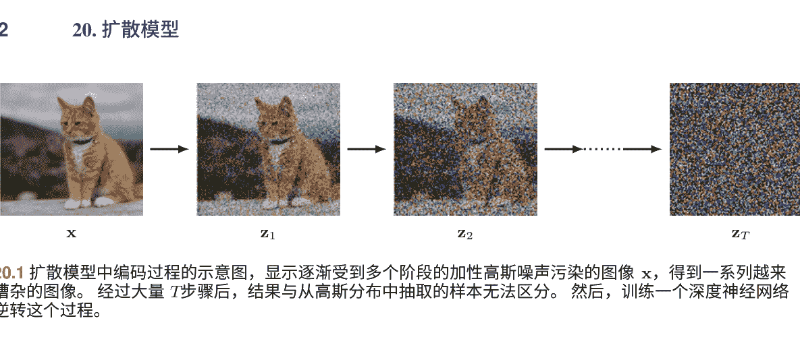

性。中心思想是对每个训练图像进行损坏，使用多步噪声过程将其转化为来自高斯分布的样本。这在图20.1中有所说明。然后训练一个深度神经网络来反转这个过程，一旦训练完成，网络就可以使用来自高斯分布的样本生成新的图像。

扩散模型可以看作是一种分层变分自动编码器-第19.2节 其中编码器分布是固定的，并由噪声过程定义，只有生成分布是可学习的 (Luo, 2022年)。它们易于训练，在并行硬件上扩展良好，并且避免了对抗训练的挑战和不稳定性，同时产生的结果与生成对抗网络相比具有可比较或更好的质量。然而，由于需要通过解码器网络进行多次前向传递，生成新样本可能计算上昂贵 (Dhariwal和Nichol，2021年)。

### 20.1 前向编码器

假设我们从训练集中取出一张图像，用 x表示，并且对每个像素独立地与高斯噪声混合，得到一个噪声污染的图像 z₁定义为

```
z₁ = √(1 - β₁)x + √β₁ε₁
```

其中 ε₁ ~ N(ε₁|0, I) 且 β₁ < 1是噪声分布的方差。在(20.1)和(20.3)中选择的系数 √(1 - β₁) 和 √β₁ 确保了 z_t 的分布均值比 z_{t-1} 的分布均值更接近零，且 z_t 的方差比 z_{t-1} 的方差更接近单位矩阵。对于 z_t 的分布，其均值比 z_{t-1} 的均值更接近零，且 z_t 的方差比 z_{t-1} 的方差更接近单位矩阵。我们可以将变换(20.1)写成以下形式

```
q(z₁|x) = N(z₁| √(1 - β₁)x, β₁I).
```

然后我们重复这个过程，加入额外的独立高斯噪声步骤，得到一系列越来越嘈杂的图像 z₂, ..., z_T。请注意，在扩散模型的文献中，这些潜变量有时被表示为 x₁, ..., x_T，观察变量被表示为 x₀。我们使用 z来表示潜变量， x

### 20.1 前向编码器

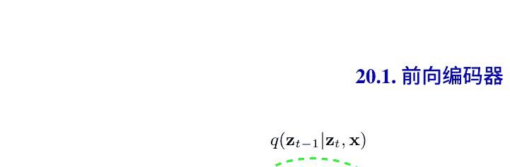

图20.2扩散过程表示为概率图模型。原始图像 x由阴影节点表示，因为它是一个观察变量，而受噪声污染的图像 z1,...,zT被视为潜变量。噪声过程由前向分布 q(zt|zt−1)定义，并且可以看作是一个编码器。我们的目标是学习一个模型 q(zt−1|zt, w)，试图逆转这个噪声过程，可以看作是一个解码器。正如我们将在后面看到的，条件分布q(zt−1|zt, x)在定义训练过程中起着重要的作用。

为了与本书的其余部分保持一致，观测变量的符号为 每个连续的图像由

$z_t = \sqrt{1 - \beta_t} z_{t-1} + \sqrt{\beta_t} \epsilon_t$ (20.3)

其中 $\epsilon_t \sim \mathcal{N}(\epsilon_t|\mathbf{0}, \mathbf{I})$。同样，我们可以将(20.3)写成以下形式

$q(z_t|z_{t-1}) = \mathcal{N}(z_t| \sqrt{1 - \beta_t} z_{t-1}, \beta_t \mathbf{I})$ (20.4)

第11.3节 条件分布序列(20.4)形成了一个马尔可夫链，并且可以表示为图20.2所示的概率图模型。方差参数 $\beta_t \in (0, 1)$是手动设置的，通常选择这样的值，使得方差值按照预定的时间表逐渐增加，即 $\beta_1 < \beta_2 < ... < \beta_T$。

#### 20.1.1 扩散核

给定观测数据向量 x的潜在变量的联合分布为

$q(z_1, ..., z_t|x) = q(z_1|x) \prod_{\tau=2}^t q(z_\tau|z_{\tau-1})$ (20.5)

如果我们现在对中间变量 z1,... 进行边缘化，zt−1，我们得到扩散核：

- 练习20.3

$q(z_t|x) = \mathcal{N}(z_t| \sqrt{\alpha_t} x, (1 - \alpha_t) \mathbf{I})$ (20.6)

其中我们定义了

$\alpha_t = \prod_{\tau=1}^t (1 - \beta_\tau)$ (20.7)

我们可以看到每个中间分布都有一个简单的闭式高斯表达式，我们可以直接从中进行采样，在训练DDPMs时这将证明非常有用，因为它允许使用随机选择的中间项在马尔可夫链中进行高效的随机梯度下降，而无需运行整个链。我们还可以将(20.6)写成以下形式

```
$z_t = \sqrt{\alpha_t}x + \sqrt{1 - \alpha_t}\epsilon_t \quad (20.8)$
```

其中再次 $\epsilon_t \sim \mathcal{N}(\epsilon_t | 0, I)$。请注意，现在表示的是添加到原始图像中的总噪声，而不是在马尔可夫链的这一步骤中添加的增量噪声。

- 练习20.4

经过多次迭代，图像变得与高斯噪声无法区分，在极限 $T \to \infty$ 的情况下，我们有

```
$q(z_T | x) = \mathcal{N}(z_T | 0, I) \quad (20.9)$
```

因此，关于原始图像的所有信息都丢失了。在（20.3）中，选择系数 $\sqrt{1 - \beta_t}$ 和 $\sqrt{\beta_t}$ 确保一旦马尔可夫链收敛到均值为零、协方差为单位的分布，进一步的更新将不会改变这一点。

- 练习 20.5

由于（20.9）的右侧与x无关，因此 $z_T$ 的边缘分布为

```
$q(z_T) = \mathcal{N}(z_T | 0, I). \quad (20.10)$
```

通常将马尔可夫链（20.4）称为forward process，类似于VAE中的编码器，只是这里是固定的而不是学习的。然而，请注意，文献中通常使用的术语与关于归一化流的文献相反，在这里，从潜在空间到数据空间的映射被认为是正向过程。

#### 20.1.2 条件分布

我们的目标是学习如何消除噪声过程，因此自然而然地考虑 $q(z_t | z_{t-1})$ 的逆条件分布，我们可以使用贝叶斯定理表示为

```
$q(z_{t-1} | z_t) = \frac{q(z_t | z_{t-1}) q(z_{t-1})}{q(z_t)}. \quad (20.11)$
```

我们可以将边缘分布 $q(z_{t-1})$ 写成以下形式

```
$q(z_{t-1}) = \int q(z_{t-1} | x) p(x) dx \quad (20.12)$
```

其中 $q(z_{t-1} | x)$ 由条件高斯分布(20.6)给出。然而，这个分布是难以处理的，因为我们必须对未知的数据密度 $p(x)$ 进行积分。如果我们使用训练数据集的样本近似积分，我们得到一个复杂的分布，表示为高斯混合分布。

相反，我们考虑条件版本的反向分布，条件是数据向量 \(\mathbf{x}\)，定义为 \(q(\mathbf{z}_{t-1}|\mathbf{z}_t, \mathbf{x})\)，我们很快将看到它实际上是一个简单的高斯分布。直观上讲，这是合理的，因为对于给定的噪声图像，很难猜测是哪个更低噪声的图像产生了它，而如果我们还知道起始图像，那么问题就变得容易得多。

我们可以使用贝叶斯定理计算这个条件分布：

\[q(\mathbf{z}_{t-1}|\mathbf{z}_t, \mathbf{x}) = \frac{q(\mathbf{z}_t|\mathbf{z}_{t-1}, \mathbf{x})q(\mathbf{z}_{t-1}|\mathbf{x})}{q(\mathbf{z}_t|\mathbf{x})}. \tag{20.13}\]

现在我们利用前向过程的马尔可夫性质来写

\[q(\mathbf{z}_t|\mathbf{z}_{t-1}, \mathbf{x}) = q(\mathbf{z}_t|\mathbf{z}_{t-1}) \tag{20.14}\]

右边是由(20.4)给出的关于 \(\mathbf{z}_{t-1}\)的函数。作为\(\mathbf{z}_{t-1}\)的函数，它采用了二次形式的指数。(20.13)中的分子项 \(q( \mathbf{z}_{t-1}|\mathbf{x})\)是由(20.6)给出的扩散核，再次涉及到关于 \(\mathbf{z}_{t-1}\)的二次形式的指数。(20.13)中的分母项可以忽略，因为它作为\(z_{t-1}\)的函数是常数。因此，我们可以看出(20.13)的右边是一个高斯分布，我们可以通过“完成平方”的技巧来确定它的均值和协方差。

\[q(\mathbf{z}_{t-1}|\mathbf{z}_t, \mathbf{x}) = \mathcal{N}\left(\mathbf{z}_{t-1}|\mathbf{m}_t(\mathbf{x}, \mathbf{z}_t), \sigma_t^2\mathbf{I}\right) \tag{20.15}\]

其中

\[\mathbf{m}_t(\mathbf{x}, \mathbf{z}_t) = \frac{(1-\alpha_{t-1})\sqrt{1-\beta_t}\mathbf{z}_t + \sqrt{\alpha_{t-1}}\beta_t\mathbf{x}}{1-\alpha_t} \tag{20.16}\]

\[\sigma_t^2 = \frac{\beta_t(1-\alpha_{t-1})}{1-\alpha_t} \tag{20.17}\]

我们已经使用了 （20.7） 式。

### 20.2 反向解码器

我们已经看到，前向编码器模型由一系列高斯条件分布 \(q(\mathbf{z}_t|\mathbf{z}_{t-1})\)定义，但是直接反转这个模型会导致一个难以处理的分布 \(q(\mathbf{z}_{t-1}|\mathbf{z}_t)\)，因为它需要对起始向量 \(\mathbf{x}\)的所有可能值进行积分，而这个分布是未知的数据分布。

\(p(\mathbf{x})\)我们希望建模的东西。 相反，我们将通过使用由深度神经网络控制的分布 \(p(\mathbf{z}_{t-1}|\mathbf{z}_t, \mathbf{w})\)来学习对反向分布的近似，其中 \(\mathbf{w}\)表示网络的权重和偏差。这个反向步骤类似于变分自动编码器中的解码器，在图20.2中有所说明。一旦网络训练完成，我们可以从简单的高斯分布中对 \(\mathbf{z}_T\)进行采样，并通过重复应用训练好的网络进行一系列反向采样步骤，将其转化为从数据分布 \(p(\mathbf{x})\)中采样。

### 20. 扩散模型

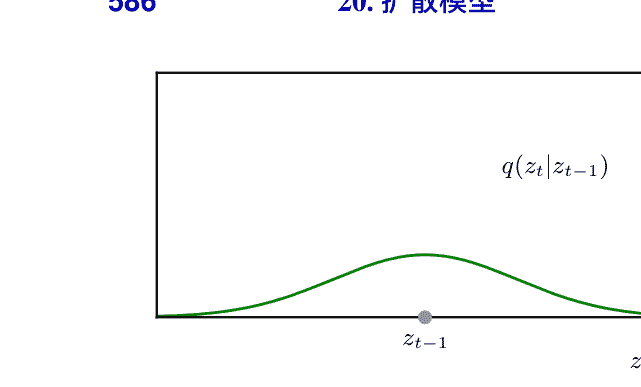

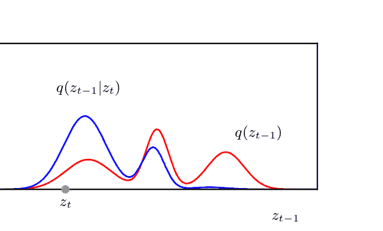

图20.3 通过贝叶斯定理（20.13）对反向分布 q(z_{t-1}|z_t)进行评估的示意图，用于标量变量。右图上的红色曲线显示了用三个高斯分布的混合表示的边缘分布 q(z_{t-1})，而左图显示了以 z_{t-1} 为中心的高斯前向噪声过程 q(z_t| z_{t-1})作为 z_t的分布。通过将它们相乘并进行归一化，我们得到了蓝色曲线所示的对于特定选择的 z_t的分布 q(z_{t-1}| z_t)。因为左侧的分布相对较宽，对应着较大的方差 β_t，所以分布 q(z_{t-1}| z_t)具有复杂的多峰结构。

直观地说，如果我们保持方差较小，使得 β_t ≪ 1，那么步骤之间的潜在向量变化将相对较小，因此学习反转变换应该更容易。更具体地说，如果 β_t ≪ 1，那么分布 q(z_{t-1}|z_t) 将近似为一个关于 z_{t-1} 的高斯分布。这可以从（20.11）中看出，因为右侧取决于 z_{t-1} 通过 q(z_t|z_{t-1}) 和 如果 q(z_t|z_{t-1}) 是一个足够窄的高斯分布，那么 q(z_{t-1}) 在 q(z_t|z_{t-1}) 具有显著质量的区域内只会有很小的变化，因此 q(z_{t-1}|z_t) 也将近似为高斯分布。这种直觉可以通过图20.3和图20.4中的一个简单示例来确认。然而，由于每个步骤的方差很小，我们必须使用大量的步骤来确保从前向噪声过程中获得的最终潜变量 z_T 的分布仍然接近高斯分布，这增加了生成新样本的成本。在实践中，T可能是几千个。

我们可以更正式地看到 q(z_{t-1}|z_t) 将近似为高斯分布

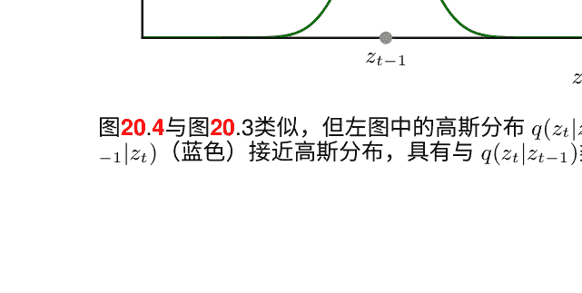

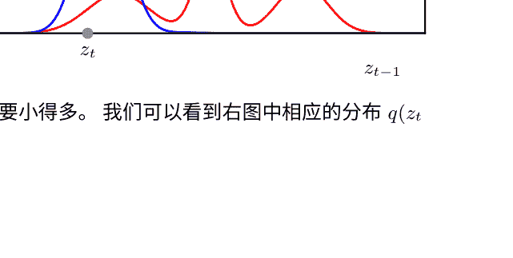

图20.4 与图20.3类似，但左图中的高斯分布 q(z_t|z_{t-1}) 的方差 β_t 要小得多。我们可以看到右图中相应的分布 q(z_{t-1}|z_t)（蓝色）接近高斯分布，具有与 q(z_t|z_{t-1}) 类似的方差。

对 ln q(z_{t-1}|z_t) 在点 z_t 附近进行泰勒级数展开 z_{t-1} 的函数 这也表明对于小方差，反向分布 q(z_t|z_{t-1}) 将具有接近前向噪声过程协方差 β_t I 的协方差。因此，我们使用一个高斯分布来建模反向过程，形式为

p(z_{t-1}|z_t, w) = N(z_{t-1} | μ(z_t, w, t), β_t I) (20.18)其中 μ (z_t, w, t) 是由一组参数 w 控制的深度神经网络。注意网络明确地将步骤索引 t 作为输入，以便能够考虑链中不同步骤之间的方差 β_t 的变化。这使得我们可以使用一个单独的网络来反转马尔可夫链中的所有步骤，而不是为每个步骤学习一个单独的网络。通过在网络中加入进一步的输出来学习去噪过程的协方差，以考虑 z_t 附近分布 q(z_{t-1}) 的曲率(Nichol and Dhariwal, 2021)。对于用于建模 μ(z_t, w, t) 的神经网络的架构选择具有相当大的灵活性，只要输出与输入具有相同的维度-第10.5.4节性。在图像处理应用中，U-net架构是一个常见的选择。

整体的反向去噪过程可以表示为一个马尔可夫链，由以下形式给出

p(x, z_1, …, z_T | w) = p(z_T) { ∏_{t=2}^T p(z_{t-1}|z_t, w) } p(x|z_1, w). (20.19)

这里假设 p(z_T) 与 q(z_T) 的分布相同，因此可以表示为 N(z_T | 0, I)。一旦模型训练完成，采样就变得简单了，因为我们首先从简单的高斯分布 p(z_T) 中采样，然后依次从每个条件分布 p(z_{t-1}|z_t, w) 中进行顺序采样，最后从 p(x|z_1, w) 中采样以获得数据空间中的样本 x。

#### 20.2.1 训练解码器

接下来，我们需要为训练神经网络确定一个目标函数。显而易见的选择是似然函数，对于数据点 x，其似然函数为

p(x|w) = ∫…∫ p(x, z_1, …, z_T | w) dz_1 … dz_T (20.20)

其中 p(x, z_1, …, z_T | w) 由(20.19)定义。这是一种潜变量模型(16.81)的实例，其中潜变量包括 z = (z_1, …, z_T) 而观测变量为 x。请注意，潜变量的维度与数据空间相同，这与归一化流相同，但与变分自编码器或生成对抗网络不同。从(20.20)中我们可以看出，似然函数涉及对所有可能的轨迹进行积分，这些轨迹是噪声样本导致观测数据点的方式。(20.20)中的积分是棘手的，因为它们涉及对高度复杂的神经网络函数进行积分。

#### 20.2.2 证据下界

由于精确实然函数难以计算，我们可以采用类似于变分自编码器的方法，最大化对数似然函数的一个下界，称为证据下界（ELBO），我们在这里重新推导了该下界的上下文扩散模型。对于任意选择的分布 $q(\mathbf{z})$，以下关系始终成立：

$$
\ln p(\mathbf{x}|\mathbf{w}) = \mathcal{L}(\mathbf{w}) + \text{KL} \left( q(\mathbf{z}) \| p(\mathbf{z}|\mathbf{x}, \mathbf{w}) \right) \tag{20.21}
$$

其中 $\mathcal{L}$是证据下界，也称为变分下界，由以下给出

$$
\mathcal{L}(\mathbf{w}) = \int q(\mathbf{z}) \ln \left\{ \frac{p(\mathbf{x}, \mathbf{z}|\mathbf{w})}{q(\mathbf{z})} \right\} \mathrm{d}\mathbf{z} \tag{20.22}
$$

而Kullback-Leibler散度$\text{KL} \left( f \| g \right)$是两个概率密度函数 $f(\mathbf{z})$和 $g(\mathbf{z})$之间的差异定义为

$$
\text{KL} \left( f(\mathbf{z}) \| g(\mathbf{z}) \right) = - \int f(\mathbf{z}) \ln \left\{ \frac{g(\mathbf{z})}{f(\mathbf{z})} \right\} \mathrm{d}\mathbf{z}. \tag{20.23}
$$

为了验证关系式（20.21），首先注意到，根据概率的乘法规则，我们有

$$
p(\mathbf{x}, \mathbf{z}|\mathbf{w}) = p(\mathbf{z}|\mathbf{x}, \mathbf{w})p(\mathbf{x}|\mathbf{w}). \tag{20.24}
$$
将(20.24)代入(20.22)并利用(20.23)得到(20.21)。

- 练习20.8

Kullback-Leibler散度具有性质$\text{KL} \left( \cdot \| \cdot \right) \geqslant 0$，由此可得

$$
\ln p(\mathbf{x}|\mathbf{w}) \geqslant \mathcal{L}(\mathbf{w}). \tag{20.25}
$$
由于对数似然函数是难以处理的，我们通过最大化下界 $\mathcal{L}(\mathbf{w})$来训练神经网络。

为了做到这一点，我们首先推导出扩散模型下界的显式形式。在定义下界时，我们可以自由选择任何形式的 $q(\mathbf{z})$，只要它是一个有效的概率分布，即非负且积分为 1。对于ELBO的许多应用，例如变分自编码器，我们选择了一个具有可调参数的 $q(\mathbf{z})$的形式，通常是一个深度神经网络的形式，并且我们最大化ELBO关于这些参数以及分布参数 $p(\mathbf{x}, \mathbf{z}|\mathbf{w})$。优化 $q(\mathbf{z})$的分布鼓励下界变得紧密，这使得对 $p(\mathbf{x}, \mathbf{z}|\mathbf{w})$参数的优化更接近最大似然。然而，在扩散模型中，我们选择 $q(\mathbf{z})$由马尔可夫链(20.5)定义的固定分布 $q(\mathbf{z}_1, \ldots, \mathbf{z}_T | \mathbf{x})$给出，因此唯一的可调参数是逆马尔可夫链模型 $p(\mathbf{x}, \mathbf{z}_1, \ldots, \mathbf{z}_T | \mathbf{w})$中的参数。请注意，我们在选择 $q(\mathbf{z})$的灵活性中选择了一个依赖于 $\mathbf{x}$的形式。因此，我们使用(20.5)代替(20.21)中的 $q(\mathbf{z}_1, \ldots, \mathbf{z}_T | \mathbf{x})$，同样地，我们使用(20.19)代替(20.21)中的 $p(\mathbf{x}, \mathbf{z}_1, \ldots, \mathbf{z}_T | \mathbf{w})$，这使我们能够写出# ELBO的形式

$$\begin{aligned}
\mathcal{L}(\mathbf{w}) & = \mathbb{E}_{q} \left[ \ln \frac{p(\mathbf{z}_{T}) \left\{ \prod_{t=2}^{T} p(\mathbf{z}_{t-1} | \mathbf{z}_{t}, \mathbf{w}) \right\} p(\mathbf{x} | \mathbf{z}_{1}, \mathbf{w}) }{ q(\mathbf{z}_{1} | \mathbf{x}) \prod_{t=2}^{T} q(\mathbf{z}_{t} | \mathbf{z}_{t-1}, \mathbf{x}) } \right] \\
& = \mathbb{E}_{q} \left[ \ln p(\mathbf{z}_{T}) + \sum_{t=2}^{T} \ln \frac{p(\mathbf{z}_{t-1} | \mathbf{z}_{t}, \mathbf{w})}{q(\mathbf{z}_{t} | \mathbf{z}_{t-1}, \mathbf{x})} - \ln q(\mathbf{z}_{1} | \mathbf{x}) + \ln p(\mathbf{x} | \mathbf{z}_{1}, \mathbf{w}) \right]
\end{aligned}$$
(20.26)

我们定义

$$\mathbb{E}_{q}[ \cdot ] \equiv \int \cdots \int q(\mathbf{z}_{1} | \mathbf{x}) \prod_{t=2}^{T} q(\mathbf{z}_{t} | \mathbf{z}_{t-1}) [ \cdot ] \, \mathrm{d}\mathbf{z}_{1} \dots \mathrm{d}\mathbf{z}_{T}.$$
(20.27)

方程(20.26)右侧的第一项 $\ln p(\mathbf{z}_{T})$ 就是固定分布 $\mathcal{N}(\mathbf{z}_{T} | \mathbf{0}, \mathbf{I})$。这个项没有可训练的参数，因此可以从ELBO中省略，因为它代表一个固定的加法常数。同样，第三项 $-\ln q(\mathbf{z}_{1} | \mathbf{x})$ 与 $\mathbf{w}$ 无关，因此可以再次省略。方程(20.26)右侧的第四项对应于变分自编码器中的重构项。可以通过从由(20.2)定义的 $\mathbf{z}_{1}$ 分布中抽取样本，通过蒙特卡洛估计来评估期望 $\mathbb{E}_{q}[ \cdot ]$。

$$\mathbb{E}_{q} [ \ln p(\mathbf{x} | \mathbf{z}_{1}, \mathbf{w}) ] \simeq \sum_{l=1}^{L} \ln p(\mathbf{x} | \mathbf{z}_{1}^{(l)}, \mathbf{w})$$
(20.28)

其中 $\mathbf{z}_{1}^{(l)} \sim \mathcal{N}(\mathbf{z}_{1} | \sqrt{1 - \beta_{1}} \mathbf{x}, \beta_{1} \mathbf{I})$。与VAEs不同，我们不需要通过采样值反向传播错误信号，因为 $q$-分布是固定的，所以这里不需要重新参数化技巧。

这使得(20.26)右侧的第二项成为一个求和项，每一项都依赖于一对相邻的潜变量值。我们之前在推导扩散核(20.6)时看到，我们可以直接从 $q(\mathbf{z}_{t-1} | \mathbf{x})$ 中采样，作为一个高斯分布，然后我们可以使用(20.4)获得相应的 $\mathbf{z}_{t}$ 的样本，这也是一个高斯分布。尽管在无限数量的样本的极限情况下，这将是一个正确的过程，但使用成对的采样值会产生高方差的噪声估计，因此需要大量的样本。相反，我们将ELBO重写为一种形式，可以通过每个项只采样一个值来估计。

#### 20.2.3 重写ELBO

在我们讨论变分自动编码器的ELBO之后，我们的目标是将ELBO写成Kullback-Leibler散度的形式，然后进一步以闭合形式表达。神经网络是反向分布模型 $p(\mathbf{z}_{t-1} | \mathbf{z}_{t}, \mathbf{w})$，而 $q$-分布是正向分布模型 $q(\mathbf{z}_{t} | \mathbf{z}_{t-1}, \mathbf{x})$，因此我们使用贝叶斯定理来通过写作来反转条件分布

$$q(\mathbf{z}_t | \mathbf{z}_{t-1}, \mathbf{x}) = \frac{q(\mathbf{z}_{t-1} | \mathbf{z}_t, \mathbf{x}) q(\mathbf{z}_t | \mathbf{x})}{q(\mathbf{z}_{t-1} | \mathbf{x})} \quad (20.29)$$

这使我们能够以(20.26)中的形式写出第二项

$$\ln \frac{p(\mathbf{z}_{t-1}|\mathbf{z}_t, \mathbf{w})}{q(\mathbf{z}_t|\mathbf{z}_{t-1}, \mathbf{x})} = \ln \frac{p(\mathbf{z}_{t-1}|\mathbf{z}_t, \mathbf{w})}{q(\mathbf{z}_{t-1}|\mathbf{z}_t, \mathbf{x})} + \ln \frac{q(\mathbf{z}_{t-1}|\mathbf{x})}{q(\mathbf{z}_t|\mathbf{x})} \quad (20.30)$$

方程(20.30)右侧的第二项与 $\mathbf{w}$ 无关，因此可以忽略。将(20.30)代入(20.26)，我们得到

$$\mathcal{L}(\mathbf{w}) = \mathbb{E}_q \left[ \sum_{t=2}^T \ln \frac{p(\mathbf{z}_{t-1}|\mathbf{z}_t, \mathbf{w})}{q(\mathbf{z}_{t-1}|\mathbf{z}_t, \mathbf{x})} + \ln p(\mathbf{x}|\mathbf{z}_1, \mathbf{w}) \right] \quad (20.31)$$

最后，我们可以将(20.31)改写为

$$\mathcal{L}(\mathbf{w}) = \int q(\mathbf{z}_1|\mathbf{x}) \ln p(\mathbf{x}|\mathbf{z}_1, \mathbf{w}) \mathrm{d}\mathbf{z}_1 - \sum_{t=2}^T \int \mathrm{KL}(q(\mathbf{z}_{t-1}|\mathbf{z}_t, \mathbf{x}) \| p(\mathbf{z}_{t-1}|\mathbf{z}_t, \mathbf{w})) q(\mathbf{z}_t|\mathbf{x}) \mathrm{d}\mathbf{z}_t \quad (20.32)$$

重构项

一致性项

在第一项中，我们简化了对 $q(\mathbf{z}_1, \ldots, \mathbf{z}_T | \mathbf{x})$ 的期望，因为 $\mathbf{z}_1$ 是出现在被积函数中的唯一潜变量。因此，在由(20.27)定义的期望中，所有条件分布都积到了一，只剩下对 $\mathbf{z}_1$ 的积分。同样，在第二项中，每个积分只涉及两个相邻的潜变量 $\mathbf{z}_{t-1}$ 和 $\mathbf{z}_t$，而所有剩余的变量都可以被积掉。

现在，(20.32)的界限与变分自动编码器的ELBO非常相似，其由(19.14)给出，只是现在有多个编码器和解码器阶段。重构项奖励观测数据样本的高概率，并且可以使用与VAE中相应项相同的方式进行训练，即使用采样近似(20.28)。(20.32)中的一致性项在高斯分布对之间定义，因此可以用闭合形式表示，如下所示。分布 $q(\mathbf{z}_{t-1}|\mathbf{z}_t, \mathbf{x})$ 由(20.15)给出，而分布 $p(\mathbf{z}_{t-1}|\mathbf{z}_t, \mathbf{w})$ 由(20.18)给出，因此Kullback-Leibler散度变为

**练习 20.11**

$$\mathrm{KL}(q(\mathbf{z}_{t-1}|\mathbf{z}_t, \mathbf{x}) \| p(\mathbf{z}_{t-1}|\mathbf{z}_t, \mathbf{w})) = \frac{1}{2\beta_t} \| \mathbf{m}_t(\mathbf{x}, \mathbf{z}_t) - \boldsymbol{\mu}(\mathbf{z}_t, \mathbf{w}, t) \|^2 + \text{常数} \quad (20.33)$$

# 20.2. 反向解码器

其中 $\mathbf{m}_t(\mathbf{x}, \mathbf{z}_t)$ 由 (20.16) 定义，并且任何与网络参数无关的附加项都已经被吸收到常数项中，在训练中不起作用。在 (20.32) 中的每个一致性项都有一个关于 $\mathbf{z}_t$ 的积分，加权为 $q(\mathbf{z}_t|\mathbf{x})$。这可以通过从 $q(\mathbf{z}_t|\mathbf{x})$ 中抽取样本来近似，使用扩散核(20.6)可以高效地完成。

我们可以看到KL散度 (20.33) 采用了一个简单的平方损失函数的形式。由于我们调整网络参数以最大化 (20.32) 中的下界，所以我们将最小化这个平方误差，因为在ELBO中Kullback-Leibler散度项前面有一个负号。

#### 20.2.4 预测噪声

导致更高质量结果的一种修改是改变神经网络的作用，使其在马尔可夫链的每个步骤中预测添加到原始图像中以创建噪声图像的总噪声成分，而不是预测去噪图像 (Ho, Jain和Abbeel, 2020)。为了做到这一点，我们首先将 (20.8) 重新排列得到

$$\mathbf{x} = \frac{1}{\sqrt{\alpha_t}} \mathbf{z}_t - \frac{\sqrt{1-\alpha_t}}{\sqrt{\alpha_t}} \boldsymbol{\epsilon}_t. \quad (20.34)$$

如果我们现在将其代入 (20.16) ，我们可以用原始数据向量 $\mathbf{x}$ 和噪声 $\boldsymbol{\epsilon}$ 来重新编写反向条件分布 $q(\mathbf{z}_{t-1}|\mathbf{z}_t,\mathbf{x})$ 的均值 $\mathbf{m}_t(\mathbf{x},\mathbf{z}_t)$。

$$\mathbf{m}_t(\mathbf{x}, \mathbf{z}_t) = \frac{1}{\sqrt{1-\beta_t}} \left\{ \mathbf{z}_t - \frac{\beta_t}{\sqrt{1-\alpha_t}} \boldsymbol{\epsilon}_t \right\}. \quad (20.35)$$

类似地，我们引入一个神经网络 $\mathbf{g}(\mathbf{z}_t, \mathbf{w}, t)$ ，它的目标是预测添加到 $\mathbf{x}$ 生成 $\mathbf{z}_t$ 的总噪声。按照导致 (20.35) 的相同步骤，可以得出这两个网络函数之间的关系

$$\boldsymbol{\mu}(\mathbf{z}_t, \mathbf{w}, t) = \frac{1}{\sqrt{1-\beta_t}} \left\{ \mathbf{z}_t - \frac{\beta_t}{\sqrt{1-\alpha_t}} \mathbf{g}(\mathbf{z}_t, \mathbf{w}, t) \right\}. \quad (20.36)$$

现在我们可以将 (20.35) 和 (20.36) 代入 (20.33) 中得到

$$\begin{aligned}
& \mathrm{KL}(q(\mathbf{z}_{t-1}|\mathbf{z}_t, \mathbf{x}) \| p(\mathbf{z}_{t-1}|\mathbf{z}_t, \mathbf{w})) \\
& = \frac{\beta_t}{2(1-\alpha_t)(1-\beta_t)} \|\mathbf{g}(\mathbf{z}_t, \mathbf{w}, t) - \boldsymbol{\epsilon}_t\|_2^2 + \text{常数} \\
& = \frac{\beta_t}{2(1-\alpha_t)(1-\beta_t)} \|\mathbf{g}(\sqrt{\alpha_t}\mathbf{x} + \sqrt{1-\alpha_t}\boldsymbol{\epsilon}_t, \mathbf{w}, t) - \boldsymbol{\epsilon}_t\|_2^2 + \text{常数}
\end{aligned} \quad (20.37)$$

在最后一行中，我们使用(20.8)替换 $\mathbf{z}_t$。

ELBO中的重构项(20.32)可以使用(20.28)进行近似并使用 $\mathbf{z}_1$ 的采样值。使用形式(20.18)来计算 $p(\mathbf{x}|\mathbf{z}, \mathbf{w})$，我们有

$$\ln p(\mathbf{x}|\mathbf{z}_1, \mathbf{w}) = -\frac{1}{2\beta_1} \|\mathbf{x} - \boldsymbol{\mu}(\mathbf{z}_1, \mathbf{w}, 1)\|^2 + \text{常数}. \quad (20.38)$$

**练习20.13**

如果我们使用(20.36)替换 $\boldsymbol{\mu}(\mathbf{z}_1, \mathbf{w}, 1)$，并使用(20.1)替换 $\mathbf{x}$，然后利用 $\alpha_1 = (1 - \beta_1)$，根据(20.7)得到

$$\ln p(\mathbf{x}|\mathbf{z}_1, \mathbf{w}) = -\frac{1}{2(1 - \beta_1)} \|\mathbf{g}(\mathbf{z}_1, \mathbf{w}, 1) - \boldsymbol{\epsilon}_1\|^2 + \text{常数}. \quad (20.39)$$

这与特殊情况 $t= 1$ 的(20.37)形式完全相同，因此可以合并重建和一致性项。

Ho, Jain, and Abbeel (2020)通过实验证明，通过在(20.37)前省略因子 $\beta_t / [2(1 - \alpha_t)(1 - \beta_t)]$，性能进一步提高，使得马尔可夫链中的所有步骤具有相等的权重。将这个简化版本的(20.37)代入(20.33)中，得到一个训练目标函数的形式

$$\mathcal{L}(\mathbf{w}) = -\sum_{t=1}^{T} \|\mathbf{g}(\sqrt{\alpha_t} \mathbf{x} + \sqrt{1 - \alpha_t} \boldsymbol{\epsilon}_t, \mathbf{w}, t) - \boldsymbol{\epsilon}_t\|^2. \quad (20.40)$$

方程（20.40）右侧的平方误差有一个非常简单的解释：对于给定的马尔可夫链步骤 $t$ 和给定的训练数据点 $\mathbf{x}$，我们采样一个噪声向量 $\boldsymbol{\epsilon}_t$，并使用它来创建相应的带噪声的潜在向量 $\mathbf{z}_t$。损失函数是预测噪声与实际噪声之间的平方差。请注意，网络 $\mathbf{g}(\cdot,\cdot,\cdot)$ 预测的是添加到原始数据向量 $\mathbf{x}$ 的总噪声，而不仅仅是步骤 $t$ 中添加的增量噪声。当我们使用随机梯度下降时，我们针对训练集中随机选择的数据点 $\mathbf{x}$ 评估损失函数相对于网络参数的梯度向量。此外，对于每个这样的数据点，我们随机选择一个马尔可夫链步骤 $t$，而不是对(20.40) 中的每个项进行误差评估。这些梯度会在小批量数据样本上累积，然后用于更新权重。

还要注意，这个损失函数自动地构建了一种数据增强的形式，因为每次使用一个特定的训练样本 $\mathbf{x}$ 时，它都会与一个新的样本 $\boldsymbol{\epsilon}_t$ 的噪声结合起来。上述所有内容都与训练集中的一个单独数据点 $\mathbf{x}$ 相关。梯度的相应计算在算法20.1中显示。

#### 20.2.5 生成新样本

一旦网络训练完成，我们可以通过首先从高斯分布中采样 $p(\mathbf{z}_T)$，然后通过马尔可夫链的每个步骤逐步去噪声，在数据空间中生成新的样本。给定一个去噪样本 $\mathbf{z}_t$，在第 $t$ 步，我们通过三个步骤生成一个样本 $\mathbf{z}_{t-1}$。首先，我们评估由 $\mathbf{g}(\mathbf{z}_t, \mathbf{w}, t)$ 给出的神经网络的输出。然后，我们使用(20.36)评估 $\boldsymbol{\mu}(\mathbf{z}_t, \mathbf{w}, t)$。

# 20.2. 反向解码器

**算法 20.1: 训练去噪扩散概率模型**

| **输入:** 训练数据 $\mathcal{D} = \{\mathbf{x}_n\}$，噪声计划 $\{\beta_1, \ldots, \beta_T\}$ |
| :--- |
| **输出:** 网络参数 $\mathbf{w}$ |
| **步骤:** |
| 对于 $t \in \{1, \ldots, T\}$ 执行 |
| $\quad \alpha_t \leftarrow \prod_{\tau=1}^{t}(1-\beta_{\tau})$ // 从$\beta$计算$\alpha$ |
| 结束对于 |
| 重复 |
| $\quad \mathbf{x} \sim \mathcal{D}$ // 采样一个数据点 |
| $\quad t \sim \{1, \ldots, T\}$ // 采样马尔可夫链上的一个点 |
| $\quad \epsilon \sim \mathcal{N}(\epsilon|\mathbf{0}, \mathbf{I})$ // 采样一个噪声向量 |
| $\quad \mathbf{z}_t \leftarrow \sqrt{\alpha_t}\mathbf{x} + \sqrt{1-\alpha_t}\epsilon$ // 评估有噪声的潜变量 |
| $\quad \mathcal{L}(\mathbf{w}) \leftarrow \|\mathbf{g}(\mathbf{z}_t, \mathbf{w}, t) - \epsilon\|^2$ // 计算损失项 |
| $\quad$ 执行优化器步骤 |
| 直到收敛 |
| **返回** $\mathbf{w}$ |

最后，我们通过添加方差缩放的噪声从 $p(\mathbf{z}_{t-1}|\mathbf{z}_t, \mathbf{w}) = \mathcal{N}(\mathbf{z}_{t-1} | \mu(\mathbf{z}_t, \mathbf{w}, t), \beta_t \mathbf{I})$ 生成样本 $\mathbf{z}_{t-1}$。

$$\mathbf{z}_{t-1} = \mu(\mathbf{z}_t, \mathbf{w}, t) + \sqrt{\beta_t} \boldsymbol{\epsilon} \qquad\qquad (20.41)$$

请注意，网络 $\mathbf{g}(\cdot, \cdot, \cdot)$ 预测添加到原始数据向量 $\mathbf{x}$ 的总噪声以获得 $\mathbf{z}_t$，但在采样步骤中，我们只从 $\mathbf{z}_{t-1}$ 中减去一部分噪声，然后添加额外的噪声方差为 $\beta_t$ 以生成 $\mathbf{z}_{t-1}$。在计算合成数据样本 $\mathbf{x}$ 时，我们不添加额外的噪声，因为我们的目标是生成一个无噪声的输出。算法20.2总结了采样过程。生成数据的扩散模型的主要缺点是需要通过训练后的网络进行多次顺序推理，这可能是计算上昂贵的。加速采样过程的一种方法是首先将去噪过程转化为连续时间上的微分方程，然后使用第20.3.4节的替代高效离散化方法来高效地解决方程。

在本章中，我们假设数据和潜在变量是连续的，并且因此可以使用高斯噪声模型。扩散模型也可以用于离散空间（Austin等, 2021），例如，在生成过程中选择化学元素子集中的原子类型来生成新的候选药物分子。

我们已经看到扩散模型可能会消耗大量计算资源，因为## 20.3. 分数匹配

到目前为止，在本章中讨论的去噪扩散模型与另一类深度生成模型密切相关，这些模型相对独立地发展起来，基于分数匹配（Hyvärinen, 2005; Song and Ermon, 2019）。
这些模型利用了分数函数或者斯坦分数，它被定义为对数据向量 x 的对数似然的梯度，并且可以表示为
$$ s(x) = \nabla_x \ln p(x). \quad (20.42) $$
在这里需要强调的是，梯度是相对于数据向量而不是任何参数向量的。注意，s(x)是一个与 x 具有相同维度的矢量值函数，每个元素 s_i(x) = ∂ ln p(x)/∂x_i 与 x 的相应元素 x_i 相关联。例如，如果 x 是一幅图像，则 s(x) 也可以表示为具有相同尺寸的图像，并且对应像素。

图20.5展示了得分函数的示意图，显示了一个由高斯混合分布组成的二维分布热图以及相应的得分函数，该得分函数由(20.42)定义，并在一个规则的x-值网格上绘制为向量。

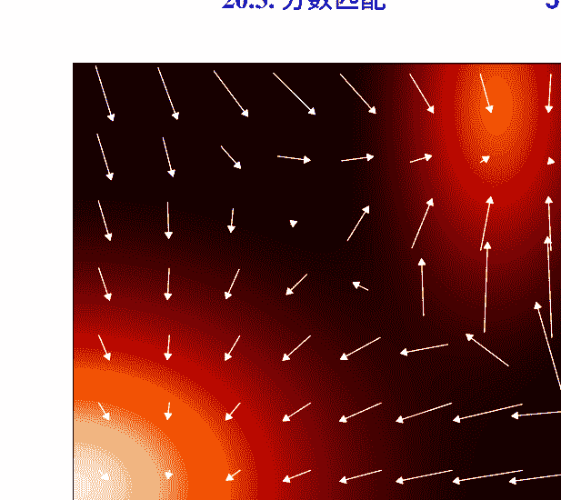

图20.5展示了一个二维概率密度的示例，以及相应的得分函数。

为了理解得分函数的有用性，考虑两个具有相等得分的函数 \(q(\mathbf{x})\) 和 \(p(\mathbf{x})\)，使得对于所有的 \(\mathbf{x}\) 值，\(\nabla_{\mathbf{x}} \ln q(\mathbf{x}) = \nabla_{\mathbf{x}} \ln p(\mathbf{x})\)。如果我们对方程两边关于 \(\mathbf{x}\) 积分并取指数，我们得到 \(q(\mathbf{x}) = K p(\mathbf{x})\)，其中 \(K\) 是与 \(\mathbf{x}\) 无关的常数。

因此，如果我们能够学习一个模型 \(\mathbf{s}(\mathbf{x}; \mathbf{w})\) 的得分函数，那么我们就可以对原始数据密度进行建模，只是一个乘法常数的差别。

#### 20.3.1 分数损失函数

为了训练这样的模型，我们需要定义一个损失函数，旨在将模型得分函数 \(\mathbf{s}(\mathbf{x}; \mathbf{w})\) 与分布的得分函数 \(\nabla_{\mathbf{x}} \ln p(\mathbf{x})\) 相匹配，该分布生成了数据。生成数据的概率密度函数 \(p(\mathbf{x})\)。这样的损失函数的一个例子是模型得分和真实得分之间的期望平方误差，由以下公式给出：

\[ J(\mathbf{w}) = \frac{1}{2} \int \| \mathbf{s}(\mathbf{x}; \mathbf{w}) - \nabla_{\mathbf{x}} \ln p(\mathbf{x}) \|^2 p(\mathbf{x}) \, d\mathbf{x}. \tag{20.43} \]

第14.3.1节正如我们在能量模型的讨论中所看到的，得分函数不需要相关的概率密度函数被归一化，因为梯度算子会去除归一化常数，所以在选择模型时有相当大的灵活性。有两种广泛的方式来表示得分函数 \(\mathbf{s}(\mathbf{x}; \mathbf{w})\) 使用深度神经网络。得分函数 \(\mathbf{s}\) 的每个元素 \(s_i\) 对应于输入的每个元素 \(x_i\)，因此第一种方法是使用与输入相同数量的输出的网络。然而，得分函数被定义为标量函数（对数概率密度函数的梯度），这是一类更受限制的函数。因此，另一种方法是使用具有单个输出 \(\phi(\mathbf{x})\) 的网络。

> 练习 20.14

然后使用自动微分计算 $\nabla_x \phi(\mathbf{x})$。然而，这种第二种方法需要两个反向传播步骤，因此在计算上更加昂贵。练习 20.15 昂贵。因此，大多数应用程序只采用第一种方法。

#### 20.3.2 修改的分数损失

损失函数 (20.43) 的一个问题是我们无法直接最小化它，因为我们不知道真实的数据分数 $\nabla_x \ln p(\mathbf{x})$。我们所拥有的只是有限的数据集 $\mathcal{D} = (\mathbf{x}_1, \ldots, \mathbf{x}_N)$，我们可以构建一个经验分布：

$$ p_{\mathcal{D}}(\mathbf{x}) = \frac{1}{N} \sum_{n=1}^N \delta(\mathbf{x} - \mathbf{x}_n) \tag{20.44} $$

这里 $\delta(\mathbf{x})$ 是狄拉克δ函数，可以非正式地被认为是在 $\mathbf{x} = \mathbf{0}$ 处有一个无限高的“尖峰”，具有以下特性 $\delta(\mathbf{x}) = 0$。

$$ \mathbf{x} = \mathbf{0} \tag{20.45} $$

$$ \int \delta(\mathbf{x}) \, d\mathbf{x} = 1. \tag{20.46} $$

第3.5.2节

由于 (20.44) 不是关于 $\mathbf{x}$ 的可微函数，我们无法计算其得分函数。我们可以通过引入一个噪声模型来解决这个问题，将数据点'涂抹'并给出一个平滑、可微的密度表示。这被称为Parzen估计器或核密度估计器，并且被定义为

$$ q_{\sigma}(\mathbf{z}) = \int q(\mathbf{z}|\mathbf{x}, \sigma) p(\mathbf{x}) \, d\mathbf{x} \tag{20.47} $$

其中 $q(\mathbf{z}|\mathbf{x}, \sigma)$ 是噪声核。常见的核选择是高斯核

$$ q(\mathbf{z}|\mathbf{x}, \sigma) = \mathcal{N}(\mathbf{z}|\mathbf{x}, \sigma^2 \mathbf{I}). \tag{20.48} $$

而不是最小化损失函数 (20.43)，我们使用相应的平滑Parzen密度形式的损失。

$$ J(\mathbf{w}) = \frac{1}{2} \int \| \mathbf{s}(\mathbf{z}, \mathbf{w}) - \nabla_{\mathbf{z}} \ln q_{\sigma}(\mathbf{z}) \|^2 q_{\sigma}(\mathbf{z}) \, d\mathbf{z}. \tag{20.49} $$

一个关键结果是，通过将 (20.47) 代入 (20.49)，我们可以将这个损失函数重写为等价形式 (Vincent, 2011)

$$ J(\mathbf{w}) = \frac{1}{2} \iint \| \mathbf{s}(\mathbf{z}, \mathbf{w}) - \nabla_{\mathbf{z}} \ln q(\mathbf{z}|\mathbf{x}, \sigma) \|^2 q(\mathbf{z}|\mathbf{x}, \sigma) p(\mathbf{x}) \, d\mathbf{z} \, d\mathbf{x} + \text{const}. \tag{20.50} $$

如果我们使用经验密度 (20.44) 替换 $p(\mathbf{x})$，我们得到

$$ J(\mathbf{w}) = \frac{1}{2N} \sum_{n=1}^N \int \| \mathbf{s}(\mathbf{z}, \mathbf{w}) - \nabla_{\mathbf{z}} \ln q(\mathbf{z}|\mathbf{x}_n, \sigma) \|^2 q(\mathbf{z}|\mathbf{x}_n, \sigma) \, d\mathbf{z} + \text{const}. \tag{20.51} $$

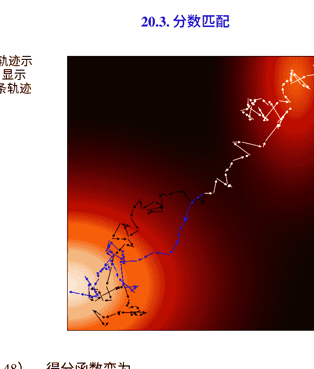

对于高斯Parzen核（20.48），得分函数变为

$$ \nabla_z \ln q(z|\mathbf{x}, \sigma) = -\frac{1}{\sigma} \epsilon \tag{20.52} $$

其中 $\epsilon = \mathbf{z} - \mathbf{x}$ 来自 $\mathcal{N}(\mathbf{z}|\mathbf{0}, \mathbf{I})$。如果我们考虑特定的噪声模型（20.6），则我们得到

$$ \nabla_z \ln q(z|\mathbf{x}, \sigma) = -\frac{1}{\sqrt{1 - \alpha_t}} \epsilon \tag{20.53} $$

因此，我们可以看到得分损失（20.50）衡量了神经网络预测与噪声 $\epsilon$ 之间的差异。因此，这个损失函数与去噪扩散模型中使用的形式（20.37）具有相同的最小值，其中得分函数 $\mathbf{s}(\mathbf{z}, \mathbf{w})$ 扮演着噪声预测网络 $\mathbf{g}(\mathbf{z}, \mathbf{w})$ 的角色，与常数缩放 $-1/\sqrt{1 - \alpha_t}$（Song和Ermon，2019）。最小化（20.50）被称为去噪得分匹配，我们可以看到与去噪扩散模型之间的密切联系。如何选择噪声方差仍然是一个问题。

$\sigma^2$，我们很快会回到这个问题。

#### 20.3.3 噪声方差

我们已经看到如何从一组训练数据中学习评分函数，并使用Langevin采样从学习到的分布中生成新的样本。然而，我们可以确定这种方法存在三个潜在的问题（Song和Ermon，2019年；Luo，2022年）。首先，如果数据分布位于比数据空间更低维度的流形上，概率密度在流形之外的点上将为零，在这里评分函数是未定义的，因为 $\ln p(\mathbf{x})$ 是未定义的。

其次，在数据密度低的区域，由于损失函数（20.43）受密度加权，得分函数的估计可能不准确。当使用Langevin采样时，不准确的得分函数可能导致轨迹质量较差。第三，即使得分函数的模型准确，如果数据分布由不相交的分布混合组成，Langevin过程可能无法正确采样。

通过选择核函数（20.48）中使用的噪声方差 $\sigma^2$ 的足够大的值，可以解决这三个问题，因为这样可以模糊数据分布。然而，方差过大会引入原始分布的显著失真，从而在模拟得分函数时引入不准确性。可以通过考虑一系列方差值 $\sigma_1^2 < \sigma_2^2 < \dots < \sigma_T^2$ （Song和Ermon，2019）来解决这种权衡，其中 $\sigma_1^2$ 足够小以准确表示数据分布，而 $\sigma_T^2$ 足够大以避免上述问题。然后，得分网络被修改为将方差作为额外输入 $\mathbf{s}(\mathbf{x}, \mathbf{w}, \sigma^2)$，并通过使用形式为（20.51）的损失函数的加权和来训练，其中每个项表示相关网络和相应扰动数据集之间的误差。对于数据向量 $\mathbf{x}_n$，损失函数的形式为

$$ \frac{1}{2} \sum_{i=1}^{L} \lambda(i) \int \| \mathbf{s}(\mathbf{z}, \mathbf{w}, \sigma_i^2) - \nabla_{\mathbf{z}} \ln q(\mathbf{z}|\mathbf{x}_n, \sigma_i) \|^2 q(\mathbf{z}|\mathbf{x}_n, \sigma_i) \, d\mathbf{z} \quad (20.54) $$

其中 $\lambda(i)$ 是加权系数。我们可以看到，这个训练过程完全

> Section 20.2.1 反映了用于训练分层去噪网络的过程。

一旦训练完成，可以通过从每个模型中运行几步Langevin采样来生成样本，其中 $i = L, L-1, \dots, 2, 1$ 依次进行。这种技术被称为退火Langevin动力学，类似于用于从去噪扩散模型中采样的算法20.2。

#### 20.3.4 随机微分方程

我们已经看到，在构建扩散模型的噪声过程时，使用大量的步骤，通常是几千步，是有帮助的。因此，自然而然地会问，如果我们考虑步骤的数量无限大，会发生什么情况，就像我们在引入神经微分方程时对无限深度神经网络进行的那样。在进行这样的极限时，我们需要确保噪声方差 $\beta_t$ 在每一步中变小，以保持步长的一致性。这导致了对连续时间扩散模型的一个公式化，即随机微分方程或SDEs（Song et al., 2020）。去噪扩散概率模型和得分匹配模型都可以看作是连续时间SDE的离散化。我们可以将一般的SDE写成向量 $\mathbf{z}$ 的微小更新形式

$$ d\mathbf{z} = \mathbf{f}(\mathbf{z}, t) \, dt + g(t) \, d\mathbf{v} \quad (20.55) $$

其中漂移项是确定性的，类似于ODE，但扩散项是随机的，例如由无穷小的高斯步骤给出。在这里，参数 t 通常被称为“时间”，类似于物理系统。扩散模型的正向噪声过程 (20.3) 可以通过采取连续时间极限的形式 (20.55) 来表示为SDE。

对于SDE (20.55)，存在一个相应的逆向SDE (Song et al., 2020)，给出

$$ d\mathbf{z} = \left[\mathbf{f}(\mathbf{z}, t) - g^2(t) \nabla_{\mathbf{z}} \ln p(\mathbf{z})\right] dt + g(t) \, d\mathbf{v} \quad (20.56) $$

我们将 $\nabla_{\mathbf{z}} \ln p(\mathbf{z})$ 识别为得分函数。由(20.55)给出的SDE需要从 $t = T$ 到 $t = 0$ 进行反向求解。

要数值求解SDE，我们需要离散化时间变量。最简单的方法是使用固定的等间隔时间步长，这被称为欧拉-马鲁雅马求解器。对于反向SDE，我们可以得到一种形式的第14.3节Langevin方程。然而，我们可以使用更灵活的离散化形式 (Kloeden和Platen, 2013) 来采用更复杂的求解器。

对于由SDE控制的所有扩散过程，存在一个相应的确定性过程，由ODE描述，其轨迹具有与SDE相同的边际概率密度 $p(\mathbf{z}|t)$ (Song等, 2020)。对于形式为(20.56)的SDE，相应的ODE为

$$ d\mathbf{z}/dt = \mathbf{f}(\mathbf{z}, t) - (1/2) g^2(t) \nabla_{\mathbf{z}} \ln p(\mathbf{z}). \quad (20.57) $$

ODE公式允许使用高效的自适应步长求解器，从而大大减少函数评估的数量。此外，它还允许将概率扩散模型与归一化流模型相关联，从而可以使用变量变换公式 (18.1) 来提供对对数似然的精确评估。

## 20.4. 引导扩散

到目前为止，我们已经将扩散模型视为表示无条件密度 $p(\mathbf{x})$ 的一种方式，该密度是从一组训练样本 $\mathbf{x}_1, ...$ 独立地从 $p(\mathbf{x})$ 中抽取的。一旦模型训练完成，我们可以从该分布中生成新样本。我们已经在图1.3中看到了一个无条件采样的例子，那是从一个GAN模型生成的人脸图像。

然而，在许多应用中，我们希望从条件分布中采样 $p(\mathbf{x}|\mathbf{c})$，其中条件变量 $\mathbf{c}$ 可以是类标签或图像所需内容的文本描述。这也为图像超分辨率、图像修复、视频生成等应用奠定了基础。实现这一目标的最简单方法是将 $\mathbf{c}$ 视为去噪神经网络 $\mathbf{g}(\mathbf{z}, \mathbf{w}, t, \mathbf{c})$ 的额外输入，并使用匹配的数据对 $\{\mathbf{x}_n, \mathbf{c}_n\}$ 来训练网络。这种方法的主要限制是

网络可能会给予条件变量不足的权重，甚至忽略它们，因此我们需要一种方法来控制给予条件信息多少权重，并将其与样本多样性进行权衡。这种额外的压力来匹配条件信息被称为引导。根据是否使用单独的分类器模型，引导有两种主要方法。

#### 20.4.1 分类器引导

假设已经有一个经过训练的分类器 $p(\mathbf{c}|\mathbf{x})$ 可用，并从得分函数的角度考虑扩散模型。使用贝叶斯定理，我们可以将条件扩散模型的得分函数写成以下形式

$$ \nabla_{\mathbf{x}} \ln p(\mathbf{x}|\mathbf{c}) = \nabla_{\mathbf{x}} \ln \left\{ \frac{p(\mathbf{c}|\mathbf{x})p(\mathbf{x})}{p(\mathbf{c})} \right\} $$
$$ = \nabla_{\mathbf{x}} \ln p(\mathbf{x}) + \nabla_{\mathbf{x}} \ln p(\mathbf{c}|\mathbf{x}) \quad (20.58) $$

这里我们使用了 $\nabla_{\mathbf{x}} \ln p(\mathbf{c}) = 0$ 因为 $p(\mathbf{c})$ 与 $\mathbf{x}$ 无关。方程(20.58)右侧的第一项是通常的无条件得分函数，而第二项将去噪过程推向最大化给定标签 $\mathbf{c}$ 在分类器模型下的概率的方向(Dhariwal和Nichol, 2021)。分类器的影响可以通过引入一个超参数 $\lambda$ 来控制，称为引导尺度，它控制着给予分类器梯度的权重。用于采样的得分函数则变为

$$ \text{score}(\mathbf{x}, \mathbf{c}, \lambda) = \nabla_{\mathbf{x}} \ln p(\mathbf{x}) + \lambda \nabla_{\mathbf{x}} \ln p(\mathbf{c}|\mathbf{x}). \quad (20.59) $$

如果 $\lambda = 0$ 我们恢复原始的无条件扩散模型，而如果 $\lambda = 1$ 我们得到对应于条件分布 $p(\mathbf{x}|\mathbf{c})$ 的分数。对于 $\lambda > 1$ 模型强烈鼓励遵守条件标签，并且可以使用 $\lambda \gg 1$ 的值，例如 $\lambda = 10$。然而，这是以样本多样性为代价的，因为模型更喜欢分类器能够正确分类的“简单”示例。

基于分类器的引导方法的一个问题是需要训练一个单独的分类器。此外，这个分类器需要能够对具有不同噪声程度的示例进行分类，而标准分类器是在干净的示例上训练的。因此，我们转向一种避免使用单独分类器的替代方法。

#### 20.4.2 无分类器引导

练习20.20 如果我们使用(20.58)来替换 $\nabla_{\mathbf{x}} \ln p(\mathbf{c}|\mathbf{x})$ in (20.59)，我们可以将得分函数写成以下形式

$$ \text{score}(\mathbf{x}, \mathbf{c}, \lambda) = \lambda \nabla_{\mathbf{x}} \ln p(\mathbf{x}|\mathbf{c}) + (1-\lambda)\nabla_{\mathbf{x}} \ln p(\mathbf{x}), \quad (20.60) $$

对于 $0 < \lambda < 1$，表示条件对数密度 $\ln p(\mathbf{x}|\mathbf{c})$ 和无条件对数密度 $\ln p(\mathbf{x})$ 的凸组合。对于 $\lambda > 1$，来自

算法20.2：从去噪扩散概率模型中进行采样
- 输入：经过训练的去噪网络 $\mathbf{g}(\mathbf{z}_t, \mathbf{w}, t)$
噪声调度 $\{\beta_1, \dots, \beta_T\}$
- 输出：数据空间中的样本向量 $\mathbf{x}$
- $\mathbf{z}_T \sim \mathcal{N}(\mathbf{z}|0, \mathbf{I})$ // 从最终潜在空间中采样
- 对于 $t = T, \dots, 2$ do
    - $\alpha_t \leftarrow \prod_{\tau=1}^{t} (1 - \beta_\tau)$ // 计算 alpha
    - // 评估网络输出
    - $\mu(\mathbf{z}_t, \mathbf{w}, t) \leftarrow \frac{1}{\sqrt{1-\beta_t}} \left\{ \mathbf{z}_t - \frac{\beta_t}{\sqrt{1-\alpha_t}} \mathbf{g}(\mathbf{z}_t, \mathbf{w}, t) \right\}$
    - $\epsilon \sim \mathcal{N}(\epsilon|0, \mathbf{I})$ // 采样噪声向量
    - $\mathbf{z}_{t-1} \leftarrow \mu(\mathbf{z}_t, \mathbf{w}, t) + \sqrt{\beta_t} \epsilon$ // 添加缩放噪声
- 结束循环
- $\mathbf{x} = \frac{1}{\sqrt{1-\beta_1}} \left\{ \mathbf{z}_1 - \frac{\beta_1}{\sqrt{1-\alpha_1}} \mathbf{g}(\mathbf{z}_1, \mathbf{w}, t) \right\}$ // 最终去噪步骤
- 返回 $\mathbf{x}$

它们按顺序反转一个可能有数百或数千个步骤的噪声过程。Song, Meng, and Ermon (2020)引入了一种相关技术，称为去噪扩散隐式模型，它放松了噪声过程上的马尔可夫假设，同时保持了相同的训练目标函数。这样可以在采样过程中加速一到两个数量级，而不会降低生成样本的质量。

## 第12章

无分类器指导的得分贡献变为负值，这意味着模型积极降低生成忽略条件信息的样本的概率，而更倾向于生成其他样本。

此外，我们可以通过训练一个单一的条件模型来避免训练分别模拟p(x|c)和p(x)的网络，其中条件变量c在训练期间以某个概率（通常约为10-20%）被设置为一个空值，例如c = 0。然后p(x)由p(x|c = 0)表示。这在某种程度上类似于dropout，其中条件输入在训练向量的随机子集中被集体设置为零。

一旦训练完成，得分函数（20.60）将被用来鼓励对条件信息进行强烈的加权。在实践中，无分类器指导比分类器指导（Nichol等，2021；Saharia等，2022）产生更高质量的结果。原因是分类器p（c|x）可以忽略大部分输入向量，只要它对c的预测准确，而无分类器指导则基于条件密度p（x|c），它必须对x的所有方面分配高概率。

文本引导扩散模型可以利用大型语言模型的技术，使条件输入成为一个通用的文本序列，称为prompt，而不仅仅是从预定义的类标签集合中进行选择。这使得文本输入以两种方式影响去噪过程，首先通过将基于Transformer的语言模型的内部表示与去噪网络的输入连接起来，其次通过允许去噪网络内的交叉注意力层关注文本标记序列。基于文本提示的无分类器指导示例如图20.7所示。

条件扩散模型的另一个应用是图像超分辨率，其中低分辨率图像被转换为相应的高分辨率图像。这本质上是一个反问题，一个给定的低分辨率图像可能对应多个高分辨率图像。通过使用低分辨率图像作为条件变量（Saharia, Ho等，2021），可以通过从高斯分布中去噪声得到一个高分辨率样本来实现超分辨率。图20.8展示了这种方法的示例。这样的模型可以级联使用，从而实现非常高的分辨率（Ho等，2021），例如从64×64到256×256，然后从256×256到1024×1024。每个阶段通常由一个Section 10.5.4的U-net架构表示，每个U-net都以前一个阶段的最终去噪输出为条件。

这种级联类型也可以与图像生成扩散模型一起使用，其中图像去噪是在较低分辨率下执行的，并且结果是使用单独的网络进行上采样（该网络也可以接受文本提示作为输入）以产生最终的高分辨率输出（Nichol et al.，2021；Saharia et al.，2022）。与直接在高维空间中工作相比，这可以显著降低计算成本，因为去噪过程可能需要通过去噪网络进行数百次传递。请注意，这些方法仍然直接在图像空间中工作，但在较低分辨率下进行。

解决在高分辨率图像空间中应用扩散模型的高计算成本的另一种方法被称为潜在扩散模型 (Rombach等人, 2021年)。首先，一个自动编码器被训练用于无噪声图像，以获得图像的低维表示，然后被固定。然后，在低维空间中训练U-net架构来进行降噪，该空间本身不能直接解释为图像。最后，通过输出固定的自动编码器网络的后半部分，将去噪表示映射到高分辨率图像空间中。这种方法更有效地利用低维空间，使其能够专注于图像语义，将解码器用于从去噪的低维表示中创建相应的清晰、高分辨率图像。

条件图像生成还有许多其他应用，包括修复、取消裁剪、恢复、图像变形、风格转移、着色、去模糊和视频生成(Yang, Srivastava和Mandt, 2022年)。图20.9显示了修复的一个例子。

图20.7 来自名为GLIDE的模型的扩散模型无分类器引导的示例，使用条件文本“一只吃竹子的熊猫的彩色玻璃窗”生成。左侧的示例是使用 λ = 0（无引导，只有纯条件模型）生成的，而右侧的示例是使用 λ = 3生成的。[来自Nichol et al. (2021)，经许可使用。]

图20.8 两个低分辨率图像的示例，以及由扩散模型生成的相应高分辨率图像的样本。顶行显示了一个16×16的输入图像和相应的128×128的输出图像，以及生成输入图像的原始图像。底行显示了一个64×64的输入图像和256×256的输出图像，再次与原始图像进行比较。[来自Saharia等人（2021），经许可。]

图20.9 修复示例，左侧是原始图像，中间是移除部分的图像，右侧是修复后的图像。[来自Saharia等人（2021），经许可。]

### 练习

### 20.1 (⋆)
使用(20.3)写出zₜ的均值和协方差的表达式，其中zₜ₋₁的均值和协方差已知。因此，证明对于0 < βₜ < 1，zₜ的分布的均值比zₜ₋₁的均值更接近零，而zₜ的协方差比zₜ₋₁的协方差更接近单位矩阵I。

### 20.2 (⋆)
证明变换(20.1)可以写成等价形式(20.2)。

### 20.3 (⋆⋆⋆)
在这个练习中，我们使用归纳法证明扩散模型的前向过程的边际分布xₜ，如(20.4)所定义，由(20.6)给出，其中αₜ由(20.7)定义。首先验证当t=1。现在假设对于某个特定的t值，(20.6)成立，并推导出对于值t+1的相应结果。为了做到这一点，最简单的方法是使用表示式(20.3)来编写正向过程，并利用结果(3.212)，该结果表明两个独立的高斯随机变量的和本身是一个高斯随机变量，其中均值和协方差是可加的。

### 20.4 (⋆)
通过使用结果(20.6)，其中αₜ由(20.7)定义，证明在极限T→∞时我们得到(20.9)。

### 20.5 (⋆⋆)
考虑两个独立的随机变量 a 和 b以及一个固定的标量 λ。证明

$$\mathrm{cov}[\mathbf{a}+\mathbf{b}] = \mathrm{cov}[\mathbf{a}] + \mathrm{cov}[\mathbf{b}] \tag{20.61}$$

$$\mathrm{cov}[\lambda\mathbf{a}] = \lambda^2\mathrm{cov}[\mathbf{a}]. \tag{20.62}$$

使用这些结果来证明，如果 $\mathbf{z}_{t-1}$ 的分布具有零均值和单位协方差，那么由(20.3)定义的 $\mathbf{z}_t$ 的分布也将具有零均值和单位协方差，无论 $\beta_t$ 的值如何。

### 20.6 (⋆⋆⋆)
在这个练习中，我们将使用完成平方的技巧，从贝叶斯定理(20.13)推导出结果(20.15)。首先注意到右侧分子中的两个项，由(20.4)和(20.6)给出，都采用了 $\mathbf{z}_{t-1}$ 的二次函数指数形式。所需的分布因此是一个高斯分布，因此我们只需要找到它的均值和协方差。为了做到这一点，只考虑依赖于 $\mathbf{z}_{t-1}$ 的指数中的项，并注意两个指数的乘积是两个指数的指数之和。

将所有二次项 $\mathbf{z}_{t-1}$ 和线性项 $\mathbf{z}_{t-1}$ 收集在一起，并按照 $(\mathbf{z}_{t-1} - \mathbf{m}_t)^T \mathbf{S}_t^{-1}(\mathbf{z}_{t-1} - \mathbf{m}_t)$ 的形式重新排列。然后，通过检查，找到 $\mathbf{m}_t(\mathbf{x}, \mathbf{z}_t)$ 和 $\mathbf{S}_t$ 的表达式。

请注意，与 $\mathbf{z}_{t-1}$ 无关的可加项可以忽略。

### 20.7 (⋆⋆⋆)
在这个练习中，我们展示了扩散模型中前向噪声过程的条件分布 $q(\mathbf{z}_t|\mathbf{z}_{t-1})$ 的逆可以在噪声方差很小的情况下近似为高斯分布。考虑逆条件分布

根据贝叶斯定理，逆条件分布$q(\mathbf{z}_{t-1}|\mathbf{z}_t)$ 的形式为(20.11)，其中前向分布 $q(\mathbf{z}_t| \mathbf{z}_{t-1})$ 为(20.4)。通过对(20.11)的两边取对数，然后对 $q(\mathbf{z}_{t-1})$ 在 $\mathbf{z}_t$ 处进行泰勒展开，证明在噪声方差 $\beta_t$ 很小的情况下，分布 $q(\mathbf{z}_{t-1}|\mathbf{z}_t)$ 近似为均值为 $\mathbf{z}_t$，协方差为 $\beta_t\mathbf{I}$ 的高斯分布。以 $\beta_t$ 的幂级数展开，找到均值和协方差的最低阶修正的表达式。

### 20.8 (⋆⋆)
通过将概率的乘积规则 (20.24) 代入扩散模型的ELBO定义 (20.22)，并利用Kullback-Leibler散度的定义 (20.23)，验证对数似然函数可以写成下界和Kullback-Leibler散度的和 (20.21) 的形式。

### 20.9 (⋆⋆)
验证扩散模型的ELBO (20.31) 可以写成 (20.32) 的形式，其中Kullback-Leibler散度由 (20.23) 定义。

### 20.10 (⋆⋆)
当我们推导扩散模型的ELBO (20.32) 时，我们省略了 (20.26) 中与 w 无关的第一项和第三项。类似地，我们省略了 (20.30) 右侧的第二项，因为它也与 w 无关。证明如果保留了所有这些被省略的项，它们会导致ELBO $\mathcal{L}(\mathbf{x})$ 中的额外项，该项由以下表达式给出：

$$\mathrm{KL}\left(q(\mathbf{z}_T|\mathbf{x}) \| p(\mathbf{z}_T)\right). \tag{20.63}$$

注意噪声过程的构造方式是使得分布 $q(z_T | \mathbf{x})$ 等于高斯分布 $\mathcal{N}(\mathbf{x} | \mathbf{0}, \mathbf{I})$。同样，分布 $p(z_T)$ 被定义为等于 $\mathcal{N}(\mathbf{x} | \mathbf{0}, \mathbf{I})$，因此 (20.63) 中的两个分布是相等的，因此 Kullback-Leibler 散度为零。

### 20.11 (⋆⋆)
通过利用 (20.15) 计算分布 $q(\mathbf{z}_{t-1} | \mathbf{z}_t, \mathbf{x})$ 和 (20.18) 计算分布 $p(\mathbf{z}_{t-1} | \mathbf{z}_t, \mathbf{w})$，证明出现在 (20.32) 中的一致性项中的 Kullback-Leibler 散度等于 (20.33)。

### 20.12 (⋆⋆)
通过将 (20.34) 代入 (20.16)，以 (20.35) 的形式重写均值 $\mathbf{m}_t(\mathbf{x}, \mathbf{z}_t)$，其中 $\alpha_t$ 由 (20.7) 定义。

### 20.13 (⋆⋆)
证明扩散模型中 ELBO 的重构项 (20.38) 可以写成 (20.39) 的形式。为此，使用 (20.36) 代替 $\mu(\mathbf{z}_1, \mathbf{w}, 1)$，并使用 (20.1) 代替 $\mathbf{x}$，然后利用 $\alpha_1 = (1 - \beta_1)$，该式由 (20.7) 得出。

### 20.14 (⋆)
得分函数由 $\mathbf{s}(\mathbf{x}) = \nabla_{\mathbf{x}} p(\mathbf{x} | \mathbf{w})$ 定义，因此它与输入向量 $\mathbf{x}$ 具有相同的维度。考虑一个元素为矩阵的矩阵

$$M_{ij} = \frac{\partial s_i}{\partial x_j} - \frac{\partial s_j}{\partial x_i}. \tag{20.64}$$

证明如果得分函数由单输出变量的神经网络的输出的梯度 $\mathbf{s} = \nabla_{\mathbf{x}} \phi(\mathbf{x})$ 定义，则所有矩阵元素 $M_{ij} = 0$ 对于所有的 $i, j$。请注意，如果得分函数 $\mathbf{s}(\mathbf{x}) = \nabla_{\mathbf{x}} p(\mathbf{x} | \mathbf{w})$ 是由具有相同数量的输出和输入的深度神经网络直接表示的，则只有对角矩阵元素 $M_{ii} = 0$，因此网络的输出通常不对应于任何标量函数的梯度。

### 20.15 (⋆⋆)
考虑一个维度为 $D$ 的深度神经网络表示 $\mathbf{s}(\mathbf{x}, \mathbf{w})$ 的得分函数，其由 (20.42) 定义。比较直接表示得分函数的具有 $D$ 个输出的网络和通过自动微分间接计算得分函数的计算复杂度。

证明后一种方法通常更加计算密集。

### 20.16 (⋆⋆⋆)
我们无法直接最小化得分函数 (20.43)，因为我们不知道真实数据密度函数 $p(\mathbf{x})$ 的函数形式，因此我们无法写出得分函数 $\nabla_{\mathbf{x}} \ln p(\mathbf{x})$ 的表达式。然而，通过使用分部积分 (Hyvärinen, 2005)，我们可以将 (20.43) 重写为以下形式

$$J(\mathbf{w}) = \int \left\{ \nabla \cdot \mathbf{s}(\mathbf{x}, \mathbf{w}) + \frac{1}{2} \|\mathbf{s}(\mathbf{x}, \mathbf{w})\|^2 \right\} p(\mathbf{x}) \mathrm{d} \mathbf{x} + \text{常数} \tag{20.65}$$

其中常数项与网络参数 w无关，而发散性 ∇·s(x, w)由以下定义

∇·s = \sum_{i=1}^D \frac{\partial s_i}{\partial x_i} = \sum_{i=1}^D \frac{\partial^2 \ln p(\mathbf{x})}{\partial x_i^2} \quad (20.66)

其中 D是x的维度。通过首先展开（20.43）中的平方并注意到涉及 ||s(x, w)||²的项已经出现在（20.43）中，而涉及 ||s_D||²的项可以吸收到加法常数中，我们定义了 s_D = ∇\ln p_D(\mathbf{x})。现在考虑公式

\frac{d}{dx} \{p(x)g(x)\} = \frac{dp(x)}{dx}g(x) + p(x)\frac{dg(x)}{dx} \quad (20.67)

用于两个函数乘积的导数。对这个公式两边进行积分，并重新排列以获得分部积分公式：

\int_{-\infty}^\infty \frac{dp(x)}{dx}g(x) \, dx = - \int_{-\infty}^\infty \frac{dg(x)}{dx}p(x) \, dx \quad (20.68)

在这里我们假设 p(∞)=p(-∞)=0。将这个结果与定义 s_D = ∇\ln p(\mathbf{x})一起应用到涉及 s(\mathbf{x}, w)^T s_D的项中，以完成证明。请注意，在(20.66)中计算第二阶导数需要对每个导数进行单独的反向传播，因此总体计算成本随数据空间的维度 D呈二次增长(Martens, Sutskever, and Swersky, 2012)。这导致无法直接将此损失函数应用于高维空间，因此已经开发出了一些技术，如切片分数匹配 (Song et al., 2019)，来帮助解决这个效率问题。

### 20.17 (★)
在这个练习中，我们展示了得分函数损失（20.50）与形式（20.49）等价，只是差了一个加法常数。为了做到这一点，首先在（20.49）中展开平方，并使用（20.47）证明从（20.49）中得到的项与在（20.50）中展开平方得到的相应项相同。接下来注意到（20.49）中的||∇_z \ln q||²项与（20.50）中的相应项都与 w无关，因此它们可以被视为损失函数中的加法常数，并在训练中不起作用。最后，考虑（20.49）中的交叉项。通过使用（20.47）替换 q(z)，证明这与（20.50）中的相应交叉项相等。因此，证明这两个损失函数在加法常数上是相等的。

### 20.18 (★)
考虑一个由两个不相交的分布混合组成的概率分布（即，当其中一个非零时，另一个必须为零），形式为

p(\mathbf{x}) = \lambda p_A(\mathbf{x}) + (1-\lambda)p_B(\mathbf{x}) \quad (20.69)

证明当评估给定点x的得分函数（由（20.42）定义）时，混合系数λ不会出现。由此可知，由（14.61）定义的Langevin动力学不会以正确的比例从两个分量分布中采样。通过从广泛的分布中添加噪声来解决这个问题，如文本中所讨论的。

### 20.19 (★★)
对于离散步骤，扩散模型中的前向噪声过程由（20.3）定义。在这里，我们将其转化为连续时间极限，并将其转化为SDE。我们首先引入一个连续变化的方差函数β(t)，使得β_t = β(t)Δt。通过对右侧第一项的平方根在(20.3)式中进行泰勒展开，证明无穷小更新可以写成以下形式
$$ dz = -\frac{1}{2} \beta(t) z \, dt + \sqrt{\beta(t)} \, dv. \quad (20.70) $$
我们可以看到这是一般SDE(20.55)的特殊情况。

### 20.20 (★)
通过使用(20.58)替换 ∇_x ln p(c|x)，证明(20.59)中的得分函数可以写成(20.60)的形式。

# 深度学习

## 附录A. 线性代数

在这个附录中，我们汇集了一些涉及矩阵和行列式的有用性质和恒等式。 这不是一个入门教程，假设读者已经熟悉基本的线性代数知识。 对于一些结果，我们会指出如何证明它们，而对于更复杂的情况，我们会让感兴趣的读者参考相关的标准教材。 在所有情况下，我们假设逆存在，并且矩阵的维度使得公式得到正确定义。 关于线性代数的全面讨论可以在Golub和Van Loan（1996）中找到，而关于矩阵性质的广泛收集则由L`utkepohl（1996）给出。 矩阵导数的讨论可以在Magnus和Neudecker（1999）中找到。

### A.1. 矩阵恒等式

矩阵 \(\mathbf{A}\) 具有元素 \(A_{ij}\)，其中 \(i\) 索引行， \(j\) 索引列。我们用 \(\mathbf{I}_N\) 表示 \(N \times N\) 单位矩阵（也称为单位矩阵），如果在维度上没有歧义，我们简单地使用 \(\mathbf{I}\)。转置矩阵 \(\mathbf{A}^{\mathrm{T}}\) 具有元素 \((\mathbf{A}^{\mathrm{T}})_{ij} = A_{ji}\)。根据转置的定义，我们有

\[
(\mathbf{A}\mathbf{B})^{\mathrm{T}} = \mathbf{B}^{\mathrm{T}} \mathbf{A}^{\mathrm{T}}, \quad\quad (A.1)
\]

这可以通过写出指标来验证。矩阵 \(\mathbf{A}\) 的逆，表示为 \(\mathbf{A}^{-1}\)，满足

\[
\mathbf{A} \mathbf{A}^{-1} = \mathbf{A}^{-1} \mathbf{A} = \mathbf{I}. \quad\quad (A.2)
\]

因为 \(\mathbf{A} \mathbf{B} \mathbf{B}^{-1} \mathbf{A}^{-1} = \mathbf{I}\)，我们有

\[
(\mathbf{A} \mathbf{B})^{-1} = \mathbf{B}^{-1} \mathbf{A}^{-1}. \quad\quad (A.3)
\]

我们还有

\[
\left(\mathbf{A}^{\mathrm{T}}\right)^{-1} = \left(\mathbf{A}^{-1}\right)^{\mathrm{T}}, \quad\quad (A.4)
\]这很容易通过取 (A.2) 的转置并应用 (A.1) 来证明。

涉及矩阵逆的一个有用的恒等式如下：

```
$(P^{-1} + B^T R^{-1} B)^{-1} B^T R^{-1} = P B^T (B P B^T + R)^{-1}, (A.5)$
```

通过右乘两边 $(B P B^T + R)$，很容易验证。假设P的维度为 $N \times N$，R的维度为 $M \times M$，因此B是 $M \times N$。如果 $M \ll N$，则评估 (A.5) 的右侧比左侧要便宜得多。有时会出现一个特殊情况

```
$(I + A B)^{-1} A = A (I + B A)^{-1}. (A.6)$
```

另一个有用的涉及逆的等式如下：

```
$(A + B D^{-1} C)^{-1} = A^{-1} - A^{-1} B (D + C A^{-1} B)^{-1} C A^{-1}, (A.7)$
```

这被称为伍德伯里恒等式。通过将两边乘以 $(A + B D^{-1} C)$可以验证这一点。这在 A很大且对角线上有很多容易求逆的情况下非常有用，而且在 B有很多行但很少列的情况下（反之亦然对于 C），右边的计算比左边的计算要便宜得多。

一组向量 $\{a_1, \ldots, a_N\}$被称为线性独立如果关系式 $\sum_n \alpha_n a_n = 0$成立仅当所有 $\alpha_n = 0$。这意味着没有一个向量可以表示为其余向量的线性组合。矩阵的秩是线性独立行（或等价地，线性独立列）的最大数量。

### A.2. 迹和行列式

方阵具有迹和行列式。矩阵A的迹 Tr(A)被定义为主对角线上元素的和。通过写出指标，我们可以看到

```
$\text{Tr}(AB) = \text{Tr}(BA). (A.8)$
```

通过多次应用这个公式到三个矩阵的乘积，我们可以看到

```
$\text{Tr}(ABC) = \text{Tr}(CAB) = \text{Tr}(BCA), (A.9)$
```

这被称为迹算子的循环性质。它明显扩展到任意数量的矩阵的乘积。一个 $N \times N$矩阵A的行列式 $|A|$由以下方式定义

```
$|A| = \sum (\pm 1) A_{1i_1} A_{2i_2} \cdots A_{Ni_N} (A.10)$
```

其中求和是在所有由每行选取一个元素和每列选取一个元素组成的乘积上进行的，根据排列 $i_1 i_2 \ldots$ 的奇偶性，有一个系数 $+1$或 $-1$。注意 $|I| = 1$。$i_N$是偶数或奇数。

对角矩阵的行列式由主对角线上元素的乘积给出。因此，对于一个 $2 \times 2$矩阵，行列式的形式为

```
$$|\mathbf{A}| = \begin{vmatrix} a_{11} & a_{12} \\ a_{21} & a_{22} \end{vmatrix} = a_{11}a_{22} - a_{12}a_{21}$$
```

两个矩阵的乘积的行列式由以下给出

```
$$|\mathbf{AB}| = |\mathbf{A}||\mathbf{B}|$$
```

可以从(A.10)证明。此外，逆矩阵的行列式由以下给出

```
$$|\mathbf{A}^{-1}| = \frac{1}{|\mathbf{A}|}$$
```

可以通过计算(A.2)的行列式并应用(A.12)来证明。

如果 $\mathbf{A}$ 和 $\mathbf{B}$ 是 $N \times M$大小的矩阵，则

```
$$|\mathbf{I}_N + \mathbf{AB}^\mathrm{T}| = |\mathbf{I}_M + \mathbf{A}^\mathrm{T}\mathbf{B}|$$
```

一个有用的特例是

```
$$|\mathbf{I}_N + \mathbf{a}\mathbf{b}^\mathrm{T}| = 1 + \mathbf{a}^\mathrm{T}\mathbf{b}$$
```

其中 $\mathbf{a}$ 和 $\mathbf{b}$ 是 $N$维列向量。

### A.3. 矩阵导数

有时我们需要考虑向量和矩阵对标量的导数。向量 $\mathbf{a}$对标量 $x$的导数是一个向量，其分量由以下给出

```
$$\left( \frac{\partial \mathbf{a}}{\partial x} \right)_i = \frac{\partial a_i}{\partial x}$$
```

对于矩阵的导数也有类似的定义。对于向量和矩阵的导数也可以定义，例如

```
$$\left( \frac{\partial x}{\partial \mathbf{a}} \right)_i = \frac{\partial x}{\partial a_i}$$
```

同样地

```
$$\left( \frac{\partial \mathbf{a}}{\partial \mathbf{b}} \right)_{ij} = \frac{\partial a_i}{\partial b_j}$$
```

通过写出分量，以下内容很容易证明：

```
$$\frac{\partial}{\partial \mathbf{x}} \left( \mathbf{x}^\mathrm{T}\mathbf{a} \right) = \frac{\partial}{\partial \mathbf{x}} \left( \mathbf{a}^\mathrm{T}\mathbf{x} \right) = \mathbf{a}$$
```

同样地

$$\frac{\partial}{\partial x} (\mathbf{AB}) = \frac{\partial \mathbf{A}}{\partial x} \mathbf{B} + \mathbf{A} \frac{\partial \mathbf{B}}{\partial x}. \qquad (\mathrm{A}.20)$$

矩阵的逆的导数可以表示为

$$\frac{\partial}{\partial x} \left(\mathbf{A}^{-1}\right) = -\mathbf{A}^{-1} \frac{\partial \mathbf{A}}{\partial x} \mathbf{A}^{-1} \qquad (\mathrm{A}.21)$$

通过对方程 $\mathbf{A}^{-1} \mathbf{A} = \mathbf{I}$ 使用 (A.20) 进行微分，然后右乘 $\mathbf{A}^{-1}$，可以证明如下

$$\frac{\partial}{\partial x} \ln |\mathbf{A}| = \operatorname{Tr}\left(\mathbf{A}^{-1} \frac{\partial \mathbf{A}}{\partial x}\right), \qquad (\mathrm{A}.22)$$

我们稍后将证明这一点。如果我们选择 $x$ 为 $\mathbf{A}$ 的一个元素，我们有

$$\frac{\partial}{\partial A_{i j}} \operatorname{Tr}(\mathbf{AB}) = B_{j i} \qquad (\mathrm{A}.23)$$

通过使用指标表示法写出矩阵，可以看出这一点。我们可以更简洁地将这个结果写成

$$\frac{\partial}{\partial \mathbf{A}} \operatorname{Tr}(\mathbf{AB}) = \mathbf{B}^{\mathrm{T}}. \qquad (\mathrm{A}.24)$$

使用这个符号，我们有以下属性：

$$\begin{aligned} \frac{\partial}{\partial \mathbf{A}} \operatorname{Tr}\left(\mathbf{A}^{\mathrm{T}} \mathbf{B}\right) &= \mathbf{B}, \qquad (\mathrm{A}.25) \\ \frac{\partial}{\partial \mathbf{A}} \operatorname{Tr}(\mathbf{A}) &= \mathbf{I}, \qquad (\mathrm{A}.26) \\ \frac{\partial}{\partial \mathbf{A}} \operatorname{Tr}\left(\mathbf{A} \mathbf{B} \mathbf{A}^{\mathrm{T}}\right) &= \mathbf{A}\left(\mathbf{B}+\mathbf{B}^{\mathrm{T}}\right), \qquad (\mathrm{A}.27) \end{aligned}$$

这可以通过写出矩阵指标来证明。我们还有

$$\frac{\partial}{\partial \mathbf{A}} \ln |\mathbf{A}| = \left(\mathbf{A}^{-1}\right)^{\mathrm{T}}, \qquad (\mathrm{A}.28)$$

这是由 (A.22) 和 (A.24) 得出的。

### A.4. 特征向量

对于一个大小为 $M \times M$ 的方阵 $\mathbf{A}$，特征向量方程定义为
$$\mathbf{A} \mathbf{u}_{i}=\lambda_{i} \mathbf{u}_{i} \qquad (\mathrm{A}.29)$$

对于 \(i=1, \ldots, M\)，其中 \(\mathbf{u}_i\) 是一个特征向量，\(\lambda_i\) 是相应的特征值。这可以看作是一组 \(M\) 个同时的齐次线性方程，而解的条件是

\[|\mathbf{A} - \lambda_i \mathbf{I}| = 0, \tag{A.30}\]

这被称为特征方程。因为这是一个关于 \(\lambda\) 的 \(M\) 次多项式，所以它必须有 \(M\) 个解（尽管这些解不一定都是不同的）。矩阵 \(\mathbf{A}\) 的秩等于非零特征值的个数。特别感兴趣的是对称矩阵，它们出现在协方差矩阵、核矩阵和海森矩阵中。对称矩阵具有的性质是 \(A_{ij}=A_{ji}\)，或者等价地 \(\mathbf{A}^T=\mathbf{A}\)。

对称矩阵的逆矩阵也是对称的，这可以通过取 \(\mathbf{A}^{-1}\) 的转置并利用 \(\mathbf{A}\mathbf{A}^{-1}=\mathbf{I}\) 以及 \(\mathbf{I}\) 的对称性来证明。对称矩阵的逆矩阵也是对称的，这可以通过取 \(\mathbf{A}^{-1}\) 的转置并利用 \(\mathbf{A}\mathbf{A}^{-1}=\mathbf{I}\) 以及 \(\mathbf{I}\) 的对称性来证明。

一般来说，矩阵的特征值是复数，但对于对称矩阵，特征值 \(\lambda_i\) 是实数。这可以通过首先左乘 (A.29) 与 \((\mathbf{u}^*_i)^T\)，其中 \(^*\) 表示复共轭，得到

\[(\mathbf{u}^*_i)^T \mathbf{A} \mathbf{u}_i = \lambda_i (\mathbf{u}^*_i)^T \mathbf{u}_i. \tag{A.31}\]

接下来，我们对 (A.29) 取复共轭，并左乘 \(\mathbf{u}_i^T\) 得到

\[\mathbf{u}_i^T \mathbf{A} \mathbf{u}_i^* = \lambda_i^* \mathbf{u}_i^T \mathbf{u}_i^* \tag{A.32}\]

其中我们使用了 \(\mathbf{A}^* = \mathbf{A}\)，因为我们只考虑实矩阵 \(\mathbf{A}\)。对这两个方程的第二个方程取转置，并使用 \(\mathbf{A}^T = \mathbf{A}\)，我们可以看到两个方程的左边相等，因此 \(\lambda_i^{**} = \lambda_i\)，所以 \(\lambda_i\) 必须是实数。

实对称矩阵的特征向量 \(\mathbf{u}_i\) 可以选择正交归一化（即正交且长度为1），使得

\[\mathbf{u}_i^T \mathbf{u}_j = I_{ij} \tag{A.33}\]

其中 \(I_{ij}\) 是单位矩阵 \(\mathbf{I}\) 的元素。为了证明这一点，我们首先将 (A.29) 左乘 \(\mathbf{u}_j^T\) 得到

\[\mathbf{u}_j^T \mathbf{A} \mathbf{u}_i = \lambda_i \mathbf{u}_j^T \mathbf{u}_i \tag{A.34}\]

因此，通过交换指标，我们有

\[\mathbf{u}_i^T \mathbf{A} \mathbf{u}_j = \lambda_j \mathbf{u}_i^T \mathbf{u}_j. \tag{A.35}\]

现在我们对第二个方程取转置并利用对称性性质 \(\mathbf{A}^T = \mathbf{A}\)，然后将两个方程相减得到

\[(\lambda_i - \lambda_j) \mathbf{u}_i^T \mathbf{u}_j = 0. \tag{A.36}\]

因此，对于 \(\lambda_i \neq \lambda_j\)，我们有 \(\mathbf{u}_i^T \mathbf{u}_j = 0\)，所以 \(\mathbf{u}_i\) 和 \(\mathbf{u}_j\) 是正交的。如果两个特征值相等，则任何线性组合 \(\alpha \mathbf{u}_i + \beta \mathbf{u}_j\) 也是一个特征向量。

## A. 线性代数

具有相同特征值的矩阵，我们可以任意选择一个线性组合，然后选择第二个与第一个正交的向量（可以证明退化特征向量永远不会线性相关）。因此，特征向量可以选择为正交的，并且通过归一化可以设置为单位长度。因为存在 $M$个特征值，相应的 $M$个正交特征向量形成一个完备集，所以任何 $M$维向量都可以表示为特征向量的线性组合。

我们可以将特征向量 $\mathbf{u}_i$ 作为一个 $M \times M$矩阵 $\mathbf{U}$ 的列，根据正交性有

$$\mathbf{U}^{\mathrm{T}} \mathbf{U}=\mathbf{I}. \tag{A.37}$$

这样的矩阵被称为正交矩阵。有趣的是，这个矩阵的行也是正交的，所以 $\mathbf{U} \mathbf{U}^{\mathrm{T}} = \mathbf{I}$。为了证明这一点，注意到(A.37)意味着 $\mathbf{U}^{\mathrm{T}} \mathbf{U} \mathbf{U}^{-1} = \mathbf{U}^{-1} = \mathbf{U}^{\mathrm{T}}$，因此 $\mathbf{U} \mathbf{U}^{-1} = \mathbf{U} \mathbf{U}^{\mathrm{T}} = \mathbf{I}$。使用(A.12)，还可以得出 $|\mathbf{U}|=1$。

特征向量方程（A.29）可以用 $\mathbf{U}$ 的形式表示

$$\mathbf{A} \mathbf{U}=\mathbf{U} \boldsymbol{\Lambda} \tag{A.38}$$

其中 $\boldsymbol{\Lambda}$ 是一个 $M \times M$对角矩阵，其对角元素由特征值 $\lambda_i$ 给出。

如果我们考虑一个由正交矩阵 $\mathbf{U}$ 变换的列向量 $\mathbf{x}$，得到一个新向量

$$\widetilde{\mathbf{x}} = \mathbf{U} \mathbf{x} \tag{A.39}$$

那么向量的长度保持不变，因为

$$\widetilde{\mathbf{x}}^{\mathrm{T}} \widetilde{\mathbf{x}} = \mathbf{x}^{\mathrm{T}} \mathbf{U}^{\mathrm{T}} \mathbf{U} \mathbf{x} = \mathbf{x}^{\mathrm{T}} \mathbf{x} \tag{A.40}$$

同样，任意两个这样的向量之间的角度保持不变，因为

$$\widetilde{\mathbf{x}}^{\mathrm{T}} \widetilde{\mathbf{y}} = \mathbf{x}^{\mathrm{T}} \mathbf{U}^{\mathrm{T}} \mathbf{U} \mathbf{y} = \mathbf{x}^{\mathrm{T}} \mathbf{y}. \tag{A.41}$$

因此，乘以 $\mathbf{U}$ 可以解释为坐标系的刚性旋转。

根据（A.38），可以得出

$$\mathbf{U}^{\mathrm{T}} \mathbf{A} \mathbf{U} = \boldsymbol{\Lambda} \tag{A.42}$$

由于 $\boldsymbol{\Lambda}$ 是一个对角矩阵，我们说矩阵 $\mathbf{A}$ 被矩阵 $\mathbf{U}$ 对角化。如果我们左乘 $\mathbf{U}$ 并右乘 $\mathbf{U}^{\mathrm{T}}$，我们得到

$$\mathbf{A} = \mathbf{U} \boldsymbol{\Lambda} \mathbf{U}^{\mathrm{T}}. \tag{A.43}$$

对这个方程取逆，并使用(A.3)以及 $\mathbf{U}^{-1} = \mathbf{U}^{\mathrm{T}}$，我们得到

$$\mathbf{A}^{-1} = \mathbf{U} \boldsymbol{\Lambda}^{-1} \mathbf{U}^{\mathrm{T}}. \tag{A.44}$$

这最后两个方程也可以写成以下形式

$$ \mathbf{A} = \sum_{i=1}^{M} \lambda_i \mathbf{u}_i \mathbf{u}_i^\mathrm{T} \qquad \qquad \qquad (\mathrm{A}.45) $$

$$ \mathbf{A}^{-1} = \sum_{i=1}^{M} \frac{1}{\lambda_i} \mathbf{u}_i \mathbf{u}_i^\mathrm{T}. \qquad \qquad \qquad (\mathrm{A}.46) $$

如果我们取(A.43)的行列式并使用(A.12)，我们得到

$$ |\mathbf{A}| = \prod_{i=1}^{M} \lambda_i. \qquad \qquad \qquad (\mathrm{A}.47) $$

类似地，取(A.43)的迹，并使用迹算符的循环性质(A.8)以及 $\mathbf{U}^\mathrm{T}\mathbf{U}=\mathbf{I}$，我们有

$$ \mathrm{Tr}(\mathbf{A}) = \sum_{i=1}^{M} \lambda_i. \qquad \qquad \qquad (\mathrm{A}.48) $$

我们留给读者通过利用结果（A.33），（A.45），（A.46）和（A.47）来验证（A.22）。

如果对于向量 $\mathbf{w}$ 的所有非零值，矩阵 $\mathbf{A}$ 被称为正定的，表示为 $\mathbf{A} \succ 0$，则 $\mathbf{w}^\mathrm{T} \mathbf{A} \mathbf{w} > 0$。等价地，正定矩阵的特征值 $\lambda_i > 0$。对于矩阵的所有特征值 $\lambda_i$，它们都大于0（可以通过将 $\mathbf{w}$ 设置为每个特征向量并注意任意向量可以展开为特征向量的线性组合看出）。请注意，所有元素都为正并不一定意味着矩阵是正定的。例如，矩阵

$$ \left( \begin{array}{cc} 1 & 2 \\ 3 & 4 \end{array} \right) \qquad \qquad \qquad (\mathrm{A}.49) $$

具有特征值 $\lambda_1 \simeq 5.37$ 和 $\lambda_2 \simeq -0.37$。如果对于所有的 $\mathbf{w}$，都有 $\mathbf{w}^\mathrm{T} \mathbf{A} \mathbf{w} \geqslant 0$，则矩阵被称为半正定的，表示为 $\mathbf{A} \succeq 0$，并且等价于 $\lambda_i \geqslant 0$。

矩阵的条件数由以下给出

$$ \mathrm{CN} = \left( \frac{\lambda_{\max}}{\lambda_{\min}} \right)^{1/2} \qquad \qquad \qquad (\mathrm{A}.50) $$

其中 $\lambda_{\max}$ 是最大特征值，$\lambda_{\min}$ 是最小特征值。

## 附录B. 变分法

我们可以将函数 $y(x)$ 看作是一个操作符，对于任何输入值 $x$，返回一个输出值 $y$。同样地，我们可以定义一个泛函 $F[y]$ 为一个操作符，它接受一个函数 $y(x)$ 并返回一个输出值 $F$。一个例子是在二维平面上绘制的曲线的长度，其中曲线的路径是用一个函数来定义的。在机器学习的背景下，一个广泛使用的泛函是连续变量 $x$ 的熵 $\mathrm{H}[x]$，因为对于任何概率密度函数 $p(x)$ 的选择，它返回一个表示该密度下 $x$ 的熵的标量值。因此，$p(x)$ 的熵同样可以写成 $\mathrm{H}[p]$。

在传统微积分中，一个常见的问题是找到一个值 $x$，使得函数 $y(x)$ 的最大值（或最小值）。类似地，在变分法中，我们寻找一个函数 $y(x)$，使得泛函 $F[y]$ 的值最大（或最小）。也就是说，在所有可能的函数 $y(x)$ 中，我们希望找到使得泛函 $F[y]$ 达到最大（或最小）的特定函数。变分法可以用来证明两点之间的最短路径是一条直线，或者最大熵分布是一个高斯分布。

如果我们不熟悉普通微积分的规则，我们可以通过对变量 $x$ 进行微小变化 $\epsilon$，并展开成 $\epsilon$ 的幂级数来计算常规导数 $\mathrm{d}y/\mathrm{d}x$，即
$$y(x+\epsilon) = y(x) + \frac{\mathrm{d}y}{\mathrm{d}x} \epsilon + \mathcal{O}(\epsilon^2) \tag{B.1}$$
最后取极限 $\epsilon \to 0$。同样，对于多个变量的函数 $y(x_1, \dots, x_D)$，相应的偏导数定义为
$$y(x_1 + \epsilon_1, \dots, x_D + \epsilon_D) = y(x_1, \dots, x_D) + \sum_{i=1}^{D} \frac{\partial y}{\partial x_i} \epsilon_i + \mathcal{O}(\epsilon^2) \tag{B.2}$$
当我们考虑一个泛函 $F[y]$ 在函数 $y(x)$ 改变为 $y(x) + \epsilon \eta(x)$ 发生微小变化时，类似的泛函导数定义出现。

图B.1 通过考虑函数 $F[y]$ 在函数 $y(x)$ 改变为 $y(x) + \epsilon\eta(x)$ 时的变化来定义函数导数。其中 $\eta(x)$ 是 $x$ 的任意函数。

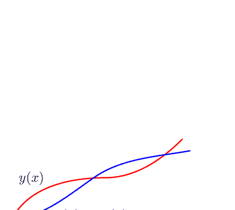

$y(x)$，其中 $\eta(x)$ 是 $x$ 的任意函数，如图B.1所示。我们用以下关系式来表示 $F[y]$ 对 $y(x)$ 的函数导数 $\delta F/\delta y(x)$：
$$F[y(x) + \epsilon\eta(x)] = F[y(x)] + \epsilon \int \frac{\delta F}{\delta y(x)} \eta(x) dx + \mathcal{O}(\epsilon^2) \tag{B.3}$$
这可以看作是(B.2)的自然扩展，其中 $F[y]$ 现在依赖于一个连续的变量集，即所有点 $x$ 处 $y$ 的值。要求函数 $y(x)$ 对函数的小变化保持稳定
$$\int \frac{\delta F}{\delta y(x)} \eta(x) dx = 0$$
因为这必须对 $\eta(x)$ 的任意选择成立，所以函数导数必须为零。为了看到这一点，想象选择一个扰动 $\eta(x)$，在点 $x$ 的邻域之外处处为零，在这种情况下，函数导数必须在 $x = x$ 处为零。然而，因为这必须对每个 $x$ 的选择都成立，所以函数导数必须在所有 $x$ 的值上为零。考虑一个由函数 $G(y, y', x)$ 定义的泛函，它依赖于 $y(x)$ 及其导数 $y'(x)$，并且直接依赖于
$$F[y] = \int G(y(x), y'(x), x) dx \tag{B.4}$$
其中 $y(x)$ 的值被假定为积分区域的边界处的固定值（可能是无穷大）。如果我们现在考虑函数 $y(x)$ 的变化，我们得到
$$F[y(x) + \epsilon\eta(x)] = F[y(x)] + \epsilon \int \left\{ \frac{\partial G}{\partial y} \eta(x) + \frac{\partial G}{\partial y'} \eta'(x) \right\} dx + \mathcal{O}(\epsilon^2) \tag{B.5}$$
现在我们必须将其转化为形式 (B.3)。为此，我们对第二项进行分部积分，并注意到 $\eta(x)$ 必须在积分的边界处消失（因为 $y(x)$ 在边界处是固定的）。这给出
$$F[y(x) + \epsilon\eta(x)] = F[y(x)] + \epsilon \int \left\{ \frac{\partial G}{\partial y} - \frac{d}{dx} \left( \frac{\partial G}{\partial y'} \right) \right\} \eta(x) dx + \mathcal{O}(\epsilon^2) \tag{B.6}$$
从中我们可以通过与(B.3)进行比较来读取泛函导数。要求泛函导数为零，则得到
$$\frac{\partial G}{\partial y} - \frac{\mathrm{d}}{\mathrm{d}x} \left( \frac{\partial G}{\partial y'} \right) = 0,$$
这些被称为欧拉-拉格朗日方程。例如，如果
$$G = y(x)^2 + (y'(x))^2$$
则欧拉-拉格朗日方程的形式为
$$y(x) - \frac{\mathrm{d}^2 y}{\mathrm{d}x^2} = 0.$$
这个二阶微分方程可以通过利用对 $y(x)$ 的边界条件来求解。

通常，我们考虑由积分定义的泛函，其被积函数采取形式 $G(y, x)$，并且不依赖于 $y(x)$ 的导数。在这种情况下，平稳性要求 $\partial G / \partial y(x) = 0$ 对于所有的 $x$ 值。

如果我们针对概率分布进行泛函优化，则需要保持概率的归一化约束。这通常是通过使用拉格朗日乘子来实现的，从而允许进行无约束优化。

将上述结果推广到多维变量 $\mathbf{x}$ 是直接的。有关变分法的更全面讨论，请参见 Sagan (1969)。

## 附录C. 拉格朗日乘子

拉格朗日乘子，有时也称为未定乘子，用于寻找多个变量受一个或多个约束条件限制时的函数的驻点。

考虑寻找函数 $f(x_1, x_2)$ 的最大值的问题，其中存在一个关于 $x_1$ 和 $x_2$ 的约束条件，我们将其写成以下形式
$$g(x_1, x_2) = 0.\tag{C.1}$$
一种方法是解约束方程(C.1)，从而将 $x_2$ 表示为 $x_1$ 的函数形式 $x_2 = h(x_1)$。然后可以将其代入函数 $f(x_1, x_2)$ 中，得到只关于 $x_1$ 的函数形式 $f(x_1, h(x_1))$。然后可以通过常规方法对 $x_1$ 进行微分，找到关于 $x_1$ 的驻点值 $x_1^*$，相应的 $x_2$ 的值由 $x_2^* = h(x_1^*)$ 给出。

这种方法的一个问题是可能很难找到一个解析解的约束方程，使得 $x_2$ 能够表示为一个显式函数的形式，其中 $x_1$ 是自变量。此外，这种方法对待 $x_1$ 和 $x_2$ 的方式不同，破坏了这些变量之间的自然对称性。

一种更优雅、通常更简单的方法是引入一个参数 $\lambda$，称为拉格朗日乘子。我们将从几何的角度来解释这个技术。考虑一个 $D$ 维变量 $\mathbf{x}$，其分量为 $x_1, \ldots, x_D$。约束方程 $g(\mathbf{x}) = 0$ 在 $\mathbf{x}$ 空间中表示为一个 $(D-1)$ 维曲面，如图C.1所示。

首先注意，在约束曲面上的任意点上，约束函数的梯度 $\nabla g(\mathbf{x})$ 垂直于曲面。为了看到这一点，考虑一个位于约束曲面上的点 $\mathbf{x}$ 以及一个位于曲面上的附近点 $\mathbf{x} + \boldsymbol{\epsilon}$。如果我们围绕 $\mathbf{x}$ 展开泰勒级数，我们有
$$g(\mathbf{x} + \boldsymbol{\epsilon}) \simeq g(\mathbf{x}) + \boldsymbol{\epsilon}^T \nabla g(\mathbf{x}).\tag{C.2}$$
因为 $\mathbf{x}$ 和 $\mathbf{x} + \boldsymbol{\epsilon}$ 都在约束曲面上，所以我们有 $g(\mathbf{x}) = g(\mathbf{x} + \boldsymbol{\epsilon})$，并且因此 $\boldsymbol{\epsilon}^T \nabla g(\mathbf{x}) \simeq 0$。当 $\|\boldsymbol{\epsilon}\| \to 0$ 时，我们有 $\boldsymbol{\epsilon}^T \nabla g(\mathbf{x}) = 0$，因为 $\boldsymbol{\epsilon}$ 是与约束面平行 $g(\mathbf{x}) = 0$，我们可以看到向量 $\nabla g$ 垂直于该面。

接下来我们寻找一个点 $\mathbf{x}^{*}$ 在约束面上使得 $f(\mathbf{x})$ 最大化。这样的点必须具有向量 $\nabla f(\mathbf{x})$ 也与约束面正交的性质，如图C.1所示，否则我们可以沿着约束面移动一小段距离来增加 $f(\mathbf{x})$ 的值。因此，$\nabla f$ 和 $\nabla g$ 是平行（或反平行）的向量，因此必定存在一个参数 $\lambda$ 使得
$$\nabla f + \lambda \nabla g = 0 \qquad \text{(C.3)}$$
其中 $\lambda$ 被称为拉格朗日乘子。注意 $\lambda$ 可以有任意符号。在这一点上，引入拉格朗日函数是方便的
$$L(\mathbf{x}, \lambda) = f(\mathbf{x}) + \lambda g(\mathbf{x}). \qquad \text{(C.4)}$$
通过设置 $\nabla_{\mathbf{x}} L = 0$ 得到约束的稳定条件 (C.3)。此外，条件 $\partial L / \partial \lambda = 0$ 导致约束方程 $g(\mathbf{x}) = 0$。
因此，为了找到函数 $f(\mathbf{x})$ 在约束 $g(\mathbf{x}) = 0$ 下的最大值，我们定义了由 (C.4) 给出的拉格朗日函数，并找到关于 $\mathbf{x}$ 和 $\lambda$ 的稳定点。对于一个 $D$ 维向量 $\mathbf{x}$，这给出了 $D + 1$ 个方程，确定了稳定点 $\mathbf{x}^{*}$ 和 $\lambda$ 的值。

如果我们只对 $\mathbf{x}$ 感兴趣，那么我们可以在不需要找到其值的情况下，从稳定性方程中消除 $\lambda$（因此术语“未确定乘数”）。作为一个简单的例子，假设我们希望找到函数的稳定点
$$f(\mathbf{x}) = f(x_1, x_2) = 1 - x_1^2 - x_2^2,$$ 受到约束 $g(\mathbf{x}) = g(x_1, x_2) = x_1 + x_2 - 1 = 0$ 的影响，如图C.2所示。相应的拉格朗日函数为
$$L(\mathbf{x}, \lambda) = 1 - x_1^2 - x_2^2 + \lambda (x_1 + x_2 - 1). \qquad \text{(C.5)}$$
这个拉格朗日函数对于变量 $x_1$、$x_2$ 和 $\lambda$ 的变化率为零的条件给出了以下耦合方程：
$$-2x_1 + \lambda = 0 \qquad \text{(C.6)}$$
$$-2x_2 + \lambda = 0 \qquad \text{(C.7)}$$
$$x_1 + x_2 - 1 = 0. \qquad \text{(C.8)}$$

图C.2 拉格朗日乘数法的一个简单例子，目标是最大化函数 $f(x_1, x_2) = 1 - x_1^2 - x_2^2$，约束条件为 $g(x_1, x_2) = 0$，其中 $g(x_1, x_2) = x_1 + x_2 - 1$。圆圈表示函数 $f(x_1, x_2)$ 的等高线，对角线表示约束面 $g(x_1, x_2) = 0$。

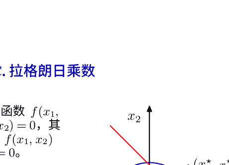

解这些方程得到的稳定点为 $(x_1^*, x_2^*) = (1/2, 1/2)$，并且拉格朗日乘数的相应值为 $\lambda = 1$。

到目前为止，我们已经考虑了在满足等式约束条件 $g(\mathbf{x}) = 0$ 的情况下最大化函数的问题。现在我们考虑在满足不等式约束条件 $g(\mathbf{x}) \geq 0$ 的情况下最大化函数 $f(\mathbf{x})$ 的问题，如图C.3所示。

现在有两种可能的解，根据约束稳定点是否位于 $g(\mathbf{x}) > 0$ 的区域，如果是的话，则约束条件是非活动的；如果位于边界 $g(\mathbf{x}) = 0$ 上，则约束条件被称为活动的。在前一种情况下，函数 $g(\mathbf{x})$ 不起作用，因此稳定条件简化为 $\nabla f(\mathbf{x}) = 0$。这再次对应于拉格朗日函数 (C.4) 的稳定点，但这次 $\lambda = 0$。后一种情况，解位于边界上，类似于之前讨论的等式约束，对应于拉格朗日函数 (C.4) 的稳定点，但这次 $\lambda \neq 0$。然而，拉格朗日乘数的符号至关重要，因为函数 $f(\mathbf{x})$ 只有在其梯度远离区域 $g(\mathbf{x}) > 0$ 时才达到最大值，如图C.3所示。因此，我们有 $\nabla f(\mathbf{x}) = -\lambda \nabla g(\mathbf{x})$，其中 $\lambda > 0$。

对于这两种情况中的任何一种，乘积 $\lambda g(\mathbf{x}) = 0$。因此，解为

图C.3 最大化问题的示例 $f(\mathbf{x})$ 在不等式约束条件 $g(\mathbf{x}) \geq 0$ 下的问题。

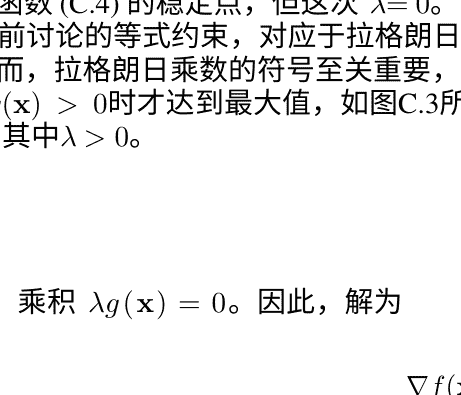

最大化问题 $f(\mathbf{x})$ 在约束条件 $g(\mathbf{x}) \geq 0$ 下通过优化拉格朗日函数 (C.4) 关于 $\mathbf{x}$ 和 $\lambda$ 的条件得到
$$g(\mathbf{x}) \geq 0 \tag{C.9}$$
$$\lambda \geq 0 \tag{C.10}$$
$$\lambda g(\mathbf{x}) = 0. \tag{C.11}$$
这些被称为 Karush–Kuhn–Tucker(KKT) 条件 (Karush, 1939; Kuhn and Tucker, 1951)。

请注意，如果我们希望最小化（而不是最大化）函数 $f(\mathbf{x})$ 在不等式约束 $g(\mathbf{x}) \geq 0$ 下，我们将最小化拉格朗日函数 $L(\mathbf{x}, \lambda) = f(\mathbf{x}) - \lambda g(\mathbf{x})$ 关于 $\mathbf{x}$ 的最小值，再次受到 $\lambda \geq 0$ 的约束。

最后，将拉格朗日乘数技术扩展到具有多个等式和不等式约束的情况是直接的。假设我们希望最大化函数 $f(\mathbf{x})$ 在约束 $g_j(\mathbf{x}) = 0$ （对于 $j = 1, \ldots, J$)，以及 $h_k(\mathbf{x}) \geq 0$ （对于 $k = 1, \ldots, K$)。然后，我们引入拉格朗日乘数 $\{\lambda_j\}$ 和 $\{\mu_k\}$，然后优化给定的拉格朗日函数
$$L(\mathbf{x}, \{\lambda_j\}, \{\mu_k\}) = f(\mathbf{x}) + \sum_{j=1}^{J} \lambda_j g_j(\mathbf{x}) + \sum_{k=1}^{K} \mu_k h_k(\mathbf{x}) \tag{C.12}$$
满足 $\mu_k \geq 0$ 和 $\mu_k h_k(\mathbf{x}) = 0$ 对于 $k = 1, \ldots, K$。对于约束的扩展附录B泛函导数同样简单。有关拉格朗日乘数技术的更详细讨论，请参阅 Nocedal 和 Wright (1999)。

## 参考文献

- Abramowitz, M., and I. A. Stegun. 1965. *Handbook of Mathematical Functions*. Dover.
- Adler, S. L. 1981. “用于多二次作用的Monte Carlo评估分区函数的超松弛方法。” *Physical Review D* 23: 2901–2904.
- Aghajanyan, Armen, Bernie Huang, Candace Ross, Vladimir Karpukhin, Hu Xu, Naman Goyal, Dmytro Okhonko, *et al*. 2022. *CM3*: 互联网的因果掩码多模型。技术报告。arXiv:2201.07520。
- Aghajanyan, Armen, Luke Zettlemoyer, and Sonal Gupta. 2020. 内在维度-性解释了语言模型微调的有效性。技术报告。arXiv:2012.13255。
- Ahn, J. H., and J. H. Oh. 2003. “一种约束的EM算法用于主成分分析。”神经计算 15 (1): 57–65。
- Alayrac, Jean-Baptiste, Jeff Donahue, Pauline Luc, Antoine Miech, Iain Barr, Yana Hasson, Karel Lenc, *et al*. 2022. *Flamingo*: 一种用于少样本学习的视觉语言模型。技术报告。arXiv:2204.14198。
- Amari, S., A. Cichocki, and H. H. Yang. 1996. “一种用于盲信号分离的新学习算法。”在神经信息处理系统进展中，由D. S. Touretzky编辑, M. C. Mozer和M. E. Hasselmo, 8:757–763。MIT出版社。
- Anderson, J. A. 和 E. Rosenfeld. 1988. 神经计算：研究基础。MIT出版社。
- Anderson, T. W. 1963. “主成分分析的渐近理论。”数理统计学年鉴 34:122–148。
- Arjovsky, M., S. Chintala 和 L. Bottou. 2017. Wasserstein GAN。技术报告。arXiv:1701.07875。
- Attias, H. 1999. “独立因子分析。”神经计算 11 (4): 803–851。
- Austin, Jacob, Daniel D. Johnson, Jonathan Ho, Daniel Tarlow 和 Rianne van den Berg. 2021. “在离散状态空间中的结构化去噪扩散模型。”在神经信息处理系统的进展中, 34:17981–17993。
- Ba, Jimmy Lei, Jamie Ryan Kiros, and Geoffrey E Hinton. 2016. 层归一化。技术报告。arXiv:1607.06450。
- Bach, F. R., and M. I. Jordan. 2002. “核无关分量分析。”机器学习研究杂志 3:1–48。
- Badrinarayanan, Vijay, Alex Kendall, and Roberto Cipolla. 2015. SegNet: 一种深度卷积-编码器-解码器架构图像分割。技术报告。arXiv:1511.00561。

## 参考文献

- 编码器-解码器架构用于图像分割。技术报告。 arXiv:1511.00561。
- Bahdanau, Dzmitry, Kyunghyun Cho, and Yoshua Bengio. 2014. 通过联合学习对齐和翻译的神经机器翻译。技术报告。 arXiv:1409.0473。
- Baldi, P., and K. Hornik. 1989. “神经网络和主成分分析：从示例中学习而无需局部极小值。”神经网络2 (1): 53–58。
- Balduzzi, David, Marcus Frean, Lennox Leary, JP Lewis, Kurt Wan-Duo Ma, and Brian McWilliams. 2017. 破碎的梯度问题：如果残差网络是答案，那问题是什么？技术报告。 arXiv:1702.08591。
- Bartholomew, D J. 1987. 潜在变量模型和因子分析。Charles Griffin。
- Basilevsky, Alexander. 1994. 统计因子分析及相关方法：理论和应用。Wiley。
- Bather, J. 2000. 决策理论：动态规划和顺序决策的介绍。Wiley。
- Battaglia, Peter W., Jessica B. Hamrick, Victor Bapst, Alvaro Sanchez-Gonzalez, Vinicius Zambaldi, Mateusz Malinowski, Andrea Tacchetti, et al. 2018. 关系归纳偏差，深度学习和图网络。技术报告。 arXiv:1806.01261。
- Baydin, A. G., B. A. Pearlmutter, A. A. Radul, and J. M. Siskind. 2018. “机器学习中的自动微分：一项调查。”机器学习研究杂志 18:1–43。
- Becker, S., and Y. LeCun. 1989. “通过二阶方法改进反向传播学习的收敛性。”1988年连接主义模型暑期学校论文集, D. Touretzky, G. E. Hinton, and T. J. Sejnowski编辑, 29–37. Morgan Kaufmann。
- Belkin, Mikhail, Daniel Hsu, Siyuan Ma, and Soumik Mandal. 2019. “调和模型-现代机器学习实践与经典偏差-方差权衡的调和。”国家科学院116 (32): 15849–15854。
- Bell, A. J., and T. J. Sejnowski. 1995. “一种信息最大化的方法用于盲分离和盲卷积。”神经计算7 (6): 1129–1159。
- Bellman, R. 1961. 自适应控制过程：一个导览。普林斯顿大学出版社。
- Bengio, Yoshua, Aaron Courville, and Pascal Vincent. 2012. 表示学习：一份综述和新视角。技术报告。 arXiv:1206.5538。
- Bengio, Yoshua, Nicholas L'éonard, and Aaron Courville. 2013. 通过随机神经元估计或传播梯度进行条件计算。技术报告。 arXiv:1308.3432。
- Berger, J. O. 1985. 统计决策理论和贝叶斯分析。第二版。Springer。
- Bernardo, J. M., and A. F. M. Smith. 1994. 贝叶斯理论。Wiley。
- Bishop, C. M. 1995a. “正则化和复杂性控制在前馈网络中。”在国际人工神经网络会议ICANN'95的论文集中, 由F. Fougelman-Soulié和P. Gallinari编辑, 1:141–148. EC2 et Cie。
- Bishop, Christopher M. 1992. “多层感知器的海森矩阵的精确计算。”神经计算4 (4): 494–501。
- Bishop, Christopher M. 1994. “新颖性检测和神经网络验证。”IEE Proceedings: Vision, Image and Signal Processing 141(4): 217–222。
- Bishop, Christopher M. 1995b. 用于模式识别的神经网络。牛津大学出版社。
- Bishop, Christopher M. 1995c. “噪声训练等同于Tikhonov正则化。”神经计算7 (1): 108–116。
- Bishop, Christopher M. 2006. 模式识别和机器学习。Springer。
- Bommasani, Rishi, Drew A. Hudson, Ehsan Adeli, Russ Altman, Simran Arora, Sydney von Arx, Michael S. Bernstein, et al. 2021. 关于基础模型的机遇和风险。技术报告。 arXiv:2108.07258。
- Bottou, L. 2010. “使用随机梯度下降的大规模机器学习。”在 Proceedings COM PSTAT 2010, 177–186. Springer。
- Bourlard, H., and Y. Kamp. 1988. “通过多层感知器和奇异值分解进行自动关联。”生物控制论59:291–294。
- Breiman, L. 1996. “装袋预测器。”机器学习26:123–140。
- Brinker, T. J., A. Hekler, A. H. Enk, C. Berking, S Haferkamp, A. Hauschild, M. Weichenthal, et al. 2019. “深度神经网络在黑色素瘤图像分类中优于皮肤科医生。”《欧洲癌症杂志》 119:11–17。
- Brock, Andrew, Jeff Donahue, and Karen Simonyan. 2018. “大规模GAN训练用于高保真自然图像合成。”《国际学习表示会议论文集(ICLR)》。arXiv:1809.11096。
- Bronstein, Michael M., Joan Bruna, Taco Cohen, and Petar Velickovic. 2021. 几何深度学习：网格、群组、图形、测地线和规范。技术报告。 arXiv:2104.13478。
- Bronstein, Michael M., Joan Bruna, Yann LeCun, Arthur Szlam, and Pierre Vandergheynst. 2017. “几何深度学习：超越欧几里得数据。”在IEEE信号处理杂志, 卷34, 4. IEEE, 七月。
- Broomhead, D. S., and D. Lowe. 1988. “多变量函数插值和自适应网络。”复杂系统 2:321–355。
- Brown, Tom B., Benjamin Mann, Nick Ryder, Melanie Subbiah, Jared Kaplan, Prafulla Dhariwal, Arvind Neelakantan, et al. 2020. 语言模型是少样本学习者。技术报告。 arXiv:2005.14165。
- Bubeck, Sébastien, Varun Chandrasekaran, Ronen Eldan, Johannes Gehrke, Eric Horvitz, Ece Kamar, Peter Lee, et al. 2023. 人工智能的火花：GPT-4的早期实验。技术报告。 arXiv:2303.12712。
- Cardoso, J.-F. 1998. “盲信号分离：统计原理。”IEEE会议论文 9(10): 2009–2025。
- Caruana, R. 1997. “多任务学习。”机器学习 28:41–75。
- Casella, G., and R. L. Berger. 2002. 统计推断。第二版。 Duxbury。
- Chan, K., T. Lee, and T. J. Sejnowski. 2003. “具有缺失数据的ICA的变分贝叶斯学习。”神经计算15 (8): 1991–2011。
- Chen, A. M., H. Lu, and R. Hecht-Nielsen. 1993. “关于前馈神经网络误差曲面的几何。”神经计算 5(6): 910–927。
- Chen, Mark, Alec Radford, Rewon Child, Jeffrey Wu, Heewoo Jun, David Luan, and Ilya Sutskever. 2020. “从像素开始的生成预训练。”机器学习研究会议119:1691–1703。
- Chen, R. T. Q., Rubanova Y., J. Bettencourt, and D. Duvenaud. 2018. 神经普通微分方程。技术报告。 arXiv:1806.07366。
- Chen, Ting, Simon Kornblith, Mohammad Norouzi, and Geoffrey Hinton. 2020. 一个简单的对比学习视觉表示的框架。技术报告。 arXiv:2002.05709。
- Cho, Kyunghyun, Bart van Merrienboer, Caglar Gulcehre, Fethi Bougares, Holger Schwenk, and Yoshua Bengio. 2014. 使用RNN编码器-解码器学习短语表示的统计机器翻译。技术报告。 arXiv:1406.1078。
- Choudrey, R. A., and S. J. Roberts. 2003. “变分混合贝叶斯独立组件分析器。”神经计算15 (1): 213–252。
- Christiano, Paul, Jan Leike, Tom B. Brown, Miljan Martic, Shane Legg, and Dario Amodei. 2017. 从人类偏好中进行深度强化学习。技术报告。 arXiv:1706.03741。
- Collobert, R. 2004. “大规模机器学习。” 博士论文, Université Paris VI。
- Comon, P., C. Jutten, and J. Hérault. 1991. “盲源分离，2: 问题陈述。” Signal Processing 24 (1): 11–20。
- Cover, T., and P. Hart. 1967. “最近邻模式分类。” IEEE Transactions on Information Theory IT-11:21–27。
- Cover, T. M., and J. A. Thomas. 1991. 信息论要素。 Wiley。
- Cox, R. T. 1946. “概率、频率和合理的期望。” American Journal of Physics 14 (1): 1–13。
- Cybenko, G. 1989. “通过叠加的S型函数进行逼近。” 控制、信号和系统的数学 2:304–314。
- Dawid, A. P. 1979. “统计理论中的条件独立性（附讨论）。” 皇家统计学会杂志, B系列 4:1–31。
- Dawid, A. P. 1980. “统计操作的条件独立性。” 统计学年鉴 8:598–617。
- Deisenroth, M. P., A. A. Faisal, and C. S. Ong. 2020. 机器学习的数学。 剑桥大学出版社。
- Dempster, A. P., N. M. Laird, and D. B. Rubin. 1977. “通过EM算法从不完整数据中获得最大似然估计。” 皇家统计学会杂志, B39 (1): 1–38。
- 邓佳, 魏东, Richard Socher, 李杰杰, 李凯李, 和 李飞飞. 2009. “ImageNet: 一个大规模的分层图像数据库。” 在 IEEE计算机视觉和模式识别会议上。
- Devlin, Jacob, Ming-Wei Chang, Kenton Lee, and Kristina Toutanova. 2018. BERT: 深度双向变压器的预训练用于语言理解的技术报告。 arXiv:1810.04805。
- Dhariwal, Prafulla和Alex Nichol。2021年。扩散模型在图像合成方面击败了GAN。技术报告。 arXiv:2105.05233。
- Dinh, Laurent, David Krueger和Yoshua Bengio. 2014年。NICE: 非线性独立分量估计。技术报告。 arXiv:1410.8516。
- Dinh, Laurent, Jascha Sohl-Dickstein, and Samy Bengio. 2016. 使用RealNVP进行密度估计。技术报告。 arXiv:1605.08803。
- Dodge, Samuel, and Lina Karam. 2017. 人类和深度学习在视觉失真下的识别性能的研究和比较。技术报告。 arXiv:1705.02498。
- Esser, Patrick, Robin Rombach, and Björn Ommer. 2020. 驯服变压器进行高分辨率图像合成。技术报告。arXiv:2012.09841。
- Esteva, A., B. Kuprel, R. A. Novoa, J. Ko, S. M. Swetter, H. M. Blau, and S. Thrun. 2017. “皮肤癌的皮肤科医生级别分类与深度神经网络。” Nature 542:115–118。
- Everitt, B. S. 1984. 潜在变量模型简介。查普曼/霍尔。
- Eykholt, Kevin, Ivan Evtimov, Earlence Fernandes, Bo Li, Amir Rahmati, Chaowei Xiao, Atul Prakash, Tadayoshi Kohno, and Dawn Song. 2018. “对深度学习视觉分类的强大物理世界攻击。”在IEEE计算机视觉和模式识别（CVPR）会议论文集中。
- Fawcett, T. 2006. “ROC分析简介。”模式识别快报27:861–874。
- Feller, W. 1966. 概率论及其应用简介。第二版。Wiley。
- Fletcher, R. 1987. 优化的实用方法。第二版。Wiley。
- Forsyth, D. A., and J. Ponce. 2003. 计算机视觉：现代方法。Prentice Hall。
- Freund, Y., and R. E. Schapire. 1996. “一种新的增强算法的实验。”In 第十三届国际机器学习会议，由 L. Saitta编辑，148–156页。Morgan Kaufmann。
- Fukushima, K. 1980. “Neocognitron: 一种自组织神经网络模型，用于不受位置偏移影响的模式识别机制。” 生物控制论36:193–202。
- Funahashi, K. 1989. “关于神经网络通过近似实现连续映射的研究。”神经网络2(3):183–192。
- Fung, R., and K. C. Chang. 1990. “在贝叶斯网络中加权和整合证据进行随机模拟。”In 人工智能不确定性，由 P. P. Bonissone, M. Henrion, L. N. Kanal, and J. F. Lemmer, 5:208–219. Elsevier。
- Gatys, Leon A., Alexander S. Ecker, and Matthias Bethge. 2015. 一种艺术风格的神经算法。技术报告。arXiv:1508.06576。
- Geman, S., and D. Geman. 1984. “随机松弛，Gibbs分布和贝叶斯图像恢复。”IEEE PAMI 6(1):721–741。
- Gemmeke, Jort F., Daniel P. W. Ellis, Dylan Freedman, Aren Jansen, Wade Lawrence, R. Channing Moore, Manoj Plakal, and Marvin Ritter. 2017. “Audio Set: 一个音频事件本体和人工标注数据集。” 在 Proc. IEEE ICASSP 2017. 新奥尔良，LA。
- Germain, Mathieu, Karol Gregor, Iain Murray, and Hugo Larochelle. 2015. MADE: 用于分布估计的掩码自编码器。技术报告。arXiv:1502.03509。
- Gilks, W. R. 1992. “无导数自适应拒绝采样用于Gibbs采样。” 在Bayesian Statistics, edited by J. Bernardo, J. Berger, A. P. Dawid, and A. F. M. Smith, vol. 4. 牛津大学出版社。
- Gilks, W. R., N. G. Best, and K. K. C. Tan. 1995. “自适应拒绝Metropolis采样。”应用统计44:455–472。
- Gilks, W. R., S. Richardson, and D. J. Spiegelhalter. 1996. 实践中的马尔可夫链蒙特卡罗方法。Chapman / Hall。
- Gilks, W. R., and P. Wild. 1992. “自适应拒绝采样用于Gibbs采样。”应用统计41:337–348。
- Gilmer, Justin, Samuel S. Schoenholz, Patrick F. Riley, Oriol Vinyals, and George E. Dahl. 2017. 神经消息传递用于量子化学。技术报告。arXiv:1704.01212。
- Girshick, Ross B. 2015. 快速R-CNN。技术报告。arXiv:1504.08083。
- Golub, G. H., and C. F. Van Loan. 1996. 矩阵计算. 第三版. 约翰霍普金斯大学出版社。
- Gong, Yuan, Yu-An Chung, and James R. Glass. 2021. AST: 音频频谱变换器.技术报告. arXiv:2104.01778。
- Goodfellow, Ian, Yoshua Bengio, and Aaron Courville. 2016. 深度学习.麻省理工学院出版社。
- Goodfellow, Ian J., Jean Pouget-Abadie, Mehdi Mirza, Bing Xu, David Warde-Farley, Sherjil Ozair, Aaron Courville, and Yoshua Bengio. 2014. 生成对抗网络.技术报告. arXiv:1406.2661。
- Goodfellow, Ian J., Jonathon Shlens, and Christian Szegedy. 2014. 解释和利用对抗样本.技术报告. arXiv:1412.6572。
- Grathwohl, Will, Ricky T. Q. Chen, Jesse Betancourt, Ilya Sutskever, and David Duvenaud. 2018. FFJORD: 自由连续动力学用于可扩展的可逆生成模型。技术报告。 arXiv:1810.01367。
- Griewank, A., and A Walther. 2008. 评估导数：算法微分的原理和技术。第二版。SIAM。
- Grosse, R. 2018. 自动微分。CSC321讲座10. 多伦多大学。
- Gulrajani, I., F. Ahmed, M. Arjovsky, V. Dumoulin, and A. Courville. 2017. 改进的Wasserstein GANs训练。技术报告。arXiv:1704.00028。
- Gutmann, Michael, and Aapo Hyvärinen. 2010. “噪声对比估计：一种新的非归一化统计模型估计原则。”机器学习研究 9:297–304。
- Hamilton, W. L. 2020. 图表示学习。Morgan / Claypool。
- Hartley, R., and A. Zisserman. 2004. 多视角计算机视觉几何。第二版。剑桥大学出版社。
- Hassibi, B., and D. G. Stork. 1993. “网络修剪的二阶导数：最优脑外科医生。”在神经信息处理系统国际会议(NeurIPS)上，由S. J. Hanson, J. D. Cowan, and C. L. Giles, 5:164–171. Morgan Kaufmann。
- Hastie, T., R. Tibshirani, and J. Friedman. 2009. 统计学习的要素。第二版。Springer出版社。
- Hastings, W. K. 1970. “蒙特卡洛采样方法使用马尔可夫链及其应用。” Biometrika 57:97–109。
- He, Kaiming, Xinlei Chen, Saining Xie, Yanghao Li, Piotr Dollár, and Ross B. Girshick. 2021. 掩码自动编码器是可扩展的视觉学习者。技术报告。 arXiv:2111.06377。
- He, Kaiming, Haoqi Fan, Yuxin Wu, Saining Xie, and Ross Girshick. 2019. 动量对比用于无监督视觉表示学习。技术报告。 arXiv:1911.05722。
- He, Kaiming, Xiangyu Zhang, Shaoqing Ren, and Jian Sun. 2015a. 深度残差学习用于图像识别。技术报告。 arXiv:1512.03385。
- He, Kaiming, Xiangyu Zhang, Shaoqing Ren, and Jian Sun. 2015b. 深入研究整流器：超越人类水平的图像分类性能。技术报告。 arXiv:1502.01852。
- Henrion, M. 1988. “通过逻辑抽样在贝叶斯网络中传播不确定性。” In Uncertainty in Artificial Intelligence, edited by J. F. Lemmer and L. N. Kanal, 2:149–164. North Holland。
- Higgins, I., L. Matthey, A. Pal, C. Burgess, X. Glorot, M. Botvinik, S. Mohamed, and A. Lerchner. 2017. “β-VAE: 通过受限变分框架学习基本视觉概念。” In Proceedings of the International Conference Learning Representations (ICLR)。
- Hinton, G. E. 2012. 神经网络用于机器学习。第6.5讲。Coursera讲座。
- Hinton, G. E., M. Welling, Y. W. Teh, and S Osin-dero. 2001. “一种新的ICA视角。”在国际独立成分分析和盲信号分离会议第3卷。

## 参考文献

Hinton, Geoffrey, Oriol Vinyals, and Jeff Dean. 2015. Distilling the Knowledge in a Neural Network. Technical report. arXiv:1503.02531.

Hinton, Geoffrey E. 2002. “Training Products of Experts by Minimizing Contrast Divergence.” Neural Computation 14:1771–1800.

Ho, Jonathan, Ajay Jain, and Pieter Abbeel. 2020. Denoising Diffusion Probabilistic Models. Technical report. arXiv:2006.11239.

Ho, Jonathan, Chitwan Saharia, William Chan, David J. Fleet, Mohammad Norouzi, and Tim Salimans. 2021. Cascaded Diffusion Models for High Fidelity Image Generation. Technical report. arXiv:2106.15282.

Hu, Anthony. 2023. Generative World Models for Autonomous Driving. Technical report. arXiv:2309.17080.

Hu, Edward J., Yelong Shen, Phillip Wallis, Zeyuan Allen-Zhu, Yuanzhi Li, Shean Wang, Lu Wang, and Weizhu Chen. 2021. LoRA: Low-Rank Adaptation of Large Language Models. Technical report. arXiv:2106.09685.

Hubel, D. H. and T. N. Wiesel. 1959. “Receptive Fields of Single Neurones in the Cat’s Striate Cortex.” Journal of Physiology 148: 574-591.

Hyvärinen, A. 2005. “Estimation of Non-Standardized Statistical Models by Score Matching.” Journal of Machine Learning Research 6: 695-709.

Hochreiter, S., and J. Schmidhuber. 1997. “Long Short-Term Memory.” Neural Computation 9 (8): 1735–1780.

Hyvärinen, A., and E. Oja. 1997. “A Fast Fixed-Point Algorithm for Independent Component Analysis.” Neural Computation 9(7): 1483–1492.

Hojen-Sorensen, P. A., O. Winther, and L. K. Hansen. 2002. “Mean-Field Approaches to Independent Component Analysis.” Neural Computation 14 (4): 889–918.

Hyvärinen, Aapo, Jarmo Hurri, and Patrick O. Hoyer. 2009. Natural Image Statistics: A Probabilistic Approach to Early Computational Vision. Springer.

Holtzman, Ari, Jan Buys, Maxwell Forbes, and Yejin Choi. 2019. The Curious Case of Neural Text Degeneration. Technical report. arXiv:1904.09751.

Ioffe, S., and C. Szegedy. 2015. “Batch Normalization: Accelerating Deep Network Training by Reducing Internal Covariate Shift.” In International Conference on Machine Learning (ICML) Proceedings, 448–456.

Hornik, K., M. Stinchcombe, and H. White. 1989. “Multilayer Feedforward Networks are Universal Approximators.” Neural Networks 2 (5):359–366.

Jacobs, R. A., M. I. Jordan, S. J. Nowlan, and G. E. Hinton. 1991. “Adaptive Mixtures of Local Experts.” Neural Computation 3 (1): 79–87.

Hospedales, Timothy, Antreas Antoniou, Paul Micaelli, and Amos Storkey. 2021. “Meta-Learning in Neural Networks: A Survey.” IEEE Transactions on Pattern Analysis and Machine Intelligence 44 (9): 5149-5169.

Jebara, T. 2004. Machine Learning: Discriminative and Generative. Kluwer.

Hotelling, H. 1933. “Analysis of a Complex of Statistical Variables into Principal Components.” Journal of Educational Psychology 24: 417-441.

Jensen, C., A. Kong, and U. Kjaerulff. 1995. “Blocking Gibbs Sampling in Very Large Probabilistic Expert Systems.” International Journal of Human-Computer Studies. Special Issue on Practical Applications of Uncertainty Reasoning. 42:647–666.

Hotelling, H. 1936. “Relations Between Two Sets of Variates.” Biometrika 28: 321-377.

Hu, Anthony, Lloyd Russell, Yair Yisrael, Zak Murez, George Federoff, Alex Kendall, Jamie Shotton, and Gianluca Corrado. 2023. GAI-1: Generative World Models for Autonomous Driving. Technical report. arXiv:2309.17080.

Jolliffe, I. T. 2002. Principal Component Analysis. 2nd ed. Springer.

Jumper, John, Richard Evans, Alexander Pritzel, Tim Green, Michael Figurnov, and Olaf Ronneberger. 2021. “Highly Accurate Protein Structure Prediction with AlphaFold.” Nature 596:583–589.

Jutten, C., and J. Herault. 1991. “Blind Separation of Sources, Part I: An Adaptive Algorithm Based on Neuromimetic Architecture.” Signal Processing 24 (1): 1–10.

Kaplan, Jared, Sam McCandlish, Tom Henighan, Tom B. Brown, Benjamin Chess, Rewon Child, Scott Gray, Alec Radford, Jeffrey Wu, and Dario Amodei. 2020. Scaling Laws for Neural Language Models. Technical report. arXiv:2001.08361.

Karras, Tero, Timo Aila, Samuli Laine, and Jaakko Lehtinen. 2017. Progressive Growing of GANs for Improved Quality, Stability, and Variation. Technical report. arXiv:1710.10196.

Karush, W. 1939. “Minima of Functions of Several Variables with Inequalities as Side Constraints.” Master’s thesis, Department of Mathematics, University of Chicago.

Khosla, Prannay, Piotr Teterwak, Chen Wang, Aaron Sarna, Yonglong Tian, Phillip Isola, Aaron Maschinot, Ce Liu, and Dilip Krishnan. 2020. Supervised Contrastive Learning. Technical report. arXiv:2004.11362.

Kingma, D., and J. Ba. 2014. Adam: A Method for Stochastic Optimization. Technical report. arXiv:1412.6980.

Kingma, D. P., and M. Welling. 2013. “Auto-Encoding Variational Bayes.” In International Conference on Machine Learning (ICML) Proceedings. ArXiv:1312.6114.

Kingma, Diederik P., and Max Welling. 2019. An Introduction to Variational Autoencoders. Technical report. arXiv:1906.02691.

Kingma, Durk P, Tim Salimans, Rafal Jozefowicz, Xi Chen, Ilya Sutskever, and Max Welling. 2016. “Improving Variational Inference with Inverse Autoregressive Flow.” Advances in Neural Information Processing Systems 29.

Kipf, Thomas N., and Max Welling. 2016. Semi-Supervised Classification with Graph Convolutional Networks. Technical report. arXiv:1609.02907.

Kloeden, Peter E, and Eckhard Platen. 2013. Numerical Solution of Stochastic Differential Equations. Vol. 23. Stochastic Modelling and Applied Probability. Springer.

Kobyzev, I., S. J. D. Prince, and M. A. Brubaker. 2019. “Normalizing Flows: Introduction and Overview.” IEEE Transactions on Pattern Analysis and Machine Intelligence 43 (11): 3964–3979.

Krizhevsky, Alex, Ilya Sutskever, and Geoffrey E. Hinton. 2012. “ImageNet Classification with Deep Convolutional Neural Networks.” In Advances in Neural Information Processing Systems, vol. 25.

Kuhn, H. W., and A. W. Tucker. 1951. “Nonlinear Programming.” In Proceedings of the Second Berkeley Symposium on Mathematical Statistics and Probability, 481–492. University of California Press.

Kullback, S., and R. A. Leibler. 1951. “On Information and Sufficiency.” Annals of Mathematical Statistics 22 (1): 79–86.

Kurkov´a, V., and P. C. Kainen. 1994. “Functionally Equivalent Feedforward Neural Networks.” Neural Computation 6 (3): 543–558.

Lasserre, J., Christopher M. Bishop, and T. Minka. 2006. “Principled Hybrids of Generative and Discriminative Models.” In 2006 IEEE Computer Society Conference on Computer Vision and Pattern Recognition, New York.

Lauritzen, S. L. 1996. Graphical Models. Oxford University Press.

Lawley, D. N. 1953. “A Modified Method of Estimation in Factor Analysis and Some Large Sample Results.” Uppsala Symposium on Psychological Factor Analysis, 35–42. Nordisk Psykologi Monograph Series No. 3. Uppsala: Almqvist / Wiksell.

Lazarsfeld, P. F., and N. W. Henry. 1968. Latent Structure Analysis. Houghton Mifflin.

LeCun, Y., B. Boser, J. S. Denker, D. Henderson, R. E. Howard, W. Hubbard, and L. D. Jackel. 1989. “Backpropagation Applied to Handwritten Zip Code Recognition.” Neural Computation 1 (4): 541–551.

LeCun, Y., L. Bottou, Y. Bengio, and P. Haffner. 1998. “Gradient-Based Learning Applied to Document Recognition.” Proceedings of the IEEE 86:2278–2324.

LeCun, Y., J. S. Denker, and S. A. Solla. 1990. “Optimal Brain Damage.” In Advances in Neural Information Processing Systems, ed. D. S. Touretzky, 2:598–605. Morgan Kaufmann.

LeCun, Yan, Yoshua Bengio, and Geoffrey Hinton. 2015. “Deep Learning.” Nature 512:436–444.

LeCun, Yann, Sumit Chopra, Raia Hadsell, Marc’Aurelio Ranzato, and Fu-Jie Huang. 2006. “A Tutorial on Energy-Based Learning.” In Predicting Structured Data, ed. G. Bakir, T. Hofman, B. Schölkopf, A. Smola, and B. Taskar. MIT Press.

Leen, T. K. 1995. “From Data Distributions to Regularization in Invariant Learning.” Neural Computation 7:974–981.

Leshno, M., V. Y. Lin, A. Pinkus, and S. Schocken. 1993. “Multilayer Feedforward Networks with a Polynomial Activation Function Can Approximate Any Function.” Neural Networks 6:861–867.

Li, Hao, Zheng Xu, Gavin Taylor, Christoph Studer, and Tom Goldstein. 2017. Visualizing the Loss Landscape of Neural Nets. Technical report. arXiv:1712.09913.

Li, Junnan, Dongxu Li, Caiming Xiong, and Steven Hoi. 2022. BLIP: Bootstrapping Language-Image Pre-training for Unified Vision-Language Understanding and Generation. Technical report. arXiv:2201.12086.

Lin, Min, Qiang Chen, and Shuicheng Yan. 2013. Network In Network. Technical report. arXiv:1312.4400.

Lin, Tianyang, Yuxin Liu, Xiangyang Liu, and Xipeng Qiu. 2021. A Survey of Transformers. Technical report. arXiv:2106.04554.

Lipman, Yaron, Ricky T. Q. Chen, Heli Ben-Hamul, Maximilian Nickel, and Matt Le. 2022. Flow Matching for Generative Modeling. Technical report. arXiv:2210.02747.

Liu, Pengfei, Weizhe Yuan, Jinlan Fu, Zhengbao Jiang, Guangming He, and Graham Neubig. 2021. Pre-train, Prompt, and Predict: A Systematic Survey of Prompting Methods in Natural Language Processing. Technical report. arXiv:2107.13586.

Lloyd, S. P. 1982. “Least Squares Quantization in PCM.” IEEE Transactions on Information Theory 28 (2): 129–137.

Long, Jonathan, Evan Shelhamer, and Trevor Darrell. 2014. Fully Convolutional Networks for Semantic Segmentation. Technical report. arXiv:1411.4038.

Luo, Calvin. 2022. Understanding Diffusion Models: A Unified Perspective. Technical report. arXiv:2208.11970.

L’utkepohl, H. 1996. Handbook of Matrices. Wiley.

MacKay, D. J. C. 1992. “A Practical Bayesian Framework for Backpropagation Networks.” Neural Computation 4 (3): 448–472.

MacKay, D. J. C. 2003. Information Theory, Inference, and Learning Algorithms. Cambridge University Press.

MacQueen, J. 1967. “Some Methods for Classification and Analysis of Multivariate Observations.” In Proceedings of the Fifth Berkeley Symposium on Mathematical Statistics and Probability, ed. L. M. LeCam and J. Neyman, I:281–297. University of California Press.

Magnus, J. R., and H. Neudecker. 1999. Matrix Differential Calculus with Applications in Statistics and Econometrics. Wiley.

Mallat, S. 1999. A Wavelet Tour of Signal Processing. 2nd ed. Academic Press.

Mao, X., Q. Li, H. Xie, R. Lau, Z. Wang, and S. Smolley. 2016. Least Squares Generative Adversarial Networks. Technical report. arXiv:1611.04076.

Mardia, K. V., and P. E. Jupp. 2000. Directional Statistics. Wiley.

Martens, James, Ilya Sutskever, and Kevin Swersky. 2012. “Estimating the Hessian by Back-Propagating Curvature.” In International Conference on Machine Learning (ICML) Proceedings. ArXiv:1206.6464.

McCullagh, P., and J. A. Nelder. 1989. Generalized Linear Models. 2nd ed. Chapman / Hall.

McCulloch, W. S., and W. Pitts. 1943. “A Logical Calculus of the Ideas Immanent in Nervous Activity.” Reprinted in Anderson and Rosenfeld (1988), Bulletin of Mathematical Bio-physics 5:115–133.

McLachlan, G. J. and T. Krishnan. 1997. The EM Algorithm and Extensions. Wiley.

McLachlan, G. J. and D. Peel. 2000. Finite Mixture Models. Wiley.

Meng, X. L. and D. B. Rubin. 1993. “Maximum Likelihood Estimation via the ECM Algorithm: A General Framework.” Biometrika 80:267–278.

Mescheder, L., A. Geiger and S. Nowozin. 2018. Which Training Methods for GANs do actually Converge? Technical report. arXiv:1801.04406.

Metropolis, N., A. W. Rosenbluth, M. N. Rosenbluth, A. H. Teller and E. Teller. 1953. “Equation of State Calculations by Fast Computing Machines.” Journal of Chemical Physics 21(6): 1087–1092.

Metropolis, N., and S. Ulam. 1949. “The Monte Carlo Method.” Journal of the American Statistical Association 44 (247): 335–341.

Mikolov, Tomas, Kai Chen, Greg Corrado, and Jeffrey Dean. 2013. Efficient Estimation of Word Representations in Vector Space. Technical report. arXiv:1301.3781.

Minsky, M. L., and S. A. Papert. 1969. Perceptrons. Expanded edition 1990. MIT Press.

Mirza, M., and S. Osindero. 2014. Conditional Generative Adversarial Nets. Technical report. arXiv:1411.1784.

Miskin, J. W., and D. J. C. MacKay. 2001. “Ensemble Learning for Blind Source Separation.” In Independent Component Analysis: Principles and Practice, ed. S. J. Roberts and R. M. Everson. Cambridge University Press.

Møller, M. 1993. “A Scaled Conjugate Gradient Algorithm for Fast Supervised Learning.” PhD thesis, University of Aarhus, Denmark.

Mont´ufar, G. F., R. Pascanu, K. Cho, and Y. Bengio. 2014. “On the Number of Linear Regions of Deep Neural Networks.” In Advances in Neural Information Processing Systems. ArXiv:1402.1869.

Mordvintsev, Alexander, Christopher Olah, and Mike Tyka. 2015. Inceptionism: Going Deeper into Neural Networks. Google AI Blog.

Murphy, Kevin P. 2022. Probabilistic Machine Learning: An Introduction. MIT Press. probml.ai.

Murphy, Kevin P. 2023. Probabilistic Machine Learning: Advanced Topics. MIT Press. http://probml.github.io/book2.

Nakkiran, Preetum, Gal Kaplun, Yamini Bansal, Tristan Yang, Boaz Barak and Ilya Sutskever. 2019. Deep Double Descent: Where Bigger Models and More Data Hurt. Technical report. arXiv:1912.02292.

Neal, R.M. 1993. Probabilistic Inference Using Markov Chain Monte Carlo Methods. Technical Report CRG-TR-93-1. Department of Computer Science, University of Toronto, Canada.

Neal, R.M. 1999. “Suppressing Random Walks in Markov Chain Monte Carlo Using Ordered Over-Relaxation.” In Learning in Graphical Models, ed. Michael I. Jordan, 205-228. MIT Press.

Neal, R.M. and G.E. Hinton. 1999. “A View of the EM Algorithm that Justifies Incremental, Sparse, and Other Variants.” In Learning in Graphical Models, ed. M.I. Jordan, 355-368. MIT Press.

Nelder, J. A., and R. W. M. Wedderburn. 1972. “Generalized Linear Models.” Journal of the Royal Statistical Society, A 135:370–384.

Nesterov, Y. 2004. Introductory Lectures on Convex Optimization: A Basic Course. Kluwer.

## 参考文献

Nichol, Alex, 和 Prafulla Dhariwal. 2021. 改进的去噪扩散概率模型. 技术报告. arXiv:2102.09672.

Nichol, Alex, Prafulla Dhariwal, Aditya Ramesh, Pranav Shyam, Pamela Mishkin, Bob McGrew, Ilya Sutskever, 和 Mark Chen. 2021. GLIDE: 朝向逼真图像生成和文本引导扩散模型的编辑. 技术报告. arXiv:2112.10741.

Nocedal, J., 和 S. J. Wright. 1999. 数值优化. Springer.

Noh, Hyeonwoo, Seunghoon Hong, 和 Bohyung Han. 2015. 学习反卷积网络用于语义分割. 技术报告. arXiv:1505.04366.

Nowlan, S. J., 和 G. E. Hinton. 1992. “通过软权重共享简化神经网络.” 神经计算 4 (4): 473–493.

Ogden, R. T. 1997. 统计学的基本小波应用和数据分析. Birkhäuser.

Oord, Aaron van den, Nal Kalchbrenner, 和 Koray Kavukcuoglu. 2016. 像素递归神经网络. 技术报告. arXiv:1601.06759.

Oord, Aaron van den, Nal Kalchbrenner, Oriol Vinyals, Lasse Espeholt, Alex Graves, 和 Koray Kavukcuoglu. 2016. 有条件的图像生成与PixelCNN解码器. 技术报告. arXiv:1606.05328.

Oord, Aaron van den, Yazhe Li, 和 Oriol Vinyals. 2018. 对比预测编码的表示学习. 技术报告. arXiv:1807.03748.

Oord, Aaron van den, Oriol Vinyals, 和 Koray Kavukcuoglu. 2017. 神经离散表示学习. 技术报告. arXiv:1711.00937.

OpenAI. 2023. GPT-4 技术报告. 技术报告. arXiv:2303.08774.

Opper, M., 和 O. Winther. 2000. “高斯过程和SVM：均场理论和留一法.” In 大边界分类器的进展, 由 A. J. Smola, P. L. Bartlett, B. Schölkopf, and D. Shuurmans 编辑, 311–326. MIT Press.

Papamakarios, G., T. Pavlakou, 和 Iain Murray. 2017. “掩码自回归流用于密度估计.” In 神经信息处理系统国际会议论文集 (NeurIPS), 卷30.

Papamakarios, George, Eric Nalisnick, Danilo Jimenez Rezende, Shakir Mohamed, 和 Balaji Lakshminarayanan. 2019. 归一化流用于概率建模和推断. 技术报告. arXiv:1912.02762.

Parisi, Giorgio. 1981. “相关函数和计算机模拟.” 核物理学 B180:378–384.

Pearl, J. 1988. 智能系统中的概率推理. Morgan Kaufmann.

Pearlmutter, B. A. 1994. “通过Hessian进行快速精确乘法.” 神经计算 6 (1): 47–160.

Pearlmutter, B. A., 和 L. C. Parra. 1997. “最大似然源分离：ICA的上下文敏感泛化.” 在神经信息处理系统进展中, 由 M. C. Mozer, M. I. Jordan 和 T. Petsche 编辑, 9:613–619. MIT 出版社.

Pearson, Karl. 1901. “关于空间中点系统的最佳拟合线和平面.” 伦敦、爱丁堡和都柏林哲学杂志和科学杂志, 第六系列 2:559–572.

Phuong, Mary 和 Marcus Hutter. 2022. 转换器的正式算法. 技术报告. arXiv:2207.09238.

Prince, Simon J.D. 2020. 变分自动编码器. https://www.borealisai.com/research/blogs/tutorial-5-variational-auto-encoders.

Prince, Simon J.D. 2023. 理解深度学习. MIT出版社. http://udlbook.com.

Radford, A., L. Metz 和 S. Chintala. 2015. 无监督表示学习与深度卷积生成对抗网络. 技术报告. arXiv:1511.06434.

Radford, Alec, Jong Wook Kim, Chris Hallacy, Aditya Ramesh, Gabriel Goh, Sandhini Agarwal, Girish Sastry, 等. 2021. 从自然语言监督中学习可转移的视觉模型. 技术报告. arXiv:2103.00020.

Radford, Alec, Jeffrey Wu, Rewon Child, David Luan, Dario Amodei, 和 Ilya Sutskever. 2019. 语言模型是无监督多任务学习者. 技术报告. OpenAI.

Rakhimov, Ruslan, Denis Volkhonskiy, Alexey Artemov, Denis Zorin, 和 Evgeny Burnaev. 2020. 潜在视频变换器. 技术报告. arXiv:2006.10704.

Ramachandran, P., B. Zoph, 和 Q. V. Le. 2017. 搜索激活函数. 技术报告. arXiv:1710.05941v2.

Rao, C. R., 和 S. K. Mitra. 1971. 矩阵的广义逆及其应用. Wiley.

Redmon, Joseph, Santosh Kumar Divvala, Ross B. Girshick, 和 Ali Farhadi. 2015. 你只看一次：统一的实时目标检测. 技术报告. arXiv:1506.02640.

Ren, Shaoqing, Kaiming He, Ross B. Girshick, 和 Jian Sun. 2015. 更快的R-CNN: 面向实时目标检测的区域提议网络. 技术报告. arXiv:1506.01497.

Rezende, Danilo J, Shakir Mohamed, 和 Daan Wierstra. 2014. “随机反向传播和深度生成模型中的近似推断.” 在第31届国际机器学习大会 (ICML-14) 上的论文集中, 1278–1286.

Ricotti, L. P., S. Ragazzini, 和 G. Martinelli. 1988. “在次优二阶反向传播神经网络中学习词重音.” 在IEEE国际神经网络会议论文集中, 1:355–361. IEEE.

Robert, C. P., 和 G. Casella. 1999. 蒙特卡洛统计方法. Springer.

Rombach, Robin, Andreas Blattmann, Dominik Lorenz, Patrick Esser, 和 Björn Ommer. 2021. 高分辨率图像合成与潜在扩散模型. 技术报告. arXiv:2112.10752.

Ronneberger, Olaf, Philipp Fischer, 和 Thomas Brox. 2015. “U-Net: 用于生物医学图像分割的卷积网络.” 在医学图像计算与计算机辅助干预 - MICCAI中, 由 N. Navab, J. Hornegger, W. Wells, 和 A. Frangi 编辑. Springer.

Rosenblatt, F. 1962. 神经动力学原理：感知器和大脑机制理论. Spartan.

Roweis, S. 1998. “EM算法用于PCA和SPCA.” 在神经信息处理系统进展中, 由 M. I. Jordan, M. J. Kearns 和 S. A. Solla 编辑, 第10卷：626-632页. MIT出版社.

Roweis, S. 和 Z. Ghahramani. 1999. “线性高斯模型的统一综述.” 神经计算 11 (2): 305-345页.

Rubin, D. B. 和 D. T. Thayer. 1982. “用于ML因子分析的EM算法.” 心理测量学 47 (1): 69-76页.

Rumelhart, D. E., G. E. Hinton 和 R. J. Williams. 1986. “通过误差传播学习内部表示.” 在并行分布式处理：认知微结构探索中, 由 D. E. Rumelhart, J. L. McClelland 和 PDP研究小组 编辑, 第1卷：基础, 318-362页. 重印于Anderson和Rosenfeld (1988). MIT Press.

Ruthotto, L. 和 E. Haber. 2021. 深度生成建模简介. 技术报告. arXiv:2103.05180.

Sagan, H. 1969. 变分法简介. 多佛出版社.

Saharia, Chitwan, William Chan, Huiwen Chang, Chris A. Lee, Jonathan Ho, Tim Salimans, David J. Fleet, 和 Mohammad Norouzi. 2021. 调色板：图像到图像扩散模型. 技术报告. arXiv:2111.05826.

Saharia, Chitwan, William Chan, Saurabh Saxena, Lala Li, Jay Whang, Emily Denton, Seyed Kamyar Seyed Ghasemipour, 等. 2022. 逼真的文本到图像扩散模型具有深度语言理解的. 技术报告. arXiv:2205.11487.

Saharia, Chitwan, Jonathan Ho, William Chan, Tim Salimans, David J. Fleet, 和 Mohammad Norouzi. 2021. 图像超分辨率通过迭代改进. 技术报告. arXiv:2104.07636.

Santurkar, S., D. Tsipras, A. Ilyas, 和 A. Madry. 2018. 批归一化如何帮助优化? 技术报告. arXiv:1805.11604.

Satorras, Victor Garcia, Emiel Hoogeboom, 和 Max Welling. 2021. E(n) 等变图神经网络. 技术报告. arXiv:2102.09844.

Schölkopf, B., 和 A. J. Smola. 2002. 使用核函数进行学习. MIT出版社.

Schuhmann, Christoph, Richard Vencu, Romain Beaumont, Robert Kaczmarczyk, Clayton Mullis, Aarush Katta, Theo Coombes, Jenia Jitsev, 和 Aran Komatsuzaki. 2021. LaION-400M: CLIP过滤的400百万图像-文本对的开放数据集. 技术报告. arXiv:2111.02114.

Schuster, Mike, 和 Kaisuke Nakajima. 2012. “日本和韩国语音搜索.” 在 2012 IEEE国际声学、语音和信号处理会议 (ICASSP) 上, 5149–5152.

Selvaraju, Ramprasaath R., Abhishek Das, Ramakrishna Vedantam, Michael Cogswell, Devi Parikh, 和 Dhruv Batra. 2016. Grad-CAM: 基于梯度的定位的深度网络的视觉解释. 技术报告. arXiv:1610.02391.

Sennrich, Rico, Barry Haddow, 和 Alexandra Birch. 2015. 使用子词单元的罕见词的神经机器翻译. 技术报告. arXiv:1508.07909.

Sermanet, Pierre, David Eigen, Xiang Zhang, Michael Mathieu, Rob Fergus, 和 Yann LeCun. 2013. OverFeat: 使用卷积网络进行集成识别、定位和检测. 技术报告. arXiv:1312.6229.

Shachter, R. D., 和 M. Peot. 1990. “模拟对信念网络上的一般概率推断的方法.” 在人工智能的不确定性, 由 P. P. Bonissone, M. Henrion, L. N. Kanal, 和 J. F. Lemmer 编辑, 第5卷. 爱思唯尔.

Shannon, C. E. 1948. “一种关于通信的数学理论.” 贝尔系统技术杂志 27 (3): 379–423 和 623–656.

Shen, Sheng, Zhen Dong, Jiayu Ye, Linjian Ma, Zhewei Yao, Amir Gholami, Michael W. Mahoney, 和 Kurt Keutzer. 2019. Q-BERT: 基于Hessian的BERT超低精度量化. 技术报告. arXiv:1909.05840.

Simard, P., B. Victorri, Y. Le Cun, 和 J. Denker. 1992. “切线传播 - 一种用于规范自适应网络中的选定不变性的形式化方法.” 在神经信息处理系统的进展, 由 J. E. Moody, S. J. Hanson, 和 R. P. Lippmann 编辑, 第4卷：895–903. Morgan Kaufmann.

Simard, P. Y., D. Steinkraus, 和 J. Platt. 2003. “卷积神经网络在视觉文档分析中的应用最佳实践.” 在国际文档分析与识别会议 (ICDAR) 上的论文集中, 958–962. IEEE计算机学会.

Simonyan, Karen, Andrea Vedaldi, 和 Andrew Zisserman. 2013. “深入卷积网络：可视化图像分类模型和显著性图.” 在计算机视觉和模式识别中. ArXiv:1312.6034.

Simonyan, Karen, 和 Andrew Zisserman. 2014. 用于大规模图像识别的非常深的卷积网络. 技术报告. arXiv:1409.1556.

Sirovich, L. 1987. “湍流和相干结构的动力学.” 季度应用数学 45 (3): 561–590.

Sohl-Dickstein, Jascha, Eric A. Weiss, Niru Maheswaranathan, 和 Surya Ganguli. 2015. 深度无监督学习使用非平衡态热力学. 技术报告. arXiv:1503.03585.

Sønderby, C., J. Caballero, L. Theis, W. Shi, 和 F. Huszár. 2016. 用于图像超分辨率的摊销MAP推断. 技术报告. arXiv:1610.04490.

Song, Jiaming, Chenlin Meng, 和 Stefano Ermon. 2020. 去噪扩散隐式模型. 技术报告. arXiv:2010.02502.

Song, Yang, 和 Stefano Ermon. 2019. “通过估计数据分布的梯度进行生成建模.” 在神经信息处理系统进展, 11895–11907. ArXiv:1907.05600.

Song, Yang, Sahaj Garg, Jiaxin Shi, 和 Stefano Ermon. 2019. “Sliced score matching: A scalable approach to density and score estimation.” In Uncertainty in Artificial Intelligence, 204. ArXiv:1905.07088.

Song, Yang, 和 Diederik P. Kingma. 2021. 如何训练你的能量模型. 技术报告. arXiv:2101.03288.

Song, Yang, Jascha Sohl-Dickstein, Diederik P. Kingma, Abhishek Kumar, Stefano Ermon, 和 Ben Poole. 2020. 通过随机微分方程进行基于分数的生成建模. 技术报告. arXiv:2011.13456.

Srivastava, N., G. Hinton, A. Krizhevsky, I. Sutskever, 和 R. Salakhutdinov. 2014. “Dropout: 一种简单的方法来防止神经网络过拟合.” 机器学习研究杂志 15:1929–1958.

Stone, J. V. 2004. 独立成分分析：教程介绍. 麻省理工学院出版社.

Sutskever, I., J. Martens, G. Dahl, 和 G. E. Hinton. 2013. “初始化和动量在深度学习中的重要性.” 在国际机器学习大会 (ICML) 论文集中.

Sutton, R. 2019. The Bitter Lesson. URL: incompleteideas.net/IncIdeas/BitterLesson.html.

Szegedy, Christian, Wojciech Zaremba, Ilya Sutskever, Joan Bruna, Dumitru Erhan, Ian Goodfellow, 和 Rob Fergus. 2013. 神经网络的有趣性质. 技术报告. arXiv:1312.6199.

Szeliski, R. 2022. 计算机视觉：算法和应用. 第二版. Springer.

Tarassenko, L. 1995. “用于乳房X光照片中肿块识别的新颖性检测.” 在第四届IEEE国际人工神经网络会议论文集中, 4:442–447. IEE.

Tay, Yi, Mostafa Dehghani, Dara Bahri, 和 Donald Metzler. 2020. 高效Transformer：一项调查. 技术报告. arXiv:2009.06732.

Tibshirani, R. 1996. “通过套索进行回归收缩和选择.” 皇家统计学会杂志, B58:267–288.

Tipping, M. E., 和 Christopher M. Bishop. 1997. 概率主成分分析. 技术报告 NCRG/97/010. 神经计算研究小组，阿斯顿大学.

Tipping, M. E., 和 Christopher M. Bishop. 1999. “概率主成分分析.” 皇家统计学会杂志，系列 B 21 (3): 611–622.

Vapnik, V. N. 1995. 统计学习的本质. 斯普林格.

Vaswani, Ashish, Noam Shazeer, Niki Parmar, Jakob Uszkoreit, Llion Jones, Aidan N. Gomez, Łukasz Kaiser, 和 Illia Polosukhin. 2017. 注意力就是一切. 技术报告. arXiv:1706.03762.

Veličković, Petar. 2023. 一切都相互关联：图神经网络. 技术报告. arXiv:2301.08210.

Veličković, Petar, Guillem Cucurull, Arantxa Casanova, Adriana Romero, Pietro Liò, 和 Yoshua Bengio. 2017. 图注意力网络. 技术报告. arXiv:1710.10903.

Vidakovic, B. 1999. 小波统计建模. Wiley.

Vig, Jesse, Ali Madani, Lav R. Varshney, Caiming Xiong, Richard Socher, 和 Nazneen Fatema Rajani. 2020. BERTology Meets Biology: 在蛋白质语言模型中解释注意力。技术报告。 arXiv:2006.15222。

Vincent, P. 2011. “得分匹配和去噪自编码器之间的联系。” 神经计算 23: 1661–1674。

Vincent, Pascal, Hugo Larochelle, Yoshua Bengio, 和 Pierre-Antoine Manzagol. 2008. “使用去噪自编码器提取和组合鲁棒特征。” 在机器学习国际会议论文集 (ICML) 中。

Walker, A. M. 1969. “关于后验分布的渐近行为。” 皇家统计学会杂志, B31 (1): 80–88。

王成义，陈三元，吴宇，张自强，周龙，刘书杰，陈卓，等。 2023. 神经编解码语言模型是零射文本到语音合成器。技术报告。 arXiv:2301.02111。

Weisstein, E.W. 1999. CRC简明数学百科全书。 Chapman / Hall / CRC。

Welling, Max 和 Yee Whye Teh. 2011. “贝叶斯通过随机梯度Langevin动力学学习。” 在国际会议论文集 (ICML)。

Williams, P.M. 1996. “使用神经网络建模条件多变量密度。” 神经计算 8 (4): 843–854。

Williams, R J. 1992. “简单的统计梯度以下算法用于连接主义强化学习。” 机器学习 8: 229–256。

Winn, J., C. M. Bishop, T. Diethe, J. Guiver, and Y. Zaykov. 2023. 基于模型的机器学习。 www.mbmlbook.com. Chapman / Hall。

Wolpert, D. H. 1996. “学习算法之间缺乏先验的区分。” 神经计算 8: 1341–1390。

Wu, Zhirong, Yuanjun Xiong, Stella Yu, 和 Dachuan Lin. 2018. 非参数实例级别判别的无监督特征学习。技术报告。 arXiv:1805.01978。

Wu, Zonghan, Shirui Pan, Fengwen Chen, Guodong Long, Chengqi Zhang, 和 Philip S. Yu. 2019. 图神经网络综述。技术报告。 arXiv:1901.00596。

Yan, Wilson, Yunzhi Zhang, Pieter Abbeel, 和 Aravind Srinivas. 2021. VideoGPT: 使用VQ-VAE和Transformers进行视频生成。技术报告。 arXiv:2104.10157。

Yang, Ruihan, Prakhar Srivastava, 和 Stephan Mandt. 2022. 扩散概率模型用于视频生成。技术报告。 arXiv:2203.09481。

Yilmaz, Fatih Furkan, 和 Reinhard Heckel. 2022. 正则化双下降：为什么会发生以及如何消除它。技术报告。 arXiv:2206.01378。

Yosinski, Jason, Jeff Clune, Anh Mai Nguyen, Thomas J. Fuchs, 和 Hod Lipson. 2015. 通过深度理解神经网络可视化。技术报告。 arXiv:1506.06579。

于佳辉, 李欣, 余静, 张涵, 庞若明, 秦杰, 库亚忠, 徐远忠, Jason Baldridge, 吴永辉. 2021. 改进的VQGAN矢量量化图像模型。技术报告。 arXiv:2110.04627。

于佳辉, 徐远忠, 余静, Thang Luong, Gunjan Baid, 王子睿, Vijay Vasudevan 等. 2022. 用于内容丰富的文本到图像生成的自回归模型的扩展。技术报告。 arXiv:2206.10789。

于莉莉, 史博文, Ramakanth Pasunuru, Benjamin Muller, Olga Golovneva, 王天露, Arun Babu 等. 2023. 扩展自回归多模态模型：预训练和指导调整。技术报告。 arXiv:2309.02591。

Zaheer, Manzil, Satwik Kottur, Siamak Ravanbakhsh, Barnabas Poczos, Ruslan Salakhutdinov, 和 Alexander Smola. 2017. 深度集合。技术报告。 arXiv:1703.06114。

Zarchan, P., 和 H. Musoff. 2005. 卡尔曼滤波的基础：实用方法。第二版。 AIAA。

Zeiler, Matthew D., 和 Rob Fergus. 2013. 可视化和理解卷积神经网络。技术报告。 arXiv:1311.2901。

Zhang, Chiyuan, Samy Bengio, Moritz Hardt, Benjamin Recht, 和 Oriol Vinyals. 2016. 理解深度学习需要重新思考泛化。技术报告。 arXiv:1611.03530。

赵 Wayne Xin，周坤，李俊义，唐天一，王晓磊，侯宇鹏，闵颖倩，等。 2023. 大型语言模型调查。技术报告。 arXiv:2303.18223。

周杰，崔甘曲，胡胜鼎，张正彦，杨成，刘志远，王立峰，李长城和孙茂松。 2018. 图神经网络：方法和应用综述。技术报告。 arXiv:1812.08434。

周，Y.，和 R. Chellappa. 1988. “使用神经网络计算光流。” 在国际神经网络会议上，71-78。 IEEE。

朱，J-Y，T. Park，P. Isola 和 A. Efros. 2017. 使用循环一致的对抗网络进行非配对图像到图像的转换。技术报告。 arXiv:1703.10593。

# 索引

页面中加粗的页码表示相应主题的主要信息来源。

+   1 × 1 卷积，296
+   1-of-K 编码，68，**135**，460
+   接受准则，**441，445，448**
+   激活，17
+   激活函数，17，158，180，**182**
+   主动约束，623
+   AdaGrad, 223
+   Adam优化，224
+   自适应拒绝采样，435
+   邻接矩阵，410
+   伴随敏感度方法，556
+   对抗攻击，306
+   聚合，415
+   不确定性，23
+   AlexNet, 300
+   alpha族，61
+   摊销推理，572
+   祖先采样，450
+   锚点，191
+   退火朗之万动力学，598
+   AR模型，参见自回归模型
+   ROC曲线下的面积，149
+   人工智能，1
+   注意力，358
+   注意力头，366
+   音频数据，399
+   自联想神经网络，参见自编码器
+   自编码器，188，**563**
+   自动微分，22，233，**244**
+   自回归流，552
+   自回归模型，5，**350，379**
+   平均池化，297
+   反向传播，19，**233**
+   透过时间的反向传播，381
+   词袋模型，378
+   装袋，**278**
+   基本分布，547
+   基函数，**112，158，172，172**
+   批量梯度下降，214
+   批量学习，117
+   批量归一化，**227**
+   贝叶斯网络，**326**
+   贝叶斯定理，28
+   贝叶斯概率，54
+   束搜索，386
+   伯努利分布，66，94
+   伯努利混合模型，481
+   BERT，388
+   二元模型，**379**
+   偏差，39，125
+   偏差参数，**112，132，180**
+   偏差-方差权衡，**123**
+   BigGAN，539
+   双射函数, 548
+   二项分布, 67
+   位, 46
+   盲源分离, 514
+   阻塞路径, 339, **343**
+   提升, 279
+   引导, 278
+   瓶颈, 382
+   边界框, 309
+   Box-Muller方法, 432
+   字节对编码, 377
+   典型相关分析, 501
+   典型链接函数, 164
+   柯西分布, 432
+   因果关注, 384
+   因果性, 347
+   中心差分, 239
+   中心极限定理, 71
+   ChatGPT, 394
+   子节点, 249, **327**
+   Cholesky分解, 433
+   圆形正态分布, 89
+   经典概率, 54
+   分类, 3
+   CLIP, 192
+   共同父母, 348
+   码本向量, 398, **465**
+   碰撞器节点, 341
+   组合模型, 146
+   委员会, 277
+   完整数据集, 476
+   完成平方, 77
+   计算机视觉, 288
+   凹函数, 52
+   浓度参数, 92
+   条件数, 220
+   条件熵, 53
+   条件期望, 35
+   条件独立性, 146, **337**
+   条件混合模型, 199
+   条件概率, 27
+   条件VAE, 576
+   调节器, 552
+   混淆矩阵, 147
+   连续词袋, 375
+   连续归一化流, 557
+   对比散度, 455
+   对比学习, 191
+   凸函数, 51
+   卷积, **290**, 322
+   卷积网络, 287
+   相关矩阵, 503
+   成本函数, 140
+   耦合流, 549
+   耦合函数, 552
+   协方差, 35
+   Cox公理, 54
+   交叉注意力, 390
+   交叉相关, **292**, 322
+   交叉熵误差函数, **160**, 162, 196
+   交叉验证, 14
+   累积分布函数, 32
+   维度诅咒, 172
+   曲线拟合, 6
+   CycleGAN, 539
+   d-分离, 338, **343**, 479
+   DAG, 见有向无环图
+   数据增强, 192, **257**
+   数据压缩, 465
+   DDIM, 594
+   DDPM, 581
+   决策, 120
+   决策边界, 131, **139**
+   决策区域, 131, **139**
+   决策面, 见 决策边界
+   决策理论, 120, **138**
+   解码器, 563
+   深度双下降, 268
+   深度学习, 20
+   深度神经网络, 20
+   深度集合, 417
+   DeepDream, 308
+   自由度, 495
+   去噪, 581
+   去噪自编码器, 567
+   去噪扩散隐式模型, 594
+   去噪扩散概率模型, 581
+   去噪分数匹配, 597
+   密度估计，37，65
+   去量化，526
+   后代节点，341
+   设计矩阵，116
+   开发集，14
+   对角协方差矩阵，75
+   差分熵，50
+   扩散核，583
+   扩散模型，581
+   狄拉克δ函数，34
+   有向无环图，329
+   有向循环，329
+   有向分解，349
+   有向图，326
+   有向图模型，326
+   判别函数，132，143
+   判别模型，144，157，346
+   解缠表示，542
+   分布式表示，187
+   点积注意力，363
+   双下降，268
+   丢弃，279
+   E步骤，472，476
+   提前停止，266
+   地球移动距离，538
+   ECM，见期望条件极大化
+   边，326，410
+   边缘检测，292
+   ELBO，见证据下界
+   EM，见期望最大化
+   嵌入空间，188
+   嵌入向量，409
+   编码器，563
+   能量函数，452
+   基于能量的模型，452
+   集成方法，277
+   熵，46
+   认知不确定性，23
+   时代，215
+   等式约束，623
+   等变性，259，292，296，371，412
+   误差函数，164
+   误差反向传播，见 反向传播
+   误差函数，8，55，194，210
+   欧拉-拉格朗日方程，619
+   评估迹，247
+   证据下界，485，516，570，588
+   期望，34
+   条件最大化期望，489
+   期望最大化，470，474，517，519
+   期望步骤，见 E步
+   期望，430
+   解释消失，343
+   梯度爆炸，227，382
+   指数分布，34，431
+   指数族，94，156，329
+   表达膨胀，245
+   因子分析，513
+   因子图，327
+   因子载荷，513
+   假阴性，25
+   假阳性，25
+   快速梯度符号法，306
+   快速R-CNN，314
+   特征提取，20，113
+   特征图，291
+   特征，179
+   前馈网络，172，193
+   前馈网络，19
+   少样本学习，191，394
+   过滤器，291
+   微调，3，22，189，392
+   流匹配，558
+   正向运动学，199
+   正向问题，198
+   正向传播，235
+   基础模型，22，358，392，409
+   频率主义概率，54
+   燃油系统，341
+   完全连接的图模型，328
+   完全卷积网络，318
+   功能，617
+   Gabor滤波器，302
+   gamma分布，434
+   GAN，参见生成对抗网络
+   gated recurrent unit，382
+   高斯，36，70
+   高斯混合，86，200，271，466
+   GEM, 参见广义EM算法
+   泛化, 6
+   广义EM算法, 489
+   广义线性模型, 158, 165
+   生成对抗网络, 533
+   生成AI, 4
+   生成模型, 4, 144, 346, 533
+   生成预训练变压器, 6, 383
+   几何深度学习, 424
+   Gibbs采样, 446
+   全局最小值, 211
+   GNN, 参见图神经网络
+   GPT, 参见生成预训练变压器
+   GPU, 参见图形处理单元
+   梯度下降, 209
+   图注意力网络, 421
+   图卷积网络, 414
+   图神经网络, 407
+   图表示学习, 409
+   图模型, 326
+   图模型分解, 329
+   图形处理单元, 20, 358
+   群论, 256
+   指导, 600
+   Hadamard乘积, 550
+   Hamiltonian Monte Carlo, 451
+   手写数字, 501
+   He初始化, 216
+   头到头路径, 341
+   头到尾路径, 340
+   海维赛德阶跃函数, 161
+   Hessian矩阵, 211, 242
+   Hessian外积近似, 243
+   异方差, 200
+   隐藏马尔可夫模型, 380, 480
+   隐藏单元, 19, 180
+   隐藏变量, 见 潜变量
+   分层表示, 187
+   直方图密度估计, 98
+   机器学习的历史, 16
+   留出集, 14
+   齐次马尔可夫链, 443
+   胡克定律, 520
+   Hutchinson的迹估计器, 557
+   混合Monte Carlo, 451
+   超参数, 14
+   IAF, 见逆自回归流
+   ICA, 见独立成分分析
+   可识别性, 470
+   IID, 独立同分布
+   图像分割, 315
+   ImageNet数据集, 299
+   重要性采样, 437, 450
+   重要性权重, 437
+   不正确的分布, 33
+   不正确的先验, 263
+   非活动约束, 623
+   不完整的数据集, 476
+   独立同分布, 37, 344
+   独立成分分析, 514
+   独立因子分析, 515
+   独立变量, 31
+   归纳偏差, 19, 254
+   归纳学习, 409, 420
+   不等式约束, 623
+   推理, 120, 138, 143, 336
+   InfoNCE, 191
+   信息论, 46
+   实例鉴别, 192
+   内部协变量漂移, 229
+   内部表示, 308
+   交并比, 310
+   内在维度, 496
+   不变性, 256, 256, 297, 412
+   逆自回归流, 553
+   逆运动学, 199
+   逆问题, 123, 198, 254, 346
+   鸢尾花数据, 173
+   IRLS, 参见迭代重新加权最小二乘法
+   各向同性协方差矩阵, 75
+   迭代重新加权最小二乘法, 160
+   雅可比矩阵, 44, 240
+   Jensen不等式, 52
+   Jensen-Shannon散度, 544
+   K最近邻算法, 103
+   K均值聚类算法, 460, 480
+   卡尔曼滤波器, 353, 515
+   Karush-Kuhn-Tucker条件，624
+   核密度估计器，**100**，596
+   核函数，101
+   核图像，291
+   KKT，参见Karush-Kuhn-Tucker条件
+   KL散度，参见Kullback-Leibler散度
+   Kosambi-Karhunen-Loève变换，497
+   Kullback-Leibler散度， **51**，486
+   拉格朗日乘子，621
+   拉格朗日函数，622
+   Langevin动力学，454
+   Langevin采样，455
+   语言模型，382
+   拉普拉斯分布，34
+   大型语言模型，5，382，**390**
+   Lasso，264
+   潜在类别分析，481
+   潜在扩散模型，601
+   潜在变量，76，335，**459**，495
+   层归一化，**229**，369
+   LDM，参见潜在扩散模型
+   LDS，参见线性动力系统
+   泄漏ReLU，185
+   学习曲线，223，**266**
+   学习率参数，214
+   学习如何学习，190
+   最小均方算法，118
+   最小二乘GAN，537
+   留一法，15
+   LeNet卷积网络，299
+   Levenberg-Marquardt逼近，244
+   似然函数，**38**，468
+   似然加权采样，451
+   线性判别，132
+   线性动力系统，515
+   线性独立性，610
+   线性回归，6，**112**
+   线性高斯模型，79，332，**332**
+   线性可分，132
+   链接，参见边
+   链接函数， **158**，165
+   LLM，参见大型语言模型
+   LMS，参见最小均方算法
+   局部最小值，211
+   对数几率，151
+   逻辑抽样，450
+   逻辑回归，159
+   逻辑sigmoid， **95**，113，151，159
+   logit函数，151
+   长短期记忆，382
+   LoRA，见低秩适应
+   损失函数， **120**，140
+   损失矩阵，142
+   无损数据压缩，465
+   有损数据压缩，465
+   低秩适应，392
+   LSGAN, 见 最小二乘GAN
+   LSTM，见长短期记忆
+   M步骤， **472**，477
+   宏观状态，48
+   MAE，见 掩蔽自编码器
+   MAF，见掩蔽自回归流
+   马氏距离，71
+   流形， **177**，522
+   MAP，见最大后验
+   边际概率，27
+   马尔可夫毯， **347**，449
+   马尔可夫边界， 见 马尔可夫毯
+   马尔可夫链， **351**，442
+   马尔可夫链蒙特卡洛，440
+   马尔可夫模型，351
+   马尔可夫随机场，327
+   掩蔽注意力，384
+   掩蔽自编码器，567
+   掩蔽自回归流，553
+   最大池化，297
+   最大解池化，317
+   最大化步骤， 见 M步骤
+   最大后验， **56**，477
+   最大似然， **38**，84，115，153
+   MCMC, 见 马尔可夫链蒙特卡洛
+   MDN，见混合密度网络
+   均值，36
+   均值定理，49
+   测度论，33
+   梅尔频谱图，399
+   消息传递，414
+   消息传递神经网络，415# 索引

- 元学习, 190
- Metropolis算法, 4, 41
- Metropolis-Hastings算法, 44, 5
- 微态, 48
- 小批量, 216
- 最小风险, 145
- 闵可夫斯基损失, 122
- 随机缺失, 477, 519
- 缺失数据, 519
- 混合系数, 87
- 混合密度网络, 198
- 混合分布, 459
- 混合模型, 459
- 高斯混合, 86, 200, 271, 466
- 多层感知机, 见多层感知机
- MNIST数据, 495
- 模式崩溃, 536
- 模型平均, 277
- 模型比较, 9
- 模型选择, 14
- 矩, 37
- 动量, 220
- 蒙特卡洛dropout, 280
- 蒙特卡洛采样, 429
- Moore-Penrose伪逆, 见伪逆
- MRF, 见马尔可夫随机场
- 多类别逻辑回归, 161
- 多头注意力, 366
- 多层感知机, 18, 172
- 多模态变换器, 394
- 多模态性, 199
- 多项分布, 70, 95
- 多重性, 48
- 多任务学习, 190
- 互信息, 54
- n-gram模型, 379
- 朴素贝叶斯模型, 147, 344, 378
- nats, 47
- 自然语言处理, 374
- 自然参数, 94
- 最近邻, 103
- 新认知机, 302
- Nesterov动量, 221
- 神经常微分方程, 554
- 神经科学, 302
- NLP, 参见自然语言处理
- 无免费午餐定理, 255
- 节点, 326, 410
- 噪声, 23
- 无噪声编码定理, 47
- 有噪声OR, 354
- 非可识别性, 513
- 非最大抑制, 314
- 非参数方法, 66, 98
- 正态分布, 参见高斯
- 正规方程, 116
- 归一化指数, 参见softmax函数
- 新颖性检测, 144
- 目标检测, 308
- 观测变量, 335
- Old Faithful数据, 86
- 非热编码, 参见1-of-K编码
- 一次性学习, 191
- 一对一分类器, 134
- 一对其余分类器, 134
- 在线梯度下降, 215
- 在线学习, 117
- 有序超松弛, 449
- 外积近似, 244
- 异常值, 137, 144, 164
- 过拟合, 10, 123, 470
- 超松弛, 449
- 过度平滑, 422
- 填充, 294
- 参数共享, 270, 331
- 参数收缩, 118
- 参数绑定, 参见参数共享
- 父节点, 247, 327
- 分区函数, 452
- Parzen估计器, 参见核密度估计器
- Parzen窗口, 101
- PCA, 参见主成分分析
- 感知器, 17
- 周期变量, 89
- 置换矩阵, 411
- PixelCNN, 397
- PixelRNN, 397
- 板, 334
- 多项式曲线拟合, 6
- 池化, 296
- 位置编码, 371
- 正定协方差, 72
- 正定矩阵, 615
- 后验崩溃, 577
- 后验概率, 31
- 幂法, 498
- 预激活, 17
- 预处理, 20
- 预训练, 189, 392
- 精度矩阵, 77
- 精度参数, 36
- 预测分布, 42, 120
- 前缀提示, 394
- 主成分分析, 497, 506, 565
- 主子空间, 497
- 先验, 263
- 先验知识, 19, 255
- 先验概率, 31, 145
- 概率图模型, 见图模型
- 概率PCA, 506
- 概率, 25
- 概率密度, 32
- 概率论, 23
- 概率函数, 164
- 概率回归, 163
- 概率乘法规则, 26, 28, 326
- 提示, 394, 601
- 提示工程, 394
- 提议分布, 433, 437, 441
- 伪逆, 116, 136
- 伪随机数, 430
- 二次判别, 153
- 径向基函数, 179
- 随机变量, 26
- 光栅扫描, 397
- 读出层, 419
- 真实NVP归一化流, 549
- 接收操作特征, 见ROC曲线
- 感受野, 290, 416
- 循环神经网络, 380
- 回归, 3
- 回归函数, 121
- 正则化, 12, 253
- 正则化最小二乘法, 118
- 拒绝选项, 142, 145
- 拒绝采样, 433
- 相对熵, 51
- 重新参数化技巧, 574
- 表示学习, 22, 188
- 残差块, 275
- 残差连接, 22, 274
- 残差网络, 275
- ResNet, 参见残差网络
- 责任, 88, 468
- RLHF, 394
- 均方根误差, 参见均方根误差
- RMSProp, 223
- RNN, 参见循环神经网络
- 机器人臂, 198
- 鲁棒性, 137
- ROC曲线, 148
- 均方根误差, 10
- 显著性图, 305
- 相同卷积, 294
- 样本均值, 39
- 样本方差, 39
- 采样, 429
- 采样重要性重采样, 439
- 尺度不变性, 256
- 缩放自注意力, 366
- 缩放假设, 358
- 舒尔补, 79
- 得分函数, 455, 594
- 得分匹配, 594
- 自注意力, 362
- 自监督学习, 5, 375
- 半监督学习, 420
- 顺序估计, 85
- 顺序梯度下降, 118
- 顺序学习, 117
- SGD, 参见随机梯度下降
- 共享参数, 参见参数共享
- 共享权重, 292
- 破碎梯度, 274
- 收缩, 13
- sigmoid函数，参见logistic sigmoid
- 奇异值分解, 117
- SIR，参见采样重要性重采样
- skip-grams, 375
- skip-layer连接，274
- 滑动窗口, 311
- 平滑参数, 100
- soft ReLU, 185
- 软权重共享, 271
- softmax函数, 96, 152, 197, 201, 363
- softplus激活函数, 185
- 稀疏自编码器, 566
- 稀疏连接, 292
- 稀疏性, 264
- 白化, 504
- 标准差, 36
- 标准化, 462, 503
- 状态空间模型, 352
- 统计偏差，参见偏差
- 统计独立性，参见独立变量
- 最陡下降, 214
- Stein分数，参见得分函数
- Stirling逼近, 48
- 随机的, 8
- 随机微分方程, 598
- 随机梯度下降, 19, 214, 215
- 随机变量, 26
- 跨步卷积, 294
- 步幅, 311
- 结构化数据, 287, 407
- 风格迁移, 320
- 充分统计量, 67, 69, 84, 97
- 概率和规则, 26, 28, 326
- 平方和误差, 8, 41, 136
- 监督学习, 3, 420
- 支持向量机, 179
- SVD, 参见奇异值分解
- SVM, 参见支持向量机
- swish激活函数, 205
- 对称性, 256
- 对称性破缺, 216
- 尾到尾路径, 339
- 切线传播, 258
- 温度, 387
- 张量, 194, 295
- 测试集, 10, 14
- 文本转语音, 400
- 绑定参数, 见参数共享
- 标记, 360
- 标记化, 377
- 训练集, 3
- 转导式, 409, 419
- 转导学习, 420
- 迁移学习, 3, 189, 218, 388
- 变压器, 357
- 转移概率, 443
- 平移不变性, 256
- 转置卷积, 318
- 三元模型, 379
- TTS, 见文本转语音
- U-net, 319
- 未确定乘数, 见拉格朗日乘子
- 无向图模型, 327
- 唯一性, 513
- 通用逼近定理, 182
- 未观察变量, 见潜变量
- 无监督学习, 4, 188
- 效用函数, 140
- VAE, 参见变分自动编码器
- 有效卷积, 294
- 验证集, 14
- 梯度消失, 227, 382
- 方差, 35, 36, 125
- 变分自动编码器, 569
- 变分推断, 485
- 变分下界, 参见证据下界
- 向量量化, 398, 465
- 顶点, 参见节点
- 视觉变换器, 395
- von Mises分布, 89
- 体素, 289
- Wasserstein距离, 538
- Wasserstein GAN, 538
- 小波, 114
- 弱监督, 192
- 权重衰减, 13, 260
- 权重参数, 17, 180
- 权重共享，参见参数共享
- 权重向量，132
- 权重空间对称性，185
- WGAN，参见Wasserstein GAN
- 白化，502
- Woodbury恒等式，610
- 词嵌入，375
- word2vec, 375
- 包裹分布，94
- 黄石国家公园，86

# 深度学习