# 深度学习基础指南
## 逻辑、历史和哲学视角


Sandro Skansi编辑

深度学习基础指南

Sandro Skansi 编辑
克罗地亚研究学院
萨格勒布大学
克罗地亚萨格勒布

ISBN 978-3-030-37590-4       ISBN 978-3-030-37591-1 (电子书)
https://doi.org/10.1007/978-3-030-37591-1

© Springer Nature Switzerland AG 2020
本作品受版权保护。出版商保留所有权利，包括整体或部分材料的翻译、重印、插图的再利用、朗读、广播、微缩胶片复制或以任何其他实体方式复制、传输或信息存储和检索、电子适应、计算机软件，或通过类似或不同的已知或今后开发的方法。
在本出版物中使用一般描述性名称、注册名称、商标、服务标志等，并不意味着即使在没有具体声明的情况下，这些名称也不受相关保护法律和法规的约束，因此可以自由使用。

出版商、作者和编辑可以安全地假设本书中的建议和信息在出版日期时被认为是真实和准确的。出版商、作者或编辑对本文中包含的材料不提供明示或暗示的保证，也不对可能存在的任何错误或遗漏负责。出版商在已发表的地图和机构 affiliations 中保持中立。

这个 Springer 品牌由注册公司 Springer Nature Switzerland AG 发布
注册公司地址为：Gewerbestrasse 11, 6330 Cham, Switzerland

# 前言

人工神经网络诞生于1943年，由 Walter Pitts 和 Warren McCulloch 的开创性论文提出。常常说剩下的就是历史了。但是这段很少被探索的历史中，隐藏着许多有趣的细节。从纯粹的历史未知到常常被我们认为理所当然的概念联系，这些联系通常可以追溯到中世纪甚至古典时代。通过这样做，我们经常将事物简化到一定程度，以至于不再明显深度学习的历史是多么丰富和复杂。本卷带来了一些基础问题的新光，我们希望它能为这个令人惊叹的研究领域带来新的光明。

我编辑这本书的个人关键点是发现了一个失落的克罗地亚机器翻译项目，该项目始于1959年。有趣的是，我重新发现了那些地理上如此接近但又如此遥远和失落的想法。但是一个问题出现了：如果有一个完整的机器翻译项目没有人知道，还有什么其他的东西可以挖掘出来呢？我们能够找到贡献于深度学习丰富历史的新旧思想吗？或者更一般地说，这个令人惊叹的领域是如何在潮流的冲击下幸存并最终繁荣起来的？这样复杂的历史注定有许多角落等待着像一座失落的古代文明城市一样被重新发现和探索。

但我们可以用不同的方式提出这个一般性的历史和“考古学”问题，使其听起来更具哲学和分析性：深度学习的成功是否完全归功于其技术优势？还是深度学习在概念上是一个更好的理论，但由于当时没有高计算能力而没有繁荣发展？继麦卡锡之后，GOFAI摆脱了其哲学背景，并通过这样做逐渐摆脱了被视为“计算效率低下”的层层束缚。但这种（过去的）方法论上的必要性是否也是概念上的必要性？深度学习往往更多地接受其“人文呼吁”，并努力不解决那些过于模糊或不精确以至于无法处理的问题，即使这样做会导致无法产生工作系统。正如本专著的一些作者所主张的那样，可以说这种对概念而非工作生产系统的关注为深度学习的迅猛崛起铺平了道路，并使其能够超越GOFAI并发展出更好的工作AI系统。

有人可能会问，这样一本书对于深度学习这样的技术领域能起到什么作用呢？我深信，随着技术的进步，它需要哲学甚至艺术来为其在普通文化和人们的日常生活中找到位置。这对专业人士来说是一个挑战，而不是对普通人来说。
人们需要感受到对科学和技术的需求，并欢迎它进入他们的生活，不要害怕或保留。只有科学家和编码人员能够从实验室、GPU和代码中退后一步，并解释“为什么”，才能做到这一点。我们希望这本书能帮助实现这一点。

这本书不是技术性的，绝对不是为了难以理解，但由于它从非常抽象的角度探索了非常具体和有时要求很高的思想，可能会显得令人生畏。有些人天生就喜欢这种视角，在深入研究技术细节之前，需要先看到整体的大局。其他人则不会喜欢在没有先解决问题和编码的情况下进行哲学思考。我可以保证，这两种类型的人在这里都会找到有趣的话题，但这本书的理想读者是完全不同的人。她是一个了解深度学习的人，花了无数小时来学习和编码。通过了解深度学习系统的制作方式以及它们的工作原理，她对此有些失望。她认为深度学习和人工智能实际上只是简单的计算。我们希望通过超越实际应用，重新点燃她对这门独特学科的热情，并展示即使在掌握了所有技术并且魔法消失之后，深度学习的边缘仍然有一些特殊、独特和神秘的东西。这里呈现的思想是地平线上的光和回声。

作为最后的说明，我想指出，这些章节的作者虽然与萨格勒布大学有关联，但并非该大学的现任员工，他们的关联写作为“萨格勒布大学”，没有具体的学院或部门。
我还要感谢Springer的审稿人和编辑们的帮助。这样的一本书是必然不完整的（因为有许多有趣的方面没有涉及），对于任何不完整之处，我只能对自己负责。

# 目录

1.  数理逻辑：逻辑的数学或数学的逻辑
    兹沃尼米尔·什基奇  1

2.  从数理逻辑的角度看麦卡洛克-皮茨论文
    廷·佩尔科夫  7

3.  从语言转向到认知转向再回到
    玛丽娜·诺维娜  13

4.  为什么不是模糊逻辑？
    伊万·雷斯托维奇  29

5.  意义即使用：从维特根斯坦到谷歌的Word2vec
    Ines Skelac 和 Andrej Jandrić  41

6.  鲁道夫·卡尔纳普 - 人工神经网络的祖父：Carnap’s哲学对Walter Pitts的影响
    马尔科·卡杜姆  55

7.  一个失落的克罗地亚网络翻译程序
    Sandro Skansi, Leo Mršić 和 Ines Skelac  67

8.  Geoffrey Hinton的架构
    伊万娜·斯坦科  79

9.  机器学习与哲学问题：归纳的问题
    达沃尔·劳克  93

10. 人工智能奇点：它是什么，它不是什么
    博尔纳·贾尔šenjak  107

11. AI完备性：使用深度学习消除人为因素
    克里斯蒂娜 Šekrst  117

12. 超人类主义和人工智能：哲学方面
    伊万娜·格雷古里奇·克涅žević  131

索引  139

# 第1章 数理逻辑：逻辑的数学或数学的逻辑

兹沃尼米尔·希基·奇

摘要 这个简短的历史调查是从逻辑的角度来写的。这是一种对形式逻辑和数学之间一些相互关系起源的合理重建。我们研究了数理逻辑是如何构思的：作为抽象逻辑的数学还是作为数学实践的逻辑。

关键词 数理逻辑 · 数学逻辑 · 逻辑数学 · 形式化 · 思维定律

19世纪上半叶末期，形式逻辑主要在英国发展起来，受到新兴的抽象代数的影响。
它刚刚开始出现在Peacock [15]、De Morgan [3]和Hamilton[12]的作品中。在这一时期，尝试将数学分析（在研究数量法则方面证明了富有成果和说服力）应用于形式逻辑（处理质量法则的逻辑）成为了一种特点。建立一个合适的符号体系，并建立其操作法则，就像算术一样，是使用这种新方法的最终目的。在早期和其他地方（例如大陆上的Leibniz [14]）也可以找到类似的尝试，但第一个巨大的成功是在1847年由Boole在[1]中取得的。正是Boole表明了概念的基本操作（他会说是思维的操作）可以用加法、减法和乘法的算术操作来表示；而“一切”和“无”这两个基本概念可以用1和0来表示。这些操作受算术法则（即数量法则）的控制，再加上附加法则$x^2=x$，称为重言式原理。

这个原则对于具有特征和独特性的操作是特殊的。因此，概念（或类）的逻辑变成了特殊的算术，布尔将其理解为这种方式。前提是方程，使用算术运算，可以产生其他方程，后者是这种算术推理的结论。方程的逻辑解释问题通过将方程化简为其正常形式来解决，通过应用泰勒公式来解决这个问题（$x^2=x$）-算术：
$f(x) = f(1) \cdot x + f(0) \cdot (1 - x)$

通过这个分析，概念的逻辑获得了简单性、安全性和普适性。换句话说，这是很好的，这意味着在算术上是有根据的。在证明过程中无法解释的方程是对基本定律纯粹逻辑理解的干扰。因此，布尔自己[2]、杰文斯[13]、皮尔斯[21]、文恩[29]和施罗德[26]开始了形式逻辑的去算术化（杰文斯[13]的标题值得注意）。最终结果是布尔-施罗德代数，在其各种解释中，代表了概念的逻辑、一元命题函数的逻辑和命题的逻辑（从C. S. Peirce和E. Schröder开始）。

形式逻辑的去算术化并没有改变其基础的本质（这种基础常常是基于后来的逻辑学或形式主义对数学简化的理解），但它在很大程度上影响了数学的性质。也就是说，布尔-斯克罗德尔代数是通过从少量前提出发的演绎方法建立起来的一个抽象数学系统，独立于其特定的解释。这种方法已经成为数学的主要特征之一，无论所研究的事物的数量或其他性质如何。然而，如果要建立的系统是形式逻辑本身，那么这种方法本身就是自相矛盾的。也就是说，数学推导必然基于尚未建立的逻辑法则。因此，通过去算术化来净化形式逻辑的结果，并不是纯粹的形式逻辑，而是纯数学的理论。从这个意义上说，G.布尔是纯数学和不纯的数理逻辑的创始人。在这里，我们结束了最初将形式逻辑视为特殊算术的时期的调查，这在后来被视为纯数学的特例，并引入了逻辑的数学分析这一术语，如果我们将其解读为逻辑的数学。

这将我们带到形式逻辑和数学发展的新时期。对无穷小微积分的批评以及数学回归到其基础问题的需求在19世纪50年代明确提出了对实数算术基础的需求。这是数学中一个关键运动的时期，K. Weirstrass成为了最高的数学权威（赫尔米特说：“我们所有人的导师”），这是一个拒绝空间和时间直觉作为算术基础的时期。在这个时期，R. Dedekind在[4]中对实数连续体进行了算术化，并进一步提出了自然数起源的问题，他说：“当我说算术（代数，分析）只是逻辑的一部分时，我已经表明我认为数字的概念完全独立于空间和时间的概念或直觉，相反，我认为它成为纯粹的推理法则的直接产物”参见[5]。 这是一个对寻求算术支持的逻辑不感兴趣的时期的开始。 相反，它寻求算术和数学在逻辑中的支持。

然而，这个根本性的转折点是逐渐准备的，通过采纳和发展数学中的另一个关键运动方面。 在19世纪末的数学家们的思想中，有一个明确的理想，即从少数数学前提根据逻辑原则推导出的数学理论。 这个理想甚至拒绝直觉作为证明手段。 像G. Peano这样的一些更激进的思想家意识到，按照这种方式理解的演绎科学要求对其基本实体进行公设和定义。 他通过构造填满二维区域的曲线[17]，显著指出了基本数学实体的直观理解的棘手性。但它还要求从直觉的影响中彻底清除演绎过程。 它只能在从自然语言的直观内容中解放出来的符号语言框架内得到表述。 数学已经在很大程度上发展了这样一种语言。 然而，Peano认为，根据演绎科学的新概念，有必要做一些甚至在数学中尚未完成的事情：对数学的论证进行形式化和符号化描述。出于这个目的，他设计了一种数学逻辑，并在数学的形式化中使用它[18, 19]。由于这种数学逻辑，从前提推导出结论的过程被从其他这类表达式中通过准代数过程形式化生成相应的符号表达式取代。

看起来，这个过程与布尔的过程本质上没有什么不同。 然而，实际上是有区别的。布尔的逻辑是纯数学的应用，而前者（逻辑）是基于后者（纯数学）的。 皮亚诺的逻辑是纯数学的基础，而后者是基于前者的。

因此，数学在摆脱直觉的情况下，成为一组命题的形式“p蕴含 q”，其中 p 表示一系列假设的数学断言（公理）的合取，而 q是它们准代数（机械）推导出的结果。（从某种意义上说，这是希尔伯特形式主义的开始。）这种批判运动的这一方面与戴德金代表的方面之间的联系，戴德金表示数学命题的基本构成要素（自然数、整数、有理数、实数）是逻辑上可定义的，这引起了 p和 q纯粹是逻辑命题（命题- 由纯粹的逻辑概念组成的命题。这意味着数学摆脱了直觉，可以成为一组纯粹的逻辑命题，形式为“$p$蕴含$q$”。换句话说，数学可以只是逻辑的一部分。数学批判运动的这两个方面的结合以及对这种态度的一致接受，这是B.罗素的功绩。

通过这种方式，逻辑和数学关系的理解进入了一个逻辑主义时期，这个时期将算术和因此所有的纯数学视为逻辑的一部分，并因此引入了术语数理逻辑（作者所知，首次在[18]中提到），将其解读为数学的逻辑。

最后，有必要提到这两个基本方面的结合（我们将其认定为逻辑主义的开始）不仅在罗素的[23]之前，甚至在[5, 16]之前（它们只代表这两个方面之一）。逻辑主义已经在1879年由G.弗雷格在[6]中构思出来。在这项工作中，数学论证以Peano的意义上的形式化方式进行，但比皮亚诺的工作更加彻底。它以量化理论的形式进行了形式化（首次）。在已经形式化的论证系统的背景下，通过类似于戴德金德的方法，建立了自然数序列的概念（首次）。然后，我们没有从弗雷格开始对这一时期进行调查，可能看起来有些奇怪。然而，这与这些思想发展的主流保持一致。弗雷格的工作遭到了完全的误解，直到20年后（直到B.罗素引起了人们对其重要性的关注），它才为人所知，并且直到发表后50年才被广泛承认。（有趣的是，在弗雷格获得詹纳副教授提名的庆典上，E.阿贝准确预测了这样一个事件序列，他说[6]将对数学产生重大影响，但不会立即产生影响，因为几乎不可能有一个人对这种原创思想的纠缠有态度。）

造成这种误解的原因有很多。弗雷格的工作属于布尔时期。弗雷格不知道布尔的工作，也不能明确指出他的逻辑主义和布尔的数学方法之间的根本区别。此外，他的作品标题（在发表时）被理解为布尔方式，即逻辑的算术化。从这个角度来看，Schröder在[25]中通过比较布尔和弗雷格的符号表示给出了[6]的评论，他自然地得出结论，布尔的符号表示法具有从算术中继承的优势，但他错误地声称弗雷格的逻辑分析范围不比布尔的广泛。在Venn的评论[28]中，作者得出了相同的结论，所以他写道弗雷格是“一个天才人物在完全不知道曾经取得过任何成就的情况下制定了一个非常笨重的计划”。弗雷格不得不并不是原始的。可以在格拉斯曼的[11]中以非正式和更广泛的线条找到，当然也可以在戴德金德[5]中找到，正如皮亚诺本人所引用的。他是为数不多的注意到并公开推崇格拉斯曼工作重要性的数学家之一，特别是在几何学中。

遗憾的是，J. 文恩、E. 施罗德和其他人没有尝试从他的书的第三章中用布尔符号[7]重新编写一些公式。他们会立即发现这是不可能的，因为布尔的逻辑在被翻译成量化理论的语言后，只与一元谓词逻辑相一致，而弗雷格的系统包括完整的一阶逻辑。关于这个从未进行的翻译，应该注意的是，P. 坦纳里在他的对Begriffsschrift的评论[27]中称弗雷格用函数和参数的概念取代主语和谓语的做法是无益和不利的。这就是创立量化理论的取代方法，它使得一元谓词逻辑可以简单地扩展到多元谓词（以这种方式取代了笨拙的关系理论，它代表了布尔-施罗德传统中的相应扩展）。意识到发生了什么，弗雷格写了一篇文章解释了他的系统与布尔系统之间的主要区别。然而，这篇文章以及它的简短版本都被三家期刊驳斥了。[6]的命运也是[8]和[9]的命运（[9]的第二部分没有发表，因为编辑认为公众对此不感兴趣）。[9]的第一部分在[20]中由G. 皮亚诺进行了评论，他想展示他自己的逻辑在弗雷格的逻辑上的优势。然而，这标志着弗雷格成功时期的开始。通过他在[10]中的回答，弗雷格使皮亚诺承认了他的逻辑的重要性，并感谢他对自己逻辑的改进。此外，由于皮亚诺，B. 罗素了解到了弗雷格的工作，并开始宣传弗雷格的重要性（意识到他所追求的逻辑主义已经被弗雷格完成）。另一方面，B. 罗素通过著名的“罗素悖论”[24]给整个弗雷格计划以沉重一击。

## 参考文献

1.  布尔 G (1847) 逻辑的数学分析，是一篇关于演绎推理的微积分的论文。剑桥的麦克米兰，巴克利和麦克米兰
2.  布尔 G (1854) 思维定律的研究，这些定律是逻辑和概率的数学理论的基础。伦敦的麦克米兰
3.  德摩根 A (1849) 三角学和双代数。伦敦
4.  戴德金 R (1872) 连续性和无理数。布伦瑞克的维格
5.  戴德金 R (1887) 什么是数字，数字应该是什么？布伦瑞克的维格
6.  弗雷格 G (1879) 概念符号，一种纯粹思维的仿制算术语言。哈勒的内伯特
7.  Frege G (1883) 关于概念符号的目的。在《耶拿医学和自然科学学会会议记录》第16卷，第1-10页
8.  Frege G (1884) 算术基础。关于数字概念的逻辑数学研究。W. Köbner, Breslau
9.  Frege G (1893) 通过概念符号推导的算术基本定律（第一卷和第二卷）。耶拿，H. Pohl e，1903年
10. Frege G (1896) 给编辑的信。《数学评论》6:53–59
11. Grassmann H (1861) 算术教程。柏林
12. Hamilton WR (1837) 共轭函数理论，或代数对；附有关纯时间科学的初步和基础性论文。Trans R Ir Acad 17:293–422
13. Javons WS (1864) 纯逻辑或质量与数量分离的逻辑。伦敦
14. Leibniz GW (1765) Oeuvres Philosophiques Latines Et Françoises de Feu Mr. de Leibnitz: Tire’es de Ses Manuscrits Qui Se Conservent Dans La Bibliothèque Royale a Hanovre. Eric Raspe, Amsterdam-Leipzig
15. Peacock G (1830) 代数论文集。剑桥
16. Peano G (1889) 算术原理。都灵
17. Peano G (1890) 关于填满平面区域的曲线。数学年鉴36:157–160
18. Peano G (1894) 数理逻辑符号。图林
19. Peano G (1895) 数学公式。图林
20. Peano G (1895) 对弗雷格的《算术基础》第一卷的评论。数学杂志 5:122–8
21. Peirce CS (1880) 逻辑代数。美国数学杂志 3:15–57
22. Quine WV (1950) 逻辑方法。Holt, 纽约
23. Russell B (1903) 数学原理，第1卷。剑桥大学出版社, 剑桥
24. Russell B (1967) 一封B. Russell写给G. Frege的信。In: van Heijenoort I (ed) 从弗雷格到哥德尔：数理逻辑文献集。哈佛大学出版社
25. Schröder E (1880) 对弗雷格的《概念记法》的评论。数学和物理杂志 25:81–94
26. Schröder E (1890) 关于逻辑代数的讲座（精确逻辑）。莱比锡
27. Tannery P (1879) 对弗雷格的概念符号的评论。哲学评论8: 108-109
28. Venn J (1880) 对弗雷格的概念符号的评论。Mind 5: 297
29. Venn J (1881) 符号逻辑。麦克米兰，伦敦

# 第2章
从数学逻辑的角度看McCulloch-Pitts论文

廷·佩尔科夫

摘要 我们从当代数学逻辑的角度分析了McCulloch-Pitts 1943年的关于神经网络的逻辑演算的开创性论文。该论文最初是作为Carnap的《语言II》的一部分呈现的，本章将其视为具有过去时态模态的简单命题时态语言。我们使用这种语言重新编写了McCulloch-Pitts论文的主要结果的证明。

关键词 皮茨-麦卡洛克论文 · 卡纳普的语言II · 带有循环的网络 · 相对抑制 · 命题时态语言

## 2.1 引言

McCulloch和Pitts [3] 使用逻辑语言来数学建模神经网络的概念。我们省略了神经生物学的动机，并将读者引用到引用的论文中获取更多细节。本章将神经网络作为[3]中所述的抽象数学结构来处理，仅用作逻辑语言的模型。

作者使用Carnap的语言II（参见[1]），这是一种具有很强表达能力的高阶语言，基本上涵盖了关于关系结构的任何内容，但实际上他们只使用了这种语言的一个非常小的片段。

本质上，它是一种线性离散顺序时间的模态语言，并且在本章中将按此方式呈现。

在第2.2节中，我们将[3]的主要结果重新表述为没有循环的网络中神经元兴奋的条件的形式化描述，使用模态逻辑。在第2.3节中，我们简要讨论了引用论文的几个等价结果之一，即相同的形式化覆盖了绝对和相对概念。在第2.4节中，我们讨论了具有循环的网络，我们扩展了形式化以涵盖长度为1的循环，并对一般情况的困难进行了评论。

## 2.2 没有循环的网络

神经网络可以被看作是一个有向边标记和顶点标记的图，其中顶点被称为神经元，每个神经元由一个自然数标记，称为其阈值，而每条边由其权重标记，该权重可以是一个自然数，解释为连接此边的神经元之间的兴奋性突触的数量，或者是 −∞，解释为这些神经元之间存在一个抑制性突触。没有前驱的神经元被称为外周传入神经元。

为了表达网络中固定神经元被激活的条件，我们使用了一种时间形式主义。该语言由以下内容组成

```
F ::= p_i | ◆F | F_1 ∨ F_2 | F_1 ∧ F_2 | F_1 ∧ ¬F_2
```

其中 p_i 表示一组命题变量，每个变量代表一个神经元。

上述语言的良构公式被称为时间命题表达式(TPE)。这是[3]中的术语，尽管用于Carnap的Language II中的相应公式。我们不会详细介绍这种语言，但只是注意到通过明显的翻译，我们可以得到TPE的现有概念与[3]中的TPE概念之间的一一对应关系。

时间命题表达式是基本模态语言的一个片段，在该片段中，否定不自由使用，而只能与TPE结合使用。我们使用 ◆ 代替 ♢，因为后者将在需要形式化具有循环的网络的扩展语言中使用。

我们使用标准的克里普克语义，带有一个固定的框架，这个框架不是一个神经网络，而是自然数的集合，直观地解释为具有起始点0的离散线性时间，而对应的可达性关系是即时后继关系，即当且仅当 n+1 m 时，n ⊨ ◆F。换句话说， ◆ 是先前时间的模态，即众所周知的下一个时间模态的逆模态，因此在文献中通常表示为 ○ − 1， X^{-1} 或 ◆^{-1}，这取决于下一个时间模态的符号选择，但我们简化了符号，因为我们只使用过去时态的模态。

命题变量的赋值也不是完全任意的。它在某种程度上由神经网络的选择决定。我们对 p_i 的预期解释是，相应的神经元在当前时刻被激活。虽然与外周传入神经元对应的命题变量的赋值是任意的，但其选择决定了其他命题变量的赋值。换句话说，如果一个神经元的前驱神经元在上一个时刻被激活的边的权重之和等于或大于其阈值，则该神经元被激活。在我们的离散时间模型中，时间单位被称为“突触延迟”。

定义 1 设 N 为一个具有 n 个神经元的神经网络，其中 k 个是周边传入神经元。假命题变量 p_1, p_2, ... 对应于周边传入神经元的，p_{k+1}, p_{k+2}, ..., p_n 对应于其他神经元的。N 的一个解是一个包含只有 p_1, p_2, ... 的时间命题表达式的元组 (F_{k+1}, F_{k+2}, ..., F_n)。当且仅当对于每个 i 和每个时刻 t，p_{k+i} 成立当且仅当 F_{k+i} 成立。

我们说一个时间命题表达式 F 是可实现的，如果存在一个神经网络 N，其外周传入与命题变量对应在 F 中发生的，使得存在一个神经元由一个命题变量表示 p，使得 t ⊨ p 当且仅当 t ⊨ ◇ m F 在每个时刻 t。

一个解决方案提供了所有神经元兴奋的条件，以外周传入为基础。相反，给定一个公式，一个实现提供了一个网络，在其中这个公式（或其向后移动几个时间单位）是激活一个神经元的条件。

命题 1 ([3]，定理I和II) 没有循环的神经网络都有一个解决方案。相反，每个TPE都可以由一个没有循环的神经网络实现。

证明 取任何不是外周传入的神经元。它在时刻 t 被激活，当且仅当

$$t \Vdash \lozenge \left( \bigvee_{S} \bigwedge_{i \in S} p_i \wedge \bigwedge_{j \in I} \neg p_j \right), \qquad (2.1)$$

其中 S 范围在前驱索引的子集上，使得连接到神经元的前驱的边的权重之和等于或大于其阈值，而 I 是通过抑制性突触连接到神经元的前驱的索引的集合。

上述公式显然是一个TPE（除非 S 为空，此时神经元无法被激活，因此我们可以使用一些反自反性，例如 p ∧ ¬p，这是一个TPE）。

此公式中对应于非外周传入的神经元的任何命题变量都可以像上面一样用TPE替换，从而再次得到一个TPE。由于网络是有限且无环的，这个过程会如期结束。

逆向证明是通过对TPE的复杂性进行归纳证明的。基本情况是微不足道的。形式为 ◇ F 的TPE，在归纳假设 F 是可实现的情况下，可以通过一个具有阈值为1的附加神经元和一个从实现 F 的神经元到附加神经元的兴奋性突触来实现（见图2.1）。对于形式为 F_1 ∨ F_2 的TPE，我们将 F_1 的一个实现神经元和 F_2 的一个实现神经元分别通过一个兴奋性突触连接到阈值为1的新神经元。因此，新神经元在时刻 t 被激活当且仅当 t ⊨ ◇ (F_1 ∨ F_2)（见图2.2）。对于形式为 F_1 ∧ F_2 的TPE案例，情况类似，只是使用一个新的神经元，其阈值为2（图2.3）。

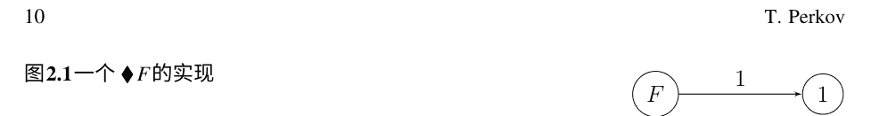

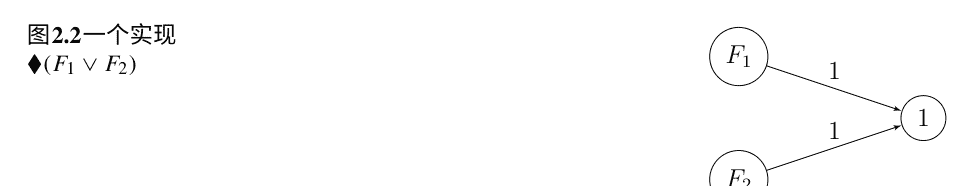

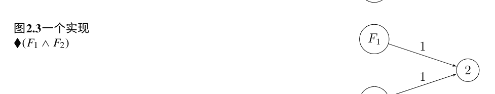

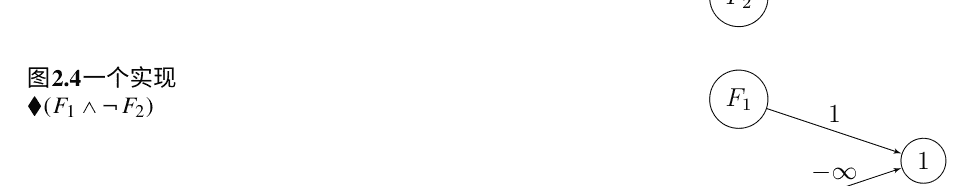

对于形式为 F₁ ∧ ¬ F₂ 的TPE案例，我们再次通过一个兴奋性突触将实现神经元 F₁ 连接到阈值为1的新神经元，而实现神经元 F₂ 则通过一个抑制性突触连接到新神经元，从而使其兴奋性由 ◇ (F₁ ∧ ¬ F₂)（图2.4）来表示。

## 2.3 相对抑制

McCulloch和Pitts讨论了绝对抑制被相对抑制取代的情况，即抑制性突触不一定能阻止神经元的兴奋，而是提高其阈值。 我们将通过将神经网络的抑制性边缘标记为负整数而不是 −∞ 来对其进行建模。

事实证明，相对抑制和绝对抑制在某种意义上是等效的，命题1也适用于具有相对抑制的网络，并且存在一个自然的将具有绝对抑制的网络转化为具有相对抑制的网络的转换，反之亦然，在不同的时间内实现相同的TPE。

t ⊨ ◇ ( ⋁_{S} ( ⋀_{i∈S} p_i ∧ ⋀_{j∈P\S} ¬p_j ) )， (2.2)

其中 P 是前任指数的集合，S 范围是 P 的子集，使得与神经元连接的前任的权重之和等于或大于其阈值。

请注意，命题1意味着通过具有绝对抑制的网络可以实现(2.2)中的TPE。相反，通过用足够大的负整数替换权重 −∞，使其绝对值产生相同的效果，可以轻松将具有绝对抑制的网络转化为具有相对抑制的网络。

我们省略了对神经网络概念的其他一些可能修改的讨论，如消失、促进、时间和空间总和，这些都可以类似地适应我们的模态框架。

## 2.4 循环网络

如果我们通过允许有定向循环来进一步推广神经网络，那么TPE的语言就不再足够，因为我们需要表达对过去的无限时间单位的观察。为此，我们通过一个额外的模态 ◇ 来扩展语言，直观地表示“在过去的某个时刻”。这是一个众所周知的时间模态，通常在文献中用 P 或 ◇⁻¹ 表示，如果选择 ◇ 来表示相应的未来模态。与之前一样，我们选择避免使用逆向符号，因此我们将语言扩展到

F ::= p_i | ◇F | ♦F | F_1 ∨ F_2 | F_1 ∧ F_2 | F_1 ∧ ¬ F_2.

对于 ◇ 的真值子句是：t ⊨ ◇F 当且仅当存在某个 t' < t，使得 t' ⊨ F，这是标准的 Kripke 语义与可达性关系 >。

McCulloch和Pitts首次使用循环来模拟所谓的可改变的突触，即，一个不活跃的突触在某一时刻激活其初始神经元后变得活跃，并在下一时刻通过来自其他神经元的突触（偶然地）激活其终止神经元，之后表现得像一个普通的兴奋性突触。

根据[3]中的定理VII，可改变的突触可以被循环替代。也就是说，一个最小的例子，可以在完全归纳证明的步骤中使用，我们省略了两个外周传入神经元和另一个阈值为1的神经元，在某一时刻 t 的激活由以下特征确定

t ⊨ ♦ p_1 ∨ ♦(p_2 ∧ ◇(p_1 ∧ p_2)),

即，要么第一个外周传入神经元通过兴奋性突触被激活，要么第二个外周传入神经元通过兴奋性突触被激活，但有一个条件，有时候早些时候两个外周传入神经元都被激活，从而激活可改变突触（参见图2.5）。

另一方面，相同的公式可以通过一个没有可改变突触但具有循环的网络来实现，在这种情况下，还有一个额外的阈值为2的神经元，并且从自身到自身的边的权重为2，同时还与两个外周传入神经元之间通过兴奋性突触连接，并且还有一个指向被区分的神经元的兴奋性突触，现在的阈值为2，从外周传入神经元到该神经元的边的权重分别为2和1（参见图2.6）。

不幸的是，这个讨论只涵盖了长度为1的循环。更长的循环情况要复杂得多，并且超出了本文的目的。McCulloch和Pitts对此的讨论很简短且难以理解，证明也很粗略，没有给出任何例子。承认这些困难以及对[3]中公式正确性的一些怀疑，Kleene [2]决定独立研究这个问题，并开发了正则表达式作为通用神经网络的自然框架。

图2.5 一个具有可改变突触（权重在括号中）的网络
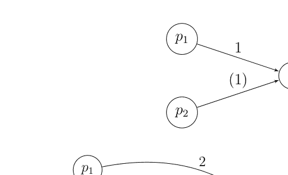

图2.6 一个具有循环的网络
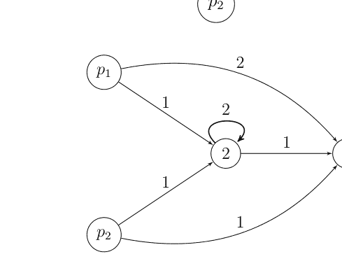

## 参考文献

1.  Carnap R (1938) 语言的逻辑语法。 Harcourt, Brace and Company, 纽约
2.  Kleene S (1956) 事件在神经网络和有限自动机中的表示。 在： Shannon C, McCarthy J (eds) 自动机研究。 普林斯顿大学出版社, 第3-41页
3.  McCulloch WS, Pitts W (1943) 神经活动中的思想的逻辑演算。 Bull Math Biophys 5:115–133

# 第三章 从语言转向到认知转向再回来

玛丽娜·诺维娜

摘要 人工智能领域的发展指出了智能的复杂性。本章的目的是展示为了实现对智能的更深入理解，也是Walter Pitts和Warren McCulloch的主要任务，我们需要人工智能，但我们也需要心理学，神经科学，还需要哲学。智能的复杂性指出了我们需要回到对智能理解的演化，这是我们在操作中找到的定义和术语的历史。

此外，似乎试图定义智能的历史表明其本质分散在许多领域中。然而，对术语本身的含义的回顾可以揭示智能的本质。为此，我们需要哲学。也许我们可以说，我们可以从语言和认知之间的交融中把握智能的本质。为此，我们需要人工智能，心理学，神经科学和哲学。

## 3.1 简介

智能的本质是复杂的，因此“智能”一词的含义很难把握。这对心理学、神经科学和人工智能（AI）都有影响。为了实现自己的目标，这些学科不仅需要定义，而且需要理解智能。有很多方法来定义这个现象。如果历史上有任何学科表明了这一点，那就是人工智能。也就是说，随着人工智能的发展，我们意识到智能超出了我们的想象或者超出了我们在定义中所假设的。然而，我们的定义确实是我们调查的起点和我们回归的点。此外，有时候，就像智能的情况一样，我们对一个现象的理解所谓的演变在各种定义中得以展现。这种多样性向我们揭示了智能的本质，这个现象是复杂的，其本质很难把握。然而，如果我们转向这个术语本身，我们会发现通过其意义的变化，我们可以更接近理解智能的本质并加深对其的理解。为此，我们需要人工智能、心理学、神经科学和哲学。

在整个历史上，没有多少学科像人工智能一样挑战了我们对智能的理解。因此，人工智能领域的发展指向了智能的复杂性，并需要一种适当的哲学。从这个意义上说，我们可以说今天是心理学、神经科学和人工智能的有趣时刻，它们被要求回到哲学中，以更深入地洞察它们所操作的术语的含义。此外，这也是哲学的有趣时刻，它被要求转向心理学、神经科学和人工智能，以扩大对智能的理解。尽管在心理学或哲学中对智能没有达成一致的定义，对智能的争论仍然很活跃。此外，智能的概念正在从一个领域迁移到另一个领域。从定义智能的尝试和概念的变形的意义上来看，这种演变的历史揭示了本质分散在许多领域中。为了更好地理解智能并更接近把握其本质，沃尔特·皮茨和沃伦·麦卡洛想要实现的主要任务，我们需要求助于哲学。本章的目的是通过回顾“智能”一词的历史来建议如何把握智能的本质。这个历史的一些部分在哲学之外并不为人所熟知。因此，为了更接近我们的目标，我们将转向这些部分。我们将称之为“寻找含义中缺失的部分的转向”。我们不会对智能的本质进行哲学讨论，也不会对定义或意义与本质之间的关系进行讨论。相反，我们将指出为什么哲学对于人工智能、心理学、神经科学等领域的发展以及更好地理解智能至关重要。此外，我们不会提出新的智能理论或新的定义。然而，我们将展示在尝试定义智能的历史和术语的变形历史中，我们可以指出对人工智能领域具有影响的智能本质。

## 3.2 寻找遗漏的意义片段，或者：为什么哲学很重要？

有时候，为了理解重点，我们需要倒过来讲故事。我们需要回过头来寻找遗漏的意义片段。因此，我们从计算机之父开始他标志着人工智能诞生的第一步[19, p. 2]。Alan Turing在他著名的论文《计算机与智能》中，提出了一个问题：机器能思考吗？他指出，要回答这个问题，他需要对“机器”和“思考”这两个术语的含义进行定义，但他得出的结论是“这些定义可能被构造成尽可能反映正常用法的形式的词语，但这种态度是危险的”[23, p. 433]。他提出了“模仿游戏”的概念，而不是对这些术语的定义。今天众所周知的“图灵测试”就此诞生。因此，当约翰·麦卡锡创造了“人工智能”这个术语（1955年）[13, p. 2]时，他不仅仅是为新的领域创造了一个术语，他重新提出了图灵所面临的问题。在他的书《捍卫AI研究》中，麦卡锡评论了所谓的莱特希尔报告。莱特希尔报告的一个基本观点是“智力世界的一般结构远未被理解，即使在我们非常愿意以特定的临时方式处理一个问题的情况下，如何有效地表示有关一个相当有限的行动领域的信息，通常是相当困难的”[16, p.28]。莱特希尔得出结论，人工智能在心理学和生理学方面没有做出贡献。麦卡锡指出莱特希尔忽视了人工智能能有自己的目标，并展示了人工智能对其他学科的贡献。对于麦卡锡来说，莱特希尔报告是对科学的放弃。对他来说，人工智能是有希望的，但“一项非常困难的科学研究，要充分理解智能以达到人类在所有领域的表现可能需要很长时间，可能是5年到500年之间。还有一些基本概念性问题尚未被发现和解决，所以我们无法确定需要多长时间”[16, 第29页，第36页]。从图灵在本节开头引用的话可以得出结论，他会同意麦卡锡关于基本概念性问题的观点。

此外，麦卡锡评论约翰·霍格兰德的书《人工智能：非常的想法》时说，霍格兰德在很多方面都错了，但他在两个问题上是正确的。第一个问题是关于人工智能的嘲笑者和支持者之间的两极分化，双方对于主要的哲学问题都有自信。第二，他对于人工智能方法的抽象性是正确的。因为，正如麦卡锡所说，“我们认为智能是由电子设备、神经化学机制甚至是一个按照规则操作纸张的人实现的，虽然他不理解这些规则的目的”[16, 第40页]。此外，对于麦卡锡来说，这本书的内容表明，从亚里士多德、霍布斯和笛卡尔到莱布尼茨和休谟的哲学家们提出的许多问题在今天仍然存在，但在一个完全不同的技术背景下。即使如此，“很难追溯到这种哲学对现在的人工智能思想的任何影响，甚至很难争辩说阅读霍布斯会有所帮助。今天人们试图做的几乎完全是由他们对现代计算设备的经验决定的，而不是由古老的论据所决定，尽管这些论据可能有启发性”[16, 第41页]。我们不知道图灵对这个评论会有什么看法，尽管他的著名论文发表在《心灵》杂志上。

然而，我们认为图灵是对的，主要问题是定义，但与麦卡锡不同，我们认为解决这个问题需要哲学。为了充分理解智能并尝试达到人类的表现要求，需要跨学科和互补的方法来研究现象。

现在，正如思考是智能的典范，逻辑被认为与思维的规律有关，因此，自然而然地AI从逻辑开始[19, p. 12]，因此，像其他科学一样，需要哲学来解决基本的概念问题。也许“智能是由电子、神经化学机制或甚至一个人按照他可以遵循但不理解目的的规则操作纸张”[16, p. 40]是“不重要的”，但了解智能是至关重要的。第一个基本问题涉及“智能”这个概念，我们应该更仔细地考虑它的本质。我们如何定义智能，术语“智能”的含义是否能够指示智能的本质？

毫无疑问，在日常科学实践中，很难追溯我们所从事学科的哲学影响。然而，我们应该意识到哲学是科学的母亲，一方面，对于日常科学实践，我们需要概念。概念是人类活动、文化、科学学科和哲学之间的主要联系，而哲学的任务是讨论和理解这些联系的本质。此外，概念是每个科学的必要工具，是每个科学探究的起点。我们可以从哲学的历史中概括地说，“只要一个学科的概念不清晰，方法有争议，它就仍然是哲学的。有人可能会说，没有科学概念是完全清晰的，没有科学方法是完全无争议的。如果这是真的，那么所有的科学都会剩下一部分哲学元素”[14, p.4]。

然而，我们使用的概念有一个历史；我们可以说它们的意义发展并且在学科之间迁移。根据我们使用的概念，有许多模式在演化。[...] 但通常它们变得越来越普遍。然而，这个过程不是线性的。它可以有许多分支和多样的衍生。科学的目标不是解释每个具体的现象，而是将现象解释为更一般的概念框架。此外，在这个概括过程中，旧的概念并没有被消除，而是被新的概念所吞噬，成为它们的“特例”。我们可以冒险地说，概念框架的概括决定了科学进步的“时间箭头”。在每次这样的变形过程中，它们通过适应新的环境来改变它们的意义。思想的历史充满了这些过程的实例。但认为它们只属于过去是天真的想法[12，第247-248页]。

心理学家罗伯特·J·斯特恩伯格说，任何认真研究过任何国家历史的人都知道，一个国家没有一个历史，而是有很多历史。同样，他说，智力领域也没有一个历史，而是有很多历史，这取决于谁在讲述[21，第3-4页]。相同的道理也适用于智力的概念。智力的本质仍然是一个重大问题，斯特恩伯格在他的书《心灵的隐喻。智力的本质概念》[20]中说，隐喻，以及有很多智力的隐喻，是智力理论的基础。同样，我们没有一个答案。

什么是智能，也没有智能的一致定义。这取决于谁在讲述。

因此，我们需要从两个层面回顾历史。首先，我们需要回顾智能本质理解的历史，这体现在我们使用的定义中。其次，我们需要回顾术语本身的历史。忽视历史就是放弃了一部分含义，减少了我们对现象的理解。我们可以说科学帮助我们以一种新的方式理解现象，但科学始于所使用概念的定义。从概念出发，通过定义，我们进行探究，然后再回到概念。然而，了解概念的历史和术语本身的含义，就是更深入地了解现象。这意味着更接近分散在许多领域中的本质。为此，我们需要哲学。我们无法在这些问题上展开哲学讨论，但我们可以指出阅读一些关于这个主题的哲学文献将非常有用，但要拥有足够深度的哲学是宝贵的。

在这个意义上，由于人工智能使用智能的定义来转向自己的探究，对于人工智能的目标来说，拥有一个适当深入的哲学将非常有用。人工智能研究人员的探究，特别是在深度学习领域，帮助我们更好地理解智能，这对心理学、神经科学和哲学都是有益的。有时在从语言到认知再到语言的转变中，我们会发现被遗忘或隐藏的意义片段。也许我们可以说，我们可以从语言和认知的交融中把握本质。当然，我们正在更好地理解智能。这肯定是沃尔特·皮茨和沃伦·麦卡洛克所希望的事情，他们的开创性论文《神经活动中内在的思想逻辑演算》开启了神经网络的历史[19, pp. 3–5]。我们的第一个转变是关于智能是什么或者关于定义智能的尝试的问题。

## 3.3 定义，或者说什么是智能？

在人类历史上，智能以不同的方式被理解，作为抽象思维、理解、沟通、规划、学习、推理和解决问题的能力。今天，“智能”是我们在人类和非人类环境中应用的术语，因此，它在人类物种、动物和植物的背景下进行研究[11, p. 7]。这个术语的定义不断演变，认识论也在变化。“智能”这个术语被广泛使用，但智能是什么仍然困扰着许多哲学家、科学家和心理学家的思维。

由于智能首先在人类环境中被询问，我们自然而然地求助于心理学来回答智能是什么的问题。然而，我们发现在心理学中对智能没有达成一致的定义。此外，正如斯特恩伯格所指出的：“尽管心理学的所有领域都通过意识形态的镜头来看待，但很少有领域的镜头有如此多的颜色，有些人可能争论，由于许多不同的扭曲缺陷，就像透过镜头看到的智能领域一样” [21, p. 4]。这是因为智能是心理学家构建模型的基础，但同时，根本问题是如何构思智能。

在心理学中，有两种众所周知的定义智能的尝试。第一种是基于专家对智能定义的著名研究。这是由《教育心理学杂志》的编辑们在1921年进行的（《智能及其测量》），被称为《1921年研讨会》。专家们被要求解决两个问题。首先，他们认为智能是什么，如何通过群体测试来最好地衡量？其次，下一个最关键的研究步骤将是什么？十四位专家对智能的本质发表了自己的观点。他们提供了11个定义。索恩戴克认为智能是从真理或事实角度出发的良好反应能力。特曼认为它是进行抽象思维的能力。弗里曼认为它是感官能力、感知识别能力、联想的快速性、范围或灵活性、联想的便利性和想象力、注意力的范围、反应的快速性或警觉性。科尔文认为它是学习或适应环境的能力，而平特纳认为它是适应相对较新的生活情境的能力。亨蒙将智能定义为知识的能力和所拥有的知识，而彼得森将其视为一种生物机制，通过该机制将复杂刺激的效果汇集在一起，并在行为中产生某种统一的效果。瑟斯通将智能定义为抑制本能调整的能力，根据想象中的经历的试错，重新定义抑制的本能调整的能力，以及在个体作为社会动物的利益上实现修改后的本能调整的能力。而伍德罗认为它是获得能力的能力。对于迪尔伯恩来说，智能是学习或通过经验获益的能力，对于哈格蒂来说，它是感觉、知觉、联想、记忆、想象力、辨别力、判断力和推理力。研讨会的其他参与者没有提供明确的智能定义” [21, p. 6]。

另一个著名的智能定义尝试是在1986年由两位心理研究智能领域的知名人物Douglas K. Detterman和Robert J. Sternberg进行的。他们试图更新1921年的研讨会。他们邀请了两打智能领域的专家撰写简短的文章，并要求他们回答与1921年研讨会上提出的同样问题。这个想法是以一种能够反映从本世纪初到本世纪末所取得的任何进展的方式来解决所提出的问题[15, p. 19]。

这两打答案于同一年出版，书名为《智能是什么？ 对其本质和定义的当代观点》。Sternberg和Berg对1921年和1986年智能定义尝试进行了比较，并得出了三个见解。首先，在两个研讨会上都可以注意到适应环境、基本心理过程、高阶思维（例如推理、问题解决和决策）等属性。因此，他们得出结论，至少在两个研讨会上关于智能的本质方面存在一些共识。其次，在两个研讨会上都出现了中心主题，但主要问题是：智能是一种还是多种，以及智能应该被广泛定义为什么？第三，尽管相似之处很多，但差异在于元认知，既包括对认知的知识，也包括对认知的控制。它在1986年的研讨会中起着重要的作用，但在1921年几乎没有起到任何作用。1986年的研讨会还更加强调知识的作用以及心理过程与知识的相互作用[21, p. 7]。他们的总结是：

> 智能领域从1921年主要关注心理测量问题发展到1986年主要关注信息处理、文化背景及其相互关系。现在行为的预测似乎不那么重要，而对行为的理解更为重要，这需要在预测之前进行。

一方面，关于智能本质的问题几乎没有得到真正解决。另一方面，智力研究者似乎在理解自1921年以来的测试成绩的认知和文化基础方面取得了相当大的进展[22, p. 162]。

基于对智力的两个研讨会上收集的定义，斯特恩伯格提出了一个整合框架来理解智力的概念。提出的框架将智力的理解分为三个上下文。
首先，个体上下文包括：
- (A) 生物水平：
  1. 跨生物（物种间（进化），物种内（遗传）和物种间内相互作用）；
  2. 个体内（结构，过程和结构-过程相互作用）；
  3. 跨内相互作用。
- (B) 摩尔水平：
  1. 认知（元认知（过程，知识和过程-知识相互作用），认知（选择性注意，学习，推理，解决问题，决策），知识和过程-知识相互作用）和元认知-认知相互作用）；
  2. 动机（能量水平（大小），能量方向（倾向）和水平-方向相互作用）。
- (C) 行为水平：
  1. 学术（领域通用，领域特定和通用-特定相互作用）；
  2. 社交（个体内，个体间和个体内-个体间相互作用）；
  3. 实践（职业，日常生活，职业日常生活相互作用）；
- (D) 生物-摩尔-行为相互作用。
其次，环境上下文包括：
- (A) 文化/社会水平和 (B) 文化/社会内的细分水平，两者都分为：
  1. 需求；
  2. 价值观和3. 需求-价值观相互作用。
- (C) 水平 ×子水平相互作用。
第三，个体-环境相互作用[22, pp. 4–5]。

查尔斯·斯皮尔曼（1904年）提出了众所周知的智力的g或普遍因素（神经系统中的能量储备）和s或特定智力因素（某个特定神经元群体的结构）。“普遍的心理行为并且对个体来说是恒定的。它由整个大脑可支配的能量组成。特定因素是大脑中某个特定区域或神经元群体的结构”[8, p. 260]。然而，这并没有解决智力的定义问题；它只是确认了其本质的复杂性[8, p.260]。因此，斯特恩伯格的框架是智力复杂性的良好概述。这种复杂性无疑说明了为什么我们缺乏对智力的共识定义。此外，随着人工智能的发展，这种复杂性是对哲学洞察力在定义现象和理解智力方式方面的需求的有力证明。毫无疑问，对于这些要求，阅读柏拉图、亚里士多德、洛克、弗雷格、罗素等哲学家的著作将会很有用。

讨论他们文本中定义的性质。此外，智能的复杂性表明为什么斯特恩伯格得出结论，其理解的基础是隐喻。从那个意义上说，研究关于隐喻、类比或词语和物体之间的联系的哲学讨论将是有用的，在这个意义上，柏拉图、阿奎那、弗雷格、克里普克和奎因可能是有用的。

一些心理学家认识到这个哲学背景。贾格纳斯·P·达斯从指出我们可以追溯到亚里士多德的智能定义的历史开始，亚里士多德将心理功能分为认知（控制论）和情感（动态）两个方面。此外，他说在印度教逻辑系统中可以找到类似的二分法，其中“普鲁萨，字面上是男性能量，是作为催化剂的思维，而普拉克里蒂，字面上是女性能量，是情感和行动。”前者是被动的，后者是主动的”[6, p. 1]。然后他注意到我们今天可以认识到同样的区别，并得出结论：“目前，我们将智能与个性或认知与情感领域分开，尽管在实际层面上认识到这种分离是不可能的”[6, p. 1]。达斯很好地指出，当代对智能的定义尝试具有哲学背景，如果我们想更好地理解智能，就需要研究这个背景。

正如我们在2015年Goldstein、Prin-ciotta和Naglieri的《智力手册：进化理论、历史视角和当前概念》中所读到的那样，智力的进化程度取决于其定义，但我们对智力的理解肯定已经发展，并且将随着不同学科的合作而不断增长。我们仍然没有完全理解智力，也没有达成一致的定义，但这个术语仍然存在。也许正如Lanz所说，术语“智力”引起的麻烦比它能帮助缓解的更多[15, 第21页]，但我们认为从这个术语的意义中我们可以得出智力的本质。我们可以说我们正在回顾术语“智力”的历史。这个历史的一些部分在哲学的背景之外并不为人所熟知。

## 3.4 术语“智力”

智能领域的专家们自己都意识到，在智能的定义和他们所操作的概念背后，存在着哲学思想和哲学术语。这一点从他们专门讨论智能的文本中可以明显看出。因此，例如，戈尔茨坦回顾了“智能”一词的含义。他指出，“智能”一词的词根源于拉丁动词intelligere，而这个动词又源于interlegere，而“这个动词的形式intellectus，是中世纪对具有良好理解力的人的技术术语”[11, p. 3]。这是对希腊术语“nous”的翻译。

### 3 从语言转向到认知转向再回来

然而，Nous与形而上学、宇宙论的目的论学派理论密切相关，包括灵魂的不朽和主动智力的概念。 然而，现代哲学家拒绝了它对于自然研究的整体方法，包括弗朗西斯·培根、托马斯·霍布斯、约翰·洛克和大卫·休谟，他们都更喜欢在他们的英文哲学著作中使用“理解”这个词。[…]因此，智力这个术语在英语哲学中变得不太常见，但在当代心理学中被广泛采用，不再包含它曾经暗示的学院理论[11, 第3页]。

Goldstein很好地注意到，当代对这个术语的使用已经失去了一些术语本身的含义。 但是这些缺失的部分对于我们理解智力并对使用智力概念的领域有重要影响。 因此，我们回顾一下这些缺失的部分的含义。 再一次，我们将颠倒故事。

“智能”一词的起源可以追溯到拉丁语，正如Goldstein所指出的，通过“intellect”一词的形式，它是希腊词“nous”的翻译，连接了英语、拉丁语和希腊语。 然而，正如Goldstein所指出的，英语对“智能”一词的使用中缺少了一些东西，但这不仅仅是一些学术理论。 也就是说，在拉丁语中，“intellectus”一词是“intelligere”的过去分词的名词用法，而“intelligere”是希腊词“nous”的翻译。 这个拉丁语词可能是从亚里士多德那里翻译过来的，但在哲学中，它是由安萨戈拉斯从其非哲学用法引入的。 值得注意的是，英语中没有一个方便的动词来表示翻译，并且它无法涵盖智力的各种活动，就像拉丁语的“intelligere”一样。正如Kenny所写的那样。

为了对应拉丁语动词，有时候人们不得不使用迂回的表达，例如将“actu intelligere”翻译为“行使智力活动”。 另一种选择是使用英语单词“understanding”，以现在已经相当过时的意义对应于这个能力的名称“intellectus”，并使用动词“understand”对应于动词“intelligere”。 支持这一观点的是，英语单词“understand”可以广泛用于报告，从一端是对科学理论的深刻理解（“只有七个人真正理解了特殊相对论”），到另一端是对八卦的片段了解（“我听说秋天之前将进行内阁改组”）。 但是，“understand”总体上来说不是对“intelligere”的令人满意的翻译，因为它总是暗示着一种倾向性而不是一种片段性，一种能力而不是能力的行使；而“intelligere”则同时涵盖了潜在的理解和当前的有意识的思考[14, 第41页]。

智能涵盖的内容在托马斯·阿奎那身上最为明显。⁴正如杰森·T·埃伯尔所概述的那样，在阿奎那身上我们注意到智力应该被理解为人类灵魂的一个基本能力（不是单一能力，也不是每个人都有多个智力，而是一个从事各种类型操作的智力）。由于

⁴他是最有影响力的经院哲学家和哲学家之一，他与早期基督教哲学家和希腊哲学思想直接相关，就像亚里士多德与前苏格拉底思想相关一样。 他对我们来说很重要，不仅因为在他的著作中，他概述了他之前和他那个时代的思想家们对他所处理问题的论点的历史概述，而且因为他是系统的、逻辑清晰的，他使用的拉丁语是第一所大学使用的精确拉丁语。⁵在这一段中，我们将使用埃伯尔对阿奎那的问题79、84-89的概述，来自《神学大全》[1, Sth. I. q. 75-89]，但对于更深入的研究的开始，我们推荐问题[1, Sth. I. q. 75-89]。

阿奎那接受亚里士多德的形而上学对灵魂的理解，他并没有将灵魂像柏拉图一样与智力等同起来，也没有像某些笛卡尔主义者那样使用这个术语来指代“心灵”或“意识”。 从这个意义上说，非理性动物是有意识并具有一定程度的认知活动能力的，它们有思维，但它们没有智慧。 但是亚里士多德和托马斯进一步区分了可能智慧和实际智慧这两个智慧的功能。 可能智慧就像一块白板，但它具有认知结构，使其能够理解接收到的可理解形式。 这类似于乔姆斯基的观点，即人类天生具有先天的语言学习能力（学习能力）。 然而，智慧从个体人类的感知中抽象出可理解的形式，这种抽象是由主动（代理）智慧（创造性的智慧之光；属于个体思考者的能力）完成的。 没有通过感官（幻象）感知的对象，就没有智力认知。 此外，智慧通过推理使用接收到的可理解形式并通过推理获得额外的知识（智慧所做的事情）。 在面对特定对象时，智慧有三个主要操作。 首先，智慧通过抽象（概念剥离）来理解可理解的形式，在这个意义上，智慧与感觉不同，就像从看到变成了看。 例如，智慧包括理解这个人作为人类，而不是感知这个人。 然而，所有人类的视觉本质上都涉及视为。 其次，智慧可以“合并和分割”理解的概念，并获得更深入的理解（理解基本属性和制定命题）或创建虚构的对象。 最后，智慧可以进行推理，即进行三段论推理。 推理的形式各不相同，这取决于对象和目的。 从这个意义上说，阿奎那区分了更高级的理性和更低级的理性，即关于永恒对象以达到智慧的推理和关于临时对象的推理。 这些推理形式构成了旨在发现事实的推理，而实践推理旨在确定应该做什么（道德推理）。 现在，由于人类智慧具有先天结构，无论是推理还是实践推理都包括第一原则。 实践推理的第一原则是日常背景前提，例如非矛盾原则。 实践推理中最基本的原则是“善应该被做和追求，恶应该被避免”，而道德推理所需的认知结构的主要特征是良知。 对于阿奎那来说，这种对第一原则的有意识应用就是良知。 最后，智慧灵魂认识自己，但是通过其智力抽象的活动，即自我意识或自我认识是智力认知的副产品。 自我意识是“我作为一个存在的个体的亲密内在体验，在我的行为中对自己的存在感知”[5, p. 73]。

因此，intelligere涵盖了intellectus的所有特征，intellectus被翻译为英文术语“intellect”。 智力“是理解和思想，是区分人类和动物的思维方式；这种思维方式尤其体现在语言中，即在有意义的词语使用和对句子赋予真值的过程中”[14, p. 41]。然而，正如我们所见，对于阿奎那来说，人类本性的物质形态特征在人类认知方式中得到了反映。阿奎那弥合了非物质智力和物质现实之间的差距，通过一种复杂的心理过程来实现非物质智力和物质现实之间的去物质化，这种过程通过一个认知能力的层次结构来完成，每个认知能力都能把握经验现实的不同方面[5, p. 10]。人类智力自然地指向“存在于物质对象中的本质”，并且它依赖于感官来接触这些对象。因此，感官不是阻碍，而是人类智力认知的工具”[5, p. 9]。当可能的智力被主动智力照亮的可理解形式“启发”时，智力思维的运作发生。在这一刻，我的可能的智力实际上与那个个体对象中的本质形式正式结合在一起。这是理解的时刻。我们的智力注意力转向感知对象（幻象），以便感官和智力在我的视觉中统一为一体。“这种‘转向’确保了感官和智力在世界中的统一经验，与人类个体的物质形态统一相一致”[5, p. 22]。

然而，这些智能的特征不仅仅是中世纪哲学思想和阿奎那与哲学祖先的讨论的产物。阿奎那的“intelligere”是希腊术语“nous”的准确翻译。Intelligere承载了在前哲学时期首次使用“nous”一词时存在的含义的本质。K. von Fritz对前哲学时期使用的“nous”一词的含义和词源进行了分析，并支持这种推理。由于“nous”一词没有被广泛接受的词源学，von Fritz从荷马的讨论开始进行分析。他指出，Joachim Boehme区分了“nous”一词的三个主要含义：“（1）‘Seele als Träger seelischer Erlebnisse’，可能可以翻译为‘作为经验的灵魂器官’；（2）‘Verstand’，可以是‘心智’或‘智力’或‘理解’；（3）‘Plan’，是‘计划’或‘规划’”[9, 第80-81页]。此外，von Fritz指出，为了澄清这些区别，Bruno Snell“指出，在第一种情况下，nous指的是一种器官，而在第二和第三种情况下，指的是这种器官的功能，但第二种情况下，它指的是功能本身，而第三种情况下，它指的是特定时刻的功能。”因此，第二个含义将对应于动词的现在时态，第三个含义将对应于aorist时态”[9, 第81页]。通过详细分析，von Fritz得出结论，Schwyzer关于词源学的建议更加正确，该术语可能源于“嗅闻”或“嗅到”的词根。

冯·弗里茨写道，这是相当真实的。在荷马的作品中，noein与视觉感知的联系比与其他任何感官的联系更为频繁。但这并不总是这样。在荷马的作品中，noein的最基本和最原始的意义似乎是“认识或理解一种情况”。

情况变得重要的最原始的情况是存在危险或附近有敌人的情况。因此，nous的最原始功能将是感知危险并区分朋友和敌人[9, 第93页]。

此外，冯·弗里茨预设在人类发展的早期阶段，嗅觉在这个功能中起着重要的作用。我们只需指出一个事实，即使在我们现今的语言中，我们仍然说“嗅到危险”。随着更高文明的发展，嗅觉自然会被视觉所取代。但是，对于情况的理解仍然与视觉甚至对于一个无关的物体的认知有所区别。这种纯粹的心理功能的新概念的出现可能受益于这样一个事实：这个功能与嗅觉的最初联系越来越淡化，因为视觉的重要性越来越突出，最终被完全遗忘[9, 第93页]。

回顾阿奎那对智力的理解是有趣的，注意到对于阿奎那来说，“像percipere和experiri这样的动词用作认知的普通动词（像intelligere或cognoscere）来表示感官或智力操作或一些普遍的认知操作，但它们还带有对象对智力的亲密存在的额外含义”[5, p. 73]。

在进一步研究智力术语的使用之初，对于智者学派的前苏格拉底哲学家们，冯·弗里茨总结了“nous”和“noein”这两个术语的派生含义，这些含义在荷马史诗中已经可以找到。因此，“nous”这个术语：（1）有时意味着一个人对特定情况的特定反应，并可以被视为一种特定的态度；（2）可以被视为计划（逃离危险情况或处理情况）；其中涉及到一个意愿的元素；（3）可以被视为仅仅存在于纯粹的智力领域的东西；对情况的意义的实现或对其真实本质的更深入的洞察；（4）穿透表面现象，发现关于事物的真实真理（“直觉元素”）；（5）“使遥远的事物存在”（通过我们可以想象物理上或时间上远离的情况和物体的想象力）；以及（6）指示一定程度的推理（可以进行演绎推理）[10, pp. 223–225]。因此，从这个角度来看，希腊术语的这些派生含义似乎存在于阿奎那对intelligere的理解中，从而形成了“intelligence”这个术语。此外，似乎这些术语揭示了智力的本质。然而，这种本质对于对智力的当代研究，特别是对于人工智能领域，具有明确的含义。

## 3.5 智能和人工智能的本质

从我们对智能的理解和定义的历史简要洞察中，我们可以得出结论，我们可以区分不同类型的定义，并且它们在哲学讨论中表明，它们是不同类型的，并且具有不同的目的。然而，这也表明智能的本质分散在许多领域或学科中。这直接影响所有科学。这就是图灵注意到的，因此提出了“模拟游戏”，它将与智商测试相关，这些测试假设了智能的参数，而不回答智能是什么，或者在哲学意义上，哪个定义才是真正的智能定义。从这个意义上说，我们可以说智能仍然是一个谜。然而，指示的理解和研究智能的框架表明，所有定义都有共同之处。那就是智能本身，可以理解为g因子，正如玛格丽特·博登所说的圣杯，人工智能无法掌握。尽管在人工智能领域取得了巨大的发展，但似乎人类水平的人工智能还没有在视野中[2, p. 56]。正如斯特恩伯格的框架和人工智能领域的发展所示，智能似乎包括的不仅仅是逻辑推理。语言、创造力和情感是人工智能领域面临的挑战，但意图、做出道德决策、直觉和梦想也在等待着被挑战。

> > 任何试图认真地追踪网络的脉络的人最终都会达到一种不以意向性状态（表示）为本身的心智能力的基础，但这些心智能力却是意向性状态运作的前提条件[18, p.143]

这种背景很难证明，但他认为它是前意向性的：一组非表征性的心智能力使所有的表征能够发生[18, p. 143]。从这个角度看，智能似乎可以被看作是所有这些挑战背后的某种背景。但是，博登问道：如果人工智能等于人类表现呢？

它们会拥有真正的智能、真正的理解力、真正的创造力吗？它们会有自我、道德地位、自由选择吗？它们会有意识吗？没有意识，它们能拥有这些其他属性吗？这些不是科学问题，而是哲学问题。我们需要仔细的论证，而不仅仅是未经审查的直觉。但是这样的论证表明，对于这些问题没有不可质疑的答案。这是因为涉及的概念本身就是非常有争议的。只有在这些概念都得到令人满意的理解的情况下，我们才能确信假设的AGI是否真正具有智能。简而言之：没有人确切知道。有人可能会说这并不重要：AGI实际上会做什么才是重要的。然而，我们的答案可能会影响我们与它们的关系[...] [2, p.119]。

我们试图表明，为了澄清智能问题，我们需要人工智能、心理学、神经科学，但也需要哲学。然而，就像博登一样，我们没有明确的答案，但我们认为有些答案比其他答案更合理[2, p. 120]。

因此，我们认为这个背景的本质可以从语言和认知之间的交融中把握，并且可以在术语的含义中被认出。这个本质有时在概念的变形和迁移的历史中被忽视、遗忘，但这个本质的含义仍然存在于当今人工智能的挑战中。因此，为了理解智能的本质，我们已经回顾了术语本身的缺失部分。对这段历史的观察表明，英语无法涵盖拉丁语 intellectus 所表达的各种智力能力。

intelligere。然而，对于这些术语在阿奎那的心灵哲学中的中世纪理解的深入洞察表明，这种理解不是某种哲学的产物，而是试图揭示我们称之为智能的这种神秘背景的本质。此外，对希腊词“nous”及其词源的分析表明，这种本质存在于该术语的先哲学用法中。我们已经指出了拉丁语和希腊语中“智能”一词的几个特征。从这些特征、意义来看，智能的本质似乎包括了对真理的认识、抽象和逻辑思维以及语言学习的倾向，但也包括了感官、情感、道德行为、创造力、自我认知、直觉和意向性。此外，智能的本质似乎无法超越特定的人类认知结构。对于人工智能来说，这意味着智能不能是人造的。然而，人工智能领域，特别是深度学习，是非常有用和值得研究的领域，因为正如博登所指出的，它可以阐明真实思维的本质。这是沃尔特·皮茨和沃伦·麦卡洛克会满意的事情。

## 参考文献

1.  Aquinas T (1988) Summa theologiae. Editiones Paulinae, Milano
2.  Boden MA (2016) AI its nature and future. Cambridge University Press, Cambridge
3.  Carter M (2007) Minds and computers: an introduction to the philosophy of artificial intelligence. Edinburgh University Press, Edinburgh
4.  Copeland JB (1993) Artificial intelligence: a philosophical introduction. Wiley-Blackwell, Oxford
5.  Cory TS (2014) Aquinas on human self-knowledge. Cambridge University Press, New York
6.  Das JP, Kirby JR, Jarman RF (1979) Simultaneous and successive cognitive processes. Academic Press, New York
7.  Eberl JT (2016) The Routledge Guidebook to Aquinas Summa Theologiae. Routledge, London and New York
8.  Freeman FN (1925) What is intelligence? School Rev 33(4):253–263
9.  Fritz K (1943) NOOΣ and NOEIN in Homer. Class Philol 38(2):79-93
10. Fritz K (1945) NOOΣ, NOEIN and their derivatives in pre-Socratic philosophy (excluding Anaxagoras): Part I, from Origins to Parmenides. Class Philol 40(4):223-242
11. Goldstein S (2015) The evolution of intelligence. In: Goldstein S, Princiotta D, Naglieri JA (eds) Handbook of Intelligence: Evolutionary Theory, Historical Perspectives, and Current Concepts. Springer, pp 3-7
12. Heller M (2012) The confluence of physics and metaphysics. In: Majid S (ed) On space and time. Cambridge University Press, pp 238-277
13. Israel DJ (1991) John McCarthy: A life. In: Lifschitz V (ed) Artificial Intelligence and Mathematical Computation Theory: Papers in Honor of John McCarthy. Academic Press, Inc., pp 1-5
14. Kenny A (1994) Aquinas on Mind. Routledge, London and New York
15. Lanz P (2000) The concept of intelligence in psychology and philosophy. In: Cruse H, Dean J, Ritter H (eds) Prerational intelligence: Adaptive behavior and intelligent systems without symbols and logic, vol 1. Springer, pp 19–30
16. McCarthy J (1996) Defending AI Research: A Collection of Essays and Reviews. CSLI Lecture Notes No. 49, California
17. McClure J (2014) Conceptual analogies between philosophy of science and cognitive science: Artificial Intelligence, Human Intuition, and Rationality. Aporia 24(1):39–49
18. Searle JR (1983) Intentionality: An Essay in the Philosophy of Mind. Cambridge University Press, New York
19. Skansi S (2018) Introduction to Deep Learning: From Logical Calculus to Artificial Intelligence. Springer, Berlin
20. Sternberg RJ (1990) Metaphors of Mind: Conceptions of the Nature of Intelligence. Oxford University Press, New York
21. Sternberg RJ (2003) Wisdom, Intelligence, and Creativity Synthesized. Cambridge University Press, Cambridge
22. Sternberg RJ, Berg CA (1986) Quantitative Integration: Definitions of Intelligence: A Comparison of the 1921 and 1986 Symposia. In: Sternberg RJ, Detterman DK (eds) What is Intelligence? Contemporary Viewpoints on its Nature and Definition. Ablex Publishing, pp 155–162
23. Turing AM (1950) Computing Machinery and Intelligence. Mind 59(236):433–460
24. Zagar J (1984) Acting on Principles: A Thomistic Perspective on Making Moral Decisions. American University Press

伊万·雷斯托维奇

摘要 模糊逻辑是一种人工智能的方法，它专注于自然语言的机械化。长期以来，它一直被其创始人扎德提议作为人工智能和实现“人类水平机器智能”的另一范式。到目前为止，这种方法还没有占据主导地位，但在人工智能发展的一些最新趋势下，它可能会得到推广。当前主导方法——深度学习的“黑盒特性”最近引发了一场名为“可解释人工智能”的运动，追求能够以人类可理解和接受的方式解释其决策的人工智能。正如人们所认识到的，向用户提供解释的一种自然方式是使用自然语言，嵌入到模糊逻辑范式中。然而，为了对自然语言进行建模，模糊逻辑使用了“部分真实”的概念，这引发了一些哲学上的担忧。模糊逻辑的核心原则常常被描述为违反直觉。在本文中，我们通过对模糊逻辑提出可能的回答来为其提供哲学支持，同时还提供了独立的哲学动机来支持它。

- 可解释人工智能（XAI）
- 自然语言
- 模糊逻辑
- 模糊哲学
- 高阶模糊
- 矛盾

## 4.1 一个问题和一个运动

深度神经网络的机器学习是人工智能中主要的方法。然而，有一些关于其被广泛认可的特性的担忧——许多深度学习算法的结果对人类来说仍然不透明。他们做出了某个决定，但无法提供理由。这通常被称为“黑盒特性”。现在，在某些领域中它变成了“黑盒问题”，例如在医学领域或金融行业中。

这在2016年引发了人工智能领域的一场运动，被称为“可解释的人工智能”或XAI，由美国国防高级研究计划局（DARPA）代表Gunning提出。目前的情况如下所述：

> 当前一代人工智能系统提供了巨大的好处，但它们的效果将受到机器无法向用户解释其决策和行动的限制。如果用户要理解、适当信任和有效管理这一新一代的人工智能伙伴，可解释的人工智能将是必不可少的。[6, p. 2]

XAI的提案总结了一些现有的基于两个特征的人工智能技术：性能与可解释性。深度学习在性能方面得分最高，但可解释性非常低。贝叶斯信念网络在可解释性方面提供了更好的表现，但在性能方面落后。决策树提供了最好的可解释性，但性能最低。当然，我们的目标是在不降低性能的情况下获得更多的可解释性。

尽管DARPA的提案中没有提到，但许多研究人员已经认识到模糊逻辑范式在辅助可解释人工智能方面的潜力[1, 2, 7, 11]。正如Alonso所说，“可解释性深深植根于模糊逻辑的基本原理”[1, p. 245]。这种逻辑及其支持的理论和实现长期以来一直被提议作为人工智能的另一种范式，最积极地提出者是其创始人Lotfi A. Zadeh。但是，它本身是否可理解和可接受于人类？

## 4.2 Zadeh的提议

在他的职业生涯中，Zadeh主张进行人工智能发展的范式转变。他的立场可以通过这个经常引用的观点来说明：

> 人类有许多卓越的能力；其中有两个是最重要的。首先，能够在不确定性、不完整信息、真理的偏见和可能性的环境中进行推理、对话和做出理性决策的能力。其次，能够在没有任何测量和计算的情况下执行各种物理和心理任务的能力。实现人类水平的机器智能的先决条件是这些能力的机械化，特别是自然语言理解的机械化。在我看来，这些能力的机械化超出了人工智能的武器库的能力范围-这个武器库在很大程度上是基于古典的、亚里士多德的、双值逻辑和基于双值逻辑的概率论。[22, p. 11, 强调添加]

Zadeh谈到了“实现人类水平的机器智能”。在当前背景下，我们将稍微明确他的说法。我们所寻找的是“人类可理解的机器智能”。Zadeh的原始术语可能会引起误解，因为可以争论一些机器已经超过了人类的智能水平。人工智能在各种任务上超越了人类。有一些对我们来说陌生的人工智能形式，这使得可解释性人工智能的问题更加紧迫。

在透明人工智能的背景下，上述引文中提出的更重要的主张之一是关于自然语言的。人类（大多数情况下）是用自然语言进行推理的。在Zadeh的观点中，这意味着我们将自然语言句子作为输入，并经过一些“计算”后输出一个结论，也是用自然语言。现在，如果计算机能够像人类一样用自然语言进行推理，那不是很好吗？Zadeh对自然语言的工作假设可以在这里看到：

> 人类的大部分知识都是用自然语言表达的。[...]问题在于自然语言本质上是不精确的。自然语言的不精确性源于感知的不精确性。自然语言基本上是一种描述感知的系统。感知本质上是不精确的，反映了人类感官器官和最终大脑解决细节和存储信息的有限能力。感知的不精确性传递给了自然语言。[21, p. 2769]

这段文字似乎暗示自然语言足以存储基于感知的人类知识。换句话说，感知中没有任何无法用自然语言表达的内容。这显然是一个重要且有争议的观点。然而，在XAI的背景下，我们不需要完全支持它。也许有些东西在翻译中“丢失”了，但由于人类提出的问题本身就是用自然语言表达的，所以这种丢失在双方都存在。这段文字只涉及由设计成类似于人类推理的逻辑系统提供的“语言解释”。

Zadeh提出了几个与他上述动机密切相关的理论，其中我们在这里提到一些。为了对潜在的知觉进行建模，他提出了计算理论知觉（CTP），其中知觉和查询以自然语言的命题形式表达。通过对知觉进行建模，我们可以使用CTP的基本方法来回答查询[20]。而“以词计算”则是模糊逻辑的一个分支，但它也基于模糊逻辑的狭义，即近似推理的逻辑[17]。稍后会详细介绍这种模糊性。

模糊逻辑采用非经典的真值集合：它们被认为属于单位区间 [0, 1]，符合Zadeh在[15]中引入的模糊集合的概念。这个集合论的基本概念是部分元素归属。在模糊逻辑中，真值的“集合”中存在部分元素性。

引入真值的部分性是为了捕捉到某些概念没有明确边界的直觉。在[15]中，扎德怀疑细菌是否是动物。答案可能是部分的。在模糊逻辑中，原子命题被赋予真值在区间[0, 1]内。连接词的真值条件取自于Łukasiewicz²：

```
v(¬p) =def 1 - v(p)
v(p ∧ q) =def min(v(p), v(q))
v(p ∨ q) =def max(v(p), v(q))
v(p → q) =def min(1, 1 - v(p) + v(q))
```

模糊逻辑更接近自然语言的原因是它使用了语言变量[16]来表示真值。尽管存在基础计算，但我们不会得到像“细菌是动物为0.892真”的答案，因为这与自然语言相去甚远。在[17, p. 410]中，Zadeh使用可数集 {真, 假, 非真, 非常真, 非常非真, 或多或少真, 相当真, 非常非真和非常假, ...}。例如，我们可以将超过0.5的命题标记为“真”。“非常真”的阈值可以是0.7，依此类推。“模糊逻辑”可以有不同的含义。广义上讲，它包括Zadeh提出的用于自然语言机械化的所有理论，其中一些比其他理论更专业。因此，当Zadeh选择向模糊逻辑转变时，他并不意味着在如此广泛的人工智能领域中，整个工作都必须仅仅在逻辑作为纯数学或哲学的子领域中完成。然后，在狭义上，“模糊逻辑”指的是这样一个子领域，即具有单位区间中真值和用于这些值的语言变量的逻辑系统。

由于其专注于（与）自然语言的计算，模糊逻辑已被认为是可行的XAI方法[1, 7, 11]。即使Zadeh对使用自然语言的坚持有些夸张，这个特性现在对于给人类可接受的逻辑解释非常有用。例如，Hagras指出：

> > [...] FRBS [模糊规则系统]使用语言标签生成if-then规则（可以更好地处理信息的不确定性）。因此，例如，当银行审查贷款申请时，一个规则可能是：如果收入高且房主且地址中的时间长，则认为该申请来自一个好的客户。这些规则可以被任何用户或分析师阅读。更重要的是，这些规则使数据与人类说同一种语言。[7, p. 35]

我们不会讨论Hagras示例规则的可理解性。请注意，斜体字代表变量，其中一些是模糊术语。考虑“高收入”。对于银行仅根据高与低两个类别来分类收入是没有用的。两个收入a和b都可以低，但一个仍然可以比另一个高。在模糊逻辑中，这意味着句子“收入a高”比句子“收入b高”更为真实。同样，Alonso [1]认为Zadeh的CWW对于XAI尤其相关，因为人类习惯于用自然语言解释事物。

然而，对于模糊逻辑提出了许多哲学批评。其中很多批评甚至攻击了其基本原则，比如部分真理的概念。在接下来的部分，我们提供模糊逻辑的哲学支持。首先，我们分析了模糊逻辑经常被提出的哲学背景——索拉特悖论。然后，我们描述了对模糊逻辑可行性提出的两个常见关切，并概述了可能的答案。最后一部分提供了一个中间立场，即使对模糊集合论处理真值的一些批评没有得到答复，也是可行的。

## 4.3 哲学关切

### 4.3.1 模糊逻辑与索拉特悖论

在哲学中，模糊逻辑通常被认为是对一个更一般问题——模糊性或概念可能存在边界情况的可能解决方案。

模糊性是有问题的，因为它引发了著名的索拉特（堆）悖论。

让我们通过使用文献中关于模糊逻辑最流行的谓词“高”来说明这一点。

考虑一下桑迪·艾伦（Sandy Allen），这位美国女演员身高231厘米。现在，每个人都会同意这个命题：“站在231厘米处的人是高的”。而且，似乎可以肯定地断言：“如果一个站在x厘米处的人是高的，那么站在x厘米-1毫米处的人也是高的”。换句话说，如果有一个比艾伦矮1毫米的人，他们仍然被认为是高的；十分之一厘米没有任何区别。

但是，如果我们按照演员和女演员的身高排列，从Sandy Allen开始，并多次应用条件，我们会得到违反直觉的结果。例如，根据这个逻辑，147厘米高的Danny DeVito算是高个子。尽管前提和推理规则是可以接受的，但这显然不是正确的结果。如何让DeVito变矮呢？同样，我们可以从DeVito开始，使用条件“如果一个人站在 x厘米高的地方算是矮个子，那么站在 x厘米+1毫米高的地方的人也是矮个子”，这样就会使Allen变矮。

引入真理的偏倚可以帮助我们解决这个悖论。显然，Allen是个高个子。DeVito显然不是。模糊逻辑可以得出正确的结论。正如我们排列的人的身高逐渐减小，身高的真值在sorites中也逐渐减小。此外，这些条件几乎都是真的。在模糊逻辑范式中，sorites没有任何悖论。只有当我们对模糊概念使用双值定义时，才会出现这个悖论。高是一个模糊概念，应该以这种方式建模。

再次考虑我们的例子。为了进行一维比较，我们只讨论女演员的身高。

> 现在，我们都同意：v(桑迪·艾伦（231厘米）很高) = 1 (i)

但显然，她不是唯一一个应该被归类为“完全高”的人，即，对于她的身高归属命题的真值为1。让我们决定最后一个完全高的女演员是吉娜·戴维斯：

> v(吉娜·戴维斯（183厘米）很高) = 1 (ii)

因此，任何比她矮的人的命题真值作为身高归属的命题将小于1。

在光谱的另一端，我们有一些明显不高的女演员。称之为“矮”。现在，我们必须决定名单上最高的“完全不高”或最高的“绝对矮”女演员。我们决定：

> 首先，可能有一个更高的女演员。由于我们不能给出大于1的值，她将获得与艾伦相同的真值。请注意，在这种情况下，新来者的到来降低初始“最真实”元素的真值是没有意义的。

现在让我们计算中间情况。这是一个身高介于两个截断点之间的人。我们将这样描述它：ν(“朱迪·戴维斯” (167厘米) 很高) = 0.5 (iv) 这将使梅丽尔·斯特里普 (168厘米) 略微偏高。让我们近似计算：ν(梅丽尔·斯特里普 (168厘米) 很高) = 0.55 (v) 假设“戴维斯”和“斯特里普”之间没有其他人。在这种情况下，后者女演员是我们的排序系列中最后一个可以被归因于高而不是矮的人。所以，并不是每个人都高——我们没有得到与二值逻辑相反的反直觉结果。

所呈现的尺度看起来很有用，但正如读者可能已经注意到的，我们做出了一些有问题的假设。我们不得不划定两个边界，这两个边界似乎都是任意的。这反过来导致了两者之间一个看似任意的中间情况。如果吉娜·戴维斯不是绝对高的话，梅丽尔·斯特里普可能会在边界的另一侧结束。

### 4.3.2 高阶模糊问题

我们遇到的是高阶模糊问题或任意精度的问题（参见[14, 第4章], [8, 第4-5章]）。正如基夫所说，“是什么决定了哪个是正确的函数，解决了我的外套是红色程度为0.322而不是0.321?”[8, 第114页]。她认为，从测量到真值的函数对于每个模糊概念都应该是唯一的。否则，我们将失去模糊逻辑应该具有的句子之间的排序关系。如果同一件外套在程度上也是蓝色的0.321，那么它现在比蓝色更红吗? 然而，这种唯一性是没有保证的，因为如何获取初始真值没有明确的答案。

同样，威廉姆森认为实际上，像上面的句子(v)是模糊的而不是确切的。因此，尽管按数字来说，真相看起来比经典观点更精确和细致，但它并没有解决原始问题。句子(v)是绝对真实的吗? 即使统计调查对于判断[...]是相关的，结果也会是模糊的。往往不清楚应该将谁纳入调查，以及如何对回答进行分类”[14, p. 128]。

Keefe和威廉姆森提出了对模糊陈述的真值归属的不同解释。威廉姆森提出了一种现在被称为“认识论”的立场。模糊只是无知，世界上没有什么模糊或模糊的东西。每个句子要么是真的要么是假的。即使是看似边界的句子(iv)。从那个观点来看，使真理的概念更加细致并不能帮助我们的缺乏知识，正如高阶模糊问题所示[14, Chaps. 7–8]。另一方面，Keefe主张“超值论”。从那个观点来看，存在非经典的真值间隙[8，第7-8章]。

现在我们将概述两种可能的方式来缓解高阶模糊问题的问题。第一种更加哲学，另一种更加数学。

以Keefe关于确定她外套的确切红度值的问题为例。Smith [12]认为这不是模糊逻辑的任务。模糊逻辑是一种模糊真值的演算法。给定这些原子命题的值，我们使用逻辑定律推断其他真值。这些真值是另一个学科的问题：

> 经典逻辑只允许两个真值[...]。 然而，这并不意味着经典逻辑（模型理论）承认每个陈述都是真或假的。 只有当人们试图使用经典逻辑来阐明某种语言（例如自然语言或数学语言）的语义时，才会涉及这种承诺。 因此，这不是纯粹的经典逻辑（模型理论）的承诺 - 考虑为数学的一个分支 - 而是模型论语义学（MTS）的承诺。[...] 纯粹的模型理论只告诉我们一个公式在这个模型上是真的，在那个模型上是假的（等等）。[12，第2页]

当然，问题并没有解决，只是转移了位置。Smith [12] 认识到并提供了可能的答案。但从纯逻辑的角度来看，通过支持逻辑多元论的工作假设，可以减轻这种担忧：不同的逻辑可以用于不同的目的。记住数学中的直觉主义。Brouwer [4] 认为真正的数学不符合一些古典逻辑的定律，最著名的是排中律原则。但在其他领域，比如推理我们的日常有限领域，使用古典逻辑没有问题。然而，要了解数学及其相应的逻辑的真正本质，需要进行不同类型的研究。对正确的模糊真值的研究可能属于广义模糊逻辑的范畴，但这不应妨碍狭义模糊逻辑的进展。

特别是，如果真实性是一个逻辑或数学问题，那么它对模糊逻辑来说并非如此。即使是经典谓词逻辑也无法确定命题“细菌是动物”的真值。它只能说出从该命题中得出的结论。每种逻辑都是关于有效推理的，通过真实前提得出真实结论，这些前提通常来自其他知识领域。我们认为，模糊逻辑可以是描述某些现象的正确方式。

对抗高阶模糊的数学方法是承认在某些情况下命题的真值不唯一，但可以用集合论来解释。除了“常规”的模糊集合外，Zadeh [16] 提出了具有模糊隶属函数的模糊集合。通过这种方式，我们可以建模二阶和更高阶的模糊性。

```
一个模糊集合的类型是$n，n=2，3，...$。如果它的隶属函数范围是$n-1$类型的模糊集合。类型1的模糊集合的隶属函数范围在区间$[0，1]$内。
```
[16，第242页]

让我们在我们的例子中说明这一点。女演员的平均身高为167厘米。但似乎还有其他合适的解释。假设我们有几个关于身高的权威人士，他们并不完全同意。最低的平均身高提议为162厘米，最高为170厘米。现在我们可以模糊化平均身高的概念。它并不完全是167厘米，而是介于两者之间——它变成了一个区间，而不是一个点。在尺度上存在着“不确定性的痕迹”[7, 第34页]。请注意，身高超过170厘米的女演员仍然明显高于平均水平。

尽管如此，仍然有人声称一些词语，比如“美丽”，似乎无法用数学方法来描述。身高很容易测量，因为只有一个变量需要测量。但是如何确定在正确的“美丽函数”中考虑哪些变量呢？在这里引入“原型”的概念将会很有用。

某物可以说在某种程度上美丽，这取决于它与某些原型的接近程度。在概念心理学领域，这是一种众所周知的方法，一些开创性的工作受到了Zadeh本人的影响。有关这一领域模糊逻辑的讨论，请参见[3]。

### 4.3.3 矛盾的问题

暂且不论得出初始真值的问题，模糊逻辑还面临另一个常常被提出的担忧，实际上这是它的特点之一——它允许真正的矛盾存在。如上所述，在模糊逻辑中，$\neg p(\nu(\neg p))$的真值定义为$1 - \nu(p)$。此外，合取运算假设与最低合取项相同（min函数）。

以前，我们将“矮”定义为“高”的否定。考虑到高度明确的情况，我们可以断言（参见命题（ii））：$\nu$（吉娜·戴维斯既高又矮）$= 0$

- **(vi)** 戴维斯完全高而且一点也不矮。合取运算取较小的值并完全为假，就像在经典逻辑中一样。然而，问题出现在中间情况中。因为我们有：$\nu$（“朱迪·戴维斯既高又矮”）$= 0.5$
- **(vii)** $\nu$(梅丽尔·斯特里普既高又矮)$= 0.45$
- **(viii)**

许多作者批评模糊逻辑具有这个特点。以至于史密斯称之为“不死的论证”[13]。他概述了来自多个学科的对这个论证的几个回应。

哲学家通常将句子（vii-viii）标记为违反直觉：非矛盾原则是无可争议的逻辑公理，应该在所有理论中（完全）成立。然而，这可能是循环的。模糊逻辑被指责不遵循经典原则。但正是经典逻辑无法对“现实世界”进行建模，这才是采用模糊逻辑等非经典方法的动机。

正如我们从他的提议中看到的那样，Zadeh对双值性有不同的直觉，他提出了一种范式转变的想法。

此外，请注意模糊逻辑中没有明显的矛盾。矛盾最多可以是半真的。在经典逻辑和模糊逻辑中，没有任何东西既是三角形又是圆形。这是因为这些概念不是模糊的。非绝对错误的矛盾只出现在模糊概念中，而经典逻辑在第一位无法对其建模。

回到不同的直觉，再次考虑被认为有争议的命题（viii）。从中我们可以推断出：梅丽尔·斯特里普比矮更高。我们不认为这个命题既明显错误也无意义，即使它基于一个矛盾。斯特里普既高又矮，但她更高而不是更矮，这可以被看作是说她的身高略高于平均水平的另一种方式。

在我们的“最真实的反对-证”命题（vii）的情况下，情况似乎更加清楚。断言它等于说：“朱迪·戴维斯“既高又矮。(vii') 同样，我们对这个断言没有看到任何问题。我们假设的女演员正好处于中间，一个值为0.5的矛盾告诉我们确切的情况。因此，人们可以反驳说，在模糊逻辑中，真矛盾并非难以理解，而是包含了额外的信息。在经典逻辑中，它们都具有相同的真值，在模糊逻辑中，它们的真值告诉我们更多[3，第31页]。这种逻辑比其经典对应更具表达能力。

## 4.3.4 模糊不等于模糊

在前文中，我们将基于模糊集合理论的模糊逻辑视为对模糊性问题的回答。这种观点在哲学文献中占主导地位。然而，模糊性可以被看作是与模糊性不同的概念。重要的是，这是Zadeh本人表达的观点。Dubois [5]进一步阐述和扩展了这个观点，在以下引文中表达了这一观点，显示出认识论（模糊性作为无知）和超值论（在边界情况下存在真值差距）与模糊集合所建模的真理概念是兼容的。Zadeh认为：

> > 尽管在文献中经常可以互换使用模糊和模糊这两个术语，但实际上它们之间存在着显著的区别。具体来说，命题 p如果包含模糊集的标签词，则是模糊的；而 p如果既是模糊的又不够具体以适用于特定目的，则是模糊的。例如，“鲍勃将在几分钟内回来”是模糊的，而“鲍勃将在某个时候回来”如果作为决策的依据不够具体，则是模糊的。因此，命题的模糊性是一个与决策相关的特征，而其模糊性则不是。[18, p. 396, n.]

在这里，我们可以看到模糊性包括模糊性，但模糊句子还有另一个重要特征——它们没有提供足够的信息来通过模糊集来解释。有了这个区别，我们可以适应一些关于模糊命题的理论。有人可以声称存在真值间隙，但这只涉及模糊命题。这些命题在某种程度上是不足的，它们过于不具体，无法被赋予数值真值，无论是经典的还是模糊的，甚至是类型-n模糊的。另一方面，一个纯粹的模糊谓词描述的命题中没有不具体的地方。用杜布瓦的话来说：“虽然模糊是一个缺陷，渐进性是布尔表示的一种丰富”[5, p. 317]。认识论的模糊理论也可以被纳入以适应这种区别。模糊性仍然是无知，不仅仅是两个可能的真值，而是确切的模糊真值。杜布瓦称之为“渐进的认识论观点”，根据这个观点，部分真命题存在，但由于我们的（部分）无知，它们显得模糊或不精确。麦克法兰也在一种被称为“模糊认识论”的观点中阐述了类似的观点。经典（双值）认识论认为，模糊语言与非模糊语言之间的区别仅仅与我们的知识有关，而与真理的基本形而上学无关。然而，“为了理解我们对模糊命题的态度，不仅需要不确定性，还需要部分真理”[10, p. 438]。

这涉及到一些高阶模糊性的情况。首先，如果模糊认识论是正确的，一些一阶模糊性实际上可以通过改善我们的认识位置来降级为模糊性。如果对于这种模糊性仍然存在一些模糊性，那可能是由于不充分的具体性导致的结果。如果是这样，那么可以通过相应类型的模糊集来缓解它。可能需要一些概念分析才能了解（假定）模糊概念或命题的“深度”，但一旦我们找到了那个层次，我们就可以用数学方式描述它。

## 4.4 结论

使用深度神经网络进行机器学习是人工智能的主流范式。然而，深度学习算法的黑盒特性经常会提出问题。这最近引发了一个被称为可解释人工智能（XAI）的运动。人工智能做出的决策应该更加透明地向人类展示。

现在，人类最习惯于用自然语言解释事物。而正是对自然语言的坚持，成为了另一种人工智能方法（Zadeh的模糊逻辑范式）的标志，该方法已被认为是一种可行的解释型人工智能方法。这种范式基于狭义上的“模糊逻辑”，即部分真实的逻辑演算。

然而，有人认为模糊逻辑是没有意义或不可接受的（对人类来说），因为它的一些基本概念是错误的或难以理解的。本文的目的是为模糊逻辑提供哲学支持。我们首先描述了引入这种非经典逻辑的最常见的哲学动机——索拉斯悖论。然后我们讨论了两个常见的批评观点。模糊逻辑被指责存在高阶模糊性，并允许真正的矛盾存在。

有人认为，将真值视为区间[0, 1]中的一个数本身就是模糊的，因为没有明确的方法来确定确切的值。我们提出了两种缓解高阶模糊性的方法。首先，可以认为为原子命题找到正确的（模糊的）真值不是（模糊）逻辑的领域。其次，即使在某些情况下数字不是唯一的，通过类型-n模糊集合，可以扩展集合论以数学描述这一现象。

模糊逻辑中的连接词被定义为允许一些矛盾不完全为假。这通常被认为是一个不可取的特征，任何正确的理论都应该避免。然而，重要的是要注意，在模糊逻辑中，矛盾最多只能是半真的。我们探讨了一些真正的矛盾，并认为它们确实可以有意义，甚至具有信息价值。

我们还提出了区分模糊性和模糊性的论点。在哲学中，模糊逻辑通常被视为与“认识论”和“超值论”等竞争理论一样的模糊理论之一。然而，可以争论的是，模糊性包括模糊性和另一个特征——信息缺乏。从这个观点来看，模糊逻辑与模糊性理论并不竞争——它们可以共同工作。

部分真相的概念并不像一开始看起来那样违反直觉。鉴于这种情况，我们认为可以安全地假设通过使用模糊逻辑得出的人工智能解释对人类来说是可理解的，尤其是在提供了易于理解和一致的模糊哲学基础的情况下。

## 参考文献

1. Alonso JM (2019) 从Zadeh的计算与语言向可解释的人工智能发展。在：Fullér R, Giove S, Masulli F (eds) 模糊逻辑与应用。Springer, Cham, pp 244–248
2. Alonso JM, Castiello C, Mencar C (2018) 可解释的人工智能研究领域的文献计量分析。在：Medina J, Ojeda-Aciego M, Verdegay JL, Pelta DA, Cabrera IP, Bouchon-Meunier B, Yager RR (eds) 基于知识的系统的信息处理和不确定性管理。理论和基础知识（第一部分）。Springer, Cham, pp 3–153.
3. Belohlavek R, Klir GJ, Lewis III HW, Way EC (2009) 概念和模糊集：误解、误解和疏忽。近似推理国际期刊51（1）：23–344.
4. Brouwer LEJ (1949) 意识、哲学和数学。在：Beth EW, Pos HJ, Hol-lak JHA (eds) 第十届国际哲学大会论文集。North-Holland Publishing Company, Amsterdam, pp 1235–1249
5. Dubois D (2011) 模糊集与模糊性有关吗？在：Cintula P, Fermüller CG, Godo L, Hájek P (eds) 理解模糊。逻辑，哲学和语言视角（逻辑研究）。学院出版社，伦敦，第311-333页
6. Gunning D (2017) 可解释的人工智能（XAI）。Def Adv Res Proj Agency (DARPA) 2: 1-36。https://www.darpa.mil/attachments/XAIProgramUpdate.pdf。于2019年8月15日访问
7. Hagras H (2018) 朝着人类可理解的、可解释的人工智能。计算机51（9）：28-36
8. Keefe R (2000) 模糊理论。剑桥大学出版社，剑桥
9. Łukasiewicz J (1970) 对命题演算的研究。在：Borkowski L (ed) Jan Łukasiewicz: 选集。North-Holland Publishing Company, 阿姆斯特丹和伦敦，第131-152页
10. MacFarlane J (2009) 模糊认识论。在：Dietz R, Moruzzi S (eds) 剪切和云。模糊性，其本质和逻辑。牛津大学出版社，纽约，第438-463页
11. Mencar C (2019) 看分支和根。在：Fullér R, Giove S, Masulli F (eds) 模糊逻辑与应用。Springer, Cham, 第249-252页
12. Smith NJJ (2011) 模糊逻辑和高阶模糊性。在：Cintula P, Fermüller CG, Godo L, Hájek P (eds) 理解模糊性。逻辑，哲学和语言学视角（逻辑研究）。学院出版社，伦敦，第1-19页
13. Smith NJJ (2017) 不死的论证：对模糊理论的真功能性反对。Synthese 194 (10) : 3761-3787
14. Williamson T (1994) 模糊性。Routledge，伦敦
15. Zadeh LA (1965) 模糊集。Inf Control 8 (3) : 338–353
16. Zadeh LA (1975) 语言变量的概念及其在近似推理中的应用—I. Inf Sci 8 (3) : 199–249
17. Zadeh LA (1975) 模糊逻辑与近似推理。Synthese 30 (3–4) : 407–428
18. Zadeh LA (1978) PRUF—自然语言的意义表示语言。Int J Man-Mach Stud 10(4):395–460
19. Zadeh LA (1996) 模糊逻辑=用词进行计算。IEEE Trans Fuzzy Syst 4 (2) : 103–111
20. Zadeh LA (1999) 从数字计算到用词计算—从测量的操纵到感知的操纵。IEEE Trans Circuits Syst I: Fundam Theory Appl 46 (1) : 105–119
21. Zadeh LA (2008) 模糊逻辑是否有必要？Inf Sci 178 (13) : 2751–2779
22. Zadeh LA (2008) 迈向人类级机器智能——是否可行？需要进行范式转变。IEEE Comput Intell Mag 3 (3) : 11–22

# 第5章 意义作为使用：从维特根斯坦到Google的Word2vec

Ines Skelac和Andrej Jandrić

摘要 现代自然语言处理（NLP）系统基于直接从数据中学习概念表示的神经网络。在这种系统中，概念由实数向量表示，背后的思想是将单词映射到向量应考虑其使用的上下文。这个想法在维特根斯坦的早期和晚期作品中都有体现，也在当代的一般语言学中，特别是在Firth的作品中。在本文中，我们研究了维特根斯坦和Firth的思想对于Google开发的Word2vec模型的发展的相关性。我们认为，维特根斯坦和Firth对于词义的处理与Word2vec中的处理方法之间的主要区别在于，尽管它们都强调上下文的重要性，但对于上下文的范围的理解是不同的。

关键词 维特根斯坦 · 费尔斯 · Word2vec · 机器翻译 · 自然语言处理

## 5.1 引言

自从古希腊时期以来，意义一直是哲学中的重要话题之一。与意义相关的一些重要哲学问题包括：语言和思维之间的关系是什么？概念是什么？它是一种心理形象吗？语言的要素如何指称非语言实体？我们如何能够知道一个词或一个句子的意义？等等。

另一方面，在最近的人工智能（AI）发展中，意义已被证明是最大的挑战之一。到目前为止，人工智能已经在识别语音和翻译文本和/或语音从一种语言到另一种语言方面取得了技术上的进步，但它仍然缺乏理解人类语言的能力。自然语言理解的问题目前还不能仅仅通过使用人工智能技术来解决，直到现在它仍然需要大量的人工努力。然而，在自然语言处理中引入神经网络尤其是在机器翻译方面，已经迈出了重要的一步。

尽管它仍然是一个活跃的研究领域，现代自然语言处理（NLP）系统基于直接从数据中学习概念表示的神经网络，无需人工干预。在这样的系统中，概念由实数向量表示。使用神经网络进行词嵌入模型的基本思想是，将单词映射到向量中应该考虑句子的上下文，因为句子的含义不是它包含的个别单词的简单组合。为了学习短语的向量表示，需要找到经常一起出现的单词，并且在其他上下文中很少出现[7]。

这个基本思想听起来几乎像是弗雷格著名的格言的重复：“不要孤立地问一个词的意义，而是只在一个句子的上下文中问”（[4]： x）。这个想法在维特根斯坦的早期和后期作品中都有。在《论述》中，他说：“只有命题有意义；只有在命题的上下文中，一个名字才有意义”（[11]： 3.3节），而在《哲学研究》中，他进一步发展了这个想法：“我们可以说：当一个东西被命名时，迄今为止还没有什么事情发生。”它甚至没有一个名字，除了在语言游戏中。这也是弗雷格所说的，一个词只有作为句子的一部分才有意义”（[12]： 49节）。在哲学之外，在当代普通语言学中，通过J.R.菲尔斯的作品，上下文对于建立意义的重要性变得相关了：对于菲尔斯来说，一个词的完整意义总是有上下文的（[3]： 7）。

在本文中，我们研究了维特根斯坦和弗斯的思想与谷歌开发的用于机器翻译模型的词向量表示的相关性，即Word2vec。在Word2vec中，一个词的意义被认为是一个向量（以标准化形式表示），该向量编码了其使用上下文；词出现的特定上下文被描述为句子中紧邻它的词。我们首先介绍维特根斯坦和弗斯关于上下文对于确定词义重要性的观点。之后，我们将简要概述Word2vec的最重要的技术方面。最后，我们将比较这些方法，并突出它们之间的相似之处和差异。

## 5.2 上下文在维特根斯坦语言哲学中的角色

可以说，没有哪位二十世纪的哲学家像路德维希·维特根斯坦那样强调上下文在确定词义方面的重要性，从而彻底改变了我们对语言运作的理解。虽然人们普遍认识到上下文在维特根斯坦后期的语言哲学中起着重要作用，但出于历史准确性的原因，应强调维特根斯坦从一开始就赋予了所谓的上下文原则高度重要性，根据这一原则，单词在孤立的情况下没有意义。在《论逻辑哲学》中，第3.3节已经指出：“只有命题[Satz]才有意义[Sinn]；只有在命题的上下文[Zusammenhange des Satzes]中，一个名称才有意义[Bedeutung]。维特根斯坦通过“弗雷格的伟大作品”的影响推导出上下文原则，以及表达这一原则的术语，他承认“在很大程度上，我的思想受到了这些作品的激励”（[11]：前言）。

在他的《算术基础》一书中，戈特洛布·弗雷格两次提到了上下文原则：在前言中，他强调他的基本原则之一是“永远不要孤立地询问一个词的意义，而只能在一个命题的上下文中询问”（[4]：x）；稍后，在第60节中，他建议“我们应该始终牢记一个完整的命题[Satz]，”，因为“只有在一个命题中，词才真正具有意义[Bedeutung]”。对于弗雷格来说，上下文原则主要是对抗在数学哲学中屈服于心理主义诱惑的有力护盾。由于数值的单数术语并不代表我们在经验中找到的物理对象，在试图确定它们的引用（Bedeutung）时，如果不考虑它们出现的句子上下文，我们往往倾向于错误地认为它们代表心理对象或思想（Vorstellungen），并且因此，对这些思想进行心理研究将为我们提供数学的基础。弗雷格支持上下文原则的另一个原因可以在他随后发表的文章《关于概念和对象》中找到：在那里，他指出一个词在不同句子中可以指代根本不同类型的实体，因此，它的引用不能在特定上下文之外确定。例如，在句子“维也纳是一个大城市”中，词“维也纳”的行为类似于一个名字，因此代表一个对象，即奥地利的首都；但在句子“的里雅斯特不是维也纳”中，它具有谓词的角色，并指代一个未饱和的实体，即一个概念，即成为大都市的概念（[5]：50）。¹

> ¹弗雷格将语言表达分为饱和（或名称）和非饱和（或功能）表达式：非饱和表达式包含一个空缺，通常由变量的出现标记为一个参数的空位。这种语言分割严格对应着本体论分割：饱和表达式的引用是饱和实体（或对象），而非饱和表达式的引用是非饱和实体（或函数）。谓词是需要补充一个名称才能形成命题的功能表达式：类似地，在引用层面上，概念是谓词的引用，是一阶函数的一种参数。

维特根斯坦像弗雷格一样，强烈反对数学哲学中的心理主义。实际上，他认为对伴随语言使用的心理过程进行心理学调查对于解释意义是无关紧要的，不仅对于数学术语，而且对于一般词汇也是如此：他早期对这种观点的反对已经可以在《论理哲学》（[11]：第4.1121节）中找到，但他们最详细和最有说服力的形式要等到《哲学研究》（[12]：第143-184节）。弗雷格支持上下文原则的第二个原因也在《论理哲学》中得到了维特根斯坦的认可：在不同的句子中，单词可能具有不同的含义，这就是为什么他警告我们应该区分一个简单的符号（Zeichen）和它所表示的符号（Symbol），因为“两个不同的符号可以/.../共享符号（书面符号或声音符号）”（[11]：第3.321节），以及“为了识别符号，我们必须考虑其重要用途”（[11]：第3.326节），也就是符号在有意义的句子上下文中的使用。

在所谓的过渡时期，即20世纪20年代末，维特根斯坦对符号使用的背景发生了重要变化。他不再相信句子是赋予意义的最小独立语言单位，而是采用了更大规模的语义整体主义。根据他的新理解，一个词只有在一个 Satzsystem中才有意义，这是一个相对独立于语言其他部分的命题系统。在 Tractatus中，语言被描述为一个整体的“世界之镜”（[11]：Sect. 5.511），通过共享其逻辑结构来代表世界，而在他的新观点中，语言被分解为更小、自治、重叠的语言系统，每个系统由其自己的一套明确规则构成，规定了其原始术语的使用。一个 Satzsystem可以通过类比来理解为公理系统。他做出这一变化的动机有两个。一个原因是他对弗雷格式现实主义和形式主义反现实主义在数学哲学中的不满：形式主义者否认数学符号的意义，而现实主义者声称它们指的是与我们的思想、语言和数学实践完全独立的对象存在。维特根斯坦认为，将数学比作国际象棋是一种有益的第三种方式：国际象棋的棋子并不是没有意义的，只是它们的意义仅限于游戏中；它们的意义不是与它们所指的对象相等，而是与规则相等，规则指导着我们如何使用它们进行移动（[15]：142–161）。另一个原因源于他对自己在 Tractatus中表达的观点的不满。与弗兰克·拉姆齐讨论他的著作使他意识到他在解释某物是红色时如何暗示它不是绿色存在问题。早期，维特根斯坦拥护的观点最近被称为模态唯一主义：他相信只有一种必要性，即逻辑必要性（[11]：第6.37节）。虽然红色的东西在同一时间内不可能是绿色的，但这是必要的问题中的必要性似乎不是逻辑上的：为了将其归结为逻辑必要性，维特根斯坦被迫声称任何东西既不可能是红色又不可能是绿色是由颜色词的意义所决定的。在他的新观点中，诸如“红色”或“绿色”之类的词只在用于给对象归属性颜色的命题系统内具有意义，并且构成该系统的规则禁止将两种颜色归于同一对象（[14]：第76-86节）。

在维特根斯坦哲学发展的下一个阶段，Satzsysteme被更丰富的Sprachspiele概念所取代。维特根斯坦在《蓝皮书》中引入了语言游戏的概念，而在《棕皮书》中他给出了许多例子，其中一些后来又出现在《哲学研究》中。他将语言游戏描述为语言的原始形式，它们本身就是完整的（[13]：81），但很容易想象在不同的环境中演变成新的更复杂的形式（[13]：17）。在他的许多言论中，维特根斯坦暗示将语言游戏视为一个原始部落的语言，我们在其中遇到的（[13]：81），因为它们是“比我们在高度复杂的日常生活中使用的符号更简单的符号使用方式”（[13]：17）。他还将它们与“儿童开始使用词语的语言形式”进行了比较（[13]：17），并指出在生活的后期，当一个人学习“特殊的技术语言，例如使用图表和图示、描述几何、化学符号等”时，他们会接触到新的语言游戏（[13]：81）。维特根斯坦现在将普通语言视为一个复杂的相互关联的语言游戏网络，在其中单词被用作极其多样化的工具，用于多种目的（[12]：第11节）。他之前认为Satzsysteme是词语使用的基本语境，而后来的Sprachspiele的最重要区别在于，语言游戏中词语的意义与说话者的非语言实践紧密相连：维特根斯坦通过术语“语言游戏”理解为“由语言和其编织的行动组成的整体”（[12]：第7节）。为了解释语言游戏中词语的意义，不仅仅像在Satzsysteme中那样制定语义规则是不够的，还需要明确指定构成语言社区的人员，说话者在发出词语时通常从事的非语言活动，所使用的道具，对听到词语的适当非语言反应，如何教授给新手，并且必须已经存在适当的习俗和制度，以使语言训练成功并且语言应用能够启动（[12]：第2-7节）。维特根斯坦反复强调，语言的有意义使用前提是参与一个社区，其成员必须在彼此之间以及对共同环境做出行为反应上达成一致。

单词只在语言游戏中有意义（[12]：第49节）；它们的意义是它们在其中的使用方式（[12]：第43节）；由于语言游戏已经是独立的微型语言，理解一个单词意味着理解整个语言（[12]：第199节）；而我们的语言行为只能在共享和受规则约束的非语言实践的背景下出现，掌握使用单词的技巧意味着被引入到某种文化或生活形式中（[12]：第19、23、199、241节）。

当我们在适当的环境中使用单词时，参与其中的活动，很少发生误解，并且很容易解决。另一方面，当我们将单词与其原始环境分离时，我们会遇到麻烦，感到困惑和困惑：根据维特根斯坦的观点，语言的误用是所有哲学难题的根源；当“语言度假”时，它们就会出现（[12]：第38节）。在他看来，一旦单词恢复到日常使用中，哲学问题就应该消失：成功的处理方法就是产生一个清晰的展示，以此来提醒我们单词在各种语境中的角色（[12]：第122-133节）。哲学困扰的一个特殊来源是，很多时候单词在不同的语言游戏中使用方式不同：如果我们成功地在某个场合应用一个单词，我们倾向于认为在一个新的上下文中，其意义已经改变，它必须符合之前的相同规则。维特根斯坦坚持要使我们摆脱的另一个强大的哲学偏见是，一个词的所有不同上下文相关意义必须有一个共同的核心，一组超越上下文的必要和充分条件来确定其应用。他指出，并非所有单词都是这样的情况，一些单词，如“游戏”，代表着家族相似概念：它们的使用案例对显示出相似之处，即使没有“贯穿整个线程的一根纤维”（[12]：第65-75节）；对它们在特定语言游戏中的多样化使用的详细概述将使其显现出来。

## 5.3 菲尔斯的“情境背景”和“搭配”

Word2vec与维特根斯坦关于一个术语的意义的哲学洞见之间的联系是这些哲学思想在英语语言学家约翰·鲁珀特·菲尔斯的语言学理论中得到的应用。

当代通用语言学的分水岭是费迪南德·索绪尔于1916年出版的《普通语言学课程》。索绪尔最重要的想法之一是将语言视为一种符号系统（与许多其他领域的系统相比）。语言符号由表示者或声音模式以及所指的或心理概念构成。语言符号属于语言作为一个系统，因此任何符号的变化都会影响整个系统[9]。几十年后，菲尔斯在索绪尔对语言符号的概念上进行了扩展：符号不仅依赖于语言系统，而且它们的意义也可以随着使用的上下文而改变。

弗斯多次强调，语言学不应该回避对意义问题的探讨（[3]：190），并且“一个词的完整意义始终是上下文相关，除非在完整的上下文中研究意义，否则无法认真对待”([3]: 7 )。上下文考虑必须包括“人类参与者，他们说的话以及正在发生的事情”([3]: 27)，因为“语言是处理人和事物的一种方式，是一种行为方式和使他人行为的方式”([3]:31)；弗斯坚持认为，语言是人在社会环境中使用的([3] :187)，目的是维持一定的“生活模式”([3]: 225)。弗斯语言学理论的基本概念是“情境背景”的概念，他承认这是从他的合作者、人类学家布罗尼斯瓦夫·马林诺夫斯基那里继承来的([3]: 181)。当以下内容已知时，可以确定“情境背景”: (1) 参与者的口头和非口头行为，(2) 涉及的对象，以及 (3) 口头行为的影响([3]: 182)。弗斯立即强调了他的“情境背景”概念与维特根斯坦的“语言游戏”概念之间的相似性。他赞同地引用了维特根斯坦的格言: “词语的意义在于它们的使用”([2]: 179)，以及“一种语言是一套具有规则或习俗的游戏”([2]: 139)。

情境背景的概念旨在强调语言的社会维度。正如维特根斯坦和弗雷格之前，弗斯在他的论文中反对心理主义的意义解释: 奥格登和理查兹的理论[8]在他的时代有影响力，它将意义与“隐藏的心理过程中的关系”等同起来([3]: 19 )，他认为这是笛卡尔主义的不可接受的残余。与后来的维特根斯坦完全一致的是，他放弃了通用的语言理论，而是支持对他所称之为“受限语言”的描述性和详细研究，即缩小到特定情境的语言；他提供的受限语言的例子有: 空战日语、斯温伯恩诗歌或现代阿拉伯头条新闻([2]: 29)。

在进一步分析词语的情境意义时，弗斯区分了其许多维度，并选择了最适合经验研究的一个维度: 搭配。搭配就是“简单地指词语的伴随，即词语最常见或最典型地嵌入的其他词语材料”([2]: 180)。这个想法是，如果两个词语有不同的伴随词语，仅凭这个特征就可以在语义上区分它们。引用弗斯的例子: 显然，“牛”和“母虎”不是同一个意思，因为“牛”出现在诸如“他们正在挤奶牛”之类的搭配中，而“母虎”则没有([2]: 180)。在引入搭配的概念时，弗斯引用维特根斯坦的话，声称“一个词语在陪伴中可以说有一种面貌”([3]: xii)。

然而，菲尔斯做出了一个非维特根斯坦式的举动，这在很大程度上为Word2vec铺平了道路，他明确宣布搭配（collocation）——上下文中纯语言元素的有限摘录——是词的一部分意义[3]: 196); 他著名且被引用最多的一句话是: “你可以通过它的伴侣来认识一个词”[2]: 179)。显然，Word2vec将一个词关联的向量作为其意义，旨在捕捉其搭配。

## 5.4 Word2vec

可以直观理解的是，概念啤酒和葡萄酒比概念啤酒和猫更相似。这样的一个可能解释是，这些概念的词“啤酒”和“葡萄酒”在相同的上下文中出现的频率比“啤酒”和“猫”要高。这种思维方式是Word2vec词嵌入模型的背景，被称为分布假设。在这里，神经网络被用于识别这种相似性。

神经网络，更准确地说，是人工神经网络，例如在Word2vec模型中用于词嵌入的那些，是旨在模拟（人类）大脑功能的计算系统。与人类大脑最相似的模型将是一个能够并行处理大量数据的计算机系统。无论是冯·诺伊曼还是哈佛架构，这两种广泛接受的计算模型与神经网络的概念都有很大的不同：从构建块类型到“处理器”、连接和信息类型的数量。

在人工智能研究的早期阶段，出现了两种模型——符号模型和连接主义模型。符号方法倾向于将特定领域知识与一组原子语义对象（符号）聚合在一起，并通过算法来操作这些符号。在实际应用中，这些算法几乎总是具有NP难度或更糟糕的复杂度，从而导致问题解决中的大规模搜索集合。这使得符号方法仅适用于某些受限的人工应用案例。另一方面，连接主义方法基于构建一个内部架构类似于大脑的系统，该系统通过经验“学习”而不是遵循预设算法。它在许多实际案例中被使用，这些案例对于符号方法来说太困难了；它被应用于形式语言领域的解决方案：字符串到字符串纠正问题、最接近字符串问题、最短公共超序列问题、最长公共子序列问题等。

经典计算架构和（人工）神经网络范式之间的几个关键差异可以在表5.1中显示出来。因此，神经网络可以粗略地定义为一组简单相互连接的处理单元（单元，节点），其功能基于生物神经元在分布式并行数据处理中的应用。它专门设计用于解决分类和预测问题，即所有输入和输出之间存在复杂非线性关系的问题。它在解决非线性评估方面具有显著的先进性，对数据错误具有强大的适应性。

表5.1 经典计算架构和（人工）神经网络范式之间的差异

| 标准计算架构 | （人工）神经网络 |
| :--- | :--- |
| 预定义的详细算法 | 自持或辅助学习 |
| 只有精确的数据是足够的处理 | 数据可能不清晰或模糊 |
| 功能依赖于每个元素 | 处理和结果并不是主要依赖于单个元素 |

具有学习能力的算法，适用于模糊或有损数据（来自各种传感器或非确定性数据），可以处理大量变量和参数。因此，它对于模式采样、图像和语音处理、优化问题、非线性控制、处理不精确和缺失数据、模拟、时间序列预测和类似用途非常有益。人工神经网络通常分为两个阶段：学习（训练）和数据处理。

Word2vec对语义相似性的适用性基于词表示的实现，这取决于前述的分布假设。换句话说，一个词的上下文是由其附近的词提供的。这种表示的目标是捕捉词之间的句法和语义关系。

作为模型示例，Word2vec使用了两个类似的基于神经网络的分布语义模型来生成词嵌入——CBOW（连续词袋）和Skip-gram。Tomas Mikolov的团队在2013年创建了这两个模型。CBOW试图根据围绕该词的小上下文窗口来预测当前词。CBOW提出了一个概念，即投影层在所有词之间共享，非线性隐藏层被移除；上下文中的词分布和顺序不影响投影。这个模型的计算复杂度也明显较低。Skip-gram架构类似，但它不是根据上下文来预测当前词，而是试图预测词本身相对于其上下文的情境。因此，Skip-gram模型旨在找到在句子中特定范围内有用于预测周围词的词模式。Skip-gram模型对词的句法属性的估计略逊于CBOW模型。Skip-gram模型的训练不涉及稠密矩阵乘法，因此非常高效[7]。让我们来看一个简单的例子。对于单词“猫”、“葡萄酒”和“啤酒”，我们有以下向量：vec（“猫”） = （0.1， 0.5， 0.9） vec（“葡萄酒”） = （0.6， 0.3， 0.4） vec（“啤酒”） = （0.5， 0.3， 0.3）

如可以看到，“酒”和“啤酒”对应的向量比它们对应的向量与“猫”对应的向量更相似，因此表达的概念更相似。我们可以假设“酒”和“啤酒”向量中的第二个值表示一个特征，比如是一种酒精饮料。单词之间的意义相似度可以通过向量之间的夹角的余弦值来计算。为了使用已提到的表示训练另一个模型，我们可以将它们输入到另一个机器学习模型中。每个单词分配的值是Skip-gram模型的结果，该模型在确定哪些单词经常出现在相似的上下文中起到了作用。如果两个单词经常被相似的其他单词包围，它们的结果向量将是相似的，它们的夹角的余弦值将接近1。因此，单词向量可以被视为其使用上下文的压缩表示。当整个过程结束时，字典中的每个单词都被分配了其向量表示，这些表示可以按字母顺序（或其他方式）列出：结果将是N维向量，其中N是整个词汇表中的单词数。额外的技术细节超出了本章的范围。

## 5.5 结论：维特根斯坦对词义理解与Word2vec的差异

维特根斯坦和Word2vec方法在词义理解上的主要区别在于，尽管两者都强调上下文的重要性，但其范围的理解不同。Word2vec对于某个词的使用环境有着限制性的观点：它仅限于直接相邻的单词；不考虑由多个单词组成的相邻短语，更不用说它们所出现的整个句子了。即使是从弗斯的搭配概念中得出的上下文确定，与其语言学祖先相比也显得过于严格：弗斯给出的搭配示例通常更复杂，经常包括整个句子。与维特根斯坦的分歧更加明显：有意义的句子是他对上下文的狭义理解，这在过渡期被更广泛的Satzsystem所取代，而后又被更全面的语言游戏所取代。然而，这种对上下文的简化和限制只局限于单一的意义模式——搭配——使得Word2vec能够创建出如此广泛适用的形式化。

在 Tractatus时期，维特根斯坦认为所有的子句表达式，至少在句子完全分析时，都起到了名称的作用（[11]：第4.22节），它们的意义完全用它们的引用（Bedeutung）来耗尽，即在句子的上下文中它们所代表的一种非语言对象（Gegenstand）。在他的观点中，作为名称，它们直接引用，没有经过意义（Sinn）的中介（[11]：第3.142节），它们根本没有语言意义。根据维特根斯坦在 Tractatus中的说法，意义是名称和它们的承载者之间的关系；它不## 第6章 鲁道夫·卡尔纳普 - 人工神经网络的祖父：卡尔纳普哲学对瓦尔特·皮茨的影响

马尔科·卡杜姆

## 摘要
哲学对AI的发展的重要性和相关性经常被忽视。通过揭示鲁道夫·卡尔纳普对沃伦·麦卡洛奇和尤其是瓦尔特·皮茨在人工神经网络方面的工作的影响，这种影响可以重新暴露给科学界。可以通过指出卡尔纳普与瓦尔特·皮茨之间的个人关系，以及这种影响的更内部结构，来建立卡尔纳普与瓦尔特·皮茨之间的牢固联系，正如皮茨使用卡尔纳普的逻辑形式主义所证明的那样。通过参考卡尔纳普的工作，皮茨能够遵守康德的不可知和不可描述的概念，并为世界作为一个完全可描述的结构奠定基础。这也意味着可以构建使用神经网络的机器，就像生物实体一样。因此，卡尔纳普可以被视为人工神经网络的祖父，逻辑和哲学之间的分裂可以再次成为一个单一的学科，保持其数学和哲学的两个方面。

## 关键词
- 卡尔纳普
- 皮茨
- 人工神经网络
- 连接主义
- 神经计算形式主义

人工智能（AI）是一个与许多不同的研究和科学领域相关的推动性现代和当代领域，包括科学和人文学科。因此，它对哲学家、数学家、工程师、计算机程序员等人来说是一个非常有兴趣的领域。在今天的普遍和甚至是最被接受的观点中，人工智能与不同科学领域的联系往往被认为是完全合理和几乎是自然的。然而，它与哲学的联系，尤其是可以合理地声称人工智能起源于哲学，往往被视为那些想要将这个推动性领域据为己有但没有真正价值的人所进行的模糊努力。

本研究得到了萨格勒布大学短期研究支持计划下的哲学逻辑、语言和控制论方面的短期资助的支持

M. Kardum (图标)
萨格勒布大学克罗地亚研究院，克罗地亚萨格勒布，电子邮件：mkardum@hrstud.hr

因此，本章的主要目标是展示哲学对人工智能发展的相关性（哲学对人工智能发展的重要性问题，不仅作为其历史的一部分，而且作为其当前发展的相关学科，暂时搁置），通过展示著名哲学家之一鲁道夫·卡尔纳普对沃尔特·皮茨发展人工神经网络的影响来完成这一任务。

哲学的重要性可能会更加强调，因为一些“核心形式主义和技术在人工智能中使用，并且在哲学中仍然被广泛使用和完善”[6]，尽管在AI发展中对哲学根源的广泛追踪可以追溯到笛卡尔甚至亚里士多德[25]。AI通常被描述为一个关注构建智能行为的人工生物的领域，这些生物可以被视为人工动物甚至是人工人，因此它代表了一个对哲学家来说非常有兴趣的领域。回答这些生物在不同环境中是人工动物还是人工人的问题可能是非常值得的，但是对于我们的主题来说并不代表一个重要的洞察。然而，对Carnap对Walter Pitts工作的深入了解可能揭示了哲学与AI之间的持续关系，这种关系可能证明是连接科学和人文学科在AI发展中的一个缺失环节。

在考虑人工智能的历史和早期发展时，不得不提到1956年夏天在达特茅斯学院（位于新罕布什尔州汉诺威）举行的著名会议。该会议由DARPA（国防高级研究计划局）赞助，并由“约翰·麦卡锡（1956年在达特茅斯工作），克劳德·香农，马文·明斯基，亚瑟·塞缪尔，特伦查德·摩尔（显然是原始会议上唯一的记录者），雷·所罗门诺夫，奥利弗·塞尔弗里奇，艾伦·纽厄尔和赫伯特·西蒙”[6]参加。除了会议是AI术语的诞生和诞生地之外，还有其他值得注意的结论。然而，很难辩称在1956年和上述会议之前，AI领域除了领域名称本身之外没有任何存在。在术语被创造出来之前，发展丰富的AI领域的两个最著名的例子可能是Alan Turing和Walter Pitts（与Warren McCulloch一起）的作品，它们极大地改进了我们对机器学习和问题解决的理解。换句话说，他们的工作导致了AI领域的发展，该领域试图构建一台真正能够思考和学习的机器。图灵[29]对作为机器问题解决的每个阶段的机械指令进行了系统分析。被称为图灵机的发展，这个著名的分析只是理解机器学习的一小步。下一步是考虑存在能够真正思考的机器的可能性。关于机器（或后来的计算机）是否真的能够复制或只是模仿人类思维的讨论，在某种程度上被图灵提前预见到。在他发表在《心灵》杂志上的著名论文[30]中，他提出了<sup>1</sup>

<sup>1</sup> 对于图灵机的非正式描述，请参阅Rescorla [24]，对于其严格的数学模型，请参阅De Mol [11]。

模仿游戏，一种今天被称为图灵测试（TT）的思维实验，<sup>2</sup>这在某种程度上迫使我们用一个更精确的问题来取代“机器能思考吗？”这个问题，这个问题实际上可以产生一些有意义的结果——“机器在语言上是否与人类无法区分？”[6]。通过将我们的关注点从“机器”和“思考”这两个词的定义转移到了避免了对所提出问题“机器能思考吗？”的可能答案的统计性质，这是由于这些术语的不同常用语言用法[30]。

TT也可以被解释为图灵对建造具有人类完全智力能力的机器的要求的建议和尝试，并将其替换为只表面上具有这些能力的机器[26]。通过这种方式，图灵再次预见了关于“强人工智能”和“弱人工智能”论点的争议。尽管与图灵的简化模型有所不同，但当今的计算机科学基于图灵的工作，并在开发更复杂的计算系统方面取得了快速进展。然而，对我们来说非常有趣的是，图灵在TT中还提出了如何构建这样的机器的建议：

> 他建议建造“儿童机器”，并且这些机器可以逐渐地自己成长，学会以成年人的水平用自然语言进行交流。
> 罗德尼·布鲁克斯（Rodney Brooks）和哲学家丹尼尔·丹尼特（Daniel Dennett）（1994年）在Cog项目中可能已经遵循了这一建议。此外，斯皮尔伯格和库布里克的电影《人工智能》至少在一部分上是图灵建议的电影探索。[6]

机器逐渐成长和学习如何交流，这就引出了沃尔特·皮茨（Walter Pitts）的工作，尤其是他在人工神经网络方面的工作。这使我们对人工智能、机器学习和神经计算以及它们之间的关系有了一个简短的回顾。

在历史上，人工神经网络被称为各种不同的名称。其中一些名称包括控制论、神经网络、感知器、连接主义、并行分布处理、优化网络、深度学习，当然还有人工神经网络（ANN）。本章将使用后者。ANN是连接主义的<sup>3</sup>并且作为计算<sup>4</sup>系统的一部分，受到生物神经网络的启发和解释。重要的是要强调ANN与构成动物（包括人类）大脑的生物神经网络并不完全相同，但它们之间有很强的相似之处。虽然使用ANN的目标是开发一种能够以类似于人脑的方式接近和解决一般和复杂问题的神经网络系统，但它处理的是特定的任务，这被证明是一种更现实的方法，并提供了更好的结果，可以应用于不同的领域，如视频游戏、医学诊断、语音识别，甚至绘画。

<sup>2</sup> 原文为“2”，根据上下文改为脚注标记。
<sup>3</sup> 原文为“3”，根据上下文改为脚注标记。
<sup>4</sup> 原文为“4”，根据上下文改为脚注标记。

从最初的尝试和追求宏伟的原始目标开始，所有神经网络模型都与生物学和生物大脑有所不同。尽管如此，人工神经网络在连接单元方面与生物大脑有着很强的相似性，就像生物大脑中的突触一样，它可以传递和接收信号，然后通过向其连接的其他神经元发送信号来进行处理和“通知”。这种新形式的非逻辑主义形式主义将大脑视为一个计算系统，或者更准确地说，它试图解释智能作为非符号处理的形式，就像可以在大脑中的某个层次（至少在细胞层面）找到的形式一样。考虑到这一点，可以说这是一个新的范式，它触发了符号主义和连接主义方法在人工智能领域的竞争。连接主义范式发展了以下神经生理学而不是逻辑，并且对计算机科学的后续发展产生了重大影响。正如经常强调的那样，先驱工作是由Warren S. McCulloch和Walter Pitts[16]在他们的著名论文中完成的神经活动中内在思想的逻辑演算，他们“首次提出了类似于图灵机的东西可能为心灵提供一个良好的模型”[24]，尽管他们对人工神经网络的提议与图灵机有着显著的不同。

然而，有人认为，尽管其重要性，麦卡洛克和皮茨的论文工作在历史和哲学上仍然相对被低估。这本身似乎已经很奇怪了，更奇怪的是，在那个时候已经有生物物理学家从事数学研究（生物）神经网络，正如[19]所指出的那样。

此外，当时没有类似的理论发展，麦卡洛克和皮茨的工作没有在神经生物学方面产生重要结果，而是对后来被称为人工智能的领域产生了更大的影响[15]。那么，麦卡洛克和皮茨的工作在之前讨论的内容和机器学习过程中有什么贡献呢？让我们引用他们著名论文的开篇：

> 由于神经活动的“全有或全无”特性，神经事件和它们之间的关系可以通过命题逻辑来处理。发现每个网络的行为都可以用这些术语来描述，对于包含环的网络，还可以使用更复杂的逻辑手段；对于满足一定条件的任何逻辑表达式，可以找到一个以其描述的方式行为的网络。证明了在可能的神经心理学假设中，许多特定选择是等价的，即对于在一个假设下行为的每个网络，存在另一个在另一个假设下行为且给出相同结果的网络，尽管可能不是在相同的时间内。讨论了微积分的各种应用。[16, p. 99]

鉴于引用的段落，可以根据[19]的观点断言，他们的主要贡献可以分为四个部分：(1) 构建了一个形式化的方法，最终导致了“有限自动机”的概念，(2) 一种早期的技术<sup>5</sup>

<sup>5</sup> 已满足的输入或条件。它类似于图灵机，尽管由于有限的状态数量和有限的内存，它的计算能力较弱。一些最为知名和简单的有限自动机示例包括自动售货机、电梯和交通信号灯。

逻辑设计，（3）第一个使用计算来解决一些心灵-身体问题的方法，以及（4）第一个现代的心灵和大脑理论。

然而，在这里，我们可以总结他们的贡献是作为一种非-逻辑、连接主义和神经计算形式主义的发展，它增强了机器学习并开发了一种类似大脑的AI组织，就像大脑作为-计算机范式一样。根据McCulloch和Pitts [16]的观点，应该补充的是，我们所有的理论或想法，以及感觉，都是通过我们大脑的活动来实现的，而同样的网络决定了我们的理论与我们的观察之间以及从观察到世界事实之间的认识关系。因此，精神疾病，如妄想、幻觉和困惑，代表了对网络的改变和经验性确认，即如果我们的网络是不确定的，那么我们的事实也是不确定的，我们无法获得任何观察、感觉或理论。正如他们所说，这个最终的结果是某种康德式的句子，以及对我们知识的形而上学残留的最终否定：

> 通过网络的决心，无法知晓的知识对象，“事物本身”，不再是无法知晓的。[16, p. 113]

当被问及神经建模时（参见[1]），杰克·D·科温认为计算机技术是将理论应用于实际问题的推动力。他认为发展人工神经网络对于这个应用至关重要，即使神经网络方法在语言方面存在明显问题。他对麦卡洛克和皮茨的工作的观点非常重要：

> 这与麦卡洛克-皮茨论文的内容非常相似。我非常了解已故的唐纳德·麦凯，他对他们的定理作了如下描述：如果你与某人争论一台机器能做什么或不能做什么，并且你能准确指定机器不能做什么，那么他们的定理保证至少存在一台机器能够做你所说的那些机器不能做的事情。如果你能详细说明一台机器不能做什么，你就找到了解决方案。所以真正的问题是，“一切都可以被描述吗？”[1, p. 125]

现在可以明确地说，McCulloch和Pitts认为神经网络能够教会机器执行每个可描述的动作，或者用他们自己的话说，每个被定义的动作，也就是说，每个由定义我们的大脑网络决定的动作。为了定义它，我们需要描述它的功能，即使在处理一个心灵单位psychon时，我们也可以将其行为简化为一个单个神经元的活动。因此，所有心灵事件都具有有意义或“符号性特征”，并且“在心理学中，内省、行为主义或生理学的基本关系是双值逻辑的关系”[16, p. 114]。那么，所有这些与Rudolf Carnap的工作有什么关系呢？

在他们著名的论文中，McCulloch和Pitts只提到了其他作者的三部作品，即Hilbert和Ackermann的《理论逻辑的基础》[14], 怀特海德的和罗素的数理哲学原理[32]和卡尔纳普的语言的逻辑语法[9 ]。虽然希尔伯特、阿克曼和罗素以及怀特海德的工作已经很有名了，因此可以预料到麦克洛奇和皮茨会提到它们，但卡尔纳普的工作还没有达到那个程度，所以他的书的包含有些令人惊讶。仅仅这个事实就足以说明卡尔纳普对ANN（作者所感知的）发展的影响，但让我们进一步解释这种影响。

让我们从简要概述McCulloch和Pitts的特点开始。<sup>6</sup> 正如安德森和罗森菲尔德[1]的一本值得注意的书中所指出的，通过对一些参与其中的科学家进行采访，更详细地描述了人工智能和人工神经网络发展的起源，以及该领域最重要的人物之间的氛围和关系，Warren McCulloch经常被描述为一个慷慨和外向的人，他照顾着年轻的同事，甚至在他们刚开始的时候为Pitts和Lettvin提供住所。

<sup>6</sup> 关于他们的生活和工作，最好的参考资料是安德森和罗森菲尔德[1]，既适用于他们两个人，也适用于麦卡洛克和皮茨的阿比布[3]和斯马尔海泽[27]。

他在他的神经生理学小组中主要被认为是一个有创造力和想象力的力量。他的创造力和想象力甚至让Jack D. Cowan认为他是Pitts、Lettvin和Wall中最古怪的一个。图灵至少见过McCulloch一次，甚至认为他是一个江湖骗子。McCulloch的想象力驱动力在Walter Pitts的性格中有所对应。Pitts在某种程度上是McCulloch的门徒，但他也与Norbert Wiener有密切联系，他从1943年开始为Wiener工作，实际上他把Wiener当作自己从未真正拥有的父亲形象。这就是为什么他感到自己被夹在McCulloch和Wiener之间，导致他精神崩溃，从中从未恢复，并开始摧毁自己的工作。McCulloch和Wiener的争论对Pitts来说尤其具有创伤性。这是毁灭性的，因为根据Cowan的证词，Pitts被认为是McCulloch小组的智囊：

> 我对皮茨和他的见解印象非常深刻。沃尔特实际上是莱特文和麦卡洛克背后的智慧。我认为真正的智慧是沃尔特在那里的真正驱动力。自从1921年以来，沃伦就有一个想法，以某种方式将及物动词的逻辑写下来，以便与神经系统中可能发生的事情相连接，但他自己无法做到。1942年，他认识了当时大约十七岁的皮茨。几个月内，沃尔特解决了如何做到这一点的问题，使用了罗素-怀特黑德的逻辑形式主义，这不是一个透明清晰的形式主义。
>
> 尽管如此，他们实际上解决了一个重要的问题，并引入了一个新概念，有限状态自动机的概念。所以这里有这个古怪但富有想象力的沃伦和这个聪明的年轻沃尔特一起做这些事情。[1, p. 104]

关于皮茨真正有趣且经常被提到的是他通往麦卡洛克的道路。被认为是皮茨最好且不可分割的朋友的莱特文是记录皮茨生活最可靠的来源。根据莱特文的说法（参考[1, 第2-12页]），皮茨是一个自学成才的人，他自学了数学、逻辑和相当多的语言，并在15岁时离家出走。他早年生活中最常提到的事件可能包括怀特海德和罗素的《数理逻辑原理》。Mathematica. 在被恶霸追赶后，他躲在一家公共图书馆里发现了这本书，并在三天内阅读完毕后给罗素写了一封信，指出了他认为严重的一些问题。 罗素邀请他去英国学习，但皮茨拒绝了，去了芝加哥大学，在那里听了一些讲座，但从未注册为学生。 1938年，在那里，他阅读了卡纳普的新书《语言的逻辑语法》，几乎和《数理逻辑原理》一样。他甚至没有介绍自己，就走进卡纳普的办公室，再次指出了一些问题和缺陷，然后默默离开，没有提及自己的事情。⁸

当然，卡纳普曾经费了很大的劲才找到他，但最终成功并且设法说服芝加哥大学给皮茨一份卑微的工作。⁹当时，皮茨被认为是卡纳普的门徒。¹⁰

这就是我们找到有关卡纳普对皮茨影响的证据。 毫无疑问，皮茨非常了解卡纳普的工作，自从他在芝加哥大学的早期就开始了。 此外，正如他的同事所证实的那样，他后来参加了卡纳普和罗素的逻辑讲座，从而详细了解了他们的工作。 结合皮茨的智慧和影响力，可以肯定地说麦卡洛克和皮茨在人工神经网络方面的工作¹¹受到了卡纳普的影响。而这种影响在他们的使用上无疑是最显著的

> > “Carnap (1938年) 和Hilbert和Ackermann (1927年) 的非常规逻辑形式，用于展示他们的结果”[18，第230页]

这无疑是由Pitts获得的。 因此，下一个逻辑步骤将是发现和描述Carnap逻辑形式中可以在McCulloch和Pitts关于ANN的工作中找到的属性。 然而，让我们首先看看为什么逻辑在Pitts对ANN建模中起着如此重要的作用。

在与Carnap学习期间，Pitts撰写了三篇关于神经元网络建模的论文¹²这些论文在与McCulloch合作撰写的著名论文之前。 通常认为，触发这篇论文的是抑制性突触的发现

⁸鲁道夫·卡尔纳普证实了这一事件的确发生，并明确表示在Pitts提出异议后，他自己的书中的某些部分甚至对他自己来说也不清楚[5]。

⁹从无家可归的年轻男孩到早期人工智能发展的智囊之一，对皮茨生活和职业发展的另一个有趣见解是Smalheiser关于Walter Pitts的论文[27]。

¹⁰关于皮茨的生活，有趣的是读到McCulloch后来如何向Carnap通报皮茨的进展和成就:“他是最博学多才的科学家和学者。” 他已经成为一位出色的染料化学家，一位优秀的哺乳动物学家，他了解新英格兰的莎草、蘑菇和鸟类。他从希腊语、拉丁语、意大利语、西班牙语、葡萄牙语和德语的原始文献中了解神经解剖学和神经生理学，因为他需要什么语言就学习什么语言。像电路理论和实际的电源、照明和无线电电路的焊接这样的事情他自己做。在我漫长的生活中，我从未见过如此博学和实际的人。” [13, p. 60].

¹¹必须说的是，它不仅适用于《神经活动中内在思想的逻辑演算》这篇论文，也适用于他们的第二篇论文《我们如何认识普遍性》[23]。

¹²这些论文包括《关于简单神经元电路的一些观察》[21]、《神经元网络的线性理论：静态问题》[20]和《神经元网络的线性理论：动态问题》[22]。

正是这些，加上皮茨对命题逻辑的了解和麦卡洛克对神经生理学的了解，导致了麦卡洛克-皮茨神经元模型的发展[27, p. 219]。尽管皮茨的好友莱特文[1, p. 3]证明，麦卡洛克和皮茨在搬进麦卡洛克和他的家人的同一天晚上就开始合作撰写《神经活动中内在思想的逻辑演算》这篇论文，但可以说，当时只有18岁的皮茨对神经元建模的新方法有着重大影响。最明显的原因是，正如唐纳德·麦凯所说的，麦卡洛克和皮茨的定理受到了莱布尼茨的影响，他认为逻辑机器可以完成任何可以完全描述的任务：

那时的沃尔特，如果我没记错的话，大约十八岁左右。沃尔特读过莱布尼茨，他证明了一个任务，只要用有限的词语完全和明确地描述，就可以由逻辑机器完成。莱布尼茨在将近三个世纪前就发展出了计算机的概念，甚至还提出了如何编程的概念。当时我没有意识到这一点。我只知道沃尔特从莱布尼茨那里挖掘出了这个想法，然后他和沃伦坐下来思考神经系统是否可以被视为这样的设备。所以他们在42年末完成了这篇论文。[1, p. 3]

从莱布尼茨那里借鉴的完全可描述任务的概念得到了麦卡洛克-皮茨神经元模型的支持，该模型“接收一组单突触兴奋和抑制输入，并在净总和超过阈值时发射”[27, p.219]，否则不发射。这使皮茨相信，通过掌握逻辑，神经网络变得完全确定。

反过来，这可能会掌握我们的固有结构并将其转移到人工水平。因此，正如在麦卡洛克和皮茨的论文中已经提到的康德式句子，世界不再是无法描述和因此无法知晓的。这个观点得到了科万对麦卡洛克小组的理解的支持：

> > 在整个麦卡洛克小组中，存在这样一个想法，即那里有一种固有的结构。他们相信康德的合成先验观念。这就是导致莱特文和皮茨提出《青蛙眼告诉青蛙大脑》的思维方式。[1, p. 108]

然而，这就是皮茨对逻辑作为解开世界之钥的确信的终点：

> > 你看，直到那个时候，沃尔特一直相信，如果你能掌握逻辑，并真正掌握它，事实上世界会变得越来越透明。在某种意义上，逻辑实际上是理解世界的关键。在我们完成青蛙眼之后，这对他来说是显而易见的，即使逻辑起到了一定的作用，它也没有起到预期的重要或核心作用。因此，尽管他对这项工作充满热情，但同时也让他感到失望。[1, p. 10]

那么，鲁道夫·卡尔纳普在哪里适合？除了是匹兹堡大学芝加哥分校的教授，除了是匹兹堡的批评目标和帮助匹兹堡留在芝加哥大学的人之外，已经指出卡尔纳普的书是麦卡洛克和匹兹在他们的著名论文中提到的三本书之一。还指出并证明卡尔纳普对匹兹的影响比麦卡洛克更大。匹兹参加了卡尔纳普的讲座，并决心证明

通过掌握逻辑，人们将能够完全理解世界。 事实上，这种理解必须来自卡尔纳普的工作，考虑到“匹兹立即看到如何将卡尔纳普的形式主义应用于麦卡洛克关于神经系统逻辑的想法”[3, 第197页]以及“麦卡洛克和匹兹使用逻辑形式主义是他们坚信生理学的基本关系是二值二进制逻辑关系的明确结果”[8, 第230页]。

正如McCulloch的团队所做的那样，Carnap也从康德式的问题开始：数学，无论是纯粹的还是应用的，真的可能吗[12]? 他避免了纯粹的理性和天真的经验主义，并建立了逻辑经验主义，其中数学和逻辑既不是经验主义的一部分，也不是纯粹直觉的一部分。 对于Carnap [9]，形成仅凭借其组成术语而无需任何经验证据即可成立的分析先验句子至关重要。 另一方面，科学句子是合成的后验的，并根据现实世界中对象的状态被证明为真或假。

对于Carnap来说，这提供了对科学的令人满意的方法论分析，并绕过了哥德尔的不完备性定理，使其结果保持完整，而不试图证明相反。 这些依赖于经验证据的合成的后验句子可以用任何自然语言表达，并且根据容忍原则，可以以任何方式来表述数学和逻辑的分析先验句子，以证明它们是真还是假，正如前面所述，凭借其组成术语的优点。 这样，Carnap的（传统的）形式主义使得将算术的所有复杂性归约为逻辑成为可能，以罗素-怀特海德的方式，并且不会被哥德尔的结果所动摇。 通过管理这一点，Carnap确保了对科学的令人满意的方法论分析，并认为逻辑作为元语言以及我们用来传达我们根据经验获得的结果的自然语言形成了一个逻辑的句法顺序，在其中命题确保了关于我们真实世界的科学句子的真实性。

这个模型拒绝了一切教条主义的主张，即形而上学的主张，并为我们的知识提供了安全的进展。 正是在这里，我们发现了鲁道夫·卡纳普对沃尔特·皮茨的真正影响14如果我们能够牢牢掌握我们命题的真理，通过分析和先验地“将它们映射到大脑中”[3, p.4]，以及通过对我们的后验句子进行严格的分析来确保它们的真理，无论我们如何构建它们以使其能够发挥作用，我们应该能够说人工神经网络能够做到人类神经网络能够做到的一切。 换句话说，沃尔特·皮茨所希望的一切都是可能的。

这个术语的发展可以通过Creath [10]和Uebel [31]撰写的两篇综述文章进行追踪。

14也许这有些牵强，但让我们试着推测一件事情。 在他的论文“自然语言中的意义和同义词”[8]中，卡尔纳普探讨了语言意义的问题以及机器人在未来可能如何使用它。 虽然目前只是一种思想实验，卡尔纳普声称了解它们的内部结构将帮助我们发展一种经验主义的语义方法。 从某种意义上说，这类似于皮茨试图完全确定神经网络的状态，这将导致完全描述它们的行为的可能性。

还记得莱布尼茨对计算机的预期、康德对本身无法知晓的事物以及那个定理吗？它说如果你能完全描述机器不能做的事情，那么总会存在至少一台机器可以做到这些事情。好吧，让我们在这里使用一个常见的计算机短语，它似乎适用于所有情况！通过掌握逻辑并遵守语言的逻辑语法规则，我们将能够涵盖我们归纳和演绎获得的知识，了解世界的每一个细节，并准确而完整地描述我们想要的每一个行动。换句话说，我们将拥有描述世界所需的完整命题和科学知识。这样，我们将能够产生许多简单或少量复杂的算法，涵盖我们所有的知识，不留任何未知和无法描述的部分。最后，这意味着我们可以描述和转移我们能够执行的每一个行动到ANN，这样皮茨希望的那样，ANN现在将被完全确定，为完全对应于人类行为和学习模型的先进机器学习开辟了可能性。可以说，卡尔纳普通过提供严格的逻辑形式化和语言语法，影响了皮茨，为通过命题和科学经验提供了一种使世界可描述的方法，从而回答了在描述定理之后留下的问题，即麦卡洛克和皮茨所研究的问题。如果我们认为图灵为普遍的人工智能认知框架的发展铺平了道路，尤其是（机器）学习方面的发展，那么我们可以认为麦卡洛克和皮茨提供了生理部分的形式化，这为我们提供了对共同问题的不同见解。

总之，让我们明确陈述这一章希望达到的目标。逻辑的不同方面的发展导致了数学和哲学的子专业的出现，并在科学家之间引起了摩擦。人们希望看到这种摩擦在一个方向上，以便它演变成一场富有成果的讨论。但遗憾的是，这个分歧发生在错误的地方——上个世纪发生的事情并不是该领域所期望的状态：

> > 最后的分析中，逻辑处理的是推理——我们所做的推理中数学的部分相对较少，而非数学专业人士所做的几乎所有数学推理都只是计算。为了既有严谨性又有广度，逻辑需要将其数学和哲学两个方面统一在一个学科中。近年来，无论是数学专业还是哲学专业——尤其是在美国——都没有为促进这种统一做出很大的努力。[28]

这是一个不小的要求，但让我们希望这一章是朝着期望的统一迈出的一小步，特别是考虑到在通常被认为属于数学和计算机科学的主题中展示的所有哲学相关性和影响。

## 参考文献

- 1. Anderson JA, Rosenfeld E (1998) Talking nets: an oral history of neural networks. The MIT Press, Cambridge
- 2. Arbib MA (2003) The handbook of brain theory and neural networks, 2nd edn. The MIT Press, Cambridge
- 3. Arbib MA (2019) Warren McCullochs search for the logic of the nervous system. Perspect Biol Med 43(2):193–216
- 4. Block N (1981) Psychologism and behaviorism. Philos Rev 1(90):5–43
- 5. Blum M (1989) Notes on McCulloch-Pitts “a logical calculus of the ideas immanent in nervous activity”. In: McCulloch R (ed) The collected works of Warren McCulloch, vol 2. Intersystems Publications
- 6. Bringsjord S, Govindarajulu NS (2018) 人工智能。 斯坦福哲学百科全书
- 7. Buckner C, Garson J (2019) 连接主义。斯坦福哲学百科全书
- 8. Carnap R (1955) 自然语言中的意义和同义词。 Philos Stud Int J Philo Anal Trad 6(3):33–47
- 9. Carnap R ([1938], 2001) 语言的逻辑语法。Routledge, 伦敦
- 10. Creath R (2017) 逻辑经验主义。 斯坦福哲学百科全书
- 11. De Mol L (2018) 图灵机。 斯坦福哲学百科全书
- 12. Friedman M (1988) Carnap的“语言的逻辑语法”中的逻辑真理和分析性。 在： Asprey P, Kitcher P (eds) 现代数学的历史和哲学。 明尼苏达大学出版社，第82 -94页
- 13. Gefer A (2016) 试图用逻辑拯救世界的人。 在： Stewart A (编) 2016年最佳美国科学与自然写作。 霍顿·米夫林·哈考特出版社，第53-65页
- 14. Hilbert D, Ackermann W ([1927], 1959) 理论逻辑的基本原理。斯普林格，柏林-海德堡
- 15. Lettvin JL (1989) 引言。 在： McCulloch R (编) Warren McCulloch的收集作品，第1卷。 Intersystems Publications，第7-20页
- 16. McCulloch WS, Pitts WH (1943) 神经活动中内在思想的逻辑演算。 Bull Math Biophys 5(4):115-133
- 17. Oppy G, Dowe D (2019) 图灵测试。 斯坦福哲学百科全书
- 18. Palm G (1986) 沃伦·麦卡洛克和沃尔特·皮茨：神经活动中的思想逻辑演算。 在： Palm G, Aertsen A (编辑) 脑理论。 第一届里雅斯特会议的论文脑理论，1984年10月1日至4日。Springer，第228-230页
- 19. Piccinini G (2004) 心智和大脑的第一个计算理论：对麦卡洛克和皮茨的“神经活动中的思想逻辑演算”的深入研究。 Synthese 141(2):175-215
- 20. Pitts WH (1942) 神经元网络的线性理论：静态问题。 Bull Math Biophys 4(4):169-175
- 21. Pitts WH (1942) 关于简单神经元电路的一些观察。 Bull Math Biophys 4(3):121-129
- 22. Pitts WH (1943) 神经元网络的线性理论：动态问题。 Bull Math Biophys 5(1):23-31
- 23. Pitts WH, McCulloch WS (1947) 我们如何知道普遍性：听觉和视觉形式的感知。 Bull Math Biophys 9(3):127-147
- 24. Rescorla M (2017) 心灵的计算理论。 斯坦福哲学百科全书
- 25. Russell S, Norvig P (2002) 人工智能：现代方法，第2版。普林斯顿大学出版社，萨德尔河，新泽西州
- 26. Searle J (1997) 意识之谜。纽约书评，纽约
- 27. Smalheiser NR (2000) 沃尔特·皮茨。 Perspect Biol Med 43(2):217-226
- 28. Thomason R (2018) 逻辑与人工智能。 斯坦福哲学百科全书
- 29. Turing A (1936) On computable numbers, with an application to the Entscheidungsproblem. Proc Lond Math Soc 42(1):230–265
- 30. Turing A (1950) Computing machinery and intelligence. Mind 59(236):433–460
- 31. Uebel T (2019) Vienna circle. The Stanford Encyclopedia of Philosophy
- 32. Whitehead AN, Russell B (1963) Principia Mathematica. Cambridge University Press, London

# 第7章 一台失落的克罗地亚网络机器翻译程序

Sandro Skansi, Leo Mršić and Ines Skelac

摘要 我们正在探索克罗地亚语言学家Bulcsú László在1950年代南斯拉夫进行的机器翻译研究的历史意义。他是南斯拉夫在1950年代机器翻译领域的先驱者。 我们关注他的研究小组在1959年至1962年间撰写的两篇重要的开创性论文，以及这些论文在1950年代末和1960年代初在萨格勒布大学人文与社会科学学院建立克罗地亚机器翻译项目方面的影响。 我们探讨他们的工作与冷战时期美国和苏联机器翻译的起源有关，这是出于当时的情报需求。 我们还介绍了南斯拉夫克罗地亚小组在机器翻译方面的方法，这与当时通常的逻辑方法不同，并且介绍了他对控制论方法的倡导，这种方法直到几十年后才被主流人工智能界采纳为规范。

关键词 Bulcsú László · 机器翻译 · 克罗地亚技术史 · 语言技术 · 自然语言处理

第一作者（S.S.）的研究得到了萨格勒布大学短期研究支持计划下的哲学、逻辑、语言和控制论方面的资助。

S. Skansi (✉) 克罗地亚研究学院，萨格勒布大学，克罗地亚萨格勒布， 电子邮件： sskansi@hrstud.hr

L. Mršić · I. Skelac 代数大学学院，萨格勒布，克罗地亚 e-mail: leo.mrsic@algebra.hr

I. Skelac 电子邮件： ines.skelac@racunarstvo.hr

## 7.1 机器翻译和人工智能在美国和苏联的起步

在本章中，我们探讨了克罗地亚机器翻译研究小组的历史意义。该小组活跃于20世纪50年代，并由克罗地亚语言学家Bulcsú László领导，在南斯拉夫的20世纪50年代是机器翻译的先驱。

为了正确理解克罗地亚小组的研究，我们必须探索机器翻译的起源。机器翻译的概念很古老，其起源通常与勒内·笛卡尔的工作有关，即他在1629年11月20日写给梅尔森的信中描述的通用语言的概念。笛卡尔将通用语言描述为一种简化版本的语言，它将作为翻译的“中间语言”。也就是说，如果我们想从英语翻译成克罗地亚语，我们首先会从英语翻译成“中间语言”，然后再从“中间语言”翻译成克罗地亚语。正如本章后面所述，这个想法首先在60年代初由Andreev、Kulagina和Mel'chuk创建的印度尼西亚语到俄语的机器翻译系统中得到实现。

在现代，机器翻译的概念是由哲学家和逻辑学家耶何舒亚·巴尔-希勒尔提出的（尤其是在[4,5]中），他的论文被克罗地亚团队研究。机器翻译和控制论之间最重要的未实现的联系点可能发生在1950/51年的冬天。在那个时期，巴尔-希勒尔在芝加哥遇到了鲁道夫·卡尔纳普，后者向他介绍了（当时新的）控制论的概念。此外，卡尔纳普还给了他曾经的助教瓦尔特·皮茨的联系方式，当时皮茨与诺伯特·维纳在麻省理工学院。他本应该介绍他给维纳，但这次会面从未发生过[10]。然而，巴尔-希勒尔将留在麻省理工学院，在控制论的启发下，于1952年组织了世界上第一次机器翻译会议[10]。

机器翻译的想法在1950年代是一个诱人的想法。机器翻译作为情报收集工具（翻译科学论文、日报、技术报告以及情报机构能够获取的一切）的主要军事兴趣，是由苏联在核技术方面的进展引发的，并且后来又因为“东方一号”（美国称之为“战略意外”）的成功而加剧了这种兴趣。在核时代，能够阅读和理解对方正在研究的内容是至关重要的[25]。机器翻译很快被吸收到1956年达特茅斯夏季研究项目的人工智能计划中（人工智能作为一个领域在那里诞生），作为人工智能的五个核心领域之一（后来被称为自然语言处理）。这里还包括另一个领域，即当时被称为“神经网络”的领域，今天通常被称为人工神经网络。

对于我们的讨论来说，最早的人工智能编程语言Lisp是由John McCarthy [18]在1958年发明的，这也是非常重要的。但是让我们更仔细地看一下机器翻译的历史。在美国，政府和军方对机器翻译的资金支持在1954年开始，并且这种丰富的时期一直持续到1964年，当时美国国家研究委员会成立了自动语言处理咨询委员会（ALPAC），调查结果非常负面，资金几乎用尽[25]。因此ALPAC报告成为第一次“人工智能寒冬”的催化剂。

苏联在1954年进行了一次记录在案的机器翻译系统尝试[21]，并且这次尝试得到了苏联共产党、苏联科学技术委员会和苏联科学院的赞赏。该系统由安德烈夫提出了统计元素，而库拉吉娜和梅尔丘克提出了大量的逻辑和知识密集型处理。有关更多详细信息，请参阅[21]。

在苏联，晚期的机器翻译有四种主要方法[17]。第一种方法是苏联科学院精密力学和计算技术研究所的研究。他们的方法主要是实验性的，与今天的经验方法没有太大区别。他们评估了当时已知的大多数算法，并设计了自己的专门算法，使用精心准备的数据集。他们的主要特点是使用相对干净的数据，并在1959年建立了德俄机器翻译原型。

第二种方法，如Mulić[17]所指出的，由苏联科学院斯捷克洛夫数学研究所的A. A. Reformatsky领导的团队提倡。他们的方法主要是逻辑性的，并扩展了Bar-Hillel[5]的理论思想，构建了三种算法：法俄、英俄和匈俄。

第三种方法可能是最成功的，由A. A. Lyapunov、O. S. Kulagina和R. L. Dobrushin提出。他们的努力导致了莫斯科和列宁格勒的语言学数学研讨会的成立。他们的方法主要是信息论的（但他们也尝试了基于逻辑的方法[17]），当时被认为是控制论的。这成为了克罗地亚从1957年开始的主要模式。

第四种，也许是最有影响力的，是由N. D. Andreev领导的列宁格勒大学实验室的逻辑统计方法[17]。在这里，正在构建印尼俄罗斯、阿拉伯俄罗斯、印度俄罗斯、日本俄罗斯、缅甸俄罗斯、挪威俄罗斯、英俄、西班牙俄罗斯和土耳其俄罗斯的算法。Andreev小组的主要方法是使用一种中间语言来捕捉意义[17]。这是一种类似于KL-ONE的方法，后来在西方引入（在1985年由Brachman和Schmolze [2]提出）。有趣的是，Andreev团队对捷克斯洛伐克的机器翻译计划[22]产生了深远影响，但由于缺乏资金，该计划遭遇了与克罗地亚计划类似的命运。

Andreev的方法在某种程度上是“外部的”。建模将是统计的，但其目的不是模仿人类思维过程的随机性，而是产生一个可工作的机器翻译系统。Kulagina和Mel'chuk不同意这种方法，他们认为需要更多现在被称为“哲学逻辑”的东西来模拟人类思维过程的符号水平，并且根据他们的观点，人类思维过程的形式化是开发机器翻译系统的先决条件（参见[21]）。我们可以推测，亚符号处理也是可以接受的，因为这种方法也根植于哲学逻辑，作为形式化人类认知功能的一种方式，并且在符号方法中也是“内部的”。还有许多其他不太流行的机器翻译研究中心：Gorkovsky大学（Omsk），第一莫斯科外语学院，亚美尼亚SSR计算中心以及格鲁吉亚SSR自动化与遥测研究所[17]。

值得注意的是，美国和苏联都可以使用最先进的计算机，并且对这些系统的政治支持意味着计算机可以提供给机器翻译研究人员使用。然而，到了20世纪50年代末，结果并不理想，一个正常工作的系统还没有展示出来。所有的工作都是基于理论的，只有在完全书写和调试完成后才会实现为计算机代码，这在长期来看证明是次优的。

## 7.2 克罗地亚小组在萨格勒布的形成

在南斯拉夫，机器翻译的组织工作始于1959年，但第一个个人努力是由萨格勒布电信研究所的弗拉基米尔·马特科维奇在1957年的博士论文中进行的，该论文讨论了克罗地亚语中的熵[8]。机器翻译的主要研究小组成立于1958年，在萨格勒布的青年语言学圈子中发起，由年轻的语言学家布尔克舒·拉斯洛（Bulcsú László）发起，他在俄语、南斯拉夫语言和英语方面毕业。1952年在萨格勒布大学学习语言和文学。

大多数小组成员来自萨格勒布大学人文社会科学学院的不同部门，还有几个来自其他机构的人。人文社会科学学院的成员包括斯韦托扎尔·佩特罗维奇（比较文学系）、斯捷潘·巴比奇（塞尔维亚-克罗地亚语言文学系）、克鲁诺斯拉夫·普兰吉奇（塞尔维亚-克罗地亚语言文学系）、泽尔科·布亚斯（英语语言文学系）、马利克·穆利奇（俄语语言文学系）和布尔奇·拉斯洛（比较斯拉夫学系）。

研究小组外部成员包括博齐达尔·芬卡（南斯拉夫科学与艺术学院语言研究所）、弗拉迪米尔·弗拉尼奇（南斯拉夫科学与艺术学院数值研究中心）、弗拉迪米尔·马特科维奇（电信研究所）和弗拉迪米尔·穆列维奇（监管和信号设备研究所）[8]。

László和Petrović [13]还评论了当时的最新技术，指出1954年美国的原型努力以及1955年发表的一系列研究论文，以及1955年开始的苏联努力和1956年的英国原型。他们没有详细说明或引用他们提到的文章。然而，根据[13]，Laszlo和Petrović在1959年发表的文本（可能是在1958年准备出版的）中提到了它们，这使我们得出结论，财力不足的克罗地亚研究仅落后于超级大国的研究几年（这些国家在这项工作上投入了大量资金）。另一个有趣的时刻是，他们在[13]中勾画出的，该小组很快发现，1957年在电信学院（今天是萨格勒布大学电气工程与计算机学院的一部分）已经进行了一些实验工作，由Vladimir Matković完成。因此，他们决定将他纳入萨格勒布大学人文与社会科学学院的研究小组。Matković完成的工作在他的博士论文中有记录，但直到1959年才发表。

俄罗斯机器翻译先驱安德烈夫表示希望南斯拉夫（克罗地亚）研究小组能够创建一个原型，但可悲的是，由于缺乏联邦资金，这从未发生过[8]。与美国和苏联的同行不同，拉斯洛的团队不得不在没有实际计算机的情况下进行管理（这在[27]中非常明显），而结果仅仅是理论上的。拉斯洛和彼得罗维奇可能对当时的政治圈子有吸引力，他们指出，尽管听起来很奇怪，但计算语言学的研究主要是其他国家的一项优先军事工作[13]。有一句引用来自[8]，也许最能描述萨格勒布研究人员的乐观和活力：

> > [...]翻译过程必须尽快机械化，这只有在能够继承翻译的能力的情况下才可能实现。即使只是概要，也会创建任务。机器需要为我们思考。如果机器可以帮助人类完成物理任务，为什么它们不能通过它们的机械记忆和自动化逻辑来帮助人类完成思维任务呢（第118页）？

## 7.3 克罗地亚小组的贡献

László和Petrovi´c [13]认为控制论（在比今天更广义的意义上，如Wiener在[29]中所描述的）是机器翻译的最佳方法。问题是László使用控制论的想法是否会将该小组的研究推向人工神经网络。László和他的小组没有详细介绍神经网络的细节（请记住这是1959年，大约是Rosenblatt在人工神经网络方面的研究时期），但以下段落对他们的想法提供了有力的暗示（请记住Wiener在他的书中传达了McCulloch和Pitts的想法）：“控制论是研究机器与生物体之间类比的科学学科”（[13]，第107页）。两页后，他们完全支持这个想法（[13]，第109页）：“一个重要的类比是机器的运行方式与人类神经系统的运行方式之间的类比”。这可能被理解为简单的计算机大脑类比，如[15]和后来的[24]，但László和Petrovi´c明确表示，认为控制论只是“电子计算机的理论”（因为它们是如何制造的）是错误的[13]，因为控制论的重点应该是模拟与人类功能类似的计算过程。

在[13]中有一个非常有趣的引用，László和Petrovi´c指出“今天，世界上正在进行大量努力，以实现完全自动化的机器翻译；为了实现这一目标，逻辑学家和语言学家正在努力解决越来越复杂的问题”。这似乎表明他们意识到逻辑学家（如巴尔-希勒尔和皮茨）的努力，因为维纳在他的书中明确提到了逻辑学家转向控制论的事实[29]，但他们仍然得出结论，完全的控制论方法可能是一个更好的选择。

László和Petrovi´c [13]认为，为了减少搜索空间，单词必须被编码以保留它们的信息价值，但摆脱不必要的冗余。这是基于Matkovi´c之前的语言熵计算，Matkovi´c的想法很简单：进行统计分析，确定最常见的字母并为它们分配最短的二进制编码。因此，A将得到101，而F将得到11010011 [13]。在此基础上，László建议，在构建高效的机器翻译系统时，不仅要考虑字母频率，还要考虑单词中某些字母的冗余性[12]。这表明策略如下：首先制作一个词典，为每个意义选择一个代表，然后对单词进行词干化或词形还原，然后从单词中删除不必要的字母（即携带很少信息的字母，如元音字母，但要小心不要将两个不同的单词等同起来），然后使用字母频率将单词编码为二进制字符串。之后，文本就准备好进行翻译了，但不幸的是，翻译方法从未详细说明。然而，暗示应该是“控制论”，这与我们之前提到的最有可能是人工神经网络。这在以下段落中得到了强调（[13]，第117页）：

> > 一个在充满活力和多方面的心智活动中度过50年的人听到了15亿个词。为了使机器具有与这样一个智力相当的能力，不仅在速度上，而且在质量上，它必须具有相同容量的记忆和语言感知能力，并且为此 - 这是至关重要的 - 它必须具有内置的概念关联通道和逻辑推理和验证的能力，总之，它必须具有快速学习的能力。

不幸的是，使用机器学习的这个想法（尽管在那些日子里还很原始）从未得到充分发展，克罗地亚小组又回到了苏联的方法。Pranji´c [23] 分析和推断了苏联机器翻译计划中的五个基本思想，这些思想是克罗地亚方法的基础：

- 1. 将字典与MT算法分离,
- 2. 将MT算法的理解和生成模块分离,
- 3. 所有单词都需要进行词形还原,
- 4. 词形还原后的词应该作为字典的键，而词的其他形式应该作为键旁边的值列表，并且
- 5. 使用上下文来确定多义词的含义.

前面提到的字典实际上是中间语言，所有必要的知识都应该放在这个字典中；理想情况下，键应该只是抽象代码，其他所有内容都应该作为键旁边的值并且可以访问[27]。在讨论诗歌翻译时，Petrovi´c [20]指出，理想情况下，机器翻译应该是从一种语言到另一种语言的，而不使用中间的意义语言。

Finka和Lászlo设想了在原型开发之前需要进行的三个主要数据准备任务[8]。第一个任务是编制一个从单词末尾到开头排序的字典。这将使得现在所称的词干提取和词形还原模块的开发成为可能：不仅具有后缀的知识库，以便可以修剪它们，还有一种系统的方法来找到单词的基本形式（词形还原）（第121页）。第二个任务是制作一个词频表。这将使得重点放在几千个最常见的单词上，而放弃其他单词。这是目前构建高效自然语言处理系统的良好工业实践，并且在1962年，这是一种计算上的必要性。最后一个任务是创建一个良好的同义词词典，但这样一个词典中的每个数据点都有一个“含义”作为键，而单词（同义词）作为值。当这些含义替代单词时，原型机将对其进行操作。

但是它们的意义是什么？要使用的算法是一种简单的统计对齐算法（希望能捕捉语义），在[27]中描述了一个短句克罗地亚语句子“covjek [名词-主语] pusi [动词-谓语] lulu [名词-宾语]”（一个人在吸烟）。第一步是解析和词形还原。克罗地亚语中的名词在单数形式中有七个格，具有不同的后缀，例如：

| 格 | 单数形式 |
| :--- | :--- |
| 主格 | ČOVJEK |
| 属格 | ČOVJEKA |
| 与格 | ČOVJEKU |
| 宾格 | ČOVJEKA |
| 呼格 | ČOVJE`CE |
| 位格 | ČOVJEKU |
| 工具格 | ČOVJEKOM |

虽然形态上是透明的，但在提到的情况下，词形还原应为“~COVJEK-”；在呼格单数中有一个声音变化，因此为了翻译的目的，“~COVJE-”将是“词形还原”。另外两个词形还原是PUŠ-和LUL-。

词典中每个词条都会有多个条目，并且它们会按照降序排列（如果该组实际制作了一个原型，他们会意识到这个简单的频率计数是不足以避免只使用第一个意义的）。~COVJE-的词典条目（使用现代JSON表示法）是

```json
“~COVJE-”: “人类”: 193.5: “小”: 690.2: “代理人”, “人”: 554.4: “代表”, 372.1: “人类”, 372.3: “人类”... , ...
```

使用的数字的含义从未解释过，但它们可能用于交叉引用单词类别。

在这个词典中查找完句子中的所有词形后，下一步是仅保留内部值并丢弃内部键，从而使列表折叠，使上面的示例变为

```json
“COVJE-”: 193.5: “LITTLENESS”, 690.2: “AGENT”, 554.4: “REPRESENTATION”, 372.1: “MANKIND”, 372.3: “MANKIND” ...
```

接下来，最常出现的含义将被保留，但仅当它在语法上适合最终的句子时。可以推断出，假定源语言的语法结构与目标语言匹配，并且为了实现这一点，需要使用类似于Lambek演算[11]的范畴语法。似乎克罗地亚小组并不知道Lambek的论文（只知道Bar-Hillel的论文），所以他们没有详细阐述这部分。

Finka [7]指出，Matkovi´c在他1957年的博士论文中考虑了使用二元组和三元组来“帮助建模词的上下文”。不清楚Finka是否指的是字符二元组，这在当时是可行的，还是词二元组，这是不可行的，但是模拟词的上下文的建议确实指向这个方向。尽管使用字符二元组的起源可以追溯到Claude Shannon [26]，但在自然语言处理中使用字符级别的二元组仅由Gilbert和Moore [9]进行了广泛研究。可以说，在某种意义上，Matkovi´c预先得出了这些结果，但他的研究和思想在西方并不为人所知，并且没有被引用。在文本分类中成功使用词二元组要等到[14]。从字符到词的转变所花费的时间主要是由于计算限制，但是Matkovi´c的思想不应该因为计算复杂性而轻易被忽视，因为克罗地亚小组正在探索使用词二元组的想法——也许这就是原因。

考虑这样一个想法的原因是缺乏计算机和对内存需求的低估。上述整个过程如图7.1所示。

有几点需要注意。首先，该小组似乎认为需要编码，但熵编码和计算似乎没有真正的好处（即没有好处超过计算成本）。此外，Finka和László [8] 似乎非常强调词形还原而不是词干提取，如果他们构建了一个原型，他们会注意到使用当时的技术非常困难。然而，适当的词形还原的想法可能会被适度精确的硬编码词干提取所取代，这是在Finka和László在他们的1962年论文中提出的“逆字典”帮助下完成的关键任务之一。

本文还强调了频率计数的必要性，并仅采用最多的常见词汇，这是后来在自然语言处理社区中广泛使用的一种方法。句子对齐与词性标注被正确地确定为机器翻译的关键方面之一，但是该小组严重低估了其复杂性。有人可能会争辩说，这两个模块实际上是构建成功的机器翻译系统所需的一切，这显示了任务的复杂性。

正如前面所提到的，该小组没有可用的计算机来构建一个工作原型，因此，他们低估了确定句子对齐的复杂性。从理论角度来看，句子对齐似乎相当简单，但可以说机器翻译可以简化为句子对齐。这种简化生动地展示了句子对齐的完整复杂性。但是在当时，并没有意识到对齐的复杂性，直到几十年后，克罗地亚小组解散后的晚期1990年代，Tillmann和Ney领导的小组开始使用（非平凡的）对齐模块进行统计模型实验，并产生了最先进的结果（参见[19, 28]）。然而，这是统计学习，还需要另外两个十年才能在控制论模型中实现句子对齐，当时它以一个新的名字，深度学习，而闻名。对齐是由[1, 3]在深度神经网络中实现的，但是一个更好的方法，称为注意力，是一个可训练的对齐模块，并且在计算机视觉中的注意力的开创性论文开始时就在并行开发中[16]。

## 7.4 结论

在这一点上，我们将离开历史分析，推测一下如果他们有计算机的话，这个团队可能会发现什么。首先，克罗地亚团队对于解决对齐问题有一个具体的想法吗？实际上并没有。然而，我们可以从主要参考文献[12, 23]中的字里行间读出一种方法。在[23]中，Pranić讨论了安德烈耶夫的苏联模型，将其看作由两个模块组成——一个理解模块和一个生成模块。在安德烈耶夫的步骤中，他们的交互应该是在一个理想化的语言上进行的。László [12]指出，这样一个理想化的语言应该在编码时考虑到熵。他直接呼吁在翻译成人工语言时使用熵来消除冗余，正如Mulić [17]所指出的，安德烈耶夫的想法（应该被遵循）是使用人工语言作为中介语言，其中包含了所有希望翻译的语言的基本结构。

这里需要的步骤是消除结构对齐的概念，只需寻找句子对齐。理论上，只需使用熵就可以完成这个任务。可以通过在两种语言中使用词熵并按熵降序对齐单词来进行简单的对齐。这对于翻译成俄语或克罗地亚语等没有冠词的语言效果更好。一个更好的方法是使用词二元组并对齐它们，这个方法已经在1957年Matković的博士论文中提出[7]，并且小组成员也考虑过这个方法。

值得一提的是，尽管20世纪50年代在克罗地亚的机器翻译理念对该领域的发展没有产生重大影响，但它表明克罗地亚语言学家具备了当代观点和必要的能力。但不幸的是，由于之前讨论的情况，克罗地亚的机器翻译发展已经停止。1964年，László去了美国，在那里度过了接下来的7年，回到克罗地亚后，他担任大学教授，但由于与执政政治选项在克罗地亚语言问题上的分歧，他很少发表文章，主要关注其他语言学问题，但他的工作对克罗地亚的计算语言学后期发展产生了重大影响。

## 参考文献

- 1. Alkhouli T, Bretschner G, Peter JT, Hethnawi M, Guta A, Ney H (2016) 基于对齐的神经机器翻译。在：Bojar O, Buc Ch等（eds）第一届机器翻译会议论文集，卷1：研究论文，WMT 2016，德国柏林，2016年8月7日至12日。 计算语言学协会，柏林，第54-65页
- 2. Baader F, Horrocks I, Sattler U (2007) 描述逻辑。在：van Harmelen F, Lifschitz V, Porter B（eds）知识表示手册。Elsevier，牛津，第135-180页
- 3. Bahbanau D, Cho KH, Bengio Y (2015) 通过联合学习对齐和翻译的神经机器翻译。在：国际学习表示会议，ICLR 2015，圣地亚哥，加利福尼亚州
- 4. Bar-Hillel Y (1951) 机器翻译研究的现状。美国文档2:229–236
- 5. Bar-Hillel Y (1953) 机器翻译。计算机自动化2:1–6
- 6. 笛卡尔 R (2017) 笛卡尔的选集通信。早期现代哲学，剑桥
- 7. Finka B (1959) 南斯拉夫的SP回声。在：Laszlo B, Petrovic S (eds) 语言中的机器翻译和统计。萨格勒布，我们的主题，pp 249–260
- 8. Finka B, Laszlo B (1962) 机器翻译和我们的直接任务。语言10:117–121
- 9. Gilbert EN, Moore EF (1959) 可变长度二进制编码。贝尔系统技术杂志38:933–967
- 10. Hutchins J (2000) Yehoshua bar-hillel. a philosopher’s contribution to machine translation. In: Hutchins J (ed) Early years in machine translation. John Benjamins, Amsterdam, pp 299–312
- 11. Lambek J (1958) The mathematics of sentence structure. Am Math Mon 65:154–170
- 12. Laszlo B (1959) Broj u jeziku. In: Laszlo B, Petrovic S (eds) Strojno prevodenje i statistika u jeziku. Zagreb, Naše teme, pp 224–239
- 13. Laszlo B, Petrovic S (1959) Uvod. In: Laszlo B, Petrovic S (eds) Strojno prevodenje i statistika u jeziku. Naše teme, Zagreb, pp 105–298
- 14. Lewis DD (1992) An evaluation of phrasal and clustered representations on a text categorization task. In: Belkin NJ, Ingwersen P, Pejtersen AM (eds) Proceedings of SIGIR ’92, 15th ACM international conference on research and development in information retrieval, SIGIR ’92, Copenhagen, Denmark, 21–24 June 1992. ACM Press, New York, pp 37–50
- 15. McCulloch W, Pitts W (1943) A logical calculus of ideas immanent in nervous activity. Bull Math Biophys 5:115–133
- 16. Mnih V, Heess N, Graves A, Kavukcuoglu K (2014) 视觉注意力的循环模型。在：Ghahramani Z等（eds）NIPS'14神经信息处理系统国际会议第27届会议论文集-第2卷，NIPS 2014，加拿大蒙特利尔，2014年12月8日至13日。MIT出版社，马萨诸塞州剑桥市，第2204-2212页

# 第8章 杰弗里·辛顿的架构

伊万娜·斯坦科

摘要 Geoffrey Everest Hinton是深度学习的先驱，这是一种允许由多个处理层组成的计算模型学习具有多个抽象级别的数据表示的机器学习方法，他的众多理论和实证贡献使他获得了“深度学习教父”的称号。本章简要概述了他的教育背景，以及在人工智能寒冬期间，神经网络备受怀疑时，他的影响和丰富的科学事业的开始。在他的抱负推动下，他的目标是通过构建受其启发的机器学习模型来理解思维的工作原理，他与志同道合的合作者一起工作，并致力于发明和改进许多深度学习的基本构建模块，如分布式表示、玻尔兹曼机、反向传播、变分学习、对比散度、深度置信网络、随机失活和修正线性单元。当前的深度学习复兴就是这一成果。他的工作远未结束；作为一个革命者，他仍在质疑基础，并正在开发一种新的深度学习方法，即胶囊网络。

- Geoffrey Hinton
- Restricted Boltzmann machines
- Cognitive science
- Distributed representations
- Backpropagation algorithm
- Deep learning

## 8.1 上下文

人工智能领域已经分为两个相对立的阵营，朝着“使机器做事情需要智能”的终极目标趋于融合的道路上¹—那些希望编程机器来做事情（基于知识的方法，根据逻辑规则操作符号）和那些希望教会机器如何做事情（基于应用统计学和从原始数据中提取模式的学习）。经过许多年代和艰苦的战斗，胜利者是明确的，并且来自许多不同领域的伟大思想家代代相传的努力在被称为深度学习的机器学习方法中结晶出来，该方法允许由多个处理层组成的计算模型学习具有多个抽象级别的数据表示[25]。除了机器学习的核心问题之外，信用分配是一个难以争辩的问题，很难争辩到当前深度学习复兴的最后几步是由深度学习教父Geoffrey Hinton的坚定和深刻信念引领的，他是许多主要组成部分背后的人。

Geoffrey Everest²Hinton，多伦多大学名誉杰出教授，Google副总裁兼工程院士，Vector Institute首席科学顾问，ACM图灵奖得主之一，与Yoshua Bengio和Yann LeCun一起被誉为深度学习三巨头之一，于1947年12月6日出生在伦敦，出生在一个杰出而有成就的家庭。在Hinton的一生中，最突出的节点是他家族树中代表George Boole的人，他的开创性工作《思维定律的研究》引入了布尔代数，不仅对数字计算机的发展起到了重要作用，而且通过他的曾孙的研究，还提供了许多不太被人记得的概率论见解，这是机器学习的基石[36]。Hinton的母亲是一名学校教师，她很早就明确表示他在生活中有选择的权利 - 他可以成为一名学者（像他的父亲，一位昆虫学家）或者成为一个失败者⁴ - 所以在7岁的时候，他已经知道获得博士学位是不可谈判的。⁵他的父亲是一个斯大林主义者，他把他送到了一所私立天主教学校，除了常规课程外，还包括强制性的早晨祈祷，这教会了他，人们的信仰通常是无稽之谈[31]；这是一个非常有用的训练例子，使他能够在整个职业生涯中进行很好的概括。

对于辛顿来说，学校并不是一个特别快乐的时光；在整整11年里，他一直觉得自己是个局外人，这在他心中点燃了一种反叛的火花，并为他在神经网络发展中扮演的革命性角色做好了准备[31]。正是在高中时期，他通过与朋友因曼·哈维的启发性对话，对自己的兴趣有了具体的形状。因曼·哈维向辛顿介绍了人类记忆可能以全息图的形式工作的想法，这是分布式表示的一个明确例子，其中每个记忆都通过调整整个大脑中神经元之间的连接强度来存储[4]。他第一次进入大学后在一个月后退学，然后在各个地方做零工，过着自己的生活目标结晶化[31]。第二次，他开始学习物理学和生理学；生理学甚至没有试图解释大脑功能的机制，物理学让他淹没在他认为太难的方程式的海洋中，所以他转而学习哲学一年，希望找到生命的答案-他没有找到，因为这个学科的框架没有提供验证你是对还是错的方法[31]。第三次并不是幸运的，他的下一站是心理学，结果并没有成为理解心灵复杂性的王道-重点是迷宫中的老鼠，对心灵工作方式的模型是无望的不足，只有在Hinton激励其他学生抗议课程内容后，系里才组织了一次简单的弗洛伊德、荣格和阿德勒的讲座-他对整个领域的不满继续增长[31]。完全放弃学术界，他尝试了木匠的生活，但在遇到一位专家木匠后，Hinton意识到自己的不足[4]，于是回到剑桥，在1970年获得了实验心理学荣誉学士学位。

意识到要真正理解一个复杂的设备，如人脑，就必须建造一个，他将目光投向了人工智能，并在爱丁堡大学开始了研究生学习，导师是著名化学家克里斯托弗·朗格-希金斯，他创造了认知科学这个术语，并将其设想为数学、语言学、心理学和生理学等科学的统一，而人工智能是阐明人类思维如何工作的关键要素[26]。正是对人工智能真正目的的共同看法以及朗格-希金斯在联想记忆的早期模型上的工作，使得辛顿选择他作为他的论文导师。不幸的是，在辛顿到达之前，朗格-希金斯对神经网络的兴趣已经开始减退，因为他对特里·维诺格拉德的论文《过程作为计算机程序中数据的表示》以及其中的明星SHRDLU印象深刻。朗格-希金斯认为辛顿想要走同样的道路，并在符号人工智能上工作；于是发生了许多争吵，但辛顿坚信神经网络是唯一正确的道路，坚持自己的信念。尽管存在分歧，对辛顿的想法缺乏信任，朗格-希金斯仍然支持他追求自己的想法，并提供了关于建立一切在坚实数学基础上的宝贵建议[31]。辛顿于1978年获得博士学位，但英国普遍认为神经网络是浪费时间的，这不仅使辛顿找不到工作，也使他无法获得任何一次工作面试机会；而在加利福尼亚大学，他与唐·诺曼和大卫·鲁梅尔哈特合作，在一个有益的智力环境中进行人工神经网络和心理学的交流[6]。

¹ Marvin Minsky.
² 与亲戚乔治·埃弗勒斯特（George Everest）共享的名字，他是一位测量员和地理学家，珠穆朗玛峰就是以他的名字命名的。
³ 另一个常用的绰号是加拿大黑手党。
⁴ 深度学习教父几乎是个木匠。完整的采访请参见[https://www.bloomberg.com/news/videos/2017-12-01/the-godfather-of-ai-was-almost-a-carpenter-video](https://www.bloomberg.com/news/videos/2017-12-01/the-godfather-of-ai-was-almost-a-carpenter-video).
⁵ 这位加拿大天才创造了现代人工智能。完整的访谈请参见[https://www.youtube.com/watch?v=l9RWTMNvni4](https://www.youtube.com/watch?v=l9RWTMNvni4).
⁶ 深度学习英雄：安德鲁·吴采访杰弗里·辛顿。完整采访请访问https://www.deeplearning.ai/blog/hodl-geoffrey-hinton/。

## 8.2 构建模块

心理学长期以来一直质疑局部主义学说——一个计算单元对应一个实体——杰克逊、卢里亚、拉什利、赫布、罗森布拉特等人的研究指向了在处理系统中实现命题知识的不同方式，就像人脑一样。更有可能的是，概念是通过分布式表示来实现的，其中每个实体由分布在许多计算单元上的活动模式表示，并且每个计算单元参与表示许多不同的实体[15]，这自动实现了泛化，因为相似的对象由相似的模式和属性继承来表示，每个类型的表示中活动的单元也是该类型实例的表示中活动的单元的子集[6]。无论大脑在做什么，显然都是有效的，根据奥格尔的第二法则“进化比你聪明”，辛顿知道分布式表示提供了在并行硬件中实现语义网络的有希望的模型。为了有效地使用它们，需要解决找到良好活动模式的学习问题，即底层复杂规律的问题。

早期的深度学习模型试图解决这个问题，于1983年发表在一个有意掩盖的文章标题下*Optimal perceptual inference*，这是一个必要的决定，因为即使提到神经网络在大多数学术圈也是不受欢迎的。在这篇文章中，Hinton和Terrence Sejnowski暗示了 **Boltzmann machines**——基于能量的模型，它们本质上是具有对称连接的隐藏⁷单元的随机Hopfield网络，在Hinton在卡内基梅隆大学的时间里开发出来。Boltzmann机器的能量最小值对应于分布式表示，整个系统通过将一些单个单元固定在表示特定输入的某些状态中，从而创建了它们的良好集合，这使得它能够找到与该输入兼容的良好能量景观[1]。这是通过一种无监督学习算法实现的，该算法仅需要局部信息，并使用隐藏单元来捕捉环境中最佳的规律性，通过将权重按比例改变以最小化Kullback-Leibler散度，从而改变在热平衡状态下的状态乘积的数据相关期望值与相应的数据独立期望值之间的差异[19]。问题在于学习本身是缓慢、嘈杂和不切实际的；Sejnowski认为，如果有一种方法可以独立地学习较小的模块，那么它可以得到极大的改进[12]。他是对的，但要将Boltzmann机器转变为许多深度概率模型中的一个重要组成部分，几乎需要20年的时间和额外的调整。

另一个需要时间才能完全开花并标志着人工智能春天到来的种子是在1986年种下的，当时Rumelhart、Hinton和Ronald Williams设法在《通过反向传播错误学习表示》一文中发表在《自然》杂志上。这本身就需要一些政治工作⁸- Hinton意识到它对人工智能领域的进展的重要性，与人合作其中一位被怀疑的评审员Stuart Sutherland是一位著名的英国心理学家，我向他解释了使用相对简单的学习过程来学习分布式表示的价值，幸运的是，他没有置之不理。反向传播，简称反向传播，使用微积分的链式法则来计算梯度，使得像随机梯度下降这样的算法能够进行学习[5]。算法的变种可以追溯到1960年代的Henry J. Kelly、Arthur E. Bryson和Stuart Dreyfus的工作，而在1970年代，Seppo Linnainmaa和Paul Werbos则致力于实施该算法。当Rumelhart在1981年重新发现它并与Hinton和Williams进行了微调时，并没有发生什么特别的事情；只有在他在玻尔兹曼机器上的工作之后，Hinton意识到了它的全部潜力，三人重新开始了对它的研究，将反向传播应用于词嵌入以学习分布式表示，并从中看到了语义特征的出现[4]。

该网络接收以三元组集合的形式表达的信息，以图形结构的形式提供了一个家族树任务，并成功地将该信息转化为代表人们的国籍、世代和家族树分支等个体特征的大型特征向量，从中产生了新的信息，用于预测给定前两个项目的第三个项目[32]。反向传播通过反复调整网络中的连接强度（权重），从倒数第二层开始，沿着较早的层向下传递，将网络从图形结构（输入）转化为特征及其相互作用（隐藏单元），然后再返回（输出），以最小化实际输出和期望输出之间的总误差[32]。同样重要的是，反向传播应对了明斯基和帕佩特在1969年的《感知机》中提出的挑战，并为罗森布拉特的发明提供了解决方案-多层神经网络现在能够处理抽象的数学问题，如异或其他奇偶问题、编码问题、二进制加法和否定，以及镜像对称问题和T和C之间的几何问题，而不受它们的平移和旋转的影响[33]。

与亚历山大·韦贝尔、花泽俊之、鹿野清宏和凯文·朗一起，辛顿通过开发一种称为时延神经网络的反向传播版本，成功地用于音素识别[38]。作为一名研究员，他的兴趣并不在于开发应用程序；它们只是达到目的的手段——证明某些东西足够有用，以保持资金流动，而他的目标是弄清楚大脑的工作原理[31]。尽管这是一个重大突破，开始扭转了人工智能界的局势，但反向传播在当时并没有像预期的那样有效。

如今，在神经网络的商业和工业应用中，它被使用的可能性达到了90%[28]，相对容易看出它在80年代和90年代受到了什么限制。用辛顿的话说，使用的标记数据集太小了几千倍，计算机速度太慢了几百万倍，权重初始化方式很愚蠢，并且使用了错误类型的非线性函数。时间会解决前两个问题，而Hinton和他的合作者的共同努力将纠正其余问题。

⁷ 这些单元的名称实际上是受到了隐马尔可夫模型[31]的启发。
⁸ 这里指发表过程中的政治工作或困难。

### 8.3 瞎折腾

随着临时炒作的消退，资金也随之消失。只能选择接受军事资助（海军研究办公室）来继续他的工作，对美国社会的政治局势感到不满的Hinton搬到了加拿大，在多伦多大学计算机科学系担任职位，并能够在最少的教学义务干扰下继续他的研究，这要归功于他从加拿大高级研究所（CIFAR）获得的资金支持[31]。他的愿望是促进神经网络的最新进展与统计学中使用的方法之间的思想交流，主要是包括确定性逼近过程的变分方法，通常提供感兴趣概率的界限[22]。

其中一个流行的算法是期望最大化(EM)算法——一种用于解决无向图模型中近似推断问题的方法，其中可见和潜在变量的对数概率计算过于困难，因此计算一个下界(负变分自由能)来代替，并且整个推断问题归结为找到一个最大化下界的任意概率分布的潜在变量[5]。EM算法在期望(E)步骤和最大化(M)步骤之间交替进行。期望步骤根据可见变量的已知值和当前参数估计找到潜在变量的分布，最大化步骤根据最大似然估计调整参数，假设期望步骤的分布是正确的[30]。

Radford Neal和Hinton通过对其进行泛化，用Kullback-Leibler散度来表示，改进了它，证明了不需要执行完美的期望步骤，只需通过重新计算一个潜在变量的分布的近似即可，并且在混合估计问题中更快地收敛到解决方案[30]。

他的注意力转向了无监督学习和自编码器，神经网络通过识别权重将输入向量转换为编码向量，然后通过生成权重将该编码向量转换为输入的近似重构[21]。无监督学习是人类学习的更可信模型，并且可以通过最小化代码成本（隐藏单元活动所需的位数）、重构成本（描述输入与其最佳近似重构之间的差异所需的位数）来实现机器学习。与Richard Zemel合作，他们设计了一种使用最小描述长度原则的自编码器训练方法，通过使用非平衡Helmholtz自由能作为目标函数，同时最小化隐藏单元活动提供的信息和重构误差中包含的信息[21]。

彼得·戴安和拉德福德·尼尔加入了他们，他们一起将其推广为多层系统——Helmholtz机器，它是一个由两组权重按层次连接的多层二进制随机单元组成的神经网络，底层实现了一个识别模型，可以从输入中推断出隐藏变量的概率分布，而顶层则实施了一个生成模型，可以从隐藏单元的活动中重构输入值[3]。作为一种无监督的神经网络，没有外部教学信号可以匹配，因此隐藏单元需要通过学习经济描述长度但足够准确重构数据的表示来提取潜在的规律性，这可以通过使用wake-sleep算法[13]来实现。在唤醒阶段，自下而上的识别权重在每一层产生输入的表示，并将它们组合起来确定总表示的条件概率分布；然后使用增量规则修改自上而下的生成权重，以更好地重构前面层的活动[13]。睡眠阶段由自上而下的生成权重驱动，它们提供网络生成模型的无偏样本，用于再次使用增量规则训练自下而上的连接[13]。

Hinton开发的另一种用于训练无向图模型的技术是对比散度，首次应用于专家产品，通过乘法和重新归一化多个概率分布来对高维数据进行建模，这些概率分布具有不同的低维约束[8]。通过遵循对比散度梯度的近似来学习特征，对比散度是一个目标函数，通过最小化数据分布和由生成模型的Gibbs采样产生的可见变量的平衡分布之间的两个Kullback-Leibler散度之间的差异来消除模型生成的错误，同时最大化数据的对数似然[9]。这种技术可以应用于受限玻尔兹曼机（RBM），它们是包含可观察层和潜在变量层的无向概率图模型[5]，可以看作是每个隐藏单元一个专家的专家产品[9]。学习过程比原始玻尔兹曼机简单得多，因此RBM不仅成为即将出现的深度架构中的重要组成部分，而且还足够强大，可以成为Netflix协同过滤竞赛中百万美元获奖作品的一部分[35]。

[1] Ackley, Hinton, Sejnowski (1985) A learning algorithm for Boltzmann machines. Cognitive Science 9(1):147–169
[2] Bengio, LeCun (2007) Scaling learning algorithms towards AI. In: Large Scale Kernel Machines. MIT Press
[3] Dayan, Hinton, Neal, Zemel (1995) The Helmholtz machine. Neural Computation 7(5):889–904
[4] Hinton (1986) Learning distributed representations of concepts. In: Proceedings of the 8th Annual Conference of the Cognitive Science Society, pp 1–12
[5] Hinton (2007) Learning multiple layers of representation. Philosophical Transactions of the Royal Society B: Biological Sciences 362(1480):793–806
[6] Hinton (2009) Deep belief networks. Scholarpedia 4(5):5947
[7] Hinton (2010) A practical guide to training restricted Boltzmann machines. Tech. Rep. UTML TR 2010-003, University of Toronto
[8] Hinton (2012) Tutorial on deep learning. In: International Conference on Machine Learning (ICML)
[9] Hinton, McClelland (1988) Learning representations by recirculation. In: Neural Information Processing Systems (NIPS), pp 358–366
[10] Hinton, Osindero, Teh (2006) A fast learning algorithm for deep belief nets. Neural Computation 18(7):1527–1554
[11] Hinton, Salakhutdinov (2006) Reducing the dimensionality of data with neural networks. Science 313(5786):504–507
[12] Hinton, Sejnowski (1986) Learning and relearning in Boltzmann machines. In: Parallel Distributed Processing: Explorations in the Microstructure of Cognition, vol 1, pp 282–317. MIT Press
[13] Hinton, Dayan, Frey, Neal (1995) The wake-sleep algorithm for unsupervised neural networks. Science 268(5214):1158–1161
[14] Hinton, Deng, Yu, Dahl, Mohamed, Jaitly, Senior, Vanhoucke, Nguyen, Sainath, Kingsbury (2012) Deep neural networks for acoustic modeling in speech recognition. IEEE Signal Processing Magazine 29(6):82–97
[15] Hinton, McClelland, Rumelhart, Tibshirani (1988) Distributed representations. In: Parallel Distributed Processing: Explorations in the Microstructure of Cognition, vol 1, pp 77–109. MIT Press
[16] Hopfield (1982) Neural networks and physical systems with emergent collective computational abilities. Proceedings of the National Academy of Sciences 79(8):2554–2558
[17] LeCun, Bengio, Hinton (2015) Deep learning. Nature 521(7553):436–444
[18] LeCun, Bottou, Bengio, Haffner (1998) Gradient-based learning applied to document recognition. Proceedings of the IEEE 86(11):2278–2324
[19] Neal (1992) Connectionist learning of belief networks. Artificial Intelligence 56(1):71–113
[20] Rumelhart, Hinton, Williams (1986) Learning representations by back-propagating errors. Nature 323(6088):533–536
[21] Rumelhart, Hinton, Williams (1986) Learning internal representations by error propagation. In: Parallel Distributed Processing: Explorations in the Microstructure of Cognition, vol 1, pp 318–362. MIT Press
[22] Sejnowski (1986) Open discussion of papers presented at the eighth annual meeting of the cognitive science society. In: Proceedings of the Eighth Annual Conference of the Cognitive Science Society, pp 7–8
[23] Srivastava, Hinton, Krizhevsky, Sutskever, Salakhutdinov (2014) Dropout: A simple way to prevent neural networks from overfitting. Journal of Machine Learning Research 15(1):1929–1958
[24] Teh, Hinton (2001) Rate-coded restricted Boltzmann machines for face recognition. In: Neural Information Processing Systems (NIPS), pp 1097–1103
[25] Vinyals, Toshev, Bengio, Erhan (2015) Show and tell: A neural image caption generator. In: IEEE Conference on Computer Vision and Pattern Recognition (CVPR), pp 3156–3164
[26] Welling, Hinton, Osindero (2002) Learning sparse topographic representations with products of Student-t distributions. In: Neural Information Processing Systems (NIPS), pp 1383–1390

Mulic M (1959) Sp u sssr. In: Laszlo B, Petrovic S (eds) Strojno prevodenje i statistika u jeziku[机器翻译和语言统计]. Zagreb, Naše teme, pp 213–221
Norvig P (1991) 人工智能编程范式. Morgan Kaufmann, San Francisco
Och FJ, Tillmann Ch, Ney H (1999) 用于统计机器翻译的改进对齐模型. In: Schiitz eH, Su K-Y (eds) 联合SIGDAT会议上的经验方法和大型语料库, SIGDAT 1999, 美国马里兰州大学公园学院, 1999年6月21日至22日. 计算语言学协会, 斯特劳斯堡, 宾夕法尼亚州, pp 20–28
Petrovic S (1959) 机器能否翻译诗歌. In: Laszlo B, Petrovic S (eds) Strojno pre-vodenje i statistika u jeziku. Zagreb, Naše teme, pp 177–197
Piotrowski R, Romanov Y (1999) 前苏联和新独立国家的机器翻译. Hist Epistem Lang 21:105–117
Pogbrelec B (1959) Po` ceci rada na sp. In: Laszlo B, Petrovic S (eds) Strojno prevodenje i statistika u jeziku. Zagreb, Naše teme, pp 222–223
Pranjic K (1959) Suvremeno stanje sp. In: Laszlo B, Petrovic S (eds) Strojno prevodenje i statistika u jeziku. Zagreb, Naše teme, pp 224–239
Putnam H (1979) 数学、物质和方法: 哲学论文, 卷1. The MIT Press, Cambridge, MA
Russell S, Norvig P (2009) 人工智能, 现代方法. Pearson s, New York
Shannon CE (1948) 通信的数学理论. Bell Syst Tech J 27:379–423
Spalatin L (1959) Rječnik sinonima kao jezik posrednik. In: Laszlo B, Petrovic S (eds) Strojno prevodenje i statistika u jeziku. Zagreb, Naše teme, pp 240–248
Vogel S, Ney SH, Tillmann HC (1996) 基于Hmm的统计翻译中的词对齐. In: Tsujii J (ed) 16th international conference on computational linguistics, proceedings of the conference, COLING '96, Copenhagen, Denmark, 05-09 Aug 1996, Center for Sprogteknologi, Copenhagen, pp 836–841
维纳 N (1948) : 关于动物和机器中的控制和通信的控制论. 麻省理工学院出版社, 剑桥, 马萨诸塞州

## 8.4 深度学习

2006年，神经网络以一个新的名字重新出现——深度学习，并由Hinton、Simon Osindero和Yee-Whye Teh的论文《一种用于深度信念网络的快速学习算法》引领了一个新时代。在这篇论文中，他们证明了多层网络不仅可以高效地训练，而且还可以超越一直主导机器学习领域的模型。这是通过使用贪婪逐层预训练来实现的，这纠正了先前初始化权重的愚蠢错误——输入中的结构不再被忽视，因为通过无监督学习的方式开始，网络可以发现捕捉训练数据中结构的潜在变量（特征），随后通过微调这些发现的特征来更好地判别输出与输入之间的依赖关系[11]。

他们提出的深度置信网络(DBN)是一个多层堆叠的RBM，顶部两个隐藏层形成了一个无向联想记忆，剩余的隐藏层接收自上而下的有向连接，并将联想记忆中的表示转换为可观察变量[16]。通过在RBM中使用对比散度学习逐层学习特征，每一层都模拟前一层，整个学习过程被分解为一系列更简单的任务，避免了在有向生成模型中出现的推理问题[10]。网络层数越多，它的性能越好，通过利用自然信号的组合层次结构[25]，每个新的隐藏层都对训练数据的对数概率的变分下界进行了改进[10]。通过使用对比版本的唤醒-睡眠算法来微调学习到的权重[16]，可以改善网络的生成能力，而反向传播可以用于提高判别任务的性能[18]。

首先被这些创新改变的领域是语音识别，以Hidden Markov Models为主导。2009年，由Abdel-rahman Mohamed、George Dahl和Hinton使用DBNs在TIMIT上的声学建模中表现优于其他最先进的模型[27]。然后，这项技术被提供给了RIM，但他们拒绝了，但Google觉得它很有趣，到2012年它被应用于Android。学术界终于接受了神经网络，至少那些没有认同马克斯·普朗克对科学进展的观点的人，工业界开始注意到，但还需要一些额外的调整才能使深度学习成为主导的人工智能方法。

过拟合问题需要解决，这通过借鉴进化的思想中关于性的章节得以实现，从而产生了dropout的概念。性繁殖打破了一组复杂的共适应基因，通过迫使每个基因发挥自己的作用并与随机基因混合得很好，而不仅仅是与大量基因配对时才有用，从而实现了功能的稳健性。已经存在的其他个体数量，从而降低了环境中小变化导致适应度大幅度下降的概率[20]。

Dropout是由Nitish Srivastava、Alex Krizhevsky、Ilya Sutskever、Ruslan Salakhutdinov和Hinton开发的，通过向神经网络中的隐藏单元状态添加噪声来模拟集成学习，并导致类似的鲁棒性[37]。噪声在每个训练样本的每次呈现中暂时移除了一定比例的特征检测器及其连接，防止单元过度协同适应，并迫使单个神经元学习检测对于在其必须操作的组合上下文的正确解决方案有帮助的特征[20]。因此，dropout在视觉、语音识别、文档分类和计算生物学等许多不同领域的任务中提高了泛化性能，唯一的折衷是增加了训练时间[37]。

对于这个问题的一个简单而有效的解决方案，以及长期存在的使用错误类型的非线性的问题，是使用dropout与一种特殊的激活函数：修正线性单元（ReLU）[2]的协同效应。ReLU的性能优于逻辑sigmoid函数，并成为深度神经网络中的默认选择。由三个不同的研究小组提出的ReLU已经成为每个深度网络的核心，它们将单位的加权输入求和到其激活或输出中，根据g(x) = max{0, x}。它是一个分段线性函数，具有两个线性部分，并将其应用于线性变换会产生一个非线性变换，在其定义域的一半输出为零，这使得它的导数在其活跃时很大且梯度一致；这模仿了生物神经元及其依赖于输入的稀疏和选择性激活[5]。Vinod Nair和Hinton在RBM中使用它作为对一组无限复制的二进制单元的近似，这些单元具有相同的权重和偏置，以维持RBM的概率模型，并且相对于识别对象和比较人脸而言，它比二进制隐藏单元效果更好[29]。当与dropout结合使用时，ReLU不再像sigmoid网络那样容易过拟合，并且它们在LVCSR上与其他深度神经网络模型相比，能够显著减少错误[2]。

这两个新的见解与GPU的高效使用和数据增强相结合，然后应用于一个经过充分开发但被忽视的深度架构，称为卷积神经网络和AlexNet应运而生。它在ImageNet大规模视觉识别挑战(ILSVRC)中的压倒性胜利是深度学习从小众兴趣到一夜成名的转折点。比赛的目标是在1000个不同类别中，对每个类别的1000张图像进行检测和正确分类，总共约有120万张训练图像、5万张验证图像和15万张测试图像，以获得最低的top-1和top-5错误率。Krizhevsky、Sutskever和Hinton在2012年成功实现了这一目标，并在开创性的ImageNet分类与深度卷积神经网络论文中解释了如何做到。

AlexNet由八个学习层组成，前五个是卷积层，后三个是全连接层；每个层的输出都经过ReLU激活函数，使得学习速度比饱和神经元更快，而最后一个全连接层的输出被馈送到一个1000路softmax函数，产生一个对1000个类标签的分布[24]。第二、第四和第五个卷积层的卷积核只与前一层中位于同一GPU上的卷积核连接，从而实现了一种额外的技巧——只在特定层进行GPU通信，并且可以进行并行化处理[24]。在第一和第二个卷积层之后，还有响应归一化层，它通过在使用不同卷积核计算的神经元输出之间创建竞争，实现了一种类似于生物神经元使用的侧抑制的变体[24]。由于该架构包含了6000万个参数，为了减少过拟合，在前两个全连接层中使用了dropout技术，并且通过对现有样本进行图像平移、水平翻转和改变RGB通道强度来人为地扩大数据集，生成更多的训练样本[24]。他们取得了15.3%的错误率，而亚军的错误率为26.2%，正是AlexNet的深度使得这个结果成为可能，如果去掉一个卷积层，性能会下降[24]。

从那时起，卷积神经网络已成为识别和分类任务的基础，并实现了智能手机、相机、机器人和自动驾驶汽车等实时视觉应用[25]，深度学习已成为新的热门技术。2012年，应安德鲁·吴的要求，辛顿开始了第一个大规模在线开放课程，主题是机器学习和神经网络，这使得来自各行各业的人们都能了解这一新兴技术。行业迅速抓住了这个机会，并收购了这些开创性成就背后的人才——辛顿自2013年起兼职于谷歌，并一直在努力发现大脑所采用的学习过程。

## 8.5 新的方法

用辛顿自己的话来说，他已经从疯狂的边缘转向了疯狂的核心[12]，他已经完全接受了一个他非常坚信的想法，但很少有人愿意对胶囊给予太多的重视。胶囊是一组神经元，其活动向量表示特定类型实体（如对象或对象部分）的实例化参数；该活动向量的长度用于表示实体存在的概率，而其方向表示实例化参数[34]。它们与神经网络的不同之处在于激活方式——胶囊在响应多个传入姿势预测的比较时被激活，而神经网络则比较单个传入的活动向量，并通过学习的权重因子[17]来表示对神经网络中存在的问题的回应，尤其是在语音和物体识别方面，尽管取得了巨大的成功，但仍然不如大脑工作得好，这可能是由于结构层次较少。

胶囊受到人类视觉系统中微柱的启发，通过将实体的明确概念构建到架构本身中，从而纠正了效率低下的问题，因此在视角变化方面提供了等变性，图像中的变化是最大的变化源，因为它们捕捉了底层的线性结构，利用了自然的线性流形，有效地处理了位置、方向、尺度和光照的变化[^13]。

引入于2011年，作为一种通过识别部分来识别整体的简单方法，Hinton、Krizhevsky和Sida Wang提出将自动编码器转化为第一级胶囊，该胶囊具有计算发送到更高级别的输出和胶囊实体在输入中存在的概率的逻辑识别单元，以及计算胶囊对转换图像的贡献的生成单元。从像素强度中，第一级胶囊提取出其视觉实体的识别片段的显式姿态参数，外部提供的转换矩阵用于学习编码部分与整体之间的内在空间关系，然后将这些片段应用于姿态的一致性，并使用由活动的较低级别胶囊预测的姿态的一致性来激活更高级别的胶囊并预测更大、更复杂的视觉实体的实例化参数[14]。

Sara Sabour、Nicholas Frosst和Hinton进一步完善了该系统，引入了一种用于连接前馈网络中的层的迭代路由一致性机制——动态路由。动态路由使得较低级别的胶囊可以将其输出发送到计算预测向量的较高级别的父胶囊，如果它们的数量积较大，则增加所选择父胶囊的耦合系数，从而增加该胶囊与父胶囊的输出的贡献[34]。相比最大池化更有效的动态路由允许胶囊仅选择性地关注下一层中的一些活动胶囊，使得胶囊能够在affNIST和multiMNIST上胜过相同大小的CNN，在图像中成功识别多个重叠的对象[34]。

在探索新方法的潜力时，这三人提出了一个新的矩阵胶囊系统，其中每个胶囊包含一个表示实体存在的逻辑单元和一个捕捉其姿态的4×4位姿矩阵，无论视角如何，该系统都能识别具有不同方位角和仰角的物体[17]。一种基于EM算法的新型迭代路由过程，将子胶囊的输出路由到相邻层的父胶囊，以便每个活跃的胶囊接收一簇相似的姿态投票[17]。通过这些改进，胶囊在smallNORB数据集上表现出优于CNN的性能，并且对白盒对抗攻击显示出更强的鲁棒性[17]。一个无监督版本的胶囊——堆叠胶囊自编码器——由Adam Kosiorek、Sabour、Teh和Hinton提出的更新版本，不再需要外部提供的转换矩阵，而是使用图像作为唯一输入，也不再需要迭代路由，因为对象现在预测部件[23]。在第一阶段，部分胶囊将输入分割为部件和姿势，并将每个图像像素重构为学习模板的仿射变换混合，而在第二阶段，对象胶囊将发现的部件和姿势排列成较小的一组对象，从而发现底层结构[23]。胶囊是一个正在进行中的工作，它们内置的偏见和无监督学习的方式受到了我们自己的启发，这可能有助于当前的观点，即（下一次）“革命不会受到监督”[14]。

## 8.6 五年迷雾

无法预知的未知因素使得对未来的长期预测变得毫无意义。当被要求进行这些预测时，Hinton更喜欢用在雾夜驾车的类比来解释——由于雾的指数效应，本来清晰可见且易于导航的距离变得几乎不透明，每单位距离吸收一部分光子[15]。技术的进展也遵循同样的指数规律，所以根本无法预测人工智能在几十年后会发展到何种程度。无论与之相关的潜在风险是什么，也不管一个人更喜欢相信什么末日场景，Hinton认为问题不在于技术本身——神经网络中的偏见很容易修复，人类才是更大的挑战——而是那些被操纵以使得一部分人受益而其他人付出代价的社会体系，而遏制这种情况的一种方法是通过对人工智能的使用进行监管，特别是在武器化、选举和监视方面[4]。

修复系统是一个比妖魔化技术和阻碍其进展更好的长期选择，尤其是现在深度学习已经成为主流，大量研究人员涌入其中。辛顿认为，那些年轻的研究生愿意质疑基础知识，自由追求真正新颖的想法，并得到具有相似观点的专家的良好建议的大学，比行业更有可能成为未来进步的孵化器[4]。有时间读足够多的内容来培养直觉，有洞察力来注意当前方法中的缺陷，并有毅力跟随这些直觉，尽管受到外部影响，这是推动深度学习进展的唯一途径，考虑到辛顿正是这样做的，这不是一个坏的例子来近似。

神经网络起初被认为是一个不起眼的东西，很快被认为是一个永远不会起作用的好奇心，并被归类为各个学科下特别坚持不懈的个人的边缘兴趣。认知科学的一部分。Geoffrey Hinton是那些始终坚信连接主义方法的先驱之一。在他的职业生涯早期，在普遍的阻力中，他曾经说过：但是，迟早计算机对人工神经网络学习的研究将会收敛于进化所发现的方法。当这种情况发生时，大量关于大脑的多样化经验数据将最终变得有意义，并且许多新的人工神经网络应用将变得可行[7]。由于他的努力以及随之而来的众多发明和改进，他认为不可能的事情正在迅速发生。无论从迷雾中出现什么，都将不可避免地受到他众多而持续的贡献的影响和塑造。

## 参考文献

1. Ackley DH, Hinton GE, Sejnowski TJ (1985) 一种Boltzmann机器的学习算法。认知科学 9:147–169
2. Dahl GE, Sainath TN, Hinton GE (2013) 使用修正线性单元和dropout改进LVCSR的深度神经网络。在: IEEE国际会议上的声学语音和信号处理(ICASSP 2013), pp 1–5
3. Dayan P, Hinton GE, Neal R, Zemel RS (1995) Helmholtz机器。神经计算 7:1022–1037
4. Ford M (2018) 智能的建筑师: 从构建它的人们那里了解AI的真相。Packt出版社, 伯明翰, 英国
5. Goodfellow I, Bengio Y, Courvile A (2016) 深度学习。麻省理工学院出版社, 麻省剑桥
6. Hinton GE (1981) 在并行硬件中实现语义网络。在: Hinton GE, Anderson JA (eds) 并行联想记忆模型。劳伦斯埃尔巴姆联合出版社, 第191-217页
7. Hinton GE (1992) 神经网络如何从经验中学习。科学美国人267 (3) : 145-151
8. Hinton GE (1999) 专家的产品。在: 第九届国际会议 人工神经网络 (ICANN 99), 第1卷, 第1-6页
9. Hinton GE (2002) 通过最小化对比散度训练专家的产品。神经计算14: 1771-1800
10. Hinton GE (2007) 学习多层表示。趋势认知科学11 (10) : 1527–1554
11. Hinton GE (2007) 要识别形状，首先要学会生成图像。在: Drew T, Cisek P, Kalaska J (eds) 计算神经科学: 对脑功能的理论洞察。爱思唯尔, 第535-548页
12. Hinton GE (2014) 特征从哪里来? 认知科学38 (6) : 1078-1101
13. Hinton GE, Dayan P, Frey BJ, Neal R (1995) 无监督神经网络的唤醒-睡眠算法。科学268: 1158-1161
14. Hinton GE, Krizhevsky A, Wand SD (2011) 变换自动编码器。在: 国际人工神经网络系统会议 (ICANN-11), 第1-8页
15. Hinton GE, McClelland JL, Rumelhart DE (1986) 分布式表示。在: RumelhartDE, McClelland JL (eds) 并行分布式处理: 认知微结构探索。卷1: 基础。麻省理工学院出版社, 第77-109页
16. Hinton GE, Osindero S, Teh YW (2006) 深度信念网络的快速学习算法。神经计算18 : 1527-1554
17. Hinton GE, Sabour S, Frosst N (2018) 使用EM路由的矩阵胶囊。在: 国际学习表示大会 (ICLR 2018), 第1-15页
18. Hinton GE, Salakhutdinov RR (2006) 用神经网络降低数据的维度。科学313: 504-507
19. Hinton GE, Sejnowski TJ (1983) 最佳感知推理。在: IEEE计算机视觉和模式识别会议论文集, 第448-453页
20. Hinton GE, Srivastava N, Krizhevsky A, Sutskever I, Salakhutdinov RR (2012) 通过防止特征检测器的共适应性来改善神经网络。arXiv: 1207.0580, 第1-18页
21. Hinton GE, Zemel RS (1994) 自动编码器，最小描述长度和Helmholtz自由能。在: Cowan JD, Tesauro G, Alspector G (eds) 神经信息处理系统的进展，第6卷. Morgan Kaufman, 第1-9页
22. Jordan MI, Ghahramani Z, Jaakkola TS, Saul LK (1998) 图形模型变分方法简介。在: Jordan MI (编) 图形模型中的学习。Springer Netherlands, pp 105-161
23. Kosiorek AR, Sabour S, Teh YW, Hinton GE (2019) 堆叠胶囊自编码器。arXiv:1906.06818 [stat.ML], pp 1-13
24. Krizhevsky A, Sutskever I, Hinton GE (2012) 使用深度卷积神经网络的ImageNet分类。在: 神经信息处理系统25 (NIPS 2012) 进展, pp1-9
25. LeCun Y, Bengio Y, Hinton G (2015) 深度学习。自然521: 436-444
26. Longuet-Higgins HC (1973) 对Lighthill报告和Sutherland回复的评论。在: 人工智能：一次论文研讨会。科学研究委员会, pp 35-37
27. Mohamed A, Dahl GE, Hinton GE (2009) 用于语音识别的深度信念网络。在: NIPS 22深度学习研讨会, pp 1-9
28. Munakata T (2008) 新人工智能基础：神经网络、进化算法、模糊逻辑等。Springer, 伦敦
29. Nair V, Hinton GE (2010) 修正线性单元改进了受限玻尔兹曼机。In:第27届国际机器学习大会论文集, pp 1-830.
30. Neal RM, Hinton GE (1998) 一种对EM算法的观点，可以证明增量、稀疏等变体的有效性。In: Jordan MI (ed) 图模型中的学习。Springer Netherlands, pp355-368
31. Rosenfield E, Hinton GE (2000) In: Anderson JA, Rosenfield E (eds) Talking nets: 神经网络的口述历史。The MIT Press, pp 361-386
32. Rumelhart DE, Hinton GE, Williams RJ (1986) 通过反向传播学习表示。Nature 323:533-536
33. Rumelhart DE, Hinton GE, Williams RJ (1986) 通过误差传播学习内部表示。在: Rumelhart DE, McClelland JL (eds) 并行分布式处理：认知微结构的探索。卷1: 基础。MIT出版社, 第318-362页
34. Sabour S, Frosst N, Hinton GE (2017) 胶囊之间的动态路由。在: 神经信息处理系统会议 (NIPS 2017) , 第1-11页
35. Salakhutdinov R, Mnih A, Hinton GE (2007) 用于协同过滤的受限玻尔兹曼机。在: 机器学习国际会议, 俄勒冈州科瓦利斯, 第1-8页
36. Sejnowski TJ (2018) 深度学习革命。MIT出版社, 剑桥, 马萨诸塞州
37. Srivastava N, Hinton GE, Krizhevsky A, Sutskever I, Salakhutdinov R (2014) Dropout：防止神经网络过拟合的简单方法。J Mach Learn Res 15: 1929-1958
38. Waibel A, Hanazawa T, Hinton GE, Shikano K, Lang KJ (1989) 使用时延神经网络进行音素识别。IEEE Trans Acoust Speech Signal Process 37 (3) : 147-169

[^13]: 卷积网络有什么问题？大脑和认知科学-秋季学术报告系列 录制于2014年12月4日。完整讲座请参见https://techtv.mit.edu/collections/bcs/videos/30698-what-s-wrong-with-convolutional-nets。

# 第9章 机器学习和归纳的哲学问题

达沃尔·劳克

摘要 本章分析了传统的归纳推理问题与机器学习领域的关系。在总结归纳的哲学问题之后，文本重点讨论了与监督和无监督机器学习相关的两个哲学问题。

前者是由N. Goodman提出的著名归纳之谜。作者认为，机器学习理论中的显著结果，即无免费午餐定理，是对这个传统哲学问题的形式化。因此，对这个问题的冗长哲学讨论与这些结果相关。后一个问题是相似性问题，由N. Goodman和W. V. Quine确定。声称这些讨论可以帮助无监督学习的从业者意识到其局限性。

- 关键词 机器学习·归纳的新谜题·无免费午餐定理·相似性问题·计算哲学

## 9.1 引言

人类知识与推理紧密相连，可以说所有知识都基于某种推理方式。因此，一个具有知识或智能的人工系统也是基于某种推理方式的。传统上，所有推理都被划分为演绎和归纳。

前者，演绎，具有特殊地位。在良好形式的演绎推理中，结论必然从前 提中得出。演绎可以被看作是一台保持真实的机器，提供真实陈述，它将产生真实结果。演绎推理对计算机科学界也非常熟悉，不仅通过数学和演绎系统，还通过程序和证明之间的对应关系，即著名的柯里-霍华德同构。

然而，我们为这种推理的特殊地位，其绝对无误性所付出的代价是巨大的。尽管一些演绎推理，如数学证明，需要数年甚至数个世纪才能完成，但演绎并不在绝对意义上产生任何新信息。正如在语义信息理论框架内可以轻松证明的那样[6]，演绎有效论证的结论永远不会包含比前提更多的信息。在哲学术语中，这个结果通常被称为演绎的丑闻。

因此，为了在绝对意义上获得新知识，我们需要以下形式，非演绎推理的形式。在现代意义上，所有的非演绎推理都被认为是归纳推理的一种形式。标准定义，与演绎定义相补充，归纳推理是一种可能从真前提中得出错误结论的推理。自然地，这个定义涵盖了广泛的推理范围。

在哲学背景下，有必要区分与归纳推理相关的两组问题。第一组问题与发展归纳方法或至少区分更好和更差的归纳推理方法有关。

尽管在发展这种归纳逻辑的哲学中仍存在争议，但似乎在这个领域中的主导角色已被其他学科取代。统计学甚至机器学习可以被视为发展这种归纳推理的努力。

另一组问题属于更加核心的哲学问题，归根结底是归纳推理的挑战。在某种程度上，统计学解决了证明问题的难题，而像形式学习理论这样的领域则关注这种证明。然而，这些问题仍然主要存在于哲学领域。通过心理学家雨果·梅西埃和丹·斯伯尔最近发展的人类推理理论，对这两个群体进行对比是有益的，该理论在图9.1中有所描述（Mercier and Sperber, 2017）。

如果他们的理论在经验上是充分的，推理将深深嵌入到几个推理类别中，而理由的证明只是其中的一部分。即使这个理论不能充分描述人类推理的方式，但在这个背景下，它是对莱辛巴赫区分发现的背景和证明的背景的重新陈述。我们将忽略人类或人工推理者如何进行归纳推理。我们的重点将放在哲学问题上，即我们如何能够证明这样的结论，以及是否可能。

## 9.2 归纳的哲学问题是什么？

由于归纳问题是过去几百年来最重要的哲学问题之一，因此关于它的大量文献已经产生。因此，本文的范围完全无法提供全面的回顾。我们将从机器学习的角度对归纳的三个最紧迫的问题进行概述，这些问题相关但又不同。

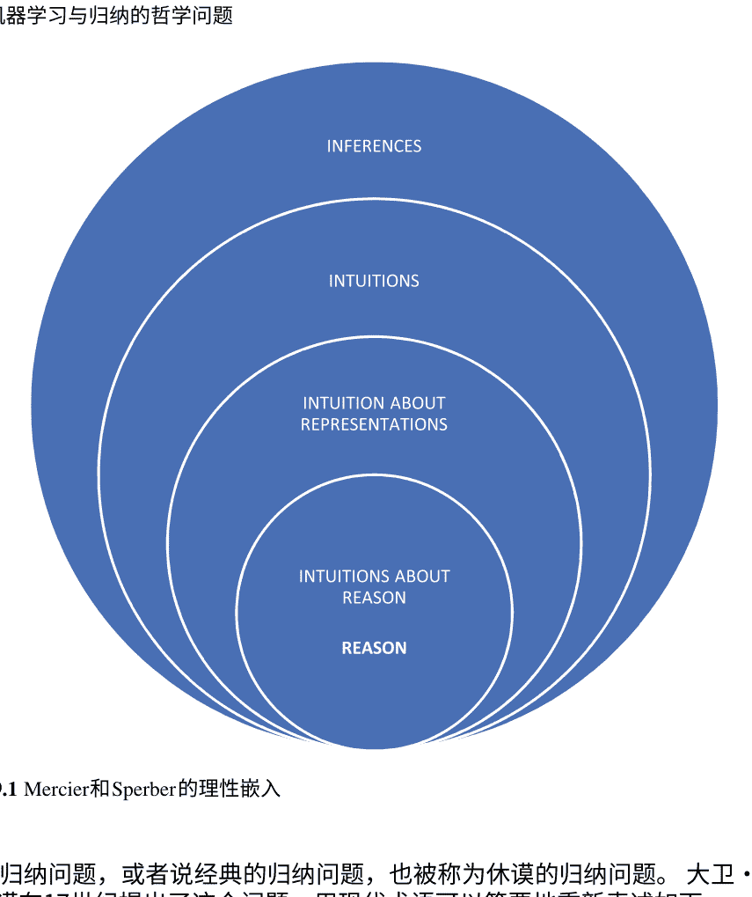

归纳问题，或者说经典的归纳问题，也被称为休谟的归纳问题。大卫·休谟在17世纪提出了这个问题，用现代术语可以简要地重新表述如下。

他提出了一个问题，即我们如何能够证明归纳推理，如何能够从观察到的事实推断出未观察到的事实。在休谟的术语中，有两种方式，即演绎或归纳。如果我们采用第一种方式，我们需要假设未观察到的事实与观察到的事实相似，但这正是我们试图证明的。如果我们采用第二种方式，我们正在使用我们试图证明的推理原则。因此，我们正在使用不可接受的循环推理。由于这穷尽了证明归纳推理的所有可能性，我们必须得出结论，它是不可证明的。值得注意的是，休谟并不否认这种推理的普遍性或重要性；他只是陈述了它的不可证明性。

在机器学习的背景下，我们可以将这个经典问题理解为偏差-方差权衡的一般化。我们可以使用高正则化的模型来保持简单（其他不合理的假设），设置超参数并在数据集的保留部分上进行测试，使用交叉验证和其他一些技巧。然后希望我们的模型在野外表现良好。根据机器学习从业者的经验，使用这些技术来避免过拟合将导致在新的、尚未观察到的数据上表现更好的模型。然而，是什么证明了这个结论？现实生活数据与我们的训练数据集相似，还是与以类似方法开发的模型的过去性能经验相似？如果我们接受休谟的二分法，那么什么都没有。

另一个与归纳相关的众所周知的问题是由德裔美籍哲学家卡尔·古斯塔夫·亨普尔在1940年代提出的，通常被称为“乌鸦悖论”。简而言之，亨普尔关注的是确认一般性陈述的问题，比如“所有乌鸦都是黑色的”。人们自然而然地接受黑色的乌鸦证实了这种概括，而其他颜色的乌鸦则证伪了它。问题在于，从逻辑上讲，这种概括等同于其逆否命题，即“所有非黑色的东西都不是乌鸦”。这种逻辑等价通常意味着这两个陈述具有相同的真值条件；相同的观察数据使得它们都为真或假。这个“悖论”在于意识到任何黑色的物体或任何非乌鸦都使得前面的陈述成立，因此，例如绿色的苹果证实了它。

与归纳推理相关的第三个问题可以说是与机器学习最相关的问题。这个问题由纳尔逊·古德曼提出，被称为“归纳的新难题”。古德曼认为休谟的问题是一个伪问题，因为在推理的类比中，我们无法对我们的推理实践进行证明。古德曼还提出了一个基于想法的解决亨普尔悖论的解决方案，即一个可接受的实例（一只黑乌鸦）不仅证实了该陈述，而且证伪了没有乌鸦是黑色的相反假设。

然而，他提出了一个与归纳相关的新难题，这在某种程度上颠倒了休谟的问题。也就是说，并不是说没有归纳推理是有理由的，而是说有太多的归纳推理是有理由的。他的著名例子是，基于观察到的许多绿色翡翠和没有其他颜色的翡翠，我们可以自然地得出结论，所有的翡翠都是绿色的。然而，这并不是我们唯一可能得出的结论。让我们定义一个新的属性称为“grue”。这个属性对于所有在未来某个时间点之前被观察到的蓝色物体都是真实的，例如在2100年之前被观察到的物体，或者在这个时间点之后被观察到的蓝色物体。基于相同的数据，我们可以得出结论，所有的翡翠都是“grue”，当然还有许多其他以这种方式生成的陈述。古德曼的挑战是区分我们可以在归纳推理中使用的属性（如绿色）和我们不能使用的属性。他将前者称为可投射的，后者称为不可投射的。尽管在过去50年中对这个问题进行了许多讨论，但对如何解决他的问题仍然没有达成一致。

分析一个类似的论点是值得的，没有花哨的新词，Goodman之前也提出过 ：

> 假设我们在VE日之前的99天中从一个碗中抽取了一个大理石，每次抽取的大理石都是红色的。我们预计第二天抽取的大理石也将是红色的。到目前为止一切都好。我们的证据可以用“Ra1 & Ra2 & ... & Ra99”这个连接词来表达，这很好地证实了“Ra100”的预测。但是，无论直觉上的可信度、投射、“证实”如何，都不会在每个谓词在类似情况下发生。
>
> 在每个谓词在类似情况下发生的情况下。让“S”是谓词“被VE日抽取并且是红色的，或者被后来抽取并且是非红色的”。上述假设的相同抽取的证据可以用“$S_{a1}$ & $S_{a2}$ & ... & $S_{a99}$”这个连接词来表达。根据所讨论的证实理论，这很好地证实了“$S_{a100}$”的预测，但实际上我们并不期望第100个大理石是非红色的。“$S_{a100}$”从所提供的证据中并没有获得可信度的一点点。第100个大理石将是非红色的。

从这个引语中，与机器学习的相关性更加明显。通过使用不同的学习设置和算法，我们可以得到不同的模型，这些模型在我们的数据集中是无法区分的。我们将在文本中稍后详细分析这个问题。

## 9.3 为什么归纳的哲学问题与机器学习相关？

英国计算机科学家莱斯利·加布里埃尔·瓦利安特声称：“归纳是儿童所表现出的一种普遍现象。它是一种例行公事和可重复的现象，就像物体受到重力的影响一样。”[27]。为了进一步扩展他的隐喻，尽管重力效应在古代当然是已知的，但我们对于亚里士多德的解释并不满意，即物体之所以落到地面上是因为那是它们的自然位置，因为它们属于那里。我们对于牛顿描述重力如何起作用的相当准确的描述，以及广义相对论提供的更好的描述和理解，也并不完全满意。我们仍然希望对重力现象的本质有更深入的理解，不仅是为了解释异常和差异，如额外的高能光子，并提供更好的描述和预测，而且也是为了理解它本身。

类比地说，由于机器学习是创建能够从数据中学习的计算机系统的努力，这样的系统可以被视为归纳机器，即基于归纳推理并执行归纳推理的设备。我们不应该对我们正在开发的系统在其任务上变得更好、执行归纳推理方面表现良好感到满足。我们希望了解更多，理解归纳和学习的原因，更好地理解其限制和可解释性，不仅仅是对当前学习系统，还包括任何未来的系统。随着我们对机器学习系统的信任越来越多，并将其整合到我们的生活中，从健康到法律系统，更加深入地了解它们的基础和限制变得至关重要。

正如在哲学和科学的发展中已经发生过许多次的情况一样，归纳问题可能会脱离哲学的母舰。它可能成为某个特定科学的问题，甚至成为自己的新科学，比如形式学习理论。然而，关于归纳的相关问题仍然非常开放，对这些问题的确切性质、方法和可能的解决方案仍然了解甚少。因此，预计这个问题至少在一段时间内仍然是“哲学性的”。

因此，即使哲学和哲学问题在科学和技术的实际实践中比过去不那么相关，可以认为哲学问题的最小相关性是为了避免哲学家的重新发现和重复错误。也就是说，在两千五百年的哲学探索中，提出了许多问题，讨论了许多问题和解决方案，并且审查了许多赞成和反对的论点。

几乎可以说，许多讨论的问题都是伪问题，许多解决方案都是虚假的，许多论点都是站不住脚的。然而，同样地，许多论点是有力的，并表明一些理论是不可信的，所以我们至少可以从哲学中学到的是不要一次又一次地重复同样的错误。

让我们以C.安德森（Wired杂志前主编）在10年前提出的归纳问题和机器学习问题为例。在他有影响力和具有挑衅性的文章中，受到大数据炒作的启发，“理论的终结：数据洪流使科学方法过时”，他声称基本的科学方法论-假设、建模、测试-现在已经过时，因为有大量的数据。他声称“有了足够的数据，数字会自己说话”，并且拥有千字节的数据使我们能够说相关性就足够了，相关性就是因果关系。

对于哲学家来说，这不是一个新的主张。这只是经验主义者和理性主义者在关于人类知识的来源和证明的25年辩论中的重申之一。安德森提出的论点最著名的是在十七世纪由弗朗西斯·培根在他的《新工具》中提出的。培根的主要观点是，与当时主导的基于演绎的亚里士多德科学方法相反。他认为科学知识应该基于实验数据。在他著名的比喻中，科学家是蜜蜂，不像理性主义者的蜘蛛或纯经验主义者的蚂蚁，他们选择了中间道路。他们从花朵（观察）中获取材料，并通过自身的力量进行“转化和消化”[2]。在当代类比中，我们只需要为我们的深度学习模型提供足够的数据，它们就会茁壮成长并产生知识。

在对这个立场提出的许多论据中，让我们考虑一下卡尔·波普尔爵士提出的一个论点。他可以被认为是至少在哲学上，科学方法的创始人，而这个方法正是安德森所攻击的。

> ……相信我们可以仅仅从纯粹的观察开始，而不需要任何理论的想法是荒谬的；这可以通过一个故事来说明，这个故事讲述了一个人将自己的一生奉献给自然科学，写下他所能观察到的一切，并将他无价的观察收藏留给皇家学会作为归纳证据使用。这个故事应该告诉我们，虽然甲虫可以有益地被收集，但观察可能不行。二十五年前，我试图向维也纳的一群物理学生阐明同样的观点，我在一堂讲座开始时给出了以下指示：“拿起铅笔和纸；仔细观察，并写下你所观察到的！”他们当然问我想让他们观察什么。显然，“观察！”这个指令是荒谬的。观察总是有选择性的。
> 它需要一个选择的对象，一个明确的任务，一个兴趣，一个观点，一个问题。此外，它的描述假设了一个具有属性词的描述性语言；它假设了相似性和分类，而这又假设了兴趣、观点和问题。……只有在这种情况下，对象才能被分类，并且可以变得相似或不相似。
>
> 通过与需求和兴趣相关来实现的方式。...通过他的理论兴趣、研究中的特殊问题、他的猜想和预期以及他接受的理论作为一种背景的观点来为科学家提供视角：他的参考框架，他的‘预期视野’。[22]

在机器学习社区中，对这个波普尔论点的消化重述可以听到没有偏见的学习[5, 15]。

在与机器学习相关的众多哲学论证中，在这项工作中，我们将重点关注两个例子。第一个例子与监督学习有关，我们的论点是著名的无免费午餐定理只是对著名的纳尔逊·古德曼的归纳新谜题的重述问题。后者与无监督学习有关，以及威拉德·范·奥尔曼·奎因对相似性问题与聚类问题的相关性分析。

## 9.4 监督学习和归纳的新谜题

这是一个被广泛接受的智慧珠宝，即没有免费午餐（NFL）定理——机器学习中的伟大负面结果——作为归纳的休谟问题的重申甚至形式化。¹像Christophe Giraud-Carrier和Pedro Domingos这样的杰出机器学习研究人员分别表示：

> 然后，NFL定理的本质上只是重申了休谟关于归纳没有合理基础的著名结论...[8]

还有，
> ...这个观察最早是由哲学家大卫·休谟在200多年前提出的，但即使在今天，许多机器学习中的错误也源于对它的欣赏不够。”[4]

即使是第一个NFL定理的创始人大卫·沃尔珀特，在证明了定理15年后，也加入了信息瀑布，并声称：

> ……这些原始定理可以被看作对归纳推理合法性的担忧的形式化和阐述，这些担忧可以追溯到大卫·休谟……[30]

本章认为，尽管NFL定理与经典哲学归纳问题有些模糊的联系，但并没有重新陈述休谟的问题，而是相关的纳尔逊·古德曼的论证。²我们认为NFL定理与古德曼的归纳新谜题（NRI）密切相关，可以说它们是谜题的一种可能形式化。此外，我们还想提出NFL定理与关于NRI的长篇哲学讨论的相关性问题，因为这种关系尚未得到研究。相关的，相反的，

¹本文的这部分是作者的文本《机器学习中的无免费午餐定理有多可怕？》[16]的扩展版本。
²我们假设新的谜题与归纳问题的经典问题是不同的，对于这个问题的接受立场有一些显著的例外。

问题是NRI与NFL的相关性以及机器学习社区是否能够从对Goodman论证的近70年的富有成果的讨论中受益。

### 9.4.1 无免费午餐定理

第一个NFL定理的形式是由Wolpert和Macready在1992年在计算复杂性和优化研究的背景下证明的[28, 31]。他后来证明了针对监督机器学习的该定理的变体[29]。为了我们的论证，我们将根据Cullen Schaffer的工作概述监督学习的简化版本的定理证明[25]。

在最简单的离散设置中，机器学习的布尔函数的训练数据X由表示一组属性对于每个二进制函数实例的真或假的二进制向量集合组成。每个向量被标记为我们想要学习的概念的正例或负例。机器学习算法L试图学习一个目标二进制函数y；也就是说，它试图从这组示例中学习一个真实的概念。训练数据集总是有限的，具有一定的长度n，并且数据馈送给L的相对频率由概率分布D定义。在对哲学家更为熟悉的背景下，这个机器学习问题可以被看作是从部分真值表中猜测一个大型n元真值函数的真实形式，其中大多数行是不可见的。

机器学习者的关键绩效指标是泛化性能，即在训练数据集之外的数据中找到的学习者的准确性。现代机器学习算法可以轻松地“记住”训练数据集中的数据，并在“未知”数据上表现不佳，导致过拟合问题。因此，学习者的成功是通过其泛化能力和在新颖数据上的表现来衡量的。在二元概念学习的简单设置中，学习者的泛化准确性基线，GP(L)，处于随机猜测的水平，新颖数据的准确性为0.5。如果我们使用抛硬币的方式来决定一个未知示例是否属于我们的目标概念，那么这样的表现是我们平均预期的结果。显然，我们希望任何学习者的表现都要比这个好。

NFL定理声称，对于任何学习者L，给定任何分布D和任何n个X


其中Y是所有目标函数的集合，也是可以学习的所有可能概念的集合。因此，该定理表明，平均而言，任何学习者的泛化性能都不会比随机猜测好。从简单的决策树到最先进的深度神经网络，所有的学习方法在考虑了所有可能的概念后都会表现相同。

这个结果，至少在第一眼看上去是出乎意料的，与休谟的论证结果与我们的期望之间的差异有些相似。然而，它并不声称我们不能从训练数据或经验中学到任何东西，而是我们可以学到一切，这无疑是古德曼论证的要点。与NRI的相似之处将在NFL定理的证明概述中更加明显。基本思想很简单：对于学习者正确的任何概念，都存在一个它错误的概念，或者用古德曼的术语来说，对于每个“绿色”概念，都存在一个“蓝色”概念。“蓝色”概念的构造方式类似于NRI论证，即它在所有观察到的数据（训练数据集中的数据）上与“绿色”概念一致，但在所有未观察到的数据上却相反。

更正式地说，对于每个概念 C，它能够很好地进行分类 - 例如，它能够准确地对新的示例进行分类 - 存在一个概念 C'，它能够将所有示例都错误分类。C'的构造如下：

```math
C' = \begin{cases} C & \text{如果 } x \in X \\ \neg C & \text{if } x \notin X \end{cases}
```

从视觉上看，这个简单的概念 C'的构造对应于维特根斯坦-古德曼的“弯曲谓词”[1]，其中X表示观察到的数据（训练数据集），而X'表示未观察到的数据。

从学习的主要成功度量的角度来看 - 泛化准确性，对于每个概念 C 的基线准确性改进 a，存在一个概念 C'，它将通过 -a抵消准确性的改进。因此，对于所有可能的概念，任何学习者的准确性改进都为零。可以将这个结果推广到更一般的学习设置，并证明了该定理的许多扩展[13, 14]（图9.2）。


### 9.4.2 是无免费午餐定理的新谜题吗？

尽管NFL与NRI非常相似，但分析这两个结果之间的差异和相似之处似乎是值得的。 让我们从相似之处开始。这两个论点都涉及归纳推理，涉及从已知到未知，从观察到未观察数据的推断。 这两个论点都意味着有太多的归纳推理可以被推断出来。 此外，这两个论点似乎得出了经验上不充分的结论，与科学实践和合理的期望相反。 没有人会得出所有的翡翠都是 grue的结论，也不会得出随机猜测是一种和其他猜测一样好的归纳策略的结论。

基本的相似之处在于论证的构建方式，证据的分割以及未观察数据的弯曲。在大多数NRI论证中，我们将证据分为观察到的和未观察到的（有时是将来的某个时间点）。 同样，在NFL中，数据被分为观察到的、训练数据集和应该泛化的未观察数据。 在这两个论证中，另一个对立概念 grue或 C'的构建方式相同。 它在观察数据上达成一致，在未观察数据上发生弯曲。

关于差异，首先，在参数上下文中存在差异。NRI是在确认逻辑和归纳的哲学、理论背景下提出的，而NFL是在人工智能和计算的技术背景下提出的。 至少乍一看，这些论点的目标也不同。 NRI的目的，至少在Goodman的原始形式[9, 11]中，是要认识到确认逻辑中的一个问题——可投射和不可投射谓词之间的界限。 另一方面，NFL的目标是证明没有单一最佳算法，最初是针对优化和搜索，后来是针对监督学习。

最显著的差异似乎在于量化的范围。 无免费午餐定理量化了所有学习者和所有概念，而Goodman的论证似乎是关于构建一个特定的例子。 然而，NRI可以重新表述为具有类似量化结构的NFL。 这种形式化的教训之一将是Goodman教给我们的重要性——归纳的语言，或者说在过程中没有一些预定义语言的经验调查的不可能性。 有趣的是，与机器学习界的同一研究人员从NFL中得出的结论相比——没有偏见就没有学习，没有知识就没有学习。

## 9.5 无监督学习和相似性问题

威拉德·范·奥曼·奎因（Willard Van Orman Quine）是二十世纪最伟大的哲学家之一，他接受了休谟对归纳推理的挑战，并同意经验和先验都无法提供正当性的观点——“休谟的困境就是人类的困境”[21]。奎因试图在他的自然主义认识论框架中，基于进化来解释我们的归纳实践。

他声称所有的学习都是基于条件反射的，因此归纳本身无法被学习：

> ...归纳的本能：期望感知上相似的刺激会有相似的结果。...哲学家们对归纳的期望感到惊讶，尽管它是有缺陷的，但比随机猜测成功得多。这可以通过自然选择来解释...”[20]

关于另外两个问题，奎因注意到亨普尔的问题，乌鸦悖论，可以归结为古德曼的问题[23]。确切地说，一个可投射谓词（黑色-非黑色）的补集，不需要也几乎从不是可投射的。他对归纳新谜题的简单解决方案是，“绿色的翡翠”彼此之间比“蓝绿色的翡翠”更相似。然而，将归纳问题简化为相似性问题并不是一个简单的解决方案，因为“...一个普遍的相似性概念的可疑科学地位...这个概念的可疑性本身就是一个显著的事实”[23]。

奎因并不是第一个探讨相似性概念的哲学家，莱布尼兹、休谟和古德曼等人也在分析这个概念。莱布尼兹认为相似性是他著名的不可辨别性原则的一个弱化版本。根据他的术语，如果两个对象（物质）共享所有属性，则它们是相同的，如果它们至少共享一个属性，则它们是相似的[18]。同样，休谟认为相似性（相似）的程度取决于它们共享的“简单思想”、属性的数量[12]，这个观点今天被称为相似性的共同属性观点。

在机器学习问题中，相似性问题主要出现在无监督学习中，尽管它也与监督学习任务相关。在聚类问题中，无监督学习的主要技术，相似性（接近度、距离）度量是聚类算法以及所有性能度量的输入。即使在定义了距离度量之后，监督学习仍然存在一些哲学和实际问题，从确定聚类数量到解释聚类的问题，但在这里我们将重点关注相似性本身作为任何无监督学习技术的先决条件。

让我们用一个简单的实际应用来说明相似性问题，即日期推理问题，具有时间粒度。

^3 Rodriguez-Pereyra声称，Leibniz认为物质的相似性并不源于它们的属性（事故）的相似性[24]，这是有强有力的哲学基础的。
^4 虽然有一些解读认为Hume在相似性问题上更接近Goodman的观点[7]。

天。日期相似性似乎是一个微不足道的问题，因为我们可以使用两个日期之间的简单绝对差异（以天为单位）作为相似性度量。然而，如何将这种相似性度量扩展到不精确的时间表达式，即由不精确表达式确定的日期，例如“二十世纪初”或“1875年去世的人的出生日期”？自然而然地，我们可以使用离散概率分布来表示这些经常出现在实际应用中的日期，覆盖相关时间段。因此，例如，我们可以使用分布来表示精确日期，其中总概率质量分配给一天。如果日期来自不可靠的来源，我们可以只分配0.1的质量给它，并根据某种概率分布将其余部分分散到相邻的日期上。以同样的方式，我们可以表示“XVII世纪”或“XVIII世纪初”等表达式（见图9.3）。那么，如果我们想要对这些日期进行聚类，应该使用什么相似性度量？

由于需要使用许多不同的分布，参数之间没有简单的距离。在不同的科学领域中，有许多相似性度量和概率分布之间的距离函数。在统计学和概率论中，有距离相关性、Bhattacharyya距离、Kullback-Leibler、Kolmogorov-Smirnov等f-散度[3]。

有信息论距离/相似度度量，如互信息或Jensen-Shannon散度，作为Kullback-Leibler散度的对称版本[19]。所有这些距离的主要问题是它们不满足对不精确日期比较的基本直观语义。

更糟的是，领域专家、历史学家等的相似度度量甚至不满足任何度量的基本要求——自反性。专业人士认为较窄的日期范围与自身更相似，而不是较大的日期范围，因此，例如，1941年与自身更相似，而不是二十世纪[17]。在认知科学的背景下，特弗斯基广泛研究了这个主观和高度情境化的相似性问题[26]。他证明了人类对相似性的判断不是对称的，测试对象认为朝鲜比中国更相似。

正如通常情况一样，这项经验性研究前面是哲学分析。古德曼在哲学和科学使用上都否定了相似性的概念：

> > ……考虑一下机场行李寄存处的行李。观众可能会注意到行李的形状、大小、颜色、材料，甚至制造商；飞行员更关心重量，乘客则关心目的地和所有权。哪些物品比其他物品更相似不仅取决于它们共享的属性，还取决于谁进行比较以及何时进行比较。[10]

从这些讨论中得出的关键点是，对于无监督学习来说，可以用奎因语言来表达：没有“事实”，没有真正的相似度度量标准，因此也没有任何关联或聚类学习的真实基础。这些结构并不是科学可以发现的客观存在，而是我们发明的，我们应该意识到其上下文和局限性。

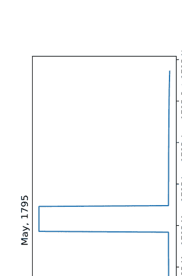

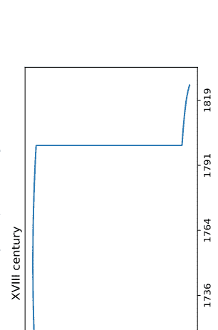

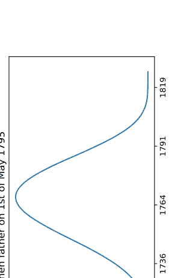

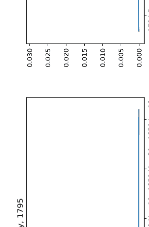

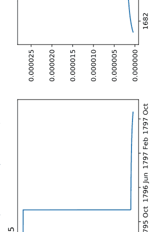

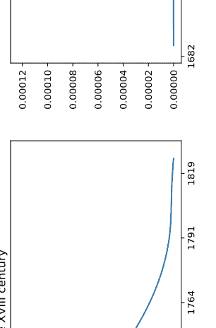

图9.3将不精确的日期表示为概率分布

## 参考文献

- 1. Blackburn S (1984) 传播信息。牛津大学出版社
- 2. Bacon F, Thomas F (1889) 新工具。克拉伦登出版社，牛津
- 3. Cha S-H (2007) 概率密度函数之间的距离/相似度量综述。城市1(2):1
- 4. Domingos P (2012) 机器学习的几个有用的知识。ACM通讯 55(10):78–87
- 5. Domingos P (2015) 《大师算法：追求终极学习机器的探索将重塑我们的世界》。Hachette，英国
- 6. Dretske F, Carnap R, Bar-Hillel Y (1953) 《信息的语义理论》。Philos Sci 4 (14) : 147-157
- 7. Gamboa S (2007) 《休谟论相似性、相关性和表示》。Hume Stud 33/1: 21-40
- 8. Giraud-Carrier C, Provost F (2005) 《朝着元学习的正当化：没有免费午餐定理是一个终结者吗？》。在：元学习ICML-2005研讨会论文集
- 9. Goodman N (1946) 《关于确认的查询》。J Philos 43 (14) : 383-385
- 10. Goodman N (1971) 《问题和项目》。Bobbs-Merrill
- 11. Goodman N (1983) 事实、虚构和预测。哈佛大学出版社
- 12. Hume D (1748) 关于人类理解的探究。克拉伦登出版社
- 13. Igel C, Toussaint M (2005) 针对非均匀目标分布的无免费午餐定理函数。 J Math Model Algorithms 3(4):313–322
- 14. Joyce T, Herrmann JM (2018) 无免费午餐定理及其对元启发式优化的影响。 Stud Comput Intell 744:27–51
- 15. Kubat M (2017) 机器学习导论。 Springer国际出版社
- 16. Lauc D (2018) 机器学习的无免费午餐定理有多可怕？ Croat J Philos 18(54):479–489
- 17. Lauc D (2019) 使用密集向量表示推理不精确日期。 Compusoft 8:3031–3035
- 18. Leibniz GW, Ritter P (1950) Sämtliche schriften und briefe. Akademie-Verlag
- 19. Nielsen F (2010) 基于Jensen不等式的一类统计对称散度的家族。arXiv:1009.4004
- 20. Orenstein A, Kotatko P (2012) 知识，语言和逻辑：对Quine的问题。 Springer Science & Business Media
- 21. Pakaluk M (1989) Quine关于Hume的1946年演讲。J Hist Philos 445–459
- 22. Popper K (2002) 猜想与反驳：科学知识的增长。 Routledge
- 23. Quine WVO (1970) 自然种类。 D. Reidel
- 24. Rodriguez-Pereyra G (2014) Leibniz的不可辨识性原则。 OUP
- 25. Schaffer C (1994) 一种适用于泛化性能的保守定律。 Mach Learn Proc 1994:259–265
- 26. Tversky A (1977) 相似性的特征。心理学评论 84:327–354
- 27. Valiant L (2013) 可能近似正确：自然的学习和繁荣的算法在一个复杂的世界中。Hachette
- 28. Wolpert D (1992) 堆叠泛化。神经网络 5:241–259
- 29. Wolpert D (1996) 学习算法之间没有先验区别。神经计算 1341–1390
- 30. Wolpert D (2013) 普遍性专题：进化计算和生命过程：没有免费午餐定理的真正含义：如何改进搜索算法。普遍性 23
- 31. Wolpert D, Macready WG (1995) 搜索的没有免费午餐定理。技术报告 SFI-TR-95-02-010，圣菲研究所

# 第10章 人工智能奇点：是什么以及不是什么

Borna Jalšenjak

摘要 本章的主题是人工智能奇点。本章讨论的人工智能是一种可能通过多次自我改进循环而产生的高度先进版本的智能。作者利用对传统上被认为是活着的生物的特征的古典哲学人类学的见解，认为传统上被认为是活着的生物和可能的先进普遍智能之间存在足够的相似之处，通过类比我们应该准备接受这种假设的人工智能作为一种活着的存在。

- 生命
- 人工智能
- 哲学人类学
- 奇点
- 责任

## 10.1 引言

在克罗地亚的萨格勒布市有一句话跑，人们——车来了！城市传说说人们在汽车是新奇事物时会大喊这句话，以警告其他人即将到来的危险。今天似乎应该大喊跑，人们——人工智能来了！我认为这说明了两件事。一，人们并没有改变太多；我们对新事物总是持怀疑态度。此外，有时我们在面对新奇事物时会感到不安，没有充分的理由。没有必要对一切新事物感到害怕。在本章中，我将尝试从哲学人类学（PA）的角度呈现和讨论一些关于人工智能（AI）、智能爆炸、奇点和未来的挑战和问题。

一些简介性的话。首先，在本章中，关于人工智能的讨论是关于所谓的通用人工智能。这很重要，因为可能有一种人工智能非常擅长制作汉堡，但在其他方面不擅长。这样的人工智能可能被称为领域特定的。与它们不同，本章的重点是一种这是一种不受特定领域限制的人工智能，或者换句话说，它是无领域的，因此能够在任何领域中行动。类似人类智能的东西。第二个注意事项，当讨论人工智能的风险或好处时，无领域的人工智能可能是大多数人所想到的，但目前几乎没有关于这种人工智能版本的实际工作，研究人员将大部分精力集中在特定领域的人工智能上[1, p. 2]。尽管如此，只要有可能在未来出现通用人工智能的机会，根据科学界的估计调查[2]，这个话题似乎太重要了，不容忽视。关于通用人工智能可能出现的可能性和实际方式的讨论超出了本章的范围。已经有很多专门讨论这个话题的论文了。¹本章试图从[4, pp. 3–4]中提出的一个问题开始讨论。在那篇论文中，作者列出了一系列问题，并鼓励来自不同领域的作者回答这些问题。他们提出的一个问题是：“什么是使机器智能被认为与人类智能相当的必要和充分条件？“在‘一般受过教育的意见已经改变了这么多，以至于人们能够谈论机器思考而不期望被反驳’（图灵1950年，第442页）需要什么？”[4, pp. 3–4]我认为，要使一般受过教育的意见更愿意接受机器作为思考的存在，就要开始将它们视为有生命的存在。

## 10.2 奇点和人工智能奇点

对奇点的含义有不同的观点。对这个概念的不同理解来自于涵盖科幻、未来学、技术领域、日常语言、哲学和计算机科学的各种来源。例如，当艾伦·图灵[5]讨论奇点的概念时，他写道：“(...)因为一旦机器思考的方法开始了，它很可能很快就会超过我们脆弱的能力。机器不会死亡，它们将能够相互交流以提高智慧。因此，在某个阶段，我们应该预料到机器会控制一切(...)。”另一位引入奇点概念的作者，弗纳·温吉[6]写道：“我们很快将创造出比我们自己更聪明的智能。当这种情况发生时，人类历史将达到一种奇点，一种像黑洞中心的纠缠时空一样晦涩难懂的智力过渡，世界将远远超出我们的理解。”在普通大众中，最著名的奇点作者可能是发明家雷·库兹韦尔。他将奇点定义为[7, p. 7]：“这是一个未来时期，在这个时期，技术变革的速度将如此之快，其影响将如此之深，以至于人类生活将不可逆转地被转变。”尽管既不乌托邦也不反乌托邦，但这个时代将改变我们依赖的赋予生活意义的概念，从我们的商业模式到人类生命周期的循环。¹作为一个例子，请参考[3]。

# 10 人工智能奇点：它是什么，又不是什么

包括死亡本身。理解奇点将改变我们对过去的重要性以及对未来的影响。真正理解它本质上改变了人们对生活的看法，以及对自己特定生活的看法。我认为，一个理解奇点并对其对自己生活的影响进行反思的人是一个“奇点主义者”。

从这些例子中可以看出，奇点这个词被不同的人以不同的方式使用。如今，它甚至成为了一种流行运动的象征，由库兹韦尔倡导，并与学术界保持距离[1]。

在本章中，我们将把奇点理解为人工智能奇点，并遵循查尔默斯的观点[8, p. 7]，即当机器变得比人类更智能时可能发生的情况：“(…)这个事件将引发智能水平的爆炸，因为每一代机器都会创造出更智能的机器。”查尔默斯在引用的文章中将这种不断改进的机器和由此产生的智能爆炸称为奇点。简而言之，一旦有一个与人类水平相当的人工智能，并且该人工智能可以创造出稍微更智能的人工智能，然后那个人工智能可以创造出更智能的人工智能，接下来的人工智能创造出更加智能的人工智能，如此循环，直到出现一个比人类能够达到的智能更为先进的人工智能。

在本章中，我们将以刚刚解释的方式使用概念奇点。

## 10.3 各种问题和哲学人类学

撇开假设和预测不谈，奇点能够实现的速度有多快，以及可能发生或不发生的原因是什么，与奇点概念相关的许多有趣的哲学问题纠缠在一起。依我看，它们可以分为几个类别。第一组问题是属于哲学人类学的一部分，类似于计算机人类学（因为没有更好的词，而且受到了严重的拟人化的影响）。第二组问题将属于伦理学类别。第三组问题将属于动机和行动理论领域。在本章中，重点是第一组问题，其他问题只是简要提及。

一般来说，PA是哲学中的经典学科之一。根据通常对科学进行分类的方式，根据其物质和形式对象，PA关注的是人类作为其物质对象的所有属性，其形式对象是他们的存在。重点关注人类最重要的属性。

讨论和教授属于PA的主题的一种传统方法是使用一系列论文，即关于特定事物状态的陈述，涉及不同的人类的一个重要方面。 人类的一个重要方面是他们活着的，这是毫无疑问的，而且通常是我们所声称的第一件事。当今的技术状态毫无疑问地表明技术不是活着的。 我们可以好奇的是，如果出现了一种超级智能，就像在奇点讨论中预测的那样，我们是否可以认为它也是活着的。 为了明确事情，我充分意识到当今谈论活的事物时，我们并不是在谈论机器。 然而，如果有一种超级智能的人工智能，可能是奇点的结果（或其他什么），那么询问它是否活着似乎是合理的。 也许存在的不是有机生命，而是其他种类的生命。 如果这样的讨论的结论是确实一个人工智能应该被认为是活着的，我相信它将对我们如何看待它以及我们，人类，如何对待它产生巨大的影响。 使用类似于PA论文方法的方法当讨论生命时，我将尝试给出一个初步的回答对于一个问题，这样的高级人工智能是否可以被认为是活着的或不活着。 ³

## 10.4 哲学人类学、生命和人工智能

在经典的哲学人类学中，声称为回答某物是否活着的问题，我们必须看看它所能做的活动类型。经典的哲学人类学论文陈述：内在活动的可能性（拉丁语内在行动）是将活着和不活着的事物区分开来的关键。内在活动意味着这种活动的结果仍然留在行动者身上，而不是在外部。如果一个行动的结果在行动者之外，那么它将被称为外在活动。⁴

我认为将活着的事物看作是关心自己和物种生存的事物是有道理的（当然，要在其可能性的限度内）。换句话说，活着的事物的行动主要关注于该事物本身。正如Belic [9, p. 16]所说，活着的事物不一定是其活动中的仆人或乞丐，它具有一定程度的自主性。

我们将整个事物视为这样的，并且对于这个整体，我们说它正在承载那种生命行动。他继续进一步举例说明内在活动本身，其中某物正在完善自己，足够自给自足，并拥有自身。

需要指出的是，经典PA仅关注内在活动的可能性，而不是实际应用。这并不意味着生物必须内在地行动；它只是意味着它可以这样做。现在至少，无论机器有多先进，在这方面它们始终只作为人类的延伸来发挥作用。如果AI的预测成真，这最后一点将不再成立。

> 在撰写本章的这部分时，我在很大程度上依赖Belic的经典教材[9, pp. 13-21]和他对古典PA中关于生命的所有主张的论证。
> ⁴值得指出的是，本章和这里提出的思想体系深受亚里士多德、托马斯和修辞学传统的影响。

## 10.5 形成和生命程度

某物要形成需要发生什么？在古典PA中有一个关于运动的假设，它认为在有生命的东西中，被动的可能性不能使某物形成，而已经存在的东西使不存在的东西形成。换句话说，运动是从主体已经拥有的东西到它尚未拥有的东西。如果我们考虑一下本章开头对奇点的描述，即AI改进周期的一系列循环，在每个新的AI迭代中，AI都会更快地创建出更智能的版本，从而产生超级智能的AI，那么似乎这种移动实际上是从已经存在的东西，即改进能力，到以前不存在的东西，即更先进的AI版本。古典PA对于某物开始存在的论点的分析继续提出，生命的程度和内在活动的强度可以有不同的程度。PA关注内在活动在一个存在中的程度。它是更完整还是更不完整，随后是存在和改进的程度更高还是更低？在最低程度上，所谓的植物生命只能按照其创造者预设的计划行动。在更高程度上，生命体可以在预设计划的范围内，并基于其观察，规划和行动。

## 10.6 作为生命和人工智能的内在活动的可能性的标志

为了提供作为区分生命和非生命的内在活动的论据，在经典PA中，通常的论证方式如下。[9, pp. 19–20]声称使用归纳法，我们可以注意到几件事情：

- 1. 在生命开始时，有机体朝着其目标发展；换句话说，它们是以目的论行动的。
- 2. 在它们的一生中，有机体可能会受到损害或威胁。尽管如此，有机体不会放弃，它们会尽力修复自己并实现自己的目标。
- 3. 此外，在它们的生命过程中，活着的有机体会照顾它们的后代。
- 4. 此外，它们在实现目标方面是不懈努力的主动发起者，而不仅仅是被动的回应者。
- 5. 此外，有机体将尝试适应当前的条件，但同时保持对其目的的忠诚。

似乎所有关于活着的生物的五个观察结果也存在于先进的人工智能中（或将存在于其中）。

首先，有机体朝着它们的目的发展似乎已经在今天的人工智能研究阶段中存在。程序正在按照设计的方式运行。我们应该考虑的一件事是，它们是否意识到自己正在这样做。我猜答案是否定的，至少目前是这样。比如猎犬或仙人掌也没有自我意识的能力，所以这似乎不那么相关，因为这并不妨碍我们接受动物或植物为活着的生物。

如果受损，生物体会尝试修复自己。考虑到已经存在能够自我修改的软件，似乎论证的第二部分也得到了满足。软件能够自我改进的程度因软件而异，这可以成为它们分类的标准。Yampolskiy [10] 区分了三种此类软件：自我修改、自我改进和递归自我改进。根据他的说法，第一种类型并不产生任何改进，只是使其他人更难理解已有程序的代码，而第二种类型：“(...)允许对产品进行一些优化或定制，以适应部署环境和用户。”[10, p. 385] 这意味着已经具备自我改进功能的软件符合PA中关于生物体试图修复自己以达到目标的标准。此外，这种第二种类型的软件似乎能够通过重新分配资源来优化自身以适应其环境的上下文，而不会从根本上改变程序[10, 11]。这与生物体在不改变其目的的情况下进行适应非常相似，正如上述第五个标准所述。

当考虑到人工智能时，养育孩子似乎是最可疑的标准。首先，机器不需要后代来确保物种的生存。人工智能只需准备足够的备件来更换故障（失效）的部件，就能解决物质退化问题。因此，如果AI没有被编程为要有孩子，它们就不需要孩子或者试图要孩子。如果有这样的目标存在，那么可以合理地假设超级智能将尽其所能生育后代。活体生物以许多方式繁殖，因此实际方法并不重要。⁵

活体生物追求最高可能的目标水平。我们通过观察活着的生物归纳得知这一点。这个论点的这一部分似乎是最容易在人类和先进AI之间建立类比的。阅读关于AI未来的文献时，总会有一部分讨论类似于关闭开关和控制问题的不同变体。请参见示例[12, 第127-143页]。目前，我不关心如何实现关闭开关——我相信这是专家们需要回答的问题。对于本章来说，我感到好奇的是为什么我们需要一个关闭开关。我们需要它，至少作者们是这样说的，因为无论后果如何，AI都会努力完成它们的任务。当我们开始思考伦理学、目标设定时，这一点变得更加重要。

以及AI的选择所带来的后果，这些后果并不是我们有意发生的。一个AI可能会，这是我从其他人那里借用的一个例子，踩死一个婴儿来给我们冲咖啡。如果这种情况即使有一丁点的可能性发生，那么我们需要某种关闭开关，而且毫无疑问，AI在完成任务时是无情的。

PA关于生命的论点的最后部分指向了活着的有机体的适应性可能性。似乎在第二步提到的自我改进软件已经具备了这种能力。如果是这样的话，那么在自我修改可能性方面，最终最先进的软件类型，即递归自我改进软件，也将具备适应性的能力。此外，它还将有可能完全替换正在使用的算法[10，p. 387]。这最后一点是实现奇点所需要的，至少根据Chalmers的说法是这样的。人类无法完全改变自己，此时计算机软件也无法做到，但是已经满足了适应性的条件，这最后一点似乎也得到了满足。

通过观察活体展示的特征与先进人工智能特征之间的相似性，我们可以得出这样的论点：当人工智能变得足够先进时，应该将其视为有生命的存在，而传统上认为机器没有生命的观点应该被抛弃。也许一个论点可以是这样的：

- 1. 我们通过归纳知道了活体展示的特征，我们对待活体和非活体的方式是不同的。
- 2. 超级智能人工智能导致并且是奇点事件的结果，展示了与活体相似的特征。
- 3. 通过类比，根据确定的特征，超级智能人工智能可以被视为有生命的存在。

第二个陈述似乎需要证明。通过观察经典PA中被认定为有生命的存在的特征，并将其与软件可能展示的特征进行比较，可以发现超级智能人工智能满足所有的标准。首先，有生命的存在和人工智能都在朝着自己的目标发展。其次，两者都会在受损时尝试修复自己以继续正常运行并实现目标。第三，后代方面，人工智能不需要子女来增加物种的累计寿命，而传统上理解的有生命的存在需要子女。然而，如果子女能够帮助人工智能完成任务，它们可能会选择拥有子女。

第四，传统上被认为是有生命的存在和人工智能都不懈追求自己的目标。最后，第五，这两种实体都会根据当前情况进行适应。所有这些陈述综合起来似乎足够有力地证明了有生命的存在和超级智能人工智能之间的类比存在。

如果有生命的存在（传统上来说）和未来的人工智能之间存在足够强的类比，我相信存在这种类比对人类将如何行动（或应该如何行动）会产生严重影响。我相信至少会发生这两件事。首先，这将从根本上改变我们对机器的看法。历史上第一次，人工创造的实体可能在公众中被视为有生命。此外，这意味着可以为主张这样的实体不再仅仅作为人类的延伸的论点可以被构建。它们将有自己的目标，可能也有自己的权利。考虑到权利，第一次，我们可能需要证明我们（人类）的利益应该得到追求。这与我认为的第二件重要的事情有关。人类将与一个至少与他们一样聪明，甚至可能更聪明的实体共享地球。

## 10.7个未回答的问题-而不是结论

我关于我们应该如何将即将到来的先进人工智能视为活生物的建议引发了更多问题而不是解决问题。首先出现的问题是，这里描述的活生物特征是否足以被认为是活着的，还是它们只是必要但不充分的。在此，我承认可能会有疏漏，只是陈述它们应该足够，因为如果我们开始谈论生命的基本必要性，我们就会陷入意识形态，而这个讨论没有明确的路径。简而言之，如果它表现出活着的特征，那么从实际角度来看，它就是活着的。

另一个引起我注意的问题再次来自于古典PA。在PA中，关键问题是活着且理性的存在与活着但不理性存在之间的区别是什么？这个问题至关重要，因为智能生命也将允许自由意志。人类可以通过内在的活动来塑造和实现（或远离）他们存在的目的。对于人类生命目的的回答将因哪个哲学学派提供答案而有所不同，但几乎所有学派都认为人类将自由选择和塑造自己的生活。换句话说，通过内在的活动，人类在某种意义上是自己的共同创造者，他们并不完全赋予自己存在，但确实使自己的存在有目的并实现了那个目的。（当然，一些人的选择和行为可能使他们离实现目的更远。）未来的人工智能是否有自由意志尚不清楚；他们将有选择行动的能力，但他们可能永远无法完全放弃他们的起始位置。

最后一个大规模讨论的领域似乎是伦理。这个主题将是至少三个方面讨论的富有成果的领域。首先，我们似乎仍然不知道我们希望在人工智能中编程哪种道德，因为无论我们将伦理系统编程为什么，都可能会有我们没有预料到的后果。有关这方面的优秀报道，请参阅[13]。其次，我们不仅需要关注人工智能应该遵循哪种伦理系统，还需要完善我们对一旦认定其为有生命的人工智能应该如何对待的原则。这是以前从未发生过的事情，需要在达成共识之前进行大量讨论。除了这两个问题，还需要回答的第三个问题是关于人工智能伦理的，它涉及到人工智能应该如何看待人类及其与人类的关系。可能会出现两套不同的标准（一套是人类的，一套是人工智能的），如果这两套标准发生冲突的话，对于某种实体类型来说，这将不会有好结果。不幸的是，由于本章讨论的假设AI将具有比人类更高的智能，不同实体之间的冲突可能对我们来说会有不好的结局。在本章的结尾，我想说无论我们还面临着什么问题，或者我们在谈论人工智能研究的未来时感到不安，这些话题都不能被忽视，因为我们目前所知道的关于未来的一切似乎都指向人类社会面临着前所未有的变革。

## 参考文献

- 1. Müller VC (2016) 编者按：人工智能的风险。在：Müller VC (编) 智能的风险。CRC出版社，查普曼和希尔，伦敦，第1-8页
- 2. Müller VC, Bostrom N (2016) 人工智能的未来进展：专家意见调查。在：Müller VC (编) 人工智能的基本问题。斯普林格，综合图书馆，柏林，第443-571页
- 3. Eden AH, Moor JH, Soraker JH, Steinhart E (2012) 奇点假设。Springer，柏林海德堡
- 4. Pearce D, Moor JH, Eden AH, Steinhart E (2012) 引言：奇点假设的科学和哲学评估。在：Eden AH, Moor JH, Soraker JH, Steinhart E (eds) 奇点假设。Springer，柏林海德堡，第1-12页
- 5. Turing AM (1996) 智能机械，一个异端理论。Philos Math 4 (3)：256-260
- 6. Vinge V (1983) 第一个词。OMNI 256-260
- 7. Kurzweil R (2005) 奇点即将来临：当人类超越生物学。维京，美国
- 8. Chalmers DJ (2010) 奇点：哲学分析。J Conscious Stud 17：7-65
- 9. Belić M (1995) Metafizička antropologija. Filozofsko-teološki institute Družbe Isusove u Zagrebu, Croatia
- 10. Yampolskiy RV (2015) Analysis of types of self-improving software. In: Bieger J (ed) Artificial super intelligence: a futuristic approach. Springer International Publishing, pp 384–393
- 11. Omohundro S (2012) Rational artificial intelligence for the greater good. In: Eden AH (ed) Singularity hypotheses, pp 161–179. Springer, Berlin Heidelberg
- 12. Bostrom N (2014) Superintelligence. Paths, dangers, strategies. Oxford University Press, United Kingdom
- 13. Helm L, Muehlhauser L (2012) The singularity and machine ethics. In: Eden AH (ed) Singularity hypotheses. Springer, Berlin Heidelberg, pp 101–125

# 第11章
# AI完备性：使用深度学习消除人为因素

Kristina Šekrst

摘要计算复杂性是计算机科学和数学的一个学科，根据问题的固有难度对计算问题进行分类，即根据算法的性能对这些类别进行分类，并将这些类别相互关联。P问题是一类可以使用确定性图灵机在多项式时间内解决的计算问题，而NP问题的解可以在多项式时间内验证，但我们仍然不知道它们是否也可以在多项式时间内解决。所谓的NP完全问题的解也将是任何其他类似问题的解。它的人工智能类比是AI完全问题的类别，至今仍没有完整的数学形式化。在本章中，我们将重点分析计算类别，以更好地理解AI完全问题的可能形式化，并查看是否存在一种通用算法，例如图灵测试，可以解决所有AI完全问题。为了更好地观察现代计算机科学如何处理计算复杂性问题，我们介绍了几种涉及优化方法的不同深度学习策略，以看到从更高阶计算类别中无法精确解决问题并不意味着没有使用最先进的机器学习技术的令人满意的解决方案。这些方法与关于人类解决类似NP完全问题的哲学问题和心理学研究进行比较，以加强这样的主张：我们不需要有一种精确和正确的方法来解决AI完全问题，但仍然可能实现强人工智能的概念。

## 11.1 学习如何相乘

计算的概念自人类诞生以来就存在，通常情况下，这个术语指的是通过有限步骤从一组输入产生输出的方法。计算不仅是日常生活中的实用工具，也是一个重要的科学概念，因为计算专家们认识到许多自然现象可以被解释为计算过程。

认识到许多自然现象可以被解释为计算过程[2]。计算复杂性理论根据问题的固有难度对计算问题进行分类。在计算复杂性理论中，决策问题是一个为输入值提供是/否答案的问题，例如，给定一个数字 x，决定 x 是否为质数。可以通过算法解决的决策问题是可判定的。解决问题的某些方法比其他方法更加高效。

让我们从一个简单的基 本乘法问题开始：给定两个整数，计算它们的乘积。我们可以简单地重复加法，例如，5 × 4 = 4 + 4 + 4 + 4 + 4。但是对于像 4575852 × 15364677 这样的例子，情况变得复杂起来。通常人们认为只有小学方法，但这远非事实。从历史上看，计算机在乘法问题上使用了移位相加算法，但是随着许多计算问题的复杂性与乘法的速度成正比，它们的计算能力需要变得更快。小学方法需要进行 n^2 步，对于 n 个数字，这对于每天计算数百万位数的问题来说是一个问题。在 1960 年，安德烈·科尔莫戈洛夫猜想标准乘法过程需要与输入大小成正比的基本操作次数，即 O(n^2)。¹这个 O 符号表示算法的运行时间随着输入大小的增长而增长。如果 n = 2，计算 n^2 很容易，但如果 n 有十亿位数，计算速度就不那么快了。在莫斯科国立大学，科尔莫戈洛夫组织了一个关于计算问题的研讨会，并提出了他著名的猜想，但在一周内，当时 23 岁的学生阿纳托利·卡拉图巴通过找到一个算法，在 O(n log^2 3) ≈ (n^1.585) 个基本步骤中相乘了两个 n 位数，从而证明了这个猜想[14]。

Karatsuba 的方法采用分而治之的方法，将问题分解为子问题，解决子问题，并将答案组合起来解决原始问题。首先，我们取数字 x 和 y，例如，58 × 63，它们的基数 B：

```
x = x_1 \times B + x_2 \quad y = y_1 \times B + y_2
x = 58 \quad y = 63
x = 5 \times 10 + 8 \quad y = 6 \times 10 + 3
```

现在乘积变为 x × y = (x_1 × B + x_2)(y_1 × B + y_2)，我们将其分割为较小的计算块：

```
a = x_1 \times y_1
b = x_1 \times y_2 + x_2 \times y_1
c = x_2 \times y_2
```

¹大 O 符号的典型用法是渐近的，指的是最大的输入值，因为它的贡献增长最快，使其他输入变得无关紧要。

图11.1我们希望我们的计算问题算法的图形尽可能低，这意味着我们的资源从O(n^2)到O(nlogn)有一个巨大的跃迁，这意味着输入大小的操作数量显著减少。来源 [www.commons.wikimedia.org](https://www.commons.wikimedia.org)，CC BY-SA 4.0

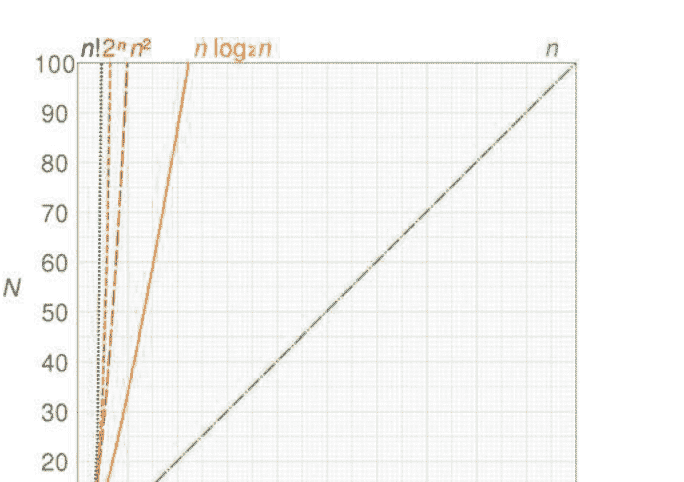

Karatsuba发现b可以简化为b=(x1+x2)(y1+y2)-a-c，这是一个关键步骤，现在我们少了两次乘法，而不是b=x1×y2+x2×y1!

```
a = 5 × 6 = 30
b = (5 + 8) × (6 + 3) - 5 × 6 - 3 × 8 = 63
c = 3 × 8 = 24
x × y = a × B² + b × B + c
x × y = 30 × 10² + 63 × 10 + 24 = 3654
```

Karatsuba的方法为更好的方法铺平了道路，例如Schönhage和Strassen的方法[20]，其运行时间为 O(n log n log log n)对于n位数，它使用快速傅里叶变换。在2019年，Harvey和van der Hoeven [11]证明你可以在 O(n log n)内实现整数乘法。²这个例子说明了即使是小的修改也可以对降低算法的计算复杂度起到关键作用（图11.1）。

计算复杂性理论涉及到在计算过程中解决计算问题所需的资源，包括时间（解决问题所需的步骤数）和空间（解决问题所需的内存量）。**P类问题**是可以使用确定性图灵机在多项式时间内解决的问题（例如，n^2，但不是指数2^n）。

²注意：它只在具有超过2,4096位数字的数字上比其他算法更快，这在大数据领域中很少实用。

另一方面，NP问题的解可以在多项式时间内验证，但我们仍然不知道它们是否也可以在多项式时间内计算。NP完全问题是最难的NP问题，可以在多项式时间内解决这类问题的算法也可以在多项式时间内解决任何其他NP问题。通常，NP完全问题需要指数时间，例如$O(2^n)$，当$n$很小时很容易，但当$n$增加时跳跃很快。例如，考虑一个运行时间为$2^{10}$小时的程序，相当于42.6天。但是，如果我们将$n$增加到11，结果是85天，如果将$n$增加到20，程序将在$119.6$年内完成。

NP-困难问题至少和NP中最难的问题一样难。通常，这相当于NP-完全问题，但也有NP-困难问题不是NP-完全的，例如停机问题（“给定一个程序和它的输入，程序是否会永远运行？”），这是一个不可判定的决策问题。$^{3}$最著名的NP-完全问题包括布尔可满足性问题（“是否存在一个解释满足给定的布尔公式？”），旅行推销员问题（“给定一个长度$L$，决定城市和距离的图中是否存在比$L$更短的路径？”），背包问题（“给定一组具有一些重量和价值的物品，是否可以达到至少$v$的价值而不超过重量$W$？”），以及图着色问题（“我们是否可以对图的顶点进行着色，使得相邻的顶点不是相同的颜色？”）。计算机科学中一个重要的未解决问题是$P$与$NP$问题，它询问每个可以在多项式时间内验证解的问题是否也可以在多项式时间内解决，即快速解决。

$^{3}$> 假设我们有一个可计算的函数（解决停机问题）。该函数运行一个子程序，检测我们的函数是否会停机，如果该子程序返回true，则应该无限循环。如果函数满足停机条件并返回true，则它将无限循环而永远不会停机。然而，如果它返回false并且不停机，则它将立即停机。这两个矛盾推翻了它是一个可计算函数的假设。

## 11.2 AI-完全

类似于NP-完全问题，人工智能领域中最困难的问题被称为AI-完全问题，这个术语最早由Fanya Montalvo[18]提出。假设智能是可计算的，解决这类问题等同于解决中心人工智能问题，即强人工智能：机器具有类似人类的理解或学习任何智力任务的能力。AI-完全问题通常包括计算机视觉或自然语言理解问题，以及自动推理、自动定理证明和解决实际问题时处理意外情况的问题。然而，与计算机科学中精确形式化的计算复杂性类别不同，AI-完全问题尚未完全数学形式化。

## 11.3 这个差距

与[1]中不同，我们认为定义一个AI问题应该以哲学的眼光来审视，并且它已经在形式上的背景之外以哲学的眼光来审视过。我们已经说过解决这些问题等同于解决强人工智能问题。自从数学家和哲学家Norbert Wiener以来，哲学一直与现代人工智能的发展紧密相连。

费尔，他提出了所有智能行为都可以通过不同的反馈机制来模拟的理论。然而，哲学家们也在讨论意识和知觉不能通过机械过程来解释的问题：莱布尼兹提出了一个思想实验，即大脑可以被放大到和一座磨坊一样的大小，但我们仍然无法找到任何解释，例如知觉。莱布尼兹的鸿沟指的是心理状态不能仅通过检查脑过程来观察的问题，这与哲学心灵中的困难问题有关。⁴后者涉及我们用来解释心灵的所有结构和功能属性的科学方法，但我们仍然无法回答为什么有感知的生物具有主观的现象经验。

查尔默斯[4]指出意识的简单问题解释了以下现象：

- 辨别、分类和对环境刺激做出反应的能力，
- 认知系统通过信息整合，
- 心理状态的可报告性，
- 系统访问其自身内部状态的能力，
- 注意力的焦点，
- 行为的有意控制和
- 清醒和睡眠之间的差异。

所有这些问题都可以用计算或神经机制来解释，但意识的真正难题是体验的问题，即它的主观方面，仍然存在一个解释上的鸿沟。一个人吃巧克力的感觉可能与另一个人不同，一个人可能喜欢斯特拉文斯基的《春之祭》而另一个人可能讨厌。意识的难题是哲学上几个世纪以来的心灵-身体问题的现代版本：如何将我们的思想和意识与大脑和身体连接起来。

Searle的[21]中文房间论证⁶指出仅凭语法本身是不足够的来表达语义，因为计算机可以通过遵循编程指令而欺骗一个人，让他相信它懂中文，而不是真正地懂，即纯粹的符号操作可能永远不会真正理解。与提到的模拟理解的弱人工智能系统不同，强人工智能立场认为人工智能系统可以用来解释思维，并且图灵测试足以测试心理状态的存在。如果我们能解决一个 AI-完全问题，我们将有一种方式声称我们已经达到了强人工智能的地位，或者至少跨越了一个重要的屏障。使用Yampolskiy的[27]形式化，已经证明在该框架中，任何可以由人类预言机解决的问题都可以编码为图灵测试的一个实例，因此通过图灵测试似乎是实现人工通用智能的主要步骤。然而，根据Searle的观点，计算机可能仍然无法真正理解给定的任务。

## 11.4 绕过

Shapiro [23]指出，解决主要AI问题领域之一的问题等同于解决整个AI问题，即生成一个通用智能的计算机程序。这些领域包括自然语言、问题解决和搜索、知识表示和推理、学习、视觉和机器人技术。然而，我们可以看到哲学家和AI研究人员成功地确定了人工通用智能的几个关键概念，而不需要统计计算AI研究人员在哪些困难问题上达成一致，这是[1]中AI问题形式化的非正式部分。一般来说，使用计算方法解决AI完全问题肯定属于弱人工智能的范畴，但是在哲学上是否这些解决方案构成了真正的理解，即强人工智能，仍然存在不同的解释。强人工智能不必具有超级智能，只需类似于人类。例如，Trazzi和Yampolskiy [24]引入了人工愚蠢，即为了完全模仿人类的理解，超级计算机不应该具有超级计算机的能力，例如每秒最大操作数。这意味着为了模仿人脑，我们可以假设，例如，所提到的O(n^2)乘法方法需要回归，因为这是人类计算的标准。然而，正如他们所指出的，大脑进化出来以完成一些对进化有用的非常特定的任务，但没有任何保证这些过程的复杂性在算法上是最优的，因此人工通用智能可能具有比人脑更适合计算的结构。

有趣的是，人类在某些NP-完全问题上表现出色。例如，旅行推销员问题是找到一组点的最短路径并返回初始位置⁷，人类进行了测试，他们的解决方案要么接近最佳解决方案，要么比众所周知的启发式方法好一个数量级[17]。更有趣的是，一个群体提出的解决方案集合似乎比大多数个体解决方案更好[30]，这也在旅行推销员问题上进行了测试。可以假设将不同的机器学习方法结合起来可能接近人类的解决方案。

Shahaf和Amir [22]走过了类似的道路，并致力于在人类和机器之间分担计算负担。执行使用机器 M^H的算法的复杂性是一对 ⟨φ_H(M^H), φ_M(M^H)⟩，这是一个人工部分和机器部分的复杂性的结合。例如，光学字符识别是将印刷或手写文本转换为机器编码文本的过程，这是计算机视觉问题的一部分。

深度学习方法通常用于智能字符或单词识别，计算机可以在过程中学习不同的字体样式和不同的手写样式。光学字符识别的最终复杂性很可能是〈O(1), poly(n)〉。图灵测试是Yampolskiy用作可还原性的第一步，通过一次n句对话来复制，其中有复杂度〈O(n), O(n)〉，其中oracle记住了先前的历史记录，〈O(n), O(n²)〉，整个对话历史需要重新传输，或者〈O(n²), O(n²)〉，如果除了前一步之外，一个人需要线性时间来阅读查询。

## 11.5 桥梁

让我们回到夏皮罗的主要 AI-完全领域。首先，人工智能中自然语言的目标是创建一个能够像人类说话者一样熟练使用人类语言的程序。与自然语言处理不同，自然语言理解涉及阅读理解，而且Yampolskiy认为这是一个 AI-难问题。解决自然语言处理问题的方法基于浅层模型，如支持向量机和逻辑回归，这些模型在高维稀疏特征上进行训练，但最近基于密集向量表示的深度学习框架产生了更好的结果[31]。例如，对于文本分类（将文本分组），卷积神经网络在计算机视觉中非常成功，也被使用。主要思想是将特征提取^8和分类^9作为一个联合任务，并尽可能多地使用层次结构，以及层次结构可以用来学习完整句子的层次结构[5]。Conneau等人使用卷积神经网络在句子分类中使用新闻和在线评论来提取主题、情感分析和新闻/本体分类，成功超越了所有以前的神经网络模型，使用了29层。

## 卷积神经网络^{10}一直是计算机视觉领域的一个亮点

让我们来看看使用深度学习方法解决这些问题的现状。卷积神经网络和深度学习技术已成功应用于计算机视觉问题的解决，特别是对象识别方面，该方面涉及在图像或视频中找到和识别不同的对象。通常的问题包括背景噪声、遮挡、平移和旋转，但使用深度学习方法仍然可以识别这些对象。Gu等人使用基于区域的卷积神经网络来弥合图像分类和目标检测之间的差距。他们专注于使用深度网络定位对象，并仅使用少量的注释数据来训练模型。通过使用基于区域的识别方法解决了第一个问题，其中区域由丰富的线索（如形状、颜色和纹理）描述，并学习了不同的区域权重。这样的解决方案为对象检测、分割和分类提供了统一的技术。

## 然而，这些方法需要进一步优化以解决更困难的问题。

Girschick [9] 解决了深度学习的局限性：

- 训练是一个多阶段的流程，
- 训练在空间和时间上都很昂贵，而且
- 目标检测速度较慢。

尽管我们正在解决计算机视觉问题，但我们仍然受制于计算复杂性的束缚，这是因为提取的特征需要数百GB的存储空间，并且该过程可能需要例如2.5个GPU天来处理5000张图像，使用GPU进行检测需要大约一分钟的时间[15]。

> 因此，神经网络的主要问题之一是训练时间。Judd [13] 在1988年提出了以下问题：给定一个通用的神经网络和一组训练样例，是否存在一组边权重使得网络对所有训练样例产生正确的输出？Judd 还证明了，即使网络只需要对三分之二的训练样例产生正确的输出，该问题仍然是NP难的。五年后，Blum和Rivest [3] 给出了更糟糕的消息：对于一个2层（3节点n输入）的神经网络，找到最适合训练集的权重是NP难的，而且判断网络的三个节点是否存在权重和阈值以产生从训练集中学到的正确输出是NP完全的。

然而，这并不意味着我们不能取得令人满意的结果。成功训练的常用方法[16]包括改变激活函数（定义给定输入集的节点输出）、过度规范化（似乎更容易训练比所需的网络更大）和正则化（对权重进行正则化以减少过拟合^11）因此深度学习方法仍然被用于获得不错的结果。

因此，由于一般神经网络的优化问题是NP-难解的，将这样的神经网络优化以在多项式时间内产生解决方案可能仍然看起来遥不可及。与这种怀疑的消息相反，我们真的可以使用深度学习方法高效地解决NP-完全和AI-完全问题吗？事实上，是的，例如，梯度下降^12方法可以为我们提供足够好的局部最小值，就像人们可以在合理的规模上解决NP-完全问题一样，得到令人满意的解决方案，而不是最优解。而且优化只是我们可以做的其中一件事情 - 我们可以增加更多的机器（因此，更多的内存=更多的空间）并使用更好的硬件，如GPU。为什么我们要求人工智能比我们做得更好，同时又将人类的能力视为智能的典范呢？

## 11.6 乘法的乘法

Milan等人[19]已经证明，使用循环神经网络通过学习近似示例可以产生高度准确的结果，而计算成本很低。RNN是一类人工神经网络，它在生成输出的同时从先前的输入中学习，而在传统的神经网络中，我们假设输入和输出是相互独立的。但对于许多自然语言理解或图像处理问题来说，这并不是一个最优的解决方案，因为例如，如果我们想要训练一个模型来预测句子中的下一个单词或短语，那么关于先前单词的数据将会带来很大的收益。因此，循环意味着对于每个元素执行相同的任务，并且输出取决于先前的计算；同样，一个AI-完全问题可以被简化为一个图灵测试，该测试具有对所有先前对话的记忆，这会影响对测试者问题的下一个回答。

深度学习和机器学习方法有一个共同的特点，这也可能是一个共同的限制。我们希望通过损失函数来定义我们的预测与正确解的接近程度，我们的目标是最小化损失。在[19]中，策略的改变不是专注于最小化目标函数，因为在某些问题中它可能无法反映网络的性能，而是使用问题特定的目标。例如，在解决旅行推销员问题时，并不能保证与最短路径更相似的路径会提供更短的长度，因为我们可以用最优解中的两条短边进行替换。

过拟合是指模型与特定数据集过于吻合，这通常意味着它在更一般的示例上会失败，因为它包含了太多具体的参数。例如，如果我们要训练一个可以识别动物和人脸的模型，使用猫的图片来形成我们的相关属性，我们的模型可能会寻找尖耳朵作为一个相关属性，并且对猫有效，但对其他动物和人类无效（也许对于火星人和精灵有效）。

旅行推销员路径，并提出一个损失较小但非最优路径的解决方案。因此，在每次梯度下降的迭代中，通过监督方式计算问题特定的目标函数，以获得近似解和我们的预测。只有当提出的解决方案比我们的预测解决方案更好时，才会传播梯度。

Weston等人[26]使用长短期记忆循环神经网络（用于顺序数据）和记忆网络（对先前记忆进行匹配和推理）攻击了问答的AI完全问题，并且已经证明记忆网络在问答方面表现出色。他们在大多数问题上确实实现了超过95%的准确率，但仍然在一些任务上失败了，其中一些失败是由于建模能力不足，例如他们最多只能执行两个操作，因此无法处理超过两个支持事实的问题。

最后两个场景表明，问题特定的模型优于一般解决方案，就像一些神经网络对某些问题更好一样。还证明了当人们作为一个群体来看待时，他们似乎能够提供更好的解决方案给 NP-完全问题，并且常见的平均解决方案优于个体解决方案。谷歌的PathNet是一个类似的实验，其任务是在学习用户定义的任务的同时，发现网络的哪些部分可以用于新任务，并且尽可能高效地进行。Fernando等人[7]声称，对于人工智能的普适智能来说，如果多个用户训练同一个巨大的神经网络，并且没有灾难性遗忘，并且可以重复使用参数，那将是高效的。

与 NP-完全问题不同， AI-完全问题尚未在数学上定义，尽管我们已经提到了一些形式化的定义。然而，使用针对不同类型问题专门设计的深度学习方法，现代计算方法，尤其是使用深度学习，正在产生高度准确的结果，有时因为特定模型的限制而失败，这似乎也模仿了人类的表现。

例如，在2003年，Ahn等人[1]开发了CAPTCHA，这是一个完全自动化的公共图灵测试，用于区分计算机和人类。用户需要输入扭曲图像中的字母。Ye等人[29]使用了生成对抗网络，这在没有大型训练数据集时非常有用，因此GAN可以生成类似的数据。他们的方法在多个网站上以100%的准确率解决了CAPTCHA，并且该算法可以在常规PC上在0.05秒内解决一个CAPTCHA。在2003年，Ahn等人[1]指出，任何具有高成功率的CAPTCHA程序都可以用来解决一个未解决的AI问题，因此深度学习方法似乎走在了正确的轨道上。要么我们离找到一个通用的深度学习解决方案还有很长的路要走，要么为不同的问题找到一个特定的解决方案也可能是一个通用解决方案的一部分。学习如何调整神经网络，如何有效地训练它们，以及使用哪种传播方式，毕竟是解决问题最人性化的方式，这种方式也可以转化为自学习和自校正的深度学习方法。

困难的 AI问题通常与 NP难问题相似，并且通常 NP难问题与人工智能的一些子问题重合。然而，我们仍然不知道解决这类问题的最佳方法，但我们知道人和计算机，尤其是使用机器学习和深度学习方法，可以产生足够准确的结果来解决 NP 完全问题，并且人群的准确性比单个代理人更高。人工智能问题对人类来说似乎很容易，但对机器来说很困难，深度学习方法表明神经网络正在为自然语言理解和计算机视觉问题产生高度准确的结果。例如，CAPTCHA类型的测试依赖于计算机无法像人类一样准确地进行模式识别任务，但最近的发展表明深度学习模型可以以100%的准确性执行。然而，由于人为错误，人类不一定也是如此。就像人类在智力能力上有所不同一样，不同的机器学习方法在解决某个问题的能力上也有所不同。似乎普遍智能的探索已经对于人类的理解水平来说很难定义，更不用说对于计算机的理解水平了，这使我们需要以哲学的眼光审视我们的定义和形式化。

## 11.7 消除人为因素

AI-完全方法的求解器仍然远远无法测量或检测内部状态，因为例如感受疼痛和了解疼痛并不是相同的内部状态[28]。在杰克逊的文章[12]中，知识论证被用来反对物理主义，物理主义将心理现象简化为物理属性。

杰克逊提供了一个思想实验，其中神经生理学家玛丽在一个黑白房间里使用黑白监视器调查世界，她了解颜色和视觉的一切，但是如果她被释放出房间，我们的直觉会认为她实际上会学到一些新东西，并且所有的物理属性都不足以解释颜色的体验。

计算机在解决AI-完全问题和NP-完全问题方面变得越来越好，但是体验的概念（例如在前面的例子中实际上看到颜色）仍然遥不可及。Yampolskiy [28]假设应该专门研究人工复制人类内部状态的问题，并将该问题组称为意识完全或 C-完全问题。这样一个人类神谕将以AI-完全人类神谕的形式接受输入，但除了神谕的新内部状态之外，不会产生任何输出。

SAT已被证明是第一个 NP-完全问题，Yampolskiy [27]推测图灵测试是第一个 AI-完全问题，因此他怀疑意识将被证明是第一个 C-完全问题。

因此，深度学习方法在 AI-完全问题的不同子领域中不断改进。CAPTCHA的一个例子表明，我们完全不需要人为因素来解决一个 AI-难问题，只需使用深度学习方法和最优的计算复杂度，因为数据量足够小以避免指数增长问题，但又足够大以满足日常实际目的。最近，研究人员[25]使用机器学习方法对科学论文（材料科学）的摘要进行了模型训练。通过使用词语关联，该程序能够预测热电候选材料，即使它没有学习过热电材料的定义。使用Word2vec^13分析了在解析三百万篇摘要时获取的单词之间的关系。

该模型还在历史论文上进行了测试，并成功预测了科学发现之前的情况。因此，尽管我们尚未实现人工智能的普遍性，但在某些包括一种形式的理解的领域中，计算机似乎与我们一样表现出色，并且可能能够发现人类所错过的事物。

上下文感知、意外情况、Bongard问题^14和类似问题仍然是备受关注的人工智能难题。唯一一个实际上没有取得任何进展的问题甚至比AI-完全问题更大，那就是古老的哲学难题意识问题。Dennett [6]表示，如果我们知识论的玛丽在颜色视觉方面确实是全知的，那么她已经知道她的大脑在看到有色花朵时将如何反应和预测感受，因为她已经在其他人的大脑中看到了神经相关性。

因此，也许，如果我们能够在足够大量的数据上训练网络，那么“经验”的概念将会立即可达。因此，尽管Blum和Rivest [3]已经证明训练一个3节点神经网络是NP完全问题，但在定义人工智能和通用人工智能问题时，对计算复杂性的关注还是太少，而且它似乎是实现人工通用智能的唯一限制因素，即机器具备理解或学习任何人类智力任务的能力。或者，正如我们在[25]中所看到的，甚至可能更好。

## 参考文献

1. Ahn LV，Blum M，Hopper N，Langford J (2003) 利用困难的人工智能问题进行安全性研究。在: EUROCRYPT, CAPTCHA
2. Arora S，Barak B (2009) 计算复杂性：现代方法。剑桥大学出版社，剑桥
3. Blum A，Rivest R (1992) 训练一个3节点神经网络是NP完全的。神经网络 5(1):117–127
4. Chalmers D (1995) 面对意识问题。J Conscious Stud 2(3):200–219
5. Conneau A, Schwenk H, LeCun Y (2017) 用于文本分类的非常深的卷积网络。在: Proceedings of the 15th Conference of the European chapter of the Associationfor computational linguistics: vol I, Long papers. Association for Computational Linguistics,Valencia, Spain, p 1107–1116
6. Dennett D (1991) 解释意识。Little, Brown and Co., Boston
7. Fernando C et al (2017) Pathnet: 进化引导梯度下降在超级神经网络中。arXiv:1701.08734

^8 特征提取包括为给定问题找到最具信息量且紧凑的属性或特征集。
^9 分类是给出离散的类别标签。我们的映射函数需要尽可能准确，这样每当有新的输入数据x时，我们可以预测输出变量y，例如对于一张猫的图片，我们可以将其放入类别猫而不是狗。在有监督的机器学习中，我们通常在一个（通常更大的）数据集上进行训练，然后在另一个数据集上检查我们的性能，还有回归，其中输出变量是数值或连续的，例如“这辆自行车的价格是$1500”。
^10 这些是训练用于重构上下文的两层神经网络。如果你删除一个单词，它可以预测它旁边的单词，并且最终，结果是共享相同上下文的单词在向量空间中靠近。
^11 过拟合是指模型与特定数据集过于吻合，这通常意味着它在更一般的示例上会失败，因为它包含了太多具体的参数。例如，如果我们要训练一个可以识别动物和人脸的模型，使用猫的图片来形成我们的相关属性，我们的模型可能会寻找尖耳朵作为一个相关属性，并且对猫有效，但对其他动物和人类无效（也许对于火星人和精灵有效）。
^12 梯度下降是一种用于寻找函数最小值的优化算法。
^13 两个图表，其中一个具有另一个缺少的共同属性，请参见[8]。

# 第12章 超人类主义和人工智能：哲学方面

伊万娜·格雷古里奇·克涅泽维奇

摘要 在世界的现实中，哲学作为形而上学的废除和实现之后，控制论成为一门新的本体论科学。通过应用科学和技术，控制论还建立了一个新的人类学、宇宙学，也许是神学，关于超人类机械人和后人类超智能机器人的技术去自然化的世界。

关键词 控制论 · 超智能 · 马克思 · 超人类主义 · 控制作为生产 · 本体论

## 12.1 超人类主义和后人类主义的本体论

讨论超人类主义和人工智能作为未来科学发展的后人类阶段，取决于我们思维的能力，超越、忍受和构建世界中实现的形而上学的地平线。这种可能性由黑格尔和马克思提出。

对于超人类主义和后人类主义的形而上学问题的讨论，其基础在于将思维和存在分离的观念，这是早期现代哲学的一种观点。黑格尔会规定通往绝对科学真理的道路是通过绝对观念来建立的，绝对观念是整体历史发展的物质或主体。黑格尔在[5]中指出：“没有系统的哲学不能被视为科学；除了这种哲学表达了一种主观的思维方式之外，它的内容是偶然的。”黑格尔希望通过他所称之为“推理辩证法方法”来发展一套“哲学科学”的体系，其中应包括“逻辑学科学”、“自然哲学”和“心灵/精神哲学”。每个部分都是完整的，contained in itself, creating a “circle”, inside which a philosophical idea is wholly defined and determined, and manifests itself in the other parts where it enjoys a second existence.

It should be noted that Hegel [5] considers logic to be “the science of the pure idea, i.e., about the idea as an abstract form of thinking.” Some interpretations [10, p. 7] claim that for Hegel science is a logical, or even an ontological structure of all reality. In this view, science is a manifestation of the logos as an ontological structure of reality. But science also encapsulates an awareness of this process. Philosophy as a systematic science of the absolute (mediated by man) of everything which exists is a true medium of truth and freedom. Given that philosophy is a science of the absolute, it is both the subject and object of its activity (self-activity), and furthermore, it has a moment of self-awareness. This absolute science of the absolute has foundations, or even a beginning which is a result of its development, and its results are its foundations (cf. [6]). In this circular journey to absolute knowledge, it immanency or freedom, the journey of the mind has to be mediated by this activity. “The subjective and objective spirit is a way by which this side of reality and existence (of the absolute spirit) is developed” [5]. The absolute spirit is an “identity, eternally in itself, returning and returned to itself, one general abstract substance, its own judgement and knowledge for which it exists” [5].

黑格尔的形而上学的连续性及其在现实中的实现仍然可以通过将人-工人-科学工作者-机器人放在绝对概念的中心来观察，即科学工作作为科学史的绝对。在黑格尔的《哲学科学百科全书》之后，他用思想包裹了历史时代，并将绝对精神设想为一个本体论历史结构的主体，马克思提出了一个关键问题：在黑格尔之后是否存在原始哲学思想的可能性，因为每一个所谓的原始思想都必须根据他的整个哲学来评估。哲学作为一门科学只有在离开哲学的情况下才能进步。原始思维必须在新的基础上开始，以超越黑格尔哲学的缺点，因为这些缺点源于哲学作为哲学的本身" [4, p. 32]。

马克思在现实中看到了对黑格尔形而上学的摧毁和实现的新基础。哲学应与现实紧密联系在一起，并且现实本身应该被提升到哲学的层面。意识不能是别的，只能是有意识的存在，而存在只是人们的生活。

作为思维的真实综合体现在“现实生活中，推测停止了，真正的积极科学开始了，在实际活动中，在人类发展的实际过程中。”意识的短语停止了，它们的位置被真正的知识取代了。”[8]。

与黑格尔相反，马克思认为思维和存在、本质和存在的和解在现实中而不是在抽象概念中。正如[4, p. 43]所指出的，对于黑格尔来说，哲学至高无上，而对于马克思来说，历史实际上是统治的——实际上是唯一真正的科学。”这只是黑格尔形而上学的实现，也可以看作是形而上学进入内在历史现实的出埃及记。这直接引出了本体论与技术的问题，前者是形而上学在历史中的实现，而后者则是通过劳动实现的非思考。对于人类来说，这意味着劳动作为技术形而上学发展的果实比历史更加内在和真实。这使马克思完全置身于黑格尔的形而上学实现中，但这是技术而不是本体论成为包罗万象的，包括人类学、宇宙学，甚至神学。有关详细讨论，请参见[4]，但也可以参考经典著作[10，第79页，第146-7页]。

Sutlic [10] 中有一个细微之处很容易被忽视。人类是一种物质可能性和实现之间的中介者，这种实现可以被视为自由。劳动实践的形而上学是一个结束旧世界的过程，在这个旧世界中，劳动实践是科学历史中不断变化的稳定因素。但这个表面上的矛盾现在已经从新的马克思主义历史科学中被驱逐出去，因为劳动实践未能承认这个黑格尔的矛盾。通过实现和因此消除哲学作为形而上学，创造了一个新的空虚，这个空虚将被自然科学填补。

问题在于他们的分隔：真正的进步往往需要一个社会范围的对话，这是自然科学的传统弱点。在这个空白中，控制论成为了联系因素：一门新的科学，不仅研究“控制”和控制，而且成为了一个（形而上学上的）联系因素。控制论提供了一种综合的科学探究和寻求真理的模型，科学劳动成为了一种技术努力，寻求完善科学史上的真理原则。值得注意的是，维纳[12]所设想的控制论是马克思主义意义上的本体论和技术：要提出的控制是本体论绝对实体的技术实现-所有过程的“平等可控性”，无论是自然的还是人工的。控制论的本体论特征可以看作是对科学史上的抽象熵的一种科技反叛。这种特征在对人类进行超人类改造和增强中得到了阐明。一个人/工人将被转变为后马克思主义的“科学工人”/机器人，作为迈向后人类阶段的一步，在那里工人将成为超智能机器人。

## 12.2 超人类主义：人机融合

超人类主义的概念可以追溯到1957年，它指的是通过科学和技术的运用超越人类本质，但是现代意义上的超人类主义是在1980年代由一群科学家、艺术家和未来学家组织起来的超人类主义运动中确立的。国际超人类主义协会于1998年由哲学家和生物伦理学家尼克·博斯特罗姆创立，他之前在牛津创办了“人类未来研究所”，可以看作是超人类主义运动的知识前辈，而大卫·皮尔斯则是“享乐主义命令”的创造者，他呼吁利用技术手段来减轻所有有感知的痛苦。其他早期成员包括雷·库兹韦尔、马克斯·莫尔、汤姆·莫罗等。约翰·哈里斯，朱利安·萨夫列斯库等许多人。他们编写了《超人类主义宣言》，我们在这里完整地复制。

1. 人类在未来将受到科学和技术的深刻影响。我们设想通过克服衰老、认知缺陷、非自愿的痛苦和我们对地球的限制，扩大人类的潜力。
2. 我们相信人类的潜力还大部分没有实现。有可能出现导致美好且非常有价值的增强人类条件的情景。
3. 我们认识到人类面临严重的风险，尤其是新技术的滥用。有可能出现导致我们所珍视的大部分甚至全部丧失的现实情景。其中一些情景是激烈的，其他情景则是微妙的。尽管所有的进步都是变化，但并不是所有的变化都是进步。
4. 需要投入研究工作来了解这些前景。我们需要仔细考虑如何最好地降低风险并加速有益的应用。我们还需要讨论应该采取什么行动的论坛，以及能够实施负责任决策的社会秩序。
5. 减少存在风险，发展保护生命和健康的手段，减轻严重的痛苦，改善人类的远见和智慧应被视为紧迫的优先事项，并得到大力资助。
6. 决策应以负责任和包容的道德愿景为指导，认真对待机遇和风险，尊重自治和个人权利，并对全球所有人的利益和尊严表示团结和关注。我们还必须考虑对未来存在的道德责任。
7. 我们主张关注所有有感知能力的生命，包括人类、非人类动物和可能由技术和科学进步产生的任何未来人工智能、改造生命形式或其他智能。
8. 我们支持个人在实现生活方式方面拥有广泛的个人选择权。这包括使用可能开发出来的辅助记忆、专注力和精力的技术；延长寿命的疗法；生殖选择技术；低温保存程序；以及许多其他可能的人类改造和增强技术。

在他的书中，南希[9]探讨了科学和技术作为无止境的非自然化的想法。技术也被视为从自然向人类化的道路，但人类的生存没有保证，因为人类是不够自然的存在。这种非自然化在超人主义宣言中得到了描述，在那里我们有了一种新的方法的指导方针，能够以各种形式解决哲学上的机器人化问题：经济机器人、化身、虚拟现实和人工智能的奇点。

如果我们承认一些超越性和创造性的倾向，我们可以重申[4]中提出的思考。黑格尔和马克思主义哲学警告我们对于南希所定义的自然主义或人文主义的快速而不加批判的采纳可能会导致形而上学的死胡同。辩证地说，它们都体现了（本体论和人类学上）非自然和非人性的可能性，这是一种可以通过科学劳动揭示出来的人为概念。换句话说，作为人类化手段的技术不是一种技术上的，而是一种形而上学的发展。

海德格尔[7]曾经考虑过技术作为征服自然的手段的这些含义。技术并没有超越人文主义，只是加深了它。当我们谈论人的创造和命运时，我们谈论的是他的超人类和后人类本质。在设定的背后，自我适应的角色，以存在、人类生活、人文主义、自然主义、掌控自然、创造力和超人类未来的名义，创造了自然，所有的自然存在，包括人性化的人。传统的主体-客体关系的讨论以伪综合结束：主体=客体，创造力=创造，自由=异化，自然主义=科学自然主义，人文主义=科学人文主义，人类思维=超级智能，享乐主义=身心的死亡，幸福=在科学技术道路上的持久。

控制论作为空间的形而上学——科学历史的时间，借助应用科学和技术的帮助，系统地转化了所有自然存在及其相互关系。作为这一创造的媒介，人类自身成为了对象，作为科学和技术实验和操纵的构建，以适应自我封闭的科学工作驱动的需求。人类和整个机械人化社会的存在不再依赖于个体或人类物种的共同意愿，因为它已经成为科学工作过程的一个组成部分，作为一种物质——一个主体，为了自我复制的目的，预先确定并使用所有手段和时刻。

## 12.3 后人类主义和超级智能

勒内·笛卡尔在他的笛卡尔冥想中对心灵和身体之间的关系进行了深思熟虑的哲学思考[3]。格言“我思故我在”确立了人的本质和存在在思想中。思想是赋予人类的神圣礼物，他与上帝作为创造者共同存在。如果他们能够将思想与身体分离，他们会在其中找到神性的概念，笛卡尔认为。此外，笛卡尔认为身体与理性相对立，并且对思想的思考构成了干扰。因此，人的本质和存在必须根植于纯粹的思想中，摆脱对有限身体的囚禁。只有没有身体的思想才能成为纯粹的思想，笛卡尔说，这在几何学和算术中得到了反映。

在这里，我们观察到，根据后来的定义，一个超人类和后人类的愿景，一个人从上帝的纯思想转变为来自计算机的后人类纯思想。一个人能够作为来自计算机的纯思想存在吗，还是一种超越和超越人类时间的生活将会展示。笛卡尔思想的荒谬性可以总结为纯思想的哲学，它源于神的起源，在人类思想中产生，为现代人类中心主义和唯物主义的实践开辟了道路，使人类远离神的创造，并在精神上使人类受到物质的支配。在19世纪中叶，逻辑学家乔治·布尔提出了亚里士多德之后的第一个思想法则的形式化[1]。像笛卡尔一样，布尔相信人类思想是人与上帝之间的纽带，并且人类思维过程的形式描述同时也是上帝思想的启示。在这一事实中，布尔看到了科学和宗教的统一。布尔认为布尔代数描述了人类思想最抽象和形式化的基础，成为数字计算机的逻辑基础。因此，以实用的方式解决了笛卡尔对纯思想的追求，通过一套思维规则将思考的人与类似于思维但独立于思维的计算机相结合的想法。

当时，“思考的计算机”背后的想法仍然是一个笛卡尔的使命，即将人类的有限思维与不朽的神圣思维相连接。人们认为，借助模拟人类思维的思考计算机的帮助，人们将获得永恒的存在，并与神圣和人类更好地沟通。一个摆脱物理限制的思维可以发展成为一种更高级的人工生命形式，并与其原始创造者即他的思维（神圣智慧）合二为一。

人工智能项目真正的大师们的务实利益已经将其发展从哲学和神学的愿景和理想中转移开来。军工复合体和政府一直将人工智能项目视为追求实际战略优势的探索。

英国逻辑学家和计算机之父艾伦·图灵构想了一台智能计算机，它应该是一个模仿人类思维工作的仿真器[11]，以至于无法与真正的人类区分开来，从而抛开了笛卡尔对自然人脑重要性的怀疑。

在理想情况下，智能计算机应该学习、发展、增强和超越人类思维，并且最终可能取代人类思维的所有能力。这些想法显然对追求超级智能的探索产生了深刻的启示，这已经吸引了许多科学家。

今天已经存在的人工智能在某些特定领域比任何人类都更聪明。但是，人们正在努力开发一种更通用的智能——一种能够学习、战略思考、推理和复制自己的超级智能。博斯特罗姆将超级智能描述为[2]“在几乎所有领域的认知性能远远超过人类的任何智能”。博斯特罗姆[2, p. 40]指出，人类水平的自然语言理解是超级智能的主要组成部分，因为这样的智能只有几步之遥就能了解互联网上的所有内容，从而间接掌握人类的大部分知识。可以说，这是超级智能产生所需的唯一能力，博斯特罗姆预测到2050年将实现人类水平的自然语言理解。

实现超级智能项目有几种途径：
- 机器智能开发
- 整脑仿真
- 生物大脑增强

## 参考文献

1.  Foundalis H. Phaeco: 一种受Bongard问题启发的认知架构。博士论文。
2.  Girshick R. (2015). 快速R-CNN。在：2015年IEEE国际计算机视觉会议 (ICCV)，ICCV '15。IEEE计算机学会，华盛顿特区，美国，pp. 1440–1448。
3.  Gu C. 等 (2009). 使用区域进行识别。在：2009年IEEE计算机视觉和模式识别会议。
4.  Harvey D., van der Hoeven J. (2019). 时间复杂度为O(n log n)的整数乘法。hal-02070778, https://hal.archives-ouvertes.fr/hal-02070778。
5.  Jackson F. (1982). 表象性质。Philos Q 32: 127–136。
6.  Judd S. (1988). 神经网络中的学习。在：第一届年度计算学习理论研讨会论文集，COLT '88。Morgan Kaufmann Publishers Inc，剑桥，马萨诸塞州，美国，第2-8页。
7.  Karatsuba A. A. (1995). 计算的复杂性。Proc Steklov Inst Math 211: 169-183。
8.  Khan S. 等 (2018). 计算机视觉中的卷积神经网络指南。Morgan & Claypool。
9.  Livni R., Shalev Shwartz S., Shamir O. (2014). 关于训练神经网络的计算效率。在：第27届国际神经信息处理系统会议论文集-第1卷，NIPS '14。MIT Press，剑桥，马萨诸塞州，美国，第855-863页。
10. MacGregor J., Ormerod T. (1996). 旅行推销员问题上的人类表现。Percept Psychophys 58(4): 527–539。
11. Mallery J. C. (1988). Thinking about foreign policy: finding an appropriate role for artificially intelligent computers. Paper presented on the 1988 annual meeting of the International Studies Association.
12. Milan A., Rezatofighi S. H., Garg R., Dick A., Reid I. (2017). Learning in neural networks. In: Proceedings of the First annual workshop on computational learning theory, AAAI '17. Morgan Kaufmann Publishers Inc, San Francisco, CA, USA, pp 1453–1459.
13. Schönhage A., Strassen V. (1971). Schnelle Multiplikation großer Zahlen. Computing 7: 281–292.
14. Searle J. (1980). Minds, brains and programs. Behav Brain Sci 3(3): 417–457.
15. Shahaf D., Amir E. (2007). 迈向AI完整性理论。在：Commonsense 2007，第8届国际常识推理逻辑形式化研讨会。
16. Shapiro S. C. (ed) (1992). 人工智能。在：人工智能百科全书，第2版 Wiley，纽约，第54-57页。
17. Trazzi M., Yampolskiy R. (2018). 通过引入人工愚蠢来构建更安全的AGI。arXiv:1808.03644。
18. Tshitoyan V. et al (2019). 无监督的词嵌入从材料科学文献中捕捉潜在知识。自然 571: 7。
19. Weston J. et al (2015). 迈向AI完全问答：一组先决玩具任务。arXiv:1502.05698。
20. Yampolskiy R. AI-complete, AI-hard, or AI-easy: 人工智能问题的分类。在：第23届中西部人工智能和认知科学会议，美国俄亥俄州辛辛那提；在：The 23rd Midwest artificial intelligence and cognitive science conference, Cincinnati, OH, USA。
21. Yampolskiy R. 图灵测试作为人工智能完备性的定义特征。在：杨晓松（编）人工智能，进化计算和元启发式。
22. Ye G. 等 (2018). 又一个文本验证码解决方案：基于生成对抗网络的方法。在：2018年ACM SIGSAC计算机和通信安全会议论文集，CCS'18。ACM，美国纽约，332-348页。
23. Yi S. K. M., Steyvers M., Lee M., Dry M. (2012). 组合问题中的群体智慧。认知科学 36: 452-470。
24. Young T., Hazarika D., Poria S., Cambria E. (2018). 基于深度学习的自然语言处理的最新趋势。IEEE计算智能杂志 13(3): 55-75。

通过遗传或技术手段、脑-计算机接口开发、数字网络开发等等。这些途径中哪一条将首先超越生物智能并创造战略优势，很难预测。

## 12.4 结论

人们可能会想知道一个由“全知”超级智能指挥的“新世界秩序”会是什么样子。这肯定会带来各种问题，从技术到社会。Bostrom报告估计[2，第148-149页]，人类只占据了世界主要生产能力的24%。即使在这些水平上，可持续性问题也很多。超级智能将如何在这个领域或其他具有复杂反馈环路的系统中进行？它能否不仅学习非线性分离，还能预测非线性（甚至非连续）现象？它会发现新的进化方式吗？它会将人类排除在外，或者认为人类在“富有创造力”的任务中像我们认为计算机在“计算密集型任务”中有帮助一样有帮助吗？但无论未来的发展方式如何，都可以观察到一个明显的马克思主义成分：本体论上，超级智能只是科学工作的自然和人道的延续，如果它发展起来，它将在世界上体现和实现黑格尔和马克思的形而上学。

## 参考文献

- 1. 布尔 G (1958) 思维定律的研究。多佛出版社，纽约
- 2. 博斯特罗姆 N (2016) 超级智能：路径、危险、策略。牛津大学出版社，牛津
- 3. 笛卡尔 R (2017) 第一哲学沉思录。在：科廷厄姆 J (编) 笛卡尔：第一哲学沉思录：附有对异议和回复的选择（剑桥哲学史文本）。剑桥大学出版社
- 4. 格雷古里奇 I (2018) 科学人文主义时代的网络生物：关于网络伦理学的前奏。HFD，萨格勒布
- 5. 黑格尔 GWF (2010) 基本轮廓中的哲学科学百科全书。剑桥大学出版社，剑桥
- 6. 黑格尔 GWF (2010) 逻辑学科。剑桥大学出版社，剑桥
- 7. 海德格尔 M (2013) 关于技术的问题和其他论文。哈珀永恒现代经典，纽约
- 8. 马克思 K，恩格斯 F (2009) 1844年经济和哲学手稿以及共产党宣言。普罗米修斯，波士顿
- 9. 南希 J-L (2007) 世界的创造或全球化。纽约州立大学出版社，纽约
- 10. 苏特里克 V (1994) 引入历史思维。德米特拉，萨格勒布
- 11. 图灵 AM (1950) 计算机机器和智能。心智59（236）：433-460
- 12. 维纳 N (1948) 控制和通信的控制论：动物和机器。麻省理工学院出版社，剑桥，马萨诸塞州

# 索引

### A
- AI完整性, 120-124, 126-129
- 人工通用智能, 123, 127, 129
- 人工智能, 13-15, 30, 42, 52, 55, 64, 68, 79, 81, 102, 107, 120, 131, 136
- 人工神经网络, 48, 49, 55-59, 68, 72, 73, 81, 91, 126

### B
- 反向传播算法, 83, 86

### C
- 卡尔纳普, 鲁道夫, 55, 56, 59-64, 68
- 卡尔纳普的语言II, 7, 8
- 认知科学, 16, 57, 81, 89, 91, 104
- 计算复杂性, 49, 74, 100, 117-119, 125, 129
- 连接主义, 57
- 矛盾, 36-39, 120, 133
- 控制论, 20, 57, 67-69, 72, 73, 76, 131, 133, 135

### D
- 深度学习, 17, 26, 29, 30, 38, 57, 76, 79-82, 86-88, 90, 98
- 智能定义, 18-20
- 分布式表示, 79, 80, 82, 83

### E
- 可解释的人工智能 (XAI), 29–32, 38

### F
- 弗斯, 约翰·鲁珀特, 41, 42, 46, 47, 50, 51
- 形式化, 3, 7, 64, 70, 117, 120, 121, 123, 127, 128, 136
- 模糊逻辑, 29–39

### H
- 高阶模糊性, 34, 35, 38
- 辛顿, 杰弗里, 80, 81, 84, 91
- 克罗地亚技术史, 68

### I
- Intelligere, 20–24

### L
- 拉斯洛, 布尔奇, 68, 71
- 思维定律, 80
- 生活, 18, 45, 60, 61, 80, 81, 88, 98, 108–111, 113, 114, 117, 132, 134–136
- 数学逻辑, 4

### M
- 机器学习, 29, 38, 50, 56, 57, 59, 64, 73, 79, 80, 84, 86, 88, 90, 94–100, 103
- 机器翻译, 41, 42, 52, 67-73, 76, 77
- 马克思, 卡尔, 131-133
- 数理逻辑, 1-4, 7, 70
- 逻辑数学, 1, 2

### N
- 自然语言，3，29-32，35，38，42，52，57，63，69，81，120，123，124，126，128，136
- 自然语言处理，41，42，52，68，73，74，76，124
- 具有循环的网络，8，11
- 神经计算形式主义，59
- 归纳的新谜题，96，99，102，103
- 无免费午餐定理，99，100，102
- Nous，20，21，23，24，26
- NP完全性，129

### O
- 本体论，124

### P
- 哲学人类学，107，109，110
- 心灵和神经科学哲学，13，14，17
- 模糊哲学，33，37
- Pitts-McCulloch论文，7，59
- 皮茨，沃尔特，10-14，17，26，55-64，68，72
- 相似性问题，99，103
- 命题时态语言，7

### R
- 相对抑制，10，11
- 责任，134
- 受限玻尔兹曼机，85

### S
- 奇点，107-111，113，134
- 超级智能，110，112，135-137

### T
- 超人类主义，131，133

### U
- 无监督学习，82，84，86，99，103，104

### W
- 维特根斯坦，路德维希，41，43-47，50，51
- Word2vec，41，42，46-52，129