# 深度学习导论


Sandro Skansi

从逻辑演算到人工智能

[图片]

Sandro Skansi
萨格勒布大学
萨格勒布
克罗地亚

ISSN 1863-7310
ISSN 2197-1781（电子版）
计算机科学本科专题
ISBN 978-3-319-73003-5
ISBN 978-3-319-73004-2（电子书）
https://doi.org/10.1007/978-3-319-73004-2

国会图书馆控制号：2017963994
© Springer International Publishing AG, Springer Nature 2018

## 前言

本教材不包含任何新的科学结果，我的唯一贡献是整理现有知识，并用我的例子和直觉来解释。我尽力在引用中涵盖所有内容，同时保持流畅的表达，但在现代的“电子和开关”的世界中，很难正确归属所有的想法，因为网络上有大量优质的资料（而且在线世界因社交媒体而变得非常动态）。我将尽力在第二版中纠正任何错误和遗漏，并非常感谢所有的更正和建议。

本书使用女性代词来指代读者，无论实际性别身份如何。如今，在人工智能领域存在着高度不平衡的环境，使用女性代词有望减轻异化感，使女性读者在阅读本书时感到更加亲切。

在本书中，我会给出关于某个想法首次被发现的历史注释。我这样做是为了给予这个想法以荣誉，并给读者一个直观的时间线。请记住，这个时间线可能会具有误导性，因为一个想法或技术首次被发明的时间不一定是它作为机器学习技术被采用的时间。这通常是情况，但并非总是如此。

本书旨在作为深度学习的首次介绍。深度学习是一种特殊的学习方式，使用深度人工神经网络，尽管如今深度学习和人工神经网络被认为是同一个领域。人工神经网络是机器学习的一个子领域，而机器学习又是统计学和人工智能的子领域。人工神经网络在人工智能领域比统计学更受欢迎。如今，深度学习不仅仅满足于解决一个子领域的问题，而是试图全面涉足人工智能的领域。越来越多的人工智能领域，如推理和规划，曾经是逻辑人工智能（也称为传统人工智能或GOFAI）的堡垒，现在正被深度学习成功地攻克。从这个意义上说，可以说深度学习是人工智能的一种方法，而不仅仅是人工智能的一个子领域。

有一个来自剑道的古老理念似乎在最前沿的技术世界中找到了它的位置。这个理念是你通过四个阶段来学习一种武术：大、强、快、轻。‘大’是所有动作都必须大而正确的阶段。在这个阶段，重点是正确的技术，肌肉适应新的动作。在做大的动作时，他们下意识地开始变得强壮。‘强’是下一个阶段，重点是强有力的动作。我们已经学会了如何正确地做，现在我们增加力量，潜意识地变得越来越快。在学习‘快’时，我们开始‘走捷径’，并采用一定的‘简约’。这种简约建立了‘轻’，意味着‘刚好够’。在这个阶段，练习者是一个做一切正确的大师，动作可以从强到快再到强，但看起来毫不费力。这是掌握给定武术的道路，也是艺术的道路。深度学习可以被看作是这个比喻意义上的艺术，因为其中有持续改进的元素。本书旨在成为深度学习‘大’阶段的教材，而不是一本全面的参考书。对于强阶段，我们推荐[1]，对于快阶段，我们推荐[2]，对于轻阶段，我们推荐[3]。这些都是深度学习中重要的作品，一个全面发展的研究者应该阅读它们。之后，‘同行’将成为‘大师’（掌握并不是终点，而是真正的开始），她应该准备好阅读研究论文，最好在 arxiv.com 上的‘学习’分类下找到。大多数深度学习研究者在 arxiv.com 上非常活跃，并定期发布他们的预印本。

根据您的专业方向，还要注意查看‘计算与语言’、‘声音’和‘计算机视觉’等类别。一个好的实践方法就是将所需的类别放在您的浏览器主页上，并每天查看。令人惊讶的是，arxiv.com 的‘神经和进化计算’并不是寻找深度学习论文的最佳地方，因为它是一个相对年轻的类别，一些深度学习的研究人员并没有将他们的工作标记为这个类别，但随着它的发展，它可能变得更加重要。

本书中的代码是 Python 3，大部分使用 Keras 库的代码是对[2]中的代码进行修改后的版本。他们的书提供了大量的代码和一些解释，而我们只提供了适量的代码，并对其进行了直观的注释。我们提供的代码都经过了广泛的测试，希望它们能正常工作。但由于本书是一本介绍性的书籍，我们不能假设读者对编写深度架构的代码非常熟悉，因此我将帮助读者解决本书中的所有代码问题。

完整的错误列表和更新的代码，以及提交新错误的联系方式，都可以在书的存储库 github.com/skansi/dl_book 中找到，请在提交新错误请求之前检查列表和代码的更新版本。

> 1 一种类似击剑的日本武术。

> 2 这是我拥有两本副本的唯一一本书，一本是电子书，存储在我的电脑上，另一本是实体书。它非常好用和有用。

人工智能作为一门学科可以被看作是一种‘哲学工程’。我所指的是，人工智能是将哲学思想转化为实现这些思想的算法的过程。术语‘哲学’被广泛理解为包括最近成为独立科学的学科（心理学、认知科学和结构语言学），以及希望成为独立科学的学科（逻辑和本体论）。

为什么广义上的哲学如此有趣可复制？如果你考虑人工智能中有趣的话题，你会发现人工智能在最基本的层面希望复制哲学概念，例如构建能够思考、了解事物含义、理性行动、处理不确定性、合作实现目标、处理和讨论对象的机器。你很少会看到一个使用非哲学术语的AI代理的定义，比如‘能够路由互联网流量的机器’，或者‘预测机器人手臂的最佳负载的程序’，或者‘识别计算机恶意软件的程序’，或者‘为定理生成形式化证明的应用程序’，或者‘能够在国际象棋中获胜的机器’，或者‘能够从扫描页面识别字母的子程序’。奇怪的是，所有这些都是实际的历史性人工智能应用，而且这些机器总是成为头条新闻。

但问题是，一旦我们让它工作起来，它就不再被认为是‘智能’，而只是一种复杂的计算。人工智能的历史充满了这样的例子。解决某个问题的系统化解决方案需要对给定问题进行全面的正式规定一旦进行了全面的规定，并应用了已知的工具，它就不再被认为是一个神秘的类人机器，而是被认为是‘纯粹的计算’。哲学涉及到一些本质上难以定义的概念，如知识、意义、引用、推理等，所有这些概念都被认为对智能行为至关重要。这就是为什么从广义上讲，人工智能是对哲学概念的工程化。

但不要低估了工程部分。虽然哲学很容易重新审视观念，但工程是非常进步的，一旦问题解决了，就被认为是完成了。人工智能有重新审视旧任务和旧问题的倾向（这使它与哲学非常相似），但它确实需要可衡量的进步，也就是说，新技术必须带来一些新的东西（这就是它的特点）。

3哲学是一门古老的学科，至少可以追溯到2300年前，而‘最近’在这里指的是‘在过去的100年’。

4逻辑作为一门科学，至少从1960年代Willard Van Orman Quine的讲座开始，被一大群逻辑学家认为是独立于哲学和数学的，但把本体论视为一门独立学科是一个相对较新的想法，就我所能确定的，这个有趣且有前途的倡议来自布法罗大学哲学系的Barry Smith教授。

5约翰·麦卡锡对这一现象感到很有趣，并称之为‘看吧’，没有手’的AI历史时期，但同样的主题不断重复出现。

6由于新工具被提出作为解决现有问题的新工具，用新发明的工具解决新问题并不常见。

工程方面）。这种创新可以比上次在那个问题上得到更好的结果，提出一个新问题或者在基准以下得到结果，但是这些结果也可以推广到其他问题。

工程是进步的，一旦有了东西，就会被使用和建立在其基础上。这意味着我们不必重新实现一切—没有必要重新发明轮子。但是理解轮子发明背后的思想并尝试自己制造一个轮子是有价值的。在这个意义上，你应该尝试重新创建我们将要探索的代码，并看看它们是如何工作的，甚至尝试用纯Python重新实现一个完整的Keras层。很有可能，如果你成功了，你的解决方案会慢得多，但是你会获得洞察力。当你感觉你已经理解得足够多时，你应该只使用Keras或任何其他框架作为构建更复杂事物的基石。

在今天的世界上，所有值得做的事情都是团队合作的，每个工作都被分成了几个部分。我的工作部分是让读者入门深度学习。如果读者能够消化这本书，把它放在书架上，成为一个积极的深度学习研究者，并且再也不需要参考这本书，我会感到非常自豪。对我来说，这意味着她已经学到了这本书中的所有内容，这也意味着我在深度学习入门方面的工作做得很好。在哲学中，这个想法被称为维特根斯坦的梯子，它是一个重要的实用思想，据说可以帮助你在个人探索和开发之间保持平衡。

我还在这本书中放了一些复活节彩蛋，主要是在例子中使用了一些不寻常的名字。我希望它们能够使阅读更加生动有趣。对于所有希望知道的人，第三章中狗的名字是加比，而在出版时，她将年满4岁。这本书是以复数形式写的，遵循使用复数的古老学术习惯，在这个前言之后，我将不再使用单数人称代词，直到书的最后一节。

我想感谢所有以任何方式参与并使这本书成为可能的人。特别感谢Siniša Urošev，他对本书的数学方面提供了宝贵的评论和修正意见，以及Antonio Šajatović，他对基于记忆的模型提供了宝贵的评论和建议。特别感谢我的妻子伊万娜给予我的所有支持。我对任何遗漏或错误负有全部责任，并非他人，我非常感谢读者提供的所有反馈。

克罗地亚的萨格勒布  Sandro Skansi

7这被称为给定问题的基准，这是你必须超越的东西。8通常以从哲学问题或问题集构建的受控版本的新数据集的形式出现。我们将在后面的章节中举一个例子，我们将讨论bAbI数据集。9或者，也许，‘入门’可能是一个更好的术语—这取决于你对深度学习的喜好。

### 参考文献

| 编号 | 作者 | 书名 | 出版社，地点，年份 |
| :--- | :--- | :--- | :--- |
| 1 | I. Goodfellow, Y. Bengio, A. Courville | 深度学习 | MIT出版社，剑桥，2016 |
| 2 | A. Gulli, S. Pal | 使用Keras进行深度学习 | Packt出版社，伯明翰，2017 |
| 3 | G. Montavon, G. Orr, K.R. Muller | 神经网络：技巧与实践 | Springer出版社，纽约，2012 |

## 目录

- 1 从逻辑到认知科学 1
  - 1.1 人工神经网络的起源 1
  - 1.2 异或问题 5
  - 1.3 从认知科学到深度学习 8
  - 1.4 神经网络在通用人工智能领域的应用 11
  - 1.5 哲学和认知方面 12
- 参考文献 15
- 2 数学和计算先决条件 17
  - 2.1 推导和函数最小化 17
  - 2.2 向量、矩阵和线性规划 25
  - 2.3 概率分布 32
  - 2.4 逻辑和图灵机 39
  - 2.5 编写Python代码 41
  - 2.6 Python编程简介 43
- 参考文献 49
- 3 机器学习基础 51
  - 3.1 初级分类问题 51
  - 3.2 评估分类结果 57
  - 3.3 简单分类器：朴素贝叶斯 59
  - 3.4 简单神经网络：逻辑回归 61
  - 3.5 介绍MNIST数据集 68
  - 3.6 无标签学习： K-Means 70
  - 3.7 学习不同表示： PCA 72
  - 3.8 学习语言： 词袋表示 75
- 参考文献 77
- 4 前馈神经网络 79
  - 4.1 神经网络的基本概念和术语 79
  - 4.2 用向量表示网络组件和矩阵 81
  - 4.3 感知器规则 84
  - 4.4 Delta规则 86
  - 4.5 从逻辑神经元到反向传播 88
  - 4.6 反向传播 90
  - 4.7 完整的前馈神经网络 93
- 参考文献 95
- 5 修改和扩展前馈神经网络 97
  - 5.1 正则化的概念 97
  - 5.2 L₁和L₂正则化 99
  - 5.3 学习率、动量和丢弃 101
  - 5.4 随机梯度下降和在线学习 103
  - 5.5 多个隐藏层的问题：梯度消失和梯度爆炸 105
- 参考文献 107
- 6 卷积神经网络 109
  - 6.1 再次访问逻辑回归 109
  - 6.2 特征映射和池化 111
  - 6.3 完整的卷积网络 113
  - 6.4 使用卷积网络进行文本分类 115
- 参考文献 117
- 7 循环神经网络 119
  - 7.1 不等长序列 119
  - 7.2 循环神经网络的三种学习设置网络 121
  - 7.3 添加反馈回路和展开神经网络 123
  - 7.4 Elman网络 125
  - 7.5 长短期记忆 127
  - 7.6 使用递归神经网络进行预测以下单词 129
- 参考文献 131
- 8 自编码器 133
  - 8.1 学习表示 133
  - 8.2 不同的自编码器架构 135
  - 8.3 堆叠自编码器 137
  - 8.4 重新创建猫的论文 139
- 参考文献 141

## 9 神经语言模型 165

### 9.1 词嵌入和词类比 165

### 9.2 CBOW 和 Word2vec 166

### 9.3 Word2vec 代码 168

### 9.4 走进词空间：一个想法 171

#### 逃避了符号 AI 171

### 参考文献 173

## 10 不同神经网络架构概述 175

### 10.1 基于能量的模型 175

### 10.2 基于记忆的模型 178

### 10.3 通用连接主义智能的核心： 181

#### bAbI数据集 181

### 参考文献 182

## 11 结论 185

### 11.1 开放研究问题的不完全概述 185

### 11.2 连接主义精神和哲学联系 186

### 参考 187

## 索引 189

### 1.1 人工神经网络的起源

人工智能根源于哲学家和数学家戈特弗里德·莱布尼茨的两个哲学思想，即*characteristica universalis*和*calculus ratiocinator*。*characteristica universalis*是一种理想化的语言，原则上可以将所有科学翻译成该语言。这将是一种每种自然语言都可以翻译的语言，因此它将是纯粹意义的语言，不受语言技术的干扰。这种语言可以作为阐明理性思维的背景，以一种如此精确的方式，使得机器可以复制它。计算推理机将是这样一种机器的名称。关于哲学史学家之间是否意味着制作软件还是硬件的辩论，存在争议，但实际上这是一个无关紧要的问题，因为要理解通用机器的概念，我们必须理解接受不同任务的不同指令的概念，这个想法将在1936年由艾伦·图灵提出[1]（我们将很快回到图灵），但直到20世纪70年代末个人计算机的出现，这个想法才为更广泛的科学界所接受。*characteristica universalis*和*calculus ratiocinator*是莱布尼茨的核心思想，并且散布在他的作品中，因此没有一个单一的参考点可以引用它们，但我们向读者指出，论文[2]是开始探索的好地方。

深度学习的旅程继续着，与逻辑学中的两个经典的19世纪作品相关。通常情况下，这被省略，因为它与神经网络没有明显的关系，但它有着强烈的影响力，值得几句话来描述。第一个是约翰·斯图尔特·密尔的《逻辑系统》（1843年）[3]，这是历史上第一次探索逻辑作为一种心智过程的表现形 式。这种方法，所谓的逻辑心理学仍然只在哲学逻辑中进行研究，但即使在哲学逻辑中，它也被认为是一种边缘理论。米尔的书从未成为一部重要的作品，他在伦理学方面的工作使他在逻辑心理学方面的贡献黯然失色，但幸运的是有第二本书，它产生了很大的影响力。这本书是乔治·布尔于1854年出版的《思维的法则》。在他的书中，布尔系统地将逻辑呈现为一套形式规则，这被证明是逻辑作为一门形式科学重塑的重要里程碑。随后，形式逻辑得到了发展，如今它被认为是哲学和数学的本土分支，并且在计算机科学中有丰富的应用。这些“逻辑”之间的区别不在于技术和方法论，而是在于应用领域。

逻辑的核心结果，如德摩根定律，或一阶逻辑的推理规则，在所有科学领域中都保持不变。但是，如果我们深入探索形式逻辑，将会偏离我们的旅程。重要的是，在20世纪上半叶，逻辑仍然被认为是与思维定律相关的东西。由于思考是智能的典范，因此人工智能自然而然地从逻辑开始。

计算机之父艾伦·图灵通过他1950年的开创性论文[5]引入了图灵测试，标志着人工智能的诞生的第一步。图灵测试是一种用自然语言进行的测试，由人类（扮演裁判的角色）进行。裁判与一个人和一个计算机进行五分钟的交流，如果裁判无法分辨两者的区别，计算机就通过了图灵测试，可以被视为具有智能。虽然有许多修改和批评，但图灵测试至今仍是人工智能中最广泛使用的基准之一。

被认为是人工智能诞生的第二个事件是达特茅斯夏季研究项目。参与者包括约翰·麦卡锡、马文·明斯基、朱利安·比格洛、唐纳德·麦凯、雷·所罗门诺夫、约翰·荷兰、克劳德·香农、纳撒尼尔·罗切斯特、奥利弗·塞尔弗里奇、艾伦·纽厄尔和赫伯特·西蒙。引用提案，会议将基于这样的猜想进行，即学习的每个方面或智能的任何其他特征原则上都可以被如此精确地描述，以至于可以制造出一台模拟它的机器。这个前提在未来的几年里产生了重大影响，主流人工智能将变成逻辑人工智能。这种逻辑人工智能在接下来的几十年里没有受到挑战，直到21世纪才被一种新的传统所推翻，即今天所称的深度学习。实际上，这个传统比1943年早十多年，在一位逻辑学家和他的合著者，一位哲学家和精神病学家的论文中创立。但在我们继续之前，让我们退后一小步。逻辑规则和思维之间的相互关系被视为有方向性的。众所周知，逻辑规则是以思维为基础的。

人工智能问我们是否可以在机器中模拟思考

¹今天，这个研究领域以一个令人耳目一新但非常不寻常的名字出现：‘野生逻辑’。

²提案的完整文本可在以下网址找到：https://www.aaai.org/ojs/index.php/aimagazine/article/view/1904/1802。

逻辑规则。但是还有另一个方向，这是哲学逻辑的特点：我们能否用逻辑规则来模拟人类思维过程？这就是神经网络历史的起源，由Walter Pitts和Warren McCulloch撰写的具有里程碑意义的论文题为《神经活动中固有的思想逻辑演算》发表在《数学生物物理学通报》上。论文的副本可在以下网址找到：[http://www.cs.cmu.edu/~epxing/Class/10715/reading/McCulloch.and.Pitts.pdf](http://www.cs.cmu.edu/~epxing/Class/10715/reading/McCulloch.and.Pitts.pdf)，我们建议学生尝试阅读以了解深度学习的起源。

沃伦·麦卡洛克是一位哲学家、心理学家和精神病学家，但他从事神经生理学和控制论的工作。他是一个生动的人物，具有许多学术刻板印象，因此他是一个好奇的人，他的兴趣可以被描述为跨学科的。1942年，当他在芝加哥大学的精神病学系找到一份工作时，他遇到了无家可归的沃尔特·皮茨，并邀请皮茨与他的家人一起生活。他们共同对莱布尼兹感兴趣，并希望将他的思想付诸实践，创造出一台能够实现逻辑推理的机器。这两个人每天晚上都在他们的想法上努力，他们的想法是通过受生物神经元启发的逻辑演算来捕捉推理。这意味着构建一个具有类似于图灵机的能力的形式神经元。这篇论文只有三个参考文献，它们都是逻辑学中的经典作品：卡尔纳普的《逻辑语法》[6]，罗素和怀特海德的《数理逻辑的原理》[7]以及希尔伯特和阿克曼的《理论逻辑基础》。这篇论文将神经网络问题视为一个逻辑问题，从定义、引理到定理的推导。

他们的论文介绍了人工神经网络的概念，以及我们今天所认为的一些定义。其中之一是逻辑谓词在神经网络上的实现意义是什么。他们将神经元分为两组，第一组称为外周传入神经元（现在称为“输入神经元”），其余的则实际上是输出神经元，因为在那个时候还没有隐藏层——隐藏层只在20世纪70年代和80年代出现。神经元可以处于两种状态，发射和非发射，并且他们为每个神经元 i 定义了一个谓词，当神经元在时刻 t 发射时为真。这个谓词表示为 N_i(t)。网络的解是一个形如 N_i(t) ≡ B 的等价式，其中 B 是来自上一个时刻外周传入神经元的发射的合取式，而 i 不是输入神经元。如果一个神经网络能够计算一个句子，那么这个句子在神经网络中是可实现的，而所有存在一个能够计算它们的网络的句子都被称为时间命题表达式（TPE）。注意TPE具有逻辑特征。这篇论文的主要结果（除了定义人工神经网络之外）是任何TPE都可以由一个人工神经网络计算。这篇论文后来被约翰·冯·诺伊曼引用为他自己工作的重要影响。这只是对这篇令人兴奋的历史论文的一个简短而不完整的了解，但让我们回到第二位主角的故事。

沃尔特·皮茨是一个有趣的人，可以说是人工神经网络的创始人之一。12岁时，他离家出走并躲藏在图书馆里，在那里阅读了著名逻辑学家伯特兰·罗素的《数理原理》[7]。皮茨联系了罗素，罗素邀请他来剑桥大学学习，但皮茨还只是个孩子。几年后，现在是十几岁的皮茨发现罗素在芝加哥大学举办讲座。他亲自见到了罗素，并被罗素告知去见他在维也纳的老朋友、逻辑学家鲁道夫·卡尔纳普，后者是那里的教授。卡尔纳普给了皮茨他的重要著作《语言的逻辑语法》[6]，这对皮茨在接下来的几年中产生了很大影响。与卡尔纳普初次接触后，皮茨消失了一年，卡尔纳普找不到他，但后来他找到了他，并利用自己的学术影响力让皮茨在大学里找到了一份学生工作，这样皮茨就不必在白天做苦工，在晚上为学生写论文来维持生计了。

皮茨在与罗素相识期间还遇到了杰罗姆·莱特文，当时他是一名预医学生，后来成为了一名神经学家和精神病学家，但他也会在哲学和政治方面撰写论文。皮茨和莱特文成为了亲密的朋友，并最终与麦卡洛克和马图拉纳一起撰写了一篇有影响力的论文，题为《青蛙眼睛告诉青蛙大脑什么》（1959年）[8]。莱特文还介绍了皮茨认识了麻省理工学院的数学家诺伯特·维纳，后来他被誉为控制论之父，这是一个以研究生物和人工系统控制为目标的领域。维纳邀请皮茨来麻省理工学院工作（担任形式逻辑讲师），两人共同工作了十年。在那个时候，神经网络被认为是控制论的一部分，皮茨和麦卡洛克在这个领域非常活跃，两人都参加了梅西会议，麦卡洛克还在1967-1968年担任美国控制论学会主席。在芝加哥期间，皮茨还遇到了理论物理学家尼古拉斯·拉舍夫斯基，他是数学生物物理学的先驱者，这个领域试图用逻辑和物理学的结合来解释生物过程。物理学可能看起来与神经网络相距甚远，但实际上，我们很快将讨论物理学家在深度学习历史中所扮演的角色。

由于缺乏正式的学术资格，皮茨仍然与大学保持联系，但他在那里只有一些次要的工作，1944年在凯莱克斯公司（在维纳的帮助下）被聘用，该公司参与了曼哈顿计划。他憎恶专制的格罗夫斯将军（曼哈顿计划的负责人），并且会开玩笑来嘲笑他制定的严格而有时毫无意义的规则。他获得了芝加哥大学颁发的文学副学士学位（2年制学位），作为对他1943年论文的认可，这是他唯一获得的学位。他从来不喜欢通常的学术程序，这在他的正式教育中构成了一个重大问题。作为一个例子，皮茨参加了一个由计算神经科学先驱威尔弗里德·拉尔教授授课，拉尔记得皮茨是一个“古怪的人，他总是批评考试问题而不是回答它们”。

1952年，诺伯特·维纳与麦卡洛克断绝了所有联系，这使皮茨感到沮丧。维纳的妻子指责麦卡洛克的儿子（皮茨和莱特文）勾引了他们的女儿芭芭拉·维纳。皮茨沉溺于酒精，以至于无法再照顾他的狗了，并在1969年因肝硬化并发症去世，享年46岁。麦卡洛克于同年去世，享年70岁。 我们提到的皮茨的两篇论文至今仍是科学界引用最多的两篇论文之一。 有趣的是，尽管皮茨与大多数人工智能先驱直接或间接接触过，但他本人从未将自己的工作视为构建一个机器复制品的工作，而是将其视为形式化和更好地理解人类思维的探索[9]，这使他完全处于今天所称的哲学逻辑领域。

Walter Pitts的故事是一个关于思想影响和不同背景科学家之间合作的故事，神经网络很好地象征了这种互动。 本书的主要目标之一是将神经网络和深度学习重新引入到所有为该领域的诞生和形成做出贡献但目前回避它的学科中。我们所介绍的关于Walter Pitts的大部分故事都来自一篇名为“试图用逻辑拯救世界的人”的优秀文章，作者是Amanda Gefter，发表在Nautilus杂志上[10]，以及Neil R. Smalheiser的论文“Walter Pitts”[9]，我们都推荐阅读。

### 1.2 XOR问题

上世纪50年代，达特茅斯会议召开，人工智能领域对神经网络的兴趣从会议的宣言中就可以看出来。 Marvin Minsky是人工智能的创始人之一，也是达特茅斯会议的参与者，他在1954年在普林斯顿完成了他的博士论文，题目是“神经网络和大脑模型问题”。 Minsky的论文解决了几个技术问题，但它成为了第一篇收集了所有关于神经网络的最新结果和定理的出版物。 1951年，Minsky建造了一台机器（由空军科学研究办公室资助）实现了名为SNARC（随机神经模拟强化计算器）的神经网络，这是第一个主要的神经网络计算机实现。有趣的是，马文·明斯基是亚瑟·C·克拉克和斯坦利·库布里克的2001太空漫游电影的顾问。此外，艾萨克·阿西莫夫声称马文·明斯基是他所遇到的两个智商超过他自己的人之一（另一个是卡尔·萨根）。明斯基很快将回到我们的故事中，但首先让我们介绍另一个深度学习的英雄。

Frank Rosenblatt于1956年在康奈尔大学获得心理学博士学位。Rosenblatt通过发现感知器学习规则对神经网络做出了重要贡献，该规则控制着神经网络权重的更新方式，我们将在接下来的章节中详细探讨。他的感知器最初是在1957年康奈尔航空实验室的IBM 704计算机上开发的一个程序，但Rosenblatt最终开发了Mark I感知器，这是一台专门用于实现感知器规则的计算机。但Rosenblatt不仅仅是实现了感知器。他在1962年的书籍《神经动力学原理》[11]中探讨了许多架构，他的论文[12]探讨了类似于现代卷积网络的多层网络的概念，他称之为C系统，可以看作是深度学习的理论起源。Rosenblatt于1971年在他的43岁生日当天在一次划船事故中去世。

20世纪60年代的研究中存在两个主要趋势。第一个趋势是基于符号推理的程序所产生的结果。最著名的两个程序是赫伯特·西蒙、克利夫·肖和艾伦·纽厄尔开发的逻辑理论家和后来的通用问题求解器[13]。这两个程序都取得了可行的结果，而神经网络则没有。符号系统也具有吸引力，因为它们似乎提供了控制和易于扩展性。问题不在于神经网络没有给出任何结果，而是它们给出的结果（如图像分类）在当时并不被认为是真正智能的，与证明定理和下棋的符号系统相比，这些是人类智能的标志。汉斯·莫拉维克在1980年代对这种智能层次结构的概念进行了探索[14]，他得出结论认为符号思维在人类中被认为是一种罕见且可取的智能方面，但对于计算机来说却相当自然，它们在复制许多人类似乎毫不费力的“低层次”智能行为方面遇到了更多困难，例如识别照片中的动物是一只狗，并拾起物体。

第二个趋势是冷战。从1954年开始，美国军方希望能够自动翻译俄文文件和学术论文。即使在今天，人们仍然认为下棋或证明定理比起闲聊等形式的智能更高级，因为它们指向了这种形式智能的稀有性。智能的某个方面的稀有性与其计算属性并没有直接相关，因为在人类（或机器）中，无论认知的稀有性如何，都更容易解决那些在计算上容易描述的问题。

资金充裕，但许多技术倾向的研究人员低估了从单词中提取意义所涉及的语言复杂性。 一个著名的例子是将英语翻译成俄语，然后再翻译回英语的短语“the spirit was willing but the flesh was weak”，结果产生了“the vodka was good, but the meat was rotten”的句子。 1964年，一些人担心在死胡同中浪费政府资金，因此国家研究委员会成立了自动语言处理咨询委员会（ALPAC）[13]。 1966年的ALPAC报告削减了所有机器翻译项目的资金，没有了资金，这个领域就停滞了。 这反过来在整个人工智能社区引起了动荡。

但是最后一击几乎使神经网络灭绝于世，这是在1969年由马文·明斯基和西摩·帕帕特[15]在他们的巨著《感知机：计算几何导论》中完成的。 请记住，麦卡洛克和皮茨证明了一些逻辑函数可以用神经网络计算。 事实证明，正如明斯基和帕帕特在他们的书中所展示的，他们错过了一个简单的等价函数。 计算机科学和人工智能界倾向于将这个问题看作是异或函数，这是等价函数的否定，但实际上并不重要，因为唯一不同的是标签的放置方式。

事实证明，感知机尽管处理的数据表示很奇特，但只是线性分类器。 感知机学习过程是非凡的，因为它保证收敛（终止），但它没有为神经网络增加捕捉非线性规律的能力。 异或是一个非线性问题，但一开始并不清楚。要看到问题，想象一个简单的二维坐标系，两个轴上只有0和1。0和0的异或是0，在坐标（0,0）处写一个O。0和1的异或是1，现在在坐标（0,1）处写一个X。 继续进行异或(1, 0) =1和异或(1, 1) =0。 你应该有两个X和两个O。 现在想象你是神经网络，你必须找出如何画一条曲线来将X和O分开。如果你可以画任何东西，那很容易。 但是你不是现代神经网络，而是感知机，你必须使用一条直线-没有曲线。 很快就会明显，这是不可能的。感知机的问题在于线性性。 多层感知机的想法已经出现，但是使用感知机学习规则无法构建这样的设备。 因此，似乎没有神经网络能够处理（学习计算）甚至基本的逻辑运算，而符号系统可以在瞬间完成。 一个宁静的黑暗笼罩着神经网络，持续了很多年。 人们可能会想知道在这个时候苏联发生了什么，简短的答案是，苏联在这个时期仍然将神经网络称为控制论，被认为是资产阶级的伪科学。 有关更详细的情况，我们建议读者参考[16]。

事实上，感知机能够处理图像（至少是初步的），这使得直觉上它似乎比简单的逻辑运算要困难得多。拿起一支笔和纸，跟着画一下。如果你想尝试等价关系而不是异或运算，你可以用相同的方法，但是用EQUIV(0, 0) = 1, EQUIV(0, 1) =0, EQUIV(1, 0) =0, EQUIV(1, 1) =1，用O代表0，用X代表1。你会发现在我们的问题背景下，它实际上与异或运算是完全相同的。

### 1.3 从认知科学到深度学习

但是神经网络的想法仅在少数信徒的心中持续存在。但是有一些进程被启动，这将使他们以独特的方式返回。在神经网络的背景下，20世纪70年代基本上没有什么大事发生。但是有两个趋势存在，这将有助于20世纪80年代的复兴。第一个趋势是认知主义在心理学和哲学中的出现。也许认知主义在主流中带来的最基本的思想是，作为一个由许多相互作用的部分组成的复杂系统，心灵应该独立于大脑进行探索，但是要使用形式化的方法。虽然决定认知的神经现实不应该被忽视，但是构建和分析试图重新创建神经现实部分的系统，并且同时能够重新创建一些行为是有帮助的。这是对心理学中斯金纳的行为主义[18]的回应，斯金纳的行为主义旨在将对心灵的科学研究集中在一个黑盒处理器上（其他一切都是纯粹的推测），以及在哲学中对知识的严格形式研究中强烈暗示的心灵和大脑的二元论（特别是对盖蒂尔[19]的回应）。

也许在当时整个科学界最重要的想法之一是科学范式的转变，由Thomas Kuhn在1962年提出[20]，这无疑对认知科学的诞生有所帮助。通过理解范式转变的概念，历史上第一次感到放弃一种先进的方法而转向一种更老、不发达的思想，并深入研究并将其提升到一个全新的水平是合理的。在许多方面，认知主义提出的转变与更古老的行为和因果解释相对立，是从研究一个不可变的结构转向研究可变的变化。所谓认知科学中的第一个真正的认知转变可能是由乔姆斯基的普遍语法[21]和他早期对斯金纳的巧妙攻击[22]在语言学领域所做的转变。在认知革命的其他早期贡献中，我们发现最有趣的是我们的老朋友们的论文[23]。这种范式转变发生在六个学科（认知科学）之间，这些学科将成为认知科学的创始学科：人类学、计算机科学、语言学、神经科学、哲学和心理学。

第二个挫折是由政府报告引起的资金问题。这是一篇名为《人工智能：一个综合调查》的论文，由詹姆斯·莱特希尔[24]撰写，于1973年提交给英国科学研究委员会，并广为人知，被称为莱特希尔报告。在莱特希尔报告之后，英国政府关闭了除了三个以外的所有人工智能部门，这迫使许多科学家放弃了他们的研究项目。幸存下来的三个人工智能部门之一是爱丁堡。莱特希尔报告引起了一位爱丁堡教授发表声明，在这个声明中，认知科学首次被提及。在历史上，它的范围大致被定义了。克里斯托弗·朗格特-希金斯是皇家学会的成员，他是一个化学家，于1967年开始从事人工智能研究，当时他在爱丁堡大学找到了一份工作，并加入了理论心理学研究组。在他的回复中，朗格特-希金斯提出了一些重要的问题。他明白莱特希尔希望人工智能界对人工智能研究给出一个合理的理由。逻辑很简单，如果人工智能不起作用，为什么我们还要继续保留它呢？朗格特-希金斯给出了一个答案，完全符合麦卡洛克和皮茨的精神：我们需要人工智能不是为了建造机器（虽然那样也不错），而是为了理解人类。但莱特希尔意识到这种思路，并在他的报告中承认，特别是神经网络等一些方面在科学上是有希望的。他认为神经网络的研究可以被理解和重新归类为中枢神经系统的基于计算机的研究，但它必须遵循神经科学的最新发现，并将神经元建模为它们本来的样子，而不是奇怪的简化变体。这就是朗格特-希金斯与莱特希尔的分歧之处。他使用了一个有趣的隐喻：就像计算机中的硬件只是整个系统的一部分一样，实际的神经脑活动也是如此，要研究计算机的工作原理，就需要看软件，所以要了解人类的行为，就需要研究心理过程以及它们的相互作用。

它们的相互作用是认知的基础，所有参与的过程都是认知过程，人工智能需要以精确和形式化的方式来解决它们之间的相互作用问题。这是从人工智能研究中获得的真正知识：理解、建模和形式化认知过程的相互作用。这就是为什么我们需要人工智能作为一个领域以及它的简化和有时不准确和奇怪的模型的原因。这是从人工智能中真正获得的科学收获，而不是最初承诺获得资金的技术、军事和经济收获。

在这十年的转折点之前，还发生了另一件事，但它没有被注意到。直到现在，社区知道如何训练单层神经网络，并且拥有隐藏层将极大地增加神经网络的能力。问题是，没有人知道如何训练多层神经网络。在1975年，经济学家保罗·韦尔博斯[25]发现了反向传播，一种将误差传播回隐藏（中间）层的方法。他的发现没有被注意到，并且在1985年由大卫·帕克[26]重新发现，并发表了结果。Yann LeCun也在1985年发现了反向传播，并在[27]中发表了结果。反向传播最后一次在圣地亚哥被Rumelhart、Hinton和Williams[28]发现，这将带我们进入我们故事的下一部分，即20世纪80年代，在阳光明媚的圣地亚哥，进入深度学习的认知时代。

圣地亚哥圈由几位研究人员组成。杰弗里·辛顿是克里斯托弗·朗格特-希金斯的博士生，在爱丁堡人工智能系时，他受到其他教职员的鄙视，因为他想研究神经网络，所以他称它们为最优网络，为了避免问题。毕业后（1978年），他作为访问学者来到圣地亚哥加利福尼亚大学圣地亚哥分校的认知科学项目。那里的学术氛围不同，对神经网络的研究受到欢迎。大卫·鲁梅尔哈特是加利福尼亚大学圣地亚哥分校的主要人物之一。作为一位数学心理学家，他是认知科学的创始人之一，也是将人工神经网络引入认知科学的人，以连接主义的名义，这在哲学上有广泛的吸引力，仍然是心灵哲学中的主要理论之一。特里·塞诺斯基是一位物理学家，后来成为计算生物学教授，他与鲁梅尔哈特和辛顿合著了一些重要的论文。他的博士导师约翰·霍普菲尔德是另一位对神经网络产生兴趣的物理学家，他改进并推广了一种称为霍普菲尔德网络的递归神经网络模型[29]。杰弗里·埃尔曼是加利福尼亚大学圣地亚哥分校的语言学家和认知科学教授，他在几年后引入了埃尔曼网络，迈克尔·I·乔丹是一位心理学家、数学家和认知科学家，他引入了乔丹网络（这两种网络在当今文献中通常被称为简单循环网络），他们也属于圣地亚哥圈。这使我们进入了1990年代以及以后的时期。早期的1990年代基本上没有什么大事发生，因为AI社区的整体支持转向了支持向量机（SVM）。这些机器学习算法在数学上有很好的基础，与哲学上有趣的神经网络相对立，主要由心理学家和认知科学家开发。对于仍然对数学精确性有很多GOF AI驱动力的更大的AI社区来说，它们是无趣的，而且SVM似乎也能产生更好的结果。关于SVM的一本好参考书是[30]。在1990年代末，发生了两件重大事件，产生了即使在今天仍然是深度学习的标志的神经网络。长短期记忆网络是由Hochreiter和Schmidhuber于1997年发明的，它仍然是最广泛使用的递归神经网络架构之一；而LeCun、Bottou、Bengio和Haffner于1998年制作了第一个卷积神经网络LeNet-5，该网络在MNIST数据集上取得了显著的结果[32]。卷积神经网络和LSTM都未被更大的AI社区注意到，但这些事件为神经网络再次回归奠定了基础。神经网络回归的最后一个事件是Hinton、Osindero和Teh于2006年发表的论文[33]，介绍了深度置信网络（DBN），该网络在MNIST数据集上产生了显著更好的结果。在这篇论文之后，将深度神经网络重新命名为深度学习，AI历史的一个新时期开始了。随后出现了许多新的架构，其中一些我们将在本书中探讨，而另一些则留给读者自行探索。我们不愿意过多地谈论最近的历史，因为它仍然是现实的，有很多因素在起作用，这妨碍了客观性。

对于神经网络历史的详尽介绍，我们将读者指向Jürgen Schmidhuber的论文[34]。

### 1.4 神经网络在通用人工智能领域中的应用

我们已经探讨了神经网络从哲学逻辑中诞生的过程，心理学和认知科学在其发展中的作用，以及它们在主流计算机科学和人工智能中的重要地位。一个特别有趣的问题是人工神经网络在通用人工智能领域中的位置。有两个主要的学会提供了人工智能的正式分类，这在他们的出版物中用于对研究论文进行分类，分别是美国数学学会（AMS）和计算机协会（ACM）。AMS维护了所谓的2010年数学主题分类，将人工智能分为以下子领域：通用、学习和自适应系统、模式识别和语音识别、定理证明、问题求解、逻辑在人工智能中的应用、知识表示、语言和软件系统、不确定性推理、机器视觉和场景理解以及自然语言处理。ACM的人工智能分类除了人工智能的子类别外，还提供了它们的子类别。人工智能的子类别包括：自然语言处理、知识表示和推理、规划和调度、搜索方法学、控制方法、人工智能的哲学/理论基础、分布式人工智能和计算机视觉。机器学习是人工智能的一个并行类别，而不是从属于它。

* 知识表示和推理
* 自然语言处理
* 机器学习
* 规划
* 多智能体系统
* 计算机视觉
* 机器人技术
* 哲学方面

在最简单的观点中，深度学习是一种特定类别的人工神经网络的名称，而这些人工神经网络又是一种特殊类别的机器学习算法，适用于自然语言处理、计算机视觉和机器人技术。这是一个非常简化的观点，我们认为它是错误的，不是因为它不正确（它是正确的），而是因为它忽略了一个重要的方面。

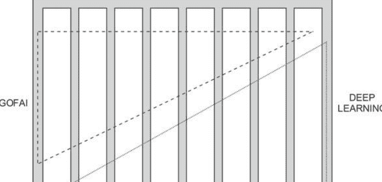

因为它忽略了一个重要的方面。回想一下旧式人工智能（GOFAI），考虑一下它是什么。它是人工智能的一个子学科吗？最好的答案是将人工智能的细分看作是垂直组成部分，而将GOFAI看作是一个水平组成部分，它在知识表示和推理方面的工作要比计算机视觉多得多（参见图1.1）。在我们的思考中，深度学习构成了第二个水平组成部分，试图像GOFAI一样跨学科统一。深度学习和GOFAI在某种程度上是整个人工智能的竞争者，希望用各自的方法回答所有关于人工智能的问题：它们都有自己的“据点”，但它们都试图尽可能涵盖人工智能的所有内容。深度学习作为一个独立的影响力的想法在[35]中有详细探讨，其中将深度学习运动称为“连接主义部落”。

### 1.5 哲学和认知方面

到目前为止，我们从历史的角度探索了神经网络，但有两个重要的事情我们还没有解释。首先，‘认知’这个词是什么意思。这个术语来源于神经科学[36]，在那里它被用来描述起源于皮层的心理行为的外在表现。确切地说，这些能力包括什么是不容置疑的，因为神经科学将这种划分建立在神经活动的基础上。在人工智能的背景下，认知过程就是一种模仿人类大脑中发生的任何思维过程。哲学也希望从大脑中抽象出来，并在更一般的环境中定义其术语。

‘认知过程’的一个工作定义可能是：在大脑和机器中以类似方式进行的任何过程。这个定义使我们必须定义‘类似方式’，如果我们认为人工神经网络是真实神经元的简化版本，那么在这里可能适用。

这使我们面临更大的问题。一些认知过程更简单，我们可以很容易地对其建模。深度学习的进步一次性消除了一个认知过程，但是有一个主要的认知过程逃避了深度学习——推理。捕捉和描述推理是哲学逻辑的核心，而形式逻辑作为对推理进行严格处理的主要方法一直是GOFAI的基石。深度学习能否征服推理？或者学习是否只是一种与推理根本不同的过程？这意味着原则上无法学习推理。这个讨论引起了古老的理性主义者和经验主义者之间的哲学争议，理性主义者以不同的方式主张我们的思维中存在一个逻辑框架，先于任何学习。没有机器学习系统能够学习被认为是人类独特的认知过程之一的推理的形式证明将具有深远的技术、哲学甚至神学意义。

关于学习推理的问题可以重新表述。人们普遍认为狗不能学习关系。20那么狗将成为一个无法学习关系的可训练的认知系统的例子。假设我们想教一只狗‘更小’的关系。我们可以设计一个训练环境，在听到‘更小’的命令时，我们将两个不同的物体交给狗，狗应该选择更小的一个（并且他会因为正确选择而得到奖励）。但是对于狗来说，这个任务非常复杂：他必须意识到‘更小’不是一个单一物体的名称，它在每个训练样本中都会改变引用，而是一种无形的东西，当你拥有两个物体时才会存在，并且然后指向一个单一的物体（更小的那个）。如果你这样考虑，学习关系的困难就变得更清晰了。

逻辑本质上是关系性的，一切都是关系。关系推理是通过形式规则完成的，不会带来问题。但是逻辑也有同样的问题（但是从另一方面看）：如何学习关系的内容？通常的程序是手动定义实体和关系，然后可能添加一个随时间改变它们的动态因素。但是模式和关系之间的分歧存在于双方。

20无论这是否正确，对我们的讨论来说都是无关紧要的。有关动物认知能力的文献非常难以找到，因为没有足够的学术研究将动物认知与行为学联系起来。我们只找到了一篇关于狗学习限制的论文[37]，因此我们不敢断言任何绝对的东西，只是假设性的。

揭示了人工神经网络和连接主义中这个重要的哲学问题的论文是Fodor和Pylyshyn的开创性论文[38]。他们声称思考和推理作为一种现象本质上是基于规则的（符号的、关系的），这不仅仅是一种自然的心理能力，而是一种复杂的能力，它作为保持真理和（在较小程度上）预测未来事件的工具而进化。他们将其作为对连接主义的挑战：如果连接主义能够进行推理，那么它唯一能够做到这一点的方式（因为推理本质上是基于规则的）就是制造一个产生规则系统的人工神经网络。这将不是“连接主义推理”，而是符号推理，其符号通过人工神经网络被赋予有意义的事物。人工神经网络填充了内容，但推理本身仍然是符号的。

你可能会注意到这个论证的有效性取决于思考是固有的基于规则的想法，所以克服这个挑战的最简单的方法就是质疑这个最初的假设。如果思考和推理不完全是基于规则的，那就意味着它们有一些通过直觉处理的方面，而不是通过规则推导得出的。连接主义者在弥合这个鸿沟方面取得了逐步但重要的进展。考虑以下推理：“这段路太长了，我最好开我的货车”，“我忘了我的货车在修理厂，我最好开我妻子的车”。请注意，我们故意没有将其表述为经典的三段论，而是以与人们实际思考和推理的方式类似的形式表述。21请注意，使这种思考有效的是将“车”与“货车”等同起来的可能性。22Word2vec [39]是一种神经语言模型，它学习给定单词和上下文（周围的几个单词）的数值向量，并且这是从文本中学习的。文本的选择是‘大局观’。Word2vec的一个很好的特点是它通过大局观中的语义相似性对单词进行聚类。这是可能的，因为语义相似的单词共享相似的即时上下文：Bob和Alice都可能饥饿，但Plato和数字4都不可能。但是将相似替换为相似只是原始推理，由于word2vec所实现的连接主义推理的主要增量进展是它所能实现的本地计算。假设v(x)是将字符串x映射到其学习向量的函数。

一旦训练完成，word2vec生成的词向量具有特殊性质，可以像这样进行计算：

```
v(王) - v(男人) + v(女人) ≈ v(皇后)
```

这被称为类比推理或词类比，它是发展纯粹连接主义推理方法的第一个重要里程碑。

在本书的最后一章中，我们将探讨问题回答的推理。我们还将探索基于能量的模型和记忆模型，目前对推理问题的最佳解决方案是基于记忆的方法。

> 柏拉图在他的《苏格拉底辩论篇》中将思考定义为灵魂与自身的对话，这正是我们想要建模的内容，而基于规则的方法则是亚里士多德在他的《逻辑学》中提倡的。简而言之，我们试图用柏拉图的术语来重新构建推理，而不是使用主导的亚里士多德范式。

22在这一点上，我们故意避免谈论‘有效推理’，而使用术语‘有效思考’。

23请注意，这种互换性取决于整体情况。如果我需要搬钢琴，我不能用汽车，但如果我需要买杂货，我可以用汽车或面包车。

模型。这可能令人惊讶，因为在正常的认知环境中（无疑受到GOFAI的影响），我们认为记忆（知识）和推理是两个相当不同的方面，但似乎神经网络和连接主义并不共享这种二分法。

### 参考文献

- 1. A.M. 图灵, 关于可计算数的论文，及其对决策问题的应用。伦敦数学学会会议记录 42（2），230-265 (1936年)
- 2. V. Peckhaus，莱布尼茨对19世纪逻辑的影响。 在《斯坦福哲学百科全书》中，编辑E. N. Zalta (2014年)
- 3. J.S. Mill,逻辑演绎与归纳的逻辑系统：对证据原则和科学研究方法的连贯观点 (1843)
- 4. G. Boole,思维定律的研究 (1854)
- 5. A.M. Turing, 计算机与智能 心智 59(236), 433–460 (1950)
- 6. R. Carnap,语言的逻辑语法(Open Court Publishing, 1937)
- 7. A.N. Whitehead, B. Russell,数理原理(Cambridge University Press, Cambridge, 1913)
- 8. J.Y. Lettvin, H.R. Maturana, W.S. McCulloch, W.H. Pitts, 青蛙眼睛告诉青蛙的大脑。IRE 会议论文集 47(11), 1940–1959 (1959)
- 9. N.R. Smalheiser, Walter pitts. Perspect. Biol. Med. 43(1), 217–226 (2000)
- 10. A. Geffer, 试图用逻辑拯救世界的人. Nautilus 21 (2015)
- 11. F. Rosenblatt,神经动力学原理: 感知器和脑机制理论 (Spartan Books, 华盛顿, 1962)
- 12. F. Rosenblatt, 最近关于生物记忆理论模型的研究, in 计算机与信息科学II, 编者 J.T. Tou (学术出版社, 1967)
- 13. S. Russell, P. Norvig, 人工智能: 现代方法, 第3版 (Pearsons, 伦敦, 2010)
- 14. H. Moravec, 心灵之子: 机器人和人类智能的未来 (哈佛大学出版社, 剑桥, 1988)
- 15. M. Minsky, S. Papert,感知机: 计算几何导论 (MIT出版社, 剑桥, 1969)
- 16. L.R. Graham, 俄罗斯和苏联的科学。简史 (剑桥大学出版社, 剑桥, 2004)
- 17. S. Pinker, 白板人 (企鹅出版社, 伦敦, 2003)
- 18. B.F. Skinner, 人类行为科学的可能性 (自由之家, 纽约, 1953)
- 19. E.L. Gettier, 知识是否仅仅是合理的真实信念？ 分析 23, 121-123 (1963)
- 20. T.S. Kuhn, 科学革命的结构 (芝加哥大学出版社, 芝加哥, 1962)
- 21. N. Chomsky, 句法理论的方面 (MIT出版社, 剑桥, 1965)
- 22. N. Chomsky, 对B. F. Skinner的语言行为的评论。 语言 35(1), 26–58 (1959)
- 23. A. Newell, J.C. Shaw, H.A. Simon, 人类问题解决理论的要素。 心理学评论 65(3), 151–166 (1958)
- 24. J. Lighthill, 人工智能: 一般调查, 在人工智能: 一次论文研讨会, 科学研究委员会 (1973)
- 25. Paul J. Werbos, 超越回归: 行为科学中的新预测和分析工具 (哈佛大学, 剑桥, 1975)
- 26. D.B. Parker, 学习逻辑。技术报告编号47 (麻省理工学院计算经济与管理科学中心, 剑桥, 1985)
- 27. Y. LeCun, 用于非对称阈值网络的学习过程。认知过程 85, 599–604 (1985)
- 28. D.E. Rumelhart, G.E. Hinton, R.J. Williams, 通过误差传播学习内部表示。并行分布式处理。 1, 318–362 (1986)
- 29. J.J. Hopfield, 具有新兴集体计算能力的神经网络和物理系统。美国国家科学院会议录 79 (8), 2554–2558 (1982)
- 30. N. Cristianini, J. Shawe-Taylor,支持向量机和其他基于核的学习方法导论(剑桥大学出版社,剑桥, 2000)
- 31. S. Hochreiter, J. Schmidhuber, 长短期记忆。神经计算 9(8), 1735–1780(1997)
- 32. Y. LeCun, L. Bottou, Y. Bengio, P. Haffner, 基于梯度的学习应用于文档识别。IEEE会议录 86(11), 2278–2324 (1998)
- 33. G.E. Hinton, S. Osindero, Y.-W. Teh, 一种用于深度信念网络的快速学习算法. Neural Comput. 18(7), 1527–1554 (2006)
- 34. J. Schmidhuber, 神经网络中的深度学习概述. Neural Netw. 61, 85–117 (2015)
- 35. P. Domingos, The Master Algorithm: 追求终极学习机器的探索将重塑我们的世界 (2015)
- 36. M.S. Gazzanga, R.B. Ivry, G.R. Mangun,认知神经科学: 心智的生物学, 第4版 (W. W. Norton and Company, 纽约, 2013)
- 37. A. Santos, 提示式训练的局限性. J. Appl. Companion Anim. Behav. 3(1), 51–55 (2009)
- 38. J. Fodor, Z. Pylyshyn, 连接主义与认知架构: 一项批判性分析。 认知 28， 3-71 (1988年)
- 39. T. Mikolov, T. Chen, G. Corrado, J. Dean, 在矢量空间中高效估计词表示， ICLR研讨会 (2013年) ， arXiv:1301.3781

### 2.1 推导和函数最小化

在本章中，我们提供了大部分数学预备知识，以便理解后面的章节。深度学习的主要引擎被称为反向传播，主要由梯度下降组成，这是沿着梯度移动，而梯度是一个导数向量。本章的第一节是关于导数的，到本节结束时，读者应该知道什么是梯度和什么是梯度下降。我们不会再回到这个主题，但在本书的所有剩余章节中，我们会广泛使用它。

我们将使用一个基本的符号约定，即‘:=’；‘A := xy’表示‘我们定义A为xy’，或者‘xy被称为A’。这被称为用名字A来命名xy。我们将集合作为基本数学概念，因为大多数其他概念可以通过使用集合来构建或解释。集合是成员的集合，它可以包含其他集合和非集合成员。非集合是称为 urelements的基本元素，例如数字或变量。集合通常用花括号表示，所以例如 A:={0,1,{2,3,4}}是一个包含元素0、1和{2,3,4}的集合。注意{2,3,4}是A的一个元素，而不是一个子集。一个A的子集可以是例如{0,{2,3,4}}。集合可以通过列举成员的方式写成{−1,0,1}，也可以通过给出成员必须满足的属性的方式写成 {x|x∈ℤ∧|x|<2}，其中ℤ是整数集合，|x|是x的绝对值。注意这两个表示相同的集合，因为它们具有相同的成员。这个相等性原则被称为外延公理，它表示当且仅当两个集合具有相同的成员时它们相等。这意味着{0,1}和{1,0}是相等的，但{1,1,1,1,0}和{0,0,1,0}也是相等的（它们都有相同的成员0和1）。¹

集合不记住元素的顺序或一个元素的重复。如果我们有一个记住重复但不记住顺序的集合，我们就有多重集或袋子，所以我们有{1,0,1} = {1,1,0}，但两者都不等于{1,0}，我们正在讨论多重集。表示袋子以区别于集合的常用方法是对元素进行编号，所以我们不会写{1,1,1,0,1,0,0}，而是写{"1":5,"0":3}。袋子将通过所谓的词袋模型在语言建模中非常有用，我们将在第3章中看到。

如果我们既关心位置又关心重复，我们写作(1,0,0,1,1)。这个对象被称为一个向量。如果我们有一个变量的向量，如(x1,x2,…,xn)我们将其写作x或\mathbf{x}。个别的xi,1≤i≤n,被称为一个分量(在集合中它们曾被称为成员),分量的数量被称为向量x的维度。

术语元组和列表与向量非常相似。向量主要用于理论讨论，而元组和列表用于在编程代码中实现向量。因此，元组和列表总是使用编程变量命名，如`myList`或`vectorAsTuple`。因此，元组或列表的示例将是 `newThing := (11,22,33)`。元组和列表的区别在于列表是可变的而元组不是。结构的可变性意味着我们可以为该结构的成员分配一个新值。例如，如果我们有 `newThing := (11,22,33)` 然后我们执行 `newThing[1]←99` (读作'将第二个项的值分配为99'), 我们得到 `newThing := (11,99,33)`。这意味着我们已经改变了列表。如果我们不想能够这样做，我们使用元组，这种情况下我们不能修改元素。我们可以创建一个新的元组 `newerThing`，使得 `newerThing[0]←newThing[0]`, `newerThing[1]←99` 和 `newerThing[2]←newThing[2]` 但这并不是改变值，只是复制它并组成一个新的元组。当然，如果我们有一个未知的数据结构，我们可以通过尝试修改某个分量来检查它是列表还是元组。有时，我们可能希望将向量建模为元组，但通常我们会希望在编程代码中将其建模为列表。

现在我们需要转向函数。我们将采用计算方法来定义它们。一个函数是一种神奇的工具，它接受参数（输入）并将它们转化为值（输出）。当然，函数的关键在于，我们必须在其中定义如何从输入到输出的转换方式，或者换句话说，如何将输入转化为输出。回想一下函数，例如 $y=4x^3+18$ 或等价地 $f(x)=4x^3+18$，其中x是输入，y是输出，f是函数的“名称”。输出y被定义为将f应用于x，即 $y:=f(x)$。我们在这里省略了一些内容，但对于本书来说并不重要，但我们将对感兴趣的读者指向[1]。

当我们考虑这样一个函数时，实际上我们有一个指令（算法）如何通过使用更简单的函数（如加法）来转换x以获得y。乘法和指数运算。它们反过来可以用更简单的函数来表示，但是我们在本书中不需要这些证明。读者可以在[2]中找到关于如何完成这个过程的详细信息。

请注意，如果我们有一个带有2个参数的函数^4 $ f(x, y) = x^y $ 并传入值(2, 3)我们得到8。如果我们传入(3, 2)，我们将得到9，这意味着函数是顺序敏感的，即它们对向量输入进行操作。这意味着我们可以概括地说，函数总是以向量作为输入，并且以一个n维向量作为输入的函数被称为n元函数。这意味着我们可以自由地使用符号 $ f(\mathbf{x}) $。一个0元函数是一个产生输出但不接受任何输入的函数。这样的函数被称为常数，例如 $ p() = 3.14159... $（注意带有开放和闭合括号的表示法）。

请注意，我们可以将函数的参数输入向量与输出相加，得到 $ (x_1, x_2, \ldots, x_n, y) $。这个结构被称为函数的图。对于输入 $ \mathbf{x} $ 的函数 $ f $。我们将看到如何将其扩展到所有输入。一个函数可以有参数，函数 $ f(x) = ax + b $ 有参数 $ a $ 和 $ b $。它们被认为是固定的，但我们可能希望微调它们以获得更好的函数版本。请注意，如果给定相同的输入且不更改参数，函数总是给出相同的结果。通过改变参数，您可以大幅改变输出。这对于深度学习非常重要，因为深度学习是一种自动调整参数的方法，从而修改输出。

我们可以有一个集合 $ A $，我们可能希望创建一个关于 $ x $ 的函数，对于 $ A $ 中的所有值，它给出值1，对于 $ x $ 的所有其他值，它给出值0。由于这个函数对于所有集合 $ A $ 都不同，除此之外，它总是做同样的事情，我们可以给它一个包含 $ A $ 的名称。我们选择名称 $ \mathbb{I}_A $。这个函数被称为指示函数或特征函数，在文献中有时表示为 $ \chi_A $。这在下一章中用于我们将称之为one-hot编码的东西。

如果我们有一个函数 $ y = ax $，那么我们从中获取输入的集合称为函数的定义域，而输出所属的集合称为函数的值域。一般来说，函数不需要为定义域中的所有成员定义，如果定义了，就称为全函数。所有不是全函数的函数称为偏函数。请记住，函数总是将每个输入向量分配给相同的输出（前提是参数不变）。如果通过这样做，函数‘耗尽’了整个值域，即分配后没有值域的成员不是某些输入的输出，那么该函数称为满射。另一方面，如果函数从不将不同的输入向量分配给相同的输出，那么它被称为单射。如果它既是单射又是满射，则称为双射。给定一组输入 $ A $，输出集合 $ B $ 称为图像，并用 $ f[A] = B $ 表示。如果我们寻找一组输入 $ A $，给定输出集合 $ B $，我们正在查看其逆图像，表示为 $ f^{-1}[B] = A $（我们可以使用相同的符号表示单个元素 $ f^{-1}(b) = a $）。

如果对于定义域中的每个x和y，以下条件成立：如果x < y，则f(x) ≤ f(y)；或者如果x > y，则f(x) > f(y)，那么函数f被称为单调函数。根据方向的不同，这被称为增函数或减函数；如果我们用<代替≤，则称为严格增函数（或严格减函数）。连续函数是指没有间断的函数。对于我们现在所需要的，这个定义已经足够好了——我们不够精确，但我们为了清晰而牺牲了精确性。我们将在以后再回到这个问题。

一个有趣的函数是有理数在所有实数上的特征函数。如果所选的实数也是有理数，则该函数返回1。这个函数在任何地方都不连续。另一个在部分连续但不连续的函数是所谓的阶跃函数（我们将在第4章中再次提到它）：

```
阶跃函数₀ (x) = 
\begin{cases}
1, & x > 0 \\
-1, & x \leq 0
\end{cases}
```

注意，阶跃函数0可以通过简单地将0替换为n来轻松推广为阶跃函数n。此外，注意1和-1是完全任意的，因此我们可以放置任何值。一个接受n维向量的阶跃函数有时也被称为投票函数，但我们将继续称其为阶跃函数。在这个版本中，函数的输入向量的所有分量在与阈值比较之前都会被相加。
n（阈值在神经网络文献中称为偏差）。请注意我们如何用两种情况定义了阶跃函数：如果一个函数是通过情况定义的，那么它可能不连续是一个重要的提示。这并不总是情况（无论我们如何看待它），但这是一个好的提示，经常是正确的。

在继续推导之前，我们需要一些更多的概念。如果函数f的输出接近一个值c（并在其中稳定下来），我们说函数在c处收敛。如果没有这样的值，函数被称为发散的。在大多数数学教科书中，收敛的定义更加细致，但在本书中我们不需要额外的数学技巧，只需要一般的直觉。

我们将使用的一个重要常数是欧拉数，e = 2.718281828459... 这是一个常数，我们将为它保留字母e。我们将广泛使用基本的数值运算，并对它们的行为和符号进行简要概述：

- x的倒数是1/x，或等价地表示为x的-1次方
- x的平方根是√x，或等价地表示为x的2次方根
- 指数函数具有以下性质：x^0=1，x^1=x，x^n·x^m=x^(n+m)，(x^n)^m=x^(n*m)

5 ReLU或修正线性单元定义为ρ(x)=max(x,0)，是一个连续函数，尽管通常是通过情况来定义的。从第6章开始，我们将广泛使用ReLU。

- 对数函数具有以下性质：$\log_{c} 1 = 0$, $\log_{c} c = 1$, $\log_{c} (xy) = \log_{c} x + \log_{c} y$, $\log_{c} (\frac{x}{y}) = \log_{c} x - \log_{c} y$, $\log_{c} x^{y} = y \log_{c} x$, $\log_{x} y = \frac{\log_{c} y}{\log_{c} x}$, $\log_{x} x^{y} = y$, $x^{\log_{x} y} = y$, $\ln x := \log_{e} x$。

在继续推导之前，我们需要了解的最后一个概念是极限的概念。直观地说，函数的极限是函数的输出逐渐接近但永远不会达到的一个值。关键是，函数的极限是相对于输入的变化来考虑的，并且它必须是一个具体的值，即如果极限是 $\infty$ 或 $-\infty$，我们不称之为极限。请注意，这意味着极限存在必须是一个有限值。例如，$\lim_{x \to 5}$ 如果我们将 $f$ 定义为 $f(x) = 2x$，那么 $f(x) = 10$。不要混淆输入逼近的数字5和函数输出逼近的极限10的重要性。

如果我们考虑整数输入，极限的概念是微不足道的（并且在数学上很奇怪）。当我们考虑极限时，我们假设输入向量是实数（其中连续性的概念是有意义的）。因此，在讨论极限（和导数）时，输入向量是实数，我们希望函数是连续的（但有时可能不是）。如果我们想要知道一个函数的极限，并且它在任何地方都是连续的，我们可以尝试将输入逼近的值代入并观察输出结果。如果存在问题，我们可以尝试简化函数表达式或观察各个部分的情况。实际上，问题发生的方式有两种：（i）函数由情况定义，或者（ii）存在某些输入导致输出未定义的段落，这是由于隐藏的除以0造成的。

我们现在可以用更严格的定义来取代我们对连续性的直观理解。我们称函数 $f$ 在点 $x=a$ 连续，当且仅当以下条件成立：

1. 函数 $f(a)$ 被定义
2. 极限 $\lim_{x \to a} f(x)$ 存在
3. $f(a) = \lim_{x \to a} f(x)$.

如果一个函数在所有点上连续，那么它被称为在任何地方连续。请注意，所有初等函数在任何地方都是连续的$^8$所以也是所有的

> 6 这就是为什么 $0.999... = 1$。
7 这在编程中尤其重要，因为当我们编程时，我们需要使用有理数函数来近似实数函数。这种近似在直觉上也有很大的作用，所以在尝试弄清楚一个函数的行为时，思考这一点是很好的。
8 除法除数为0时除外。在这种情况下，除法函数是未定义的，因此连续性的概念在这一点上没有任何意义。

多项式函数。 有理函数在除数为0的地方以外的任何地方都是连续的。 一些适用于极限的等式是

1. 极限 $c = c$
2. 极限 $\frac{1}{x} = \infty$
3. 极限 $\frac{1}{x} = -\infty$
4. 极限 $\frac{1}{x} = 0$
5. 极限 $(1 + \frac{1}{x})^x = e$

现在，我们已经准备好继续我们的微分之旅。我们可以通过注意函数在给定点的图形的斜率来发展对导数的直觉。你可以在图2.1中看到一个示例。如果一个函数 $f(x)$（定义域为 $X$）在每个点 $a \in X$ 上都有导数，那么存在一个新函数 $g(x)$，它将所有值从 $X$ 映射到其导数。这个函数被称为 $f$ 的导数。由于 $g(x)$ 取决于 $f$ 和 $x$，我们引入记号 $f'(x)$（拉格朗日记号），或者，记住 $f(x) = y$，我们可以使用记号 $dy/dx$ 或 $df/dx$（莱布尼兹符号）。在本书中，我们故意不一致地使用这两种符号，因为有些思想在一种符号表达时更直观，而有些思想在另一种符号表达时更直观。我们希望关注的是潜在的数学现象，而不是符号的整洁程度。让我们更详细地讨论一下。假设我们有一个函数 $f(x) = x^2$。可以通过从函数中选择两个点来获得该函数的斜率，例如 $t_1 = (x_1, y_1)$ 和 $t_2 = (x_2, y_2)$。不失一般性，我们可以假设 $t_1$ 在 $t_2$ 之前，

斜率等于 $y_2-y_1\over x_2-x_1$，这是垂直和水平线段的比率。如果我们将注意力限制在形式为 $f(x)=ax+b$ 的线性函数上，我们可以看到几件事情。首先，斜率实际上是一个（你可以轻松验证这一点），并且在每个点上都是相同的；其次，常数的斜率必须为0，然后常数为 $b$。

让我们来看一个更复杂的例子，比如 $f(x)=x^2$。在这里，斜率在每个点上都不相同，通过上述计算，我们将无法得到太多信息，因此我们必须使用微分。 但是微分仍然只是斜率思想的一个阐述。 让我们从斜率公式开始，看看当我们试图将其形式化时会发生什么。 所以我们从 $y_2-y_1\over x_2-x_1$ 开始。

$h$ 表示从 $x_1$ 到 $x_2$ 的变化量。 这意味着分子可以写成 $f(x+h)-f(x)$，而分母则是 $h$ 的定义。 导数可以定义为当 $h$ 趋近于0时的极限，即

$$f'(x) = \frac{dy}{dx} = \lim_{h\to 0} \frac{f(x+h)-f(x)}{h} \qquad (2.1)$$

让我们看看如何求函数 $f(x)=3x^2$ 的导数 $f'(x)$。 稍后我们将给出计算导数的规则，使用这些规则我们可以快速得到 $f'(x)=6x$，但现在让我们看看如何仅使用导数的定义来得到这个结果：

1. $f(x)=3x^2$ [初始函数]
2. $f'(x)=\lim_{h\to 0}\frac{f(x+h)-f(x)}{h}$ [导数的定义]
3. $f'(x)=\lim_{h\to 0}\frac{3(x+h)^2-3x^2}{h}$ [通过将第一行的表达式代入第二行的表达式得到]
4. $f'(x)=\lim_{h\to 0}\frac{3(x^2+2xh+h^2)-3x^2}{h}$ [通过平方和得到第三行]
5. $f'(x)=\lim_{h\to 0}\frac{3x^2+6xh+3h^2-3x^2}{h}$ [通过乘法得到第四行]
6. $f'(x)=\lim_{h\to 0}\frac{6xh+3h^2}{h}$ [通过消去分子中的 $+3x^2$ 和 $-3x^2$ 得到第五行]
7. $f'(x)=\lim_{h\to 0}\frac{h(6x+3h)}{h}$ [从6中，通过将分子中的$h$提取出来]
8. $f'(x)=\lim_{h\to 0}(6x+3h)$ [从7中，取消分子和分母中的$h$]
9. $f'(x)=6x+3\cdot0$ [从8中，用0替换 $h$(接近于0)]
10. $f'(x)=6x$ [从9中]

我们将注意力转向微分规则。 所有这些规则都可以像我们上面使用的规则一样推导出来，但是记住规则比记住规则的实际推导更容易，特别是因为本书的重点不在于推导规则。

关于微积分。关于导数最基本的事情之一是，常数的导数始终为0。此外，微分变量的导数始终为1，或者用符号表示为 $\frac{dy}{dx}=1$。常数必须具有斜率为0的特性，而函数 $f(x)=x$ 将具有水平分量等于垂直分量且斜率为1。此外，要从 $f(x)=ax+b$ 得到 $f'(x)$，$a$ 必须为1以保留 $x$，而 $b$ 必须为0。

下一个规则是所谓的指数规则。我们已经在上面的例子中看到了这个规则的推导：$\frac{d}{dx} a^x n^{x} = a \cdot n \cdot x^{n-1}$。我们已经放置了显示可能因子行为的 $a$。加法和减法的规则相当直观：$\frac{dy}{dx}(k+j) = \frac{dy}{dx} k + \frac{dy}{dx} j$ 和 $\frac{dy}{dx}(k-j) = \frac{dy}{dx} k - \frac{dy}{dx} j$。在乘法和除法的情况下，微分规则更加复杂。我们给出两个例子，让读者推导出规则的一般形式。如果我们有 $y = x^3 \cdot 10^x$，那么 $y' = (x^3)' \cdot 10^x + x^3 \cdot (10^x)'$，如果 $y = \frac{x^3}{10^x}$ 然后 $y = \frac{(x^3)' \cdot 10^x - x^3 \cdot (10^x)'}{(10^x)^2}$。

我们需要的最后一个规则是所谓的链式法则（不要与指数的链式法则混淆）。链式法则说 $\frac{dy}{dx} = \frac{dy}{du} \cdot \frac{du}{dx}$，对于某个 $u$。在直观上，与分数有相似之处。$^{12}$ 让我们看一个例子。我们可以将这个函数看作是两个函数：第一个是 $g(u)$，它给出一些数值 $y = u^5$（在我们的例子中，这是 $u=3-2x$），第二个函数只给出 $u$，即 $f(x) = 3-2x$。链式法则说，要对 $y$ 关于 $x$ 求导（即得到 $\frac{dy}{dx}$），我们可以改为对 $y$ 关于 $u$ 求导（即 $\frac{dy}{du}$），$u$ 通过 $x$（$\frac{du}{dx}$）并简单地将两者相乘。$^{13}$

为了看到链式法则的作用，我们来看一个函数 $f(x)= \sqrt{3x^2 - x}$（即 $y = \sqrt{3x^2 - x}$）。然后，$f'(x) = \frac{dy}{du} \cdot \frac{du}{dx}$，这意味着 $y = \sqrt{u}$，因此 $\frac{du}{dx} = \frac{1}{2} u^{-\frac{1}{2}}$。另一方面，$u = 3x^2 - x$，因此 $\frac{du}{dx} = 6x - 1$。由此我们得到 $\frac{dy}{du} \cdot \frac{du}{dx} = \frac{1}{2} u^{-\frac{1}{2}} \cdot (6x - 1) = \frac{1}{2} \cdot \frac{1}{\sqrt{u}} \cdot (6x - 1) = \frac{6x-1}{2\sqrt{u}} = \frac{6x-1}{2\sqrt{3x^2 - x}}$。

链式法则是反向传播的核心，而反向传播又是深度学习的核心。这是通过函数最小化来实现的，在下一节中我们将详细介绍梯度下降。总结我们所说的并添加一些简单的规则$^{14}$我们需要，我们给出以下规则列表及其“名称”和简要说明：

- LD：微分是线性的，因此我们可以分别微分每个加数并提取常数因子：$[a \cdot f(x) + b \cdot g(x)]' = a \cdot f'(x) + b \cdot g'(x)$。
- Rec：倒数规则 $\left[\frac{1}{f(x)}\right]' = -\frac{f'(x)}{f(x)^2}$。

> $^{12}$在拉格朗日符号中，链式法则更加笨拙，缺乏与分数的直观相似性：$h'(x) = f'(g(x))g'(x)$。
$^{13}$请记住，$h(x) = g(f(x)) = (g \circ f)(x) = g(u) \circ f(x)$，这意味着 $h$ 是函数 $g$ 和 $f$ 的复合。非常重要的是不要混淆函数的复合，例如 $f(x) = (3-2x)^5$ 与普通函数 $f(x) = 3-2x^5$，或者与乘积 $f(x) = sin x \cdot x^5$。
$^{14}$这些规则不是独立的，因为 ChainExp 和 Exp 都是 CHAINRULE 的结果。

- Const: 常数规则 $c' = 0$.
- ChainExp: 指数的链式法则 $[e^{f(x)}]' = e^{f(x)} \cdot f'(x)$.
- DerDifVar: 导数变量的导出 $dy/dz \, z = 1$.
- Exp: 指数规则 $[f(x)^n]' = n \cdot f(x)^{n-1} \cdot f'(x)$.
- CHAINRULE: 链式法则 $\frac{dy}{dx} = \frac{dy}{du} \cdot \frac{du}{dx}$ (对于某个 $u$).

### 2.2 向量、矩阵和线性规划

在我们继续之前，我们需要再定义一个概念，即欧几里得距离。如果我们有一个二维坐标系，并且在其中有两个点$p1 := (x1, y1)$和$p2 := (x2, y2)$，我们可以定义它们在空间中的距离为$d(p1, p2) := \sqrt{...}$这个距离被称为欧几里得距离，并定义了整个空间的行为；从某种意义上说，空间中的距离是空间行为的基本要素。如果我们在推理空间时使用欧几里得距离，我们将得到欧几里得空间。欧几里得空间是最常见的类型：它们符合我们的空间直觉。在本书中，我们只使用欧几里得空间。

现在，我们将注意力转向开发向量工具。回想一下，一个$n$维向量$x = (x1, ..., xn)$，其中所有的$x_i$被称为分量。想象$n$维向量作为点存在于$n$维空间中是很正常的事情。这个空间（完全装备好时）将被成为向量空间，但我们稍后会回到这个问题。现在，我们只有一堆

来自$R^n$的$n$维向量。

让我们介绍标量的概念。标量只是一个数字，可以看作是来自$R^1$的“向量”。而$n$维向量只是一系列的$n$个标量。我们总是可以用标量乘以向量，例如$3 \cdot (1, 4, 6) = (3, 12, 18)$。向量加法非常简单。如果我们想要将两个向量$a = (a_1, ..., a_n)$和$b = (b_1, ..., b_n)$相加，它们必须具有相同数量的分量。这给了我们一个提示，我们必须坚持使用相同维度的向量（尽管在技术上它们是1D向量）。一旦我们有了标量乘法和向量加法，我们就拥有了一个向量空间。

让我们深入了解我们的向量所在的空间。为了简单起见，我们将讨论3D实体，但我们所说的任何内容都可以轻松推广到$n$维情况。所以，简要回顾一下，3D空间是3D向量所在的地方：它们在这个空间中表示为点。一个问题可以问是否存在一组最小的向量来“定义”整个3D向量宇宙。这个

15我们故意避免在这里讨论场，因为我们只使用R，并且没有理由使阐述复杂化。

这个问题有点模糊，但答案是肯定的。如果我们取三个向量e1=(1,0,0), e2=(0,1,0)和e3=(0,0,1)，我们可以用以下公式表示这个空间中的任何向量：

```
$s_1 \mathbf{e}_1 + s_2 \mathbf{e}_2 + s_3 \mathbf{e}_3 \quad (2.2)$
```

其中，s1，s2和s3是选择的标量，以便得到我们想要的向量。这表明了标量的强大和它们对发生的一切的控制力量——它们是向量领域中的一种贵族。让我们来看一个例子。如果我们想要以这种方式表示向量（1，34，-28），我们需要取s1 = 1，s2 =34和s3=-28，并将它们代入方程2.2中。这个方程被称为线性组合：向量场中的每个向量都可以被定义为e1，e2和e3的（线性）组合，并且适当选择的标量。集合 {e1, e2, e3} 被称为3D向量空间（通常表示为 ℝ³）的标准基。

读者可能会注意到，我们一直在谈论标准基础，但没有定义基础是什么。设V为一个向量空间，B为V的子集。那么，如果B中的所有向量都是线性无关的（即彼此不是线性组合），并且B是V的最小生成子集（即它必须是能够通过等式2.2生成每个向量的最小子集），则B被称为基础。我们将注意力转向定义本书中最重要的向量操作，即点积。两个向量的点积（必须具有相同的维度）是一个标量。它的定义如下：

```
$\mathbf{a} \cdot \mathbf{b} = (a_1, \ldots, a_n) \cdot (b_1, \ldots, b_n) := \sum_{i=1}^n a_i b_i = a_1 b_1 + a_2 b_2 + \ldots a_n b_n \quad (2.3)$
```

如果两个向量的点积等于零，则它们被称为正交的。向量也有长度。为了测量向量 a 的长度，我们计算其 L2 或欧几里得范数。

向量的 L2 范数定义为

```
$||\mathbf{a}||_2 := \sqrt{a_1^2 + a_2^2 + \ldots + a_n^2} \quad (2.4)$
```

请记住不要混淆范数符号和绝对值符号。我们将在后面的章节中更多地了解 L2 范数。我们可以通过将任意向量 a 转换为所谓的归一化向量来实现，即将其除以其 L2 范数：

```
$\hat{\mathbf{a}} := \frac{\mathbf{a}}{||\mathbf{a}||_2} \quad (2.5)$
```

如果两个向量归一化且正交，则它们被称为正交归一化向量。我们将在第3章和第9章中需要这些概念。现在我们将注意力转向矩阵矩阵是向量的自然扩展。矩阵是类似于表格的结构，由行和列组成。为了理解矩阵是什么，例如，考虑以下矩阵，并尝试根据我们已经讨论过的向量的知识来理解它：

$$A = \begin{bmatrix} a_{11} & a_{12} & a_{13} \\ a_{21} & a_{22} & a_{23} \\ a_{31} & a_{32} & a_{33} \\ a_{41} & a_{42} & a_{43} \end{bmatrix}$$

我们立即看到了几件事情。首先，矩阵中的元素用 $a_{jk}$表示，其中 $j$表示行，$k$表示列。矩阵的维度类似于向量，但它必须有两个维度。矩阵 $A$是一个 $4 \times 3$维的矩阵。请注意，这与一个 $3 \times 4$维的矩阵不同。我们可以将矩阵看作是向量的向量（这个想法有一些形式上的问题需要解决，但它是一个很好的直觉）。在这里，我们有两个选项：它可以被视为向量 $\mathbf{a}_{\mathbf{1x}} = (a_{11}, a_{12}, a_{13})$, $\mathbf{a}_{\mathbf{2x}} = (a_{21}, a_{22}, a_{23})$, $\mathbf{a}_{\mathbf{3x}} = (a_{31}, a_{32}, a_{33})$并且 $\mathbf{a}_{\mathbf{4x}} = (a_{41}, a_{42}, a_{43})$堆叠在一个新的向量 $A = (\mathbf{a}_{\mathbf{1x}}, \mathbf{a}_{\mathbf{2x}}, \mathbf{a}_{\mathbf{3x}}, \mathbf{a}_{\mathbf{4x}})$或者可以看作向量 $A = (\mathbf{a}_{\mathbf{x1}}, \mathbf{a}_{\mathbf{x2}}, \mathbf{a}_{\mathbf{x3}})$，其中 $\mathbf{a}_{\mathbf{x1}} = (a_{11}, a_{21}, a_{31}, a_{41})$, $\mathbf{a}_{\mathbf{x2}} = (a_{12}, a_{22}, a_{32}, a_{42})$和 $\mathbf{a}_{\mathbf{x3}} = (a_{13}, a_{23}, a_{33}, a_{43})$然后将它们捆绑在一起。

无论我们如何看待它，都有些不对劲，因为我们必须跟踪垂直和水平的区别。很明显，现在需要区分一个标准的水平向量，称为行向量（从矩阵中取出的一行，现在只是一个向量），它是一个 $1 \times n$维矩阵

$$\mathbf{a}_{\mathbf{h}} = (a_1, a_2, a_3, \ldots, a_n) = \begin{bmatrix} a_1 & a_2 & a_3 & \cdots & a_n \end{bmatrix}$$

从一个垂直向量称为列向量，它是一个 $n \times 1$维矩阵：

$$\mathbf{a}_{\mathbf{v}} = \begin{bmatrix} a_1 \\ a_2 \\ a_3 \\ \vdots \\ a_n \end{bmatrix}$$

我们需要一个操作来将行向量转换为列向量，并且通常，将一个 $m \times n$维矩阵转换为一个 $n \times m$维矩阵，同时保持行和列的顺序。这样的操作称为转置，并且你可以想象它是将一个写在A4纸上的矩阵从纵向转换为横向（通过纸张读取数字）。形式上，如果我们有一个 $n \times m$矩阵 $A$，我们可以定义另一个矩阵 $B$，通过将每个 $a_{jk}$放在 $b_{kj}$的位置构建。$B$然后被称为 $A$的转置，并且用 $A^{\top}$表示。注意，转置一个列向量会得到一个标准的行向量。

行向量和列向量可以互相转换。在深度学习中，转置经常被用来保持所有操作的顺利和快速进行。如果我们有一个 $n \times n$ 矩阵 $A$（称为方阵），满足 $A = A^{\mathrm{T}}$，则这样的矩阵被称为对称矩阵。现在我们转向矩阵的运算。我们从标量乘法开始。我们可以通过将矩阵 $A$ 的每个元素与标量 $s$ 相乘来将矩阵 $A$ 乘以标量：

```
$$ sA = \begin{bmatrix} s \cdot a_{11} & s \cdot a_{12} & s \cdot a_{13} \\ s \cdot a_{21} & s \cdot a_{22} & s \cdot a_{23} \\ s \cdot a_{31} & s \cdot a_{32} & s \cdot a_{33} \\ s \cdot a_{41} & s \cdot a_{42} & s \cdot a_{43} \end{bmatrix} $$
```

而且我们注意到矩阵和标量的乘法是可交换的（矩阵乘法不可交换）。如果我们想要将函数 $f(x)$ 应用于矩阵 $A$，我们可以通过将函数应用于所有元素来实现：

```
$$ f(A) = \begin{bmatrix} f(a_{11}) & f(a_{12}) & f(a_{13}) \\ f(a_{21}) & f(a_{22}) & f(a_{23}) \\ f(a_{31}) & f(a_{32}) & f(a_{33}) \\ f(a_{41}) & f(a_{42}) & f(a_{43}) \end{bmatrix} $$
```

现在，我们转向矩阵加法。如果我们想要将两个矩阵 $A$ 和 $B$ 相加，它们必须具有相同的维度，即它们必须都是 $n \times m$ 的，并且我们将对应的元素相加。结果也将是一个 $n \times m$ 的矩阵。举个例子：

```
$$ A + B = \begin{bmatrix} 3 & -4 & 5 \\ -19 & 10 & 12 \\ 1 & 45 & 9 \\ -45 & -1 & 0 \end{bmatrix} + \begin{bmatrix} 4 & -1 & 2 \\ -3 & 10 & 26 \\ 13 & 51 & 90 \\ -5 & 1 & 30 \end{bmatrix} = \begin{bmatrix} 7 & -5 & 7 \\ -22 & 20 & 38 \\ 14 & 96 & 99 \\ -50 & 0 & 30 \end{bmatrix} $$
```

现在，我们将注意力转向矩阵乘法。矩阵乘法不满足交换律，所以 $AB = BA$。要相乘两个矩阵，它们必须具有匹配的维度。所以如果我们想要将 $A$ 与 $B$ 相乘（即计算 $AB$），$A$ 必须是一个 $m \times q$ 的矩阵，$B$ 必须是一个 $q \times t$ 的矩阵。得到的矩阵 $AB$ 必须是一个 $m \times t$ 的矩阵。这种“维度一致性”的概念对于矩阵乘法非常重要。这是一个约定，但通过采用这个约定并说这就是矩阵相乘的方式，我们将走得更远，并且在计算上始终快速，所以这是非常值得的。如果我们将两个矩阵 $A$ 和 $B$ 相乘，我们将得到矩阵 $C$（$= AB$）作为结果（根据我们上面指定的维度）。矩阵 $C$ 由元素 $c_{ij}$ 组成。

对于每个元素 $c_{ij}$，我们通过计算两个向量的点积来获得它：来自 $A$ 的行向量 $i$ 和来自 $B$ 的列向量 $j$（列向量必须转置为标准行向量）。直观上讲，这是完全合理的：当我们有一个元素 $c_{km}$，$k$ 是行，$m$ 是列，所以它是有意义的。

元素来自 $A$ 的第 $k$ 行和 $B$ 的第 $m$ 列。一个例子将会使其清楚：

```
$$AB = \left[\begin{array}{rr} 4 & -1 \\ -3 & 0 \\ 13 & 6 \\ -5 & 1 \end{array}\right] \cdot \left[\begin{array}{rrr} 3 & -4 & 5 \\ 9 & 1 & 12 \end{array}\right]$$
```

让我们先检查维度：矩阵 $A$ 是 $4 \times 2$ 维的，矩阵 $B$ 是 $2 \times 3$ 维的。它们之间有 2 个“连接”，因此我们可以将这两个矩阵相乘，结果将是一个 $4 \times 3$ 维的矩阵。

```
$$AB = \left[\begin{array}{rr} 4 & -1 \\ -3 & 0 \\ 13 & 6 \\ -5 & 1 \end{array}\right] \cdot \left[\begin{array}{rrr} 3 & -4 & 5 \\ 9 & 1 & 12 \end{array}\right] = \left[\begin{array}{rrr} 3 & -17 & 8 \\ -9 & 12 & -15 \\ 93 & -46 & 137 \\ -6 & 21 & -13 \end{array}\right]$$
```

我们将称之为结果为 $4 \times 3$ 维矩阵 $C$。让我们展示所有条目 $c_{ij}$ 的完整计算：

- $c_{11} = 4 \cdot 3 + (-1) \cdot 9 = 3$
- $c_{12} = -3 \cdot 3 + 0 \cdot 9 = -9$
- $c_{13} = 13 \cdot 3 + 6 \cdot 9 = 93$
- $c_{14} = -5 \cdot 3 + 1 \cdot 9 = -6$
- $c_{21} = 4 \cdot (-4) + (-1) \cdot 1 = -17$
- $c_{22} = -3 \cdot (-4) + 0 \cdot 1 = 12$
- $c_{23} = 13 \cdot (-4) + 6 \cdot 1 = -46$
- $c_{24} = 5 \cdot (-4) + 1 \cdot 1 = 21$
- $c_{31} = 4 \cdot 5 + (-1) \cdot 12 = 8$
- $c_{32} = -3 \cdot 5 + 0 \cdot 12 = -15$
- $c_{33} = 13 \cdot 5 + 6 \cdot 12 = 137$
- $c_{34} = -5 \cdot 5 + 1 \cdot 12 = -13$

让我们举一个矩阵乘法的例子：

```
$$AB = \left[\begin{array}{rrrr} 0 & 1 & 2 & 3 \\ 4 & 5 & 6 & 7 \end{array}\right] \cdot \left[\begin{array}{rrr} 8 & 9 & 0 \\ 1 & 2 & 3 \\ 4 & 5 & 6 \\ 7 & 8 & 9 \end{array}\right] = \left[\begin{array}{rrr} 30 & 36 & 42 \\ 110 & 132 & 114 \end{array}\right]$$
```

我们展示 $C$ 的所有元素的计算：

- $c_{11} = 0 \cdot 8 + 1 \cdot 1 + 2 \cdot 4 + 3 \cdot 7 = 30$
- $c_{12} = 0 \cdot 9 + 1 \cdot 2 + 2 \cdot 5 + 3 \cdot 8 = 36$
- $c_{13} = 0 \cdot 0 + 1 \cdot 3 + 2 \cdot 6 + 3 \cdot 9 = 42$
- $c_{21} = 4 \cdot 8 + 5 \cdot 1 + 6 \cdot 4 + 7 \cdot 7 = 110$
- $c_{22} = 4 \cdot 9 + 5 \cdot 2 + 6 \cdot 5 + 7 \cdot 8 = 132$
- $c_{23} = 4 \cdot 0 + 5 \cdot 3 + 6 \cdot 6 + 7 \cdot 9 = 114$

在继续之前，我们必须定义另外两类矩阵。第一类是零矩阵。零矩阵可以是任意大小，其所有条目都为零。它的维度将取决于我们想要与之相乘的矩阵的维度。第二类（也更有用）是单位矩阵。单位矩阵始终是一个方阵（即两个维度相同）。它在对角线上的值为1，所有其他条目都为0，即当且仅当 $j = k$ 时，$a_{jk} = 1$，否则 $a_{jk} = 0$。请注意，单位矩阵是对称矩阵。请注意，每个维度只有一个单位矩阵，所以我们可以给它一个名字，$\mathbf{I}_n$，$n$。由于它是一个方阵（一个 $n \times n$ 矩阵），我们不需要指定两个维度，所以我们可以只写 $\mathbf{I}_n$。只是为了展示它们的外观：

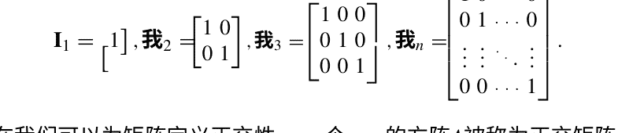

现在我们可以为矩阵定义正交性。一个 $n \times n$ 的方阵 $\mathbf{A}$ 被称为正交矩阵，当且仅当 $\mathbf{A}\mathbf{A}^\top = \mathbf{A}^\top\mathbf{A} = \mathbf{I}_n$ 时。

注意向量只有一个维度，所以我们谈论的是 $n$ 维向量。矩阵具有 2D 参数，所以我们谈论的是 $n \times m$ 矩阵。如果我们增加一个额外的维度会怎样？一个 $n \times k \times j$ 维的对象会是什么？这些对象被称为张量，并且行为类似于矩阵。张量是深度学习中的重要主题，但不幸的是超出了本书的范围。我们将感兴趣的读者指向[3]。

到目前为止，我们分别讨论了导数和向量，但现在是时候看看它们如何结合形成深度学习中最重要的结构之一，梯度。我们已经看到如何计算单变量函数 $f(x)$ 的导数，但我们能否将这个概念扩展到多个变量？我们能否在数学对象的某一点上得到需要两个变量来定义的斜率？答案是肯定的，我们通过使用偏导数来实现。

让我们以一个例子来看。以 $f(x, y) = (x - y)^2$ 的简单情况为例。首先，我们必须将其转换为 $x^2 - 2xy + y^2$。现在，我们必须将其视为一个关于一个变量的函数，即将另一个变量视为未知常数：$f_y(x) = x^2 - 2xy + y^2$，或者更好地 $f_a(x) = x^2 - 2xa + a^2$。我们现在致力于找到关于 $x$ 的偏导数。因此，我们正在解决 $\frac{df}{dx}$。请注意，我们不能安全地使用符号 $\frac{dy}{dx}$，而必须写成 $\frac{df}{dx}$。

为了避免混淆，使用 $\frac{df}{dx}$。由于微分是线性的，根据前一节的规则 LD，我们得到 $\frac{df}{dx} = x^2 - 2a \frac{df}{dx} + x \frac{df}{dx} a^2$。通过使用指数规则 Exp 对第一项，微分变量规则 DerDifVar 对第二项，常数规则 Const 对第三项，我们得到 $2x - 2a + 0$，简化为 $2(x - a)$。让我们看看我们做了什么：我们对 $f(a)(x)$（将 $y$ 的常数 $a$ 代替）进行了（完全）导数，这与进行偏导数相同。

符号上，我们计算了 ∂f/∂y(x) 相应的偏导数表示为 ∂f(x,y) 并通过重新将我们取出的变量替换为我们放入的常数来获得。换句话说 ∂f/∂x = 2(x - y)。当然，就像 f(x,y) 对 x 的偏导数一样，它也对 y 有一个偏导数: ∂f/∂y。

所以如果我们有一个以 x_1, x_2, ... 为参数的函数 f，我们将会有一个 n 个偏导数 ∂f/∂x_1, ∂f/∂x_2, ..., ∂f/∂x_n。 如果我们将它们存储在一个向量中并获取

```
\left( \frac{\partial f(\mathbf{x})}{\partial x_1}, \frac{\partial f(\mathbf{x})}{\partial x_2}, \dots, \frac{\partial f(\mathbf{x})}{\partial x_n} \right)
```

我们将这个结构称为函数 f(x)的梯度，并将其写为 ∇f(x)。为了表示梯度的第 i个分量，我们写作 ∇i f(x) = ∂f(x)/∂xi。

如果我们有一个关于个变量的函数 f, 它必须作为一个 +1维空间中的 +1维曲面存在。这个曲面在三维空间中被称为一个平面，而在四维或更多维空间中被称为一个超平面。然后，梯度只是 +1个维度中的斜率列表。

在这个梯度是斜率列表的思想基础上，让我们看看如何使用梯度找到一个多元函数的最小值。函数的每个输入分量都是一个坐标，最终函数将一个输入坐标映射到一个输出坐标（显示给定这些输入时超平面的位置）。由于梯度的每个分量都是沿着超平面的每个维度的斜率，我们可以从相应的输入分量中减去梯度分量并重新计算函数。当我们这样做并将新值输入函数时，我们将得到一个新的输出，它更接近函数的最小值。这种技术被称为梯度下降，并且我们经常使用它。在第4章中，我们将为一个简单的案例提供完整的计算，并且我们所有的深度学习模型都将使用它来更新它们的参数。

让我们看一个使用梯度下降进行函数最小化的例子。假设我们有一个简单的函数， f(x) = x^2 + 1。我们需要找到值 x, 其结果将为最小值 f(x) 。19从基本微积分中，我们知道这个点将是（0，1）。f 的梯度将具有单对位量∇f(我们从选择一个随机的起始值x开始，让它等于3。当x等于3时，f(x) 等于10和∂f/∂x = 我们再乘以一个额外的缩放因子0.3。这将使我们只走原本步长的30%，从而使我们在寻找最小值时更加精确。后来，我们将称这个因子为学习率，并且它将成为我们模型的重要组成部分。

我们将采取一系列步骤，以产生一个最小的$x$。$f(x)$ (或更准确地说，对实际最小点的良好近似)，我们将用$x^{(0)}$表示初始$x$，并以类似的方式表示通往最小值的所有其他$x$。现在，我们开始计算$x^{(2)}=x^{(1)}-0.3$。

通过相同的过程，我们计算出$x^{(3)} = 0.19$、$x^{(4)} = 0.07$和$x^{(5)} = 0.02$，我们停止并称之为一天的结束。我们可以继续获得更好的近似值，但最终我们必须停止。梯度下降将使我们越来越接近函数$f$的最小值所对应的$x$值，在我们的例子中，$x^{(5)} \approx \text{argmin} f(x) = 0$。请注意，$f$的最小值实际上是1，如果我们将$\text{argmin}$作为$x$值代入$f(x) = x^2 + 1$，我们会得到这个结果。感兴趣的读者可能会想知道如果我们使用加法而不是减法会发生什么：那么我们将追求的是最大值而不是最小值，但整个过程的机制仍然相同。

在继续讲解统计学和概率之前，我们先做一个简短的备注。数学知识通常被认为是常识，因此不需要引用。话虽如此，大多数优秀的数学教材都会引用并提供有关已证明的思想和定理的历史备注。由于这不是一本数学书籍，我们在这里不会这样做。相反，我们将指导读者参考其他提供历史概述的教材。我们建议对微积分感兴趣的读者从[4]开始学习，而对于线性代数，我们推荐[5]。我们认为任何深度学习研究人员都应该阅读的一本绝妙的书是[6]，我们强烈推荐它。

### 2.3 概率分布

在本节中，我们将探讨深度学习所需的统计学和概率论的各种概念。我们只会探索深度学习所需的部分内容，但我们向有兴趣的读者推荐两本优秀的教材，即[7]$^{2,3}$和[8]。

统计学是典型的数据分析：它分析具有某些属性的人口。所有这些术语在我们介绍机器学习时将被严格定义，但现在我们将使用一个直观的图像：想象人口是一个城市的居民，他们的属性可以是身高，

请注意，一个函数可以有许多局部最小值或最小点，但只有一个全局最小值。梯度下降可能会陷入局部最小值，但我们的例子只有一个局部最小值，即实际的全局最小值。我们之所以停止，只是因为我们认为它已经足够好了 - 没有数学上的理由停在这里。

这本书可以在网上免费获取：[https://www.probabilitycourse.com/](https://www.probabilitycourse.com/)。在机器学习中，属性被称为特征，而在统计学中被称为变量，这可能会令人困惑，但这是标准术语。

权重，教育，脚大小，兴趣等等。然后统计分析人口的属性，例如平均身高或最常见的职业。 请注意，对于统计分析，我们需要有整洁易读的数据，但深度学习不需要这样。

平均值（身高）: = \frac{\sum_{i=1}^n 身高_i}{n} \quad (2.6)

平均身高也被称为身高的平均值，我们可以得到任何具有数值的特征的平均值，例如体重，体重指数等。具有数值的特征被称为数值特征。 那么，当我们需要一个‘中间值’时，例如人口的职业时，我们该怎么办？ 然后，我们可以使用众数，它是一个简单返回最常出现的值的函数，例如‘分析师’或‘面包师傅’。 请注意，众数可以用于数值特征，但是众数将把值19.01、19.02和19000034视为‘完全不同’。 这意味着如果我们想要一个有意义的众数，例如‘月薪’，我们应该将薪水四舍五入到最接近的千位数，这样2345变为2000，3987变为4000。 这个过程创建了所谓的数据分箱（它聚合了数据），这种数据预处理称为分箱。 这是一种非常有用的技术，因为它大大降低了非数值问题的复杂性，并且通常能更清晰地展示数据中发生的情况。

除了平均值和众数之外，还有第三种方法来看待中心性。想象一下我们有一个序列1, 2, 5, 6, 10000。对于这个序列来说，求模是相当无用的，因为没有两个值重复，也没有明显的分组方式。可能可以取平均值，但平均值是2002.8，这是一个糟糕的信息，因为它对序列的任何部分都没有提供任何信息。25但平均值失败的原因是序列中的10000这个非典型值。这种非典型值被称为异常值。我们将在后面更严格地定义异常值，但我们在这里建立的关于异常值的简单直觉对于所有机器学习努力都非常有用。只要记住异常值是一个非典型值，不一定是一个大值：我们可以有0.0001而不是10000，这同样是一个异常值。当给定序列1, 2, 5, 6, 10000时，我们希望有一个不受异常值影响的良好集中度量。最著名的方法被称为中位数。假设我们分析的序列有奇数个元素，那么序列的中位数就是排序后序列的中间元素的值。26在我们的例子中，中位数是5。如果我们有序列2, 1, 6, 3,7，中位数将是排序后序列1, 2, 3, 6, 7的中间元素，即3。我们已经注意到

> 25请注意，均值对于描述前四个和最后一个成员都是无用的。

> 26序列可以按升序或降序排序，这没有关系。

我们需要在序列中有奇数个元素，但是我们可以轻松修改中位数来处理当序列中有偶数个元素的情况：然后对序列进行排序，找到两个“中间”的元素，并定义中位数为这两个元素的平均值。假设我们有4、5、6、2、1、3，那么我们需要的两个元素是3和4，它们的平均值（也是整个序列的中位数）是3.5。请注意，在这种情况下，与元素个数为奇数的情况不同，中位数不是序列的成员，但对于大多数机器学习应用来说，这并不重要。

现在我们已经介绍了中心趋势的度量，我们将转向期望值、偏差、方差和标准差的概念。但在此之前，我们需要解决基本的概率计算和概率分布。让我们退后一步，考虑一下概率是什么。想象一下我们有一个最简单的情况，抛硬币。这个过程实际上是一个简单的实验：我们有一个明确定义的想法，我们知道所有可能的结果，但我们正在等待看到当前硬币抛掷的结果。我们有两个可能的结果，正面和反面。

所有可能结果的数量对于计算基本概率很重要。我们需要的第二个组成部分是期望结果发生的次数（在所有次数中）。在一个简单的抛硬币中，有两种可能性，只有其中一种是正面，所以 ℙ(正面) = 1/2 = 0.5，这意味着正面的概率是0.5。这可能看起来很奇怪，但让我们举一个更详细的例子来说明。通常，x的概率被表示为 ℙ(x) 或 p(x)，但我们更喜欢本书中的表示法 ℙ(x)，因为概率是一种非常特殊的属性，不应与其他谓词混淆，这种表示法避免了混淆。

假设我们有一对D6骰子，我们想知道在它们上面得到5的概率是多少。与之前一样，我们需要计算 ^A/_B，其中 B 是总的结果数， A 是期望结果发生的次数。让我们计算 A 。我们可以在两个D6骰子上得到5的情况如下：

-  1. 第一次掷骰子得到4，第二次掷骰子得到1
- 2. 第一次掷骰子得到3，第二次掷骰子得到2
- 3. 第一次掷骰子得到2，第二次掷骰子得到3
- 4. 第一次掷骰子得到1，第二次掷骰子得到4

因此，我们可以在四种情况下得到一个五，所以 A = 4。现在让我们计算 B。我们正在计算两个D6骰子上可能的结果数量。如果第一个骰子上有1，第二个骰子有六种可能性。如果第一个骰子上有2，第二个骰子也有六种可能性，以此类推，直到第一个骰子上有6。这意味着有6·6 = 6^2种可能性，因此 ℙ(5) = 4/36 = 0.11。所有简单概率都是通过计算出现次数来计算的

> 27 这是均值、中位数和众数的“官方”名称。
> 28 不是一个骰子上的5或另一个骰子上的5，而是在大富翁游戏中需要掷出5来购买你需要开始建造房屋的最后一块街道。
> 29 在6^2中，6表示每个骰子上的值的数量，2表示使用的骰子的数量。

期望的结果发生的次数，并将其除以所有可能结果的数量。请注意一个有趣的事情：如果第一个骰子得到6，第二个骰子得到1，这是一种结果，而如果第一个骰子得到1，第二个骰子得到6，这是另一种结果。此外，只有一种组合得到2，即第一个骰子得到1，第二个骰子得到1。

现在我们对基本概率计算有了直观的理解，让我们将注意力转向概率分布。概率分布只是告诉我们某件事发生的频率的函数。为了定义概率分布，我们首先需要定义什么是随机变量。随机变量是从概率空间到一组实数的映射，或者简单地说，它是可以取随机值的变量。随机变量通常用 \(X\) 表示，它取的值通常用 \(x_1\)，\(x_2\) 等表示。请注意，这个“随机”可以被更具体的概率分布所取代，这使得某些值发生的机会更高（其他值发生的机会较低）。简单而真正随机的情况是：如果概率空间中有10个元素，随机变量将为每个元素分配概率0.1。实际上，这是第一个称为均匀分布的概率分布，在该分布中，概率空间的所有成员获得相同的值，该值为 \(\frac{1}{n}\)，其中 \(n\) 是元素的数量。当我们分析抛硬币时，我们看到了另一个概率分布，称为伯努利分布。伯努利分布是一个随机变量的概率分布，它以概率 \(p\) 取值1，并以概率 \(1 - p\) 取值0。在我们的情况下，\(p = \mathbb{P}(\text{正面}) = 0.5\)，但我们也可以选择不同的 \(p\)。

要继续，我们必须定义期望值。为了建立直觉，我们使用了两个D6骰子的例子。如果我们只有一个D6骰子，我们有

$$\mathbb{E}_P[X] = x_1 \cdot p_1 + x_2 \cdot p_2 + \ldots + x_6p_6, \tag{2.7}$$

其中 \(X\) 是随机变量，\(P\) 是 \(X\) 的分布（\(x\) 来自 \(X\)，\(p\) 属于 \(P\)）。由于有六种结果，每种结果的概率都是 \(\frac{1}{6}\)，这变成了

$$\mathbb{E}_{uniform}[X] = 1 \cdot \frac{1}{6} + 2 \cdot \frac{1}{6} + 3 \cdot \frac{1}{6} + 4 \cdot \frac{1}{6} + 5 \cdot \frac{1}{6} + 6 \cdot \frac{1}{6} \tag{2.8}$$

这似乎相当琐碎，但如果我们有两个D6骰子，情况就变得更复杂了，因为概率变得混乱，分布不再均匀（回想一下在两个D6上掷出5的概率不是 \(\frac{1}{36}\)）：

$$\mathbb{E}_{new\text{分布}} [X] = 2 \cdot \frac{1}{36} + 3 \cdot \frac{2}{36} + 4 \cdot \frac{3}{36} + 5 \cdot \frac{4}{36} + 6 \cdot \frac{5}{36} + 7 \cdot \frac{6}{36} + 8 \cdot \frac{5}{36} + 9 \cdot \frac{4}{36} + 10 \cdot \frac{3}{36} + 11 \cdot \frac{2}{36} + 12 \cdot \frac{1}{36} \tag{2.9}$$

但是让我们看看当我们谈论期望值时背后发生了什么。 实际上，我们正在产生一个估计器，它是一个函数，告诉我们未来可以期望什么。 未来实际上会带来另外一种情况。
通常，'现实'（也称为概率分布） 通常用字母表后面的大写字母表示，例如 $X$，而该概率分布的估计器通常用字母上方带有小帽子的形式表示，例如 $\hat{X}$。估计器与未来实际值之间的关系由两个主要概念来描述，即偏差和方差。 相对于 $X$ 的偏差 $\hat{X}$被定义为

$BIAS(\hat{X}, X) := \mathbb{E}_{P}[\hat{X} - X]$ (2.10)

直观上，偏差显示了估计器与目标值的偏离程度（平均而言）. 一个相关的概念是方差，它描述了估计值相对于实际未来值的宽度或窄度:

$VAR(\hat{X}) := \mathbb{E}_{P}[(\hat{X} - \mathbb{E}_{P}[X])^2]$ (2.11)

标准差的定义如下:

$STD(\hat{X}) := \sqrt{VAR(\hat{X})}$ (2.12)

直观上，标准差保留了方差的扩展信息，但将其重新缩放为直接可用的形式.
现在我们回到概率计算. 我们已经学习了如何计算基本概率（先验概率）如 $\mathbb{P}(A)$，但我们应该发展一种概率演算法. 在本节中，我们将提供集合论符号和逻辑符号两种表示法，但后续我们将坚持使用不太直观但标准的集合论符号. 最基本的方程式是计算两个独立事件的联合概率:

$\mathbb{P}(A \cap B) = \mathbb{P}(A \land B) := \mathbb{P}(A) \cdot \mathbb{P}(B)$ (2.13)

如果我们想要两个互斥事件的概率，我们使用

$\mathbb{P}(A \cup B) = \mathbb{P}(A \oplus B) := \mathbb{P}(A) + \mathbb{P}(B)$ (2.14)

如果事件不一定是不相交的，我们可以使用以下等式:

$\mathbb{P}(A \lor B) := \mathbb{P}(A) + \mathbb{P}(B) - \mathbb{P}(A \land B)$ (2.15)

最后，我们可以定义两个事件的条件概率。给定B的条件概率A（或者用逻辑符号表示，B → A）被定义为

$$ \mathbb{P}(A|B) = \mathbb{P}(B \rightarrow A) := \frac{\mathbb{P}(A \cap B)}{\mathbb{P}(B)} \quad (2.16) $$

现在，我们有足够的定义来证明贝叶斯定理：

## **定理2.1** $\mathbb{P}(X|Y) = \frac{\mathbb{P}(Y|X)\mathbb{P}(X)}{\mathbb{P}(Y)}$

证明根据条件概率的上述定义（方程2.16），我们有$\mathbb{P}(X|Y) = \frac{\mathbb{P}(X \cap Y)}{\mathbb{P}(Y)}$。现在，我们必须重新定义$\mathbb{P}(X \cap Y)$，并且我们还将使用条件概率的定义。通过在等式2.16中用X替换B并用Y替换A，我们得到$\mathbb{P}(Y|X) = \mathbb{P}(Y \cap X)$。由于$\cap$是可交换的，这与$\mathbb{P}(Y|X) = \mathbb{P}(X \cap Y)$相同。现在，我们将该表达式乘以$\mathbb{P}(X)$并得到$\mathbb{P}(Y|X)\mathbb{P}(X) = \mathbb{P}(X \cap Y)$。我们现在知道$\mathbb{P}(X \cap Y)$是什么，并将其代入$\mathbb{P}(X|Y) = \frac{\mathbb{P}(X \cap Y)}{\mathbb{P}(Y)}$要得到$\mathbb{P}(X|Y) = \frac{\mathbb{P}(Y|X)\mathbb{P}(X)}{\mathbb{P}(Y)}$，这就得出了证明的结论。 $\square$

这是本书中唯一的证明，$^{34}$但我们包含在内是因为它是机器学习文化中非常重要的一部分，我们相信每个读者都应该知道如何在一张空白纸上进行证明。如果我们假设$Y_1, \ldots$的条件独立性，那么也有贝叶斯定理的广义形式来考虑多个条件（$Y_{all}$由$Y_1 \land \ldots \land Y_n$组成）：

$$ \mathbb{P}(X|Y_{all}) = \frac{\cdot \mathbb{P}(Y_n|X) \cdot \mathbb{P}(X)}{\mathbb{P}(Y_{all})} \quad (2.17) $$

我们在下一章中将看到这对机器学习的有用之处。贝叶斯定理是以托马斯·贝叶斯的名字命名的，他首次证明了这个定理，但结果直到1763年才被发表。$^{35}$这个定理经历了形式化，第一个严格的形式化是由皮埃尔-西蒙·拉普拉斯在他1774年的《逆概率论》和他1812年的《分析概率论》中给出的。关于拉普拉斯的贡献的完整论述可以在[9,10]中找到。

在离开概率的绿色平原，进入逻辑和可计算性的荒凉山脉之前，我们必须简要地讨论另一个概率分布，即正态或高斯分布。高斯分布的特征由以下公式描述：

$$ \frac{1}{\sqrt{2 \cdot VAR \cdot \pi}} e^{-\frac{(x - \text{平均值})^2}{2 \cdot \text{方差}}} \quad (2.18) $$

$^{34}$还有其他的，但它们都是伪装起来的。

$^{35}$贝叶斯原始手稿的一个版本可以在 http://www.stat.ucla.edu/history/essay.pdf 找到。

这是一个相当奇怪的方程，但高斯分布的主要特点不在于计算的优雅，而在于图形的自然和美观形状，它可以在许多方面使用。 你可以看到高斯分布的一个示例，均值为0，标准差为1（见图2.2a）。 高斯分布的思想是许多自然现象似乎遵循它，在机器学习中，它非常有用于初始化随机但同时围绕某个值居中的数值。 这个值是均值，通常设置为0，但可以是任何值。 还有一个相关概念，即高斯云，它是通过从均值为0的高斯分布中采样两个值，将这些值添加到具有坐标 (x, y) 的点上（如果希望看到结果，则绘制结果）。 在视觉上，它看起来像是用旧的图形编辑程序的喷漆工具制作的一个‘点’（见图2.2b）。

## 图2.2 高斯分布和高斯云

### 2.4 逻辑和图灵机

我们在人工神经网络的起始阶段和XOR问题中已经遇到了逻辑，但我们并没有真正讨论过它。由于逻辑是一门高度发展和数学化的科学，对逻辑的深入介绍超出了本书的范围，我们将读者指向[11]或[12]，它们都是很好的介绍。我们在这里只进行一个非常快速的介绍，并且专注于对深度学习具有直接理论和实践意义的部分。

逻辑是数学基础的研究，因此它必须将某些内容视为未定义。这被称为一个命题。命题由符号 $A, B, C, P, Q$ 等表示。通常，第一个字母保留给原子命题，而 $P$ 和 $Q$ 用于表示任何命题，无论是原子命题还是复合命题。复合命题是由逻辑连接词 $\wedge$（‘和’）、$\vee$（‘或’）、$\neg$（‘非’）、$\rightarrow$（‘如果...则’）和 $\equiv$（‘当且仅当’）构建的。因此，如果 $A$ 和 $B$ 是命题，那么 $A \rightarrow (A \vee \neg B)$ 也是命题。所有的连接词都是二元的，除了否定是一元的。另一个重要的方面是真值函数。直观地说，原子命题被赋予0或1，而复合命题根据其组成部分是0还是1而得到0或1。

所以如果 $v(X)$ 是一个真值函数，$v(A \wedge B) = 1$ 当且仅当 $v(A) = 1$ 且 $v(B) = 1$，$v(A \vee B) = 1$ 当且仅当 $v(A) = 1$ 或 $v(B) = 1$，$v(A \rightarrow B) = 0$ 当且仅当 $v(A) = 1$ 且 $v(B) = 0$，$v(A \equiv B) = 1$ 当且仅当 $v(A) = 1$ 且 $v(B) = 1$ 或 $v(A) = 0$ 和 $v(B) = 0$，并且 $v(\neg A) = 1$ 当且仅当 $v(A) = 0$。我们的老朋友，异或，住在这里，作为XOR(A, B):=A≡B。

我们上面描述的系统被称为命题逻辑，我们可能想要对其进行一些修改。让我们简要介绍一下第一个修改，模糊逻辑。直观地说，如果我们允许真值不仅仅是0或1，而是实际上在0和1之间的实数值，那么我们就处于模糊逻辑的领域。这意味着命题 $A$（假设A表示“这是一个急剧下降”）不仅仅是1（“真”），而是可以具有值0.85（“有点”真）。我们将需要这个一般的想法。模糊逻辑和人工神经网络之间的联系构成了一个广泛的研究领域，但我们不能在这里详细讨论。

但命题逻辑的主要扩展是将命题分解为属性、关系和对象。因此，在命题逻辑中简单的 $A$ 变成了 $A(x)$ 或 $A(x, y, z)$。$x, y, z$ 然后被称为变量，我们需要一个有效的对象集来涵盖它们，称为域。$A(x, y)$ 可能意味着‘x在上面y’，这取决于我们给出的 $x$ 和 $y$ 是真还是假。因此，主要选项是提供两个常量 $c$ 和 $d$，它们表示域中的某些特定成员，比如‘灯’和‘桌子’。然后 $A(c, d)$ 是真的。但我们也可以使用量词 $\exists$（‘存在’）和 $\forall$（‘对于所有’）来表示存在某个对象是‘蓝色’，我们写作 $\exists x B(x)$。如果域中存在任何一个蓝色的对象，这个命题就是真的。对于 $\forall$ 也是一样，语法是相同的，但如果域中的所有成员都是蓝色的，它就是真的。当然，你也可以组合句子，比如 $\exists x (\forall y A(x, y) \wedge \exists z \neg C(x, z))$，原则是相同的。

我们还可以快速了解模糊一阶逻辑。在这里，我们有一个谓词P（假设P（x）表示‘x是脆弱的’），和一个术语c（表示一个花盆）。那么，t（P（c））= 0.85表示花盆‘有点’脆弱。你也可以从另一个角度来看，就像模糊集合一样：将P看作所有脆弱物品的集合，然后c就属于模糊集合P，程度为0.85。

我们需要涵盖的逻辑中的一个重要主题是图灵机。它是先前提到的Alan Turing [13]的论文中的通用机器的原始模拟器。图灵机的外观很简单，由两部分组成：一条纸带和一个头。纸带只是一张无限长的虚拟纸，被分成单元格。每个单元格可以填充一个点（●），一个分隔符（#）或者留空（B）。头可以读取和记忆单个符号，将符号写入或擦除纸带上的单元格。它可以移动到纸带的任何单元格。这个简单的设备的思想是，它可以计算任何可计算的函数。换句话说，该机器通过获取指令工作，任何可计算的函数都可以被重写为该机器的指令。如果我们想要计算5和2的加法，我们可以按照以下方式进行：

- 从第一个单元格开始写空白。写五个点，分隔符和三个点。
- 返回第一个空白处。
- 读取下一个符号，如果是点，则记住它，向右移动直到找到一个空白处，在那里写入点。否则，如果下一个符号是分隔符，则返回开始并停止。
- 返回此指令的第2步，并从那里重新开始。

我们以逻辑门的定义结束。逻辑门是逻辑连接的表示。AND门接受两个输入，如果它们都是1，则输出1。XOR门也是一种门，如果一个1来自任一侧，则输出1，如果没有输入，则输出0，并且如果两个输入都是1，则阻止（产生0）。一种特殊的逻辑门是投票门。这个门不仅接受两个，而是n个输入，并且如果超过一半的输入为1，则输出1。投票门的一般化是阈值门，它具有一个阈值。如果T是阈值，则阈值门在超过T个输入为1时输出1，否则输出0。这是所有简单人工神经元的理论模型：从理论计算机科学的角度来看，它们只是阈值逻辑门，并具有相同的计算能力。

逻辑门的一个自然物理解释是它们是一种电流开关，其中1代表电流，0代表无电流。36大多数情况下都能正常工作（有些门是不可能的，但它们可以通过其他门的组合获得），但是考虑一下当0输入到否定门时会发生什么：它应该产生1，但这超出了我们对逻辑的直觉（如果你在同一个电路中关闭一个，关闭另一个不会产生1）。这是直觉逻辑的一个强有力的例子，其中规则 ¬¬P → P 不成立。

> 36这并不完全是它的方式，但这是一个足够简化的解释，满足我们的需求。

### 2.5 编写Python代码

如今的机器学习过程与计算机密不可分。这意味着任何算法都是以程序代码的形式编写的，这也意味着我们必须选择一种语言。我们选择了Python。任何编程语言实际上只是一种代码规范。这意味着要编写一个程序，你只需打开一个文本文件，编写正确的代码，然后将文件的扩展名从 .txt 更改为适当的扩展名。对于ANSI C，这是 .c，对于Python，这是 .py。请记住，有效的代码由给定的语言定义，但所有的程序代码只是文本，没有其他内容，并且可以由任何文本编辑器编辑。³⁷

编程语言可以编译或解释。编译语言通过编译代码进行处理，而解释语言使用另一个称为“解释器”的程序作为平台。Python是一种解释语言（ANSI C是一种编译语言），这意味着我们需要一个解释器来运行Python程序。通常的Python解释器可以在 python.org 找到，但我们建议使用来自 www.continuum.io/downloads 的Anaconda。目前有两个版本的Python，Python 3和Python 2.7。我们建议使用Python的最新版本，在撰写本文时为Python 3.6。在安装Anaconda时，除了询问是否要将Anaconda添加到路径的选项外，使用所有默认选项。如果你不确定这是什么意思，请选择“是”（默认为“否”），否则你可能会陷入一个叫做“依赖地狱”的地方。在Anaconda网页上有详细的安装说明，请参考那些说明。

一旦你安装了Anaconda，你必须创建一个Anaconda环境。打开命令提示符（Windows）或终端（OSX，Linux），然后输入 `conda create -n dlBook01 python=3.5` 并按回车键。这将创建一个名为 dlBook01 的Anaconda环境，使用Python 3.5。我们需要这个版本来使用TensorFlow。现在，我们必须在命令行中输入 `activate dlBook01` 并按回车键，这将激活你的Anaconda环境（提示符将更改为包含环境名称）。只要环境保持活动状态，打开命令提示符。如果你关闭它，或者重新启动计算机，你必须再次输入`activate dlBook01`并按回车键。

在这个环境中，你应该从[https://www.tensorflow.org/install/](https://www.tensorflow.org/install/)安装TensorFlow。激活你的环境后，你应该输入命令`pip install --upgrade tensorflow`并按回车键。如果这样还不起作用，输入`pip3 install --upgrade tensorflow`并按回车键。如果仍然不起作用，尝试解决问题。解决问题的常规方法是打开应用程序的官方网页，按照那里的说明操作，如果失败了，尝试查阅常见问题解答部分。如果你仍然无法解决问题，尝试在stackoverflow.com上找到答案。如果你找不到一个好的答案，你可以在那里向社区寻求帮助，通常你会在几个小时内得到回复。最后一步是安装Keras。查看[keras.io/#installation](https://keras.io/#installation)以确定是否需要任何依赖项，如果一切顺利，只需输入`pip install keras`即可。如果Keras安装失败，请参考keras.io上的文档，如果还是没有帮助，那就是时候去StackOverflow寻求帮助了。

安装完成后，在命令行中输入`python`并按下回车键。这将打开Python解释器，然后显示一两行文本，在那里你应该看到‘Python 3.5’和‘Anaconda’的字样。如果不起作用，请尝试重新启动计算机，然后再次激活Anaconda环境，并尝试再次输入`python`，看看是否解决了问题。如果还是不行，去StackOverflow上寻求帮助。

如果成功打开Python解释器（显示‘Python 3.5’和‘Anaconda...’），你将看到一个新的提示符，类似于`>>>`。这是标准的Python提示符，可以解释任何有效的Python代码。尝试输入`2+2`并按下回车键。然后尝试输入`'2'+'2'`，得到`'22'`。现在尝试输入`import tensorflow`。它应该只会显示一个新的提示符`>>>`。如果出现错误，请去StackOverflow上寻求帮助。接下来，对Keras安装进行相同的验证。完成这些步骤后，安装就完成了。

本书的每个章节都包含一段分散的代码。对于每个章节，你应该创建一个文件，并将该章节的代码放入该文件中。唯一的例外是神经语言模型章节中的部分。在那里，两个章节的代码应该放在一个单独的文件中。将代码保存到文件后，打开命令行，导航到包含代码文件的目录（假设为myFile.py），激活dlBook01环境，输入`python myFile.py`并按回车键。文件将被执行，在屏幕上打印一些内容，可能还会创建一些额外的文件（取决于代码）。注意`python`和`python myFile.py`命令之间的区别。前者打开Python解释器，让你输入代码，而后者在指定的文件上运行Python解释器。

³⁷ 文本编辑器有 Notepad、Vim、Emacs、Sublime、Notepad++、Atom、Nano、cat 等等。随意尝试并找到你最喜欢的（大多数是免费的）。你可能听说过所谓的 IDE 或集成开发环境。它们基本上是带有附加功能的文本编辑器。你可能知道的一些 IDE 是 Visual Studio、Eclipse 和 PyCharm。与文本编辑器不同，大多数 IDE 并非免费提供，但有免费版本和试用版本，所以你可以在购买之前进行实验。记住，一个 IDE 能做的事情，一个文本编辑器也能做，但它们在 IDE 中提供了额外的便利。我个人偏好使用Vim。

### 2.6 Python编程简要概述

在上一节中，我们讨论了Python、TensorFlow和Keras的安装，以及如何创建一个空的Python文件。现在是时候填充代码了。在本节中，我们将探索Python中的基本数据结构和命令。您可以将本节中的所有内容放在一个单独的Python文件中（我们将其称为testing.py）。要运行它，只需保存文件，在文件所在位置打开命令行，然后输入python testing.py。我们从编写文件的第一行开始：

```
print("你好，世界！")
```

这行代码有两个组成部分，一个字符串（一个等同于一系列单词的简单数据结构）"你好，世界！"和函数print()。这个函数是一个内置函数，也就是Python附带的预打包函数的花哨名称。您可以使用这些函数来定义更复杂的函数，但我们很快会介绍。您可以在https://docs.python.org/3/library/functions.html上找到所有内置函数的列表和解释。如果此链接或任何其他链接过时，请使用搜索引擎找到正确的网页。

Python中最基本的概念之一是类型。Python有多种类型，但我们需要的最基本的是字符串 (str)，整数 (int)和小数 (float)。正如我们之前提到的，字符串是单词或一系列单词，整数只是整数，浮点数是小数。在命令行中输入python将打开Python解释器。输入 "1"==1，它将返回False。这个关系(==)意味着‘相等’，我们告诉Python评估“1”（一个字符串）是否等于1（一个整数）。如果你用!=代替 ==，意思是‘不等于’，那么Python将返回True。

问题是Python不能将整数转换为字符串，反之亦然，但你可以尝试告诉Pythonint("1")==1或"1"==str(1)看看会发生什么。有趣的是，Python可以将整数转换为浮点数，反之亦然，所以1.0==1评估为True。请注意，操作+对于整数和浮点数有两个含义，它是加法，而对于字符串来说是连接（将两个字符串粘在一起）："2"+"2"=="22"返回True。

让我们回到我们的文件testing.py。您可以使用基本函数来定义一个更复杂的函数，如下所示：

```
def subtract_one(my_variable): #这是代码的第一行
    return (my_variable - 1) #这是第二行...
print(subtract_one(53))
```

让我们深入了解这段代码的结构，因为这是任何更复杂的Python代码的基础。第一行使用def命令定义了一个名为subtract_one的新函数，它接受一个称为my_variable的单个值。该行以冒号结尾，告诉Python将会有更多的指令。符号#开始了一个注释，该注释将持续到该行的末尾。注释是Python代码文件中的一段文本，解释器将忽略它，您可以在其中放置任何内容，从注释到替代代码。

第二行以四个点开始。它们表示空格（文本中空格键插入的字符，在文本的单词之间可见）。以四个为一组的空格被称为缩进。另一种方法是使用一个制表符代替四个空格的块，但你必须保持一致：如果你在一个文件中使用空格，则应在整个文件中使用空格。在本书中，我们使用空格。在空格之后，该行有一个返回命令，它表示结束函数并返回返回语句之后的内容。在我们的例子中，该函数返回`my_variable - 1`（括号只是为了确保Python不会误解从函数中返回什么）。之后，我们有一个新的注释，解释器将忽略它，所以我们可以再那里写任何东西。

第三行不在函数定义之内，所以它没有缩进，并且实际上调用了内置函数`print`，打印出我们定义的函数在值53上的结果。请注意，如果没有`print`，我们的函数将执行，但我们在屏幕上看不到任何东西，因为函数本身不会打印任何东西，所以我们需要添加`print`。你可以尝试修改定义的函数，使其打印出一些东西，但记住你需要先定义再使用（即简单的复制/粘贴不起作用）。这将让你对`print`和`return`之间的交互有一个很好的感觉。在Python中，每个缩进的整体以及缩进之前的行（函数定义）被称为代码块。到目前为止，我们只看到了定义块，但其他块的工作方式相同。其他块包括`for`循环、`while`循环、`try`循环、`if`语句等等。

在Python中，变量赋值操作是最基本和重要的操作之一。这只是将一个值放入一个新变量中。它是通过命令`newVariable="someString"`来完成的。您可以使用赋值将任何值分配给变量（任何字符串、浮点数、整数、列表、字典等），并且您还可以重复使用变量（在这种情况下，变量只是变量的名称），但变量将仅保留最近的赋值值。

让我们重新审视字符串。取字符串`'testString'`。Python允许将字符串放在单引号或双引号中`""`，但您必须以与开始字符串相同的符号结束字符串。空字符串表示为`""`或`''`，并且是任何字符串的子字符串。尝试打开Python解释器，并在`'testString'`中写入`"test"`，在`'testString'`中写入`"text"`，在`"testString"`中写入`""`，甚至在`""`中写入`""`，看看它的行为如何。还可以尝试使用`len("Deep Learning")`和`len("")`。这是一个内置函数，用于返回可迭代对象的长度。可迭代对象是字符串、列表、字典和任何其他具有部分的数据结构。浮点数、整数和字符不是可迭代对象，Python中的大多数其他内容都是可迭代对象。

你也可以获取字符串的子串。你可以先将字符串赋值给一个变量，然后使用该变量进行操作，或者直接使用字符串进行操作。在解释器中写入`myVar = "abcdef"`。现在尝试告诉Python`myVar[0]`。这将返回字符串的第一个字母。为什么是0? 因为Python从0开始对可迭代对象进行索引，这意味着要获取可迭代对象的第一个元素，需要使用索引0。

对于从0开始的整数索引可迭代对象，这意味着要获取可迭代对象的第一个元素，需要使用索引`0`。这也意味着每个字符串都有N-1个索引值，其中N=`len(string)`。要从`myVar`中获取f，可以使用`myVar[-1]`（表示'最后一个元素'）或更复杂的表达式`myVar[(len(myVar)-1)]`。你总是会使用-1的变体，但重要的是要注意这些表达式是等价的。你还可以使用这种表示法将字符串中的一个字母保存到变量中。输入`thirdLetter = myVar[2]`将"c"保存到变量中。你还可以这样提取子字符串。尝试输入`sub_str = myVar[2:4]`或`sub_str = myVar[2:-2]`。这只是表示从2到4的索引（或从2到-2的索引）。这适用于Python中的任何可迭代对象，包括列表和字典。

列表是一种能够容纳各种个体数据的Python数据结构。列表使用方括号来包围各个值。例如，`[1,2,3,["c",[1.123,"something"]],1,3,4]`是一个列表的例子。这个列表包含另一个列表作为其中一个元素。还要注意，列表中不会省略重复的值，列表中的顺序很重要。如果你想向列表`myList`添加一个值，比如1.234，只需使用函数`myList.append(1.234)`。如果你需要一个空列表，只需用一个新的变量初始化一个，例如`newList = []`。你可以像字符串一样使用`len()`和索引符号来操作列表。语法是一样的。39尝试初始化空列表，然后向其中添加内容，还可以像我们展示的那样初始化列表（记住，你必须将列表赋值给一个变量，才能在多行代码中使用它，就像字符串或数字一样）。此外，尝试在官方的Python文档或StackOverflow中找到更多类似`append()`的方法，并在测试文件或Python解释器中进行一些实验。主要的想法是让你对Python感到舒适，并逐渐扩展你的知识。编程一开始可能很无聊和困难，但如果你付出努力，很快就会变得容易和有趣，而且这是一项非常有价值的技能。此外，如果一开始的代码不起作用，不要放弃：逐个部分实验`print()`以确保它们连接良好，并搜索StackOverflow。如果你开始全职编程，你每天最多只会写两个小时的代码，其余的时间都会用来纠正和调试。这是完全正常的，调试和使代码正常工作是编程的重要部分，所以不要感到糟糕或放弃。

列表有元素，你可以通过使用元素的索引来检索列表的元素。这是唯一正确的方法。还有一种不同的数据结构，类似于列表，但不是使用索引，而是使用用户定义的关键字来获取元素。这种数据结构被称为字典。字典的一个例子是`myDict = {"key_1": "value_1", 1: [1,2,3,4,5], 1.11: 3.456, 'c': {4:5}}`。这是一个包含四个元素的字典（它的长度为4）。让我们看看第一个元素：它有两个组成部分，一个键（在列表中扮演索引的角色）和一个值，它是相同的。

> 39在编程术语中，当我们说'语法是相同的'或'你可以使用类似的语法'时，意味着你应该尝试以新的值或对象来复制相同的风格。

作为列表中的元素。您可以将任何内容作为值，但对可以用作键的内容有限制：只允许使用字符串、字符、整数和浮点数，不允许使用字典或列表作为键。假设我们想要检索上述字典的最后一个元素（键为'c'的元素）。为此，我们写入检索到的值=myDict['c']。如果我们想要插入一个新元素，我们不能使用append(), 因为我们必须指定一个键。要插入一个新元素，我们只需告诉Python myDict['new_key']='new_value'。您可以为值使用任何内容，但请记住键的限制。您可以使用与列表相同的方式初始化一个空字典，但使用花括号。

我们必须做一个备注。请记住，我们之前说过可以用列表表示向量。我们还可以使用列表示树（数学结构），但对于图形，我们需要使用字典。标记树可以用多种方式表示，但最常见的是使用列表的成员表示分支。这意味着整个列表表示根节点，其元素表示根节点之后的节点，其元素表示之后的节点，依此类推。这意味着tree_as_list[1][2][3][0][4]表示一个分支，即从根节点开始，沿着第二个分支，然后是第三个分支，然后是第四个分支，然后是第一个分支，最后是第五个分支（请记住，Python从0开始索引）。对于图形，我们使用节点标签作为键，然后在值中传递包含所有可访问给定节点的节点的列表。因此，如果字典中有一个元素3:[1,4]，表示从标记为3的节点可以访问标记为1和4的节点。

Python具有内置函数和定义函数，但还有很多其他函数、数据结构和方法，它们可以从外部库中获取。其中一些是Python基本包的一部分，比如模块time，你只需要在Python文件开头或者Python解释器命令行中写入import time即可。其中一些必须先通过pip进行安装。我们建议你安装Anaconda。Anaconda只是Python的一个版本，预先安装了一些常用的科学库。Anaconda有很多有用的库，但我们还需要TensorFlow和Keras，所以我们使用pip进行了安装。当我们编写代码时，我们会使用类似import numpy as np的语句来导入它们，这将导入整个Numpy库（一个用于快速计算的数组库），同时将np作为一个快速的名称来引用当前Python文件中的Numpy。常常会忽略导入语句，所以请确保检查你正在使用的所有导入语句。

让我们看看另一个非常重要的块，即 if块。这个 if块是用于在代码中进行分支的一个简单的代码块。这种类型的代码块非常简单和自解释，所以我们继续看一个例子：

> >40请注意，尽管我们给一个库分配的名称是任意的，但在Python社区中有一些标准的缩写。例如，np表示Numpy，tf表示TensorFlow，pd表示Pandas等等。这一点很重要，因为在StackOverflow上你可能会找到一个解决方案，但没有导入语句。所以，如果解决方案中有np，这意味着你应该有一行导入Numpy并命名为np的代码。

```python
if condition==1:
    return 1
elif condition==0:
    print("无效的输入")
else:
    print("错误")
```

每个 if块都依赖于一个语句。在我们的例子中，这个语句是一个名为 condition的变量被赋予了值0或1。然后，代码块会评估语句condition==1（看看condition中的值是否等于1），如果为真，则继续执行缩进部分。我们已经指定这个部分只返回return 1，这意味着整个函数的输出将为1。如果语句condition==1为假，Python将继续执行elif部分。elif就是‘else-if’，意味着你可以给它另一个要检查的语句，我们传入语句condition==0。如果这个语句评估为真，则会打印字符串“无效的输入”，并且不返回任何值。在 if块中，我们必须有一个 if，零个或一个else，以及任意多个 elif（可能没有）。这个 else是告诉Python如果我们的条件都不满足（我们有两个条件，即condition==0和condition==1），该做什么。请注意，变量名 condition和条件本身完全是任意的，你可以使用任何对你的程序有意义的名称。此外，请注意每个条件都以 :结尾，省略冒号是初学者常见的错误。

在Python中，for循环是主循环，用于对可迭代对象的所有成员应用相同的过程。让我们看一个例子：

```python
someListOfInts = [0,1,2,3,4,5]
for item in someListOfInts:
    newvalue = 10*item
    print(newvalue)
print(newvalue)
```

第一行定义了循环：它有一个 for部分，告诉Python这是一个for循环，紧接着有一个我们称之为item的虚拟变量。这个变量的值将在每次循环后更改，并在循环结束后被赋予 None的值。someListOfInts是一个整数列表。通常使用函数 range(k,m)创建一个整数列表，其中 k是起始点（可以省略，默认为0），m是上界：range(2,9)生成列表[2,3,4,5,6,7,8]。缩进的代码行对每个 item执行某些操作，在我们的例子中是将它们乘以10并打印出来。

41. 在Python中，严格来说，每个函数都会返回一些东西。如果没有发出返回命令，函数将返回一个特殊的Python关键字None，表示‘没有东西’。这是一个微妙的问题，但也是许多中级错误的原因，因此现在值得注意。

42. 在Python 3中，这不再完全是那个列表，但这在学习Python的这个阶段是一个小问题。你需要知道的是，你可以指望它的行为完全像那个列表。

将它们输出。代码的最后一个非缩进行将简单地显示整个 for循环之后的最后（和当前的） newvalue的值。 请注意，如果你将 for循环中的someListOfInts替换为range(0,6)或range(6)，代码将完全相同（当然，你可以删除someListOfInts = [0,1,2,3,4,5]这一行）。 随意尝试 for循环，这些循环非常重要。

我们已经看到了for循环的工作原理。 它接受一个可迭代对象（或使用range()函数生成一个可迭代对象），并对可迭代对象中的元素执行指定的操作（由缩进块指定）。 还有一种循环叫做while循环。 while循环不接受可迭代对象，而是接受一个条件语句，并在条件为真时执行缩进块中的命令。 “只要条件为真” 听起来并不奇怪，因为你希望在缩进块中放置一个会被修改的条件语句（其真值将随后的迭代而改变）。 想象一个简单的恒温器程序，告诉它将房间加热到20度：

```python
room_temperature = 14
while room_temperature != 20:
    room_temperature = room_temperature + 2
    print(room_temperature)
```

请注意此代码的脆弱性。 如果你将room_temperature设置为15，代码将永远运行下去。 这显示了你必须小心避免可能发生的巨大错误，即使稍微改变一些参数也可能发生。 这不是while循环的独特特性，而是一个普遍的编程问题，但在这里很容易展示这个陷阱以及如何轻松纠正它。 要纠正这个错误，你可以使用while room_temperature < 20，或者使用温度更新步骤为1而不是2，但前一种方法（<而不是!=）更加健壮。

在一般的计算机科学术语中，一个有效的Python字典被称为一个JSON对象。 44这可能听起来很奇怪，但字典是一种在各种应用程序和语言中存储信息的好方法，我们希望其他不使用Python或JavaScript的应用程序能够处理存储在JSON中的信息。 要创建一个JSON对象，请在名为something.json的纯文本文件中编写一个有效的字典。 您可以使用以下代码来完成：

```python
employees={"Tom":{"height":176.6}, "Ron":{"height":180, "skills":["DIY", "Saxophone playing"], "room":12}, "April":"员工未填写表格"}
with open("myFile.json", "w") as json_file:
    json_file.write(str(employees))
```

43. 请注意，目前的代码没有这个问题，但这是一个错误，因为如果房间温度是奇数而不是偶数，就会出现问题。

44. JSON代表JavaScript对象表示，JSONs（即Python字典）在JavaScript中被称为对象。

您还可以指定文件的路径，这样您就可以写入 Skansi/Desktop/myFile.json。如果您不指定路径，文件将被写入您当前所在的文件夹中。打开文件也是如此。要打开一个JSON文件，请使用以下代码（在写入或读取文件时可以使用编码参数）：

```python
with open("myFile.json", 'r', encoding='utf-8') as text:
    for line in text:
        wholeJSON = eval(line)
```

您可以修改此代码以写入任何文本，而不仅仅是JSON，但是在打开时需要遍历所有行，并且在写入文件时可能需要使用 "a"作为参数，以便进行追加（"w"只是覆盖它）。这结束了我们对Python的简要概述。在互联网和一些实验的帮助下，这可能足以开始，而无需任何先前的知识，但是请随时寻找在线的初学者课程，因为详细介绍Python超出了本书的范围。我们推荐David Evans在Udacity（www.udacity.com，计算机科学导论）上的免费课程，但是任何其他良好的入门课程都可以达到目的。

### 参考文献

- 1. J.R. Hindley, J.P. Seldin, Lambda演算与组合子：导论 (Cambridge University Press, Cambridge, 2008)
- 2. G.S. Boolos, J.P. Burges, R.C. Jeffrey, 可计算性与逻辑 (Cambridge University Press, Cambridge, 2007)
- 3. P. Renteln, 流形、张量和形式：数学家和物理学家的导论 (Cambridge University Press, Cambridge, 2013)
- 4. R. Courant, J. Fritz, 微积分与分析导论, vol. 1 (Springer, New York, 1999)
- 5. S. Axler, 线性代数正确地完成 (Springer, New York, 2015)
- 6. P.N. Klein, 编码矩阵 (Newtonian Press, London, 2013)
- 7. H. Pishro-Nik, 概率、统计和随机过程导论 (Kappa Books Publishers, Blue Bell, 2014)
- 8. D.P. Bertsekas, J.N. Tsitsiklis, 概率导论 (Athena Scientific, Nashua, 2008)
- 9. S.M. Stigler, Laplace的1774年逆概率论文. Stat. Sci. 1, 359–363 (1986)
- 10. A. Hald, Laplace的逆概率论, 1774-1786 (Springer, New York, 2007), pp. 33–46
- 11. W. Rautenberg, 数理逻辑简明导论 (Springer, New York, 2006)
- 12. D. van Dalen, 逻辑与结构 (Springer, New York, 2004)
- 13. A.M. Turing, 计算数的可计算性及其在决策问题中的应用. Proc. Lond. Math. Soc. 42(2), 230–265 (1936)

## 机器学习基础

### 3

机器学习是人工智能和认知科学的一个子领域。 在人工智能中，它被分为三个主要分支：监督学习，无监督学习和强化学习。 深度学习是机器学习中的一种特殊方法，涵盖了这三个分支，并且还试图扩展它们以解决人工智能中通常不包括在机器学习中的其他问题，如知识表示、推理、规划等。在本书中，我们将涵盖监督学习和无监督学习。

在本章中，我们将提供一般的机器学习基础知识。 这些不是深度学习的一部分，而是精心选择的先决条件，以便快速而轻松地掌握深度学习所需的基本概念。

这远非完整的处理，对于更全面的处理，我们建议读者参考[1]或任何其他经典的机器学习教材。 对于对知识表示和推理的GOFAI方法感兴趣的读者，应参考[2]。 本章的第一部分专门介绍了监督学习及其术语，而最后一部分则涉及无监督学习。 我们将不涵盖强化学习，我们建议读者参考[3]进行全面处理。

### 3.1 初级分类问题

监督学习只是分类。 诀窍在于大量的问题可以被视为分类问题，例如，在图像中识别车辆的问题可以被视为将图像分类为两个类别之一：'有车辆'或'没有车辆'。 对于预测也是一样：如果我们需要建立一个便士股票组合，我们可以将其重新表述为一个形式为：'赢家！将上涨400%或更多'或'不，放弃'的分类问题。 当然，诀窍在于制作一个足够好的分类器。 我们有两个选择，要么通过某些属性或属性组合手动选择（例如，股票是否触底并产生RSI背离，并在过去两天的低高交易），要么对我们需要的属性保持不可知，并简单地说'看，我有5000个好的例子和5000个坏的例子，将其输入算法，让它决定第10001个例子在属性上更类似于好的还是坏的。 后者是典型的机器学习方法。前者被称为知识工程或专家系统工程或（历史术语）黑客。 我们将在这里重点介绍机器学习方法。

让我们看看'分类'是什么意思。 想象一下，我们有两类动物，比如'狗'和'非狗'。 在图3.1中，每只狗都用一个 X 标记，而所有的'非狗'（你可以把它们想象成'猫'）都用一个 O 标记。 我们有两个属性，它们的长度和重量。 每个特定的动物都有与之相关联的这两个属性，它们一起形成一个数据点（空间中的一个点，其中坐标轴是属性）。 在机器学习中，属性被称为特征。 动物可以有一个标签或目标，表示它是什么：标签可以是'狗'/'非狗'或简单地是'1'/'0'。 请注意，如果我们面临多类别分类问题（例如'狗'、'猫'和'豹猫'），我们可以先进行'狗'/'非狗'分类，然后在'非狗'数据点上进行'猫'/'非猫'分类。 但这样做相当繁琐，我们将开发用于多类别分类的技术，可以直接进行分类，而无需将其转换为二进制分类。

回到我们的图3.1，想象一下我们有三个属性，第三个属性是高度。 那么，我们需要一个三维坐标系或空间。 一般来说，如果我们有n个属性，我们就需要一个n维系统。 这可能很难想象，但请注意在二维和三维情况下发生了什么，然后推广一下：看看具有二维坐标 (38, 7)的两个动物（它们重叠在一起

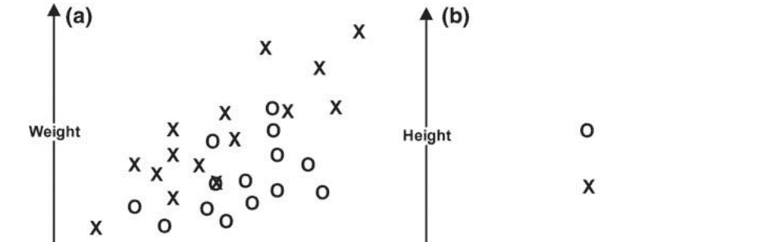

## 图3.1 添加一个新维度

| 长度 | 重量 | 颜色 | 标签 |
|------|------|------|------|
| 34   | 7    | 黑色 | 狗   |
| 59   | 15   | 白色 | 狗   |
| 54   | 17   | 棕色 | 狗   |
| 78   | 28   | 白色 | 狗   |
| ...  | ...  | ...  | ...  |

然后，我们将其转换为扩展了初始类别名称的列，并且在这些列中只允许二进制值，表示给定狗的颜色之一。这被称为独热编码，它增加了数据的维度，但现在机器学习算法可以处理分类数据。

修改后的表7为

| 长度 | 重量 | 棕色 | 黑色 | 白色 | 标签 |
|------|------|------|------|------|------|
| 34   | 7    | 0    | 1    | 0    | 狗   |
| 59   | 15   | 0    | 0    | 1    | 狗   |
| 54   | 17   | 1    | 0    | 0    | 狗   |
| 78   | 28   | 0    | 0    | 1    | 狗   |
| ...  | ...  | ...  | ...  | ...  | ...  |

我们通过对输入和输出进行简要描述，总结了所有监督机器学习算法。每个监督机器学习算法都接收一组训练数据点和标签（它们是行向量）。在此阶段，算法通过调整其内部参数创建一个超平面。这个阶段称为训练阶段：它接收带有相应标签的行向量作为输入（称为训练样本），并且不产生任何输出。相反，在训练阶段，算法仅仅调整其内部参数（从而创建超平面）。下一个阶段称为预测阶段。在这个阶段，经过训练的算法接收一些不带标签的行向量，并使用超平面创建标签（取决于行向量在超平面的哪一侧）。这些行向量本身只是来自上面表格的行，因此对应于第三行的训练样本的行向量只是(54, 17, 1, 0, 0,狗)。如果它是一个需要预测标签的行向量，它看起来是一样的，只是最后没有'狗'标签。[^8]

思考一下如何通过独热编码来提升对n维空间的理解。

深度学习也不例外。

注意，要进行独热编码，需要对数据进行两次遍历：第一次收集新列的名称，然后创建这些列，然后再对数据进行另一次遍历以填充它们。

严格来说，这些向量看起来并不完全相同：训练样本将是(54,17,1,0,0, Dog)，它是一个长度为6的行向量，而我们想要的行向量是

### 3.2 评估分类结果

在前一节中，我们已经探讨了分类的基础知识，但对于产生超平面的难点几乎没有涉及。我们将在下一节中解决这个问题。在本节中，我们假设我们有一个工作正常的分类器，我们想要看看它的表现如何。请看图3.4。

这张图片展示了一个名为C的分类器，用于对X进行分类。这是这个分类器的任务，在任何时候都要牢记这一点。黑线是超平面，灰色区域是C认为的X的区域。从C的角度来看，灰色区域内的一切都是X，而灰色区域外的一切都不是X。我们用X或O标记了每个数据点，取决于它们是否实际上是X或O。我们可以立即看到现实与C的想法不同，这是当我们有一个经验分类任务时的常见情况。

直观上，我们可以看出超平面是有意义的，但我们想定义客观的分类度量标准，可以告诉我们一个分类器有多好，并且如果我们有两个或更多，哪个分类器是最好的。

我们现在可以定义真正的正例、假正例、真负例和假负例的概念。真正的正例是分类器认为它是X并且它确实是X的数据点。假正例是分类器认为它是X但实际上它是O的数据点。真负例是分类器认为它不是X并且实际上它确实不是X的数据点，而假负例是分类器认为它不是X但实际上它是X的数据点。在图3.4中，有五个真正的正例（灰色中的X），一个假正例（灰色中的O），六个真负例（白色中的O）和两个假负例（白色中的X）。记住，灰色区域是分类器C认为全部是X的区域，白色区域是分类器C认为全部是O的区域。

第一个也是最基本的分类度量是准确率。准确率简单地告诉我们分类器在对X和O进行排序方面的好坏。换句话说，它是

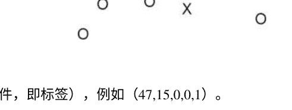

真正例的数量加上真反例的数量，再除以总数据点的数量。在我们的情况下，这将是 $\frac{5 + 6}{5 + 6 + 1 + 2} = \frac{11}{14} = 0.785714...$ 但我们将四舍五入到四位小数。

我们可能对一个分类器在避免虚警方面的表现感兴趣。用于计算这一指标的度量称为精确度。在数据集上计算分类器的精确度通过

$$
\frac{\text{真正的正例}}{\text{真正的正例} + \text{假正例}}.
$$

如果我们担心错过并且想要尽可能多地捕捉到真正的 $X$，我们需要一种称为召回率的不同度量来衡量我们的成功。召回率的计算方法是通过

$$
\frac{\text{真正的正例}}{\text{真正的正例} + \text{假负例}} = \frac{5}{5+2} = 0.7142.
$$

有一种标准的方法来以更直观的方式显示真正的正例（TP）、假正例（FP）、真负例（TN）和假负例（FN）的数量，这种方法被称为混淆矩阵。对于二分类（也称为二元分类）的情况，混淆矩阵是一个 $2 \times 2$ 的表格，形式如下：

| | 分类器判断为YES | 分类器判断为NO |
| --- | --- | --- |
| 实际上是肯定的 | 真正例数 | 假阴性数 |
| 实际上是否定的 | 假阴性数 | 真阴性数 |

一旦我们有了混淆矩阵，精确度、召回率、准确度和任何其他评估指标都可以直接从中计算出来。

所有分类器评估指标的值范围从0到1，并且可以解释为概率。请注意，有一些微小的修改可以使精确度或召回率达到100%（但不能同时达到100%）。如果我们希望精确度为1，我们可以简单地选择一个不选择任何数据点的分类器，即对于每个数据点，它应该说‘O’。对于召回率，相反的方法也可以：只选择所有数据点作为 $Xs$，召回率将为1。这就是为什么我们需要这三个指标来获得对分类器的好坏以及如何比较两个分类器的有意义的见解。

现在我们了解了评估指标，让我们转向从过程角度评估分类器性能的问题。面对一个分类任务时，正如之前提到的，我们有一个分类算法和一个训练集。我们在训练集上训练算法，现在我们准备好用它进行预测。但是评估部分在哪里呢？通常的策略是不将整个训练集用于训练，而是保留一部分用于测试。这通常是10%，但也可以更多或更少。[^10]我们保留并没有用于训练的这10%被称为测试集。在测试集中，我们将标签与其他特征分开，这样我们就得到了与预测时相同形式的行向量。

当我们在90%的训练集上有一个训练好的模型时，我们使用它对测试集进行分类，并将分类结果与标签进行比较。通过这种方式，我们获得了计算精确度、召回率和准确度所需的信息。这被称为将数据集分为训练集和测试集或者简单地称为训练-测试分割。测试集被设计为对分类器的行为进行受控模拟。这种方法有时被称为样本外验证以区别于时间外验证，其中10%的数据不是随机选择的，而是选择了大约10%的数据点所涵盖的时间段。一般不推荐使用时间外验证，因为数据中可能存在季节性趋势，这会严重影响评估结果。

### 3.3 一个简单的分类器：朴素贝叶斯

在本节中，我们将介绍本书中将要探索的最简单的分类器，称为朴素贝叶斯分类器。朴素贝叶斯分类器至少从1961年开始使用[5]，但由于其简单性，很难确定贝叶斯定理应用研究的结束和朴素贝叶斯分类器研究的开始。

朴素贝叶斯分类器基于我们在第2章中看到的贝叶斯定理（这解释了名称中的“贝叶斯”），并且还做出了一个额外的假设，即所有特征在条件独立性方面是相互独立的（这解释了名称中的“朴素”）。这意味着每个特征在预测能力方面都有“自己的权重”：没有特征之间的搭便车或协同作用。我们将重新命名贝叶斯定理中的变量，使其更具“机器学习的感觉”：

$$
\mathbb{P}(t|f) = \frac{\mathbb{P}(f|t)\mathbb{P}(t)}{\mathbb{P}(f)},
$$

其中 $\mathbb{P}(t)$ 是给定目标值（即类标签）的先验概率，$\mathbb{P}(f)$ 是特征的先验概率，$\mathbb{P}(f|t)$ 是给定目标 $t$ 的特征 $f$ 的概率，而 $\mathbb{P}(t|f)$ 是仅根据特征 $f$ 给出目标 $t$ 的概率，这是我们想要找到的。

回顾第2章，我们可以将贝叶斯定理转化为适应一个（$n$维）特征向量的情况，并且在这种情况下我们有以下公式：

$$
\mathbb{P}(t|f_{all}) = \frac{\prod_{i=1}^{n}\mathbb{P}(f_i|t) \cdot \mathbb{P}(t)}{\mathbb{P}(f_{all})}
$$

让我们看一个非常简单的例子来演示朴素贝叶斯分类器的工作原理以及它如何绘制超平面。假设我们有以下详细访问网页的表格：

| 时间 | 购买 |
|---|---|
| 早上 | 否 |
| 下午 | 是 |
| 晚上 | 是 |
| 早上 | 是 |
| 早上 | 是 |
| 下午 | 是 |
| 晚上 | 否 |
| 晚上 | 是 |
| 早上 | 否 |
| 下午 | 否 |
| 下午 | 是 |
| 下午 | 是 |
| 早上 | 是 |

现在，我们需要将其转换为一个计数表（称为频率表，类似于独热编码，但并不完全相同）：

| 时间 | 是 | 否 | 总计 |
|---|---|---|---|
| 早上 | 3 | 2 | 5 |
| 下午 | 4 | 1 | 5 |
| 晚上 | 2 | 1 | 3 |
| 总计 | 9 | 4 | 13 |

现在，我们可以计算一些基本的先验概率。‘是’的概率是 $\frac{9}{13} = 0.6923$。‘否’的概率为 $\frac{4}{13} = 0.3076$。‘早上’的概率为 $\frac{5}{13} = 0.3846$. ‘下午’的概率为 $\frac{5}{13} = 0.3846$. ‘晚上’的概率为 $\frac{3}{13} = 0.2307$. 好的，这样我们就处理了所有可以通过从数据集中计数得到的概率（在第2章第2.3节中所谓的‘先验概率’）。我们还需要一件事情，但我们会解决它。现在想象我们得到了一个新的案例，我们不知道目标标签，并且我们必须预测它。这个新案例是行向量 (早上)[^12]，我们想知道它是‘是’还是‘否’，所以我们需要计算

$$
\mathbb{P} (\text{是}|\text{早上}) = \frac{\mathbb{P} (\text{早上}|\text{是}) \mathbb{P} (\text{是})}{\mathbb{P} (\text{早上})}
$$

我们可以插入先验概率 $\mathbb{P} (\text{是}) = 0.6923$ 和 $\mathbb{P} (\text{早上}) = 0.3846$，我们计算得到的。现在，我们只需要计算 $\mathbb{P} (\text{早上}|\text{是})$，这是在限制为具有‘是’的行中出现‘早上’的次数的百分比，其中出现了9次‘是’，其中三次也有‘是’，所以我们有 $\mathbb{P} (\text{早上}|\text{是}) = \frac{3}{9} = 0.3333$。将所有这些带入贝叶斯定理，我们有

$$
\mathbb{P} (\text{是}|\text{早上}) = \frac{\mathbb{P} (\text{早上}|\text{是}) \cdot \mathbb{P} (\text{是})}{\mathbb{P} (\text{早上})} = \frac{0.3333 \cdot 0.6923}{0.3846} = 0.5999
$$

我们还知道 $\mathbb{P}(\text{早上}|\text{否}) = 1 - \mathbb{P}(\text{早上}|\text{是}) = 0.4$。 这意味着数据点得到标签'是'，因为值超过0.5（我们有两个类别）。 一般来说，如果我们有n个类别，$\frac{1}{n}$ 是概率超过的值。

勤奋的读者可能会说，我们可以直接从表格中计算 $\mathbb{P}(\text{是}|\text{早上})$ 就像我们计算 $\mathbb{P}(\text{早上}|\text{是})$ 一样，这是正确的。 问题在于，如果只有一个特征，我们可以通过从表格中计数来完成，但对于多个特征的情况，我们必须使用我们实际使用的计算方法（使用扩展的多个特征公式）。

朴素贝叶斯是一个简单的算法，但对于大型数据集仍然非常有用。 实际上，如果我们采用概率视角来看待机器学习，并声称所有机器学习算法实际上只学习 $\mathbb{P}(Y|X)$，我们可以说朴素贝叶斯是最简单的机器学习算法，因为它只具备从计数到预测的基本要素。 这是一种特定的（概率）机器学习观点，但它与深度学习的思维方式兼容，所以请随意采纳。

记住一个重要的事情是，朴素贝叶斯做出了条件独立性的假设。[^13]因此它无法处理特征之间的任何依赖关系。 有时候，我们可能希望能够建模这样的序列，例如当特征的顺序很重要时（我们将在语言建模或时间序列事件中看到这一点），而朴素贝叶斯无法做到这一点。 在本书的后面，我们将介绍完全能够处理这一点的深度学习模型。 在继续之前，请注意朴素贝叶斯分类器必须绘制一个超平面才能对新数据点进行分类。 假设我们手头有一个二元分类问题。

然后，朴素贝叶斯通过增加一个维度来扩展空间（因此行向量被扩充以包含这个值），而该维度接受0到1之间的值。 在这个维度上，超平面是可见的，并且它通过值0.5。

### 3.4 一个简单的神经网络：逻辑回归

监督学习通常分为两种类型的学习。 第一种是分类，我们需要预测类别。我们已经在朴素贝叶斯中见过了，而在本书中我们将再次见到它。 第二种是回归，我们预测一个值，在本书中我们不会探讨回归。[^14]在本节中，我们将探讨逻辑回归，它不是一个回归算法，而是一个分类算法。 这是因为在统计学和机器学习社区中，它被认为是一个回归模型，而机器学习社区只是采用了它并开始将其用作分类器。

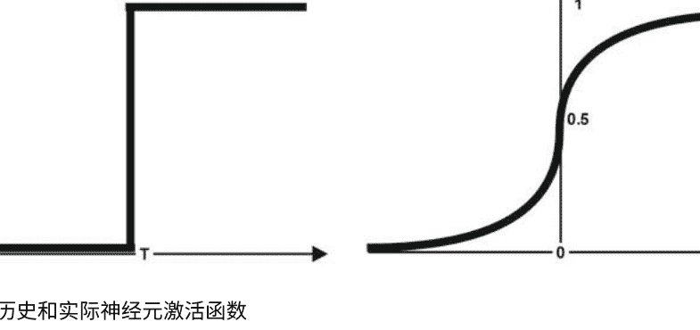

逻辑回归最早由D.R.Cox [6]于1958年引入，对逻辑回归和使用逻辑回归进行了大量研究。逻辑回归今天主要用于两个原因。首先，它提供了特征相对重要性的解释，如果我们希望对给定数据集建立直觉，这是很好的。[^15]第二个原因对我们来说更重要，那就是逻辑回归实际上是一个神经元的神经网络。[^16]

通过理解逻辑回归，我们迈出了迈向神经网络和深度学习的第一步，这是非常重要的。由于逻辑回归是一种监督学习算法，我们将在训练集的行向量中包含目标值。假设我们有三个训练案例，$\mathbf{x}_A = (0.2, 0.5, 1, 1), \mathbf{x}_B = (0.4, 0.01, 0.5, 0)$ 和 $\mathbf{x}_C = (0.3, 1.1, 0.8, 0)$。逻辑回归的输入神经元数量与行向量中的特征数量相同，对于我们的情况是3个。[^17]

你可以在图3.5中看到逻辑回归的示意图。至于计算部分，逻辑回归可以分为两个方程：

$$
z = b + w_1 x_1 + w_2 x_2 + w_3 x_3,
$$

这个方程计算了逻辑回归的逻辑函数（也称为加权和）和逻辑函数（或称为sigmoid函数）：

$$
y = \sigma(z) = \frac{1}{1 + e^{-z}}
$$

如果我们将它们连接起来并整理一下，就变得很简单了

$$
y = \sigma(b + w_1 x_1 + w_2 x_2 + w_3 x_3)
$$

现在，让我们对这些方程进行评论。第一个方程显示了如何从输入计算逻辑回归。在深度学习中，输入始终用x表示，神经元的输出始终用y表示，逻辑回归用z或者有时用a表示。上述方程使用了机器学习界常见的符号滥用，所以一定要理解为什么使用这些符号。

要计算逻辑回归，除了输入之外，我们还需要权重w和偏置b。如果你看一下这些方程，你会注意到除了偏置和权重之外，其他都是输入或计算得到的。那些不作为输入给出或者像e这样的常数被称为参数。目前，参数是权重和偏置，逻辑回归的目的是学习一个好的权重向量和一个好的偏置以实现良好的分类。这是逻辑回归（和深度学习）中唯一的学习过程：找到一组好的权重。

但是权重和偏差是什么？权重控制着我们应该让输入中的每个特征有多少进入。你可以将它们看作代表百分比。它们不仅限于0和1之间的区间，但这是一个很好的直观理解。对于大于1的权重，你可以将它们看作是'放大'。偏差有点棘手。从历史上看，[^18]它被称为阈值，并且它的行为有些不同。这个想法是，逻辑单元将简单地计算输入的加权和，如果它超过了阈值，神经元将输出1，否则输出0。1和0的部分被我们的σ(z)方程所取代，它不会输出一个明确的0或1，而是范围在0到1之间。你可以在图3.6中看到不同的图表。稍后，在第4章中，我们将看到如何将偏差作为其中之一的权重进行合并。现在，知道偏差可以被吸收为其中之一就足够了。

权重，这样我们就可以忽略偏差，因为它会被处理，并且它将成为权重之一。让我们根据我们的输入进行一次计算，这将解释逻辑回归的机制。我们需要为权重和偏差设置一个起始值，通常我们会随机生成它们。这是从高斯随机变量生成的，但为了简单起见，我们将通过在0和1之间取随机值来生成一组权重和偏差。现在，我们需要通过独热编码和归一化将输入行向量传递，但假设它们已经被独热编码和归一化。所以我们有 $\mathbf{x}_A = (0.2, 0.5, 0.91, 1)$, $\mathbf{x}_B = (0.4, 0.01, 0.5, 0)$和$\mathbf{x}_C = (0.3, 1.1, 0.8, 0)$，并假设随机生成的权重向量为$\mathbf{w} = (0.1, 0.35, 0.7)$和偏差为 $b = 0.66$。现在我们转向我们的方程，并输入第一个输入：

$$
y_A = \sigma(0.66 + 0.1 \cdot 0.2 + 0.35 \cdot 0.5 + 0.7 \cdot 0.91) = \sigma(1.492) = \frac{1}{1 + e^{-1.492}} = 0.8163
$$

我们注意到结果为0.8163和实际标签为1。现在我们对第二个输入进行相同的操作：

$$
y_B = \sigma(0.66 + 0.1 \cdot 0.4 + 0.35 \cdot 0.01 + 0.7 \cdot 0.5) = \sigma(1.0535) = \frac{1}{1 + e^{-1.0535}} = 0.7414
$$

再次注意到结果为0.7414和标签为0。现在我们来处理最后一个输入行向量：

$$
y_C = \sigma(0.66 + 0.1 \cdot 0.3 + 0.35 \cdot 1.1 + 0.7 \cdot 0.8) = \sigma(1.635) = \frac{1}{1 + e^{-1.635}} = 0.8368
$$

再次注意到结果为0.8368和标签为0。很明显，我们在第一个输入上做得很好，但是在正确分类第二个和第三个输入上失败了。现在，我们应该以某种方式更新权重，但是为了做到这一点，我们需要计算我们在分类上的糟糕程度。为了衡量这一点，我们需要一个误差函数，并且我们将使用平方误差的总和或SSE[^19]：

$$
E = \frac{1}{2} \sum_n (t^{(n)} - y^{(n)})^2
$$

这里的 $t$ 是目标或标签，而 $y$ 是模型的实际输出。这些奇怪的指数 $(t^{(n)})$ 只是在训练样本中的索引，所以 $(t^{(k)})$ 是第 $k$ 个训练行向量的目标。你马上就会明白为什么

[^8]: 严格来说，这些向量看起来并不完全相同：训练样本将是(54,17,1,0,0, Dog)，它是一个长度为6的行向量，而我们想要的行向量是
[^10]: 这主要是一个选择的问题，没有客观的方法来确定要分割多少。
[^12]: 如果我们有$n$个特征，那么这将是一个$n$维行向量，如 $(x_1, x_2, ..., x_n)$，但现在我们只有一个特征，所以我们有一个形式为 $(x_1)$ 的一维行向量。一维向量与标量$x_1$完全相同，但我们将其称为向量，以便在一般情况下它将是一个$n$维向量。
[^13]: 也就是说，特征在给定目标的条件下是独立的假设。
[^14]: 回归问题可以用分类来模拟。 一个例子是，如果我们需要在0和1之间找到合适的值，并且我们需要将其四舍五入到两位小数，那么我们可以将其视为一个100类的分类问题。 相反的情况也成立，我们在朴素贝叶斯部分实际上已经看到了这一点，我们需要选择一个阈值，超过该阈值我们将其视为1。
[^15]: 之后，我们可以进行一些特征工程，并使用完全不同的模型。这在我们对使用的数据没有理解的情况下非常重要，而这在工业界经常发生。
[^16]: 我们将在后面看到，逻辑回归不止一个神经元，因为输入向量的每个分量都必须有一个输入神经元，但从一个‘工作马’神经元的角度来看，它只有一个神经元。
[^17]: 如果训练集由n维行向量组成，则恰好有n-1个特征，最后一个是目标或标签。
[^18]: 从数学上讲，偏差有助于产生一个称为截距的偏移量。
[^19]: 如果我们需要更多的小数位数，但在本书中，我们通常会四舍五入。

现在我们需要这样奇怪的符号吗？稍后我们将看到如何摆脱它。让我们计算我们的SSE：

$$E = \frac{1}{2} \sum_{n} (t^{(n)} - y^{(n)})^2 = \frac{1}{2} ((1 - 0.8163)^2 + (0 - 0.7414)^2 + (0 - 0.8368)^2) = \frac{0.0337 + 0.5496 + 0.7002}{2} = 0.64175$$

现在我们使用魔法来更新 w 和 b，并得到 w = (0.1, 0.36, 0.3) 和 b = 0.25。稍后（在第4章中），我们将看到它实际上是通过一种称为“通用权重更新规则”的东西来完成的。这完成了一次权重调整的循环。这在口语中被称为一个“时代”，但我们将在第4章中重新定义这个术语，使其更加精确。让我们重新计算输出和新的SSE，看看新的权重集是否更好：

$$y_A^{new} = \sigma(0.25 + 0.1 \cdot 0.2 + 0.36 \cdot 0.5 + 0.3 \cdot 0.91) = \sigma(0.723) = \frac{1}{1 + e^{-0.723}} = 0.6732$$
$$y_B^{new} = \sigma(0.25 + 0.1 \cdot 0.4 + 0.36 \cdot 0.01 + 0.3 \cdot 0.5) = \sigma(0.4436) = \frac{1}{1 + e^{-0.4436}} = 0.6091$$
$$y_C^{new} = \sigma(0.25 + 0.1 \cdot 0.3 + 0.36 \cdot 1.1 + 0.3 \cdot 0.8) = \sigma(0.916) = \frac{1}{1 + e^{-0.916}} = 0.7142$$

$$E^{new} = \frac{1}{2} ((1 - 0.6732)^2 + (0 - 0.6091)^2 + (0 - 0.7142)^2) = \frac{0.1067 + 0.371 + 0.51}{2} = 0.4938$$

我们可以清楚地看到整体误差已经减小。我们可以继续这个过程多次，误差会减小，直到某一点停止减小并稳定下来。在极少数情况下，它甚至可能表现出混沌行为。

这就是逻辑回归的本质，也是深度学习的核心——我们所做的一切都将是对此的升级或修改。

让我们把注意力转向数据表示。到目前为止，我们已经使用了一个扩展的视图来清楚地看到一切，但让我们看看如何使过程更紧凑和计算速度更快。请注意，即使数据集是一个集合（顺序无关紧要），将 x_A，x_B 和 x_C 放入一个向量中可能有点意义，因为我们将逐个使用它们（向量将模拟队列或堆栈）。但由于它们还共享相同的结构（每个行向量中相同位置上的相同特征），我们可以选择使用矩阵表示整个训练集。从计算的角度来看，这一点非常重要，因为大多数深度学习库在后台使用 C 语言，而数组（矩阵的编程等价物）是 C 语言的本地数据结构，对它们进行计算非常快速。

所以我们想要做的第一件事是将 $n$ 个 $d$ 维输入向量转换成一个 $n \times d$ 的输入矩阵。 在我们的例子中，这是一个 $3 \times 3$ 的矩阵：

$$\mathbf{x} = \begin{bmatrix} 0.2 & 0.5 & 0.91 \\ 0.4 & 0.01 & 0.5 \\ 0.3 & 1.1 & 0.8 \end{bmatrix}$$

我们将把目标（标签）保留一个单独的向量中，并且从这一点开始，我们必须非常小心，不要对目标向量或数据集矩阵进行洗牌，因为矩阵行和向量分量的顺序是将它们重新连接的唯一方式。 在我们的例子中，目标向量是 $t=(1,0,0)$。

让我们把注意力转向权重。 偏置有点麻烦，所以我们可以将其转换为其中一个权重。 为了做到这一点，我们必须在输入矩阵的第一列添加一个由 1 组成的单列。 请注意，这不是一个近似值，而是完全捕捉到我们需要执行的计算。 至于权重，我们将需要与输入数量相同数量的权重。 此外，如果我们有多个工作神经元，我们将需要相应数量的权重，例如，如果我们有 5 个输入（5 维输入行向量）和 3 个工作神经元，我们将需要 $5 \times 3$ 个权重。 这个 $5 \times 3$ 是故意的，因为我们将使用一个 $5 \times 3$ 的矩阵来存储它，这样我们就可以通过简单的矩阵乘法进行所有所需的逻辑计算。 这说明了一种可以称为“快速计算的通用深度学习策略”的方法：尽量多地使用矩阵（和向量）乘法和转置来完成工作。

回到我们的例子，我们有三个输入，并在输入前面添加一列 1，为权重矩阵中的偏差腾出空间。 新的输入矩阵现在是一个 $3 \times 4$ 的矩阵：

$$\mathbf{x} = \begin{bmatrix} 1 & 0.2 & 0.5 & 0.91 \\ 1 & 0.4 & 0.01 & 0.5 \\ 1 & 0.3 & 1.1 & 0.8 \end{bmatrix}$$

现在我们可以定义权重矩阵。 它是一个由偏差后面跟着权重的 $4 \times 1$ 矩阵：

$$\mathbf{w} = \begin{bmatrix} 0.66 \\ 0.1 \\ 0.35 \\ 0.7 \end{bmatrix}$$

这个矩阵可以等价地表示为 $(0.66, 0.1, 0.35, 0.7)^\top$，但我们现在将使用矩阵形式。现在，为了计算逻辑回归，我们对这两个矩阵进行简单的矩阵乘法，得到一个 $3 \times 1$ 的矩阵，其中每一行（每一行只有一个值）表示每个训练案例的逻辑回归（与之前的计算进行比较）：

$$z = xw = \begin{bmatrix} 1 & 0.2 & 0.5 & 0.91 \\ 1 & 0.4 & 0.01 & 0.5 \\ 1 & 0.3 & 1.1 & 0.8 \end{bmatrix} \cdot \begin{bmatrix} 0.66 \\ 0.1 \\ 0.35 \\ 0.7 \end{bmatrix} = \begin{bmatrix} 1 \cdot 0.66 + 0.2 \cdot 0.1 + 0.5 \cdot 0.35 + 0.91 \cdot 0.7 \\ 1 \cdot 0.66 + 0.4 \cdot 0.1 + 0.01 \cdot 0.35 + 0.5 \cdot 0.7 \\ 1 \cdot 0.66 + 0.3 \cdot 0.1 + 1.1 \cdot 0.35 + 0.8 \cdot 0.7 \end{bmatrix} = \begin{bmatrix} 1.492 \\ 1.0535 \\ 1.635 \end{bmatrix}$$

现在我们只需要将逻辑函数 $\sigma$ 应用到 $z$ 上。这是通过简单地将函数应用于矩阵的每个元素来完成的：

$$\sigma(z) = \begin{bmatrix} \sigma(1.492) \\ \sigma(1.0535) \\ \sigma(1.635) \end{bmatrix} = \begin{bmatrix} 0.8163 \\ 0.7414 \\ 0.8368 \end{bmatrix}$$

我们添加一个最后的备注。逻辑函数是逻辑回归的主要组成部分。但是，如果我们将逻辑回归视为一个简单的神经网络，我们不必局限于逻辑函数。从这个角度来看，逻辑函数是一种非线性^21，即它是使复杂行为成为可能的组成部分（特别是当我们将模型扩展到经典逻辑回归的单个工作神经元之外时）。有许多类型的非线性，它们都有稍微不同的行为。逻辑回归的取值范围在 0 到 1 之间。另一个常见的非线性是双曲正切函数 $\tanh$，我们将其用 $\tau$ 表示以保持符号一致。双曲正切非线性的取值范围在 $-1$ 到 1 之间，形状与逻辑函数类似。它的计算方式为

$$\tau(z) = \frac{e^{z} - e^{-z}}{e^{z} + e^{-z}}$$

在神经网络中选择使用哪种激活函数是一个偏好的问题，通常是根据使用它们所得到的结果来指导的。如果我们在逻辑回归中使用双曲正切函数而不是逻辑函数，它仍然可以很好地工作，但从技术上讲，那就不再是逻辑回归了。另一方面，无论我们使用哪种非线性函数，神经网络仍然是神经网络。

^21 在早期的文献中，有时将其称为激活函数。

## 图 3.7 一个 MNIST 数据点

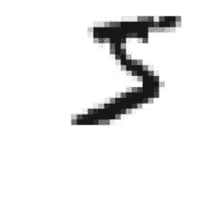

## 3.5 介绍 MNIST 数据集

MNIST 数据集是美国国家标准与技术研究所的手写数字数据集的修改版本。原始数据集的描述见[7]，MNIST（修改的 NIST）是由 Yann LeCun、Corinna Cortes 和 Christopher J. C. Burges 编制的原始数据集 Special Database 1 和 Special Database 3 的修改版本。MNIST 数据集首次在论文[8]中使用。Geoffrey Hinton 将 MNIST 称为“机器学习的果蝇”，因为很多机器学习的研究都是在其上进行的，它对于许多简单任务来说非常灵活。如今，MNIST 可以从多个来源获取，但“最干净”的来源可能是 Kaggle，数据以简单的 CSV 文件形式存储，可以轻松地被任何软件访问。在图 3.7 中（图片来源[9]），我们可以看到一个 MNIST 数字的示例。

MNIST 图像是 28x28 像素的灰度图像，因此每个像素的值范围在 0（白色）和 255（黑色）之间。这与通常的灰度图像不同，其中 0 是黑色，255 是白色，但社区认为以这种方式存储可以节省空间，但对于 MNIST 这样大小的数据集来说，这只是一个次要问题。

这里有一个问题，我们将在本书的最后回到这个问题上。问题在于当前所有可用的监督机器学习算法只能处理向量作为输入：不能处理矩阵、图形、树等。这意味着无论我们试图做什么，我们都必须找到一种将其转换为向量形式并将所有输入转换为 $n$ 维向量的方法。MNIST 数据集由 28x28 图像组成，因此本质上输入是矩阵。由于它们都具有相同的大小，我们可以将它们转换为 784 维向量^24。我们可以通过简单地将它们视为书写页面来实现：从左到右，当像素行结束后，移动到下一行的最左边并继续。通过这样做，我们将一个 $28 \times 28$ 矩阵转换为一个 784 维向量。这是一个相当简单的转换（请注意，它仅在所有输入样本具有相同大小的情况下有效），如果我们想要学习图形和树，我们必须有它们的向量表示。

我们将在本书的最后作为一个开放问题回顾这个问题。这里还有一个额外的观点我们想要提出。MNIST 由灰度图像组成。如果是 RGB 图像，我们可以做什么呢？回想一下，RGB 图像由三个部分组成。

## 图 3.8 所有颜色的灰度，红色通道，绿色通道和蓝色通道

组成的图像部分称为通道：红色，绿色和蓝色。它们连接在一起形成完整的(彩色)图像。我们可以以彩色打印它们（红色通道的每个像素值从 0 到 255 表示其中有多少红色），但我们实际上在不知情的情况下将颜色转换为灰度（参见图 3.8）。将红色通道表示为灰色可能看起来很奇怪，但这正是计算机所做的。通道图像的名称是“红色”，但像素中的值在 0 到 255 之间，从计算的角度来看是灰色的。这是因为 RGB 像素只是从 0 到 255 的三个值。第一个被称为“红色”，但从计算的角度来看，它只是因为它在第一位。它本身没有固有的“红色”或质感。如果我们在不提供其他两个分量的情况下显示像素，0 将被解释为黑色，255 将被解释为白色，从而形成灰度图像。换句话说，一个 RGB 图像的像素值为 (34, 67, 234)，但如果我们只取红色分量 34，我们将得到一个灰度图像。要在显示中获得“红色”，我们必须将其表示为 (34, 0, 0) 并将其保持为 RGB 图像。

对于绿色和蓝色也是一样的。回到我们最初的问题，如果我们处理的是 RGB 图像，会有几个选项：

- 将各个分量求平均以产生平均灰度表示（这是从 RGB 创建灰度图像的常见方法）。
- 分离通道并形成三个不同的数据集，然后训练三个分类器。在预测时，我们将它们的结果取平均作为最终结果。这是一个分类器委员会的例子。
- 将通道分离为不同的图像，对它们进行洗牌，并在所有图像上训练一个单一的分类器。这种方法本质上是数据增强。
- 将通道分离为不同的图像，在每个图像上训练三个相同分类器的实例（大小和参数相同），然后使用第四个分类器进行最终决策。这就是导致卷积神经网络的方法，我们将在第 6 章中详细探讨。

这些方法各有其优点，根据手头的问题，任何一个都可以是一个不错的选择。你可以考虑其他选项，深度学习具有探索性质，非传统的方法有助于提高准确性。

### 3.6 无标签学习：K-Means

现在我们将注意力转向两种无监督学习算法，K-means 和 PCA。我们将在下一节简要介绍 PCA（特别是其背后的直觉），但我们将在第 9 章中详细讨论技术细节。PCA 代表了一种无监督学习的分布式表示分支，它是深度学习中最重要的主题之一，而 PCA 是构建分布式表示的最简单的算法之一。另一个概念上更简单的无监督学习分支称为聚类。

聚类的目标是将所有数据点分配到聚类中，希望这些聚类能够捕捉它们在 $n$ 维空间中的相似性。K-means 是最简单的聚类算法，我们将使用它来说明聚类算法的工作原理^26。但在我们继续讲解 K-means 之前，让我们简要评论一下无监督学习是什么。无监督学习是没有标签或目标的学习。由于无监督学习通常是三个领域中最后一个被定义的领域（监督学习和强化学习是另外两个领域），人们倾向于将不属于监督学习或强化学习的所有内容归为无监督学习。这是一个非常广泛的定义，但它非常有趣，因为它引发了一个认知问题：我们如何在没有反馈的情况下学习，没有反馈的学习实际上是学习还是一种不同的现象？通过探索无监督学习，我们深入研究了认知建模，这使得这个领域变得令人兴奋和多彩。

让我们演示一下 K-means 的工作原理。K-means 是一种聚类算法，这意味着它会产生数据的聚类。产生聚类实际上意味着为所有数据点分配一个聚类名称，使得相似的数据点共享相同的聚类名称。通常的聚类名称是‘1’、‘2’、‘3’等等。假设我们有两个特征，因此我们在二维空间中工作。在无监督学习中，我们没有训练和测试集，但我们拥有的所有数据点都是‘训练’数据点，并且我们从这些数据点构建聚类（这将定义超平面）。输入的行向量没有标签；它们只包含特征。

K-means 算法的输入是要使用的质心数量。每个质心将定义一个聚类。在算法的开始时，质心被随机放置在数据点向量空间中的一个位置。K-means 有两个阶段，一个称为‘分配’，另一个称为‘最小化’，形成一个循环，并且重复这个循环多次^27。在分配阶段，每个数据点根据欧几里德距离被分配给最近的质心。在‘最小化’阶段，质心会朝着最小化其分配的所有数据点距离之和的方向移动^28。这完成了一个循环。下一个循环开始时，会进行解散，将所有数据点与质心关联。质心保持原位，但开始一个新的分配阶段，可能与之前的分配不同。你可以在图 3.9 中看到这一点。循环结束后，我们就有了一个准备好的超平面：当我们获得一个新的数据点时，它将被分配给最近的质心。换句话说，它将以最近质心的名称作为标签。

^25 但是 PCA 本身并不那么容易理解。
^26 K-means（也称为 Lloyd-Forgy 算法）最早由 S. P. Lloyd 在[16]和 E. W. Forgy 在[17]中独立提出。
^27 通常，在预定义的次数内，还有其他策略。
^28 想象一下，一个质心被固定并与其所有数据点用橡皮筋连接在一起，然后你将其从表面上解开。它会移动，以使总的橡皮筋张力更小（尽管个别橡皮筋可能会变得更紧张）。

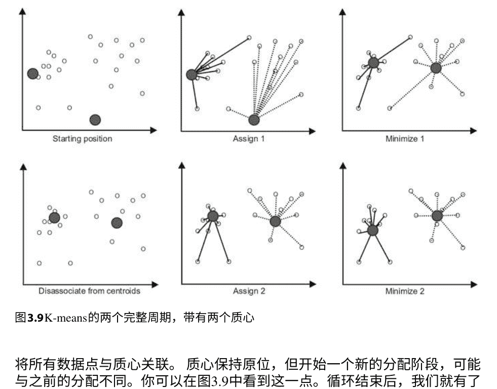

图 3.9 K-means 的两个完整周期，带有两个质心

在通常的情况下，当我们使用聚类时，我们没有标签（对于无监督学习，我们也不需要标签）。在没有标签的情况下，我们之前讨论的评估指标是无用的，因为我们无法计算真正的正例、假正例、真负例和假负例。有时候我们可能有标签但更倾向于使用聚类，或者我们将在以后获得真实标签。在这种情况下，我们可以将聚类的结果作为分类结果进行评估，这被称为聚类的外部评估。关于使用分类评估指标进行聚类的外部评估的详细阐述可参考[11]。

但有时候我们没有任何标签，必须在没有标签的情况下进行工作。在这种情况下，我们可以使用一类称为聚类的内部评估指标。有几种评估指标，但 Dunn 系数[12]是最流行的。主要思想是测量聚类在 $n$ 维空间中的密度。因此，对于每个聚类 $C$，Dunn 系数的计算方式为

$$D_C = \frac{\text{最小}\{d(i, j) | i, j \in \text{质心}\}}{d_{\text{在}}(C)} \quad (3.15)$$

在这里，$d(i, j)$ 是质心 $i$ 和 $j$ 之间的欧几里得距离，而 $d_{\text{在}}(C)$ 是簇内距离，它被定义为距离：

$$d_{\text{in}}(C) = \max \{ d(x, y) \mid x, y \in C \}, \quad (3.16)$$

其中 $C$ 是我们计算 Dunn 系数的簇。Dunn 系数被计算用于每个簇，并且可以通过它来评估每个簇的质量。Dunn 系数可以用于通过计算两个聚类中每个簇的 Dunn 系数的平均值来比较不同的聚类^30。

### 3.7 学习不同的表示：PCA

到目前为止，我们使用的数据具有本地表示。如果一个名为‘Height’的特征的值为 180，那么关于该数据点的那个信息（我们甚至可以说是‘实体的属性’）只存在于那里。另一列‘Weight’不包含关于身高的信息。我们描述为数据点特征的实体属性的这种表示被称为本地表示。注意，对象具有一定的高度确实对重量有一定的限制。这不是一个严格的限制，而更像是一种‘认识上的捷径’：如果我们知道一个人的身高是 180 厘米，那么他们的体重可能大约是 80 公斤。个体人可能会有所不同，但总体上我们可以通过知道他们的身高来相对准确地猜测他们的体重。这种现象被称为相关性，它是一个棘手的现象。如果两个特征高度相关，它们很难区分开来。

理想情况下，我们希望找到一种数据的转换，它具有奇怪的特征，但这些特征之间没有相关性。在这种表示中，我们将有一个名为‘Argh’的特征，它捕捉到了通过身高推断体重的基本组成部分^31，并将‘Height’和‘Weight’中被‘Argh’移除后剩下的部分作为‘Haght’和‘Waght’。这种表示被称为分布式表示。

手动构建分布式表示很困难，然而这正是人工神经网络的本质。每一层都构建自己的分布式表示，这有助于学习（这或许是深度学习的本质——学习许多层的分布式表示）。我们将展示构建有意义的分布式表示的最简单方法，但我们只会在第 9 章中详细介绍其数学细节。这是相当困难的，这就是为什么我们希望通过深度学习来构建这样的东西。构建分布式表示的这种方法称为主成分分析（PCA）。在本章中，我们将提供 PCA 的鸟瞰图，并提供所有的数学细节^25。

^30 我们必须在两个聚类中使用相同数量的质心才能使其工作。
^31 这些特征在统计学中被称为潜在变量。

第9章中的细节。 $^{32}$PCA具有以下形式：
$$Z = X Q \quad (3.17)$$
其中 $X$ 是输入矩阵，$Z$ 是转换矩阵，$Q$ 是我们进行转换的“工具矩阵”。如果 $X$ 是一个 $n \times d$ 矩阵，$Z$ 也应该是一个 $n \times d$ 矩阵。这给我们关于 $Q$ 的第一个信息：它必须是一个 $d \times d$ 矩阵，以使乘法工作。我们将在第9章中展示如何找到适当的 $Q$。在本节的其余部分，我们将介绍PCA作为一个整体的直觉以及构建 $Q$ 所需的一些元素。我们还将详细描述我们希望PCA做什么以及我们希望能够使用它做什么。

一般来说，PCA用于预处理数据。这意味着在将数据输入分类器之前，它必须对数据进行转换，使其更易理解。PCA在预处理中有几种帮助方式。我们已经看到，我们将使用它来构建数据的分布式表示以消除相关性。我们还可以使用PCA进行降维。我们已经看到，通过独热编码和手动特征工程，维度可以扩展。当我们使用诸如'Argh'、'Haght'和'Waght'等人工特征创建分布式表示时，我们希望能够按信息量对它们进行排序，以便丢弃无信息的特征。信息量只是方差$^{33}$：如果一个特征变化更大，它携带的信息就更多。$^{34}$这是我们希望我们的 $Z$ 具有的特性：方差最大的特征应该在第一列，方差第二大的特征应该在第二列的 $Z$ 中，依此类推。为了说明方差如何随简单变换而变化，请参见图3.10，其中有六个二维数据点的简单情况。图3.10的A部分说明了起始位置。

在 $x$ 轴上的投影紧密地排列在一起。沿着 $y$ 轴的方差更好，$y$ 坐标之间的距离更远。但我们可以做得更好。看一下图3.10的B部分：我们通过稍微旋转坐标系得到了这个结果。请注意，所有数据保持不变，我们正在改变数据的表示，即轴（对应于特征）。这个新的'坐标系'实际上，在数学上来说，只是这个二维向量空间中点的不同基。你没有改变点（即二维向量），而是它们所在的'坐标系'。你实际上甚至没有改变坐标系，而只是改变了向量空间的基。

如何在数学上做到这一点实际上与如何找到一个矩阵 $Q$，使其以这种方式运作的问题是相同的，我们将在第9章中回答这个问题。在坐标轴上，我们绘制了第一个和最后一个数据点之间的距离，这可以看作是方差的'图形代理'。在B部分中，图3.10中，我们将黑色（原始坐标系）与灰色（变换后）的方差并排比较（位于黑色坐标系旁边）。注意原始系统中方差较大的y轴（原始系统中方差较小的x轴）的方差增加了，而原始系统中方差较小的x轴的方差实际上减少了。

在继续之前，让我们对PCA和预处理做一个最后的说明。任何类型的数据都存在一个最基本的问题，那就是噪声。噪声可以被定义为除了相关信息之外的一切。如果我们的数据集有足够的训练样本，那么它应该包含非随机信息和随机噪声。它们通常混合在特征中。但是如果我们能够构建一个分布式表示，这意味着我们可以将具有更高方差的部分和具有较低方差的部分作为单独的特征提取出来；我们可以假设噪声（随机的）具有低方差（它在任何地方都是“同样随机的”），而信息具有高方差。

假设我们对一个20维输入矩阵使用了PCA。然后，我们可以保留前10个新特征，通过这样做，我们消除了很多噪声（低方差特征），只消除了一点点信息（因为它们是低方差特征，而不是“没有方差”的特征）。

主成分分析已经存在很长时间了。它最早是由伦敦大学学院的卡尔·皮尔逊在1901年发现的。$^{32}$其中一个原因是我们还没有开发出所有需要现在写出细节的工具。 $^{33}$请参阅第2章。 $^{34}$如果一个特征始终相同，它的方差为0，它不携带任何有用于绘制超平面的信息。从那时起，主成分分析的变体被称为许多不同的名字，并且通常存在微妙的差异。各种主成分分析变体之间的关系细节很有趣，但不幸的是，它们需要一本完整的书来探索，因此超出了本卷的范围。

### 3.8 学习语言：词袋表示

到目前为止，我们已经处理了数值特征、有序特征和分类特征。我们已经看到了如何对分类特征进行独热编码。我们还没有涉及到一个完整的领域，即自然语言处理。我们将读者引用到[14]或[15]中，以便全面介绍自然语言处理。在本节中，我们将看到如何使用最简单的模型之一，即词袋模型，来处理语言。

让我们首先定义一些自然语言处理的术语。一个语料库是我们拥有的整个文本集合。一个语料库可以被分解成片段。片段可以是单个句子、段落或多页文档。基本上，片段是我们希望作为训练样本处理的东西。如果我们正在分析临床文件，每个患者入院文件可能是一个片段；如果我们正在分析一所大学的所有博士论文，每篇200页的论文都是一个片段；如果我们正在分析社交媒体上的情感，每个用户评论都是一个片段；等等。词袋模型通过将语料库中的每个单词转换为特征，并在每行下方的该单词下计算该单词在该片段中出现的次数来创建。显然，通过创建词袋，单词的顺序丢失了。

词袋模型是将语言转换为特征以供机器学习算法使用的主要方法之一，只有深度学习才有良好的替代方法，我们将在第6、7和8章中看到。其他机器学习方法几乎完全使用词袋或其变体，对于许多语言处理任务来说，词袋在深度学习中也是一个很好的语言模型。让我们看看词袋在一个简单的社交媒体数据集中的工作原理$^{36}$：

| 用户评论 | 喜欢 |
| :--- | :--- |
| S. A 你不知道 | 22 |
| F. F 好像你知道一样 | 13 |
| S. A 我知道我知道 | 9 |
| P. H 我知道 | 43 |

我们需要将“评论”列转换为词袋模型。暂时保留“用户”和“喜欢”列。为了从评论中创建词袋模型，我们需要进行两次遍历。第一次遍历只收集出现的所有单词，并将它们转换为特征（即收集唯一单词并创建相应的列），第二次遍历将实际值写入：

$^{35}$基本词袋模型扩展的一个例子是n-gram词袋模型。n-gram是由相邻的n个单词组成的n元组。如果我们有一个句子‘我现在要走了’，它的2-gram集合将是 {('我','现在'), ('现在','要'), ('要','走'), ('走','了')}。 $^{36}$对于大多数语言处理任务，尤其是需要使用从社交媒体收集的数据的任务，首先将所有文本转换为小写并去除所有逗号、撇号和非字母数字是有意义的，这一步我们已经完成了。

| 用户 | 你 | 不 | 知道 | 就像 | 我 | 一样 | 喜欢 |
| :--- | :--- | :--- | :--- | :--- | :--- | :--- | :--- |
| S.A | 1 | 1 | 1 | 0 | 0 | 0 | 22 |
| F.F | 1 | 0 | 1 | 1 | 1 | 0 | 13 |
| S.A | 0 | 0 | 2 | 0 | 0 | 2 | 9 |
| P.H | 0 | 0 | 1 | 0 | 0 | 1 | 43 |

现在，我们有了“评论”列的词袋，并且在将数据集馈送到机器学习算法之前，我们需要对“用户”列进行独热编码。我们之前已经解释过这样做的原因，并得到了最终的输入矩阵：

| S.A | F.F | P.H | 用户 | 你 | 不 | 知道 | 就像 | 我 | 一样 | 喜欢 |
| :--- | :--- | :--- | :--- | :--- | :--- | :--- | :--- | :--- | :--- | :--- |
| 1 | 0 | 0 | 1 | 1 | 1 | 0 | 0 | 0 | 0 | 22 |
| 0 | 1 | 0 | 1 | 0 | 1 | 1 | 1 | 0 | 0 | 13 |
| 1 | 0 | 0 | 0 | 0 | 2 | 0 | 0 | 2 | 1 | 9 |
| 0 | 0 | 1 | 0 | 0 | 1 | 0 | 0 | 1 | 0 | 43 |

这个例子展示了独热编码和词袋之间的区别。在独热编码中，每一行只有1或0，并且必须恰好有一个1。这意味着我们只需记录它为1的列号，就可以将其表示得相当简洁。以上方的第四个例子为例：我们只需记录‘3’作为列号，就可以得知独热编码的所有信息，这比写‘0,0,1’占用更少的空间。词袋则不同。在词袋中，我们统计每个片段的词频，这个频率可以大于1。此外，我们需要对整个数据集使用词袋，这意味着我们必须将训练集和测试集一起进行编码。这意味着只在测试集中出现的单词在整个训练集中将为0。此外，请注意，由于大多数分类器要求所有样本具有相同的维度（和特征名称），当我们使用算法进行预测时，我们将不得不丢弃任何不在训练模型中的新单词，以便将数据馈送给算法。

它们的共同之处在于它们大幅度扩展了维度，并且几乎在任何地方都为0。当我们像这样对数据进行编码时，我们说，我们有一种稀疏编码。这意味着很多特征是无意义的，我们希望我们的分类器尽快将它们排除。我们将在后面看到，当面对一个稀疏编码的数据集时，一些技术如PCA和L_1正则化是有用的。此外，请注意我们如何利用空间维度的扩展来通过计数单词来捕捉“语义”。

### 参考文献

1. R. Tibshirani, T. Hastie, 统计学习的要素：数据挖掘、推理和预测，第2版 (Springer, 纽约, 2016年)
2. F. van Harmelen, V. Lifschitz, B. Porter, 知识表示手册 (Elsevier Science, 纽约, 2008年)
3. R.S. Sutton, A.G. Barto, 强化学习导论 (MIT出版社, 剑桥, 1998)
4. J.R. Quinlan, 决策树归纳. 机器学习. **1**, 81–106 (1986)
5. M.E. Maron, 自动索引: 一个实验性研究. J. ACM **8(3)**, 404–417 (1961)
6. D.R. Cox, 二进制序列的回归分析 (讨论). J. Roy. Stat. Soc. B (Methodol.) **20(2)**, 215–242 (1958)
7. P.J. Grother, NIST特殊数据库19: 手写表单和字符数据库 (1995)
8. Y. LeCun, L. Bottou, Y. Bengio, P. Haffner, 基于梯度的学习应用于文档识别. IEEE会议录 **86(11)**, 2278–2324 (1998)
9. M.A. Nielsen, 神经网络和深度学习 (Determination Press, 2015)
10. P.N. Klein, 编码矩阵 (Newtonian Press, London, 2013)
11. I. Färber, S. Günnemann, H.P. Kriegel, P. Kroger, E. Müller, E. Schubert, T. Seidl, A. Zimek. 在评估聚类中使用类标签, 出自*MultiClust: Discovering, Summarizing, and Using Multiple Clusterings*, 编者: X.Z. Fern, I. Davidson, J. Dy (ACM SIGKDD, 2010)
12. J. Dunn, 良好分离的聚类和最优模糊分区. J. Cybern. **4(1)**, 95–104 (1974)
13. K. Pearson, 关于空间中最接近点系统的直线和平面. Phil. Mag. **2(11)**, 559–572 (1901)
14. C. Manning, H. Schütze, 统计自然语言处理基础 (MIT出版社, 剑桥, 1999)
15. D. Jurafsky, J. Martin, 语音和语言处理 (Prentice Hall, 新泽西, 2008)
16. S. P. Lloyd, 最小二乘量化在PCM中的应用. IEEE信息论杂志, **28(2)**, 129–137 (1982)
17. E. W. Forgy, 多变量数据的聚类分析: 效率与可解释性的比较. 生物特征, **21(3)**, 768–769 (1965)

### 4.1 神经网络的基本概念和术语

反向传播是深度学习的核心方法。但在我们开始探索反向传播之前，我们必须定义一些基本概念并解释它们的相互作用。深度学习是使用深度人工神经网络的机器学习，本章的目标是解释浅层神经网络的工作原理。我们还将浅层神经网络称为简单的前馈神经网络，尽管这个术语本身应该用来指代任何没有反馈连接的神经网络，而不仅仅是浅层神经网络。从这个意义上讲，卷积神经网络也是一种前馈神经网络，但不是浅层神经网络。总的来说，深度学习包括解决当我们尝试向浅层神经网络添加更多层时出现的问题。还有一些其他很棒的关于神经网络的书籍。这本书[1]为读者提供了详细的数学细节，而这本书[2]更注重应用，但概述了一些我们在本书中没有探讨的相关技术，如Adaline。这本书[3]是由一些深度学习领域的专家撰写的一本很棒的书，可以看作是完成本书后的自然下一步。最后一本书我们提到的，也许是最具挑战性的一本，是[4]。这是一本很棒的书，但对读者提出了严格的要求，我们建议在完成[3]之后再阅读它。

还有许多其他优秀的书籍，但我们在这里提供了我们认为最能增强本卷所涵盖内容的选择。

任何神经网络都由简单的基本元素构成。在上一章中，我们甚至不知道就遇到了一个简单的神经网络：逻辑回归。一个浅层人工神经网络由两层或三层组成，超过这个层数被认为是深度的。就像逻辑回归一样，人工神经网络有一个输入层，用于存储输入。每个存储输入的元素被称为‘神经元’。然后，逻辑回归有一个单一的点，所有输入都在其中，这是它的输出（这也是一个神经元）。对于一个简单的神经网络也是如此，但它可以有多个输出神经元，形成输出层。

与逻辑回归不同的是，在输入层和输出层之间可能存在一个'隐藏'层。根据观点的不同，我们可以将神经网络看作是具有多个工作神经元的逻辑回归，然后在它们之后，有一个最终的工作神经元来'协调'它们的结果，或者我们可以将其视为具有一整层工作神经元的逻辑回归，这些神经元被挤压在输入和旧的工作神经元之间（在逻辑回归中已经存在）。这两种观点对于发展对神经网络的直觉都是有用的，在本章的剩余部分中请记住这一点，因为如果方便的话，我们将在这两种观点之间切换。

简单三层神经网络的结构如图4.1所示。每个层的神经元都与下一层的所有神经元相连，但它会乘以一个所谓的权重，这决定了前一层的数量将传递给下一层的给定神经元的程度。当然，权重不依赖于初始神经元，而是依赖于初始神经元-目标神经元对。这意味着例如神经元 $N_5$ 和神经元 $M_7$ 之间的连接具有权重 $w_k$，而神经元 $N_5$ 和 $M_3$ 之间的连接具有不同的权重 $w_j$。这些权重可能偶然具有相同的值，但在大多数情况下，它们将具有不同的值。

信息在神经网络中的流动是从第一层神经元（输入层）经过第二层神经元（隐藏层）到第三层神经元（输出神经元）。现在我们回到图4.1。输入层由三个神经元组成，每个神经元可以接受一个输入值，并且它们由变量 $x_1$， $x_2$， $x_3$（实际输入值将是这些变量的值）表示。接受输入是第一层唯一的任务。输入中的每个神经元层可以接收单个输出。输入值可以少于输入神经元的数量（然后可以将0传递给未使用的神经元），但网络不能接收超过其输入神经元数量的输入值。输入可以表示为序列$x_1, x_2, \ldots$。或者作为列向量$\mathbf{x} := (x_1, x_2, \ldots, x_n)$。这些是相同数据的不同表示方式，我们将始终选择使计算所需操作更容易和更快速的表示方式。在数据表示的选择上，我们只受计算效率的限制。

正如我们已经注意到的，输入层的每个神经元都与隐藏层的每个神经元相连，但是同一层的神经元之间没有相互连接。层 $k$ 中的神经元 $j$ 与层 $n$ 中的神经元 $m$ 之间的每个连接都有一个权重 $w_{jmkp}$，由于通常从上下文中可以清楚地知道涉及哪些层，我们可以省略上标，简单地写成 $w_{jm}$。权重调节了将初始值转发给给定神经元的程度，因此如果输入为12，目标神经元的权重为0.25，则目标神经元将接收到值3。权重可以减小值，但也可以增加值，因为它们不受0和1之间的限制。

我们再次回到图4.1来解释右侧的放大神经元。放大的神经元（第2层的神经元3）接收到的输入是前一层输入和相应权重的乘积之和。在这种情况下，输入是 $x_1, x_2$ 和 $x_3$，权重是 $w_{13}, w_{23}$ 和 $w_{33}$。每个神经元都有一个可修改的值，称为偏置，在这里用 $b_3$ 表示，这个偏置被添加到前面的总和中。这个结果被称为逻辑值，传统上用 $z$ 表示（在我们的例子中是 $z_{23}$）。

一些更简单的模型只是将逻辑输出作为输出，但大多数模型会对逻辑应用非线性函数（也称为非线性或激活函数，并在图4.1中用'S'表示）以产生输出。输出通常用 $y$ 表示（在我们的案例中，缩放神经元的输出为 $y_{23}$）。非线性函数可以通用地称为 $S(x)$ 或给定函数的名称。最常用的函数是 sigmoid 或 logistic 函数。我们之前遇到过这个函数，当它是逻辑回归中的主要函数时。逻辑函数接受逻辑 $z$ 并将其作为输出返回 $\sigma(z) = \frac{1}{1+e^{-z}}$。

逻辑函数将其接收到的所有值压缩到0和1之间，并且其意义的直观解释是它计算给定输入的输出的概率。几点备注。不同的层可能具有不同的非线性，我们将在后面的章节中看到，但是同一层的所有神经元都对其逻辑应用相同的非线性。此外，神经元的输出在其发送的每个方向上都是相同的值。回到图4.1中放大的神经元，该神经元向两个方向发送 $y_{23}$，并且它们都是相同的值。最后一点，再次参考图4.1，注意下一层中的逻辑将以相同的方式计算。例如，如果我们取 $z_{31}$，它将被计算为 $z_{31} = b_{31} + w_{11}^{23}y_{21} + w_{21}^{23}y_{22} + w_{31}^{23}y_{23} + w_{41}^{23}y_{24}$。对于 $z_{32}$，同样的操作也会进行，然后通过对 $z_{31}$ 和 $z_{32}$ 应用选择的非线性函数，我们得到最终的输出。

$^1$这些模型被称为线性神经元。
$^2$从线性神经元开始，我们仍然希望使用相同的符号表示法，但是我们将 $y_{23} := z_{23}$。

### 4.2 用向量和矩阵表示网络组件

让我们回顾一下 $m \times n$ 矩阵的一般形状（$m$是行数，$n$是列数）：
$$
\begin{bmatrix}
a_{11} & a_{12} & a_{13} & \dots & a_{1n} \\
a_{21} & a_{22} & a_{23} & \dots & a_{2n} \\
\vdots & \vdots & \vdots & \ddots & \vdots \\
a_{m1} & a_{m2} & a_{m3} & \dots & a_{mn}
\end{bmatrix}
$$
假设我们需要用矩阵运算来定义图4.2中的过程。在第3章中，我们已经看到了如何用矩阵运算符表示逻辑回归的计算。我们在这里遵循相同的思路，但是针对简单的前馈神经网络。如果我们希望输入按照图片中的垂直排列方式，我们可以将其表示为列向量，即 $\mathbf{x} = (x_1, x_2)^\top$。图4.2还为我们提供了网络中的中间值，因此我们可以验证每一步的计算。如前几章所述，如果 $\mathbf{A}$ 是一个矩阵，则矩阵中第 $j$ 行第 $k$ 列的元素表示为 $A_{j,k}$ 或 $A_{jk}$。如果我们想要切换 $j$ 和 $k$，我们需要矩阵 $\mathbf{A}$ 的转置，表示为 $\mathbf{A}^\top$。因此，对于矩阵 $\mathbf{A}$ 和 $\mathbf{A}^\top$ 中的所有元素，以下关系成立：$A_{jk}$ 的值与 $A^\top_{kj}$ 相同，即 $A_{jk} = A^\top_{kj}$。在将神经网络中的操作表示为向量和矩阵时，我们希望尽量减少使用转置（因为每个转置都有计算成本），并保持操作自然简单。另一方面，矩阵转置并不那么昂贵，有时保持直观而不是快速可能更好。在我们的情况下，我们希望表示连接权重 $\mathbf{w}$ 的。

第一层的第二个神经元和第二层的第三个神经元，使用名为 $w_{23}$ 的变量。我们看到索引保留了有关层中连接的神经元的信息，但是有人可能会问我们在哪里存储有关层的信息。答案非常简单，最好将该信息存储在程序代码中的矩阵名称中，例如 `input_to_hidden_w`。请注意，我们可以通过其数学名称（例如 $\mathbf{u}$）或其代码名称（例如 `hidden_to_output_w`）来调用矩阵。因此，根据图4.2，我们将连接两个层的权重矩阵写为：

| | | |
|---|---|---|
| $w_{11}(=0.1)$ | $w_{12}(=0.2)$ | $w_{13}(=0.3)$ |
| $w_{21}(=1)$ | $w_{22}(=2)$ | $w_{23}(=3)$ |

让我们称之为矩阵 $\mathbf{w}$（我们可以为其名称添加下标或上标）。使用矩阵乘法 $\mathbf{w}^\top \mathbf{x}$ 我们得到一个 $3 \times 1$ 的矩阵，即列向量 $\mathbf{z} = (21, 42, 63)^\top$。通过描述神经元和连接的结构，我们已经描述了数据在网络中的前向传递，这被称为前向传递。

前向传递只是当输入通过神经网络时发生的计算的总和。我们可以将每一层视为计算一个函数。然后，如果 $\mathbf{x}$ 是输入向量，$\mathbf{y}$ 是输出向量，$f_i$, $f_h$ 和 $f_o$ 分别是每一层计算的整体函数（乘积、求和和非线性函数），我们可以说 $\mathbf{y} = f_o(f_h(f_i(\mathbf{x})))$。当我们讨论通过反向传播来修正权重时，这种看待神经网络的方式将非常重要。

对于神经网络的完整规范，我们需要:

- 网络中的层数
- 输入的大小（记住这与输入层中的神经元数量相同）
- 隐藏层中的神经元数量
- 输出层中的神经元数量
- 权重的初始值
- 偏置的初始值

请注意，神经元不是对象。它们存在于矩阵的条目中，因此，它们的数量对于指定矩阵是必要的。权重和偏置起着关键作用：神经网络的整个目的是找到一组良好的权重和偏置，并通过反向传播进行训练来实现这一点。这个想法是测量网络在分类时产生的错误，然后修改权重，使得这个错误变得非常小。本章的其余部分将专门介绍反向传播，但由于这是深度学习中最重要的主题，我们将以缓慢的方式和大量的示例来介绍它。

### 4.3 感知器规则

正如我们之前所指出的，在神经元中的学习过程只是在训练过程中通过反向传播来修改或更新权重和偏置。 我们将很快解释反向传播算法。 在分类过程中，只进行前向传递。 早期的人工神经元学习过程之一被称为感知器学习 。 感知器由一个二进制阈值神经元（也称为二进制阈值单元）和感知器学习规则组成，整体上看起来像是修改后的逻辑回归。 让我们正式定义二进制阈值神经元:

```math
z = b + \sum_i w_i x_i

y = \begin{cases}
1, & z \ge 0 \\
0, & \text{否则}
\end{cases}
```

其中 $x_i$ 是输入，$w_i$ 是权重，$b$ 是偏置，$z$ 是逻辑回归。 第二个方程定义了决策，通常使用非线性函数，但这里使用了二进制阶跃函数（因此得名）。 我们稍作偏离，以展示将偏置作为权重之一是可能的，这样我们只需要一个权重更新规则。 这在图4.3中显示：将偏置作为权重吸收，需要添加一个值为1的输入 $x_0$，偏置是它的权重。 注意这完全相同:

```math
z = b + \sum_i w_i x_i = w_0 x_0(= b) + w_1 x_1 + w_2 x_2 + \dots
```

根据上述方程，$b$可以是 $x_0$ 或 $w_0$（另一个必须为1）。 由于我们希望通过学习来改变偏差，而输入永远不会改变，因此我们必须将其视为权重。 我们将这个过程称为偏差吸收。

感知器的训练如下（这是感知器学习规则³）：

1. 选择一个训练案例。
2. 如果预测输出与输出标签相匹配，则不做任何操作。
3. 如果感知器预测为0，而实际应该预测为1，则将输入向量添加到权重向量中。
4. 如果感知器预测为1，而实际应该预测为0，则从权重向量中减去输入向量。

以输入向量为例，令 $x=(0.3, 0.4)$ 和偏置 $b=0.5$，权重 $w=(2, -3)$，目标值 $t=1$。我们首先计算当前的分类结果：

```math
z = b + \sum_{i} w_i \cdot x_i = 0.5 + 2\cdot0.3 + (-3)\cdot0.4 = -0.1
```

由于 $z<0$，感知器的输出为0，但应该是1。这意味着我们需要使用感知器规则的第三条子句，并将输入向量加到权重向量中：

```math
(w, b) \leftarrow (w, b) + (x, 1) = (2, -3, 0.5) + (0.3, 0.4, 1) = (2.3, -2.6, 1.5)
```

如果添加手工特征不是一个选择，感知器算法非常有限。要看一个简单的问题，Minsky和Papert在1969年揭示了这个问题[5]，考虑到每个分类问题都可以理解为对数据的查询。这意味着我们有一个我们希望输入满足的属性。机器学习只是一种通过输入中存在的（数值）属性来定义这个复杂属性的方法。然后，查询会检索满足这个属性的所有输入点。假设我们有一个由人和他们的身高和体重组成的数据集。为了只返回那些高于175厘米的人，可以使用以下形式的查询：从表中选择 * ，其中 $cm>175$。另一方面，如果我们只有黑白背景后面的面部的jpg文件，则需要一个分类器来确定人们的身高，然后根据身高进行排序。注意，这个分类器不会使用数字，而是使用像素，所以它可能会认为身高为155厘米的人与身高为175厘米的人相似，但不会认为身高为165厘米的人相似，因为黑白背景的部分相似。这意味着机器学习算法学习的是根据给定的信息表示来定义‘相似’：在数字方面看起来相似的东西在像素方面可能不相似，反之亦然。考虑数字6和9：在视觉上它们很接近（只需旋转一个即可），另一方面，它们在数值上并不相同。如果算法给出的表示是以像素为单位的，并且可以旋转，算法将认为它们是相同的。

在分类时，机器学习算法（感知器是一种机器学习算法）选择一些数据点属于某个类别，而将其他数据点排除在外。这意味着其中一些数据点被标记为1，而另一些被标记为0，这种学习到的分割希望能够捕捉到底层的真实情况：被标记为1的数据点确实是‘1’，而被标记为0的数据点确实是‘0’。

逻辑和理论计算机科学中的一个经典查询被称为奇偶校验。这个查询是针对二进制数据字符串进行的，只有那些具有相同数量的1和0的字符串被选择并被标记为1。奇偶校验可以放宽条件，只考虑长度为 $n$ 的字符串，然后我们可以正式称之为奇偶校验（$x_0, x_1, ..., x_n$），其中每个 $x_i$ 是一个单独的二进制数字（或位）。奇偶校验$_2$ 也被称为异或，它也是一种称为排他或的逻辑函数。异或接受两个位，并且仅当1和0的数量相同时返回1，由于它们是二进制字符串，这意味着有一个1和一个0。请注意，我们同样可以使用逻辑等价性，其结果为0和1交换，因为它们只是类别的名称，并没有更多的含义。因此，异或给出了以下映射：

$$(0, 0) \rightarrow 0, (0, 1) \rightarrow 1, (1, 0) \rightarrow 1, (1, 1) \rightarrow 0.$$

当我们的问题是XOR（或者任何奇偶性的实例）时，感知器无法学习将输入分类为正确的标签。这意味着一个有两个输入神经元（用于接受XOR的两个位）的感知器无法调整其两个权重以区分1和0。更正式地说，如果我们用 $w_1, w_2$ 和 $b$ 表示感知器的权重和偏差，并且取以下奇偶性实例 $(0, 0) \rightarrow 1, (0, 1) \rightarrow 0, (1, 0) \rightarrow 0, (1, 1) \rightarrow 1$，我们得到四个不等式：

1. $w_1 + w_2 \geq b$,
2. $0 \geq b$,
3. $w_1 < b$,
4. $w_2 < b$

不等式(a)成立，因为如果 $(x_1 = 1, x_2 = 1) \rightarrow 1$，只有当 $w_1 x_1 + w_2 x_2 = w_1 \cdot 1 + w_2 \cdot 1 = w_1 + w_2$ 大于或等于 $b$ 时，我们才能得到1作为输出，这意味着 $w_1 + w_2 \geq b$。

不等式(b)成立，因为如果 $(x_1 = 0, x_2 = 0) \rightarrow 1$，只有当 $w_1 x_1 + w_2 x_2 = w_1 \cdot 0 + w_2 \cdot 0 = 0$ 大于或等于 $b$ 时，我们才能得到1作为输出，这意味着 $0 \geq b$。

不等式(c)成立，因为如果 $(1, 0) \rightarrow 0$，那么 $w_1 x_1 + w_2 x_2 = w_1 \cdot 1 + w_2 \cdot 0 = w_1$，为了使感知器输出0，$w_1$ 必须小于偏置 $b$，即 $w_1 < b$。

不等式(d)的推导方式与(c)类似。 通过将(a)和(b)相加，我们得到 $w_1 + w_2 \geq 2b$，通过将(c)和(d)相加，我们得到 $w_1 + w_2 < 2b$。 很容易看出，这个不等式系统没有解。
这意味着感知器，被认为是通用人工智能的竞争者，甚至无法学习逻辑相等性。 提出的解决方案是创建一个'多层感知器'。

### 4.4 Delta规则

创建'多层感知器'的主要问题是如何将感知器学习规则扩展到多个层次上是未知的。 由于需要多个层次，唯一的选择似乎是放弃感知器规则，并使用一种更强大且能够跨层次学习权重的不同规则。 我们已经提到过这个规则——反向传播。 它最初是由Paul Werbos在他的博士论文中发现的[6]，但一直未被注意到。 它在1981年被David Parker第二次发现，他试图申请专利，但随后在1985年发表了它[7]。 它第三次也是最后一次独立被Yann LeCun在1985年[8]和Rumelhart、Hinton和Williams在1986年[9]发现。

为了看到我们想要实现的东西，让我们考虑一个例子<sup>6</sup>假设每天我们在附近的超市买午餐。 每天我们的餐点包括一块鸡肉，两根烤西葫芦和一勺米饭。收银员只给我们总金额，每天都不同。假设食品的价格不会随时间变化，我们可以称量食物来确定数量。 注意一个餐点无法推断出价格，因为我们有三个餐点<sup>7</sup>而且我们不知道哪个成分在什么比例上对总价格增加了一个欧元。

注意每公斤的价格实际上类似于神经网络的权重。为了看到这一点，想象一下如何找到每公斤餐点成分的价格：你猜测每公斤成分的价格，与今天得到的数量相乘，将它们的总和与实际支付的价格进行比较。 你会发现你差了6€。 现在你必须找出哪些成分是'差的'。 你可以假设每个成分都差2€，然后调整你假设的每公斤价格，等待下一顿饭来看看现在是否更好。当然，你也可以假设每个成分分别差3、2、1€，无论哪种方式，你都必须等待下一顿饭，用你的新价格每公斤再次尝试，看看你是否差了更少或更多。 当然，你想要纠正你的估计值会越来越接近实际值，希望这能帮助我们得到一个好的近似值。

请注意，每公斤的真实价格存在，但我们不知道它，我们的方法是通过测量我们错过的总价来发现它。这个过程有一定的“间接性”，这是神经网络的核心和非常有用的地方。一旦我们找到了好的近似值，我们就能够以适当的精度计算未来所有餐食的总价，而不需要知道实际价格。⁸

让我们再多做一点这个例子的工作。每餐的一般形式如下：

总价 = 每公斤鸡的价格 · 鸡的数量 + 每公斤西葫芦的价格 · 西葫芦的数量 + 每公斤米饭的价格 · 米饭的数量

其中，总价是总价格，数量是数量，每公斤价格是每个组成部分的价格。每餐有一个我们知道的总价格，和我们知道的数量。因此，每餐对价格每公斤施加了一个线性约束。但是仅凭这个我们无法解决它。如果我们将这个公式插入我们的初始（或随后更正的）‘猜测’⁹，我们也将得到预测值，并通过将其与真实的（目标）总值进行比较，我们还将得到一个误差值，告诉我们我们错过了多少。如果每餐后我们的误差更小，那么我们做得很好。让我们假设真实价格是每公斤鸡=10，每公斤西葫芦=3，每公斤米饭=5。让我们从每公斤鸡的猜测值=6，每公斤西葫芦=3，每公斤米饭=3开始。

我们知道我们买了0.23千克的鸡肉，0.15千克的西葫芦和0.27千克的大米，并且总共支付了3美元。通过将我们猜测的价格与数量相乘，我们得到了1.38，0.45和0.81，总计为2.64，比真实价格少0.35美元。这个值被称为残差误差，我们希望在未来的迭代（餐食）过程中将其最小化，因此我们需要将残差误差分配给 $ppk\text{-}s$。我们只需通过改变 $ppk\text{-}s$ 来实现这一点：

$$
\Delta ppk_i = \frac{1}{n} \cdot quant_i(t - y)
$$

其中 $i \in \{\text{鸡肉，西葫芦，大米}\}$，$n$ 是该集合的基数（元素数量，即3），$quant_i$ 是 $i$ 的数量，$t$ 是总价格，$y$ 是预测的总价格。这被称为delta规则。当我们将它以标准神经网络符号重写时，它看起来像：

$$
\Delta w_i = \eta x_i(t - y)
$$

其中 $w_i$ 是权重，$x_i$ 是输入，$t-y$ 是残差误差。$\eta$ 被称为学习率。它的默认值应该是 $\frac{1}{n}$，但对它没有任何限制，所以像10这样的值是完全可以使用的。然而，在实践中，我们希望 $\eta$ 的值很小，通常是 $10^{-n}$ 的形式，即0.1、0.01等，但也可以使用0.03或0.0006等值。学习率是超参数的一个例子，超参数是神经网络中的参数，不能像常规参数（如权重和偏差）一样通过学习来调整，而必须手动调整。

另一个超参数的例子是隐藏层大小。学习率控制着多少残差误差传递给各个权重进行更新。如果学习率接近于该数字，那么 $\frac{1}{n}$ 的比例分布并不重要。例如，如果 $n=90$，使用比例学习率 $\frac{1}{90}$ 或学习率为0.01几乎是相同的。从实际角度来看，最好使用接近比例学习率或更小的学习率。使用比例学习率更小的直觉是只稍微更新权重的正确方向。

这有两个效果：(i) 学习时间更长，(ii) 学习更加精确。学习时间更长是因为较小的学习率每次更新只完成了所需变化的一部分，而且更加精确是因为它不太可能被一个学习步骤过度影响。我们稍后会更清楚地解释这一点。

### 4.5 从逻辑神经元到反向传播

如上所述，delta规则适用于一个简单的神经元，称为线性神经元，比二进制阈值单元更简单：

$$
y = \sum_i w_i x_i = \mathbf{w}^\top \mathbf{x}
$$

为了使delta规则起作用，我们需要一个函数来衡量我们是否得到了正确的结果，如果没有，我们错了多少。这通常被称为误差函数或成本函数，传统上用 $E(x)$ 或 $J(x)$ 表示。我们将使用均方误差：

$$
E = \frac{1}{2} \sum_{n \in train} (t^{(n)} - y^{(n)})^2
$$

其中 $t^{(n)}$ 表示训练案例 $n$ 的目标（对于 $y^{(n)}$ 也是如此，但这是预测）。训练案例 $n$ 只是一个训练示例，例如单个图像或表中的一行。均方误差对所有训练案例的误差求和，然后我们将更新权重。衡量我们离靶心有多远的自然选择是使用绝对值作为不依赖于符号的距离度量，但选择差的平方的原因是通过简单地平方差异，我们得到一个类似的度量对于绝对值（尽管在大小上更大，但这不是一个问题，因为我们希望在相对而不是绝对的术语中使用它），但我们将得到一些很好的属性来处理后续工作。

让我们看看如何从SSE推导出delta规则以证明它们是相同的。我们从上述定义均方误差的方程开始，并对 $E$ 关于 $w_i$ 求导，得到：

$$\frac{\partial E}{\partial w_i} = \frac{1}{2} \sum_n \frac{\partial y^{(n)}}{\partial w_i} \frac{dE^{(n)}}{dy^{(n)}}$$

偏导数之所以存在，是因为我们必须将单个 $w_i$ 视为常数，并将其他所有变量视为常数，但除此之外，整体行为与普通导数相同。上述公式告诉我们一个故事：它告诉我们，要找出 $E$ 相对于 $w_i$ 的变化情况，我们必须找出 $y^{(n)}$ 相对于 $w_i$ 的变化情况，$w_i$ 和如何 $E$ 相对于 $y^{(n)}$ 变化。这是链式法则在实际中的一个很好的例子。我们在第二章中探讨了链式法则，但很快我们将提供一个求导的备忘单，这样你就不必回头了。从非正式的角度来看，链式法则类似于分数乘法，如果我们记得浅层神经网络的一般形式为 $\mathbf{y} = f_o(f_h(f_i(\mathbf{x})))$，那么很容易看出，在深度学习和添加更多层时，会有很多地方可以使用链式法则。

我们将很快解释这些导数。上述方程意味着权重更新与所有训练样例中的误差导数成比例：

$$\Delta w_i = -\eta \frac{\partial E}{\partial w_i} = \sum_n \eta x_i^{(n)} (t^{(n)} - y^{(n)})$$

让我们继续进行实际的推导。我们将为逻辑回归神经元（也称为S型神经元）推导结果，这个我们之前已经介绍过，但是我们会再次定义一下：

$$z = b + \sum_i w_i x_i$$
$$y = \frac{1}{1 + e^{-z}}$$

回想一下，$z$ 是逻辑回归的输入。让我们立即吸收偏差，这样我们就不需要单独处理它了。我们将计算逻辑回归神经元相对于权重的导数，读者可以根据需要将此过程适应到更简单的线性神经元上。正如我们之前提到的，链式法则是获得导数的最好助手，链式法则的“中间变量”将是逻辑回归的输入。第一部分 $\frac{\partial z}{\partial w_i}$ 等于 $x_i$ 因为 $z = \sum_i w_i x_i$ （我们吸收了偏差）。

同样的论证 $\frac{\partial z}{\partial x_i} = w_i$。

关于逻辑回归的输出的导数是一个简单的表达式（$\frac{dy}{dz} = y(1-y)$），但是很难推导出来。让我们重新阐述我们使用的导数规则<sup>11</sup>

- LD: 微分是线性的，所以我们可以分别对每个加数进行微分并提取出常数因子: $[f(x) a + g(x) b]' = a \cdot f'(x) + b \cdot g'(x)$
- Rec: 倒数规则 $[\frac{1}{f(x)}]' = -\frac{f'(x)}{f(x)^2}$
- Const: 常数规则 $c' = 0$
- ChainExp: 指数的链式法则 $[e^{f(x)}]' = e^{f(x)} \cdot f'(x)$
- DerDifVar: 推导微分变量 $\frac{dy}{dz} z = 1$
- Exp: 指数规则 $[f(x)^n]' = n \cdot f(x)^{n-1} \cdot f'(x)$

我们现在可以开始推导 $\frac{dy}{dz}$。我们从定义 $y$ 开始，即

```
$$\frac{dy}{dz} = \frac{1}{1+e^{-z}}$$
```

通过应用 Rec 规则，我们得到

```
$$-\frac{\frac{dy}{dz}(1+e^{-z})}{(1+e^{-z})}$$
```

通过应用 LD 规则，我们得到

```
$$-\frac{\frac{dy}{dz}1 + \frac{dy}{dz}e^{-z}}{(1+e^{-z})^2}$$
```

在分子的第一项上，我们应用 Const 规则，它变为 0，在第二项上我们应用 ChainExp 规则，它变为 $e^{-z} \cdot \frac{dy}{dz}(-z)$，因此我们有

```
$$-\frac{e^{-z} \cdot \frac{dy}{dz}(-z)}{(1+e^{-z})^2}$$
```

通过将 LD 应用于与 $z$ 隐含的常数因子 $-1$，我们得到

```
$$-\frac{-1 \cdot \frac{dy}{dz}z \cdot e^{-z}}{(1+e^{-z})^2}$$
```

通过 DerDifVar 变为

```
$$-\frac{-1 \cdot e^{-z}}{(1 + e^{-z})^2}$$
```

我们整理一下符号，得到

```
$$\frac{e^{-z}}{(1 + e^{-z})^2}$$
```

因此，

```
$$\frac{dy}{dz} = \frac{e^{-z}}{(1 + e^{-z})^2}$$
```

让我们将右侧因式分解为两个因子，我们将称之为 A和B：

```
$$\frac{e^{-z}}{(1 + e^{-z})^2} = \frac{1}{1 + e^{-z}} \cdot \frac{e^{-z}}{1 + e^{-z}}$$
```

很明显，根据 y的定义， A = y。 现在我们将注意力转向 B：

```
$$\frac{e^{-z}}{1 + e^{-z}} = \frac{(1 + e^{-z}) - 1}{1 + e^{-z}} = \frac{1 + e^{-z}}{1 + e^{-z}} - \frac{1}{1 + e^{-z}} = 1 - \frac{1}{1 + e^{-z}} = 1 - y$$
```

因此， A = y且 B = 1 - y，且 \(\frac{dy}{dz} = A \cdot B\)，由此可得

```
$$\frac{dy}{dz} = y(1 - y)$$
```

由于我们有 \(\frac{\partial z}{\partial w_i}\) 和 \(\frac{dy}{dz}\)，根据链式法则，我们得到

```
$$\frac{\partial y}{\partial w_i} = x_i y(1 - y)$$
```

我们接下来需要的是 \(\frac{dE}{dy}\)。 12我们将使用与dydz相同的规则进行推导。 回想一下，\(-E = \frac{1}{2}(t^{(n)} - y^{(n)})^2\)，但我们将使用版本 \(E = \frac{1}{2}(t - y)^2\)这个公式专注于一个目标值 t和一个预测值 y。 因此，我们需要找到

```
$$\frac{dE}{dy}[\frac{1}{2}(t - y)^2]$$
```

应用 LD后，我们得到

```
$$\frac{1}{2} \frac{dE}{dy} (t - y)^2$$
```

应用 Exp后，我们得到

```
$$\frac{1}{2} \cdot 2 \cdot (t - y) \cdot \frac{dE}{dy} (t - y)$$
```

简单的约简得到

```
$$(t - y) \cdot \frac{dE}{dy} (t - y)$$
```

应用 LD后，我们得到

```
$$(t - y) \cdot \frac{dE}{dy} t \cdot \frac{dE}{dy} y$$
```

由于 t是一个常数，它的导数是0（规则 Const），而 y是差分变量，它的导数是1（DerDiVar）。整理表达式后，我们得到 (t-y)(0-1)最后，-1·(t-y)。

现在，我们已经有了制定逻辑神经元学习规则所需的所有元素，使用链式法则：

```
$$\frac{\partial E}{\partial w_i} = \sum_n \frac{\partial y^{(n)}}{\partial w_i} \frac{\partial E}{\partial y^{(n)}} = -\sum_n x_i^{(n)} y^{(n)} (1 - y^{(n)})(t^{(n)} - y^{(n)})$$
```

请注意，这与线性神经元的delta规则非常相似，但它还有一个额外的部分：这部分是逻辑函数的斜率。

### 4.6 反向传播

到目前为止，我们已经看到如何使用导数来学习逻辑神经元的权重，而且在不知不觉中，我们已经在理解反向传播方面取得了出色的进展，因为反向传播实际上就是多次应用于将错误'反向传播'到各层。严格来说，逻辑回归（由输入层和单个逻辑神经元组成）不需要使用反向传播，但在前一节中描述的权重学习过程实际上是一种简单的反向传播。随着我们添加层，我们不会有更复杂的计算，只会有大量这些计算。

然而，还有一些需要注意的事项。

我们将详细介绍前馈神经网络的反向传播所需的所有细节，但首先，我们将建立起对其背后原理的直觉。在第2章中，我们已经解释了梯度下降，并在这里重新讨论了一些概念。

需要时。误差反向传播基本上就是梯度下降。 从数学角度来看，反向传播是 ：

```
$w_{更新} = w_{旧} - \eta\nabla E$
```

其中，$w$是权重，$\eta$是学习率（简单起见，现在可以将其视为1），$E$是衡量整体性能的损失函数。 我们还可以将其写成计算机科学符号，表示为将$w$赋予一个新值的规则：

```
$w \leftarrow w - \eta\nabla E$
```

这可以读作“$w$的新值是$w$减去$\eta\nabla E$”。 这并不是循环的，因为它是以赋值（$\leftarrow$）的形式而不是定义（$=$或$:= $）的形式来表达的。 这意味着首先计算右侧的值，然后将这个新值赋给$w$。 请注意，如果我们将其数学化，我们将得到一个递归定义。

我们可能会想知道是否可以以更简单的方式进行权重学习，而不使用导数和梯度下降。14我们可以尝试以下方法：选择一个权重$w$并稍微修改它，看看是否有帮助。 如果有帮助，保留这个改变。 如果情况变得更糟，那么改变方向（即从权重中减去小量，而不是添加）。 如果这样改变后变得更好，保留这个改变。 如果两种改变都不能改善最终结果，我们可以得出结论：$w$是完美的，然后转移到下一个权重$v$。

立即出现了三个问题。 首先，这个过程需要很长时间。 在权重改变后，我们需要至少处理几个训练样本，以查看它是否比之前更好或更差。 简而言之，这是一个计算上的噩梦。 其次，通过单独改变权重，我们永远无法知道它们的组合是否会更好，例如，如果你单独改变$w$或$v$（通过添加或减去小量），可能会使分类错误变得更糟，但如果你同时对它们都添加一个小量，情况会变得更好。 这些问题中的第一个将通过使用梯度下降来解决，15而第二个只能部分解决。 这个问题通常被称为局部最优解。

第三个问题是在学习接近尾声时，变化必须很小，而我们的算法测试中的“小变化”可能太大，无法成功学习。 反向传播也存在这个问题，通常通过使用动态学习率来解决，随着学习的进行，学习率会变得越来越小。

13如果在定义中同时出现相同的术语，则该定义是循环的，即在定义的对象（被定义的内容）和定义的对象（用于定义的内容）中都出现，即在“$=$”（或更准确地说是“$:= $”）的两侧以及在我们的情况下，该术语可能是“$w$”。 递归定义在两侧都有相同的术语，但在定义的一侧（定义的内容）上必须“较小”，以便可以通过返回到起始点来解决定义。

14如果你还记得，感知器规则也可以被称为学习权重的“更简单”方法，但它有一个主要缺点，即不能推广到多层。

15尽管必须说整个深度学习领域都集中在克服在深层网络中使用梯度下降时出现的问题上。

如果我们将这种方法形式化，我们将得到一种称为有限差分近似的方法16

- 1. 每个权重 \( w_i, 1 \le i \le k \) 都通过添加一个小常数 \( \varepsilon \)（例如，其值为 \( 10^{-6} \)）来进行调整，并评估整体误差（只改变 \( w_i \) 的情况下）（我们将用 \( E_i^+ \) 表示）
- 2. 将权重改回其初始值 \( w_i \)，并从中减去 \( \varepsilon \) 并重新评估误差（这将是 \( E_i^- \)）
- 3. 对所有权重 \( w_j, \le j \le k \) 进行此操作
- 4. 一旦完成，新的权重将被设置为 \( w_i \leftarrow w_i - \frac{E_i^+ - E_i^-}{2\varepsilon} \)

有限差分逼近在逼近梯度方面做得很好，只使用了基本算术。如果我们回想一下导数是什么以及它是如何从第2章中定义的，有限差分逼近在程序的“含义”方面也是有意义的。这种方法可以用来建立对完全反向传播中的权重学习过程的直观理解。然而，大多数当前具有自动微分工具的库在计算有限差分逼近所需的时间的一小部分内执行梯度下降。除了性能问题，有限差分逼近确实可以在前馈神经网络中起作用。

现在，我们转向反向传播。让我们来看看前馈神经网络中隐藏层发生了什么。我们从随机初始化的权重和偏置开始将它们与输入相乘，相加，并通过逻辑回归将它们“压平”到0到1之间的值，然后再做一次。最后，我们从输出层的逻辑神经元中得到一个0到1之间的值。我们可以说大于0.5的值为1，小于0.5的值为0。

但问题是，如果网络给出0.67，而输出应该是0，我们只知道网络产生的误差（函数 \( E \) ），我们应该使用它。更准确地说，我们想要衡量 \( E \) 在 \( w_i \) 变化时的变化，这意味着我们想要找到 \( E \) 相对于隐藏层的活动的导数。我们想要同时找到所有的导数，为此我们使用向量和矩阵表示法，因此使用梯度。一旦我们获得了 \( E \) 相对于隐藏层活动的导数，我们将轻松计算权重本身的变化。

我们将讨论图4.4中所示的过程。为了尽可能清晰地阐述，我们只使用两个索引，就好像每层只有一个神经元。在下一节中，我们将将其扩展为一个完全功能的前馈神经网络。如图4.4所示，我们将使用下标 \( o \) 表示输出层，使用下标 \( h \) 表示隐藏层。回想一下， \( z \) 是逻辑回归，即除了非线性应用之外的一切。

正如我们所拥有的

```
$$E = \frac{1}{2} \sum_{o \in \text{输出}} (t_o - y_o)^2$$
```

我们需要做的第一件事是将输出和目标值之间的差异转化为误差导数。 我们在本章的前几节中已经完成了这一步骤：

```
$$\frac{\partial E}{\partial y_o} = -(t_o - y_o)$$
```

现在，我们需要重新定义关于 $y_o$ 的误差导数，使其成为关于 $z_o$ 的误差导数。 为此，我们使用链式法则：

```
$$\frac{\partial E}{\partial z_o} = \frac{\partial y_o}{\partial z_o} \frac{\partial E}{\partial y_o} = y_o(1 - y_o) \frac{\partial E}{\partial y_o}$$
```

现在我们可以计算关于 $y_h$ 的误差导数：

```
$$\frac{\partial E}{\partial y_h} = \sum_o \frac{d z_o}{d y_h} \frac{\partial E}{\partial z_o} = \sum_o w_{ho} \frac{\partial E}{\partial z_o}$$
```

我们从 $\frac{\partial E}{\partial y_o}$ 到 $\frac{\partial E}{\partial y_h}$ 这些步骤是反向传播的核心。 注意现在我们可以重复这个过程，无论有多少层。 不过，现在还没有问题。 关于上述方程的几点说明。从前一节中，当我们讨论逻辑神经元时，我们知道 $\frac{d z_o}{d y_h} = w_{ho}$。一旦我们有 $\frac{\partial E}{\partial z_o}$ 计算误差导数相对于权重非常简单：

## 图4.4反向传播

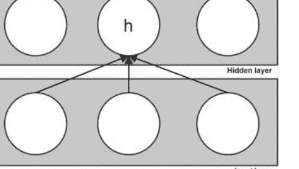

$$\frac{\partial E}{\partial w_{ho}} = \frac{\partial z_o}{\partial w_{ho}} \frac{\partial E}{\partial z_o} = y_i \frac{\partial E}{\partial z_j}$$

更新权重的规则非常直观，我们称之为通用权重更新规则：

$$w_i^{new} = w_i^{old} + (-1)\eta \frac{\partial E}{\partial w_i^{old}}$$

\eta 是学习率，因子 -1 是为了确保我们朝着最小化 E 的方向前进，否则我们将最大化它。我们也可以使用向量表示^{17}来摆脱索引的限制：

$$\mathbf{w}^{new} = \mathbf{w}^{old} - \eta \nabla E$$

简单来说，学习率控制我们应该更新多少。
有几种可能性（我们将在后面更详细地讨论学习率）：

- 1. 固定学习率
- 2. 可调整的全局学习率
- 3. 每个连接可调整的学习率

我们将在后面更详细地讨论这些问题，但在此之前，我们将展示一个简单神经网络中的误差反向传播的详细计算，并在下一节中编写网络代码。本章的其余部分可能是整本书中最重要的部分，所以一定要仔细阅读所有细节。

让我们看一个简单且浅层前馈神经网络的工作示例^{18}。该网络在图4.5中表示。使用符号表示，根据图像中指定的初始权重和输入，我们将计算出该网络的所有前向传递和反向传播的复杂性。请注意放大的神经元D。我们使用它来说明logit z_D的位置以及它如何通过应用逻辑函数 \sigma 成为D的输出（y_D）。

我们将假设（与之前一样）所有的神经元都具有逻辑激活函数。因此，我们需要进行前向传播、反向传播和第二次前向传播，以观察误差的减少。让我们简要地评论一下网络本身。
我们的网络有三层，输入层和隐藏层分别由两个神经元组成，输出误差由一个神经元组成。我们用大写字母表示层，但我们跳过了字母E，以避免与误差函数混淆，因此我们有命名为A、B、C、D和F的神经元。这不是常见的做法。

17因此，我们必须使用梯度，而不是单独的偏导数。

18这是Matt Mazur提供的示例的修改版本，可在https://mattmazur.com/2015/03/17/a-step-by-step-backpropagation-example/上找到。

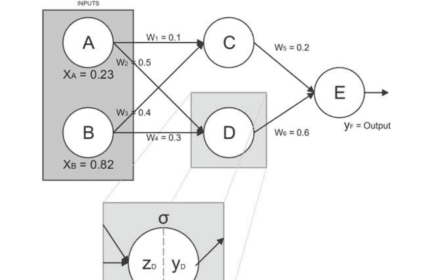

图4.5 完整简单神经网络中的反向传播

通常的做法是通过引用层和层中的神经元来命名它们，例如‘第一层的第三个神经元’或‘1, 3’。输入层接收两个输入，神经元A接收的输入为 \(x_A = 0.23\)，神经元B接收的输入为 \(x_B = 0.82\)。这个训练案例的目标（由 \(x_A\) 和 \(x_B\) 组成）将为1。正如我们之前提到的，隐藏层和输出层具有逻辑激活函数（也称为逻辑非线性函数），其定义为\(\sigma(z) = \frac{1}{1+e^{-z}}\)。

我们首先计算前向传播。第一步是计算C和D的输出，分别称为 \(y_C\) 和 \(y_D\):

```
\(y_C = \sigma(0.23 \cdot 0.1 + 0.82 \cdot 0.4) = \sigma(0.351) = 0.5868\)
```

```
\(y_D = \sigma(0.23 \cdot 0.5 + 0.82 \cdot 0.3) = \sigma(0.361) = 0.5892\)
```

现在我们使用 \(y_C\) 和 \(y_D\) 作为输入到神经元F，它将给我们最终的结果：

```
\(y_F = \sigma(0.5868 \cdot 0.2 + 0.5892 \cdot 0.6) = \sigma(0.4708) = 0.6155\)
```

现在，我们需要计算输出误差。回想一下，我们使用的是均方误差函数，即 \(E = \frac{1}{2}(t - y)^2\)。所以我们将目标值-(1) 和输出值（0.6155）代入，得到：

$$E = \frac{1}{2}(t - y)^2 = \frac{1}{2}(1 - 0.6155)^2 = 0.0739$$

现在我们已经准备好计算导数了。 我们将解释如何计算 $w_5$ 和 $w_3$ 但是所有其他权重都是用相同的过程计算的。 由于反向传播是在正向传递的相反方向进行的， 计算 $w_5$ 更容易， 我们将首先进行该计算。 我们需要知道 $w_5$ 的变化如何影响 $E$ 并且我们希望采取那些最小化 $E$ 的变化。 正如前面提到的， 导数的链式法则将为我们完成大部分工作。 让我们重新写出我们需要计算的内容：

$$\frac{\partial E}{\partial w_5} = \frac{\partial E}{\partial y_F} \cdot \frac{\partial y_F}{\partial z_F} \cdot \frac{\partial z_F}{\partial w_5}$$

我们已经在前面的章节中找到了所有这些的导数， 因此我们不会重复它们的推导。 请注意， 我们需要使用偏导数， 因为每个推导都是相对于一个索引项进行的。 另外， 请注意包含所有偏导数（对于所有索引 $i$）的向量是梯度。 让我们来解决 $\frac{\partial E}{\partial y_F}$ 现在。 正如我们之前所看到的：

$$\frac{\partial E}{\partial y_F} = -(t - y_F)$$

在我们的情况下， 这意味着：

$$\frac{\partial E}{\partial y_F} = -(1 - 0.6155) = -0.3844$$

现在我们来处理 $\frac{\partial y_F}{\partial z_F}$。 我们知道这等于 $y_F(1 - y_F)$。 在我们的情况下， 这意味着：

$$\frac{\partial y_F}{\partial z_F} = y_F(1 - y_F) = 0.6155(1 - 0.6155) = 0.2365$$

唯一剩下的计算是 $\frac{\partial z_F}{\partial w_5}$。 记住：

$$z_F = y_C \cdot w_5 + y_D \cdot w_6$$

通过使用微分规则（常数的导数（$w_6$ 被视为常数）和对微分变量的微分）我们得到：

$$\frac{\partial z_F}{\partial w_5} = y_C \cdot 1 + y_D \cdot 0 = y_C = 0.5868$$

我们将这些值带回链式法则并得到：我们重复相同的过程来得到 $\frac{\partial E}{\partial w_6} = -0.0535$. 现在，我们只需要按照一般的权重更新规则使用这些值（我们使用学习率， $\eta = 0.7$）：

$$w_5^{new} = w_5^{old} - \eta \frac{\partial E}{\partial w_5} = 0.2 - (0.7 \cdot 0.0533) = 0.2373$$

$$w_6^{new} = 0.6374$$

现在我们可以继续到下一层。但首先要注意的重要事项。我们将需要一个 $w_5$和 $w_6$的值来找到 $w_1$， $w_2$， $w_3$和 $w_4$的导数，并且我们将使用旧值而不是更新后的值。当我们拥有所有更新后的权重时，我们将更新整个网络。我们继续到隐藏层。现在我们需要找到 $w_3$的更新。请注意，要从输出神经元F到 $w_3$，我们需要经过C，因此我们将使用：

$$\frac{\partial E}{\partial w_3} = \frac{\partial E}{\partial y_C} \cdot \frac{\partial y_C}{\partial z_C} \cdot \frac{\partial z_C}{\partial w_3}$$

这个过程与 $\frac{\partial E}{\partial w_3}$类似，但有一些修改。我们从以下开始：

$$\frac{\partial E}{\partial y_C} = \frac{\partial z_F}{\partial y_C} \frac{\partial E}{\partial z_F} = w_5 \frac{\partial E}{\partial z_F} = w_5 \frac{\partial y_F}{\partial z_F} \cdot \frac{\partial E}{\partial y_F} = 0.2 \cdot 0.2365 \cdot (-0.3844) = 0.2 \cdot (-0.0909) = -0.0181$$

现在我们需要 $\frac{\partial y_C}{\partial z_C}$:

$$\frac{\partial y_C}{\partial z_C} = y_C(1 - y_C) = 0.5868 \cdot (1 - 0.5868) = 0.2424$$

我们还需要 $\frac{\partial z_C}{\partial w_3}$。回想一下 $z_C = x_1 \cdot w_1 + x_2 \cdot w_2$，因此：

$$\frac{\partial z_C}{\partial w_3} = x_1 \cdot 0 + x_2 \cdot 1 = x_2 = 0.82$$

现在我们有：

$$\frac{\partial E}{\partial w_3} = \frac{\partial E}{\partial y_C} \cdot \frac{\partial y_C}{\partial z_C} \cdot \frac{\partial z_C}{\partial w_3} = -0.0181 \cdot 0.2424 \cdot 0.82 = -0.0035$$

使用通用的权重更新规则，我们有：

$$w_3^{new} = 0.4 - (0.7 \cdot (-0.0035)) = 0.4024$$

我们使用相同的步骤（跨越C）来找到 $w_1^{new} = 0.1007$。为了得到 $w_2^{new}$和 $w_4^{new}$，我们需要跨越D。因此我们需要：

$$\frac{\partial E}{\partial w_2} = \frac{\partial E}{\partial y_D} \cdot \frac{\partial y_D}{\partial z_D} \cdot \frac{\partial z_D}{\partial w_2}$$

但我们知道这个过程，所以：

$$\frac{\partial E}{\partial y_D} = w_6 \cdot \frac{\partial E}{\partial z_F} = 0.6 \cdot (-0.0909) = -0.0545$$

$$\frac{\partial y_D}{\partial z_D} = y_D(1 - y_D) = 0.5892(1 - 0.5892) = 0.2420$$

和：

$$\frac{\partial z_D}{\partial w_2} = 0.23$$
$$\frac{\partial z_D}{\partial w_4} = 0.82$$

最后，我们有（记住我们有0.7的学习率）：

$$w_2^{new} = 0.5 - 0.7 \cdot (-0.0545 \cdot 0.2420 \cdot 0.23) = 0.502$$
$$w_4^{new} = 0.3 - 0.7 \cdot (-0.0545 \cdot 0.2420 \cdot 0.82) = 0.307$$

然后我们完成了。回顾一下，我们有：

- $w_1^{new} = 0.1007$
- $w_2^{new} = 0.502$
- $w_3^{new} = 0.4024$
- $w_4^{new} = 0.307$
- $w_5^{new} = 0.2373$
- $w_6^{new} = 0.6374$
- $E_{旧} = 0.0739$

现在我们可以使用新的权重进行另一次前向传播，以确保误差已经减少：

$y_C^{new} = \sigma (0.23 \cdot 0.1007 + 0.82 \cdot 0.4024) = \sigma (0.3531) = 0.5873$  
$y_D^{new} = 0.5907$  
$y_F^{new} = \sigma (0.5873 \cdot 0.2373 + 0.5907 \cdot 0.6374) = \sigma (0.5158) = 0.6261$  
$E^{new} = \frac{1}{2}(1 - 0.6261)^2 = 0.0699$

这表明误差已经减少。请注意，我们只处理了一个训练样本，即输入向量（0.23, 0.82）。可以使用多个训练样本生成误差和梯度（小批量训练），我们可以多次进行这样的操作，每次重复称为一次迭代。

迭代有时被错误地称为周期。这两个术语非常相似我们现在可以将它们视为同义词，但很快我们将需要明确它们的区别，我们将在下一章中做出解释。

另一种方法是在每个训练示例之后更新权重。这被称为在线学习。在在线学习中，我们每次迭代处理一个单独的输入向量（训练样本）。我们将在下一章中更详细地讨论这个问题。

在本章的剩余部分，我们将把我们所提出的所有想法整合到一个完全功能的前馈神经网络中，用Python代码编写。这个例子将是完全功能的Python 3.x代码，但我们将写出一些事情这些事情最好留给Python模块来完成。

从技术上讲，在除了最基本的设置之外，我们不应该使用SSE，而是它的变体，均方误差（MSE）。这是因为我们需要将成本函数重写为成本函数的平均值$SSE_x$对于单个训练样本$x$，因此我们定义$MSE := \frac{1}{n} \sum_x SSE_x$。

### 4.7 一个完整的前馈神经网络

让我们看一个完整的前馈神经网络，它可以进行简单的分类。情景是我们有一个销售图书和其他物品的网店，我们想知道一个顾客是否会在结账时放弃购物篮。这就是为什么我们正在制作一个神经网络来预测它。为了简单起见，所有的数据都只是数字。打开一个新的文本文件，将其重命名为data.csv并写入以下内容：

```
includes_a_book,purchase_after_21,total,user_action
1,1,13.43,1
1,0,23.45,1
0,0,45.56,0
1,1,56.43,0
1,0,44.44,0
1,1,667.65,1
1,0,56.66,0
0,1,43.44,1
0,0,4.98,1
1,0,43.33,0
```

这将是我们的数据集。实际上，你可以用任何东西替代它，只要值是数字，它仍然可以工作。目标是user_action列，我们将1表示购买成功，0表示用户放弃购物篮。注意，我们在谈论放弃购物篮，但我们可以放入任何东西，从狗的图片到一袋词语。你还应该创建另一个名为new_data.csv的CSV文件，其结构与data.csv相同，但不包含最后一列（user_action）。

```
includes_a_book,purchase_after_21,total
1,0,73.75
0,0,64.97
1,0,3.78
```

现在让我们继续看Python代码文件。本节剩余部分的所有代码都应放在一个单独的文件中，你可以将其命名为ffnn.py，并放在与data.csv和new_data.csv相同的文件夹中。代码的第一部分包含了导入语句：

```
import pandas as pd
import numpy as np
from keras.models import Sequential
from keras.layers.core import Dense
TARGET_VARIABLE ="user_action"
TRAIN_TEST_SPLIT=0.5
HIDDEN_LAYER_SIZE=30
raw_data = pd.read_csv("data.csv")
```

前四行只是导入语句，接下来的三行是超参数。TARGET_VARIABLE告诉Python我们希望预测的目标变量是什么。最后一行打开了data.csv文件。现在我们必须进行训练集和测试集的划分。我们有一个超参数，目前将0.5的数据点留在训练集中，但你可以将这个超参数改为其他值。只要小心，因为我们有一个很小的数据集，如果划分比如0.95这样的值可能会导致一些问题。训练集和测试集划分的代码如下：

```

mask =  np.random.rand(len(raw_data)) < TRAIN_TEST_SPLIT
tr_dataset =  raw_data[mask]
te_dataset =  raw_data[~mask]

```

这里的第一行定义了一个随机抽样的数据，用于获取训练-测试分割，接下来的两行从原始的Pandas数据框中选择适当的子数据框（数据框是一个类似于表格的对象，非常类似于Numpy数组，但Pandas专注于易于重塑和拆分，而Numpy专注于快速计算）。 接下来的几行将训练和测试数据框分割为标签和数据，然后将它们转换为Numpy数组，因为Keras需要使用Numpy数组。这个过程相对来说是比较简单的：

```

tr_data =  np.array(raw_data.drop(TARGET_VARIABLE, axis=1))
tr_labels =  np.array(raw_data[[TARGET_VARIABLE]])
te_data =  np.array(te_dataset.drop(TARGET_VARIABLE, axis=1))
te_labels =  np.array(te_dataset[[TARGET_VARIABLE]])

```

现在，我们转向Keras对神经网络模型的规范以及其编译和训练（拟合）的过程。我们需要编译模型，因为我们希望Keras填充恶心的细节并创建适当维度的权重和偏置矩阵的数组：

```

ffnn = Sequential()
ffnn.add(Dense(HIDDEN_LAYER_SIZE, input_shape=(3,), activation="sigmoid"))
ffnn.add(Dense(1, activation="sigmoid"))
ffnn.compile(loss="mean_squared_error", optimizer="sgd", metrics=['accuracy'])
ffnn.fit(tr_data, tr_labels, epochs=150, batch_size=2, verbose=1)

```

第一行在一个名为ffnn的变量中初始化一个新的顺序模型。第二行指定了输入层（接受3D向量作为单个数据输入）和隐藏层大小，隐藏层大小在文件开头的变量HIDDEN_LAYER_SIZE中指定。第三行将从上一层获取隐藏层大小（Keras会自动完成此操作），并创建一个具有一个神经元的输出层。所有神经元都将具有sigmoid或logistic激活函数。第四行指定了错误函数（均方误差）、优化器（随机梯度下降）以及要计算的指标。它还编译了模型，这意味着它将根据我们的规范组装Python所需的所有其他内容。

最后一行使用tr_data和tr_labels对神经网络进行训练，进行150个epochs，每个mini-batch取两个样本。verbose=1表示在每个训练epoch后打印准确率和损失。现在我们可以继续分析测试集的结果：

```
metrics = ffnn.evaluate(te_data, te_labels, verbose=1)
print("%s: %.2f%%" % (ffnn.metrics_names[1],
metrics[1]*100))
```

第一行使用te_data和te_labels评估模型，第二行以格式化字符串的形式打印出准确率。接下来，我们接收new_data.csv文件，该文件模拟了我们网站上的新数据，并尝试使用训练好的ffnn模型进行预测：

```
new_data = np.array(pd.read_csv("new_data.csv"))
results = ffnn.predict(new_data)
print(results)
```

### 参考文献

- 1. M. Hassoun，人工神经网络基础（MIT Press，剑桥，2003）
- 2. I.N. da Silva, D.H. Spatti, R.A. Flauzino, L.H.B. Liboni, S.F. dos Reis Alves，人工神经网络实用课程（Springer，纽约，2017）
- 3. I. Goodfellow, Y. Bengio, A. Courville，深度学习（MIT Press, Cambridge, 2016）
- 4. G. Montavon, G. Orr, K.R. Müller,神经网络：技巧的诀窍(Springer, New York, 2012)
- 5. M. Minsky, S. Papert,感知机：计算几何的介绍(MIT Press, Cambridge, 1969)
- 6. P.J. Werbos,超越回归：行为科学中的新预测和分析工具(Harvard University, Cambridge, 1975)
- 7. D.B. Parker, Learning-logic. Technical Report-47 (MIT Center for Computational Research in Economics and Management Science, Cambridge, 1985)
- 8. Y. LeCun, Une procédure d'apprentissage pour réseau à seuil asymétrique. Proc. Cogn. 85, 599–604 (1985)
- 9. D.E. Rumelhart, G.E. Hinton, R.J. Williams, 通过误差传播学习内部表示。并行分布处理。1, 318–362 (1986)

## 5 对前馈神经网络的修改和扩展

### 5.1 正则化的概念

让我们回顾一下方差和偏差的概念。如果我们在二维空间中有两个类别（用X和O表示），而分类器画了一条非常直的线，那么我们就有一个具有很高偏差的分类器。这条线将很好地泛化，也就是说，对于新的点（测试误差）的分类错误将非常类似于旧的点（训练误差）的分类错误。这很好，但问题是一开始误差会太大。这被称为欠拟合。另一方面，如果我们有一个分类器，它画了一条复杂的线来包括每个X和没有O，那么我们就有很高的方差（低偏差），这被称为过拟合。在这种情况下，我们将有一个相对较低的训练误差和一个更大的测试误差。

让我们来看一个抽象的例子。想象一下，我们的任务是在其他动物中找到虎鲸。然后我们的分类器应该能够通过使用所有虎鲸共有但其他动物没有的特征来定位虎鲸。请注意，当我们说‘所有’时，我们希望确保我们识别的是物种，而不是物种的一个子群：例如，尾巴上有一个蓝色标签可能是一些虎鲸具有的特征，但我们只想捕捉到所有虎鲸都具有而其他动物没有的特征。一般来说，‘物种’被称为一种类型（例如虎鲸），而个体被称为一个标记（例如虎鲸夏姆）。我们想找到一个定义我们正在分类的类型的特征。我们称这样的特征为必要特征。在虎鲸的情况下，这可能只是一个属性（或查询）：

$$orca(x) := mammal(x) \land livesInOcean(x) \land blackAndWhite(x)$$

但是，有时候找到这样的属性并不容易。尝试找到这样的属性是监督式机器学习算法所做的事情。因此，问题可以重新表述为尽可能地找到一个复杂的属性来定义一个类型（通过尝试包含尽可能多的标记并尝试只包含相关的标记）。

因此，过拟合可以用另一种方式理解：我们的分类器非常好，不仅从训练样本中捕捉到必要的属性，还捕捉到了不必要或偶然的属性。因此，我们希望捕捉到我们需要的所有属性，但是我们希望有一些东西帮助我们在包含不必要的属性时停止。

欠拟合和过拟合是两个极端。根据经验，我们可以从高偏差和低方差过渡到高方差和低偏差。我们希望停留在中间某个点，并且希望这个点具有超过平均泛化能力（继承自更高的偏差）和对数据的良好拟合（继承自高方差）。如何找到这个“甜点”是机器学习的艺术，机器学习社区的智慧认为最好是手动找到这个点。但自动化也不是不可能的，深度学习希望成为人工智能的竞争者，将尽可能地自动化。有一种方法试图自动化我们对过拟合的直觉，这个想法被称为正则化。

为什么我们要讨论过拟合而不是欠拟合？请记住，如果偏差非常高，我们最终会得到一个线性分类器，而线性分类器无法解决XOR或类似的简单问题。那么我们想要的是显著降低偏差，直到到达过拟合之后的点。在深度学习的背景下，当我们向逻辑回归添加一层后，我们告别了高偏差，向高方差的海岸驶去。听起来很好，但我们如何及时停下来？我们如何防止过拟合？正则化的思想是在误差函数 $E$ 中添加一个正则化参数，这样我们就会有

$$E^{improved} := E^{original} + 正则化项$$

在继续正式定义之前，让我们看看如何对正则化有一个直观的理解（图5.1）。

图像的左侧描述了我们通常拥有的经典各种超平面选择（偏差、方差等）。如果我们添加一个正则化项，效果将是误差函数无法精确定位数据点，而

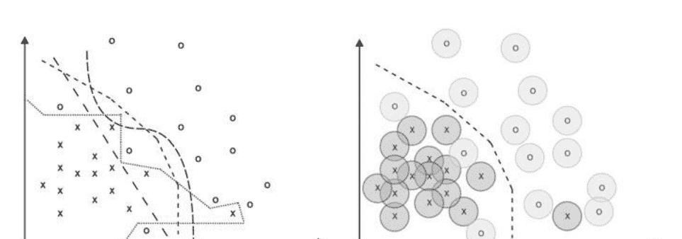

图5.1 正则化的直觉效果将类似于点实际上变成小圆圈。这样，一些超平面的选择将变得不可能，而剩下的选择将是在X和O之间具有良好“中立区域”的选择。这并不是对正则化的确切解释（我们很快会讲到），但对于对正则化的非正式推理以及它的行为有用的直观理解。

### 5.2 $L_1$ 和 $L_2$ 正则化

正如我们之前所提到的，正则化意味着向误差函数中添加一个项，所以我们有：

```
math
E^{improved} := E^{original} + 正则化项
```

正如人们可能猜测的那样，添加不同的正则化项会产生不同的正则化技术。在本书中，我们将讨论两种最常见的正则化类型，即 $L_1$ 和 $L_2$ 正则化。我们将从 $L_2$ 正则化开始，并详细探讨它，因为它在实践中更有用，而且也更容易理解与我们在前一节中发展的向量空间和直觉的联系。之后，我们将简要介绍 $L_1$，在本章的后面，我们将介绍一种非常有用的技术，即dropout，它是神经网络独有的，并且具有类似于正则化的效果。

$L_2$ 正则化有许多名称，如‘权重衰减’、‘岭回归’和‘蒂霍诺夫正则化’。$L_2$ 正则化最早由苏联数学家安德烈·蒂霍诺夫在1943年的论文[1]中提出，并在他的论文[2]中进一步完善。

$L_2$ 正则化的想法是使用 $L_2$ 或欧几里得范数作为正则化项。

向量 $\mathbf{x}$ 的 $L_2$ 范数是简单地 $\mathbf{x}_1$, $\mathbf{x}_2$, ..., $\mathbf{x}_n$ 的平方和的平方根。向量x的L2范数可以用 $L^2(x)$ 或更常见的 $||\mathbf{x}||_2$ 表示。所使用的向量是最后一层的权重，但也可以使用网络中的所有权重（但在这种情况下，我们的直觉会有所偏差）。现在我们可以将初步的 $L_2$ 正则化误差函数重新写为：

```
math
改进后的E := 原始E + ||\mathbf{w}||_2
```

但是，在机器学习社区中，我们通常不使用平方根，所以代替 $||\mathbf{w}||_2$，我们将使用 $L_2$ 范数的平方，即 $(||\mathbf{w}||_2)^2 = ||\mathbf{w}||_2^2$，实际上就是 $\sum_j w_j^2$。我们还希望添加一个超参数来调整我们想要使用的正则化程度（称为正则化参数或正则化率，用 $\lambda$ 表示），并将其除以批次大小（考虑到我们希望它成比例），所以最终$L_2$-正则化误差函数为：

```
$$E_{\text{改进}} := E_{\text{原始}} + \frac{\lambda}{n} ||\mathbf{w}||^2_2 = E_{\text{原始}} + \frac{\lambda}{n} \sum_{w_i \in w_o} w_i^2$$
```

让我们稍微解释一下$^1$$L_2$正则化的作用。直觉是，在学习过程中，更小的权重将被优先考虑，但如果整体误差减小显著，较大的权重也会被考虑。这解释了为什么它被称为“权重衰减”。选择$\lambda$决定了多大程度上会优先考虑较小的权重（当$\lambda$较大时，对较小的权重的偏好将更大）。

让我们通过一个简单的推导来工作。我们从我们的正则化误差函数开始：

```
$$E^{new} = E^{old} + \frac{\lambda}{n} \sum_{w} w^2$$
```

通过对这个方程进行偏导数运算，我们得到：

```
$$\frac{\partial E^{new}}{\partial w} = \frac{\partial E^{old}}{\partial w} + \frac{\lambda}{n} w$$
```

将这个结果带回到一般的权重更新规则中，我们得到：

```
$$w^{new} = w^{old} - \eta \cdot (\frac{\partial E^{old}}{\partial w} + \frac{\lambda}{n} w)$$
```

有人可能会想，这是否会使权重收敛到0，但事实并非如此，因为第一个分量$\frac{\partial E^{old}}{\partial w}$如果误差减少很大（这部分控制未正则化的误差），将增加权重。

现在我们可以简要地概述$L_1$正则化。$L_1$正则化，也被称为‘套索’或‘基础追踪去噪’，是由Robert Tibshirani在1996年首次提出的[4]。$L_1$正则化使用绝对值而不是平方：

```
$$E_{\text{改进}} := E_{\text{原始}} + \frac{\lambda}{n} ||\mathbf{w}||_1 = E^{\text{original}} + \frac{\lambda}{n} \sum_{w_i \in w_o} |w_i|$$
```

让我们比较这两种正则化方法以揭示它们的特点。对于大多数分类和预测问题，$L_2$更好。然而，有一些特定的任务$L_1$更出色[5]。$L_1$优于$L2$的问题是那些包含大量无关数据的问题。这可能是非常嘈杂的数据，或者是不具有信息量的特征，但也可能是稀疏数据（其中大多数特征都是无关的，因为这意味着在信号处理（例如[6]）和机器人技术（例如[7]）中有许多有用的$L_1$正则化应用。

让我们试着对这两种正则化方法形成直观的理解。$L_2$正则化试图降低权重的平方（随着权重增加，它不会线性增加），而$L_1$正则化关注的是绝对值（它是线性的），因此$L_2$会迅速惩罚大的权重（它倾向于集中在它们上）。$L_1$正则化会使更多的权重稍微变小，这通常导致许多权重接近于0。为了完全简化问题，将函数$f(x)=x^2$和$g(x)=|x|$的图形绘制出来。想象一下这些图形就像碗一样的物理表面。现在想象一下在图形中放置一些点（对应于权重），并添加‘重力’，使它们像物体一样行为（小弹珠）。‘重力’对应于梯度下降，因为它是向最小值移动的（就像重力会推动物理系统向最小值移动一样）。想象一下还有摩擦力，这对应于$E$不再关心已经非常接近最小值的权重的想法。对于$f(x)$，我们将在点$(0,0)$周围有一些点，但稍微分散，在$g(x)$中，它们将非常紧密地聚集在点$(0,0)$周围。我们还应该注意到，两个向量的$L_1$范数可以相同，但$L_2$范数不同。取$v_1=(0.5,0.5)$和$v_2=(-1,0)$为例。然后$\|v_1\|_1=|0.5|+|0.5|=1$，$\|v_2\|_1=|-1|+|0|=1$，但$\|v_1\|_2=$

```
$0.5^2 + 0.5^2 = \frac{1}{\sqrt{2}} 和 \|v_2\|_2 = \sqrt{1^2 + 0^2} = 1.$
```

### 5.3 学习率、动量和丢弃

在本节中，我们将重新审视学习率的概念。学习率是一个超参数的例子。这个名字非常不寻常，但实际上背后有一个简单的原因。每个神经网络实际上都是一个函数，它将给定的输入向量（输入）分配一个类别标签（输出）。神经网络通过执行的操作和给定的参数来实现这一点。操作包括逻辑函数、矩阵乘法等，而参数则是所有不是输入的数字，即权重和偏置。我们知道偏置只是权重，神经网络通过反向传播注册的错误来找到一组好的权重。由于操作始终相同，这意味着神经网络所做的所有学习实际上都是在寻找一组好的权重，换句话说，它只是调整其参数。没有什么更多的东西，没有魔法，只是权重调整。现在清楚了，很容易说出什么是超参数。超参数是神经网络中使用的任何不能被网络学习的数字。一个例子是学习率或隐藏层中的神经元数量。

这意味着学习不能调整超参数，它们必须手动调整。在这里，机器学习在很大程度上倾向于艺术，因为没有科学的方法来做到这一点，更多的是直觉和经验的问题。但尽管找到一组好的超参数并不容易，但有一个标准的方法。为了做到这一点，我们必须重新审视将数据集分为训练集和测试集的想法。假设我们保留了10%的数据点用于测试，剩下的我们想用作训练集。现在我们将从训练集中再取出10%的数据点，并称之为验证集。这样我们就有了80%的数据点用于训练集训练，10%用于验证集，10%用于测试集。这个想法是在训练集上使用给定的超参数进行训练，并在验证集上进行测试。如果我们不满意，我们重新训练网络并再次测试验证集。我们一直这样做，直到得到一个好的分类。然后，只有在测试集上测试，看看它的表现如何。请记住，训练误差低而测试误差高是过拟合的迹象。当我们只是进行训练和测试（没有超参数调整）时，这是一个好的准则。但是，如果我们调整超参数，可能会过拟合训练集和验证集，因为我们在改变超参数直到在验证集上获得较小的误差。如果错误变得误导性地很小，因为分类器学习了训练集的噪声，并且我们手动更改超参数以适应验证集的噪声。如果在测试集上比例上很小的错误，我们就有了一个赢家，否则就回到起点。当然，可以改变训练集、验证集和测试集的大小，但这些是标准的起始值（分别为80%、10%和10%）。

| 数据集       | 比例 | 用途                     |
|--------------|------|--------------------------|
| 训练集       | 80%  | 用于训练模型参数         |
| 验证集       | 10%  | 用于调整超参数和模型选择 |
| 测试集       | 10%  | 用于最终评估模型性能     |

我们回到学习率。包含学习率的想法首次明确提出在[8]中。正如我们在上一章中所看到的，学习率控制着我们想要的更新量，因为学习率是通用权重更新规则的一部分，即它在反向传播的最后起作用。

在转向学习率的类型之前，让我们探讨一下为什么学习率在抽象环境中很重要。²我们将通过将我们在前一节中提出的抛物线的思想进行泛化来构建一个抽象的学习模型。我们需要将其扩展到三维，这样我们就可以有多种移动方式。我们将使用的3D表面的整体形状类似于一个碗（图5.2）。它的侧视图由轴 x 和 y 给出（我们看不到 z）。从顶部看（轴 x 和 z 可见，轴 y 不可见），它看起来像一个圆或椭圆。当我们在 $(x_k, z_k)$ 处‘放下’一个点时，它将从坐标为 $(x_k, z_k)$ 的曲线处获得值 $y_k$。换句话说，就好像我们把点放下，它向碗的方向掉落，并在遇到碗的表面时停止（想象一下我们的点是一种粘性物体，像口香糖）。我们在一个精确的 $(x_k, z_k)$ 处放下它（这是‘顶视图’），我们不知道粘性物体的最终‘高度’，但当它掉到碗的一侧时我们将测量它。

梯度就像重力一样，它试图最小化 y。如果我们想要继续我们的类比，我们必须对物理世界进行一些改变：(i) 我们不会一直有粘性物体（我们需要它们来解释如果我们只有$(x, z)$我们如何得到一个点的 y），而是小弹珠，当它们完成移动时它们会变成粘性物体（或者你可以认为它们'冻结'），(b) 没有摩擦或惯性，也许最反直觉的是，(c) 我们的重力类似于物理重力但不同。

让我们更详细地解释(c)。假设我们从上面看，所以我们只看到轴 x 和 z，然后我们放下一个弹珠。我们希望我们的重力行为像物理重力一样，以便自动生成弹珠必须移动的方向（从上面看，x 和 z 视图），使其沿着碗的曲率移动，希望这是碗底部的方向（全局最小值为 y）。

我们希望它与物理引力不同，这样在这个方向上的移动量不是由于y的确切位置决定的，即它不会停留在底部，而是可能移动到碗的另一侧（并且仍然停留在那里，就像它又变成了一个粘性物体）。我们暂时不指定移动量的大小，但假设它很少是达到实际最小值所需的确切量：有时它会多一点并超过目标，有时会少一点并未能达到。这里必须强调一个非常重要的观点：曲率‘指向’最小值，但我们正在跟随当前所在点的曲率，而不是最小值。从某种意义上说，这个弹珠非常‘目光短浅’（弹珠通常如此）：它只看到当前的曲率并沿着它移动。当曲率为0时，我们将知道我们已经找到了最小值。请注意，在我们的例子中，我们有一个‘理想化的碗’，它只有一个曲率为0的点，那就是y的全局最小值。想象一下还可能存在多少更复杂的表面，我们无法说曲率为0的点是全局最小值，但也请注意，如果我们能够进行一种转换，将任何这些复杂的表面转化为我们的碗，我们将拥有一个完美的学习算法。

此外，我们希望增加一些不确定性，所以想象一下我们的重力方向是碗的曲率的“大致方向”——有时候稍微向左，有时候稍微向右，但只有在极少数情况下才会完全遵循曲率。

现在我们有了完美的环境来解释抽象意义上的学习。每个学习的时期都是碗曲率的“大致方向”上的一次移动（某个量），完成后就停在那里。第二个时期“解冻”了情况，再次遵循曲率的大致方向。这第二次移动可能是第一次的延续，也可能是一个几乎相反的方向的移动，如果大理石超过了最小值（底部）。这个过程可以无限地继续下去，但经过一定数量的时期后，移动将变得非常小和微不足道，所以我们可以在预定的时期数量之后停止，或者当改进不显著时停止。³

现在让我们回到学习率。学习率控制我们要采取的移动量的大小。学习率为1意味着进行整个移动，学习率为0.1意味着只进行10%的移动。正如之前提到的，我们可以有一个全局学习率或参数化学习率，根据我们指定的某些条件（如迄今为止的迭代次数或其他参数）进行变化。

让我们稍微回到我们的碗。到目前为止，我们有一个圆碗，但想象一下我们有一个形状像椭圆的浅碗（图5.3）。如果我们把弹珠放在狭窄的中间附近，我们几乎会得到与之前几乎相同的情况。但是，如果我们把它放在左上角的弹珠上，它将沿着非常浅的曲率移动，需要非常多的迭代次数才能找到通向碗底的路径。学习率在这里可以起到帮助作用。如果我们只采取移动的一部分，下一次移动的曲率方向将比从一个浅而细长的碗的一边移动到另一边要好得多。它会采取较小的步骤，但会更快地找到一个好的方向。

这使我们讨论学习率$\eta$的典型值。最常用的值是0.1、0.01、0.001等等。像0.03这样的值会被忽略，并且与最接近的对数值非常相似，即0.03的情况下是0.01。⁴学习率是一个超参数，像所有超参数一样，它必须在验证集上进行调整。因此，我们建议尝试一些标准值来调整给定的超参数，然后观察其行为并相应地进行修改。

现在我们将注意力转向一个类似于学习率但不同的想法，称为动量，也称为惯性。简单来说，学习率控制保持当前步骤中移动的程度，而动量控制保持上一步骤中移动的程度。动量试图解决的问题是局部最小值的问题。让我们回到我们的想法，但现在让我们修改碗，使其具有局部最小值。你可以在图5.4中看到侧视图。注意学习率关注的是‘顶部’视图，而动量则解决了‘侧面’视图的问题。

大理石像往常一样下落（在图像中以灰色表示），沿着曲率继续前进，当曲率为0时停止（在图像中以黑色表示）。但问题是曲率为0不一定是全局最小值，它只是局部最小值。如果它是一个物理系统，大理石将具有动量，它将越过局部最小值到达全局最小值，然后来回摆动一段时间，最后稳定下来。神经网络中的动量只是这个想法的形式化。动量和学习率一样，被添加到一般的权重更新规则中：

```
$$w_i^{new} = w_i^{old} - \eta \frac{\partial E}{\partial w_i^{old}} + \mu(|w_i^{old} - w_i^{older}|)$$
```

其中 $w_i^{new}$ 是要计算的当前权重，$w_i^{old}$是先前的权重值和 $w_i^{older}$ 是之前的权重值。μ是动量率，范围从0到1。它直接控制着我们在这次迭代中保留多少先前的权重变化。μ的典型值为0.9，通常应调整为0.10至0.99之间的值。动量与反向传播的最后一次发现一样古老，它首次发表在Rumelhart、Hinton和Williams的同一篇论文中[9]。

有一种最终有趣的技术可以改善神经网络的学习方式并减少过拟合，它被称为dropout。我们选择将正则化定义为将正则化项添加到成本函数中，并根据这个定义，dropout不是正则化，但它确实降低了训练误差和测试误差之间的差距，从而减少了过拟合。可以将正则化定义为任何减少这种差距的技术，然后dropout就是一种正则化技术。可以将dropout称为‘结构正则化’，并且$L_1$ 和 $L_2$ 正则化被称为‘数值正则化’，但这不是标准术语，我们不会使用它。

Dropout 最初在[10]中解释，但可以在[11]和特别是[12]中找到更多细节。Dropout 是一种令人惊讶地简单的技术。我们添加了一个从0到1的 dropout 参数 $\pi$（解释为概率），在每个时期中，每个权重以 $\pi$ 的概率被设置为零（图5.5）。回到一般的权重更新规则（我们需要一个用于计算权重更新的 $w_k^{old}$），如果在时期 $n$ 中权重 $w_k$ 被设置为零，则时期 $n+1$ 的 $w_k^{old}$ 将是时期 $n-1$ 的 $w_k$。Dropout 强制网络学习冗余，因此更好地隔离数据集的必要属性。一个典型的 $\pi$ 值为0.2，但像所有其他超参数一样，它必须在验证集上进行调整。

### 5.4 随机梯度下降和在线学习

到目前为止，在本书中，我们对一个重要问题有些笨拙<sup>5</sup>：反向传播是如何从‘鸟瞰’的角度工作的。我们一直回避这个问题，以避免混淆，直到我们有足够的概念理解来解决它，现在我们已经知道足够清楚地陈述它了。神经网络中的反向传播工作方式如下：我们一次处理一个训练样本，并通过网络记录每个样本的平方误差。然后我们使用它来计算均方误差。一旦我们有了均方误差，我们使用梯度下降进行反向传播，以找到更好的权重集。一旦我们完成了，我们就完成了一轮训练。

⁵我们在几个方面都有些笨拙，这一节旨在对它们进行重新定义，使它们更加精确。

一个训练周期。我们可以根据需要进行多个周期的训练。通常，我们要么继续进行固定数量的周期，要么在不再减少误差的情况下停止。

当我们解释反向传播时所使用的是一个大小为1的训练集（一个样本）。如果这是整个训练集（一个奇怪地小的训练集），这将是（完全）梯度下降的一个例子（也称为全批量学习）。然而，我们可以将其视为训练集的一个子集。当使用大小为$n$的随机选择子集时，我们称之为随机梯度下降或小批量学习（批量大小为$n$）。使用大小为1的小批量学习被称为在线学习。在线学习可以是‘固定的’，即固定的训练集，然后随机选择一个⁶，或者只是随着新的训练样本的到来。⁷因此，我们可以将上一章中的反向传播示例视为在线学习的一个实例。

现在我们也可以介绍一个我们一直忽视的术语细微差别。一个时代是对整个训练集进行一次完整的前向和后向传递。如果我们将大小为10000的训练集分为10个小批量，⁸那么对一个批次进行一次前向和一次后向传递被称为一个迭代，而十个迭代（小批量的大小）是一个时代。只有当样本按照我们在脚注中所述的方式划分时，才会成立。如果我们对小批量使用随机选择的训练样本，那么十个迭代将不会形成一个时代。另一方面，如果我们对训练集进行洗牌然后划分，那么十个迭代将形成一个时代，宇宙中的秩序之力将再次获胜。

随机梯度下降通常更快收敛，因为通过随机抽样我们可以得到整体梯度的良好估计，但如果最小值不明显（碗太浅），它往往会加剧我们在前一节中看到的问题（图5.3的中间部分）。直观的原因是，当曲率较浅且随机采样表面时，我们很容易丢失最初的曲率信息。在这种情况下，完全梯度下降结合动量可能是一个不错的选择。

我们也可以使用非随机选择。这里最有趣的一个想法是先学习最简单的实例，然后再逐渐转向更棘手的实例，这种方法被称为课程学习。关于这个问题的更多信息，请参见[13]。

这类于强化学习，它是监督学习和无监督学习的三个主要领域之一，但我们决定不在本书中包含它，因为它不符合深度学习的初学者导论的理念。如果读者想要了解更多，请参考[14]。

⁸假设为了澄清，它被非随机地分成几个批次：第一批包含训练样本1到1000，第二批包含1001到2000，依此类推。

### 5.5 多隐藏层的问题：梯度消失和梯度爆炸

让我们回顾一下上一章中完全功能的前馈神经网络的计算。记得它是一个配置为(2, 2, 1)的神经网络，意味着它有两个输入神经元，两个隐藏神经元和一个输出神经元。让我们重新审视我们计算的权重更新：

- $w_1^{old} = 0.1, w_1^{new} = 0.1007$
- $w_2^{old} = 0.5, w_2^{new} = 0.502$
- $w_3^{old} = 0.4, w_3^{new} = 0.4024$
- $w_4^{old} = 0.3, w_4^{new} = 0.307$
- $w_5^{old} = 0.2, w_5^{new} = 0.2373$
- $w_6^{old} = 0.6, w_6^{new} = 0.6374$

仅仅通过观察权重更新的数量，你可能会注意到有两个权重的更新量比其他权重大得多。这两个权重（$w_5$和 $w_6$）是连接输出层和隐藏层的权重。其余的权重连接输入层和隐藏层。但是为什么它们更大呢？原因是我们需要通过几层进行反向传播，它们保持较大：从结构上讲，反向传播只是链式法则。链式法则只是导数的乘积。而且，我们所需的一切导数值都在0和1之间。因此，通过添加需要进行反向传播的层，我们需要乘以越来越多的0到1之间的数，这通常很快变得非常小。而且这还没有考虑正则化，正则化会更糟，因为它会更倾向于始终使用小的权重（由于导数的原因，权重更新会很小，因此非正则化部分增加权重的机会很小）。这种现象被称为梯度消失。

我们可以尝试通过将权重初始化为一个非常大的值来绕过这个问题，并希望反向传播将它们调整到正确的值。在这种情况下，我们可能会得到一个非常大的梯度，这也会阻碍学习，因为沿着梯度方向的一步是正确的方向，但步长的大小会使我们离解决方案更远。故事的寓意通常是梯度消失的问题，但是一个隐藏层中有两个神经元。如果它是(3, 2, 4, 1)，我们就知道它有两个隐藏层，第一个隐藏层有两个神经元，第二个隐藏层有四个。好的，我们已经调整了值使这个陈述成立。我们需要的一些导数很快就会变成0到1之间的值，但是sigmoid导数在数学上被限制在0到1之间，如果我们有很多层（例如8层），sigmoid导数会在反向传播中占主导地位。

> 11如果常规方法就像制作一个粘土雕像（去除粘土，但有时也会添加），那么将权重初始化为大值的直觉就像是拿起一块石头或木头开始削减。如果我们彻底改变我们的方法，我们将被吹向相反的方向，这甚至更糟。梯度下降作为一种方法，如果我们需要反向传播多个层，就会变得非常不稳定。

要理解梯度消失问题的重要性，我们必须注意梯度消失是深度学习所解决的问题。真正定义深度学习的是使得堆叠多个层并避免梯度消失问题的技术。一些深度学习技术直接解决这个问题（LSTM），而一些尝试绕过它（卷积神经网络），一些使用不同于简单神经网络的连接（Hopfield网络），一些通过黑客手段解决（残差连接），而一些利用奇怪的神经网络现象来占据上风（自编码器）。本书的其余部分将专门介绍这些技术和架构。

从历史的角度来看，Sepp Hochreiter在他的毕业论文[15]中首次发现了梯度消失的问题。他的论文导师是Jürgen Schmidhuber，在1997年他们开发了一种最具影响力的循环神经网络结构（LSTM）[16]，我们将在接下来的章节中详细探讨。同一作者的一篇有趣的论文更详细地讨论了梯度消失的问题[17]。

在继续本书的第二部分之前，我们做出最后的备注。我们选择了我们认为最受欢迎和有影响力的神经网络结构，但还有许多其他的结构将会被发现。本书的目的不是提供关于一切内容的全面视角，而是帮助读者获得追求研究级深度学习论文和专著所需的知识和直觉。这不是一本关于深度学习的最终著作，而是一本必然不完整的初级介绍。我们非常努力地包含了一系列神经网络结构，以向读者展示这个令人惊叹的认知科学和人工智能领域的丰富多样性。

### 参考文献

- 1. A.N. Tikhonov，关于逆问题的稳定性。Dokl. Akad. Nauk SSSR **39**(5), 195–198 (1943)
- 2. A.N. Tikhonov，解决错误形式化问题和正则化方法。Sov. Math. **4**, 1035–1038 (1963)
- 3. M.A. Nielsen，神经网络和深度学习(*Determination Press*， 2015)
- 4. R. Tibshirani，回归收缩和通过套索选择。J. Roy. Stat. Soc. Ser B (Methodol.) **58**(1), 267–288 (1996)
- 5. A. Ng，特征选择，L1与L2正则化，以及旋转不变性，在*Proceedings of the International Conference on Machine Learning* (2004)
- 6. D.L. Donoho，压缩感知。IEEE Trans. Inf. Theory **52**(4), 1289–1306 (2006)
- 7. E.J. Candès, J. Romberg, T. Tao, 强大的不确定性原理：从高度不完整的频率信息中精确信号重建。IEEE Trans. Inf. Theory **52**(2), 489–509 (2006)
- 8. J. Wen, J.L. Zhao, S.W. Luo, Z. Han, BP神经网络学习算法的改进, 在第5届国际信号处理会议论文集(IEEE Press, 2000), pp. 1647–1649
- 9. D.E. Rumelhart, G.E. Hinton, R.J. Williams, 通过误差传播学习内部表示。并行分布处理。 1, 318–362 (1986)
- 10. G.E. Hinton, N. Srivastava, A. Krizhevsky, I. Sutskever, R. Salakhutdinov, 通过防止特征检测器的共适应性来改进神经网络 (2012)
- 11. G.E. Dahl, T.N. Sainath, G.E. Hinton, 通过使用修正线性单元和dropout来改进LVCSR的深度神经网络, 在IEEE国际声学语音和信号处理会议论文集(IEEE Press, 2013), pp. 8609–8613
- 12. N. Srivastava, G.E. Hinton, A. Krizhevsky, I. Sutskever, R. Salakhutdinov, Dropout: a simple way to prevent neural networks from overfitting. J. Mach. Learn. Res. 15, 1929–1958 (2014)
- 13. Y. Bengio, J. Louradour, R. Collobert, J. Weston, Curriculum learning, in Proceedings of the 26th Annual International Conference on Machine Learning, ICML 2009, New York, NY, USA, (ACM, 2009), pp. 41–48
- 14. R.S. Sutton, A.G. Barto,强化学习导论(MIT Press, Cambridge, 1998)
- 15. S. Hochreiter, Untersuchungen zu dynamischen neuronalen Netzen, Diploma thesis, Technische Universit t Munich, 1991
- 16. S. Hochreiter, J. Schmidhuber, 长短期记忆. 神经计算 9(8), 1735–1780 (1997)
- 17. S. Hochreiter, Y. Bengio, P. Frasconi, J. Schmidhuber, 循环网络中的梯度流: 学习长期依赖性的困难, in动态循环神经网络指南, 编者 S.C. Kremer, J.F. Kolen (IEEE Press, 2001)

## 6 卷积神经网络

### 6.1 第三次访问逻辑回归

在本章中，我们探索了卷积神经网络，这是由Yann LeCun和其他人在1998年首次发明的[1]。LeCun和他的团队实现的想法是基于David H. Hubel和Torsten Weisel在他们1968年的重要论文[2]中的思想，该论文使他们赢得了1981年的诺贝尔生理学或医学奖。他们研究了动物的视觉皮层，并发现了大脑的一个小而明确的区域的活动与视觉场的小区域的活动之间的联系。在某些情况下，甚至可以准确定位负责视觉场的一部分的确切神经元。这使他们发现了感受野的概念，该概念用于描述视觉场的部分和处理信息的个体神经元之间的联系。

感知野的概念完成了我们构建卷积神经网络所需的第三个和最后一个组成部分。但是我们还有另外两个部分是什么？第一个是一个技术细节：将图像（2D数组）展平为向量。尽管大多数现代实现都可以处理数组，但在底层它们通常被展平为向量。我们在解释中采用这种方法，因为它更少地涉及主观判断，并使读者能够掌握一些技术细节。您可以在图6.1顶部看到展平3x3图像的示例。第二个组成部分是将图像向量传递给一个单独的工作神经元来处理。你能猜出我们可以使用什么吗？

如果你说‘逻辑回归’，你是对的！但是我们将使用不同的激活函数，但结构将是相同的。卷积神经网络是具有一个或多个卷积层的神经网络。这不是一个严格的定义，而是一个快速简单的定义。将会有使用卷积层不会被称为'卷积神经网络'。¹所以现在我们必须描述卷积层是什么。

卷积层接收一张图像²和一个小的逻辑回归，例如输入大小为4（这些大小通常为4或9，有时为16），并将逻辑回归应用于整个图像。这意味着第一个输入由平坦向量的1-9个分量组成，第二个输入由分量2-10组成，第三个输入由分量3-11组成，依此类推。您可以在图6.1底部看到该过程的概述。该过程创建一个比整体输入向量小的输出向量，因为我们从第一个分量开始，但取四个分量，并产生一个单一的输出。最终结果是，如果我们沿着一个10维向量使用逻辑回归移动（这个逻辑回归在卷积神经网络中被称为局部感受野），我们将产生一个7维输出向量（参见图6.1底部）。这种类型的卷积层称为一维卷积层或时间卷积层。它不一定要使用时间序列（它可以使用任何数据，因为您可以将任何数据展平），但这个名称在这里是为了将其与经典的二维卷积层区分开来。

我们也可以采用不同的方法，即我们希望输出维度与输入维度相同，但是我们的4维局部感受野必须从输入的'cells'-1, 0, 1, 2开始，然后继续到0, 1, 2, 3等等，最后结束于9, 10, 11（你可以自己画出来看为什么我们不需要到12）。为了使输出向量与输入向量具有相同的大小，在 -1,0和11个分量中插入零被称为填充。通常，额外的分量取值为0，但有时候取第一个和最后一个分量的值或者所有值的平均值也是有意义的。填充时的重要问题是要考虑如何不让卷积层学习到填充的规律。当我们从扁平化的向量转换为非扁平化的图像时，填充（以及我们讨论的其他概念）会变得更加直观。但在我们继续之前，最后一点评论。我们每次将局部感受野移动一个分量，但我们也可以移动两个或更多分量。我们甚至可以尝试动态改变移动的幅度，快速移动到末端并向中心较慢移动。在卷积层中，决定感受野之间移动多少个分量的参数被称为步长。

> 1 Yann LeCun在一次采访中曾说他更喜欢称之为'卷积网络'而不是'卷积神经网络'。
> 2 在这个意义上，图像是任何2D数组，其值介于0和255之间。在图6.1中，我们对位置进行了编号，你可以将它们看作'单元格编号'，因为它们将包含某些值，但图像上的数字仅表示它们的顺序。此外，请注意，如果我们有例如100x100的RGB图像，每个图像将是一个具有维度（100, 100, 3）的3D数组（张量）。数组的最后一个维度将保存三个通道，红色、绿色和蓝色。

让我们回顾一下二维情况，就好像我们没有将图像压平成向量。这是卷积层的经典设置，这样的层被称为 2D卷积层或平面卷积层。如果我们使用三维，我们会称之为空间，而对于四维或更高维的情况，我们会称之为超空间。在文献中，通常将二维卷积层称为“空间”，但这会让人产生不一样的感觉。逻辑回归（局部感知域）的输入现在也应该是二维的，这就是为什么我们经常使用4、9和16的原因，因为它们分别是2乘2、3乘3和4乘4的平方。现在步长表示这个方块在图像上的移动，从左边开始，向右边移动，完成后，向下移动一行，然后从左边开始扫描，向右边移动（你可以在图6.2的顶部部分看到这个过程的步骤）。显而易见的一点是，现在我们将得到更少的输出。如果我们使用一个3乘3的局部感受野用于扫描一个10x10的图像，作为局部感受野的输出，我们将得到一个8x8的数组（见图6.2底部）。这完成了一个卷积层。

卷积神经网络有多个层。想象一个由三个卷积层和一个全连接层组成的卷积神经网络。假设它将处理一个大小为10的图像，并且所有三个层都具有3x3的局部感受野。它的任务是判断一张图片中是否有汽车。让我们看看这个网络是如何工作的。第一层接收一个10x10的图像，产生一个大小为8x8的输出（它具有随机初始化的权重和偏置），然后将其传递给第二个卷积层（它具有自己的局部感受野，具有随机初始化的权重和偏置，但我们决定也将其设置为3x3），它产生一个大小为6x6的输出，然后将其传递给第三层（它具有第三个局部感受野）。这第三个卷积层产生一个4x4的图像。然后我们将其展平为一个16维向量，并将其馈送到一个标准的全连接层，该层具有一个输出神经元，并使用逻辑函数作为其非线性函数。实际上，这是另一个伪装成逻辑回归的全连接层，但它可以具有多个输出神经元，那么它就不是一个合适的逻辑回归，所以我们称之为一个大小为1的全连接层。输入层的大小没有指定，假设它等于前一层的输出。然后，由于它使用逻辑函数，它产生一个介于0和1之间的输出，并将其与图像标签进行比较。计算误差并进行反向传播，对数据集中的每个图像重复此过程，从而完成网络的训练。

训练卷积层意味着训练层的局部感受野（以及全连接层的权重和偏置）。它只有一个偏置，并且权重的数量很小（等于局部感受野中的单元数）。在这方面，它就像一个小型的逻辑回归，这就是卷积网络训练快速的原因——它们只有很少的参数需要学习。逻辑回归和局部感受野之间的主要结构差异在于，在局部感受野中我们可以使用任何激活函数，而在逻辑回归中我们应该使用逻辑函数（如果我们想称之为‘逻辑回归’）。最常用的激活函数是修正线性单元（ReLU）。ReLU(x) 的值等于0和x中的较大值，这意味着如果输入为负数，则返回0，否则返回原始输入。用符号表示：

```
ρ(x) = max(x, 0) (6.1)
```

2D填充只是在图像周围添加一个n个像素的“边框”。请注意，如果我们只使用3x3的局部感受野，那么使用3（像素）的填充将没有太多意义，因为它只会超出图像边界一个像素。

### 6.2 特征图和池化

现在我们知道卷积神经网络的工作原理，我们可以使用一个技巧。回想一下，卷积层使用一个例如3x3的局部感受野（9个权重，1个偏置）扫描一个10x10的图像，并构建一个新的8x8的“图像”作为输出。还想像一下，图像有三个颜色通道。你会如何处理一个有三个通道的图像？一个自然的答案是在相同的感受野上运行（具有可训练但随机初始化的权重和偏置）。这是一个很好的策略。但是，如果我们反过来，不是在三个通道上使用一个局部感受野，而是在一个通道上使用五个局部感受野，会怎么样？记住，局部感受野由其大小、权重和偏置定义。这里的想法是保持相同的大小，但使用不同的权重和偏置初始化其他感受野。

这意味着当它们扫描一个10x10的3通道图像时，它们将构建15个8x8的输出图像。这些图像被称为特征图。就像拥有一个8x8的图像，有15个通道一样。这非常有用，因为只有一个特征图学习到了一个好的表示（例如狗的图片上的眼睛和鼻子），将显著提高网络的整体准确性³（假设整个网络的任务是对狗和其他非狗物体的图像进行分类（即在图像中检测狗））。

这里的一个主要思想是，一个10x10的3通道图像变成了一个8x8 15通道的图像。输入图像被转换为一个更小但更深的对象，并且这将在每个卷积层中发生。⁴使图像变小意味着将信息打包成更紧凑（但更深）的表示形式。在我们追求紧凑性的过程中，我们可以在卷积层之后或之前添加一个新的层。这个新的层被称为最大池化层。最大池化层以一个超参数池大小（通常为2x2）进行处理。然后以以下方式处理其输入图像：将图像分成2x2的区域（类似于网格），并从每个四像素池中取出具有最大值的像素。将这些像素组合成一个新的图像，与原始图像的顺序相同。一个2x2的最大池化层产生一个图像，其大小是原始图像的一半（不增加通道数）。

当然，除了最大值之外，还可以选择或创建不同的像素，例如四个像素的平均值、最小值等等。最大池化的思想是，图片中的重要信息很少包含在相邻的像素中（这解释了“从四个中选择一个”的部分），而往往包含在较暗的像素中（这解释了为什么使用最大值）。你可能立即注意到这是一个非常强的假设，可能不一定普遍成立。

必须指出的是，最大池化很少用于图像本身（尽管可以使用），而是用于学习到的特征图，它们是图像，但它们非常奇特的图像。你可以尝试修改下面的代码来打印出卷积层产生的特征图。你可以将最大池化视为降低屏幕分辨率。一般来说，如果你在一张1200x1600的图像上识别出一只狗，那么你很可能也能在一张600x800的更粗糙的图像上识别出它。

通常，卷积神经网络由一个卷积层、一个最大池化层、一个卷积层等组成。当图像通过网络时，在经过多个层之后，我们得到一个具有许多通道的小图像。然后，我们可以将其展平为一个向量，并在最后使用简单的逻辑回归来提取与我们的分类问题相关的部分。

逻辑回归（这次使用逻辑函数）将挑选出表示中将用于分类的部分，并创建一个与目标进行比较的结果，然后进行误差反向传播。这构成了一个完整的卷积神经网络。图6.3显示了一个简单但完全功能的四层卷积网络。

为什么卷积神经网络更容易训练？答案在使用的参数数量中一个用于MNIST的五层深度全连接神经网络有很多权重，通过这些权重我们需要进行反向传播。一个只包含卷积层的五层卷积网络，所有感受野都是3x3，有45个权重和5个偏置。注意，这个配置可以用于任意大小的图像：我们不需要扩展输入层（在我们的情况下是一个卷积层），但是我们需要更多的卷积层来缩小图像。即使我们添加特征图，每个特征图的训练是独立的，即我们可以并行训练它们。这不仅使过程计算速度快，而且我们还可以将其分布在多个处理器上。相比之下，反向传播错误⁵⁶。

> 3在这里，你可能会注意到权重初始化是多么重要。我们确实有一些比随机初始化更好的技术，但找到一个好的权重初始化策略是一个重要的开放性研究问题。
> 4如果使用填充，我们将保持相同的大小，但仍然扩展深度。当图像的边缘可能包含重要信息时，填充是有用的。
> 5在这本书中，你可以找到获取特征图（张量）并将其压缩为2D的所有必要信息，但你可能需要在互联网上搜索如何将张量可视化为图像。 将其视为一个很好（但高级）的Python练习。
> 6如果每层有100个神经元，只有一个输出神经元，那么总共有784·100 + 100·100 + 100·100 + 100·1 =98500个参数，而这还不包括偏置！

通过常规的前馈全连接网络进行计算是高度顺序的，因为我们需要计算内层的导数来计算外层的导数。

### 6.3 一个完整的卷积网络

我们现在展示一个完整的Python卷积神经网络。我们使用的是Keras库，它使我们能够从组件构建神经网络，而不必过多担心维度。所有的代码都应该放在一个Python文件中，然后在终端或命令提示符中执行。

还有其他运行Python代码的方法，随意尝试它们，不会出错。代码的第一部分应该放在文件中处理来自Keras和Numpy的导入：

```python
import numpy as np
from keras.models import Sequential
from keras.layers import Dense, Dropout, Activation, Flatten
from keras.layers import Convolution2D, MaxPooling2D
from keras.utils import np_utils
from keras.datasets import mnist
(train_samples, train_labels), (test_samples, test_labels) = mnist.load_data()
```

你可能会注意到我们从Keras存储库中导入了MNIST。这段代码的最后一行将训练样本、训练标签、测试样本和测试标签加载到四个不同的变量中。这个Python文件中的大部分代码实际上将用于格式化（或预处理）MNIST数据，以满足馈入卷积神经网络的要求。代码的下一部分处理MNIST图像：

```python
train_samples = train_samples.reshape(train_samples.shape[0], 28, 28, 1)
test_samples = test_samples.reshape(test_samples.shape[0], 28, 28, 1)
train_samples = train_samples.astype('float32')
test_samples = test_samples.astype('float32')
train_samples = train_samples/255
test_samples = test_samples/255
```

首先注意到代码实际上是重复的：所有操作都在训练集和测试集上执行，我们只会注释一个（我们将讨论训练集），另一个以相同的方式运行。这段代码的第一行重新塑造了保存MNIST的数组。重新塑造的结果是一个（60000，28，28，1）维数组。第一个维度只是样本的数量，第二个和第三个维度用于表示28乘28的图像维度，最后一个是通道。它可以是RGB，但MNIST是灰度图像，所以这似乎是多余的，但是重新调整数组的整个目的（初始维度为（60000, 28, 28））实际上是为了添加具有1个组件的最终维度。这样做的原因是，随着我们在卷积层中的进展，特征图将在这个方向上添加，因此我们需要准备张量以接受它。第三行声明数组中的条目为 float32类型。 这意味着它们将被视为十进制数。 Python会自动完成这个过程，但是Numpy可以大大加快计算速度，需要类型声明，所以我们必须加入这行代码。第五行将数组条目从0到255的范围归一化为0到1的范围（解释为像素中灰色的百分比）。 这样处理了样本，现在我们必须使用独热编码对标签（从0到9的数字）进行预处理。 我们用以下代码来实现这个目标：

```python
c_train_labels = np_utils.to_categorical(train_labels, 10)
c_test_labels = np_utils.to_categorical(test_labels, 10)
```

通过这样，我们完成了数据预处理，可以继续构建实际的卷积神经网络。以下代码指定了层次结构：

```python
convnet = Sequential()
convnet.add(Convolution2D(32, 4, 4, activation='relu', input_shape=(28,28,1)))
convnet.add(MaxPooling2D(pool_size=(2,2)))
convnet.add(Convolution2D(32, 3, 3, activation='relu'))
convnet.add(MaxPooling2D(pool_size=(2,2)))
convnet.add(Dropout(0.3))
convnet.add(Flatten())
convnet.add(Dense(10, activation='softmax'))
```

这段代码的第一行创建了一个新的空模型，其余的行填充了网络的规格。第二行添加了第一层，这是一个卷积层，需要产生32个特征图，使用ReLU作为激活函数，并具有4x4的感受野。 对于第一层，我们还需要指定每个训练样本的输入维度。注意，Keras将数组的第一个维度表示为单个训练样本，并沿着该维度解析数据集，因此我们不需要担心在指定了input_shape=(28, 28, 1)之后，给出(65600, 28, 28, 1)张量而不是(60000, 28, 28, 1)，但如果我们给出(60000, 29, 29, 1)甚至(60000, 28, 28)的数据集，代码将会崩溃。 第三行定义了一个2x2的最大池化层。下一行指定了第三层，这是一个卷积层，这次的感受野是3x3。在这里，我们不需要指定输入维度，Keras会为我们完成。接下来，我们有另一个2x2的最大池化层。

在此之后，我们有一个dropout‘层’。 这不是一个真正的层，而只是前一层和后一层之间连接的修改。 连接被修改以包括所有连接的0.3的dropout率。下一行将其展平为一个向量。这是一个广义版本的过程，我们在其中将固定大小的矩阵转换为向量，这里是为任意张量进行了泛化。然后，将展平的向量馈送到最后一层（此块中的最后一行代码），该层是一个标准的全连接前馈层，接受与展平的向量中的组件数量相同的输入，并输出10个值（10个输出神经元），其中每个值代表一个数字，并输出相应的概率。哪个数字代表哪个数字实际上仅由我们进行独热编码标签时的顺序定义。

在最后一层使用的softmax激活函数是逻辑函数的一个版本，用于多类别问题，但我们将在后面的章节中进行描述，现在只需将其视为适用于多类别的逻辑函数（我们对每个标签0-9都有一个类别）。现在我们已经指定了一个模型，并且我们必须对其进行编译。编译模型意味着Keras现在可以推断并填充我们没有指定的所有必要细节，例如第二个卷积层的输入大小或者展平向量的维度。下一行代码编译了模型：

```python
convnet.compile(loss='mean_squared_error', optimizer='sgd', metrics=['accuracy'])
```

在这里我们可以看到我们已经指定了训练方法为'sgd'，即随机梯度下降，误差函数为MSE。我们还要求Keras在训练时计算准确率。下一行代码训练了编译后的模型：

```python
convnet.fit(train_samples, c_train_labels, batch_size=32, nb_epoch=20, verbose=1)
```

这行代码使用train_samples作为训练样本和c_train_labels作为训练标签来训练模型。它还使用批量大小为32进行训练并进行20个周期的训练。'verbose'标志设置为1，这意味着它将打印出训练的详细信息。现在我们继续代码的最后部分，打印准确率并对一组新数据进行预测：

```python
metrics = convnet.evaluate(test_samples, c_test_labels, verbose=1)
print()
print("%s: %.2f%%" % (convnet.metrics_names[1], metrics[1]*100))
predictions = convnet.predict(test_samples)
```

最后一行很重要。在这里我们放置了test_samples，但如果你想用它进行预测，你应该在这里放置一些新的样本，注意它们必须与test_samples具有完全相同的维度，除了第一个维度，该维度保存了单个训练样本，并且Keras解析数据集沿该维度。变量predictions的维度与c_test_labels完全相同，除了第一个维度，但test_samples和c_test_labels的第一个维度将是相同的（因为它们是该组样本的预测标签）。你可以在最后添加一行print(predictions)来查看实际预测结果，或者print(predictions.shape)查看存储在predictions中的数组的维度。这29行代码（如果你添加了最后一行则为30行）构成了一个完整的卷积网络。

### 6.4 使用卷积网络进行文本分类

尽管卷积神经网络的标准设置是图像模式识别，但卷积神经网络也可以用于文本分类。一个标准的方法是使用字符而不是单词作为基元，然后尝试将文本的表示映射到更高级别的概念，如积极或消极情感。这非常有趣，因为它允许从原始文本中进行大量的语言处理，而无需任何花哨的特征工程或知识密集型的逻辑系统，只需从使用的字母中学习。在本节中，我们探讨了Xiang Zhang、Junbo Zhao和Yann LeCun的论文《基于字符级卷积网络的文本分类》[3]。论文本身比我们在这里呈现的要丰富得多，但我们将展示作者使用的方法的基本原理。我们这样做是为了帮助读者理解如何阅读研究论文，并强烈建议读者从arxiv.org/abs/1509.01626下载论文的副本，并将其与我们在这里写的内容进行比较。还会有几个类似的章节，都有同样的目的，帮助学生理解我们认为特别有趣的论文。当然，还有许多具有重要影响和有趣的论文，但我们只能选择其中几篇，我们鼓励读者自己找到更多并研究它们。

这篇论文Character-level Convolutional Networks for Text Classification使用卷积神经网络对文本进行分类。作者探索的任务之一是亚马逊评论情感分析。这是最广泛使用的情感分析数据集，可以从各种来源获取，其中最好的一个是https://www.kaggle.com/bittlingmayer/amazonreviews。你需要进行一些格式调整才能运行，而且使其正常工作将是一个很好的数据整理练习。这些文件中的每一行都有一个评论和一个标签在开头。

原始文件中的两个样本是（你可以推断出哪个标签是哪个，只有这两个）：

> __label__1 浪费钱！

> __label__2 适合旅行欧洲的好书：

作者使用了几种架构，我们重点关注较大的那个。该网络使用1D卷积层。请注意，这里将有一个示例，其中1D卷积层处理一个 \(m \times n\) 矩阵而不是一个向量。这与处理向量相同，因为1D卷积层的行为方式相同，只是在一次传递中它将取 \(m\) 行而不是单行。是一个向量。局部感受野的'宽度'仍然是一个超参数，步幅也是如此。本文中的步幅始终为1。论文中使用的网络的第一层大小为1024，具有一个局部感受野（在论文中称为'内核'）为7，然后是一个大小为3的池化层。在论文中，这被称为'第一层'。作者认为池化是卷积层的一部分，这是可以的，但是Keras将池化视为单独的一层，因此我们在这里重新编号层，以便读者可以在Keras中重新创建它们。第三和第四层与第一和第二层相同。第五、第六、第七和第八层与第一层相同（它们是没有池化的卷积层），第九层是一个最大池化层，池大小为3（即类似于第二层）。第十层是一个扁平化层，第十一和第十二层是大小为2048的全连接层。最后一层的大小取决于所使用的类别数量。对于情感分析，这是'积极'和'消极'，因此我们可以使用具有单个输出神经元的逻辑函数（所有其他层使用ReLU）。如果我们有更多的类别，我们将在后面的章节中使用softmax。在三个全连接层之间还有两个dropout层和特殊的权重初始化，但我们在这里忽略它们。

现在我们已经解释了任务，向你展示了带有数据和标签的数据集的位置，并探索了网络架构。剩下要做的就是看看如何将数据输入到网络中，为此我们需要编码。编码是本文中最棘手的部分。

让我们看看作者是如何对文本进行编码的。我们已经注意到他们使用了基于字符的方法，因此我们必须指定要使用哪些字符，即我们将在文本中保留哪些字符和删除哪些字符。作者将所有大写字母替换为小写字母，并保留英文字母表的所有26个字母作为有效字符。此外，他们保留了十个数字和其他33个字符（包括括号、$、#等）。总共有69个字符。他们还保留了换行符，通常表示为 \n。这是当按下回车或返回键时计算机产生的字符。你看不到它，但计算机会产生一个新行。这意味着词汇量为69，我们将用 M表示。

特定评论的长度作为字符串表示为 L。评论（不包括标签部分）将使用字符进行独热编码（也称为1-of-M编码），但有一个变化。为了使系统表现得像人类记忆一样，每个字符串都被反转，所以浪费钱！将变成！钱了浪。为了看到一个完整的例子，想象一下我们只允许使用 a, b, c, d 和 S作为允许的字符，其中 S只表示空格，因为将其作为空格可能会引起混淆（我们已经在Python代码缩进中使用了它）。

假设评论的文本是'abbaScadd'，且 L_final =7。首先，将其反转为'ddacSabba'，然后将其截断为长度为7的字符串，得到'ddacSab'。然后，我们使用独热编码得到一个 M乘 L_final的矩阵来表示这个输入样本：

|   | 0 | 0 | 1 | 0 | 0 | 1 | 0 |
|---|---|---|---|---|---|---|---|
| a | 0 | 0 | 1 | 0 | 0 | 1 | 0 |
| b | 0 | 0 | 0 | 0 | 0 | 0 | 1 |
| c | 0 | 0 | 0 | 1 | 0 | 0 | 0 |
| d | 1 | 1 | 0 | 0 | 0 | 0 | 0 |
| S | 0 | 0 | 0 | 0 | 1 | 0 | 0 |

另一方面，如果我们有一个评价为‘bad’和 \(L_{final}=7\)的评论，我们首先将其反转为‘dab’，然后将其放在 \(M\) 乘 \(L_{final}\)矩阵的左侧，并用零填充其余的列：

|   | 0 | 1 | 0 | 0 | 0 | 0 | 0 |
|---|---|---|---|---|---|---|---|
| a | 0 | 1 | 0 | 0 | 0 | 0 | 0 |
| b | 0 | 0 | 1 | 0 | 0 | 0 | 0 |
| c | 0 | 0 | 0 | 0 | 0 | 0 | 0 |
| d | 1 | 0 | 0 | 0 | 0 | 0 | 0 |
| S | 0 | 0 | 0 | 0 | 0 | 0 | 0 |

但是对于卷积神经网络来说，所有的输入矩阵必须具有相同的维度，所以我们有一个最终的 \(L_{final}\)。所有 \(L > L_{final}\)的输入都被剪切到\(L_{final}\)，并且所有 \(L_{final} > L\)的输入都通过添加足够的零在右侧进行填充，使它们的长度恰好为 \(L_{final}\)。这就是为什么作者使用了反转，这样当剪切时我们只会丢失开始时更远的信息，而不是最近的信息。

我们可能会问如何从这些数据集创建一个适用于Keras的数据集？第一个任务是将它们视为张量。这只是意味着收集所有的 \(M\)乘 \(L_{final}\)矩阵，并在它们之间添加一个第三个维度进行“粘合”。这只是意味着如果我们有1000个 \(M\)乘 \(L_{final}\)矩阵，我们将制作一个 \(M\)乘 \(L_{final}\)乘1000的张量。根据你使用的实现方式，将一个1000乘 \(M\) 乘 \(L_{final}\)张量制作出来可能是最有意义的。现在用全零初始化这个张量（一个3D Numpy数组），并设计一个函数将应该为1的位置置为1。尝试编写实现这个架构的Keras代码。一如既往，如果遇到困难，就去StackOverflow上寻求帮助。如果你以前从未做过类似的事情，即使最终的代码行数不多，可能需要花上一周的时间才能使其正常工作。这是一个很好的深度学习练习，所以不要跳过它。

### 参考文献

1. Y. LeCun, L. Bottou, Y. Bengio, P. Haffner, 基于梯度的学习应用于文档识别。IEEE会议记录 **86**(11), 2278–2324 (1998)
2. D.H. Hubel, T.N. Wiesel, 猴子条纹皮层的感受野和功能结构。 J. Physiol. **195**(1), 215–243 (1968)
3. X. Zhang, J. Zhao, Y.LeCun, 用于文本分类的字符级卷积网络，在 神经信息处理系统28中, *NIPS* (2015)

### 7.1 不等长序列

让我们从鸟瞰事物。前馈神经网络可以处理向量，卷积神经网络可以处理矩阵（转换为向量）。我们如何处理不等长的序列？如果我们谈论的是不同尺寸的图像，那么我们可以简单地重新调整它们以匹配。

如果我们有一个800x600的图像和一个1600x1200的图像，显然我们可以简单地调整其中一个图像的大小。我们有两个选择。第一个选择是将较大的图像变小。我们可以通过四个像素的平均值或最大池化的方式来实现。另一方面，我们可以通过插值像素的方式将图像变大。如果图像不能很好地缩放，例如一个是800x600，另一个是800x555，我们可以简单地在一个方向上扩展图像。

由于图像保留了大部分形状，所做的变形不会影响图像处理。如果我们构建一个用于区分椭圆和圆的分类器，然后调整图像大小，那么这将使圆看起来像椭圆，这种情况下会影响神经网络。请注意，如果我们分析的所有矩阵都具有相同的大小，它们可以用长向量表示，就像我们在MNIST部分中看到的那样。如果它们的大小不同，我们无法将它们编码为向量并保持良好的属性，因为行的长度将不同。

如果所有图像都是20x20，则可以将它们转换为大小为400的向量。这意味着图像的第三行的第二个像素是400维向量的第43个分量。如果我们有两个图像，一个是20x20，一个是30x30，那么假设我们可以在某种程度上适应维度，那么400维向量的第43个分量将是第一个图像的第三行的第二个像素和第二个图像的第二行的第十三像素。但是，真正的问题是如何将不同维度（400和300）的向量适应神经网络。到目前为止，我们所看到的一切都需要固定维度的向量。

不同维度的问题可以看作是学习不等长序列的问题，音频处理是一个很好的例子，因为各种音频片段的长度不同。理论上，我们可以只取最长的音频片段，然后将其他片段都调整为相同的长度，但这样会浪费空间。

但这里存在一个更深层次的问题。沉默是语言的一部分，经常用于传达意义，因此在训练集中，带有标签1的音频片段可能是正确的，但如果在片段的开头或结尾添加了10秒的沉默，标签1可能就不再合适，因为带有沉默的片段可能有不同的含义。想想讽刺、反讽和类似的现象。

所以问题是我们能做什么？答案是我们需要一个与以前不同的神经网络架构。到目前为止，我们所见过的每个神经网络都有将信息向前推送的连接，这就是为什么我们称它们为“前馈神经网络”的原因。事实证明，通过将输出反馈到层作为输入，我们可以处理不等长的序列。这使得网络变得深层，但它共享权重，因此在一定程度上避免了梯度消失的问题。具有这种反馈循环的网络被称为循环神经网络。

在循环神经网络的历史中，有一个有趣的转折。一旦感觉感知机的想法不好，制作“多层感知机”的想法就很自然了。请记住，这个想法是理论上的，并且早于1986年之前广泛接受的反向传播（当时没有人能够使其工作）。在探索的理论思想中，包括添加单个层、添加多个层和添加反馈循环，这些都是自然而简单的想法。这是在1986年之前。

由于反向传播算法尚未出现，J.J.霍普菲尔德引入了Hopfield网络的概念[1]，可以看作是第一个成功的循环神经网络。我们将在第10章详细探讨它们。它们是特殊的，因为它们与我们今天所认为的循环神经网络不同。最重要的循环神经网络是长短期记忆网络（LSTM），它们是由Hochreiter和Schmidhuber于1997年发明的[2]。直到今天，它们仍然是最广泛使用的循环神经网络，并在各个领域的许多最新成果中起到重要作用，从语音识别到机器翻译。在本章中，我们将重点介绍解释LSTM所需的概念。

### 7.2 循环神经网络的三种学习设置

让我们稍微回顾一下朴素贝叶斯分类器。正如我们在第3章中看到的那样，朴素贝叶斯分类器在计算数据集后，计算P(target|features)之后，计算P(feature1|target)， P(feature2|target)，等等。这就是朴素贝叶斯分类器的工作原理，但是所有分类器（监督学习算法）都试图以某种方式计算P(target|features)或P(t|x)。回想一下，任何概率公理P都满足：

+   (i) P(A) >= 0
+   (ii) P(Ω) = 1, 其中 Ω 是可能空间
+   (iii) 对于所有不相交的 A_n, n ∈ N, P(∪_{n=1}^{∞} A_n) = ∑_{n=1}^{∞} P(A_n) 是一个概率公理。

此外，这是一个概率谓词（请自行思考为什么）。

从鸟瞰的角度，采用概率解释来分析机器学习算法，我们可以说，一个有监督的机器学习算法所做的就是计算 P(t|x)（其中 x 表示输入向量，t 表示目标向量¹）。这是经典的设置，简单的有标签的有监督学习。递归神经网络可以通过消化大量带标签的序列来学习，在完成每个序列后预测标签。

一个例子可能是根据情绪对音频剪辑进行分类。但是循环神经网络能够做更多。它们还可以从具有多个标签的序列中学习。想象一下我们希望训练执行任务的工业机器人手臂。它有多种传感器，并且必须学习方向（为简单起见，假设我们只有四个方向：北、南、东、西）。然后，训练集是由移动序列生成的，每个序列由一系列方向组成，例如 x_1 N x_2 N x_3 W x_4 E x_5 W x_6 W，或者只是 x_1 N x_2 W。注意这与我们之前看到的有多么不同。这里我们有一个传感器数据序列 (x_i) 和移动 (N, E, S 或 W，我们将用 D 表示)。请注意，将序列分割成 x D 片段是一个非常糟糕的想法，因为形式为 x N x N 的移动可能在分割后发生最频繁，它可能只在序列开头有意义（例如作为“离开码头”的命令），在其他任何情况下都会造成灾难。

序列不能被打破，仅仅知道前一个状态是不够的，以便能够预测下一个状态。下一个状态仅仅依赖于当前状态的想法被称为马尔可夫假设，而递归神经网络的最大优势之一是它们不需要做出马尔可夫假设——它们可以模拟更复杂的行为。这意味着递归网络从不均匀的序列中学习，这些序列的部分被标记，并且在预测未知向量时创建一系列标签。我们将这称为顺序设置。

有第三种设置，它是顺序设置的进化形式，我们可以称之为预测下一个设置。这种设置根本不需要标签，通常用于自然语言处理。实际上，它有标签，但它们是隐含的。这个想法是对于每个输入序列（句子），递归网络将其分解为子序列，并将下一个单词作为目标。我们需要特殊的标记来表示句子的开头和结尾，这些标记必须手动放置，我们在这里用$ ('start') 和& ('end') 表示。如果我们有一个句子'All I want for Christmas is you'，那么我们首先必须将其转换为'$ all I want for Christmas is you &'。然后将句子分解为输入和目标，我们将其表示为（'input string', 'target'）：

¹ 在机器学习文献中，常见的符号是 $\hat{y}$ 表示预测结果，而 y 用于表示目标值。我们使用了不同的符号，更常见于深度学习，其中 y 表示预测器的输出，t 用于表示实际值或目标。

² 请注意我们保留了哪些大写字母，并尝试得出结论为什么。

- （‘$’,‘全部’）
- （‘$ 全部’,‘我’）
- （‘$ 全部 我’,‘想要’）
- （‘$ 全部 我 想要’,‘的’）
- （‘$ 全部 我 想要 的’,‘圣诞节’）
- （‘$ 全部 我 想要 的 圣诞节’,‘是’）
- （‘$ 全部 我 想要 的 圣诞节 是’,‘你’）
- （‘$ 全部 我 想要 的 圣诞节 是 你’,‘&’）。

然后，递归网络将学习在听到一个词序列后返回最可能的下一个词。这意味着递归网络正在从输入中学习一个概率分布，即 ℙ(x)，实际上这是一种无监督学习，因为没有目标。这里的目标是从输入中合成的。

请注意，我们通常希望限制我们想要回顾的单词数量（即“输入字符串”部分的单词长度）。请注意，这实际上是一个相当重要的问题，因为这可以看作是一个问答能力，这是图灵测试的基础，这是迈向不仅仅是一个有用工具，而且是通向通用人工智能的一步。

但是，我们必须在这里进行微小的调整。请注意，如果递归网络学习了跟在序列后面最有可能的单词，它可能会变得重复。假设我们在训练集中有以下五个句子：

- ‘我的名字是卡西迪’
- ‘我的名字是迈伦’
- ‘我的名字是马库斯’
- ‘我的名字是马库斯’
- ‘我的名字是马库斯’。

现在，递归神经网络会得出结论： ℙ(马库斯) = 0.6, ℙ(迈伦) = 0.2, ℙ(卡西迪) = 0.2。因此，当给定一个序列‘我的名字是’时，它总是会选择‘马库斯’，因为它具有最高的概率。这里的诀窍是不让它选择具有最高概率的那个，而是递归神经网络应该为每个输入序列构建一个概率分布，其中包含所有结果的个别概率，然后进行随机抽样。结果将是在60%的时间内给出‘马库斯’，但有时也会产生‘迈伦’和‘卡西迪’。请注意，这实际上解决了许多可能出现的问题。如果不是这样，我们将对相同的单词序列始终得到相同的回应。现在我们已经给出了一个快速的黑盒视图，是时候深入研究递归神经网络的机制了。

### 7.3 添加反馈回路和展开神经网络

现在让我们来看看循环神经网络是如何工作的。还记得消失梯度问题吗？我们已经看到，一层接一层地添加会严重削弱通过梯度下降学习权重的能力，因为移动量会非常小，有时甚至会被舍入为零。卷积神经网络通过使用共享的权重解决了这个问题，因此即使一点一点地学习也不是问题，因为每次都会更新相同的权重。唯一的问题是，卷积神经网络具有非常特定的架构，最适合处理图像和其他有限序列。

循环神经网络不是通过向简单的前馈神经网络添加新层来工作，而是通过在隐藏层上添加循环连接来工作。图7.1a显示了一个简单的前馈神经网络，图7.1b显示了如何向图7.1a中的简单前馈神经网络添加循环连接。给定层的输出用 I, O和 H表示简单前馈网络，用 H₁, H₂, H₃, H₄, H₅等表示循环神经网络。当我们添加循环连接时。简单前馈网络中的权重用 wₓ（输入到隐藏层）和 wₒ（隐藏层到输出）表示。非常重要的是不要将隐藏层的多个输出与多个隐藏层混淆，因为一个层实际上是根据权重定义的，即每个层都有自己的一组权重，而这里的所有 Hₙ共享相同的权重，即 wₕ。图7.1c与图7.1b完全相同，唯一的区别是我们将单个神经元（圆圈）压缩为向量（矩形），这是我们自第3章以来一直在计算中做的，现在我们也在可视化显示中这样做。请注意，为了添加循环连接，我们必须添加一组权重 wₕ到计算中，这就是向网络添加循环所需的全部内容。

请注意，递归神经网络可以展开，以便递归连接都得到明确的指定。图7.2a显示了之前的网络，图7.2显示了如何展开递归连接。图7.2c与图7.2b相同，但具有

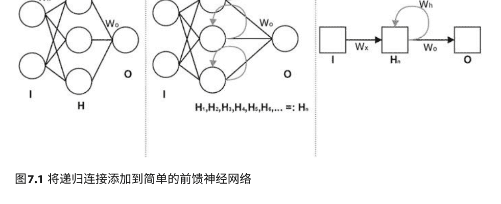

递归神经网络文献中使用的适当和详细的符号表示法，我们将重点关注这种表示法，以便能够即时评论递归神经网络的工作原理。下一节将使用图7.2的子图C作为参考，这将成为本章剩余部分的标准符号表示法。³

### 7.4 Elman网络

让我们评论一下图7.2c。$w_x$表示输入权重，$w_h$表示递归连接权重，$w_o$表示隐藏层到输出层的权重。这里的$x$s是输入，$y$s是输出，就像以前一样。但是这里我们还有一个额外的顺序性质，试图捕捉时间。所以$x(1)$是第一个输入，稍后会有$x(2)$等等。输出也是一样的。如果我们使用经典设置，我们只会使用$x(1)$（作为输入向量）和$y(4)$（作为整体输出）。但是对于顺序和预测下一个的设置，我们会使用所有的$x$s和$y$s。请注意，与简单的前馈网络不同，这里还有$h$，它们表示递归连接的输入。我们需要有一个起点，我们可以通过将$h(0)$的所有元素设置为0来生成。我们给出一个示例计算，展示如何计算所有元素，这比逐个计算更有洞察力。通过$f$，我们将表示一个非线性函数，你可以将其视为逻辑函数。

稍后我们将看到一个新的非线性函数叫做$softmax$，它可以在这里使用，并且与循环神经网络自然地结合。因此，循环神经网络计算最终时间 t 的输出 y。计算可以展开为以下递归结构（这使得我们明白为什么需要 h(0)) ：

```
y(t) = f(w_o^T h(t)) = (7.1)
= f(w_o^T f(w_h^T h(t-1) + w_x^T x(t))) = (7.2)
= f(w_o^T f(w_h^T f(w_h^T h(t-2) + w_x^T x(t-1)) + w_x^T x(t))) = (7.3)
= f(w_o^T f(w_h^T f(w_h^T f(w_h^T h(t-3) + w_x^T x(t-2)) + w_x^T x(t-1)) + w_x^T x(t))). (7.4)
```

我们可以通过将其压缩为两个方程来使其更易读:

```
h(t) = f_h(w_h^T h(t-1) + w_x^T x(t)) (7.5)
y(t) = f_o(w_o^T h(t)), (7.6)
```

其中 f_h是隐藏层的非线性函数，而 f_o是输出层的非线性函数，它们不一定是相同的函数，但如果我们愿意，它们可以是相同的。这种类型的循环神经网络被称为Elman网络[3]，以纪念语言学家和认知科学家Jeffrey L. Elman。

如果我们在方程式7.5中将h(t)的(t-1)替换为y(t-1)，则变为如下形式:

```
h(t) = f(h(t-1) * y(t-1) + w * x(t)). (7.7)
```

我们得到了一个被称为Jordan网络的模型[4]，它以心理学家、数学家和认知科学家Michael I. Jordan命名。Elman网络和Jordan网络在文献中都被称为简单循环网络（SRN）。简单循环网络在今天的应用中很少使用，但它们是解释循环网络的主要教学方法，用于在更复杂的LSTM中运行，而LSTM是今天主要使用的循环网络架构。今天很容易看不起SRN，但当它们首次提出时，它成为了第一个能够在文本中处理单词而不依赖于“外来”表示（如词袋或n-gram）的模型。从某种意义上说，这些表示似乎暗示着语言处理对于计算机来说是非常陌生的，因为人们并不像词袋那样使用任何东西来理解语言。

SRN对语言处理作出了决定性的转变，使整个过程更接近人类智能。因此，SRN应被视为人工智能的里程碑，因为它们迈出了关键的一步：之前似乎不可能的事情现在变得可以想象。但是几年后，一种更强大的架构将出现并接管所有实际应用，但这种强大是有代价的：LSTM的训练速度比SRN慢得多。

### 7.5 长短期记忆

在本节中，我们将以图形方式说明长短期记忆（LSTM）的工作原理，有兴趣的读者应该没有问题，只需按照我们的解释和相关图像进行编码即可。本节关于LSTM的所有图像均来自Christopher Olah的博客。我们使用与其相同的符号（除了一些细节），在图7.3中省略了权重以简化说明，但在后续图像中将添加它们来解释LSTM的各个组件。

由于我们从方程7.5中知道 $y(t) = f_{o}(\mathbf{w}_{o} \cdot h(t))$ ($f_{o}$是输出层的非线性选择)，在本章中 $y(t)$与 $h(t)$相同，但我们仍然指出 $h(t)$要乘以 $\mathbf{w}_{o}$才能得到 $y(t)$，简单地注意到$y(t) = h(t)$。从纯粹的形式观点来看，这真的不那么重要，但我们希望通过为 $y(t)$留出一个位置来更清楚。

图7.3展示了LSTMs的鸟瞰视角，并将它们与SRNs进行了比较。可以立即看到的一件事是，SRNs从一个单元到下一个单元有一个链接（它是 $h(t)$的流动），而LSTMs也有相同的 $h(t)$，但还有 $C(t)$。这个 $C(t)$被称为细胞状态，这是通过LSTMs传递信息的主要流动。形象地说，细胞状态是模型的‘L’、‘T’和‘M’，即‘LSTM’的一部分，也就是模型的长期记忆。其他发生的一切只是不同的过滤器，用于决定应该保留或添加到细胞状态中的内容。

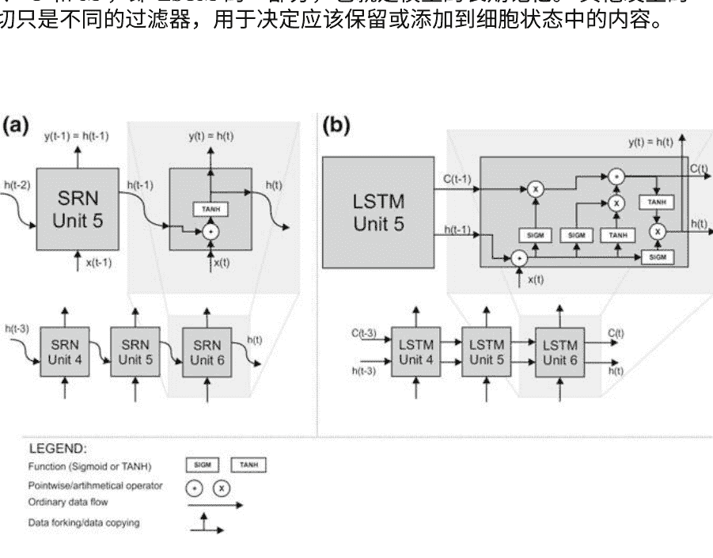

图7.3 SRN和LSTM单元放大

> 4http://colah.github.io/posts/2015-08-Understanding-LSTMs/，访问日期2017-03-22。

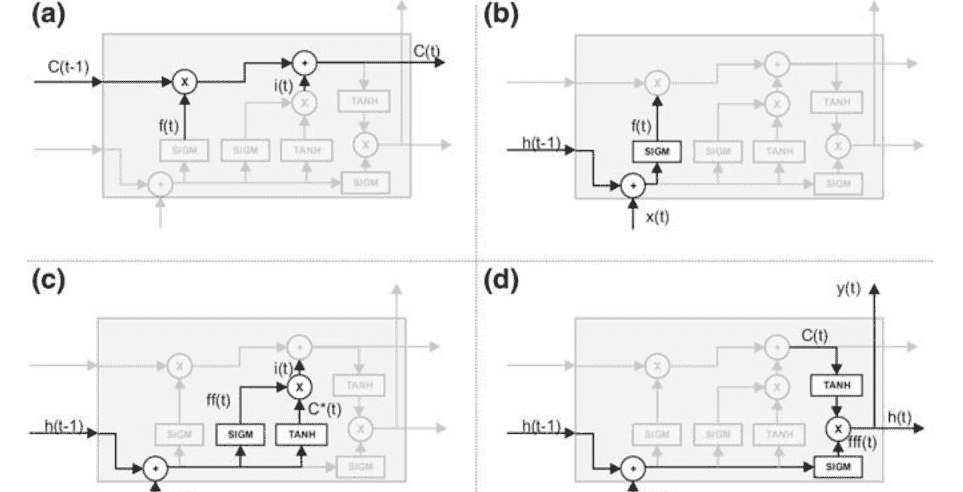

图7.4 细胞状态（a），遗忘门（b），输入门（c）和输出门（d）

图7.4a强调了细胞状态（现在您应该忽略图像上的 f(t) 和 i(t) 在几段之后，您将看到它们是如何计算的）。LSTM通过所谓的门来添加或删除细胞中的信息，这些门构成了LSTM中的其余部分。这些门实际上非常简单。它们是加法、乘法和非线性的组合。非线性仅用于‘压缩’信息。逻辑或Sigmoid函数（在图像中表示为SIGM）用于将信息‘压缩’到0和1之间的值，而双曲正切函数（在图像中表示为TANH）用于将信息‘压缩’到-1和1之间的值。您可以这样理解：SIGM做出模糊的‘是/否’决策，而TANH做出模糊的‘负面/中性/积极’决策。它们除此之外什么都不做。

第一个门是遗忘门，在图7.4b中有强调。门的名称来自于与逻辑门的类比。在单元t处的遗忘门用f(t)表示，并且简单地定义为f(t) := σ(w_f(x(t) + h(t-1)))。直观地说，它控制着有多少加权原始输入和加权上一个隐藏状态需要被记住。注意，σ是逻辑函数的符号。

关于权重，有不同的方法，但我们认为最直观的方法是将w和h分解为几个不同的权重，如w_f、w_ff、w_C和w_fff。需要记住的是，有不同的方式来看待权重，其中一些尝试保持与更简单模型中的名称相同，但对于深度学习来说，最自然的方法是将架构看作是由多个组件组成的。

⁵请注意，我们在这里并不是非常精确，LSTMs中的 w_f 实际上与SRN中的 w_x 是相同的，而不是旧的 w_h 的组成部分。

基本的“构建块”应该像乐高积木一样组装在一起，然后每个块都应该有自己的权重。完整神经网络中的所有权重都与反向传播一起进行训练，联合训练实际上使神经网络成为一个连通的整体（就像每个乐高积木通常都有自己的凸起来连接其他积木以构建结构）。

下一个门（在图7.4c中强调），称为输入门，稍微复杂一些。它基本上决定了要放入细胞状态的内容。它由另一个遗忘门（我们用 $ff(t)$ 不太有创意地表示）组成，但具有不同的权重，但它还有一个额外的模块，用于创建要添加到细胞状态的候选选项。$ff(t)$ 可以被看作是一种保存机制，它控制着我们将多少输入保存到细胞状态中。符号表示为：

```
latex
ff(t) := \sigma(\mathbf{w}_{ff}(x(t) + h(t-1))), \quad (7.8)
```

```
latex
i(t) := ff(t) \cdot C^*(t). \quad (7.9)
```

我们缺少的是对候选人的计算（用 $C^*(t)$ 表示）。计算候选人非常简单：$C^*(t) := \tau(\mathbf{w}_C \cdot (x(t) + h(t-1)))$，其中 $\tau$ 是双曲正切或 $tanh$ 的符号。我们在这里使用双曲正切来将结果压缩到范围在 -1 和 1 之间的值。直观地说，范围的负部分（-1 到 0）可以被看作是快速获得‘否定’的一种方式，因此即使是相反的概念也会被考虑，例如快速处理语言上的反义词。

正如我们之前所看到的，LSTM单元有三个输出：$C(t)$，$y(t)$ 和 $h(t)$。我们已经拥有计算当前细胞状态 $C(t)$ 所需的一切（这个计算在图7.4a中显示）：

```
latex
C(t) := f(t) \cdot C(t-1) + i(t). \quad (7.10)
```

由于 $y(t) = g_o(\mathbf{w}_o \cdot h(t))$（其中 $g_o$ 是所选择的非线性函数），我们只需要计算 $h(t)$。为了计算 $h(t)$，我们将需要第三个遗忘门的副本 $(fff(t))$，它的任务是决定输入的哪些部分以及多少包含在 $h(t)$ 中：

```
latex
fff(t) := \sigma(\mathbf{w}_{fff}(x(t) + h(t-1))). \quad (7.11)
```

现在，唯一剩下的是一个完整的输出门（其结果实际上不是 $o(t)$ 而是 $h(t)$），我们需要将 $fff(t)$ 乘以当前细胞状态在 -1 和 1 之间压缩：

```
latex
h(t) := fff(t) \cdot \tau(C(t)). \quad (7.12)
```

有了完整的LSTM。最后一点说明：$fff(t)$ 可以被看作是一个‘聚焦’机制，试图表达细胞状态中最重要的部分。你可能会想到 $f(t)$，$ff(t)$ 和 $fff(t)$，但是想法是它们都参与了不同的部分，因此，我们希望它们会承担我们想要的机制（‘记住上一个单元’，‘保存输入’和‘聚焦于细胞状态的这一部分’）。记住，这只是我们的一厢情愿，我们除了使用我们选择的计算序列或信息流之外，我们无法对LSTM进行这种解释。这意味着这些解释是隐喻的，只有我们做出了百万分之一的幸运猜测，这些机制才会与人脑中的机制实际一致。

LSTM最早由Hochreiter和Schmidhuber于1997年提出[2]，它们已成为自然语言处理、时间序列分析和许多其他顺序任务中最重要的深度架构之一。今天，关于循环神经网络的最佳参考书之一是[5]，我们强烈推荐给任何希望专攻这些令人惊叹的架构的读者。

### 7.6 使用循环神经网络预测下一个单词

在本节中，我们给出了一个简单的循环神经网络的实际示例，用于从文本中预测下一个单词。这种任务非常灵活，因为它不仅允许预测，还允许问答——（单词）答案就是序列中的下一个单词。我们使用的示例是根据[6]中的示例进行修改的，并附有丰富的注释和解释。原始代码的某些部分已经修改，以便更容易理解代码。正如我们在前一节中解释的那样，这是一个可工作的Python 3代码，但您需要安装所有依赖项。您还应该能够根据本章的代码思想进行操作，但要看到细微之处，需要在计算机上拥有实际的代码。6我们首先导入Python库，我们将需要：

```
python
from keras.layers import Dense, Activation
from keras.layers.recurrent import SimpleRNN
from keras.models import Sequential
import numpy as np
```

下一步是定义超参数：

```
python
hidden_neurons = 50
my_optimizer = "sgd"
batch_size = 60
error_function = "mean_squared_error"
output_nonlinearity = "softmax"
cycles = 5
epochs_per_cycle = 3
context = 3
```

6你可以从本书的GitHub存储库中获取，或者将本节中的所有代码输入到一个简单的文件(.txt)中，并将其扩展名更改为.py。

让我们花一分钟看看我们在使用什么。变量 `hidden_neurons` 简单地表示我们将使用多少个隐藏单元。我们在这里使用的是Elman单元，因此这与隐藏层上的反馈环路数量相同。变量 `optimizer` 定义了我们将使用哪个Keras优化器，在这种情况下是随机梯度下降，但还有其他的，<sup>7</sup>我们建议尝试几个优化器以获得感觉。请注意，“sgd”是Keras的名称，所以您必须完全按照这样的方式输入，而不是“SGD”，也不是“stochastic_GD”，也不是任何类似的。`batch_size` 变量只是表示在随机梯度下降的单次迭代中使用多少个示例。变量 `error_function= "mean_squared_error"` 告诉Keras使用我们之前使用的MSE。

但是现在我们来到了激活函数 `output_nonlinearity`，我们看到了以前没有见过的 `softmax` 激活函数或非线性，它的Keras名称是 “softmax”。softmax函数的定义如下

$$\zeta(z_j) := \frac{e^{z_j}}{\sum_{k=1}^{N} e^{z_k}}, j = 1, \ldots, N. \quad (7.13)$$

softmax函数非常有用：它基本上将具有任意实数值的向量 `z` 转换为值从0到1的向量，并且它们的总和为1。这就是为什么softmax在用于多类别分类的深度神经网络的最后一层中经常使用，以获得可以作为类别的概率代理的输出。可以证明，如果向量 `z` 只有两个分量，`z_0` 和 `z_1`（模拟二元分类），则会准确地减少到逻辑函数分类，只是权重为 `w_σ = w_ζ1 - w_ζ0`。现在我们可以继续SRN代码的下一部分，记住在代码中变为活动状态时我们将对其余的参数进行注释：

```
python
def create_tesla_text_from_file(textfile="tesla.txt"):
    clean_text_chunks = []
    with open(textfile, 'r', encoding='utf-8') as text:
        for line in text:
            clean_text_chunks.append(line)
    clean_text = ("".join(clean_text_chunks)).lower()
    text_as_list = clean_text.split()
    return text_as_list
text_as_list = create_tesla_text_from_file()
```

这部分代码打开一个纯文本文件 `tesla.txt`，用于训练和预测。这个文件应该使用utf-8编码，或者在 utf-8 中。

完整的列表在 https://keras.io/optimizers/ 上。

当我们有超过两个类别时。请注意，在二元分类中，我们有两个类别，比如 A 和 B，我们实际上只对其中一个进行分类（例如，在输出层使用逻辑函数），并得到一个概率分数 p_A。然后，B的概率分数被计算为1 - p_A。

代码应该根据适当的文件编码进行更改。请注意，大多数文本编辑器今天区分‘文件编码’（文件的实际编码）和‘编码’（用于在编辑器中显示该文件文本的编码）。这种方法适用于计算机可用RAM大小的约70%的文件。由于我们正在讨论纯文本文件，拥有16GB的机器和10GB的文件将非常适用，而10GB是大量的纯文本（仅供比较，整个英文维基百科的纯文本大小为14GB，包括元数据和页面历史记录）。对于较大的数据集，我们将采用不同的方法，即将大文件分成块并将它们视为批次，然后逐个馈送它们，但是这种大数据处理的细节超出了本书的范围。

请注意，当Python打开和读取文件时，它会逐行返回，所以我们实际上是将这些行累积在一个名为clean_text_chunks的列表中。然后我们将它们全部拼接成一个名为 clean_text 的大字符串，然后将其切割成单个单词并存储在名为text_as_list的列表中，这就是整个函数 `create_tesla_text_from_file(textfile="tesla.txt")` 返回的内容。部分 `(textfile="tesla.txt")` 表示函数 `create_tesla_text_from_file()` 期望一个参数（称为textfile），但我们提供了一个默认值“tesla.txt”。这意味着如果我们提供了一个文件名，它将使用该文件名，否则将使用“tesla.txt”。最后一行 `text_as_list = create_tesla_text_from_file()` 调用函数（使用默认文件名），并将函数返回的内容存储在变量text_as_list中。现在，我们将所有的文本都存储在一个列表中，其中每个单独的元素都是一个单词。请注意，这里可能会有单词的重复，这是完全可以的，因为这将由代码的下一部分处理：

```
python
distinct_words = set(text_as_list)
number_of_words = len(distinct_words)
word2index = dict((w, i) for i, w in enumerate(distinct_words))
index2word = dict((i, w) for i, w in enumerate(distinct_words))
```

`number_of_words` 简单地计算文本中的单词数量。`word2index` 创建一个以唯一单词为键、以其在文本中的位置为值的字典，而 `index2word` 则完全相反，创建一个以位置为键、单词为值的字典。接下来，我们有以下内容：

```
python
def create_word_indices_for_text(text_as_list):
    input_words = []
    label_word = []
    for i in range(0, len(text_as_list) - context):
        input_words.append((text_as_list[i:i+context]))
        label_word.append((text_as_list[i+context]))
    return input_words, label_word
input_words, label_word = create_word_indices_for_text(text_as_list)
```

现在，事情变得有趣了。这是一个函数，它从原始文本中创建一个输入词列表和一个标签词列表，原始文本必须是一个词列表的形式。

单词。让我们解释一下这个想法。假设我们有一个小小的文本‘为什么除了早餐食物之外，还有人会吃其他东西呢？’。然后我们想要创建一个用于预测下一个词的‘输入’/‘标签’结构，我们通过将这个句子分解成一个数组来实现：

| 输入词1 | 输入词2 | 输入词3 | 标签词 |
|---------|---------|---------|--------|
| 为什么  | 会      | 有人    | 曾经   |
| 会      | 有人    | 曾经    | 吃     |
| 有人    | 曾经    | 吃      | 任何东西 |
| 曾经    | 吃      | 任何东西 | 除了   |
| 吃      | 任何东西 | 除了    | 早餐   |
| 任何东西 | 除了    | 早餐    | 食物？ |

请注意，我们使用了三个输入词，并将下一个词声明为标签，然后向前移动一个词并重复这个过程。我们使用多少个输入词实际上由超参数上下文定义，并且可以更改。函数 `create_word_indices_for_text(text_as_list)` 接受一个以列表形式表示的文本，创建输入词列表和标签词列表，并返回它们。代码的下一部分是

```
python
input_vectors = np.zeros((len(input_words), context, number_of_words), dtype=np.int16)
vectorized_labels = np.zeros((len(input_words), number_of_words), dtype=np.int16)
```

这段代码生成了‘空白’张量，用零填充。请注意，术语‘矩阵’和‘张量’来自数学，在数学中它们是用于特定操作的对象，并且是不同的。计算机科学将它们都视为多维数组。区别在于计算机科学将重点放在它们的结构上：如果我们沿着一个维度迭代，该维度（正确称为‘轴’）上的所有元素具有相同的形状。张量中的条目类型将为int16，但您可以根据需要更改它。

让我们稍微讨论一下张量的维度。张量 `input_vectors` 在技术上被称为三阶张量，但实际上它只是一个具有三个维度的‘矩阵’，或者简单地说是一个3D数组。要理解 `input_vectors` 张量的维度，首先我们有三个单词（即由context定义的单词数）要进行独热编码。请注意，我们在技术上使用的是独热编码而不是词袋模型，因为我们只保留了文本中的不同单词。由于我们使用了独热编码，这将扩展第二个维度。这解决了张量的 `context` 和 `number_of_words` 维度，第三个维度（在代码中是第一个维度，即 `len(input_words)`）实际上只是将所有输入捆绑在一起，就像我们在前几章中有一个包含所有输入向量的矩阵一样。`vectorized_labels` 也是一样的，只是这里我们没有由变量 `context` 指定的三个或n个单词，而只有一个单词，即标签单词，所以我们在张量中需要一个较少的维度。由于我们初始化了两个空白张量，我们需要将1放在适当的位置，代码的下一部分就是这样做的：

```
python
for i, input_w in enumerate(input_words):
    for j, w in enumerate(input_w):
        input_vectors[i, j, word2index[w]] = 1
        vectorized_labels[i, word2index[label_word[i]]] = 1
```

这段代码是如何“爬行”张量并将1放在正确位置的，可能有点难，但请尽力理解。现在，我们已经清理了所有混乱的部分，代码的下一部分实际上是使用Keras函数指定完整的简单递归神经网络。

```
python
model = Sequential()
model.add(SimpleRNN(hidden_neurons, return_sequences=False, input_shape=(context, number_of_words), unroll=True))
model.add(Dense(number_of_words))
model.add(Activation(output_nonlinearity))
model.compile(loss=error_function, optimizer=my_optimizer)
```

大部分可以调整的内容都放在超参数中。在这部分中不应进行任何更改，除非可能添加一些新的层，这可以通过复制指定层的行来完成，特别是第二行，或第三行和第四行。唯一剩下的事情就是看模型的工作效果如何，以及它产生什么样的输出。这是代码的最后一部分，如下所示：

```
python
for cycle in range(cycles):
    print(" > - < " * 50)
    print("循环: %d" % (cycle+1))
    model.fit(input_vectors, vectorized_labels, batch_size=batch_size, epochs=epochs_per_cycle)
    test_index = np.random.randint(len(input_words))
    test_words = input_words[test_index]
    print("从测试索引%s生成测试，使用单词%s:" % (test_index, test_words))
    input_for_test = np.zeros((1, context, number_of_words))
    for i, w in enumerate(test_words):
        input_for_test[0, i, word2index[w]] = 1
    predictions_all_matrix = model.predict(input_for_test, verbose=0)[0]
    predicted_word = index2word[np.argmax(predictions_all_matrix)]
    print("完整的结果句子是: %s %s" % ("".join(test_words), predicted_word))
    print()
```

这部分代码训练和测试完整的SRN。测试通常是预测我们保留的一部分数据（测试集），然后测量准确性。但是这里

> 这可能是本书中最具挑战性的任务，但不要跳过它，因为它对于深入理解非常有用，而且只需要四行代码。

我们有预测下一个的设置，它没有标签，所以我们必须采用不同的方法。这个想法是在一个周期内进行训练和测试。一个周期由一个训练会话（具有一定数量的迭代次数）组成，然后我们从文本中生成一个测试句子，并查看网络给出的单词是否在放在文本中的单词后面时有意义。这完成了一个周期。这些周期是累积的，每个连续的周期后，句子将变得越来越有意义。

在超参数中，我们已经指定了训练5个周期，每个周期包含3个时期。

让我们简要地谈一下我们所做的。为了计算效率，大多数用于预测下一个的工具都使用了马尔可夫假设。非正式地说，马尔可夫假设意味着我们将一个需要考虑从时间开始到现在的所有步骤的概率P(s_n|s_{n-1}, s_{n-2}, s_{n-3}, ...)简化为只考虑前一步的概率P(s_n|s_{n-1})。如果一个系统采用这种计算绕道，就被称为“使用马尔可夫假设”。如果一个过程只与前一个时间状态有关，那么它被称为马尔可夫过程。语言生成不是马尔可夫过程。假设你是一个分类器，你有一个“训练”句子：“我们需要记住生活中重要的事情：朋友、华夫饼、工作。或者华夫饼、朋友、工作。不重要的是，但是工作是第三个。如果它是一个马尔可夫过程，并且你可以在功能上没有太大损失的情况下做出马尔可夫假设，那么你只需要一个词，就可以知道下一个是什么。如果你有“Does”，你可以知道在你的训练集中，它之后总是跟着“not”，你是正确的。但是如果给你一个“work”，你会有很多的麻烦，但是你可以用概率分布来解决。但是如果你没有预测下一个的设置，而是你的任务是识别说话者何时感到困惑（即当你试图深入理解时）。那么，你需要所有之前的单词进行比较。在许多情况下，你可以稍微取巧，对非马尔可夫过程做出马尔可夫假设，并且可以逃脱，但是与许多其他机器学习算法不同，递归神经网络不需要做出马尔可夫假设，因为它们完全能够处理许多时间步长，而不仅仅是最后一个。在离开递归神经网络之前，我们还需要评论最后一件事，那就是反向传播是如何工作的。递归神经网络中的反向传播被称为通过时间的反向传播（BPTT）。在我们的代码中，我们不需要担心反向传播，因为TensorFlow（Keras的默认后端）会自动为我们计算梯度，但是让我们看看底层发生了什么。请记住，反向传播的目标是计算误差E相对于w、x、h和o的梯度。

当我们讨论MSE和SSE误差函数时，我们已经看到我们求和错误，并且这对于机器学习来说已经足够好了。我们也可以在某个时间点上仅对每个训练样本的梯度求和：

$$\frac{\partial E}{\partial w_i} = \sum_{t} \frac{\partial E_t}{\partial w_i} \quad (7.14)$$让我们看一个完整的例子，看看它是如何工作的。假设我们想要计算 $E_2$ 的梯度：

$$
\frac{\partial E_2}{\partial \mathbf{w}_o} = \frac{\partial E_2}{\partial \mathbf{y}_2} \frac{\partial \mathbf{y}_2}{\partial \mathbf{z}_2} \frac{\partial \mathbf{z}_2}{\partial \mathbf{w}_o}.
\tag{7.15}
$$

这意味着对于 $\mathbf{w}_o$ ，时间成分不起作用。正如预期的那样，对于 $\mathbf{w}_h$ ($\mathbf{w}_x$类似)，情况有所不同，如下所示：

$$
\frac{\partial E_2}{\partial \mathbf{w}_h} = \frac{\partial E_2}{\partial \mathbf{y}_2} \frac{\partial \mathbf{y}_2}{\partial \mathbf{h}_2} \frac{\partial \mathbf{h}_2}{\partial \mathbf{w}_h}.
\tag{7.16}
$$

但请记住 $h_2 = f_h(\mathbf{w}_h \mathbf{h}_1 + \mathbf{w}_x \mathbf{x}_2)$ 这意味着整个表达式取决于 $\mathbf{h}_1$ ，因此如果我们想要关于 $\mathbf{w}_h$ 的导数，我们不能将其视为常数。正确的做法是将最后一项拆分为以下求和形式：

$$
\frac{\partial \mathbf{h}_2}{\partial \mathbf{w}_h} = \sum_{i=0}^{2} \frac{\partial \mathbf{h}_2}{\partial \mathbf{h}_i} \frac{\partial \mathbf{h}_i}{\partial \mathbf{w}_h}.
\tag{7.17}
$$

所以，除了求和之外，通过时间的反向传播与标准的反向传播完全相同。这种计算的简单性实际上是SRN比具有相同隐藏层数的前馈网络更能抵抗梯度消失的原因。让我们解决一个最后的问题。我们之前使用的误差函数是MSE，这对于回归和二元分类是一个有效的选择。多类分类的更好选择是交叉熵误差函数，其定义为

$$
CE = -\frac{1}{n} \sum_{i \in curr\ Batch} (t_i \ln y_i + (1-y_i) \ln(1-y_i)).
\tag{7.18}
$$

其中 $t_i$ 是目标， $y_i$ 是分类器的输出， $i$ 是在当前批次目标和输出上迭代的虚拟变量， $n$ 是批次中所有样本的数量。交叉熵误差函数是从对数似然函数推导出来的，但这个推导过程相当繁琐，超出了我们的需求，所以我们跳过了它。交叉熵是一个更自然的误差函数选择，但在概念上理解起来不那么直观，所以我们在本书中使用了MSE，但你在进行多类分类任务时会想要使用交叉熵。Keras代码中的损失函数是`categorical_crossentropy`，但请随意浏览所有损失函数[https://keras.io/losses/](https://keras.io/losses/)，你可能会惊讶地发现一些函数。

我们将在不同的背景下讨论，它也可以作为神经网络训练中的损失或误差函数使用。 事实上，找到或定义一个好的损失函数通常是获得深度学习模型良好准确性的重要部分。

### 参考文献

- 1. J.J. Hopfield，神经网络和具有新兴集体计算能力的物理系统。美国国家科学院学报 79(8)，2554–2558（1982年）
- 2. S. Hochreiter，J. Schmidhuber，长短期记忆。神经计算。 9(8)，1735–1780（1997年）
- 3. J.L. Elman，时间中的结构发现。认知科学。 14，179–211（1990年）
- 4. M.I. Jordan，吸引子动力学和连接式顺序机器中的并行性，在第26届国际机器学习年会论文集，Erlbaum，美国新泽西州 (认知科学学会，1986年)，第531-546页
- 5. A. Graves,用循环神经网络进行监督序列标注(Springer，纽约，2012年)
- 6. A. Gulli, S. Pal, 用Keras进行深度学习 （Packt出版，伯明翰，2017年）

### 8.1 学习表示

在本章和下一章，我们将关注无监督的深度学习，也被称为学习分布式表示或表示学习。但是首先我们需要填补第3章中的一个空白。在那里，我们讨论了PCA作为学习分布式表示的一种形式，并将问题表述为找到Z = X Q，其中所有特征已经被去相关化。在这里，我们将计算矩阵 Q。我们需要有一个 X的协方差矩阵。给定矩阵的协方差矩阵显示了原始矩阵的条目。两个随机变量 X和 Y的协方差定义为COV(X, Y) := E((X - E(X))(Y - E(Y)))，并展示了两个随机变量如何一起变化。请记住，稍微推测一下，与数据相关的一切都可以被视为随机变量。

此外，稍微有点夸张地说，对于一个随机变量X，我们可以认为E(X) = MEAN(X) * 1。这只有在X的分布是均匀的情况下才成立，但即使不是这样，在实际应用中也可能有所帮助，特别是因为在机器学习中，我们可能会在某个地方进行一些优化，所以可以有点马虎。

细心的读者可能会注意到，E(X)实际上是一个向量，而MEAN(X)是一个单值，但我们将使用一种称为broadcasting的方法来使其再次正确。将值v广播到一个n维向量v中，意味着简单地将相同的v放入v的每个分量中，或者简单地说：

$$
broadcast(v, n) = (v, v, v, ..., v)
             n
$$

- 1. 期望值实际上是加权和，可以从频率表中计算得出。如果五个学生中有三个得了‘5’分，另外两个得了‘3’分，那么E(X) = 0.6·5 + 0.4·3。

我们将矩阵 X 的协方差矩阵表示为 Ξ(X)。这不是一个标准符号，但是（与标准符号 C 或 Σ 不同）这个符号将避免混淆，因为我们在本书中使用标准符号的意义不同。为了更正式地处理协方差矩阵，如果我们有一个列向量 X = (X1, X2, ..., Xd)⊤ 填充有随机变量，协方差矩阵 ΞX（也可以表示为 Ξij）可以定义为 Ξij = COV(Xi, Xj) = E((Xi - E(Xi))(Xj - E(Xj)))，或者如果我们写整个 d × d 矩阵：

$$
\XiX = \begin{bmatrix} E((X1 - E(X1))(X1 - E(X1))) & \cdots & E((X1 - E(X1))(Xd - E(Xd))) \\ E((X2 - E(X2))(X1 - E(X1))) & \cdots & E((X2 - E(X2))(Xd - E(Xd))) \\ \vdots & \ddots & \vdots \\ E((Xd - E(Xd))(X1 - E(X1))) & \cdots & E((Xd - E(Xd))(Xd - E(Xd))) \end{bmatrix}
$$

(8.2)现在应该清楚协方差矩阵实际上衡量的是自身元素之间的协方差。让我们看看矩阵 Ξ(X) 有什么性质。首先，它必须是对称的，因为 X 与 Y 的协方差与 Y 与 X 的协方差相同。Ξ(X) 也是一个正定矩阵，这意味着对于每个非零向量 v，标量 v⊤X z 是正的。

让我们转向一个稍微不同的话题，特征向量。矩阵 A 的特征向量是指当它们与 A 相乘时，其方向不变（但长度会变化）的向量。可以证明它们一共有 d 个。如何找到特征向量是困难的一部分，有许多方法，其中一种较流行的方法是梯度下降。由于所有的数值库都可以为我们找到特征向量，我们不会深入讨论。

因此，当特征向量与矩阵 A 相乘时，只有长度会发生变化，方向不变。常见的做法是对特征向量进行归一化，并用 vi 表示。长度的变化被称为特征值，通常用 λi 表示。实际上，这导致了矩阵的特征向量和特征值的一个基本性质，即 A vi = λi vi。

一旦我们有了 v 和 λ，我们就开始按降序排列 λ:

$$
\lambda1 > \lambda2 > ... > \lambdad
$$

这也创建了相应特征向量 v1, v2, ..., vd 的排列（注意每个特征向量的形式为 vi = (vi^(1), vi^(2), ..., vi^(d)), 1 ≤ i ≤ d），因为它们与特征值之间存在一对一的对应关系，所以我们可以简单地将特征值的顺序复制到特征向量上。我们创建一个 d×d 的矩阵，其中特征向量作为列进行排序，排序方式与相应的特征值相对应（在最后一步中，我们只是将条目重命名为按照通常的矩阵输入命名约定):

$$
V = (\mathbf{v}_1^\top, \mathbf{v}_2^\top, \ldots, \mathbf{v}_d^\top) = \begin{bmatrix} v_1^{(1)} & v_2^{(1)} & \cdots & v_d^{(1)} \\ v_1^{(2)} & v_2^{(2)} & \cdots & v_d^{(2)} \\ \vdots & \vdots & \ddots & \vdots \\ v_1^{(d)} & v_2^{(d)} & \cdots & v_d^{(d)} \end{bmatrix} = \begin{bmatrix} v_{11} & v_{12} & \cdots & v_{1d} \\ v_{21} & v_{22} & \cdots & v_{2d} \\ \vdots & \vdots & \ddots & \vdots \\ v_{d1} & v_{d2} & \cdots & v_{dd} \end{bmatrix}
$$

现在我们创建一个全零矩阵（大小为 $ d \times d $ ），并将lambda按降序放在对角线上。我们将这个矩阵称为 $\Lambda$:

$$
\Lambda = \begin{bmatrix} \lambda_1 & 0 & \cdots & 0 \\ 0 & \lambda_2 & \cdots & 0 \\ \vdots & \vdots & \ddots & \vdots \\ 0 & 0 & \cdots & \lambda_d \end{bmatrix}
$$

有了这个，我们转向矩阵的特征分解。我们需要一个对称矩阵 $A$，然后它的特征分解为:

$$
A = V \Lambda V^{-1} \tag{8.3}
$$

唯一的条件是所有特征向量 $\mathbf{v}_i$ 线性独立。由于 $\Xi$ 是一个具有线性独立特征向量的对称矩阵，我们可以使用特征分解得到以下对于任意协方差矩阵 $\Xi$ 成立的方程:

$$
\Xi = V \Lambda V^{-1} \tag{8.4}
$$
$$
\Xi V = V \Lambda \tag{8.5}
$$

由于 $V$ 是正交的，$^2$我们还有 $V^\top V = I$。现在我们准备返回 $Z = X Q$。让我们来看看转换后的数据 $Z$。我们可以将 $Z$ 的协方差表示为 $X$ 的协方差乘以 $Q$:

$$
\Xi_Z = \frac{1}{d} ((Z - MEAN(Z))^\top (Z - MEAN(Z))) = \tag{8.6}
$$
$$
= \frac{1}{d} ((X Q - MEAN(X) Q)^\top (X Q - MEAN(X) Q)) = \tag{8.7}
$$
$$
= \frac{1}{d} Q^\top (X - MEAN(X))^\top (X - MEAN(X)) Q = \tag{8.8}
$$
$$
= Q^\top \Xi_X Q \tag{8.9}
$$

> $^2$我们省略了证明，但可以在任何线性代数教材中找到，例如[1]。

现在我们必须选择一个矩阵 Q，以便我们得到我们想要的（零相关性和按方差排序的特征）。我们简单地选择 Q := V。然后我们有：

$$
\Xi_Z = V^{\top} \Xi_X V = V^{\top} V \Lambda = \Lambda \tag{8.10}
$$

让我们看看我们取得了什么成就。除了对角线元素外，Ξ_z的所有元素都为零，这意味着 Z 中唯一剩下的相关性是沿着对角线的。这是一个变量与自身的协方差，实际上就是我们之前遇到的方差，而且矩阵按降序排列（VAR(X_i) = COV(X_i, X_i) = λ_i）。这就是我们想要的一切。请注意，我们对2D 情况进行了PCA，使用了矩阵，但是相同的思想也适用于张量。关于主成分分析的更多信息可以在[2]中找到。

所以我们在已经看到了如何创建相同数据的不同表示方式使得描述该数据的特征具有零协方差，并按方差排序。通过这样做，我们已经创建了数据的分布式表示，因为不再存在名为'height'的列，并且我们有了合成列。

关键在于我们可以构建各种分布式表示，但我们必须知道我们希望最终数据遵守的约束条件。如果我们希望这个约束条件不被具体指定，并且我们希望通过提供示例来指定它，那么我们将不得不采用更一般的方法。这就是引导我们进入自动编码器的方法，它在许多任务中提供了令人惊讶的通用性。

### 8.2 不同的自动编码器架构

自动编码器是一个三层前馈神经网络。它们有一个特殊之处：目标值 t 实际上与输入值 x 相同，这意味着自动编码器的任务只是重新创建输入。因此，自动编码器是一种无监督学习的形式。这意味着输出层必须具有与输入层相同的神经元数量。这就是一个前馈神经网络被称为自动编码器所需的全部。我们可以称这个版本为'纯香草自动编码器'。对于纯香草自动编码器来说，存在一个问题。如果隐藏层中的神经元数量至少与输入和输出层中的神经元数量相同，自动编码器有可能学习到恒等函数。这导致了一个约束条件，即隐藏层中的神经元数量必须少于输入和输出层中的神经元数量。我们可以称满足这个属性的自动编码器为简单自动编码器。完全训练的自动编码器的隐藏层输出构成了一种分布式表示，类似于PCA，并且与PCA一样，这种表示可以作为逻辑回归或简单前馈神经网络的输入，并且会产生比常规表示更好的结果。

但是我们可以选择另一种路径，这被称为稀疏自编码器。假设我们限制隐藏层神经元的数量最多是输入层神经元数量的两倍，但是我们添加了一个很大的丢弃率，例如0.7。那么，每次迭代时，隐藏神经元的数量将少于输入神经元的数量，但同时我们将产生一个很大的隐藏层向量。这个大的隐藏层向量是一个（非常大的）分布式表示。直观地说，这里发生的是简单自编码器生成了一个紧凑的分布式表示，这是输入的一个不同表示。这使得简单神经网络更容易理解和处理它，从而提高准确性。稀疏自编码器以相同的方式处理输入，但此外，它们学习冗余并提供一个更‘稀释’和更大的向量，这样处理起来更简单。回想一下在多维空间中超平面的工作原理，这就有意义了。有一种不同的定义稀疏自编码器的方法，通过稀疏率来强制将低于某个阈值的激活值视为零，这与我们的方法类似。

我们还可以通过在输入中插入一些噪音来使自动编码器的工作更加困难。这是通过创建一个带有插入随机数的输入副本来完成的，比如在输入的随机选择的10%上。目标是没有噪音的输入的副本。这些自动编码器被称为去噪自动编码器。如果我们添加显式正则化，我们就得到了一种被称为收缩自动编码器的自动编码器变体。图8.1提供了各种类型的自动编码器的示例。

还有许多其他类型的自动编码器，但它们更加复杂，超出了本书的范围。我们将感兴趣的读者指向[3]。

所有的自动编码器都用于预处理简单的前馈神经网络的数据。这意味着我们必须从自动编码器中获取预处理的数据。这些数据不是整个自动编码器的输出，而是中间（隐藏）层的输出，这一层完成了大部分的工作。

让我们来解决一个技术问题。我们已经看到但还没有正式介绍过潜在变量的概念。潜在变量是一种位于背景中与一个或多个‘可见’变量相关的变量。我们在第3章中看到了一个例子，当我们以非正式的方式讨论主成分分析时，我们在‘身高’和‘体重’之后有合成属性。这些是潜在变量的一个典型例子。当我们假设一个潜在变量（或创建它）时，我们假设我们有一个概率分布来定义它。注意，关于我们是发现还是定义潜在变量是一个哲学问题，但显然我们希望我们的潜在变量（定义好的那些）尽可能地接近自然界中的潜在变量（我们测量或发现的那些）。分布表示是一个概率分布潜在变量的分布，希望它们是目标潜在变量，当它们非常相似时，学习将结束。这意味着我们必须有一种衡量概率分布之间相似性的方法。通常通过Kullback-Leibler散度来实现，其定义如下：

$$
\mathrm{KL}(P, Q) := \sum_{n=1}^{N} P(n) \log \frac{P(n)}{Q(n)} \qquad (8.11)
$$

其中 $P$ 和 $Q$ 是两个概率分布。请注意，$\mathrm{KL}(P, Q)$ 不是对称的（如果更改 $P$ 和 $Q$，它将发生变化）。传统上，Kullback-Liebler散度被表示为 $D_{KL}$，但我们使用的符号与本书中的其他符号更一致。有许多来源提供更详细的信息，但我们将把读者引荐给[3]。自编码器是一个相对古老的想法，最早由Dana H. Ballard在1987年提出[4]。Yann LeCun [5]也独立于Ballard考虑了类似的结构。关于各种类型的自编码器及其功能的良好概述可以在[6]中找到，作为下一节中我们将重现的堆叠去噪自编码器的介绍。

### 8.3 堆叠自编码器

如果自编码器看起来像乐高积木，那么你的直觉是正确的，实际上它们可以被堆叠在一起，然后被称为堆叠自编码器。但是请记住，自编码器的真正结果不在输出层，而是在中间层的激活值，然后这些激活值被提取并用作常规神经网络的输入。这意味着要堆叠它们，我们不仅仅需要将一个自编码器放在另一个后面，而是实际上需要将它们的中间层组合在一起，如图8.2所示。想象一下，我们有两个大小为 (13, 4, 13) 的简单自编码器和图8.2 堆叠一个(4, 3, 4)和一个(4, 2, 4)自编码器，得到一个(4, 3, 2, 3, 4)的堆叠自编码器## 8.4 重新创造猫论文

在本节中，我们重新创造了著名的“猫论文”中提出的想法，正式标题为“使用大规模无监督学习构建高级特征”[7]。我们将提出一个简化版本，以更好地描述这篇令人惊叹的论文的细微之处。这篇论文因为作者们创建了一个神经网络，能够通过观看YouTube视频来学习识别猫而变得著名。但是这意味着什么呢？让我们退后一步。‘观看’只是指作者们从1000万个YouTube视频中采样帧，并以RGB格式获取了200x200像素的图像。现在，关键的问题是：‘识别猫’是什么意思？

当然，这可能意味着他们构建了一个经过猫图像训练的分类器，然后对猫进行分类。但是作者们并没有这样做。他们给网络提供了一个未标记的数据集，然后对来自ImageNet的猫图像进行了测试（负样本只是不包含猫的随机图像）。该网络通过学习重构输入来进行训练（这意味着输出神经元的数量与输入神经元的数量相同作为输入神经元的数量），这使它成为一个自编码器。结果神经元位于自编码器的中间部分。网络中有一些结果神经元（为简单起见，假设有4个），他们注意到这些神经元的激活形成了一个模式（激活是sigmoid函数，所以范围从0到1）。如果网络正在对类似于它所见过的东西进行分类（猫），它会形成一个模式，例如神经元1的激活为0.1，神经元2的激活为0.2，神经元3的激活为0.5，神经元4的激活为0.2。如果它得到了它不知道的东西，神经元1的激活将为0.9，其他神经元的激活为0。通过这种方式，发现了一种隐式的标签生成方法。

但是猫的论文提出了另一个很酷的结果。他们问网络视频中有什么，网络画出了一只猫的脸（正如技术媒体所形容的）。但这是什么意思？这意味着他们选择了表现最好的“猫识别器”神经元，对于我们来说是神经元3，并找到了它识别为猫的前5张图像。假设猫发现神经元的激活值分别为0.94、0.96、0.97、0.95和0.99。然后他们合并并修改了这个图像（使用数值优化，类似于梯度下降），以找到一个新的图像，使得给定的神经元获得激活值1。这样的图像是一张猫脸的绘画。这可能看起来像是科幻小说，但如果你仔细思考，就并不那么不寻常。他们选择了最好的猫识别神经元，然后选择了它最有信心的前5张图像。很容易想象这些是最清晰的猫脸图片。然后将它们结合起来，增加了一点对比度，就得到了一个在该神经元中产生激活值1的图像。而且它是一张与数据集中的任何其他图像都不同的猫的图像。神经网络被放任自由地观看YouTube上的猫视频（不知道它在看猫），一旦被要求回答它在看什么，网络就会画一张猫的图片。

我们稍微缩小了规模，但实际使用的架构非常庞大：16000个计算机核心（你的笔记本电脑只有2或4个），并且网络在三天内进行了训练。自编码器具有超过10亿个可训练参数，这仍然只是人类视觉皮层中突触数量的一小部分。训练时，输入图像是一个200乘以200乘以3的张量，测试时为32乘以32乘以3。作者使用了一个18乘以18的感受野，类似于卷积网络，但权重不在整个图像上共享，而是每个“瓦片”都有自己的权重。使用的特征图数量为8。之后，使用L2池化层进行池化。L2池化以与最大池化相同的方式获取区域（例如2乘以2），但不是输出输入的最大值，而是将所有输入平方相加，然后取其平方根并将其作为输出呈现。

整体自编码器有三个部分，它们都具有相同的架构。一个部分接收输入，应用感受野（无共享权重），然后应用L2池化，最后进行局部对比度归一化的转换。完成这个部分后，还有两个完全相同的部分。整个网络使用异步SGD进行训练。这意味着有许多SGD同时在不同的部分上工作，并且有一个中央权重存储库。在每个阶段的开始，每个SGD都会向存储库请求权重更新，稍微优化它们，然后然后将它们发送回存储库，以便其他运行异步SGD的实例可以使用它们。 使用的小批量大小为100。 我们省略了其余的细节，并将读者引用到原始论文。

请注意，如果他们想要处理相同的数据，他们必须具有相同的输入（和输出）大小。只有中间层或自编码器架构可能会有所不同。对于简单的自编码器，它们通过创建一个13，7，4，7，13堆叠的自编码器来堆叠。如果你回想一下自编码器的作用，创建一个自然的瓶颈是有意义的。对于其他架构，可能有不同的安排是有意义的。堆叠自编码器的真正结果再次是由中间层构建的分布式表示。我们将按照[6]的方法堆叠去噪自编码器，并且我们提供了可在 https://blog.keras.io/building-autoencoders-in-keras.html 找到的代码的修改版本。代码的第一部分，像往常一样，包括导入语句：

```
from keras.layers import Input, Dense
from keras.models import Model
from keras.datasets import mnist
import numpy as np
(x_train, _), (x_test, _) = mnist.load_data()
```

代码的最后一行从Keras存储库中加载了MNIST数据集。你可以手动完成这个操作，但是Keras有一个内置函数可以让你将MNIST加载到Numpy数组中。请注意，Keras函数返回两个对，一个由训练样本和训练标签组成（都是60000行的Numpy数组），另一个由测试样本和测试标签组成（同样是Numpy数组，但这次是10000行）。由于我们不需要标签，我们将它们加载到匿名变量_中，这基本上是一个垃圾桶，但我们需要它，因为函数需要返回两个对，如果我们不提供必要的变量，系统将崩溃。所以我们接受这些值并将它们倾倒到变量_中。代码的下一部分对MNIST数据进行预处理。我们将其分解为以下步骤:

```
x_train = x_train.astype('float32') / 255.0
x_test = x_test.astype('float32') / 255.0
noise_rate = 0.05
```

代码的这部分将原始值从0到255转换为0到1之间的值，并将它们的Numpy类型声明为float32（32位浮点数）。它还引入了一个噪声率参数，我们很快会用到它。

```
x_train_noisy = x_train + noise_rate * np.random.normal(loc=0.0, scale=1.0, size=x_train.shape)
x_test_noisy = x_test + noise_rate * np.random.normal(loc=0.0, scale=1.0, size=x_test.shape)
x_train_noisy = np.clip(x_train_noisy, 0.0, 1.0)
x_test_noisy = np.clip(x_test_noisy, 0.0, 1.0)
```

这部分代码将噪声引入数据的副本中。请注意

```
np.random.normal(loc=0.0, scale=1.0, size=x_train.shape)
```

Numpy是用于处理数组和快速数值计算的Python库。引入一个新的数组，大小与 x_train数组相同，用高斯随机变量填充，loc=0.0（实际上是均值），scale=1.0（标准差）。然后将其与噪声率相乘，并添加到数据中。接下来的两行代码确保添加后的所有数据都在0和1之间。现在，我们可以将当前的数组（60000，28，28）和（10000，28，28）重新整形为（60000，784）和（10000，784）。当我们首次介绍MNIST时，我们已经提到过这个想法，现在我们可以看到代码的实际运行情况：

```
x_train = x_train.reshape((len(x_train), np.prod(x_train.shape[1:])))
x_test = x_test.reshape((len(x_test), np.prod(x_test.shape[1:])))
x_train_noisy = x_train_noisy.reshape((len(x_train_noisy), np.prod(x_train_noisy.shape[1:])))
x_test_noisy = x_test_noisy.reshape((len(x_test_noisy), np.prod(x_test_noisy.shape[1:])))
assert x_train_noisy.shape[1] == x_test_noisy.shape[1]
```

前四行对我们的四个数组进行了重塑，最后一行是一个测试，用于检查噪声训练和测试向量的大小是否相同。由于我们使用自编码器，这一点必须成立。如果它们不同，整个程序将在此处崩溃。有意崩溃程序可能看起来很奇怪，但通过这种方式，我们实际上获得了控制权，因为我们知道它在哪里崩溃，并且通过使用尽可能多的测试，我们可以快速调试甚至非常复杂的代码。这结束了代码的预处理部分，我们继续构建实际的自编码器：

```
inputs = Input(shape=(x_train_noisy.shape[1],))
encode1 = Dense(128, activation='relu')(inputs)
encode2 = Dense(64, activation='tanh')(encode1)
encode3 = Dense(32, activation='relu')(encode2)
decode3 = Dense(64, activation='relu')(encode3)
decode2 = Dense(128, activation='sigmoid')(decode3)
decode1 = Dense(x_train_noisy.shape[1], activation='relu')(decode2)
```

这提供了一个不同的视角，因为现在我们手动连接层（你可以看到层的大小，128、64、32、64、128）。我们添加了不同的激活函数只是为了展示它们的名称，但你可以自由地尝试不同的组合。重要的是要注意输入大小和输出大小都等于x_train_noisy.shape[1]。一旦我们指定了层，我们就继续构建模型（可以随意尝试不同的优化器⁴和误差函数⁵）：

```
autoencoder = Model(inputs, decode1)
autoencoder.compile(optimizer='sgd', loss='mean_squared_error', metrics=['accuracy'])
autoencoder.fit(x_train, x_train, epochs=5, batch_size=256, shuffle=True)
```

___________________________
4尝试'adam'。
5尝试'binary_crossentropy'。

一旦你让代码正常工作，你还应该增加epochs的数量。最后，我们来到自编码器代码的最后一部分，当我们评估、预测和提取最深层的权重时。请注意，当我们打印所有的权重矩阵时，右侧的权重矩阵（堆叠自编码器的结果）是第一个开始增加维度的矩阵（在我们的例子中是（32,64））：

```
metrics = autoencoder.evaluate(x_test_noisy, x_test, verbose=1)
print()
print("%s: %.2f%%" % (autoencoder.metrics_names[1], metrics[1]*100))
print()
results = autoencoder.predict(x_test)
all_AE_weights_shapes = [x.shape for x in autoencoder.get_weights()]
print(all_AE_weights_shapes)
ww=len(all_AE_weights_shapes)
deeply_encoded_MNIST_weight_matrix = autoencoder.get_weights()[int((ww/2))]
print(deeply_encoded_MNIST_weight_matrix.shape)
autoencoder.save_weights("all_AE_weights.h5")
```

得到的权重矩阵存储在变量deeply_encoded_MNIST_weight_matrix中，其中包含了堆叠自编码器中间层的训练权重，之后应该与标签一起输入到完全连接的神经网络中。这个权重矩阵是原始数据集的分布式表示。所有权重的副本也会保存在一个H5文件中以备后用。我们还添加了一个变量results用于使用自编码器进行预测，但这主要用于评估自编码器的质量，而不是实际预测。

### 参考文献

- 1. S. Axler, 线性代数的正确实践 (Springer, 纽约, 2015年)
- 2. R. Vidal, Y. Ma, S. Sastry, 广义主成分分析 (Springer, 伦敦, 2016)
- 3. I. Goodfellow, Y. Bengio, A. Courville, 深度学习 (MIT出版社, 剑桥, 2016)
- 4. D.H. Ballard, 神经网络中的模块化学习, in AAAI-87会议论文集(AAAI, 1987), pp. 279–284
- 5. Y. LeCun, Modeles connexionnistes de l’apprentissage (连接主义学习模型) (Universit P. et M. Curie (巴黎6大学), 1987)
- 6. P. Vincent, H. Larochelle, I. Lajoie, Y. Bengio, P.-A. Manzagol, 堆叠去噪自编码器: 使用局部去噪准则在深度网络中学习有用的表示. 机器学习杂志 Res. 11, 3371–3408 (2010)
- 7. Q.V. Le, M.A. Ranzato, R. Monga, M. Devin, K. Chen, G.S. Corrado, J. Dean, A.Y. Ng, 使用大规模无监督学习构建高级特征, 在第29届国际机器学习大会(ICML)上的论文集中。ICML(2012)

### 9.1 词嵌入和词类比

神经语言模型是单词和句子的分布式表示。 它们是学习到的表示，意味着它们是数值向量。 词嵌入是将单词转换为数字的任何方法，因此，任何学习到的神经语言模型都是获取词嵌入的一种方式。 我们使用术语“词嵌入”来表示某个特定单词或词组的非常具体的数值表示，将“Nowhere fast”表示为(1, 0, 0, 5.678, -1.6, 1)。 在本章中，我们将重点介绍最著名的神经语言模型，即Word2vec模型，它使用简单的神经网络学习表示单词的向量。

这类似于递归神经网络的预测下一个设置，但它还有一个额外的好处：我们可以计算单词之间的距离，并且只有一个很短的距离才会有相似的单词。传统上，我们可以使用汉明距离[1]来测量两个单词之间的距离，将它们视为字符串。 对于测量汉明距离，两个字符串必须具有相同的长度，距离就是不同字符的数量。 单词'topos'和'topoi'之间的汉明距离为1，而'friends'和'fellows'之间的距离为5。 请注意，'friends'和'0r$8MMs'之间的距离也是5。 通过将距离除以单词长度，可以很容易地将其归一化为百分比。 你可能已经看到了，这是一种有用但非常有限的处理语言的技术。

汉明距离是一种简单的方法，属于一系列称为字符串编辑距离度量的相似度度量方法之一。 更进一步的方法，如Levenshtein距离[2]或Jaro-Winkler距离[3,4]，可以比较不同长度的字符串，并对插入、删除或编辑等不同的错误进行惩罚。 所有这些都是根据单词形式的度量。 它们在比较'professor'和'teacher'这样的单词时是无用的，因为它们永远不会识别出意义上的相似性。 这就是为什么我们希望将一个单词嵌入到一个以一种能传达单词意义（即在我们语言中的使用）的方式来表示向量。如果我们如果我们将单词表示为向量，我们需要有一种向量之间的距离度量。我们之前已经多次提到过这个想法，现在我们可以介绍向量的余弦相似度的概念。关于余弦相似度的一个很好的概述可以在[5]中找到。两个$n$维向量$v$和$u$的余弦相似度定义为：

```
$$ \mathbb{CS}(\mathbf{v}, \mathbf{u}) := \frac{\mathbf{v} \cdot \mathbf{u}}{\|\mathbf{v}\| \cdot \|\mathbf{u}\|} = \frac{\sum_{i=1}^{n} v_i u_i}{\sqrt{\sum_{i=1}^{n} v_i^2} \sqrt{\sum_{i=1}^{n} u_i^2}} \quad (9.1) $$
```

其中$v_i$和$u_i$是向量$v$和$u$的分量，$\|v\|$和$\|u\|$分别表示向量$v$和$u$的范数。余弦相似度的取值范围从1（相等）到-1（相反），而0表示没有相关性。当使用词袋、one-hot编码或类似的词嵌入时，余弦相似度的取值范围从0到1，因为表示片段的向量不包含负分量。这意味着在这种情况下，0代表着“相反”的意思。

我们现在将继续展示Word2vec神经语言模型[6]。特别是，我们将回答它需要什么输入，它将会给出什么输出，它是否有参数来调整它，以及我们如何在一个完整的系统中使用它，即它如何与更大的系统的其他组件进行交互。

### 9.2 CBOW和Word2vec

Word2vec模型可以使用两种不同的架构构建，即skip-gram和Word2vec。这两种架构实际上都是带有一点变化的浅层神经网络。为了看到区别，我们将使用句子“你是谁，你不知道你的历史吗？”。首先，我们将清理句子中的大写字母和标点符号。这两种架构都使用单词的上下文（周围的单词）以及单词本身。我们必须预先定义上下文的大小。为了简单起见，我们将使用大小为1的上下文。这意味着一个单词的上下文由前一个单词和后一个单词组成。让我们将句子分解为单词和上下文对：

我们已经注意到Word2vec的两个版本都是学习模型，这意味着它们必须学习一些东西。skip-gram模型学习从上下文中给定中间词来预测一个词。这意味着如果我们给模型一个‘are’，它应该预测‘who’，如果我们给它一个‘know’，它应该预测‘not’或‘your’。CBOW版本则相反，假设上下文为$^1$，它从上下文中取两个词$c^1$和$c2$，并用它们来预测中间或主要词$m$。如果上下文为2，它将取4个词，两个在主要词之前，两个在主要词之后。

| 上下文 | 词 |
| :--- | :--- |
| are | who |
| who, you | are |
| are, that | you |
| you, you | that |
| that, do | you |
| 你, 不 | 做 |
| 做, 知道 | 不 |
| 不, 你的 | 知道 |
| 知道, 历史, 你的 | 你的 |
| 你的 | 历史 |

生成词嵌入的过程在结构上与自动编码器非常相似。为了制作生成词嵌入的网络，我们使用一个浅层前馈网络。输入层将接收单词索引向量，因此我们需要与词汇表中的唯一单词数量相同的输入神经元。隐藏神经元的数量被称为嵌入大小（建议值范围在100到1000之间，即使对于中等规模的数据集，这个值也远小于词汇表的大小），输出神经元的数量与输入神经元相同。从输入到隐藏的连接是线性的，即它们没有激活函数，而从隐藏到输出的连接具有softmax激活函数。输入到隐藏的权重是模型的输出（类似于自动编码器的输出），该矩阵包含了特定单词的单词向量作为行。提取正确的单词向量的最简单方法之一是将该矩阵乘以给定单词的单词索引向量。请注意，这些权重是通过常规的反向传播进行训练的。图9.1提供了整个过程的示意图。如果有什么不清楚的地方，我们请读者使用本书中我们之前介绍的内容来填补细节，这应该不会有问题。

在继续CBOW Word2vec的代码之前，我们必须纠正一个历史性的错误。Word2vec的理念是一个给定单词的意义由上下文决定，通常被定义为单词在语言中的使用方式。大多数深度学习教材（包括官方的TensorFlow Word2vec文档）将这个理念归功于Harris在1954年的一篇论文[7]，并指出这个理念在1957年被称为语言学中的分布假设[8]。这实际上是错误的。这个理念首次提出是在1953年的Wittgenstein的《哲学研究》[9]中，由于普通语言哲学和哲学逻辑（主要涉及语言形式化的逻辑领域）在自然语言处理的历史中起到了重要作用，因此必须正确地承认和归功于历史功绩。

图9.1 CBOW Word2vec架构

## 9.3 代码中的Word2vec

在本节和下一节中，我们将给出一个CBOW Word2vec实现的例子。这两节中的所有代码都应该放在一个Python文件中，因为它们是相互连接的。我们从常规导入和超参数开始：

```python
from keras.models import Sequential
from keras.layers.core import Dense
import numpy as np
from sklearn.decomposition import PCA
import matplotlib.pyplot as plt

text_as_list=["who","are","you","that","you","do","not","know","your","history"]
embedding_size = 300
context = 2
```

`text_as_list` can hold any text, so you can put here your text, or use the parts of the code from the recurrent neural network which parse a text file into a list of words. 嵌入大小是隐藏层的大小（因此，词向量的大小也是如此）。上下文是给定单词之前和之后的单词数，将用于此目的。如果上下文是2，这意味着我们将使用主要单词之前的两个单词和主要单词之后的两个单词来创建输入（主要单词将是目标）。我们继续下一段代码，这段代码与递归神经网络的相同部分完全相同：

```python
distinct_words = set(text_as_list)
number_of_words = len(distinct_words)
word2index = dict((w, i) for i, w in enumerate(distinct_words))
index2word = dict((i, w) for i, w in enumerate(distinct_words))
```

这段代码以两种方式创建单词和索引字典，一种是以单词为键，索引为值，另一种是以索引为键，单词为值。代码的下一部分有点棘手。它创建了一个函数，生成两个列表，一个是主要单词的列表，另一个是给定单词的上下文单词列表（它是一个列表的列表）：

```python
def create_word_context_and_main_words_lists(text_as_list):
    input_words = []
    label_word = []
    for i in range(0,len(text_as_list)):
        label_word.append((text_as_list[i]))
        context_list = []
        if i >= context and i<(len(text_as_list)-context):
            context_list.append(text_as_list[i-context:i])
            context_list.append(text_as_list[i+1:i+1+context])
            context_list = [x for subl in context_list for x in subl]
        elif i<context:
            context_list.append(text_as_list[:i])
            context_list.append(text_as_list[i+1:i+1+context])
            context_list = [x for subl in context_list for x in subl]
        elif i>=(len(text_as_list)-context):
            context_list.append(text_as_list[i-context:i])
            context_list.append(text_as_list[i+1:])
            context_list = [x for subl in context_list for x in subl]
        input_words.append((context_list))
    return input_words, label_word

input_words,label_word = create_word_context_and_main_words_lists(text_as_list)
input_vectors = np.zeros((len(text_as_list), number_of_words), dtype=np.int16)
vectorized_labels = np.zeros((len(text_as_list), number_of_words), dtype=np.int16)
for i, input_w in enumerate(input_words):
    for j, w in enumerate(input_w):
        input_vectors[i, word2index[w]] = 1
    vectorized_labels[i, word2index[label_word[i]]] = 1
```

让我们看看这段代码块做了什么。第一部分是一个函数的定义它接受一个单词列表并返回两个列表。一个是该单词列表的副本（在代码中命名为label_word），第二个是input_words，它是一个列表的列表。列表中的每个列表都包含了与相应的label_word中的单词相关的上下文单词。在整个函数被定义之后，它被调用在变量text_as_list上。之后，创建两个用于保存与两个列表对应的单词向量的矩阵，初始值为零，代码的最后部分将矩阵的相应部分更新为1，以形成输入的上下文模型和目标的主要单词模型。代码的下一部分初始化并训练Keras模型：

```python
word2vec = Sequential()
word2vec.add(Dense(embedding_size, input_shape=(number_of_words,), activation="linear", use_bias=False))
word2vec.add(Dense(number_of_words, activation="softmax", use_bias=False))
word2vec.compile(loss="mean_squared_error", optimizer="sgd", metrics=['accuracy'])
word2vec.fit(input_vectors, vectorized_labels, epochs=1500, batch_size=10, verbose=1)
metrics = word2vec.evaluate(input_vectors, vectorized_labels, verbose=1)
print("%s: %.2f%%" % (word2vec.metrics_names[1], metrics[1]*100))
```

该模型紧密遵循我们在上一节中介绍的架构。它不使用偏置，因为我们将取出权重，而且我们不希望任何信息存在其他地方。该模型经过1500个epochs的训练，你可以尝试进行实验。如果想要创建一个skip-gram模型，只需交换这些矩阵，即将部分代码更改为

```python
word2vec.fit(input_vectors, vectorized_labels, epochs=1500, batch_size=10, verbose=1)
```

应该改为

```python
word2vec.fit(vectorized_labels, input_vectors, epochs=1500, batch_size=10, verbose=1)
```

这样你就会得到一个skip-gram。一旦我们有了这个，我们只需要用以下代码提取权重：

```python
word2vec.save_weights("all_weights.h5")
embedding_weight_matrix = word2vec.get_weights()[0]
```

我们就完成了。这段代码的第一行返回所有单词的词向量，以一个`number_of_words`×`embedding_size`的数组形式，我们可以选择合适的行来获取该单词的向量。这段代码的第一行将网络中的所有权重保存到一个H5文件中。你可以用word2vec做很多事情，而对于所有这些事情，我们都需要这些权重。首先，我们可以像我们的代码一样从头开始学习权重。其次，我们可能想要微调先前学习的词嵌入（假设它是从维基百科数据中学习的），在这种情况下，我们希望在原始模型的副本中加载先前保存的权重，并在可能更具体且更紧密相关的新文本上进行训练，例如法律文本。我们可以使用词向量的第三种方式是简单地将它们用于代替独热编码的单词（或词袋），并将它们馈送到另一个神经网络中，该网络的任务是例如预测情感。

请注意，H5文件包含了网络的所有权重，我们只想使用第一层的权重矩阵，这个矩阵可以通过代码的最后一行获取，并命名为`embedding_weight_matrix`。在下一节的代码中，我们将使用`embedding_weight_matrix`（应该在与本节代码相同的文件中）。

如果我们要保存和加载H5文件，我们将保存和加载具有相同配置的新网络的所有权重，可能会对它们进行微调，然后使用与此处相同的代码提取出权重矩阵。

## 9.4 走进词空间：一个曾困扰符号人工智能的思想

词向量是一种非常有趣的词嵌入类型，因为它们可以实现更多的功能。传统上，推理被视为一种符号概念，它将对象的各种关系甚至各种对象的各种关系联系在一起。对象和表示它们的符号被视为逻辑上的原始概念。这意味着它们被定义了，并且除了我们明确放入其中的内容之外，没有任何其他内容。这一直是逻辑方法对人工智能（GOFAI）的信条几十年来。主要问题在于理性被等同于智能，这意味着高级能力是体现智能的能力。汉斯·莫拉维克[10]发现高级能力（如下棋和证明定理）实际上比在未标记的照片上识别猫更容易，这导致人工智能界重新思考先前接受的智能概念，以及与之相关的低级推理的想法变得有趣。

为了解释什么是低级推理，我们举个例子。如果你考虑两个句子‘番茄是蔬菜’和‘番茄是悬索桥’，你可能会得出它们都是错误的结论，从技术上讲你是正确的。但是大多数人（和聪明的动物）都支持一种模糊性的观念，它考虑了错误的程度。说出‘番茄是蔬菜’比说‘番茄是悬索桥’更不正确。还要注意，这些不是关于自然现象的句子，而是关于语言分类和社会约定的句子。你不是在引用对象（除了‘番茄’），而是在引用由描述（由属性组成）或示例（共享一定数量的共同属性）定义的类别。请注意，在这三种情况下，你都使用了单数术语，唯一的符号部分是‘_是一个_’，这是无关紧要的。

如果一个代理被锁在一个房间里，只给她一些外语书来阅读，如果她能够找到模式，比如表示地方的词和表示人的词，我们会认为她是聪明的。所以如果她将两个句子“Luca frequenta la scuola elementare Pedagna” 和 “Marco frequenta la scuola elementare Zolino”归类为相似的，她会展示出一定程度的智能。她甚至可能会说，在这个背景下，“Luca”就像“Pedagna”一样，“Marco”就像“Zolino”一样。如果她被给予一个新的句子 “Luca vive in Pedagna”，她可能推断出句子 “Marco vive in Zolino”，而且她可能完全正确。语义相似术语的问题很快变成了推理问题。

我们实际上可以使用Word2vec在我们的数据集中找到术语的相似性，并以这种方式进行推理。为了解如何做到这一点，让我们回到我们的代码。以下代码紧跟上一节的代码之后（在同一个Python文件中）。我们将使用`embedding_weight_matrix`来找到有趣的词相似性（实际上是词向量聚类），并通过词向量计算和推理。为了做到这一点，我们首先运行PCA将`embedding_weight_matrix`转换为仅保留前两个维度的矩阵，并将结果绘制到文件中：

```python
pca = PCA(n_components=2)
pca.fit(embedding_weight_matrix)
results = pca.transform(embedding_weight_matrix)
x = np.transpose(results).tolist()[0]
y = np.transpose(results).tolist()[1]
n = list(word2index.keys())
fig, ax = plt.subplots()
ax.scatter(x, y)
for i, txt in enumerate(n):
    ax.annotate(txt, (x[i], y[i]))
plt.savefig('word_vectors_in_2D_space.png')
plt.show()
```

这产生了图9.2。请注意，我们需要比我们的九个单词句子更大的数据集才能学习相似性（并在图中看到它们），但是您可以使用我们用于递归神经网络的解析器尝试不同的数据集。

使用词向量进行推理也非常简单。我们需要从`embedding_weight_matrix`中获取相应的向量，并对它们进行简单的算术运算。它们都具有相同的维度，这意味着可以很容易地进行加法和减法运算。让`w2v(someword)`表示训练过的词嵌入。

图9.2 在转换后的2D空间中的词相似性聚类

> 更准确地说：将矩阵转换为一个列按降序排列的无相关矩阵，然后保留前两列。

对于单词'someword'。要重新创建经典示例，取 `w2v(king)`，减去它 `w2v(man)`加上它 `w2v(woman)`，结果将接近 `w2v(queen)`。即使我们使用PCA来转换向量并仅保留前两个或三个分量，结果仍然成立，尽管有时会更失真。这取决于数据集的质量和大小，我们建议读者尝试编写一个脚本，在大型数据集上进行此操作作为练习。

### 参考文献

- 1. R.W. Hamming, 错误检测和纠错码。贝尔系统技术杂志。29(2)，147-160 (1950)
- 2. V.I. Levenshtein, 能够纠正删除、插入和反转的二进制码。Sov. Phys. Dokl. 10(8)，707-710（1966年）
- 3. M.A. Jaro, 作为应用于1985年塔帕佛罗里达人口普查的记录链接方法的进展。J. Am. Stat. Assoc. 84(406)，414-420（1989年）
- 4. W.E. Winkler, 在fellegi-sunter记录链接模型中的字符串比较器度量和增强决策规则，inProceedings of the Section on Survey Research Methods (American Statistical Association, 1990), pp. 354-359
- 5. A. Singhal, 现代信息检索：简要概述。Bull. IEEE Comput. Soc. Tech. Comm. Data Eng. 24(4)，35-43（2001年）
- 6. T. Mikolov, T. Chen, G. Corrado, J. Dean, 在矢量空间中高效估计词表示，ICLR Workshop (2013), arXiv:1301.3781
- 7. Z. Harris, 分布结构。单词10(23)，146-162 (1954)
- 8. J.R. Firth, 语言学理论概要1930-1955, Studies in Linguistic Analysis (Philological Society, 1957), pp. 1-32
- 9. L. Wittgenstein, 哲学研究 (MacMillan Publishing Company, London, 1953)
- 10. H. Moravec, 心智之子：机器人和人类智能的未来 (Harvard University Press, Cambridge, 1988)

### 10.1 基于能量的模型

基于能量的模型是一类特定的神经网络。最简单的能量模型是20世纪80年代的Hopfield网络[1]。Hopfield网络通常被认为非常简单，但它们与我们之前见过的模型非常不同。该网络由神经元组成，所有这些神经元都通过权重w_ij连接在一起，连接神经元n_i和n_j。每个神经元都有一个与之相关联的阈值，我们用b_i表示。所有神经元中都有1或-1。如果你想处理一张图像，可以将-1看作白色，将1看作黑色（这里没有灰色阴影）。我们用x_i表示放置在神经元中的输入。简单的Hopfield网络如图10.1a所示。

一旦网络组装完成，训练就可以开始了。权重按照以下规则进行更新，其中n表示一个单独的训练样本：

```
w_{ij} = \sum_{n=1}^{N} x_i^{(n)} x_j^{(n)} \quad (10.1)
```

然后我们计算每个神经元的激活：

```
y_i = \sum_j w_{ij} x_j \quad (10.2)
```

有两种可能的权重更新方式。我们可以同步地进行更新（同时更新所有权重），也可以异步地进行更新（逐个更新，这是标准方式）。在Hopfield网络中，没有循环连接，即对于所有的i，w_ii=0，并且所有的连接都是对称的，即w_ij=w_ji。让我们看看图10.1b中显示的简单Hopfield网络如何处理图10.1c中的简单1x3像素“图像”，我们用向量a = (-1, 1, -1)、b = (1, 1, -1)来表示。

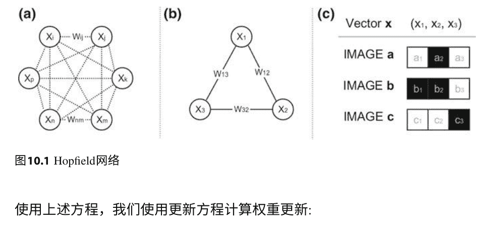

使用上述方程，我们使用更新方程计算权重更新:

```
$$ w_{11} = w_{22} = w_{33} = 0 $$
$$ w_{12} = a_1a_2 + b_1b_2 + c_1c_2 = -1\cdot 1 + 1\cdot 1 + (-1)\cdot(-1) = 1 $$
$$ w_{13} = -1 $$
$$ w_{23} = -3 $$
```

Hopfield网络具有全局的成功度量，类似于常规神经网络的误差函数，称为能量。能量被定义为网络训练的每个阶段的单个值，用于整个网络的计算。

```
$$ ENE = -\sum_{i,j} w_{ij} y_i y_j + \sum_i b_i y_i \quad (10.3) $$
```

随着学习的进行，ENE要么保持不变，要么减少，这就是Hopfield网络达到局部极小值的方式。每个局部极小值都是一些训练样本的记忆。还记得逻辑函数和逻辑回归吗？我们需要两个输入神经元和一个输出神经元来进行合取和析取运算，对于异或运算，我们需要额外的一个隐藏神经元。在Hopfield网络中，我们需要三个神经元进行合取和析取运算，需要四个神经元进行异或运算。

接下来，我们简要介绍的模型是Boltzmann机，它首次在1985年提出[2]。乍一看，它们与Hopfield网络非常相似，但是它们还有输入神经元和隐藏神经元，它们之间都有连接权重。这些权重是非循环且对称的。一个示例的Boltzmann机显示在图10.2a中。隐藏单元被随机初始化，并且它们构建一个隐藏表示来模仿输入。这形成了两个概率分布，可以用Kullback-Leibler散度KL进行比较。然后，主要目标变得清晰，计算 $\frac{\partial KL}{\partial w}$，并进行反向传播。

## 图10.2玻尔兹曼机和受限玻尔兹曼机

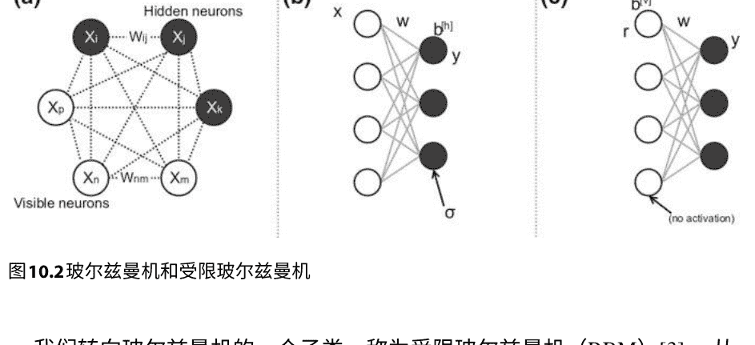

我们转向玻尔兹曼机的一个子类，称为受限玻尔兹曼机（RBM）[3]。从结构上看，受限玻尔兹曼机只是没有神经元之间连接的玻尔兹曼机（隐藏层到隐藏层和可见层到可见层）。这似乎是一个小问题，但实际上这使得我们可以使用前馈网络中使用的反向传播的修改版本。因此，受限玻尔兹曼机有两层，一个可见层和一个隐藏层。可见层（对于玻尔兹曼机来说是真的）是我们输入和输出的地方。用 $x_i$ 表示输入，用 $b^{[h]}$ 表示隐藏层的偏置。然后，在前向传播过程中（参见图10.2b），RBM计算 $\mathbf{y} = \sigma(\mathbf{x}^\top \mathbf{w} + \mathbf{b}^{[h]})$。如果我们停在这里，RBM会类似于自编码器，但我们有第二阶段，即重构（参见图10.2c）。在重构过程中，$\mathbf{y}$ 被馈送到隐藏层，然后传递到可见层。这是通过将它们与相同的权重相乘，并添加另一组偏置来完成的，即 $\mathbf{r} = \mathbf{y}^\top \mathbf{w} + \mathbf{b}^{[v]}$。通过KL测量 $\mathbf{x}$ 和 $\mathbf{r}$ 之间的差异，然后将此错误用于反向传播。RBM是脆弱的，每当出现非零重构时，这是一个好迹象。玻尔兹曼机类似于逻辑约束满足求解器，但它们关注的是Hinton和Sejnowski所称的“弱约束”。请注意，我们已经远离能量函数，并回到了标准神经网络领域。

我们将简要讨论的最终架构是深度置信网络(DBN)，它们只是堆叠的RBM。它们在[4]和[5]中被引入。它们在概念上类似于堆叠的自编码器，但可以使用反向传播进行训练成为生成模型，或者使用对比散度进行训练。在这种情况下，它们甚至可以用作分类器。对比散度只是一种高效近似对数似然梯度的算法。对比散度的讨论超出了本书的范围，但我们指向感兴趣的读者参考[6]和[7]。有关基于能量的模型的认知方面的讨论，请参阅[8]。

### 10.2 基于记忆的模型

我们将探索的第一个基于记忆的模型是神经图灵机(NTM)，最初在[9]中提出。还记得图灵机的工作原理吗？你有一个读写头和一个充当内存的磁带。然后，图灵机以算法的形式给出一个函数，并计算该函数(接受给定的输入并输出结果)。 神经图灵机类似，但关键是使所有组件可训练，以便它们可以进行软计算，并且它们还应该学会如何做得很好。

神经图灵机的行为类似于LSTM。它接受输入序列，并输出序列。 如果我们希望它输出一个单一的结果，我们只需取最后一个组件并丢弃其他所有内容。 神经图灵机是建立在LSTM之上的，可以看作是扩展LSTM的一种架构，类似于LSTM是建立在简单循环网络之上的。

神经图灵机有几个组件。 第一个组件被称为控制器，它只是一个LSTM。与LSTM类似，神经图灵机具有一个时间组件，所有元素都由t索引，并且机器在时间t的状态将计算在t-1时刻的组件作为输入。 控制器接收两个输入：(i)时间t的原始输入，即x_t，和 (ii) 上一步的结果，即r_t。 神经图灵机还有另一个重要组件，即内存，它只是一个被表示为M_t的张量（通常只是一个矩阵）。 内存不是控制器的输入，但它是整个神经图灵机步骤t的输入（输入为M_{t-1}）。

完整的神经图灵机结构如图10.3所示，但是我们省略了细节。¹整个神经图灵机的思想是将其表示为张量，并通过梯度下降进行训练。 为了实现这一点，所有来自常规图灵机的清晰概念都被模糊化，这样就没有单独访问的内存位置，而是以一定程度访问所有内存位置。 除了模糊部分之外，访问的内存量也是可训练的，因此它会动态变化。

重申一下：神经图灵机具有一个LSTM（控制器），它接收上一步的输出和一个新的输入向量，并使用它们和一个内存矩阵来产生输出，而且所有这些都是可训练的。 但是这些组件是如何工作的呢？ 现在让我们从内存向上工作。 我们将需要三个向量，控制器将产生它们：添加向量 a_t，擦除向量 e_t 和加权向量 w_t。 它们相似但用于不同的目的。

我们稍后会回来解释它们是如何产生的。

让我们看看内存是如何工作的。 内存由一个矩阵（或者可能是更高阶的张量）M_t表示。 这个矩阵中的每一行被称为一个内存位置。 如果内存中有n行，控制器会产生一个大小为n的权重向量。

> ¹要获得完整的视图，请参阅NTM的创建者之一的博客文章，链接：[https://medium.com/aidangomez/the-neural-turing-machine-79f6e806\penalty-\@Mc0a1](https://medium.com/aidangomez/the-neural-turing-machine-79f6e806\penalty-\@Mc0a1)。

## 图10.3神经图灵机

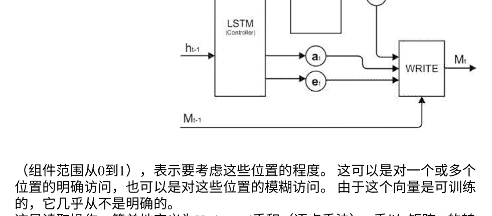

（组件范围从0到1），表示要考虑这些位置的程度。这可以是对一个或多个位置的明确访问，也可以是对这些位置的模糊访问。由于这个向量是可训练的，它几乎从不是明确的。这是读取操作，简单地定义为Hadamard乘积（逐点乘法）m乘以n矩阵M的转置和B，其中B通过转置m维行向量w，然后将其值广播（只需将此列复制n-1次）以匹配M的维度。

神经图灵机现在开始写入。它总是读取和写入，但有时写入非常相似的值，所以我们有一种内容没有改变的印象。这很重要，因为常常会误以为NTM会决定是否（过度）写入。它不会做出这个决定（它没有单独的决策机制），它总是执行写入操作，但有时写入的值与旧值相同。

写入操作本身由两个组件组成：（i）擦除组件和（ii）添加组件。擦除操作仅在权重向量w和擦除向量e的组件都为1时将内存位置的组件重置为零。符号表示为：$M_t = M_{t-1} \cdot (1 - w_t \cdot e_t)$，其中I是一个由1组成的行向量，所有乘积都是Hadamard或逐点乘法，因此这些乘法是可交换的。根据需要进行转置和广播以处理维度。添加操作执行的是完全相同的操作，只是使用$\hat{M}_t$而不是$M_{t-1}$的方程：$M_t = \hat{M}_t + w_t \cdot a_t$。请记住，这些操作的工作方式是相同的，它们都是对可训练组件的操作-没有固有的差异，只有操作和可训练差异。现在我们需要连接这两部分，这是通过寻址完成的。寻址是描述如何生成权重向量$w_t$的部分。这是一个相对复杂的过程，涉及多个组件，我们建议读者参考原始论文[9]了解详细信息。重要的是要注意，神经图灵机具有基于位置的寻址和基于内容的寻址。

第二个基于内存的模型，更简单且同样强大的是内存网络（MemNN），在[10]中引入。这个想法是扩展LSTM以使长期依赖记忆更好。记忆网络有几个组件，除了存储器外，所有这些组件都是神经网络，这使得记忆网络甚至比神经图灵机更符合连接主义精神，同时保留了所有的能力。 记忆网络的组成部分是：

-   记忆（M）：一个向量数组
-   输入特征映射（I）：将输入转换为分布式表示
-   更新器（G）：根据 I 传入的分布式表示决定如何更新记忆
-   输出特征映射（O）：接收输入的分布式表示并从记忆中找到支持向量，生成输出向量
-   响应者 (R): 另外格式化 O 给出的输出向量

它们的连接如图10.4所示。除了内存之外，所有这些组件都是由神经网络描述的函数，因此可以进行训练。 在一个简单的版本中，I 将是word2vec，G 只需将表示存储在下一个可用的内存槽中，R 通过替换索引与单词并添加一些填充词来修改输出。O 是做重要工作的那个。 它将不得不找到一些支持性的记忆（单个记忆扫描和更新称为 hop²），然后找到一种将它们与 I 转发的内容“捆绑”在一起的方法。 这种“捆绑”是简单的矩阵乘法，输入和内存之间的乘法，但还有一些额外的学习权重。 这就是连接主义模型中应该始终存在的方是：只是添加、乘法和权重。 而权重就是魔法发生的地方。 一种完全可训练的复杂记忆网络在[11]中被提出。

神经图灵机和记忆网络都面临一个共同的问题，那就是它们必须使用分段的基于向量的内存。 看到如何使用连续内存构建基于记忆的模型可能会很有趣，也许可以使用浮点数编码向量。 但是需要注意的是，即使是普通的记忆网络也比LSTM具有更多可训练的参数，训练可能需要很长时间，因此在[11]中提到的记忆模型的主要挑战之一是如何在各个组件中重用参数，以加快学习速度。

记忆网络的记忆寻址仅基于内容。

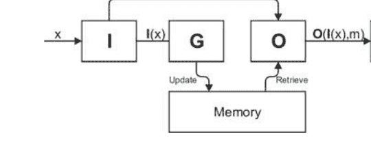

默认情况下，记忆网络进行一次跳转，但已经证明多次跳转是有益的，尤其是在自然语言处理中。

### 10.3 通用连接主义智能的核心：bAbI数据集

尽管神经网络有着丰富的历史，但如今已成为人工智能的一个公认子领域，深度学习正在全面发展。一个自然的问题出现了，我们如何评估神经网络作为一个人工智能系统，似乎图灵测试的古老思想又回来了。幸运的是，有一个名为bAbI的玩具任务数据集[12]，它的构想是成为通用人工智能的核心：任何希望被认可为通用人工智能的代理都应该能够通过bAbI数据集中的所有玩具任务。bAbI数据集是面对纯连接主义方法的最重要的通用人工智能任务之一。

数据集中的任务用自然语言表达，并且有二十个类别。第一个类别涉及单一支持事实，并且有一些样本试图捕捉已经陈述的简单重复，比如例子中的·玛丽去了洗手间。约翰走进了走廊。玛丽去了办公室。玛丽在哪里？接下来的两个任务介绍了更多的支持事实，即同一个人的更多行动。下一个任务侧重于学习和解决关系，比如给出·厨房在洗手间的北边。洗手间的北边是什么？一个类似但更复杂的任务是任务19（路径查找）：·厨房在洗手间的北边。如何从厨房到洗手间？这种·翻转'增加了复杂性。此外，在这里任务是生成方向（多个步骤），而在关系解析中，网络只需生成解析式。

下一个任务涉及自然语言中的二进制答案问题。另一个有趣的任务被称为'计数'，给出的信息包含一个单一的代理人拿起和放下东西。网络必须计算出序列结束时他手中有多少物品。接下来的三个任务基于否定、合取和使用三值回答（'是'、'否'、'可能'）。接下来的任务涉及共指消解。然后是涉及时间推理、位置推理和大小推理（类似于Winograd句子³）的任务，以及涉及基本三段论推理和归纳的任务。最后一个任务是解决代理人的动机。

数据集的作者对数据进行了多种方法的测试，但对于原始（非调整过的）记忆网络[10]的结果最有趣，因为它们代表了纯连接主义方法可以实现的成果。我们重现了原始论文中纯记忆网络[12]的准确性列表，并将读者引用到原始论文中获取其他结果。

> ³Winograd句子是一种特定形式的句子，计算机应该解决代词的指代问题。它们被提出作为图灵测试的替代方案，因为图灵测试存在一些深层次的缺陷（鼓励欺骗行为），并且很难量化其结果并在大规模上进行评估。Winograd句子是形式为·我试图把书放在抽屉里，但是它太[大小]·的句子，它们以Terry Winograd的名字命名，他在1970年代首次考虑了它们[13]。

-   1. 单一支持事实：100%
-   2. 两个支持事实：100%
-   3. 三个支持事实：20%
-   4. 两个论证关系：71%
-   5. 三个论证关系：83%
-   6. 是非问题：47%
-   7. 计数：68%
-   8. 列表：77%
-   9. 简单否定：65%
-   10. 不确定知识：59%
-   11. 基本指代：100%
-   12. 连接：100%
-   13. 复合指代：100%
-   14. 时间推理：99%
-   15. 基本推理：74%
-   16. 基本归纳：27%
-   17. 位置推理：54%
-   18. 大小推理：57%
-   19. 路径寻找：0%
-   20. 代理人的动机：100%

这些结果指出了几个问题。首先，记忆网络在指代消解方面的表现非常出色。记忆网络在纯推理方面的表现也非常出色。但最有趣的部分是问题是如何从需要推理才能得到结果的推理密集型任务中产生的（与基本推理相反，基本推理强调形式）。这些任务中最具代表性的是路径寻找和大小推理。我们发现这很有趣，因为记忆网络具有记忆组件，但没有推理组件，而记忆在基于形式的推理（如推理）中似乎更有帮助。有趣的是，经过调整的记忆网络在归纳上达到了100%，但在推理上下降到了73%。如何使神经网络进行推理的问题似乎是超越记忆网络所做的这些基准的关键问题。

### 参考文献

-   1. J.J. Hopfield, 神经网络和具有新兴集体计算能力的物理系统。美国国家科学院学报 **79**(8), 2554–2558 (1982年)
-   2. D.H. Ackley, G.E. Hinton, T. Sejnowski, 一种Boltzmann机器的学习算法。Cogn. Sci. **9**(1), 147–169 (1985)
-   3. P. Smolensky, 动力系统中的信息处理：和谐理论的基础，在 *Parallel Distributed Processing: Explorations in the Microstructure of Cognition*, 编者: D.E. Rumelhart, J.L. McClelland, the PDP Research Group, (MIT Press, Cambridge)
-   4. G.E. Hinton, S. Osindero, Y.-W. Teh, 一种用于深度信念网络的快速学习算法. Neural Comput. **18**(7), 1527–1554 (2006)
-   5. Y. Bengio, P. Lamblin, D. Popovici, H. Larochelle, 深度网络的贪婪逐层训练, 在*Proceedings of the 19th International Conference on Neural Information Processing Systems* (MIT Press, Cambridge, 2006), 第153–160页
-   6. Y. Bengio, 学习深度架构用于人工智能. Found. Trends Mach. Learn. **2**(1), 1–127 (2009)
-   7. I. Goodfellow, Y. Bengio, A. Courville, 深度学习 (MIT Press, 剑桥, 2016)
-   8. W. Bechtel, A. Abrahamsen,连接主义与心智: 并行处理, 动力学和网络演化(Blackwell, 牛津, 2002)
-   9. A. Graves, G. Wayne, I. Danihelka, 神经图灵机 (2014), arXiv:1410.5401
-   10. J. Weston, S. Chopra, A. Bordes, 记忆网络, in *ICLR* (2015), arXiv:1410.3916
-   11. S. Sukhbaatar, A. Szlam, J. Weston, 端到端记忆网络 (2015), arXiv:1503.08895
-   12. J. Weston, A. Bordes, S. Chopra, A.M. Rush, B. van Merriënboer, A. Joulin, T. Mikolov, 朝着AI完全的问题回答: 一组先决玩具任务, 在 *ICLR* (2016)中, [arXiv:1502.05698](https://arxiv.org/abs/1502.05698)
-   13. T. Winograd,理解自然语言(Academic Press, 纽约, 1972)

### 11.1 开放研究问题的不完全概述

我们以一份开放研究问题的清单来结束本书。类似的清单，我们在这里提出的问题中借鉴了一些，可以在[1]中找到。我们希望编制一份多样化的清单，以展示深度学习研究的丰富性和多样性。我们认为最有趣的问题是：

- 1. 我们能否找到除了梯度下降之外的其他基础作为反向传播的基础？我们能找到替代整个反向传播的东西来更新权重吗？
- 2. 我们能找到新的更好的激活函数吗？
- 3. 推理能被学习吗？如果可以，怎么学习？如果不行，我们如何在连接主义架构中近似符号处理过程？我们如何将规划、空间推理和知识融入到人工神经网络中？这里有比看上去更多的东西，因为符号计算可以通过纯数值表达式的解（然后进行优化）来近似。一个好的非平凡的例子是用 \(A \rightarrow B, A \vdash B\) 来表示 \(^B_A \cdot A = B\)。由于似乎可以很容易地找到逻辑连接的数值表示，神经网络能否自己找到并实现它呢？
- 4. 有一个基本的信念，深度学习方法由许多层非线性操作组成，对应于在符号系统中重复使用许多子公式的思想。这个类比能否形式化？
- 5. 为什么卷积网络容易训练？这当然与参数的数量有关，但它们仍然比具有相同参数数量的其他网络更容易训练。
- 6. 我们能否制定一种良好的自学习策略，其中训练样本是在未标记样本中找到的，甚至是由自主代理主动寻找的？
- 7. 梯度的近似对于神经网络来说已经足够好，但目前在计算上比符号导数要低效。对于人类来说，猜测接近某个值（例如最小值）要比计算确切的数字容易得多。我们能否找到更好的算法来计算近似梯度？
- 8. 一个代理将面临一个未知的未来任务。我们能否开发一种策略，以便它能够预期并立即开始学习（而不会忘记之前的任务）？
- 9. 我们能否为深度学习证明理论结果，使用的不仅仅是形式化的简单网络和线性激活（阈值门）？
- 10. 深度神经网络的深度是否足以复制所有人类行为的深度？如果是这样，通过按照深度神经网络需要复制给定行为所需的隐藏层数对人类行为进行排序，我们将得到什么？这与莫拉维克悖论有何关联？
- 11. 除了简单地随机初始化权重，我们是否有更好的选择？由于在神经网络中一切都在权重中，这是一个根本性的问题。
- 12. 局部最小值是生活的一部分还是目前使用的架构的固有限制？众所周知，通过添加手工特征可以帮助，而且深度神经网络能够自动提取特征，但为什么它们会陷入困境？在某些情况下，课程学习非常有帮助，我们可以问一下，对于某些任务，课程学习是否是必要的？
- 13. 在其他形式主义中，难以以概率方式解释的模型（如堆叠自动编码器、迁移学习、多任务学习）是否可解释？也许是模糊逻辑？
- 14. 深度网络能否适应于学习树和图，而不仅仅是向量？
- 15. 人类皮层并不总是单向传递的，它本质上是循环的，并且在大多数认知任务中存在循环。是否存在只能通过前馈网络或只能通过循环网络学习的认知任务？

## 11.2 连接主义的精神和哲学联系

今天的连接主义比以往任何时候都更加活跃和充满活力。在人工智能的历史上，连接主义在其现在的名字“深度学习”下，正试图夺取GOFAI的核心地位，而推理是唯一仍然基本未被征服的主要认知能力。这是否是一个永远无法突破的最终障碍，还是只是几个月的问题，很难说。人工神经网络作为一个研究领域在类似的探索中几乎死掉了几次。它们总是处于劣势地位，也许这是最迷人的部分。它们最终成为人工智能和认知科学的重要组成部分，今天（部分归功于营销），它们具有几乎神奇的吸引力。

一个雕塑家必须具备两样东西才能创作出杰作：一个清晰而精确的创作理念，以及制作它的技巧和工具。哲学和数学是科学的两个最古老的分支，就像文明本身一样古老，并且大部分科学都可以看作是从哲学逐渐过渡到数学。

这可以为任何科学学科提供指引，尤其是对于连接主义来说尤为如此：当你感到没有创意时，可以求助于哲学；当你感到没有工具时，可以求助于数学。在这两个领域进行一些研究可以在任何科学领域建立令人惊叹的职业，神经网络也不例外。

这本书到此结束了，如果你觉得这是一次奇妙的旅程，那我很高兴。这只是你深度学习之路的开始。我强烈鼓励你追求知识¹并永不停滞。当有人说·你为什么要这样做，这行不通·或·你没有资格做这个·或·这与你的领域无关·时，要始终坚持自己的研究并尽力做到最好。我非常喜欢的一句谚语²是：每天写点新东西。如果你没有新的东西，就写点旧的。如果你没有旧的，就读点东西。总有一天，一个拥有新的的卓越思维的人会取得突破。这将是困难的，会有很多阻力，而这些阻力会采取奇怪的形式。但要在其中找到安慰：神经网络是奋斗的象征，是从谷底艰难爬升、一次又一次跌倒，最终克服一切困难达到星辰大海的奋斗。神经网络之父的一生预示着未来的所有斗争。所以，请记住瓦尔特·皮茨的故事，这位哲学逻辑学家，躲在图书馆里阅读《原理》的少年，努力向最优秀的人学习的学生，走出生活直接进入历史的编年史，试图用逻辑来拯救世界的无法安慰的人。让他的故事成为一种鼓舞。

### 参考文献

- 1. Y. Bengio, 学习人工智能的深度架构. Found. Trends Mach. Learn. 2(1), 1–127 (2009)

¹书籍、期刊文章、Arxiv、Coursera、Udacity、Udemy等等—这是一个广阔的资源宇宙。

²我不知道这是谁的谚语，但我知道这是某个人的，如果知道作者的读者能联系我，我将非常感激。

## 索引

### A
- 偶然属性, 108
- 准确性, 57
- 激活函数, 67, 81
- 可调节学习率, 97
- 类比推理, 14
- 人工智能, 51
- 自编码器, 156, 177

### B
- BAbI, 181
- 反向传播, 17, 79, 83, 87, 93
- 时序反向传播, 150
- 袋, 18
- 词袋模型, 18, 75, 141, 148, 166
- 贝叶斯定理, 59
- 基准, viii
- 伯努利分布, 35
- 偏差, 36
- 偏差吸收, 84
- 二值阈值神经元, 84
- 分箱, 33
- 玻尔兹曼机, 176

### C
- 分类特征, 55
- 连续词袋模型, 166
- 质心, 70
- 链式法则, 24
- 分类, 51
- 聚类, 70
- 认知科学, 51
- 委员会, 69
- 混淆矩阵, 58
- 连接主义, 10, 12, 14, 15, 186
- 连续函数, 20
- 对比散度, 177
- 收敛, 20
- 卷积层, 122, 128
- 卷积神经网络, 69, 79
- 语料库, 75
- 相关性, 72
- 余弦相似度, 166
- 协方差, 153
- 协方差矩阵, 153
- 交叉熵误差函数, 151
- 课程学习, 117

### D
- 数据点, 52
- 数据集, 54
- 1D卷积层, 122
- 2D卷积层, 123
- 深度置信网络, 177
- Delta规则, 88
- 分布式表示, 70, 72, 165
- DMB, 10
- 点积, 26
- Dropout, 115
- Dunn系数, 71

### E
- E. 20
- 提前停止, 114
- 特征分解, 155
- 特征值, 154
- 特征向量, 154
- Elman网络, 10, 141
- Epoch, 65, 102, 117
- 误差函数, 64, 89
- 估计器, 36
- 欧几里得距离, 25
- 欧几里得范数, 109
- 期望值, 35

### F
- 假阴性, 57
- 假阳性, 57
- 特征工程, 55
- 特征图, 125
- 特征, 33, 52
- 前馈神经网络, 95
- 有限差分逼近, 95
- 前向传播, 83
- 片段, 75
- 全连接层, 124, 131
- 函数最小化, 24

### G
- 高斯云, 38
- 高斯分布, 37
- 一般权重更新规则, 65, 97, 110, 115
- GOFAI, v, 12, 15, 171, 186
- 梯度, 30, 31, 99
- 梯度下降, 17, 24, 31, 93

### H
- 哈达玛积, 179
- Hopfield网络, 175
- 双曲正切, 67, 144
- 超参数, 89, 114
- 超平面, 31, 53

### I
- 可迭代, 44
- 迭代, 102

### J
- Jordan网络, 10, 141

### K
- K均值, 70
- Kullback-Liebler散度, 176

### L
- L1正则化, 110
- L2范数, 26
- L2池化, 162
- L2正则化, 109
- 标签, 52
- 潜变量, 72, 157
- 学习率, 31, 89, 94, 97, 111
- 极限, 21
- 线性组合, 26
- 线性约束, 88
- 线性可分, 55
- 线性神经元, 89
- 列表, 18
- 局部极小值, 115
- 局部感受野, 122
- 局部表示, 72
- 逻辑函数, 62, 67, 81, 140, 143
- 逻辑神经元, 90
- 逻辑回归, 61, 79, 84, 108
- 逻辑, 62, 66, 67, 81, 97
- 低能力推理, 171
- LSTM, 10, 142

### M
- 马尔可夫假设, 137, 150
- 矩阵转置, 27
- 最大池化, 125, 128
- 均方误差, 89
- 中位数, 33
- 记忆网络, 179, 181
- MNIST, 10, 127, 135, 159
- 众数, 33
- 动量, 114
- 动量率, 115
- 单调函数, 20
- MSE, 102
- 多类别分类, 52
- 多层感知机, 87
- 可变性, 18

### N
- 朴素贝叶斯分类器, 59
- 必要属性, 107
- 神经语言模型, 165
- 神经图灵机, 178
- 神经元, 80
- 噪声, 74
- 非线性, 67
- 归一化向量, 26
- Numpy, 159

### O
- 独热编码, 19, 56, 64, 128, 148, 166
- 在线学习, 102
- 序数特征, 55
- 正交矩阵, 30
- 正交向量, 26
- 正交归一化, 26
- 过拟合, 107

### P
- 填充, 123
- 参数, 63
- 奇偶性, 86
- 偏导数, 30
- PCA, 70, 72, 172
- 感知器, 6, 84, 87
- 正定矩阵, 154
- 精确度, 58
- 先验, 35
- 概率分布, 35
- Python缩进, 44

### Q
- Qualia, 69

### R
- 回忆, 58
- 感受野, 121
- 循环神经网络, 136
- 正则化, 108
- 正则化率, 109
- 强化学习, 51, 117
- ReLU, 20, 124
- 受限玻尔兹曼机, 177
- 岭回归, 109
- 行向量, 27

### S
- 标量乘法, 28
- 情感分析, 130
- 浅层神经网络, 79
- Sigmoid函数, 62, 81, 90
- 简单循环网络, 141
- Skip-gram, 166
- Softmax, 129, 140, 146, 167
- 稀疏编码, 76
- 方阵, 28
- 标准基, 26
- 标准差, 36
- 阶跃函数, 20
- 随机梯度下降, 129
- 步长, 123
- 监督学习, 51
- 支持向量机, 10
- 对称矩阵, 28

### T
- 目标, 52
- 张量, 30
- 测试集, 58
- Tikhonov正则化, 109
- 训练测试拆分, 59
- 真负, 57
- 真正, 57
- 元组, 18

### U
- 欠拟合, 107
- 均匀分布, 35
- 单位矩阵, 30
- 无监督学习, 51
- Urelements, 17

### V
- 验证集, 112
- 消失梯度, 118
- 方差, 36
- 向量, 18
- 向量分量, 18
- 向量维度, 18
- 向量空间, 25
- 投票函数, 20

### W
- 权重, 80
- 权重衰减, 109
- Winograd句子, 181
- 词嵌入, 165
- Word2vec, 14, 166, 168, 180
- 工作神经元, 62, 66, 121

### X
- XOR, 86

### Z
- 零矩阵, 30