# 深度学习应用卷一


## 智能系统与计算进展 1098

M. Arif Wani

Mehmed Kantardzic

Moamar Sayed-Mouchaweh编辑


## 智能系统与计算进展

### 第1098卷

### 系列编辑

Janusz Kacprzyk, 波兰科学院系统研究所, 华沙, 波兰

### 咨询编辑

Nikhil R. Pal, 印度统计研究所, 印度加尔各答

Rafael Bello Perez, 数学、物理和计算学院, Universidad Central de Las Villas, 圣克拉拉, 古巴

Emilio S. Corchado, 萨拉曼卡大学, 萨拉曼卡, 西班牙

Hani Hagras, 计算机科学与电子工程学院, 埃塞克斯大学, 科尔切斯特, 英国

LászlóT. Kóczy, 自动化系, Széchenyi István大学, Gyor, 匈牙利

Vladik Kreinovich, 德克萨斯大学 埃尔帕索分校计算机科学系, 美国德克萨斯州埃尔帕索
林金腾, 国立交通大学电机工程系, 台湾新竹

卢杰, 悉尼科技大学工程与信息技术学院, 悉尼科技大学, 澳大利亚新南威尔士州
帕特里夏·梅林, 计算机科学研究项目, 蒂华纳技术学院蒂华纳, 墨西哥

Nadia Nedjah, 里约热内卢大学电子工程系, 巴西里约热内卢

Ngoc Thanh Nguyen, 计算机科学与管理学院, 弗罗茨瓦夫理工大学, 波兰弗罗茨瓦夫
王军, 机械与自动化工程系, 香港中文大学, 沙田, 香港

该系列 “智能系统与计算进展”包含关于智能系统和智能计算的理论、应用和设计方法的出版物。几乎涵盖了所有学科，如工程学、自然科学、计算机和信息科学、信息通信技术、经济学、商业、电子商务、环境、医疗保健、生命科学等。主题列表涵盖了现代智能系统和计算的所有领域，如：计算智能、软计算-包括神经网络、模糊系统、进化计算和这些范式的融合、社会智能、环境智能、计算神经-科学、人工生命、虚拟世界和社会、认知科学和系统、感知和视觉、DNA和免疫系统、自组织和自适应系统、电子学习和教学、以人为中心的计算、推荐系统、智能控制、机器人和机电一体化包括人机协作、基于知识的范式、学习范式、机器伦理、智能数据分析、知识管理、智能代理、智能决策与支持、智能网络安全、信任管理、互动娱乐、网络智能和多媒体。

“智能系统与计算进展”中的出版物主要是重要会议、研讨会和大会的论文集。它们涵盖了该领域的重要最新发展，既有基础性的，也有应用性的。该系列的一个重要特征是出版时间短，全球分发。这使得研究成果能够快速广泛地传播。

**索引：本系列图书已提交至ISI Proceedings、EI-Compendex、DBLP、SC OPUS、Google Scholar和Springerlink**

有关本系列的更多信息，请访问http://www.springer.com/series/1156

M. Arif Wani · Mehmed Kantardzic · Moamar Sayed-Mouchaweh编辑

## 深度学习应用

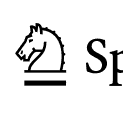

### 编辑

M. Arif Wani计算机科学研究生部克什米尔大学印度锡那加, 查谟和克什米尔

Mehmed Kantardzic计算机工程与计算机科学系路易斯维尔大学美国路易斯维尔

Moamar Sayed-Mouchaweh 计算机科学与自动控制系高级国家工程学院Mines Telecom Lille Douai法国Douai

ISSN 2194-5357 ISSN 2194-5365（电子版）
智能系统与计算进展 ISBN 978-981-15-1815-7 ISBN 978-981-15-1816-4 (电子书)
https://doi.org/10.1007/978-981-15-1816-4

© Springer Nature Singapore Pte Ltd. 2020
本作品受版权保护。出版商保留全部权利，无论是全部还是部分材料，特别是翻译、再版、插图重用、
朗读、广播、微缩胶片复制或以任何其他实体方式复制，以及传输
或信息存储和检索、电子适应、计算机软件，或类似或不同的
已知或今后开发的方法。

本出版物中使用的一般描述性名称、注册名称、商标、服务标志等，并不意味着，即使在没有
特定声明的情况下，这些名称不受相关保护法律和法规的约束，因此可以自由使用。

出版商、作者和编辑可以安全地假设本书中的建议和信息在出版日期时是真实准确的。出版商、
作者或编辑对本书中所包含的材料不提供明示或暗示的保证，也不对可能存在的任何错误或
遗漏负责。出版商在已发表的地图和机构affiliations方面保持中立。

这个Springer印记由注册公司Springer Nature Singapore Pte Ltd.出版。

## 前言

机器学习技术是一个可能改变现代社会许多方面的新数字前沿。预计它将对世界产生深远影响，改变我们生活、工作、购物、旅行和互动的方式。基于机器学习的发明正在蓬勃发展，从理论转向商业应用，支持科学、技术和商业的重要发展，从自动驾驶车辆和医学诊断到先进制造和基于互联网的推荐系统。深度学习技术代表了机器学习创新的前沿，在各种应用中取得了巨大成功。与传统的机器学习技术不同，深度学习能够从大量原始数据中自动生成高级数据表示。因此，随着处理能力的增强和图形处理器的进步，它为许多现实世界的应用提供了解决方案。

近年来，在语音识别、计算机视觉和机器翻译等领域，深度学习在应用方面取得了重大突破，算法的性能接近于人类水平，对产业、社会和经济产生了明显的影响。深度学习技术包括许多不同的深度架构，从深度前馈网络（DFNNs）和受限玻尔兹曼机（RBMs），到深度置信网络（DBNs）和自编码器（AE），再到卷积神经网络（CNNs），循环神经网络（RNNs）和生成对抗网络（GANs）。互联网、金融机构和电子商务是已经受到这项新技术影响最大的行业，但我们很快将在零售、医疗保健、制造业、交通运输、农业和物流等应用领域看到新的进展。将深度学习技术与机器人技术、物联网和区块链加密等新兴技术相结合，可能会在其他领域引发革命，并在新的领域进一步扩展。深度学习应用可以帮助触发地方经济的结构性转变，例如传统行业的现代化、面临市场下滑的行业的多样化，或者某个行业向更具生产力的活动转型。很快，我们将无法辨认出一个没有受到深度学习影响的行业。

被深度学习所触及；许多用户并没有意识到他们几乎每天都在与深度学习产品进行交互。

由于深度学习相关的创新是由数据驱动的，所以生成最先进产品的组织往往是拥有最多数据的组织。

这就是为什么这项技术吸引了谷歌、Facebook和微软等许多高科技企业的主要原因。但是，如今有数百家小公司和许多成功的初创公司代表了快速发展领域的有希望的新支持。

深度学习技术是复杂的，可能影响人类活动的许多不同领域，特别是因为它与大量的多媒体数据相关。对于用于深度学习的数据的关注正在变得更加核心，包括对安全漏洞和黑客攻击的担忧，以及围绕隐私、信任和这些新系统的自主性的问题，还有深度学习算法中的潜在偏见。当基于深度学习的医疗诊断平台在质量较差的数据上进行训练时，可能会导致不安全的诊断或治疗干预，这是任何医生都不会推荐使用的。因此，深度学习需要制定数据质量标准和模型审计程序至关重要。当前的深度学习应用还需要适应不断出现的问题，如数据稀疏性、缺失数据、不完整、无标签、异构和混乱的数据。

我们是深度学习革命中的第一波浪潮的一部分，很快，我们将看到这项技术对我们生活的更多影响。本书的主要目的是探索和呈现深度学习的一些新应用，涵盖了各种领域、技术和深度学习架构。

本书中呈现的示例是小而具有说明性的，对于理解实际深度学习应用的重要性是额外的贡献。

印度斯利那加尔
路易斯维尔，美国
杜埃，法国
M. 阿里夫·瓦尼
梅赫迪德·坎塔尔齐克
穆阿迈尔·赛义德-穆沙韦

## 目录

- 深度学习应用趋势 .................................................. 1
M. 阿里夫·瓦尼，梅赫迪德·坎塔尔齐克和穆阿迈尔·赛义德-穆沙韦

- 深度学习的拟牛顿优化方法 学习应用 ................................................... 9
雅各布·拉法蒂和鲁梅尔·F·马里卡

- 使用深度神经网络的医学图像分割 使用预训练编码器 .................................................... 39
Alexandr A. Kalinin, Vladimir I. Iglovikov, Alexander Rakhlin 和Alexey A. Shvets

- 用于轻度认知障碍诊断的3D密集连接卷积网络集成 和阿尔茨海默病 ...................................................... 53
Shuqiang Wang, Hongfei Wang, Albert C. Cheung, Yanyan Shen 和Min Gan

- 使用深度学习在SHRP2 NDS视频中检测工作区 基于计算机视觉 ...................................................... 75
Franklin Abodo, Robert Rittmuller, Brian Sumner和Andrew Berthaume

- 使用多流卷积神经网络的视频动作识别 神经网络 ...................................................... 95
Helena de Almeida Maia, Darwin Ttito Concha, Helio Pedrini, Hemerson Tacon, André de Souza Brito, Hugo de Lima Chaves, Marcelo Bernardes Vieira和Saulo Moraes Villela

- 深度学习应用于图像回归 ...................................................... 113
Hiranmayi Ranganathan, Hemanth Venkateswara, Shayok Chakraborty 和Sethuraman Panchanathan

- 基于深度学习的锂离子电池危险标签物体检测
使用合成和真实数据的锂离子电池危险标签物体检测................ 137
Anneliese Schweigert, Christian Blesing 和 Christoph M. Friedrich

- 实现物流中的稳健自主材料处理
通过应用深度学习算法. . . 155
Christian Poss, Thomas Irrenhauser, Marco Prueglmeier, Daniel Goehring, Vahid Salehi 和 Firas Zoghlami

- 作者索引 177

### 关于编辑

M. Arif Wani教授在印度理工学院德里分校获得计算机技术硕士学位，在英国卡迪夫大学获得计算机视觉博士学位。目前，他是克什米尔大学的教授，曾任加利福尼亚州立大学贝克斯菲尔德分校的教授。他的主要研究兴趣包括基因表达数据集、人脸识别技术/算法、人工神经网络和深度架构。他在这些领域的许多论文发表在知名期刊和会议上。他于2002年获得国际技术学院奖，该奖由国际技术学院（美国加利福尼亚）颁发。他是许多学术和专业机构的成员，例如印度技术教育学会、印度计算机学会、IEEE美国和美国光学学会。

博士 Mehmed Kantardzic 于1980年获得计算机科学博士学位，1976年获得计算机科学硕士学位，1972年获得电气工程学士学位，这些学位都来自波斯尼亚和黑塞哥维那的萨拉热窝大学。他曾在萨拉热窝大学担任助教和副教授，后来在路易斯维尔大学担任副教授，自2004年起担任正教授。目前，他是数据挖掘实验室的主任，也是CECS部门的CECS研究生学习的主任。他的研究重点是数据挖掘与知识发现、机器学习、软计算、点击欺诈检测与预防、流数据中的概念漂移和分布式智能系统。Kantardzic博士是六本书的作者，包括教科书：“数据挖掘：概念、模型、方法和算法”（John Wiley，第二版，2011年），该书在美国和国外的100多所大学的数据挖掘课程中被接受。他是40多篇同行评审的期刊论文、20篇书籍章节和200多篇国际会议论文的作者。他最近的研究项目得到了NSF、KSTC、美国财政部、美国陆军和NASA的支持。Kantardzic博士被选为2012年在信息技术方面的富布莱特专家。Kantardzic博士曾在多个国际期刊的编辑委员会任职，并且目前是WIRES数据挖掘与知识发现期刊的副编辑。

教授Moamar Sayed-Mouchaweh在法国兰斯大学获得博士学位。他曾在法国兰斯大学计算机科学、控制和信号处理方面担任副教授，在信息与通信科学技术研究中心工作。2008年12月，他获得计算机科学、控制和信号处理方面的博士后资格。自2011年9月起，他在法国高级国家矿业学校Mines Telecom Lille Douai（法国）计算机科学与自动控制系担任正教授。他编辑并撰写了多本Springer图书，并担任多个国际期刊的特邀编辑。他还担任过多个国际研讨会和会议的IPC主席和会议主席。他是多个国际期刊的编辑委员会成员。

## 深度学习应用的趋势

M. 阿里夫·瓦尼，梅赫迪德·坎塔尔齐克和穆阿迈尔·赛义德-穆沙韦

摘要深度学习是机器学习的一个新领域，在最近变得流行起来。它已经超越了传统算法在准确性方面的表现，因为特征是通过通用学习过程从数据中学习而来，而不是由人工工程师设计的[1]。深度学习是当今人工智能爆炸的原因。深度网络在计算机视觉和机器翻译任务中展示了显著的改进。它具有几乎与人类一样的识别口语的能力。它展示了良好的泛化能力，并在机器学习建模中取得了高准确率，甚至吸引了非计算科学家。它现在被用作在医学、金融、制造等领域做出关键决策的指南。深度学习已经在以前无法解决的问题上取得了成功，这些问题在使用机器学习和其他浅层网络时非常困难。然而，深度学习仍处于起步阶段，但很可能在不久的将来取得许多成功，因为它几乎不需要手工工程，因此可以利用大量的数据和计算能力。在[1]中报道了各种监督和无监督的深度架构。 本章概述了深度学习技术在游戏玩法、医疗应用、视频分析、回归/分类、物体检测/识别和机器人自动化等应用中的作用。

M. Arif Wani (区)
克什米尔大学，哈兹拉特巴尔，斯利那加尔 190006，印度
e-mail: awani@uok.edu.in

M. Kantardzic
路易斯维尔大学，肯塔基州，美国
e-mail: mmkant01@louisville.edu

M. Sayed-Mouchaweh
高级国家矿业电信学院，杜埃，法国
e-mail: moamar.sayed-mouchaweh@mines-douai.fr


### 1 引言

深度学习是机器学习的一个新领域，在最近几年获得了广泛关注。它通过使用通用的学习过程从数据中学习特征，而不是由人工工程师设计的，从而在准确性上超越了传统算法[1]。深度学习是当今人工智能爆炸的原因。深度网络在计算机视觉和机器翻译任务中展示了显著的改进。它几乎能像人类一样识别口语。它展示了良好的泛化能力，并在机器学习建模中取得了高准确性，甚至吸引了非计算机科学家。它现在被用作在医学、金融、制造等领域做出关键决策的指南。

深度学习已经成功解决了以前无法通过机器学习和其他浅层网络解决的问题，这些问题相当困难。然而，深度学习仍处于初级阶段，但很可能在不久的将来取得许多成功，因为它几乎不需要手工工程，并且可以利用大量的数据和计算能力。

已经报道了各种监督和无监督的深度架构[1]。本章概述了深度学习技术在游戏玩法、医疗应用、视频分析、回归/分类、物体检测/识别和机器人自动化等应用中的使用。

## 2 游戏玩法中的深度学习

用于解决深度学习中的优化问题的一阶随机梯度下降（SGD）算法可能具有较慢的收敛速度。通过使用二阶曲率信息来找到搜索方向可以帮助更稳健的收敛。然而，这需要计算Hessian矩阵，这在计算上并不实际。拟牛顿方法可以构造Hessian矩阵的近似。拟牛顿方法，如SGD，只需要一阶梯度信息，可以得到良好的线性收敛性。有限内存的Broyden–Fletcher–Goldfarb–Shanno（L-BFGS）方法是构造正定Hessian近似的最流行的拟牛顿方法之一，可以应用于深度学习中的优化问题。该方法可以用于各种应用，包括游戏玩法。

第2章介绍了基于L-BFGS拟牛顿方法的高效优化方法，作为训练深度神经网络的SGD方法的替代方法。这些方法使用信任区域策略来计算Hessian近似的低秩更新。该章比较了线搜索L-BFGS优化方法与提出的信任区域最小化算法。这两种方法都被用来训练LeNet-5架构。MNIST数据集被用来比较两种方法的性能。该章介绍了一种优化方法基于线搜索有限内存BFGS方法的深度强化学习框架。该方法在六个经典的ATARI 2600游戏上进行评估。结果显示出稳定的收敛性和优良的泛化特性，以及快速的训练时间。

## 3医学应用中的深度学习

使用深度神经网络进行图像分割最近受到了极大的关注。基于深度学习的分割已经应用于许多应用领域，包括医学成像和产生改进的性能结果。

医学图像分割是一项重要的机器视觉任务，通常需要进行以实现计算机辅助诊断和其他医学分析。然而，医学图像分割仍然是一个具有挑战性的问题，但是深度学习的应用可以提高性能，潜在地有益于诊断和其他临床实践结果。

第3章介绍了多个深度卷积神经网络在医学图像分割中的应用。首先，介绍了从无线胶囊内镜视频中进行血管畸形病变分割的方法。血管畸形是普通人群中最常见的胃肠道血管病变。对于这个应用，数据集包含1200张使用无线胶囊内镜获取的彩色图像。这些图像采用24位PNG格式，分辨率为576 × 576像素。在第二个应用中，开发了一个模型用于手术视频中机器人工具的语义分割，这是一个非常重要的问题，用于术中指导。用于建模的数据集包含从da Vinci Xi获取的8 ×225帧高分辨率立体相机图像序列。每个视频序列包含从左右摄像机获取的两个立体通道，并且以RGB格式具有1920 ×1080像素的分辨率。分析了四种不同的深度架构用于分割：U-Net、两种Ternaus-Net的修改版本和LinkNet-34。在所有情况下，模型的输出是一幅图像，其中每个像素值对应于属于感兴趣区域或类别的概率。

LinkNet-34是最佳的血管畸形病变分割模型，同时提供最快的推理速度，而TernausNet-16模型在外科手术视频中机器人器械的语义分割获得了最佳结果，该模型使用了预训练的VGG-16编码器。

阿尔茨海默病是一种常见的进行性神经退行性疾病，被列为威胁老年人生命和健康的第四大杀手，而轻度认知障碍被认为是正常老年人和患有阿尔茨海默病的人之间的中间过渡。从三维脑磁共振图像中自动诊断阿尔茨海默病和轻度认知障碍在早期痴呆治疗中起着重要作用。

第4章介绍了基于3D密集连接卷积网络的深度学习方法，用于从3D磁共振图像中诊断痴呆症。

MRI。引入了密集连接以最大化信息流动，基于概率的集成方法降低了选择单个分类器的误识别风险。该研究涉及超过1,000名参与者，包括轻度认知障碍患者、被诊断为阿尔茨海默病的患者和没有该疾病的人。大多数参与者被重复收集了两到六次，连续扫描之间的间隔超过一年。

进行了多次实验，以优化3D-DenseNet的性能，使用不同的超参数和架构。结果表明，与基于2D图像切片的传统方法相比，3D卷积保留并提取了脑部MRI图像中更多的关键空间特征信息，从而为阿尔茨海默病分类模型提供了更好的特征基础。

## 视频分析中的深度学习

第二个战略公路研究计划（SHRP2）资助了许多与交通安全相关的项目，包括自动驾驶研究（NDS）。该研究从各种真实道路和环境条件下的人类驾驶员收集了驾驶员和车辆特定的数据。志愿驾驶员的车辆配备了两个外部摄像头和两个内部摄像头，前向雷达以及数据采集系统，可以用于机器学习模型的行人检测、场景分割、交通信号状态检测、头部、躯干和手部姿势检测以及面部特征检测。与NDS相辅相成的项目是道路信息数据库（RID）的创建，其中包含了NDS驾驶员所驾驶的美国道路网络部分的静态特征，如车道数、交叉口的转弯车道类型、高速路段上是否有隆起带等。自SHRP2成立以来，工作区域的存在与否一直是NDS行程中所需的信息。

第5章介绍了新的视频分析应用程序，旨在通过NDS对视频数据集中的工作区事件进行完整准确的记录。大部分数据是由来自六个州的3500多名驾驶员在2012年至2015年期间收集的，涵盖了超过500万次行程，记录了超过100万小时的视频。共提供了1344个视频，包含31535862帧，可用于构建数据集，包括训练、验证和测试子集。所提出的方法结合了基于FFmpeg的视频解码器、基于TensorFlow的图像场景分类器以及用于读取视频帧时间戳的算法，用于识别检测到的工作区事件的起始和结束时间戳。使用主动学习方法，模型首先在一小部分手动标记的“种子”样本上进行训练，然后用于预测其余未标记样本的类别。主动学习方法对于应用程序的成功尤为重要，因为工作区特征在数据库中相对较少，导致浪费时间进行标记。实施的深度学习解决方案为道路信息增添了新的内容。

在视频中识别人类动作，旨在检测和识别一个或多个参与者的动作，可能是一项具有挑战性的任务，因为场景条件复杂，如遮挡、背景杂乱和相机运动，以及相同动作可能因不同演员而有所不同。

第6章提出了一种深度卷积神经网络（CNNs），以便在视频中识别人类动作。为了解决与此识别相关的挑战，如遮挡、背景杂乱和相机运动，所提出的方法使用了三种互补的模态：RGB帧、光流图像和视觉节奏。前两种模态分别允许探索连续帧中对象的空间和时间特性，而第三种模态允许将整个视频（时空）编码为单个图像。所提出的方法基于使用三个深度CNN，每个模态一个。每个CNN都与其相应的模态进行微调。应用三种不同的融合策略（简单平均、加权平均、外部全连接层），以获得输入视频的单个得分向量。使用外部全连接层可以定义特征（模态）对最终预测的贡献程度。所提出的方法使用从商业和非商业来源收集的视频序列进行了测试，包括模糊的视频或质量较低的视频以及来自不同视角的动作。与现有技术方法相比，所得到的结果是令人鼓舞的。

## 5 深度学习在回归和分类中的应用

训练一个用于分类/回归任务的CNN模型需要大量标记的训练数据，这需要耗费时间和金钱。主动学习算法可以自动从大量未标记的数据中识别出一部分代表性的实例，从而减少人工标注的工作量。这也减少了训练机器学习模型的计算工作量。

第7章将主动学习机制和深度卷积神经网络集成到图像回归任务中。这种集成的目标是使用少量标记数据和大量未标记数据进行回归。事实上，主动学习机制允许在大量未标记数据中选择显著和有信息量的样本，以便由专家手动标记。这显著降低了标记成本（人力成本），同时提高了回归模型的泛化能力。所提出的机制中用于选择信息或示例样本的标准被称为预期模型输出变化原则（EMOC）。后者通过测量在训练时使用特定样本和不使用特定样本时回归模型输出的差异来量化样本的重要性。这个操作会重复进行，直到达到预定义的迭代次数。所提出的主动学习CNN方法的基于误差的性能（均方误差，平均绝对误差）与一些知名的基于回归的主动学习算法（贪婪算法、委员会查询、随机抽样、Kàding）相比，使用不同的数据集（手写数字识别、头部姿势、年龄识别）进行比较。所得结果表明，所提出的方法优于其他比较的最先进方法。

## 6 深度学习在目标检测和识别中的应用

深度学习的一个应用可以是危险标签物体检测。使用空气、道路、水路和铁路等不同的运输方式来运输货物，其中可能包括危险或有害物品，如锂离子电池。对带有危险或有害物品的包裹进行不适当的护理和处理可能导致事故或引发爆炸和火灾。为了自动分离这种包裹，必须识别这种包裹的标签。在运输过程中，如果危险标签可能受到环境影响而变脏，标签识别可能变得困难。

第8章介绍了基于卷积神经网络（CNN）的系统来解决这个挑战。这些系统基于You Only Look Once（YOLO）和自主开发的目标检测流水线（ODP），使用最大稳定极值区域（MSER）。使用平均精度（mAP）、检测速度和训练时间等不同评估标准，研究了这些系统在包裹上符号检测方面的性能。

使用真实图像和通过随机对比度、亮度和模糊调整生成的合成图像训练了两个模型。

## 7. 机器人自动化中的深度学习

物流活动导致制造商采购价格的总成本约为25%。剩下的75%主要由材料成本（60%）和生产成本（15%）组成。现代工业中高动态的生产过程增加了物流的复杂性，从而促使用了自动化解决方案的不断采用。因此，机器人解决方案和智能机器正在将制造业转变为更高级别的自动化。

第9章研究了在自动化整个机器人内部物流过程中使用模块化智能感知算法的应用。内部物流包括工业、贸易和公共机构中内部物资流动、信息流动和货物处理的组织、控制、实施和优化。

所提出的算法基于三个相互连接的模块：检测、选择和定位。检测模块旨在识别机器人视野中所搜索类别的物体。该模块的输出是在相应图像中检测到的所搜索类别的物体集合。第二个模块，选择模块，从这个集合中选择相关的物体进行相应的处理。该第二个模块的输出是机器人需要抓取的物体集合。最后，第三个模块，定位模块，确定三维空间中的准确抓取姿势。使用一个真实的过程环境中的解块机器人来测试所提出的感知算法的性能（成功抓取率）。

## 深度学习应用的趋势

### 参考文献

- 1. M. Arif Wani, F.A. Bhat, S. Afzal, A. Khan, 深度学习的进展, vol. 57 (Springer, Berlin, 2020)

## 深度学习应用中的拟牛顿优化方法

### 雅各布·拉法蒂和鲁梅尔·F·马里卡

摘要 深度学习算法通常需要解决高度非线性和非凸无约束优化问题。解决大规模机器学习问题（如深度学习和深度强化学习）的方法通常限于一阶算法类，如随机梯度下降（SGD）。虽然SGD的迭代计算成本低廉，但其理论收敛速度较慢。此外，它们需要耗费大量的试错来微调许多学习参数。使用二阶曲率信息来寻找搜索方向可以帮助非凸优化问题更稳健地收敛。然而，计算大规模问题的海森矩阵在计算上是可行的。相反，拟牛顿方法构建一个目标函数的二次模型的近似海森矩阵。拟牛顿方法，如SGD，只需要一阶梯度信息，但它们可以导致超线性收敛，这使它们成为SGD的有吸引力的替代方法。有限内存的Broyden–Fletcher–Goldfarb–Shanno（L-BFGS）方法是最流行的拟牛顿方法之一，它构建正定的海森矩阵近似。在本章中，我们提出了基于L-BFGS拟牛顿方法的高效优化方法，使用线性搜索和信赖域策略。我们的方法通过使用梯度信息计算Hessian近似的低秩更新来弥合一阶和二阶方法之间的差距。我们对这些方法进行了正式的收敛性分析，并在深度学习应用中进行了实证结果，如图像分类任务和在一组Atari 2600视频游戏上进行的深度强化学习。我们的结果显示出稳健的收敛性和优良的泛化特性，以及快速的训练时间。


J. Rafati (图). R. F. Marica 加利福尼亚大学，北湖路5200号，默塞德，CA 95343，美国 e-mail: jrafatitheravi@ucmerced.edu URL: http://rafati.net

R. F. Marica e-mail: rmarcia@ucmerced.edu URL: http://faculty.ucmerced.edu/rmarcia

© Springer Nature Singapore Pte Ltd. 2020 M. A. Wani等人（编辑），深度学习应用, 智能系统与计算进展1098. https://doi.org/10.1007/978-981-15-1816-4_2

### 1 引言

深度学习（DL）正在成为解决大规模机器学习（ML）问题的主要技术，包括图像分类、自然语言处理和大规模回归任务[1, 2]。深度学习算法试图在大型数据集上训练一个函数逼近（模型），通常是一个深度卷积神经网络（CNN）。在大多数深度学习和深度强化学习（RL）算法中，需要解决经验风险最小化（ERM）问题[3]。ERM问题是一个高度非线性和非凸无约束优化问题，形式为

min 𝐿(𝑤) ≔ 1/N ∑₢=₁^N ℓᵢ(𝑤), (1)

其中 w ∈ ℝⁿ是CNN模型的可训练参数向量，n是学习参数的数量，N是训练数据集中的观测数量，ℓᵢ(𝑤) ≔ ℓ(𝑤; 𝑥ᵢ, 𝑦ᵢ)是当前模型对第i个观测的预测误差，𝒟= {(xi, yi) | i = 1, …, N}.

##### 1.1 现有方法

寻找一个高效的优化算法来解决大规模非凸ERM问题(1)已经吸引了许多研究者[1]。在机器学习和优化文献中，有各种算法被提出来解决(1)。其中，可以提到一阶方法，如随机梯度下降(SGD)方法[4–7]，拟牛顿方法[8–11]，以及无Hessian方法[12–15]。

由于在大规模机器学习问题中，通常N和n都是非常大的数字，计算真正的梯度∇𝐿(𝑤)是昂贵的，而计算真正的海森矩阵∇²𝐿(𝑤)是不切实际的。因此，机器学习和深度学习文献中的大多数优化算法都限制在一阶梯度下降方法的变体上，例如SGD方法。SGD方法使用一个小的随机数据样本Jₖ ∈ S来计算目标函数的梯度的近似值∇𝐿^(Jₖ)(𝑤)≈∇𝐿(𝑤)。在每次学习更新的迭代中，参数的更新方式为wₖ₊₁ ← wₖ − ηₖ∇𝐿^(Jₖ)(wₖ)，其中ηₖ被称为学习率。

SGD算法的每次迭代的计算成本很小，使其成为绝大多数深度学习应用中最广泛使用的优化方法。然而，这些方法需要要对许多超参数进行微调，包括学习率。学习率通常选择得很小，因此SGD算法在学习过程中需要重新访问许多轮的数据。事实上，SGD方法成功执行的可能性很小。在第一次尝试解决问题时，SGD方法通常不会成功，但最近有研究自动调整超参数的方法（参见[16, 17]）。

SGD方法的另一个主要缺点是在大多数非凸优化问题中很难处理鞍点。这些鞍点对模型的泛化能力有不良影响。另一方面，使用二阶曲率信息可以帮助产生更稳健的收敛性。

牛顿法是一种二阶方法，使用Hessian矩阵和梯度来找到搜索方向。通常使用线搜索策略来找到沿搜索方向的步长，以保证收敛。二阶方法的主要瓶颈是计算Hessian矩阵的严重计算挑战，对于大规模问题来说是不切实际的。拟牛顿方法和无Hessian方法都使用近似Hessian矩阵的方法，而不需要计算和存储真实的Hessian矩阵。具体而言，无Hessian方法尝试通过共轭梯度方法求解∇²L(wk) pk= -∇L(wk)来找到近似的牛顿方向。

拟牛顿方法是解决深度学习中大规模非凸优化问题的一种替代一阶方法。这些方法，与随机梯度下降（SGD）一样，只需要计算目标函数的一阶梯度。通过测量和存储连续梯度之间的差异，拟牛顿方法构建了拟牛顿矩阵{Bk}，这些矩阵是对先前的Hessian近似的低秩更新，用于估计每次迭代的∇²L(wk)。它们通过使用这些拟牛顿矩阵构建了目标函数的二次模型，并使用该模型找到一系列搜索方向，可以实现超线性收敛。由于这些方法不需要二阶导数，它们比牛顿法在大规模优化问题上更高效。

文献中提出了各种拟牛顿方法。它们在如何定义和构建拟牛顿矩阵{Bk}，如何计算搜索方向以及如何更新模型参数方面存在差异。

##### 1.2 动机

Broyden–Fletcher–Goldfarb–Shanno (BFGS) 方法 [21–24] 被认为是最广泛使用的拟牛顿算法，它为每次迭代产生一个正定矩阵Bk。传统的BFGS 最小化使用线搜索，首先通过计算 p_k= -B_k^{-1}∇L(w_k)来尝试找到搜索方向，然后根据足够的减少和曲率条件 [18] 决定步长 α_k∈(0,1]，对于每次迭代 k，然后更新参数 w_{k+1}= w_k + α_k p_k。线搜索算法首先尝试单位步长 α_k=1，如果不满足足够的减少和曲率条件，则递归地减小 α_k，直到满足某些停止准则（例如 α_k < 0.1）。当Bk成为高阶更新时，解决Bk pk=−∇L(wk)可能会变得计算上昂贵。有限内存的BFGS (L-BFGS) 方法构建了Hessian近似的一系列低秩更新；因此，可以高效地解决Bk^−1∇L(wk)。作为梯度下降的替代方案，在深度学习环境中实现了带有线搜索的有限内存拟牛顿算法[25]。这些方法近似了二阶导数信息，提高了每次训练迭代的质量，并避免了应用特定参数调整的需要。

满足足够减少和曲率条件以及使用线搜索方法找到αk都会带来计算成本。此外，如果曲率条件对于αk∈(0,1]不满足，则L-BFGS矩阵可能不保持正定性，更新将变得不稳定。另一方面，如果为了保持L-BFGS矩阵的正定性而拒绝搜索方向，则学习的进展可能会停止或变得非常缓慢。

信赖域方法试图在一个区域内找到搜索方向pk，在这个区域内他们相信目标函数的二次模型的准确性，即ℱ(pk)≠1/2 p_k^T Bk pk + ∇L(wk)^T pk。这些方法不仅不依赖于超参数的微调，而且可能改善线搜索方法的训练性能和收敛鲁棒性。

此外，信赖域L-BFGS方法可以轻松拒绝搜索方向，如果曲率条件不满足，以保持L-BFGS矩阵的正定性[26]。信赖域方法的计算瓶颈是解决信任域子问题。然而，最近的研究表明，如果选择Hessian近似矩阵Bk，则可以高效地解决信任域子问题[20, 27]。

##### 1.3 应用和目标

深度学习算法试图通过从观察数据中学习模型（或参数化的函数逼近器）来解决大规模机器学习问题，以预测未知事件。深度学习中使用的模型是一个人工神经网络，它是许多卷积层、全连接层、非线性激活函数等的堆叠。许多数据驱动或目标驱动的应用可以通过深度学习方法来解决。根据应用和数据，应选择适当的模型架构并定义经验损失函数。（有关最先进的深度神经网络架构以及监督学习和无监督学习的深度学习应用，请参见[2]。）所有深度学习算法中的共同模块是解决（1）中定义的ERMI问题的优化步骤。

在本章中，我们提出了基于拟牛顿优化的方法来解决深度学习应用中的ERM问题。对于数值实验，我们专注于两个深度学习应用，一个是监督学习，另一个是强化学习。所提出的方法是通用的，可以用于解决其他深度学习应用的优化步骤。

首先，我们引入了一种新颖的大规模L-BFGS优化方法，使用信任区域策略作为梯度下降方法的替代方案。这种方法被称为用于训练响应的信任区域最小化算法（TRMi-nATR）[26]。我们实现了实用的计算算法来解决机器学习和深度学习应用中出现的经验风险最小化（ERM）问题。我们提供了关于MNIST数据集分类任务的经验结果，并展现了具有优选泛化特性的稳健收敛性。

基于经验结果，我们对信任域策略和线搜索策略在不同收敛性质上进行比较。TRMi-nATR通过在每次迭代中高效计算闭式解来解决相关的信任域子问题，在大规模问题中可能需要大量计算。基于信任域算法的独特特点，与线搜索方法不同，学习的进展不会因为偶尔拒绝不需要的搜索方向而停止或减慢。我们还研究了在信任域策略中初始化正定L-BFGS拟牛顿矩阵的技术，以避免在构建目标函数的二次模型时引入任何错误的曲率条件。

接下来，我们将研究准牛顿优化方法在深度强化学习（RL）应用中的效用。RL——一类机器学习问题——是学习如何将情境映射到行动，以最大化在人工智能代理与环境互动过程中接收到的数值奖励信号[28]。RL代理必须能够感知环境的状态，并能够采取影响状态的行动。该代理也可以被视为与环境状态相关的目标（或目标）。现实世界中强化学习（RL）问题中出现的一个挑战是“维度诅咒”。与RL相结合的非线性函数逼近器使得在高维状态空间中学习抽象成为可能[29–34]。使用神经网络进行RL的成功示例包括学习如何以大师级水平玩Backgammon游戏[35]。最近，DeepMind Technologies的研究人员使用深度Q学习算法来玩各种Atari游戏的原始屏幕图像流[36, 37]。深度Q学习算法[36]采用卷积神经网络（CNN）作为状态-行动值函数的近似。在这些游戏中的表现通常达到或超过人类水平。在另一项工作中，DeepMind使用深度CNN和蒙特卡洛树搜索算法结合监督学习和RL来学习如何以超人水平玩围棋游戏[38]。

我们为深度强化学习框架实现了一种L-BFGS优化方法。我们的深度L-BFGS Q-learning方法旨在通过GPU进行并行计算，以提高效率。我们使用Atari 2600游戏的子集来研究我们的算法，评估其学习状态-动作值函数的稳健表达能力，以及其计算和内存效率。我们还分析了使用基于L-BFGS优化的深度神经网络进行Q-learning的收敛性质。

##### 1.4 章节概述

在第2节中，我们简要介绍了机器学习、深度学习和无约束优化的最优性条件。在第3节中，我们介绍了两种常见的无约束优化策略，即线搜索和信赖域。在第4节中，我们介绍了基于L-BFGS优化的线搜索和信赖域策略的拟牛顿方法。在第5节中，我们实现了基于信赖域和线搜索的L-BFGS算法来解决图像识别任务。在第6节中，我们介绍了强化学习问题以及基于L-BFGS线搜索优化的方法来解决深度强化学习应用中的ERM问题。

### 2个无约束优化问题

在无约束优化问题中，我们希望解决最小化问题（1）。

```
min \L(w),\ (2)
```

其中 L : R^n → R 是一个光滑函数。如果 w* 是一个全局最小化器，则点 w* 的函数值 L(w*) ≤L ( w) 对于所有 w ∈ R^n成立。通常 L 是一个非凸函数，大多数算法只能找到局部最小化器。如果存在一个邻域 N of w*，使得对于所有 w ∈ N，点 w* 是一个局部最小化器，则点 w* 是一个局部最小化器。对于凸函数，每个局部最小化器也是一个全局最小化器，但对于非凸函数，这个说法不成立。如果 L 二次连续可微，则我们可以通过检查梯度 ∇L ( w* ) 和海森矩阵∇² L ( w* ) 来判断w* 是否是一个局部最小化器。让我们假设目标函数 L 是光滑的：一阶导数（梯度）可微分，二阶导数（海森矩阵）连续。为了研究光滑函数的最小化器，泰勒定理是必不可少的。定理1（泰勒定理）假设 L : R^n → R 是连续可微的。考虑 p ∈ R^n 使得 L(w +p) 是良定义的，那么我们有

```
L(w + p) = L(w) + \nabla L(w + t p)^T p, 对于某个 t ∈ (0, 1). (3)
```

同时，如果 L具有两次连续可微性，

```
L(w + p) = L(w) + \nabla L(w + t p)^T p + \frac{1}{2} p^T \nabla^2 L(w + t p) p, 对于某个 t ∈ (0, 1). (4)
```

一个点 w* 是 L 的局部极小值点，当且仅当 ∇L(w*) =0. 这被称为一阶最优化条件。此外，如果 ∇² L(w*) 是正定的，那么被保证是局部极小值。这被称为二阶充分条件[18]。

## 3 个优化策略

在本节中，我们简要介绍了两种常用的优化策略，即线搜索和信赖域方法[18]。这两种方法都通过定义一系列迭代 {w_k} 来最小化目标函数 L(w)。在(1)中，这些迭代受到搜索方向 p_k 的控制。每种方法都通过计算搜索方向 p_k 来最小化目标函数的二次模型，该模型由以下定义

```
Qₖ(p) ≜ gₖ^T p + 1/2 p^T Bₖ p, (5)
```

其中 gₖ ≜ ∇L(wₖ)，Bₖ是Hessian矩阵 ∇²L(wₖ)的近似值。请注意，Qₖ(p)是基于(4)中的Taylor展开对 L(wₖ + p) − L(wₖ)进行二次逼近。

##### 3.1 线搜索方法

线搜索方法的每次迭代通过最小化目标函数的二次模型来计算搜索方向 pₖ，

```
pₖ = arg min(p∈ℝⁿ) Qₖ(p) ≜ 1/2 p^T Bₖ p + gₖ^T p, (6)
```

然后决定沿着该方向移动多远。迭代公式为 wₖ₊₁ = wₖ + αₖ pₖ，其中 αₖ 被称为步长。如果 Bₖ 是正定矩阵，则二次函数的最小化器可以找到为 pₖ=−Bₖ^−¹ gₖ。步长 αₖ >0 的理想选择是单变量函数 φ(α)=L(wₖ + αpₖ) 的全局最小化器，但在实践中 αₖ 被选择满足足够减少和曲率条件，例如Wolfe条件[18,39]给出的

```
L(wₖ + αₖ pₖ) ≤ L(wₖ) + c₁ αₖ ∇L(wₖ)^T pₖ, (7a)
```

```
∇L(wₖ + αₖ pₖ)^T pₖ ≥ c₂ ∇L(wₖ)^T pₖ, (7b)
```

其中 0 < c₁ < c₂ < 1。线搜索方法的一般伪代码在算法1中给出（详见[18]）。

###### 算法1 线搜索方法

输入：w₀，容差 ε > 0
k ← 0
重复
    计算 gₖ = ∇ℒ(wₖ)
    计算 Bₖ
    通过求解（6）计算搜索方向 pₖ
    找到满足（7b）中Wolfe条件的 αₖ
    k ← k + 1
直到 ‖gₖ‖ < ε 或 k 达到最大迭代次数

##### 3.2 信赖域方法

信赖域方法生成一个迭代序列 wₖ₊₁ = wₖ + pₖ，其中每个搜索步骤 pₖ，通过求解以下信赖域子问题获得：

pₖ = argmin_p Qₖ(p) ≜ 1/2 pᵀBₖp + gₖᵀp，使得 ‖p‖₂ ≤ δₖ， (8)

其中 δₖ > 0 是信赖域半径。信赖域子问题 (8) 的全局解可以通过以下定理给出的最优性条件来描述，该定理由 [40, 41] 提出。

###### 定理2
设 δₖ 为正常数。如果存在一个唯一的 σ* ≥ 0，使得 B + σ*I 是正半定的，并且矢量 p* 是信赖域子问题 (8) 的全局解，当且仅当

‖p*‖₂ ≤ δₖ，
(B + σ*I)p* = -g 和 σ*(δ - ‖p*‖₂) = 0. (9)

此外，如果 B + σ*I 是正定的，则全局最小化器是唯一的。

信赖域方法的一般伪代码如算法2所示。详细信息请参见[18]的算法6.2。有关信赖域方法的更多详细信息，请参见[42]。请参见图1以了解信赖域方法的示意图。

#### 4 拟牛顿优化方法

在二次模型(5)中，使用 Bₖ = ∇²ℒ(wₖ) 作为Hessian矩阵的方法通常表现出二次收敛速度。然而，在大规模问题中（其中 n 和 N 都很大），显式计算真实的Hessian矩阵是不可行的。在这种情况下，拟牛顿方法是可行的替代方案，因为它们表现出超线性收敛速度，同时保持内存和计算效率。

拟牛顿方法使用近似的Hessian矩阵 Bₖ 代替真实的Hessian矩阵，在每一步之后更新以考虑获得的额外知识。

拟牛顿方法和梯度下降方法一样，只需要计算一阶导数信息。它们可以通过测量连续梯度的变化来构建目标函数的模型，以估计Hessian矩阵。大多数方法存储位移，sₖ ≜ wₖ+1 − wₖ，和梯度变化，yₖ ≜ ∇L(wₖ+1)− ∇L(wₖ)，来构建Hessian矩阵的近似值, {Bₖ}。

拟牛顿矩阵需要满足割线方程， $B_{k+1} s_k = y_k$。通常，对 $B_{k+1}$ 还有其他条件，比如对称性（因为精确的海森矩阵是对称的），以及要求从 $B_k$ 到 $B_{k+1}$ 的更新是低秩的，意味着海森矩阵的近似不能在迭代过程中发生太大变化。拟牛顿方法在定义这个更新时有所不同。这些矩阵是递归定义的，初始矩阵为 $B_0$，其中 $B_0 = \lambda_{k+1} I$，其中标量 $\lambda_{k+1} > 0$。

##### 4.1 BFGS更新

在所有拟牛顿方法中，可能最为知名的是 Broyden–Fletcher–Goldfarb–Shanno（BFGS）更新[18, 43]，给出的公式为

```
$B_{k+1} = B_k - \frac{1}{s_k^T B_k s_k} B_k s_k s_k^T B_k + \frac{1}{y_k^T s_k} y_k y_k^T . \quad (10)$
```

BFGS方法在初始近似 $B_0 = \gamma_{k+1} I$ 为正定且 $s_k^T y_k > 0$ 时生成正定近似。常见的 $\gamma_{k+1}$ 值为 $y_k^T y_k / y_k^T s_k$[18]（参见[44]选择 $\gamma_{k+1}$ 的替代方法）。

```
$S_k \triangleq [s_0 \dots s_{k-1}]$ 和 $Y_k \triangleq [y_0 \dots y_{k-1}], \quad (11)$
```

BFGS公式可以用以下紧凑表示形式写成：

```
$B_k = B_0 + \Psi_k M_k \Psi_k^T, \quad (12)$
```

其中 $\Psi_k$ 和 $M_k$ 的定义如下

```
$\Psi_k = [B_0 S_k \quad Y_k], \quad M_k = \begin{bmatrix} -S_k^T B_0 S_k - L_k & -L_k^T \\ -L_k & D_k \end{bmatrix}^{-1}, \quad (13)$
```

而 $L_k$ 是矩阵的严格下三角部分，$D_k$ 是矩阵的对角部分 $S_k^T Y_k$，即 $S_k^T Y_k = L_k + D_k + U_k$，其中 $U_k$ 是严格上三角矩阵。（详见[45]了解更多细节。）

在大规模问题中，通常只存储最近计算的 $m$ 个配对 $\{(s_k, y_k)\}$，其中 $m \le 10$。这种方法通常被称为有限内存的BFGS (L-BFGS)。

##### 4.2 线搜索 L-BFGS 优化

在每次线搜索的迭代中（算法1），我们需要计算 $p_k = -B_k^{-1} g_k$。我们可以利用以下递归公式计算 $H_k = B_k^{-1}$：

```
$H_{k+1} = \left( I - \frac{y_k s_k^T}{y_k^T s_k} \right) H_k \left( I - \frac{s_k y_k^T}{y_k s_k} \right) + \frac{y_k y_k^T}{y_k s_k} , \quad (14)$
```

其中 $H_0 = \gamma_{k+1}^{-1} I$。BFGS两层循环递归算法（算法3）可以在 $4mn$ 次运算中计算 $p_k = -H_k g_k$[18]。

###### 算法3 L-BFGS 两层循环递归

```
q ← g_k = ∇L(w_k)
对于 i = k - 1, ..., k - m 执行
    α_i = \frac{s_i^T q}{y_i^T s_i}
    q ← q - α_i y_i
结束循环
r ← H_0 q
对于 i = k - 1, ..., k - m 执行
    β = \frac{y_i^T r}{y_i^T s_i}
    r ← r + s_i(α_i - β)
结束循环
返回 -r = - H_k g_k
```

##### 4.3 信赖域子问题解决方案

为了高效地解决信赖域子问题（8），我们利用BFGS矩阵的紧凑表示来基于最优性条件（9）获得全局解。具体而言，我们使用 $B_k$ 的紧凑表示计算 $B_k$ 的谱分解。首先，我们获得QR分解，其中 $\Psi_k = Q_k R_k$，$Q_k$ 具有正交列，$R_k$ 是严格上三角形。然后，我们计算 $R_k M_k R_k^T$ 的特征分解，使得 $R_k M_k R_k^T = V_k \hat{\Lambda}_k V_k^T$，其中

```
$B_k = B_0 + \Psi_k M_k \Psi_k^T = \gamma_k I + Q_k V_k \hat{\Lambda}_k V_k^T Q_k^T , \quad (15)$
```

请注意，由于 $V_k$ 是正交矩阵，矩阵 $Q_k V_k$ 具有正交列。令 $P = [Q_k V_k \quad (Q_k V_k)^\perp] \in \mathbb{R}^{n \times n}$，其中 $(Q_k V_k)^\perp$ 是一个矩阵，其列构成 $Q_k V_k$ 的范围空间的正交补空间的正交基。因此，$P$ 是一个正交矩阵。然后

```
$B_k = P \begin{bmatrix} \hat{\Lambda}_k + \gamma_k I & 0 \\ 0 & \gamma_k I \end{bmatrix} P^T. \quad (16)$
```

利用这个特征分解来改变变量并对第一个最优性条件进行对角化，可以得到解的闭式表达式 $p_k^*$。

使用Sherman–Morrison–Woodbury公式的信赖域子问题的一般解为

```
$p_k^* = -\frac{1}{\tau_k} \left[ I - \Psi_k (\tau^* M_k^{-1} + \Psi_k^T \Psi_k)^{-1} \Psi_k^T \right] g_k, \quad (17)$
```

其中 $\tau^* = \gamma_k + \sigma^*$，而 $\sigma^*$ 是(9)中的最优拉格朗日乘子（详见[20]）。

#### 5 图像识别应用

在本节中，我们将线搜索L-BFGS优化方法与我们提出的用于训练响应的信赖域最小化算法（TRMinATR）进行比较。实验的目标是进行神经网络训练所需的优化。这两种方法都是用来训练LeNet-5架构，目的是对MNIST数据集进行图像分类。所有模拟都是在AWS EC2 p2.xlarge实例上进行的，该实例配备了1个Tesla K80 GPU、64 GiB内存和4个Intel 2.7 GHz Broadwell处理器。对于Wolfe线搜索条件中的标量 c1 和 c2，我们使用了典型值 c1 = 10^-4 和 c2 = 0.9[18]。所有代码都是使用TensorFlow实现的Python语言，并可在 https://rafati.net/lbfgs-tr 上获得。

##### 5.1 LeNet-5 卷积神经网络架构

我们使用卷积神经网络架构LeNet-5（图2）来计算似然概率 $p_i(y_i|x_i; w_i)$。LeNet-5卷积神经网络主要用于文献中的字符和数字识别任务[46]。LeNet-5卷积神经网络架构中的层连接细节见表1。网络的输入是28×28的图像，输出是10个神经元，后面跟着一个softmax函数，试图逼近后验概率分布 $p(y_i|x_i; w)$。LeNet-5 CNN中共有431,080个可训练参数（权重）。

**图2** 一个受[47]中架构启发的LeNet深度学习网络。神经网络用于对手写数字的MNIST数据集进行分类。卷积神经网络（CNN）使用卷积和池化层进行特征提取。最后一层将信息转换为所需的概率分布。

| 层 | 连接 |
|---|---|
| 0: 输入 | 28 × 28 图像 |
| 1 | 卷积，20个 5 × 5 滤波器（步长 = 1），接着ReLU |
| 2 | 最大池化，2 × 2 窗口（步长 = 2） |
| 3 | 卷积，50个 5 × 5 滤波器（步长 = 1），接着ReLU |
| 4 | 最大池化，2 × 2 窗口（步长 = 2） |
| 5 | 全连接，500个神经元（无dropout），接着ReLU |
| 6: 输出 | 全连接，10个神经元，接着softmax（无dropout） |

##### 5.2 MNIST图像分类任务

卷积神经网络使用MNIST数据集进行训练和测试[48]。该数据集包含70,000个手写数字示例，其中60,000个示例用作训练集，10,000个示例用作测试集。这些数字的范围从0到9，并且它们的大小已经归一化为28 × 28像素图像。图像包括描述其预期分类的标签。MNIST数据集包含70,000个手写数字图像示例，其中60,000个图像用作训练集 $\{x_i, y_i\}$，而10,000个用作测试集。每个图像 $x_i$ 是一个28 × 28像素，每个像素值介于0和255之间。训练集中的每个图像 $x_i$ 都包含一个标签 $y_i∈\{0, ..., 9\}$，描述其类别。（1）中分类任务的目标函数使用模型预测和真实标签之间的交叉熵给出。

```
ℓ_i(w) = -∑_j y_{ij} \log(p_i), \quad (18)
```

其中，$p_i(x_i; w) = p_i(y = y_i|x_i; w)$ 是模型的概率分布，即图像被正确分类的可能性，J是类别的数量（J = 10是指MNIST数据集的类别数量），$y_{ij} = 1$ 表示 $j = y_i$，$y_{ij} = 0$ 表示 $j \neq y_i$（详见[3]）。

##### 5.3 结果

线性搜索算法和TRMinATR在损失和准确率方面表现相当。这与记忆参数 $m$ 的不同选择保持一致（见图3）。更有趣的比较是训练准确率和测试准确率。这两个指标紧密相随。这与基于常见梯度下降优化的典型结果不同。通常，测试准确率在达到与训练准确率相同的结果时会有所延迟。这表明模型在训练数据之外有更好的泛化能力。

我们将L-BFGS方法与SGD方法的性能进行比较。训练时使用了批量大小为64。对于不同的学习率，$10^{-6} \leq \alpha \leq 1.0$，报告了训练批次和测试数据的损失和准确率（见图3c-f）。较大的学习率（例如，$\alpha = 1$）导致性能较差（见图3c, d）。对于较小的学习率，即 $\alpha < 10^{-3}$，收敛速度非常慢。只有在使用适当的学习率时，SGD才能成功。这表明在使用SGD方法时，选择适当的学习率并没有简单的方法，人们可以运行很多实验来微调学习率。从图3中另一个有趣的观察是，与SGD方法相比，L-BFGS方法（无论是使用线性搜索还是信赖域）具有更小的泛化差距。（泛化差距是期望损失和经验损失之间的差异，或者大致是测试损失和训练损失之间的差异。）

我们还报告了当使用更大的批量大小时，TRMinATR显著提高了线搜索方法的计算效率。这可能是线搜索方法在每次迭代中需要满足某些Wolfe条件的结果。在验证满足足够减少条件时，还存在相关的计算成本。当批量大小减小时，信赖域方法仍然优于线搜索方法。当在Hessian近似中使用较少信息时，这一点尤为明显（见图4）。

**图3** a和b使用L-BFGS线搜索的训练和测试集的损失和准确率，L-BFGS信赖域方法对m=20[26]的损失和准确率。c和d使用不同学习率 $\alpha \in [1.0, 0.1, 0.01, 0.001]$ 的训练和测试集的损失和准确率。e和f使用小学习率 $\alpha \in [10^{-4}, 10^{-5}, 10^{-6}]$ 的训练和测试集的损失和准确率。

**图4** 我们比较了不同批次大小的200次迭代的线搜索和信赖域拟牛顿算法的循环时间。随着多批次数量的增加，每个批次的大小减小。两种方法都使用不同的记忆参数 $m$ [26]进行了测试。

#### 6 深度强化学习应用

##### 6.1 强化学习问题

强化学习（RL）问题——一类机器学习问题——是通过与环境的交互来学习的问题。的学习者和决策者被称为代理，代理之外的一切被称为环境。代理和环境在一系列离散的时间步骤中进行交互。

$t = 0, 1, 2, \ldots, T$。在每个时间步骤中，代理接收一个状态，$S_t = s$，来自环境，采取一个动作，$A_t = a$，并在一个时间步骤后，环境发送奖励，$\Re_{t+1} = r \in \mathbb{R}$，和一个更新的状态，$S_{t+1} = s'$（见图5）。每个交互周期，$E = (s, a, r, s')$ 被称为一个转换经验（或轨迹）。在RL问题中，代理应该从状态 $S$ 到可能的策略 $\pi$ 进行实施动作，$\mathcal{A}$。强化学习代理的目标是找到一个最优策略（最佳策略），$\pi^*$，以最大化其对环境的未来奖励的期望值，即

```
G_t \equiv r_{t+1} + \gamma r_{t+2} + \gamma^2 r_{t+3} + \cdots = \sum_{k=0}^{T} \gamma^k r_{t+k+1}, \quad (19)
```

```
\pi^* = \arg \max_\pi \mathbb{E}_\pi[G_t]. \quad (20)
```

其中 $\gamma \in (0, 1]$ 是一个折扣因子，而 $T \in \mathbb{N}$ 是一个最终步骤（也可以是无穷大）[28]。最优策略 $\pi^*$ 被定义为

强化学习是一类解决马尔可夫决策过程（MDPs）的方法，当代理没有先前访问环境模型，即状态转移概率 $p(s'|s,a)$ 和奖励函数 $R(s,a)$ 时。相反，代理只通过与环境的交互来感知经验（或轨迹）。代理可以在集合 $\mathcal{D}$ 中保存有限的过去经验（或历史）。重要的是要注意，每个经验 $(s, a, s', r)$ 是联合条件概率分布 $P(s', r|s, a)$ 的一个示例。因此，经验记忆在强化学习中扮演着训练数据的角色。

定义一个参数化的值函数 $Q(s, a; w)$ 来估计预期回报的期望值通常是很有用的。Q-learning是一种无模型强化学习算法，它在学习环境模型的同时学习策略。Q-learning算法尝试## 6.2 深度强化学习中的经验风险最小化

在实践中，轨迹的概率分布，p，是未知的。因此，我们可以定义一个基于智能体观察到的经验记忆，D，的经验风险最小化问题，而不是最小化期望风险，L(w) in (21)。

$$
\min_{w\in\mathbb{R}^n} \mathcal{L}(w) \triangleq \frac{1}{2|D|} \sum_{(s,a,r,s')\in D} [(\mathcal{Y} - Q(s,a;w))^2]. (23)
$$

在每个优化步骤，k，从经验回放记忆 D 中随机抽取一小组经验，$J_k$。使用这个样本来计算目标函数的随机梯度，$\nabla\mathcal{L}(w)^{(J_k)}$ 作为真实梯度的近似，$\nabla\mathcal{L}(w)$，

$$
\nabla\mathcal{L}(w)^{(J_k)} \triangleq -\frac{1}{|J_k|} \sum_{e\in J_k} [(\mathcal{Y} - Q(s,a;w))\nabla Q]. (24)
$$

##### 6.3 L-BFGS 线搜索深度 Q-Learning 方法

在本节中，我们提出了一种基于有限内存 BFGS 方法和线搜索策略的深度 Q-Learning 框架中的优化问题的新算法。该算法旨在用于 GPU 上的并行计算，同时在每次梯度计算后清空经验存储器 D，因此算法所需的 RAM 内存较少。

受 [50] 的启发，我们使用连续多批次样本之间的重叠 $O_k = J_k \cap J_{k+1}$ 来计算 $y_k$。

$$
y_k = \nabla\mathcal{L}(w_{k+1})(O_k) - \nabla\mathcal{L}(w_k)(O_k). (25)
$$

使用重叠计算 $y_k$ 已经显示出在L-BFGS中更稳健的收敛性，因为L-BFGS使用梯度差异来更新Hessian近似（参见[10,50]）。

在每次优化迭代中，我们收集经验并存储在 D 中，直到批量大小为 b 并将整个经验存储 D 作为连续样本重叠 $O_k$。为了计算梯度 $g_k = \nabla\mathcal{L}(w_k)$，我们使用第 k 个样本，$J_k = O_{k-1} \cup O_k$

$$
\nabla\mathcal{L}(w_k)(J_k) = \frac{1}{2}(\nabla\mathcal{L}(w_k)(O_{k-1}) + \nabla\mathcal{L}(w_k)(O_k)). (26)
$$

由于 $\nabla\mathcal{L}(w_k)(O_{k-1})$ 已经在这一次迭代中计算得到 $y_{k-1}$，我们只需要计算 $\nabla\mathcal{L}(O_k)(w_k)$，即

$$
\nabla\mathcal{L}(w_k)(O_k) = -\frac{1}{|D|} \sum_{e\in D} [(y - Q(s,a;w_k))\nabla Q]. (27)
$$

请注意，为了获得 $y_k$，我们只需要计算 $\nabla\mathcal{L}(w_{k+1})(O_k)$，因为 $\nabla\mathcal{L}(w_k)(O_k)$ 在计算梯度时已经计算过了（见式(26)）。

深度Q-Learning的线性搜索多批次L-BFGS优化算法在算法4中提供。

##### 6.4 收敛性分析

在本节中，我们介绍了我们的深度Q-Learning与多批次线性搜索L-BFGS优化方法（算法4）的收敛性分析。我们还提供了状态-动作值函数的最优性分析。然后，我们比较了我们的深度L-BFGS Q-Learning方法（算法4）和DeepMind的深度Q-Learning算法[37]的计算时间，后者使用了SGD方法的变种。

##### 6.5 经验风险的收敛性

为了分析经验风险函数 $\mathcal{L}(w)$ in (23) 的收敛性质，我们假设

###### 拟牛顿优化方法在深度学习应用中的应用

## 算法 4 线搜索多批次 L-BFGS 深度 Q 学习优化

输入: 批量大小 b, L-BFGS 内存 m, 探索率 $\epsilon$

初始化经验记忆 D ← ∅ 容量为 b

初始化 $w_0$，即 $Q(\cdot, \cdot; w)$ 的参数随机初始化

优化迭代 k ← 0

对于剧集 = 1, … , M 执行

   初始化状态 s ∈ S

   重复

      对于 每一步 t = 1, … , T

         计算 $Q(s, a; w_k)$

         a ← $\epsilon$-GREEDY($Q(s, a; w_k)$, $\epsilon$)

         采取行动 a

         观察下一个状态 s' 和外部奖励 r

         存储转换经验 e= {s, a, r, s'} 到 D

         s ← s'

      直到 s 是终止状态或内在任务完成

      如果 |D| == b 则

         $O_k$ ← D

         通过执行优化步骤更新 $w_k$

         D ← ∅

      结束如果

   结束循环

####### 多批次线搜索L-BFGS优化步骤

计算梯度 $g_k^{(O_k)}$

计算梯度 $g_k^{(J_k)}$ ← $\frac{1}{2}g_k^{(O_k)} + \frac{1}{2}g_k^{(O_{k-1})}$

计算 $p_k = -B_k^{-1}g_k^{(J_k)}$ 使用算法3计算

通过满足Wolfe条件(7b)计算 $\alpha_k$

更新迭代 $w_{k+1} = w_k + \alpha_k p_k$

$s_k \leftarrow w_{k+1} - w_k$

计算 $g_k^{(O_{k+1})}= \nabla\mathcal{L}(w_{k+1})(O_k)$

$y_k \leftarrow g_k^{(O_{k+1})} - g_k^{(O_k)}$

将 $s_k$ 存储到 $S_k$ 中，将 $y_k$ 存储到 $Y_k$ 中，并删除最旧的对

k ← k + 1

$\mathcal{L}(w)$是强凸函数且可二次可微的.  (28a)

给定 w，存在 $\lambda, \Lambda >0$ 使得 $\lambda I \leq \nabla^2\mathcal{L}(w) \leq \Lambda I$,  (28b)

给定 w，存在 $\eta >0$ 使得 $\|\nabla\mathcal{L}(w)\|^2 \leq \eta^2$. (28c)

在(28b)中，我们假设Hessian矩阵的特征值是有界的，在(28c)中，我们假设梯度不是无界的。

引理1 给定 w，存在 $\lambda', \Lambda' > 0$ 使得 $\lambda' I \leq H_k \leq \Lambda' I$.

证明 由于假设(28a)和(28b)，正定矩阵H的特征值也是有界的[50, 51]. $\square$

引理2 设 $w^*$ 是 $\mathcal{L}$ 的最小化器。那么，对于所有的 w，我们有 $2\lambda(\mathcal{L}(w) - \mathcal{L}(w^*)) \leq \|\nabla\mathcal{L}(w)\|^2$。

证明 对于任意凸函数 $\mathcal{L}$ 和任意两个点 w 和 $w^*$，可以证明

$$
\mathcal{L}(w) \leq \mathcal{L}(w^*) + \nabla\mathcal{L}(w^*)^T(w-w^*) + \frac{1}{2\lambda}\|\nabla\mathcal{L}(w)-\nabla\mathcal{L}(w^*)\|^2. (29)
$$

(见[52]). 由于 $w^*$ 是 $\mathcal{L}$ 的最小化器，在(29)中，$\nabla\mathcal{L}(w^*)=0$，从而完成了证明。$\square$

###### 定理3

设 $w_k$ 是由算法4生成的迭代，假设步长 $\alpha_k$ 是固定的。经验风险偏移量与真实最小值的上界为

$$
\mathcal{L}(w_k) - \mathcal{L}(w^*) \leq (1 - 2\alpha\lambda\lambda')^k[\mathcal{L}(w_0) - \mathcal{L}(w^*)] + [1 - (1 - 2\alpha\lambda\lambda')^k]\frac{\alpha^2\Lambda^2\Lambda\eta^2}{4\lambda'\lambda}. (30)
$$

证明 利用 $\mathcal{L}$ 的泰勒展开式

$$
\mathcal{L}(w_{k+1}) = \mathcal{L}(w_k - \alpha_k H_k \nabla\mathcal{L}(w_k))
$$

在 $w_k$ 周围，我们有

$$
\mathcal{L}(w_{k+1}) \leq \mathcal{L}(w_k) - \alpha_k \nabla\mathcal{L}(w_k)^T H_k \nabla\mathcal{L}(w_k) + \frac{\Lambda}{2}\|\alpha_k \nabla\mathcal{L}(w_k)^T H_k \nabla\mathcal{L}(w_k)\|^2. (31)
$$

通过将假设（28）和引理1和2应用于上述不等式，我们有

$$
\mathcal{L}(w_{k+1}) \leq \mathcal{L}(w_k) - 2\alpha_k\lambda'\lambda[\mathcal{L}(w_k) - \mathcal{L}(w^*)] + \frac{\alpha^2\Lambda^2\Lambda\eta^2}{4\lambda'\lambda}. (32)
$$

通过重新排列项并使用递归表达式和递归关于 k，我们有证明。更详细的证明，请参见[50, 51]. $\square$

如果步长有界，$\alpha \in (0,1/(2\lambda'))$，我们可以得出结论，在 $k\to\infty$ 时，(30)式中的第一项线性衰减为零，并且存在一个常数残差项， $\frac{\alpha^2\Lambda^2\eta^2}{4\lambda'\lambda}$，是收敛的领域。

##### 6.6 值最优性

已经证明了Q-learning方法在步长满足 $\sum \alpha_k = \infty$ 时收敛。现在我们想要证明使用L-BFGS更新的Q-learning在步长长度 $\alpha_k$ 上也在理论上收敛到最优值函数。

###### 拟牛顿优化方法在深度学习应用中的应用

定理4 让 $Q^*$ 为最优状态-动作值函数，$Q_k$ 为参数为 $w_k$ 的Q函数。此外，假设Q的梯度有界，$\|\nabla Q\|^2 \leq \eta''^2$，并且Q函数的Hessian矩阵满足 $\lambda'' \leq \nabla^2 Q \leq \Lambda''$。 我们有

$$
\|Q_{k+1} - Q^*\|_\infty < \prod_{j=0}^k [1 - \alpha_j\eta''^2\lambda + \frac{\alpha_j\eta''^2\Lambda''^2\Lambda''}{2}] \|Q_0 - Q^*\|_\infty. (33)
$$

如果步长 $\alpha_k$ 满足

$$
|1 - \alpha_k\eta''^2\lambda + \frac{\alpha_k\eta''^2\Lambda''^2\Lambda''}{2}| \leq \mu < 1, \quad \text{对于所有的 } k. (34)
$$

$Q(\cdot,\cdot; w_k)$ 最终会收敛到 $Q^*$，当 $k\to\infty$。

证明 首先我们推导出参数更新对 $w_k$ 的影响

$$
w_{k+1} = w_k - \alpha_k H_k \nabla\mathcal{L}(w_k)
$$

在最优邻居上

$$
\|Q_{k+1} - Q^*\|_\infty \equiv \max_{s,a} |Q(s,a,w_{k+1}) - Q^*(s,a)| (35)
$$

我们只使用一个经验 $(s,a,r,s')$ 来近似梯度

$$
\nabla\mathcal{L}(w_k) \approx (Q(s,a;w_k) - Q^*(s,a;w_k))\nabla Q_k(s,a;w_k). (36)
$$

使用泰勒展开来近似 $Q(s,a,w_{k+1})$ 的结果是

$$
\begin{aligned}
Q(s,a;w_{k+1}) &= Q(s,a;w_k - \alpha_k H_k \nabla\mathcal{L}(w_k)) \\
&= Q(s,a;w_k) - \alpha_k \nabla\mathcal{L}_k^T H_k \nabla Q_k + \frac{\alpha_k^2}{2} \nabla\mathcal{L}_k^T H_k \nabla^2 Q(\xi_k) H_k \nabla\mathcal{L}_k \\
&= Q_k - \alpha_k (Q_k - Q^*) \nabla Q_k^T H_k \nabla Q_k + \frac{\alpha_k^2}{2} ...
\end{aligned}
$$

我们可以使用上述表达式计算 $\|Q_{k+1} - Q^*\|_\infty$

$$
\|Q_{k+1} - Q^*\|_\infty = \max_{s,a} |(Q_k - Q^*)[1 - \alpha_k \nabla Q_k^T H_k \nabla Q_k + \frac{\alpha_k^2}{2} \nabla Q_k^T H_k \nabla^2 Q(\xi_k) H_k \nabla\mathcal{L}_k]|_{(s,a)}. (38)
$$

如果 $\alpha_k$ 满足

$$
|1 - \alpha_k \nabla Q_k^T H_k \nabla Q_k + (\alpha_k^2/2) \nabla Q_k^T H_k \nabla^2 Q_k H_k \nabla\mathcal{L}_k| \leq \mu < 1, (39)
$$

那么 $\|Q_{k+1} - Q^*\|_\infty \leq \mu \|Q_k - Q^*\|_\infty \leq \mu^{k+1} \|Q_0 - Q^*\|_\infty. (40)$

因此，当 $k\to\infty$ 时，$Q_k$ 收敛到 $Q^*$。考虑到我们对 $\nabla^2 Q_k$ 和 $H_k$ 的特征值界限的假设，我们可以从(39)推导出(34)。递归在(38)上从 $k=0$ 到 $k+1$ 的结果是(33)。$\square$

##### 6.7 计算时间

让我们将深度L-BFGS Q-learning算法4的成本与使用SGD变体的DQN算法[37]进行比较。假设计算梯度的成本为 $O(bn)$，其中 $b$ 是批量大小。实际成本可能小于此值，因为在GPU上进行并行计算。假设我们都运行 L 步的算法。我们每 b 步更新权重。因此，在我们的算法中最多有 $L/b$ 次更新。[37]中的SGD批量大小 $b_s$ 小于 b，但更新的频率较高，$f \ll b$。L-BFGS算法的每次迭代更新引入了计算梯度的成本 $g^{(O_k)}$，即 $O(bn)$，使用L-BFGS两次循环递归（算法3）计算搜索步骤的成本 $p_k = -H_k g^{(O_k)}$，即 $O(4mn)$，以及满足Wolfe条件(7b)以找到通常满足 $\alpha = 1$ 的步长的成本，并且在某些步骤中需要重新计算梯度 z 次。因此我们有

$$
\frac{\text{算法3的成本}}{\text{DQN的成本 [37]}} = \frac{(L/b)(zn + 4mn)}{(L/f)(b_s n)} = \frac{fz}{b_s} + \frac{4fm}{b b_s}. (41)
$$

在我们的算法中，我们使用了相当大的批大小来计算较少噪音的梯度。当 $b=2048, b_s=32, f=4, z=5, m=20$ 时，运行时成本比率将约为 $0.63 < 1$。尽管每次迭代的成本比随机梯度下降算法低，但由于L-BFGS方法中更新较少，我们的算法的总训练时间比DQN [37] 少。

##### 6.8 Atari 2600游戏实验

我们使用我们的方法（算法4）在六个Atari 2600游戏中进行了实验：Beam Rider，Breakout，Enduro，Q*bert，Seaquest和Space Invaders。我们使用了Open AI的gym Atari环境[54]，这些环境是Arcade Learning Environment模拟器[55]的包装器。其他研究人员已经使用这些游戏来研究不同的学习方法[37,55-58]，因此它们

###### 拟牛顿优化方法在深度学习应用中的应用

用于评估深度强化学习算法的基准环境。

我们使用DeepMind的深度Q网络（DQN）架构，参考文献[37]中有描述，作为Q函数的函数逼近器 $Q(s, a; w)$。相同的架构被用来训练代理玩不同的Atari游戏。原始的Atari帧是210×160像素的图像，具有128色调色板，首先将其RGB表示转换为灰度图像，然后将图像降采样为110×84像素。最终的输入表示是通过裁剪一个大约捕捉到游戏区域的84×84区域的图像获得的。最后四个连续帧的堆栈被用于生成大小为 $(4\times84\times84)$ 的输入，传递给 Q函数。网络的第一隐藏层由32个大小为8×8的卷积滤波器组成，步长为4，后面跟着一个修正线性单元（ReLU）进行非线性变换。第二隐藏层由64个大小为4×4的卷积滤波器组成，步长为2，后面跟着一个ReLU函数。第三层由512个全连接线性单元组成，后面跟着ReLU函数。输出层是一个完全连接的线性层，对于每个有效的摇杆动作 $a_i \in \mathcal{A}$，都有一个输出 $Q(s, a_i, w)$。有效的摇杆动作数量，即 $|\mathcal{A}|$，对于Beam Rider是9，对于Breakout是4，对于Enduro是9，对于Q*Bert是6，对于Seaquest是18，对于Space Invaders是6。

我们只使用了2百万（$2000 \times 1024$）个Q-learning训练步骤来训练每个游戏的网络（而不是原始论文[37]中使用的5000万步骤）。

当梯度的范数 $\|g_k\|$ 小于一个阈值时，训练停止。我们使用了 $\epsilon$-贪心的探索策略，并且与[37]类似，探索率 $\epsilon$ 从1线性地退火到0.1。

每隔10,000步，通过冻结Q网络的参数来测试学习算法的性能。在测试时间，我们使用 $\epsilon = 0.05$。贪心动作，$\max_a Q(s, a; w)$，95%的时间由Q网络选择，有5%的随机性，与DeepMind在[37]中的实现类似。

受[37]的启发，我们也使用了单独的网络来计算目标值，$\hat{y} = r + \gamma \max_{a'} Q(s', a', w_{k-1})$，这本质上是有先前迭代中参数的网络。在多批次线搜索L-BFGS的每次迭代之后，$w_k$ 被更新为 $w_{k+1}$，目标网络的参数 $w_{k-1}$ 被更新为 $w_k$。

我们的优化方法与DeepMind的RMSProp方法不同，[37]中使用了（这是SGD的一种变体）。我们使用了随机线搜索L-BFGS方法作为优化方法（算法4）。我们在深度强化学習的实现和DeepMind的DQN算法之间有一些重要的区别。

与[37]相比，我们使用了相当大的批量大小 $b$。我们尝试了不同的批量大小 $b \in \{512, 1024, 2048, 4096, 8192\}$。经验记忆D的容量也是 b。我们使用了一块具有12GB GDDR5 RAM的NVIDIA Tesla K40 GPU。整个经验记忆D可以在GPU RAM中容纳，批量大小为 $b \leq 8192$。

在与环境的每一步交互之后，运行算法4中的优化步骤。我们使用整个经验记忆D来计算连续样本 $J_k$ 和 $J_{k+1}$ 之间的重叠 $O_k$ 的梯度(27)，以及(25)中的 $y_k$。尽管DQN算法使用了较小的批量大小32，

但优化步骤的频率很高(每4步)。我们假设使用较小的批量大小会使梯度计算过于嘈杂，而且这种方法并不节省计算时间，因为GPU和CPU之间的数据传输开销比较大，而在GPU中进行更大批量大小的梯度计算则利用了并行计算的优势。一旦计算出重叠梯度 $g_k^{(O_k)}$，我们通过记忆和使用上一次优化步骤中的梯度信息来计算当前样本 k 的梯度 $g^{(J_k)}$(26)。然后，使用算法3中的L-BFGS两层循环递归来计算搜索方向 $p_k = -H_k g_k^{(J_k)}$。

在找到拟牛顿下降方向 $p_k$ 之后，通过满足足够减少和曲率条件[18, 39]，应用 Wolfe 条件 (7b)计算步长 $\alpha_k \in [0.1, 1]$。在优化步骤中，要么步长 $\alpha_k = 1$ 满足Wolfe条件，要么线搜索算法迭代使用较小的 $\alpha_k$ 直到满足Wolfe条件或达到下限值0.1。原始DQN算法使用了一个小的固定学习率0.00025，以避免嘈杂的随机梯度下降步骤的缺点，从而使学习过程非常缓慢。

只有当 $s_k^T y_k > 0$ 且不接近零时，向最近的集合 $S_k$ 和 $Y_k$ 添加向量 $s_k = w_{k+1} - w_k$ 和 $y_k = g^{(O)}_k - g^{(O)}_k$。我们谨慎地应用这个条件来保持L-BFGS矩阵 $B_k$ 的正定性。只有最近的 m 个 $\{(s_i, y_i)\}$ 对被存储到 $S_k$ 和 $Y_k$ 中（$|S_k| = m$ 和 $|Y_k| = m$），旧的对被从集合中移除。我们尝试了不同的L-BFGS内存大小 $m \in \{20, 40, 80\}$。

所有代码都是用Python语言使用Pytorch、NumPy和SciPy库实现的，并且可以在 http://rafati.net/quasi-newton-rl 上获得。

##### 6.9 结果与讨论

图6a报告了最大游戏得分的平均值。图6a中的误差线是不同批次大小（$b \in \{512, 1024, 2048, 4096\}$）和不同L-BFGS内存大小（$m \in \{20, 40, 80\}$）的模拟的标准差，对于每个Atari游戏（每个任务总共12次模拟）。无论批次大小（b）和内存大小（m），所有模拟都表现出了稳健的学习。每个任务的平均训练时间以及经验损失值 $\mathcal{L}(w_k)$ 在图6b中显示。

测试成绩的变异系数（CV）在每个Atari任务中约为10%。（变异系数定义为标准差除以均值）。我们没有发现测试成绩与不同批次大小（b）或不同L-BFGS内存大小（m）之间的相关性。每个Atari任务的训练时间的变异系数约为50%。因此，我们没有发现训练时间与不同批次大小（b）或不同L-BFGS内存大小（m）之间的强相关性。在大多数模拟中，训练时间的损失，如图6b所示，非常小。

###### 拟牛顿优化方法在深度学习应用中的应用

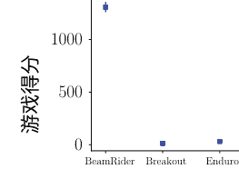

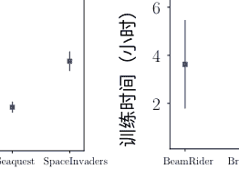

###### 图6 a测试成绩 b Atari游戏的总训练时间

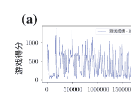

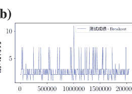

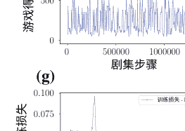

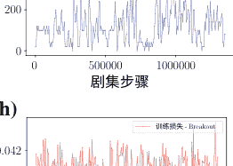

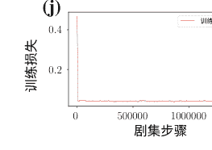

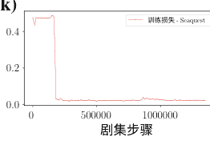

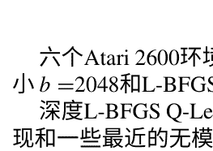

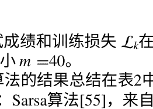


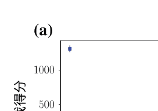

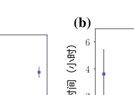

图7 a - f 六个Atari游戏的测试成绩和g - i 训练损失 — Beam Rider, Breakout, Enduro, Q*bert, Seaquest和Space Invaders。结果是使用批量大小 b = 2048 和 L-BFGS 内存大小 m = 40 进行模拟的。Q*bert, Seaquest和Space Invaders。结果是使用批量大小 b = 2048 和 L-BFGS 内存大小 m = 40 进行模拟

六个Atari 2600环境的测试成绩和训练损失 $\mathcal{L}_k$ 在图7中显示，使用批量大小 $b = 2048$ 和 L-BFGS 内存大小 $m = 40$。

深度L-BFGS Q-Learning算法的结果总结在表2中，其中还包括专家人类表现和一些最近的无模型方法：Sarsa算法[55]，来自[56]的条件感知方法，深度Q-learning[36]，以及两种基于策略优化的方法Trust-Region。

###### 表2 不同学习方法在Atari 2600游戏中的最佳得分。Beam Rider, Breakout, Enduro, Q*bert, Seaquest和Space Invaders

| 方法       | Beam Rider | Breakout | Enduro | Q*bert | Seaquest | Space Invaders |
|------------|------------|-----------|---------|--------|---------|------------|
| 随机       | 354        | 1.2       | 0       | 157    | 110     | 179        |
| 人类       | 7456       | 31        | 368     | 18900  | 28010   | 3690       |
| Sarsa [55] | 996        | 5.2       | 129     | 614    | 665     | 271        |
| Contingency [56] | 1743     | 6        | 159     | 960    | 723     | 268        |
| HNeat Pixel [57] | 1332    | 4        | 91      | 1325   | 800     | 1145       |
| DQN [36]   | 4092       | 168       | 470     | 1952   | 1705    | 581        |
| TRPO，单路径 [58] | 1425   | 10       | 534     | 1973   | 1908    | 568        |
| TRPO，藤蔓 [58] | 859      | 34       | 431     | 7732   | 7788    | 450        |
| SGD (α = 0.01) | 804      | 13       | 2       | 1325   | 420     | 735        |
| SGD (α = 0.00001) | 1092    | 14       | 1       | 1300   | 380     | 975        |
| 我们的方法 | 1380       | 18        | 49      | 1525   | 600     | 955        |

策略优化（TRPO藤蔓和TRPO单路径）[58]和使用SGD方法的Q学习。我们的方法在太空入侵者游戏中表现优于大多数其他方法。我们的深度L-BFGS Q学习方法在其他游戏中始终取得了合理的分数。我们的模拟只训练了约200万次Q学习步骤（远少于其他方法）。DeepMind DQN方法在大多数游戏中表现优于我们的算法，除了太空入侵者游戏。

我们的模拟训练时间约为3小时（Beam Rider为4小时，Breakout为2小时，Enduro为4小时，Q*bert为2小时，Seaquest为1小时，太空入侵者游戏为2小时）。我们的方法在计算时间上优于所有其他方法。例如，TRPO算法的500次迭代大约需要30小时[58]。我们还将我们的方法与SGD方法进行了比较。对于每个任务，我们使用了两种不同的学习率：相对较大的学习率，α=0.01，和非常小的学习率，α=0.00001。其他参数采用了[37]中的参数。我们的方法在大多数模拟中（12次中的11次）的游戏得分上优于SGD方法（见表2）。尽管SGD更新的每次迭代的计算时间低于我们的方法，但由于SGD方法中参数更新的频率高于我们的L-BFGS线搜索方法，SGD方法的总训练时间比我们的方法慢得多。请参见表格3，了解每个任务使用不同优化方法（L-BFGS和SGD）的训练时间结果。

###### 表3 不同学习方法下Atari 2600游戏的平均训练时间（以小时为单位）。Beam Rider，Breakout，Enduro，Q*bert，Seaquest和Space Invaders

| 方法                           | Beam Rider | Breakout | Enduro | Q*bert | Seaquest | Space Invaders |
|--------------------------------|------------|----------|--------|--------|----------|------------|
| SGD (α = 0.01)                 | 4          | 2        | 8      | 8      | 8        | 1          |
| SGD (α = 0.00001)              | 7          | 11       | 7      | 6      | 8        | 6          |
| 我们的方法                     | 4          | 2        | 4      | 2      | 1        | 1          |

#### 7 结论

在本章中，我们实现了一种基于有限-内存拟牛顿方法（称为L-BFGS）的优化方法，作为训练深度神经网络的梯度下降方法的替代方案。我们考虑了线搜索和信赖域框架。本研究的主要贡献是一种名为TRMinATR的算法，通过使用低秩更新Hessian近似来高效地解决一系列信赖域子问题，从而最小化神经网络的代价函数。该方法的好处是算法不受传统方法中数据特定参数的约束。TRMinATR还改善了类似线搜索的实现效率。此外，我们提出并实现了一种基于线搜索有限内存BFGS的深度强化学习框架的新型优化方法。我们在六个经典的Atari 2600游戏上测试了我们的方法。L-BFGS方法尝试通过构造具有低秩更新的正定矩阵来近似Hessian矩阵。由于深度强化学习中出现的非凸和非线性损失函数，我们的数值实验表明，在计算搜索方向时使用曲率信息可以实现更稳健的收敛性，与SGD结果相比。我们提出的深度L-BFGS Q-Learning方法旨在在GPU上进行并行计算。我们的方法比文献中现有的方法快得多，并且由于不需要存储大量的经验回放内存，它在内存上也更加高效。由于我们提出的有限内存拟牛顿优化方法仅依赖于一阶梯度，因此它们可以高效地扩展和应用于更大规模的监督学习、无监督学习和强化学习应用。我们提出的优化方法在深度学习应用中的整体增强性能可以归因于这些优化方法的稳健收敛性、快速训练时间和更好的泛化特性。

### 参考文献

1. I. Goodfellow, Y. Bengio, A. Courville, 深度学习 (MIT Press, Cambridge, 2016)
2. M.A. Wani, F.A. Bhat, S. Afzal, A. Khan, 深度学习进展 (Springer, Berlin, 2020)
3. T. Hastie, R. Tibshirani, J. Friedman, 统计学习的要素：数据挖掘、推断和预测, 第2版 (Springer, Berlin, 2009)
4. H. Robbins, S. Monro, 一种随机逼近方法. Ann. Math. Stat. 22(3), 400–407 (1951)
5. L. Bottou, 大规模机器学习与随机梯度下降, in COMPSTAT'2010会议论文集 (Springer, 2010), pp. 177–186
6. J.C. Duchi, E. Hazan, Y. Singer, 自适应次梯度方法用于在线学习和随机优化。J. Mach. Learn. Res. **12**, 2121–2159 (2011)
7. B. Recht, C. Re, S. Wright, F. Niu, Hogwild: 一种无锁并行化随机梯度下降方法, 出现在 Advances in Neural Information Processing Systems (2011), pp. 693–701
8. L. Adhikari, O. DeGuchy, J.B. Erway, S. Lockhart, R.F. Marcia, 用于稀疏松弛的有限内存信任区域方法, 出现在 Wavelets and Sparsity XVII, vol. 10394 (International Society for Optics and Photonics, 2017)
9. Q.V. Le, J. Ngiam, A. Coates, A. Lahiri, B. Prochnow, A.Y. Ng, 关于深度学习的优化方法, 出现在 Proceedings of the 28th International Conference on Machine Learning (2011), pp. 265–272
10. J.B. Erway, J. Griffin, R.F. Marcia, R. Omheni, 使用不定Hessian近似的机器学习方法信任区域算法。Optimization Methods and Software. 1-28 (2019)
11. P. Xu, F. Roosta-Khorasani, M.W. Mahoney, 非凸机器学习的二阶优化：实证研究。ArXiv e-prints (2017)
12. J. Martens, 通过无Hessian优化进行深度学习, 在第27届国际机器学习大会 (ICML) (2010), pp. 735–742
13. J. Martens, I. Sutskever, 使用无Hessian优化学习循环神经网络, 在第28届国际机器学习大会 (ICML) (2011), pp. 1033–1040
14. J. Martens, I. Sutskever, 使用无Hessian优化的深度和递归网络训练, 神经网络：行业技巧 (Springer, 2012), pp. 479–535
15. R. Bollapragada, R.H. Byrd, J. Nocedal, 精确和非精确子采样牛顿法用于优化。IMA J. Numer. Anal. 39(2), 545–578 (2018)
16. M.D. Zeiler, ADADELTA: 一种自适应学习率方法 (2012). arxiv:1212.5701
17. D.P. Kingma, J. Ba, Adam: 一种随机优化方法 (2014). arXiv:1412.6980
18. J. Nocedal, S.J. Wright, 数值优化, 第2版 (Springer, New York, 2006)
19. J. Brust, O. Burdakov, J.B. Erway, R.F. Marcia, 有限内存拟牛顿方法的密集初始化。Comput. Optim. Appl. 74(1), 121–142 (2019)
20. J. Brust, J.B. Erway, R.F. Marcia, 关于解决L-SR1信任区域子问题。Comput. Optim. Appl. 66(2), 245–266 (2017)
21. C.G. Broyden, 一类双秩最小化算法的收敛性 1. 总体考虑。SIAM J. Appl. Math. 6(1), 76–90 (1970)
22. R. Fletcher, 一种新的变量度量算法。Computer Journal 13(3), 317–322 (1970)
23. D. Goldfarb, 通过变分手段导出的一族变量度量方法。Math. Comput. 24(109), 23–26 (1970)
24. D.F. Shanno, 函数最小化的拟牛顿方法的条件。Math. Comput. 24(111), 647–656 (1970)
25. Q.V. Le, J. Ngiam, A. Coates, A. Lahiri, B. Prochnow, A.Y. Ng, 关于深度学习的优化方法, 在第28届国际机器学习大会上 (Omnipress, 2011), pp. 265–272
26. J. Rafati, O. DeGuchy, R.F. Marcia, 用于训练响应的信任区域最小化算法 (TRMinATR) : 机器学习技术的崛起，在第26届欧洲信号处理大会 (EUSIPCO 2018) （意大利，罗马，2018)
27. O. Burdakov, L. Gong, Y.X. Yuan, S. Zikrin, 关于高效地结合有限内存和信任区域技术。Math. Program. Comput. 9, 101–134 (2016)
28. R.S. Sutton, A.G. Barto, 强化学习导论, 第二版 (MIT Press, Cambridge, 2018)
29. R.S. Sutton, 强化学习中的泛化: 使用稀疏粗编码的成功示例. Adv. Neural Inf. Process. Syst. 8, 1038–1044 (1996)
30. J. Rafati, D.C. Noelle, 侧抑制克服时序差异学习的限制, 在第37届年度认知科学学会会议 (美国加州帕萨迪纳)
31. J. Rafati, D.C. Noelle, 稀疏编码在强化学习中的学习状态表示, 在认知计算神经科学会议 (美国纽约市)
32. J. Rafati Heravi, 强化学习中的学习表示. 博士论文, 加利福尼亚大学默塞德分校, 2019
33. J. Rafati, D.C. Noelle, 在无模型分层强化学习中学习表示 (2019). arXiv:1810.10096
34. F.S. Melo, S.P. Meyn, M.I. Ribeiro, 利用函数逼近分析强化学习, 在第25届国际机器学习大会上的论文集 (2008)
35. G. Tesauro, 时间差异学习和TD-Gammon. Commun. ACM 38(3) (1995)
36. V. Mnih, K. Kavukcuoglu, D. Silver, A. Graves, I. Antonoglou, D. Wierstra, M.A. Riedmiller, 使用深度强化学习玩Atari游戏 (2013). arxiv:1312.5602
37. V. Mnih, K. Kavukcuoglu, D. Silver, 其他人, 通过深度强化学习实现人类水平控制. Nature 518(7540), 529–533 (2015)
38. D. Silver, A. Huang, C.J. Maddison, A. Guez, L. Sifre, G. Van Den Driessche, J. Schrittwieser, I. Antonoglou, V. Panneershelvam, M. Lanctot, S. Dieleman, D. Grewe, J. Nham, N. Kalchbrenner, I. Sutskever, T. Lillicrap, M. Leach, K. Kavukcuoglu, T. Graepel, D. Hassabis, 用深度神经网络和树搜索掌握围棋游戏. Nature 529(7587), 484–489 (2016)
39. P. Wolfe, 攀升方法的收敛条件。SIAM Review. 11(2), 226–235 (1969)
40. D.M. Gay, 计算最优的局部约束步长。SIAM J. Sci. Stat. Comput. 2(2), 186–197 (1981)
41. J.J. Moré, D.C. Sorensen, 计算信任区步长。SIAM J. Sci. Stat. Comput. 4(3), 553–572 (1983)
42. A.R. Conn, N.I.M. Gould, P.L. Toint, 信任区方法 (Society for Industrial and Applied Mathematics, Philadelphia, 2000)
43. D.C. Liu, J. Nocedal, 关于大规模优化的有限内存BFGS方法. Math. Program. 45(1–3), 503–528 (1989)
44. J. Rafati, R.F. Marcia, 改进深度学习中信任区域方法的L-BFGS初始化，第17届IEEE国际机器学习和应用会议 (奥兰多，佛罗里达，2018)
45. R.H. Byrd, J. Nocedal, R.B. Schnabel, 拟牛顿矩阵的表示及其在有限内存方法中的应用. Math. Program. 63, 129–156 (1994)
46. Y. LeCun, L. Bottou, Y. Bengio, P. Haffner, 基于梯度的学习应用于文档识别. IEEE Proceedings 86(11), 2278–2324 (1998)
47. Y. LeCun, 其他人, Lenet5, 卷积神经网络 (2015), p. 20
48. Y. LeCun, 手写数字MNIST数据库 (1998年). http://yann.lecun.com/exdb/mnist/
49. R.S. Sutton, A.G. Barto, 强化学习导论, 第一版 (MIT Press, 1998年)
50. A.S. Berahas, J. Nocedal, M. Takac, 一种用于机器学习的多批次L-BFGS方法, 在神经信息处理系统进展中, 第29卷 (2016年), 1055–1063页
51. R.H. Byrd, S.L. Hansen, J. Nocedal, Y. Singer, 一种用于大规模优化的随机拟牛顿方法。SIAM J. Optim. 26(2), 1008-1031页 (2016年)
52. Y. Nesterov, 凸优化入门讲座：基础课程 (Springer Science & Business Media, 2013年)
53. T. Jaakkola, M.I. Jordan, S.P. Singh, 关于随机迭代动态规划算法的收敛性。Neural Comput. 6(6), 1185–1201 (1994)
54. G. Brockman, V. Cheung, L. Pettersson, J. Schneider, J. Schulman, J. Tang, W. Zaremba, OpenAI Gym (2016)
55. M.G. Bellemare, Y. Naddaf, J. Veness, M. Bowling, 街机学习环境：通用智能体评估平台。J. Artif. Intell. Res. 47, 253–279 (2013)
56. M.G. Bellemare, J. Veness, M. Bowling, 使用Atari 2600游戏研究条件意识，在第二十六届AAAI人工智能大会 (2012)
57. M. Hausknecht, J. Lehman, R. Miikkulainen, P. Stone, 一种神经进化方法用于通用Atari游戏。IEEE Trans. Comput. Intell. AI Games 6(4), 355–366 (2014)
58. J. Schulman, S. Levine, P. Moritz, M. Jordan, P. Abbeel, 信任区域策略优化，在第32届国际机器学习大会论文集 (2015)

## 使用预训练编码器的深度神经网络进行医学图像分割

Alexandr A. Kalinin, Vladimir I. Iglovikov, Alexander Rakhlin 和Alexey A. Shvets

摘要 随着深度神经网络在图像分析中的普及，分割成为应用深度学习于医学影像的最常见研究主题，并在许多应用中取得了最先进的性能结果。然而，这仍然是一个具有挑战性的问题，改进性能可能有助于诊断和其他临床实践结果。

在本章中，我们考虑了多个深度卷积神经网络在医学图像分割中的两个应用。首先，我们描述了无线胶囊内镜视频中的血管畸形病变分割。血管畸形是一般人群中最常见的胃肠道血管病变，检测它的重要性在于可能指示胃肠道出血和/或贫血的可能性。作为基准，我们考虑了U-Net模型，然后通过使用不同的深度架构和ImageNet预训练编码器进一步改进性能。在第二个示例中，我们将这些模型应用于手术视频中机器人工具的语义分割。在手术场景附近的工具分割是一个具有挑战性的问题，对于术中指导和决策过程非常重要。我们在二进制和多类工具分割方面取得了非常有竞争力的性能。在这两个应用中，我们证明了采用ImageNet预训练编码器的网络始终优于从头开始训练的U-Net架构。

A. A. Kalinin (区) 密歇根大学，安娜堡，MI 48109，美国 电子邮件：akalinin@umich.edu

V. I. Iglovikov ODS.ai，旧金山，CA 94107，美国 电子邮件：iglovikov@gmail.com

A. Rakhlin Neuronation OU，10111塔林，爱沙尼亚 电子邮件：rakhlin@neuromation.io

A. A. Shvets 麻省理工学院，剑桥，MA 02142，美国 电子邮件：shvets@mit.edu

© Springer Nature Singapore Pte Ltd. 2020M. A . Wani等人（编），深度学习应用，智能系统与计算进展1098，https://doi.org/10.1007/978-981-15-1816-4_3


### 1 引言

医学图像分割是一项重要的机器视觉任务，通常需要进行以实现计算机辅助诊断和其他下游分析。

最近，基于深度学习的方法在生物医学图像分析的许多问题上表现出了比传统机器学习方法更好的性能[1 - 3]。具体而言，深度卷积神经网络已经证明在广泛的医学图像分析任务中取得了最先进的结果，例如乳腺癌组织学图像分析[4, 5]、骨疾病预测[6]和年龄评估[7]。分割一直是将深度学习应用于医学影像的最常见研究主题[3]。虽然这些应用已经展示了分割性能的提升，但仍需要进一步的发展，这可能会对临床实践产生显著的益处。

U - Net [8]是在2015年提出的，基于完全卷积网络[9]构建而成，可以说是目前在生物医学图像分割中最广泛使用的深度神经网络架构，根据Google Scholar在2019年中期的数据，原始文章已经被引用了超过7000次，成为国际医学图像计算和计算机辅助干预国际会议(MICCAI)论文集中被引用次数最多的文章。总体上，U - Net架构由收缩路径和对称扩张路径组成，收缩路径用于捕捉上下文信息，扩张路径用于精确定位。收缩路径遵循卷积神经网络的典型架构，交替进行卷积和池化操作，并逐渐降低特征图的尺寸，同时增加每层的特征图数量。扩张路径中的每一步都包括特征图的上采样，然后进行卷积操作。因此，扩张分支增加了输出的分辨率。为了定位上采样后的特征，扩张路径通过跳跃连接将它们与收缩路径中的高分辨率特征相结合[8]。模型的输出是一个逐像素的掩码，显示每个像素的类别。

通常，U - Net是从随机初始化模型权重开始训练的。对于自然图像的分析，迁移学习已成为一种标准做法，当用于ImageNet数据集[10]的分类训练网络作为模型初始化的方法时，然后重用学习到的权重用于其他任务。已经证明，使用ImageNet预训练可以改善医学图像（如放射图像）的分类模型性能，尽管预训练和目标图像属性有所不同[11]。

Iglovikov和Shvets [12]已经表明，使用在ImageNet上训练的网络作为U - Net架构的编码器部分可以提高卫星图像分割的性能。

在本章中，我们回顾了使用预训练编码器的深度神经网络在医学图像分割中的两个应用。具体而言，我们描述了从无线胶囊内窥镜视频中分割血管畸形病变[13]和从手术视频中分割机器人工具的语义分割[13]。我们展示了使用

### TernausNet-16

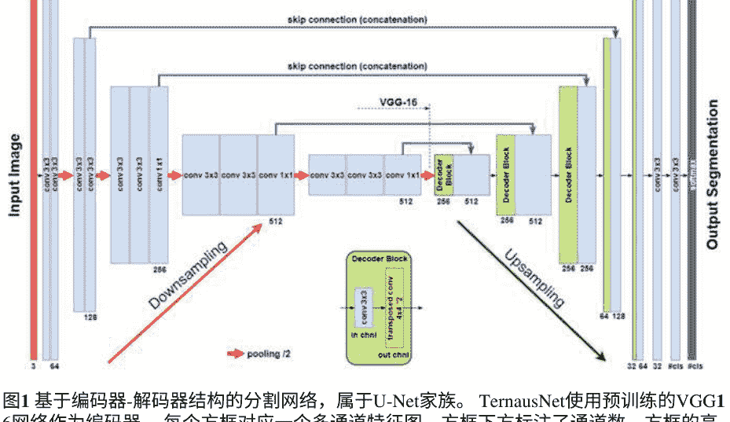

图1 基于编码器-解码器结构的分割网络，属于U-Net家族。TernausNet使用预训练的VGG16网络作为编码器。每个方框对应一个多通道特征图。方框下方标注了通道数。方框的高度表示特征图的分辨率。蓝色箭头表示从编码器传输信息到解码器的跳跃连接。

使用ImageNet预训练网络作为编码器，相比从头开始训练的基本U-Net架构，能够持续提高分割性能。

### 2 网络架构和训练

在本章中，我们考虑了四种不同的用于分割的深度架构：U-Net [8]，Ternaus Net的两种修改版本[12]，以及基于LinkNet模型[14]的LinkNet-34。我们使用稍微修改过的原始U-Net模型，在有限数据量的各种分割问题中已经证明其成功性，例如参考[7, 15]。

作为对标准U-Net架构的改进，我们使用具有类似总体结构但采用不同预训练编码器的网络。TernausNet [12]是一种类似U-Net的架构，它使用相对简单的预训练VGG11或VGG16 [16]网络作为编码器（见图1）。VGG11由七个卷积层组成，每个卷积层后面跟着ReLU激活函数，以及五个最大池化操作，每个操作将特征图减小2倍。所有卷积层都具有3 ×3的卷积核。

TernausNet-16具有类似的结构，并使用VGG16网络作为编码器（见图1）。

相比之下，LinkNet-34使用预训练的ResNet-34 [17]编码器（见图2）。编码器从执行大小为的卷积的初始块开始

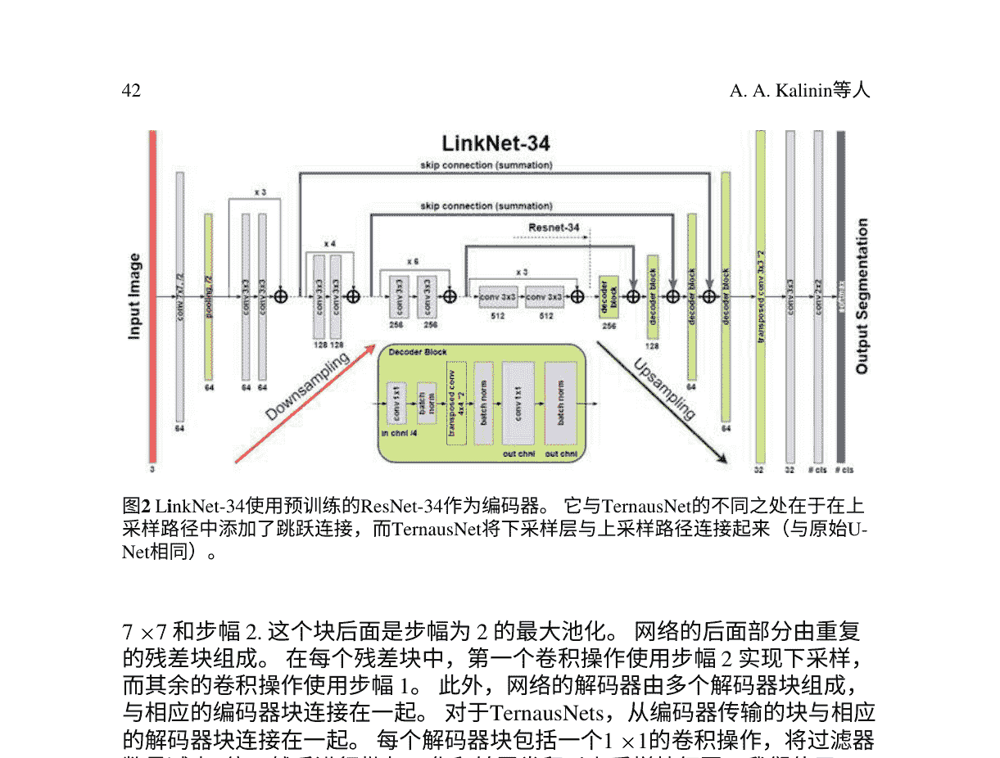

图2 LinkNet-34使用预训练的ResNet-34作为编码器。它与TernausNet的不同之处在于在上采样路径中添加了跳跃连接，而TernausNet将下采样层与上采样路径连接起来（与原始U-Net相同）。

7 ×7 和步幅2. 这个块后面是步幅为2的最大池化。网络的后面部分由重复的残差块组成。在每个残差块中，第一个卷积操作使用步幅2 实现下采样，而其余的卷积操作使用步幅1。此外，网络的解码器由多个解码器块组成，与相应的编码器块连接在一起。对于TernausNets，从编码器传输的块与相应的解码器块连接在一起。每个解码器块包括一个1 ×1的卷积操作，将过滤器数量减少4倍，然后进行批归一化和转置卷积以上采样特征图。我们使用Jaccard指数（交并比）作为评估指标。它可以被解释为有限数量集合之间的相似度度量。对于两个集合A和B，可以定义如下：

J(A, B) = |A ∩ B| / |A ∪ B| = |A ∩ B| / (|A| + |B| − |A ∩ B|) (1)

由于图像由像素组成，最后一个表达式可以适应离散对象，如下所示[12, 15] ：

J = 1/n Σ（yi ŷi / (yi + ŷi − yi ŷi)）, (2)

其中 yi 和 ŷi 分别是像素 i 的二进制值（标签）和预测概率。

由于图像分割任务也可以看作是像素分类问题，我们还使用常见的分类损失函数，表示为 H。

对于二进制分割问题，H是二元交叉熵，而对于多类分割问题，H是分类交叉熵。

广义损失函数的最终表达式通过结合 (2)和 H 得到如下： L = H - log J (3)

通过最小化这个损失函数，我们同时最大化了正确像素被预测的概率，并最大化了掩膜和相应预测之间的交集J。我们将读者引用到[15]以获取更多详细信息。每个模型都使用Adam优化器[18]进行10个周期的训练，学习率为0.001，然后再使用学习率为0.0001进行5个周期的训练。

作为模型的输出，我们获得一幅图像，其中每个像素值对应于属于感兴趣区域或类别的概率。输出图像的大小与输入图像的大小相匹配。对于两个应用程序，我们使用了不同的预处理和后处理过程，如下面各自的部分所描述的。

## 无线胶囊内窥镜视频中的血管畸形病变分割

#### 3.1 背景

Angiodysplasia（AD）是普通人群中最常见的胃肠道血管病变[19]。这种情况可能无症状，也可能引起胃肠道出血或贫血[20]。无线胶囊内窥镜（WCE）是胃肠道出血背景下小肠的首选检查方法，因为它安全、可接受，并且与其他方法相比，在病变检出率上有显著更高或至少相当的效果[21,22]。然而，在WCE视频阅读过程中，只有69%的血管畸形被胃肠科专家检测到，并且在存在血管畸形的情况下，由WCE供应商提供的血液指标软件的敏感性和特异性值分别为41%和67%[23]。因此，有必要提高AD检测和定位的准确性，以便在临床实践中潜在应用。

针对视频胶囊内窥镜分析，已经开发了许多基于计算机视觉的方法[24]，包括基于规则的和传统的机器学习算法，这些算法应用于提取的颜色、纹理和其他特征[25–27]。

在本章中，我们回顾了深度卷积神经网络在视频胶囊内窥镜中用于血管畸形病变分割的应用[13]。首先，我们描述了利用原始U-Net架构的方法。这种方法被用于参加MICCAI 2017内窥镜视觉子挑战赛：血管畸形检测和定位[23]，并获得了第一名，赢得了比赛。然后，我们通过利用深度卷积神经网络的进一步改进来进行回顾。

#### 3.2 数据集描述和预处理

无线胶囊内窥镜是一种一次性塑料胶囊，重量为3.7克，直径为11毫米，长度为26毫米。图像特征包括140°的视野，1:8的放大倍数，1-30毫米的视野深度，以及约0.1毫米的最小检测尺寸。胶囊在肠道中被蠕动推进，同时传输彩色图像。该设备的最新一代能够获取超过60,000张分辨率约为520×520像素的图像[28]。

数据集由WCE获取的1200张彩色图像组成。这些图像采用24位PNG格式，分辨率为576×576像素。数据集被分为两个相等的部分，600张用于训练，600张用于评估。每个子集由300张明显有AD的图像和300张没有任何病变的图像组成。训练子集由人工专家注释，并包含300个相同分辨率为576×576像素的JPEG格式的二进制掩膜。掩膜中的白色像素对应病变定位。图3给出了训练集中的几个示例，其中第一行对应没有病理的图像，第二行对应每个图像中有多个AD病变的图像，最后一行包含与第二行中的病理图像相对应的掩膜。在数据集中，每个图像最多包含6个病变，并且它们的分布显示在图4（左侧）。如图所示，大多数图像只包含1个病变。此外，图4（右侧）显示了AD病变区域的分布，最大值约为12,000像素，中位数为1,648像素。

图像从576×576裁剪到512×512像素，以去除画布和文本注释。然后，我们将数据从[0..255]缩放到[0..1]，并按照ImageNet方案[12]进行标准化。对于训练和交叉验证，我们只使用了299张带有病理标记的图像。我们将数据集随机分成60、60、60、60和59张图像的五个折叠。为了在训练过程中提高模型的泛化能力，我们应用了随机仿射变换和HSV空间中的颜色增强。

在分割步骤之后，我们进行后处理以找到图像中血管畸形病变的坐标。在后处理步骤中，我们使用OpenCV实现的连通组件标记函数：connectedComponentsWithStats[29]。该函数返回连通组件的数量、大小（面积）和相应连通组件的质心坐标。在我们的检测器中，我们使用另一个阈值来忽略所有大小小于300像素的聚类。因此，为了确定病变的存在，找到的组件数量应该大于0，否则图像对应于正常情况。然后，为了定位血管畸形病变，我们返回所有连通组件的质心坐标。

## 使用深度神经网络的医学图像分割...

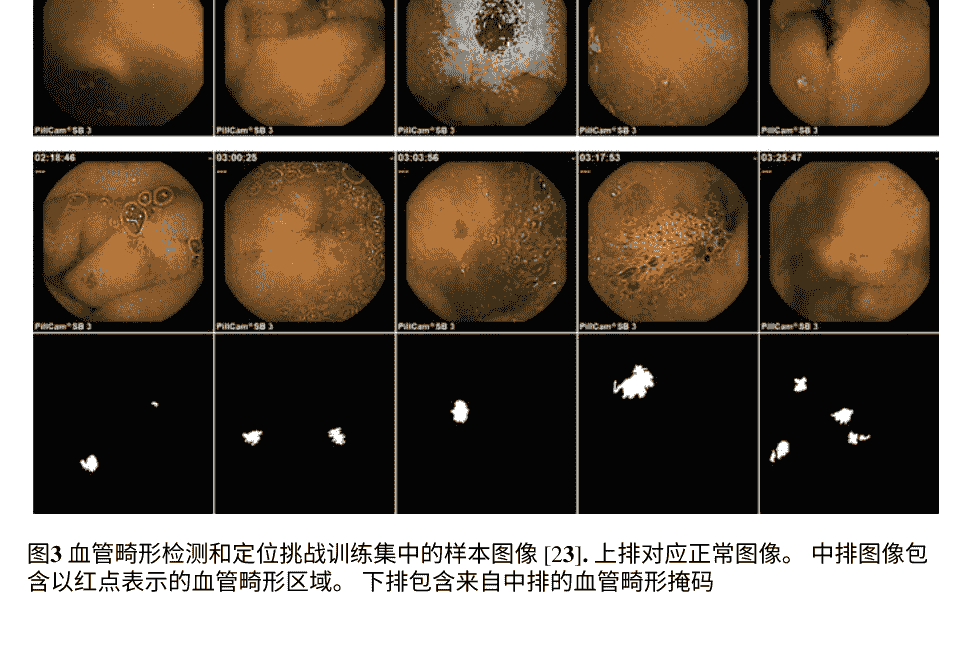

图3 血管畸形检测和定位挑战训练集中的样本图像 [23]. 上排对应正常图像。中排图像包含以红点表示的血管畸形区域。下排包含来自中排的血管畸形掩码

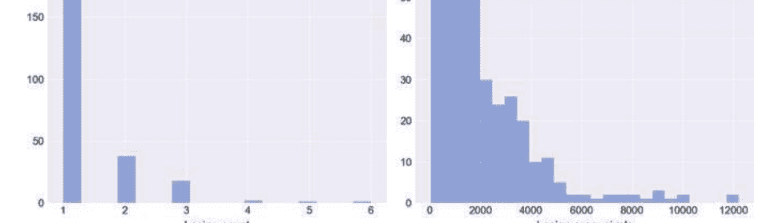

图4 数据集中血管畸形病变每个图像的分布（左图）和病变区域的分布（右图)

#### 3.3 结果

为了测试我们的预测并将其与已知掩码进行比较，我们对从验证集中获取的图像进行计算。预测的示例结果显示在图5中。为了进行视觉比较，我们还提供了原始图像及其

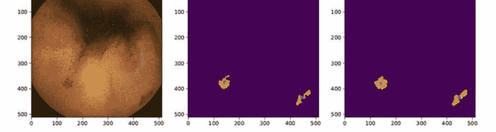

图5 我们检测器对验证数据图像的预测。这里，第一张图片对应原始图像，第二张对应训练掩码，最后一张对应预测掩码。簇内的绿点对应于定义相应血管畸形定位的质心坐标。例如，第一个簇的质心坐标的实际值为 \( p_{mask}^1 = (376, 144) \)，\( p_{pred} = (380, 143) \)，第二个簇的质心坐标的实际值为 \( p_{mask}^2 = (437, 445) \)°，\( p_{pred} = (437, 447) \)

表1 分割结果。交并比（IoU）和Dice系数（Dice）以%表示，推理时间（Time）以ms表示。

| 模型 | 交并比 | Dice | 时间 |
| --- | --- | --- | --- |
| U-Net | 73.18 | 83.06 | 30 |
| TernausNet-11 | 74.94 | 84.43 | 51 |
| TernausNet-16 | 73.83 | 83.05 | 60 |
| LinkNet-34 | 75.35 | 84.98 | 21 |

相应的掩码。鉴于不完美的分割，这个例子确实显示出算法成功检测到血管畸形病变。当图像中只有少量病变且它们在空间上分离良好时，检测器的性能几乎非常好。对于那些在空间上有重叠的许多病变，需要进一步改进，特别是在选择模型超参数方面，以获得更好的性能。

我们模型性能的定量比较见表1。对于分割任务，LinkNet-34取得了最佳结果，交并比（IoU）为0.754，Dice系数为0.831。在推理时间方面，LinkNe t-34也是最快的模型，这要归功于轻量级编码器。在分割任务中，这个网络对于512 ×512像素的图像大约需要20毫秒，比TernausNets快三倍以上。推理速度对于及时处理大量帧非常重要，这些帧可以通过胃肠道内窥镜获得，从而定义了胃肠病学家能够进行相应下游诊断的速度。

在这些实验中，使用一块NVIDIA GTX 1080Ti GPU测量了推理时间。相应的代码已在MIT许可下公开在https://github.com/ternaus/angiodysplasia-segmentation。

## 手术视频中的4个机器人仪器分割

#### 4.1 背景

机器人辅助手术系统的手术控制台中含有价值的细节，可用于术中指导，有助于决策过程。这些信息通常以包含手术仪器和患者组织的2D图像或视频的形式呈现。理解这些数据是一个复杂的问题，涉及到手术场景附近手术仪器的跟踪和姿态估计。这个过程的一个关键组成部分是对手术控制台中仪器的语义分割。由于光照变化（如阴影和镜面反射）、视觉遮挡（如血液和相机镜头模糊）以及背景组织的复杂和动态性质，机器人仪器的语义分割是一项困难的任务[30]。分割掩模可用于为仪器跟踪系统提供可靠的输入。因此，有必要开发准确和稳健的计算机视觉方法来从操作图像和视频中进行手术仪器的语义分割。

已经开发了许多基于视觉的方法来检测和跟踪机器人仪器[30]。仪器背景分割可以被视为一个二进制或实例分割问题，传统的机器学习算法已经使用颜色和/或纹理特征进行了应用[31, 32]。后来的应用解决了这个问题，将其作为语义分割，旨在区分不同的仪器或其部分[33, 34]。以前基于深度学习的机器人仪器分割应用在二进制分割方面表现出竞争力[35, 36]，在多类别分割方面取得了有希望的结果[37]

在本章中，我们回顾了深度卷积神经网络在手术视频中用于机器人仪器语义分割的应用[13]。首先，我们考虑了利用原始U-Net架构的方法。这种方法被用于提交到MICCAI 2017内窥镜视觉子挑战赛：机器人仪器分割[38]。这个提交在二进制和多类别仪器分割方面排名第一，在仪器部分分割子任务方面排名第二，赢得了比赛。然后，我们提供了关于利用预训练编码器的深度卷积神经网络（TernausNet [12]和LinkNet-34）对这个解决方案进行进一步改进的细节。

#### 4.2 数据集描述和预处理

训练数据集由从da Vinci Xi手术系统在几个不同的猪手术过程中获取的高分辨率立体相机图像的8 ×225帧序列组成[38]。为了避免冗余，训练序列以2 Hz的帧率提供。每个视频序列由两个立体声道组成

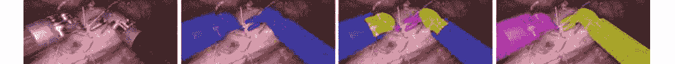

图6来自机器人手术视频的快照，包含机器人工具和患者组织：1原始视频帧；2以蓝色显示的机器人工具的二值分割和作为背景的组织；3机器人工具的多类分割，其中每个类对应于机器人工具的不同部分（3个类别：刚性轴、关节腕和夹子）；4机器人工具的多类分割，其中每个类别对应于不同的机器人工具（7个类别）

从左右摄像机拍摄，并且以RGB格式具有1920 × 1080像素的分辨率。为了去除黑色画布并从帧中提取原始的1280 × 1024相机图像，必须从像素(320, 28)开始裁剪图像。只为左侧帧提供了真实标签，因此只使用左声道图像进行训练。机器人手术工具的关节部分，如刚性轴、关节腕和夹子，在每个帧中都进行了手工标记。真实标签使用数值 (10, 20, 30, 40, 0) 进行编码，并分配给每个工具部分或背景。此外，还有仪器类型标签，将仪器分为以下类别：左/右进钳、单极曲剪、大型针夹和其他手术仪器的杂项类别，参见图6。

测试数据集由8 ×75帧的序列组成，每个序列在训练序列之后立即采样，以及2个完整的300帧序列，以与训练集相同的速率采样。根据挑战的规定，参与者在评估75帧序列时应排除相应的训练集。

作为模型的输出，我们得到了一张图像，其中每个像素值对应于属于感兴趣区域或类别的概率。输出图像的大小与输入图像的大小相匹配。对于二进制分割，我们使用0.3作为阈值（使用验证数据选择）来将像素概率二值化。所有低于指定阈值的像素值设为0，而高于阈值的值设为255，以生成最终的预测掩码。对于多类别分割，我们使用类似的过程，但为每个类别设置不同的整数编号，如上所述。

#### 4.3 结果

我们模型的定性比较，无论是二进制还是多类分割，都在图7和表2中呈现。对于二进制分割任务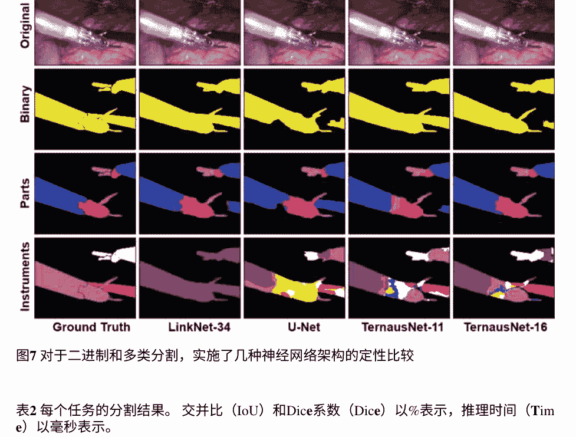

#### 图7 对于二进制和多类分割，实施了几种神经网络架构的定性比较

#### 表2 每个任务的分割结果。交并比（IoU）和Dice系数（Dice）以%表示，推理时间（Time）以毫秒表示。

| 模型         | 二进制分割       | 部分分割       | 仪器分割       |
|--------------|------------------|----------------|----------------|
| U-Net        | 交并比 75.44 Dice 84.37 时间 93 | 交并比 48.41 Dice 60.75 时间 106 | 交并比 15.80 Dice 23.59 时间 122 |
| TernausNet-11| 81.14 88.07 142  | 62.23 74.25 157 | 34.61 45.86 173 |
| TernausNet-16| 83.60 90.01 184  | 65.50 75.97 202 | 33.78 44.95 275 |
| LinkNet-34   | 82.36 88.87 88  | 34.55 41.26 97  | 22.47 24.71 177 |

TernausNet-16取得了最佳结果，IoU=0.836，Dice=0.901。对于仪器的多类分割，最佳结果也是由TernausNet-16取得的，IoU=0.655，Dice=0.760。对于多类仪器分割任务，结果看起来不太乐观。在这种情况下，最佳模型是TernausNet-11，它在7类分割上实现了IoU=0.346，Dice=0.459。较低的性能可以解释为相对较小的数据集大小。有7个类别，训练数据集中只出现了几次的类别。结果与先前的应用程序不同，在二进制分割中LinkNet-34是最好的，可能是由于相同的限制。

因此，结果表明通过增加数据集大小可以提高性能。

当通过推理时间进行比较时，由于轻量级编码器，LinkNet-34仍然是最快的模型。在二进制分割任务的情况下，该网络对于1280×1024像素图像需要大约90毫秒，比TernausNet快两倍以上。与之前的应用程序一样，推理时间是使用一块NVIDIA GTX 1080Ti GPU进行测量的。

与其他基于深度学习的解决方案相比，这种建议的方法在MICCAI 2017内窥镜视觉子挑战：机器人器械分割[38]中表现出了超越最先进水平的性能。相应的代码已在MIT许可下公开提供，网址为https://github.com/ternaus/robot-surgery-segmentation。

### 5 结论

深度卷积神经网络已成为各种生物医学图像分割的选择方法。即使可用的标记数据量有限，U-Net架构在分割任务中提供了非常强大的基准性能。借鉴迁移学习方法对图像分类的思想，使用预训练网络作为U-Net类似网络中的编码器进一步提高了模型性能。我们回顾了两个独立的应用程序。首先，基于ImageNet预训练的VGG-11、VGG-16和ResNet-34网络的编码器模型在无线胶囊内窥镜视频中的血管畸形病变分割方面优于从头开始训练的U-Net。在这种情况下，LinkNet-34是性能最好且推理速度最快的模型。在第二个应用程序中，相同的模型也优于普通的U-Net在外科手术视频中进行语义分割。在这里，表现最好的模型是具有预训练的VGG-16编码器的TernausNet-16。这些结果表明，对于分割任务，更深的编码器在给定更多训练数据的情况下表现更好，因为预训练层的权重也在进行微调。进一步的可能改进可能涉及使用特定应用的图像增强[39]，以及在有足够标记数据的情况下使用更深的预训练编码器。

### 参考文献

- 1. H. Greenspan, B. Van Ginneken, R.M. Summers, 客座编辑深度学习在医学影像中的应用: 概述和未来前景. IEEE Trans. Med. Imaging 35(5), 1153–1159 (2016)
- 2. 使用深度神经网络的医学图像分割... 深度学习在生物学和医学中的机遇和障碍。J. R. Soc. Interface 15(141) (2018)
- 3. G. Litjens, T. Kooi, B.E. Bejnordi, A.A.A. Setio, F. Ciompi, M. Ghafoorian, J.A. Van Der Laak, B. Van Ginneken, C.I. Sánchez, 深度学习在医学图像分析中的调查。Med. Image Anal. 42, 60-88 (2017)
- 4. A. Rakhlin, A. Shvets, V. Iglovikov, A.A. Kalinin, 用于乳腺癌组织学图像分析的深度卷积神经网络，在国际图像分析与识别会议(Springer, 2018)，第737-744页
- 5. A. Rakhlin, A.A. Shvets, A.A. Kalinin, A. Tiulpin, V.I. Iglovikov, S. Nikolenko, 使用深度神经网络进行乳腺肿瘤细胞密度评估，在2019年IEEE国际计算机视觉研讨会(ICCVW)(IEEE, 2019)
- 6. A. Tiulpin, J. Thevenot, E. Rahtu, P. Lehenkari, S. Saarakkala, 基于深度学习的普通X射线下膝盖关节炎诊断方法. 科学报告 8, 1727 (2018)
- 7. V.I. Iglovikov, A. Rakhlin, A.A. Kalinin, A.A. Shvets, 使用深度卷积神经网络进行儿童骨龄评估, in医学图像分析和多模态学习用于临床决策支持的深度学习(Springer, 2018), pp. 300-308
- 8. O. Ronneberger, P. Fischer, T. Brox, U-net: 用于生物医学图像分割的卷积网络, 在国际医学图像计算与计算机辅助干预会议(Springer, 2015), pp. 234-241
- 9. J. Long, E. Shelhamer, T. Darrell, 全卷积网络用于语义分割，在IEEE计算机视觉和模式识别会议论文集中(2015), pp.3431-3440
- 10. O. Russakovsky, J. Deng, H. Su, J. Krause, S. Satheesh, S. Ma, Z. Huang, A. Karpathy, A. Khosla, M. Bernstein等人，ImageNet大规模视觉识别挑战。计算机视觉国际期刊 115(3), 211-252 (2015)
- 11. A. Rajkomar, S. Lingam, A.G. Taylor, M. Blum, J. Mongan, 使用深度卷积神经网络对放射照片进行高通量分类。数字图像期刊 30(1), 95-101 (2017)
- 12. V. Iglovikov, A. Shvets, Ternausnet: 使用在ImageNet上预训练的vgg11编码器的U-net进行图像分割 (2018), arXiv:1801.05746
- 13. A.A. Shvets, A. Rakhlin, A.A. Kalinin, V.I. Iglovikov, 使用深度学习在机器人辅助手术中进行自动仪器分割，在2018年第17届IEEE国际机器学习与应用会议(ICMLA) (IEEE, 2018), pp. 624-628
- 14. A. Chaurasia, E. Culurciello, Linknet: 利用编码器表示进行高效语义分割 (2017), arXiv:1707.03718
- 15. V. Iglovikov, S. Mushinskiy, V. Osin, 使用深度卷积神经网络进行卫星图像特征检测: 一个Kaggle竞赛 (2017), arXiv:1706.06169
- 16. K. Simonyan, A. Zisserman, 用于大规模图像识别的非常深的卷积网络 (2014), arXiv:1409.1556
- 17. K. He, X. Zhang, S. Ren, J. Sun, 深度残差学习用于图像识别，在IEEE计算机视觉和模式识别会议论文集(2016)，第770-778页
- 18. D.P. Kingma, J. Ba, Adam: 一种随机优化方法 (2014), arXiv:1412.6980
- 19. P.G. Foutch, D.K. Rex, D.A. Lieberman, 健康无症状人群结肠血管畸形的患病率和自然史。美国胃肠病学杂志 90(4) (1995)
- 20. J. Regula, E. Wronska, J. Pachlewski, 消化道血管病变。最佳实践研究临床胃肠病学 22(2)，313-328页 (2008)
- 21. S.L. Triester, J.A. Leighton, G.I. Leontiadis, D.E. Fleischer, A.K. Hara, R.I. Heigh, A.D. Shiff, V.K. Sharma, 与其他诊断方法相比，胶囊内镜检查在不明原因胃肠道出血患者中的检出率的荟萃分析。美国胃肠病学杂志 100(11)，2407页 (2005)
- 22. R. Marmo, G. Rotondano, R. Piccopo, M. Bianco, L. Cipolletta, Meta-analysis: capsule enteroscopy vs. conventional modalities in diagnosis of small bowel diseases. Aliment. Pharmacol. Ther. 22(7), 595-604 (2005)
- 23. MICCAI 2017内窥镜视觉挑战：血管畸形检测和定位，https://endovissub2017-giana.grand-challenge.org/angiodysplasia-etisdb/
- 24. D.K. Iakovidis, A. Koulaouzidis, 增强型视频胶囊内窥镜软件：关键进展的挑战 Nat. Rev. Gastroenterol. Hepatol. 12(3), 172 (2015)
- 25. M. Mackiewicz, J. Berens, M. Fisher, 无线胶囊内窥镜彩色视频分割。 IEEE Trans. Med. Imaging 27(12), 1769-1781 (2008)
- 26. A. Karargyris, N. Bourbakis, 胶囊内窥镜和内窥镜成像:一项关于各种方法的调查 IEEE Eng. Med. Biol. Mag. 29(1), 72-83 (2010)
- 27. P. Szczyñski, A. Klepaczko, M. Pazur ek, P. Daniel, 基于纹理和颜色的胶囊内窥镜视频图像分割和病理检测. Comput. Methods Programs Biomed. 113(1), 396-411, (2014), http://www.sciencedirect.com/science/article/pii/S0169260712002192
- 28. D.S. Mishkin, R. Chuttani, J. Croffie, J. DiSario, J. Liu, R. Shah, L. Somogyi, W. Tierney, L.M.W.K. Song, B.T. Petersen, Asge技术状态评估报告: 无线胶囊内窥镜 Gastrointest. Endosc. 63(4), 539-545 (2006)
- 29. G. Bradski, OpenCV库, 在Dr. Dobb的软件工具杂志 (2000)
- 30. B. Münzer, K. Schoeffmann, L. B szrmenyi, 内窥镜图像和视频的基于内容的处理和分析 : 一项调查. 多媒体工具应用 77(1), 1323-1362 (2018)
- 31. S. Speidel, M. Delles, C. Gutt, R. Dillmann, 追踪微创手术中的仪器, 用于手术技能分析, 在医学成像和增强现实(Springer, Berlin,2006), pp. 148-155
- 32. C. Doignon, F. Nageotte, M. De Mathelin, 用于术中内窥镜视觉的多个刚性物体的分割和引导, 在动态视觉. (Springer, Berlin, 2007), pp. 314-327
- 33. Z. Pezzementi, S. Voros, G.D. Hager, 通过渲染一致的外观部分进行关节物体跟踪, 在2009年IEEE国际机器人与自动化会议上。 ICRA'09. (IEEE, 2009), 第3940-3947页
- 34. D. Bouget, R. Benenson, M. Omran, L. Riffaud, B. Sciele, P. Jannin, 通过建模局部外观和全局形状来检测手术工具。IEEE Trans. Med. Imaging 34(12), 2603-2617(2015)
- 35. L.C. Garca-Peraza-Herrera, W. Li, L. Fidon, C. Grujithuijsen, A. Devreker, G. Attilakos, J. Dperest, E.B.V. Poorten, D. Stoyanov, T. Vercauteren, S. Ourselin, Toolnet: 全面嵌套的实时机器人手术工具分割, 在2017年/IEEE/RSJ智能机器人人与系统国际会议上(2017), 第5717-5722页
- 36. M. Attia, M. Hossny, S. Nahavandi, H. Asadi, 使用混合深度cnn-rnn自动编码器解码器进行手术工具分割, 在2017年/IEEE系统、人和智能网络国际会议上(2017), 第33773-33778页
- 37. D. Pakhomov, V. Premachandran, M. Allan, M. Azizian, N. Navab, 用于机器人手术中仪器分割的深度残差学习 (2017), arXiv:1703.08580
- 38. M. Allan, A. Shvets, T. Kurmann, Z. Zhang, R. Duggal, Y.-H. Su, N. Rieke, I. Laina, N. Kalavakonda, S. Bodenstedt, 等, 2017年机器人仪器分割挑战 (2019), arXiv:1902.06426
- 39. A. Buslaev, A. Parinov, E. Khvedchenya, V.I. Iglovikov, A.A. Kalinin, Albumentations: 快速和灵活的图像增强 (2018), arXiv:1809.06839

## 用于轻度认知障碍和阿尔茨海默病诊断的3D密集连接卷积网络集成

Shuqiang Wang, Hongfei Wang, Albert C. Cheung, Yanyan Shen 和Min Gan

摘要 自动诊断阿尔茨海默病（AD）和轻度认知障碍（MCI）对于早期治疗痴呆症起着重要作用，通过3D脑磁共振（MR）图像。深度学习架构可以提取潜在的痴呆症特征并捕捉脑部解剖变化从MRI扫描中。鉴于3D医学图像的高维度和复杂特征，计算机辅助诊断仍面临挑战。首先，与可学习参数的数量相比，训练样本的数量非常有限，这可能导致过拟合问题。其次，网络层的加深使得梯度信息逐渐减弱甚至在传输过程中消失，导致模式崩溃。本章提出了一种用于AD和MCI诊断的3D密集连接卷积网络集合。引入了密集连接以最大化信息流动，其中每一层直接连接到所有后续层。还使用了瓶颈层和过渡层来减少参数并导致更紧凑的模型。然后采用基于概率的融合方法将不同架构的3D-DenseNets结合起来。进行了大量实验来分析具有不同超参数和架构的3D-DenseNet的性能。在ADNI数据集上展示了所提出模型的优越性能。

————————

S. Wang · H. Wang · Y. Shen 中国科学院深圳先进技术研究院，深圳大学城学院路1068号，深圳，中国 e-mail: sq.wang@siat.ac.cn

A. C. Cheung 香港科技大学，中国香港特别行政区，中国

M. Gan (区) 福州大学数学与计算机科学学院，福州350116，中国 e-mail: aganmin@aliyun.com

© Springer Nature Singapore Pte Ltd. 2020 M. A. Wani et al. (eds.), 深度学习应用, 智能系统与计算进展 1098. https://doi.org/10.1007/978-981-15-1816-4_4


### 1 引言

阿尔茨海默病是一种常见的进行性神经退行性疾病，在发达国家被列为威胁老年人生命和健康的第四大杀手。AD是由与记忆有关的脑部神经细胞的损伤和破坏引起的，其最常见的症状是记忆丧失和认知能力下降[1]。轻度认知障碍（MCI）已被认为是正常老年人和AD之间的中间过渡[2]。最近的研究发现，32%的MCI患者在5年内恶化为阿尔茨海默病。因此，早期诊断和干预MCI和AD对于控制疾病的发展具有重要意义。

通过认知测试和临床症状很难实现对AD和MCI的准确诊断，但通过神经影像学（如磁共振成像（MRI）、计算机断层扫描（CT）和正电子发射断层扫描（PET））可以获得大脑的结构和功能信息，并且诊断结果相当可靠。在临床上，医学图像解释主要依赖于放射科医师和医生等人类专家。由于病理学的广泛变异和医生的潜在疲劳，研究人员和医学专家开始受益于计算机辅助诊断（CAD）。在过去几十年中，机器学习（ML）方法越来越多地利用神经影像数据来表征AD和MCI，为个体化诊断和预后提供了有希望的工具。已经提出了许多研究来使用图像预处理流程中的预定义特征（包括区域和基于体素的测量），然后使用不同类型的分类器（如支持向量机（SVM）或随机森林）。最近，深度学习（DL）作为一种新兴的建模方法，在医学影像领域取得了重大突破[3 - 5]。

特别是，深度卷积神经网络（CNN）已被证明在从脑部MR图像中自动诊断认知疾病方面非常出色，因为深度CNN已被证明是从原始数据中学习抽象特征的强大方法。与对切片进行2D卷积相比，对整个MRI进行3D卷积可以捕捉到潜在的3D结构信息，这可能对区分非常重要。由于3D MRI的复杂结构和高维特征，设计的3D-CNN将更深入地建模数据的高级抽象。然而，当梯度信息在许多层之间传递时，3D-CNN的性能非常有限，因为梯度信息可能在前向和后向传播过程中消失。此外，巨大数量的参数，即卷积核的权重，无法完全通过有限的训练集进行优化。

在本章中，我们提出了一种用于AD和MCI诊断的3D密集连接卷积网络的集成方法。引入了密集连接来改善特征利用率，然后由于每层中特征增量较少和参数较少，网络可以更深。而且，基于概率的集成方法可以降低选择单个分类器的错误识别风险，并且在医学图像分析中越来越受欢迎。

### 2 相关工作

#### 2.1 用于计算机辅助诊断的深度学习

深度学习研究的快速发展引起了医学图像分析专家的关注。CAD系统凭借其出色的自动特征学习和非线性建模能力，在医学图像分析领域取得了惊人的成果。CAD从医学图像中自动提取和建模特征，然后提供关于疾病评估的客观意见。CAD的主要应用包括恶性和良性病变的区分以及从一个或多个图像中识别特定疾病。程等人[6]使用带有去噪技术（SDAE）的SAE识别乳腺超声病变和肺部CT结节。Plis等人[7]开发了一种用于MR图像的DBN分析方法，并通过研究深度生成模型的构建块是否与独立成分分析（ICA）竞争，验证了该应用的可行性，ICA是功能性磁共振成像（fMRI）分析中最常用的方法。

Ghe等人[8]提出了一种基于边缘学习的稀疏自适应神经网络，用于超声心动图图像中主动脉瓣检测，从而减轻了三维图像数据的高复杂性。Shen等人[9]提出了一种多尺度传统网络的分层学习模型，用于捕捉不同大小的肺结节。在这个CNN架构中，将从不同尺度获取的结节补丁作为输入，并行组装了三个CNN，大大提高了识别准确性。Wang等人[10]提出了一种自动骨龄识别系统，以单手X射线片作为输入，并最终输出骨龄预测结果。

#### 2.2 自动识别阿尔茨海默病和轻度认知障碍

预先计算的医学描述符与统计和传统机器学习方法广泛用于自动诊断AD。Risacher等人[11]计算了海马体体积的灰质（GM）密度和分割感兴趣区域（ROI）的皮质厚度值。然后使用基于体素的形态学（VBM）方法进行MRI分析和AD分类。Cai等人[12]设计了基于病理学为中心的3D掩模，用于提取脑代谢葡萄糖消耗率（CMRGlc），并提出了一种基于内容的检索方法用于3D神经影像。Liu等人[13]从3D脑MRI和PET扫描中提取了83个ROI，并提出了一种基于贝叶斯框架的多重贝叶斯核化（MBK）用于诊断AD。Zhang等人[14]使用标准化模板从MRI和PET扫描中提取了93个ROI，这些模板是由人类专家根据对目标领域的知识设计的，并且通过多核支持向量机（SVM）将多模态特征组合起来。Zhang等人[15]使用k均值聚类构建了低级特征，涉及病变代谢指数、平均指数和费舍尔指数的字典。然后，概率潜在语义分析（PLSA）和典型相关分析（CCA）被用来结合特征并捕捉潜在关联。

与上述其他机器学习技术相比，深度学习取得了显著进展。刘等人[16]训练了一个包含自编码器的深度神经网络，用于结合从PET和MRI扫描的83个ROI提取的多模态特征。李等人[17]通过受限玻尔兹曼机（RBM）实现了PET和MRI特征的多模态融合，并通过设计带有dropout的多任务深度学习网络提高了分类准确性。基于ROI的方法可以显著提取代表性特征并在一定程度上降低特征维度，但是ROI过于经验性，无法完全捕捉与AD诊断相关的特征。卷积神经网络（CNN）在模式识别中被广泛应用，并在医学图像上表现出优秀的AD分类性能。Billones等人[18]从MRI中选择了20个连续切片，假设这些切片覆盖了痴呆检测的重要区域。每个2D切片的序列号分别用于训练一个2D-CNN，这些2D-CNN是从VGGNet修改而来的。3D-CNN通过其空间关联能力可以捕捉更完整的空间特征。Hosseini-Asl等人[19]提出了一个3D卷积神经网络，该网络结合了一个预训练的3D卷积自编码器和配准图像。Payan等人[20]通过结合3D卷积和稀疏自编码器构建了一个学习算法，并将其应用于整个MRI。Cheng等人[21]从整个MRI中提取了许多3D补丁，并通过3D-CNN将补丁转化为特征。最后，多个3D-CNN被用来结合特征，并展示了AD分类的有效性。

### 3 方法

#### 3.1 数据获取和预处理

在这项工作中，我们从阿尔茨海默病神经影像学倡议（ADNI）数据库[22]中获取了神经影像学数据。该研究涉及超过1,000名参与者，包括有轻度认知障碍的人、被诊断为AD的患者和正常对照组。大多数参与者被重复收集了两到六次，相邻扫描之间的间隔超过一年。时间序列扫描为研究人员提供了AD进展的新发现。

如图1所示，总共使用了833个T1加权MRI，这些MRI来自624名参与者，包括男性和女性，年龄在70到90岁之间。由于给定参与者的脑结构在一段时间后会发生变化，我们选择了同一参与者之间间隔最长的两次扫描作为不同的主题，只要间隔超过3年。当使用10折交叉验证来评估我们的模型时，从同一参与者中选择的主题被绑定并放置在同一子组中，以便它们不能同时出现在训练和测试数据集中。

## 用于诊断的3D密集连接卷积网络集成...

#### 图1 受试者分布

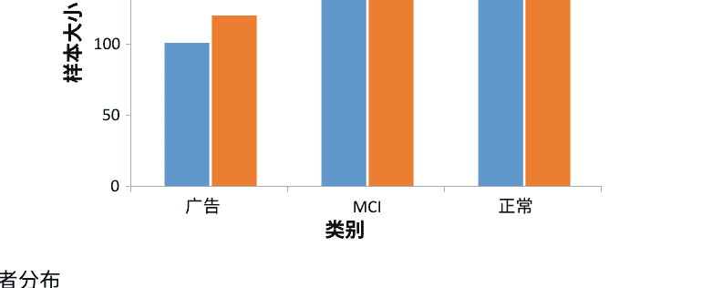

#### 图2 每个预处理步骤后的图像: a原始图像; b去除多余组织后的图像; c脑提取后的图像; d对齐到MNI152模板的图像

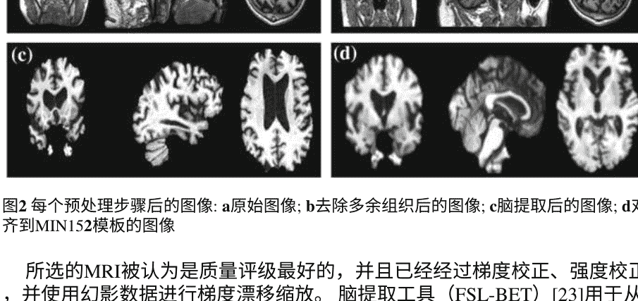

所选的MRI被认为是质量评级最好的，并且已经经过梯度校正、强度校正，并使用幻影数据进行梯度漂移缩放。脑提取工具（FSL - BET）[23]用于从整个头部图像中去除非脑组织，这可以减少冗余信息引起的分类错误。为了使不同图像的解剖点对齐，使用FSL FLIRT [24]将图像注册到标准化模板。每个图像的尺寸为91 × 109 ×91，采用神经影像学信息技术倡议（NIfTI）文件格式。预处理步骤如图2所示。

#### 3.2 提出的方法

考虑一个传统的网络由l层组成，我们将l层的输出表示为xl，每一层实现一个非线性变换Hl(·)，其中l索引该层。 为了增强对消失梯度的训练并改善网络内的信息流动，DenseNet [25] 实现了从一层到其后续层的连接。 我们将密集连接的思想扩展到了三维体积图像处理任务中。 具体而言，xi被定义为

```
xi = HI([x0, x1, …, xl−1]), (1)
```

其中 x0, x1, …, xl−1 是在前面的层中产生的三维特征体积，[...]表示连接操作。 图3a展示了一个密集单元。 复合函数 HI (·) 由三个操作组成：批归一化（BN）用于减少内部协变换[26]，修正线性单元（ReLU）用于加速训练过程，以及使用 k 3 × 3 × 3卷积核进行空间卷积以生成三维特征体积。 图3b显示了三维密集块的基本框架。

密集单元被视为密集块中的一层，每一层直接与所有后续层连接。 通过这种密集连接机制，特征利用变得更加有效，每一层添加的特征增量比传统的CNN少。 因此，网络非常窄且参数较少。

还使用了瓶颈层和过渡层来减少参数。 1 × 1 × 1卷积被用作瓶颈层，以减少输入特征体积，在卷积层之前[27, 28]。 在瓶颈层的机制之后，多通道特征体积被融合，只有一小组特征体积被添加到下一层，而前面的特征保持不变。 过渡层还被引入以提高模型的紧凑性，使用超参数-参数θ控制压缩程度。对于包含m特征体积的密集块，以下过渡层的输出特征体积减少到[θm]，其中0 < θ ≤1。因此，3D-DenseNet层变得非常窄，需要比传统网络更少的参数，但通过密集连接可以充分利用特征并表现出良好的性能。为了进一步消除冗余并提高模型的特征表达能力，我们在池化层和线性层之间引入了dropout。图3c以示意图形式展示了具有两个密集块的3D-DenseNet。

如上所述，3D-DenseNets在不同的超参数集中出现在各种架构中。我们通过大量实验在第四节中证明了3D-DenseNet的性能对其超参数非常敏感。因此，使用不同的超参数进行训练可以调整基础3D-DenseNets的不稳定性并增强它们的多样性。基于大量实验结果和不同的超参数集，我们通过在最优值周围随机改变超参数来生成具有不同结构的基础网络。所有基础的3D-DenseNets都独立工作，并通过softmax层输出类别的概率分数。我们通过基于概率的融合方法来融合它们的输出。所提出的集成模型如图4所示。

在传统的多数投票方法中，大多数分类器的预测结果被用作最终的预测标签。每个分类器都是独立的，不同分类器之间的错误率无关，因此集成模型的性能优于单个分类器。但对于多分类任务来说，这种方法可能不是非常有效。单个分类器在大多数主题上表现良好，但对于一些难以分类的主题，由于多个类别之间的不确定性，错误率会增加。例如，三个分类器考虑时，softmax层的输出概率为 {AD, MCI, Normal}分别为: I: {0.8, 0.1, 0.1}, II: {0.4, 0.5, 0.1}, III: {0.3, 0.4, 0.3}。根据多数投票方法，预测结果为MCI。但这并不完全正确，因为分类器I的预测结果更可信，而II和III的不确定性更大。

在我们的方法中，采用了一种简单的基于概率的集成方法[29]，其中来自基本分类器的softmax层的输出概率将被重新整合。同时，每个分类器的预测结果都不会被忽视。在三元分类中，选择了基础分类器；在测试集上，将3D-DenseNet的v的概率分配给各个类别

```
P^i = (α^i_1, α^i_2, α^i_3), (2)
```

其中α^i_j表示测试样本属于类别j的概率。

```
P^i = \frac{P^i}{\max[α^i_1, α^i_2, α^i_3]}, (3)
```

其中max[α^i_1, α^i_2, α^i_3]是P^i的最大元素值。当计算了m个基础3D-DenseNet的输出后，通过以下提出的融合模型确定最终的类别标签：

```
y = \arg \max \left( \prod_{i=1}^m α^i_1, \prod_{i=1}^m α^i_2, \prod_{i=1}^m α^i_3 \right). (4)
```

### 4 实验

#### 4.1 数据和实现

在本节中，我们使用了来自ADNI的833名MR受试者来评估所提出的框架，包括221名AD受试者，297名MCI受试者和315名正常对照受试者。并且采用了10折交叉验证方法来测试模型的性能。原始样本集被随机分成10个相等大小的子样本，一个子样本被保留作为验证数据用于测试模型，其余9个子样本组成训练集。交叉验证过程重复10次，每个子样本都恰好被用作一次验证数据。使用三元分类器（AD对MCI对正常）和三个相应的二元分类器（AD对正常，AD对MCI和MCI对正常）来报告分类结果。禁止在训练集和测试集中同时出现来自同一参与者的受试者。所有实验都在一台配备NVIDIA Tesla P100 GPU的系统上进行。

## 表1 二分类混淆矩阵

|                | 预测为正例（A类） | 预测为负例（B类） |
| -------------- | ---------------- | ---------------- |
| 实际为正例（A类） | 真正例（TP）     | 假反例（FN）     |
| 实际为负例（B类） | 假正例（FP）     | 真反例（TN）     |

## 表2 三分类混淆矩阵

|          | 预测为A类 | 预测为B类 | 预测为C类 |
| -------- | -------- | -------- | -------- |
| 实际为A类 | 真A（TA） | 假AB（FAB） | 假AC（FAC） |
| 实际为B类 | 假BA（FBA） | 真B（TB） | 假BC（FBC） |
| 实际为C类 | 假CA（FCA） | 假CB（FCB） | 真C（TC） |

#### 4.2 实验步骤和评估

选择3D-DenseNet作为基础分类器与集成方法进行比较。训练基础3D-DenseNet并进行一系列实验以选择最佳超参数。随后，通过随机变化主要超参数的值在选定的最佳值周围生成一些3D-DenseNets。然后进行集成方法和基础分类器的比较以证明集成方法的优越性。

分类器的性能可以从混淆矩阵中解释，混淆矩阵记录了模型在各个类别上的性能。二元和三元分类问题的混淆矩阵分别显示在表1和表2中。

10折交叉验证的平均值被视为最终结果。

(a) 准确率表示正确分类的样本在整个子集中的比例，

```
准确率_二元 = \frac{真正例 + 真反例}{真正例 + 真反例 + 假正例 + 假反例}, (5)
```

准确率_三元 = (真A + 真B + 真C) / (真例 + 假例). (6)

(b) 精确率量化了正确分类的样本在分类中的比例，

```
精确率_二元 = \frac{真正例}{真正例 + 假正例}, (7)
```

```
精确率_三元_类别A = \frac{TA}{TA + F_BA + F_CA}. (8)
```

(c) 召回率是检索到的相关实例占相关实例总数的比例,

```
召回率_二元 = \frac{真正例}{TP + FN}, (9)
```

```
召回率_三元_类别A = \frac{TA}{TA + F_{AB} + F_{AC}}. (10)
```

(d) F1-分数综合考虑了精确率和召回率，并评估模型的性能,

```
F1-分数 = \frac{2 × 精确率 × 召回率}{精确率 + 召回率}, (11)
```

#### 4.3 参数分析

进行了一系列实验，分析了具有不同超参数集的3D-DenseNet的性能，包括深度、增长率和压缩因子。我们通过箱线图报告了10折交叉验证中的测试准确率和错误，代表四分位数范围。箱子表示数据集的四分位数，而须端延伸以显示使用与四分位数范围的函数确定为异常值的点。

增长率分析。 超参数k被称为网络的增长率，表示每个层增加的新特征数量。如图5所示，分类器的准确性根据不同的k而变化。AD/MCI分类器在k=15时获得了最先进的结果，而MCI/Normal在k=12时获得了最先进的结果。当k=9时，该模型足以对AD和Normal进行分类。至于三元分类任务，在k=24时达到了最先进的准确性。由于没有充分提取用于分类的关键特征，该模型在小增长率下获得了较差的准确性。相对较大的增长率可以通过引入更多的特征数量来提升性能。然而，过大的增长率可能会降低准确性，因为复杂的模型在有限的训练数据下训练不充分。而且，具有较大增长率的模型具有较小的错误范围，这是因为具有更多参数的复杂结构可以提高模型的性能。

深度分析。 深度是指3D-DenseNet中所有块的总层数。为了研究深度对准确性的影响，使用不同深度的模型进行了实验训练。不同深度模型的性能比较如图6所示。在深度=15时，可以获得最先进的AD/Normal分类准确性，而其他分类器在深度=20时获得最佳准确性。AD/MCI的平均准确性低于其他类别，因为AD通常是从MCI发展而来，而从MRI中捕捉到的解剖形状变化不足以明确识别类别，所以与其他类别相比，AD的准确性较低。与增长率类似，层数较少的网络无法充分表达特征，因此适当增加深度可以提高分类准确性。但是，深度过大的网络可能会导致准确性较差，因为由于数据集有限，参数可能无法完全训练。

压缩因子的分析。θ被称为压缩因子，表示过渡层中特征减少的程度。图7显示，压缩因子的变化对分类准确性有显著影响。MCI/正常和三元分类器在中等压缩因子下获得最佳准确性。随着θ的增加，AD/MCI的准确性下降。当模型使用较大的θ进行压缩时，AD/正常获得最佳准确性。简化的网络结构可以忽略与痴呆病诊断无关的特征，并在一定程度上减少过拟合。但是，网络过度压缩可能导致特征表达不足，从而降低模型的准确性。

优化方法的分析。为了进一步加快模型的收敛速度并提高性能，BP算法通过附加优化方法进行修正。如图8所示，在所有分类任务中，通过动量法优化的模型获得了更好的准确性。其中一个解释是当前梯度是之前动量的累积。动量因子的较大值加速参数更新，并在梯度减小到零时帮助模型摆脱局部最小值。

使用不同数量的训练数据分析模型性能。为了分析不同参数对模型性能的影响，使用了不同数量的样本进行三元分类器训练。图9显示了不同数量训练数据的平均准确率，比较了具有不同固定超参数的模型。固定增长率的模型准确率随着训练样本减少而迅速降低，而固定深度和压缩因子的模型变化较为平缓。因此，深度对训练数据的数量更不敏感。在3D-DenseNet中，增长率侧重于足够区分类别的特征数量，而深度侧重于用适当的层表达特征并挖掘差异。

#### 图9 参数对训练数据数量的敏感性

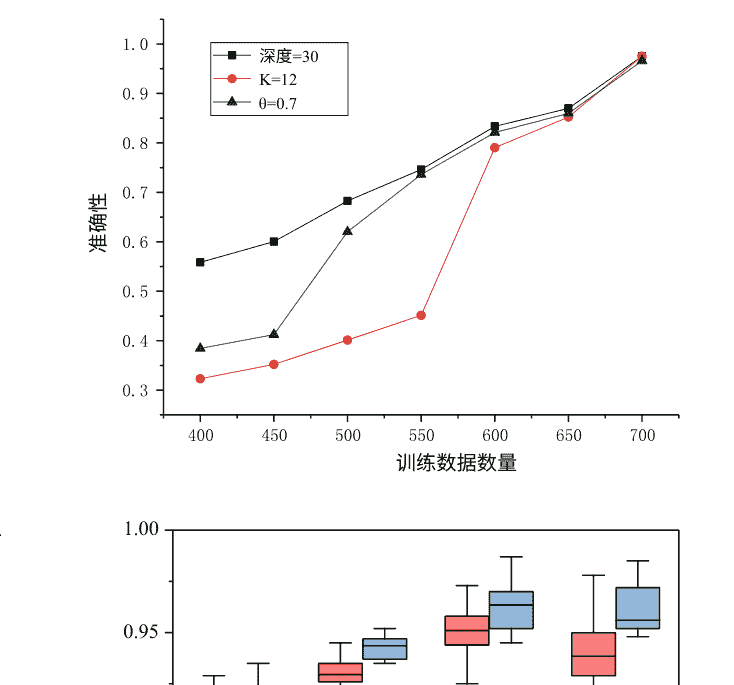

#### 图10 有无dropout对模型性能的分析

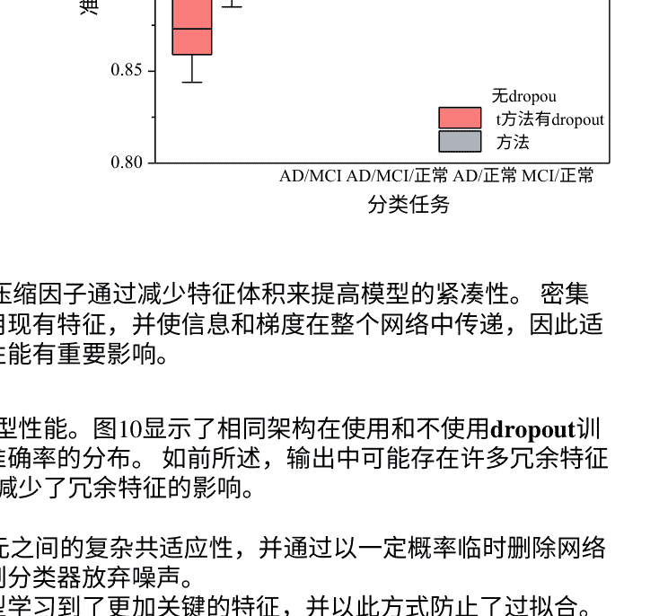

特征之间的关系。压缩因子通过减少特征体积来提高模型的紧凑性。密集连接可以有效地重用现有特征，并使信息和梯度在整个网络中传递，因此适当的深度对模型的性能有重要影响。

使用dropout分析模型性能。图10显示了相同架构在使用和不使用dropout训练的10折交叉验证准确率的分布。如前所述，输出中可能存在许多冗余特征，我们通过dropout减少了冗余特征的影响。

dropout减少了神经元之间的复杂共适应性，并通过以一定概率临时删除网络中的一些单元来强制分类器放弃噪声。因此，所提出的模型学习到了更加关键的特征，并以此方式防止了过拟合。

#### 表3 不同网络结构的参数数量和计算时间比较

| 方法 | 深度 | 增长率 | θ | 参数（M） | 时间（小时） |
| :--- | :--- | :--- | :--- | :--- | :--- |
| DenseNet-I | 30 | 12 | 1 | 1.3 | 2.33 |
| DenseNet-II | 30 | 24 | 1 | 5.3 | 4.25 |
| DenseNet-III | 30 | 12 | 0.8 | 0.3 | 2.4 |
| DenseNet-IV | 30 | 12 | 0.5 | 0.2 | 2.5 |
| DenseNet-V | 50 | 12 | 1 | 4.4 | 6.4 |

参数数量和计算时间的分析。为了研究3D-DenseNet的计算效率，我们比较了不同结构的参数数量和训练时间。这些数据是在NVIDIA Tesla P100 GPU上计算的，并在初始学习率为0.01的情况下迭代了150个周期。如表3所示，增长率较大的网络具有更多的参数，并且消耗更多的时间，因为每个层都会增加更多的特征体积。狭窄但更深的网络由于每个密集块中包含更多的层和提取更抽象的特征而具有更高的时间复杂度。此外，过渡层的压缩可以显著减少参数数量并消耗更少的内存，但不能节省计算时间。这可能是因为前面的集体知识的通道被重新整合，但是每个密集块中的特征计算不能简化。

参数效率分析。具有瓶颈结构的3D-DenseNet被称为3D-DenseNet-B，具有降维的3D-DenseNet被称为3D-DenseNet-C，同时具有瓶颈和过渡层的3D-DenseNet被称为3D-DenseNet-BC。为了说明3D-DenseNet变体的参数效率，我们在ADNI上训练具有不同深度和增长率的3D-DenseNet进行三元分类，并将它们的测试错误作为网络参数的函数绘制出来。图11中的左图显示，3D-DenseNet-BC能够以相对较少的参数实现低错误率，始终是最参数效率的3D-DenseNet变体。多通道特征体积通过1x1卷积层进行融合，这些卷积层被用作瓶颈层。而过渡层压缩了参数，使模型更加紧凑。

图11中的右图显示，3D-DenseNet可以比具有相同参数数量的3D-CNN实现更低的测试错误率。此外，为了达到相同的准确性水平，3D-DenseNet-BC只需要3D-CNN参数数量的四分之一左右。密集连接鼓励特征重用和较少的特征增加，从而导致更紧凑的模型。

#### 4.4 结果

对于每个3D-DenseNet，我们使用高斯分布随机初始化网络的权重 (μ = 0, σ = 0.01)。初始学习率设置为0.01，并采用多项式学习率策略通过乘法更新学习率$\eta (1 - \frac{迭代}{max\_iter})^{波形}$沿着训练迭代。动量法（批处理size＝10, weight decay＝0.0005, and momentum＝0.9）用于优化训练迭代。我们在每个交叉验证中进行了1000次迭代进行训练和测试。最后，选择了五个不同的3D-DenseNets作为基础分类器，它们之间的准确率变化范围在2%以内。10折交叉验证的平均值被视为最终结果。

实验结果显示在表4中。提出的基于概率的集成模型具有97.52％的准确率，97.13％的平均精度，97.0％的平均召回率和97.1％的F1分数，而提出的3D-DenseNet模型的准确率为94.77％，多数投票方法的准确率为95.96％。从表4中可以得出以下结论：(1) 多数投票方法和基于概率的集成模型可以显著提高模型性能。多个独立分类器的融合可以降低错误率。(2) 提出的基于概率的集成模型优于多数投票方法。如上所述，这主要不是因为基于概率的方法可以累积多个基分类器的类别概率，并基于综合信息进行预测，而不是直接选择多数结果。

为了估计我们提出的方法的泛化能力，我们还在三个二分类任务（AD对NC，AD对MCI和MCI对Normal）上进行了实验。通过集成3D-DenseNet方法，我们获得了令人鼓舞的准确性结果，AD/Normal为98.83％，AD/MCI为93.61％，MCI/Normal为98.42％，AD/MCI/Normal为97.52％。为了直观地显示模型的性能，我们在随机交叉验证中的一个混淆矩阵如图12所示。

表5显示了提出模型与先前方法在三元任务上的比较。Billones等人[18]从MRI图像序列中提取了20个冠状切片，并分别对每个2D切片建模。基于2D切片的建模方法没有考虑切片序列之间的相关特性，因此分类性能较差。对3D MRI图像的分析可以保留更多的空间特征信息，但是3D图像和3D卷积的复杂性增加。为了确保模型训练的计算效率，Cheng等人[21]将3D MRI图像分成几个块，并通过卷积操作从每个块中提取特征信息，然后重新组织和组合建模。这种方法可以有效地提取局部的3D特征信息，并简化操作，但是忽略了相邻块之间的相关特征。Hosseini等人[19]和Payan等人[20]对完整的3D MRI图像进行了卷积操作。通过3D-CNN方法自动提取痴呆诊断的关键特征，提高了模型的分类和诊断准确性。本章提出的3D-DenseNet模型在3D-CNN的基础上引入了密集连接机制，通过特征重用提高了梯度传递效率和特征利用率。只需要很小的特征增量就可以实现准确的模式分类，大大减少了参数量，提高了操作效率。因此，3D-DenseNet模型在分类性能上优于相关方法。与传统的多数投票方法相比，本章提出的概率集成学习方法充分考虑了每个子分类器对类别的敏感性，可以更有效地减少预测误差。它将概率集成学习和3D-DenseNet模型结合起来，实现了更好的痴呆分类和诊断性能。

## 表 4 3D-DenseNets和集成模型在测试集上的性能

##### AD/MCI/Normal

| 模型 | 类别 | 准确性 | 精确度 | 召回率 | F1得分 |
| :--- | :--- | :--- | :--- | :--- | :--- |
| 最佳3D-DenseNet | AD | 0.9477 | 0.9253 | 0.9696 | 0.9469 |
| | MCI | | 0.9431 | 0.9325 | 0.9405 |
| | Normal | | 0.9680 | 0.9578 | 0.9628 |
| 基础分类器的平均值 | AD | 0.9398 | 0.9104 | 0.9242 | 0.9172 |
| | MCI | | 0.9425 | 0.9213 | 0.9317 |
| | Normal | | 0.9578 | 0.9680 | 0.9628 |
| 多数投票 | AD | 0.9596 | 0.9365 | 0.9402 | 0.9383 |
| | MCI | | 0.9435 | 0.9526 | 0.9480 |
| | Normal | | 0.9684 | 0.9703 | 0.9693 |
| 基于概率的集成模型 | AD | 0.9752 | 0.9692 | 0.9545 | 0.9617 |
| | MCI | | 0.9555 | 0.9662 | 0.9598 |
| | Normal | | 0.9893 | 0.9893 | 0.9893 |

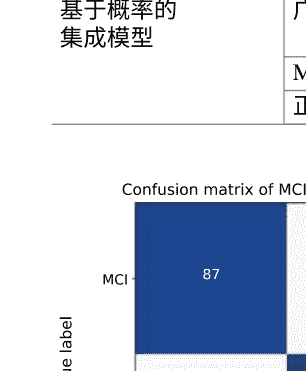

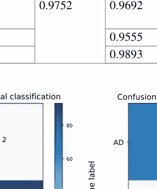

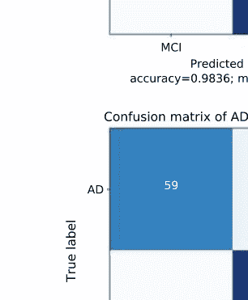

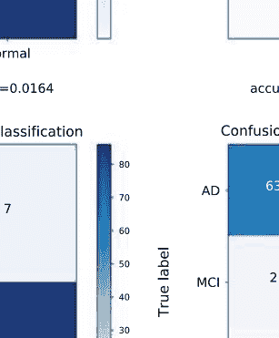

#### 图12 四个分类器的混淆矩阵

#### 表5 不同分类方法对AD/Normal/MCI的分类准确率

| 方法 | 准确率 (%) |
| :--- | :--- |
| Billones等人[18] | 91.85 |
| Hosseini等人[19] | 89.1 |
| Payan等人[21] | 89.47 |
| Cheng等人[20] | 87.15 |
| 3D-DenseNet | 94.77 |
| 多数投票 | 95.96 |
| 提出的集成方法 | 97.52 |

### 5 结论

深度学习近年来取得了显著的复兴，主要是由于计算能力的增加和大规模数据集的可用性。医疗保健和医学领域在计算机辅助诊断的能力方面取得了显著进展。但仍然存在许多技术挑战。首先，现有的医学图像数据集在规模上相对较小，并且在数据采集和注释过程中缺乏标准化。因此，如何利用有限的数据集构建具有普适适应应用价值的辅助诊断模型是近年来医学人工智能的研究热点。其次，医学图像具有高维特征和复杂特征。构建更深的网络以提取有效特征是必要的。然而，网络层数的加深导致参数数量急剧增加，并且在有限数据下很难完全训练。此外，网络层数的加深使得梯度信息在传输过程中逐渐减弱甚至消失，导致模式崩溃。

鉴于上述问题，我们提出了一种用于早期诊断阿尔茨海默病的3D密集连接卷积网络。与基于2D图像切片的传统方法相比，3D卷积保留并提取了脑部MRI图像的更多关键空间特征信息，从而为分类模型提供了更多的特征基础。密集连接机制使得卷积网络的每一层直接相连，并鼓励特征的重用，从而提高了网络中特征和梯度信息的传输效率。通过对特征的极致利用，减少了卷积层的特征增量，因此网络相对较窄，大大减少了网络的参数。此外，通过瓶颈层和过渡层的机制，进一步减少了网络参数。所提出的模型具有参数小、特征传递效率高的优点。网络可以实现更深层次，并在一定程度上避免过拟合。我们还开发了一种简单但有效的基于概率的集成学习方法。用于构建集成模型的子分类器在3D-DenseNet的最优超参数附近进行随机调整。通过在softmax层中对每个子分类器的预测概率进行归一化，集成了每个子分类器的知识，而不是像传统投票方法那样简单地丢弃一些子分类器。这种方法的优点是考虑了每个子分类器对类样本的敏感性和特异性。实验证实了概率集成方法的有效性，特别是对于多分类问题。与仅对网络预测进行简单平均相比，集成模型的准确性明显提高。

### 参考文献

1.  阿尔茨海默病协会等，2017年阿尔茨海默病事实和数据。阿尔茨海默病发展。13(4), 325-373 (2017年)
2.  S. Li, O. Okonkwo, M. Albert, M.-C. Wang，预测从MCI到AD痴呆的变量的变化随随访时间的延长而变化。美国阿尔茨海默病杂志。2(1), 12-28 (2013年)
3.  R. Cuingnet, E. Gerardin, J. Tessieras, G. Auzias, S. Lehericy, M.-O. Habert, M. Chupin, H. Benali, O. Colliot, A.D.N. Initiative等，使用ADNI数据库比较十种方法自动分类阿尔茨海默病患者的结构性MRI。神经影像56(2), 766-781 (2011年)
4.  F. Falahati, E. Westman, A. Simmons, 多变量数据分析和机器学习在阿尔茨海默病中的应用，重点关注结构磁共振成像。J. Alzheimer's Dis. 41(3), 685–708 (2014)
5.  E. Moradi, A. Pepe, C. Gaser, H. Hutunen, J. Tohka, A.D.N. Initiative et al., 机器学习框架用于早期基于MRI的阿尔茨海默病转化预测在MCI患者中。Neuroimage 104, 398-412 (2015)
6.  J.-Z. Cheng, D. Ni, Y.-H. Chou, J. Qin, C.-M. Tiu, Y.-C. Chang, C.-S. Huang, D. Shen, C.-M. Chen, 基于深度学习架构的计算机辅助诊断：应用于乳腺病变在美国图像和CT扫描中的肺结节。Sci. Rep. 6, 24454 (2016)
7.  S.M. Plis, D.R. Hjelm, R. Salakhutdinov, E.A. Allen, H.J. Bockholt, J.D. Long, H.J. Johnson, J.S. Paulsen, J.A. Turner, V.D. Calhoun, 神经影像学的深度学习：验证研究。Front. Neurosci. 8, 229 (2014)
8.  F.C. Ghesu, B. Georgescu, T. Mansi, D. Neumann, J. Hornegger, D. Comaniciu, 医学图像中解剖标志检测的人工智能代理, in 国际医学图像计算与计算机辅助干预会议(Springer, Berlin, 2016), pp.229-237
9.  W. Shen, M. Zhou, F. Yang, C. Yang, J. Tian, 多尺度卷积神经网络用于肺结节分类, in 医学信息处理国际会议(Springer, Berlin, 2015), pp. 588-599
10. S. Wang, Y. Shen, C. Shi, P. Yin, Z. Wang, P.W.-H. Cheung, J.P.Y. Cheung, K.D.-K. Luk, Y. Hu, 使用卷积神经网络的全自动骨骼成熟度识别系统, IEEE Access 6, 29979-29993 (2018)
11. S.L. Risacher, A.J. Saykin, J.D. West, L. Shen, H.A. Firpi, B.C. McDonald, 基线MRI预测MCI转为可能的AD的ADNI队列。Curr. Alzheimer Res. 6(4), 347-361 (2009)
12. W. Cai, S. Liu, L. Wen, S. Eberl, M. J. Fulham, D. Feng, 具有局部病理中心CMRGlc模式的3D神经影像检索，在2010年第17届/IEEE国际图像处理会议(ICIP)(IEEE, Piscataway, 2010), pp. 3201-3204
13. S. Liu, Y. Song, W. Cai, S. Pujol, R. Kikinis, X. Wang, D. Feng, 多重贝叶斯核化在阿尔茨海默病诊断中的应用，在国际医学影像计算与计算机辅助干预会议(Springer, Berlin, 2013), pp. 303-310
14. Zhang, D., Wang, Y., Zhou, L., Yuan, H., Shen, D., & Alzheimer's Disease Neuroimaging Initiative. (2011). 阿尔茨海默病和轻度认知障碍的多模态分类。神经影像学 55(3)，856-867.
15. Zhang, F., Song, Y., Liu, C., Pu, J., Yin, S., Gao, Y., ... & Cai, W. (2014). PET图像的神经影像学分类的语义关联。核医学杂志 55(1), 1-7.
16. Liu, S., Liu, S., Cai, W., Che, H., Pujol, S., Kikinis, R., ... & Cai, W. (2015). 用于阿尔茨海默病多类别诊断的多模态神经影像特征学习。IEEE生物医学工程学报 62(4), 1132-1140.
17. F. Li, L. Tran, K.-H. Thung, S. Ji, D. Shen, J. Li, 一种用于改进AD/MCI患者分类的强大深度模型。IEEE J. Biomed. Health Inform. 19(5), 1610-1616 (2015)
18. C.D. Billones, O.J. L.D. Demetria, D.E.D. Hostallero, P.C. Naval, Demnet: 一种用于检测阿尔茨海默病和轻度认知障碍的卷积神经网络，收录于2016 IEEE Region 10 Conference (TENCON)(IEEE, Piscataway, 2016)，pp. 3724-3727
19. E. Hosseini-Asl, R. Keynton, A. El-Baz, 通过3D卷积网络的适应性进行阿尔茨海默病诊断，收录于2016 IEEE International Conference on Image Processing (ICIP)(IEEE, Piscataway, 2016), 第126-130页
20. A. Payan, G. Montana, 预测阿尔茨海默病：一项带有3D卷积神经网络的神经影像学研究 (2015), arXiv:1502.02506
21. D. Cheng, M. Liu, J. Fu, Y. Wang, MR脑图像的分类：多个卷积神经网络的组合用于AD诊断，在第九届数字图像处理国际会议(ICDIP 2017), vol. 10420 (International Society for Optics and Photonics, Bellingham, 2017), p. 1042042
22. C.R. Jack, M.A. Bernstein, N.C. Fox, P. Thompson, G. Alexander, D. Harvey, B. Borowski, P. J. Britson, J.L. Whitwell, C. Ward等，阿尔茨海默病神经影像学倡议(ADNI)：MRI方法。J. Magn. Reson. Imaging 27(4), 685-691 (2008)

# 用于诊断的3D密集连接卷积网络集成...

23. M.W. Woolrich, S. Jbabdi, B. Patenaude, M. Chappell, S. Makni, T. Behrens, C. Beckmann, M. Jenkinson, S.M. Smith, FSL中神经影像数据的贝叶斯分析。Neuroimage 45(1), S173–S186 (2009)

24. M. Jenkinson, P. Bannister, M. Brady, S. Smith, 大脑图像的稳健准确性配准和运动校正的改进优化。Neuroimage 17(2), 825–841 (2002)

25. G. Huang, Z. Liu, K.Q. Weinberger, L. van der Maaten. 密集连接卷积神经网络，在IEEE计算机视觉和模式识别会议的论文集中，卷1，第2期，(2017)，第3页

26. S. Ioffe, C. Szegedy, 批归一化: 通过减少内部协变量转移加速深度网络训练, 在国际机器学习大会上(2015), pp. 448–456

27. C. Szegedy, V. Vanhoucke, S. Ioffe, J. Shlens, Z. Wojna, 重新思考计算机视觉中的初始架构, 在IEEE计算机视觉和模式识别大会上(2016), pp. 2818–2826

28. K. He, X. Zhang, S. Ren, J. Sun, 深度残差学习用于图像识别, 在IEEE计算机视觉和模式识别大会上(2016), pp. 770–778

29. G. Wen, Z. Hou, H. Li, D. Li, L. Jiang, E. Xun, 基于概率融合的深度神经网络集成用于面部表情识别. Cogn. Comput. 9(5), 597–610 (2017)

## 使用基于深度学习的计算机视觉在SHR P2 NDS视频中检测工作区域

Franklin Abodo, Robert Rittmuller, Brian Sumner和Andrew Berthaume

摘要 自然驾驶研究旨在观察人类驾驶员在各种环境条件下的行为，以便使用统计和物理模型来分析、理解和预测这种行为。第二战略公路研究计划（S HRP2）资助了许多与交通安全相关的项目，包括其主要项目——自然驾驶研究（NDS），以及与NDS补充的项目——道路信息数据库（RiD）。 本研究旨在扩大研究人员对NDS和RiD数据库提出的可回答研究问题的范围。具体而言，我们提出了SHRP2 NDS视频分析（SNVA）软件应用程序，该应用程序从NDS设备车辆的前置摄像头录像中提取信息，并将该信息高效地集成到RiD中，将视频内容与地理位置和其他行程属性关联起来。对于研究人员和其他利益相关者来说，集成工作区域、交通信号状态和天气信息尤为重要。这里介绍的SNVA版本主要关注工作区域检测，这是最高优先级的。能够自动发现和编目这些信息，并且能够快速完成，尤其重要，因为NDS视频数据集的大小为两个拍字节（2PB）。

F. Abodo (⊝) . R. Rittmuller . B. Sumner . A. Berthaume
Volpe国家交通系统中心，55 Broadway，剑桥，MA 02142，美国
e-mail: franklin.abodo@dot.gov

R. Rittmuller
电子邮件：robert.rittmuller@dot.gov

B. Sumner
e-mail: brian.sumner@dot.gov

A. Berthaume
电子邮件：andrew.berthaume@dot.gov

这是美国政府的工作，不受美国版权保护；可能适用外国版权保护2020年
M. A. Wani等人（编辑），深度学习应用，智能系统与计算进展1098，https://doi.org/10.1007/978-981-15-1816-4_5
75

### 1 引言

美国联邦公路管理局（FHWA）创建并继续资助第二战略公路研究计划或SHRP2。该计划的主要与安全相关的产品是进行大规模自然驾驶研究（NDS），该研究收集了来自人类驾驶员在各种真实道路和环境条件下的驾驶员和车辆特定数据。志愿者驾驶员车辆配备了两个外部和两个内部摄像头，前向-面雷达和数据采集系统（DAS），该系统从车辆的CAN总线收集遥测数据（包括转向角度、加速度等）。大多数数据在2012年至2015年间由超过3500名驾驶员收集，跨越六个州，涵盖超过500万次行程，记录了超过100万小时的视频。与NDS项目相辅相成的项目是创建道路信息数据库（RID），该数据库包含了NDS驾驶员驾驶的美国道路网络部分的静态特征，例如车道数、交叉口的转弯车道类型、高速公路段上是否有隆起带等。自SHRP2成立以来，给定NDS行程中的工作区域的存在与否一直是所需的信息之一。

之前在RID中将工作区事件与道路信息结合起来的努力并不成功，因为它们依赖于参与的州交通部门提供的511交通数据。511数据（因为可以通过电话拨打该号码来获取交通信息）只提供了很少的信息，仅指示在给定时间段内哪些高速公路的哪些路段有施工计划。关于实际施工设备是否存在于志愿者驾驶员所驾驶的特定高速公路段以及他或她驾驶的时间，这是一个无法回答的问题。在某些情况下，研究人员使用511数据来识别据称包含工作区的行程及其附带的视频，结果发现他们不得不手动浏览视频，有时找到他们要找的内容，有时则没有[1]。此外，六个参与州中的一个州未能提供关于工作区的511级数据，这使得从视频中提取事件成为了唯一的选择。在这里，我们介绍SHRP2 NDS视频分析（SNVA）软件应用程序，旨在对NDS视频数据集中的工作区事件进行完整准确的记录。为了实现这一目标，SNVA结合了基于FFmpeg的视频解码器、基于TensorFlow的图像场景分类器以及用于读取视频帧的时间戳、识别检测到的工作区事件的开始和结束时间戳以及将这些事件导出为CSV文件的算法。我们按照以下方式组织SNVA的介绍：第2节介绍相关工作；第3节讨论我们选择深度学习框架和模型的动机和方法；第4节详细介绍我们开发工作区检测模型和用于训练模型的数据集的方法；第5节描述我们选择的硬件和软件组件，并强调了优化视频处理流程的努力。在第6节中，我们介绍了SNVA发展的预期未来方向，并在第7节中总结。

### 2 相关工作

在此工作之前，已经进行了许多从SHRP2视频中提取知识的努力，使用了机器学习和计算机视觉技术，其中一些成功地作为概念验证，最初并不打算应用于整个数据集。[2]调查了FHWA资助的一些项目，这些项目进行了车辆和行人检测、场景分割、交通信号状态检测、头部、躯干和手部姿势检测以及面部特征检测。在[3]中，讨论了几个项目中使用的技术，包括用于检测车辆和车辆灯光的Haar级联[4]，用于车辆检测的方向梯度直方图[5]，以及用于检测前座乘客存在的卷积神经网络[6]。[7]的作者使用手工特征和现成软件来使用驾驶员面向摄像头检测和跟踪人脸。

一些导致之前的项目无法超越概念验证阶段的原因包括：(1) 训练数据有限，(2) 使用的计算机视觉技术早于第二次神经网络复兴，(3) 使用在公开数据集上进行预训练且没有进行额外迁移学习的神经网络，以及(4) 处理速度慢。SNVA主要通过利用比之前更近期的深度学习架构和软件框架来解决这些问题。

### 3 深度学习框架和架构选择

#### 3.1 深度学习框架选择

在SNVA项目启动时，TensorFlow (TF) [8] 被确定为对项目成功最有贡献的深度学习框架。

我们基于两个主要因素做出了这个决定。首先，根据以下指标判断：(1) 该框架在机器学习研究和实践社区中的普及程度和维护支持水平，以及(2) 该框架在其创建者Google的大规模软件应用中的使用情况。其次，高级API TensorFlow-Slim (TF-Slim) 包含了以下内容：(1) 可加速团队学习和使用该框架的有用示例代码，以及(2) 许多卷积神经网络架构的实现，附带在ImageNet [9] 上进行预训练的权重和偏置，用于迁移学习 [10]。

#### 3.2 卷积神经网络架构选择

卷积神经网络（CNN）已经广泛证明能够将优化用于不同任务的权重和偏差应用于一个任务中。这对于涉及自然图像的任务尤其如此，例如在SHRP2 NDS视频数据中找到的图像。我们有信心认为现成的CNN适用于场景检测任务，因此我们开始比较七种架构的样本内测试性能、推理速度和GPU利用率：InceptionV3 [11]、InceptionResnetV2 [12]、MobilenetV1 [13]、MobilenetV2 [14]、NASNet-Mobile [15]、ResnetV2-50和ResnetV2-101 [16]。由于准确率与参数数量之比较低，因此不考虑同样著名的VGGNet [17]和AlexNet [6]架构[15]。

##### 3.2.1 验证指标选择

为了在测试期间比较使用不同架构学习的模型，并且在训练期间与自身进行比较，以便进行早停止，需要一个验证指标。一个简单而流行的指标是准确率：正确分类的样本数与总样本数的比率。如果我们假设训练和目标数据集中的类别表示不平衡（例如，工作区场景与非工作区场景的比例非常低），那么准确率就成为一个不合理的指标。在一个病态的例子中，如果工作区样本与非工作区样本的比例为1:19，那么模型可以将测试样本的100%分配给非工作区类别，并且尽管没有检测到任何工作区，但准确率仍然达到95%。考虑到这一点，我们扩展了TF-Slim演示代码，该代码最初只测量准确率，以添加以下性能指标：精确度、召回率、F1、F0.5、F2、真正例和假正例、真负例和假负例以及总误差分类。尽管所有上述指标都用于对每个模型的性能形成直觉，但最终选择了F0.5作为我们的单目标指标。回想一下，F-度量将精确度和召回率整合到一个指标中，这在两个指标都有价值时非常方便。在Fβ-度量的公式中，[18]，当设置β < 1、β > 1或β = 1时，分别给予精确度更高的权重、召回率更高的权重或精确度和召回率相等的权重。在我们的用例中，当场景检测器声称发现工作区时，它的正确性比发现所有现有工作区更重要。我们假设NDS数据集足够大，以便为了减轻研究人员在不包含工作区的视频剪辑中浪费时间，可以牺牲一些检测结果。因此，我们将β设置为0.5。

##### 3.2.2 麻烦样本的定性过滤

SHRP2视频数据的质量可以在多个维度上有所不同。相机或其他硬件故障可能导致视频帧中的不连续性，完全嘈杂的帧，完全黑色的帧，场景旋转的帧或者焦点不准确的帧，如图1所示。工作区场景中感兴趣的特征可能距离太远而无法确定标签。雨水和其他环境因素对车辆挡风玻璃可能会造成特征的扭曲，使其看起来与通常在背景场景中观察到的特征。在某些情况下，我们需要排除整个视频的考虑，但在大多数情况下，会将其中的一一些帧放在一边。只有能够毫不犹豫地标记的帧才包含在数据集中，希望在训练过程中排除的帧的缺失会导致模型在测试时对类似帧进行低置信度的分类。如果假设成立，可以应用平滑算法来扰动低置信度的帧，使其与高置信度的邻居的类匹配，从而可能纠正由于在训练过程中排除这些帧而导致的错误分类。在测试SNVA应用程序时，我们随机抽样了一小部分输出，观察到了这种确切行为。

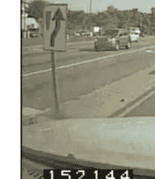

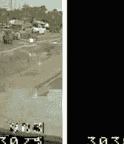

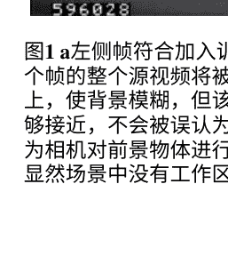

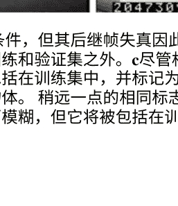

图1 a左侧帧符合加入训练集的条件，但其后继帧失真因此将被排除在考虑之外。b左右两个帧的整个源视频将被排除在训练和验证集之外。c尽管相机的焦点在挡风玻璃上的雨滴上，使背景模糊，但该帧将被包括在训练集中，并标记为警告标志因为这些标志与车辆足够接近，不会被误认为是背景物体。稍远一点的相同标志很容易不符合要求。d该帧也因为相机对前景物体进行了聚焦而模糊，但它将被包括在训练集中，并标记为非工作区因为显然场景中没有工作区设备。

##### 3.2.3 使用在ImageNet上预训练的权重和偏差进行迁移学习

考虑到我们可用的训练数据量似乎非常小，我们只考虑了那些在ImageNet 2012大规模视觉识别挑战数据集[9]上预训练的CNN架构，可以下载其权重和偏差。已经证明将这些权重和偏差从一个任务转移到另一个任务可以在各种应用和科学领域的预测任务中提供帮助，特别是当训练样本数量非常少时[19]。我们比较了使用随机权重和预训练权重初始化的几个CNN的训练时间和样本外测试性能，并发现在权重转移时，所有情况下都表现出更好的性能。对于CNN竞赛和进一步开发所选架构，采用了TF-Slim作者提出的两阶段迁移学习策略[20]，并在微调过程中保持了一些最早的层，如[10]所建议的。

##### 3.2.4 卷积神经网络竞赛和结果

卷积神经网络选择竞赛的目标是找出最佳候选模型，以便最终应用中使用。通过比较架构在样本内的F₀.₅得分、每秒帧数和GPU核心和内存利用率，我们进行了比较。在我们的实验中，我们确定MobilenetV2是最合适的候选模型，因为它具有最高的推理速度、最低的内存消耗和相对较高的F₀.₅度量。低内存消耗非常有价值，因为它可以允许大批量处理或将多个视频处理器同时分配给单个GPU。所有卷积神经网络的竞赛结果如表1所示。

表1 卷积神经网络架构性能比较

| 架构 | F₀.₅ | 每秒帧数 | GPU (%) | GPU内存 (MB) | 批量大小 | 步数 (K) |
| ---- | ---- | ---- | ---- | ---- | ---- | ---- |
| InceptionV3 | 0.971 | 783 | 96 | 8031 | 32 | 47.4 |
| InceptionResnetV2 | 0.957 | 323 | 96 | 7547 | 64 | 41.9 |
| MobilenetV1 | 0.960 | 1607 | 91 | 8557 | 32 | 45.7 |
| MobilenetV2 | 0.968 | 1615 | 94 | 2413 | 32 | 45.5 |
| NASNet-Mobile | 0.964 | 1211 | 98 | 2459 | 128 | 45.8 |
| ResnetV2-50 | 0.972 | 1000 | 98 | 8543 | 64 | 46.7 |
| ResnetV2-101 | 0.931 | 645 | 98 | 8543 | 128 | 46.4 |

### 4 数据集构建和模型开发

在本节中，我们将描述用于共同开发在前一节中定义的选定模型的方法，以及用于训练、验证和测试该模型的数据集。具体而言，我们讨论了以下过程：(1)确定应该贡献于数据集构建的数据来源，(2)定义排除“不合理”数据样本的策略，(3)选择将用于最终版本SNVA的CNN架构以及实现这些架构的深度学习框架，以及(4)共同开发选定的训练集。

#### 4.1 数据源选择

由于SHRP2 NDS视频数据是使用同质化仪器化车辆收集的，我们预计SNVA应用将针对质量和特征一致的视频（例如分辨率、摄像机焦距和其他内在属性等）。反过来，我们将数据集构建的数据源限制在NDS视频本身，假设包含施工特征的公开可用数据集中的图像对于分类目标分布来说过于样本外，无法发挥作用。

共提供了1344个视频，包含31535862帧，用作数据集构建的来源，包括训练、验证和测试子集。通过手动检查，观察到这些视频包含各种环境场景和特征，如大雨、暴雪、雾、阳光在车辆前方、上方和后方、黄昏、黎明和夜晚场景，以及高速公路和城市场景。这种多样性使我相信，尽管构成了目标数据集中估计的总帧数的0.0001%以下，但我们的数据源场景分布是代表性的。图2展示了各种场景的示例。

#### 4.2 通过不确定性采样进行主动学习

主动学习是一组半监督技术，用于降低机器学习模型开发的成本。虽然存在许多种类的主动学习，但它们都共享一个共同目标，即最小化需要人工手动标记的训练样本数量，同时仍然产生满足推理性能要求的模型。对于我们的目的，我们采用了一种简单且常用的基于不确定性采样的方法[21]。在这种方法中，模型首先在一小部分手动标记的“种子”样本上进行训练，然后用于预测其余未标记样本的类别。模型用于预测的样本中最不确定的标签预测（例如，类别的概率分布最接近均匀分布的情况），假设它们对模型最具信息量，并选择将其包含在下一轮训练中，然后再进行推理。重复此过程，直到（1）财务或人力资本耗尽，或者（2）模型的性能收敛（例如，最低置信度预测高于某个期望阈值，或每轮的不确定样本数量停止减少）。可以将这些最不确定的样本视为对模型最具信息量，因为将它们包含在下一轮训练中会最大程度地调整模型的决策边界。从另一个角度来看，如果模型对未标记样本的类别预测有信心，那么将该样本添加到训练集中不会有助于改善模型的性能（假设预测是正确的），因为它不太可能调整模型的决策边界。

当模型对错误类别做出高度自信的预测时，将受影响的样本包含在下一轮训练中将是有益的。这一点引发了一个两难问题；观察这些错误分类的唯一方法是检查所有预测而不仅仅是不确定的预测是解决这个困境的方法，这完全否定了主动学习的前提。解决这个困境的方法是另一个假设；如果我们只关注手动标记的不确定样本，模型最终会从中学到足够的知识，要么（1）纠正其高度自信的错误分类，要么（2）降低对错误类别的自信度，以至于人类最终会将样本直接标记为例行的主动学习过程的一部分。我们在标记工作中观察到了这种第二种行为，但没有进行严格的研究。

仍然存在一个问题，即何种概率阈值应该标记确定和不确定类别的边界。为了开始制定答案，考虑到在最极端的情况下，无论在给定的分类问题中存在多少类别，最多只有一个类别的置信度可以大于0.5。因此，不确定性边界之一应该是0.5。低于此值的任何值都需要人工标记。对于上限，即模型被认为在预测中是确定的情况下，该阈值越接近0.5或1.0，需要手动标记的示例数量就越低或越高。在没有任何分析方法确定上限阈值的情况下，我们采用分层方法，并定义了五个范围（大于0.5），在这些范围内可以对数据点进行分组：(0.5, 0.6]，(0.6, 0.7]，(0.7, 0.8]，(0.8, 0.9]和(0.9, 1.0]。根据这种方法，可以根据每个范围中的样本数量动态确定手动标记的工作量。至少，[0.0, 0.5]范围内的每个样本都会自动标记。决定是否逐步手动标记下一个更高的范围中的点。在我们应用这种策略时，我们从八个视频中选择了一个种子集，共有100,000帧。在对未标记样本进行第一轮训练和推断后，我们从总共1314个视频中选择了额外的350个作为数据集构建的来源。在这些350个视频中，有50,000帧被分在了[0.0, 0.5]的范围内，我们选择了这些帧进行标记。对于第二轮，由于其只包含了30,000帧，我们能够扩大范围以包括(0.5, 0.6]。在撰写本文时，我们正在不断增加训练集的大小并改进模型，同时在VTTI的部署环境中测试SNVA应用的beta版本。对于我们的用例来说，主动学习特别有吸引力，并且对于我们的成功至关重要，原因有两个。首先，由于工作区特征在目标数据集中预计出现的频率相对较低，简单的均匀随机采样视频帧以包含在训练集中可能会（1）忽略有用的包含工作区的帧，以及（2）导致浪费时间标记具有冗余信息内容的帧。其次，由于可用的未标记帧数量接近2^25，通过逐个浏览视频来发现所有包含工作区的帧是不可行的。

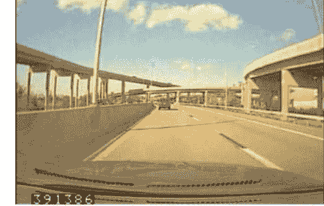

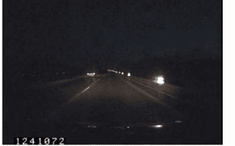

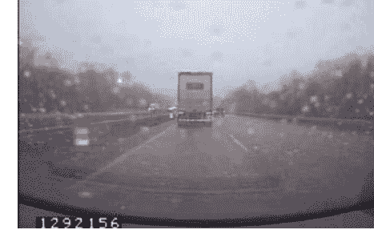

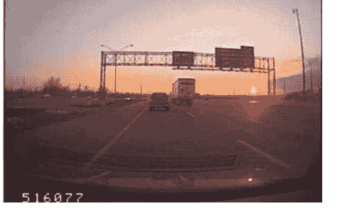

图2 在用于模型开发的小型视频子集中存在各种环境条件。a白天晴朗，太阳在摄像机后面。b夜晚，被拍摄车辆的前灯照亮施工桶。c雨天白天，摄像机正确对焦在远处物体上。d黄昏，太阳在摄像机前面## 5 SNVA 应用设计与开发

## 5.1 核心软件组件

### 5.1.1 TensorFlow 和 TF-Slim 图像分类模型库

TensorFlow 框架与支持它的谷歌内部和外部社区是这项工作的主要推动者。通过 TF-Slim 图像分类库[20] 提供的高质量演示代码的公开可用性，大大加速了神经网络模型的实验和开发。除了预训练模型，该库还包括用于模型训练和评估、基于 TFRecord 的数据集创建以及将大型模型检查点文件转换为紧凑、仅限推理的 protobuf 文件的 Python 脚本。我们能够轻松扩展代码以支持项目特定需求，例如

- 1. 主动学习中使用的增量训练数据集构建方法,
- 2. 对现有架构实现的增强以支持 NCHW 格式,
- 3. 通过添加命令行参数，使得在多个GPU和CPU上同时运行多个训练和评估脚本变得方便，并且
- 4. 通过基于数据集级别统计的通道标准化作为可选的预处理函数的添加。

TF生态系统中另一个令人惊讶的有用组件是Tensorboard，这是一个可视化工具，帮助我们监控训练和评估过程，比较竞赛中各种架构的性能，以及研究和理解TF-Slim模型的结构和运行状态。

### 5.1.2 FFmpeg视频/音频转换程序

使用FFmpeg对MPEG-4格式的视频进行解码，将其转换为原始字节以供分析器提取。该程序还用于从视频中提取单个帧并将其保存到磁盘以供模型开发使用。

### 5.1.3 Numpy科学计算库

Numpy科学计算库在处理视频帧时间戳的算法和对SNVA模型输出的类别概率分布应用加权平均时得到了大量使用。该库对广播和向量化的支持在代替之前的朴素/直观实现时明显加快了操作速度。

### 5.1.4 Python编程语言

SNVA应用程序完全采用Python实现，使得软件组件的集成变得容易。TF的模型开发API是用Python编写的，并且可以使用Python的子进程模块轻松调用和交互FFmpeg二进制文件。鉴于Python在数据科学界的流行，我们预计其使用将有助于使该项目对作者所属组织内外的潜在受益者更加可访问。

## 5.2 视频帧时间戳提取

SHRP2视频是所谓的补充数据之一。补充数据存储在文件系统中，而不是直接集成到RID中。为了将从这些原始数据中导出的信息集成到RID中，定义了一个名为线性参考系统（LRS）的地理空间数据库的过程，称为融合。为了融合工作区场景检测，使其能够使用给定行程的现有GPS信息进行定位，需要确定检测到的场景的开始和结束时间戳。由于RID中尚未包含每个视频的帧编号与时间戳的映射，因此在视频中直接提取图形叠加的数字时间戳是定位工作区场景的唯一方法。

执行此提取的算法的伪代码在算法1中概述：第1行和第2行定义了时间戳数组中的时间戳数量l和每个时间戳的最大数字位数n。n是由最大时间戳宽度w和时间戳高度h的比率给出，因为每个时间戳数字图像是16×16像素的正方形。第3至第6行定义M为表示十个阿拉伯数字的二进制图像掩码数组，并准备将M与每个时间戳的每个数字进行比较。T的第三维中的三个颜色通道被合并为一个灰度通道，然后转换为二进制的黑白格式以匹配第7行中的M的格式。在第8和第9行，T被重新调整为与M的维度相匹配。第10和第11行测试每个时间戳中的每个数字与所有十个阿拉伯数字掩码的相等性，并生成一个形状为l×10×n的三维数组，其中每个数字都存在一个真值。理想情况下，这些值中只有一个为True，其他九个为False。第12行使用三个一维数组F、D和P提取匹配项。每个数组都包含对第11行输出数组的一个维度的索引。方便的是，这三个数组具有语义解释，F中的值表示提取每个时间戳的帧编号，D包含时间戳数字的数值，P中的值表示这些数字在时间戳中出现的位置。通过这三个整数数组，我们可以构建先前成像的字符串表示。

#### 算法1 将时间戳图像转换为字符串( T, h, w )

```
1: l ← LEN(T)
2: n ← w ÷ h
3: M ← 获取时间戳数字掩码数组 ()
4: M ← TILE(M, n)
5: M ← TRANSPOSE(M, (0, 2, 1))
6: M ← RESHAPE(M, (l, n, h, h))
7: T ← 将时间戳图像二值化 (T)
8: T ← RESHAPE(T, (l, n, h, h))
9: T ← EXPANDDIMS(T, 1)
10: E ← EQUAL(T, M)
11: A ← ALL(E, (3, 4))
12: F, D, P ← 非零 (A)
13: Fᵤ, F^cᵤ ← UNIQUEWITHCOUNTS(F)
14: Cu, Cᵢ, C^c_u ← UNIQUEWITHINDICESANDCOUNTS(F^cᵤ)
15: s ← 求和(C^c_u)
16: 如果 s = l 则
17: raise TIMESTAMPDETECTIONCOUNTERROR()
18: 对于 i = 1 到 LEN(C^i_u) − 1 做
19: 如果 C^i_u [i] < C^i_u [i − 1] 则
20: raise NONINCREASINGTIMESTAMPLENERROR()
21: D ← ASTYPE(D, UNICODETYPE)
22: S ← NDARRAY(l, INTEGERTYPE)
23: i_r ← 0
24: 对于 i = 0 到 LEN(C_u) − 1 做
25: c_u ← Cu[i]
26: c^c_u ← C^c_u[i]
27: n^r_l ← c_u × c^c_u
28: i_l ← i_r
29: i_r ← i_l + n^r_l
30: P^r_l ← P[i_l : i_r]
31: P^r_l ← 重塑 (P^r_l, (c^c_u, c_u))
32: P^r_l ← ARGSORT(P^r_l)
33: O ← ARANGE(0, n^r_l, c_u)
34: O ← EXPANDDIMS(O, 1)
35: P^r_l ← 添加 (O, P^r_l)
36: D^r_l ← D_i [i_l : i_r][P^r_l]
37: c^i_u ← C^i_u[i]
38: 对于 j = c^i_u [j] 到 c^i_u [j] + c^i_u [c^i_u] 执行
39: S[j] ← JOIN(D^r_l [j − c^i_u [j]])
40: 返回 S
```

- 每个时间戳批次的长度 j
- c_u长度时间戳的数量
- 跨越 c^c_u 时间戳的总位数
- D中c_u长度时间戳的左索引
- D中时间戳的右索引
- 按时间戳分组的数字位置
- 按时间戳排序的 P^r_l
- 按顺序递增排序的位置
- 定义索引偏移量...
- ...转换为 D的批次 j
- 通过偏移量 O将索引 P^r_l移位
- 有序 c_u长度的系统戳
- 将第一个 c_u长度的三个序列索引转换为 D^r_l
- 连接 c_u 数字...
- ...合并为一个字符串

#### 算法2 二值化时间戳图像( T )

```
1: T ← 平均值 (T, 2)
2: t ← 128
3: w ← [255]
4: b ← [0]
5: T ← 其中 (T >= t, w, b)
6: 返回 T
```

- 将图像转换为灰度图
- 定义二值化阈值
- 定义白色像素值
- 定义黑色像素值
- 二值化图像

在这一点上，由于在单个视频中表示时间戳的数字位数可能变化，我们利用NumPy的广播特性的能力受到限制（例如考虑从 t = 999965到 t =1000031 的过渡，其中 t ∈ T）。为了最小化计算量，继续进行，第13行和第14行准备算法以批次迭代共享相同数字位数的时间戳，而不是逐个迭代每个时间戳。通过将F中的值按照单调非递减的顺序排列，从而使Cu识别排列中每个数字的第一次出现的索引，Cu其中的每个数字的出现次数，实现了这一点。

在继续之前，在第15行和第20行之间进行两次质量控制检查，以确定由于相应视频帧中的某种形式的失真而无法读取任何时间戳。第一次检查是否有任何缺失的时间戳的证据。第二次检查是否存在一个或多个数字缺失的时间戳的证据。如果任一检查满足条件，则运行一个以每个时间戳为单位操作的比转换算法慢5％的变体，以识别罪魁祸首并通过合成人工替代时间戳对其进行质量控制。由于LRS中链路级信息的远低于视频的帧率，使用合成时间戳引入的误差微不足道。我们在这里不介绍这种替代算法。

经过验证的提取的时间戳，可以进行字符串表示的转换。第21行将各个数字从整数转换为字符串，第22行初始化一个长度为 l的新n维数组，用于存放输出字符串。变量 it与循环从第24行开始的 it一起使用，用于提取相等长度时间戳的批次，在第23行的循环外初始化。有关字符串构造循环的详细处理，请参见从第25行开始的算法1的图。

不幸的是，将长度为一个的个别数字字符串连接成长度为 c_u,d 的单个时间戳字符串的操作在NumPy中没有广播实现。该库只是调用了Python等效函数。因此，这个 O ( l )操作无法被优化。

## 5.3 输入流水线优化

特别关注了SNVA视频处理流水线的设计，这是应用程序的核心。设计的很多部分受到了TF数据提取API的关键特性和TF文档中的指导的启发。为了将GPU专用于推理任务并最大程度地提高流水线的并发性，NumPy和TF预处理在CPU上执行。图3是流水线的抽象图形表示。

图3 视频处理流水线：描述视频数据摄取和处理流水线的并发性质的抽象图表。在SNVA开发环境中，在处理给定视频的帧批次时，我们实现了总体GPU饱和，并且在一个视频的最后一批和下一个视频的第一批之间只有2 - 3秒的延迟。

### 5.3.1 连续视频帧流生成器函数

通过使用生成器函数将TF数据摄入管道的选项，我们可以直接将FFmpeg的输出导入TF，有效地将从管道读取帧的优化责任交给TF。作为应用程序开发者，我们可以利用TF的快速多线程读取器，减少开发工作量。该函数每次从FFmpeg缓冲区读取一帧，提取帧的时间戳并将其存储在一个数组中，以便在处理结束时与概率一起返回，然后裁剪掉多余的边缘像素，以最大化在缩放到CNN的固定输入图像大小后的图像特征的大小，并最后将裁剪后的图像传递给TF。然后，TF管道同时对多个帧应用模型特定的预处理转换，将一定数量的帧一起批处理到GPU上并行处理，最后将批处理预加载到GPU内存中，在前一批处理完成后立即开始处理。

### 5.3.2 模型和硬件特定的视频帧批处理

确定给定硬件配置的最佳批处理大小是SNVA用户的任务。如果太低，GPU的利用率可能不足。如果太高，性能可能会受到影响，可能是因为没有足够的可用内存来预取整个图像批次。例如，我们在使用MobileNetV2进行实验时发现，每秒处理的帧数在批处理大小为64时是最佳的，即使我们的开发机器的GPU轻松支持批处理大小为128。

### 5.3.3 使用TensorRT和通道优先数据格式

根据TF和NVIDIA的指南，我们将SNVA的模型从通道最后（NHWC）转换为通道优先（NCHW）格式，以最大化推理性能。虽然我们找不到明确的解释，但TF和NVIDIA的文档中至少有三个位置推广使用NCHW。此外，由于SNVA利用了TensorRT，并且TensorRT在撰写本文时仅支持NCHW格式，因此在处理过程中必须对每个图像批次执行转置操作。为了避免在GPU上执行此计算，并获得上述未解释的好处，我们将SNVA的模型从NHWC转换为NCHW，并在运行在CPU上的预处理流程中添加了一个转置操作。我们观察到在进行此更改后，速度提高了1%，这加上了使用TensorRT获得的10%的速度提升。

### 5.3.4 冻结TF推理图

在这里，我们再次遵循TF文档的指导，并在训练期间将以TF检查点格式输出的模型文件转换为包含大型TF变量对象的protobuf文件，其中所有变量都已转换为常量值。正如预期和预期的那样，性能提升是非常显著的。

## 5.4 软件开发环境

SNVA是使用Alienware Area 51工作站开发和进行Alpha测试的，该工作站配备了一个10核3.00 GHz的Intel Core i-7-6950X CPU，具有超线程技术，64 GB的DDR4 SDRAM，以及两个具有11GB GDDR5 RAM的NVIDIA GeForce GT X 1080 Ti图形卡。该机器运行Ubuntu 16.04操作系统，安装了NVIDIA驱动程序396.24，CUDA 9.0，cuDNN 7.0，TensorRT 3.0.4，TensorFlow 1.8.0，Docker 18.03.1-CE和NVIDIA-Docker 2.0.3。使用的Python和Numpy版本分别为3.5和1.14。

当这个设置被测试对所有31,535,862个视频帧进行了测试，这些视频帧跨越了1,344个训练池中的视频，InceptionV3平均每秒推断出826.24个类标签在10:40:04小时内，MobilenetV2（每个GPU分配一个视频处理器）平均每秒推断出1491.36个类标签在05:58:20小时内，MobilenetV2（每个GPU分配两个视频处理器）平均每秒推断出1833.1个类标签在4:53:42小时内。在我们的开发机器上，RAM消耗似乎安全地限制在每个活动视频分析器上方的3.75 GB。

## 5.5 生产SNVA环境

SNVA部署的生产环境包括每个Dell PowerEdgeC4130服务器配备四个NVIDIA Tesla V100 GPU。由于使用Docker部署和运行SNVA，生产环境中的软件环境与开发环境相同，只有确切的NVIDIA驱动程序版本略有所不同。Ubuntu的版本也是相同的。视频通过16 Gb/s的链路从NFS网络共享流式传输。当从内部7200 RPM硬盘驱动器读取时，最快的SNVA配置（两个GPU上的四个MobilenetV2分析器）平均每秒消耗3.5 Gb/s的视频。第一轮beta测试揭示出V100 GPU没有完全饱和使用1080Ti GPU开发的处理流水线，并且应用实际上是受到CPU限制的。作为回应，团队打算使用云服务来复制生产环境，并优化处理流水线，可能利用VTTI提供的额外分布式计算资源。

## 6 未来工作

### 6.1 面向精度的主动学习

正如在第4节中提到的，工作区场景仅占总数据的一小部分。因此，一旦模型变得足够准确，可以考虑将被错误分类为工作区场景的样本包含在标注过程中。这意味着除了对尚未标记的样本的模型置信度和在样本内测试集上的F0.5分数之外，对未标记样本的精度最终可以成为衡量模型性能的候选指标。

回想一下，精度是将正确分类为正样本的样本与所有分类为正样本的样本的比率。这将使未标记的数据能够更好地指示模型在目标数据集上的潜在效果。虽然不会进行测量，但召回率预计会提高。

### 6.2 鲁棒的多帧事件检测使用双向循环神经网络

SNVA应用的早期设计包括将CNN作为工作区特征检测器和双向RNN [22]作为工作区事件检测器的组合，其中一个事件可能跨越多个帧，并包括可能实际上不包含工作区特征的中间帧。例如，考虑一个研究志愿者在中间车道通过工作区时，交通非常拥堵，导致设备被其他车辆周期性地遮挡。在SHRP2视频数据集中，使用深度学习在SHRP2 NDS视频中检测工作区域...

对于将静态和历史性应用于RNN的候选方案而言，而不是实时和在线的，我们排除了这种架构的使用，原因有两个。首先，我们预计预算和时间的限制不支持在视频级别进行注释所需的工作量。我们的判断是正确的。其次，在开发训练集时，观察到有多少帧必须从考虑范围中排除，由于异常和模糊性，不清楚如何处理视频级别的注释。作为一个与SNVA没有必然联系的研究练习，我们打算探索将RNN应用于SHRP2视频的可行性。

### 6.3 其他高优先级目标场景特征

如介绍中所提到的，目前在RID中尚未包括一些环境条件和道路特征，但研究人员和其他利益相关者自RID创建以来一直希望将其纳入研究中。其中包括交通信号状态和天气条件。

SNVA应用程序和本文介绍的模型开发方法可以轻松扩展以支持这些特征的检测，并且我们打算在未来的SNVA版本中针对它们进行目标定位。

#### 7 结论

我们介绍了SNVA，即SHRP2 NDS视频分析软件应用程序。SNVA为道路信息数据库增加了交通安全研究人员针对自然驾驶研究志愿者参与者所经过的施工区域提出问题的能力。虽然该应用程序在撰写本文时仍在进行测试阶段，但在开发环境中进行的α测试表明RID查询结果将准确且全面。我们详细描述了开发该应用程序所遵循的方法以及用于从图像中推断场景分类的机器学习模型。还讨论了该项目的动机以及如果成功将对数据科学和交通领域带来的潜在好处。目前，SNVA仅针对一种类型的信息：工作区域存在情况，但在不久的将来，我们打算扩展其功能，适用于天气事件和交通信号状态。

通过将CNN特征向量输入到双向递归神经网络（可能是LSTM），还可以改善应用程序对事件区域内特征波动的鲁棒性。源代码存储库可在以下网址公开获取：https://github.com/VolpeUSDOT/SNVA

致谢阿博多先生衷心感谢FHWA的Turner-Fairbank公路研究中心（TFHRC）的David Kuehn、Charles Fay和Yusuf Mohamedshah，VTTI的Miguel Perez、Joel Anderson和Calvin Winkowski，Oak Ridge国家实验室（ORNL）的Thomas Karnowski以及Iowa State大学交通研究与教育中心（CTRE）的Omar Smadi在SNVA开发过程中提供的指导和支持。他还要感谢他的研究导师Leonardo Bobadilla以及佛罗里达大学计算与信息科学学院的同事Motion，Robotics和Automation（MoRA）实验室的Md. Mabbubur Rahman、Tauhidul Alam和Sebastián Zanlongo，为他作为本科生参与计算机科学研究活动提供了有益的机会。本研究工作由Volpe Center和FHWA之间的Inter-Agency Agreement HW53A100资助。

### 参考文献

1. S. Hallmark, O. Smadi, A. Sharma, 爱荷华州立大学交通研究与教育中心的交通研究所（2015年），https://shrp2.transportation.org/Documents/Safety/03-SHRP2%20IAP%20Round%204-MN-Work%20Zones%20v2.pdf.
2. L. Cobb, 探索性先进研究计划-视频分析研究项目。 技术报告，6300 Georgetown Pike，McLean，VA 22101美国（2017年）
3. T. Karnowski, R. Ferrell, 视频压缩和分析方法：第二部分，自动化视频分析（2017年），https://insight.shrp2nds.us/projectBackground/index
4. P. Viola, M. Jones, vol. 1 (2001), pp. I–511. https://doi.org/10.1109/CVPR.2005.177
5. N. Dalal, B. Triggs, 在2005年IEEE计算机学会计算机视觉和模式识别会议（CVPR'05）中，卷1（2005年），pp. 886-893。https://doi.org/10.1109/CVPR.2005.177
6. A. Krizhevsky, I. Sutskever, G.E. Hinton, Commun. ACM 60, 84 (2012)
7. J. Paone, D. Bolme, R. Ferrell, D. Aykac, T. Karnowski, 在2015年IEEE智能车辆研讨会（IV）中（2015年），pp. 174-179。https://doi.org/10.1109/IVS.2015.7225682
8. M. Abadi, A. Agarwal, P. Barham, E. Brevdo, Z. Chen, C. Citro, G.S. Corrado, A. Davis, J. Dean, M. Devin, S. Ghemawat, I.J. Goodfellow, A. Harp, G. Irving, M. Isard, Y. Jia, R. Józefowicz, L. Kaiser, M. Kudlur, J. Levenberg, D. Mané, R. Monga, S. Moore, D.G. Murray, C. Olah, M. Schuster, J. Shlens, B. Steiner, I. Sutskever, K. Talwar, P.A. Tucker, V. Vanhoucke, V. Vasudevan, F.B. Viégas, O. Vinyals, P. Warden, M. Wattenberg, M. Wicke, Y. Yu, X. Zheng (2016), arXiv:1603.04467
9. O. Russakovsky, J. Deng, H. Su, J. Krause, S. Satheesh, S. Ma, Z. Huang, A. Karpathy, A. Khosla, M.S. Bernstein, A.C. Berg, F. Li (2014), arXiv:1409.0575
10. J. Yosinski, J. Clune, Y. Bengio, H. Lipson (2014), arXiv:1411.1792
11. C. Szegedy, V. Vanhoutke, S. Ioffe, J. Shlens, Z. Wojna, arXiv:1512.00567
12. C. Szegedy, S. Ioffe, V. Vanhoutke (2016), arXiv:1602.07261
13. A.G. Howard, M. Zhu, B. Chen, D. Kalenichenko, W. Wang, T. Weyand, M. Andreetto, H. Adam (2017), arXiv:1704.04861
14. M. Sandler, A.G. Howard, M. Zhu, A. Zhmoginov, L. Chen (2018), arXiv:1801.04381
15. B. Zoph, V. Vasudevan, J. Shlens, Q.V. Le (2017), arXiv:1707.07012
16. K. He, X. Zhang, S. Ren, J. Sun (2016), arXiv:1603.05027
17. K. Simonyan, A. Zisserman (2014), arXiv:1409.1556
18. R.A. Baeza-Yates, B. Ribeiro-Neto, 现代信息检索(Addison-Wesley Longman Publishing Co. Inc, Boston, 1999)
19. T. Ching, D.S. Himmelman, B.K. Beaulieu-Jones, A.A. Kalinin, B.T. Do, G.P. Way, E. Ferreiro, P.M. Agapow, M. Zietz, M.M. Hoffman, W. Xie, G.L. Rosen, B.J. Lengerich, J. Israeli, J. Lanchantin, S. Woloszynnek, A.E. Carpenter, A. Shrikumar, J. Xu, E.M. Cofer, C.A. Lavender, S.C. Turaga, A.M. Alexandari, Z. Lu, D.J. Harris, D. DeCaprio, Y. Qi, A. Kundaje, Y. Peng, L.K. Wiley, M.H.S. Segler, S.M. Boca, S.J. Swamidass, A. Huang, A. Gitter, C.S.Greene, J. Royal Soc. Interface 15, 141 (2018). https://doi.org/10.1098/rsif.2017.0387, http://rsif.royalsocietypublishing.org/content/15/141/20170387

20. G. Inc. TensorFlow-slim图像分类模型库 (2017), https://github.com/tensorflow/models/tree/master/research/slim

21. D. D. Lewis, J. Catlett, 第十一届国际机器学习大会 (1994), https://www.sciencedirect.com/science/article/pii/B9781515860335650026X

22. A. Graves, A. Mohamed, G.E. Hinton (2013), arXiv:1303.5778

Franklin Abodo是佛罗里达国际大学计算机科学硕士生，也是美国交通部Volpe中心的学生实习计算机科学家，在软件和机器学习工程师方面工作，并与城市规划师和交通工程师合作，推进交通仿真模型的发展。

Robert Rittmueller是美国交通部Volpe中心的信息技术专家，还担任多个机器学习和人工智能项目的项目经理和业务开发人员。他为美国交通部的多个组织（如NHTSA、FMCSA、FHWA和智能交通系统联合计划办公室）提供技术支持和专业知识。

在加入Volpe之前，他曾在一家互联网初创公司担任高管职务。他于2008年获得哈佛大学的本科学位，目前持有多个行业认证，如CISSP、PMP和VCP。在有时间的时候，他还追求自己对摄影的热爱，他的照片曾在历史频道上展示过。他目前与妻子Karen和儿子Zachary居住在马萨诸塞州的Salem。

Brian Sumner于2013年从塔夫茨大学获得计算机科学学士学位。他目前在美国交通部沃尔普中心担任IT专家，负责开发软件应用程序，为多个美国交通部赞助机构提供服务。

安德鲁·伯瑟姆（Andrew Berthaume）于2015年在马萨诸塞大学阿默斯特分校获得土木工程博士学位。他目前在美国交通部沃尔普中心负责多个研究项目。其中包括与FHWA合作的驾驶行为建模项目，他使用自动驾驶数据（如SHRP2 NDS数据）研究特定驾驶条件下的驾驶行为和趋势，并开发特别考虑这些条件的新型交通模型。

## 使用多流卷积神经网络进行视频动作识别

Helena de Almeida Maia, Darwin Ttito Concha, Helio Pedrini, Hemerson Tacon, Andr de Souza Brito, Hugo de Lima Chaves, Marcelo Bernardes Vieira和Saulo Moraes Villela

摘要 人类动作识别旨在基于一个或多个参与者执行的动作对修剪过的视频进行分类。它可以应用于各种任务，如监控系统、智能家居、健康监测和人机交互。尽管通过基于图像的深度网络取得了显著进展，但视频理解仍面临建模时空关系的挑战。在网络中包含时间信息可能导致训练成本的显著增长。为了解决这个问题，我们以多流的方式探索补充的手工特征，以供预训练的二维（2D）网络使用。除了常用的RGB和光流流之外，我们提出使用基于视觉节奏图像的流来编码长期信息。先前的研究表明，RGB或光流流中的任一流都可以从在ImageNet上的预训练中受益，因为它们保持了一定的物体形状的水平。另一方面，视觉节奏严重扭曲了演员和物体的轮廓。因此，我们开发了一种不同的预训练程序，用于后一流，使用从大型和具有挑战性的视频数据集Kinetics中提取的视觉节奏图像。

H. de Almeida Maia (④) . D. T. Concha . H. Pedrini
巴西圣保罗州坎皮纳斯大学计算机学院
电子邮件：helena.maia@liv.ic.unicamp.br

D. T. Concha
电子邮件：darwin.ttito@liv.ic.unicamp.br

H. Pedrini
电子邮件：helio@ic.unicamp.br

H. Tacon .A. de Souza Brito .H. de Lima Chaves .M. B. Vieira . S. M. Villela
巴西米纳斯吉拉斯联邦大学计算机科学系电子邮件：hemerson@ice.u fjj.br

A. de Souza Brito
电子邮件：andre.brito@ice.ufjf.br

H. de Lima Chaves
电子邮件：hugo.lima.chaves@ice.ufjf.br

M. B. Vieira
电子邮件：marcelo.bernardes@ufjf.edu.br

S. M. Villela
电子邮件：saulo.moraes@ufjf.edu.br

© Springer Nature Singapore Pte Ltd. 2020M. A . Wani等（编），深度学习应用，智能系统与计算进展1098，https://doi.org/10.1007/978-981-15-18
16-4_6

### 1 引言

近年来，由于易于获取捕捉新数据的设备（如摄像机）和移动设备以及YouTube等平台的普及，产生和发布了大量的视频数据。因此，许多视频数据集已经可用，使得基于视频分析的各种应用在公共、私人和受限区域（如街道、银行和放射性场所）的研究和开发成为可能。由于人工操作员分析大量数据可能会产生压力，并且可能涉及敏感内容，因此需要自动程序来解决相关问题。

本文所讨论的问题是视频中识别人类动作 [1, 5, 15, 19, 29, 34, 43]，旨在检测和识别一个或多个行动者的动作。这是一个具有挑战性的任务，因为相同的动作可能会根据演员而变化，场景可能会出现困难的条件，如遮挡、背景杂乱和相机运动。这个问题有几个相关的应用，比如智能监控[9]和人机交互[7, 22]。

目前大多数解决这个问题的方法都采用深度学习，因为它已经证明是一个在复杂场景中泛化数据的有用工具，在不同的计算机视觉问题（例如，图像分类）中取得了令人印象深刻的结果。然而，包含时间信息可能会增加网络中的参数数量，导致训练成本显著增加。此外，设计时空模型会带来一个主要问题，即选择一个适当的时间扩展，以包含每一个可能的动作，而不会影响计算成本。因此，许多最近的深度学习提案已经探索了手工制作的输入，例如光流图像，以便编码动作的动态特性。图像网络和融合技术被用来处理这些输入并捕捉时间演变[10, 11, 16, 20, 24, 38, 40]。

在本文中，我们提出了一种基于两流-[24]的三流架构，该架构探索了互补的模态来识别动作，即RGB帧（空间）和光流图像（时间）。在我们的架构中，使用了第三种模态称为视觉节奏，用于为网络提供整个视频的动态信息。空间和时间流使用了来自ImageNet训练的参数进行初始化，取得了很好的结果，但我们的第三种模态具有非常不同的性质，需要适当的预训练。因此，我们的工作的另一个贡献是使用从大型Kinetics数据集计算得到的视觉节奏来预训练第三流。此外，我们研究了不同的融合策略来结合三个流的输出。

使用多流进行视频动作识别...

在两个著名的具有挑战性的数据集UCF101（中央佛罗里达大学[26]）和HMBD51（人体运动数据库[14]）上进行的实验取得了与最先进方法相当的准确率，这证明了视觉节奏作为时空特征的有效性。

本文的组织结构如下：第1节介绍了本研究中涉及的视频人类行为识别问题。第2节和第3节分别介绍了最先进的方法和基本概念。第4节详细介绍了我们提出的架构。第5节介绍和讨论了该方法的实验结果。最后，在第6节中，我们提出了我们的工作结论。

### 2 相关工作

在人类行为识别背景中，最早尝试使用深度学习技术的大部分都是基于静态信息，使用图像网络，这是因为从头设计和训练视频网络的复杂性。由于时间维度对于确定动作而言相当重要，因此将来自不同帧的静态信息在融合阶段进行聚合[10, 11, 20]。然而，负责提取特征的网络并不了解动作的动态性。

Simonyan和Zisserman提出了一个值得注意的架构[24]，它使用两个并行的图像网络：一个静态网络处理每个视频的一个RGB帧以捕捉场景外观，一个基于光流图像的动态网络捕捉短期运动（大约10帧）。这些互补模态的组合取得了有希望的结果，并产生了各种最先进的方法。

为了考虑更长的时间演变，Ng等人[16]在给定的视频上对几个帧和光流图像重复进行特征提取过程。他们考虑了两种不同的特征聚合方法：池化层和LSTM细胞（长短期记忆）。该架构能够处理每个视频的最多120帧。Wang等人[38]提出了一种类似的方法，即两流TSN（时序段网络）。然而，在两流TSN中，预测是通过使用一个段一致性函数来融合，而不是特征，并且不会施加时间限制。Wang等人[39]提出了一种基于RGB和光流模态的分层融合策略。根据他们的实验，最佳网络每个视频处理30帧。Wang等人[40]则在第三个新流中使用动态图像，同时编码外观和运动信息，连续20帧。

Carreira和Zisserman [3]提出了一种新的网络，通过将最先进的图像架构扩展为3D CNNs。该方法还基于互补信息，被称为Two-Stream Inflated 3D Conv Nets（Two-Stream I3D）。滤波器和参数都沿时间维度复制以进行3D转换。除了传统的ImageNet预训练步骤外，还进行了额外的步骤

使用大型视频数据集（约300 k个剪辑），即Kinetics [12]。这个额外的步骤显著提高了准确性，特别是在HMDB51数据集上。

事实上，UCF101和HMDB51数据集上的当前最佳结果是通过利用Kinetics对网络进行预训练来实现的[3, 5, 33, 41, 45]。Choutas等人[5]和Wang等人[41]使用了I3D模型结合他们自己的方法。DTPP（具有时间金字塔池化的深度网络[45]）是一种方法，它使用多个池化层聚合帧级特征，以获得视频级表示。为了进行时空卷积，Tran等人[33]将3D卷积滤波器分解为空间和时间分量（2 + 1D），与2D CNN相比，取得了更好的结果。所有这些工作都通过在Kinetics上预训练网络或使用已经预训练的I3D来改进其初始结果。然而，由于Kinetics的大小，这种策略需要更多的计算资源。

## 3个基本概念

在本节中，简要描述了与研究问题相关的两个重要概念。

#### 3.1 视觉节奏

视觉节奏[13]是源自时空切片[17]的特征，它将整个视频编码为单个图像。所得到的图像是通过子采样像素的串联或从每帧计算的预定义1D特征的串联获得的。

通过选择适当的切片，视觉节奏可以包含丰富的信息来检测和分类视频中的事件。例如，Ngo等人[17]提出了一种通过分析从帧中得到的中央行（水平）、中央列（垂直）和主对角线子采样来定位和分类视频转换的方法。Torres和Pedrini [32]通过手工处理探索这些2D图像，以估计整个视频中的物体轨迹，应用于三个计算机视觉问题：异常事件检测、人体动作识别和手势识别。

形式上，设 V = { F₁, F₂, …, F_t } 是一个具有 t 帧 Fᵢ的视频，其中每个帧都是一个 h × w 矩阵。考虑 T(Fᵢ) = Sᵢ 是一个将帧 Fᵢ映射为一个 n × 1列向量 S 的操作，可以通过子采样或从 Fᵢ计算特征来实现。整个视频 V 的视觉节奏由一个 n × t 矩阵给出：

```
VR(V) = [ T(F₁) T(F₂) … T(F_t) ] = [ S₁ S₂ … S_t ]. (1)
```

使用多流进行视频动作识别...

图1从UCF101数据集中生成的CricketShot类的视觉节奏图像示例。每个帧的中间行成为生成图像中的一个切片。

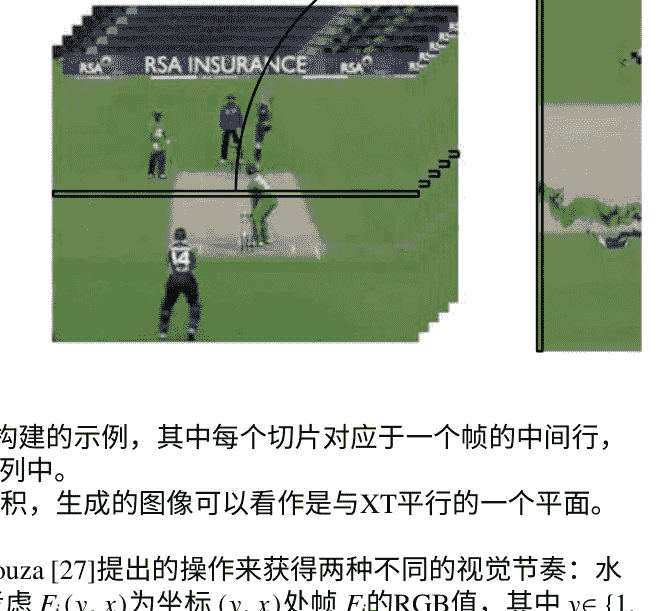

图1显示了视觉节奏构建的示例，其中每个切片对应于一个帧的中间行，并放置在生成图像的一列中。

将视频视为一个XYT体积，生成的图像可以看作是与XT平行的一个平面。

在这里，我们使用Souza [27]提出的操作来获得两种不同的视觉节奏：水平均值和垂直均值。考虑Fi(y, x)为坐标(y, x)处帧Fi的RGB值，其中y∈{1, …, h}且x∈{1, …, w}，操作Th(Fi)和Tv(Fi)由Fi的列（水平均值）或行（垂直均值）的平均强度给出。也就是说，水平均值视觉节奏被定义为

```
Th(Fi) = [ (Σy Fi(y,1)/h) (Σy Fi(y,2)/h)...(Σy Fi(y,w)/h) ]^T  (2) 
```

以及垂直均值为:

```
Tv(Fi) = [ (Σx Fi(1,x)/w) (Σx Fi(2,x)/w)...(Σx Fi(h,x)/w) ]^T . (3) 
```

图2中展示了两个方向。请注意，与图1不同，使用这两种操作之一来计算相应的切片时，考虑了给定帧的每个像素。

#### 3.2 双流架构

在双流网络[24]中，从视频中选择一个RGB帧，以及10对连续的光流图像，形成一个20通道图像，分别用于训练空间和时间流。

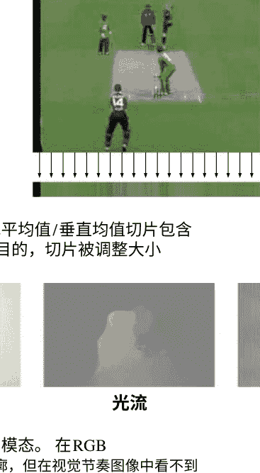

##### 垂直均值

##### 水平均值

图2 时空切片：给定帧的水平均值/垂直均值切片包含列/行的平均值。为了说明目的，切片被调整大小

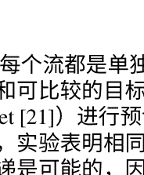

##### RGB

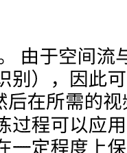

##### 光流

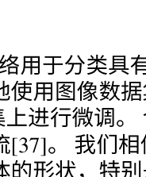

##### 视觉节奏

图3 我们三流网络中使用的模态。在RGB和光流图像中可以看到物体轮廓，但在视觉节奏图像中看不到

尽管动态信息对于动作识别非常重要，但静态和上下文信息，如演员姿势，涉及的物体和标准场景可以帮助区别类。例如，绿草地可能是与足球比赛相关的动作的线索；马可以帮助识别骑马动作。因此，即使使用单个视频帧，仅空间流就能够取得良好的结果。

每个流都是单独训练的。由于空间流与图像网络用于分类具有相同的模态和可比较的目标（外观识别），因此可以合理地使用图像数据集（如ImageNet [21]）进行预训练，然后在所需的视频数据集上进行微调。令人惊讶的是，实验表明相同的预训练过程可以应用于时间流[37]。我们相信这种知识传递是可能的，因为光流在一定程度上保持了物体的形状，特别是与视觉节奏图像（图3）相比。

原始网络基于CNN-M-2048 [4]，由五个卷积层和三个全连接层组成。然而，Wang等人[37]认为，深层网络，如VGG [25]（16或19层）和GoogLeNet [30]（22层），更适合解决我们的目标问题，因为动作的概念比物体更复杂。Wani等人[42]讨论了几种具有不同深度的CNN架构。在最深的CNN中，我们测试了

使用多流进行视频动作识别...

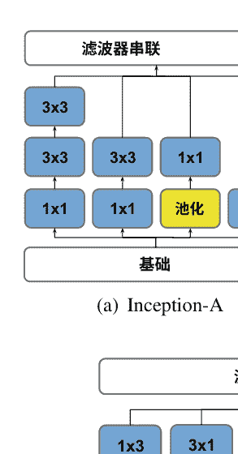

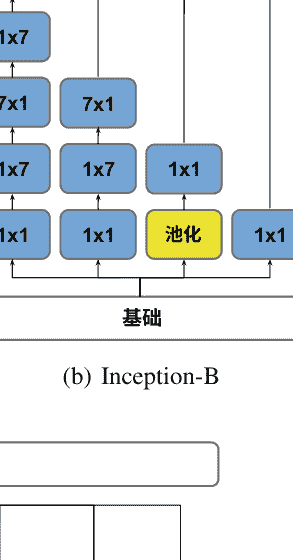

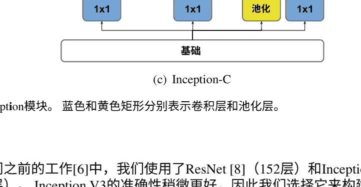

图4 Inception模块。蓝色和黄色矩形分别表示卷积层和池化层。

在我们之前的工作[6]中，我们使用了ResNet [8]（152层）和Inception V3 [31]（48层）。Inception V3的准确性稍微更好，因此我们选择它来构建我们的多流网络。与GoogleNet（也称为Inception V1）类似，Inception V3基于Inception模块（图4）。作者们探索了分解卷积来构建一个具有较少参数的高效网络。Inception V3的架构如图5所示。

对于空间和时间流，训练数据使用随机裁剪、水平翻转和RGB抖动进行增强。为了避免在非常深的卷积神经网络中过拟合，王等人提出了两种额外的数据增强技术：角点裁剪和多尺度裁剪。在测试阶段，从每个视频中选择25帧/堆栈的光流图像，并用它们生成10个新样本。

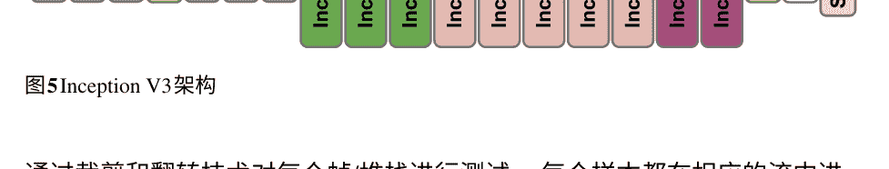

通过裁剪和翻转技术对每个帧/堆栈进行测试。每个样本都在相应的流中进行单独测试。最后，通过加权平均将每个卷积神经网络中计算的类别分数（softmax分数）进行组合。

### 4 提出的方法

我们的三流网络概述如图6所示。它包含三个使用不同模态的深度卷积神经网络：RGB帧（空间）、光流（时间）和视觉节奏（时空）。每个网络都是在ImageNet上进行预训练并与其相应的模态独立微调的图像网络。时空流还有一个额外的预训练步骤，使用Kinetics进行。所有的训练数据都使用多尺度 ​​和角点裁剪[37]以及随机水平翻转进行增强。在测试阶段，使用角点裁剪（四个角和一个中心裁剪）和水平翻转技术从每个输入图像生成10个样本。

给定一个视频，每个流的输出是一个包含每个类别的softmax得分的特征向量。应用融合策略以获得输入视频的单一得分向量。 关于流的更多细节如下所示：

#### 4.1 改进的空间流

在我们改进的空间流中，我们不再每个视频采集一帧，而是随机采集两帧，一帧在视频的前半部分，一帧在视频的后半部分。这种方法是合理的，因为场景的外观可能会在时间上发生显著变化，无论是由于场景条件（如光照和遮挡）还是由于视频中的姿势、物体和背景的多样性。在训练阶段，CNN仍然一次接收其中一帧。然而，通过呈现在视频的不同位置拍摄的两个样本，我们能够捕捉外观上的变化，例如可能是某些动作的特征的不同背景。

在我们的空间流中，测试协议保持不变，我们从每个测试视频均匀采样25帧，并产生10个新样本。

使用多流进行视频动作识别...

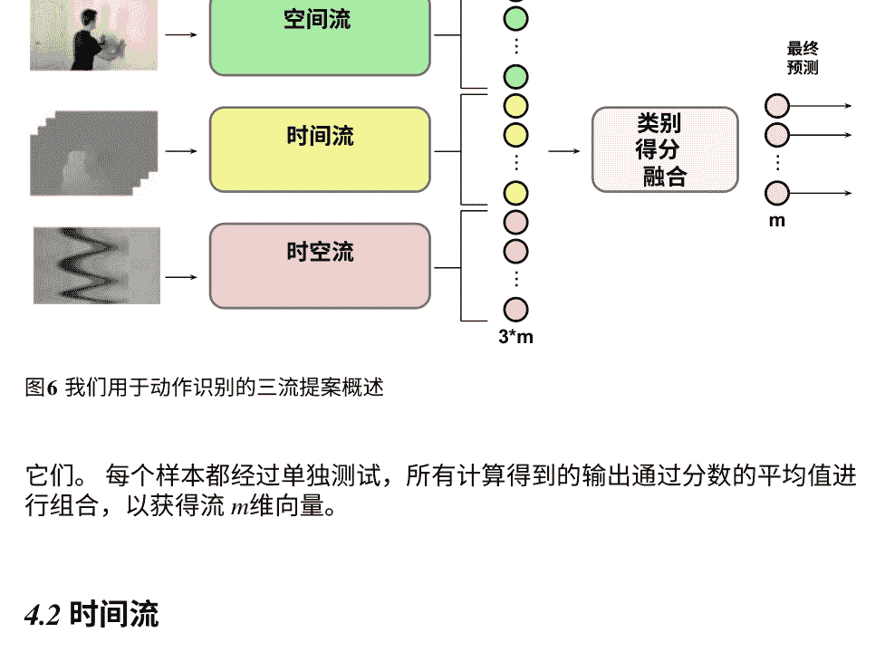

图6 我们用于动作识别的三流提案概述

它们。每个样本都经过单独测试，所有计算得到的输出通过分数的平均值进行组合，以获得流 m维向量。

#### 4.2 时间流

时间流使用每个视频的10对连续光流图像进行训练，以20通道图像（堆叠形式）的形式呈现。每对光流图像表示两个连续帧之间沿 X和 Y轴的运动，整个堆叠编码了关于动作动态的短期信息（10帧）。

在测试中，从每个视频均匀采样25个光流图像堆叠，并用于生成每个堆叠的10个新样本。与空间流类似，对于给定视频的250个时间输出使用分数的平均值进行组合，生成每个视频的单一 m维向量。

#### 4.3 时空流

时空流从视频中接收到一个单一的视觉节奏作为输入。视觉节奏是使用方程式2（水平-均值）或方程式3（垂直-均值）计算得到的灰度图像。

我们提出了一种根据主导运动自适应决定最佳的视觉节奏方向的方法。该方法被称为自适应视觉节奏（AVR），并基于以下观察结果。考虑一个固定的列/行j，集合{S1(j), S2(j), …, St(j)}表示平均值的变化## (a) 正交运动

#### (b) 平行运动

图7考虑两个连续帧和水平均值切片的移动物体。平行运动在切片中更好地捕捉到。

#### (a) 帧

#### (b) 水平节奏

#### (c) 垂直节奏

图8 来自Kinetics视频“跑步机上跑步”类别的帧和节奏示例。水平节奏呈现出波浪形的模式，更好地描述了动作。

关于时间的值 j 的变化可以在水平-均值/垂直-均值节奏的第 j 行中看到。如果列/行的均值保持不变，节奏中的第 j 行将形成具有均匀强度的线条。

假设，不失一般性，我们正在使用水平-均值切片进行工作。如果一个给定的对象在两个帧之间垂直移动（即与切片方向正交），相应列的平均颜色很可能保持不变（图7）。然而，水平移动会影响对象所跨越的所有列的平均颜色。因此，与切片方向平行的移动往往会产生更具特色的模式。

为了估计运动的主导方向，我们使用了Lucas-Kanade点追踪器[2]。该方法跟踪视频中一组选定的点[23]。对于给定类别的每个视频，跟踪器估计的绝对水平和垂直位移在帧上累积，每个类别得到两个值。最高值定义了类别的节奏方向。也就是说，如果类别中水平运动占主导地位，则选择水平平均节奏，否则选择垂直平均节奏。这个过程只执行一次，并且确定的方向用于任何后续训练。

图8显示了一个“跑步机上跑步”类别的Kinetics视频的一帧和提取的视觉节奏。由于腿部运动，这个动作主要是水平的。因此，水平节奏呈现出更相关的模式。

图9堆叠：使用全连接层将流计算的向量融合，以获得每个视频的最终预测。输入和输出的大小基于数据集中的类别数量。

用于分类。正如示例中所观察到的，水平节奏包含了代表腿部运动的波浪形式，而垂直节奏由相当均匀的线条组成。

#### 4.4 堆叠

在我们的实验中，我们注意到单独流的改进并不一定意味着组合的改进。因此，一个好的融合策略对于方法的有效性至关重要。

在这项工作中，除了简单和加权平均融合[6, 24, 37]，我们还使用外部全连接（FC）层作为元-分类器来探索另一种融合策略。因此，网络自动地定义了特征对最终预测的贡献程度。外部网络使用与2D CNN相同的训练集进行训练，但使用它们计算的特征作为输入（图9）。这种分类器的组合被称为堆叠。

训练过程分为两个阶段：(1) 2D CNNs 和 (2) 元-分类器训练。元分类器的输入由流输出的串联形成。输出是一个 m维向量，包含类别得分。

这个提议的思想是从与其他流组合的流中学习误差分类模式。也就是说，如果在一个给定的流中两个类别的区分度较差，但在另一个流中分类效果较好，外部网络可能会捕捉到这种模式。这种方法的主要优点是自动权重分配，可以适应新流的加入和方法的修改。

### 5 实验结果

在本节中，我们首先描述了实验中使用的数据集。接下来，我们介绍了设置参数和使用提出的方法得到的结果。在本节的最后，我们将我们的方法与最先进的方法进行了比较。

#### 5.1 数据集

我们的方法在具有挑战性的UCF101 [26]和HMDB51 [14]数据集上进行评估。UCF101包含来自YouTube的13320个序列，分为101个类别。样本具有固定的分辨率为320 ×240像素，帧率为25 fps，长度各异。该数据集还包括推荐的训练和测试分割，分别为大约70-30。HMDB51由来自各种来源的6766个序列组成，主要来自电影。样本被分为51个动作类别。由于它结合了商业和非商业来源，它呈现了各种各样的序列，包括模糊的视频或质量较低的视频以及来自不同视角的动作。作者甚至还提供了三个推荐的分割，每个分割中每个动作类别包含70个样本用于训练和30个样本用于测试。通过分割中达到的平均分类准确率来评估两个数据集的整体性能。

对于时空流的预训练，我们使用了包含600个动作类别的Kinetics [12]数据集，每个类别大约有600 - 1150个片段，每个片段大约10秒。Kinetics是一个大型数据集，总共有495547个来自YouTube的片段。推荐的训练/验证/测试集中每个类别的片段数分别为450 - 1000、50和100个。

#### 5.2 结果

我们的工作基线是由Zhu [46]提供的，它是使用PyTorch框架实现的非常深的双流网络[37]的公开实现。我们的三个流使用了Inception V3 [31]架构作为CNN，并使用了PyTorch提供的ImageNet参数进行初始化。所有实验都在一台配备有Intel® Core™ i-3770K 3.50 GHz处理器、32 GB内存、NVIDIA GeForce® GTX 1080 GPU和Ubuntu 16.04的机器上进行。在ImageNet初始化之后，使用Kinetics对时空流进行训练。对于Kinetics的预训练和UCF101/HMDB51的训练，我们使用了250个epochs和学习率为0.001。由于Kinetics包含一个验证集，我们使用它来确定最佳的预训练模型，用于后续的UCF101/HMDB51训练。根据我们的实验，最佳的预训练模型是第50个epoch的模型。另一方面，UCF101和HMDB51没有提供验证集，因此我们使用最后一个epoch的模型进行测试。

表1 使用不同的预训练数据集的时空流结果

| 预训练数据集 | UCF101 (%) | HMDB51 (%) |
| :--- | :--- | :--- |
| ImageNet [6] | 64.74 | 39.63 |
| ImageNet + Kinetics | 66.68 | 48.91 |

表2 融合三个流的不同策略

| 方法 | 流 | UCF101 (%) | HMDB51 (%) |
| :--- | :--- | :--- | :--- |
| 单独的 | RGB*图像 [6] | 86.61 | 51.77 |
| 单独的 | 光流 [6] | 86.95 | 59.91 |
| 单独的 | AVR-K | 66.68 | 48.91 |
| 简单平均 | RGB* + 光流 | 93.08 | 65.03 |
| 简单平均 | RGB* + AVR-K | 87.37 | 62.00 |
| 简单平均 | 光流 + AVR-K | 82.66 | 61.55 |
| 简单平均 | RGB* + 光流 + AVR-K | 91.97 | 67.65 |
| 加权平均 | RGB* + 光流 | 93.06 | 65.80 |
| 加权平均 | RGB* + AVR-K | 90.73 | 63.12 |
| 加权平均 | 光流 + AVR-K | 88.52 | 66.43 |
| 加权平均 | RGB* + 光流 + AVR-K | 93.91 | 70.07 |
| 堆叠 | RGB* + 光流 | 92.35 | 65.05 |
| 堆叠 | RGB* + AVR-K | 88.58 | 61.70 |
| 堆叠 | 光流 + AVR-K | 85.79 | 60.13 |
| 堆叠 | RGB* + 光流 + AVR-K | 91.94 | 67.14 |

在表1中显示了有无在Kinetics上进行预训练的结果。额外的预训练步骤改善了两个数据集的结果，尤其是HMDB51，增加了9.28%。这可能可以解释数据集的大小，因为HMDB51只有UCF101的一半大小，并且更具挑战性，因此它从预训练中获得更大的好处。

在表2中，我们分别展示了每个流的结果，以及使用不同的融合策略进行的每种组合。AVR-K指的是在ImageNet和Kinetics上进行预训练的AVR。在UCF101和HMDB51这两个数据集中，时间流在个体结果上取得了最好的成绩，与原始的双流网络一样。对于组合，我们考虑输出向量的简单平均值、加权平均值以及与元分类器的堆叠。在加权平均值中，我们根据个体表现使用空间流的权重为2，时间流的权重为3，时空流的权重为1。我们的元分类器由一个接收流向量串联作为输入并返回每个类别得分的全连接层组成。

就双流组合而言，除了在UCF101上的光流 +AVR-K的简单平均值和堆叠之外，大多数组合都超过了个体结果。在这两种情况下，组合的表现不如单独使用光流。

表3 UCF101和HMDB51数据集的准确率比较。粗体单元格表示整体最高准确率，而下划线单元格包含使用ImageNet预训练网络的最佳结果。

| 方法 | 预训练数据集 | UCF101 (%) | HMDB51 (%) |
| :--- | :--- | :--- | :--- |
| iDT + HSV [18] | — | 87.9 | 61.1 |
| Two-stream [24] | ImageNet | 88.0 | 59.4 |
| Two-stream + LSTM [16] | ImageNet | 88.6 | — |
| Two-stream TSN [38] | ImageNet | 94.0 | 68.5 |
| Three-stream TSN [38] | ImageNet | 94.2 | 69.4 |
| Three-stream [40] | ImageNet | 94.1 | 70.4 |
| TDD + iDT [36] | ImageNet | 91.5 | 65.9 |
| LTC + iDT [35] | — | 92.7 | 67.2 |
| KVMDf [44] | ImageNet | 93.1 | 63.3 |
| STP [39] | ImageNet | 94.6 | 68.9 |
| L²STM [28] | ImageNet | 93.6 | 66.2 |
| Two-stream + AVR (ResNet 152) [6] | ImageNet | 94.3 | 68.3 |
| Two-stream + AVR (Inception V3) [6] | ImageNet | 93.7 | 69.9 |
| Two-stream I3D [3] | ImageNet + Kinetics | 98.0 | 80.9 |
| I3D + PoTion [5] | ImageNet + Kinetics | 98.2 | 80.9 |
| DTPP [45] | ImageNet + Kinetics | 98.0 | 82.1 |
| SVMP + I3D [41] | ImageNet + Kinetics | — | 81.3 |
| R(2 + 1)D-TwoStream [33] | 动力学 | 97.3 | 78.7 |
| 我们的方法（加权平均） | ImageNet + Kinetics | 93.9 | 70.1 |

一般来说，空间流的存在提高了与光流 +AVR-K相比的准确性，这表明外观信息对于识别的重要性。

对于HMDB51，三流版本优于所有其他组合，而对于UCF101，只有加权平均融合可以得到验证。然而，在具有挑战性的HMDB51中，收益（约 +3%）比UCF101中的损失（约 -1%）更为显著。从这个表中我们可以得出结论，三个输出的加权平均优于其他融合策略，可能是因为它结合了相同类别的分数而不是FC层的类间组合，并且分配了比简单平均更好的权重。

在展示和分析两个数据集中获得的结果之后，我们将我们的准确性与表3中提出的最新方法进行比较。我们根据预训练策略将方法分开。其中一些方法不基于深度网络，因此它们没有预训练步骤。关于剩下的方法，一组方法在ImageNet数据集上进行预训练，而另一组方法使用ImageNet和Kinetics。与仅使用ImageNet进行训练的方法相比，使用Kinetics进行预训练的方法具有优势，因为Kinetics是最大且最多样化的数据集之一。

用于动作识别问题的数据集。此外，其中一些，如I3D，基于3D卷积。考虑到第一组，我们的方法取得了竞争性的结果。然而，我们可以看到与原始AVR（表1）相比，个体结果的增益并未在融合中得到体现。尽管在个体结果中增加了1.94%（UCF101）和9.28%（HMDB51），但我们的三流网络的准确率仅比原始的两流+AVR使用Inception V3高出0.2%。因此，需要进一步分析融合策略以改善结果。

### 6 结论

在这项工作中，我们提出了一种创新的方法来解决视频序列中的人类动作识别问题。我们基于多流架构从空间、时间和时空网络中提取信息。由于时空流的视觉节奏明显改变了物体的轮廓，因此该流需要使用相同的模态进行额外的预训练步骤，而不是使用自然图像。

我们通过三种不同的融合技术（简单平均、加权平均和FC层）结合了每个流中计算的个体输出。加权平均在UCF101和HMDB51数据集上取得了最好的结果。

与最先进的方法相比，我们的方法取得了有望的结果。

致谢作者感谢FAPESP（资助号2017/09160-1和2017/12646-3）、CNPq（资助号305169/2015-7）、CAPES和FAPEMIG的财务支持。作者还感谢NVIDIA作为GPU Grant Program的一部分捐赠的GPU。

### 参考文献

- 1. H. Bilen, B. Fernando, E. Gavves, A. Vedaldi, 动态图像网络的动作识别. IEEE模式分析与机器智能 40(12), 2799–2813 (2018)
- 2. J.Y. Bouguet, 金字塔实现的仿射lucas kanade 特征跟踪器算法描述. Intel公司 5(1–10), 4 (2001)
- 3. J. Carreira, A. Zisserman, Quo vadis, 动作识别？一个新模型和动力学数据集, 在IEEE计算机视觉和模式识别会议(IEEE, 2017), pp. 4724–4733
- 4. K. Chatfield, K. Simonyan, A. Vedaldi, A. Zisserman, 魔鬼细节的回归: 深入研究卷积神经网络 (2014), pp. 1–11, arXiv:14053531
- 5. V. Choutas, P. Weinzapfel, J. Revaud, C. Schmid, PoTion: 姿势运动表示用于动作识别, 在IEEE计算机视觉和模式识别会议 (2018), pp. 7024–7033
- 6. D.T. Concha, H. de Almeida Maia, H. Pedrini, H. Tacon, A. de Souza Brito, H. de Lima Chaves, M.B. Vieira 基于自适应视觉节奏的视频动作识别的多流卷积神经网络, 在IEEE机器学习和应用国际会议(IEEE, 2018), pp. 473–480
- 7. I. Gori, J.K. Aggarwal, L. Matthies, M.S. Ryoo, 机器人中心场景中的多类型活动识别. IEEE E机器人与自动化通讯. 1(1), 593-600 (2016)
- 8. K. He, X. Zhang, S. Ren, J. Sun, 深度残差学习用于图像识别，在 IEEE计算机视觉与模式识别会议(2016)，第770-778页
- 9. S. Ji, W. Xu, M. Yang, K. Yu, 用于人体动作识别的3D卷积神经网络。 IEEE模式分析与机器智能 35(1), 221-231 (2013)
- 10. R. Kahani, A. Talebpour, A. Mahmoudi-Aznaveh, 基于相关性的第一人称活动识别特征表示。多媒体工具应用 78(15), 21673-21694 (2019)
- 11. A. Karpathy, G. Toderici, S. Shetty, T. Leung, R. Sukthankar, L. Fei-Fei, 大规模视频分类与卷积神经网络，在IEEE计算机视觉与模式识别会议(2014)，第1725-1732页
- 12. W. Kay, J. Carreira, K. Simonyan, B. Zhang, C. Hillier, S. Vijayanarasimhan, F. Viola, T. Green, T. Back, P. Natsev, M. Suleyman, A. Zisserman, The kinetics human action video dataset (2017), pp. 1-22, arXiv:170506950
- 13. H. Kim, J. Lee, J.H. Yang, S. Sull, W.M. Kim, S.M.H. Song, 视觉节奏和镜头验证。多媒体工具应用 15(3), 227-245 (2001)
- 14. H. Kuehne, H. Jhuang, R. Stiefelhagen, T. Serre, HMDB51: 一个用于人类运动识别的大型视频数据库，高性能计算在科学与工程中 (Springer, Berlin, 2013), pp. 571-582
- 15. D. Li, T. Yao, L. Duan, T. Mei, Y. Rui, 统一的时空注意力网络用于视频动作识别. IEEE Trans. Multimed. 416-428 (2018)
- 16. J.Y.H. Ng, M. Hausknecht, S. Vijayanarasimhan, O. Vinyals, R. Monga, G. Toderici, 超越短片段: 用于视频分类的深度网络, 在IEEE计算机视觉和模式识别会议(2015), pp. 4694-4702
- 17. C.W. Ngo, T.C. Pong, R.T. Chin, 在MPEG领域中通过2D时空图像分割进行摄像机断裂检测, 在/IEEE多媒体计算与系统国际会议, vol. 1 (IEEE, 1999), pp. 750-755
- 18. X. 彭, L. 王, X. 王, Y. 乔, 用于动作识别的视觉词袋和融合方法：全面研究和良好实践。计算机视觉与图像理解 150, 109-125 (2016年)
- 19. H. Rahmani, A. Mian, M. Shah, 从新视角学习人类动作识别的深度模型。IEEE模式分析与机器智能 40 (3), 667-681 (2018年)
- 20. M. Ravanbaksh, H. Mousavi, M. Rastegari, V. Murino, L.S. Davis, 基于图像的CNN特征的动作识别 (2015年)，第1-10页, arXiv:151203980
- 21. O. Russakovsky, J. Deng, H. Su, J. Krause, S. Satheesh, S. Ma, Z. Huang, A. Karpathy, A. Khosla, M. Bernstein, A.C. Berg, L. Fei-Fei, ImageNet大规模视觉识别挑战。Int. J. Comput. Vis. 115(3), 211-252 (2015)
- 22. M.S. Ryoo, L. Matthies, 第一人称活动识别：特征，时间结构和预测。Int. J. Comput. Vis. 119(3), 307-328 (2016)
- 23. J. Shi, C. Tomasi, 用于跟踪的好特征，在IEEE计算机视觉和模式识别会议(IEEE, 1994), pp. 593-600
- 24. K. Simonyan, A. Zisserman, 用于视频动作识别的双流卷积网络，在神经信息处理系统进展(2014), pp. 568-576
- 25. K. Simonyan, A. Zisserman, 用于大规模图像识别的非常深的卷积网络，在学习表示国际会议(2015), pp. 1-14
- 26. K. Soomro, A.R. Zamir, M. Shah, UCF101：来自野外视频的101个人类动作类别数据集 (2012), pp. 1-7, arXiv:1212040
- 27. M.R. Souza, 数字视频稳定化：算法和评估。硕士论文，计算机研究所，坎皮纳斯大学，巴西坎皮纳斯，2018年
- 28. L. Sun, K. Jia, K. Chen, D.Y. Yeung, B.E. Shi, S. Savarese, 格点长短期记忆用于人类动作识别，在IEEE国际计算机视觉会议 (2017年)，pp. 2147-2156
- 29. S. Sun, Z. Kuang, L. Sheng, W. Ouyang, W. Zhang, 光流引导特征：一种快速且鲁棒的视频动作表示方法，在IEEE计算机视觉与模式识别会议(2018年)，pp. 1390-1399

30. C. Szegedy, W. Liu, Y. Jia, P. Sermanet, S. Reed, D. Anguelov, D. Erhan, V. Vanhoucke, A. Rabinovich, Going deeper with convolutions, in Proceedings of the IEEE Conference on Computer Vision and Pattern Recognition (2015), pp. 1-12

31. C. Szegedy, V. Vanhoucke, S. Ioffe, J. Shlens, Z. Wojna, Rethinking the Inception Architecture for Computer Vision, in Proceedings of the IEEE Conference on Computer Vision and Pattern Recognition (2016), pp. 2818-2826

32. B.S. Torres, H. Pedrini, Detection of complex video events through visual rhythm. Vis. Comput. 32, 1-21 (2016)

33. D. Tran, H. Wang, L. Torresani, J. Ray, Y. LeCun, M. Paluri, A closer look at spatiotemporal convolutions for action recognition, in Proceedings of the IEEE Conference on Computer Vision and Pattern Recognition (2018), pp. 6450-6459

34. Z. Tu, W. Xie, J. Dauwels, B. Li, J. Yuan, Semantic cue enhanced multimodal multi-stream CNN for action recognition. IEEE Transactions on Circuits and Systems for Video Technology 29(5), 1423-1437 (2018)

35. G. Varol, I. Laptev, C. Schmid, Long-term temporal convolutions for action recognition. IEEE Transactions on Pattern Analysis and Machine Intelligence 40(6), 1510-1517 (2018)

36. L. Wang, Y. Qiao, X. Tang, Action recognition with trajectory-pooled deep-convolutional descriptors, in Proceedings of the IEEE Conference on Computer Vision and Pattern Recognition (2015), pp. 4305-4314

37. L. Wang, Y. Xiong, Z. Wang, Y. Qiao, Towards good practices for very deep two-stream convolutional networks (2015), arXiv:1507.02159

38. L. Wang, Y. Xiong, Z. Wang, Y. Qiao, D. Lin, X. Tang, L. Van Gool, Temporal Segment Networks: Towards Good Practices for Deep Action Recognition, in Proceedings of the European Conference on Computer Vision (Springer, 2016), pp. 20-36

39. Y. Wang, M. Long, J. Wang, P.S. Yu, Spatiotemporal pyramid network for video action recognition, in Proceedings of the IEEE Conference on Computer Vision and Pattern Recognition (IEEE, 2017), pp. 2097-2106

40. H. Wang, Y. Yang, E. Yang, C. Deng, Exploring hybrid spatiotemporal convolutional networks for human action recognition. Multimedia Tools and Applications 76(13), 15065-15081 (2017)

41. J. Wang, A. Cherian, F. Porikli, S. Gould, Video representation learning with discriminative pooling, in Proceedings of the IEEE Conference on Computer Vision and Pattern Recognition (2018), pp. 1149-1158

42. M.A. Wani, F.A. Bhat, S. Afzal, A.I. Khan, Advances in Deep Learning, vol. 57 (Springer, Berlin, 2020)

43. H. Yang, C. Yuan, B. Li, Y. Du, J. Xing, W. Hu, S.J. Maybank, Asymmetric 3D convolutional neural networks for action recognition. Pattern Recognition 85, 1-12 (2019)

44. W. Zhu, J. Hu, G. Sun, X. Cao, Y. Qiao, Key volume mining deep framework for action recognition, in Proceedings of the IEEE Conference on Computer Vision and Pattern Recognition (IEEE, 2016), pp. 1991-1999

45. J. Zhu, Z. Zhu, W. Zou, End-to-end video-level representation learning for action recognition, in Proceedings of the 24th International Conference on Pattern Recognition (IEEE, 2018), pp. 645-650

46. Y. Zhu, PyTorch implementation of the popular two-stream framework for video action recognition (2019), https://github.com/bryanyzhhu/two-stream-pytorch

## 深度主动学习用于图像回归

Hiranmayi Ranganathan, Hemanth Venkateswara, Shayok Chakraborty 和 Sethuraman Panchanathan

图像回归是计算机视觉中的一个重要问题，并且在各种应用中非常有用。然而，训练一个强大的回归模型需要大量标记的训练数据，这是耗时且昂贵的。主动学习算法可以自动从大量未标记的数据中识别出显著和典型的实例，并极大地减少人工注释的工作量。此外，深度学习模型（如卷积神经网络）已经在各种分类和回归应用中展现出有希望的性能，并且受到了广泛关注。在本章中，我们利用深度神经网络的特征学习能力，提出了一个新的框架来解决回归问题的主动学习。我们制定了一个损失函数（基于预期模型输出的变化），与研究任务相关，并利用梯度下降算法来优化损失并训练深度卷积神经网络。据我们所知，这是第一个利用深度神经网络学习辨别特征并在回归设置中主动选择信息样本的研究工作。我们在五个基准回归数据集上进行了广泛的实证研究（来自三个不同的应用领域：手写数字的旋转角度估计、年龄和头部姿态估计），证明了我们的框架在极大地减少人工注释工作量以诱导出强大的回归模型方面的优点。

| 作者 | 机构 | 地址 | 电子邮件 |
| :--- | :--- | :--- | :--- |
| H. Ranganathan | 劳伦斯利弗莫尔国家实验室 | 东大道7000号，利弗莫尔，加利福尼亚州94550，美国 | hrangana@asu.edu |
| H. Venkateswara | 亚利桑那州立大学 | 密尔大道699号，坦佩，亚利桑那州85281，美国 | hemanthv@asu.edu |
| S. Panchanathan | 亚利桑那州立大学 | 密尔大道699号，坦佩，亚利桑那州85281，美国 | panch@asu.edu |
| S. Chakraborty | 佛罗里达州立大学 | 学术路1017号，塔拉哈西，佛罗里达州32304，美国 | shayok@cs.fsu.edu |

### 1 引言

图像回归是计算机视觉中一个经过深入研究的问题，在各种应用中都很有用，包括年龄估计、头部姿态估计和面部特征点检测等。在训练可靠的图像回归模型方面，一个基本的挑战是需要大量标记的训练数据。然而，虽然收集大量未标记的数据很便宜和容易，但标注数据（带有类别标签）是一项昂贵的过程，需要时间、人力和专业知识。因此，开发算法来减少图像回归模型训练中的人工工作量是一个基本的研究挑战。

主动学习（AL）算法在暴露于大量未标记数据时，自动识别出显著和典型的样本，以进行手动标注。这极大地减少了人工标注的工作量，因为只需要手动标记算法识别出的少数样本。此外，由于模型是在典型实例上进行训练的，其泛化能力比随机选择训练样本的被动学习者要好得多。近年来，主动学习已在许多机器学习应用中使用，取得了有希望的结果。虽然主动学习在分类方面得到了广泛研究，但在回归方面的主动学习研究相对较少。

深度学习（DL）算法最近已经成为主导的机器学习工具，用于学习分类和回归任务的代表性特征，并取代了手工设计特征的需求。卷积神经网络（CNNs）、循环神经网络（RNNs）等架构在多媒体计算应用中引起了范式转变。深度学习在计算机视觉领域得到了广泛研究，并在多个视觉任务中取得了巨大的性能改进，包括图像识别、目标检测、多模态情感识别和图像分割等。除了分类，CNNs还被有效地应用于姿态估计、目标检测、面部特征点检测和深度预测等回归任务。

在本章中，我们利用深度网络的优势来学习丰富的特征集并为回归设置开发了一种新颖的主动学习框架。我们使用预期模型输出变化（EMOC）作为主动选择准则，并将其整合到用于训练深度学习模型的目标函数中。生成的模型优化了这个新颖的目标，并从对当前模型造成最大变化的显著示例中进行学习。深度主动学习的研究仍处于初级阶段。据我们所知，这是第一个为回归问题使用深度卷积神经网络开发主动学习算法的研究工作。尽管在图像回归中进行了验证，但所提出的框架是通用的，可以在任何需要从大量未标记数据中选择最具信息量的示例进行手动注释的回归应用中使用。

本章的其余部分组织如下：我们在第2节中介绍了相关技术的调查；第3节详细介绍了用于回归的提出的深度主动学习框架；第4节介绍了实验和结果；第5节进行了讨论。

### 2 相关工作

在本节中，我们对深度学习和主动学习在回归中的现有工作进行了简要调查。

#### 2.1 深度学习用于回归

深度学习已成功应用于各种回归应用，包括物体（人群）计数、面部图像年龄估计、人体姿势估计和深度估计等。Shi等人提出了一种用于人群计数的深度学习算法，该算法使用负相关性学习可推广的特征。Zhao等人使用CNN解决了在监控视频中估计感兴趣线上的人数的问题。

Zhang等人提出了一种使用深度CNN在目标监控人群场景中计数人数的跨场景人群计数技术，这些场景在训练集中是未见过的。Liu等人使用CNN和长短期记忆（LSTM）网络在带有WIFI信号的封闭环境中进行人群计数。面部图像年龄估计是另一种基于计算机视觉的回归应用，深度学习在这方面取得了显著的成功。Rothe等人提出了一种从单个面部图像估计年龄的深度学习解决方案，无需使用面部标志点。作者还介绍了IMDB-Wiki数据集，这是具有年龄和性别标签的最大公共面部图像数据集。Wang等人使用深度学习模型不同层次获得的特征进行年龄估计，而不仅仅使用最后一层的特征；结合流形学习算法，他们的框架相对于基线取得了显著的性能改进。Zaghbani等人利用自动编码器以监督方式学习面部图像的特征来估计年龄。

CNN已成功应用于人体姿势估计，其中回归值对应于图像平面上的身体关节位置。Sun等人有效地使用CNN预测面部标志点在面部标志检测中的位置。Gkioxari等人使用R-CNN，其损失函数由身体姿势估计项和动作检测项组成。Szegedy和Jaderberg等人使用深度网络进行对象和文本检测，以预测定位的边界框。上述深度模型使用传统的L2损失函数进行训练。Zhang等人引入了一种针对标志点检测和属性分类进行优化的CNN。他们将标准的L2损失函数与softmax分类函数以增加对异常值的鲁棒性。Wang等人使用类似的方法将边界框定位与对象分割相结合。Dosovitskiy和Eigen等人使用多个L₂损失函数进行对象生成和深度估计。从上述调查中，我们可以看到使用L₂损失函数训练的深度模型（特别是CNN）可以有效地应用于回归任务。因此，在这项工作中，我们使用CNN作为我们首选的深度模型。

#### 2.2 回归主动学习

与为分类开发的主动学习方法相比，回归主动学习的研究较少。Willett等人在回归的背景下提供了主动学习的理论分析。Sugiyama提出了基于人口的主动学习方法，使用加权最小二乘法学习，他们预测了给定输入训练样本的泛化误差的条件期望。Sugiyama和Nakajima提出了一个理论上最优的主动学习算法。这直接通过采用加法回归模型来最小化泛化误差。Fruen等人将基于方差的委员会查询（QBC）框架应用于回归。Cohn等人通过最小化输出方差来减小泛化误差。Yu和Kim基于数据的几何特征提供了被动采样启发式方法。Burbidge等人研究了基于委员会的方法来主动学习实值函数。他们使用了仅方差策略来选择信息丰富的训练数据。Freytag等人提出了一种衡量模型输出预期变化的方法。对于未标记集中的每个示例，计算了模型预测的预期变化，并对未知标签进行了边际化处理。对于每个未标记示例，使用得分进行主动学习，可以应用于广泛的模型和学习算法。

大多数基于回归的主动学习技术仅针对顺序查询模式进行开发（每次迭代仅查询一个未标记样本）。批量模式主动学习（BMAL）技术可以同时查询一批未标记样本，因此在实践中非常有用，可以利用多个标记神谕。尽管BMAL在分类的背景下得到了广泛研究，但在回归设置中研究较少。Cai等人通过模拟顺序模式主动学习行为将顺序模式主动学习扩展到BMAL，同时选择一组示例而无需重新训练。他们引入了一种新颖的回归主动学习框架，称为预期模型变化最大化（EMCM），该框架在添加到训练数据后查询最大化模型变化的示例。沿着类似的思路，Kading等人提出了一种基于预期模型输出变化的主动学习算法，该算法查询可能对模型输出产生最大变化的样本，如果将其添加到训练集中。

尽管深度学习和回归的主动学习已经分别进行了研究，但是关于开发端到端深度主动学习框架的研究尚未开展。回归问题尚未被探索。在本章中，我们利用深度网络的特征学习能力，并提出了一种新颖的框架来解决回归的主动学习问题。我们使用预期模型输出变化（EMOC）作为主动选择标准，并将其整合到用于训练深度模型的目标函数中。由于主动学习标准嵌入在损失函数中，网络被专门训练用于主动学习任务，并且可能比仅使用传统的L2损失训练的网络表现更好。此外，我们的技术考虑了深度网络的所有参数化层的变化，并将它们隐式地结合成一个用于主动样本选择的标准。这与现有方法形成对比，现有方法仅利用深度神经网络的当前输出来查询未标记的样本。现在我们来描述我们的框架。

### 3 提出的框架

在我们的主动学习设置中，深度卷积神经网络接触到少量标记数据和大量未标记数据。在我们算法的每次迭代中，选择一批未标记样本，并将其交给人工标注专家进行注释。这些标记样本从未标记集合中移除，并添加到标记集合中。深度模型在更新的集合上重新训练，并在一个保留的测试集上进行评估。该过程重复进行，直到满足某个停止准则（在本研究中定义为预先确定的迭代次数）。主动学习中的挑战在于识别出最具信息量的未标记样本集，以便在测试集上以最小的人力投入获得最佳性能。

本研究的核心思想是利用深度神经网络模型的特征学习能力，识别出最具信息量的未标记样本用于主动学习。我们尝试在目标函数中集成一个主动样本选择准则，并训练网络以最小化该目标。网络学习到的特征将被特别定制为主动学习任务。这使得模型能够更好地识别出能够为模型提供最大信息增益的样本。我们使用EMOC准则来量化在我们的主动学习框架中未标记样本的效用。我们通过将基于EMOC的损失项添加到传统回归目标中，并训练网络以优化这个联合目标函数来实现这一目标。

形式上，让 $g(x; \phi)$ 是神经网络的输出，其中 $\phi$ 是网络的参数，$x$ 是输入图像。 在这项工作中，我们专注于分层深度模型， $g( x_i; \phi ) = g_l( \cdots (g_2(g_1(x_i; \phi_1); \phi_2)) \cdots ); \phi_l )$。在这里， $\phi = (\phi_1, \ldots, \phi_l)$ 表示深度模型的参数， $l$ 是深度模型的总层数。 让有标签样本集表示为 $X^L = \{x_1, x_2, \ldots, x_n\}$。对于 $X^L$ 的相应标签用 $Y^L = \{y_1, y_2, \ldots, y_{nl}\}$ 表示连续实值；$y_i \in \mathbb{R}$。让未标记样本集合为 $X^U = \{x_{n_l + 1}, x_{n_l + 2}, \ldots, x_{n_l + n_u}\}$。让 $X = X^L \cup X^U$ 表示 不相交子集 $x'$和$x''$的并集，并且 $n = n_l + n_u$。主动学习的目标是选择一个包含$k$个未标记样本的批次进行主动注释，以便修改后的学习器（在标记集$X_L$和未标记集$X_U$上训练）具有最大的泛化能力。

我们现在提出了一个新的损失函数来训练用于主动学习的深度卷积神经网络。我们的损失函数由两个项组成——一个用于量化标记数据的损失，另一个用于量化未标记数据的损失。具体细节如下。

#### 3.1 标记数据上的损失

这个术语的目的是确保训练的卷积神经网络在标记数据上具有最小的预测误差。我们使用传统的 L₂损失来量化标记数据上的误差。考虑一个标记样本的子集 $X^l = \{x_1, x_2, \ldots, x_{n^l}\}$ 以及它们对应的标签 $Y^l = \{y_1, y_2, \ldots, y_{n^l}\}$。让 $\hat{Y}^l = [\hat{y}_1, \hat{y}_2, \ldots, \hat{y}_{n^l}] = [g(x_1; \phi), g(x_2; \phi), \ldots, g(x_{n^l}; \phi)]$，是深度神经网络在标记数据子集上的预测。预测损失由以下公式给出：

$$
L(\phi; X^l, Y^l) = \frac{1}{n^l} \sum_{i=1}^{n^l} (y_i - \hat{y}_i)^2 \quad (1)
$$

最小化这个损失可以确保训练模型的预测与标记数据一致。

#### 3.2 期望模型输出变化原则（EMOCC）

EMOCC准则提供了一种量化样本重要性的原则性方法，通过测量在训练时使用或不使用特定数据样本时模型输出的差异：

$$
\Delta g(x') = E_{y'|x'} E_x ||g(x; \phi') - g(x; \phi)||_1 \quad (2)
$$

在公式（2）中，$||g(x;\phi') - g(x;\phi)||_1$ 计算模型输出之间的差异的L₁范数。这里，$\phi'$ 表示通过额外训练使用未标记示例 $x'$ 获得的模型参数。为了估计 $\phi'$，我们需要知道 $x'$ 的标签。我们假设 $y'$ 是 $x'$ 的标签。通常，第一个期望操作用于在上述方程中对 $y'$ 进行边际化，以获得期望的模型变化。期望 $E_x$ 通过计算数据集的经验均值来估计，而期望 $E[y'|x']$ 则基于更新模型 $g(:,\phi')$ 对于所有可能的 $y'$ 在给定 $x'$ 的情况下的输出。

直接实现EMOCC原则需要为数据集中的每个示例 $x'$ 训练一个模型，这使得计算非常密集。因此，需要开发有效的技术来近似模型输出的变化 $\Delta g(.)$。Freytag等人推导出了一个闭式表达式，用于关注高斯过程回归。Kading等人使用随机梯度近似和单个样本来估计模型参数的更新。该近似公式如下所示（式3），其中目标函数关于候选样本 $(x', y')$ 的梯度用于估计模型的变化：

$$
(\phi' - \phi) \approx \eta \nabla_\phi L(\phi; (x', y')) \quad (3)
$$

其中，$\eta > 0$ 是某个常数。差异 $||g(x; \phi') - g(x; \phi)||_1$ 可以使用一阶泰勒级数近似来计算

$$
||g(x; \phi') - g(x; \phi)||_1 \approx ||\nabla_\phi g(x; \phi)^\top (\phi' - \phi)||_1 \quad (4)
$$

我们将方程（3）代入方程（4）得到：

$$
||g(x; \phi') - g(x; \phi)||_1 \approx \eta ||\nabla_\phi g(x; \phi)^\top \nabla_\phi L(\phi; (x', y'))||_1 \quad (5)
$$

由于在所有可能的值上进行边缘化计算 $y'$ 是不切实际的，因此提出了一个近似方法，只考虑模型 $g$ 推断出的最可能的标签 $\hat{y}'$（作为未标记样本 $x'$ 的标签）。因此，假设给定未标记集合 $X'$ 中的所有示例都具有标签 $\hat{y}'$。通过这种简化的近似，未标记集合 $X'$ 的EMOC分数为

$$
\Delta g(X') = \sum\limits_{x' \in X'} E_x ||\nabla_\phi g(x; \phi)^\top \nabla_\phi L(\phi; (x', \hat{y}'))||_1 \quad (6)
$$

#### 3.3 未标记数据上的损失

该项的目的是确保经过训练的CNN在未标记样本上具有最大的预测置信度。在分类设置中，训练网络对未标记样本的预测置信度通常使用香农熵进行量化。每个未标记样本的熵是根据网络输出的概率分布计算的，并且未标记集合的总熵被包含在整体损失函数中。最小化这一项可以确保网络经过训练后，在未标记集合上提供高置信度（低熵）的预测。然而，在回归应用中计算预测的不确定性是一项挑战，因为熵在回归设置中没有精确的类比。因此，我们利用EMOC的原理来计算深度模型对给定未标记样本的预测不确定性。我们在损失函数中施加一个条件，确保所有未标记样本相对于训练模型具有较高的EMOC分数。

对未标记数据集的预测置信度。此外，我们在训练网络时，将未标记数据纳入考虑，可以获得以下好处：（i）CNN被训练用于从标记和未标记样本中提取特征，使其比仅在标记样本上训练的网络更加稳健；（ii）来自未标记数据的EMOC损失作为正则化器，防止过拟合并提高网络的泛化能力；以及（iii）由于网络最小化EMOC损失，这有助于选择最相关的样本来形成批次B。令X

$$\mathcal{U}(\phi; X^U) = \sum\limits_{x'\in X^U}\mathbb{E}_x||\nabla_\phi g(x; \phi)^\top\nabla_\phi L(\phi; (x', \bar y'))||_1 \tag{7}$$

在这里，$\mathcal{L}(\phi; (x', \bar y'))=(\bar y'-\hat y')^2$，其中$x'$是一个未标记的样本，$\bar y'$是其近似标签，$\hat y'$是网络的输出，$\mathbb{E}_x$是数据集上的经验均值。通过最小化这个损失，可以确保特征以这样的方式学习，即所有未标记的样本在训练模型的EMOC得分上都很低。

#### 3.4 新颖的联合目标函数

深度模型使用有标签和无标签数据进行训练，目标是在有标签数据上最小化$L_2$损失和无标签数据上的EMOC损失。联合损失确保网络能够准确预测有标签训练数据的标签，同时对无标签样本的训练模型参数影响最小；即在无标签数据上表现良好的模型。随着连续迭代，联合训练有标签和无标签数据的正面效果得到增强。我们的新颖联合目标函数在一批有标签和无标签数据上的表达式为

$$\mathcal{J}(\phi, X^l, Y^l, X^U) = \mathcal{L}(\phi; X^l, Y^l)+\lambda\mathcal{U}(\phi; X^U) \tag{8}$$

在这里，$\lambda\geq0$ 控制两个项的相对重要性。通过小批量梯度下降，在多个批次的有标签和无标签数据上最小化方程（8）中的目标函数。为了训练我们的网络，我们计算$\nabla_\phi\mathcal{J}$和使用反向传播来更新网络参数（下一节给出了梯度$\nabla_\phi J$的表达式）。一旦网络训练完成，选择具有最大EMOC分数的未标记示例来形成批次B。这些样本由人工专家进行注释，并将生成的标记批次附加到标记集$X^L$中。由于网络被训练为最小化未标记样本的EMOC分数，因此在模型训练后，具有最高EMOC分数的未标记样本是与当前模型相关的最具信息量的数据点，因此需要查询它们的标签。

#### 3.5 目标函数的梯度

在本节中，我们提供了目标函数梯度计算的高级概述。

深度主动回归的联合目标函数的梯度为

$$\nabla_\phi J(\phi, X^L, Y^L, X^U) = \nabla_\phi \mathcal{L}(\phi; X^L) + \lambda\nabla_\phi \mathcal{U}(\phi; X^U), \tag{9}$$

每个层的梯度在哪里

$$\frac{\partial \mathcal{L}(\phi; X^L)}{\partial \phi_j} = -\frac{2}{n^l} \sum_{i=1}^{n^l} \left[ (y_i - \hat{y}_i) \frac{\partial g(x_i;\phi)}{\partial \phi_j} \right], \forall j \in \{1,2,\dots,l\}, \tag{10}$$

和

$$\frac{\partial \mathcal{U}(\phi; X^U)}{\partial \phi_j} = \sum_{x' \in X^U} \mathbb{E}_x \left[ \frac{\partial}{\partial \phi_j} ||\nabla_\phi g(x;\phi)^\top \nabla_\phi \mathcal{L}(\phi; (x', \hat{y}'))||_1 \right] = \sum_{x' \in X^U} \mathbb{E}_x (Q_j), \forall j \in \{1,2,\dots,l\} \tag{11}$$

在方程（11）中，$Q_j$代表

$$Q_j = \begin{cases} +(Q_{j1} + Q_{j2}) & \text{if } \nabla_\phi g(x;\phi)^\top \nabla_\phi \mathcal{L}(\phi; (x', \hat{y}')) \geq 0 \\ -(Q_{j1} + Q_{j2}) & \text{如果 } \nabla_\phi g(x;\phi)^\top \nabla_\phi \mathcal{L}(\phi; (x', \hat{y}')) < 0, \end{cases} \tag{12}$$

用

$$Q_{j1} = \frac{\partial}{\partial \phi_j} (\nabla_\phi g(x;\phi)^\top) \nabla_\phi \mathcal{L}(\phi; (x', \hat{y})), \tag{13}$$

和

$$Q_{j2} = \nabla_\phi g(x;\phi)^\top \frac{\partial}{\partial \phi_j} (\nabla_\phi \mathcal{L}(\phi; (x', \hat{y}))) \tag{14}$$

我们计算 $Q_{j1} + Q_{j2}$ 对于固定的 $x' \in X^U$ 和所有的 $x \in X^L$。然后我们计算期望值 $\mathbb{E}_x(Q_j)$。我们对每个 $x' \in X^U$ 进行这样的计算，然后计算 $\sum \mathbb{E}_x(Q_j), \forall j \in \{1, 2, \dots, l\}$ 得到 $\nabla_\phi \mathcal{U}(\phi; X^U)$。

#### 算法1 用于回归的提出的深度主动算法

- **要求:** 标记集合 $X^L$, 标签 $Y^L$, 未标记集合 $X^U$, 权重参数 $\lambda$, 批量大小 $k$, 最大迭代次数 $T$
1: 对于 $t = 1, 2, \dots T$ 执行
2: 计算联合目标函数的导数，如公式(9)所示
3: 训练深度模型以优化联合损失
4: 使用公式(6)计算每个未标记样本的EMOC分数
5: 从 $X^U$ 中选择包含$k$个未标记样本的批次 $B$，其EMOC分数最高
6: 更新 $X^L \leftarrow X^L \cup B$; $X^U \leftarrow X^U \setminus B$
7: 结束循环

图1展示了所提出框架的图形说明。我们用一个小批量的$n$个数据点来展示网络，其中包括$n^l$个标记点和$n^u$个未标记点；$n^u = n^l_u + n^u_u$, ($n^l_u \leq n^l$, $n^u_u \leq n^u$)。$L_2$损失是在小批量的标记数据上计算的，EMOC损失是在小批量的未标记数据上计算的。将关于小批量的联合目标函数的负梯度反向传播到CNN进行训练。权重参数$\lambda$被选择为1，给予两个项相等的权重。当网络看到训练集中的所有数据点（包括标记和未标记的）时，我们将其视为一个时期。我们重复训练过程，直到收敛，并将其视为主动学习算法的一个训练迭代。

在每次迭代的末尾 $t$，我们从未标记的数据样本中选择最具信息量的批次（从公式（6）中得到最高EMOC分数的样本）来形成$B$。我们使用预言机为 $B$获取标签，并根据之前讨论的更新标记和未标记数据集。我们迭代直到没有未标记的数据点需要标记，或者我们用完了标记它们的预算。为了实现目的，我们将最大迭代次数固定为 $T$。所提出算法的伪代码如算法1所示。

我们注意到数据集中的异常值也会提供高EMOC分数。因此，对当前模型输出的显著变化并不总是导致更好的泛化性能。然而，当模型被异常值改变时，联合训练目标以及EMOC采样准则会在下一次迭代中选择一组信息丰富的示例，从而立即减轻异常值的不良影响。一般来说，异常值的数量相对于训练集中的样本数量较少。因此，可以合理地假设在一段时间内向标记集中添加显著示例将会得到良好的泛化性能。

### 4. 实验和结果

#### 4.1 实现细节

该提议的算法可以与任何深度学习架构结合使用。在这项研究中，我们研究了我们的框架在卷积神经网络（CNN）上的性能，因为它们在计算机视觉应用中很受欢迎[51]。图2展示了用于深度主动回归的CNN的网络架构。如图2所示，CNN的输入层中的输入图像大小为$128 \times 128$像素。我们的CNN模型的卷积层使用$3 \times 3$像素的卷积核执行卷积操作，以获取输入信息的特征图。第一个卷积层的维度为$128 \times 128 \times 32$，表示$128 \times 128$像素和32个不同的卷积核的特征大小。所有卷积层都连接到RELU激活函数和最大池化层。第二、第三个和第四个卷积层的维度分别为$64 \times 64 \times 64$、$32 \times 32 \times 128$和$16 \times 16 \times 256$。每个全连接层的维度为2048。输出层的激活函数是线性函数，以获得连续值输出。网络通过使用小批量梯度下降法最小化Eq.（8）中给出的联合损失函数进行训练，初始学习率为0.01。实现是在运行具有11 GB内存的NVIDIA 1080Ti GPU的计算机上使用Matlab R2017b进行的。

#### 4.2 数据集和实验设置

我们使用了五个基准回归数据集来评估我们的深度主动框架：(i)合成手写数字数据集 [59]; (ii)旋转的MNIST数字 [25]; (iii) WIKI年龄估计数据集 [36]; (iv)BIWI Kinect数据集[2]和 (v) QMUL多视角人脸数据集[39]。这些数据集代表不同的应用领域(头部姿态、年龄和手写数字识别)，并被广泛用于验证回归模型的性能。我们的目标是测试所提出的深度学习主动采样框架的性能，而不是超越这些数据集上的最佳准确性结果；因此，我们没有遵循这些数据集给出的精确的训练/测试划分。我们将每个数据集分为三个不相交的部分，构建初始标记集 $X^L$、未标记集 $X^U$ 和测试集$T$。每个算法（基线和提出的算法）在每次迭代中从未标记的池中选择$k$个实例进行标记。每次迭代后，所选样本将从未标记集中移除，添加到训练集中，并在测试集上评估性能。目标是研究在训练集大小增加时测试集性能的改善。实验运行了15次迭代。数据集详细信息总结如表1所示。

表1 数据集详情
| 数据集名称 | 标记的 ($X^L$) | 未标记的 ($X^U$) | 测试集 ($T$) | 批量大小 ($k$) |
| --- | --- | --- | --- | --- |
| 合成的手写数字 | 500 | 4500 | 1000 | 200 |
| WIKI年龄估计 | 20000 | 30000 | 10000 | 400 |
| MNIST旋转 | 15000 | 25000 | 5000 | 400 |
| BIWI Kinect | 4000 | 6000 | 4000 | 400 |
| QMUL多视角 | 800 | 4200 | 1000 | 200 |

#### 4.3 比较基准和评估指标

为了研究我们提出的框架的性能，我们将我们的方法与四种最先进的基于回归的主动学习算法进行了比较：(i) Kading[23]：该方法使用第4.1节中描述的CNN，使用在等式（1）中给出的L2损失函数进行训练。选择具有最大EMOC的未标记样本组成一个批次。请注意，这是一个两步过程，首先使用传统的损失函数训练CNN，然后应用EMOC准则进行主动采样。相比之下，我们的框架将EMOC准则集成到损失函数中进行网络训练；(ii)贪婪策略：该模型选择与标记数据之间具有最大最小距离的未标记示例[53]；(iii)委员会查询（QBC）：该模型选择委员会预测中方差最大的数据点[5]；以及(iv)随机采样：该方法从未标记池中随机选择一批样本。QBC和贪婪主动学习策略并不是在深度学习的背景下提出的。然而，为了公平比较，我们使用标准的$L_2$损失函数训练了第4.1节中描述的CNN，然后应用了主动选择准则。

为了评估，我们使用了两种流行的基于错误的度量标准，均方误差（MSE）和平滑平均绝对误差（MAE），来研究每种方法在测试集上的性能

$$\text{均方误差} = \frac{1}{|T|} \sum_{i=1}^{|T|} (y_i - g(x_i))^2 \tag{15}$$

$$\text{平均绝对误差} = \frac{1}{|T|} \sum_{i=1}^{|T|} |y_i - g(x_i)| \tag{16}$$

在这里，$|T|$表示测试集的大小；$y_i$和$g(x_i)$ 分别是测试样本$x_i$的真实值和预测值。

#### 4.4 主动学习性能

五种主动学习算法在基准数据集上的性能显示在图3、4、5、6和7中。横轴表示迭代次数纵轴表示均方误差值。总体上，我们可以看到对于所有五种算法，随着训练样本数量的增加，均方误差值会减小。这与模型性能随标记数据增加的观点一致。我们提出的深度主动学习框架在所有数据集上始终表现出最佳性能；在任何给定的迭代次数下，它的误差最小。这表明所提出的框架可以适当地识别最具信息量的未标记样本进行手动注释，并以最少的人力工作达到给定的性能水平。Kading[23]基准的性能优于其他三个基准，但不如我们的方法好。这证实了训练一个包含EMOC准则的联合损失函数来最小化深度网络的性能比先训练一个最小化$L_2$损失的网络，然后根据EMOC选择样本的两步过程更好。QBC和Greedy算法优于Random Sampling，但与Kading [23]基准相比表现不佳。

所有五个数据集的MAE主动学习曲线呈现相似的趋势，与MSE曲线相似。为了简洁起见，我们在表2中报告了标签复杂性值（对应于MAE＝9）。表中的每个条目表示为了达到MAE值为9而必须注释的未标记样本数。结果与图3、4、5、6和7呈现类似的模式；对于所有数据集，所提出的方法需要最少的标记样本（因此，人力成本最低）才能达到给定的性能水平。对于QMUL数据集，即使经过15次迭代，随机抽样也无法达到MAE为9。结果一致地得出结论，即所提出的方法在所有基线算法和所有数据集上始终表现最佳。

表2 标签复杂度 MAE = 9. 与所有基准方法相比，所提出的框架需要最少的标记数据才能达到给定的性能水平（MAE =9）。 对于QMUL数据集，即使经过15次迭代，随机抽样也无法达到 MAE为9的水平
| 数据集名称 | 提出的方法 | Kading [23] | 贪婪 | QBC | 随机抽样 |
| --- | --- | --- | --- | --- | --- |
| 合成手写数字 | 400 | 600 | 1000 | 1000 | 1200 |
| WIKI年龄估计 | 1200 | 1600 | 2000 | 2400 | 2800 |
| MNIST旋转 | 1200 | 1600 | 2400 | 2000 | 2800 |
| BIWI Kinect | 2000 | 2400 | 4000 | 3200 | 5200 |
| QMUL多视角 | 1000 | 1400 | 1600 | 2000 | - |

#### 4.5 主动采样准则的研究

为了进一步评估我们框架中使用的主动采样准则，我们进行了以下两个实验。我们在MNIST旋转数据集上进行了这些实验。

**实验1**：我们从测试集中随机选择了每个数字（0-9）的200个样本（$200 \times 10 = 2000$个样本）。图8a显示了在选择的2000个样本上每个数字类别的随机选择迭代（迭代次数9）后所提出模型的性能。横轴对应数字类别，纵轴显示均方误差。我们使用随机采样方法进行类似的实验。在迭代次数9之后，随机采样方法在每个数字类别上的性能如图8b所示。然后，我们使用所提出的方法和随机抽样在迭代次数9之后绘制了每个数字样本的数量来形成批次$B$。结果如图8c, d所示。

**观察结果**：从图8a中可以看出，当使用提出的模型时，提供最大误差的前四个数字是0，4，6和1。类似地，从图8b中，我们观察到使用随机抽样时，提供最大误差的前四个数字是1，5，0和9。从图8c中，我们观察到通过提出的方法选择的400个样本中，有65%属于数字0，4，6和1（在第9次迭代后使用模型时提供最大误差的数字）。这表明我们提出的模型智能地选择样本来增加训练集，从而最大程度地减少泛化误差。另一方面，当使用随机抽样（图8d）时，我们注意到只有34.75%的400个样本被选择用于形成批次$B$，属于提供最大误差的四个类别。这表明在使用随机抽样时，选择给定数字对应的样本数量与其相应的误差之间没有相关性，这解释了其性能较差的原因。

**实验2**：在这个实验中，我们进一步研究了前一个实验中产生最大误差的四个数字的旋转角度。图9中的第一行显示了经过9次迭代后提出的模型在每个角度区间的性能（对于数字0、6和1产生最大误差）。我们将范围分为4,。将预测的角度分成12个不同的区间（区间1 : $(-60^\circ \text{到} -50^\circ)$,区间2 : $(-49^\circ \text{到} -40^\circ)$, …,区间12 : $(+50^\circ \text{到} +60^\circ)$）。在图9的第二行中，我们绘制了每个角度区间在第9次迭代后选择的样本数量。图10的第一行和第二行显示了使用随机采样方法的类似图表（对于四个数字1,5,0和9，提供最大误差）。

**观察结果**：从图9中，当使用所提出的方法时，我们可以看到高误差的角度区间与选择的样本数量之间存在直接关联。在图10中使用随机采样时，我们没有看到这样的关系。这进一步证实了在我们的框架中用于训练深度卷积神经网络的主动采样准则的有用性。

#### 4.6 主动学习迭代次数的研究

本实验的目的是研究主动学习迭代次数对提出的框架性能的影响。我们对WIKI年龄估计数据集进行了实验，对于$T = [5, 10, 15, 20, 25]$，给出了均方误差结果，如表3所示。我们观察到我们的框架在所有5个$T$值上相对于基准方法具有最小的误差。这表明我们的方法对主动学习迭代次数的鲁棒性。我们进一步注意到，在使用所有方法进行此数据集的迭代次数$T = 15$之后，几乎没有性能提升。在实际环境中，迭代次数将受到可用标注预算的限制，并且随着预算的增加而增加。

## 深度主动学习用于图像回归

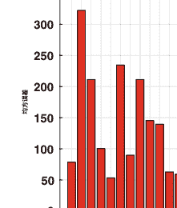

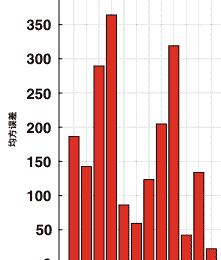

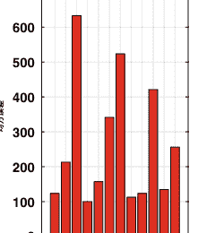

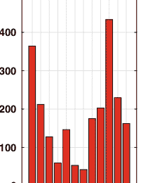

#### 使用随机抽样的误差与角度区间


#### 使用随机抽样的样本数量与角度区间

图10 迭代次数为9后的结果。第一行：随机旋转角度区间的均方误差采样。第二行：随机采样中每个角度区间选择的样本数量。最佳以彩色显示

表3 主动学习迭代次数的研究。与所有基准方法相比，所提出的框架在任何给定的迭代中都表现出最佳性能

| 迭代次数 | 提出的方法 | Käding [23] | 贪婪 | QBC | 随机抽样 |
|----------|------------|-------------|------|-----|----------|
| 5        | 87.5278    | 93.8099     | 121.3939 | 114.3875 | 137.8334 |
| 10       | 7.6926     | 20.1646     | 21.2742  | 22.7434  | 37.6184  |
| 15       | 5.0741     | 9.2519      | 10.3666  | 11.1212  | 19.0762  |
| 20       | 4.9965     | 8.2362      | 9.9948   | 9.4571   | 15.3716  |
| 25       | 4.2163     | 7.8990      | 9.0002   | 9.1188   | 14.9521  |

### 5 结论与未来工作

在本文中，我们提出了一种用于回归应用的新型深度主动学习框架。我们使用预期模型输出变化（EMOC）作为主动选择标准，并将其整合到用于训练深度CNN的目标函数中。优化了这个新颖的目标函数的结果模型，并从导致当前模型变化最大的显著示例中进行了学习。对基准回归数据集进行了广泛的实证研究（来自各种应用领域），证明了所提出的框架在选择最具信息量的样本进行学习和注释方面的有效性。我们对所提出的主动学习标准进行了深入的分析，进一步证实了我们算法的有效性。

据我们所知，这是第一个利用深度卷积神经网络的特征学习能力来开发新的主动学习算法应用于回归应用的研究工作。

所提出的方法使用EMOC原则来量化未标记样本的重要性。如第3.2节所解释的那样，直接实现EMOC原则将会计算量很大，因此我们采用了[23]并估计了模型对候选样本的目标梯度的变化。用于训练深度卷积神经网络进行主动学习的联合目标函数与本研究中使用的基准方法相比，需要更长的训练时间。然而，从结果可以看出，我们的方法在所有数据集上表现最好，并且在所有竞争方法中具有最小的误差。此外，从表2可以看出，我们的框架在达到给定性能水平时需要最少的标签。因此，在算法的计算复杂度（训练模型所需的时间）和性能之间存在权衡。根据现实应用中可用的预算、时间和计算资源，需要选择适当的算法。

作为未来工作的一部分，我们计划研究各种参数（如批量大小 k）对主动学习性能的影响。我们还打算研究我们的深度主动学习框架在除回归之外的其他应用中的性能，例如涉及多标签和分层标签的数据。

### 参考文献

- 1. J. Azimi, A. Fern, X. Zhang-Fern, G. Borradaille, B. Heeringa, 批量主动学习通过协调匹配 (2012)，arXiv:1206.6458
- 2. T. Baltrušsaitis, P. Robinson, L.P. Morency, 用于刚性和非刚性面部跟踪的3D约束局部模型，在2012年IEEE计算机视觉和模式识别会议（CVPR）中（IEEE，2012），第2610-2617页
- 3. V. Belagiannis, S. Amin, M. Andriluka, B. Schiele, N. Navab, S. Ilic, 用于多人姿势估计的3 D图像结构，在IEEE计算机视觉和模式识别会议论文集（2014），第1669-1676页
- 4. K. Brinker, 在主动学习中引入支持向量机的多样性, 在第20届国际机器学习大会 (ICML-03)(2003), 第59-66页
- 5. R. Burbidge, J.J. Rowland, R.D. King, 基于委员会查询的回归主动学习, 在智能数据工程和自动化学国际会议(Springer, 2007), 第209-218页
- 6. W. Cai, Y. Zhang, J. Zhou, 最大化回归主动学习中的预期模型变化, 在2013年IEEE第13届国际数据挖掘大会 (ICDM)(IEEE, 2013), 第51-60页
- 7. P. Campigotto, A. Passerini, R. Battiti, Pareto前沿的主动学习. IEEE Trans. Neural Netw. Learn. Syst. 25(3), 506-519 (2014)
- 8. S. Chakraborty, V. Balasubramanian, S. Panchanathan, 自适应批量模式主动学习。 IEEE Trans. Neural Netw. Learn. Syst. 26(8), 1747–1760 (2015)
- 9. R. Chattopadhyay, Z. Wang, W. Fan, I. Davidson, S. Panchanathan, J. Ye, 基于边际概率分布匹配的批量模式主动采样。 ACM Trans. Knowl. Discov. Data (TKDD) 7(3), 13 (2013)
- 10. D.A. Cohn, Z. Ghahramani, M.I. Jordan, 带有统计模型的主动学习。 J. Artif. Intell. Res. (1996)
- 11. A. Dosovitskiy, J.T. Springenberg, T. Brox, 使用卷积神经网络学习生成椅子，在2015年IEEE计算机视觉和模式识别会议(CVPR)(IEEE, 2015), pp. 1538-1546
- 12. D. Eigen, C. Puhrsch, R. Fergus, 使用多尺度深度网络从单张图像预测深度图，在神经信息处理系统进展(2014)，第2366-2374页
- 13. E.J. de Fortune, D. Martens, 基于主动学习的教学规则提取。 IEEE Trans. 神经网络学习系统 26(11), 2664-2677 (2015)
- 14. Y. Freund, H.S. Seung, E. Shamir, N. Tishby, 使用委员会查询算法进行选择性采样。机器学习。 28(2-3), 133-168 (1997)
- 15. A. Freytag, E. Rodner, J. Denzler, 选择具有影响力的示例：预期模型输出变化的主动学习，在欧洲计算机视觉会议(Springer, 2014)，第562-577页
- 16. R. Girshick, J. Donahue, T. Darrell, J. Malik, 用于准确目标检测和语义分割的丰富特征层次结构，在计算机视觉和模式识别/IEEE会议论文集(2014)，第580-587页
- 17. G. Gkioxari, B. Hariharan, R. Girshick, J. Malik, 用于姿态估计和动作检测的R-CNNS (2014), arXiv:1406.5212
- 18. Y. Guo, 通过矩阵分区进行主动实例采样，在神经信息处理系统进展(2010)，第802-810页
- 19. Y. Guo, D. Schuurmans, 判别式批量模式主动学习，在神经信息处理系统进展(2008)，第593-600页
- 20. S.C. Hoi, R. Jin, M.R. Lyu, 通过批量模式主动学习进行大规模文本分类，在第15届国际万维网会议论文集(ACM, 2006)，第633-642页
- 21. S.C. Hoi, R. Jin, M.R. Lyu, 批量模式主动学习及其在文本分类和图像检索中的应用。IEEE Trans. Knowl. Data Eng. 21(9), 1233–1248 (2009)
- 22. M. Jaderberg, K. Simonyan, A. Vedaldi, A. Zisserman, 用卷积神经网络在野外阅读文本. Int. J. Comput Vis. 116(1), 1–20 (2016).
- 23. Y. LeCun, Y. Bengio, G. Hinton, 深度学习. Nature 521(7553), 436 (2015)
- 24. D.D. Lewis, W.A. Gale, 用于训练文本分类器的顺序算法, in 国际ACM SIGIR会议(Springer, 纽约, 1994), pp. 3–12
- 25. D. Laptev, N. Savinov, J.M. Buhrmann, M. Pollefeys, Tip-pooling: 变换不变的池化-特征学习在卷积神经网络中的应用, in IEEE计算机视觉和模式识别会议(2016), pp. 289-297
- 26. Y. LeCun, Y. Bengio, G. Hinton, 深度学习. Nature 521(7553), 436 (2015)
- 27. D.D. Lewis, W.A. Gale, 用于训练文本分类器的顺序算法, in 国际ACM SIGIR会议(Springer, 纽约, 1994), pp. 3–12
- 28. Z. Liu, X. Li, P. Luo, C.C. Loy, X. Tang, 通过深度解析网络进行语义图像分割, in 2015年IEEE国际计算机视觉会议(IEEE, 2015), pp. 1377–1385
- 29. 刘X，赵Y，薛F，陈B，陈X，Deepcount：通过深度学习和Wi-Fi进行人群计数（2019），arXiv:1903.05316
- 30. Pfister T，Simonyan K，Charles J，Zisserman A，深度卷积神经网络用于手势视频中高效姿态估计，在亚洲计算机视觉会议（Springer，2014），pp. 538-552
- 31. Ranganathan H，Chakraborty S，Panchanathan S，使用深度学习架构进行多模态情感识别，在IEEE冬季计算机视觉应用会议（WACV）（2016）
- 32. Ranganathan H，Chakraborty S，Panchanathan S，在深度置信网络中传输多模态情感特征，在2016年第50届Asilomar信号、系统和计算机会议（IEEE，2016），pp. 449-453
- 33. H. Ranganathan, H. Venkateswara, S. Chakraborty, S. Panchanathan, 深度主动学习用于图像分类，在IEEE国际图像处理会议(ICIP)(2017)
- 34. H. Ranganathan, H. Venkateswara, S. Chakraborty, S. Panchanathan, 带有标签相关性的多标签深度主动学习，在IEEE国际图像处理会议(ICIP)(2018)
- 35. R. Ranjan, V.M. Patel, R. Chellappa, Hyperface: 一个用于人脸检测、关键点定位、姿态估计和性别识别的深度多任务学习框架。 IEEE Trans. Pattern Anal. Mach. Intell. (2017)
- 36. R. Rothe, R. Timofte, L. Van Gool, Dex: 从单张图像中深度预测表观年龄，在IEEE计算机视觉国际会议工作坊(2015)，第10-15页
- 37. R. Rothe, R. Timofte, L. Van Gool, 从单张图像中深度预测真实和表观年龄，无需面部标记。Int. J. Comput. Vis. 126(2-4)，144–157 (2018)
- 38. B. Settles, M. Craven, 用于序列标注任务的主动学习策略分析，在自然语言处理实证方法会议论文集(计算语言学会，2008)，第1070-1079页
- 39. J. Sherrah, S. Gong, 感知线索的融合用于头部姿态和位置的稳健跟踪。模式识别。 34(8)，1565-1572 (2001年)
- 40. Z. Shi, L. Zhang, Y. Liu, X. Cao, 通过深度负相关学习进行人群计数，在IEEE计算机视觉和模式识别会议 (CVPR) （2018年)
- 41. F. Stark, C. Hazirbas, R. Triebel, D. Creapers, 使用主动深度学习进行验证码识别，在 2015年神经计算新挑战研讨会 (Citeseer，2015年)，第94页
- 42. M. Sugiyama，基于条件期望的近似线性回归中的主动学习-泛化误差。J. Mach. Learn. Res. 7，141-166 (2006年)
- 43. M. Sugiyama, S. Nakajima, 基于池的近似线性回归主动学习。机器学习。 75(3), 249–274 (2009)
- 44. Y. Sun, X. Wang, X. Tang, 用于面部关键点检测的深度卷积网络级联，在2013年IEEE计算机视觉和模式识别会议 (CVPR) (IEEE，2013)，pp. 3476-3483
- 45. C. Szegedy, A. Toshev, D. Erhan, 用于目标检测的深度神经网络，在神经信息处理系统进展(2013)，pp. 2553–2561
- 46. S. Tong, D. Koller, 支持向量机主动学习及其在文本分类中的应用。机器学习研究。 2, 4–5-66 (2001)
- 47. A. Toshev, C. Szegedy, Deeppose: 通过深度神经网络进行人体姿态估计，在IEEE计算机视觉和模式识别会议论文集(2014)，pp.1653–1660
- 48. D. Wang, Y. Shang, 一种新的深度学习主动标记方法，在2014年国际神经网络联合会议(IJCNN)(IEEE, 2014), pp. 112–119
- 49. X. Wang, R. Guo, C. Kambhamettu, 用于年龄估计的深度学习特征，在IEEE计算机视觉应用冬季会议(WACV)(2015)
- 50. X. Wang, L. Zhang, L. Lin, Z. Liang, W. Zuo, 用于通用对象提取的深度联合任务学习，在神经信息处理系统进展中(2014), pp. 523–531
- 51. M.A. Wani, F.A. Bhat, S. Afzal, A. I. Khan, 深度学习进展, vol. 57. (Springer,Berlin, 2020)
- 52. R. Willett, R. Nowak, R.M. Castro, 通过主动学习在回归中实现更快速的速率, 在神经信息处理系统进展(2006), 第179-186页
- 53. H. Yu, S. Kim, 用于回归的被动采样, 在2010年IEEE第10届国际数据挖掘会议(ICDM)(IEEE, 2010), 第1151-1156页
- 54. S. Zaghbani, N. Boujneh, M. Bouhlel, 使用深度学习进行年龄估计. 计算机与电气工程 68, 1337-1347页 (2018)
- 55. Z. Zhang, P. Luo, C.C. Loy, X. Tang, 通过深度多任务学习进行面部关键点检测,在欧洲计算机视觉会议(Springer, 2014), 第94-108页
- 56. C. Zhang, H. Li, X. Wang, X. Yang, 通过深度卷积神经网络进行跨场景人群计数,在IEEE计算机视觉与模式识别会议(CVPR) (2015)
- 57. Z. Zhao, H. Li, R. Zhao, X. Wang, X. Yang, 通过两阶段深度神经网络进行越线人群计数,在欧洲计算机视觉会议(ECCV) (2016)
- 58. S. Zhou, Q. Chen, X. Wang, 主动深度网络用于半监督情感分类,在第23届国际计算语言学会议：海报(计算语言学协会, 2010年) ，第1515-1523页
- 59. X. Zhu, J. Lafferty, Z. Ghahramani, 结合主动学习和半监督学习使用高斯场和谐函数，在ICML 2003机器学习和数据挖掘中从标记到未标记数据的连续体研讨会，第3卷 (2003年)

## 基于深度学习的锂离子电池危险标签物体检测使用合成和真实数据

Anneliese Schweigert, Christian Blesing和Christoph M. Friedrich

摘要改变内部物流任务的运输规定导致需要在高分辨率灰度图像上检测包裹上的危险标签。因此，本文比较了不同基于卷积神经网络（CNN）的目标检测系统。具体而言，考虑了一个名为Darkflow的YOLO实现以及一个基于Inception V3模型的自主开发的目标检测流水线（ODP）。创建了包含合成和真实图像的不同数据集，以建立必要的训练和评估环境。为了检查系统在实际操作条件下的稳健性，使用平均精度（mAP）指标进行评估。此外，评估结果以回答各种问题，如合成数据在训练过程中的影响，或系统的最高质量水平。与MSER目标检测流水线相比，YOLO模型显示出更高的mAP和更高的检测速度，但训练时间更长。与仅使用真实数据相比，混合训练数据集在验证集上显示出略微降低的mAP。

关键词 目标检测 · 合成数据 · 真实数据 · 深度学习 · 危险标签检测

______ A. Schweigert · C. Blesing
德国多特蒙德弗劳恩霍夫物流与物料流动研究所（IML）
电子邮件：anneliese.schweigert@iml.fraunhofer.de

C. Blesing
电子邮件：christian.blesing@iml.fraunhofer.de

A. Schweigert · C. M. Friedrich (区)
多特蒙德应用科学与艺术大学计算机科学系，
德国多特蒙德
电子邮件：christoph.friedrich@fh-dortmund.de


### 1 引言

如今，许多不同的交通运输工具，如航空、公路、水路和铁路，被用于运输危险品或有害物质，如锂离子电池。不适当运输这些物品的包裹可能会导致事故或引发爆炸和火灾[23]。快递、快运和包裹（CEP）业务领域的公司，如联邦快递和DHL，提供从A点到B点的包裹运输服务。为了预防事故，这些公司需要适应不断变化的法规。这些法规特别适用于通过航空运输锂离子电池，并由国际民航组织（ICAO）和国际航空运输协会（IATA）制定[14]。作为前提条件，发货人必须支持附加标准化标签以运输锂离子电池（见图1）。快递员必须确保带有危险物质的标记包裹得到正确和分开的运输。

尽管危险标签已经标准化，但仍然存在标签附着的问题。例如，一些托运人在包裹上贴上两个或更多的标签。或者，他们在包裹上打印标签，或者使用与标准不同的标签组合。另一个困难是危险标签在运输过程中可能受到环境影响而变脏。所有这些因素都使得符号的机器识别变得复杂。

本文选择使用深度学习或图像处理技术的目标检测系统来检测包裹上的所有符号。本文的结构如下。首先，给出相关工作的概述。然后介绍应用的目标检测系统在第3节中。在第4节中解释了使用的训练、验证和测试集的创建和应用。在第5节中指定了使用的性能指标，第6节介绍了底层的CNN模型。在第7节中，描述了系统的训练过程，在第8节中对系统进行评估和批判性检查。最后，得出结论。


图1 该示例描述了使用情况。高分辨率灰度图像由2D相机系统拍摄，显示带有标签的包裹。这些图像被用作不同目标检测系统的输入数据。最后，可以推导出如何正确运输包裹。

### 2 相关工作

如今，卷积神经网络（CNN）最常应用于目标检测[4]和图像中的文本识别[21]领域。此外，它们还用于视听语音识别[22]、基于视频的情感[6]和动作识别[13]。

除了这些主要应用领域外，CNN技术在移动机器人领域不断遇到新的应用领域。特别是在全局路径规划[25]、地图制作和实时语义特征提取[12]的背景下。

卷积神经网络（CNNs）在内部物流任务中的应用越来越多。考虑到拣选过程，有一些应用领域，比如在订单拣选过程中进行人类活动识别[10]或由固定操纵器进行产品拣选[33]。此外，使用Google Glass进行工业检查的维护和修理辅助[26]也是CNNs的另一个应用领域。

#### 2.1 合成数据

合成数据是通过数据增强技术[20]生成的计算机生成数据，如模糊、对比度、旋转、裁剪等等。合成数据的最大优势之一是可以快速生成大量数据。与真实数据相比，注释可以在数据生成过程中自动生成。

合成数据越来越多地用于训练基于CNN的常见系统，用于文本定位[11]和图形分离[35]。在Jo等人的工作中[15]，使用合成数据和真实数据与Faster R-CNN[29]进行目标检测进行了比较。他们表明，仅使用合成数据比仅使用真实数据产生更高的平均精度（mAP），并且生成速度比真实数据更快。使用合成生成的验证码来训练CNN[16]以回归验证码的潜在变量。另一个应用是通过生成对抗网络（GAN）[9, 20]生成合成数据。

#### 2.2 迁移学习

迁移学习通常被理解为通过使用已经学习过的相关任务的知识来学习新任务[24]。适应于卷积神经网络，使用训练集的知识对预训练网络进行微调，以适应不同的训练集。通常使用ImageNet [31]训练集来获得预训练网络。

经典地，微调步骤用于后续的微调，例如分类植物的研究[17]。迁移学习的另一个应用是用于跨语言交流的语音识别[36]和使用Twitter推文进行文本分类[3]。

### 3 方法论

在本文中，将比较两种物体检测系统用于危险标签符号检测。首先，使用原始的You Only Look Once (YOLO)算法[28]，其次使用自主开发的最大稳定极值区域物体检测流水线(MSER-ODP)。

#### 3.1 YOLO

YOLO算法[28]提供了一个端到端的架构（见图2）用于物体检测。

它将输入图像分割成一个S×S的网格。对于网格中的每个单元格，根据锚点的数量，计算B个边界框和C个类别概率。对于每个边界框，计算出五个组成部分。前四个组成部分表示输入图像中潜在符号的定位，第五个组成部分给出了置信度概率。YOLO算法输出一个可视化表示的三维张量，其中包含了计算出的边界框和类别概率。


图2 输入是一张真实的图像。锚点的数量用B表示，C是类别的数量。对于每个单元格，计算B个边界框，用黑色框表示。作为边界框的一部分，计算置信度值，并用线条强度绘制在框上。对于每个单元格，确定最高的类别概率。YOLO算法的输出可以用一个S×S×(B·5+C)张量表示。这些边界框通过阈值和非极大值抑制进行过滤。剩余的边界框在最终的目标检测图像中进行可视化[27]。

## 基于深度学习的锂离子电池危险标签目标检测...


图3 这个插图展示了MSER-ODP的步骤。a MSER的输出是用黑色绘制的斑点。对于每个斑点，计算并表示其重心为白色点。(b-左侧)在感兴趣区域（ROI）生成步骤中，围绕斑点的重心区域进行裁剪。b-右侧在另一个预处理步骤中，通过亮度、对比度进行调整，使其符合CNN模型的预期尺寸。c在ROI分类步骤中，通过CNN将它们分类为四类（电池=绿色，玻璃=蓝色，火焰=红色，背景=白色）。由于裁剪，已分类的ROI的位置是已知的。它们以不同颜色的框图进行可视化表示。d不重要的包含背景的裁剪被丢弃。其他的裁剪根据其类别概率和位置进行合并。

这些边界框通过用户定义的阈值进行过滤。如果有多个计算出的边界框剩下，将应用非极大值抑制（NMS）[30]。为了计算边界框和类别概率，使用了底层的卷积神经网络模型，如Tiny YOLO和YOLOv2，这些模型在第6.1节中介绍。评估时，使用了YOLO算法的Darkflow¹实现[28]。

#### 3.2 MSER-ODP

为了检测输入图像中的符号，MSER-ODP使用了类似于R-CNN方法[7]的四个连续步骤。这些步骤在图3中描述，并且这些步骤的详细信息在以下小节中描述。

目标检测流水线（MSER-ODP）使用了MSER算法[18]和TF-slim库中的Inception V3模型[34]。²该卷积神经网络模型在第6.2节中介绍。

> ¹Darkflow，网址：https://github.com/threiu/darkflow（检索日期：2019-06-19）。

> ²Nathan Silberman和Sergio Guadarrama，TensorFlow-Slim图像分类模型库，网址：https://github.com/tensorflow/models/tree/master/research/slim（检索日期：2019-06-19）。


图4 这张图片展示了Inception V3模型的输入和输出示意图

##### 3.2.1 区域兴趣（ROI）生成

MSER-ODP方法能够接受如图1所示的输入图像，其中包含带有附加标签和符号的包裹物。在这张图像上，应用了MSER[18]，它输出了斑点。这些斑点用于提取重心处的ROI（见图3a）。提取的每个ROI都具有二次维度并且大小不同（见图3c）。

##### 3.2.2 预处理

提取后，感兴趣区域（ROIs）必须经过预处理才能在下一步中进行分类。每个感兴趣区域（ROI）Ii都会进行双线性插值，使其变为固定的299×299×3的CNN输入尺寸同时，还会将其归一化到[0,1]的范围内。首先，将感兴趣区域（ROI）Ii在每个可能的像素位置(x, y)上的亮度减半。结果是图像Iv（参见公式1）。

```
Iv(x, y) = Ii(x, y) - 0.5   (1)
```

感兴趣区域（ROI）Iv是双对比度增强方法的输入，该方法输出图像Ik（参见公式2）。因此，它的每个像素都被归一化到[-1, 1]的范围内。

```
Ik(x, y) = Iv(x, y) · 2.0   (2)
```

这种引入的预处理的一个示例输出如图3b右侧所示。符号的边缘得到增强。

##### 3.2.3 ROI分类

从前一步中提取和调整大小的感兴趣区域（ROIs）通过Inception V3[34]模型进行分类。输出被定制为一个具有四个元素/类别的一维张量：电池、火焰、玻璃和背景（见图4）。 Inception V3训练过程和配置的详细描述在第7.1节中给出。作为分类步骤的结果，每个感兴趣区域（ROI）被分配给其中之一。

##### 3.2.4 最终边界框的计算

使用softmax函数对预定义的类进行分类。此外，输入图像中每个ROI的位置是已知的，并由边界框表示（见图3c）。

在某些情况下，一个符号（例如电池）可能会分解成多个ROI（参见图3c）。然而，期望的结果是为每个三个符号计算一个框（参见图3d）。为了解决这个问题，靠近彼此且属于同一类别的ROI被分配到一个组中。一个组中的所有ROI被合并成一个最终边界框。属于背景类别的组不包含所搜索的符号。它们被排除在分组/合并过程之外。最终边界框的描述为一个4元组(xmin_g, xmax_g, ymin_g, ymax_g)。对于每个组，计算所有成员的最小xmin和ymin值以及最大xmax和ymax值（参见公式3a-d）：

```
xmin_g = min ({xmin_0, ..., xmin_n})   (3a)
ymin_g = min ({ymin_0, ..., ymin_n})   (3b)
xmax_g = max ({xmax_0, ..., xmax_n})   (3c)
ymax_g = max ({ymax_0, ..., ymax_n}).  (3d)
```

### 4 数据集创建

在下一节中，介绍了使用的数据集。它们分为YOLO和MSER-ODP的数据集。集合利用的概述在图5中可视化。对于训练、验证和测试，使用了带有边界框注释的真实图像进行手动注释（见第4.1节）。YOLO模型使用带有边界框注释的训练集进行训练。MSER-ODP训练集由从逼真的包裹图像中提取的单个危险标签符号图像组成。第一个训练集代表真实的危险标签符号（见第4.2节），第二个混合训练集包含合成和真实图像（见第4.3节）。

所有目标检测系统都是通过边界框标注的验证和测试集进行评估的。验证集用于优化训练参数。测试集与训练和验证集独立，并且只被相应的系统看到一次。这个描述的过程使得系统之间可以进行比较。


图5 不同集合的目在不同建模阶段（例如训练、验证和测试）中进行可视化

表1 边界框训练集来源于1991张图像。验证集来源于498张图像。测试集来源于260张图像。

| 类别 | 训练集 | 验证集 | 测试集 | 总和 |
| :--- | :--- | :--- | :--- | :--- |
| 电池 | 2010 | 505 | 269 | 2784 |
| 火焰 | 2009 | 505 | 267 | 2781 |
| 玻璃 | 2011 | 505 | 268 | 2784 |
| 总和 | 6030 | 1515 | 804 | 8349 |

#### 4.1 边界框的生成和分布

##### 实际数据集的注释

相机系统拍摄的原始图像尺寸为6144/8192×H像素。变量H具有不同的值，因为它取决于特定包裹的深度。查看所有这些图像，H在1696和11616像素之间。

高分辨率图像是一个问题，因为它们需要大量的计算资源。这就是为什么它们的大小调整为原始大小的四分之一，与宽高比有关。边界框实际数据集是手动注释的，包括一个训练、验证和测试集（见表1）。


图6 这个可视化展示了从真实图像中手动提取的裁剪。在这2749个图像中，每个危险标签符号都被提取出来，以及一些背景类别的裁剪。根据标注的情况，有时提取的图像数量多于或少于四个（见第1节）。

#### 4.2 生成和分布真实训练集

对于MSER-ODP，需要单标签图像来训练Inception V3模型（见第7.1节）。为此，从边界框训练图像中获取逼真图像的裁剪（参见图1）。此外，对于MSER-ODP的真实训练集，背景类别的示例图像是手动注释的（见图6）。

从2749个逼真图像中提取了10349个单标签图像。这些图像的尺寸固定为200×200像素。表2中的第二列显示了由每个四个预定义类别的裁剪真实数据组成的单标签训练集的分布情况。

#### 4.3 生成和分布混合训练集

创建一个包含合成数据和真实数据的混合训练集，以展示合成数据使用的影响。该集合的第一个组成部分是裁剪的真实图像。第二个组成部分是通过离线数据增强生成的合成数据。

合成数据是由每个危险标志符号类别的8个原始图像和背景类别的6个原始图像生成的。总共，通过对原始图像应用像胶带和笔画等随机扭曲，共生成了18027个训练集图像。还应用了随机平移、缩放和透视变换（见图7）。

每个增强图像的大小与裁剪的真实图像相同，即200×200像素的灰度图像。表2显示了混合训练集的分布情况，总共包含4个类别的26061个图像。这个训练集使用的是与第4.2节中相同的裁剪图像。


图7 对于四个类别（电池、火焰、玻璃和背景），对原始图像进行离线数据增强。每个原始图像仅描绘了符号，没有扭曲和变换。

表2 混合MSER-ODP训练集的分布，包括合成数据和真实数据

| 类别 | 训练数据（真实） | 训练数据（合成） | 总和 |
| :--- | :--- | :--- | :--- |
| 电池 | 2010 | 4011 | 6021 |
| 火焰 | 2009 | 4008 | 6017 |
| 玻璃 | 2011 | 4008 | 6019 |
| 背景 | 2004 | 6000 | 8004 |
| 总和 | 8034 | 18027 | 26061 |

### 5 性能指标

在PASCAL VOC Challenge 2007 [5]中使用了平均精度（mAP）指标。在本文中，该指标用于评估所提出的目标检测系统。

每个类别i的预测边界框通过Jaccard指数[2]与验证集或测试集的真实边界框进行分类，得到真正例（TP）、假正例（FP）和假负例（FN），阈值为0.5。所有类别i的预测边界框按照类别置信度降序排列。根据每个预测的TP和FP检测的累积数量计算精确率（pr）和召回率（re）（见公式4）。这被称为精确率-召回率曲线。

```
pr = 真正例 / (T P + F P)
re = 真正例 / (T P + F N)   (4)
```

每个类别i ∈ K的平均精度AP_i与插值精度p_inter,p在11个等间距的召回水平r_over上相关联。插值精度


图8 这个YOLO模型的可视化基于Darkflow源代码

通过从精度-召回曲线中选择召回r大于r的最大精度来获得。平均精度mAP由所有AP_i的算术平均值决定（参见公式5）。

```
AP_i = \frac{1}{11} \sum_{r \in \{0,0.1,\ldots,1\}} p_{inter\_p}(r)
mAP = \frac{1}{K} \sum_{i=1}^{K} AP_i   (5)
```

### 6 卷积神经网络模型的架构

本节简要介绍了之前提到的卷积神经网络模型的架构图。首先，解释了YOLO模型[28]，最后，解释了Inception V3模型[34]。

#### 6.1 Tiny YOLO和YOLOv2模型的架构

Tiny YOLO模型包括15个层，包括9个卷积层和6个最大池化层（见图8）。卷积层的任务是提取学习到的特征。最大池化层用于降低维度和防止过拟合。关于这些基本层的详细信息在本文中没有解释，建议参考[8]了解详情。

YOLOv2模型包含31个层，包括23个卷积层，5个最大池化层，2个路由层和一个重组层（见图8）。路由层将前一层的输出张量馈送到更深的层。另一种方法是通过连接层将前一层的等大小的输出张量馈送到更深的层。重组层的任务是重构张量。


图9 该图展示了Inception V3模型的CNN架构。它是基于TF-slim源代码创建的

#### 6.2 Inception V3模型架构

Inception V3的结构比之前介绍的模型的架构更复杂，前者是顺序导向的。Inception V3模型按顺序执行前七层、AuxLogits和Logits区域（见图9）。AuxLogits区域在网络训练过程中用于减少梯度消失的影响。平均池化层与最大池化层具有类似的功能，用于降低过拟合。连接层将具有相同高度和宽度的输出张量连接在一起。Dropout层随机禁用全连接层的权重。其他区域并行处理。

选择的架构在之前的应用中表现出优越的结果[1,19]。潜在的其他架构如[37]所提到的，可能进一步改善了这个应用的结果。

### 7 对目标检测系统的配置和训练

每个CNN模型（Inception V3，Tiny YOLO和YOLOv2）都使用不同的训练参数组合进行了多次微调。结果是每个CNN模型在边界框注释验证集上具有最高mAP的最佳训练检查点。最后，选择并在以下子章节中呈现了最佳运行结果。

为了训练目标检测系统，使用了一台配备有8 GB VRAM和2560个CUDA核心的NVIDIA GTX 1080。此外，计算机配备了一颗Intel(R) Xeon(R) CPU E5-2670 v2 @ 2.50 GHz，具有10个核心，20个线程和64 GB RAM。

表3 显示了MSER-ODP的CNN模型Inception V3的训练参数和运行时间。在第一次微调运行中，由TF-slim提供了一个名为inception_v3的检查点。对于第二次微调运行，采用第一次运行的检查点，并使用相同的训练数据重新训练完整模型。

| 系统: | 1. 微调 | | 2. 微调 | |
| :--- | :--- | :--- | :--- | :--- |
| | MSER-ODP | | | |
| CNN模型 | Inception V3 | Inception V3 | Inception V3 | Inception V3 |
| 参数 | 训练集 | | | |
| | 混合 | 真实 | 混合 | 真实 |
| 检查点 | inception_v3 | inception_v3 | 3256 | 1004 |
| 学习率 (lr) | 0.01 | 0.01 | 0.0001 | 0.0001 |
| lr衰减 | 0.94 | 0.94 | 0.94 | 0.94 |
| 每x个周期衰减lr | 2 | 2 | 10 | 10 |
| 优化器 | RMSProp | RMSProp | RMSProp | RMSProp |
| 动量 | − | − | − | − |
| 批量大小 | 32 | 32 | 16 | 16 |
| 步骤 | 3256 | 1004 | 81400 | 12250 |
| 运行时间 (分钟/小时) | 10.75分钟 | 3.5分钟 | 7.92小时 | 1.20小时 |

#### 7.1 MSER-ODP的配置和训练

使用两个不同的训练集来训练系统，如图5所示。使用真实和混合训练训练Inception V3模型（见表2）。输入体积为299 × 299 × 3，输出体积调整为四个类别。为此，使用ImageNet [31]预训练模型的两阶段迁移学习方法[32]进行训练（见表3）。

#### 7.2 YOLO方法的配置和训练

为了进行目标检测，使用了预训练的CNN模型Tiny YOLO和YOLOv2（详见第2.2节）。这些模型在PASCAL VOC数据集[5]进行了预训练，该数据集包含20个不同类别的边界框注释。在本研究中，YOLO模型被配置为适应NVIDIA GTX 1080的内存大小和三个类别。下面的解释基于图2。Tiny YOLO期望一个1440 × 1440 × 3的输入张量。因此，网络会生成一个S × S × (B · 5 + C)的张量，其中 S = 45，B = 5，C = 3。这导致每个图像有56700个变量。调整后的YOLOv2模型期望一个1248 × 1248 × 3的输入大小。它将输入图像转换为一个S × S × (B · 5 + C)的张量，其中 S = 39，B = 5，C = 3。因此，YOLOv2模型每张图像产生42588个变量。此外，对于这两个模型，调整了锚点的大小和最后一个卷积层应用的滤波器数量。这两个模型都有相同的五个锚点，它们是正方形的并且大小不同。为了获得正确的输出张量体积，必须通过 B · (C + 5)来调整最后一个卷积层使用的滤波器数量。

表4 Tiny YOLO和YOLOv2的训练参数和训练持续时间可以在Darkflow实现的模型中看到。在第一次运行中，使用预训练的检查点，在第二次中，使用前一次微调运行的最佳检查点。

| 系统: YOLO | 1. 微调 | | 2. 微调 | |
| :--- | :--- | :--- | :--- | :--- |
| CNN模型 | 小型YOLO | YOLOv2 | 小型YOLO | YOLOv2 |
| 参数 | 训练集 | | | |
| 检查点 | 真实 | 真实 | 真实 | 真实 |
| 学习率 (lr) | 0.0001 | 0.0001 | 0.00001 | 0.00001 |
| lr衰减 | – | – | – | – |
| 每x个周期衰减lr | – | – | – | – |
| 优化器 | ADAM | ADAM | ADAM | ADAM |
| 动量 | 0.9 | 0.9 | 0.9 | 0.9 |
| 批量大小 | 4 | 2 | 4 | 2 |
| 步骤 | 19880 | 39800 | 2485 | 4075 |
| 运行时间 (分钟/小时) | 16.92小时 | 21.46小时 | 1.99小时 | 2.56小时 |

在YOLO预处理期间，每个输入图像都会被调整大小为相应的CNN模型的输入尺寸。

YOLO CNN模型使用包含真实图像的边界框注释训练集进行微调（见表1）。每次训练时，所有CNN模型的权重都会被训练（见表4）。第一次微调运行调整输出尺寸，第二次使用较小的学习率对模型进行优化。

### 8 问题和结果

在对模型进行微调后，使用每个模型第二次微调的最后一个检查点来回答以下问题。

#### 合成生成的训练数据对于危险品的识别有多好？

在我们的案例中，合成数据的丰富程度略微降低了引入的MSER-ODP相对于仅使用真实数据训练的mAP值4.4%（见表5）。可以得出结论，合成训练数据只在特定条件下适用，这是由于合成图像的种类有限所解释的。这可以通过更精细的数据增强技术来改善。

#### 哪个系统在边界框标注验证集上具有最高的质量水平？

表6中呈现了边界框标注验证集上的结果。结果显示，Tiny YOLO和YOLOv2模型具有最高的mAP（平均精度均值）和最高的质量水平。MSER-ODP可以与YOLO模型竞争。

#### 具有独立测试集的系统的泛化性能如何？

与前一个问题中的相同检查点用于确定系统的泛化性能。对CNN模型进行微调后的结果显示在表7中。结果显示，Tiny YOLO模型略优于YOLOv2模型。MSER-ODP仍然能够竞争良好。

#### 系统如何对具有随机对比度、亮度和模糊调整的测试集做出反应？

表8中的结果是在前面问题的前提下确定的。在未经处理的测试图像上（参见表2），进行了各种组合和顺序的数据增强方法。已确保操纵后的测试图像的像素值保持在值范围{0, …, 255}内。

在亮度调整中，选择一个在–40和60之间的随机数。对于图像的每个像素，减去这个随机数。对比度适应在0.5–2.5的范围内发生。这个值也是随机确定的，并且是图像的每个像素的因子。在这里还考虑了颜色范围的限制。

使用一个5×5的高斯滤波器实现模糊。

随后，使用带有边界框注释的测试集对图像进行评估。如下表所示，YOLOv2对随机对比度、亮度和模糊调整更具鲁棒性。

表5 使用Inception V3模型在边界框标注验证集上的结果
| 系统 | CNN模型 | 训练集 | 验证集上的mAP（平均精度均值）（%） |
| :--- | :--- | :--- | :--- |
| MSER-ODP | Inception V3 | 真实 | 88.5 |
| MSER-ODP | Inception V3 | 混合 | 84.1 |

表6 该表显示了每个系统在边界框标注验证集上的结果
| 系统 | CNN模型 | 训练集 | 验证集上的mAP（平均精度均值）（%） |
| :--- | :--- | :--- | :--- |
| MSER-ODP | Inception V3 | 真实 | 88.5 |
| YOLO | 小型YOLO | 边界框标注 | 90.0 |
| YOLO | YOLOv2 | 边界框标注 | 90.0 |

表7 展示了边界框标注测试集的评估结果
| 系统 | CNN模型 | 训练集 | 测试集上的mAP（平均精度均值）（%） |
| :--- | :--- | :--- | :--- |
| MSER-ODP | Inception V3 | 真实 | 88.6 |
| YOLO | 小型YOLO | 边界框标注 | 90.4 |
| YOLO | YOLOv2 | 边界框标注 | 90.3 |

表8 对操纵后的测试集进行系统评估
| 系统 | CNN模型 | 训练集 | 操纵后测试集上的mAP（%） |
| :--- | :--- | :--- | :--- |
| MSER-ODP | Inception V3 | 真实 | 73.1 |
| YOLO | 小型YOLO | 边界框标注 | 80.6 |
| YOLO | YOLOv2 | 边界框标注 | 87.0 |

### 9 结论

本文介绍了基于CNN的危险标签检测系统。这些系统应用了迁移学习，并且它们被用来回答一个问题，即当训练数据丰富了合成数据时，检测是否可以得到改进。与仅使用真实数据相比，混合训练数据集在验证集上使用Inception V3模型时略微降低了4.4%的mAP。

乔等人[15]已经提到，他们得出的结论是合成数据在数量和多样性方面具有优势，但不一定反映真实环境。因此，可以得出结论，合成数据必须具有更多的多样性，以丰富真实数据的效益。另一个问题是，新引入的MSER-ODP是否在独立测试集上优于端到端目标检测系统YOLO。结果显示，YOLOv2和Tiny YOLO模型的平均精度（mAP）和检测速度都比MSER-ODP高，但训练时间更长。最后，对随机操作的测试集进行了鲁棒性评估。YOLO模型显示出优秀的结果。

未来可以使用GAN实现数据增强系统来创建合成数据，这可能会改善合成数据的多样性。此外，还可以研究其他目标检测系统。

### 参考文献

1.  A. Canziani, A. Paszke, E. Culurciello, 对实际应用的深度神经网络模型进行分析 (2016)
2.  S. Cesare, Y. Xiang, 软件相似性和分类 (Springer, Berlin, 2012), 第67页
3.  A. Chachra, P. Mehndiratta, M. Gupta, 使用深度卷积神经网络进行文本情感分析, 在第10届国际现代计算会议 (IC3) (2017), 第1-6页
4.  Y.H. Chang, P.L. Chung, H.W. Lin, 基于ROS的移动机器人目标识别的深度学习, 在IEEE应用系统发明国际会议 (ICASI) (2018), 第66-69页
5.  M. Everingham, S.M.A. Eslami, L.V. Gool, C.K.I. Williams, J. Winn, A. Zisserman, 帕斯卡视觉对象类别挑战: 回顾. 计算机视觉国际期刊 (IJCV) 111(1), 第98-136页 (2015)
6.  Y. Fan, X. Lu, D. Li, Y. Liu, 使用CNN-RNN和C3D混合网络进行基于视频的情绪识别, 在第18届ACM国际多模态交互会议 (ICMI '16) 上 (2016), pp. 445-450
7.  R. Girshick, J. Donahue, T. Darrell, J. Malik, 用于准确目标检测和语义分割的丰富特征层次结构, 在IEEE计算机视觉和模式识别会议 (CVPR) (2014), pp. 580-587
8.  I. Goodfellow, Y. Bengio, A. Courville, 深度学习 (MIT Press, Cambridge, 2016)
9.  I. Goodfellow, J. Pouget-Abadie, M. Mirza, B. Xu, D. Warde-Farley, S. Ozair, A. Courville, Y.Bengio, 生成对抗网络. Adv. Neural Inf. Process. Syst. 27, 2672-2680 (2014)
10. R. Grzeszick, J.M. Lenk, F. Moya Rueda, G.A. Fink, S. Feldhorst, M. ten Hompel, 基于深度神经网络的人类活动识别用于订单拣选过程, 在第4届国际传感器活动识别和交互研讨会 (iWOAR '17) (2017) pp. 1-6
11. A. Gupta, A. Vedaldi, A. Zisserman, 用于自然图像中文本定位的合成数据, 在IEEE计算机视觉和模式识别会议 (CVPR) (2016), pp. 2315-2324
12. M. Himstedt, E. Maehle, 使用RGB-D相机进行物流环境的在线语义映射. Int. J. Adv. Robot. Syst. 14(4), 113 (2017)
13. R. Hou, C. Chen, M. Shah, 管卷积神经网络 (T-CNN) 用于视频中的动作检测, 在IEEE国际计算机视觉会议 (ICCV) (2017年), 第5823-5832页
14. IATA DGR, 2017年锂电池指南文件. https://www.iata.org/whatwedo/cargo/dgr/Documents/lithium-battery-guidance-document-2017-en.pdf (检索日期：2019-06-19)
15. H. Qiao, Y.H. Na, J.B. Song, 使用合成图像进行目标检测的数据增强, 在第17届国际控制、自动化和系统会议 (ICCAS) (2017年), 第1035-1038页
16. T.A. Le, A.G. Bédard, R. Zinkov, F. Wood, 使用合成数据训练神经网络是基于模型的推理, 在国际神经网络联合会议 (IJCNN) (2017年), 第3514-3521页
17. A.R. Ludwig, H. Piorek, A.H. Kelch, D. Rex, S. Koitka, C.M. Friedrich, 通过过滤噪声图像改进植物图像分类模型性能, 在CLEF 2017 - 评估论坛的工作笔记中, 卷1866 (2017年)
18. J. Matas, O. Chum, M. Urban, T. Pajdla, 通过极值稳定区域实现鲁棒的宽基线立体视觉, 在英国机器视觉会议 (BMVC 2002) 中, 卷22 (BMVA出版社, 2002年), 页384-393
19. Y. Mednikov, S. Nehemia, B. Zheng, O. Benzaquen, D. Lederman, 使用Inception-V3进行转移表示学习，用于乳腺X线摄影中的肿块检测, 在IEEE工程与医学生物学会 (EMBC) 第40届年会上 (2018), 第2587-2590页
20. A. Mikolajczyk, M. Grochowski, 数据增强改善图像深度学习在分类问题中的应用, 在国际跨学科博士研讨会 (IIPhDW) (2018), 第117-122页
21. Y. Nagaoka, T. Miyazaki, Y. Sugaya, S. Omachi, 使用多个区域建议网络的更快 R-CNN 进行文本检测, 在第14届国际模式识别协会文档分析与识别会议 (ICDAR), 第06卷 (2017), 第15–20页
22. K. Noda, Y. Yamaguchi, K. Nakadai, Hiroshi G. Okuno, T. Ogata, 使用深度学习进行音视频语音识别. 应用智能 **42**(4), 722–737页 (2015)
23. G. Nowacki, C. Krysiuk, R. Kopczewski, 欧盟和波兰的危险品运输问题. TransNav, 国际海事导航和安全海道交通期刊 **10**(1), 143–150 (2016)
24. S.J. Pan, Q. Yang, 转移学习综述. IEEE知识与数据工程交易 **22**(10), 1345–1359 (2010)
25. D. Pande, C. Sharma, V. Upadhyaya, 使用单目视觉进行目标检测和路径规划, 在国际信号传播和计算机技术会议 (ICSPCT) (2014), pp. 376–379
26. P. Ramakrishna, E. Hassan, R. Hebbalaguppe, M. Sharma, G. Gupta, L. Vig, G. Sharma, G. Shroff, 一种增强现实检测框架: 多个增强现实设备的可行性研究, 在IEEE国际混合与增强现实研讨会 (ISMAR-Adjunct) (2016), pp. 221–226
27. J. Redmon, S. Divvala, R. Girshick, A. Farhadi, 你只需要看一次：统一的、实时的目标检测, 在IEEE计算机视觉与模式识别会议 (CVPR) (2016年), 页码779-788
28. J. Redmon, A. Farhadi, YOLO9000：更好、更快、更强, 在IEEE计算机视觉与模式识别会议 (CVPR) (2017年), 页码6517-6525
29. S. Ren, K. He, R. Girshick, J. Sun, Faster R-CNN：面向实时目标检测的区域建议网络, 在神经信息处理系统28 (NIPS) (2015年), 页码91-99
30. R. Rothe, M. Guillaumin, L. Van Gool, 非最大值抑制用于目标检测，通过在窗口之间传递消息, 在计算机视觉-ACCV 2014 (Springer国际出版, 2015年), 页码290-306
31. O. Russakovsky, J. Deng, H. Su, J. Krause, S. Satheesh, S. Ma, Z. Huang, A. Karpathy, A. Khosla, M. Bernstein, A.C. Berg, F. Li, ImageNet大规模视觉识别挑战. 计算机视觉国际期刊 (IJCV) **115**(3), 211–252 (2015)
32. Y. Sawada, Y. Sato, T. Nakada, S. Yamaguchi, K. Ujimoto, N. Hayashi, 基于目标向量修改的全转移深度学习分类性能改进. 应用科学 **9**(1) (2019)
33. M. Schwarze, A. Milan, A.S. Periyasamy, S. Behnke, RGB-D物体检测和自主操纵中的语义分割. 机器人学国际期刊 **37**(4–5), 437–451(2017)
34. C. Szegedy, V. Vanhoucke, S. Ioffe, J. Shlens, Z. Wojna, 重新思考计算机视觉中的初始架构, IEEE计算机视觉与模式识别会议 (CVPR) (2016年), 第2818-2826页
35. S. Tsutsui, D. Crandall, 一种基于卷积神经网络的化合物图分离的数据驱动方法, IAPR国际文件分析与识别会议 (ICDAR) (2017年)
36. J. Wang, S. Liu, Q. Yang, 空中交通管制LVCSR系统的迁移学习, 第二届机械、控制和计算机工程国际会议 (ICMCCE) (2017年), 第169-172页
37. M.A. Wani, F.A. Bhat, S. Afzal, A. Khan, 深度学习的进展 (Springer，柏林，2020年)

通过应用深度学习算法实现物流中的强大和自主材料处理

Christian Poss, Thomas Irrenhauser, Marco Prueglmeier, Daniel Goehring, Vahid Salehi 和 Firas Zoghlami

摘要 近年来，汽车行业的物流成本显著上升。 降低这些成本的一种方法是自动化整个物料流程。 为了应对灵活的工业挑战和动态变化，智能感知机器人是必要的。 下面介绍了一种感知算法。它由三个模块组成。在第一个模块中，检测机器人视野中的所有物体，并确定它们的位置。然后选择与相应过程相关的物体。最后，确定下一个要处理的物体的抓取点。通过将机器人整合起来，可以证明通过将智能模块与实用的框架模块相结合，自动化在具有挑战性的工业环境中是可行的。

### 1 引言

近年来，物流从真正的推动者向车辆生产的核心组成部分发展。例如，这体现在每个零件的物流成本份额。物流活动导致制造商采购价格总成本的近25%。其余的75%主要由材料成本（66%）和生产成本（15%）组成。

成本的增加主要是由于整个物流系统的复杂性增加。关键的贡献因素是提供的车型种类的增加以及这些车型衍生品的个性化可能性的增加。例如，宝马集团的车型数量在25年内从6个增加到29个。由于客户对这些车辆的个性化要求，现在在订购汽车时有10的32次方种可能的变体。随着全球化的不断推进和成本压力的增加，以及制造垂直范围的减少，这些发展导致了需要交付到车辆工厂装配线的零部件数量的显著增加。2000年，超过一半（55%）的车身零部件仍由原始设备制造商自己生产，到2015年这一比例降至29%。

提供零件数量的增加直接导致工厂所需的工作步骤增加，最终导致额外的人员需求。由于汽车原始设备制造商的增长努力，各个工厂需要生产的车辆数量不断增加。这进一步加剧了人员状况的紧张，特别是在那些放松的劳动力市场状况已经导致几乎充分就业的领域。

鼓励生产力并降低成本的一个实用方法是对工厂的物流材料流程进行整体自动化。除了经济收益外，它还减少了人类在单调和不符合人体工程学的处理任务上的就业需求，并促进了更具挑战性的工作领域，如最终车辆装配或质量保证。

#### 1.1 演进的自动化

现代工业中的高动态生产过程增加了物流的复杂性，从而促使自动化解决方案的日益采用。因此，机器人解决方案和智能机器正在将制造业转变为更高水平的自动化。全球工业机器人数量将从2016年的1,828,000增加到2020年的300万以上。主要市场是中国、韩国、日本以及美国和德国等亚洲国家。

随着成本的降低和机器人租赁等创新商业模式的出现，这一趋势不仅影响着大型原始设备制造商的生产车间，也影响着中小型企业的生产车间。

在电子行业中，尤其是在彻底重复的生产步骤的自动化方面，使用最多。另一方面，汽车行业的停滞数据表明，传统工业机器人的自动化过程已经达到了极限。对于物流过程的自动化，需要具有高度适应性的自主智能系统，而不是标准的自动化技术。物流过程具有灵活性和动态变化以及高度变异的特点，因此需要具有高度适应性的自主智能系统，而不是标准的自动化技术。

在这些发展框架内的初始方法表明，可以通过使用人工智能算法实现这种自主性。然而，尽管当前在这个领域存在着狂热，但也存在着一些关键限制。因此，容易出错以及表现出不可预测行为的算法可能会对自动驾驶等错误应用造成严重损害。为了避免这种情况发生，需要稳健的框架，就像本文中所描述的那样。

为了提供对过程及其相关工业影响的基本理解，下一节将重点介绍物流和其中发生的对象。

### 2 物流

物流的总体目标是实现所谓的6R：提供

- 正确数量的
- 正确的物品
- 到达正确的目的地
- 在正确的时间
- 以正确的质量
- 和正确的价格。

为了实现这个目标，所有内部和跨公司的货物和信息流都要进行计划、控制、协调、执行和监控。

#### 2.1 内部物流

内部物流包括工业、贸易和公共机构中的内部物质流动、信息流动和货物处理的组织、控制、实施和优化。

为了实现前一节中提到的目标，必须根据产品的特性（如大小、形状、重量和材料的敏感性）来调整使用的输送和存储技术以及完整系统。这是通过物流规划实现的。同样重要的是要创造高度灵活性，以便能够快速适应不断变化的框架和环境条件。

然而，成本必须不断降低，过程必须具有高度的可靠性。内部物流中的过程错误可能导致装配线停机，从而造成高昂的成本。

除了已经在过去几年中特别针对大型装配件不断增加的生产同步供应过程之外，尽管座椅或仪表板等大部分所需组件仍然以异步生产的方式交付到装配线上。 这种物料流动-如图1所示-是本文的重点，因此将在下面进行更详细的讨论。

要组装的组件由供应商通过卡车上的托盘上的容器交付。卸货后，托盘被运送到货物接收区。在那里，单个容器被解托（1）并存放在自动化小件仓库中。一旦需要容器中的组件，它们就会从存储中取出并交付到装配线（3）。由于装配线上的可用空间有限，无法提供所有容器。因此，一些组件必须经过排序步骤。这些组件被预先分拣，以供下一辆要组装的车辆使用，然后单独运送到供应区域。目前，运输-直接或间接-到装配线主要由牵引车列车完成。如果容器直接来自小件仓库，则牵引车车厢上的货架会自动填充。到达装配线后，牵引司机会把容器取下并转移到暂存架上。作为回报，空容器被收集并重新装载到牵引车上（4）。以这种方式收集的空容器然后在空容器分拣机上通过输送系统进行分类和托盘化（6）。最后，这些托盘被准备好运输并送回供应商。由于本博士论文中的解释集中在容器的处理上，因此以下处理步骤是重点。

- 满容器的拆垛；
- 从一个货架到另一个货架的容器的移除和提供；
- 空容器的堆垛。

下面更详细地分析了这些过程步骤。 以下解释基于对几家汽车工厂的流程分析。

#### 2.2 对象

本节更详细地描述了物流所需的对象。 这些是容器、托盘以及货架。

##### 2.2.1 容器

如前所述，要组装的零部件由供应商以完整的装载单元的形式交付给生产设施。 装载单元是几个装载工具的组合，在接下来的内容中被称为容器，其中包括一个装载辅助工具。这些容器可以根据大小（小型装载工具（容器）和大型装载工具）和专业化程度（标准装载工具和特殊装载工具）进行区分。装载工具的主要功能和装载单元的形成是物流中材料保护和运输、处理、存储过程的优化。 宝马集团目前使用超过3,000种不同的容器，这是由于零部件和物料流的特定要求。大量不同的个体容器反映了汽车行业日益增长的车型多样性趋势。特殊容器是专门为零部件的运输和存储而开发和构建的。宝马每个车型衍生品使用约250种不同的特殊容器。

通过标准化容器属性，标准容器可以在所有工厂和技术以及整个供应链中使用。 指定的尺寸通常基于DIN或VDA标准。与特殊容器不同，标准容器不分配给任何特定的组件，因此可以灵活使用。

物流对容器的主要要求是将无损坏的零件交付到安装现场。容器的保护功能不仅起着决定性的作用，而且载货器的质量也很重要。 容器必须在整个物流链路上吸收静态和动态力量。在几乎所有的处理过程中，这都反映在容器的质量上。此外，要运输的零件对容器的质量有巨大影响。如果油腻的零件必须在容器中交付，生产现场移除后容器内会残留残留物。如果一个容器多次通过容器回路，会出现严重污染和磨损。这些描述的现象在这些过程的自动化中具有特殊重要性。下面将对它们进行讨论。

从光学上讲，高视觉差异尤为重要。根据要生产的车辆衍生品，每个工厂可以观察到多达400种不同的容器类型。 这些主要在颜色、尺寸和材料使用方面有所不同。由于物流中存在恶劣的工业条件，如灰尘或其他污染物，由于频繁的处理步骤和容器的持续装卸，以便能够识别它们，除了计划的变化外，工厂中还可以观察到非计划的光学差异。

容器的另一个特征是由于标准化努力导致的物料流中容器的不同分布。这个插图还显示了所使用容器的植物依赖性。这是由导数主动引发的产生。地理方面也在起作用，例如，在海外工厂中，大部分材料必须通过海运交付。

用于自动化这些操作步骤的机器人必须处理这整个多样性。因此需要智能视觉系统。由此产生的算法专注于以下部分。

### 3 感知算法

在本节中，介绍了感知算法。在描述其基本概念之后，进一步详细解释了三个子模块。

#### 3.1 基本概念

在真实环境中，机器人感知领域的研究还相对年轻，到目前为止，还没有能够确立自己的“万能解决方案”。这解释了这个主题的基本方法的多样性，从传感器输入数据到不同算法中的进一步处理。这在图5中有所说明，并在下面更详细地描述。在这一点上，应该补充说，许多引用的来源只涉及整体感知处理过程的一部分。

这个过程的起点是真实的或者有时甚至是模拟的场景，有物体。通过适当的传感器，机器人可以以二维或三维图像（RGB或RGB-D）和点云的形式捕捉这些物体。这些经过多阶段的处理，最终可以确定抓取点。一个重要的中间结果是确定物体的三维姿态。记录的输入数据首先被分割，然后才能对释放的物体进行分类。在此基础上，可以估计物体在空间中的精确位置。另外，一些方法通过神经网络在二维RGB图像上预测空间位置，而不需要上述明确的中间阶段。另一种方法是点云匹配，它试图将各种物体的三维模型放置在捕捉到的点云中。

如果物体的三维姿态已知，可以确定抓取点。对研究状态的详细考察揭示了两种方法：分析和经验。在后一种方法中，通过将物体的三维姿态与数据库中已存储的抓取场景进行比较来确定抓取点。对于分析性确定，需要检查分割物体上可用的区域，以满足成功抓取所需的各项标准。这些标准取决于各种影响因素，如待抓取物体的表面或夹爪的类型（指夹或吸盘夹）。

一旦确定了这个关键点，机器人就可以执行操纵任务。然后可以评估完整的抓取过程是否成功。这种生成的知识可以直接用于重新训练模型，也可以作为数据库中的进一步示例。

除了上述细分的方法之外，还有进一步尝试通过神经网络或这些方法的组合来预测最合适的抓取点。特别是通过强化学习和强化学习与模仿学习相结合的方法在近年来受到了更多关注。

为了克服现有整体算法的复杂性和容错性，描述的应用案例选择了模块化方法。寻找核心功能的个别模块，用于处理输入数据直到抓取点的输出。这些模块的优点是一方面有更多的解决方案选择，另一方面这些模块已经存在一段时间，这导致了更可靠的性能和效率陈述。

例如，从上面的图片中可以看出，从物体的3D姿态确定抓取坐标比整体方法更需要更多的工作。根据所描述的应用案例，自动化装卸货部门的感知算法以及供应机器人的感知算法必须完成以下部分任务：

- 识别所搜索的物体；
- 选择在流程执行中下一个所需的物体；
- 确定该物体在空间中的抓取点。

因此，感知算法可以按照以下方式组合（图5）。在下面的小节中，将更详细地讨论选择或适用例的问题，属于各个子模块。

#### 3.2 模块1：检测

该模块旨在识别和定位机器人视野中所搜索类别的物体。与感知算法的一般要求相一致，必须满足以下方面。检测模块必须

- 具备足够的精度，为下面的模块提供良好的输入数据，
- 具备足够的鲁棒性，使得处理过程能够稳定地执行，不受动态环境影响，
- 执行速度足够快，使得机器人能够满足相应处理步骤的周期要求，且
- 直观且简单，能够通过可管理的手动工作进行适应和实施。

为此，需要一个模块，基于二维彩色图像输出搜索对象的位置。

目前还没有出现最佳实践路径来识别对象的框架。相反，文献中有几种一般的方法可以实现相似的结果，但是它们的确定方式不同。简化这些方法可以分为两组：网络组合和单次检测器。作为示例，这里只讨论两种可能的解决方案，仅仅是表面上的。这些是网络组合的代表Faster R-CNN和代表同名集群的SSD。对于前者，首先识别出可能相关的图像区域。然后在网络中进行分析。这种网络架构的一个特征是，除了分类输出之外，还实现了一个带有softmax的全连接层作为并行的全连接层，表示边界框回归器。相比之下，所谓的单次检测器不需要任何图像区域建议。只使用一个网络，它使用不同的边界框，然后作为预测的一部分进行调整。这个过程导致了显著提高的速度，同时具有可比较的性能。

为了创建更大的决策基础，选择了三种架构进行比较。这三种架构如下：

- YOLO,
- SSD, 和
- Faster R-CNN.

选择YOLO是因为它具有高帧率并且在对象识别中考虑了图像的整体上下文，选择faster R-CNN是因为它具有高精度和鲁棒性，选择SSD是因为它具有与YOLO相同的一次性学习优势，但在理论上在近距离对象上表现更好。

基于深度学习的目标检测器训练的一个关键要素是数据集的创建。这一步非常耗时，因为训练准备数据集需要获取大量代表性样本并手动标记图像中所示对象及其位置。标记的图像代表了真实情况，应与目标检测器应该操作的场景范围相对应。真实情况应包含来自目标检测器应用环境的不同姿势和条件下的不同对象的图像。在这个用例中，根据描述的物流区域收集图像。

为了收集足够的训练样本，从德国宝马集团的不同工厂（慕尼黑、莱比锡和雷根斯堡）收集了约4,000张图像。此外，还标记了七个物体类别，分别是容器、装配线货架、拖车货架、手推车、车轮、笼子盒和托盘。

##### Faster RCNN

使用TensorFlow API提供的预训练的Faster R-CNN Resnet50架构。将数据转换为标准的TensorFlow格式，即TFrecords。网络的最佳性能记录在表1中的以下微调训练配置和超参数中。

表1 Faster RCNN的训练超参数

| 参数 | 值 |
| :--- | :--- |
| 图像调整器 | 是 |
| 数据增强 | 是 |
| 批量大小 | 16 |
| 动量 | 0.9 |
| 初始学习率 | 0.0003 |
| 学习率 | 步长衰减 |

##### SSD

基于SSD架构的不同模型进行了测试。在TensorFlow API平台上，SSDLite MobileNetV2架构取得了最佳性能。训练过程中需要使用TFrecords格式的数据。表2显示了训练过程中使用的配置和超参数。

表2 SSD的训练超参数

| 参数 | 值 |
| :--- | :--- |
| 图像调整器 | 是 |
| 数据增强 | 是 |
| 批量大小 | 12 |
| 优化器 | RMSprop |
| 动量 | 0.9 |
| 初始学习率 | 0.004 |
| 学习率 | 指数衰减 |

##### YOLO

最新版本的YOLO，即YOLO V3，使用Darknet框架进行微调和训练。表3显示了训练过程中使用的配置和超参数。

表3 YOLO的训练超参数

| 参数 | 值 |
| :--- | :--- |
| 图像调整器 | 是 |
| 数据增强 | 是 |
| 批量大小 | 12 |
| 动量 | 0.9 |
| 初始学习率 | 0.001 |
| 学习率 | 步长衰减 |

作为指导，当损失达到一个恒定值并停止下降时，训练过程被认为完成。Faster R-CNN resnet50、SSDLite MobileNetV2 coco和YOLO V3的训练时间分别为12小时、9小时和48小时。这里描述的机器人应用主要关注在工业环境中保证过程的稳定性，以确保结果的最高可靠性和准确性。因此，在这些训练过程中，训练时间本身没有进一步优化。特别是在YOLO的训练过程中，通过使用更大的学习率可以实现更短的训练时间，但整体效率较低。

##### 选择

为了评估目标检测器的性能，使用了测试数据集。对于测试数据集中的每个图像，存储了预测的边界框注释和处理图像所需的时间。每个预测的边界框用五个描述符表示：

- 对象的类别；
- 左上角的x坐标；
- 左上角的y坐标；
- 右下角的x坐标；
- 右下角的y坐标。

图9 YOLO的架构

表4 目标检测器在三个不同类别上的性能。性能以每个类别的平均精度百分比（Average Precision per Class in %）来衡量。
| 框架 | 容器 | 托盘 | 货架 |
| :--- | :--- | :--- | :--- |
| Faster R-CNN | 87.1 | 68.0 | 82.4 |
| SSD | 70.8 | 59.2 | 69.0 |
| YOLO | 86.2 | 71.1 | 79.0 |

为了衡量目标检测器的准确性，将测试数据集上的预测与真实值进行比较。因此，计算IoU阈值为0.5时的平均精度（mAP）。分别计算每个类别的AP和所有类别（7个类别）的整体mAP。第一个结果总结在表4中。此外，还计算每秒帧数（FPS）以评估检测器的速度。

这些模型在不同类别上实现了不同的性能。这可以通过数据集中不平衡的类别分布以及目标检测器对目标大小和特定视觉外观的敏感性来解释。例如，一些物体类别（如容器）的样本比其他物体类别（如托盘）的样本更多。因此，为了比较，考虑整体的mAP。在工业应用中，用于机器人运动控制的视觉系统必须精确且快速。为此，问题是哪种检测器和什么配置能够给我们最好的速度和准确性的平衡。

下面是Faster R-CNN Resnet50、 SSDLite MobileNetv2 COCO和YOLO V3的整体准确性与速度的权衡。 推理结果表明，就精度和速度而言，YOLO以mAP等于76%和FPS值等于19.4领先。另一方面，Faster R-CNN在精度方面表现良好，mAP等于提高到72%，但时间延长了。而SSD比Faster R-CNN更快，但精度只有61%平均精度。基于其在精度和速度方面的优异结果，YOLOv3适用于视觉系统中的目标检测器，并用于以下的检测模块。

为了提供更深入的见解，所选网络的各个类别的精确率-召回率曲线如图10所示。

#### 3.3 模块2：选择

感知算法的第一个模块的输出是在对应图像中检测到的对象集合。这在第二个模块选择中进行检查，以确定其过程相关性，最终留下一个机器人要抓取的对象。

首先将定义要实现的模块的范围。然后根据对当前技术状况的分析，设计和实现这些功能。

为了做到这一点，首先必须从结果列表中删除所有不在机器人工作区的对象。接下来，根据设计的处理策略，必须从剩余的对象中选择当前抓取过程的相关对象。需要注意的是，必须确保处理过程既不损坏其他对象，也不限制机器人执行整个过程。例如，在解垛时，如果机器人按照某种顺序抓取容器，就可能无法将后续容器拉过前面的容器（图11）。

这里描述的模块的功能解释非常特定，适用于当前工作背景下要解决的主题。由于这种专业化，目前在文献中找不到任何整体算法或算法模块可供构建。

根据所描述的目标，该模块本身分为两个核心组件，即：
- 选择机器人可达到的物体（工作空间选择）；
- 选择当前工序可触及的物体（工序选择）。

##### 3.3.1 工作空间选择

机器人可以物理接触的物体数量一方面受到机器人硬件的限制，另一方面受到基础设施的限制。

在解垛过程中，检测到的物体受到托盘高度和y方向上的最大层高的限制。 由于所有要解垛的物体必须在托盘上，它们的长度代表了x方向的边界。

在物流中实现强大和自主的物料处理...

图10 各类别的精确率-召回率曲线：容器、货架、拖车货架、手推车、轮子、笼子盒、托盘（自制插图）

图11 选择模块的目标规范（自制插图）

图12 应用工作空间选择的示例（自制插图）

在提供传送带的情况下，处理的物体必须满足以下一般条件：当满载时，它们必须位于牵引车列车拖车架内。作为回报，当收集空容器时，空容器必须是相关暂存架的一部分。此外，还有工作指示以更好地区分满容器和空容器。后者仅在牵引车收集的最低货架线上提供（图12）。

在空容器的最终托盘化过程中，只能使用位于输送系统上的容器来确定夹持点。在这里，必须限定各自的交付点，以防止两个潜在的并排机器人相互阻塞。

##### 3.3.2 过程选择

与工作空间选择一样，过程选择的标准必须针对机器人进行规定。一般来说，决策必须在两个类别中进行，即基于抓取顺序和错误处理行为。前者涉及决定要处理的顺序，而后者指定如何处理错误。

与装配线供应或空箱装载相比，货物收货时的拆垛过程选择尤为重要。必须确保在任何情况下，机器人在每个容器拆垛后仍能够收回其他容器。

在物流中实现强大和自主的物料处理...

图13 应用过程选择的示例（自己的插图）

已移除。要处理的层次模式如下。首先，检测到的物体从左上角开始，并移除第一行，如图13所示。然后，再次从左到右依次绘制后面的容器。一旦整个第一层被移除，就可以开始处理下面的层次。按照相同的方案处理这些层次，直到整个托盘被完全拆垛。

由于在拆垛过程中必须遵守这个顺序，机器人无法主动采取特殊措施，例如在出现错误时抓取替代容器。因此，必须调用员工来解决问题，以便机器人可以按照预定方案继续工作。

在提供装配线时，流程不必遵循一个定义好的顺序。尽管容器通过线性轴系统被引入机器人中，就像解垛一样，但是这些容器不必一个一个地移动到另一个容器上方，因为它们位于滚筒驱动的货架上。在这种情况下，可以根据两个决策标准来决定要抓取哪个容器。一方面，可以选择下一个容器，其中感知模块具有最高的置信度。另一方面，也可以以使机器人路径和拖车列车的卸货时间最小化的方式处理容器。为此，需要进一步的视觉模块来识别实际的容器内容。可以通过读取容器上的条形码来实现这一点。

通过相应的固定分配给货架存储箱，可以确定恒定的拖车和最佳的卸货策略。

在出现错误检测或甚至错误抓取的情况下，也可以继续与下一个最相关的容器一起工作，因为长期来看，高级过程执行不会受到负面影响。

在托盘化物体时，决策主要是基于物体识别的置信度。由于每次容器处理操作后，物体都会在机器人的工作区域通过滚筒输送机重新排列，因此在这里不需要对处理顺序进行限制。然而，一个更常见的现象是无形容器。这可能是由于容器中运输的零部件的残留包装引起的。此外，容器中可能发生部分污染，或者标签仍然存在。如果发生这种情况，即使置信度与此相矛盾，也不再考虑特定的抓取点在下一次迭代中的选择。

#### 3.4 模块3：定位

图14 定位模块的目标规范（自己的插图）

在感知算法的前两个模块检测到所搜索的对象并选择了进一步处理执行所需的相关对象之后，第三步是确定准确的抓取姿势。首先，更详细地指定模块的确切目标。随后，根据现有方法和理论考虑选择相关方法。然后，将它们适应并实现到所需的框架条件中，然后进行最终选择。

定位模块的目标是确定三维空间中的抓取姿势，如图14所示。根据应用程序的不同，可能需要其他坐标向量。例如，在卸托盘时，可以将对象的旋转设置为零，因为可以假设容器在托盘上水平和垂直放置，否则根本无法运输对象。此外，小的公差也不是问题，因为夹爪的柔性塑料吸盘可以进行补偿。在提供物体时，夹爪必须适应货架的新位置。同样，在滚筒驱动的重力货架中可能发生容器本身的旋转。必须能够识别这些旋转。在托盘化空容器时，除了x、y和z位置外，还必须考虑容器的旋转。

对于确定抓握点来说，选择的表面区域上不能出现显著的污染或粗糙，因为这会妨碍吸盘的密封。使用吸盘时，可以施加的力与吸盘的大小成正比。为了实现稳定的抓握过程，吸盘的尺寸被尽可能地设计得大。然而，这意味着需要非常高的精度来确定抓握姿势，否则夹爪会停在容器表面的凸起上。由于只能在容器表面或者在托盘化过程中甚至在容器内部进行抓握，因此需要确保所识别的抓握表面不包含标签或其他贴纸。

为了满足所描述的各个抓握点的要求，并能够排除由于错误抓握而造成的损坏，最合适的方法是基于深度数据，在该模块中确定夹持点。为此，深度图像经过多个过滤器。通过这些，可以添加错误数据，并避免任何阻碍稳定夹持的障碍物。在这些准备性图像处理步骤之后，可以在容器顶部的空闲区域中搜索适合的夹持表面。这些最终步骤在图15中显示。

图15 夹持区域分析的最终执行（自己的插图）。a搜索矩形，b吸盘面积，c吸盘面积，在原始深度图像中绘制，d吸盘面积，在原始RGB图像中描绘

选择这种方法是因为其通用性使得可以确定安全的夹持点，无论容器类型和材料如何。还测试了其他方法。例如，不使用通过第一个模块检测到的对象的边界框边界的预定义偏移量来确定夹持点的方法。然而，这增加了整个算法对神经网络的依赖性，从而增加了整个系统的不确定性。

另一种方法是将抓握表面作为独立的训练类别添加到模块1中。由于容器种类繁多和众多特殊情况（容器上的标签、损坏等），使用的数据量（近3500个）无法取得有希望的结果。

### 4 结论

本节中解释的算法目前正在一个卸垛机器人中进行评估。

在莱比锡车辆工厂的实际过程环境中进行测试时取得了以下结果（图16）。值得注意的是，由于在本出版物的背景下开发的感知算法，可以在更加困难的工业环境下成功进行抓握过程，成功率达到72%。与现有技术相比，从最初的用例中得出的要求已经实现。只需提高可靠性。由于模块化方法的存在，这是现实的，因为改进是由各个模块的改进组成的。另一方面，几乎不可能改进这样规模的神经网络。值得注意的是，28%的失败抓握也是由新开发的机器人硬件与新开发的感知算法之间的交互作用导致的。由于容差较小，可能会出现现象，例如，抓握点完全匹配，但由于振动或不准确性，机器人系统的精度与盒子的边缘发生碰撞。

嘈杂的传感器数据在这里也起到了作用。在实验结束时，机器人对于错误抓取的反应可以通过评估夹爪上的真空来进行分类，规定为应该再次尝试。在第二次尝试中，之前未被触摸过的物体中有近50%可以稳定地被抓取。这意味着机器人最初满足了框架条件，并且可以继续在实际系列过程中进行操作。

图16 感知算法功能模块评估总结（自己的插图）

此外，这些结果显示了训练数据与后续系列过程中要实现的整体结果之间的强依赖关系。正如对精确度-召回率曲线的一瞥也显示的那样，可以取得非常好的结果，例如，对于容器类别，其占材料流的很大比例。较少见的容器以及由于其功能而不太可见的物体（一个托盘上最多100个容器）表现较差。这个事实对于未来的步骤尤为重要，例如，当机器人持续地创建并从训练数据中学习时。其他不确定因素，例如环境的变化（其他工厂大厅，其他设备），也必须在进一步的步骤中进行调查。机器人在系列生产中的运行产生了大量的额外数据，为深度学习算法的进一步改进提供了坚实的基础，从而使得在全球范围内可持续使用其他机器人解决方案成为可能。

### 参考文献

1.  K. Permenter，成本和复杂性：当今首席供应链官的主要挑战（Aberdeen Group，2012年）
2.  A. Stringflow，如何降低物流成本：19位专家揭示组织可以削减物流运输和运营成本的方法（新技术，2018年）
3.  D. Arnold等，Handbuch Logistik（Springer，Berlin，2008年），ISBN：978-3-540-72929-7
4.  R. Hodson，机器人如何掌握抓握艺术。Nature **557**，23-25（2018年）
5.  D. Holz，使用点云库进行注册。IEEE Robot. Autom. Mag. **22**（4），110-124（2015年）
6.  A. Romea等，从单个图像进行物体识别和完整姿态注册用于机器人操作，在 ICRA（2009年）
7.  M. Dogar等人，基于物理的抓取规划通过杂乱，于 RSS（2012）
8.  I. Lenz等人，深度学习用于检测机器人抓取，在 ICLR（2013）
9.  A. ten Pas等人，点云中的抓取姿势检测（2017）. arXiv:1706.09911v1
10. W. Kehl等人，SSD-6D：使基于RGB的3D检测和6D姿态估计再次变得伟大，在IEEE国际计算机视觉会议论文集（2017）
11. F. Spenrath等人，使用启发式搜索进行抓取点确定的垃圾拾取。ProcediaCIRP **62**，606–611（2017）. https://doi.org/10.1016/j.procir.2016.06.015
12. R. Bostelman等人，自主装配应用的工业操纵技术调查。NIST-内部报告7844（2012）
13. M. Robertson等，新型软体机器人真的很厉害：真空动力系统赋予了多样化的能力。科学机器人。**2**(9)（2017）
14. S. Gu等，深度强化学习用于异步离线策略更新的机器人操作，于2017年IEEE国际机器人与自动化大会(ICRA)(2017). IEEE
15. L. Fan等，SURREAL：开源强化学习框架和机器人操作基准，在机器人学习会议（2018）
16. J. Mahler等，Dex-Net 3.0：使用新的分析模型和深度学习在点云中计算稳健的机器人吸盘抓取目标（2017）. arXiv:1709.06670
17. A. Zeng等，亚马逊拣选挑战中的多视角自监督深度学习用于6D姿态估计，在机器人与自动化(ICRA)（2017）
18. S. Kai-Tai等人，基于CAD的随机抓取姿态估计设计，使用RGB-D相机。智能机器人系统杂志 **87**(3-4)，455–470（2017）
19. J. Tremblay等人，掉落物体：用于3D物体检测和姿态估计的合成数据集 (2018). arXiv:1804.06534
20. H. Hiteshree等人，考虑不同遮挡级别的基于特征的对象挖掘和标记算法分析，通信和信号处理会议(Iccsp) (2017)
21. S. Sundararajan等人，连续的图像处理方法集，用于高效图像检索，使用BOW SHIFT和SURF特征，用于新兴图像处理应用，在2017年国际电力与能源技术进展会议(TAPEnergy) (2017)
22. W. Li等人，通过学习RGB-D数据在RGB图像和视频中进行视觉识别。IEEE Trans. Pattern Anal. Mach. Intell. 40(8), 2030-2036 (2018年)
23. R. Shaoqing等人，使用区域建议网络实现实时目标检测的更快R-CNN。IEEE Trans. Pattern Anal. Mach. Intell. 6, 1137-1149 (2018年)
24. R. Shaoqing等人，基于卷积特征图的目标检测网络。IEEE Trans. Pattern Anal. Mach. Intell. 39(7), 1476-1481 (2017年)
25. J. Redmon, A. Farhadi, Yolov3: 一种渐进改进。arXiv:1804.02767
26. Liu, Wei等人。SSD: 单次多框检测器，在欧洲计算机视觉会议 (Springer, Cham, 2016年)，pp. 21-37
27. R. Girshick, 快速r-cnn, 在计算机视觉国际会议论文集(2015), 第1440-1448页

## 作者索引

**A**
- Abodo, Franklin, 75
- Arif Wani, M., 1

**B**
- Berthaume, Andrew, 75
- Blesing, Christian, 137

**C**
- Chakraborty, Shayok, 113
- Cheung, Albert C., 53
- Concha, Darwin Ttito, 95

**D**
- de Almeida Maia, Helena, 95
- de Lima Chaves, Hugo, 95
- de Souza Brito, André, 95

**F**
- Friedrich, Christoph M., 137

**G**
- Gan, Min, 53
- Goehring, Daniel, 155

**I**
- Iglovikov, Vladimir I., 39
- Irrenhauser, Thomas, 155

**K**
- Kalinin, Alexandr A., 39
- Kantardzic, Mehmed, 1

**M**
- Marica, Roummel F., 9

**P**
- Panchanathan, Sethuraman, 113
- Pedrini, Helio, 95
- Poss, Christian, 155
- Prueglmeier, Marco, 155

**R**
- Rafati, Jacob, 9
- Rakhlin, Alexander, 39
- Ranganathan, Hiranmayi, 113
- Rittmuller, Robert, 75

**S**
- Salehi, Vahid, 155
- Sayed-Mouchaweh, Moamar, 1
- Schweigert, Anneliese, 137
- Shen, Yanyan, 53
- Shvets, Alexey A., 39
- Sumner, Brian, 75

**T**
- Tacon, Hemerson, 95

## 作者索引

### V

- Venkateswara, Hemanth, 113
- Vieira, Marcelo Bernardes, 95
- Villela, Saulo Moraes, 95

### W

- 王洪飞, 53
- 王树强, 53

### Z

- Zoghlami, Firas, 155