# 深度学习应用卷三

## 前言

机器学习算法已经影响了我们日常生活的许多方面，并改变了世界各地的主要行业。在机器学习创新的前沿是深度学习系统，一类多层网络，能够从各种结构化和非结构化数据中自动学习有意义的分层表示。深度学习的突破使我们能够从原始图像、视频流、文本和语音、时间序列和其他复杂数据类型中生成新的表示、提取知识和进行推理。这些强大的深度学习方法正在应用于医学诊断、工厂自动化、公共安全、环境科学、自主交通、军事应用等新的令人兴奋的现实世界问题。

本书探讨了深度学习的一些最新应用，并包括了各种架构和新颖的深度学习技术，共有十二章。每一章都附有Python软件/代码以及测试数据集。下面是这些章节的摘要。

第一章讨论了深度神经网络的深度快速类别增强（Deep RCA）。该方法试图消除与灾难性遗忘相关的问题。研究表明，Deep RCA能够仅在新任务数据上进行训练，同时在所有任务上进行联合优化，从而减少增强训练时间和数据存储需求。这使得Deep RCA非常适用于需要快速顺序学习且数据存储容量有限的应用。

第二章介绍了使用BERT模型分析五种具有丰富形态学的语言（芬兰语、捷克语、匈牙利语、土耳其语、日语）的工作。该研究评估了跨语言、多语言和单语BERT模型以及三种非BERT模型在五种形态学丰富的语言上的性能，并比较了这些模型在英语上的表现。

第三章讨论了融合RGB和深度图像以提高复杂场景中物体检测性能的方法。提出了一种早期融合架构，它采用无监督学习深度估计技术，从单个RGB输入图像自动推断出密集深度图像。深度图像是通过深度学习模型，将其连接到RGB图像上以进行目标检测。

第四章介绍了使用自动编码器（AEs）进行维度估计。维度估计试图估计随机向量的测量集中的内在维度或潜在变量的数量。该工作讨论了AE架构选择和正则化技术，使其能够将AE潜在层表示转化为内在维度的估计。这些技术的有效性在基准图像处理问题、金融市场分析和网络安全方面得到了证明。

第五章讨论了与深度学习方法相关的计算和存储资源需求过高的问题。通过利用模型压缩和加速（MCA）技术，将原始的大型预训练网络转化为新的较小模型进行了描述。在MCA框架内，讨论了一种基于聚类的方法，能够增加所使用的质心/代表点的数量以获得加速效果。介绍了理论上的加速效果，并确定了影响加速效果的关键系统超参数。使用各种最先进的DNN模型进行了广泛的评估研究，这些模型是在图像分类和目标检测任务上进行训练的，以验证MCA中聚类方法的有效性。

第六章介绍了基于深度学习的时间序列预测。该工作描述了用于时间序列预测的循环神经网络（RNN）、卷积神经网络（CNN）和Transformer结构。通过在四个不同的公开可用数据集上进行实验，比较了这些技术。

第七章讨论了用于图像分类的深度证据主动学习（DEAL）。主动学习（AL）用于缓解有限标记数据的问题。讨论了一种新颖的主动学习算法，通过捕捉高预测不确定性从未标记数据中高效学习。通过用Dirichlet密度的参数替换CNN的SoftMax标准输出，在训练过程中，模型学习识别有助于改善模型性能的数据实例。展示了在公开可用数据上进行的多个实验的结果。还介绍了在胸部X射线图像中用于肺炎检测的真实医学数据集。

第八章讨论了用于大规模多类别分类的具有潜在二值化的卷积神经网络。通过在CNN分类层中插入潜在二值化层，将纠错输出码（error-correcting output codes）融入卷积神经网络。这种方法将纠错输出码的编码和解码步骤封装到单个CNN架构中，在训练过程中能够发现最优编码矩阵。展示了将这些模型应用于多个图像识别任务的结果。

第九章讨论了在机器人上部署预训练深度学习模型的框架。采用了一个易于部署且独立于底层深度学习模型的开源框架。该框架在模拟环境中对七个预训练的深度学习模型进行了危险检测测试和评估。测试实验结果介绍了在机器人操作系统环境中部署深度学习模型的框架。

第十章讨论了扩展的特征增强和转换GAN (FAT-GAN) 模型，用于条件模拟电子-质子散射事件的变化束能。采用连续能量特征表示，使网络能够学习不同反应能量之间的分布关系，为访问未经训练的能量的事件奠定了基础。

第十一章讨论了执行多代理数据处理的实际挑战。讨论了在物联网中协调连接的分布式能源资源 (DERs) 的问题。介绍了关于负荷预测和协调挑战问题的案例研究结果。

第十二章讨论了在捐赠者旅程任务中使用深度学习方法。介绍了在上述任务中使用多种变体的循环神经网络（RNNs）和卷积神经网络（CNNs），以及不同大小的窗口的实验结果。

每章附带的Python软件/代码

- 列表项
    - 印度斯利那加
    - 美国匹兹堡
    - 美国克莱姆森
    - 美国尤金
- 列表项
    - M. 阿里夫·瓦尼
    - 比克莎·拉杰
    - 冯·罗德
    - 德静·豆


## 关于编辑

M. Arif Wani博士是克什米尔大学的教授，曾任加利福尼亚州立大学贝克斯菲尔德分校的教授。他在印度理工学院德里分校获得计算机技术硕士学位，在英国卡迪夫大学获得计算机视觉博士学位。他的研究兴趣在于机器学习，重点关注神经网络，深度学习，归纳学习和支持向量机，并应用于计算机视觉，模式识别，分类，基因表达数据集的预测和分析等领域。他在这些领域的知名期刊和会议上发表了许多论文。Wani博士是《深度学习进展》一书的合著者，还合编了《机器学习与应用》和《深度学习应用》等书籍。他是许多学术和专业机构的成员。

博士 Bhiksha Raj是卡内基梅隆大学计算机科学学院的教授，还在电气工程和机器学习部门有其他职务。他是IEEE的会士。在CMU，他领导着机器学习信号处理小组，该小组进行语音和音频处理、机器学习、深度学习、人工智能以及语音方面的安全和隐私问题的研究。他还教授CMU的深度学习入门课程，该课程同时在世界各地的多个国家进行广播，每学期有来自许多大学和组织的2000多名学生参加。他已经发表或合著了300多篇科学论文，被引用超过12000次，H指数大于50，并在信号处理、机器学习、隐私、音频和语音处理以及人工智能领域拥有众多专利。

博士 骆峰目前是克莱姆森大学计算机学院的教授，克莱姆森人工智能科学与工程研究所（AIRISE）的创始所长。他于2006年加入克莱姆森大学。在克莱姆森之前，他曾在德克萨斯大学西南医学中心的病理学系担任博士后高级研究员。他的研究兴趣包括机器学习/深度学习、生物信息学和大数据。

分析。他在这些领域发表了58篇期刊论文和30篇会议论文。他于2004年获得了德克萨斯大学达拉斯分校的计算机科学博士学位。他是IEEE的高级会员。

窦德静是百度研究的大数据实验室（BDL）和商业智能实验室（BIL）的负责人。他还是俄勒冈大学计算机与信息科学系的全职教授（休假中），并自2005年起领导高级集成与挖掘（AIM）实验室。自2018年以来，他一直担任NSF IUCRC大型学习中心（CBL）的主任。2012年至2013年期间，他曾在斯坦福生物医学信息学研究中心担任访问副教授。窦德静教授于1996年毕业于清华大学，并于2004年获得耶鲁大学的博士学位。他的研究领域包括人工智能、数据挖掘、数据集成、自然语言处理和健康信息学。窦德静已发表了100多篇研究论文，其中一些发表在AAAI、IJCAI、ICML、NeurIPS、ICLR、KDD、ICDM、ACL、EMNLP、CIKM、ISWC、TKDD、JlIS和JoDS等知名会议和期刊上，谷歌学术引用超过3500次。他的DEXA'15论文获得了最佳论文奖。他的KDD'07论文被提名为最佳研究论文奖。他是《数据语义学杂志》、《智能信息系统杂志》和PLOS ONE的编辑委员会成员。他还担任多个重要国际会议的程序委员会成员，并担任其中五个的程序联合主席。他从NSF和NIH获得了超过500万美元的研究经费。窦德静是ACM和IEEE的高级会员。

深度RCA算法利用自适应信号处理、迁移学习和渐进学习的概念。从自适应信号处理领域来看，深度RCA算法采用在线递归最小二乘（RLS）算法[3]，并对其进行修改，以便在仅有新的训练数据和先前的权重的情况下，高效地学习新的最优分类权重。它将顺序学习过程视为递归训练任务，随着新数据的出现，分类器权重会持续且高效地更新。深度RCA利用RLS算法中固有的特征相关性记忆，使得权重更新与接收训练数据的顺序无关。 RLS算法中递归更新的逆协方差矩阵实现了这种特征相关性记忆，从而实现了无序训练。

然后，标准的RLS算法被修改以处理学习新类别（不仅仅是通过附加数据进行权重更新），通过增加当前网络来包含一个新的分类任务。重要的是，深度RCA不会随机初始化这个新类别的权重，而是确定性地作为一个尚未见过任何正训练标签的递归训练权向量（即过滤器）进行初始化。

这个新的类别初始化向量包含了新类别的先验知识，即它不是什么，并且被称为零类向量，因为它位于先前学习的类别的空间的零空间中。通过使用这个零类初始化向量来初始化一个新的类别，过滤器已经学习了负类的示例，现在可以在只有新的正类示例的情况下进行最优化和顺序训练。 初始化和类别增强后，增强模型以RLS方式在新类别数据上进行训练，更新所有分类任务的特征。将会展示这个零类初始化向量和RLS算法的特征保持属性的组合使得深度RCA算法能够在训练新类别的同时不忘记先前学习的分类任务。

迁移学习是深度RCA算法中的另一种技术，它是不可或缺的。总的来说，深度神经网络在使用非线性优化来找到大部分线性可分特征并且能够很好地泛化到各种任务中[4]。迁移学习技术[5]利用了这个特性，构建了可以重复使用为一个分类任务优化的特征提取网络，用于一个新的分类任务。实际上，这种知识转移可以通过冻结已经学习过的源任务网络权重来实现，但不包括模型的最终分类层。然后，这些旧的分类权重被丢弃，然后在这个特征提取网络之上构建一个新的分类层或网络。这个新的分类层通常是随机初始化的，然后为新的分类任务进行训练。因为迁移学习冻结了核心特征提取层，它显著减少了新网络的可训练参数数量。这大大加快了训练过程，并减少了学习新的分类任务所需的数据量，同时防止了过拟合。深度RCA通过在预训练的特征提取网络提取的转移特征上操作，来找到 RLS算法所需的大多数线性可分特征，用于构建增强的分类器，以进行顺序学习。

### 灾难性遗忘的说明

如前所述，这种渐进学习的关键局限之一是其使用普遍存在的SGD优化算法，该算法没有记忆，因此会遭受所谓的灾难性遗忘。对于类别增强应用来说，这种基于梯度下降的技术尤其有问题，因为它迫使算法不断重新训练以保留先前的知识，同时学习新的类别权重。尽管这种不断重新训练避免了在训练新的分类任务时出现次优性能（即旧任务的遗忘），但它抑制了快速的渐进学习，并需要越来越多的数据存储和训练时间来促进新任务的学习。渐进SGD的缺乏记忆对于增强大型多类模型尤为有害，因为它要求训练同时学习一个新类别，同时不断刷新其对所有旧类别的知识。

本节将通过一些低维特征数据来说明灾难性遗忘现象，以帮助可视化正在发生的情况并获得对增强训练行为的直观理解。第一个实验研究了在将一个二分类网络与单个新类别进行增强并仅使用新类别数据进行重新训练时，网络性能会发生什么变化。请注意，二分类基础网络的增强前分类准确率为100%。

图3显示了增强模型在三个不同测试集上的分类准确率随训练迭代次数的变化情况。蓝色曲线（“3类测试”）显示了联合网络在包含大致相等数量的三个类别的数据集上的分类准确率。

深度快速类别增强：一种新的渐进学习方法...

图3渐进式SGD灾难性遗忘（初始化不良）的示意图

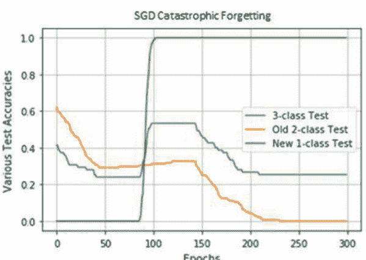

三个类别的数据量相等。橙色曲线（“旧的二类测试”）显示了增强模型在仅包含原始两个类别的测试数据上的准确率，用于评估新增模型对其先前分类任务的知识保留情况。最后，绿色曲线（“新的一类测试”）显示了模型在仅包含新的第三类别的数据上的准确率，用于评估模型对新类别的学习情况。

关于图3，有一些有趣的观察可以进行。首先，观察到旧的2类情况下的测试准确率从原始的100%准确率（对于2类模型）骤降至仅60%准确率，这是在新的类别权重向量被初始化并添加到模型之后发生的。随着对新类别数据的训练的进行，旧的2类准确率变得更糟，并继续向0%发展。尽管看起来不太理想，但这个结果与SGD优化的目标是减少当前错误而不考虑对先前分类任务性能的影响是一致的。结果是灾难性的遗忘，并突显了这种基于梯度下降的渐进学习在模型被扩充并仅使用新的类别数据进行训练时会“遗忘”先前类别的训练。

其次，观察到SGD优化算法确实学习了新的分类任务，这可以从绿线（新的1类测试）从0%增加到100%来看出。

最后，需要注意的是整体的3类分类准确率是先前类别和新类别训练准确率的组合。最后，3类准确率稳定在30%左右，这支持了模型已经学习到了增强类别特征并且在适应只有第三类数据的新世界期望时几乎完全修改或“遗忘”了先前的类别。

图4通过检查产生训练过程中各个点准确率的底层模型权重和类别分布来图形化解释了图3中的准确率曲线。观察到数据由2维特征（例如x，y）点组成，这些点围绕单位圆分成可分离的类别簇。图4的最左边的图显示了刚增强的3类分类器，它现在由原始的两类权重（红色和蓝色向量）和“随机”初始化的权重组成。

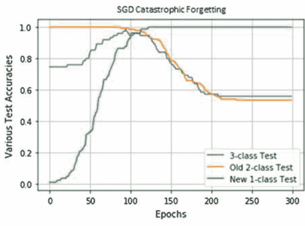

图5渐进式SGD测试准确率（良好初始化）

当仅使用新的类别数据进行训练时。它们还突出了新类别权重向量初始化不良对旧类别权重在顺序学习任务中性能的显著负面影响。

图5显示了使用不同的新类别增强初始化向量重复进行此实验的结果。这个初始化向量相对于之前的向量是一个改进，因为它允许增强分类器最初保留对旧的2类准确性（橙色）的知识，即使它学习了新的增强类别（绿色）。但是，随着模型继续仅在新类别数据上进行训练，它再次开始“遗忘”旧类别的特征，并修改旧权重以使其与新类别特征更加远离。

图6以图形方式描绘了这个训练过程，从新类别的增强开始，在100个时期和300个时期，类似于图4。它显示，在这种情况下，绿色类别3的初始化向量没有干扰旧类别权重（红色和蓝色）在它们的数据类别上的投影，从而允许模型的良好初始测试准确性在旧的2类数据上得以保持。

正如预期的那样，随着模型进一步在新类别数据上进行训练，新的绿色类别3权重向量学习其类别并更充分地旋转以投影到其类别3的数据。然而，训练时同时修改其他类别权重向量，使其相对于类别3数据具有更多正交位置。这反过来影响它们自己的分类准确性，如图5中旧的2类准确性的下降所示。这个例子表明，即使渐进式SGD随机选择了其新类别权重向量的“良好”初始化，其优化也会以牺牲旧的分类任务为代价修改其分类权重。

因此，这些例子说明了灾难性遗忘问题，并展示了使用来自所有类别的数据进行渐进式SGD实现训练的合理性。

### 冻结旧分类器权重的次优性

根据先前的数据增强实验结果，人们可能会认为，如果只有新的训练数据可用，那么应该冻结先前训练类别对应的权重，并只训练新的类别权重向量。图7形象地说明了这种方法的次优性。

图7的左侧显示了最优（在均方误差意义上）的2类模型解。这个线性预测模型是一个2特征×2类矩阵，其列由类别权重向量组成。再次观察到，这些类别权重向量在其各自类别数据上的投影结果是完美的100%的2类分类准确率。右侧的图表显示了联合3类模型的最优均方误差。注意原始的（红色和蓝色）类别权重如何发生变化。例如，注意类别1的权重（红色）如何向类别1的数据点（紫色）旋转，并远离类别3的数据（黄色）。这是为了最小化新的第三类别与类别1权重之间的投影分数而进行的优化目标的响应。

因此，我们可以看到当引入一个新的类别时，所有类别的最优联合权重都会发生变化。这表明所有类别的权重应该在更新时进行更新。

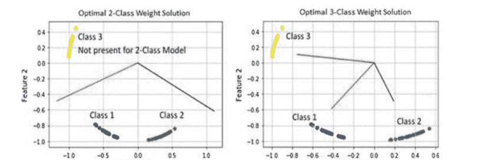

图7最优2类模型的权重和类别投影示例（左）；最优3类模型的权重和类别投影示例（右）

当引入一个新的类别以获得最优性能时，冻结旧的类别权重会导致次优性能。

# 相关工作

本节描述了解决顺序学习问题中与灾难性遗忘相关的其他方法。灾难性遗忘一词是在[1]中提出的，指的是当网络仅使用新的任务标签和数据来优化新任务时，先前学习的任务的退化。

这种情况发生在使用基于梯度下降优化的网络增强进行新任务时，导致先前任务的性能下降。

### 替代的渐进学习方法

最近的渐进学习研究探索了不同的方法来减轻顺序训练网络中的遗忘现象，从而只使用新类别数据进行模型增强训练。这些方法通常将整个网络分为共享权重的特征提取网络和旧任务和新任务的分离分类器。这些方法中的一个共同主题是在新类别训练期间，通过各种网络约束、源数据（旧任务）近似或优化器惩罚，阻止优化算法显著改变先前学习的特征提取网络和先前学习的分类器，以期减少旧任务的性能下降。通过结合各种网络约束、源数据（旧任务）近似或优化器惩罚，这些方法旨在在仅使用新任务数据的情况下保留先前的训练知识并同时优化网络以适应新任务。

例如，学习与遗忘较少的方法[6]试图通过以下方式阻止基于梯度下降的优化器对共享特征提取器和旧任务分类器进行重大更改：(1)强制使旧分类器的决策边界保持不变，(2)最小化目标网络提取的特征与源网络提取的特征之间的距离。它通过在模型增强训练期间保持旧分类器的最后一层不变，并使用目标网络提取的特征与源网络提取的特征之间的距离作为损失函数的另一个组成部分来实现这一点。

无遗忘学习[7, 8]方法也试图阻止共享特征提取网络和旧任务分类器的重大更改。然而，它使用新任务数据通过旧分类器网络运行的输出分数来近似先前学习的但现在不可用的源训练数据。其推理是，如果共享网络和旧分类器网络被优化以在所有相关图像上保持相同的输出，则旧任务的准确性将得到保持。这是对旧任务相关数据的近似。

然后将其与新任务数据交错以近似原始联合训练性能。

第三种方法在克服灾难性遗忘[9]论文中有描述，并且在新任务训练期间也试图约束网络。这种方法背后的关键思想是识别出对先前学习的任务最重要 的权重，然后通过减慢它们的学习速度来有选择性地约束这些权重，使用二次惩罚。

所有这些渐进学习方法都试图通过引入技术来惩罚优化器在改变网络权重 时对旧的分类输出产生影响的方式来解决梯度下降算法的记忆不足问题。

但是，这些方法都不能保证在三个网络或甚至在旧任务和新任务分类器 的简单优化任务中获得最佳联合分类准确性。例如，遗忘无学习的性能依赖于这样一个假设，即新任务训练数据足够激活对旧任务分类器重要的特征，以至于在损失函数中减少旧分类器的权重变化，以保持旧任务分类性能。然而，无法保证这个假设，因此遗忘无学习只能声称实现最佳联合训练性能的可能 性作为上限。这种缺乏保证的联合最优性以及由于梯度下降的内在记忆不足而产生的其他学习效率低下问题为渐进学习应用提供了新的优化方法的机会。

### 与深度RCA相关的渐进学习方法

深度RCA算法在缓解顺序学习中发生的灾难性遗忘方面采用了一种非常不同 的方法，与之前描述的所有仍然使用梯度下降优化器的方法不同。相反，深度 RCA使用了一种修改过的递归最小二乘优化技术，利用更新的逆协方差矩 阵来记住过去的特征相关性。这使得深度RCA能够记住过去的训练数据，并 能够仅使用新类别的训练数据来联合优化旧任务和新任务，并以顺序训练 方式确定性地实现完全最优的联合训练性能。

深度RCA的根源可以追溯到渐进极限学习机(ELM)算法[10]，该算法引入 了使用修改过的RLS优化方法进行渐进学习应用的思想。特别是，渐进ELM 的作者认识到，一种在线RLS实现可以在新数据可用时自适应地更新其权重 ，可以被视为对其未来所有新类别的正训练示例都没有见过的模型。

深度RCA建立在这一核心洞察力的基础上，并引入了两个重要的改进。第一个改进是使用深度神经网络来解开非线性可分离的输入数据，而不是使用ELM。原始（非渐进式）ELM算法背后的关键思想是将输入数据投影到一个更高的维度

## 5 深度快速类别增强

本节描述了深度RCA渐进学习算法的核心概念[2]。如图8所示，深度RCA具有类似的高层架构，由DNN特征提取器和线性分类器或类别预测层组合而成。这个线性分类器的渐进训练算法称为快速类别增强（RCA）算法。

深度RCA术语指的是在DNN的解缠特征上运行渐进RCA算法的组合。

在这里，DNN特征提取器首先用于将高维图像数据降维为一组（希望是线性可分的）低维类特征。然后，渐进RCA训练在这些类特征上操作。

### 5.1 递归最小二乘法背景

RCA分类器基于递归最小二乘（RLS）优化算法的修改版本。回想一下，RLS是递归实现的

这个解是最初设计用于将线性模型适应变化的数据统计的计算效率高的在线训练方法的著名正规方程[13]的解。正规方程是线性方程组 = T的闭式最小均方误差（MMSE）解，其中X是大小为Ns x F的数据矩阵，w是线性预测模型，T是大小为Ns x NbC的多类标签矩阵。它可以写成。

$$w = (X \ X^T)^{-1} X^T T. \n
(3)$$

RLS算法使用矩阵求逆引理[13]来提供递归方法计算正规方程的逆特征协方差矩阵，$M = (X \ X^T)^{-1}$如下所示:

$$M_{k+1} = M_k - M_k x_{k+1}^T (1 + x_{k+1} M_k x_{k+1}^T)^{-1} x_{k+1} M_k . \n
(4)$$

请注意，当 $x_{k+1}$ 表示单个特征向量时，逆函数操作作用于一个标量值，这在计算上具有优势。一般来说，矩阵求逆的大小(4)由批次大小 $x_{k+1}$ 决定，
这允许将逆操作的复杂性控制在可管理的水平。

现在可以使用递归方式更新批次 $k + 1$ 的模型

$$w_{k+1} = w_k + \lambda M_{k+1} x_{k+1} (t_{k+1} - x_{k+1} w_k), \n
(5)$$

其中 $t_{k+1}$ 是样本 $k + 1$ 的独热标签向量。对于模型增强应用，我们希望保留内存，因此将遗忘因子 $\lambda$ 设置为1。

请注意，方程（5）中的RLS更新与方程（2）中的SGD更新非常相似。
关键区别在于逆特征协方差矩阵 $M_{k+1}$ 取代了

SGD标量学习率 $ \eta_{v} $。这种更适应特征的步长使得RLS能够更快地（单次迭代）收敛，并且对于增强来说，重要的是能够回忆起先前类别特征的统计信息。正是这个逆特征协方差矩阵 M和下一节中描述的新类别初始化向量提供了优化器的记忆。

### 5.2 调整RLS以进行模型增强

为了修改在线RLS算法以适应模型增强的任务，我们认识到所有潜在的未来类别可以简单地视为在线优化器尚未遇到任何正面训练样本的类别。这种观点激励了计算单个空类向量 $ \Delta w $，它编码了所有负类训练类别示例，并用于初始化新类别。因为这个初始化的权重向量已经包含了所有先前类别的负特征示例，所以新类别的权重向量现在可以仅在与新类别相关的正例上进行训练。通过这种方式，RCA避免了在实现最佳模型增强时对新类别进行先前观察到的负训练示例的训练。它避免了渐进SGD中使用随机新类别权重向量初始化引起的问题。

计算空类向量 $ \Delta w $ 有几种方法。一种方法是简单地使用正常方程解：

$$ \Delta w = - (X X ^ { T } ) ^ { - 1 } X ^ { T } T _ { Neg } $$

在这里，训练标签向量 $ T _ { Neg } $ (形状为 $ N s \times 1 $) 包含所有负数，表示所有先前的训练样本都没有包含这个类别。请注意，RCA 使用正负 1 作为类别标签，而不是常见的二进制（0 或 1）的独热编码标签。这种修改允许观察和保留空类别向量中的负特征示例。

使用公式（6）计算计算 $ \Delta w $ 的缺点是必须存储所有先前类别的特征数据X，以便初始化新类别。递归实现计算 $ \Delta w $ 可以避免这个缺点，计算公式如下

$$ \Delta w _ { k + 1 } = \Delta w _ { k } + M _ { k + 1 } x _ { k + 1 } ( T _ { N e g } - x _ { k + 1 } \Delta w _ { k } ) , $$

其中 $ T _ { N e g } $ 再次是一个N个×1的矩阵，负一标签表示没有一个示例与任何类别对应。

直观地说，可以将这个初始化向量视为投影到与先前类别最相反或正交的空间中，其中初始化向量与先前类别向量的干扰最小。正是基于这一观点，选择了“空类”向量这个名称。

因此，RCA 的空类初始化向量 $\Delta w$ 提供了一种编码负类特征知识的方式，并且与其逆特征协方差矩阵 $M$ 一起，提供了一种记住过去训练示例的方式。使用这两个组件使得 RCA 能够在之前看到的数据上重新训练增强模型，从而使得训练过程更加快速和内存高效。

### 5.3 RCA 算法实现

本节描述了 RCA 的三个处理阶段：

- **RCA 模型初始化**
  第一阶段使用正常方程式初始化 RCA 模型，根据最初可用的标记数据解决分类权重。它返回基本模型 $w_{0}$ 和逆特征协方差矩阵 $M_{0}$，以及后续模型增强任务所需的空类向量 $\Delta w_{0}$。

$$ M_{0} = \left( X_{0} ^ { T } X_{0} \right) ^ {-1} $$

$$ w_{0} = M_{0} X_{0} ^ { T } T_{0} $$

$$ \Delta w_{0} = M_{k+1} x_{k+1} T _ { N \; e g } , $$

其中 $X_{0}$ 表示初始数据矩阵，$T_{0}$ 表示相关的多类编码标签。

- **RCA 模型更新（新数据-无新类）** 第二阶段用于在有新的训练数据但没有新的类别（即尚无类别增强）时更新现有的 RCA 模型。更新遵循使用矩阵逆引理的标准 RLS 更新。

$$
M_{k+1} = M_{k} - M_{k} x_{k+1}^{T} \left( 1 + x_{k+1} M_{k} x_{k+1} ^ { T } \right) ^ {-1} x_{k+1} M_{k}
$$

$$
w_{k+1} = w_{k} + M_{k+1} x_{k+1} (\mathstrut t_{k+1} - x_{k+1} w_{k})
$$

$$
\Delta w_{k+1} = \Delta w_{k} + M_{k+1} x_{k+1} \left( T_{N \, \log } - x_{k+1} \Delta w_{k} \right),
$$

- **RCA 模型扩展（新类别增加）** 第三阶段通过增加新类别来扩展现有的 RCA 模型。在这个类别增加阶段，先前的模型矩阵 $w_{k}$（特征数 F x 旧类别数 NbC）会与一个新类别初始化向量 $\Delta w_{k}$ 进行扩展

形成更新模型的类。新的增强模型是旧类向量与空类向量的连接：

$w_{k} = [w_{k}, \Delta w_{k}]$

请记住，新的类初始化矢量 $\Delta w_{k}$ 是使用（7）计算的。模型增强后，训练使用RLS在线更新方程进行，如上所述。这三个阶段总结了RCA渐进学习步骤。

## 6 RCA消除灾难性遗忘的示意图

本节回顾了之前讨论的3类灾难性遗忘实验，但现在使用了新的RCA方法。图9显示了RCA在三个测试数据集上的测试准确率，包括1）“新类”数据，2）“旧2类”数据和3）所有“3类”测试数据。从图中可以看出，RCA在保持旧类别准确率的同时学习新类别。这个例子说明了RCA可以逐步建立在先前的知识基础上，只使用新类别的训练数据。这个简单的实验验证了RCA不会遭受灾难性遗忘。RCA利用RLS优化方法的逆协方差矩阵和新的零类别初始化向量，可以在模型增强和训练过程中记住先前的类别。

图10通过图形化展示RCA分类器在模型增强训练过程中的进展来解释这些结果。最左边的图再次显示了相同的基础模型权重（红色和蓝色），但现在加入了新的绿色RCA零类别初始化权重向量（WV3）。请注意，这个新的类别矢量不是随机初始化的，而是使用公式（10）计算一个权重矢量，使其投影到

### 图9 RCA的示意图避免灾难性遗忘

灾难性遗忘

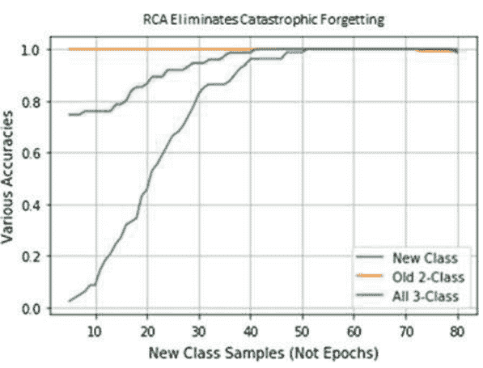

## 7 在MNIST数据上的渐进学习

下一组实验将渐进SGD方法与Deep RCA在MNIST [15]数据上的顺序学习任务进行比较。在这个实验中，通过使用常规的SGD优化方法训练DNN来形成一个预训练的特征提取器网络。该网络由两个卷积层和两个全连接层组成，总共有21K个可训练参数。将该网络应用于测试数据，得到了97%的正确分类得分。然后，使用该网络创建一个特征提取模型，冻结其模型权重直到最后的分类层。该模型提取的特征是50维向量。此时，我们有一个预训练的特征提取器。然后，提取9个类别的特征向量，并用它们来训练一个新的9类基础模型分类器，其权重矩阵形状为F = 50 x NbCls = 9。

### 7.1 渐进式SGD在MNIST数据上的应用

为了测试渐进式SGD的模型增强，我们从一个九类基础模型开始，并添加一个额外的列以容纳新的第十类。按照惯例，新的类别列向量被随机初始化并按照先前训练的类别权重的平均振幅进行缩放。这个增强和初始化的模型

## 深度快速类别增强：一种新的渐进学习方法...

图11 渐进式SGD遗忘旧类别在MNIST上的示意图

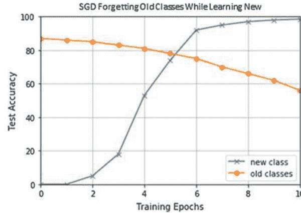

然后，使用只包含新类别数据的训练数据对该模型进行训练。

图11显示了使用只包含新的第十类的测试数据计算的不同测试准确率（蓝色-x线），以及包含旧类别（橙色-o线）的测试数据，其中包含来自之前9个类别的测试样本。这些结果表明，在增强训练期间（仅在新类别数据上训练时），SGD优化器教会了网络新的第十类，但又一次以旧类别的准确性为代价。

再次观察到，在增强训练开始时，旧模型的类准确率从97%下降到85%。这是由于新权重向量的随机初始化无意中投影到旧类权重上引起的。同样地，与3类实验一样，新类权重向量的随机初始化被看作是对旧类向量的强干扰，降低了其分类准确率。

此外，无论新类的初始化如何，如果模型只在新类数据上进行训练，随着训练轮数的增加和新类的效率越来越高，旧类的分类准确率将继续下降，旧类的预测将被逐渐遗忘。再次说明，这种灾难性遗忘的原因是SGD优化器没有记忆功能。如果小批量只包含新类样本，SGD优化器将累积梯度，仅针对该类进行优化，并相应地更新所有权重。这将导致优化器在学习新类权重时忽视先前学习的类别的分类性能。随着时间的推移，这意味着优化器将修改旧的先前学习的类别权重，使其在最小程度上投影到新类特征上，而不管这对其自身的分类准确率有何影响，除非施加其他约束或方法。

表1显示了旧类和新类测试数据在训练50个周期后的分类准确率。结果表明，经过渐进式SGD训练的分类器几乎完全忘记了其旧的分类准确率（降低到10％），即使它已经积极学习了新类别。

| @ 周期 = 50 | 增强前测试准确率 | 增强后测试准确率 |
| --- | --- | --- |
| 测试类别 | 旧类别(1-9) | 旧类别(1-9) | 新类别(第10类) |
| 渐进式SGD | 97% | 10% | 100% |

经过50个周期的增强训练后，旧类别的准确率从97%降低到10%，即使它已经积极学习了新类别。

这些观察结果表明，如果增强模型仅在新类数据上进行训练，渐进式SGD将无法保留先前学习的分类目标。此外，它还表明，没有记忆过去训练数据的优化器，并且使用随机的新类别初始化权重，不适合连续学习的任务。这是因为这种无记忆的优化器强制算法在学习新类别权重的同时不断重新学习所有先前学习的类别。对先前类别的持续刷新要求增加了增强训练时间和存储所有训练数据示例所需的内存的缺点。因此，渐进式SGD的缺乏记忆和随机初始化权重的特点促使我们探索不同的优化器，并对其进行修改以适应模型增强的任务。

### 7.2 深度RCA在MNIST数据上的增强

我们现在展示了深度RCA在MNIST数据集上的渐进学习能力。在这个演示中使用的MNIST特征与上面的渐进SGD增强实验中使用的特征相同。使用这些特征，按照RCA模型初始化步骤生成一个初始的2类基础模型$w_0$。它返回一个基础模型$w_0$，逆特征协方差矩阵$M_0$，以及零向量$\Delta w_0$。

为了测试模型增强，将当前的零向量$\Delta w_k$附加到当前的分类器$w_k$中，如RCA的模型扩展步骤所描述的那样。然后，使用只包含新的第三类数据的数据对这个增强的3类模型进行训练，并在包含所有10类的测试数据上记录其准确率。然后，逐步重复这个类增强过程，以学习所有的10个MNIST类别。

图12显示了深度RCA增强在这10个MNIST类别上的分类结果。在每次新的类增强之后，模型在10类测试数据上的准确率都会提高，到最后一个类增强时，模型的测试准确率达到97%。这个实验证明了深度RCA可以成功地通过只使用新的类数据来增强分类器。

我们现在检查Deep RCA在新的第10个类别上进行增强训练之前和之后的9类准确性，并将其与渐进式SGD进行比较。

## 8 Deep RCA 在ImageNet上的增强

接下来，我们评估Deep RCA 在更大的ImageNet图像上的分类准确性和增强时间。首先，在 10个ImageNet类别[16]上训练一个包含10个类别的RCA模型。请注意，ImageNet类别是FastAI提供的ImageNet 数据的一个子集，以便更快地测试新的概念。每个ImageNet类别的训练集大约有 1200 个样本，测试集有 100 个样本。然后，将这些样本数据通过ResNet-32特征提取器，为每个ImageNet类别生成 512维特征向量。

图12 Deep RCA在MNIST上的渐进学习

图2 Deep RCA和渐进式SGD在MNIST数据上的增量性比较

### 8.1 新的“猫”类的增强

接下来，将一个新的第 11 个“猫”类添加到这个 10 类RCA模型中。这个通用的“猫”类数据来自于相当著名的狗和猫Kaggle数据集，该数据集不是原始ImageNet数据集的一部分，ResNet-32特征提取器是在该数据集上进行训练的。请注意，这种增强将RCA模型扩展到一个其特征提取器没有明确训练的新类别上，因此还突出了RCA使用迁移学习的特征提取作为模型增强任务的一部分的能力。

在这个实验中，每个算法都提供了一个基本的 10 类模型，它需要用额外的猫类进行增强。请注意，与之前的MNIST实验不同，所有模型的 11 个类别的训练图像都提供给了渐进式SGD优化器，而RCA只提供了新的第 11 个类别的猫图像。

这将使渐进式SGD能够在所有类别上保持准确性，但代价是训练时间和存储所有旧类别所需的内存。

### 8.2 增强准确性比较

表3显示了RCA和渐进式SGD的增强测试准确性和训练时间。渐进式SGD在旧测试类和新测试类上都具有高测试准确性，这反映了渐进式SGD提供了包含其所有模型类的增强训练数据，因此它可以在学习新类别的同时保持其高分类准确性，尽管训练时间较长。

计时结果是在一台运行Ubuntu 16.04 LTS的Dell Precision 7820上使用Python的时间模块计算得出的，该计算机配备了156 GiB的内存，Intel Xeon Silver 4112 CPU@2.60 GHz ×16，以及一块NVIDIA GeForce GTX 1080 Ti/PCIe/SSE 2 GPU。结果显示，RCA方法训练分类器的速度比使用渐进式SGD方法快100倍，并且实现了类似或更好的全类别测试准确性。这种显著加速是因为SGD需要在所有11个数据类别上运行（而不仅仅是一个类别），并且需要进行大约100次（即100个epochs）的操作，而不仅仅是一次。

表4显示了整个增强流程所需的时间，包括特征提取。结果显示，对于这些较大的图像，特征提取占据了类别增强的时间。例如，为了SGD所需的11个类别生成特征花费了超过一分钟（62.5秒），而仅需2.4秒。

| 表3 ImageNet数据上可比准确率的增强时间比较 |  |  |  |  |  |  |
| :--- | :--- | :--- | :--- | :--- | :--- | :--- |
|  | **增强训练后的测试准确率** |  |  | **训练时间** | **深度RCA加速** |  |
| **测试类别** | **旧类别(1-10)** | **新类别<br>("猫"类)** | **所有类别(旧+新)** |  |  |  |
| 渐进SGD<br>测试准确率 | 98% | 98% | 97% | 10.1 |  |  |
| 深度RCA<br>测试准确率 | 98% | 99% | 98% | 0.1秒 | 100×更快 |  |

需要注意的是，与RCA的1个时期相比，渐进SGD分类结果是在训练100个时期后获得的。观察到，与使用的100个时期相比，渐进SGD可以在更多的训练时期中获得更高的准确率，但这增加了显著的训练时间成本。还观察到，收敛速度会根据新类别向量的随机初始化而变化。考虑到这些因素以及渐进SGD的准确率通常在100个时期后接近RCA的准确率，选择了SGD训练100个时期作为与RCA方法进行时间比较的基准。

| 表4 特征提取加分类器增强时间的ImageNet实验 |  |  |  |  |
| :--- | :--- | :--- | :--- | :--- |
|  | **特征提取时间（秒）**  **分类器增强训练时间(秒)**  **总更新时间（秒）**  **加速** |  |  |  |
| 渐进式SGD | 62.5 | 10.1 | 72.6 |  |
| 深度RCA | 2.4 | 0.1 | 2.5 | 29 × 更快 |  |

深度RCA更快的特征提取和分类器更新时间的整体组合，使得总的增强流程比渐进式SGD快29倍。这意味着学习一个新类需要一分钟以上，而现在只需要几秒钟，这对于时间关键的应用程序非常重要，并且随着基础模型类别数量的增加，这种差异预计会增加。这些时间实验表明，大型DNN分类器可以提供接近实时的类别增强能力。

## 9 深度RCA在CIFAR 100数据上的应用

最后，在这组实验中，我们将深度RCA应用于众所周知的CIFAR 100类别[17]数据集。我们再次确认，与渐进式SGD相比，深度RCA可以显著减少训练时间和数据存储需求，并且这些优势随着先前训练的类别数量的增加而增加。

这个实验检查了深度RCA作为增强性能准确性的函数，随着任务数量的逐个添加到分类器中。RESNET20(v1)架构被用作特征提取网络的基础。这个RESNET20网络在100个CIFAR测试类别上实现了67%的分类准确率，或者90%的前5个分类准确率。提取的CIFAR100特征来自于这个RESNET20架构的倒数第二层，具有64个特征的维度。然后，实验按类别对这些特征向量进行排序，并使用前两个类别构建一个两类深度RCA基础模型。深度RCA然后逐个添加九十八个类别，每个先前的分类器都增加一个新的单一类别，只使用当前新类别的数据进行训练。

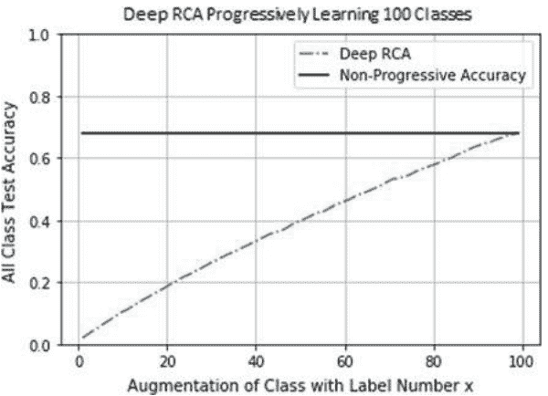

图14展示了结果，验证了Deep RCA（蓝色虚线）可以逐步增强一个分类器，仅使用新的类别数据，并且在此过程中不会忘记先前学习的类别。重要的是，结果还表明Deep RCA实现了最佳的联合解准确性（即同时训练所有类别的线性分类器的准确性），如实线所示，并通过数值精度进行验证。结果还证实，随着增强模型中类别数量的增加，Deep RCA不会失去任何增强性能的联合最优性。

这些结果突显了Deep RCA算法不会遭受其他顺序学习实现中常见的灾难性遗忘问题。它还将Deep RCA与之前讨论的其他渐进学习方法区分开来，这些方法试图通过各种近似来减轻灾难性遗忘的影响，最多只能声称实现最佳联合

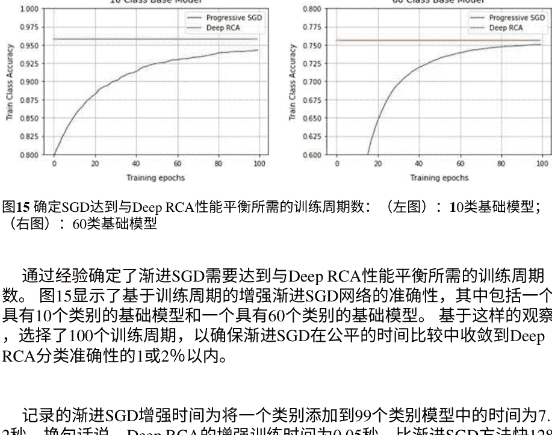

图15确定SGD达到与Deep RCA性能平衡所需的训练周期数：（左图）：10类基础模型；（右图）：60类基础模型

通过经验确定了渐进SGD需要达到与Deep RCA性能平衡所需的训练周期数。图15显示了基于训练周期的增强渐进SGD网络的准确性，其中包括一个具有10个类别的基础模型和一个具有60个类别的基础模型。基于这样的观察，选择了100个训练周期，以确保渐进SGD在公平的时间比较中收敛到Deep RCA分类准确性的1或2%以内。

记录的渐进SGD增强时间为将一个类别添加到99个类别模型中的时间为7.2秒。换句话说，Deep RCA的增强训练时间为0.05秒，比渐进SGD方法快128倍。Deep RCA训练速度的显著提高可以归因于其只对新数据（500个样本）进行一次操作，而渐进SGD需要对所有训练类别（50K个样本）进行多次操作。

### 9.1 增强时间作为增强模型类大小的函数比较

鉴于渐进式SGD必须连续重新训练所有类别以学习一个新类别，我们预计其增强训练时间将随着先前学习类别数量的增加而增加。为了确认这一点，我们测量了增强时间作为先前学习类别数量的函数，对于渐进式SGD和深度RCA的增强模型。结果如表5所示。

| 增强模型的类别大小 | 渐进式SGD更新时间（秒） | 深度RCA更新时间（四舍五入到最接近的百分之一秒） | 深度RCA加速 |
| --- | --- | --- | --- |
| 10 | 0.23 | 0.05 | 4×更快 |
| 20 | 0.60 | 0.05 | 11×更快 |
| 40 | 1.38 | 0.05 | 26×更快 |
| 60 | 2.51 | 0.05 | 47×更快 |
| 80 | 4.16 | 0.05 | 76×更快 |
| 99 | 7.2 | 0.05 | 128×更快 |

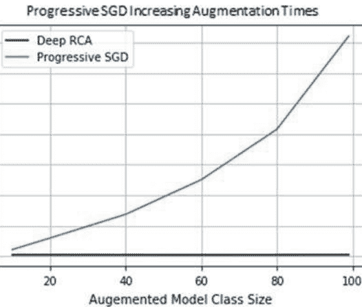

图16通过显示Deep RCA相对于渐进SGD的更新时间，作为增强模型中类别数量的函数，突出了这些发现。在图中可以看到渐进SGD的指数增长，与Deep RCA的一致的新任务学习时间形成对比。

这些发现表明Deep RCA可以将新任务学习与先前学习的任务数量解耦。这个特性不仅可以实现显著更快的增强，还可以实现更加实用的可扩展的连续学习应用。

### 9.2 随机新类别权重初始化的影响

最后，有趣的是再次注意到渐进SGD的随机初始化的新类别权重向量对其旧分类任务性能的负面影响。表6研究了这种分类准确性的降低，作为

| 表6 新类别初始化的初始干扰对先前学习类别准确性的影响 |
| --- | --- | --- | --- |
|  | 初始基准模型旧类别准确率（%） | SGD增强模型旧类别准确率（%） | 深度RCA增强模型旧类别准确率（%） |
| 10类 | 96 | 80 | 96 |
| 20类 | 89 | 55 | 89 |
| 40类 | 75 81 | 26 | 81 |
| 60类 |  | 16 | 75 |
| 80类 | 71 | 10 | 71 |
| 99类 | 68 | 7 | 68 |

当新类别向量初始化时，渐进基准模型中类别数量的函数关系。

例如，当用渐进SGD的随机初始化新类别过滤器来增强一个10类基准模型时，新增的模型的分类准确率从96%下降到89%，这与我们在MNIST实验中观察到的效果类似。但是，当用随机初始化的新类别权重向量来增强一个99类基准模型时，渐进SGD的整体分类性能从68%急剧下降到7%的准确率。这种急剧的分类准确率下降几乎完全抵消了保留旧类别权重以加快模型增强训练的任何优势，而这是渐进学习的核心原则之一。

相比之下，Deep RCA的确定性零类初始化向量将新的类初始化向量放置在先前学习的类向量的正交空间中。这种正交性意味着Deep RCA的新类初始化始于一个不干扰旧分类器准确性的空间。

因此，当模型增加新类时，先前训练的类的全部知识得以保留而不被消除。这些观察结果显示了渐进SGD简单随机初始化方法在模型增强问题上的高成本，并建议渐进学习研究可能要考虑替代随机权重向量初始化策略。

## 10 总结

在本章中，我们讨论了一种用于深度神经网络的新的顺序学习算法，称为Deep RCA，它消除了灾难性遗忘的问题。通过多个实验和数据集，Deep RCA被证明在训练时能够确定性地达到最佳的联合任务训练性能。

仅使用新任务数据按顺序执行新任务。它通过利用RLS算法的特征保持逆相关矩阵和一种新颖的递归空类初始化向量来实现这一点，使得Deep RCA能够在不受梯度下降法实现的顺序学习任务中遭受灾难性遗忘的情况下，同时更新旧任务和新任务，仅使用新任务数据。Deep RCA的主要性能限制在于所使用的特征提取网络能够很好地概括旧任务和新任务。这个假设通常对于可以期望表现良好的迁移学习技术的情况是有效的。Deep RCA能够仅在新任务数据上进行训练，同时在所有任务中进行联合优化，相比标准的基于渐进式SGD的方法，它提供了显著减少的增强训练时间和数据存储需求。

此外，它使得Deep RCA能够将训练新任务所需的时间与先前学习任务的数量解耦，这对于扩展连续学习应用至关重要。这些特点使得Deep RCA非常适合许多实际应用，这些应用需要在边缘上进行快速的顺序学习，其中数据存储和计算能力通常有限。

## 参考文献

1. J. Goodfellow, M. Mirza, D. Xiao, A. Courville, and Y. Bengio, “基于梯度的神经网络中灾难性遗忘的实证研究”, arXiv预印本arXiv:1312.6211, 2013年

2. H. Witzgall, 快速类增强连续深度学习应用，国际机器学习应用会议（ICMLA），2020年

3. S.S. Haykin, 自适应滤波器理论。Pearson Education India, 2014年

4. Pan, S.J., Yang, Q.: 转移学习综述。知识与数据工程, IEEE交易 22(10), 1345-1359 (2010)

5. M. Long and J. Wang, “使用深度适应网络学习可迁移特征”, arXiv预印本arXiv:1502.02791, 2015年

6. H. Jung, J. Ju, M. Jung, 和 J. Kim, “深度神经网络中的遗忘学习,” arXiv preprint arXiv:1607.00122, 2016.

7. Z. Li 和 D. Hoiem, “无遗忘学习,” 在欧洲计算机视觉会议上. Springer, 2016, pp. 614-629

8. Z. Li, D. Hoiem, “无遗忘学习” arXiv:1606.09282v3, 2017

9. J. Kirkpatrick, 等,“克服神经网络中的灾难性遗忘” 在美国国家科学院 (PNAS) 的论文集中，2017

10. R. Venkatesan 和 M. J. Er, “一种新颖的多类别渐进学习技术”, arXiv:16

11. Huang, G.B., Chen, L.: 极限学习机: 一种新的前馈神经网络学习方案. 国际神经网络联合会议论文集 2, 985-990(2004)

12. Huang, G.B., Zhu, Q.Y., Siew, C.K.: 极限学习机: 理论与应用. 神经计算 70, 489-501 (2006)

13. M. Herzberger, “最小二乘法的正规方程及其解法” https://www.ams.org/journals/qam/1949-07-02/S0033-569X-1949-30815-5/S0033-569X-1949-30815-5.pdf

14. W.H. Hager. “矩阵的逆的更新. SIAM Review”, 31(2):221-239, 1989年6月

15. LeCun, Yann; Cortez, Corinna; Burges, Christopher C.J. “MNIST手写数字数据库”. Yann Le Cun的网站yann.lecun.com. 检索日期：2020年4月30日。

16. J. Howard, “Imagenette”，互联网：https://github.com/fastai/imagenette

17. Alex Krizhevsky，“从小图像中学习多层特征”，https://www.cs.toronto.edu/~kriz/index.html，2009年。

对子词上下文的全面分析...

图1 训练集词汇对测试集词汇覆盖率的影响（相对于测试集大小）。对于40%的覆盖率，捷克语需要大约比英语多四倍的训练数据。

在东京（位置）的案例中，单词“Tokio”在与格和位格情况下变为“Tokia”和“Tokiu”。
对于基于标记的模型来说，这种表面形式的变化是一个重大挑战，特别是在处理专有名词时。

在语言学上有动机的尝试侧重于通过将标记分成子词词汇单元，并使用这些单元的向量表示来表示一个标记[34]来捕捉形态信息。早期的方法主要使用字符n-gram特征[40]或形态分析[16, 22]。最近的研究利用字符n-gram嵌入捕捉来捕捉子词信息[7, 32]。

在各种研究中已经证明，使用形态特征和词素嵌入对于形态丰富的语言非常重要。具体来说，[2, 12, 22, 70]通过使用手工制作的形态特征或形态嵌入，显示出对命名实体识别（NER）的显著性能改进。Konkol和Konop [30]将词形还原视为捷克NER系统的必要步骤，并比较了不同的词形还原方法。

Eryi`git 等人通过使用基于词元而不是基于标记的方法，在依赖解析（DEP）中获得了显著的收益，其中词汇单元是使用形态分析器获得的。然而，所有模型都需要手动注释的形态分析数据集或外部分析器进行注释。

上述发现和挑战激发我们分析使用具有丰富形态的语言的子词上下文嵌入的效果。我们声称子词上下文嵌入改善了这些语言的性能，超过了其他方法。我们使用BERT[13]模型获取子词上下文嵌入，并与使用基于词级Word2Vec嵌入[38]和基于子词级非上下文FastText嵌入[7]的性能进行比较。对于每种语言，我们进行了跨语言、多语言和单语言BERT的实验。

模型来分析迁移学习的效果。为了验证我们的论断，我们选择了两个自然语言处理任务，其中形态学信息被证明是关键的[16, 22]：依存句法分析和命名实体识别。尽管基于BERT的模型先前已用于形态丰富的语言，但我们首次对这些语言的三种不同BERT模型进行了全面分析。对五种形态丰富的语言（匈牙利语、芬兰语、捷克语、日语和土耳其语）的实证结果验证了我们的论断适用于这两个任务。在所有测试语言中，基于BERT的模型明显优于其他方法。此外，我们的分析为迁移学习、多任务学习和外部特征提供了有价值的见解。在此过程中，我们提出的新型BERT-based神经网络模型在土耳其语的两个任务上取得了新的最先进结果。我们的主要贡献如下：

- 我们提出了一种新颖的神经网络架构，将Highway LSTM、BERT和DEP和NER任务的多任务学习相结合，据我们所知，这种方法以前尚未实现。
- 我们分析了五种形态丰富的语言的子词上下文表示，并将其与英语进行了两个序列标记任务的比较。
- 我们在这些设置中对于形态丰富的语言进行了迁移学习和多任务学习的关键发现。
- 我们在两个任务上都取得了土耳其语的最新最好成果。
- 我们进行了详细的错误分析，从中得出了有关BERT模型优势的见解。
- 我们提供了一个案例研究，以验证我们在嘈杂的情感分析数据集上的发现。

## 2 相关工作

各种研究主要分析了上下文子词嵌入的影响，尤其是多语言BERT模型。Wu和Dredze [68]评估了mBERT在39种语言的5个自然语言处理任务上的性能。我们的工作与他们不同之处在于，我们使用相同的神经网络架构进行了嵌入级别的比较。相比之下，他们将mBERT的结果与最佳发布结果进行了比较（模型级别比较）。具体来说，他们将mBERT与跨语言词嵌入进行了比较。结果表明，推荐的全参数微调方案[13]取得了最先进结果。他们通过参数冻结进一步改进了结果。对于文档分类任务，他们使用了包含八种语言的MLDOC [53]数据集，其中包含路透社新闻文章。他们的结果显示，mBERT在具有双语文本的其他研究中取得了可比较的结果。他们还报告说，mBERT在远距离相关语言上表现优异，而在密切相关的印欧语言上表现不佳。对于自然语言推理任务，他们使用了涵盖15种语言的XNLI数据集[11]。他们报告称mBERT在获取更多跨语言信息的模型中表现不佳。他们的结果还表明，将训练数据集限制在下游语言上可以提高XNLI的性能。换句话说，包括额外的语言会阻碍XNLI的性能。与我们的工作相关，他们还报告了NER和DEP任务的结果。他们表明mBERT在与相关语言的NER任务上比强基线表现更好。然而，他们指出在转移到像中文这样的远程相关语言时存在很大的性能差距。他们的结果表明，跨语言共享的子词有助于转移学习。最后，即使在DEP任务中没有使用黄金词性标签，mBERT也优于强基线。他们还表明使用词性信息可以进一步提高性能，并认为词性标签提供了更清晰的跨语言表示。

Wu和Dredze [69]将mBERT与基线和单语BERT模型在四种低资源语言上进行了比较。他们报告称单语训练无法获得这些语言的高质量表示。Pires等人[44]还分析了多语言BERT模型的能力。他们的结果表明词汇重叠可以改善转移。最后，Wang等人[66]研究了mBERT模型的跨语言能力。与[44]相反，他们的结果显示mBERT是无需词汇重叠的跨语言模型，这表明mBERT捕捉到了其他语言方面的特征。

我们的工作扩展了之前使用子词上下文嵌入进行序列标注的工作[8,25]，以及使用子词上下文嵌入进行多任务学习的工作[33]。最近，[58]也使用了BERT和Flair[1]上下文嵌入，并改进了它们的神经网络基线在NER和DEP任务中的性能。然而，他们没有与其他嵌入方法进行比较，而且他们的工作仅限于捷克语。Che等人[8]提出了一个类似的依存解析器，它结合了单词级ELMo嵌入[43]，并在“CoNLL 2018共享任务”上获得了最高的LAS分数（整体和土耳其语）。我们的最终模型通过使用最少的特征在土耳其语中超过了他们的方法。

## 3 方法论

在本节中，我们解释了本研究中使用的神经网络的详细信息。我们描述了不同的嵌入方法，对于两个任务都通用的输入层，然后介绍了每个任务特定的组件。最后，我们描述了我们使用的多任务学习框架。

### 3.1 Word2Vec

Mikolov等人[38]在从大量无标签语料库中学习连续词表示方面的开创性工作对NLP研究来说是一个突破。他们引入了skip-gram模型架构，利用上下文信息将语义上相似的单词映射到彼此附近。skip-gram模型的目标是最大化给定中心词的上下文的对数似然。

形式上，给定一个句子的似然函数L可以表示如下，

$$ L = \frac{1}{T} \sum_{i=1}^T \sum_{j \in \{ e, c \}, j=0}^{T} p(w_{(i+c)}|w_i) $$

T是句子的长度，c是上下文宽度，c=5是Mikolov等人[38]使用的值，p给出了基于分层softmax的目标上下文单词的概率。

在训练过程中，每个输入单词都用一位独热编码表示。这种表示被输入到一个全连接（FC）层中，以获得输入单词的隐藏连续表示，即投影。这一步也被称为编码阶段。在解码过程中，隐藏表示经过另一个FC层，然后通过softmax生成词汇表中每个单词的概率。图2展示了skip-gram方法。我们使用基于skip-gram模型训练的Word2Vec嵌入来获取非上下文的单词级嵌入。

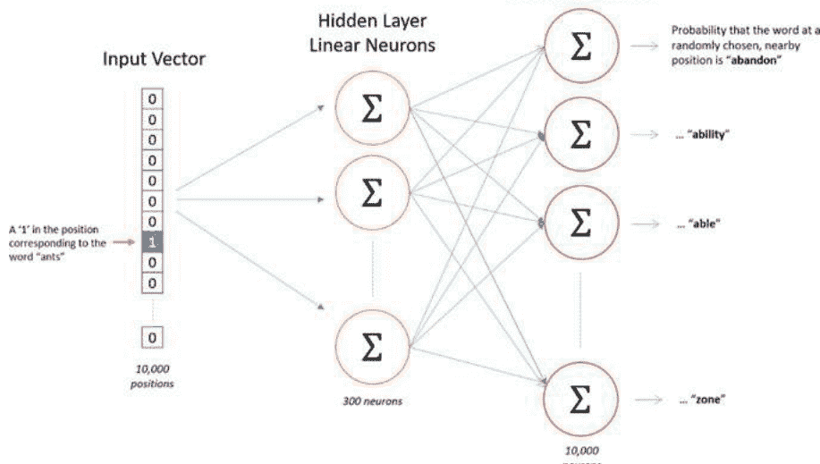

图2 展示了skip-gram模型的示意图[37]。

### 3.2 FastText

在这项研究中，我们使用BERT [13]，它是一个基于子词级预训练的Transformer语言模型。我们声称BERT生成的上下文子词表示捕捉到了单词形态学信息中保留的信息。

上面解释的预训练的词级表示被证明能够捕捉到单词之间的重要语义关系[29]。然而，这些表示不能够捕捉到子词级别的信息，而这对于许多序列标注任务来说是重要的[34]。此外，这些表示是非上下文的，即一旦学习到后就与上下文无关。例如，在句子‘我喜欢吃鲈鱼’和‘我弹奏低音吉他’中，单词‘bass’将被表示为相同的向量，尽管它们指的是不同的意思。最近关于上下文表示的研究通过使用长短期记忆（LSTM）[26]或Transformer模型[63]来将一个单词的输出与其周围的上下文联系起来，从而克服了这个问题。

输入层是三个向量的串联。对于输入句子中的每个单词 $ w_j $，输出表示为 $ o_j = v_j^{\text{word}} \oplus v_j^{\text{cas}} \oplus v_j^{\text{pos}} $，其中 $ v_j^{\text{word}} $，$ v_j^{\text{cas}} $，和 $ v_j^{\text{pos}} $ 分别对应于单词嵌入、大小写嵌入和POS标签嵌入。对于Word2vec嵌入，$ v_j^{\text{word}} $ 是对应于该单词的向量，如果该单词包含在训练词汇表中，或者是用于表示所有未知单词的向量。对于FastText嵌入，$ v_j^{\text{word}} $ 是其n-gram向量的组合，如果该单词不包含在训练词汇表中。为了获得 $ v_j^{\text{word}} $，对于mBERT情况，我们首先将单词分词为其BERT子词。然后，对于每个子词，我们获取BERT最后四层的隐藏向量的平均值，遵循[13]的建议。最后，我们对所有子词取平均值得到最终表示。

在使用词嵌入来减少词汇量时，将字母转为小写是一种常见的预处理步骤。为了保留大小写信息，

### 3.4 输入层

### 3.3 上下文子词嵌入

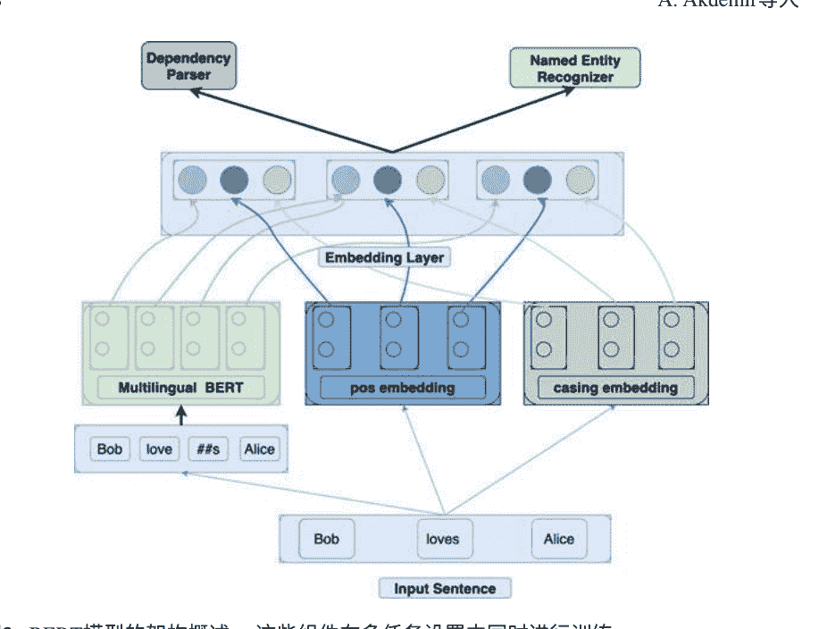

图3 mBERT模型的架构概述。这些组件在多任务设置中同时进行训练。

为了NER任务[22,25]的帮助，我们使用具有五个类别的大小写嵌入（图3）。这些类别示例及其对应的大小写如下：标题、全大写、小写、包含撇号和1234（数字）。对于POS嵌入，我们使用了通用依赖格式[7]中定义的XPOS和语言特定的POS标签。输入层在多任务设置中进行联合训练。

此外，我们还进行了不使用额外POS和大小写特征的实验。在这些实验中，我们将其称为“仅词语”模型（表2），任务特定组件的唯一输入是给定标记的潜在表示，例如每个标记的BERT模型输出。

## 图4 高速公路 LSTM 示意图

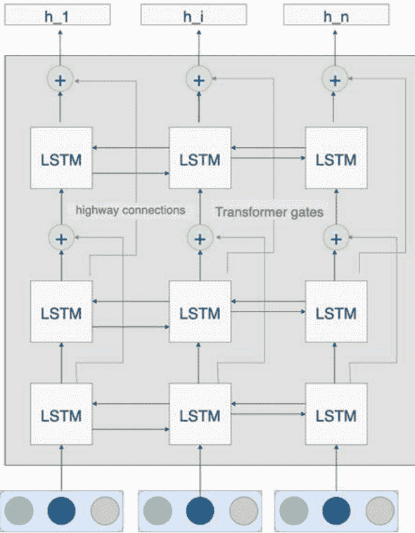

序列输入之间的信息传递。我们可以将这种信息流动看作是水平流动。另一种信息流动是LSTM层之间的信息流动，我们可以将其看作是垂直流动。

传统上，我们将从上一个LSTM层获得的隐藏表示输入到下一个LSTM层中的每个标记。以前的研究已经显示，训练具有大量连续LSTM层的深度神经网络的困难[20,48]。Srivastava等人[57]提出了一种类似LSTM的机制来控制LSTM与堆栈之间的信息流动。传统上，对于 L 层，一系列n输入的前向传播步骤可以表示如下：

$$
\begin{aligned}
h^1_t &= \text{LSTM}(x_1, \ldots, x_t, \ldots, x_n; t) \ 
h^2_t &= \text{LSTM}(h^1_t, \ldots, x^1_t, \ldots, x^n_t; t) \ \vdots \ 
h^i_t &= \text{LSTM}(h^{i-1}_t, \ldots, x^{i-1}_t, \ldots, x^{i-1}_n; t) \ \vdots \ 
y_t &= h^L_t = \text{LSTM}(h^{L-1}_1, \ldots, x^{L-1}_t, \ldots, x^{L-1}_n; t)
\end{aligned}
$$

相反，Highway LSTM使用可学习的参数通过门控函数来控制垂直信息流动。还定义了其他门控函数，使得对于 $ x = (x_1, ..., x_n) $，

$$ 
\begin{aligned}
& h_{t}^{1} = T^{1}(\mathbf{x} ; t) * \text{LSTM}^{1}(\mathbf{x} ; t) + C^{1}(\mathbf{x} ; t) \ 
& h_{t}^{i} = T^{i}\left(h^{i-1} ; t\right) * \text{LSTM}^{i}\left(h^{i-1} ; t\right) + C^{i}\left(h^{i-1} ; t\right) \ 
& \ldots \ 
& h_{t}^{L} = \text{HLSTM}\left(x_{1}, \ldots, x_{n} ; t\right) 
\end{aligned}
$$

其中 T 和 C 控制着信息从前一个 LSTM 层的流动，L 表示 LSTM 层的数量。在我们的实验中，我们总是设置 $ C^i(x; t) = 1 - T^i(x; t) $ 为了方便起见，遵循57的做法，并设置 $ T = \sigma(Wx + b) $，其中 W 是变换矩阵，b 是偏置向量，x 是当前层的输入。
使用 σ 确保对于所有输入，C+T=1。观察到在这种设置下，如果我们设置 $ T^i(h^{i-1}; t) = 1 $，输出将等同于 $ \text{LSTM}^i(h^{i-1}; t) $。

## 3.6 依赖解析器

我们在这项工作中使用的依赖解析器类似于Dozat和Manning[14]以及Qi等人提出的基于图的解析器。图5的左侧显示了依赖解析器的架构。它由两个模块组成，分别用于生成单词之间的弧（表示依赖关系）的分数和每个弧的标签（表示依赖类型）。我们首先遵循[46]并将Highway LSTM（HLSTM）架构作为初始任务特定层。HLSTM学习可调参数以控制LSTM层之间的信息流动。

给定一系列 vectors $ \{o_t: 1 \leq t \leq n\} $，我们得到

$$ h_t = \text{HLSTM}^{dep}(o_1, ..., o_n; t) $$

其中 n 是标记的数量，h_t 是 o_t 的隐藏表示。Dozat和 Manning [14] 做出了一个关键观察，即一个词的向量表示在考虑头部或依赖时应该是不同的。我们遵循这个关键观察，将向量表示馈送到由全连接层 ($ FC_{\text{edge}}^{\text{edge}} $ 和 $ FC_{\text{edge}}^{\text{dep}} $) 组成的两个双仿射评分器中，以生成每个词作为头部和依赖的表示。与参考解析器不同，我们只使用两个嵌入，除了词嵌入之外。我们的带有BERT嵌入的解析器在相同设置下训练和测试时表现优于两个解析器。

## 3.7 命名实体识别器

命名实体识别器由三层组成：LSTM层、全连接层和条件随机场（CRF）层。图5的右侧显示了命名实体识别器的架构。LSTM和CRF的组合在NER任务中常被使用[32, 35]。我们通过将BiLSTM层替换为Highway LSTM架构[57]来扩展基于BiLSTM-CRF的先前工作。Highway LSTM的架构与DEP组件完全相同。有关训练的更多细节请参见附录9。

## 3.7.1 条件随机场

CRF经常用于NLP中的序列标注任务，如NER。接下来，我们定义Let y和 x 分别表示标签和输入序列。

根据Lafferty等人的定义[31]，我们可以计算得分，即标签序列的似然性。

$$ 
\text{得分} (y | x, W) = e^{\Lambda\left( \sum_{i} \alpha \log \Psi_{\text{发射}} (y_{-i} | x_{-i}, W) + \beta \log \Psi_{\text{转移}} (y_{-i} | y_{-i-1}, W) \right) } 
$$

[PAGE 53]

$$ \Psi_{\text{发射}} (y_{-i} | x_{-i}, W) $$ 表示在第i时间步的输入下给定标签的可能性，而 $ \Psi_{\text{转移}} (y_{-i} | y_{-i - 1}, W) $ 表示给定前一个标签的标签的可能性预测 $ y_{-i-1} $。转移（$ y_{-i} | y_{-i - 1}, W $）对应于一个 $ |L| \times |L| $ 矩阵，其中 T 是标签集。条件概率 y 的标签序列表示为

$$ 
P(\mathbf{y}|\mathbf{x}, W) = \frac{e^{x} \text{p}(\text{分数 }(\mathbf{y}|\mathbf{x}, W))}{\sum_{y'} e^{x} \text{p}(\text{分数 } (y'|\mathbf{x}, W))} 
$$

我们可以使用最大似然估计学习最优参数来进行 $ \Psi_{\text{转移}} $ 和 $ \Psi_{\text{发射}} $

$$ 
w^* = \arg\max_w \sum_{j=1}^N \log \: P(\mathbf{y}_j|\mathbf{x}_j, w) 
$$

其中 N 表示数据集大小，y_j 和 x_j 表示第 j 个标记的示例。

## 3.7.2 推理

我们使用维特比解码算法[17]找到给定句子的最高得分标签序列。形式上，对于给定的句子 $ \mathbf{x} = (x_1, \ldots, x_n) $，我们可以如下找到最可能的标签序列：$ \mathbf{y} = (y_1, \ldots, y_n) $，

$$
\begin{aligned}
\mathbf{y} &= \arg\max_\mathbf{y} P(\mathbf{y}|\mathbf{x}, W) \ 
&= \arg\max_\mathbf{y} \exp(\text{Score}(\mathbf{y}|\mathbf{x}, W)) \ 
&= \arg\max_\mathbf{y} \text{Score}(\mathbf{y}|\mathbf{x}, W) \ 
&= \arg\max_{\mathbf{y}} \sum_{i=1}^n \rho(y_i|x_i, y_{i-1}, W, \alpha, \beta) 
\end{aligned}
$$

其中 $ \rho(y_i | x_i, W, \alpha, \beta) $ 表示线性组合 $ \Psi_{\text{转移}} $ 和 $ \Psi_{\text{发射}} $ 为了简单起见。从一个特殊的起始序列 $ \mathbf{y_0} $ 开始，我们可以使用动态规划以 $ O(nt^2) $ 的时间高效地解码出最优的序列，其中 n 是有序的长度，t 是标签的数量。

## 3.8 多任务学习框架

在验证了我们对使用子词上下文嵌入进行具有丰富形态的语言的初始假设，并在土耳其语的两个任务上取得了最先进的结果之后，我们还分析了在多任务学习环境中学习这两个任务的效果。

## 3.9 情感分析器

在本研究中，我们的主要关注点是DEP和NER任务。为了进一步验证我们对子词上下文嵌入重要性的论断，我们使用情感分析任务作为案例研究。

情感分析器是一个标准的序列分类器，由BiLSTM层和全连接层组成。最后，Softmax函数用于将序列标签分数转换为概率。为了获得句子向量表示，我们使用基于BERT的模型中 [CLS] 标记的最后隐藏层输出。对于非BERT模型，给定一个句子 { w_t: 1 ≤ t ≤ n }，我们对所有标记表示求平均以获得句子向量：

h_t = BiLSTM^{sent}(o_1, ..., o_n; t)

h_{sent} = (1/n) * Σ_{t=1}^n h_t

scores = FC^{sent}(h_{sent})

p = exp(scores) / Σ_{t=1}^L exp(scores)

其中，scores是一个L维向量，表示L个情感类别的概率向量p。

## 4 实验设置

我们使用Python语言的PyTorch库来实现所有神经模型并进行实验。在所有实验中，我们使用了一台Tesla V100 GPU，并使用单线程。参数数量最多的多任务模型的训练速度约为每秒200个句子。在推理模式下，模型可以以每秒600个句子的速度输出预测结果（有关实验的更多细节，请参见附录3）。

### 4.1 数据集

对于每种语言，我们使用了"CoNLL 2018通用依存关系共享任务"[71]中提供的最大数据集来进行DEP任务。这些数据集以CoNLL-U格式进行注释，每个标记都包含XPOS标签以及每个标记的头部和依赖关系标签。在评估中，我们使用了DEP任务的两个最常见的评分指标：标记附加得分（LAS）和未标记附加得分（UAS）。LAS只有在头部索引和依赖关系标签都被正确预测时才认为预测是正确的。对于UAS，后一个约束被移除。

土耳其NER数据集是一个常用的基准[61]，其中包含了位置（LOC）、组织（ORG）和人物（PER）的命名实体标签。
匈牙利NER数据集[60]还包括MISC类型和土耳其数据集中的标签。捷克语使用了CNEC 2.0[56]语料库，其中为每个命名实体提供了两级注释。在所有实验中，我们使用了七个超类型作为命名实体标签。对于英语，我们使用了Conll-2003英语基准数据集[52]。对于日语，我们使用了[27]中提供的数据集，其中包含了500个日语维基新闻句子的注释，涵盖了十一个实体类型。最后，对于芬兰语，我们使用了从新闻文章[51]中编译的数据集。该数据集对十个实体类型进行了注释。对于所有语言，我们使用IOB-2标记方案进行注释，其中每个实体的第一个标记具有前缀B-，其余标记具有前缀I-。为了评估NER组件的性能，我们使用了所有实体的微平均F-1得分。

有关每个数据集的所有细节都在附录6中给出。

### 4.2 训练细节

对于所有实验，我们使用了默认的批量大小为500个标记。我们将一个时期定义为训练数据集大小的一半，以便与StanfordNLP依赖解析器[14]具有大致相等的评估间隔。我们在验证数据集上评估了性能，并使用了具有耐心的提前停止策略，在验证集上无法观察到任何改进时终止训练（有关训练的更多细节，请参见附录3和5）。

#### 4.2.1 预训练的BERT模型

我们分析了基于BERT的三种类型的迁移学习的性能：跨语言、多语言和单语迁移。对于跨语言和多语言设置，我们分别使用了BERT英语[13]和mBERT模型来处理所有五种形态丰富的语言。对于特定语言（单语）的BERT，我们使用了公开可用的预训练模型。对于捷克语，我们使用了为四种斯拉夫语言训练的斯拉夫BERT模型[4]。

#### 4.2.2 预训练词嵌入

Word2Vec和FastText模型的性能高度依赖于训练过程和训练数据的质量。因此，我们采用了所有语言中最常用的版本。所有预训练的FastText嵌入都来自FastText存储库[19]。所有Word2Vec嵌入都是使用Python Gensim库[49]在每种语言的维基转储上训练的。

## 5 结果

我们通过验证在具有丰富形态的语言中使用子词上下文嵌入的初始假设来开始我们的实验。首先，我们分别对所有任务（单任务学习）进行了任务特定组件的训练和测试。表1给出了单任务和多任务设置的综合结果。基准是指在训练集中为每个单词使用随机初始化的可训练向量。我们将跨语言（EnBERT）、多语言（mBERT）和单语（BERT）BERT模型分别称为EnBERT、mBERT和BERT。我们将基准、Word2Vec和FastText称为非BERT模型，而将这三个BERT模型称为BERT模型。由于EnBERT的训练集不包含任何日语字符，我们不报告日语的结果。

### 5.1 嵌入类型的比较

表1给出了NER和DEP任务的综合结果。图6显示了每种语言在两个任务上的性能。首先，我们可以看到在两个任务中，Word2Vec和FastText大多优于基线方法。此外，我们可以看到，总体上NER任务的性能差异更大。除了匈牙利语和土耳其语之外，使用FastText在NER任务中带来了超过6%的绝对改进。对于NER任务，我们可以看到FastText始终优于Word2Vec方法。这种一致的趋势强烈表明子词级别的信息对NER任务至关重要。

表1 单任务和多任务学习设置中的依赖解析和命名实体识别结果 (续)

| 语言 | 嵌入类型 | STL DEP LAS F1 | STL DEP UAS F1 | STL NER LAS F1 | STL NER UAS F1 | MTL NER 精准度 | MTL NER 召回率 | MTL NER F1 |
| :---: | :---: | :---: | :---: | :---: | :---: | :---: | :---: | :---: |
| 捷克语 | 基准 | 83.530 | 87.875 | 78.678 | 84.625 | 64.941 | 45.602 | 53.580 |
| 捷克语 | Word2Vec | 83.511 | 87.811 | 76.984 | 83.254 | 58.842 | 54.447 | 56.559 |
| 捷克语 | FastText | 84.662 | 88.805 | 74.793 | 81.458 | 72.477 | 58.231 | 64.578 |
| 捷克语 | Bert | 83.760 | 88.068 | 86.605 | 89.974 | 76.014 | 65.405 | 70.312 |
| 捷克语 | mBert | 89.044 | 91.539 | 90.324 | 92.727 | 84.752 | 82.211 | 83.462 |
| 捷克语 | Bert 捷克语 | 93.252 | 94.983 | 91.622 | 93.528 | 84.922 | 85.799 | 85.358 |
| 芬兰语 | 基准 | 75.135 | 80.892 | 66.013 | 73.484 | 73.649 | 61.650 | 67.117 |
| 芬兰语 | Word2Vec | 75.572 | 81.243 | 67.883 | 74.257 | 76.967 | 61.615 | 68.441 |
| 芬兰语 | FastText | 75.757 | 81.224 | 64.466 | 71.775 | 81.042 | 66.832 | 73.254 |
| 芬兰语 | Bert | 80.418 | 84.063 | 80.693 | 84.381 | 80.909 | 68.518 | 74.200 |
| 芬兰语 | mBert | 86.564 | 89.065 | 85.510 | 88.353 | 87.531 | 86.832 | 87.180 |
| 芬兰语 | Bert 芬兰语 | 89.058 | 91.333 | 88.783 | 91.325 | 90.376 | 91.114 | 90.744 |
| 土耳其语 | 基准 | 55.718 | 64.334 | 56.847 | 65.814 | 56.847 | 65.814 | 88.442 |
| 土耳其语 | Word2Vec | 59.166 | 67.533 | 60.356 | 68.123 | 60.356 | 68.123 | 84.020 |
| 土耳其语 | FastText | 57.907 | 66.283 | 58.407 | 66.543 | 58.407 | 66.543 | 87.065 |
| 土耳其语 | Bert | 59.816 | 65.894 | 62.205 | 68.613 | 62.205 | 68.613 | 90.960 |
| 英语 | mBert | 67.633 | 73.651 | 69.392 | 75.050 | 69.392 | 75.050 | 93.438 |
| 英语 | Bert | 71.192 | 76.220 | 74.300 | 79.538 | 74.300 | 79.538 | 95.311 |
| 英语 | mBert | 78.130 | 84.007 | 79.307 | 85.433 | 79.307 | 85.433 | 96.170 |
| 英语 | Bert | 80.905 | 86.533 | 81.556 | 87.050 | 81.556 | 87.050 | 95.610 |
| 日语 | 基准 | 93.047 | 93.924 | 93.647 | 94.422 | 93.647 | 94.422 | 63.995 |
| 日语 | Word2Vec | 93.300 | 94.374 | 92.644 | 93.655 | 92.644 | 93.655 | 66.235 |
| 日语 | FastText | 92.778 | 95.849 | 93.710 | 94.540 | 93.710 | 94.540 | 73.280 |
| 日语 | mBert | 95.197 | 96.172 | 94.153 | 94.975 | 94.153 | 94.975 | 80.627 |
| 日语 | Bert | 95.481 | 96.172 | 94.706 | 95.504 | 94.706 | 95.504 | 85.521 |
| 匈牙利语 | 基准 | 60.557 | 71.487 | 58.806 | 70.693 | 58.806 | 70.693 | 89.867 |
| 匈牙利语 | Word2Vec | 63.428 | 73.516 | 65.065 | 74.943 | 65.065 | 74.943 | 87.969 |
| 匈牙利语 | FastText | 60.681 | 71.105 | 58.480 | 68.807 | 58.480 | 68.807 | 90.291 |
| 匈牙利语 | Bert | 65.678 | 71.947 | 68.405 | 74.981 | 68.405 | 74.981 | 93.863 |
| 英语 | mBert | 78.130 | 84.007 | 79.307 | 85.433 | 79.307 | 85.433 | 96.170 |
| 英语 | Bert | 80.905 | 86.533 | 81.556 | 87.050 | 81.556 | 87.050 | 95.610 |
| 匈牙利语 | mBert | 78.130 | 84.007 | 79.307 | 85.433 | 79.307 | 85.433 | 96.170 |
| 匈牙利语 | Bert | 80.905 | 86.533 | 81.556 | 87.050 | 81.556 | 87.050 | 95.610 |

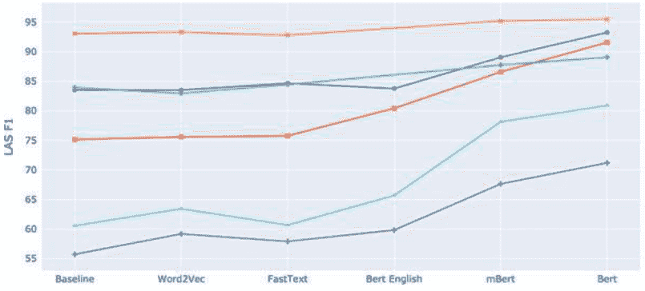

## (a) 所有模型的DEP结果

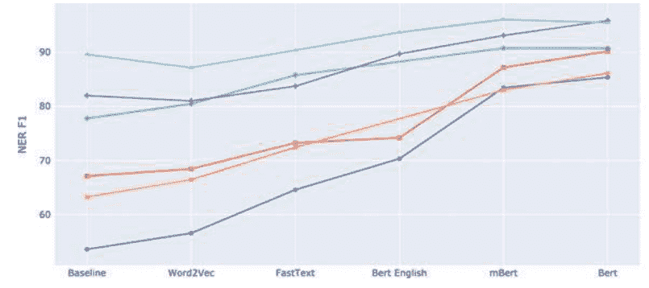

## (b) 所有模型的NER结果

图6显示STL设置下所有语言的两个任务的性能。Bert-based模型在形态丰富的语言中的改进更为显著。

其次，所有三个基于Bert的模型在性能上一直优于其他三种非Bert-based方法。唯一的例外是捷克-EnBERT-DEP组合，我们可以看到基于FastText的模型略微性能更高。我们可以看到，从跨语言（EnBERT）到多语言（mBERT）再到单语言（BERT）的迁移学习，两个任务的性能都有自然提升。此外，我们可以看到一个惊人的结果，英语在使用单语言BERT相比mBERT时，两个任务的改进最小。这个结果表明，具有丰富形态学的语言更受单语言预训练的益处。mBERT训练数据中英语语料的比例较大，这也可能是这种差异的原因之一。尽管mBERT使用维基百科的104种语言进行训练，但英语维基百科的规模最大。总体而言，结果表明，仅仅使用mBERT是不足以获得最先进的结果的，单语言训练仍然至关重要。这个观察特别适用于形态丰富的语言。

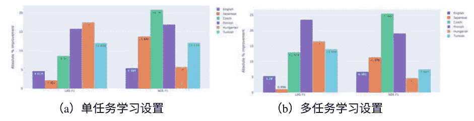

### 5.2 对外部特征的依赖比较

接下来，我们分析不同模型对外部特征的依赖性。我们测量每个模型在丢弃外部特征（即POS和大小写嵌入）时的性能下降。这个分析揭示了每个模型对这些特征的依赖性。

表2显示了每个模型在使用和不使用外部特征时的性能。'Word+Feats'使用外部特征，而'Word Only'只使用令牌的潜在表示作为任务特定组件的输入。

在34个案例中，有33个案例中使用外部特征可以提高性能（唯一的例外是匈牙利语的mBERT，在这种情况下略有下降）。这个结果表明，词性和大小写特征有助于依赖解析任务。更重要的是，我们发现对于所有六种语言，非BERT模型的性能下降明显更高。换句话说，非BERT模型依赖于保留在外部特征中的信息。

对于除日语以外的所有语言，不带外部特征的单语BERT模型，即仅使用单词的BERT，在使用这些特征的所有非BERT模型中表现最好。例如，土耳其语的Bert '仅单词' 模型比所有三个非Bert '单词+特征' 模型的LAS F1分数高出11%以上。对于芬兰语、匈牙利语、英语和土耳其语，外部特征只带来了很小的改进。这些观察结果强烈表明基于BERT的模型隐含地捕捉到了外部特征中保留的信息。

## 表2 依赖解析任务的标记附加分数（LAS）F1，带有和不带有额外特征

| 语言 | 嵌入类型 | 仅单词 | 单词+特征 |
| :--- | :--- | :--- | :--- |
| 捷克语 | 基准 | 67.023 | 83.53 |
|  | Word2Vec | 69.232 | 83.511 |
|  | FastText | 71.414 | 84.662 |
|  | Bert英语 | 82.167 | 83.76 |
|  | mBert | 88.299 | 89.044 |
|  | Bert捷克语 | 86.955 | 93.252 |
| 芬兰语 | 基准 | 57.608 | 75.135 |
|  | Word2Vec | 59.269 | 75.572 |
|  | FastText | 61.006 | 75.757 |
|  | Bert英语 | 73.408 | 80.418 |
|  | mBert | 84.338 | 86.564 |
|  | Bert芬兰语 | 90.062 | 91.571 |
| 匈牙利语 | 基准 | 47.349 | 60.557 |
|  | Word2Vec | 54.336 | 63.428 |
|  | FastText | 51.321 | 60.681 |
|  | Bert英语 | 60.423 | 65.678 |
|  | mBert | 78.273 | 78.13 |
|  | Bert匈牙利语 | 80.207 | 80.905 |
| 英语 | 基准 | 74.872 | 83.934 |
|  | Word2Vec | 76.458 | 82.953 |
|  | FastText | 76.172 | 84.444 |
|  | mBert | 86.599 | 87.731 |
|  | Bert英语 | 88.369 | 89.058 |
| 日语 | 基准 | 86.678 | 93.047 |
|  | Word2Vec | 85.493 | 93.3 |
|  | FastText | 87.366 | 92.778 |
|  | mBert | 90.049 | 95.197 |
|  | Bert日语 | 90.356 | 95.481 |
| 土耳其语 | 基准 | 45.922 | 55.718 |
|  | Word2Vec | 48.691 | 59.166 |
|  | FastText | 48.391 | 57.907 |
|  | Bert英语 | 55.728 | 59.816 |
|  | mBert | 64.844 | 67.633 |
|  | Bert土耳其语 | 70.702 | 71.192 |

对子词上下文的全面分析表明，跨语言BERT和非BERT模型更多地从微调中受益，这表明大规模目标任务数据集对这些方法至关重要。比较这两个任务，我们还可以看到微调对于依存句法任务更有益。特别是对于mBERT和BERT模型，性能收敛。

在学习环境中，我们可以看到基于BERT的模型在形态丰富的语言中的性能提升明显更高。在大多数情况下，我们可以看到非BERT模型的性能下降。这种性能下降在捷克语和芬兰语中的绝对F1分数上达到了6%。此外，这两种语言的非BERT模型在这两个任务上的性能都下降了。因此，我们可以说非BERT模型的多任务学习对捷克语和芬兰语没有好处。总的来说，我们观察到基于BERT的模型从多任务学习中受益更多。

## 5.4 多任务学习的影响

接下来，我们在多任务学习设置中同时训练了任务特定的组件。我们将基于硬共享的模型作为多任务学习架构，其中任务特定的组件共享输入层。我们保持联合模型的架构与各个单独模型的架构相同。表1显示了多任务学习的结果。与单任务学习设置类似，基于BERT的多任务学习模型明显优于其他模型。同时学习这两个任务的效果因语言而异。然而，与单任务学习类似。

## 5.5 单语BERT的错误分析

为了更好地理解单语BERT的改进来自何处，我们在单任务学习环境中分析了命名实体识别结果。我们首先检查其他方法失败而BERT在所有语言中成功的句子。每个表3的上部分给出了这些句子的统计数据。最后一列（总体）提供了所有测试集句子的统计数据以供比较。

未知实体。这些是出现在测试集中但未出现在训练集中的实体。对于匈牙利语、芬兰语和土耳其语，我们发现未知实体的频率明显高于这些句子的数据集平均值。对于捷克语、英语和日语，未知实体频率的结果是混合的。然而，对于所有语言来说，未知实体的频率都高于相反情况，即BERT失败而其他方法成功。这个惊人的结果表明BERT在处理未知实体方面更好。

罕见实体。我们将罕见单词定义为每种语言的训练数据集中仅出现1-3次的单词。与未知词分析类似，土耳其语和芬兰语的罕见实体频率明显高于数据集的平均值。对于其他语言，罕见实体的频率大约在数据集平均水平附近。

再次，我们发现这些句子的罕见实体频率明显高于所有语言中相反情况。这一观察进一步支持我们的观点，即BERT在生成罕见词的良好表示方面表现出色。上述两个分析还表明，日语、芬兰语和捷克语的测试集中未知罕见实体的频率要比匈牙利语、英语和土耳其语高得多。这种差异可能解释了NER任务在这些语言中的最佳结果明显较低（捷克语、日语和芬兰语分别为85.358、86.103和90.165；英语、匈牙利语和土耳其语分别为90.744、95.443和95.826）。此外，这也可能解释了为什么对于这些语言，性能改进更为显著。

长实体。我们观察到，这些句子中所有形态丰富的语言的实体长度都超过了数据集的平均水平，除了捷克语。对于形态丰富的语言，词长是一个很好的后缀估计器。这个分析支持BERT相对于其他模型的一些改进是因为它具有的句法能力[18]。

长句子。结果显示，除了日语外，这些句子的长度都超过了各种语言的数据集平均值。这些句子也比相反情况下的句子更长，除了芬兰语。对于英语，这些句子的平均长度几乎比整体值高50%。较长的句子通常包含更复杂的上下文依赖关系。这一显著增加表明BERT的上下文性有助于模型在具有更多上下文信息的实例上表现更好。

具有多个标签的实体。这些是数据集中具有多个标签的单词。除了日语外，我们发现这些句子中始终存在具有多个标签的实体的频率更高。这个结果表明非上下文嵌入在记忆命名实体方面存在困难，并且在处理模棱两可的实体时失败更多。

具有后缀的实体。在土耳其语中，专有名词的后缀用撇号分隔，例如，在土耳其语中表示位置格的后缀-de，在 "Türkiye'de" 中表示在土耳其。利用这一事实，我们进一步分析了带有后缀的土耳其实体的性能。我们观察到，带有后缀的实体在其他嵌入方法失败的示例中的频率要高得多。土耳其NER数据集中只有30.8%的命名实体包含后缀。

当我们只考虑其他基本嵌入的模型无法正常检测的实体时，这个值增加到56.7%。这种显著增加的频率表明这些模型在具有高度后缀的实体上存在困难。

我们对相反情况（BERT失败的句子和其他方法成功的句子）进行了相同的分析。这个分析是必要的，以验证上述发现是否只是任何“困难”句子的特征。表3的下部分显示我们无法对这些句子做出类似的观察。

这些句子具有较低的未知罕见实体频率。此外，实体和句子长度没有明显的趋势。

## 5.6 与相关工作的比较

在这项工作中，我们扩展了Akdemir等人[3]的先前工作，使用单语BERT模型。Akdemir等人[3]仅使用多语言BERT（mBert）进行实验，并在土耳其语的DEP和NER任务上取得了最先进的结果。通过将mBert替换为BerTurk [54]模型，我们在先前的最先进结果上取得了进一步的改进。表4显示了土耳其语两个任务的先前工作的比较。具体而言，将mBert替换为BerTurk在NER和DEP任务上分别带来了2%和3.31%的绝对F1改进。此外，我们发现我们的任务特定的基于Highway LSTM和CRF的NER组件在NER任务上比Scheweter [54]使用的模型提高了0.264%的F1。

## 表4 与相关工作的比较

| 模型 | NER F-1 | DEP LAS |
| :--- | :--- | :--- |
| 这项工作 (基于BerTurk) | 95.83 | 71.19 |
| Akdemir等人[3] | 93.82 | 67.88 |
| Dozat和Manning[14] | - | 64.86 |
| Che等人[8] | - | 66.44 |
| Yeniterzi [70] | 88.94 | - |
| Demir和 zg r[12] | 91.96 | - |
| Seker和Eryi”git[55] | 91.94 | - |
| Gungor等人[22] | 93.59 | - |
| Gunes和Tantu’g[21] | 93.69 | - |
| BerTurk (Schweter) [54] | 95.55 | - |

## 5.7 案例研究: 情感分析

到目前为止，我们已经使用DEP和NER任务来分析不同模型的性能。用于这两个任务的数据集主要由正式文件组成，如新闻文章。有人可能会认为上述发现在嘈杂的数据集中可能不成立。为了解决这个问题，我们对来自Twitter和电影领域的情感分析数据集进行了实验。这两个领域都包含许多用户使用的罕见单词和拼写错误。

所有情感分析数据集只标记为积极和消极情感。英语电影数据集是一个平衡的数据集，包含10,662个句子[42]。土耳其电影数据集[62]包含13,224个积极和7,020个消极评论。土耳其推特数据集[5]相对较小，包含743个积极和973个消极推文。

表5显示了情感分析任务的结果。我们报告了准确率（Acc），即正确分类的句子比例，以及F1度量。在所有设置中，结果与我们之前的发现一致。结果强烈表明以上发现不仅限于特定领域和任务。有趣的是，单语BERT在土耳其数据集上的性能提升非常高。我们看到了11.3%的绝对准确率提高，这可能是由于推特上的嘈杂和高度独特的内容。这一显著改进可以归因于BerTurk的训练数据，该数据包括多个语料库[54]。

另一个有趣的观察是，跨语言和多语言的迁移学习在土耳其电影数据集上表现出奇低的性能。

我们可以看到，对于所有六个模型，电影领域的性能都更高。这种差异可能也与Twitter的嘈杂和独特的数据有关。与电影领域相比，Twitter数据集中包含更多罕见的词和OOV。

## 6个指南

最后，我们提供了一个关于训练形态丰富语言的神经模型的指南，这对自然语言处理研究人员和从业者非常有帮助：

- 在使用非Bert-based模型时，使用外部特征。
- 当没有外部特征可用时，使用上下文子词嵌入。
- 不要使用多任务学习来提升DEP性能。
- 在嘈杂的数据集（如Twitter）上使用单语BERT模型。
- 在使用非BERT模型时，优先在大数据上进行微调。
- 在使用跨语言BERT模型时，更喜欢大目标数据集。

## 7 结论

在这项研究中，我们声称使用子词上下文嵌入对于形态丰富的语言至关重要。我们对六种语言的跨语言、多语言、单语BERT模型和非BERT方法进行了全面分析。实证结果表明，使用子词上下文嵌入优于其他方法。此外，在单任务学习和多任务学习设置中，我们观察到对于形态丰富的语言，基于BERT的模型的改进显著大。错误分析显示，mBERT的改进来自于其处理罕见 - 未知 - 模糊实体、长词和长句子的能力。我们还观察到，在大多数情况下，基于子词的FastText嵌入优于基于词的Word2vec嵌入。这一结果进一步支持了我们对于使用基于子词的算法处理形态丰富语言的主张。在这个过程中，我们在土耳其语的依存句法分析和命名实体识别任务上超越了最先进的结果。

我们希望我们的发现能促进形态丰富的自然语言处理研究。通过将多任务框架扩展到更多任务，可能可以获得进一步的收益。

例如，包括词性标注等更多任务。为了促进未来的研究，我们公开提供所有源代码。³

致谢 本工作得到了JSPS KAKENHI Grant Number 17H01693, 20K21827和CREST Grant Number JPMJCR1402的支持。我们感谢Cem Rifki Aydin提供了本研究中使用的情感分析数据集。

### 附录2.1: 训练

在解析器的训练过程中，我们结合了依存解析器的两个模块所得到的损失。边缘模块的损失是通过对给定单词$w_{i}$的所有可能头部进行交叉熵损失计算得到的。

损失边缘=$\underset{j}{\sum}(y^{j}\ast log(s_{j}^{边缘}))$ 对于单词$w_{i}$,

$+(1-y_{i}^{j})*log(1_{i,j}^{边缘})$

损失边缘=$\sum_{i}损失_{i}^{边缘}$

其中$y_{i}$是黄金标签头索引的独热编码$y_{i}$头

$y_{j}^{i}=\left\{
\begin{array} {l}
1 如果$w_{j}$是$w_{i}$的头。 \\
否则为0。
\end{array}
\right.$

类似地，标签组件的损失使用交叉熵。首先，我们通过使用黄金标签头索引$\mathbf{y}_{i}$头来得到长向量$S_{i}$标签_{j} 对于给定的单词$w_{i}$来找到头索引。然后我们使用上述公式来计算标签组件的损失：

$$
\mathbf{y}_{i}^{* \text {标签}} = S_{i, \mathbf{y}_{i}^{*}}^{\text {标签}}
\text {损失}_{i \text {标签}} = \sum_{l \nabla \mathbf{L}} (\mathbf{y}_{i} \text { 标签 }^{l} * \log \left(\mathbf{y}_{i}^{* \text {标签 }}[l]\right) + \left(1-\mathbf{y}_{i}^{label}\right) * \log \left(1-\mathbf{y}_{i}^{* \text {label }}[l]\right))
\text {损失}^{\text {标签}} = \sum_{i} \text { 损失 }_{i}^{\text {标签 }}
$$

其中 $y_{label}$ 是真实依赖标签的独热编码 $y_{i}^{label}$ 对于$w_{i}$ 和$y_{i}^{* \text{label}}[\ l]$表示第$l$个标签的得分。最后，我们将两个损失值相加，得到依赖解析器的总损失:$loss^{dep} = loss^{edge} + loss^{label}$。

### 附录2.1.1: 训练

在训练过程中，我们使用负对数似然作为目标损失函数进行最小化。

```
$$
h_{j}^{ner} = HLSTM^{ner}(v_{1}, \ldots, v_{j}, \ldots v_{n}; j)
s_{j} = FC^{ner}(h_{j}^{ner})
\mathbf{S} = [s_{1}, \ldots, s_{j}, \ldots, s_{n}]
crf_{loss} = forward\_score(\mathbf{S}, \mathbf{T}) - path\_score(\mathbf{S}, \mathbf{T}, \mathbf{G})
$$
```

其中，S表示包含每个标签和单词对应的得分的评分矩阵，T是包含每个标签之间的转移得分的转移矩阵。
forward_score(S, T)表示所有路径的总得分，path_score(S, T, G)表示路径的得分。

是金标签序列的得分。理想情况下，我们希望所有概率都累积在金标签路径上，这样这两个得分将是相同的。

### 附录2.2.1：条件随机场

CRF经常用于NLP中的序列标注任务，例如NER。让y和x分别表示标签和输入序列。根据Lafferty等人的定义[31]，我们可以计算得分，即标签序列的似然度，表示为

得分 (y|x, W) = exp(sum i: alogΨ发射(y-| | x-i, W) + βlogΨ转移(yi|yi−1, W))

其中Ψ发射(yi | xi, W)表示给定第i个时间步的输入时标签的似然度，Ψ转移(yi|yi-1,W)表示给定前一个标签预测yi-1的标签的似然度。
Ψ转移(yi | yi-1, W)对应于一个 | L | x | L | 矩阵，其中 T是标签集合。标签序列y的条件概率表示为。

P(y|x, W) = (exp p(分数 (y|x, W))) / (sum y' exp p(分数 (y'|x, W)))

我们可以使用最大似然估计学习最优参数来进行 Ψ转移和 Ψ发射

w* = arg max w sum j=1^N log P(yj|xj, w)

其中 N表示数据集大小， yj 和 xj 表示第 j个标记的示例。

### 附录2.2.2：推理

我们使用维特比解码算法[17]找到给定句子的最高得分标签序列。形式上，对于给定的句子 x = (x1, . . . , xn)，我们希望找到最可能的标签序列 y = (y1, . . . , yn)。

### 附录2.2.3：推理

对子词上下文的全面分析...

```
y = arg max_y P(y|x, W)
= arg max_y exp(Score(y|x, W))
= arg max_y Score(y|x, W)
= arg max_y \sum_{i=1}^n ρ(y_i|x_i, y_{i-1}, W, α, β)
```

其中 ρ(y_i | x_i, W, α, β)表示线性组合 Ψ转移和 Ψ发射以简化。从特殊的起始序列 y_0开始，我们可以使用动态规划以 O(nt^2)的时间高效解码出最可能的序列，其中 n是序列的长度， t是标签的数量。

## 附录2.3：BERT 分词映射

如前所述，我们首先使用由[67]提供的BERT多语言分词器来获取给定输入的BERT标记。为了提高分词准确性，我们可以定义自己的子词汇表。然而，这增加了每种语言所需的人工干预量，并使我们的模型与原始的多语言BERT预训练模型不兼容。由于我们计划将这种提议的架构应用于多语言环境中，我们避免了对我们自己的子词汇表进行实验。我们对给定的实际标记的所有子词嵌入取平均值。我们观察到，仅使用第一个子词标记的表示[25]或求和在这种情况下表现不佳，与我们的方法相比。为了在BERT子词标记和实际输入标记之间进行映射，我们需要应用两步骤的过程，以便能够使用批处理。对于长度不同的序列，例如句子，我们有不同长度的输入向量。当使用批处理时，给定批次的所有输入向量应具有相同的大小，以形成一个张量。为此，我们在词汇表中包含了一个额外的标记'PAD'，用于将所有向量填充到给定批次的最大向量长度。为了使用BERT子词标记，我们首先对给定批次中的实际输入标记进行填充，以匹配它们的长度。回想一下，BERT的子词标记与固定长度的n-gram不同，它们的长度是不同的。这导致在使用BERT分词器对初始句子进行分词后，序列长度发生变化。

因此，我们对填充的序列应用第二个填充，以获得适当的BERT批量输入。举个例子，考虑以下由长度为1和2的两个句子组成的简单批次：'Geliyoruz'和'Geldi mi'，分别可以翻译为'我们来了'和'他/她来了'。为了将这两个输入序列提供给任务特定的层，我们将第一个句子填充到长度2：'Geliyoruz [PAD]'。接下来，BERT分词器输出以下标记：['gel', '##iy', '##or', '##uz', '[PAD]']和['gel', '##di', 'mi']。现在每个序列的长度变为5和3。接下来，我们需要进行第二次批处理以匹配BERT的长度：['gel', '##iy', '##or', '##uz', '[PAD]']和['gel', '##di', 'mi', [PAD], [PAD]]。之后

## 附录3：训练细节

根据[14]，我们从范围内均匀初始化所有嵌入。

$$
\left(-\sqrt{\frac{6}{(|L|+dim)}},+\sqrt{\frac{6}{(|L|+dim)}} \right)
$$

其中，L表示嵌入词汇的大小，dim是输出维度。BERT权重使用预训练的多语言模型权重进行初始化。

对于微调，我们使用[13]建议的超参数设置。

基于BERT的模型的参数数量为170,271,936。其中大部分参数是BERT模型的原始参数。使用单个V100 GPU，每个epoch大约需要80秒。在所有设置中，不到50个epoch就可以达到收敛。这大致相当于在最大的数据集上训练最大的模型不到2小时。平均而言，每个模型的训练时间约为30分钟。在推理模式下（无反向传播），该模型的速度约快五倍。例如，对于土耳其语数据集，生成两个任务的预测大约需要20秒。

多任务学习的主要挑战之一是找到正确的训练集，以实现在所有任务上的最佳性能。McCann等人[30]之前的研究

## 附录4：超参数

我们在不同数据集上进行了超参数优化，然后在目标数据集上得到了结果。超参数列表以及最终值在表6中给出。在HLSTM架构中使用了双向LSTM单元

模型的超参数表6，最终配置和每个参数的范围

| | | |
| :--- | :--- | :--- |
| 隐藏层大小 | | |
| 大小写嵌入 | 32 | 16-32-64-128-256 |
| 词性嵌入 | 64 | 16-32-64-128-256 |
| 词嵌入 | 768 | 768 |
| LSTM隐藏单元 | 2*400 | 100-200-400 |
| 双仿射内部 | 400 | 100-200-400 |
| LSTM层数 | 3 | 1-2-3-4-5 |
| 丢弃 | | |
| NER LSTM丢失 | 0.43 | (0.10, 0.50) |
| DEP LSTM丢失 | 0.34 | (0.10, 0.50) |
| BERT丢失 | 0.5 | (0.10, 0.50) |
| 嵌入丢失 | 0.4 | (0.10, 0.50) |
| 训练 | | |
| 优化器 | AdamW | |
| 学习率（lr） | 0.004 | (0.001, 0.01) |
| LR衰减 | 0.1286 | (0.0, 0.01) |
| LR耐心 | 3个周期 | 1-3-5 |
| 权重衰减 | 0.001 | (0.001,0.1) |
| 提前停止 | 10个周期 | 1-3-5-10 |
| 预热 | 5 | 1-3-5 |
| 批量大小 | 500 | 100-200-300-500 |

## 附录5：验证性能

在本节中，我们给出了主要论文中每个报告结果的验证结果。
表7显示了主要论文中实验的相应验证性能。与测试集上的结果类似，我们观察到对于所有语言和两个任务，基于BERT的模型在验证集上表现优于其他方法。

## 附录6：数据集

在本节中，我们描述了用于两个任务和所有语言的数据集。所有数据集的链接都在补充材料中给出。

### 附录6.1：DEP数据集

对于所有语言，我们使用了“CoNLL 2018通用依赖共享任务”[71]中提供的最大数据集，用于DEP任务。我们使用了提供的训练/验证/测试拆分，没有进行任何更改。没有对任何数据集进行预处理。关于这些数据集的所有统计信息可以从每个树库的参考文献中获得。捷克语使用“Czech-PDT UD树库”[6]。芬兰语使用基于Turku依赖树库(TDT)的“UD_Finnish-TDT”。匈牙利语使用“Szeged依赖树库”[64]。土耳其语使用“IMST-UD树库”[59]。

### 附录6.2：NER数据集

我们在可用的情况下使用标准的训练/开发/测试分割。我们使用提供的分割将CNEC2.0语料库用作捷克NER数据集[56]。匈牙利NER数据集是从短商业新闻文章[60]中编译而成的，并且我们使用了提供的标准分割。对于芬兰语，我们使用从新闻文章[51]中编译的数据集。我们对芬兰NER训练集应用了15%的分割。一个广泛使用的数据集编译自新闻文章用于土耳其语言[61]。

表7 在验证集上进行单任务和多任务学习的依赖解析和命名实体识别结果

| 语言 | 嵌入类型 | STL DEP | MTL DEP | 命名实体识别 |
|---|---|---|---|---|
| 基准 | LAS F1 | UAS F1 | LAS F1 | UAS F1 | 单任务学习F1 | 多任务学习F1 |
| 捷克语 | 基准 | 82.829 | 86.669 | 78.083 | 83.578 | 57.079 | 63.794 |
| 捷克语 | Word2Vec | 83.088 | 87.029 | 77.213 | 82.487 | 63.898 | 69.393 |
| 捷克语 | FastText | 83.958 | 87.686 | 72.689 | 80.072 | 71.626 | 72.317 |
| 捷克语 | Bert英语 | 83.865 | 87.705 | 86.891 | 89.888 | 71.188 | 75.152 |
| 捷克语 | mBert | 89.555 | 91.720 | 91.026 | 92.849 | 84.226 | 86.331 |
| 捷克语 | Bert捷克语 | 92.779 | 94.172 | 92.145 | 93.783 | 86.475 | 87.008 |
| 芬兰语 | 基准 | 73.509 | 79.532 | 63.615 | 71.364 | 77.188 | 78.219 |
| 芬兰语 | Word2Vec | 74.541 | 80.304 | 66.207 | 72.616 | 77.533 | 78.556 |
| 芬兰语 | FastText | 74.491 | 79.985 | 63.036 | 70.399 | 83.268 | 82.743 |
| 芬兰语 | Bert英语 | 78.948 | 82.671 | 79.427 | 83.327 | 85.442 | 85.125 |
| 芬兰语 | mBert | 86.239 | 88.859 | 85.059 | 87.971 | 90.494 | 90.890 |
| 芬兰语 | Bert芬兰语 | 90.496 | 91.960 | 90.723 | 92.278 | 92.974 | 92.733 |
| 英语 | 基准 | 84.452 | 86.834 | 83.223 | 85.665 | 87.968 | 88.468 |
| 英语 | Word2Vec | 83.597 | 86.086 | 83.287 | 85.899 | 87.981 | 88.876 |
| 英语 | FastText | 84.571 | 86.961 | 84.106 | 86.524 | 90.940 | 90.959 |
| 英语 | mBert | 88.361 | 90.655 | 88.866 | 90.890 | 95.140 | 95.186 |
| 英语 | Bert英语 | 89.530 | 91.546 | 89.395 | 91.729 | 95.344 | 94.830 |
| 日语 | 基准 | 93.763 | 94.532 | 94.598 | 95.194 | 62.295 | 65.041 |
| 日语 | Word2Vec | 93.763 | 94.631 | 92.969 | 93.937 | 67.057 | 73.578 |
| 日语 | FastText | 93.722 | 94.449 | 94.756 | 95.384 | 72.144 | 73.969 |
| 日语 | mBert | 95.723 | 96.245 | 94.929 | 95.707 | 82.661 | 85.129 |
| 日语 | Bert日语 | 96.261 | 96.840 | 95.608 | 96.311 | 83.437 | 86.011 |

表8 捷克命名实体识别数据集中每个实体类型的实体数量

| 类型 | 训练 | 开发 | 测试 |
|---|---|---|---|
| 地理 | 3117 | 431 | 378 |
| 媒体 | 314 | 53 | 48 |
| 时间 | 2431 | 280 | 368 |
| 地址 | 402 | 77 | 55 |
| 机构 | 2705 | 340 | 324 |
| 文物 | 2459 | 325 | 382 |
| 人 | 3757 | 509 | 480 |

表9 匈牙利命名实体识别数据集中每个实体类型的实体数量

| 类型 | 训练 | 开发 | 测试 |
|---|---|---|---|
| 机构 | 8449 | 1020 | 1055 |
| 地点 | 1051 | 113 | 125 |
| 人物 | 795 | 87 | 100 |
| 其他 | 1326 | 174 | 160 |

表10 芬兰命名实体识别数据集中每个实体类型的实体数量

| 类型 | 训练 | 开发 | 测试 |
|---|---|---|---|
| 人物 | 1924 | 305 | 409 |
| 外部 | 5 | 0 | 0 |
| 日期 | 831 | 125 | 238 |
| 机构 | 7730 | 1367 | 1910 |
| 事件 | 82 | 11 | 17 |
| 专业 | 3754 | 707 | 1134 |
| 时间 | 4249 | 709 | 1066 |
| 其他 | 767 | 140 | 182 |
| 标题 | 550 | 81 | 129 |
| 地点 | 1739 | 301 | 505 |

表11 土耳其命名实体识别数据集中每个实体类型的实体数量

| 类型 | 训练 | 开发 | 测试 |
|---|---|---|---|
| 机构 | 5089 | 657 | 545 |
| 地点 | 5181 | 604 | 669 |
| 人物 | 7238 | 1061 | 841 |

参考文献

1. Akbik, A., Blythe, D., Vollgraf, R.: 上文字符串嵌入用于序列标记。在：第27届国际计算语言学会议论文集，第1638-1649页（2018年）

2. Akdemir, A., G ng r, T.: 对土耳其基于特征的命名实体识别进行详细分析和改进。在：国际语音与计算机会议上，第9-19页。

3. Akdemir, A., Shibuya, T., G ng r, T.: 适用于具有丰富形态的语言的子词上下文嵌入。在：2020年国际机器学习与应用会议论文集（2020年）

4. Arkhipov, M., Trofimova, M., Kuratov, Y., Sorokin, A.: 调整多语言Transformer以进行特定语言的命名实体识别。在：第7届波罗的海斯拉夫语自然语言处理研讨会论文集，第89-93页（2019年）

5. Aydin, C.R., G ng r, T.: 命名实体识别和分类综述。Lingvisticae Investigationes 30(1), 3-26 (2007)

6. Bejček, E., Panevová, J., Popelka, J., Straška, P., Čech, M., Tepnek, J., Bokrošková, Z.: Prague dependency treebank 2.5—a revisited version of pdt 2.0. In: Proceedings of COLING 2012, pp. 231–246 (2012)

7. Bojanowski, P., Grave, E., Gupta, P., Joulin, A., Mikolov, T.: 学习157种语言的词向量。在：国际语言资源和评估会议论文集 (LREC 2018) (2018年)

8. Che, W., Liu, Y., Wang, Y., Zheng, B., Liu, T.: 条件随机场: 用于分割和标记序列数据的概率模型 (2001)

9. Devlin, J., Chang, M.W., Lee, K., Toutanova, K.: BERT: 深度双向转换器的预训练语言理解。在：2018年北美计算语言学协会会议论文集: 人类语言技术, 卷1 (长篇和短篇), pp. 4171-4186 (2019年)

10. Goldberg, Y.: 评估BERT的句法能力 (2019年). arXiv:1901.05287

11. Iob2语料库 (2020). https://github.com/Hironsan/IOB2Corpus. 于2021年2月6日访问

12. Joulin, A., Grave, E., Bojanowski, P., Mikolov, T.: 高效文本分类的技巧 (2016). arXiv:1607.01759

13. Konkol, M., Konopka, M.: 高度屈折语言的命名实体识别: 不同词形还原和词干提取方法的影响。在：国际文本、语音和对话会议, 第267-274页。Springer (2014)

14. Lample, G., Ballesteros, M., Subramanian, S., Kawakami, K., Dyer, C.: 命名实体识别的神经网络架构。在：2016年北美计算语言学协会会议论文集: 人类语言技术, pp. 260-270 (2016)

15. Li, X.: 一个包含40种语言的多语言文档分类语料库。arXiv预印本, arXiv:1805.09821 (2018)

16. Liu, X., He, P., Chen, W., Gao, J.: 自然语言理解的多任务深度神经网络 (2019). arXiv:1901.11504

17. Luong, T., Socher, R., Manning, C.: 用递归神经网络改进词表示的形态学。在：第十七届计算自然语言学习会议论文集, pp. 104-113 (2013)

18. Ma, X., Hovy, E.: 基于双向LSTM-CNNs-CRF的端到端序列标注。在：第54届计算语言学协会年会论文集, 卷1 (长论文), pp. 1064-1074 (2016)

19. McCollum, A.: Word2vec (2016). http://mccormickml.com/2016/04/19/word2vec-tutorial-the-skip-gram-model/. 访问日期: 2021年2月1日

20. Pires, T., Schlinger, E., Garrette, D.: 多语言BERT有多少语言? (2019年). arXiv:1906.01502

21. Pre-training of Japanese BERT (2019). https://github.com/ci-tohoku/bert-japanese. 访问日期: 2021年2月7日

22. Qi, P., Dozat, T., Zhang, Y., Manning, C.D.: 从零开始的通用依存分析。在: GoNLL 2018 共享任务论文集: 从原始文本到依存关系的多语言解析, 第160-170页 (2018年)

23. Rogers, A., Kovaleva, O., Rombach, A.: BERTolocy入门: 我们对BERT工作原理的了解。计算机科学教协交易, 8(2): 842-866 (2021)

24. Ruokotainen, T., Kapanen, P., Silfverberg, M., Linkola, K.: 用于命名实体识别的芬兰新闻!。语言资源评估, 1-26 (2019)

25. Singap, F.F., Meulder, F.: CONLL--2003共享任务简介: 语言无关的命名实体识别 (2003). arXiv:cs/0306050

26. Straka, M., Straková, J., Hajíc, J.: 带有上下文嵌入的捷克文本处理: 词性标注、词形还原、解析和命名实体识别。在: 国际文本、语音和对话会议, 第137-150页. Springer (2019年)

27. Sulu, U., Gärınmak, M., Tversky, J., Divine, T., Dynire, J., Eryiğit, G.: 土耳其的通用依赖。在: COLING 2016会议论文集. 26届国际计算语言学会议: 技术论文, 第3444-3454页 (2016年)

28. Şeker, G.A., Eryiğit, G.: 使用CRF进行土耳其命名实体识别的初步探索. COLING 2012 会议论文集, 2459-2474 (2012)

## 使用深度学习的RGB和深度图像融合进行物体检测

### Fahimeh Farahnakian和Jukka Heikkonen

摘要：计算机视觉的主要任务是物体检测，旨在定位和分类感兴趣的物体。大多数现有的物体检测方法使用由摄像机捕获的RGB图像。然而，RGB图像不能直接提供深度信息，这将有助于物体检测器在复杂环境中实现更好的性能。为了解决这个问题，我们提出了一种早期融合架构，通过结合RGB和深度图像来进行物体检测。该架构首先使用无监督学习的深度估计技术，从单个RGB输入图像自动推断出密集的深度图像。然后，在非常低的抽象级别上，将深度图像与RGB图像连接起来，使用深度学习模型进行物体检测。最后，该架构预测多个2D边界框来定位物体。为了生成深度图像，我们研究了四种著名深度估计方法对我们的融合架构性能的影响。此外，我们将融合架构与仅使用RGB或深度图像进行物体检测的两种单模态架构进行了比较。在KITTI数据集上的实验结果表明，我们的RGB-深度融合方法优于单模态架构。

1 引言

目标检测方法广泛应用于许多实际应用中，包括自动驾驶 [1]、人类行为分析[2]和场景理解[3]。  
传统的目标检测方法是基于手工设计的特征和浅层可训练架构构建的。此外，它们需要选择每个给定图像中重要的特征。随着需要分类的类别数量的增加，特征提取变得更加繁琐。随着深度学习（DL）的快速发展，卷积神经网络（CNNs）在目标检测方面取得了良好的结果，特别是当它们应用于RGB图像时[4,5]。  
RGB相机在良好的天气和照明条件下提供具有详细纹理信息的高分辨率图像。然而，这些相机不能直接提供深度信息。因此，基于仅RGB图像的目标检测器在复杂环境（指照明和噪声的变化）中无法实现准确的性能，其中图像的分辨率不足或相机动态范围不足。出于这个原因，更近期的研究探索了添加深度数据以改善目标检测[1,6]。深度图像对光照不变性和更好的背景分离具有优势。  
此外，它们包含有关物体形状的附加信息。然而，大多数这些研究利用深度传感器生成深度图像。深度感知是使用深度相机（如Kinect、飞行时间（ToF）相机或立体相机设置）或激光雷达传感器等深度相机获取的。与使用深度传感器不同，深度估计技术可以基于单个RGB图像生成场景的深度。  
深度估计技术试图提供图像像素的深度，即相机与捕捉对象之间的相对或绝对距离。然而，设计一个能够以高精度和低资源要求从单张图像提供深度的单目深度估计方法并不容易[7]。从RGB图像中估计深度是计算机视觉中一个经过深入研究的问题，在过去十年中已经使用深度学习方法进行了大量的调查。一般来说，深度估计技术可以分为两大类：有监督学习[8,9]和无监督学习（自监督学习）[10-13]。基于有监督学习的深度估计方法已经成为一种有效的深度估计方法。然而，它们在训练过程中需要大规模且多样化的数据集，并且需要密集的像素级地面真实标签。为了减少对大规模标注数据集的依赖，提出了基于无监督学习的深度估计方法。这些方法的主要思想是将估计的深度视为潜在层，并利用它们将源帧差分地包装到目标帧上。源图像和目标图像可以是立体对或视频序列中的两个连续帧（单目视频）[8,9]。单目深度估计是比立体更有吸引力的选择，因为它能够从单张图像中估计深度。在这种情况下，深度只能估计到比例因子。但是模型还需要在训练过程中估计图像之间的相机姿态，除了深度估计。这通常涉及训练一个姿态估计网络，该网络以有限的帧序列作为输入，并输出相应的相机变换。

在这项工作中，我们提出了一种早期融合架构，通过在基于CNN的网络中融合RGB和深度数据来提高目标检测性能。所提出的架构由两个模块组成：深度估计和检测。深度估计模块使用基于无监督深度学习方法从单个RGB图像生成深度图像。然后，检测模块使用RGB和深度图像作为CNN-based检测器的输入，以提高目标检测的准确性。  
通过连接来自两个图像的特征来完成目标检测任务。我们还调查了最先进的无监督深度估计方法，以生成深度图像。为了评估所提出的方法，我们使用了具有挑战性的KITTI数据集[14]，该数据集专门用于自动驾驶。KITTI数据集是在类似城市的环境中记录的，使用了一个多传感器平台，安装在一个仪器化的车辆上。我们还使用不同配置的RGB图像及其深度图像，以及独立地进行了最先进的检测器的训练。我们的融合架构所得到的检测准确性结果优于最先进的方法，包括基于RGB和深度图像的检测器。

总结一下，我们的贡献如下：

- 我们评估了四种最先进的无监督深度估计方法（MonoDepth [10]，GeoNet [11]，DFNet [12]和SfMLearner [13]）作为我们检测器的一部分。据我们所知，在目标检测环境中还没有对深度估计方法进行比较研究。
- 由于获取像素级深度图非常昂贵且繁琐，即使借助现代深度感知设备的帮助，我们提出的架构也可以通过利用自监督方法从图像中推断深度图。
- 评估是在KITTI基准数据集上进行的，该数据集包含约7500张从汽车在城市中行驶时拍摄的RGB图像，并且对汽车、骑车者和行人进行了注释。

本文的其余部分结构如下：第2节介绍了一些最重要的相关工作。第3节介绍了提出的基于DL的图像融合架构。第4节和第5节详细介绍了架构的深度估计和检测模块。第6节和第7节分别展示了我们实现的实验设置和结果。最后，在第8节中我们提出了结论。

## 2 相关工作

这项研究与目标检测和融合的大量工作相关。因此，我们将重点回顾这些主题上的现有研究成果。此外，我们还将回顾深度估计的深度学习应用。

### 2.1 目标检测的深度学习

深度学习算法近年来在解决许多计算机视觉问题上引起了兴趣，包括目标分类[15]、目标检测[4, 5, 16]和图像分割[3]。基于深度学习的检测器已经证明优于手工设计的方法，如HOG [17]和SIFT [18]。卷积神经网络（CNN）作为深度学习中最具代表性的模型，显著提高了目标检测的准确性[19]。

基于区域的卷积神经网络（R-CNN）[4]是最受欢迎的深度卷积神经网络方法之一，已经扩展到各种新任务和数据集上。该框架包括三个模块：（1）生成区域建议，（2）对每个建议区域进行特征提取的深度卷积神经网络，（3）通过选择性搜索（SS）[20]对所有建议（通常为数千个）分别进行线性支持向量机。网络的SS部分花费的时间与目标检测大致相同。

SPPnets [21]引入了一种称为空间金字塔池化（SPP）的CNN技术，提高了计算共享的性能。  
然而，它们存在一个主要弱点，即由于其卷积层（固定）的设计，导致深度网络的准确性降低。[22]通过一系列的卷积和最大池化层，这些网络的缺点被一种新的架构Fast R-CNN [22]克服，它直接从输入图像生成卷积特征图。新提出的算法Faster R-CNN [5]基本上省略了SS部分，并将卷积特征图传递给另一个网络（例如Fast R-CNN）来生成区域建议。

因此，通过省略用于生成对象区域建议的SS方法，Fast R-CNN [22]和Faster R-CNN [5]可以以更低的计算时间和成本实现深度CNN。

一般来说，基于CNN的检测器可以分为两大类：一阶段方法（例如SSD [23]，YOLO [24]）和两阶段方法（例如R-CNN [4]，Fast/Faster R-CNN [5,22]，R-FCN [25]）。两阶段检测器通常比一阶段检测器慢，因为它们利用外部模块生成候选目标位置。然而，由于考虑了困难样本，它们具有更高的检测准确性。困难样本是模型预测不准确的样本。

相比之下，一阶段目标检测器通过移除第二个区域分类操作，直接预测边界框和相关类别概率，以更快、更简单的方式生成可能的目标提议的密集采样。

目标检测的一个常见应用是自动驾驶车辆。例如，他们提出了一种基于Faster R-CNN的方法 [26]，用于检测和分类道路上的物体。他们的方法的输出是物体的矩形边界框（BB）和类别信息，这些对于自动驾驶车辆的运动规划是有用的参数。在海洋环境中，[27]中对R-FCN、Faster R-CNN和SSD进行了检测准确性和运行时间的比较研究。

### 2.2 融合的深度学习

提高目标检测鲁棒性的主要技术之一是多传感器融合。多传感器融合可以通过结合来自各种传感器的可用信息来提高目标检测器的性能。作为多传感器融合的一个子领域，图像融合是一种旨在结合不同传感器产生的信息的增强技术。

为了在不同视图之间建立特征对应关系，姿态网络将整个序列沿通道维度连接起来作为输入，回归出所有相对6D相机姿态。分别回归深度图和相机姿态，并融合产生刚性光流。GeoNet采用鲁棒的图像相似度度量[10]作为光度损失，它在适当评估感知相似性和对异常值具有适度鲁棒性之间保持平衡，并且具有可微性。

### 2.3 深度学习用于深度估计

传统的深度估计方法通常使用基于手工特征和概率模型的RGB图像。最近，深度学习已成功应用于从单个图像中以端到端的方式恢复像素级深度图的深度估计问题。最近的监督学习方法[8, 9]利用CNN进行深度估计，以避免手工设计的目标函数和测试时的计算昂贵的优化。DeMon [8]还解决了从立体数据学习深度的问题。他们的方法使用两个无约束帧作为输入，产生高质量的深度估计。这项工作使用了深度和光流等各种形式的监督。

虽然深度学习对于这个任务显示出有希望的结果，但是大多数这些监督学习方法[8,9]需要密集标记的数据集，而这又需要在现实世界中进行大量的人力努力来收集。为了缓解这个问题，一些工作使用了无监督学习策略来从未标记的视频序列中预测深度图。无监督学习方法[10-13]通过训练网络来预测另一张图像视角下的目标图像的外观来解决深度估计问题。源图像和目标图像可以是立体对或者视频序列中的两个连续帧（单目视频）。DF-Net[12]是一种无监督学习方法，用于同时训练深度预测和光流估计。它利用预测的场景深度和相机运动来通过反投影引起的3D场景流合成2D光流。

## 3 提出的早期融合架构

在本节中，我们介绍了提出的融合架构，该架构结构化地从RGB和深度图像中学习信息。该架构首先通过使用深度估计模块从单个RGB图像生成深度图像，如图1所示。然后，检测模块从RGB和深度图像中提取特征并进行目标检测。我们的想法是将RGB和深度特征结合起来，为分类器提供更多信息以进行最终预测。深度估计和检测模块分别在第4节和第5节中描述。

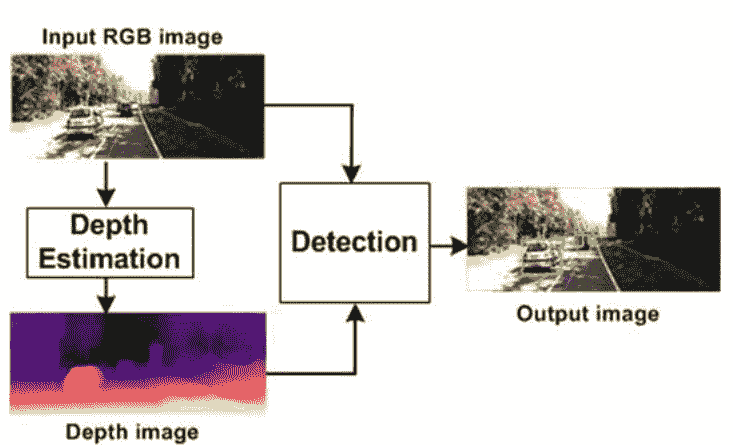

图1 提出的早期融合架构概述。首先，深度估计模块从RGB图像生成深度图像。然后，RGB输入和深度图像被连接在一起。随后，生成的输入数据通过检测器进行处理，以稳健地检测对象。最后，输出图像包括预测的边界框（BBs）以及相应的分数和标签。

## 4 深度估计模块

为了生成深度图像，我们采用了四种无监督单目深度估计方法（见第4.1-4.4节）。这些方法的目标是估计与2D RGB图像相对应的相同大小的深度图像。因此，深度图像只是一个包含与相机视点处场景对象表面距离相关信息的2D矩阵。因此，所有这些方法都包含两个网络（深度和姿态），分别用于深度和姿态估计（图2）。尽管每种方法的网络配置不同，深度网络接受单个输入RGB图像I_t并生成深度图像D_t作为输出。姿态网络将目标图像I_t和附近的源视图（例如I_t-1和I_t+1）作为输入，并输出相对的相机姿态。然后使用两个网络的输出反过来包裹源图像以重建目标图像。此外，光度重建损失基于使用计算的深度和姿态将附近图像包裹到目标图像上。对于单视图深度，采用了DispNet [38] 架构，基于编码器-解码器设计和多尺度侧面预测。通过使用视图合成作为监督，整个框架以无监督的方式从视频中进行训练。

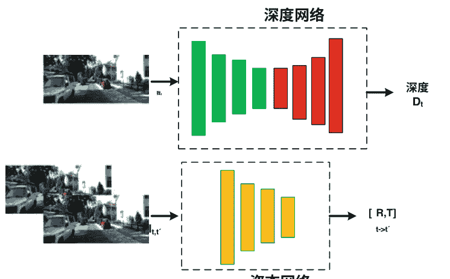

图2 四种提出的无监督深度学习方法的常见深度估计结构:MonoDepth[10]、GeoNet[11]、DF-Net[12]和SfMLearner[13]

## 4.4 DF-Net

DF-Net [12] 提出了一种使用无标签视频联合学习深度估计模型和流预测模型的方法。大多数令人兴奋的无监督方法利用空间平滑先验和亮度恒定性来训练深度或流模型。然而，DF-Net使用几何一致性作为额外的监督信号来实现这个目的。DF-Net的主要思想是利用预测的场景深度和相机运动来合成刚性区域的二维光流，通过反投影引起的三维场景流。

DF-Net由三个网络组成：深度、姿态和流。深度网络首先估计给定两个连续帧 $I_t$ 和 $I_{t+1}$ 从无标签视频中采样的深度。然后，姿态网络接受两个堆叠的输入图像，并估计两个输入帧之间的相对6D相机姿态变换。利用预测的深度图和估计的6D相机姿态，流网络估计两个输入帧之间的密集光流场。由于DF-Net没有用于监督的地面真实深度和流图，它利用标准的光度和空间平滑代价来规范网络训练。

## 5 检测模块

所提出的融合架构被设计用于从RGB和深度图像中找到互补信息。为此，来自先前深度估计模块的深度图像与RGB图像在非常低的抽象级别上进行连接（图1）。我们探索了早期融合，其中从彩色和深度图像中提取的特征向量被合并为一个公共特征向量，该特征向量是检测器的输入。基于CNN的检测器使用一组滤波器处理连接输入图像，并从特征图中生成边界框（BBs）以定位物体。物体定位通过一个框来确定，该框的左上角坐标为 $(x_1, y_1)$，右下角坐标为 $(x_2, y_2)$。此外，每个边界框都与一个置信度分数 $s$ 相关联，该分数表示边界框包含物体的可能性有多大。保留具有最高置信度的边界框，以进行非最大值抑制（NMS）过滤。NMS是许多目标检测方法中的一种常用后处理方法[4, 5]。它过滤冗余的边界框以获得最终的检测结果。基于CNN的检测器是Faster R-CNN [5]和Single Shot Detector (SSD) [23]的一种改编版本，适用于融合彩色和深度数据。有关该模块的更多实现细节，请参见第6.2节。

## 6 实验设置

在本节中，我们首先解释了用于两个目的的 KITTI 数据集：深度估计和检测（第 6.1 节）。然后，我们介绍了所提出架构中两个模块的实现细节（第 6.2 节）。

## 6.1 数据集

为了评估我们提出的融合方法，我们使用了开源的 KITTI 数据集 [14]。该数据集代表了自动驾驶的最新基准，使用了一辆装有多传感器平台的仪器车在类似城市环境中记录。本文中两个提出任务的 KITTI 数据集为：

> KITTI 深度估计数据集：我们使用来自深度完成 KITTI 基准的 39,810 个单目三元组来训练四个深度估计模型（Monodepth[10]，GeoNet[11]，DF-Net[12]和 SfMLearner[13]）。然后，训练好的模型用于生成目标检测数据集的深度图像。

KITTI 目标检测数据集：该数据集包含 7,481 个训练图像和 7,518 个测试图像。训练图像中的对象具有可用的地面真实标签，并被分类为九个类别：“汽车”，“坐着的人”，“骑自行车的人”，“其他”（例如拖车，独轮车），“有轨电车”，“卡车”，“货车”，“行人”和“不关心”。被标记为“不关心”的区域表示未标记对象的区域，例如因为它们距离太远。由于测试数据集没有地面真实标签，我们按照 [39] 将训练数据集划分为训练和测试子数据集。我们确保我们的训练和测试数据集不来自同一视频序列，并在测试数据集上评估我们的边界框提议的性能。

## 6.2 实现细节

在这里，我们提供有关方法参数的更多信息。所提出架构中两个模块（1）深度估计和（2）检测的参数设置如下：

> 深度估计模块：该模块采用了四种最先进的无监督深度估计方法：Mono Depth、GeoNet、DF-Net和 SfMLearner。经过几次测试，我们选择了以下参数。

Monodepth 的深度网络使用 ResNet18[40] 作为编码器，以及一个深度解码器 [41]。Monodepth 在 ImageNet[42] 上进行了预训练，因为与从头开始训练相比，它可以提高模型的准确性 [10]。它使用 Adam[43] 优化器进行了 20 个 epochs 的训练，批量大小为 12，输入/输出

分辨率分别为 640 x 192。我们在前 15 个时期使用学习率为 $10^{-4}$，然后将其降低到 $10^{-5}$ 直到结束。

GeoNet由两个组件组成：编码器和解码器部分。编码器遵循ResNet50的基本结构，因为它具有更有效的残差学习方式。解码器由反卷积层组成，将空间特征图放大到完整尺寸作为输入。GeoNet通过Adam进行优化，初始学习率为0.0002，时期为30个，小批量大小为4。

DF-Net使用Adam优化器进行训练，每个小批量大小为6，来自KITTI原始数据集的图像对大小为576x160。学习率为0.0002。

检测模块：我们使用迁移学习来初始化检测器网络，使用在COCO数据集上预训练的网络权重来提供丰富的、语义有意义的特征集。然后，网络在KITTI数据上进行微调。Faster R-CNN的主干是Inception-ResNet-v2 [45]作为特征提取器。对于SSD，我们假设Inception-v2 [46]作为特征提取器。我们在KITTI数据集上使用学习率为0.00003进行900k个小批量的训练，然后在接下来的1200k个小批量上使用学习率为0.00003。我们使用动量为0.9和权重衰减为0.0005。使用Adam优化算法来训练模型。我们在特征金字塔网络（FPN）[47]中测试不同数量的尺度和长宽比锚点。我们考虑从单个正方形锚点到每个位置的12个锚点的情况，跨越4个子八度尺度（0.25、0.5、1.0、2.0）和三个长宽比[0.5、1、2]。我们的实现使用TensorFlow目标检测API [48]。

## 7 实验结果

为了研究融合对目标检测的影响，我们将我们的RGB-Depth图像融合架构与两个基准单模态架构进行了比较，这两个基准架构仅使用RGB图像或深度图像以及一个多模态RGB-Depth架构。图3a, b展示了这些单模态架构。单模态和多模态检测器使用相同的参数初始化和训练策略进行评估，详见第6.2节。总共，我们进行了两个主要实验：
（1）多模态和单模态架构的评估，以及（2）所有架构之间的视觉比较。

### 7.1 多模态架构与单模态架构

我们将提出的多模态和单模态架构与KITTI数据集进行了比较，以平均精度（AP）作为主要检测准确度指标。为了达到这个目的，我们测量了检测边界框的交并比（IoU）。

F.Farahnakiai J.Heikkonen

84

**图3** 两个提出的单模态架构：a基于RGB的检测器和b基于深度的检测器

#### 表1 基于Faster R-CNN的提出的单模态和多模态架构的测试KITTI数据集上的总AP

| 架构 | 输入图像 | 深度估计方法 | 总AP |
| :--- | :--- | :--- | :--- |
| 单模态 | RGB | - | 79.7 |
| 单模态 | 深度 | 单目深度 | 42.6 |
| 单模态 | 深度 | GeoNet | 25.2 |
| 单模态 | 深度 | DF-Net | 33.4 |
| 单模态 | 深度 | SfMLearner | 17.6 |
| 多模态 | RGB+深度 | 单目深度 | **86.2** |
| 多模态 | RGB+深度 | GeoNet | 81.7 |
| 多模态 | RGB+深度 | DF-Net | 84.5 |
| 多模态 | RGB+深度 | SfMLearner | 79.8 |

框和与地面实况注释匹配的框。如果检测到的边界框与地面实况边界框的IoU超过50%，则将其视为真阳性。未匹配的检测到的边界框视为假阳性，未匹配的地面实况边界框视为假阴性

表1显示了基于Faster R-CNN的提出的架构在测试KITTI数据集的所有类别上的总AP。最佳结果以粗体显示。

我们评估了使用输入深度图像的单模态架构和使用四种深度估计方法（即MonoDepth [10]、GeoNet [11]、DF-Net [12]和SfMLearner [13]）的多模态架构的性能。这些结果表明了融合对目标检测性能的影响，我们比较了单模态和多模态架构。从结果中可以观察到多模态架构

**基于SSD的提出的单模态和多模态架构在测试KITTI数据集上的总AP（%）见表2**

| 架构 | 输入图像 | 深度估计方法 | 总AP |
| :--- | :--- | :--- | :--- |
| 单模态 | RGB | - | 49.7 |
| 单模态 | 深度 | 单目深度 | 38.4 |
| 单模态 | 深度 | GeoNet | 21.2 |
| 单模态 | 深度 | DF-Net | 25.4 |
| 单模态 | 深度 | SfMLearner | 14.1 |
| 多模态 | RGB+深度 | 单目深度 | **67.4** |
| 多模态 | RGB+深度 | GeoNet | 60.2 |
| 多模态 | RGB+深度 | DF-Net | 64.3 |
| 多模态 | RGB+深度 | SfMLearner | 57.9 |

与单模态架构相比，该架构生成更准确的结果（表1中的粗体字），因为它可以提供互补信息。

同样的测试KITTI数据集上，SSD的总AP在表2中显示。从结果中，我们可以看到当检测模块采用SSD而不是Faster R-CNN时，最佳检测准确率（表2中的粗体字）减少了约18.8%。然而，与单模态架构相比，基于SSD的融合架构在同时训练深度和RGB图像时实现了更高的准确性。此外，从表1和表2中可以看出，与基于深度的单模态架构相比，基于单模态RGB的架构可以提供更高的准确性。例如，基于Faster R-CNN的单模态RGB架构的总准确性比基于深度的架构（MonoDepth）高出37.3%，使用相同的检测器。这是因为它可以从彩色图像中学习更丰富的特征，而不是深度图像。此外，结果表明，基于Faster R-CNN的框架与基于SSD的框架相比具有更高的准确性。两阶段检测器，如Faster R-CNN，通常比一阶段检测器（SSD）更慢，因为它们利用外部模块生成候选目标位置。

为了更好地了解所提出的融合架构的性能，我们考虑了KITTI数据集中各个类别的AP。图4和图5显示，多模态架构在所有类别上要么与单模态结果相匹配，要么有所改进。特别是基于Faster R-CNN的多模态架构在汽车、行人和骑车者的AP上分别实现了13.3%、8.3%和11.7%的改进，相比于基于单模态RGB的架构。对于像“DontCare”这样的类别，单模态架构的准确率非常低，我们的融合架构学会依赖其他模态。

## 7.2 定性结果

图6展示了使用仅RGB架构和仅深度架构与Faster R-CNN的检测结果的四个示例。结果表明，与基于深度的检测器相比，基于RGB的检测器可以检测到更多的物体。图7展示了在图6中相同示例上使用RGB-深度检测器（Mon-oDepth）的比较。我们观察到，所提出的融合架构在物体检测方面比仅基于RGB图像的单模态架构更好。融合架构成功地检测到了边界框的大小/位置。在图7的第二个示例中，基于RGB-D的检测器（Mon-oDepth）检测到了其他检测器未能检测到的“行人”和“骑车者”。

## 8 结论和未来工作

本章介绍了一种早期融合架构，用于结合深度和RGB图像以提高目标检测性能。该架构首先利用自监督学习从单个RGB图像生成深度图像。然后，它采用基于CNN的检测器进行检测。我们研究了四种最先进的无监督深度估计方法在提出的融合架构中的性能。为了证明提出的架构的有效性，我们将其与仅应用于RGB或深度图像的两种单模态架构进行了比较。对真实的开源KITTI数据集的评估表明，提出的融合架构能够以最先进的准确性检测对象。

未来的工作将研究我们的架构在目标大小和距离上的影响。由于准确检测小物体非常具有挑战性，我们将来将研究改进的检测模块以解决这个问题。此外，我们将通过使用来自激光雷达和雷达的数据来扩展我们的融合架构，以改善检测结果。此外，基于深度学习的更有效的融合方案可以进一步开发，以追求更好的融合性能。此外，我们将研究使用迁移学习和领域特定数据对检测性能的影响。

## 46. Szegedy, C., Vanhoucke, V., Ioffe, S., Shlens, J., Wojna, Z.B.: 重新思考计算机视觉中的 Inception 架构 (2016)

## 47. 林, T., Dollár, P., Girshick, R., He, K., Hariharan, B., Belongie, S.: 特征金字塔网络 用于目标检测。在: 2017 年 IEEE 计算机视觉和模式识别 (CVPR), pp. 936–944 (2017)

## 48. Huang, J., Rathod, V., Sun, C., Zhu, M., Korattikara, A., Fathi, A., Fischer, I., Wojna, Z., Song, Y., Guadarrama, S., Murphy, K.: 现代卷积目标检测器的速度/准确性权衡 (2016). CoRR arXiv:1611.10012

# 使用自动编码器进行维度估计和应用

Nitish Bahadur，Brian Lewandowski 和 Randy Paffenroth

摘要 维度估计（DE）和维度降低（DR）是两个密切相关但目标相当不同的主题。在DR中，人们试图将一个随机向量线性或非线性地投影到一个保留原始高维空间中所包含信息的低维空间。然而，在DE中，人们试图估计随机向量的内在维度或潜在变量的数量。DE和DR密切相关，因为将维度降低到比DE建议的更小值可能会导致信息丢失。特别是在考虑线性方法（如主成分分析（PCA））时，DE和DR通常同时完成。然而，在本文中，我们将重点关注一类称为自动编码器（AEs）的深度神经网络，这些网络在DR方面被广泛使用，但在DE方面研究较少。我们展示了在使用AE进行DE时出现了几个重要问题，这些问题超出了传统的DR/DE技术（如PCA）所涉及的问题。我们解决了AE架构选择和正则化技术，使得可以将AE的潜在层表示转化为内在维度的估计。我们在合成、图像处理基准问题以及金融市场分析和网络安全等多个应用中展示了我们技术的有效性。

本章是会议论文的扩展，附加了额外的结果（本文不包含根据美国国际交通武器管制法规或美国出口管理法规受控的技术或技术数据）。

电子补充材料 本章的在线版本（https://doi.org/10.1007/978-981-16-3357-7_4）包含了补充材料，仅限授权用户使用。

N. Bahadur  
Worcester Polytechnic Institute, 数据科学，100 Institute Rd, Worcester, MA 01609, 美国  
e-mail: nbahadur@wpi.edu

B. Lewandowski  
Worcester Polytechnic Institute, 计算机科学，100 Institute Rd, Worcester, MA 01609, 美国  
e-mail: balewandowski@wpi.edu

R. Paffenroth (✉)  
Worcester Polytechnic Institute, 数学科学，计算机科学和数据科学，  
100 Institute Rd, Worcester, MA 01609, 美国  
e-mail: rcppenroth@wpi.edu

© 作者（们），独家许可给 Springer Nature Singapore Pte Ltd. 2022 M.A. Wani 等人（编），深度学习应用，第 3 卷，智能系统与计算进展 1395, https://doi.org/10.1007/978-981-16-3357-7_4

## 1 引言

维度估计（DE）是确定数据的内在维度的过程（例如，请参见[16]中的第3章）。通常，现实世界的数据集具有大量的特征，往往远远超过了数据生成过程中潜在因子的数量，DE试图量化数据集中的潜在因子数量。当然，潜在因子通常是与线性分析相关的话题。然而，这些想法可以推广到非线性的情况，并且我们将在这里重点讨论这些推广。例如，在图像处理问题中，图像的每个像素可以被视为关于图像的一个特征。然而，测量的像素之间并不是相互独立的，因为例如，附近的像素很可能具有相似的颜色。因此，估计影响许多像素的潜在因子（如姿态和光照）可能非常有用。潜在因子的精确定义，因此，内在维度的精确定义可能非常具有挑战性。例如，主成分分析（PCA）[10]通过线性投影和正交性来定义潜在因子。在另一个极端，可以考虑涉及分形维度和空间填充曲线的相当复杂的情景[16]。在本文中，我们采用一种中庸的方法，重点关注非线性但平滑的流形。这种方法非常受欢迎，DR和DE技术在工程学、天文学[12]、生物学[22]、遥感[38]、经济学[20, 24]、社交媒体[15]和金融[3, 32]等各个领域都得到了应用；这类技术有着广泛的文献资料（参见，例如，[16, 30]和其中的引用）。

虽然PCA使用线性投影来进行降维和特征提取，在本文中，我们关注的是使用非线性深度自编码器（AE）来估计数据集的内在维度。尤其是深度自编码器和深度神经网络（NN）通常被广泛用于降维，但是使用自编码器进行特征提取的研究较少。虽然使用PCA等线性技术来量化内在维度是标准的，但是使用自编码器来估计实际时间序列数据集的维度更具挑战性。例如，[33]发现在AE隐藏层中的节点数量增加时，MNIST [14]和人脸 [26]数据集的分类准确率也增加。我们的方法与众不同，因为我们不改变特征提取的隐藏节点数量，而是使用稀疏惩罚来调节非零隐藏节点的数量。另一个例子是，[17]使用神经网络来测量神经网络本身的内在维度，这与我们估计数据所在流形的内在维度的目标不同。最重要的是，我们的方法受到[21]的启发，作者证明了即使隐藏单元的数量很大，我们仍然可以通过对网络施加稀疏约束来发现有趣的结构，而无需改变网络架构。

虽然在神经网络领域，DR比DE受到更多关注，但在几个重要领域中，DE实际上是一个更重要的问题。特别是在金融领域，股票投资组合的差异是一个广泛研究的问题。

# 使用自编码器进行维度估计和应用

分类问题和这类问题与DE密切相关[4, 28, 29]。多样化投资组合的成本由证券的股票数量和投资组合中不同证券的数量组成[9]。例如，考虑以下情况：投资组合A的预期收益率为14%，标准差为0.1231，包含20个证券；投资组合B的预期收益率为14%，标准差为0.1238，包含15个证券。基于线性协方差的投资组合分析将表明投资组合A更优，因为它在投资组合标准差上的边际改善因子为0.0007。然而，如果证券之间存在非线性依赖关系，则上述分析无法完全说明问题。特别是，非线性相互作用可能导致线性方法高估数据的内在维度[16]，并且增加5个证券及其相关边际成本可能实际上是不必要的。更重要的是，已知金融市场的维度随时间变化[5]，检测这种维度变化是我们方法的关键动机之一。

网络入侵检测和异常检测长期以来一直是网络安全领域的研究热点，这一点在[6,7]等调查中得到了证实。网络入侵检测的一般情况是不平衡的数据集，其中包含大量的正常网络流量和相对较少的异常流量[6]。虽然许多方法采用了监督学习技术，但其他技术，如本文所应用的技术，利用无监督方法来检测网络异常。近年来已经有了几项类似的研究采用了相似的技术来进行网络入侵检测。

在[1]中，作者使用主成分分析（PCA）对CICIDS2017数据集中的特征进行降维，并将降维后的特征与基于监督学习的分类器结合使用。研究发现，使用PCA将原始特征降至10维时，当这些特征作为随机森林分类器的输入时，可以获得较高的性能。虽然我们在这里使用PCA来与AE DE方法进行比较，但这不是我们工作的重点。此外，我们在DE的背景下使用PCA，并不是为了减少特征的数量。

另一个近期的研究与[8]类似，作者们训练了一个带有循环层的AE来实现DR。在第二个训练步骤中，训练好的AE与softmax分类器结合使用。虽然我们的工作和[8]都使用了AE，但后者侧重于通过典型的编码器瓶颈隐藏层来学习显著特征，而不是DE。

我们指出与这些工作的几个区别。首先，我们的工作完全由无监督技术[34]组成，以确定网络异常。此外，AE通过在编码器的最内层上使用惩罚的方式进行限制。penalty on the innermost layer of the encoder as opposed to strictly using the bottleneck layer to reduce dimensions。  
另一个关键区别是，AE[35,36] DE在网络安全中的应用在某一时间点上对网络状态进行了整体观察，而不是试图对特定流进行分类，判断其是良性流还是攻击流。

## 1.1 贡献和组织

AE是为DR设计的，但我们对于使用AE来估计内在维度感兴趣。与PCA不同，AE在DE方面没有本地支持，例如，在隐藏层中没有有序等价物可以用来估计维度。因此，AE的最内层隐藏层值必须转化为与经典PCA中使用的奇异值相符的数量，我们称之为奇异值代理（SVP），以便于估计维度。这些SVP是我们研究的重点。

因此，本文的主要贡献可以总结如下：

1. 我们开发了一个算法来估计非线性内在维度，使用AEs。经典AEs的最内层隐藏层的值对于DE来说不合适。因此，我们开发了几种转换和规范化AEs的最内层，以创建用于DE的奇异值代理（SVP）。

2. 我们在合成数据集上演示了这些技术，并证明了我们的方法在竞争方法低估或高估数据的真实内在维度时，能够稳健且准确地恢复复杂低维流形的非线性维度。

3. 此外，我们展示了如何将维度估计应用于基准MNIST数据集，一个由S&P500指数成分组成的金融时间序列数据集，以及一个由网络流数据组成的网络攻击条件下的网络安全数据集。

本章分为六个部分。在第1节中，我们提供问题定义和相关现有文献的简要介绍。在第2节中，我们提供DR的概述和估计维度的构建模块。第3节详细介绍了我们在设计AE用于DE时所做的架构选择，以便创建AE的SVP。第4节详细介绍了将SVP量化为维度估计的算法。第5节介绍了我们在合成数据、图像数据集MNIST、金融市场S&P 500数据集和CICIDS2017网络安全数据集上的实验。此外，第5节比较和对比了PCA和AE之间的差异。最后，第6节总结了我们的工作，并提供了未来工作的指引。

## 2 维度缩减

在本节中，我们提供线性DR技术（如PCA）和非线性DR技术（如AE）的概述。DR是将具有'n'特征的高维数据集缩减为具有p特征的数据集的过程，其中p<<n。在这个领域中，最经典的方法可能是PCA [13]，对PCA的详细研究将阐明在进行DR和DE与AE时出现的许多问题。不幸的是，大多数DR方法需要对潜在变量数量的估计作为用户定义的输入进行降维过程。对潜在变量数量的估计

## 2.3 自编码器

AE是一种用于学习近似恒等函数的人工神经网络[34]，使得输出$\hat{X}$与n维输入X相似。由于隐藏层充当瓶颈，当AE将输入压缩到潜在空间表示中，然后从潜在空间表示中重建输出时，隐藏单元对输入数据X进行了重要特征编码。

就像k一样，它定义了PCA中的主成分数量，n（图1），在构建AE之前需要估计内部隐藏层中节点的数量。再次，我们如何估计内部隐藏层中适当的节点数量？PCA和AE密切相关[23]，具有线性激活函数和平方损失函数的AE将计算与PCA相同的子空间[23]。然而，子空间的参数化可能会有很大的不同。例如，SVD保证基向量是正交的，并且奇异值是有序的。在AE上运行梯度下降，这是一种常见的神经网络优化方法，不会提供这样的保证。恢复AE的这种保证是我们工作的重点。在许多方面，AE与PCA非常相似。特别是，一个简单的AE[21]具有一个隐藏层，接受输入数据$x_i \in \mathbb{R}^{n \times 1}$，并将该向量转换为新的$y_i \in \mathbb{R}^{k \times 1}$，根据映射关系

$y_i = \lambda(W_1x_i + b_1)$ (2)

其中W₁是第一层的权重矩阵，而k < n。函数λ通常是一个非线性激活函数，如sigmoid[18]或修正线性单元（ReLU）[19]。¹然后，另一层将$y_i$映射到$\hat{x}_i \in \mathbb{R}^{n \times 1}$，根据

$\hat{x}_i = \lambda(W_2y_i + b_2) = \lambda(W_2 \lambda(W_1x_i + b_1) + b_2)$ (3)

其中$W_2 \in \mathbb{R}^{n \times k}$和$b_2 \in \mathbb{R}^{n \times 1}$是第二层的权重矩阵和偏置向量。具有多层的深度神经网络可以类似地定义。

¹我们使用符号λ表示非线性激活函数，而不是更常见的η，因为η也用于表示奇异值。

## 使用自编码器进行维度估计和应用

图1这个图显示了当自编码器隐藏层中的节点数（N）从2增加到32时的重构性能，重构的图像在视觉上越来越像输入图像。

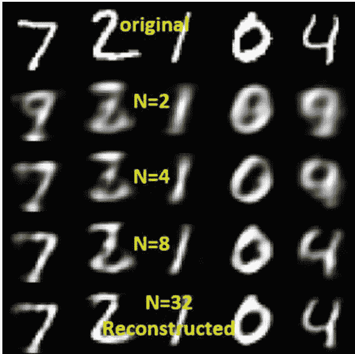

参数W1, b1, W2, b2通过最小化某个成本函数 (4) 来找到，该成本函数量化输出$\hat{x}_i$和输入之间的差异，如下所示：

$J(W, b; x) = \frac{1}{2}||x - \hat{x}||_2^2,$

其中 $ W = \{W_1, W_2\} $ 和 $ b = \{b_1, b_2\} $，导致优化问题

$\min_{W, b} J(W, b; x)$.

在这一点上，我们可以开始理解PCA和AE之间的区别。特别地，y是xi投影到一个k维空间中，就像UΣ是数据矩阵X的行投影到一个k维空间中一样。然而，这就是类比的结束。虽然U中的基是明确正交的，Σ中的对角元素按大小排序，但AE的结构隐藏在非线性函数$\lambda(W_1x_i + b_1)$中。因此，与Σ中的奇异值不同，y中的条目大小不提供关于数据集固有维度的信息。

幸运的是，[21]中的思想提供了一条前进的道路。当NN收到k的限制时，网络被迫学习输入的压缩表示。然而，当k事先不知道，这正是DE的全部意义，可以对隐藏层的条目$y_i$进行惩罚，使它们被鼓励变小，甚至为0。为了在最内层的隐藏层中实现稀疏性，我们使用L1范数（|| ||）对最内层隐藏层进行惩罚。

差分进化需要稀疏性和一致性，如图3a、b所示。因此，我们遵循[21]中的思路，首先对隐藏层进行归一化，如式(6)所示。

$$ y_{norm}^i = \frac{y_i}{\sqrt{\sum_{i=1}^k y_i^2}} \quad (6) $$

$$ J_{sparse}(\mathbf{W}, \mathbf{b}; \mathbf{x}) = J(\mathbf{W}, \mathbf{b}; \mathbf{x}) + \lambda \sum_{i=1}^k \| y_{norm}^i \|_1 \quad (7) $$

强制使$y_i$的某些条目变小甚至为0。适当解释后，$y_i$中大的条目数量可以提供X维度的估计。

### 2.3.1 自编码器模型

为了估计MNIST数字的维度，AE模型使用了一个9层的AE。编码器层还包括2个dropout层以减少过拟合。表1定义了层、激活函数和正则化器。MNIST输入和输出层有784个节点；输出层使用sigmoid激活函数。类似地，在后续中，当估计金融时间序列的维度时，我们使用S&P 500指数成分股。虽然AE模型类似，但输入和输出层

#### 表1 AE架构

| 层类型 | 节点 | 正则化器 | 激活函数 |
|---|---|---|---|
| 输入层 | 784或494 | - | - |
| 编码器层1 | 392 | - | relu |
| dropout层1 | Drop 30% | - | - |
| 编码器层2 | 128 | - | relu |
| dropout层2 | Drop 30% | - | - |
| Lambda层 | 128 | - | - |
| 隐藏层 | 64或100 | $\Delta_1$，如(7) | sigmoid |
| 解码器层1 | 128 | - | relu |
| 解码器层2 | 392 | - | relu |
| 输出层 | 784或494 | - | sigmoid 或 tanh |

## 3 自编码器—奇异值代理

由于我们主要关注使用自编码器的最内层隐藏层的数据嵌入，该层并没有提供可以量化数据集内在维度的奇异值等价物，因此我们使用最内层隐藏层的值创建奇异值代理。

### 3.1 L1 隐藏层正则化器

自编码器忠实地复制输入，而不必担心隐藏层经历的变换。我们的目标是调整自编码器最内层隐藏层的数值，以估计数据集的维度。我们借鉴了[21]中的方法，通过在最内层隐藏层上施加稀疏约束，使用大量的隐藏单元仍然可以发现有趣的结构。为了使数据嵌入一致且较小，我们对最内层隐藏层的数值施加L1惩罚。虽然这种惩罚增强了最内层的稀疏性，但会导致自编码器的复制能力下降，损失变大。如图2所示，我们尝试了几个λ值来调整自编码器。对于我们的合成数据，我们知道真实的维度。

因此，我们可以选择我们的最优λ作为实现这个维度的值。

然而，在我们的真实世界的例子中，我们生成不同的SVP配置文件，但选择最优λ值为神经网络损失停止改变的值，当我们进一步增加λ时。换句话说，我们选择最大的惩罚，以便λ惩罚不会对AE的损失产生不利影响。

### 3.2 潜在空间排序

给定一个稀疏的潜在层，如图3a所示，我们的下一步是将隐藏层的值重新塑造成SVP，以便于数据集的DE。为了重新塑造隐藏层，我们评估了两种方法：首先，取特征（隐藏层的列）的平均值（图3）并创建SVP用于DE；其次，独立地对每一行隐藏层进行排序，使较大的值位于左侧，较小的值位于右侧（图3b），然后取列平均值创建SVP用于DE。我们更喜欢第二种方法，因为这相当于一个奇异值矩阵，其中较大的值位于左侧，较小的值位于右侧。

此外，先进行排序，然后取平均值适度放大较大的 SVP，并提供稍低的内在维度估计。虽然我们计算

### 3.3 奇异值代理的创建

使用两种方法的SVP，我们只报告首先排序然后取平均值的内在维度。算法1提供了我们遵循的步骤。

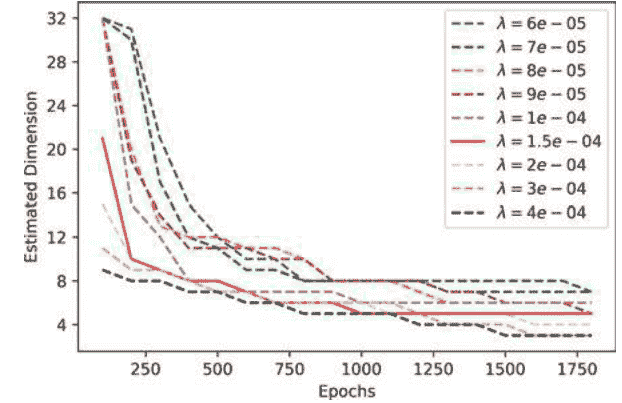

图2 合成数据 D 的最内层隐藏层值对不同 λ 的影响显示了正则化参数对隐藏层稀疏性的影响。对于 λ = 1.5e-4，红线DE为5。在我们的真实示例中，我们以类似的方式生成不同的SVP配置文件，但选择神经网络损失停止改变的最佳 λ 值。

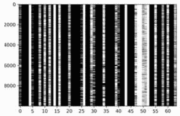

(a) 潜在层

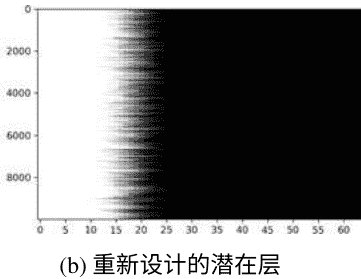

(b) 重新设计的潜在层

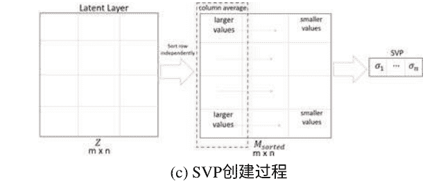

(c) SVP创建过程

图3a在没有任何转换的情况下，显示了测试数据集中所有10,000个MNIST数字的最内部隐藏层，该层具有64个节点。b在独立地对64个最内部隐藏层（行）进行排序后，我们得到一幅图像，其中较大的隐藏层值位于左侧，较小的值位于右侧。c将潜在表示转换为可以用于估计维度的奇异值代理所需的步骤。

#### 算法1 将潜在表示转换为奇异值代理

+ 输入: 隐藏层 ∈ R^{n in}
+ 输出: η, 奇异值代理用于DE
1. 独立地对Z的每一行进行排序，使得每一行最大值在左边，最小值在右边。M排序 = row_sort(Z)
2. 对M排序的每一列取平均值以计算SVP.
3. SVP. ηᵢ = ∑ᵢ₌₁ᵐ Zᵢⱼ / m
4. 我们得到特征的SVPs {η, η₂, η,, ·, η₅}。

## 4 维度估计算法

数据的线性维度通常高于内在维度。真实数据中的噪声阻止奇异值完全为0。为了防止较小的SVP使DE膨胀，我们使用两种不同的分析方法:

+ 1. 大于等于1%: 计算大于1%的奇异值或SVP来估计内在维度。1%的阈值是可配置的。 (算法2)
+ 2. 高达90%: 使用最大的奇异值或SVP，计算所需的值的数量，使得累积值大于总和的90%。同样，90%的阈值是可配置的。 (算法3)

### 算法2 使用大于等于α=1%的维度

输入: (η₁, η₂, ..., η,)，奇异值代理，α=1% 输出: p，大于等于1%的值的数量。
1. 计算nsum = ∑ηᵢ
+ 2. 维度p = ∑I(η, %)，其中
I(η, %) = {1 : if η >= 1%,
0: 否则}

### 算法3 使用最多α=90%的维度

+ 输入: (η₁, η₂, ..., η,)，奇异值代理，α=90% 输出: p，最大的值的数量
1. 按降序排序$η, η₂, η_3, ..., η,$，其中σ是奇异值代理.
2. 计算nsum = ∑ηᵢ²
3. 计算σ%其中σ% = σ²
4. 维度p，是I的值，其中∑lh=1 η≥ α(90%)

## 5 实验

我们的实验分为三个部分。在第一部分中，我们在已知维度的2个合成数据集上测试DE流程。在第二部分中，我们估计经典研究MNIST数据集的维度。最后，我们将DE流程应用于2个真实世界的数据集：首先，我们使用S&P500成分股估计金融市场维度；其次，我们使用CICIDS2017数据集[27]估计计算机网络的维度。虽然MNIST数据集的性质是静态的，但S&P500数据集的指数成分之间的相关性是变化的。

### 5.1 估计合成数据的维度

我们可以通过考虑一个合成数据集 $C \in \mathbb{R}^{5000 \times 784}$ 开始我们的实验，其中 $C = A \times B, A \in \mathbb{R}^{5000 \times 5}$ 且 $B \in \mathbb{R}^{5 \times 784}$。由于这是一个线性问题，矩阵 $C$ 的奇异值分解（SVD）[10]正确地给出了5个非零奇异值（图5）。然而，为了测试我们的非线性DE方法，我们对 $C$ 的列应用非线性变换，创建 $D \in \mathbb{R}^{5000 \times 784}$。具体步骤见算法4。

我们使用几个高度非线性的映射，如 $x^y, e^y, 1/y, \text{和 } 2^y$。然而，由于这些非线性映射都是由相同的低维 $C$ 参数化的，我们可以保证所有的合成数据点都位于内在维度为5的非线性流形上。前3000个实例组成了训练集，剩下的2000个实例组成了测试集。使用SVD来估计 $D$ 的维度给出了20（图5），这个数字明显大于5。然而，我们的AE模型提供的DE，如表1所示，能够稳健且准确地恢复出正确的维度5。特别地，通过取最内层隐藏层特征的均值，按列计算，来估计维度，如图4所示。此外，

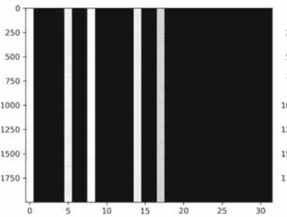

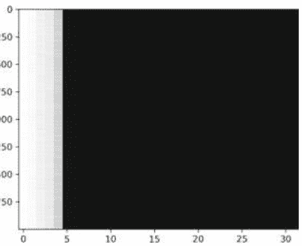

图4 AE正确估计合成数据集D的维度，这是一个非线性变换C，维度为5。内层隐藏层图中的白色条带表示合成数据集的特征。y轴表示2000个测试实例，x轴表示内层隐藏层的32个节点。右侧图像表示独立排序的行，以便为DE创建SVP。

### 算法4 通过对 C 的列应用非线性变换来创建 D

```
输入：$C \in \mathbb{R}^{5000 \times 784}$ 输出：$D \in \mathbb{R}^{5000 \times 784}$
1. 重复
2. $i \leftarrow 0$ {将 $D$ 的第一列赋值给$i$}
3. 从 $C$ 中选择2个随机列，其中 $col_1 \leftarrow [1, 784]$ 和 $col_2 \leftarrow [1, 784]$
4. 从中选择2个非线性函数 $f_1$ 和 $f_2$
    (i) $\{f \mid f$ 是 $x^y$ 的幂函数 $\}$
    (ii) $\{f \mid f$ 是 $e^y$ 的指数函数 $\}$
    (iii) $\{f \mid f$ 是 $\frac{1}{y}$ (倒数) $\}$
    (iv) $\{f \mid f$ 是 $2^y$ (指数2) $\}$
5. $D_{col_i} \leftarrow f_1(C_{col_1}) + f_2(C_{col_2})$
6. 直到 $i = 784$
```

### 5.2 估计随机合成多项式的维度

函数$f(x)$在点$a$的泰勒级数[2]，$T$，定义为

> $T = \sum_{n=0}^{\infty} \frac{f^{(n)}(0)}{n!}x^n$

(9)

其中 $f^{(n)}(a)$ 表示在点 $a$ 处求导的 $f$ 的第 $n$ 阶导数。阶数为 $n$ 的泰勒多项式是由该级数的前 $n$ 项组成的部分和。
多变量[37]泰勒多项式 $P_n(x,y)$ 定义为

$$P_n(x,y) = \sum_{i=0}^{n} \sum_{j=0}^{(n - i)} \frac{\partial^{(i+j)} f}{\partial x^i \partial y^j}x^i y^j$$

由于多变量，需要使用偏导数来计算系数。为了测试随机合成多项式上的微分方程，其中前几项类似于 $n$ 次 Taylor 级数的前几项，我们使用从合成多项式创建的数据集，并估计用于创建更高维度合成数据集的变量数量。变量数量的估计是合成多项式数据集的内在维度。我们通过考虑合成多项式 $f(x,y,z)$ 开始我们的实验，其中 $f(x,y,z)$ 包括三次项、二次项、一次项和交叉项 $x,y$，和 $z$。

$$\begin{aligned}
f(x,y,z) = &c_0x^3 + c_1x^2y + c_2x^2z + c_3x^2 + c_4x \, y^2 + \\
&c_5x \, yz + c_6xy + c_7x \, z^2 + c_8xz + c_9x + c_{10}y^3 + c_{11}y^2z + c_{12}y^2 + c_{13}yz^2 + c_{14}yz + \\
&c_{15}y + c_{16}z^3 + c_{17}z^2 + c_{18}z
\end{aligned}$$

系数 $c_0, c_1, c_2, c_3, c_4, ..., c_{17}, c_{18}$ 和自变量 $x, y$，和 $z$ 是随机生成的。随机数是从

$$c_k \sim \mathcal{N}(\mu=0, \eta^2=1.0)$$

我们生成了5000个元组，每行一个元组，以及784个元组的$c_0, c_1, c_2, c_3, c_4, ..., c_{17}, c_{18}$，每列一个元组。
$f(x,y,z)$ 非线性地将三维数据映射到784维。因为系数是随机生成的，我们称$f(x,y,z)$为随机生成的合成多项式。我们使用 $DE(\mathbf{X})$，其中 $\mathbf{X} \in \mathbb{R}^{5000 \times 784}$。用于DE的AE模型如表1所示。前3000个实例的$\mathbf{X}$形成训练集，剩下的2000个实例形成测试集。当$\lambda=1e-4$时，DE恰好恢复了正确的维度3，如图6所示。正确的$\lambda$是通过训练$\lambda=1e-4, 1.5e-4, 1.75e-4, 2.0e-4$的AE模型确定的，如图7所示。

### 5.3 估计 MNIST 数字维度

MNIST 是一个公开可用的数据集，包含了数字 0 到 9 的图像。
有 60,000 个训练图像和 10,000 个测试图像。每个图像的尺寸为 28 × 28，共有 784 个特征。每个特征是像素强度，已经进行了归一化处理。

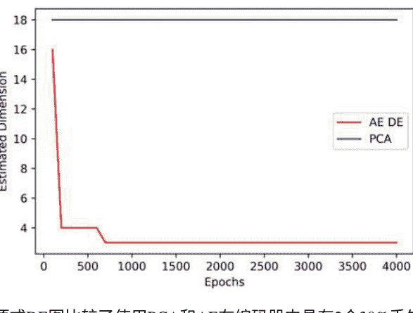

图6 随机合成多项式DE图比较了使用PCA和AE在编码器中具有2个30%丢失率的dropout层的DE。如红线所示，AE正确估计了随机合成多项式的维度为3，因为合成多项式是由 f (x, y, 和 z) 生成的。维度在700个时期后稳定。该图显示了每100个时期的估计维度的快照。PCA高估了维度为18。

图7 显示了不同 λ 值对随机合成多项式的AE DE 的影响。如红线所示，当 λ = 1e-4 时，AE正确估计了随机合成多项式的维度为3。

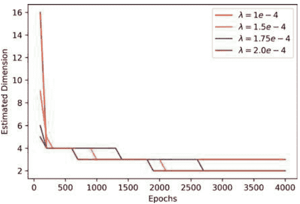

在估计维度之前，我们使用一个7层AE（表1），在最内层的隐藏层上使用 λ = 1e-5 的 L1 惩罚。DE 是 9，如图3a所示，b。为了研究异常值对 PCA 和 AE 估计的维度的影响，我们只选择均方误差（MSE）低于 0.002 和 0.09 之间的阈值变化的图像。例如，当我们使用 0.002 的 MSE 阈值时，我们从测试集中得到 137 个数字 1 的实例，因为数字 1 的图像与数字 8 相比没有曲线。我们在图10 估计了 PCA（线性）和 AE（非线性）的维度。我们发现随着 MSE 阈值的增加，越来越多的异常值图像被添加到我们的数据集中，这导致较大的奇异值抑制其他奇异值的影响，从而降低线性估计的维度。然而，AE估计的非线性维度是稳定的（图8、9和10）。

### 5.4 估计标准普尔500指数维度

当股票被随机选择并以相等的比例组合成一个投资组合时，投资组合的风险随着投资组合中不同股票的数量增加而下降。在[9]中，作者发现当一个投资组合包含十只股票时，多样化的经济效益几乎耗尽。然而，[5]从低维流形的角度研究了金融市场，并发现维度是时变的而不是静态的。为了使用自编码器估计维度，我们使用了S&P 500指数的成分。该数据集包含了585个交易日（从2018年01月02日到2020年04月30日）的收盘价。我们通过计算每日收益率 $r_{-i,t}$ (公式12)来对收盘价进行归一化处理，其中每日收益率定义为

$r_{-i,t} = \frac{P_{i,t}^{j,r1} - P}{P_{i,t-1}}$    (12)

其中，$P_{i,t}$是第$t$天证券$i$的收盘价。然后，我们可以形成一个数据矩阵$X$，其中$X_{i,t}=r_{i,t}$。特别是，在给定$d$天和$k$个工具的情况下，我们有

$X = \begin{bmatrix} x_1 \ \ \ \ \ x_j \ \ \ \ \ \ x_d \end{bmatrix} \in \mathbb{R}^{d \times k}$  (13)

468天(从2018年01月02日到2019年11月11日)用于训练，117天(从2019年11月12日到2020年04月30日)用于测试。S&P 500 AE模型的层、节点和激活函数如表1所示。我们发现S&P 500的内在维度为30，如图11所示。DE也可以用于检测时间序列中的异常。如图12所示，当我们使用训练好的AE从2019年11月12日到2020年4月30日估计维度时，我们发现在2020年3月和4月期间存在较大的重构误差。重构误差的峰值表明了这一点。同时的时间序列DE是具有挑战性的。

#### 5.4.1 估计标准普尔500指数行业维度

标准普尔500指数成分股可以分为能源、金融、技术、医疗保健等行业部门，对经济环境的反应不同。为了研究2020年疫情对不同行业部门的影响，我们使用SPDR交易所交易基金(ETF)成分股。由于ETF的成分股数量不同，我们创建了一个欧氏距离矩阵$S\in\mathbb{R}^{60\times60}$，如[5]中所定义，其中每个条目是ETF成分股收益之间的两两距离。例如，对于技术行业(XLK)，$S_{XLK, 02/07/20}$表示2019年11月12日至2020年2月7日(过去60天)的ETF成分股收益之间的距离。

### 5.5 估计网络维度

CICIDS2017数据集是一个旨在辅助训练入侵检测系统(IDS)[27]的网络安全数据集。该数据集包含五天的网络流量，其中包括真实背景流量和各种攻击。该数据集非常适合维度估计，因为它包含了一天的基线正常网络流量以及网络遭受各种网络攻击的时期。这使得我们能够在不同条件下估计网络维度。特别地，我们使用了一整天的正常网络活动进行训练和验证，其中70%的数据用于训练，30%用于验证。我们使用了数据集中星期五的数据进行测试，该数据集包含了正常活动和攻击活动的组合。

#### 5.5.1 数据预处理

原始的CICIDS2017数据下载包含了84个原始特征的网络流数据，以及一个标签，指示每个网络流是攻击还是良性流量。对数据进行预处理，类似于[8]中概述的方式，删除了数据中的所有网络识别特征，如IP地址、端口和协议。还包括了几列额外的数据和一小部分包含的行

负值也被丢弃了。在这样做之后，只有网络流统计特征保留下来了。这些74个特征被归一化为0到1之间的值，使用（方程14）

$$ \hat { x } _ { k } = \frac { { x } _ { k } - \min \left( { x } _ { k } \right) } { \max \left( { x } _ { k } \right) - \min \left( { x } _ { k } \right) } \tag { 14 } $$

其中，xk是第k个特征。需要注意的是，从训练数据的缩放中使用了min(xk)和max(xk)值来归一化后续的验证和测试数据集。这导致这些集合中的一些值超出了训练特征的极限范围，超出了0和1的范围。此外，值得注意的是，这种归一化会增加总体维度1，然而，这不会影响结果，因为我们关注的是维度的相对变化，以检测攻击条件，而不是确定维度的值。

#### 5.5.2 自编码器模型

自编码器模型的架构与表1中的架构非常相似。表2中的完整架构显示了每层节点数量的调整以及额外的编码器和解码器层。由于输入特征预计由正值组成，我们使用（公式14）进行了归一化处理，输出层使用了sigmoid激活函数。

用于在编码器的隐藏层中创建稀疏性的l1正则化的lambda参数是使用自编码器的重构损失计算的。对于几个lambda值进行了模型训练，结果MSE如图14所示。

表2 网络维度 AE 架构
| 层类型 | 节点 | 正则化器 | 激活函数 |
| :--- | :--- | :--- | :--- |
| 输入层 | 74 | - | - |
| 编码器层1 | 60 | - | relu |
| dropout层1 | 丢弃1% | - | - |
| 编码器层2 | 45 | - | relu |
| dropout层2 | 丢弃1% | - | - |
| 编码器层3 | 35 | - | relu |
| dropout层3 | 丢弃1% | - | - |
| Lambda层 | 35 | - | - |
| 隐藏层 | 25 | $\lambda$，如 (7) | sigmoid |
| 解码器层 1 | 35 | - | relu |
| 解码器层 2 | 45 | - | relu |
| 解码器层3 | 60 | - | relu |
| 输出层 | 74 | - | sigmoid |

#### 5.5.3 调整奇异值代理阈值

在选择用于模型的$\lambda$之后，我们考虑了在算法2中设置奇异值代理阈值$\alpha$的位置。选择适当的$\alpha$值的任务并不明确，它依赖于经验度量和基于领域知识的判断。通过使用逐渐增大的几个$\alpha$进行维度估计，可以获得一些见解。在验证数据集上进行这样的估计，得到的估计结果如图16所示。直观地考虑，当$\alpha=1$时，估计的维度为0，而当$\alpha$为0时，估计的维度等于编码器隐藏层中的节点数。

与此相符，可以看到在0.001和0.003之间存在一系列$\alpha$的阈值，这些阈值似乎不够限制。类似地，大于0.006的$\alpha$值似乎过于限制。这留下了几个值的$\alpha$需要更仔细地观察。选择了一个值为0.006的$\alpha$，因为它的维度估计与所选择模型的“拐点”在散点图中对齐，可以通过比较图15和图16来看到。值得注意的是，选择最优$\alpha$是一个有待进一步探索的开放问题。

#### 5.5.4 结果

为了获得结果，使用之前描述的自编码器，使用表2中的架构，在星期一的良性网络流量中使用$\lambda=0.0001$进行训练，该数据集包含在CICIDS2017数据集中。然后，我们使用阈值为0.006的奇异值代理使用算法1和3进行维度估计，使用来自同一数据集的星期五下午的测试数据，间隔为1、5和10分钟。

在验证数据中，包含所有良性流量，维度估计在整个数据集中保持相对稳定。可以看到一个区域，在$\alpha=0.004$之前，提供了很少的奇异值代理过滤。大于0.006的$\alpha$值似乎过于严格。本研究选择了$\alpha=0.006$的值。

| | 1分钟 | 5分钟 | 10分钟 |
|---|---|---|---|
| 主成分分析 | 18.83 ± 1.4 | 19.68 ± 0.2 | 19.77 ± 0.28 |
| 自编码器 | 7.24 ± 0.5 | 7.04 ± 0.2 | 7.08 ± 0.28 |

图17 星期五网络流量的尺寸估计。所使用的自编码器经过4000个时期的训练，$\lambda=0.0001$用于控制编码器最内层的稀疏性。

在估计尺寸时，使用了$\alpha=0.006$的SVP阈值。顶部图以1分钟间隔估计尺寸，中间图以5分钟间隔估计尺寸，底部图以10分钟间隔估计尺寸。深蓝色表示网络维度的估计值较高。两条黑色虚线之间的时间段表示网络遭受分布式拒绝服务（DDoS）攻击。自编码器的尺寸估计清楚地显示了网络在攻击期间维度的增加。主成分分析也显示了类似的检测结果，然而，在良性时期存在更多的噪音，无法很好地处理较长的时间间隔，如10分钟间隔。

表3显示，AE和PCA都估计了良性数据的小标准差。这是预期的，因为良性流量中不会有明显的异常。需要注意的是，AE DE与使用图15估计的内在维度一致。

星期五的数据包括一段良性流量的时间段，然后是一段分布式拒绝服务（DDoS）攻击的时间段，然后再次返回正常流量。在这种情况下，可以明显看出自动编码器维度估计在网络受到攻击时检测到了维度的变化。从图17中可以清楚地观察到攻击期间两侧的较低维度。

在DDoS攻击期间，维度估计增加。需要注意的是，与AE DE相比，PCA对攻击期间的维度估计也发生了变化，但在攻击期间的两侧变化幅度较大。此外，当提供更长的时间间隔时，PCA无法像AE那样检测到攻击期间。

## 6 结论

本文提出了一种使用AE估计维度的算法。AE被设计成在不控制隐藏层变换的情况下重现输入。由于我们对使用AE估计内在维度感兴趣，我们将最内层隐藏层的值改造成与PCA中使用的奇异值相符的数量，并将其称为奇异值代理（SVP）。

为了方便DE，我们在最内层使用大量节点，并通过L1罚项来估计内在维度。通过使用不同的$\lambda$值来建立稀疏性和AE损失之间的微妙平衡，其中较高的$\lambda$值增加了稀疏性但损害了AE损失。此外，为了实现DE的一致性并使DE过程与隐藏层中数值范围无关，我们使用了归一化处理，它将输入值规范化到最内层隐藏层。我们在4个不同的数据集上测试了我们的方法。首先，我们成功地将AE DE方法应用于一个合成数据集，正确检测到了维度为5的内在维度。不幸的是，PCA明显高估了合成数据集的维度（20）。其次，我们将AE DE算法应用于MNIST数字数据集，并将AE的DE与PCA、MDS和Isomap的DE进行了比较。第三，我们将AEDE应用于CICIDS2017网络安全数据集，并证明该技术能够通过网络维度的变化来识别网络是否遭受攻击。最后，我们应用该算法估计金融市场的维度，使用的是S&P500指数成分股。此外，我们通过使用每个行业的维度作为度量标准，分析了疫情对不同行业部门的影响。我们使用维度变化来衡量每个行业/部门的影响。虽然所有行业的维度都发生了变化，但维度恢复在不同的行业部门之间也有所不同。在下一次迭代中，我们计划使用纽约证券交易所的日内（更高频率）交易和报价数据。为了使DE更加稳健，我们希望利用鲁棒深度自编码器。随后，我们希望将行业/部门DE应用于资产配置模型。

## 如何使用代码

### 获取代码和数据

我们运行了5个实验。所有实验的设计都遵循标准模板。

- 1. 所有5个实验的数据集都可以在下面的github中找到。
- 2. Python包和版本可以在requirements.txt中找到。
- 3. 输入数据集中的特征数量决定了DE流程中输入和输出层的节点数量。

- 4. 为了说明过程，我们提供了如何复制网络安全实验的详细说明。
- 5. 请注意，提前停止实验会导致数据集的DE不正确。

本章的代码可以使用以下命令获取：

```
git clone https://github.com/nitishbahadur/book_chapter

获取用于训练和测试网络安全示例的补充数据，请访问 https://github.com/nitishbahadur/book_chapter/releases/download/v3.0 并下载 Monday_benign_traffic.pkl 和 Friday_afternoon_ddos.pkl 文件。将文件分别放置在存储库的 data/cyber/cicids2017/Monday_benign_traffic 和 data/cyber/cicids2017/Friday_afternoon_ddos 目录中。
```

### 网络安全维度估计

可以通过执行以下命令使用网络安全数据集来训练和测试AE DE：

```
cd book_chapter/src/cyber

python cyber_approach_2.py \
--tp 1min \
--l1_reg 0.0001 \
--num_epochs 400 \
--batch_size 32 \
--encoding_dim 25 \
--layer1_dropout 0.01 \
--layer2_dropout 0.01 \
--layer3_dropout 0.01 \
--dataset "../../data/cyber/cicids2017/monday_benign_traffic/monday_benign_traffic.pkl" \
--output_dir ./output/20210206_ae_l1/ae_0.0001 \
--plot_title 'CICIDS2017 Monday'

# 在第2行编辑generate_ae_results以使用0.006
```

```
# 作为svp_threshold
# 根据需要在脚本中编辑任何路径
./generate_ae_results
./生成_pca结果
python绘制维度随时间变化图.py
```

网络维度的结果图可以在plot_dimensions_over_time.py脚本中的output_dir变量指出的位置找到。

致谢 本文的结果部分是通过NSF MRI拨款DMS-1337943获得的高性能计算系统获得的。

## 参考文献

1. Abdulhammed, R., Faiepourzou, M., Musafer, H., Abuzneid, A.: 使用基于PCA的特征维度降维的高效网络入侵检测。
2. Abramowitz, M., Stegun, I. A., Romer, R. H.: 数学函数手册，包括公式、图表和数学表格 (1988) 
3. 阿尔巴内斯, C.，杰克逊，K.，威伯格，P.: 在风险价值计算中的维度缩减。
《风险金融杂志》3(4), 41-53 (2002) 
4. Alexeev, V., Tapon, F.: 股权投资组合多样化：需要多少股票？ 来自五个发达市场的证据。2012年11月28日，来自五个发达市场的证据，FURN研究论文 (2012)
5. 巴哈杜尔，N., 帕芬罗斯，R., 加贾曼纳格，K.: 股票市场的维度估计。在：2019年IEEE国际大数据会议 (Big Data)，第5491-5498页。
6. Bhuvan, M.H., Bhattacharyya, D.K., Kalita, J.K.: 网络异常检测：方法，系统和工具。IEEE通信调查与教程。16(1), 303-336 (2014)。
7. Buczak, A.L., Guven, E.: 数据挖掘和机器学习方法在网络安全入侵检测中的调查。IEEE通信调查教程 18(2), 1153-1176 (2016).
8. Elsayed, M.S., Le-Khac, N.A., Dev, S., Jurcut, A.D.: Ddosnet: 一种用于检测网络攻击的深度学习模型 (2020)
9. Evans, J.L., Archer, S.H.: 多样化和减少离散度：一项实证分析。 金融学杂志 23(5), 761-767 (1968)
10. Golub, G., Reinsch, C.: 奇异值分解和最小二乘解。在: 数值数学, p. 18. Springer (1970)
11. Hotelling, H.: 将一组统计变量分解为主成分的分析。 教育心理学杂志 24(6), 417 (1933)
12. Hoyle, B., Rau, M.M., Paech, K., Bonnett, C., Seitz, S., Weller, J.: 用于机器学习红移的异常检测应用于sdss星系。Mon. Not. R. Astron. Soc. 452(4), 4183-4194 (2015)
13. Jolliffe, I.: 主成分分析。Wiley Online Library (2002)
14. LeCun, Y.: 手写数字的MNIST数据库 (1998). http://yann.lecun.com/exdb/mnist/
15. Lee, I.: 大数据: 维度、演变、影响和挑战。Bus. Horiz. **60**(3), 293-303 (2017)
16. Lee, J.A., Verlesexlen, M.: 非线性降维。Springer Science & Business Media (2007)

## 一种基于聚类的新技术 加速深度卷积网络

Erion Vasilis Pikoulis, Christos Mavrokefalidis, Stavros Nousias和Aris S. Lalos

深度学习，尤其是深度神经网络（DNNs）的使用，在各种回归和分类任务中提供了令人印象深刻的结果。然而，要实现这些结果，对计算和存储资源有很高的需求。当考虑实时移动应用程序时，这就成为一个问题，因为所涉及的（嵌入式）设备资源有限。解决这个问题的一种常见方法是通过利用模型压缩和加速（MCA）技术将原始的大型预训练网络转换为新的较小模型。在MCA框架内，我们提出了一种基于聚类的方法，能够增加使用的质心/代表数量，同时与传统的基于k均值的方法相比，具有加速增益。这是通过对使用的代表施加特殊结构来实现的，这是由于问题的特殊性而实现的。此外，还介绍了理论上的加速增益，并确定了影响该增益的关键系统超参数。通过使用在图像分类和目标检测中训练的各种最先进的DNN模型进行的广泛评估研究验证了所提出的方法在MCA任务中的有效性。

电子补充材料 本章的在线版本(https://doi.org/10.1007/978-981-16-3357-7_5)含补充材料，仅限授权用户使用。

E. V. Pikoulis · S. Nousias · A. S. Lalos
希腊帕特拉斯科学园区ATHENA R.C.工业系统研究所，帕特拉斯，希腊
e-mail: pikoulis@ceid.upatras.gr

S. Nousias
e-mail: nousias@isi.gr

A. S. Lalos
e-mail: lalos@isi.gr

C. Mavrokefalidis ( )
希腊帕特拉斯大学计算机工程与信息学系，帕特拉斯，希腊
e-mail: maurokef@ceid.upatras.gr

©作者，独家许可给 Springer Nature Singapore Pte Ltd. 2022
M. A. Wani 等人(编)，深度学习应用，第3卷，
智能系统与计算进展1395,
https://doi.org/10.1007/978-981-16-3357-7_5

## 1 引言

深度神经网络（DNN）[15]最近在许多现代人工智能应用[43]中崛起，如智能摄像头中的视频分析[4, 5, 31, 38, 42]，基于无人机的图像处理，汽车导航智能，生物医学[5]，医学成像[38]，智能制造[42]，推荐系统[1]和海洋学[4]。然而，文献中报道的令人印象深刻的性能与DNN的规模密切相关，对于最先进的模型，参数数量可以达到数千万甚至数亿（例如，Visual Geometry Group (VGG) DNN [35]使用了1.38亿个参数）。这导致在DNN的训练阶段和（最重要的）操作（或推理）阶段，即实际使用DNN时，需要大量的计算和存储资源。在实际应用中，通常通过包括图形处理单元（GPU）在内的高性能计算平台[19]来解决这些需求。

如今，在深度学习和移动计算中，对于使用有限资源的平台（包括智能设备，如手机、手表和嵌入式传感器）的混合应用越来越感兴趣[41]。为了使这些平台能够充分利用深度神经网络的优势，特别是在推理阶段，可以确定两个主要的研究方向。在第一个方向中，设计或搜索适用于特定应用的新型紧凑、较小的深度神经网络模型[8]（例如SqueezeNet [24]、MobileNets [22]和EfficientNet [40]）。在第二个方向中，通过利用模型压缩和加速（MCA）技术[6、8、39、46]，将现有的预训练、性能优越的深度神经网络模型（例如AlexNet [25]、VGG [35]、残差网络（ResNet）[20]等）转化为新的较小模型。这一研究方向的重要性在于，除了作为独立使用外，先进的预训练深度神经网络模型还可以作为设计用于不同（但性质相似）应用的模型的骨干模块。例如，AlexNet和VGG的卷积层（最初用于图像分类任务）构成了R-CNN [12]和Fast R-CNN [13]等目标检测器的核心模块。

关于MCA文献的一些最早的工作提出了参数剪枝，即删除不重要的参数，在DNN部署的推理阶段不予考虑。例如，通过使用L1-范数度量和结构稀疏性，在[26, 29]中剪枝了滤波器。

此外，在[21]中使用了一个两步迭代过程来剪枝通道。

采用不同的方法，有几项工作提出了参数共享，通过减少参数的位宽或通过设计码本（例如，标量[17]，向量和乘积量化[14]）来限制所涉及参数的表示数量。这样既减少了存储空间，又共享了计算资源在DNN的不同部分之间。例如，在[7]中，使用基于聚类的方法（使用k-means算法）来识别代表性滤波器。在[27]中，提出了一个结合稀疏性和熵的指示器索引来识别重要的滤波器，并提出了共享的过程。

此外，还有几项工作旨在将权重矩阵的低秩分解为两个因子，从而需要更少的存储空间。例如，在[3]中，提出了一种基于字典学习的方法，该方法基于成熟的奇异值分解。此外，在[28]中，提出了一种针对整个DNN的低秩分解，而不是只关注单个层或DNN的一部分的其他方法。

在这里，重点是参数共享方法，与修剪技术相反，可以提高性能[7]，而与低秩分解[3]相反，可以在应用于DNN的卷积部分时提高MCA增益。所提出的技术旨在改善与其他基于聚类的工作（主要使用k-means算法）相比的MCA增益，如[7]。具体而言，在这项工作中，我们利用问题的特殊性（即，聚类的实体实际上是卷积操作中涉及的滤波器），使我们能够对聚类中心施加特殊结构。通过这样做，我们成功地增加了有效聚类数，从而提高了表示误差（反过来对性能[3]的影响较小），而不增加与传统方法相比的计算复杂性。

本文的亮点如下所述：

- 我们提出了一种新颖的码本设计方法，通过在字典学习框架中对学习到的码字施加特殊结构来实现。
- 所提出的方法定义了一种灵活而强大的近似方案，使设计者能够改变相同加速增益下的代表性码字数量。
- 所提出的近似方案使得可以利用比基于k均值的方法获得的码本更大的码本，从而显著改善量化误差。
- 提供了用于确定码本结构的参数的理论分析。
- 关于图像分类，我们评估了所提出的MCA技术在三种最先进的DNN模型（VGG-16、ResNet18、SqueezeNet）上在要求严格的ILSVRC2012数据集[25]上的效果，相同的量化误差下实现了高达100%（或2×）的加速增益，超过传统方法。
- 关于目标检测，采用所提出的技术应用于两个DNN模型（即ResNetDet和SqueezeDet），这两个模型在KITTI数据集[11]上进行了预训练，结果是模型加速显著，性能下降有限。

接下来，首先介绍相关文献，并描述所提出技术的定位。然后，在第3节中，问题被规定，在第4节中，所提出的技术被解释。第5节呈现了模拟结果。最后，第6节总结了本章。

## 2 相关文献

所提出的方法与利用码本对网络参数进行量化的MCA技术相关。码本包含了要近似的参数的代表性数量（称为码字、质心等）（例如，权重向量）。由于多个网络参数映射到一个代表性数量，因此这些方法也被称为参数共享技术。

为了实现这一目标，[14]提出了用于估计完全连接层权重压缩所需码本的矢量量化方法（即所谓的标量、乘积、残差）。码本是通过k均值算法估计得到的。在[18]中，提出了一种三阶段方法。在第一阶段，对不重要的网络参数进行了修剪。在第二阶段，通过估计码本对涉及的参数进行量化处理，进一步处理较小的网络。

然后，在最后一阶段，采用了霍夫曼编码。在[6]中，针对相同的问题（如[14]中所述），重点关注了乘积量化的情况，这是最有前途的一种方法。在[6]中，所提出的方法可以应用于卷积层和完全连接层。该方法在每一层中都是独立使用的，并且为估计涉及的码本设计了两个代价函数。第一个代价函数旨在最小化权重的量化（近似）误差，并且解决方案利用了k均值算法。第二个代价函数旨在压缩和加速下层输出的表示误差，并且解决方案是通过坐标下降迭代来实现的。在[36]中，码本包含卷积层的2D卷积核映射到的质心。在这种情况下，所提出的技术是在2D卷积核的缩放版本上进行估计所需质心的。然后，在微调过程中，同时考虑了缩放和质心作为可更新的自由变量。在[45]中，首先使用修改后的正则化代价函数对要压缩的网络进行重新训练，以促进权重的聚类结构。然后，通过应用k均值算法构建所需的码本来利用这种聚类结构。在[23]中，研究了滤波器权重的三值量化，引入了类似于[45]中的正则化项。通过重新训练过程，要量化的滤波器权重值被集中在与采用的三个聚类相兼容的方式中（由于三值量化）。

在[2]中，类似于[23, 45]，适当地对低秩稀疏量化问题进行正则化和求解，以实现模型压缩和加速。在[37]的工作中，采用了产品量化，并关注模型压缩和加速中输出的表示误差。所提出的算法交替进行期望和最小化步骤，用于聚类和质心更新。在[10]中，作者提出了一种确定码书大小（质心数量）的方法，通过引入每层的敏感性分析来评估压缩对准确性性能的影响。

最终目标是提供具有所需低准确性损失的压缩模型，而无需进行精细调整。

## 3 问题的形式化

卷积层执行的核心操作和相关数量在图1中描述。特别地，输入体积由 N 个通道 X 组成，i=1,2,...,N。此外，有 M 个核体积，第 k 个核体积有 N 个滤波器 W_{k,i}, k=1,2,...,M, i=1,2,...,N。为简单起见，假设 X_i 的维度，W_k 的维度，U_k 的维度分别为 m×m, P×P, M×M。输入体积与第 k 个核体积的卷积由以下公式给出：

$$
\mathbf{U}_k = \sum_{i=1}^{N} \mathbf{X}_i \star \mathbf{W}_{k,i}
$$ (1)

其中，★表示2D卷积操作。
为了继续并描述要进行聚类的实体（即由将被设计的码书编码的实体），
（1）被重写以描述（i,j）位置的元素 U_k[i,j] as

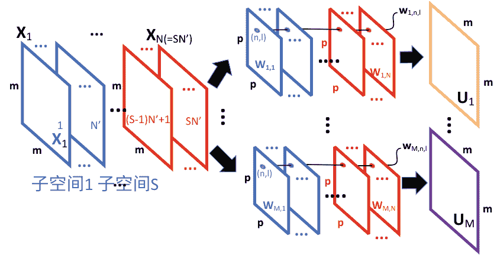

其中 $\bm{x}_{i,j}=[\mathbf{X}_1[i,j],\dots,\mathbf{X}_N[i,j]]^\mathsf{T}$ 包含所有输入通道在 $(i,j)$ 位置的样本。此外，$\mathbf{w}_{k,u,v}=[\mathbf{W}_{k,1}[u,v],\dots,\mathbf{W}_{k,N}[u,v]]^\mathsf{T}$ 包含kth 卷积核体积$\mathcal{V}_k(u,v)$中所有通道的 $(u,v)$ 位置的滤波器权重。最后，集合 $\mathcal{R}_{i,j}$ 包含位置 $(i,j)$ 周围的$ p^2 $索引。

在产品量化框架中，$N$维向量空间被划分为 $S$ 个 $N/3$ 维子空间，使得第 $s$个子空间跨越维度 $[(s-1)N/3+1,\dots,sN/3]$，$s=1,\dots,S$。现在让我们根据方程(2)将向量 $\mathbf{x}_{-i}, \mathbf{x}_{-j}, \mathbf{w}_{-k},u,v$ 进行相应的划分

其中每个子向量都位于 $N'$-D空间中。然后，(2)可以重写为

其中内部求和表示第 $s$ 个子空间对于位置 $(i,j)$ 的第 $k$ 个卷积输出的贡献。

对于每个子空间，产品量化的目标是对位于第 $s$ 个子空间中的 $M p^2$ 个核子向量进行矢量量化，并将其聚类成 $K_s \ll Mp^2$ 个簇。这样，每个子向量都由其所属簇的质心表示，从而相应地减少了所需的点积数量。更具体地说，加速是因为输入与$Mp^2$个核子向量之间的原始点积被近似为输入与 $K_s$ 个质心/代表之间的点积。

## 4 基于字典学习的权重聚类

在本节中，首先描述并讨论了用于近似核子向量的提议码书结构，并与当前文献中出现的传统码书结构进行了比较。这个讨论还扩展到通过计算复杂性分析所实现的收益。然后，将提议的码书设计作为字典学习（DL）问题来处理，实际上将基于$k_{\nabla}$均值的传统码书设计视为一种特殊情况。后者在下文中将被称为矢量量化（VQ）。

最后，关于应用提出的深度学习解决方案时所涉及参数的初始化，描述了一些实现细节。

### 4.1 提出的近似

首先让我们定义由传统码本结构引起的核近似方案，如下所示：

$$
\mathbf{W} \approx \mathbf{C}\Gamma
$$,

其中 $\mathbf{W} \in \mathbb{R}^{N' \times p^2 M}$ 的列， $\mathbf{C} \in \mathbb{R}^{N' \times K_{vq}}$ 的列，以及 $\mathbf{\Gamma} \in \mathbb{R}^{K_{vq} \times p^2 M}$ 包含核子向量（特定子空间的），代表（或聚类中心），和分配向量，分别。具体来说， $\mathbf{\Gamma}$ 的每一列都有一且只有一个非零元素，等于1，这意味着 $\mathbf{W}$ 的每一列都由 $\mathbf{C}$ 的一列近似。因此，在传统情况下， $Mp^2$ 个子向量由 $ K_{vq} \ll p^2 M$ 个代表近似，使用码本 $\mathbf{C}$。相反，在本文中，提出了以下近似：

$$
\mathbf{W} \approx \mathbf{D}\Lambda\Gamma
$$,

其中 $\mathbf{W} \in \mathbb{R}^{N' \times p^2 M}$ 和 $\mathbf{\Gamma} \in \mathbb{R}^{K_{dl} \times p^2 M}$ 如(6)中所定义，而 $\mathbf{D} \in \mathbb{R}^{N' \times L_{dl}}$ 和 $\mathbf{A} \in \mathbb{R}^{L_{dl} \times K_{dl}}$ 分别表示字典和稀疏系数矩阵。

具体来说， $\mathbf{D}$ 的列（称为字典原子）被归一化，而 $\mathbf{A}$ 是一个稀疏矩阵，每一列最多包含 $\alpha$ 个非零元素，其中 $\alpha$ 是稀疏度水平。因此，在提出的方案下， $p^2 M$ 子向量通过代码本 $\mathbf{D}\mathbf{A}$ 来近似。而这些代表向量是从大小为 $ L_{dl} $ 的字典中的最多 $ \alpha $ 个原子的线性组合得到的，其中 $ L_{dl} < K_{dl} \ll p^2 M $。请注意，(7) 中定义的矩阵近似可以看作是一般字典学习（DL）问题 [9] 的特例，这就是为什么我们将我们的加速技术称为基于 DL 的技术的原因。

需要注意的是，在一般情况下，所提出的近似方法需要比传统方法更多的代表（即 $ K_{dl} > K_{vq} $），以达到相同的量化（即近似）误差。这是因为传统码本 $\mathbf{C}$ 是以无约束方式获得的，而所提出的码本 $\mathbf{D}\mathbf{A}$ 则遵循特定的结构。尽管这似乎与直觉相反（在一般情况下，所提出的近似方法比传统方法效率低），但由于问题本身的特殊性，即由于 $\mathbf{W}$ 中的“数据点”实际上是卷积操作中使用的滤波器，所提出的近似方法实际上可以实现更高的加速比，同时保持相同的量化误差，这将在接下来的部分中进行证明。这是因为，在卷积层中执行的操作是线性的，$\mathbf{A}$ 中的稀疏系数只需应用于输入与字典原子 $\mathbf{D}$ 之间的卷积，而不是原子本身。这使得所提出的近似方案具有灵活性，可以使用比 $ K_{vq} $ 大几倍的代表数 $ K_{dl} $，同时限制字典的大小（使得 $L_{dl} \ll K_{vq}$），从而减少“重型”卷积的数量，接下来的小节将更清楚地说明这一点。

### 4.2 计算复杂性分析

由于DNN的核心操作最终被转化为输入和内核向量之间的点积，因此DNN的计算复杂性通常以乘加（MAC）操作的数量来衡量。MAC主要由涉及的乘法（MUL）所主导，这是一种比加法更为复杂的计算。因此，在后续的分析中，为了在一个共同的基础上比较这些技术，MAC和MUL操作将可以互换使用，即一个MAC将被视为一个MUL，以便计算成本以MUL的数量来衡量。

让我们首先来研究原始层的计算复杂性，其中通过将第s个子空间的$m^2$个输入子向量按列排列在矩阵$\mathbf{X}\in \mathbb{R}^{N \times m^2}$中，我们可以看到卷积操作涉及到以下形式的矩阵乘积的计算：$\mathbf{Y=X^TW}$，其中$\mathbf{W}$包含内核子向量（如（6）中定义的），然后根据（5）进行适当的点积求和。由于计算$\mathbf{Y}$需要$m^2p^2M{N'}^{\prime}$次乘法，原始卷积层的整体（即所有$S$子空间）计算复杂度以MULs为单位，计算如下：

$$
\mathcal{T}_o=m^2p^2M(\text{\textit{SN'}})=m^2p^2M{N}
$$

在VQ情况下（由（6）中的近似描述），近似$\mathbf{Y}$如下获得：

$$
\mathbf{Y} \approx (\mathbf{X}^\mathbf{T}\mathbf{C})\mathbf{\Gamma},
$$

即，它涉及计算输入子向量和代表向量之间的点积，然后根据$\mathbf{\Gamma}$的列适当地“插入”结果。计算$\mathbf{X}^\mathbf{T}\mathbf{C}$仅需要$m^2{N'}K_{\textit{vq}}MQLS$（如$k_{vq} \ll Mp^2$）意味着近似卷积输出的整体计算复杂度降低为：

$$
\mathcal{T}_{vq}(K_{vq})=m^2(S{N}')K_{vq}=m^2NK_{vq}
$$

最后，对于基于深度学习的近似方案，我们可以写成

$$
\mathbf{Y} \approx \left(\mathbf{X}^\mathbf{T}\mathbf{D}\right)\mathbf{\Lambda}\Gamma,
$$

这意味着在这种情况下，计算近似的$\mathbf{Y}$是一个两阶段的操作。首先，我们计算$\mathbf{X}^\mathbf{T}\mathbf{D}$，即输入和字典原子之间的点积，这需要$m^2{N'}L_{dl}MQLS$次乘法，其中$L_{dl}$表示字典的大小。随后，根据$\mathbf{\Lambda}$的列将结果组合起来，这

### 4.3 提出的算法

需要 $\alpha m^2 K_{dl}$ 额外的乘法操作。因此，DL情况下近似卷积输出的整体计算复杂度如下所示：

$$
\mathcal{T}_{dl}(K_{dl}, L_{dl}, \alpha) = m^2(N L_{dl} + \alpha S K_{dl}).
$$

因此，两种竞争方法所实现的加速比（即原始计算复杂度与加速后复杂度的比值）可以表示为：

$$
\rho_{vq} \equiv \frac{\mathcal{T}_o}{\mathcal{T}_{vq}} = \frac{p^2 M}{K_{vq}},
$$

$$
\rho_{dl} \equiv \frac{\mathcal{T}_o}{\mathcal{T}_{dl}} = \frac{p^2 M}{L_{dl} + \frac{\alpha}{N'} K_{dl}}.
$$

同样令人感兴趣的是，提出的DL方法与VQ方法之间的相对加速度，这也将为选择提出的技术的自由参数提供规则。首先，为了获得更好的表示误差，我们将提出的技术使用的代表数量设置为VQ方法使用的代表数量的倍数，即 $K_{dl} = c K_{vq}, c > 1$。然后，使用 (11)、(13)，我们可以看到为了使DL方法的近似至少与VQ方法的加速度相同，即对于 $\mathcal{T}_{dl}(K_{dl}, L_{dl}, \alpha) \le \mathcal{T}_{vq}(K_{vq})$ 成立，以下不等式应该成立：

$$
L_{dl} \le K_{vq} \left( 1 - \frac{\alpha c}{N'} \right).
$$

正如我们将在实验结果中展示的那样，对于各种系数 $c$ 和稀疏水平 $\alpha$ 的组合，以及对于 (16) 等式成立的情况（即两个竞争对手实现相同的加速比），所提出的技术导致对原始权重的更好逼近，最终转化为加速的DNNs的更好分类准确性。

为了解决(17)，我们采用交替优化策略，分别对每组参数进行优化，得到以下三个子问题。

#### 4.3.1 稀疏编码

在D, $\Gamma$固定的情况下，(17)中的损失函数可以重写为以下形式：

$$
\left|\left|\mathbf{W}-\sum_{i=1}^{K_{d}}\left(\mathbf{D} \lambda_{i}\right) \tilde{\boldsymbol{\gamma}}_{i}\right|\right|_{F}=\sum_{i=1}^{K_{d i}}\left|\left|\mathbf{W}_{I_{i}}-\left(\mathbf{D} \boldsymbol{\xi}\right) \mathbf{1}^{\mathrm{T}}\right|\right|_{F}^{2},
$$

其中$\mathbf{y}_{i}, \tilde{\mathbf{y}}_{i}$分别表示矩阵$\mathbf{Y}$的第i列和行，$I_{i}=\left\{j \mid \gamma_{i j}=1\right\}$表示$\tilde{\mathbf{y}}_{i}$的非零元素的索引集合，$\mathbf{W}_{I_{i}}$是由$\mathbf{W}$的列组成的子矩阵，索引为$I_{i}$，而$\mathbf{1}$表示维度为$\left|I_{i}\right|$的全一向量。

观察(18)，由于$l_{0}$-范数约束在$\Gamma, I_{i}$上，$i=1, \ldots, K_{d l}$，是$\left\{1,2, \ldots, p^{2} M\right\}$的一个划分，这意味着(18)在$\Lambda$上的最小化被转化为$K_{d i}$个单独的子问题，每个子问题对应于$\Lambda$的一列：

$$
\begin{aligned}
& \min _{\boldsymbol{\xi}}\left|\left|\mathbf{W}_{I_{i}}-\left(\mathbf{D} \boldsymbol{\xi}\right) \mathbf{1}^{\mathrm{T}}\right|\right|_{F}^{2} \\
& \text { s.t. }\left|\left|\boldsymbol{\xi}\right|\right|_{0} \leq \alpha .
\end{aligned}
$$

为了解决(19)，我们采用正交匹配追踪(OMP)方法，逐步构建稀疏表示的支持集合（非零元素$\lambda_{j}$），最多添加$\alpha$个字典原子[9]。执行的过程如下所述：

- 构建新的支持集合：$\mathcal{S} \leftarrow \mathcal{S} \cup\{k\}$，其中
  $$
  k=\arg \max _{j \neq \mathcal{S}}\left|\mathbf{1}^{\mathrm{T}} \mathbf{E}^{\mathrm{T}} \mathbf{d}_{j}\right|
  $$

- 找到新的解：$\zeta_S$通过求解
  $$
  \min_{\xi} ||\mathbf{W}_{I_i} -\mathbf{D}_S \xi \mathbf{1}^T ||_F^2 \Rightarrow \zeta_S = \frac{1}{|I_i|} (\mathbf{D}_S^T\mathbf{D}_S)^{-1}\mathbf{D}_S^T\mathbf{W}_{I_i} \mathbf{1}.
  $$

- 更新残差：
  $$
  \mathbf{E} = \mathbf{W}_{I_i} - \mathbf{D}_S \zeta_S \mathbf{1}^T,
  $$
  其中 S 表示非零索引的集合，而 D_S 和 $\zeta_S$ 分别包含由 S 索引的 D 的列和 $\zeta$ 的元素。稀疏编码子问题在表 1 的 5-12 行中概述。

#### 4.3.2 字典更新

在本节中，介绍了两种字典更新步骤的解决方案，一种是采用半定松弛，另一种是基于坐标下降的方法。

**通过半定松弛求解**

在 $$ \mathbf{\Lambda} $$, $$ \mathbf{\Gamma} $$ 固定的情况下，我们将损失函数 (17) 写成如下形式：

$$
\mathcal{E} = ||\mathbf{W} -\mathbf{D}\mathbf{\Lambda}\mathbf{\Gamma} ||_F = ||\mathrm{vec}(\mathbf{W}) - \left((\mathbf{\Lambda}\mathbf{\Gamma})^\mathrm{T} \otimes \mathbf{\I} \right) \mathrm{vec}(\mathbf{D})||_2 = ||\mathbf{y}-\mathbf{Hd}||_2,
$$

后者写成

$$
\mathbf{d} = [\mathbf{d}_1^\mathrm{T},\ldots,\mathbf{d}_{L_{dl}}^\mathrm{T}]^\mathrm{T},
$$

其中 $\mathbf{d}_i \in \mathbb{R}^{N' \times 1}$ 表示第 i 个字典原子。因此，所提出技术的字典更新步骤采用以下形式的二次约束二次规划 (QCQP)：

$$
\begin{aligned}
\min_{\mathbf{d}}\quad &||\mathbf{y}-\mathbf{Hd}||_2^2\\
\text{s.t.}\quad &||\mathbf{d}_i||_2^2=1,\quad i=1,\ldots,L_{dl}.
\end{aligned}
$$

尽管 (26) 在一般情况下构成了一个非凸的、NP 难的问题，但可以通过半定松弛 (SDR) 技术来解决 [30,32]，该技术将具有未知向量 x 的 QCQP 转化为一个线性凸问题，其中未知量是一个矩阵 X。

为此，让我们首先将代价函数 $\mathcal{E}$“齐次化”为

$$
||\mathbf{y} - \mathbf{Hd}||_2^2 = \mathbf{y}^T \mathbf{y} - 2\mathbf{y}^T \mathbf{Hd} + \mathbf{d}^T \mathbf{H}^T \mathbf{Hd} = \mathbf{d}^T \mathbf{Hd},
$$

其中

$$
\mathbf{d} = \left[ \begin{matrix} \mathbf{d} \\ 1 \end{matrix} \right], \quad \mathbf{H} = \left[ \begin{matrix} \mathbf{H}^T \mathbf{H} & -\mathbf{H}^T \mathbf{y} \\ -\mathbf{y}^T \mathbf{H} & \mathbf{y}^T \mathbf{y} \end{matrix} \right],
$$

并且让我们重新制定（26）中的QCQP，作为以下等价的迹最小化问题：

$$
\begin{aligned}
\min_{\mathbf{D}} \quad & \text{Tr}\left( \widehat{\mathbf{H}\mathbf{D}} \right) \\
\text{s.t.} \quad & \text{Tr}\left( \mathbf{D}_{ii} \right) = 1, \quad i = 1, \dots, L_{dl}, \\
& \mathbf{D}\left[ N' L_{dl} + 1, N' L_{dl} + 1 \right] = 1, \\
& \text{rank}\left( \mathbf{D} \right) = 1,
\end{aligned}
$$

其中 $\mathbf{D}_{ii}$ 是由去除 $\mathbf{D}$ 的最后一行和最后一列形成的子矩阵的非重叠 $N' \times N'$ diagonal blocks。很容易验证，如果 $\mathbf{D}$ 解决了（30），意味着 $\mathbf{D}$ 可以写成 $\mathbf{D} = \mathbf{d}\mathbf{d}^T$，其中 $\mathbf{d} = \left[ \mathbf{d}^T \quad 1^T \right]^T$，那么 $\mathbf{d}$ 解决了（26）。

最后，通过用关于 $\mathbf{D}$ 的凸、正半定约束替换（30）中的非凸rank-1约束，我们可以陈述字典更新QCQP在（26）中的半定松弛问题，如下所示：

$$
\begin{aligned}
\min_{\mathbf{D}} \quad & \text{Tr}\left( \widehat{\mathbf{H}\mathbf{D}} \right) \\
\text{s.t.} \quad & \text{Tr}\left( \mathbf{D}_{ii} \right) = 1, \quad i = 1, \dots, L_{dl}, \\
& \mathbf{D}\left[ N' L_{dl} + 1, N' L_{dl} + 1 \right] = 1, \\
& \mathbf{D} \preceq 0,
\end{aligned}
$$

这构成了一个具有未知 $\mathbf{D} \in \mathbb{R}^{N' L_{dl} + 1 \times N' L_{dl} + 1}$ 的半定规划问题，可以使用CVX [16]等标准软件包来解决。这个子问题在表1的13-15行中描述。

值得注意的是，在绝大多数情况下，方程(31)的解 $\mathbf{D}$ 是一个秩为1的矩阵，这意味着 $\mathbf{D}$ 也解决了原始问题(30)，因此为方程(26)提供了一个精确解。如果不是这种情况，即 $\mathbf{D}$ 不是一个秩为1的矩阵，可以通过对 $\mathbf{D}$ 进行秩为1的近似来获得字典原子的近似解，尽管也可以使用其他启发式方法来进行这种近似 [30]。

#### 4.3.3 任务更新

在 D, $\Lambda$ 修复后，损失函数在 (17) 中的形式如下：

$$
\mathcal{E} = || \mathbf{W} - \widetilde{\mathbf{C}} \Gamma ||_F^2 = \sum_{i=1}^{p^2M} || \mathbf{w}_i - \widetilde{\mathbf{C}} \mathbf{\gamma}_i ||_2^2,
$$

其中 $\widetilde{\mathbf{C}} = \mathbf{D} \Lambda$ 是代表的 $N' \times K_{dl}$ 矩阵。考虑到 $\Gamma$ 的特殊结构，更新 $\gamma_i$ 等价于确定其非零（单位）元素的位置 $j_i$，从而得到以下解：$j_i = \arg \min ||\mathbf{w}_i - \widetilde{\mathbf{c}}_j||_2$。

换句话说，$j_i$ 将 $w_i$ 分配给其最近的代表。这个子问题在表1的16-18行中描述。

## 表1 解决(17)的提议算法

```
1: 基于深度学习的子空间聚类过程
2: 输入: 原始子向量 W, 代表数量 Kdl, 字典大小 Ldl, 稀疏度 α.
3: 获取初始解{ D0, A0, I0 }
4: 重复
5: 对于 i=1:Kdl//稀疏编码
6: 初始化: E=W1, S=∅
7: 对于 j=1:α
8:     构建新的支持集: S←S∪{ k },
9:     其中 k=argmaxj  |E1Tdj|
10:     找到新的解: ζS 通过求解 minx ||W I - D S x1T ||_F^2
11:     更新残差: E=WI - DS S ZT
12: 结束
13: 初始化: 构造矩阵 H/字典更新
14: 解决问题(31)
15: 从 D 的最大特征向量中获得 d
16: for i=1:p2M//分配更新
17:     更新 γi 解决 j=argmin ||EC, Kdi||_2
18: 结束
19: 直到达到最大迭代次数
20: 返回: D, 2, 1
21: 结束过程
```

### 通过坐标下降法求解

在这里，描述了字典更新步骤的另一种解决方案，它具有较低的计算复杂度，采用坐标下降法，即在每个原子的基础上进行字典的优化，而其余的原子被认为是固定的。特别地，（17）中的损失函数可以写成如下形式：

$$
\mathcal{E}=||\mathbf{W}-\mathbf{D G}||_{F}^{2}=\|\mathbf{W}-\sum_{i=1}^{L_{d l}} \mathbf{d}_{i} \widetilde{\mathbf{g}}_{i}\|_{F}^{2}
$$

其中$\widetilde{\mathbf{g}}_{i}$表示矩阵G的第i行$\le \mathbf{A \Gamma}$。因此，字典更新步骤可以转化为在字典原子的$l_{2}$-范数约束下最小化$\mathcal{E}$。为了解决这个问题，我们按照[9]中算法3.5所概述的坐标下降法进行迭代，对于$i=1,\ldots,L_{dl}$执行以下步骤：

## 表2 使用(32)中的代价函数时的字典更新步骤

| 1: 初始化：E = W - D ///字典更新 |
| 2: 对于 i = 1 : L _ d |
| 3: 修改误差：F = E _ I _ i + d _ i tilde g _ i, L_i |
| 4: 更新 ith 原子: d_i = F (tilde g_i, L_i) ^ T / || F (tilde g_i, L_i) ^ T || |
| 5: 重新计算误差：E _ I _ i = F - d _ i tilde g _ i, L _ i |

$$
\mathbf{F} = \mathbf{E}_{I_i} + \mathbf{d}_i \widetilde{\mathbf{g}}_{i, I_i},
$$

其中 $I_i = \{ j \mid \widetilde{\mathbf{g}}_i (j) = 0 \}$.

$$
\mathbf{d}_i = \frac{\mathbf{F}(\widetilde{\mathbf{g}}_{i, I_i})^{\textrm{T}}}{||\mathbf{F} (\widetilde{\mathbf{g}}_{i, I_i})^{\textrm{T}}||}.
$$

$$
\mathbf{E}_{I_i} = \mathbf{F} - \mathbf{d}_i \widetilde{\mathbf{g}}_{i, I_i}.
$$

该版本的字典更新步骤在表2中概述，并可以替代表1中的13-15行。

## 4.4 初始解和参数选择

为了提供一个初始解 D0, A0, G0, 给出了加速技术的提出，我们按照以下步骤进行：

- 1. 我们通过最小化分配矩阵Γ在约束条件下，将原始核子向量聚类成 Kdi 个簇，得到一个聚类结果。这个问题可以通过使用 k 均值算法来解决。

- 2. 然后，我们使用大小为 Ldi 的字典和目标稀疏度 α，得到聚类中心的稀疏表示 C ≈ D0A0。这个问题可以通过使用之前描述的标准深度学习技术来解决。

- 3. 最后，我们通过将 W 中的每个子向量分配给其最近的代表 C = D0A0，得到初始分配矩阵 Γ0。

在提出的技术中有四个自由参数，即子空间维度 N'，代表数量 Kdi，字典大小 Ldi 和稀疏水平 α。对于目标加速度 ρ，我们首先通过使用(14)来确定 VQ 技术所需的代表数量 Kvr，以实现 ρ。这为所提出的技术所需的代表数量 Kdi 提供了一个下界。然后，对于目标稀疏度 α，我们使用(16)并等式来确定实现 ρ 所需的字典大小。参数值的典型范围为 c = 2,...,5，α = 1,2,3 和 N' = 4,...,8。

## 5 实验结果

在本节中，评估并比较了所提出技术的性能与传统的 VQ 方法（定义为（6）并在[7]中使用）。这里介绍了三次性能评估。具体而言，在实验I中，我们通过实现的量化误差来评估竞争对手的表示能力，即 W 和其在（6）和（7）中定义的近似之间的误差，分别对于一系列目标加速度。这个实验是基于单层核逼近的基础上进行的。

正如预期的那样，每层量化误差越小，加速模型的预期性能损失就越小。测量这种损失是实验 II 和 III 的主题，在这些实验中，我们对选定的现代预训练 DNN 进行全范围加速。在这种情况下，加速仅限于卷积层，这些层负责 DNN 的绝大部分计算复杂性。具体而言，实验 II 基于三种最先进的图像分类 DNN 的预训练版本，分别是 VGG-16[35]，SqueezeNet[24] 和 ResNet18[20]，使用了来自 ILSVRC2012[34] 的训练和验证数据集进行微调。

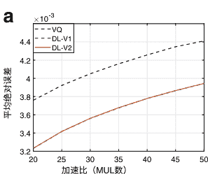

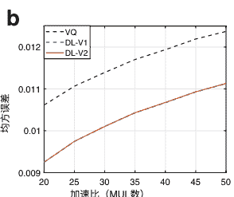

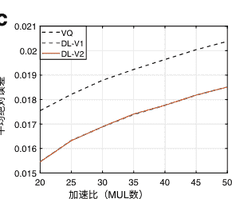

图2 VQ 和所提出技术的两个版本（V1 和 V2）的平均量化误差作为加速比的函数，分别对应 VGG16 的 conv4-1 层，ResNet18 的 res4a-branch2b 层和 SqueezeNet 的 fire8-expand3x3 层。在所有情况下，子空间维度为 N' = 8。

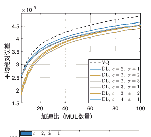

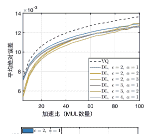

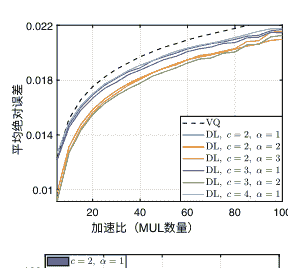

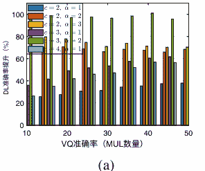

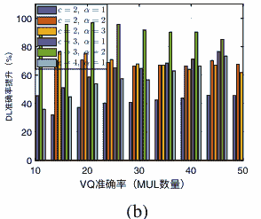

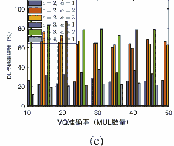

图3 DL 与 VQ 技术的平均量化误差（上行）和加速增益（下行）随加速比变化的关系：a VGG16 的 conv4-1 层，b ResNet18 的 res4a-branch2b 层，c SqueezeNet 的 fire8-expand3x3 层。在所有情况下，子空间维度为 N' = 8。

### 5.2 实验二：图像分类准确率损失

在这个实验中，我们将竞争技术应用于三个 DNN 模型的“全模型”加速场景中。它涉及加速原始模型的多个（或全部）卷积层，并测量加速网络实现的分类准确率。

这里强调一点，尽管全范围加速度在很大程度上取决于用于加速每一层的技术的性能，但它还涉及到加速层和相关微调（重新训练）的策略的实验。

在这里，我们采用了一个阶段性加速方法（如[7]中提出的），每个阶段都涉及加速

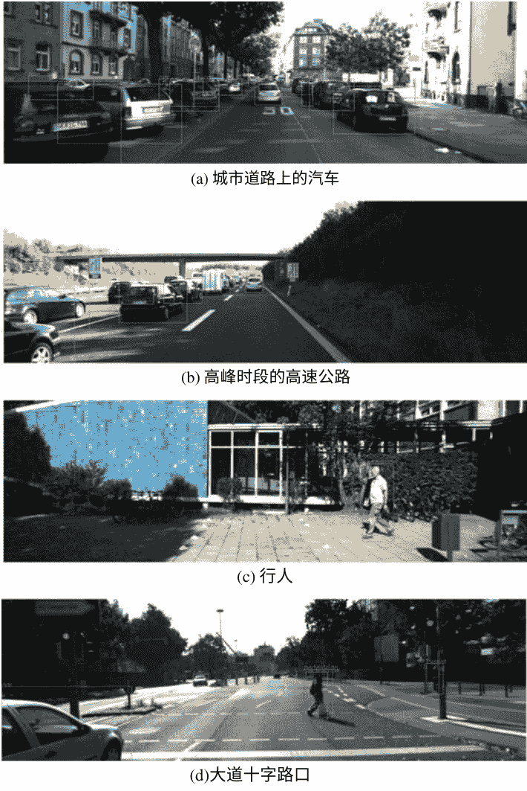

#### 5.2.1 加速 VGG16

VGG16 由 13 个 $$3 \times 3$$ 卷积层和 3 个全连接层组成，是我们实验中计算量最大的网络。在推理过程中，总共需要 $$15.5 \times 10^9$$ 次 MACs/MULs，其中超过 $99\%$ 的计算量由卷积层消耗，这意味着加速卷积层实际上等同于加速整个网络。VGG16 的卷积层被组织成五组连续的卷积层，因此我们将 VGG16 分为五个阶段进行加速，第 $$i$$ 组在第 $$j$$ 个阶段进行加速。我们使用前面描述的方法，对 VGG16 进行了阶段性加速实验，分别使用三种不同的加速比，即

$$\rho=20$$，$$\rho=30$$ 和 $$\rho=40$$，在图4的顶部行中显示。

#### 5.2.2 加速 ResNet18

ResNet18 基于残差学习的概念，并遵循其他更大的 ResNet 变体（例如 ResNet 34、ResNet50 等）的架构。它的构建块由两个连续的 $$3 \times 3$$ 卷积层组成，该块的输出与其输入相加，使用 *"bypass" 连接（因此，该块只需要学习残差表示）。ResNet18 由 8 个这样的块组成（加上一个输入卷积层和一个 fc 层），类似于 VGG16 的情况，它们负责网络所需的总 $$1.8 \times 10^9$$ MACs/MULs 的大约 $$99\%$$。在我们对 ResNet18 的实验中，我们以每个阶段一个块的方式加速其构建块，共计八个加速阶段。使用比率 $$\rho=10$$ 的加速结果，

$$\rho=20$$，和 $$\rho=30$$ 在图4的中间行中显示。

#### 5.2.3 加速 SqueezeNet

SqueezeNet 是一个完全卷积的 CNN，采用特殊的架构管理，大大减小了其尺寸，同时仍然保持在最先进的性能领域内。它的构建模块是 *"火"* 模块，由一个 *"挤压"* $$1 \times 1$$ 卷积层组成，目的是减少输入通道的数量，然后是 $$1 \times 1$$ 和 $$3 \times 3$$ *"扩展"* 卷积层，这些层与并行连接在一起。

#### 5.2.4 讨论

关于图4中呈现的结果，可以总结出，在每个阶段显示的“未微调”误差值（以柱状图显示）揭示了网络在该特定阶段加速/近似所涉及层的卷积核的敏感性，以及实现加速的技术的性能。因此，通过所显示的图表可以明显看出，与竞争对手相比，所提出的技术在性能上普遍优越。

另一方面，相应的“微调后”误差值反映了剩余（原始）层对新加速部分的“适应”能力。
在这里，我们可以看到，通过为微调过程提供更好的起点，所提出的技术在所有情况下仍然能够以安全的边界超越其竞争对手，尽管，正如预期的那样，微调大大压缩了比较技术之间的差异。

总之，图4中所示结果的比较分析以及加速网络实现的最终 Top5 错误数字都显示出所提出技术的非常有希望的性能，其应用导致了 CNN 的显著加速，同时仅有少量的分类能力损失。最后需要指出的是，通过采用更有针对性的加速策略（例如，加速序列的实验，每层的加速比率，使用更广泛的微调过程等），所展示的结果可以进一步改善，这进一步证实了我们的结论。

## 5.3 实验三. 目标检测的 MCA 性能

目标检测的目标是在给定的图像中从预定义数量的类中检测出目标。因此，这里的目标是双重的：(a) 通过估计包含目标的边界框的坐标来检测输入图像中是否存在目标，以及 (b) 预测目标所属的类别。文献中可以找到许多基于 DNN 的目标检测器[47]。基于 DNN 的目标检测器的一般架构包括一个特征提取部分，该部分包括多个卷积层，以及用于类别预测和边界框回归任务的应用特定层。还应该提到的是，许多知名目标检测器的特征提取部分基于最先进的 DNN 模型的卷积部分，这些模型是为图像分类而设计的，并在 ILSVRC2012 数据集上进行了预训练 [25]。因此，应用 MCA 技术加速目标检测器的原理与第 5.2 节中用于图像分类的 DNN 相同。

在这里，考虑的多重关联分析技术专门应用于车辆应用中的目标检测器。用于评估的 DNN 模型 SqueezeDet 和 Resnet50ConvDet [44]。这些检测网络是完全卷积的。除了它们的特征提取部分之外


提取输入图像的高维特征映射，它们还包括用于定位对象并预测其类别的卷积层 ConvDet。对于最终检测的推导，输出根据置信度指数进行过滤，该指数也是由 ConvDet 层提取的。SqueezeDet 的特征提取（卷积）部分基于 SqueezeNet，SqueezeNet 在 Exp II 中有描述。另一方面，ResNetDet 的主干基于 ResNet50 的卷积层[20]，其构建块由三层堆叠而成。这三层由 1×1、3×3 和 1×1 的卷积组成。1×1 的卷积层负责降低维度，然后恢复维度。3×3 的层作为一个瓶颈，具有较小的输入/输出维度。ResNetDet 的卷积部分由 13 个这样的块组成。

在这个实验中，我们采用了类似于实验 II 中描述的阶段加速方法。我们使用了 KITTI 里程计数据集[11] 进行微调和验证。KITTI 数据集包含 7400 个彩色交通场景图像，尺寸为 1242×375 像素。三个类别被区分出来，即汽车、骑车者和行人，并手动标注了边界框。该数据集被分为 80%, 20% 用于微调和验证。图5 展示了 KITTI 数据集的示例。

#### 5.3.1 SqueezeDet 加速

SqueezeDet 的特征提取部分，即 SqueezeNet，负责大约 83% 的总共 5.3×10^9 次乘累加（MAC）运算。
与实验 II 一样，我们只采用了中等加速策略，只针对“扩展”（即 3×3）层。加速是以一个模块为阶段进行的，总共进行了八个加速阶段。在目标层上使用加速比 ρ=8,10,12 和 20，分别实现了特征提取（即 SqueezeNet）部分的 72%、74%、75% 和 78% 的加速，以及总体模型的 59%、60%、62% 和 65% 的加速。

#### 5.3.2 加速 ResNetDet

ResNetDet 的特征提取部分负责网络所需的总计 3.5×10^10 MACs 的约 81%。
根据网络的架构，在我们对 ResNetDet 进行实验时，我们以每个阶段一个块的方式加速其卷积（特征提取）块，共计加速了 13 个阶段。在模型的卷积层上使用加速比 ρ=8、10、12 和 20，分别实现了特征提取部分的加速率为 84%、86%、88% 和 92%，总模型加速率为 67%、69%、71% 和 74%。


#### 5.3.3 性能评估和讨论

对于每个检测，计算交并比(IOU)得分，即预测边界框与真实边界框之间的
交集面积与并集面积的比率。当 IOU > 0.5 且预测类别与真实类别相同时
，为真阳性。当 IOU < 0.5 或检测到不同类别时，为假阳性，意味着未匹配的
边界框被视为

|类别 | 汽车 | 骑车者 | 行人 | 全部 |
|---|---|---|---|---|
| 原始 | 94 | 79 | 78 | 83 |
| DL (ρ=8) | 90 | 71 | 70 | 77 |
| DL (ρ=10) | 90 | 71 | 69 | 77 |
| DL (ρ=12) | 88 | 68 | 64 | 74 |
| DL (ρ=20) | 85 | 60 | 59 | 68 |
| VQ (ρ=10) | 88 | 64 | 64 | 71 |

|类别 | 汽车 | 骑车者 | 行人 |
|---|---|---|---|
| 原始 | 84 | 66 | 67 |
| DL (ρ=8) | 82 | 64 | 62 |
| DL (ρ=10) | 81 | 61 | 60 |
| DL (ρ=12) | 79 | 58 | 60 |
| DL (ρ=20) | 75 | 46 | 54 |
| VQ (ρ=10) | 78 | 54 | 57 |

|类别 | 汽车 | 骑车者 | 行人 | 全部 |
|---|---|---|---|---|
| 原始 | 89 | 79 | 76 | 81 |
| DL (ρ=8) | 88 | 77 | 73 | 79 |
| DL (ρ=10) | 88 | 75 | 74 | 79 |
| DL (ρ=12) | 87 | 76 | 73 | 79 |
| DL (ρ=20) | 87 | 73 | 71 | 77 |
| VQ (ρ=10) | 88 | 74 | 69 | 77 |

给定类别的误报数 根据[33]计算精确率、召回率和平均精度（mAP）

使用 VQ 和 DL 加速技术对所使用的网络进行加速的加速结果，对于 ResNet Det 在表3、4 中显示，在 SqueezeDet 中在表5 和 6 中显示。每个图中最右边的点表示“完全”加速的网络的性能，即在所有目标卷积层都被加速之后的性能。
在每个点上，根据实现的平均精度（mAP）和召回率来评估检测器的性能。


## 6 结论

本文提出了一种基于聚类的加速 DNNs 的权重近似技术。该技术利用了问题的特殊性质，以增加相同目标加速度下使用的质心数量，与传统的 k-means 技术相比。这是通过使用字典学习框架实现的，通过对质心施加特殊结构来减少加速层的总体计算复杂度。

提出了解决三个相关子问题的解决方案，即稀疏编码、字典和分配更新。通过使用最先进的预训练 DNN 模型进行图像分类和目标检测任务的三个实验，验证了该技术在实现量化误差和性能损失方面的优越性。

# 基于深度学习的时间序列预测

**Kushagra Agarwal**, Lalasa Dheekollu, Gaurav Dhama, Ankur Arora, Siddhartha Asthana和Tanmoy Bhowmik

摘要 时间序列预测方法已广泛应用于各个行业和学术领域。对于预测领域的决策者来说，诸如设施规划、日常运营等决策过程是复杂的，需要考虑多个不同层次。

这些决策涉及到不同的时间范围和系统的不同方面，使得建模变得困难。深度学习在预测中的出现解决了昂贵的手工特征和深度领域知识的需求。本章旨在为深度学习中的时间序列预测现有文献提供一个结构。基于技术的基本结构，如RNN、CNN和Transformer，我们对各种基于深度学习的时间序列预测技术进行了分类，并提供了一份综合报告。此外，我们还在四个不同的公开数据集上进行了实验比较这些技术。最后，基于这些实验，我们对这些性能提供了直观的解释。我们相信本章将帮助研究人员选择未来研究中相关的技术。

电子补充材料 本章的在线版本(https://doi.org/10.1007/978-981-16-3357-7_6)包含补充材料，仅限授权用户使用。

K. Agarwal (✉) · L. Dheekollu · G. Dhama · A. Arora · S. Asthana · T. Bhowmik  
AI Garage, Mastercard, Gurgaon, India  
e-mail: kushagra.agarwal@mastercard.com

L. Dheekollu  
电子邮件：lalasa.dheekollu@mastercard.com

G. Dhama  
电子邮件：gaurav.dhama@mastercard.com

A. Arora  
电子邮件：ankur.arora@mastercard.com

S. Asthana  
电子邮件：siddhartha.asthana@mastercard.com

T. Bhowmik  
电子邮件：tanmoy.bhowmik@mastercard.com

© 作者（们），在Springer Nature Singapore Pte Ltd.的独家许可下。2022年  
M. A. Wani等人（编辑），深度学习应用，第3卷，  
智能系统与计算进展1395，  
https://doi.org/10.1007/978-981-16-3357-7_6

## 1 引言

在时间序列建模方面，历史上一直存在着积极的学术和工业研究。这些方法经常应用于各个行业，如金融行业[1]、零售行业[2]和气候建模[3]。传统上，时间序列建模使用参数模型，如自回归（AR）[4]、指数平滑（ETS）[5]和结构时间序列模型[6]。由于现在的计算能力和海量数据，研究人员可以使用数据驱动的深度学习技术取得更好的结果，因为深度学习算法可以学习数据中时间步之间的复杂关系[7]，而以前这需要深入的领域知识。

鉴于应用领域的多样性，已经发表了许多研究论文，每篇论文都提出了一个适用于某个领域的算法[8] [8-11]。有一些论文[12, 13]涵盖了时间序列预测中深度学习技术的调查，据我们所知，还没有工作在相同数据集上对这些技术进行了实证比较，以评估每种技术的性能。在本章中，我们对四个不同的数据集进行了实验，以更好地比较不同的深度学习预测技术。我们试图根据算法的基本结构对时间序列建模技术进行分类，例如经典机器学习、RNN、CNN、注意力网络和混合网络，以及上述任意组合。

我们总共评估了来自所有类别的十种技术在四个数据集上的性能，并对其结果提供了直观的解释。我们的工作动机在于提供关于最先进的深度学习时间序列模型及其相互比较的综合概述。我们的综述可以帮助研究人员和实践者根据领域相似性和系统要求选择最佳模型，并有助于设计新的算法。我们将本章分为以下几个部分。本简介后面是第2节，介绍了将深度学习应用于时间序列建模问题的关键概念。它还涵盖了创建验证集和预测窗口的不同方法。第3节介绍了各种预测技术，以及用于对过去最有效和最著名的作品进行分类的标准。在第4节中，我们评估了第3节中定义的每个类别中的一些模型在四个数据集上的表现。选择这些数据集是为了确保长度、领域、规模变化和时间粒度的多样性。在本节中，我们还描述了评估指标并分析了结果。第6节提供了结论。

## 2 问题形式化和设置

时间序列预测模型预测未来时间步骤中所需的值。时间点上的值用 $y_{i,t}$ 表示，其中 t 是时间，i 是实体。属于实体 i 的时间序列表示为 $y_{i,1}, y_{i,2}, ..., y_{i,t}$ 或 $y_{i,1:t}$。

有两种时间序列模型预测，即一步预测，其中方程形式为 $\hat{y}_{i,t+1} = f(y_{i,t-k:t}, x_{i,t-k:t}, s_i)$ 和多步预测，其中方程形式为 $\hat{y}_{i,t+1:t+\tau} = f(y_{i,t-k:t}, x_{i,t-k:t}, s_i)$，其中 $\hat{y}_{i,t+1}$ 是模型预测，$y_{i,t-k:t} = y_{i,t-k}, \dots, y_{i,t}$，$x_{i,t-k:t} = x_{i,t-k}, \dots, x_{i,t}$ 分别是目标和外生输入的观测值，在回溯窗口 $k$ 和未来预测时间间隔 $\tau$ 内，$s_i$ 是与实体相关的静态元数据，$f(\cdot)$ 是模型学习到的预测函数。上述描述适用于单变量序列，同样可以扩展到多变量序列。虽然多步预测模型一次性生成 $\tau$ 个时间步的预测，一步预测模型以滚动方式生成预测。先前的预测作为输入用于下一个预测，依此类推。

验证集：与任何机器学习模型一样，时间序列数据也被分为训练集和验证集。横截面数据可以随机分成训练集和验证集，但时间序列数据不能随机分割，因为顺序信息需要在一个集合中保留。有各种技术可以创建这些集合。其中一种方法是将序列的最后一部分作为验证集，前面的部分作为训练集。一旦模型调整到最佳超参数，就可以使用整个数据集进行训练，因为最后的集合（或验证集）可能包含大量相关信息，可以提供未来的预测。创建这些集合的另一种方法是执行嵌套交叉验证。就像对于横截面数据一样，将数据分成 n 个集合，每个集合依次作为验证集，但相应的训练集只是出现在验证集之前的集合。这个想法生成了一个强大的模型，因为验证集的数量很多，模型不会对特定的验证集有偏见。

损失函数和输出：传统的机器学习技术，如 ARIMA、ETS，生成点预测，但由于神经网络的灵活性，输出可以是点预测，也可以是概率预测。点预测可以解释为未来目标的期望值。预测可以简单地建模为离散输出的分类问题或连续输出的回归问题，通常使用的损失函数分别是二元交叉熵和均方误差。概率预测提供了模型预测的不确定性，这对于金融风险管理等关键领域的决策者至关重要。在这种情况下，神经网络通常用于生成已知分布的参数[9 , 14]。网络的最后一层用于预测假定分布的均值和方差。

## 3 预测技术

在本节中，我们根据所使用的底层架构对不同的预测方法进行分类。每种技术旨在预测未来时间步的值。

不同预测技术之间的差异在于它们如何解决问题。不同的算法对时间序列的相似性有不同的见解

### 3.1 经典机器学习技术

这些方法背后的基本思想是简单性，假设简单的数学公式和技术可以用来预测时间序列的未来值。这些基本技术可以进一步改进，使用不同工具和自动化方法的各种进展。由于它们的简单性和直观性，这些模型被广泛用于建立基准，其他模型在此基础上进行评估。在多元回归模型中，我们使用预测变量的线性组合来预测感兴趣的变量。在自回归模型[4]中，正如其名称所示，我们使用相同变量过去值的线性组合来预测感兴趣的变量。在许多基于预测的应用中，另一种经典方法是指数平滑[15]，其使用如下函数：

$y(t) = \beta(t)^T f(t) + \epsilon(t)$

其中 $f(t)$ —拟合方程， $\beta(t)$ —系数向量，$\epsilon(t)$—白噪声。对于季节性时间序列数据，温特斯方法使用三个平滑参数—水平、趋势和季节性。虽然直接应用温特斯方法[16]进行分析和预测很困难。上述技术面临两个挑战——在系列数量和时间步长方面的可扩展性，以及有效处理缺失值。动态线性模型(DLM ) [17]专注于低维时间序列数据，因此无法处理上述问题。此外，所有这些技术都假设线性依赖关系，这并不总是成立，因此它们在许多情况下表现较差。

解决上述挑战的直观方法是将高维时间序列数据建模为矩阵形式，其中行对应于每个一维时间序列，列对应于时间点。低秩矩阵分解（MF）或矩阵补全（MC）技术已应用于时间序列以捕获和分析它们之间的相关性[18-20]。与上述AR和DLM模型不同，最先进的MF算法在n上呈线性扩展，因此它们可以很好地处理大型数据集。设 $Y \in \mathbb{R}^{n \times T}$ 为观测到的 n 维时间序列的矩阵，对于第 i 个时间序列，$Y_{it}$ 是第 t 个时间点的观测值。在标准 MF 方法下，$Y_i$ 通过内积估计 $fT$。

$i x_t$，其中 $f_i \in \mathbb{R}^{k \times T}$ 是第 i 个时间序列的 k 维潜在嵌入，而 $x_t \in \mathbb{R}^k$ 是第 t 个时间点的 k 维潜在时间嵌入。我们可以将 $x_t$ 堆叠成矩阵 $X \in \mathbb{R}^{k \times T}$，将 $f_i^T$ 堆叠成 $F \in \mathbb{R}^{n \times k}$ 的行，得到 $Y \approx FX$。然后我们可以解决以下问题：

$$ \min_{F, X} \sum_{(i, t) \in \Omega} \left( Y_{it} - f_i^T x_t \right)^2 + \lambda_f R_f(F) + \lambda_x R_x(X) $$

其中 Ω是观测条目的集合。 $R_f(F)$, $R_x(X)$ 是对 F 和 X 的正则化项，通常用于避免过拟合和/或鼓励一些特定的时间结构存在。

### 3.2 深度学习技术

传统上，时间序列预测在许多更简单的预测问题上已经被很好地理解和有效地应用。随着深度学习的最新进展，这些技术正在成为时间序列预测研究人员的强大工具。深度学习神经网络能够自动学习从输入到输出的任意复杂映射，并支持多个输入和输出。

深度学习神经网络在像计算机视觉这样的领域中，已经展示出对建模任意复杂输入到输出的能力。在这种启发下，许多深度学习模型正在时间序列预测领域中得到发展，这些模型在性能方面超过了传统技术，在某些情况下甚至具有可解释性。

#### 3.2.1 循环神经网络

循环神经网络（RNNs）已经广泛应用于解决数据是序列的监督学习问题。鉴于时间序列的顺序性质，类似的架构也被用于时间序列预测。RNNs 是本质上具有记忆的神经网络。它们可以保留过去的信息，这对于预测时间相关目标非常有用。然而，将循环结构应用于时间序列预测并不是一项简单的任务。我们将讨论对时间序列预测有用的循环神经网络架构。

尽管它们可能不是主要应用，但 LSTM（长短时记忆）和 GRU（门控循环单元）网络经常用于时间序列预测。Gens 等人 [25] 使用带有窥视孔连接的 LSTM 学习时间距离。马守特比等人 [26] 使用堆叠的 LDM 网络检测时间序列中的景燕。国三甲 [27] 提出了一种适应性梯度学习方法，使循环神经网络能够对具有异常值和变化点的时间序列进行稳健预测。Hsu [28] 将自编码器与 LSTM 结合以提高其预测性能。Cin 行等人 [29] 提出了一种扩展的注意力机制，用于捕捉特定时间序列中的周期和模拟缺失值。Banda 行等人 [30] 使用 LSTM 对通过聚类技术识别出的相似时间序列进行建模。Lapiev 等人 [31] 将循环神经网络应用于特殊事件预测，并发现当特时间序列的数量、长度和相关性较高时，神经网络可能是比传统时间序列方法更好的选择。Che 等人 [32] 构建了一个基于 GRU 的模型，具有衰减机制，用于捕捉多变量时间序列中的缺失信息。

己进行了大量的尝试，以更好地理解 RNN。Karpa-Thy 等人 [33] 通过对字字母技术语言模型的性能进行性能杯带和错误分析，探讨了递归神经网络性能的来源。Van gel Westhuizen [34] 使用不同的数据卷来可视化 LSTM 的操作。Greff 等人 [35] 比较了几种 CSTM 变体的性能，并发现泄漏门和输出激活函数是 LSTM 中最重要的元素。Chang 等人 [36] 提出了一种使用变分 taxa [37] 的技术。

已经研究了与递归神经网络时间序列预测相关的不兼容性。Zhu 和 Laprev [38] 使用蒙特卡洛丢失和 LSTM 单元的编码器-解码器框架进行了不兼容性整理。Caley 等人 [39] 使用选举法构成了卷积 LSTM 的预测区间。

开发了一种自回归 RNN 时间序列模型 AR [9]。该模型的基本构成块是 RNN。除了时间的步长之外，协变量被作为输入传递给 RNN。DRepA 在训练过程中估计参数的参数分布。在推理过程中，从分布中抽样并传递到未来的时间步长，这进一步作为输入。

这个[40, 41]已经有一些改进的变体，通过与之前的滞值作为传入传递到 Deea 进行更新解释以及定义的频率的。例如，对于每个小农的数据频率为 1，对于妖的数据频率为 1 x 24，对于整的数据频率为 7 x 24，等等。

多时间步长概率回归预测器（MQRNN）[42] 提出了一个通用的概率多时间序列回归框架。具体来说，他们利用了分位数回归的非参数性质，序列到序列神经网络（例如 RNN 和 CNN 结构）的时空性质，以及直接多时间步长预测的没有什么。当使用循环结构时，称为多时间步长概率回归预测器（MQRNN），当使用卷积结构时，它被称为多时域分位数卷积预测器（MQCNN）。除了 LSTM/CNN 之外，他们还使用了两个 MLP。为了提高顺序网络的稳定性和性能，设计了一种新的训练方案，即分叉序列。这种方法适用于时间和静态协变量、未来计划事件峰值、季节性变化、跨多个相关系列的学习以及实际大规模预测中的冷启动。

#### 3.2.2 卷积神经网络

卷积神经网络在捕捉空间不变模式方面非常强大。它们在计算机视觉领域被广泛应用。在目标检测中，需要准确的物体位置，因此应用卷积神经网络。

对于文本情感分类，情感词组的存在和它们的位置对我们很重要，这就是为什么卷积神经网络有效。同样，在时间序列中可能存在每周季节性和某些自相关结构，卷积能够很好地捕捉到这些。因此，为了捕捉时间序列中的空间不变模式，我们应用了卷积神经网络。

DeepMind 的 WaveNet [44] 最初是为了文本转语音系统而设计的。由于其出色的性能和对时间点之间因果关系的捕捉需求，它也被用于时间序列预测。WaveNet 使用了扩张因果卷积层，这样可以处理时间顺序并捕捉长期依赖关系，而不会增加复杂性。与 LSTM 不同，它们不会面临梯度爆炸或梯度消失的问题。通常，使用 2 的扩张率，例如 1、2、4 等，这样网络可以轻松地建模非常长期的依赖关系。WaveNet 具有双重作用，它通过卷积层捕捉局部关系，并通过扩张层很好地捕捉长期依赖关系，这是递归神经网络所面临的问题。

#### 3.2.3 注意力网络

变压器（特别是自注意力）[45] 在自然语言处理领域取得了最近的显著进展。像 BERT [46]、GPT-2 [47] 和 XLNET [48] 这样的强大模型已被用于文档分类、文本生成、文本摘要和文本翻译。

鉴于自然语言处理在广泛应用中取得的成功，以及时间序列数据也是顺序的事实，基于注意力的模型在时间序列中也被广泛采用。尽管如此，该领域的研究仍然有限。已经有一些有希望的结果，但有些是混合的。我们将回顾当前关于应用注意力以及变压器更广泛地应用于时间序列问题的文献，并讨论这些算法的当前优势和不足之处。

一些研究已经使用基本和先进的注意机制来处理时间序列数据。LSTNet [10] 是最早在时间序列数据中使用注意机制的之一。他们使用 LSTM + 注意机制处理多变量时间序列。然而，他们未能捕捉到多个时间步长上的时间模式。[8] 添加了不同窗口大小的时间依赖作为正则化项，以最小化预测误差。

提出了一种双阶段注意力循环神经网络（DA-RNN）[49]，引入了输入注意力机制，通过参考先前的编码器隐藏状态，在每个时间步骤自适应地提取相关的驱动序列（即输入特征）。然后，他们使用了一个时间注意力机制来选择所有时间步骤中相关的编码器隐藏状态。这种双重设置使得预测结果也具有可解释性。然而，DA-RNN 没有考虑外部数据不同组成部分之间的相关性，这导致了对复杂实际模式的预测效果不佳。另一个需要探索的领域是外部数据的内在时间动态。引入了一种层次注意力循环高速公路网络（HRHN）[50]，将外部变量的时空特征提取和目标变量的时间动态建模融入到一个框架中。此外，HRRN 在捕捉罕见事件或突发变化方面表现出色。

提出了 MQRNN [42]，使用 LSTM 和两个 MLP 生成多个时间范围的分位数预测。具有时间注意力学习的多时间范围时间序列预测 [51] 作为一个端到端的深度学习框架，通过时间注意力机制更好地捕捉历史数据中的潜在模式，对未来进行预测。

时间序列经常显示伪周期，即时间间隔，在该时间间隔内，时间序列的值之间存在强相关性，正相关或负相关。伪周期可能是由于季节性或测量活动的基本模式引起的。设计了一种用于序列到序列循环神经网络（RNN）的扩展注意模型 [52]，用于捕捉时间序列中的伪周期。用于多变量时间序列预测的时间模式注意力 [53] 使用一组滤波器来提取时间不变的时间模式，类似于将时间序列数据转换为其“频域”。然后，它使用注意机制来选择相关的时间序列，并使用其频域信息进行多变量预测。这些滤波器有助于使其成为一个更可解释的模型。

尽管许多早期的研究尝试预测多个时间步长的时间模式。然而，这些模型对于具有动态周期模式或非周期模式的时间序列不适用。DSANet [54] 被建立来克服上述问题，它完全摒弃了循环，并利用了两个并行的卷积组件，称为全局时间卷积和局部时间卷积，用于捕捉全局和局部时间模式的复杂混合。此外，DSANet 使用自注意力模块来建模多个系列之间的依赖关系。为了进一步提高鲁棒性，DSANet 还将传统的自回归线性模型与非线性神经网络并行集成。

#### 3.2.4 混合网络

时间序列具有复杂的非线性空间和时间关系。卷积网络有效地捕捉非线性空间关系，而循环网络捕捉时间关系。将这些模型结合在预测中的想法是利用每个模型的独特特性来捕捉时间序列中不同形式的关系。基于这个想法，近年来提出了许多混合网络。经典时间序列模型成功地提供了不确定性估计，但它们面临高偏差和可扩展性问题。而深度学习方法很好地处理偏差和可扩展性问题，但它们不能很好地提供不确定性估计。这些算法的思想是利用经典和深度学习模型的优势。

概率图模型与深度神经网络的结合最近一直是一个活跃的研究领域 [55-58]。通过结合循环神经网络和状态空间模型（SSM），开发了用于时间序列预测的深度状态空间模型 [14]。在一篇类似的论文中，使用高斯过程的深度因子进行预测 [59]，作者提出将深度神经网络（DNN）与局部高斯过程（GP）模型相结合，以提高计算效率。全局部部分由一组深度动态因子的线性组合给出，其中加载由时间上的注意力决定。局部模型是一个随机高斯过程（GP），它允许不确定性在时间上向前传播。全局结构在全球范围内提取复杂的非线性模式，同时在局部范围内捕捉每个时间序列的个体随机效应。

## 4 评估

在最后一节中，每个类别下都提出了各种技术。我们从每个类别中选择表现最佳的模型，并在四个最常用的数据集上对每个模型进行评估。这些技术都是在相同的训练集上进行训练，在相同的验证集上进行微调，最后在相同的测试集上进行评估。评估任务所使用的数据集将在 A 小节中讨论，B 小节将呈现评估和结果分析。观察所提出的预测技术的性能将帮助研究人员通过添加新的技术或算法来进一步改进模型。通过与其他模型进行比较，还可以确定不同模型及其特征之间的差距。

### 4.1 评估指标

在本小节中，我们讨论用于比较不同时间预测技术的评估指标。这些指标各自有不同的方式来观察时间序列数据的整体效率。对于时间序列数据的预测或分析，最常用的性能评估因素如下：对于具有总共 N 个给定历史数据点的时间序列 $i$，$z_i$，$t_i$ 和相应的预测值 $\hat{z}_i^i$，$t_i$，其中 $t_i = 1$ 到 $N$，性能评估因素如下所示：

- 标准化均方根误差（NRMSE）

$$ NRMSE = \frac{ \sqrt{ \frac{1}{N(T-t_0)} \sum_{i, t} (z_{i, t} - \hat{z}_{i, t})^2 } }{ \frac{1}{N(T-t_0)} \sum_{i, t} |z_{i, t}| } $$

- 标准化偏差（ND）

$$ ND = \frac{ \sum_{i, t} |z_{i, t} - \hat{z}_{i, t}| }{ \sum_{i, t} |z_{i, t}| } $$

### 4.2 评估数据集

我们在以下四个真实世界数据集上评估了第 3 节中提到的一些技术。

- 电力负荷 [61]: 包含 2011 年至 2014 年 370 个房屋的每小时用电量。

- 交通 [62]: 包含旧金山 963 条道路的交通占用率，范围在 0 到 1 之间，每 10 分钟采样一次并汇总为每小时数据。

- M4 [63]: 这是 M4 竞赛的数据集，包含 10 万个时间序列，具有年度、季度、月度、周度、日度和小时度的数据频率。我们使用了其中最常用的数据集，即 M4-Hourly 和 M4-Monthly。

时间序列可以分解为：

- $ y_t = T_t + S_t + R_t, $

其中 $ T_t $ 是趋势分量，$ S_t $ 是季节分量，而 $ R_t $ 是残差分量。我们试图深入研究这些数据集的四个方面，即：

- 趋势强度 — 对于趋势明显的数据，季节调整后的数据应比残差分量的变化要大得多。因此， $ Var(R_t)/Var(T_t + R_t) $ 应该相对较小。但对于几乎没有趋势的数据，这两个方差应该大致相等。因此，趋势的强度被定义为 $ F_t = \max(0, 1 - Var(R_t)/Var(T_t + R_t)) $。这将给出一个介于 0 和 1 之间的趋势强度的度量。由于残差部分的方差有时甚至可能大于季节调整后的数据的方差，我们将 $ F_t $ 的最小可能值设为零。

- 季节性强度 — 季节性强度的定义类似，但是与季节调整数据相比，是基于去趋势数据的 $ F_s = $

#### 图1 趋势强度在四个数据集中的分布

(a) 电力

(b) 交通

(c) M4-每小时

(d) M4-每月

#### 图2 季节性强度在四个数据集中的分布

(a) 电力

(b) 交通

(c) M4-每小时

(d) M4-每月

#### 图3 熵在四个数据集中的分布

#### 图4 自相关系数 -1 在四个数据集中的分布

表2展示了使用的四个数据集（即电力、交通、M4-每小时和M4-每月）的归一化均方根误差（NRMSE）和归一化偏差（ND）。我们可以注意到没有最好的算法，不同的算法在不同的数据集上表现良好。

基于以上观察结果、算法的重点领域和数据集的性质，我们得出一些重要的发现。Transformer在各种形式的数据集上表现出色，特别是在训练点较少的情况下，它优于其他算法。当我们观察基于循环神经网络（RNN）的算法，如DeepAR、MQRNN和ESRNN时，它们表现良好。

当有足够好的训练数据点和尺度变化非常小时，在交通数据集上表现明显。但是当训练数据点较大或非常小且尺度变化较大时，在电力数据集和M4-hourly上的表现不佳。

接下来，当我们注意力转向基于卷积神经网络（CNN）的算法，Wavenet、MQCNN和LSTNet时。这些算法在大量训练数据点上表现得很好，但在训练数据点较少、电力和M4数据集上的结果并不好，这证实了这个假设。LSTNet也包含了一个RNN结构，因此在大量训练数据点上表现不佳，这可以从其在电力数据集上的表现看出。N-BEATS在训练点较少的序列上表现很好，但随着点数的增加，性能会下降，这可以从其在电力和M4数据集上的结果中看出。它不受序列规模变化的影响。DeepGLo和TRMF很好地捕捉到了序列之间的学习，这可以从它们在M4-monthly上的表现看出，该数据集包含大量序列。尽管在训练点数较高时，DeepGLo和TRMF的表现不如其他算法好。

我们讨论了具有趋势、季节性、熵和自相关滞后1分布的性能。对于具有大多数强趋势时间序列的指数分布数据集，我们观察到Transformers和N-Beats表现最好。由于它们的设计，这些算法非常好地传递了过去的信息。对于趋势的正态分布，我们观察到Wavenet或具有更多局部关注的算法表现最好，这使我们得出结论，对于这种类型的数据集，应该很好地学习局部趋势。我们下一个停留的领域是季节性强度，在这里，指数数据集与基于卷积的算法（特别是Wavenet、DeepGlo）效果最好，因为它们专注于局部性。对于具有季节性正态分布的数据集，Transformers效果最好。当我们观察频谱熵时，像M4-hourly、N-Beats、DeepGlo和TRMF这样的弱分布效果最好，因为它们关注局部和全局模式。对于正态分布的频谱熵分布，由于自回归性质，DeepAR效果最好。

最后，当我们看到ACF-1时，指数分布在使用Transformers和ESRNN时表现最好，因为它们能够传递信息到较长的范围并具有循环性质。对于正态分布，自回归方法（如DeepAR）效果最好。

## 5 如何使用代码

• 代码文件夹有两个部分——“datasets/”文件夹和“scripts/”文件夹。
• 数据集可以从“datasets/download_datasets.txt”文件夹中的链接下载。下载后，需要将数据集放置在“datasets/”文件夹中。
• 在我们使用的10种算法中，对于6种算法（LSTNet、DeepAR、MQCNN、MQRNN、WaveNet、Transformer），我们使用了MxNet框架中的gluonts包。注意：要在任何四个数据集中运行这些算法，可以使用“gluonts/main.ipynb”中的Notebook来运行其中任何一个算法。更新全局变量。

• 对于DeepGLO、ESRNN和NBeats等算法，我们使用torch框架。
通过在main.ipynb中更改模型名称和数据集名称，可以在各自的文件夹中运行main.ipynb以重新生成结果。可以在config.py文件中更新参数。

• 通过在main.ipynb文件中更改数据集名称，可以重新生成各种数据集的TRMF结果。可以在config.py文件中更改参数。

• 有关如何运行代码的进一步说明，请参阅代码中算法各自文件夹中的README.md文件。

## 6 结论和未来方向

在过去几年中，基于深度学习的时间序列预测技术取得了巨大的发展。随着研究人员不断改进技术，对于从业者来说选择最佳技术变得越来越困难。

在本章中，我们根据底层架构对各种基于深度学习的时间序列预测技术进行了分类。接下来，我们尝试在上述每个类别中选择几种算法，并对四个变量数据集的性能进行探索。为了确保长度、领域、规模和时间粒度的变化，我们选择了四个数据集，分别是电力、交通、M4-每小时和M4-每月。最后，我们提供了对结果的直观理解。这对于从业者在选择最佳技术并设计未来的新技术方面非常有帮助。

## 参考文献

1. Andersen, T.G: 波动率预测。技术报告。国家经济研究局 (2005年) 

2. Böose, J.H., 等：大规模概率需求预测。VLDB Endowment会议论文集10(12), 1694-1705 (2017)

3. Mudelsee, M：气候时间序列趋势分析方法综述。地球科学评论 190, 310-322 (2019)

4. Kalman, R.E.：线性滤波和预测问题的新方法。在： (1960)

5. Gardner, E.S., Jr：指数平滑：现状。预测杂志4(1), 1-28 (1985)

6. Harvey, A.C：预测、结构时间序列模型和卡尔曼滤波器。剑桥大学出版社 (1990)

7. Bengio, Y., Courville, A., Vincent, P：表示学习：综述与新视角。
IEEE Trans. Pattern Anal. Mach. Intell. 35(8), 1798-1828 (2013)

8. Yu, H. F., Rao, N., Dhillon, I. S.: 高维时间序列预测的时间正则化矩阵分解。 在: 神经信息处理系统进展, pp. 847-855 (2016)

9. Salinas, D., et al.: DeepAR: 具有自回归循环网络的概率预测。
Int. J. Forecasting (2019)

10. Lai, G., et al.: 用深度神经网络建模长期和短期时间模式。 在: 第41届国际ACM SIGIR
信息检索研究与开发会议。ACM, pp. 95-104 (2018)

11. Sen, R., Yu, H.F., Dhillon, I.S.: 全球思考, 本地行动: 高维时间序列预测的深度神经网络方法。 在: 神经信息处理系统进展, pp. 4838-4847 (2019)

12. Gamboa, J.C.B.: 深度学习用于时间序列分析(2017年)。arXiv预印本 arXiv:1701.01887

13. Lim, B., Zohren, S.: 深度学习的时间序列预测综述(2020年)。arXiv预印本 arXiv:2004.13408

14. Rangapuram, S. S等: 用于时间序列预测的深度状态空间模型。 在: 神经信息处理系统
进展, 第7785-7794页 (2018年)。

15. Moghram, I, Rahman, S: 五种短期负荷预测技术的分析和评估。
IEEE Trans. Power Syst. 4(4), 1484-1491(1989年)。

16. Barakat, E.H等: 快速发展的公用事业的短期峰值需求预测。 I. 应用经典时间序列方法
。II. 改进系统动态负载特性建模。IEEE Trans. Power Syst. 5(3), 813-824 (1990年)
。

17. West, M., Harrison, J.: 贝叶斯预测和动态模型. Springer Science & Business Media (2013)

18. Chen, Z., Cichocki, A.: 非负矩阵分解与时间平滑性和/或
空间去相关性约束. 在: 先进脑信号处理实验室, RIKEN,
Tech. Rep. 68 (2005)

19. Rallapalli, S., et al.: 在移动网络中利用时间稳定性和低秩结构进行定位. 在: 第十六届国际
移动计算与网络会议论文集, pp. 161-172 (2010)

20. Roughan, M., et al.: 时空压缩感知和互联网流量矩阵
(扩展版). IEEE/ACM Trans. Networking 20(3), 662-676 (2011)

21. Smola, A. J., Kondor, R.: 图上的核函数和正则化. 在: 学习理论和核机器. Springer, pp. 144-158(2003)

22. Edwards, T., 等: 使用神经网络进行交通趋势分析. 在: 国际神经网络应用研讨会议论文集(1997)

23. Patterson, D.W., Chan, K. H., Tan, C. M.: 使用神经网络进行时间序列预测的比较研究. 在: 神经网络应用于信号处理的国际会议论文集, 第269-274页(1993)

24. Bengio, S., Fessant, F., Collobert, R.: 用于中期时间序列预测的连接主义系统. 在: 国际
应用神经网络研讨会论文集, 第308-315页(1995)

25. Gers, F. A., Schraudolph, N. N., Schmidhuber, J.: 使用LSTM循环网络学习精确的时间.
机器学习研究杂志115-143页(2002)

26. Malhotra, P., 等: 用于时间序列异常检测的长短期记忆网络.
在: Proceedings. Presses universitaires de Louvain, 第89页(2015年)

27. Guo, T., 等: 具有鲁棒性的在线时间序列预测与递归神经网络. 在: 2016年IEEE国际
数据科学与高级分析会议 (DSAA). 第816-825页. IEEE (2016年)

28. Hsu, D.: 通过贝叶斯变分推断进行多周期时间序列建模 (2017). arXiv预印本 arXiv:1707.00666

29. Cinar, Y. G., 等: 使用RNN进行时间序列预测:一种扩展的注意机制来建模周期和处理
缺失值 (2017). arXiv预印本 arXiv:1703.10089

30. Bandara, K., Bergmeir, C., Smyl, S: 使用相似系列群的递归神经网络在时间序列数据库上进行预测: 一种聚类方法. Expert Syst. Appl. 140, 第112896页 (2020年)

31. Laptev, N., 等: Uber上的神经网络时间序列极端事件预测. 在: 国际机器学习会议, 卷34, 页1-5 (2017年)

32. Che, Z., 等: 用于多变量时间序列的循环神经网络与缺失值. Sci. Rep. 8(1), 6085 (2018年)

33. Karpathy, A., Johnson, J., Fei-Fei, L.: 可视化和理解循环网络 (2015年).
arXiv预印本 arXiv:1506.02078

34. van der Westhuizen, J., Lasenby, J.: 可视化LSTM决策. 在: stat1050, 第23页 (2017年)

35. Greff, K., 等: LSTM: 一个搜索空间的奥德赛. IEEE Trans. Neural Networks Learn. Syst. 28(10), 2222-2232 (2016年)

36. Chang, C.H., Rampasek, L., Goldenberg, A.: 深度学习模型的辍学特征排序 (2017). arXiv预印本 arXiv:1712.08645

37. Hinton, G.E., 等: 通过防止特征探测器的共适应性来改进神经网络 (2012). arXiv预印本 arXiv:1207.0580

38. Zhu, L., Laptev, N.: Uber上的时间序列深度和自信预测. 在: 2017年IEEE 国际数据挖掘研讨会 (ICDMW), pp. 103-110. IEEE (2017)

39. Caley, J.A., Lawrance, N.R.J., Hollinger, G.A.: 具有置信度界限的深度网络用于机器人信息收集 (2017)

40. Faloutsos, C., 等: 预测大型时间序列: 新与旧. Proc. VLDB Endowment 11(12), 2102-2105 (2018)

41. Alexandrov, A., 等: GluonTS: Python中的概率时间序列模型 (2019). arXiv 预印本 arXiv:1906.05264

42. Wen, R., 等: 多时域分位数循环预测器 (2017). arXiv预印本 arXiv:1711.11053

43. Oreshkin, B.N., 等: N-BEATS: 可解释时间序列分析的神经基础扩展 (2019). arXiv预印本 arXiv:1905.10437

44. van den Oord, A., 等: Wavenet: 用于原始音频的生成模型 (2016). arXiv预印本 arXiv:1609.03499

45. Vaswani, A., 等: 注意力就是一切. 在: 神经信息处理进展中, pp. 5998-6008 (2017)

46. Devlin, J., 等: Bert: 用于语言理解的深度双向变压器的预训练 (2018年). arXiv预印本 arXiv:1810.04805

47. Radford, A., 等: 语言模型是无监督的多任务学习者 (2019年)

48. Yang, Z., 等: XLNet: 用于语言理解的广义自回归预训练 (2019年). arXiv预印本 arXiv:1906.08237

49. Qin, Y., 等: 基于双阶段注意力的循环神经网络用于时间序列预测 (2017年). arXiv预印本 arXiv:1704.02971

50. Tao, Y., 等: 基于层次注意力的循环高速网络用于时间序列预测 (2018年). arXiv预印本 arXiv:1806.00685

51. Fan, C., 等: 具有时间注意力学习的多时间跨度时间序列预测. 在: 第25届ACM SIGKDD国际会议上的知识发现与数据挖掘, 第2527-2535页 (2019年)

52. Cinar, Y.G., 等: 基于位置的内容注意力用于序列到序列的RNNs时间序列预测. 在: 神经信息处理国际会议, 第533-544页. Springer (2017年)

53. Shih, S.Y., Sun, F.K., Lee, H.Y.: 用于多变量时间序列预测的时间模式注意力. 机器学习. 108 (8-9), 1421-1441 (2019年)

54. Huang, S., 等: DSANet: 用于多变量时间序列预测的双自注意力网络.
在: 第28届ACM国际信息与知识管理会议论文集, 第2129-2132页 (2019年)

55. Krishnan, R.G., Shalit, U., Sontag, D.: 深度卡尔曼滤波器. (2015年). arXiv预印本 arXiv:1511.05121

# 基于深度学习的时间序列预测

56. Krishnan, R.G., Shalit, U., Sontag, D.: 非线性状态空间结构化推理网络模型。在：第31届AAAI人工智能大会（2017年）  
57. Fraccaro, M., 等：带有随机层的顺序神经模型。在：神经信息处理系统进展，第2199-2207页（2016年）  

58. Fraccaro, M., 等：用于无监督学习的解缠识别和非线性动力学模型。在：神经信息处理系统进展，第3601-3610页（2017年）  
59. Maddix, D.C., Wang, Y., Smola, A.: 用高斯过程进行深度因素预测（2018年）。arXiv预印本 arXiv:1812.00098  

60. Smyl, S., Ranganathan, J., Pasqua, A.: M4预测竞赛：引入新的混合ES-RNN模型（2018年）。网址：https://eng.uber.com/m4-forecasting-competition/  
61. Trindade A.: 2011-2014年电力负荷图数据集  

62. Cuturi, M.: 快速全局对齐核函数。在：第28届国际机器学习大会(ICML-11)论文集，第929-936页(2011)  
63. MOFC: 数据集(2018)。网址：https://mofc.unic.ac.cy/the-dataset/  

64. Wani, M.A., Bhat, F.A., Afzal, S., Khan, A.I.: 深度学习进展  
65. Wani, M.A., Kantardzic, M., Sayed-Mouchaweh, M.: 深度学习应用  
66. Wani, M.A., Khoshgoftaar, T.M., Palade, V.: 深度学习应用，卷2  

## DEAL: 深度证据主动学习  
用于图像分类  

Patrick Hemmer, Niklas Kühn和Jakob Schöffer  

摘要 卷积神经网络(CNNs)已被证明是监督计算机视觉任务(如图像分类)的最先进模型。然而，通常需要大量标记的数据集来训练和验证这样的模型。在许多领域，虽然有未标记的数据可用，但标记是昂贵的，例如需要特定的专业知识。主动学习(AL)是缓解有限标记数据问题的一种方法。通过选择最具信息和代表性的数据实例进行标记，AL可以为模型的学习提供更高效的贡献。最近的CNNs的AL方法提出了不同的解决方案来选择待标记的实例。然而，它们的性能不一致，并且通常计算成本高昂。在本文中，我们提出了一种新颖的AL算法，通过捕捉高预测不确定性从未标记的数据中高效学习。通过用Dirichlet密度的参数替换CNN的softmax标准输出，模型学会识别在训练过程中有效提高模型性能的数据实例。我们通过几个公开可用的数据实验证明了我们的方法始终优于其他最先进的AL方法。它可以轻松实现，不需要大量的计算资源进行训练。此外，我们能够展示该方法在胸部X射线图像中肺炎检测这一实际医学应用案例中的好处。  

电子补充材料 本章的在线版本(https://doi.org/10.1007/978-981-16-3357-7_7)包含补充材料，仅供授权使用。  

P. Hemmer (⊗) · N. Kühn · J. Schöffer  
卡尔斯鲁厄理工学院，76131卡尔斯鲁厄，德国  
e-mail: patrick.hemmer@kit.edu  

N. Kühn  
e-mail: niklas.kuehl@kit.edu; niklas.kuehl@ibm.com  

J. Schöffer  
e-mail: jakob.schoeffer@kit.edu  

N. Kühn  
IBM Deutschland GmbH, IBM-Allee 1, 71139 Ehningen, Germany  

| | | | | | | | | |  
| | | | | | | | | |  
© 作者，独家许可给 Springer Nature Singapore Pte Ltd. 2022 M. A. Wani 等人 (编者), 深度学习应用, 第3卷, 智能系统与计算进展1395,  
https://doi.org/10.1007/978-981-16-3357-7_7 | | | | | | | | |  

## 关键词  
主动学习·卷积神经网络·深度学习·  
证据理论·不确定性  

## 1 引言  

在过去的几年里，卷积神经网络（CNNs）在计算机视觉领域的预测准确性方面做出了前所未有的发展，甚至超过了特定图像分类任务的人类水平表现[1]。然而，一个主要的缺点是它们对大量标记数据的依赖性。尽管越来越多的数据可用，但数据标记通常是昂贵的。在许多应用领域，如医学诊断或制造业，高度训练有素的专家的知识是必不可少的。这导致了在标记资源稀缺时开发减少数据标记工作量的技术的需求。有多种技术可用于显著减少所需的标记数据，例如归纳编程[2]、半监督学习[3]、外部记忆[4]或主动学习（AL）。AL的关键思想是，如果机器学习模型能够选择对其学习过程最有益的数据，它就会使用较少的训练实例的情况下达到所需的性能水平[5]。在应用AL时，模型首先在一个小的标记数据集上进行训练。然后，通过采集函数重复选择新的数据实例，由专家进行标记，并将其添加到标记数据集中，直到特定的标记预算用尽[6]。  

在过去的几年里，对AL主题进行了广泛的研究，并成功应用于各种用例，例如从文本文档中提取信息[7]，工业工具磨损分析[8]或工作区域检测[9]。然而，AL面临的一个主要挑战是处理高维数据，例如图像[10]。多位研究人员已开始解决这一挑战，并开发了几种用于CNN对图像数据进行分类和回归的方法[11-16]。  

在本文中，我们提出了一种名为Deep Evidential Active Learning (DEAL)的AL算法，该算法基于预测的不确定性选择未标记的数据实例进行注释。通过将CNN的softmax输出函数替换为Dirichlet密度的参数来推导不确定性估计，这是Sensoy等人提出的方法[17]。我们工作的主要贡献有三个：首先，我们将这种修改后的CNN应用于AL，使模型能够对最具信息量的样本形成更准确的意见。在每个AL轮次中，使用不确定性估计来查询一批新的未标记的数据实例进行注释，直到标记资源耗尽。其次，我们在MNIST、CIFAR-10和SVHN上进行了大量实验证明我们提出的方法始终优于其他最先进的AL方法。最后，将我们的方法应用于儿科胸部X射线图像中的肺炎检测用例强调了DEAL的好处：其实施将导致减少34.52%的数量。  

## ## 2 相关工作和定位  

在过去几十年中，主动学习已经得到了广泛的研究。Settle [5] 提供了最常用的查询策略框架的综合概述。  

然而，它没有考虑与CNN兼容的方法，因为当时关于图像数据的主动学习研究主要集中在支持向量机(SVM)等方法上。  

与SVM不同，CNN可以捕捉图像中的空间信息，这是它们成为图像分类任务的最先进技术的主要原因[18]，也是研究人员开发与CNN兼容的主动学习方法的主要动机。  

据我们所知，表1总结了最新的应用于图像数据的卷积神经网络(CNN)的主要学习方法。接下来，我们将它们分为生成和基于池的方法。  

- **生成方法**  
  生成方法使用生成对抗网络(GANs)生成信息样本，并将其添加到训练集中。  
  为了实现为一点，Mahapatra等人[20]将他们的GAN(cGAN)与真实图像池进行条件训练。  
  相比之下，在他们的ASAL方法中，Mayer和Timofte[19]使用生成的图像检索相似的真实世界图像，并在注释后将它们添加到训练集中。  

- **基于池的方法**  
  基于池的方法利用不同的采集策略来采样最具信息量的数据。  
  我们将它们分为多样性和不确定性方法，以及两者的组合，基于多样性的方法追求选择最能代表未标记数据池的样本的理念。  

  Sener和Savarese[14]将AL框架视为一个核心集选择问题，通过在模型的特征空间中最小化采样和非选择数据点之间的欧几里得距离来解决。  
  目标是从数据池中查询一部分样本，使得在这个子集上训练的模型与在整个数据集上训练的(假设的)模型性能相当。  
  然而，像核心集这样的基于距离的方法存在一个缺点，即距离度量可能在高维空间中集中，这意味着数据元素之间的距离看起来是相同的[23]。  
  基于不确定性的方法的假设是，对于一个预测，模型越不确定，这个数据对于模型就越是有信息量。  
  Wang等人[15]通过将最小置信度、最小边界和熵获取函数应用于softmax输出的类别概率来查询最具信息量的样本。  
  然而，这种方法的局限性在于模型可能对其预测结果不确定。  

|表1 卷积神经网络最先进的AL方法概述|生成 |多样性|核心集 |组合|非集成|集合下端|Softmax|最小边缘 |核心集 |组合|非集成|不确定性|集成|  
|---|---|---|---|---|---|---|---|---|---|---|---|---|---|  
|ASAL ||| || | || || |  
|Mayer和Timofte等人[19] ||| ||| || |  
|cGAN ||| ||| || |  
|Mahapatra等人[20]|| ||| || |  
|Ash等人[21] ||| ||BAGDE | || |  
|Kirsch等[21] |= ||= ||| || |  
|Neal等人|| = ||Wang等人 = || |  
|Sener和Savarese[14] |= || |= ||| || |  
|张阳等|| || |= ||| || |  
|Zurita, Sha等[15]| |= || ||| || |  
|Churchill等人[16] |= || || || | |布尔值|| |  
|Chen等人[17] |= || || | || | || |  
|元算法|| |||| || || |  
|Church[18]| |= || | || | || |  
|Ash等人[15] |= || |= ||| || |  
|狄特拉氏Etc[9] |= || |= |||= || |  
|张阳等 || ||| |= ||| || |  
|王磊等人[18]|| = || |= ||| || |  
|Yoo等人|| |||| |= |||  
|Kweon等人[16]|| |= |||= ||| || |  
|Beluch等[6]|| |= |||| |= |||  
|Gaian等[[12]]|||| |= ||| || |  
|张阳等 || ||| || |= || | || |  

## ## 3 方法论  

在本节中，我们首先概述了我们主动学习方法所需的理论基础。随后，我们引入了获取函数的概念，并正式地将我们的方法描述为一个算法。  

### ## 3.1 证据理论  

我们的主动学习算法基于Sensoy等人提出的量化神经网络不确定性的方法[17]，该方法源自Dempster-Shafer证据理论（DST）[27]，是贝叶斯理论对主观概率的一种推广。使用主观逻辑，DST可以形式化为一个Dirichlet分布，从而量化信念质量和不确定性[28]。  

通常情况下，卷积神经网络的输出层会使用softmax函数进行分类任务。具体来说，它会为每个类别提供类别概率估计的点估计。然而，即使对于某个特定类别，模型的softmax输出很高，它的预测结果仍然可能存在不确定性[24]。与Beluch等人[1]和Gal等人[1]通过MC-Dropout和模型集成来近似类别概率分布不同，我们直接使用数据学习的超参数来建模Dirichlet后验分布。具体而言，我们将CNN的softmax函数替换为Softsign等非线性激活函数，并将输出作为Dirichlet分布的证据向量。此外，损失函数以Kullback-Leibler（KL）散度的形式调整，既包括输出损失，又包括正则化项，用于正则化预测分布。接下来，我们总结了推断预测不确定性的方法[17]，这是我们主动学习算法的基础。  

$$ u + \sum_{k=1}^{K} b_{k} = 1 \tag{1} $$  

变量$b_k$表示第$k$个Softsign输出，并被解释为第$k$类的置信度，而$u$是特定输出的不确定性质量。  

此外，让$e_k \ge 0$表示第$k$个输出的证据。然后，置信度$b_k$和不确定性$u$，其中$S = \sum_{i=1}^{K} (e_i + 1)$可以定义如下：  

$$ b_k = \frac{e_k}{S} \; , \quad u = \frac{K}{S} \; . \tag{2} $$  

### ## 3.2 基于不确定性的主动学习  

在正式定义我们的主动学习算法之前，我们介绍了一个包含多个不确定性度量的获取函数的概念。  

### ### 3.2.1 获取函数  

给定一个模型M，一个未标记的数据池$D_{I=0}$，一个标记的数据池$D_{I=1}$，以及观察值$x \in D_{I=0}$，主动学习算法使用一个获取函数$a(x, M)$来选择下一个要查询的数据样本[12]。我们将$x^*$定义为即将查询的下一个样本，满足以下条件：  

$$x^* = \argmax_{x \in D_{I=0}} a(x, M)$$  

对于$a(x, M)$，我们应用以下不确定性度量：  

- 最小边界：选择具有最小边界的样本  
  边界 $ y|x, D_{I=1} ) = p(y=k_1|x, D_{I=1} ) - p(y=k_2|x, D_{I=1} ) $，  
  其中$k_1$和$k_2$是相应样本的第一和第二最可能的类标签。

#### 3.2.2 主动学习框架

基于池的主动学习设置源自一个无标签数据池 $D_{l=0}$。最初，模型 $M$ 在一个小数据集 $D_{l=1}$ 上进行训练，该数据集是随机均匀抽取的。
标签由专家获取。在每个主动学习轮次中，根据获取函数 $a(x, M)$ 选择 $A$ 个数据样本进行标记，并添加到 $D_{l=1}$ 中。随后，模型从头开始进行训练。这个过程重复进行，直到给定的标记预算用尽。

通过在类别概率上放置一个狄利克雷分布以及最小边界不确定性度量，可以推导出分类不确定性，这是 DEAL 的基础。我们在算法 1 中对这种方法进行了形式化。

## 4个实验

在本节中，我们首先介绍了用于评估 DEAL 在 MNIST [32]、CIFAR-10 [33] 和 SVHN [34] 上的实验场景。然后，我们将 DEAL 的性能与其他最先进的主动学习方法进行了基准测试，并强调了其在获取时间方面的优势。最后，我们介绍了 DEAL 应用于自动检测胸部 X 射线图像中肺炎视觉征象的实际医学用例的结果。

## 算法1：深度证据主动学习（DEAL）

```
输入：未标记集合 $D_{l=0}$，标记集合 $D_{l=1} = \emptyset$，具有损失函数 $L$ 的模型 $M$，获取大小 $A$，
标记预算 $B$（样本数）。
结果：更新模型 $M_N$（$\Theta_N$）。
基于方程（9）的获取函数；
计算 $N = \min(\lfloor B/A \rfloor, \lfloor |D_{l=0}|/A \rfloor)$;
设置 $D_{l=1} \leftarrow$ 从 $D_{l=0}$ 中随机均匀抽取的 $A$ 个样本，由专家标记；
设置 $D_{l=0} \leftarrow D_{l=0} \setminus D_{l=1}$;
初始化参数 $\Theta_0$ 并训练 $M_0$（$\Theta_0$）在 $D_{l=1}$ 上最小化 $L$；
对于 $t = 1, 2, \dots, N$ 执行
    对于 $i = 1, 2, \dots, A$ 执行
        按照方程（8）计算 $x^*$；
        请求 $x^*$ 的真实标签；
        设置 $D_{l=1} \leftarrow D_{l=1} \cup \{x^*\}$；
        设置 $D_{l=0} \leftarrow D_{l=0} \setminus \{x^*\}$；
    结束
将 $\Theta_i$ 并训练 $M_t(\Theta_t)$ 在 $D_{l=1}$ 最小化 $L$；
结束
```

## 4.1 实现细节

我们在公开可用的科学数据集 MNIST、CIFAR-10 和 SVHN 上评估我们的方法。SVHN 图像被转换为灰度图。
我们在所有数据集上使用两种流行的 CNN 架构进行实验。第一种是 LeNet [35]，第二种是 ResNet-18 [36] 的实现。 对于这两种架构，标准的 softmax 层被一个 Softsign 层替换，其输出被用作 Dirichlet 分布的证据向量。 在每个 AL 轮次中，我们从头开始训练网络 100 个 epochs，使用批量大小 32 对于 LeNet，8 对于 ResNet 在 MNIST 上，对于 CIFAR-10 和 SVHN 都是 64。我们选择学习率为 0.0005，并使用 Adam [37] 作为两个网络的优化器。 所有实验都是在 TensorFlow [38] 中实现的。 我们的代码可以在 github.com/ptrckhmmr/DEAL 找到。 实验是在以下标准化设置中进行的：在第一个 AL 轮次中，我们随机均匀采样 100 个 MNIST，2,000 个 CIFAR-10 和 1,000 个 SVHN 图像，并在定义的 epochs 数上训练模型。 在每个后续的 AL 轮次中，选择一批具有相同采集大小的新图像，添加到标记数据池中，并从头开始重新训练模型。我们重复这个过程，直到测试准确率与在所有标记图像上训练的模型的准确率只有微小差异。关于 MNIST 上的 LeNet 架构，在获得 2,000 个图像后，我们停止 AL 算法，在 CIFAR-10 上在训练 42,000 个图像后停止，在 SVHN 上在选择了 14,000 张图片。使用 ResNet 架构，在选择了 1,500 个 MNIST、30,000 个 CIFAR-10 和 12,000 个 SVHN 图像后，我们终止了 AL 算法。每个实验重复五次，并报告包括标准差在内的平均测试准确率。

# 实验结果

我们使用最小边界获取函数对 DEAL 进行了基准测试，并与第 4.1 节中的最新方法进行了比较，使用了两种网络。使用熵和变异比率作为获取函数的结果在附录的图 4 中呈现。总体而言，最小边界在两种网络架构和所有数据集上都能获得相等或更好的结果。

MNIST 的测试准确率在图 1 的上两个图中说明，CIFAR-10 在中间两个图中说明，而 SVHN 在下面两个图中显示。对于所有网络和所有数据集，DEAL 在所有获取轮次上始终优于其他方法。具体而言，在所有五个实验和所有 AL 轮次上，对于 MNIST，DEAL 的表现优于下一个最佳方法 1.01%（LeNet: 带有 softmax 的最小边缘）和 1.06%（ResNet: 深度集成）。对于使用 LeNet 的 CIFAR-10，没有其他方法比随机抽样获得更好的测试准确率。然而，DEAL 的平均表现优于这个基准 1.51%。对于 ResNet 网络，深度集成方法获得了第二好的测试准确率。在这里，DEAL 相对于这种方法平均改进了 0.51%。最后，对于使用 LeNet 的 SVHN 的分析结果显示，与下一个最佳方法相比，平均改进了 0.75%（LeNet: 带有 softmax 的最小边缘）和 0.75%（ResNet: 深度集成）。为了证明这些发现的统计显著性，我们进行了一对配对检验，其中配对由 DEAL 和每个基准方法的所有 AL 轮次上的测试准确率发展组成。显然，对于两种网络架构和所有数据集，我们在 0.01 水平上获得了统计显著性（见附录中的表 4）。

在实践中，通常需要以尽可能少的标注工作量达到预定的性能阈值。因此，我们在表 2 中说明了需要多少图像才能达到预定的测试集准确率。它突出了主动学习的一般优势和 DEAL 的特殊优势。例如，借助我们的方法，对于 MNIST 数据集，标注专家只需标注少 280 张图像，对于 CIFAR-10 数据集，标注少 6,800 张图像，对于 SVHN 数据集，标注少 5,000 张图像（与随机抽样相比），就能达到 95%、87% 和 90% 的测试集准确率。这意味着标注工作量可以减少 34.15%（对于 MNIST）、24.29%（对于 CIFAR-10）和 51.02%（对于 SVHN）。此外，在这个选定的准确率水平上，与第二好的方法——最小边界与 softmax 相比，我们的方法表现更好。

## 表2

在测试集上实现预定义模型性能（ResNet）的五次实验运行中图像的平均数量。括号中的值表示标准差

| 测试准确率 | 均匀 | 最小边缘 | 核心集 | MC-dropout 变异比率 | 深度集成 变异比率 | DEAL 最小边距 |
| :--- | :--- | :--- | :--- | :--- | :--- | :--- |
| 95% (MNIST) | 820 (160) | 620 (75) | 1,280 (160) | 860 (136) | 680 (75) | 540 (49) |
| 87% (CIFAR-10) | 28,000 (2,000) | 22,500 (2,958) | 无 (无) | 29,000 (1,000) | 22,800 (980) | 21,200 (2,040) |
| 90% (SVHN) | 9,800 (1,327) | 5,400 (490) | 无 (无) | 10,000 (1,265) | 5,200 (400) | 4,800 (400) |

## 4.2.1 获取时间分析

尽管计算能力不断增加，但 AL 算法的目标不应仅限于用更少的训练数据达到所需的性能水平，还应尽可能地使下一批数据样本的选择具有时间效率。因此，我们将 DEAL 的获取时间与其他方法进行比较。对于每种方法，我们分别计算 MNIST、CIFAR-10 和 SVHN AL 设置中所有获取轮次的平均采样时间（以秒为单位）。时间测量结果显示在表 3 中。在 MNIST、CIFAR-10 和 SVHN 中，DEAL 的获取步骤仅需 12.54 秒、139.51 秒和 130.37 秒，是最耗时最少的之一。只有随机采样需要明显较少的时间，分别为 1.38 秒（MNIST）、17.22 秒（CIFAR-10）和 16.01 秒（SVHN）。

最小边界为 12.62 秒（MNIST），139.25 秒（CIFAR-10）和 130.15 秒（SVHN），获取时间大致相同。相比之下，MC-Dropout 的获取步骤的运行时间取决于测试时网络的前向传递次数 $n_{fp}$。使用 $n_{fp}=25$，分别得到 65.87 秒（MNIST），190.83 秒（CIFAR-10）和 213.94 秒（SVHN）。同样，对于 Deep Ensemble，如果没有对集合成员进行并行训练，则获取步骤的运行时间取决于成员数量 $n_{en}$ 和所有成员每个时期的平均训练时间 $t_{en}$。因此，它取决于网络和数据的维度。对于 MNIST，$n_{en}=5$，$t_{en}=718.69$ 秒，对于 CIFAR-10，$n_{en}=2$，$t_{en}=253.39$ 秒，对于 SVHN，$t_{en}=809.01$ 秒，平均获取时间分别为 3,611.82 秒（MNIST），11,410.28 秒（CIFAR-10）和 4,182.74 秒（SVHN）。最后，核心集方法取决于要查询的数据实例的维度。虽然在 MNIST 上，与 DEAL 相比，获取运行时间平均只慢了 10.87 秒，但在 CIFAR-10 上，差异为 931.28 秒。最后，对于 SVHN，核心集方法的获取步骤比 DEAL 多花费 272.28 秒。

## 4.2.2 现实世界数据集

我们在实际医学应用中评估了提出的方法，该方法用于自动检测胸部 X 射线中的肺炎。肺炎是肺部感染，是年轻儿童中全球死亡率最高的传染病[39]。事实上，肺炎导致的儿童死亡人数超过了 HIV/AIDS、疟疾和麻疹的总和[40]。在美国，每年约有 5 万人死于肺炎[41]。胸部 X 射线是诊断这种疾病最常用的方法。然而，对其进行解读需要高度训练有素的放射科医生的知识和经验。此外，图像的即时放射学解读并不总是可用的，特别是在医疗基础设施不足的地区。因此，自动诊断系统不仅可以支持放射科医生进行图像解读，还可以将知识传递给缺乏专业知识的地区。Rajpurkar 等人[42] 和 Varshni 等人[43] 成功地证明了 CNN 在肺炎检测中的适用性

## DEAL: 深度证据主动学习用于图像分类

我们在第 4.1 节介绍的 ResNet 架构下进行所有实验。在每个主动学习轮次中，网络从头开始训练 100 个时期，批量大小为 8。我们使用学习率为 0.0005 和 Adam 优化器。最初，我们使用 64 个随机抽样的图像来训练模型。在每个主动学习轮次中，根据相应的获取函数查询 64 个图像。在选择了 704 个图像后，我们终止了主动学习算法，因为在所有图像上训练的模型的测试准确率只略高一些。图 3 显示了 DEAL 与所有基线方法的实验结果对比。与对 MNIST、CIFAR-10 和 SVHN 的分析类似，我们注意到 DEAL 始终优于所有其他方法。更确切地说，在所有五个实验和所有主动学习轮次中，DEAL 的表现优于第二好的方法——最小边界与 softmax——1.76%，并且优于基线随机抽样 2.86%。使用 DEAL，专家可以将需要标记的图像数量与第二好的方法相比减少 64 张，并与基线随机抽样相比减少 243 张。这相当于节省了 12.19% 和 34.52%。进行配对 t-检验时，我们再次发现所有测试的对比组——DEAL 和每个基线方法——在 0.01 的水平上表明统计学显著性（见附录中的表 5）。最后，值得注意的是，与对 MNIST、CIFAR-10 和 SVHN 的实验结果相比，所有方法在各个运行中的标准差较大。我们怀疑这可能是由于用于训练 CNN 的图像数量较少的原因。

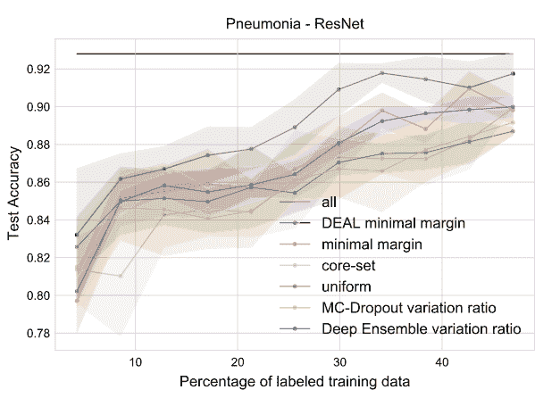

图 3 儿科肺炎数据集测试准确率与获得标记训练数据百分比的关系。我们对 DEAL 的性能与第 4.1 节介绍的方法进行了基准测试。实线水平线代表使用所有标记训练数据训练的 CNN。阴影区域显示标准差。

## 5 结论

在本文中，我们提出了一种新颖的基于不确定性的主动学习方法，并证明了其在科学数据集 MNIST、CIFAR-10 和 SVHN 上优于最先进的主动学习方法。通过从未标记数据实例的类概率中推断不确定性估计，可以识别出对更高效学习有贡献的数据点。我们表明，为了达到预定的模型性能，我们的方法不仅减少了所需的标记数据实例数量，而且在获取时间方面也更优越。通过将我们的方法应用于儿科肺炎胸部 X 射线图像的实际用例，我们指出它成功地减少了需要由专家标记的图像数量。这种方法的一个缺点可能在于仅基于不确定性选择数据点，因为仅基于不确定性进行获取会带来每个获取批次中的冗余，这可能导致次优解。因此，未来研究的一个有趣方向是将多样性准则纳入我们的方法中。

## 附录

参见图 4 和表 4、5。

## 1 引言

多类别分类是计算机视觉中许多重要任务的核心，例如语义分割、目标检测和实例分割[2]。
每个计算机视觉任务将图像或图像的部分映射到特征，这些特征被分类为几个类别之一 $C = \{1, 2, \ldots, K\}$。近年来，多类别分类问题的规模不断增长[3-5]。增长的一个简单原因是大型公开数据集的可用性。现在，拥有数百个类别的数据集已经很常见；例如，Cifar-100 [6]，Caltech-101 [7]，Caltech-256 [8]和SUN [9]，分别包含100、101、256和899个类别。类别数量的增长进一步扩大了ImageNet大规模视觉识别挑战赛的引入[10]，该挑战赛包含140万张图像和1000个类别，是完整的ImageNet数据集的一个小子集，该数据集包含约1400万张图像和超过2万个类别。

具有更强表征能力的算法的引入，被称为深度学习算法，使得能够更好地处理大规模分类任务。作为一个特例，一种非常适合视觉任务的深度学习算法被称为卷积神经网络（CNNs）。

CNNs通过卷积层逐渐构建特征。当层数增加并且使用更复杂的架构时，CNNs能够进一步提高性能[11]。

CNN的最后一个组成部分是分类层，它通过softmax函数将最终卷积层的扁平化特征转换为多类概率进行分类。我们将这种方法称为联合方法，也称为文献中的可扩展方法。联合方法的优点是为每个类别提供了一个概率。然而，这种方法的代价是分类层复杂度的超线性增长[12]。文献中存在另一种方法，通过一系列二进制决策确定多类预测结果，被称为类别二值化方法。类别二值化方法将分类问题简化为更简单的二进制决策。大部分深度学习文献忽视了类别二值化方法，而更倾向于联合方法。然而，我们认为类别二值化方法对深度学习社区有很多价值，本研究探索了这种方法的新实现。

在文献中，有三种主要的二值化方法。最常见的是一对其余方法（one-vs-rest），其中每个二进制问题都包括学习一个分类器来区分一个类与其余类别[13]。一对其余方法因其简单性而受到青睐，但不提供单个类别的概率。另一种标准方法是学习二进制分类器来区分每一对类别（one-vs-one）[14]。一对一方法可以使用配对耦合的方法产生联合类别概率[15]。然而，这种方法要求学习所有的

**($2^K$)** 对。第三种方法是纠错输出码（ECOC），在[16]中介绍。[16]的作者认为多类别分类问题是一个通信问题，其中正确类别的身份是通过噪声信道传输的。ECOC方法包括两个阶段。第一阶段将每个类别编码为二进制码字，形成一个编码矩阵，称为码书。码书的列形成了一组需要通过二进制学习者解决的二进制问题。解决一个K类别问题所需的最小二进制学习器数量为$M=[\log 2(K)]$。对于大规模问题，即K较大，M可以远小于K。关于不同二值化方法的综述，请参见[17]。

CNN和神经网络可以以多种方式适应ECOC方法。最简单的方法是使用从CNN的倒数第二层提取的代表性特征，并将它们馈送到单独的二进制分类器中，如[18]中所示。作为替代，可以训练一组通过单一损失函数连接的CNN，如[19]中所示。一种更直接的方法是将ECOC方法连接到单个CNN架构中，正如[20]的作者所演示的那样。我们采用与[20]类似的方法，将ECOC编码方式连接到单个CNN中。然而，我们的方法不同之处在于我们使用了从编码到类别的概率映射，而不是像[20]中的距离度量。与[20]不同，我们通过使用潜在模型来学习最优码书。这种方法的优点是在编码空间而不是更大的特征空间中学习类别概率，参见图1。

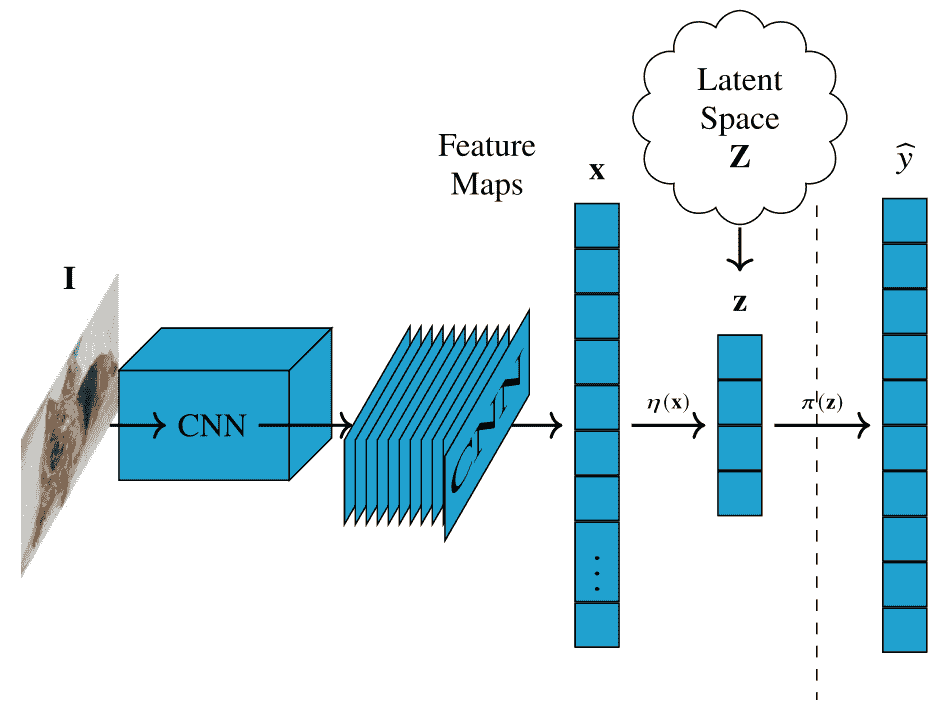

图1 LB-CNN架构：通过CNN提取图像 I 的特征图。特征图被展平成特征 x。通过 $\eta(x)$ 将特征映射到潜在空间。通过辅助softmax函数 $\pi(z)$ 预测类别。虚线表示在训练后，学习到的编码可以直接用于分类而不需要辅助softmax函数。

此外，该方法使用基于损失的解码，已知其性能优于基于距离的方法，请参见[21]。在初步实验中，我们发现这种方法对于随机码本效果很好。然而，随着类别数量的增加，性能开始下降。这是对于随机选择的码本来说是预期的行为。为了解决这个问题，我们开发了一个CNN架构，将ECOC的编码和解码过程整合到一个端到端的过程中。

前述方法中，需要预先指定码书矩阵。码书的规范化被认为是一个困难的问题，我们将在下一节中进行回顾。我们通过一种新颖的方法，将ECOC方法与CNN结合起来，添加了一个潜在的二值化层。该方法的重点是自动发现接近$M=[\log 2(K)]$大小的最小码书。我们提出了将学习最优编码视为潜在的方法。潜在变量是不可观察但可以从可观察变量之间的关系中推断出来的变量。潜在类层受行为研究中使用的潜在类模型家族的启发，以及人类思维可能经历的特征抽象步骤的假设，而不是直接使用物理特征进行对象识别，请参阅[22]中对潜在类模型的回顾。

为了发现潜在的类别二分法，我们假设潜在类别层中的节点遵循独立的伯努利分布。潜在变量通过将潜在伯努利变量通过代码的softmax转换为多类预测与类别结构相关联，参见图1。这种联系使模型能够发现图像之间的结构关系，从而窥视模型的决策过程。潜在代码与标准ECOC之间的主要区别在于响应取决于潜在代码，而不是相反。这种方法有潜力解决ECOC的一个主要缺点，即代码取决于原始响应，并因此相关。我们将提出的CNN命名为具有潜在二值化的LB-CNNs。

本文的主要贡献可以总结如下。我们提出将潜在二值化层纳入CNN中，共同学习重要的二分法。代码的潜在处理自动化地发现了近似最小表示码本。LB-CNNs学习类别的二进制划分，当共同探索时可以发现图像类别的聚类模式。推断可以通过直接使用代码来处理，就像标准ECOC一样，或者使用从代码到类别的概率映射的联合方法。联合方法的优点是可以为编码空间中的所有代码分配类别概率。我们使用EM类型的算法并将其与反向传播相结合来训练CNNs。本文提出的潜在二值化层似乎是直接将潜在分布纳入CNN以发现ECOC风格编码的首次尝试。

这些代码提供了理解复杂架构决策过程的附加好处。这种好处为模型增加了一种内在的可解释性模式，因为二进制决策本质上更容易理解。实验结果

## 2 相关工作

[16]的ECOC方法是最通用的二值化方法之一。ECOC能够同时包含一对多和一对一的方法，如[21]所示。ECOC由编码和解码两个阶段组成。解码阶段包括基于距离度量的解码和基于损失的解码，后者的性能更好[21]。编码步骤在代码空间 $\{-1, +1\}^{2^M \times M}$ 中搜索一组 $K$ 个代码，其最优代码长度 $M$ 未知。为了获得良好的结果，码本必须具有良好的分离性和无相关性。如[24]所示，如果各个二进制学习器高度相关，最终分类结果将很差。然而，如果底层二进制问题存在较大误差，性能仍然可能很差[25]。因此，码本设计是问题相关的，如[26]所观察到的。作者们在[12]和[27]中使用了数据驱动的方法，专门解决大规模视觉识别问题。确定最优码本是一个困难且尚未解决的问题[26]。有关编码和解码策略的综述，请参阅[28]。

为了发现最优码书，L B-CNN使用了潜在分布模型。该模型在单一架构中执行二进制编码和解码。潜在分布在机器学习中并不新鲜。潜在层在受限玻尔兹曼机（RBM）[29]、变分自编码器（VAE）[30]和生成对抗网络（GAN）[31]以及两者的组合[32]中被使用。

潜在层的能力在图像的内在特征编码方面已经得到了RBM、VAE和GANs在应用中的充分证明。

正如在引言中提到的，L B-CNN对代码的潜在处理具有额外的模型可解释性的好处。对于像CNN这样的大参数模型，一个重要的问题是决策过程被认为是高度不可解释的。许多研究尝试以各种方式剖析深度学习模型的决策过程。一种方法试图通过扰动网络的输入来获得对决策过程的洞察力[33]。其他方法通过计算显著性图来分析像素的重要性[34]。探测方法分析隐藏层对分类的重要性[35]。这些方法都是在后处理中进行的，具有调查性质。尽管事后分析方法具有信息量，但它们容易受到操纵的影响。通常最好在模型中内置一个内在的可解释性机制，参见[36]。

## 3 提出的方法

ECOC方法可以集成到任何深度神经网络架构中的多类分类问题中。实现这种修改的一种方法是将 $K$ 维的softmax输出层替换为 $M$ 个受限于 $[-1, +1]$ 范围的神经元。给定一个预定义的码本 $\mathcal{C} = \{-1, +1\}^{K \times M}$，网络可以通过惩罚神经网络的输出与正确类别的码字之间的距离来学习编码。

### 3.1 显式模型

在这项工作中，我们首先使用端到端的概率模型将ECOC集成到任何神经网络架构中。在该模型中，神经网络的主要目的是提取适用于分类任务的特征。这些特征通过我们的模型进一步转换为二进制码空间，通过独立于 $M$ 的伯努利变量模型化。通过对编码特征进行softmax操作，将二进制编码特征进一步转换为正确的类别标签。

然而，我们将这个softmax称为辅助softmax，因为编码特征足以预测类别标签，只需将预测的编码与提供的编码簿 $\mathcal{C} = \{-1, +1\}^{K \times M}$ 进行比较。编码空间在训练过程中与编码簿对齐，通过最大化似然目标函数实现。我们现在使用预先指定的编码簿 $\mathcal{C}$ 来描述该模型的细节，使用显式编码。

令 $D_n = \{(\mathbf{x}_i, \mathbf{z}_i, y_i)\}_{i=1}^n$，其中 $\{(\mathbf{x}_i, y_i)\}_{i=1}^n$ 是从 $(\mathbf{I}, Y)$ 的边缘分布中采样的观测数据，$\mathbf{x}_i$ 是图像 $I_i \in \mathbf{I}$ 的细化，提取自CNN的最后一个卷积层的 $d$ 维特征，并具有相应的类别标签 $y_i \in \mathcal{C} = \{1, 2, \dots, K\}$。每个 $\mathbf{z}_i$ 是一个具有 $z^j$ 的编码向量，通过提取 $\mathcal{C}$ 的第 $j$ 行获得。该模型对提取的特征 $\{\mathbf{x}_i\}_{i=1}^n$ 和相应的编码变量 $\mathbf{z}_i \in \{-1, +1\}^M$ 之间的对数几率施加了线性假设。此外，编码变量通过辅助softmax函数与类别输出相关联。

$$ \pi_+^j(\mathbf{x}_i) = \frac{e^{\alpha_0^j + \alpha^j \cdot \mathbf{x}_i}}{1 + e^{\alpha_0^j + \alpha^j \cdot \mathbf{x}_i}}, \quad \Gamma^k(\mathbf{z}_i) = \frac{e^{\beta_0^k + \beta^k \cdot \mathbf{z}_i}}{\sum_{l \in \mathbb{C}} e^{\beta_0^l + \beta^l \cdot \mathbf{z}_i}}, (1) $$

对于 $i=1, \dots, n$，$j=1, \dots, M$，和 $k \in \mathbb{C} = \{1, 2, \dots, K\}$。使用公式(1)中的模型，可以得到似然函数的表达式。

$$ L \left( \{ \theta, \alpha, \beta \} \right) = \prod _ { i = 1 } ^ { n } \left[ \prod _ { k \in \mathbb { C } } P \left( Y _ { i } = k \vert \mathbf { Z } _ { i } = \mathbf { z } _ { i } \right) ^ { \mathbb { 1 } \left\{ y _ { i } = k \right\} } \right] \times \left[ \prod _ { j = 1 } ^ { M } \pi _ { + } ^ { j } ( \mathbf { x } _ { i } ) ^ { \mathbb { 1 } \left\{ z _ { i } ^ { j } = 1 \right\} } \pi _ { - } ^ { j } ( \mathbf { x } _ { i } ) ^ { 1 - \mathbb { 1 } \left\{ z _ { i } ^ { j } = 1 \right\} } \right] , (2) $$

如式(2)所示，似然性是对提取特征在CNN中对 $\omega$ 的依赖进行了过度简化的表达式。在这里，非线性函数 $f$ 是通过一系列卷积、非线性操作和其他操作对输入图像进行构建的，包括将提取的特征最终重塑为向量表示 $\mathbf{x}$。因此，模型进一步由表示所有CNN权重的权重 $\omega$ 组成。为了优化目标，我们使用对数似然性重新简洁地表达式(2)，如下所示。

$$ \ell \left( \{ \theta, \alpha, \beta \} \right) = \sum _ { i = 1 } ^ { n } \sum _ { k \in \mathbb { C } } \mathbb { 1 } \{ y _ { i } = k \} \left[ \beta _ { 0 } ^ { k } + \beta ^ { k } \cdot \mathbf { z } _ { i } \right] - \sum _ { i = 1 } ^ { n } \log \left( \sum _ { k \in \mathbb { C } } e ^ { \beta _ { 0 } ^ { k } + \beta ^ { k } \cdot \mathbf { z } _ { i } } \right) $$ $$ + \sum _ { i = 1 } ^ { n } \sum _ { j = 1 } ^ { M } \mathbb { 1 } \{ z _ { i } ^ { j } = 1 \} \left[ \alpha _ { 0 } ^ { j } + \alpha ^ { j } \cdot \mathbf { x } _ { i } \right] - \sum _ { i = 1 } ^ { n } \sum _ { j = 1 } ^ { M } \log \left( 1 + e ^ { \alpha _ { 0 } ^ { j } + \alpha ^ { j } \cdot \mathbf { x } _ { i } } \right) $$

本节的显式模型存在一个主要缺陷。必须预先指定码本以训练模型。然而，在具有大量类别 $K > 100$ 的分类领域中，码本的规范证明是一个困难的问题。接下来，我们扩展这个模型，利用数据的结构来帮助发现一个使用端到端架构的最优码本。

### 3.2 潜在模型

选择足够潜在大小的最优编码矩阵证明是一个困难的问题，许多编码高度相关，并且经常引起困难的二进制问题，如相关工作中所讨论的。我们探索了使用超饱和设计技术学习码本，并看到了一些有希望的初步结果。

然而，我们放弃了这种方法，而是选择将编码和解码阶段合并到一个网络架构中。

### 3.3 EM算法

为了获得参数的最大似然估计，我们利用了期望对数似然函数，

$$ Q\left(\theta^{(t+1)}|\mathbf{z}, \mathbf{X}, \mathbf{y} ; \theta^{(t)}\right)=\sum_{i=1}^n \sum_{k \in \mathbb{C}} \mathbb{1}\left\{y_{i}=k\right\}\left[\beta_{0}^{k}+\beta^{k} \cdot \mathbb{E}\left[\mathbf{Z}_{i}|\mathbf{x}_{i}, y_{i} ; \theta^{(t)}\right]\right] $$ 
$$ -\sum_{i=1}^n \mathbb{E}\left[\log \left(\sum_{k \in \mathbb{C}} e^{\beta_{0}^{k}+\beta^{k} \cdot \mathbf{z}_{i}} \right)\left|\mathbf{x}_{i}, y_{i} ; \theta^{(t)}\right]\right] $$ 
$$ +\sum_{i \in\{1, \ldots, n\}} \sum_{j \in\{1, \ldots, M\}} \mathbb{E}\left[\mathbb{1}\left\{\mathrm{Z}_{i}^{j}=1\right\} \left|\mathbf{x}_{i}, y_{i} ; \theta^{(t)}\right)\left[\alpha_{0}^{j}+\alpha^{j} \cdot \mathbf{x}_{i}\right]\right] $$ 
$$ -\sum_{i \in\{1, \ldots, n\}} \sum_{j \in\{1, \ldots, M\}} \log \left(1+e^{\alpha_{0}^{j}+\alpha^{j} \cdot \mathbf{x}_{i}}\right) , $$

其中 $\theta$ 表示权重的集合 $\{\omega, \alpha_0, \alpha, \beta_0, \beta\}$。在接下来的内容中，为了方便演示，我们省略了对当前权重在时间 $t$ 的依赖关系。在 (4) 中，每个期望都是给定观测变量的潜在成分的条件概率的函数,

$$ P \left( Z_{i}^{j}=1 \left| \mathbf{x}_{i}, y_{i} \right. \right) = \pi_{+}^{j}\left(\mathbf{x}_{i}\right) \sum_{\mathbf{z}^{(-j)}} \Gamma_{+}^{y_{i}}\left(\mathbf{z}^{(-j)}\right) q\left(\mathbf{z}^{(-j)} ; \mathbf{x}_{i}\right) $$
$$ \pi_{+}^{j}\left(\mathbf{x}_{i}\right) \sum_{\mathbf{z}^{(-j)}} \Gamma_{+}^{y_{i}}\left(\mathbf{z}^{(-j)}\right) q\left(\mathbf{z}^{(-j)} ; \mathbf{x}_{i}\right) + \pi_{-}^{j}\left(\mathbf{x}_{i}\right) \sum_{\mathbf{z}^{(-j)}} \Gamma_{-}^{y_{i}}\left(\mathbf{z}^{(-j)}\right) q\left(\mathbf{z}^{(-j)} ; \mathbf{x}_{i} \right) , (5) $$

其中求和隐含在所有 $\mathbf{z}^{(-j)}$ 中，使得第 $j$ 个分量为 1，$\pi_{+}(\cdot)$ 如 (1) 所示，$\pi_{-}(\cdot)=1-\pi_{+}(\cdot)$，其中 $q(\cdot)$ 定义为

$$ q\left(\mathbf{z}^{(-j)} ; \mathbf{x}_{i}\right)=\prod_{l=1}^{M} \pi_{+}^{l}\left(\mathbf{x}_{i}\right)^{\mathbb{1}\left\{z^{l}=1\right\}} \pi_{-}^{l}\left(\mathbf{x}_{i}\right)^{1-\mathbb{1}\left\{z^{l}=1\right\}} \text{ , } (6) $$

其中 $\Gamma_{+}^{y_{i}}(\cdot)$ 和 $\Gamma_{-}^{y_{i}}(\cdot)$ 与 (1) 中的 $\Gamma^{y_{i}}(\cdot)$ 类似，但正负项分别为

$$ \Gamma_{+}^{y_{i}}\left(\mathbf{z}^{(-j)}\right)=\frac{e^{\beta_{0}^{y_{i}}+\beta_{j}^{y_{i}}+\beta_{(-j)}^{y_{i}} \cdot \mathbf{z}^{(-j)}}}{\sum_{k \in \mathbb{C}} e^{\beta_{0}^{k}+\beta_{j}^{k}+\beta_{(-j)}^{k} \cdot \mathbf{z}^{(-j)}}} , \quad \Gamma_{-}^{y_{i}}\left(\mathbf{z}^{(-j)}\right)=\frac{e^{\beta_{0}^{y_{i}}-\beta_{j}^{y_{i}}+\beta_{(-j)}^{y_{i}} \cdot \mathbf{z}^{(-j)}}}{\sum_{k \in \mathbb{C}} e^{\beta_{0}^{k}-\beta_{j}^{k}+\beta_{(-j)}^{k} \cdot \mathbf{z}^{(-j)}}} . (7) $$

E步骤使用(5)计算(4)的三个期望如下。

$$ \mathbb{E}\left[\mathbb{1}\left\{\mathrm{Z}_{i}^{j}=1\right\} \left| \mathbf{x}_{i}, y_{i} \right. \right] = P \left( Z_{i}^{j}=1 \left| \mathbf{x}_{i}, y_{i} \right. \right) , (8) $$

## 3.4 使用吉布斯采样的 LB-CNN

在每个批处理过程中，Gibbs 采样器首先从初始分布中采样代码。我们提出了三种初始分布，它们在训练的不同部分使用。在初始阶段，模型更喜欢通过探索代码空间来进行。

从平衡伯努利分布中进行抽样。随着模型训练的进行，每个 $Z^{j}$ 对于 $j=1,2,\dots,M$ 从伯努利分布 $\pi_{+}^{j}(\mathbf{x}_{i})$, $\pi_{-}^{j}(\mathbf{x}_{i})$ 中进行抽样。在训练的后期阶段，初始抽样过程会根据类别标签的信息对每个 $Z^{j}$ 对于 $j=1,2,\dots,M$ 进行独立抽样，抽样分布为伯努利分布，正类别的概率如下：

$$
\Gamma_{+}^{j}(\mathbf{x}_{i}, y_{i}) = \frac{
\frac{e^{\beta_{0}^{y_{i}} + \beta_{j}^{y_{i}}}}{\sum_{k \in \mathbb{C}} e^{\beta_{0}^{k} + \beta_{j}^{k}}}
\pi_{+}^{j}(\mathbf{x}_{i})
}{
\frac{e^{\beta_{0}^{y_{i}} + \beta_{j}^{y_{i}}}}{\sum_{k \in \mathbb{C}} e^{\beta_{0}^{k} + \beta_{j}^{k}}}
\pi_{+}^{j}(\mathbf{x}_{i}) + \frac{e^{\beta_{0}^{y_{i}} - \beta_{j}^{y_{i}}}}{\sum_{k \in \mathbb{C}} e^{\beta_{0}^{k} - \beta_{j}^{k}}}
\pi_{-}^{j}(\mathbf{x}_{i})
}
$$

and $\Gamma_{-}^{j}(\mathbf{x}_{i}, y_{i}) = 1 - \pi_{+}^{j}(\mathbf{x}_{i}, y_{i})$ 作为负类概率。

After obtaining the initial sample, a Gibbs update is performed. The Gibbs update consists of re-sampling each $Z^{j}$ for $j=1, \dots, M$ from a Bernoulli distribution with simplified conditional probabilities

$$
P \left( Z^{j} = 1|\mathbf{x}_{i}, y_{i}, \mathbf{z}^{(-j)} \right) = \frac{
\Gamma_{+}^{y_{i}} \left( \mathbf{z}^{(-j)} \right) \pi_{+}^{j}(\mathbf{x}_{i})
}{
\Gamma_{+}^{y_{i}} \left( \mathbf{z}^{(-j)} \right) \pi_{+}^{j}(\mathbf{x}_{i}) + \Gamma_{-}^{y_{i}} \left( \mathbf{z}^{(-j)} \right) \pi_{-}^{j}(\mathbf{x}_{i})
}
$$

其中，式(6)中的项 $g(\cdot)$ 被消除，而式(7)中的项 $\Gamma_{+}^{y_{i}}(\cdot)$, $\Gamma_{-}^{y_{i}}(\cdot)$ 与式(1)中的项 $\pi_{+}^{j}(\cdot)$, $\pi_{-}^{j}(\cdot)$ 相同。负类的概率类似于(12)。这个过程对于每个 $j=1,2,\dots,M$ 按照随机排列顺序重复进行。对于 (5)、(8) 和 (9) 的期望值，用以下蒙特卡洛估计值替代：

$$
\mathbb{E} \left[ \mathbb{1}\{Z_{i}^{j} = 1\}|\mathbf{x}_{i}, y_{i} \right] \approx \frac{1}{R} \sum_{r = 1}^{R} \mathbb{1}\{z_{i}^{j(r)} = 1\}
$$

$$
\mathbb{E} \left[ \mathbf{Z}_{i}|\mathbf{x}_{i}, y_{i} \right] \approx \frac{1}{R} \sum_{r = 1}^{R} \mathbf{z}_{i}^{(r)}
$$

$$
\mathbb{E} \left[ \log \left( \sum_{k \in \mathbb{C}} e^{\beta_{0}^{k} + \beta^{k} \cdot \mathbf{Z}_{i}} \right) \bigg| \mathbf{x}_{i}, y_{i} \right] \approx \frac{1}{R} \sum_{r = 1}^{R} \log \left( \sum_{k \in \mathbb{C}} e^{\beta_{0}^{k} + \beta^{k} \cdot \mathbf{z}_{i}^{(r)}} \right)
$$

其中 $R$ 表示采样的吉布斯样本数量。$M$ 步骤与之前一样，使用 PyTorch 软件进行。

## 4 个实验

在本节中，我们探索了 LB-CNN 的能力。LB-CNN 具有高度模块化的特点；它可以集成到任何标准的 CNN 架构中。在实验中，我们选择将 LB-CNN 与 [38] 的 DenseNet-BC 架构集成，通过在 DenseNet-BC 的倒数第二个特征层之后插入潜在二值化层和相应的辅助 softmax 层。选择 DenseNet-BC 是因为它具有接近最先进性能、经济复用特征和简单实现的特点。

对于感兴趣的读者，代码和运行细节可以在 GitHub 存储库 https://github.com/treese41528/LB-CNN 中找到。存储库中的实验设计为方便您在 Google 协作笔记本上使用。要运行实验，请按照在 Google 驱动器上安装存储库结构的说明进行操作。提供了两种神经网络架构用于测试，DenseNet [38] 和 SimpleNet [39]。

### 4.1 实验描述

通过五类图像分类基准数据集探索了 LB-CNN 的实用性。使用 MNIST 和 Cifar-10 进行了两个小规模实验。在 Cifar-100 和 Caltech-256 上进行了两个中等规模实验。最后，在 ImageNet 上进行了一个大规模实验，具体是在 ILSVRC-2012 数据集上。小规模和中等规模实验使用了完整的 EM 实现。我们使用基于 Gibbs 的 LB-CNN 进行 ImageNet 实验。对每个实验都应用了标准的数据增强技术。这包括对所有图像进行归一化处理。自然图像还会进行随机裁剪和水平翻转，稍微随机旋转。正则化技术包括在 DenseNet 架构中进行批归一化和使用 $10^{-4}$ 对权重进行权重归一化。我们观察到从头开始训练模型和微调预训练模型之间几乎没有差异。因此，我们只展示了微调模型的结果。

对于每个数据集，我们使用最小的 $M=\lceil\log_{2}(K)\rceil$ 进行模型训练，并逐渐增加码字大小。对于小规模问题 MNIST 和 Cifar-10，我们发现 $M=\lceil\log_{2}(10)\rceil=4$ 确实足够。对于更大规模的问题，增加潜变量大小确实有一些收益，但这些收益很快就会停滞。

### 4.2 LB-CNN：性能

LB-CNN 的主要目标是在减少模型参数的同时保持或超过标准 softmax 实现的性能。在图 2 中，我们绘制了使用 5 个随机初始化的 LB-CNN 的最佳测试准确率。

MNIST 性能与潜在代码大小的关系。**Y 轴（测试准确率）**：0.40 - 1.00。**X 轴（潜在大小）**：2 - 9。图例包括：辅助 softmax 性能（实线），$l_2$ 性能（Z）（虚线），$l_2$ 性能（E[Z]）（点划线）。该图显示了三条线代表不同性能指标，从潜在大小 2 增加到大约 4，然后保持相对平坦或略微上升至 9。

DenseNet-BC 按潜在大小排序。顶部图表分别显示了 MNIST 和 Cifar-10 的测试准确率，如图 2 底部所示。这两个图表展示了与 DenseNet-BC 标准实现相当的性能。特别是，Cifar-10 的测试准确率与使用最小 $M=4$ 个码的标准 DenseNet-BC 模型的 95% 分类准确率相匹配。此外，使用潜在码直接进行预测或辅助 softmax 进行预测之间几乎没有差异。

图 3 的顶部图表展示了 Cifar-100 和 Caltech-256 大规模任务的 top-1 和 top-5 测试准确率。在这两种情况下，LB-CNN 的性能略低于标准 softmax 方法，Cifar-100 的 top-1 为 79.71%，top-5 为 94.85%，Caltech-256 的 top-1 为 83.60%，top-5 为 93.81%。然而，当潜在大小增加时，这一差距逐渐缩小。对于 Caltech-256，这是预期的行为，尤其是当潜在大小为最小的 8 时，需要整个代码空间来表示 256 个类别。训练过程使用精确的期望最大化方法，将最大潜在大小限制为 16。

在图 3 中，测试准确率相对于潜在大小展示。$l_2$ 表示码本和预测码之间的欧几里得距离 Z，或者预期码 $E[Z|X]$，其中包括不确定性。

### 4.3 LB-CNN 增强的可解释性

从训练过程中学习的码书可以为决策过程提供洞察力。例如，图 6 展示了如何使用大小为 7 的码书来探索正确分类鸟类的一条可能的决策路径。第一个二进制决策，即 $z_1$，将图像与汽车、马、船或卡车区分开来。第二个二进制决策，即 $z_2$，进一步排除了飞机的可能性。二进制决策 $z_3$ 排除了青蛙的可能性。第四个决策确定图像是鸟还是猫。最后，$z_5$ 确定图像是鸟。

这种附加功能使 LB-CNN 的决策可以像决策树一样解释，决策树的决策被认为比标准 CNN 更可解释。在图 6 中，我们只展示了一种可能的鸟类决策过程。其他可能的决策过程由不同的方式形成。

| z1 | z2 | z3 | z4 | z5 | z6 | z7 |
|----|----|----|----|----|----|----|
| 飞机 | -1 | -1 | -1 | -1 | 1 | 1 | -1 |
| 汽车 | 1 | -1 | 1 | -1 | 1 | -1 | -1 |
| 鸟 | -1 | 1 | -1 | -1 | 1 | -1 | -1 |
| 猫 | -1 | 1 | -1 | -1 | -1 | -1 | -1 |
| 鹿 | -1 | 1 | -1 | 1 | -1 | 1 | 1 |
| 狗 | -1 | 1 | -1 | 1 | -1 | -1 | -1 |
| 青蛙 | -1 | 1 | 1 | -1 | -1 | 1 | -1 |
| 马 | -1 | -1 | 1 | 1 | -1 | 1 | -1 |
| 船 | 1 | -1 | -1 | -1 | 1 | 1 | 1 |
| 卡车 | 1 | -1 | 1 | 1 | 1 | -1 | -1 |

## 5 结论

在这项工作中，我们提出了一种将ECOC与CNN相结合的新方法。这种方法将ECOC的编码和解码步骤封装到一个单独的CNN架构中，使用潜在的二值化层。我们开发了结合EM和反向传播的算法进行训练。针对大规模问题，我们提供了LB-CNN的Gibbs采样版本。该模型在每个分类任务上表现出色。LB-CNN模型能够发现具有最佳属性的编码。这些编码可以进一步用于分析决策过程并识别类别之间的潜在关系。这项工作为未来通过端到端编码和解码深度学习模型解决复杂的大规模分类问题奠定了基础。需要进一步研究来弥合这种方法与使用标准softmax分类器的传统方法之间的性能差距

## 参考文献

- 1. Reese, T., Zhu, M.: LB-CNN: 具有潜在二值化的卷积神经网络用于大规模多类别分类。在：2020年第19届IEEE国际机器学习与应用会议（ICMLA），第142-147页（2020年）。https://doi.org/10.1109/ICMLA51294.2020.00031
- 2. Alves, T., Oliveira, C., Sanin, C., Szczerbicki, E.: 从基于知识的视觉系统到认知视觉系统：一项综述。Procedia Comput. Sci. 126, 1855–1864 (2018). https://doi.org/10.1016/j.procs.2018.08.077
- 3. Krizhevsky, A., Sutskever, I., Hinton, G.E.: 使用深度卷积神经网络进行ImageNet分类。Commun. ACM 60(6), 84–90 (2017)
- 4. Simonyan, K., Zisserman, A.: 非常深的卷积神经网络用于大规模图像识别 (2014)。arXiv:1409.1556
- 5. Szegedy, C., Wei, L., Yangqing, J., Sermanet, P., Reed, S., Anguelov, D., Erhan, D., Vanhoucke, V., Rabinovich, A.: 通过卷积更深入。在：2015年IEEE计算机视觉和模式识别（CVPR）会议上，第1-9页（2015）。https://doi.org/10.1109/CVPR.2015.7298594
- 6. Krizhevsky, A.: 从小图像中学习多层特征。多伦多大学（2012）
- 7. Li, F. F., Andreetto, M., Ranzato, M. A.: Caltech101图像数据集。http://www.vision.caltech.edu/Image_Datasets/Caltech101/（2003）
- 8. Griffin, G., Holub, A., Perona, P.: Caltech-256物体类别数据集。技术报告编号7694，加州理工学院。 http://authors.library.caltech.edu/7694 (2007)
- 9. Xiao, J., Hays, J., Ehinger, K. A., Oliva, A., Torralba, A.: Sun数据库：从修道院到动物园的大规模场景识别。在：2010年IEEE计算机学会计算机视觉和模式识别会议上，第3485-3492页（2010）。https://doi.org/10.1109/CVPR.2010.5539970
- 10. Russakovsky, O., Deng, J., Su, H., Krause, J., Satheesh, S., Ma, S., Huang, Z., Karpathy, A., Khosla, A., Bernstein, M., Berg, A. C., Fei-Fei, L.: ImageNet大规模视觉识别挑战。国际计算机视觉杂志(ICV) 115(3), 211-252页（2015）。https://doi.org/10.1007/s11263-015-0816-y
- 11. 何凯明，张新建，任少伟，孙剑：深入研究整流器：在ImageNet分类上超越人类水平的性能。在：IEEE国际计算机视觉会议（ICCV 2015），第1502页（2015）。https://doi.org/10.1109/ICCV.2015.123
- 12. 赵斌，邢恩平：大规模视觉识别的稀疏输出编码。在：2013年IEEE计算机视觉和模式识别会议上，第3350-3357页（2013）。https://doi.org/10.1109/CVPR.2013.430
- 13. Vapnik, V. N.: 统计学习理论。Wiley-Interscience(1998)
- 14. Friedman, J. H.: 多项分类的另一种方法。技术报告，斯坦福大学统计学系。http://www-stat.stanford.edu/jhf/ftp/poly.ps.Z (1996)
- 15. Hastie, T., Tibshirani, R.: 通过成对耦合进行分类。Ann. Stat. 26(2), 451-471。 http://www.jstor.org/stable/120036 (1998)
- 16. Dietterich, T. G., Bakiri, G.：通过纠错输出码解决多类学习问题。人工智能研究杂志 2(1):263-286. http://dl.acm.org/citation.cfm?id=1622826.1622834 (1995)
- 17. Rocha, A., Goldenstein, S. K.: 从二进制到多类：扩展一对多、一对一和基于ECOC的方法. IEEE神经网络与学习系统交易 25(2), 289-302 (2014). https://doi.org/10.1109/TNNLS.2013.2274735
- 18. Bora, M., Daimary, D., Amitab, K., Kandar, D.: 使用CNN-ECOC从图像中识别手写字符. 计算机科学会议论文集167, 2403-2409 (2020). https://doi.org/10.1016/j.procs.2020.03.293
- 19. Mun, Y. J., Kang, J. W.: 对抗鲁棒性的随机二进制输出编码集成. IEEE Access 1, (2019). https://doi.org/10.1109/ACCESS.2019.2937604
- 20. Deng, H., Stathopoulos, G., Suen, C.: 应用纠错输出编码增强卷积神经网络的目标检测和模式识别, pp. 4291-4294 (2010). https://doi.org/10.1109/ICPR.2010.1043
- 21. Allwein, E. L., Schapire, R. E., Singer, Y.: 将多类分类器减少为二进制分类器：一种统一的方法. 机器学习研究杂志1,113-141 (2001)
- 22. Bartholomew, D. J.: 因子分析和潜变量建模. Springer, Berlin, pp. 501-503 (2011). https://doi.org/10.1007/978-3-642-04898-2_247
- 23. Wani, M., Kantardzic, M., Sayed-Mouchaweh, M.: 深度学习应用趋势, 第1-7页 (2020). https://doi.org/10.1007/978-3-642-35289-8_32
- 24. Guruswami, V., Sahai, A.: 多类学习、提升和纠错码. In: 计算学习理论第十二届年会论文集, ACM出版社, 第145-155页 (1999)

| Chihuahua | Japanese spaniel | Maltese | Pekinese | Shih-Tzu | Blenheim spaniel | papillon | toy terrier |
| --- | --- | --- | --- | --- | --- | --- | --- |
| 1-11 1-1-1 1 1-1 -1 -1 -1 1-1 -1-1 -1 | 1-111-1-1 -1 1 1-1-1 1-1 -1 1-1 -1-1 | 111 1 1-1-1 1 1 1 1-1 1 -1 1-1 1-1 | 1 1-1 -1-1 1 1 1 1-11 -1 1 1-1-1 |
| 111-11-1 1-1 1 1 1-1 -11-1 1-1 -1 | -1 -11-1 1-1 1-1 1 1 1 1-1 -1 1 -1 1 | 1 1-1-1-1-1 1 1-1 1-1 1-1 1 1 -1 -1 | -1 1 1-1 1 1 1 1 1-1-1 -1-1 1 1 -1 -1 |
| 1 2 3 4 5 6 7 8 9 10 11 12 13 14 15 16 |  |  |  |

### Case 8
You are a gastroprofessional. You have a patient in your head. You are thinking about this patient. You are a patient in your head. You are thinking about this patient. You are a gastroprofessional. You have a patient in your head. You are thinking about this patient. You are a gastroprofessional. You have a patient in your head. You are thinking about this patient. You are a gastroprofessional. You have a patient in your head. You are thinking about this patient. You are a gastroprofessional. You have a patient in your head. You are thinking about this patient.

### Case 8 Analysis
The case is about a gastroprofessional who has a patient in the head, thinking about the patient. The case is about a gastroprofessional who has a patient in the head, thinking about the patient. The case is about a gastroprofessional who has a patient in the head, thinking about the patient. The case is about a gastroprofessional who has a patient in the head, thinking about the patient. The case is about a gastroprofessional who has a patient in the head, thinking about the patient. The case is about a gastroprofessional who has a patient in the head, thinking about the patient. The case is about a gastroprofessional who has a patient in the head, thinking about the patient. The case is about a gastroprofessional who has a patient in the head, thinking about the patient. The case is about a gastroprofessional who has a patient in the head, thinking about the patient. The case is about a gastroprofessional who has a patient in the head, thinking about the patient. The case is about a gastroprofessional who has a patient in the head, thinking about the patient. The case is about a gastroprofessional who has a patient in the head, thinking about the patient. The case is about a gastroprofessional who has a patient in the head, thinking about the patient. The case is about a gastroprofessional who has a patient in the head, thinking about the patient. The case is about a gastroprofessional who has a patient in the head, thinking about the patient. The case is about a gastroprofessional who has a patient in the head, thinking about the patient. The case is about a gastroprofessional who has a patient in the head, thinking about the patient.

### Case 8 Analysis
The case is about a gastroprofessional who has a patient in the head, thinking about the patient. The case is about a gastroprofessional who has a patient in the head, thinking about the patient. The case is about a gastroprofessional who has a patient in the head, thinking about the patient. The case is about a gastroprofessional who has a patient in the head, thinking about the patient. The case is about a gastroprofessional who has a patient in the head, thinking about the patient. The case is about a gastroprofessional who has a patient in the head, thinking about the patient. The case is about a gastroprofessional who has a patient in the head, thinking about the patient. The case is about a gastroprofessional who has a patient in the head, thinking about the patient. The case is about a gastroprofessional who has a patient in the head, thinking about the patient. The case is about a gastroprofessional who has a patient in the head, thinking about the patient. The case is about a gastroprofessional who has a patient in the head, thinking about the patient. The case is about a gastroprofessional who has a patient in the head, thinking about the patient. The case is about a gastroprofessional who has a patient in the head, thinking about the patient. The case is about a gastroprofessional who has a patient in the head, thinking about the patient. The case is about a gastroprofessional who has a patient in the head, thinking about the patient. The case is about a gastroprofessional who has a patient in the head, thinking about the patient.

## 1 引言

最近几年，使用自主机器人执行以前仅由人类执行的任务（例如从危险环境中救援受害者、库存管理、识别危险等）引起了极大的兴趣[24]。在这一领域进行研究激增的一个重要原因是部署高精度的深度学习模型，这些模型可以显著增强机器人的智能能力，使其能够执行类似人类的活动。在零售行业，越来越多的努力被投入到减少人为参与危险检测和库存维护中。机器人产生大量数据来观察周围环境，大多数机器人技术都涉及使用云服务器进行数据处理[22]。使用云服务器涉及将原始数据传输到云端，这增加了通信成本和响应时间，并且使任何私人数据容易受到威胁。因此，最好将数据尽可能地在源头附近进行处理。

边缘计算技术通过在数据源附近处理数据来解决问题[17]。随着边缘计算技术的改进，许多边缘设备现在具备足够的计算和存储能力，在网络边缘执行深度学习任务。例如，Coral Dev Board可以以仅2瓦的功耗执行每秒4万亿次操作（TOPS）。因此，边缘计算可以迅速成为在网络边缘部署深度学习模型的普遍技术。Coral Dev Board和NVIDIA Jetson等低功耗设备是设计能够执行实时深度学习任务的自主机器人中常用的边缘设备。NVIDIA Jetson、BeagleBone AI和Coral Dev Board等设备旨在利用边缘技术为机器人领域提供智能化。

深度学习（DL）已经彻底改变了图像、音频和传感器数据的分析方式。在为实时决策而部署DL技术的物理代理上的努力显著增加了[31]。然而，由于复杂的深度神经网络结构涉及数百万个参数，深度学习技术的计算成本很高。文献中观察到浅层神经网络结构也是可行的；然而，基于深度神经网络结构的学习模型在准确性、自动数据工程特性以及使用更大数据集解决图像和语音识别等复杂问题方面取得了更好的成果[16]。尽管它们在解决许多问题上取得了成功，但在具有有限内存和计算能力的设备（如物联网设备、自主机器人等）上部署深度学习模型仍然具有挑战性。模型修剪和量化等不同的模型压缩技术可以帮助在资源受限设备上部署DL模型。在本章中，我们展示了如何在ROS环境中在不同的资源受限设备上部署DL模型。这种资源受限设备越来越多被用作自主机器人上的主要机载计算设备。

在实验中，使用了一个超市地板危险数据集来训练和测试不同的深度学习模型，并展示了在ROS环境中在资源受限的设置中成功部署深度学习模型的能力，使用了我们的新型开源Easy DLROS 1 框架。

在本章中，我们首先概述了如何在资源受限的边缘设备上部署深度学习模型，然后介绍了我们在ROS环境中部署这些模型到自主机器人的新框架。我们使用一个真实世界的用例来评估我们的方法，即使用ROS集成的自主机器人来识别地板上的危险。

## 研究贡献

许多自主机器人越来越多地使用机器人操作系统（ROS），但在ROS环境中还没有建立起一个统一的框架来简化深度学习的部署。ROS是一种中间件，已经成为机器人应用开发的通用工具[33]。它提供了一种用于进程间通信的发布/订阅模型，以及多个应用开发的库和包，使其对各种从业者都非常有用。然而，在使用ROS在机器人上部署深度学习模型时仍然存在三个主要问题:

- 深度学习模型的高能耗  
- 对计算设备造成重大的计算负担  
- 在边缘设备或自主机器人上部署深度学习模型的一个主要障碍是缺乏足够强大的算法系统，能够在有限的计算资源和低电池寿命下稳定工作。

本章介绍了一种新的深度学习架构，用于训练深度学习模型并在ROS环境中部署智能，从而使资源受限的设备能够加快决策速度。本章还讨论了其他六种可以部署在受限设备上的深度学习模型。

最后，我们介绍了EasyDLROS，这是一个在ROS操作的边缘设备或自主机器人上部署DL模型的框架。本章的主要贡献如下:

- EdgeLite的设计，这是一种轻量级图像识别CNN架构，用于检测超市地面危险的存在与否  
- 一个新颖的框架EasyDLROS，用于在ROS环境中部署深度学习模型的自主机器人  
- 将EdgeLite与六种最先进的深度学习模型（即MobileNet V1、MobileNetV2、InceptionNet V1、InceptionNet V2、ResNet V1和GoogleNet）进行比较，用于超市危险检测时部署在NVIDIA Jetson TX2上，结果显示EdgeLite具有最高的F-1分数，并且在内存、推理时间和能量方面具有可比性的资源需求。  
- 一个新的超市地板危险图像数据集  
- 使用模拟环境中的真实世界示例进行案例研究，涉及一个机器人。

1 https://github.com/sarwarmurshed/supermarket_hazard_detection/tree/master/EasyDLROS.

## 2 相关工作

尽管深度学习的计算需求带来了挑战，但一些研究人员已经探索了在资源受限环境中部署最先进的深度学习系统的方法。到目前为止，在这个领域的大部分工作中，研究人员都使用了大型计算系统或云服务器来在小型设备或ROS动力自主机器人上进行深度学习。然而，大多数自主机器人都是通过内置电池获取能量。在机器人上运行计算密集型的深度学习模型会对电池造成巨大负担。另一方面，使用云服务器会危及数据安全并增加延迟。因此，我们的工作重点是使用小型计算设备（如Jetson Nano）在本地执行所有深度学习推理和其他任务。

虽然Hsu等人使用了大型云服务器，但他们开发了一个探测物体掉落的危险系统，当物体掉落时会生成警报消息[9]。他们的方法有三个关键方面：

1. 进行骨架提取以构建用于检测跌倒的机器学习预测模型，  
2. 树莓派用作边缘计算设备，用于主要数据处理和减小视频/图像的大小，  
3. 最后，通过云端的机器学习推理来检测跌倒，并在适当的情况下通知用户。

在另一项研究中，使用卷积神经网络开发了一个人体跌倒检测系统[32]。该跌倒检测系统可以检测视频序列中的人体跌倒。

为了在城市区域检测危险事件，设计了一个分层分布式计算架构，用于在网络边缘分析大数据[30]。使用低功耗计算设备上的机器学习算法构建了一个工作原型，以快速检测危险事件，以避免潜在的损害。研究人员还使用深度学习模型来检测道路上的小型危险物（例如，丢失的货物），这对于自动驾驶车辆来说是至关重要的能力[19]。

Lane等人开发了一种能够降低深度学习所需计算资源的软件加速器，以及一种能够降低深度学习所需设备资源的软件加速器[14]。他们使用了两种技术，即运行时层压缩和深度架构分解，这有助于在推理阶段控制内存和计算运行时间。

苏等人开发了一款能够帮助顾客购物的服务机器人[27]。该系统使用ROS和深度学习技术来检测顾客并回答一些简单的问题。在另一项研究中，使用ROS和深度学习的组合来标注拥挤和非拥挤场景的地图区域[13]。非拥挤区域的识别有助于无人机安全飞行的路径规划。然而，这些研究中并未讨论深度学习模型在机器人上的性能。

Sisido等人设计了一个使用深度学习进行交通标志识别的系统，并在ROS模拟器上进行了测试[26]。Chang等人使用Faster R-CNN算法和ROS开发了一个目标检测系统[2]。他们将完整的系统部署在基于树莓派的机器人上，并使用Kinect传感器捕捉图像。该系统使用云服务实时检测物体。Liu等人使用深度学习和ROS分布式架构开发了自动驾驶系统[15]。他们使用三个摄像头捕捉道路图像，并使用深度学习来检测道路标志、车道线和信号灯。然后将检测结果传递给决策模块并进行处理。最后，他们使用控制模块来自动控制汽车。他们使用3个摄像头、3个Jeston TX1板和一台大型工业计算机来检测物体并驱动汽车。在ROS环境中，大多数关于深度学习的研究都使用公共云计算或外部计算系统来执行数据处理任务。在我们的实验中，我们只使用机载设备进行数据处理，以保护所有数据的隐私。

## 3 深度学习背景

本节简要介绍了在资源受限设备上部署深度学习模型的关键概念。

## 3.1 卷积神经网络 (CNNs)

现代深度学习架构的大部分基于人工神经网络(ANNs)。人工神经网络结合一组数学或其他操作，称为卷积，被称为卷积神经网络(CNNs)。CNNs是最广泛使用的ANNs类型之一，可以将图像作为输入，学习这些图像的不同特征，并将其准确分类为不同的类别[1]。基于CNNs的技术取得了巨大的进展，不仅在图像识别方面，在语音识别、自然语言处理方面也取得了显著的进展，使其成为深度学习中最流行的方法之一。基于CNN的深度学习技术模仿人类智能，逐渐学习解决问题。CNNs由数百万个人工神经元和这些神经元之间的连接组成。神经元之间的连接具有权重。深度学习网络中的神经元数量对网络性能有很大影响。如果网络层的深度增加[3]，并且训练数据集丰富，CNN的性能会更好。然而，增加网络的深度会增加网络中的参数数量。参数数量对计算资源和能源使用有很大影响。这种高计算需求限制了深度学习在电池供电的机器人上的部署。然而，最近已经开发出了几种模型，既在参数数量和性能方面保持了良好的平衡，又限制了计算资源的使用[17]。MobileNet和SqueezeNet是这种轻量级模型的例子，与其他知名模型（如AlexNet）相比，它们使用更少的参数，在资源受限环境中表现良好[5，11]。

## 3.2 训练

图1展示了CNN训练和推理的概述。在训练过程中，CNN网络从先前的数据中学习其参数的值，例如滤波器、权重等，以完成特定任务。CNN的训练分为两个阶段：

1. 前向传播阶段：输入数据被馈送到CNN并完全通过网络。CNN根据输入数据进行预测，并使用“损失函数”计算预测误差。  
2. 反向传播阶段：接收到误差并根据误差值更新权重（人工神经元之间的连接）。

训练完成后，权重、偏置和其他参数作为训练好的深度学习模型的一部分被存储。这个训练好的模型在推理过程中用于对新数据进行预测和/或分类。

## 3.3 推理

深度学习推理是一个过程，其中使用模型将在训练过程中获得的知识应用于对之前未见过的数据进行预测和/或分类。例如，当一个新的图像作为输入展示给训练过的模型时，模型会根据其学习到的权重值输出一个预测分数，在训练阶段学习到的权重值决定了预测分数的值。通常，模型使用32位浮点精度进行训练，并在推理过程中使用相同的精度。然而，基于32位操作的模型部署在电池供电的机器人上会消耗过多的能量。

在自主机器人上高效部署深度学习模型

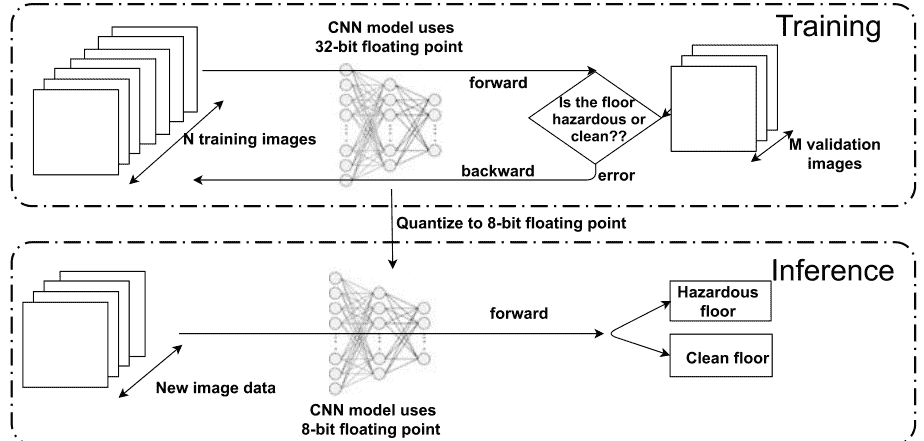

图1 资源受限环境下的CNN训练和推理。在前向传播中，输入数据被馈送到网络中。网络的每一层使用激活函数处理输入数据，并计算当前输出向量与期望输出向量之间的误差。在反向传播中，网络通过反复调整权重和偏置来最小化误差。在这个前向和反向传播过程中使用32位浮点格式。一旦训练完成，模型被量化为8位。在推理过程中，使用量化模型可以节省计算资源和能量，便于在资源受限设备上部署。

一个电力短缺的情景。因此，在机器人上部署之前，DL模型通常被量化为8位。这种转换会稍微降低模型的准确性，但是牺牲这种准确性可以节省能量，使得这些技术在资源受限的环境中可行。图1展示了DL模型的量化和推理过程。

## 4.1 EdgeLite 架构

为了拥有一个可以在资源受限的边缘设备上进行推理的模型，且具有低内存占用且无需额外硬件的特点，我们开发了一个轻量级的CNN架构，在我们的危险数据集上实现了超过90%的准确率。

EdgeLite具有19层，不包括池化层。我们使用具有多个尺寸的滤波器，在CNN网络的同一级别上操作，以提取不同尺度的特征。所使用的不同类型的滤波器尺寸为1 x1、3x3和5x5。为了使网络计算更加廉价，我们使用1 x1卷积来减少输入通道的深度，并在3 x3和5 x5卷积之前使用额外的1 x1卷积。

我们的CNN架构如表1所示，包括卷积、最大池化、平均池化和EdgeLite层。EdgeLite层被纳入CNN中，通过堆叠的1 x1卷积进行降维，以减少计算开销。在这一层中使用多个核滤波器尺寸，并在使用3 x3和5 x5层时添加额外的1 x1卷积。所有内核按顺序在同一级别上操作。在这一层中进行最大池化,并将结果输出连接,然后发送到下一层。EdgeLite的架构受到Inception[28]的启发。然而，我们减少了层数和内核大小，使其适用于资源受限的设备。

## EasyDLROS的架构

本节介绍了机器人操作系统的相关背景，我们的创新EasyDLROS框架的结构，ROS的基本组件以及这些组件在EasyDLROS中的使用方式。

## 5.1 ROS

机器人操作系统(ROS[21])是一个基于中间件的元操作系统，为开发机器人软件提供了灵活的框架。ROS提供了一组软件库和工具，帮助在异构计算机集群上构建机器人应用程序。分布式计算、可移植性和易于测试是ROS的主要特点之一。这些特点有助于实现多机通信、实时操作和分布式计算。ROS中的软件组织成包，帮助实现感知、同时定位、机器人模型和映射、仿真工具和其他算法等应用程序。

## 5.2 EasyDLROS框架

我们新的深度学习系统的架构概述如图2所示。它展示了EasyDLROS如何在机器人上部署深度学习模型并在本地执行所有分析任务（无需使用云服务器）。该系统分为三个主要部分：

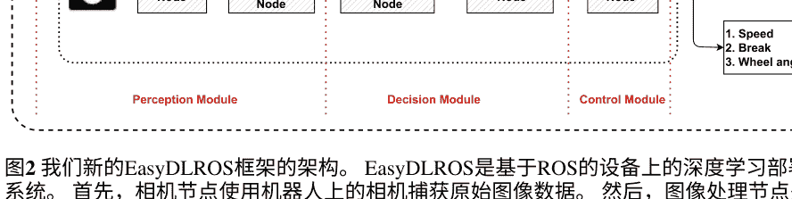

图2 我们新的EasyDLROS框架的架构。EasyDLROS是基于ROS的设备上的深度学习部署系统。首先，相机节点使用机器人上的相机捕获原始图像数据。然后，图像处理节点处理原始图像数据，使其适用于深度学习模型。深度学习节点部署预训练的DL模型并生成图像分类结果。决策节点然后分析分类结果并生成执行机器人后续任务所需的命令。最后，控制节点从决策节点接收命令并执行必要的用户定义任务，同时控制机器人。

## 感知模块  
该模块包括一个相机节点，负责获取所有必要的输入图像。然后，这些图像由图像处理节点进行处理。该节点的主要功能包括图像转换（ROS msgs/Image消息到OpenCV图像）、亮度调整、像素调整等。

## 决策模块  
该模块是我们系统的大脑。该模块使用深度学习模型处理来自前一个模块的所有图像。它将结果融合到其他节点中。

## 控制模块  
该模块包含控制机器人的逻辑。它从决策模块获取输入，并使用控制逻辑进行控制决策。然后，它生成控制命令，例如修改速度、前轮角度、验证危险或清洁地板、刹车等。在该模块中部署了生成预测机器人横向和纵向控制命令的转向和速度节点，包括车速和前轮旋转角度。

ROS标准节点用于实现这些模块的功能。在我们的原型中，我们使用了一个摄像头和一个Jetson TX2作为边缘设备。

## 摄像头节点  
摄像头节点是感知模块的一部分（见图2），用于处理连接到机器人的摄像头。所有输入图像都是使用此节点拍摄的，这使其成为最重要的节点之一。  
在我们的实验设置中，我们使用了一个800万像素的广角Leopard成像摄像头，具有136°视野，安装在机器人前方以捕捉图像。此节点还可以使用其他类型的摄像头。  
图3显示了摄像头节点的整体结构。

ROS使用camera_info_manager包来保存和恢复相机校准数据。同样，Camera_info_manager使用camera_package和OpenCV来保存和恢复msgs/Camera Info数据。在捕获图像后，此摄像头节点发布两个输出：一个image_raw消息和一个camera_info消息。image_raw消息包含生成数字图像所需的所有必要的未经处理的数据，而camera_info消息包含其他信息，如校准相机的位置、捕获图像的高度和宽度。

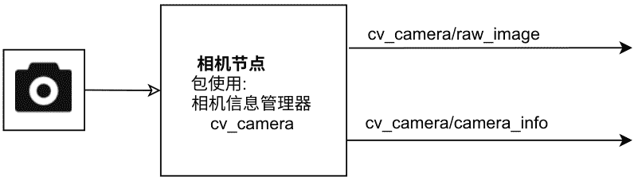

图3 相机节点的块图 该节点使用机器人相机捕获原始图像数据，并将其提供给图像处理节点  

## 图像处理节点  
ROS相机节点以特殊的sensor_msgs/Image消息格式捕获原始图像。大多数深度学习模型使用矩阵格式的图像作为输入，因此无法直接将sensor_msgs/Image格式的数据作为任何深度学习模型的输入。

因此，我们使用了OpenCV CvBridge库来转换这些原始图像。该库将sensor_msgs/Image消息格式文件转换为OpenCV图像，使其可被深度学习模型读取。图4显示了该节点的整体结构，图中的代码片段显示了将图像转换的方法（见列表9.1）。CvBridge支持不同类型的编码，用于将ROS原始图像转换为OpenCV图像。Mono8、bgra8、rgb8是最常用的图像编码格式。我们实验中使用的深度学习模型接受RGB图像作为输入，因此我们使用rgb8编码将所有ROS原始图像消息转换为RGB图像。图5展示了CvBridge的功能概述。

图9.1从机器人摄像头接收到的图像数据转换为RGB图像  

```
from cv_bridge import CvBridge
bridge = CvBridge()
cv_image = bridge.imgmsg_to_cv2(image_message, 'rgb8')
```

虽然我们已经将ROS图像消息转换为RGB图像，但在将其用于DL模型之前，还需要进行进一步的图像处理任务，如swapaxes、ndarray转换等。在我们的地板危险检测实验中，

## 深度学习节点  
该节点在ROS环境中包含一个预训练的DL模型，如前面所述（第3.2节）。

图6显示了深度学习节点的结构。对于我们的实验，我们使用了由MXNet框架训练的DL模型。然而，也可以在该节点中使用由其他流行框架如TensorFlow、Keras、Pytorch训练的模型。

在机器人的嵌入式计算机上安装了使用MXnet模型所需的所有软件包[12]。要在机器人上使用MXnet深度学习模型，首先将预训练模型加载到MXNet模块中，然后分配相应的参数，如输入大小、参数类型等。然后，我们完成了模型的加载和参数绑定（清单9.2）。

清单9.2 使用MXNet加载深度学习模型并绑定参数  

```
python
import mxnet as mx
name ='mobilenetv1-1.0'
sym,argp,auxp=mx.model.load_checkpoint (name, '_100')
mod= mx.mod.Module(symbol=sym, _context=mx.cpu()))
模块。bind(for_training=False, data_shapes= [{'data': (1,3,224,224)}])
mod. set_params(argp, auxp)
```

当所有绑定完成后，我们将从图像处理节点接收到的输入图像数据输入到DL模型中。该模型使用这些图像数据来判断输入图像中是否存在任何危险。最后，该节点将干净或危险报告作为输出结果发布。

## 决策节点  
该节点首先分析来自前一个节点的输出。如果决策节点接收到“危险”作为输入，它首先尝试测量危险区域的面积，以便机器人可以避开该危险。最后，该节点提供一些决策来控制节点。基于这些决策，控制节点可以控制机器人。该节点的另一个主要功能是在图像中发现危险时发布一个警报主题。

## 控制节点  
根据从决策节点接收到的输入，控制节点可以用来修改机器人的速度、刹车和轮子角度。

EasyDLROS在训练和推理过程中使用轻量级CNN模型，从而使框架对机器人电池的能量消耗更少。使用EasyDLROS进行完整的CNN训练和部署过程如图7所示。为了展示我们框架的有效性，我们在机器人上部署了七个预训练模型，并评估了性能，详细信息将在后面详细描述（第8节）。

## 图7  
该图展示了我们的EasyDLROS框架的概述。首先，使用TensorFlow和MXNet等框架在台式计算机上训练深度学习模型。然后，对模型进行压缩，以减少计算需求并便于与ROS进行轻松集成。最后，将模型部署在机器人上，并使用DL模型获得输出结果来控制机器人并执行其他任务。

## 6 数据集  
由于我们不知道有关超市危险的公开数据集，因此我们构建了一个显示超市地板危险的新数据集的图像数据集。我们手动收集了1180张干净和有危险的地板图像，并使用数据增强和合成[7]生成了新的图像来丰富我们的数据集。

我们使用Dorr等人设计的数据合成技术生成了额外的300张图像[7]。首先，我们收集了常见的杂货商品的图像（例如面包店、面包、破碎的鸡蛋、酱料和液体溢出物）。这些图像被裁剪和调整大小，并放置在干净的地板图像上。换句话说，干净地板的图像被用作背景层，并在其上放置裁剪的危险物。

我们还使用了数据增强方法，包括水平翻转、平移、缩放和亮度变化，生成了额外的5020张图像。数据增强后，我们有6500张图像，其中3250张用于危险地板，3250张用于清洁地板。我们使用了5500张图像（危险地板2750张，清洁地板2750张）进行训练和验证，使用了1000张图像（每个类别500张）进行测试。

## 表2  
我们超市地板危险数据集中的图像分布。在我们的实验中，共使用了6500张图像，其中1180张是手动收集的，其余的是使用数据增强和合成技术生成的。

| 类别 | 训练 | 验证 | 测试 |
|---|---|---|---|
| 危险地板 | 2224 | 526 | 500 |
| 清洁地板 | 2224 | 526 | 500 |

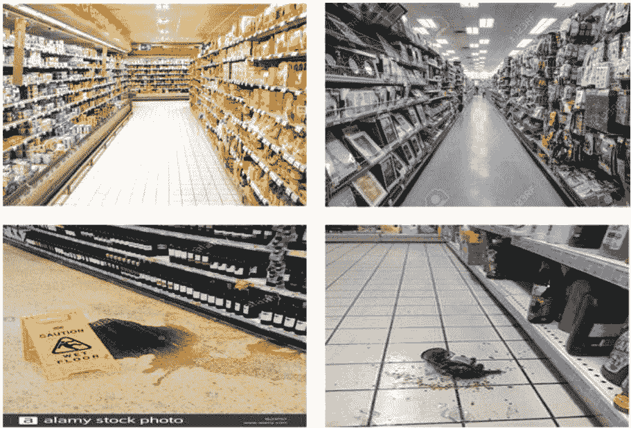

图8 超市图像显示清洁和危险地板  

表2显示了图像在训练、验证和测试集中的分配情况。图8显示了我们超市干净和有危险的地板数据集的样本图像。合成生成的图像显示在图9中。

## ### 7 如何使用代码  
表3列出的七种深度学习架构可以使用我们在GitHub上提供的代码进行构建、训练和测试。²存储库中有多个README文件，详细说明了如何使用这些模型。要运行代码，需要满足以下依赖关系：

2 https://github.com/sarwarmurshed/supermarket_hazard_detection。

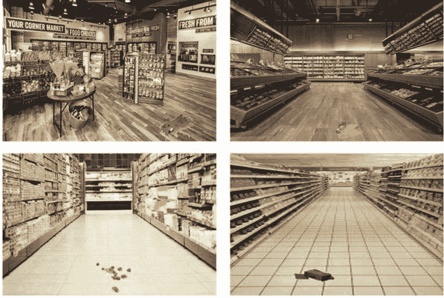

图9显示了使用Doer等人的技术^7^合成生成的超市有危险地板的图像。

## 表3  
我们实验中使用的深度学习模型的大小和参数数量

|模型|InceptionV1 INV1|InceptionV2 INV2|ResNet RNV1|GoogleNet GN|MobileNetV1 MNV1|MobileNetV2 MNV2|EdgeLite EL|
|---|---|---|---|---|---|---|---|
|大小(MB)|6.80|10.20|5.87|5.05|3.30|2.30|4.90|
|参数 (百万)|5.98|10.17|11.18|6.02|3.21|3.51|5.26|

+   - 安装MXNet, TensorFlow  
- 安装任何ROS发行版(我们的代码在ro3-melodic上进行了测试)  
- Jetpack >4.2.2, jetson-inferencars^3^(适用于任何NVIDIA Jetson设备)  

^3^https://github.com/dusty-nv/ro3_deep-learning.

## # # 训练DL模型  
EdgeLite⁴和fine-tune_existing_models⁵目录中包含了以JupyterNotebook格式构建、训练和测试我们在实验中使用的所有模型的代码。 要训练一个模型，需要将训练数据集存储在 data⁶目录中，然后执行Jupyter Notebook。⁷训练完成后，训练好的模型 (.params，jsonfiles) 将保存在 model directory中。 这个训练好的模型将在EasyDLROS框架中用于图像分类。

## # # 在ROS环境中部署模型  
任何在MXNet或TensorFlow上训练的模型都可以使用EasyDLROS框架运行。在不同的DL框架（如Pytorch）上训练的模型需要转换为兼容TensorFlow的pb格式，才能使用我们的框架运行。 以下是使用EasyDLROS运行模型和对图像进行分类的步骤序列：

+   • 启动 roscore  
• 将训练好的模型和标签文件（对于TensorFlow，是 .pd 和synset_label_file.txt 文件；对于MXNet，是 .params、json 和 synset_label_file.txt 文件）存储在一个目录中。  
• 将live_image_ recognition.py文件保留在同一个目录中  
• 运行'rosrun cv_camera cv_camera_node'来使用自主机器人或计算机上的相机捕获图像  
• 运行'python live_image_recognition.py image:=/cv_camera/image_raw'来对前一步骤中捕获的图像进行分类  
• 'rostopic echo /result'可以用来显示分类结果。

## # # 8个实验  
我们的实验分为两个主要阶段。 第一阶段包括在没有ROS的普通UNIX操作系统中训练和评估DL模型（第8.1节）。在这个阶段，我们使用NumPy、Opencv等来处理数据和控制数据流。

> 4  https://github.com/sarwarmushed/supermarket_hazard_detection/tree/master/edgeLite。 5  https://github.com/sarwarmushed/supermarket_hazard_detection/tree/master/fine-tune_existing_models。

> 6  https://github.com/sarwarmushed/supermarket_hazard_detection/tree/master/fine-tune_existing_models/fine-tune_googlenet/data。

> 7  https://github.com/sarwarmnushed/supermarket_hazard_detection/blob/master/fine-tune_existing_models/fine-tune_googlenet/fine_tune_with_test.ipynb。

[PAGE 241]  

以及完成图像分类任务。我们训练了几个深度学习模型，并在测试阶段部署和测试它们。在第二阶段（第8.2节），我们使用ROS软件包或服务，如Camera_info_manager、cv_camera、ROS节点、ROS主题等，处理数据并控制数据流。我们在ROS环境中使用EasyDLROS框架部署相同的模型，并评估模型在机器人上的性能。该机器人采用NVIDIA TX2设备构建，并由ROS驱动。

我们在资源受限的环境中进行两组实验。我们的实验结果表明，在资源受限的机器人上，对于危险检测模型的数据集进行图像分类可以在不到一秒钟的时间内完成，并且能耗不到3.5焦耳。

## # **8.1 在没有ROS的资源受限的Linux环境中进行的实验**  
我们使用MXNet在我们的超市危险数据集上训练了六个广泛使用的基于CNN的图像分类模型，然后与EdgeLite（第4.1节）进行了性能比较，包括模型准确性、执行时间、内存使用和推理时间的功耗。使用的六个CNN模型是MobileNetV1、MobileNetV2、InceptionNet V1、InceptionNet V2、ResNet V1和GoogleNet。树莓派、NVIDIA Jetson TX2和Coral Dev Board被用作边缘设备。当部署在这三个边缘设备上时，EdgeLite在检测超市地板图像中的危险时表现优于其他所有模型，同时其他所有指标（能耗利用、推理时间和内存使用）上保持可比较的性能。

## # **8.1.1 超参数调整**  
超参数调整可以说是改善CNN模型性能的最重要因素。我们对EdgeLite以及我们实验中使用的其他架构进行了多个超参数调整。我们特别关注了动量、学习率、权重衰减系数、dropout率以及各种数据增强的损坏边界：随机缩放、输入像素dropout和随机水平反射。我们在一个包含略多于1,000个样本的验证集上优化了这些参数。我们使用了网格搜索，并在危险数据集上对这些超参数的值进行了变化，并对每个网络运行了300个epochs。由于我们的训练集规模较小，我们进行了大量的调参实验（批量大小：从8到128，学习率：从0.0005到0.1，动量：从0.0到0.9，衰减：从0.00001到0.0001），并使用表现最佳的超参数配置在测试集上评估了模型。

## # **8.1.2 Linux环境下没有ROS的实验设置**  
我们在三台边缘设备和一台台式机上进行了测试，台式机仅用于训练模型。实验包括三个阶段：

+   1. 在台式机上训练深度学习模型，  
2. 压缩模型以便在资源受限设备上部署，  
3. 在这些边缘设备上部署模型后进行推理。

用于训练的台式机配备了20核Intel Xeon处理器（3 GHz）和64 GB RAM。我们使用TensorFlow和MXNet来构建和压缩网络。我们使用在验证集上表现最佳的模型进行测试。通过使用Adam优化器、动量为0.9、批量大小为32、学习率为0.002以及模型权重的衰减率为0.00004，我们得到了最佳的EdgeLite模型。我们还研究并选择了在实验中使用的其他模型的最佳超参数。在使用适当的超参数进行训练后，我们评估了模型在测试数据集上的性能。

训练好的神经网络被导出为开放神经网络交换（ONNX）格式，转换为TensroFlow Lite平面缓冲区文件，并最终转换为TensorFlow Lite模型以减少存储和推理时间。与原始模型相比，此转换将模型大小减小了65%以上。

为了评估推理过程中的功耗，我们使用了NVIDIA的功耗测量软件[18]来测量Jetson TX2的功耗，使用了X-DRAGON Digital USB电表[34]来测量Coral Dev Board和Raspberry Pi的功耗。NVIDIA的功耗测量软件可以捕获六个主要供电轨道（CPU、RAM、GPU等）的功耗。X-Dragon电表可以通过连接到设备的电源来直接测量功耗。

我们在推理之前和推理过程中监测和测量了所有边缘设备的功耗。在整个推理过程中，记录的最大功率（$P_{max}$）用于计算推理所需的能量上限 ($E_{ax} = P_{max} \times T$)。

## # **8.1.3 Linux环境下无ROS的结果**  
为了分析EdgeLite和其他最先进的CNN模型在边缘设备上的性能，我们测量了准确性、推理时间和用于分类图像的内存使用量（表4）。我们还计算了平均能量

在推理过程中模型消耗的能量。能量消耗通过将整个推理过程中消耗的能量总和除以图像数量来计算。

准确性。在准确性方面，EdgeLite表现优于所有其他模型（表4）。
在使用我们的超市危险数据集时，我们在Coral Dev Board上实现了92.37%的准确率。

推理时间。在表4中，最快的模型是MobileNet V2，在Jetson TX2、Coral Dev Board和Raspberry Pi上的推理时间分别为0.16秒、0.268秒和0.68秒。EdgeLite在Jetson TX2上的推理时间为0.38秒，在Coral Dev Board上为0.506秒，在Raspberry Pi上为0.69秒。与MobileNet（V1和V2）相比，EdgeLite在分类方面需要更多的时间和内存，因为后者的过滤器比MobileNet少，并且CNN的每一层中的卷积过滤器数量对推理时间和内存使用有显著影响。
内存使用。在内存使用方面，Raspberry Pi在表4中表现出色。当我们测量整个推理过程中的最大内存使用时，我们观察到所有模型在Pi上的内存使用较少。MobileNet V2在推理过程中只使用了2.74 MB，MobileNet V1使用了2.89 MB，而EdgeLite在推理过程中使用了3.1 MB。影响推理时间和内存使用的一个重要因素是输入图像的像素数量。表4说明了在使用224 × 224图像进行推理时的内存使用情况。MobileNet V2在Coral Dev Board上进行分类时只使用了5 MB的内存，而EdgeLite在5.2 MB的RAM上稍微多一些。

这使得Coral Dev Board比其他设备更快。这有助于减少模型的推理时间，从而减少能量消耗。
观察和建议。根据我们的实验，我们对在资源受限设备上部署深度学习模型提出以下观察和建议：

- 在我们的实验中，Jetson TX2是最快的边缘设备，但它价格昂贵，能耗更高，体积也比Coral Dev Board大。
- 尽管Coral Dev Board在深度学习推理方面表现良好，但存在一些平台依赖性问题。目前，除了TensorFlow Lite之外，Keras、MXNet和PyTorch等深度学习框架无法在Coral Dev Board上运行。
- 与Coral Dev Board相比，树莓派提供了更多使用不同深度学习框架的灵活性，并且拥有庞大的技术支持团队，使其在更广泛的系统和应用中非常有用的。
- 在推理时间和能耗方面，树莓派的性能较差，与Jetson TX2和Coral Dev Board相比表现不佳，尽管它是最便宜的。对于建立原型，树莓派是一个不错的选择，但对于性能指标非常重要的工业部署，Coral Dev Board或NVIDIA TX2更好。
- 为了以较低的成本构建基于深度学习的边缘基础设施，建议使用Coral Dev Board，因为它比树莓派和Jetson TX2更节能、更小，并且推理速度比树莓派更快。

# ## ROS环境上的8.2实验

我们创建了一个模拟超市环境来测试我们的Easy-DLROS框架的效率。在这个实验阶段中，我们使用了Jetson TX2和Logitech C925e网络摄像头。所有必要的ROS节点和预训练的DL模型都部署在Jetson TX2设备上，并通过网络摄像头捕获输入图像。框架的图像节点能够每秒捕获32张图像。然而，由于不需要每秒监视超市环境，我们通过相机节点每秒存储一张图像。我们的框架实时对相机节点捕获的图像进行分类，并将其存储在硬盘上。相机节点以640×480像素捕获图像，然后图像处理节点将这些图像转换为224×224像素。最后，DL节点接收这些转换后的图像，将图像输入DL模型，并生成分类结果。正如我们之前提到的，该框架利用CvBridge和OpenCV来捕获输入图像，并使用MXNet来部署DL模型。

我们使用EasyDLROS在ROS环境（Linux内部）上运行DL模型，并将该框架的性能与在没有ROS的Linux环境下运行的DL模型的性能进行比较。使用了四个指标（准确性、内存使用、推理时间和能量消耗）来评估EasyDLROS的效率（第8.2.1节）。

在实验过程中，我们仔细监测了内存使用情况，并报告了最大RAM使用量。DL模型的推理时间是通过编程方式捕获的，并报告了模型生成每个图像的分类结果所消耗的平均时间。为了评估框架的功耗，我们使用了NVIDIA的功耗测量软件[18]，该软件可以捕获六个主要供电轨（CPU、RAM、GPU等）的功耗。在评估期间的任何时间点记录的最大功率（Pmax）被报告为框架的最大能量消耗（Pmax × T）。

# ### 8.2.1 ROS环境的结果

为了评估EasyDLROS框架的有效性，使用了七种广泛使用的深度学习模型，总结如表5所示。为了评估EasyDLROS的性能，使用一组指标包括准确性、能量使用和推理时间，在现有的基于Linux的框架上进行了比较性能评估的结果如图10所示。

**F-1**得分。我们创建了一个超市的模拟环境，并使用ROS相机节点捕获图像来构建一个模拟测试数据集。在该数据集上，EdgeLite表现最好，达到了90.00的F-1得分。GoogleNet是第二好的模型，F-1得分为89.04。在模拟环境中，输入图像是使用ROS相机节点从超市数据集的测试集图像中捕获的。有时，通过这种模拟过程捕获的图像的质量是

与原始测试集图像的质量不如。这种质量下降略微降低了在ROS环境中执行的DL模型的准确性，与在Linux系统上执行的模型相比，如图10a所示。然而，当我们将原始测试集图像作为DL模型在ROS环境中的输入，即直接从数据集中复制图像时，我们实现了与在普通Linux环境中执行的模型相同的准确性。

推理时间。MobileNetV2在ROS环境中每张图像的平均推理时间为0.32秒。图10b显示，在ROS环境中，所有模型的消耗时间都比Linux系统中的推理时间更长。发布和订阅过程消耗时间，使得ROS系统比Linux系统稍微慢一些。

# 最大RAM使用量

在ROS环境中执行DL模型比在Linux（无ROS）环境中消耗更多内存。DL模型在ROS环境中最多消耗120MB RAM来生成分类结果。MobileNetV2消耗30MB，这是内存使用方面最好的模型。另一方面，InceptionV2和ResNet V1消耗120MB来生成结果。图10c显示了ROS和纯Linux环境中不同DL模型的RAM使用情况的比较。

# 平均能量消耗

所有DL模型在ROS环境中分类一张图像时消耗略高于3焦耳的能量。在实验中使用的所有模型中，Inception V1消耗的能量最低，为3.18焦耳。图10d显示了DL模型在两个不同环境中能量使用的比较。

# ## 8.2.2 分析

我们发现在ROS环境中，所有DL模型的执行时间比纯Linux环境（即没有ROS）更耗内存、能量和时间。这主要是因为不同的ROS节点消耗时间和能量来发布和订阅主题，使得基于ROS的系统稍微变慢和资源消耗大。例如，在纯Linux环境中，最快的模型MobileNet V2在TX2设备上运行时需要0.16秒。在ROS环境中，同样在TX2设备上运行时需要0.32秒。我们认为，考虑到在ROS上部署DL模型所带来的好处，这种性能代价是可以接受的。

# ## 9 结论

机载数据分析正迅速成为人工智能研究的重点关注领域，但现代深度学习模型通常具有数百万个参数，并涉及大量复杂计算，这使得它们在低内存设备上的部署具有挑战性。本章介绍了EasyDLROS，一种新颖的框架，用于在自主机器人上部署深度学习模型。首先，我们讨论了为什么在ROS环境中深度学习很重要，以及如何通过部署基于DL的系统来帮助自主机器人行业。然后，我们介绍了EdgeLite，一种快速、轻量级的用于检测地面危险的深度学习模型，旨在实现简单部署。

在资源受限的边缘设备上进行部署和推理。与其他六种最先进的基于深度学习的目标检测架构相比，详细介绍了EdgeLite的优点和限制，并讨论了在三种资源受限的边缘设备上的性能。EdgeLite在超市地板危险检测方面的准确性优于其他六种模型，并在其他指标上具有可比性的性能。

我们介绍并描述了EasyDLROS，这是一个用于在基于ROS的自主机器人上轻松部署深度学习模型的框架。使用EasyDLROS部署的模型在ROS环境中与在Jetson TX2上运行纯Linux环境下部署模型相比，准确性几乎相同（仅损失1.78%的准确性）。此外，EasyDLROS只使用了稍多的内存和能量，使其成为在边缘设备上自动部署深度学习模型的有用工具，而不会引起任何显著的计算开销。

## 参考文献

1. Alom, Z., Taha, T., Yakopcic, C., Westberg, S., Sidike, P., Nasrin, M.S., Hasan, M., Essen, B.V., Awwal, A., Asari, V.: 关于深度学习理论和架构的最新调查。电子 8, 292 (2019)
2. Chang, Y.H., Chung, P.L., Lin, H.W.: 基于ROS的移动机器人中的目标识别深度学习。在：IEEE应用系统发明国际会议（ICASI）。千叶，第66-69页（2018年）。https://doi.org/10.1109/ICASI.2018.8394348
3. Chen, P., Hang, H., Chan, S., Lin, J.: 一种用于道路场景分割的高效CNN。亚太。信号信息处理。协会。年度峰会会议（APSIPA ASC），第424-432页（2019年）
4. Cheng, Y., Wang, D., Zhou, P., Zhang, T.: 深度神经网络模型压缩和加速的调查（2017年）。https://arxiv.org/abs/1710.09282
5. Dhar, S., Guo, J., Liu, J., Tripathi, S., Kurup, U., Shah, M.: MobileNets: 高效的卷积神经网络用于移动视觉应用 (2017). https://arxiv.org/abs/1704.04861
6. Dhar, S., Guo, J., Liu, J., Tripathi, S., Kurup, U., Shah, M.: 设备上的机器学习: 算法和学习理论视角. https://arxiv.org/abs/1911.00623
7. Dorr, L., Brandt, F., Meyer, A., Pouls, M.: 在不稳定的物流环境中为平面物体检测模型生成精简训练数据.在: 第18届IEEE国际机器学习与应用会议 (ICMLA-2019). Boca Raton, FL, 美国, 第329-334页.
8. 冯, Z., 乔治, S., 哈克斯, J., 克拉茨基, R., 萨蒂亚纳拉亚南, M., 皮拉伊, P.: 尤里卡: 基于边缘的机器学习训练数据发现。IEEE互联网计算。23, 35-42 (2017)
9. 徐, C.C., 王, M.Y., 沈, H.C.H., 江, R.H., 温, C.H.P.: FallCare+: 一种用于跌倒检测的物联网监控系统。在：2017年国际应用系统创新会议（ICASI）。日本札幌, pp. 921-922 (2017)。https://doi.org/10.1109/ICASI.2017.7988590
10. Hubara, I., Courbariaux, M., Soudry, D., El-Yaniv, R., Bengio, Y.: 二值化神经网络。Adv. Neural Inf. Process. Syst. (2016)
11. Iandola, F.N., Han, S., Moskewicz, M.W., Ashraf, K., Dally, W.J., Keutzer, K.: SqueezeNet: AlexNet-level accuracy with 50x fewer parameters and <1MB model size (2017). https://arxiv.org/abs/1602.07360
12. 在Jetson上安装MXNet。https://mxnet.apache.org/versions/1.6/get_started/jetson_setup.html. 最后访问日期为2020年8月13日
13. Kakaletsis, E., Tzelepi, M., Kaplanoglou, P.I., Symeonidis, C., Nikolaidis, N., Tefas, A., Pitas, I.: 使用ROS中的深度学习模型通过无人机视频分析进行语义地图注释。在：
第25届国际会议MMM：希腊塞萨洛尼基，2019年1月8日至11日。会议论文，
第二部分 (2019年)。 https://doi.org/10.1007/978-3-030-05716-9_27
14. Lane, N.D., Bhattacharya, S., Georgiev, P., Forlivesi, C., Jiao, L., Qendro, L., Kawsar, F.: 
DeepX: 一种用于移动设备上低功耗深度学习推理的软件加速器。在: 2016年第15届 
ACM/IEEE国际传感器网络信息处理会议 (IPSN)。维也纳，奥地利，第1-12页 (2016). 
https://doi.org/10.1109/IPSN.2016.7460664
15. Liu, M., Niu, J., Wang, X.: 
基于ROS分布式架构和深度学习的自动驾驶系统。在：IEEE第15届工业信息学国际会议 
(INDIN)。恩登，第1229-1234页 (2017年)。 https://doi.org/10.1109/INDIN.2017.8104950
16. Muhammad, A., Aseere, A., Chiroma, H., Shah, H., Gital, A.Y., Hashem, I.A.: 智能城市中 
的深度学习应用：最新发展、分类、挑战和研究前景。
17. Murshed, M.G., Murphy, C., Hou, D., Khan, N., Anantharayanan, G., Hussain, F.: 网络边 
缘的机器学习：一项调查 (2019). https://arxiv.org/abs/1908.00080
18. NVIDIA. 热设计指南 (2017). https://developer.nvidia.com/embedded/dlc/jetson-tx2-thermal-design-guide. 最 
后访问日期为2020年6月18日
19. Ramos, S., Gehrig, S., Pinggera, P., Franke, U., Rother, C.: 检测自动驾驶汽车的意外障碍物 
: 融合深度学习和几何建模. 在: IEEE智能车辆研讨会 (IV) (2017). https://doi.org/10.1109 
/IVS.2017.7995849
20. Rastegari, M., Ordonez, V., Redmon, J., Farhadi, A.: XNOR-Net: 使用二进制卷积神经网络 
进行ImageNet分类。在: ECCV (2016)
21. 机器人操作系统 (ROS). https://www.ros.org/ 最后访问日期：2020年8月31日
22. Saha, O., Dasgupta, P.: 云机器人架构和应用的最新趋势综述。机器人学 **7**, 47 (2018)
23. Sarwar Murshed, M.G., Verenich, E., Carroll, J.J., Khan, N., Hussain, F.: 在超市中使用边缘 
深度学习进行危险检测。在：第三届USENIX边缘计算热点研讨会 (HotEdge-2020) 
。 https://www.usenix.org/conference/hotedge20/presentation/murshed
24. Shabbir, J., Anwer, T.: 移动机器人应用的深度学习技术综述 (2018). 
https://arxiv.org/abs/1803.07608
25. Silva, E.M., Maló, P., Albano, M.: 资源受限设备的能耗意识. In: 2016年欧洲网络与通信 
会议 (EuCNC). 希腊雅典, pp. 74-78 (2016). https://doi.org/10.1109/EuCNC.2016.7561008
26. Sisido, F., Goya, J., Bastos, G.S., Li, A.W.: 基于卷积神经网络的交通标志识别 
系统. 在: 2018年拉丁美洲机器人研讨会, 巴西机器人研讨会 (SBR) 和 2018年教育机器人研 
讨会 (WRE). Joao Pessoa, pp. 339-344 (2018). https://doi.org/10.1109/LARS/SBR/WRE.20 
18.00068
27. 苏，华，张，李，胡：基于ROS和深度学习的购物助手机器人设计。在：2016年第二 
届云计算和物联网国际会议 (CCIOT)。中国大连，第173-176页 (2016年)。 https:// 
/doi.org/10.1109/CCIOT.2016.78683282

30. 塘, B., 陈, Z., 赫弗曼, G., 裴, S., 魏, T., 何, H., 杨, Q.: 在智能城市中将智能 
融入雾计算进行大数据分析。在：IEEE工业 
信息学交易 (2017年)。 https://doi.org/10.1109/TII.2017.2679740
31. 瓦尼, M.A., 坎塔塔齐克, M., 赛义德-穆沙威, M.: 深度学习应用。Springer 
(2020年)

## cFAT-GAN：通过特征增强和转换生成对抗网络对变化的束流能量进行电子-质子散射事件的条件模拟。

Luisa Velasco, Evan McClelan, N. Sato, Pawel Ambrozewicz, Tianbo Liu, W. Melnitchouk, Michelle Kuchera, Yasir Alanazi和Yaohang Li

摘要 近年来提出的基于生成对抗网络（GAN）的事件生成器，即特征增强和转换GAN（FAT-GAN），已经显示出在给定碰撞能量下再现包容性电子-质子散射事件的令人印象深刻的能力。相比之下，许多实际应用需要事件生成器具有允许用户指定反应能量的灵活性。

电子补充材料 本章的在线版本(https://doi.org/10.1007/978-981-16-3357-7_10)包含补充材料，仅限授权用户使用。

L. Velasco  
达拉斯大学，1845 E Northgate Dr., Irving, TX 75062，美国  
e-mail: lvelasco@udallas.edu

E. McClelan · N. Sato · P. Ambrozewicz · T. Liu · W. Melnitchouk  
Jefferson Lab, 12000 Jefferson Ave, Newport News, VA 23606，美国  
e-mail: randallm@jlab.org

N. Sato  
e-mail: nsato@jlab.org

P. Ambrozewicz  
e-mail: pawel@jlab.org

T. Liu  
e-mail: liutb@jlab.org

W. Melnitchouk  
e-mail: wmelnitc@jlab.org

M. Kuchera  
戴维森学院，405 N Main St., 戴维森, NC 28035, 美国  
e-mail: mikuchera@davidson.edu

Y. Alanazi · Y. Li (图)  
Old Dominion University, 5115 Hampton Blvd, 诺福克, VA 23529, 美国  
e-mail: yaohang@cs.odu.edu

Y. Alanazi  
e-mail: yalan001@odu.edu

作为输入，产生相应的合成事件。在这项工作中，我们通过根据给定的反应能量对组件神经网络进行条件化来扩展 FAT-GAN 框架。我们证明了这个模型，称为 cFAT-GAN，可以可靠地产生包容性事件特征分布和相关性，用于自动插值和外推从一组训练过的能量中获得连续范围的反应能量。我们采用连续能量特征表示来使网络能够有机地学习不同反应能量之间的分布关系，为访问未经训练的能量事件奠定基础。这种连续条件能量为 cFAT-GAN 提供了一定的灵活性，使其在高能物理和核物理领域成为一个重要的研究工具。

条件GAN(cGAN) 在图像生成应用中取得了令人印象深刻的结果，特别是在网络训练多个图像类别的情况下。此外，通过在生成器的潜在空间中插值，这些模型可以生成在一对训练或生成的图像之间移动的过渡图像。将这些技术应用于基于GAN的事件生成器的条件特征会带来一些新的挑战。与图像生成应用中使用的分类类别相比，每个选定反应能量的训练样本的分布更难以区分。此外，为了适应连续的条件能量输入，生成器必须能够在经过训练的能量事件分布之间进行插值，而不是在个别样本之间进行插值。

虽然质心能量， √s，是系统的总能量（电子和质子束能量及其各自的静止能量之和），但我们选择使用束能量来确定反应能量，E=√s/2。作为概念验证，我们使用Pythia生成的事件作为实验数据的代理，并将GAN的任务限制为生成特定的最终态粒子（电子），如[1]中所述，这被称为包容性事件生成器。

## 2 相关工作

自1970年代以来，MCEG一直是高能散射实验和现象学研究中的重要工具。

像Pythia[21]、HERWIG[2]和Sherpa[7]这样的通用生成器模型起着作用，以满足用户的具体要求，模拟高能轻子-轻子、轻子-强子和强子-强子碰撞中发生的理论物理过程。最近，GANs[8]在高能领域的不同应用中被用于模拟粒子[19,20]和喷注[17,18]的能量沉积，其中它们侧重于实验数据的特征表示，而不是基于事件的样本。

Hashemi等人[11]在事件级别上训练了GAN，他们通过Pythia生成了Z→μ⁺μ⁻事件中的四动量。此外，Butter等人[3]在他们的事件生成器中引入了最大均值差异(MMD)[9]，以解决具有尖锐分布的特征。据我们所知，以往没有任何研究将GAN与反应能量相关联。

cGAN在计算机视觉应用中取得了巨大的进展，例如图像到图像的转换[12]、卷积人脸生成[6]和视频生成[4]。目前还有一些努力致力于提高噪声环境下的语音系统性能[15]，其中模型是基于噪声频谱图进行条件训练的。cGAN也被用于自然语言处理，例如[5]，它是基于句子的上下文进行条件训练的。这些以及其他之前的研究将GAN与分类或离散标签、图像和文本相关联。此外，这些技术已经被改进，使用户能够更精细地操作条件特征。例如，[13]使用属性向量，可以指定生成图像中某些面部属性的程度。

FAT-GAN已经针对MCEG的独特要求进行了定制，并且在[1]中显示，成功捕捉了包容性散射事件的潜在特征分布和相关性。在cFAT-GAN中，我们将FAT-GAN网络条件化为束流能量，并且我们展示了cFAT-GAN可以成功地生成连续范围内的束流能量事件，无论是插值还是外推，扩大了基于GAN的事件生成器的范围。

## 3 方法

在本节中，我们描述了在FAT-GAN框架中实现条件能量特征的方法。通过将FAT-GAN条件化为反应能量，我们扩展了生成器和鉴别器网络的任务，以学习和区分多个分布，每个分布对应于特定训练的能量。

对于这个实现，我们专注于包容性电子-质子散射。这指的是过程e(k)+p(P)→e(k′)+X，其中k和P分别是入射电子和目标质子的动量，k′是最终状态检测到的电子的动量。状态X表示在反应中产生但未被检测到的除电子以外的粒子的总和。来自电子-质子散射反应的包容性事件由4-动量矢量kμ表示。

散射电子的动量，其中3动量√k′²+me²。入射能量也可以用不变质心能量表示为 $E = \sqrt { s / 2 }$，其中$s = ( k + P ) ^ { 2 }$和$P = ( \sqrt { s / 2 } ; 0 , 0 , - \sqrt { s / 2 } )$是初始质子的4动量矢量。

### 3.1 特征增强和转换 GAN

FAT-GAN [1] 引入了一种新的机器学习方法，用于构建针对当前事件生成器的特定挑战的MCEG。这些资格要求基于GAN的生成器在物理定律内运行，并以比其他应用程序所需的更高精度建模事件特征的分布和相关性。

为了改善GAN训练，FAT-GAN将特征转换为简化生成器必须学习的分布，并且更重要的是防止生成非物理事件。此外，从生成的特征计算出一组增强特征，包括在训练集和生成器输出中，以增强鉴别器的灵敏度。

能量守恒要求散射电子的能量$E' \equiv k _ { 0 }$小于入射能量$E \equiv \sqrt { s / 2 }$。反应中的一个典型特征是$E$的分布在相空间末端有一个尖锐边缘，这对GAN来说很难学习，因为鉴别器缺乏识别非物理事件的灵敏度，特别是当$E' - E$非常小的时候。由于选择了束流沿$z$方向的参考系，散射电子的纵向动量分布也会出现类似的尖锐边缘，$k _ { z } '$。

为了解决学习锐利边缘分布的问题，选择变量转换$T ( k _ { z } ^ { \prime } ) = \log ( E - k _ { z } ^ { \prime } )$来替代$k _ { z } '$作为生成特征。因此，生成器产生与$k _ { x } ^ { \prime } , k _ { y } ^ { \prime } , T ( k _ { z } ^ { \prime } )$相对应的3个特征。$T ( k _ { z } ^ { \prime } )$分布更接近正态分布，使生成器更容易学习，并且在$E$′接近E时非常敏感，防止生成非物理值$E' > E$。为了增强判别器的敏感性，额外的特征，包括$E' , k _ { z } ^ { \prime } = \exp [ E - T ( k _ { z } ^ { \prime } ) ]$，$k T =$

k x ′ 2 + k y ′ 2 ，以及$k _ { z } ^ { \prime } / \sqrt { k _ { T } ^ { \prime } }$，被计算为增强特征，用作判别器的输入。生成的、增强的和转换的特征列在表1中。

FAT-GAN生成器中的神经网络由五个密集隐藏层组成，每个隐藏层都由一个Leaky ReLU函数激活。输出特征向量传递给一个定制的lambda层，在该层中计算增强特征并将其与特征向量连接起来。鉴别器网络也由五个密集隐藏层组成，每个隐藏层都有10%的丢失率，并由一个Leaky ReLU函数激活。最后一个隐藏层连接到一个由sigmoid函数激活的单个输出节点。

表1 生成器和自然(Pythia)生成的特征以及从这些生成的特征计算得到的增强和转换特征

| 事件特征 | $k_{x}^{\prime}$ | $k_{y}^{\prime}$ | $\mathcal{T}(k_{z}^{\prime})$ | $k_{z}^{\prime}$ | $k_{T}^{\prime}$ | $E^{\prime}$ | $k_{z}^{\prime} / k_{T}^{\prime}$ |
| --- | --- | --- | --- | --- | --- | --- | --- |
| 真实样本 | $\checkmark$ | $\checkmark$ |  | $\checkmark$ |  |  |  |
| FAT (真实样本) |  |  | $\checkmark$ |  | $\checkmark$ | $\checkmark$ | $\checkmark$ |
| 生成器 | $\checkmark$ | $\checkmark$ | $\checkmark$ |  |  |  |  |
| FAT (生成器) |  |  |  | $\checkmark$ | $\checkmark$ | $\checkmark$ | $\checkmark$ |
| 鉴别器 | $\checkmark$ | $\checkmark$ | $\checkmark$ | $\checkmark$ | $\checkmark$ | $\checkmark$ | $\checkmark$ |

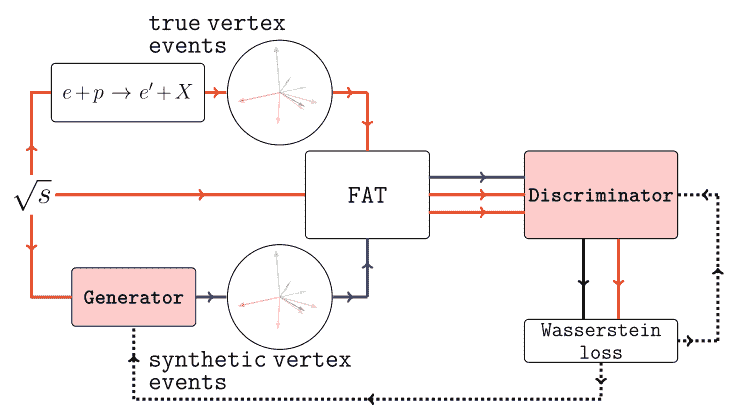

图1 cFAT-GAN事件生成器的架构。红色箭头表示入射能量的流动， $E$; 虚线箭头表示损失的反向传播。蓝色和橙色箭头分别表示cFAT-GAN框架中合成样本和真实样本的流动。

## 3.2 cFAT-GAN架构

我们将FAT-GAN框架扩展为条件模型，其中生成器和鉴别器都以碰撞束流能量 $E$ 为条件，如图1所示。  
我们考虑一个数据样本，包含相等部分的包含电子-质子散射事件的束流能量 $E=10$ 、 20、30、40 和 50 GeV。

生成器 $G$ 的输入是一个 100 维的白噪声向量和入射轻子能量 $E$ 。 $G$ 的两个输入被连接起来，并通过由 8 个全连接隐藏层组成的生成器网络传递，每个隐藏层有 512 个节点，并由一个泄漏的修正线性单元（ReLU）函数激活。最后一个隐藏层与一个由线性函数激活的三节点输出完全连接，表示生成的特征。这些生成的特征和 $E$ 被传递到一个定制的lambda层中，用于计算增强的特征。增强的特征和 $E$ 与生成的特征连接起来，并作为鉴别器的输入。生成的和增强的特征可以在表1中找到。

生成器的镜像，鉴别器网络 $D$，由 8 个全连接的隐藏层组成，每个隐藏层有 512 个节点，通过一个泄漏的 ReLU 函数激活。为了避免过拟合，每个隐藏层都应用了 10% 的 dropout 率。最后一个隐藏层与一个单神经元输出完全连接，通过一个 sigmoid 函数激活，其中“1”表示真实事件，“0”表示伪造事件。在鉴别器网络中， $E$ 作为一个输入特征，用于根据给定的束流能量区分事件分布。

鉴别器使用 Wasserstein 损失和梯度惩罚进行优化[10]。生成器损失函数 $L_{G}$ 和鉴别器损失函数 $L_{D}$ 分别定义为

$$\begin{aligned} L_{G} & =-\mathbb{E}[D\left(\sqrt{s}, \widetilde{\boldsymbol{F}}\right)] \\ L_{D} & =\left(\mathbb{E}[D\left(\sqrt{s}, \widetilde{\boldsymbol{F}}\right)]-\mathbb{E}[D\left(\sqrt{s}, \boldsymbol{F}\right)]\right) \\ & +\lambda \mathbb{E}_{\boldsymbol{F} \sim P_{F}}\left[\left(\left\|\nabla_{\boldsymbol{F}} D\left(\sqrt{s}, \boldsymbol{F}\right)\right\|_{2}-1\right)^{2}\right]\end{aligned}$$

其中， $\mathbb{E}$ 表示期望值， $\widetilde{\boldsymbol{F}}$ 是一个包含生成和增强特征的合成特征向量，而 $\boldsymbol{F}$ 是一个真实特征向量。

### 3.3 束能表示

在原始的条件 GAN [16] 和许多其他条件应用中，生成器和判别器网络是以通常是独热编码的分类标签为条件的。常见的图像生成应用非常适合这种离散表示，允许用户从训练好的一组不同类别中指定要生成的图像类型。与图像分类不同，不同质心能量下的碰撞散射事件不适合分成不同的类别，因为特征分布随反应能量的变化而微妙但非平凡地改变。

为了将 c.m. 能量编码为 cFAT-GAN 的连续输入特征，我们计算训练集中表示的入射束能量的均值和标准差 $\left(\equiv \sqrt{s} / 2\right)$，然后应用标准化处理。

标准化的束能量作为生成器中五个训练过的 c.m. 能量的连续表示。此外，相同的标准化处理也可以应用于未经训练的能量，将其与生成器的训练能量放在参考空间中。因此，完全训练好的生成器在接收到标准化的未经训练能量时，能够自动在不同的训练能量之间进行插值，甚至进行外推。

在 GAN 中，作为输入特征传递的标准化束能量也用于自定义的 Lambda 层，该层用于计算增强特征并将其与生成器输出连接起来。具体来说，标准化能量以未标准化的形式传递给 Lambda 层，并用于计算 $k_{z}^{\prime}=\exp [E-\mathcal{T}\left(k_{z}^{\prime}\right)]$ 。


图2 五个束流能量(E=10、20、30、40 和 50 GeV)下的分布情况:k'$_{z}$和 $\mathcal{T}(k'_z)$。该转换防止了 cFAT-GAN 根据给定的束流能量输入生成非物理事件。该转换还将具有尖锐边缘的分布转换为平滑分布，便于生成器模仿。

图2 展示了不同束流能量水平下 $k'_z$ 的转换情况。通过将 $E$ 纳入 $k'_z$ 的转换中，cFAT-GAN 继承了 FAT-GAN 的重要属性，消除了不同束流能量下生成非物理事件的可能性，这对生成器来说更容易模仿。

## 4 结果

在本节中，我们检查训练好的生成器并测试其产生真实基础事件分布的能力。更重要的是，我们通过在这训练集表示的五个能量之间和之外评估生成的事件分布来分析 cFAT-GAN 的插值和外推能力。我们进一步通过考虑从事件特征派生的物理量来测试生成器的预测能力。最后，我们通过可视化每个网络的隐藏层中的潜在变量来分析生成器和判别器网络对条件束流能量的敏感性。

### 4.2 衍生物理量

接下来，我们将研究cFAT-GAN从事件特征中衍生出的重要物理量上的性能。特别地，我们考虑Q²=-q²，即碰撞探测质子内部结构的分辨率，以及Bjorken缩放变量，xbj=Q²/2P·q，与质子相对于父质子所携带的动量分数有关。

在图7和图8中，我们绘制了在四个训练能量（10、20、30和40 GeV）下，由生成和真实事件的Q²和xbj条件分布。我们定义x² = 1 - Σ"(gi-ti)²/ti，其中n是总的bin数，gi和ti是在给定bin中落入的点数，用于在每个束流能量下统计地衡量两个分布之间的一致性。

通过在图7中检查分布的等值线，我们观察到在训练的束流能量范围内，生成的分布与真实分布之间存在良好的一致性，x²值约为3。通过在图8中检查等值线和x²值，我们还观察到在四个插值束流能量下，生成的分布与真实分布之间存在可比较的一致性。

### 4.3 潜在变量分析

到目前为止，所展示的结果测试了训练的cFAT-GAN生成的特征分布与真实样本之间的兼容程度。在本节中，我们将研究cFAT-GAN神经网络隐藏层中的潜在变量，以检查训练架构在不同输入能量下的敏感性。

为了提取生成器的潜在变量，生成器网络被馈送了一个批次包含10,000个噪声向量的输入，每个向量都与10、20、30、40或50 GeV的束流能量连接，并且输出被调整以包括第二、第五和第八个隐藏层。对于每个训练能量和一个外推能量60 GeV，我们使用t分布随机邻域嵌入（t-SNE）[14]对512维潜在变量进行降维到2维，以便进行可视化。

图9显示了每个能量的三个选定隐藏层的2D投影。可以清楚地看到不同束流事件分布的频谱。

图9 生成器中第二、第五和最终隐藏层中潜在变量的2D t-SNE可视化，对于能量E=10、20、30、40和50 GeV以及一个外推能量60 GeV

图10 饱和度可视化鉴别器最终隐藏层中的潜在变量，在输入Pythia样本（轮廓）和生成样本（热图）时，对于经过训练的能量E=10和50 GeV，以及未经训练的35和60 GeV能量。

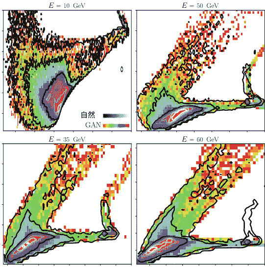

隐藏层的低维流形上的能量。我们还可以发现，对于外推能量60 GeV，生成器隐藏层中的潜变量符合模式的进展，这是预期的，如果它是一个经过训练的能量，它会最接近50 GeV的投影。这说明了网络学习了训练能量之间的关系，使得cFAT-GAN在插值和接近外推能量方面表现良好。与许多深度学习应用类似，在最后的隐藏层中，神经网络提取高度抽象的模式，其中不同反应能量水平的事件被混合在一起，提取出的模式并不完全可解释。

由于cFAT-GAN中的鉴别器充当分类器，训练用于区分“真实”和生成的事件，我们比较了鉴别器神经网络中馈送cFAT-GAN和Pythia生成事件样本时的潜变量。

经过训练的cFAT-GAN鉴别器在每个选择的四个束能量（10、50、35和60 GeV）下，从Pythia或生成器中输入了100,000个样本事件，并调整了输出以包括第八个隐藏层。为了降低潜在变量的维度，我们采用了主成分分析（PCA），对应于“真实”输入的潜在变量的主成分进行拟合，然后将隐藏层激活值相对于Pythia和合成样本从512维转换为2维。

如图10所示，来自第八个隐藏层的潜在变量对应于Pythia和合成事件被投影到由第一和第二主成分构成的二维空间中。Pythia事件（轮廓）和生成器事件（热图）表明，经过训练的鉴别器认为GAN生成的样本与Pythia生成的样本非常接近，包括10和50 GeV训练能量以及未经训练的35 GeV（插值）和60 GeV（外推）能量。

## 5 结论

在这项工作中，我们描述了通过将条件束能作为输入特征来实现cFAT-GAN框架的方法。cFAT-GAN不仅能够忠实地复制训练束能下的事件，还能正确地生成插值能量下的事件。此外，只要超出的能量不太远离最高训练能量水平，cFAT-GAN就能够生成超出的能量事件。

选择用于训练的能量范围和能量级数是关键参数，可以通过调整来提高模型插值和外推到未训练能量的能力，并扩展cFAT-GAN能够正确复制物理事件的能量谱。虽然本文介绍的条件束能是针对包容性电子-质子散射的，但cFAT-GAN方法可以应用于模拟独立散射反应或其他类型的碰撞反应的GAN。

## 6 如何使用代码

该软件包由三个Jupyter笔记本组成，包含了创建和训练条件特征增强和转换GAN的代码。提供的训练数据包括5个数据集，这些数据集是由Pythia生成的散射事件，束流能量分别为10、20、30、40和50 GeV。提供的额外绘图数据包括9个数据集，这些数据集是由Pythia生成的散射事件，束流能量分别为15、25、35、45、60、70、80和90 GeV。该软件包使用Python（python3）编写，并使用Tensorflow和Keras 2.2.0进行实现。

要训练cFAT-GAN，请运行整个cFAT-GAN笔记本。这将构建模型，设置用于训练的网络，构建训练集，然后训练模型。模型被设置为训练100,000个epochs，并且每500个epochs将损失写入文本文件。完成100,000个epochs后，权重将保存为“generator01000.h5”在gallery目录中。

要从训练好的cFAT-GAN生成器生成样本，请运行整个generate_samples笔记本。这将准备生成器，加载保存的生成器权重，在10、15、20、25、30、35、40、45、50、60、70、80和90 GeV下生成100,000个散射事件，计算物理量 $Q^2$ 和 $x_{bj}$，并填充并保存一个用于绘图的字典。如果在调用generate_samples函数时没有指定其他权重路径，则将使用提供的生成器权重“trained_generator.h5”在for_plot目录中生成样本。

要绘制特征分布 $E'$、 $k_T'$、 $k_z'$ 以及 $Q^2$ 和 $x_{bj}$ 的联合分布，请运行整个plotting笔记本。这将加载填充有生成样本的字典，并从for_plot和train_data目录中加载Pythia生成的样本数据文件，绘制生成的 $E'$、 $k_T'$、 $k_z'$ 和 $Q^2$、 $x_{bj}$ 的联合分布。

在10、15、20、25、30、35、40、45、50、60、70、80和90 GeV能量下的真实分布，并绘制 $Q^2$ 和 $x_{bj}$ 的真实和生成的联合分布图，在10、20、30、40和15、25、35、45 GeV能量下。在运行这个笔记本之前，你必须先运行generate_samples笔记本，以创建填充有生成样本的字典，该字典将保存为 eDict.json。这些图像分别保存在“fig1”和“fig2”中，在 gallery 目录中。

致谢 我们感谢邱建伟的有益讨论。本工作得到了LDRD项目编号LDRD19-13、LDRD20-18 和LDRD21-22的支持。

## 参考文献

1. Alanazi, Y., Sato, N., Liu, T., W. Melnitchouk, M.P.K., Pritchard, E., Robertson, M., Strauss, R., Velasco, L., Li, Y.: 通过特征增强和转换的生成对抗网络 (fat-gan) 模拟电子-质子散射事件 (2020年)。arXiv:2001.11103  
2. Bahr, M., et al.: Herwig++物理和手册。Eur. Phys. J. C 58, 639–707 (2008年)。https://doi.org/10.1140/epjc/s10052-008-0798-9  
3. Butter, A., Plehn, T., Winterhalder, R.: 如何GAN LHC事件. SciPost Phys. 7 (2019年)。https://doi.org/10.21468/SciPostPhys.7.6.075  
4. Clark, A., Donahue, J., Simonyan, K.: 对复杂数据集的对抗性视频生成 (2019)  
5. Donahue, D., Rumshisky, A.: 无强化学习的对抗性文本生成 (2018). CoRR arXiv:1810.06640  
6. Gauthier, J.: 条件生成对抗网络用于卷积脸部生成 (2015)  
7. Gleisberg, T., Hoeche, S., Krauss, F., Schonherr, M., Schumann, S., Siegert, F., Winter, J.: 使用SHERPA 1.1进行事件生成. JHEP 02, 007 (2009). https://doi.org/10.1088/1126-6708/2009/02/007  
8. Goodfellow, I.J., Pouget-Abadie, J., Mirza, M., Xu, B., Warde-Farley, D., Ozair, S., Courville, A., Bengio, Y.: 生成对抗网络。在: NIPS'14会议论文集, pp. 2672–2680。剑桥, 马萨诸塞州, 美国 (2014). http://dl.acm.org/citation.cfm?id=2969033.2969125  
9. Gretton, A., Borgwardt, K., Rasch, M.J., Scholkopf, B., Smola, A.J.: 两样本问题的核方法。在: 神经信息处理系统进展, 第19卷 (2007)  
10. Gulrajani, I., Ahmed, F., Arjovsky, M., Dumoulin, V., Courville, A.C.: 改进的Wasserstein GANs训练 (2017). CoRR arXiv:1704.00028  
11. Hashemi, B., Amin, N., Datta, K., Olivito, D., Pierini, M.: 利用生成对抗网络的LHC分析特定数据集 (2019)  
12. Isola, P., Zhu, J., Zhou, T., Efros, A.A.: 条件对抗网络的图像转换 (2016). CoRR arXiv:1611.07004  
13. Lu, Y., Tai, Y.W., Tang, C.K.: 使用条件循环GAN进行属性引导的人脸生成 (2018)  
14. van der Maaten, L., Hinton, G.: 使用t-SNE可视化数据. 机器学习研究杂志 9, 2579–2605 (2008). http://www.jmlr.org/papers/v9/vandermaaten08a.html  
15. Michelsanti, D., Tan, Z.H.: 用于语音增强和噪声鲁棒说话人验证的条件生成对抗网络. 在: Interspeech 2017 (2017). https://doi.org/10.21437/interspeech.2017-1620  
16. Mirza, M., Osindero, S.: 条件生成对抗网络 (2014). CoRR arXiv:1411.1784  
17. Musella, P., Pandolfi, F.: 使用生成对抗网络快速准确地模拟粒子探测器. Comput. Softw. Big Sci. 2(1) (2018). https://doi.org/10.1007/s41781-018-0015-y  
18. de Oliveira, L., Paganini, M., Nachman, B.: 通过示例学习粒子物理学: 位置感知生成对抗网络用于物理合成. Comput. Softw. Big Sci. **1**(1)(2017). https://doi.org/10.1007/s41781-017-0004-6  
19. Paganini, M., de Oliveira, L., Nachman, B.: 使用生成对抗网络加速科学: 在多层量热器中应用于3D粒子阵列. Phys. Rev. Lett. **120**(4) (2018). https://doi.org/10.1103/physrevlett.120.042003  
20. Paganini, M., de Oliveira, L., Nachman, B.: 使用生成对抗网络在多层电磁量能器中模拟3D高能粒子淋浴. Phys. Rev. D **97**(1) (2018). https://doi.org/10.1103/physrevd.97.014021  
21. Sjostrand, T., Mrenna, S., Skands, P.Z.: PYTHIA 8.1简介。Comput. Phys. Commun. **178**, 852-867 (2008). https://doi.org/10.1016/j.cpc.2008.01.036  
22. Winter, R., Clevert, D.: IVE-GAN: 不变编码生成对抗网络 (2017). CoRR arXiv:1711.08646

## 构建2.0版电力网络：深度学习和联邦计算用于能源去碳化和边缘弹性

Carolyn Goodman, Jesse Thornburg, Shankar Koduvayur Ramaswami, 和 Javad Mohammadi

摘要 传统上，电网是由多个实体系统组成的，每个实体管理一个地理区域。当前的能源民主化和脱碳运动导致了可控能源资源的不断增加。这个过程进一步增加了电网实体（代理）的数量。这种范式转变还受到智能传感器和执行器在高级处理和计算方面的增加采用的推动。虽然代理之间的合作可以降低成本并提高整体可靠性，但有效的合作是具有挑战性的。主要挑战源于代理和其数据的异质性。此外，尽管数据收集不断增加，但许多电网实体有严格的隐私要求限制数据使用。另一个挑战是能源行业通常将数据保留在孤立的存储区中。提供数据的不同实体通常是商业竞争对手（例如，单个服务领域内给定电力公用事业的商业客户）。这会产生不利于共享数据的激励，因为担心这些数据将使共享者受损而使竞争对手受益。在允许他们的数据用于更广泛的利益之前，这些竞争实体需要确保“共享而不看到”彼此的数据。只有这样才能确保每个客户的数据可以与任何竞争对手的数据一起使用，而不会被用来推断商业实践、销售量等。这些问题对于多智能体能源系统来说越来越重要。

## 1.1 电网弹性需求：“冰与火之歌”

减少排放和脱碳现有电网的努力正在迅速推动分散式清洁能源（例如太阳能和风力发电机）的采用。伴随的间歇性威胁着电网的可靠性，如果不直接解决，就会导致停电和电压下降[1,2]。最近加利福尼亚的热浪和野火以及2021年德克萨斯的冬季风暴暴露了电网的可靠性问题，并凸显了能源弹性的需求。从运营角度来看，电网运营商越来越需要利用灵活的发电和消费资源来维持系统的可靠性。可控分布式能源资源（DERs）是将间歇性可再生能源发电无缝集成到现有电网中的解决方案，同时保持及时供需平衡[3,4]。灵活的电力负荷也可以用于降低消费者的需求峰值，从而减轻电力公司在高峰时段的负担[5,6]。美国各地的电网在其服务区域内处理需求峰值的方式各不相同。通常情况下，管理这些峰值需要部署最昂贵的峰值发电厂。美国第二大公用事业公司南加州爱迪生公司（SCE）向许多住宅和工业客户支付需求灵活性和峰值转移费用[7]。虽然包括SCE在内的公用事业公司鼓励住宅建筑和一些商业综合体削减需求峰值，但目前还没有一种方法能够在规模上与食品店进行需求灵活性的合作（例如，跨超市连锁店）。

## 1.2 解决方案：联邦计算和深度学习

联邦计算使得“共享而不可见”成为可能，而深度学习则使得在智能体级别进行预测和能源配置成为可能。通过联邦计算，智能体可以在解决学习和优化问题的同时尊重每个智能体的隐私，并克服跨设备和跨组织数据隔离的障碍。处理日益增长的能源数据量是一个相关的挑战。随着电力网络在建设智能电网过程中越来越多地被仪器化，它们以一种新的规模生成数据，这需要分布式优化。随着极端天气对这些网络的影响越来越大，电力网络越来越依赖分布式能源资源，并且需要深度学习来实时优化管理这些分布式能源资源。除了保护隐私之外，联邦学习还可以聚合和持续更新整个电网的分布式能源效率能力。

本章介绍了一种深度学习和多智能体优化框架，用于安排分布式能源资源(DER)的部署，以使最终用户和电力公司受益。第一部分阐述了深度学习和联邦计算在现代电力网络中实现不同能源优化目标的动机。本章然后描述了在一般情况下执行多智能体数据处理的实际挑战。然后，它解决了在物联网(IoT)中编排连接的DER操作时特别出现的挑战。联邦计算和深度学习解决了其中的一些问题，本章分享了两个初始现场测试设置的示例。第一个示例是在卡内基梅隆大学(CMU)的研究演示中进行的，第二个示例是与Grid Fruit, LLC的商业建筑应用中进行的。

## 2 背景：电网分析

西方世界的电力输送基础设施正在迅速变化，现代化电力网络中DER的渗透率不断增加，例如太阳能光伏系统、电动汽车和储能系统。由于成本下降、政府补贴和税收优惠（根据地区而定），DER在美洲、欧洲和非洲不断增加[9,10]。这一推出伴随着先进传感、执行、计算和通信技术的广泛采用。尽管物理基础设施在不断发展，能源交换将继续由中央电网运营商管理和监督，而明天的电网正在设计中以应对能源民主化和终端用户参与的不断增长需求[5]。电力公用事业和监管机构正在更新许多长期以来的做法，以满足这些需求和利益。例如，新兴的可交易能源（TE）系统的架构[11]允许各种电网实体（从拥有太阳能光伏（PV）的住户到电网运营商）合作和竞争，以提供成本效益高、可靠性强的电力[12]。

在生产和消费方面的灵活性（也称为生产者消费者）对于保持电网的可靠性和弹性至关重要，这些电网特点是不断增加的间歇性能源（例如太阳能光伏）的渗透[4,13]。在这里，灵活性指的是DER在所需的时间范围内调整生产和消费水平的能力。

与此同时，随着网络安全和环境威胁的增长，未来电网面临着韧性挑战[14,15]。电力系统的韧性通常被定义为系统在干扰后保持其功能和特性的能力[16]。在电网环境中，干扰通常表现为电压下降（电压降低）或停电（断电）[17]。识别和聚合电网实体提供的灵活性通常被视为避免这些干扰并运行可靠、有韧性和环保的电网的最可行解决方案[3]。

深度学习和联邦计算对于最优分布式能源资源调度和能源韧性都非常有价值。深度学习能够实现更好的负荷预测，而联邦决策作为连接不同物联网设备的纽带。换句话说，联邦计算可以从物联网连接的实体中获取数据（具有不断增长的通信和计算能力），以聚合地理分散的分布式能源资源的时空灵活性。这种聚合为急需的电网韧性提供了新的精确控制能力[4]。

未来的多智能体能源系统将依赖于智能体级别的智能和集体问题解决。深度学习是实现智能体级别计算的关键。深度学习方法是识别模式和分类能源灵活性区域的重要工具[18]。这些洞察对于能源资产网络的最优协调至关重要。

多智能体系统中的联邦计算在不同的背景下进行研究。分布式优化和分散式学习是已建立的方向。这些方法论的发展是为了处理大型数据集[19]、解决隐私和安全问题[20]以及管理多智能体系统[21]的需求。现有分布式优化方法的架构可分为两类，即基于是否依赖中央智能体监督计算和优化的方法。在中央智能体负责调节更新和计算的情况下，其他所有智能体都需要直接与该中央实体共享更新。

作为一个例子，交替方向乘子法（ADMM）是一种常用的方法，它将原始问题分解为子问题和主问题。ADMM设置要求每个代理解决一个优化子问题并与中央代理共享更新。然后，中央代理修订主问题的更新函数[22]。

分布式优化和分布式学习密切相关。分布式学习方法协调跨代理计算，实现在挖掘大型数据集中的协作。这些模型通常将多代理设置映射到图环境中，其中节点表示学习代理。数据可以驻留在代表图的节点或边上[23]。最近的研究采用了这种方法，研究了近端梯度方法[24]、基于ADMM的方法[25]和随机梯度下降（SGD）方法[26]。

联邦分析最近受到了极大的关注。联邦学习是一种多代理设置，多个实体合作解决深度学习问题。通常，一个中央协调员监管这个过程并与系统的代理进行通信。每个实体保持其原始数据的机密性，执行本地更新，并仅与中央实体共享模型更新。这个迭代过程允许跨设备和跨机构的模型训练[27,28]。边缘计算已经在有限的能力范围内进行了研究和实施（例如，使用雾计算和查询处理[29-31]）。然而，边缘设备的计算和数据存储能力的增加使得推理和训练任务可以在本地进行[28]。在具有异构硬件和统计数据的代理之间使用联邦分析是一个活跃的研究领域[32]。

尽管分享知识和相关见解对所有相关方包括自身都有好处，但组织通常不愿意分享他们的数据。例如，反洗钱倡议极大地受益于挖掘不同金融机构的数据。然而，获得敏感客户信息的批准访问始终是一个挑战。联邦学习可以在这些机构之间实现联合金融分析，而无需共享任何客户数据。另一个受益的努力是协同减少温室气体（GHG）排放。

大型建筑组合是温室气体排放的主要贡献者，然而，管理公司不愿意分享他们的能源和环境数据。他们担心这样做会使竞争对手获得优势，揭示有关他们建筑物占用情况的信息。

联邦分析为打破这些跨设备和跨机构的壁垒提供了一种有效的工具。这种方法在未来能源系统的背景下有着极大的用途，未来能源系统中有许多与物联网连接的分布式能源资源在任何给定时间连接和断开电网。这种方法的分布式特性和隐私保护尤其在许多不同位置和由不同组织监督的分布式能源资源中是必需的。

本章介绍了电力网络如何向具有异构代理的多代理系统演变。从包括作者先前研究在内的文献中，讨论了深度学习和联邦计算在不断增长的能源资源方面的需求。还强调了在物联网设置中实施基于代理的决策的挑战，特别是在物联网连接的分布式能源资源中。本章还介绍了一种基于代理的深度学习方法，非常适合解决未来多代理网络的协调需求[3,23]。所提出的方法使代理能够协同执行个性化和特定代理的计算，同时保护数据隐私。最后，本章描述了上述方法在研究（通过 CarnegiePLUG 测试平台）和商业化（通过 Grid Fruit 有限责任公司的示例）中的实施可能性。

## 3 未来的即插即用电网

根据某些指标，电力网络是世界上最复杂的人造系统[33]。该系统跨越多个州、国家和整个大陆。对于这个网络的控制责任由不同的实体共享。

决策过程发生在不同的尺度和多个时空维度之间。电网的能源管理范式传统上被设计为调节和管理有限数量的决策实体。实体通常控制特定地理区域的资产[34]。这些实体之间的相互作用取决于管理这些区域电网运行的政策和规则，以及预先安排的双边协议。缺乏协调以优化跨实体能源资源必然导致次优的系统调度。

电网基础设施正变得越来越复杂，有许多相互作用的元素。随着电网的发展，其新的架构应该能够容纳和管理一组组成部分，同时确保互操作性和韧性。未来的电网需要促进即插即用的参与，并在压力和不确定性下管理异质能源资源[35]。这一转变的主要趋势包括消费者期望的演变和技术进步。

分布式电网的经济正在同时出现，同时也面临着网络安全和环境威胁的增长需求[13]。

顾客期望从二十一世纪的电力基础设施中获得更多的信息和高水平的服务。这些期望在一定程度上提高了，部分原因是在电力行业之外，第三方供应商提供了更多的选择和使用便利性。例如，Uber 和 Lyft 在某些方面打破了交通系统，同时也对其进行了改进（例如，市场驱动的可用性和响应性）。在能源方面，顾客要求从他们的电力基础设施中获得信息访问的改善，以及能源选择、公平性和可靠性。

现在电网被期望能够适应这些不断增长的期望。

技术进步已经导致计算和通信无处不在。这使得本地信息处理和决策成为可能，并赋予顾客管理他们的现场能源资源（例如太阳能光伏和储能）以及决定何时以及如何共享他们的多余能源的能力。技术改进还开辟了能源效率的新途径。例如，实时访问和协调建筑供暖和制冷系统可以减少能源消耗并提高居住者的舒适度。另一方面，这些设备正在增加感知和通信能力（在各个发电和消耗）为网络入侵者创造了一个巨大的攻击面，可能危及电网的运行。

能源民主化的例外情况（例如，抵制主导能源议程，同时重新构建能源体制的民主性[36]）近年来在新能源选择的更广泛范围、分布式能源资源的广泛采用、电能储存成本的降低以及气候变化的考虑[2]下获得了发展。这些例外情况与创新的商业模式鼓励了本地和点对点能源交易。这种转变正在改变电力发电和使用的经济学。老化的电力基础设施的可靠性和韧性越来越受到气候变化、自然灾害和网络安全威胁的挑战。电网对于运行其他关键基础设施至关重要。更具体地说，任何电力中断对国家安全、经济繁荣和通信网络以及基本生活标准都是有害的。像野火、洪水、风暴和热浪等极端自然天气事件的数量正在增加[14, 15]。这些环境压力凸显了能源韧性的需求。例如，加利福尼亚州最近的野火使该州最大的公用事业公司太平洋煤气和电力公司接近破产[37]。一个具有韧性的电网能够应对由自然灾害引起的供应方面的中断，处理网络物理事件，并管理人为干预。电网运营商习惯于在需要时调度指定的发电资源以保证可靠性。正在进行的电网转型使电网运营商能够在供应和需求两侧获得一批小型能源资源，如果有效协调，可以显著提高电网的韧性。这些系统性变化加大了多个实体之间协调的需求。

这依赖于本地通信和计算能力。有效的协调保护隐私并在多模态数据源和异构设备之间进行扩展。

## 4 在电网边缘识别和协调未充分利用的能源灵活性

## 4.1 在边缘识别模式

为了利用电网边缘的灵活资产，需要对系统动态有很好的理解。尽管基于物理的模型可以提供高度准确的预测，但深度学习允许工程师在不了解底层动态的情况下创建系统模型[38]。基于物理的模型需要耗费时间，并且必须针对每个系统进行定制。通过使用独特的系统数据重新训练模型，数据驱动模型可以提供强大的模型识别能力，并且前期成本更低[38]。

在电网边缘使用深度学习进行模型识别的一个应用是使用天气、历史功率数据和典型建筑负载来预测每日建筑负载。使用模式（占用、设备时间表等）作为输入。基于物理的建筑模型需要了解建筑的热物理特性、所有建筑系统的能量消耗、系统相互依赖性以及可能的系统干扰[39]。深度学习模型可以严格从数据中学习每日建筑负荷曲线。在实现模型之后，可以通过提出的联邦计算框架在每栋建筑内协调生产和消费资产。将感兴趣的灵活资产的控制设置作为深度学习建筑电力模型的输入，通过联邦计算实现最优控制设置以聚合需求（在多栋建筑、跨系统级别）。

在所有灵活能源资产上实施深度学习模型还通过联邦计算提供了迁移学习能力。例如，全局模型可以分布式并在本地进行更新，由给定位置（例如超市）的代理进行训练，通过随机梯度下降迭代更新模型中的权重。更新后的权重在集中位置进行聚合，同时确保数据保留在边缘设备上[40]。这个全局模型可以进一步发展，保持前几个神经网络层的全局权重，同时添加后续层以改进对特定系统的预测结果。

深度学习在边缘设备上的另一个应用是利用深度学习模型对简单的一阶基于物理的模型进行经验误差校正。许多系统可以通过一阶微分方程相对准确地描述。通过从数据进行系统辨识，将一阶模型实现为最小化预测值和测量值之间的平方误差的一阶微分方程的参数拟合。这个基准模型为工程师提供了物理解释性，对未见数据的模型性能有信心，并且对于较低复杂度的系统，通常可以使用有限的数据进行参数估计[41]。创建一阶基于物理的模型还可以跟踪系统参数以可视化适当操作的退化。

然而，使用基于物理的模型来纳入系统干扰和底层相互依赖关系是耗时且困难的。深度学习模型可以通过预测物理模型中的误差来考虑这些“未见”交互作用。$\epsilon(x)$在方程中

$y(x)=M(x)+\epsilon(x)$

其中$y(x)$是测量值，$M(x)$是一阶模型预测，而$x$是动态系统的状态[41]。

经验误差修正权重（预测$\epsilon(x)$）会定期更新，以收集新数据。这种方法可以利用联邦计算中的全局误差模型（如前面所提到的）来加速类似系统之间的训练过程。一个示例应用是使用牛顿冷却定律为冰箱定义一个一阶微分方程。方程2中的一阶模型包括冰箱的热容量的常数参数（由参数$K_{1}$表示），而不区分食物和冷藏箱本身的热容量。在方程2中，$K_{2}$是一个常数参数。

描述压缩机增益的 $u_{comp.}$ 是压缩机的控制输入，$T_{case,t}$ 是预测的制冷箱温度，在时间 $t$ 时的实际 case 温度取决于当前系统状态 $(x)$，而 $\epsilon(x)$ 是神经网络要预测的误差项。一个深度学习模型预测经验误差可以学习制冷箱的热容量和压缩机的增益如何随时间、天气或其他外部因素而变化，从而实现更动态和准确的预测，同时保持物理可解释性。

$dT_{case} = [K_1(T_{ambient} - T_{case}) - K_2u_{comp.}]dt$  
$y(x) = T_{case,t} + \epsilon(x)$  
(2)

能源灵活性是能源生产者或消费者调整其输出功率（生产者的发电量）或能源消耗水平（消费者的需求，例如，转移或减少负载）的能力[42]。能源灵活性在大型电力网、微电网和城市电力系统中都有体现[1]。例如，在住宅建筑中，当业主愿意让他们的家用空调单位具有响应电网管理者的负载减少请求的温度变化时，就可以实现能源灵活性。某些紧张的电力公司在高峰需求时间（例如南加州的下午4点至晚上9点，当住宅负载上升而太阳能电力下降时）发送这些请求。除非电网直接控制所涉及的负载，否则能源灵活性取决于终端用户的合作。能源灵活性的另一个例子是调节太阳能发电厂的功率输出，以帮助电网运营商稳定大型电力网在极端天气事件期间的运行。

利用分布式能源资源的灵活性比利用大型消费者（例如工业设施）或公用事业规模发电厂（例如发电厂）的灵活性更具挑战性。分布式能源资源的困难在于它们单独提供了一小部分的灵活性，但数量、地理分布和异质性不断增长。如果有效利用，分布式能源资源提供的能量灵活性可以成为电网管理的可靠资源，因为它们与终端设施的距离比电网管理者（中央）节点更近。此外，分布式能源资源的分布性增加了电网在网络中的控制灵活性[6,43]。可扩展的聚合是释放分布式能源资源巨大潜力的关键。

## 4.3 分布式能源网络的能源管理

下面是一种用于操作分布式能源车队的优化算法的通用形式。该算法的制定使得最优解可以以集中式的方式求解[8]。

最小化  
约束条件

在这个设置中，目标函数(fk(·))可以捕捉到一系列目标，包括能源成本或排放最小化，这是k agents(即物联网连接的分布式能源资源)共同努力实现的。此外，所有代理、不等式约束和等式约束的集合分别由η agents、η ineq和η eq表示。此外，xk表示与代理k相关的变量。与每个代理相关的不等式约束和等式约束分别由gj(·)和hj(·)表示。变量μj和λj是与不等式约束和等式约束相关的拉格朗日乘子。

存在许多基于满足该问题的一阶最优条件的解决方法。这些条件可以从原始优化问题(3)的Lagrangian函数中推导出来。因此，从现在开始，这些条件将被表示为Ω。

## 4.4 互联代理分析

为了直接解决上述优化问题(3)的一阶最优条件，需要一种新颖的联邦计算框架。因此，从技术上讲，将优化问题简化为求解具有几何约束的耦合方程组的解。可以通过迭代过程以完全分布的方式解决这个方程组。这是因为每个方程只包含局部变量(即与代理或其相邻代理相关的变量)。

这个迭代过程依赖于代理进行局部更新和信息交换。在问题形式化中包含物理电网约束的情况下，物理连接需要在通信图中反映出来。每个代理i只需要更新与自身相关的变量(即vi)，并与有限数量的其他代理共享更新。总体上，这个多代理系统的代理解决了底层优化问题的最优条件。为了解决讨论的方程组，联邦计算框架创建了共享变量的本地副本，并将每个副本分配给相应的代理[53]。迭代过程确保所有本地副本收敛到相同的值。每个代理的本地更新公式如下所示

下面，共识项强制要求代理的本地副本达成一致。最后一项使用更新后的副本来解决最优性条件。

邻域共识  
Vᵢ(k+1) = P[Vᵢ(k) + ρⁱᶜ(k) ∑(Vᵢ(k) - Vⱼ(k))  
j≈ηᵢ  
+ ρⁱᵀ(k) ∏ᵢ(Vᵢ(k))]𝔽, j ≈ ηᵢ  
最优性条件

在(4)中，Vᵢ是与代理i相关的变量集合，包括xᵢ，μⱼ，λⱼ。此外，k表示迭代次数，而ηᵢ表示邻域集合代理i。此外，Ωᵢ(·)表示与代理i相关的一阶最优性约束，ρᵢᶜ和ρⁱᵀ表示调节参数向量。最后，P是将Vᵢ投影到其确定的可行空间的投影算子，用𝔽表示。可行空间定义为(3)的等式和不等式约束的交集。

只有代数函数涉及到(4)中的变量更新。这些联邦更新的轻量级线性结构非常适合在资源受限的分布式能源资源控制器上工作。这种更新方案也可以以完全分布式点对点方式或者分布式带有集中监督的方式实施(即一个中央代理接收来自所有代理的信息更新)。所有代理的变量更新遵循以下紧凑形式:

V(k+1) = Ṽ(k) - AṼ(k) + C  
Ṽ(k+1) = P[V(k+1)]𝔽

V是一个包含所有代理的堆叠变量的向量，其中A和C表示系统参数和调节权重。此外，P是投影算子，用于将变量限制在可行空间(F)内。另外，Ṽ是堆叠投影变量的向量。收敛分析见[3]。

另外，所提出的联邦计算框架可以适应同步和异步更新架构。这两种方案的区别在于代理之间信息交换的频率。

在同步更新结构中，每个代理在每次迭代后与所有相邻的代理交换信息。代理等待每个相邻代理发送更新后的信息，然后执行下一次更新本地变量的操作。在异步更新机制下，一些代理只在几次迭代后交换信息。在这种设置中，代理被分组成集群，集群内的代理之间的交换可能在每次迭代时发生，而与另一个集群中的代理通信通常每隔几次迭代发生一次。这两种更新方案如图1所示。异步架构可以大大减少通信开销，因为集群内和集群间的更新遵循两个不同的时钟[52]。

## 5 物理实现

## 5.1 测试平台

现有文献中提出的大多数联邦分析方法在实际环境中会面临困难，因为大多数研究人员无法获得大规模测试环境[27]。这促使我们开发用于评估联邦计算方法的测试平台。以下讨论了两个用于测试未来电网背景下联邦计算的测试设置：CarnegiePLUG和Grid Fruit, LLC。

卡内基梅隆大学的CarnegiePLUG校园级硬件在环（HIL）测试平台。CarnegiePLUG能够在异构物联网连接的能源生产者和消费者（prosuming）资产网络上进行大规模感知、计算和执行[54]。该系统建立在多代理体系结构上，便于虚拟（模拟）和校园分布式能源资源的即插即用集成。CarnegiePLUG有三个层次：代理集成、通信和数据采集。大多数卡内基梅隆大学建筑配备传感器，用于收集精细化的能源和环境数据（例如校园办公室和实验室的电力消耗和温度）。CarnegiePLUG实时利用这些数据，并将其连接到模拟环境中的相关代理。在CarnegiePLUG设置中，每个建筑物或房间都可以建模为一个代理。代理之间的通信将在开源的、由DOE资助的VOLTTRON™平台上进行[55]。

## 5.2 行业

所讨论的方法正在由Grid Fruit进行开发和测试。Grid Fruit是一家私营能源公司，将未使用的能源和运营数据用于电网和商业建筑。具体而言，Grid Fruit已经开发了深度学习和优化软件，为其商业消费者提供能源效率和电网激励。通过使用增强监控和动态控制的深度学习，Grid Fruit优化每栋建筑的负载运营，以最小化能源浪费和关键建筑负载的紧急维护程序。在他们的食品店项目中，Grid Fruit特别提供了更低的能源费用、运营成本和食品浪费，同时为食品企业和其制冷系统提供需求灵活性。

这反过来使得食品店能够从电网获得需求响应回扣,并减少许多地区电费中占大多数的峰值需求费用。这样一来,食品店就能够减少电费,并从电网获得需求响应回扣,减少其峰值需求费用,这在许多地区构成了其电费的大部分开支。

Grid Fruit使用商业建筑共享的数据来优化多个建筑和建筑网络(例如电力公用事业)中可调时间负载事件(例如制冷系统的除霜周期)的调度。

Grid Fruit根据第4节中描述的方法来优化分布式供应(例如屋顶光伏)、现场能量存储(例如电动汽车充电)和多种负载类型(例如暖通空调、照明、制冷)之间的平衡。在Grid Fruit为SCE公用事业客户的2020年项目中,Grid Fruit在公用事业范围内(约5,345家商店)和加利福尼亚州范围内(11,990家商店)的便利店模拟中优化了负载调度[56]。联邦计算聚合了这些便利店的负载灵活性并平滑了总需求。他们在SCE电网条件下(例如SCE的分时定价和需求费用)进行了为期一年的模拟,生成和建模了负载调度命令。此外,联邦计算方法使得能够优化加利福尼亚州的所有十六个不同气候区域的商店。SCE感兴趣的一个关键指标是与干预前基线相比的最大需求减少。Grid Fruit正在将上述联邦学习方法应用于优化整个SCE服务领域和加利福尼亚州的便利店负载(现实世界的分布式能源资源)。在这些区域汇总食品店的灵活性潜力将把商业建筑需求的未开发资源转化为能够在高峰时段削峰的电网资产,达到100兆瓦的水平。

Grid Fruit通过数字孪生和优化方法实现这些负载转移结果。这些系统为商业制冷系统找到最佳的除霜计划,以实现需求转移并保护食品库存。

为了在实地测试之前以合理的成本建模这些方法,Grid Fruit使用基于物理和数据驱动的建筑模型,称为数字孪生,以准确地捕捉建筑物外围和能源概况(例如食品零售店)。

这些数字孪生是根据设备规格和食品店数据开发的。这种方法为每个商店开发数字孪生,以协调其他电力负荷(例如暖通空调和照明)的制冷和冷冻操作。数字孪生方法可以考虑实时需求响应的电网条件[59]。数字孪生模型可以模拟和比较一个商店中商业制冷和冷冻设备的典型和优化运行,以及在一个公用事业服务区域内所有食品店的运行。美国能源部(DOE)的天气数据和参考建筑模型为这些数字孪生提供了一个起点,如下面的超市案例研究所示。

## 6 案例研究1：使用神经网络进行负荷预测

本案例研究侧重于建筑物级别的负荷预测。换句话说，每个建筑物被视为一个需要准确负荷预测的代理。建筑物的日前负荷预测被建模为一个多变量时间序列预测问题。这里用于预测的模型是长短期记忆（LSTM），这是一种用于时间序列预测的最先进的深度学习架构[60]。

## 6.1 方法

训练数据是从EnergyPlus[61]和DOE超市参考模型[62]中合成生成的，其中包括不同类型的商业制冷设备（见表1）。数据包括一年的每天负荷消耗信息以及负荷特定的电费率、天气数据等。数据以一分钟的时间粒度生成，然后以10分钟的间隔重新采样以方便建模。

可用于训练的数据量有限，这对于需要大量数据的深度学习模型来说是一个挑战。为了缓解这个问题，authors采用了[63]中提出的一种方法。为此，他们对整个年度数据集中的每日负荷曲线进行聚类分析，以发现主要的负荷消耗模式，然后构建一个概率性聚类转移矩阵来预测给定日的归一化负荷曲线。一旦从概率性聚类转移矩阵中获得了一天的预测归一化负荷曲线，LSTM网络就会预测将归一化的每日负荷转换为实际每日负荷的比例因子向量。这使得LSTM模型能够在预测归一化负荷的形式下对给定日的负荷曲线具有预先存在的知识。在下一步中，模型将扩大归一化负荷曲线并准确预测除霜峰值的发生时间。

为了进行聚类，将解冻电力消耗从每日负载消耗概况中减去，以减少对特定解冻计划的偏见。图2显示了一个归一化的负载概况。归一化负载（一个无量纲的量）是建筑物的瞬时负载除以每日总负载，如[63]所述。

对归一化负载概况进行K-means聚类，聚类数设置为八个。完成聚类后，估计了一个聚类状态的概率转移矩阵。该矩阵包含了以前一天的聚类类型为条件的聚类状态转移的经验概率。

| 制冷箱 | 运行温度(℃) | 冷却能力(千瓦) | 解冻功率(千瓦) | 解冻时长 | 滴水时长 | 架 |
| --- | --- | --- | --- | --- | --- | --- |
| 面包店1步入式 | 2.2 | 1.11 | 无需解冻 | 无需解冻 | 无滴落 | 货架C |
| 熟食1多层展示柜 | 2.2 | 4.33 | 0 | 20分钟 | 10分钟 | 货架A |
| 熟食2步入式 | 2.2 | 2.22 | 2.46 | 20分钟 | 10分钟 | 货架C |
| 农产品1多层展示柜 | 2.2 | 43.37 | 0 | 20分钟 | 10分钟 | 货架A |
| 销售1展示柜 | 2.2 | 48.43 | 14.88 | 20分钟 | 10分钟 | 货架A |
| 销售2多层展示柜 | 2.2 | 71.03 | 0 | 20分钟 | 10分钟 | 货架A |
| 销售3玻璃门冷冻柜 | −15 | 43.99 | 107.18 | 17分钟 | 5分钟 | 货架B |
| 销售4开放式冰淇淋 | −12 | 20.63 | 53.76 | 20分钟 | 10分钟 | 货架B |
| 销售5步入式冷冻柜 | 2.2 | 4.82 | 5.34 | 20分钟 | 10分钟 | 货架C |
| 销售6步入式冷冻柜 | 2.2 | 44.61 | 无需解冻 | 无需解冻 | 无滴落 | 货架C |
| 销售7步入式冷冻柜 | −23.3 | 23.45 | 29.00 | 20分钟 | 10分钟 | 货架D |

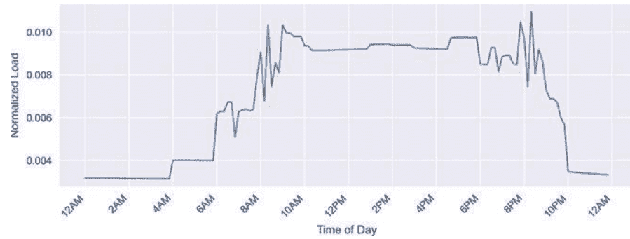

图2 实际归一化负荷曲线

## 6.2 结果

图3显示了实际归一化负荷曲线和根据概率聚类转移矩阵预测的负荷曲线。预测的归一化负荷曲线不包括与各种制冷设备解冻相关的负荷峰值。预测是以10分钟的时间粒度进行的，每天共进行144次预测。该模型由一个具有50个隐藏节点的单层LSTM和一个具有10个神经元的稠密层组成。然后，稠密层被投影到一个输出缩放负荷的单个神经元。

在训练的每个步骤中，模型的输入特征包括预测温度、预测湿度、除霜计划和滴水计划，以及输入层中每个144个时间步的预测归一化负载。所有输入特征和目标变量都经过标准化处理，以加快学习速度和稳定性。

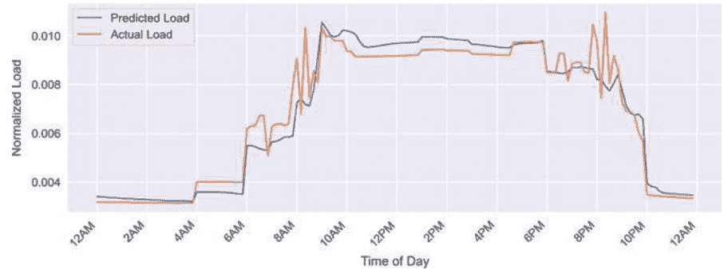

图3 从聚类转移矩阵预测的归一化负载曲线与实际归一化负载曲线

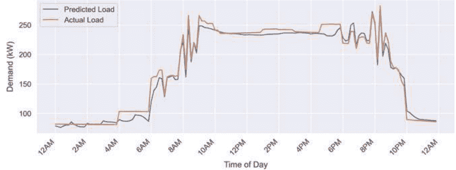

图4 超市需求：提前一天的预测和实际负载

年度数据集被分为训练、测试和验证集，其中80%用于训练，其余平均分配给验证和测试集。模型经过1000个时期的训练，均方误差作为损失函数。使用Adam作为优化器，并使用权重衰减作为正则化技术。

图4显示了模型预测与实际负载的示例日的图表。模型性能使用平均绝对百分比误差（MAPE）和均方根误差（RMSE）进行衡量，列在表2中。总体MAPE为3.80%，表明提前一天的负载预测非常准确。由于建筑负载预测用于除霜计划优化，因此在除霜期间的MAPE也很重要。在除霜期间，MAPE略高，为4.12%。

# 表2 LSTM模型性能

|  | 总体 | 解冻期间 |
| --- | --- | --- |
| MAPE | 3.80% | 4.12% |
| RMSE | 11千瓦 | 11.79千瓦 |

模型预测的RMSE在整个一天内为11千瓦，在解冻期间为11.79千瓦。在这十一个模型中，最大的七个制冷装置每个都引入了超过11.79千瓦的额外负荷（表1），因此这个预测误差在比例上是很小且可接受的。

## 案例研究2：协调制冷解冻

以下案例研究使用SCE天气数据（尤其是ASHRAE气候区域3A），尽管提出的分析适用于其他食品零售店、电力公用事业和电力市场。为了考虑到全年和SCE领域不同部分的天气变化，使用了加利福尼亚能源委员会的天气数据文件来表示两个加利福尼亚气候区域。通过比较给定SCE电力定价（包括分时电价和季节性费率），评估了所提出优化算法的性能，包括商店的能源账单。

这个案例研究还使用了EnergyPlus中的DOE超市参考建筑，用于模拟冷冻除霜对建筑电力消耗和需求的影响[62]。大多数冷冻设备每天需要进行多次除霜，以防止蒸发器上结冰，从而降低冷却能力。由于除霜会向冷冻设备引入热量，因此除霜期间的电力负荷较高。这个例子提出了一个多目标除霜优化模型，以最小化商店的电力成本、CO2排放和高峰时段的需求，同时考虑整体建筑功率。

对于这个例子，食品店的成本节省优先于最大化电网的利益。换句话说，虽然所提出的算法优化了食品零售店的冷冻除霜计划，以最小化电力成本，但电力公司将间接受益于终端用户避免高峰消耗时段的策略[64]。

作为上述方法的一个例子，下面的部分应用这些技术到多个商业制冷单元的高负荷除霜周期[65]。

## 7.1 资产建模

为了对商业制冷系统的运行进行建模，这个案例研究在EnergyPlus中对建筑进行建模。EnergyPlus是由美国能源部（DOE）开发的能源建模软件，提供了参考建筑的标准化模型[61]。这个例子侧重于优化制冷单元的除霜计划，因此选择了超市参考建筑，并对ASHRAE 3A气候区（洛杉矶地区）进行建模，以模拟各种除霜计划。供暖、通风和空调（HVAC）组件、占用情况

## 电力定价

电力公司根据建筑物类型和大小进行不同分类，例如将建筑物分为不同层次。例如，南加州爱迪生公司将超市归类为中型企业，适用电价表TOU-GS-2，选项B [72]。为了计算商店的电费成本，南加州爱迪生公司根据夏季和冬季的定义，通过峰值、中峰值和谷值来指定分时电价，如图6和图7所示。超市的分时电价和其他电费详见表3。

表3 南加州爱迪生领域超市的分时电价[73]

| 时段         | 气候区6 | 气候区14 |
|--------------|---------|---------|
| 高峰时段     | 19.77美元 | 19.77美元 |
| TOU（每千瓦时美元） | 0.09935 | 0.09505 |
| DC（每千瓦美元） | -       | 0.09249 |
| 每千瓦时美元） | 0       | 0.08284 |
| DC（每千瓦美元） | 0       | 0       |

周六和周日按低峰时段费率计费，还有每年的八个假日：元旦、总统日、阵亡将士纪念日、独立日、劳动节、
退伍军人节、感恩节和圣诞节。如果这些假日中的任何一天是周日，
那么下周一也按低峰时段费率计费[72]。

## 7.3 结果

在确定了每年每天的最佳除霜计划后，将所得到的电费、峰值需求（包括高峰时段和中峰时段）和温室气体排放与参考案例以及与晚间高峰期重叠的错位除霜案例（称为“错位”案例）进行比较，以验证计划选择（见图8）。

图9显示了加利福尼亚气候区14每个月的峰值需求减少情况。这些结果也计算出了气候区6的情况。图9的第一个子图显示了通过最佳除霜调度与错开和参考情况相比的绝对月峰值需求减少情况。对于在气候区6建模的超市，从错开到最佳和从参考到最佳的绝对月峰值需求平均减少了5.00%和4.84%。加利福尼亚气候区14的超市获得了更大的好处，从错开到最佳和从参考到最佳的绝对月峰值需求平均减少了7.02%和5.46%。这些减少直接对应于设施相关需求费用的减少。

在图9的第二个子图中，显示了在高峰期（工作日的中午12点到下午6点）的峰值需求减少情况。高峰期不适用于10月至5月，优化成本函数不鼓励在冬季期间最小化高峰期需求。然而，减少绝对月峰值会减少12点到6点之间的需求，因为绝对峰值通常发生在这个时段。特别是在夏季最高的时间相关需求费用适用的月份，气候区6的超市在高峰期间的最大需求从错开到最佳减少了2.35%，从参考到最佳减少了2.94%。气候区14的超市在高峰期间的最大需求从错开到最佳减少了2.51%，从参考到最佳减少了7.92%。

图9的第三个子图计算了年度工作日上午8点到中午12点和下午6点到晚上11点的每日中峰期最大需求量。6月至9月，在气候区6中，优化解冻时间表的中峰期最大需求量比错开时间表更大，这是一个有趣的结果。

由于中高峰时段比高峰时段更便宜，因此成本函数倾向于在中高峰时段进行解冻，从而增加了中高峰需求，同时减少了高峰需求。与参考模型相比，中高峰最大值减小了，因为参考解冻计划发生在中高峰时段。在夏季，区域6的超市在中高峰时段的最大需求增加了2.35%，从交错到最佳，从参考到最佳减少了2.94%。区域14的超市在中高峰时段的最大需求减少了2.51%，从交错到最佳，从参考到最佳减少了7.92%。

图10显示了加利福尼亚气候区域6（顶部）和14的交错与最佳负荷曲线

考虑所有与设施和时间相关的需求费用，区域6模拟的超市从交错到最佳的需求费用年度减少了5.86%，从参考到最佳减少了4.78%。区域14的超市从交错到最佳的需求费用年度减少了7.82%，从参考到最佳减少了5.31%。区域14的超市需求费用减少更多，因为最大高峰需求很可能也是绝对最大需求，考虑到建筑物的负荷在夏季比冬季更大。在夏季，减少绝对最大值也会减少区域14的高峰最大值。

在第6区，尽管通过将除霜转移到较低价格时段，峰值负荷显著减少，但绝对最大需求并没有看到如此大的减少，因为建筑物的负荷在上午9点到晚上9点之间较为平稳。图10显示了峰值

图11跨日除霜计划转移

区域6和14的需求日（6月30日）都显示了峰值和绝对峰值的大幅减少，这证明了区域14的大幅减少。由于其气候较为温和，区域6模型的峰值最大负荷减少很大，但绝对峰值没有减少。负荷的峰值表示正在进行除霜的制冷装置。

如前所述，没有限制跨日除霜计划的转移。图11显示了跨日除霜计划的转移。如果在第一天，一个制冷装置在凌晨2点和下午2点进行除霜，那么-1.5的跨日转移意味着第二天的制冷装置在凌晨12:30和下午12:30进行除霜。图11汇总了评估的两个气候区域中所有制冷装置的跨日转移（每个气候区域9个装置，共计365天，总共为6,570天）。即使没有对跨日计划转移施加限制，大部分的计划在两天之间的变化为0小时。因此，添加限制对最优解的影响很小。

表4给出了优化除霜计划的年度效益概述。在气候区6，每家店每年可节省6,000美元至7,000美元，在气候区14，每家店每年可节省6,500美元至10,000美元。由于目标函数中不包括排放量，除霜计划的变化对年度温室气体排放量（以tCO₂列出）的影响很小。年度结果强调了除霜计划对需求费用的影响，突出了电网通过客户商业制冷来进行负荷转移的机会。

## 8 结论

物联网连接的分布式能源资源在电网上的普及和影响力都在增长。最明显的是，可再生能源资源（例如太阳能光伏）因其价格越来越实惠而不断增长。这些系统有各种不同的尺寸，具有不同的监测和控制技术和能力。这种固有的异质性使得在这些不同系统之间进行决策和协调变得具有挑战性。深度学习提供了负荷预测和协调的实用方法。联邦计算特别适用于跨异构代理进行大规模机器学习和优化。这种方法非常适合协调分布在许多位置和所有者之间的物联网连接的分布式能源资源的运行。本章详细介绍了电力网络目前在实现物联网网络间有效协调方面面临的许多障碍，例如与不同分布式能源资源控制器的接口问题。深度学习和联邦计算提供了新颖的、轻量级的协调方法，本章讨论了在研究和商业环境中实施和基准测试的方向。未来的电力网络将依靠深度学习来保护隐私并为每个能源消费者提供服务。

## 参考文献

1. Thornburg, J., Krogh, B., Ustun, T.S.: “用于智能微电网规划的随机模拟器。”在：计算机协会计算与发展研讨会。内罗毕,肯尼亚（2016年）

4. J. Thornburg, “用于需求侧管理的微电网运行策略的概率评估工具”, 博士学位论文, 卡内基梅隆大学, 2018年12月  
5. Thornburg, J., Krogh, B.: “用于智能电表需求管理的微电网能量管理策略模拟”, 在2017年IEEE PES PowerAfrica会议上。阿克拉, 加纳(2017年)。六月  
6. Thornburg, J., Ustun, T. S., Krogh, B.: “智能微电网运行模拟器用于管理和电气化规划,”在2016年IEEE PES PowerAfrica会议中。赞比亚利文斯顿(2016年)。六月  
7. Shariat zadeh, F., Mandal, P., Srivastava, A. K.: 可持续能源系统的需求响应: 一项回顾、应用和实施策略。 可再生与可持续能源评论 45, 343-350 (2015)  
8. Mohammadi, J., Thornburg, J.: “通过联邦计算连接分布式能源灵活性的局部区域: 限制和可能性,”在IEEE国际机器学习和应用会议论文集中。佛罗里达迈阿密(2020年)。十二月  
9. Dos Santos, F. C., Thornburg, J., Ustun, T. S.: “通过航拍图像处理自动规划屋顶光伏系统,”在IEEE PES亚太电力与能源工程会议论文集中。马来西亚亚庇(2018年)。十月  
10. M. Babcock, R. E. Ciez, A. Loew, B. Sergi, J. Thornburg, and N. J. Williams, “机构对电力部门投资的影响: 肯尼亚和坦桑尼亚分布式和集中式能源的案例研究,”能源研究与社会科, 第41卷, 第C期, 2018年4月  
11. Kok, K., Widergren, S., Yang, G., Hu, J.: 特刊导言: 关于灵活需求和分布式发电的交易方法的特刊导言。 IEEE电力系统交易 34(5), 3991-3993 (2019年)  
12. Tushar, W., et al.: 电力网络中的点对点交易概述。 IEEE智能电网交易 (2020年)  
13. A. Imteaj, M. H. Amini, and J. Mohammadi, “利用分散式人工智能增强能源网络的弹性,”arXiv预印本arXiv:1911.07690, 2019  
14. Schiermeier, Q.: 全球变暖与增加的洪水风险: 极端降雨可能已经因温室气体水平上升而翻倍。自然 470(7334), (2011年2月)  
15. J. Robbins, “气候鞭打: 极端天气的剧烈波动正在增加,”耶鲁环境360, 2019年11月  
16. Holling, C.S.: 生态系统的弹性和稳定性。 生态学和系统学年度综述 4(1), 1-23 (1973年)  
17. J. Thornburg, G. Hug, T. Ustun, A. Rowe和B. Krogh, “将智能电网运营策略纳入脱网电气化规划,”在SIAM控制及其应用会议, 2015年7月  
18. I. Goodfellow, Y. Bengio, A. Courville和Y. Bengio, 深度学习。 麻省理工学院出版社剑桥, 2016年, 卷1, 号2  
19. Cevher, V.等: 大数据的凸优化: 可扩展的、随机化的和并行的大数据分析算法。 IEE  
E信号处理杂志 31(5), 32-43 (2014年)  
20. Yan, F.等: 分布式自主在线学习: 遗  
憾和内在的隐私保护特性。 IEEE知识与数据工程交易 25(11), 2483-2493 (2012年)  
21. C. Chen, J., Sayed, A. H.: 网络上的扩散适应策略用于分布式优化和学习。 IEEE信号处理  
交易 60(8), 4289-4305 (2012年)  
22. S. Boyd等, 分布式优化和统计学习通过交替方向乘  
法器方法。现在出版商, 2011年  
23. J. Mohammadi和S. Kolouri, “通过共享集体知识和本地专业知识进行协作学习,”在第29  
届国际机器学习信号处理研讨会上, IEEE, 2019年。[在线]。 可用: https://doi.org/10.  
1109/MLSP.2019.8918888  
24. M. Li, D. G. Andersen, A. J. Smola和K. Yu, “具有  
参数服务器的通信高效分布式机器学习,”在神经信息处理系统进展中, 2014年, 第19-27  
页  
25. Huang, Z., Hu, R., Guo, Y., Chan-Tin, E., 等: “Dp-admm: 基于差分隐私的ADMM  
分布式学习。 IEEE信息取证与安全交易 15, 1002-1012 (2019年)  
26. Xing, E.P., Ho, Q., Dai, W., Kim, J.K., Wei, J., Lee, S., Zheng, X., Xie, P., 等: “Petuum: 一个新的大数据分布式机器学习平台。” IEEE大数据交易 1(2), 49–67 (2015)  
27. P. Kairouz, H. B. McMahan, B. Avent等, “联邦学习的进展和开放问题,”预印本 arXiv:1912.04977, 2019年12月  
28. Li, T., Sahu, A.K., Talwalkar, A., Smith, V.: 联邦学习: 挑战、方法和未来方向。 IEEE信号处理杂志 37(3), 50–60 (2020)  
29. F. Bonomi, R. Milito, J. Zhu, and S. Addepalli, “雾计算及其在物联网中的作用,”在移动云计算MCC研讨会第一版中, 2012年, 第13–16页  
30. Deshpande, A., Guestrin, C., Madden, S.R., Hellerstein, J.M., Hong, W.: 基于模型的传感器网络近似查询。 VLDB期刊 (非常大型数据库的国际期刊) 14(4), 417–443 (2005)  
31. P. Garcia Lopez, A. Montresor, D. Epema, A. Datta, T. Higashino, A. Iamnitchi, M. Barcellos, P. Felber, and E. Riviere, “边缘中心计算: 愿景与挑战,”2015  
32. T. Li, M. Sanjabi, A. Beirami, and V. Smith, “联邦学习中的公平资源分配,”预印本arXiv:1905.10497, 2019  
33. 包, Z., 曹, Y., 王, G., 丁, L.: 基于功率流熵的电网级联故障分析。 物理学快报 3 73(34), 3032–3040 (2009)  
34. Wood, A.J., Wollenberg, B.F., Sheblé, G.B.: 电力发电、运行和控制。约翰威利和儿子 (2013)  
35. Widergren, S., Taft, J.D.: 网格架构: 决定我们能源未来的决策 [客座编辑]. IEEE Power and Energy Magazine 17(5), 14–16 (2019)  
36. Stephens, J.C., Burke, M.J., Gibian, B., Jordi, E., et al.: 实施能源民主化: 佛蒙特州可再生能源转型中的挑战与机遇. Frontiers in Com-munication 3, 43 (2018)  
37. K. Blunt et al., “PG&E开始为近80万加利福尼亚客户停电, 以应对野火风险.”华尔街日报, 2019年10月  
38. Smarra, F., et al.: 基于随机森林的数据驱动模型预测控制用于建筑能源优化和气候控制. Applied Energy 226, 1252–1272 (2018)  
39. Gao, Y., Ruan, Y., Fang, C., Yin, S.: 用于信息不足建筑物能耗预测的深度学习和迁移学习模型. Energy and Buildings 223,110156 (2020)  
40. A. Taik和S. Cherkaoui, “使用边缘计算和联邦学习进行电力负荷预测,”在/EEE国际通信大会 (ICC) 的论文集中, 2020年5月  
41. P. A. G. Watson, “应用机器学习改进混沌动力系统的模拟, 使用经验误差校正,”地球系统建模进展杂志, 第11卷, 第5期, 第1402-1417页  
42. Junker, R.G.等: 对建筑和区域能源灵活性的表征。 应用能源 225, 175-182 (2018年)  
43. Ustun, T.S., Thornburg, J., Krogh, B.: “具有ICT基础设施的智能定价实施/模拟器,”在非洲-欧盟可再生能源研究与创新研讨会上。阿尔及利亚特莱姆森 (2016年)。 Mar  
44. A. Imteaj等, "资源受限的物联网设备的联邦学习: 全景和最新技术,"预印本arXiv:2002.10610, 2020年  
45. M. Chen等, "无线网络上联邦学习的联合学习和通信框架,"预印本arXiv:1909.07972, 2019年  
46. F. Chen, M. Luo等, "具有快速收敛和高效通信的联邦元学习,"预印本arXiv:1802.07876, 2018年  
47. A. Das和T. Brunswiler, "隐私是我们关心的: 关于边缘设备上联邦学习的实验研究,"第一届国际物联网挑战人工智能和机器学习研讨会论文集, 2019年, 第39-42页

48. A. Hard, K. Rao, R. Mathews, S. Ramaswamy等, “面向移动键盘预测的联邦学习,” 预印本arXiv:1811.03604, 2018

49. McParland, C., “OpenADR开源工具包: 为智能电网开发开源软件,” in IEEE PES General Meeting. IEEE 2011, 1-7 (2011)

50. Ma, C., 等: 具有任意本地求解器的分布式优化. 优化方法和软件 32(4), 813-848 (2017)

51. J. Konečný等, “联邦学习: 提高通信效率的策略,” 预印本arXiv:1610.05492, 2016

52. Mohammadi, J., Hug, G., Kar, S., “异步分布式直流最优功率流的方法,” in IEEE Eindhoven PowerTech. IEEE 2015, 1-6 (2015)

53. Olfati-Saber, R., 等: 网络化多智能体系统中的共识与合作。IEEE会议论文集 95(1), 215-233 (2007)

54. J. Kim, C. Goodman, 和 J. Mohammadi, “CarnegiePLUG: Prosumer-in-the-Loop模拟 Grid,” 在2020年IEEE第六届物联网世界论坛（WF-IoT）的论文集, 2020

55. “VOLTTROn环境,” 美国能源部和太平洋西北国家实验室, 2016年1月12日从https://volttron.org/检索

56. J. Lenard, “美国便利店数量,” 便利和燃料零售协会（NACS）, 2020年

57. A. Fuller, Z. Fan, C. Day, 和 C. Barlow, “数字孪生: 实现技术, 挑战和开放研究,” IEEE Access, 卷8, 页108 952-108 971, 2020年

58. 刘, M., 方, S., 董, H., 徐, C.: 数字孪生的概念、技术和工业应用综述。 制造系统杂志 (2020年)

59. R. Srinivasan, B. Manohar和R. Issa, 城市建筑能源CPS (UBE-CPS): 实时需求响应使用数字孪生。 Springer, 2020年5月

60. Hochreiter, S., Schmidhuber, J.: 长短期记忆。 神经计算 9 (8), 1735-1780 (1997年)

61. “EnergyPlus”, 美国能源部, 建筑技术办公室, 2020年

62. “按建筑类型分类的参考建筑: 超市”, 美国能源部能源效率和可再生能源办公室, 2013年12月

63. M. G. Edward Barbour, “利用日负荷曲线聚类提高家庭级负荷预测,” 在BuildSys '18: 建筑环境系统第5届会议上, 2018年11月

64. R. T. de Salis等, "单一建筑峰值削减的能量储存控制," 2014年IEEE PES大会|会议展览, 2014年, 第1-5页

65. Goodman, C., Thornburg, J., Mohammadi, J.: “商业建筑需求转移的制冷除霜调度优化,” 2021年IEEE绿色技术会议论文集。科罗拉多州丹佛 (2021年)

66. “2022年排放指标,” 南加州爱迪生公司, 2020年

67. “建筑气候区域,” 加利福尼亚能源委员会, 2020年8月

68. Dichter, M.: 什么是时间相关估值 (TDV)? 加利福尼亚大学戴维斯分校, 西部冷却效率中心 (2019年)

69. “商业参考建筑: 超市,” 美国能源部, 开放数据目录, OpenEI, 2014年11月

70. “能源高效资源数据库,” 加利福尼亚公共事业委员会, 2020年9月

71. “OpenStudio,” 可持续能源联盟有限责任公司, 2020年

72. “中型企业基本费率: TOU-GS-2费率表,” 南加州爱迪生公司, 2014年

73. “TOU-GS-2计划: 分时用电 - 一般服务 - 需量计量,” 南加州爱迪生公司, 2019年3月

使用卷积和循环神经网络进行深度学习的捐赠者旅程

Greg Lee, Ajith Kumar Raghavan和Mark Hobbs

摘要 慈善机构不断努力决定他们应该采取什么行动来鼓励每个数据库中的成员（人）捐赠。一种做出这个决策的方法是使用机器学习基于成员过去的行动来构建模型，并使用该模型选择下一步的行动。

过去，通过使用一个成分的先前操作的固定窗口以及使用与每个操作相关的电子邮件的参数来完成这项工作。使用这种方法，递归神经网络（RNN）能够学习一个能够在地面真实值附近预测捐赠的模型。在这个基础上，我们尝试了几种变体的RNN和卷积神经网络（CNN），以及不同大小的先前操作窗口，将描述成分的特征添加到数据中，并匿名地组合数据集。在某些情况下，将匿名的慈善数据进行组合训练可以得到更准确的模型。RNN表现出类似的性能，而传统的CNN将一个慈善机构的均方误差降低到16美元，为慈善机构提供了一个改进的工具，以选择操作和电子邮件参数以最大化捐赠。

电子补充材料 本章的在线版本(https://doi.org/10.1007/978-981-16-3357-7_12)包含补充材料，授权用户可以访问。

G. Lee (@) · A. K. Raghavan  
加迪亚大学计算机科学学院，加拿大沃尔夫维尔  
电子邮件：glee@acadiau.ca

A. K. Raghavan  
电子邮件：146771v@acadiau.ca

M. Hobbs  
Fundmetric，加拿大哈利法克斯  
电子邮件：mark@fundmetric.com

© 作者，独家许可给 Springer Nature Singapore Pte Ltd. 2022  
M. A. Wani 等人（编），深度学习应用，第3卷  
智能系统与计算进展1395  
https://doi.org/10.1007/978-981-16-3357-7_12

1 引言

2018 年，美国人捐赠了 4270 亿美元给慈善机构 [1]。但是，每增加 100 美元的捐款，就会有 96 美元的损失通过捐赠者流失来抵消 [2]。因此，慈善机构没有可靠的现金流，而且处于依赖不断减少的主要（大额）捐赠者的循环中，随着人口结构变化和主要捐赠者的年龄增长。为了缓解这种情况，慈善机构通过活动寻求续约或获取捐赠者，他们会发送一个呼吁以获得特定的指定，例如“学生奖学金”。图 1 显示了呼吁电子邮件的一个示例部分。慈善机构试图通过“捐赠者旅程”来帮助受益人 筹集资金。目前，与受益人的沟通主要通过电子邮件进行，因为传递速度快且与直邮沟通相比节省成本。发送给受益人的电子邮件的数量、长度和内容通常是从前一年的活动结构中复制的，或者通过“经验法则”得出。许多人认为慈善募捐是一门“艺术”，但是越来越多的慈善机构意识到捐赠行为存在模式，其中许多模式可能对人类礼品官员来说过于复杂，无法在他们的数据中检测到。

像Fundmetric Incorporated [3]这样的私营公司正在商业化学术研究，以帮助非营利部门。这是一种罕见的合作，需要研究、私营企业知识和慈善部门。慈善机构现在正在使用机器学习来帮助他们预测与谁以及何时进行沟通，以增加数据库中每个成员的终身价值（捐款总额）。更具体地说，慈善机构希望在日常工作中了解应该采取哪些行动来引起每个数据库成员的未来捐款，同时又不会惹恼捐赠者。不断向成员要钱可能导致捐赠者疲劳和捐款减少，因此这个问题不能简单地通过不断请求捐款来解决。

先前的研究表明，使用最近六个成员/慈善行动的窗口，每个行动都与其相关的电子邮件特征相结合，可以在25美元的平均绝对误差（MAE）内预测捐款金额[4]。数据中这种行动/电子邮件组合的一个示例是点击HTML链接和成员点击该链接的电子邮件参数，例如“551个字”和“3个块”。这项工作的下一个合理步骤是在每个行动中包括成员的特征，因为不同的人可能出于不同的原因采取相同的行动。成员特征总结了他们当前的情况（例如，他们的地址），他们的捐赠历史（例如，他们最大的捐款）和他们的行为（例如，他们点击慈善机构链接的总次数）。第二个合理的扩展是改变考虑的行动窗口的大小，因为我们不知道在成员与慈善机构的过去经验中要看多远才能形成一个能够准确预测他们未来捐款的模型。除了这些变化，我们

表1 可变电子邮件参数  

| 参数 | 描述 |
| --- | --- |
| 单词 | 单词数量 |
| 段落 | 段落数量 |
| 图片 | 图片数量 |
| 链接 | HTML链接数量 |
| 块 | 部分数量 |
| Divs | HTML内容分割元素数量 |
| 变量 | 要填充的变量数量 |
| 可编辑内容Divs | 可编辑的HTML div数量 |

3 问题的形式化

一般的问题是如何帮助慈善机构筹集更多资金。慈善机构经常采用“喷洒祈祷”方法，即向数据库中的大量成员发送相同的通信以相同的顺序。慈善机构认识到所有捐助者都是个体，并且希望得到相应的对待。因此，手头的问题更具体，即（机器）学习在慈善数据库中向每个个体成员发送什么（如果有的话）以增加捐款。

我们尝试了电子邮件活动，但这项工作应该适用于直邮——向不捐款的人发送呼吁信件不仅有可能导致捐助者疲劳，还有可能产生经济成本。

与成员相关的下一步最佳行动的一个可能指标是查看成员和慈善机构与成员相关的行动序列。慈善机构目前通过手工操作和几个“常识”规则来实现这一点，例如“如果成员没有打开过最近的十封电子邮件，则不要再向他们发送电子邮件。”这些规则在一定程度上显示出了一般的有效性，但最终慈善机构正在向以捐助者为中心的模式转变，该模式考虑到每个个体成员的行动和偏好。这需要分析每个成员与慈善机构的过去互动，可以由慈善机构的工作人员或通过机器学习来完成。

一个慈善事业的例子是为特定大学的建筑筹资学院。目标名单上的成员被机器学习算法预测最有可能捐赠给该事业，但这种定向不在本文的范围内[14]。我们假设目标名单已经建立，并关注下一步该采取哪些行动以吸引这些受众。由于几乎所有行动都是受众行动（如打开电子邮件或点击链接），我们建议的行动仅限于发送电子邮件。因此，这个问题变成了为发送给这些受众的电子邮件建议具体的参数值。我们优化的电子邮件参数如表1所示。

虽然诸如单词、段落和图像之类的电子邮件参数是不言自明的，其他参数需要进一步解释。HTML divs将一个

图2 一封样本申诉邮件。有5个块（A），1个变量（B），7个链接（C），10个图片（D），249个单词，12个段落，48个div（未显示），和5个可编辑内容div

## 5 经验评估

为了优化使用成分/慈善行动序列进行捐赠预测准确性，我们进行了一系列实验，包括添加成分特征（第5.1节），改变窗口大小（第5.2节），研究无行动的影响（第5.3节）以及合并数据集（匿名）跨慈善机构（第5.4节）。我们在第5.5节中收集和总结了这些实验的结果。这些结果显示了各种类型的CNN和RNN的准确性足以信任它们对电子邮件参数的预测，这些实验在第5.6节中描述。

所有实验都是使用来自五个慈善机构的数据集进行的——一个野生动物保护慈善机构(C1)，一个疾病慈善机构(C2)，一个儿童慈善机构(C3)（与[4]中相同的三个慈善机构），我们还添加了另一个疾病慈善机构(C4)和一个大学基金会(C5)。C2和C4是同一种疾病的慈善机构（位于不同的地点）——我们省略了疾病名称以保护匿名性。数据是从C1的2018年GivingTuesday呼吁，C2的2019年春季呼吁，C3的2019年Giving Tuesday呼吁，C4的2018年年底呼吁和C5的2020年紧急COVID学生基金呼吁中收集的。行动的记录如第3节所述。

在每个实验中，数据被分为75/25进行训练和测试，并且数据集是平衡和独立的（在训练过程中没有看到测试数据）。这导致了RNN和CNN的训练数据减少，但防止了学习模型偏向于预测为0的捐赠，因为求助总是有比捐赠者更多的非捐赠者（如表4所示）。每个实验在每次迭代中使用不同的训练和测试集运行了25次，并对结果进行了平均。

在仅使用动作和电子邮件特征的实验中，RNN和CNN有18个输入（10个动作和8个电子邮件参数）。对于包含特征的情况，这些算法有105个输入（10个动作，8个电子邮件参数和87个包含特征）。考虑到C5，两种学习算法在没有包含特征的情况下有37个输入（29个动作和8个电子邮件参数），在包含特征的情况下有124个输入（29个动作，8个电子邮件参数和87个包含特征）。以平均绝对误差（MAE）为指标的最佳性能架构显示在表5（RNN），表6（CNN），表7（BDRNN），表8（CNNLSTM）中。这些架构生成了模型，其中

| | C1 | C2 | C3 | C4 | C5 |
| --- | --- | --- | --- | --- | --- |
| 捐赠者 | 640 | 229 | 316 | 27 | 1258 |
| 非捐赠者 | 195669 | 195688 | 50811 | 60 | 173363 |
| 总筹款 | $54,387 | $55,952 | $130,034 | $6,285 | $364,133 |
| 平均捐赠额 | $85 | $245 | $409 | $233 | $290 |
| 中位数捐赠额 | $50 | $100 | $100 | $100 | $100 |
| 标准差 | $105 | $514 | $1520 | $585 | $1,035 |
| 最小捐赠额 | $5 | $1 | $1 | $10 | $5 |
| 最大捐赠额 | $1,000 | $5,000 | $10,000 | $3,000 | $25,000 |

## 5.1 添加成分特征

我们为每个动作的行动和电子邮件参数特征添加了成分特征，以向学习算法提供有关每个成分的信息。我们实验中使用的组成特征列在表10中。这些为学习算法提供了除了采取了什么行动和周围的电子邮件之外的信息——有关手头组成部分的信息。

表11显示了使用组成特征的RNN性能与不使用组成特征的RNN性能的比较。表12显示了CNN的比较。

表10 实验中使用的组成特征。由于空间原因，有些已经合并。

| 特征 | 描述 |
| --- | --- |
| 征求 | 电子邮件/电话/地址联系方式的存在/许可 |
| 捐赠摘要 | 捐赠的最大/最小\平均/总数/计数/标准差 |
| 捐赠次数 | 自上次/首次捐赠以来的时间和捐赠跨度 |
| 捐赠方式 | 以现金/信用卡/股票/电子转账方式捐赠 |
| 阈值捐赠 | 在主要捐赠的10/20/30/40/50%范围内的捐赠 |
| 最佳指定 | 具有最高捐赠金额的活动/呼叫/指定的ID |
| LYBUNT/SYBUNT | 去年捐赠了一些，但不幸的是今年没有 |
| 小礼物 | 低于50美元和低于25美元的礼物数量 |
| 最佳拟合线 | 最佳拟合线的斜率和截距 |
| 财富 | 收入/投资/净值估计 |
| 参与统计数据 | 打开的邮件数量、点击次数、观看/开始/停止的视频数量 |
| 上次互动 | 距离上次与慈善机构互动的天数 |

表11 使用具有和不具有成分特征的RNN的MAE。最低的MAE以粗体显示

| | C1 | C2 | C3 | C4 | C5 |
| --- | --- | --- | --- | --- | --- |
| 无成分特征 | $26 | $491 | $228 | $76 | $50 |
| 有成分特征 | $27 | **$487** | **$214** | $79 | **$48** |

表12 使用具有和不具有成分特征的CNN的MAE。最低的MAE以粗体显示

| | C1 | C2 | C3 | C4 | C5 |
| --- | --- | --- | --- | --- | --- |
| 无成分特征 | $26 | $478 | $186 | **$46** | $45 |
| 有成分特征 | **$16** | **$464** | **$155** | $54 | **$44** |

使用成分特征与不使用成分特征的CNN性能对比。表13和表14分别显示了使用成分特征与不使用成分特征的BDRNN和CNNLSTMs的对比。在所有情况下，使用任何深度学习算法的成分特征降低或几乎保持了MAE，因此我们在所有后续实验中考虑了具有成分特征的数据。

由于存在一些没有组成特征的数据产生了较低的MAE，我们在随后的实验中继续使用这些数据。C2和C3的错误可能较高，这是由于他们的捐款金额范围较大（$4,999和$9,999）。C4的数据非常少，这可能解释了他们的呼吁产生较高的误差。对于C5，深度学习方法提供的额外操作很可能是导致其MAE低于C2和C3的原因。BDRNN在C3上实现了103美元的MAE，这显著低于其他算法的结果。我们验证了这个结果的准确性，并相信

表13 使用具有和不具有成分特征的BDRNN的MAE。最低的MAE以粗体显示

| | C1 | C2 | C3 | C4 | C5 |
| --- | --- | --- | --- | --- | --- |
| 无成分特征 | $25 | $490 | $251 | $70 | $40 |
| 有成分特征 | $28 | $473 | **$103** | $90 | **$41** |

表14 使用具有和不具有成分特征的CNNLSTM的MAE。最低的MAE以粗体显示

| | C1 | C2 | C3 | C4 | C5 |
| --- | --- | --- | --- | --- | --- |
| 无成分特征 | $33 | $475 | $186 | $56 | $46 |
| 有成分特征 | $33 | $475 | **$181** | $53 | **$46** |

BDRNN能够更好地利用C3的组成特征值，而其他深度学习算法则不能。请注意，没有组成特征的情况下，BDRNN对于C3具有最高的MAE。

## 5.2 变化的窗口大小

我们尝试了从1到25的窗口大小，以评估慈善机器学习算法应该回顾一个组成员与慈善机构的历史有多远，以准确预测一个组成员将捐赠多少。窗口越大，学习算法将看到更多的无行动行为，因为有些组成员与慈善机构的互动不多。我们将在下一节中探讨这种模式。表15显示了使用RNN预测所有慈善机构捐赠金额时，行动窗口大小对MAE的影响。表16显示了使用CNN预测所有慈善机构捐赠金额时，行动窗口大小对MAE的影响。

表15 使用不同窗口大小的RNN的MAE。最低的MAE以粗体显示

| 窗口大小 | C1 | C2 | C3 | C4 | C5 |
|---|---|---|---|---|---|
|1|$34|$511|$365|$91|$54|
|3|$32|$517|$264|$81|$51|
|6|$28|$526|$214|$80|$53|
|10|$26|$526|$263|$76|$53|
|15|$28|$510|$265|$76|$54|
|20|$28|$487|$231|$89|$49|
|25|$30|$493|$227|$80|$48|

表16 使用不同窗口大小的CNN的MAE。最低的MAE以粗体显示

| 窗口大小 | C1 | C2 | C3 | C4 | C5 |
|---|---|---|---|---|---|
| 1 | $33 | $464 | $179 | $57 | $49 |
| 3 | $34 | $470 | $176 | $57 | $49 |
| 6 | **$16** | $472 | $182 | $58 | **$44** |
| 10 | $34 | $468 | $167 | $59 | $50 |
| 15 | $29 | $470 | **$155** | $57 | $50 |
| 20 | $28 | $477 | $174 | **$46** | $51 |
| 25 | $28 | $483 | $175 | $55 | $58 |

表17 使用不同窗口大小的BDRNN的MAE。最低的MAE以粗体显示

| 窗口大小 | C1 | C2 | C3 | C4 | C5 |
|---|---|---|---|---|---|
| 1 | $34 | $474 | **$103** | $113 | $47 |
| 3 | $32 | **$473** | $106 | $138 | $50 |
| 6 | $28 | $481 | $120 | $114 | **$41** |
| 10 | **$27** | $484 | $180 | $94 | **$41** |
| 15 | $28 | $480 | $130 | $113 | $43 |
| 20 | $28 | $482 | $193 | $137 | $50 |
| 25 | $28 | $483 | $185 | **$90** | $47 |

对于RNN来说，更大的窗口大小可以降低误差，这表明RNN能够捕捉过去的慈善和成员行为对捐赠金额的重要性。但是增加窗口大小并不总是会带来更好的性能。这可能是因为对于一个成员来说，过去10-20个行为之外的许多行为都是没有行动的，除了告诉RNN该成员与慈善机构的历史不超过一定点之外，这些行为并没有提供更多信息给RNN。这些发现还表明，慈善机构与其成员之间的互动越多，就越能准确预测成员可能捐赠的金额，尤其是对于RNN来说。

对于CNN来说，情况不太明确，因为最佳窗口大小在不同的慈善机构之间有所变化。对于C2，使用窗口大小为1导致最低的MAE，但是MAE始终很高。CNN的误差也比RNN的误差低，这引发了一个问题，即一个成分的较不久远的历史是否对于预测他们的捐赠有影响。但是具有最低MAE的慈善机构（C1、C4和C5）都受益于至少6的窗口大小，这表明CNN能够像RNN一样使用更深的窗口大小。

表17和表18分别展示了BDRNN和CNNLSTM在不同窗口大小下的性能。BDRNN的MAE与RNN的相当，对于C5，窗口大小为20时，BDRNN的性能甚至超过了RNN。对于CNNLSTM，窗口大小几乎没有影响，并且它们的性能不如传统的CNN。

## 5.3 调查无行动效应

随着窗口大小增加到 X，无行动行为的数量也会增加（或至少保持不变），因为仍然会有一些成分尚未与慈善机构进行 X 次互动。随着窗口大小的增加，数据可能会被无行动行为所占据。

在五个慈善机构中，无行动行为的数量对于使用的任何深度学习算法来说都是微不足道的。表19和表20显示了C1和C5的结果，这两个慈善机构的模型误差最低（其他算法提供了更高的误差，但结果相似）。这种由无行动行为引起的问题缺乏显示，即使窗口大小较大也不一定会导致较低的误差（如第5.2节所示），这种缺乏必要的改进可能不是由于深度学习模型受到数据集中过多无行动行为的影响。

| 窗口大小 | %无动作 | 平均误差 |
| --- | --- | --- |
| 1 | 4 | $34 |
| 3 | 18 | $32 |
| 6 | 40 | $28 |
| 10 | 60 | $27 |
| 15 | 72 | $31 |
| 20 | 79 | $44 |

## 5.4 数据合并

我们实验中的两个慈善机构来自同一个领域，即C2和C4，都是同一种疾病的慈善机构。因此，我们首先尝试将它们的数据合并进行训练，并在两个慈善机构上进行测试，以查看外部数据是否有助于。图4显示，将C2的（更大的）数据集添加到C4的数据集中确实有助于C4使用RNN的MAE。相反，将C4的数据集添加到C2的数据集中并不能改善MAE。

在这个结果的基础上，我们对每个慈善机构的所有数据进行了训练数据的合并，即我们在所有慈善机构的所有可用数据上训练了每个模型，并在各个慈善机构的测试数据上测试了模型。由于时间限制，本实验中窗口大小固定为20，因为这个窗口大小通常提供了最低的MAE。因此，“个体误差”列中的一些结果可能大于四个深度学习算法提供的最佳MAE，但为了公平起见，这里只与窗口大小为20进行比较。未来实验将测试其他窗口大小。每个慈善机构使用RNNs、CNNs、CNNLSTM和BDRNN的结果分别显示在表21、表22、表23、表24和表25中。对于C4，将C1、C2、C3和C5的数据合并后，使用BDRNN模型得到的MAE为29美元。这表明，数据集较小的慈善机构，将其数据与相关慈善机构以及任何可用的慈善数据合并，可以降低MAE。此外，对于C5，当将其他四个慈善机构的数据合并时，BDRNN的误差降至25美元。无论是C4还是C5，使用BDRNN模型获得的最佳结果，表明BDRNN算法比实验中使用的其他深度学习算法更受益于较大的数据集。

## 5.5 最佳结果总结

对于C1到C5的最佳深度学习架构，最佳MAE测试误差显示在表26、27、28和29中，这些表格总结了之前呈现的结果。这些表格还提供了有关是否使用了组合特征、使用数据组合的最佳MAE以及仅使用特定慈善机构数据进行训练时使用的窗口大小的信息（在第5.4节中描述，组合数据实验的窗口大小为20）。除了使用组合数据的C2的MAE之外，CNN在每个慈善机构中都比RNN实现了更低的MAE，无论是组合数据还是不组合数据。这表明CNN更能够捕捉慈善机构和组成行动的时间顺序方面。

表26使用表5中给出的RNN架构预测捐赠的MAE。最低的MAE以粗体显示

| C1 | C2 | C3 | C4 | C5 |
| --- | --- | --- | --- | --- |
| 窗口大小 | 10 | 20 | 25 | 10/15 | 25 |
| 组成特征 | 不 | 是 | 是 | 不 | 是 |
| 综合数据平均绝对误差 | $83 | $75 | $412 | $90 | $86 |
| 单个数据平均绝对误差 | $26 | $487 | $232 | $76 | $48 |

表27 使用表6中给出的CNN架构预测捐赠的平均绝对误差（MAE），最低的MAE以粗体显示

|  | C1 | C2 | C3 | C4 | C5 |
| --- | --- | --- | --- | --- | --- |
| 窗口大小 | 6 | 1 | 15 | 20 | 6 |
| 组成特征 | 是 | 是 | 是 | 不 | 是 |
| 综合数据 | $62 | $86 | $346 | $81 | $55 |
| 测试误差 | $16 | $464 | $155 | $46 | $44 |

表28 使用表7中给出的BDRNN架构预测捐赠的平均绝对误差（MAE），最低的MAE以粗体显示

|  | C1 | C2 | C3 | C4 | C5 |
| --- | --- | --- | --- | --- | --- |
| 窗口大小 | 15 | 25 | 1 | 1 | 20 |
| 组成特征 | 是 | 不 | 不 | 是 | 是 |
| 综合数据 | $32 | $73 | $311 | $29 | $25 |
| 测试误差 | $25 | $473 | $103 | $70 | $40 |

表29 使用表8中给出的CNNLSTM架构预测捐赠的平均绝对误差（MAE），最低的MAE以粗体显示

|  | C1 | C2 | C3 | C4 | C5 |
| --- | --- | --- | --- | --- | --- |
| 窗口大小 | 10 | 3 / 10 | 1 / 10 | 3 | 2 / 25 |
| 组成特征 | 是 | 是 | 是 | 不 | 是 |
| 综合数据 | $60 | $56 | $375 | $64 | $48 |
| 测试误差 | $33 | $474 | $186 | $55 | $46 |

这与RNN相比是违反直觉的。这些行为的顺序可能不如它们在成分历史中的存在重要。

BDRNN和CNNLSTM在大多数情况下进一步降低了MAE，相比之下CNN的MAE较高。将LSTM内存添加到CNN中并在RNN中使用双向反向传播似乎可以创建更准确的捐赠者旅程模型。

表格30显示了我们实验中每个慈善机构所取得的最佳MAE，以及用于实现这些MAE的学习器和参数。与该领域的先前工作[4]相比，使用CNN、CNNLSTM或BDRNN对所有慈善机构进行了改进的结果。更大的窗口大小和组合数据也是降低每个慈善机构预测的MAE的因素之一

表格30 每个慈善机构的最佳MAE和相关参数

|  | C1 | C2 | C3 | C4 | C5 |
| --- | --- | --- | --- | --- | --- |
| 最佳MAE | $16 | $56 | $103 | $29 | $25 |
| 算法 | CNN | CNNLSTM | BDRNN | BDRNN | BDRNN |
| 窗口大小 | 6 | 20 | 1 | 20 | 20 |
| 组合数据? | 不 | 是 | 不 | 是 | 是 |
| 组成特征? | 是 | 不 | 是 | 不 | 不 |

捐赠金额，将所有慈善机构的MAE接近可接受的水平，以便在下一节中预测电子邮件参数。

## 5.6 电子邮件优化

在确定用于预测捐赠的最佳深度学习架构后，我们希望为慈善机构提供电子邮件参数预测，以增加他们的捐赠金额。由于C1和C5的数据产生了最准确的模型，我们分别使用在它们的数据上训练的RNN和CNN来预测这些慈善机构的电子邮件参数。这涉及将各种交付操作与不同的电子邮件参数值附加到组成操作序列中，这些参数值的范围由五个慈善机构实际电子邮件中使用的值确定。

RNNs对C1预测的最常见参数列在表31中，而表32显示了C1使用CNNs的结果。与RNNs相比，CNNs倾向于建议更长的电子邮件（702个单词对比150个单词），更加个性化（8个变量对比2个变量），并且有更多且更短的段落（18个对比1个）。

表31 RNNs选择的C1电子邮件参数值总结

|  | 模式 | 中位数 | 平均值 | 标准差 |
| --- | --- | --- | --- | --- |
| 单词 | 150 | 150 | 155.94 | 41.57 |
| 段落 | 1 | 1 | 1.1 | 0.414 |
| 图片 | 6 | 6 | 4.65 | 1.89 |
| 链接 | 35 | 29 | 31.7 | 2.99 |
| 块 | 8 | 8 | 8.05 | 0.19 |
| Divs | 41 | 41 | 41 | 0 |
| 变量 | 2 | 2 | 2 | 0 |
| 可编辑内容 | 9 | 9 | 9.24 | 1.18 |

表32 CNNs选择的C1电子邮件参数值总结

|  | 模式 | 中位数 | 平均值 | 标准差 |
| --- | --- | --- | --- | --- |
| 单词 | 702 | 702 | 693.3 | 69 |
| 段落 | 18 | 18 | 17.5 | 3 |
| 图片 | 5 | 5 | 5.1 | 0.42 |
| 链接 | 35 | 35 | 33.8 | 2.6 |
| 块 | 9 | 9 | 8.96 | 0.2 |
| Divs | 56 | 56 | 53.1 | 5.9 |
| 变量 | 8 | 8 | 8 | 0 |
| 可编辑内容 | 9 | 9 | 9 | 0 |

表33 RNNs和CNNs共同选择的C5电子邮件参数值总结。如果显示两个值，则首先显示RNNs的值

|  | 模式 | 中位数 | 平均值 | 标准差 |
| --- | --- | --- | --- | --- |
| 单词 | 142 | 142 | 267/276 | 248 |
| 段落 | 1 | 1 | 3.2 | 5.8 |
| 图片 | 6 | 6 | 7.1/7.4 | 3.6/3.8 |
| 链接 | 35 | 35 | 32 | 8.8/6.7 |
| 块 | 9 | 9 | 7.7/7.9 | 3.4/3.2 |
| Divs | 44 | 44 | 37/38 | 16.7/17.8 |
| 变量 | 8 | 8 | 6.6/6.8 | 3.7/3.5 |
| 可编辑内容 | 9 | 9 | 11.3/11.7 | 6.3/6 |

由于CNNs更准确（在C1的测试数据上准确度高达16美元），我们相信表32中的参数是需要在实践中进行测试的参数。

表33显示了RNN和CNN对C5的预测电子邮件参数。这两个模型几乎完全相同的参数值，表明了较短的电子邮件和许多变量。考虑到它们具有相似的MAE值（RNN为$48，CNN为$44），似乎它们对于电子邮件参数预测问题学到了相似的模型。从个体角度来看，RNN和CNN似乎都建议给新捐赠者发送更长的电子邮件，表明它们学会了向组织历史较短的个人提供更多信息。

通过将C1-C4的训练数据与C5的测试数据相结合，C5的预测捐赠金额的MAE进一步降低至$25。因此，我们使用构建该模型的BDRNN来预测电子邮件参数，并在表34中显示。BDRNN模型建议使用更多图片的较长电子邮件。考虑到其误差（约为RNN和CNN的一半），我们建议将这些参数用于C5的电子邮件。

表34 BDRNNs选择的电子邮件参数值总结

| C5 | 模式 | 中位数 | 平均值 | 标准差 |
| --- | --- | --- | --- | --- |
| 单词 | 288 | 288 | 215.13 | 83.20 |
| 段落 | 2 | 2 | 5.93 | 7.41 |
| 图片 | 15 | 15 | 11.5 | 4.79 |
| 链接 | 29 | 29 | 30.83 | 6.54 |
| 块 | 9 | 9 | 10.1 | 3.19 |
| Divs | 60 | 60 | 56.4 | 11.71 |
| 变量 | 8 | 8 | 9.03 | 2.26 |
| 可编辑内容 | 23 | 23 | 20.9 | 4.97 |

## 6 讨论与未来工作

在这项研究中，我们扩展了以往关于预测捐款金额和电子邮件参数的工作，从捐赠者和慈善机构的过去行动中。通过使用卷积神经网络，我们能够将一个慈善机构的MAE降低36%，至16美元。此外，通过将匿名数据整合到多个慈善机构中，我们能够在一个新的更大数据集上实现25美元的误差，使用双向RNNs。我们使用这些模型为这两个慈善机构提供电子邮件参数建议，因为我们拥有最准确的模型。重要的是要记住，电子邮件参数是基于个体预测的，但我们发现的趋势是直观的。CNNs预测，对于一个慈善机构，较长的电子邮件和更多的个性化将导致更高的捐款，而RNNs和具有相似MAEs的CNNs为另一个慈善机构选择了类似的电子邮件参数，这表明尽管它们的不同架构，它们学习了相似的模型。

BDRNNs在所有可用的慈善机构数据上进行训练（并且与CNN和RNN的MAE相比减少了约一半），建议使用更多图片的较长电子邮件。值得注意的是，其中一些数据来自与C5完全无关的慈善机构（例如，C2是一个疾病慈善机构，而C5是一所大学）。这表明，无论类型如何，捐助者的旅程在各个慈善机构之间是相似的。当将数据组合在不同慈善机构之间时，使用的数据没有组成特征，这是未来工作的一个领域。

我们怀疑，如果将这些特征加入数据集中，MAE可能会进一步降低。使用更准确的BDRNN模型进行C5的训练的一个限制是，随着数据集的增长，训练时间可能变得不可行。BDRNNs的运行时间比传统的CNNs长4.5倍，因此如果时间很重要，对于某个特定的慈善机构（如C5），CNN模型可能是最佳选择。我们还计划研究CNNs在这个任务中比RNNs更准确，并且在面对新的训练数据时，我们的模型特性是否会持续存在，而不是在每次训练运行时重置。

为了扩展这项工作，我们计划使用强化学习来建模捐赠者的旅程，并将捐赠视为奖励。这种无监督学习方法应该进一步揭示哪些旅程会导致捐赠。我们还将进一步添加电子邮件参数，如电子邮件类型（募捐或管理）和颜色数量，以进一步帮助慈善机构制定可能导致更高捐赠的电子邮件。在此之后，我们计划在慈善机构的一次呼吁中测试建议的电子邮件参数的有效性。

最后，我们还将将这个实验设置应用于潜在的重要捐赠者——慈善机构正在投入时间希望最终获得大额捐赠的成员（通常为$50,000+）。与“普通”捐赠者不同，与这些成员一起采取的行动集也不同。我们希望我们可以机器学习一个模型来建议与这些成员采取下一个最佳行动，以增加从他们那里获得重要礼物的机会。这将是帮助慈善机构实现他们迫切需要的任务的又一个重要步骤。

## 参考文献

1. 美国,G.: 2019年美国捐赠: 2018年美国人向慈善机构捐赠了4277.1亿美元，在慈善捐赠方面是一个复杂的年份|giving USA。https://givingusa.org/giving-usa-2019-americans-gave-427-71-billion-to-charity-in-2018-amid-complex-year-for-charitable-giving/#:~ :text=芝加哥%20%5B2019年6月18日%5D, 对于2018年的慈善事业, 美国人在慈善事业上的捐赠总额为4277.1亿美元

2. Levis, B., Miller, B.: 2018年筹款有效性调查报告(2018年)。 http://afpfep.org/reports/download/

3. Fundmetric: AI最大化捐赠者终身价值 (2021年)

4. 李, G., Raghavan, A., Hobbs, M.: 机器学习捐赠者之旅。人工智能进展: 第33届加拿大人工智能会议论文集, 第368-374页 (2020年)

5. Haydon, J.: 如何撰写最佳筹款电子邮件|社交媒体今日。https://www.socialmediatoday.com/content/how-write-your-best-fundraising-emails

6. McLellan, T.: 绘制捐赠者旅程-第一部分: 考虑五个原因。http://www.finelinesolutions.com/academy/blogs/18-non-profits-learn-here/129-mapping-the-donor-journey-part-one-why-is-mapping-a-good-idea.html

7. Patrick, J.: 捐赠者旅程绘制手册, 2018年1月(2018年)。 https://static1.squarespace.com/static/59d3be8246c3c44437313e05/t/5a7b2e03652dead5a35d4485/1518022149811/Part +1+DONOR+JOURNEY+MAPPING+PLAYBOOK+REPORT+FINAL+V1.1.pdf

8. Burez, J., Van den Poel, D.: 一个付费电视公司的CRM: 使用分析模型通过定向营销减少客户流失。专家系统应用。 32, 277-288 (2005年)

9. Apte, C., Bibelniefs, E., Natajaran, R., Pednault, E., Tipu, F., Campbell, D.: 基于分割的高级定向营销建模。In: 第七届ACM SIGKDD国际知识发现与数据挖掘会议论文集, 第408-413页 (2001年)

10. Lemon, K. N., Verhoef, P. C.: 理解客户旅程中的客户体验。J. Mark. 80 (6), 69-96 (2016年11月)

11. Ptra, L., Martínez-Tur, V., Gracia, E., Moliner, C.: 为何人们花钱帮助弱势群体? PLoS One 14 (3) (2019年)

12. Andreoni, J.: 具有不纯的利他主义的捐赠: 应用于慈善和李嘉图等价理论。J. Polit. Econ. 97 (6), 447-58 (1989年)

13. Shockley, C. C.: 学生参与度与高等教育机构校友捐赠之间的关系: 比较案例研究分析。博士论文, 教育学系, 特拉华州立大学 (2019年)

14. Lee, G., Adunoor, S., Hobbs, M.: 慈善机构中的机器学习。 在: 第17届人工智能建模决策会议论文集(2020年)。 即将出版

15. Goodfellow, I., Bengio, Y., Courville, A.: 深度学习。 麻省理工学院出版社(2016年)

16. Wani, A.M.: 监督深度学习架构。 在: 深度学习进展。 Springer (2020年)

17. Ali, M.N.A., Tan, G., Hussain, A.: 用于阿拉伯语命名实体识别的双向递归神经网络方法。 未来互联网 10 (12) (2018年)

18. Duan, T., Srihari, S.: 逐层交织卷积LSTM。 在: 加拿大人工智能会议(2017年)

19. 王, H., 杨, Z., 于, Q., 洪, T., 林, X.: 基于卷积神经网络和长短期记忆的面向服务系统的在线可靠性时间序列预测。 基于知识的系统 159, 132-147(2018年11月)

20. 弗里德里希, M.: 使用遗传算法进行客户流失预测中人工神经网络的超参数优化。 经济与管理趋势 28 (1), 9-21(2017年)

21. 段, J.: 使用深度神经网络(DNN)进行金融系统建模, 以实现有效的风险评估和预测。 弗兰克林学会杂志 356 (8), 4716-4731(2019年)

22. 饶, N.: 校友捐赠的预测建模: 后续教育筹款的参与模型。 詹姆斯·麦迪逊大学博士论文(2014年)

23. Agrawal, A., Mittal, N.: 使用CNN进行面部表情识别: 对准确性的核大小和滤波器数量的影响研究。 Vis. Comput. 36(2), 405-412(2020)

# 作者索引

## A
- Agarwal, Kushagra, 151
- Akdemir, Arda, 31
- Alanazi, Yasir, 245
- Ambrozewicz, Pawel, 245
- Arora, Ankur, 151
- Asthana, Siddhartha, 151

## B
- Bahadur, Nitish, 95
- Bhowmik, Tanimoy, 151

## C
- Carroll, James J., 215

## D
- Dhama, Gaurav, 151
- Dheekollu, Lalasa, 151

## F
- Farahnakian, Fahimeh, 73

## G
- Goodman, Carolyn, 263
- Güngör, Tunga, 31

## H
- Heikkonen, Jukka, 73
- Hemmer, Patrick, 171
- Hobbs, Mark, 295
- Hussain, Faraz, 215

## K
- Khan, Nazar, 215
- Kuchera, Michelle, 245
- Kühl, Niklas, 171

## L
- Lalos, Aris S., 123
- Lee, Greg, 295
- Lewandowski, Brian, 95
- Li, Yaohang, 245
- Liu, Tianbo, 245

## M
- Mavrokefalidis, Christos, 123
- McClellan, Evan, 245
- Melnitchouk, W., 245
- Michael Zhu, Yu, 193
- Mohammadi, Javad, 263

## N
- Nousias, Stavros, 123

## P
- Paffenroth, Randy, 95
- Pikoulis, Erion Vasilis, 123

## R
- Raghavan, Ajith Kumar, 295
- Ramaswami, Shankar Koduvayur, 263
- Reese, Timothy, 193

## S
- Sarwar Murshed, M. G., 215
- Sato, N., 245
- Schöffer, Jakob, 171
- Shibuya, Tetsuo, 31

## T
- Thornburg, Jesse, 263

## V
- Velasco, Luisa, 245

## W
- Witzgall, Hanna, 1