# 深度学习应用卷二

## 智能系统与计算进展1232

M. Arif Wani  
Taghi M. Khoshgoftaar  
Vasile Palade 编辑

## 智能系统与计算进展

## 第1232卷

### 系列编辑

Janusz Kacprzyk，波兰科学院系统研究所，华沙，波兰

### 咨询编辑

Nikhil R. Pal，印度统计研究所，加尔各答，印度

Rafael Bello Perez，数学、物理和计算学院，Universidad Central de Las Villas，圣克拉拉，古巴

Emilio S. Corchado，萨拉曼卡大学，萨拉曼卡，西班牙

Hani Hagras，计算机科学与电子工程学院，埃塞克斯大学，科尔切斯特，英国

László T. Kóczy，自动化系，Széchenyi István大学，杰尔，匈牙利

Vladik Kreinovich，德克萨斯大学计算机科学系埃尔帕索分校，埃尔帕索，德克萨斯州，美国

林金腾，国立交通大学电机工程系，新竹，台湾

卢杰，悉尼科技大学工程与信息技术学院，悉尼，新南威尔士州，澳大利亚

帕特里夏·梅林，蒂华纳技术学院计算机科学研究生项目，蒂华纳，墨西哥

Nadia Nedjah，里约热内卢大学电子工程系，里约热内卢，巴西

Ngoc Thanh Nguyen，弗罗茨瓦夫理工大学计算机科学与管理学院，弗罗茨瓦夫，波兰

王军，香港中文大学机械与自动化工程系，沙田，香港

“智能系统与计算进展”系列包含关于智能系统和智能计算的理论、应用和设计方法的出版物。几乎涵盖了所有学科，如工程学、自然科学、计算机和信息科学、信息通信技术、经济学、商业、电子商务、环境、医疗保健、生命科学等。主题列表涵盖了现代智能系统和计算的所有领域，如计算智能、软计算（包括神经网络、模糊系统、进化计算和这些范式的融合）、社会智能、环境智能、计算神经科学、人工生命、虚拟世界和社会、认知科学和系统、感知和视觉、DNA和免疫系统、自组织和自适应系统、电子学习和教学、以人为中心的计算、推荐系统、智能控制、机器人学和机电一体化（包括人机协作）、基于知识的范式、学习范式、机器伦理、智能数据分析、知识管理、智能代理、智能决策与支持、智能网络安全、信任管理、交互娱乐、Web智能和多媒体。

“智能系统与计算进展”中的出版物主要是重要会议、研讨会和大会的论文集。它们涵盖了该领域中重要的最新发展，既有基础性的，也有应用性的。该系列的一个重要特征是出版时间短、全球分发。这使得研究结果能够迅速广泛地传播。

**索引：本系列图书已提交至 ISI Proceedings、EI-Compendex、DBLP、SCOPUS、Google Scholar 和 SpringerLink**

有关本系列的更多信息，请访问 http://www.springer.com/series/11156

M. Arif Wani · Taghi M. Khoshgoftaar · Vasile Palade  
编辑

## 深度学习应用，第2卷

Springer

### 编辑

M. Arif Wani  
计算机科学系  
克什米尔大学  
斯利那加，印度

Taghi M. Khoshgoftaar  
计算机与电气工程  
佛罗里达大西洋大学  
博卡拉顿，佛罗里达，美国

Vasile Palade  
工程与计算学院  
考文垂大学  
考文垂，英国

ISSN 2194-5357  
ISSN 2194-5365（电子版）  
智能系统与计算进展

ISBN 978-981-15-6758-2  
ISBN 978-981-15-6759-9（电子书）  
https://doi.org/10.1007/978-981-15-6759-9

© 编辑（如适用）和作者，独家许可给 Springer Nature Singapore Pte Ltd. 2021

本作品受版权保护。出版商独家授权所有权，无论是整体还是部分材料，特别是翻译、再版、重复使用插图、朗读、广播、微缩胶片复制或以任何其他物理方式、传输或信息存储和检索、电子适应、计算机软件，或通过类似或不同的已知或今后开发的方法。

本出版物中使用的一般描述性名称、注册名称、商标、服务标志等，并不意味着即使在没有具体声明的情况下，这些名称不受相关保护法律和法规的约束，因此可以自由使用。

出版商、作者和编辑可以安全地假设本书中的建议和信息在出版日期时被认为是真实和准确的。出版商、作者或编辑对本文中所包含的材料不提供明示或暗示的保证，也不对可能存在的任何错误或遗漏承担责任。出版商对已发表的地图和机构隶属关系的司法主张保持中立。

这个 Springer 印记由注册公司 Springer Nature Singapore Pte Ltd. 出版。注册地址是：152 Beach Road, #21-01/04 Gateway East, Singapore 189721，新加坡。

## 前言

机器学习算法已经在我们日常生活的许多方面产生了影响，并改变了世界各地的主要行业。由于数据的指数增长、计算机硬件的改进、可扩展的云资源和可访问的开源框架，机器学习技术正在被大大小小的公司用于无数应用。在家里，机器学习模型正在为娱乐推荐电视节目、电影和音乐，提供个性化的电子商务建议，塑造我们的数字社交网络，以及提高我们家电的效率。在工作中，这些数据驱动的方法正在过滤我们的电子邮件，预测生产力和销售趋势，针对客户进行广告投放，提高视频会议的质量，并指导重要决策。在机器学习创新的前沿是深度学习系统，一类多层网络能够自动从各种结构化和非结构化数据中学习有意义的分层表示。深度学习的突破使我们能够从原始图像、视频流、文本和语音、时间序列和其他复杂数据类型中生成新的表示、提取知识和进行推理。这些强大的深度学习方法正在应用于医学诊断、工厂自动化、公共安全、环境科学、自主交通、军事应用等新颖而令人兴奋的实际问题。

随着新方法和新技术的开发，深度学习架构的家族不断壮大，以解决各种问题。深度学习网络由多个层组成，形成通用逼近器，能够学习任何函数。例如，卷积神经网络中的卷积层使用共享权重和空间不变性，以高效地从图像、自然语言和时间数据中学习分层表示。循环神经网络使用时间反向传播来学习可变长度的序列数据。长短期记忆网络是一种能够学习序列预测问题中顺序依赖性的递归网络。深度置信网络、自编码器和其他无监督模型通过重构输入生成有意义的潜在特征，对下游任务进行建模，并对分布中的潜在概念进行建模。生成对抗网络同时学习生成模型（能够从分布中产生新数据）和判别模型（区分真实和人工图像）。Transformer 网络将编码器和解码器与注意力层结合起来，以改进序列到序列学习。网络架构搜索通过优化超参数空间中的性能来自动设计这些深度模型。由于这些进展和其他许多进展，深度学习正在用最先进的结果彻底改变复杂问题领域，在某些情况下它比人类表现更出色。

本书探讨了深度学习的最新应用，包括各种架构和新颖的深度学习技术。深度模型被训练用于推荐产品、诊断医疗状况或工业机器故障、检测人类摔倒，并识别航拍图像中的太阳能电池板。序列模型用于捕捉驾驶行为并从时间数据中识别无线电发射器。残差网络用于检测室内环境中的人体目标，采用阈值策略的算法用于识别高度不平衡数据中的欺诈，并使用混合方法在 GNSS 中断期间定位车辆。多对抗变分自编码器网络用于图像合成和分类，最后使用参数延续方法对深度神经网络进行非凸优化。我们相信，本书中展示的这些最新深度学习方法和应用捕捉到了深度学习领域最令人兴奋的进展。

- 印度斯利那加
- 美国博卡拉顿
- 英国考文垂

- M. 阿里夫·瓦尼
- 塔吉·M. 霍什戈夫塔尔
- Vasile Palade

## 目录

- 基于深度学习的推荐系统 ... 1  
  Meshal Alfarhood 和 Jianlin Cheng
- 一套全面的用于深度学习的新型残差块：用于光学相干断层扫描图像视网膜疾病诊断的体系结构 ... 25  
  Sharif Amit Kamran, Sourajit Saha, Ali Shihab Sabbir, 和 Alireza Tavakkoli
- 用于人类跌倒检测的三流卷积神经网络 ... 49  
  Guilherme Vieira Leite, Gabriel Pellegrino da Silva 和 Helio Pedrini
- 使用长短期记忆（LSTM）诊断电机轴承故障 ... 81  
  Russell Sabir, Daniele Rosato, Sven Hartmann 和 Clemens Güßmann
- 从高分辨率正射影像中使用深度学习分割网络自动检测太阳能电池板 ... 101  
  Tahir Mujtaba 和 M. Arif Wani
- 训练深度学习序列模型以理解驾驶行为 ... 123  
  Shokoufeh Monjezi Kouchak 和 Ashraf Gaffar
- 利用 RF 数据中的时空相关性使用深度学习 ... 143  
  Debashri Roy, Tathagata Mukherjee 和 Eduardo Pasiliao
- 使用雷达进行人体目标检测和定位：使用深度学习 ... 173  
  Michael Stephan, Avik Santra 和 Georg Fischer
- 高度不平衡大数据的深度学习阈值策略 ... 199  
  Justin M. Johnson 和 Taghi M. Khoshgoftaar
- GNSS 中断期间高低估计速率下的车辆定位深度学习方法 ... 229  
  Uche Onyekpe, Stratis Kanarachos, Vasile Palade 和 Stavros-Richard G. Christopoulos
- 多对抗变分自编码器网络用于同时图像生成和分类 ... 249  
  Abdullah-Al-Zubaer Imran 和 Demetri Terzopoulos
- 使用参数连续方法的非凸优化：用于深度神经网络 ... 273  
  Harsh Nilesh Pathak 和 Randy Clinton Paffenroth
- 作者索引 ... 299

### 编辑和贡献者

#### 关于编辑

M. Arif Wani 博士是克什米尔大学的教授，曾任加利福尼亚州立大学贝克斯菲尔德分校的教授。他在印度理工学院德里分校获得计算机技术硕士学位，并在英国卡迪夫大学获得计算机视觉博士学位。他的研究兴趣主要集中在机器学习领域，重点关注神经网络、深度学习、归纳学习和支持向量机，并应用于计算机视觉、模式识别、分类、预测和基因表达数据集分析等领域。他在这些领域的知名期刊和会议上发表了许多论文。Wani 博士是书籍《深度学习进展》的合著者、《深度学习应用》的合编者，并合编了 17 本机器学习和应用领域的会议论文集。他是许多学术和专业机构的成员，例如印度技术教育学会、印度计算机学会和 IEEE 美国分会。

Taghi M. Khoshgoftaar 博士是佛罗里达大西洋大学计算机和电气工程与计算机科学系的 Motorola 捐赠讲座教授，也是 NSF 大数据培训和研究实验室的主任。他的研究兴趣包括大数据分析、数据挖掘和机器学习、健康信息学和生物信息学、社交网络挖掘和软件工程。他在这些领域发表了 750 多篇经过同行评审的期刊和会议论文。他曾担任 IEEE 国际机器学习和应用会议（ICMLA 2019）的会议主席。他是《大数据杂志》的联合主编。他曾在各种国际会议、研讨会和研习会的组织和技术计划委员会任职，并在各种场合发表过多次邀请演讲。此外，他还担任《软件质量杂志》的北美编辑，曾任《多媒体工具与应用》《知识与信息系统》和《经验软件工程》杂志的编辑委员会成员，并担任《软件质量》《软件工程与知识工程》和《社交网络分析与挖掘》杂志的编辑委员会成员。

Vasile Palade 博士目前是英国考文垂大学的人工智能和数据科学教授。他曾在英国牛津大学、英国赫尔大学和罗马尼亚加拉茨大学担任多个学术和研究职位。他的研究兴趣主要集中在机器学习领域，特别关注神经网络和深度学习，并主要应用于图像处理、社交网络数据分析和网络挖掘、智慧城市、健康等领域。Palade 博士是 170 多篇期刊和会议论文的作者和合著者，还出版了几本关于机器学习和应用的书籍。他是多个知名期刊的副编辑，如《知识与信息系统》和《神经计算》。他曾在机器学习和应用的国际会议上发表主题演讲。Vasile Palade 博士是 IEEE 高级会员。

#### 贡献者

- Meshal Alfarhood，电气工程与计算机科学系，密苏里大学哥伦比亚分校，美国哥伦比亚
- M. Arif Wani，计算机科学系，克什米尔大学，斯利那加，印度
- Jianlin Cheng，电气工程与计算机科学系，密苏里大学哥伦比亚分校，美国哥伦比亚
- Stavros-Richard G. Christopoulos，未来交通与城市研究所，考文垂大学，考文垂，英国；考文垂大学工程学院，考文垂，英国
- Randy Clinton Paffenroth，伍斯特理工学院，数学科学、计算机科学与数据科学，马萨诸塞州伍斯特，美国
- Gabriel Pellegrino da Silva，计算机研究所，坎皮纳斯大学，坎皮纳斯，圣保罗，巴西
- Georg Fischer，弗里德里希-亚历山大大学，埃尔兰根，德国
- Ashraf Gaffar，亚利桑那州立大学，坦佩，美国
- Clemens Güßmann，电子测量与诊断技术主席，Technische Universität Berlin，德国柏林
- Sven Hartmann，SEG Automotive Germany GmbH，德国斯图加特
- Abdullah-Al-Zubaer Imran，加利福尼亚大学洛杉矶分校，美国加利福尼亚州洛杉矶
- Justin M. Johnson，佛罗里达大西洋大学，美国佛罗里达州博卡拉顿
- Sharif Amit Kamran，内华达大学雷诺分校，美国内华达州雷诺
- Stratis Kanarachos，考文垂大学工程学院，英国考文垂
- Taghi M. Khoshgoftaar，佛罗里达大西洋大学，美国佛罗里达州博卡拉顿
- Shokoufeh Monjezi Kouchak，亚利桑那州立大学，美国亚利桑那州坦佩
- Guilherme Vieira Leite，计算机研究所，巴西坎皮纳斯大学，坎皮纳斯，圣保罗，巴西
- Tahir Mujtaba，克什米尔大学计算机科学系，斯利那加，印度
- Tathagata Mukherjee，阿拉巴马大学亨茨维尔分校计算机科学系，美国阿拉巴马州
- Harsh Nilesh Pathak，Expedia 集团，美国西雅图，华盛顿州
- Uche Onyekpe，未来交通与城市研究所，英国考文垂大学，考文垂，英国；数据科学研究中心，英国考文垂大学，考文垂，英国
- Vasile Palade，数据科学研究中心，英国考文垂大学，考文垂，英国
- Eduardo Pasiliao，空军研究实验室弹药总局，埃格林空军基地，瓦尔帕莱索，佛罗里达州，美国
- Helio Pedrini，计算机研究所，巴西坎皮纳斯大学，坎皮纳斯，圣保罗州，巴西
- Daniele Rosato，SEG Automotive Germany GmbH，德国斯图加特
- Debashri Roy，中佛罗里达大学计算机科学系，美国奥兰多，佛罗里达州
- Russell Sabir，SEG Automotive Germany GmbH，德国斯图加特；电子测量和诊断技术主席，Technische Universität Berlin，德国柏林
- Ali Shihab Sabbir，认知技能增强中心，孟加拉独立大学，孟加拉国达卡
- Sourajit Saha，认知技能增强中心，孟加拉独立大学，孟加拉国达卡
- Avik Santra，Infineon Technologies AG，Neubiberg，德国
- Michael Stephan，Infineon Technologies AG，Neubiberg，德国；Friedrich-Alexander-University Erlangen-Nuremberg，Erlangen，德国
- Alireza Tavakkoli，内华达大学，雷诺，美国
- Demetri Terzopoulos，加利福尼亚大学洛杉矶分校，洛杉矶，美国

## 基于深度学习的推荐系统

Meshal Alfarhood 和 Jianlin Cheng

摘要：“信息过载”一词在过去几年中变得流行起来。它定义了人们在海量可用信息中寻找所需信息时面临的困难。推荐系统被认为是解决这些问题的有效方法，它根据用户的偏好提供建议。本章介绍了深度学习技术在推荐系统领域的应用。一般来说，协同过滤方法，特别是矩阵分解（MF）技术，在推荐系统中以其令人信服的性能而闻名。我们引入了一种协同注意自编码器（CATA），通过利用物品的上下文数据来提高矩阵分解的性能。具体而言，CATA 通过注意机制从科学文章中学习适当的特征，以捕捉信息中最相关的部分，从而进行更好的推荐。根据各种评估指标，我们在三个真实数据集上进行了全面的实验，结果显示我们的方法表现优于其他最先进的方法。我们模型的源代码可在以下网址找到：https://github.com/jianlin-cheng/CATA。

本章是我们在 2019 年 IEEE ICMLA 会议上发表论文的扩展版本[1]。本章相比原始会议论文增加了新的实验贡献。

M. Alfarhood（信封图标）· J. Cheng  
密苏里大学哥伦比亚分校电气工程与计算机科学系  
电子邮件：may82@missouri.edu

J. Cheng  
电子邮件：chengji@missouri.edu

© 编辑（如适用）和作者，独家许可给 Springer Nature Singapore Pte Ltd. 2021  
M. A. Wani 等人（编辑），《深度学习应用，第2卷》，智能系统与计算进展 1232，https://doi.org/10.1007/978-981-15-6759-9_1

### 1 引言

电子商务时代在21世纪的前半部分极大地改变了人们的生活方式。如今，人们倾向于在网上完成许多日常事务，如购物、阅读新闻和观看电影。然而，由于网上信息过多，消费者在探索相关物品（如新的时尚趋势）时经常面临困难，因为他们不知道这些物品的存在。这种现象被广泛称为“信息过载”。因此，推荐系统（RSs）是帮助用户在众多选择中做出决策的关键解决方案。由于对增加客户互动、吸引新客户和增加企业收入的影响，推荐系统已经被整合并成为每个网站的重要组成部分。

科学文章推荐是RSs的一个非常常见的应用。它使研究人员能够及时了解其领域的最新相关工作。找到相关文章的一种传统方法是查阅其他文章的参考文献部分。然而，这种方法对被引用次数较多的文章有偏见，导致具有更高影响力的新相关文章很难被发现。另一种方法是使用关键词搜索文章。尽管这种技术在研究人员中很受欢迎，但他们必须从搜索结果中过滤出大量文章，以找到最合适的文章。此外，所有用户使用相同关键词会获得相同的搜索结果，这些结果不会根据用户的个人兴趣进行个性化推荐。因此，推荐系统可以解决这个问题，帮助科学家和研究人员在了解最新相关工作的同时找到有价值的文章。

在过去几十年里，学术界和工业界都付出了很多努力，提出新的想法和解决方案，以帮助服务提供商在其系统架构中采用这些模型。自2006年Netflix奖项竞赛以来，RSs的研究取得了显著进展，该公司提供了一百万美元奖金，以鼓励团队将推荐准确性提高10%[1]。自那时以来，协同过滤模型和矩阵分解技术尤其成为最常见的模型，因为它们性能非常有效。一般来说，推荐模型可以分为三类：协同过滤模型（CF）、基于内容的过滤模型（CBF）和混合模型。CF模型[2-4]关注用户的历史记录，因此具有相似过去行为的用户往往有相似的未来品味。另一方面，CBF模型通过从信息描述中学习项目特征来工作，因此如果两个项目共享更多特征，则它们可能相似。例如，如果两首歌曲具有相同的艺术家、流派、节奏、能量等特征，则它们彼此相似。然而，在CF模型中，项目之间的相似性定义不同，只有当它们以相同方式被多个用户评价时，这两个项目才可能相似，即使这些项目具有不同特征。

一般来说，协同过滤模型比基于内容的过滤模型效果更好。然而，当用户或物品的反馈数据不足时，协同过滤的性能会大幅下降。这个问题被定义为数据稀疏问题。为了解决数据稀疏性问题，近期研究广泛提出了混合模型[5-8]，将内容信息（用于基于内容的过滤模型）与协同过滤模型相结合，以提高系统性能。混合模型分为两个子类别：松耦合模型和紧耦合模型[7]。

松耦合模型分别训练协同过滤模型和基于内容的过滤模型，类似于集成模型，然后根据两个独立模型的得分确定最终得分。另一方面，紧耦合模型同时训练协同过滤模型和基于内容的过滤模型。在联合训练中，两个模型相互合作，使用相同的损失函数计算最终得分。

尽管传统推荐方法在过去几年取得了巨大成功，但它们在准确建模用户和物品之间复杂（例如非线性）关系方面仍存在缺陷。另外，深度神经网络是通用函数逼近器，能够对任何连续函数建模。最近，深度学习（DL）已成为大多数数据挖掘问题的有效方法。在过去几年中，DL与推荐系统相结合。应用DL概念进行协同过滤推荐的最早工作之一是受限玻尔兹曼机（RBM）[4]。然而，这种方法不够深（仅有两层），无法从用户历史中学习其偏好，并且也没有考虑上下文信息。最近，协同深度学习（CDL）[7]由于其有前景的性能，在推荐系统中成为非常流行的深度学习技术。CDL可以被看作是协同主题回归（CTR）[5]的更新版本，通过用堆叠去噪自编码器（SDAE）替代潜在狄利克雷分配（LDA）主题建模来从物品内容中学习，并将学到的潜在特征集成到概率矩阵分解（PMF）中。最近，协同变分自编码器（CVAE）[8]已被提出，通过变分自编码器学习深层物品潜在特征。作者表明，他们的模型在学习物品特征方面比CDL更好，因为他们的模型在潜在空间中推断潜在变量分布而不是观测空间。然而，CDL和CVAE模型都假设模型的所有部分对于最终预测具有相同作用。

因此，在这项工作中，我们提出了一种基于深度学习的模型，名为协同注意自编码器（CATA），用于推荐科学文章。特别地，我们将注意力机制整合到无监督深度学习过程中，以识别项目特征。我们从文章的文本信息（例如标题和摘要）中学习项目特征，以提高推荐质量。无监督模型学习到的压缩低维表示随后被纳入矩阵分解方法，用于最终推荐。为了证明所提出模型生成更相关推荐的能力，我们在三个真实世界数据集上进行了全面实验，这些数据集来自CiteULike网站，以评估CATA与多个近期工作的对比。实验结果证明，我们的模型能够从文章的上下文数据中提取更有建设性的信息，而其他模型则不能。更重要的是，CATA在数据稀疏性极高的情况下表现非常好。

本章剩余部分组织如下。首先，我们在第2节中介绍矩阵分解方法。我们在第3节中介绍模型CATA。第4节详细讨论我们模型与最先进模型的全面实验结果。最后我们在第5节总结工作。

### 2 背景

我们的工作基于隐式反馈推荐系统的设计与评估。因此，本节描述著名的协同过滤方法——矩阵分解——用于隐式反馈问题。

#### 2.1 矩阵分解

矩阵分解（MF）[2]是最流行的协同过滤方法，主要因为其简单性和效率。MF的思想是将用户-物品矩阵 \(R \in \mathbb{R}^{n \times m}\) 分解为两个低维矩阵，\(U \in \mathbb{R}^{n \times d}\) 和 \(V \in \mathbb{R}^{m \times d}\)，使得 \(U\) 和 \(V\) 的内积近似原始矩阵 \(R\)，其中 \(d\) 是潜在因子维度，满足 \(d \ll \min(n,m)\)。\(n\) 和 \(m\) 对应系统中的用户数和物品数。图1说明了矩阵分解过程。

\(R \approx U \cdot V^T\)

通过最小化实际值和模型预测值之间平方误差之和，并添加两个正则化项，MF优化 \(U\) 和 \(V\) 的值，如下所示：

\[
\mathcal{L}=\sum_{i,j\in R}\frac{I_{ij}}{2}(r_{ij}-u_i v_j^T)^2+\frac{\lambda_u}{2}\|u_i\|^2+\frac{\lambda_v}{2}\|v_j\|^2
\]

其中 \(I_{ij}\) 是指示函数：若用户 \(i\) 对物品 \(j\) 进行了评分则为1，否则为0。此外，\(\|u_i\|\) 和 \(\|v_j\|\) 是欧几里得范数，\(\lambda_u\) 和 \(\lambda_v\) 是正则化项，用于防止 \(U\) 和 \(V\) 过大，从而避免过拟合。

显式数据（如评分 \(r_{ij}\)）并不经常可用。因此，加权正则化矩阵分解（WRMF）[9]对上述目标函数进行了两项修改，使其适用于隐式反馈。在这种情况下，过程以不同置信水平对每一对用户-项目进行优化，如下所示：

\[
\mathcal{L}=\sum_{i,j\in R}\frac{c_{ij}}{2}(p_{ij}-u_i v_j^T)^2+\frac{\lambda_u}{2}\|u_i\|^2+\frac{\lambda_v}{2}\|v_j\|^2 \quad (3)
\]

其中 \(p_{ij}\) 是用户偏好评分，当用户 \(i\) 与项目 \(j\) 有交互时取值为1，否则为0。\(c_{ij}\) 是置信变量，表示用户喜欢该项目的程度。一般地，当 \(p_{ij}=1\) 时，\(c_{ij}=a\)；当 \(p_{ij}=0\) 时，\(c_{ij}=b\)，其中 \(a>b>0\)。

随机梯度下降（SGD）[10]和交替最小二乘（ALS）[11]是两种可用于最小化MF目标函数（公式2）的方法。SGD遍历每个训练样本，计算预测误差 \(e_{ij}=r_{ij}-u_i v_j^T\)。目标函数对 \(u_i\) 和 \(v_j\) 的梯度如下：

\[
\begin{aligned}
\frac{\partial \mathcal{L}}{\partial u_i} &= - \sum_j I_{ij}(r_{ij}-u_i v_j^T)v_j+\lambda_u u_i \\
\frac{\partial \mathcal{L}}{\partial v_j} &= - \sum_i I_{ij}(r_{ij}-u_i v_j^T)u_i+\lambda_v v_j
\end{aligned}
\quad (4)
\]

在计算梯度后，SGD使用以下方程沿梯度反方向更新用户和物品潜在因子：

\[
u_i \leftarrow u_i+\alpha\left(\sum_j I_{ij}e_{ij}v_j-\lambda_u u_i\right)
\]

\[
v_j \leftarrow v_j+\alpha\left(\sum_i I_{ij}e_{ij}u_i-\lambda_v v_j\right)
\]
\[
(5)
\]

其中 \(\alpha\) 是学习率。

尽管SGD易于实现且在某些情况下通常比ALS更快，但它不适用于隐式反馈，因为遍历每个训练样本并不实际。在这种情况下，ALS效果更好。ALS迭代地优化 \(U\)（固定 \(V\)），再优化 \(V\)（固定 \(U\)），重复直到收敛。

为确定使目标函数（方程3）最小的用户和项目向量，我们先对 \(\mathcal{L}\) 关于 \(u\) 和 \(v\) 求导：

\[
\frac{\partial \mathcal{L}}{\partial u_i}=-\sum_j c_{ij}(p_{ij}-u_i v_j^T)v_j+\lambda_u u_i
\]
\[
0=-C_i(P_i-u_iV^T)V+\lambda_u u_i
\]
\[
0=-C_iVP_i+C_iVu_iV^T+\lambda_u u_i
\]
\[
VC_iP_i=u_iVC_iV^T+\lambda_u u_i
\]
\[
VC_iP_i=u_i(VC_iV^T+\lambda_u I)
\]
\[
u_i=VC_iP_i(VC_iV^T+\lambda_u I)^{-1}
\]
\[
u_i=(VC_iV^T+\lambda_u I)^{-1}VC_iP_i
\]
\[
(6)
\]

其中 \(I\) 是单位矩阵。

类似地，对 \(\mathcal{L}\) 关于 \(v_j\) 求导得到：

\[
v_j=(UC_jU^T+\lambda_v I)^{-1}UC_jP_j
\]
\[
(7)
\]

### 3 提出的模型

本节详细介绍所提出的模型。模型思想是利用可用文本内容学习PMF中的项目潜在因子。我们使用一种带注意力的无监督模型从可用数据中获取更丰富信息。模型架构如图2所示。在详细介绍之前，先定义隐式反馈问题。

#### 3.1 问题定义

用户-项目交互数据是训练推荐引擎的主要来源。这些数据可通过显式或隐式方式收集。显式数据中，用户直接使用评分系统表达对项目的喜好程度，通常从一星到五星，五星表示非常感兴趣，一星表示不感兴趣。这类数据非常有用且可靠，因为它代表用户对项目的实际感受。然而，由于获取用户明确意见困难，评分有时不可用。在这种情况下，可以通过用户行为间接获取隐式反馈，例如点击、书签或查看项目时间。例如，如果用户在过去两天听一首歌10次，他或她很可能喜欢这首歌。因此，隐式数据更普遍且更易收集，但通常比显式数据不太可靠。此外，隐式数据中所有观察到的交互都构成正反馈，缺少负反馈，这也称为单类问题。

已有多项工作旨在处理单类问题。一个简单方案是将所有缺失数据视为负反馈。然而这是不正确的，因为若用户知道物品存在，缺失（未观察到）交互也可能是积极的。因此，采用这种策略构建模型可能因初始错误假设而产生误导。相反，若将所有缺失数据都视为未观察数据，不把负反馈纳入训练，则模型可能无用，因为它仅在正数据上训练。因此，从正反馈中采样负反馈是该问题的一个实际解决方案，由[12]提出。此外，加权正则化矩阵分解（WRMF）[9]是另一种方案，它引入置信变量作为衡量用户可能喜欢物品的权重。

一般来说，隐式数据推荐问题通常表示为：

\[
R_{nm}=
\begin{cases}
1, & \text{如果存在用户-项目交互}\\
0, & \text{否则}
\end{cases}
\]

其中隐式反馈中的1表示所有正反馈。然而需要注意，0值并不总表示负反馈，也可能是用户不知道这些项目存在。此外，用户-项目交互矩阵 \(R\) 通常高度不平衡，即观察到的交互数量远少于未观察交互数量。换言之，矩阵 \(R\) 非常稀疏，这意味着相较矩阵中的项目总数，用户只与非常少量项目进行显式或隐式交互。稀疏性是推荐系统中常见问题之一，这对任何模型在该场景下提供有效个性化推荐能力都构成挑战。下文将解释我们的方法，以减轻上述问题影响。

#### 3.2 注意力自编码器

自编码器[13]是一种无监督学习神经网络，用于将高维输入数据压缩为低维表示，同时保留数据抽象特性。自编码器通常由编码器和解码器两个主要组件构成。编码器通过多个隐藏层对输入编码，生成压缩表示向量 \(Z_j\)，编码函数可表示为 \(Z_j=f(X_j)\)。随后，解码器使用表示向量 \(Z_j\) 重构并估计原始输入 \(X_j\)，解码函数可表示为 \(X_j=f(Z_j)\)。编码器和解码器通常具有相同数量的隐藏层和神经元。每个隐藏层输出计算如下：

\[
h^{(\ell)}=\sigma\left(h^{(\ell-1)}W^{(\ell)}+b^{(\ell)}\right)
\]

其中 \((\ell)\) 是层号，\(W\) 是权重矩阵，\(b\) 是偏置向量，\(\sigma\) 是非线性激活函数。我们使用修正线性单元（ReLU）作为激活函数。

我们的模型以文章文本数据作为输入，\(X_j=\{x^1,x^2,\ldots,x^s\}\)，其中 \(x^i\) 取值在 \([0,1]\) 之间，\(s\) 表示文章标题和摘要的词汇量。换言之，自编码器输入是文章标题和摘要归一化词袋直方图的过滤词汇。

批量归一化（BN）[14]已被证明是解决深度神经网络内部协变量偏移问题的有效方案。该问题会导致训练过程中各层输入分布变化，从而使训练困难。此外，BN也可像Dropout[15]一样起到正则化作用。因此，我们在自编码器每个隐藏层后应用批量归一化层，以获得稳定的层输出分布。

此外，我们在编码器和解码器之间引入注意力机制，仅选择编码器输出中的相关部分用于输入重构。深度学习中的注意力可简单描述为一组权重向量，用以表示输入元素的重要性。因此，其直觉是输入各部分并非同等重要，模型只关注少数关键部分。我们首先使用 \(softmax(.)\) 函数计算编码器输出的概率分布作为分数：

\[
f(z_c)=\frac{e^{z_c}}{\sum_d e^{z_d}}
\]

然后通过逐元素乘法将该概率分布与编码器输出相乘，得到 \(Z_{jo}\)。

我们使用注意力自编码器预训练项目上下文信息，然后将压缩表示 \(Z_j\) 与矩阵分解中计算得到的项目潜在因子 \(V_j\) 集成。\(Z_j\) 与 \(V_j\) 的维度设为相等。最后，采用二元交叉熵（公式11）作为注意力自编码器的最小化损失函数：

\[
\mathcal{L}=-\sum_k\left(y_k\log(p_k)+(1-y_k)\log(1-p_k)\right)
\]

其中，\(y_k\) 对应真实标签，\(p_k\) 对应预测值。

#### 3.3 概率矩阵分解

概率矩阵分解（PMF）[3]是一种概率线性模型，其中潜在因子和用户偏好的先验分布来自高斯分布。

\[
\begin{aligned}
u_i &\sim \mathcal{N}(0,\lambda_u^{-1}I)\\
v_j &\sim \mathcal{N}(0,\lambda_v^{-1}I)\\
p_{ij} &\sim \mathcal{N}(u_i v_j^T,\sigma^2)
\end{aligned}
\quad (12)
\]

我们将通过注意力自编码器训练得到的项目内容整合到PMF中。因此，方程3中的目标函数变为：

\[
\mathcal{L}=\sum_{i,j\in R}\frac{c_{ij}}{2}(p_{ij}-u_i v_j^T)^2+\frac{\lambda_u}{2}\|u_i\|^2+\frac{\lambda_v}{2}\|v_j-\theta(X_j)\|^2
\quad (13)
\]

其中 \(\theta(X_j)=Encoder(X_j)=Z_j\)。

因此，对该目标函数分别对 \(u_i\) 和 \(v_j\) 求偏导，可得到最小化目标函数的方程：

\[
\begin{aligned}
u_i&=(VC_iV^T+\lambda_u I)^{-1}VC_iP_i\\
v_j&=(UC_jU^T+\lambda_v I)^{-1}UC_jP_j+\lambda_v\theta(X_j)
\end{aligned}
\quad (14)
\]

我们使用交替最小二乘法（ALS）来优化 \(u_i\) 和 \(v_j\) 的值。

#### 3.4 预测

在模型训练完成并得到用户与文章潜在因子 \(U\) 和 \(V\) 后，我们计算模型对用户 \(i\) 与每篇文章的预测分数，即将向量 \(u_i\) 与 \(V\) 中所有向量做点积，得到分数 \(s_i=u_iV^T\)。然后根据预测分数对所有文章按降序排序，为用户推荐前 \(K\) 篇文章。我们对 \(U\) 中所有用户进行评估，并报告全体用户的平均性能。我们方法的整体过程如算法1所示。

### 4 实验

在本节中，我们进行了大量实验，旨在回答以下研究问题：

- RQ1: 我们提出的模型CATA与最先进的方法相比表现如何？
- RQ2: 添加注意机制是否真的提高了我们的模型性能？
- RQ3: 不同的正则化参数值 ($\lambda_u$ 和 $\lambda_v$) 对CATA性能有何影响？
- RQ4: 用户和物品潜在空间不同维度值对CATA性能的影响是什么？
- RQ5: 对于预训练我们的自编码器，需要多少个训练周期才足够？

在回答这些研究问题之前，我们首先描述了我们评估中使用的数据集、评估指标和我们用来评估我们模型的基准方法。

### 4.1 数据集

我们使用三个科学文章数据集来评估我们的模型与最先进的方法相比。所有数据集都是从CiteULike网站收集的。第一个数据集称为Citeulike-a，由[5]收集。它有5,551个用户，16,980篇文章和204,986个用户-文章对。该数据集的稀疏性非常高，用户-文章矩阵中只有约0.22%的交互。每个用户至少在他的图书馆里有十篇文章。平均而言，每个用户的图书馆里有37篇文章，每篇文章被添加到12个用户的图书馆中。第二个数据集被称为Citeulike-t，由[6]收集。它有7,947个用户，25,975篇文章和134,860个用户-文章对。这个数据集实际上比第一个数据集更稀疏，只有0.07%的用户-文章交互可用。每个用户的图书馆里至少有三篇文章。平均而言，每个用户的图书馆里有17篇文章，每篇文章只被添加到五个用户的图书馆中。最后，Citeulike-2004-2007是第三个数据集，由[16]收集。就用户-文章矩阵而言，它比之前的数据集大三倍。它有3,039个用户，210,137篇文章和284,960个用户-文章对。这个数据集在实验中是最稀疏的，稀疏度等于99.95%。每个用户的图书馆里至少有十篇文章。平均而言，每个用户的图书馆里有94篇文章，每篇文章只被添加到一个用户的图书馆中。数据集的简要统计数据如表1所示。

**表1 Citeulike数据集的描述**

| 数据集 | #用户 | #文章 | #对 | 稀疏度 (%) |
|---|---|---|---|---|
| Citeulike-a | 5,551 | 16,980 | 204,986 | 99.78 |
| Citeulike-t | 7,947 | 25,975 | 134,860 | 99.93 |
| Citeulike-2004-2007 | 3,039 | 210,137 | 284,960 | 99.95 |

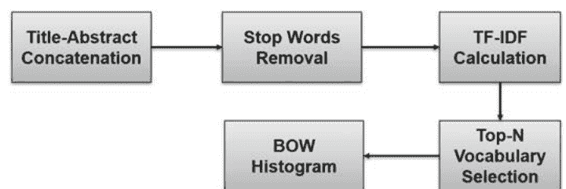

**图3 对文章标题和摘要进行预处理的五阶段过程**

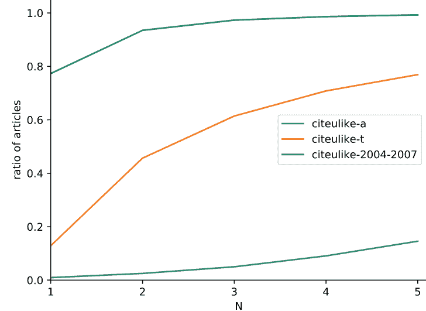

**图4 被添加到≤N个用户库中的文章比例**

图4显示了被添加到五个或更少用户库中的文章比例。例如，Citeulike-a、Citeulike-t和Citeulike-2004-2007中分别有15%、77%和99%的文章被添加到五个或更少用户库中。此外，只有1%的Citeulike-a中的文章仅被添加到一个用户库中，而其他文章被添加到超过这个数量的库中。相反，Citeulike-t和Citeulike-2004-2007中的13%和77%的文章仅被添加到一个用户库中。随着我们从一个数据集转到另一个数据集，这证明了文章数据的稀疏性。

#### 4.2 评估方法

我们遵循最先进的技术[6-8]来生成我们的训练和测试集。对于每个数据集，我们创建了两个版本的数据集，用于稀疏和密集设置。总共，我们在评估中使用了六个数据集案例。为了形成稀疏（P=1）和密集（P=10）数据集，从每个用户库中随机选择P个项目来生成训练集，而剩余的项目用于生成测试集。因此，当P=1时，在Citeulike-a、Citeulike-t和Citeulike-2004-2007中，仅使用了2.7%、5.9%和1.1%的数据条目来生成训练集。同样，当P=10时，根据图5所示，使用了27.1%、39.6%和10.7%的数据条目来生成训练集。

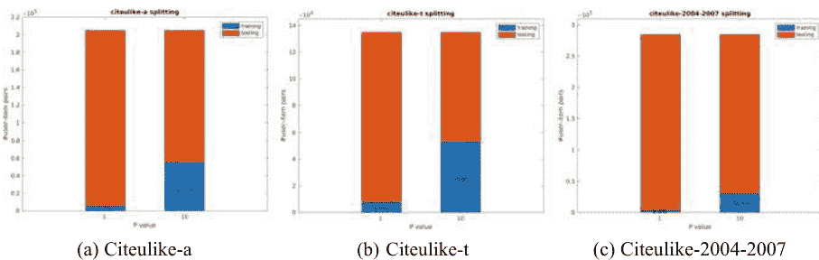

**图5 数据条目在所有citeulike数据集中形成训练和测试集的百分比**

我们使用召回率和折扣累积增益（DCG）作为我们的评估指标来测试我们的模型性能。召回率通常用于评估具有隐式反馈的推荐系统。然而，精确度在使用隐式反馈时不受青睐，因为用户-文章交互矩阵中的零值有两个含义：要么用户对文章不感兴趣，要么用户不知道该文章的存在。因此，仅使用精确度指标假设对于每个零值，用户对文章不感兴趣，这并不是事实。

可以使用以下公式来测量每个用户的召回率：

$\text{recall@K} = \frac{\text{相关文章} \cap K \text{ 推荐文章}}{\text{相关文章}}$ (15)

在实验中，$K$ 是手动设置的，表示每个用户的前 $K$ 篇文章。我们在评估中设置 $K = 10、50、100、150、200、250$ 和 $300$。整体召回率可以计算为所有用户的平均召回率。如果 $K$ 等于数据集中的文章数量，召回率将为 1。

然而，召回率不考虑在前 $K$ 个推荐中文章的排名，只要它们在前 $K$ 个列表中即可。然而，DCG会考虑排名。DCG显示了推荐引擎在排名列表的顶部推荐文章的能力。在排名较高的 $K$ 位置上的文章比其他文章更有价值。可以使用以下公式来测量所有用户的DCG：

$\text{DCG@K} = \frac{1}{|U|} \sum_{u=1}^{|U|} \sum_{i=1}^{K} \frac{\text{rel}(i)}{\log_2(i+1)}$ (16)

其中 $|U|$ 是用户总数，$i$ 是模型推荐的前-$K$篇文章的排名，$\text{rel}(i)$ 是一个指示函数，如果排名为 $i$ 的文章是相关文章，则输出 1，否则输出 0。

#### 4.3 基准线

我们根据以下描述评估我们的方法：

- **POP：** 流行度预测器是一种非个性化的推荐系统。它推荐训练集中最受欢迎的文章，以使所有用户获得相同的推荐。它被广泛用作个性化推荐模型的基准线。
- **CDL：** 协同深度学习(CDL) [7]是一种深度贝叶斯模型，通过堆叠去噪自编码器(SDAE)和概率矩阵分解(PMF)共同建模用户-物品交互数据和物品内容。
- **CML+F：** 协同度量学习(CML) [17]是一种度量学习模型，它将用户喜欢的项目拉近到该用户附近。然后根据每个用户的K最近邻生成推荐。CML+F还使用一个具有两个全连接层的神经网络来训练项目的特征(本章中的文章标签)以更新项目的位置。CML+F已经证明比CML具有更好的性能。
- **CVAE：** 协同变分自编码器(CVAE)[8]是一种概率模型，通过具有概率矩阵分解(PMF)的变分自编码器(VAE)共同建模用户-项目交互数据和项目内容。它可以被视为我们提出的方法的基准，因为CVAE和CATA共享相同的策略。

对于超参数设置，我们将置信变量(即a和b)设置为a=1, b=0.01。这些值与CDL和CVAE中使用的值相同。此外，我们使用一个四层网络来构建我们的注意力自编码器。这个四层网络的形状如下：“#词汇量-400-200-100-50-100-200-400-#词汇量”。

#### 4.4 实验结果

对于每个数据集，我们使用不同的随机划分四次进行数据划分，这在评估方法部分已经进行了描述。我们使用一个划分作为验证实验，找到我们的模型和最先进模型的最优参数 $\lambda_u$ 和 $\lambda_v$。我们在以下值的网格中搜索：$\{0.01, 0.1, 1, 10, 100\}$，并在验证实验中报告了最佳值，见表2。其他三个划分用于报告我们的模型与基线模型的平均性能。在本节中，我们回答了在本节开始时已经定义的研究问题。

**表2 基于验证实验的参数设置 $\lambda_u$ 和 $\lambda_v$**

| 方法 | Citeulike-a 稀疏 $\lambda_u$ | Citeulike-a 稀疏 $\lambda_v$ | Citeulike-a 密集 $\lambda_u$ | Citeulike-a 密集 $\lambda_v$ | Citeulike-t 稀疏 $\lambda_u$ | Citeulike-t 稀疏 $\lambda_v$ | Citeulike-t 密集 $\lambda_u$ | Citeulike-t 密集 $\lambda_v$ | Citeulike-2004-2007 稀疏 $\lambda_u$ | Citeulike-2004-2007 稀疏 $\lambda_v$ | Citeulike-2004-2007 密集 $\lambda_u$ | Citeulike-2004-2007 密集 $\lambda_v$ |
|---|---|---|---|---|---|---|---|---|---|---|---|---|
| CDL | 0.01 | 10 | 0.01 | 10 | 0.01 | 10 | 0.01 | 10 | 0.01 | 10 | 0.01 | 10 |
| CVAE | 0.1 | 10 | 1 | 10 | 0.1 | 10 | 0.1 | 10 | 0.1 | 10 | 0.1 | 10 |
| CATA | 10 | 0.1 | 10 | 0.1 | 10 | 0.1 | 10 | 0.1 | 10 | 0.1 | 10 | 0.1 |

为了评估我们的模型的性能，我们进行了定量和定性比较来回答这个问题。图6、7、8和9显示了在稀疏和密集设置下的前 $K$ 个推荐的召回率和DCG性能。首先，对于任何提出的模型来说，稀疏情况都非常具有挑战性，因为训练数据较少。在稀疏设置中，训练集中每个用户的图书馆中只有一篇文章，我们的模型CATA在所有数据集中的召回率和DCG方面都优于基准模型，如图6和7所示。更重要的是，CATA在Citeulike-2004-2007数据集中表现出色，该数据集实际上更稀疏且包含大量文章。这验证了我们模型对数据稀疏性的鲁棒性。

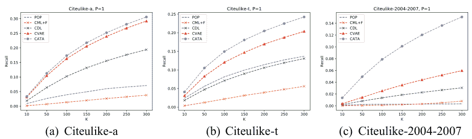

**图6 在稀疏设置下的召回性能， $P=1$**

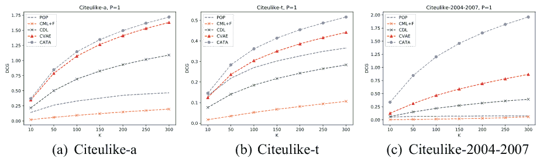

**图7 在稀疏设置下的DCG性能， $P=1$**

##### 4.4.1 RQ1

基于深度学习的推荐系统

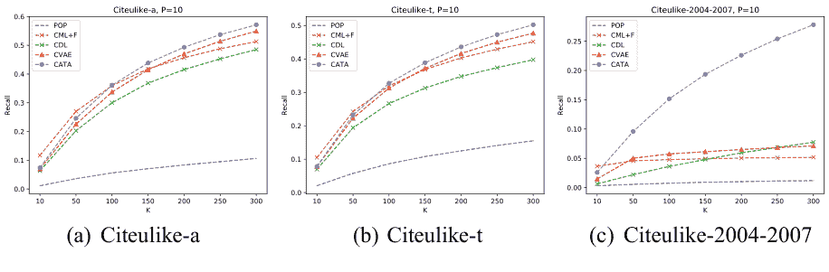

**图8 在密集设置下的召回性能， $P=10$**

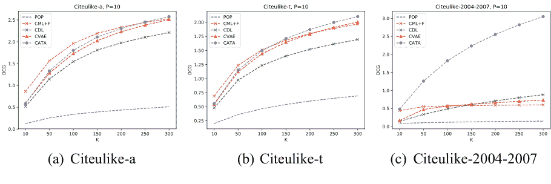

**图9 在密集设置下的DCG性能， $P=10$**

其次，在密集设置下，每个用户的库中有更多文章在训练集中，我们的模型在Citeulike-a和Citeulike-t数据集上表现与其他基线相当，如图8和图9所示。事实上，许多现有模型在这种设置下表现良好，但在稀疏设置下表现不佳。例如，CML+F在密集数据上取得了竞争性的性能；然而，在稀疏数据上失败，因为他们的度量空间需要更多的用户交互来捕捉他们的偏好。另一方面，CATA在Citeulike-2004-2007数据集中在这种设置下优于其他基线。因此，这个实验证明了我们的模型在稀疏和密集数据条件下进行更相关的推荐的能力。

除了之前的定量比较外，表3还报告了一些定性结果。该表显示了我们的模型(CATA)和最先进的模型(CVAE)在稀疏设置下使用Citeulike-2004-2007数据集为一个随机选择的用户生成的前十个推荐。在这个例子中，用户20在他的训练库中只有一篇文章，题为“成人酗酒者注意力缺陷/多动障碍评估”。从这个例子可以看出，这个用户似乎对酗酒和药物使用人群中的注意力缺陷/多动障碍(ADHD)的治疗感兴趣。比较两个模型的推荐结果，我们的模型基于用户的兴趣推荐了更相关的文章。例如，使用CATA模型推荐的大多数文章都与同一个主题相关，即酗酒和药物使用者的ADHD。然而，CVAE推荐了一些不相关的文章。

**表3 定性推荐结果对比**

| 项目 | 内容 | 在用户图书馆里? |
|---|---|---|
| **用户ID:** | 20 | |
| **训练集中的文章:** | 评估成人酒精中毒者的注意力缺陷/多动症 | |
| **CATA 1** | 一项双盲、安慰剂对照的戒断试验，对ADHD儿童进行盐酸右甲基苯丙胺的治疗 | 否 |
| **CATA 2** | 双盲安慰剂对照试验，对合并可卡因的成人ADHD患者进行甲基苯丙胺治疗... | 是 |
| **CATA 3** | 对合并可卡因的成年注意力缺陷/多动症患者进行甲基苯丙胺治疗的初步研究 | 是 |
| **CATA 4** | 对合并物质使用障碍的成年人进行甲基苯丙胺治疗的对照试验 | 是 |
| **CATA 5** | 对寻求治疗的可卡因依赖者进行成人ADHD治疗的双盲比较，使用甲基苯丙胺和... | 是 |
| **CATA 6** | 一项大规模、双盲、随机临床试验研究了甲基苯丙胺在治疗成年人ADHS中的应用 | 是 |
| **CATA 7** | 可卡因成瘾和非可卡因成瘾吸烟者诊断中注意力缺陷和多动症状的模式... | 是 |
| **CATA 8** | 具有抽动障碍和注意力缺陷多动障碍共病的儿童的前额皮层活动 | 否 |
| **CATA 9** | 性别对成年人注意力缺陷/多动障碍的影响，再次审视 | 是 |
| **CATA 10** | 多巴胺转运体 (DAT1) 基因型、左侧注意力不集中和增强反应之间的关联... | 是 |
| **CVAE 1** | 未婚母亲的心理社会相关因素 | 否 |
| **CVAE 2** | 一项针对ADHD，主要是注意力不集中型的综合家校行为治疗的随机对照试验 | 否 |
| **CVAE 3** | 儿童和青少年对性虐待的适应中的年龄和性别差异 | 否 |
| **CVAE 4** | 面临常染色体显性晚发性疾病预测性DNA测试的个体的困扰：问卷结果比较... | 否 |
| **CVAE 5** | 联合使用舍曲林和利奥西汀治疗重度抑郁症：一项随机、双盲、安慰剂对照试验 | 否 |
| **CVAE 6** | 甲基苯丙胺在治疗成年ADHS患者的可卡因依赖患者中的开放性试验 | 是 |
| **CVAE 7** | 成年ADHD可卡因依赖治疗寻求者的治疗：甲基苯丙胺和...的双盲比较 | 是 |
| **CVAE 8** | 一项双盲、安慰剂对照的戒断试验：右甲基苯丙胺盐酸盐治疗ADHS儿童 | 否 |
| **CVAE 9** | 甲基苯丙胺治疗成年可卡因滥用者的注意缺陷/多动障碍：一项试点研究 | 是 |
| **CVAE 10** | 一项大型、双盲、随机临床试验：甲基苯丙胺治疗ADHS成年患者 | 是 |

例如推荐文章1、3和4。通过这个例子和其他用户的例子，我们可以说我们的模型更准确地检测到文章内容和用户偏好的主要元素。

##### 4.4.2 RQ2

为了检查将注意力层添加到我们的自编码器中的重要性，我们创建了另一个具有相同架构但缺少注意力层的模型，我们称之为CATA-。我们使用Citeulike-a和Citeulike-t数据集对稀疏情况下的这个模型进行评估。性能比较结果如表4所示。正如表格所示，添加注意机制可以提升性能。

因此，使用注意机制可以更加关注每篇文章中编码词汇的某些部分，以更好地表示上下文数据，最终提高推荐质量。

**表4 使用注意力层（CATA）和不使用（CATA-）的稀疏数据性能比较。最佳值以粗体标记**

| 方法 | Citeulike-a 召回率@300 | Citeulike-a DCG@300 | Citeulike-t 召回率@300 | Citeulike-t DCG@300 |
|---|---|---|---|---|
| CATA- | 0.3003 | 1.6644 | 0.2260 | 0.4661 |
| **CATA** | **0.3060** | **1.7206** | **0.2425** | **0.5160** |

##### 4.4.3 RQ3

在矩阵分解方法的目标函数中，有两个正则化参数（$\lambda_u$ 和 $\lambda_v$），用于防止潜在向量的幅度过大，从而防止模型过拟合训练数据。我们之前报告的结果是基于验证实验，在表2中将 $\lambda_u$ 和 $\lambda_v$ 设置为相应的数值。然而，我们进行了多次实验，展示了不同 $\lambda_u$ 和 $\lambda_v$ 值对模型性能的影响。我们使用以下范围内的不同数值来设置参数：$\{0.01, 0.1, 1, 10, 100\}$。图10展示了我们的模型在每个 $\lambda_u$ 和 $\lambda_v$ 组合下的性能。我们发现在密集设置下，当 $\lambda_v$ 的值相当大时，我们的模型性能较低，如图10b、d所示。另一方面，在数据稀疏的情况下，如图10a、c、e、f所示，很小的 $\lambda_u$ 值（例如0.01）往往在所有其他数值中具有最低性能。即使图10f展示了Citeulike-2004-2007数据集在密集设置下的性能，但它仍然说明了文章的稀疏性，正如我们在图4中指出的那样，80%的文章只被添加到一个用户的库中。总体而言，我们观察到在所有数据集中，当 $\lambda_u = 10$ 和 $\lambda_v = 0.1$ 时，性能最佳。我们可以得出结论，当有足够的用户反馈，项目的上下文信息不再是获取用户偏好的必要条件，反之亦然。

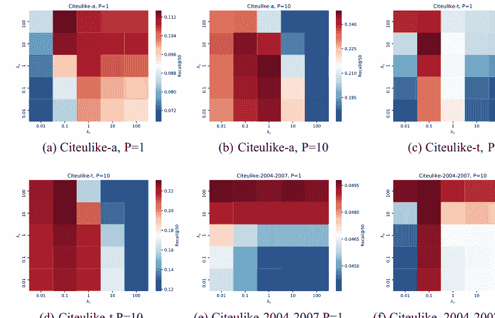

**图10 $\lambda_{\mathcal{U}}$ 和 $\lambda_{\mathcal{V}}$ 对CATA性能的影响，用于 a, b Citeulike-a, c, d Citeulike-t 和 e, f Citeulike-2004–2007 数据集**

##### 4.4.4 RQ4

潜在特征的向量（U 和 V）表示模型试图从数据中学习的用户和项目的特征。我们研究了这些向量的大小对我们模型性能的影响。换句话说，我们研究了潜在空间中多少维度可以更准确地表示用户和项目特征。值得一提的是，我们在RQ1部分报告的结果使用了50个维度，这与最先进的模型（CVAE）使用的大小相似，以便进行公平比较。然而，我们再次运行我们的模型，使用以下值的五个维度大小 $\{25, 50, 100, 200, 400\}$。图11显示了我们模型在每个维度大小下的召回率@100的表现。我们观察到，在稠密数据中增加维度大小总是会逐渐提高我们模型的性能，如图11b所示。对于稀疏数据，也建议使用较大的维度大小。然而，并不是所有时候增加维度大小都会提高模型的性能（例如，图11a中的Citeulike-t数据集）。一般来说，建议在潜在空间维度中使用100到200之间的维度大小。

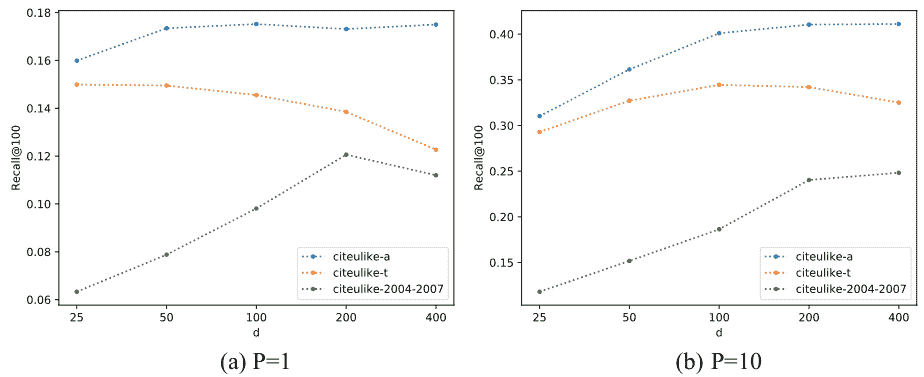

图 11 CATA 模型在潜在维度值不同的情况下的性能
在稀疏数据和稠密数据下的空间

### 4.4.5 RQ5

我们首先对自编码器进行预训练，直到数据的损失值收敛到足够的程度。损失值显示了自编码器损失函数计算的错误，它显示了模型从输入中重构输出的程度。图 12 可视化了使损失值足够稳定所需的训练轮数。我们发现预训练自编码器的 200 个轮数足够。

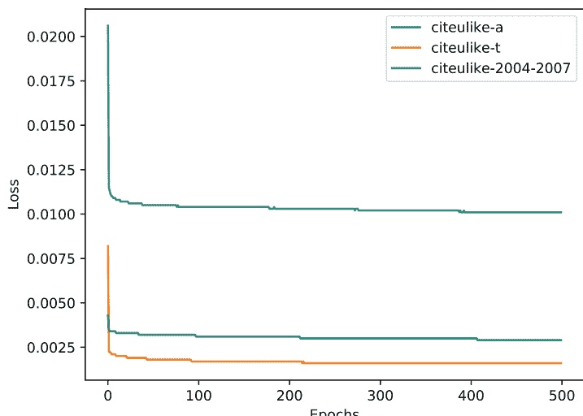

图 12 损失值随训练轮数的减少

## 5 结论

在本章中，我们提出了一种用于推荐科学文章的协作注意力自编码器（CATA）。我们利用文章的文本数据通过注意机制学习数据的更好压缩表示，该机制可以引导训练过程集中在编码器输出的相关部分，以改善模型预测。CATA 在三个科学文章数据集上表现优于其他最先进的方法。CATA 的性能改进随着数据稀疏性的增加而持续增加。定性结果也反映了我们模型推荐的良好质量。

为了潜在的未来工作，可以收集用户数据，然后像更新物品潜在因素一样更新用户潜在因素。尽管由于隐私问题（例如，CiteULike 数据集没有用户数据），用户数据通常不可用，但我们相信物品数据与用户 - 物品交互数据可以用于推断用户信息。此外，可以讨论中[18]的其他深度自动编码器的变体，以替代注意力自动编码器。未来工作的另一个可能方向是探索新的度量学习算法来替代矩阵分解（MF）技术，因为 MF 中的点积不能保证物品在潜在空间中正确地放置在物品之间的三角不等式上。

## 参考文献

1. M. Alfarhood, J. Cheng, 用于科学文章推荐的协作注意力自编码器。在 2019 年第 18 届 IEEE 国际机器学习与应用会议（ICMLA）(IEEE, 2019) 中
2. Y. Koren, R. Bell, C. Volinsky, 用于推荐系统的矩阵分解技术。计算机 8, 30-37 (2009 年)
3. A. Mnih, R. Salakhutdinov, 概率矩阵分解。在《神经信息处理系统进展》(2008 年), 第 1257-1264 页。
4. R. Salakhutdinov, A. Mnih, G. Hinton, 用于协同过滤的受限玻尔兹曼机。在《第 24 届国际机器学习大会》(ACM, 2007 年), 第 791-798 页。
5. C. Wang, D. Blei, 用于推荐科学文章的协同主题建模。在《第 17 届 ACM SIGKDD 国际知识发现与数据挖掘大会》(ACM, 2011 年), 第 448-456 页。
6. H. Wang, B. Chen, W. Li, 带有社交正则化的协同主题回归用于标签推荐。IJCAI (2013)
7. H. Wang, N. Wang, D. Yeung, 协同深度学习用于推荐系统。在第 21 届 ACM SIGKDD 国际知识发现与数据挖掘会议论文集中 (ACM, 2015), pp. 1235-1244
8. X. Li, J. She, 协同变分自编码器用于推荐系统。在第 23 届 ACM SIGKDD 国际知识发现与数据挖掘会议论文集中 (ACM, 2017)
9. Y. Hu, Y. Koren, C. Volinsky, 隐式反馈数据集的协同过滤。在第 8 届 IEEE 国际数据挖掘会议（ICDM）(IEEE, 2008) 的论文中
*   10. S. Funk, Netflix 更新：在家里试试 (2006 年)。https://sifter.org/simon/journal/20061211.html。于 2019 年 11 月 13 日访问
*   11. Y. Zhou, D. Wilkinson, R. Schreiber, R. Pan, 大规模并行协同过滤用于 netflix 奖。在国际算法应用会议论文集管理 (Springer, 2008 年)
*   12. R. Pan, Y. Zhou, B. Cao, N. Liu, R. Lukose, M. Scholz, Q. Yang, 单类协同过滤。在第八届 IEEE 国际数据挖掘会议, 2008 年。ICDM'08( IEEE, 2008 年)
*   13. G. Hinton, R. Salakhutdinov, 用神经网络降低数据维度。科学 313(5786), 504-507 (2006 年)
*   14. S. Ioffe, C. Szegedy, 批归一化：通过减少内部协变量偏移加速深度网络训练 (2015). arXiv 预印本 arXiv:1502.03167
*   15. N. Srivastava, G. Hinton, A. Krizhevsky, I. Sutskever, R. Salakhutdinov, Dropout: 一种简单的方法防止神经网络过拟合。机器学习研究杂志 (JMLR) 15(1), 1929-1958 (2014)
*   16. A. Alzogbi, 时间感知的协同主题回归：提高文本项推荐的相关性。BIRNDL@ SIGIR (2018)
*   17. C. Hsieh, L. Yang, Y. Cui, T. Lin, S. Belongie, D. Estrin, 协同度量学习。in 第 26 届国际万维网会议论文集。国际万维网会议指导委员会 (2017)
*   18. M. Wani, F. Bhat, S. Afzal, A. Khan, 深度学习进展 (Springer, 2020)
*   版权（如适用）和作者，独家许可给 Springer Nature Singapore Pte Ltd. 2021
*   M. A. Wani 等人（编辑），深度学习应用，第 2 卷，智能系统与计算进展 1232，https://doi.org/10.1007/978-981-15-6759-9_2


## 一套全面的用于深度学习架构的新型残差块，用于从光学相干断层扫描图像中诊断视网膜疾病

Sharif Amit Kamran, Sourajit Saha, Ali Shihab Sabbir, 和 Alireza Tavakkoli

## 摘要

光谱域光学相干断层扫描（SD-OCT）是一种诊断性成像技术，通过该技术，诊断者可以检测视网膜疾病。通过使用图像处理、机器学习和深度学习算法，已经提出了许多复杂的方法来自动化早期检测和诊断视网膜疾病的程序。不幸的是，传统方法在本质上是错误的，并且非常昂贵，因为它们需要人类诊断者的额外参与。在本章中，我们提出了一套全面的新型块，用于构建深度学习架构，以有效区分裂导致视网膜退化的不同病理。我们进一步展示了如何将这些新型块集成到一种新型网络架构中，从而提高这些疾病的分类准确性，并解决深度残差架构中梯度爆炸的现有问题。本章提出的技术在两个分别托管的视网膜 OCT 图像数据集上实现了更高的准确性，超过了现有技术水平。此外，我们还展示了一个实时预测系统，通过利用这种深度残差架构，其中包含一个这些新型块，优于专业眼科医生。

S. A. Kamran (✉) · A. Tavakkoli
内华达大学雷诺分校，美国内华达州
电子邮件：skamran@nevada.unr.edu

A. Tavakkoli
电子邮件：tavakkol@unr.edu

S. Saha · A. S. Sabbir
孟加拉独立大学认知技能增强中心，孟加拉国达卡
电子邮件：sourajit@iub.edu.bd

A. S. Sabbir
电子邮件：asabbir@iub.edu.bd

### 1 引言

糖尿病是世界上关注的重要健康问题之一，影响着 7.2% 的全球人口，到 2040 年这个数字可能会增加到 6 亿 [6,38]。随着糖尿病的普遍存在，统计数据显示，每三个糖尿病患者中就有一个会发展出糖尿病视网膜病变（DR）[33]。糖尿病视网膜病变会严重损害人类视力，进而导致视力丧失，影响着全球人口的 2.8%[3]。在发达国家，存在着有效的 DR 筛查和早期治疗视力测试，然而，这类系统的一个副产品就是错误的结果。此外，识别出假阳性和假阴性仍然是诊断师面临的一个具有挑战性的障碍。另一方面，在许多发展中国家和贫穷经济体中，DR 经常被错误治疗，那里缺乏受过训练的眼科医生和眼科设备。因此，将 DR 诊断技术转变为一种自主的系统是迫在眉睫的，它能够在 DR 和其他相关视网膜疾病上实时获得更准确和更快的测试结果，并且价格低廉，以便更多人可以使用。本研究提出了一种基于卷积神经网络的新型架构，可以实时识别糖尿病视网膜病变，并能够以近乎完美的准确性对多种视网膜疾病进行分类。

除了糖尿病性视网膜病变外，还有其他不同的视网膜疾病，如黄斑变性。黄斑是人眼视网膜中央区域的感光器官。视网膜镜头感知外部光线并将其转化为神经信号，这个过程也被称为视觉。黄斑在人类视觉中起着重要作用，它通过光感受器神经细胞处理光线，并将其编码成神经信号，通过视神经直接发送到大脑。黄斑变性、糖尿病性视网膜病变和脉络膜新生血管是全球眼疾和视力损失的主要原因。

在眼科学中，使用一种称为光学相干断层扫描（SD-OCT）的技术来观察视网膜层的形态 [32]。此外，治疗这些疾病的另一种方法是使用深度分辨组织形成数据，通过光谱分析来编码反射光的幅度和延迟 [1]。虽然通过 SD-OCT 的计算过程来获取视网膜图像，但差异诊断是由人类眼科医生进行的。因此，在进行差异诊断时存在人为错误的可能性。

因此，自主专家系统对眼科医生来说是有益的，可以更准确地区分不同的视网膜疾病，并且在更及时的情况下减少错误。

视网膜疾病误分类的主要因素之一是糖尿病视网膜病变与其他视网膜疾病之间的明显相似性。它们可以分为三大类别，（i）糖尿病黄斑水肿（DME）和年龄相关性视网膜层退化（AMD），（ii）Drusen，一种脂质或蛋白质在视网膜层中积聚的情况，以及（iii）脉络膜新生血管（CNV），即在亚视网膜空间中生长新的血管。最常见的视网膜

全球范围内最常见的视网膜疾病是糖尿病视网膜病变和年龄相关性黄斑变性 [9]。 另一方面，Drusen 是一种潜在的原因，可以在较长时间内触发糖尿病视网膜病变或黄斑变性。 然而，脉络膜新生血管 (CNV) 是年龄相关性黄斑变性的晚期阶段，每年影响约 20 万人全球范围内 [8,37]。

尽管在现有算法的改进方面已经有了十年的进展，但视网膜疾病的识别仍然产生错误结果，并需要专家干预。 为了解决这个问题，我们提出了一种新颖的深度神经网络架构，不仅可以实时识别视网膜疾病，而且在特定任务上的表现优于人类专家。 虽然我们的重点是训练一个尽可能减小分类错误的深度神经网络模型，但我们还要应对许多深度神经网络模型中普遍存在的过拟合、梯度爆炸和梯度消失等挑战。 在这项工作中，我们提出了一种新设计的残差卷积神经网络 (CNN) 块，它可以帮助我们减少内存占用，同时能够训练更深的 CNN 以获得更好的准确性。 此外，我们在 CNN 架构中提出了一种新的构建块，其中包含一个信号衰减机制，这是一个新编写的函数，用于将前一个输入层与下一个输入层结合起来。 然后，我们进一步展示了这些提出的信号传播技术如何构建一个更深、更高精度的网络，而不会出现权重退化、梯度爆炸和过拟合的问题。 在接下来的章节中，我们详细阐述了我们的主要贡献，并对不同方法进行了比较分析。

### 2 文献综述

在本节中，我们讨论了一系列计算方法，这些方法在历史上被采用来诊断 SD-OCT 图像。 这些方法可以追溯到图像处理的早期发展，以及计算机视觉的深度学习时代之前的分割算法。 虽然这些发展在其特定领域取得了重大进展，但我们还讨论了其他研究人员通过学习和深度学习模型来分类 SD-OCT 图像中的视网膜疾病的方法。 在本节中，我们进一步解释了其他深度学习分类模型在 SD-OCT 图像上的优缺点，以及我们提出的深度学习架构的发展和贡献。

#### 2.1 传统图像分析

最早的方法追溯到通过多种图像处理技术、特征提取和分类来分类视网膜疾病的图像 [24]。 显然，有一项研究是在视网膜疾病的分类追求中进行的 -
通过从视网膜底图像中找到异常，如微动脉瘤、出血、渗出物和棉絮斑点，对这些疾病进行分类 [7]。这种方法利用降噪算法和模糊处理将四类问题分解为两个两类问题。按时间顺序，它们先进行背景减除，然后进行形状估计作为特征提取器。然后，它们计算这些提取的特征来对四种异常进行分类。同时，采用了类似的技术和工程特征来检测糖尿病黄斑水肿 (DME) 和脉络膜新生血管 (CNV)。这些图像在五个离散参数上进行了处理：视网膜厚度、视网膜增厚、黄斑体积、视网膜形态和玻璃体视网膜关系 [25]。还存在一种将统计分类与边缘检测算法相结合的有效方法来检测锐利边界 [28]。桑切斯等人的算法在分类糖尿病视网膜病变时达到了 $79.6\%$ 的敏感性得分。Ege 等人的方法结合马氏距离分类器，分别以 $69\%$、$83\%$、$99\%$ 和 $80\%$ 的敏感性检测到微动脉瘤、出血、渗出物和棉絮斑点。显然，这些技术中的每一种都显示出相对于其他技术的有希望的改进，但在精确度方面仍然不及人类诊断师。因此，这些系统要对人类诊断师和眼科医生有所帮助，仍然需要更有效的检测准确性。

#### 2.2 基于分割的方法

识别糖尿病性黄斑水肿患者最明显的方法之一是通过增大视网膜层的黄斑密度 [1,5]。自然地，已经提出并实施了几个包括视网膜层分割的系统。由于分割算法确定了亚视网膜空间中液体的存在，进一步识别导致特定疾病的因素成为可能 [17,22,23]。在 [20,26] 中，作者提出了将视网膜内层分割为十个部分，并从每个层提取纹理和深度信息的想法。随后，通过对健康视网膜和患病视网膜之间的差异进行分类，检测到任何异常的视网膜特征。此外，Niemeijer 等人 [22] 引入了一种使用基于图的实现的 OCT 图像中包含液体的三维分割技术。图割算法用于从最初从基于层的液体区域分割中检索的信息中获得最终预测。尽管基于先前视网膜层分割的实现已经注册了高分预测结果，但初始步骤据报道是费力、耗时和错误的 [10,13]。如 [19] 所报道，不同系统获得的视网膜厚度测量结果存在明显差异。因此，尽管与传统的特征工程方法相比，使用单独机器检索的不同视网膜深度信息的预测准确性有所提高，但比较并不高效也不理想。

之前讨论的图像分析。这些观察进一步强调了基于分割的方法不是作为通用视网膜疾病识别系统有效的事实。

#### 2.3 机器学习和深度学习技术

最近，机器学习中的优化算法与一系列深度神经网络架构的结合已成为研究人员和工程师在实现各种视网膜疾病的最新准确性方面的热门选择。还可以使用 [36] 中描述的各种深度学习架构对 SD-OCT 图像中的视网膜疾病进行分类。Awais 等人提出了将 VGG16[31] 与 KNN 和具有 100 棵树的随机森林分类器相结合，以创建一个深度分类模型，以区分正常视网膜和糖尿病黄斑水肿。Lee 等人使用具有二进制输出的独立 VGG16 架构进行训练，以对年龄相关性黄斑水肿（AMD）和无视网膜退化症病例进行分类。尽管这些系统利用了从大规模图像数据集的邻近区域进行基于学习的特征提取，但神经网络模型在计算上是低效且具有较大的内存占用。相反，迁移学习方法依赖于对数百万张图像进行数周的训练，并不适合寻找视网膜疾病之间的明显差异。为了帮助缓解所有这些挑战，需要一种专门用于高精度、高速和低内存使用率的视网膜疾病识别架构。

#### 2.4 我们的贡献

在这项工作中，我们提出了一种新颖的卷积神经网络，专门用于准确识别视网膜疾病。此外，通过这个架构，我们提出了（a）一个新的残差单元，包含了 Atrous 可分离卷积，（b）一个新颖的构建模块，以及（c）一种防止梯度退化的机制。所提出的网络在参数数量、准确性和内存大小方面优于其他架构。我们提出的架构是从头开始训练，并在两个公开可用的数据集上进行了基准测试：OCT2017 [16] 和 Srinivasan 2014 [32] 数据集。因此，它不需要任何预训练的权重，大大减少了模型的训练和部署时间。我们相信通过部署这个模型，可以以几乎完美的确定性进行快速识别和治疗。此外，在不同诊断过程中，它将帮助眼科医生获得第二个专家意见。

这项工作是我们之前工作 [14] 的延伸，我们在其中尝试了不同的新颖残差卷积块架构，并在 OCT2017 [16] 数据集和 Srinivasan 2014 [32] 数据集上取得了最先进的性能。

在本章中，我们对可辨别的新颖残差块进行了探索性分析，并讨论了帮助我们选择最佳块以创建 CNN 架构的方法和观察结果。在本章中，我们进一步展示了我们在五倍训练上的结果，并展示了我们的模型的有效性，并讨论了我们的架构设计如何防止过度拟合数据。除此之外，我们还在本章中说明了在不同变体上训练的差异，并展示了我们的部署流程。

### 3 提出的方法

在本节中，我们讨论了我们提出的 CNN 架构设计所采用的方法和观察结果。我们首先详细介绍了如何在不同的残差单元上训练两个数据集，每个单元都具有独特的横向传播架构。然后，我们讨论了如何根据在其他变体上训练的观察结果选择我们提出的残差单元。接着，我们说明了如何将我们提出的残差单元与信号衰减机制和新编写的信号传播函数相结合，以防止梯度衰减。随后，我们展示了我们提出的 CNN 架构以及模型的有效性和新颖性。

在图 1 中，我们举例说明了残差单元的不同变体、它们的属性以及我们如何得到我们提出的残差块的变体。图 2 说明了我们提出的用于视网膜疾病分类的深度卷积神经网络（CNN）架构。在图 2a 中，我们描述了提出的残差学习单元如何改进特征学习能力，并讨论了我们采用的减少计算复杂性的技术。

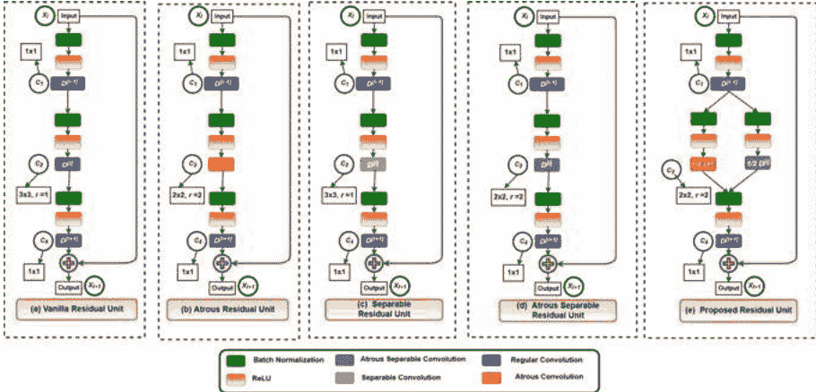

图 1 残差单元的不同变体和我们提出的具有新颖的神经元侧向传播的残差单元

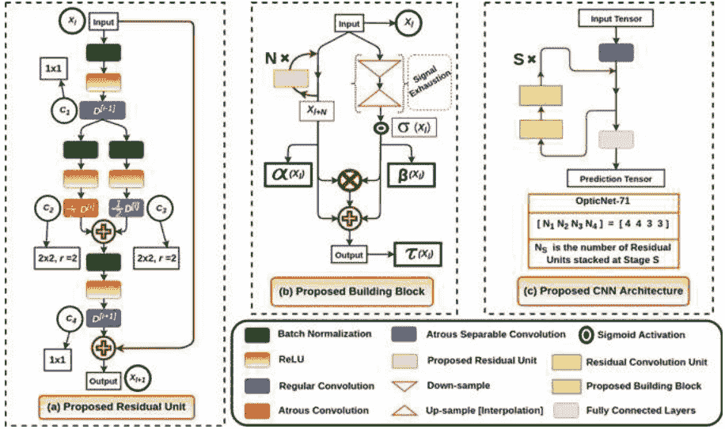

图 2 我们提出的 CNN 的构建模块的示意图 [OpticNet]。在 CNN 中，只有第一个卷积（7 x 7）层和第二阶段的最后一个卷积（1 x 1）层使用步长 2，而其他所有卷积操作都使用步长 1
对于这样的性能提升。然而，图 2b 描述了处理梯度退化的提出机制，图 2c 叙述了整个 CNN 架构。我们讨论了我们的 CNN 架构的组成部分——Optic Net 和我们的横向设计方案背后的哲学，在以下小节中。

#### 3.1 横向和操作方式的残差单元变体

为了设计一个具有更高效性、更低内存占用和可移植计算复杂性的模型，我们在我们提出的神经网络的残差单元中尝试了不同类型的卷积操作和各种横向选择。

##### 3.1.1 原始残差单元

图 1a 表示具有预激活的原始残差单元中神经元的传播 [11, 12]。虽然实现了高预测准确性，但表 1 的第一行报告了由于这种设计而导致的更高的内存和计算占用。自然的进展是包括具有广泛感受野的卷积核，因此在卷积核操作中包括了扩张，如 Yu 等人所示 [39]。

下面的第 3.1.2 节详细介绍了该模块的机制。

## 表 1 不同残差单元中使用的卷积操作的比较

| 在残差单元中间使用的卷积类型 | 参数的近似数量^a | 参数的耗尽因子，Φp (%) | 准确度 (%) |
| :--- | :--- | :--- | :--- |
| 常规卷积 | f^2 × D^[i] × D^[i-1] = 36,864 | 100 | 99.30 |
| 空洞卷积 | (f-1)^2 × D^[i] × D^[i-1] = 16,384 | (1 - 1/f)^2 = 44.9 | 97.20 |
| 可分离卷积 | (f^2 + D^[i]) × D^[i-1] = 4,672 | 1/f^2 + 1/D^[i] = 12.5 | 98.10 |
| 空洞可分离卷积 | ((f-1)^2 + D^[i]) × D^[i-1] = 4,352 | 1/f^2 + (1 - 1/f)^2 × 1/D^[i] = 11.6 | 96.70 |
| 空洞卷积和空洞可分离卷积分支 | 1/2((f-1)^2(1+1/2 D^[i]) + 1/2 D^[i]) × D^[i-1] = 5,248 | 1/(2f)^2 + (1-1/f)^2 × (1/4 + 1/(2D^[i])) = 14.4 | 99.80 |

a 这里，卷积核大小为 (f, f) = (3,3)。残差单元中间操作的深度 (# 卷积核), D^[i]=64 和第一个操作的深度, D^[i-1]=64。
b 表中报告的测试准确率是在 OCT2017[16]数据集上训练得到的，而骨干网络是 Optic-Net 71

##### 3.1.2 空洞残差单元

为了减少计算参数，我们将残差单元中的中间 3×3 卷积块替换为具有扩张率为 2 的 2×2 空洞卷积，如图 1b 所示。图 3 进一步说明了带有跳跃特征提取的空洞卷积如何捕捉信号中的细微细节，同时通过合理的边际减少参数数量 - 详见表 1 的第二行。另一方面，空洞残差单元在我们的数据集上表现出相当差的性能。

此外，在进行卷积操作时不考虑任何深度信息，空间信息会在整个架构中溢出。导致边界诊断结果更容易出现错误。为了解决这个问题，在下一节 3.1.3 中使用深度卷积或可分离卷积。

##### 3.1.3 可分离残差单元

同时，我们在中间特征提取模块中使用了一个带孔可分离卷积块，如图 1c 所示。通过深度卷积后跟一个逐点操作，我们在表 1 的第三行报告的结果中，实现了比孔残差单元更低的计算压力和相对更好的推理准确性。原因是小深度信息在整个架构中占主导地位。我们尝试通过在可分离残差单元中的深度卷积层中使用扩张来解决这个问题，详细讨论见第 3.1.4 节。

##### 3.1.4 空洞可分离残差单元

为了进一步减少计算压力，我们将可分离残差单元中的深度卷积块替换为一个空洞卷积块，孔径为 $2 \times 2$，如图 1d 所示。图 3 进一步展示了空洞分离卷积操作对信号的机制。通过这种设计选择，我们将参数数量减少了 $87.4\%$，这是我们实验中最快的计算复杂度（表 1 的第四行）。然而，对于我们提出的神经网络，重复使用这种残差单元导致了数据集中最低的预测准确性。此外，仅使用可分离卷积导致在大多数恒等块中进行深度特征提取，而不包含任何可学习层中的任何空间信息。这有效地回答了所有新的残差单元中准确性较低的潜在原因。

通过观察计算复杂度和性能之间的权衡，我们提出了我们的残差（图 1e）单元，在第 3.2 节中进行了讨论。

图 3 空洞可分离卷积。利用 $(f-1) \times (f-1)$ 卷积代替 $f \times f$，可以获得比常规空洞卷积更细粒度和粗粒度特征的更好深度分辨率。

#### 3.2 提出的残差单元和学习机制

在深度残差卷积神经网络（CNN）中，历史上使用的残差单元 [11,12] 通过三个卷积操作处理输入，并将输入与处理后的输出相加。这三个卷积操作分别是（1x1）、（3x3）和（1x1）卷积。因此，将中间的（3x3）卷积替换为其他类型的卷积操作可能会改变学习行为、计算复杂度和最终的预测性能，如图 1 所示。

我们尝试了不同的卷积操作来替代 (3x3) 中间卷积，并观察哪种选择对减少参数数量，从而减少计算复杂度有最大的贡献，如表 1 所示。

此外，在表 1 中，我们使用参数耗尽因子，$\Phi_p$，它是替代卷积和常规卷积中参数数量的比例，以百分比表示。

在我们提出的残差单元中，我们用两个不同的操作并行运行来替代中间的 (3x3) 卷积操作，详见图 2a。然而，传统的残差单元使用 $D^{[i]}$ 中间卷积的通道数，我们使用每个新替代操作的 $\frac{1}{2}D^{[i]}$ 通道数，以防止参数激增。在提出的分支操作中，我们使用 (2x2) Atrous 卷积 $(C_2)$ 和扩张率，$r=2$ 来获得左侧分支的 (3x3) 感受野，而在右侧分支中，我们使用 (2x2) Atrous 可分离卷积 $(C_3)$ 和扩张率，$r=2$ 来获得 (3x3) 感受野。然后，将结果顺序相加。此外，可分离卷积 [30] 将空间特征图和深度特征图分开处理，而 Atrous 卷积同时检查空间和深度通道。我们假设添加两个学习方式非常不同的特征图将有助于触发更强大和更微妙的特征。

$$\begin{aligned}X_{l+1} &= X_l+\left[\left(X_l \otimes C_1 \otimes C_2\right)+\left(X_l \otimes C_1 \otimes C_3\right)\right] \otimes C_4 \\ &= X_l+F\left(X_l, W_l\right)\end{aligned}$$\tag{1}

图 3 展示了如何通过添加 Atrous 和 Atrous 可分离特征图来帮助解开输入图像空间，获得更多深度信息，而不仅仅激活主导边缘。此外，表 1 的最后一行证实了采用这种策略仍然可以在合理的范围内减少计算复杂度，同时提高推理准确性。方程（1）进一步阐明了输入信号 $X_l$ 如何通过图 2a 中所示的残差单元传播，其中 $\otimes$ 表示卷积操作。

#### 3.3 提出的构建块和信号传播

在本节中，我们讨论了作为 Optic-Net 组成部分的提出的构建块。如图 2b 所示，我们将输入信号 ($X_l$) 分为两个分支：（1）残差单元堆叠，（2）信号耗尽。在本节的后面，我们将解释如何连接这两个分支以进一步传播信号。

$$\alpha(X_l) = X_{l+N} = X_l + \sum_{i=l}^{N} \hat{F}(X_i, W_i) \tag{2}$$

##### 3.3.1 残差单元堆叠

为了通过线性堆叠几个提出的残差单元来启动新的学习链以传播信号，我们建议将由预激活残差单元 [12] 增强的全局残差效应与我们提出的一组卷积操作相结合（图 2a）。如（1）所示， $\hat{F}(X_l, W_l)$ 表示输入 $X_l$ 的残差单元内的所有提出的卷积操作。我们按顺序堆叠这些残差单元 N 次，堆叠在输入 $X_l$ 上，这是我们提出的构建块，如图 2b 所述。方程（2）说明了通过长度为 $N$ 的残差单元堆叠处理的输出信号状态，表示为 $X_{l+} N$。为了进一步演示，我们将 $X_{l+N}$ 表示为 $\alpha(X_l)$。

##### 3.3.2 信号耗尽

在提出的构建模块中，我们通过最大池化层将输入信号 $Xl$ 传播，以实现空间下采样，然后通过双线性插值进行上采样。由于下采样模块仅向前传递最强的激活，插值重建从下采样表示中生成了一个密集的空间体积，从根本上耗尽了输入信号 $X_l$。如图 2b 所示，我们将耗尽的信号空间依次通过 sigmoid 激活传递， $\sigma(X_l) = 1/(1+e^{-X_l})$。最近的研究 [35] 表明，使用残差跳跃连接的自编码器 [$P_{encoder}(input|code) \rightarrow P_{decoder}(code|input) + input$] 改进 导向的分类性能。然而，与自编码器、最大池化和双线性插值函数不同，它们没有启用学习机制。在 Optic-Net 中，我们使 CNN 能够从耗尽的信号空间激活脉冲，因为我们将其用作避免梯度退化的机制。为了进一步说明，我们将耗尽的信号激活模块表示为 $\sigma(X_l)$ as $\beta(X_l)$。

$$\tau(X_l) = \alpha(X_l) + \beta(X_l) + \alpha(X_l) \times \beta(X_l) \tag{3}$$

$$\frac{\partial \tau\left(X_{l}\right)}{\partial X_{l}}=\left[\left(1+\sigma\left(X_{l}\right)\right) \times\left(1+\frac{\partial}{\partial X_{l}} \sum_{i=l}^{N} \hat{F}\left(X_{i}, W_{i}\right)\right)\right]$$

$$+\left[\left(1+X_{l}+\sum_{i=l}^{N} \hat{F}\left(X_{i}, W_{i}\right)\right) \times\left(\sigma\left(X_{l}\right)\right) \times\left(1-\sigma\left(X_{l}\right)\right)\right]$$

$$=\left[\left(1+\frac{\sigma^{\prime}\left(X_{l}\right)}{1-\sigma\left(X_{l}\right)}\right) \times\left(1+\frac{\partial}{\partial X_{l}} \sum_{i=l}^{N} \hat{F}\left(X_{i}, W_{i}\right)\right)\right]$$

$$+\left[\left(1+X_{l+N}\right) \times\left(\sigma^{\prime}\left(X_{l}\right)\right)\right]$$

##### 3.3.3 信号传播

如图 2b 所示，我们根据 (3) 处理残差信号 $\alpha\left(X_{l}\right)$ 和耗尽信号 $\beta\left(X_{l}\right)$，并将从提议的构建块传播的输出信号表示为 $\tau\left(X_{l}\right)$。我们对这种设计的假设是，每当一个分支受到小批量梯度退化的影响时，另一个分支能够传播受小批量影响不受影响的信号，并放大绝对梯度。为了验证我们的假设，(3) 表明， $\tau\left(X_{l}\right) \approx \alpha\left(X_{l}\right)， \forall \beta\left(X_{l}\right) \approx 0$，并且 $\tau\left(X_{l}\right) \approx \beta\left(X_{l}\right)， \forall \alpha\left(X_{l}\right) \approx 0$，说明未受影响的分支如何在受影响的分支退化中存活。然而，当没有一个分支受到梯度放大时，乘法 $(\alpha\left(X_{l}\right) \times \beta\left(X_{l}\right))$ 平衡了由于两个分支的加法而导致的信号传播增加。方程 (4) 描述了在反向传播期间计算的构建块输出 $\tau\left(X_{l}\right)$ 相对于构建块输入 $X_{l}$ 的梯度，用于优化。

### 3.4 卷积神经网络架构和优化链

图 2c 展示了整个卷积神经网络架构，包括所有构建块和组成部分的连接。 首先，输入批次 (224 × 224 × 3) 通过一个步长为 2 的 7 × 7 卷积层进行传播，然后进行批量归一化和 ReLU 激活。 然后，我们通过一个残差卷积单元（与 [12] 中使用的单元相同）传播信号，然后是我们提出的构建块。我们将信号通过这个 [残差卷积单元 → 构建块] 的过程传播 S = 4 次，分别称为阶段 1、2、3 和 4。 然后，对信号应用全局平均池化，通过两个全连接 (FC) 层进行损失函数计算，表示为 $\Delta\xi$。

在表 2 中，我们展示了网络中每个层使用的特征图数量（层深度）。 经过四个连续阶段后，输入张量的输出形状为 （112×112×256）、 （56×56×512）、 （28×28×1024）和 （14×14×2048）。

| 层名称 | ResNet50 V1 [11] | OpticNet71 [我们的] |
|---|---|---|
| Conv 7 × 7 | [64] × 1 | [64] × 1 |
| 第一阶段:Res Conv | [64,64,256] × 1 | [64,64,256] × 1 |
| 第一阶段:Res Unit | [64,64,256] × 2 | [32,32,32,256] × 4 |
| 第二阶段:Res Conv | [128,128,512] × 1 | [128,128,512] × 1 |
| 第二阶段:Res Unit | [128,128,512] × 3 | [64,64,64,512] × 4 |
| 第三阶段:Res Conv | [256,256,1024] × 1 | [256,256,1024] × 1 |
| 第三阶段:Res Unit | [256,256,1024] × 5 | [128,128,128,1024] × 3 |
| 第四阶段:Res Conv | [512,512,2048] × 1 | [512,512,2048] × 1 |
| 第四阶段:Res Unit | [512,512,2048] × 2 | [256,256,256,2048] × 3 |
| 全局平均池化 | 2048 | 2048 |
| 稠密层1 | K(类别) | 256 |
| 稠密层2 | - | K(类别) |
| 参数 | 2564 万 | 1250 万 |
| 所需的 FLOPs | $3.8 \times 10^{9}$ | $2.5 \times 10^{7}$ |
| CNN 内存 | 98.20 MB | 48.80 MB |

分别。此外，$F C_{1} \in \mathbb{R}^{2048 \times 256}$ 和 $F C_{2} \in \mathbb{R}^{256 \times K}$，其中 $K$ 为类别数。

$$\frac{\partial \xi}{\partial X_{l}}=\frac{\partial \xi}{\partial \tau\left(X_{l}^{\text {阶段 }}\right)} \times \prod_{j=1}^{\text {阶段 }}\left[\frac{\partial \tau\left(X_{l}^{j}\right)}{\partial X_{l}^{j}}\right]$$

方程 (5) 表示整个网络链在优化的各个阶段上计算得到的梯度。正如 (4) 所建议的，项 $(1+\sigma\left(X_{l}\right))$ 与 [12] 相比——作为额外的保护层，通过将非零激活与残差单元的梯度相乘，防止由堆叠的残差单元引起的梯度爆炸。此外，项 $(1+X_{l+N})$ 表示优化链仍然可以访问网络中更早的信号，并且为了防止激活中的不必要的峰值，项 $\sigma^{\prime}\left(X_{l}\right)$ 仍然可以减轻梯度扩展，否则可能会危及学习。

### 4 实验

下一节包含使用不同设置和超参数训练、验证和测试架构的信息。此外，它还详细分析了与先前技术和专家人类诊断员相比较的架构。此外，还以速度、准确性、敏感性、特异性、内存使用和惩罚加权度量为基础进行了对比。

所有与实验和训练相关的文件都可以在以下代码存储库中找到：https://github.com/SharifAmit/OCT_Classification。

#### 4.1 数据集和预处理技术的规格

我们将我们的模型与两个不同的数据集进行基准测试（不同的规模，样本空间等）。第一个数据集旨在正确识别和区分 OCT2017 [16] 数据集提供的四个不同的视网膜状态。其中，这些阶段是正常健康的视网膜，Drusen，脉络膜新生血管（CNV）和糖尿病黄斑水肿（DME）。OCT2017 [16] 数据集包含 84,484 张图像（以高质量的 TIFF 格式提供，具有三个非 RGB 颜色通道）。我们将它们分为 83,484 个训练集和 1000 个测试集。第二个数据集 Srinivasan2014 [32] 包含三个类别，旨在对正常健康的视网膜样本，年龄相关性黄斑变性（AMD）和糖尿病黄斑水肿（DME）进行分类。

Srinivasan2014 [32] 数据集包含 3,231 个图像样本，我们将其分为 2,916 个训练集和 315 个测试集。我们将来自两个数据集的图像调整大小为 224×224×3，用于训练和测试。对于这两个数据集，我们在训练集上进行了五折交叉验证，并找到了最佳模型。

#### 4.2 性能指标

我们计算了四个标准指标来评估我们的 CNN 模型在两个数据集上的表现：准确率（6），敏感度（7），特异度（8）和来自 [16] 的特殊加权误差（9）。其中 N 是图像样本的数量，K 是类别的数量。在这里，TP，FP，FN 和 TN 分别表示真正例，假正例，假负例和真负例。我们报告了两个数据集的真正例率（TPR）或敏感度（6）和真负例率（TNR）或特异度（7）[16,32]。为此，我们计算了各个类别的 TPR 和 TNR，然后将所有值相加，再除以类别的数量（K）。

准确率 = $\frac{1}{N} \sum_{\text{真阳性}} \quad (6)$

敏感性 = $\frac{1}{K} \sum \frac{\text{真阳性}}{\text{真阳性} + \text{假阴性}} \quad (7)$

特异性 = $\frac{1}{K} \sum \frac{\text{真阴性}}{\text{真阴性} + \text{假阳性}} \quad (8)$

加权误差 = $\frac{1}{N} \sum_{i,j \in K} W_{ij} \cdot X_{ij} \quad (9)$

| | 正常 | Drusen | CNV¹ | DME² |
|---|---|---|---|---|
| 正常 | 0 | 1 | 1 | 1 |
| Drusen | 1 | 0 | 1 | 1 |
| CNV¹ | 4 | 2 | 0 | 1 |
| DME² | 4 | 2 | 1 | 0 |

| ¹CNV: 脉络膜新生血管 |
|---|
| ²DME: 糖尿病性黄斑水肿 |

图 4 显示了 OpticNet-71 在 OCT2017 [16] 数据集上生成的混淆矩阵。

如 [16] 所述，对视网膜疾病的错误分类的惩罚点可以是任意的。表 4 显示了由 [16] 设置的仅适用于 OCT2017 [16] 数据集的错误分类的惩罚权重值。为了计算加权误差（9），我们对特定模型生成的混淆矩阵和表 3 中的权重矩阵进行逐元素乘法，然后对样本数量取平均。这里，来自表 3 的惩罚权重值用 W 表示，模型的预测（混淆矩阵）用 X 表示，其中 i, j 表示混淆矩阵的行和列。

#### 4.3 训练 OpticNet-71 并获得结果

##### 4.3.1 OCT2017 数据集

在表 4 中，我们通过测试准确性、敏感性、特异性和加权误差等测试标准对 OCT2017 [16] 数据集进行了全面研究。 OpticNet-71 在测试准确性方面得分最高 (99.80%)。

| 架构 | 测试准确性 | 敏感性 | 特异性 | 加权误差 |
|---|---|---|---|---|
| InceptionV3（有限） | 93.40 | 96.60 | 94.00 | 12.70 |
| 人工专家2 [16] | 92.10 | 99.39 | 94.03 | 10.50 |
| InceptionV3 [16] | 96.60 | 97.80 | 97.40 | 6.60 |
| ResNet50-v1 [11] | 99.30 | 99.30 | 99.76 | 1.00 |
| MobileNet-v2 [29] | 99.40 | 99.40 | 99.80 | 0.60 |
| 人工专家5 [16] | 99.70 | 99.70 | 99.90 | 0.40 |
| Xception [4] | 99.70 | 99.70 | 99.90 | 0.30 |
| OpticNet-71 [我们的] | 99.80 | 99.80 | 99.93 | 0.20 |

与其他现有解决方案相比，我们的架构在敏感性和特异性方面分别达到 99.80% 和 99.93%。此外，加权误差仅为 0.20%，可以在图 4 中可视化，我们的架构将一个 Drusen 样本和一个 DME 样本错误地识别为 CNV。然而，每个错误分类的惩罚权重仅为 1，如表 3 所示。顺序地，我们提出的 OpticNet-71 在 OCT2017 [16] 数据集上实现了最先进的结果，同时显著超越了表 4 中提到的人类基准。

##### 4.3.2 Srinivasan2014 数据集

我们在表 5 中将 OpticNet-71 与其他方法进行了基准测试，同时通过三个指标评估了 Srinivasan2014 [32] 数据集：准确性、敏感性和特异性。

在表 5 中提到的解决方案中，Lee 等人 [18] 使用了修改后的 VGG-16，Awais 等人 [2] 在最后一层使用了 VGG 架构和 KNN，Karri 等人 [15] 使用了 GoogLeNet，而它们都使用了来自 ImageNet [27] 的迁移学习权重。如表 5 所示，OpticNet-71 通过获得 100% 的准确性、敏感性和特异性，取得了最先进的结果。

此外，我们使用来自 320 万个 ImageNet 数据集的预训练权重来训练 ResNet50-v1 [11]、ResNet50-v2 [12]、MobileNet-v2 [29] 和 Xception [4]，这个数据集包含 1000 个类别 [27]，以与我们的实验结果（表 4 和表 5）进行比较，而我们则从头开始训练 Optic-Net，并使用随机初始化的权重。

#### 4.4 超参数调整和性能评估

在训练 OpticNet-47、OpticNet-63、OpticNet-71、MobileNet-v2 [29]、Xception Net [4]、ResNet50-v2 [12]、ResNet50-v1 [11] 时，超参数如下：批量大小，b = 8；迭代次数 = 30；学习率，α_lr = 1e-4；步长衰减，γ = 1e-1。

我们使用自适应学习率，并通过 α_lr_new = α_lr_current × γ 进行降低，如果验证连续六个迭代损失不降低。此外，我们将最低学习率设置为 α_lr_min = 1e-8。此外，我们使用默认参数的 Adam 优化器，其中 β_1^adam = 0.90 和 β_2^adam = 0.99 对于所有的训练方案。我们在 8 GB NVIDIA GTX 1070 GPU 上对 OCT2017 [16] 数据集进行了 44 小时的训练，对 Srinivasan2014 [32] 数据集进行了 2 小时的训练。

表 5 Srinivasan2014 [32] 数据集结果

| 架构 | 测试准确性 | 敏感性 | 特异性 |
| --- | --- | --- | --- |
| Lee 等人 [18] | 87.63 | 84.63 | 91.54 |
| Awais 等人 [2] | 93.00 | 87.00 | 100.00 |
| ResNet50-v1 [11] | 94.92 | 94.92 | 97.46 |
| Karri 等人 [15] | 96.00 | - | - |
| MobileNet-v2 [29] | 97.46 | 97.46 | 98.73 |
| Xception [4] | 99.36 | 99.36 | 99.68 |
| OpticNet-71 [我们的] | 100.00 | 100.00 | 100.00 |

从表 4 中可以看出，Inception-v3 模型的性能不如预训练模型和 OpticNet-71。OpticNet-71 在 OCT 图像上进行预测只需要 0.03 秒的时间，这是实时的，并且在 OCT2017 [16]、Srinivasan2014 [32] 数据集上取得了最先进的结果，我们的模型还超过了人类在 OCT 图像上的预测水平，如表 4 所示。根据 [16] 的报道，人类专家是真正的诊断师。在 [16] 中，有六位诊断师，其中表现最好的是人类专家 5，而表现最差的是人类专家 2。为了验证我们的 CNN 架构的优化能力，我们还在两个较小的数据集上训练了 OpticNet-71 的两个较小版本，即 OpticNet-47 ([N_1 N_2 N_3 N_4] = [2 2 2 2]) 和 OpticNet-63 ([N_1 N_2 N_3 N_4] = [3 3 3 3])。在图 5 中，我们展示了我们所有 OpticNet 变体在 Srinivasan2014 [32] 数据集上的表现优于预训练的 CNN，而 OpticNet-71 在 OCT2017 数据集上优于所有预训练的 CNN。

图 5 测试准确率 (%), CNN 内存 (兆字节) 和模型参数 (百万) 在 OCT2017 [16] 数据集和 Srinivasan2014 [32] 数据集上

#### 4.5 提出的残差插值块的分析

为了理解残差插值块的工作原理，我们通过 CNN 模型将测试图像可视化特征图，图 6a 展示了残差块传播的一些锐利信号，而插值重建过程传播的是一个弱信号激活，然而结果信号空间与其残差对应物相比既更锐利又更细粒度。由于下一阶段的卷积层首先激活传入信号，我们不会从阶段输出一个激活的信号空间，相反，我们只激活插值对应物，然后将最后一个残差块的非激活输出空间与乘以的信号相加，并将原始信号与乘以的信号相加。

图 6a 通过 Optic-Net 71 的不同层次可视化每个类别的输入图像。如图所示，每个构建块末端的特征图通过有时关注相同形状而不是图像的不同区域来学习更细粒度的特征，从而学习决定哪些特征将图像导向真实结果。b 然而，学习进程显示出通过残差激活传播的信号如何学习检测更细的边缘，进一步深入到黄斑区域学习异常。在使用信号耗尽机制时，有时会丢失重要特征。我们的实验表明，通过使用更多的这些构建块，我们可以减少特征丢失的风险，并改善 Optic-Net 71 的整体优化。

如图 6b 所示，将每个阶段的输出视为输出。此外，图 6b 还展示了信号之间的逐元素加法和逐元素乘法如何帮助 OpticNet-71 的学习传播。图 6b 准确地描述了为什么这种优化链尤其重要，因为零激活可以取消残差对应信号通道的活跃性 ($\tau(X_I) = \alpha(X_I) + \beta(X_I) \times (1 + \alpha(X_I))$)，而死信号通道也可以取消插值对应信号通道的非零激活 ($\tau(X_I) = \beta(X_I) + \alpha(X_I) \times (1 + \beta(X_I))$)，从而防止一个阶段的所有信号消失，并导致由于死权重或梯度爆炸而导致的灾难性优化失败。

## 4.6 五倍训练在 OCT2017 数据集上

我们在 OCT2017 [16] 数据集上进行了五折交叉验证，以减轻过拟合并验证我们模型的泛化能力。我们将 84,484 张图像随机分成 5 个子集，每个子集大约包含 16,896 张图像。我们在训练剩下的 4 个子集后，在其中一个子集上验证我们的模型。我们重复这个过程 5 次，以验证所有不同的子集。在图 7 中，我们报告了所有五个折叠中最好的训练和验证准确率。图 7 还显示了所有五个折叠中训练和验证准确率的算术平均值。此外，每个准确率都是针对一个特定批次（大小为 8）报告的，在图 7 的 X 轴上注册了所有 30 个时期。按照类似的方式，我们报告了最佳训练损失、最佳验证损失、平均训练损失和平均验证损失。

图 7 OCT2017 [16] 上五折交叉验证的平均准确率和最佳准确率

图 8 验证和训练（注：OCR 原文与图 8 说明结合，此处根据上下文理解为：图 7 图，图 8 图...）请根据原文结构调整：
图 7 OCT2017 [16] 上五折交叉验证的平均准确率和最佳准确率
图 8 OCT2017 [16] 上五折交叉验证的平均准确率和最小损失
验证和训练（注：此处原文有图说明混入，按段落整理）

如图 8 所示，OCT2017 [16] 数据集。如图 7 所示，训练集和验证集的最佳和平均准确率在训练后达到稳定的最大值，这一现象证明了我们模型的有效性。此外，在图 8 中，我们报告了五倍交叉验证中平均验证损失和最佳验证损失之间的明显差异，这保证了我们模型的性能不是过拟合的结果因素。

#### 4.7 在 OCT2017 上训练不同变体的 OpticNet-71

在 4.4 中训练不同变体的 OpticNet-71：
我们尝试了不同的残差单元变体，以找到最佳版本的 OpticNet-71，适用于数据集。首先，我们在 OCT2017 [16] 数据集上运行了一个普通的卷积实验。但是我们在与人类专家 5 的对比中表现不佳。之后，我们将扩张与卷积层结合起来，达到了 99.73% 的敏感度和 0.8% 的加权误差，如表 6 所示。因此，与使用普通卷积的残差单元相比，情况更糟糕。接下来，我们尝试了可分离卷积及其扩张版本，分别达到了 99.30%（普通）和 99.40%（扩张）的精确度得分。最后，我们尝试了提出的新型残差单元，其中一个分支采用扩张卷积，另一个分支采用可分离卷积和扩张。通过这种方式，我们达到了我们期望的精确度得分为 99.93%，加权误差为 0.2%，超过了人类专家 5，并达到了最先进的准确度。值得一提的是，所有架构的超参数都是相同的。此外，训练是使用相同的优化器 (Adam) 进行的，共进行了 30 个时期。因此，很明显，由扩张卷积和扩张可分离卷积组成的 OpticNet-71 是在野外部署和预测中的最佳选择。

图 7 OCT2017 [16] 上五折交叉验证的平均准确率和最佳准确率
图 8 OCT2017 [16] 上五折交叉验证的平均准确率和最小损失

## 4.8 我们系统的部署流水线

在本节中，我们阐述了我们用于部署我们的模型供用户交互的应用流水线。应用流水线由两个片段组成，如图 9 所示：(a) 前端，(b) 后端。用户与前端的应用中，可以上传 OCT 图像。然后，将用户在应用中上传的输入图像传递到后端。输入图像首先经过一系列预处理步骤，然后转发到我们的 CNN 模型（OpticNet-71）。所有这些过程都在服务器上进行。我们模型输出的类别预测分数然后被发送回应用，对应于用户的输入图像特定请求。对于我们的 CNN 来说，它是轻量级的，并且能够实时输出高精度的预测，这有助于提供流畅的用户体验。同时，上传的图像以及其预测张量同时存储在云存储中，以进一步进行微调和训练我们的模型，从而加快提高系统精度的目标并为进一步的研究和开发拓宽新的视野。

## 5 结论

在本章中，我们介绍了一种新颖的残差块集，可以用于构建卷积神经网络，以精确诊断视网膜疾病的关系。此外，通过利用这种架构，我们设计了一个实际的解决方案，可以解决梯度消失和梯度爆炸的问题。这项工作是我们之前工作的延伸 [14]，它展示了不同新颖块的探索性分析以及其在视网膜退化诊断中的有效性。未来，我们希望扩展这项研究，以解决其他类型的视网膜退化问题，并确定视网膜黄斑亚空间的边界，从而帮助专业眼科医生进行差异诊断。

致谢：我们要感谢 https://www.cse.unr.edu/CVL/“UNR 计算机视觉实验室”和 http://ccse.iub.edu.bd/“认知技能增强中心”为我们提供的技术支持。

## 参考文献

1. K. Alsah, G. Lemaitre, M. Rastgoo, J. Massich, D. Sidib, F. Meriaudeau，机器学习技术用于糖尿病黄斑水肿 (DME) 在 SD-OCT 图像上的分类。生物医学工程在线 16 (1), 68 (2017)
2. M. Awais, H. Muller, T.B. Tang, F. Meriaudeau，使用深度学习方法对 SD-OCT 图像进行分类，在 2017 年 IEEE 国际信号与图像处理应用会议 (ICSIPA) 中 (IEEE, 2017), 第 489-492 页
3. R.R. Bourne, G.A. Stevens, R.A. White, J.L. Smith, S.R. Flaxman, H. Price, J.B. Jonas, J. Keefe, J. Leasher, K. Naidoo 等人，1990-2010 年全球视力损失的原因：一项系统分析。柳叶刀全球健康 1 (6), e339-e349 (2013)
4. F. Chollet, Xception: 深度学习与深度可分离卷积，in 计算机视觉与模式识别 IEEE 会议论文集 (2017), pp. 1251-1258
5. R.A. Costa, M. Skaf, L.A. Melo Jr., D. Calucci, J.A. Cardillo, J.C. Castro, D. Huang, M. Wojtkowski，光学相干断层扫描的视网膜评估。视网膜与眼科研究进展 25(3), 325-353 (2006)
6. C. Prevention et al., 2017 年国家糖尿病统计报告 (2017)
7. B.M. Ege, O.K. Hejlesen, O.V. Larsen, K. Møller, B. Jennings, D. Kerr, D.A. Cavan，基于计算机图像分析和统计分类的糖尿病视网膜病变筛查。计算机方法程序生物医学 62(3), 165-175 (2000)
8. N. Ferrara，血管内皮生长因子和年龄相关性黄斑变性：从基础科学到治疗。自然医学 1 6(10), 1107 (2010)
9. D.S. Friedman, B.J. O'Colmain, B. Munoz, S.C. Tomany, C. McCarty, P. De Jong, B. Nemesure, P. Mitchell, J. Kempen 等，美国年龄相关性黄斑变性的患病率。Arch Ophthalmol 122(4), 564-572 (2004)
10. I. Ghorbel, F. Rossant, I. Bloch, S. Tick, M. Paques，OCT 图像中黄斑层的自动分割和性能定量评估。模式识别 44(8), 1590-1603 (2011)
11. K. He, X. Zhang, S. Ren, J. Sun，深度残差学习用于图像识别，在 IEEE 计算机视觉和模式识别会议 (2016), 第 770-778 页
12. K. He, X. Zhang, S. Ren, J. Sun，深度残差网络中的身份映射，在欧洲计算机视觉会议 (Springer, 2016), 第 630-645 页
13. R. Kafieh, H. Rabbani, S. Kermani，光学相干断层扫描视网膜分割算法综述。J. Med. Signal S Sens. 3(1), 第 45 页 (2013)
14. S.A. Kamran, S. Saha, A.S. Sabbir, A. Tavakkoli，光学断层扫描图像诊断的新型卷积神经网络 Optic-net，在 2019 年第 18 届 IEEE 机器学习和应用国际会议 (ICMLA) (2019), 第 964-971 页
15. S.P.K. Karri, D. Chakraborty, J. Chatterjee，基于迁移学习的光学相干断层扫描图像分类，包括糖尿病性黄斑水肿和干性老年性黄斑变性。生物医学光学表达 8(2), 579-592 (2017)
16. D.S. Kermany, M. Goldbaum, W. Cai, C.C. Valentim, H. Liang, S.L. Baxter, A. McKeown, G. Yang, X. Wu, F. Yan 等，通过基于图像的深度学习识别医学诊断和可治疗疾病。细胞 1 72(5), 1122-1131 (2018)
17. A. Lang, A. Carass, M. Hauser, E.S. Sotirchos, P.A. Calabresi, H.S. Ying, J.L. Prince，利用边界分类对黄斑 OCT 图像进行视网膜层分割。生物医学光学表达 4(7), 1133-1152 (2013)
18. C.S. Lee, D.M. Baughman, A.Y. Lee，深度学习对于分类正常与老年性黄斑变性 OCT 图像非常有效。眼科学与视觉科学杂志 1(4), 322-327 (2017)
19. J.Y. Lee, S.J. Chiu, P.P. Srinivasan, J.A. Izatt, C.A. Toth, S. Farsiu, G.J. Jaffe，完全自动化的软件用于糖尿病黄斑水肿眼睛的视网膜厚度测量，通过 cirrus 和 spectralis 系统获取的图像。眼科学与视觉科学研究 54(12), 7595-7602 (2013)
20. K. Lee, M. Niemeijer, M.K. Garvin, Y.H. Kwon, M. Sonka, M.D. Abramoff，在视神经头的 3D OCT 扫描中对视盘进行分割。IEEE 医学成像杂志 2 9(1), 159-168 (2010)
21. G. Lemaitre, M. Rastgoo, J. Massich, C.Y. Cheung, T.Y. Wong, E. Lamoureux, D. Milea, F. Meriaudeau, D. Sidib，使用局部二进制模式对 sd-oct 体积进行分类：DME 检测的实验验证。J. Ophthalmol. 2016 (2016)
22. X.C. Meindert Niemeijer, L.Z.K. Lee, M.D. Abramoff, M. Sonka，视网膜 OCT 中液体相关异常的三维分割：概率约束图搜索图割。IEEE Trans. Med. Imaging 31(8), 1521-1531 (2012)
23. A. Mishra, A. Wong, K. Bizheva, D.A. Clausi，光学相干断层扫描图像中的层内分割。Opt. Express 17(26), 23719-23728 (2009)
24. H. Nguyen, A. Roychoudhry, A. Shannon，从立体视网膜图像中分类糖尿病视网膜病变，in Proceedings of the 19th Annual International Conference of the IEEE Engineering in Medicine and Biology Society. 'Magnificent Milestones and Emerging Opportunities in Medical Engineering (Cat. No. 97CH36136), vol. 1 (IEEE, 1997), pp. 426-428.

表 5 Srinivasan2014 [32] 数据集结果（注：原文中表 5 已移至 Section 4.4 部分，根据位置调整，最终确认表 5 应在 4.3.2 之后）

| 架构 | 测试准确性 | 敏感性 | 特异性 |
|---|---|---|---|
| Lee 等人 [18] | 87.63 | 84.63 | 91.54 |
| Awais 等人 [2] | 93.00 | 87.00 | 100.00 |
| ResNet50-v1 [11] | 94.92 | 94.92 | 97.46 |
| Karri 等人 [15] | 96.00 | - | - |
| MobileNet-v2 [29] | 97.46 | 97.46 | 98.73 |
| Xception [4] | 99.36 | 99.36 | 99.68 |
| OpticNet-71 [我们的] | 100.00 | 100.00 | 100.00 |

25. G. Panozzo, B. Parolini, E. Gusson, A. Mercanti, S. Pinackatt, G. Bertoldo, S. Pignatto, 糖尿病性黄斑水肿：一种基于OCT的分类。眼科学研究. 19, 13-20 (Taylor & Francis) (2004)

26. G. Quellec, K. Lee, M. Dolejsi, M.K. Garvin, M.D. Abramoff, M. Sonka, 视网膜层纹理的三维分析：在黄斑SD-OCT中识别充满液体的区域。IEEE Trans. Med. Imaging 29(6), 1321-1330 (2010)

27. O. Russakovsky, J. Deng, H. Su, J. Krause, S. Satheesh, S. Ma, Z. Huang, A. Karpathy, A. Khosla, M. Bernstein等, ImageNet大规模视觉识别挑战。计算机视觉国际期刊. 115(3), 211-252 (2015)

28. C.I. Sanchez, R. Hornero, M.I. Lopez, J. Poza, 通过视网膜图像分析检测和量化与糖尿病视网膜病变相关的病变，在IEEE工程医学与生物学学会第26届年会国际会议上，卷1 (IEEE, 2004), 页码1624-1627

29. M. Sandler, A. Howard, M. Zhu, A. Zhmoginov, L.C. Chen, MobileNetV2: 倒置残差和线性瓶颈，在IEEE计算机视觉与模式识别会议论文集上，页码4510-4520 (2018)

30. L. Sifre, S. Mallat, 刚体运动散射用于图像分类。博士学位论文, 卷1, 号3 (2014)

31. K. Simonyan, A. Zisserman, 用于大规模图像识别的非常深的卷积网络 (2014). arXiv预印本 arXiv:1409.1556

32. P.P. Srinivasan, L.A. Kim, P.S. Mettu, S.W. Cousins, G.M. Comer, J.A. Izatt, S. Farsiu, 从光学相干断层扫描图像中完全自动检测糖尿病性黄斑水肿和干性老年性黄斑变性。生物医学光学快报 5(10), 3568-3577 (2014)

33. D.S.W. Ting, G.C.M. Cheung, T.Y. Wong, 糖尿病性视网膜病变：全球患病率、主要危险因素、筛查实践和公共卫生挑战：一项综述。临床实验眼科学。 44(4), 260-277 (2016)

34. M. Treder, J.L. Lauermann, N. Eter, 使用深度学习在光学相干断层扫描中自动检测渗出性老年性黄斑变性。格拉费的临床实验眼科学。 256(2), 259-265 (2018)

35. F. 王, M. 江, C. 钱, S. 杨, C. 李, H. 张, X. 王, X. 唐, 残余注意力网络用于图像分类，在计算机视觉和模式识别IEEE会议论文集, 第3156-3164页 (2017)

36. M.A. 瓦尼, F.A. 巴特, S. 阿夫扎尔, A.I. 汗, 深度学习的进展 (Springer, 2020)

37. W.L. 黄, X. 苏, X. 李, C.M.G. 张, R. 克莱因, C.Y. 郑, T.Y. 黄, 全球年龄相关性黄斑变性的患病率和2020年和2040年的疾病负担预测：一项系统综述和荟萃分析。柳叶刀全球健康 2 (2), e106-e116 (2014)

38. J.W. 邱, S.L. 罗杰斯, R. 川崎, E.L. 拉穆鲁, J.W. 科瓦尔斯基, T. 贝克, S.J. 陈, J.M. 德克尔, A. 弗莱彻, J. 格劳斯伦德等, 全球糖尿病视网膜病变的患病率和主要危险因素。 糖尿病护理 35 (3), 556-564 (2012)

39. F. Yu, V. Koltun, 通过扩张卷积进行多尺度上下文聚合 (2015). arXiv预印本 arXiv:1511.07122

## 用于人类跌倒检测的三流卷积神经网络

Guilherme Vieira Leite, Gabriel Pellegrino da Silva 和 Helio Pedrini

**摘要** 在发达国家，儿童死亡率降低、医学进步和文化变革使得预期寿命超过60岁。一些国家预计到2030年，65岁以上的人口将占总人口的20%。在这个高龄阶段，个人的健康状况将极大地影响生活质量，决定老年人能否从事重要活动，保持独立和个人满足感。老年伴随着生物限制和肌肉无力引起的健康问题。这种衰弱会导致跌倒的发生，跌倒是全球约646,000人死亡的原因，即使发生轻微跌倒，也可能导致骨折、骨折或软组织损伤，这些损伤无法完全愈合。

这种伤害和损失反过来会消耗个人的自信心，减弱他们的独立性。在这项工作中，我们提出了一种能够使用多通道卷积神经网络 (CNN) 在视频序列中检测人类跌倒的方法。我们的方法利用一个3D CNN，通过预先从每帧中提取的特征来生成每个通道的向量。然后，将这些向量连接起来，应用支持向量机 (SVM) 对向量进行分类，指示是否发生了跌倒。我们使用四种特征进行实验，分别是：(i) 光流，(ii) 视觉节奏，(iii) 姿势估计和 (iv) 显著性图。所使用的基准数据集 (UR跌倒检测数据集 (URFD) [33]和 (ii) 跌倒检测数据集 (FDD) [12]) 是公开可用的，我们的结果与文献中的结果进行了比较。评估所选的指标是平衡准确性、敏感性和特异性。我们的结果在URFD和FDD数据集上与最先进的结果相竞争。据作者所知，我们是第一个在所讨论的数据集之间进行交叉测试并报告平衡准确性指标结果的研究。所提出的方法能够在选定的基准测试中检测到跌倒。跌倒检测以及视频中的活动分类与网络解释时间信息的能力密切相关，而光流是检测跌倒最相关的特征，这是符合预期的。

G. V. Leite · G. P. da Silva · H. Pedrini (✉)
巴西坎皮纳斯大学计算机研究所
e-mail: helio@ic.unicamp.br

G. V. Leite
电子邮件: guilherme.vieira.leite@gmail.com

G. P. da Silva
电子邮件: gpsunicamp016@gmail.com

© 编辑（如适用）和作者，独家许可给Springer Nature Singapore Pte Ltd. 2021
M. A. Wani等人（编辑），深度学习应用，第2卷，智能系统与计算进展1232，https://doi.org/10.1007/978-981-15-6759-9_3

### 1 引言

发达国家的预期寿命已经超过60岁[76]。欧盟和中国的一些国家预计到2030年，他们的人口中有20%将年满65岁[25]。根据世界卫生组织的数据[25,78]，这一最新水平是科学进步、医学发现、儿童死亡率降低和文化变革的副作用。

然而，尽管人类寿命延长了，但生活质量主要取决于健康状况，因为它决定了个体的独立性、满意度和参与重要活动的可能性。健康与生活质量之间的关系激发了几个研究团队尝试开发关注老年人口的辅助技术。

#### 1.1 动机

自然而然，随着年龄的增长，健康问题也会出现，主要是由于人体生物限制和肌肉无力。作为副作用，这种衰弱增加了老年人摔倒的几率。摔倒是全球第二大家庭死因，每年导致约646,000人死亡[25]。报告显示，65岁以上人口中至少有28%至35%的人每年摔倒一次，而70岁以上人口中这一比例上升至32%至42%。

为了总结可能导致摔倒的事件，Lusardi等人[46]报告了一些风险因素，包括摔倒的发生方式、谁会摔倒以及一些预防措施。摔倒事故对这个脆弱的人群的影响可能引发一系列的生理和心理损害，从而可能降低老年人的自信心和独立性。即使是一个小小的摔倒事故，也可能会导致骨折和软组织损伤，由于年龄的原因，这些损伤可能永远无法完全恢复。

为了避免严重的伤害，老年人群需要持续的护理和监护，特别是考虑到事故的影响与其发生时间和开始适当护理之间的关系。话虽如此，合格的护理照料者很昂贵，尤其是在健康护理预算已经膨胀的高龄阶段，这可能导致家庭搬迁老年人。搬迁是一种常见做法，即周围的家庭将老年人从他们的居住地搬到家庭的住所，导致老年人适应新环境和日常生活的不适和压力。

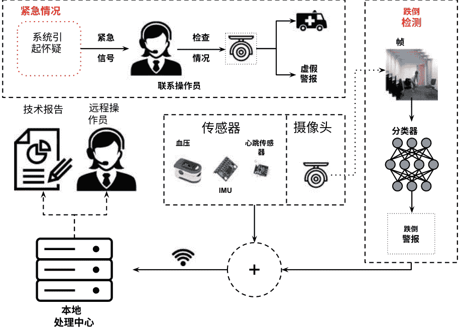

基于前面描述的情景，可以设计一种技术解决方案，以自动触发可靠的紧急系统来提供合格的援助。因此，事故发生后到护理的响应时间将缩短，使老年人能够居住在自己的家中，保持独立和自尊心。图1中的图表说明了这种系统的组成部分，也被称为辅助日常生活 (ADL) 系统。

该系统由一系列传感器供给，安装在家中或附着在被试身上，监测诸如血压、心跳、体温、血糖水平、加速度和姿势等信息。这些设备连接到一个本地处理中心，除了持续建立关于老年人健康状况的技术报告外，还会在紧急情况下激活远程操作员。在接收到警报后，操作员进行情况检查，并在确认需要时派遣医疗援助。

#### 1.2 研究问题

鉴于跌倒对老年人群体的危险和后果，并且基于深度学习技术，视频跌倒检测系统可以受益于深度学习技术，我们提出了一个跌倒检测模块，作为ADL系统的一部分，可以检测视频帧序列中的跌倒。在实施这个提案时，我们打算回答以下研究问题：

- 特征通道能否保持足够的时间信息，以便网络学习其模式？
- 哪个特征通道对于跌倒检测问题贡献最大？
- 所提出的方法的有效性是否适用于其他人类跌倒数据集？
- 三维 (3D) 架构是否比二维 (2D) 等价物在这个问题上更具有区分性？

#### 1.3 贡献

本研究的主要贡献是多通道模型用于检测人类跌倒[8,9,37]。每个通道代表一个我们认为描述跌倒事件的特征，并且在集成后，它们产生了更好的跌倒估计。

该模型在两个公开可用的数据集上进行了测试，并且是开源的[38]。此外，我们对不同通道组合和所使用的架构进行了广泛比较，其最佳结果与现有技术相当。最后，我们还讨论了模拟数据集作为跌倒检测方法基准的影响。

#### 1.4 章节布局

本文的剩余部分结构如下。第2节回顾了相关文献中的现有方法。第3节介绍了本研究实施中使用的主要概念。第4节详细描述了所提出的方法及其步骤。第5节展示了实验中使用的选定数据集、评估指标、实验过程、结果和讨论。最后，第6节提出了一些最终的考虑和未来工作的建议。

### 2 相关工作

在下面的小节中，我们阐述了与跌倒检测相关的工作及其方法。这些工作被分为两组，基于使用的传感器：(i) 没有视频的方法和 (ii) 有视频的方法。

#### 2.1 没有视频的方法

这组工作利用各种传感器获取数据，可以是手表、加速度计、陀螺仪、心率传感器或智能手机，即任何非摄像头的传感器。

Khin等人[28]开发了一个三角定位系统，该系统使用安装在家庭监控房间中的多个存在传感器。房间中有人的存在会对传感器产生干扰，而摔倒会触发一种激活模式。尽管没有报告结果，但作者表示他们测试了这个配置，并且传感器对不同动作检测到了不同的模式，表明该解决方案可以用于检测跌倒。

Kukharenko和Romanenko[31]从手腕设备获取数据。使用阈值来检测冲击或“无重力”状态，然后在检测到后等待一秒钟并分析获取的信息。该方法在一些志愿者身上进行了测试，他们报告了一些问题，如忘记佩戴设备和不适感。

Kumar等人[32]将一个传感器固定在人的腰部，并比较了四种检测跌倒的方法：阈值、支持向量机（SVM）、K最近邻（KNN）和动态时间规整（DTW）。作者还评论了附着在身体上的传感器的重要性，因为它们可以不断监测个体，不会出现盲区，而相机则不同。

Vallejo等人[72]开发了一个深度神经网络来对传感器数据进行分类。所选传感器是佩戴在腰部的陀螺仪，网络由三个隐藏层组成，每个隐藏层有五个神经元。作者对年龄在19-56岁之间的成年人进行了实验。

Zhao等人[84]收集了附着在个体腰部的陀螺仪数据，并使用决策树对信息进行分类。实验是在五个随机成年人上进行的。

Zigel等人[86]使用加速度计和麦克风作为传感器，然而，传感器安装在环境中，而不是附着在被试者身上。传感器会检测振动并输入二次分类器。测试是在一个测试假人上进行的，该假人从直立位置释放。

#### 2.2 带有视频的方法

在本节中，我们将那些主要数据来源是摄像机拍摄的视频序列的方法进行了分组。尽管传感器相似，但这些方法提出了各种解决方案，例如使用基于阈值的激活技术的以下工作。

为了分离人体轮廓，Lee和Mihailidis [36]进行了背景减除和区域提取。然后，通过轮廓的周长值、轮廓中心的速度以及Feret直径的阈值来确定姿势。该解决方案在作者创建的数据集上进行了测试。

Nizam等人[53]使用了两个阈值，第一个验证了身体速度是否很高，如果是，则第二个阈值验证了关节位置是否接近地面。关节位置是通过减去背景来获取的，使用了Kinect相机。实验是在作者创建的数据集上进行的。

Sase和Bhandari [57]应用了一个阈值，如果感兴趣区域小于个体身高的三分之一，则定义为跌倒。感兴趣区域通过背景提取获得，并且该方法基于URFD [33]进行了测试。Bhandari等人[5]对感兴趣区域的速度和方向应用了一个阈值。应用了Shi-Tomasi和Lucas-Kanade的组合来确定感兴趣区域。作者在URFD [33]数据集中测试了该方法，并报告了95%的准确率。

另一种广泛使用的分类技术是SVM，由Abobakr等人[2]使用。该方法利用深度信息减去视频帧的背景，应用随机森林算法估计姿势，并使用SVM进行分类。Fan等人[17]还将图像分离为前景和背景，并对找到的人体轮廓拟合椭圆。从椭圆中提取了六个特征，并用于慢特征函数。SVM对慢特征函数的输出进行分类，并在SDUFall [47]数据集上进行了实验。

Harrou等人[23]使用了一个从视频帧中提取特征的SVM分类器。在测试过程中，作者将SVM与多元指数加权移动平均(MEWMA)进行了比较，并在URFD [33]和FDD [12]数据集上进行了测试。

Mohd等人[50]将SVM分类器输入关节的高度、速度、加速度和位置信息，并在三个数据集上进行了测试：TST Fall Detection [20]、URFD [33]和Fall Detection by Zhang [83]。Panahi和Ghods [56]从深度信息中减去背景，将椭圆拟合到个体的形状上，用SVM对椭圆进行分类，并在URFD [33]数据集上进行了测试。

关注隐私问题，以下研究认为检测跌倒的解决方案应提供匿名选项。因此，Edgcomb和Vahid [16]测试了时间序列上二叉树分类器的有效性。作者比较了不同的身份隐藏方法，如模糊、提取轮廓、用不透明的椭圆或不透明的框替换个体。他们在自己的数据集上进行了测试，有23个录制的视频。林等人[42]研究了一个关注隐私的解决方案，使用了一个轮廓。他们除了使用一个定时器检查个体姿势是否恢复正常外，还应用了K-NN分类器。实验是由实验室志愿者进行的。

一些研究使用了卷积神经网络，比如Anishchenko [4]的案例，他们实现了AlexNet架构的改进版本来检测FDD [12]数据集中的跌倒。Fan等人[18]使用了CNN来监测和评估事件的完整程度。在VGG-16架构中使用了一堆视频帧，并将其结果与堆栈中的第一帧关联起来。该方法在两个数据集上进行了测试：FDD [12]和Hockey Fights [52]。他们的结果以跌倒的完整程度来报告。

Huang等人[26]使用OpenPose算法获取身体关节的坐标。比较了两个分类器 (SVM和VGG-16) 来对坐标进行分类。实验是在URFD [33]和FDD [12]数据集上进行的。

Li等人[40]对CNN的架构AlexNet进行了修改。该解决方案在URFD [33]数据集上进行了测试，作者还报告了该解决方案能够实时分类ADL和跌倒。

Min等人[49]使用R-CNN（区域的CNN）分析场景，生成家具与场景中人体之间的空间关系，然后对它们之间的空间关系进行分类。作者在URFD [33]、KTH [58]和他们自己创建的数据集上进行了实验。Núñez-Marcos等人[54]使用VGG-16进行分类。作者计算了密集光流，作为网络分类的特征。他们在URFD [33]和FDD [12]数据库上测试了该方法。

巧合的是，所有使用递归神经网络的作品都使用了相同的架构，即长短期记忆 (LSTM)。Lie等人[41]应用了递归神经网络，带有LSTM单元，对个体的姿势进行分类。姿势是通过CNN提取的，并且实验是在作者创建的数据集上进行的。

Shojaei-Hashemi等人[60]使用Microsoft Kinect设备获取个体的姿势信息，并使用LSTM作为分类器。实验是在NTU RGB+D数据集上进行的。此外，作者报告了使用Kinect的一个优点，即可以实时实现姿势提取。

Lu等人[43]提出在3D CNN之后应用LSTM的方法。作者在URFD [33]和FDD [12]数据集上进行了测试。

其他机器学习算法，如K最近邻算法，也被用于检测跌倒。Kwolek和Kepski [34]利用加速度计和Kinect的组合。一旦加速度计超过阈值，就会发出跌倒警报，然后Kinect相机才开始捕捉场景深度的帧，这些帧由第二个分类器使用。作者们比较了KNN和SVM之间的帧分类，并在两个数据集上进行了测试，分别是URFD [33]和一个独立的数据集。

Sehairi等人[59]开发了一个有限状态机来估计从提取的轮廓中人头的位置。测试是在FDD [12]数据集上进行的。

马尔可夫滤波器的应用也被用于检测跌倒，就像Anderson等人[3]的工作中一样，其中个体的轮廓被提取出来，然后通过马尔可夫滤波器对其特征进行分类。实验是在他们的数据集上进行的。

Zerrouki和Houacine [81]通过曲线系数和身体区域的比率描述了身体的特征。一个SVM分类器进行了姿势分类，马尔可夫滤波器区分了跌倒和非跌倒。作者在URFD [33]和FDD [12]数据集上进行了实验。

除了上述方法之外，以下作品还使用了多种技术，例如Yu等人[80]通过应用头部跟踪技术和形状变化分析获得了特征。这些特征作为高斯分类器的输入。作者创建了一个用于测试的数据集。

Zerrouki等人[82]将前景和背景之间的帧进行了分割，并对人体进行了另一次分割，将其分为五个部分。身体分割结果被输入到AdaBoost分类器中，在URFD [33]数据集上获得了96%的准确率。最后，Xu等人[79]发表了一篇评估多个跌倒检测系统的调查。

### 3 基本概念

在本节中，我们详细描述了理解所提出方法所必需的概念。

#### 3.1 深度神经网络

深度神经网络（DNNs）是一类机器学习算法，其中使用多层处理来提取和转换输入数据的特征，反向传播算法使网络能够学习数据的复杂模式。每一层的输入信息与前一层的输出相同，除了第一层是输入数据，最后一层是提取输出[22]。这种结构不一定是固定的，某些层可以有两个其他层作为输入或多个输出。

邓和余[15]提到了近年来深度网络日益流行的一些原因，包括它们在分类问题中的结果，图形处理单元（GPUs）的改进，张量处理单元（TPUs）的出现以及可用数字数据的数量。

深度网络的层可以以不同的方式组织，以适应手头的任务。DNN的组织方式被称为“架构”，其中一些它们因在图像分类竞赛中的表现而变得广为人知。其中一些是 AlexNet [30], LeNet [35], VGGNet [62] 和 ResNet [24]。

#### 3.2 卷积神经网络

卷积神经网络 (CNN) 是深度网络的一种子类型，其结构类似于 DNN，信息从一层流向下一层。然而，在 CNN 上，数据还通过卷积层进行处理，该层应用各种卷积操作并调整数据大小，然后将其发送到下一层。

这些卷积操作允许网络在第一层学习低级特征，并在后续层中合并它们以学习高级特征。虽然不是强制性的，但通常在卷积网络的最后会有一些全连接层。

对于这项工作的范围，有两种卷积神经网络架构是相关的：(i) VGG-16 [62] 和 (ii) Inception [66]。VGG-16 是 ImageNet 大规模视觉识别挑战赛 (ILSVRC) 2014 年比赛的冠军，定位类别的错误率为 7.3%。VGG-16 选择使用小的滤波器，3×3 的卷积，步长为 1，填充为 1，以及 2×2 的最大池化，步长为 2，使得网络可以更深，而不会导致计算上的限制。VGG-16 有 16 层和 1.38 亿个参数，对于深度网络来说被认为是较小的。在这个网络中，计算量最大的是前几层，因为在它们之后，池化层会大大减少对更深层的计算负载。图 2 展示了 VGG-16 的架构。

![bbox=[121, 774, 869, 869]]
图 2 VGG-16 架构布局

![img/5421ec97c2e6e76af2f0007ef5b9765c_69_0.png]
图 3 Inception 模块，改编自 Szegedy 等人 [66]

为了减少这个数量，使用了瓶颈技术。瓶颈减少了操作次数至 3.58 亿次。它们是 1×1 卷积，保持空间维度不变，同时减少深度的特征。为了实现这一点，它们被放置在 3×3、5×5 和 3×3 的最大池化之后，如图 3b 所示。

##### 3.2.1 迁移学习

迁移学习包括重用在另一个上下文中训练过的网络的权重，通常是相关且更广泛的上下文。除了通常改善网络性能外，该技术还有助于减少收敛时间，并在没有足够训练数据的情况下提供帮助 [85]。

通常在分类问题中，迁移是从 ImageNet [14] 数据集进行的，该数据集是最大且最知名的数据集之一。目标是使网络能够学习足够复杂的模式，这些模式足够通用，可以在另一个上下文中使用。

#### 3.3 跌倒的定义

文献没有提供关于跌倒的普遍定义 [29, 45, 67]，然而，一些卫生机构已经创建了自己的定义，可以用来描述跌倒的一般概念。

联合委员会 [68] 将跌倒定义为“[..."跌倒可以被描述为不经意间改变位置并停在地面、地板或下一个较低的表面上（例如，床、椅子或床边垫）。..."”。世界卫生组织 [77] 将其定义为“[..."一个导致人们意外地停在地面、地板或其他较低水平上的事件。..."”。国家退伍军人事务中心 [70] 的定义是“失去直立姿势，结果是落到地板、地面、物体或家具上，或者是身体突然、无法控制、非故意、非目的性地向下移动，撞到椅子或楼梯等其他物体..."”。在这项工作中，我们将跌倒定义为一种无意识的运动，导致个体落到地面上。

#### 3.4 光流

光流是一种通过物体或相机的位移引起的像素移动来推断的技术。它是从一系列帧中提取的表示区域移动的向量。它假设像素不会离开帧区域，是一种局部方法，因此计算均匀区域的困难。

光流的提取是通过比较两个连续的帧来完成的，其表示是一个方向和大小的向量。考虑一个视频帧和其中的一个像素 $I(x, y, t)$。在未来的时间 $dt$ 中分析的帧可以用方程 1 描述为像素 $I(x, y, t)$ 的位移 $(d X, dY)$ 的函数。方程 2 是通过泰勒级数除以 $dt$ 得到的，并具有以下梯度 $f_t, f_x$ 和 $f_y$（方程 3）。光流的分量是 $u$ 和 $v$ 的值（方程 4），可以通过多种方法获得，如 Lucas-Kanade [44] 或 Farneback [19]。图 4 展示了一些光流帧。

![img/5421ec97c2e6e76af2f0007ef5b9765c_71_0.png]
图 4 提取的光流示例。每个光流帧都是从上一帧和下一帧中提取的。像素的颜色表示运动方向，亮度与运动的幅度相关。

$$
I(x, y, t) = I(x + dX, y + dY, t + dT)
$$

$$
f_x u + f_y v + f_t = 0
$$

$$
f_x = \frac{\partial f}{\partial x} \quad f_y = \frac{\partial f}{\partial y} \quad f_t = \frac{\partial f}{\partial t}
$$

$$
u = \frac{\partial x}{\partial t} \quad v = \frac{\partial y}{\partial t}
$$

#### 3.5 视觉节奏

视觉节奏是一种编码技术，旨在在帧之间创建时间关系，同时保留它们的空间信息。它的表示包括一个单一的图像，总结了整个视频，每个视频帧都作为最终图像的一列贡献 [51, 69, 71]。

在图 5a 中，视觉节奏的构建是在每个视频帧中以一种之字形的方式进行遍历，从其左下对角线到其右上对角线。每个以之字形处理的帧生成一列像素，这些列与其他列连接起来形成视觉节奏（图 5b）。节奏图像的尺寸为 $W \times H$，其中宽度 $W$ 是视频中的帧数，高度 $H$ 是之字形路径的长度。图 6 展示了一些提取的视觉节奏。

![img/5421ec97c2e6e76af2f0007ef5b9765c_72_0.png]
图 5 视觉节奏构建过程。左侧是每个帧遍历的之字形方式。右侧是通过列连接构建的节奏。

![img/5421ec97c2e6e76af2f0007ef5b9765c_72_1.png]
图 6 视觉节奏示例。第一行的每个帧展示了不同的视频，下面是对应整个视频的视觉节奏

#### 3.6 显著性地图

在图像处理的背景下，显著性地图是图像中表示感兴趣区域的特征。通常以不同的阴影呈现地图灰度图中，低兴趣区域为黑色，高兴趣区域为白色。在深度学习的背景下，显著性图是分类器的激活图，突出显示对输出分类有更大贡献的区域。

![img/5421ec97c2e6e76af2f0007ef5b9765c_73_0.png]
图 7 显著性图示例。像素从黑色到白色变化，根据对外部分类器的重要性区域。

在起源上，显著性图被提取出来作为理解深度网络学习内容的一种方式，并且仍然在这方面被使用，例如 Li 等人的工作 [39]。

显著性图被 Zuo 等人 [87] 用作分类动作的特征，这种动作是以自我为中心的视角进行观察，信息来源是主体的第一人称视角摄像头。在自我为中心的环境中使用显著性图的根据是重要的动作方面发生在前景而不是背景。

可以通过多种方式获得显著性图，如 Smilkov 等人 [64]、Sundararajan 等人 [65] 和 Simonyan 等人 [63] 所示。图 7 说明了显著性图的提取。

![img/5421ec97c2e6e76af2f0007ef5b9765c_73_1.png]
图 8 姿势估计示例。每个圆代表一个关节，而边代表肢体。每个肢体都有一个特定的颜色分配给它

#### 3.7 姿势估计

这是一种推导一个或很多人的姿势的技术。不同的传感器被用作该技术的输入，例如来自 Microsoft Kinect 的深度传感器或来自相机的图像。

Cao 等人提出的算法 [7] OpenPose，在估计视频帧中个体的姿势方面非常有效。OpenPose 使用两阶段网络来搜索 18 个身体关节。在第一阶段，该方法创建关节位置的概率图，第二阶段预测找到的肢体之间的亲和力场。亲和力由一个二维向量表示，编码了每个身体肢体的位置和方向。

![img/5421ec97c2e6e76af2f0007ef5b9765c_73_1.png]
图 8 姿势估计示例。每个圆代表一个关节，而边代表肢体。每个肢体都有一个特定的颜色分配给它

### 4 提出的方法

在本节中，我们描述了提出的方法，即 Inception 3D 多通道网络，用于检测视频帧中的跌倒。

图 9 显示了该方法的概述，该方法基于 Goodale 和 Milner [21] 提出的假设，即人类视觉皮层由专注于处理视觉不同方面的两个部分组成。这个假设也启发了 Simonyan 和 Zisserman [61] 使用各种信息通道来模拟视觉皮层的神经网络。

在图 9 所示的方法中，每个流都是一个独立的神经网络，它是在特定特征上进行训练的。例如，光流流是一个仅接收从帧中提取的光流的网络，而显著性流是一个仅接收从提取的显著性帧的不同网络，依此类推。由于每个流都是相互独立的，我们在实验中探索了不同的架构和流组合。我们不总是使用三个流，我们还测试了仅使用两个流是否会产生更好的分类器。

![img/5421ec97c2e6e76af2f0007ef5b9765c_75_0.png]
图 9 所提出的方法的概述，说明了训练和测试阶段，它们的步骤以及整个方法中的信息流

#### 4.1 预处理

在与深度学习相关的文献中，普遍存在有关预处理步骤积极影响的知识。在这个意义上，一些过程被执行以更好地解决所讨论的任务。

在这项工作中，预处理步骤由图 9 中的绿色块表示，包括提取能够捕捉到跌倒的各个方面的特征，并应用数据增强技术。

##### 4.1.1 特征提取

以下特征以特定方式提取并输入到网络中。姿势估计使用自底向上的方法提取，使用了 Cao 等人的 OpenPose 算法 [7]。提取的帧逐一输入到网络中，逐帧获得推理结果（图 8）。关于视觉节奏，我们实现了一个算法，使得每个视频只有一个视觉节奏。这个节奏帧被重复输入到网络中，以便将其推理输出与其他特征配对（图 6）。使用 SmoothGrad 技术获取显著性图，该技术由 Smilkov 等人 [64] 提出并实现，该技术在 Sundararajan 等人 [65] 之前的技术基础上进行操作。帧再次逐一输入到网络中（图 7）。

光流提取是使用 Farnebäck [19] 提出的算法进行的，该算法描述了密集光流（图 4）。作为一个跌倒事件发生时，光流信息更为稳定，我们可以应用滑动窗口方法进行处理。

图 9 展示了提出的方法的概述，说明了训练和测试阶段，以及整个方法中的信息流。

| 阶段 | 光流 | 视觉节奏流 | 姿势估计流 | 测试 | 最终输出 |
| :--- | :--- | :--- | :--- | :--- | :--- |
| 数据集 | 光流 | 视觉节奏流 | 姿势估计流 | - | - |
| 预处理 | 光流 | 视觉节奏流 | 姿势估计流 | 值 | - |
| 训练 | ImageNet<br>权重<br>神经网络<br>训练<br>模型 | ImageNet<br>权重<br>神经网络<br>训练<br>模型 | ImageNet<br>权重<br>神经网络<br>训练<br>模型 | - | - |

#### 4.1.2 数据增强

在训练阶段使用了数据增强技术（适用时）。采用了以下增强技术：垂直轴镜像、透视变换、裁剪和添加镜像边框、将像素值添加到 -20 和 20 之间，将色调和饱和度的值添加到 -15 和 15 之间。整个增强过程仅针对 RGB 通道进行，因为其他通道会受到负面影响。例如，光流信息严格依赖帧之间的关系，其大小由像素的亮度表示，镜像光流帧会破坏它们之间的连续性，给像素添加值会扭曲向量的大小。

![img/5421ec97c2e6e76af2f0007ef5b9765c_76_0.png]

由于动作发生在几个帧之间，而光流仅表示其中两个帧之间的关系，我们采用了 Wang 等人 [74] 提出的滑动窗口方法。滑动窗口将十帧光流输入网络。第一个堆栈包含从 1 到 10 的帧，第二个堆栈包含从 2 到 11 的帧，以此类推，步长为 1（图 10），所以每个视频有 $N-10+1$ 个堆栈，假设 $N$ 为视频中的帧数，如果视频的结尾帧少于十帧，则不参与评估。每个堆栈的推理结果与堆栈的第一帧关联，这样可以将光流与网络上的其他通道配对。

### 4.2 训练

由于可用数据量较小，我们的方法在训练阶段需要应用迁移学习技术。因此，模型在 ImageNet [14] 数据集上进行了训练，然后在我们选择的 FDD 数据集上进行了训练，整个过程如图 11 所示。

![img/5421ec97c2e6e76af2f0007ef5b9765c_77_0.png]
图 11 迁移学习过程。从左到右，最初模型没有经过训练的权重，然后在 ImageNet [14] 数据集上进行训练，最后在选择 FDD 数据集上进行训练

传统上，其他作品可能会在迁移学习和训练之间冻结一些层，但这不是我们的情况，所有层都是用 FDD 数据集进行训练的。

对于所有特征通道都进行了相同的迁移学习，这意味着无论通道将在哪个特征上进行训练，其起点都是 ImageNet 训练。在此之后，每个通道都使用其提取的特征帧进行训练，尽管我们选择了四个特征，但我们没有同时组合所有特征，并且每次最多保留三个组合特征。

### 4.3 测试

本研究中选择的特征之前已经被其他人在相关文献中使用过 [7, 69]，然而，它们是以单流方式使用的。这些研究以及 Simonyan 等人的工作 [61] 为我们提供了提出多流方法的动机，该方法将每个特征的不同方面结合起来，以实现对事件的更强大描述。这种集成可以通过多种方式实现，从通道之间的简单平均值，到加权平均值，再到一些自动方法，如本研究中使用的 SVM 分类器的应用。

测试阶段的工作流程如图 9 右侧所示，从特征提取开始，与训练阶段相同。之后，加载训练阶段获得的权重，并冻结模型的所有层。然后，每个具有特定训练模型的通道对其输入数据进行推理。输出向量被连接起来并发送到 SVM 分类器，该分类器将每个帧分类为跌倒或非跌倒。

## 5 实验结果

在本节中，我们描述了实验中使用的数据集，选择的评估指标，执行的实验以及我们的方法与其他方法的对比情况。

#### 5.1 数据集

在查阅相关文献时，发现了一些数据集，但其中一些数据集不公开，数据的超链接无效，或者作者没有回复我们的联系尝试。因此，我们选择了以下人体跌倒数据集：(i) URFD [33] 和 (ii) FDD [12]。

##### 5.1.1 URFD

由 Kwolek 和 Kępski [33] 出版，URFD 数据集（Rzeszow 大学秋季检测数据集）由 70 个视频序列组成，其中 30 个是跌倒，40 个是日常活动。每个视频每秒有 30 帧 (FPS)，分辨率为 640 × 240 像素，长度各不相同。

跌倒序列是用一个加速度计和两个 Microsoft Kinect 摄像头录制的，一个摄像头水平视角，一个摄像头俯视角，从天花板上拍摄。日常生活活动是用一个水平视角摄像头和一个加速度计录制的。加速度计信息在实验中被排除在外，因为它超出了项目的范围。如图 12 所示，数据集有五个 ADL 场景，但只有一个跌倒场景，摄像头角度和背景相同，只改变场景中的演员，这种缺乏多样性在实验中进一步讨论。

![img/5421ec97c2e6e76af2f0007ef5b9765c_79_0.png]
图 12 URFD 的 [33] 环境。a 跌倒场景；b 日常活动场景

数据集带有以下信息的注释：

- 主体的姿势（非躺卧，躺在地板上和过渡）。
- 边界框高度和宽度之间的比例。
- 最大轴和最小轴之间的比例。
- 主体在边界框中的占用比例。
- 像素到 $X$ 和 $Z$ 轴质心的标准差。
- 帧中主体高度与主体站立高度之间的比例。
- 主体的身高。
- 主体中心到地板的距离。

![img/5421ec97c2e6e76af2f0007ef5b9765c_79_0.png]
图 12 URFD 的 [33] 环境。a 跌倒场景；b 日常活动场景

##### 5.1.2 FDD

FDD 数据集（跌倒检测数据集）由 Charfi 等人 [12] 发布，包含 191 个视频序列，其中 143 个是跌倒，48 个是日常活动。每个视频的帧率为 25 FPS，分辨率为 320×240 像素，长度各不相同。所有序列都是用一台摄像机在四个不同的环境中记录的：家庭、咖啡室、办公室和教室，如图 13 所示。此外，该数据集还提供了三种实验协议：（i）使用家庭和咖啡室环境的视频创建训练和测试集，（ii）使用咖啡室的视频进行训练，使用办公室和教室的视频进行测试，以及（iii）训练集包含咖啡室、办公室和教室的视频，测试集包含办公室和教室的视频。

- 数据集带有以下信息的注释：
- 跌倒的初始帧。
- 跌倒的最后一帧。
- 每帧中边界框的高度、宽度和中心坐标。

![img/5421ec97c2e6e76af2f0007ef5b9765c_80_0.png]
图 13 FDD 的 [12] 环境。a 跌倒场景；b ADL 场景

#### 5.2 评估指标

在这项工作中，我们将检测跌倒问题作为二元分类来处理，其中分类器必须决定视频帧是否对应于跌倒或不是跌倒。为此，选择的度量标准及其相应的方程如下：(i) 精确度（方程 5），(ii) 敏感度（方程 6），(iii) 准确度（方程 7），以及 (iv) 平衡准确度（方程 8）。在下面的方程中，缩写对应于：TP 真正例，FP 假正例，TN 真反例，FN 假反例，同时在方程 9 中，$y_i$ 对应于 $i$ 样本的真实值，$w_i$ 对应于样本权重。

精确度 = $\frac{\text{真阳性}}{TP + FP}$ (5)

敏感度 = $\frac{\text{真阳性}}{\text{真阳性} + \text{假阴性}}$ (6)

准确度 = $\frac{TP + TN}{TP + TN + FP + FN}$ (7)

平衡准确率 = $\frac{1}{\sum \hat{w}_i} \sum_i (\hat{y}_i = y_i) \hat{w}_i$ (8)

![img/5421ec97c2e6e76af2f0007ef5b9765c_80_0.png]
图 13 FDD 的 [12] 环境。a 跌倒场景；b ADL 场景

其中

$$
\hat{w}_i = \frac{w_i}{\sum_j 1(y_j = y_i)w_j}
$$ (9)

选择这些指标是因为需要将我们的结果与文献中的结果进行比较，而大部分文献只报告了精确度、敏感度和准确度。

考虑到两个数据集都是不平衡的，负类样本的数量是正类样本的两倍以上，我们选择使用平衡准确率而不是其他平衡指标，因为正如其名称所示，它平衡了样本，并考虑了假阴性。在跌倒检测中，假阴性尤为重要，因为忽视跌倒事件可能导致第 1 节中描述的健康问题。

#### 5.3 计算资源

该方法使用 Python 编程语言 [73] 实现，选择该语言是因为其在图像分析和深度学习应用方面具有广泛的库可用。此外，还使用了一些库，如：SciKit [2 7]、NumPy [55]、OpenCV [6] 和 Keras [13]，以及 TensorFlow [1] 框架。

深度学习算法被认为是计算密集型的。它们的训练和实验需要比传统笔记本提供的计算能力更多，因此在亚马逊 AWS 的租用机器上进行云计算，规格如下：1 个 Nvidia GRID K520 GPU（Kepler），8 个虚拟 CPU 和 15GB 的 RAM。

#### 5.4 实验

接下来，我们报告了进行的实验，它们的结果和讨论。实验分为多通道、交叉测试和文献比较。据作者所知，模型在一个数据集上进行训练，然后在另一个数据集上进行测试的交叉测试在所选数据集中是前所未有的。数据按照 65% 的比例进行训练，15% 的比例进行验证，20% 的比例进行测试。

我们的所有实验都使用以下参数执行：500 个 epochs，早停和耐心为 10，学习率为 10^-5，mini-batches 为 192，dropout 为 50%，Adam 优化器，并且我们训练以最小化验证损失函数。按顺序，首先报告了 URFD 数据集的结果，然后是 FDD 数据集的结果。

在 URFD 基础上获得的结果如表 1 所示，并按平衡准确性的降序排列。在这个第一个实验中，组合
[/content]

## 表 1 URFD 数据集上的 3D 多通道结果

| 通道 | 精确度 (%) | 敏感度 (%) | 准确度 (%) | 平衡准确度 (%) |
|---|---|---|---|---|
| RGB | **1.00** | **1.00** | 0.97 | **0.98** |
| VR | 0.99 | 0.96 | 0.95 | 0.97 |
| RGB VR | 0.99 | 0.90 | 0.96 | 0.97 |
| RGB SA | **1.00** | 0.99 | 0.98 | 0.94 |
| RGB VR | 0.99 | 0.99 | **0.99** | 0.94 |
| RGB PE | 0.99 | 0.96 | 0.96 | 0.91 |
| SA | 0.99 | 0.98 | 0.94 | 0.91 |
| SA VR | 0.99 | 0.94 | 0.94 | 0.90 |
| RGB SA | 0.99 | 0.95 | 0.96 | 0.89 |
| SA PE | 0.99 | **1.00** | 0.91 | 0.89 |
| RGB PE | 0.99 | 0.99 | 0.92 | 0.89 |
| VR PE | 0.99 | 0.96 | 0.94 | 0.88 |
| OF PE | 0.99 | 0.97 | 0.92 | 0.87 |

OF：光流，VR：视觉节奏，SA：显著性，PE：姿势估计。结果按平衡准确度的降序排列，并且每列的最佳结果以粗体突出显示。

光流和 RGB 通道获得了最佳结果，然而，姿势估计通道获得了最差的结果。

## 表 2 FDD 数据集上的 3D 多通道结果

| 通道 | 精确度 (%) | 敏感度 (%) | 准确度 (%) | 平衡准确度 (%) |
|---|---|---|---|---|
| SA | 0.99 | 0.99 | 0.98 | **0.98** |
| SA VR | **1.00** | 0.98 | 0.98 | 0.96 |
| SA PE | **1.00** | **1.00** | 0.97 | 0.96 |
| RGB SA | **1.00** | 0.99 | **0.99** | 0.95 |
| OF PE | 0.99 | 0.96 | 0.97 | 0.93 |
| RGB VR | 0.99 | 0.95 | 0.95 | 0.91 |
| VR | 0.99 | 0.93 | 0.94 | 0.91 |
| RGB VR | 0.99 | 0.94 | 0.89 | 0.91 |
| RGB | 0.99 | 0.91 | 0.99 | 0.90 |
| VR PE | 0.99 | 0.89 | 0.91 | 0.88 |
| RGB PE | 0.99 | 0.84 | 0.93 | 0.87 |
| RGB SA | 0.99 | 0.85 | 0.97 | 0.86 |
| 4 通道 RGB PE | 0.99 | 0.80 | 0.91 | 0.84 |

OF：光流，VR：视觉节奏，SA：显著性，PE：姿势估计。结果按平衡准确度的降序排列，并且每列的最佳结果以粗体突出显示。

## 表 3 URFD 到 FDD 数据集的 3D 交叉测试结果

第一次交叉测试是在 URFD 数据集上进行的训练，测试在 FDD 数据集上进行，其结果如表 3 所示。在执行交叉测试时，预计模型的性能不会像之前那样好，因为这是一个全新的数据集。最高的平衡准确率为 68%，与表 2 中的 98% 相比，大幅下降，此外，大多数通道无法超过 50% 的标志，表明模型几乎无法推广其学习。

| 通道 | 精确度 (%) | 敏感度 (%) | 准确度 (%) | 平衡准确度 (%) |
|---|---|---|---|---|
| OF PE | **0.97** | **1.00** | **0.97** | **0.68** |
| SA | 0.96 | **1.00** | 0.96 | 0.57 |
| SA PE | 0.95 | **1.00** | 0.96 | 0.55 |
| RGB PE | 0.95 | **1.00** | 0.96 | 0.50 |
| RGB VR | 0.95 | **1.00** | 0.96 | 0.50 |
| RGB SA | 0.95 | **1.00** | 0.96 | 0.50 |
| RGB | 0.95 | **1.00** | 0.96 | 0.50 |
| VR | 0.95 | **1.00** | 0.96 | 0.50 |
| RGB PE | 0.95 | **1.00** | 0.96 | 0.50 |
| RGB VR | 0.95 | **1.00** | 0.96 | 0.50 |
| RGB SA | 0.95 | **1.00** | 0.96 | 0.50 |
| SA VR | 0.95 | **1.00** | 0.96 | 0.50 |
| VR PE | 0.95 | **1.00** | 0.96 | 0.50 |

OF：光流，VR：视觉节奏，SA：显著性，PE：姿势估计。结果按平衡准确度的降序排列，并且每列的最佳结果以粗体突出显示。

第二次交叉测试是相反的实验，训练在 FDD 数据集上进行，测试在 URFD 数据集上进行（表 4）。虽然再次出现了平衡准确率的大幅下降，但它的表现比之前要好得多。

## 表 4 FDD 到 URFD 数据集的 3D 交叉测试结果

我们认为平衡准确率下降是训练数据集质量的影响。正如之前解释的，URFD 数据集在其跌倒场景的变化性方面非常有限，重复呈现相同的场景。回到 URFD 数据集中的多通道测试（表 2），可以注意到具有背景访问权限的通道是最好的结果，即视觉节奏和 RGB，但在交叉测试中，最好的结果来自没有背景信息访问权限的通道。这可能表明具有背景访问权限的通道学习了场景中的某些特征，并且在场景发生变化时无法检测到跌倒。与没有背景访问权限的通道相比，它们仍然能够在场景变化时检测到跌倒。

考虑到在第二次交叉测试中，即使具有背景访问权限的通道的性能也有所改善，人们可能会认为背景与此无关。然而，重申一下，FDD 数据集比 URFD 数据集更异质，以至于在同一场景中记录了跌倒情景和 ADL 活动。这种变异性加上 3D 模型的内在特性，即在输入数据之间创建内部时间关系，可能使得具有背景访问权限的通道能够专注于跌倒运动本身的特征。因此，具有超过 50% 平衡准确率的通道数量不断增加。

OF：光流，VR：视觉节奏，SA：显著性，PE：姿势估计。结果按平衡准确度的降序排列，并且每列的最佳结果以粗体突出显示。

| 通道 | 精确度（%） | 敏感度（%） | 准确度（%） | 平衡准确率（%） |
|---|---|---|---|---|
| OF PE | **0.97** | 0.90 | 0.89 | **0.84** |
| VR PE | 0.96 | 0.92 | 0.90 | 0.75 |
| RGB PE | 0.96 | 0.99 | **0.97** | 0.72 |
| SA PE | 0.96 | 0.93 | 0.95 | 0.60 |
| SA | 0.95 | 0.99 | 0.91 | 0.54 |
| RGB PE | 0.95 | 0.99 | 0.91 | 0.54 |
| RGB SA | 0.95 | **1.00** | 0.95 | 0.50 |
| RGB VR | 0.95 | **1.00** | 0.95 | 0.50 |
| RGB | 0.95 | **1.00** | 0.95 | 0.50 |
| VR | 0.95 | **1.00** | 0.95 | 0.50 |
| RGB VR | 0.95 | **1.00** | 0.95 | 0.50 |
| RGB SA | 0.95 | **1.00** | 0.95 | 0.50 |
| SA VR | 0.95 | **1.00** | 0.95 | 0.50 |

考虑到在第二次交叉测试中，即使具有背景访问权限的通道的性能也有所改善，人们可能会认为背景与此无关。然而，重申一下，FDD 数据集比 URFD 数据集更异质，以至于在同一场景中记录了跌倒情景和 ADL 活动。这种变异性加上 3D 模型的内在特性，即在输入数据之间创建内部时间关系，可能使得具有背景访问权限的通道能够专注于跌倒运动本身的特征。因此，具有超过 50% 平衡准确率的通道数量不断增加。

#### 5.4.1 我们的方法与文献对比

最后，我们将我们最好的结果与我们以前的工作以及文献中的结果进行了比较。如前所述，我们没有比较我们的平衡准确率，因为没有其他工作报告了他们的准确率。关于 URFD 数据集的结果在表 5 中报告，而关于 FDD 数据集的结果在表 6 中展示，两者都按准确率降序排列。

| 方法 | 精确度 (%) | 敏感度 (%) | 准确度 (%) |
|---|---|---|---|
| 我们的 Inception 3D | 0.99 | 0.99 | 0.99 |
| Lu 等人 [43] | – | – | 0.99 |
| 以前的 VGG-16 | 1.00 | 0.98 | 0.98 |
| Panahi 和 Ghods [56] | 0.97 | 0.97 | 0.97 |
| Zerrouki 和 Houacine [81] | – | – | 0.96 |
| Harrou 等人 [23] | – | – | 0.96 |
| Abobakr 等人 [2] | 1.00 | 0.91 | 0.96 |
| Bhandari 等人 [5] | 0.96 | – | 0.95 |
| Kwolek 和 Kepski [34] | 1.00 | 0.92 | 0.95 |
| Núñez-Marcos 等人 [54] | 1.00 | 0.92 | 0.95 |
| Sase 和 Bhandari [57] | 0.81 | – | 0.90 |

作者未报告的指标显示为连字符（-）。结果按准确性降序排列。每列的最佳结果以粗体显示。

测试时，由于光流和姿态估计通道，最大平衡准确率达到了 84%。此外，在两个交叉测试中都观察到了类似的情况，没有背景访问权限的通道能够更好地区分跌倒和非跌倒。

## 表 6 FDD 到 URFD 数据集的 3D 交叉测试结果

| 方法 | 精确度 (%) | 敏感度 (%) | 准确度 (%) |
|---|---|---|---|
| 我们的 Inception 3D | 1.00 | 0.99 | 0.99 |
| 以前的 VGG-16 | 0.99 | 0.99 | 0.99 |
| Lu 等人 [43] | – | – | 0.99 |
| Sehairi 等人 [59] | – | – | 0.98 |
| Zerrouki 和 Houacine [81] | – | – | 0.97 |
| Harrou 等人 [23] | – | – | 0.97 |
| Núñez-Marcos 等人 [54] | 0.99 | 0.97 | 0.97 |
| Charfi 等人 [11] | 0.98 | 0.99 | – |

作者未报告的指标显示为连字符（-）。结果按准确性降序排列。每列的最佳结果以粗体显示。

### 6 结论和未来工作

在这项工作中，我们介绍并比较了我们的深度神经网络方法，用于检测视频序列中的人类跌倒，使用了 3D 架构，即 Inception V1 3D 网络。该方法的训练和评估是在两个公共数据集上进行的，并且在效果上超过或与相关文献相匹配。

结果指出了时间信息在检测跌倒中的重要性，因为时间通道始终是最好的结果之一，尤其是光流，而且与我们之前在 VGG-16 架构上的工作相比，3D 方法的改进也得到了改善。3D 方法还能够将其学习推广到从未见过的数据集上，这种学习的推广能力表明 3D 方法可以被认为是组成老年监测系统的有力候选者。

这一点在第 5 节中展示的所有结果中都得到了证明，因为时间通道始终是最有效的，除了表 2 和表 3 中显示的两种情况外，其中第三好的结果是显著性和姿势的空间通道的组合。这可以归因于 3D 架构本身为数据提供了时间关系。

我们对跌倒分类中时间信息的重要性的结论得到了文献中其他研究的证实，例如 Meng 等人 [48] 和 Carreira 和 Zisserman [10] 的研究，他们也指出了在视频中行为分类中的相同结论。这表明其他深度学习架构，例如 [75] 中描述的那些，也可以用于这个应用。

此外，由于我们的结果超过了已经审查过的作品，该方法证明在检测跌倒方面是有效的。在一个特定的实例中，我们的方法与卢等人的工作结果 [43] 相匹配，该作者使用了类似于我们的 LSTM 架构，可以在输入数据之间创建时间关系。

创新地，在数据集之间进行了交叉测试。这些测试的结果显示了神经网络的一个已知但有趣的特性，即最小化函数找到的局部最小值与初始解的目标不一致。在训练过程中，网络的一些通道学习了图像背景的特征，以对跌倒进行分类，而不是专注于人在视频中的运动特征。

我们工作中开发的方法得到了一些因素的支持，例如通过平衡准确度进行评估，对两个不同数据集进行的测试，FDD 数据集的异质性，交叉测试的执行以及各种通道组合之间的比较。另一方面，该工作还涉及到一些困难，例如 (i) URFD 数据集中跌倒视频的低变异性，(ii) 在交叉测试中，许多通道组合仅获得 50% 的平衡准确度，以及 (iii) 将简单准确度用作与文献的比较手段。然而，所提出的方法抑制了这些对应物，仍然与手头的问题相关。

该方法的有效性表明，如果在足够强大的数据集上进行训练，它可以提取分类跌倒和非跌倒场景所需的时间模式。诚然，在交叉测试中，平衡准确率会有所下降。关于跌倒检测，这项工作是最准确的方法之一，并且作为老年人辅助集成系统的模块将是一项重要贡献。

关于未来的工作，可以提到一些要点：(i) 探索可能包含更多场景和动作的其他数据集，(ii) 将跌倒检测集成到多类系统中，(iii) 尝试使用更便宜的特征进行实验以便提取，(iv) 将该方法调整为实时工作，可以通过更便宜的通道或更轻量级的架构实现，以及 (v) 处理输入为视频流而不是剪辑，因为在实际场景中，摄像头将持续为系统提供视频，这将进一步不平衡类别。

这项工作的贡献以人类跌倒检测方法的形式呈现，已在存储库 [38] 中实施并公开可用，同时还使用多通道和不同数据集进行了实验，这不仅引发了关于哪些指标更适合评估跌倒解决方案的讨论，还讨论了这些实验中使用的数据集的质量。

致谢作者感谢 FAPESP（资助号 2017/12646-3）、CNPq（资助号 309330/2018-7）和 CAPES 的财务支持，以及 Semantix Brasil 在本研究开发过程中提供的基础设施和支持。

- 1. M. Abadi, A. Agarwal, P. Barham, E. Brevdo, Z. Chen, C. Citro, TensorFlow：异构系统上的大规模机器学习 (2015). https://www.tensorflow.org
- 2. A. Abobakr, M. Hossny, S. Nahavandi, 一种基于深度图像的无骨骼跌倒检测系统，使用随机决策森林。IEEE Syst. J. 12(3), 2994-3005 (2017)
- 3. D. T. Anderson, J. M. Keller, M. Skubic, X. Chen, Z. He, 从轮廓中识别跌倒，在国际生物医学工程学会的 IEEE 工程与医学学会国际会议 (2006), pp. 6388-6391
- 4. L. Anishchenko, 机器学习在视频监控中的跌倒检测中，于乌拉尔生物医学工程、无线电电子学和信息技术研讨会 (IEEE, 2018), pp. 99-102
- 5. S. Bhandari, N. Babar, P. Gupta, N. Shah, S. Pujari, 家庭环境中跌倒检测的新方法，在 IEEE 第六届全球消费电子会议 (IEEE, 2017), pp. 23. G. Bradski, The openCV library. Dobb's J. Softw. Tools 120, 122-125 (2000)
- 7. 曹 Z, 西蒙 T, 魏 S. E, 谢赫 Y, 实时多人 2D 姿势估计使用部分亲和力和场，在 IEEE 计算机视觉和模式识别会议 (2017), 页码 7291-7299
- 8. 卡内罗 S, 席尔瓦 G, 莱特 G, 莫雷诺 R, 吉马拉斯 S, 佩德里尼 H, 深度卷积多流网络检测系统应用于视频序列中的跌倒识别，在第 15 届机器学习和数据挖掘国际会议 (2019a), 页码 681-695
- 9. 卡内罗 S, 席尔瓦 G, 莱特 G, 莫雷诺 R, 吉马拉斯 S, 佩德里尼 H, 多流深度卷积网络使用高级特征应用于视频序列中的跌倒检测，在第 26 届系统、信号和图像处理国际会议 (2019b), 页码 293-298
- 10. 卡雷拉 J, 齐瑟曼 A, Quo vadis, 动作识别？一个新模型和动力学数据集，在计算机视觉和模式识别会议 (IEEE, 2017), 页码 6299-6308
- 11. 查尔菲 J, 米特兰 J, 杜布瓦 J, 阿特里 M, 图尔基 R, 定义和性能评估一个稳健的基于 SVM 的跌倒检测解决方案，在信号图像国际会议技术和基于互联网的系统，卷 12 (2012), 页码 218-224
- 12. I. Charfi, J. Miteran, J. Dubois, M. Atri, R. Tourki, 优化的时空描述符用于实时跌倒检测：支持向量机和基于 Adaboost 的分类。J. Electron. Imaging 22(4), 041106 (2013)
- 13. F. Chollet, Keras (2015). https://keras.io
- 14. J. Deng, W. Dong, R. Socher, L. J. Li, K. Li, L. Fei-Fei, Imagenet：一个大规模的分层图像数据库，在 IEEE 计算机视觉和模式识别会议 (2009), pp. 248-255
- 15. L. Deng, D. Yu, 深度学习：方法和应用。Found. Trends Signal Process. 7(3-4), 197-387 (2014)
- 16. A. Edgcomb, F. Vahid, 在隐私增强视频上的自动跌倒检测，在 IEEE 工程医学与生物学学会年度国际会议上 (2012), 第 252-255 页
- 17. K. Fan, P. Wang, S. Zhuang, 使用慢特征分析的人体跌倒检测。多媒体工具与应用 78(7), 9 101-9128 (2018a)
- 18. Y. Fan, G. Wen, D. Li, S. Qiu, M. D. Levine, 基于监控视频动态图像的早期事件检测。视觉通信与图像表示 51, 70-75 (2018b)
- 19. G. Farneback, 基于多项式展开的两帧运动估计，在斯堪的纳维亚图像分析会议上 (2003), 第 363-370 页
- 20. S. Gasparrini, E. Cippitelli, E. Gambi, S. Spinsante, J. Wahslén, I. Orhan, T. Lindh, 基于可穿戴设备和深度数据融合的跌倒检测解决方案的提议和实验评估，在 ICT 创新国际会议上 (Springer, 2015), 第 99-108 页
- 21. M. A. Goodale, A. D. Milner, 感知和行动的分离视觉通路。神经科学趋势 15(1), 20-25 (1992)
- 22. I. Goodfellow, Y. Bengio, A. Courville, Y. Bengio, 深度学习 (MIT Press, 2016)
- 23. F. Harrou, N. Zerrouki, Y. Sun, A. Houacine, 基于视觉的老年人跌倒检测系统以提高老年人安全性。IEEE Instrum. & Meas. Mag. 20(6), 49-55 (2017)
- 24. K. He, X. Zhang, S. Ren, J. Sun, 深度残差学习用于图像识别，in IEEE 计算机视觉与模式识别会议 (2016), pp. 770-778
- 25. D. L. Heymann, T. Prentice, L. T. Reinders, 世界卫生报告：更安全的未来：21 世纪全球公共卫生安全 (世界卫生组织，2007)
- 26. Z. Huang, Y. Liu, Y. Fang, B. K. Horn, 基于视频的老年人跌倒检测与人体姿势估计，in 第四届国际通用村庄会议 (IEEE, 2018), pp. 1-4
- 27. E. Jones, T. Oliphant, P. Peterson, SciPy: Python 的开源科学工具 (2001). http://www.scipy.org
- 28. O. O. Khin, Q. M. Ta, C. C. Cheah, 人体跌倒的无线传感器网络开发，在国际实时计算与机器人学术会议 (IEEE, 2017), pp. 273-278
- 29. Y. Kong, J. Huang, S. Huang, Z. Wei, S. Wang, 在监控视频中学习时空表示以进行人体跌倒检测。J. Vis. Commun. Image Represent. 59, 215-230 (2019)
- 30. A. Krizhevsky, I. Sutskever, G. E. Hinton, 使用深度卷积神经网络进行Imagenet 分类。Adv. Neural Inf. Process. Syst. 25, 1097-1105 (2012)
- 31. T. Kukharenko, V. Romanenko, 选择手腕佩戴式电子设备的人体跌倒检测算法，在 IEEE 乌克兰电气与计算机工程学术会议 (2017), pp. 275-277
- 32. V. S. Kumar, K. G. Acharya, B. Sandeep, T. Jayavignesh, A. Chaturvedi, 基于可穿戴传感器的人体摔倒检测无线系统，in 无线通信网络和物联网 (Springer, 2018), pp. 217-234
- 33. B. Kwolek, M. Kepski, 基于嵌入式平台的人体摔倒检测使用深度图和无线加速度计。计算机方法与程序生物医学。117(3), 489-501 (2014)
- 34. B. Kwolek, M. Kepski, 通过使用深度传感器和加速度计改进摔倒检测。神经计算 168, 637-645 (2015)
- 35. Y. LeCun, L. Bottou, Y. Bengio, P. Haffner, 基于梯度的学习应用于文档识别。IEEE 会议 86(11), 2278-2324 (1998)
- 36. T. 李，A. 米哈伊利迪斯，智能紧急响应系统：自动跌倒检测的初步开发和测试。J. 远程医疗。远程护理 11(4), 194-198 (2005)
- 37. G. 莱特，G. 西尔瓦，H. 佩德里尼，基于三流卷积神经网络的视频序列跌倒检测，在第 18 届 IEEE 国际机器学习和应用会议 (ICMLA) （美国佛罗里达州博卡拉顿，2019 年），第 191-195 页
- 38. G. 莱特，G. 西尔瓦，H. 佩德里尼，跌倒检测 (2020)。https://github.com/Lupins/fall_detection

- 39. H. 李, K. 穆勒, X. 陈, 超越显著性: 从层次相关传播的显著性预测理解卷积神经网络。计算机研究库 (2017a)
- 40. X. 李, T. 庞, W. 刘, T. 王, 使用卷积神经网络进行老年人护理的跌倒检测, 在第10届国际图像和信号处理, 生物医学工程和信息学大会 (2017b), 第1-6页
- 41. W.N. Lie, A.T. Le, G.H. Lin, 基于2D骨架和深度学习方法的人体跌倒事件检测, 在国际高级图像技术研讨会上(2018), 第1-4页
- 42. B.S. Lin, J.S. Su, H. Chen, C.Y. Jan, 基于人体轮廓的跌倒检测系统, 在第9届智能信息隐藏和多媒体信号处理国际会议上(IEEE, 2013), 第49-52页
- 43. N. Lu, Y. Wu, L. Feng, J. Song, 跌倒检测的深度学习: 3D-CNN结合LSTM对视频运动数据的应用。IEEE J. Biomed. Health Inform. 23(1), 314-323页(2018)
- 44. B.D. Lucas, T. Kanade, 一种迭代的图像配准技术及其在立体视觉中的应用, 在国际人工智能联合会议上(1981), 第121-130页
- 45. F. Luna-Perejon, J. Civit-Masot, I. Amaya-Rodriguez, L. Duran-Lopez, J.P. Dominguez-Morales, A. Civit-Balcells, A. Linares-Barranco, 使用循环神经网络的自动跌倒检测系统, 在欧洲医学人工智能会议上(Springer, 2019), 第36-41页
- 46. M.M. Lusardi, S. Fritz, A. Middleton, L. Allison, M. Wingood, E. Phillips, 确定社区居住的老年人跌倒风险的系统评价和后验概率的元分析。Geriatr. Phys. Ther. 40(1), 1–36 (2017)
- 47. X. Ma, H. Wang, B. Xue, M. Zhou, B. Ji, Y. Li, 基于深度的人体摔倒检测通过形状特征和改进的极限学习机。J. Biomed. Health Inform. 18(6), 1915–1922(2014)
- 48. L. Meng, B. Zhao, B. Chang, G. Huang, W. Sun, F. Tung, L. Sigal, 可解释的视频动作识别的时空注意力 (2018), pp. 1–10. arXiv预印本arXiv:181004511
- 49. W. Min, H. Cui, H. Rao, Z. Li, L. Yao, 基于深度学习和活动特征的场景分析下的家具上人体摔倒检测。IEEE Access 6, 9324–9335 (2018)
- 50. M.N.H. Mohd, Y. Nizam, S. Suhaila, M.M.A. Jamil, 基于支持向量机分类的深度图像人体摔倒检测的优化低计算算法, 在IEEE国际信号与图像处理应用会议(2017), pp. 407–412
- 51. T.P. Moreira, D. Menotti, H. Pedrini, 通过视觉节奏纹理描述的第一人称动作识别, 在国际声学会议(语音和信号处理, IEEE, 2017), pp. 2627–2631
- 52. E.B. Nieves, O.D. Suarez, G.B. García, R. Sukthankar, 利用计算机视觉技术进行视频暴力检测, 在国际图像和模式计算机分析会议(Springer, 2011), pp. 332–339
- 53. Y. Nizam, M.N.H. Mohd, M.M.A. Jamil, 利用主体的位置和速度从深度图像中检测人体摔倒。计算机科学论文集 105, 131-137 (2017)
- 54. A. Núñez-Marcos, G. Azkune, I. Arganda-Carreras, 基于卷积神经网络的视觉摔倒检测。无线通信和移动计算 2017, 1-16 (2017)
- 55. T.E. Oliphant, NumPy指南, 第二版 (CreateSpace Independent Publishing Platform, 美国, 2015)
- 56. L. Panahi, V. Ghods, 使用RGB-D图像上的机器视觉技术进行人体跌倒检测。生物医学信号处理控制 44, 146-153 (2018)
- 57. P.S. Sase, S.H. Bhandari, 使用深度视频进行人体跌倒检测, 在第5届国际信号处理和集成网络会议 (IEEE, 2018), 第546-549页
- 58. C. Schuldt, I. Laptev, B. Caputo, 识别人体动作: 一种局部SVM方法, 在第17届国际模式识别会议, 第3卷 (IEEE, 2004), 第32-36页
- 59. K. Sehairi, F. Chouireb, J. Meunier, 基于多个形状特征和运动分析的老年人跌倒检测系统, 在智能系统和计算机视觉国际会议 (IEEE, 2018), 第1-8页
- 60. A. Shojaei-Hashemi, P. Nasiopoulos, J.J. Little, M.T. Pourazad, 使用深度学习在智能家居中基于视频的人体跌倒检测, 在IEEE国际电路与系统研讨会(2018), 第1-5页
- 61. K. Simonyan, A. Zisserman, 用于视频动作识别的双流卷积网络。Adv. Neural Inf. Process. Syst. 27, 568-576 (2014a)
- 62. K. Simonyan, A. Zisserman, 用于大规模图像识别的非常深的卷积网络 (2014b), 第1-14页。arXiv, arXiv:14091556
- 63. K. Simonyan, A. Vedaldi, A. Zisserman, 深入卷积网络: 可视化图像分类模型和显著性图。Comput. Res. Repos. (2013)
- 64. D. Smilkov, N. Thorat, B. Kim, F. Viégas, M. Wattenberg, Smoothgrad: 通过添加噪音来去除噪音 (2017), pp. 1-10. arXiv预印本 arXiv:170603825
- 65. M. Sundararajan, A. Taly, Q. Yan, 深度网络的公理归因, 在第34届国际机器学习大会, vol. 70, pp. 3319-3328 (JMLR.org, 2017)
- 66. C. Szegedy, W. Liu, Y. Jia, P. Sermanet, S. Reed, D. Anguelov, 通过卷积深入研究, 在IEEE计算机视觉和模式识别大会(2015), pp. 1-9
- 67. S.K. Tasoulis, G.I. Mallis, S.V. Georgakopoulos, A.G. Vrahatis, V.P. Plagianakos, I.G. Maglogiannis, 深度学习和变化检测用于跌倒识别, 在神经网络工程应用中, 编辑 J. Macintyre, L. Iliadis, I. Maglogiannis, C. Jayne (Springer International Publishing, Cham, 2019), pp. 262-273
- 68. 联合委员会, 防止跌倒计划——跌倒的定义 (2001)
- 69. B.S. 托雷斯, H. 佩德里尼, 通过视觉节奏检测复杂视频事件。视觉计算 34(2), 145-165 (2018)
- 70. 美国退伍军人事务部, 跌倒政策概述 (2019)。http://www.patientsafety.va.gov/docs/fallstoolkit14/05_falls_policy_overview_v5.docx
- 71. F.B. 瓦利奥, H. 佩德里尼, N.J. 莱特, 基于视觉节奏的快速旋转不变视频字幕检测。在伊比利亚美洲模式识别大会上 (Springer, 2011), 第157-164页
- 72. M. 瓦列霍, C.V. 伊萨萨, J.D. 洛佩兹, 人工神经网络作为传统跌倒检测方法的替代品, 在IEEE工程医学与生物学学会第35年年会上 (2013), 第1648-1651页
- 73. G. Van Rossum, F.L. Jr Drake, Python参考手册。技术报告CS-R9525, Centrum voor Wiskunde en Informatica, 阿姆斯特丹 (1995)
- 74. L. Wang, Y. Xiong, Z. Wang, Y. Qiao, 朝着非常深的两流convnets的良好实践 (2015), 第1-5页。arXiv预印本arXiv:150702159
- 75. M. Wani, F. Bhat, S. Afzal, A. Khan, 深度学习的进展 (Springer, 2020)
- 76. 世界卫生组织, 全球健康与老龄化 (2011)
- 77. 世界卫生组织, 跌倒事实表 (2012)
- 78. 世界卫生组织, 老龄化与健康的世界报告 (2015)
- 79. T. Xu, Y. Zhou, J. Zhu, 跌倒检测系统的新进展和挑战：一项调查。应用科学 8(3), 418 (2018)
- 80. M. Yu, S.M. Naqvi, J. Chambers, 一种用于智能房间中老年人跌倒检测的鲁棒系统, 在IEEE国际声学、语音和信号处理会议(2010)上, pp. 1666-1669
- 81. N. Zerrouki, A. Houacine, 结合曲线小波和隐马尔可夫模型的人体跌倒检测。多媒体工具应用 77(5), 6405-6424 (2018)
- 82. N. Zerrouki, F. Harrou, Y. Sun, A. Houacine, 基于自适应增强算法的基于视觉的人体动作分类。IEEE传感器杂志 18(12), 5115-5121 (2018)
- 83. Z. Zhang, V. Athitsos, 张忠和Vassilis Athitsos的跌倒检测 (2020)。http://vlm1.uta.edu/~zhangzhong/fall_detection/
- 84. S. Zhao, W. Li, W. Niu, R. Gravina, G. Fortino, 基于单个三轴陀螺仪的人体跌倒事件识别, 在IEEE第15届国际网络、感知和控制会议（2018）, 第1-6页
- 85. F. Zhuang, Z. Qi, K. Duan, D. Xi, Y. Zhu, H. Zhu, H. Xiong, Q. He, 转移学习综述 (2019), 第1-27页。arXiv预印本arXiv:191102685
- 86. Y. Zigel, D. Litvak, I. Gannot, 一种利用地板振动和声音的自动检测老年人跌倒的方法, 概念验证在人体模拟娃娃跌倒上。IEEE Trans. Biomed. Eng. **56**(12), 2858-2867 (2009)
- 87. 左, 魏, 超, 曲, 彭, 杨, 通过显著性图增强的基于梯度的局部特征描述符用于自我中心动作识别。应用系统创新 **2**(1), 1-14 (2019)

## 使用长短期记忆（LSTM）诊断电气机械中的轴承故障
Russell Sabir, Daniele Rosato, Sven Hartmann 和 Clemens Gühmann

**摘要** 滚动轴承是电气机械中非常重要的组件。电气机械中发生的故障中近50%发生在轴承中。这使得轴承成为电气机械中最关键的组件之一。轴承故障诊断引起了许多研究人员的关注。

通常，使用机器加速度计的振动信号用于诊断轴承故障。在文献中，应用深度学习算法对这些振动信号进行故障检测，准确率接近100%。尽管使用机器的振动信号进行故障检测是理想的，但测量振动信号需要额外的传感器，在许多机器中缺少，特别是低压机器，因为它会显著增加成本。

另外，借助定子电流或电机电流信号（MCS）进行轴承故障诊断也越来越受欢迎。本文使用MCS进行轴承内圈和外圈故障的诊断。使用MCS进行诊断是困难的，因为故障特征被淹没在电流信号的噪声之下。因此，需要采用信号处理技术来提取故障特征。

本文使用帕德博恩大学损坏轴承数据集，该数据集包含来自健康、真实损坏内圈和真实损坏外圈轴承的定子电流数据，故障严重程度不同。从MCS中提取故障特征，首先通过滤除信号中的冗余频率，然后从滤波后的信号中提取八个特征，其中包括三个时域特征，并使用小波包分解 (WPD) 从时频域提取五个特征。在提取这八个特征之后，使用著名的深度学习算法长短期记忆 (LSTM) 进行轴承故障分类。深度学习LSTM算法主要用于语音识别，因其时间连贯性而闻名，但本文还展示了LSTM在故障分类准确性方面的能力，达到了97%。将所提出的算法与传统的机器学习技术进行比较，并表明所提出的方法优于所有用于使用MCS进行轴承故障分类的传统算法。所开发的方法不受速度和负载条件的影响。

**关键词** 滚动轴承, 交流机, 故障诊断, 故障检测, 离散小波变换, 小波包, 小波系数, 学习 (人工智能), 机器学习, 深度学习, LSTM

R. Sabir (✉) · D. Rosato · S. Hartmann  
SEG Automotive Germany GmbH, Lotterbergstraße 30, 70499 Stuttgart, Germany  
e-mail: russell.sabir@seg-automotive.com  

D. Rosato 电子邮件：daniele.rosato@seg-automotive.com  
S. Hartmann 电子邮件：sven.hartmann2@seg-automotive.com  
R. Sabir · C. Gühmann 电子测量和诊断技术主席和柏林工业大学，柏林，德国  
电子邮件：clemens.guehmann@tu-berlin.de  

© 编辑（如适用）和作者，独家许可给 Springer Nature Singapore Pte Ltd. 2021 M.A. Wani 等人（编），深度学习应用，第 2 卷，智能系统与计算进展 1232，https://doi.org/10.1007/978-981-15-6759-9_4

### 1 引言

滚动轴承是旋转机械中的关键部件。它们通过减少旋转摩擦来支持径向和轴向载荷，从而在机械上承载重载荷。它们确保机械的关键性能，但它们的故障可能导致机械停机，造成重大经济损失[1,2]。在电机中，由于过载应力和错位，轴承是最容易受损的组件。轴承故障是由于润滑不足、疲劳、错误安装、腐蚀、电气损坏或外部颗粒 (污染) 引起的，通常表现为磨损、凹痕和剥落[3,4]。轴承故障导致电机故障的约50%[4]。滚动轴承的结构如图1所示。$N_b$ 是球的数量， $D_b$ 是球的直径， $D_c$ 是保持架的直径， $\beta$ 是球与保持架之间的接触角

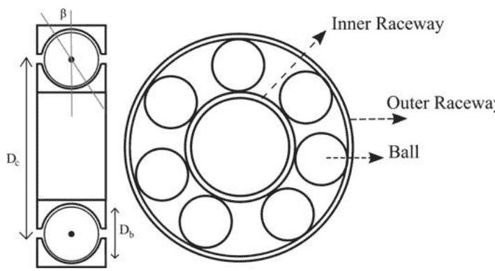

图1 滚动轴承[18]

滚道。滚动轴承由两个环组成，一个内环和一个外环，如图1所示。内环通常安装在电机轴上。在两个环之间，有一些球或滚子。持续的应力导致内环和外环上的材料碎片损失。由于轴承易受损，轴承故障诊断引起了许多研究人员的关注。典型的轴承故障诊断包括使用信号处理方法分析电机带有损坏轴承的不同测量信号。

本文仅分析内环和外环。每个故障对应一个特征频率 $f_c$，由公式（1）和（2）给出，其中 $f_r$ 是转子的旋转频率。

$$
外环 \qquad : f_0 = \frac{N_b}{2} f_r \left( 1 - \frac{D_b}{D_c} \cos \beta \right) \qquad (1)
$$

$$
内圈 \qquad : f_i = \frac{N_b}{2} f_r \left( 1 + \frac{D_b}{D_c} \cos \beta \right) \qquad (2)
$$

当球体旋转并撞击缺陷时，这些频率会产生冲击效应。这些特征频率是轴承几何和转子频率的函数。冲击效应会在特征频率处产生转子偏心，导致转子与定子之间的气隙变化。由于气隙长度的变化，机器的电感也会发生变化。这些特征频率和旁带频率是从[5]中推导出来的。

然而，只有在特定条件下才能可靠地检测到这些频率，因为它们受到外部噪声和工作条件的极大影响。大多数情况下，这些频率只在严重故障的频谱中出现。

### 2 文献综述

在过去几十年中，使用振动信号、声发射、温度测量、化学监测、电流和冲击脉冲方法进行轴承故障诊断已经成为重要的研究领域。用于轴承故障诊断的最常用方法是使用振动信号。使用振动信号进行故障诊断是迄今为止最有效的方法，故障检测的准确率接近100%。在振动信号上使用传统的深度学习方法，研究人员已经能够实现超过99%的准确率，例如使用CNN-LSTM（卷积神经网络-长短期记忆）达到99.6%的准确率[6]，使用SDAE（堆叠去噪自编码器）达到99.83%的准确率[7]，使用EDAE（集成深度自编码器）达到99.15%的准确率[8]，等等。然而，在大多数工业应用中，使用的廉价电机功率为2千瓦或更低，并且具有额外的传感器，例如加速度计，这使得它在经济上不具吸引力，因为添加额外的传感器会增加成本。此外，[9]认为振动信号很容易受到松动螺丝和机器不同部分（尤其是机壳）的共振频率的影响，这可能导致错误或误导性的故障诊断。

根据[5]，定子电流或电机电流信号（MCS）也可以有效用于轴承故障诊断，因为电流可以很容易地从现有的频率变换器中测量，因此不需要额外的传感器。正如已经讨论的，轴承中的损伤，例如孔洞、坑洞、裂纹或缺失材料，在球经过这些缺陷时会产生冲击脉冲。冲击脉冲会导致轴承特征频率的振动。这导致转子的平均气隙长度发生变化，从而导致磁通密度（或机器电感）在定子电流中呈现出变化，如公式（3）所示，并调制机器的旋转频率。

$$
f_{bf} = |f_s \pm k f_c| \qquad (3)
$$

其中 $f_s$ 是定子的电频率， $k = 1, 2, 3, \dots$ Schoen等人[5]进一步指出，通过在频域中对MCS进行分析，可以检测到这些特征频率分量。然而，由于转子偏心、断裂转子棒或其他可能导致转子和定子气隙长度变化的条件，类似的特征频率开始出现在MCS的频谱中。其他可能阻碍特征故障频率检测的情况包括故障处于早期阶段或测量信号的信噪比较低。此外，这些特征频率在频谱中的位置取决于机器速度、轴承几何形状和故障位置。虽然使用振动信号进行轴承故障检测可能具有优势，但借助深度学习算法，可以实现使用MCS进行出色的故障诊断。通常，对于深度学习技术，不需要进行特征提取，但在这种情况下，调制分量或特征被噪声掩盖，必须使用信号处理技术进行检测和提取。因此，使用MCS进行诊断并不是一项容易的任务。在[10]中，使用离散小波变换（DWT）提取故障特征，该方法对信号进行去噪，将其重构回时域，并进行频谱分析以识别故障峰值。[11]使用Welch PSD估计在MCS中识别故障特征，但使用SWPT（Stationary Wavelet Packet Transform）的C8,7和C7,6系数的RMS值更准确地识别了这些特征。然而，在所有这些方法中，只呈现了故障特征识别，没有演示能够自动从数据中识别故障的算法。[12]评估了使用MCS进行诊断与振动信号的利弊，并得出结论，由于故障特征的低检测幅度，MCS的诊断并不总是可靠的。因此，仅凭智能方法无法正确进行故障分类。因此，在这种情况下，必须采用强大的方法，如深度学习方法，因为深度学习模型具有即使从弱特征进行分类的能力。

在文献中，使用了几种机器学习和深度学习方法；每种方法都有其优点和缺点。例如，在[13]中，描述了一种无监督分类技术，称为人工蚂蚁聚类，但它需要三个电压传感器和三个电流传感器，这使得该方法在经济上不具吸引力。[14,15]描述了用于故障诊断的机器学习方法SVM（支持向量机），但在[14]中只考虑了外滚道故障，并且在进行多故障分类时准确率从100%下降到95%。然而，在[15]中，内滚道故障、外滚道故障和保持架故障都被考虑在内，该算法在较低速度下的平均准确率为99%，但在较高速度下准确率下降到92%。在[16]中，卷积神经网络（CNN）通过从电机电流频谱中选择的振幅进行训练。结果显示准确率约为86%，仅考虑了轴承外滚道故障。在[17]中，使用稀疏自编码器（AE）提取定子电流和振动信号中的故障模式，并使用SVM进行分类。AE对高严重度轴承故障的准确率为96%，对低严重度故障的准确率为64%，仅考虑了外滚道故障。

最后，在[18]中使用了两种特征提取方法，包括1D-CNN和WPT（小波包变换）。在分析中，将两种类型的轴承故障进行了分类，即内圈故障和由轴承中的铝粉引起的故障。所提出的方法涵盖了广泛的速度范围和故障严重程度，准确率达到了98.8%，但未考虑负载变化，并且需要非常高规格的训练硬件。

本文使用定子电流来诊断两种轴承故障，即内圈和外圈故障，使用了众所周知的深度学习算法LSTM网络。考虑了不同的工作条件，如速度、负载变化和不同的故障严重程度，来构建轴承故障数据。因此，所开发的方法不受速度和负载条件的影响。在本文的第一部分中，描述了LSTM网络，然后讨论了特征提取和LSTM训练，并最后分析了经过训练的LSTM的结果。

## 3 LSTM网络

RNN（循环神经网络）是一类人工神经网络，用于识别序列数据中的模式，例如语音识别、手写识别、自然语言处理、视频分析等。因此，RNN可以考虑时间和序列，因为RNN具有两种形式的输入，即当前输入和最近过去的输入[19]。RNN与前馈网络的关键区别在于它们有一个连接到过去决策的反馈循环。

从图2可以看出，在某个特定时间$t$，循环隐藏层神经元不仅从输入层$x$获取输入，还从其自身在实例$t-1$时刻的输入$h$获取输入。因此，输出是当前和过去的组合。该过程可以用(4)描述。

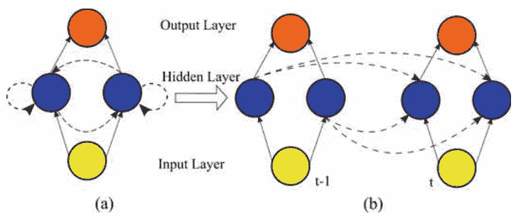
图2 循环神经网络的架构。在一个时间步上的循环神经网络[20, 21]

$$
\begin{aligned}
h_t &= f(w_{hx} x_t + w_{hh} h_{t-1} + b_h) \\
y_t &= f(w_{yh} h_t + b_y)
\end{aligned}
\quad (4)
$$

其中：
- $x_t$ 是时间 $t$ 上的循环神经网络的输入
- $h_t$ 是时间 $t$ 上的隐藏层状态
- $h_{t-1}$ 是时间 $t-1$ 上的神经网络状态
- $b_h$ 是隐藏层的偏置
- $b_y$ 是输出的偏置
- $w_{hx}$ 是隐藏层和输入层之间的权重
- $w_{hh}$ 是时间 $t-1$ 上的隐藏层和时间 $t$ 上的隐藏层之间的权重

循环神经网络使用时间反向传播（BPTT）进行时间步训练[21]。然而，由于梯度在时间步上的乘积，梯度值会变得越来越小或者越来越大，因此，循环神经网络的学习过程会遇到梯度消失或梯度爆炸的问题。

由于梯度消失和梯度爆炸的问题，RNN在有限的应用中使用。通过使用LSTM（长短期记忆），解决了这个问题，LSTM包括一个内存单元，取代了隐藏的RNN单元[22]。内存单元由四个门组成：遗忘门（保留多少来自上一个单元状态的信息）、输入门（是否将信息写入单元）、输入调制门（写入单元的数量）、输出门（从单元中提取多少信息）[23]。LSTM保留了通过时间和层次进行反向传播的误差。图3显示了典型的LSTM单元。在图3中，$\sigma$ (sigmoid) 表示门激活函数，而 $\varphi$ (tanh) 表示输入或输出节点的激活。图3中描述的LSTM模型[21]由（5）表示。

$$
\begin{aligned}
g_t &= \varphi(w_{gx} x_t + w_{gh} h_{t-1} + b_g) \\
i_t &= \sigma(w_{ix} x_t + w_{ih} h_{t-1} + b_i) \\
f_t &= \sigma(w_{fx} x_t + w_{fh} h_{t-1} + b_f) \\
o_t &= \sigma(w_{ox} x_t + w_{oh} h_{t-1} + b_o)
\end{aligned}
$$

图3 LSTM记忆细胞

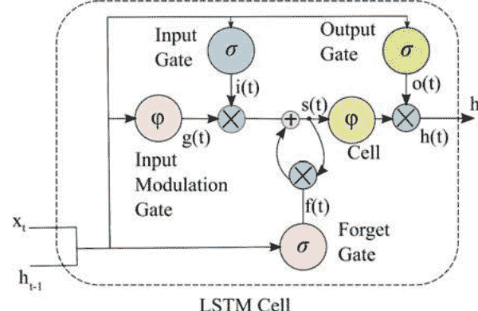

$$
\begin{aligned}
s_{t} &= g_{t} i_{t} + s_{t-1} f_{t} \\
h_{t} &= \varphi(s_{t}) o_{t}
\end{aligned}
\quad (5)
$$

其中：
- $w_{gx}, w_{ix}, w_{fx}$ 和 $w_{ox}$ 是时间 $t$ 输入和隐藏层之间的权重
- $w_{gh}, w_{ih}, w_{fh}$ 和 $w_{oh}$ 是时间 $t$ 和 $t-1$ 之间的隐藏层之间的权重
- $b_{g}, b_{i}, b_{f}$ 和 $b_{o}$ 是门的偏置
- $h_{t-1}$ 是时间 $t-1$ 的隐藏层的值
- $f_{t}, g_{t}, i_{t}$ 和 $o_{t}$ 是遗忘门、输入调制门、输入门和输出门的输出值
- $s_{t}$ 和 $s_{t-1}$ 分别是时间 $t$ 和 $t-1$ 的当前状态

## 4 Paderborn大学数据集

在[24,25]中，为了轴承故障诊断的目的，开发了一个基准数据集。该数据集由两相同步测量的电流和振动信号组成。定子电流是使用64kHz采样的电流传感器测量的，然后使用25kHz低通滤波器进行滤波。该数据集由六个未损坏的轴承和26个损坏的轴承的测试组成。在这26个损坏的轴承中，12个是人为引起的损坏，14个是真实损坏。

在大多数轴承故障诊断的研究中，只有人工引入的轴承故障，并收集数据以制作机器学习模型，因为它们易于生成。然而，当在实际工业应用中使用这些模型时，它们无法提供预期的诊断结果。在[24,25]中，使用人工损坏的轴承训练了机器学习模型，并使用真实损坏的轴承进行了测试。这些模型无法准确分类真实损坏的轴承，原因是无法准确地人工复制轴承上的真实损坏。

轴承的真实损坏是无法人工复制的。从机械设备中获取真实损坏的轴承并不容易。由于轴承的寿命很长，通常在故障之前就会更换轴承。因此，很难找到大量真实损坏的轴承。在[24, 25]中，通过使用科学测试装置，通过加速寿命测试的方式产生了真实损坏的轴承。这种技术的优点是可以在可重复的条件下生成轴承损坏。然而，缺点是这个过程需要很多时间和精力。轴承中的真实损坏是通过在测试装置上对轴承施加非常高的径向力来产生的。施加在轴承上的高径向力远远超过轴承所能承受的力，导致轴承很快出现损坏。此外，为了进一步加速过程，使用低粘度油会导致不适当的润滑并加快过程。尽管该数据集非常宝贵，因为它提供了真实和人工轴承损坏的测试数据，但本文仅关注真实轴承损坏，以展示诊断算法，但该方法当然也可以扩展到具有人工损坏的轴承。三类（健康、外圈、内圈）数据集的描述见表1。轴承的损坏程度各不相同。有关这些数据集和使用轴承的几何描述的详细信息，请参阅[24, 25]。所有损坏的轴承数据集都由单点损坏组成，这是由于疲劳引起的，除了数据集KA30，它由于塑性变形而产生了分布式损坏的轴承。

**表1 健康轴承数据集和带有实际损伤的轴承数据集**

| 健康（类别1） | 内圈损伤（类别2） | 外圈损伤（类别3） |
| :--- | :--- | :--- |
| K001 | KI04 | KA04 |
| K002 | KI14 | KA15 |
| K003 | KI16 | KA16 |
| K004 | KI18 | KA22 |
| K005 | KI21 | KA30 |

每个数据集（例如，K001）都有80个测量值（每个操作条件对应20个测量值），每个测量值持续4秒。使用表2中描述的不同操作条件，使得深度学习算法能够包含速度和负载的变化，模型不仅仅依赖于特定的操作条件。变化的操作参数包括速度、径向力和负载扭矩。

**表2 每个数据集的操作参数**

| 编号 | 旋转速度[rpm] | 负载扭矩[Nm] | 径向力[N] |
| :--- | :--- | :--- | :--- |
| 0 | 1500 | 0.7 | 1000 |
| 1 | 900 | 0.7 | 1000 |
| 2 | 1500 | 0.1 | 1000 |
| 3 | 1500 | 0.7 | 400 |

对于三个设置，使用1500 rpm的速度，而对于一个设置，使用900 rpm的速度。同样，对于三个设置，使用0.7 Nm的负载扭矩，对于一个设置，使用0.1 Nm的负载扭矩，对于三个设置，使用1000 N的径向力，对于一个设置，使用400 N的径向力。所有数据集的损坏都小于2毫米，除了KI16、KI18和KA16数据集的损坏大于2毫米。在所有实验中，温度保持在约50°C左右。

### 5 数据处理和特征提取

在应用机器学习或深度学习算法之前，数据会经过预处理，并提取出重要的特征作为故障分类算法的输入。因此，需要采用技术来提取最佳和有用的特征，并摒弃无关或多余的信息。去除噪声、无关和误导性的特征可以得到更紧凑的表示，并提高检测和诊断的质量[13]。

图4a显示了机器的1相定子电流信号，图4b显示了其频谱。仔细观察图4a，可以观察到正弦波幅度的轻微变化。这些幅度的小变化可能包含轴承的特征频率。因此，它们进一步进行特征提取的分析。频谱显示了两个主导频率 $\omega_0$ 和 $5\omega_0$。这些频率不提供新的信息，并且存在于所有当前信号中（无论是健康的还是损坏的轴承）。因此，需要从电流信号中去除这些频率，以便更加关注由轴承故障引起的频率。

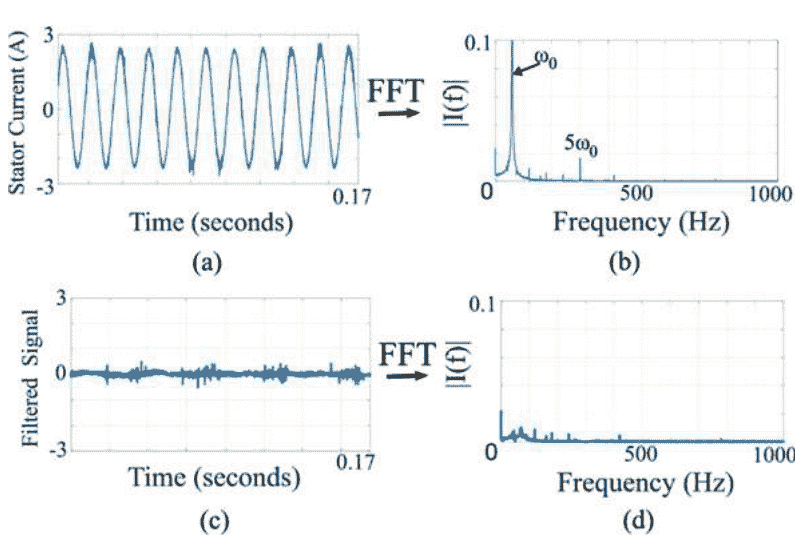
图4 a)定子电流，b)定子电流的频谱，c)去除$\omega_0$和$5\omega_0$分量后的定子电流，d)滤波后定子电流的频谱

为了去除不需要的频率（$\omega_0$和$5\omega_0$），使用MATLAB设计了一个信号处理滤波器来抑制$\omega_0$和$5\omega_0$的频率。图4c显示了滤波后的电流信号，图4d显示了其频谱。现在，这个滤波后的信号用于特征提取。滤波后的信号的频谱现在包含噪声和特征轴承频率（如果存在）。

霍等人[26]评估了轴承振动信号的统计特征，并得出结论，对于检测轴承故障来说，峭度和冲击因子是最敏感的参数。这个结论很适用于当前的信号，因为这两个统计特征充分捕捉了故障轴承的冲击行为。另一个在时域中也很有用的特征是间隙因子，它对轴承故障也很敏感。其余的特征是通过第三级WPD（小波包分解）从时频域中提取的。

WPD是一种著名的信号处理技术，广泛应用于故障诊断。WPD在时域和频域都提供了有用的信息。WPD将时域信号分解为具有不同尺度和可变大小窗口的小波，并揭示了时频域中的局部结构。WPD相对于其他信号处理技术的优势在于，使用WPD可以有效提取瞬态特征，并且无需特定频带的要求即可提取全频谱的特征。WPD使用基本小波函数作为母小波，通过变化尺度频率和小波的时间偏移来扩展、压缩和平移信号。这使得可以在短窗口的低尺度高频率和长窗口的高尺度低频率下应用。例如，使用长窗口、高尺度和低频率，可以实现高频率分量的高时间分辨率和低频率分量的高频率分辨率。小波函数必须满足（6）中的要求。

$$C_\psi = \int_R \frac{|\psi(\omega)|^2}{|\omega|} d\omega < \infty \quad (6)$$

其中 $\psi(\omega)$是母小波 $\psi(t)$的傅里叶变换。

连续小波变换（CWT）由（7）描述。

$$\psi_{a,b}(t) = \frac{1}{\sqrt{|a|}} \psi \left( \frac{t-b}{a} \right) \quad (7)$$

其中 $\psi_{a,b}(t)$是连续母小波，按因子 $a$缩放并按因子 $b$平移，以及 $\frac{1}{\sqrt{|a|}}$ 用于能量保持。$\psi_{a,b}(t)$充当一个窗口函数，其频率和时间位置可以通过 $a$和 $b$进行调整。例如，通过较小的 $a$值可以实现更高的频率分辨率；这在提取信号的更高频率分量时有所帮助。

缩放和平移参数使小波分析在时间和频率域中成为非平稳和非线性信号的理想选择。$a$和$b$是连续的，可以取任何值，但当$a$和$b$都离散化时，我们得到离散小波变换（DWT）。尽管DWT是一种在时频域分析信号方面非常优秀的方法，但它只考虑了低频部分，忽略了高频部分，导致高频的分辨率非常差。因此，在我们的情况下，使用小波包分解（WPD）来进行时频分析。与DWT的区别在于，WPD将所有细节信号（高频部分）进一步分解为两个信号，细节信号和近似信号（低频部分）。因此，使用WPD可以进行全尺度的时频域分析。WPD的伸缩函数$\varnothing(t)$和小波函数$\psi(t)$分别由公式（8）和（9）描述。

$$\varnothing(t) = \sqrt{2} \sum_k h(k)\varnothing(2t-k) \quad (8)$$
$$\psi(t) = \sqrt{2} \sum_k g(k)\varnothing(2t-k) \quad (9)$$

其中$h(k)$和$g(k)$分别是低通和高通滤波器。

信号$s(j,n)$在节点$n$的从级别$j$到$j+1$的WPD由公式(10)和(11)给出。信号$s(j,n)$可以是$cAj$近似（低频）或$cDj$细节（高频）系数。

$$s_{j+1,2n} = \sum_m h(m-2k)s_{j,n} \quad (10)$$
$$s_{j+1,2n+1} = \sum_m g(m-2k)s_{j,n} \quad (11)$$

在第$j$级WPD的过程中，波形系数的数量为$m$，如图5所示。


借助WPD的帮助，信号可以分解成不同的频带[27]。当轴承发生损坏时，效应会在不同的频率上产生共振，导致能量分布在不同的频带上，具体取决于轴承故障。WPD系数$s(j,n)$的能量$E(j,n)$可以根据(12)计算得出。

$$E(j, n)=\sum s(j, n)^{2} \quad (12)$$

进行WPD时，必须选择一个母小波；小波的选择取决于应用，因为没有绝对最好的小波。最适合的小波具有与应用信号相似的特性或相似性。[28]展示了使用不同小波训练轴承故障数据，并得出结论：能够充分捕捉轴承故障特征的母小波是Daubechies 6 (db6)小波。Daubechies 6 (db6)小波在我们的案例中也表现最佳，因此在本文中用于提取时频域特征。

在[25]中，讨论了一种基于最大分离距离的详细特征选择方法。使用这种方法，选择相关特征，因为并非所有特征都对故障分类有用。图6显示了信号的第三级WPD（小波包分解）。从这个分解中，使用$\mathrm{cA}_{3,0}, \mathrm{cA}_{3,1}, \mathrm{cA}_{3,2}$ 和 $\mathrm{cD}_{3,2}$ 系数，并计算它们的能量。表3显示了选择并用于诊断算法的八个详细特征的列表。这八个特征能够很好地描述滤波后的电流信号中的轴承故障特征。根据表1中提供的数据集，考虑以下步骤来准备LSTM网络的训练和测试数据。

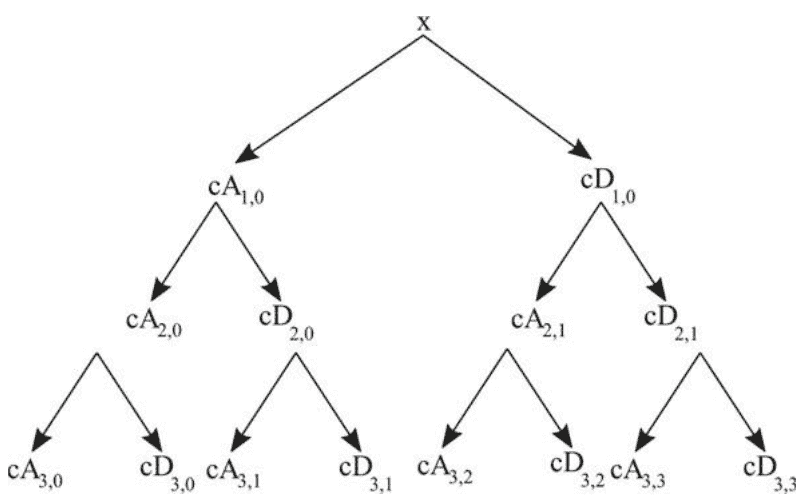
图6 第三级WPD（小波包分解）的系数

| 特征编号 | 描述 |
|:---:|:---|
| 1 | 峰度. 峰度 = $\frac{\sum_{i=1}^{n}(x_i - \bar{x})^4}{(n-1)\sigma^4}$ |
| 2 | 冲击因子 IF = $\frac{\max(|x_i|)}{\frac{1}{n} \sum_{i=1}^n |x_i|}$ |
| 3 | 清除因子 Clf = $\frac{\max(|x_i|)}{(\frac{1}{n} \sum_{i=1}^n \sqrt{|x_i|})^2}$ |
| 4 | RMS (三级 WPD 近似系数 3, 0) $RMS = \sqrt{\frac{1}{n} \sum_{i=1}^n cA_{3,0,i}^2}$ |
| 5 | 三级 WPD 近似系数 3, 0 的能量 $E_{A3,0} = \sum_{i=1}^n cA_{3,0,i}^2$ |
| 6 | 三级 WPD 近似系数能量 3, 1 $E_{A3,1} = \sum_{i=1}^n cA_{3,1,i}^2$ |
| 7 | 三级 WPD 近似系数能量 3, 2 $E_{A3,2} = \sum_{i=1}^n cA_{3,2,i}^2$ |
| 8 | 三级 WPD 细节系数能量 3, 2 $E_{D3,2} = \sum_{i=1}^n cD_{3,2,i}^2$ |

1. **步骤一**：取第 1 相的定子电流，其中包含 4 秒的测量（从所有数据集中得到 1200 个信号，每个类别健康、内圈故障和外圈故障各 400 个信号）。信号经过滤波以去除 $\omega_0$ 和 $5\omega_0$ 分量。然后，提取表 3 中的特征。
2. **步骤二**：在第一步中提取的所有特征都被缩放到 0 到 1 之间，以便更好地收敛算法。
3. **步骤三**：每个类别的特征数据在类别内部进行洗牌，以便训练和测试数据包含所有不同的操作点和条件，因为每个数据集都有不同的故障严重程度。
4. **步骤四**：每个类别的数据点中有 20%（即 80 个点）用于测试，每个类别的数据点中有 80%（即 320 个数据点）用于训练。因此，总共有 960 个数据点用于训练集，240 个数据点用于测试集。

## 6 LSTM网络的训练和结果

LSTM 网络的架构如表 4 所述。LSTM 网络由八个输入节点组成，对应于八个选定的特征。增加更多的特征不会对准确性产生很大影响，但减少特征会导致准确性下降。输入节点后面是四个隐藏层，每个隐藏层有 32 个隐藏节点。在选择层数和隐藏节点数时没有绝对规则，因此选择了四个层和 32 个节点，因为减少层数和节点数会导致准确性下降，而增加它不会对准确性产生很大影响。在每个 LSTM 隐藏层之后，添加了来自前一层的 50% 的 dropout，以防止网络记忆或过度拟合训练数据。最后，使用 softmax 激活函数的全连接层

## 表 4 LSTM 架构描述

| 层 | 节点 |
| :--- | :--- |
| 输入层 | 8 个输入节点 |
| LSTM 层 1 | 32 个隐藏节点 |
| 50% 的丢弃率 | |
| LSTM 层 2 | 32 个隐藏节点 |
| 50% 的丢弃率 | |
| LSTM 层 3 | 32 个隐藏节点 |
| 50% 的丢弃率 | |
| LSTM 层 4 | 32 个隐藏节点 |
| 50% 的丢弃率 | |
| 具有 Softmax 激活函数的全连接层 | 3 个输出节点 |

## 表 5 LSTM 训练参数详细信息

| 参数 | 数值 |
| :--- | :--- |
| 训练样本 | 960 |
| 测试样本 | 240 |
| 批量大小 | 64 |
| 迭代次数 | 2500 |
| 丢弃率 | 0.5 |

由三个输出节点 (对应三个输出类别：健康、内环损伤和外环损伤) 组成。使用二元交叉熵函数作为损失函数，并使用 ADAM 优化器 [29] 来训练 LSTM 网络的参数。在代码实现中，训练是在计算机的 GPU 上进行的，以加速训练过程。

在从数据集中提取和预处理特征之后，将特征向量输入 LSTM 网络进行训练。训练的参数显示在表 5 中。

使用参数，网络经过 2500 个时期的训练，批量大小为 64。训练后，LSTM 网络在测试数据上达到了 97% 的准确率，在训练数据上达到了 100% 的准确率。图 7 显示了 LSTM 模型的测试结果的混淆矩阵，行表示预测类别，列表示真实类别。左列显示了假阳性，上行显示了假阴性。所有正常或健康的轴承点都被正确分类。然而，一些内圈故障点被错误地分类为外圈故障，一些外圈故障点被错误地分类为内圈故障。然而，采用提出的方法的 LSTM 网络在诊断轴承故障和对健康、内圈和外圈故障进行分类方面提供了极高的准确度。

## 图 7 显示了 LSTM 测试结果的混淆矩阵，用于类别 1（正常）、类别 2（内圈损坏）和类别 3（外圈损坏）的结果。

| | 1 | 2 | 3 | Target Class |
|---|---|---|---|---|
| Predicted Class 1 | 80<br>33.33% | 0<br>0% | 0<br>0% | 100%<br>0% |
| Predicted Class 2 | 0<br>0% | 76<br>31.67% | 4<br>1.67% | 95%<br>5% |
| Predicted Class 3 | 0<br>0% | 3<br>1.25% | 77<br>32.08% | 96.25%<br>3.75% |
| | 100%<br>0% | 96.2%<br>3.8% | 95.06%<br>4.94% | 97.08%<br>2.92% |
| | Normal | Inner Race | Outer Race | |

### 7 与传统方法的比较

在前一节中，LSTM 网络被用于诊断轴承内部和外部故障，并且实现了 97% 的测试准确率，这比 [25] 中机器学习算法集成实现的 93.3% 的测试准确率要高。因此，他们分析中使用的机器学习方法没有暴露于不同严重程度的轴承测量数据，导致了分析准确率的降低。在传统的机器学习技术中，特征是从数据中手动提取出来的，以便数据模式对机器学习算法更清晰可见。对于深度学习方法，算法能够自动从数据中提取高级特征。这种将数据直接输入深度学习算法的方法适用于大多数情况。然而，在轴承故障诊断的情况下，将直接的 MCS 输入到提出的 LSTM 网络中无法获得良好的性能，导致非常低的分类准确率。提出的 LSTM 方法性能不佳的原因是故障特征幅值与信号噪声相当或更低。因此，LSTM 网络无法提取这些特征频率特征。因此，需要对 MCS 进行手动特征提取，并且需要使用小波变换等信号处理技术来完成此任务。由于从滤波后的电流信号中提取了八个特征，传统的机器学习方法也可以与提出的 LSTM 方法进行比较。表 6 显示了传统方法与提出方法的比较。在这个测试中，所有数据集被合并和洗牌，并进行了五折交叉验证。大多数机器学习方法

## 

| 算法 | 分类准确率 (%) |
| --- | --- |
| 多层感知器 (150 层，100 层，50 层，使用 ADAM 求解器和 Re LU 激活函数) | 95.4 |
| 支持向量机 (SVM) | 66.1 |
| k 最近邻 | 91.2 |
| 线性回归 | 53.0 |
| 线性判别分析 | 56.8 |
| CART(分类与回归树) | 93.6 |
| 高斯朴素贝叶斯 | 46.0 |
| LSTM(提出的方法) | 97.0 |

其他方法表现不佳; 只有多层感知器 (MLP)、k 最近邻和 CART 方法显示出有希望的结果。LSTM 方法表现更好的原因是由于其记忆能力，算法学习了这 8 个特征中的模式，因为这 8 个特征形成了一个序列。因此，提出的 LSTM 方法在所有其他传统方法上表现出色，证明了深度学习技术相对于传统方法的优越性。

虽然，提出的 LSTM 方法在传统机器学习方法上表现出色，但深度学习算法的一个缺点是高计算需求。所提出的 LSTM 网络模型在 GPU 上进行训练，以加快训练性能。然而，机器学习算法的训练需要普通的 CPU 处理和较少的时间，因此如果有计算资源可用，应始终选择深度学习算法。

LSTM 模型的结果非常有希望，但数据集不够大，如果将模型暴露于新环境的数据点进行测试，训练的模型可能无法达到相同的性能。这是由于背景条件的随机性和新数据点的不同噪声条件所导致的。因此，需要在这个领域进行更多的研究，以使深度学习模型能够适应新环境而不损害其性能。

因此，对于更大的数据集进行更广泛的分析将会很有帮助。

### 8 结论和未来工作

本文重点研究了轴承内外圈故障的诊断。传统轴承故障诊断涉及使用机器的振动信号加速度计。然而，在本文中，使用了 MCS 来进行故障诊断。通过使用 MCS，已经证明了它在有效的轴承故障诊断中的潜力。

通过这种方法，消除了对额外传感器进行振动监测的需求

信号，从而降低了故障监测系统的成本。考虑了帕德博恩大学真实的损坏轴承数据集。从数据集中，使用了一个相位的定子电流，并通过去除多余的频率 $\omega_{0}$ 和 $5 \omega_{0}$ 进行处理。然后，从这个经过滤波的信号中提取了八个特征，其中三个特征来自时域，五个特征来自时频域，使用了三级 WPD。这八个特征被缩放后输入到具有四个隐藏层的深度学习 LSTM 网络中。LSTM 网络能够展示出 97% 的分类准确率，即使在包含不同工作条件（即不同速度和负载）的数据集中，这证明了所开发的方法独立于机器的工作条件。最后，通过使用五折交叉验证将提出的 LSTM 方法与传统的机器学习方法进行比较，并且提出的方法通过比最佳算法的准确率提高了 1.5% 以上。因此，通过使用提出的 LSTM 算法进行故障诊断，能够获得与振动信号诊断相似甚至更好的性能。

对于未来的工作，将考虑使用定子电流诊断其他轴承故障，例如球故障和笼故障。其次，将探索其他深度学习方法，如 [30] 中列出的 CNN-LSTM 网络，能够融入不同工作条件的随机性和能够适应不同操作环境而不影响方法性能的算法。此外，将通过考虑去噪 LSTM、正则化方法和更大的训练数据集来进一步研究网络的分类性能。

## 参考文献

- 1. R. Sabir, S. Hartmann, C. Gümann, 使用整流直流输出电压检测交流发电机的开路和短路故障，在 2018 年 IEEE 第四届南方电力电子会议（SPEC）（新加坡，2018 年），第 1-7 页
- 2. R. Sabir, D. Rosato, S. Hartmann, C. Gümann, 在三相同步发电机与整流器中检测和定位电气故障，在第 19 届电气驱动与功率电子国际会议（EDPE 2019）（斯洛伐克，2019 年）
- 3. 轴承故障的常见原因 | 应用。应用（2019 年）。 https://www.applied.com/bearing failure
- 4. I.Y. Onel, M.E.H. Benbouzid, 感应电动机轴承故障检测和诊断：帕克和康科迪亚变换方法的比较研究，在 2007 年 IEEE 国际电动机和驱动器会议（安塔利亚，2007 年），第 1073-1078 页
- 5. R.R. Schoen, T.G. Habetler, F. Kamran, R.G. Bartfield, 通过定子电流监测检测电动机轴承损坏。IEEE Trans. Ind. Appl. 31 (6)，1274-1279 页（1995 年）。 https://doi.org/10.1109/28.475697
- 6. H. Pan, X. He, S. Tang, F. Meng, 使用一维 CNN 和 LSTM 的改进轴承故障诊断方法。机械工程学报 64 (7-8)，443-452 页（2018 年）
- 7. X. Guo, C. Shen, L. Chen, 深度故障识别器：一种用于旋转机械故障诊断的集成模型，用于去噪和提取特征。应用科学。 7 (41)，1-17（2017 年）
- 8. H. Shao, H. Jiang, Y. Lin, X. Li, 一种基于集成深度自编码器的智能故障诊断滚动轴承的新方法。基于知识的系统。 119, 200-220 (2018 年)
- 9. D. Filbert, C. Guehmann, 通过估计电动机轴承的电流谱进行故障诊断。IFAC Proc。 27 (5) , 689-694 (1994 年)
- 10. S. Yeolekar, G.N. Mulay, J.B. Helonde, 基于小波变换的感应电动机外圈轴承故障识别，基于定子电流特征，2017 年第二届 IEEE 国际电子、信息与通信技术近期趋势会议 (R TEICT) (班加罗尔，2017 年) , 第 2011-2015 页
- 11. F. Ben Abid, A. Braham, 高级信号处理技术在感应电动机轴承故障检测中的应用，在 2018 年第 15 届国际多会议系统、信号与设备 (SSD) (Hammamet, 2018), pp. 882–887
- 12. A. Bellini, F. Immovilli, R. Rubini, C. Tassoni, 通过振动或电流信号诊断感应电机轴承故障：一项关键比较，在 2008 年 IEEE 工业应用学会年会 (Edmonton, AB, 2008), pp. 1–8
- 13. A. Soualhi, G. Clerc, H. Razik, 使用改进的人工蚁群聚类技术检测和诊断感应电动机故障 . IEEE 工业电子学会刊。 60(9), 4053–4062 (2013)
- 14. S. Gunasekaran, S.E. Pandarakone, K. Asano, Y. Mizuno, H. Nakamura, 使用支持向量机进行外环滚道轴承故障的条件监测和诊断，在 2018 年条件监测和诊断 (CMD) (珀斯，WA, 2018 年) , 第 1–6 页
- 15. I. Andrijauskas, R. Adaskevicius, 基于频谱特征的感应电动机轴承故障诊断的 SVM 方法 , 在 2018 年第 23 届国际自动化与机器人方法与模型 (MMAR) 会议 (Miedzyzdroje, 2 018 年) , 第 826-831 页
- 16. S.E. Pandarakone, M. Masuko, Y. Mizuno, H. Nakamura, 基于快速傅里叶变换分析的深度神经网络轴承故障诊断，2018 年 IEEE 能源转换大会和博览会 (ECCE)（波特兰，OR, 2018 年） , 第 3214–3221 页
- 17. J.S. Lal Senanayaka, H. Van K hang, K.G. Robbersmyr, 基于自编码器和数据融合的电动机轴承和定子绕组故障检测的混合健康指标，2018 年第 21 届国际电机与系统会议 (ICEMS)（济州，2018 年） , 第 531–536 页
- 18. I. Kao, W. Wang, Y. Lai, J. Perng, 基于学习的永磁同步电机故障诊断分析。IEEE Trans. In strum. Meas. 68(2), 310–324 (2019)
- 19. LSTMs 和循环神经网络初学者指南 (Skymin d, 2019). https://skymind. ai/wiki/lstm
- 20. S. Zhang, S. Zhang, B. Wang, T.G. Habetler, 机器学习和深度学习算法用于轴承故障诊断的综述 (2019). arXiv 预印本 arXiv:1901.08247
- 21. Z.C. Lipton, J. Berkowitz, C. Elkan, 循环神经网络在序列学习中的关键评论 (2015). arXiv 预印本 arXiv:1506.00019
- 22. S. Hochreiter, J. Schmidhuber, 长短期记忆。Neural Comput. 9, 1735–1780. (1997) (来源：Stanford CS231N)
- 23. F. Immovilli, A. Bellini, R. Rubini 等，通过振动或电流信号诊断感应电机的轴承故障：一个关键比较。IEEE Trans. Ind. Appl. 46(4), 1350–1359(2010)
- 24. Konstruktions-und Antriebstechnik (KAt)—数据集和下载（Universität Pader-born）, Mb.uni-paderborn.de (2019)。 https://mb.uni-paderborn.de/kat/forschung/datacenter/bea ring-datacenter/data-sets-and-download/
- 25. C. Lessmeier, J.K. Kimotho, D. Zimmer, W. Sextro, 通过使用电动机的电流信号对电机驱动系统中的轴承损坏进行条件监测：用于数据驱动分类的基准数据集，Proceedings of the European Conference of the Prognostics and Health Management Society(2016), pp. 05– 08
- 26. Z. 霍，Y. 张，P. Francq, L. 舒，J. 黄，基于优化小波变换的多速度振动特征的滚动轴承初级故障诊断。IEEE Access 5,19442–19456 (2017)
- 27. X. 王，Z. 卢，J. 魏，Y. 张，基于能量特征重构和复合多尺度排列熵的轨道车辆轴箱轴承故障诊断。熵 21(9),865 (2019)
- 28. S. Djaballah, K. Meftah, K. Khelil, M. Tedjini, L. Sedira, 使用小波包变换和神经网络进行故障检测和诊断轴承。Frattura ed Integrità Strutturale 13(49), 291–301 (2019)
- 29. D.P. Kingma, J. Ba, Adam: 一种随机优化方法 (2014). arXiv 预印本 arXiv: 1412.6980
- 30. M.A. Wani, F.A. Bhat, S. Afzal, A.L. Khan, 深度学习进展 (Springer, 2020)

## 利用深度学习分割网络从高分辨率正射影像中自动检测太阳能电池板

Tahir Mujtaba 和 M. Arif Wani

## 摘要

从航空或卫星影像中检测太阳能电池板是一种非常方便和经济的技术，可以计算出一个地区或城市屋顶上太阳能电池板的数量，并估计已安装太阳能电池板的太阳能潜力。准确检测太阳能电池板的形状和大小是从太阳能电池板上估计容量和能量生成的先决条件，该估计是针对一个地区或城市的。这种方法有助于政府制定将家庭、办公室和建筑物安装的太阳能电池板与电网整合的政策。本研究探讨了利用各种深度学习分割算法从分辨率为 0.3 米的正射校正 RGB 影像中自动检测太阳能电池板。我们比较和评估了六种深度学习分割网络在卫星影像中自动检测分布式太阳能电池板阵列的性能。这些网络在真实数据和增强数据上进行了测试。

结果表明，深度学习分割网络在高分辨率正射影像中自动太阳能电池板检测方面表现良好。

### 1 引言

世界正在探索更多利用可再生能源，因为不可再生能源正在枯竭。最重要且丰富可得的可再生能源之一是太阳能。为了利用太阳能，太阳能电池板被安装在地面和建筑物的屋顶上，将太阳能转化为电能。全球范围内，安装太阳能电池板的潮流越来越高，以充分利用这种能源形式。其中一个挑战是从航拍图像中准确检测地面和建筑物上安装的太阳能电池板。准确的检测

**T. Mujtaba 克什米尔大学计算机科学系，印度斯利那加尔**

**M. A. Wani 克什米尔大学计算机科学系，印度斯利那加尔**

电子邮件：mmtahar@gmail.com

M. A. Wani 电子邮件：awani@uok.edu.in

© 编辑 (如适用) 和作者，独家许可给 Springer Nature Singapore Pte Ltd.2021 M.A.Wani 等人 (编辑)，深度学习应用，第 2 卷，智能系统与计算进展 1232，https://doi.org/10.1007/978-981-15-6759-9_5

准确的太阳能电池板形状和尺寸是确定这些电池板能量生成能力的先决条件。对于这个问题，需要语义分割来准确检测航拍图像中的太阳能电池板。在过去的几年中，机器学习方法已经被用于许多应用，如分类、聚类和图像识别 [1-7]，并且一些研究已经对卫星图像中的道路、建筑物和车辆等对象进行了分析和评估。

近年来，深度学习在图像识别问题上比传统的机器学习技术更有效。图像识别问题包括图像分类、目标检测和语义分割等任务。在这些图像识别任务中，语义分割问题是一个重要的研究领域。在这些图像识别任务中，语义分割问题是一个重要的研究领域。

语义分割是将图像的每个像素分类到一组预定义类别的过程，从而将图像划分为一组区域，每个区域由属于同一类别的像素组成。过去在图像分割中使用了许多传统的机器学习技术。

传统机器学习技术的一般过程是使用成熟的特征描述符从图像中提取特征，并在每个像素上使用支持向量机或随机森林分类器等分类器来确定其属于预定义类别的可能性。这些技术在很大程度上依赖于用于提取特征的过程，并且通常需要熟练的特征工程来设计这些过程。确定图像中哪些特征是重要的是必要的。当类别数量增加时，特征提取变得繁琐。此外，这些技术不涉及使用端到端的方法，特征提取和分类是分开进行的。与之相比，深度学习模型是端到端模型，特征提取和分类都通过单一算法完成。此外，在学习过程中模型参数会自动学习。基于以上原因，本研究采用了深度学习方法来解决太阳能电池板检测问题。

深度学习分割过程已经发展，其中深度学习图像分类模型已转换为分割模型 [9]。引入 UNet [10] 模型改进了分割过程。该模型基本上由编码器和解码器组成，编码器的较低层到解码器的较高层具有跳跃连接，以传递学习到的特征。

编码器的目的是提取在解码器中上采样的特征，并将解码器中的特征与编码器中提取的特征进行连接。

上采样是通过使用转置卷积来完成的。在 [11] 中引入了一种基于索引的上采样技术。该技术在最大池化操作期间记住具有最大强度的像素值的索引，然后在上采样过程中使用相同的索引。在 [12-14] 中测试了使用扩张卷积的扩张滤波器。扩张卷积有助于减少可学习参数，并有助于聚合图像的上下文。本研究的目标是## 1 分析和比较各种分割架构在航拍图像中太阳能电池板检测问题上的性能

### 2 相关工作

本章的组织如下。第 2 节概述了太阳能电池板检测问题上的相关工作。第 3 节介绍了基于深度学习的分割。第 4 节讨论了本研究中使用到的不同深度学习分割网络。第 5 节呈现了结果和讨论。最后在第 6 节中提出了结论。

随着高分辨率卫星图像的可用性和深度学习网络的出现，分析高分辨率图像以进行准确的目标检测已经成为可能。与建筑物、道路和车辆等物体的检测相比，太阳能电池板的检测在过去的许多年里得到了更广泛的研究。一些研究 [15-17] 在文献中报告了使用深度学习技术从卫星或正射影像中探索太阳能电池板的检测。在 [16] 中使用了预训练的 VggNet 来检测给定 [18] 中的航拍图像数据集中的太阳能电池板。作者使用了一个非常基本的 VggNet 架构，包括六个卷积层和两个全连接层。该模型应用于每个像素，以检测它是否属于太阳能电池板。进一步处理将连续的像素连接起来，并将其声明为区域。尽管这个模型在检测太阳能电池板方面表现出色，但它并没有明确给出面板阵列的形状和大小。

作者在 [17] 中提出了一个完全卷积神经网络用于太阳能电池板的检测。它使用了七个具有不同数量的滤波器和滤波器尺寸的卷积层。它首先通过使用几个卷积和最大池化层从图像中提取特征，然后上采样提取的特征，并使用包含细粒度特征的浅层的跳跃连接将它们与粗层连接起来。尽管该工作能够检测太阳能电池板，但缺少用于分割的标准度量。

在 [15] 中使用了一种称为 SegNet 的深度学习分割架构，用于从正交矫正图像中自动检测太阳能电池板，给定的是 [18]。再次，它使用了大小为 41 × 41 的非常小的图像块进行训练。这些小块可能不包含太多多样化背景，如建筑物、道路、树木和车辆，这可能限制算法在多样化背景下的性能。此外，数据集中的每个大小为 5000 × 5000 的图像将生成大约 14,872 个大小为 41 × 41 的图像块，需要在其上进行训练和测试。在基于深度学习的分割中，对太阳能电池板的检测几乎没有进行过多少研究。

### 3 基于深度学习的分割

图像分割涉及将图像的每个像素分类到给定的一组类别中。与某些应用程序不同，其目标是将整个图像分类为给定类别之一，语义分割通过为每个像素推断标签来进行密集预测。现代分类架构如 VggNet [19]、ResNet [20] 和 DenseNets [21] 可以转换为适用于分割的架构。图 1 显示了分割过程，展示了用于深度学习分割过程的一般编码器 - 解码器架构。

分割模型通常由编码器和解码器组成。编码器通常是一个预训练的分类网络，其完全连接的层被移除。

它的任务是提取特征并生成低分辨率的热图。解码器的任务是逐步将热图上采样到输入的原始分辨率。深度学习分割算法在编码器提取特征的方式和解码器使用不同的跳跃连接策略进行上采样的方式上有所不同。深度学习分割中使用的不同编码、解码和上采样技术将在下面进行讨论。

#### 3.1 编码技术

编码器的主要目的是通过连续的卷积和池化层从图像中提取特征。编码部分通常包括 VggNet、ResNet 和 DenseNet 等网络，其中去除了它们的全连接层。


##### a. VggNet

VggNet [19] 有各种变体，其中最突出的是 VggNet-16，它包含 13 个卷积层、5 个最大池化层和 3 个全连接层。VggNet-19 也很突出，包含 16 个卷积层、5 个最大池化层和 3 个全连接层。VggNet 使用较小尺寸的 3 × 3 卷积滤波器，而 AlexNet 使用 7 × 7 卷积滤波器。在给定的感受野内，使用多个 3 × 3 滤波器比使用一个较大尺寸的 7 × 7 滤波器更好，因为它涉及更少的参数并减少了计算量。

##### b. ResNet

残差网络 (ResNet) [20] 使用残差连接或身份快捷连接跳过一个或多个层，以提高性能而不增加网络的深度。该网络由堆叠的残差块组成，其中包含 3 × 3 的卷积。这个网络的各种变体包括 ResNet-18、ResNet-34、ResNet-52、ResNet-101 和 ResNet-156，分别由 18、34、52、101 和 156 层组成。这样的网络可以很容易地在分割过程中使用，去除了全连接层。

##### c. DenseNet

DenseNet [21] 的主要特征是它的每一层都以前馈方式与其他每一层连接，结果是 (L(L+1))/2 个直接连接，其中 L 是网络中的层数。对于每一层，所有前面层的特征图都被用作输入，并且它自己产生的特征图被用于所有后续层。DenseNet 缓解了梯度消失问题，增强了特征传播，并鼓励特征重用和减少参数数量。该网络由多个密集块组成，其中一层与每个后续层连接。密集块中的每一层都包括批归一化、ReLU 激活和 3 × 3 卷积。两个密集块之间的层是过渡层，包括批归一化、1 × 1 卷积和平均池化。这种类型的网络可以很容易地用于语义分割。

#### 3.2 解码技术

解码器通过使用上采样技术来提高图像分辨率。深度学习分割过程中常用的一些解码技术如下所述。

##### a. 基于跳跃连接的解码器

###### i. 基于 FCN 的解码

基于 FCN 的解码器 [9] 使用转置卷积（反卷积）进行上采样。

解码器的变体取决于从哪个池化层添加跳跃连接：(a) FCN-32 没有跳跃连接，(b) FCN-16 使用一个跳跃连接来自第四个池化层，(c) FCN-8 使用两个跳跃连接来自第三个和第四个池化层。在最后一个卷积之后，FCN 解码器使用 1 × 1 卷积层和 softmax 函数对图像像素进行分类。1 × 1 卷积的数量等于将图像像素分类为的类别数。

###### ii. 基于 UNet 的解码

基于 UNet 的解码器 [10] 使用转置卷积进行上采样，然后是卷积层和 ReLU 激活函数。UNet 扩展了 FCN 解码器中使用的跳跃连接的概念。这里每个编码器通过跳跃连接与其对应的解码器单元相连。编码器块中学习到的特征被传递并与解码器块的特征进行拼接。

##### b. 基于最大池化索引的解码器

基于最大池化索引的解码器 [11] 在解码过程中使用编码器在最大池化过程中存储的索引来对应解码器中的特征图进行上采样。与 FCN 和 UNet 解码器不同，没有通过跳跃连接将特征传递到解码器。然后，上采样的特征与可训练的滤波器进行卷积。

##### c. 基于非池化的解码器

基于非池化的解码器 [22] 在其解码器块中使用非池化和反卷积层。非池化操作将编码过程中执行的池化操作进行了逆操作。在编码过程中，它记住了最大激活值，在解码过程中使用非池化操作来恢复激活的分辨率。非池化操作通过使用开关变量来执行，这些变量记住了最大池化过程中最大激活的位置。非池化后，使用反卷积层来增加非池化产生的稀疏特征图的密度。

#### 3.3 上采样技术

总结了在解码器部分中用于增加特征图分辨率的各种上采样技术如下。

- 1. 最近邻居
最近邻居上采样技术简单地将最近像素的像素值复制到其相邻像素。

- 2. 钉子床
钉子床将像素的值放在输出中的特定/固定位置，其余位置填充为值 0。

- 3. 双线性上采样
它通过插值最近像素的值来计算像素值，但与最近邻居技术不同，每个附近像素的贡献比例在这里很重要，并且与它们对应的距离的比例成反比。

- 4. 最大反池化
它在最大池化操作期间记住最大激活的索引，并使用相同的索引将像素值定位到上采样输出中。

- 5. 转置卷积
转置卷积是深度学习语义分割中最有效和最常用的图像上采样技术，因为它是一种可学习的上采样。当应用卷积时，输入会用零填充。

- 6. 扩张卷积
也被称为空洞卷积，最初用于高效计算未降采样小波变换。扩张卷积是具有更宽卷积核的普通卷积。卷积中的卷积核呈指数级扩展，以捕捉图像的更多上下文，而不增加参数的数量。普通卷积是具有膨胀率为 1 的扩张卷积。

## 4 使用的 4 种深度学习分割架构

### 4.1 UNet

本文探讨了一种用于太阳能电池板图像分割的医学图像分割完全卷积架构 [10]。UNet 模型基本上由编码器和解码器组成。编码器部分使用各种卷积和池化操作从图像中提取特征。编码器的输出是一个热图，作为解码器的输入。解码器的目的是上采样热图，使空间维度与输入匹配，密集化分割，对像素进行分类，并生成分割地图。解码器将开始层学到的细粒度特征在更高层次上进行语义投影，以产生密集分割。编码器和解码器的架构形成了一个 U 形结构，因此被称为 UNet。收缩路径获取

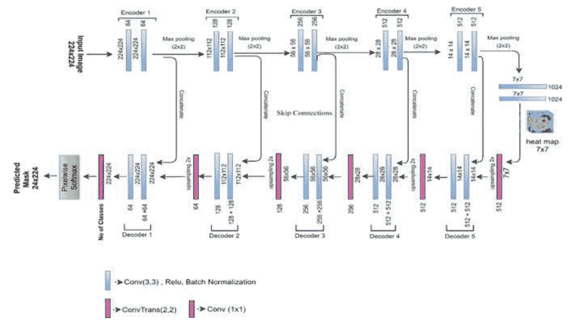

上下文和扩展路径有助于准确的定位。解码器中的上采样使用转置卷积来完成。本研究中使用 UNet 架构如图 2 所示。

### 4.2 SegNet

本文探讨了用于场景理解应用的分割架构 SegNet [11]，该架构在内存和计算时间方面都很高效，用于自动从卫星图像中检测太阳能电池板。SegNet 架构由编码器和解码器组成，类似于 UNet，但在解码器部分的上采样方式不同。UNet 解码器部分用于上采样的反卷积层在时间和内存上消耗较大，因为上采样是使用可学习模型进行的，这意味着上采样的滤波器在训练过程中被学习。SegNet 架构通过计算和记忆最大池化索引来替代可学习的上采样，并在相应的解码器块中使用这些索引来上采样特征，从而产生稀疏特征图。然后，它使用可训练的滤波器进行正常卷积，以使这些稀疏特征图变得密集。

然而，与 UNet 中的特征传输不同，这里没有跳跃连接。使用最大池化索引会减少模型参数的数量，从而减少训练时间。本研究中使用 SegNet 架构如图 3 所示。图 4 中展示了最大池化索引的概念，同时也区分了 UNet 和 SegNet 架构中的上采样过程。

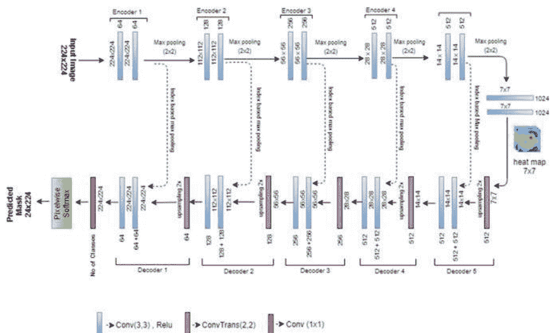

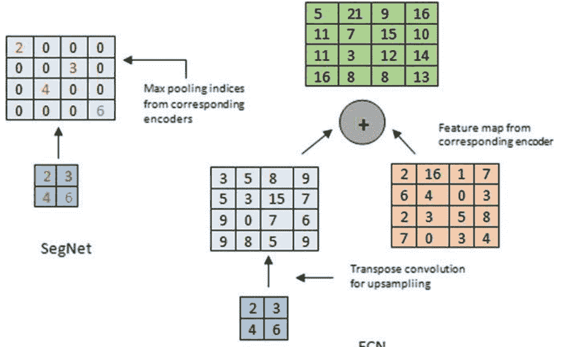

### 4.3 扩张网络


本文探讨了在语义分割中使用扩张卷积进行上下文聚合的方法 [13]，并将其应用于卫星图像中太阳能电池板的自动检测。特征上下文聚合在不损失分辨率或使用图像的重新缩放版本的情况下进行。它引入了一个包含 7 层的上下文模块，其中包括 3×3 卷积和应用不同速率的扩张卷积 -1、1、2、4、8、16、1。最后一次卷积是一个 1×1×C 卷积，用于生成模块的最终输出。该架构使用两种类型的上下文模块 - 基本模块和大型上下文模块。基本模块在整个模块中包含相同数量的通道（C），而大型上下文模块则包含递增的通道数（C）作为输入。该架构引入了另一个称为前置模块的模块，它是在 Vgg Net 的基础上构建的，通过移除最后两个池化层和跨步层，并在后续层中添加扩张卷积。最后，它在前置模块中添加了一个上下文模块，用于进行密集的语义预测和上下文文化。该架构如图 5 所示。图 6 展示了具有不同扩张率的 2D 扩张卷积。

### 4.4 PSPNet

PSPNet [23] 通过引入金字塔池化模块来捕捉全局上下文信息，以更好地对小物体进行分类，从而实现对卫星图像中太阳能电池板的自动检测。小物体很难找到，但在整体场景分类中具有重要性。金字塔池化模块收集全局上下文信息以及子区域上下文，用于不同类别的分类。

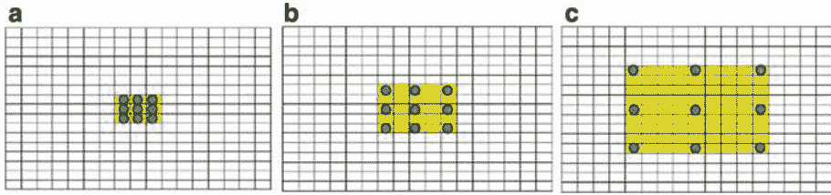

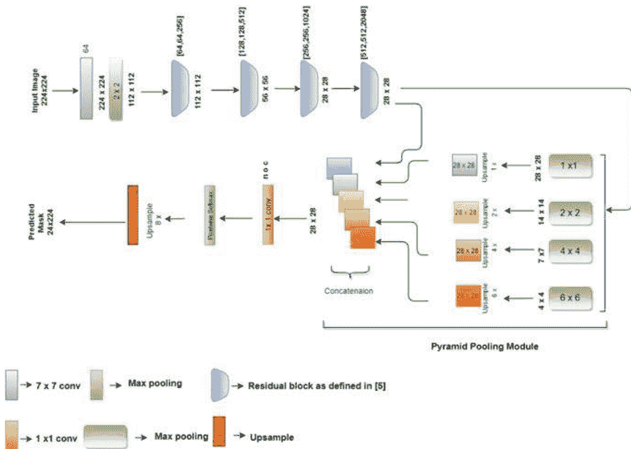

物体。金字塔池化模块使用四种不同的池化操作：1×1，2×2，3×3 和 6×6。池化操作生成不同子区域的特征图，并形成不同位置的池化表示。这些池化操作的输出特征图大小各不相同。然后使用双线性插值将这些特征上采样到输入分辨率大小。金字塔的级数和每个级别的大小可以进行修改。PSPNet 的架构如图 7 所示。

### 4.5 DeepLab v3+

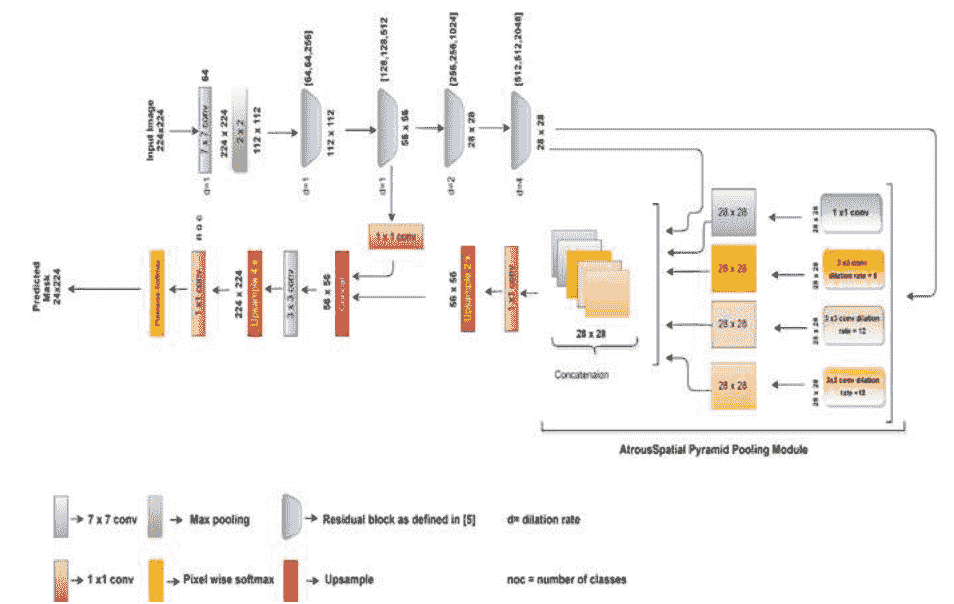

DeepLab v3+ [12] 利用编码器 - 解码器结构进行密集语义分割，用于卫星图像中太阳能电池板的自动检测。

编码器 - 解码器结构具有两个优点：(i) 通过在多个速率和多个有效视野下使用滤波器或池化操作来编码多尺度上下文信息，(ii) 通过逐渐恢复空间信息来捕捉更清晰的物体边界，这是通过使用跳跃连接实现的。它还具有一个额外的简单有效的解码器模块，以特别改善物体边界的分割结果。

它还将深度可分离卷积应用于 Atrous 空间金字塔池化和解码器模块，从而实现更快、更强大的编码器 - 解码器网络。图 8 给出了详细的编码器和解码器结构。

### 4.6 扩张残差网络

扩张残差网络 [14] 在残差网络中使用扩张卷积进行分类，并探索了用于卫星图像中太阳能电池板自动检测的分割任务。在卷积网络中，由于多次使用池化和步幅操作，特征图的空间大小不断减小。

这种空间结构的损失限制了模型在

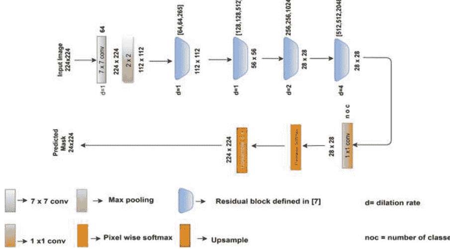

分类和分割任务的能力。扩张残差网络在残差网络中引入了扩张卷积，增加了特征图的感受野，而不增加参数。扩张残差网络还开发了一种有效的扩张策略，用于处理由于扩张率在连续层之间增加而导致的网格化问题。通过去除第 4 个块和第 5 个块的第一层的步幅，并在第 4 个块的其余层和第 5 个块的第一层引入扩张率为 2，在第 5 个块的其余层引入扩张率为 4，将残差网络转换为扩张残差网络。预测由 1×1×C 层产生，其中 C 是类别数。产生的特征响应的分辨率为原始图像分辨率的 1/8，并通过双线性上采样得到与输入图像相同的分辨率。图 9 显示了一个扩张残差网络。

## 5 结果和讨论

#### 5.1 使用的数据集

本研究的目的是使用深度学习分割技术在卫星图像中检测建筑物和地表上太阳能电池板的位置。分割过程的训练步骤需要包含图像和相应掩膜的数据集，这些掩膜用作地面真实值。掩膜突出显示与太阳能电池板相对应的像素。由于不公开提供包含图像和相应掩膜的数据集，因此决定

在训练模型之前，使用 [18] 中描述的数据集并为该数据集准备掩码。该数据集包含加利福尼亚州四个城市的 601 个 TIF 正射影像，并包含约 19,000 个太阳能电池板的地理空间坐标和顶点，分布在所有影像中。本研究使用了弗雷斯诺市的图像。每个图像为 5000-5000 像素，覆盖面积为 2.25 平方千米。这些图像包含城市、郊区和农村景观类型，使模型能够在多样化的图像上进行训练。利用与每个图像相关联的太阳能电池板的顶点，创建了对应太阳能电池板的白色像素多边形区域，并将其余像素设置为黑色像素表示背景。图 10 显示了一个尺寸为 5000-5000 像素的样本图像及其尺寸为 224-224 像素的子图像。

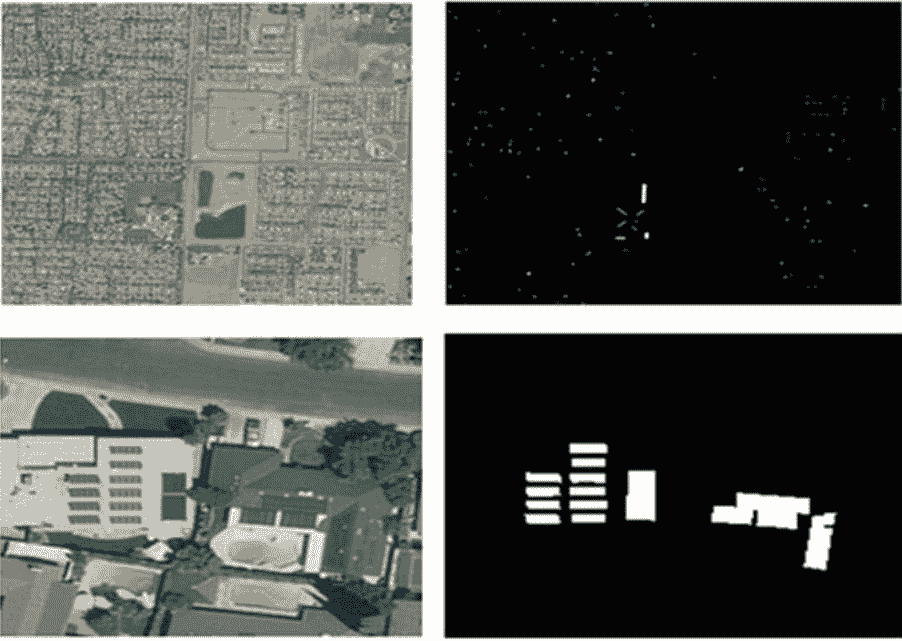

为了使模型更加健壮，进行了数据增强以减少过拟合并提高泛化能力。通过对图像进行水平翻转和垂直翻转来实现增强。这两种增强方法在训练模型和提高分割准确性方面证明是有用的。

#### 5.2 训练

所有架构都是用 Python 实现的，并在配备 Nvidia Tesla K40 (12 GB) GPU 和 30 GB RAM 的工作站上进行了训练。由于 5000 × 5000 的图像尺寸对于训练来说太大，需要高配的 GPU 和 RAM 配置，因此图像及其对应的掩码已被裁剪为 224 × 224 的尺寸。共选择了 1118 个裁剪图像进行增强和训练。测试是在相同尺寸的图像裁剪上进行的。使用 Adam 的学习算法，ResNet-based 模型的学习率为 10^-5，VggNet-based 模型的学习率为 10^-4。训练是从头开始的，没有进行任何预训练或迁移学习。使用了 15 个 epoch 作为早停准则来停止模型训练。

#### 5.3 性能指标和损失函数

本研究中使用的性能度量指标是 Dice 系数 (f1 得分) ，它是分割中最常用的指标之一。该指标用于量化地面实况标注分割区域与模型预测分割区域的相似程度。它定义为两个区域的交集 (重叠部分) 与并集的比值。给定由 X 和 Y 表示的两组像素，Dice 系数指数定义如下：

$DC = (2 * |X ∩ Y|) / (|X ∪ Y|)$ (1)

Dice 系数的值范围从 0 到 1。接近 1 的值意味着两个区域之间有更多的重叠和相似性，因此模型的预测分割更准确。

本研究中使用的损失函数是 Dice 损失 (DL) ，它源自 Dice 系数，并由 [24] 使用，定义如下：

$DL = 1 - DC$

其中 DL 是 Dice 损失，DC 是上述 (1) 中定义的 Dice 系数。Dice 损失用于在训练过程中优化 DC 的值。

#### 5.4 实验结果

实验结果是通过使用增强和原始数据集获得的。这里报告了增强和原始数据集的训练、验证和测试的 Dice 系数和损失结果。

表 1 显示了 UNet 模型在增强和原始数据集上的训练、验证和测试的 Dice 系数和损失结果。从表 1 可以看出，增强数据集有助于提高训练、验证和测试的准确性结果。图 11 显示了 UNet 模型在增强和原始数据集上的训练、验证和测试的 Dice 系数柱状图。从图 11 可以观察到，数据增强对 UNet 模型的数据集训练、验证和测试产生了更好的 DC 值。

表 2SegNet 模型上的结果

| 模型 | 数据集类型 | 训练结果 |  | 验证结果 |  | 测试结果 |  |
|---|---|---|---|---|---|---|---|
|  |  | DC | 损失 | DC | 损失 | DC | 损失 |
| UNet | 增强 | 0.8826 | 0.1173 | 0.8867 | 0.1132 | 0.8963 | 0.1036 |
|  | 原始 | 0.8750 | 0.124 | 0.8819 | 0.1181 | 0.8943 | 0.1056 |

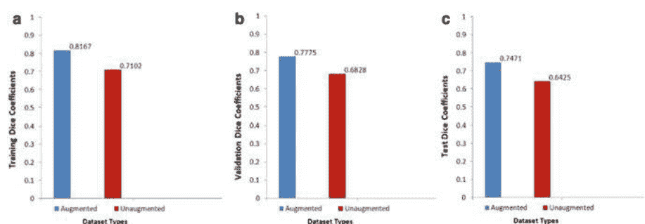

表 1

## 从高分辨率图像中自动检测太阳能电池板...

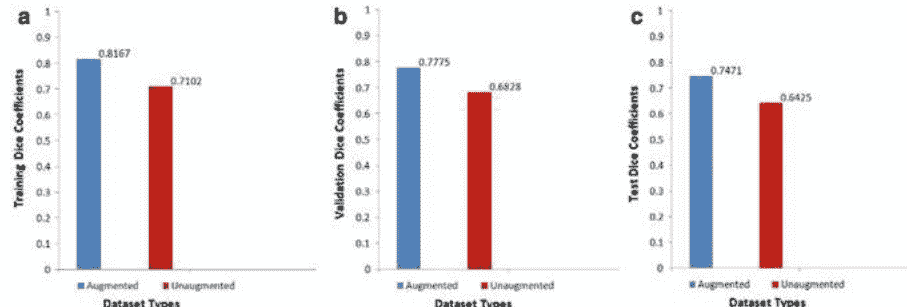

图12 在SegNet模型上增强和原始数据集的Dice系数。a训练过程的结果。b验证过程的结果。c测试过程的结果

在SegNet模型上，训练、验证和测试数据集的DC值得到了改善。

表3显示了在Dilated Net模型上训练、验证和测试增强和原始数据集的Dice系数和损失结果。从表3可以看出，增强数据集有助于提高训练、验证和测试的准确性结果。与Dilated Net模型上原始数据集的结果相比，增强数据集在Dilated Net模型上的训练、验证和测试的Dice系数结果提高了约1-2%。图13显示了在Dilated Net模型上训练、验证和测试增强和原始数据集的Dice系数柱状图。从图13可以观察到，

表3 扩张网络结果

## 表4 PSPNet结果

| 模型 | 数据集类型 | 训练结果 (DC) | 训练结果 (损失) | 验证结果 (DC) | 验证结果 (损失) | 测试结果 (DC) | 测试结果 (损失) |
|---|---|---|---|---|---|---|---|
| PSPNet | 增强 | 0.6025 | 0.397 | 0.5527 | 0.4472 | 0.5091 | 0.4908 |
|        | 原始 | 0.6122 | 0.3877 | 0.4102 | 0.5897 | 0.4181 | 0.5818 |

数据增强在扩张网络模型的训练、验证和测试数据集的DC值方面取得了更好的结果。

表4显示了PSPNet模型上训练、验证和测试增强和原始数据集的Dice系数和损失结果。从表4可以看出，增强数据集有助于提高验证和测试的准确性结果。

在PSPNet模型上，增强数据集的验证和测试Dice系数结果相比于原始数据集的结果提高了约9-15%。然而，增强数据集在PSPNet模型上的训练Dice系数结果下降。这意味着需要更多的epochs来训练具有更大数据集的PSPNet。

图14显示了PSPNet模型上训练、验证和测试增强和原始数据集的Dice系数柱状图。从图14可以看出，数据增强对PSPNet模型上验证和测试数据集的DC值产生了更好的结果。

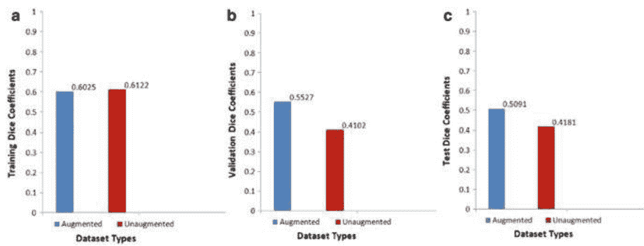

图14 PSPNet模型上增强和原始数据集的Dice系数。a训练过程的结果。b验证过程的结果。c测试过程的结果

## 表5 DeepLab v3+模型的结果

| 模型 | 数据集类型 | 训练结果 (DC) | 训练结果 (损失) | 验证结果 (DC) | 验证结果 (损失) | 测试结果 (DC) | 测试结果 (损失) |
|---|---|---|---|---|---|---|---|
| DeepLab v3+ | 增强 | 0.7572 | 0.2427 | 0.6410 | 0.3589 | 0.6610 | 0.3389 |
|            | 原始 | 0.7877 | 0.2122 | 0.5654 | 0.4345 | 0.5713 | 0.4286 |

表5显示了在DeepLab v3+模型上训练、验证和测试增强和原始数据集的Dice系数和损失结果。从表5可以看出，增强数据集有助于提高验证和测试的准确性结果。在DeepLab v3+模型上，增强数据集的Dice系数的验证和测试结果与DeepLab v3+模型上原始数据集的结果相比提高了约7-9%。然而，增强数据集在DeepLab v3+模型上的训练结果的Dice系数下降。这意味着需要更多的轮次来训练具有更大数据集的DeepLab v3+模型。

图15展示了DeepLab v3+模型上训练、验证和测试的Dice系数条形图，包括增强和原始数据集。从图15可以观察到，数据增强对DeepLab v3+模型上验证和测试的DC值产生了更好的效果。

表6显示了Dilated ResNet模型上训练、验证和测试的Dice系数和损失结果，包括增强和原始数据集。从表6可以看出，增强数据集有助于提高验证和测试的准确性结果。在Dilated ResNet模型上，增强数据集的验证和测试Dice系数结果相比原始数据集提高了约5-9%。然而，在Dilated ResNet模型上，增强数据集的训练Dice系数结果下降。这意味着需要更多的epochs来训练具有更大数据集的Dilated ResNet模型。

图16显示了Dilated ResNet模型上训练、验证和测试的Dice系数条形图，包括增强和原始数据集。从中可以观察到

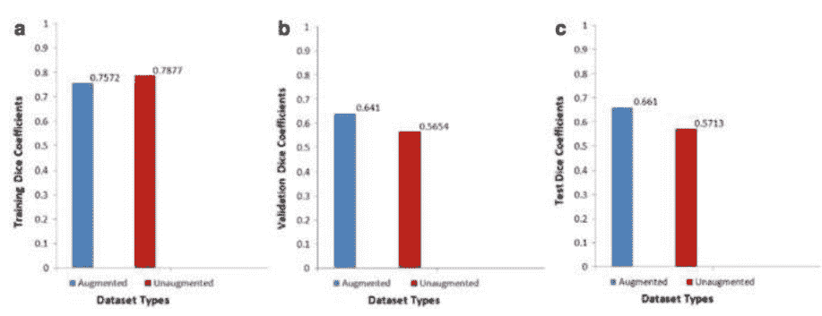

图15 DeepLab v3+模型上增强和原始数据集的Dice系数。a训练过程的结果。b验证过程的结果。c测试过程的结果

表6 Dilated ResNet模型的结果

| 模型 | 数据集类型 | 训练结果 (DC) | 训练结果 (损失) | 验证结果 (DC) | 验证结果 (损失) | 测试结果 (DC) | 测试结果 (损失) |
|---|---|---|---|---|---|---|---|
| Dilated ResNet | 增强 | 0.7164 | 0.2835 | 0.6766 | 0.3233 | 0.6307 | 0.3692 |
|                | 原始 | 0.7498 | 0.2501 | 0.6203 | 0.3796 | 0.5434 | 0.4565 |

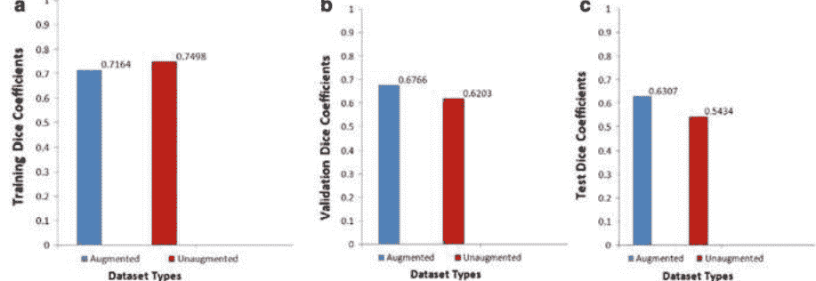

图16 Dilated ResNet模型上增强和原始数据集的Dice系数。a训练过程的结果。b验证过程的结果。c测试过程的结果

从图16可以看出，数据增强对验证和测试数据集在Dilated ResNet模型上产生了更好的DC值。

图17总结了在六个模型上测试增强和原始数据集的Dice系数结果，以条形图的形式呈现。条形图表明UNet模型产生了最好的DC值，意味着UNet模型产生了最佳的分割准确性结果，其次是SegNet和DilatedNet模型。

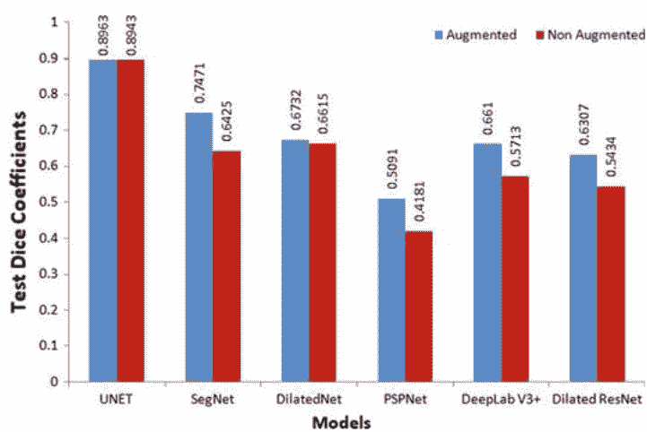

图17 六个模型上测试增强和原始数据集的Dice系数

## 6 结论

本研究描述了使用深度学习分割模型从卫星图像中自动检测太阳能电池板。该研究全面讨论了深度学习分割架构、各种编码、解码和上采样技术在深度学习分割过程中的应用。用于自动检测太阳能电池板的六种架构包括UNet、SegNet、Dilated Net、PSPNet、DeepLab v3+和Dilated Residual Net。数据集包括加利福尼亚州四个城市的卫星图像。训练模型时使用了224×224的图像尺寸。结果表明，使用编码器和解码器模块的UNet深度学习架构产生了最佳的分割准确性结果。此外，数据集增强进一步提高了分割准确性结果。

## 参考文献

1. M.A. Wani, 增量式混合方法用于微阵列分类, 在2008年第七届机器学习和应用国际会议上 (IEEE, 2008), pp. 514-520.
2. M.A. Wani, R. Riyaz, 一种基于最大簇扩展的紧凑性度量的新簇有效性指数。Int. J. Intell. Comput. Cybern. (2016)
3. M.A. Wani, R. Riyaz, 一种基于点密度的聚类基因表达有效性指数。国际数据挖掘生物信息学杂志 17(1), 66-84 (2017)
4. R. Riyaz, M.A. Wani, 基于本地和全局数据扩展的确定数据集中聚类数的指数, 在2016年第15届IEEE国际机器学习和应用会议(ICMLA)(IEEE, 2016), pp. 651-656
5. F.A. Bhat, M.A. Wani, 主要经典人脸识别技术的性能比较, 在2014年第13届国际机器学习和应用会议 (IEEE,2014), pp. 521-528
6. M.A. Wani, M. Yesilbudak, 使用多尺度子空间网格和决策树识别风速模式。国际可再生能源研究杂志(IJRER) 3(2), 458-462 (2013)
7. M.R. Wani, M.A. Wani, R. Riyaz, 基于聚类的模式挖掘预测风速, 在2016年IEEE可再生能源研究和应用国际会议(ICRERA)(IEEE, 2016), pp. 1046-1050
8. M.A. Wani, F.A. Bhat, S. Afzal, A.L. Khan, 深度学习进展(Springer, 2020)
9. J. Long, E. Shelhamer, T. Darrell, 全卷积网络用于语义分割, 在IEEE计算机视觉和模式识别会议上, 3431-3440页 (2015)
10. O. Ronneberger, P. Fischer, T. Brox, U-net: 用于生物医学图像分割的卷积网络, 在医学图像计算与计算辅助干预国际会议上(Springer, Cham, 2015), 234-241页
11. V. Badrinarayanan, A. Kendall, R. Cipolla, Segnet: 一种用于图像分割的深度卷积编码器-解码器架构。IEEE模式分析与机器智能交互。 39(12), 2481-2495页 (2017)
12. L.C. Chen, Y. Zhu, G. Papandreou, F. Schroff, H. Adam, 带有空洞可分离卷积的编码器-解码器用于语义图像分割, 在欧洲计算机视觉会议(ECCV)论文集(2018), 第801-818页
13. F. Yu, V. Koltun, 通过扩张卷积进行多尺度上下文聚合, 在ICLR(2016)
14. F. Yu, V. Koltun, T. Funkhouser, 扩张残差网络，在IEEE计算机视觉与模式识别会议论文集(2017)，第472-480页
15. J. Camilo, R. Wang, L.M. Collins, K. Bradbury, J.M. Malof, 应用语义分割卷积神经网络进行太阳能光伏阵列的准确自动检测和映射(2018). arXiv预印本 arXiv:1801.04018
16. J.M. Malof, L.M. Collins, K. Bradbury, 一种带有预训练的深度卷积神经网络，用于航空影像中太阳能光伏阵列的检测，在2017年IEEE国际地球科学与遥感研讨会(IGARSS)论文集(IEEE, 2017)，第874-877页
17. J. Yuan, H.H.L. Yang, O.A. Omitaomu, B.L. Bhaduri, 使用深度卷积网络从航空图像中进行大规模太阳能电池板映射，在2016年IEEE国际大数据会议（Big Data）中（IEEE, 2016），第2703-2708页
18. K. Bradbury, R. Saboo, T.L. Johnson, J.M. Malof, A. Devarajan, W. Zhang, R.G. Newell, 用于遥感目标识别的分布式太阳能光伏阵列位置和范围数据集。科学数据3，160106（2016）
19. K. Simonyan, A. Zisserman, 用于大规模图像识别的非常深的卷积网络（2014年）。 arXiv预印本arXiv:1409.1556
20. K. He, X. Zhang, S. Ren, J. Sun, 用于图像识别的深度残差学习，在IEEE计算机视觉和模式识别会议论文集（2016年），第770-778页
21. G. Huang, Z. Liu, L. Van Der Maaten, K.Q. Weinberger, 密集连接的卷积网络，在IEEE计算机视觉和模式识别会议论文集（2017年），第4700-4708页
22. H. Noh, S. Hong, B. Han, 学习反卷积网络进行语义分割，在IEEE国际计算机视觉会议论文集(2015)，页码1520-1528
23. H. Zhao, J. Shi, X. Qi, X. Wang, J. Jia, 金字塔场景解析网络，在IEEE国际计算机视觉和模式识别会议论文集(夏威夷，美国，2017)，页码2881-2890
24. F. Milletari, N. Navab, S.A. Ahmadi, V-net: 用于体积医学图像分割的全卷积神经网络，在2016年第四届三维视觉国际会议论文集(IEEE, 2016)，页码565-571

## 训练深度学习序列模型以理解驾驶员行为


Shokoufeh Monjezi Kouchak 和 Ashraf Gaffar

## 摘要
驾驶员分心是美国致命车祸的主要原因之一。使用机器学习和深度学习模型分析驾驶员行为是一种新兴的解决方案，可以检测异常行为并警示驾驶员。具有记忆的模型，如LSTM网络，在汽车安全应用中优于无记忆模型，因为驾驶是一项连续的任务，并且考虑驾驶数据序列中的信息可以提高模型的性能。在这项工作中，我们使用了我们在八个驾驶环境中收集的时间序列驾驶数据来衡量驾驶员的分心情况。我们的模型还能够检测导致分心的行为类型。我们将驾驶员与车载信息娱乐系统的互动作为分心活动。多层神经网络(MLP)被用作基准，构建并训练了两种类型的LSTM网络，包括带有注意力机制的LSTM模型和带有编码器-解码器模型的注意力机制，以分析记忆和注意力对模型的计算开销和性能的影响。我们将这两种复杂网络的性能与MLP在估计驾驶员行为方面进行了比较。我们展示了我们的带有注意力机制的编码器-解码器模型在使用LSTM网络与注意力机制增强MLP网络的训练过程中的性能优于LSTM注意力模型。

**关键词：** 双向 · LSTM网络 · 注意力网络 · 驾驶员分心 · 深度学习 · 编码器-解码器

S. M. Kouchak · A. Gaffar (✉)
亚利桑那州立大学，坦佩，美国
e-mail: agaffar@asu.edu

S. M. Kouchak
e-mail: smonjezi@asu.edu

© 编辑（如适用）和作者，独家许可给Springer Nature Singapore Pte Ltd. 2021
M. A. Wani等（编），深度学习应用，第2卷，智能系统与计算进展1232,
https://doi.org/10.1007/978-981-15-6759-9_6

### 1 引言

驾驶员分心是美国致命车祸的主要原因之一，而且尽管它正在成为一种流行病，但是它是可以预防的[1]。根据NHTSA的报告，2017年有3,166人死于由分心驾驶引起的致命车祸，占所有死亡人数的8.5% [2,3]。分心驾驶是指任何使驾驶员注意力从驾驶的主要任务转移的任务，例如发短信，阅读，与其他乘客交谈以及使用车辆信息娱乐系统[4,5]。

发送短信是最分散注意力的任务，因为司机需要将目光从道路上移开约五秒钟来阅读或发送短信。如果司机以每小时45英里的速度行驶，他们将在没有看到道路的情况下行驶了一个足球场的长度[4]。

驾驶员分心被认为是驾驶任务优先级的失败，因为他们更多地关注次要任务，如阅读短信或调节收音机，而忽视了驾驶的主要任务。分心有四种类型。

- 视觉分心：任何使驾驶员将目光从道路上移开的任务。
- 手动分心：指驾驶员将双手离开方向盘[6]。
- 认知分心：任何使驾驶员注意力从驾驶的主要任务转移的任务[7]。
- 音频分心：任何干扰车内重要声音的噪音，如警报声或车外的救护车警笛声[8]。

设计车辆友好的用户界面[9]，先进的驾驶员辅助系统(ADAS)[10-12]和自动驾驶汽车(AV)[13]是解决问题的一些方法。车辆辅助系统，如车道保持和自适应巡航控制通过自动化困难或重复的任务来减少人为错误。尽管它们可以增强驾驶员的安全性，但它们也有一些局限性，因为它们通常只在预定的情况下工作。例如，碰撞缓解系统基于算法这些算法是由系统开发人员定义的，用于涵盖可能在交通中导致碰撞的特定情况。这些算法无法识别一系列危险可能导致事故的情况。它们通常只能检测和防止有限数量的预定义威胁情况[14]。自动驾驶汽车可以使用各种传感器（如雷达和激光雷达）感知其环境，并在有限或没有人类参与的情况下移动汽车。它们面临一些挑战，如处理驾驶员车辆，不适合的道路基础设施和网络安全。从长远来看，当这些挑战得到解决时，自动驾驶汽车可以提高汽车安全性，减少通勤时间和成本[15]。

使用机器学习方法监测和分析驾驶员行为以检测异常行为是提高汽车安全性的新兴解决方案[16]。由于分心引起的心理负荷增加会导致人为错误，这是车祸的主要原因之一。工作负荷很难观察和量化；因此，分析驾驶员行为以区分正常和激进驾驶行为可以作为检测驾驶员分心并提醒驾驶员暂时控制汽车的合适方法[17]。驾驶数据和驾驶员状态可以从内部来源（如车辆的车载计算机和数据总线）以及摄像头等外部设备收集的数据可以用于训练各种机器学习方法，如马尔可夫模型、神经网络和决策树，以学习驾驶模式并检测异常驾驶行为[18-22]。

卷积神经网络、LSTM网络和编码器-解码器等深度学习方法在行人检测和驾驶行为分类等汽车安全应用中表现优于其他机器学习方法[23-26]。一些机器学习和深度学习方法根据模型当前的输入做出即时决策。在一些实际应用中，如驾驶，每个数据样本对多个后续样本都有影响，因此使用时间维度并添加记忆和注意力可以从数据序列中提取更多代表行为的信息，从而提高这些应用的准确性。

在这项工作中，我们使用了三个模型，包括多层神经网络（MLP），带有注意力层的LSTM网络和编码器-解码器模型，仅使用驾驶数据来预测驾驶员状态。不使用摄像头或驾驶员穿戴式传感器等侵入性设备。这使得我们的方法更加用户友好，并增加了在工业中的适应性。MLP模型被视为基准和无记忆模型。另外两个模型考虑了输入和输出之间的加权依赖关系[27, 28]。这提供了对网络模型进展的即时反馈，从而提高了其预测准确性并减少了训练时间。我们从单输入-单输出神经网络开始，并将该模型的准确性和训练过程与具有注意力机制的LSTM模型进行了比较，后者是多输入-单输出模型，具有记忆和注意力。

具有注意力机制的LSTM模型在较少的训练周期内实现了较小的训练和测试误差。MLP的平均训练周期为400，LSTM注意力为100。此外，LSTM注意力模型的层数较少。之后，我们使用具有注意力机制的编码器-解码器来估计驾驶行为序列，使用多输入-多输出模型。我们将实现的结果与其他两个模型进行了比较。该模型的训练和测试误差小于其他两个模型，并且可以估计多个驾驶行为向量。

第2节讨论了一些相关工作。第3节描述了实验。第4节解释了实验中收集到的数据的特点。我们在第5节讨论方法论。第6节讨论了三个模型的细节。第7节是结果，第8节是结论。

### 2 相关工作

W Ilmer等人[29]讨论了一种驾驶员分心检测方法。这种方法的目标是使用LSTM网络对头部跟踪和驾驶数据的上下文进行建模。在德国的一条直路上，30名志愿者驾驶奥迪车，每个方向都有一条车道，限速100公里/小时进行了一次实验。分心驾驶数据是通过一个接口收集的，用于测量车辆的CAN总线数据和安装在车舱中的头部跟踪系统。选择了八个分心任务包括收音机、CD、电话簿、导航兴趣点、电话、导航、电视和导航声音。分心功能通过八个硬按键实现，这些按键位于界面的左侧和右侧。

总共进行了 53 次无干扰和 220 次分心的运行。从 CAN 总线和头部跟踪系统收集的数据被馈送到 LSTM 网络中，以连续预测驾驶员的状态。该模型的准确率达到了 96.6%。尽管这种方法具有很高的准确性，但它需要一些不在所有汽车上可用的外部设备，并且常常被驾驶员视为干扰。此外，它只考虑了一个驾驶环境和一条直路。如果推广到复杂的驾驶环境，需要进行更多的工作来测试模型的性能准确性，因为引入其他类型的道路和驾驶条件会导致更复杂的上下文数据，从而需要区分更多的模式。

Xu 等人 [30] 提出了一种带有注意机制的图像字幕模型。它受到语言翻译模型的启发。该模型的输入是一张原始图像，它生成一个描述输入图像的字幕。在这个模型中，编码器使用中间层提取图像的特征，而不是使用全连接层。解码器是一个 LSTM 网络，它将字幕生成为一个词序列。该模型在使用 METEOR 和 BLEU 指标的三个基准数据集上表现良好。

Xiao 等人 [31] 讨论了一个图像分类模型。它在深度卷积神经网络中使用了一个两级注意模型来进行细粒度图像分类。细粒度分类是在一些基本类别下检测细分级别的类别。该模型基于这样的直觉，即对于细粒度分类，首先需要检测对象，然后在下一步中检测对象的有区别的部分。对于对象检测级别，该模型使用原始图像并去除噪声来检测对象并对其进行分类。在第二级中，它使用中级 CNN 滤波器来过滤图像的部分并使用 SVM 分类器来对图像的部分进行分类。该模型在 ILSVRC 2012 数据集的子集和 CUB200 2011 数据集上进行了验证，并在最弱的监督条件下显示出良好的性能。

黄等人 [32] 提出了一种带有注意力的机器翻译模型，用于将图像标题从英语翻译成德语。模型考虑了图像中的附加信息，以解决语言中的歧义问题。使用卷积神经网络提取图像特征，并将这些特征添加到文本特征中，以增强用于生成目标语言标题的 LSTM 网络的性能。使用图像的区域特征而不是一般特征。总的来说，该模型的最佳性能在 BLEU 分数上提高了 2%，在 METEOR 数据集上提高了 2.3%，相比仅考虑文本信息的模型。

吕等人 [33] 引入了一种深度学习模型，用于交通流量预测，该模型本质上考虑了时间和空间的相关性。该模型使用堆叠自编码器来检测和学习交通流量的特征。交通数据是在加利福尼亚州高速公路系统中的 15000 个检测器上收集的，时间为 2013 年前三个月的工作日。在前两个月收集的数据被使用了。

由于训练数据和测试数据集是在第三个月收集的数据。该模型在中高流量方面表现优于以往模型，但在低流量方面表现不佳。他们将该模型的性能与随机游走预测方法、支持向量机、反向传播神经网络和径向基函数进行了比较。在 86% 的高速公路 15 分钟交通流量预测中，堆叠自编码器模型达到了 90% 以上的准确率，并且优于其他四个浅层模型。

Saleh 等人 [34] 讨论了一种使用堆叠 LSTM 网络进行驾驶行为分类的新方法。 在真实驾驶过程中，使用手机的内部传感器捕获了九个感知数据。 定义了三种驾驶行为，包括正常、瞌睡和激进，并将驾驶行为分类问题建模为时间序列分类问题。 堆叠 LSTM 网络使用一系列驾驶特征向量作为输入，并且网络能够准确地对驾驶行为进行分类。 此外，与基准方法相比，该模型在 U-AH-DriveSet 上取得了更好的结果，该数据集是一个自然驾驶行为数据集。该模型与其他常见的驾驶行为分类方法（包括决策树和多层感知器）进行了比较。决策树和多层感知器的准确率分别为 51% 和 75%，因此该方法的准确率优于它们 86%。

这些研究使用了不同类型的 LSTM 网络来检测驾驶员的行为和驾驶模式。在这项工作中，我们使用了两种类型的 LSTM 网络，包括双向 LSTM 网络和带有注意力层的 LSTM 网络，仅使用驾驶数据来预测驾驶员的行为。我们使用简单的 LSTM 网络作为基准，将这两种网络的结果与简单 LSTM 网络的结果进行比较。

### 3 实验

我们进行了一项实验，观察和建模驾驶员的行为，使用模拟的现代汽车环境收集了大量的驾驶模式，在不同条件下用于训练三个模型，包括 MLP、带有注意力的 LSTM 网络和带有注意力的编码器 - 解码器。实验使用了 Drive Safety Research 模拟器 DS-600 进行，这是一个完全集成的、高性能、高保真度的驾驶模拟系统，包括多通道音频/视觉系统、至少 180°环绕显示、全宽汽车驾驶舱（福特福克斯），包括挡风玻璃、驾驶员和乘客座椅、中央控制台、仪表盘和仪表以及实时车辆运动模拟。模拟的道路沿途提供了三个大屏幕和两个侧面的镜子，提供了沉浸式的道路视图。模拟器提供了不同类型的道路和驾驶环境。我们设计了一个城市道路，包括三个左转和一段曲线高速公路。图 1 显示了设计的道路。图 A 显示了这条道路的起点和终点，图 B 显示了道路的高速公路部分。


本实验定义了四种驾驶情境，包括白天、夜晚、雾天和雾天夜晚。我们使用了一个安卓应用程序来模拟汽车信息娱乐系统。该应用程序托管在基于 Android v4.4.2 的三星 Galaxy Tab4 8.0 上，该设备连接到 Hyper Drive 模拟器。这个设置允许我们控制信息娱乐系统的高度和角度。可拆卸的平板电脑还可以控制屏幕大小和内容。

我们在该应用程序的界面设计中采用了极简主义设计。在这个设计中，应用程序的主屏幕显示了六组汽车应用程序，驾驶员可以在每个组下访问更多功能。在导航的每个步骤中，屏幕上最多显示六个图标；这个数字在信息娱乐界面设计中经过了早期测试并被证明是合适的 [35]。极简主义设计交互允许从主屏幕最多经过四个导航步骤即可访问该界面中的每个应用程序；因此符合 NHTSA 指南 DOT HS 812 108 中关于可接受分心的规定 [3]。这有助于我们规范驾驶员的交互任务，并在不同的驾驶情境之间进行标准化。

#### 3.1 参与者

我们邀请了 35 名志愿者参加我们的模拟实验。每位志愿者被要求进行 45 分钟的模拟驾驶，分为八个驾驶场景，其中包括四个分心和四个非分心的场景。志愿者是我们大学的研究生和本科生，年龄在 20-35 岁之间，至少有两年的驾驶经验。在开始实验之前，每位志愿者接受了 10-15 分钟的培训，直到他们熟悉了汽车界面和在模拟器中的驾驶。我们定义了四种驾驶情境，包括白天、雾天、夜晚和雾天和夜晚。对于每种情境，我们都有一个分心和一个非分心的场景。在非分心的场景中，志愿者被要求专注于驾驶，并尽可能地进行真实驾驶。在分心的场景中，我们通过要求他们在模拟器的信息娱乐系统上执行一些任务来分散驾驶员的注意力。在这个实验中，分散注意力的任务被定义为在设计的汽车界面上到达特定的应用程序。我们根据驾驶员需要从主屏幕到达这些应用程序的导航步骤数将所有可能的应用程序分为三组，并称之为两步、三步和四步任务。

在每个分散注意力的场景中，我们从每个组中选择了一些任务，并要求驾驶员完成它们。我们在任务之间设置了相等的时间间隔。这意味着当驾驶员完成一个任务后，我们会等待几秒钟再要求下一个任务。在分散注意力的场景中，我们观察了驾驶员的行为，并为每个任务收集了四个特征，包括驾驶员在任务期间犯的错误数量，响应时间（显示从要求驾驶员执行任务到任务完成的时间范围），驾驶模式（当前的驾驶场景）以及驾驶员需要通过主屏幕到界面中的特定应用程序完成任务的导航步骤数量。

## 4 数据

模拟器每次行程平均收集了 19000 个数据向量，每个向量包含 53 个与驾驶相关的特征。总计，在 280 次行程中收集了 530 万个数据向量。我们使用配对 t 检验来选择最显著的特征。根据配对 t 检验的结果，我们选择了 10 个驾驶特征，包括速度、速度、方向盘、刹车、横向加速度、车头距离、车头时间、加速度、纵向加速度和车道位置。我们将主数据采样率设置为每秒 60 个样本。虽然高采样率在其他实验中很有用，但使用这个高采样率会使模型的计算成本很高，因此我们对收集到的数据进行了压缩，并将每 20 个样本平均为一个向量。我们制作了一个包含 10 个特征的驾驶相关数据向量的数据集，即$V_c$。在分心的情况下，志愿者总共完成了 2025 个任务。对于每个任务，我们为驾驶员与我们设计的界面进行交互时的驾驶行为定义了四个特征，即$V_h$：

- 1. 每个场景的名称显示驾驶员是否分心，根据我们之前的实验和当前收集到的数据，恶劣（雾、夜晚）和双重恶劣（雾和夜晚）的驾驶环境对驾驶员的表现产生了不利影响。
-任务期间的驾驶员错误数量。我们将错误定义在与界面交互时触碰错误的图标或不遵守驾驶规则。
- 响应时间，即从我们要求驾驶员开始任务到任务完成的时间长度。
- 驾驶员需要通过的导航步骤数量，以达到应用程序并完成任务。所有任务都可以在四个步骤或更少的步骤内完成。

对于每个驾驶员数据向量（$V_h$），模拟器收集了多个汽车数据向量（$V_c$）。与每个任务相关联的 $V_c$ 向量的数量取决于任务的响应时间。为了将 $V_c$ 向量映射到相应的 $V_h$ 向量，我们根据每个行程的任务响应时间将 $V_c$ 向量分成不同长度的块，并将每个块映射到一个 $V_h$ 向量。在（1）中，$N$ 是在行程中执行的任务数量，$per \left(task_i\right)$ 是与任务 _i 相关的行程中 $V_c$ 向量的近似百分比。

$$ \text{per(任务}_i\text{)} = \left( \frac{\text{响应}_i\text{时间}_i}{\sum_{k=1}^{N} \text{响应}_i\text{时间}_k} \right) * 100 \quad (1) $$

我们使用驾驶数据（$V_c$）作为多输入 - 单输出双向 LSTM 网络的输入，以预测相关的驾驶员行为特征向量（$V_h$）。然后，我们在模型中添加了一个注意力层，并分析了其对模型性能的影响。

## 5 方法论

前馈神经网络已经在许多与汽车相关的应用中使用，例如车道偏离和标志检测 [22-25]。在前馈神经网络中，数据从输入层向输出层单向传递，训练过程基于输入数据完全独立的假设。前馈网络对序列或时间的顺序没有任何印象，只考虑当前样本来调整网络的超参数 [36]。我们使用前馈神经网络作为基准模型来估计驾驶员行为，使用驾驶数据作为输入。该模型是一个单输入 - 单输出网络，使用每个任务期间驾驶数据的平均值作为输入，并估计相应的驾驶员行为向量。

在一些实际应用中，如语音识别、驾驶和图像字幕，输入样本不是独立的，序列中有宝贵的信息，因此具有记忆的模型（如循环神经网络）可以胜过无记忆的模型。LSTM 模型在训练的每一步中使用当前样本和先前观察到的数据。它将这两个数据结合起来产生网络的输出 [37]。前馈网络和循环神经网络的区别在于循环神经网络中的反馈环路将先前步骤的信息提供给当前步骤，为网络添加了记忆，这些记忆保存在网络的某些隐藏状态中。带有注意力机制的 LSTM 是一种循环模型，它是双向 LSTM 层和注意力层的组合。LSTM 注意力模型在每个任务中使用所有驾驶数据的加权效果来估计驾驶行为向量 [38]。这个模型既有记忆又有注意力，并且在任务期间考虑了所有驾驶数据，因此我们的假设是这个模型相对于前馈模型更准确。

如果我们想要估计一个驾驶行为序列的长度为 N，
我们有三个选项，包括

- 运行前馈模型 N 次。
- 运行 LSTM 注意力模型 N 次。
- 使用序列到序列模型。

通过使用无记忆的前馈模型，我们失去了样本之间的依赖关系，每个输出都是独立计算的。LSTM 注意力模型对于每个驾驶行为来说更准确，因为模型中有记忆和注意力，但我们失去了输出序列的依赖关系。序列到序列学习考虑了输入和输出序列中的依赖关系和信息。在使用编码器 - 解码器模型的序列到序列学习中，编码器将输入序列编码为上下文向量，解码器使用上下文向量生成输出序列。类似于多输入 - 单输出 LSTM 模型，可以向模型中添加注意力来更准确地检测和学习输入序列中每个输入在当前输出上的权重 [39]。我们决定使用输入和输出序列长度相等的编码器 - 解码器注意力模型。该模型将每个任务期间的驾驶数据的平均值作为输入，将相关的驾驶行为作为输出，类似于前馈模型。如果我们想要考虑所有驾驶数据，类似于 LSTM 注意力模型，序列到序列模型将非常耗费计算资源，因此我们尝试了相同的输入和输出序列长度。

最近的研究 [40] 探讨了不同类型的机器学习，包括无监督学习和卷积神经网络。随着需要解决其他类型的问题的增加，尝试使用不同类型的机器学习解决方案。一个困难的挑战是日益增长的计算需求。因此，采用新的优化方法来减少计算需求，使新的解决方案在技术上可行和可扩展。

## 6 模型

#### 6.1 多层神经网络模型

我们使用缩放和未缩放的数据构建和训练了一个无记忆的多层 (MLP) 神经网络。这个前馈神经网络被认为是与具有注意力和记忆的 LSTM 注意力网络和编码器 - 解码器注意力模型进行比较的基准。

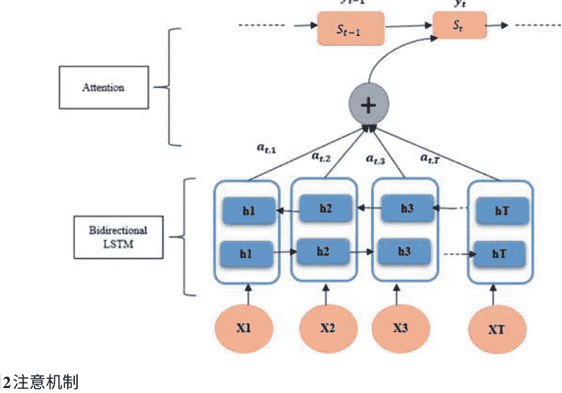

#### 6.2 双向 LSTM 网络与注意力层

注意力是人类认知和智能的基本部分之一 [41,42]。它有助于减少信息处理和复杂性 [43,44]。我们可以宽泛地定义注意力为将一些人类感官 (如视觉) 和思维引导到特定的来源或对象，而不是扫描整个输入空间 [45]。这是一个重要的人类感知组成部分，有助于增加处理能力，同时减少资源需求 [46]。在神经网络领域，注意力主要用作一种记忆机制，确定输入序列的哪个部分对最终输出产生更大的影响 [47,48]。注意机制考虑了每个输入对模型输出的加权影响，而不是从输入序列的所有样本中产生一个上下文向量 (图 2) [49,50]。我们使用注意机制来估计驾驶行为，使用一个包含 10 个特征的驾驶数据向量序列，并考虑每个输入驾驶数据对驾驶行为的加权影响。我们的假设是使用注意机制可以减少模型的训练和测试误差，并增强训练过程。

#### 6.3 编码器 - 解码器注意力

编码器 - 解码器模型是一种多输入 - 多输出的神经网络架构。编码器将输入序列压缩为一个代表性的上下文向量，解码器使用该向量生成输出序列。在带有注意力网络的编码器 - 解码器中，编码器为输出序列提供一个上下文向量。

该上下文向量针对输出序列中的每个输出进行特定的过滤。方程（2）显示了没有注意力的编码器 - 解码器中的输出。在（2）中，$h$ 是编码器的输出向量，包含输入序列中所有样本的信息。

在注意力网络中，编码器为每个输出生成一个向量（3）显示了注意力网络中的编码器输出。

$$h = \text{编码器} (x_1, x_2, x_3, \dots, x_T, t) \quad (2)$$

$$[h_1, h_2, h_3, \dots, h_T] = \text{编码器} (x_1, x_2, x_3, \dots, x_T) \quad (3)$$

解码器每次产生一个输出，模型评分当前输出与编码输入的匹配程度。方程（4）显示了编码输入 $i$ 在步骤 $i$ 中的评分公式。在（4）中，$S_{t-1}$ 表示上一步的输出，$h_i$ 是编码输入 $x_i$ 的结果。在下一步中，使用（5）对分数进行归一化，这是一个"SoftMax"函数。每个时间步的上下文向量使用（6）计算。

$$e_{ti} = a(S_{t-1}, h_i) \quad (4)$$

$$atti_i = \frac{\exp(e_{ti})}{\sum_{j=0}^{T} \exp(e_{ij})} \quad (5)$$

$$C_t = \sum_{j=0}^{T} att_j * h_j \quad (6)$$

图 3 显示了带有注意力机制的编码器 - 解码器模型。双向 LSTM 层在训练的每个步骤中提供对当前样本的前一个和后一个样本的访问。模型中使用了 Keras 的"SeqSelfAttention"层。

该层计算输入序列中每个输入样本对输出序列中每个输出样本的加权影响。我们考虑了输入和输出序列的等长性，如前所述。我们构建并训练了三个不同的模型，包括三个输入和三个输出步骤的模型、四个输入和四个输出步骤的模型以及五个输入和五个输出步骤的模型，如下所述。

## 7 结果

#### 7.1 MLP 结果

我们构建了一个多层感知机（MLP）并使用缩放和未缩放的数据进行了训练。在这个模型中，80% 的数据用于训练，20% 的数据用于测试。我们尝试了不同的层数（2-6）和各种隐藏神经元数量（50-500）的组合。

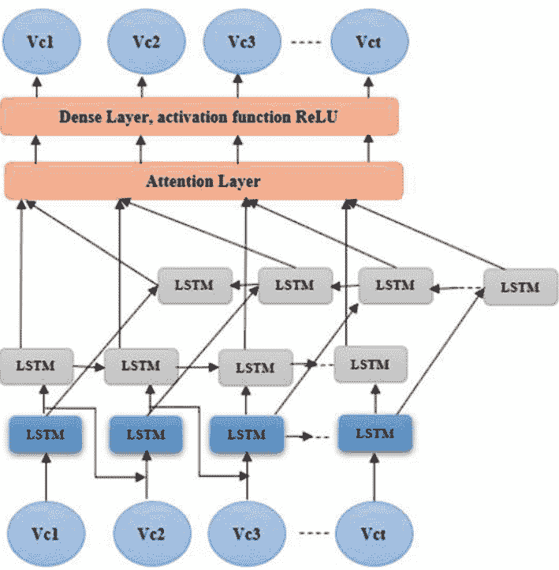

该神经网络的隐藏神经元数量在 50-500 之间。表 1 显示了使用缩放数据获得的一些最佳结果，表 2 显示了使用未缩放数据获得的结果。这些结果显示了训练误差和测试误差之间的巨大差异，这意味着该模型在缩放和未缩放数据上存在过拟合问题，并且在大多数情况下不能很好地泛化。

表 1 带缩放的 MLP 和数据

| 层 | 神经元 | 训练 MAE | 测试 MAE |
|---|---|---|---|
| 两个 | 50 | 0.11 | 0.27 |
| 两个 | 150 | 0.082 | 0.23 |
| 三个 | 50 | 0.096 | 0.24 |
| 三个 | 150 | 0.056 | 0.32 |
| 四个 | 50 | 0.089 | 0.24 |
| 四个 | 150 | 0.012 | 0.2 |

表 2 不带缩放的 MLP 和数据

| 层 | 神经元 | 训练 MAE | 测试 MAE |
| :--- | :--- | :--- | :--- |
| 两个 | 150 | 0.54 | 1.41 |
| 两个 | 300 | 0.39 | 1.51 |
| 三个 | 150 | 0.33 | 1.48 |
| 三个 | 300 | 0.31 | 1.34 |
| 四个 | 150 | 0.4 | 1.46 |
| 四个 | 300 | 0.17 | 1.39 |

#### 7.2 LSTM 注意力结果

在下一步中，我们使用注意力训练了一个 LSTM 网络。我们使用 Adam 优化器作为模型的优化器，并使用平均绝对误差 (MAE) 作为模型的准确性。我们尝试了从 10 到 500 的各种 LSTM 神经元。在这个模型中，80% 的数据集被用作训练集，20% 被用作测试集。表 3 显示了一些不带缩放数据的结果

+   对于不带缩放的数据，最佳结果是使用 20 个神经元，训练误差为 0.85，测试误差为 0.96。与使用更少隐藏神经元的 MLP 模型相比，该模型在测试上取得了更小的误差。

MLP 模型的最佳结果是每层四个隐藏层，每层 300 个神经元，因此与 LSTM 注意力模型相比，MLP 模型的准确性较低且计算成本更高。此外，LSTM 模型加上一个注意力层的性能比具有四个全连接层的大型 MLP 模型更好。此外，MLP 模型的训练过程需要大约 400-600 个 epochs，而 LSTM 模型在大约 100-200 个 epochs 内收敛。

表 3 具有注意力层的双向 LSTM 网络未缩放数据

| LSTM 神经元 | 训练 MAE | 测试 MAE |
| :--- | :--- | :--- |
| 20 | 0.85 | 0.96 |
| 30 | 0.85 | 0.99 |
| 40 | 0.85 | 1.01 |
| 100 | 0.85 | 1 |
| 200 | 0.85 | 0.99 |
| 300 | 0.96 | 0.99 |

表 4 显示了使用缩放数据获得的最佳结果。具有 40 个神经元的模型达到了最小的测试误差，该误差小于所有使用缩放数据的 MLP 网络中的所有情况，除了一个情况，即具有 150 个神经元的 4 隐藏层模型。总的来说，具有缩放数据的 LSTM 注意力模型在所有情况下都比 MLP 更好地泛化，并且在较少的隐藏神经元和较小的网络中实现了更好的性能。

| LSTM神经元 | 训练MAE | 测试MAE |
|---|---|---|
| 30 | 0.23 | 0.24 |
| 40 | 0.22 | 0.22 |
| 60 | 0.22 | 0.23 |
| 100 | 0.24 | 0.25 |
| 150 | 0.22 | 0.23 |
| 200 | 0.23 | 0.23 |

## 7.3 编码器-解码器注意力模型

正如我们之前提到的，为了获得一系列驾驶行为数据向量，我们可以使用序列到序列模型，而不是多输入-单输出模型多次运行。我们选择了编码器-解码器模型作为合适的序列到序列模型。我们构建并训练了包括三步、四步和五步模型在内的编码器-解码器注意力模型，使用缩放和未缩放的数据。在这些模型中，80%的数据用作训练数据集，20%的数据用于测试模型。测试了不同批次大小、激活函数和LSTM神经元数量的组合。最后，我们选择了Adam作为优化器，批次大小为100。我们尝试了从20到500的一系列LSTM神经元。

此外，我们尝试了不同长度的输入和输出序列，从2到6。在四步模型之后，增加序列长度对模型的性能没有积极影响。表5显示了一些使用未缩放数据获得的最佳结果。

平均绝对误差（MAE）被用作该模型的损失函数。三步模型达到了最小误差，即1.5的训练和测试平均绝对误差。四步和五步模型的性能几乎相同。三步模型使用未缩放数据和100个LSTM神经元展现了最佳性能。图4显示了该模型的平均绝对误差。表6显示了使用缩放数据的三个模型的结果。具有250个LSTM神经元的三步模型达到了最小误差（图5）。

未缩放数据的编码器-解码器注意力模型的测试误差接近于使用缩放数据的MLP模型，但该模型的泛化能力更好。

| LSTM神经元 | 序列 | MAE训练 | MAE测试 |
|---|---|---|---|
| 100 | 3 | 1.5 | 1.5 |
| 250 | 3 | 1.51 | 1.52 |
| 100 | 4 | 1.5 | 1.52 |
| 150 | 4 | 1.52 | 1.56 |
| 50 | 5 | 1.52 | 1.52 |
| 250 | 5 | 1.53 | 1.56 |

图4 使用100个LSTM神经元和未缩放数据的三步模型的平均绝对误差

表6 编码器-解码器使用缩放数据的注意力

| LSTM神经元 | 序列 | MAE训练 | MAE测试 |
|---|---|---|---|
| 150 | 3 | 0.1683 | 0.16 |
| 250 | 3 | 0.1641 | 0.16 |
| 100 | 4 | 0.1658 | 0.16 |
| 300 | 4 | 0.1656 | 0.16 |
| 150 | 5 | 0.1655 | 0.16 |
| 400 | 5 | 0.1646 | 0.17 |

图5 使用250个LSTM神经元和缩放数据的三步模型的平均绝对误差

比MLP模型更小且网络更小。此外，它平均在大约50个周期内收敛，比MLP模型平均需要约400个周期的训练速度快得多。此外，该模型可以在一次运行中估计多个驾驶行为向量。该模型在未缩放数据上的误差比LSTM注意力模型大，但该模型的泛化性更好，并且输入样本的数量比LSTM注意力模型少得多，因为该模型为每个驾驶行为向量考虑了一个驾驶数据，因此计算成本较低。

具有缩放数据的编码器-解码器注意力优于MLP模型和LSTM注意力模型。该模型具有与LSTM注意力模型类似的记忆和注意力。此外，它考虑了输出序列样本之间的依赖关系，如果我们多次运行多输入-单输出模型以获得一系列驾驶行为向量，则不可能实现。此外，与LSTM注意力模型相比，该模型的计算成本较低，因为它考虑了每个输出对应的一个输入向量，类似于MLP模型。具有缩放数据的该模型的最小测试误差比LSTM注意力模型的最小测试误差小0.06，比MLP模型的最小测试误差小0.04。

编码器-解码器注意力模型收敛的误差较小，并且所需时间较少，优于其他两个模型。该模型使用未缩放和缩放数据的平均迭代次数在50到100次之间，这是LSTM注意力模型平均迭代次数的一半，是MLP迭代次数的四分之一。此外，与MLP模型相比，该模型使用较少的层数，与LSTM注意力模型相比使用较少的输入样本，使其计算成本较低。它还在每次运行中估计多个驾驶行为数据向量。

## 8 结论

使用机器学习方法监测驾驶员行为并检测可能导致分心的驾驶员不注意是一种新兴的解决方案，用于检测和减少驾驶员分心。在几个汽车安全应用中使用了不同的深度学习方法，如CNN、LSTM和RNN网络。其中一些方法具有记忆功能，因此它们可以从数据序列中提取和学习信息。在驾驶数据序列中有一些无法通过手动处理的信息。驾驶数据样本之间不是相互独立的，因此具有记忆和注意力的方法，如循环模型，是更高智能和更可靠的汽车安全应用的更好选择。

这些方法利用不同的机制来感知样本之间的依赖关系，并提取序列中的潜在信息。我们选择了MLP网络作为基线模型，它是一种简单的无记忆深度神经网络。然后我们训练了一个具有记忆和注意力的LSTM注意力模型。这个模型在缩放和未缩放数据上都优于MLP模型。

该模型训练速度至少比MLP模型快两倍，并取得了更好的结果，性能更好，隐藏神经元更少，网络更小，训练周期更短。

为了获得一系列的驾驶数据，我们有两个选择：多次运行多输入-单输出模型和使用序列到序列模型。我们构建并训练了一个带有缩放和未缩放数据的编码器-解码器注意力模型，以获得一系列驾驶行为数据向量。该模型在缩放和未缩放数据上均优于MLP模型。此外，该模型在缩放数据上优于LSTM注意力模型。编码器-解码器注意力模型的训练速度至少比LSTM注意力模型快两倍，比MLP模型快四倍。此外，在每次运行中，它估计多个驾驶数据向量，并且具有最佳的泛化能力和训练误差与测试误差之间的最小差异。

我们的工作表明，这将是一种可行且可扩展的选择，用于在现实复杂的驾驶环境中工作的深度神经网络模型，而无需使用侵入式设备。它还提供了使用注意力网络可靠地检测驾驶行为的附加优势的客观测量。

## 参考文献

- 1. B. Darrow，分心驾驶现在已经成为美国的流行病，财富（2016年）。http://fortune.com/2016/09/14/distracted-driving-epidemic/
- 2. 国家统计与分析中心，2017年致命事故中的分心驾驶（交通安全事实研究笔记，报告编号 DOT HS 812 700）（华盛顿特区，国家公路交通安全管理局，2019年）
- 3. N. Chaudhary, J. Connolly, J. Tison, M. Solomon, K. Elliott，对加利福尼亚和特拉华州的NHTSA分心驾驶高可见执法示范项目的评估（报告编号 DOT HS 812 108）（华盛顿特区，国家公路交通安全管理局，2015年）
- 4. 国家统计与分析中心，2017年致命事故中的分心驾驶（交通安全事实研究笔记，报告编号 DOT HS 812 700）（华盛顿特区，国家公路交通安全管理局，2019年）
- 5. S. Monjezi Kouchak, A. Gaffar，使用深度神经网络进行驾驶员分心检测，在第五届国际机器学习、优化和数据科学会议上（意大利锡耶纳，托斯卡纳，2019年）
- 6. J. Lee，驾驶员分心的动力学：参与和脱离的过程。Assoc. Adv. Autom. Med. 58, 24-35 (2014)
- 7. T. Hirayama, K. Mase, K. Takeda，分析眼球注视和外围车辆行为之间的时间关系，以检测驾驶员分心。Hindawi Publ. Corp. Int. J. Veh. Technol. 2013, 8 (2013)
- 8. 国家公路交通安全管理局，结束分心驾驶的蓝图。华盛顿特区：美国交通部，国家公路交通安全管理局，DOT HS 811 629 (2012)
- 9. T.B. Sheridan, R. Parasuraman，人机交互。人因和人体工程学评论，1，89-129（2015年）。https://doi.org/10.1518/155723405783703082
- 10. U. Hamid, F. Zakuan, K. Zulkepli, M. Zulfaqar Azmi, H. Zamzuri, M. Rahman, M. Zakaria，具有潜在场风险评估的自主紧急制动系统，用于前方碰撞缓解（IEEE ICSPC，马来西亚，2017年）
- 11. L. Li, D. Wen, N. Zheng, L. Shen，认知汽车：ADAS研究的新前沿。IEEE智能交通系统 13（2012年）
- 12. S. Monjezi Kouchak, A. Gaffar，使用长短期记忆估计驾驶员状态，在机器学习和知识提取中，第三届 IFIP TC 5, TC 12, WG 8.4, WG 8.9, WG 12.9 国际跨领域会议，CD-MAKE 2019（2019年）。https://doi.org/10.1007/978-3-030-29726-8_5
- 13. P. Koopman, M. Wagner，自主车辆安全：一个跨学科的挑战。IEEE智能交通系统杂志 9, 90-96 (2017)
- 14. M. Benmimoun, A. Pätz, A. Zlocki, L. Eckstein，euroFOT：高级驾驶辅助系统的现场操作测试和影响评估：最终结果，在 SAE-China, FISITA (eds) 主办 FISITA 2012 世界汽车大会论文集。电气工程讲义，vol. 197（Springer, Berlin, Heidelberg, 2013）
- 15. S. Monjezi Kouchak, A. Gaffar，未来汽车的确定性：为什么自动驾驶卡车更容易设计，在 IEEE 高级和可信计算（ATC 2017）（旧金山湾区，美国，2017）
- 16. S. Kaplan, M.A. Guvensan, A.G. Yavuz, Y. Karalurt，驾驶行为分析以确保安全驾驶：一项调查。IEEE智能交通系统杂志 16, 3017-3032 (2015)
- 17. A. Aksjonov, P. Nedoma, V. Vodovozov, E. Petlenkov, M. Herrmann，使用机器学习和模糊逻辑检测和评估驾驶员分心行为。IEEE智能交通系统杂志 1-12 (2018). https://doi.org/10.1109/TITS.2018.2857222
- 18. R. Harb, X. Yan, E. Radwan, X. Su，使用分类树和随机森林探索事故前行驶动作。事故分析与预防杂志 41, 98-107 (2009)
- 19. A. Alvarez, F. Garcia, J. Naranjo, J. Anaya, F. Jimenez，使用智能手机和神经网络对电动汽车的驾驶行为进行建模。IEEE智能交通系统杂志 6, 44-53 (2014)
- 20. J. Morton, T. Wheeler, M. Kochenderfer，对驾驶员行为的概率建模的循环神经网络分析。IEEE智能交通系统杂志 18, 1289-1298 (2017)
- 21. A. Sathyanarayana, P. Boyraz, J. Hansen，隐马尔可夫模型对驾驶员行为分析和路线识别的研究，IEEE国际车载电子与安全会议（2008）
- 22. J. Li, X. Mei, D. Prokhorov, D. Tao，用于交通场景中结构预测和车道检测的深度神经网络。IEEE神经网络与学习系统杂志 28, 14 (2017)
- 23. S. Monjezi Kouchak, A. Gaffar，使用行为三角测量方法进行非侵入式分心模式检测，第四届计算科学与计算智能年会 CSCI-ISAI（美国，2017）
- 24. S. Su, B. Nugraha, Fahmizal，利用卷积神经网络和道路车道检测器实现自动驾驶汽车，在2017年第二届自动化、认知科学、光电子系统和信息技术国际会议（ICACOMIT）（雅加达，印度尼西亚，2017年），第5页
- 25. S. Hung, I. Choi, Y. Kim，利用深度学习技术实时分类驾驶员注视区域，在2016年国际大数据和智能计算会议（BigComp）（2016年），第143-148页
- 26. A. Koesdwiady, S. Bedavi, C. Ou, F. Karray，面向驾驶员分心识别的端到端深度学习。Springer International Publishing AG (2017)，第8页
- 27. I. Goodfellow, Y. Bengio, A. Courville，深度学习（The MIT Press, 2016）。ISBN: 9780262035613
- 28. J. Schmidhuber，神经网络中的深度学习概述，第61卷（Elsevier, 2015），pp. 85-117
- 29. M. Wilmer, C. Blaschke, T. Schindl, B. Schuller, B. Färber, S. Mayer, B. Trefflich，在线驾驶员分心检测使用长短期记忆。IEEE Trans. Intell. Transp. Syst. 2(2), 574-582 (2011)
- 30. K. Xu, J.L. Ba, R. Kiros, K. Cho, A. Courville, R. Salakhutdinov, R.S. Zemel, Y. Bengio，展示、关注和讲述：神经图像字幕生成与视觉注意力，在第32届国际机器学习会议（法国里尔，2015）
- 31. T. Xiao, Y. Xu, K. Yang, J. Zhang, Y. Peng, Z. Zhang，两级注意力模型在深度卷积神经网络中的应用，用于细粒度图像分类，在IEEE计算机视觉与模式识别会议（CVPR）（2015年），第842-850页
- 32. P. Huang, F. Liu, S. Shiang, J. Oh, C. Dyer，基于注意力的多模态神经机器翻译，在第一届机器翻译会议论文集（共享任务论文集），卷2（德国柏林，2016年），第639-645页
- 33. Y. Lv, Y. Duan, W. Kang, Z. Li, F. Wang，利用大数据进行交通流量预测：一种深度学习方法。IEEE智能交通系统杂志 16, 865-873 (2015)
- 34. K. Saleh, M. Hossny, S. Nahavandi，基于传感器数据融合的驾驶行为分类，使用LSTM循环神经网络，在IEEE第20届智能交通系统国际会议（ITSC）（2017年）
- 35. A. Gaffar, S. Monjezi Kouchak，极简设计：智能互动信息娱乐系统的优化解决方案，在IEEE IntelliSys国际智能系统和人工智能会议（伦敦，英国，2017年）
- 36. C. Bishop，模式识别与机器学习（Springer）。ISBN-13: 978-0387310732
- 37. M. Majic，使用Python和循环神经网络进行动作识别，第一版（2019年）。ISBN: 978-1798429044
- 38. D. Mandic, J. Chambers，用于预测的循环神经网络：学习算法、架构和稳定性，第一版（Wiley, 2001年）。ISBN: 978-0471495178
- 39. J. Rogerson，循环神经网络和软计算的理论、概念和方法（2015年）。ISBN-13: 978-1632404930
- 40. M.A. Wani, F.A. Bhat, S. Afzal, A.I. Khan，深度学习进展（Springer, 2020）
- 41. A. Gaffar, E.M. Darwish, A. Tridane，用于可扩展性和准确性的异构大数据结构化。Int. J. Digit. Inf. Wirel. Commun. 4, 10-23 (2014)
- 42. A. Gaffar, H. Javahery, A. Seffah, D. Sinnig，用于引出和交付UCD知识和实践的模式框架，在第十届国际人机交互会议论文集（2003），pp. 108-112
- 43. A. Gaffar，枚举移动企业复杂性，以增强设计过程，在2009年高级研究中心协作研究会议论文集（2009），pp. 270-282
- 44. A. Gaffar，生成模式组件的迭代过程，第11届人机交互国际会议（2005年）
- 45. J. Bermudez，认知科学：心智科学导论，第二版（2014年）。ISBN: 978-1107653351
- 46. B. Garrett, G. Hough，大脑与行为：行为神经科学导论，第五版（SAGE）。ISBN: 978-1506349206
- 47. Y. Wang, M. Huang, L. Zhao, X. Zhu，基于注意力的LSTM用于方面级情感分类，在2016年自然语言处理实证方法会议（2016年），第606-615页
- 48. I. Sutskever, O. Vinyals, Q. Le，序列到序列学习与神经网络，神经信息处理系统27（NIPS 2014）的进展（2014年）
- 49. S. Frintrop, E. Rome, H. Christensen，计算视觉注意系统及其认知基础：一项调查。ACM Trans. Appl. Percept. (TAP) 7 (2010). https://doi.org/10.1145/1658349.1658355
- 50. Z. Yang, D. Yang, C. Dyer, X. He, A. Smola, E. Hovy，用于文档分类的分层注意力网络，在NAACL-HLT 2016（加利福尼亚州圣地亚哥，2016年），第1480-1489页

## 利用深度学习挖掘RF数据中的时空相关性

Debashri Roy, Tathagata Mukherjee, Eduardo Pasiliao

**摘要** 无线服务和应用的普遍存在已经成为我们生活的一部分。我们不仅依赖无线技术来使用智能手机，还用于其他应用，如监视、导航、干扰、反干扰、雷达等。近年来，射频（RF）环境中无线技术的这些最新进展已经促使更多的无线系统自主部署。由于对RF频谱的如此大规模依赖，了解环境信号特性对于无线基础设施的最佳部署和高效资源配置至关重要。为了在空间和时间域中最好地利用这些无线资源，了解过去和现在的RF信号知识是重要的。

尽管感知机制可以用来评估当前环境，但学习技术通常用于分析过去的观察结果，并预测给定射频环境中事件的未来发生。机器学习（ML）技术已经在各个领域证明了其有用性，也被用于表征和理解射频环境。射频领域学习技术的一些目标包括发射机或发射源指纹识别、发射源定位、调制识别、特征学习、注意力和显著性、自主射频传感器配置和波形合成。此外，在大规模自主部署的无线通信网络中，一个组件接收到的信号对其他组件的决策过程起着至关重要的作用。为了有效地实现这样的系统，每个组件网络的输出应该是唯一可识别的。包括循环结构的机器学习（ML）技术在使用射频机器学习（RFML）的思想创建这种自主部署方面表现出了潜力。具有自动学习特征能力的深度学习（DL）技术可以用于通过自动利用信号数据中的固有特征对不同射频属性进行表征和识别。在本章中，我们介绍了这种深度学习技术在射频发射机指纹识别任务中的应用。第 1 节集中讨论了深度学习在射频领域的应用领域，可以为未来的自主部署提供支持。第 2 节介绍了不同的深度学习方法，用于发射机指纹识别任务以及通过使用循环神经网络（RNN）模型利用循环结构的重要性。一旦我们建立了基本知识和动机，我们就会深入研究深度学习在发射机指纹识别中的应用。因此，本节讨论了一种利用循环结构的射频设备识别发射机指纹技术，通过利用接收到的射频信号的时空特性。我们提出了三种使用不同类型的单元模型的循环神经网络（RNN）：（i）长短期记忆（LSTM），（ii）门控循环单元（GRU）和（iii）卷积长短期记忆（ConvLSTM）。所提出的模型还使用 Python 实现的框架进行了真实数据验证和评估。第 5 节描述了测试平台设置和实验设计。第 6 节讨论了实验结果、计算复杂性分析和与现有技术的比较。最后一节总结了本章内容。

**关键词：** RF指纹识别、循环神经网络、监督学习、软件定义无线电

D. Roy (✉)  
计算机科学，佛罗里达中央大学，奥兰多，FL 32826，美国  
电子邮件：debashri@cs.ucf.edu

T. Mukherjee  
阿拉巴马大学计算机科学，亨茨维尔，AL 35899，美国  
电子邮件：tm0130@uah.edu

E. Pasiliao  
空军研究实验室弹药总局，埃格林空军基地，瓦尔帕莱索，FL 32542，美国  
电子邮件：eduardo.pasiliao@us.af.mil

© 编辑（如适用）和作者，独家许可给 Springer Nature Singapore Pte Ltd. 2021  
M. A. Wani 等（编）. 深度学习应用，第 2 卷，智能系统与计算进展 1232. https://doi.org/10.1007/978-981-15-6759-9_7

### 1 深度学习在射频领域的应用

我们生活在一个距离每天都在缩小的世界中，这要归功于连接设备的使用激增。无处不在的无线连接物联网（IoT）[56]以及无线自主系统的部署，引领了工业规模部署射频设备的新时代。大规模点对点通信的普及和底层无处不在的网络的特性带来了准确识别射频发射器的挑战。作为大型网络的一部分，每个设备都需要能够以高置信度识别其对等设备，以建立安全通信通道。其中一种方法是通过交换“密钥”[42]进行主机识别。然而，这种方案容易受到恶意代理人[50]的攻击，因为这类系统的实际实现通常不具备密码学安全性。为了解决错误实现的问题，可以使用发射器的固有特性创建一个“指纹”，该指纹可以被发射器识别系统使用。每个发射器，无论多么相似，由于其基础组件（如放大器、滤波器、频率混频器）以及发射天线的物理特性的缺陷，RF信号具有固有特性；这些特性是特定发射机独有的。制造过程中的不准确性和硬件电路的特殊性也对通过特定设备传输的信号的空间和时间特性产生影响。

#### 1.1 发射机识别

这种固有的异质性可以被利用来创建发射机的唯一标识符。其中一种特性是信号 (I/Q数据) 的同相 (I) 和正交 (Q) 相位分量之间的不平衡。然而，由于涉及的发射机数量庞大，手动地对每个发射机进行“指纹”识别是不可行的任务[6]。因此，为了构建这样一个系统，需要一种“自动”提取发射机特征并使用所得的“指纹”进行区分的方法。实现这一目标的一种方式是在适当的“特征空间”中学习发射机的表示，该空间具有足够的区分能力，能够区分“表面上相同”的发射机。因此，“发射机指纹识别”这个概念应运而生，用于发射机分类或识别的任务。在本章的其余部分，我们将“发射机分类”和“发射机识别”这两个短语互换使用。

#### 1.2 调制识别

无线电频率域包括 3 Hz 和 3 THz 之间的广泛电磁频率范围[19]。不同的无线通信类型，如局域网、广播电台、广域网、语音无线电、雷达和其他一些根据需求使用不同的无线电频率带[52]。它们还根据使用的频带和应用领域使用不同类型的调制方案。调制是一种改变要在射频载波上传输的数据的技术。调制识别是识别接收信号的调制类型的任务。为此，调制识别可以用于识别发射机使用的通信类型，即使不知道使用的频带。深度卷积网络在成功分类不同类型的调制方案方面显示出巨大潜力，详细内容将在下一节中介绍。

### 2 在射频领域实施深度学习的两种方法

在本节中，我们介绍了从传统方法到基于深度学习的方法的发射机识别和调制识别研究的演变。首先，我们讨论了一些传统的发射机识别方法。这些传统方法使用手动特征工程，并利用不同的无线电属性（如瞬变或杂散调制）来创建判别特征集。当发射机开启或关闭时，会发送瞬变信号。在这个短暂的时间段（通常为几微秒），电容负载充电或放电。在[18,45,51]中提出了使用基于瞬变的识别的不同分类方法。在[51]中，作者提出了一种基于遗传算法的发射机分类解决方案，基于瞬变信号。在[45]中提出了一种基于多重分形分割技术的方法，使用了相同的瞬变概念。在[18]中提出了另一种基于瞬变的发射机分类方法，使用了 k 最近邻判别分类器。然而，这些传统方法由于特征提取步骤而增加了额外开销，并且解决方案的质量受到所选择特征类型的限制，因此受到专家知识的影响。

为了避免这种开销，基于深度学习[55]的方法可以提供一种高效且自动的学习和特征空间表征的方式，利用发射机固有属性进行学习。它们能够学习和分析大规模部署的固有属性，并用于预测和表征与分类（或回归）的自动特征学习任务相关的参数。

此外，分类任务等同于学习决策边界，神经网络是学习机器算法的自然选择。为此，神经网络以前也被用于调制识别和发射机识别[31,33,40]，特别有吸引力的是，它们能够在不知道先验数据分布的情况下生成准确的模型。

接下来，我们展示了射频领域中基于神经网络的不同类型应用的各种现有努力。我们将讨论分为三个部分：(i) 深度神经网络，(ii) 卷积神经网络和 (iii) 循环神经网络。

#### 2.1 深度神经网络

我们将深度神经网络 (DNNs) 称为具有多层前馈网络和反向传播的网络。在过去几年中，DNNs 已经彻底改变了人工智能领域。DNNs 解决的问题涉及计算机视觉、自然语言处理、语音处理等等。对于其中的一些问题，它们已经被证明比人类表现更好。它们还被证明对于各种任务，它们能够从数据中自动学习区分特征[13]。通过正确选择神经网络架构和相关参数，它们可以计算出任意好的函数逼近[21]。

总的来说，在射频领域中，过去对深度学习的使用有限，只有最近才出现了一些应用[30]。然而，DNNs 已经证明了其在发射机识别任务中的适用性。在[36]中提出了一种基于 DNN 的方法，作者们以 $\sim 95\%$ 的准确率对八个不同的发射机进行了分类。对于调制识别，[49]中展示了使用智能手机应用程序进行调制分类的实际演示。作者设计了移动应用程序 DeepRadio™，通过实现一个四层 DNN 来区分六种不同的调制方案。

#### 2.2 深度卷积神经网络

全连接的深度神经网络与标准神经网络类似，但隐藏层更多。然而，这些网络可以通过卷积层进行增强，以实现更快的训练和学习更紧凑、有意义的表示。深度卷积神经网络 (DCNN) 已被证明在通信中的多个不同任务中有效。已经有相当多的尝试使用 DCNN 来学习调制识别和发射机识别的固有射频参数。

在[29]中，作者展示了使用卷积神经网络进行调制检测的方法。除了结果外，这项工作的一个有趣方面是如何将 $I/Q$ 值用作神经网络的输入。更准确地说，给定 $N$ 个 $I/Q$ 值，作者使用大小为 $2N$ 的向量作为神经网络的输入，有效地使用 $I$ 和 $Q$ 分量作为表示复平面上一点的元组。这种表示方法在使用 $I/Q$ 数据进行不同的学习模型时证明是有用的。然而，作者认为只有空间相关性可以被 DCNN 实现用于合成射频数据的利用[27]。

更多的研究在[31]中使用真实的射频数据进行了相同概念的研究。进一步的研究在[47]中使用 DCNN 进行了调制识别。至于发射机识别任务，[14]提出了一种使用现有训练好的神经网络模型来检测新型发射机的发射机指纹识别技术。类似地，在[44]中，Sankhe 等人提出了一种基于 DCNN 的大规模发射机识别技术，准确率达到 $80-90\%$。然而，他们只能通过考虑发射机上的受控损伤来达到竞争性的准确率。值得注意的是，所有之前的工作只利用了信号数据的空间相关性，尽管连续信号可以表示为具有时间和空间属性的时间序列[54]。

#### 2.3 循环神经网络

循环神经网络 (RNN) 能够对时间序列数据进行预测。它们已广泛用于建模时间数据如语音[34]。

在 RF 领域，对使用循环结构的潜力进行识别的工作量有限。已经证明 RNN 对于捕捉和利用时间序列数据的时间相关性非常有用[13]。循环神经网络有几个变体：(i) 长短期记忆 (LSTM) [16]，(ii) 门控循环单元 (GRU) [5]，以及 (iii) 卷积长短期记忆 (ConvLSTM) [46]。所有这些变体都被设计用于学习长期的时间相关性，并且能够避免“消失”或“爆炸”梯度问题[8]。

在[26]中，O'Shea 等人提出了一个 RNN 模型，从低层物理层表示中提取高级协议信息，用于无线电流量序列分类任务。在[28]中，提出了一种无线电异常检测技术，作者使用基于 LSTM 的 RNN 作为时间序列预测器，使用错误组件来检测真实信号中的异常。在[41]中，提出了 RNN 的另一个应用，作者使用深度循环神经网络学习接收功率在信道上的时变概率分布，并用于预测与其他用户共享该信道的适用性。Bai 等人提出了一种 RF 路径指纹识别[2]方法，使用两个 RNN 来学习空间或时间模式，使用模拟和真实世界数据来提高移动 RF 设备的定位精度和鲁棒性。所有这些讨论的方法证明了 RF 数据的时间属性可以通过 RNN 模型来利用和分析不同的 RF 属性。此外，与许多复杂的学习算法（如多阶段训练）相比，RNN 的工作原理相对简单。在[58]中，作者比较了几种学习范式用于发射机识别任务。更具体地说，他们研究了前馈深度神经网络、卷积神经网络、支持向量机和具有多阶段训练的深度神经网络。尽管他们使用多阶段训练实现了 99% 的准确率来分类 12 个发射机，但多阶段训练是一个复杂的过程，需要一个易于并行化的训练环境。另一方面，RNN 使用一阶更新规则（随机梯度）并且是相对简单的过程。

然而，在识别 RF 发射器方面，并没有太多的努力来利用 RF 数据中的循环结构。

就调制识别技术而言，[33]中提出了一种分布式无线频谱感知网络的方法。作者们提出了一种使用长短期记忆 (LSTM) 单元的循环神经网络，在合成数据集[32]上达到了 90% 的准确率。

根据最近的发展，可以说深度学习可以成为利用不同 RF 参数构建 RF 应用任务系统的自然选择。同时，深度学习在 RF 领域的应用范式逐渐从应用 DNN 到 CNN 再到 RNN，而对于不同的应用领域，则从调制识别方面进行了转变，以识别发射机标识。需要注意的是，这些方法都没有解决使用原始信号数据进行发射机识别的端到端解决方案的问题，也没有使用自动提取的“指纹”进行发射机识别。因此，我们提出了一种稳健的端到端“无线电指纹”解决方案，通过提出不同类型的基于 RNN 的模型。

## 3 提出的RNN模型亮点

正如前面提到的，我们使用三种变体的 RNN 与 I/Q 数据的时间序列，以提供一个端到端的解决方案，用于使用“发射机指纹”概念进行发射机识别。本章的主要亮点如下：

- 1. 我们利用 I/Q 数据的时间属性，使用递归神经网络进行发射机识别的监督学习方法。我们使用两种方法：首先，我们仅利用时间属性，然后我们利用时空属性。我们使用带有 LSTM 和 GRU 单元的 RNN 来进行第一种方法，而对于后一种方法，我们使用 ConvLSTM 模型。尽管发射机指纹识别在之前已经研究过，但据我们所知，这是第一个利用空时信号数据的工作。
- 2. 为了检验所提出的网络的性能，我们在一个室内测试平台上对其进行测试。我们使用八个通用软件无线电外设（USRP）B210 [10]传输原始信号数据，并使用 RTL-SDR [24]收集空中信号。我们使用每个 USRP 的 I/Q 值对相应的发射机进行指纹识别。
- 3. 我们从几种不同类型的软件定义无线电（SDR）中收集 I/Q 数据，其中有几种是同一制造商生产的，还有几种是不同制造商生产的。更准确地说，我们使用 Ettus Research 的 USRP-B210 [10]、USRP-B200 [9]和 USRP-X310 [11]，以及 ADALM-PLUTO [7]和 BLADE-RF [25]。我们展示了当使用不同类型的 SDR（来自同一或不同制造商）作为发射机时，时空特性更加明显（因此更容易显式或隐式地利用）的情况。
- 4. 我们还收集了来自八个 USRP B210 的三个附加 I/Q 值数据集，信噪比（SNR）各不相同。我们使用距离和多径作为数据收集过程中 SNR 变化的定义因素。
- 5. 我们训练了提出的 RNN 模型，并对我们的模型在发射机分类方面的性能进行了竞争性分析，与现有技术进行了比较。结果表明，提出的方法优于现有方法，从而证明利用 I/Q 数据的时空特性可以抵消传统发射机指纹识别方法中对原始 I/Q 数据进行预处理的必要性。
- 6. 提出实现的新颖之处在于准确地建模和实现不同类型的 RNN，利用空时相关性，使用空中信号数据构建强大的发射机指纹识别系统。

## 4 提出的RNN模型用于分类

为了估计 RF 信道中的噪声，系统需要“听”一段时间的底层信号并“记住”它。以前，在处理时间数据的情况下，神经网络缺乏这种能力。在处理时间数据时，使用神经网络的另一个问题是梯度消失问题，即尝试使用反向传播时的问题。这两个问题通过引入循环神经网络 (RNN) [20]得到解决。此外，受到深度学习系统在表征 RF 环境任务上的成功[30]以及 RNN 在分析时间序列数据任务上的成功应用[34]的启发，我们提出使用深度循环结构来学习发射机的“指纹”以进行发射机分类或识别任务。这些提出的模型是[39]中提出的工作的扩展版本。

### RF数据的时间属性的表述

给定 $T$ 个训练样本（对于 $T$ 个时间戳），每个训练样本的大小为 $M$，并由形式为 $(I, Q) \in \mathbb{C}$ 的元组向量组成，表示复平面上的一个数字，我们将单个样本表示为 $x_i = [(I, Q)_i]^t; i = 1, 2, ..., M] \in \mathbb{C}^M$，对于每个时间戳 $t = 1, 2, ..., T$，并将其用作神经网络的输入。我们默认使用样本大小 ($M$) 为 1024。我们想要找到下一个时间步骤 ($x_{t+1}$) 的输入向量属于类 $C_k$ 的概率，其中 $k \in 1, 2, ..., K$，$K$ 是类的数量。概率 $P(C_k \mid x_{t+1})$ 可以写成

$$P\left(C_k \mid x_{t+1}\right)=\frac{P\left(x_t \mid C_k\right) P\left(C_k\right)}{P\left(x_t, x_{t+1}\right)}$$

其中 $P(x_t \mid C_k)$ 是给定类别 $C_k$ 的条件概率，而 $P(x_t, x_{t+1})$ 是 $x_t$ 和 $x_{t+1}$ 同时发生的概率。

#### 4.1 长短期记忆 (LSTM) 模型

尽管 LSTM 单元可以根据需要以不同的方式进行建模和设计，但我们使用如图 1 所示的单元。在一个 LSTM 单元中，有 (i) 三种类型的门：输入门 ($i$)、遗忘门 ($f$) 和输出门 ($o$)；以及 (ii) 内部单元记忆的状态更新。LSTM 单元最有趣的部分是“遗忘”门，在时间 $t$ 时被表示为 $f_t$。遗忘门决定是否保留单元状态记忆 ($c_t$) 或不是。遗忘门根据输入值 $x_t$ 在时间 $t$ 和输出 ($h_{t-1}$) 在时间 $(t-1)$ 的方程 (2) 进行设计。

**图 1** LSTM 单元在提出的 RNN 模型中使用的架构

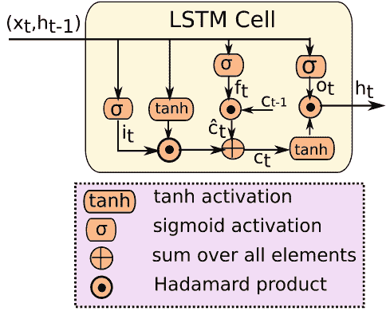

$$f_t = \sigma(W_{xf}x_t + W_{hf}h_{t-1} + b_f) \quad (2)$$

请注意 $W_{xf}$ 和 $b_f$ 分别表示输入 ($x$) 和遗忘门 ($f$) 之间的相关权重和偏差，$\sigma$ 表示 sigmoid 激活函数。一旦 $f_t$ 决定要遗忘哪些记忆，输入门 ($i_t$) 决定单元状态 ($\widetilde{c}_t$) 根据公式 (3) 和 (4) 进行更新。

$$i_t = \sigma(W_{xi}x_t + W_{hi}h_{t-1} + b_i) \quad (3)$$

$$\widetilde{c}_t = \tanh(W_{xc}x_t + W_{hc}h_{t-1} + b_c) \quad (4)$$

在方程 (5) 中，旧的单元状态 ($c_{t-1}$) 通过遗忘门 ($f_t$) 和输入门 ($i_t$) 更新为新的单元状态 ($c_t$)。

$$c_t = f_t \cdot c_{t-1} + i_t \cdot \widetilde{c}_t \quad (5)$$

这里 $\circ$ 是哈达玛积。最后，根据方程 (6) 和 (7)，我们通过输出门 ($o_t$) 基于单元状态 ($c_t$) 过滤输出值。

$$o_t = \sigma(W_{xo}x_t + W_{ho}h_t + b_o) \quad (6)$$

$$h_t = o_t \cdot \tanh(c_t) \quad (7)$$

#### 4.2 门控循环单元 (GRU) 模型

使用 LSTM 单元的主要缺点是需要额外的内存。GRU [5] 为了相同的目的而减少了一个门，从而减少了内存和 CPU 的占用。GRU 单元像 LSTM 单元一样控制信息的流动。

图2 GRU单元在所提出RNN模型中使用的架构

但不需要内存单元。它只是简单地暴露了完整的隐藏内容，没有任何控制。它有一个“重置门”$(z_t)$，一个“更新门”$(r_t)$和一个细胞状态内存$(c_t)$，如图2所示。重置门决定是否将新输入与细胞状态内存$(c_t)$结合。更新门决定保留多少$c_t$。与不同门和状态相关的方程$(8)$-$(11)$如下所示。

$$z_t = \sigma(W_{xz}x_t + W_{hz}h_{t-1} + b_z) \quad (8)$$

$$r_t = \sigma(W_{xr}x_t + W_{hr}h_{t-1} + b_r) \quad (9)$$

$$c_t = \tanh(W_{xc}x_t + W_{hc}(r_t \cdot h_{t-1})) \quad (10)$$

$$h_t = (1 - z_t) \cdot c_t + z_t \cdot h_{t-1} \quad (11)$$

## 4.3 卷积LSTM网络模型

为了缓解这个问题，我们在RNN的循环结构中使用卷积。我们首先讨论RF数据的时空特性，然后建立一个卷积LSTM网络来利用这一特性。

### 4.3.1 RF数据的时空特性公式化

假设无线电信号是通过在空间区域上的时间变化序列来表示的，使用$R$行和$C$列。这里，$R$表示信号的时间变化性质，在我们的情况下，它表示信号被采样的总时间戳数（在我们的情况下为$T$）。另一方面，$C$表示每个时间戳采样的特征总数（在我们的情况下是2048，因为每个维度上采样了1024个特征）。请注意，每个与$R$和$C$的一个值对应的单元格表示给定时间点上的特定特征（I或Q）。

为了仅捕捉时间属性，我们使用一系列向量，对应于不同的时间戳$1, 2, \dots, t$作为$x_1, x_2, \dots, x_t$。然而，为了捕捉空间和时间属性，我们引入一个新的向量$\chi_{t, t+\gamma}$，其公式为：$\chi_{t, t+\gamma} = [x_t, x_{t+1}, \dots, x_{t+\gamma-1}]$。因此，向量$\chi_{t, t+\gamma}$最终在时间上以$\gamma$的增量保留了空间属性。因此，我们得到一个新向量序列$\chi_{1,\gamma}, \chi_{\gamma,2\gamma}, \dots, \chi_{t,t+\gamma}, \dots, \chi_{t+(\beta-1)\gamma, t+\beta\gamma}$，其中$\beta$是$\lfloor R/\gamma \rfloor$，目标是创建一个模型将它们分类为$K$个类别（对应于发射器）。我们建模给定$C_k$的类条件密度为$P(\chi_{t-\gamma, t} \mid C_k)$，其中$k \in 1, \dots, K$。根据公式12，我们将下一个$\gamma$长度序列属于类别$C_k$的概率建模为。边际概率被建模为$P(\chi_{t, t+\gamma})$。

$$ P(C_k \mid \chi_{t, t+\gamma}) = \frac{P(\chi_{t-\gamma, t} \mid C_k) P(C_k)}{P(\chi_{t, t+\gamma})} \quad (12) $$

##### 4.3.2 模型

如图3所示，细胞模型类似于LSTM细胞，但输入转换和循环转换都是卷积性质[46]。我们将输入值、细胞状态和隐藏状态表示为一个三维向量，其中第一维是测量数量，随时间间隔$\gamma$变化，最后两个维度包含空间信息（行（$R$）和列（$C$））。我们将其表示为：
- 输入：$\chi_{1,\gamma}, \chi_{\gamma,2\gamma}, \dots, \chi_{t,t+\gamma}, \dots, \chi_{t+(\beta-1)\gamma, t+\beta\gamma}(C)$（先前提到的）；
- 细胞输出：$C_1, \dots, C_t$；
- 隐藏状态：$\mathcal{H}_1, \dots, \mathcal{H}_t$。

我们以与LSTM模型类似的方式表示门。参数$t, i_t, f_t, o_t, W, b$具有与第4.1节中相同的含义。关键操作在方程式13-17中定义。下一个$\gamma$序列属于特定类别的概率（来自方程式12）在模型的实现和执行中使用。

$$ i_t = \sigma(W_{xi} \chi_{t, t+\gamma} + W_{hi} \mathcal{H}_{t-1} + b_i) \quad (13) $$

$$ f_t = \sigma(W_{xf} \chi_{t, t+\gamma} + W_{hf} \mathcal{H}_{t-1} + b_f) \quad (14) $$

$$ \tanh(W_{xc} \chi_{t, t+\gamma} + W_{hc} \mathcal{H}_{t-1} + b_c) \quad (15) $$

$$ o_t = \sigma(W_{xo} \chi_{t, t+\gamma} + W_{ho} \mathcal{H}_{t-1} + b_o) \quad (16) $$

$$ \mathcal{H}_t = o_t \cdot \tanh(C_t) \quad (17) $$

图3 ConvLSTM单元在所提出RNN模型中使用的架构

## 5 测试评估

为了验证提出的模型，我们从八个不同的通用软件无线电外设（USRP）B210 [10]中收集了原始信号数据。我们在一个室内实验室环境中收集了数据，信噪比为30 dB，并使用该数据集来区分四个和八个发射机，如[40]中所述。我们还收集了相同的8个USRP B210发射机在不同信噪比（20、10和0 dB）下的数据。最后，我们从几个不同制造商的SDR中实现的五种不同类型发射机收集了数据。

#### 5.1 信号生成和数据收集

为了评估我们学习发射机固有时空特征的方法，我们使用了不同类型的SDR作为发射机。信号生成和接收如图4所示。我们使用GNURadio [12]随机生成信号，并用正交相移键控（QPSK）调制相同的信号。我们编程发射机SDR通过空中传输调制后的信号，并使用DVB-T dongle（RTL-SDR）[24]感知相同的信号。我们使用rtl-sdr Python库从RTL-SDR感知的“空中”数据生成整个数据集。

我们在每个时间戳收集了样本大小为1024的I/Q信号数据。每个数据样本包含2048个条目，其中包括1024个样本的I和Q值。请注意，更大的样本大小意味着神经网络有更多的训练样本。我们选择的1024个样本足以捕捉时空特性，同时训练不需要太多计算资源。我们从每个发射机收集了40,000个训练样本，以避免机器学习中观察到的数据倾斜问题。使用的配置参数如表1所示。我们收集了两个不同的数据集，分别在30 dB SNR和三个不同SNR下进行了三个数据集的收集，如下所述。

图4 空中信号生成和数据收集技术

| 参数 | 数值 |
| --- | --- |
| 发射机增益 | 45 dB |
| 发射机频率 | 904 MHz（ISM） |
| 带宽 | 200 KHz |
| 样本大小 | 1024 |
| 每个发射机样本数 | 40,000 |
| 发射机数量 | 4和8 |

通过改变传播延迟、多径和阴影效应，在室内实验室环境中实现了不同水平的性能。我们还使用了几种不同类型的SDR收集了一个“异构”数据集。请注意，我们打算在本章节发表后公开数据集。

##### 5.1.1 同质数据集

对于“同质”数据集，我们使用了来自同一制造商的八个无线电，即Ettus Research的USRP-B210 [10]作为发射机。我们收集了两组数据：
- 使用4个USRP B210发射机：6.8 GB大小，160K行，2048列；
- 使用8个USRP B210发射机：13.45 GB大小，320K行，2048列。

请注意，每种情况下的信噪比为30 dB。

##### 5.1.2 异构数据集

为了研究来自不同制造商的不同类型SDR的I/Q数据时空相关性，我们还收集了一个“异构”数据集。我们使用了来自同一制造商的三种不同SDR和来自两个不同制造商的两种SDR。我们使用了Ettus Research的USRP B210 [10]、USRP B200 [9]和USRP X310 [11]。我们还使用了Nuand的BLADE RF [25]和Analog Devices的PLUTO SDR [7]。

信号生成过程与图4类似，只是使用了不同的SDR模型作为发射机。信噪比仍然为30 dB，与之前相同。通过以下方式获得了“异构”数据集：
- 5个USRP B210发射机：8.46 GB大小，200K行，2048列；
- 1个USRP B210、1个USRP B200、1个USRP X310、1个BLADERF和1个PLUTO发射机：6.42 GB大小，200K行，2048列。

我们在这个数据集中包含了5个USRP B210同质数据，以在第6.6节中对五个异质无线电与五个同质无线电进行公平比较，因为前一段提到的同质数据集中只包含四个或八个同质无线电。

##### 5.1.3 变化的信噪比数据集

我们收集了另外三个数据集，分别使用了8个SNR为20 dB、10 dB和0 dB的USRP B210发射机。每个数据集的大小约为13 GB，有320K行和2048列。

#### 5.2 同质数据集中的空间相关性

数据样本之间的相关性在发射机识别过程中起着关键作用。我们将每个训练样本在时间$t$上的I和Q值表示为：
$[I_0, Q_0, I_1, Q_1, I_2, Q_2, I_3, Q_3, I_4, Q_4, \dots, I_{1023}, Q_{1023}]'$。
我们使用QPSK调制[48]，这意味着空间相关性应该在每四个值之间，即在$I_0$和$I_4$之间，以及$Q_0$和$Q_4$之间。因此，我们计算了$I_0 I_1 I_2 I_3$和$I_4 I_5 I_6 I_7$的相关系数。我们对每个样本的所有相关系数取平均值。

我们使用numpy.corrcoef来实现这个目的，它使用皮尔逊积矩相关系数，用$r$表示。样本的皮尔逊方法如下：

$$r=\frac{\sum_{i=0}^{(M-1)}\left(I_{i}-\bar{I}\right)\left(Q_{i}-\bar{Q}\right)}{\sqrt{\sum_{i=0}^{(M-1)}\left(I_{i}-\bar{I}\right)^{2}} \sqrt{\sum_{i=0}^{(M-1)}\left(Q_{i}-\bar{Q}\right)^{2}}} \quad(18)$$

其中$M$是样本大小，$I_i$和$Q_i$是用$i$索引的样本值。样本均值为$\bar{I}=\frac{1}{M} \sum_{i=0}^{(M-1)} I_i$。

不同发射机的所有样本的空间相关性显示在图5中。我们观察到，对于大多数发射机，相关性约为0.42，标准差约为0.2。然而，发射机3之间的样本相关性很小，这意味着发射机3的空间特性与其他发射机不同。因此，发射机3应该很容易与其他发射机区分开来。这个观点将在实验中得到验证。

图5 空间相关性在数据集中的表现

结果部分中，我们可以看到对于发射机3的三个提出模型，误报率和漏报率均为0%。这一观察结果激发了我们利用采集到的时间序列数据的空间特性和时间特性的动机。

#### 5.3 异构数据集中的空间相关性

计算得到的五种不同类型发射机样本的平均空间相关性如图6所示。我们观察到，USRP-B210和PLUTO-SDR的数据具有比其他三种类型更好的相关性。需要注意的是，我们使用前一节中描述的相同技术计算了这些数据空间相关性。从图中也可以明显看出，没有一个发射机展现出令人印象深刻的相关性；然而，每个发射机都具有不同范围的相关性。这一现象支持我们的观点，即异构数据中的时空特性将比同质数据更易于区分，这一观点在实验结果部分（第6.6节）得到了验证。

图6 异构数据集中的空间相关性

#### 5.4 实验设置和性能指标

我们在一台配备64 GB RAM、GTX1080 Ti GPU（11 GB内存）的Ryzen 8 Core系统上进行了实验。我们使用Keras [4]作为前端，使用TensorFlow [1]作为后端进行实现。在训练阶段，我们使用每个发射器的数据来训练神经网络模型。为了测试训练得到的模型，我们使用从其中一个发射器收集的测试数据，并将其提供给训练好的网络。通常，为了衡量任何学习算法的有效性，“准确率”被用作典型的性能指标。

然而，当数据倾斜时，准确率有时可能会误导且不完整。对于分类任务，混淆矩阵可以解决这个问题，它展示了学习模型在预测上的混淆程度。它通过识别错误的数量和错误的类型，提供了更多关于性能的见解。

## 6 模型实现和结果

在本节中，我们讨论了每个提出的递归神经网络的实现。我们使用$K$个类别对每个网络进行发射机分类训练。为了保证鲁棒性和统计显著性，在多次运行后，我们对每个模型的结果进行了平均。

### 6.1 使用LSTM单元的实现

正如前面讨论的，神经网络的递归结构可以用来利用数据中的时间相关性。为此，我们首先实现了一个带有LSTM单元的递归神经网络，并使用图7中所示的范例对其进行了训练。我们按顺序使用了两个LSTM层，分别具有1024和256个单元。在这两个LSTM层之间，我们还使用了0.5的dropout率。接下来，我们使用了两个全连接（Dense）层，分别具有512和256个节点。我们应用了0.2的dropout率，并在上面添加了batch normalization [17]。

图7 使用LSTM单元的RNN实现用于发射机分类

最后通过具有八个节点的Dense层将输出传递。我们在LSTM层中使用ReLU [23]作为激活函数，Dense层中使用tanh [3]。最后，我们使用基于分类交叉熵训练的随机梯度下降[3]优化。请注意，神经网络架构是通过对数据进行多次实验最终确定的，我们只报告了最终的架构。对于四个和八个发射机，我们分别实现了97.17%和92.00%的测试准确率。准确率图和混淆矩阵如图8和9所示。请注意，最后一层的节点数等于数据集中的类别数。还需要注意的是，在设计RNN架构的过程中，我们还对当前网络的超参数进行了微调，以提高其泛化能力（通过比较训练和验证误差进行确定）。为了加快训练速度[15]，我们还限制了每个模型中的循环层和全连接层的数量，因为没有显著的增加层数后观察到验证准确率的提高。

图8 使用LSTM单元进行发射机分类的准确率图

图9 使用LSTM单元进行发射机分类的混淆矩阵

混淆矩阵的行和列对应于发射机（类别）的数量，单元格的值显示了每个发射机的召回率或敏感度和假阴性率。请注意，召回率或敏感度表示每个预测类别的真阳性率。

### 6.2 使用GRU单元进行实现

接下来，我们使用GRU单元实现了RNN模型的另一种变体，以利用时间相关性。我们使用与LSTM实现相同的架构，如图10所示。所提出的GRU实现所需的参数比LSTM模型少。在第6.4节中给出了定量比较。唯一的区别是我们使用了两个GRU层，分别具有1024个和256个单元，而不是使用LSTM单元。我们分别实现了四个和八个发射机的97.76%和95.30%的测试准确率。准确率图和混淆矩阵如图11和12所示。对于两个数据集的每个模型运行，GRU实现在准确率上略微优于使用LSTM获得的结果。

图10 使用GRU单元的RNN实现进行发射机分类

图11 使用GRU单元进行发射机分类的准确率图

图12 使用GRU单元进行发射机分类的混淆矩阵

### 6.3 使用ConvLSTM2D单元进行实现

最后，为了利用信号数据的时空特性，我们实现了另一种带有卷积滤波器（变换）的LSTM模型变体。所实现的架构如图13所示。ConvLSTM2D使用二维卷积进行输入变换和循环变换。我们首先使用两层具有1024和256个滤波器的ConvLSTM2D，之间的dropout率为0.5。我们在每个ConvLSTM2D层上使用$(2,2)$的卷积核大小和$(2,2)$的步长。接下来，在flatten卷积输出后，我们添加两个全连接（Dense）层，分别具有512和256个节点。ReLU [23]和tanh [3]激活函数分别用于ConvLSTM2D和Dense层。我们使用学习率为$10^{-4}$、衰减率为0.9的ADADELTA [59]作为优化器，使用分类交叉熵进行训练。对于四个和八个发射机，我们分别实现了98.9%和97.2%的测试准确率。准确率图和混淆矩阵分别如图14和图15所示。ConvLSTM实现能够利用时空相关性，对于两个数据集，提供了比LSTM和GRU模型更高的准确率。

图13 使用ConvLSTM单元的RNN实现用于发射机分类

#### 6.4 LSTM/GRU/ConvLSTM 实现的比较

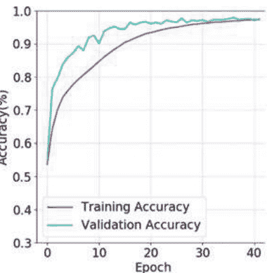

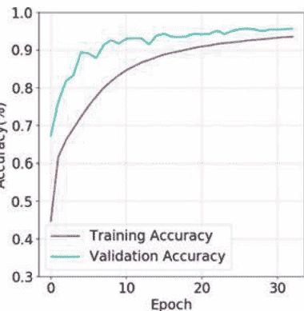

(a) 4 Transmitters

(b) 8 Transmitters

图 14 使用 ConvLSTM 单元的发射机分类准确性图

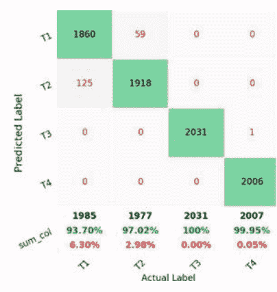

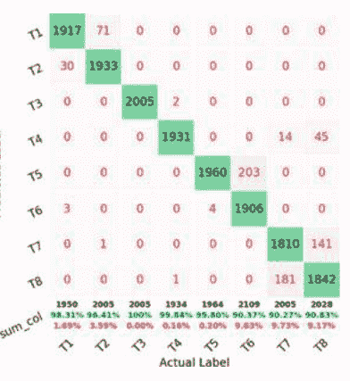

(a) 4 Transmitters

(b) 8 Transmitters

图 15 使用 ConvLSTM 单元的发射机分类混淆矩阵

## 6.4 LSTM/GRU/ConvLSTM 实现的比较（Page 171 Content Start）

我们使用 90% 的数据进行训练，5% 的数据进行验证，5% 的数据进行测试。我们在验证集上进行了 50 个 epoch 的模型训练，并使用了早停技术。一个 epoch 包括对整个数据集进行前向传播和反向传播。不同实现的整体准确性如表 2 所示。我们发现使用具有卷积层和循环结构（ConvLSTM2D）的实现在发射机分类方面具有最佳准确性，这清楚地显示了利用收集到的数据集中的时空相关性的优势。在图 16 中，我们更好地展示了不同实现模型的分类准确性。

表 2 不同实现的准确率比较

| 发射机数量 | 模型 | #参数 (M) | 准确率 (%) |
| :--- | :--- | :--- | :--- |
| 4 | LSTM (6 层) | 14.2 | 97.17 |
| 4 | GRU (6 层) | 10.7 | 97.76 |
| 4 | ConvLSTM (6 层) | 14.2 | 98.90 |
| 8 | LSTM (6 层) | 14.2 | 92.00 |
| 8 | GRU (6 层) | 10.7 | 95.30 |
| 8 | ConvLSTM (6 层) | 14.2 | 97.20 |

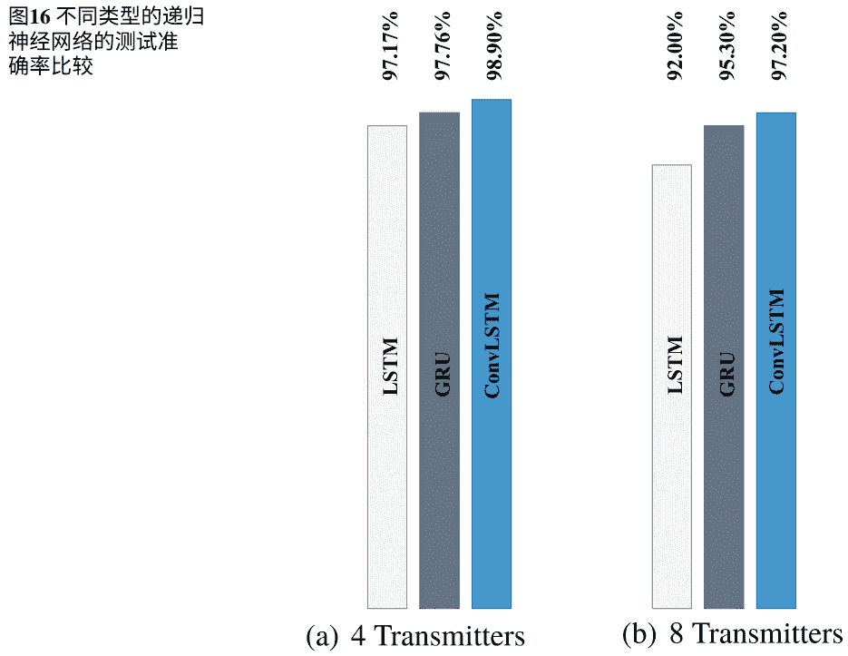

#### 6.5 计算复杂性

在本节中，我们仅关注训练阶段的一个周期的计算时间复杂性，因为训练好的模型在部署阶段内输出的时间是恒定的 (O(1))。理解训练 RNN 的时间复杂性仍然是一个不断发展的研究领域。所提出的 RNN 模型是两个递归层和四个全连接层的组合。因此，我们分别分析两种类型的时间复杂性。在 [22] 中，作者证明了深度为 $\delta$ 的全连接 NN 可以在 $poly(s^{2^\delta})$ 时间内学习，其中 $s$ 是输入的维度 (=T 在提出的模型中)，poly(.) 是一个常数。

时间取决于系统的配置。然而，LSTM 和 GRU 层的复杂度取决于网络中的参数总数 [43]。对于 LSTM 层，它可以表示为 $O(\mathcal{P}_{lstm} \times T)$，其中 $\mathcal{P}_{lstm}$ 是 LSTM 网络中的参数总数，$T$ 是时间步长或训练数据样本的总数。对于 GRU 层，它将是 $O(\mathcal{P}_{gru} \times T)$，其中 $\mathcal{P}_{gru}$ 是 GRU 网络中的参数总数。然而，ConvLSTM 层的计算复杂度将取决于卷积和 LSTM 层的复杂度。在 [53] 中，作者提到了训练所有卷积层的时间复杂度为 $O(\sum_{\tau=1}^{\zeta}(\eta_{\tau-1}\nu_{\tau}^2 \cdot \eta_\tau \rho_\tau^2))$，其中 $\zeta$ 是卷积层的数量，$\tau$ 是卷积层的索引，$\eta_{\tau-1}$ 是第 $\tau$ 层的输入通道数，$\nu_\tau$ 是第 $\tau$ 层滤波器的空间大小，$\eta_\tau$ 是第 $\tau$ 层的滤波器数目，$\rho_\tau$ 是第 $\tau$ 层输出特征的大小。在提出的 ConvLSTM 模型中，我们有两个 ConvLSTM 层和四个全连接层，因此，我们还需要额外的时间复杂度来训练这些卷积层。

对于同质数据集中每个实现的 RNN 模型的时间复杂度在表 3 中给出，使用了神经网络训练的时间复杂度的前述结果。每个网络中使用的参数总数在表 2 中显示。第二列括号中的数字表示特定模型的总层数。请注意，我们有两个不同维度的数据集，分别为 160 和 320K，并且如前所述，我们使用 95% 的数据进行训练和验证。例如，使用 95% 的 160e3 个数据样本进行训练和验证的 ConvLSTM 具有六层的复杂度为 $O((\sum_{\tau=1}^2(\eta_{\tau-1} \cdot \nu_\tau^2 \cdot \eta_\tau \cdot \rho_\tau^2) + 0.95 \times 160e3)^2)$，其中有两个 ConvLSTM 层和四个全连接层的复杂度为 $poly(0.95 \times 160e3^{2^4})$。类似地，使用 95% 的 160e3 个数据样本进行训练和验证的 LSTM 具有六层的计算复杂度为 $O(14.2e6 \times 0.95 \times 160e3)$，其中 14.2e6 是参数的数量，并且有四个全连接层的复杂度为 $poly(0.95 \times 160e3^{2^4})$。

表 3 训练提议实现的复杂度

| 发射机数量 | 模型 | 复杂性 |
| :--- | :--- | :--- |
| 4 | LSTM (6) | $O(14.2e6 \times 0.95 \times 160e3) + poly(0.95 \times 160e3^{2^4})$ |
| 4 | GRU (6) | $O(10.7e6 \times 0.95 \times 160e3) + poly(0.95 \times 160e3^{2^4})$ |
| 4 | ConvLSTM (6) | $O((\sum_{\tau=1}^3(\eta_{\tau-1} \cdot \nu_\tau^2 \cdot \eta_\tau \cdot \rho_\tau^2) + 0.95 \times 160e3) + poly(0.95 \times 160e3^{2^4}))$ |
| 8 | LSTM (6) | $O(14.2e6 \times 0.95 \times 320e3) + poly(0.95 \times 320e3^{2^4})$ |
| 8 | GRU (6) | $O(10.7e6 \times 0.95 \times 320e3) + poly(0.95 \times 320e3^{2^4})$ |
| 8 | ConvLSTM (6) | $O((\sum_{\tau=1}^3(\eta_{\tau-1} \cdot \nu_\tau^2 \cdot \eta_\tau \cdot \rho_\tau^2) + 0.95 \times 320e3) + poly(0.95 \times 320e3^{2^4}))$ |

#### 6.6 异构数据集实验

到目前为止，我们已经为“同质”数据集实现了所提出的 RNN 模型，其中发射机 SDR 来自同一制造商。然而，在现实中，发射机可以是来自同一制造商的不同型号，也可以是来自几个不同制造商的不同型号。现在，我们想探索一下如果使用来自不同类型的发射机（制造商）的“异构”数据（如第 5.1.2 节所讨论的）将如何改变发射机识别的准确性。从表 4 中显示的测试准确性，我们观察到所有的 RNN 在发射机是来自同一或不同制造商的不同型号时表现更好，因此基本上是不同类型的。LSTM、GRU 和 ConvLSTM 的性能分别比同质数据集提高了 5%、3.37% 和 1.51%，用于分类 heterogeneous 收音机。这证实了一个直觉，即使用不同工艺（来自不同制造商）制造的收音机在其 I/Q 样本中包含易于利用的特征，可以通过 RNN 隐式学习。所有三个提出的模型的混淆矩阵比较见图 17、18 和 19。与 5-B210s 相比，5-HETERO 的误报和真阴性率明显较低。值得注意的是

表 4 同质和异质数据集的不同分类模型的测试准确率比较

| 模型 | 5-B210s(准确率) (%) | 5-HETERO (准确率) (%) | 变化 |
| :--- | :--- | :--- | :--- |
| LSTM | 95.61 | 99.89 | 5%↑ |
| GRU | 96.72 | 99.97 | 3.37%↑ |
| ConvLSTM | 98.5 | 99.99 | 1.51%↑ |

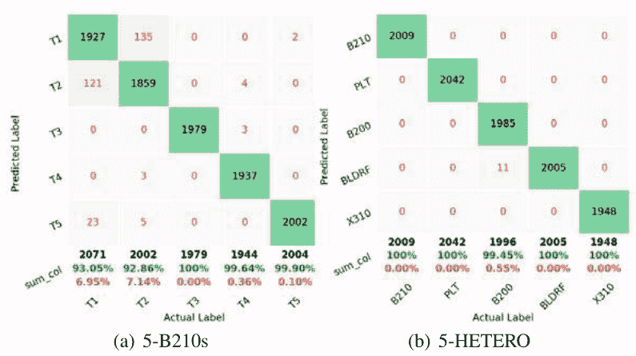

图 17 使用 LSTM 单元对异质数据集进行发射机分类的混淆矩阵

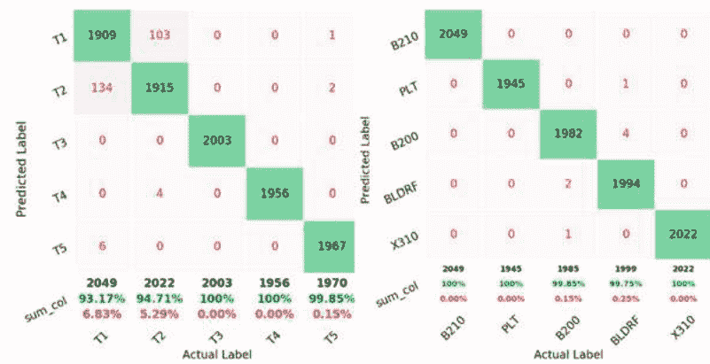

图 18 使用 GRU 单元对异质数据集进行发射机分类的混淆矩阵

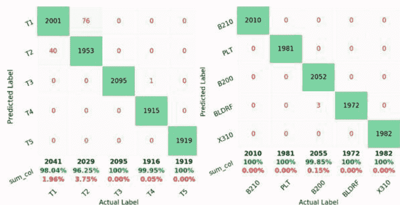

图 19 使用 ConvLSTM 单元对异质数据集进行发射机分类的混淆矩阵

我们也对异质数据使用了相同的提出的 RNN 模型，这表明了提出的模型的鲁棒性。

#### 6.7 提出方法与现有方法的比较

接下来，我们将我们提出的实现与最先进的技术进行了两项比较研究。我们在表 5 中介绍了射频领域中不同基于 RNN 的实现的差异分析。表 6 展示了不同发射机分类技术的另一项比较研究。

表 5 与现有的 RNN 实现的比较

| 方法 | 模型 | 信噪比 (dB) | 准确率 (%) | 输入 |
| :--- | :--- | :--- | :--- | :--- |
| 交通序列识别 [26] | LSTM | 20 | 31.20 | 混合真实 - 合成数据集 |
| 自动调制分类 [33] | LSTM | 20 | 90 | 合成数据集 [32] |
| 发射机分类 (我们的) | ConvLSTM | 30 | 97.20 | 原始信号 |
| 异构发射机分类 (我们的) | ConvLSTM | 30 | 99.99 | 原始信号 |

表 6 我们的实现与现有的发射机分类方法的比较

| 方法 | # 发射机 | 信噪比 (dB) | 准确率 (%) | 输入 |
| :--- | :--- | :--- | :--- | :--- |
| 正交分量重构 (OCR) [57] | 3 | 20 | 62-71 | 杂散调制 |
| 遗传算法 [51] | 5 | 25 | 85-98 | 瞬变 |
| 多重分形分割 [45] | 8 | 未提及 | 92.50 | 瞬变 |
| k-NN [18] | 8 | 30 | 97.20 | 瞬变 |
| 我们的 | 8 | 30 | 97.20 | 原始信号 |
| 我们的 - 异构 | 5 | 30 | 99.99 | 原始信号 |

两个表中的“输入”列指的是所考虑方法使用的输入类型。表 5 显示了我们基于 ConvLSTM 的发射机分类的 RNN 与其他基于 RNN 的实现比较，这些实现用于分别处理调制识别和交通序列识别等单独的任务。表 6 证明了我们基于 ConvLSTM 的 RNN 模型在发射机分类任务中的有效性，以测试准确率为指标。值得注意的是，所有其他方法都使用专家设计的特征作为输入 [18, 45, 51, 57]，或者使用合成数据集 [26, 33]。相反，我们的方法通过从原始信号数据中自动学习特征，实现了对同质 (97.20%) 和异质 (99.99%) 数据集的优越准确性，从而为大规模发射机识别系统的实时部署铺平了道路。

#### 6.8 不同信噪比下的性能比较

在本节中，我们介绍了不同信噪比下的发射机指纹识别结果。我们将提出的 RNN 模型在 30dB 信噪比下使用 8 个 USRP B210 与其他 3 个数据集进行了准确性比较，这 3 个数据集的信噪比分别为 0、10 和 20dB，表 7 中显示了它们与 8 个 B210 相同数量的发射机。对于较高的信噪比值，所有模型的准确性都更高，这是可以理解的。值得一提的是，提出的 ConvLSTM RNN 模型在 0dB 信噪比下的准确率超过 93%，而 GRU 模型的准确率低于此，LSTM 模型无法达到可观的范围。

此外，提出的 RNN 模型可以使用室内和室外环境中任何类型的无线电发射机的原始信号数据进行训练。我们还要指出，尽管我们的数据是在实验室环境中收集的，但我们对环境没有控制，实验室中还有其他正在进行的传输，人们进进出出，由于实验室的位置和设计，存在大量的多径传播问题。此外，发射机的功率较低，这进一步加剧了问题。鉴于此，虽然我们说数据是在实验室环境中收集的，但实际上它是一个无法控制的日常使用环境，反映了我们周围的环境。因此，我们可以有把握地说，这些方法将在任何大规模无线电网络的实际部署中发挥作用。总结起来，

*   仅利用时间相关性，循环神经网络使用 LSTM 或 GRU 单元对发射机分类具有 95-97% 的准确率。使用 GRU 单元实现的 RNN 需要的参数比 LSTM 单元少，如表 2 所示。
*   利用时空相关性，使用 ConvLSTM2D 单元实现的 RNN 对发射机分类具有更高的准确率（97-98%），从而为构建自动实际发射机识别系统提供了潜在工具。
*   对于异构发射机（来自同一制造商的不同型号或来自不同制造商的不同型号），所提出的 RNN 模型中的时空相关性更为明显（分类准确率提高了 1.5-5%）。

表 7 不同信噪比下不同循环神经网络模型的准确率

| 信噪比 (dB) | 模型 | 准确率 (%) |
| :--- | :--- | :--- |
| | LSTM | GRU | ConvLSTM |
| 0 | 84.23 | 90.3 | 93.3 |
| 10 | 90.21 | 92.64 | 95.64 |
| 20 | 91.89 | 94.02 | 97.02 |
| 30 | 92.00 | 95.30 | 97.20 |

所提出的 RNN 模型在数据收集环境的信噪比增加时具有更高的准确率。然而，ConvLSTM 模型在 0dB 信噪比下也能以 93% 的准确率进行分类，证明了时空属性的鲁棒性。

我们提出了一种基于时空属性的指纹识别方法与现有的传统和神经网络模型进行了比较研究。这清楚地表明，与现有的任何方法相比，所提出的模型在发射机识别方面取得了更好的准确性。

## 7 总结

随着越来越多的无线网络自主部署，准确了解射频环境变得不可或缺。近年来，使用深度学习算法处理大规模历史数据的自主系统大量涌现。为此，射频历史数据中固有的循环结构也可以被深度学习算法利用于可靠的未来预测。

在本章中，我们解决了如何在射频领域有效应用不同学习技术的一些基本挑战。我们提出了一种强大的发射机识别技术，通过利用射频信号数据的固有空间和时间属性。测试实施和结果分析证明了所提出的深度学习模型的有效性。未来的下一步可以是将这些方法应用于实际基础设施发射机（例如 FM、AM 和 GSM）在实际环境中的识别。

## 8 进一步阅读

更多关于深度学习算法的细节可以在 [55] 中找到。关于深度学习在 RF 领域中涉及对手的高级应用可以在 [35, 36, 40] 中找到。讨论了深度学习在 RF 领域的高级领域中的应用，例如动态频谱访问在 [37, 38] 中。

## 参考文献

1. M. Abadi 等，Tensorflow：异构分布式系统上的大规模机器学习。CoRR (2016)
2. S. Bai, M. Yan, Y. Luo, Q. Wan, RFedRNN：一种用于射频路径指纹识别的端到端循环神经网络，在应用智能的最新趋势和未来技术中 (2018), 第 560-571 页
3. C.M. Bishop, 模式识别与机器学习 (信息科学与统计学) (Springer, 2006)
4. F. Chollet 等，Keras: Python 深度学习库 (2015)。https://keras.io
5. J. Chung, C. Güçlü, K. Cho, Y. Bengio, 对序列建模中门控循环神经网络的实证评估。CoRR (2014). arXiv:abs/1412.3555
6. B. Danev, S. Capkun, 基于瞬态的无线传感器节点识别，在国际传感器网络信息处理会议 (2009), 第 25-36 页
7. A. Devices, ADALM-PLUTO 概述 (2020). https://wiki.analog.com/university/tools/pluto
8. R. Dey, F.M. Salemt, 门控循环单元 (GRU) 神经网络的门变体，在 2017 年 IEEE 第 60 届中西部电路与系统学术会议 (MWSCAS)(2017), 第 1597-1600 页
9. Ettus Research: USRP B200 (2020). https://www.ettus.com/all-products/ub200-kit/
10. Ettus 研究：USRP B210 (2020 年)。https://www.ettus.com/product/details/UB210-KIT/
11. Ettus 研究：USRP X310 (2020 年)。https://www.ettus.com/all-products/x310-kit/
12. GNURadio: GNU Radio (2020 年)。https://www.gnuradio.org
13. I. Goodfellow, Y. Bengio, A. Courville, 深度学习。MIT 出版社 (2016 年)
14. A. Gritsenko, Z. Wang, T. Jian, J. Dy, K. Chowdhury, S. Ioannidis, 在大规模人群中使用深度学习发现“新”的无线电探测，IEEE 国际动态频谱访问网络研讨会 (DySPAN) (2019 年), 第 1-10 页
15. K. He, J. Sun, 在受限时间成本下的卷积神经网络，IEEE CVPR (2015 年)
16. S. Hochreiter, J. Schmidhuber, 长短期记忆。神经计算 9(8), 1735-1780 (1997)
17. S. Ioffe, C. Szegedy, 批归一化：通过减少内部协变量偏移加速深度网络训练。CoRR (2015). arXiv:abs/1502.03167
18. I.O. Kennedy, P. Scanlon, F.J. Mullany, M.M. Buddhikot, K.E. Nolan, T.W. Rondeau, 无线电发射器指纹识别：一种稳态频域方法，在 IEEE Vehicular Technology Conference(2008), pp. 1-5
19. B.P. Lathi, 现代数字和模拟通信系统，第 3 版 (美国牛津大学出版社，1998)
20. Y. LeCun, Y. Bengio, G. Hinton, 深度学习。自然 521(7553), 436-444 (2015)
21. H.W. Lin, M. Tegmark, D. Rolnick, 为什么深度和廉价学习效果如此好? J. Stat. Phys. 168(6), 1223-1247 (2017)
22. R. Livni, S. Shalev-Shwartz, O. Shamir, 关于训练神经网络的计算效率，在 Advances in Neural Information Processing Systems(2014), pp. 855-863
23. V. Nair, G.E. Hinton, 矫正线性单元改进受限玻尔兹曼机，在 Proceedings of International Conference on Machine Learning (2010), pp. 807-814
24. NooElec: USRP B210 (2018). http://www.nooelec.com/store/sdr/sdr-receivers/nesdr-mini-rtl2832-r820t.html
25. Nuand: bladeRF 2.0 微型 xA4 (2020). https://www.nuand.com/product/bladeRF-xA4/2
26. T.J. O'Shea, S. Hitefield, J. Corgan, 采用循环神经网络的端到端无线电流流量序列识别，在 IEEE 全球信号与信息处理大会 (GlobalSIP)(2016), 第 277-281 页
27. T. O'Shea, N. West, 采用 GNU Radio 生成无线电机器学习数据集。GNU Radio 会议论文集 1(1) (2016)
28. T.J. O'Shea, T.C. Clancy, R.W. McGwier, 循环神经网络无线电异常检测。CoRR (2016). arXiv:abs/1611.00301
29. T.J. O'Shea, J. Corgan, T.C. Clancy, 卷积无线电调制识别网络，在神经网络工程应用 (2016), 第 213-226 页
30. T. O'Shea, J. Hoydis, 深度学习在物理层的应用介绍。IEEE Trans. Cogn. Commun. Netw. 3(4), 563-575 (2017)
31. T.L. O'Shea, T. Roy, T.C. Clancy, 基于无线电信号的深度学习分类方法。IEEE J. Sel. Top. Signal Process. 12(1), 168-179 (2018)
32. radioML: RFML 2016 (2016). https://github.com/radioML/dataset
33. 在原文中引用但列表中未明确出现，保留原文引用 [33] 在上下文中的应用。

## 清理 OCR 错误与排版

在 RF 数据中利用时空相关性…

33. S. Rajendran 等，用于无线信号分类的分布式低成本频谱传感器的深度学习模型。IEEE Trans. Cogn. Commun. Netw. 4(3), 433-445 (2018) 34. J.S. Ren, Y. Hu, Y.W. Tai, C. Wang, L. Xu, W. Sun, Q. Yan, 看、听和学习——一种用于说话人识别的多模态 LSTM 方法，收录于 AAAI (2016), pp. 3581-3587
35. D. Roy, T. Mukherjee, M. Chatterjee, 在对抗性射频环境中的机器学习。IEEE Commun. Mag. 57(5), 82-87 (2019)
36. D. Roy, T. Mukherjee, M. Chatterjee, E. Blasch, E. Pasiliao, RFAL: 对抗性学习用于射频发射机识别和分类。IEEE Trans. Cogn. Commun. Netw. (2019) 37. D. Roy, T. Mukherjee, M. Chatterjee, E. Pasiliao, 使用基于 GAN 的学习来防御 DSA 网络中的 PUE 攻击，在 IEEE 全球通信大会 (2019) 38. D. Roy, T. Mukherjee, M. Chatterjee, E. Pasiliao, 使用循环结构在 DSA 网络中进行主用户活动预测，在 IEEE 国际动态频谱接入网络研讨会 (2019), pp. 1-10

39. D. Roy, T. Mukherjee, M. Chatterjee, E. Pasiliao, RF 发射机指纹利用原始信号数据中的时空特性，在 IEEE 机器学习和应用国际会议 (2019), 第 89-96 页

40. D. Roy, T. Mukherjee, M. Chatterjee, E. Pasiliao, 使用生成对抗网络检测恶意 RF 发射机，在 IEEE 无线通信和网络会议 (WCNC) (2019)

41. H. Rutagemwa, A. Ghasemi, S. Liu, 使用深度递归神经网络进行陆地移动无线电动态频谱分配，在 IEEE 国际通信会议工作坊 (ICC 工作坊) (2018), 第 1-6 页

42. Y.B. Saied, A. Olivereau, D-HIP: 一种基于 HIP 的物联网分布式密钥交换方案，在无线、移动和多媒体网络世界 (WoWMoM)(2012), 第 1-7 页 43. Sak, H., Senior, A.W., Beaufays, F.: 基于长短期记忆的递归神经网络架构用于大词汇语音识别。CoRR (2014). arXiv:abs/1402.1128
44. K. Sankhe, M. Belgiovine, F. Zhou, L. Angioloni, F. Restuccia, S. D'Oro, T. Melodia, S. Ioannidis, K. Chowdhury, 通过深度学习物理层硬件失真进行无线电指纹识别。IEEE Trans. Cogn. Commun. Netw. 1 (2019) 45. D. Shaw, W. Kinsner, 用于分类的无线电发射机瞬变的多重分形建模，在 IEEE WESCANEX(1997), 第 306-312 页

46. X. Shi, Z. Chen, H. Wang, D.Y. Yeung, W.K. Wong, W.C. Woo, 卷积 LSTM 网络：一种用于降水预测的机器学习方法，发表于第 28 届国际神经信息处理系统会议论文集，卷 1 (2015 年), 页 802-810 47. Y. Shi, K. Davaslioglu, Y.E. Sagduyu, W.C. Headley, M. Fowler, G. Green, 未知和动态频谱环境中的射频信号分类的深度学习，发表于 IEEE 国际动态频谱接入网络研讨会 (DySPAN) (2019), 页 1-10 48. S.W. Smith, 科学家和工程师的数字信号处理指南 (加利福尼亚技术出版社，圣地亚哥，加利福尼亚州，美国，1997 年)

49. S. Soltani, Y.E. Sagduyu, R. Hasan, K. Davaslioglu, H. Deng, T. Erpek, 基于 FPGA 的深度学习射频信号分类器的实时实验，在 IEEE 国际动态频谱接入网络研讨会 (DySPAN) (2019 年), 第 1-2 页
50. M. Stanislav, T. Beardsley, IoT 黑客攻击案例研究：婴儿监视器的暴露和漏洞。Rapid 7 (2015 年)

51. J. Toonstra, W. Kinsner, 一种无线电发射机指纹识别系统 ODO-1，在加拿大电气和计算机工程会议，第 1 卷 (1996 年), 第 60-63 页 52. D. Tse, P. Viswanath, 无线通信基础 (美国牛津大学出版社，2005 年)

53. E. Tsironi, P. Barros, C. Weber, S. Wernter, 对手势识别的卷积长短期记忆循环神经网络的分析。Neural Comput. 26(8), 76-86 (2017) 54. N. Wagle, E. Frew, 对空中射频环境的时空特征化，在 IEEE GLOBECOM Workshops (GC Wkshps)(2011), pp. 1269-1273 55. M.A. Wani, F.A. Bhat, S. Afzal, A.I. Khan, 深度学习的进展 (Springer, 2020)

56. R.H. Weber, R. Weber, 物联网，vol. 12 (Springer, 2010)

## 使用深度学习的雷达人体目标检测和定位

Michael Stephan, Avik Santra 和 Georg Fischer

**摘要** 在本文中，我们提出了一种基于深度学习的新型雷达流程，用于室内环境中人体目标的检测和定位。检测人体目标可以通过自动控制照明、供暖、通风和空调（HVAC）来帮助商业建筑、公共空间和智能家居节约能源。这种智能感知应用可以促进能源的监测、控制和节约。传统上，雷达目标的检测要么在距离 - 多普勒域中进行，要么在距离 - 角度域中进行。根据应用和雷达传感器，随后估计角度或多普勒，最终在 2D 空间中定位人体目标。当在距离 - 多普勒域上进行检测时，处理流程包括移动目标指示器（MTI）用于去除距离 - 多普勒图像（RDI）上的静态目标，最大比率组合（MRC）用于跨天线集成数据，然后使用恒定虚警率（CFAR）检测器和聚类算法生成处理后的 RDI 检测结果。在另一种情况下，处理流程使用 Capon 或最小方差无失真响应（MVDR）波束形成来将多个接收通道的原始 RDI 转换为原始距离 - 角度图像（RAI），然后使用 CFAR 和聚类算法生成处理后的 RAI 检测结果。然而，在传统流程中，特别是在室内人体目标检测的情况下，两个域都会受到来自墙壁、家具等静态物体的幽灵目标和多径反射的影响。此外，传统的参数聚类算法会导致目标在目标距离 - 多普勒和距离 - 角度检测中分裂和合并。为了克服这些问题，我们提出了一种基于深度残差 U-net 模型的深度学习架构和深度复杂 U-net 模型直接从原始 RDI 生成人体目标检测。我们证明了所提出的深度残差 U-net 和复杂 U-net 模型能够分别在距离 - 多普勒和距离 - 角度域中生成准确的目标检测结果。为了训练这些网络，我们记录了不同配置和多个人执行多种常规活动的室内场景的 RDI。我们设计了自定义损失函数，并应用增强策略来推广该模型在实时推理中的应用。我们证明了在传统信号处理流程失败的情况下，所提出的网络能够在不同的室内环境和场景中高效地学习正确地检测和定位人体目标。

**关键词** 毫米波雷达传感器·深度残差 U-Net·深度复杂 U-Net·接收器工作特性·检测策略·DBSCAN·人体感知·定位·人体目标检测·占用检测

### 1 引言

不断增长的能源消耗引发了对能源高效智能家居技术的寻求，这些技术可以监测和节约能源，从而增强可持续性并减少碳足迹。根据基线和操作的不同，一些研究表明通过监测人员出勤情况或计算人数，并相应调节人工光照和暖通空调系统，住宅、商业或公共空间的能源消耗可以显著降低 25-75% [1]。调频连续波（FMCW）雷达可以提供一种无处不在的解决方案，用于感知、监测和控制家用电器的能源消耗。

雷达已经从汽车应用，如驾驶辅助系统、安全和驾驶员警示系统以及自主驾驶系统发展到低成本的解决方案，渗透到工业和消费市场领域。雷达已被用于周界入侵检测系统 [3]、手势识别 [4-6]、人机界面 [7]、室外定位和定位 [8] 以及室内人数统计 [9]。

人体目标的雷达响应通常在多普勒上分布，这是由于躯干的宏观多普勒成分和手、肩和腿的微多普勒成分引起的。使用更高的扫描带宽，目标的雷达回波不再被视为点目标，而是在距离上分布，并被称为距离扩展目标。因此，使用更高扫描带宽的雷达需要在将数据输入应用特定处理之前，在标准信号处理流程中进行几个适应性调整，例如目标计数或目标跟踪。根据应用和系统的不同，有两种信号处理流程。一种是在距离 - 多普勒域上进行处理，目标是在同一域中进行目标检测和定位。

在这种情况下，雷达 RDI 处理流程包括使用 MTI 去除静态目标和使用 MRC 在天线之间集成数据。我们将此阶段后的 RDI 称为原始 RDI。然后，将原始 RDI 输入到常数虚警率 (2D-CFAR) 检测算法中，通过评估参考单元的统计数据来检测待测单元 (CUT) 是否为有效目标。常数虚警率检测通过计算 CUT 周围的统计数据来自适应地计算噪声门限，并保证固定的虚警率，该虚警率设置了估计噪声门限的阈值倍数。此外，使用聚类算法将检测结果分组在一起，以便将来自同一人体目标的反射检测为一个聚类，不同人体目标也是如此。或者，在多个虚拟通道的情况下，雷达处理流程包括使用 MTI 去除静态目标，然后通过 Capon 或最小方差无失真响应 (MVDR) 波束形成进行接收角度到达估计，将原始 RDI 数据转换为距离 - 角度图像 (RAI)。生成 RAI 提供了一种将目标的反射分布从多频率、多方位数据映射到角度波束上的方法，从而能够在空间域中定位目标。

在 RAI 之后，通过对范围 - 角度域上的 2D-CFAR 进行目标检测，最终使用聚类算法对目标进行聚类。在单接收通道传感器系统的情况下，通常应用前述处理流程，其中缺少角度信息，或者在活动或跌倒分类等应用中，相关信息位于范围 - 多普勒域中。其他需要在 2D 空间中定位目标的应用需要在范围 - 角度域中进行波束成形和检测。

然而，室内环境中的人体目标检测面临更多挑战，例如来自墙壁、椅子、家具等静态物体的幽灵目标，以及由于多个目标的多路径反射而产生的虚假雷达响应 [11]。

此外，强反射或较近的人体目标常常会遮挡 CFAR 检测器输出中较少反射或较远的人体目标。尽管前一现象会导致对人数的过高估计，但后一现象会导致对房间中人数的低估。这导致了增加的误报和低的检测概率，从而导致雷达接收机的工作特性不佳，并且基于人体目标计数或目标跟踪的应用特定决策不准确。

随着深度学习的出现，各种计算机视觉任务，即人脸识别 [12,13]，目标检测 [14,15]，分割 [16,17]，取得了卓越的最新成果。该书 [18] 对深度神经网络的基本和高级概念，尤其是计算机视觉任务，提供了很好的概述。图像分割是一项任务，给定一张图像，提取并在输出图像中指示属于特定类别的所有像素。

在 [17] 中，作者提出了深度 U-Net 架构，它将来自不同层级的特征图串联起来，即从低级到高级，以实现图像分割。在 [19] 中，作者提出了深度残差连接，以促进训练速度并提高分类准确性。最近，已经提出了类似于深度残差 U-Net 的网络架构，用于从 SAR 图像中识别道路线 [20]。我们已经重新设计了深度残差 U-Net 来处理原始 RDI 并生成目标检测到的 RDI 或 RAI。演示了目标检测到的 RDI 或 RAI 可以抑制来自幽灵目标的反射，拒绝由于多径反射而产生的虚假目标，避免目标遮挡，并在检测到的 RDI 和 RAI 中实现准确的目标聚类，从而实现可靠和准确的人体目标检测。

在 [21] 中，作者提出了一个完全卷积神经网络，通过替换传统的信号处理流程，在 3D 空间中实现车辆目标的检测和估计。在 [22] 中，作者提出了一个深度神经网络来区分目标的存在与否，并展示了与传统信号处理相比的改进性能。在 [23] 中，我们提出了使用深度残差 U-net 架构将原始 RDI 处理成处理后的 RDI，从而在范围 - 多普勒域中实现可靠的目标检测。

在本文中，我们使用 60GHz 调频连续波（FMCW）雷达传感器来展示我们提出的解决方案在范围 - 多普勒和范围 - 角度域中的性能。为了处理我们特定的挑战和使用案例，我们使用适当的损失函数定义和训练了我们提出的深度残差 U-net 模型，以在输出的范围 - 多普勒域中进行处理。

我们还提出了一个复杂的 U-Net 模型来处理来自两个接收天线的原始 RDI 以构建 RAI。对于复杂的神经网络层，我们使用了 TensorFlow Keras，这是一个开源的神经网络库，由 Dramsch 和 Contributors [24] 实现了复杂层，如 [25] 所述。我们使用真实数据演示了我们提出的系统在室内环境中处理多达四个人的性能，并将结果与传统信号处理方法进行了比较。本文的概述如下。第 2 节介绍了系统设计，包括第 2.1 节中的硬件芯片组的详细信息，第 2.2 节中的传统处理流程，以及第 2.3 节中的挑战和贡献。我们在第 3 节和第 4 节中介绍了我们提出的残差 U-Net 和复杂 U-Net 架构的模型。

我们在第 5.1 节中介绍和描述了数据集，在第 5.2 节中介绍了损失函数，在第 5.3 节中介绍了训练的设计考虑。我们在第 6 节中介绍了结果和讨论，并在第 7 节中得出结论，同时概述了可能的未来方向。

## 2 系统设计

# ## 2.1 雷达芯片组

室内人数统计系统的原型基于英飞凌的 BGT60TR24B FMCW 雷达芯片组，如图 1a 所示。双基地 FMCW 雷达的功能模块图，其中有一个发射天线和一个接收天线，代表室内环境中的人员、家具和墙壁情景，如图 1b 所示。

BGT60TR24B 的工作频率范围为 57 至 64 GHz，其中扫频持续时间可以配置。该芯片具有外部锁相环，用于控制线性频率扫描。控制环路的调谐电压输出为

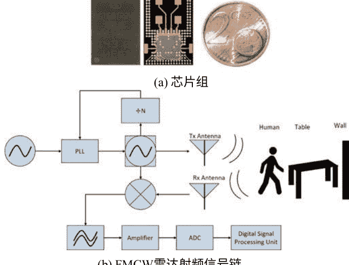

变化范围从 1 到 4.5 伏特，以使电压控制振荡器在其带宽上产生高度线性的频率扫描。

目标在视场中的雷达响应与发送信号的复制品混合，然后通过低通滤波对混合信号进行采样，然后由模数转换器进行采样。数字中频（IF）信号包含目标的信息，如距离、多普勒和角度，可以通过数字信号处理算法进行估计。

芯片组 BGT60TR24 的系统参数如表 1 所示。在一个帧内连续发送锯齿状的扫频信号，并通过生成 RDI 进行处理。每个扫频信号具有 $N_{TS} = 256$ 个样本，表示 DAC 样本，$B = 4 \mathrm{GHz}$ 表示频率扫描带宽，$T_{c} = 261 \mu \mathrm{s}$ 表示扫频持续时间。$P_{N} = 32$ 和 $T_{\mathrm{PRT}} = 520 \mu \mathrm{s}$ 分别表示在一个帧内发送的扫频信号数量和扫频重复时间。距离分辨率确定为 $\delta r =$

$$R_{\max } = (N_{TS} / 2) \times \delta r = 4.8 \mathrm{~m}$$

除以 2 是因为 BGT60TR24 只有一个 I (同相 ) 通道。最大无模糊速度是

$$\frac{c}{2 B} = 3.75 \mathrm{~cm}$$

最大理论范围为

$$v_{\max } = \frac{c}{2 f_{c} T_{\mathrm{PRT}}} = 4.8 \mathrm{~m/s} \quad (1)$$

速度分辨率是

$$\delta v = \frac{c}{2 f_{c} (P_{N} / 2) T_{\mathrm{PRT}}} = 0.3 \mathrm{~m/s} \quad (2)$$

| 参数，符号 | 数值 |
|---|---|
| 斜坡起始频率，$f_{\min}$ | 58 GHz |
| 斜坡停止频率，$f_{\max}$ | 62 GHz |
| 带宽，$B$ | 4 GHz |
| 距离分辨率，$\delta r$ | 3.75 cm |
| 每个啁啾的样本数，$N_{TS}$ | 256 |
| 最大范围，$R_{\max }$ | 4.8 米 |
| 采样频率，$f_{s}$ | 2 兆赫 |
| 啁啾时间，$T_{c}$ | 261 微秒 |
| 啁啾重复时间，$T_{\mathrm{PRT}}$ | 520 微秒 |
| 最大多普勒，$v_{\max }$ | 4.8 米/秒 |
| 啁啾数量，$P_{N}$ | 32 |
| 多普勒分辨率，$\delta v$ | 0.3 米/秒 |
| 发射天线数量，$N_{\mathrm{Tx}}$ | 1 |
| 接收天线数量，$N_{\mathrm{Rx}}$ | 3 |
| 仰角 $\theta_{\text {elev }}$ 每个雷达 | 70° |
| 方位角 $\theta_{\mathrm{azim}}$ 每个雷达 | 70° |

我们启用了 L 形配置中的 1 个发射和 3 个接收天线，以覆盖仰角和方位角的计算，尽管芯片包含 2 个发射和 4 个接收天线。BGT60TR24 的仰角和方位角 3 dB 半功率波束宽度均为 70°。

# ## 2.2 处理流程

由于 FMCW 波形及其模糊函数的特性，可以通过在 RDI 的生成过程中将其解耦来获得准确的距离和速度估计。接收到具有 $N_{TS}$ = 256 个样本数的啁啾的 IF 信号，收集 $P_{N}$个连续的啁啾，并以 $P_{N} \times N_{TS}$ 的形式排列成 2D 矩阵。RDI 分两步生成。第一步是计算并减去快时间上的均值，然后对所有 $P_{N}$ 个啁啾应用 1D 窗函数、零填充，然后进行快时间上的 1D 快速傅里叶变换（FFT），以获得距离变换。快时间指的是 $N_{TS}$ 的维度，表示啁啾时间。然后，在第二步中，计算并减去慢时间上的均值，应用 1D 窗函数和零填充，然后进行慢时间上的 1D 快速傅里叶变换 (FFT)，以获得所有距离区间的多普勒变换。慢时间指的是沿 $P_{N}$ 的维度，表示啁啾内时间。快时间上的均值减法消除了发射 - 接收泄漏，慢时间上的减法消除了来自雷达视野中任何静态物体的反射。由于使用了短的啁啾时间，快时间上的频率偏移主要是由于目标的往返传播延迟引起的，这是由目标与传感器之间的距离引起的。慢时间上的幅度和相位偏移是由于目标的多普勒频移引起的。

根据应用和雷达系统，处理流程可以是以下之一：

- 原始绝对RDI → 2D CFAR → DBSCAN → 处理后的RDI
- 原始复杂RDI（多通道）→ MVDR → 原始RAI → 2D CFAR → DBSCAN → 处理后的RAI

在第一个流程中，目标检测和聚类操作在距离-多普勒域上执行。检测和聚类应用于绝对原始RDI，并且输出是处理后的RDI。这通常适用于1Tx-1Rx雷达传感器的情况，或者适用于提取目标多普勒特征进行分类的应用，例如人体活动分类、生命感知等。而在另一个流程中，来自多个通道的原始复杂RDI首先通过MVDR算法进行处理，生成RAI，然后在该域中进行2D CFAR和聚类操作。后一种流程用于需要在2D空间中进行目标检测定位的应用。

在前期的流水线中，如果存在多个接收通道，则可以选择通过最大比合并（MRC）来组合原始RDI，以获得多样性并提高信号质量。MRC的目标是通过对多个通道上的RDI进行加权组合来构建单个RDI。加权平均的增益是通过估计每个天线上的信噪比（SNR）来确定的。有效的RDI计算公式为

$$
I=\frac{\sum_{r_x=1}^{N_{Rx}} g^{r_x}\left|I^{r_x}\right|}{\sum_{r_x=1}^{N_{Rx}} g^{r_x}} \quad (3)
$$

其中 $I^{r_x}$ 是第 $r_x$ 个接收通道的复杂RDI，增益是自适应计算的

$$
g^{r_x}=\frac{\mathrm{NTS}\times \mathrm{PN}\max\left\{\left|I^{r_x}\right|^2\right\}}{\left(\sum_{l=1}^{\mathrm{NTS}}\sum_{m=1}^{\mathrm{PN}}\left|I^{r_x}(m,l)\right|^2-\max\left\{\left|I^{r_x}\right|^2\right\}\right)} \quad (4)
$$

其中 max{.} 表示2D函数的最大值，而 $g^{r_x}$ 表示第 $r_x$ 个接收通道的估计信噪比。因此，$(\mathrm{PN}\times \mathrm{NTS}\times N_{Rx})$ RDI张量被转换为 $(\mathrm{PN}\times \mathrm{NTS})$ RDI矩阵。或者，在后续流程中，将原始复杂RDI使用Capon或MVDR算法转换为RAI，而不是使用MRC。

##### MVDR

假设Tx元素的三维位置坐标为 $d^{Tx}$，Rx元素的位置坐标为 $d_n^{Rx}$，其中 $n=1,2$。假设处于远场条件下，从Tx元素 $d^{Tx}$ 到散射点 $p$ 的信号传播以及从 $p$ 到Rx元素 $d_n^{Rx}$ 的反射可以近似表示为 $2x+d\sin(\theta)$，其中 $x$ 是散射点到虚拟线性阵列中心的基准距离，$d$ 是接收元素之间的距离，$\theta$ 是相对于基准方向的入射角。

假设满足远场条件，雷达回波从虚拟线性阵列中心距离为基准距离 $x$ 的散射体的时间延迟可以表示为

$$
\tau_n=\frac{2x}{c}+\frac{d\sin(\theta)}{c}
$$

接收到的波束指向矢量是

$$
a_n^{Rx}(\theta)=\exp\left(-j2\pi\frac{d_n^{Rx}\sin(\theta)}{\lambda}\right),\quad n=1,2
$$

其中 $\lambda$ 是发射信号的波长。两个接收到的去斜拍频信号用于解析散射体的相对角度 $\theta$。

每个距离区间的方位成像剖面可以使用波束形成器的Capon谱生成。Capon波束形成器通过最小化噪声的方差/功率，同时保持对所需角度的无失真响应来计算。相应的二次优化问题是

$$
\min_{\mathbf{w}}\ \mathbf{w}^H\mathbf{C}\mathbf{w}\quad \text{s.t.}\ \mathbf{w}^H\mathbf{a}^{Rx}(\theta)=1
$$

其中 $C$ 是噪声的协方差矩阵，上述优化问题有一个闭式表达式
$w_{\text{capon}}=\frac{C^{-1}a(\theta)}{a^H(\theta)C^{-1}a(\theta)}$，其中 $\theta$ 是期望的角度。将 $w_{\text{capon}}$ 代入(7)的目标函数中，空间谱可以表示为

$$
P_l(\theta)=\frac{1}{\left(\mathbf{a}^{Rx}(\theta)\right)^H \mathbf{C}_l^{-1}\mathbf{a}^{Rx}(\theta)},\quad l=0,\ldots,L
$$

其中 $L$ 是距离区间的数量。

然而，在实践中，估计每个距离区间 $l$ 的噪声协方差是困难的，因此估计包含信号成分的 $\hat{C}_l$ 通过样本矩阵求逆（SMI）技术进行估计：

$$
C_l=\frac{1}{K}\sum_{k=1}^{K}s_l^{IF}(k)s_l^{IF}(k)^H
$$

其中 $K$ 表示用于信号加噪声协方差估计的帧数量，而 $s_l^{IF}(k)$ 是距离bin $l$ 内的去斜中频信号[26]。

##### 2D CFAR

在每个流水线中进行早期操作后，前一种情况下的原始RDI和后一种情况下的原始RAI被输入到CFAR检测算法中，生成一个指示检测到的目标的命中矩阵。目标检测问题可以表示为

$$
I_{\text{det}}(\text{CUT})=
\begin{cases}
1, & \text{如果 } |I(\text{CUT})|^2>\mu\sigma^2 \\
0, & \text{如果 } |I(\text{CUT})|^2<\mu\sigma^2
\end{cases}
\quad (9)
$$

其中 $I_{\text{det}}(\text{CUT})$ 是测试单元（CUT）的检测输出，取决于输入图像 $I$。估计协方差的 $\mu$ 和 $\sigma^2$ 的乘积表示检测阈值。CFAR检测的阈值乘数 $\mu$ 由可接受的虚警概率设置，对于平均单元CFAR（CA-CFAR），有

$$
\mu=N\left(P_{fa}^{-1/N}-1\right) \quad (10)
$$

其中 $P_{fa}$ 是误报概率，$N$ 是所谓“参考”单元的窗口大小，用于噪声功率估计。噪声方差 $\sigma^2$ 是从CUT周围的“参考”单元估计得到的。因此，估计的噪声协方差考虑了CUT周围的局部干扰加噪声功率。

虽然在点目标情况下，CA-CFAR是最常用的检测器，但在双向扩展目标（如具有宽雷达带宽的人体）的情况下，它会导致检测效果差，因为扩展目标也存在于参考单元中，从而导致高噪声功率估计和漏检。此外，CA-CFAR会使强目标附近的噪声阈值升高，从而遮挡附近较弱的目标。为了避免这种问题，对于双向扩展目标，使用有序统计CFAR（OS-CFAR）方法，因为有序统计量对异常值具有鲁棒性。在这种情况下，对于参考单元中的目标扩展，选择第 $k$ 个有序数据作为估计的噪声方差 $\sigma^2$。因此，不再使用参考单元中的平均功率，而是选择第 $k$ 个有序数据作为估计的噪声方差 $\sigma^2$。

关于OS-CFAR的详细描述可以在[27]中找到。

##### DBSCAN

与点目标相反，在双重扩展目标的情况下，检测算法的输出不是目标在RDI中的单个检测，而是分布在距离和多普勒上。因此，需要使用聚类算法将来自单个目标的检测分组，根据其大小作为单个聚类。为此，使用了基于密度的带噪声空间聚类（DBSCAN）算法，这是机器学习社区中最常用的无监督学习算法。给定RAI中来自同一目标和多个目标的一组目标检测，DBSCAN将紧密聚集在一起的检测分组在一起，同时将孤立在低密度区域中的检测移除为异常值。

为此，DBSCAN将每个点分类为核心点、边缘点或噪声。DBSCAN聚类算法需要两个输入参数，即邻域半径 $d$ 和最小邻居数 $M$。如果一个点至少有 $M-1$ 个邻居，即在距离 $d$ 内的点，则将其定义为核心点。边缘点具有少于 $M-1$ 个邻居，但至少有一个邻居是核心点。所有具有少于 $M-1$ 个邻居且没有核心点作为邻居的点都不属于任何簇，并将被分类为噪声[28]。

#### 2.3 挑战和贡献

室内环境通常对使用雷达传感器的人体存在、定位和人数统计系统提出许多挑战。主要误差源包括多径反射、幽灵目标、目标遮挡、目标合并和目标分裂。多径反射和幽灵目标是由于静态物体（如墙壁、椅子或桌子）对人体目标的反射以及雷达传感器反射引起的。这些幽灵目标和虚假反射在CFAR检测算法的输出中表现为误报。图2a展示了室内环境设置，其中一个人靠近墙壁行走；图2b描述了使用传统处理流程检测到的目标RDI，其中真实目标用绿色标记，幽灵目标和多径伪影用红色标记。

如果目标反射被其他原因削弱，如平移距离迁移、旋转距离迁移或斑点，则可能发生目标遮挡效应；例如，另一个物体位于目标到雷达传感器的视线上，或两个目标靠得很近。自适应CFAR算法在这种情况下可能无法检测到真实目标。目标合并和目标分裂问题部分源于参数化聚类算法。特别是使用DBSCAN聚类时，如果邻域半径设置得太大，簇可能会合并；如果设置得太小，人体目标的手臂、腿或头部可能会被识别为单独目标。根据室内环境和人体活动，目标的雷达响应在距离-多普勒域上会有不同散点。因此，为所有情况设置通用邻域半径非常困难，甚至不可能。

传统处理流程使用有序统计CFAR（OS-CFAR）和DBSCAN，如图3a所示；提出的深度残差U-Net架构用于处理检测到的目标RDI，如图3b所示。受深度残差U-Net在图像分割问题上的启发，本文提出使用深度残差U-Net架构生成检测RDI，同时去除幽灵目标、多径反射，防止目标遮挡，并实现准确目标聚类。计算目标检测RDI后，估计目标数量及其参数，即距离、速度、角度。

传统处理流程将来自多个接收天线的原始RDI作为输入，并通过MVDR、OS-CFAR和DBSCAN处理原始RDI，如图4a所示。相反，在提出的深度复杂U-Net模型中，不同通道的原始RDI直接通过神经网络处理，重构目标检测RAI，如图4b所示。

所提出的深度复杂U-Net模型目标是重建检测RAI，从而消除幽灵目标、消除多径反射、防止目标遮挡，并实现准确目标聚类。

在重建目标检测RDI或RAI之后，估计目标数量和参数，即距离、速度、角度。目标列表及其参数进一步输入应用特定处理或人员跟踪算法。

图2a 室内房间环境，有一个人在房间里走动。  
图2b 雷达感知到的经过处理的RDI，使用了OS-CFAR和DBSCAN。处理后的RDI显示了真实目标（绿色）和幽灵目标（红色），这是由墙壁等反射引起的。

## 3 网络架构——深度残差U-Net

图5展示了网络架构。它有一个编码器路径和一个解码器路径，每个路径都有三个分辨率步骤。在编码器路径中，每个块包含两个3×3卷积，每个卷积后面跟着一个修正线性单元（ReLU），以及一个3×3最大池化（各维度步长为2）。在解码器路径中，每个块由一个2×2上采样卷积和两个3×3卷积组成，每个卷积后面跟着一个ReLU。上采样卷积通过上采样层和卷积层实现。编码器路径中分辨率相等层之间的跳跃连接将高分辨率特征提供给解码器路径，类似标准U-Net。编码器和解码器之间的桥接连接由两个卷积层组成，每个卷积层后面跟着一个ReLU，中间有一个Dropout层。在训练过程中，dropout设置为0.5以减少过拟合。在最后一层，进行了一个1×1卷积。

图3a 使用OS-CFAR和DBSCAN的传统处理流程生成目标检测RDI。  
图3b 使用提出的深度残差U-Net的处理流程，用于抑制幽灵目标、多径反射、减轻目标遮挡，并实现准确聚类。

图4a 使用MVDR、OS-CFAR和DBSCAN的传统处理流程，从跨通道输入RDI生成目标检测RAI。  
图4b 使用提出的深度复杂U-Net的处理流程，用于抑制幽灵目标、多径反射、减轻目标遮挡，并实现准确聚类。

## 4 网络架构——深度复杂U-Net

将输出通道数减少到类别数，即2个（目标存在/不存在）。该架构总共有40752个可训练参数。如文献建议，在最大池化之前将通道数加倍以防止瓶颈[30]。在解码器路径中也采用相同方案以避免瓶颈。网络输入是一个128×32×1的原始RDI。输出是一个128×32×1图像，像素值介于0和1之间，表示每个像素目标存在/不存在的概率。

图6显示了用于定位任务的网络架构。虽然它看起来与图5非常相似，但细节上有很大不同。它仍然是类似U-Net的架构，但使用完全复数操作和3D卷积。下面简要介绍复杂卷积层和复杂激活层：

1. 复杂卷积层：

图7说明了在任意层 $i$ 上，使用复数核和输入图像的2D CNN操作映射。复杂卷积层从接收通道的距离-多普勒维度生成特征图。第 $k$ 个特征图在第 $i$ 层中可表示为

$$
\begin{aligned}
\hat{A}_{i,k}+j\hat{B}_{i,k}
=&\left(A_{i-1,k}*C_{i,k}-B_{i-1,k}*D_{i,k}\right) \\
&+j\left(A_{i-1,k}*D_{i,k}+B_{i-1,k}*C_{i,k}\right)
\end{aligned}
\tag{11}
$$

其中 $A_{i-1,k}, B_{i-1,k}$ 表示第 $i-1$ 层第 $k$ 个特征图的实部和虚部。第 $k$ 个卷积核的实部和虚部分别为 $C_{i,k}, D_{i,k}$。滤波器尺寸为 $Q_i\times Q_i\times K_i$，其中 $Q_i$ 用于距离-多普勒维度，$K_i$ 沿空间通道。

2. 复杂激活函数：

复数2D层逐渐提取更深层特征表示。激活函数向表示中引入非线性。复杂ReLU实现为

$$
B_{i,k}=\mathrm{ReLU}(\hat{A}_{i,k})+j\cdot \mathrm{ReLU}(\hat{B}_{i,k})
$$

实际上，复杂ReLU将第二象限数据映射到虚轴正半部分，将第三象限数据映射到原点，将第四象限数据映射到实轴正半部分。

在提出的架构中，避免使用复杂最大池化，因为它会导致模型不稳定，因此通过步进卷积实现渐进的距离-多普勒维度缩减。在编码器路径中，每个块包含两个 $3\times3\times1$ 复杂卷积层，每个卷积层后面跟着一个复杂ReLU，以及一个 $3\times3\times1$ 步幅卷积层，步幅为 $2\times2\times1$。在解码器路径中，上采样层实现为 $2\times2\times1$ 上采样层，后跟一个 $2\times2\times1$ 卷积层。在编码器路径和解码器路径中，相同深度的每个块之间都有跳跃连接，以提供特征位置信息给解码器。

批量归一化在编码器和解码器的每个卷积层之后进行。在编码器路径中，通道维度大小在每个块中加倍，而图像维度减半。解码器路径相反，在每个块中通道数减半，同时图像通过2倍因子上采样。由于3D卷积滤波器大小限制，网络仅在最后一个复杂卷积层中结合各天线信息，其中使用 $1\times1\times2$ 的滤波器大小，不对输入做填充。最后一个卷积层（图6中紫色）是普通卷积层，用于组合前面层的实部和虚部输出，并具有单通道输出。编码器和解码器每个块共有68181个可训练参数。神经网络输入是来自两个接收天线的两个128×32复数RDI。输出是一个128×32的RAI，像素值介于0和1之间，表示每个距离-角度像素中目标存在/不存在的概率。

## 5 实施细节

#### 5.1 数据集

为了创建标注数据集，原始RDI使用相应传统处理流程处理：使用MVDR波束形成技术创建标注RAI，使用MRC技术创建标注RDI。在录制过程中，使用摄像机辅助生成数据集。通过其反馈，我们去除了幽灵目标和多径反射，并在目标因其他人或靠近墙壁的静态人物而被遮挡时补加检测。这是通过改变传统流程中检测和聚类算法参数实现的，使检测概率接近100%，但也导致较高误报概率。这意味着：在目标遮挡情况下减小CFAR缩放因子；在目标合并/分离情况下，通过DBSCAN算法减小/增加最大邻居距离进行聚类检测。然后，使用摄像机数据作为参考，手动删除所有错误检测聚类。对于单目标测量，该过程相对简单，因为正确聚类通常是离雷达传感器最近的聚类。该数据集包含房间内1到4个人的场景。

为了增加数据集规模并实现模型更广泛泛化，对RDI进行数据增强。由于多人存在情况下创建带标签数据越来越困难，我们通过对多个原始单目标RDI进行平移和旋转后叠加，合成了具有多个目标的RDI。通过该技术，可以合成大量RDI，仅受单目标测量可组合数量限制。在拥有足够多单目标测量基础的情况下，需要谨慎处理，因为网络否则可能会过度拟合可能的目标位置。为了增加RAI存在检测和定位任务的单目标测量池，通过将来自两个天线的RDI乘以接近于1且具有随机相位的复数值来增加单目标测量。这个操作改变了输入值，但不应该改变估计的距离和角度，除了在半波长范围内的可忽略距离误差。

#### 5.2 损失函数

给定一组训练图像、原始RDI及相应的地面真实处理后的RDI或RAI \(I_i, P_i\)，训练过程估计网络参数，使模型能够重构准确的RDI或RAI。这是通过最小化真实RDI/RAI \(P_i\) 与由 \(h(I_i; W)\) 生成的RDI/RAI之间的损失来实现的。在这里，我们使用焦点损失[31]和铰链损失的加权组合作为损失函数来训练所提出的模型，如公式（13）所示。

\[
\begin{gathered}
HL(p)=1-y(2p-1)\\
FL(p_t)=(1-p_t)^\gamma\log(p_t)\\
L(p_t)=\alpha\left(FL(p_t)+\eta HL(p)\right)
\end{gathered}
\]  
（13）

变量 \(y\in\{\pm1\}\)、\(p\in[0,1]\) 以及 \(p_t\in[0,1]\) 分别表示类别标签、标签为 \(y=1\) 的估计概率，以及像素被正确分类的概率，如公式（14）所定义：

\[
p_t=
\begin{cases}
p, & \text{如果 } y=1\\
1-p, & \text{否则}
\end{cases}
\]
（14）

参数 \(\gamma\)、\(\eta\) 和 \(\alpha\) 影响焦点损失的形状、铰链损失的权重和类别加权。为了训练深度残差U-Net模型以重建处理后的距离-多普勒图像，选择参数 \(\gamma=2\)、\(\alpha=0.25\)，并且 \(\eta\) 逐步增加到 \(\eta=0.15\)。在训练深度复杂U-Net模型以重建处理后的距离-角度图像时，除 \(\eta=0\) 外，使用了相同参数。所选参数对两个模型的F1得分准确性均表现最佳。

使用焦点损失的原因在于图2a中的目标设置特性：训练数据存在类别不平衡。在大多数情况下，“目标不存在”标记的像素频率远高于“目标存在”标记。此外，类别频率在单个训练样本之间也可能有很大差异，特别是训练集包含不同目标数量的RDI时。焦点损失对分类错误像素赋予更高的交叉熵损失权重，而对分类正确像素赋予更低权重。因此，属于较稀有类别的像素通常具有更高权重。

为了强制网络做出更清晰的分类决策，将铰链损失与焦点损失相结合，并乘以因子 \(\eta\)。\(\eta\) 的取值使得在训练前几个epoch中焦点损失占主导，随后铰链损失变得相关。

#### 5.3 设计考虑

网络权重使用Xavier均匀初始化器初始化，该初始化器从均匀分布 \([-\text{limit}, \text{limit}]\) 中采样，其中 \(\text{limit}=\sqrt{6/(n_{in}+n_{out})}\)。偏置初始化为0。反向传播使用Adam[32]优化器，默认学习率（alpha）为0.001；第一时刻指数衰减率（beta1）为0.9，第二时刻指数衰减率（beta2）为0.999。用于避免除零的epsilon设置为 \(10^{-7}\)。

## 6 结果与讨论

评估检测-聚类性能最常用的指标是接收器工作特性（ROC）及其曲线下面积（AUC）。对于目标检测问题，分类准确率可能是误导性的，因为它不能完整反映模型性能。当误报代价高时，精确率更有帮助（如虚假目标或多路径反射）；当漏检代价高时，召回率更有帮助（如目标遮挡）。F1分数综合了精确率与召回率。接近1的高F1分数意味着虚假阳性低（虚假目标检测少）且虚假阴性低（漏检少），表明检测正确且受误报干扰小。共使用2000个测试图像评估所提方法性能。

测试集由两个接收天线的一至四个人体目标原始RDI组成，数据采集于不同房间配置和多种日常活动场景。实验中观察到：将MTI后的RDI作为神经网络输入，可更好泛化到不同目标场景。若不从输入RDI中移除静态目标，网络容易过拟合训练场景；而使用去除静态目标的RDI训练则不会出现该泛化问题。

为了评估基于神经网络和传统信号处理方法的检测概率与虚警概率，将相应处理后的RDI输出与标注数据比较。由于标注过程限制，人体可能只有部分被标为RDI/RAI中的“目标存在”。因此，在定义漏检和误报时，应忽略小位置误差和聚类大小变化。我们通过计算标注数据与处理后RDI中每个聚类的质心来实现。仅当处理后RDI与标注RDI对应聚类质心之间的距离满足：距离维小于20 cm、速度维小于1.5 m/s，才视为正确检测。此外，要求网络输出中每个聚类仅能匹配标注中的一个聚类，反之亦然。

表2展示了所提方法与传统处理链在F1分数上的比较。所提方法结果包括深度为3的网络（NN\_d3，见图5）以及编码器和解码器中各含5个残差块的更深网络（NN\_d5）。对于深度为5的网络，相比图5结构，在编码器与解码器中分别增加2个残差块。桥接块输入维度为 \(4\times1\times125\)。所提方法检测性能更优：F1为0.89（传统流程为0.71）。更深网络NN\_d5（约690,000个可训练参数）进一步提升至F1=0.91。图8比较了深度为3和5的U-Net与传统处理的ROC曲线。两种网络的ROC是通过改变硬阈值参数得到（该参数定义NN输出中判为目标的最小像素值）；传统处理链ROC则通过变化CFAR检测的缩放因子得到。

曲线在检测概率接近1时进行了外推。ROC显示所提残差U-Net较传统处理流程具有更优AUC。同样，图9显示复杂U-Net相比传统处理具有更好AUC。

图10a为原始RDI，图10b为传统方法检测结果，图10c为所提深度残差U-Net对合成四目标测量的检测结果。神经网络输出为每像素在0到1之间的分类概率。为得到所示输出，采用硬阈值0.5，即像素值≥0.5判为目标。传统方法中，一个约2 m、速度约-2 m/s的目标被错误分成两个聚类；此外，2到3 m之间两个目标被完全忽略。

图11a-c展示了合成数据上传统处理链中的目标遮挡问题。传统方法漏检了约3 m处一个目标，而图11c中的方法能可靠检测所有目标。图12a-c和图13a-c展示了传统方法在两种不同场景下的困难。

在图12b中，1 m标记附近两个目标过于接近，DBSCAN无法分成两个簇，导致两簇合并并漏检一个目标。图13b展示了幽灵目标问题：距雷达约4 m处出现错误检测。在这两种情况下，基于U-Net的方法均正确显示所有目标（图12c和13c）。但需说明，尽管所提方法优于传统处理链，类似场景中仍可能出现漏检和误报。实验观察到，所提方法在抑制多径反射和静态物体反射引起的幽灵目标方面表现突出，也较好避免目标分裂或合并；但在多人前后遮挡场景下改进不明显。其原因在于训练数据大多通过叠加单目标测量合成多目标RDI。

实验还表明，损失函数对实现优异检测结果至关重要。当前损失函数在处理类别不平衡和加速训练方面表现良好，但仍可改进：可更严厉惩罚目标合并/分裂，同时允许聚类内的小位置误差而不增加损失。

对于距离和角度的目标检测与定位，评估同样采用ROC与F1。使用与前述相同测试集，但输入为来自两个接收天线的复数RDI。对神经网络的距离-角度输出图，采用简单聚类算法评估；本文使用DBSCAN，并设定较小最小邻居数与最大邻域距离，以将近连续簇识别为一个目标。随后计算各聚类质心，并与标注质心比较。

在该场景下，若两聚类质心距离低于阈值，仍判为检测到目标；此处阈值为7.8°或37.5 cm。表3给出所提方法与传统方法的F1对比。

| 方法 | 描述 | F1得分 | 模型大小 |
|---|---|---|---|
| 传统方法 | OS-CFAR与DBSCAN | 0.61 | - |
| 复杂U-net深度3 | 焦点损失 | 0.72 | 529 kB |
| 复杂U-net深度4 | 焦点损失 | 0.77 | 1.23 MB |

与经典方法F1=0.62相比，所提方法显著提升至0.77。图9中的ROC曲线在小于1处停止，原因在于检测评估方式；虚线为外推。当阈值或CFAR缩放因子接近0时，所有像素都会被检测为目标，随后DBSCAN将其识别为一个巨大聚类，因此误报概率为1不可实现。

评估中可见：目标较少时所提方法更好，目标密度增大时性能下降更明显。尽管神经网络仅用一到两个目标测量训练，在许多情况下仍能正确识别三到四个目标位置。

比较表3与表2可见，网络在距离-角度定位任务上更困难，原因有二：其一，仅使用两个接收天线，角度估计本就较难；其二（影响更大）是两实验评估方式不同。由于速度差异无法与角度差异直接比较，最小质心距离标准不再适用。若将角度阈值从7.8°增至15.6°，所提方法与传统方法F1分别约为0.9和0.68。因此，所提方法在消除幽灵目标和估计正确距离方面表现良好，但角度估计精度较弱；传统方法因其错误多来自幽灵目标和漏检，故从阈值放宽中获益有限。

图14、15、16和17给出若干示例，包括输入图像、传统处理链输出和神经网络输出。此处输入图像为单天线RDI（复杂双天线输入难以可视化），主要用于展示距离-角度存在检测与定位的难点。图14中，经典链漏检两个目标，而神经网络检测出四个目标但多出一个误报。图15中，网络检测到全部四个目标，传统方法漏检一个。图16中，经典方法仅正确识别一个目标、漏检三个并含一个误报；神经网络仅漏检一个目标。最后一个示例中，网络再次正确识别全部目标位置，而传统方法出现两个漏检和一个目标分割，从而产生一个误报。

## 7 结论

传统雷达信号处理流程在RDI或RAI上进行目标检测时，容易产生虚假目标、来自静态物体的多路径反射以及目标遮挡，尤其在室内环境中。此外，参数化聚类算法容易将单一目标分裂为多个，或将多个目标合并为单个聚类。为克服这些问题并实现准确的人体检测、定位和计数，本文提出分别在RDI和RAI域使用深度残差U-Net模型与深度复数U-Net模型生成准确的人体检测结果，特别适用于室内场景。我们采用自定义损失函数、所提架构设计及数据增强训练策略来训练模型，以得到准确的处理后RDI和RAI。与传统信号处理方法相比，我们在F1分数和ROC特性上展示了更优检测与聚类结果。

未来工作可部署变分自动编码生成对抗网络（VAE-GAN）架构，以降低U-Net模型对传感器噪声与干扰引起数据变化的敏感性。

## 参考文献

- 1. EPRI，占用传感器：正面/关闭照明控制，Rep. EPRI8R-100323（1994）
- 2. V. Garg, N. Bansal，智能占用传感器以减少能源消耗。Energy Build. 32，81-87（2000）
- 3. W. Butler, P. Poitevin, J. Bjornholt，利用FMCW雷达的广域入侵检测系统的好处（2007），176-182页
- 4. J. Lien, N. Gillian, M. Emre Karagozler, P. Amihood, C. Schwesig, E. Olson, H. Raja, I. Poupyrev，Soli：毫米波雷达的无处不在手势感知。ACM Trans. Graph. 35，1-19（2016）
- 5. S. Hazra, A. Santra，使用毫米波雷达系统的鲁棒手势识别。IEEE Sens. Lett. PP，1（2018）
- 6. S. Hazra, A. Santra，使用3D CNN和三元损失的短程雷达手势识别系统。IEEE Access 7，125623-125633（2019）
- 7. M. Arsalan, A. Santra，基于雷达的空中书写字符识别用于人机界面。IEEE Sens. J. PP，1（2019）
- 8. C. Will, P. Vaishnav, A. Chakraborty, A. Santra，使用24 GHz FMCW雷达的人体目标检测、跟踪和分类。IEEE Sens. J. PP，1（2019）
- 9. A. Santra, R. Vagarappan Ulaganathan, T. Finke，用于占用感知应用的短程毫米波雷达系统。IEEE Sens. Lett. PP，1（2018）
- 10. H. L. Van Trees，Detection, Estimation, and Modulation Theory, Part I（Wiley，2004）
- 11. A. Santra, I. Nasr, J. Kim，重新定义雷达：4D感知的力量。Microw. J. 61，26-38（2018）
- 12. F. Schroff, D. Kalenichenko, J. Philbin，FaceNet：面部识别和聚类的统一嵌入（2015），815-823页
- 13. O. M. Parkhi, A. Vedaldi, A. Zisserman，深度人脸识别，Vol. 1（2015），41.1-41.12页
- 14. S. Ren, K. He, R. Girshick, J. Sun，Faster R-CNN：基于区域建议网络的实时目标检测。IEEE Trans. Pattern Anal. Mach. Intell. 39（2015）
- 15. J. Redmon, S. Divvala, R. Girshick, A. Farhadi，You Only Look Once：统一的实时目标检测（2016），779-788页
- 16. L.-C. Chen, G. Papandreou, I. Kokkinos, K. Murphy, A. L. Yuille，DeepLab：深度卷积网络、空洞卷积和全连接CRF的语义图像分割。IEEE Trans. Pattern Anal. Mach. Intell.（2016）
- 17. O. Ronneberger, P. Fischer, T. Brox，U-Net：用于生物医学图像分割的卷积网络（2015）
- 18. M. A. Wani, F. A. Bhat, S. Afzal, A. I. Khan，深度学习进展（Springer，新加坡，2020）
- 19. K. He, X. Zhang, S. Ren, J. Sun，深度残差学习用于图像识别（2016），770-778页
- 20. Z. Zhang, Q. Liu, Y. Wang，通过深度残差U-Net进行道路提取。IEEE Geosci. Remote Sens. Lett.（2017）
- 21. G. Zhang, H. Li, F. Wenger，使用全卷积网络的FMCW雷达目标检测与3D估计（2019）。arXiv:1902.05394
- 22. 王L，唐J，廖Q，基于深度神经网络的雷达目标检测研究。IEEE Sens. Lett. 3(3)，1-4（2019）
- 23. Stephan M, Santra A，基于深度残差U-Net的雷达人体目标检测用于智能家居应用，Proc. 18th IEEE ICMLA（2019），175-182页
- 24. J. S. Dramsch，Contributors，基于TensorFlow的Keras复数神经网络（2019）
- 25. C. Trabelsi, O. Bilaniuk 等，深度复数网络（2017）。arXiv:1705.09792
- 26. 徐L，李J，Stoica P，自适应MIMO雷达技术，第四届IEEE传感器阵列与多通道处理研讨会（2006），258-262页
- 27. H. Rohling，杂波和多目标情况下的雷达CFAR阈值处理。IEEE Trans. Aerosp. Electron. Syst. 19，608-621（1983）
- 28. M. Ester, H.-P. Kriegel, J. Sander, X. Xu，一种基于密度的聚类算法用于在带噪声的大型空间数据库中发现簇，KDD（1996）
- 29. A. Santra, R. Santhanakumar, K. Jadia, R. Srinivasan，匹配照明信号与动态目标模型的SINR性能（2016）
- 30. C. Szegedy, V. Vanhoucke, S. Ioffe, J. Shlens, Z. Wojna，重新思考计算机视觉中的Inception架构（2016）
- 31. T.-Y. Lin, P. Goyal, R. Girshick, K. He, P. Dollar，密集目标检测的焦点损失（2017），2999-3007页
- 32. D. Kingma, J. Ba，Adam：一种随机优化方法，Vol. 12（2014）

## 具有高度不平衡的大数据的深度学习阈值策略

Justin M. Johnson 和 Taghi M. Khoshgoftaar

摘要 为了解决使用类别不平衡数据训练预测模型所面临的挑战，已经使用了各种数据级、算法级和混合方法。虽然许多这些技术已经扩展到深度神经网络 (DNN) 模型，但相对较少的研究强调了输出阈值的重要性。在本章中，我们将 DNN 的输出与贝叶斯后验概率相关联，并建议在训练数据不平衡时，默认阈值 0.5 几乎从不是最优的。我们使用三个真实数据集模拟了广泛的类别不平衡水平，即正类别大小为 0.03-90%，并将默认阈值结果与两种替代阈值策略进行了比较。

最优阈值策略使用验证数据或训练数据搜索最大化几何平均值的分类阈值。先验阈值策略不需要优化，而是将分类阈值设置为正类别的先验概率。探索了多种深度架构，并重复进行了 30 次实验以考虑随机误差。线性模型和可视化结果显示最优阈值与正类别先验强相关。置信区间显示当训练数据不平衡时，默认阈值只在训练数据平衡时表现良好，而最优阈值在训练数据倾斜时表现显著更好。令人惊讶的是，统计结果显示在所有分布中，先验阈值与最优阈值的表现一致。本章的贡献有两个方面：(1) 说明使用高度不平衡的大数据训练深度模型的副作用，(2) 比较多种阈值策略以最大化不平衡训练数据的类别性能。

### 1 引言

当一个类别或类别的样本总数明显大于数据集中的任何其他类别时，存在类别不平衡。这种现象在许多关键行业中出现，例如金融 [1]、生物医学 [2]和环境 [3]。在这些示例中，感兴趣的正类是较小的类，即少数群体，而较不感兴趣的负样本则非常丰富。

在这项研究中，我们专注于包含正类和负类的二分类问题。所提出的概念可以扩展到多类问题，因为多类问题可以通过类别分解转化为一组二类问题 [4]。

不平衡的数据集已经被证明会降低分类模型的性能，通常导致模型过度预测多数群体。结果是，属于少数群体的实例被错误地分类为负样本，正类性能受到影响。更糟糕的是，流行的评估指标如准确率很容易误导分析人员，给出高分数，错误地表明良好的预测性能。例如，对于一个仅有 1% 正类大小的二进制数据集，一个简单的学习器总是输出负类将得到 99% 的准确率。这种性能下降的程度取决于问题的复杂性、数据集的大小和类别不平衡的程度 [5]。在这项研究中，我们使用深度神经网络（DNN）模型对具有大数据和高类别不平衡特征的复杂数据集进行预测。

一般来说，DNN 模型的性能会随着类别不平衡的程度的增加而下降，而正类别的相对大小减小 [6]。我们用负样本与正样本的比例来表示二元数据集中类别不平衡的程度，即负：正。例如，一个包含 400 个负样本和 100 个正样本的数据集的不平衡程度用 80:20 表示。同样，我们有时也会提到正类别的先验概率，例如 80:20 的分布具有 0.2 或 20% 的正类别先验。当正类别的先验概率≤0.01 时，我们将数据集分类为高度不平衡 [7]。当正样本的总数变得更加稀少时，我们将数据集描述为具有稀有性。Weiss 等人 [8] 区分了绝对稀有性和相对稀有性。绝对稀有性发生在给定类别的样本非常少的情况下，不论多数类别的大小如何。与绝对稀有性不同，相对稀有的类别可以占据数据集的一小部分百分比，但当整个数据集非常大时，仍然有很多出现次数。例如，给定一个包含 1000 万条记录和相对正类别大小为 1% 的数据集，仍然有 100,000 个正例可用于训练机器学习模型。因此，我们有时可以在相对稀有的类别上取得良好的性能，特别是在处理大量数据时。

本章的实验探索了广泛的类别不平衡水平，例如 0.03-90%，并包括相对稀有情况。

处理类别不平衡数据的挑战通常会受到处理大数据的挑战的影响 [9]。大数据通常指的是超出标准数据存储和处理能力的数据。这些数据集也被定义为使用四个 V：容量、多样性、速度和真实性 [10,11]。收集到的大量数据需要高度可扩展的硬件和高效的分析工具，通常需要分布式实现。除了增加架构和网络开销外，分布式系统还会加剧类别不平衡数据的负面影响 [12]。大数据的多样性对应于大部分非结构化、多样化和不一致的表示形式，这些表示形式在长时间内从多个来源消耗数据时出现。需要先进的技术来快速处理传入的数据流并保持适当的响应时间，以跟上数据生成的速度，即数据速度。最后，大数据的真实性，即其准确性和可信度，必须定期验证，以确保结果不会变得不可靠。MapReduce [13] 和 Apache Spark [14] 是两个流行的框架，通过并行处理分区数据来解决这些大数据挑战。神经网络也可以使用数据并行或模型并行技术进行分布式训练 [15,16]。本研究使用的三个数据集包含许多这些大数据特征。

针对类别不平衡问题，数据层面和算法层面的技术已经得到了广泛研究。数据方法使用采样来改变训练数据的分布，有效降低模型训练中的类别不平衡水平。随机过采样（ROS）和随机欠采样（RUS）是解决类别不平衡问题的两种最简单的数据层面方法。ROS 通过随机复制少数类样本来增加少数类的大小，而 RUS 通过随机丢弃多数类样本来减小多数类的大小。

从这些基本的数据层面方法出发，还发展出了许多更高级的变种方法 [17-20]。算法层面方法修改训练过程，增加少数类的影响力并减少对多数类的偏见。直接的算法层面方法通常通过引入类别成本或权重来修改机器学习算法的底层学习器。元学习器方法使用包装器将非成本敏感的学习器转化为成本敏感的学习器。成本敏感学习和输出阈值化是直接和元学习器算法层面方法的例子 [21]。输出阈值化是改变用于将类别标签分配给模型后验概率的决策阈值的过程 [22,23]。最后，还有一些混合方法，结合了两种或更多的数据层面方法和算法层面方法 [7,24-26]。在本章中，我们将探讨与深度学习相关的输出阈值化。

深度学习是机器学习的一个子领域，它使用人工神经网络（ANN）来近似某个函数 $f^*$，其中$f^*$可以用于将输入数据映射到新的表示或进行预测 [27]。

受生物神经网络启发，人工神经网络是一组相互连接的神经元或节点，其中连接具有权重，并且每个神经元通过将其加权输入应用于非线性激活函数的总和来将其输入转换为单个输出。在前馈网络中，输入数据通过前向传递在网络中传播，每个隐藏层从前一层的输出接收输入，产生一个最终输出，该输出取决于输入数据、激活函数的选择和权重参数 [28]。梯度下降优化调整了网络的权重参数以最小化损失函数，即期望输出与实际输出之间的误差。通过组合多个非线性变换，可以创建输入数据的分层表示，通过每个变换增加抽象层次。深度学习架构，即深度神经网络 (DNN)，通过这种逐渐复杂的抽象表示组合来实现其强大功能 [27]。深度学习方法在解决与自然语言和视觉相关的复杂问题方面取得了非常成功的成果 [29]。这些最近的成功可以归因于数据的增加可用性，硬件和软件的改进 [30-34]，以及加速训练和改善对新数据的泛化的各种算法突破 [35]。

理想情况下，我们希望利用这些深度模型的能力来改善高度不平衡的大数据的分类。虽然传统学习器已经使用输出阈值来处理大数据和非大数据中的类别不平衡问题，但我们发现很少有研究对 DNN 模型的使用进行适当评估。

通常情况下，使用默认阈值 0.5 来为分类器的后验概率估计分配类别标签。然而，在本章中，我们认为当神经网络模型使用类别不平衡的数据进行训练时，默认阈值很少是最优的。这种直觉来自于神经网络在使用足够的数据进行训练时被证明可以估计贝叶斯后验概率。换句话说，一个训练良好的 DNN 模型应该输出与输入 $x$ 对应的后验概率估计 $y_c(x)$ (Eq. 1)，其中 $p(c)$ 和 $p(x)$ 是先验概率，$p(x|c)$ 是给定类别 $c$ 下观察到实例 $x$ 的条件概率。我们不需要单独计算每个因子，因为神经网络不直接估计这些因子，但我们可以使用贝叶斯定理和训练数据中的正类先验来更好地理解我们模型产生的后验估计。估计的正类先验 $p(c_{\text{pos}})$ 是从训练数据中随机抽取的样本属于正类的概率，它等于正样本数除以总样本数。在高度不平衡的问题中，例如 $p(c_{\text{pos}}) \le 0.01$，小的正类先验可以显著降低后验估计值，并且在某些情况下，$y_c(x)$ 可能永远不会超过 0.5。如果对于所有的 $x$，$y_c(x) \le 0.5$，那么默认阈值将错误地将所有正样本分配给负类。

我们可以通过确定平衡正负类性能的最佳阈值来解决这种不平衡问题。我们通过三个真实数据集上探索两种阈值策略来从经验上构建这个概念。最佳阈值策略确定在训练或验证数据上性能最大化的阈值，然后使用最佳值对测试集进行预测。先验阈值策略从训练数据中估计出 $p(c\_pos)$，然后将其作为分类阈值用于对测试集进行预测。

$$y_c(x) = p(c|x) = p(c) \frac{p(x|c)}{p(x)} \quad (1)$$

前两个数据集，Medicare Part B [37] 和 Part D [38]，总结了医疗提供者提交给 Medicare 的索赔，并包括一个类别标签。

该标签指示提供者是否已知存在欺诈行为。Medicare 是一个为 65 岁及以上的个人以及其他有永久残疾的人提供负担得起的医疗保险的美国医疗保健计划。Part B 和 Part D 数据集分别有 460 万和 360 万个观测值，其中正类大小小于 0.04%。这些数据集由美国医疗保险和医疗补助服务中心（CMS）公开提供，以增加透明度和减少欺诈行为。第三个数据集最初由 2014 年的大数据和大学学习进化计算（ECBDL）研讨会首次发布，现在已经公开可用。ECBDL'14 数据集中的样本包含描述氨基酸对的特征，并标明氨基酸对是否在三维空间中靠近。准确预测这些蛋白质接触图可以进一步推断蛋白质的三维形状。

我们使用 ECBDL'14 数据集的一个子集，包含 350 万个实例，并保持原始正类大小为 0.2%。ECBDL'14 数据集的不平衡程度不如医疗保险数据集高，因此我们使用数据采样技术来模拟高类别不平衡。

本研究的主要贡献在于提供了对使用 DNN 模型和输出阈值处理类别不平衡的独特和全面的分析。这些阈值处理技术应用于深度前馈网络，并可以扩展到“深度学习进展”[41] 中描述的其他深度学习架构。ROS、RUS 和混合 ROS-RUS 用于创建超过 30 个训练分布，正类先验范围从 0.03 到 90%。通过在训练和验证集上最大化性能来计算每个分布的最优阈值。正如预期的那样，线性模型显示出正类大小与最优阈值之间的强关系。在另一个实验中，我们计算每个训练时期的最优阈值，并可视化其随时间的稳定性。为了考虑随机误差，分类实验重复 30 次，并使用多个深度架构来确定结果是否推广到更深的模型。通过性能结果、置信区间和图表，我们可以看出在训练 DNN 模型时，不应使用默认阈值处理类别不平衡的数据。

最后，Tukey 的 HSD（真实显著差异）测试 [42] 结果显示，先前的阈值与最优阈值在平均水平上表现一致。

本章的其余部分概述如下。第 2 节讨论了几种用于训练具有类不平衡数据和和其他相关工作的深度模型的方法，这些工作使用了医疗保险和 ECBDL'14 数据集。在第 3 节和第 4 节中，我们分别描述了本研究中使用的数据集和实验设计。结果在第 5 节中进行讨论，第 6 节提出了未来工作的建议。

### 2 相关工作

本节首先总结了其他解决类不平衡问题的 DNN 模型的工作。然后，我们介绍了与医疗保险欺诈预测和接触图预测相关的工作。

#### 2.1 类不平衡数据的深度学习

Anand 等人 [43] 研究了类不平衡对反向传播和优化的影响，使用了浅层神经网络。在优化过程中，网络损失被多数类主导，少数类对总损失和网络权重更新几乎没有影响。这往往会在早期迭代中迅速降低多数类的错误，同时增加少数类的错误。

在最近的研究中，我们探索了多种数据级、算法级和混合方法来解决深度神经网络中的这一现象 [44,45]。一些作者探索了数据采样方法 [6,46,47]，并发现 ROS 在性能上优于 RUS 和基准模型。其他人采用了成本敏感的损失函数或提出了新的损失函数，以减少对多数类别的偏见 [48-51]。一些最好的结果是通过更复杂的混合方法实现的，这些方法利用了深度特征学习和自定义损失函数 [52-54]。输出阈值化在传统学习器中常用于最大化类别性能，但在相关的深度学习工作中却受到了很少的关注。

Lin 等人 [51] 提出了 Focal Loss 函数来解决目标检测问题中存在的严重类别不平衡。虽然他们的研究并不专门涉及阈值化，但他们确实披露了使用 0.05 的阈值来加速推理。

Dong 等人 [54] 还提出了一种用于解决类别不平衡的损失函数，即类别矫正损失。他们将他们提出的损失函数与一些替代方法进行了比较，包括阈值法。Dong 等人的研究结果显示，在不平衡的 X-Domain[55] 图像数据集上，阈值法优于 ROS、RUS、成本敏感学习和其他基准模型。这些研究并不旨在展示阈值法，然而，他们的结果明确表明阈值法在使用深度模型对不平衡数据进行分类中起着重要作用。

据我们所知，Buda 等人 [6] 是唯一明确分离阈值法并研究其改善深度模型对不平衡数据分类能力的作者。ROS 和 RUS 被用于从 MNIST[56] 和 CIFAR-10[57] 基准数据集中创建具有不同类别不平衡程度的训练分布，作者评估了少数类别大小在 0.02 到 50% 之间的情况。阈值法通过将 CNN 输出除以先验类别概率来实现，并使用准确率性能指标来展示阈值法在几乎所有情况下如何提高类别性能。除了优于 ROS、RUS 和基准 CNN 外，作者还展示了将阈值法与 ROS 相结合的出色性能，并且优于纯粹的 ROS。我们通过加入统计分析和互补性能指标 (如几何平均值 (G-Mean)、真正例率 (TPR) 和真反例率 (TNR)) 对 Buda 等人的工作进行了扩展。此外，我们提供了一项独特的分析，比较了最佳决策阈值与训练分布中正类别大小在各种类别不平衡水平下的关系。

#### 2.2 医疗欺诈检测

医疗欺诈预测中的大数据、大价值和高类别不平衡使其成为评估解决类别不平衡方法的优秀候选。Bauder 和 Khoshgoftaar [58] 使用 2012-2013 年医疗保险 B 部分数据的子集，即仅限佛罗里达索赔，来建模提供者为患者提供的服务的预期支付金额。在另一项研究中，Bauder 和 Khoshgoftaar [59] 提出了一种使用贝叶斯推断来识别异常值的方法，并成功地使用已知佛罗里达提供者的索赔数据验证了他们的模型，该提供者因过度计费而受到刑事调查。该实验使用了 2012-2014 年医疗保险 B 部分数据的子集，其中包括佛罗里达办公诊所的皮肤科和验光学索赔。Bauder 等人的另一篇论文 [60] 使用朴素贝叶斯分类器预测提供者的专业类型，然后将实际从事非预期专业类型的提供者标记为欺诈。结果显示，具有独特计费程序的专业类型，例如听力学家或脊椎按摩师，能够以高精确度和召回率进行分类。Herland 等人 [61] 在 [60] 的基础上扩展了工作，将 2014 年医疗保险 B 部分数据和由被排除个人和实体名单（LEIE）[62] 数据集定义的真实世界欺诈标签结合起来。作者发现，将类似的专业类型，例如眼科和验光学，进行分组可以提高整体性能。Bauder 和 Khoshgoftaar [63] 合并了 2012-2015 年医疗保险 B 部分数据集，使用 LEIE 数据集标记欺诈提供者，并比较了多个传统机器学习分类器。通过 RUS 解决类别不平衡问题，并生成各种类别分布以确定训练的最佳不平衡比例。C4.5 决策树和逻辑回归（LR）学习器明显优于支持向量机（SVM），80:20 类别分布表现出优于 50:50、65:35 和 75:25 分布的性能。

总结一下，这些研究表明，医疗保险 B 部分和 D 部分的索赔数据包含足够的变异性来检测欺诈提供者，并且 LEIE 数据集可以可靠地用于地面真实欺诈标签。

我们研究中的医疗保险实验利用了 Herland 等人整理的数据集 [64]。在一项研究中，Herland 等人 [64] 使用了 2012 年至 2016 年的医疗保险 B 部分、D 部分和 DMEPOS 索赔数据。交叉验证和 ROC AUC 分数用于比较 LR、随机森林（RF）和梯度提升树（GBT）学习器。结果显示，B 部分数据集在 ROC AUC 上的得分显著优于 D 部分数据集，并且 LR 学习器在 GBT 和 RF 学习器之上表现出色，最大 AUC 为 0.816。在第二篇论文中，Herland 等人 [65] 使用了相同的医疗保险数据集研究了类别稀有性对 LR、RF 和 GBT 学习器的影响。在这项研究中，作者通过使用正类的子集来形成新的训练集，创建了一个绝对稀有的正类。他们将正类数量减少到 1000、400、200 和 100，然后使用 RUS 方法处理不平衡并比较 AUC 分数。结果显示，较小的正类计数会降低模型性能，具有 90:10 的 RUS 分布的 LR 学习器表现最佳。

其他几个研究小组对使用 CMS Medicare 和 LEIE 数据集检测医疗保险欺诈表现出兴趣。Feldman 和 Chawla [66] 寻找医学院培训与医生在实践中执行的程序之间的关系异常，通过将 2012 年的 Medicare Part B 数据与通过 CMS 医生比较数据集 [67] 获得的提供者医学院数据进行链接。使用每个学校的重要程序来评估学校的相似性，并对程序费用和支付分布进行地理分析。Ko 等人 [68] 使用 2012 年的 CMS 数据分析了服务利用和支付的变异性。Ko 等人发现患者就诊次数与 Medicare 报销强相关，并得出结论，仅在泌尿科领域可能节省 9%。Chandola 等人 [69] 使用来自德克萨斯州检察长办公室的索赔数据和欺诈标签来检测异常。作者确认在欺诈检测中包括提供者专业类型的重要性，表明包括专业属性可以将 AUC 分数从 0.716 提高到 0.814。Branting 等人 [70] 提出了一种基于图的方法来估计 2012-2014 年 CMS 和 LEIE 数据集中的医疗保险欺诈风险。

作者利用 NPPES [71] 注册表查找在 LEIE 数据库中缺失的提供者，将其欺诈提供者总数增加到 12,000。Branting 等人将这些欺诈提供者与 12,000 个非欺诈提供者的子集相结合，并使用 J48 决策树学习器对欺诈进行分类，平均 AUC 为 0.96。

#### 2.3 ECBDL'14 接触图预测

自 1994 年以来，蛋白质结构预测的关键评估技术社区实验（CASP）一直公开评估团队的预测能力 [72]。迄今为止，共举办了 13 次 CASP 实验，CASP14 会议计划于 2020 年 12 月举行。

CASP 指出，在近年来在残基 - 残基接触预测领域取得了重大进展，并且其结果的描述可在其论文集 [72] 中找到。

Triguero 等人 [73] 通过在 MapReduce 框架中使用随机过采样、进化特征选择和 RF 学习器 (ROSEFW-RF) 赢得了 ECBDL'14 比赛。在他们的论文中，作者探索了一系列超参数，并通过 170% 的过采样率和 90 个特征的子集获得了最佳结果。我们使用 Triguero 等人的结果，即 0.730 的平衡 TPR 和 TNR，来评估我们在 ECBDL'14 实验中获得的 DNN 阈值结果。

自比赛以来，其他团队已经使用 ECBDL'14 数据来评估处理类别不平衡和大数据的方法。Fernández 等人 [74] 比较了 ROS、RUS 和 SMOTE 在包含 0.6 和 1200 万个实例以及 90 个特征的 ECBDL'14 子集上的性能。Apache Spark 和 Hadoop 框架被用于在 1、8、16、32 和 64 个分区大小上分布 RF 和决策树模型。Fernández 等人的结果表明，ROS 和 RUS 的性能优于 SMOTE，并且随着分区数量的增加，ROS 的性能越来越好。

# 3 个数据集

本节总结了用于评估深度神经网络解决类别不平衡问题的阈值技术的数据集。我们首先介绍了由 Herland 等人 [64] 首次整理的两个医疗欺诈数据集。然后，我们加入了一个大型蛋白质接触图预测数据集，该数据集由 2014 年的 Evolutionary Computation for Big Data and Big Learning (ECBDL) 研讨会 [40] 发布。这三个数据集都来自公开可用资源，并具有大数据和类别不平衡的特点。

## 3 个数据集

（注：根据上下文，这里应该是第 3 节的标题，但原文出现了 `3 个数据集` 作为页首。前文已有类似标题，此处为文本重复或结构。我保留了原文的标题层级，将原 `# 3 个数据集` 作为一级标题）

### 3.1 CMS Medicare 数据

两个公开可用的医疗欺诈数据集来自 CMS：(1) Medicare Provider Utilization and Payment Data: Physician and Other Supplier (Part B) [37]，以及 (2) Medicare Provider Utilization and Payment Data: Part D Prescriber (Part D) [38]。这些医疗索赔数据跨越 2012 年至 2016 年和 2013 年至 2017 年的 Part B 和 Part D 数据集。在每个数据集中，医生通过其国家提供者标识符（NPI）进行识别，NPI 是一个用于识别医疗提供者的唯一 10 位数字 [76]。使用 NPI，Herland 等人将欺诈标签与 LEIE 存储库中的医疗保险数据进行映射。LEIE 由办公室的检查员一直维护，并列出了禁止执业的提供者。LEIE 数据的其他属性包括禁止执业的原因和提供者的恢复情况。

表 1 Part B 特征描述

| 特征 | 描述 |
| --- | --- |
| Npi | 唯一提供者识别号码 |
| 提供者类型 | 医疗提供者的专业（或实践） |
| Nppes 提供者性别 | 提供者的性别 |
| 行服务计数 | 提供者执行的程序/服务数量 |
| 受益人唯一计数 | 接受服务的医疗保险受益人数量 |
| 受益人每日服务计数 | 每日服务的医疗保险受益人数量 |
| 平均提交费用金额 | 平均 提供者提交服务费用的比例 |
| 平均医疗保险支付金额 | 平均 每项服务的提供者的平均支付金额 |
| 排除 | 来自 LEIE 数据集的欺诈标签 |

适用的日期。因欺诈活动而被排除的提供者在医疗保险 B 部分和 D 部分的数据集中被标记为欺诈。

B 部分索赔数据集描述了医疗保健专业人员为医疗保险费用服务受益人提供的服务和程序。数据集中的记录包含各种提供者级属性，例如 NPI、名字、姓氏、性别、资格和提供者类型。更重要的是，记录包含具体的索赔细节，描述了提供者在医疗保险中的活动。索赔数据的示例包括执行的程序、提交给医疗保险的平均费用、医疗保险支付的平均金额和服务地点。所提供的程序使用医疗常见程序编码系统（HCPCS）进行编码 [77]。例如，HCPCS 代码 99219 和 88346 用于计费医院观察护理和抗体评估。B 部分数据按照（1）提供者 NPI、（2）HCPCS 代码和（3）服务地点进行聚合。用于训练的 B 部分特征列表在表 1 中提供。

### 3.2 ECBDL'14 数据

同样，Part D 数据集包含各种提供者级别的属性，例如 NPI，名称和提供者类型。更重要的是，Part D 数据集包含由医疗保险提供者开具的具体药物处方细节。处方属性的示例包括药物名称、成本、开具数量和接受该药物的受益人数量。CMS 根据（1）开具者 NPI 和（2）药物名称对 Part D 数据进行汇总。表 2 总结了用于分类的所有 Part D 预测变量。

| 特征 | 描述 |
|---|---|
| Npi | 唯一提供者识别号码 |
| 提供者类型 | 医疗提供者的专业（或实践） |
| Bene_count | 接受药物的不同受益者数量 |
| Total_claim_count | 提供者使用的药物数量 |
| Total_30_day_fill_count | 标准化 30 天填充数量 |
| Total_day_supply | 天数供应数量 |
| Total_drug_cost | 所有相关索赔的费用 |
| 排除 | 来自 LEIE 数据集的欺诈标签 |

ECBDL'14 数据集最初是为了训练一个用于蛋白质结构预测竞赛（CASP9）的残基 - 残基接触预测任务的预测器而生成的，该竞赛是第 9 次社区范围实验的关键技术评估。蛋白质接触图预测是蛋白质结构的一个子问题。这个子问题涉及预测蛋白质序列中的任意两个残基是否在空间上靠近彼此 [78]。然后可以根据这些残基 - 残基接触图预测推断出蛋白质的三维结构 [79]。这是医学领域的一个基本问题，例如药物设计，因为蛋白质的三维结构决定其功能 [79]。

ECBDL'14 数据集的每个实例都是由 539 个连续属性、92 个分类属性和一个二进制标签表示的两个氨基酸对，用于区分是否接触。Triguero 等人 [73] 对数据集和赢得比赛的方法进行了详细描述。属性包括有关蛋白质序列和连接目标氨基酸对的片段的详细信息和统计信息。额外的预测因子包括蛋白质序列的长度和目标氨基酸类型之间的统计接触倾向 [73]。训练集包含 3200 万个实例和 2% 的正类大小。我们建议读者参考 Triguero 等人的原始论文，以深入了解氨基酸表示。这个数据集的特点使其成为评估处理类别不平衡和大数据方法的常见选择。

### 3.3 数据预处理

Medicare Part B 和 Part D 数据集由 Herland 等人 [64] 进行了精心策划和清理，并且需要进行最少的预处理。首先，通过分层随机抽样创建了测试集，其中包含每个 Medicare 数据集的 20%。保留的测试集在所有实验中保持不变，并且在适用时，仅对训练数据应用数据采样以创建新的类别不平衡水平。这些创建不同类别不平衡水平的方法在第 4 节中详细描述。最后，所有特征被归一化为范围在 [0, 1] 的连续值。通过将最小 - 最大缩放器拟合到拟合数据并将缩放器分别应用于训练集和测试集来对训练和测试集进行归一化。

表 3 列出了训练集和测试集的大小，预测变量的总数以及正类的大小。

| 数据集 | | 样本数量 | 特征数量 | 阳性数量 | 阳性 (%) |
|---|---|---|---|---|---|
| Part B | 训练 | 3,753,896 | 125 | 1206 | 0.032 |
| | 测试 | 938,474 | | 302 | 0.032 |
| Part D | 训练 | 2,917,961 | 133 | 1028 | 0.035 |
| | 测试 | 729,491 | | 257 | 0.035 |
| ECBDL'14 | 训练 | 2,800,000 | 200 | 59,960 | 2.141 |
| | 测试 | 700,000 | | 15,017 | 2.145 |

表 3（注：原文此处出现了表 3 标题，但跨页后在 P218 处是表 3 数据）。
从 ECBDL'14 数据中随机欠采样得到了 350 万条记录的子集。使用独热编码对分类特征进行编码，最终得到 985 个特征。与医疗保险数据类似，我们将所有属性归一化到范围 [0, 1]，并使用分层随机抽样将 20% 的数据作为测试集。为了提高效率，我们应用了卡方特征选择 [80]，选择了最佳的 200 个特征。初步实验表明，超过 200 个特征对验证性能的提升有限。

ECBDL'14 数据集的正类大小为 2%，可以说不算高度不平衡，即正类大于 数据集的 1%。在第 4 节中，我们将解释如何通过欠采样模拟高度不平衡的情况。而医疗保险数据集，每 1 万个观测中只有 3 到 4 个正实例，本质上严重不平衡。

## 4 种方法

我们评估了在深度神经网络中解决高类别不平衡问题的阈值策略，涵盖了广泛的类别不平衡水平。我们使用分层随机的 80-20% 分割方法从三个数据集中创建训练和测试分区。
训练集被采样以模拟各类别不平衡水平，测试集保持不变以进行评估。所有验证和超参数调整都在训练数据的随机分区上执行。在配置超参数之后，每个模型都适应于训练数据，并在测试集上进行 30 次重复评分。这种重复考虑了由随机抽样引起的结果变化，并允许进行额外的统计分析。

所有实验都在运行 Scientific Linux 7.4（K）[81] 的高性能计算环境上进行。神经网络使用 Python 编写的 Keras [32] 开源深度学习库和 TensorFlow [30] 后端实现。本研究中使用的具体库实现是 Keras 2.1.6-tf 和 TensorFlow 1.10.0 的默认配置。预处理数据使用的是 scikit-learn 包 [82]（版本 0.21.1）。

本节的其余部分描述了（1）每个数据集使用的 DNN 架构，（2）用于改变类别不平衡水平的数据采样方法，（3）最优和先验阈值策略过程，以及（4）性能评估标准。

### 4.1 基准模型

基准架构和超参数是通过随机搜索过程发现的。对于每个数据集，我们将 10% 的拟合数据随机保留用于验证，对剩余的 90% 进行模型训练，然后在验证集上进行评分。对于每个超参数配置，重复此过程 10 次。隐藏层的数量，每层的神经元数量和正则化技术是超参数调优的主要关注点。实验仅限于深度全连接模型，即包含两个或更多隐藏层的神经网络。我们首先寻找具有足够容量来学习训练数据的模型，然后应用正则化技术来减少过拟合并提高对验证集的泛化能力。我们使用接收器操作特征曲线下的面积（ROC AUC）[83] 性能指标来评估验证结果。我们更喜欢使用 ROC AUC 指标来比较模型，因为它不依赖于阈值。如果一个模型获得更高的 AUC 分数，那么存在一个操作点（阈值），该操作点也将获得更高的类别性能。

### 4.1 基准模型

#### 网络架构细节

每个隐藏层需要适应训练数据。然后，我们探索了正则化技术，以消除过拟合并提高验证性能。减少过拟合的一种方法是减少可学习参数的总数，即减少网络的深度或宽度。L^1 或 L^2 正则化方法，或称为权重衰减，向目标函数添加参数惩罚，限制网络的权重在由系数 $\alpha$[27] 定义的区域内。Dropout 通过在每次迭代中随机禁用非输出神经元（概率为 $P \in [0, 1]$ ）来模拟许多模型的集成，防止神经元共同适应，并迫使模型学习更强大的特征。尽管最初设计用于解决内部协变量漂移和加速训练，但批量归一化也被证明对神经网络具有正则化效果。批量归一化类似于将输入数据归一化为固定的均值和方差，只是它在每个批次中对隐藏层的输入进行归一化。我发现在所有三个数据集中，使用 dropout 和批量归一化的组合效果最好。对于医疗保险模型，我们使用 dropout 率为 $P=0.5$，对于 ECBDL'14 数据集，我们使用 dropout 率为 $P=0.8$。批量归一化应用于每个隐藏单元的激活函数之前。

表 4 描述了用于医疗保险 B 部分数据集的两层基线架构。为了确定隐藏层的数量如何影响性能，我们按照相同的模式将该模型扩展到四个隐藏层，即在每个隐藏层中使用 32 个神经元层、批量归一化、ReLU 激活和每个隐藏层中的 dropout。我们发现对于医疗保险 D 部分数据集，选择新的超参数并不必要。相反，我们只需更改输入层的大小以匹配每个数据集中的总特征数。ECBDL'14 数据集的架构遵循相同的基本模式，但包含四个隐藏层，每个连续层中分别有 128、128、64 和 32 个神经元。随着特征数量和网络宽度的增加，ECBDL'14 网络包含 54K 个可调参数，大约是用于医疗保险实验中使用的两层架构的 10 倍。

| 层类型 | 神经元数量 | 参数数量 |
| --- | --- | --- |
| 输入 | 125 | 0 |
| 密集 | 32 | 4032 |
| 批量归一化 | 32 | 128 |
| ReLU 激活 | 32 | 0 |
| Dropout $P=0.5$ | 32 | 0 |
| 密集 | 32 | 1056 |
| 批量归一化 | 32 | 128 |
| ReLU 激活 | 32 | 0 |
| Dropout $P=0.5$ | 32 | 0 |
| 密集 | 1 | 33 |
| Sigmoid 激活 | 1 | 0 |

注：表 4 描述的是医疗保险 B 部分数据集的两层基线架构的扩展版本。

### 4.2 数据采样策略

ROS-RUS 组合方法（注：原文表格标题为 ROS-RUS-1 等）。我们使用数据采样来改变训练分布，并评估阈值策略在各种类别不平衡水平下的效果。ROS 方法随机复制少数类样本，直到达到所需的正类先验。RUS 方法随机删除多数类样本，直到达到所需的不平衡水平。混合 ROS-RUS 方法首先无重复地对多数类进行欠采样，然后对少数类进行过采样，直到类别平衡。使用 ROS、RUS 和 ROS-RUS 的组合从每个 Medicare 数据集创建了 17 个新的训练分布，从 ECBDL'14 数据集创建了 12 个新的训练分布。

表格 5 医疗保险分布描述

| 分布类型 | 正向先验 | CMS B 部分 (n 负, n 正) | CMS D 部分 (n 负, n 正) |
|---|---|---|---|
| 基线 | 0.0003 | 3,377,421 / 1,085 | 2,916,933 / 1,028 |
| RUS-1 | 0.001 | 773,092 / 1,085 | 1,027,052 / 1,028 |
| RUS-2 | 0.005 | 194,202 / 1,085 | 204,477 / 1,028 |
| RUS-3 | 0.01 | 107,402 / 1,085 | 101,801 / 1,028 |
| RUS-4 | 0.20 | 4,390 / 1,085 | 4,084 / 1,028 |
| RUS-5 | 0.40 | 1,620 / 1,085 | 1,546 / 1,028 |
| RUS-6 | 0.50 | 1,085 / 1,085 | 1,028 / 1,028 |
| RUS-7 | 0.60 | 710 / 1,085 | 671 / 1,028 |
| ROS-1 | 0.001 | 3,377,421 / 3,385 | 2,916,933 / 2,920 |
| ROS-2 | 0.005 | 3,377,421 / 16,969 | 2,916,933 / 14,659 |
| ROS-3 | 0.01 | 3,377,421 / 33,635 | 2,916,933 / 29,401 |
| ROS-4 | 0.20 | 3,377,421 / 844,130 | 2,916,933 / 729,263 |
| ROS-5 | 0.40 | 3,377,421 / 2,251,375 | 2,916,933 / 1,944,626 |
| ROS-6 | 0.50 | 3,377,421 / 3,377,421 | 2,916,933 / 2,916,929 |
| ROS-7 | 0.60 | 3,377,421 / 5,064,780 | 2,916,933 / 4,375,404 |
| ROS-RUS-1 | 0.50 | 1,688,710 / 1,688,710 | 1,458,466 / 1,458,466 |
| ROS-RUS-2 | 0.50 | 844,355 / 844,355 | 729,233 / 729,233 |
| ROS-RUS-3 | 0.50 | 337,742 / 337,742 | 291,693 / 291,693 |

这些新的分布中，有 24 个具有低到严重的类别不平衡水平，10 个具有平衡的正负类别。RUS-1、RUS-2、RUS-3 和 RUS-7 使用 RUS 方法删除多数类的 50%、75% 和 90% 的样本。然后对少数类进行过采样，直到两个类别平衡为 50:50。

原始的 ECBDL'14 数据集的正类大小为 2%，不被视为高度不平衡。因此，我们首先通过将整个多数类与少数类的两个子集相结合来模拟两个高度不平衡的分布。通过对少数类进行随机欠采样，我们得到了两个新的分布，其正类大小分别为 1% 和 0.5%。通过使用 RUS 来减小负类的大小，我们创建了正类大小为 5、10、20、30、40、50、60、70、80 和 90% 的其他分布。因此，我们能够在 ECBDL'14 数据的 12 类不平衡分布和一个平衡分布上评估阈值策略。每个正类和负类的大小可以从这些策略和表 3 的训练数据大小推断出来。

### 4.3 阈值策略

最优阈值策略用于近似平衡 TPR 和 TNR。我们通过使用一系列决策阈值对验证和训练数据进行模型评分，然后选择最大化 G-Mean 的阈值来实现这一目标。我们还添加了一个约束条件，即最优阈值产生的 TPR 大于 TNR，因为我们更关注检测正例而不是负例。阈值选择可以修改以优化任何其他性能指标，例如精确度，优化阈值所使用的指标应最终由问题要求指导。如果假阳性的代价非常高，那么最大化 TNR 的阈值更合适。本研究中使用的性能指标在第 4.4 节中有解释，计算这些最优阈值的过程在算法 1 中定义。一旦模型训练完成，算法 1 会获取训练模型的真实标签和概率估计值，迭代一系列可能的阈值，并返回最大化 G-Mean 的阈值。

```python
# 算法 1: 最优阈值过程
输入：目标 y, 概率估计 p
输出：最佳阈值
best_thresh ← curr_thresh ← max_gmean ← 0;
delta_thresh ← 0.0005;
while curr_thresh < 1.0 do
    y ← ApplyThreshold(p, curr_thresh);
    tpr, tnr, gmean ← CalcPerformance(y, ŷ);
    if tpr < tnr then
        返回 最佳阈值
    结束
    如果几何平均 > 最大几何平均则
        最大几何平均 ← 几何平均;
        最佳阈值 ← 当前阈值;
    结束
    当前阈值 ← 当前阈值 + 增量阈值;
结束
返回 最佳阈值
```

### 4.4 性能评估

混淆矩阵 (表 6) 是通过将预测标签与实际标签进行比较而创建的，其中预测标签取决于模型输出和决策阈值。从混淆矩阵中，我们计算出 TPR（方程 2），TNR（方程 3）和 G-Mean（方程 4）性能指标。我们使用 95% 置信区间比较使用默认、最优和先前阈值策略的结果。通过这些置信区间，我们能够确定哪些阈值策略的性能显著优于其他策略。我们不考虑 ROC AUC 指标，因为它与阈值无关，也不考虑准确率或错误率，因为在处理不平衡数据时它们会产生误导。

表 6 混淆矩阵

| | 实际正例 | 实际负例 |
| --- | --- | --- |
| 预测正例 | 真正例（TP） | 假正例（FP） |
| 预测负例 | 假负例（FN） | 真负例（TN） |

TNR = 选择性 = \frac{TN}{TN + FP} (3)

G-Mean = \sqrt{TPR \times TNR} (4)

我们还使用 Tukey 的 HSD 测试（$\alpha = 0.05$）来估计 ECBDL'14 结果的显著性。Tukey 的 HSD 测试是一种多重比较过程，通过确定大于预期标准误差的差异来确定哪些方法的均值在统计上不同。根据性能均值的统计差异，将结果集分配给字母组，例如，组 $a$ 的表现明显优于组 $b$。

## 5 结果和讨论

#### 5.1 先验对最优阈值的影响

本节介绍了使用 Medicare 和 ECBDL'14 数据集获得的 DNN 阈值结果。我们首先通过使用置信区间（C.I.）和线性模型来说明最优决策阈值与正类大小之间的关系。接下来，使用默认阈值和最优阈值来比较所有 Medicare 分布的 G-Mean 得分。ECBDL'14 的结果进行了类似的比较，并采用了第三种有效的先验阈值策略。最后，使用 TPR 和 TNR 得分的统计分析来估计每种方法结果的显著性。

通过训练模型并使用算法 1 在验证集上最大化性能，优化了 Medicare Part B 和 Part D 实验的分类阈值。

为了考虑随机误差并进行统计分析，这个过程对于每个分布和架构对重复进行了 10 次。两层架构的结果列在表 7 中。为每个 Medicare 数据集单独提供置信区间（$\alpha = 0.05$），粗体字的区间表示与默认阈值 0.5 重叠的区间。

表 7 医疗保险最佳阈值

| 分布类型 | 正类先验 | 最佳阈值 95% 置信区间 - 医疗保险 B 部分 | 最佳阈值 95% 置信区间 - 医疗保险 D 部分 |
| :--- | :--- | :--- | :--- |
| 基线 | 0.03 | (0.0002, 0.0003) | (0.0002, 0.0004) |
| RUS-1 | 0.001 | (0.0007, 0.0011) | (0.0005, 0.0009) |
| RUS-2 | 0.005 | (0.0059, 0.0069) | (0.0049, 0.0056) |
| RUS-3 | 0.01 | (0.0095, 0.0125) | (0.0107, 0.0130) |
| RUS-4 | 0.2 | (0.2502, 0.2858) | (0.1998, 0.2516) |
| RUS-5 | 0.4 | (0.3959, 0.4441) | (0.4030, 0.4665) |
| RUS-6 | 0.5 | **0.4704, 0.5236** | **0.4690, 0.5326** |
| RUS-7 | 0.6 | (0.5400, 0.6060) | (0.5495, 0.6478) |
| ROS-1 | 0.1 | (0.0005, 0.0009) | (0.0005, 0.0008) |
| ROS-2 | 0.5 | (0.0051, 0.0073) | (0.0051, 0.0064) |
| ROS-3 | 0.01 | (0.0087, 0.0132) | (0.0112, 0.0139) |
| ROS-4 | 0.2 | (0.2135, 0.2685) | (0.1958, 0.2613) |
| ROS-5 | 0.4 | (0.3691, 0.4469) | (0.3409, 0.4197) |
| ROS-6 | 0.5 | (0.4150, 0.4910) | (0.3795, 0.4925) |
| ROS-7 | 0.6 | (0.5169, 0.6091) | (0.5189, 0.5707) |
| ROS-RUS-1 | 0.5 | **0.4554, 0.5146** | (0.3807, 0.4889) |
| ROS-RUS-2 | 0.5 | **0.4940, 0.5497** | **0.4111, 0.5203** |
| ROS-RUS-3 | 0.5 | **0.4771, 0.5409** | (0.4119, 0.4774) |

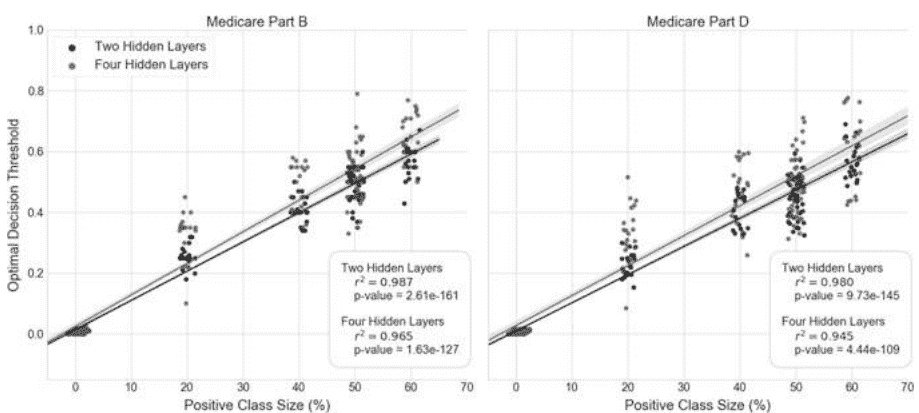

图 1 正类大小与最佳决策阈值

正类大小与最优阈值之间的关系既是线性的，也与数据集无关。

在图 1 中，医疗保险最优阈值的结果按照架构类型进行分组，并绘制在训练分布的正类大小上。图表使用水平抖动进行增强，并使用普通最小二乘法对数据进行线性拟合。

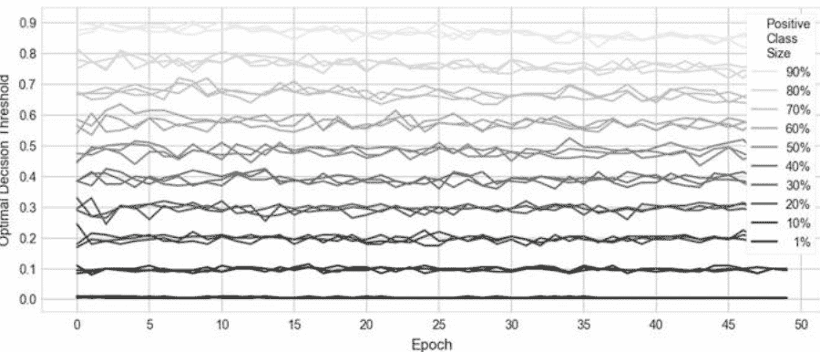

图 2 ECBDL 训练时期与最优阈值

方块 [89] 和 95% 置信区间。对于医疗保险数据集和网络架构，正类大小与最优决策阈值之间存在强烈的线性关系。这种关系在两层网络中最为明显，具有 $r^{2} \geq 0.980$ 和 $p \leq 9.73e-145$。四层网络的结果也具有这些线性特征，尽管相关性较弱，$r^{2} \leq 0.965$，并且置信区间明显较大。

我们还使用 ECBDL'14 数据在每个训练周期后计算最优阈值，以确定最优阈值在模型训练过程中的变化。我们训练了 50 个周期的模型，并重复了每个实验三次。如图 2 所示，最优阈值在训练过程中相对稳定一致。

与医疗结果类似，ECBDL'14 的最优阈值与训练分布的正类先验密切相关。

本节得出结论，正类大小对最优决策阈值有强烈的线性影响。我们还发现，对于给定的分布，不同的深度学习架构可能具有不同的最优阈值。在下一节中，我们将使用这些阈值来评估在未见过的测试数据上的性能。

#### 5.2 医疗分类结果

首先，使用医疗 B 部分和 D 部分数据集，评估最优分类阈值的性能与默认阈值的性能。通过使用 G-Mean、TPR 和 TNR 性能指标，在类别不平衡水平范围内（即 0.03-60%）比较阈值结果。两层和四层网络的 G-Mean 结果通过对每个数据集的分布进行聚合，TPR 和 TNR 结果在两个医疗数据集上进行平均。

表 8 医疗保险 B 部分 G-mean 分数

| 分布类型 | 正类先验 | G-均值 95% 置信区间 (最佳阈值) | G-均值 95% 置信区间 (默认阈值) |
| :--- | :--- | :--- | :--- |
| 基线 | 0.0003 | (0.7281, 0.7321) | (0.0000, 0.0000) |
| RUS-1 | 0.001 | (0.7206, 0.7280) | (0.0000, 0.0000) |
| RUS-2 | 0.005 | (0.7379, 0.7425) | (0.0000, 0.0000) |
| RUS-3 | 0.01 | (0.7351, 0.7415) | (0.0000, 0.0000) |
| RUS-4 | 0.2 | (0.7322, 0.7353) | (0.0903, 0.1939) |
| RUS-5 | 0.4 | (0.7171, 0.7253) | (0.7307, 0.7333) |
| RUS-6 | 0.5 | (0.7148, 0.7242) | (0.7155, 0.7225) |
| RUS-7 | 0.6 | (0.7109, 0.7199) | (0.6542, 0.6798) |
| ROS-1 | 0.001 | (0.7151, 0.7235) | (0.0000, 0.0000) |
| ROS-2 | 0.005 | (0.7459, 0.7543) | (0.0000, 0.0000) |
| ROS-3 | 0.01 | (0.7197, 0.7479) | (0.0000, 0.0000) |
| ROS-4 | 0.2 | (0.7449, 0.7649) | (0.6070, 0.6466) |
| ROS-5 | 0.4 | (0.7435, 0.7729) | (0.7563, 0.7695) |
| ROS-6 | 0.5 | (0.7665, 0.7719) | (0.7563, 0.7695) |
| ROS-7 | 0.6 | (0.7673, 0.7729) | (0.7434, 0.7686) |
| ROS-RUS-1 | 0.5 | (0.7576, 0.7754) | (0.7488, 0.7744) |
| ROS-RUS-2 | 0.5 | (0.7680, 0.7740) | (0.7472, 0.7726) |
| ROS-RUS-3 | 0.5 | (0.7506, 0.7744) | (0.7497, 0.7749) |

表 8 和表 9 列出了所有医疗保险 B 部分和 D 部分的 95% G-均值置信区间。加粗显示的区间表示明显优于替代方案。我们的第一个观察结果是，默认的分类阈值 0.5 从未明显优于最佳阈值。事实上，只有在类别几乎平衡，例如先验概率为 0.4-0.6 时，默认阈值才能产生可接受的 G-均值分数。在其他分布中，随着类别不平衡程度的增加，默认阈值的性能下降。

然而，最佳阈值在所有分布中产生相对稳定的 G-均值分数。即使是基线分布，仅有 0.03% 的正类大小，使用最佳分类阈值时也能产生可接受的 G-均值分数 > 0.72。总体而言，这些结果不鼓励在训练具有类别不平衡数据的 DNN 模型时使用默认的分类阈值。

结果还表明 ROS 和 ROS-RUS 方法的 G-Mean 分数增加。这不是由于阈值过程，而是由于用于创建 RUS 分布的欠 - 采样过程。我们之前的工作表明，在这些高度不平衡的大数据分类任务中使用 RUS 倾向于代表多数群体并降低性能 [90]。

图 3 展示了医疗数据集和 DNN 架构的综合 TPR 和 TNR 分数。最佳分类阈值（左）产生稳定的结果

表 9 医疗保险 D 部分 G-mean 分数

| 分布类型 | 正类先验 | G-均值 95% 置信区间 (最佳阈值) | G-均值 95% 置信区间 (默认阈值) |
| :--- | :--- | :--- | :--- |
| 基线 | 0.0003 | (0.6986, 0.7022) | (0.0000, 0.0000) |
| RUS-1 | 0.001 | (0.7058, 0.7128) | (0.0000, 0.0000) |
| RUS-2 | 0.005 | (0.7262, 0.7300) | (0.0000, 0.0000) |
| RUS-3 | 0.01 | (0.7305, 0.7345) | (0.0000, 0.0000) |
| RUS-4 | 0.2 | (0.7052, 0.7120) | (0.1932, 0.2814) |
| RUS-5 | 0.4 | (0.6815, 0.6849) | (0.6659, 0.6835) |
| RUS-6 | 0.5 | (0.6870, 0.6928) | (0.6870, 0.6926) |
| RUS-7 | 0.6 | (0.6785, 0.6843) | (0.6486, 0.6606) |
| ROS-1 | 0.001 | (0.8058, 0.8128) | (0.0000, 0.0000) |
| ROS-2 | 0.005 | (0.7262, 0.7300) | (0.0000, 0.0089) |
| ROS-3 | 0.01 | (0.7305, 0.7345) | (0.0030, 0.0220) |
| ROS-4 | 0.2 | (0.7378, 0.7478) | (0.6040, 0.6258) |
| ROS-5 | 0.4 | (0.7424, 0.7494) | (0.7337, 0.7405) |
| ROS-6 | 0.5 | (0.7262, 0.7402) | (0.7431, 0.7497) |
| ROS-7 | 0.6 | (0.7450, 0.7516) | (0.7395, 0.7481) |
| ROS-RUS-1 | 0.5 | (0.7398, 0.7490) | (0.7463, 0.7537) |
| ROS-RUS-2 | 0.5 | (0.7453, 0.7515) | (0.7487, 0.7547) |
| ROS-RUS-3 | 0.5 | (0.7456, 0.7532) | (0.7479, 0.7535) |

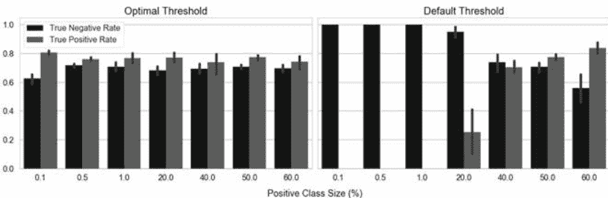

图 3 医疗保险类别性能

TPR 和 TNR 分数跨所有正类大小。此外，我们观察到当使用最佳分类阈值时，
TPR 始终大于 TNR。这表明我们的阈值选择过程（算法 1）是有效的，并且我们可以期望在验证期间优化的性能权衡推广到未见过的测试数据。 然而，默认阈值结果（右侧）
在正类大小变化时不稳定。 当类别不平衡水平很高时，例如，默认阈值将所
有测试样本分配给负类。 只有当类别大致平衡时，默认阈值才能实现高 TPR 和
TNR。 甚至

当默认阈值性能相当平衡时，例如正类
占比 40%，我们失去了最大化 TPR over TNR 的能力。
总之，使用最佳分类阈值和默认分类阈值比较了两个高度不平衡的医疗保
险数据集上的 DNN 预测性能。对于每个数据集，B 部分和 D 部分，使用 ROS
和 RUS 创建了 18 个分布，以涵盖广泛的类别不平衡水平，即 0.03-60%。对于
这 36 个分布中的每一个，训练了 30 个两层网络和 30 个四层网络，并在测试集
上进行了评分。通过超过 2,000 个 DNN 模型的证据，统计结果表明，当使用
不平衡数据训练模型时，默认阈值是次优的。即使在最严重的不平衡分布中
，例如正类占比 0.03%，使用最佳阈值进行评分仍然能够持续获得有利的 G-
Mean、TPR 和 TNR 得分。在下一节中，我们将使用 ECBDL'14 数据集扩展这
些结果，并考虑第三个阈值方法，即先验阈值。

#### 5.3 ECBDL'14 分类结果

ECBDL'14 实验采用了第三个阈值策略，即先验阈值，它使用训练分布中正
类的先验概率作为分类阈值。我们首先介绍了在广泛的类别不平衡水平（即
0.5-90%）下，每个阈值策略的 G-Mean 分数。然后，对所有分布进行了 G-Me
an、TPR 和 TNR 结果平均，并使用 Tukey 的 HSD 测试进行了总结。

图 4 展示了每个阈值策略和分布的 G-Mean 分数。与医疗保险结果类似，当
类别大致平衡时，即正类大小为 40-60% 时，默认阈值的性能是可接受的，但
会恶化。

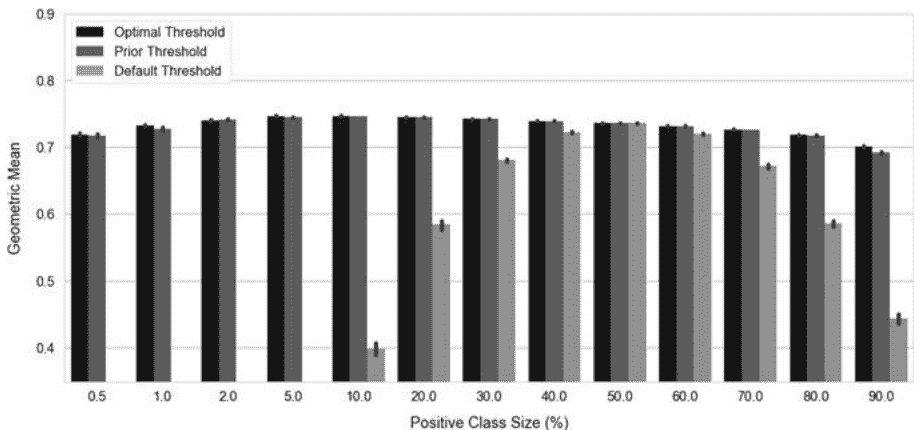

图 4 ECBDL'14 G-mean 结果

表 10 列出了在所有训练分布中平均的 ECBDL'14 G-Mean、TPR 和 TNR 分数。Tukey 的 HSD 分组用于识别具有显著不同均值的结果，即组 $a$ 的表现明显优于组 $b$。对于 G-Mean 指标，最佳阈值和先验阈值方法被放入组 $a$，其均值分别为 0.7333 和 0.7320。默认阈值被放入组 $b$，其均值分数为 0.4421。这些结果表明，最佳阈值和先验阈值比默认阈值更好地平衡了类别性能。同样，TPR 结果将最佳阈值和先验阈值方法放入组 $a$，将默认阈值放入组 $b$。换句话说，非默认阈值策略更好地捕捉到了感兴趣的正类。我们预期最佳阈值会表现出这种行为，因为我们采用的阈值选择过程（算法 1）明确地通过在训练数据上最大化 TPR 和 G-Mean 分数来优化阈值。然而，先验方法直接从训练数据中派生而来，没有任何训练或优化，令人惊讶的是，它的表现与最佳阈值一样好。

表 10 ECBDL'14 分类结果统计

| 阈值策略 | 几何平均 | 真阳性率 | 真阴性率 |
| :--- | :--- | :--- | :--- |
| | 均值 | 标准差 | 组 | 均值 | 标准差 | 组 | 均值 | 标准差 | 组 |
| 默认 | 0.4421 | 0.28 | b | 0.4622 | 0.37 | b | 0.7823 | 0.26 | a |
| 最佳 | 0.7333 | 0.01 | a | 0.7276 | 0.02 | a | 0.7399 | 0.03 | b |
| 先验 | 0.7320 | 0.02 | a | 0.7195 | 0.04 | a | 0.7470 | 0.05 | b |

当正类先验为 ≥0.7 或 ≤0.3 时，快速计算。与默认阈值不同，最佳阈值在所有训练分布中产生相对稳定的 G-Mean 分数 (≥0.7)。最有趣的是，先验阈值在所有训练分布中也产生稳定的 G-Mean 分数。除了执行最佳阈值之外，先验阈值策略的优势在于直接从训练数据中派生而来，无需优化。最重要的是，我们能够在不增加过采样成本的情况下，实现与竞争者 [73] 相当的 TPR 和 TNR 分数。

我们相信这些特点使得先前的阈值策略成为初步实验和基准模型的一个很好的选择。如果需求需要特定的类别性能权衡，先前的阈值仍然可以提供一个近似的基准阈值来开始优化。

进一步检查后，我们发现默认阈值获得了最高的平均 TNR 分数。虽然负类通常不是感兴趣的类别，但最小化误报的预测仍然很重要。然而，默认阈值的 TNR 分数是误导性的，这是由于正类大小 <0.5 的不平衡分布比 >0.5 的多。从图 3 中可以看出，当正类先验较小时，模型倾向于将所有测试样本分配给负类。默认阈值在 TNR 方面得分很高，因为大多数使用不平衡数据训练的模型将所有测试样本分配给负类并获得 100% 的 TNR。

因此，我们依靠 G-Mean 分数来确保类别性能平衡，并得出结论：在训练数据中存在高度类别不平衡时，默认阈值是次优的。

本节介绍的 ECBDL'14 结果与 Medicare 实验结果一致。对于所有不平衡的训练分布，最优阈值始终优于默认阈值。尽管未经过优化，先验阈值在所有性能指标上与最优阈值表现相当。

## 6 结论

本章探讨了高度不平衡的大数据对训练和评分深度神经网络分类器的影响。我们在广泛的类别不平衡水平（0.03–90%）上训练模型，并将两种输出阈值策略的结果与默认阈值结果进行了比较。最优阈值技术使用训练或验证数据来找到最大化 G-Mean 性能指标的阈值。先验阈值技术使用正类先验作为将标签分配给测试实例的分类阈值。正如贝叶斯定理（方程 1）所建议的，我们发现所有最优阈值与训练数据的正类先验成比例。因此，只有在训练数据相对平衡（即正类先验在 0.4–0.6 之间）时，默认阈值 0.5 才表现良好。对于所有其他分布，基于 G-Mean 准则，最优阈值和先验阈值策略表现显著更好。此外，Tukey 的 HSD 检验结果表明最优阈值和先验阈值结果之间没有差异。这些最优阈值结果取决于阈值选择标准（算法 1）。此最优阈值过程应根据分类任务要求进行指导，选择新的性能指标可能会导致与先验阈值显著不同的最优阈值。

未来的工作应该在更广泛的领域和网络架构中评估这些阈值策略，例如自然语言处理和计算机视觉。此外，阈值选择过程应该被修改以优化替代性能指标，并且应该使用统计测试来识别显著差异。

## 参考文献

- 1. W. Wei, J. Li, L. Cao, Y. Ou, J. Chen，在极度不平衡的数据上有效检测复杂的在线银行欺诈。万维网 16, 449–475 (2013年)
- 2. A. N. Richter, T. M. Khoshgoftaar，对于具有有限标签的生物医学大数据的样本大小确定
- 3. M. Kubat, R. C. Holte, S. Matwin，用于卫星雷达图像中油污检测的机器学习。
- 4. S. Wang, X. Yao，多类别不平衡问题：分析与潜在解决方案。IEEE Trans. Syst. Man Cybern. Part B (Cybern.) 42, 1119–1130 (2012)
- 5. N. Japkowicz，类别不平衡问题：意义和策略，in Proceedings of the International Conference on Artificial Intelligence (2000)
- 6. M. Buda, A. Maki, M. A. Mazurowski，卷积神经网络中类别不平衡问题的系统研究。Neural Netw. 106, 249–259 (2018)
- 7. H. He, E. A. Garcia，从不平衡数据中学习。IEEE Trans. Knowl. Data Eng. 21, 1263–1284 (2009)
- 8. G. M. Weiss，稀有性挖掘：一个统一的框架。SIGKDD Explor. Newsl. 6, 7–19 (2004)
- 9. R. A. Bauder, T. M. Khoshgoftaar, T. Hasanin，关于大数据中类别稀有性的实证研究，2018年第17届IEEE国际机器学习与应用会议 (ICMLA) (2018), 第785–790页
- 10. E. Dumbill，什么是大数据？大数据景观介绍 (2012)。http://radar.oreilly.com/2012/01/what-is-big-data.html
- 11. S. E. Ahmed，大数据分析视角：方法论与应用 (Amer Mathematical Society, 美国, 2014)
- 12. J. L. Leevey, T. M. Khoshgoftaar, R. A. Bauder, N. Seliya，关于解决大数据中高类别不平衡的调查。J. Big Data 5, 42 (2018)
- 13. J. Dean, S. Ghemawat，MapReduce：大规模集群上的简化数据处理。Commun. ACM 51, 107–113 (2008)
- 14. M. Zaharia, M. Chowdhury, M. J. Franklin, S. Shenker, I. Stoica，Spark：集群计算与工作集，在第2届USENIX云计算热点会议 HotCloud '10, (美国加利福尼亚州伯克利), USENIX 协会 (2010), 第10页
- 15. K. Chahal, M. Grover, K. Dey, R. R. Shah，深度神经网络分布式训练的搭车指南。J. 并行分布式计算 10 (2019)
- 16. R. K. L. Kennedy, T. M. Khoshgoftaar, F. Villanustre, T. Humphrey，一种并行和分布式随机梯度下降实现，使用商品集群。J. 大数据 6(1), 16 (2019)
- 17. D. L. Wilson，使用编辑数据的最近邻规则的渐近性质。IEEE Trans. Syst. Man Cybern. SMC-2, 408–421 (1972)
- 18. N. V. Chawla, K. W. Bowyer, L. O. Hall, W. P. Kegelmeyer，SMOTE：合成少数类过采样技术。J. Artif. Int. Res. 16, 321–357 (2002)
- 19. H. Han, W.-Y. Wang, B.-H. Mao，边界 SMOTE：一种新的不平衡数据集学习过采样方法，在智能计算进展，ed. by D.-S. Huang, X.-P. Zhang, G.-B. Huang (Springer, Berlin, Heidelberg, 2005), pp. 878–887
- 20. T. Jo, N. Japkowicz，类别不平衡与小不相交。SIGKDD Explor. Newsl. 6, 40–49 (2004)
- 21. C. Ling, V. Sheng，成本敏感学习和类别不平衡问题，在机器学习百科全书 (2010)
- 22. J. J. Chen, C.-A. Tsai, H. Moon, H. Ahn, J. J. Young, C.-H. Chen，类别预测中的决策阈值调整，在环境研究中的 SAR 和 QSAR, vol. 17 (2006), pp. 337–352
- 23. Q. Zou, S. Xie, Z. Lin, M. Wu, Y. Ju，在不平衡分类中找到最佳分类阈值。大数据研究 5, 2–8 (2016)
- 24. X. Liu, J. Wu, Z. Zhou，用于类别不平衡学习的探索性欠采样。IEEE Trans. Syst. Man Cybern. Part B (Cybern.) 39, 539–550 (2009)
- 25. N. V. Chawla, A. Lazarevic, L. O. Hall, K. W. Bowyer，SMOTEBoost：提高提升中少数类预测的方法，在数据库知识发现：PKDD 2003, ed. by N. Lavrač, D. Gamberger, L. Todorovski, H. Blockeel (Springer, Berlin, Heidelberg, 2003), pp. 107–119
- 26. Y. Sun，成本敏感提升用于不平衡数据分类。博士论文，滑铁卢，安大略省，加拿大，2007年。AAINR34548
- 27. I. Goodfellow, Y. Bengio, A. Courville，深度学习 (The MIT Press, Cambridge, MA, 2016)
- 28. I. H. Witten, E. Frank, M. A. Hall, C. J. Pal，数据挖掘，第4版：实用机器学习工具和技术，第4版 (美国加利福尼亚州旧金山，Morgan Kaufmann出版社，2016)
- 29. Y. LeCun, Y. Bengio, G. Hinton，深度学习。Nature 521, 436 (2015)
- 30. M. Abadi, A. Agarwal, P. Barham, E. Brevdo, Z. Chen, C. Citro, G. S. Corrado, A. Davis, J. Dean, M. Devin, S. Ghemawat, I. Goodfellow, A. Harp, G. Irving, M. Isard, Y. Jia, R. Jozefowicz, L. Kaiser, M. Kudlur, J. Levenberg, D. Mané, R. Monga, S. Moore, D. Murray, C. Olah, M. Schuster, J. Shlens, B. Steiner, I. Sutskever, K. Talwar, P. Tucker, V. Vanhoucke, V. Vasudevan, F. Viégas, O. Vinyals, P. Warden, M. Wattenberg, M. Wicke, Y. Yu, X. Zheng，TensorFlow：大规模机器学习在异构系统上的应用 (2015)
- 31. Theano 开发团队，Theano：一个用于快速计算数学表达式的 Python 框架 (2016年)。arXiv:abs/1605.02688
- 32. F. Chollet 等，Keras (2015年)。https://keras.io
- 33. A. Paszke, S. Gross, S. Chintala, G. Chanan, E. Yang, Z. DeVito, Z. Lin, A. Desmaison, L. Antiga, A. Lerer，PyTorch 中的自动微分，在 NIPS-W (2017年)
- 34. S. Chetlur, C. Woolley, P. Vandermersch, J. Cohen, J. Tran, B. Catanzaro, E. Shelhamer，cuDNN：用于深度学习的高效基元 (2014年)
- 35. A. Krizhevsky, I. Sutskever, G. E. Hinton，使用深度卷积神经网络进行 ImageNet 分类。神经信息系统 25, 01 (2012年)
- 36. M. D. Richard, R. P. Lippmann，神经网络分类器估计贝叶斯后验概率。Neural Comput. 3(4), 461–483 (1991)
- 37. 美国医疗保险与医疗补助服务中心，医疗保险提供者利用和支付数据：医生和其他供应商 (2018)
- 38. 美国医疗保险与医疗补助服务中心，医疗保险提供者利用和支付数据：D部分处方者 (2018)
- 39. 美国政府，美国医疗保险与医疗补助服务中心，官方美国政府网站，用于医疗保险
- 40. 大数据和大学习进化计算研讨会，数据挖掘竞赛 2014年：自部署轨道
- 41. M. Wani, F. Bhat, S. Afzal, A. Khan，深度学习进展 (Springer, 2020)
- 42. J. W. Tukey，在方差分析中比较个体均值。Biometrics 5(2), 99–114 (1949)
- 43. R. Anand, K. G. Mehrotra, C. K. Mohan, S. Ranka，一种改进的神经网络算法用于不平衡训练集的分类。IEEE Trans. Neural Netw. 4, 962–969 (1993)
- 44. J. M. Johnson, T. M. Khoshgoftaar，用于类别不平衡的深度学习调查。J. Big Data 6, 27 (2019)
- 45. J. M. Johnson, T. M. Khoshgoftaar，使用神经网络进行医疗欺诈检测。J. Big Data 6(1), 63 (2019)
- 46. D. Masko, P. Hensman，不平衡训练数据对卷积神经网络的影响，在2015年。KTH，计算机科学与通信学院 (CSC)
- 47. H. Lee, M. Park, J. Kim，通过迁移学习使用卷积神经网络在不平衡大规模数据库上进行浮游生物分类，在2016年IEEE国际图像处理会议 (ICIP) (2016), pp. 3713–3717
- 48. S. Wang, W. Liu, J. Wu, L. Cao, Q. Meng, P. J. Kennedy，在不平衡的数据集上训练深度神经网络，在2016年国际联合神经网络会议 (IJCNN) (2016), 第4368–4374页
- 49. H. Wang, Z. Cui, Y. Chen, M. Avidan, A. B. Abdallah, A. Kronzer，通过成本敏感的深度学习预测住院再入院。IEEE/ACM Trans. Comput. Biol. Bioinf. 1 (2018)
- 50. S. H. Khan, M. Hayat, M. Bennamoun, F. A. Sohel, R. Togneri，从不平衡的数据中学习成本敏感的深度特征表示。IEEE Trans. Neural Netw. Learn. Syst. 29, 3573–3587 (2018)
- 51. T.-Y. Lin, P. Goyal, R. B. Girshick, K. He, P. Dollár，密集目标检测的焦点损失，2017年IEEE国际计算机视觉会议 (ICCV) (2017), 第2999–3007页
- 52. C. Huang, Y. Li, C. C. Loy, X. Tang，学习不平衡分类的深度表示，2016年IEEE计算机视觉和模式识别会议 (CVPR) (2016), 第5375–5384页
- 53. S. Ando, C. Y. Huang，用于分类不平衡数据的深度过采样框架，机器学习和数据库中的知识发现，M. Ceci, J. Hollmén, L. Todorovski, C. Vens, S. Džeroski (Springer International Publishing, Cham, 2017年), 第770–785页
- 54. Q. Dong, S. Gong, X. Zhu，不平衡深度学习通过少数类增量矫正。IEEE 模式分析与机器智能汇刊 1 (2018)
- 55. Q. Chen, J. Huang, R. Feris, L. M. Brown, J. Dong, S. Yan，基于细粒度服装属性的人物描述的深度领域适应，在2015年IEEE计算机视觉和模式识别会议 (CVPR) (2015), pp. 5315–5324
- 56. Y. LeCun, C. Cortes，MNIST 手写数字数据库 (2010). http://yann.lecun.com/exdb/mnist/，2018年11月15日访问
- 57. A. Krizhevsky, V. Nair, G. Hinton，CIFAR-10 (加拿大高级研究所). http://www.cs.toronto.edu/~kriz/cifar.html
- 58. R. A. Bauder, T. M. Khoshgoftaar，一种用于检测医疗保险欺诈索赔的新方法，通过预期支付偏差（应用论文），在2016年IEEE第17届国际会议信息重用和集成 (IRI) (2016), 第11–19页
- 59. R. A. Bauder, T. M. Khoshgoftaar，一种用于异常检测的概率编程方法在医疗保险索赔中，在2016年第15届IEEE国际机器学习和应用会议 (ICMLA) (2016), 第347–354页
- 60. R. A. Bauder, T. M. Khoshgoftaar, A. Richter, M. Herland，预测医疗服务提供者的专长——以检测异常的保险索赔，在2016年IEEE第28届国际会议人工智能工具 (ICTAI) (2016), 第784–790页
- 61. M. Herland, R. A. Bauder, T. M. Khoshgoftaar，医疗保健提供者专业预测用于检测异常医疗保险索赔，在2017年IEEE国际信息重用与集成会议 (IRI) (2017), pp. 579–588
- 62. 办公室检查员总署，LEIE 可下载数据库 (2019)
- 63. R. A. Bauder, T. M. Khoshgoftaar，使用排除的提供者标签的机器学习方法检测医疗保险欺诈，在 FLAIRS 会议 (2018)
- 64. M. Herland, T. M. Khoshgoftaar, R. A. Bauder，使用多个医疗保险数据源进行大数据欺诈检测。J. Big Data 5, 29 (2018)
- 65. M. Herland, R. A. Bauder, T. M. Khoshgoftaar，珍稀类别对监督式医疗保健欺诈检测模型评估的影响。J. Big Data 6(1), 21 (2019)
- 66. K. Feldman, N. V. Chawla，医学院培训与实践相关吗？来自大数据的证据。Big Data (2015)
- 67. 医疗保险与医疗补助服务中心，医生比较数据集 (2019年)
- 68. J. Ko, H. Chalfin, B. Trock, Z. Feng, E. Humphreys, S.-W. Park, B. Carter, K. D. Frick, M. Han，泌尿科医生的医疗保险利用率和付款的变异性。泌尿科 85, 03 (2015年)
- 69. V. Chandola, S. R. Sukumar, J. C. Schryver，从大规模医疗保健索赔数据中发现知识，在 KDD (2013年)
- 70. L. K. Branting, F. Reeder, J. Gold, T. Champney，用于医疗欺诈风险的图分析估计，在2016年IEEE/ACM国际社交网络分析与挖掘会议 (ASONAM) (2016), 第845–851页
- 71. 国家计划与提供者编号系统，NPPES NPI 注册表 (2019年)
- 72. P. S. P. Center，第9次社区范围的技术关键评估实验蛋白质结构预测
- 73. I. Triguero, S. Río, V. López, J. Bacardit, J. Benítez, F. Herrera，ROSEFW-RF：ECBDL'14 大数据竞赛的获胜算法：极度不平衡的大数据生物信息学问题。Knowledge-Based Systems 87 (2015)
- 74. A. Fernández, S. del Río, N. V. Chawla, F. Herrera，对不平衡的大数据分类的深入洞察：结果和挑战。复杂智能系统 3(2), 105–120 (2017)

- 75. S. de Río, J.M. Benítez, F. Herrera, 分析数据预处理, 增加极度不平衡的大数据分类的过采样比例, 在2015 IEEE Trust-com/BigDataSE/ISPA, vol. 2 (2015), pp. 180-185
- 76. 医疗保险与医疗补助服务中心, 国家提供者标识符标准 (NPI) (2019年)
- 77. 医疗保险与医疗补助服务中心, HCPCS常规信息 (2018年)
- 78. P. Di Lena, K. Nagata, P. Baldi, 用于蛋白质接触图预测的深度架构, 生物信息学 (牛津, 英国) 28, 2449-57 (2012年)
- 79. J. Berg, J. Tymoczko, L. Stryer, 第3章, 蛋白质结构与功能, 在生物化学, 第5版 (W H Freeman, 纽约, 2002年)
- 80. Z. Zhao, F. Morstatter, S. Sharma, S. Aleyiani, A. Anand, H. Liu, 推进特征选择研究, ASU特征选择存储库 (2010年), 第1-28页
- 81. S. Linux, 关于 (2014年)
- 82. F. Pedregosa, G. Varoquaux, A. Gramfort, V. Michel, B. Thirion, O. Grisel, M. Blondel, P. Prettenhofer, R. Weiss, V. Dubourg, J. Vanderplas, A. Passos, D. Cournapeau, M. Brucher, M. Perrot, E. Duchesnay, Scikit-learn: Python中的机器学习. J. Mach. Learn. Res. 12, 2825-2830 (2011)
- 83. F. Provost, T. Fawcett, 分析和可视化分类器性能: 在不精确的类别和成本分布下的比较, in第三届国际知识发现与数据挖掘会议, vol. 43-48 (1999), p. 12
- 84. D. Wilson, T. Martinez, 批量训练对梯度下降学习的一般低效性。神经网络: 国际神经网络学会官方期刊 16, 1429-51 (2004)
- 85. D.P. Kingma, J. Ba, Adam: 一种随机优化方法. CoRR (2015). arXiv:abs/1412.6980
- 86. R.P. Lippmann, 神经网络, 贝叶斯后验概率和模式分类, 从统计到神经网络, 编辑: V. Cherkassky, J.H. Friedman, H. Wechsler (Springer, Berlin, Heidelberg, 1994), pp. 83-104
- 87. N. Srivastava, G. Hinton, A. Krizhevsky, I. Sutskever, R. Salakhutdinov, Dropout: 一种简单的防止神经网络过拟合的方法. 机器学习研究杂志 15, 1929-1958 (2014)
- 88. S. Ioffe, C. Szegedy, Batch normalization: 通过减少内部协变量偏移来加速深度网络训练, 在第32届国际机器学习大会上的国际会议论文集, ICML'15, vol. 37 (JMLR.org, 2015), pp. 448-456
- 89. B. Zdaniuk, 普通最小二乘 (OLS) 模型 (Dordrecht, Springer Netherlands, 2014), pp. 4515-4517
- 90. J.M.约翰逊, T.M.科什戈夫塔尔, 深度学习和不平衡大数据的数据采样, 2019年IEEE第20届信息重用和集成国际会议(IRI)(2019年), 第175-183页

## 在GNSS中断期间的高和低估计速率下的车辆定位：一种深度学习方法

Uche Onyekpe, Stratis Kanarachos, Vasile Palade 和 Stavros-Richard G. Christopoulos

**摘要** 自动驾驶车辆的道路定位依赖于一致准确的GNSS（全球导航卫星系统）定位信息。商业GNSS接收器通常以1赫兹的采样率进行采样，这在某些情况下不足以在高速公路上或在安全关键场景中，例如在中高速行驶的情况下，或在安全关键场景中，准确地跟踪车辆。此外，GNSS依赖于多颗卫星进行三角测量，并可能在高楼大厦、桥梁、隧道和树木周围出现信号丢失。解决这个问题的一种方法是将GNSS与车载惯性导航传感器（INS）系统集成，以提供连续且更可靠的高速定位解决方案。然而，INS在加速度到位移的双重积分过程中存在无界指数误差漂移问题。已经采用了几种深度学习算法来学习误差漂移，以获得更好的定位预测。因此，在本章中，我们研究了长期短期记忆（LSTM）、输入延迟神经网络（IDNN）、多层神经网络（MLNN）和卡尔曼滤波器（KF）在高数据速率定位中的性能。我们表明，基于深度神经网络的解决方案可以展现出更好的性能与常用方法（如卡尔曼滤波器）相比，车辆的高数据速率定位。

- U. Onyekpe (✉)
数据科学研究中心，未来交通与城市研究所，考文垂大学，Gulson Road，考文垂，英国
e-mail: onyekpeu@uni.coventry.ac.uk

- S. Kanarachos
考文垂大学工程学院，Gulson Road，考文垂，英国
e-mail: ab8522@coventry.ac.uk

- V. Palade
数据科学研究中心，考文垂大学，Gulson Road，考文垂，英国
e-mail: ab5839@coventry.ac.uk

- S.-R. G. Christopoulos
未来交通与城市研究所，考文垂大学工程学院，Gulson Road，考文垂，英国
e-mail: ac0966@coventry.ac.uk

© 编辑（如适用）和作者，独家许可给Springer Nature Singapore Pte Ltd. 2021
M. A. Wani et al. (eds.), 深度学习应用，第2卷,
智能系统与计算进展1232,
https://doi.org/10.1007/978-981-15-6759-9_10

关键词 惯性导航 · INS · INS/GPS集成导航 · GPS中断 · 自主车辆导航 · 深度学习 · 神经网络 · 高采样率

### 1 引言

#### 1.1 自动驾驶车辆的重要性

预计到2035年，英国的自动驾驶车辆市场价值将达到约280亿英镑[1]。发展这些车辆的一个主要动机是提高道路安全性。根据[2]，英国75%的交通事故是由人为驾驶错误引起的，美国的比例为94%。引入自动驾驶车辆有潜力减少这些事故[3]。尽管这些车辆可能引入新的事故类型，但人们仍然努力确保它们尽可能安全。

感知系统对自动驾驶车辆的性能至关重要，因为它们帮助车辆理解其环境[4]。车辆外部的传感器包括激光雷达、摄像头和超声波系统。车辆内部还有几个数据处理和分析系统，它们使用传感器数据做出人类驾驶员通常会做出的决策。激光雷达和摄像头是用于识别车辆轨迹中的物体、结构、潜在碰撞危险和行人的成像系统[5]。摄像头还对结构化道路上的道路标志和标线的识别至关重要。作为成像系统在车辆运行中起关键作用的证明，已经使用了许多先进版本的这种系统[6]。然而，尽管成像系统可以用于评估车辆的环境并确定物体或标记相对于车辆的位置，但仍然需要连续而稳健地将车辆定位到一个定义的坐标系统中。还需要有关车辆在其环境中导航的信息，以便能够做出实时的后续决策。

#### 1.2 GNSS（全球导航卫星系统）问题

GNSS接收器对从至少四颗绕地球运行的卫星接收到的信号进行复杂分析，被认为是在位置估计方面最好的之一，因为在成本或覆盖范围方面没有竞争[7]。尽管GNSS被广泛接受，但它远非完美的定位系统。在户外环境中可能会出现GNSS故障的情况，因为存在卫星和GNSS天线之间需要直接的视线。在都市和类似环境中，GNSS可能由于高楼、桥梁、隧道或树木的存在而难以使用，因为其视线在信号传输过程中可能会被阻塞[7]。此外，GNSS信号可能会被干扰，这使得车辆无法获取自身位置的信息[8]。因此，GNSS不能作为独立的导航系统。

GNSS用于将自动驾驶车辆定位到道路上。为了实现车道精度，GNSS与高精度激光雷达、摄像头、雷达和高清地图相结合。然而，有时相机和激光雷达可能无法提供信息或无法使用。当出现大雾、雪、雨或雨雪天气时，低成本激光雷达和摄像头的准确性可能会受到影响。这是该领域中一个被广泛认可的问题。高精度激光雷达的成本也使其成为一个具有高被盗吸引力的物品，因为它们价值数千英镑。因此，将激光雷达用于自动驾驶车辆会使车辆更加昂贵。

基于摄像头的定位系统也可能面临低精度问题，这取决于外部光强度和摄像头场景中的物体。在Waymo LLC和Cruise LLC测试的4级自动驾驶应用中，激光雷达扫描实时匹配到高清地图上。基于此，系统能够精确定位车辆在其环境中的位置。然而，这种方法计算量大。此外，驾驶环境和基础设施的变化可能会使高清地图暂时过时，因此对导航无用。

#### 1.3 使用惯性测量传感器进行导航

然而，惯性导航传感器（INS）与自动驾驶车辆中的其他传感器不同，它不需要与外部环境进行交互来进行定位，这使其与车辆上使用的其他传感器有所区别。这种独立性对于传感器融合和安全性至关重要。惯性测量单元（IMU）测量车辆在x、y和z轴上的线性加速度和旋转速率分量，并通过连续的航位推算计算速度、定位和方向。它的功能是提供定位数据，这对车辆在其环境中定位自身是必要的。由于生产车辆已经配备了从三分之一到完整的INS[11]，因此在GNSS信号缺失时，IMU可以用于临时定位车辆。

IMU还可以用于比较位置和估计，以引入不确定性到最终的定位输出。在没有IMU的情况下，很难知道激光雷达的定位精度何时会下降[10]。

通过复杂的数学分析，可以使用INS在GNSS中断期间进行航位推算来计算车辆的位置。然而，传感器受到指数误差漂移的困扰，这是由加速度到位移的双重积分所表现出来的。这些误差随着时间的推移无限级联，导致位置估计非常不准确。通常，GNSS在一种互惠互利的关系中周期性地校准INS，以帮助提高定位估计精度。传统上，卡尔曼滤波器用于建模GPS位置和INS位置解之间的误差。卡尔曼滤波器在建模高度非线性依赖关系、非高斯噪声测量和随机关系时存在局限性。

一些研究人员最近探索了使用人工神经网络技术代替卡尔曼滤波器来建模错误，因为它们能够学习非线性关系。与卡尔曼滤波器相比，深度学习技术在较长时间的GPS信号丢失中表现更好。Rashad等人提出了一种径向基函数神经网络来建模GPS和INS位置之间的位置误差[12]。多层前馈神经网络（MLNN）被应用于DGPS和战术级INS集成导航架构[13]。[15]在单点定位GPS集成和IMU架构上利用了MLNN。Malleswaran等人建议在INS/GPS集成系统上使用双向和异构联想神经网络[16]。

Noureldin等人提出了使用输入延迟神经网络（IDNN）解决INS/GPS问题，利用了之前时间步的输入[17]。Malleswaran等人研究了在导航问题上使用Sigma-Pi神经网络[18]。这些技术在已发表的文献中的表现突出，凸显了智能算法在自动驾驶导航中的潜力。

此外，由于研究的车辆动力学信息不公开，无法直接比较这些技术的性能。

大多数研究人员使用1 Hz的预测频率，因为商用GPS接收器通常每秒更新一次位置信息[19]。然而，在高速公路和其他安全关键应用中，以这样的频率进行预测无法有效跟踪车辆。以70英里/小时的速度，车辆在一秒钟内可以行驶32米，而车辆的运动未计算在内，2.5米的横向位移可能意味着完全不同的车道。此外，汽车保险公司对与车辆相关的事故的评估需要高分辨率的定位估计[19]。高数据速率定位技术可以更准确地监测GPS信号更新和信号丢失之间的车辆运动。因此，在本章中，我们对LSTM、IDNN、MLNN和卡尔曼滤波器在高数据速率定位方面的性能进行了比较。

## 2 用于车辆定位的2种INS/GPS融合技术

#### 2.1 卡尔曼滤波器（KF）方法

传统上，卡尔曼滤波器被用于进行INS/GPS集成。卡尔曼滤波器用于估计受高斯白噪声影响的线性系统瞬时状态。它已成为INS/GPS应用中的标准技术[20]。尽管卡尔曼滤波器非常受欢迎，但它确实存在一些缺点。对于INS/GPS集成应用，卡尔曼滤波器需要随机模型来表示INS误差，但对于大多数陀螺仪和加速度计来说，这些随机模型很难确定[13]。而且，还需要准确的先验信息来确定与INS相关的协方差矩阵。此外，INS/GPS问题是非线性的。因此，研究了其他类型的滤波器[20]。

卡尔曼滤波器分为两个阶段：预测阶段和更新(创新)阶段。预测阶段涉及测量和预测之间的误差计算，更新阶段中，卡尔曼滤波器使用输入、测量和过程模型来修正预测。

在建模INS和GNSS位置之间的误差时，我们将预测和更新阶段离散化为离散时间。

$$X_t = A_{t|t-1} X_{t-1} + B_{t-1} U_{t-1} + w_{t-1} \quad (1)$$

$$Z_t = H_t X_t + V_t \quad (2)$$

**预测阶段:**

$$\hat{X}_t^- = A_{t|t-1} X_{t-1}$$

$$P_t^- = A_{t|t-1} P_{t-1} A_{t|t-1}^T + B_{t-1} Q_{t-1} B_{t-1}^T \quad (4)$$

**创新阶段:** 该阶段涉及预测状态与测量之间的误差计算。

$$
\begin{aligned}
K_t &= P_t^- H_t^T (H_t P_t^- H_t^T + R_t)^{-1} \\
\hat{X}_t &= \hat{X}_t^- + K_t (Z_t - H_t \hat{X}_t^-) \\
P_t &= (I - K_t H_t) P_t^-
\end{aligned}
$$

其中，$X_t$是误差状态向量，$U_t$是输入/控制向量，$w_t$是系统噪声(高斯)，$V_t$是测量噪声(高斯)，$Z_t$是测量向量，$A_t$是状态转移矩阵，$B_{t-1}$是系统噪声系数矩阵，$H_t$将状态与测量相关联，$Q_{t-1}$是系统噪声协方差矩阵，$R_t$是测量噪声协方差矩阵，$\hat{X}_t^-$是状态预测先验更新，$\hat{X}_t$是状态预测后验更新，$K_t$是卡尔曼增益矩阵，$P_t^-$是误差协方差先验更新，$P_t$是误差协方差后验更新。

卡尔曼滤波器的更多信息可以在[13,21]中找到。

#### 2.2 多层神经网络 (MLNN) 和深度学习

MLNN由一组互连的神经元组成，能够映射输入和输出之间的非线性关系。这种能力特别有趣，因为车辆的力学是非线性的。神经元通过权重连接，输出通过输入的总和经过激活函数进行非线性变换来定义。神经元的输入由权重因子矩阵和输入矩阵以及偏置的乘积计算得出。神经元层的输出成为下一层神经元的输入向量。通过连续的误差信号反向传播，权重在MLNN的训练阶段中进行调整，这被称为反向传播错误。可以使用可调的学习率和动量来防止MLNN在反向传播错误时陷入局部最小值[22]。

前馈层操作受控于

$$y = \sigma(xw + b) \quad (8)$$

其中y是层输出向量，x是输入向量，w是权重矩阵，b是偏置。

深度学习算法利用多层来逐渐从原始输入中提取特征，通过多个非线性抽象层级。它们试图通过利用输入分布结构[23]来找到输入-输出关系的良好表示。深度学习算法在许多已发表的文献中已经证明在几个具有挑战性的问题上取得了成功，例如[24-27]。

如今在计算机视觉应用中，一些流行的深度学习架构是ResNet [28]和Yolo [29]，它们在视觉识别任务中表现出良好的性能。除了深度学习在图像处理任务中的成功之外，序列数据如音频和文本现在也可以用深度神经网络进行处理，在语音识别和自然语言处理任务中能够达到最先进的性能[30]。这些成功支持了深度学习算法在本章研究的应用中学习复杂抽象的潜力，这些应用中存在着噪声传感器信号。

#### 2.3 输入延迟神经网络 (IDNN)

INS的位置误差是累积的，并且遵循一定的模式[25]。因此，模型需要先前的位置序列来捕捉误差趋势。然而，使用静态神经网络来建模这种模式是困难的。可以通过使用一种架构，将信号的先前的t值作为网络的输入来采用动态模型，从而捕捉到存在的误差趋势。

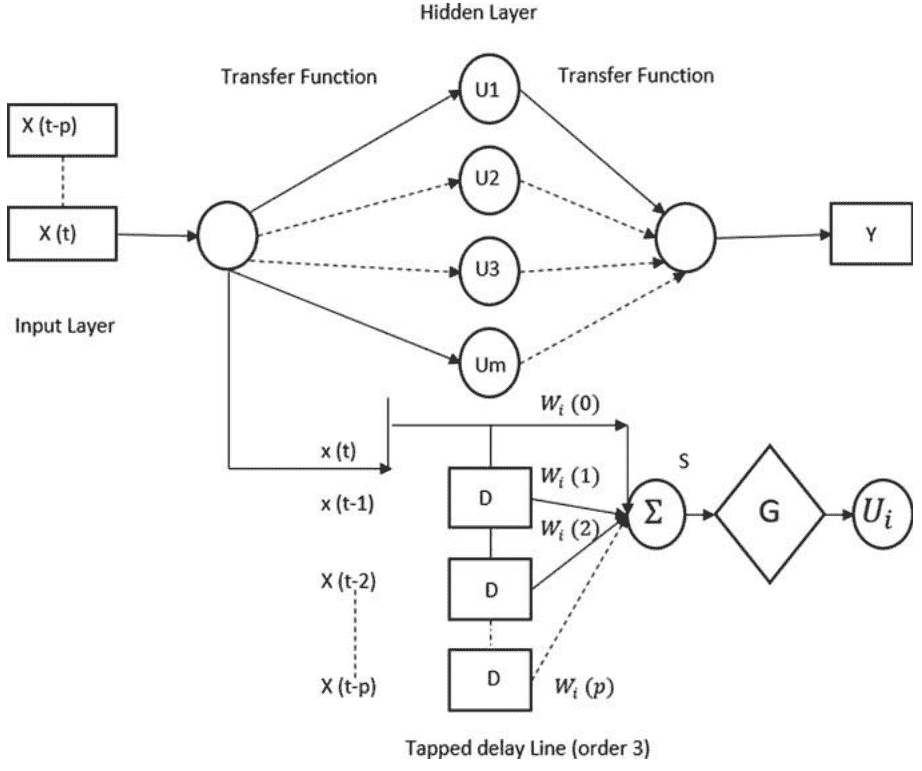

**图1 IDNN的一般架构示意图**[17]

在先前的n个时间步中[17]。通过引入记忆单元和关联单元到输入层，该模型还可以被训练以学习时变或序列趋势。动态模型的记忆单元可以存储先前的INS样本，并使用关联单元进行预测。在没有GPS的情况下，使用这样的动态模型对INS位置预测的准确性有显著影响[17]。

图1展示了IDNN的一般架构，其中p是延迟线内存长度，U是隐藏层神经元，W是权重，G是激活函数，Y是目标向量，D是延迟操作符。

#### 2.4 长短期神经网络（LSTM）

循环神经网络（RNN）已被证明在序列问题上学习到更有用的特征。长短期记忆（LSTM）网络是RNN的一种变体，用于解决其不足。它们专门用于解决长期依赖性问题，因此能够长时间记忆信息。由于INS位置误差的累积和有规律的特性，

**图2 展开的RNN架构**


LSTM的操作由门控制，包括遗忘门、输入门和输出门，其操作如下所示：

$$
\begin{aligned}
f_t &= \sigma \left( W_f [h_{t-1}, x_t] + b_f \right) & (9) \\
i_t &= \sigma \left( W_i [h_{t-1}, x_t] + b_i \right) & (10) \\
\hat{c}_t &= \tanh \left( W_c [h_{t-1}, x_t] + b_c \right) & (11) \\
c_t &= f_t * c_{t-1} + i_t * \hat{c}_t & (12) \\
o_t &= \sigma \left( W_o [h_{t-1}, x_t] + b_o \right) & (13) \\
h_t &= o_t * \tanh(c_t) & (14)
\end{aligned}
$$

其中 $*$ 是Hadamard乘积，$f_t$是遗忘门，$i_t$是输入门，$o_t$是输出门，$c_t$是细胞状态，$h_{t-1}$是上一个状态，$W$是权重矩阵，$\sigma$是Sigmoid激活（非线性）函数。图2和图3展示了RNN的架构和LSTM的细胞结构。

## 3 问题描述

在本节中，我们讨论了使用第2节介绍的四种建模技术来进行学习任务的形式化。此外，我们在第4节中对惯性跟踪问题进行了实验和比较结果的呈现。

图 3 LSTM 细胞结构

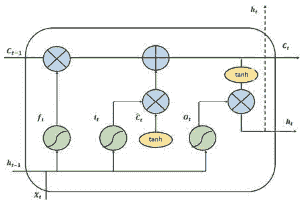

## # 3.1 惯性跟踪

使用惯性传感器进行车辆跟踪受到牛顿运动定律的控制。给定初始姿态，陀螺仪的姿态速率可以被积分以提供连续的方向信息。车辆的加速度也可以被积分以确定其速度，并且在提供初始速度的情况下，可以通过积分其速度来估计车辆的位移。

在车辆跟踪中使用了几个坐标系，位置估计相对于参考点表示。通常，传感器的测量值需要转换到导航框架 [31] 中的坐标系（机体坐标系）。机体坐标系的轴与传感器的输入轴重合。

导航框架，也称为本地框架，其原点是传感器框架的原点。其 x 轴指向大地北方，z 轴垂直于椭球面，y 轴完成正交框架。从机体坐标系到导航框架的旋转矩阵在公式（15）[20] 中表示。

$$R^{nb} = \left[ \begin{array}{ccc} \cos \theta \cos \Psi & -\cos \theta \sin \Psi + \sin \phi \sin \theta \cos \Psi & \sin \phi \sin \Psi + \cos \phi \sin \theta \cos \Psi \\ \cos \theta \sin \Psi & \cos \phi \cos \Psi + \sin \phi \sin \theta \sin \Psi & -\sin \phi \cos \Psi + \cos \phi \sin \theta \sin \Psi \\ -\sin \theta & \sin \phi \cos \theta & \cos \phi \cos \theta \end{array} \right] \quad (15)$$

其中 $\theta$ 是俯仰角，$\Psi$ 是偏航角，$\phi$ 是滚转角。

由于问题被认为是在水平平面上跟踪车辆，因此车辆的滚转和俯仰可以被认为是可以忽略的，因此可以假设为零。因此，旋转矩阵变为

$$R^{nb} = \left[ \begin{array}{ccc} \cos \Psi & -\sin \Psi & 0 \\ \sin \Psi & \cos \Psi & 0 \\ 0 & 0 & 1 \end{array} \right] \quad (16)$$

惯性测量单元通常由三个正交轴加速度计和三个正交轴陀螺仪组成。加速度计测量在 x、y 和 z 轴上的加速度。它测量传感器在机体坐标系 $b$ 中的特定力 $f$ [20]。这可以表示为方程（17），其中 $R^{bn}$ 是从导航坐标系到机体坐标系的旋转矩阵，$g^n$ 表示重力向量，（注：原文此处有 $a^n$） $a^n$ 表示在导航坐标系中表示的传感器的线性加速度 [31]。

$$f^b = R^{bn}(a^n - g^n) \quad (17)$$

给定：$a^n = a^b_n + 2\omega_{ie}^n \times v^n + \omega_{ie}^n \times (\omega_{ie}^n \times p^n) \quad (18)$

其中 $a^b_n$ 是惯性加速度，$2\omega_{ie}^n \times v^n$ 是科里奥利加速度，$\omega_{ie}^n \times (\omega_{ie}^n \times p^n)$ 是离心加速度，$v^n$ 是车辆在导航框架中的速度 [31]。在这个应用中，由于科里奥利加速度与加速度计的测量相比较小，可以忽略不计，而离心加速度被认为被吸收在局部重力部分。因此，$a^n = a^b_n$。

陀螺仪测量横滚、偏航和俯仰的姿态变化。它测量车体坐标系（车辆坐标系）相对于惯性坐标系的角速度，以车体坐标系表示。用 $\omega_{ib}^b$ 表示，姿态速率可以表示为

$$\omega_{ib}^b = R^{bn}(\omega_{ie}^b_n + \omega_{in}^n) + \omega_{nb}^b \quad (19)$$

其中 $\omega_{ie}^n$ 是地球参考系相对于惯性参考系的角速度并且估计值约为 $7.29 \times 10^{-5} \text{ rad/s}$ [31]。导航参考系是相对于地球静止的，因此 $\omega_{in}^n = 0$。其中 $\omega_{nb}^b$ 表示导航参考系中车辆的旋转速率。

如果初始条件已知，可以通过时间积分来确定车辆的方向（偏航角），如公式（20）所示：

$$\Psi_{INS} = \Psi_0 + \int_{t-1}^{t} \omega_{nb}^b \quad (20)$$

其中 $\Psi_0$ 是车辆的最后已知偏航角。

### 3.2 深度学习任务的形式化

加速度计测量（特定力）$f^b$ 在每个时间点 $n$ 通常被假定受到偏差 $\delta_{INS}^b$ 和噪声 $\varepsilon_a^b$ 的干扰。因此，受损传感器的测量可以表示为 $F_{INS}^b$。

除了加速度计测量中的偏差和噪声，加速度计通常是高斯分布的，并且可以被建模为 $\varepsilon_a^b \sim N(0, \sum_a)$。加速度计的偏差会随时间缓慢变化，因此可以将其建模为常数参数或作为时间变化状态的一部分。特定力测量可以根据公式（17）展开如下：

$$F_{INS}^b = f^b + \delta_{INS}^b + \varepsilon_a^b \quad (27)$$

通过整合方程（27），可以确定车辆在车体坐标系中的速度。

传感器在车体坐标系中的位移可以通过方程（27）的双重积分来估计，假设有一个初始速度。

其中，$\delta_{INS}^b$ 是通过计算静止加速度计的平均读数得到的常数参数，$F_{INS}^b$ 是由加速度计传感器直接提供的受损测量值。

1. 车辆的动力学是非线性的，特别是在转弯或紧急制动时；因此，线性或不准确的噪声模型无法充分捕捉非线性关系。

时间 $t$（采样时间），$g$ 是重力向量，$a^b$，$\int_{t-1}^{t} a^b$ 和 $\iint_{t-1}^{t} a^b$ 分别是车辆的真实（未损坏）纵向加速度、速度和位移。

车辆的真实位移表示为 $x_{GPS}^b \approx \iint_{t-1}^{t} a^b$。

此外，$\varepsilon_x^b$ 可以通过以下方式推导出来

$$\varepsilon_{x}^{b} \approx x_{\text {GPS }}^{b} - x_{\text {INS }}^{b} \quad (30)$$

车辆在窗口 $t-1$ 到 $t$ 内的噪声 $\varepsilon_{x}^{b}$，位移 $x_{\mathrm{INS}}^{b}$，速度 $v_{\mathrm{INS}}^{b}$ 和加速度 $a_{\mathrm{INS}}^{b}$ 在导航框架中可以通过旋转矩阵 $R^{nb}$ 进行转换，并由北东向下（NED）系统定义，如公式（31-34）所示。然而，本研究中没有考虑向下轴。

- 从 $R_{\mathrm{INS}}^{nb} \cdot a_{\mathrm{INS}}^{b} \rightarrow a_{\mathrm{INS}}^{n} \rightarrow a_{\mathrm{INS}}^{b} \cdot \cos \Psi_{\mathrm{INS}}, a_{\mathrm{INS}}^{b} \cdot \sin \Psi_{\mathrm{INS}} \quad (31)$
- 从 $R_{\mathrm{INS}}^{nb} \cdot v_{\mathrm{INS}}^{b} \rightarrow v_{\mathrm{INS}}^{n} \rightarrow v_{\mathrm{INS}}^{b} \cdot \cos \Psi_{\mathrm{INS}}, v_{\mathrm{INS}}^{b} \cdot \sin \Psi_{\mathrm{INS}} \quad (32)$
- 从 $R_{\mathrm{INS}}^{nb} \cdot x_{\mathrm{INS}}^{b} \rightarrow x_{\mathrm{INS}}^{n} \rightarrow x_{\mathrm{INS}}^{b} \cdot \cos \Psi_{\mathrm{INS}}, x_{\mathrm{INS}}^{b} \cdot \sin \Psi_{\mathrm{INS}} \quad (33)$
- 从 $R^{nb} \cdot \varepsilon_{x}^{b} \rightarrow \varepsilon_{x}^{n} \rightarrow \varepsilon_{x}^{b} \cdot \cos \psi, \varepsilon_{x}^{b} \cdot \sin \psi \quad (34)$

在哪里：$R_{\mathrm{INS}}^{nb} = \left[\begin{array}{ccc} \cos \Psi_{\mathrm{INS}} & -\sin \Psi_{\mathrm{INS}} & 0 \\ \sin \Psi_{\mathrm{INS}} & \cos \Psi_{\mathrm{INS}} & 0 \\ 0 & 0 & 1 \end{array}\right] \quad (35)$

### 3.3 车辆真实位移估计

本节介绍如何估计车辆的真实位移 $x_{\mathrm{GPS}}^{b}$ 。$x_{\mathrm{GPS}}^{b}$ 在确定目标误差 $\varepsilon_{x}^{b}$ 方面非常有用，详见公式（30）。

在估计地球表面两点之间的距离时，很明显地球的形状既不是完美的球体也不是椭圆，而是一个扁球体。由于地球的独特形状，存在一些复杂性，因为它无法被归类为任何几何形状进行分析。哈弗赛因公式完美适用于球形上的距离计算，而文森蒂公式适用于椭圆形状 [32] 的计算。

##### 3.3.1 Haversine 公式

Haversine 公式用于计算地球表面上两点之间的距离，这两点的经纬度已知。它假设地球是一个球体 [33]。

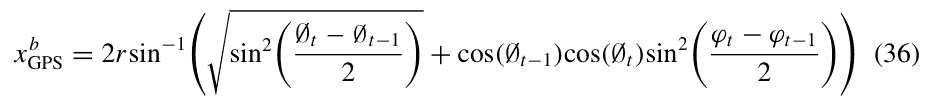

其中，$x_t^b$ 是在 $t$ 时间内行驶的距离，$t$ 的经纬度（$\varphi, \theta$）从 GPS 获取，$r$ 是地球的半径。

##### 3.3.2 Vincenty 逆解公式

Vincenty 公式用于计算地球表面上两点之间的距离，这两点的经纬度已知。它假设地球是一个椭球体 [34]。两点之间的距离计算如公式 (37)-(55) 所示。

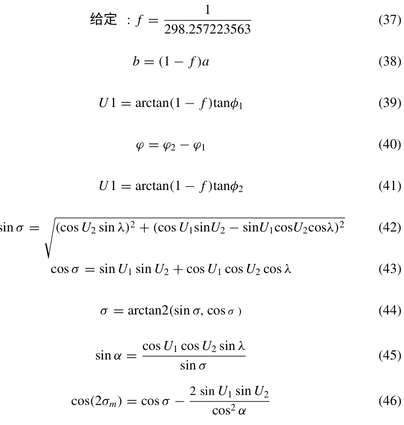

(47)

$$C = \frac{f}{16} \cos^2 \alpha \left[4 + f(4 - 3\cos^2 \alpha)\right]$$

$$\lambda = \varphi + (1-C) f \sin \alpha \left[\sigma + C \sin \sigma \left[\cos(2\sigma_m) + C \cos \sigma \left(-1 + 2\cos^2(2\sigma_m)\right)\right]\right]$$

$$\begin{aligned} & u^2 = \cos^2 \alpha \left(\frac{a^2 - b^2}{b^2}\right) \\ & k_1 = \frac{\sqrt{1+u^2}-1}{\sqrt{1+u^2}+1} \\ & A = \frac{1+\frac{1}{4} k_1^2}{1-k_1} \\ & B = k_1\left(1-\frac{3}{8} k_1^2\right) \end{aligned} \quad (48)$$
$$ \quad (49)$$
$$ \quad (50)$$
$$ \quad (51)$$
$$ \quad (52)$$

$$\begin{aligned} & \sigma = B \sin \sigma \\ & \left\{\cos^2(2\sigma_m) + \frac{1}{4} B \left(\cos \sigma\left[-1+2\cos^2(2\sigma_m)\right] - \frac{B}{6} \cos(2\sigma_m) \left[-3+4\sin^2 \sigma\right] \right)\right\} \end{aligned} \quad (53)$$

$$\alpha_1 = \arctan 2\left(\cos U_2 \sin \lambda, \cos U_1 \sin U_2 - \sin U_1 \cos U_2 \cos \lambda\right) \quad (54)$$

$$\alpha_2 = \arctan 2\left(\cos U_1 \sin \lambda, \sin U_1 \cos U_2 - \cos U_1 \sin U_2 \cos \lambda\right) \quad (55)$$

其中，$\hat{x}_t^b$ 是在 $t-1$ 和 $t$ 之间的经纬度距离 $(\varphi, \theta)$，$a$ 是赤道上的地球半径，$f$ 是椭球体的扁率，$b$ 是椭球体半短轴的长度，$U_1$ 和 $U_2$ 分别是 $t$ 和 $t-1$ 时的简化纬度，$\lambda$ 是辅助球上的经度变化，$s$ 是在 $t-1$ 和 $t$ 之间的椭球距离，$\sigma_1$ 是在 $t-1$ 和 $t$ 之间的角度，$\sigma$ 是在 $t-1$ 和 $t$ 之间的角度，$\sigma_m$ 是赤道和线段中点之间的角度。

在这项工作中，使用了 Vincenty 公式，因为它相对于 Haversine 和其他大圆公式 [32] 提供了更准确的解决方案。这里使用了 Vincenty 反解公式的 Python 实现 [35]。

### 3.4 车辆位移误差预测的学习方案

第 2 节介绍的神经网络被用来学习输入特征之间的关系；位移 $x_{\mathrm{INS}}^{n}$ 、速度 $v_{\mathrm{INS}}^{n}$

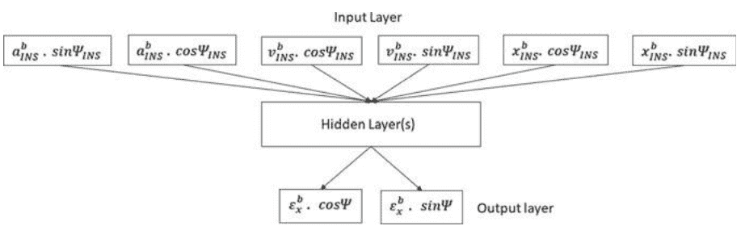

## 图 4 北向和东向位移误差预测的学习方案

以图 4 所示，在北向和东向方向上，利用神经网络学习输入特征；位移误差 $\varepsilon_x^n$（如第 3.2 节和第 3.3 节所述）和目标位移误差 $\varepsilon_X^n$。利用预测的位移误差来修正 INS 测得的位移，以提供更好的定位解决方案。

## 4 实验、结果和讨论

### 4.1 数据集

所使用的数据是 V-Loop 侵略驾驶车辆基准数据集，描述了大约 107 秒的近似直线轨迹，其中的前 105 秒用于我们的分析 [36]。传感器是内置的，数据是通过 VBox 方式 H2 数据采集以 10 Hz 的频率从车辆的 ECU 捕获的。捕获了车辆的纵向加速度以及其绕 z 轴（偏航速率）、航向（偏航）和每个时间点的 GPS 坐标（纬度和经度）。图 5 显示了用于数据收集的车辆以及其传感器的位置。

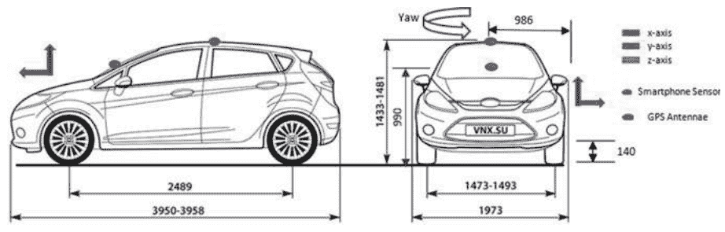

# 图 5 数据收集车辆 [36]

表 1 LSTM、IDNN 和 MLNN 训练参数

| 参数 | LSTM | IDNN | MLNN |
|---|---|---|---|
| 学习率 | 0.09 | 0.09 | 0.09 |
| L1 正则化项 | 0.9 | – | – |
| L2 正则化项 | 0.99 | – | – |
| 循环丢失 | 5% | – | – |
| 丢弃 | – | 5% | 5% |
| 样本周期的序列长度为 0.1-0.3 秒 | 5 | 10×样本周期 | – |
| 样本周期的序列长度为 0.4–1 秒 | 10×样本周期 | 10×样本周期 | – |
| 隐藏层 | 2 | 2 | 2 |
| 每层的隐藏神经元 | 32 | 32 | 32 |
| 批量大小 | 32 | 32 | 32 |
| 迭代次数 | 500 | 500 | 500 |

### 4.2 训练

训练使用数据的前 75 秒，然后在训练数据之后的 10 秒和 30 秒进行模型测试。在训练练习中使用了 Keras-TensorFlow 框架，使用平均绝对误差损失函数和学习率为 0.09 的 Adamax 优化器。IDNN 和 MLNN 的隐藏层以及 LSTM 的循环层中的 5% 单元被删除，以防止神经网络过拟合 [37]。此外，所有输入模型的特征都在 0 到 100 之间进行了标准化，以避免偏向学习。每个深度学习模型训练了 40 个模型，并选择提供最小位置误差的模型。定义神经网络模型训练的参数如表 1 所示。模型的总体架构如图 4 所示。训练练习的目标是教会神经网络学习低成本 INS 和 GPS 之间的定位误差。

### 4.3 测试

在训练数据之后的 10 秒和 30 秒内，假设发生了 GPS 中断，以帮助分析预测模型的性能。在中断之前最后一个已知 GPS 信号的车辆方向和速度信息，将车辆位移的北向和东向分量 $x_{\mathrm{INS},t}^n$、速度 $v_{\mathrm{INS},t}^n$ 和加速度 $a_{\mathrm{INS},t}^n$ 输入到相应的模型中，以预测位移误差的北向和东向分量 $\varepsilon_{x,t}^n$。

表 2 GPS 中断 10 秒后的位置误差

| 采样周期 (秒) | LSTM 位置误差 (米) | | | IDNN 位置误差 (米) | | | MLNN 位置误差 (米) | | | KF 位置误差 (米) | | |
|---|---|---|---|---|---|---|---|---|---|---|---|---|
| | 北向 | 东向 | 总计 | 北向 | 东向 | 总计 | 北向 | 东向 | 总计 | 北向 | 东向 | 总计 |
| 1 | 1.21 | 0.61 | 1.36 | 1.63 | 0.64 | 1.75 | 25.51 | 6.55 | 26.34 | 1.39 | 0.54 | 1.49 |
| 0.9 | 0.59 | 0.7 | 0.92 | 1.22 | 1.08 | 1.63 | 22.02 | 4.28 | 22.43 | 1.05 | 0.93 | 1.40 |
| 0.8 | 0.39 | 0.47 | 0.61 | 0.37 | 0.93 | 1.00 | 19.38 | 6.69 | 20.51 | 0.32 | 0.81 | 0.87 |
| 0.7 | 0.29 | 0.53 | 0.60 | 0.62 | 0.98 | 1.16 | 16.97 | 6.63 | 18.22 | 0.55 | 0.86 | 1.02 |
| 0.6 | 1.04 | 0.36 | 1.10 | 1.37 | 0.81 | 1.59 | 16.36 | 4.38 | 16.94 | 1.22 | 0.72 | 1.42 |
| 0.5 | 0.62 | 0.54 | 0.82 | 1.67 | 1.05 | 1.97 | 12.09 | 5.88 | 13.44 | 1.50 | 0.95 | 1.78 |
| 0.4 | 1.81 | 0.6 | 1.91 | 2.17 | 1.11 | 2.44 | 9.79 | 5.9 | 11.43 | 1.97 | 1.01 | 2.22 |
| 0.3 | 2.24 | 0.89 | 2.24 | 2.64 | 1.15 | 2.88 | 6.98 | 5.93 | 9.16 | 2.43 | 1.06 | 2.65 |
| 0.2 | 1.45 | 0.71 | 1.61 | 2.83 | 1.05 | 3.02 | 4.73 | 5.08 | 6.94 | 2.80 | 1.04 | 2.99 |
| 0.1 | 0.94 | 0.90 | 1.30 | 1.12 | 1.41 | 2.80 | 2.14 | 4.49 | 4.97 | 1.01 | 1.40 | 1.73 |

### 4.4 结果与讨论

为了评估 LSTM、IDNN、MLNN 和卡尔曼滤波器技术的性能，探讨了两种 GPS 中断情景：10 秒和 30 秒。

#### 4.4.1 10 秒 GPS 中断实验结果

研究了 LSTM、IDNN、MLNN 和卡尔曼滤波器在 10 秒中断期间的性能。从表 2 可以看出，在所有采样周期中，LSTM 算法在估计定位误差方面表现最好，其次是卡尔曼滤波器和 IDNN。MLNN 的性能最差。比较所有采样周期，LSTM 方法在 0.7 秒的采样周期内对于约 233 米的行程产生了 0.60 米的最佳误差估计，在 10 秒的研究中。

#### 4.4.2 30 秒 GPS 中断实验结果

在 30 秒 GPS 中断场景中，对 LSTM、IDNN、MLNN 和卡尔曼滤波器的性能进行了研究，结果显示，与 10 秒实验不同，卡尔曼滤波器在性能上表现较差，相比之下 LSTM 和 IDNN 方法表现较好。LSTM 在所有采样频率下表现最佳，卡尔曼滤波器优于 MLNN。对采样周期的比较显示，LSTM 方法在 10Hz 的采样频率下对于约 724 米的行程提供了 4.86 米的最佳误差估计（表 3）。

GPS 中断 30 秒后的位置误差表 3

| | LSTM 位置误差（米） | | | IDNN 位置误差（米） | | | MLNN 位置误差（米） | | | KF 位置误差（米） | | |
|---|---|---|---|---|---|---|---|---|---|---|---|---|
| | | 北向 | 向东 | 总计 | 北向 | 向东 | 总计 | 北向 | 向东 | 总计 | 北向 | 向东 | 总计 |
| 采样周期（秒） | 4.81 | 3.07 | 5.71 | 4.87 | 6.57 | 8.18 | 30.28 | 10.26 | 31.97 | 22.71 | 7.70 | 23.98 |
| 1 | 5.33 | 5.19 | 7.44 | 5.22 | 7.30 | 8.97 | 25.42 | 9.15 | 27.02 | 19.57 | 7.05 | 20.80 |
| 0.9 | 6.25 | 7.79 | 9.99 | 5.93 | 8.30 | 10.20 | 22.64 | 12.08 | 25.66 | 17.88 | 9.54 | 20.27 |
| 0.8 | 6.65 | 7.69 | 10.17 | 6.33 | 8.71 | 10.77 | 20.22 | 12.60 | 23.82 | 16.38 | 10.21 | 19.30 |
| 0.7 | 6.93 | 7.36 | 10.11 | 7.03 | 8.56 | 11.08 | 20.35 | 10.70 | 22.99 | 16.89 | 8.88 | 19.08 |
| 0.6 | 6.43 | 4.45 | 7.82 | 7.3 | 8.96 | 11.56 | 15.38 | 12.36 | 19.73 | 13.07 | 10.51 | 16.77 |
| 0.5 | 7.52 | 7.69 | 10.76 | 7.49 | 9.29 | 11.93 | 12.77 | 12.82 | 18.09 | 11.11 | 11.15 | 15.74 |
| 0.4 | 5.46 | 4.62 | 8.72 | 8.16 | 10.38 | 13.20 | 9.98 | 13.53 | 16.81 | 8.88 | 12.04 | 14.96 |
| 0.3 | 5.46 | 4.46 | 7.05 | 8.29 | 9.87 | 12.89 | 7.64 | 12.52 | 14.67 | 6.95 | 11.39 | 13.35 |
| 0.2 | 3.74 | 3.11 | 4.86 | 8.90 | 10.22 | 13.55 | 5.19 | 12.2 | 13.26 | 4.83 | 11.35 | 12.33 |
| 0.1 |

## 5 结论

有效的车辆服务和自动驾驶车辆的安全性取决于车辆的准确和可靠的定位。然而，大多数商用 GPS 接收器在相当低的采样率（1 Hz）下运行，并且在城市canyons、隧道等地面临可靠性问题。INS可以代替 GPS 提供连续的定位在 GPS 信号接收之间提供信息。为此，研究了 LSTM、IDNN、MLNN 和卡尔曼滤波器技术在几种采样场景中的应用 GPS 信号中断 10 秒和 30 秒。研究结果表明，在短暂的中断（小于 10 秒）和较长的 GPS 中断（约 30 秒）期间，LSTM 方法提供了最佳的定位解决方案。此外，我们的研究结果表明，在长期 GPS 中断期间以较低的速率进行采样提供了相对较差的位置估计。然而，有必要探索 LSTM 模型的性能在更复杂的驾驶场景中，以评估其鲁棒性。这将是我们未来研究的主题。

## 参考文献

1. I. Dowd, 自主车辆的未来，Open Access Government(2019). https://www.openaccessgovernment.org/future-of-autonomous-vehicles/57772/, 2019 年 6 月 4 日访问
2. P. Liu, R. Yang, Z. Xu, 自动驾驶车辆的安全性如何足够安全？风险分析 39(2), 315-325 (2019)
3. A. Papadoulis, M. Quddus, M. Imprialou, 评估连接和自主车辆对高速公路的安全影响。事故分析与预防 124, 12-22 (2019)
4. S.-J. Babak, S.A. Hussain, B. Karakas, S. Cetin, 自主地面车辆的控制：简要技术综述—IOPscience (2017). https://iopscience.iop.org/article/10.1088/1757-899X/224/1/012029，于 2020 年 3 月 22 日访问
5. K. Onda, T. Oishi, Y. Kuroda, 用于自主导航的宽视场 3D-LiDAR 的动态环境识别。IFAC-PapersOnLine **51**(22), 530-535 (2018)
6. S. Ahmed, M.N. Huda, S. Rajbhandari, C. Saha, M. Elshaw, S. Kanarachos, 用于自主车辆的行人和骑行者检测和意图估计：一项调查。Appl. Sci. 9(11), 2335 (2019)
7. W. Yao, 等，宽区域监控系统中的 GPS 信号丢失：普遍性、影响和解决方案，Electr. Power Syst. Res. 147(C), 254-262 (2017)
8. G. O'Dwyer, 芬兰、挪威敦促俄罗斯在北约演习期间对疑似 GPS 干扰进行调查 (2018)。https://www.defensenews.com/global/europe/2018/11/16/finland-norway-press-russia-on-suspected-gps-jamming-during-nato-drill/,于 2019 年 6 月 4 日访问
9. B. Templeton, 摄像头还是激光器？(2017)。http://www.templetons.com/brad/robocars/cameras- lasers.html, 于 2019 年 6 月 4 日访问
10. L. Teschler, 惯性测量单元将使自动驾驶汽车保持在轨道上 (2018). https:// www.microcontrollertips.com/inertial-measurement-units-will-keep-self-driving-cars-on- track-faq/, 2019 年 6 月 5 日访问
11. OXTS, 为什么在自动驾驶车辆上集成 INS 与成像系统 (2016). https://www.oxts.com/technical-notes/why-use-ins-with-autonomous-vehicle/, 2019 年 6 月 4 日访问
12. R. Sharaf, A. Noureldin, A. Osman, N. El-Sheimy, 在线 INS/GPS 集成与径向基函数神经网络。IEEE 航空电子系统杂志 20(3), 8-14 (2005)
13. K.-W. Chiang, N. El-Sheimy, 使用神经网络进行 INS/GPS 集成用于陆地车辆导航应用 (2002), pp. 535-544
14. K.W. Chiang, A. Noureldin, N. El-Sheimy, 使用神经计算进行多传感器集成 用于陆地车辆导航。GPS 解决方案。6(4), 209-218 (2003)
15. K.-W. Chiang, 利用单点定位和多层前馈网络 进行 INS/GPS 集成 (2003), pp. 258-266
16. M. Malleswaran, V. Vaidehi, M. Jebarsi, GPS/INS 集成中的神经网络综述，2012 年国际信息技术最新趋势会议 ICRTIT 2012, no. 1 (2012), pp. 34-39
17. A. Noureldin, A. El-Shafie, M. Bayoumi, 利用动态神经网络进行 GPS/INS 集成 用于车辆导航。信息融合 12(1), 48-57 (2011)
18. M. Malleswaran, V. Vaidehi, A. Saravanaselvan, M. Mohankumar, 对 GPS/INS 集成的各种人工智能神经网络的性能分析。应用人工智能。27(5), 367-407 (2013)
19. A.S. El-Wakeel, A. Noureldin, N. Zorba, H.S. Hassanein, 用于智能车辆服务中自适应分辨率地理参考的框架，在 IEEE 车载技术会议, vol. 2019 (2019)
20. K. Chiang, 使用神经网络进行陆地车辆导航的 INS/GPS 集成 UCGE 报告编号 20209 地理测量工程系使用神经网络进行陆地车辆导航应用，作者：Kai-Wei Chiang (2004)
21. T. P. Van, T.N. Van, D.A. Nguyen, T.C. Duc, T.T. Duc, INS/GPS 导航系统的 15 状态扩展卡尔曼滤波器设计。自动控制工程杂志。3(2), 109-114 (2015)
22. M.W. Gardner, S.R. Dorling, 人工神经网络 (多层感知器) 在大气科学中的应用综述。大气环境。32(14-15), 2627-2636 (1998)
23. M.A. Wani, F.A. Bhat, S. Afzal, A.I. Khan, 深度学习进展, vol. 57 (Springer, 新加坡，2020)
24. A. Krizhevsky, I. Sutskever, G.E. Hinton, 使用深度卷积神经网络进行 ImageNet 分类 (2012). https://papers.nips.cc/paper/4824-imagenet-classification-with-deep-convolutional-neural-networks.pdf
25. C. Chen, X. Lu, A. Markham, N. Trigoni, IONet: 学习解决惯性测距中的漂移问题 (2018), pp. 6468-6476
26. P. Kasnesis, C.Z. Patrikakis, I.S. Venieris, PerceptionNet: 一种用于后期传感器融合的深度卷积神经网络 (2018)
27. W. Fang, 等，一种 LSTM 算法用于在 GNSS 信号中断期间辅助 INS 估计伪测量。Remote Sens. 12(2), 256 (2020)
28. K. He, X. Zhang, S. Ren, J. Sun, 深度残差学习用于图像识别，在 IEEE 计算机学会计算机视觉和模式识别会议论文集, vol.2016, pp. 770-778 (2016)
29. J. Redmon, S. Divvala, R. Girshick, A. Farhadi, 你只需要一次看到：统一的、实时的目标检测 (2016). arXiv 预印本 arXiv:1506.02640
30. H. Ismail Fawaz, G. Forestier, J. Weber, L. Idoumghar, P.A. Muller, 深度学习用于时间序列分类：一篇综述。数据挖掘与知识发现. 33(4), 917-963 (2019)
31. M. Kok, J.D. Hol, T.B. Schön, 使用惯性传感器进行位置和方向估计。发现。趋势信号处理。11(2), 1-153 (2017)
32. H. 马哈茂德，N. 阿卡里，最短路径计算：基于位置的推荐系统的比较研究，在会议论文集—2016 年世界计算机应用和研究研讨会，第 1-5 页（2016 年）
33. C.M. 托马斯，W.E. 费瑟斯通，通过对 Kivioja 公式的新四阶扩展验证 Vincenty 公式的大地测量。J. 测量工程。131(1), 20-26 (2005 年)
34. T. Vincenty，椭球上大地测线的直接和反解，嵌套方程的应用。测量评论。23(176), 88-93 (1975 年)
35. Vincenty PyPI. https://pypi.org/project/vincenty/. 于 2020 年 5 月 8 日访问
36. U. Onyekpe, V. Palade, S. Kanarachos, A. Szkolnik, IO-VNBD：惯性和测距基准数据集用于地面车辆定位 (2020). arXiv 预印本 arXiv:2005.01701
37. Y. Gal, Z. Ghahramani, 一种理论上基于 dropout 的递归神经网络应用 (2016). arXiv 预印本 arXiv:1512.05287

## 多对抗变分自动编码器网络用于同时图像生成和分类

Abdullah-Al-Zubaer Imran 和 Demetri Terzopoulos

摘要 有区别的深度学习模型通常依赖于大量标记的训练数据。相比之下，从相对较小的训练数据语料库中，深度生成模型可以学习生成逼真的图像，接近真实世界的分布。特别是，适当训练生成对抗网络（GANs）和变分自动编码器（VAEs）使它们能够执行半监督图像分类。将这两个模型的能力结合起来，我们引入了多对抗变分自动编码器网络（MAVENs），这是一种新颖的深度生成模型，在 VAE-GAN 网络中结合了一组判别器，以进行同时对立的对抗学习和变分推断。我们将 MAVENs 应用于合成图像的生成，并提出了一种新的分布度量来量化这些图像的质量。我们在计算机视觉和医学成像领域仅使用 10% 的标记训练数据进行实验，结果表明在同时图像生成和分类任务中，性能与最先进的半监督模型竞争力相当。

### 1 引言

训练深度神经网络通常需要大量的数据，然而获取大规模、准确标记的图像分类和其他任务的数据集仍然是一个基本挑战 [36]。尽管在大规模高分辨率图像的生产方面取得了爆炸性的进展，但用于监督学习所需的大规模标记数据集仍然很少。特别是在医学影像等领域，由于隐私问题，数据集的规模往往有限，而由医学专家进行注释既昂贵又耗时，并且容易受到人为主观性的影响。

A.-A.-Z. Imran ✉ D. Terzopoulos
加利福尼亚大学洛杉矶分校，美国加利福尼亚州 90095
电子邮件：aimran@cs.ucla.edu
D. Terzopoulos
电子邮件：dt@cs.ucla.edu
© 编辑（如适用）和作者，独家许可
给 Springer Nature Singapore Pte Ltd. 2021
M. A. Wani 等人（编辑），深度学习应用，第 2 卷，智能系统与计算进展 1232，https://doi.org/10.1007/978-981-15-6759-9_11

图 1 基于 CIFAR-10 数据集的图像生成 [19]: aGAN 生成的相对好的图像 bVAE 生成的模糊图像。基于 SVHN 数据集 [24]: cGAN 生成的模式崩溃图像

不一致性和错误。即使大型标记数据集变得可用，它们通常存在严重不平衡和非均匀分布的问题。在不平衡的医学数据集中，常见的医学问题会被过度表示，而罕见的病症则会被低估。这些偏见使得在多个类别上训练神经网络变得非常具有挑战性。

传统上，小型训练数据问题通过简单和繁琐的数据增强来缓解，通常是通过平移、旋转、翻转等方式创建新的训练样本。缺失或不匹配的标签问题可以通过在训练样本上评估相似性度量来解决。这种方法并不总是稳健的，其有效性在很大程度上取决于相似性度量算法的性能。

随着深度生成模型的出现，如变分自编码器 (VAEs) [18] 和生成对抗网络 (GANs) [9],在大量未标记数据的常见场景中，从训练样本中学习潜在数据分布已经变得实用。通过最少的注释，高效的半监督学习可能是首选方法 [16]。更具体地说，基于少量注释，可以通过已经学习了真实世界数据分布的模型生成逼真的新训练图像 (图 1a)。VAEs 和 GANs 都可以用于这个目的。

VAEs 可以学习训练数据的降维表示，并通过显式密度估计生成新样本。尽管 VAEs 可以进行快速变分推断，但生成的样本通常模糊不清 (图 1b)。

另一方面，尽管 GAN 框架在生成图像和半监督分类方面取得了成功，但训练仍然困难，并且使用 GAN 模型存在挑战，如不稳定训练导致的非收敛、梯度消失问题、过拟合、对超参数的敏感性以及模式坍塌的图像生成 (图 1c)。

尽管 GAN 和 VAE 在高质量图像生成方面取得了最近的进展，但是同一个模型通常不能同时保证准确性和图像质量，特别是在多类图像分类任务中。为了解决这个缺点，我们提出了

### 2 相关工作

已经提出了几种技术来稳定 GAN 的训练并避免模式崩溃。Nguyen 等人 [26] 提出了一种使用单个生成器和双判别器的模型。Durugkar 等人 [7] 提出了一种使用单个生成器和在多个判别器上聚合的反馈的模型，可以考虑所有判别器的平均损失或与生成器输出的最大损失的判别器。Neyshabur 等人 [25] 提出了一个框架，其中单个生成器同时针对数据的不同低维投影进行训练，并与一系列判别器进行对抗。

Moridido 等人 [23] 认为，所有先前的方法都限制了判别器的架构，从而影响了可扩展性，他们提出了 Dropout-GAN，其中一个单一的生成器针对动态变化的判别器集合进行训练。然而，有可能会丢弃所有的判别器。为了消除 GAN 训练中的模式崩溃和防止过拟合，已经提出了特征匹配和小批量区分技术 [32]。

逼真的图像生成有助于解决由于标记数据稀缺而引起的问题。GAN 的各种架构及其变体已被应用于不断努力提高图像分类的准确性和效果。GAN 框架已被用作生成逼真的训练图像的通用方法，以合成数据集以对抗过拟合；例如，用于肝脏病变的合成数据增强 [8]、视网膜底片 [10]、组织病理学 [13] 和胸部 X 射线 [16,31]。Calimeri 等人 [3] 使用了 LAPGAN[6]，Han 等人 [11] 使用了 WGAN[1] 来生成合成的脑 MR 图像。Bermudez

等人 [2] 使用 DCGAN[29] 生成 2D 脑 MR 图像，然后使用自编码器进行图像去噪。Chuquicusma 等人 [4] 利用 DCGAN 生成肺结节，然后进行图灵测试以评估生成样本的质量。GAN 框架还显示出通过生成新的合成训练图像来提高图像分类准确性的能力。Frid 等人 [8] 使用 DCGAN 和 ACGAN[27] 生成三种肝脏病变类别的图像，以合成增加有限数据集并提高卷积神经网络（CNN）在肝脏病变分类中的性能。同样，Salehinejad 等人 [31] 使用 DCGAN 人工模拟了五类胸部 X 射线的病理，以增加原始不平衡数据集并提高卷积神经网络（CNN）在胸部病理分类中的性能。

GAN 框架也被用于半监督学习架构，以利用有限的标记数据和无标记数据。以下工作展示了在 GAN 框架中引入无标记数据如何显著提高图像级分类的准确性。Madani 等人 [20] 在半监督学习中使用了数量级更少的标记数据，并且与传统的有监督 CNN 分类器表现相当，并且通过简单地提供无标记测试域图像来减少域过拟合。Springenberg 等人 [33] 结合了 WGAN 和 Cat-GAN[35] 来进行无监督和半监督学习，用于特征表示的皮肤镜图像。

尽管上述成功，GAN 框架仍然具有挑战性，如我们之前讨论的。我们的 MAVEN 框架通过在有限数量的标记数据上进行训练，防止过拟合到特定数据域源，并防止模式崩溃，同时支持多类别图像分类，从而减轻了 GAN 训练的困难。

### 3 MAVEN 架构

图 2 展示了作为我们 MAVEN 架构前身的模型。
VAE 是一个明确的生成模型，它使用两个神经网络，一个编码器 E 和一个解码器 D′。网络 E 学习将真实数据 x 高效压缩为一个较低维度的潜在表示空间 z(x)；即$q_{λ}(z|x)$。使用神经网络似然函数，计算梯度变得困难；然而，通过可微分的非中心重参数化，从近似函数中进行采样，即$q_{λ}(z|x)=N(z;\mu_{λ},\sigma_{λ}^{2})$，其中$z=\mu_{λ}+\sigma_{λ}\odot\hat{\epsilon}$,$\hat{\epsilon}\sim N(0,1)$。编码器 E 产生μ和σ，并通过重参数化技巧从高斯分布中采样$z_{0}$。然后，通过 D′，生成新样本或重构真实数据样本；即 D′为真实数据分布$p_{λ}(x|z)$提供参数。

随后，从$p_{φ}(x|z)$中抽取的样本可以用来通过边际化 z 来重构真实数据。

GAN 是一种隐式生成模型，其中生成器 G 和判别器 D 在训练数据上进行极小极大博弈，以提高它们的性能。

### 4 半监督学习

图2我们的MAVEN架构与VAE、GAN和VAE-GAN的比较。在MAVEN中，输入到$D$的可以是真实数据$X$，也可以是生成的数据$\hat{X}$或$\tilde{X}$。集成确保了判别器对生成器的综合反馈。性能。生成器$G$试图逼近训练数据的潜在分布并生成合成样本，而判别器$D$则学习区分合成样本和真实样本。GAN模型的训练目标如下：

max $V(D)=E_{x \sim p_{data}(x)}[\log D(x)]+E_{x \sim p_{g}(z)}[\log (1-D(G(z))];$ (1)

$\min _{G} V(G)=E_{x \sim p_{g}(z)}[\log (1-D(G(z))].$ (2)

$G$接受一个噪声样本$z \sim p_{g}(z)$并学习将其映射到图像空间，就像它来自原始数据分布$p_{\text {data }}(x)$一样，而$D$接受真实的图像数据或生成的图像数据，并向$G$提供反馈，告诉它输入是真实的还是生成的。一方面，$D$希望最大化真实样本的可能性并最小化生成样本的可能性；另一方面，$G$希望$D$最大化生成样本的可能性。当$D$无法区分真实样本和生成样本时，达到纳什均衡，这意味着模型分布与数据分布相匹配。

Makhzani等人[21]提出了VAEs的对抗训练，即VAE-GANs。尽管他们保留了$D$和$G$，但可以合并这些网络，因为两者都可以从表示$z$的噪声样本中生成数据样本。在这种情况下，$D$接收真实数据样本$x$和生成的样本$\hat{x}$或$\hat{x}$通过$G$。尽管$G$和$D$彼此竞争，但来自$D$的反馈最终对$G$来说是可预测的，并且它不断从同一类别生成样本，在这一点上生成的样本缺乏多样性。图1c显示了所有生成的图像都属于同一类别的示例。Durugkar等人[7]提出，在GAN模型中使用多个判别器有助于提高性能，特别是解决这种模式崩溃问题。此外，最近提出了多个判别器的动态集合来解决这个问题[23]（图3）。

就像VAE-GAN一样，我们的MAVEN有三个组件，$E$，$G$和$D$；它们都是卷积神经网络，具有卷积或转置卷积层。首先，$E$接收真实样本x并生成一个降维表示 z (x) 。其次，$G$可以输入来自噪声分布$z \sim p_g(z)$或采样噪声$z(x) \sim q_z(x)$，并生成生成的样本。第三，$D$接收来自真实标记数据、真实未标记数据和生成数据的输入。在$G$中执行分数步幅卷积，以从潜在代码中获取图像维度。自编码器的目标是最大化证据下界（ELBO）。这里的直觉是向网络展示更多真实数据。它看到的真实数据量越大，可用的证据就越多，因此ELBO可以更快地最大化。

# 图3 MAVEN中的三个卷积神经网络，E，G和D

### 4.1 损失函数

三个网络，E，G和D，分别根据不同的目标进行训练。E通过最大化ELBO进行训练，G通过生成逼真的样本进行训练，D通过学习对生成样本或真实数据样本的特定类别进行分类器的训练。

#### 4.1.1 D损失

由于模型是在有标签和无标签的训练数据上进行训练的，所以$D$的损失函数包括有监督和是无监督的损失。当模型接收到真实的有标签数据时，它是标准的有监督学习损失：

$L_{D \text { 有监督 }}=-\mathbb{E}_{x, y \sim P_{\text {数据 }}} \log [p(y=i \mid x)], \quad i<n+1 .$

当它从三个不同的来源接收到未标记的数据时，无监督损失包含来自两个不同来源的真实数据和生成数据的原始GAN损失：

$$
\begin{aligned}
L_{D \text { 真实值 }} & =-\mathbb{E}_{x \sim p_{\text {数据 }}} \log \left[1-\mathbb{P}(y=n+1 \mid x)\right], (6) \\
L_{D \text { synG }} &=-\mathbb{E}_{\hat{x} \sim G} \log[\mathbb{P}(y=n+1 \mid \hat{x})], (7) \\
L_{D \text { synE }} &=-\mathbb{E}_{\tilde{x} \sim G} \log[\mathbb{P}(y=n+1 \mid \tilde{x})], (8) \\
L_{D \text { 无监督 }} &= L_{D \text { 真实值 }} + L_{D \text { synG }} + L_{D \text { synE }}. (9)
\end{aligned}
$$

#### 4.1.2 G损失

对于$G$，特征损失与原始GAN损失一起使用。激活函数$f(x)$来自中间层的$D$被用来匹配真实样本和生成样本之间的特征。特征匹配在半监督学习中显示出很大的潜力[32]。特征匹配的目标是鼓励$G$生成与真实数据统计相匹配的数据。对于$D$来说，找到相对于模型生成的数据最有区分性的特征是自然的：

$L_{G \text{ 特征 }} = \| \mathbb{E}_{x \sim p_{\text {数据 }}} f(x) - \mathbb{E}_{\hat{x} \sim G} f(\hat{x}) \|_2^2. (10)$

总的$G$损失变为综合特征损失(10)加上最大化$D$在生成数据上犯错误的对数概率的成本(synG/synE)；即，

$L_{G} = L_{G \text{ 特征 }} + L_{G \text{ synG }} + L_{G \text{ synE }}, (11)$

其中

$L_{G \text{ synG }} = -\mathbb{E}_{\hat{x} \sim G} \log[1-\mathbb{P}(y=n+1 \mid \hat{x})], (12)$

和

$L_{G \text{ synE }} = -\mathbb{E}_{\tilde{x} \sim G} \log[1-\mathbb{P}(y=n+1 \mid \tilde{x})]. (13)$

#### 4.1.3 E损失

在编码器$E$中，ELBO的最大化等价于最小化KL-散度，允许近似后验推断。因此，损失函数包括KL-散度和特征损失，以匹配合成数据中的特征与真实数据分布。编码器的损失为

$L_E = L_{E \text{ KL}} + L_{E \text{ 特征 }}, (14)$

其中

$$
\begin{aligned}
L_{E_{\mathrm{KL}}} & =-\mathrm{KL}\left[q_{\lambda}(z \mid x) \| p(z)\right]=\mathbb{E}_{q_{\lambda}(z \mid x)}\left[\log \frac{p(z)}{q_{\lambda}(z \mid x)}\right] \& \approx \mathbb{E}_{q_{\lambda}(z \mid x)} \\
L_{E_{\text {特征 }}} & =\left\|\mathbb{E}_{x \sim p_{\text {数据 }}} f(x)-\mathbb{E}_{\tilde{x} \sim G} f(\tilde{x})\right\|_{2}^{2} .
\end{aligned}
$$

## 算法1 MAVEN训练过程

m 是样本数量；B 是小批量大小；K 是鉴别器数量。

```python
steps ← m / B
对于每个时代做
    对于每个步骤在 steps中做
        对于 k 从 1 到 K 做
            样本小批量 z^(1), ..., z^(m) 从 p_g(z) 中采样
            样本小批量 x^(1), ..., x^(m) 从 p_data(x) 中采样
            通过沿着梯度上升更新 D_k:
            ∇_{D_k} 1/m Σ_{i=1}^m [log D_k(x_i) + log (1 - D_k(G(z_i)))]
            结束循环
            样本小批量 z_k^(1), ..., z_k^(m) 从 p_g(z) 中采样
            如果集成是 'mean' 则
                给 D_k 分配权重 w_k
                确定平均鉴别器 D_μ = 1/K Σ_{k=1}^K w_k D_k
            结束如果
            通过从 D_μ 的集合中沿着其梯度下降来更新 G:
            ∇_G 1/m Σ_{i=1}^m [log (1 - D_μ(G(z_i)))]
            从数据集中抽取小批量样本 x^(1), ..., x^(m)
            并根据其期望函数更新 E:
            ∇_{E_{q_λ}} [log p(z)/q_λ(z|x)]
        结束循环
```

### 5 实验

在只有部分标记的训练数据上应用半监督学习，我们在图像生成和分类任务中评估了我们的MAVEN模型，在多个实验中进行了测试。对于所有实验，我们使用了10%的标记数据和90%的未标记数据。

#### 5.1 数据

我们使用了以下四个图像数据集：

- 1. 街景房屋数字（SVHN）数据集[24]（图4a）。训练集中有73,257个数字图像，测试集中有26,032个数字图像。在两个版本的图像中，我们使用了类似于MNIST的32×32像素RGB彩色图像，围绕着一个单独的数字。每个图像都被标记为属于10个类别之一：数字0-9。
- 2. CIFAR-10数据集[19]（图4b）。它包含了60,000个32×32像素的RGB彩色图像，分为10个类别。训练集中有50,000个图像，测试集中有10,000个图像。每个图像都被标记为属于以下10个类别之一：飞机、汽车、鸟类、猫、鹿、狗、青蛙、马、船和卡车。
- 3. 前后胸部X射线（CXR）数据集[17]（图4c）。数据集包含5,216个训练图像和624个测试图像。每个图像被标记为属于三个类别之一：正常、细菌性肺炎（细菌性肺炎）和病毒性肺炎（病毒性肺炎）。
- 4. 皮肤病变分类（SLC）数据集（图4d）。我们使用了来自ISIC 2017皮肤镜图像数据集[5]的2,000个RGB皮肤图像；其中1,600个用于训练，400个用于测试。每个图像被标记为属于非黑素瘤和黑素瘤两个类别之一。

对于SVHN和CIFAR-10数据集，图像被归一化并以原始（32×32×3）像素大小提供给模型。对于CXR数据集，图像被归一化并调整大小为128×128×1像素。对于SLC数据集，图像被调整大小为128×128×3像素。

#### 5.2 实现细节

为了比较我们的MAVEN模型在图像生成和多类别分类性能方面，我们使用了两个基准模型，即深度卷积GAN（DC-GAN）[29]和VAE-GAN。DC-GAN和MAVEN模型使用相同的生成器和判别器架构，VAE-GAN和MAVEN模型使用相同的编码器。对于我们的MAVEN模型，我们尝试了2、3和5个判别器。除了使用多个判别器的平均反馈外，我们还尝试了从随机选择的判别器获得反馈。因此，六个MAVEN变体分别被称为MAVEN-m2D、MAVEN-m3D、MAVEN-m5D、MAVEN-r2D、MAVEN-r3D和MAVEN-r5D，其中“m”表示平均反馈，“r”表示随机反馈。

所有模型都是在TensorFlow中实现的，并在单个Nvidia Titan GTX（12 GB）GPU上运行。对于鉴别器，在每个卷积层之后，都添加了一个丢弃层，丢弃率为0.4。对于所有模型，我们一致地使用学习率为2.0-4的Adam优化器进行训练$G$和$D$，并使用学习率为1.0-5的Adam优化器进行训练$E$，动量为0.9。所有卷积层后面都跟着批量归一化。使用Leaky ReLU激活函数，其中α = 0.2。

#### 5.3 评估

##### 5.3.1 图像生成性能指标

没有完美的性能指标来衡量生成样本的质量。然而，为了评估生成图像的质量，我们使用了广泛使用的Fréchet Inception Distance (FID) [12]和简化版本的描述性分布距离 (DDD) [14]。为了测量两个多元高斯分布之间的Fréchet距离，通过比较生成样本和真实数据样本的分布统计量：

- 两个分布样本，$X_{\text{数据}} \sim \mathcal{N}(\mu_{\text{数据}}, \Sigma_{\text{数据}})$和$X_{\text{合成}} \sim \mathcal{N}(\mu_{\text{合成}}, \Sigma_{\text{合成}})$，分别计算自Inception-v3 [32]的pool3层的2,048维激活。DDD通过比较两个分布的描述性参数来衡量生成数据分布与真实数据分布的接近程度。我们提出了一个基于分布的前四个矩的简化版本，计算方法是归一化差异的加权和，如下所示：

- 其中$\mu_{\text{数据 } i}$是数据分布的矩，$\mu_{\text{syn } i}$是模型分布的矩，并且$w_i$是在穷尽搜索中找到的相应权重。为了强调分布的稳定性，高阶矩被赋予更高的权重。对于FID和DDD，得分越低越好。

##### 5.3.2 图像分类性能指标

为了评估模型在分类中的性能，我们使用了两个指标，图像级别的分类准确率和类别的F1得分。F1得分是

$F1 = \frac{2 \times \text{精确率} \times \text{召回率}}{\text{精确率} + \text{召回率}},$

其中

$\text{精确率} = \frac{TP}{TP+FP}$

和 $\text{召回率} = \frac{TP}{TP+FN},$

其中TP、FP和FN分别是真正例、假正例和假负例的数量。

#### 5.4 结果

我们使用交叉验证测量了模型的图像分类性能，并在下面的章节中报告了每个模型运行10次的平均分数。

##### 5.4.1 SVHN

对于SVHN数据集，我们随机选择了7,326个带标签的图像，并将其与其余的65,931个无标签的图像一起提供给网络作为训练数据。所有模型都经过300个epoch的训练，然后进行评估。我们生成了与训练集大小相等的新图像。图5展示了DC-GAN、VAE-GAN和MAVEN模型生成的随机选择图像与真实训练图像的视觉比较。图6比较了随机抽样的10K个真实图像和同样数量的由不同模型生成的图像的图像强度直方图。

总的来说，我们的MAVEN模型生成的图像比DC-GAN和VAE-GAN模型生成的图像更加逼真。这进一步得到了随机抽样的10K个生成图像和10K个真实图像的证实。对于八个不同的模型进行了生成图像质量测量。

表1报告了结果FID和DDD分数。对于FID分数的计算，在每个模型上运行预训练的Inception-v3网络20个周期后报告分数。MAVEN-r3D模型取得了最佳的FID分数，而MAVEN-m5D模型取得了最佳的DDD分数。

表2比较了所有模型在SVHN数据集上的分类性能。MAVEN模型在分类准确度和类别F1分数上始终优于DC-GAN和VAE-GAN分类器。在所有模型中，我们的MAVEN-m2D和MAVEN-m3D模型是最准确的。

#### 表1 DC-GAN、VAE-GAN和MAVEN模型在CIFAR-10、SVHN、CXR和SLC数据集上取得的最小FID和DDD分数

| 模型           | CIFAR-10 FID      | CIFAR-10 DDD | SVHN FID           | SVHN DDD  | CXR FID             | CXR DDD  | SLC FID            | SLC DDD  |
|----------------|------------------|--------------|--------------------|-----------|---------------------|----------|--------------------|----------|
| DC-GAN         | 61.293±0.209     | 0.265        | 16.789±0.303       | 0.343     | 152.511±0.370       | 0.145    | 1.828±0.370        | 0.795    |
| VAE-GAN        | 15.511±0.125     | 0.224        | 13.252±0.000       | 0.329     | 141.422±0.580       | 0.107    | 1.828±0.580        | 0.795    |
| MAVEN-m2D      | 12.743±0.242     | 0.223        | 11.675±0.000       | 0.309     | 141.339±0.420       | 0.138    | 1.874±0.270        | 0.802    |
| MAVEN-m3D      | **11.316±0.808** | **0.190**    | **11.515±0.065**   | **0.300** | **140.865±0.983**   | **0.018**| **0.304±0.018**    | **0.249**|
| MAVEN-m5D      | 12.123±0.140     | 0.207        | 10.909±0.000       | 0.294     | 147.316±1.169       | 0.100    | 1.518±0.190        | 0.793    |
| MAVEN-r2D      | 12.820±0.584     | 0.194        | 11.384±0.000       | 0.316     | 154.501±0.345       | 0.038    | 1.505±0.130        | 0.789    |
| MAVEN-r3D      | 12.620±0.000     | 0.202        | **10.791±0.029**   | 0.357     | 158.749±0.297       | 0.179    | 0.336±0.080        | 0.783    |
| MAVEN-r5D      | 18.509±0.000     | 0.215        | 11.052±0.751       | 0.323     | 152.778±1.254       | 0.180    | 1.812±0.014        | 0.795    |
| DO-GAN [23]    | 88.60±0.08       | –            |                    |           |                     |          |                    |          |
| TTUR [12]      | 36.9             |              |                    |           |                     |          |                    |          |
| C-GAN [34]     | 27.300           |              |                    |           |                     |          |                    |          |
| AIQN [28]      | 49.500           |              |                    |           |                     |          |                    |          |
| SN-GAN [22]    | 21.700           |              |                    |           |                     |          |                    |          |
| LM [30]        | 18.9             |              |                    |           |                     |          |                    |          |

图4四个数据集中每个类别的示例图像  
图5 对比SVHN数据集生成的图像样本与不同模型生成的图像样本  
图6 真实SVHN训练数据的直方图，以及由DC-GAN和VAE-GAN模型以及我们的MAVEN模型生成的数据的直方图，其中包括来自2、3到5个鉴别器的平均和随机反馈。

表 2：DC-GAN、VAE-GAN 和 MAVEN 模型在 SVHN 数据集上的半监督分类性能比较中的平均交叉验证准确率和类别 F1 分数

| 模型 | 准确率 | 0 | 1 | 2 | 3 | 4 | 5 | 6 | 7 | 8 | 9 |
| :--- | :--- | :--- | :--- | :--- | :--- | :--- | :--- | :--- | :--- | :--- | :--- |
| DC-GAN | 0.876 | 0.860 | 0.920 | 0.890 | 0.840 | 0.890 | 0.870 | 0.830 | 0.890 | 0.820 | 0.840 |
| VAE-GAN | 0.901 | 0.900 | 0.940 | 0.930 | 0.860 | 0.920 | 0.900 | 0.860 | 0.910 | 0.840 | 0.850 |
| MAVEN-m2D | 0.909 | 0.890 | 0.930 | 0.940 | 0.890 | 0.930 | 0.900 | 0.870 | 0.910 | 0.870 | 0.890 |
| MAVEN-m3D | 0.909 | 0.910 | 0.940 | 0.940 | 0.870 | 0.920 | 0.890 | 0.870 | 0.920 | 0.870 | 0.860 |
| MAVEN-m5D | 0.905 | 0.910 | 0.930 | 0.930 | 0.870 | 0.930 | 0.900 | 0.860 | 0.910 | 0.860 | 0.870 |
| MAVEN-r2D | 0.905 | 0.910 | 0.930 | 0.940 | 0.870 | 0.930 | 0.890 | 0.860 | 0.920 | 0.850 | 0.860 |
| MAVEN-r3D | 0.907 | 0.890 | 0.910 | 0.920 | 0.870 | 0.900 | 0.870 | 0.860 | 0.900 | 0.870 | 0.890 |
| MAVEN-r5D | 0.903 | 0.910 | 0.930 | 0.940 | 0.860 | 0.910 | 0.890 | 0.870 | 0.920 | 0.850 | 0.870 |

### 5.4.2 CIFAR-10

对于 CIFAR-10 数据集，我们使用了 50K 个训练图像，其中只有 5K 个标记过。所有模型都经过了 300 个 epochs 的训练，然后进行了评估。我们生成了与训练集大小相等的新图像。图 7 直观地比较了 DC-GAN、VAE-GAN 和 MAVEN 模型生成的随机图像选择和真实训练图像。图 8 比较了 10K 个随机抽样的真实图像和同样数量的从不同模型生成的图像的图像强度直方图。表 1 报告了 FID 和 DDD 分数。

```text
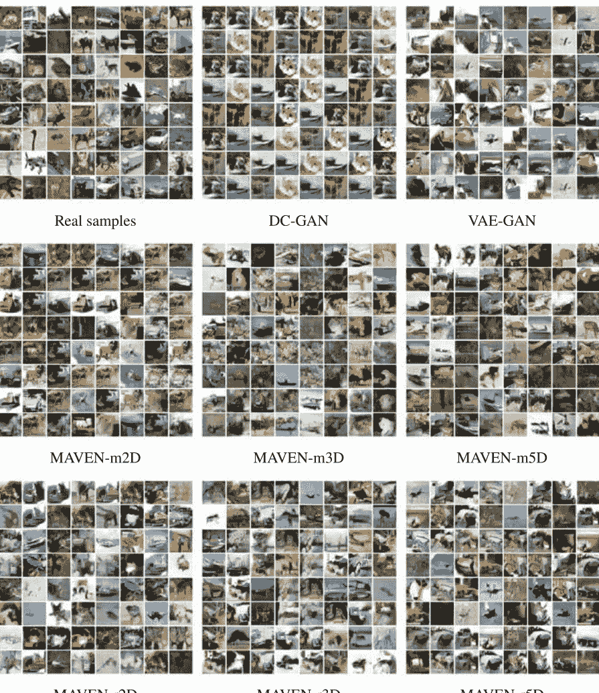
图 7 CIFAR-10 数据集中图像样本与不同模型生成的样本的视觉比较
```

```text
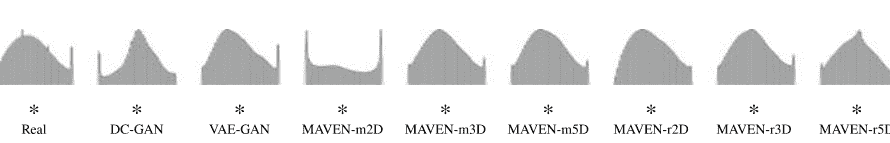
图 8 真实 CIFAR-10 训练数据和 DC-GAN、VAE-GAN 模型以及我们的 MAVEN 模型生成的数据的直方图，其中使用 2、3 和 5 个鉴别器的平均和随机反馈
```

正如表中的结果所示，我们的 MAVEN 模型的 FID 分数比一些最近发表的模型更好。请注意，这些模型是在不同的设置中实现的。

对于视觉比较而言，FID 和 DDD 分数证实了我们的 MAVEN 模型相比 DC-GAN 和 VAE-GAN 模型生成了更逼真的图像。除了 MAVEN-r5D 外，MAVEN 模型的 FID 分数较小。在所有模型中，MAVEN-m3D 的 FID 和 DDD 分数最小。

表 3 比较了所有模型在 CIFAR-10 数据集上的分类性能。所有的 MAVEN 模型的表现都优于 DC-GAN 和 VAE-GAN 模型。特别是，MAVEN-m5D 实现了最佳的分类准确率和 F1 分数。

### 5.4.3 CXR

在 CXR 数据集中，我们使用了 522 个标记图像和 4,694 个未标记图像。所有模型都经过了 150 个周期的训练，然后进行了评估。我们生成了与训练集大小相等的新图像数量。

```text
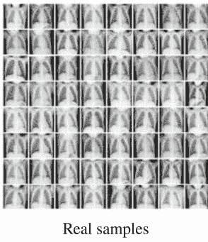
图 9 对比 CXR 数据集生成的图像样本与不同模型生成的图像样本
```

FID 和 DDD 测量是针对生成和真实训练样本的分布进行的，表明 MAVEN 模型生成的图像比 GAN 模型更逼真。表 1 中的 FID 和 DDD 分数显示，平均 MAVEN-m3D 模型具有最小的 FID 和 DDD 分数。

表 4 中报告的分类性能表明，我们基于 MAVEN 模型的分类器比基准 GAN 和 VAE-GAN 分类器更准确。在所有模型中，MAVEN-m3D 分类器是最准确的。

| 模型 | 准确率 | 正常 | B-肺炎 | V-肺炎 |
| :--- | :--- | :--- | :--- | :--- |
| DC-GAN | 0.461 | 0.300 | 0.520 | 0.480 |
| VAE-GAN | 0.467 | 0.220 | 0.640 | 0.300 |
| MAVEN-m2D | 0.469 | 0.310 | 0.620 | 0.260 |
| MAVEN-m3D | 0.525 | 0.640 | 0.480 | 0.480 |
| MAVEN-m5D | 0.477 | 0.380 | 0.480 | 0.540 |
| MAVEN-r2D | 0.478 | 0.280 | 0.630 | 0.310 |
| MAVEN-r3D | 0.506 | 0.440 | 0.630 | 0.220 |
| MAVEN-r5D | 0.483 | 0.170 | 0.640 | 0.240 |

### 5.4.4 SLC

对于 SLC 数据集，我们使用了 160 个标记图像和 1,440 个未标记图像。所有模型都经过 150 个时期的训练，然后进行评估。我们生成了与训练集大小相等的新图像。

```text
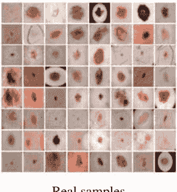
图 10 对比 SLC 数据集生成的图像样本与不同模型生成的图像样本
```

对于生成和真实训练样本的分布，FID 和 DDD 测量结果表明，MAVEN 模型生成的图像比 GAN 和 VAE-GAN 模型更逼真。表 1 中呈现的 FID 和 DDD 分数显示，平均 MAVEN-m3D 模型具有最小的 FID 和 DDD 分数。

表 5 中报告的分类性能表明，我们基于 MAVEN 模型的分类器比基准 GAN 和 VAE-GAN 分类器更准确。在所有模型中，MAVEN-r3D 在区分非黑素瘤和黑素瘤病变图像方面最准确。

表 5 使用 SLC 数据集对 DC-GAN、VAE-GAN 和 MAVEN 模型进行半监督分类性能比较的平均交叉验证准确率和类别 F1 分数

| 模型 | 准确率 | F1 分数（非黑色素瘤） | F1 分数（黑色素瘤） |
| :--- | :--- | :--- | :--- |
| DC-GAN | 0.802 | 0.890 | 0.120 |
| VAE-GAN | 0.810 | 0.890 | 0.012 |
| MAVEN-m2D | 0.815 | 0.900 | 0.016 |
| MAVEN-m3D | 0.814 | 0.900 | 0.110 |
| MAVEN-m5D | 0.812 | 0.900 | 0.140 |
| MAVEN-r2D | 0.808 | 0.890 | 0.260 |
| MAVEN-r3D | 0.821 | 0.900 | 0.020 |
| MAVEN-r5D | 0.797 | 0.890 | 0.040 |

## 6 结论

我们引入了一种新颖的生成建模方法，称为多对抗变分自编码网络（Multi-Adversarial Variational autoEncoder Networks，简称 MAVENs），它展示了在对抗学习变分自编码器中使用多个判别器的优势。我们已经证明，将我们的 MAVEN 模型训练在小型标记数据集上，并允许它们利用大量未标记的训练样本，可以实现相对于先前基于 GAN 和 VAE-GAN 的分类器具有卓越性能的优势，这表明 MAVENs 在同时生成高质量逼真图像和提高多类图像分类性能方面非常有效。此外，与传统的基于 GAN 的半监督分类不同，对自然和医学图像的分类改进不会损害生成图像的质量。未来使用 MAVENs 的工作应该探索更复杂的图像分析任务，超越分类，并包括跨越其他领域的更广泛的实验。

## 参考文献

1. M. Arjovsky, S. Chintala, L. Bottou, Wasserstein GAN (2017). arXiv 预印本 arXiv:1701.07875
2. C. Bermudez, A.J. Plassard, L.T. Davis, A.T. Newton, S.M. Resnick, B.A. Landman，使用深度学习学习隐式脑 MRI 流形，在医学成像 2018：图像处理中，vol. 10574 (2018), p. 105 741L
3. F. Calimeri, A. Marzullo, C. Stamile, G. Terracina, 使用生成对抗神经网络进行生物医学数据增强，在国际人工神经网络会议上 (2017), pp. 626-634
4. M.J. Chuquicusma, S. Hussein, J. Burt, U. Bagci, 如何用生成对抗网络欺骗放射科医生？肺癌诊断的视觉图灵测试，在 IEEE 国际生物医学成像研讨会 (ISBI)(2018), pp. 240-244
5. N.C. Codella, D. Gutman, M.E. Celebi, B. Helba, M.A. Marchetti, S.W. Dusza, A. Kalloo, K. Liopyris, N. Mishra, H. Kittler 等，皮肤病变分析用于黑素瘤检测：2017 年 ISBI 挑战赛，由 ISIC 主办，在 IEEE 国际生物医学成像研讨会 (ISBI 2018)/(2018), 第 168-172 页
6. E.L. Denton, S. Chintala, A. Szlam, R. Fergus, 使用拉普拉斯金字塔对抗网络的深度生成图像模型，在神经信息处理系统进展 (NeurIPS) (2015)
7. I. Durugkar, I. Gemp, S. Mahadevan, 生成式多对抗网络 (2016). arXiv 预印本 arXiv:1611.01673
8. M. Frid-Adar, I. Diamant, E. Klang, M. Amitai, J. Goldberger, H. Greenspan, 基于 GAN 的合成医学图像增强，提高肝脏病变分类中的 CNN 性能 (2018). arXiv 预印本 arXiv:1803.01229
9. I. Goodfellow, J. Pouget-Abadie, M. Mirza, B. Xu, D. Warde-Farley, S. Ozair, A. Courville, Y .Bengio, 生成对抗网络，在神经信息处理系统 (NeurIPS)(2014), pp. 2672-2680
10. J.T. Guibas, T.S. Virdi, P.S. Li, 双生成对抗网络的合成医学图像 (2017). arXiv 预印本 arXiv:1709.01872
11. C. 韩，H. 林，L. Rundo, R. 荒木，W. 下田，S. 村松，Y. 古川，G. Mauri, H. 中山，基于 GAN 的合成脑 MR 图像生成，在 IEEE 国际生物医学成像研讨会 (ISBI)(2018), 页码 734-738
12. M. Heusel, H. Ramsauer, T. Unterthiner, B. Nessler, S. Hochreiter, 通过两个时间尺度更新规则训练的 GAN 收敛到局部纳什均衡，在神经信息处理系统进展 (NeurIPS)(2017), 页码 6626-6637
13. L. 侯，A. Agarwal, D. Samaras, T.M. Kurc, R.R. Gupta, J.H. Saltz, 无监督组织病理学图像合成 (2017). arXiv 预印本 arXiv:1712.05021
14. A.A.Z. Imran, P.R. Bakic, A.D. Maidment, D.D. Pokrajac, 优化模拟参数以提高人体乳房模型的真实感，在 SPIE 会议录，第 10132 卷 (2017)
15. A.A.Z. Imran, D. Terzopoulos, 多对抗变分自编码器网络，在 IEEE 国际机器学习与应用会议 (ICMLA) (佛罗里达州，奥卡拉，2019), 页码 777-782
16. A.A.Z. Imran, D. Terzopoulos, 基于胸部 X 射线图像的半监督多任务学习 (2019). arXiv 预印本 arXiv:1908.03693
17. D.S. Kermany, M. Goldbaum, W. Cai, C.C. Valentim, H. Liang, S.L. Baxter, A. McKeown, G. Yang, X. Wu, F. Yan 等，通过基于图像的深度学习识别医学诊断和可治疗疾病 细胞 172(5), 1122-1131 (2018)
18. D.P. Kingma, M. Welling, 自动编码变分贝叶斯 (2013). arXiv 预印本 arXiv:1312.6114
19. A. Krizhevsky, 从小图像学习多层特征。硕士论文，多伦多大学，计算机科学系 (2009)
20. A. Madani, M. Moradi, A. Karargyris, T. Syeda-Mahmood, 基于生成对抗网络的半监督学习用于胸部 X 射线分类及数据领域适应能力，在 IEEE 国际生物医学成像研讨会 (ISBI)(2018), pp. 1038-1042
21. A. Makhzani, J. Shlens, N. Jaitly, I. Goodfellow, B. Frey, 对抗自编码器 (2015). arXiv 预印本 arXiv:1511.05644
22. T. Miyato, T. Kataoka, M. Koyama, Y. Yoshida, 用于生成对抗网络的谱归一化 (2018). arXiv 预印本 arXiv:1802.05957
23. G. Mordido, H. Yang, C. Meinel, Dropout-GAN: 从动态集合的判别器中学习 (2018). arXiv 预印本 arXiv:1807.11346
24. Y. Netzer, T. Wang, A. Coates, A. Bissacco, B. Wu, A.Y. Ng, 用无监督特征学习在自然图像中读取数字，在 NIPS 深度学习和无监督特征学习研讨会上，卷 2011 (2011), 页 1-9
25. B. Neyshabur, S. Bhojanapalli, A. Chakrabarti, 用多个随机投影稳定 GAN 训练 (2017). arXiv 预印本 arXiv:1705.07831

- 26. T. Nguyen, T. Le, H. Vu, D. Phung, 双鉴别生成对抗网络，in 神经信息处理系统进展 (NeurIPS) (2017), pp. 2670-2680
- 27. A. dena, C. Olah, J. Shlens, 条件图像合成辅助分类器 GANs (2017). arXiv 预印本 arXiv:1610.09585
- 28. G. Ostrovski, W. Dabney, R. Munos, 自回归分位数网络用于生成建模 (2018). arXiv 预印本 arXiv:1806.05575
- 29. A. Radford, L. Metz, S. Chintala, 无监督表示学习与深度卷积 Generative Adversarial Networks (2015). arXiv 预印本 arXiv:1511.06434
- 30. S. Ravuri, S. Mohamed, M. Rosca, O. Vinyals, 使用学习矩方法学习隐式生成模型 (2018). arXiv 预印本 arXiv:1806.11006
- 31. H. Salehinejad, S. Valaee, T. Dowdell, E. Colak, J. Barfett, 使用生成对抗网络在 X 射线中对胸部病理分类的深度神经网络泛化，在 IEEE 国际声学、语音和信号处理会议 (ICASSP) (2018), pp. 990-994
- 32. T. Salimans, I. Goodfellow, W. Zaremba, V. Cheung, A. Radford, X. Chen, 改进的 GAN 训练技术，在神经信息处理系统 (NeurIPS) 进展中 (2016), pp. 2234-2242
- 33. J.T. Springenberg, 具有分类生成对抗网络的无监督和半监督学习 (2015 年)。arXiv 预印本 arXiv:1511.06390
- 34. T. Unterthiner, B. Nessler, C. Seward, G. Klambauer, M. Heusel, H. Ramsauer, S. Hochreiter, Coulomb GANs：通过势场实现可证明最优纳什均衡 (2017 年)。arXiv 预印本 arXiv:1708.08819
- 35. S. Wang, L. Zhang, CatGAN：用于域生成的耦合对抗转移 (2017 年)。arXiv 预印本 arXiv:1711.08904
- 36. M.A. Wani, F.A. Bhat, S. Afzal, A.I. Khan (编)，深度学习进展 (Springer, 2020 年)

## 使用参数连续方法进行非凸优化深度神经网络

Harsh Nilesh Pathak 和 Randy Clinton Paffenroth

摘要：数值参数连续方法广泛应用于非凸问题的优化。这些方法在物理学和数学分析中有许多应用，如动力系统的分叉研究。然而，据我们所知，这些高效方法在神经网络优化中的应用相对有限。在本章中，我们提出了一种基于参数连续方法思想的深度神经网络新训练方法，并将其与随机梯度下降（SGD）、AdaGrad、RMSProp 和 ADAM 等广泛使用的方法进行比较。最近，转移学习和课程学习在深度学习中表现出了异常的性能提升，并且在直观上类似于同伦或连续技术。然而，我们提出的方法借鉴了几十年的理论和计算工作，可以看作是这些技术与深度神经网络之间的一个初步桥梁。具体而言，我们介绍了一种称为自然参数适应连续与割线逼近（NPACS）的方法。在这里，我们将常用的激活函数转换为它们的同伦版本。这个版本允许将复杂的优化问题分解为一系列问题，每个问题都有一个基于前一个问题解的良好初始猜测。NPACS 与 ADAM 独特地结合使用，以获得更快的收敛速度。我们在标准基准问题上展示了我们方法的有效性，并在大多数情况下比当代技术更快地计算局部最小值并实现更低的泛化误差。

### 1 引言

在许多机器学习和深度学习问题中，关键任务是优化问题，目标是在给定模型的情况下学习数据的有用属性。模型的参数用于学习数据的线性或非线性特征，并可用于推理和预测。在本章中，我们将研究一项具有挑战性的非凸优化任务，即深度学习模型从数据中学习非线性或复杂表示的能力。

本章是会议论文 [52] 的延伸，附加了额外的结果，算法理论的额外背景，详细的文献调查列出了一些常见的课程策略限制，并讨论了开放性研究问题。

通常，深度学习模型的目标是近似一个函数 $f_{true}$，它是将输入 $x$ 映射到目标 $y$ 的真实函数，使得 $y=f_{true}(x)$ [15,50]。更正式地说，深度神经网络定义了一个映射 $y=f(x ; \theta)$，其中 $\theta$ 是参数集。这些参数 $\theta$ 通过最小化目标函数来估计，使得映射 $f$ 最好地近似于 $f_{true}$。然而，训练深度神经网络找到一个好的解决方案是一个具有挑战性的优化任务 [3,17,44]。所谓好的解决方案是指在少数训练步骤中实现低泛化误差。即使使用最先进的技术，配置有大量处理单元和高内存的机器也可能需要数天甚至更长时间来解决这类问题 [50]。

神经网络使用一系列函数，一般来说，这些函数是非凸且难以解决的 [3,8]。即使是深度线性网络函数在参数空间中也是非凸的 [17]。显然，深度学习研究在过去十年中取得了巨大的进展，并且已经提出了质量优化算法来解决非凸问题，例如随机梯度下降（SGD）[15]，RMSprop [25]，Adagrad [12] 和 ADAM [35] 被深度学习社区广泛应用，并且在文本挖掘 [43]，超分辨率 [16,40,51]，图像识别 [38]，语音识别 [24] 等领域显著推进了最新技术。然而，它们的成功通常取决于超参数的选择和初始化的质量 [60]。以前，研究人员已经表明不同的初始化方法可能导致截然不同的成本曲面几何形状 [8,17,27]。换句话说，初始化的微小变化可能导致模型收敛到不同的最小值 [50]。在本章中，我们尝试通过重新思考常规方法来引入和改进解决这类非凸优化问题的方法。特别是，许多当前最先进的优化技术都是在固定的损失曲面上工作。另一方面，我们提出连续转换损失曲面的方法，以设计一种有效的训练策略。

本章的贡献如下。我们推导出一种常见激活函数的同伦公式，它将深度神经网络优化问题隐式分解为一系列问题。这样就够设计和应用参数连续方法来快速收敛到更好的解。此外，我们开发了一套自然参数连续（NPC）[52] 技术，将其应用于神经网络，并在泛化性能方面与标准优化技术相比，实证观察到改进。经过一系列精心策划的实验，我们观察到一个天真的 NPC 方法需要根据网络超参数、数据和激活函数进行仔细调整 [52]。因此，我们设计了一种增强策略，在训练过程中自适应调整，我们称之为自然参数自适应连续（NPAC）。受连续文献的启发，自然参数自适应连续与割线逼近（NPACS）是我们的主要贡献。通过采用割线法，我们提高了初始化的质量和收敛的速度。此外，我们进行了一系列实验，证明连续方法在泛化和训练损失方面达到了更低的水平，这意味着比传统优化方法更快的学习。在我们的一些实验中，我们观察到标准优化方法陷入了某个局部最小值，而我们提出的方法迅速超越了它。最后，我们讨论了开放的研究问题，并提供了连续方法如何成为优化和分析神经网络的高效策略的见解。这些想法通过来自多个来源的基准测试和广泛的实证评估进行了演示。

本章的剩余部分结构如下：第 2 节提供了关于同伦和类似思想的初步讨论。第 2.1 节提供了与我们的工作相关的经典理论，涉及到隐函数定理。第 3 节涵盖了相关工作，特别是我们讨论了使用激活作为延续或课程的技术的优势和局限性。第 4 节描述了我们的方法和方法，包括我们的新型优化和初始化策略的详细描述。在第 5 节中，我们讨论了我们的实验结果。此外，我们在第 6 节中提出了未来开放问题的讨论，这可能有助于揭示深度学习研究的新路径。最后，第 7 节总结了本章。在这个扩展章节中，新增了第 2 节、第 6 节和第 4.3 节。此外，在第 3 节、第 4.6 节和第 5 节中添加了额外的见解和结果。

### 2 背景

非凸优化是一个具有挑战性的任务，几乎出现在所有深度学习模型中 [15, 52]。一种历史上有效的算法类别用于解决这种非凸问题是数值延拓方法 [2]。延拓方法可以用于组织神经网络的训练，并帮助改善初始猜测的质量，从而加速网络的收敛 [52]。基本思想是从所需问题的一个较简单版本开始，并逐渐将其转化为原始版本。形式上，可以描述如下：给定一个损失函数 $J(\theta)$，定义一系列损失函数 $\{J^{(0)}(\theta), J^{(1)}(\theta), J^{(2)}(\theta), J^{(3)}(\theta), \ldots, J^{(n)}(\theta)\}$，其中 $J^{(i)}(\theta)$ 比 $J^{(i+1)}(\theta)$ 更容易优化 [15]。这里 $J^{(i)}(\theta)$ 和 $J^{(i+1)}(\theta)$ 是足够相似的，所以解 $J^{(i)}(\theta)$ 的解可以用作参数 $J^{(i+1)}(\theta)$ 的初始估计 [2,11,50]。根据文献调查 [3,44,49,50], 优化的改进似乎有两个主要方向：

*   如何选择简化问题？
*   如何将简化问题转化为原始任务？

在本章中，我们提供了一种同时解决这两个挑战的方法。我们还观察到本章的结果基于几个不同领域的结果，文献的入口包括 [15,26] 用于自动编码器 (AE) [2,34], 用于连续方法和 [3] 课程学习。

#### 2.1 同伦

在神经网络的背景下，将连续方法纳入其中的一种可能方式是确定激活函数 [52] 的同伦 [2] 公式，如下所定义:

$h(x, \lambda)=(1-\lambda) \cdot h_{1}(x)+\lambda \cdot h_{2}(x)$

其中 $\lambda \in [0,1]$ 被称为同伦参数。在这里，我们将 $h_{1}(x)$ 视为一些简单的激活函数，将 $h_{2}(x)$ 视为一些更复杂的激活函数。例如，$h_{1}(x):=x$ 和 $h_{2}(x):= \frac{1}{1+e^{-x}}$，而 $h(x, \lambda)$ 提供了它们之间的连续变换。虽然这看起来是一个简单的想法，但这种方法在其他情境中产生了重大影响，例如，在 ODE 的边界值问题的解决中 [2,11]。正如我们将在下一节详细介绍的那样，当这些想法应用于神经网络时，可以将简单神经网络的最小值转化为更复杂神经网络的最小值 [52]。

#### 2.2 隐函数定理

隐函数定理 (IFT) 是理论上理解连续方法的重要工具 [34]。虽然对这些思想进行全面的讨论超出了本章的范围，在本节中，我们将为感兴趣的读者提供一些直观的理解，以帮助弥合连续方法和深度学习之间的差距。让我们从简单 AE 的目标开始 [34]。

$J(X, g(f(X)); \theta)=0 \qquad G(X; \theta)=0$

其中 $X \in R^{m \times n}$ 是输入数据，$f$ 是编码器函数，$g$ 是解码器函数，$\theta \in R^{N}$ 是网络参数。在均方误差的情况下，我们希望它为零。现在，我们可以将这个目标函数表示为一个函数 $G(X; \theta)$，该函数可以在连续方法框架中使用 [34]。

请注意，在上述方程中 $X$ 不是一个参数。它是由我们选择的训练数据固定的。因此，在下面的“计算参数”中，只有 $\theta$ 作为自由度。现在，假设我们添加另一个参数 $\lambda$，我们称之为同伦参数，到神经网络方程组中。在我们的工作中，这个单一参数控制了问题从简单问题到困难问题的转变，这样的同伦参数将成为第 4 节的重点。我们进行重写，得到

$G(\theta, \lambda) = 0 \qquad (4)$

现在，(4) 可以直接与 [34] 中的方程组相关联，在某些假设下可以应用隐函数定理。然后，IFT 保证，在已知解的邻域内，当导数非奇异时，必然存在一个平滑连续的同伦路径。对于更多细节，感兴趣的读者可以参考 [2, 34]。

### 3 相关工作

优化技术如 SGD 或 ADAM 在收敛质量上起着关键作用。此外，寻找更好的初始化以找到更优的局部最小值在研究界很受欢迎。在这里，我们从一些流行的研究工作中得出了一些观察结果，这些工作展示了质量卓越的性能。无监督预训练 [26] 是一种用于训练神经网络进行监督和无监督学习任务的策略。其思想是使用自动编码器（AE）逐层贪婪地训练隐藏层。这种方法有两个优点。首先，与随机初始化相比，它提供了稳定的初始化，因为模型已经默默地学习了数据的特性。其次，它增加了正则化效果 [15, 50]。微调可以看作是上述方法的演变，其中学习的层进一步训练或微调以进行最终任务 [15, 39]。在迁移学习中，你会得到两个不同的任务，从一个分布中学习可以转移到另一个分布中。这种技术广泛应用于视觉和语言任务，如推荐系统、图像超分辨率等。总之，这些想法表明了整合先验知识的重要性。

通过向网络提供知识或先进行少量简单的学习步骤，可以提高最终的训练性能 [13,17]。

在本章研究附近已经完成的一些标准工作是课程学习 [3,23]。平滑 [22,44] 是改变激活函数在训练过程中的定性行为的常见方法，许多研究者以不同的方式采用了这种方法 [5,21,22,44,50]。

平滑可以看作是非凸问题的凸包 [45]，并且可以揭示损失函数的全局曲率 [3,44]。然后，这种平滑可以连续减小，得到一系列复杂度递增的损失函数。首先最小化平滑的目标函数，然后随着训练的进行逐渐减小平滑程度，以获得最终解 [3,44]。

接下来，Mollifying Networks 在神经网络的每一层的权重上添加正态分布噪声 [22]，从而使目标函数变得平滑。同样，这种噪声在训练过程中逐渐减小。激活函数的线性化是实现平滑效果的另一种方法 [5,21,22]。类似地，通过不同的噪声注入技术逐渐从线性到非线性表示进行变形 [21,22,44]。

初始化是延续方法的主要优势之一 [2,34]。在许多深度学习应用中，我们观察到随机初始化被广泛采用。然而，延续方法建议以下步骤，即从一个易于获得解决方案的问题开始，然后逐步向您想要解决的问题前进。自然地，这种方法可以节省计算成本。

而其他方法则需要许多迭代才能获得合理的解决方案，在参数延续方法的范式中，初始化通常可以是确定性的，然后我们逐步解决更简单的问题以获得最优解。例如，在 [44] 中，通过几乎没有计算成本的准确初始化来执行。此外，扩散方法 [44] 中还讨论了一些更多的优势。在那项研究中，作者概念上展示了流行的技术，如随机失活 [58]，逐层预训练 [26,39]，退火学习率，谨慎初始化 [60] 和噪声注入（直接作用于网络的损失或权重）[3] 可以自然地从延续方法 [44] 中产生。我们在第 6 节中讨论了一些限制和未来的研究方向。与将噪声添加到激活函数 [21,22] 以作为延续方法的代理相比，我们推导出同伦路径以获得线性化，这将在第 4 节中讨论。我们的目的是简化原始任务并从一个良好的初始化开始。尽管上述进展，仍然需要系统的经验评估来展示延续方法如何帮助避免早期的局部最小值和鞍点 [17,52]。与大多数研究专注于分类任务或预测任务不同，我们在这里专注于无监督学习。然而，同伦函数的构造与 AEs 的特定结构无关，因此我们期望任意神经网络都可能获得类似的结果。

### 4 方法论

在本节中，我们讨论了构建一系列目标函数的方法，这些函数的复杂性逐渐增加。我们通过同伦方法说明了如何转换标准激活函数。这使我们能够按照参数连续性的原则来解决深度神经网络的优化问题 [2]。我们讨论了三种连续方法，分别是 NPC、NPAC 和 NPACS [52]。

#### 4.1 连续激活

（C-激活）是标准激活函数的同伦表达式。同伦方法使网络能够学习数据的线性、非线性和任何中间特征。激活函数可以根据（5）进行重新表达，即

$\phi_{C-激活}(v, \lambda)=(1-\lambda) \cdot v+\lambda \cdot \phi(v), \quad \lambda \in [0,1]$ (5)

其中 $\phi$ 可以是任何激活函数，如 Sigmoid、ReLU、Tanh 等，$\lambda$ 是同伦参数，$v$ 是当前层的输出值。对于标准 AE，损失函数可以表示为以下形式

$J(X, g_{\theta}(f_{\theta}(X)))=\arg \min \| X-g_{\theta}(f_{\theta}(X)) \|_2^{\theta}$ (6)

其中 $X \in R^{m \times n}$ 是输入数据，$f$ 是编码器函数，$g$ 是解码器函数而 $\theta$ 是网络参数。通过引入一个同伦参数 $\lambda$，优化问题可以被重写为以下形式：

$J(X, g_{\theta,\lambda}(f_{\theta,\lambda}(X)))=\arg \min \| X-g_{\theta,\lambda}(f_{\theta,\lambda}(X)) \|_2^{\theta,\lambda}$ (7)

在上述优化问题中，在任何连续步骤 $\lambda_i$ ($\lambda \in [0,1]$ 且 $i \in N_0$) 我们解决问题 $J(X, g_{\theta_i,\lambda_i}(f_{\theta_i,\lambda_i}(X)))$ 并获得一个解 $\theta_{i,\lambda_i}$。每个值 $\lambda$ 表示一个不同的优化问题和相应的非线性程度 [52]。

#### 4.2 极值的直觉 $\lambda$

为了提供直觉，首先让我们考虑极端情况（即 $\lambda=0$ 或 $\lambda=1$）。当 $\lambda=1$ 时，（6）和（7）中的目标函数完全相同，因此 $\lambda=1$ 表示使用传统的激活函数。其次，在深度神经网络中


如图 1 所示，这个图是流形学习的一个很好的例子。蓝色的点是真实的数据点，明显位于一个非线性流形上。绿色的点显示了数据的优化非线性投影。红色的点显示了由 PCA 投影的线性流形。学习线性流形可以被认为是简化的非线性流形学习问题。

如图 1 所示，考虑所有激活函数都是 C-激活函数，其中 $\lambda_0=0$，那么神经网络就是线性的。在这里，网络将尝试寻找一个线性投影，以最小化成本函数。我们知道可以通过主成分分析（PCA）或奇异值分解（SVD）[50] 来找到这样的解决方案。因此，PCA 解决方案和我们在 $\lambda_0=0$ 时的优化问题的解决方案应该处于相同的子空间 [15,50]。因此，我们利用这个观察结果，并在下一节 4.3 中进一步讨论，使用 PCA 初始化我们的网络。实际上，$\lambda=0$ 类似于解决一个更简单的优化问题（线性投影），而当 $\lambda \rightarrow 1$ 时，问题变得更加困难（非线性和非凸问题）。

因此，同伦参数 $\lambda$ 定义了优化的方案，可以称为同伦路径，如图 2 所示。当 $\lambda: 0 \rightarrow 1$ 时，我们解决了一个越来越困难的优化问题，其中从数据中学到的非线性程度增加。然而，我们需要一种技术来穿越这个同伦路径，并找到沿着该路径的解决方案，推导这样的技术将是我们下一节的重点。

#### 4.3 通过 PCA 稳定初始化自编码器

主成分分析（PCA）[47] 是一种经典的降维技术，提供了数据的低维线性表示。众所周知，可以使用奇异值分解（SVD）[47] 通过计算给定数据的矩阵 $U, \Sigma, V^T$ 来计算 PCA 投影，如式（8）所示。

$X = U \Sigma V^T \qquad (8)$

图 2：该图提供了 NPC 的直观理解，其中假设存在一条同伦路径（蓝色曲线），连接了多维空间中的所有解$(\theta)$，在每个$\lambda \in [0,1]$处。在这里，我们展示了如何求解$\lambda_2$，用于初始化网络参数的$\lambda_2$。$ \theta_{\lambda_2}^{\text{init}} \leftarrow \theta_{\lambda_1}$。使用一个小的$\Delta \lambda_{2,1}$。进一步进行一些 ADAM 步骤（橙色箭头所示），我们找到一些最小值$(\theta_{\lambda_2})$。

其中 $X$ 是我们的归一化训练数据，$U$ 和 $V$ 是酉矩阵，$\Sigma$ 是一个对角矩阵。

在公式 (9) 中，我们观察到 $V$ 可以被看作是从高维空间到低维线性子空间的映射（在自动编码器的语言中是编码器）。此外，$V^{T}$ 是从低维线性子空间回到原始数据空间的映射（在自动编码器的语言中是解码器）。SVD 的这种行为使我们能够初始化权重并适当定义自动编码器。特别是，当 $\lambda=0$ 在 (7) 中时，我们实际上有 $f$ 和 $g$ 是线性函数，(7) 可以使用 SVD[47] 进行最小化。

更准确地说，我们使用 $V$ 的前 $n$ 列作为编码层的宽度为 $n$ 的权重，对于解码层，我们使用编码器的权重的转置，如 (12) 和 [50] 所示。

$$ X = U \Sigma V^T \quad \cdots \quad (9) $$
$$ v = U \Sigma V^T V \quad \cdots \quad (10) $$
$$ v = U \Sigma \quad \cdots \quad (11) $$
$$ W_{\text{编码器}}^{n} \quad \cdots \quad (12) $$
$$ W_{\text{解码器}}^{n} = (W_{\text{编码器}}^{n})^{T} \quad \cdots \quad (13) $$

其中，$W_{\text{编码器}}^n$ 表示编码器层的权重矩阵，宽度为 $n$。

使用 PCA 初始化 AE 有多个优点。首先，我们从一个线性问题的解开始进行深度学习训练，而不是尝试解决一个非线性且通常非凸的优化问题。这样一个简单的初始化过程使得 AE 的优化可以开始进行，从而来自已知的全局最优解。其次，在 NPC 方法中，C-激活函数将同伦定义为从线性到非线性网络的连续变形。因此，线性问题的全局最优解可以以一种有原则的方式转化为非线性和非凸问题的解。最后，由于主成分分析提供了一个确定性的初始化，不需要对参数空间进行任何采样来进行初始化 [10, 44, 60]，我们提出的方法也具有计算优势。当然，使用主成分分析来初始化深度前馈网络的想法并不新颖，并且已经在文献中独立探索过 [7, 36, 57]。然而，我们提出的算法在于利用了使用参数连续方法解决同伦问题的强大技术。

#### 4.4 自然参数连续 (NPC)

自然参数连续 (NPC) 是将标准迭代优化求解器适应于同伦类型问题的一种方法 [52]。继续我们在第 4.2 节的解释，$\lambda_i$ 处的解可以用作 $\lambda_{i+1} = \lambda_i + \Delta \lambda_i$ 处解的初始猜测。当 $\Delta \lambda_i$ 足够小时，应用于初始解的迭代应该收敛到一个局部最小值 [2]。在图 2 中，我们展示了沿同伦路径遍历的方法。接下来，我们需要找到沿途每个问题 $(J(x, g(f(x)); \theta, \lambda_i))$ 的解。这样一个 $N$ 维 ($\theta$) 问题的解集位于一个嵌入在 $N_{+1}$ 维空间中的一维流形 (同伦路径) 上 [48, 52]，如我们在 2D 图中示意。

注意，使用主成分分析 (PCA)，我们知道当 $\lambda_0=0$ 时，解为 0；如果 $\Delta \lambda_0$ 足够小，那么我们在 $\lambda_1$ 处的解应该非常接近 PCA 解。因此，我们在 $\lambda_1$ 处初始化优化问题的解为 $\lambda_0$。我们不断重复这个过程，直到迭代到兴趣问题的解为止。

通常，这可以称为自然参数连续 (NPC)[2,48]，如图 2 所示，在 $\lambda_i$ 处的优化问题的解可以用来初始化 $\lambda_{i+1}$ 处的问题。初始化后，我们可能需要一些标准的优化技术，例如几步 ADAM 算法，以找到 $\lambda_{i+1}$ 处的最优解（图 2）。

深度学习框架的主要挑战是我们有太多的超参数。我们有不同的网络架构、激活函数、批量大小等，制定一个经验法则是困难的。特别是，我们对这个固定步长有两个主要的缺点：(1) 我们可能会在不必要的地方走很多步，(2) 在需要谨慎更新的情况下，我们可能会走较少的步骤，这取决于一条同伦路径的性质 [52]。为了更好地理解这些缺点，我们在图 2 中进行了说明。为了解决这个问题，我们下一步的方法受到了参数连续性文献的启发，在第 4.5 节中使用了一种自适应解决方案，可以合理地确定一条同伦路径的性质，并相应地更新 $\Delta \lambda$。

# 算法 1：自适应 $\Delta \lambda$
要求：`norm_grads` - 前几个步骤中目标函数梯度的范数列表，$\Delta \lambda_{i, i-1}$。
$\Delta \lambda_{i, i-1}$ - 关于前一步的 `scale_up` 和 `scale_down` 因子。
1: `avg_norm_p` $\leftarrow$ 前一半 `norm_grads` 的平均值
2: `avg_norm_c` $\leftarrow$ 后一半 `norm_grads` 的平均值
3: `condition1` $\leftarrow \frac{(avg\_norm\_p - avg\_norm\_c)}{avg\_norm\_p} < (-\text{容差})$
4: `condition2` $\leftarrow \frac{(avg\_norm\_p - avg\_norm\_c)}{avg\_norm\_p} > \text{容差}$
5: if `condition1` then
6: $\Delta \lambda_{i+1, i} \leftarrow \Delta \lambda_{i, i-1} \times \text{scale\_up}$
7: else if `condition2` then
8: $\Delta \lambda_{i+1, i} \leftarrow \frac{\Delta \lambda_{i, i-1}}{\text{scale\_down}}$
9: 否则
10: $\Delta \lambda_{i+1, i} \leftarrow \Delta \lambda_{i, i-1}$
11: if 结束
12: return $\Delta \lambda_{i+1, i}$

$$ \theta_{\lambda_{i+1}}^{\text{init}} \leftarrow \theta_{\lambda_i} \qquad \qquad \qquad (14) $$

图 3：在这个图中，我们提供了对我们自适应方法的直观理解。我们展示了两种可能的步骤，其中绿色是自适应 $\Delta \lambda$，灰色是固定 $\Delta \lambda$。当同伦路径是平坦的时候，我们希望采取更大的步长，当同伦路径更振荡时，我们希望采取较短的步长。

#### 4.5 NPC 与自适应连续步骤 (NPAC)

在 NPC 中，我们有一个用户指定的固定 $\Delta \lambda$ 的配置。在实践中，我们发现确定一个精确的 $\Delta \lambda$ 是困难的。在连续方法或分岔分析领域，自适应步长的概念是众所周知的，并在软件包中使用，如 AUTO2000 [48] 和 AUTO-07P [11]。因此，我们在神经网络训练的实践中借鉴了这个思想。首先，我们观察到激活函数的行为对于同伦路径的性质起着重要作用。例如，在图 4 中，当 $\lambda=0.7$ 时，我们观察到 C-Sigmoid 主要是线性的，而 C-ReLU 逐渐转变为 ReLU，展示了通过同伦路径转变时的两种不同可能的行为。

因此，在 $\lambda=0.7$ 的情况下，算法应该在 C-Sigmoid 的情况下进行较长的 $\Delta \lambda$ 更新，但在 C-ReLU 的情况下进行较短的更新。

在我们的实验中，我们在表 1 中展示了类似的观察结果。对于 NPC 方法，我们使用了经验计算得出的固定更新，例如 C-ReLU 的 $\Delta \lambda=0.008$，然而，对于 C-Sigmoid 和 C-Tanh，我们必须小心确定 $\Delta \lambda$ 值。直到 $\lambda<0.8$ 时，$\Delta \lambda=0.02$；如果 $\lambda \ge 0.8$，则 $\Delta \lambda=8e-4$。这是因为我们观察到 C-Sigmoid 在 $\lambda=0.8$ 之前几乎呈线性行为，之后迅速适应 Sigmoid。因此，我们需要一种适应性方法，可以合理地调整不同激活函数 [52] 的 $\Delta \lambda$ 更新，并且适应于同伦路径的性质。我们在第 5 节详细阐述了这些 $\Delta \lambda$ 选择。因此，我们开发了一种自适应方法来确定 $\Delta \lambda$ 更新，利用了反向传播过程中的梯度信息，并开发了算法 1。NPAC 有两个好处：首先，它解决了手动选择 $\Delta \lambda$ 值的问题。其次，该方法提供了一种合理的方法来确定下一个适合的问题或 $\lambda$ 值应该有多接近，对于当前解（例如在 $\lambda=0.25$ 时）将是一个良好的初始化。

图 4：从左到右，这张图展示了 C-Sigmoid、C-ReLU 和 C-Tanh 在 $\lambda=0.7$ 时在 $[-10, 10]$ 之间均匀分布的点上的行为。

表 1：该表显示了使用特定网络的不同优化技术的训练和测试损失值。所有这些实验都是在 50000 个反向传播步骤中计算的，并且我们报告了最后 100 个损失值的平均值，无论是训练还是测试。也许并不令人惊讶，SGD 在几乎所有情况下表现最差。更有趣的是，RMSProp 和 ADAM 在某些情况下表现良好，在其他情况下表现很差。请注意，各种参数连续方法在所有情况下都具有相当稳定的性质，并且在大多数情况下实现了较低的损失，甚至是最低的损失。

| 网络 | SGD | RMSProp | ADAM | NPC | NPAC | NPACS |
|---|---|---|---|---|---|---|
| Fashion-MNIST (Train) | | | | | | |
| AE-8 Sigmoid | 0.1133 | 0.03915 | 0.03370 | 0.03402 | 0.03370 | 0.03388 |
| AE-8 ReLU | 0.11122 | 0.03582 | 0.03318 | 0.03171 | 0.03188 | 0.03191 |
| AE-8 Tanh | 0.10741 | 0.03459 | 0.03515 | 0.03573 | 0.03552 | 0.03559 |
| AE-16 Sigmoid | 0.11397 | 0.06714 | 0.06714 | 0.03418 | 0.04505 | 0.03461 |
| AE-16 ReLU | 0.11394 | 0.06714 | 0.03436 | 0.03474 | 0.03445 | 0.03659 |
| AE-16 Tanh | 0.10889 | 0.03419 | 0.03540 | 0.03753 | 0.03722 | 0.03622 |
| CIFAR-10 (Train) | | | | | | |
| AE-8 Sigmoid | 0.28440 | 0.03861 | 0.03352 | 0.03275 | 0.03224 | 0.03238 |
| AE-8 ReLU | 0.07689 | 0.03467 | 0.03421 | 0.03459 | 0.03461 | 0.03302 |
| AE-8 Tanh | 0.27565 | 0.03355 | 0.03421 | 0.03343 | 0.03392 | 0.03408 |
| AE-16 Sigmoid | 0.28717 | 0.06223 | 0.06223 | 0.03480 | 0.03310 | 0.03517 |
| AE-16 ReLU | 0.07722 | 0.03512 | 0.03419 | 0.03400 | 0.03456 | 0.03463 |
| AE-16 Tanh | 0.27884 | 0.03496 | 0.03452 | 0.03637 | 0.03815 | 0.03405 |
| 最大值 | 0.28440 | 0.06714 | 0.06714 | **0.03753** | **0.04505** | **0.03659** |
| Fashion-MNIST (Test) | | | | | | |
| AE-8 Sigmoid | 0.11333 | 0.08508 | 0.08525 | 0.08257 | 0.08324 | 0.08170 |
| AE-8 ReLU | 0.11123 | 0.08202 | 0.08076 | 0.08225 | 0.08160 | 0.08154 |
| AE-8 Tanh | 0.10742 | 0.08571 | 0.07904 | 0.07225 | 0.07306 | 0.07447 |
| AE-16 Sigmoid | 0.11397 | 0.11396 | 0.11383 | 0.07405 | 0.09050 | 0.07912 |
| AE-16 ReLU | 0.11394 | 0.11396 | 0.08035 | 0.08103 | 0.07993 | 0.08441 |
| AE-16 Tanh | 0.10891 | 0.07736 | 0.07713 | 0.07899 | 0.07519 | 0.08025 |
| CIFAR-10 (Test) | | | | | | |
| AE-8 Sigmoid | 0.28440 | 0.07835 | 0.06526 | 0.06344 | 0.06417 | 0.06522 |
| AE-8 ReLU | 0.28440 | 0.03861 | 0.03352 | 0.03276 | 0.03225 | 0.03239 |
| AE-8 Tanh | 0.27568 | 0.09993 | 0.08604 | 0.06801 | 0.07580 | 0.07544 |
| AE-16 Sigmoid | 0.28718 | 0.28671 | 0.28648 | 0.07735 | 0.07588 | 0.10232 |
| AE-16 ReLU | 0.07724 | 0.05507 | 0.05321 | 0.05188 | 0.06009 | 0.05564 |
| AE-16 Tanh | 0.27887 | 0.08614 | 0.08939 | 0.10874 | 0.12128 | 0.08714 |
| 最大值 | 0.28718 | 0.28671 | 0.28648 | **0.10874** | **0.12128** | **0.10232** |

对于每一行，最大 (最差) 损失以红色显示，最小 (最佳) 损失以绿色显示。

#### 4.6 自然参数自适应连续化与割线近似（NPACS）

NPACS 是 NPAC 的更高级版本，我们在方法中增加了一个在 $\theta$（多维）空间中的割线步骤，以及自适应的 $\lambda$ 更新。曲线的割线是通过至少两个不同点的直线 [31]，我们使用这种方法来找到同伦路径的线性近似，用于特定的邻域 [2]。在前两种方法中，我们只是将前一个解作为当前问题的初始化，而在 NPACS 中，我们采用前两个解并应用割线近似来初始化下一步。一个重要的步骤是正确地对神经网络的参数（$\theta$）进行割线步骤的归一化，这些参数通常是数千甚至数百万维，取决于网络的大小 [52]。在图 5 中，我们说明了方程（15）的几何解释。NPACS 的一个明显优势是割线更新更接近同伦曲线，以近似导数。

图 5：本图展示了我们 NPCAS 方法中的切线更新。与其他延续方法不同，在这里我们利用前两个解来绘制多维空间中的切线向量 ($\theta$) 曲线 [52] 并相应地初始化后续问题。我们还提供了算法 2，展示了实现 NPACS 所需的所有步骤。在这里，我们对 AE（深度 8 和 16）进行模型延续，使用 ADAM 更新来解决特定的优化问题 $\lambda_i$。根据问题的不同，也可以选择任何其他优化器。

$$ \theta_{\lambda_{i+1}}^{\text{init}} \leftarrow \theta_{\lambda_i} + (\theta_{\lambda_i} - \theta_{\lambda_{i-1}}) \cdot \frac{\Delta \lambda_{i+1, i}}{\Delta \lambda_{i, i-1}} \quad (15) $$

## 5 实验结果

我们使用了两个流行的数据集进行实验，分别是 CIFAR-10[37] 和 Fashion-MNIST[67]。Fashion-MNIST 有 55,000 个训练图像和 10,000 个测试图像，共有十个不同的类别，每个图像有 784 个维度。同样，对于 CIFAR-10，我们使用了 40,000 个图像进行训练，并使用 10,000 个作为测试/验证集。该数据集中的每个图像有 3072 (32×32×3) 个维度，共有十个不同的类别。CIFAR-10 是一个比 Fashion-MNIST[52] 更具挑战性的数据集，也是研究人员广泛使用的数据集。接下来，我们有自编码器 (AE)，这是一种无监督学习方法，用于测试我们的优化技术。所使用的 AE 如图 6 所示。对于 Fashion MNIST 数据集，输入是一个 784 维的图像 (或 CIFAR-10 数据集的 3072 维图像)。然后，AE 用于从仅有的二维表示中重构图像，该二维表示被编码在隐藏层中。具体而言，我们评估了两个神经网络，分别是深度为 8 和 16 的 AE-8 和 AE-16，用于所有实验。

我们将我们的参数连续方法 NPC 与现有方法如 ADAM、SGD 和 RMSProp 进行比较，其中 NPC 在 $(\Delta \lambda=8e-3)$ 处，NPAC 和 NPACS。主要地，任务的一致性在提供确凿的实证评估中起着关键作用，我们通过保持数据、架构和超参数不变来实现任务的一致性。如第 4.3 节所解释的，SVD 被用于我们网络的初始化。

# 算法 2：NPACS - 使用 ADAM 进行 AE 模型连续

要求：学习率 $\epsilon$，每次连续步骤后执行的 Adam 步骤数 `u_freq`，初始 $\Delta \lambda$，使用 PCA 进行初始神经网络参数 $\theta$，初始的同伦参数 $\lambda$，在 $t$ 步骤后将开始自适应行为。

1: $k \leftarrow 1$
2: $i \leftarrow 1$
3: `norm_grads` $\leftarrow []$
4: 损失_历史 $\leftarrow []$
5: 当停止准则未满足时
6: 从数据中抽取一个小批量样本 $x^i$
7: 计算损失 损失 $\leftarrow \sum_j J(x, g(f(x)); \theta; \lambda_i)$
8: 损失_历史 $\leftarrow$ 追加 损失
9: 计算梯度估计 $\hat{g} \leftarrow \text{ADAM}(\epsilon)$
10: 梯度范数_梯度 $\leftarrow$ 追加 $||\hat{g}||_2$
11: 应用梯度 $\theta \leftarrow \theta - \epsilon \cdot \hat{g}$
12: $k \leftarrow k+1$
13: 如果 $k \% \text{u\_freq} == 0$ 且 $\text{u\_freq} > 0$ 则
14: 如果 $k \% t == 0$ 且 $k > 0$ 则
15: $\Delta \lambda_{i+1, i} \leftarrow$ 计算自适应 $\Delta \lambda()$ 算法-1
16: end if
17: $\theta_{\lambda_{i+1}}^{\text{init}} \leftarrow \theta_{\lambda_i} + (\theta_{\lambda_i} - \theta_{\lambda_{i-1}}) \cdot \frac{\Delta \lambda_{i+1, i}}{\Delta \lambda_{i, i-1}}$
18: $i \leftarrow i + 1$
19: 计算损失 $\leftarrow \sum_j J(x, g(f(x)); \theta; \lambda_i)$
20: 损失_历史 $\leftarrow$ 追加 损失
21: $k \leftarrow k+1$
22: end if
23: end loop

图 6：该图显示了我们在实验中使用的自编码器 (AE-8)。它是一个八层深度网络具有上述块图中指定的宽度。此外，我们将一个特定的激活函数应用于网络的所有隐藏层，除了编码层和输出层。我们在报告结果时进行了具体说明。

在所有的实验中，这为我们提供了一个精确的参数向量 ($\theta$)，其中 $\lambda=0$。选择 $\Delta \lambda$ 是在 (8e-5 和 2e-2) 之间进行线性搜索，我们使用表现最好的 $\Delta \lambda=8e-3$ 进行 NPC 方法。此外，对于 NPAC 和 NPACS 方法，$\Delta \lambda$ 是由我们的自适应算法 1 选择的。另一个重要的超参数是两个连续步骤之间的 ADAM (或任何其他求解器) 步骤的数量。同样，我们对 5 到 500 之间的所有值进行了线性搜索，并发现 10 个 ADAM 步骤效果最好，我们一直使用它。

## 6 开放问题和未来方向

延续方法在解决非凸优化问题方面有着悠久的历史。最近，在增强深度学习训练方面取得了巨大进展，使用的方法类似于延续方法，例如数据课程策略 [3, 23, 32, 66]。我们相信这一趋势将继续，并对强化学习和元学习等更多领域产生巨大影响。在论文中，AI 生成算法（AI-GAs）[9]，作者提出了未来通用 AI 的三个支柱，即（1）元学习算法，（2）元学习架构和（3）生成有效的学习环境。我们认为延续方法是在这些方向上有助于的一个很好的选择。接下来，我们讨论深度学习社区的一些开放问题。

### 6.1 模型延续

在 [3, 50] 中，作者说明了延续策略可以通过模型和数据延续引入深度学习。本章所示方法是模型延续的经典示例。在第 3 节中，我们讨论了不同的模型延续方法 [21, 22, 44] 及其优势。这些方法将其训练策略与目标模型进行了比较，并报告了更好的泛化误差。然而，我们观察到这些方法存在一些局限性。

理想情况下，对于所提出的延续技术，通过使用不同的神经结构和各种任务进行经验评估将更加方便。我们明白这样详细的评估可能需要大量的努力。首先，我们观察到许多不同类型的神经网络尚未进行系统测试。例如，扩散方法仅应用于 RNNs [44]。MLPs 和 LSTMs 仅由 [21] 进行了测试，而仅对 CNNs, RNNs 和 MLPs 进行了 mollification 测试 [22, 54]。在未来的研究中，看到所提出的课程如何影响不同类型网络的收敛将是有趣的。其次，一些方法 [3, 22] 仅在有限的深度下进行了测试，可能不一定被归类为深度网络。第三，从文献中的方法中进行更多的经验评估可能会改进课程学习的应用。特别是，与一些技术（如 ResNets [38]，Dropout [58] 和不同的归一化）进行比较，以进行更多任务（如分类，语言建模，回归和重建 [22]）。

就这一章而言，有几个自然的扩展。首先，C-Activation 可以是任何激活函数，在一个网络中有多个激活函数的情况下，我们可以为每个激活函数添加多个同伦参数。此外，正如前面所述，这些技术在自动编码器案例中并没有什么特殊之处。特别是，我们还希望使用我们的方法训练卷积神经网络和循环神经网络，这些网络在 [15, 39, 65] 中有描述。其次，我们的自适应方法可以通过使用伪弧长方法 [34, 48] 更准确地符合同伦路径。

### 6.2 数据延续

许多研究人员已经证明，从设计的课程中学习数据可以提高学习效果，并增强对分布错误的鲁棒性。一些流行的方法包括渐进训练 [32, 50]，课程学习 [3, 23]，通过迁移学习进行课程学习 [66]，C-SMOTE[50] 等。这些方法已经显示出在泛化性能方面的改进。然而，由于数据类型的限制，通常存在一些限制。例如，渐进式 GAN 的设计 [32] 适用于图像，但在应用于文本数据集时可能会遇到困难。对于未来的研究，了解数据课程方法如何与不同类型的数据（如图像、文本、声音和时间序列）配合使用将是有趣的。作为这个方向的第一步，我们收集并分享了一个数据集列表。这些数据集来自不同的来源，希望它们能成为研究人员的有用资源。数据集收集：https://github.com/harsh306/curriculum-datasets。最近的研究工作说明了如何通过延续学习来学习数据课程 [50]，并且可以通过测量模型的学习情况 [18, 30, 55, 59, 66, 68] 引入自动化，这些测量结果在有限的基准测试中可能会在多个方向上得到扩展。

### 6.3 损失曲面理解

深度神经网络的损失曲面通常是非凸的 [8, 17, 27]，并且根据神经架构的不同，已经进行了许多尝试来理论上对损失曲面进行分类 [17, 33, 41]。延续方法或课程学习可能为理解神经网络的损失曲面提供独特的视角。特别地，我们计划扩展我们的工作以执行神经网络的分叉分析。分叉 [2, 11, 49] 是系统行为的动态变化，可能发生在我们通过同伦路径跟踪解决方案的过程中。在我们的情况下，当我们将激活函数从线性变为非线性时，神经网络的检测到的分叉 [34] 可能有助于解释和识别局部最小值，并且它们还可以帮助我们更好地理解解释了神经网络的所谓“黑盒子”。

### 6.4 环境生成课程

在强化学习中，智能体在环境中采取一些行动，然后为下一步行动提供奖励或反馈。类似于数据延续，我们可以考虑为强化学习生成具有不同复杂性的训练环境。例如，奖励塑形 [13, 20] 是一种方法，用户为智能体定义了一套环境课程。然而，尽管课程在原则上对某些任务至关重要，但在实践中很难确定对于任何给定的任务，确定正确的课程是具有挑战性的 [63]。在论文 [63] 中，作者经验性地表明，有时直观上合理的课程甚至可能对训练产生负面影响（即，学习更难的任务可能导致更好的解决方案 [56]）。因此，许多研究工作设计了自动生成的课程，用于训练环境，以引入逐渐困难和多样化的场景，从而增加鲁棒性学习 [1, 59, 63]。人们可以很容易地想象延续方法在改进这些方法方面发挥作用。

### 6.5 多任务学习

在多任务学习中 [6]，模型被设计成通过相同的参数执行多个任务。设计这样一个系统更加困难，因为从一个任务中学习可能会提升或降低其他任务的学习，并且还可能导致灾难性遗忘 [4]。同步神经网络执行多个任务是一个开放的研究问题，最近，课程学习被用来应对这个挑战 [53, 64]。这些可以广泛地分为两种方式，首先，设计一个课程表动态地提供选定的数据批次，以使其对多任务目标有益 [61, 64]。通常，为了实现这样一个自动化系统，需要确定每个实例对学习任务的重要性，而贝叶斯优化是一个经典选择 [64]。其次，确定要学习的任务的最佳顺序 [53]。后一种方法只能按照确定的课程顺序依次实现 [53]。我们期望在这个方向上的渐进性研究可能会显著提升多任务学习。此外，在上述方法中，第一种方法类似于数据延续，第二种方法类似于模型延续。我们相信我们可以找到这两者之间的相似之处，并在多任务学习领域取得有影响力的进展。

### 6.6 超参数优化

元学习是一个活跃的研究领域 [14]，最近在 [9] 中进行了调查。我们了解元学习的许多方面 [14, 46, 46, 62]，但是为了讨论的范围，我们将重点放在超参数搜索上。不同超参数的搜索空间可以通过连续方法或多参数连续方法有效地追踪 [2, 11, 34]。人们可以想象两个超参数 λ_m 和 λ_d，其中 λ_m 对应于模型连续，λ_d 实现数据连续。然后，我们可以同时应用连续方法来优化给定神经网络任务的两种策略。最近，研究人员使用隐式微分进行超参数优化 [42]，可以联合调整数百万个网络权重和超参数。

多参数连续优化是数学分析等领域的一个有前途的研究领域 [2, 11, 34]，以及其他领域 [19, 29]。一个可能的方法是通过连续方案，定义和优化深度学习框架的大部分组件或超参数。我们可以推导出更高效的超参数搜索方法，能够通过添加/修剪层和类似的想法从广义网络进化。

## 7 结论

在本章中，我们展示了一种新颖的深度神经网络训练策略。正如在大多数实验中观察到的那样，所有三种连续方法都实现了更快的收敛、更低的损失和更好的泛化能力，优于标准优化技术。此外，我们凭经验表明，所提出的方法适用于流行的激活函数、更深的网络和不同的数据集。最后，我们检查了一些可能的改进，并提供了进一步深入学习使用连续方法的各种未来方向。


图 7 上面的图表展示了在使用 C-Sigmoid 作为激活函数时各种优化方法的收敛情况。在所有情况下，X 轴表示迭代次数，Y 轴表示对数损失或对数验证损失。请注意，我们提出的方法在整个优化过程中提供了一些最低的训练和测试损失值。

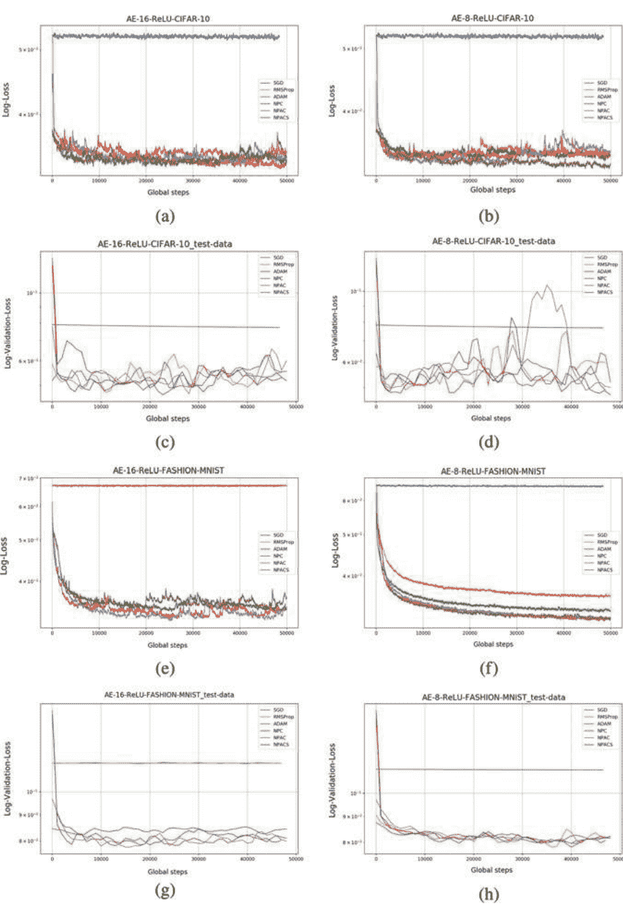

图 8 上面的图表展示了在使用 C-ReLU 作为激活函数时各种优化方法的收敛情况。在所有情况下，X 轴表示迭代次数，Y 轴表示对数损失或对数验证损失。请注意，我们提出的方法在整个优化过程中提供了一些最低的训练和测试损失值。

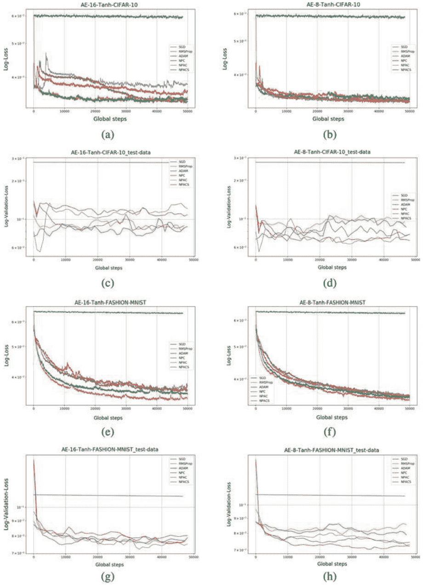

图 9 上面的图表展示了在使用 C-Tanh 作为激活函数时各种优化方法的收敛情况。在所有情况下，X 轴表示迭代次数，Y 轴表示对数损失或对数验证损失。请注意，我们提出的方法在整个优化过程中提供了一些最低的训练和测试损失值。

*   1. I. Akkaya, M. Andrychowicz, M. Chociej, M. Litwin, B. McGrew, A. Petron, A. Paino, M. P. Paeper, G. Powell, R. Ribas 等，用机器人手解决魔方问题（2019 年）。arXiv 预印本 arXiv:1910.07113
*   2. E. Allgower, K. Georg, 数值延续方法导论。Soc. Ind. Appl. Math. (2003). https://epubs.siam.org/doi/abs/10.1137/1.9780898719154
*   3. Y. Bengio, J. Louradour, R. Collobert, J. Weston, 课程学习 (2009)
*   4. Y. Bengio, M. Mirza, I. Goodfellow, A. Courville, X. Da, 基于梯度的神经网络中的灾难性遗忘的实证研究 (2013)
*   5. Z. Cao, M. Long, J. Wang, P.S. Yu, Hashnet: 基于延续的深度学习哈希。CoRR (2017). arXiv:abs/1702.00758
*   6. R. Caruana, 多任务学习。Mach. Learn. 28(1), 41–75 (1997)
*   7. T. Chan, K. Jia, S. Gao, J. Lu, Z. Zeng, Y. Ma, Pcanet: 一个简单的深度学习基准用于图像分类？IEEE Trans. Image Process. 24(12), 5017–5032 (2015). https://doi.org/10.1109/TIP.2015.2475625
*   8. A. Choromanska, M. Henaff, M. Mathieu, G.B. Arous, Y. LeCun, 多层网络的损失曲面。CoRR (2014). arXiv:abs/1412.0233
*   9. J. Clune, Ai-gas: ai-generating algorithms, 一种产生通用人工智能的替代范式。CoRR (2019). arXiv:abs/1905.10985
*   10. T. Dick, E. Wong, C. Dann, 多少次随机重启足够
*   11. E.J. Doedel, T.F. Fairgrieve, B. Sandstede, A.R. Champneys, Y.A. Kuznetsov, X. Wang, Auto-07p: continuation and bifurcation software for ordinary differential equations (2007)
*   12. J. Duchi, E. Hazan, Y. Singer, 自适应次梯度方法用于在线学习和随机优化。J. Mach. Learn. Res. 12, 2121–2159 (2011). http://dl.acm.org/citation.cfm?id=1953048.2021068
*   13. T. Erez, W.D. Smart, 计算强化学习中的塑造意味着什么？在 2008 年第七届 IEEE 国际发展学习会议 (2008), pp. 215–219. https://doi.org/10.1109/DEVLRN.2008.4640832
*   14. C. Finn, P. Abbeel, S. Levine, 模型无关元学习用于深度网络的快速适应，在第 34 届国际机器学习大会上, vol. 70. (JMLR.org, 2017), pp. 1126–1135
*   15. I. Goodfellow, Y. Bengio, A. Courville, 深度学习 (MIT Press, 2016). http://www.deeplearningbook.org
*   16. I.J. Goodfellow, NIPS 2016 教程：生成对抗网络。NIPS (2017). arXiv:abs/1701.00160
*   17. I.J. Goodfellow, O. Vinyals, 定性地描述神经网络优化问题。CoRR (2014). arXiv:abs/1412.6544
*   18. A. Graves, M.G. Bellemare, J. Menick, R. Munos, K. Kavukcuoglu, 神经网络的自动课程学习。CoRR (2017). arXiv:abs/1704.03003
*   19. C. Grenat, S. Baguet, C.H. Lamarque, R. Dufour, 一种用于非线性动力系统的多参数递归延续方法。机械系统与信号处理 127, 276–289 (2019)
*   20. M. Grzes, D. Kudenko, 强化学习中奖励塑形的理论和实证分析，在 2009 年国际机器学习与应用会议 (2009), pp.337–344. https://doi.org/10.1109/ICMLA.2009.33
*   21. C. Gülçehre, M. Moczułski, M. Denil, Y. Bengio, 噪声激活函数。CoRR (2016). arXiv:abs/1603.00391
*   22. C. Gülçehre, M. Moczułski, F. Visin, Y. Bengio, 平滑网络。CoRR (2016). arXiv:abs/1608.04980
*   23. G. Haicoohen, D. Weinshall, 在训练深度网络中课程学习的能力。CoRR (2019). arXiv:abs/1904.03626
*   24. G. Hinton, L. Deng, D. Yu, G.E. Dahl, A. Mohamed, N. Jaitly, A. Senior, V. Vanhoucke, P.Nguyen, T.N. Sainath, B. Kingsbury, 用于语音识别中声学建模的深度神经网络。IEEE 信号处理杂志。29(6), 82–97(2012). https://doi.org/10.1109/MSP.2012.2205597
*   25. G. Hinton, N. Srivastava, K. Swersky, Rmsprop: 将梯度除以其最近幅度的运行平均值。用于机器学习的神经网络, Coursera 讲座 6e (2012)
*   26. G.E. Hinton, R.R. Salakhutdinov, 用神经网络降低数据的维度。科学 313(5786), 504–507 (2006). https://doi.org/10.1126/science.1127647, http://science.sciencemag.org/content/313/5786/504
*   27. D.J. Im, M. Tao, K. Branson, 深度网络损失曲面的实证分析。CoRR (2016). arXiv:abs/1612.04010
*   28. D. Jakubovitz, R. Giryes, M.R. Rodrigues, 深度学习中的泛化误差，在压缩感知及其应用 (Springer, 2019)，第 153–193 页
*   29. F. Jalali, J. Seader, 多相多反应平衡中的连续同伦方法系统。计算机化学工程 23(9), 1319–1331 (1999)
*   30. L. Jiang, Z. Zhou, T. Leung, L.J. Li, L. Fei-Fei, Mentornet: 在受损标签上学习数据驱动的课程为非常深的神经网络，在 ICML (2018)
*   31. R. Johnson, F. Kiokemeister, 微积分与解析几何 (Allyn and Bacon, 1964). https://books.google.com/books?id=X4_UAQAACAAJ
*   32. T. Karras, T. Aila, S. Laine, J. Lehtinen, 渐进式增长的 GANs 用于提高质量、稳定性和变异性。CoRR (2017). arXiv:abs/1710.10196
*   33. K. Kawaguchi, L.P. Kaelbling, 深度学习中消除所有不良局部极小值。CoRR (2019)
*   34. H.B. Keller, 解分歧和非线性特征值问题的数值解法，在分歧理论应用，编者：P.H. Rabinowitz (Academic Press, New York, 1977), pp. 359–384
*   35. D.P. Kingma, J. Ba, Adam: 一种随机优化方法。CoRR (2014). arXiv:abs/1412.6980
*   36. P. Krähenbühl, C. Doersch, J. Donahue, T. Darrell, 卷积神经网络的数据相关初始化。CoRR (2015). arXiv:abs/1511.06856
*   37. A. Krizhevsky, V. Nair, G. Hinton, Cifar-10 (加拿大高级研究所)。http://www.cs.toronto.edu/kriz/cifar.html
*   38. A. Krizhevsky, I. Sutskever, G.E. Hinton, 深度卷积神经网络的 Imagenet 分类，在 Advances in Neural Information Processing Systems (2012)

```

39. Y. LeCun, Y. Bengio, G. Hinton, 深度学习。Nature (2015)。 https://www.nature.com/articles/nature14539

40. C. Ledig, L. Theis, F. Huszár, J. Caballero, A. Cunningham, A. Acosta, A. Aitken, A. Tejani, J. Totz, Z. Wang等, 使用生成对抗网络的照片逼真的单图超分辨率, IEEE计算机视觉和模式识别会议(2017), 第4681-4690页

41. S. Liang, R. Sun, J.D. Lee, R. Srikant, 添加一个神经元可以消除所有不良局部极小值, 在S. Bengio, H. Wallach, H. Larochelle, K. Grauman, N. Cesa-Bianchi, R. Garnett (eds.), 神经信息处理系统进展, 第31卷 (Curran Associates, Inc., 2018), 第4350-4360页 http://papers.nips.cc/paper/7688-添加一个神经元可以消除所有不良-局部极小值.pdf

42. J. Lorraine, P. Vicol, D. Duvenaud, 通过隐式微分优化数百万超参数 (2019). arXiv预印本 arXiv:1910.07113

43. T. Mikolov, I. Sutskever, K. Chen, G.S. Corrado, J. Dean, 单词和短语的分布式表示及其组合性, 在C.J.C. Burges, L. Bottou, M. Welling, Z. Ghahramani, K.Q. Weinberger (eds.), 神经信息处理系统进展, vol. 26 (Curran Associates, Inc., 2013), pp. 3111–3119. http://papers.nips.cc/paper/5021-distributed-representations-of-words-and-phrases-and-their-compositionality.pdf

44. H. Mobahi, 通过扩散训练循环神经网络. CoRR (2016). arXiv:abs/1601.04114

45. H. Mobahi, III, J.W. Fisher, 高斯同伦与凸包之间的联系, 在计算机科学讲义中(EMMCVPR 2015) (Springer, 2015)

46. A. Nagabandi, I. Clavera, S. Liu, R.S. Fearing, P. Abbeel, S. Levine, C. Finn, 通过元强化学习在动态实际环境中学习适应性 (2018). arXiv预印本 arXiv:1803.11347

47. K. Nordhausen, 统计学习的要素: 数据挖掘. 推断和预测. 第二版. T. Hastie, R. Tibshirani, J. Friedman (eds.), 国际统计评论 77(3), 482–482

48. R. Paffenroth, E. Doedel, D. Dichmann, 拉格朗日点周围周期轨道的延续和auto2000, 在AAS/ALAA天体动力学专家会议中(魁北克市, 加拿大, 2001)

49. R.C. Paffenroth, 数学可视化, 参数延续和定向计算. 博士论文, AAI9926816 (College Park, MD, USA, 1999)

50. H.N. Pathak, 使用割线逼近进行参数延续的深度神经网络 (2018年)

51. H.N. Pathak, X. Li, S. Minaee, B. Cowan, 使用注意力GAN进行大规模图像的高效超分辨率, 2018年IEEE大数据国际会议 (IEEE, 2018年), 第1777-1786页

52. H.N. Pathak, R. Paffenroth, 用于优化深度神经网络的参数延续方法, 2019年第18届IEEE机器学习与应用国际会议 (ICMLA) (IEEE, 2019年), 第1637-1643页

53. A. Pentina, V. Sharmanska, C.H. Lampert, 多任务课程学习, IEEE计算机视觉与模式识别会议论文集 (2015年), 第5492-5500页

54. J. Rojas-Delgado, R. Trujillo-Rasúa, R. Bello, 一种使用元启发式算法训练人工神经网络的延续方法. 模式识别信件。 125, 373–380(2019). https://doi.org/10.1016/j.patrec.2019.05.017, http://www.sciencedirect.com/science/article/pii/S0167865519301667

55. S. Saxena, O. Tuzel, D. DeCoste, 数据参数: 一种用于学习可微分课程的新参数 (2019)

56. B. Settles, 主动学习文献综述, Tech. rep. (威斯康星大学麦迪逊分校计算机科学系, 2009)

57. M. Seuret, M. Alberti, R. Ingold, M. Liwicki, PCA初始化的深度神经网络应用于文档图像分析. CoRR (2017). arXiv:abs/1702.00177

58. N. Srivastava, G. Hinton, A. Krizhevsky, I. Sutskever, R. Salakhutdinov, 丢弃法: 一种简单的方法, 用于防止神经网络过拟合。 机器学习研究杂志 15(1), 1929–1958 (2014)

59. F.P. Such, A. Rawal, J. Lehman, K. Stanley, J. Clune, 生成教学网络：通过学习生成合成训练数据来加速神经架构搜索 (2020)

60. I. Sutskever, J. Martens, G. Dahl, G. Hinton, 关于初始化和动量在深度学习中的重要性，国际机器学习会议(2013)，pp. 1139–1147

61. Y. Tsvetkov, M. Faruqui, W. Ling, B. MacWhinney, C. Dyer, 通过贝叶斯优化学习课程，用于任务特定的词表示学习，第54届计算语言学协会年会，长篇论文，卷1(计算语言学协会，德国柏林，2016)，pp. 130–139. https://doi.org/10.18653/v1/P16-1013, https://www.aclweb.org/anthology/P16-1013

62. R. Vilalta, Y. Drissi, 元学习的透视视角和调查. 人工智能评论 **18**(2), 77–95 (2002)

63. R. Wang, J. Lehman, J. Clune, K.O. Stanley, 开放式双向开拓者（POET）：无限生成越来越复杂和多样化的学习环境及其解决方案. CoRR(2019). arXiv:abs/1901.01753

64. W. Wang, Y. Tian, J. Ngiam, Y. Yang, I. Caswell, Z. Parekh, 学习多任务课程的神经机器翻译 (2019). arXiv预印本 arXiv:1908.10940 (2019)

65. M.A. Wani, F.A. Bhat, S. Afzal, A.I. Khan, 深度学习的进展, in 深度学习的进展(Springer, 2020), pp. 1–11

66. D. Weinshall, G. Cohen, 通过迁移学习进行课程学习: 理论和深度网络实验. CoRR (2018). arXiv:abs/1802.03796

67. H. Xiao, K. Rasul, R. Vollgraf, Fashion-mnist: 用于机器学习算法基准测试的新型图像数据集 (2017). https://github.com/zalandoresearch/fashion-mnist

68. H. Xuan, A. Stylianou, R. Pless, 通过简单的正样本三元组挖掘改进嵌入 (2019)

69. C. Zhou, R.C. Paffenroth, 强鲁棒性深度自编码器进行异常检测, 在第23届ACM SIGKDD 国际数据挖掘与知识发现会议上 (ACM, 2017), pp. 665–674

## 作者索引

### A
- Alfarhood, Meshal, 1
- Arif Wani, M., 101

### C
- 程建林，1
- Christopoulos, Stavros-Richard G., 229
- Clinton Paffenroth, Randy, 273

### D
- da Silva, Gabriel Pellegrino, 49

### F
- Fischer, Georg, 173

### G
- Gaffar, Ashraf, 123
- Gühmann, Clemens, 81

### H
- Hartmann, Sven, 81

### I
- Imran, Abdullah-Al-Zubaer, 249

### J
- Johnson, Justin M., 199

### K
- Kamran, Sharif Amit, 25
- Kanarachos, Stratis, 229
- Khoshgoftaar, Taghi M., 199
- Kouchak, Shokoufeh Monjezi, 123

### L
- Leite, Guilherme Vieira, 49

### M
- Mujtaba, Tahir, 101
- Mukherjee, Tathagata, 143

### N
- Nilesh Pathak, Harsh, 273

### O
- Onyekpe, Uche, 229

### P
- Palade, Vasile, 229
- Pasiliao, Eduardo, 143
- Pedrini, Helio, 49

### R
- Rosato, Daniele, 81
- Roy, Debashri, 143

### S
- Sabbir, Ali Shihab, 25
- Sabir, Russell, 81
- Saha, Sourajit, 25
- Santra, Avik, 173
- Stephan, Michael, 173

### T
- Tavakkoli, Alireza, 25
- Terzopoulos, Demetri, 249