# 深度学习应用卷四

## 智能系统与计算进展

M. Arif Wani  
Vasile Palade 编辑


## 智能系统与计算进展

第1434卷

## 系列编辑

Janusz Kacprzyk，波兰科学院系统研究所，  
华沙，波兰

## 咨询编辑

Nikhil R. Pal，印度统计研究所，加尔各答，印度  
Rafael Bello Perez，数学、物理和计算学院，  
Universidad Central de Las Villas，圣克拉拉，古巴  
Emilio S. Corchado，萨拉曼卡大学，萨拉曼卡，西班牙  
Hani Hagras，计算机科学与电子工程学院，  
埃塞克斯大学，科尔切斯特，英国  
László T. Kóczy，自动化系，Széchenyi István大学，  
Györ，匈牙利  
Vladik Kreinovich，计算机科学系，德克萨斯大学  
在埃尔帕索，埃尔帕索，德克萨斯州，美国  
林金腾，电机工程系，国立交通大学，新竹，台湾  
陆洁，工程与信息技术学院，悉尼科技大学，悉尼，新南威尔士  
，澳大利亚帕特里夏·梅林，计算机科学研究生项目，蒂华纳  
技术学院，蒂华纳，墨西哥  
纳迪亚·内迪亚，电子工程系，里约热内卢大学，里约热内卢，巴西  
阮玉清，计算机科学与管理学院，弗罗茨瓦夫理工大学，弗罗茨  
瓦夫，波兰王军，机械与自动化工程系，香港中文大学，沙田  
，香港

## 前言

深度学习系统是一类多层网络，能够从各种结构化和非结构化数据中自动学习有意义的分层表示。深度学习的突破使我们能够从原始图像、视频流、文本和语音、时间序列和其他复杂数据类型中生成新的表示、提取知识和进行推理。这些强大的深度学习方法正在应用于医学诊断、工厂自动化、公共安全、环境科学、自主交通、军事应用等新颖而令人兴奋的现实世界问题。

本书介绍了一些深度学习的应用，并包括了十五章描述的新颖架构和深度学习技术。这些章节是选定论文的扩展，这些论文已被接受并在2021年12月13日至15日于美国帕萨迪纳举行的第20届IEEE国际机器学习与应用会议（IEEE ICMLA 2021）上展示。下面是这些章节的摘要。

第1章讨论了使用深度学习架构从超分辨率显微图像中识别人类乳头瘤病毒（HPV）的方法。应用和评估了生成对抗深度学习网络（GAN）和基于纹理的视觉转换器（TTSR）架构。超分辨率图像能够区分HPV的特征并确定抗HPV药物的有效性，有望在不久的将来为了解HPV引发癌症的形成阶段提供见解。

第2章介绍了用于健康结果预测的顺序和时间嵌入深度学习模型的评估。深度学习诊断模型如转换器缺乏分析健康记录的时间特征的机制。作者提出并评估了一种新模型DTTHRE：用于时间嵌入健康记录编码的解码器转换器。DTTHRE通过分析患者的病史并结合就诊时间来预测患者的诊断结果。该模型在真实医学数据集上的结果表明，与文献中描述的现有深度学习顺序模型相比，能够更好地预测患者的诊断结果。

第3章讨论了从随访临床访谈问题中进行迁移学习的抑郁症筛查。作者们使用单模态和多模态预训练的迁移学习模型研究了在抑郁症筛查案例中包括语音和转录回答对结果的影响。

第4章介绍了使用短脚本和非脚本语音录音进行早期心理健康发现。作者们提出了一种早期心理健康发现（EMU）框架，通过主动和被动模态进行快速精神疾病筛查。评估了使用脚本和非脚本语音录音训练的深度学习模型的分类能力。

第5章讨论了从在线评论中提取面向方面的建议的全面分析。作者们提出了一个包含三个子组件的方法：建议分类、受益者分类和方面提取。该方法在提取酒店评论中的建议方面非常有效。

第6章介绍了用于深度学习编程的语言模型。作者们讨论并评估了语言模型的知识保留能力。提出的模型Keras-BERT是在Keras信息上进行训练的。该研究定性评估了Keras-BERT对Keras深度学习框架的学习效果。

第7章讨论了工作内容、元数据和负采样策略在预测下一个相关职位发布中的重要性。作者提出了一个模型，个性化关注下一个申请预测（PANAP），由三个独立模块组成。第一个模块学习工作表示。第二个模块学习求职者表示。第三个模块对下一个申请预测任务进行建模。

第8章介绍了一种用于工业质量检测的多尺度异常检测方法。作者提出了一个反例框架，通过对通过卷积获得的特征图进行统计分析来检测图像中的异常。虽然这项工作的最终目标是检测汽车行业中皮革样本中的细微缺陷，但作者表明相同的算法在公共异常数据集中也取得了良好的结果。

第9章讨论了通过核岭重构进行异常检测和调试。当正常数据和异常数据共享主要成分时，只训练用于重构正常数据的自编码器（AE）也能够重构异常数据，这使得区分异常数据和正常数据变得困难。为了解决这些问题，作者提出了核岭重构（KRR）来替换AE的非线性解码器网络，使用训练数据的加权和进行重构，从而防止对未见异常数据的重构。

第10章介绍了无需训练的卷积神经网络架构优化的感受野分析（RFA）方法。作者提出了一种RFA方法，可以通过预测无效层的存在来指导CNN架构的优化。研究表明，RFA可以推导出设计决策和简单的设计策略，可可靠地提高模型在给定任务上的参数效率。该研究表明，RFA引导的策略可以可靠地提高预测性能、计算效率或在两者之间取得平衡。

第11章讨论了在胶囊网络（CapsNet）中减少主胶囊（PCs）数量以使其成为高效网络的方法。作者提出了两种方法来减少CapsNet中的主胶囊数量，以使其资源高效利用。在第一种方法中，引入了轻量级增强胶囊网络（LE-CapsNet），通过引入主胶囊生成器（PCG）模块修改了CapsNet架构。通过优化特征提取进一步压缩网络，这被称为LE-CapsNet-T，是网络的一个小型变体。在第二种方法中，研究了在CapsNet中修剪主胶囊的可能性。研究表明，修剪版本的CapsNet在去除95%的胶囊的情况下比传统架构更快速且不损失准确性。

第12章提出了一种用于蒙特卡洛渲染中噪声表征的深度学习架构。作者通过使用一种名为引导生成网络（GGN）的新型神经网络架构，解决了在计算机生成图像中找到所需光路样本数量以感知无噪声的问题。

GGN试图自动找到噪声检测的所需特征。

第13章讨论了使用卷积循环神经网络在光纤通道中高效学习Kerr非线性的深度学习方法。作者提出了一种用于长距离光纤通道中学习Kerr非线性效应的低复杂度卷积循环神经网络（CNN+RNN），该通道由非线性薛定谔方程控制。该方法通过使用具有ReLU激活的多通道步进卷积层捕捉短程时间特征和使用单向传统循环层捕捉长程时间特征，从而通过平衡计算负载来降低计算复杂度。

第14章提出了多层小波变换和基于体素的深度学习方法，用于获取碳纳米管薄片的真实密度图。作者提出了一个3层体素表示，以适应2D卷积神经网络生成具有足够深度的miralon薄片的真实密度图。结果表明，适当的数据增强对于获得准确结果和基于图像内容提供特殊信息的转换领域至关重要。

第15章提出了用于时间序列分类的深度半监督学习方法。作者研究了将最先进的深度半监督模型从图像转移到时间序列分类的可转移性。讨论了在适当的模型骨干架构中进行必要的模型适应和使用量身定制的数据增强策略。

本书的编辑们要感谢所有将其IEEE ICMLA 2021论文扩展提交给本书的作者们。我们希望读者会发现本书有用。

印度斯利那加尔  
英国考文垂  
2022年6月

M. Arif Wani  
Vasile Palade

## 目录

使用深度学习架构生成的超分辨率  
显微图像中的人乳头瘤病毒鉴定........................... 1  
Xiaohong W. Gao, Xuesong Wen, Dong Li, Weiping Liu,  
Jichuan Xiong, Bin Xu, Juan Liu, Heng Zhang, and Xuefeng Liu

顺序和时间嵌入深度评估  
学习模型用于健康结果预测............................... 21  
Omar Boursalie, Reza Samavi, and Thomas E. Doyle

从随访中进行抑郁症筛查的迁移学习  
临床访谈问题........................................... 53  
Ricardo Flores, M. L. Tlachac, Ermal Toto, and Elke Rundensteiner

使用短脚本进行早期心理健康揭示  
和非脚本语音录音....................................... 79  
M. L. Tlachac, Ricardo Flores, Ermal Toto和Elke Rundensteiner

面向方面的建议的全面分析  
从在线评论中提取....................................... 111  
T. K. Jayasekara, A. R. Weerasinghe和W. V. Welgama

深度学习编程的语言模型：案例研究  
使用Keras............................................... 135  
Connor Shorten和Taghi M. Khoshgoftaar

通过利用文本信息、元数据和个性化关注机制进行下一个工作申请预测  
信息、元数据和个性化关注机制的提取................... 163  
Jun Zhu, Gautier Viaud和Clérence Hudelot

工业质量检测的逆否多尺度异常检测方法  
质量检查............................................. 193  
Matías Tailanian, Pablo Mus 和 Ivaro Pardo

通过核岭重构进行异常检测和调试........................ 217  
Yasutaka Furusho, Shuhei Nitta和Yukinobu Sakata

用于优化卷积神经网络的感受野分析  
无需训练的网络架构................................... 235  
Mats L. Richter, Julius Schöning, Anna Wiedenroth和Ulf Krumnack

资源感知胶囊网络....................................... 263  
Pouya Shiri, Ramin Sharifi和Amirali Baniasadi

引导生成网络：一种新的用于蒙特卡洛渲染中噪声特征化的鲁棒深度学习架构................... 293  
Jérôme Buisine, Fabien Teytaud, Samuel Delepoulle和Christophe Renaud

使用卷积循环神经网络高效学习光纤中的Kerr非线性  
通道中的卷积循环神经网络用于高效学习Kerr非线性........ 317  
Abtin Shahkarami, Mansoor Isvand Yousefi和Yves Jaouen

多层小波变换用于图像超分辨率：  
应用于基于体素的深度学习和面积密度  
碳纳米管薄片地图..................................... 339  
刘颖南和兰迪·克林顿·帕芬罗斯

用于时间序列分类的深度半监督学习....................... 361  
简·戈申霍弗

## 编辑和贡献者

## 关于编辑

M. Arif Wani博士目前是克什米尔大学的教授，曾任加利福尼亚州立大学贝克斯菲尔德分校的教授。他在印度理工学院德里分校获得计算机技术硕士学位，并在英国卡迪夫大学获得计算机视觉博士学位。他的研究兴趣包括机器学习，重点关注神经网络，深度学习，归纳学习和支持向量机，并应用于计算机视觉，模式识别，分类，基因表达数据集的预测和分析等领域。他在这些领域的著名期刊和会议上发表了许多论文。Wani博士是《深度学习进展》一书的合著者，还共同编辑了《机器学习与应用》和《深度学习应用》等多本书籍。他是许多学术和专业机构的成员。

博士Vasile Palade目前是英国考文垂大学的人工智能和数据科学教授。他曾 在英国牛津大学、英国赫尔大学和罗马尼亚加拉茨大学担任多个学术和研究职位。他的研究兴趣主要集中在机器学习领域，特别是神经网络和深度学习，并主要应用于计算机视觉、社交网络数据分析和网络挖掘、自动驾驶、智能城市、健康等领域。 Palade教授是200多篇期刊和会议论文以及几本机器学习和应用领域的书籍的作者和合著者。他是多个知名期刊的副编辑，如IEEE Transactions on Neural Networks and Learning Systems、Neural Networks、Knowledge and Information Systems。他曾在国际机器学习和应用会议上发表主题演讲。Vasile Palade博士是IEEE高级会员。## 贡献者

Baniasadi Amirali 维多利亚大学，加拿大维多利亚，不列颠哥伦比亚省

Boursalie Omar 麦克马斯特大学生物医学工程学院，加拿大汉密尔顿 Vector研究所，加拿大多伦多

Buisine Jérôme LISIC，法国加来海岸大学，加来，法国 Delepoulle Samuel LISIC，法国加来海岸大学，加来，法国 Doyle Thomas E. 麦克马斯特大学生物医学工程学院，加拿大汉密尔顿

麦克马斯特大学电气与计算机工程系，加拿大汉密尔顿 Vector研究所，加拿大多伦多

Flores Ricardo 美国马萨诸塞州伍斯特理工学院 Furusho Yasutaka 日本川崎市幸区东芝公司研究与开发中心

Gao Xiaohong W. 英国米德尔塞克斯大学科学与技术学院，伦敦

Goschenhofer Jann 科伦坡大学计算机学院，科伦坡，斯里兰卡

Hudelot Claire 数学和计算机科学，CentraleSupéleç，巴黎萨克雷大学，吉夫-苏尔-伊维特，法国 Jaouen Yves LTCI，巴黎理工学院，巴黎电信学院，帕莱索，法国

Jayasekara T. K. 科伦坡大学计算机学院，科伦坡，斯里兰卡

Khoshgofaar Taghi M. 佛罗里达大西洋大学，博卡拉顿，美国

Krumnack Ulf 认知科学研究所，奥斯纳布吕克大学，奥斯纳布吕克，德国

Li Dong 理工学院，中央大学，伦敦，英国

Liu Juan 南京理工大学，南京，中国

Liu Weiping 南京理工大学，南京，中国

Liu Xuefeng 南京理工大学，南京，中国

Liu Yingnan 伍斯特理工学院，伍斯特，马萨诸塞州，美国

## 编辑和贡献者

Mus Pablo IIE, Facultad de Ingeniería, Universidad de la República, Montevideo, 乌拉圭

Nitta Shuhei 东芝公司研发中心, 川崎市幸区, 日本

Paffenroth Randy Clinton 伍斯特理工学院, 马萨诸塞州, 美国

Pardo Ivaro 乌拉圭天主教大学 & 数字感知, Montevideo, 乌拉圭

Renaud Christophe 利托勒海岸大学, LISIC, 加来, 法国

Richter Mats L. 奥斯纳布吕克大学, 认知科学研究所, 奥斯纳布吕克, 德国

Rundensteiner Elke 伍斯特理工学院, 马萨诸塞州, 美国 Sakata Yukinobu 东芝公司研发中心, 川崎市幸区, 日本

Samavi Reza 电气、计算机和生物医学工程系，多伦多都会大学，加拿大多伦多; Vector研究所，加拿大多伦多

Schoning Julius 工程与计算机科学学院，奥斯纳布吕克应用科学大学，德国 奥斯纳布吕克

Shahkarami Abtin LTCI，巴黎理工学院，巴黎电信学院，法国帕莱索

Sharifi Ramin 维多利亚大学，加拿大维多利亚 Shiri Pouya 维多利亚大学，加拿大维多利亚 Shorten Connor 佛罗里达大西洋大学，博卡拉顿，美国 Tailanian Mata 天然感知 & 乌拉圭共和国大学，蒙得维的亚，乌拉圭

Teytaud Fabien 利托勒海岸大学, LISIC，加来, 法国 Tlachac M. L. 伍斯特理工学院，伍斯特，马萨诸塞州，美国 Toto Ermal 伍斯特理工学院，伍斯特，马萨诸塞州，美国 Viaud Gautier 数学与计算机科学，CentraleSupéleç，巴黎索克利夫，法国 Weerasinghe A. R. 科伦坡大学计算机学院，科伦坡，斯里兰卡

Welgama W. V. 科伦坡大学计算机学院，科伦坡，斯里兰卡

## 使用深度学习架构生成的超分辨率显微图像中的人类乳头瘤病毒鉴定

高晓红，温学松，李东，刘伟平，熊继川，徐斌，刘娟，张恒，刘雪峰

摘要 本章介绍了五种深度学习架构，用于通过生成超分辨率（SR）图像来识别人类乳头瘤病毒（HPV）。具体而言，应用和评估了生成对抗深度学习网络（GAN）和基于纹理的视觉变换器（TTSR）架构。

因此，生成的SR图像能够以与高分辨率图像相同的方式显示HPV样结构。相比之下，TTSR在PSNR和SSIM方面表现最佳，分别为28.70和0.8778，而RCAN、Pix2Pix、CycleGAN和ESRGAN的方法分别为25.80/0.7910、18.35/0.5059、30.31/0.8013和28.07/0.6074。在检测HPV聚集体时，TTSR在敏感性和特异性方面也处于领先地位，分别为83.6%和83.33%。计算SR图像似乎能够区分HPV样颗粒的特征，并确定抗HPV药物的有效性，为近期癌症形成阶段提供了有希望的见解。最新版本为2022年5月。

关键词 纹理转换器 · 生成对抗网络（GAN） · 超分辨率 · 机器学习 · 人乳头瘤病毒（HPV）类似颗粒 (HPVLPs) · 宫颈癌

## 1 引言

本章扩展了在ICMLA 2021 [1]上提出的工作，并涉及使用传统光学显微镜获取的生成超分辨率（SR）图像确定人乳头瘤病毒（HPV）的存在。

X. W. Gao ( ) · X. Wen · D. Li

中央大学科学与技术学院，伦敦，英国

e-mail: x.gao@mdx.ac.uk

W. Liu · J. Xiong · B. Xu · J. Liu · H. Zhang · X. Liu

南京理工大学，中国南京

© 作者，独家许可给 Springer Nature Singapore Pte Ltd. 2023

M. A. Wani 和 V. Palade（编者），深度学习应用，第4卷，

智能系统与计算进展 1434,

https://doi.org/10.1007/978-981-19-6153-3_1

## 2 背景

### 2.1 HPV病毒

人乳头瘤病毒（HPV）是指约150种病毒的一组，包括高风险型HPV，这些病毒与多种上皮癌症发展有关，以及低风险型HPV，这些病毒导致非癌性乳头状瘤，如HPV 6和11。作为一种小型、非包膜、双链DNA病毒，乳头瘤病毒的直径为52-55纳米[2]，通过诱导细胞增殖感染粘膜。

高风险型HPV仍然是病毒引起的癌症的主要原因，主要发现在宫颈癌和头颈部癌症中。在这些病毒中，HPV16和HPV18是占宫颈癌病例70%的两种主要类型[3-5]。

由于从高风险型HPV感染到细胞整合形成癌细胞通常需要几年时间，因此早期检测这些病毒对于更具体的靶向治疗以提高患者生存率、从而减少死亡率的临床紧迫性非常重要，而且HPV可以在进展为相关癌症之前被有效根除。

目前，HPV的检测主要依赖于通过标记HPV致癌基因或致癌蛋白，使用聚合酶链反应（PCR）、原位杂交和免疫组织化学染色的分子和细胞病理学证据。这是因为传统的光学显微镜（例如尼康C2plus Ti2 MS（激光扫描共聚焦，PMT））只能以每像素最大约70纳米的分辨率显示样品结构，而HPV的直径约为50纳米。因此，以这种亚像素分辨率直接识别HPV在视觉上面临着识别受感染的个体细胞或区域细节的巨大挑战。

虽然透射电子显微镜（TEM）[6]提供了高分辨率下HPV识别的选择，但样品制备过程往往耗时、复杂且技术性强，需要专门的人员操作。

### 2.2 高分辨率显微镜（HRM）

在细胞生物学中，荧光显微镜（MS）具有非侵入性、高灵敏度和选择性的特点，是成像标记生物结构的重要工具。由于光的波动性质，传统荧光显微镜的分辨率在横向约为200纳米，纵向约为每像素600纳米，这通常被称为阿贝衍射极限[7]。

因此，已经开发了各种方法来规避分辨率的限制，从而导致了高分辨率显微镜（HRM，也称为超分辨率显微镜）的发展。HRM采用一系列光学显微技术，使得图像的分辨率高于衍射极限[8]，包括光学/仪器改进和样品的特定标记[9,10]。当前的HRM方法依赖于广域（WF）、全内反射荧光（TIRF）或共聚焦显微镜设置，这些方法在激发荧光标记样品和检测发射光子的方式上有根本性的差异[11]。虽然HRM非常适合提供对细胞内部功能和各种生物过程的前所未有的访问，弥补了传统显微镜的不足，但更精确的模型通常需要耗时的参数搜索、复杂的光学设置和高计算成本[12]。值得注意的是，传统显微镜扫描仪更普遍、更经济且更易于设置。

因此，在这项研究中，采用计算方法生成超高分辨率图像。特别是，将评估和改进基于纹理变换的深度学习架构。此外，评估和比较了最先进的生成对抗深度学习网络（GANs）。这些系统经过训练，可以将低分辨率图像（例如20 nm/px）转换为高分辨率图像（5 nm/px），分辨率提高了四倍（×4）。

具体而言，本研究在训练中与许多其他超分辨率网络不同，不使用数学公式（如双三次插值）从可用数据生成低分辨率图像。本研究使用实验获得的低分辨率和高分辨率图像的匹配对。通过这种方式，可以考虑与相关显微镜的真实实验设置。

## 2.3 超分辨率的深度学习技术

在计算机视觉领域，解决基本的低级单幅图像超分辨率（SISR）问题有两种主要方法。一种是从理论角度出发，另一种是基于主观视觉评估。虽然SISR试图从单个低分辨率（LR）图像恢复高分辨率（HR）图像，但深度学习神经网络（DNNs）的应用可以实现最先进的结果，正如Dong等人[13]的开创性工作所示。

DNN代表一类计算机，它可以通过建立基于生物启发的人类视觉系统的低级特征到高级特征的层次结构来学习。其中一种模型是生成对抗网络[14]（GAN），它使用深度学习方法，如卷积神经网络（CNN）[15]，来进行生成建模。GAN执行无监督机器学习，并自动发现和学习输入数据中的规律或模式，以便模型可以用于生成或输出可能从原始数据集中抽取的新示例。

随后，提出了许多网络架构来改善超分辨率（SR）性能，主要是改善峰值信噪比（PSNR）值[16–18]。然而，这与人类观察者的评估存在分歧，正如SRGAN网络[19]中指出的那样，它是改善生成的SR图像视觉质量的开创性工作之一。

为了实现这一目标，提出了几种感知驱动的方法，包括在特征空间中而不是像素空间中优化超分辨率模型的感知损失[20,21]的引入和在恢复详细纹理之前对语义图像进行分割[22]。值得注意的是，GAN在SRGAN中的应用通过鼓励网络提供更接近自然图像的解决方案，显著改善了重建的整体视觉质量，而不是仅仅关注PSNR的方法。具体而言，增强型SRGAN（ESRGAN）[23]通过减少生成的伴随伪影进一步提高了视觉质量。ESRGAN引入了相对论GAN[24]，其中基本网络构建块采用无批归一化的残差内残差稠密块（RRDB），而SRGAN则采用残差块[25]，提供了始终更好的视觉质量和更真实、自然的纹理。在生成荧光显微图像的SR方面，基于GAN的系统的应用似乎展示了令人信服的结果[12]。

最近，视觉变换器（ViT）正在兴起，并开始展现出潜力，通过执行计算机视觉任务，如图像识别[26,27]。基于自注意力架构，并且作为自然语言处理（NLP）中的领先模型，ViT在训练充足数据时表现出色，比可比较的最先进CNN模型使用四分之一的计算资源[28]。

变换器的一个优势是计算效率和可扩展性。现在可以训练具有超过1000亿参数的前所未有规模的模型[29]。

在这项工作中，纹理变换器（TTSR）[30]的架构以及基于GAN的网络被评估用于检测类似HPV颗粒（HPVLPs）或HPV病毒工厂。四个最先进的GAN模型是ESRGAN [23]，CycleGAN [31]，Pix2pix [32]和Pix2pixHD [33]。

## 3 方法论

### 3.1 细胞样品制备用于通过共聚焦荧光显微镜和透射电子显微镜扫描鉴定HPVLP

本研究使用含有HPV16 DNA序列的宫颈癌细胞系CaSki和不含HPV的C33a细胞系，详见附录A。这些实验室样品是在英国Middlesex大学准备的。

为了提供基准数据，这些样品的电子显微镜数据采集（图1a）在英国莱斯特大学进行。在扫描之前，这些样品经历了一系列标准的制备过程（详见附录B），然后在JEOL JEM-1400透射电子显微镜（加速电压为120 kV）上进行观察，这是一种通过电子束透射样品形成图像的显微技术（图1a）。所有这些获取的图像保存为TIFF图像格式。

### 3.2 显微数据采集

作为训练数据集，使用尼康A1plus手动显微镜获取了高分辨率（HR）和低分辨率（LR）图像，设置为激光扫描共聚焦和GaAsP。这些荧光显微图像（图1b，c）通过扫描携带双重荧光标记的显微镜载玻片来捕获，其中绿色为HPV16致癌蛋白E6/E7，蓝色为细胞核（CaSkI Control），以及用药物处理的HPV（C33a）（作为正常图像），这些操作在中国南京科技大学进行。表1总结了本研究中使用的每个显微镜的技术信息，包括TEM，SRM和传统显微镜。

表1 本研究中使用的显微镜的详细信息，其中ExW＝激发波长，EmW＝发射波长

| 模态 | 扫描范围（每像素（px）） | ExW (nm) | EmW–红色 (nm) | EmW–绿色 (nm) | EmW–蓝色 (nm) | 针孔 (μm) |
|---|---|---|---|---|---|---|
| JEOL JEM-1400 透射电子显微镜 | 0.5–6 nm | – | – | – | – | – |
| Nikon A1plus 手动显微镜 (激光扫描共焦, GaAsP) | 5–30 nm | 405, 640 nm | 700 (Cy5) | – | 450 (Alexa Flour) | 12.77 |
| Nikon C2plus Ti2 MS (激光扫描共焦, PMT), (Plan Apo λ 100 × 油) | 70–180 nm | 488, 405 nm | – | 510–590 (FITC) | 450 (DAPI) | 20 |

### 3.3 从HR图像中可视化HPVLP

与TEM不同，HPV或类似HPV的颗粒（HPVLP）可以直接可视化，如图2（中间行）所示，而传统显微镜以一种伪装的方式展示HPVLP（图2b和h），其中那些色彩斑点变得难以理解。因此，进一步的处理通过进行快速傅里叶变换（FFT）高斯滤波来进行，以便通过在傅里叶空间中去除较不频繁的信号来滤除杂散特征，如图2c和i所示，这与TEM图像中的图2f类似，即地面真实性（GT）通过描绘单个暗颗粒的聚类来呈现。

在下面的部分中，所有显示的图像都经过了使用 brgbcmyw查找表进行的FFT着色处理，代表黑色、红色、绿色、蓝色、青色、洋红、黄色和白色。

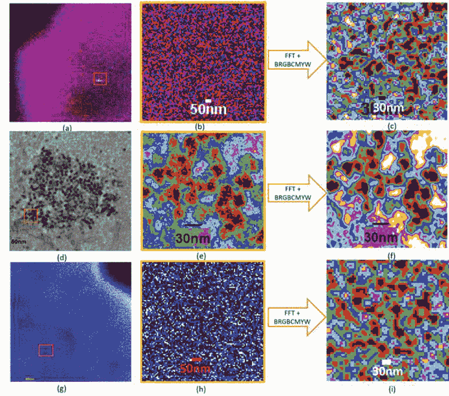

图2 使用两个不同的颜色通道从HR图像中识别HPVLP，参考TEM数据。标签HR图像。b和h分别是 a和g的放大区域。c和i分别是 b和h的着色和FFT处理后的图像。d为TEM数据作为参考的地面真实数据。e是 d的放大区域。f是 e的着色和FFT处理后的图像。BRGBCMYW = 黑色、红色、绿色、蓝色、青色、洋红、黄色、白色## 从超分辨率中识别人乳头瘤病毒...

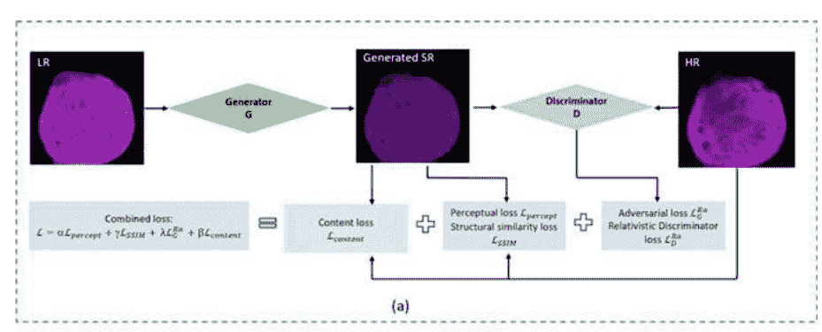

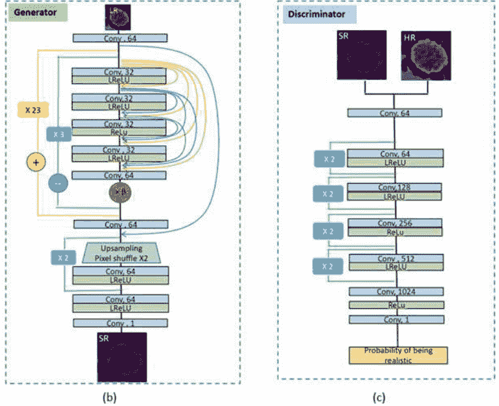

图3 本研究中应用的GAN架构。总体图。生成器。判别器

因此，生成器在公式（3）中的总损失（$\mathcal{L}_{GAN}$）包括感知损失（$\mathcal{L}_{percept}$）、结构相似性（SSIM）损失、内容损失（$\mathcal{L}_{content}$）和对抗损失（$\mathcal{L}_{G}^{Ra}$）。

$$
\mathcal{L}_{GAN} = \alpha\mathcal{L}_{percept} + \gamma\mathcal{L}_{SSIM} + \lambda\mathcal{L}_{G}^{Ra} + \beta\mathcal{L}_{content}
$$

在公式（3）中，SSIM指数（公式（1））在公式（4）中定义，用于衡量两个图像在空间结构上的相似性，其中 $x_f$ 和 $x_r$ 分别表示假（SR）和真实（HR）图像。

$$
D_{Ra}(x_r, x_f) = \sigma(C(x_r) - E_{x_f}[C(x_f)])
$$

在方程（6）中，σ表示sigmoid函数，C(x)表示非变换的判别器输出。E_{x_f}[.]取所有伪造数据的平均值，每个小批次中有8个数据（本研究中）。

生成器的对抗损失呈现对称形式，如方程（7）所示。

$$
L_G^{Ra} = -E_{x_f}[\log(1 - D_{Ra}(x_r, x_f))] - E_{x_f}[\log(D_{Ra}(x_f, x_r))]
$$

其中 $x_f = G(x_i)$ 表示生成器输出的伪图像 $x_f$，$x_i$ 表示LR图像的输入。

在方程（8）中计算的内容损失评估了生成器（图3b）恢复图像 $G(x_i)$ 与真实图像 $x_r$ 之间的1范数距离，使用平均像素绝对误差。

$$
L_{content} = E_{x_i} \|G(x_i) - x_r\|_1
$$

感知损失函数[21]通过对特征层中所有像素的平方误差求和，并取均值，如方程（9）所示。

$$
L_{percept} = E_{x_i} \|\updownarrow_{feature}^{\phi, j}(G(x_i), x_r)\|_1
$$

其中

$$
\updownarrow_{feature}^{\phi, j}(G(x_i), x_r) = \frac{1}{C_j H_j W_j} \|\phi_j(G(x_i)) - \phi_j(x_r)\|_2^2
$$

在公式（9）中，φ表示基于VGG19[36]构建的预训练模型，而公式（10）中的φ_j(x)是指网络φ的第j层的激活，具有形状为 $C_j \times H_j \times W_j$ 的特征图。

在图4中，展示了Pix2pixHD[33]的网络，其中训练过程将原始图像（A）转换为相应的处理后的图像（B），


# 图4 Pix2pixHD的架构

## 4 纹理变换网络

在图5中，纹理变换器（TT）[30]的架构被提出并应用于本研究[2]。TT由四个组件组成：可学习的纹理提取器（LTE），相关性嵌入模块（RE），用于特征传输的硬注意力模块（H）和用于特征合成的软注意力模块（S）。在图中，低分辨率（LR）和LR↑分别表示输入图像及其四倍（×4）双三次上采样的对应图像，而Ref图像是实验获取的四倍高分辨率（HR）的真实图像。此外，对Ref图像进行双三次下采样（4 ×）和上采样（×4），得到与LR↑在域上一致的Ref↓↑。这些图像是纹理变换器的输入，通过生成超分辨率（SR）图像，产生合成的特征图，用于预测HR。


图5 纹理变换器[4]的架构，其中LR = 低分辨率，Ref = GT（×4），LR↑ = 使用双三次插值公式从LR进行4倍上采样，↑↓表示四倍上采样和下采样

## 5 结果

这项工作可能是第一个使用显微图像在CaSki细胞系中检测到人乳头瘤（HPV）病毒颗粒的工作。 表2列出了四种基于GAN的网络在检测到的HPV簇类别上的比较，包括高分辨率（×4）的真实图像（GT）和生成的SR图像。

药物处理样本被称为正常样本，几乎没有HPVLP簇的痕迹。

在表3中，提供了HR和SR图像之间的平均PSNR和SSIM，以及从SR图像中检测HPV簇的敏感性和特异性。

表2 四种方法的敏感性和特异性（以百分比表示）
| | 敏感性 (HPV) | 特异性 (HPV) | 敏感性 (治疗) | 特异性 (治疗) |
|---|---|---|---|---|
| CycleGAN | 74.28 | 85.98 | 75.40 | 79.60 |
| Pix2pix | 65.74 | 80.26 | 85.00 | 74.48 |
| ESRGAN | 70.14 | 81.63 | 77.5 | 77.01 |
| ESRGAN（使用SSIM损失） | 74.46 | 81.63 | 77.5 | 79.77 |
| Pix2pixHD | 86.66 | 84.84 | 82.14 | 85.22 |

表3 不同SR方法的平均PSNR和SSIM以及对HPV聚类的敏感性和特异性
| | PSNR | SSIM | 敏感性 | 特异性 |
|---|---|---|---|---|
| RCAN | 25.80 | 0.7910 | 79.80 | 83.33 |
| Pix2pix | 18.35 | 0.5059 | 65.74 | 80.26 |
| CycleGAN | 30.31 | 0.8013 | 74.28 | 85.98 |
| ESRGAN | 28.07 | 0.6074 | 74.46 | 81.63 |
| TTSR | 28.70 | 0.8778 | 83.6 | 83.33 |

[PAGE 28]

## 从超分辨率中识别人乳头瘤病毒…

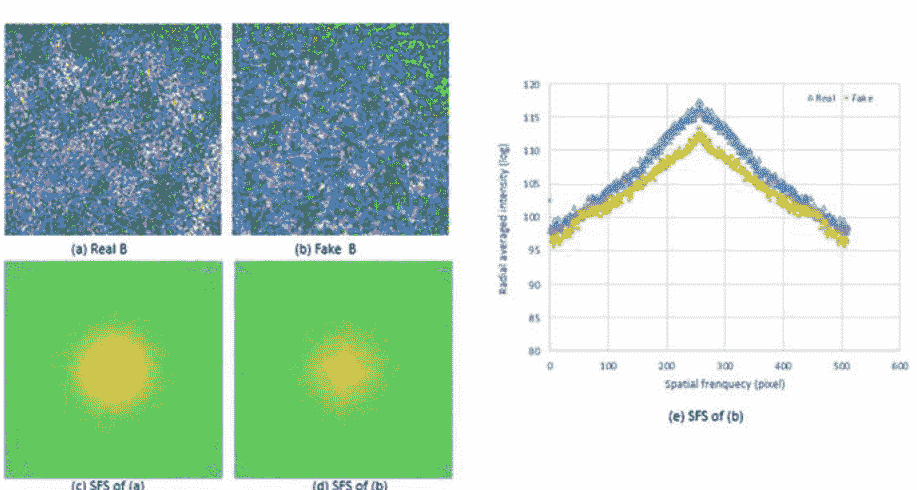

图6 Pix2pixHD生成的假图像与GT之间的空间频率谱比较 a 真实，b 假，c, d 分别是 a 和 b 的空间频率谱(SFS)；e 实际图像和假图像的空间平均功率谱的横截面绘图(以对数刻度表示)

在图7中，展示了ESRGAN和Pix2pixHD之间的视觉比较，顶部一行是ESRGAN，底部一行是Pix2pixHD。

图7证明了通过直接从原始图像到相应的滤波图之间的训练（例如Pix2pixHD）可以更准确地检测到HPV聚类，这也在表2中得到了证实。

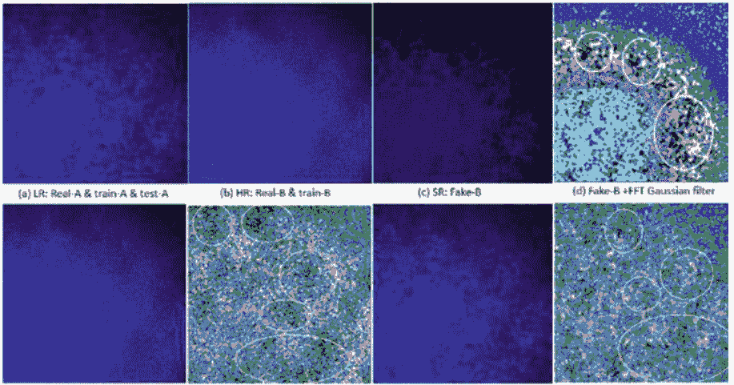

图7 ESRGAN（顶部行）和Pix2pixHD（底部行）方法的最终结果（最后一行）进行比较。这些圆圈是被识别出的HPV簇

[PAGE 29]

在图7h中，与图7f（GT）相比，检测到了五个HPV簇中的四个（白色圆圈），而在图7d中只有三个簇被定位。

可以理解的是，CycleGAN和Pix2Pix网络都是用于图像转换，并且只适用于输入和输出之间具有相同分辨率的情况。它们的优势在于不需要匹配的配对训练数据。如表2所示，两种方法在检测HPV簇方面表现相似，如图8所示。

图9中进行了比较，显示了LR、SR和HR图像之间的检测情况，其中SR是使用TTSR方法生成的。从LR（d）和SR（f）的左上方方形区域可以看出，它们都未能显示出HPV簇，而所有三种分辨率图像的右下方区域都检测到了一个HPV簇。


图8 CycleGAN (c) 和 Pix2Pix (d) 之间的比较结果。白色圆圈表示HPV聚类。a, b 训练数据集

[PAGE 30]

## 6 讨论与结论

这项工作是通过应用最先进的深度学习技术，从传统的光学显微图像中识别出类似人乳头瘤病毒（HPV）的结构（LP），进一步使荧光显微镜达到预期效果的首次尝试。尽管传统光学显微镜已被证明是研究细胞结构的重要工具，但超分辨率似乎是在纳米尺度上识别这些结构的渴望。

高风险的HPV，如HPV16和HPV18，已被确认与某些癌症的发病机制有关，尤其是宫颈癌。因此，早期检测HPV可以帮助识别癌前病变，进而在癌症发展之前进行治疗。虽然从生物样本中检测HPV对于诊断HPV相关癌症和监测治疗效果非常有价值，但传统的分子和蛋白质组学方法无法直接观察HPV或HPVLP在细胞或组织样本中的存在。因此，显微成像被用于直接观察HPV或病毒颗粒，这要求显微镜的分辨率增加（从而减小像素大小），通常为100 nm/px以上[39]，而典型的HPV直径约为50 nm。虽然TEM提供了捕捉这些纳米结构的解决方案，但它不易获得，并且需要漫长而复杂的样本制备过程。

本研究调查了四种最先进的生成对抗深度学习网络（GAN）以及视觉变换器（ViT），用于区分显微图像中的HPV聚类。基于GAN的架构有CycleGAN、Pix2pix、ESRGAN和Pix2pixHD。在基于GAN的模型中，Pix2pixHD对于检测HPV聚类的敏感性和特异性最好，分别为86%和84%，对于检测正常（即经过药物处理）细胞的敏感性和特异性分别为82%和85%。对于其他

[PAGE 31]

对于CycleGAN、Pix2pix和ESRGAN，三个网络的平均敏感性和特异性分别为78%、76%和76%。 与基于纹理的变换器（TT）相比，TT表现最佳，敏感性和特异性分别为83.6%和83.33%。 此外，TTSR具有第二高的PSNR（28.70）和最高的SSIM（0.8778）。

未来，除了收集更多的训练和评估样本外，还将通过使用ViT网络生成SR图像来确定抗HPV药物的有效性。基于ViT的方法不仅可以通过人类注意机制进行解释，而且需要更少的数据资源。

虽然在不同的研究中心使用TEM和HR显微镜（MS）具有优势，但由于样本制备和旅行的限制，获取的数据集数量有限。另一方面，这种做法使训练系统能够从不同的扫描仪中获取信息，特别是当测试LR数据集来自不同的MS扫描仪群体时，系统更加稳健。

此外，作者将进一步考虑在未来的数据对中增加其他比例，例如×8，以提高生成的超分辨率（×4）的有效性，从HPV到癌症的形成的洞察的前景，同时保持传统荧光显微镜的繁荣。

致谢 本工作得到了英国皇家学会的财务支持（参考：IEC\NSFC\181557）。在此表示衷心感谢他们的支持。作者还要感谢英国莱斯特大学的 Natalie Allcock 博士提供的TEM数据采集服务。

## 附录A. 共聚焦荧光显微镜样品制备

本研究使用了含有HPV16序列的CaSki宫颈癌细胞系和不含HPV的C33a细胞系。 这两种细胞系在含有10%胎牛血清和1%青霉素/链霉素的RPMI培养基中生长在覆盖玻片上的六孔培养板中。它们在含有95%空气和5%二氧化碳的湿度控制培养箱中保存2天，直到细胞达到70-80%的密度。细胞在固定前用PBS洗涤三次，每次1分钟，然后用4%戊二醛固定10分钟。然后暴露于0.1%的Triton-100中，PBS洗涤后5分钟。然后加入50%的家庭血清，静置8分钟，然后将其移除。接下来，加入200 μl 1:100稀释的抗小鼠HPV E6/E7抗体（Abcam，英国），在室温下静置2小时后再次洗涤，并加入100 μl 生物素化的二抗（ABC通用试剂盒，Vector lab，英国）。30分钟后，再次洗涤细胞，然后加入三抗，静置20分钟。最后，在暗处暴露于细胞上的100 μl TSA/FITC放大试剂，静置6分钟。

[PAGE 32]

被洗涤了。DAPI 包含的封装介质被加到标记的玻片上，并且附着在盖玻片上的细胞被密封在内，以进行显微观察。

## 附录 B. 用于 TEM 扫描的样品制备

细胞的生长和制备方式与上述第 S1 节中描述的方式类似，直到程序达到固定步骤。在 PBS 缓冲液中，使用 2.5% 戊二醛代替对甲醛进行细胞固定，并在进一步步骤进行之前，在室温下固定细胞 3 小时。

此外，在扫描之前，这些样本要经历一系列的标准准备过程，包括（1）将其嵌入到EM胶囊中并在16°C下聚合6小时，（2）使用Leica UC7超薄切片机切割成70纳米厚度，（3）收集到铜网格上，（4）用铅柠檬酸盐染色5分钟。

## 参考文献

1. 高晓伟, 温欣, 李迪, 刘伟, 熊杰, 徐斌, 刘健, 张辉, 刘晓：评估用于显示HPV病毒的GAN架构的显微图像。在：ICMLA 2021，虚拟，2021年12月13日至16日（2021年）
2. 国际癌症研究机构人类致癌风险评估工作组，人类乳头瘤病毒。里昂（法国）：国际癌症研究机构。https://www.ncbi.nlm.nih.gov/books/NBK321770/。2020年8月检索（2007年）
3. Braaten, K.P., Laufer, M.R.: 人类乳头瘤病毒（HPV），HPV相关疾病和HPV疫苗。产科和妇科评论 1(1)，2-10（2008年）
4. Chelimo, C., Woulde, T.A., Cameron, L.D., Elwood, J.M.: 人类乳头瘤病毒（HPV），生殖器疣和宫颈癌的危险因素和预防措施。感染杂志 66，207-217（2013年）
5. Song, B., Ding, C., Chen, W., Sun, H., Zhang, M., Chen, W.: 2013年中国宫颈癌的发病率和死亡率。中国癌症研究 29(6)，471-476（2017年）
6. Crewe, A.V., Isaacson, M., Johnson, D.: 一种简单的扫描电子显微镜。科学仪器评论 40(2)，241-246（1969年）
7. Born, M., Wolf, E.: 光学原理, 第7版. 剑桥大学出版社, 英国剑桥（1997）
8. Hell, S.W.: 显微镜及其焦点开关. 自然方法 6, 24-32 (2009)
9. Rust, M.J., Bates, M., Zhuang, X.: 随机光学重建显微镜（STORM）的亚衍射限制成像. 自然方法 3, 793-795 (2006)
10. Hell, S.W.: 远场光学纳米显微镜. 科学 316, 1153-1158 (2007)
11. Schermelleh, L., Ferrand, A., Huser, T., et al.: 超分辨率显微镜解密. 自然细胞生物学 21, 72-84 (2019)
12. Wang, H., Rivenson, Y., Jin, Y., Wei, Z., Gao, R., Bentolila, L., Kural, C., Ozcan, A.: 深度学习实现荧光显微镜的跨模态超分辨率. 自然方法 16, 103-110 (2019)
13. 董, C., 洛伊, C.C., 何, K., 唐, X.: 学习深度卷积网络进行图像超分辨率。在：ECCV 2014（2014年）
14. Goodfellow, I., Pouget-Abadie, J., Mirza, M., Xu, B., Warde-Farley, D., Ozair, S., Courville, A., Bengio, Y.: 生成对抗网络，国际会议论文集神经信息处理系统（NIPS 2014）。第2672-2680页（2014年）

## 顺序和时间嵌入深度学习模型在健康结果预测中的评估

Omar Boursalie, Reza Samavi, and Thomas E. Doyle

摘要 深度学习顺序模型越来越多地被用于通过分析患者的病史来预测其健康结果。 在本文中，我们研究了使用深度学习顺序模型进行预测性健康建模的设计决策和挑战。 我们的结果表明，迄今为止最成功的深度学习健康模型，称为transformers，缺乏分析健康记录的时间特征的机制。 为了解决这一差距，我们提出并评估了一种新模型，称为DTTHRE：用于时间嵌入健康记录编码的解码器变压器。DTTHRE分析患者的病史，包括就诊之间的经过时间。 我们还评估了DTTHRE在一个真实医疗数据集上对两个健康结果的性能：（1）诊断和（2）再入院预测。 与文献中现有的深度学习顺序模型相比，DTTHRE成功预测了患者的最终诊断（78.54 ±0.22%）和再入院风险（99.91 ± 0.02%），并且性能有所提高。

DTTHRE预测每次医疗访问的健康结果，这增加了来自有限医疗数据集的训练示例，而不需要额外的训练时间。

关键词 健康信息学 · 深度学习 · 变压器 · 时间 · 编码 · 嵌入

O. Boursalie (✉) · T. E. Doyle
麦克马斯特大学生物医学工程学院，加拿大汉密尔顿，ON L8S 4L8，电子邮件：boursao@mcmaster.ca

R. Samavi
多伦多大学电气、计算机和生物医学工程系，加拿大大多伦多，ON M5B 2K3

T. E. Doyle
麦克马斯特大学电气与计算机工程系，加拿大汉密尔顿，ON L8S 4L8

O. Boursalie · R. Samavi · T. E. Doyle
矢量研究所，加拿大大多伦托，ON M5G 1M1

© 作者（们），在Springer Nature Singapore Pte Ltd.的独家许可下。2023年
M. A. Wani和V. Palade（编者），深度学习应用，第4卷，
智能系统与计算进展1434，
https://doi.org/10.1007/978-981-19-6153-3_2

## 1 引言

越来越多的人对使用深度学习的顺序模型（如循环神经网络（RNN; [34]），长短期记忆模型（LSTM; [17]）和变压器[38]）来通过分析患者的医疗历史中的趋势和关系来建模患者的健康结果感兴趣。 然而，顺序深度学习模型被设计用于分析来自单一来源（同质）且没有时间组成部分（非时间性）的数据，例如文本和图像。 相比之下，电子健康记录（EHR）中记录的医疗历史记录来自多个来源（异质），例如诊断、生理和成像。 医疗记录还代表了患者随时间的健康观察（时间性）。 下面的激励场景展示了在开发预测性健康模型时考虑异质性和时间特征的重要性。

本文的作者目前正在开发一种使用深度学习的决策支持系统（DSS），用于评估由于计算机断层扫描（CT）和X射线（XR）成像而导致的患者辐射暴露的风险[5]。 我们通过分析患者随时间变化的辐射暴露模式来建模患者的风险，同时考虑其医疗历史背景。 我们的DSS在评估患者由于医学成像而导致的癌症风险时，必须分析异质健康数据和就诊之间的时间间隔[28]。

在本文中，我们研究了在我们的DSS中使用深度学习顺序模型时所面临的设计决策和挑战。我们的结果表明，在医疗历史中分析时间模式的常见方法是将其编码为序列。 序列是按顺序列出的元素集合（例如，单词）。 以前的研究者[23, 33]将患者的医疗历史编码为诊断代码序列，称为诊断级别编码。 循环神经网络和LSTM然后分析医学诊断的顺序以学习疾病模式[36]。 例如，Pham等人提出了DeepCare，这是一种扩展的LSTM，用于分析诊断和就诊之间的经过时间进行诊断预测[31]。

RNN和LSTM需要顺序处理，并且先前访问的信息以递归方式存储在模型的内存中。 变压器解决了RNN和LSTM模型的限制。 仅编码器的变压器（如BERT）[13]根据剩余元素预测序列中的元素。 另一方面，仅解码器的变压器（如GPT-2）[32]根据前面的元素预测元素，直到该元素。 先前的研究[23, 33]使用仅编码器的变压器分析医疗历史的诊断级序列，以预测每个患者的最终诊断。 例如，Rasmy等人[33]提出了Med-BERT，其在诊断预测性能方面优于RNN和LSTM。然而，变压器不考虑访问之间的经过时间。

为了解决现有模型的差距，我们开发了一种仅解码器的变压器模型，称为时间嵌入健康记录编码器（DTTHRE），用于分析患者的医疗历史，包括经过的时间。

## 2 健康结果预测

在本节中，我们回顾了健康记录的特征（第2.1节）和编码机制（第2.2节），以及潜在的预测任务（第2.3节）。

### 2.1 医疗记录特征

医疗历史是包含患者
随时间不规则观察的表格数据集（图 1a）。形式上，我们将每个 p = {1...P}患者的医疗
历史定义为不规则时间序列 H_p = {v_p,t_n , n ∈ Z}其中观察时间 t_{n+1} >
t_n, n ∈ Z, 其中 v_t 是患者在时间 t n 的第n次医疗访问。表1总结了我们在开
发DTTHRE过程中遇到的设计决策。这些设计决策与记录在医疗访问期间的
四种类型的医疗观察相关：（1）人口统计学，（2）诊断（Dx），（3）治
疗和（4）影像信息。人口统计数据包括去识别化的患者编号、年龄、出生
日期、性别、体重、身高、种族、地址、入院类型（例如急诊科、住院、门
诊和社区诊所）、就诊日期以及入院和出院时间。每个患者在他们的医疗历
史中有不同的第一次和最后一次就诊，总就诊次数和就诊日期。

诊断记录是医疗专业人员在患者就诊期间记录的观察结果。形式上，一
次就诊的诊断序列包括按诊断重要性（例如，主要、次要或三级）排序的代
码d = {1...D}。诊断观察使用世界卫生组织（WHO）的国际疾病和相关健康
问题统计分类（ICD-10）格式[7]进行记录。ICD-10有二十二个章节，包含
五个子类别级别的详细诊断信息。请注意，ICD-10格式是为行政和计费目的
而设计的，而不是用于预测建模。因此，研究人员使用子类别或章节级别将
ICD-10代码映射到目标系统。例如，ICD-10-CA代码I21.09（急性心肌梗死
，前壁）和I25.10（原发性冠状动脉无症状性动脉粥样硬化性心脏病）可以
编码为ICD-10-CA第9章（循环系统疾病）。

治疗记录包括每次就诊期间开具的程序和药物干预。形式上，每次就诊
的治疗序列由按重要性顺序排列的代码集合 m = {1...M}组成（例如，主要、
次要或三级）。干预编码方案包括加拿大健康干预分类（CCI）代码[7]。与
ICD-10类似，CCI代码根据身体系统（例如，神经系统）和解剖部位（例如
，脑部）提供关于七个干预组的详细信息。诊断和干预代码可以根据主要诊
断、干预、年龄和共病分组（DRG）对患者进行分类。类似地，药物可以
使用世界卫生组织解剖治疗化学（ATC）方案将其映射到目标身体系统[42]

存储在影像存档和通信系统（PACS）中的影像记录包含有关影像扫描的
摘要数据（例如，模态和扫描的身体部位）以及存储在数字影像和医学通信
（DICOM）格式中的详细扫描仪数据，可用于估计患者的暴露情况。由于
技术和隐私挑战，只有患者DICOM记录的子集可用。因此，剩余图像的低
剂量辐射暴露必须使用估计值进行填充[4]。

### 2.2 编码医疗记录

深度学习模型分析健康记录中记录的不规则时间观察是具有挑战性的。 受自然语言处理(NLP)的启发，越来越多的人对将医疗历史编码为序列感兴趣。 考虑一个序列 $\{x_0, ..., x_i\}$ of $i$元素，其中每个元素依赖于序列中的前一个项。 在NLP中，每个元素表示来自单一来源的单词(同质的)。 单词被嵌入到一个实值向量中，维度为 $d_{emb}$ suchthat 具有相似上下文（例如，猫和狗）的单词在向量空间中更接近。

选择编码机制来表示来自多个异构数据源的医学观察是一个重要的设计决策，如表2所总结的。有趣的时，人口统计数据（例如年龄和性别）没有被编码在健康记录序列中。 相反，先前的研究[31, 33]专注于将患者的病史编码为诊断和干预级别代码的序列 $h_p = \{d_{p}^{1,1}, ..., d_{p}^{n, D}\}$ 其中 $d_{p}^{n, D}$ 是 $D$ 次访问的诊断

## 表1 数据收集和预处理设计决策

| 数据类型 | 设计决策 |
| --- | --- |
| 人口统计 | - 去识别和链接
- 表示不同的开始/结束日期和访问次数
- 表示访问之间的经过时间 |
| 诊断 | - 将诊断代码映射到疾病诊断类别（例如癌症）
- 表示诊断的重要性（主要、次要或三级） |
| 治疗（干预和药物） | - 将干预代码映射到目标系统（例如，呼吸系统）
- 将药物代码映射到目标系统（例如，消化系统）
- 表示干预重要性（例如，主要或次要） |
| 成像 | - 将扫描映射到身体部位（例如，头部）
- 用于估计暴露的缺失成像数据的填补 |

## 表2 编码设计决策

| 编码机制 | 设计决策 |
| --- | --- |
| 诊断/干预级别 | - 将诊断/干预代码级别进行编码（例如，章节级别）
- 词嵌入机制–嵌入维度大小
- 来自同一次就诊的标签元素（例如，位置嵌入） |
| 就诊级别 | - 捕捉就诊内部关系的编码机制–嵌入维度大小 |
| 时间 | - 将访问之间的经过时间编码为序列中的元素
- 模拟患者病史中观察结果的顺序（无时间组件）–嵌入维度大小 |

n表示患者 p如图1b所示。将诊断和治疗代码表示为不同的元素为深度学习模型提供了一个大的词汇表进行分析。
然而，应用这种方法会增加搜索空间，因为模型必须学习访问之间和访问内部的属性。一种解决方案是将诊断和干预代码编码为更高级别的类别，以减少搜索空间。此外，研究人员还研究了将患者的医疗历史编码为访问级别编码的序列，将患者的每次访问中的所有观察结果嵌入到一个元素中。与自然语言处理类似，具有相似上下文（例如诊断和干预）的访问

## 表3 预测任务设计决策

| 预测任务 | 设计决策 |
| --- | --- |
| 分类 | 一对多（最终访问诊断预测，再入院和/或住院时间）一对多（每次访问诊断预测，再入院和/或住院时间） |
| 预训练和微调 | 对通用任务（例如掩码建模）进行预训练顺序模型，使用大型数据集-使用目标数据集对特定任务进行顺序模型微调 |

## 3 使用顺序深度学习分析医疗历史

在本节中，我们将回顾第3.1节中的顺序深度学习模型。在第3.2节中，我们描述了使用顺序深度学习模型分析时间数据的挑战。为了解决这些挑战，我们在第3.3节中提出了我们的仅解码器变压器（DTTHRE）。

### 3.1 顺序深度学习模型

顺序深度学习模型包括RNN [34]，LSTM [17]，仅编码器，仅解码器和编码器-解码器变压器 [38]。

#### 3.1.1 循环神经网络

循环神经网络 [34] 定义如下：

```
y_i = f_{c1}(h_i),\tag{1} 
 h_i = W_{in} \cdot x_i + U_{in} \cdot h_{i-1} + b_{in},\tag{2}
```

其中 h_i是模型的当前隐藏状态，总结了所有先前 i-1 输入的信息， f_{c1}是用于预测输出 y_i的前馈分类层。隐藏状态 h_i（方程2）基于当前输入 x_i和先前的隐藏状态 h_{i-1}，并在每个步骤 i重新计算。W_{in}，U_{in}和 b_{in}是RNN在训练过程中使用反向传播学习的参数。

由于梯度消失或梯度爆炸的问题，对于长序列上的RNN进行反向传播是一个挑战[17]。

#### 3.1.2 长短期记忆模型

为了解决梯度消失或梯度爆炸的问题，LSTM通过引入记忆单元 $c_i$ 来扩展RNN，定义如下：

$c_i = g_{in} * in_i + f_i * c_{i-1},$

其中 $g_{in}$ 和 $f_i$ 分别是输入门和遗忘门，它们根据当前输入 $(x_i)$ 和上一个隐藏状态 $(h_{i-1})$ 控制LSTM中的数据流量。输入门（公式4）控制着保存在记忆单元中的输入隐藏状态 $in_i = \sigma(h_i)$。遗忘门（公式5）控制着从上一个记忆单元 $c_{i-1}$ 中遗忘的数据量。$W_g$、$W_f$、$U_g$、$U_f$、$b_g$ 和 $b_f$ 是LSTM在训练过程中学习到的参数。

$g_{in} = tanh(W_g \cdot x_i + U_g \cdot h_{i-1} + b_g),$

$f_i = \sigma(W_f \cdot x_i + U_f \cdot h_{i-1} + b_f).$

LSTM隐藏状态基于 $c_i$，并定义如下：

$h_i = o_i * tanh(c_i),$

$o_i = \sigma(W_o \cdot x_i + U_o \cdot h_{i-1} + b_o).$

其中 $o_i$ 是输出门（方程7），根据 $x_i$ 和 $h_{i-1}$ 控制从记忆单元 $c_i$ 释放的信息量。$W_o$、$U_o$ 和 $b_o$ 是模型在训练过程中学习到的参数。记忆单元使得反向传播能够通过之前的隐藏状态进行，而不会出现梯度消失或梯度爆炸的问题。基于LSTM的模型已被用于根据患者的病史预测诊断和再入院风险[9]。Pham等人[31]提出了DeepCare，一种扩展的LSTM（具体包括方程4、5和7），用于分析访问之间的经过时间。然而，使用LSTM对长序列进行建模仍然是一个挑战，因为模型需要按顺序访问每个元素，无法并行训练。此外，LSTM无法直接访问隐藏状态中嵌入的先前输入。

#### 3.1.3 编码器-仅变压器

与LSTM不同，变压器可以直接访问序列中的所有元素。仅编码器变压器，例如BERT [13]，定义如下：

#### 3.1.4 解码器-仅变压器

仅解码器变压器，例如GPT-2 [32, 41]，定义如下：

```
y_i = f_{c1}(f_d({x_0, ..., x_{i-1}}))
```

使用先前的 {x_0, ..., x_{i-1}}项来预测序列中的每个元素(y_i)。与仅编码器变压器类似，仅解码器变压器由多头自注意力层的堆叠层组成，以构建输入序列的连续表示。然而，解码器的掩码多头自注意力层是单向的(f_d)，因此每个头只关注序列中的前 i - 1个元素。此外，最终解码器层的每个元素 {z_0, ..., z_{i-1}}通过前馈分类层(f_{c3})传递，以预测序列中的下一个元素{y_1, ..., y_i}。在训练过程中，通过模型反向传播每个预测元素的组合分类损失。解码器模型是自回归和生成的。例如，GPT-2 [32]按顺序生成句子中的每个单词。

#### 3.1.5 编码器-解码器变压器

编码器-解码器变压器[38]的定义如下：

```
{y_1, ..., y_i} = f_{c3}(f_d^*(f_e({x_0, ..., x_i}), {y_0, ..., y_{i-1}}))
```

其中{y_0, ..., y_{i-1}}是先前的i-1模型预测。编码器-解码器模型用于语言翻译，如英法翻译[38]。编码器阶段为输入序列x（例如，英文句子）生成连续表示。将输入序列的编码器表示{z_0, ..., z_i}和任何先前预测的i-1元素{y_0, ..., y_{i-1}}（例如，先前翻译的法语单词）输入到解码器阶段，以预测序列中的下一个元素（例如，法语单词）。解码器阶段在编码器-解码器模型中进行了修改(f_d^*)，以分析编码器表示z和先前的预测y。最终解码器层中的每个元素都经过f_{c3}处理，以预测下一个元素（例如，法语单词）。

变压器在RNN和LSTM之上有三个优势[38]。首先，变压器直接访问序列元素，而不是通过LSTM中使用的递归内存。其次，变压器一次分析每个序列中的元素，从而实现并行化以减少训练时间。因此，与RNN和LSTM相比，变压器模型可以在更大的数据集上进行训练。

### 3.2 使用顺序深度学习模型对时间数据建模的挑战

深度学习顺序模型，如RNN、LSTM和变压器，是为NLP设计的，其中相邻元素之间的距离是恒定的(δ=C)。因此，变压器无法评估时间数据中的可变δ。例如，音乐是一个具有不同δ_i音符之间的常规时间序列。变压器假设δ=C，无论δ_i如何。黄等人提出的一个解决方案是将音乐中的复杂概念（音符、速度和时间偏移）编码为音乐序列中的事件。具体而言，音乐被表示为包含NOTES_ON、NOTES_OFF、音符VELOCITY和离散化的TIME Shifts（以10毫秒为增量）的MIDI（音乐乐器数字接口）事件。然后，黄等人使用仅解码器的变压器通过预测序列中的前一个事件来生成音乐。

如果解决以下限制，可以使用[18]中描述的使用仅解码器的变压器分析音乐的方法来分析医疗历史记录：

+ 限制Ⅰ(LI)：如果我们像[18]那样将健康记录编码为事件序列，仅有解码器的变压器将使用同一次就诊的先前事件来预测每个医疗事件，这会对模型造成偏差。例如，考虑一个

患者的就诊，其中第一个和第三个诊断之间存在层次关系。仅有解码器的变压器可以学习诊断代码之间的多级关系[11]，但这对于预测健康结果没有贡献。必须一次性通过仅有解码器模型分析同一次就诊的所有事件以预测健康结果。

- 限制2（L2）：[18]中的仅解码器变压器模型预测音乐序列中的每个事件。我们模型的目标是预测每个患者就诊的健康结果（例如，初步诊断或再入院风险），而不是分析其诊断来预测患者的年龄和性别等医疗序列中的每个元素。

- 限制3（L3）：在自然语言处理中，序列中的元素是同质的（单词）。因此，我们通过反向传播将分类损失总和更新到模型中。然而，医疗记录中的元素是异质的，例如年龄、性别、诊断、药物和就诊之间的时间间隔。我们的模型的分类损失必须评估对每次就诊的健康结果的预测，而不是序列中的下一个元素。

## 3.3 健康分析的提出变压器

为了解决现有变压器诊断模型中的差距，我们提出了：（1）一种称为THRE的医疗编码表示和（2）一种称为DTTHRE的诊断模型。为了解决L1，我们扩展了第3.2节中描述的MIDI编码用于医疗记录。我们将健康记录不规则时间序列（H<sub>p</sub>）编码为医疗事件序列（图1c）。THRE中有四种类型的医疗事件：（1）年龄，（2）性别，（3）就诊和（4）时间间隔。年龄和性别表示患者在首次就诊时的年龄和性别。就诊是每次就诊的诊断和医疗/治疗观察序列的就诊级嵌入。Cho等人[11]证明了就诊级嵌入在深度学习模型中提高了预测性能。时间间隔表示相邻就诊之间的时间间隔，以每月为单位增加[18, 26, 30]。我们还扩展了仅解码器变压器（第3.1.4节）以分析医疗事件，如图2所示。为了解决L1，DTTHRE解码器层被修改为分析每次就诊的事件对（时间间隔和就诊），而不是每个元素。为了解决L2和L3，前馈分类层被修改为使用上一个就诊表示状态而不是使用上一个元素表示状态来预测下一个健康结果（主要诊断或再入院风险）。

从形式上讲，THRE被表示为序列：

```
T H R E_p = \{a_p, s_p, v_p^1, \Delta t_{(v_p^2, v_p^1)}, v_p^2, ..., \Delta t_{(v_p^{n_p}, v_p^{n_p-1})}, v_p^{n_p}\} 
其中 v_p^{n_p} = AE (\{d_p^{n_p}, m_p^{n_p}\})
```

## 顺序和时间嵌入的评估...

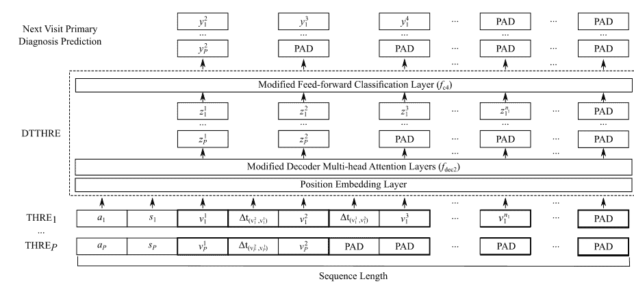

图2提出的DTTHRE架构。a_p和 s_p分别是每个患者的首次就诊年龄和性别, Δt是相邻就诊之间的时间 v； v_p^n是就诊嵌入表示；z是连续表示元素；PAD是填充掩码；y是下一个就诊的主要诊断位置。 来自同一次就诊的元素位于连续的粗边框中

其中 a_p和 s_p分别是每个患者的首次就诊年龄和性别； Δt是连续就诊之间的时间（DELTA_TIME）；而 v_p^n是表示就诊的诊断和医疗/治疗观察的访问嵌入（VISIT）n_p。 VISIT是通过将每次访问的诊断（d_p^n）和医疗/治疗（m_p^n）观察连接后通过训练好的自编码器（AE）生成的。 每个患者的第一次就诊由 {a_p, s_p, v_p^1}描述。 随后的患者访问使用事件对 {Δt

```
(v_p^n, v_p^{n-1}, v_p^n)来描述。
```

DTTHRE的定义如下：

```
{l_4, l_6, ..., l_i} = f_{c4}(f_{dec2}({x_0, ..., x_{i-1}}))
```

其中 f_{dec2}是我们修改后的单向解码器层， f_{c4}是我们的新前馈分类层，而 {l_4, l_6, ..., l_i}是目标位置{4, 6..., i} in x的标签。 在 f_{dec2}中，序列开头的三个元素{x_0, x_1, x_2} （例如，年龄、性别和就诊1）始终可供解码器注意力头使用。

此外，遮蔽的自注意力头被修改，使得元素对的形式可用于注意力头，而不是单个元素（图2）。我们的提议的解码器模型不是在每个序列位置i（方程9）预测下一个元素x_{i}，而是预测所选序列位置{l_4, l_6, ..., l_i}的标签。THRE和DTTHRE可以按照算法1进行使用。 首先，我们从健康记录H_p中提取每次访问的诊断代码和健康结果（例如，主要诊断或30天再入院标签）。其次，我们训练自编码器AE生成访问级别的嵌入。 第三，我们构建包含AGE、SEX、DELTA_TIME和VISIT医疗事件的THRE序列（方程11）。最后，我们在THRE序列和主要诊断或再入院风险上训练DTTHRE（方程12）。

## 算法 1训练 DTTHRE 模型以预测每次访问的健康结果

要求: 患者电子健康记录 H0...Hp
确保: THRE 序列THR E0...THR Ep，自编码器 AE，DTTHRE模型和词汇表-lary V
> 从 H

+ 1: for p:= 0 到 P 的患者诊断和健康结果提取
2: 	for n:= 1 到 n_p do
3: 		vall.append(merge(d_p^n, m_p^n))
4: 		l[p].append(第 n次访问的健康结果)
5: 		end for
6: end for

> 生成访问级别的嵌入
7: AE ←使用 vall训练访问级别的嵌入自编码器
8: vlut ← unique(vall)
9: vembeddings ← AE(vlut )

> 构建THRE序列（方程11）
10: for p := 0 to P do
11: 	THR E[p].append(患者 p 首次就诊年龄)
12: 	THR E[p].append(患者 p 性别 )
13: 	THR E[p].append(在 vlut中合并索引(d_p^n, m_p^n))
14: 	for n := 2 to n_p do
15: 		THR E[p].append(t_n - t_{n-1})
16: 		THR E[p].append(在 vlut中合并索引(d_p^n, m_p^n))
17: 		end for
18: end for

> 构建序列词汇字典
19: V ←为每个唯一的（THR E）元素构建LUT
20: V [在 V中找到vlut的索引， 1] ← vembeddings

> 训练DTTHRE (方程式 12)
21:对于epoch := 0 到 100执行
22: 	对于 p:= 0 到 P 执行
23: 		通过 fdec2将前向传递 THR E[p] 传递
			z_visits ← {z4, z6, ..., z_i} 从最后一个解码器层获取
25: 		l_pred ← f_c4(z_visits )
26: 		通过 fdec2进行反向传递以根据分类损失(l[p], l_pred) 更新权重
27: 

结束循环
28:结束循环
29:返回 THR E0...THR Ep , AE,DTTHRE, V

## 4 评估

开发我们的 DSS 的一个重要步骤是评估一个概念验证的DTTHRE 模型，以测试嵌入访问之间经过的时间是否影响预测性能。 在本节中，我们评估了三个顺序深度学习模型：DeepCare [31] (扩展 LSTM; 第3.1.2节)，Med-BERT [33] (仅编码器的变压器; 第3.1.3节)，以及 DTTHRE (我们提出的仅解码器的扩展变压器; 第3.3节)。DeepCare 和 Med-BERT 被选为基准模型，因为它们代表了顺序深度学习模型 (LSTM 和仅编码器变压器)，常用于分析患者的病史[31, 33]。DeepCare（扩展LSTM）还分析了医疗就诊之间的时间间隔，而Med-BERT（仅编码器的transformer）则不分析。

我们评估了DeepCare、Med-BERT和DTTHRE在预测两种健康结果方面的性能：

+ • 评估1（E1）：通过分析患者就诊前的病史，预测其就诊的主要诊断。有20个标签（多分类），代表ICD-10-CA第1-19章和第21章（附录A）。
• 评估2（E2）：通过分析患者就诊前的病史，预测其在30天内的再入院风险[37]。有两个标签（二分类），其中0表示未再入院，1表示在30天内再入院。

我们使用了一个我们为这项研究精心策划的真实医疗数据集进行了评估1和2。我们的数据集包含了加拿大安大略省汉密尔顿市四家医院十年（2006年5月-2016年）的纵向医疗记录。数据集的特征见附录A。我们的数据集包含了来自三个医疗存储库的去标识化、整合、清理和关联的健康记录：来自出院摘要数据库（DAD）的门诊数据，来自国家门诊护理报告系统（NACRS）的住院数据，以及来自医院PACS的影像数据。DAD包含有关医院出院的行政、临床和人口统计信息。NACRS包含来自日间手术、门诊和社区诊所的临床信息（例如诊断和治疗）。每家医院每年向加拿大卫生信息研究所（CIHI）报告DAD和NACRS记录，以遵守加拿大法律。PACS包含有关影像扫描的摘要数据（例如模态和扫描的身体部位）以及存储在DICOM格式中的详细影像数据，其中包含估计患者暴露所需的扫描仪数据。所有医院都使用PACS系统存储其影像数据，以遵守加拿大法律。数据集还包括每次医疗就诊的月份和年份。我们的数据集中包含了来自340,143名患者的约130万个诊断记录和210万个影像记录。由于技术和隐私挑战，我们从代表性子集的2,000名患者中访问了39,909个DICOM头文件的子集。在这项研究中，我们对至少有四次就诊并接受至少一次低剂量医学影像扫描（例如CT和XR）的66,906名患者的子集上评估了DeepCare、Med-BERT和DTTHRE。我们的研究已获得大学伦理委员会的批准。

### 4.1 将医疗历史编码为序列

我们使用诊断级别和访问级别的编码机制对每个患者的医疗历史进行编码（图1a）。在诊断级别编码中，我们对E1进行编码：（1）22个ICD-10-CA章节代码（附录A），（2）背景（BKG D）有效剂量（ED；[20]）在20个区间中量化（范围0-190 mSv）[8]，（3）医学成像ED在78个区间中量化（范围0-770 mSv），以及（4）累积（CML）

ED暴露量量化为171个区间（范围为0-1,700 mSv）。医学成像的ED暴露量是根据[4, 6]中的方法估计的。仅包含成像扫描而没有诊断代码序列的访问不包括在内。相反，将医学成像的ED暴露量添加到每个患者的累积ED总量中。最终得到的286位诊断级向量使用自编码器嵌入到160位VISIT级事件中（81,244个元素）。

在E2中，每个诊断级向量由ICD-10-CA章节代码（22位）组成，这些代码使用自动编码器嵌入到14位的VISIT级事件（15,815个元素）中。

诊断和访问级编码机制的特征和元素频率在表4（E1和E2）和图3（E1）和图4（E2）中显示。我们队列中的患者平均每次就诊8 ± 0.02次，每次就诊平均有2 ± 0.003个诊断，还有他们的背景、医学影像和总体急诊暴露情况。在E1中，诊断级编码导致了较长的序列（24.20 ± 0.07个元素每个患者），这增加了模型的搜索空间。另一方面，THRE使用较短的序列（14.53 ± 0.03个事件每个患者）编码医疗历史，这些序列比诊断级编码更多地包含了健康记录的属性（年龄、性别和就诊间隔时间）。与诊断级编码相比，THRE导致了较小的搜索空间。然而，诊断级编码编码了就诊顺序，而THRE则没有。最后，诊断级编码的词汇量（281）比THRE（81,440）和原始研究[33]（82,603）要小，因为我们是在ICD章节级别进行编码。诊断级和访问级机制的特征（表4）和频率（图4）在E2中与E1类似。## 顺序和时间嵌入的评估

表4 编码机制的特征 (均值 ±标准误差)
| 项目 | 评估 | 诊断级别编码 | 访问级别编码 |
|---|---|---|---|
| 每位患者的平均访问次数 | E1, E2 | 8.00 ±0.020 (最大值: 96，最小值: 4) |  |
| 每次访问的平均诊断次数 | E1, E2 | 2.27 ±0.003 (最大值: 25，最小值: 1) |  |
| 词汇 | E1 | 诊断 (22)，背景 (20)/ 图像 (78)/ 总急诊 (171) | 年龄 (100)，性别 (2)，时间差 (94)，访问次数 (81,244) |
|  | E2 | 诊断 (22) | 年龄 (100)，性别 (2)，时间差 (94)，访问次数 (15,815) |
| 每位患者的平均元素数 | E1 | 24.20 ±0.07 (最大值: 398，最小值: 6) | 14.53 ±0.03 (最大值: 193，最小值: 9) |
|  | E2 | 9.15 ±0.03 (最大值: 193,最小值: 3) | 14.53 ±0.03 (最大值: 193，最小值: 9) |
| 年龄和性别 |  | N | Y |
| 诊断 |  | Y | Y |
| 访问编码 | E1,E2 | 位置标签 | 访问级别嵌入 |
| 诊断顺序 |  | Y | N |
| 经过的时间 |  | N | Y |

图3 使用诊断编码（顶部）和访问级别编码（底部）对诊断预测（E1）进行编码的前30个最频繁元素的频率。 诊断和访问级别元素在表11中定义

## 4.2 用于诊断预测的Transformer模型

我们比较了三个诊断预测模型：DeepCare（第3.1.2节），Med-BERT（第3.1.3节）和DTTHRE（第3.3节）。DeepCare使用Theano[11]实现，而Med-BERT和DTTHRE使用HuggingFace PyTorch[41]实现。 我们修改了HuggingFace GPT-2模型（第3.3节）以实现DTTHRE。我们使用AdamWeight衰减优化器[22]，学习率为1e-5，Med-BERT和DTTHRE的丢弃率为0.1。在E1中，DeepCare有两个隐藏层和嵌入维度分别为150和160位。 两个Transformer模型每层有六个注意力头。 隐藏和嵌入维度为160位。 在E2中，DeepCare的隐藏和嵌入维度分别为14和24位。 Transformer模型每层有七个注意力头，隐藏和嵌入维度为14位。

在训练过程中，这些模型有不同的优化目标。DeepCare（公式1）和我们的DTTHRE模型的学习目标（公式12）是根据每次就诊前的病史来确定E1或E2。 另一方面，Med-BERT有两个训练目标（公式8）：（1）E1或E2，（2）预测患者病史序列中随机屏蔽的诊断（MLM）。 为了比较这三个模型，我们还评估了DeepCare和DTTHRE在每个患者的最后一次就诊时的E1和E2表现。

所有模型都使用分层K折交叉验证进行训练。我们将患者队列分成K=5个折叠，每个折叠中的类别标签比例与整个数据集相同（E1：90%非癌症患者和10%癌症患者，E2：85%在30天内未再入院的患者和15%在30天内再入院的患者）。然后，使用K-1个折叠（队列的80%）对K个模型进行训练/验证集，而第K个折叠（队列的20%）用于测试模型。我们将训练数据的25%用作验证集。为了比较性能，每个模型在每个折叠中使用相同的患者记录进行训练。所有模型都在GeForce RTX 2080 Ti GPU上进行了100个周期的训练，使用了早停和批量大小为1。我们没有对模型进行预训练和微调，因为这将需要进一步分割我们的训练集。结果以平均值±标准误差（SE）的形式进行总结。

表5和表6显示了DeepCare、Med-BERT和DTTHRE的测试性能。在E1中，DeepCare、Med-BERT和DTTHRE分别实现了平均测试准确率为25.34 ±0.25%、40.51 ±0.13%和78.54 ±0.22%，预测每个患者的最终诊断（表5）。DeepCare、Med-BERT和DTTHRE还分别实现了平均E2测试准确率为84.30 ±0.13%、83.63 ±0.13%和99.91 ±0.02%。DeepCare（访问级别编码）和Med-BERT（诊断级别编码）学会了预测诊断结果将来自于两个最常见的诊断代码（ICD-10-CA第18章和第19章）（E1），以及最常见的30天内未再入院的状态（E2）。另一方面，我们的DTTHRE模型（访问级别编码）成功地预测了每个患者最终医疗访问的主要诊断（E1）和再入院状态（E2）。DTTHRE的性能在所有主要诊断（E1）和再入院状态（E2）上都保持一致，如表5所示。此外，DeepCare和DTTHRE分别实现了平均测试准确率为25.74 ±0.14%和79.53 ±0.25%，预测每次患者医疗历史中的访问的主要诊断（E1）（表6）。DeepCare和DTTHRE还分别实现了平均测试准确率为79.66 ±0.10%和99.81 ±0.02%，预测每次医疗访问的30天再入院（E2）状态。

## 5 讨论

在这项研究中，我们对真实医疗数据集进行了两种编码机制（诊断级别和访问级别）以及三种顺序深度学习模型（DeepCare、Med-BERT和DTTHRE）进行了健康结果预测分析。通过分析患者的病历，包括访问之间的时间间隔，DTTHRE成功预测了患者的诊断（E1）和30天再入院风险（E2）。与DeepCare和Med-BERT相比，DTTHRE的性能有所提高。DTTHRE是一种有前景的风险评估模型，适用于需要分析暴露事件之间时间的模型，如辐射、污染和药物动力学。

评估顺序诊断模型的一个重要步骤是调查诊断级别和访问级别编码中元素的频率，以评估模型的泛化能力。例如，在E1中，诊断级别编码中出现频率最高的三个元素是

表5 DeepCare、Med-BERT和DTTHRE在预测患者最后一次就医时的主要诊断（ICD Ch.）和再入院（RDM）方面的精确度和召回率表现（均值 ± SE）。测试折叠的平均 k = 5 折交叉验证结果如下所示

| 评估 | 健康结果预测 | 样本数(均值 ± 标准差) | DeepCare | Med-BERT | DTTHRE |
|---|---|---|---|---|---|
| 评估 | 健康结果预测 | 样本数(均值 ± 标准差) | 精确度 (%) | 召回率 (%) | 精确度 (%) | 召回率 (%) |
| E1 | ICD 第1章 | 318±57 | 0 | 0 | 68.41 ± 2.94 | 17.02 ± 0.22 |
| E1 | ICD 第2章 | 136 ± 24 | 0 | 0 | 48.31 ± 1.37 | 18.52 ± 0.65 |
| E1 | ICD 第3章 | 44 ± 8 | 0 | 0 | 67.41 ± 1.76 | 36.94 ± 1.09 |
| E1 | ICD 第4章 | 98 ± 17 | 0 | 0 | 70.76 ± 1.33 | 46.71 ± 0.93 |
| E1 | ICD 第5章 | 123 ± 22 | 0 | 0 | 63.74 ± 0.97 | 30.03 ± 0.76 |
| E1 | ICD 第6章 | 142 ± 25 | 0 | 0 | 57.83 ± 1.68 | 22.83 ± 0.44 |
| E1 | ICD 第7章 | 62 ± 11 | 0 | 0 | 34.87 ± 0.66 | 6.97 ± 0.43 |
| E1 | ICD 第8章 | 133 ± 24 | 0 | 0 | 30.36 ± 0.72 | 10.36 ± 1.92 |
| E1 | ICD 第9章 | 595 ± 106 | 36.85 ± 1.57 | 19.31 ± 0.98 | 67.28 ± 0.66 | 55.95 ± 0.35 |
| E1 | ICD 第10 | 741 ± 132 | 27.81 ± 0.41 | 32.72 ± 0.62 | 40.93 ± 0.38 | 50.68 ± 0.42 |
| E1 | ICD 第11 | 562 ± 101 | 2.89 ± 2.59 | 4.28 ± 3.83 | 50.27 ± 1.43 | 33.13 ± 0.59 |
| E1 | ICD 第12 | 188 ± 33 | 0 | 0 | 55.91 ± 2.37 | 13.08 ± 0.29 |
| E1 | ICD 第13 | 545 ± 97 | 34.87 ± 1.57 | 6.64 ± 0.33 | 37.96 ± 1.22 | 20.53 ± 0.52 |
| E1 | ICD 第14 | 322 ± 58 | 0 | 0 | 49.63 ± 1.6 | 30.45 ± 0.56 |
| E1 | ICD 第15 | 58 ± 10 | 0 | 0 | 34.87 ± 0.66 | 31.27 ± 0.83 |
| E1 | ICD 第17 | 18 ± 3 | 0 | 0 | 34 ± 2.71 | 10.36 ± 1.92 |
| E1 | ICD 第18 | 1483 ± 265 | 21.30 ± 0.31 | 61.20 ± 1.09 | 34.75 ± 0.45 | 50.88 ± 0.95 |
| E1 | ICD 第19 | 1415 ± 253 | 32.56 ± 0.55 | 39.40 ± 1.72 | 36.6 ± 0.35 | 55.38 ± 0.91 |
| E1 | ICD 第21 | 458 ± 82 | 8.11 ± 7.25 | 0.35 ± 0.32 | 37.55 ± 1.33 | 23.34 ± 0.88 |
| E2 | 无 RDM <30 天 | 11191 ± 38 | 84.30 ± 0.13 | 100.00 | 83.63 ± 0.13 | 100.00 |
| E2 | RDM <30 天 | 2190 ± 32 | 0 | 0 | 0 | 0 | 99.68 ± 0.02 | 99.74 ± 0.07 |

表6 DeepCare和DTTHRE在每次就医中预测患者主要诊断（ICD章节）和再入院（RDM）的精确度和召回率表现（均值 ±标准误）。测试折上的平均k = 5折交叉验证结果如下所示

| 评估 | 健康结果预测 | 样本数(均值 ± 标准差) | DeepCare | DTTHRE |
|---|---|---|---|---|
| 评估 | 精确度（%） | 召回率（%） | 精确度（%） | 召回率（%） |
| E1 | ICD 第1章 | 3129 ± 12 | 0 | 0 | 91.91 ± 0.86 | 76.78 ± 0.24 |
| E1 | ICD 第2章 | 1067 ± 9 | 0 | 0 | 83.62 ± 3.3 | 59.18 ± 1.14 |
| E1 | ICD 第3章 | 517 ± 3 | 0 | 0 | 85.08 ± 2.41 | 37.72 ± 0.82 |
| E1 | ICD 第4章 | 1062 ± 7 | 0 | 0 | 69.98 ± 3.31 | 42.73 ± 1.18 |
| E1 | ICD 第5章 | 1347 ± 13 | 0 | 0 | 83.81 ± 1.76 | 66.91 ± 1.1 |
| E1 | ICD 第6章 | 1553 ± 10 | 0 | 0 | 84.81 ± 1.67 | 67.42 ± 0.72 |
| E1 | ICD 第7章 | 648 ± 5 | 0 | 0 | 98.32 ± 0.26 | 76.31 ± 0.49 |
| E1 | ICD 第8章 | 1435 ± 3 | 0 | 0 | 97.15 ± 0.31 | 87.1 ± 0.27 |
| E1 | ICD 第9章 | 5912 ± 19 | 37.05 ± 0.86 | 19.61 ± 0.85 | 63.72 ± 1.68 | 71.93 ± 0.83 |
| E1 | ICD 第10章 | 7487 ± 21 | 30.29 ± 0.28 | 34.53 ± 0.41 | 82.48 ± 0.9 | 84.05 ± 0.41 |
| E1 | ICD 第11章 | 6522 ± 24 | 2.70 ± 2.41 | 2.85 ± 2.55 | 71.6 ± 0.88 | 80.55 ± 0.46 |
| E1 | ICD 第12章 | 2149 ± 11 | 0 | 0 | 90.45 ± 0.82 | 72.78 ± 0.53 |
| E1 | ICD 第13章 | 6012 ± 29 | 49.14 ± 2.25 | 12.63 ± 0.50 | 87.21 ± 1.07 | 83.58 ± 0.4 |
| E1 | ICD 第14章 | 3732 ± 11 | 0 | 0 | 79.23 ± 0.97 | 74.96 ± 0.32 |
| E1 | ICD 第15章 | 506 ± 4 | 0 | 0 | 87.01 ± 1.26 | 79.14 ± 0.12 |
| E1 | ICD 第16章 | 40 ± 2 | 0 | 0 | 88.55 ± 2.1 | 51.7 ± 1.32 |
| E1 | ICD 第17章 | 224 ± 2 | 0 | 0 | 89.15 ± 1.01 | 55.05 ± 0.71 |
| E1 | ICD 第18章 | 15349 ± 39 | 21.76 ± 0.15 | 65.61 ± 0.88 | 78.28 ± 1.75 | 82.07 ± 0.68 |
| E1 | ICD 第19章 | 13637 ± 32 | 31.46 ± 0.55 | 37.22 ± 1.54 | 82.86 ± 1.24 | 89 ± 0.33 |
| E1 | ICD 第21章 | 4829 ± 30 | 9.76 ± 8.73 | 0.44 ± 0.39 | 90.32 ± 0.96 | 72.99 ± 0.45 |
| E2 | 无RDM < 30天 | 61464 ± 124 | 79.66 ± 0.10 | 100.00 | 99.88 ± 0.02 | 99.88 ± 0.01 |
| E2 | RDM < 30天 | 15694 ± 282 | 0 | 0 | 99.52 ± 0.04 | 99.53 ± 0.09 |

元素（图3）是（1）总ED暴露量为10-20 mSv，（2）ICD-10-CA第18章（标准中未分类的代码），以及（3）ICD-10-CA第19章（外部原因的伤害、中毒和其他特定后果）。我们的结果表明，Med-BERT学会了预测ICD-10-CA第18章和第19章的诊断（也是预测标签），因为它们在患者的病史中具有很高的流行率。另一方面，像THRE这样的访问级编码机制是使用Transformer进行分析的有希望的方法，可以表示不同的数据类型（例如人口统计学、诊断和医学成像的暴露）。访问级编码包括访问内部关系，使得最常见的诊断不会主导训练集。在我们的研究中，三个最常见的访问级THRE（图3）元素是ICD-10-CA第10章（呼吸系统）、第19章（伤害）和第1章（传染病），所有这些都具有累积ED暴露量为10-20 mSv。总体而言，我们的访问级编码（THRE）更好地代表了至少有四次就诊并接受至少一次CT或XR医学成像的目标人群。

扫描。 诸如THRE之类的访问级编码与诊断级编码相比具有较短的序列，从而减小了结果模型的大小和参数。

DeepCare是一个LSTM模型，分析访问级医疗编码，并修改以考虑访问之间的经过时间。 然而，DeepCare无法直接访问存储在LSTM的记忆单元中的上一个访问和经过时间数据（Eq.6）。Med-BERT通过使用变压器架构来解决这个限制，变压器架构可以直接访问序列中的所有元素。

DTTHRE是一个仅解码器的变压器。与DeepCare（E1: 25.34 ±0.25%，E2: 84.30 ±0.23%）和Med-BERT（E1: 40.51 ±0.13%，E2: 99.77 ±0.12%）（E1: 78.54 ±0.22%，E2: 99.77±0.12%）相比，在预测患者最终访问中的主要诊断和再入院方面有了改进的性能。DTTHRE的精确度为83.83 ±0.17%），一个仅编码器的变压器。解码器变压器的一个优点是单向注意力头，允许变压器在每次访问之前使用先前的医疗历史来预测每次访问的健康结果。事实上，DTTHRE的训练集大小增加到∑（从p=0到P）np没有额外的训练时间。相反，Med-BERT的注意力头是双向的，它使用序列中的所有剩余元素来预测每个元素。为了训练仅编码器模型来预测每次访问的健康结果，我们需要将每次访问作为单独的训练序列呈现。然而，将同一患者的医疗序列的片段多次呈现给仅编码器模型可能会使模型产生偏差。

我们的研究存在一些限制。 EHR的一个重要组成部分是它们的多级结构[27]，这一点没有被THRE捕捉到。相反，THRE将每次医疗访问的诊断和暴露代码编码为连接的访问级编码（算法1步骤7-9）。例如，每次访问中的主要、次要和三级诊断被连接成一个访问级嵌入。因此，DTTHRE没有学习EHR中的层次关系。此外，我们使用ICD-10-CA章节代码（例如，肺癌和脑癌被归为癌症）对DeepCare、Med-BERT和DTTHRE进行了训练。相比之下，之前的研究[31, 33]是在详细的ICD-10诊断代码上训练他们的预测模型的（例如，肺癌和脑癌被分配为它们自己的元素）。有必要使用详细的ICD-10代码在大型数据集（如医学信息马特用于重症监护（MIMIC；[21]））上评估DTTHRE。

## 6 相关工作

在本节中，我们将从编码机制（第6.1节）和机器学习模型（第6.2节）的角度回顾现有的诊断模型。

### 6.1 编码机制

以前的研究已经使用时间序列[16]、聚合[2, 19]、分箱/序列[43]、词袋[35]和窗口切片[14]表示来编码医疗历史。时间序列模型将每个时间步骤编码为输入特征，并用于分析短时间连续时间段内的生理信号（例如，24小时心脏监测）。相比之下，健康记录是不规则的时间序列，涵盖了长时间段（数年甚至数十年）。分箱/序列将医疗记录表示为固定持续时间的有序诊断或访问级别序列[11]。

词袋最初用于分析医学文本中单词的频率。然而，词袋也可以用来表示医疗访问，其中每个元素指示在该访问期间是否观察到该病情。

可以将滑动窗口应用于词袋模型，以生成患者医疗历史的观测直方图。然而，词袋编码是无序且与时间无关的，可能导致高维数据集。

窗口切片将每个患者的医疗历史分割成单独的窗口，分别进行分类，并使用多数投票方法预测患者的诊断结果。窗口切片已被用于生理信号（例如活动监测）来建模不同时间段的变化。然而，模型未分析不同窗口之间的相关特征。此外，这些编码方法未表示访问之间的时间间隔。

聚合将患者的医疗历史总结为一个向量。例如，Boursalie等人[2]训练了支持向量机（SVM）和神经网络（NN）模型，分析患者的聚合心电图、血压和医疗历史，以预测心血管疾病的风险。然而，聚合会移除诊断的时间和顺序信息。在本文中，我们提出了THRE，将健康记录编码为包含年龄、性别、诊断嵌入和访问之间时间的医疗事件序列。

### 6.2 机器学习模型

机器学习算法在诊断、监测和疾病管理方面的应用越来越多[15]。早期的诊断模型使用了SVM [2]、NN和卷积神经网络(CNN; [16, 29])来分析同质数据。SVM和NN也被用来分析异质数据集[1, 2]。然而，SVM和CNN架构是设计用来同时分析所有输入特征的，而不考虑时间或顺序属性。因此，医疗历史记录已经使用时间序列、词袋、窗口切片和聚合的方式进行编码，以便使用机器学习模型进行分析[14]。

顺序深度学习模型，如RNN [34]、LSTM [36]和transformers [33]已被用来分析编码为序列的医疗历史记录，以预测诊断、住院再入院风险和住院时间[13, 31]。Doctor AI [9]和RETAIN [10]分别是RNN和LSTM，它们按顺序分析诊断及其在医疗历史序列中的位置。分析诊断级别的序列会导致模型更大，训练时间增加，因为这些模型不能并行训练。DeepCare [31]是一个扩展的LSTM，它分析访问级别的编码和访问之间的经过时间，以预测患者的短期（下一次访问）和长期疾病风险。然而，RNN和LSTM无法直接访问过去的事件。另一方面，transformer可以直接访问序列中的所有元素，因此可以并行训练。与RNN和LSTM [33]相比，transformer在NLP [38]和诊断预测[23]方面表现出更好的性能。然而，transformer是使用诊断级别的编码进行训练的，不考虑访问之间的时间。在本文中，我们提出了考虑健康记录中访问之间经过时间的DTTHRE方法。

## 7 结论和未来工作

现有的诊断顺序模型缺乏在预测健康结果时纳入就诊间隔时间的机制。为了解决这一问题，我们提出了DTTHRE：用于时间嵌入健康记录的解码器变换器，通过分析患者的医疗历史来预测其健康结果。我们提出了一种健康记录的编码表示方式，称为THRE：时间序列健康记录嵌入。THRE将患者的历史记录编码为一系列医疗事件，如年龄、性别和就诊级别嵌入，并纳入就诊间隔时间。一个概念验证的DTTHRE模型成功地预测了真实医疗数据集上每次就诊的患者健康结果（主要诊断和再入院风险）。此外，与文献中的现有诊断顺序模型（DeepCare和Med-BERT）相比，DTTHRE在患者最后一次就诊中预测了主要诊断和再入院风险，并取得了改进的性能。根据这些结果，我们目前正在使用注意力可视化技术[39]来研究DTTHRE学到的诊断、暴露、就诊和时间关系。DTTHRE的注意力头的可视化也将有助于建立对我们模型的信任。此外，DTTHRE还可以扩展到分析其他时间数据，如干预、药物、实验室和社交媒体历史记录[12]。我们还将调查患者医疗历史长度对顺序深度学习模型性能的影响。最后，我们将研究DTTHRE在其他健康结果，如住院时间和死亡预测方面的性能。

致谢 本工作得到加拿大自然科学与工程研究理事会、南安大略智能计算创新平台和加拿大国防部：创新卓越和安全计划的支持。

| 数据类型 | 数据来源 | 描述 |
|---|---|---|
| 描述性 | DAD、NACRS和PACS | ID、年龄、性别、邮政编码、入院和出院日期以及死亡标志 |
| 诊断 | DAD、NACRS | ICD-10-CA代码 |
| 干预措施 | DAD、NACRS | CCI代码 |
| 成像 | PACS | 扫描模式、扫描部位、DICOM值 |

## 附录：A

本附录提供了本研究中使用的数据集的概述。表7和表8描述了可用的医疗数据类型。接下来，表9展示了每个数据来源的记录细分。然后，表10描述了数据集中记录的患者人口特征。

| 数据类型 | 唯一患者数量 | DAD记录数量 | NACRS记录数量 | CT和XR DI记录数量 | CT和XR DICOM记录数量 |
|---|---|---|---|---|---|
| 描述性 | 340,143 | 282,996 | 1,014,737 | 2,100,223 | 39,909 |

## 附录：B

在本附录中，介绍了E1（表11）和E2（表12）的三十个最常见的诊断和访问级别THRE编码元素的频率。

| 诊断级别 | | | 访问级别THRE | | | |
|---|---|---|---|---|---|---|
| # | 定义 | % | # | ICD 第 | 累积ED曝光（mSv） | % |
| 1 | CML ED曝光（10-20 mSv） | 8.73 | 1 | 10 | 10-20 | 8.43 |
| 2 | ICD 第18章 | 6.75 | 2 | 21 | 30-40 | 4.30 |
| 3 | ICD 第19章 | 5.10 | 3 | 1 | 10-20 | 4.04 |
| 4 | ICD 第9章 | 4.24 | 4 | 19 | 10-20 | 3.86 |
| 5 | ICD 第10章 | 3.34 | 5 | 18 | 10-20 | 3.86 |
| 6 | ICD 第21章 | 3.31 | 6 | 19 | 20-30 | 2.90 |
| 7 | ICD 第11章 | 3.26 | 7 | 19 | 40-50 | 2.89 |
| 8 | BKGD ED曝光（10-20 mSv） | 3.08 | 8 | 19 | 50-60 | 2.43 |
| 9 | ICD 第13章 | 2.44 | 9 | 19 | 90-100 | 2.28 |
| 10 | ICD 第4章 | 2.20 | 10 | 8 | 10-20 | 2.26 |
| 11 | ICD 第14章 | 2.10 | 11 | 19 | 80-90 | 2.18 |
| 12 | BKGD ED曝光（100-110 mSv） | 1.89 | 12 | 18 | 90-100 | 2.15 |
| 13 | BKGD ED曝光（90-100 mSv） | 1.87 | 13 | 19 | 60-70 | 1.94 |
| 14 | BKGD ED曝光（110-120 mSv） | 1.81 | 14 | 19 | 100-110 | 1.94 |
| 15 | BKGD ED曝光（140-150 mSv） | 1.77 | 15 | 18 | 100-110 | 1.94 |
| 16 | ICD 第1章 | 1.74 | 16 | 19 | 70-80 | 1.91 |
| 17 | BKGD ED exp. (130-140 mSv) | 1.69 | 17 | 18 | 80-90 | 1.89 |
| 18 | BKGD ED exp. (120-130 mSv) | 1.67 | 18 | 18 | 40-50 | 1.75 |
| 19 | BKGD ED exp. (80-90 mSv) | 1.52 | 19 | 18 | 110-120 | 1.70 |
| 20 | BKGD ED exp. (150-160 mSv) | 1.36 | 20 | 13 | 90-100 | 1.68 |
| 21 | BKGD ED exp. (30-40 mSv) | 1.22 | 21 | 18 | 50-60 | 1.62 |
| 22 | ICD 第6章 | 1.16 | 22 | 18 | 30-40 | 1.62 |
| 23 | BKGD ED exp. (30-40 mSv) | 1.12 | 23 | 18 | 70-80 | 1.60 |
| 24 | BKGD ED exp. (50-60 mSv) | 1.04 | 24 | 13 | 80-90 | 1.50 |
| 25 | ICD 第5章 | 1.03 | 25 | 13 | 100-110 | 1.49 |
| 26 | ICD 第12章 | 0.95 | 26 | 18 | 60-70 | 1.45 |
| 27 | BKGD ED exp. (60-70 mSv) | 0.94 | 27 | 10 | 20-30 | 1.43 |
| 28 | BKGD ED exp. (20-30 mSv) | 0.88 | 28 | 11 | 10-20 | 1.42 |
| 29 | ICD 第3章 | 0.69 | 29 | 21 | 10-20 | 1.41 |
| 30 | CML ED exp. (160-170 mSv) | 0.52 | 30 | 19 | 110-120 | 1.40 |

## 表12 诊断级别（左）和三十个最常见的访问级别THRE（右）在E2中编码元素的频率

||诊断级别|访问级别THRE|
|---|---|---|
|  | # | ICD章节 | % | # | ICD章节 | % |
| 1 | 1 | 18 | 15.66 | 1 | 19 | 7.29 |
| 2 | 2 | 19 | 12.26 | 2 | 18 | 6.15 |
| 3 | 3 | 9 | 8.82 | 3 | 13 | 3.25 |
| 4 | 4 | 21 | 8.57 | 4 | 11 | 3.17 |
| 5 | 5 | 10 | 7.46 | 5 | 10 | 2.7 |
| 6 | 6 | 11 | 7.19 | 6 | 21 | 2.3 |
| 7 | 7 | 13 | 6.22 | 7 | 9 | 1.61 |
| 8 | 8 | 4 | 5.37 | 8 | 14 | 1.48 |
| 9 | 9 | 14 | 5.03 | 9 | 1 | 1.41 |
| 10 | 10 | 1 | 4.26 | 10 | 12 | 0.99 |
| 11 | 11 | 20 | 3.65 | 11 | 6 | 0.89 |
| 12 | 12 | 6 | 2.85 | 12 | 8 | 0.78 |
| 13 | 13 | 5 | 2.53 | 13 | 5 | 0.65 |
| 14 | 14 | 12 | 2.21 | 14 | 2 | 0.32 |
| 15 | 15 | 3 | 1.62 | 15 | 19和21 | 0.27 |
| 16 | 16 | 2 | 1.35 | 16 | 9 | 0.27 |
| 17 | 17 | 22 | 1.26 | 17 | 7 | 0.27 |
| 18 | 18 | 8 | 1.23 | 18 | 4 | 0.27 |
| 19 | 19 | 17 | 0.81 | 19 | 17 | 0.25 |
| 20 | 20 | 7 | 9.68 | 20 | 11和18 | 0.25 |
| 21 | 21 | 16 | 0.53 | 21 | 3 | 0.23 |
| 22 | 22 | 15 | 0.43 | 22 | 21 | 0.21 |

## 参考文献

1. Bellos, C., Papadopoulos, A., Rosso, R., Fotiadis, D.I.: 嵌入移动应用程序的异构数据融合和智能技术，用于实时慢性病管理。在：国际工程与医学生物学会议（EMBS-11）（2011年）。https://doi.org/10.1109/IE MBS.2011.6092047

2. Boursalie, O., Samavi, R., Doyle, T.E.: 机器学习和移动健康监测平台：研究和实施挑战的案例研究。J. Healthc. Inf. Res. 2(1)(2018年)。https://doi.org/10.1007/s41666-018-0021-1

3. Boursalie, O., Samavi, R., Doyle, T.E.: 用于时间嵌入健康结果预测的解码器变压器。在：IEEE第20届机器学习和应用国际会议（ICMLA-21）（2021年）。https://doi.org/10.1109/ICMLA52953.2021.002354. Boursalie, O., Samavi, R., Doyle, T.E.: 深度学习插补模型的评估指标。在：AAAI第5届健康智能国际研讨会（W3PHIAI-21）（2021年）。 https://doi.org/10.1007/978-3-030-93080-6_22

5. Boursalie, O., Samavi, R., Doyle, T.E., Koff, D.A.: 从低剂量医学成像辐射中的癌症风险的深度学习模型。在：欧洲放射学大会（ECR）（2020）。https://doi.org/10.26044/esi20 20/ESI-10315

6. Boursalie, O., Samavi, R., Doyle, T.E., Koff, D.A.: 在深度学习模型中使用医学成像有效剂量：估计和评估。IEEE Trans. Radiat. Plasma. Med. Sci. (2020). https://doi.org/10.1109/TRPMS.2020.3029038

7. 加拿大卫生信息研究所（CIHI）：2010年ICD-10-CA和CCI的加拿大编码标准。技术报告（2010年）

8. 加拿大核安全委员会（CNSC）：辐射剂量（2020年）。https://www.cnsc-ccsn.gc.ca/eng/resources/research/index.cfm

9. Choi, E., Bahadori, M.T., Schuetz, A., Stewart, W.F., Sun, J.: 医生AI：通过循环神经网络预测临床事件。在：机器学习与医疗保健会议（MLHC-16）。PMLR（2016年）

10. Choi, E., Bahadori, M.T., Sun, J., Kulas, J., Schuetz, A., Stewart, W.: Retain：使用逆时间注意机制的可解释预测模型。在：神经信息处理系统进展（NeurIPS-16），第29卷（2016年）

11. Choi, E., Xiao, C., Stewart, W., Sun, J.: MiME：用于预测医疗保健的多级医学嵌入。在：第32届神经信息处理系统会议（NeurIPS-18）（2018年）。https://papers.nips.cc/paper/2018/file/934b535800b1cba8f96a5d72f72f1611-Paper.pdf

12. Comito, C., Forestiero, A., Papuzzo, G.: 利用社交媒体增强临床决策支持。在：国际网络智能和智能代理技术联合会议（WI-IAT-19）（2019年）。https://doi.org/10.1145/3358695.3360899

13. Devlin, J., Chang, M.W., Lee, K., Toutanova, K.: BERT：深度双向转换器的预训练用于语言理解。在：北美计算语言学协会（NAACL）（2019年）。https://aclanthology.org/N19-1423.pdf

14. Dietterich, T.G.: 机器学习用于序列数据的综述。在：联合IAPR国际统计模式识别（SPR）和结构与句法模式识别（SSPR）研讨会（2002年）。https://doi.org/10.1007/3-540-70659-3_21

15. Esfandiaari, N., Babavalian, M.R., Moghadam, A.M.E., Tabor, V.K.: 医学中的知识发现：当前问题和未来趋势。专家系统应用 41（9）（2014年）。https://doi.org/10.1016/j.eswa.2014.01.011

16. Fawaz, H.I., Forestier, G., Weber, J., Idoumghar, L., Muller, P.A.: 使用合成数据进行数据增强，用于深度残差网络的时间序列分类。在：ECML/PKDD高级分析和学习时间数据研讨会（AALTD-18）（2018）。https://arxiv.org/pdf/1808.02455.pdf

17. Hochreiter, S., Schmidhuber, J.: 长短期记忆。神经计算。9（8）（1997）。https://doi.org/10.1162/neco.1997.9.8.1735

## 从随访临床访谈问题中进行抑郁症转移学习

Ricardo Flores, M. L. Tlachac, Ermal Toto, and Elke Rundensteiner

摘要 抑郁症是一种常见的心理健康障碍，对社会和经济造成巨大影响。 传统上，检测抑郁症需要耗费大量时间和精力，通常需要经过受过训练的临床医生进行评估。最近，机器学习模型已经被训练用于通过与虚拟代理人进行访谈时收集的患者语音记录来筛查抑郁症。 为了与患者进行对话并增加回答的数量，虚拟面试官会提出一系列的后续问题。

然而，提问的问题越少，筛查参与者的时间负担就越小。 因此，我们评估这些后续问题对抑郁症分类的深度学习模型性能是否有实质性影响。

具体而言，我们研究了在抑郁症筛查模型中包括语音和转录回答一个、两个、三个、四个、五个或所有后续问题的效果。

我们通过使用单模态和多模态预训练迁移学习模型显著实现了这一点。 我们的研究结果表明，后续问题可以帮助提高大多数面试问题的F1得分。 通过提供关于问题选择和最佳后续问题数量的重要信息，这项研究可以为未来的心理疾病筛查应用程序的设计提供支持。

R. Flores (✉) · M. L. Tlachac · E. Toto · E. Rundensteiner  
Worcester Polytechnic Institute, Worcester, MA, USA  
e-mail: rflores@wpi.edu  
M. L. Tlachac  
e-mail: mltlachac@wpi.edu  
E. Toto  
e-mail: toto@wpi.edu  
E. Rundensteiner  
e-mail: rundenst@wpi.edu  
© 作者, 独家许可给 Springer Nature Singapore Pte Ltd. 2023  
M. A. Wani 和 V. Palade (eds.), 深度学习应用, 第4卷,  
智能系统与计算进展 1434,  
https://doi.org/10.1007/978-981-19-6153-3_3

## 1 引言

### 1.1 背景

抑郁症是一种常见的精神疾病，具有毁灭性的社会经济后果。 根据全国精神疾病联盟（NAMI）的数据，抑郁症和焦虑症每年使全球经济损失1万亿美元。 [1, 2]。 传统上，精神疾病是由精神科医生或心理学家通过临床访谈来诊断的。 由于受训临床医生的供应有限 [3] 和临床访谈的时间较长 [4]，这些访谈对医疗保健系统来说可能非常昂贵。 随着COVID-19大流行期间抑郁症患者数量的显著增加 [5, 6]，虚拟代理人成为获取临床访谈数据的经济实惠的替代方案。 因此，使用机器学习和深度学习来检测抑郁症已成为一项越来越重要的研究任务。

先前的研究集中于使用音频、文本或图像作为输入来高效分类抑郁症 [7]。 语音录音是最重要的输入之一，因为它们允许分类模型利用音频和转录文本 [8-12]。 然而，虚拟代理人需要询问多少后续提示才能鼓励患者提供足够的语音样本用于多模态深度学习模型，这是一个未解决的问题。

### 1.2 激励示例

随着临床抑郁症访谈成本的增加，虚拟代理提供了一种廉价的替代解决方案。 虚拟代理的目标是通过一系列适当的后续提示提出相关的临床访谈问题，以确保患者充分自我披露其心理状态。 然后，核心问题及其所有后续提示被存储为音频剪辑和文本转录，以作为输入进入深度学习模型，该模型然后预测患者是否患有抑郁症，如图1所示。然而，尚未进行研究来确定虚拟面试者在给定核心问题的情况下需要提问的后续提示数量；以便深度学习模型能够最好地预测抑郁症。

值得注意的是，这个数量甚至可能因具体的核心访谈问题而异。 因此，这项研究旨在确定给定问题的最佳后续提示数量，这对于训练深度学习模型以提供有效和高效的虚拟筛查代理至关重要。

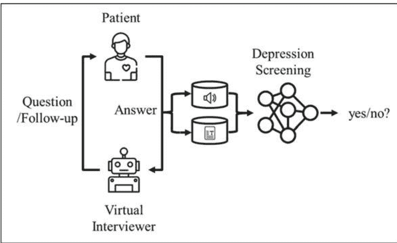

图1 通过一个虚拟代理向患者提问核心问题和一系列后续问题来进行抑郁症筛查。 临床访谈的语音录音和转录文本被用作训练深度学习模型筛查抑郁症的输入。

### 1.3 问题定义和挑战

给定一组语音录音及其相应的转录文本，每个录音由患者对核心问题和一系列后续问题的回答以及患者的抑郁标签组成，我们的目标是确定深度学习模型需要多少后续回答才能实现最佳患者抑郁预测。 值得注意的是，我们使用单模态和多模态模型来使用音频和文本模态进行抑郁症筛查（图1）。

在长音频录音和长转录文本上训练顺序深度学习模型是具有挑战性的，因为这些模型可能会遇到消失问题 [13]。此外，长序列具有很高的计算成本，特别是在利用卷积神经网络（CNN）、循环神经网络（RNN）和转换器等大型深度学习架构时。

虽然较短的面试回答不会面临这些困难，但延长音频的后续回答可能包含了抑郁症分类所需的额外重要信息。 此外，患者可能不希望参与更长的面试，除非有必要。 因此，我们建议通过确定给定问题类型的最佳后续提示数量来解决这个问题。 此外，带有抑郁标签的大多数音频数据集都包含很小的样本量 [14]。 这使得从头开始训练深度学习模型变得困难。 因此，使用这些数据集训练的深度学习模型往往报告较低的评估指标 [15, 16]。

## 表1 核心问题数据集描述，按字母顺序排列

| 数据集 | 词袋模型 | 问题示例 | 计数 | 抑郁症(%) |
| --- | --- | --- | --- | --- |
| D1 | 建议，自己 | 你会给自己十年或二十年前的建议是什么？ | 102 | 28.43 |
| D2 | 任何事情，后悔 | 你有什么后悔的事情吗？ | 94 | 29.79 |
| D3 | 争论，某人 | 你上次和某人争论是什么时候，争论的内容是什么？ | 103 | 29.13 |
| D4 | 控制，脾气 | 你在控制自己的脾气方面如何？ | 100 | 30.00 |
| D5 | 被诊断出，抑郁症 | 你被诊断出患有抑郁症吗？ | 94 | 21.28 |
| D6 | 今天，做什么 | 你今天过得怎么样？ | 105 | 28.57 |
| D7 | 梦想，工作 | 你的梦想工作是什么？ | 95 | 30.53 |
| D8 | 容易，睡觉 | 你容易入睡吗？ | 98 | 27.55 |
| D9 | 最近，感觉 | 你最近感觉怎么样？ | 92 | 29.35 |
| D10 | 朋友，描述 | 你最好的朋友会如何描述你？ | 96 | 26.04 |
| D11 | 最后，快乐 | 你上次感到非常快乐是什么时候？ | 99 | 28.28 |
| D12 | 骄傲，生活 | 你在生活中最引以为傲的是什么？ | 99 | 28.28 |
| D13 | 学习，学校 | 你在学校学习什么？ | 95 | 30.53 |
| D14 | 旅行，很多 | 你经常旅行吗？ | 94 | 27.66 |

## 1.4 我们的方法和贡献

在这项研究中，我们探索了单模态和多模态深度学习模型所需的后续问题数量，以获得最佳的抑郁症筛查结果。 之前，我们仅使用音频分类模型 [17] 探索了适当数量的后续问题。 这项当前研究是一个扩展，因为我们现在还利用了单模态和多模态模型中的面试记录。 因此，在这项工作中，我们评估了音频和转录文本以及单模态和多模态模型的比较抑郁症筛查能力。 除此之外，我们还评估了各种临床面试问题的适当后续回答数量。

具体而言，我们在流行的Distress Analysis Interview Corpus-Wizard-of-Oz (DAIC-WOZ) [4, 8, 18] 上对14个临床面试问题的不同数量的后续回答进行了模型训练。 我们通过利用预先在大型音频或文本语料库上训练的迁移学习模型来解决上述小样本量的挑战。 此外，为了适应更长的音频和转录回答，我们在单模态和多模态模型中使用了自注意力机制。

我们的贡献包括：

- 1. 从DAIC-WOZ临床访谈中提取后续问题和答案的方法论实施。
- 2. 利用最先进的深度学习模型对音频录音和文本转录进行分类。
- 3. 通过向预训练模型添加自注意力来控制长音频录音的效果。
- 4. 比较单模态和多模态模型的抑郁筛查能力。
- 5. 测量后续提示对不同核心访谈问题的抑郁筛查分类模型的边际效应。

## 2 相关工作

先前的研究使用许多不同的模态和方法检测抑郁。除了在分类模型中使用单个模态外，使用文本、音频或图像作为输入的多模态学习分类 [19] 在过去十年中变得流行起来。 不同的模态由于数据的复杂性，为机器学习和深度学习引入了不同的挑战 [20]。 在抑郁检测领域，机器学习算法在处理小样本量时表现良好，因此历史上更受青睐 [21，22]。 然而，迁移学习 [23] 使得深度学习架构能够在分类较小数据集时取得成功。

### 2.3 使用后续问题的相关工作

虚拟代理人已经使用后续问题在健康应用中获得高度的自我披露[4,18,53]。据我们所知，还没有对使用不同的后续问题和答案对多模态模型进行抑郁症分类的效果进行评估。这项研究是我们之前只使用深度迁移学习模型对音频进行分类的工作的延伸[17]。

## 3 个数据集和分类方法

在本节中，我们描述了DAIC-WOZ临床访谈数据集。此外，我们提供核心问题、后续问题和累积后续答案的示例 - 后者是深度学习模型的输入。

### 3.1 数据集描述

DAIC-WOZ访谈旨在支持抑郁症的诊断[4]。这个数据集是由一个虚拟代理人采访人们收集的，以便可以用来识别心理疾病的口头和非口头指标[18]。数据收集自189名参与者，包括与抑郁筛查分数标记的互动音频，互动时间在7到33分钟之间（平均16分钟）。

这些分数是通过进行患者健康问卷（PHQ-8）的前八个问题获得的[1]。抑郁筛查分数是所有PHQ-8问题的总和，范围从0到24。我们根据常见的筛查阈值10 [1]，在（1）中确定患者是否抑郁。

```
标签 = \begin{cases} 1, 如果分数 \ge 10. \\ 0, 否则 \end{cases} \quad \text{(1)}
```

## 识别核心问题和后续问题的方法

DAIC-WOZ数据集中有15个核心问题，至少有90个参与者的回应实例，我们对其中的14个问题进行了实验，这些问题有后续问题。

除了每个核心问题外，还有一组后续问题，以确保与每个患者进行真实对话和自我披露[18, 53]。虚拟代理可以从六种类型的后续问题中选择[18]: 神经反馈，积极共情，消极共情，惊讶回应，继续提示，及其他。例如，虚拟代理可以使用“你能告诉我更多关于这个吗？”作为继续提示。Table2包含每种后续提示选项的数量和示例。

方法论的一个重要部分是将核心问题和后续问题分开，因为不同参与者的访谈中问题措辞可能有所不同。为此，我们采用了一种词袋模型的方法，使用名词和动词对来识别每个核心问题。例如，问题“你有什么后悔的事吗？”可以通过词对“什么，后悔”来识别。如果核心问题包含了一个“词袋”集合，我们将其归类为核心问题，否则归类为后续问题。

接下来，我们为每个参与者的每个核心问题和后续问题构建一个音频文件，并按时间戳排序。然后，我们使用自然语言处理工具包[54]来实现这种词袋模型的方法。在生成后续音频之后，我们可以从中提取文本，然后生成后续问题的转录。我们使用SpeechRecognition库[55]来实现这个流程。

Table1包含每个核心问题及其词袋和回答该问题的参与者数量。Figure2显示了每个核心问题的后续问题数量和后续答案持续时间的分布。每个核心问题的后续提示的中位数在4到5之间。后续答案的音频长度的中位数约为2秒。

### 3.3 提取累积后续答案的方法

对于给定的核心问题 q₁，患者 p 分别回答一系列问题 qᵢ 与他或她的回答 aᵢ：

```
p = {(q₁, a₁), (q₂, a₂), ..., (qₙ, aₙ)}
```

然后，我们定义累积后续答案由所有答案组成从a₁到 aₜ

```
a_{1:t} = (a_1 \circ a_2 \circ a_3 \circ \cdots \circ a_t)
```

其中 t ≤ n，且“∘”表示音频片段的连接。例如，图 3a 显示了一个具有三个问题和三个答案的患者的集合 p。在右侧的图3b中，我们可以看到构建的四个不同累积答案的示例。

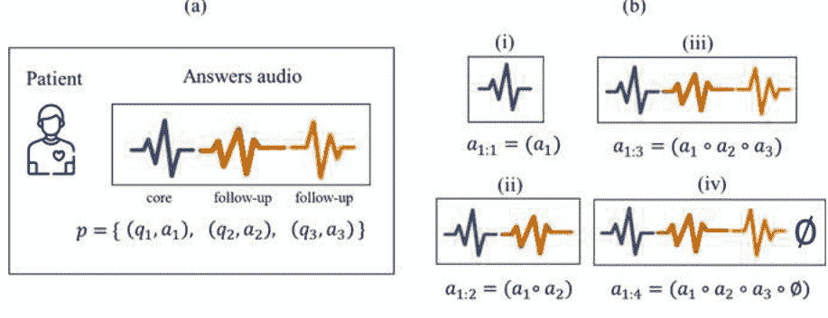

图3 累积后续答案示例：a显示了一个具有三个问题和答案的患者音频波形，b显示了四个不同累积答案的示例，其中 (i) 只是核心问题的答案， (ii) 是答案一和答案二的连接， (iii) 是所有三个答案的连接， (iv) 是患者没有第四个后续答案的情况。

> [17]. 一旦形成，转录本是从这些不同长度的音频波中派生出来的。

这个病人。例子 (i) $ a_{1:1} $ 只包含第一个答案，即核心问题的答案， (ii) 连接第一个和第二个答案。有趣的情况是 (iv)，其中累积的后续答案设置为四，但由于这个病人没有第四个答案，我们添加一个空的音频来构建 $ a_{1:4} $。

### 3.4 音频分类的深度学习方法

对于语音录音，我们使用流行的预训练音频架构 VGGish [44] 来创建音频特征嵌入。VGGish 将语音片段转换为经过多层卷积网络处理的对数 Mel 频谱图，以提取每秒钟语音的大小为 128 的嵌入向量，形成一个可以用于分类的 2D 数组。我们还尝试了 VGGish 方法的一个变体，包括在 VGGish 的嵌入之上添加了一个长短期记忆（LSTM）[56] 层。为了捕捉音频片段之间的更长关系，我们在 LSTM 之上添加了自注意力[58]，然后称之为 VGGish Attention 模型。

对于实现，我们使用交叉熵损失函数，Adam 优化器，学习率为 $ 2e^{-5} $，步长为 $ 2e^{-8} $。

### 3.5 文本分类的深度学习方法

顺序深度学习模型可以捕捉语言建模中的复杂语义信息。例如，循环神经网络（RNN），长短期记忆（LSTM）[56] 和门控循环单元（GRU）[59] 已经成功地在大型数据集上用于文本分类。然而，最近的 Transformer 模型已经成为文本分类中的最先进技术，适用于较小的文本。特别是，著名的双向编码器表示变换（BERT）模型[49] 在分类较小的文本数据集时展示了以前无法达到的成功。

因此，对于转录本，我们使用 BERT 创建文本特征嵌入。值得注意的是，预训练的 BERT 模型可以通过在 CLS 标记之上添加额外的线性层进行微调，该标记编码了语义表示。BERT 使用注意力机制来捕捉单词之间更好的关系，然而，如果句子太长，BERT 可能无法获取这些关系。因此，我们还在 BERT 的隐藏层之上实现了一个双向 LSTM，以捕捉转录本中更长的关系，我们称之为 BERT LSTM 模型。我们对 BERT 模型使用与 VGGish 模型相同的超参数。

### 3.6 多模态深度学习分类方法

正如前面提到的，我们使用 VGGish 进行音频分类，使用 BERT 进行转录分类。因此，多模态迁移学习的一个直接解决方案就是将它们的嵌入组合在一个单一模型中，我们称之为 BERT VGGish。对于这种组合，我们只需通过线性融合层将文本和音频嵌入连接起来，用于二元分类。请注意，VGGish 组件没有注意力层，BERT 组件没有 LSTM 层。

最近，提出了音频辅助 BERT（AudiBERT）[12] 用于语音分类。与我们的直接解决方案类似，这种深度迁移学习多模态分类框架也通过线性融合层将音频和文本的隐藏表示连接起来。然而，AudiBERT 还在音频和文本嵌入之上包括了一个双向 LSTM 和自注意力机制。虽然 AudiBERT 框架将 BERT 与三种最先进的音频迁移学习模型之一结合起来，但 VGGish 在处理长序列的抑郁症分类中表现最成功。

因此，我们还使用 BERT 和 VGGish 组件实现了 AudiBERT。

### 3.7 分类评估

虽然准确率是分类任务中最常用的指标，但在医疗保健领域，重视真阳性数量的 F1 得分更受青睐。此外，与 F1 得分不同，准确率不适用于不平衡的数据。如表 1 所示，约 30% 的参与者被筛查出抑郁症阳性。因此，我们使用式（4）中定义的 F1 得分作为评估模型的指标。

```
F1 = 2真阳性 / (2真阳性 + 假阳性 + 假阴性)
```

其中，真阳性表示真阳性数量，假阳性表示假阳性数量，假阴性表示假阴性数量。为了模型评估，我们通过随机分层抽样从每个数据集中选择 20% 的样本组成测试集。在训练模型之前，我们使用上采样方法平衡了训练集。每个模型配置运行十次，使用随机初始化的权重，并报告五个最高 F1 得分的平均值和标准差。为了防止过拟合，在训练过程中使用了提前停止策略。

## 4 实验研究与分析

### 4.1 实验设置

这些实验的目标是测量跟进回答对 14 个核心问题的影响。为此，我们定义了累积答案为 (3)，并通过 $ t \in \{1, 2, 3, 4, 5, n\} $ with $ n = 20 $ 来探索跟进回答的数量。
如图 2 所示，很少有超过 10 个跟进问题，所以我们慷慨地将最大跟进问题数设置为 20。
我们利用著名的 VGGish 模型以及 VGGish Attention 模型来捕捉更长音频片段中的关系。然后，我们对转录文本实施 BERT 和 BERT LSTM，对于多模态，我们利用 BERT VGGish 和最新的 AudiBERT。

### 4.2 聚合结果

表 3 和图 4 显示了对所有 14 个数据集的跟进问题的影响。总体而言，VGGish Attention、BERT LSTM 和 AudiBERT 在每个跟进回答数量上的表现都优于其他模型。因此，最佳的筛查结果来自于结合了额外注意力和 / 或 LSTM 层的模型。
特别是，使用一个 $ \alpha_{1:2} $ 到三个 $ \alpha_{1:4} $ 的后续问题 $ \alpha_{1:1} $ 效果最好。最高的平均 $ F1 $ 分数是 BERT LSTM 模型，值为 0.72，$ \alpha_{1:4} $。然而，多模态 AudiBERT 的平均 $ F1 $ 相似。
0.71，只有一个后续问题 $ \alpha_{1:2} $。VGGish Attention 模型也表现最佳。

表 3 所有 14 个数据集和后续问题的 $ F1 $ 分数的平均值 ± 标准差。音频、
转录和多模态测试

| 模型 | 模态 | 累积后续回答 |
| --- | --- | --- |
|  |  | $ a_{1:1} $ | $ a_{1:2} $ | $ a_{1:3} $ | $ a_{1:4} $ | $ a_{1:5} $ | $ a_{1:n} $ |
| VGGish | 音频 | 0.60 ± 0.19 | 0.65 ± 0.09 | **0.65 ± 0.11** | 0.64 ± 0.12 | 0.63 ± 0.13 | 0.64 ± 0.10 |
| VGGish Att. | 音频 | 0.65 ± 0.09 | **0.69 ± 0.05** | 0.68 ± 0.08 | 0.69 ± 0.05 | 0.69 ± 0.07 | 0.68 ± 0.08 |
| BERT | 转录 | **0.58 ± 0.13** | 0.56 ± 0.13 | 0.52 ± 0.17 | 0.56 ± 0.15 | 0.56 ± 0.15 | 0.58 ± 0.15 |
| BERT LSTM | 转录 | 0.66 ± 0.08 | 0.69 ± 0.08 | 0.70 ± 0.09 | **0.72 ± 0.08** | 0.70 ± 0.06 | 0.69 ± 0.09 |
| BERT VGGish | 多模态 | 0.56 ± 0.18 | 0.60 ± 0.12 | 0.58 ± 0.14 | 0.59 ± 0.12 | 0.58 ± 0.11 | **0.62 ± 0.11** |
| AudiBERT | 多模态 | 0.66 ± 0.08 | **0.71 ± 0.07** | 0.70 ± 0.07 | 0.67 ± 0.07 | 0.67 ± 0.09 | 0.70 ± 0.10 |

#### 4.2.1 音频模型

由于 VGGish 模型在应用于长序列时表现不佳[13]，将累积答案连接起来作为深度模型的输入可能会影响这些模型的性能。然而，VGGish Attention 模型在较长的音频序列上的性能下降不会像预期的那么严重。事实上，如图 5 所示的结果显示，VGGish Attention 模型在较长的音频上的性能没有下降。此外，对于每个后续回答的数量，VGGish Attention 模型的性能优于 VGGish 模型。例如，累积答案 $ \alpha_{1:2} $ 的 VGGish 模型的平均 F1 分数为 0.65，VGGish Attention 模型为 0.69。此外，VGGish Attention 模型表现出较低的方差，这使我们对模型的稳健性更有信心。值得注意的是，这两个音频模型在 $ \alpha_{1:1} $ 和 $ \alpha_{1:2} $ 之间的平均 F1 分数有显著增加，这可能表明仅仅对核心问题的回答不足以筛选出抑郁症的音频。

#### 4.2.2 文本模型

BERT 是文本分类的最先进模型，然而，当我们把 BERT 应用于转录分类时，结果显示平均 F1 得分较低，最大值为 0.58，如表 3 和图 6 所示。另一方面，BERT LSTM 在相同的输入信息下具有更好的性能，令人印象深刻的平均 F1 得分为 0.72，$ \alpha $ 为 1.40。它们之间的区别可以通过双向 LSTM 来解释，因为 DAIC-WOZ 数据集包含短和长的转录。

#### 4.2.3 多模型

多模态结果见图 7。BERT VGGish 模型的 F1 得分不高，最高值为 0.62。这意味着仅仅将使用不同模态的两个最先进的模型组合在一起并不能保证获得更好的结果。
与此同时，在图 7 的右侧，最近的 AudiBERT 模型取得了令人印象深刻的结果，最高平均 F1 得分为 0.71，$ \alpha $ 为 1:2。然而，$ \alpha $ 为 1:3 和 $ \alpha $ 为 1:n 也具有较高的平均 F1 得分，为 0.70。与 VGGish Attention 模型类似，添加双向 LSTM 和自注意力有助于捕捉音频和转录中的序列关系。因此，虽然使用所有后续问题的回答对平均 F1 得分没有太大影响，但使用单个后续问题（$ \alpha $ 为 1:2）就足以使用 AudiBERT 进行抑郁症筛查。

### 4.3 每个核心问题的结果

在表 4、5、6、7、8 和 9 中，我们通过测量累积答案对每个核心问题的影响来深入研究上述结果。获得最高 F1 分数所需的跟进答案数量因问题而异。对于某些核心问题，我们不需要跟进问题，而其他核心问题的最佳结果需要所有跟进回答。

个别核心问题的最高平均 F1 分数为 0.89。AudiBERT 在核心问题 D13（学习，学校）的所有跟进问题上实现了这一成绩。BERT LSTM 在核心问题 D13 的所有跟进转录中表现出色，平均 F1 分数为 0.82。相比之下，VGGish Attention 在对 D9（感觉，最近）的四个跟进问题上实现了最高平均 F1 分数为 0.78。然而，这只是略高于 D1（建议，你自己）的平均 F1 得分 0.77。因此，VGGish Attention 仅使用 $ \alpha_{1:1} $ 获得了最高的平均 F1 得分。

#### 4.3.1 音频模型

在表 5 中，我们注意到累积跟进答案与 F1 得分之间存在正负关系。D5 和 D6 中出现了一些正向趋势的例子。这些问题的跟进数量较少，音频较短。

## 表5 VGGish注意力：根据数据集和累积跟进答案数量[17]计算的F1分数的平均值±标准差

| 数据集 | 累积跟进答案 |
|---|---|
|  | a1:1 | a1:2 | a1:3 | a1:4 | a1:5 | a1:n |
| D1 | 0.77 ± 0.02 | 0.70 ± 0.01 | 0.71 ± 0.02 | 0.70 ± 0.01 | 0.72 ± 0.02 | 0.70 ± 0.02 |
| D2 | 0.61 ± 0.03 | 0.73 ± 0.02 | 0.70 ± 0.02 | 0.72 ± 0.02 | 0.72 ± 0.02 | 0.73 ± 0.02 |
| D3 | 0.58 ± 0.06 | 0.71 ± 0.01 | 0.68 ± 0.02 | 0.68 ± 0.02 | 0.67 ± 0.01 | 0.69 ± 0.02 |
| D4 | 0.72 ± 0.02 | 0.72 ± 0.02 | 0.71 ± 0.04 | 0.72 ± 0.02 | 0.72 ± 0.01 | 0.71 ± 0.01 |
| D5 | 0.49 ± 0.17 | 0.60 ± 0.02 | 0.46 ± 0.07 | 0.62 ± 0.09 | 0.55 ± 0.08 | 0.50 ± 0.07 |
| D6 | 0.68 ± 0.05 | 0.74 ± 0.02 | 0.76 ± 0.02 | 0.72 ± 0.01 | 0.74 ± 0.04 | 0.74 ± 0.03 |
| D7 | 0.68 ± 0.01 | 0.68 ± 0.01 | 0.72 ± 0.02 | 0.70 ± 0.02 | 0.73 ± 0.03 | 0.74 ± 0.04 |
| D8 | 0.59 ± 0.04 | 0.69 ± 0.05 | 0.69 ± 0.03 | 0.73 ± 0.04 | 0.63 ± 0.02 | 0.63 ± 0.02 |
| D9 | 0.66 ± 0.06 | 0.71 ± 0.01 | 0.73 ± 0.03 | 0.74 ± 0.02 | 0.78 ± 0.03 | 0.75 ± 0.02 |
| D10 | 0.61 ± 0.08 | 0.65 ± 0.03 | 0.60 ± 0.07 | 0.63 ± 0.02 | 0.60 ± 0.06 | 0.59 ± 0.07 |
| D11 | 0.67 ± 0.02 | 0.74 ± 0.03 | 0.72 ± 0.03 | 0.69 ± 0.02 | 0.75 ± 0.03 | 0.75 ± 0.04 |
| D12 | 0.67 ± 0.01 | 0.73 ± 0.03 | 0.70 ± 0.02 | 0.68 ± 0.03 | 0.69 ± 0.06 | 0.69 ± 0.02 |
| D13 | 0.65 ± 0.03 | 0.71 ± 0.03 | 0.69 ± 0.03 | 0.73 ± 0.05 | 0.71 ± 0.02 | 0.72 ± 0.01 |
| D14 | 0.67 ± 0.09 | 0.60 ± 0.09 | 0.60 ± 0.02 | 0.61 ± 0.06 | 0.62 ± 0.05 | 0.57 ± 0.05 |

## 表6 BERT：根据数据集和累积跟进答案数量计算的F1分数的平均值±标准差 从BERT模型中根据数据集和累积跟进答案数量计算的F1分数

| 数据集 | 累积跟进答案 |
|---|---|
|  | a1:1 | a1:2 | a1:3 | a1:4 | a1:5 | a1:n |
| D1 | 0.68 ± 0.06 | 0.62 ± 0.04 | 0.19 ± 0.08 | 0.33 ± 0.11 | 0.61 ± 0.13 | 0.34 ± 0.09 |
| D2 | 0.63 ± 0.04 | 0.65 ± 0.04 | 0.65 ± 0.05 | 0.71 ± 0.02 | 0.72 ± 0.03 | 0.72 ± 0.03 |
| D3 | 0.32 ± 0.22 | 0.48 ± 0.07 | 0.64 ± 0.03 | 0.64 ± 0.03 | 0.64 ± 0.04 | 0.67 ± 0.09 |
| D4 | 0.49 ± 0.03 | 0.49 ± 0.12 | 0.47 ± 0.03 | 0.44 ± 0.14 | 0.40 ± 0.06 | 0.35 ± 0.11 |
| D5 | 0.67 ± 0.00 | 0.67 ± 0.00 | 0.67 ± 0.00 | 0.68 ± 0.04 | 0.68 ± 0.04 | 0.69 ± 0.06 |
| D6 | 0.74 ± 0.07 | 0.72 ± 0.03 | 0.71 ± 0.00 | 0.71 ± 0.00 | 0.74 ± 0.04 | 0.72 ± 0.03 |
| D7 | 0.70 ± 0.03 | 0.71 ± 0.02 | 0.68 ± 0.02 | 0.66 ± 0.05 | 0.69 ± 0.00 | 0.70 ± 0.01 |
| D8 | 0.58 ± 0.07 | 0.51 ± 0.05 | 0.51 ± 0.07 | 0.49 ± 0.09 | 0.47 ± 0.05 | 0.46 ± 0.01 |
| D9 | 0.51 ± 0.03 | 0.57 ± 0.05 | 0.46 ± 0.04 | 0.60 ± 0.06 | 0.64 ± 0.02 | 0.77 ± 0.03 |
| D10 | 0.58 ± 0.02 | 0.27 ± 0.07 | 0.41 ± 0.04 | 0.49 ± 0.10 | 0.39 ± 0.04 | 0.48 ± 0.06 |
| D11 | 0.60 ± 0.05 | 0.41 ± 0.06 | 0.23 ± 0.06 | 0.39 ± 0.14 | 0.37 ± 0.03 | 0.56 ± 0.04 |
| D12 | 0.61 ± 0.05 | 0.53 ± 0.06 | 0.59 ± 0.08 | 0.57 ± 0.05 | 0.49 ± 0.11 | 0.42 ± 0.09 |
| D13 | 0.41 ± 0.04 | 0.54 ± 0.06 | 0.49 ± 0.10 | 0.45 ± 0.19 | 0.47 ± 0.21 | 0.56 ± 0.11 |
| D14 | 0.66 ± 0.04 | 0.70 ± 0.08 | 0.64 ± 0.03 | 0.63 ± 0.02 | 0.60 ± 0.07 | 0.66 ± 0.03 |

## 表7 BERT LSTM：平均值 ± 标准差 F 按数据集和累积跟进答案数量划分

| 数据集 | a1:1 | a1:2 | a1:3 | a1:4 | a1:5 | a1:n |
| --- | --- | --- | --- | --- | --- | --- |
| D1 | 0.70 ± 0.01 | 0.67 ± 0.05 | 0.72 ± 0.05 | 0.75 ± 0.04 | 0.70 ± 0.02 | 0.73 ± 0.04 |
| D2 | 0.69 ± 0.00 | 0.71 ± 0.00 | 0.70 ± 0.04 | 0.73 ± 0.04 | 0.71 ± 0.04 | 0.70 ± 0.02 |
| D3 | 0.62 ± 0.06 | 0.66 ± 0.02 | 0.58 ± 0.12 | 0.59 ± 0.11 | 0.66 ± 0.03 | 0.70 ± 0.04 |
| D4 | 0.64 ± 0.03 | 0.70 ± 0.02 | 0.73 ± 0.06 | 0.71 ± 0.02 | 0.68 ± 0.02 | 0.71 ± 0.04 |
| D5 | 0.66 ± 0.09 | 0.70 ± 0.14 | 0.71 ± 0.14 | 0.76 ± 0.12 | 0.69 ± 0.09 | 0.76 ± 0.02 |
| D6 | 0.78 ± 0.06 | 0.79 ± 0.05 | 0.81 ± 0.02 | 0.79 ± 0.04 | 0.76 ± 0.03 | 0.81 ± 0.06 |
| D7 | 0.71 ± 0.03 | 0.70 ± 0.02 | 0.72 ± 0.02 | 0.72 ± 0.06 | 0.73 ± 0.03 | 0.71 ± 0.02 |
| D8 | 0.59 ± 0.04 | 0.68 ± 0.07 | 0.71 ± 0.06 | 0.67 ± 0.05 | 0.67 ± 0.04 | 0.51 ± 0.08 |
| D9 | 0.76 ± 0.05 | 0.68 ± 0.04 | 0.69 ± 0.03 | 0.68 ± 0.03 | 0.67 ± 0.01 | 0.64 ± 0.06 |
| D10 | 0.53 ± 0.08 | 0.55 ± 0.08 | 0.61 ± 0.04 | 0.76 ± 0.06 | 0.63 ± 0.05 | 0.62 ± 0.02 |
| D11 | 0.60 ± 0.02 | 0.75 ± 0.08 | 0.66 ± 0.11 | 0.74 ± 0.09 | 0.69 ± 0.05 | 0.66 ± 0.02 |
| D12 | 0.61 ± 0.07 | 0.61 ± 0.03 | 0.64 ± 0.02 | 0.66 ± 0.04 | 0.71 ± 0.08 | 0.67 ± 0.03 |
| D13 | 0.72 ± 0.03 | 0.75 ± 0.02 | 0.70 ± 0.01 | 0.74 ± 0.02 | 0.79 ± 0.04 | 0.82 ± 0.07 |
| D14 | 0.67 ± 0.02 | 0.77 ± 0.04 | 0.75 ± 0.09 | 0.78 ± 0.08 | 0.70 ± 0.08 | 0.65 ± 0.09 |

## 表8 BERT VGGish：平均值±标准差 F 按数据集和跟进划分

| 数据集 | a1:1 | a1:2 | a1:3 | a1:4 | a1:5 | a1:n |
| --- | --- | --- | --- | --- | --- | --- |
| D1 | 0.68 ± 0.03 | 0.71 ± 0.03 | 0.48 ± 0.15 | 0.66 ± 0.05 | 0.58 ± 0.11 | 0.40 ± 0.16 |
| D2 | 0.60 ± 0.02 | 0.66 ± 0.05 | 0.62 ± 0.04 | 0.67 ± 0.09 | 0.66 ± 0.04 | 0.72 ± 0.04 |
| D3 | 0.05 ± 0.07 | 0.55 ± 0.03 | 0.66 ± 0.03 | 0.64 ± 0.02 | 0.60 ± 0.06 | 0.61 ± 0.04 |
| D4 | 0.51 ± 0.03 | 0.47 ± 0.03 | 0.63 ± 0.07 | 0.46 ± 0.10 | 0.53 ± 0.05 | 0.58 ± 0.06 |
| D5 | 0.65 ± 0.03 | 0.68 ± 0.04 | 0.67 ± 0.00 | 0.70 ± 0.05 | 0.67 ± 0.00 | 0.68 ± 0.04 |
| D6 | 0.71 ± 0.00 | 0.76 ± 0.06 | 0.72 ± 0.03 | 0.71 ± 0.00 | 0.71 ± 0.00 | 0.71 ± 0.00 |
| D7 | 0.65 ± 0.05 | 0.61 ± 0.07 | 0.70 ± 0.02 | 0.69 ± 0.00 | 0.69 ± 0.00 | 0.69 ± 0.00 |
| D8 | 0.53 ± 0.03 | 0.54 ± 0.03 | 0.59 ± 0.09 | 0.52 ± 0.07 | 0.53 ± 0.08 | 0.43 ± 0.03 |
| D9 | 0.56 ± 0.12 | 0.56 ± 0.04 | 0.46 ± 0.02 | 0.62 ± 0.06 | 0.54 ± 0.05 | 0.65 ± 0.02 |
| D10 | 0.47 ± 0.21 | 0.38 ± 0.07 | 0.46 ± 0.05 | 0.60 ± 0.08 | 0.52 ± 0.11 | 0.63 ± 0.07 |
| D11 | 0.64 ± 0.04 | 0.51 ± 0.09 | 0.25 ± 0.12 | 0.36 ± 0.14 | 0.41 ± 0.06 | 0.61 ± 0.10 |
| D12 | 0.63 ± 0.02 | 0.63 ± 0.02 | 0.60 ± 0.04 | 0.58 ± 0.11 | 0.51 ± 0.13 | 0.55 ± 0.09 |
| D13 | 0.42 ± 0.02 | 0.53 ± 0.09 | 0.56 ± 0.11 | 0.46 ± 0.11 | 0.51 ± 0.16 | 0.70 ± 0.02 |
| D14 | 0.71 ± 0.07 | 0.75 ± 0.06 | 0.75 ± 0.04 | 0.63 ± 0.01 | 0.61 ± 0.06 | 0.66 ± 0.08 |

## 表9 AudiBERT：平均值 ± 标准差 F1 AudiBERT模型的得分 按数据集和跟进划分

| 数据集 | 累积跟进答案 |
|---|---|
| | $a_{1:1}$ | $a_{1:2}$ | $a_{1:3}$ | $a_{1:4}$ | $a_{1:5}$ | $a_{1:n}$ |
| D1 | 0.67 ± 0.00 | 0.70 ± 0.02 | 0.63 ± 0.07 | 0.54 ± 0.09 | 0.44 ± 0.07 | 0.63 ± 0.04 |
| D2 | 0.66 ± 0.01 | 0.76 ± 0.02 | 0.84 ± 0.04 | 0.73 ± 0.01 |

## 5 讨论

### 5.1 应用影响

这项研究对虚拟心理疾病筛查的未来具有重要意义。虚拟代理不仅可以进行完整的临床访谈，供临床医生分析，还可以为深度学习模型提供输入，以进行心理疾病筛查，从而减少所需的临床医生时间和成本。

正如我们的结果所示，仅通过回答问题“你今天过得怎么样？”就可以达到F1值为0.78。因此，心理疾病筛查的未来可能只需要患者的一段语音记录。通过语音片段进行这种筛查可以通过移动设备快速部署，这正是其他研究正在探索的方向[10, 11, 30, 52]。

然而，通过后续问题，我们甚至能够获得更高的F1值。例如，添加几个后续问题可以将F1值提高到0.81，对于问题“你今天过得怎么样？”进一步地，我们通过与AudiBERT进行长时间对话，获得了更高的F1值，达到了0.89，针对问题“你在学校学了什么？”因此，我们的研究结果为选择各种筛查应用的音频提示提供了宝贵的信息。

### 5.2 临床访谈持续时间与模型性能

我们的方法表明，针对每个核心问题应该提出的后续问题的数量是与模态相关的，尽管结果是模态相关的。对于音频，核心问题“你会给自己十年或二十年前的建议是什么？”是访谈持续时间和模型性能之间的完美平衡，因为它只需要一个后续回答就能达到F1得分为0.77。对于文本和多模态

### 5.3 小样本量

DAIC-WOZ数据集使我们能够确定后续问题和答案，但是也存在一些缺点。首先，并非所有参与者都被问到相同的核心问题。我们可以通过仅使用具有相同核心问题的参与者来控制不同参与者的影响。然而，这将减小数据集的规模，因为DAIC-WOZ已经只包含有限数量的参与者每个问题（表1）。虽然我们通过利用预训练的深度学习模型克服了小样本量的挑战，但是使用更大的数据集可能会使这种迁移学习模型在抑郁症筛查结果方面取得更好的效果。更大的数据集还将允许探索表2中哪种类型的后续问题对语音记录的预测能力最有贡献。

## 6 结论

我们提出了一种方法来衡量在虚拟临床访谈期间收集到的追问问题对抑郁症筛查的影响。注意力和LSTM层提高了单模态和多模态模型在DAIC-WOZ数据集中对14个最常问的核心问题的综合性能。当在所有数据集上聚合结果时，BERT LSTM在核心问题和三个追问问题的回答中获得了最高的平均F1分数。虽然最佳音频模型不需要追问问题，但追问问题提高了最佳文本和多模态模型的抑郁症筛查能力。利用一个核心问题的所有追问回答，AudiBERT获得了最高的F1分数0.89。通过分析每个核心问题的结果，我们提供了在虚拟临床访谈持续时间和模型性能之间权衡的实际解决方案。我们的发现对于虚拟心理疾病筛查的未来具有重要价值。

致谢我们感谢富布赖特外国学生项目、国家研究与发展署（ANID）/奖学金计划/博士奖学金智利/2015-56150007、美国教育部P200A150306：GAANN资助、AFRI资助1023720以及WPI数据科学系的财务支持。结果是通过使用由NSF MRI资助DMS-1337943获得的HPC获得的。我们感谢WPI的Nima Kordzadeh教授、Mohamed Eltabakh教授以及DAISY研究实验室的建议和支持。

## 参考文献

1. Kroenke, K., Spitzer, R.L., Williams, J.B.: The phq-9: validity of a brief depression severity measure. J. Gen. Intern. Med. 16(9), 606–613 (2001)  
2. N.A. on Mental Illness, “Mental health by the numbers” (2019)  
3. 卫生资源和服务管理局卫生劳动力局，美国卫生与人类服务部，“指定的卫生专业短缺地区统计数据：指定的HPSA季度总结” (2021年)  
4. Gratch, J., Artstein, R., Lucas, G.M., Stratou, G., Scherer, S., Nazarian, A., Wood, R., Boberg, J., DeVault, D., Marsella, S.等：“人类和计算机访谈的困扰分析访谈语料库。” 在：语言资源与评估，第3123-3128页。CiteSeer（2014年）  
5. C zeisler, M., Lane, R.I., Petrosky, E., Wiley, J.F., Christensen, A., Njai, R., Weaver, M.D., Robbins, R., Facer-Childs, E.R., Barger, L.K.等：“新冠疫情期间的心理健康、物质使用和自杀意念-美国，2020年6月24日至30日。” 在：疾病和死亡周报，第69卷，第32期（2020年）  
6. Hamouche, S.: Covid-19和员工的心理健康：压力因素，调节因素和组织行动议程。 Emerald Open Research (2020)  
7. Dwyer, D.B., Falkai, P., Koutsouleris, N.: 临床心理学和精神病学的机器学习方法。年度综述临床心理学 14，91-118（2018年）  
8. Ringeval, F., Schuller, B., Valstar, M., Cummins, N., Cowie, R., Tavabi, L., Schmitt, M., Alisamir, S., Amiriparian, S., Messner, E.-M.等：Avec 2019研讨会和挑战：心态，通过AI检测抑郁症和跨文化情感识别。 在：第9届国际音频/视觉情感挑战和研讨会论文集，第3-12页（2019年）  
9. Rodrigues Makiuchi, M., Warnita, T., Uto, K., Shinoda, K.： bert-cn和门控CNN表示的多模态融合用于抑郁症检测。在：Avec，第55-63页（2019年）  
10. Tlachac, M., Toto, E., Lovering, J., Kayastha, R., Taurich, N., Rundensteiner, E.： Emu：早期心理健康发现框架和数据集。 在：第20届国际机器学习应用大会（ICMLA）特别会议：健康中的机器学习（2021年）  
11. Tlachac, M.L., Flores, R., Reisch, M., Kayastha, R., Taurich, N., Melican, V., Bruneau, C., Caouette, H., Lovering, J., Toto, E., Rundensteiner, E.： Studentsadd：在冠状病毒大流行期间快速移动式抑郁症和自杀意念筛查大学生。 在：ACM互动，移动，可穿戴和普适技术上的ACM论文集。已接受  
12. Toto, E., Tlachac, M.L., Rundensteiner, E.A.： Audibert：用于抑郁症筛查的深度迁移学习多模态分类框架。 在：第30届ACM国际信息与知识管理会议（CIKM）应用研究轨道（2021年）  
13. Pascanu, R., Mikolov, T., Bengio, Y.：训练循环神经网络的困难。 在：机器学习国际会议，第1310-1318页。PMLR（2013）  
14. Cummins, N., Scherer, S., Krajewski, J., Schnieder, S., Epps, J., Quatieri, T.F.：使用语音分析进行抑郁症和自杀风险评估的综述。语音通信。 71，10-49（2015）  
15. Ma, X., Yang, H., Chen, Q., Huang, D., Wang, Y.：Depauidionet：一种用于基于音频的抑郁症分类的高效深度模型。 在：第6届国际音频/视觉情感挑战研讨会论文集（2016）  

16. Huang, K.-Y., Wu, C.-H., Su, M.-H., Kuo, Y.-T.：使用潜在情感结构模型从引发的语音响应中检测单相和双向抑郁症。IEEE Trans. Affect. Comput. (2018)  
17. Flores, R., Tlachac, M.L., Toto, E., Rundensteiner, E.A.：使用深度学习在临床访谈中进行抑郁筛查的后续问题。 在：2021年第20届IEEE国际机器学习与应用会议（ICMLA），第595-600页。IEEE (2021)  
18. DeVault, D., Artstein, R., Benn, G., Dey, T., Fast, E., Gainer, A., Georgila, K., Gratch, J., Hartholt, A., Lhommet M等：Simsensei kiosk：用于医疗决策支持的虚拟人类面试官。 在：2014年国际自主代理人和多代理人系统会议论文集，第1061-1068页(2014)  
19. Ramachandram, D., Taylor, G.W.：深度多模态学习：近期进展和趋势综述。IEEE信号处理杂志 34(6), 96-108页(2017)  
20. Baltrušaitis, T., Ahuja, C., Morency, L.-P.：多模态机器学习：调查和分类。IEEE Trans. Pattern Anal. Mach. Intell. 41(2), 423-443 (2018)  
21. Jordan, M.I., Mitchell, T.M.：机器学习：趋势、观点和前景。 Science 349(6245), 255-260 (2015)  
22. Dwyer, D.B., Falkai, P., Koutsouleris, N.：临床心理学和精神病学的机器学习方法。 Annu. Rev. Clin. Psychol. 14, 91-118 (2018)  
23. West, J., Ventura, D., Warnick, S.：春季研究报告：归纳转移的理论基础，第1卷，第08期。 Brigham Young University, College of Physical and Mathematical Sciences (2007)  
24. Asgari, M., Shafran, I., Sheeber, L.B.：从语音和口语表达中推断临床抑郁症。 在：IEEE国际机器学习信号处理研讨会（MLSP），第2014卷，第1-5页。IEEE (2014年)  
25. Toto, E., Foley, B.J., Rundensteiner, E.A.：通过子剪辑增强改善情感检测。 在：欧洲联合机器学习和知识发现数据库会议上，第37-52页。Springer (2018)  
26. Anagnostopoulos, C.-N., Iliou, T., Giannoukos, I.：从语音中识别情感的特征和分类器：2000年至2011年的调查。人工智能评论 43（2），155-177（2015年）  
27. Valstar, M., Gratch, J., Schuller, B., Ringeval, F., Lalanne, D., Torres Torres, M., Scherer, S., Stratou, G., Cowie, R., Pantic, M.：Avec 2016：抑郁症、情绪和情感识别研讨会。 在：第6届国际音频/视觉情感挑战研讨会论文集，第3-10页。ACM（2016年）  
28. Tlachac, M.L., Sargent, A., Toto, E., Paffenroth, R., Rundensteiner, E.：从音频信号中工程化特征进行抑郁症检测的拓扑数据分析。 在：2020年第19届IEEE国际机器学习与应用会议（ICMLA），页码302-307。IEEE(2020)  
29. Toto, E., Tlachac, M.L., Stevens, F., Rundensteiner, E.：使用滑动窗子剪辑进行基于音频的抑郁症筛查。 在：第19届IEEE国际机器学习与应用会议（ICMLA） (2020)  
30. Dogruçu, A., Perucic, A., Isaro, A., Ball, D., Toto, E., Rundensteiner, E.A., Agu, E., Davis-Martin, R., Boudreaux, E.：Moodable: 使用机器学习对语音样本进行即时抑郁症评估的可行性，同时利用回顾性收集的智能手机和社交媒体数据。 智能健康 17, 100118 (2020)  
31. McGinnis, E.W., Anderau, S.P., Hruschak, J., Gurchiek, R.D., Lopez-Duran, N.L., Fitzgerald, K., Rosenblum, K.L., Muzik, M., McGinnis, R.S.：给弱势儿童发声：机器学习分析儿童早期的焦虑和抑郁。 IEEE J. Biomed. Health Inform. 23(6), 2294-2301 (2019)  
32. Ak ay, M.B., O'guz, K.：语音情感识别：情感模型、数据库、特征、预处理方法、支持模态和分类器。 Speech Commun. 116, 56-76(2020)  
33. Chancellor, S., De Choudhury, M.：社交媒体上的心理健康状态预测技术方法：一项关键综述。 NPJ Digit. Med. 3(1), 1-11 (2020)  
34. Tlachac, M.L., Rundensteiner, E.: 使用回顾性收集的私人与公共文本进行抑郁症筛查。IEEE J. Biomed. Health Inform. 24(11) (2020)  
35. Tlachac, M.L., Toto, E., Rundensteiner, E.: 你让我感到沮丧：利用联系人子集中的文本预测抑郁症。 在：2019年IEEE EMBS国际生物医学与健康信息学会议（BHI），第1-4页。IEEE (2019年)  
36. Tlachac, M., Dixon-Gordon, K., Rundensteiner, E.: 使用短信筛查自杀意念。 在：2021年IEEE EMBS国际生物医学与健康信息学会议（BHI），第1-4页。IEEE (2021年)  
37. 自动构建词典以改善通过短信进行抑郁症筛查。提交中  
38. Venkataraman, D., Parameswaran, N.S.: 学生抑郁症检测的面部特征提取。纯应用数学国际期刊 118(7), 455-463 (2018)  
39. Sharifa, M., Goecke, R., Wagner, M., Epps, J., Breakspear, M, Parker G. et al.: 从快乐到临床抑郁: 使用自发语音进行情绪检测. 在: 第二十五届国际FLAIRS会议 (2012)  
40. Dibeklioğglu, H., Hammal, Z., Yang, Y., Cohn, J.F.: 临床访谈中抑郁症的多模态检测. 在: 2015年ACM国际多模态交互会议论文集, pp. 307-310. ACM (2015)  
41. Al Hanai, T., Ghassemi, M.M., Glass, J.R.: 使用音频/文本序列建模检测抑郁症的访谈. 在: Interspeech, pp. 1716-1720 (2018)  
42. 何, L., 陈, J.C.-W., 王, Z.: 使用具有注意机制的卷积神经网络从视频中自动识别抑郁症。 神经计算 422, 165-175 (2021年)  
43. 维克多, E., 阿加扬, Z.M., 斯图尔特, A.R., 克里斯蒂安, R.: 使用深度多模态神经网络和专用自动评估框架检测抑郁症。心理评估 31 (8), 1019 (1999年)  
44. 赫尔希, S., 乔杜里, S., 埃利斯, D.P., 杰梅克, J.F., 詹森, A., 摩尔, R.C., 普拉卡尔, M., 普拉特, D., 索罗斯, R.A., 塞伯尔德, B.等: 用于大规模音频分类的卷积神经网络架构。在: 2017年IEEE国际声学、语音和信号处理会议上, 第131-135页。IEEE (2017年)  
45. 谢, H., 维尔塔宁, T.: 基于类别标签嵌入的零样本音频分类。 在: IEEE信号处理应用于音频和声学的研讨会, 第2019卷, 第264-267页。IEEE (2019)  
46. Cerutti, G., Prasad, R., Brutti, A., Farella, E.: 物联网平台上的神经网络蒸馏用于声音事件检测。在: Interspeech, 第3609-3613页 (2019)  
47. Gemmeke, J.F., Ellis, D.P., Freedman, D., Jansen, A., Lawrence, W., Moore, R.C., Plakal, M., Ritter, M.: 音频集: 音频事件的本体和人工标记数据集。 在: 2017年IEEE国际会议上，声音和信号处理，第776-780页。IEEE (2017)  
48. 布朗, C., 乔汉, J., 格拉门诺斯, A., 韩, J., 哈斯塔纳索姆巴特, A., 斯帕西斯, D., 夏, T., 西库塔, P., 马斯科洛, C.: 探索基于众包呼吸声数据的covid-19自动诊断。 在: 第26届ACM SIGKDD国际会议知识发现与数据挖掘, 第3474-3484页 (2020年)  
49. 德夫林, J., 张, M.-W., 李, K., 图塔诺瓦, K.: Bert: 深度双向预训练变压器用于语言理解 (2018年)。arXiv:1810.04805  
50. 穆拉卡, A., 拉达克里希南, B., 拉维钱德兰, S.: 使用roberta在社交媒体上对心理疾病进行分类。 在: 第12届国际健康文本挖掘研讨会和信息分析, 第59-68页 (2021年)  
51. Senn, S., Tlachac, M.L., Flores, R., Rundensteiner, E.: 用于抑郁症分类的bert集成模型。 在: 第44届IEEE工程医学与生物学学会国际会议（EMBC）。已接受  
52. Tlachac, M.L., Flores, R., Toto, E., Rundensteiner, E.A.: 用短脚本和非脚本语音录音早期发现心理健康问题。 在: 深度学习应用, 第4卷。已接受  
53. Bickmore, T., Gruber, A., Picard, R.: 在自动化健康行为改变干预中建立计算机-患者工作联盟。患者教育与咨询。 59(1), 21-30 (2005)## 早期心理健康发现
通过短脚本和非脚本语音  
录音

M. L. Tlachac, Ricardo Flores, Ermal Toto和Elke Rundensteiner

摘要 心理疾病经常未被诊断出来，强调了对传统筛查调查的有效替代品的需求。 我们提出了早期心理健康发现（EMU）框架，通过主动和被动的方式进行快速心理疾病筛查。 我们设计、部署和评估了EMU应用程序以被动方式收集回顾性数字表型数据和主动方式收集短语音录音。 EMU应用程序还进行了抑郁症筛查调查以标记数据。 我们从众包和学生群体中收集了数据，两者都共享了足够的语音录音用于建模。 因此，我们评估了使用脚本和非脚本语音录音训练的机器学习和深度学习模型的分类能力。 对于众包参与者，机器学习模型以0.78的AUC筛查抑郁症，以0.73的AUC筛查自杀意念。 对于学生参与者，深度学习模型筛查抑郁症的AUC为0.70，筛查自杀意念的AUC为0.72。 合并数据集并没有改善筛查能力，尽管在合并数据集上表现最好的模型需要语音转录。 这项研究有助于更好地理解移动筛查的模态选择。 我们将公开提供这些特征，以进一步推进心理疾病筛查研究。

M. L. Tlachac (图) · R. Flores · E. Toto · E. Rundensteiner  
Worcester Polytechnic Institute, Worcester, MA, USA  
e-mail: mltlachac@wpi.edu

R. Flores  
e-mail: rflores@wpi.edu

E. Toto  
e-mail: toto@wpi.edu

E. Rundensteiner  
e-mail: rundenst@wpi.edu

© 作者，独家许可给 Springer Nature Singapore Pte Ltd. 2023  
M. A. Wani 和 V. Palade (编者), 深度学习应用, 第4卷,  
智能系统与计算进展 1434,  
https://doi.org/10.1007/978-981-19-6153-3_4

## 我们的贡献包括：

- 一种用于心理健康筛查的近即时被动和主动模态收集的独特方法。  
- 一个公开可用的数字表型和音频特征数据集，具有丰富的心理疾病筛查标签。  
- 对于抑郁和自杀意念筛查，脚本和非脚本移动语音录音的相对效用的比较研究。  
- 对于心理疾病筛查，语音和转录的有用性的比较研究。  
- 对于语音录音的机器学习和深度学习模型的心理疾病筛查能力的比较研究。  
- 对于将来自两个不同人群的数据结合用于心理疾病筛查的可行性评估。

## 关于心理疾病筛查的相关工作

使用明确的筛查调查进行筛查。虽然USPSTF没有指定首选的抑郁症筛查工具，但它提到患者健康问卷（PHQ）是最受欢迎的之一[5]。完整的九个问题版本被称为PHQ-9[2]。当第九个关于自杀意念的项目不存在时，该调查被称为PHQ-8。USPSTF进一步建议对于抑郁症筛查结果为阳性的人也进行焦虑等共病症的筛查[5]。

七个问题的广泛性焦虑症-7（GAD-7）[13] 是PHQ-9的焦虑症对应物。这些调查中的每个问题都使用0到3的Likert量表来衡量症状严重程度。对于这些调查，所有问题的总分至少为10才具有临床意义。在这个截断点上，与临床专家的专业知识相比，PHQ-9作为工具的敏感性和特异性为88%[2]，而GAD-7的敏感性为89%，特异性为82%[13]。不幸的是，并不是每个人都愿意完成这些筛查调查，因为它们可能被认为是繁琐和侵入性的[6]。

使用社交媒体数据进行筛选。关于抑郁症检测的研究调查显示，Twitter是最受欢迎的社交媒体平台[8, 9]。这些研究通过自我声明和筛查调查等多个渠道来识别抑郁症。支持向量机（SVM）是最常见的机器学习算法，其次是逻辑回归和随机森林[9]。其他社交媒体平台也偶尔用于抑郁症检测研究。例如，一项研究从165位新母亲的Facebook帖子中收集PHQ-9分数来预测抑郁症。

[14]。另一项研究要求749名众包参与者使用Instagram数据完成PHQ-8以预测抑郁症[15]。

使用长音频记录进行筛查。对抑郁和自杀言语数据库的回顾侧重于这些状况对常见的语音参数的影响。

使用短音频录音进行筛查。为了解决面试的上述限制，其他研究人员使用智能手机从887名参与者那里收集了短语音和PHQ-9分数[25]。由于数据不平衡，他们的SVM以相对较低的F1 = 0.42分数筛查抑郁症。

虽然准确率在0.73左右，但这个指标在不平衡的数据集中并不具有意义。另一项研究[26]从71名临床评估的儿童那里收集了稍长一些的音频录音，即三分钟的演讲。由于在家收集的音频并不都是高质量的，这对二元分类模型的性能产生了负面影响[26]。此外，最近的一项研究分析了84名众包参与者的环境音频的三星智能手机录音与GAD-7和PHQ-8评估的心理疾病之间的相关性[27]。

使用智能手机传感器数据进行筛查。StudentLife是第一个连续感知的安卓应用程序，用于评估心理健康和学业成就[10]。该应用程序被部署用于跟踪48名大学生的10周时间。计算了从感知数据中提取的特征与PHQ-9分数之间的相关性[10]。从那时起，已有许多其他研究使用智能手机应用程序被动地收集数据来筛查抑郁症[28-33]。例如，一项研究要求28名参与者完成PHQ-9问卷，并携带一部安卓传感器数据收集应用程序的手机进行两周[28]；进行了相关性分析。同样，LifeRhythm是一个跨平台应用程序，被部署用于收集79名大学生的位置、活动数据和PHQ-9分数，持续六个月[29]。在这个LifeRhythm数据集上，基于PHQ-9标签，使用SVM模型进行抑郁症筛查，F1 = 0.52。使用多模态数据进行筛查。多模态开放数据集用于精神障碍分析（MODMA）包含来自兰州大学第二医院的55名患者的128电极和3电极脑电图（EEG），以及来自52名患者的脚本化和非脚本化语音记录和PHQ-9标签[34]。对所有参与者的音频进行SVM训练，脚本化音频和非脚本化音频的平均准确率分别为0.62和0.57[35]。

相比之下，Moodable研究采用了一种更被动的方法，通过部署一个Android应用程序来收集来自335名MTurk参与者的手机数据进行抑郁症评估[11]。此外，参与者被要求记录脚本化的句子“快速的棕色狐狸跳过懒狗”。基于PHQ-9的回答，随机森林模型通过F1=0.58和准确率=0.58筛选出抑郁症，通过F1=0.58和准确率=0.62筛选出自杀意念[11]。

## 图1 EMU框架用于筛选心理疾病


使用EMU数据集进行筛选。这项研究是会议论文[12]的延伸，介绍了EMU框架和EMU数据集。具体而言，机器学习模型被用于从脚本化和非脚本化的语音录音中筛选抑郁症、焦虑和自杀意念[12]。然而，语音录音的数量不足以利用深度学习模型。因此，这项研究将EMU应用程序部署到第二个不同的人群中，使我们能够完成与语音录音的独特比较研究。例如，我们现在能够评估EMU应用程序从两个不同人群收集的数据集[12, 36]的组合的有用性。此外，EMU和Moodable数据集中的短信已经被合并用于筛选抑郁症[37-39]和自杀意念[40]。

## 3 EMU数据准备和机器学习方法论

EMU方法利用主动和被动模态以高效公正的方式快速筛查精神疾病。如图1所示，EMU框架具有客户端-服务器架构，包括数据收集器、数据服务器、模型设计师和精神疾病筛查组件。具体而言，EMU方法旨在支持四种类型的数据收集：调查问卷、回顾性智能手机数据、社交媒体数据和主动提示。由于智能手机数据和社交媒体帖子是回顾性收集的，它们不会受到本研究知识的影响，因此是公正的。主动提示旨在快速完成，并设计以减轻筛查意识可能引起的任何潜在偏见。

### 3.1 EMU数据准备：收集器和服务器

在这个可行性研究中，我们使用原生Android应用程序实现了EMU数据收集器，其中包含多个数据收集单元，以涵盖不同类型的数据（图1）。具体而言，使用Android操作系统权限系统来访问回顾性智能手机数据，使用外部远程认证系统来访问回顾性社交媒体数据。EMU应用程序还设计用于收集主动提示，例如语音录音。最后，EMU应用程序可以进行调查问卷收集，例如传统的精神疾病筛查问卷，以为机器学习模型提供标签。

EMU应用程序收集的所有数据在发送到安全服务器进行存储之前都经过TLS加密。EMU数据服务器还负责会话管理。它存储智能手机的硬件标识符（phoneID），以便轻松区分唯一的参与者。对于这些部署，当会话启动时，phoneID与已完成会话中的phoneID进行比较，从而产生及时的重复通知。

### 3.2 EMU收集应用程序设计：第一次部署

图2显示了EMU应用程序的参与者界面设计，通过显示参与者在收集过程中进行的交互截图。表1中列出了应用程序的所有部分，按顺序进行。应用程序首先请求权限以收集手机数据，因此在收集的其余部分完成时进行抓取。

接下来，EMU应用程序在数据没有标签的情况下进行筛查调查是没有意义的。筛查调查是PHQ-9 [2] 用于抑郁症和GAD-7用于焦虑症[13]。PHQ-9在第2节的许多研究中使用，并且已经证明无论管理方式如何都是有效的[41]。GAD-7是PHQ-9的焦虑症对应物，这两个筛查调查都要求参与者在回答有关症状严重程度的问题时反思过去两周。为了防止调查疲劳，我们只询问四个关于年龄、性别、教育和学生身份的多项选择人口统计学问题。

鉴于我们的假设是大多数人会分享积极的提示，我们将它们放在收集过程的下一步。我们选择音频作为积极提示的模式，因为声音是一种丰富的形式，需要参与者很少的时间和精力。此外，筛选意识不太可能影响语音的预测质量，因为很难改变语音特征以匹配筛选结果。EMU应用程序从参与者那里收集脚本和非脚本的音频提示。我们选择我们假设会引起情绪反应的音频提示，因此在筛选心理疾病时更有用。对于脚本音频，参与者被提示重复著名的莎士比亚名句“那个我们称之为玫瑰的东西，用任何其他词都会香如芬芳”。对于非脚本音频，参与者被提示“描述一个好朋友”。这个开放式提示故意模糊以引起不同的回答。

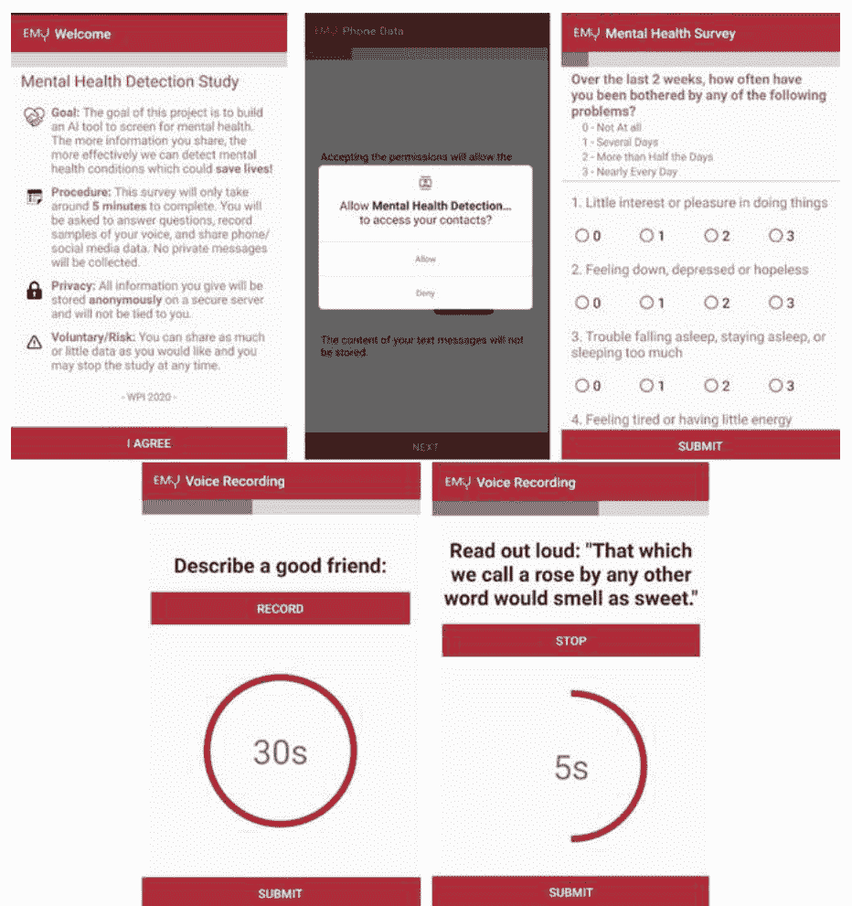

### 3.3 EMU收集应用程序设计：第二次部署

对于EMU收集应用程序的第二次部署，我们对设计进行了一些显著的改进，以最大化收集到的数据。 第二次部署的参与者界面设计如图3所示。我们还开发了一个在美学上类似的EMU收集应用程序的网站版本，以便允许使用不同设备的参与者参与，尽管这个版本无法收集智能手机传感器数据。 通过比较图2和图3中的两次部署，可以看出美学上的变化。具体而言，我们改进了研究介绍，添加了进度条，减少了语音录制的说明，并为语音录制的计时器添加了一个可视化组件。

图3 学生收集的EMU数据收集应用程序的屏幕截图[36]

### 3.4 使用EMU进行数据收集

为了收集一组标记的语音记录和数字表型数据，我们两次部署了上述的EMU移动收集应用程序，针对不同的人群。第一组参与者是通过亚马逊的Mechanical Turk（MTurk）众包平台[42] 招募的。第二组参与者主要是通过电子邮件和社交媒体帖子招募的学生。值得注意的是，参与要求已通过电子邮件发送给多所大学的学生团体进行分发。

针对这两个不同的人群，我们实施了不同的补偿策略。表1中众包工作者的补偿反映了完成每个部分所需的时间和精力。完成所有部分的参与者，预计最多需要六分钟，将获得1美元（每小时11美元）的报酬。

相比之下，学生参与者每分享一种模式就获得一次抽奖机会。由于我们估计学生最多只需要五分钟完成研究，我们为每个参与抽奖的学生增加了1.00美元。抽奖在整个收集期间以25美元和50美元的增量支付。

数据收集于WPI IRB00007374File18-0031approved23October 2017。众包收集从2/18/ 2019延续到3/13/ 2019，而学生收集从7/14/ 2020延续到1/26/ 2021。与EMU收集不同，学生收集发生在COVID-19大流行开始后。

虽然我们要求参与者完成PHQ-9以提供数据标签，但共享数字表型数据并非强制性。如果参与者在此期间尝试通过相同的手机使用Android应用程序重复收集，他们会收到提示“您已经完成了一个完整的会话”。

## 表1 订单数据是通过EMU应用程序在众包工人中进行的第一次部署中收集的，包括每个部分的预计完成时间和奖励

| 部分        | 时间（分钟） | 奖励（美元） |
|-------------|-------------|-------------|
| 介绍        | 0.25        | $0.15       |
| 手机权限    | 0.25        | $0.10       |
| 人口统计学  | 0.5         | $0.10       |
| PHQ-9       | 1           | $0.10       |
| GAD-7       | 1           | $0.10       |
| 脚本音频    | 0.5         | $0.15       |
| 非脚本音频  | 0.75        | $0.20       |
| 谷歌地图    | 0.5         | $0.10       |
| 推特        | 0.25        | $0.05       |
| Instagram   | 0.5         | $0.05       |
| 总计        | 6           | $1.10       |

### 3.5 EMU机器学习：模型设计师和筛选器

EMU应用程序的两次部署都收集了带有PHQ-9分数标签的脚本和非脚本语音记录。因此，我们的目标是比较语音记录在筛选参与者抑郁和自杀意念时的相对筛选效用。正如假设的那样，主动模式确实是两个参与者群体中最常用的模式（表2和表3）。事实上，脚本和非脚本音频是EMU数据集中超过一半参与者共享的唯一模式，因此对于机器学习来说最有用。

## 表2 每种模态共享的众包工人数量

| 模态        | 参与者 | PHQ-9均值 | 第9项均值 |
|-------------|--------|-----------|-----------|
| PHQ-9       | 70     | 10.37     | 0.74      |
| 人口统计    | 70     | 10.37     | 0.74      |
| GAD-7       | 69     | 10.43     | 0.75      |
| 脚本音频    | 63     | 10.08     | 0.68      |
| 非脚本音频  | 55     | 10.04     | 0.67      |
| 文本日志    | 31     | 10.29     | 0.87      |
| 联系人       | 28     | 10.81     | 0.88      |
| 日历        | 28     | 10.89     | 0.89      |
| 通话记录     | 24     | 10.88     | 0.92      |
| GPS         | 14     | 9.29      | 0.71      |
| Twitter用户名 | 14    | 8.50      | 0.71      |
| Instagram   | 0      | 0         | 0         |

## 表3 每种模态共享的学生参与者数量

| 模态 | 参与者 | PHQ-9均值 | 第9项均值 |
|---|---|---|---|
| PHQ-9 | 302 | 10.15 | 0.43 |
| 文本提示 | 298 | 10.22 | 0.44 |
| 人口统计 | 295 | 10.16 | 0.44 |
| 非脚本音频 | 200 | 9.77 | 0.36 |
| 脚本音频 | 194 | 9.87 | 0.37 |
| GPS | 21 | 7.43 | 0.10 |
| Twitter用户名 | 16 | 8.31 | 0.38 |
| 联系人 | 11 | 7.18 | 0.10 |
| 日历 | 11 | 7.18 | 0.10 |
| 通话记录 | 10 | 7.70 | 0.00 |
| 文本日志 | 10 | 7.70 | 0.00 |

下面，我们详细介绍了筛查抑郁症（PHQ-9≥ 10）[2]和自杀倾向（PHQ-9第9项≥ 1）[2]的方法。

转录提取。值得注意的是，非脚本的语音记录可以被转录，从而为我们提供了建模的文本来源。 与原始的EMU语音记录手动转录不同[12]，我们现在使用SpeechRecognition库自动从音频记录中提取转录[43]。 在这项研究中，我们只使用生成转录的音频记录的特征来进行筛查模型。

EMU中的特征工程。 我们使用openSMILE [44]从每个音频记录中提取1582至2268个特征，这与AVEC 2016 [18]和青少年访谈[24]中提取音频特征的工具包相同。 与脚本音频不同，非脚本音频的转录内容各不相同。 鉴于在先前使用自编写文本筛查抑郁症的研究中词汇类别和词性标签频率的有用性[37]，我们进一步从非脚本语音记录的转录中提取这些文本特征。

具体来说，文本特征包括Empath的194个词类频率[45]，TextBlob的36个词性标签频率[46]，单词数量和字符数量。

EMU中的特征选择。 我们尝试了三种常见的特征选择和/或降维技术：主成分分析（PCA），卡方检验和Extra-Trees。PCA从原始特征中计算连续的线性组合，称为主成分，以便每个主成分解释尚未解释的最大方差[47]。 卡方统计量衡量每个特征与目标变量之间的依赖关系[47]。

卡方选择的特征是具有最高卡方统计量的特征。 Extra-Trees分类算法是随机森林特征选择算法的一种变体[47, 48]，是一种用于音频分类的流行基于树的算法[49]。 我们尝试了最多10个特征或主成分。

EMU中的机器学习方法。 由于其可解释性和适用性，传统机器学习方法在医疗保健领域更受青睐[50]，尤其适用于较小的数据集。 由于在两个独立数据集[12, 36]中对语音录音的分类成功，我们利用支持向量分类器（SVC）模型，其中包括高斯核和线性核。 我们将这些模型分别称为高斯SVC和线性SVC。 SVC模型是使用Scikit-learn库[47]实现的。

EMU中的深度学习方法。 迁移学习利用在类似任务中预训练的深度学习模型，这样可以在较小的数据集上产生更好的结果[51]。 因此，我们使用著名的预训练模型自动从原始数据中提取相关的嵌入，并添加额外的层进行抑郁分类。 有关抑郁筛查的先前文献[20, 23, 36]为我们选择文本、音频和多模态迁移学习模型提供了参考。

对于文本，我们对BERT模型[52]进行了微调，该模型已成为文本分类的最新技术。 具体而言，我们在BERT嵌入之上添加了一个长短期记忆（LSTM）[53]层，以捕捉更长文本转录中的关系。 我们称之为BERT-LSTM模型。 同样，音频分类一直由预训练的VGGish模型[54]主导。 根据先前的研究[20, 21]表明，添加自注意力有助于提高性能，我们利用自注意力层来捕捉更长音频记录中的关系。 我们将这种配置称为VGGish Attention模型。

最后，我们遵循最近的音频辅助BERT（AudiBERT）[20]框架，将音频和文本迁移学习模型与微调层结合起来。 我们使用VGGish作为音频组件，使用BERT作为AudiBERT的文本组件。具体而言，AudiBERT将文本和音频嵌入与双层自注意力结合起来，以提高分类性能。 我们从这些预训练模型中初始化权重，然后使用我们的数据集中的一一个或两个，通过正常的反向传播更新权重。 我们在LSTM的隐藏状态之上添加了双向LSTM和另一个自注意力层。这种策略使我们能够为我们的抑郁症分类问题找到更好的数据表示。 对于实现，我们使用交叉熵损失函数，Adam优化器，学习率为2e⁻⁵，步长为2e⁻⁸。 此外，对于BERT模型，我们使用128作为标记数。

筛选模型评估策略. 我们采用一种留一法策略来评估机器学习模型。 虽然这种策略不能得到标准差，但它最大化了训练数据的数量，因此非常适合在较小的数据集上进行稳健评估。 留一法策略是一种交叉验证的形式，其中训练数据包括除一个参与者之外的所有特征。

在合并数据集之前，我们对两个数据集进行了特征归一化。 特征选择/降维技术应用于特征在0到1之间归一化的训练数据上。 然后，训练数据被上采样以平衡类别。 由于每个测试集只包含一个参与者的特征，每个模型对该参与者进行单一预测。 为了降低计算成本，我们采用了类似的留五法策略来评估深度学习模型。

学习模型。然后，我们通过考虑真正阳性（$tp$）、假阳性（$fp$）、假阴性（$fn$）和真阴性（$tn$）的预测数量来评估每个模型配置。

评估指标. 我们认为最佳的机器学习模型配置是那些能够最大化AUC的配置，即在ROC曲线上绘制敏感性与假阳性率($fp/(fp+tn)$)之间的关系。对于两个类别，AUC等同于敏感性 ($tp/(tp+fn)$)和特异性 ($tn/(tn+fp)$)的平均值。这些指标是评估模型诊断有用性的重要指标。此外，我们还报告了用于比较的 $F1=(2tp/(2tp+fp+fn))$和准确率 ($Acc=(tp+tn)/(tp+fp+fn+tn)$)。由于准确率仅代表正确分类实例的比例，在健康领域中被认为不太有用。

## 可用性

本研究中使用的特征和机器学习代码将在https://github.com/mltlachac/EMU 上提供。我们在其他文本模态上复制了上述文本特征工程。研究更新将在 http://emutivo.wpi.edu 上提供。

## 4 结果

使用EMU应用程序进行数据收集的已完成、重复和未完成会话的数量显示在图4中。在EMU数据收集应用程序在MTurk上发布的三周内，有70个独特的参与者完成了强制性的人口统计学和PHQ-9问卷调查；其中60（85.7%）人完成了整个数据收集过程。相比之下，在我们使用EMU应用程序收集学生数据的28周内，有302个独特的参与者完成了强制性的PHQ-9问卷调查；其中171（56.6%）人完成了整个数据收集过程。然而，只有26（8.6%）名学生参与者尝试重复收集。因此，学生参与者的重复完成率低于众包参与者。

参与者的PHQ-9分数分布如图5所示。值得注意的是，众包参与者的PHQ-9和GAD-7分数之间的成对相关系数为0.78，这与文献中的0.75相关性非常相似[13]，验证了众包EMU数据集的质量。令人意外的是，学生参与者的PHQ-9分数分布比众包参与者更左偏。

具体而言，37（52.9%）众包参与者和142（47.0%）学生参与者被筛选出抑郁症（PHQ-9 ≥ 10）。此外，31（44.3%）众包参与者和80（26.5%）学生参与者报告有自杀倾向。因此，众包参与者经历了更多的自杀意念。

### 图4 两次数据收集期间完成、重复和未完成会话的数量

自杀意念的发生率比学生参与者高。每个数据集中约有5%的参与者报告几乎每天都有自杀意念（项目-9 = 3）。

根据人口统计调查，70名众包参与者大多是23－38岁之间拥有大学学位的男性。相比之下，学生参与者大多是18至23岁的本科生；在295名共享人口统计数据的学生中，59.0%、36.6%和4.4%分别认同为女性、男性和非二元性别。

### 4.1 分享意愿

如表2和表3所示，积极的模态是最常完成的非调查模态，验证了我们的假设，即人们更愿意分享快速积极的模态而不是更私密的被动模态。对于众包-

## 图5 参与者PHQ-9分数分布

对于众包参与者来说，脚本音频是最常用的主动模式，有90%的参与者提交了录音。 除了脚本音频外，超过50%的众包参与者还共享了其他筛选模式。几乎每个学生都提交了文本提示，大约65%的学生同时提交了两种类型的音频录音。 值得注意的是，并非所有学生参与者都能够共享每种模式。 例如，网站应用程序不允许共享联系人、日历、通话记录、短信记录和GPS。因此，必须从通过EMU收集应用程序的Android版本提交数据的33名学生参与者中计算出共享这些模式的意愿。这意味着63.6%的学生有效地共享了GPS，这明显高于共享GPS的20%的众包参与者。此外，根据参与者的反馈，不是所有学生都能够通过网站应用程序提交语音录音，这是由于设备配置的原因。 同样，并非所有提交的音频录音都是可访问的。

总体而言，分享结果的意愿验证了我们允许参与者根据自己的偏好提交主动和被动的心理疾病筛查的设计选择。 尽管近年来它们变得越来越受欢迎，但我们怀疑手机模式可能被认为比传统的筛查调查更具侵入性，因此它们本身不太可能导致普遍筛查。 令人惊讶的是，社交媒体是最不可能被分享的，尽管这可能反映了拥有账户的参与者数量，而不是分享的意愿。

根据要求，63名众包参与者中有56人提交了脚本音频录音，并尝试重复提示，可以认为他们是合规的。 提交非脚本音频的众包参与者对提示的解释不同，因此回答各不相同：31人描述了一个好朋友的特质，11人描述了特定的朋友，6人逐字逐句地重复了提示，1人为没有亲密朋友而道歉，6人播放了无关的噪音。 逐字逐句的回答可能是由于在非脚本音频之前播放了脚本音频而导致的混淆。 这促使我们决定将非脚本音频页面放在脚本音频页面之前；这一决策取得了成功，因为我们没有观察到学生参与者的录音中出现这种混淆。

## 表2 提交每种模态的参与者子集的PHQ-9和第9项得分的平均值

| 模态 | 人数 | PHQ-9均值 | 第9项均值 |
|---|---|---|---|
| PHQ-9 | 302 | 10.15 | 0.43 |
| 文本提示 | 298 | 10.22 | 0.44 |
| 人口统计 | 295 | 10.16 | 0.44 |
| 非脚本音频 | 200 | 9.77 | 0.36 |
| 脚本音频 | 194 | 9.87 | 0.37 |
| GPS | 21 | 7.43 | 0.10 |
| Twitter用户名 | 16 | 8.31 | 0.38 |
| 联系人 | 11 | 7.18 | 0.10 |
| 日历 | 11 | 7.18 | 0.10 |
| 通话记录 | 10 | 7.70 | 0.00 |
| 文本日志 | 10 | 7.70 | 0.00 |

表2和表3还包含了提交每种模态的参与者子集的PHQ-9和项目-9得分的平均值。所有众包参与者的平均PHQ-9得分为10.37，所有学生参与者的平均得分为10.15。众包参与者的平均项目-9得分比学生参与者高得多。根据t检验，参与者子集与各自数据集中的所有参与者的得分没有统计学上显著差异。

## 用于精神疾病筛查的机器学习结果4.2

由于参与者群体都共享了有脚本和无脚本的音频，我们使用从音频录音中提取的特征来训练机器学习模型，以筛查抑郁症（PHQ-9≥10）和自杀意念（项目-9≥1）。为了建模目的，我们只使用产生了转录的音频录音子集。因此，我们有55个脚本化和45个众包人口实例，以及115个和110个学生人口实例。虽然在某些情况下，缺乏转录表明参与者不愿意录制自己的声音，但在其他情况下，由于设备不兼容，录音无法访问。如表4所示，在筛查抑郁症时，数据比筛查自杀意念更平衡。

我们筛选模型的结果为脚本和非脚本语音记录的表格5、6、7和8。SVC模型的参数是基于图6、7和8的结果选择的。机器学习模型在众包数据集上实现了抑郁和自杀意念的最高AUC分数。在表5中，具有八个脚本语音特征的线性SVC筛选出了AUC为0.78的抑郁症。同样，在表7中，具有单个主成分的高斯SVC筛选出了AUC为0.73的自杀意念。值得注意的是，众包数据集中的语音记录不足以进行深度学习模型的训练。

## 表4 产生转录并用于抑郁症和自杀意念筛选模型的音频记录数量

| 人口 | 音频 | 转录 | PHQ-9 ≥ 10 (%) | 项目-9 ≥ 1 (%) |
|---|---|---|---|---|
| 众包 | 脚本化 | 55 | 49.1 | 38.2 |
| 众包 | 非脚本化 | 45 | 46.7 | 33.3 |
| 学生 | 脚本化 | 115 | 39.1 | 19.1 |
| 学生 | 非脚本化 | 110 | 40.0 | 20.0 |
| 综合 | 脚本化 | 170 | 42.4 | 25.3 |
| 综合 | 非脚本化 | 155 | 41.9 | 23.9 |

## 表5 脚本化语音支持向量分类器的录音结果，具有最高的AUC分数。虽然留一法评估策略不会产生标准差，但它最大化了训练数据的数量。SVC1 = 高斯SVC，SVC2 = 线性SVC，PCA = 主成分分析，F = 特征数量，CHI = 卡方

| 标签 | 人口 | 模型 | S | F | AUC | F1 | 准确率 | 敏感度 | 特异度 | fp | fn | n min | n max |
|---|---|---|---|---|---|---|---|---|---|---|---|---|---|
| 抑郁症 | 众包 | SVC2 | 卡方 | 8 | 0.78 | 0.78 | 0.78 | 0.31 | 0.83 | 21 | 6 | 12 | 18 |
| 抑郁症 | 学生 | SVC1 | 卡方 | 4 | 0.57 | 0.39 | 0.63 | 0.31 | 0.83 | 14 | 12 | 6 | 18 |
| 抑郁症 | 综合 | SVC2 | 卡方 | 1 | 0.55 | 0.27 | 0.61 | 0.17 | 0.94 | 30 | 26 | 15 | 23 |
| 自杀意念 | 众包 | SVC2 | 等等 | 6 | 0.70 | 0.61 | 0.75 | 0.52 | 0.88 | 11 | 4 | 9 | 13 |
| 自杀意念 | 学生 | SVC1 | PCA | 2 | 0.66 | 0.43 | 0.70 | 0.59 | 0.72 | 33 | 26 | 4 | 8 |
| 自杀意念 | 综合 | SVC2 | 卡方 | 2 | 0.65 | 0.47 | 0.72 | 0.49 | 0.80 | 21 | 25 | 10 | 24 |

## 表6 脚本化语音深度迁移学习模型的录音结果。虽然留五法评估策略不会产生标准差，但它最大化了训练数据集的数量。由于众包数据集中参与者不足以利用这些模型，我们报告了模型在学生和综合人群上的性能。

| 标签 | 人口 | 模型 | AUC | F1 | 准确率 | 敏感度 | 特异度 | 真阳性 | 假阳性 | 真阴性 | 假阴性 |
|---|---|---|---|---|---|---|---|---|---|---|---|
| 抑郁症 | 学生 | VGGish 注意力 | 0.70 | 0.67 | 0.65 | 0.91 | 0.49 | 41 | 36 | 4 | 34 |
| 抑郁症 | 综合 | VGGish 注意力 | 0.63 | 0.61 | 0.62 | 0.71 | 0.55 | 51 | 44 | 21 | 54 |
| 自杀意念 | 学生 | VGGish 注意力 | 0.71 | 0.47 | 0.64 | 0.82 | 0.60 | 18 | 37 | 4 | 56 |
| 自杀意念 | 综合 | VGGish 注意力 | 0.68 | 0.52 | 0.69 | 0.67 | 0.69 | 29 | 39 | 14 | 88 |

## 表7 支持向量分类器的非脚本语音记录结果，具有最高的AUC分数。虽然leave-one-out评估策略不产生标准差，它最大化了训练数据的数量。SVC1 = 高斯SVC，SVC2 = 线性SVC，PCA = 主成分分析，F = 特征数量，CHI = 卡方

| 标签 | 人口 | 输入 | 模型 | S | F | AUC | F1 | 准确率 | 敏感度 | 特异度 | fp | fn | n min | n max |
|---|---|---|---|---|---|---|---|---|---|---|---|---|---|---|
| 抑郁症 | 众包 | 音频 | SVC2 | PCA | 1 | 0.66 | 0.62 | 0.67 | 0.57 | 0.75 | 6 | 9 | 12 | 18 |
| 抑郁症 | 众包 | 转录 | SVC2 | 等等 | 1 | 0.59 | 0.50 | 0.60 | 0.43 | 0.75 | 6 | 12 | 9 | 18 |
| 抑郁症 | 众包 | 多模态 | SVC2 | PCA | 1 | 0.66 | 0.62 | 0.67 | 0.57 | 0.75 | 6 | 9 | 12 | 18 |
| 抑郁症 | 学生 | 音频 | SVC1 | PCA | 1 | 0.63 | 0.57 | 0.64 | 0.61 | 0.65 | 23 | 17 | 27 | 43 |
| 抑郁症 | 学生 | 转录 | SVC1 | 等等 | 1 | 0.61 | 0.57 | 0.64 | 0.61 | 0.64 | 28 | 16 | 27 | 39 |
| 抑郁症 | 学生 | 多模态 | SVC1 | PCA | 1 | 0.63 | 0.57 | 0.64 | 0.61 | 0.65 | 27 | 17 | 23 | 43 |
| 抑郁症 | 综合 | 音频 | SVC2 | 卡方 | 9 | 0.62 | 0.48 | 0.66 | 0.37 | 0.88 | 24 | 11 | 63 | 79 |
| 抑郁症 | 综合 | 转录 | SVC2 | 卡方 | 9 | 0.58 | 0.63 | 0.52 | 0.97 | 0.19 | 73 | 2 | 46 | 81 |
| 抑郁症 | 综合 | 多模态 | SVC2 | 等等 | 1 | 0.60 | 0.41 | 0.65 | 0.29 | 0.90 | 19 | 9 | 10 | 24 |
| 自杀意念 | 众包 | 音频 | SVC1 | PCA | 1 | 0.73 | 0.65 | 0.76 | 0.67 | 0.80 | 6 | 5 | 10 | 13 |
| 自杀意念 | 众包 | 转录 | SVC1 | 等等 | 4 | 0.55 | 0.48 | 0.67 | 0.43 | 0.73 | 10 | 17 | 10 | 22 |
| 自杀意念 | 众包 | 多模态 | SVC1 | PCA | 1 | 0.70 | 0.61 | 0.71 | 0.67 | 0.76 | 8 | 5 | 11 | 15 |
| 自杀意念 | 学生 | 音频 | SVC1 | PCA | 5 | 0.60 | 0.35 | 0.76 | 0.32 | 0.88 | 7 | 13 | 10 | 11 |
| 自杀意念 | 学生 | 转录 | SVC1 | 等等 | 5 | 0.61 | 0.38 | 0.62 | 0.59 | 0.62 | 13 | 9 | 33 | 55 |
| 自杀意念 | 学生 | 多模态 | SVC1 | PCA | 5 | 0.60 | 0.35 | 0.76 | 0.32 | 0.88 | 7 | 11 | 15 | 55 |
| 自杀意念 | 综合 | 音频 | SVC1 | 卡方 | 3 | 0.53 | 0.24 | 0.71 | 0.19 | 0.87 | 7 | 15 | 11 | 15 |
| 自杀意念 | 综合 | 转录 | SVC1 | 卡方 | 1 | 0.58 | 0.39 | 0.62 | 0.51 | 0.65 | 19 | 14 | 15 | 103 |
| 自杀意念 | 综合 | 多模态 | SVC1 | PCA | 1 | 0.55 | 0.34 | 0.65 | 0.38 | 0.76 | 19 | 23 | 41 | 77 |
| 自杀意念 | 综合 | 多模态 | SVC1 | PCA | 1 | 0.55 | 0.34 | 0.65 | 0.38 | 0.76 | 14 | 23 | 32 | 86 |

## 表8 深度迁移学习模型的非脚本语音记录结果。尽管留五个评估策略不产生标准差，但它最大化了训练数据的数量。由于众包数据集中参与者不足以利用这些模型，我们报告了模型在学生和综合人群上的性能。

| 准精度 | F1 | AU C | 模型 | 输入 | 人口 | 标签 |
|--------|----|------|------|------|------|------|
| 抑郁症 | 学生 | 音频 | VGGish Att. | 0.59 | 0.61 | 抑郁症 |
| 抑郁症 | 学生 | 转录 | BERT LSTM | 0.50 | 0.53 | 抑郁症 |
| 抑郁症 | 学生 | 多模态 | AudiBERT | 0.60 | 0.60 | 抑郁症 |
| 抑郁症 | 综合 | 音频 | VGGish Att. | 0.59 | 0.63 | 抑郁症 |
| 抑郁症 | 综合 | 转录 | BERT LSTM | 0.42 | 0.51 | 抑郁症 |
| 抑郁症 | 综合 | 多模态 | AudiBERT | 0.65 | 0.67 | 抑郁症 |
| 自杀意念 | 学生 | 音频 | VGGish Att. | 0.48 | 0.72 | 自杀意念 |
| 自杀意念 | 学生 | 转录 | BERT LSTM | 0.51 | 0.70 | 自杀意念 |
| 自杀意念 | 学生 | 多模态 | AudiBERT | 0.44 | 0.67 | 自杀意念 |
| 自杀意念 | 综合 | 音频 | VGGish Att. | 0.46 | 0.65 | 自杀意念 |
| 自杀意念 | 综合 | 转录 | BERT LSTM | 0.55 | 0.71 | 自杀意念 |
| 自杀意念 | 综合 | 多模态 | AudiBERT | 0.54 | 0.70 | 自杀意念 |

### 4.2.1 机器学习参数搜索

对于机器学习模型，我们进行了参数搜索，以确定SVC内核、特征选择策略和特征数量。参数搜索的结果显示在图6、7和8中。在使用脚本音频进行抑郁筛查时，每个数据集都优先选择了卡方特征选择，如表5所示。但这并不适用于自杀意念筛查或使用非脚本音频进行筛查。在表7中使用非脚本音频进行抑郁筛查时，线性SVC在众包参与者中实现了更高的AUC值，而高斯SVC在学生参与者中实现了更高的AUC值，无论输入特征类型如何；这些结果仅使用一个主成分或一个额外树选择特征实现。对于使用非脚本输入特征进行自杀意念筛查，高斯SVC在九个实验中有八个实验获得了更高的AUC分数。

### 4.2.2 脚本化与非脚本化音频

使用脚本化语音录音的筛查结果在表5和表6中，而使用非脚本化语音录音的筛查结果在表7和表8中。对于学生群体的抑郁筛查，深度学习模型中的脚本化音频明显优于非脚本化音频；脚本化音频的AUC为0.70，而非脚本化音频的AUC为0.61。然而，对于其他三个深度学习音频实验，使用脚本化和非脚本化音频特征的模型的AUC相似。

对于筛查抑郁的机器学习模型，脚本化音频在众包人群中表现更好，而非脚本化音频在众包人群和综合人群中表现更好。对于众包人群，脚本化音频的AUC为0.78，非脚本化音频的AUC为0.66。相反，对于学生群体，脚本化音频的AUC为0.57，非脚本化音频的AUC为0.63。同样，对于综合人群，脚本音频的最高AUC仅为0.55，而非脚本音频的最高AUC在抑郁症筛查时为0.62。对于自杀意念筛查，非脚本音频在众包人群中表现稍好，而脚本音频在学生人群中表现稍好。然而，当两个人群合并时，脚本音频的AUC比非脚本音频高0.12。

### 4.2.3 非脚本音频与转录对比

在表7和表8中，我们比较了仅使用音频、仅使用转录和两种模态的模型的筛查能力。对于筛查抑郁症的机器学习模型，转录的预测能力不如音频。

对于所有三个人群，音频和多模态模型的AUC得分相同。对于众包人群和学生人群，音频和多模态模型的AUC得分相同；当人群合并时，多模态模型的AUC略低于音频模型。这种模式在自杀意念筛查中不成立。与音频相比，转录对于众包人群的预测能力较差，对于学生人群的预测能力相当，对于合并人群的预测能力更强。总体而言，多模态建模并没有改善任何机器学习实验的AUC得分。

这对于深度学习模型来说是不正确的。多模态AudiBERT在抑郁症筛查中取得了最高的AUC。对于综合人群，音频模型的AUC为0.63，文本模型的AUC为0.51，多模态模型的AUC为0.67。对于学生群体来说，转录本也是最不有效的抑郁症筛查方式。然而，对于深度学习模型的自杀意念筛查，转录本在学生群体中的预测能力只比音频略低，并且比综合人群中的音频更具预测能力。对于机器学习和深度学习模型来说，转录本在从综合人群中筛查自杀意念时效果最好。

### 4.2.4 抑郁症与自杀意念筛查

正如前面提到的，众包人群取得了最佳的抑郁症和自杀意念筛查结果。机器学习模型在表5中对于抑郁症筛查的AUC为0.78，在表7中对于自杀意念筛查的AUC为0.70。对于非脚本音频，抑郁症筛查的AUC为0.66，自杀意念筛查的AUC为0.73。因此，对于众包人群，脚本音频对于抑郁症筛查更有用，非脚本音频对于自杀意念筛查更有用。

相比之下，对于学生群体和综合群体来说，深度学习模型在抑郁症筛查和自杀意念筛查方面取得了最高的AUC分数。对于学生群体来说，脚本音频在抑郁症筛查中仍然最有用，而非脚本音频在自杀意念筛查中最有用。当使用脚本音频进行抑郁症筛查时，VGGish Attention模型的AUC为0.70（表6），而当使用非脚本音频进行自杀意念筛查时，AUC为0.72（表8）。因此，对于学生群体，我们在抑郁症和自杀意念筛查方面的能力是相似的。

尽管自杀意念数据集的平衡性较差，但深度学习模型比综合群体更能够筛查自杀意念而不是抑郁症。然而，与学生群体不同，其他深度学习模型的表现优于VGGish Attention。在表8中，AudiBERT用于抑郁症筛查的AUC为0.67，BERT LSTM用于自杀意念筛查的AUC为0.71。值得注意的是，对于所有三个参与者群体，我们能够达到类似的自杀意念筛查分数。

### 4.2.5 众包与学生群体

如上所述，我们能够通过AUC分数筛查自杀意念。众包群体的AUC分数为0.73，学生群体的AUC分数为0.72，综合群体的AUC分数为0.71。虽然这三个模型都需要非脚本化音频，但是为了获得这些筛查结果，需要使用不同输入的不同模型，具体记录在表7和表8中。

与自杀意念不同，我们无法像对待每个群体一样筛查出抑郁症。最佳抑郁症筛查模型的AUC为：众包群体的AUC为0.78，学生群体的AUC为0.70，综合群体的AUC为0.67。众包群体的结果是通过脚本化音频特征获得的（表5），而其他群体的结果是通过非脚本化语音录音得到的嵌入（表8）。

换句话说，合并数据集并没有改善模型对抑郁症或自杀意念的筛查能力。事实上，对于抑郁症筛查来说，将学生群体添加到众包群体中大大降低了模型的性能。将众包群体添加到学生群体中对抑郁症或自杀意念的筛查能力没有太大影响。这可能是因为学生数据集比众包数据集更大。

虽然增加数据集的大小通常会提高模型性能，但这两个群体可能过于不同，无法有效地进行联合建模。此外，学生群体比众包群体更异质，这很可能解释了为什么模型对该群体的抑郁症筛查能力较低。这表明，针对特定社区训练不同的心理疾病筛查模型在实践中可能比一个普遍的模型更好。

### 4.2.6 机器学习与深度学习

虽然机器学习模型取得了最高的AUC分数，但这些筛查模型是针对众包人群的。仅有55个脚本化的语音录音和45个非脚本化的语音录音（表4），无法提供足够的实例来训练深度学习模型。然而，学生数据集包含115个脚本化的语音录音和110个非脚本化的语音录音。这些数量足以对精神疾病筛查进行微调迁移学习模型。

事实上，深度学习模型在学生和综合人群中的表现优于机器学习模型。最成功的机器学习模型对学生抑郁症的筛查具有0.63的AUC（表7），对学生自杀意念的筛查具有0.66的AUC（表5）。深度学习模型能够通过0.07的AUC（表6）改善抑郁症筛查，并通过0.06的AUC（表8）改善自杀意念筛查。同样，对于综合人群，深度学习模型能够将AUC提高0.05用于抑郁症筛查和0.06用于自杀意念筛查。因此，当实例数量允许使用迁移学习模型时，我们的结果表明这些最先进的模型对于筛查目的可能是有利的。

## 5 讨论

### 5.1 众包参与者患抑郁症的比率很高

图5中众包参与者的PHQ-9分数分布明显不如一般人群所预期的左偏。令人惊讶的是，在COVID-19大流行开始之前，众包人群中的抑郁症发病率比COVID-19大流行开始后的学生人群更高。然而，众包参与者中的心理疾病发病率在其他类似研究中也被观察到。例如，一项先前的研究[27]注意到在一个众包平台上完成应用程序数据收集的参与者中，抑郁症的发病率高于正常水平。这些研究人员假设众包工作者经历了高于正常水平的心理疾病，和/或众包工作者患有心理疾病的可能性更高，参与了一项心理疾病研究[27]。我们提出第三个假设：众包工作者患有心理疾病的可能性更高，更愿意下载研究应用程序。无论如何，研究表明众包平台产生了优质的数据[42]。事实上，与我们的学生参与者的数据相比，来自众包参与者的数据产生了更好的筛查模型，尽管这可能是由于众包人群的同质性。

### 5.2 深度学习模型训练考虑因素

由于训练深度学习模型的计算成本很高，大多数人使用常见的超参数而不是进行网格搜索。在这项研究中，我们使用了在相关抑郁症筛查研究中取得成功的超参数[20, 22]。然而，我们对机器学习模型进行了参数搜索，从而使它们比深度学习模型更具优势。此外，众所周知，不同的权重初始化可能会产生不同的结果。因此，通常会使用随机权重初始化重复训练过程，最终报告的结果是所有迭代中的平均值或最大值。由于数据集较小，我们选择通过进行留五交叉验证来最大化我们的训练数据。因此，我们没有使用多个随机权重初始化重复模型训练。因此，我们的评估策略可能存在问。

### 5.3 用EMU进行精神疾病筛查的未来

EMU框架的目的是用不引人注目的收集数据取代明确的精神疾病筛查调查。当然，训练有素的临床医生最终仍然需要确认诊断。筛查调查有一些限制。例如，抑郁症的症状可能会阻止人们寻求帮助[4]，即使他们想要帮助，也可能不会透露抑郁症状[3]。EMU框架可以通过提供可定制、负担较低和无偏见的解决方案，使有效的普遍筛查目标成为现实。

音频调查的作者[7]强调在这个领域需要更好的合作。他们的第一个建议是共享数据集、代码和透明的结果。他们还指出需要更加标准化的数据收集方法[7]。EMU为进一步的筛查研究提供了这些需求。虽然我们只在最常共享的模态上训练了模型，但较少共享的模态可以与其他类似收集的数据结合起来，以增加数据数量并改善研究的普适性。例如，EMU和Moodable文本日志已经结合起来用于抑郁症筛查[38-40]。

然而，将EMU应用程序收集的语音记录结合起来，来自我们两个不同人群的结果并没有改善抑郁症或自杀意念筛查结果。事实上，尽管实例数量更多，但使用来自更异质学生群体的数据进行筛查更加困难。这使我们认为，不同的社区可能需要有针对性的个体筛查模型，而单一模型可能无法在多个不同社区中进行良好的筛查。这需要进一步的研究。

## 6 结论

EMU是一个整合了被动和主动模式的精神疾病筛查框架。我们将EMU应用程序部署到两个不同的人群中，以收集语音记录和数字表型数据。结果是一个有价值的社区数据资源，由标有精神疾病分数的数字表型和音频特征组成。由于参与者更愿意持续分享主动模式而不是被动模式，我们对语音记录进行了机器学习和深度学习模型的训练，以筛查抑郁症和自杀意念。我们在众包人群上使用机器学习模型进行抑郁症筛查的最高AUC为0.78，自杀意念筛查的最高AUC为0.73。总体而言，脚本音频对于抑郁症筛查效果更好，而非脚本音频对于自杀意念筛查效果更好。

## 7 构思筛选

将这两个数据集合并并没有改善对心理疾病的筛查能力。此外，深度学习模型为学生和综合人群提供了最佳的筛查结果。

## 参考文献

1. 国家精神疾病联盟。“数字揭示的心理健康”（2020）。https://www.nami.org/mhstats  
2. Kroenke, K., Spitzer, R.L., Williams, J.B.: PHQ-9：一种简短的抑郁症严重程度测量工具的有效性。J. Gen. Intern. Med. 16（9），606-613（2001）  
3. Epstein, R.M., Duberstein, P.R., Feldman, M.D., Rochlen, A.B., Bell, R.A., Kravitz, R.L.等：我不知道出了什么问题：未被诊断的抑郁症患者如何认识、命名和解释他们的困扰。J. Gen. Intern. Med. 25，954-961（2010）  
4. Demyttenaere, K., Bonnewyn, A., Bruffaerts, R., Brugha, T., De Graaf, R., Alonso, J.: 共病痛苦的身体症状和抑郁症：患病率、工作损失和求助。J. Affect. Disord. 92，185-193（2006）  
5. Siu, A., Bibbins-Domingo, K., Grossman, D., Baumann, L., Davidson, K., Ebell, M., 等：成人抑郁症筛查：美国预防服务工作组建议声明。JAMA 315(4), 380–387 (2016)  
6. Weist, M.D., Rubin, M., Moore, E., Adelsheim, S., Wrobel, G.: 学校心理健康筛查。J. Sch. Health 77(2), 53–58 (2007)  
7. Cummins, N., Scherer, S., Krajewski, J., Schnieder, S., Epps, J., Quatieri, T.F.: 通过语音分析进行抑郁症和自杀风险评估的综述。Speech Commun. 71, 10–49 (2015)  
8. Guntuku, S., Yaden, D., Kern, M., Ungar, L., Eichstaedt, J.: 在社交媒体上检测抑郁症和心理疾病：综合评述。In: Current Opinion in Behavioral Sciences, vol. 18 (2017)  
9. Chancellor, S., De Choudhury, M.: 社交媒体上心理健康状态预测技术的方法批判性综述。NPJ Digit. Med. 3(1), 1–11 (2020)  
10. Wang, R., Chen, F., Chen, Z., Li, T., Harari, G., Tignor, S., 等：Studentlife：使用智能手机评估大学生的心理健康、学业表现和行为趋势。In: 2014年ACM国际联合会议 on Pervasive and Ubiquitous Computing, pp. 3–14. ACM (2014)  
11. Dogrucu, A., Perucic, A., Isaro, A., Ball, D., Toto, E., Rundensteiner, E.A., 等：Moodable：使用机器学习对语音样本进行即时抑郁症评估的可行性研究，结合智能手机和社交媒体数据的回顾性收集。Smart Health 100–118 (2020)  

12. Tlachac, M.L., Toto, E., Lovering, J., Kayastha, R., Taurich, N., Rundensteiner, E.: 早期心理健康发现框架和数据集。In: 2021年第20届IEEE国际机器学习与应用会议（ICMLA），第1311-1318页。IEEE (2021)  
13. Spitzer, R.L., Kroenke, K., Williams, J.B., L we, B.: 用于评估广泛焦虑症的简要测量工具：gad-7。Arch. Intern. Med. 166(10), 1092-1097 (2006)  
14. De Choudhury, M., Counts, S., Horvitz, E.J., Hoff, A.: 从共享的Facebook数据中表征和预测产后抑郁症。In: 第17届ACM计算机支持的合作工作和社交计算会议，第626-638页 (2014)  

15. Ricard, B.J., Marsch, L.A., Crosier, B., Hassanpour, S.: 探索社区生成的社交媒体内容在检测抑郁症方面的实用性：对Instagram的分析研究。JMIR (2018)  

16. Gratch, J., Artstein, R., Lucas, G.M., Stratou, G., Scherer, S., Nazarian, A., 等：人类和计算机访谈的困扰分析访谈语料库。In: 语言资源和评估。CiteSeer，第3123-3128页 (2014)  

17. DeVault, D., Artstein, R., Benn, G., Dey, T., Fast, E., Gainer, A., 等：Simsensei kiosk：用于医疗决策支持的虚拟人类面试官。In: 国际自主代理和多代理系统会议，2014年，第1061-1068页 (2014)  
18. Valstar, M., Gratch, J., Schuller, B., Ringeval, F., Lalanne, D., Torres, M., 等：Avec 2016：抑郁症、情绪和情感识别研讨会和挑战。In: 第6届国际音频/视觉情感挑战研讨会。ACM (2016)  

19. Rodrigues Makiuchi, M., Warnita, T., Uto, K., Shinoda, K.: 基于bert-cnn和门控cnn表示的多模态融合用于抑郁症检测。In: AVEC, pp. 55–63 (2019)  
20. Toto, E., Tlachac, M.L., Rundensteiner, E.: Audibert: 一种用于抑郁症分类的深度迁移学习多模态筛查框架。In: 第30届ACM CIKM应用研究论文集, pp. 4145–4154 (2021)  

21. Flores, R., Tlachac, M.L., Toto, E., Rundensteiner, E.A.: 使用临床访谈的后续问题进行深度学习抑郁症筛查。In: 2021年第20届IEEE国际机器学习与应用会议(ICMLA), pp. 595–600. IEEE (2021)  
22. Flores, R., Tlachac, M.L., Toto, E., Rundensteiner, E.A.: 从后续临床访谈问题进行迁移学习进行抑郁症筛查。In: 深度学习应用, 第4卷.  

已接受  

23. Senn, S., Tlachac, M.L., Flores, R., Rundensteiner, E.: 用于抑郁症分类的bert集成模型。In: 第44届国际IEEE工程医学与生物学会(EMBC)会议。第4691-4694页 (2022)  

24. Asgari, M., Shafran, I., Sheeber, L.B.: 从语音和口语表达中推断临床抑郁症。In: IEEE机器学习信号处理国际研讨会(MLSP)，第2014卷，第1-5页。IEEE (2014)  

25. Huang, Z., Epps, J., Joachim, D., Chen, M.: 通过多种智能手机在自然环境条件下从短语音中检测抑郁症。In: INTERSPEECH，第3393-3397页 (2018)  

26. McGinnis, E.W., Anderau, S.P., Hruschak, J., Gurchiek, R.D., Lopez-Duran, N.L., Fitzgerald, K., 等：给予弱势儿童发声：机器学习分析语音在早期儿童中检测焦虑和抑郁。IEEE J. Biomed. Health Inform. 23(6)，第2294–2301页 (2019)  

27. Di Matteo, D., Fotinos, K., Lokuge, S., Yu, J., Sternat, T., Katzman, M.A., Rose, J.: 智能手机记录的环境音频与焦虑和抑郁症状的关系：探索性研究。JMIR Form. Res. 4(8) (2020)  

28. Saeb, S., Zhang, M., Karr, C.J., Schueller, S.M., Corden, M.E., Kording, K.P., Mohr, D.C.: 移动电话传感器与日常行为中的抑郁症状严重程度相关性的初步研究。JMIR 17(7) (2015)  

29. Farhan, A., Yue, C., Morillo, R., Ware, S., Lu, J., Bi, J., 等：行为与内省：通过智能手机感知数据改进临床抑郁症预测。IEEE无线健康1-8 (2016)## 在线评论中面向方向的建议提取的全面分析

## T. K. Jayasekara，A. R. Weerasinghe和W. V. Welgama

摘要 在商业世界中，产品需要根据客户的需求不断发展，以确保客户满意度。 互联网上充斥着大量的带有意见的文本，其中包含用户提出的可以用来改进产品的建议。 这些建议对多个利益相关者来说都很重要；对于企业来说是产品改进的机会，对于消费者来说是提示和建议。 到目前为止，建议提取通常被定义为将句子分类为建议和非建议类别的问题。 迄今为止，没有任何工作尝试根据预期接收者的不同来区分建议。 针对评论者不满意的方面提取这些建议可能是改进产品的潜在解决方案。 为了解决这些缺点，本研究提出了一种称为面向方向的建议提取的新颖任务分解方法，以识别产品改进。

它包含三个主要子任务：建议分类、受益者分类和方面提取。 所提出的方法在确定建议和非建议方面非常有效，在酒店、电子产品、旅行和软件领域的建议挖掘中，优于现有方法，分别达到了91%、76%、75%和85%的F分数。 从酒店评论中提取面向方向的建议的实验结果显示了技术的有效性。 所提出的框架是其性质的第一个，取得了有希望的结果。

## 关键词 建议挖掘 · 方面提取 · 客户评论 · 信息提取 · 数据挖掘

T. K. Jayasekara (✉) · A. R. Weerasinghe · W. V. Welgama
科伦坡大学计算机学院，科伦坡，斯里兰卡
e-mail: 2016cs059@stu.ucsc.cmb.ac.lk

A. R. Weerasinghe
e-mail: arw@ucsc.cmb.ac.lk

W. V. Welgama
e-mail: www@ucsc.cmb.ac.lk

© 作者，独家许可给 Springer Nature Singapore Pte Ltd. 2023
M. A. Wani 和 V. Palade (eds.)，深度学习应用，第4卷，
智能系统与计算进展 1434，
https://doi.org/10.1007/978-981-19-6153-3_5

## 1 引言

## 1.1 研究背景

在当今世界上，获取公众对各种主题的意见的最流行方式之一就是通过在线评论。 互联网上丰富的客户反馈信息需要能够自动分析和总结这些信息的系统。

情感分析[1]是一项能够自动分析此类信息的任务，它不是通过主题而是通过整体情感来对文档进行分类，以确定用户对产品或主题的观点是积极的、消极的还是中立的。 情感分析的逐渐发展导致了一个更广泛的领域的增长，即意见挖掘[2]。 目前，它包括多个问题定义，如意见垃圾检测、意见摘要、意见搜索和检索[3]。 因此，意见挖掘现在可以被认为是自然语言处理和计算语言学领域中一个成熟且不断发展的研究领域。 尽管情感分析作为用户满意度的指标，可以更深入地了解客户的体验，但这种信息对于客户或企业来说并不足以做出业务决策。 人们需要更多可操作的信息，以帮助决策过程。

在检查这些意见时，重要的是要注意人们还提出了改进意见、提示和建议。 这种信息可以合作地被称为“建议”。 例如，“一定要早点去吃早餐自助餐”和“房间里有一个小冰箱会很理想”是酒店评论中发现的一些建议。 这导致了建议挖掘[4]的出现，它被定义为从非结构化文本中提取包含建议的句子。

尽管之前的研究[5]在建议挖掘中将建议视为“改进”，但最近发现的更通用的定义[6]是建议可能针对两类受众：顾客和企业。

虽然建议“一定要早点去吃早餐自助餐”表示对顾客的提示和建议，但建议“房间里有一个小冰箱会很理想”可以被归类为对企业主的改进。 如果检测和提取出来，这些在评论中出现的建议对多个利益相关者来说都非常重要。 对于商业实体来说，这些建议可以用作对企业的产品改进或对消费者的提示和建议。

在过去几年中，出现了各种受欢迎的任务中，建议挖掘仍然是一个相对年轻的领域。 由于问题定义处于早期阶段，通常将其定义为将给定文本中的句子分类为建议和非建议类的问题。 早期的建议挖掘工作[5]主要采用基于规则的方法，使用一组手动制定的规则从产品评论中提取建议。后来，还有一些其他方法。

## 1.2 研究问题

这项扩展研究关注三个研究问题。

- 1. 特征工程和特征学习方法在识别面向品牌所有者的建议和面向顾客的建议方面的准确性如何？

可以使用手动设计的特征或使用深度学习方法对建议进行分类，以基于预期接收者进行分类。因此，通过解决这个研究问题，我们将能够确定一种能够准确执行这种分类的方法。

- 2. 在现有的方面提取方法中，从建议中提取方面术语以得到一组面向方面的建议，哪种方法最有效？

现有的方面提取方法使用了监督方法和无监督方法。然而，在建议挖掘的背景下尚未尝试过。通过解决这个研究问题，我们将能够确定从建议中提取方面的最有效方法，以生成面向方面的建议。

- 3. 从真实世界的数据集中提取这样的面向方面的建议有多准确？为了在真实世界中使用这个任务来分析评论，它

在真实世界的数据集上执行时应该获得准确的结果。因此，通过解决这个研究问题，我们将能够确定在真实世界的数据集上执行面向方面的建议提取的效果。

## 2 相关工作

### 2.1 建议的定义

尽管在将句子分类为建议和非建议类别的任务之前已经尝试过，但并不是所有以前的尝试都明确定义了他们所指的建议。Ramanand等人的工作[11]研究了从评论中识别产品改进的建议。他们不包括可能针对其他客户的建议。Dong等人[7]在尝试检测关于Microsoft Windows 7手机的推文中提供了类似的定义。Moghaddam的工作[12]确定了关于eBay应用程序的包含建议的评论，也遵循类似的定义。这些先前工作中存在一个重要差距是它们没有承认产品评论中的建议可能针对两个方当事人之一；客户或企业主。

在在线评论中承认对客户的建议的存在，Negi和Buitelaar [13]进行了第一项旨在识别客户对客户（CTC）建议的研究。Negi等人 [6]提出了建议的通用定义，并引入了建议的受益者的概念。也就是说，建议可以针对两个利益相关者之一，即企业主或其他客户。关于使用产品的方式的不同提示、建议和推荐被视为针对客户的建议。针对制造商或服务提供商的建议，建议产品或服务的新功能和改进，被视为针对企业主的建议。尽管以前有基于这个定义对建议和非建议进行分类的工作，但据我们所知，没有工作对预期接收者之间的建议进行了内部分类。通过根据预期接收者对建议进行分类，反映了对品牌所有者的改进建议。因此，我们确定存在一个研究空白，即在品牌所有者和其他客户之间进行内部分类的建议可能会导致产品改进的识别。

### 2.2 建议挖掘

早期的建议挖掘工作[5, 11]主要采用基于规则的方法，根据观察到的语言模式和词汇手动制定一组规则。

### 2.3 方面提取

方面提取被视为意见挖掘的关键任务。它从意见文本中提取意见目标或方面。方面有两种不同的类型[9]，即显式和隐式。显式方面可以指表示明确的方面。例如，在句子“食物太辣”中，“食物”是显式方面，而“味道”是隐式方面，因为它谈论的是食物的味道，而没有在句子中明确提到。本研究的重点将放在提取这种隐式方面上。

## 3 研究设计和实施

研究设计包括五个主要组成部分。

- 1. 预处理
- 2. 建议分类
- 3. 受益人分类
- 4. 方面提取
- 5. 方面分组

整体系统的高级架构如图1所示。

### 3.1 预处理

在预处理中的一个重要设计决策是决定保留停用词还是删除它们。建议包括诸如“会很好”和“确保”的短语，其中包含停用词，有助于将句子推断为建议。尽管一些建议挖掘的工作[24]保留了停用词，但一些工作[25]已经将其删除。因此，在预处理阶段，通过进行两个实验分析了停用词在建议挖掘中的影响，其中，

- 1. 模型1—删除停用词
- 2. 模型2—保留停用词

## 图1 系统的高级架构

## 表1 用于建议分类的数据集

| 数据集 | 类别比例（建议：非建议） | 数据集 | 类别比例 |
|---|---|---|---|
| 训练数据集 |  | 测试数据集 |  |
| 酒店训练 | 448/7086 | 酒店测试 | 404/404 |
| 电子产品训练 | 324/3458 | 电子产品测试 | 101/101 |
| 旅行训练 | 1314/3869 | 旅行测试 | 229/229 |
| 软件训练 | 1428/4296 | 软件测试 | 296/296 |

### 3.2 建议分类

#### 3.2.1 数据集

使用建议挖掘数据集[4]在酒店、电子产品、旅行和软件领域进行句子的建议和非建议分类。 建议和非建议的比例如表1所示。

#### 3.2.2 实验设置

使用双向编码器表示来自Transformer（BERT）[16]进行分类。 BERT是一个预训练的深度学习模型，使用了一个

### 3.3 受益者分类

一旦建议被识别出来，就需要根据预期的接收者对其进行分类，以确定针对业主的建议。 为了继续提取面向方面的建议，选择了酒店评论的领域。

因此，此后的实验中只使用酒店评论数据集。

#### 3.3.1 数据集

要求三名标注者对建议进行标注，得到了0.78的平均标注者一致性。 这导致总共1552个建议，其中1369个针对顾客，183个针对业主。

#### 3.3.2 实验设置

实验基于特征工程和特征学习两种技术进行。将这两种方法的结果进行比较，以进一步得出关于此任务的结论。

- 1. 特征学习方法

在这种方法中，BERT预训练语言模型在基于预期接收者进行注释的建议上进行了微调。与之前的任务类似，使用了预训练的BERT模型，并在顶部添加了一个未训练的神经元层。因此，底层具有良好的英文单词表示。

然后使用它来训练新模型，以对两个目标受众（客户和品牌所有者）之间的建议进行分类。实验有两种方式进行，

- a. 模型3-无数据增强
- b. 模型4-有数据增强

最初，模型是在现有数据上进行训练的。然而，由于类别之间的显著不平衡以及有限的训练数据量，探索了数据增强技术的使用。

使用文本分类的反向翻译数据增强技术对少数类进行过采样[28]。当使用反向翻译作为增强方法时，增强样本是通过将现有示例翻译成另一种语言，然后再翻译回原始语言来获得的。它生成了多样的释义，同时保留了原始句子的语义。选择了法语（Fr）、西班牙语（Es）和德语（De）这些在谷歌翻译上具有较高翻译准确性的语言。
- 2. 特征工程方法

### 3.4 方面提取

一旦改进建议被确定，就提取了它的方面。对于这个任务，探索了各种无监督技术在方面提取中的适用性。

#### 3.4.1 数据集

该任务在由94个被确定为面向企业主的建议组成的评估集上进行评估。

#### 3.4.2 实验设置

该任务使用一个包含方面术语的方面词典，包括‘价值’、‘位置’、‘服务’、‘食物’、‘设施’、‘房间’、‘质量’、‘员工’[30]，模型将建议分类到这些类别中。使用领域特定的、用户提供的种子词非常重要，因为不同的应用可能需要不同的分类。最好有某种形式的用户指导。此外，对于实际应用，很容易要求用户提供一些种子词，因为他们可以被认为是自己领域的专家，并且对重要性有很好的理解。

为了确定最合适的聚类建议方法，选择了基于语法、语义和主题建模的三种方法进行实验。

### 3.5 方面分组

一旦改进建议被确定并提取出它们的方面术语，这将产生一组{方面，建议}对。方面分组的最终任务是根据方面对建议进行分组，从而完成项目的设计。表2显示了这些一系列任务的预期最终结果。

## 4 结果与分析

### 4.1 评估

建议中存在的类别不平衡使得确定一个适合的评估指标变得重要。这进一步复杂化了分类的过程，因为重点是识别少数类别。也就是说，在建议分类中识别建议和在受益者分类中针对品牌所有者的建议。当模型在不平衡的数据集上训练以最小化错误时，它们往往更频繁地预测多数类别。但在这种情况下，高准确率是误导性的。由于这些原因，分类性能是根据正类别（即建议类别）的F-分数进行评估的，对于建议分类（任务1）是建议类别，对于受益者分类（任务2）是品牌所有者类别。F-分数是精确率和召回率的调和平均值，是不平衡分类的常用指标。

精确率、召回率和F分数是根据(1)、(2)和(3)使用真正阳性(TP)、假阳性(FP)和假阴性(FN)计算的。

精确率 = \frac{真正阳性(TP)}{(真正阳性(TP) + 假阳性(FP))}

召回率 = \frac{真正阳性(TP)}{(真正阳性(TP) + 假阴性(FN))}

F分数 = 2 × \frac{(精确率 × 召回率)}{(精确率 + 召回率)}

为了评估方面提取(任务3)，模型的准确率使用(4)进行计算，其中正确预测的方面类别数量除以总共需要提取的方面数量。

准确率 = \frac{|提取的方面 \ge 真实的方面|}{|总共的方面|}

### 4.2 建议分类结果

最初，BERT模型在酒店评论数据集的句子上进行微调，并去除了停用词。这导致F分数为0.88。然而，当保留停用词时，模型的性能提高到了0.91，如表3所示。因此，在包含停用词的特定词组的建议上下文中，保留停用词是很重要的。

#### 表3 去除和保留停用词的建议分类结果

| 分类器 | 精确度 | 召回率 | F-分数 |
| --- | --- | --- | --- |
| 模型1（去除停用词） | 0.97 | 0.81 | 0.88 |
| 模型2（保留停用词） | 0.98 | 0.86 | 0.91 |

#### 表4 评估不同领域的建议分类

| 领域 | 我们的实验 | 相关工作[15] |
| --- | --- | --- |
|  | 预训练的BERT | 特征工程 | GLOVE | DEPS |
|  | 精确度 | 召回率 | F-分数 | F-分数 | F-分数 | F-分数 |
| 酒店 | 0.98 | 0.86 | 0.91 | 0.81 | 0.84 | 0.74 |
| 电子产品 | 0.98 | 0.54 | 0.76 | 0.76 | 0.70 | 0.74 |
| 旅行 | 0.76 | 0.73 | 0.75 | 0.51 | 0.68 | 0.56 |
| 软件 | 0.89 | 0.80 | 0.85 | 0.82 | 0.82 | 0.82 |

以前在相同酒店评论数据上进行的领域特定训练的工作使用具有200维GLOVE向量的长短期记忆（LSTM）分类器的F-分数为0.84 [15]，使用5折交叉验证的卷积神经网络（CNN）的F-分数为0.57 [6]。因此，这表明BERT预训练语言模型的使用优于现有的最先进系统。

使用BERT预训练语言模型进行建议分类的实验在电子、旅行和软件领域的其余数据集上重复进行。得到的F分数已经包含在表4中，并与之前的工作进行了比较。

因此，这表明使用BERT预训练语言模型进行建议分类取得了显著的改进，超过了建议挖掘中现有的最先进结果。

### 4.3 受益者分类结果

#### 4.3.1 特征学习方法

最初，在原始数据集上训练模型的结果非常差，仅为0.04，如表5所示。训练数据的数量有限，不足以让BERT模型自动学习表示。为了纠正这个问题，使用后向翻译对数据进行了增强。在这个增强的数据集上对BERT模型进行微调，得到了0.75的F分数。

## 表5 特征学习方法的结果

| 分类器 | 精确度 | 召回率 | F-分数 |
| --- | --- | --- | --- |
| 模型3 | 1.0 | 0.02 | 0.04 |
| 模型4 | 0.64 | 0.90 | **0.75** |

## 表6 特征工程方法的结果

| 分类器 | 精确度 | 召回率 | F-分数 |
| --- | --- | --- | --- |
| 模型5 | 0.39 | 0.58 | 0.47 |

这些结果表明，由于数据增强，性能得到了显著改善。这与Xie等人的研究结果[28]一致，他们证明在标记数据稀缺的情况下，使用反向翻译进行数据增强可以显著改善深度学习模型的性能。

#### 4.3.2 特征工程方法

在这种方法中，使用线性核的支持向量机（SVM）评估了手动设计的特征。结果显示，F-score为0.47，如表6所示。手动特征工程方法的结果表明，模型可能需要从更复杂的特征中学习，因为在区分基于意图的建议时存在微妙的界限。然而，这些结果用于比较特征工程和特征学习方法。

## 4.4 结果在方面提取中

#### 4.4.1 基于依赖解析的句法方法

方面提取的句法方法侧重于句法依赖关系。其结果显示在表7中。

## 表7 句法方法的结果

| 总句子数 | 94 |
| --- | --- |
| 正确分类的句子数 | 20 |
| 准确率 | 0.21 |

## 表8 句法方法中提取的方面

| 句子 | 提取的方面 | 期望的方面 |
| --- | --- | --- |
| 地毯和家具需要更新 | 地毯 | 质量 |
| 大厅也需要一点改进 | 大厅 | 质量 |

## 表9 句法方法中提取方面的失败

| 句子 | 提取的方面 |
| --- | --- |
| 唯一更好的是海景 | 物品 |
| 注意：一些房间非常小且过时 | - |

进一步分析结果以推理低准确率的原因，观察到许多句子提取了明确的方面。例如，在句子‘窗帘可以用一点颜色’中，它提取了‘窗帘’，这是明确的方面。然而，由于任务的目标是将每个句子与8个预定的方面之一关联起来，期望的方面是‘质量’。这是低准确率的主要原因。表8显示了一些更多的实例，其中明确的方面已经被准确提取，但与期望的方面不同。

导致低准确率的另一个原因是用户在撰写在线评论时没有遵循正式写作风格。因此，由于非正式的写作风格、错误的语法和过长的句子，提取句法依赖关系并不准确。表9展示了其中的一些失败案例。

#### 4.4.2 基于主题建模的方法

基于主题建模的方法使用BERTopic [32]进行，它是一种使用transformers和基于类别的TF-IDF生成主题的算法。它识别出了三个主题，分别是主题-1、主题1和主题0，对应的计数分别为35、31和28。计数最高的是主题-1，它指的是所有没有分配主题的异常值。强制将文档归属于某个特定主题可能会导致性能不佳。因此，忽略了主题-1。

主题0被解释为关于‘设施’的主题，因为它包括诸如‘公园’、‘水’、‘房间’、‘小’等词语，而主题1被解释为关于‘改进’的主题，因为它包括诸如‘需求’、‘翻新’、‘更换’、‘疲惫’等词语。然而，问题在于它们没有代表易于解释的主题。模型仅识别两个主题的主要原因是数据集的规模非常小。少于100个数据点的问题是创建主题模型的一个问题，因为底层的HDBSCAN聚类算法不太可能找到。

## 表10 语义相似性方法的结果

| 总句子数 | 94 |
| --- | --- |
| 正确的句子 | 60 |
| 准确率 | 0.64 |

## 表11 句法方法和语义方法的比较

| 句子 | 句法方法 | 语义方法 |
| --- | --- | --- |
| 唯一更好的事情就是海景 | 物品 | 价值 |
| 注意：一些房间非常小且过时 | - | 房间 |
| 但整个地方都需要翻新 | 地方 | 质量 |

多个密集的聚类。然而，如果存在明显分离的主题，几百个数据点就足够了。因此，基于主题建模的方法被认为对这个任务是低效的。

#### 4.4.3 基于语义相似性的方法

基于语义相似性的方法为每个句子生成了一个相似性分数，并选择了在特定句子中获得最高分数的方面。所得到的结果显示在表10中。

通过比较准确性，发现基于语义相似性的方法比基于句法的方法表现更好。在依赖解析器方法失败的句子中，基于语义相似性的方法尤其准确。表11展示了两种方法之间的比较，这种改进明显可见。

这种改进的一个主要原因，是基于语义相似性的方法不需要句子遵循严格的语法规则，就像句法方法一样。此外，它捕捉到语义相关性并相应地分配方面。而依赖解析器方法在具有多个句子的评论中可能会相当复杂，这种方法在具有多个句子的评论中也能很好地工作。

因此，基于上述结果和观察，我们得出结论：基于语义相似性的方法在确定面向方面的建议时最有效。

### 4.5 在真实数据集上评估

为了对这个任务做进一步的结论，整个提取面向方面的建议的过程都是在一个通过这个扩展研究提取和注释的真实数据集上进行的。

#### 4.5.1 数据集

该数据集包含从TripAdvisor（www.tripadvisor.com）的评论中提取的100个句子，其中50个是建议，50个是非建议。此外，在这50个建议中，有13个被分类为针对顾客的建议，37个被分类为针对服务提供商的建议。

#### 4.5.2 建议分类

在对Model 2进行评估的结果中，BERT预训练语言模型被训练用于将建议与非建议进行分类，结果如表12所示。

#### 4.5.3 受益人分类

接下来，建议在BERT预训练语言模型上进行评估，该模型经过训练，可以识别针对服务提供商的建议和针对客户的建议。结果如表13所示。

| 分类器 | 精确度 | 召回率 | F-分数 |
|---|---|---|---|
| BERT预训练语言模型（保留停用词） | 0.92 | 0.46 | 0.69 |

| 分类器 | 精确度 | 召回率 | F-分数 |
|---|---|---|---|
| BERT预训练语言模型 | 0.97 | 0.84 | 0.90 |

## 表14 方面提取的结果

| 总句子数 | 50 |
|---|---|
| 正确的句子 | 37 |
| 准确率 | 0.74 |

## 表15 提取方面的失败

| 句子 | 提取的方面 |
|---|---|
| 接待很好，但还有改进的空间 | 房间 |
| 浴室需要升级 | 房间 |
| 虽然位置很棒，但物有所值需要改善 | 位置 |

对提取的真实数据进行方面提取的结果如表14所示。

在进一步分析这个真实世界数据集中错误分类的建议时，发现在关于改进浴室的建议中，将“房间”这个方面错误地分配了。此外，由于短语“有改进的空间”被错误地分类为“房间”的方面，一个单词有多个含义的存在没有被识别出来。表15中列举了一些例子。

## 5 结论

根据相关文献[6, 15, 17]的综述，目前关于建议挖掘的现有工作仅限于建议和非建议之间的二元分类。Gottipati等人[34]建议从建议中提取主题，这将有助于确定改进的具体领域，同时也能够凸显建议的主要思想。尽管Negi的工作[18]表明提取关键词的方法表现不佳，但他们的结果表明，提取方面的方法在建议挖掘中的现有知识库中会有显著的改进。我们通过探索从在线评论中提取面向方面的建议的方法作为概念验证来验证了这一点。

整个任务是通过连接几个子任务来完成的。考虑到输入是一组在线评论，我们首先进行二元分类以区分建议和非建议，以便首先识别建议以便继续进行。当涉及到句子的预处理时，我们同意

## 表16 比较特征学习和特征工程方法的结果

| 分类器 | 精确度 | 召回率 | F-分数 |
|---|---|---|---|
| 模型3 | 1.0 | 0.02 | 0.04 |
| 模型4 | 0.64 | 0.90 | 0.75 |
| 模型5 | 0.39 | 0.58 | 0.47 |

根据Potamias等人的发现[24]，并与Suseelan等人的发现[25]不同，我们得出结论，在建议挖掘的上下文中保留停用词是重要的。这是因为建议包括包含多个停用词的短语和词汇模式，这些停用词有助于推断一个句子是否是建议。
因此，这些信息对于将句子识别为建议至关重要。
通过使用BERT预训练语言模型，在酒店、电子产品、旅行和软件领域分别获得了0.91、76%、75%和85%的F分数，进一步提高了建议分类的性能。这重新证明了BERT在最小任务特定微调下能够获得良好性能的观点，在几个文本分类任务中已经达到了最先进的性能[16]。

正如Negi等人[13]所指出的，建议主要分为两种类型，取决于预期的接收者。也就是说，它们可以是针对其他顾客的，推荐他们尝试某种产品，或者可以是针对服务提供商，也就是品牌所有者，通知他们有关产品改进的建议。因此，一旦确定了建议，下一步的重点是进行分类，以便有助于推导产品改进。也就是识别出针对品牌所有者的建议。因此，这引出了我们的第一个研究问题：“特征工程和特征学习方法在识别针对品牌所有者的建议和针对顾客的建议方面有多准确？”我们在这两种方法之间进行了实验。最初，当存在较大的类别不平衡和相对较小的数据集时，深度学习方法表现不佳。在深度学习的背景下，这些观察结果符合“更多的数据就是更好的数据”的常识。

然而，一旦数据被增强并获得了合理数量，我们得出结论，自动学习特征的方法比手动设计特征的方法更好。分析表16的结果，基于预期接收者的建议识别模型4效果最好。这是在使用后向翻译增强数据的BERT预训练语言模型。这些发现与Negi等人的工作[15]一致，他们得出结论，自动学习特征的方法比手动特征工程更好。总之，结果表明使用预训练的BERT模型可以更轻松地创建高质量的模型，同时需要最少的努力和训练时间。

## 表17 比较不同方法的方面提取结果

| 分类器 | 方法 | 准确率 |
|---|---|---|
| 模型6 | 基于依赖解析器的 | 0.21 |
| 模型7 | 基于主题建模的 | 0 |
| 模型8 | 基于语义相似性的 | 0.64 |

限制了下一个任务的范围，即面向服务提供商的建议的识别。基于观察，面向服务提供商的建议可能包含与酒店相关的方面[13]，因为它们是关于更好地使用产品的方法，与产品相配套的其他配件或更好交易的可用性。另一方面，面向客户的建议可能因顾客对被评价实体的提示和建议而有所不同，可能是关于酒店附近的建议，可用的交通设施和其他可以在酒店附近进行的活动。因此，这些建议中感兴趣的方面不一定与酒店有关。这导致了我们的第二个研究问题的形成，“在现有的方面提取方法中，从建议中提取方面术语的最有效方法是什么，以得到一系列面向方面的建议？”为了寻找答案，我们进行了基于语法、语义和主题建模的实验，这是方面提取中广泛采用的三种方法。

同意Rana等人的研究结果[35]，他们得出结论，基于句法模式的方法容易受到攻击，因为它们严重依赖语法规则和语言的其他限制。基于依赖解析的句法方法表现不佳，准确率仅为21%。基于主题建模的方法在数据集相对较小或主题不易解释的情况下也被认为是低效的，这在我们的工作中是存在的。我们通过完全基于语义相似性的方法获得了更准确的结果，准确率为64%。因此，当涉及以无监督的方式提取方面时，如表17所示，我们发现基于语义的方法使用词向量明显优于涉及句法依赖甚至主题建模的方法，这是由于数据集规模较小的原因。

在对真实世界数据集的评估中，建议分类的F分数为0.69，而受益者分类的任务获得了0.90的F分数。此外，方面提取任务的准确率为0.74，正确分类了50个句子中的37个。因此，这回答了我们扩展研究的第三个研究问题：“从真实世界数据集中提取这样的面向方面的建议有多准确？”。

因此，这项研究能够为未来的研究奠定基础，以进一步改进。我们提供了一个面向方面建议的推导实现，这是我们对知识体系的原创贡献。

### 5.1 限制

面向方面建议的提取是通过三个任务的串联进行的。 它们在不同的数据集上进行了训练和评估。 因此，为了获得提出的面向方面的建议，测试样本需要分别通过这三个模型运行。 将所有这些功能合并到一个模型中可以有效地使过程更简单、更快速。

### 5.2 未来工作

一旦从一组评论中提取出建议，就有可能出现同一个建议被不同的评论者重复提出的情况，他们可能提出了相同的改进建议。 通过抽象或提取摘要方法来生成建议摘要将是一个有用的研究方向，以捕捉这种情况。 可以研究文本摘要中现有的最先进方法来完成这个任务。 此外，形成一个大规模的面向方面的建议注释数据集将鼓励更多的研究人员进行实验，以增加现有的知识体系。 因此，以上所有内容都可以被确定为未来研究的方向。

参考文献

1. Pang, B., Lee, L., Vaithyanathan, S.: 点赞？ 使用机器学习技术的情感分类。 在：2002年经验方法在自然语言处理中的会议论文集（EMNLP 2002）（2002年）

2. 刘, B.: 情感分析和意见挖掘. 在: 人类语言技术综合讲座 (2012)

3. Vivekanandan, K., Aravindan, J.S.: 基于方面意见挖掘: 一项调查. 在: 国际计算应用 (2014)

4. Negi, S., de Rijke, M., Buitelaar, P.: 开放领域建议挖掘: 问题定义和数据集 (2018)

5. Brun, C., Hag' ege, C.: 建议挖掘: 检测用户评论中的改进建议. 在: 计算科学研究 (2013)

6. Negi, S., Asooja, K., Mehrotra, S., Buitelaar, P.: 关于意见文本中建议的研究及其自动检测. 在: 第五届词汇和计算语义联合会议论文集 (2016)

7. 董, L., 魏, F., 段, Y., 刘, X., 周, M., 徐, K.: 从推特中自动获取建议。在: 第二十七届AAAI人工智能大会论文集（2013年）

8. Wicaksono, A.F., Myaeng, S.H.: 从网络日志中挖掘建议。 在: CIKM 2012-Proceedings的第21届ACM国际信息与知识管理会议（2012年）

9. 胡, M., 刘, B.: 在客户评论中挖掘意见特征。 在: 第19届国家人工智能大会论文集（2004年）

10. Jayasekara, T., Weerasinghe, R., Welgama, V.: 从在线评论中提取面向方面的建议。 在: 2021年第20届IEEE国际机器学习与应用大会（ICMLA），第1561-1568页（2021年）。 https://doi.org/10.1109/ICMLA52953.2021.0025011. Ramanand, J., Bhavsar, K., Pedanekar, N.: 寻找产品评论中的建议和'购买'愿望。 在: NAACL HLT会议论文集（2010年）

11. Moghaddam, S.: 超越情感分析: 从客户反馈中挖掘缺陷和改进。 在: 欧洲信息检索会议（2015年）

12. Negi, S., Buitelaar, P.: 从评论中提取客户对客户建议的方法。 在: 2015年自然语言处理实证方法会议论文集（2015年）

13. Jhamtani, H., Chhaya, N., Karwa, S., Varshney, D., Kedia, D., Gupta, V.: 从在线产品评论中识别改进产品特性的建议。 在: 社会信息学（2015年）

14. Negi, S.: 文本中的建议挖掘（2019年）

15. Devlin, J., Chang, M.-W., Lee, K., Toutanova, K.: BERT: 深度双向转换器的预训练用于语言理解（2019年）

16. Negi, S., Daudert, T., Buitelaar, P.: SemEval-2019任务9: 从在线评论和论坛中挖掘建议。 在: 第13届语义评估国际研讨会论文集（2019年）

17. Negi, S.: 从观点文本中进行建议挖掘。 在: ACL 2016学生研究研讨会论文集（2016年）

18. Mihalcea, R., Tarau, P.: TextRank: 给文本带来秩序。 在: 会议论文集自然语言处理中的经验方法（2004年）

19. Tran Xuan, T., Ba, H., Huynh, V.-N.: 测量酒店评论情感: 一种基于方面的感情分析方法（2019年）

20. Liu, Q., Gao, Z., Liu, B., Zhang, Y.: 自动化规则选择用于观点目标提取。 在: 基于知识的系统（2016年）

21. Rana, T.A., Cheah, Y., Sukumar, L.: 情感分析中的主题建模: 一项系统性综述。 J. ICT Res. Appl. (2016年）

22. Blei, D.M., Ng, A.Y., Jordan, M.I.: 潜在狄利克雷分配。 J. Mach. Learn. Res. (2003年）

23. Potamias, R.A., Neofytou, A., Siolas, G.: NTUA-ISLab在SemEval-2019任务9中的研究: 在野外挖掘建议。 在: 第13届国际语义评估研讨会论文集（2019）

24. Rajalakshmi, S., Suseelan, A., Rajendram, S.M., Mirnalinee, T.T.: SSN-SPARKS在SemEval-2019任务9中的研究: 利用深度学习技术和增强数据从在线评论中挖掘建议。 在: 第13届国际语义评估研讨会论文集（2019）

25. Tayyar Madabushi, H., Kochkina, E., Castelle, M.: 针对不平衡数据的通用句子分类的成本敏感BERT。 在: 第二届互联网自由的自然语言处理研讨会论文集: 审查、虚假信息和宣传（2019）

26. 孙, C., 邱, X., 徐, Y., 黄, X.: 如何微调BERT进行文本分类? （2020年）

27. 谢, Q., 戴, Z., 霍维, E., 龙, M.-T., 乐, Q.V.: 无监督数据增强用于一致性训练（2020年）

28. 艾森伯格, J., 芬莱森, M.: 自动识别叙述叙事和视角（2016年）

29. Akhtar, N., Zubair, N., Kumar, A., Ahmad, T.: 酒店评论的方面导向情感摘要。 在: 计算机科学会议论文集 (2017)

30. Yu, J., Zha, Z.-J., Wang, M., Chua, T.-S.: 方面排名: 从在线消费者评论中识别重要的产品方面。 在: 第49届年度计算语言学协会会议论文集: 人类语言技术 (2011)

31. Grootendorst, M.: BERTopic: 利用BERT和c-TF-IDF创建易于解释的主题 (2020)

32. Mikolov, T., Chen, K., Corrado, G., Dean, J.: 在向量空间中高效估计单词表示 (2013)

## 深度学习编程的语言模型：以Keras为例的案例研究

Connor Shorten和Taghi M. Khoshgoftaar

摘要 本章探讨了语言模型在编程语言中的应用，以及我们在构建任务数据集方面的工作。 更具体地说，我们专注于Keras编程语言，这是一个用于实现深度学习实验的流行框架。 我们的原始模型KerasBERT已经通过添加更多数据和重新训练语言模型进行了扩展。 原始的KerasBERT模型是在两个类别的Keras代码示例和Keras API参考上进行训练的。 本章记录了添加Keras GitHub示例、包含Keras代码的Kaggle笔记本、描述如何使用Keras的Medium文章以及关于Keras的StackOverflow问题。通过这些新的数据源，我们提供了新的领域泛化分析，以及独立和独立分布的测试集损失。 我们通过填空测试评估KerasBERT对Keras深度学习框架的学习效果。 我们介绍了这些填空测试的其他属性，如掩码位置和提示重述。 KerasBERT是一个8000万参数的RoBERTa模型，我们将其与60亿参数的GPT-Neo模型的零样本学习能力进行了比较。 我们提供了一套从Keras文档中制作的填空测试来评估这些模型。我们发现一些令人兴奋的完成情况，显示KerasBERT是一个有前途的问题回答和无模式数据库查询的方向。 在本章中，我们记录了KerasBERT的重用和额外数据源的集成。 我们将原始数据集的大小增加了两倍，并确定了五个主要的Keras信息数据源。 通过这些数据源，我们对模型如何推广到新的数据源进行了新的分析，例如在Kaggle笔记本上训练的语言模型在GitHub代码上的测试。 我们通过讨论KerasBERT的一些未来方向和用于代码文档支持的语言模型的发展来总结我们的工作。

C. Shorten · T. M. Khoshgoftaar (✉)
佛罗里达大西洋大学，博卡拉顿，美国
e-mail: khoshgof@fau.edu

C. Shorten
电子邮件：cshorten2015@fau.edu

© 作者，独家许可给 Springer Nature Singapore Pte Ltd. 2023
M. A. Wani 和 V. Palade (编者)，深度学习应用，第4卷，
智能系统与计算进展 1434，
https://doi.org/10.1007/978-981-19-6153-3_6

## 1 引言

自然语言处理（NLP）广泛描述了计算机科学和机器学习在自然语言数据集（如语音或文本）上的应用。文本处理已经在搜索和主题分类等应用中取得了巨大的改进。大多数关于文本的NLP研究都集中在从维基百科或互联网对话中派生的自然语言序列数据集上。

在这项工作中，我们研究了将从自然语言建模文本序列中学到的经验应用于编程语言的新趋势。 更具体地说，我们探索了关于Keras Python库的语言建模信息。

语言建模在自然语言处理中是一项令人印象深刻的自监督学习成果。它在建模大量文本集合方面特别有效。 语言建模算法将文本处理成令牌序列（通常为512个令牌），并随机屏蔽采样序列中的令牌。 然后，模型通过预测被屏蔽之前的原始令牌来进行优化。例如，在句子“I am going outside for a walk”中，“outside”被随机屏蔽，使得输入序列变为：“I am going [MASK] for a walk”。

然后，模型的任务是预测将“outside”作为[MASK]令牌的替代。 通过将屏蔽放在文本序列的末尾或最右侧位置，使用大规模模型和数据进行这样的操作已经产生了能够生成连贯文本的模型。

更实际地说，这些语言模型已被用作优化的预训练初始化点，也被称为有监督学习任务的微调。Raffel等人[16, 34]展示了T5模型，该模型表明语言模型可以通过将掩码标记预测映射到候选类别标签的方式进行有监督学习任务的训练。 在T5框架中，有许多有监督学习任务，如自然语言推理或文本分类，而问题回答是一种特别有趣的方式，可以探索语言模型中所包含的知识。 语言模型回答事实性问题的能力为重新思考当前的数据库管理和结构化数据模式设计提供了有趣的机会。 与将非结构化文本信息转换为可通过结构化查询语言（SQL）等工具访问的结构化模板不同，语言模型可能能够从最初的非结构化文本数据中提供相同的查询功能。

Roberts等人[12]探讨了一个问题：语言模型的参数中可以包含多少知识？这项研究突出了语言模型将大量文本压缩成神经网络权重，并通过掩码提示检索信息的能力。 正如之前在“我要去[MASK]散步”这个例子中展示的那样，掩码提示可以作为评估问题回答的模板。Thorne等人[17]试图用语言模型和[MASK]提示来回答通常保留给数据库语言的问题。 与其要求人类将数据精确地输入到静态数据模式中，基于语言模型的神经数据库可以从非结构化文本数据中执行复杂查询。

基于非结构化文本数据的神经数据库是语言领域中非常令人兴奋的方向。

## 深度学习编程的语言模型...

我们在KerasBERT的研究中探索的建模方法。例如，用户可能正在搜索通过Keras框架中定义的对象访问的特定方法中参数的描述。 与其将Keras API参考格式化为结构化数据模式，我们可以使用自然语言问题和[MASK]接口来访问这些信息。

语言模型通常是在大型数据集（如维基百科）上进行训练的。这些大型语料库有助于自然语言处理模型很好地推广到语言任务，因为它们已经见过大量不同类型的书面内容和写作风格。 然而，这些数据集需要非常广泛的知识保留来研究它们回答特定问题的能力。 我们认为更具体的数据集，例如Keras文档，更适合作为事实保留和灵活性的测试基准。 这种特定数据集的类型引起了广泛的兴趣，例如使用生物医学论文作为文本数据集[18]。 尽管这是自然语言处理中知识密集型的一个令人兴奋的方向，但它受到深度学习科学家缺乏生物医学领域专业知识的限制。 为了设计掩码提示，也称为填空测试[32]，研究人员需要对深度学习和生物医学领域都有深入的理解。 设计关于深度学习的测试，例如Keras框架的细节，更符合我们作为深度学习研究人员的专业知识。

这有助于我们推动知识密集型语言模型的极限测试。

将自然语言处理技术应用于代码数据引起了广泛关注。Hendrycks等人[9]最近证明了变压器[19]可以使用Python代码解决面试风格的算法挑战。 这些模型通过自然语言描述编码挑战，并生成Python代码解决方案。 这是通过掩码接口和大型预训练的GPT-Neo模型[21]完成的。 使用代码数据进行深度学习的进一步基准包括CodeXGLUE

[11]。 CodeXGLUE是一个包含10个任务的集合，例如代码修复、代码翻译和文档翻译等。Huang等人[44]为自然语言查询和代码对提供了20,604个标签。 CoSQ A数据集中的代码示例来自Python编程语言。 本章是我们在KerasBERT[45]研究的延伸，我们是第一个公开分享与深度学习相关的代码数据集，如Keras等。据我们所知。

我们提供了KerasInfo数据集作为语言建模代码库的基准。 这是一个对于希望使用新的编程库并提出特定问题的开发者来说非常有用的应用程序。这个应用领域为测试语言模型作为神经数据库和探索小数据集语言建模以及避免过拟合带来了新的挑战。 在我们最初的KerasBERT出版物中，我们从Keras文档页面[22]收集了我们的数据集。 我们发现我们的数据集有三种不同的文档风格。 这些包括API文档（我们称之为KerasAPI）、开发者指南（DevGuides）和代码示例（CodeExamples）。 每种文档风格都有独特的风格，我们认为这是构建验证集的有用代理。 KerasAPI具有最正式的结构，按顺序呈现对象及其附加的方法和属性。 DevGuides和CodeExamples具有相似的风格，但CodeExamples要多得多。

我们最初的KerasBERT数据集包含了2.5 MB的文本，由49,876行组成，由277个唯一的文档提供，并以换行符分隔。通过我们的自定义分词器，稍后我们将详细介绍，这些数据被处理成了678,800个标记。与用于训练BERT [3]或GPT [14]等自然文本领域的大型语言模型的数据集相比，这个数据集要小得多。作为对比，GPT-3 [14]的训练数据大约有5000亿个标记。我们并不是第一个探索由特定信息组成的语言建模数据集的人。Beltagy等人[46]共同语言建模了来自生物医学论文的25亿个单词和计算机科学论文的6亿个单词。Gururangan等人[25]也证明了在特定领域中继续进行语言建模的好处。

然而，我们不知道有任何研究探索特定信息现象与小数据集的同时发生。这种组合对于我们的应用领域——代码库问答非常重要。Keras是一个相当大且有文档支持的编程框架。然而，在未来的工作中，我们希望将其推广到各种新开源项目，以提高开发者的生产力。相对于BERT、SciBERT和尤其是GPT-3，这种较小的数据规模也使我们能够尝试更经济的模型，因为我们不需要数十亿个参数来建模这么多的数据。

在本章中，我们强调了从重用和集成KerasBERT中出现的挑战和研究问题。我们已经将数据集的大小增加了两倍，更有趣的是，添加了许多不同的数据来源。我们开始通过从官方Keras文档页面获取数据来进行语言建模的调查。我们后来添加了更多不同范围的信息来源。这包括GitHub、Kaggle和Medium。对于这个分析，我们还将Keras开发者指南合并到KerasCodeExamples数据集中。我们想要用这些新的数据来源回答的关键问题是：一个在训练时没有使用新数据来源的模型在测试时对该数据来源的泛化效果如何？

我们还对了解每个数据源对整体性能的性能优势感兴趣，以进一步激励重复使用和数据收集为这个应用程序。我们通过报告不同的训练-测试拆分上的稀疏分类交叉熵损失目标来开始我们的实验。然后，我们通过定性检查掩码完成（也称为填空测试）来评估KerasBERT模型。

我们还在Keras填空任务上测试了GPTNeo的零样本学习能力。零样本学习描述了在没有任何额外训练的情况下报告预训练模型的性能。GPT-Neo是通过对一个名为The Pile [6]的800GB文本数据集进行语言建模预训练的。我们在Keras数据集上对GPT-Neo进行评估，而不进行任何微调。零样本学习与少样本学习不同，少样本学习提供了非常少量的训练数据。在GPT模型中，少样本训练的演示通常被添加到前面。

上下文。 在图10中，我们展示了一些提示的示例，其中一些上下文被添加到输入中，但我们没有测试Few-Shot学习，其中Keras知识保留的演示被添加到输入之前。 我们只比较GPT-Neo的Zero Shot学习与我们的BERT风格模型在最右边的标记完成上。这是因为双向上下文（BERT）与从左到右生成（GPT）的任务形式不同。 双向上下文是指可选择对序列的中间进行掩码替换，而从左到右的训练总是掩码掉最右边的单词。 我们在讨论中进一步描述了这些模型之间的上下文区别。

KerasBERT是对语言模型作为问答系统和无模式数据库潜力的探索。 KerasBERT专注于代码文档领域的应用案例，这是一个显著的问答研究案例。

我们对问答系统的语言模型、小数据集的语言建模以及代码数据的深度学习相关工作进行了简要介绍。我们描述了如何收集这些数据集以及我们使用不同的子集进行验证的建模结果。 然后我们对这些模型进行手工制作的填空测试评估。这些第一个模型是使用自定义分词器从头开始训练的。 我们报告了与预训练模型和分词器的差异，发现性能相似。 我们继续将我们从头开始训练的模型与GPT-Neo模型进行比较。 我们进一步说明了GPT-Neo如何对添加额外上下文（也称为提示）进行响应，以进行Keras知识测试。 最后，我们讨论了改进对知识测试中上下文变化的鲁棒性的想法，以及如何在小数据集中更普遍地改进语言建模的状态，例如代码库文档。

### 相关工作

#### 2.1 带有代码数据的深度学习

我们的工作受到深度学习和自然语言处理技术在代码数据上的成功启发。Hendrycks等人[9]使用面试风格的编码挑战来提示GPT-Neo。 GPT-Neo随后生成Python代码，并通过了20%的入门级编码挑战。 与NLP的GLUE基准类似，Lu等人[11]统一了深度学习与代码任务，如克隆检测、缺陷检测、填空测试、代码补全、代码修复、代码翻译、自然语言代码搜索、文本到代码生成、代码摘要和文档翻译。Feng等人开发了在许多不同编程语言上进行训练的CodeBERT[31]，包括46万个Python代码标记。

#### 2.2 问答语言模型

KerasBERT 探索了语言模型在问答中的有效性。Roberts等人[12]研究了语言模型的参数中可以包含多少知识。 该研究评估了T5模型在问答数据集（如自然问题[29]）上的性能，Khshabi等人[15]将所有问答任务统一到了类似的接口中以适应语言模型。Thorne等人[13]进一步探索了以数据库查询形式化的问题，如聚合操作。Brown等人[14]证明了一个参数规模为1750亿的Transformer模型可以在没有监督学习（也称为零样本学习）的情况下回答问题和执行任务。

#### 2.3 小数据集的语言建模

语言建模通常用于迁移学习[7]，即从语言建模中学到的表示然后被微调用于下游的监督学习任务。 在迁移学习的应用中，大多数工作都集中在使用大型数据集进行预训练。 例如，BERT [3] 是使用来自BooksCorpus [8]和Wikipedia [24]的33亿个单词进行训练的。 后续的研究表明了使用更相关领域数据集进行预训练的有效性[25]。 这导致了一些模型，如BioBERT [26]和SciBERT [27]，它们模型的是包含生物医学科学论文的数据集，而不是来自互联网的任意文本块。 然而，BioBERT并不面临小数据的问题，它收集了来自PubMed-Central (PMC) [30]全文文章的135亿个单词。 SciBERT还可以访问一个大型数据集

1.14百万科学论文数据集。这对于微调模型在特定领域的知识，如文献挖掘应用于COVID-19 [18, 43] 或临床报告 [42]，也是相关的。

## 3 方法论

### 3.1 分词

NLP流程的第一步是分词。这描述了构建语言的原子单元，称为标记，并将这些标记映射到它们在嵌入表中的索引位置。我们的实验使用字节对编码（BPE）方案，在HuggingFace tokenizers库中实现 [33]。在高层次上，BPE [5] 从下往上构建标记字典，根据共现频率合并标记。我们为我们的问题构建了一个全新的标记字典，以解决在预训练模型上的数据集（如维基百科）和我们的Keras和Python代码混合的标记分布不匹配问题。

我们通过将不同的数据源隔离来开始我们的实验，以进行训练和测试的分割。分词是这些实验的一个重要考虑因素。我们不为每个训练数据集拟合单独的BPE分词器。我们使用所有可用数据集的连接来为所有模型拟合分词器。我们不认为分词器有可能将测试集信息泄漏给训练集。

### 3.2 递归文件遍历

为了构建我们的数据集，我们使用递归文件系统遍历来聚合每个文本文件的内容。递归文件夹遍历很重要，因为数据源具有不同的内容层次结构。例如，Keras中的Conv1DLayer文本文件嵌套在/KerasAPIReference/LayersAPI/ConvolutionLayers/Conv1DLayer.txt中，而Keras中的中等文章在文件夹结构中没有这样的嵌套。递归解析器迭代地打开和读取文件的内容，直到没有更多文件夹为止。这对于在深度学习工作流程中实际实现数据管道非常重要的细节。

对于这些实验，我们只是将所有文本聚合到一个单独的txt文件中。对于未来的工作，我们打算使用字典将数据集中的实例分开，并收集每个实例映射到其相应数据源的索引。例如，一个由512个标记组成的训练序列可能由一个Keras代码示例的结尾和另一个示例的开头组成，或者由来自Keras Kaggle笔记本（KAG）的实例的开头组成。这些重叠的实例为训练集增加了一些噪音，但我们认为这不足以混淆性能评估。

### 3.3 模型架构

我们使用了一个拥有8000万参数的RoBERTa Transformer模型[2]进行实验。RoBERTa在BERT架构上进行了一些结构上的改变，但由于它们都是使用双向掩码语言建模进行训练的，所以它们共享“BERT”模型的命名空间类别，而不是从左到右的语言建模。在8000万参数规模上进行实验可以在不同的数据拆分之间进行快速实验。我们主要关注数据拆分的影响以及由此产生的填空测试样式，例如对KerasCodeExamples进行建模和测试关于API文档的知识。我们还测试了GPT-Neo 60亿参数模型的零样本学习能力。GPT-Neo是一个开源的拥有60亿参数的模型，它是在Pile数据集的400 GB文本上进行训练的。Pile包含来自GitHub的95 GB文本，我们怀疑其中包含大量的TensorFlow和Keras代码。

### 3.4 数据集

我们的原始KerasBERT数据集包括三个主要子集，KerasAPI，Keras-CodeExamples和KerasDevGuides。KerasAPI包含10个主要文件夹，描述了代码库的关键部分。这包括模型API，层API，回调API，数据预处理，优化器，指标，损失，内置小数据集，Keras应用程序和实用程序。总共有183页的文档，其中大部分（128页）描述了层API中的不同层。KerasCodeExamples包含按应用程序分类的注释用例：计算机视觉，自然语言处理，音频，时间序列，图形，结构化数据，强化学习，生成式深度学习和快速Keras配方。KerasCodeExamples包含80个示例，其中大部分（34个）是计算机视觉示例。KerasDevGuides包含14个教程。

这些教程比KerasAPI中的平均页面或示例代码中的页面更长。尽管只有14页，但KerasDevGuides包含341 KB的文本数据，占整个数据集的13.5%。图1说明了将每个子集连接在一起形成“AllData”超集时的大小。

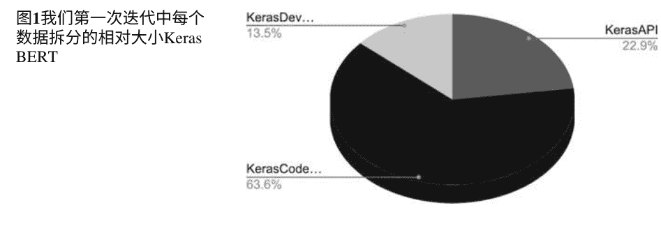

### 3.5 计算和实验细节

研究语言模型的行为受到这些模型训练成本的限制。 已经证明语言模型在计算、模型大小和数据集大小方面呈现出幂律缩放的性能。 我们将模型大小限定为8000万个参数，并在实验中使用相对恒定的总数据集大小。 我们考虑的关键杠杆是训练这些模型的持续时间。 我们研究了使用所有可用数据、排除一个领域和仅使用一个领域进行训练的KerasBERT模型的长期学习曲线。 通过这个分析，我们得出结论，尽管性能在额外训练中继续提高，但在对数据领域的组合进行30个时期的训练和仅在一个数据来源上进行30个时期的训练后，我们可以观察到收敛并测试泛化能力。

对于未来的工作，我们希望将我们对口罩补全的定性评估与训练损失相结合，以提供对Keras语言理解的估计。

我们的实验使用了HuggingFace [33]的Transformers、Tokenizers和Trainer API。KerasBERT模型的词汇量为30,000个标记，包含8个隐藏层，每个隐藏层有12个注意力头，总共有8000万个参数。 预训练模型的实验中，词汇量为50,265，参数数量增加到9600万。 用于训练的每个序列包含128个标记。 这些序列经过掩码语言建模处理，以15%的概率选择一个标记进行掩码替换。 KerasBERT模型经过定性评估的填空测试训练了100个时期，批量大小为64。 这些模型的每次训练运行大约需要10小时，使用的是托管在Google Colab Pro上的NVIDIA V100 GPU。为了可重现性，我们计划在发布时公开用于训练这些模型的数据集。 我们根本不训练GPT-Neo变体GPT-J-6B，而是从提供的演示API [20]中以0.9的Top-P值和1的温度值进行采样。

### 3.6 定性评估

KerasBERT从训练数据中学到的表示通常会改善验证性能。 然而，我们希望深入研究并分离出需要保留知识的掩码完成

## 4 实验结果

### 4.1 学习曲线可视化

图2显示了Keras文档中不同验证拆分的学习曲线。我们通过在左侧图中显示使用所有可用训练数据进行训练的曲线，并在训练数据的子集上进行评估来进行实验的合理性检查。有趣的是，这表明模型在API子集上的表现比其他子集更好。这可能是因为这个数据拆分具有更一致的写作风格。其他三条曲线说明了将一个数据集从训练集中排除以进行验证。我们看到一个持续的趋势是初始改进和饱和。尽管验证曲线在改进方面饱和，但性能并没有下降，这表明没有出现问题的过拟合。总结一下，我们在所有可用数据上训练的模型在KerasAPI上实现了0.352的稀疏分类交叉熵损失，而当我们把KerasAPI排除在训练数据之外时，这个验证误差要高得多，达到3.89。KerasAPI和CodeExamples的组合在leave-one-out测试中表现最好，在KerasDevGuides上的分类交叉熵损失为2.77。如图1所示，这很可能是因为空这个拆分具有最多的可用训练数据。因此，我们预计在未来的工作中，随着我们收集更多的数据，性能将会提高。

### 4.2 领域泛化

机器学习模型通常使用独立和相同分布（i.i.d.）的训练-测试集进行评估。虽然独立和相同分布的训练-测试集对于评估统计学习理论的核心原则非常有用，但在实践中，我们需要一个非常大的数据集，以使独立或相同分布的数据集与现实世界的应用相匹配。 我们正在开发Keras语言模型，以便在自动完成、搜索和推荐等方面提供编程辅助。 这些应用程序遇到了许多不同的分布偏移样式。 这激发了我们对评估泛化能力的新方法的兴趣。

领域泛化是一种有用的泛化测试，用于了解写作风格对语言模型性能的影响。 例如，Keras API参考遵循一个标准的代码文档模板，其中按顺序描述类及其相应的方法和属性。 另外，关于Keras的Medium文章具有更多对话式的风格。 此外，KerasCodeExamples比Keras Kaggle笔记本采用了更正式的模板。领域测试使我们能够研究性能随分布偏移的降低情况。

Table1展示了从KerasBERT训练集中分离特定数据源的结果。我们将使用Keras信息的组合训练的模型在新的数据源上进行评估，从而分离出性能差距。 例如，我们在Keras GitHub (KGH)数据集上测试了使用Keras Code Examples (KCE)、Keras API Reference (Ref)、Keras Kaggle Notebooks (Kag)和Keras Medium (Med)训练的KerasBERT。

我们还相信这种测试可以用来评估领域的相似性。 深度学习中最令人兴奋的趋势之一是神经搜索。神经搜索通常通过使用从深度神经网络的中间层提取的向量表示来进行实例级相似性比较。这在最近邻搜索和查询-文档匹配等应用中非常成功。 更具挑战性的任务是将神经搜索的成功从单个实例推广到整个数据域。例如，我们

表1 将一个域从训练集中排除
| 排除域 | 总训练损失 | KCE损失 | REF损失 | KGH损失 | KAG损失 | MED损失 |
|---|---|---|---|---|---|---|
| 无 | 0.93 | 0.83 | 0 | 0.65 | 0 | 1.48 |
| KCE | 1.33 | 3.09 | 0.5 | 1.02 | 1.17 | 2.33 |
| REF | 1.49 | 1.27 | 2.89 | 1.04 | 1.15 | 2.2 |
| KGH | 1.38 | 1.22 | 0.5 | 3.26 | 1.14 | 2.21 |
| MED | 1.1 | 1.19 | 0.46 | 0.97 | 1.15 | 4.12 |
| 平均损失 | 1.32 | 1.53 | 0.89 | 1.38 | 1.5 | 2.55 |

### 4.3 填空测试

我们转向定性检查遮码完成。我们证明了Keras-BERT已经清楚地“记住”了一些Keras编程语言的细节。此外，我们从API指南手动构建填空测试，以模型API为例。我们的手动提示在写作风格上与验证设置中的随机遮码存在分布偏移。我们根据显著遮码将这些填空测试分为不同组，其中我们使用领域知识选择最具知识性的标记进行替换，以及最左侧、最右侧和随机遮码基线。

### 4.4 预训练模型和分词器

我们还报告了从HuggingFace模型中心获取预训练的RoBERTa模型的性能。该模型的参数稍大，为96M，并且具有更大的词汇表大小，为56,205。该词汇表也是基于BPE构建的，但是使用了一个更大的数据集。这个更大的数据集在建模Keras编程语言特定的共现性方面有限，但对于出现在维基百科等数据集中的更常见的词汇可能更好。例如，KerasCodeExamples，它代表了我们数据的绝大部分，主要包含描述代码和应用程序的自然语言。如图8所示，我们可以看到一些不在我们从头开始训练的KerasBERT模型中出现的完成词，比如“code”。我们发现，微调RoBERTa的预训练检查点，同时使用匹配的预训练分词器，可以达到大致相同的性能。图7展示了预训练的96M参数RoBERTa-base与我们的80M KerasBERT之间类似的学习曲线。这两个模型都是在KCE和REF上进行训练，并在REF数据源上进行评估，以验证模型的容量。我们预计在将KGH、KAG和MED数据源整合到未来的实验中，自定义分词器将超过这个模型。然而，我们认为这不是最紧迫的方向，以取得最直接的进展（图4和5）。## 4.5 GPT-Neo

如图6所示，GPT-Neo在精心策划的填空测试中表现比8000万参数的KerasBERT模型要好得多。对GPT-Neo的定性检查显示出对语言形式的令人印象深刻的了解，例如用项目符号样式的摘要列出输入参数的提示完成。然而，GPT-Neo远非完美，我们观察到严重的幻觉（生成的文本与事实不符）。尽管GPT-Neo推断出对每个参数进行进一步描述，但这些描述远非准确。

另一个常见的幻觉是指向Stack Overflow帖子的链接失效。GPT-Neo在填空测试中的表现令人印象深刻。然而，检查更长的生成文本显示出严重的缺陷。这些更长的生成文本如图10所示。

## 4.6 GPT-Neo提示

Keras框架中的一个常见错误是用户在编译模型之前尝试调用summary方法。这是常见的，因为用户经常希望快速查看参数计数或确认架构是否正确构建。 如果用户没有首先“构建”或编译模型，调用此方法将引发错误。 这对于新的Keras用户来说是违反直觉的，并且是KerasBERT或GPT-Neo帮助的一个很好的用例。 不幸的是，这是一个GPT-Neo在开箱即用时非常错误的例子。在图9中，我们说明了“提示”或添加额外的输入上下文对于帮助GPT-Neo在这个例子中是如何起作用的。

我们测试了“关于Keras编程语言的信息：”，“Keras是建立在TensorFlow之上的深度学习框架”，以及“关于Keras编程语言的问题：”[填空测试]“什么？”。这些例子说明了之前提到的GPT-Neo的幻觉（图7和图8）。

## 深度学习编程的语言模型...

Input: The [MASK] class groups layers into an object with training and inference features.

| Ground Truth | From Scratch - All Data | Fine Tuned - All Data |
|---|---|---|
| Model | Model: 0.717<br>Keras: 0.025<br>Layer: 0.012<br>Preprocessing: 0.011<br>Wide: 0.01 | Model: 0.19<br>Layer: 0.055<br>second: 0.35<br>Lookup: 0.03<br>Raw: 0.021 |

Input: The [MASK] is an object that can perform actions at various stages of pretraining (e.g. at the start or end of an epoch, before or after a single batch, etc).

| Ground Truth | From Scratch - All Data | Fine Tuned - All Data |
|---|---|---|
| Callback | Callback: 0.134<br>Mask: 0.085<br>Metric: 0.067<br>Model: 0.031<br>Compile: 0.025 | callback: 0.266<br>Model: 0.217<br>model: 0.081<br>metric: 0.065<br>batch: 0.034 |

Input: The Reptile algorithm was developed by OpenAI to perform model-agnostic meta-learning. Specifically, this algorithm is designed to quickly learn to perform new [MASK] with minimal training (few-shot learning).

| Ground Truth | From Scratch - All Data | Fine Tuned - All Data |
|---|---|---|
| tasks | Learning: 0.201<br>Models: 0.195<br>Networks: 0.048<br>Workflow: 0.047<br>tasks: 0.039 | models: 0.421<br>layers: 0.15<br>tasks: 0.052<br>model: 0.045<br>code: 0.143 |


### 图7 手工测试性能


### 图8 使用随机初始化器和自定义分词器从头开始训练的KerasBERT模型的学习曲线与稍大的RoBERTa模型从预训练检查点和分词器微调的学习曲线几乎相同

## 5 讨论

### 5.1 分词

分词是这个建模流程的关键组成部分。作为提醒，BPE从头开始构建标记，合并常见的共现字符。举个例子，我们的分词器将“Keras is a programming language”分成了：“Keras”，“is”，“a”，“program”，“ing”，“language”。为了比较起见，预训练的RoBERTa分词器将其分成了：“K”，“er”，“as”，“is”，“a”，“programming”，“language”。我们分词的另一个有趣细节是大小写的重要性。
编程语言和自然语言之间的网格在大小写敏感性上有所不同。
而“模型”是指具有方法和属性的特定对象，小写的“model”通常描述参数建模或神经网络。在我们的填空测试中，每个真实标记在大小写或整体频率方面都具有有趣的特征。例如，在

## 深度学习编程的语言模型...

Input: The [MASK] class groups layers into an object with training and inference features.

| Ground Truth | From Scratch - All Data | Fine Tuned - All Data |
|---|---|---|
| Model | Model: 0.717<br>Keras: 0.025<br>Layer: 0.012<br>Preprocessing: 0.011<br>Wide: 0.01 | Model: 0.19<br>Layer: 0.055<br>second: 0.35<br>Lookup: 0.03<br>Raw: 0.021 |

Input: The [MASK] is an object that can perform actions at various stages of pretraining (e.g. at the start or end of an epoch, before or after a single batch, etc).

| Ground Truth | From Scratch - All Data | Fine Tuned - All Data |
|---|---|---|
| Callback | Callback: 0.134<br>Mask: 0.085<br>Metric: 0.067<br>Model: 0.031<br>Compile: 0.025 | callback: 0.266<br>Model: 0.217<br>model: 0.081<br>metric: 0.065<br>batch: 0.034 |

Input: The Reptile algorithm was developed by OpenAI to perform model-agnostic meta-learning. Specifically, this algorithm is designed to quickly learn to perform new [MASK] with minimal training (few-shot learning).

| Ground Truth | From Scratch - All Data | Fine Tuned - All Data |
|---|---|---|
| tasks | Learning: 0.201<br>Models: 0.195<br>Networks: 0.048<br>Workflow: 0.047<br>tasks: 0.039 | models: 0.421<br>layers: 0.15<br>tasks: 0.052<br>model: 0.045<br>code: 0.143 |


### Input: "The summary method of the Model class raises a ValueError if summary() is called before the model is"

| Ground Truth | built |
|---|---|
| No Prompt | Fitted. If you want to check the summary methods of the different models before calling fit() or predict(), then you will need to filter out the appropriate ones yourself. This is generally not recommended though. |
| Information about the Keras programming language: | Trained. Keras adds time to the x, y, and sample_weight Tensors before summary() is called. The actual time the summaries are calculated can vary from 0ms to thousands of ms based on the data to summary. If you call summary() before the model is ready, this method throws a ValueError. |
| Keras is a Deep Learning framework built on top of TensorFlow. | Fully trained. It is not possible to tell whether the model is finished training unless you look at the tr_loss, tr_loss/loss and tr_loss_no_batch. In my case, after the training for first few epochs it stop but I was able to train for more than 100 epochs. I am not sure why this is happening? |
| Question about the Keras programming language: [cloze test inserted here] what? | Thank you very much for the clarification! A: I think there is a typo: model is the instance of Keras's model class, therefore summary should be: Import tensorflow as tf Model = tf.keras.models.load_model('models/model.h5') tf.summary.plot_variables(tf.summary.plot_variables(model.summary)) Unfortunately I do not have access to the tf-library at |

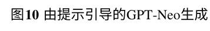

在我们的全部数据语料库中，“模型”出现了80次，而“model”出现了1,257次。同样，“回调”出现了10次，“callback”出现了36次。另一个测试的完成词“tasks”只出现了16次。我们将将来的工作留给探索语言建模和下游知识保留评估的长尾和类别不平衡问题[38-40]。

### 5.2 BERT与GPT架构设计

另一种解决语言建模小数据集的方法是利用大型预训练模型（如GPT-Neo）的零样本学习能力。尽管我们对GPT-Neo的生成能力印象深刻，但幻觉问题非常突出。我们认为对这些模型在知识库或数据库式功能方面的有效性持怀疑态度。对于所提出的应用非常重要的是，GPT-Neo包含60亿个参数。这些模型无法使用经济计算资源进行微调，而零样本学习也不适合保留模型未经训练的知识的任务。Keras-BERT是一种BERT风格的架构，这意味着它是通过在上下文的中间位置进行掩码标记预训练的。GPT架构是通过在上下文的最右部分或序列的末尾进行掩码标记预训练的。GPT风格的模型可能更适合本研究中探索的问答测试。然而，我们认为代码支持模型可能受益于双向上下文。我们怀疑Keras用户在代码块的中间可能会出现错误，因此能够整合左右上下文的BERT风格模型非常有用。我们将把将KerasBERT扩展到调试任务留给未来的工作。

### 5.3 幻觉和对文本风格的鲁棒性

深度学习中一个重要问题是依赖虚假相关性进行预测。在自然语言处理中，这个问题体现为意义和形式之间的辩论[1]，我们稍后会进一步讨论。我们用我们的KerasBERT模型突出了幻觉问题，首先展示了对填空任务的释义大大阻碍了性能，其次是当将填空任务改写为问题形式并将掩码位置放在最右边时，KerasBERT无法解决相同的任务。然而，我们展示了GPT-Neo对此更加鲁棒，证明了模型规模和训练数据大小可能是解决这个特定问题的方法。虽然GPT-Neo在替换最右边的标记方面表现良好，但我们检查了更长的输出并观察到严重的幻觉。幻觉[28]用于描述不基于事实知识的文本生成，例如推荐一个有损链接的文章。与KerasBERT类似，GPT-Neo也显示出对特定形式语言的类似偏见。在我们的讨论部分，我们提出了实现更好的对问题形式的鲁棒性的未来方向。

## 5.4 意义与形式

Bender和Koller [1] 提出了一个很好的思想实验，用于理解真正理解语言的语言模型和仅仅学习语言风格或形式的模型之间的区别。这个思想实验是假装有两个人

## 5.4 意义与形式

他们被困在不同的岛上。他们可以通过两个岛屿下方的水下电缆互相交流。我们想象一只章鱼正在截取通信。这只章鱼最终学会了模仿其他岛民，以至于如果章鱼截取线路并模仿其他人，它将不会被发现。这一切都很顺利，直到其中一位岛民在各自的岛上遇到了一只熊。岛民对着电缆喊道：“救命，熊！”章鱼无法理解这条信息，因为它所发展的世界观完全建立在文本通信上，而不是语言所描述的真实经验。

这个想法与KerasBERT有什么关系？即使KerasBERT能够填充掩码的标记或者希望根据用户的问题重复事实信息，但仅仅通过语言建模训练目标本身，很难使得人工智能深入理解Keras语言。我们认为，仅仅通过语言建模任务目标可能不足以实现这一点，即使使用非常大规模的数据。我们相信，强化学习可以用于优化生成和执行自己代码的KerasBERT模型。我们相信，这种经验将使KerasBERT的智能基于描述的现实世界。我们在未来工作中提出了一些具体的步骤。

## 6 未来工作

### 6.1 Keras监督学习任务

在自然语言处理中，常见的做法是评估自监督语言模型在另一个任务中作为初始化的效果。这种做法通常被称为迁移学习。此外，第二个任务通常被称为“下游任务”。大多数自然语言处理的迁移学习研究都使用监督学习作为下游任务。然而，我们发现使用代码数据而不是自然语言文本可以进行额外的自监督任务来评估我们的模型。我们进一步描述了每个任务对我们最终的用例和人机界面的重要性。

我们考虑的第一个任务是根据生成它的Keras代码来预测神经网络中的参数数量。神经网络架构由包含Keras代码的字符串序列表示。例如，“x = keras.layers.Dense(512,activation=‘relu’)”描述了添加一个密集型MLP层到神经网络架构所需的Keras代码。我们定义了一个潜在架构的搜索空间，以及它们的字符串描述。然后我们遍历这个搜索空间，生成成千上万个独特的架构。一旦生成了这些架构，我们利用Keras模型摘要来提取结果架构中的参数数量。神经架构参数计数器（NAPC）数据集由Keras架构代码和结果参数计数的成对组成。

### 6.2 数据清理工作

在我们当前的数据集中，Keras代码和自然语言文本的初始表示相当相似。我们认为这是当前这些实验的一个基本问题，因为代码中存在缺失的结构。例如，我们几乎看不到换行符。即使换行符用于表示不同的代码语句，我们认为这会错过控制块的关键信息。例如，当声明一个for循环时，下一个换行符还会附带缩进。当前的KerasBERT数据集完全缺乏这种缩进信息，我们认为它为预测代码建模任务增加了重要信息。

我们目前正在为结构化代码语言（SCL）中的代码片段进行附加注释。为了解决上述问题，我们使用单独的<eos>（语句结束）和<ctrl>（控制块）来划分代码语句。我们还提供了额外的注释，如使用<text>和<code>来分隔自然语言文本和Keras代码。这种额外的注释应该进一步帮助我们的模型，一旦我们将KerasBERT扩展到更大的参数规模，就像我们在实验分析中展示的那样。我们还可以将这些文本和代码块的注释用于对比表示学习的未来工作。## 6.3 附加数据源

本章记录了我们将原始的KerasBERT公开发表的经验扩展到更大数据集的过程。我们已经确定了几个额外的高级领域来获取这些数据。首先，出现了许多数据集，例如CoSQA [44]，我们可以从中获取Python信息。除了添加Python知识外，我们的模型可能还会从类似的深度学习框架（如PyTorch或Jax）中受益。正如我们在实验中所展示的，即使是写作风格上的细微差异也会对当前一代语言模型产生很大的影响。即使PyTorch代码在底层语义上没有太大的不同，代码库的风格差异对于这些用于代码的深度学习模型来说仍然具有巨大的好处。我们还对描述深度学习系统组件的科学论文中包含的自然语言信息感兴趣。

由于大多数KerasCodeExamples（KCE）都是科学论文的实现，我们相信将这个数据源与当前的研究进行结合是非常自然的。在本章中，我们探讨了语言模型的新数据源的整合。随着我们继续扩展所描述的数据源，这将是一个非常重要的指标来对我们的模型进行合理性检查。

## 7 结论

总之，我们介绍了KerasBERT模型和语言建模任务Keras信息。在本章中，我们还描述了将3个额外的数据源添加到我们原始的KerasBERT模型中。我们已经描述了考虑因素如特定的泛化测试和原始数据注释的重构，以集成新数据。这些测试帮助我们发现模型并不真正理解Keras信息，即使它们在相同领域的i.i.d.测试集上泛化。例如，仅仅因为我们的模型在KerasCodeExamples上训练时可以达到较低的测试损失，它们并不适用于Keras Kaggle Notebooks。这使我们得出结论，这些

## 参考文献

1. Bender, E., Koller, A.: 在数据时代迈向NLU：关于意义、形式和理解，ACL，第5185-5198页（2020年）  
2. Liu, Y., Ott, M., Goyal, N., Du, J.: RoBERTa：一种稳健优化的BERT预训练方法。在：CoRR（2019年）。 https://arxiv.org/1907.11692  
3. Devlin, J., Chang, M., Lee, K., Toutanova, K.: BERT：用于语言理解的深度双向转换器的预训练。在：CoRR（2018年）。 https://arxiv.org/1810.04805  
4. Nadkarni, R., Wadden, D., Beltagy, I., Smith, N.A., Hajishirzi, H., Hope, T.: 用于生物医学知识库完成的科学语言模型：一项实证研究。在：CoRR（2021年）。 https://arxiv.org/2106.09700  
5. Shibata, Y., Kida, T., Fukamachi, S., Takeda, M.: 字节对编码：一种加速模式匹配的文本压缩方案  
6. Gao, L., Biderman, S., Black, S., Golding, L., Hoppe, T., Foster, C., Pang, J., He, H., Thite, A., Nabeshima, N., Presser, S., Leahy, C.: The pile: 一个800GB的多样化文本数据集，用于语言建模。在：CoRR (2020). https://arxiv.org/2101.00027  
7. Weiss, K., Khoshgoftaar, T.M., Wang, D.: 迁移学习综述。在：J. Big Data (2016)  
8. Zhu, Y., Kiros, R., Zemel, R., Salakhutdinov, R., Urtasun, R., Torralba, A., Fidler, S.: 对齐书籍和电影：通过观看电影和阅读书籍实现类似故事的视觉解释。 在：IEEE国际计算机视觉会议论文集 (2015)  
9. Hendrycks, D., Basart, S., Kadavath, S., Mazeika, M., Arora, A., Guo, E., Burns, C., Puranik, S., He, H., Song, D., Steinhardt, J.: 使用APPS评估编码挑战能力。在：CoRR (2021). https://arxiv.org/2105.09938  
10. Wang, A., Singh, A., Michael, J., Hill, F., Levy, O., Bowman, S.: GLUE: 一个用于自然语言理解的多任务基准和分析平台。在：CoRR (2018). https://arxiv.org/1804.07461  
11. Lu, S., Guo, D., Ren, S., Huang, J., Svyatkovskiy, A., Blanco, A., Clement, C., Drain, D., Jiang, D., Tang, D., Li, G., Zhou, L., Shou, L., Zhou, L., Tufano, M., Gong, M., Zhou, M., Duan, N., Sundaresan, N., Deng, S.K., Fu, S., Liu, S.: CodeXGLUE: 一个用于代码理解和生成的机器学习基准数据集。 在：CoRR (2018). https://arxiv.org/2102.04664  
12. Roberts, A., Rafael, C., Shazeer, N.: 你能将多少知识装入语言模型的参数中？在：CoRR (2020). https://arxiv.org/2002.08910  
13. Thorne, J., Yazdani, M., Saeidi, M., Silvestri, F., Riedel, S., Halevy, A.: 数据库推理在文本上。在：CoRR（2021年）。 https://arxiv.org/2106.01074  
14. Brown, T., Mann, B., Ryder, N., Subbiah, M., Kaplan, J., Dhariwal, P., Neelakantan, A., Shyam, P., Sastry, G., Askell, A., Agarwal, S., A. Herbert-Voss, Krueger, G., Henighan, T., Child, R., Ramesh, A., Ziegler, D.M., Wu, J., Winter, C., Hesse, C., Chen, M., Sigler, E., Litwin, M., Gray, S., Chess, B., Clark, J., Berner, C., McCandlish, S., Radford, A., Sutskever, I., Amodei, D.: 语言模型是少样本学习者。在：CoRR（2020年）。 https://arxiv.org/2005.14165  

15. Khashabi, D., Min, S., Khot, T., Sabharwal, A., Tafford, O., Clark, P., Hajishirzi, H.: 统一QA：跨越格式边界的单一QA系统。 在：CoRR（2020年）。 https://arxiv.org/2005.00700  

16. Raffel, C., Shazeer, N., Roberts, A., Lee, K., Narang, S., Matena, M., Zhou, Y., Li, W., Liu, P.J.: 通过统一的文本到文本转换器探索迁移学习的极限。机器学习研究杂志（2020年）  

17. Thorne, J., Yazdani, M., Saeidi, M., Silvestri, F., Riedel, S., Halevy, A.: 神经数据库。在：CoRR（2020年）。 https://arxiv.org/2010.06973  

18. 王乐乐和罗凯：处理COVID-19快速扩展文献的文本挖掘方法。在：生物信息学简报（2020年）  

19. Vaswani, A., Shazeer, N., Parmar, N., Uszkoreit, J., Jones, L., Gomez, A.N., Kaiser, L., Polosukhin, I.: 注意力就是你所需要的。 在：神经信息处理系统（2017年）  

20. https://6b.eleuther.ai/。2021年7月访问  

21. Black, S., Gao, L., Wang, P., Leahy, C., Biderman, S.: 使用网格张量流进行大规模自回归语言建模  

22. https://keras.io/. 2021年6月访问  

23. Nichol, A., Achiam, J., Schulman, J.: 关于一阶元学习算法。 在: CoRR abs/1803.02999, 2018. https://arxiv.org/1803.02999  

24. en.wikipedia.org，2021年6月访问  

25. Gururangan, S., Marasovic, A., Swayamidpta, S., Lo, K., Beltagy, I., Downey, D., Smith, N.A.: 不要停止预训练：将语言模型适应到领域和任务中。在：ACL (2020)  

26. Lee, J., Yoon, W., Kim, S., Kim, D., Kim, S., So, C.H., Kang, J.: BioBERT：一种预训练的生物医学语言表示模型，用于生物医学文本挖掘。 在：生物信息学简报 (2020)  

27. Beltagy, I., Lo, K., Cohan, A.: SciBERT: 用于科学文本的预训练语言模型。在：ACL (2019)  

28. Shuster, K., Poff, S., Chen, M., Kiela, D., Weston, J.: 检索增强减少对话中的幻觉  

29. Kwiatkowski, T., Palomaki, J., Redfield, O., Collins, M., Parikh, A., Alberti, C., Epstein, D., Polosukhin, I., Kelcey, M., Devlin, J., Lee, K., Toutanova, K., Jones, L., Chang, M., Dai, A., Uszkoreit, J., Le, Q., Petrov, S.: 自然问题：问题回答研究的基准。在：ACL (2019)  

30. https://www.ncbi.nlm.nih.gov/pmc/. 2021年7月访问  

31. 冯, Z., 郭, D., 唐, D., 段, N., 冯, X., 龚, M., 寿, L., 秦, B., 刘, T., 江, D., 周, M.: CodeBERT: 一种用于编程和自然语言的预训练模型。在：ACL (2020年)  

32. 刘易斯, P., 德诺耶, L., 里德尔, S.: 无监督问答通过填空翻译。在：ACL (2019年)  

33. 沃尔夫, T., 德布特, L., 桑, V., 肖蒙德, J., 德朗格, C., 莫伊, A., 西斯塔克, P., 罗尔特, T., 卢夫, R., 方托维奇, M., 戴维森, J., 施莱弗, S., 普拉滕, P.v, 马, C., 杰尼特, Y., 普鲁, J., 徐, C., 斯卡奥, T.L., 古格尔, S., 德拉梅, M., 洛埃斯特, Q., 拉什, A.M.: 变压器：最先进的自然语言处理。在：EMNLP (2020年)  

34. Mastropaoalo, A., Scalabrino, S., Cooper, N., Palacio, D.N., Poshvyanyak, D., Oliveto, R., Bavota, G.: 研究使用文本到文本转换变压器来支持与代码相关的任务。在：CoRR (2021). https://arxiv.org/2102.02017  

35. Kanitscheider, I., Huizinga, J., Farhi, D., Guss, W.H., Houghton, B., Sampedro, R., Zhokhov, P., Baker, B., Ecoffet, A., Tang, J., Klimov, O., Clune, J.: 在一个复杂的、视觉的、难以探索的领域中进行多任务课程学习：Minecraft。CoRR abs/2106.14876 (2021). https://arxiv.org/2106.14876  

36. Shorten, C., Khoshgoftaar, T.M.: 用于深度学习的文本数据增强。J. Big Data (2021)  

## 通过利用文本信息、元数据和个性化注意机制进行下一个工作申请预测

Jun Zhu，Gautier Viaud和Cline Hudelot  

摘要 下一个工作申请的预测是工作推荐系统中最重要的用例之一。本研究提出使用下一个项目推荐方法来建模求职者的职业偏好，以更准确地发现他们可能申请的下一个工作岗位。我们提出的模型，个性化注意下一个申请预测（PANAP），由三个模块组成。第一个模块以无监督的方式从文本内容和元数据属性中学习工作岗位的表示。第二个模块从工作申请记录和元数据属性中学习求职者的表示。它包括一个个性化注意机制，根据特定求职者的个人资料调整学习到的职业偏好表示中每个工作的重要性。然后，第三个模块根据表示的相似性将下一个申请预测任务建模为一个前K个搜索过程。文本内容在描述工作岗位时起着重要作用，工作内容的编码方式会影响模型的性能。因此，我们探索了不同内容编码方法的效用。此外，地理位置是影响招聘领域求职者偏好的另一个重要因素。我们还从负采样策略的角度探索了地理位置对模型性能的影响。

## 1 引言

如今，随着互联网的不断快速发展，传统的招聘方法已经发生了革命性的变化。电子招聘，也被称为在线招聘，是招聘候选人填补空缺的过程。

J. Zhu (✉) · G. Viaud · C. Hudelot  
Math matiques et Informatique pour la Complexit et les Syst mes, CentraleSup lec, Universit Paris-Saclay, Gif-sur-Yvette, France  
e-mail: jun.zhu@centralesupelec.fr  

G. Viaud  
e-mail: viaud.gautier@centralesupelec.fr  

C. Hudelot  
e-mail: celine.hudelot@centralesupelec.fr  

© 作者，独家许可给 Springer Nature Singapore Pte Ltd. 2023  
M. A. Wani 和 V. Palade (eds.), Deep Learning Applications, Volume 4,  
Advances in Intelligent Systems and Computing 1434,  
https://doi.org/10.1007/978-981-19-6153-3_7  

通过互联网的职位发布对整个人力资源（HR）管理领域产生了相当大的影响，并成为许多机构和公司的主要招聘渠道。因此，过去十年间在线招聘信息（即员工个人信息和雇主招聘信息）数量大幅增加。例如，2021年全球超过200个国家和地区有7.56亿用户，在LinkedIn上列出了超过5700万家公司，有超过1500万个职位空缺。每周有4000万人使用LinkedIn搜索工作，每分钟有三人在LinkedIn上被雇佣。显然，在招聘领域中迫切需要更有效的技术来处理和分析大量的数据。事实上，构建职位推荐系统[10, 30, 61]通常被视为招聘领域的终极目标，旨在根据求职者的职业偏好为其检索相关职位列表，或者根据职位要求找到最佳的潜在候选人。因此，已经提出了许多工作来构建有效的职位推荐系统[27]，或者解决围绕职位推荐系统的不同任务，如职业流动预测[24, 33, 70]，职位分类[20, 23]和技能提取[21, 60]。在这些相关研究中，人-职位匹配问题得到了最多的研究所[42, 68]。通过考虑语义数据的内容，它们通过基于深度学习（DL）的技术显著改进了经典匹配算法[7, 9]。尽管进行了广泛的研究，但当前的工作和方法仍然存在重要问题。

因此，在本文中，我们解决了下一个工作申请预测任务下的工作推荐问题。我们提出了一个混合个性化注意力下一个申请预测模型（PANAP）来部分解决这些问题。以下是问题和相关解决方案的列表：

- • 问题1：第一个问题与固有动态和不断演变的工作-人员互动有关，这可以从工作申请记录或工作历史中构建。因此，我们可以假设申请记录之间的时间关系倾向于指向顺序/基于会话的推荐。据我们所知，尽管在其他领域[66]（如新闻、电子商务和电影）中提出了各种基于会话的推荐方法，但基于会话的工作推荐研究较少。此外，工作-人员互动矩阵的另一个关键方面是其稀疏性，因为大多数求职者只申请了整个存储库中的几个职位或在特定职业中工作。解决方案：我们将下一个工作申请问题建模为顺序推荐问题，然后将我们提出的模型与不同的基于会话的推荐方法进行比较，以分析招聘领域的动态性。对相关文献的彻底搜索只得到了一项相关工作[65]，该工作使用不同的自动编码器架构对会话进行编码，并  

1 https://www.linkedin.com.  
2 https://www.omicoreagency.com/linkedin-statistics.  
3 在本文中，我们通过更广泛的术语“序列”描述了推荐任务来探索序列数据。因此，“会话”和“序列”是可以互换的。

## 下一个工作申请预测...

然后以K近邻的方式推荐下一个工作职位。我们的工作是将深度端到端网络应用于下一个应用程序预测任务的首次尝试。

- ●问题2：第二个问题与招聘领域中数据的敏感性和隐私有关。数据隐私是每个公司的首要任务，尤其是在招聘方面。例如，电子招聘平台会收集每个人才的大量个人数据，包括个人信息（例如国籍、电子邮件地址、电话号码和年龄）和职业信息（例如教育背景和工作经验）。所有这些数据都是非常私密和重要的。因此，在招聘领域收集数据集比其他领域要复杂得多，尤其是带有注释的数据集。解决方案：出于隐私原因，它阻止了使用监督式机器学习方法，例如在人-工作匹配问题[42, 43]中使用的文本匹配方法，该方法在监督训练期间端到端地学习人和工作的表示。我们的模型与此不同。具体而言，我们的模型PANAP由三个独立模块组成。第一个模块名为工作内容表示，以无监督的方式从文本工作内容和可用元数据中学习工作表示，以减轻对带注释数据的依赖。我们进一步探索了不同文本表示方法（例如Word2Vec [14]，Doc2Vec [19]和BERT [37]）对最终预测结果的影响。

- ●第三期：第三期与个性化推荐有关。事实上，两个求职者可以因不同的动机申请同一份工作。因此，工作中的重要信息对求职者来说是特定的。因此，在求职者职业建模任务中，对不同的工作进行加权是至关重要的。解决方案：我们模型中的第二个模块名为求职者表示，包含了一个个性化注意机制，用于学习求职者的表示，从而解决个性化推荐的问题。与[55]中的经典注意机制不同，个性化注意机制使用了求职者特定的查询向量，这将在第3.3节中解释。

- ●第四期：第四期与招聘领域的不断发展有关。事实上，除了不断更新的电子招聘网站（即每天都会添加或删除大量职位，并创建或更新数百个候选人简介），该领域仍在不断发展（即新的职业、形式和技能）。所有这些都加剧了推荐中众所周知的冷启动问题。因此，构建一个不能随着数据不断变化而快速调整的静态方法是不切实际的。因此，我们需要避免在领域每次变化时重新训练深度模型。解决方案：我们模型的第三个模块名为下一个申请预测器，用于预测求职者将申请的下一个职位。一些深度推荐模型[45]将推荐问题视为分类任务，并使用softmax交叉熵损失来训练模型，即预测器的输出通常是一个概率向量，其维度是可用项目的数量。这种损失函数可能更适用于更新频率较低的稳定领域。然而，由于招聘领域的动态性如上所述，我们设计了一种不同的受深度结构语义模型（DSSM）[13]启发的预测器，其训练损失基于表示的相似性，将在第3.4节中解释。

- ●第五期：第五期与招聘领域中的独特偏好影响因素有关。许多因素可能影响求职者对工作的偏好，例如工作内容，类似于新闻推荐中的文章内容，是最重要的因素之一。除了工作内容，基于招聘领域的独特性，求职者的个人背景信息在招聘领域中也至关重要。其中，求职者的地理位置是一个不可忽视的因素，通常对申请决策和推荐结果产生重大影响，即求职者更有可能申请离他们当前位置较近的工作。它提出了两个相反的目标。一方面，在建模个人偏好时，考虑和捕捉这个个人背景信息是至关重要的。另一方面，在进行推荐时，推荐系统还需要将这些信息与更核心的内容，即工作内容，区分开来。解决方案：为了在进行推荐时考虑“位置”因素，我们的模型在建模工作和求职者表示时添加了与位置相关的元数据，例如城市和州。此外，我们提出了一种特定的负采样策略，考虑了工作和求职者的地理位置。

我们的模型受到上述五个问题的启发，这些问题从下一个应用预测的方向解决了工作推荐。它的三个模块回答了这些问题，即减少对注释数据的依赖，提高推荐的个性化程度，适应连续和快速的项目更新，并考虑特定的偏好影响因素。我们的贡献包括以下几点：

- • 我们提出了一种新的基于会话的模型，名为PANAP，用于下一个应用预测任务。它整合了个性化注意机制以提高推荐准确性。
- • 我们提出了一种新颖的基于位置的采样策略，将与求职者所在州相同的工作作为负样本优先考虑。实验证明这种策略可以提高推荐的质量。
- • 我们对CareerBuilder12数据集进行了广泛的实验研究，以调查利用不同的元数据类型、不同的职位发布部分和不同的文本内容编码器对模型性能的影响。

本章首先回顾了第2节中的一些相关工作，然后在第3节中详细阐述了问题的形式化和我们的方法。最后，在第4节中，我们对进行的实验进行了调查，并在第5节中讨论了结果。

## 2 相关工作

在本节中，我们从以下几个方面简要回顾了几个相关工作。

### 2.1 招聘领域的深度学习

职位推荐系统主要旨在衡量个人和职位之间的相关性得分，以基于得分进行推荐（例如，向人才推荐相关职位或向空缺推荐合格候选人）。基于传统方法（即协同、内容和混合方法）的职位推荐系统已经得到了广泛研究。然而，这些方法在招聘领域存在一些关键限制。例如，职位-个人交互的稀疏性限制了协同方法的性能。当职位内容中的信息不足或内容的特征工程困难时，基于内容的方法可能变得不准确。此外，这些方法通常缺乏对个人信息建模的能力。最近，深度学习在推荐系统中产生了巨大的革命。与其他领域一样，基于深度学习的方法已经应用于招聘领域，以明确或隐含地解决推荐问题。根据处理的数据和使用的学习范式，这些工作可以分为三类：

1. 基于文本匹配模型的标记人-职位匹配记录：当有标记的人-职位匹配记录可用时，推荐问题可以被视为一项监督文本匹配任务，自动将职位与候选人匹配。这种衡量个人能力与工作需求匹配程度的研究被称为人-职位匹配[2, 6]，已成为招聘领域最引人注目的话题之一。文献中提出了许多具有不同架构的方法。例如，端到端网络旨在共同学习职位和个人的表示[42, 43]，三级域自适应匹配模型[57]，以及可以从稀疏、噪声交互数据中学习表示的多视图共同教学网络[68]。虽然上述匹配模型具有不同的结构，但它们都专注于改进个人和职位的表示。它们都证明了自己的有效性。然而，由于商业机密保护、个人隐私和其他实际原因，收集此类标记记录是困难的。

2. 无监督学习招聘相关信息：当没有人-职位匹配记录时，招聘研究的另一个方向是在相同的嵌入空间中学习招聘相关信息的表示。招聘相关信息包括各种内容，如职位标题和技能。这些研究并没有直接解决职位推荐问题，但学习到的表示可以使许多职位推荐系统的子任务受益。例如，[44]首先从简历的工作历史部分创建三个图（即职位转换图、职位-技能图和技能共现图）。然后，使用贝叶斯个性化排名和基于边界的损失函数，将职位标题和技能表示共同学习到一个共享的潜在空间中。学习到的表示可以用于更好的职位推荐和技能推荐。张等人[63]提出了一种集体多视图（即图拓扑、语义、职位转换平衡和职位转换持续时间视图）方法来学习职位标题的表示，用于职位标题基准任务。在这些方法中，不同级别/视图的信息至关重要。

3. 基于职业路径的方法：上述方法主要关注对个人或职位信息的表征。对职业路径的转变考虑较少。事实上，人才职业轨迹中的丰富信息为招聘分析提供了新的范式。对职业路径的研究可以为员工和雇主提供潜在的好处。为了解决这个问题，提出了一些方法，例如，NEMO [33]通过聚合所有个人资料信息（例如技能和公司），生成上下文表示，然后通过长短时记忆（LSTM）[4]探索职业路径中的行动依赖性，以预测下一个职业发展方向（即职位和公司）。[38]基于职业素质、科学环境和合作关系研究科学家的迁移。[55]使用分层LSTM预测一个人的下一个潜在雇主以及他/她在新职位上的任职时间。然而，基于申请记录预测下一个工作申请相对较少被考虑，除了[65]以K最近邻的方式推荐下一个工作职位。这是我们的一个基准。

### 2.2 深度顺序推荐模型

下一个应用预测问题可以被视为一个顺序推荐问题，最近在其他领域中得到了广泛研究，例如新闻或产品推荐[26, 28, 52, 66]。循环神经网络（RNN）（例如LSTM和门控循环单元（GRU）[17]）已经广泛研究用于顺序推荐，因为它们在处理顺序数据方面表现出了有效性[22, 25, 45]。将RNN应用于顺序推荐的第一个工作是GRU4Rec [22]，并且许多努力[25, 45]已经从模型训练或特征学习的角度来改进GRU4Rec的性能。其他网络结构也得到了广泛研究，例如卷积神经网络（CNN）[39]，图神经网络（GNN）[56]和Transformer [50, 62]。注意机制[18]在提高准确性和可解释性方面显示出了有希望的潜力，例如基于注意力的[28, 51]和自注意力的[50, 62]。

### 2.3 文本表示方法

随着雇主和人才都转向电子招聘平台，他们接收/发送大量信息（例如职位发布、简历和面试反馈），通常以自由文本数字文档的形式加载/上传。理解这样的文本数据是必要的，因为它具有信息量，可以在各种任务中使用，例如工作分类和人-工匹配。因此，已经做出了许多努力[69]，从文本中提取重要特征以形成更具信息量的表示。早期对文本建模的尝试包括将其视为简单的词袋（BoW）表示[5]或使用词频逆文档频率（TF-IDF）[1]。这些经典方法无法捕捉词语的句法和语义含义，并且受到高维度的困扰。提出了更先进的方法来学习低维空间中的分布式词表示，例如非上下文词嵌入模型，例如Word2Vec [11]，Doc2Vec [19]，GloVe [15]和FastText [29]；上下文词嵌入模型，例如ELMo [49]；以及预训练语言模型[67]，例如BERT [37]和OpenAI GPT [59]。

## 3 提出的模型

在本节中，我们首先对下一个应用问题进行了规定，然后通过描述不同的模块来描述我们提出的模型。

### 3.1 问题规定

设 $U$ 为求职者集合， $J$ 为职位集合（简称职位）。职位 $j \in J$ 可以表示为一个元组，即 $j = (\text{ID}_j, \{w_1^j, \ldots, w_{m_j}^j\}, \text{meta}_j)$，其中 $\text{ID}_j$ 是职位 $j$ 的唯一标识符。 $\{w_1^j, \ldots, w_{m_j}^j\}$ 是一个序列，表示职位 $j$ 的文本内容。它可以是有关职位的任何文本信息，例如职位标题和职位描述。 $\text{meta}_j$ 是关联的元数据属性，例如职位所在城市。类似地，每个求职者 $u \in U$ 可以被总结为一个元组 $u = (\text{ID}_u, \mathcal{H}_u, \text{meta}_u)$，其中包含一个标识符 $\text{ID}_u$，一个专业资料 $\mathcal{H}_u$，和元数据属性 $\text{meta}_u$，如教育背景或地理信息。具体而言，专业资料 $\mathcal{H}_u$ 可以表示为工作经验或求职记录。在这项工作中，我们针对的是求职记录，并将 $\mathcal{H}_u$ 表示为按时间排序的职位序列（会话） $\mathcal{H}_u = \{j_1, \ldots, j_n\}$，其中每个 $j_i$ 是 $J$ 中的一个特定职位。根据上述符号，下一个应用预测问题可以正式定义如下：

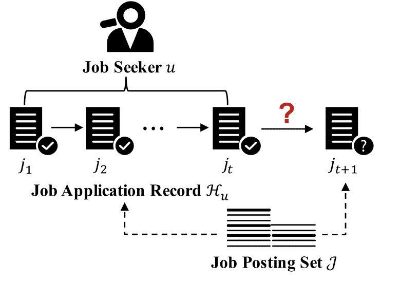

图1 下一个应用预测问题的示意图。给定求职者的求职记录 $H_u = \{j_1, j_2, j_3, \ldots, j_t\}$ 是求职岗位集合 $J$ 的子集。目的是预测求职者 $u$ 将申请的下一个工作 $j_{t+1}$。

给定一组可用的工作 $J$ 和一组求职者 $U$，对于每个特定的求职者 $u \in U$，他们在特定的时间步骤 $t$ 上有一个求职申请序列 $H_u = \{j_1, \ldots, j_t\}$。

预测求职者 $u$ 可能申请的下一个最有可能的工作 $j_{t+1}$，即最大化实际下一个申请的可能性 $P(j_{t+1} = j^+ | H_u, J)$ 给定申请序列 $H_u$ 的概率。图1 给出了一个示意图。

我们的模型概述如图2 所示，称为个性化关注下一个应用预测（PANAP）。它由三个模块组成：(i) 职位内容表示用于职位表示学习，(ii) 求职者表示用于求职者特征化，以及(iii) 下一个应用预测器用于下一个应用预测。接下来，我们将详细描述每个模块。

### 3.2 职位内容表示

第一个模块称为JCR（职位内容表示），负责学习每个职位 $j \in J$ 的表示，其中 $j = (ID_j, \{w_1^j, \ldots, w_{m_j}^j\}, meta_j)$。具体来说，对于职位 $j$，使用文本编码器从其文本内容 $\{w_{1j}, \ldots, w_{mj}\}$ 学习文本表示 $h_j \in R^d$：

```
h_j = text_encoder\left\{w_1^j, \dots, w_m^j\right\},
```

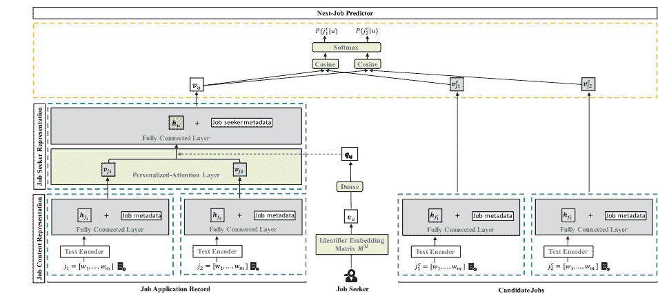

图2 提出的PANAP框架由三个独立部分组成：(i) 工作内容表示（即蓝色虚线框）用于学习工作内容表示。 (ii) 求职者表示（即绿色虚线框）使用个性化注意机制基于求职申请记录来表征求职者的职业偏好。 (iii) 下一个申请预测器（即黄色虚线框）利用基于工作和求职者表示相似性的排序损失来训练模型。

其中文本编码器可以是一些无监督的文本嵌入方法（例如Word2Vec [14]和Doc2Vec [19]）或预训练模型（例如BERT [37]）。我们相信不同文本编码器生成的文本表示将影响推荐的准确性。 我们将在第5.6节中探索不同的文本编码器。值得一提的是，文本工作表示 $h_j$ 是以无监督的方式单独训练或由预训练语言模型生成的，因此可以轻松快速地添加新的工作，从而缓解工作冷启动问题（问题2）。

元数据属性 $meta_j$（例如，城市和州）分别嵌入到向量中（例如， $v_j^{city}$ 和 $v_j^{state}$）通过不同的可训练嵌入矩阵（例如， $M^{city}$ 和 $M^{state}$）进行联合学习。向量 $v_j^{meta}$ 然后通过连接所有向量获得：

```
$v_j^{meta} = [v_j^{city} \oplus v_j^{country} \oplus \ldots]$
```

其中符号 $\oplus$ 表示连接运算符。然后通过使用一系列全连接（FC）层将文本工作表示 $h_j$ 和工作元数据向量 $v_j^{meta}$ 组合起来，生成维度为 $d^J$ 的工作向量 $v_j$：

```
$v_j = \text{FCs} \left([h_j \oplus v_j^{meta}] \right)$.
```

### 3.3 求职者表示

第二个模块，称为求职者表示（JSR），负责学习每个求职者 $u \in U$ 的表示。它需要三个输入：求职者 $u$ 的标识符 $ID_u$，他/她的历史申请工作序列 $H_u = \{j_1, \ldots, j_n\}^5$，以及相关的元数据属性 $meta_u$。此外， $H_u$ 可以转换为一个序列的工作向量 $\{v_{j_1}, \ldots, v_{j_n}\}$，其中每个 $v_{j_i} \in R^{d^J}$ 是从JCR模块获得的。由于相同的工作对不同的求职者具有不同的信息量，它对于表征求职者的职业概况有不同的贡献。然后，我们使用个性化注意机制[64]学习求职者的表示。

我们首先使用一个标识符嵌入矩阵 $M^{U} \in R^{|U| × d^s}$ 将求职者 $u$ 的 $ID_u$ 嵌入为一个向量 $e_u$，其中 $d^s$ 表示标识符嵌入的维度。然后， $e_u$ 通过一个参数化的稠密层（使用 $W^q \in R^{d^u × d^q}$ 和 $b^q \in R^{d^q}$）传递，形成偏好查询向量 $q_u = ReLU(W^q × e_u + b^q)$，其中 $d^q$ 是查询的维度。

求职者 $u$ 的第 $i$ 个工作的重要性得分计算如下：

```
α_i = \frac{ \exp\left\{v_{j_i}^T p_u \right\} }{ \sum_{i'=1}^n \exp\left\{v_{j_{i'}}^T p_u \right\} }
```

其中 $p_u = \tanh(W^a × q_u + b^a)$，其中投影参数 $W^a \in R^{d^q × d^J}$ 和 $b^a \in R^{d^J}$， $d^J$ 是职位向量的维度。请注意，相同工作的注意力分数可能会有所不同，因为查询向量取决于求职者的ID。这样可以形成求职者 $u$ 的加权职业偏好表示：

```
h_u = \sum_{i=1}^n α_i v_{j_i}
```

与JCR模块类似，求职者 $u$ 的元数据向量表示如下：

```
v_u^{meta} = [v_u^{city} ⊕ v_u^{education} ⊕ ...].
```

然后 $v_u^{meta}$ 通过使用一系列全连接层将 $h_u$ 和 $v_u$ 组合起来，生成最终的求职者向量：$V_u = FCs ( [h_u \oplus v_u^{meta}] )$，其中求职者向量 $h_u$ 具有维度 $d^U$，该维度等于求职向量 $h_u$（例如， $d^U = d^J$）。

> 5 我们省略了求职者的上标，不会影响清晰度。

## 3.4 下一个应用预测器

在经典的深度推荐模型中，输出通常是一个概率向量，其维度是可用项目的数量。在我们的求职推荐场景中，由于招聘领域的不断发展（问题4），这样的模型在实践中是不可行的。因此，这种动态场景需要一种方法，在每次变化时不需要重新训练整个网络。因此，受高度动态的新闻推荐场景的启发，我们使用排序损失[52]来训练预测器。这种损失的原则是训练预测器最大化用户偏好和正样本之间的相似性，同时最小化与负样本之间的相似性。

排名损失的想法来自于DSSM [13]，它是一种有效的文档排名模型，并已被用于推荐。更具体地说，DSSM使用深度神经网络（DNN）结构将一对文本字符串建模为连续的语义空间，然后测量两个字符串之间的语义相似性。在我们的案例中，我们衡量工作和求职者之间的相似性。更准确地说，给定求职者的应用历史 $H_u = \{j_1, \ldots, j_n\}$，我们将上述表示生成过程形式化为 $v_u = JSR(ID_u, H_u, meta_u; Θ_1)$，其中每个 $j_i \in H_u$ 可以嵌入到一个工作向量 $v_{j_i}$。

通过 JCR($j_i$; Θ_2)，Θ_1 和 Θ_2 是模型参数。 $v_u$ 和 $v_{j_i}$ 是相同维度的向量，因此我们可以通过它们的表示的余弦相似度来定义求职者 $u$ 和职位 $j$ 之间的相关性得分：

```
sim(u, j_i) = cos(v_u, v_{j_i}) = \frac{v_u ⋅ v_{j_i}}{\|v_u\| \|v_{j_i}\|}
```

求职者 $u$ 下一个工作的后验概率如下所示：

```
Pr(j|u) = \frac{\exp(sim(u, j))}{\sum_{j' \in j^+ \cup \mathcal{J}^-} \exp(sim(u, j'))}
```

其中 $j^+$ 是实际的下一个申请， $\mathcal{J}^-$ 表示求职者在活动期间没有申请的负样本集合。 推荐系统应该学习如何最大化正样本职位 $j^+$ 和求职者偏好向量 $v_u$ 之间的相似度，同时最小化与负样本集合 $\mathcal{J}^-$ 中职位向量 $v_j^-$ 的相似度。因此，损失函数定义为

```
\mathcal{L} = -\log \prod_{(u, j^+)} Pr (j^+ | ID_u, \mathcal{H}_u, meta_u; Θ_1, Θ_2).
```

通过这个损失函数，一旦对新发布的工作岗位进行编码，就可以立即推荐，从而解决问题4。此外，当建模表示时，我们还考虑了JCR和JSR中的工作和求职者的元数据属性。这些表示包含更多的上下文信息，将有助于提高（问题5）的推荐质量。## 3.5 负采样策略

由于我们的方法是根据第3.4节中描述的负样本进行训练和评估的，负样本集 J 显著影响模型的性能[35]。一种常用的采样策略是基于小批量的采样方法，该方法在[22]中提出，将同一小批量中的其他训练/评估会话中的项目视为负样本。Hidasi和Karatzoglou [45]通过添加额外的样本（基于统一性或基于流行度）扩展了基于小批量的策略。在新闻推荐的场景中，[52, 58]从最近与之交互的 N个项目的全局缓冲区中均匀采样额外的样本。对于一些应用程序，如新闻、音乐和视频，除了个人偏好外，流行度也是影响用户选择的重要因素。因此，基于流行度的采样是一种很好的采样策略。然而，在招聘领域，与这些应用程序不同，求职者的选择更多地受到他们的个人背景的影响，例如地理位置因素。当求职者做出选择时，他们通常首先需要考虑工作地点。他们更有可能申请他们所在城市或离他们当前位置不远的其他城市的工作（即同一州的城市）。我们将在第4.1节中证明这一观察结果。为了解决这个问题，我们的方法与工作和求职者的“位置”元数据属性（例如城市、州和国家）合作，分别对它们进行建模。因此，这些表示包含了“位置”信息。此外，在生成负样本时考虑“位置”可以使我们的模型学习到更有意义的推荐的有用信息。更多实验细节请参见第4.2节。

## 4 实验和结果

本节将描述我们的数据集并解释我们的实验设置。

### 4.1 数据集

我们采用了来自Kaggle竞赛的开放数据集CareerBuilder12，用于评估我们提出的方法。其统计数据如表1所示。它包含了近13周的求职申请。在这个数据集中，求职者有五个元数据：城市，州，国家，学位和专业。职位元数据是城市，州和国家。文本职位内容包括职位标题，职位描述和一些职位要求。从这个初始数据集中，我们创建了两个数据集：(i) CB12_s类似于[65]中的数据集，其中创建了会话。(ii) CB12_1使用13周内的所有应用记录来建模每个求职者的职业概况。因此，CB12_1具有更长的序列，使我们能够评估我们提出的方法的有效性。我们进一步将最后14天用于测试，剩余的会话用于训练。与[65]类似，我们在测试集中过滤掉不属于训练集的工作申请，这样可以更好地与只能推荐已用于训练模型的项目的方法进行比较。

正如我们在第3.5节中所描述的，“位置”是需要考虑的工作推荐的一个重要因素。为了进一步证明这一观察结果，在图3中，我们展示了求职者和应聘职位之间的位置关系在CareerBuilder12数据集中的情况。如图3b所示，在CB12_s中，大多数求职者（92.7%）和CB12_1中的求职者（93.8%）都申请了自己所在州的工作。在这些人中，81.3%和79.7%的求职者只考虑自己所在州的工作。图3a显示，只有39.6%和40.5%的求职者在自己所在的城市申请工作，因为他们所在城市的工作机会通常有限。如上所述，人们也在同一州的其他城市申请工作。因此，“位置”（工作地点或求职者当前位置）是求职推荐中需要考虑的重要因素。

此外，我们在图4a和b中列出了Top10求职者城市和求职者州，以及Top10工作城市和工作州，这些城市和州是求职者申请最多的。从图表中可以看出，工作州/工作城市和求职者州/求职者城市有很大的重叠，这也证明了“位置”对求职者的选择有影响。

### 4.2 实验设置

由于我们的模型PANAP由三个模块组成，我们将实验设置分为三部分进行解释。为了获得工作表示 h_j 在JCR中，我们首先将工作职位划分为单词，然后去除停用词、标点符号和数字。在这个实验中，h_j 通过分布式内存使用维度 d = 300通过Doc2Vec获得。我们还在第5.6节中比较了不同的文本编码器。在JSR中，标识符嵌入的维度 d^s 和查询维度 d^q 分别设置为100，维度 d^u 和 d^T 设置为300。我们对每一层应用了0.2的丢弃率的丢弃技术，并对参数权重应用了1e-4的L2正则化。低基数（<=10）的元数据属性进行了独热编码，高基数属性则表示为可训练的嵌入。在我们的设置中，我们使用了两个全连接层的序列，分别使用Leaky ReLU [12]和tanh激活函数来组合元数据向量。

PANAP是使用256个小批量大小进行训练和评估的，并且我们使用了学习率为5e-4的Adam [16]优化器。我们的模型是使用负样本进行训练和评估的，因此我们在训练中使用了15个负样本，在评估中使用了50个负样本。在我们的实验中，我们首先探索了一个受[45, 52, 58]启发的采样策略，然后针对职位推荐场景提出了一种改进的基于小批量的采样策略。这种改进的策略考虑了求职者和职位所在地的地理位置，在采样负面职位时会考虑这些因素。这两种策略如下：

- 策略1（S1）-小批量 + 额外样本：这是在[58]中提出的，当小批量中没有足够的负样本时，它会从全局缓冲区中最近申请的N个工作使用均匀采样策略添加额外样本。工作是从“候选集”（即小批量内的工作和额外的工作）中均匀采样的。
- 策略2（S2）-小批量 + 额外样本 + 基于位置：与策略1不同，在策略2中，我们首先选择与求职者处于相同状态的工作作为负样本从“候选集”中选择。当当前状态下没有足够的负样本时，我们从“候选集”中选择其他状态的工作。

我们通过与以下基线进行比较来评估PANAP：

- • POP：这是一个简单且通常强大的基线，推荐最受欢迎的（即最常申请的）职位发布；
- • 关联规则（AR）：这是关联规则[3]的简化版本，规则大小最大为两个；
- • 内容相似度（CS）：根据每个申请职位的表示和全局缓冲区中最近申请的N个职位之间的余弦相似度推荐相似的工作；
- • Item-kNN（IkNN）：它推荐与当前会话中最后一个申请的工作相似的工作，就像[22]中一样；
- • Session-kNN (SkNN) [32]：它将整个当前会话与训练数据集中的过去会话进行比较，而不仅仅考虑当前会话中的最后一个作业；
- • 向量乘法SkNN (V-SkNN) [41]：它是SkNN的一种变体，在计算与过去会话的相似性时更加强调最近与当前会话交互的作业；为此，使用了一个线性衰减函数，该函数取决于作业在会话中的位置；
- • VAE_Comb：它是在[65]中提出的最适合CareerBuilder12数据集的模型；
- • GRU4Rec：它是专门为顺序推荐场景设计的模型；对于这个实验，我们使用了最新版本的GRU4Rec [45]；
- • Bert4Rec [62]：它引入了双向自注意模型来建模用户行为序列；
- • PANAP的两个变体：(i) LSTM用LSTM层替换了个性化注意力层，图5a，和(ii) PLSTM在每个工作表示中添加求职者元数据以生成个性化工作向量[52]，然后再使用LSTM层，图5b。

本研究中使用的评估指标是准确率指标命中率(HR@5) [41]和两个最流行的排名指标，平均倒数排名(MRR@5) [41] 和标准化折现累积增益 (NDCG@5) [54]，截断值为5。给定一组序列样本 S 用于评估，这三个指标的形式定义如下。

- • HR@5 检查真实的下一个项目（基准）是否出现在前5个排名的项目中：

其中 i+ 是每个序列 S ∈ S 的真实下一个项目， r_i+ 是推荐系统为 i+ 生成的排名。符号 1 是一个指示符，如果 i+ 在前K个推荐项目中，则返回1，否则返回0。

・MRR@5 表示系统对真实项目的排名情况，对真实项目的位置敏感，对排名靠前的项目给予更高的分数。直观上，在实践中更好地将真实项目排名靠前。

・NDCG@5 根据推荐物品列表中的位置对每个真实物品进行奖励，表示其推荐程度。

## 5 实验结果

在本节中，我们展示了我们的实验结果。在本节中显示的所有表格中，粗体字表示每个指标中的最佳得分，下划线表示第二最佳得分。

```
HR@K = \frac{1}{|S|} \sum_{S \in S} \mathbb{1} (r_{i^+} \leq K),
```

```
MRR@K = \frac{1}{|S|} \sum_{S \in S} \begin{cases} \frac{1}{r_{i^+}} & \text{如果 } r_{i^+} \leq K \\ 0 & \text{否则} \end{cases}
```

```
NDCG@K = \frac{1}{|S|} \sum_{S \in S} \begin{cases} \frac{1}{\log_2(r_{i^+}+1)} & \text{如果 } r_{i^+} \leq K \\ 0 & \text{否则} \end{cases}
```

## 表2 下一个应用预测性能

| 方法 | CB12_s | CB12_1 |
|---|---|---|
| POP | 0.089/0.042/0.054 | 0.093/0.046/0.058 |
| AR | 0.273/0.200/0.218 | 0.202/0.146/0.160 |
| CS | 0.226/0.128/0.152 | 0.214/0.118/0.142 |
| IkNN | 0.274/0.202/0.220 | 0.202/0.147/0.161 |
| SkNN | 0.349/0.247/0.272 | 0.276/0.196/0.216 |
| V-SkNN | 0.349/0.248/0.273 | 0.276/0.196/0.217 |
| VAE_Comb | 0.345/0.239/0.256 | 0.282/0.203/0.224 |
| GRU4Rec | 0.367/0.208/0.230 | 0.403/0.309/0.352 |
| BERT4Rec | 0.373/0.232/0.245 | 0.438/0.311/0.369 |
| PANAP (S2) | **0.691/0.492/0.541** | **0.742/0.543/0.593** |
| LSTM | 0.540/0.339/0.389 | 0.569/0.368/0.418 |
| PLSTM | 0.480/0.292/0.338 | 0.516/0.323/0.371 |

## 5.1 下一个应用预测

Table2总结了所有方法中下一应用预测的最佳结果（HR@5/MRR@5/NDCG@5）。根据结果，我们有以下观察：（i）在所有模型中，POP和CS得分最低，因为它们既不考虑个性化偏好，也不考虑顺序信息。尽管在某些领域（如新闻和电影）中，POP通常是一个强大的基准，但在招聘领域，职业偏好不太受流行因素的影响。（ii）总体而言，基于神经网络（NN）的方法始终优于传统方法，表明NN在建模顺序信息方面表现出色，自注意机制可以提高准确性。（iii）我们提出的方法PANAP (S2) 及其变体LSTM和PLSTM在所有基准方法中表现最好，这表明工作内容和元数据可以有效提高推荐性能，在第5.3节中也可以找到类似的观察结果。（iv）PANAP (S2) 优于使用LSTM建模顺序信息的LSTM和PLSTM。一个可能的原因是招聘领域的职业偏好比其他领域的职业偏好更少变化，并且应用序列相对较短（平均为3.87和5.61）。

因此，RNN的优势无法很好地展示出来。这个结果还表明了个性化关注的优势，因为不同的工作可能对职业偏好建模有不同的重要性，选择更关键的工作对于实现更好的推荐性能是有用的。(v)此外，LSTM比PLSTM更好。一个可能的原因是PLSTM将求职者的元数据合并到每个会话中的工作中，这削弱了工作发布本身所携带的位置信息，并带来了噪音（即求职者的位置信息）。

## 5.2 个性化关注的有效性

在这部分中，我们使用CB12_s数据集分析了个性化关注机制的有效性。如表3所示，具有关注机制的模型始终优于没有关注的模型，而我们的个性化关注模型优于其具有普通关注的变体（类似于[55]中使用的全局关注）。这样的结果可能是因为普通关注使用固定的查询向量，无法调整到不同的个人偏好。

为了验证个性化关注机制能够选择应用工作序列中的信息丰富的工来描述求职者的职业偏好，我们在图6中可视化了通过个性化关注机制获得的应用工作的相应关注分数。每一行都是一个工作申请记录，包括关注分数（较深的颜色表示较高的关注权重）和相应的工作标识符 ID_j。请注意，对于每个工作 j，我们将标题、描述和要求视为文本内容，如第4.1节所述，其中包含数百个单词。因此，我们只提供工作标识符。从图6中，我们发现我们的模型可以对不同的工作信息进行建模以学习

### 5.3 不同特征的有效性

我们现在探讨不同特征对推荐性能的影响。
如表4所示，（i）显然，具有内容表示或元数据（即，元数据+内容+职位ID，无职位元数据，无求职者元数据，无元数据和无内容）的方法通常比仅使用职位标识符 ID_j（即，仅职位ID）在 CB12_s dataset 上获得更好的结果。（ii）元数据对PANAP（S2）的影响比对 LSTM 的影响小（在三个指标上元数据+内容+职位ID和无元数据之间的平均减少为29.1%，而对比41.0%）。一个可能的原因是PANAP（S2）利用了个性化注意机制来建模职业偏好，其中已经包含了个人信息。（iii）由于“位置”因素影响求职者的选择，我们的采样策略是基于位置的。职位元数据，例如城市，州和国家可以提供更相关的“位置”信息，因此无职位元数据的得分低于无求职者元数据的得分。（iv）PANAP（S2）始终优于 LSTM，即使仅使用职位标识符 ID_j，这表明PANAP（S2）确实捕捉到了个人偏好。这一观察结果也证明了在没有额外信息的情况下，个性化注意机制的优势。

### 5.4 负采样分析

本节考察了在 CB12_s 数据集上生成负样本时，两种采样策略的性能，并确定了“位置”因素的重要性。 根据结果，如表5所示，PANAP (S1)的性能优于PANAP (S2)。

为了解释这些结果，我们在图7中可视化了从PANAP (S1)和PANAP (S2)生成的求职者表示（会话表示）。我们使用t-SNE [8]来降低表示维度。 为了说明目的，我们根据求职者的专业进行分类。 请注意，通过专业对求职者进行分类并不是最合理的方式，因为一些求职者目前从事的职业与他们的专业不匹配。 因此，我们选择了三个不相似的专业。

具有这些专业背景的人更有可能从事相关工作，包括管理、计算机科学和医疗助理。 我们还在图7b和d中标记了以州为标签的求职者表示，以展示不同采样策略的影响。 每种颜色对应一个州。

我们从图7b中观察到，我们的模型通过S1（即PANAP（S1））学习到的表示被很好地聚类成组，并且每个组对应一个州。 这个观察结果可以解释为什么PANAP（S1）的准确度得分比PANAP（S2）更好。 一个合理的解释是，S1在生成负样本时没有考虑“位置”因素。 更具体地说，正如在第3.5节中提到的，求职者更有可能申请位于他们所在城市或同一州其他城市的工作。求职者不申请工作的两个主要原因如下：（i）工作内容不合适，或者（ii）工作地点不合适。 如果大多数负样本是其他州的工作，无论工作内容如何，这些负样本往往会迫使模型捕捉不同州之间的微妙信息，而不是不同的工作内容。例如，

#### 表6 通过不同的负采样策略学习到的表示的比较，通过分类任务。Avg_Vec表示通过对他/她的工作申请序列中的工作进行平均获得的求职者表示

| 采样策略 | 宏F1 |
|---|---|
| PANAP (S1) | 0.822 |
| PANAP (S2) | 0.896 |
| Avg_Vec | 0.331 |

西雅图-华盛顿的求职者具有计算机科学背景。有两个负样本：销售代表和Java开发人员来自迈阿密-佛罗里达。

由于“位置”因素，这位求职者可能不会申请Java开发人员，而销售代表从“位置”和工作内容的角度来看都不合适。通过这些负样本，模型学习区分位置（即西雅图-华盛顿和迈阿密-佛罗里达）而不是工作内容（即计算机科学和销售代表）。因此，学习到的求职者表示不是按照他们的专业类别分类，如图7a所示。相反，它们是按“位置”分组，如图7b所示。为了解决这个问题，我们首先将与位置相关的元数据，如城市、州和国家，纳入表示学习方案中。然后，我们提出了一种基于位置的采样策略S2，如第4.2节所述。

该策略将同一州的工作作为负样本优先考虑。我们通过图7c和d可可视化展示了通过S2学习到的表示结果，展示了我们提出的策略的良好效果。我们观察到求职者在图7c中按专业分组，这证明了S2的有效性。

### 5.5 负样本数量

本节讨论了训练中使用的负样本数量对预测准确性的影响。CB12_s数据集的实验结果如图8所示，其中使用k个负样本进行训练，50个样本进行评估。当k增加时（例如从5增加到10），我们的模型的性能首先有明显改善。这可能是因为当k太小时，负样本提供的信息相对有限，模型无法学习到有用的信息。然后，当k继续增加时（例如从10增加到20），性能变得稳定。然而，如果k太大，可能没有足够的相同状态的作业。其他状态的负样本变得主导，使模型难以正确识别有价值的信息。如第5.4节所解释的那样，模型将学习区分位置的差异，就像PANAP（S1）一样。因此，性能持续改善。

### 5.6 不同文本编码器的有效性

本节分析了不同文本编码器对模型最终性能的影响。测试的不同编码器如下所示：

- Word2Vec [11]：它是基于训练模型从周围上下文单词（CBOW）预测当前单词的单词分布表示。在这种方法中，职位文本内容被表示为其单词嵌入的平均值。
对于这个实验，我们尝试了一个预训练模型，该模型在Google News上进行了预训练（即Word2Vec_P），还使用所有职位发布的文本训练了我们的单词嵌入模型（即Word2Vec_O）。职位表示的维度设置为300，如果单词数超过100,000，我们只保留频繁出现的单词（至少出现十次）来构建词汇表。

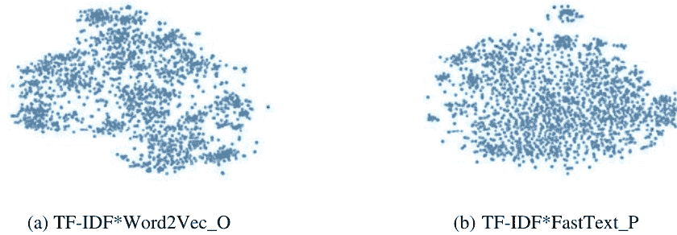

## 图9 不同文本编码器获得的工作表示

表7 CB12_s数据集中不同文本编码器的性能比较
| 编码器 | PANAP (S2) |
|---|---|
| Word2Vec_P | 0.680/0.477/0.528 |
| Word2Vec_O | 0.760/0.572/0.619 |
| TF-IDF*Word2Vec_P | 0.708/0.501/0.552 |
| TF-IDF*Word2Vec_O | 0.765/0.577/0.624 |
| Doc2Vec | 0.691/0.492/0.541 |
| FastText_P | 0.681/0.487/0.535 |
| TF-IDF*FastText_P | 0.679/0.466/0.519 |
| BERT | 0.710/0.507/0.559 |

表8 CB12_d的统计数据，#S表示会话编号，和#A是应用程序编号。Avg_L是会话中的平均应用数量。#元数据包含每个元数据属性的基数
| 数据集 | |U| | |J| | #S | #A | Avg_L | #元数据 |
|---|---|---|---|---|---|---|---|---|
| CB12_d | 40,456 | 52,803 | 51,419 | 164,553 | 3.20 | 城市/州/国家/学位/专业 |
|  |  |  |  |  |  | 5,276/97/22/7/9,513 |

工作标题、工作描述和工作要求都不同，形成了一个新的数据集 CB12_do。会话的创建方式与 CB12_s中描述的方式相同，其统计数据如表8所示。

总体而言，从表9可以看出不同的工作部分导致了不同的推荐结果。(i) 与描述和要求相比，仅使用工作标题对工作进行建模可以获得最佳结果。一个可能的原因是，尽管工作标题是一个短字符串，但它通常包含了关于工作的丰富信息，并且可以用来描述工作发布。(ii) 与工作要求相比，使用工作描述进行建模的性能较差，因为工作要求描述了工作所需的资格，如技能、教育水平和类型、工作经验的类型和年限以及语言。工作通常包括一些常见工作要求，例如需要3-5年的经验，这些要求可能适用于软件工程师和保姆，所以工作要求不能有效地描述一个具体的工作岗位。(iii)全部通常具有最佳性能，因为它结合了所有的信息。此外，在实践中，仅使用一个部分，即工作标题、工作描述或工作要求来表示工作岗位是不切实际的，因为它们在不同的工作岗位中通常是相同的。例如，在不同公司的相同职位中，他们可能使用相同的职位标题，但工作描述是不同的。

与第5.6节类似，我们随机选择了2,000个工作岗位，并在图10中可视化了它们的不同部分表示，这也展示了工作表示与预测性能之间的关系，如第5.6节所解释的。

## 6 结论

在这项工作中，我们主要解决了下一次应用预测任务下的工作推荐问题，这是工作推荐系统的一个重要应用之一。针对现有工作中的问题，我们提出了一个名为个性化关注下一次应用预测模型（PANAP）的个性化关注模型，部分解决了这些问题。更具体地说，我们以无监督的方式独立学习工作发布的表示，以解决招聘领域中标记数据的缺乏问题。然后，我们使用个性化关注机制来捕捉不同求职者的特定工作信息，因为对于不同的求职者来说，同一份工作具有不同的信息量。实验证实，通过结合个性化关注，我们的方法可以更好地捕捉个人职业偏好，优于基准方法。最后，我们的下一次应用预测器使用基于相似性的损失函数进行训练，以应对随时间增加或减少的工作发布。此外，求职者的个人背景是招聘领域需要考虑的重要因素，尤其是位置信息，它将影响求职者的工作选择。因此，在建模工作和求职者表示时，我们将位置信息纳入考虑，并提出了一种基于位置的采样策略，在生成负样本时考虑“位置”因素。

## 参考文献

1. Salton, G., Buckley, C.: 在自动文本检索中的词权重方法。Inf. Process. Manag. 24(5), 513–523 (1988)  
2. Edwards, J.R.: 人-工作匹配：概念整合、文献综述和方法论批判。Wiley (1991)  
3. Agrawal, R., Imielí'nski, T., Swami, A.: 在大型数据库中挖掘项集之间的关联规则。In: Proceedings of the 1993 ACM SIGMOD International Conference on Management of Data, p. p. 207–216 (1993)  
4. Hochreiter, S., Schmidhuber, J.: 长短期记忆。神经计算。 9 (8), 1735-1780 (1997)  
5. Joachims, T.: 支持向量机的文本分类：学习与许多相关特征。In: European Conference on Machine Learning, pp. 137–142. Springer, Berlin (1998)  
6. Sekiguchi, T.: 员工选择中的人-组织匹配和人-工作匹配：文献综述。 Osaka keidai ronshu 54 (6), 179-196 (2004)  
7. Malinowski, J., Keim, T., Wendt, O., Weitzel, T.: 匹配人才和工作：一种双边推荐方法。在：第39届夏威夷国际系统科学会议论文集（HICSS'06），第6卷，第137c-137c页。IEEE (2006年)  
8. Van der Maaten, L., Hinton, G.: 使用t-SNE可视化数据。机器学习研究杂志 9 (11) (2008年)  
9. Paparrizos, I., Cambazoglu, B.B., Gionis, A.: 机器学习的工作推荐。在：第五届ACM推荐系统会议论文集，第325-328页 (2011年)  
10. Al-Otaibi, S.T., Ykhlef, M.: 工作推荐系统综述。国际物理科学杂志 7 (29), 5127-5142页 (2012年)  
11. Mikolov, T., Sutskever, I., Chen, K., Corrado, G.S., Dean, J.: 分布式表示词和短语及其组合性. Adv. Neural Inf. Process. Syst. 26 (2013)  
12. Maas, A.L., Hannun, A.Y., Ng, A.Y.: 整流非线性改善神经网络声学模型. Proc. icml 30(1), 3 (2013)  
13. Huang, P.S., He, X., Gao, J., Deng, L., Acero, A., Heck, L.: 使用点击数据学习深度结构化语义模型进行网络搜索. 在: 第22届ACM国际信息与知识管理会议论文集, pp. 2333–2338 (2013)  
14. Mikolov, T., Chen, K., Corrado, G., Dean, J.: 在向量空间中高效估计词表示 (2013). arXiv预印本 arXiv:1301.3781  
15. Pennington, J., Socher, R., Manning, C.D.: Glove: 用于词表示的全局向量. 在: 2014年经验方法在自然语言处理中的会议论文集 (EMNLP), pp. 1532–1543 (2014)  
16. Kingma, D.P., Ba, J.: Adam: 一种用于随机优化的方法 (2014). arXiv预印本 arXiv:1412.6980  
17. Cho, K., Van Merriënboer, B., Gulcehre, C., Bahdanau, D., Bougares, F., Schwenk, H., Bengio, Y.: 使用RNN编码器-解码器学习短语表示用于统计机器翻译 (2014). arXiv预印本 arXiv:1406.1078  
18. Bahdanau, D., Cho, K., Bengio, Y.: 通过联合学习对齐和翻译的神经机器翻译 (2014). arXiv预印本 arXiv:1409.0473  
19. Le, Q., Mikolov, T.: 句子和文档的分布式表示. 在: 国际机器学习会议, 第1188-1196页. PMLR (2014)  
20. Javed, F., Luo, Q., McNair, M., Jacob, F., Zhao, M., Kang, T.S.: Carotene: 一个在线招聘领域的职位分类系统. 在: 2015年IEEE第一届大数据计算服务与应用国际会议, 第286-293页. IEEE (2015)  
21. Zhao, M., Javed, F., Jacob, F., McNair, M.: SKILL: 一个技能识别和规范化系统. 在: 第27届IAAI会议 (2015)  
22. Hidasi, B., Karatzoglou, A., Baltrunas, L., Tikk, D.: 基于会话的循环神经网络推荐系统 (2015). arXiv预印本 arXiv:1511.06939  
23. 贾维德, F., 麦克内尔, M., 雅各布, F., 赵, M.: 走向职位分类系统 (2016年). arXiv预印本 arXiv:1606.00917  
24. 刘, Y., 张, L., 聂, L., 严, Y., 罗森布鲁姆, D.: 占卜师: 预测你的职业道路。在: 人工智能AAAI会议论文集, 第30卷, 第1期 (2016年)  
25. Hidasi, B., Quadrana, M., Karatzoglu, A., Tikk, D.: 用于特征丰富的基于会话的推荐的并行递归神经网络架构。在: 第10届ACM推荐系统会议论文集, 第241-248页 (2016年)  
26. 于, F., 刘, Q., 吴, S., 王, L., 谭, T.: 下一个篮子推荐的动态递归模型。在: 第39届国际ACM SIGIR信息检索与开发会议论文集, 第729-732页 (2016年)  
27. Tripathi, P., Agarwal, R., Vashishtha, T.: 使用大数据分析的工作推荐系统综述。在: 2016年第三届可持续全球发展计算国际会议 (INDIACom), 第3773-3777页。IEEE (2016年)  
28. Li, J., Ren, P., Chen, Z., Ren, Z., Lian, T., Ma, J.: 神经注意力会话推荐。在: 2017年ACM信息与知识管理会议论文集, 第1419-1428页 (2017年)  
29. Bojanowski, P., Grave, E., Joulin, A., Mikolov, T.: 用子词信息丰富词向量。计算机语言学协会交易。5, 135-146 (2017年)  
30. Kenthapadi, K., Le, B., Venkataraman, G.: 领英个性化工作推荐系统: 实际挑战和经验教训。在: 第十一届ACM推荐系统会议论文集, 第346-347页 (2017年)  
31. Catherine, R., Cohen, W.: Transnets: 学习转换以进行推荐。在: 第十一届ACM推荐系统会议论文集, 第288-296页 (2017年)  
32. Jannach, D., Ludewig, M.: 当循环神经网络遇上邻域进行会话推荐。在: 第十一届ACM推荐系统会议论文集, 第306-310页 (2017年)  
33. Li, L., Jing, H., Tong, H., Yang, J., He, Q., Chen, B.C.: Nemo: 下一个职业发展预测与上下文嵌入。在: 第26届国际万维网会议伴随论文集, 第505-513页 (2017年)  
34. Abel, F., Deldjoo, Y., Elahi, M., Kohlsdorf, D.: Recsys挑战2017: 离线和在线评估。在: 第十一届ACM推荐系统会议论文集, 第372-373页 (2017年)  
35. 连, J., 张, F., 侯, M., 王, H., 谢, X., 孙, G.: 冷启动场景下职位推荐的实践经验。在: 推荐系统挑战2017年会议论文集, 第1-6页 (2017年)  
36. Grave, E., Bojanowski, P., Gupta, P., Joulin, A., Mikolov, T.: 学习157种语言的词向量 (2018年). arXiv预印本 arXiv:1802.06893  
37. Devlin, J., Chang, M. W., Lee, K., Toutanova, K.: Bert: 预训练深度双向转换器用于语言理解 (2018年). arXiv预印本 arXiv:1810.04805  
38. James, C., Pappalardo, L., Srbu, A., Simini, F.: 从科学资料中预测下一个职业发展方向 (2018年). arXiv预印本 arXiv:1802.04830  
39. 于, F., 刘, Q., 吴, S., 王, L., 谭, T.: 一种用于下一个购物篮推荐的动态循环模型。在: 第39届国际ACM SIGIR会议研究与信息检索发展, 第729-732页 (2016年)  
40. 徐, T., 朱, H., 朱, C., 李, P., 熊, H.: 用多标准方法衡量招聘市场上的职位技能的受欢迎程度。在: AAAI人工智能会议论文集, 第32卷, 第1期 (2018年)  
41. Ludewig, M., Jannach, D.: 会话推荐算法的评估。用户模型。用户自适应。互动。28 (4), 331-390 (2018年)  
42. 秦, C., 朱, H., 徐, T., 朱, C., 江, L., 陈, E., 熊, H.: 增强人才招聘的人-岗位匹配: 一种能力感知的神经网络方法。在: 第41届国际ACM SIGIR会议研究与信息检索发展, 第25-34页 (2018年)  
43. 朱, C., 朱, H., 熊, H., 马, C., 谢, F., 丁, P., 李, P.: 人-岗位匹配: 通过联合表示学习为合适的工作适应合适的人。ACM Trans. Manag. Inf. Syst. (TMIS) 9 (3), 1-17 (2018年)

## 一种适用于工业质量检测的逆否多尺度异常检测方法

Mat as Tailanian，Pablo Mus 和 Ivaro Pardo

摘要 异常可以被定义为任何与正常性偏离的非随机结构。文献中报告的异常检测方法众多且多样，因为被认为是异常的通常因特定情境和应用而异。在这项工作中，我们提出了一种逆否框架，通过对通过卷积获得的特征图进行统计分析来检测图像中的异常。我们通过补丁PCA、Gabor滤波器和从预训练的深度神经网络（Resnet）获得的特征图来评估从分析图像中学习的滤波器。该方法是多尺度且完全无监督的，能够在各种场景中检测异常。虽然本工作的最终目标是检测汽车行业中皮革样本中的细微缺陷，但我们展示了相同的算法在公共异常数据集中取得了最先进的结果。

## 1 引言

异常检测是一个活跃的领域，已经研究了几十年，受到了从机器人和安全到医疗保健等各种实际应用的推动。最相关的应用之一是在工业生产中进行自动或辅助产品质量检查。

这项工作部分地得到了乌拉圭国家研究和创新机构的研究生奖学金的资助。

M. Tailanian (✉)
Digital Sense & 乌拉圭共和国蒙得维的亚大学
e-mail: mtailanian@digitalsense.ai

P. Mus
乌拉圭共和国蒙得维的亚大学工程学院
e-mail: pmuse@fing.edu.uy

I. Pardo
乌拉圭天主教大学和Digital Sense
e-mail: apardo@ucu.edu.uy

© 作者，独家许可给 Springer Nature Singapore Pte Ltd. 2023
M. A. Wani 和 V. Palade (eds.), 深度学习应用，第4卷，
智能系统与计算进展 1434，
https://doi.org/10.1007/978-981-19-6153-3_8

## 2 相关工作

关于异常检测有大量的文献。检测异常的最常见方法是通过建模正常样本的分布来建立一个背景模型。这个模型的设计通常是问题特定的。例如，在[27]中，正常样本被假设遵循高斯分布，或者在[7]中，作者通过将不同的GMMs与密集协方差矩阵拟合到四级图像金字塔中来表征正常性。如前所述，逆否方法基于相同的原理，但与其他方法不同的是，它允许通过估计和控制背景模型下事件发生的预期次数来推导检测阈值。一个很好的例子是Ehret等人的工作[15]，他们通过使用非局部均值[28]对最常见的补丁进行平均，并使用残差图像上的NFA分数进行检测，该图像由噪声和异常组成，从而消除了图像的自相似性。通过这种方式，一般背景建模问题被简化为噪声建模问题，使得算法可以处理任何类型的背景。

最近，利用不断增长的计算能力，基于深度神经网络（DNN）的新数据驱动方法得到了发展。在大多数情况下，它们仅使用无异常的图像，在公开可用的异常数据集中取得了令人印象深刻的结果。在表1中，对不同最新工作的一些关键要素进行了比较。从这个表中很容易看出，大多数方法都需要某种形式的监督，这是我们提出的算法的主要区别。常见的分类是将方法分为两类：基于特征相似性和基于重建的方法。

### 基于特征相似性的方法

基于特征相似性的方法首先构建一个新的特征空间，据称在这个空间中更容易识别异常。第二步通常是定义和测量某种相似性概念，这可以是简单的k最近邻（kNN）或某种概率分布拟合，也可以是针对特定问题的学习度量。例如，在[8]中，作者使用在ImageNet上预训练的Wide-ResNet50的激活图构建了一个特征金字塔，并使用这些特征图来寻找i）K个最近的无异常图像和ii）像素级异常分割。对于后者，他们对子图像进行多图像对应，将目标子图像与K个最近邻的所有子图像进行匹配。异常分数最终通过目标图像的子图像与其K个邻居之间的距离的平均值得到。在[11]中，通过使用预训练的CNN的输出，为每个补丁位置建模正常性的多元高斯分布，并测量每个补丁的马氏距离来获得出色的结果。正常性通过使用预训练的CNN的输出来表征每个补丁。在测试时，对于测试样本的每个补丁，根据与相应的正常性的马氏距离分配一个异常分数。

## 表1 相关工作比较，显示每种方法的一些关键要素：它们如何生成最终的异常图，是否使用了一些预训练网络，正常和异常图像的使用方式，监督的种类，是否解决了代理任务以及实现多尺度分析的方式

| 方法 | 异常图 | 预训练 | 正常图像使用 | 异常图像使用 | 阈值 | 超视 | 代理任务 | 多尺度 |
|---|---|---|---|---|---|---|---|---|
| 纹理启发 [7] | 训练后的GMM的负对数似然 | 否 | 拟合GMM | 否 | 否 | 监督 | 否 | 4层金字塔 |
| SPADE [8] | 到正常样本的欧式距离 | Resnet | kNN | 否 | 否 | 监督 | 否 | DNN尺度 |
| 字典相似度 [9] | 到正常性的距离 | 是 | 构建字典 | 否 | 否 | 监督 | 否 | 不同的补丁尺寸 |
| FCDD [10] | 来自网络的激活层 | 否 | FCN | 是 | 否 | 监督 | 否 | DNN尺度 |
| PaDiM [11] | 通过补丁的马氏距离 | Resnet | 马哈拉斯特拉距离 | 否 | 否 | 自我监督 | 否 | DNN尺度 |
| 补丁-SVDD [12] | 到正常样本的距离 | 否 | 编码器 | 否 | 否 | 自我监督 | 补丁-收集 | 架构设计 |
| RotDet [13] | 每个补丁位置的KDE | 否 | 深度神经网络 | 否 | 否 | 自我监督 | 旋转 | DNN尺度 |
| STPM [14] | 学生-教师L2距离 | Resnet | 学生网络 | 否 | 否 | 自我监督 | 否 | DNN尺度 |
| 去噪声 [15] | Log-NFA图 | 选项 | 否 | 否 | 是 | 无监督 | 否 | 下采样图像 |
| SSIM-AE [16] | 重建误差 | 否 | 自动编码器 | 否 | 否 | 自我监督 | 否 | 自动编码器架构 |
| 异常生成对抗网络 [17] | 重建误差 | 否 | 生成对抗网络 | 否 | 否 | 自我监督 | 否 | 生成对抗网络架构 |
| 内部交通 [18] | 重建误差 | 否 | 变压器 | 否 | 否 | 自我监督 | 修复 | 下采样图像 |
| 剪切-粘贴 [19] | 一类过表示 | 否 | 深度神经网络 | 否 | 否 | 自我监督 | 剪切-粘贴 | 复制 |
| DFR [20] | 重建误差 | VGG19 | VAE | 否 | 否 | 自我监督 | 否 | DNN尺度 |
| GBVS [21] | 马尔可夫链的平衡分布 | 否 | 否 | 否 | 否 | 无监督 | 否 | 下采样图像 |
| SALICON [22] | 来自网络的激活层 | 否 | 否 | 是 | 否 | 监督 | 否 | 架构设计 |
| DRFI [23] | RF回归 | 否 | 否 | 是 | 否 | 监督 | 否 | 多层次分割 |
| 我们的 | Log-NFA图 | 选项 | 否 | 否 | 是 | 无监督 | 否 | 下采样图像 |

## 一种逆否多尺度异常检测方法

使用一些真实标记异常的示例，该方法的性能要好得多。在[9]中，作者从预训练的DNN中提取特征，并构建了一个特征词典，然后用于测量目标图像与正常性之间的距离。在[14]中使用了学生-教师框架，学生通过与教师网络相匹配的方式学习无异常图像的分布特征。在测试时，比较给定目标图像的两个网络的特征图，并从它们的距离中获得异常分数。在[12]中，通过构建图像块的分层编码来扩展Deep-SVDD[29]的思想。通过训练编码器来收集语义相似的块，改进了在特征空间中将正常图像映射到超球面中心的Deep-SVDD思想。通过计算目标图像的每个块与特征空间中最近的正常预计块之间的距离，生成输出异常图。每个像素的分数是它所属的所有块的分数的平均值。该算法进行多尺度检查，并通过逐元素乘法聚合结果生成最终的异常图。作者表明，通过在损失函数中添加自监督学习项，整个算法的性能得到了改善。

支持向量数据描述符（SVDD）的硬边界与超球体相关，可能导致模型对训练数据过拟合。因此，在[30]中，作者提出用高斯支持向量数据描述符（GSVDD）替换它，并将其均值和协方差视为待估计的潜在变量。他们通过插值不同输入图像的潜在嵌入，试图减少异常图像嵌入位于正常样本之间的可能性，使正常样本的分布更密集。GSVDD由对抗约束自编码器插值（ACAI）[31]驱动，通过这样做，它生成了对正常图像分布的稳健估计。

基于重构的生成模型，如变分自编码器（VAEs）[32]或生成对抗网络（GANs）[33]，基于的思想是网络仅在非缺陷样本上训练，将无法在测试时重构异常。实际上，它们通常具有较高的容量和泛化能力，甚至能够很好地重构异常。在[18]中，作者将生成部分视为一个修复问题。通过仅使用自注意力块构建网络，他们能够成功地对远距离的上下文信息进行建模，并取得良好的结果。

正如[16]所述，通过使用结构相似度测量（SSIM）来测量重构误差可以获得更好的结果。作者表明，与经典的 $l_2$ 距离相比，他们取得了更好的结果。在[19]中，作者设计了一个特殊的分类代理任务，以便能够通过在无异常图像上训练网络来自我监督地学习深度表示，该网络使用随机剪切和粘贴的区域。一旦获得了表示，就使用新的表示训练一个单类分类器。在[20]中，作者提出使用预训练网络的特征图训练自动编码器。网络不是重构图像本身，而是进行深度特征重构。最后，他们通过分析自动编码器输入和输出之间的特征差异来计算像素级异常分数。与学习从图像到潜在代码的直接表示的自动编码器和变分自动编码器不同，生成对抗网络学习从潜在空间到逼真正常图像的映射。由于潜在空间的过渡是平滑的，在[17]中，作者提出了一种迭代方法来找到生成与目标图像相似的潜在代码，通过观察重构误差使用GAN来找到异常。当从单类数据中学习时，通常的方法是将正常图像映射到潜在空间中的某个中心点附近，并期望（但通常没有保证）异常图像远离该中心点。有许多研究提出了克服这个潜在问题的策略。其中许多研究创建了一些代理任务，以训练自监督网络。尽管具体的代理任务可能与最终目标非常不同，在某些情况下，网络被证明非常成功地从数据中提取有用和信息丰富的特征。例如，在[13]中，作者提出了一种通过数据增强的分布增强对比学习技术，阻碍了对比表示的均匀性，从而更容易将异常值与内部值分离开来。通过预测旋转增强的程度作为代理任务，在自监督方案中对无异常图像进行深度神经网络训练。在第二阶段，基于学习到的高级数据表示构建一个单类分类器，以获得异常分数。

由于我们特别关注的是那些可以在没有训练的情况下，并且能够适用于各种不同的图像作为输入的方法，我们还专注于显著性检测的领域。对于这项工作，我们只对纹理图像感兴趣，其中随机结构是均匀分布的。在这些情况下，从感知的角度来看，任何偏离正常的结构或模式都应该是图像中最显著的部分。有大量的文献专门研究这个问题。举几个相关的作品，[21]中引入了一种统一的方法来激活和归一化显著性计算的步骤，通过使用不相似度和显著性来定义图上的边权重，这些图被解释为马尔可夫链。在[23]中，显著对象检测被表述为一个回归问题，任务是学习一个将区域特征向量直接映射到显著性得分的回归器。在[22]中，作者提出通过结合多个流行的深度神经网络（DNN）架构来估计显著性，这些网络已知能够编码强大的语义特征。他们发现，在显著性预测中，语义表示和空间信息之间的一个很好的折衷方案是使用最后一个卷积层。

尽管有大量与异常检测相关的文献，但我们发现只有少数算法能够在没有先验知识的情况下进行检测，并且其中大部分算法试图从一组正常图像中建模正常性，通常需要这些图像对齐并在非常受控制的情况下获取。在这项工作中，我们开发了一种简单而有效的无监督算法，只使用输入图像，无需任何先验知识或训练数据，并估计图像的“罕见程度”得分，该得分由每个像素/区域的误报数（NFA）给出。该算法是为解决特定任务而开发的，但已经证明在各种不同的问题中都能很好地工作，而无需进行修改。

## 3 方法

我们希望检测的异常类型可能非常多样。在这个工作中，我们集中研究低级异常（与语义异常相反）。通过使用经典图像处理技术，我们实现了一种简单、快速且非常有效的方法，该方法已经在各种不同类型的图像中成功应用，如第4节所示。由于该方法是为解决一个工业问题而开发的，准确性和速度都非常重要。

我们方法中的一个关键且合理的假设是，正常样本集的低阶矩可以从整个数据集中进行统计特征描述，即异常样本非常罕见，不会影响这些统计特征。在这个假设下，我们提出的异常检测方法依赖于对整个数据集中正常样本的统计特征描述，我们称之为正常性，以及测试样本与正常性之间的统计距离。然后，我们将使用这个距离来评估观察到的样本是否正常，并推导出用于检测异常的统计检验。

样本由一组特征进行描述，这些特征将被提取为不相关的。我们证明这些特征服从高斯分布，假设它们是独立的，这使得我们可以轻松地将距离定义为马氏距离，并确保这个距离服从 △²分布。

因此，所提出的方法包括五个阶段：（A）通过尺度分解生成图像金字塔，以检测不同大小的异常；（B）特征提取；（C）马氏距离到正常性；（D）NFA计算；（E）通过组合每个不同尺度的结果生成最终的异常图。

对于特征提取和NFA计算（阶段B和C），我们探索了不同的变体。在本节的剩余部分，我们描述了所提出方法的所有阶段。

### 3.1 图像分解：尺度金字塔

由于异常可能发生在任何尺度上，因此无论其大小如何，检测它们都至关重要。这是通过基于图像金字塔的多尺度方法来实现的，其中每个新尺度的宽度和高度是前一个尺度的一半。

### 3.2 特征提取

我们考虑了特征提取阶段的三种替代方案。

Patch-PCA。这里描述的过程应用于从尺度金字塔分解中获得的每个尺度。该方法在图2中概述。


图2 方法概述。我们的方法可以分为五个阶段。阶段 a 是创建不同尺度图像金字塔。在阶段 b 中，我们通过进行Patch-PCA变换来获得滤波器，并使用它们来过滤输入图像。在阶段 c 开始时，我们对于每个滤波器和每个输入通道都有一个特征图，并通过计算每个通道的马氏距离将它们组合在一起。阶段 d 执行虚警数的计算。阶段 (b)、(c) 和 (d) 独立地计算每个尺度，并将所有结果在阶段 (e) 中合并。

为了表示获取的图像中像素的局部统计信息，例如其周围的纹理，我们将与每个像素中心对齐的一块大小为 s × s 的像素块关联起来。我们将每个图像通道分别处理，因此对于每个通道c，每个像素位置都由一个大小为 n 的特征向量来描述，其中 n = s × s。我们应用PCA对像素块特征向量进行去相关处理，并独立地处理新的坐标。

PCA执行线性变换，其中 yᵢ = Pᵀxᵢ，其中 xᵢ ∈ ℝⁿ 且 i ∈ {1...N} 是一组观测值（像素块），yᵢ ∈ ℝᵐ 具有 m ≤ n 的投影，并且 P 的列向量 {pⱼ} 是PCA特征向量。向量 yᵢ 中的元素 j 是 xᵢ 和 pⱼ 之间的内积结果。由于这些投影是基于像素块进行的内积计算，因此可以使用常见的深度学习库将其视为使用特征向量作为卷积核进行的2D卷积计算，从而实现高效计算。提取PCA特征向量也可以看作是一种基于输入图像仅找到用于提取特征的滤波器的方法论。这一特性在我们的应用中非常重要，因为它为每个图像定义了特定的适应性滤波器。

一旦我们获得了滤波器，我们通过每个通道对输入图像进行卷积（例如，投影到PCA空间），得到每个像素的大小为 m 的特征向量，对于每个通道的 c 个像素。

ResNet特征图。与将PCA应用于尺度金字塔的输出不同，PCA可以应用于通过输入图像进行卷积神经网络得到的激活图。这种方法的优点是这些激活图汇集了图像的一组显著特征。更准确地说，我们考虑的特征集是从在Image Net上预训练的ResNet-50网络中获得的，保留了最后三层的卷积输出：layer 1/conv3，layer2/conv3，layer3/conv3。由于网络的输入是整个三通道图像，所以不会对每个通道单独进行滤波（如Patch-PCA方法），在这个阶段结束时，我们得到的特征向量的大小等于考虑的每个卷积层中滤波器数量的总和。在对滤波输出应用PCA之后，我们还保留了前 m 个主成分。

Gabor filters。不再执行尺度分解和计算每个图像的Patch-PCA描述符，我们建议使用一组不同尺寸的（固定的、信号独立的）Gabor滤波器。请注意，在这种情况下，得到的特征是不相关的。然而，第4节中呈现的结果表明，这种修改仍然能够取得良好的性能，同时显著减少了与图像相关的PCA计算的计算负担。在这种情况下，我们遵循与Patch-PCA相同的过程：提取的特征是输入图像的每个通道的滤波器响应。

### 3.3 到正态的距离

如前所述，在这一点上，我们应该有一组不相关的特征。对于Patch-PCA和ResNet特征提取器的情况是正确的，在后者中，这要归功于对激活图进行的PCA。对于Gabor滤波的情况，由于这些滤波器彼此不正交，所得到的特征确实存在一定程度的相关性；然而，我们还是敢于分析它，因为我们认为它仍然是一种有价值的方法，因为它简单易行。

对于每一对特征 (a, b)，我们定义其对应图像区域 x^a 和 x^b 之间的距离为：

```
d²(xᵃ, xᵇ) = Σᵢ₌₁ᵐ (aᵢ - bᵢ)²。
```

为了基于先前的度量定义正常性距离，我们需要表征正常样本集及其对应的特征向量（使用前面部分描述的任何特征提取方法获得）。假设异常的大小相对于图像的大小很小，正常样本的低阶统计特征可以从整个图像中准确地表征出来。接下来，我们将描述使用Patch-PCA和Resnet方法提取的特征的正常性距离的计算，因为它们都使用了PCA得到了不相关的特征向量。然后，在本节的最后，我们将讨论Gabor特征提取的情况。

，平均值和方差分别表示特征向量的前 m 个主成分的均值和方差。我们将样本到正常性的平方距离定义为：

```
d²(xᵃ, 正常性) = Σᵢ₌₁ᵐ (aᵢ - μᵢ)² / σᵢ²。  (1)
```

这个量对应于样本 xᵃ 到正常样本均值的马氏距离，限制在前 m 个主方向上。这种简单的距离到正常性的概念的一个主要优点是，如果我们现在将样本 xᵃ 视为随机的，它的统计特性是直接的。实际上，

### 3.4 假警报数量

在本节中，我们提出了三种不同的策略，共享一种常见的方法论，用于检测纹理图像中的异常，使用到正常性的距离定义。


图3 Patch-PCA和ResNet特征的距离分布。彩色条代表 Δ²理论分布。实线代表不同图像的距离到正态分布的归一化直方图。

我们经验性地测试了每个PCA分量都遵循高斯分布；如果我们进一步假设它们是不相关的，那么正态性距离（1）将遵循 Δ²分布，自由度为 m。图3显示了图像样本到正态性的距离分布，以及与 Δ²(m)分布的比较。请注意拟合结果非常准确。

对于基于Gabor滤波器的方法，为了简单起见，我们将假设分量不相关，并应用上述距离到正态性的计算。虽然这并不准确，如前所述，但这种偏差似乎不足以影响结果，同时还能实现高效的计算。

像素级别的NFA在这种策略中，对于图像中的每个像素 $\mathbf{x}^a$，通过其特征向量 $\mathbf{a}$ 来描述，我们定义

NFA($\mathbf{x}^a$) = $H W (1 - CDF_{\Delta^2(m)}(d^2(\mathbf{x}^a, \text{normality}))$，

其中 $H$ 和 $W$ 分别表示图像的高度和宽度，$CDF_{\Delta^2(m)}$ 是 $m$ 阶 $\Delta^2$ 分布的累积密度函数。这个数量对应于我们测试的事件数量（图像中的所有像素）乘以 $\Delta^2(m)$ 随机变量大于其观察到的与正常性的平方距离的概率。

块状NFA在这种按块策略中，目标是检测作为异常的像素积累在图像块中的明显距离。该算法首先通过对每个通道的平方马氏距离进行阈值处理，提取候选区域 $d^2(\mathbf{x}^a, \text{normality})$，阈值 $\tau$ 可以很容易地设置。由于在正常性假设下，这些距离被假定为遵循 $\Delta^2(m)$ distribution，我们设置 $\tau$，使得相应的 $p$ 值为 $p = 0.01$。在这种情况下，我们的正常性假设 ($H_0$) 是，距离正常性超过 $\tau$ 的像素在整个图像上均匀分布。根据[34]中的思路，我们基于以下方式检测这些候选区域的高浓度，作为NFA准则。

考虑一个大小为 $w \times w$ 的块 $B$，以及块内的候选集合 $\mathcal{L}_B = \{ \mathbf{x}^a \in B \text{ s.t. } d^2(\mathbf{x}^a, \text{normality}) > \tau \}$，我们定义一个新的随机变量 $U_{i,j}$，其服从如下的伯努利分布：

$$
U_{i,j} = \begin{cases} 
1 & \text{如果 } (i,j) \in \mathcal{L}_B, \\
0 & \text{否则为 } 0. 
\end{cases}
$$

为了寻找候选像素的异常聚集，我们需要评估概率

$$
P( U \geq |\mathcal{L}_B| )，
$$

其中 $U = \sum_{i,j} U_{i,j}$ 服从二项分布。

评估这个概率并不简单，因为 $U_{i,j}$ 并不是独立的。为了解决这个问题，我们需要对马氏距离图像进行子采样，使用一个因子来确保新图像中的两个相邻像素可以被视为独立，即在每个方向上保留一个像素（用于 Patch-PCA 特征提取的补丁大小或 Gabor 滤波器的大小）。一旦我们有了子采样图像并且有了独立的像素，我们可以使用之前的基于像素的 NFA 方法。但是，我们可以使用一个基于直觉的技巧，即我们观察到 $|\mathcal{L}_B|^2 / s^2$ 个独立的有意义事件，总共有 $w^2 / s^2$ 种可能性。请注意，如果我们实际上进行了子采样，我们可能无法找到精确的平均值（$ |\mathcal{L}_B|^2 / s^2 $），这取决于我们选择的网格原点。实际上，只有在有意义的事件均匀分布时，我们才会找到这个值。如果它们不均匀分布，我们会得到一些子采样，其中我们找到的事件比平均值多，还有一些子采样，其中我们找到的事件比平均值少。无论如何，通过选择平均值，我们可以确保至少有一个子采样与我们正在评估的子采样一样显著。因此，在块 $B$ 中观察到至少 $|\mathcal{L}_B|/s^2$ 个距离大于 $\tau$ 的概率，由二项分布的尾部给出，记为 $\mathcal{B}$

$$
\left( \dfrac{w^2}{s^2}, \dfrac{|\mathcal{L}_B|}{s^2}, p \right)。
$$

要测试的块数 $B$ 是 $H W / w^2$。对每个块进行测试所有的 $s \times s$ 子采样网格，总共需要进行 $N_T = H W s^2 / w^2$ 次测试。最后，块 $B$ 对应的 NFA 为

$$
NFA(B) = \dfrac{H W}{w^2} s^2 \mathcal{B} \left( \dfrac{w^2}{s^2}, \dfrac{|\mathcal{L}_B|}{s^2}, p \right)\,.
$$

区域 NFA 与块 NFA 策略类似，这里我们也寻找像素的明显聚集，其与正常距离足够大。

之前介绍的 NFA 计算技术适用于像素和方形块，但这个变种扩展了计算任意大小和任意形状区域的 NFA 的可能性。它受到 Grompone 等人的工作的启发 [26]。计算任意形状区域的 NFA 值的困难之一在于计算测试次数。为了做到这一点，我们需要量化

所有可能的像素排列，具有任何形状和所有可能的尺寸。为了构建这些区域，Grompone等人建议使用4连通性区域 $R$，其中具有 $N_R$ 个像素的可能配置的近似数量由以下公式给出（参见[35]）：

```
#配置 ≈ αβ^{N_R}/N_R
```

其中 α = 0.316915，β = 4.062570。区域的构建基于[26]中提出的贪婪算法，但存在一些差异。首先，我们使用马氏距离作为输入，并考虑到与正常性距离大于固定阈值的像素。其次，更重要的是，我们添加了一个基于NFA值本身的区域生长准则。为了决定是否将像素添加到某个区域中，我们评估区域的显著性（NFA值），包括和不包括该像素，并且只有在它使整个区域更显著，即降低NFA值时才添加。原始算法设计用于单通道图像，因此我们将其实分别应用于每个滤波器响应，然后通过保留每个位置的所有结果之间的最小值来组合所有的NFA。未考虑任何区域的像素被分配了计算出的最大NFA值，因为它们是最不显著的。

我们只为基于ResNet的特征图实现了这个NFA计算的变体，这是迄今为止表现最好的组合方法，将在第4节中展示。

如前所述，一旦我们获得了特征图（在这种情况下仅从layer1[0]/conv3获得），我们使用PCA进行去相关处理并计算马氏距离。请注意，特征图的空间分辨率远低于输入图像。为了以全分辨率工作，我们将马氏距离上采样到输入尺寸并计算NFA。这样做会在相邻像素之间引入一些依赖关系。为了解决这个问题，我们采用类似于NFA按块策略的方式，考虑网络的感受野以再次确保独立性。通过类似的推理方式，假设我们观察到$N$个$R$个/ $ \tilde{s}^2 $个像素，我们可以确保至少有一个事件与我们正在计算的事件一样重要。因此，计算得到的最终NFA值为：

```
NFA(\mathcal{R}) = \frac{H W}{\tilde{s}^2} \alpha \frac{\beta^{N_R/\tilde{s}^2}}{N_R/\tilde{s}^2} \Big(1 - \mathrm{CDF}_{\Delta^2(N_R/\tilde{s}^2)}\Big(\frac{1}{\tilde{s}^2} \sum_{(i,j) \in \mathcal{R}} d_{i,j}^2\Big)\Big),
```

其中 $d_{i,j}^2$ 表示与像素 $(i, j)$ 相关的正常距离的平方。

### 3.5 最终异常图

到目前为止，我们已经获得了每个尺度的一个NFA图。下一步是将它们合并，以生成一个汇集所有尺度信息的唯一图。为此，我们遵循这样的直觉，即如果某个结构在某个尺度上是异常的，那么它必须在最终图中标记为异常。因此，我们计算最终的NFA图，即每个像素的每个尺度的NFA的最小值。这些图通过上采样较小的尺度来匹配原始大小进行合并。最后，我们通过简单地定义AS = −log(NFA)，将这个NFA图转化为一个稀有度量，这提供了一个更直观的图，其中与一个结构相关的值越大，其稀有度越高。

## 4 结果

据我们所知，目前很少有真正无监督的异常检测方法可以仅通过检测的图像进行工作，而无需先前的训练或有关正常样本的信息，如表1所示。为了与最先进的方法进行比较，我们使用了最近的异常数据集MVTec AD [36]，该数据集模拟了工业条件下的故障或异常。MVTec AD数据集包含多个子集，分为两个类别：纹理和物体。

我们专注于纹理类别，因为我们的对低级别异常的检测感兴趣。此外，其中一个子集对我们来说非常重要，因为它考虑了皮革样本中的异常。MVTec AD还提供了几个非故障图像，大多数最先进的方法都用于学习正常性。为了扩展比较，我们还包括了基准方法，即使它们需要仅对正常样本进行训练，并且比较并不完全公平，对它们有利。结果显示在表2中。为了进行比较，我们使用接收器操作特征曲线下的面积（ROC AUC），因为它是文献中最常用的度量标准，并且可以与最先进的结果进行比较。

表2中的结果对应于Block-NFA版本，用单个叉表示，对应于Region-NFA的结果用双叉表示；其他使用Pixel-NFA。提出的算法在性能上达到了最先进的结果，即使与一些明显受益于使用无异常图像进行训练的方法进行比较也是如此。在一些子集中，我们的方法能够获得最佳结果。

如前所述，我们特别关注皮革箱，因为它与我们的工业应用相关（见下一节）。对于这个数据集，我们的方法获得了最高分。此外，如果我们考虑所有子集的平均分数，提出的算法的所有变体都表现最好，其中最突出的是ResNet变体，它不仅产生最佳结果，而且是我们方法中最快的变体。此外，添加到ResNet版本的最终改进使其能够计算任意形状和任意大小区域的NFA，已经证明优于所有其他方法，甚至展现出最佳性能。

## 一种逆否多尺度异常检测方法...

表3 故障和非故障区域的异常分数之间的差距，针对我们方法的不同组合

| 方法 | 差距 |
|---|---|
| PCA+像素NFA | 2.25 |
| PCA+块NFA | 4.06 |
| Gabor+像素NFA | 9.12 |
| Gabor+块NFA | 4.62 |
| ResNet+像素NFA | 3.15 |
| ResNet+区域NFA | 11.83 |

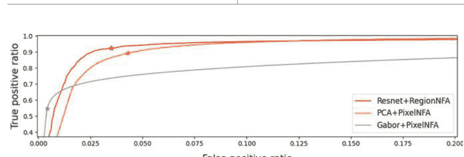

图4 MVTec AD的皮革子集的ROC曲线，对于所提方法的每个特征提取器的最佳性能变体。 AS = 0（NFA = 1）的值用星号表示。请注意，AS = 0的点接近ROC曲线的最佳点。

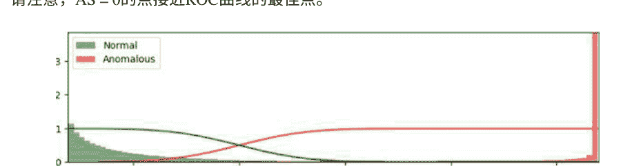

图5 异常分数AS的分布= −log(NFA)值，用于MVTec AD的皮革子集的正常和异常像素。与两个类别的累积密度函数重叠。 请注意类别之间的巨大差距，以及接近AS = 0的NFA值的适当选择以确定阈值。

## 汽车内饰皮革中的异常检测

在本节中，我们介绍了激发这项工作的工业问题，该问题是为高端汽车行业世界领先的皮革座椅生产商进行的。¹

¹该项目是由Digital Sense与Pensur合作开发的。

动物的原始皮肤可能存在多种缺陷，这些缺陷可能是由动物自身引起的（例如虱子、虫子和螨虫的痕迹、疤痕），也可能是在将原始皮革转化为可安装在车辆中的纹理皮革件的过程中引起的。在每个步骤中可能引入各种类型的缺陷（孔洞、机械拖曳等），例如鞣制过程中的差异、纹理压辊的差异（图1a-b）等。缺陷的大小和形状变化很大（从毫米大小的咬痕到占据大部分面积的皱纹）。在与皮革相关的行业中，必须尽快在生产线上检测出这些缺陷，并采取相应措施（避免在缺陷处切割、将其留在不显眼的区域，甚至丢弃这些部件）。让人工操作员进行质量控制存在几个缺点，例如无法长时间保持必要的注意力水平、不同操作员之间的标准差异，以及时间和人力成本。

每个车辆制造商都容忍皮革部件中的一小部分缺陷。当超过这个限度时，整批皮革部件将被退回，给生产公司带来巨大损失。另一方面，生产受可用于检查的人员数量限制。由于在整个过程中需要手动搜索所有样本中的缺陷，这成为了工厂生产能力的瓶颈。

由于缺陷通常很难用肉眼看到，因此设计了专用的采集设置。对于每个皮肤样本，使用单个相机在垂直方向上拍摄了总共五张图像，使用不同的光照条件和方向。更准确地说，相机旁边有一个漫射光源，以及四个定向的斜面光源，分别位于桌子的每个角落。通过这种方式，一些非常微妙但凸起很小的缺陷也可以显现出来。使用这种设置获取的一组图像如图6所示，顶部行。


图6 顶部行：原始图像。底部行：预处理步骤的输出。请注意，基于PCA的预处理更好地能够找出潜在的异常值。

## 5.1 预处理

在第3节中介绍的算法可以使用所有五个原始图像或者使用经过预处理步骤得到的图像作为输入。与最常见的PCA使用方式相反，在这种情况下我们更关注最后几个成分。实际上，第一个成分对应于最大方差的方向，因此编码了图像的全局信息，例如颜色或纹理。由于异常值是特定的局部结构，它们主要存在于最后几个成分中，如图所示。第一行对应于五个原始图像，第二行对应于PCA成分（第一张图像对应于第一个特征向量）。这个例子显示了异常值在所有原始图像中很难可视化，但在投影空间的最后三个成分中更加明显（图6）。

## 5.2 工业应用结果

对于这个工业应用，没有可靠的异常分割方法。我们只能收集到有限数量的有缺陷的样本，在正常检查工作中进行了粗略的注释。我们展示了所有方法变体的ROC AUC结果，并在图8中展示了一些视觉检查的示例，显示了输入图像、其NFA图和其对应的NFA=1的分割结果，其中包括了提出方法的几个变体：PCA+PixelNFA、Gabor+BlockNFA、ResNet+PixelNFA和ResNet+RegionNFA。通过我们方法的所有变体，我们成功地检测到了这些样本中的所有缺陷。对于Block-NFA变体，我们得到了比Pixel-NFA更粗糙的图像，这是由于按块计算引起的。

一方面，这个特点使得图像更清晰、更平滑，但另一方面，它可能导致所使用的评估指标下降，因为它依赖于对异常的细分。

由于我们有五个图像输入（一个漫反射光和四个切向光），我们不能直接将其他最先进的方法与该数据集进行比较，因为它们期望输入一个单一的图像。此外，对于我们方法的ResNet变体，我们不得不包括一种修改，即独立地为每个图像提供ResNet并连接输出特征图。此外，对于这些示例，我们仅使用ResNet的第一层的输出，即layer1/conv3。表4中呈现了得到的ROC AUC结果。最佳性能由方法PCA+PixelNFA实现，其次是ResNet+RegionNFA。PCA+PixelNFA的主要缺点是我们必须在滤波之前为每个图像计算PCA。

另一方面，ResNet+RegionNFA的滤波速度总体上更快，但我们仍然需要在滤波后计算PCA。Gabor+PixelNFA虽然其性能（以AUC为指标）较低，但是它是一种非常简单的方法，不需要在滤波后进行PCA。

## 表4 考虑的工业应用中的ROC AUC结果：皮革样本的缺陷检测

| 方法 | ROC AUC |
|---|---|
| PCA+像素NFA | 89.53 |
| PCA+块NFA | 78.63 |
| Gabor+像素NFA | 85.67 |
| Gabor+块NFA | 78.41 |
| ResNet+像素NFA | 87.84 |
| ResNet+区域NFA | 87.92 |

我们在生产中使用多个皮革样本进行了算法测试，用于操作员的评估模式。比上述结果更重要的是，生产中获得的首批结果表明，该工具为操作员提供了有用的帮助，指示问题区域并使他们的工作更轻松、更快捷。

## 6 结论

在这项工作中，我们提出了一种完全无监督的逆向方法来检测异常，旨在从汽车行业的皮革样本中检测缺陷，达到行业标准。尽管该方法是为这个特定应用而设计的，但其基础足够通用，并且在不同场景的图像缺陷中表现出成功的性能。所提出的方法在MVTec数据集上优于其他最先进方法，并且在皮革样本上表现出特别好的效果。在所有提出的变体中，明显突出的是使用ResNet特征提取和区域NFA计算。它在几乎所有数据集中都取得了最佳分数，并被评为最佳整体。此外，该方法获得了正常和有缺陷样本之间最好的分离，这可以通过GAP分析推断出。最后但并非最不重要的是，自然阈值（log-NFA = 0）是一个很好的选择，可以轻松地修复检测阈值，如图4所示。

未来潜在的改进包括用由自动编码器获得的非线性变换替代主成分分析（PCA），和/或用在正常数据上训练的归一化流。在这种情况下，多尺度方法可以通过U形网络的方式内在地包含在网络中。另一条需要探索的研究方向是将逆向推理方法与深度神经网络相结合，以输出带有置信度分数的检测结果，或者使用无皮革异常样本训练我们使用的ResNet，以获得更具体的特征提取结果。

## 参考文献

1. Moya, M.M., Koch, M.W., Hostetler, L.D.: 用于目标识别应用的单类分类器网络。 NASA STI/Recon Technical Report N, vol. 93, pp. 24043 (1993)  
2. Lowe, D.: 感知组织和视觉识别。 Springer Science & Business Media, vol. 5 (2012)  
3. Desolneux, A., Moisan, L., Morel, J.-M.: 从格式塔理论到图像分析: 一种概率方法。 Springer科学与商业媒体，第34卷（2007年）  
4. Cao, F., Lisani, J., Morel, J.-M., Mus , P., Sur, F.: 一种形状识别理论。 数学讲义。 Springer，第1948卷（2008年）  
5. Von Gioi, R.G., Jakubowicz, J., Morel, J.-M., Randall, G.: LSD: 一种具有误检控制的快速线段检测器。 IEEE Trans. Pattern Anal. Mach. Intell. 32(4), 722–732 (2008)  
6. Lezama, J., Morel, J.-M., Randall, G., Von Gioi, R.G.: 一种相反的2D点对齐检测。 IEEE模式分析与机器智能 37(3), 499–512 (2014)  
7. Böttger, T., Ulrich, M.: 基于压缩感知的纹理实时错误检测. 模式识别与图像分析 26(1), 8–94 (2016)  
8. Cohen, N., Hoshen, Y.: 基于深度金字塔对应的子图像异常检测 (2020). arXiv:2005.02357  
9. Napoletano, P., Piccoli, F., Schettini, R.: 基于CNN的纳米纤维材料异常检测. 传感器 18(1), 209 (2018)  
10. Liznerski, P., Ruff, L., Vandermeulen, R.A., Franks, B.J., Kloft, M., Müller, K.-R.: 可解释的深度单类分类 (2020). arXiv:2007.01760  
11. Defard, T., Setkov, A., Loesch, A., Audigier, R.: Padim: 用于异常检测和定位的补丁分布建模框架 (2020). arXiv:2011.08785  
12. Yi, J., Yoon, S.: 补丁级别的SVDD：用于异常检测和分割的补丁级别的SVDD。 在：亚洲计算机视觉会议论文集 (2020)  
13. Sohn, K., Li, C.-L., Yoon, J., Jin, M., Pfister, T.: 学习和评估深度单类分类的表示 (2020). arXiv:2011.02578  
14. Wang, G., Han, S., Ding, E., Huang, D.: 学生-教师特征金字塔匹配用于无监督异常检测 (2021). arXiv:2103.04257  
15. Ehret, T., Davy, A., Delbracio, M., Morel, J.-M.: 如何将图像中的异常检测减少为噪声中的异常检测。图像处理。线 9, 391–412 (2019)  
16. Bergmann, P., Löwe, S., Fauser, M., Sattlegger, D., Steger, C.: 通过将结构相似性应用于自编码器改进无监督缺陷分割 (2018). arXiv:1807.02011  
17. Schlegl, T., Seebacher, P., Waldstein, S.M., Schmidt-Erfurth, U., Langs, G.: 无监督异常检测与生成对抗网络指导标记发现。 在: 医学图像信息处理国际会议。Springer, 第146-157页(2017)  
18. Pirnay, J., Chai, K.: 用于异常检测的修复变换器 (2021). arXiv:2104.13897  
19. Li, C.-L., Sohn, K., Yoon, J., Pfister, T.: Cutpaste: 用于异常检测和定位的自监督学习 (2021). arXiv:2104.04015  
20. 杨, J., 史, Y., 齐, Z.: DFR：深度特征重建用于无监督异常分割（2020）。arXiv：2012.07122  
21. Harel, J., Koch, C., Perona, P.: 基于图的视觉显著性（2007）  
22. 黄, X., 沈, C., Boix, X., 赵, Q.: Salicon：通过调整深度神经网络减少显著性预测中的语义差距。 在：IEEE国际计算机视觉会议论文集，第262-270页（2015）  
23. 江, H., 王, J., 袁, Z., 吴, Y., 郑, N., 李, S.: 显著目标检测：一种判别性区域特征集成方法。 在：IEEE计算机视觉和模式识别会议论文集，第2083-2090页（2013）  
24. Witkin, A.P., Tenenbaum, J.M.: 关于结构在视觉中的作用。 在：人类和机器视觉。爱思唯尔，第481-543页（1983年）  
25. Le Hagarat-Mascele, S., Aldea, E., Vandoni, J.: 误报准则的高效评估。EURASIP J. 图像视频处理。 2019(1), 1-15（2019）

## 核岭重构进行异常检测和调试

Yasutaka Furusho，Shuhei Nitta和Yukinobu Sakata

摘要 我们开发了一种可解释的基于重构的异常检测方法，称为核岭重构（KRR）。 KRR用线性回归器替换了自动编码器（AE）的非线性解码器，该回归器仅训练用于重构正常数据。 由于线性性质，它的重构可以写成正常训练数据的加权和，这样可以防止异常数据的重构，并且这些权重有助于验证编码器和训练数据的不良属性。 这种线性性质还揭示了KRR编码器的期望属性，以实现高异常检测性能。 我们提出了一种训练算法，以实现编码器的这种属性和一种高效的数据清洗方法。 我们在MNIST、CIFAR10和KDDCup99数据集上的实验表明，KRR的性能更高，计算成本更低，比最近的基于重构的异常检测方法（MemAE）更好。 训练数据的权重显示，AE的编码器主要重构由视觉上相似的训练数据组成的异常数据，而我们的训练算法防止了这个问题。 我们的数据清洗方法正确地从训练数据中删除有害数据，并且在这个清洗后的数据集上进行训练改善了KRR的性能。

## 1 引言

异常检测是指识别与大多数或预期特征明显偏离的数据、模式或行为的任务 [1]。 这个任务在各种应用中都非常关键

Y. Furusho (✉) · S. Nitta · Y. Sakata
东芝公司研究与开发中心，神奈川县川崎市幸区小向东芝町212-8582，日本 e-mail: yasutaka1.furusho@toshiba.co.jp

S. Nitta
e-mail: shuhei.nitta@toshiba.co.jp

Y. Sakata
e-mail: yuki.sakata@toshiba.co.jp

© 作者，独家许可给 Springer Nature Singapore Pte Ltd. 2023 M. A. Wani 和 V. Palade (eds.)，深度学习应用，卷 4，智能系统与计算进展 1434，https://doi.org/10.1007/978-981-19-6153-3_9

如视频监控[2]、网络安全入侵检测[3]和工业设备预测性维护[4]。

## 自动化异常检测的基本挑战在于形式化

“异常”概念，因为异常模式过于多样或复杂，无法手动形式化，通常很少或没有异常数据可用，不像监督学习中的正常数据。 因此，任务通常被形式化为无监督学习问题：对正常数据进行建模，并定义一个作为与正常情况偏离的指标的异常。

最直观的方法是密度估计方法：将概率模型拟合到正常数据或其子集，并将测试数据的负对数似然性定义为异常的指标。 当模型是多元高斯分布时，上述负似然性对应于从训练数据的均值或子集（如k最近邻）的马氏距离，这在异常检测中被广泛使用[5-7]。 然而，将概率模型拟合到正常数据是困难的，因为模型的灵活性有限，而且维度的诅咒。 例如，从整个训练集的均值计算的马氏距离无法处理正常数据的多模态分布。 此外，从k最近邻计算的马氏距离需要在整个训练数据集上应用k最近邻算法，这要求计算成本随着用于异常检测的训练数据数量的增加而增加。

因此，最近一个突出的方法是基于重建的方法：训练一个仅重建正常数据的模型，并将测试数据的重建误差定义为异常的指标，因为通常假设异常数据的重建误差高于正常数据[1]。 自编码器（AE）是一种广泛使用的重建模型，它包括一个编码器用于获取数据特征和一个解码器用于从这些特征重建数据。 然而，AE的高容量有时会学习一个恒等函数，即使只在正常数据上进行训练，也会重建异常数据，从而忽视了异常[8, 9]。 为了缓解这个问题，我们通常通过将我们的假设整合到特征和重建中来规范化AE。 最著名的规范化AE是变分自编码器（VAE），它通过对数据和特征的分布的参数进行编码和解码，并从这些分布中采样其值来使重建过程具有概率性[10]。 另一种规范化方法是将AE与记忆模块相结合[9]。 增强记忆的自编码器（MemAE）首先获取编码特征，将其用作查询以检索最相关的记忆项，并将其馈送到解码器进行重建。 然而，AE和VAE在某些条件下将数据编码为训练正常数据的主要成分[11, 12]。

MemAE将正常训练数据的主要模式编码到内存项中[9]。 这些特性使得这些自编码器仅关注重构主要模式，如果异常数据与正常数据共享主要模式，则其重构误差无法区分正常数据和异常数据。

为了解决这些问题，我们开发了核岭重构（KRR），它用线性回归器（图1）替代了自编码器的非线性解码器。

## 通过核岭重构进行异常检测和调试

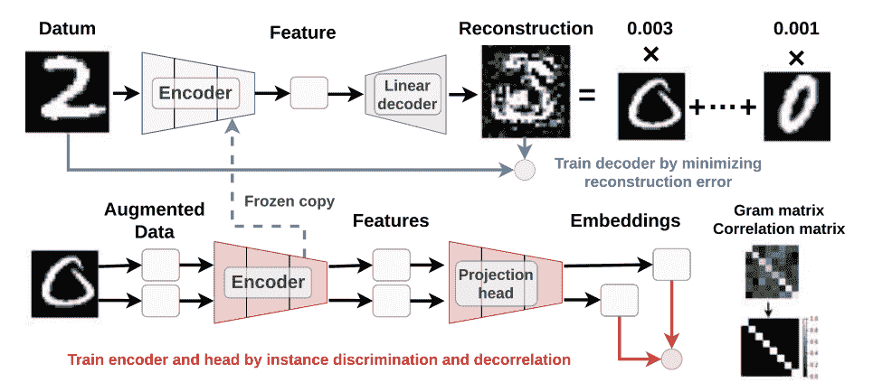

## 图1 KRR的架构和训练算法

由于线性性质，测试数据的重构可以写成正常训练数据的加权和，这使得KRR能够准确重构正常数据，并防止对异常数据的重构。此外，用于重构的训练数据的权重有助于解释模型行为和调试模型和训练数据[13-15]。例如，我们可以将具有较大权重的训练数据视为对重构的重要贡献，并且这些训练数据可以提供额外的信息。另一个例子是，我们可以仅检查具有较大权重的训练数据，而不是整个训练数据集，以进行简单的质量检查。

这种线性性质还揭示了编码器对于KRR实现高异常检测性能的期望属性，换句话说，它能够区分正常数据和异常数据之间的重构错误。我们提出了一种实例判别和特征去相关训练算法，用于实现编码器的这种性质。从另一个角度来看，我们的训练算法使得测试数据的重构在很大程度上依赖于与测试数据在语义上相似的训练数据。用于测试数据重构的正常训练数据的权重是特征空间中相应正常数据和测试数据之间的内积。通过实例判别算法训练的线性神经元将数据投影到通过数据增强生存的语义子空间上。例如，图像数据中背景的出现通过颜色抖动和随机调整裁剪进行改变，训练的编码器会滤除这些信息。因此，与测试数据在语义上相似的训练数据在重构中具有较大的权重。

我们还设计了一种高效的数据清洗算法，可以从训练数据中删除有害数据。这种技术在基于重建的异常检测的性能中至关重要，因为重建模型会对异常数据进行重建，如果训练数据中包含与异常数据在视觉上相似的数据。

我们的算法通过移除具有大的留一法（LOO）重建误差的训练数据来处理KRR，因为异常样本数据在训练数据中占少数。

## 2 材料和方法

### 2.1 问题设置

我们考虑无监督的异常检测设置，只有正常数据 $x \in \mathbb{R}^D$ 可用于训练模型。训练集用 $S=\{x_n\}_{n=1}^N$ 表示。在异常检测中，模型应用于测试集 $T=\{(x_m, y_m)\}_{m=1}^M$，由数据和标签对组成，模型的性能被评估。测试集包括正常数据和异常数据。每个标签表示数据是异常，$y=+1$，还是正常，$y=-1$。为简单起见，如果上下文清楚，集合的索引将被省略。

### 2.2 重建模型的架构

我们的重建模型由编码器和线性回归器组成。编码器将数据 $x \in \mathbb{R}^D$ 转换为特征 $\Phi(x; \theta) \in \mathbb{R}^H$，其中 $\theta$ 是编码器的参数。线性回归器通过变换矩阵 $W \in \mathbb{R}^{D×H}$ 从这个特征中重建数据。然后，模型的重构可以写成

$f(x; \theta, W) = W \Phi(x; \theta)$。

由于简单的架构，一个最小化训练平方误差的转换矩阵 $W^*$，带有L2正则化 $λ \sum ||x - f(x; \theta, W)||_2^2 + ||W||_2^2）可以被识别为 $X \Phi^T \{ \Phi\Phi^T + λI \}^{-1}$，其中 $λ$ 是一个正则化参数，$X \in \mathbb{R}^{D×N}$ 的第n列是第n个训练数据 $x_n$，$\Phi$ 的第n列是第n个训练数据的特征 $\Phi(x_n; \theta)$。因此，通过具有最佳转换矩阵 $W^*$ 的模型对数据 $x$ 进行重构是正常训练数据的加权和

$f(x; \theta, W^*) = X \Phi^T \{ \Phi\Phi^T + λI \}^{-1} \Phi(x; \theta)$。

对于重建来说，具有较大权重的训练数据有助于我们理解KRR的行为，因为它们在重建中起到了很大的贡献。我们将这个模型称为核岭重建（KRR），因为矩阵求逆引理[19]表明，上述重建对应于通过核岭回归来预测输入本身的重建。

### 2.3 线性回归器的训练

非凸问题的优化是NP难问题[20]。此外，特征提取器 $\Phi$ 的多层结构（如神经网络）使其优化变得困难。即使对于具有标准随机初始化的深度线性网络，收敛所需的迭代次数也随着其深度呈指数增长[21]。

为了获得最优的转换矩阵，我们首先训练编码器以最小化下面解释的损失函数，然后在冻结的编码器之上训练线性回归器以最小化以下具有L2正则化的重建误差：

$\sum ||x - W \Phi(x; \theta)||_2^2 + λ ||W||_2^2$，

这是一个关于变换矩阵 $W$ 的强凸函数，因此可以通过梯度下降法数值地获得最优变换矩阵 $W^*$。尽管需要计算 $N × N$ 矩阵的逆，但最优变换矩阵也可以通过解析计算得到。

### 2.4 编码器的训练

最优变换矩阵 $W^*$ 为编码器的优化准则，用于区分正常数据和异常数据的重构误差，从而提高异常检测性能。 重构误差可以分解为

$||x - f(x; \theta, W^*)||_2^2 = ||x||_2^2 + ||f(x; \theta, W^*)||_2^2 - 2 \sum_{输入空间中的内积} \Phi^T \{ \Phi\Phi^T + λI \}^{-1} \Phi(x; \theta)$ .

交叉项揭示了正常数据的重构误差与输入空间中的训练正常数据和正常（异常）测试数据以及特征空间中的对应数据之间的正（负）相关性。

我们提出了一种用于编码器的训练算法，通过实例区分和特征去相关性来增加正常数据两个内积之间的正相关性。首先，数据增强模块随机转换一个训练数据 $x_n$ 为两个相关数据 $\tilde{x}_{2n-1}, \tilde{x}_{2n}$。编码器将这些增强数据转换为特征 $h_{2n-1} = \Phi(\tilde{x}_{2n-1}; \theta), h_{2n} = \Phi(\tilde{x}_{2n}; \theta)$。 投影头将这些特征投影到嵌入 $z_{2n-1} = g(h_{2n-1}; \eta), z_{2n} = g(h_{2n}; \eta)$，其中 $\eta$ 是投影头的参数。这些嵌入 $z$ 应用于实例区分损失 $L_{id}$ 和特征去相关性损失 $L_{fd}$。编码器和投影头的参数 $\theta$ 和 $\eta$ 通过最小化下面的损失函数 $L_{id} + L_{fd}$ 进行联合优化。

## 实例鉴别损失是归一化温度交叉熵

$L_{id} = \frac{1}{2|B|} \sum_{n \in B} \{ \ell(2n-1, 2n) + \ell(2n, 2n-1) \}$

其中 $\ell(n, m) = - \log \{ \frac{\exp(s_{n,m} / \tau_{id})}{\sum_{l \in B \setminus [l != n]} \exp(s_{n,l} / \tau_{id})} \}$

其中 $s_{n,m}$ 是嵌入 $z_n, z_m$ 的余弦相似度， $\tau_{id}$ 是温度，而 $B$ 是随机梯度下降算法中小批量训练数据索引的集合。 最小化这个损失会增加输入空间和嵌入空间（也是特征空间）中正常数据的两个内积之间的正相关性，因为它增加了来自两个相关数据 $\tilde{x}_{2n-1}, \tilde{x}_{2n}$ 的表示 $z_{2n-1}, z_{2n}$ 的余弦相似度，而这个内积通常很大，同时减小了来自不同训练数据的相对较小的内积。然而，在损失函数 $L_{id}$ 中，表示的内积是在欧几里得空间中计算的，尽管我们想要与数据内积相关的是使用度量的特征内积。

$\{ \Phi\Phi^T + λI \}^{-1}$.

以下的特征去相关损失修复了这个问题，使得这个度量接近一个对角矩阵：

### 2.5 异常检测

在异常检测中，训练好的模型通过判断测试数据 $x$ 是正常 $-1$ 还是异常 $+1$ 来决定

$ \text{sign} \left( \sum f(x; \theta, W^*) - \gamma \right) $，

其中 $\gamma$ 是异常阈值参数。

## 2.6 数据清洗

当训练集被异常数据污染时，重建模型也会重建与这些数据在视觉上相似的异常数据，因为这些模型是训练来重建这些数据的。为了解决这个问题，我们提出了一种高效的数据清洗方法，可以在不增加计算成本的情况下移除这些有害的异常数据。

我们的数据清洗方法通过移除具有较大LOO重建误差的数据来实现，其中 $f_{-i}$ 是在排除了 $x_i$ 的训练集上训练的具有线性解码器的KRR，而编码器对于被移除的数据 $x_i$ 保持不变。这种方法的动机是移除异常数据会导致KRR无法重建被移除的异常数据，因为异常数据是训练数据的少数，因此排除这些异常值的训练数据的加权和无法重建这些异常值。计算所有训练数据的LOO重建误差的一种朴素方法是通过将每个数据从训练集中排除并计算LOO重建误差来重新训练模型，这需要大量的计算成本。为了避免这种大量的计算成本，我们推导出了LOO重建误差的以下上界，可以在不重新训练KRR的情况下计算，并将其用作异常值指示器，而不是精确的LOO重建误差。该定理的证明在附录中。

定理1 当我们从训练集中移除一个训练数据 $x_i$，并在保持编码器不变的情况下对其进行KRR的线性解码器训练时，可以计算出该数据 $x_i$ 的重构误差的上界，而无需对 $f_{-i}$ 进行训练。

## 3 实验结果

我们将KRR与基于重构的方法，即AE、VAE和MemAE，在三个数据集上进行了异常检测性能和MACs的比较，以验证KRR在性能和低计算成本方面的泛化能力。 我们还通过检查具有大权重的训练数据，使用相应的编码器对其进行KRR重构，来分析每个编码器的行为。 此外，我们还对注入异常数据的数据集进行了实验，以验证我们的数据清洗方法是否正确地删除了这些异常数据。

### 3.1 图像数据上的实验

我们的第一个实验是检测异常图像。 我们在两个图像数据集MNIST和CIFAR10上评估了它们的性能，这两个数据集都包含属于10个类别的图像。 对于每个数据集，我们从每个类别中抽样图像作为正常数据，从其余类别中抽样图像作为异常数据，构建了10个异常检测数据集。 正常数据以2:1的比例分为训练集和测试集。 测试集中的异常比例控制在30%左右。

模型的架构如表1所示，它们遵循先前工作中的MemAE架构[9]。 AE、VAE和MemAE通过最小化输入与重构之间的平方误差进行训练。 KRR通过我们提出的算法进行训练，该算法被表示为KRR-IDFD。对于MNIST数据集的编码器训练中的数据增强，图像被随机旋转和随机改变亮度。 对于CIFAR10，图像被随机翻转、裁剪和调整大小为32 × 32像素；此外，它们的亮度、对比度、饱和度和色调也被随机改变。 为了验证我们提出的架构和训练算法的有效性，训练好的AE的编码器和仅最小化实例区分损失的编码器也被用作我们提出的模型的编码器，它们分别被表示为KRR-AE和KRR-ID。 在异常检测阶段，使用平方误差来识别异常数据，类似于第2E节中的过程。它们的

## 通过核岭重构进行异常检测和调试

表1 图像数据集模型的架构。Conv(k, s, c)和TransConv(k, s, c)分别表示卷积层和转置卷积层，其中核大小为k，步长为s，通道大小为c，填充大小为1。BN和ReLU分别表示批归一化层和修正线性单元激活函数。Mem(m)表示具有m个项目的内存模块。Dense(d)表示输出大小为d的全连接层。请注意，VAE编码器的最后一层具有用于推断特征的均值和标准差的双头。在MNIST中，投影头为Dense(256)-BN，而在CIFAR10中为Dense(1024)-BN-ReLU-Dense(512)-BN

| | AE|VAE | MemAE | KRR |
|---|---|---|---|---|
| Encoder | Conv(3, 2, 16)-BN-ReLU Conv(3, 2, 32)-BN-ReLU Conv(3, 2, 64)-BN-ReLU | CNN Dense(512) BN-ReLU | |
| Memory | — | Mem(100) | — |
| Decoder | TransConv(3, 2, 64)-BN-ReLU TransConv(3, 2, 32)-BN-ReLU TransConv(3, 2, 1) | Dense(784) | |

| | AE|VAE | MemAE | KRR |
|---|---|---|---|---|
| Encoder | Conv(3, 2, 64)-BN-ReLU Conv(3, 2, 128)-BN-ReLU Conv(3, 2, 128)-BN-ReLU Conv(3, 2, 256)-BN-ReLU | CNN | CNN Dense(2048) BN-ReLU |
| Memory | — | Mem(500) | — |
| Decoder | TransConv(3, 2, 256)-BN-ReLU TransConv(3, 2, 128)-BN-ReLU TransConv(3, 2, 3) | | Dense(3072) |

性能通过AUROC进行评估，即在不同阈值下的接收器操作特性曲线下面积。

表2中的CIFAR10结果显示KRR-AE的AUROC高于AE，换句话说，仅仅用线性回归器替换AE的反卷积解码器改善了其性能。此外，通过实例区分和特征去相关训练的编码器进一步提高了其性能。

表2还显示KRR-IDFD在CIFAR10中明显优于以前的工作，并在MNIST上取得了与以前的工作相媲美的性能。请注意，一些AE和VAE方法在以前的工作中的AUROC表现比我们的复现结果更好，因为它们的网络

| 方法 | 数据集 | MNIST | CIFAR10 |
|---|---|---|---|
| AE [9] | | 0.962 | 0.571 |
| VAE [9] | | 0.964 | 0.573 |
| MemAE [9] | | 0.975 | 0.609 |
| AE (复现) | | 0.766 | 0.553 |
| VAE (复现) | | 0.717 | 0.539 |
| MemAE (复现) | | 0.964 | 0.561 |
| KRR-AE | | 0.699 | 0.598 |
| KRR-ID | | 0.972 | 0.666 |
| KRR-IDFD | | 0.976 | 0.670 |

这些架构比我们的更大。KRR还减少了AE的MAC数；如图2所示，KRR对MNIST和CIFAR10的MAC数分别是AE的0.610倍和0.291倍。

为了阐明我们提出的架构和训练算法的成功关键，我们在MNIST数据集上可视化了正常数据和异常数据的重构（图3和图4），并绘制了CIFAR10测试数据上正常数据和异常数据的重构误差直方图（图5）。图4显示AE也很好地重构了异常数据，这导致了被忽视的异常情况，而用线性回归器替换反卷积解码器可以缓解这个问题。这个图还显示实例区分和特征去相关进一步防止了异常数据的重构。图5显示AE没有将正常数据的直方图与异常数据的直方图分开。用线性回归器替换反卷积解码器会增加这些直方图之间的差距，稍微降低了正常数据的重构准确性。

此外，实例区分和特征去相关进一步分离

表3 KDDCup99模型的架构。头部网络是Dense(60)-BN-ReLU-Dense(100)-BN-ReLU-Dense(60)

| | AE | MemAE | KRR |
|---|---|---|---|
| Encoder | Dense(100)-BN-Tanh
Dense(80)-BN-Tanh
Dense(60)-BN-Tanh
Dense(40)-BN-Tanh | | |
| Memory | — | Mem(120) | — |
| Decoder | Dense(60)-BN-Tanh
Dense(80)-BN-Tanh
Dense(100)-BN-Tanh
Dense(116) | | Dense(116) |

### 3.2 表格数据实验

为了进一步验证KRR在表格数据上的适用性，我们使用了一个网络安全数据集，即KDDCup99的10%数据集。按照之前的工作[9]中使用的设置，将原始数据集中标记为“攻击”的80%数据视为正常数据，将标记为“正常”的剩余数据视为异常数据。每个数据由连续变量和分类变量组成。我们对这些变量进行了与公开代码[23]相同的预处理，因为之前的工作[9]没有解释预处理的方法。我们将每个数据的连续部分归一化为单位范数，并将分类变量转换为独热向量。我们只使用了三个变量，“协议类型”、“服务”和“标志”，作为分类部分。我们将预处理的数据集分成两半，即训练集和测试集。

模型的架构如表3所示。训练过程与图像数据集上的实验相同，除了数据增强。尽管已经有很多研究致力于图像数据的增强，但对于网络安全数据的增强研究还不够深入。因此，为了数据增强，我们使用了一个视图生成网络[24]，它是一个通用的数据增强模块，例如，它扰动数据的方向使得实例区分困难。在异常检测中，我们将阈值设置为测试集上重构误差的80th百分位数，因为我们知道80%的数据是正常的。它们的性能通过精确率、召回率和F1得分进行评估。然而，测试集中异常的比例通常事先是未知的，因此我们还评估了在不同阈值下的平均精确率（表4）。

表4显示，将MLP解码器替换为线性回归器可以提高性能，就像在图像数据集的情况下一样。然而，与图像数据集的情况不同，实例区分和特征去相关并没有改善性能。性能差异的主要原因是

## 3.3 注入异常的图像数据实验

为了验证我们的数据清洗方法，我们向MNIST异常检测训练集的每个类别注入了异常数据。这些受污染的训练集中的异常比例控制在约10%左右。我们通过实例区分和特征去相关性来训练KRR的编码器。然后，我们将我们的数据清洗方法应用于这些训练集，并计算其AUROC。为了比较，我们进行了相同的实验，只是没有使用

## 4 结论

为了防止异常数据被准确地重建，我们开发了KRR方法。KRR将测试数据重建为正常训练数据的加权和，从而准确重建正常数据并防止异常数据的重建。这些权重在重建训练数据时帮助我们验证编码器和训练数据的属性。我们还为编码器创建了一个训练算法，用于区分正常数据和异常数据之间的重建错误，并基于数据清洗方法。

## 附录5

## 5.1 定理1的证明

在我们证明定理1之前，我们提出以下引理，在定理1的证明中起着重要作用。

## 引理1

KRR f_-i 其线性解码器是在排除了x_i的训练集上训练的，对应于KRR f_+i 其线性解码器是在一个训练集上训练的，该训练集的重建目标是f_-i(x_i)。即，

对于所有的x ∈ R^D，f_-i(x) = f_+i(x)。（9）

证明（引理1）中的 f_+i 是使得以下损失函数相对于线性解码器 W 最小化的：

∑_{j∈[N]\{i}} ||x_j - f(x_j; θ, W)||^2 + ||f_-i(x_i) - f(x_i; θ, W)||^2 + λ||W||^2 (10)

将 f_-i 代入上述损失函数中，使得第二项为0，剩余项相对于线性解码器是最小的。因此，f_+i 对应于 f_-i。

现在，让我们来证明定理1。

证明（定理1）根据引理1，

f_-i(x_i) = f_+i(x_i) = ∑_{j∈[N]\{i}} H_{j,i}x_j + H_{i,i}f_-i(x_i), (11)

为了简化起见，让 f* 是在整个训练集上训练的线性解码器的KRR

f*(x_i) = f(x_i; θ, W*) = ∑_{j=1}^N H_{j,i}x_j. (12)

因此，

-||f*(x_i) - f_-i(x_i)||^2 = -H_{i,i}^2 ||x_i - f_-i(x_i)||^2. (13)

将 ||x_i - f_-i(x_i)||^2 加到两边，

||x_i - f_-i(x_i)||^2 - ||f_-i(x_i) - f*(x_i)||^2 = (1 - H_{i,i}^2) ||x_i - f_-i(x_i)||^2. (14)

反向三角不等式引导

## 参考文献

1. Ruff, L., Kauffmann, J.R., Vandermeulen, R.A., Montavon, G., Samek, W., Kloft, M., Dietterich, T.G., Müller, K.R.: 深度和浅层异常检测的统一综述。IEEE会议论文集 (2021)
2. Chan, A.A., Vasconcelos, N.: 用动态纹理混合模型建模、聚类和分割视频。IEEE模式分析与机器智能 30(5), 909–926 (2008)
3. Tavallae, M., Bagheri, E., Lu, W., Ghorbani. A.A.: 对kdd cup 99数据集进行详细分析。在: IEEE计算智能安全与防御应用pp. 1–6. IEEE (2009)
4. Bergmann, P., Fauser, M., Sattlegger, D., Steger, C.: Mvtec AD–一个全面的现实世界无监督异常检测数据集。 在: IEEE/CVF计算机视觉和模式识别会议论文集，第9592-9600页 (2019年)
5. Lee, K., Lee, K., Lee, H., Shin, J.: 一种简单的统一框架用于检测超出分布样本和对抗性攻击。 Adv. Neural Inf. Process. Syst. 31 (2018)
6. Bergman, L., Cohen, N., Hoshen, Y.: 深度最近邻异常检测 (2020年)
7. Gu, X., Akoglu, L., Rinaldo, A.: 最近邻方法的统计分析用于异常检测。 在: 神经信息处理系统进展, 第32卷 (2019年)
8. Zong, B., Song, Q., Min, M.R., Cheng, W., Lumezanu, C., Cho, D. and Chen, H.: 深度自动编码高斯混合模型用于无监督异常检测。 在: 国际学习表示会议 (2018年)
9. Gong, D., Liu, L., Le, V., Saha, B., Mansour, M.R., Venkatesh, S., van den Hengel, A.: 记忆正常性以检测异常：用于无监督异常检测的记忆增强深度自编码器。 在: 计算机视觉国际会议, 第1705-1714页 (2019)
10. Kingma, D.P., Welling, M.: 自编码变分贝叶斯。 在: 学习表示国际会议 (2014)
11. Baldi, P., Hornik, K.: 神经网络和主成分分析：从示例中学习而无需局部最小值。神经网络。 2 (1) , 53-58 (1989)
12. Lucas, J., Tucker, G., Grosse, R.B., Norouzi, M.: 不要责怪ELBO! 线性VAE对后验崩溃的观点。 Molnar, C.: 可解释的机器学习。 Lulu.com (2020)
14. 叶志恒, 金杰, 严恩旭, Ravikumar P.K.: 解释深度神经网络的代表点选择。 Adv. Neural Inf. Process. Syst. 31 (2018)
15. Koh P.W., 梁平：通过影响函数理解黑盒预测。 在: 国际机器学习会议, 第1885-1894页。PMLR (2017)
16. 田宇, 于立, 陈旭, Ganguli S.: 通过双重深度网络理解自监督学习 (2020)。 arXiv预印本arXiv:2010.00578
17. LeCun Y., Bottou L., Bengio Y., Haffner P.: 基于梯度的学习应用于文档识别。 Proc. IEEE 86(11), 2278-2324 (1998)

18. Krizhevsky, A., Hinton, G., 等：从小图像中学习多层特征 (2009)
19. Bach, F.: 从第一原理起草的学习理论 (2021)
20. Jain, P., Kar, P.: 非凸优化用于机器学习。Found. Trends® Mach. Learn.10(3–4), 142–336 (2017)
21. Shamir, O.: 一维深度线性神经网络梯度下降的指数收敛时间。 在: 学习理论会议, 第2691–2713页。PMLR (2019)
22. Tao, Y., Takagi, K., Nakata, K.: 通过实例区分和特征去相关性的聚类友好表示学习。 在: 国际学习表示会议 (2021)

23. id4thomas. 无监督的IDS实现KDDCup99数据集。 https://github.com/id4thomas/KDD-IDS
24. Tamkin, A., Wu, M., Goodman, N.: 视图生成网络：无监督表示学习的视图学习。 在: 国际学习表示会议(2020年)

## 优化卷积神经网络架构的感受野分析

Mats L. Richter (ID), Julius Schning (ID), Anna Wiedenroth (ID), and Ulf Krumnack (ID)

摘要 在设计基于图像的任务的卷积神经网络（CNN）架构时，卷积神经网络的层数经常被高估。 因此，这些CNN架构在训练和部署时是不必要的昂贵的。 网络复杂性的增加也导致了预测质量的递减。 卷积层的感受野严格限制了它可以处理的特征。 通过分析网络上的感受野扩展，我们可以一致地预测在给定的CNN架构中不会对测试性能产生质量贡献的无效层。 由于感受野是架构本身的属性，因此这种分析不需要对模型进行训练。 我们将这种分析技术称为感受野分析（RFA）。 在这项工作中，我们证明了RFA可以用于通过预测无效层的存在来指导CNN架构的优化。 我们展示了RFA可以推导出设计决策和简单的设计策略，可可靠地提高模型在给定任务上的参数效率。 我们进一步证明了这些RFA引导的策略可以可靠地提高预测性能、计算效率或在两者之间取得平衡。最后，我们展示了RFA还可以用于定义任何现代架构的可行输入分辨率间隔，在该间隔内模型将具有高效率，同时能够从图像中提取任何模式。 这使得从业者可以在适应新任务时选择高效的输入分辨率。

M. L. Richter (\(\square\)) · A. Wiedenroth · U. Krumnack  
奥斯纳布吕克大学认知科学研究所，德国奥斯纳布吕克  
电子邮件：matrichter@uos.de

A. Wiedenroth  
电子邮件：awiedenroth@uos.de

U. Krumnack  
电子邮件：krumnack@uos.de

J. Schning  
奥斯纳布吕克应用科学大学工程与计算机科学学院，德国奥斯纳布吕克  
电子邮件：j.schoening@hs-osnabrueck.de

© 作者，独家许可给 Springer Nature Singapore Pte Ltd. 2023M. A. Wani 和 V. Palade (编者)，深度学习应用，第4卷，智能系统与计算进展1434，https://doi.org/10.1007/978-981-19-6153-3_10

## 1 引言

在过去的几年里，以指数级增加参数数量来获得预测性能的渐进改进趋势主导了卷积神经网络（CNN）分类器在计算机视觉领域的设计。更准确地说，最先进的架构在ImageNet数据集上达到的92.1%的Top1准确率方差可以通过参数的指数增加来解释。这在图1中得到了体现。换句话说，高容量（以可训练参数的数量衡量）似乎意味着高预测性能。然而，在实际应用场景中，这些架构的训练和部署也变得越来越不经济，因为高容量模型还需要更多的数据和计算资源来进行训练。层数，通常被称为网络的“深度”[2, 15, 17]，是用来增加模型容量的最流行的设计维度之一。目前，对于给定问题的神经架构的最佳深度，就像神经架构设计的其他部分一样，只能通过评估和比较训练好的模型来近似确定。因此，这种基于试错的神经架构设计方法是牢固的。为了更高效的设计过程，也更有可能得到参数高效的模型，需要一种基于对神经架构对模型性能影响的理解的启发式方法。这样的启发式方法需要在训练之前可靠地预测增加或删除层对预测性能是否会产生重大影响。

在这项工作中，我们提出了一种启发式方法来优化卷积神经网络的深度。这种启发式方法基于图像数据的输入分辨率和网络层的感受野大小之间的相互作用。我们展示了这种启发式方法能够稳定地预测卷积神经网络中无效层的存在。由于这种启发式方法基于感受野，即从层中提取的特征的局部性，我们还研究了注意力机制（如挤压激励模块）的影响。

[4]，在推理过程中使用空间注意力和块注意力CBAM [21]。通过这样做，我们可以证明所提出的启发式方法适用于卷积神经网络分类器的最新架构。

这项工作的主要贡献可以总结为回答以下问题：

- 我们能预测神经网络中无效的层次子序列吗？ 答案：是的，我们通过实验证明可以预测无效的层次。

1我们将在输入分辨率和输入大小互换使用。

## 2 背景

在本节中，我们讨论了构建本文所需的基本背景知识：首先，描述了分析隐藏层内部处理和判断中间解决方案质量的技术。 我们进一步讨论了尾部模式[14]，这些技术可以检测到类型参数效率问题。 最后，我们介绍了卷积层中感受野的概念。 我们演示了如何计算顺序架构中的感受野。 我们还提供了一种计算非顺序神经架构感受野的新方法。

### 2.1 逻辑回归探针

AΔain和Bengio [1]的逻辑回归探针（LRP）是一种分析中间解决方案质量随数据从层到层传播的工具。 其思想是在每个层的激活值上拟合一个线性分类模型，使用与模型相同的分类标签。 由于神经架构的任务是将数据的潜在表示转化为线性可分离状态，逻辑回归探针的预测性能包含了关于中间解决方案质量的信息。 因此，可以通过将逻辑回归探针的测试准确率与完整网络的测试准确率进行比较，来量化每个层中问题已经解决的程度。 通常可以观察到逻辑回归探针准确率逐层增加，接近模型的准确率，如图2中的红色曲线所示。 在本文中，对于在第Δ层的激活值上训练和评估的探针，其测试集准确率被称为p_Δ。

### 2.2 饱和值和尾部模式

饱和是我们在之前的工作中提出的[14]，也是一种研究神经网络层活动的技术。 与逻辑回归探针的测试准确率类似，饱和是一个介于0和1之间的单个浮点数，用于计算每一层。 饱和 s_Δ是层 Δ激活空间中解释99%方差所需的特征向量的百分比。 它在图2中以绿色曲线显示。这些值按照前向传递的顺序从左到右绘制。 直观地说，饱和值可以描述为在前向传递过程中，一层的输出空间被训练数据集“填充”或“饱和”的百分比。 由于饱和是一个百分比，它的值介于0和1之间，类似于逻辑回归探针的准确率。 平均饱和度低于其他层平均饱和度50%的一系列层被称为尾部模式。 尾部模式的存在表明属于该模式的层的性能较差。

### 2.3 引入感受野

卷积层的感受野是影响单元输出的输入图像区域。 这个区域可以用多种方式定义。 Luo等人[11]提供了一种经验定义，他们使用统计方法确定层中的有效感受野大小，这被认为类似于高斯分布。 由于这种计算方法依赖于模型的状态，我们不使用这种方法，因为我们对初始化之前的模型进行分析。 Koutini等人[6]和Wang等人[20]等作者使用另一种更简单的感受野定义，这也不依赖于模型的状态。

他们确定感受野大小的计算方法仅基于模型的拓扑结构以及每层的卷积核和步长大小。
这个感受野的定义可以被认为是理论上可提取特征的数学上的上限。 在我们之前的工作[13, 14]以及前面提到的作者的工作[6, 20]中，已经表明这个感受野的定义与模型的预测质量和计算效率有关。 因此，我们也将从这个定义开始。 然而，我们将扩展它，以考虑现代架构中常见的特征的异质性，允许多个路径到达同一层。

卷积层可以被认为是特征提取器。 因此，感受野大小也可以解释为特征大小的自然上限。

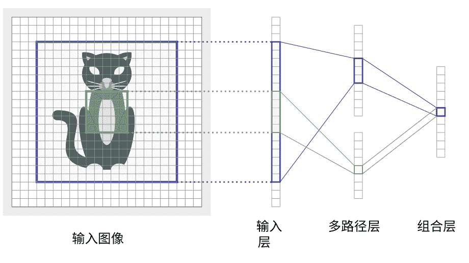

图3 这个例子说明了多路径架构在输入图像上的感受野 r_Δ[Δ, min]（绿色）和 r_Δ[Δ, max]（蓝色）

地图大小对所有连续层的感受野大小的增长具有乘法效应 r_Δ[Δ + n].

对于具有多路径结构的CNNs，这个定义必须被细化。多路径架构是一种从输入到输出有多个计算路径的网络，InceptionV3 [17]由于其并行路径和ResNet [2]由于其跳跃连接而成为众所周知的多路径架构的例子。对于具有多路径架构的情况，在其中任何一层 Δ从 m ≥ 1个输入路径接收输入，path-1, ..., path-m计算所有 m个可能的不同感受野大小 r_Δ[path-1]到r_Δ[path-m]. 一层 Δ的最大感受野大小指的是最大可能的感受野大小 r_Δ[Δ, max] = max{r_Δ[path-1], ..., r_Δ[path-m]}，而最小大小指的是 r_Δ[Δ, min] = min{r_Δ[path-1], ..., r_Δ[path-m]}。我们可以在图3中对最小和最大感受野获得视觉印象，其中最大和最小感受野被投影到一个示例输入图像上。如图4所示，r_Δ[Δ, max]和 r_Δ[Δ, min]的值是通过计算导致Δ具有最大和最小感受野大小的层序列的 r_Δ[path-i]获得的。

## 3 方法论

本节讨论我们将在第4节中进行实证研究的研究假设。然后，我们介绍了本工作中使用的实验设置。这也涉及对训练网络的推理过程进行分析的技术的简要介绍。

### 3.1 研究假设

在第2.2节中，我们确定了无效层序列是由于CNN架构和输入分辨率不匹配引起的。 我们在第2.3节中确定，感受野的扩展有效地控制了CNN中一层可以提取的特征的大小。 因此，CNN层的感受野对于给定固定输入分辨率的推理过程的分布具有一定的描述能力。 因此，我们假设无效序列的

我们观察到的层[14]可以仅使用感受野大小 $r_\Delta$ 和输入分辨率 $I_{res}$ 来预测。 如果是这种情况，解决由无效层引起的参数效率问题可以通过修剪这些层或在训练模型之前改变感受野扩展来实现。

### 3.2 实验设置

除非另有明确说明，所有模型都是在Cifar10 [7]数据集上训练的。 由于我们的研究需要进行许多实验和模型训练，而逻辑回归探针是一个非常资源密集型的过程，因此使用Cifar10作为轻量级数据集是必要的。 请记住，Cifar10并不是一个简单的任务，通常被用作像ImageNet [12, 18]这样的大型数据集的代理问题。 我们在实验中使用的CNN是根据特定的架构元素进行选择的。 例如，VGG16是一个具有简单顺序结构的模型，而ResNet18用于分析跳跃连接的影响。

模型训练进行了60个epochs，使用了随机梯度下降法，动量为0.9，学习率为0.1，并对所有评估的CNN架构进行了训练。 此次训练选择的批量大小为64。 学习率每20个epochs衰减一次，衰减因子为0.1。 预处理还包括使用从原始AlexNet论文[8]中获取的σ和μ值进行通道归一化。 在训练过程中，图像还会以50%的概率进行随机裁剪和水平翻转。

饱和度是在最后一个卷积层和全连接层的训练中计算的，使用了δ为99%的标准配置，这是我们推荐的配置[14]。

在模型训练之后，逻辑回归探针的准确率值是在与饱和度相同的层上计算的。 通过训练逻辑回归探针，本研究与Alain和Bengio [1]的方法不同，不会将特征图全局池化为单个向量，以避免过度下采样引起的伪影。 基于对逻辑回归探针性能的割除研究[14]，将大尺寸的特征图自适应平均池化到4 × 4像素的大小。 这是计算可行性和准确性可靠性之间的一个很好的折中。

## 4 实验

我们通过多个步骤来研究我们的研究假设，即可以使用感受野大小和输入分辨率来预测无效层。 首先，我们在简单的顺序神经网络架构上进行测试。 基于这些发现，我们扩展了我们对多路径架构和具有残差连接的架构的假设。

### 4.1 顺序CNN架构的边界层

本节通过分析在简单的顺序卷积神经网络架构中预测无效层的可能性来开始研究。如第2.4节所述，在这种情况下可以明确计算感受野大小。由Simonyan和Zisserman [15]提出的VGG-系列CNN架构是顺序CNN架构的典型代表，因此在实验中使用，参见图5和6。

为了回答我们的研究问题，即是否可以预测层的非生产子序列，我们假设如果层不能将新信息整合到单个特征图位置中，则层变得非生产。当[Δ - 1] ≥ I_res时，这是情况，其中[Δ - 1]是层Δ的输入的感受野，I_res是输入分辨率。由于感受野大小在简单的顺序架构中单调增长，可以根据条件 rΔ[Δ - 1] ≥ I_res明确地将模型的生产部分与非生产部分分开。具有条件 rΔ[Δ - 1] ≥ I_res的第一层被称为边界层b，因为它有效地将CNN的生产层与非生产层分开。通过使用Cifar10数据集的本地图像分辨率32 ×32像素训练VGG11、VGG13、VGG16和VGG19，计算感受野大小、饱和度值和逻辑回归探针准确性。

如图5所示，饱和度和逻辑回归探针准确性在所有四个VGG设置中都显著增加，直到边界层之后，逻辑回归探针准确性不再提高。因此，边界层将定性贡献的卷积层（通过逻辑回归探针准确性的增加和高饱和度值）与不贡献的卷积层分开。当在TinyImageNet上训练模型时，观察到的行为也是可重复的，使用相同的设置和图像分辨率，如图6所示。图5和图6的绘图显示，边界层的行为在VGG系列的不同网络深度上是一致的，并且不依赖于使用的数据集。

我们进行了两个实验，使用不同的顺序架构在Cifar 10上进行训练，以研究观察到的边界层行为是否可以重现。第一个实验使用了修改后的ResNet18 [2]架构。在这个修改后的版本中，ResNet18的所有跳跃连接都被禁用，确保了顺序网络架构。这个顺序的ResNet18架构模型与VGG风格的模型在许多方面都不同。首先，使用BatchNorm和步幅卷积进行下采样，而不是使用MaxPooling层。此外，顺序的ResNet18在模型输入处具有两个连续的下采样层的起始，这对感受野大小的增长产生了很大影响。第二个

### 4.2 非顺序CNN架构的边界层

本小节研究了当网络结构是非顺序的时，是否仍然可以预测无产出的卷积层序列。与顺序CNN相比，在多路径架构中，任何层的输入都可能包含基于多个感受野大小的信息。为了观察层数的变化和模块内感受野大小的更大偏差是否以意想不到的方式影响推理过程的分布，我们设计了一个多路径的“模型生物”架构，该架构也很容易进行分析。

这种通用的非顺序多路径架构如图8a所示。它的设计遵循了诸如ResNet [2]、AmoebaNet [12]和EfficientNet等各种架构中关于下采样和总体结构的约定。## 用于优化卷积神经网络的感受野分析

图7 使用边界层预测其他架构中的无效层也是可行的。禁用跳跃连接的ResNet18使用两个初始下采样层。所示的VGG19变体b使用了扩张卷积。这两个属性对感受野的增长方式与图5和图6中的模型有不同的影响。请注意感受野大小的y轴刻度不同。

[19] 这种非顺序架构有四个阶段，每个阶段都由具有相似滤波器大小的构建块组成。每个阶段的第一层是一个下采样层，通过采用2的步幅来减小特征图的大小。为了生成变异，定义了两种不同的架构：浅层架构和深层架构。浅层多路径架构，称为MPNet18，每个阶段使用两个模块A构建块。模块A构建块，如图8b所示，由一个3 × 3卷积路径和一个7 × 7卷积路径组成，通过元素逐个相加合并。第二个深层多路径架构，称为MPNet36，使用四个模块B构建块。如图8c所示，模块B构建块在每个路径中具有不同数量的层，因此在r_Δ[Δ, min]和r_Δ[Δ, max]之间存在较大差异。

在MPNet18和MPNet36中，卷积层使用相同的填充、批归一化和ReLU激活函数。为了合并路径，使用元素逐个相加，因为它不会增加滤波器的数量，而连接会增加滤波器的数量。通过元素逐个相加进行合并可以避免1 × 1卷积进行维度缩减，这可能会导致分析中出现噪声伪影。只有两个不同的路径，具有不同的内核大小，使得计算r_Δ[Δ, min]变得容易。

双通道设计进一步允许我们将模型视为两个序列，其扩展范围 r_Δ[Δ, max]大不相同，这极大地简化了图9中架构的可视化。与顺序CNN一样，MPNet18和MPNet36在相同的实验设置下进行训练和评估，使用Cifar10数据集。图9显示，在浅层和深层多路径架构中，逻辑回归探针的准确性表现非常相似。值得注意的是，基于最大感受野大小的边界层 b_max 对逻辑回归探针准确性的发展没有明显影响。然而，最小感受野大小的边界层 b_min 表现出了与图5、6和7中的边界层相同的行为。最小边界层 b_min 的行为支持了新信息整合对解决方案改进的重要性。然而，它也表明网络不会贪婪地将所有可用信息尽快整合到特征图的一个位置上。

## 跳跃连接允许在边界层之后进行定性改进

跳跃连接是非顺序体系结构的特例，因为它们有效地创建了不扩展感受野大小的路径，并且通常是无参数的。多种跳跃连接的变体[2, 5, 16]已经在多年来提出，这些变体通常在路径合并的方式和跳跃连接本身是否具有参数方面有所偏离。从跳跃连接的变体中，He等人提出的跳跃连接[2]是最常见的类型。除了ResNet之外，这种变体还可以在AmoebaNet等架构中找到。

[12] MobileNetV3[3] 和 EfficientNet[19]。由于这个变体的频繁使用，本研究重点关注这种特定的跳跃连接，它使用逐元素相加来合并路径，并且不包含可训练参数。如果感受野扩展行为与第4.2节讨论的多路径架构的行为一致，边界层 b_min 应该将卷积层的无效尾部分隔开。我们在ResNet18和ResNet34架构上进行了研究。

图10中的图表表明，边界层假设也适用于具有跳跃连接的非连续架构。在两个经过测试的ResNet架构上，当达到边界层时，预测性能的定性改善停止。最小感受野大小的锯齿状模式是由于跳跃连接有效地允许CNN跳过除了干线之外的所有层。因此，感受野大小在路径合并处被重置。在CNN的后续层中，这种锯齿状模式的振幅变得更加明显，这是由于额外的下采样层增加了感受野大小的增长速率。ResNet18和ResNet34的逻辑回归探针准确性也显示出一些异常，即其值在边界层之后突然下降，这仅发生在跳跃连接之后。逻辑回归探针准确性的这些下降是由于CNN不利用被跳过的层导致的。这种在被跳过的层上的行为与Alain和Bengio[1]使用线性分类器探针的观察结果相同。

## 注意机制不会影响逻辑回归探针和饱和值

在第4.1-4.3节的研究结果基础上，工作假设是逻辑回归探针和饱和值不受任何注意机制的影响。因此，注意机制被认为是以基于输入生成动态权重的简单附加层。Squeeze-and-Excitation（SE）模块[4]是一种按滤波器进行注意的机制，因为权重是应用在每个特征图上的。与SE模块相比，空间注意机制在每个特征图位置上应用单一权重。卷积块注意模块（CBAM）[21]是两者的结合。在所有情况下，一个或多个类似自编码器的结构将整个特征图堆栈压缩成一组权重，通常使用一些全局池化策略[10]。因此，注意机制通过乘法将图像的全局信息融入特征图中，从而改变了特征图中每个位置的信息。

为了测试这个假设，我们将SE注意机制、空间注意机制和CBAM添加到ResNet18架构中。为了确保跳跃连接和注意机制之间没有意外的相互作用，我们还考虑了带有注意机制但禁用了跳跃连接的ResNet18架构。所有实验的结果如图11所示（请注意，注意机制添加的额外层在该图中被省略，以使值的顺序与之前的实验可比较）。

结果支持假设，任何注意机制都不会对逻辑回归探针和饱和值产生影响。虽然模型的准确性因所选择的注意机制而异，但逻辑回归探针准确性和饱和值并没有显著变化。此外，图表暗示注意机制主要改变了层提取特征的方式，而显然没有改变整体推理的分布。因此，边界层假设不受任何注意机制的影响，可以用来预测架构中的无效卷积层。

## 感知野分析的5个实际应用

本节将讨论两个由感知野分析赋予的实际应用。首先，通过改变神经网络的结构，可以优化CNN的设计，使其不包含任何无效的层。因此，感知野分析对CNN的设计有影响，详见第5.1节和第5.2节。其次，通过保持CNN设计不变，感知野分析也对图像分辨率产生影响。在这个应用案例中，感知野分析被用于调整输入图像的分辨率，以确保架构中没有无效的层。详见第5.3节。这两种方法在图12中有所说明。

## 5.1 卷积神经网络设计的影响

由于边界层将卷积层中无效的序列分离开来，仅根据架构和输入分辨率，边界层可以帮助设计和改进卷积神经网络架构。这种边界层方法的一个重要优势是，在开始训练之前，网络架构和输入图像分辨率都是已知的。因此，我们的方法可以实现非常高效和可持续的设计过程，因为可以优化架构而无需对训练模型进行比较评估。

边界层方法的潜力通过优化现有的架构得到了体现。在Cifar10数据集上，边界层被用来通过一个简单的分类器替换所有无效层，该分类器由一个全局平均池化层和一个softmax层组成。我们在本研究中使用的VGG、ResNet和MPNet模型上应用了这种优化策略。为了覆盖训练过程中可能的随机波动，所有优化模型都进行了十次训练，并计算了平均测试准确率、可训练参数的总数以及单张图像前向传递所需的FLOPs。结果以图13可视化。可以看到，在所有测试场景中，优化模型的测试准确率都有所提高，同时去除了无效层，减少了可训练参数的数量以及计算所需的FLOPs。

所示技术可以被认为是粗糙的，并不一定是提高预测性能的最有效方法。另一种更加注重性能的可能性是移除无效层，从而优化架构，可以通过影响神经架构中感受野的增长率来实现。这可以通过在网络中添加、移除或重新定位池化层来实现。例如，通过移除ResNet18和ResNet34中的前两个下采样层（起始层），整个网络中感受野的增长率减少了4倍。移除ResNet34中的起始层将性能从82.76%提高到92.21%，对于ResNet18，改进后的性能从之前的84.61%提高到91.95%，同时移除了尾部模式。

通过在网络内部影响感受野的增长率，测试准确性和参数效率得到了显著改善。然而，去除下采样层将同时增加每个图像的FLOPS，因为每个层中特征图的适当大小都增加了。这个设计决策可以被认为是在计算效率上对预测质量的权衡。这是因为去除下采样层不仅减少了连续层的感受野增长，还增加了特征图的大小。这反过来增加了处理这些层所需的计算量，因为需要评估卷积核的更多位置。

对于ResNet34，每个图像的计算量从0.76 GFLOPs增加到1.16 GFLOPs，对于ResNet18，从0.04 GFLOPs增加到0.56 GFLOPs。总之，基于输入分辨率和感受野大小之间的相互作用，边界层可以用来预测无效层。虽然关于感受野作用的基本假设可能是过于简化的，但它可以作为一种有效的设计启发：将边界层尽可能靠近输出层的网络架构变化是优化CNN的计算效率和预测性能的合适启发式方法。

两种情况都使模型更加参数高效。这些架构变化仍然需要在预测性能和计算效率之间进行权衡。优化的困境是本文提供启发式而不是优化或修剪算法的原因，因为不同的应用场景可能需要不同的折衷。我们将在下一节中详细讨论计算足迹和预测性能之间的权衡。

## 5.2 RFA在CNN优化中的应用示例：优化ImageNetResized16的ResNet18

在前一节中，我们讨论了优化神经架构的不同方法，并证明了在各种架构上简单的优化策略可以提供可靠和可预测的结果。在本节中，我们将展示这些见解如何推广到另一个更复杂的数据集，并提供对神经架构优化如何强调预测性能、计算效率或两者平衡的更细致的观察。

从抽象的角度来看，神经结构的质量可以通过其如何利用参数来提高解决方案的质量来表征。一般来说，这些优化类似于一个简单的权衡。一方面，通过去除无效的层，可以使架构更加高效，从而减少参数的数量和处理前向传递所需的计算资源。另一方面，通过使无效的层重新变得有效，可以提高架构的预测性能。后者增加了计算的占用空间，因为通常只有通过删除下采样层才能足够减少感受野的增长。因此，这个过程可以描述为在创建预测所需的FLOPs和预测质量之间寻找合适的权衡。

我们使用ResNet18架构在ImageNetResized16上演示了这个设计过程。本节中的模型使用与第5.1节相同的设置和数据集的原始输入分辨率，即16 × 16像素。从图14中我们可以看到，在使用这个设置时，网络的大多数层被预测为无效。基于这些洞察，我们可以选择优化无效的架构，以提高计算效率、预测性能或二者之间的平衡。

我们首先研究预测质量的优化。由于下采样层对感受野的增长影响最大，我们移除网络开头的池化层。这个改变适用于本工作中的所有变体，因为它使得前两个残差块再次完全有效。此外，我们将第一层的步幅大小减小到1，并将其卷积核大小改为3。这些改变导致除了最后两个残差块之外，所有的卷积层都变得有效。通过移除

通过从倒数第二个残差块进行下采样，我们还可以使这些层对推理过程产生质量上的贡献。我们还将剩余的残差块均匀分布在模型的其他3个阶段中，以便大致相同数量的层在相同的尺度上操作。所得到的模型如图15所示，准确率达到34.2%，这是与原始16.8%相比的显著改进。然而，计算占用也大幅增加了793.1%，如图18所示。

另一方面，通过在干细胞中删除汇聚层后删除剩余的无效层来优化效率。这种大大缩短的架构如图16所示，计算占用减少了77.8%。性能也略有下降，从16.7%到16.3%。或者，我们可以选择在两个极端之间找到一个折中方案。

在这种情况下，我们按照性能优化版本的描述，删除了两个初始的下采样层。然而，我们不是通过在三个下采样阶段之间重新分配它们来保持相同数量的残差块，而是简单地剪掉仍然被预测为无效的层。这个混合版本如图16所示，在36.3%的增加计算成本下实现了26.34%的准确率。

从这个例子中，我们可以看到对架构的更改按预期进行，无论是为了提高计算效率还是预测性能。无论如何，对于给定的任务，所有三种架构变体都可以被认为比ResNet18的原始版本更加参数高效，如图18所示，无论是通过大幅降低计算成本，提高预测性能，还是两者兼而有之。

## 5.3 对输入图像分辨率的影响

前面的章节说明了感受野分析可以用来使架构更加参数高效。然而，在深度学习应用中，通常会简单地使用一个众所周知的架构和设置来解决一个具有不同视觉特性和类别的新分类问题，而不进行任何修改。在这种情况下，感受野分析也可以用来为设计高效的CNN架构使用提供有用的见解，通过采用输入图像的尺寸。通过将感受野分析应用于众所周知的CNN架构，如VGG、ResNet或DenseNet，我们可以获得一系列可行的输入分辨率（Imin, Imax)。Imin被定义为没有无效卷积层存在的最小输入分辨率。换句话说，Imin是网络在理论上可以利用所有层来提高解决方案质量的最小可能分辨率：Imin = max(rΔ[Δ, min][Δ])。通过具有输入分辨率Ires ≥ max(rΔ[Δ, min][Δ])，我们可以确保所有层在理论上都能对预测质量做出贡献。然而，输入分辨率也可能过大。如果没有任何一层具有足够大的最大感受野大小以覆盖整个图像，则会出现这种情况。在这种情况下，任何大于max(r_Δ[Δ, max][Δ])的潜在有用特征都无法被模型提取。因此，我们将可行输入分辨率的上限定义为：I_max = max(r_Δ[Δ, max][Δ])。如图19所示，这个输入分辨率范围是所有层都将被利用的理论边界，因此模型将具有最高的参数效率。请注意，这个计算使用输入分辨率作为启发式方法来确定图像中最大提取特征的大小。到目前为止，这个假设在所有测试场景中都被证明是没有问题的。

[13] 然而，在非分类任务（如目标检测）中，信息通常被认为是非常局部的，这些边界可能不容易以一般的方式定义。

通过将输入图像分辨率调整到可行输入范围内，选择的CNN架构被预测为没有无效层，同时能够在图像中理论上检测到所有可能存在的模式。

我们使用感受野分析来计算经常选择的CNN架构的最小和最大可行输入分辨率。表1汇总了所有内置分类器架构的 (I_min, I_max) 值，包括 tensor-flow 和 torch。请注意，作为单路径架构的VGG16和VGG19的最小和最大可行输入分辨率的值是相同的，因为 r_Δ[Δ, min][Δ] = r_Δ[Δ, max][Δ]，而其他多路径架构的值则不同。一个令人惊讶的发现是，ResNet50、ResNet101和ResNet152架构的 I_max 在它们的十个变体中都具有相似值。这种差异是由于下采样层的位置偏差引起的。在这种情况下，我们报告了torchvision实现的值，这是作者原始定义的真实值。

| 架构 | I_min | I_max | 架构 | I_min | I_max |
| --- | --- | --- | --- | --- | --- |
| DenseNet121 | 103 × 103 | 2071 × 2071 | MobileNet | 315 × 315 |  |
| DenseNet161 | 103 × 103 | 2967 × 2967 | MobileNetV2 | 163 × 163 | 491 × 491 |
| DenseNet169 | 103 × 103 | 3351 × 3351 | MobileNetV3大 | 263 × 263 | 595 × 595 |
| DenseNet201 | 103 × 103 | 3863 × 3863 | MobileNetV3小型 | 303 × 303 | 639 × 639 |
| EfficientNetB0 | 299 × 299 | 851 × 851 | MnasNet | 283 × 283 | 843 × 843 |
| EfficientNetB1 | 299 × 299 | 1183 × 1183 | NASNetLarge | 327 × 327 | 3303 × 3303 |
| EfficientNetB2 | 299 × 299 | 1183 × 1183 | NASNetMobile | 327 × 327 | 2407 × 2407 |
| EfficientNetB3 | 299 × 299 | 1407 × 1407 | ResNet18 | 139 × 139 | 435 × 435 |
| EfficientNetB4 | 299 × 299 | 1799 × 1799 | ResNet34 | 139 × 139 | 899 × 899 |
| EfficientNetB5 | 299 × 299 | 2131 × 2131 | ResNet50^a | 96 × 96 | 427 × 427 |
| EfficientNetB6 | 299 × 299 | 2523 × 2523 | ResNet101^a | 96 × 96 | 971 × 971 |
| EfficientNetB7 | 299 × 299 | 3079 × 3079 | ResNet152^a | 96 × 96 | 1451 × 1451 |
| VGG11 | 150 × 150 |  | GoogLeNet | 123 × 123 | 379 × 379 |
| VGG13 | 156 × 156 |  | SqueezeNet 1.0 | 67 × 67 | 155 × 155 |
| VGG16 | 212 × 212 |  | SqueezeNet 1.1 | 63 × 63 | 207 × 207 |
| VGG19 | 268 × 268 |  | InceptionResNetV2 | 143 × 143 | 3039 × 3039 |
| Xception | 135 × 135 | 1083 × 1083 | InceptionV3 | 239 × 239 | 1311 × 1311 |

## 6 结论

在这项工作中，我们提出了感受野分析（RFA）技术，用于识别卷积神经网络架构中的无效层。该方法不需要训练，并且已经证明可以在具有多个路径、跳跃连接和注意机制的神经架构上工作。我们展示了这种技术可以用于以明智的方式优化CNN架构，可靠地提高各种模型和数据集的参数效率。最重要的是，我们证明我们可以在预测性能和计算成本之间做出有意识的权衡决策。此外，我们展示了RFA可以用于识别现有模型在可行输入分辨率范围内没有无效层的范围，并为许多现代CNN架构提供这些范围。

## 用于优化卷积神经网络的感受野分析...

Huang, G., Liu, Z., Maaten, L.V.D., Weinberger, K.Q.: 密集连接卷积网络. 在: CVF计算机视觉与模式识别会议(CVPR). IEEE(2017). https://doi.org/10.1109/cvpr.2017.243

Koutini, K., Eghbal-zadeh, H., Dorfer, M., Widmer, G.: 深度卷积神经网络中的感受野作为正则化器在声学场景分类中的应用. 在：第27届欧洲信号处理会议（EUSIPCO），第1-5页（2019）。 https://doi.org/10.23919/EUSIPCO.2019.8902732

Krizhevsky, A., Hinton, G., et al.: 从小图像中学习多层特征（2009）。 http://www.cs.toronto.edu/~kriz/learning-features-2009-TR.pdf

Krizhevsky, A., Sutskever, I., Hinton, G.E.: 使用深度卷积神经网络进行ImageNet分类. 在：第25届神经信息处理系统国际会议（NIPS）。 NIPS'12, Curran Associates Inc.（2012）。 https://doi.org/10.5555/29991349, Le, Y., Yang, X.: Tiny ImageNet视觉识别挑战. 技术报告，斯坦福大学（2015）。 http://vision.stanford.edu/teaching/cs231n/reports/2015/pdfs/y1e_project.pdf

林，M.，陈，Q.，严，S.：网络中的网络. 在：国际学习会议表示（ICLR）（2014年）

罗，W.，李，Y.，乌尔塔桑，R.，泽梅尔，R.：理解深卷积神经网络中的有效感受野. 在：第30届国际神经信息处理系统会议论文集，第4905-4913页。 NIPS'16, Curran Associates Inc.，Red Hook，NY，USA（2016年）

Real, E., Aggarwal, A., Huang, Y., Le, Q.V.: 用于图像分类器架构搜索的正则化进化. 在：AAAI人工智能会议论文集. 人工智能促进协会（AAAI），第33卷（2019年）。 https://doi.org/10.1609/aaai.v33i01.33014780

Richter, M.L., Byttner, W., Krumnack, U., Wiedenroth, A., Schallner, L., Shenk, J.: (输入) 尺寸对CNN分类器很重要. 在：Farka , I., Masulli, P., Otte, S., Wermter, S. (eds.) 人工神经网络和机器学习-ICANN 2021, pp. 133–144. Springer国际出版社, Cham (2021)

Richter, M.L., Shenk, J., Byttner, W., Arpteg, A., Wiedenroth, A., Huss, M.: 训练过程中特征空间饱和度 (2020年6月). arXiv:2006.08679

Simonyan, K., Zisserman, A.: 用于大规模图像识别的非常深的卷积网络. 在: Bengio, Y., LeCun, Y. (eds.) 第三届国际学习表示会议 (ICLR) (2015)

Srivastava, R.K., Greff, K., Schmidhuber, J.: 高速公路网络 (2015年6月). arXiv:1505.00387

Szegedy, C., Vanhoucke, V., Ioffe, S., Shlens, J., Wojna, Z.: 重新思考计算机视觉中的Inception架构. 在: CVF计算机视觉和模式识别会议(CVPR). IEEE (2016). https://doi.org/10.1109/cvpr.2016.308

Tan, M., Chen, B., Pang, R., Vasudevan, V., Sandler, M., Howard, A., Le, Q.V.: MnasNet: 面向移动设备的神经架构搜索. 在: CVF计算机视觉和模式识别会议 (CVPR). IEEE (2019). https://doi.org/10.1109/cvpr.2019.00293

Tan, M., Le, Q.: EfficientNet: 重新思考卷积神经网络的模型缩放. 在：国际机器学习会议（ICML）中. 机器学习研究论文集，第97卷，第6105-6114页。 PMLR（2019年）

王，R.，龚，M.，陶，D.：感受野大小与单幅图像超分辨率模型深度的比较. IEEE图像处理期刊 29，1669-1682（2020年）。 https://doi.org/10.1109/TIP.2019.2941327

Woo, S., Park, J., Lee, J.Y., Kweon, I.S.: CBAM：卷积块注意模块. 在：计算机视觉-ECCV. 斯普林格国际出版社（2018年）。 https://doi.org/10.1007/978-3-030-01234-2_1

## 资源感知胶囊网络

Pouya Shiri，Ramin Sharifi和Amirali Baniasadi

摘要 胶囊网络（CapsNets）是一种具有优势的图像分类器，优于卷积神经网络（CNNs）。对仿射变换和重叠图像检测的更好鲁棒性是CapsNets的一些优点。然而，由于主胶囊（PCs）数量较多，CapsNets不能被归类为资源高效的深度学习架构。此外，CapsNets的训练和测试速度慢且资源消耗大。在本章中，我们提出了两种方法来减少PCs，使CapsNet具有资源效率。在我们的第一种方法中，我们引入了轻量级和增强胶囊网络（LE-CapsNet）。在LE-CapsNet中，我们通过引入主胶囊生成器（PCG）模块来修改CapsNet架构。我们通过优化特征提取进一步压缩了这个网络，并引入了LE-CapsNet-T作为网络的微小变体。使用3.8M权重，LE-CapsNet在CIFAR-10数据集上获得77.21%的准确率，同时推理速度提高了4倍。在我们的第二种方法中，我们研究了在CapsNet中修剪PCs的可能性。我们展示了修剪版本的CapsNet比传统架构快9.90倍，同时删除了95%的胶囊而不损失准确性。此外，我们修剪的架构在架构的动态路由阶段节省了95.36%以上的浮点运算。此外，我们提供了为什么一些数据集从修剪中受益而其他数据集落后的见解。

P. Shiri (\textbf{\textregistered}) · R. Sharifi · A. Baniasadi  
维多利亚大学，加拿大不列颠哥伦比亚省  
电子邮件：raminsharifi@uvic.ca

R. Sharifi  
电子邮件：pouyashiri@uvic.ca

A. Baniasadi  
电子邮件：amirali@uvic.ca

© 作者，独家授权给 Springer Nature Singapore Pte Ltd. 2023  
M. A. Wani 和 V. Palade (编者)，深度学习应用，第4卷  
智能系统与计算进展1434  
https://doi.org/10.1007/978-981-19-6153-3_11

## 1 引言

深度卷积神经网络（CNN）在计算机视觉和图像处理的分类竞赛中表现出色[1]。尽管取得了成功，CNN也有其自身的缺点。首先，CNN在使用池化层时往往会丢失信息。其次，CNN在分类任务中不考虑构成主要对象的低级子对象之间的相对空间关系[2]。因此，CNN有时在对从不同视角拍摄的图像进行分类时会失败。胶囊网络（CapsNet）被引入来解决这些缺点[3]。

CapsNet在构成类别的对象之间考虑空间关系，并通过基于部分与整体关系的表示来创建一个层次结构。CapsNet中的基本计算单元是向量（胶囊）。这些向量的大小（L2范数）表示特定对象存在的概率。这些向量的方向（每个维度的实际值）包含特定对象的实例化参数（例如姿势信息、厚度等）。由于其不同的结构和表示创建方法，CapsNet能够更有效地对包含重叠类别的图像数据集进行分类。

CapsNet还能更好地检测具有仿射变换的图像。因此，CapsNet捕捉姿势信息，因此具有视角不变性[3]。

深度网络的计算成本和内存密集性使得在资源有限的环境中部署它们变得困难[4]。复杂网络通常以牺牲训练和推理阶段的速度为代价来实现高准确性[5]。CapsNet是一个复杂且速度较慢的网络。这主要是由于采用了动态路由（DR）算法。DR根据前一层的胶囊推断出每一层的胶囊。与传统的CNN相比，CapsNet还使用了相对较多的权重（参数）。第一层中的胶囊被称为主要胶囊（PCs）。通过改变CapsNet中PC的数量，网络的速度和参数数量会发生显著变化[6]。这是因为DR算法的速度严重依赖于输入胶囊的数量。在这项工作中，我们通过两种不同的方法来减少DR算法的复杂性，即优化架构和修剪胶囊的数量。

在我们的第一种方法中，我们改变了网络的架构，并提出了LE-CapsNet作为CapsNet的轻量级和增强版本。在第二种方法中，我们在网络训练后修剪了PCs。LE-CapsNet基于一个主要胶囊生成（PCG）模块，负责从输入图像中提取PCs。PCG包括一种特征提取方法，与传统的CapsNet中使用的方法不同。在我们的方法中，特征以不同的尺度提取。这里的尺度术语指的是每个级别的特征提取器的深度，等于其卷积层的数量。多尺度特征提取提供了各种特征集，共同构成了图像的有效表示。这种表示包括低级和高级特征的混合，从而产生提供良好表示的胶囊。我们在第4节中详细介绍了这种架构。

除了PCG模块外，LE-CapsNet还定制了几个卷积全连接（CFC）层的实例[7]作为一种总结方法。在这一步骤中，提取的特征被转换为少量的胶囊。此外，我们使用了一个增强的解码器，而不是传统CapsNet中使用的简单解码器。这个替代解码器使用更少的参数生成更好的重构。

为了避免过拟合问题，我们使用了一种改进的胶囊丢弃方法，并采用图像增强方法来促进网络的泛化。最后，为了进一步压缩LE-CapsNet，我们压缩了PCG的特征提取阶段，并引入了LE-CapsNet-T。为此，我们将PCG模块中的所有卷积替换为深度和点卷积，并在卷积之间包括批归一化和激活层。

在我们的第二种方法中，我们修剪了CapsNet中的胶囊。修剪是一个广泛研究的主题，也是减少权重的方法之一。修剪神经网络是从网络中删除神经元的过程。这种方法旨在省略对输出准确性没有零或微不足道影响的神经元。神经网络修剪是由Lecun等人引入的[8]。修剪有两种主要类型：细粒度和粗粒度。相似性评估和迭代修剪过程都以元素为粒度实施修剪。

这些修剪技术被称为细粒度修剪。细粒度修剪可能导致不均匀的权重分布，从而影响硬件的吞吐量。然而，粗粒度修剪技术可以通过考虑整个架构而不是个别元素来找到压缩-吞吐量权衡的最佳点[9]。在这项工作中，我们使用一种依赖于一阶梯度信息的细粒度修剪技术来确定参数的重要性。为此，我们使用泰勒展开式来近似计算机的活动，并根据它们的激活值乘以反向传播梯度值对计算机进行排名。排名最低的胶囊将逐步被修剪。

## 总结起来，我们的贡献如下：

- 我们探索并比较了两种不同的方法来压缩和加速CapsNet：修剪和LE-CapsNet。我们使用文献中常用的数据集，即MNIST、Fashion-MNIST、SVHN、CIFAR-10和SmallNORB来评估这两种方法。
- 我们为CapsNet量身定制了Taylor Expansion的修剪方法，并采用迭代方法在推理阶段实现了9.9倍的加速。
- 我们通过精心修剪和保持分类准确性，将浮点运算（FLOPs）的数量减少了高达95.48%。
- 我们引入了LE-CapsNet作为CapsNet的快速和资源感知的替代方案。我们的解决方案更快，因为它包含的胶囊数量明显较少。因此，不同层的胶囊更早地被推断出来。因此，胶囊推理算法（动态路由算法）完成所需的时间更短。与传统的CapsNet相比，LE-CapsNet的训练和推理速度分别提高了2.4倍和4倍。
- LE-CapsNet实现了更高的分类准确性。这是由于PCG模块和替代解码器的整合。LE-CapsNet创造了一个输入图像的稳健表示。例如，我们将CIFAR-10数据集的准确性从71.69提高到76.73。我们将我们的解决方案与第7节中的一些最新工作进行了比较。

+ •我们使用LE-CapsNet显著减少了参数数量。PCG模块基于一种用于生成数量显著较少的胶囊的新方法。此外，LE-CapsNet中使用的解码器与传统解码器相比具有更少的参数。LE-CapsNet在CIFAR-10数据集中包含3.8M参数（CapsNet为11.7M）。
• LE-CapsNet在对仿射变换的鲁棒性方面获得更高的准确性。与CapsNet相比，LE-CapsNet的准确性提高了3.85%，达到94.37%。PCG模块在多个尺度上生成胶囊。这个优势结合了胶囊平移模块的使用，产生了更好的整体-部分表示。
• 我们介绍了LE-CapsNet-T，在PCG模块的特征提取阶段应用了压缩。仅使用深度可分离卷积，在这个模块中，我们将基本的LE-CapsNet的参数数量从3.8M减少到1.1M。尽管在特征提取器中进行了高度压缩，但网络的性能仍然具有竞争力，并在CIFAR-10上获得了70.23%的测试准确率。

## 2 相关工作

在本节中，首先我们介绍了一些关于修剪深度神经网络的最新工作。随后，我们讨论了其他关注优化CapsNet架构的工作。

### 2.1 修剪深度神经网络

几个研究专注于修剪深度神经网络。Lecun等人和Hassibi等人是在人工神经网络中去除不必要权重方面的先驱者[8, 10]。  
修剪可以以不同的方式产生效果。Han等人和Suzuki等人展示了如何通过修剪来增加准确性，相比基线模型，训练时间更长而且不会过拟合[11, 12]。  
残差网络（ResNet）是一类使用残差块的深度学习网络。残差块有助于增加可训练的层数，而不会出现梯度消失的问题。  
这是通过将输入特征附加到块的输出来实现的。先前的研究已经证明，在ResNet20网络中，通过将稀疏权重设置为修剪网络[13]，可以降低错误率。Kalchbrenner等人[14]使用修剪进行高效音频合成。他们使用了一个称为WaveNet的单个递归神经网络（RNN）。他们的研究结果表明，稀疏架构可以胜过具有相同参数数量的较小的密集网络。## 背景

在本节中，我们回顾了背景。首先，我们回顾了CapsNet。然后，我们介绍了修剪技术和LE-CapsNet。

## 胶囊网络（CapsNet）

CapsNet中的基本计算单元是胶囊（神经元向量）。CapsNet的架构如图1所示。根据图中，网络从两个卷积层中提取低级特征开始。然后，提取的特征被重塑为向量。然后，这些向量与一个矩阵相乘，编码它们之间的空间关系。生成的向量被称为主要胶囊（PCs）。

胶囊的下一层（输出胶囊）是由PCs推断出来的。PCs和输出胶囊之间存在完全连接的关系。然而，在训练过程中并不学习这些系数。相反，它们是通过迭代算法（称为动态路由）在训练过程的每次迭代中确定的。该算法根据PCs在激活输出胶囊时的一致性水平来确定每个PC对每个输出胶囊的贡献。由于胶囊本质上是向量形式的神经元，在这个上下文中，一致性指的是向量之间的内积：更高的内积意味着更高的相似性，因此表示两个向量之间的一致性水平更高。

## 资源感知胶囊网络

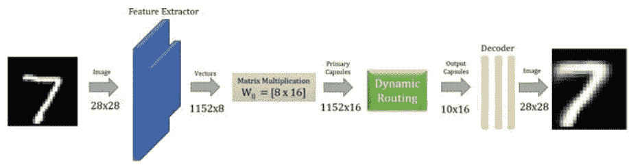

图1 CapsNet的架构。向量是通过重塑从特征提取器中提取的特征形成的，然后乘以一个矩阵来创建PCs。动态路由算法推断出输出胶囊，通过它进行分类。解码器重构输入图像。

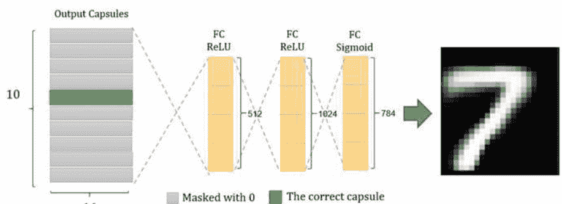

图2 CapsNet的解码器。使用连续的全连接层来重建输入图像。除了正确的胶囊外，所有输出胶囊都被用零掩盖

CapsNet的设计使得输出胶囊的数量与分类任务中的类别数量相同。输出胶囊包含两个重要的信息。首先，具有最大幅度的胶囊是对应于正确类别的胶囊。其次，每个输出胶囊的不同维度包含与输入图像相关的实例化参数的信息，例如姿势和变形[3]。

CapsNet还包括一个基本的解码器，用于使用输出胶囊作为输入来重建输入图像。解码器由全连接层组成。重建图像与输入图像进行比较。这种减法，也称为重建损失，用于规范化训练过程。我们在图2中展示了CapsNet中使用的解码器。

CapsNet中的损失函数由两个项组成。第一个项是之前解释的重构损失。第二个项被称为边际损失。这个项基于输出胶囊的预测结果。根据以下方程，每个输出胶囊都有一个相关的惩罚项：

```
L_{k} = T_{k} \max(0, m^{+} - ||V_{k}||)^2 + \alpha(1 - T_{k}) \max(0, ||V_{k}|| - m^{-})^2
```

其中，$L_k$表示每个胶囊的损失项， $T_k$根据每个胶囊的预测结果确定：如果预测正确则设置为1，否则设置为0，$\alpha$是用于惩罚错误预测的权重， $m^+$和 $m^-$用于从边际损失中排除概率较高或较低的胶囊。

### 无类别解码器

无类别解码器是由Rajasegaran等人引入的[24]。 该解码器由反卷积层而不是全连接层组成。 此外，输出胶囊以不同的方式馈送到解码器中。 使用这个解码器会得到更好的重建效果，因为反卷积层能更好地捕捉空间关系，而不是全连接层。此外，由于反卷积层中的权重共享属性，这些层包含的参数比全连接层少。

如图2所示，在CapsNet中最初使用的解码器包括所有输出胶囊，但只有正确的胶囊被用零掩盖。 正确的预测是基于训练过程中的真实标签。 在推理过程中，胶囊的长度决定最终的决策：长度最长的胶囊是正确的胶囊。 这个解码器被认为是无类别的，因为所有类别都在输入层中存在（尽管有时被掩盖）。

我们在图3中展示了独立于类别的解码器的架构。该解码器由连续的反卷积层组成，逐渐扩大表示并最终重构输入图像。 该解码器仅保留正确的胶囊，而不是屏蔽其余的胶囊。 解码器是独立于类别的，因为所有类别都被平等对待。


图3 独立于类别的胶囊网络解码器

## 3.3 卷积全连接（CFC）层

我们在图4中介绍了这一层。CFC层[7]的设计目的是将低级提取特征转化为胶囊。 CFC层的工作方式类似于卷积层。 唯一的区别在于CFC层使用多个卷积核，而卷积层使用单个卷积核与输入层进行卷积。 在CFC层中，每个卷积核负责将提取特征的特定空间位置转化为胶囊。 CapsNet通过创建构成主要对象的低级子对象之间的部分-整体关系来工作。 CFC层总结提取的特征的方式为形成这种部分-整体关系提供了一个强大而稳健的起点。

## 3.4 深度可分离卷积

标准卷积层在单个步骤中对通道和空间位置进行计算。 深度可分离卷积将此操作分为两个阶段。 首先应用“深度可分离”卷积，它为输入中的每个通道考虑一个单独的滤波器。 然后，使用“点积”卷积层来创建深度可分离卷积输出的线性组合。这种方法通常用于显著减少参数数量。

## 3.5 剪枝方法

剪枝的过程包括删除最不重要的参数。为了保护网络，必须尽量减小正常网络和剪枝网络之间的准确性差异。理想情况下，应通过研究每个参数的影响来评估其移除的影响对网络准确性的影响。

有两个标准用于估计参数的重要性。第一个标准基于损失 $L_{D, W} - L_{D, W}$ 的有符号变化，其中 $L_{D, W}$ 是使用参数 W 对数据集 D 进行网络的损失值。$W'$ 是移除冗余参数后的新参数集。第二个标准关注损失 $|L_D, W' - L_{D, W}|$ 的绝对差异。

考虑每个参数对数据集的影响是非常昂贵的。因此，有各种估计方法，包括最小权重、激活和泰勒展开。在这里，我们简要解释每种方法。

### 3.5.1 最小权重

最小权重方法基于核中参数的大小。这种方法的直觉是：核的较低 $l_2$-范数，表示它检测到的特征较不重要。对网络进行正则化对这种方法是有益的，因为与较不重要的特征对应的核被推动具有较小的值。

### 3.5.2 激活

修正线性单元（ReLU）是一个数学函数，定义为 $max(0, x)$，其中 x 是函数的输入。ReLU激活函数是稀疏的，并且在卷积层中用作特征检测器。这是因为卷积层检查其输入中是否存在特征。卷积层产生的任何具有零或负激活的特征元素意味着相关特征不存在。

激活剪枝通过移除小的激活值来工作。激活剪枝的问题在于它只能使用 ReLU 激活函数。在 CNN 中使用的其他常见激活函数不会像 ReLU 那样截断负值，因此我们不能用它们来剪枝特征提取器。

### 3.5.3 泰勒展开

这种剪枝方法旨在通过移除一些参数来最小化 $|L_{D,W'} - L_{D,W}|$ [25]。泰勒展开方法可以近似地计算移除一个参数对损失函数的影响。假设参数是独立的，对于参数 i, 我们的目标是最小化 $|L_{D, W_i=0} - L_{D, W_i}|$。我们可以使用泰勒展开来估计最小化目标。以下是函数 f 在点 x = a 处的泰勒展开方程：

f(x) = \sum_{0}^{\infty} \frac{f^{(n)}(a)}{n!} (x-a)^n

其中 $f^{(n)}$ 表示函数 f(x) 的 n 阶导数。

现在，我们使用函数 $L_{D,W}$ 的泰勒展开式 i=0 时 $W_i = 0$：

$L_{D, W_i=0} = L_{D, W_i} - \frac{\partial L}{\partial W_i} W_i + R$

其中 R 包含泰勒展开式中的所有剩余高阶项。我们忽略剩余项有两个原因。首先，它增加了计算复杂性。其次，与一阶项相比，泰勒展开式中的高阶项的值通常可以忽略不计。

根据公式 2，最小化目标现在发生了变化：

$|L_{D, W_i=0} - L_{D, W_i}| = \left|\frac{\partial L}{\partial W_i} W_i\right|$

简而言之，泰勒方法会剪枝与损失函数中小梯度相关的参数。实施这种方法是可行的，因为它需要将参数的梯度与参数本身相乘。这些信息在反向传播过程中都是可用的。考虑到所有参数的影响，使用泰勒展开的剪枝方法可以重新表述为以下问题的最小化：

$F(W) = \left| \frac{1}{M} \sum_{m} \frac{\partial L}{\partial W_m} W_m \right|$

其中 M 是所有参数的数量。

## 4 LE-CapsNet

在图5中，我们展示了LE-CapsNet的架构。在这个架构中，PCG模块生成主要胶囊。 此外，我们使用动态路由来推断输出胶囊和独立于类别的解码器。

### PCG 模块

LE-CapsNet使用主要胶囊生成器（PCG）模块从输入图像中生成主要胶囊。如图所示，与CapsNet相比，使用此模块产生的胶囊数量显著减少。对于MNIST数据集，PC的数量从1152个减少到108个胶囊。¹图6显示了PCG模块的架构。该模块执行三个步骤。第一步是进行低级特征提取。在这一步中，我们使用一个多尺度子网络，而不是CapsNet中使用的两个卷积层。该子网络由三个尺度组成，每个尺度具有不同的深度。每个尺度的深度对应于该尺度中使用的卷积层数量。较深的尺度用于创建更高级特征的表示，而较浅的尺度对应于低级特征。这有助于创建输入图像的更好表示。

PCG模块中的第二步使用多个CFC层（每个尺度一个）将提取的特征转化为向量。 我们通过改变CFC层的输出维度来修改CFC层，根据特征提取的深度来确定。对于提取更深层次特征的尺度，CFC层的输出维度选择更高。这样可以提供更多输出，从而获得更好的表示。 为了在总结提取的信息时保留重要信息，我们对更深层次的尺度使用更多的输出神经元。对于更浅层次的尺度，我们创建一个较小的信息摘要，因此输出维度较小。

¹数据集的选择会影响这些数字，因为特征提取会根据不同的数据集和输入图像大小提取不同数量的信息（不同的特征图大小）。

## 资源感知胶囊网络

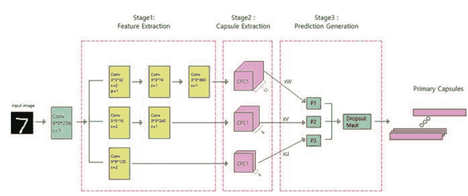

图6 PCG模块的架构。 该模块由三个步骤组成。 首先，在三个尺度上提取特征。 第二步是在每个尺度上使用CFC层。将提取的特征转换为不同长度的胶囊后，在第三步中将胶囊与不同的矩阵相乘，并将结果连接起来。 使用胶囊丢弃机制来规范训练

PCG模块也负责第三步，包括仿射矩阵变换和胶囊丢弃。 第二步的输出向量与权重矩阵（仿射变换矩阵乘法阶段）相乘。

对于每个尺度，都单独进行乘法运算，以编码每个尺度向量之间的空间关系。 与CapsNet相反，生成的主胶囊是低层、中层和高层特征的混合。 因此，我们期望创建一个更好的表示，从而提高测试准确性。 请注意，通过这种方法生成了三组不同的主胶囊。 胶囊丢弃将在下一节中详细解释。

### 解码器

LE-CapsNet还实现了一个与类别无关的解码器。 这有两个原因：减少参数数量和提供更准确的重构。这反过来有助于创建一个更强大的网络，以分类准确性和泛化能力为基础。

### 胶囊丢弃

在训练过程中，丢弃方法经常被用来随机删除神经元。这样做是为了使网络更加稳健和独立于特定的神经元。通过规范化训练过程，丢弃改善了网络的泛化能力。 这种通用方法在胶囊网络中效果不佳，因为丢弃神经元会改变胶囊的方向，并可能对表示产生负面影响[2]。Xiang等人[2]在训练过程中引入了一种替代的dropout方法，即在训练过程中随机丢弃整个胶囊。 我们在LE-CapsNet中使用了这种dropout方法。

### 图像增强和数据集归一化

过拟合是机器学习中常见的问题，当网络在训练集上获得高准确率但无法推广到测试集时就会发生。图像增强方法被广泛用于减少过拟合。 下面的列表包括我们在工作中实现的增强选项：

- 变换：我们使用平移、缩放和旋转来添加额外的图像到训练集中。这些变换在训练过程中应用于一批图像，概率为50%。 这种变换仅应用于训练集。
- 随机裁剪：我们随机裁剪图像到输入图像大小的75%，并使用裁剪的补丁代替图像本身。 这种变换在训练和测试中都应用。
- 随机水平翻转：我们随机水平翻转图像。

除了增强方法外，我们还将每个训练和测试样本归一化到整个数据集的平均值和标准方差。 我们对输入图像的红色、绿色和蓝色通道分别进行归一化。

## 压缩LE-CapsNet：LE-CapsNet-T

为了进一步压缩LE-CapsNet，我们修改了PCG模块，并引入LE-CapsNet-T作为我们提出的网络的一个小型变体。 PCG模块的特征提取器在图5中已经展示过。图7展示了如何压缩该网络的这部分以获得深度可分离的等效形式。每个卷积层都被替换为深度可分离卷积、批归一化层、ReLU激活层，最后是逐点卷积（图6）。

## 剪枝 CapsNet

在本节中，我们介绍了如何在我们的工作中使用泰勒展开方法。主要胶囊是特征提取层的重新塑形表示，乘以编码空间关系为向量的矩阵。 

由于主要胶囊是多维的，改变它们需要高计算能力。特征向量被忽略并且不进一步处理进入网络，可以从网络中移除。 尽管如此，传统的CapsNet在每次有输入到网络时仍然处理它们。

在每个剪枝周期中选择要移除的主要胶囊需要根据它们的激活和反向传播梯度进行排名。 因此，我们根据它们的反向传播梯度和激活的乘积对主要胶囊进行排名。 激活乘以梯度的结果然后除以存在的特征数量。 如果激活乘以梯度的结果与其他数值相比较大，对于其他主要胶囊的输出，我们可以假设没有相关的高显著性。在我们的情况下，存在的特征数量就是剩余主要胶囊的数量。这是方程（4）中所呈现的实现。F(W)是激活的加权平均值。权重是表示激活的显著性的梯度。

我们的方法修剪了那些输出几乎没有变化的主要胶囊。随着迭代次数增加，梯度的结果逐渐累积。激活是累积的，这给我们一个指示，表明每个胶囊对数据集上的CapsNet行为有多重要。每个修剪周期结束后，排名会被排序，选择排名标准最低的值。要删除的胶囊数量是一个超参数，在训练开始之前设置。

在每次修剪阶段之后，CapsNet经历一次训练阶段，以恢复其准确性并适应其架构所做的更改。这个训练阶段通常被称为微调阶段。在修剪周期之间，我们进行几个周期的微调，使网络达到其最大可能的准确性。微调周期的数量是经验性设置的。如果我们增加周期的数量，准确性的增益将非常微小。较小的周期数量可能会阻止网络达到其最大准确性。我们已经测试了不同数量的周期，并决定了一个数量（即50），以确保完全训练的网络。我们已经在图9中总结了算法。此外，修剪后的胶囊和主胶囊在图8中显示。

## 图9 剪枝算法总结

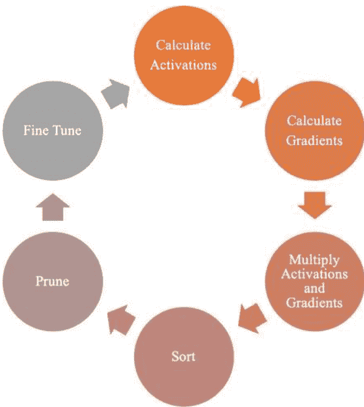

## 6 实验和结果

在本节中，我们详细解释了实验并呈现了结果。 在审查数据集和实验配置之后，我们在单独的部分中提供了每种方法的结果。 我们还比较了这两种方法。

### 数据集

在这项工作中，与其他CapsNet研究一致，我们专注于一组特定的数据集。 这是因为基于CapsNet的网络在具有大量类别的大规模数据集上表现不佳。 因此，我们在特定的目标数据集上测试LE-CapsNet，即Fashion-MNIST（F-MNIST）[26]，SVHN[27]，CIFAR-10 [28] 和 SmallNORB 数据集。 表1 列出了用于评估我们工作的数据集。 我们还使用 AffNIST 数据集对网络进行进一步评估，以验证对输入图像应用仿射变换的鲁棒性。

表1 用于测试LE-CapsNet性能的数据集列表
| 姓名 | 图像尺寸 | 通道数 | 训练样本 | 测试样本 |
|---|---|---|---|---|
| MNIST | 28 × 28 | 1 | 50,000 | 10,000 |
| F-MNIST | 28 × 28 | 1 | 50,000 | 10,000 |
| SVHN | 32 × 32 | 3 | 73,257 | 26,032 |
| CIFAR-10 | 32 × 32 | 3 | 50,000 | 10,000 |
| SmallNORB | 96 × 96 | 1 | 23,400 | 23,400 |

CIFAR-10 和 SVHN 数据集都包含 32 × 32 的彩色图像，共有 10 个类别。 CIFAR-10 包括不同对象和动物的图像，例如青蛙、飞机。 SVHN 数据集包括房屋号码中不同数字的裁剪图像。 CIFAR-10 数据集的训练集和测试集分别包含 50,000 和 10,000 张图像，而 SVHN 的训练集和测试集分别包含 73,257 和 26,032 张图像。 在这项研究中，CIFAR-10 是最复杂的数据集。 这是因为图像中包含了各种不同的背景。

SmallNORB 由属于5个类别的50个玩具的灰度图像组成。 该数据集中的对象是在不同的光照条件、高度和方位角下使用两个摄像机拍摄的。 该数据集包含23,400张图像，分别用于训练和测试。

### 实验设置

我们在 PyTorch 实现的 CapsNet 基础上实现了这两种方法。2 我们使用一块 11GB VRAM 的 2080Ti GPU 来运行实验。 所有实验都重复了5次。 由于结果变化很小，我们报告了平均值。 我们使用了 Adam 优化器和默认的学习率 LR = 0.001。 此外，我们对学习率应用了指数衰减， gamma = 0.96。 我们将批量大小设置为 128。 对于 LE-CapsNet，我们对所有实验进行了艰苦训练。 使用这种方法，我们对网络进行了两次训练。 第二轮训练包括了一个更严格的胶囊预测损失函数的损失边界(在方程??中 m+ 和 m-- 的值不同)。

### LE-CapsNet

我们研究了 LE-CapsNet 的三个变体。 LE-CapsNet 是基于 PyTorch 实现的 CapsNet 提出的基准网络，其中包含了简单的图像增强（仅图像平移）。 LE-CapsNet+ 包括 0.1% 的 dropout。

2 https://github.com/gram-ai/capsule-networks .

### 6.3.1 网络准确率

表2报告了网络的测试准确率。3

对于dropout方法，我们测试了LE-CapsNet的不同dropout率，包括5%、10%和40%，并报告了最佳结果。

MNIST数据集通常不包含在数据集中。这是因为即使原始的非增强CapsNet [3]也能达到超过99%的非常高的准确率，没有留下任何改进的空间。LE-CapsNet和LE-CapsNet+的准确率几乎与基准网络相同（约为99.40%）。LE-CapsNet-T的准确率稍低，为99.12%。LE-CapsNet在CIFAR-10、SVHN和F-MNIST上的准确率分别为75.75%、93.02%和93.14%，具有竞争力。这主要是由于PCG模块的整合，它能有效地生成表示输入图像的胶囊。此外，独立于类别的解码器能更好地重建图像，并帮助网络进一步泛化。DA-CapsNet在这三个数据集上实现了更高的准确率。然而，这种架构使用的参数数量是未知的，因此无法进行公平比较。尽管如此，我们还是报告了DA-CapsNet的结果，以充分披露。

对于CIFAR-10、SVHN和F-MNIST，LE-CapsNet+的测试准确率分别为77.21%、93.12%和93.84%，相对于LE-CapsNet，LE-CapsNet+的测试准确率略高。图像增强对CIFAR-10的性能提升最大。原因是该数据集包含各种不同的背景。

因此，对图像进行微小的变化并将其包含在训练数据中有助于网络更好地进行泛化。

对于CIFAR-10、SVHN和F-MNIST，LE-CapsNet-T的测试准确率分别为70.23%、90.5%和90.6%，相对于其他网络，LE-CapsNet-T的测试准确率稍低。然而，需要注意的是，与下一节中所示的网络相比，该网络的参数数量明显较少。

3需要注意的是，为了公平比较，我们在PyTorch版本的CapsNet中实现了LE-CapsNet。CapsNet和CFC-CapsNet使用相同的框架实现。此外，为了将MS-CapsNet作为CapsNet的轻量级和准确的替代方案纳入我们的比较中，我们使用相同的框架实现并测试了MS-CapsNet。另外，值得注意的是，DA-CapsNet没有提供他们工作的代码，我们无法验证他们的数据。

### 6.3.2 参数数量

表3报告了每个网络使用的参数数量。⁴ LE-CapsNet仅使用了CIFAR-10和F-MNIST的3.8M和3.4M权重。这是由于PCG模块的集成（产生较少的胶囊）和类独立解码器（反卷积重建）。⁵

LE-CapsNet-T包含更少的参数。这个变种包括CIFAR-10和F-MNIST的1.1M和0.78M参数。将卷积分解为特征提取器会得到一个体积较小但仍能达到竞争性测试准确率的网络。

### 6.3.3 网络训练和推理时间

图10和图11报告了网络的训练和测试时间。LE-CapsNet比CapsNet更快（分别是训练和测试速度的2.4倍和4倍），但不如CFC-CapsNet快。这是因为特征提取器中有三个尺度，因此LE-CapsNet相比CFC-CapsNet有更多的胶囊。

⁴对于MLCN架构，我们报告了具有最高准确性的变体的参数数量。

⁵请注意，MS-CapsNet在第一个卷积层中使用13 × 13的卷积核。我们使用PyTorch实现对该网络进行了评估，结果准确率非常低。因此，我们决定对CIFAR-10也使用其他数据集中使用的卷积核尺寸（9 × 9卷积核）。这解释了为什么我们对CIFAR-10需要更多的参数（与作者所述[2]相反）。

### 6.3.4 对仿射变换的鲁棒性

Sabour等人[3]使用AffNIST数据集⁶验证了CapsNet对输入图像应用仿射变换的鲁棒性。该数据集包含MNIST数据集的32个变体，每个变体都包含不同类型的仿射变换。我们采用相同的方法。首先，我们创建了“扩展的MNIST”数据集，其中包含应用于MNIST图像的平移。我们随机将28 × 28的MNIST图像放置在40 × 40的网格上，以创建数据集。一旦网络在扩展的MNIST数据集上达到99.23%的准确率，就会对AffNIST进行测试。

⁶ https://www.cs.toronto.edu/~tijmen/affNIST/

## 6.4 剪枝CapsNet

对于28 ×28大小的图像，我们从1152个Primary Capsules开始，这是原始架构中的基准胶囊数。我们首先训练网络，在每个数据集上达到基准准确率。基准架构在MNIST数据集上达到99.47%的准确率，在Fashion MNIST数据集上达到90.23%的准确率。我们在训练阶段结束时保存权重，以便在剪枝阶段使用。

剪枝权重从训练一个时期开始，以便计算PC排名的反向传播梯度。由于超过一半的PC要么为零，要么接近零，我们选择在前1100个PC的每个时期剪枝100个PC。在每个剪枝时期之后，网络在数据集上进行微调，以达到最大准确率。在剪枝了1100个PC之后，我们将要剪枝的PC数量降低到10个。之所以改变剪枝PC数量，是因为在剪枝了1100个PC之后，准确率开始下降。正如我们在图12和图15中所示，网络无法从其架构中移除的PC恢复，对于MNIST和FMNIST数据集来说，超过一定点后准确率无法恢复。该图显示了在每个可访问的胶囊数量下架构达到的最大准确率。

相同的过程在CIFAR-10和SVHN数据集中重复进行。主要的区别是起始PC的数量。起始PC的数量是输入大小的函数。对于MNIST和Fashion-MNIST，这个数字是1152，等于

### 6.4.1 FLOPS计数

浮点运算是硬件执行的乘积或求和。基准架构CapsNet执行276,480个FLOPS来计算矩阵乘法，从而生成MNIST数据集的1152个PC。当剩余PC数量达到52时，这个数字下降到12,480个FLOPS。FLOPS数量减少了95.48%，这是对基准架构的重大改进。

此外，动态路由在FLOPS数量上实现了95.36%的降低。SVHN和CIFAR-10数据集的FLOPS数量也大幅下降。SVHN的矩阵乘法FLOPS计数下降了73.24%。当网络在1500台计算机上运行时，进行了测量。CIFAR-10可以修剪掉83.01%的FLOPS计数，代价是1.85%的准确性。SmallNORB也通过失去94.31%的FLOPS计数来利用修剪。SmallNORB从2.1 M-FLOPS开始。在去除7600台计算机的同时，可以将其降低到19,494 FLOPS。

由于网络中唯一变化的部分是计算机的数量（特征提取和解码器保持不变），在架构的其他部分中，单个输入图像的FLOPS总数不会发生变化。

### 6.4.2 推理时间

正如我们在前一节中所展示的，我们在PC和架构的动态路由部分中节省了超过95%的FLOPS计数。这有助于我们降低推理时间。在图17中，我们报告了CapsNet在10,000个测试图像上输出结果所需的时间。这是在配备32GB内存的NVIDIA 2080 Ti上运行我们的实验时测得的。

修剪后的架构在MNIST类别上的结果比原始架构快9.90倍。前两个柱状图报告了基准架构。最高的柱状图报告了2048个PC。这是SVHN和CIFAR-10数据集的基准PC数量。第二个柱状图报告了1152个PC，这是在训练MNIST类别时的基准PC数量。

### 6.4.3 讨论

在本节中，我们进一步讨论了修剪对CapsNet的准确性、FLOPS数量和PC数量的影响，以及对一些数据集的影响。在我们之前的工作中[30]，我们展示了超过50%的PC权重要么是零或不重要的。在这项工作中，我们报告了修剪在训练MNIST手写数字和Fashion-MNIST上的PC对准确性的影不显著。准确性的小幅下降是因为这两个数据集中大部分PC都是零。这

## 6.5 比较压缩方法

如前一节所示，虽然两个网络都减少了胶囊的数量，但修剪在推理中的加速比LE-CapsNet（9.9倍vs 4倍）更高。请注意，我们的修剪方法专注于减小网络的大小，并在尽量保持网络准确性的同时推动网络达到极限。LE-CapsNet还考虑了网络准确性。虽然修剪方法逐渐减少了胶囊的数量，但LE-CapsNet的胶囊数量较少。小型变体LE-CapsNet-T甚至更小。一个可能的未来工作可以是将修剪和LE-CapsNet结合起来，从两种方法中受益。

## 7 结论

CapsNets是最近一代的图像分类器。尽管它们相对于卷积神经网络具有特定优势，但它们的训练和推理阶段效率低下。在本文中，我们研究了两种方法来使CapsNet具有能量效率。在我们的第一种方法中，我们提出了LE-CapsNet作为CapsNet的一种新颖的、资源感知的变体。所提出的网络包括一个在多个尺度上执行的专门的特征提取器。它还集成了一个胶囊平移模块，用于从提取的特征中生成胶囊。这种实现使用更少的胶囊和显著更少的权重实现了更高的准确性。对于CIFAR-10数据集，LE-CapsNet将准确性从71.69%提高到77.21%，同时将权重数量减少了67%。在推理过程中，该网络还快了4倍。我们还介绍了LE-CapsNet-T作为LE-CapsNet的微小变体。通过这样做，我们进一步研究了压缩网络的特征提取器对网络性能的影响。在我们的第二种方法中，我们在MNIST手写数字、Fashion-MNIST、SVHN、CIFAR-10和smallNORB数据集上训练和修剪了原始的CapsNet。我们的结果表明，与基线架构相比，速度提高了9.90倍，FLOPS下降了95%以上，准确性几乎没有下降。

致谢 本研究部分或全部由新兴智能感知应用计算硬件（COHESA）项目资助。COHESA项目由加拿大国家科学工程研究委员会（NSERC）战略网络资助，资助号为NETGP485577-15。

## 参考文献

1. 赵，B.，冯，J.，肖，W.，严，S.：基于深度学习的细粒度目标分类和语义分割综述。国际自动化与计算杂志 14(2)，119-135（2017）  
2. 项，C.，张，L.，唐，Y.，邹，W.，陈，X.：MS-CapsNet：一种新颖的多尺度胶囊网络。IEEE信号处理快报 25(12)，1850-1854（2018）  
3. Sabour，S.，Frosst，N.，Hinton，G.E.：胶囊之间的动态路由，卷 2017（2017）  
4. Blalock，D.，Jose Javier G.O.，Frankle，J.，Gutttag，J.：神经网络剪枝的现状是什么？在：Dhillon，I.，Papailiopoulos，D.，Sze，V.，(eds.)，机器学习和系统的论文集，卷 2，页 129-146（2020年）  
5. Carbin，M.，Frankle，J.：彩票票据假设。ICLR，页 1-42（2019年）  
6. Shiri，P.，Sharifi，R.，Baniasadi，A.：快速胶囊网络（QCN）：胶囊网络的快速替代品。在：IEEE/ACS国际计算机系统和应用会议论文集，AICCSA，卷 2020（2020年）  
7. Shiri，P.，Baniasadi，A.：卷积全连接胶囊网络（CFC-CapsNet）。在：ACM国际会议论文集系列（2021年）  
8. LeCun，Y.，Denker，J.S.，Solla，S.A.：最佳脑损伤（修剪）。Adv. Neural Inf. Process, Syst.（1990年）  
9. Lebedev，V.，Lempitsky，V.：使用分组脑损伤的快速卷积神经网络。卷积神经网络（2016年）  
10. Hassibi，B.，Stork，D.G.，Wolff，G.J.：最佳脑外科医生和通用网络修剪（1993年）  
11. Han，S.，Pool，J.，Tran，J.，Dally，W.J.：学习权重和连接以实现高效神经网络。神经网络（2015年）  
12. Suzuki，T.，Abe，H.，Murata，T.，Horiuchi，S.，Ito，K.，Wachi，T.，Hirai，S.，Yukishima，M.，Nishimura，T.：通过谱分析压缩深度神经网络。谱修剪（2018年）  
13. Lee，N.，Ajanthan，T.，Gould，S.，Torr，P.H.S.：从信号传播的角度来修剪初始化时的神经网络（2019年）  
14. Kalchbrenner，N.，Elsen，E.，Simonyan，K.，Noury，S.，Casagrande，N.，Lockhart，E.，Stimber，F.，Van Den Oord，A.，Dieleman，S.，Kavukcuoglu，K.：高效神经音频合成，卷 6（2018）  
15. Gale，T.，Elsen，E.，Hooker，S.：深度神经网络中稀疏性的现状（2019）  
16. Yu，R.，Li，A.，Chen，C.F.，Lai，J.H.，Morariu，V.I.，Han，X.，Gao，M.，Lin，C.Y.，Davis，L.S.：Nisp：使用神经元重要性评分传播进行网络剪枝（2018）  
17. Molchanov，P.，Mallya，A.，Tyree，S.，Frosio，I.，Kautz，J.：神经网络剪枝的重要性估计，页 11256-11264（2019）  
18. 李，N.，Ajanthan，T.，Torr，P.H.S.：Snip：基于连接敏感性的单次网络修剪（2019年）  
19. 罗建豪，吴，林：Thinet：一种用于深度神经网络压缩的滤波器级修剪方法，卷 2017（2017年）  
20. 张，X.，邹，J.，何，K.，孙，J.：加速非常深的卷积网络进行分类和检测。IEEE Trans. Pattern Anal. Mach. Intell. 38（2016年）  
21. 罗萨里奥，V.M.D.，博林，E.，布雷特尼茨，M.：多车道胶囊网络。IEEE Signal Process. Lett. 26（7），1006-1010（2019年）  
22. Rajasegaran，J.，Jayasundara，V.，Jayasekara，S.，Jayasekara，H.，Seneviratne，S.，Rodrigo，R.：深入研究胶囊网络，DeepCaps（2019年）  
23. 黄，W.，周，F.：DA-CapsNet：双注意机制胶囊网络。科学报告（2020年）  
24. Rajasegaran，J.，Jayasundara，V.，Jayasekara，S.，Jayasekara，H.，Seneviratne，S.，Rodrigo，R.：Deepecaps：用胶囊网络更深入。在：IEEE计算机学会会议计算机视觉和模式识别会议论文集，卷 2019，10717-10725（2019年）  
25. Molchanov，D.，Ashukha，A.，Vetrov，D.：变分丢失稀疏化深度神经网络。在：第34届国际机器学习大会，ICML'17，卷 70，页 2498-2507. JMLR.org（2017年）  
26. 肖，H.，Rasul，K.，Vollgraf，R.：时尚-MNIST：用于基准测试的新型图像数据集机器学习算法（2017年）

## 引导生成网络：一种新的鲁棒深度学习架构，用于蒙特卡洛渲染中的噪声特征化

Jérôme Buisine，Fabien Teytaud，Samuel Delepoulle和Christophe Renaud

摘要 目前生成逼真计算机生成图像的方法依赖于基于蒙特卡洛方法的随机光照模拟技术。这些蒙特卡洛模拟在虚拟3D模型中构建相机和光源之间的光路径，计算物体的外观并提供逼真的图像。光路径空间的不足采样导致图像中个别像素之间的高方差，这在视觉上被感知为噪声。为了减少这种噪声，必须增加光路径样本的数量，直到噪声不再可见，但这会显著增加计算时间。找到人眼感知无噪声所需的正确样本数量仍然是一个未解决的问题，本文使用一种名为Guided-Generative Network（GGN）的新神经网络架构来解决这个问题。由于从图像中提取特征用于分类任务通常很困难，GGN尝试自动找到噪声检测所需的特征。这是通过由3个模型组成的架构来完成的，这些模型共同描述存在的噪声并指导分类。所得到的结果表明，GGN可以在不需要先验噪声知识的情况下正确解决问题，并且与现有方法具有竞争力。通过对模型获得的图像进行视觉验证实验，可以明显地验证所要求的任务的可靠性。

J. Buisine (✉) · F. Teytaud · S. Delepoulle · C. Renaud  
法国加来斯大学LISIC，加来斯，法国  
e-mail: jerome.buisine@univ-littoral.fr  
F. Teytaud  
e-mail: fabien.teytaud@univ-littoral.fr  
S. Delepoulle  
e-mail: samuel.delepoulle@univ-littoral.fr  
C. Renaud  
e-mail: christophe.renaud@univ-littoral.fr  
© 作者，独家许可给 Springer Nature Singapore Pte Ltd. 2023  
M. A. Wani 和 V. Palade (eds.)，深度学习应用，第4卷，  
智能系统与计算进展 1434，  
https://doi.org/10.1007/978-981-19-6153-3_12  

## 1 引言

现代逼真图像算法模拟了通过模拟3D场景中存在的所有物体、光源和相机之间的光的物理相互作用来获取图像的自然过程。在3D场景中的光模拟过程被称为全局光照，并由Kajiya [14]用光传输渲染方程1进行了形式化：

$L_{o}(x,\alpha_{o})=L_{e}(x,\alpha_{o})+\int_{\Theta}L_{i}(x,\alpha_{i})\cdot f_{r}(x,\alpha_{i}\geq\alpha_{o})\cdot\cos\theta_{i}d\alpha_{i}$

其中（见图1的注释）：

+ $L_{o}(x,\alpha_{o})$ 是从点 $x$ 沿着方向 $\alpha_{o}$ 传播的亮度；
* $L_{e}(x,\alpha_{o})$ 是点 $x$ 发射的亮度（如果点 $x$ 不位于光源表面上，则为零）；
* 积分表示光亮度 $L_i$ 从半球面上入射到 $x$ 方向的光线的集合 $\Theta$ 并在方向 $\alpha_o$ 中反射。反射光亮度根据材料的反射特性（双向反射函数 $f_r(x,\alpha_i\geq\alpha_o)$ ）和入射余弦角加权。

在大多数情况下，这个方程无法通过解析方法求解，通常使用蒙特卡罗（MC）方法来估计最终图像像素的值。通过在相机和3D场景中的光源之间构建随机光路径，来实现采样，以收集光源对图像中每个像素的贡献。

对于 $n$ 个样本，最终的MC估计器对期望值的近似值通过经验均值得到。由于路径空间采样不足，这个计算在生成图像时最初会产生相当大的噪声，但随着样本数量的增加，这个噪声会减少并几乎变得不可见（见图2）。

事实上，收敛通常需要几个小时（甚至几天）才能获得可视化可用的图像，这是由于路径计算的复杂性所致。

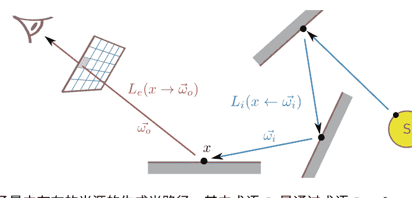

图1 到达场景中存在的光源的生成光路径，其中术语 $L_o$ 是通过术语 $L_e$ 和 $L_i$ 的总和获得的。

## 2 先前的工作

在尝试识别图像中的噪声时，会遇到两个问题；一方面，需要找到描述这种噪声的属性，另一方面，需要访问这种噪声的视觉检测阈值，以便对许多图像进行训练学习模型或验证所得结果。

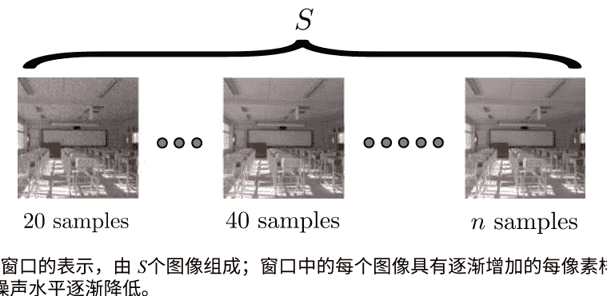

在[8, 20]中进行的工作使用了12个图像的基础，这些图像是通过不同的采样级别计算得到的。这些图像的尺寸为512 × 512，已经被切割成16个不相交的块（大小为128 × 128），从中获取了人类用户的噪声预测阈值。然而，这些图像并不公开可用，其中出现的视觉效果也不能涵盖真实图像中存在的所有效果。最近，在[5]中发布了一个更大的数据库，其中提供了40个具有各种光效的图像，以及大量的采样级别和相关的人类感知阈值。这些图像的尺寸为800 × 800，并且以与之前的工作类似的方式切割成16个非重叠的块，每个块的大小为200 × 200。图3展示了与这些图像相关的数据的呈现方式：划分成块，每个块关联的人类感知阈值，使用大量样本计算得到的参考图像。

识别MC噪声的代表特征也是一个复杂的任务，已经提出了各种建议。Constantin等人[8]建议从每个图像块中提取26个特征。首先，将表示为RGB颜色空间的每个彩色图像转换为Lab颜色空间。选择最敏感于噪声的L通道[7]，并分别对其应用13个降噪滤波器以提取所需特征：2个尺寸为3 × 3和5 × 5的线性滤波器与平均滤波器；6个尺寸相同且标准差σ ≥ {0.5, 1, 1.5}的高斯滤波器；2个中值滤波器和2个自适应Wiener滤波器。为了提供第13个无高频值的图像，还应用了额外的小波滤波器。然后，他们计算这13个灰度图像中像素值的均值和标准差，以获得它们的26个特征。然后，将这些特征用作支持向量机（SVM）分类器的输入，以预测每个图像块的二进制标签（有噪声，无噪声）。

在[20]中，作者提出了使用快速光线追踪技术[23]计算近似参考图像的方法，该方法在图像渲染过程开始时仅计算一次。接下来，他们为当前图像和参考图像计算噪声掩码。噪声掩码是通过天文摄影中使用的方法[9]获得的：首先对原始图像进行高斯卷积，然后将其与模糊图像进行差分得到掩码。

## 3 引导生成网络

正如前面提到的，在MC方法中生成的图像中很难识别代表噪声的特征。在本文中，我们旨在提出一种在二元分类之前自动生成这些特征的方法。为此，我们依赖于噪声掩模[20]的概念，该掩模将由生成神经网络模型提供，并使用图像的滑动窗口，这似乎为模型带来了更好的鲁棒性[4]。对于这样的方法的提议是由于鲁棒的深度卷积学习方法在噪声处理和识别[11, 17]方面的出现而得到了证明。

我们提出的GGN架构的目的是获取自动噪声相关特征，由3个神经网络模型组成，其中使用大小为S的不同噪声水平的图像的滑动窗口。在进入每个子模型的细节之前，图5展示了它们之间的期望交互作用。

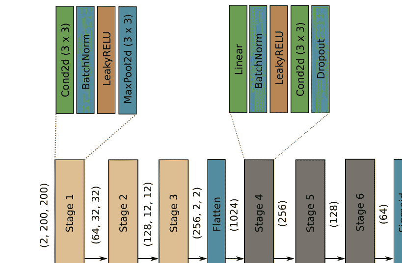  
图8 表示鉴别器模型的不同层  

### 3.1 去噪自编码器

在[20]中，从计算的图像（可能有噪声）和通过光线追踪方法获得的近似参考图像计算出噪声掩码。主要缺点是光线追踪无法模拟一些重要的光效，因此与应该计算的最终图像相比会产生误差。提出的解决此问题的方法是使用自编码器神经网络进行图像去噪。

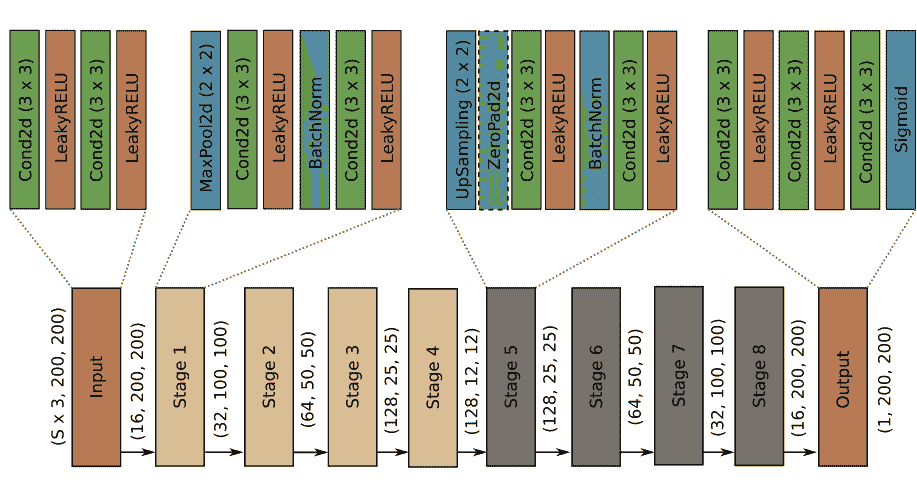  
图9 U-Net自编码器在Kitchen图像的一个块上去噪的结果，以及相应的SSIM分数  

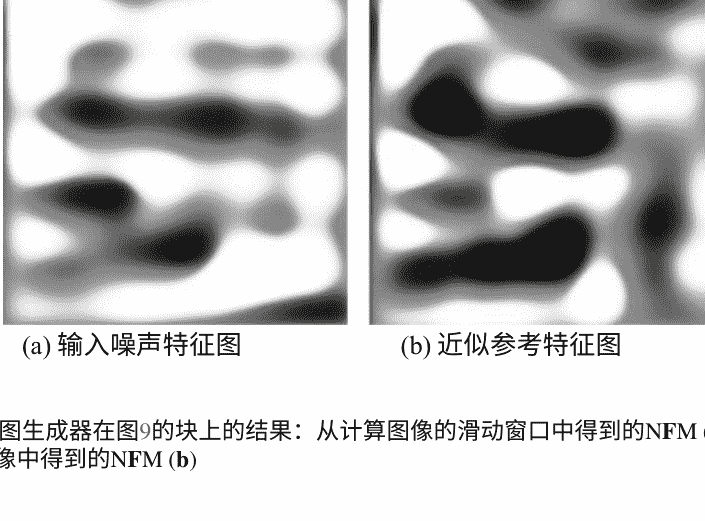  
图10 特征图生成器在图9的块上的结果：从计算图像的滑动窗口中得到的NFM (a)，以及从去噪图像中得到的NFM (b)  

### 3.2 特征图生成器

特征图生成器也是一个自编码器，具有与之前的去噪模型相同的结构，但没有跳跃连接和正常的维度递进，而是采用了U-Net模型提出的方法（见图7）。然后，应用LeakyReLU激活的最终1 × 1卷积输出最终预期的灰度图像，其中K = 1。因此，该模型以大小为S的图像滑动窗口作为输入，并旨在生成具有未知期望的NFM。在我们的方法中，如图5所示，它将采用先前获得的输入图像滑动窗口或近似参考图像的滑动窗口。值得注意的是，诸如变分自编码器（VAE）[15]之类的模型通常提供更好的生成数据，但并未提供良好的结果。

### 3.3 用于二元分类的判别器

最后，判别器从特征图生成器获得的2个NFM作为输入，可以是来自输入滑动窗口的NFM，也可以是来自近似参考图像的滑动窗口的NFM。判别器（见图8）必须提供一个二进制标签，因此首先由3个卷积层组成，将维度深度K加倍，卷积核大小为3 × 3，填充为2，以减少NFM的维度。对于这些卷积层的每一层，都会处理批归一化、LeakyReLU和最大池化层，卷积核大小为3，步长为2，填充大小为1。然后，利用4个经典的线性层来传播和减少信息，直到达到属于噪声或非噪声标签的概率。第一个线性层返回大小为K × 4的数据，然后接下来的两个层将输出数据减半。最后一个线性层在应用Sigmoid函数之前提出一个单一的输出。每个线性层都应用了中间层，如批归一化层、LeakyReLU层和50%的dropout层，以避免过拟合。只有最后一层，即获得概率的层，没有dropout层。

二进制交叉熵损失函数[6]被用于传播鉴别器的误差，同时也用于传播特征图生成器的误差。这提供了图像中存在的噪声的代表性NFM，并引导鉴别器进行预期的分类任务，因此被称为引导生成网络。

下一节详细介绍了这种架构的训练过程和我们得到的结果。

## 4 结果和比较

所提出的架构由3个模型组成。图6、7和8分别表示去噪器的参数、噪声特征图生成器的参数和鉴别器的参数。训练该架构的完整代码可在以下链接找到： https://github.com/prise-3d/GGN-MC-rendering。这3个模型是根据输入数据和合成图像的人类阈值进行训练的（请参见图5中提出的训练过程）。从数据库[5]中的40张图像中，选择了35张用于训练，5张用于验证模型的性能。

### 4.1 实验设置

数据量相当大，共35张图像，每张图像由16个200 × 200大小的块组成。对于每个图像，使用500个不同的噪声水平，范围从20到10,000个样本每像素。这使得模型可以从总共280,000个标记数据中进行训练。输入和参考图像已通过颜色通道的最大值（即2^8）进行了归一化。关于训练参数，模型在30个epochs的数据上进行了训练，批量大小为64（即每个epoch的4375次迭代），并且图像的滑动窗口大小为 S = 6，我们认为这足够稳健地进行预测。3个模型（去噪器、噪声特征图生成器和判别器）使用Adam优化算法。

实验在Linux系统（Debian 10）下进行，使用RTX 2080 GPU，使用Python编程语言（版本3.9）和PyTorch框架（版本1.10）。

## 4.2 结果概述

U-Net自编码器模型似乎提供了接近参考图像的MC噪声去除结果，如图9所示，其中SSIM分数显示与参考图像相比，结果图像的质量和接近度有所改善。

特征图生成器的输出概述可在图10中找到，用于与图9中使用的相同图像块。值得注意的是，获得的两个NFMs之间存在差异。这些差异是因为在计算图像时，同一滑动窗口中存在不同的噪声水平，而在第二个滑动窗口中去噪的图像中，这些差异被减弱。这证实了该方法的可行性，因为NFM提供了关于图像中噪声存在与否的区分信息。

然后，这些NFM被发送到鉴别器中，以评估输入滑动窗口的最后一张图像属于标签1（有噪声）还是标签0（无噪声）的概率。

  
图10 特征图生成器在图9的块上的结果：从计算图像的滑动窗口中得到的NFM (a)，以及从去噪图像中得到的NFM (b)  

## 4.3 模型比较

在训练数据集上进行30个epoch的训练后，将所得模型与[4]提出的具有相同训练条件的带有LSTM单元的RNN进行比较，即相同的训练和测试数据集、相同的批量大小和相同的滑动窗口大小(S = 6)。由于图像数据库中的数据量和两种其他方法[8, 20]所需的特征输入大小无法进行比较，因此无法避免维度灾难。

正如[4]所建议的，RNN模型由3个LSTM层组成，每个层的隐藏单元数分别为512、128、32，并且每个层的丢失率为40%，以避免过拟合。每个LSTM层都有一个Sigmoid激活函数用于细胞状态和隐藏状态。一个硬Sigmoid激活函数被设置为激活输入/遗忘/输出门。然后使用大小为1的密集层作为输出，采用Sigmoid激活函数来预测预期的标签。除了GGN之外，LSTM模型在训练过程中进行了30个时期的训练，使用二元交叉熵损失来传播训练中的错误。

用于比较两个模型性能的指标是准确度和ROC曲线下面积（AUC ROC）[3]，它定义了模型如何将二元分类的两个类别分开。请注意，GGN模型的主要目标是能够至少与LSTM模型一样准确地预测，同时避免为分类器找到输入特征，因为这些特征是事先自动提取的。

表1提供了模型复杂性的指标。可以观察到GGN模型的复杂性比LSTM高，并且需要相当长的训练时间。这主要是因为GGN模型使用了大量的卷积层，意味着需要大量的浮点运算（FLOPs）来直接处理图像输入。

## 引导生成网络：一种新的强大的深度学习架构...

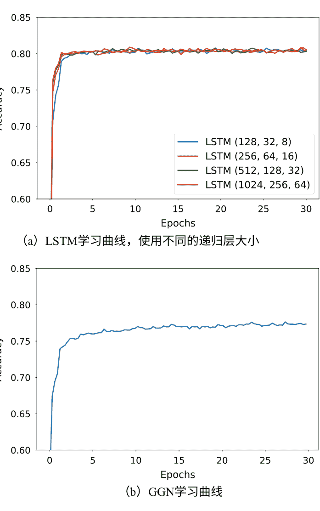

在30个周期后获得的两个模型的学习曲线如图11所示。准确性是使用决策阈值0.5计算的，即如果模型的预测低于此阈值（噪声）则选择非噪声标签。通过改变递归层中隐藏单元的数量来分析LSTM模型的参数（参见图1a）。即使我们增加参数的数量，我们可以观察到模型性能的某种限制（准确性保持接近并仍然波动）。

当决策阈值设置为0.5时，GGN模型指示所选择的决策阈值在学习过程中对准确性的影响比LSTM要低（见图11b）。除了学习曲线外，模型在训练和测试数据集上的性能在表2中呈现，以检查准确性性能。LSTM模型似乎具有更好的泛化能力，并且在阈值为0.5时性能仍然更好。然而，即使GGN存在轻微过拟合，当其决策阈值t ≥ 0.95时，在测试中显示出正确的性能，这仍然与LSTM模型相当接近。

图12显示了模型在渲染某些图像期间的预测，并展示了所获得的预测结果的一般行为。GGN的决策阈值设置为t = 0.95，因为它避免了对训练数据库中的整个图像集进行早期预测，尽管其准确性较低。事实上，保守的能力虽然不太有效，但比早期终止更可取，这将导致最终获得的图像质量较差。可以注意到GGN的波动和犹豫比LSTM要少，这表明模型在预测时更加稳定。它特别允许在某些情况下避免过早预测计算，如教室图像的一个区块所示。GGN有时倾向于比LSTM更晚预测，例如San-Miguel图像区块，但这比过早停止计算不那么令人困扰（可能涉及仍然显著的残余噪声）。因此，GGN展示了良好的结果，即使最初没有给出噪声特征的指示。该模型略微过拟合，但提供了相当准确的预测。

图13显示了每个模型对每个图像预测的阈值的直方图（蓝色直方图）。在我们的实验中使用的最大样本数为10,000个像素路径的情况下，用户仍然感知到噪声的区块不显示在这些图表中，因为在这种情况下，人类阈值被认为更高。这些直方图可以与人类阈值（红色直方图）进行比较。

可以看出，GNN直方图的形状似乎更接近人类阈值。对于LSTM，其直方图更像是一个高斯分布，尽管有些扁平。然而，GGN提供了许多预测值为10,000的情况。这意味着它认为停止阈值应该高于这个值，但无法提供精确的值，因为图像数据库中的最大样本数对应于这个值。

图14说明了两种方法在每个16个区块的40个图像中所做的绝对误差的分布，将这个误差定义为人类感知阈值与算法预测值之间的差异（在这个图中考虑了所有区块）。

为了更好地解释这两个模型之间的差异，这些分布在相同的尺度上表示。LSTM模型与SVD-熵具有更广泛的误差分布，但倾向于较晚预测。它有时会比人类阈值提前停止，导致至少6,000个样本的错误（请记住，我们实验中的样本最大数量设置为10,000个）。相反，GGN提供了更接近主观人类阈值的阈值。此外，它比其对应模型更少地进行早期检测错误，并且逾期阈值的数量低于LSTM。请注意，在这种情况下，相应块的计算时间比较长。


图12对测试集中每个噪声水平从20到10,000个样本的3个图像的LSTM和GGN模型预测进行比较。垂直虚线红色曲线表示预期人类阈值，水平虚线橙色曲线表示模型预测阈值，垂直蓝色曲线表示模型噪声阈值预测一旦达到概率决策阈值。LSTM模型的决策阈值t设置为0.5，GGN的决策阈值设置为0.95，这样可以避免过早预测块计算的结束。

这需要达到人类的阈值，但所得到的结果在最后没有提供任何可察觉的噪音。

图15进一步详细说明了模型对每个块的预测与预期人类阈值的对比。它可以清晰地可视化每个模型的良好性能。对于这两个模型，只呈现了人类阈值低于10,000个样本的预测。我们还可以注意到，对于某些块，两个模型都预测即使在10,000个样本之后该块仍然有噪音（导致预测高达10,000个样本）。点的分散程度对于LSTM比GGN要大得多。实际上，所提出的回归线高度-

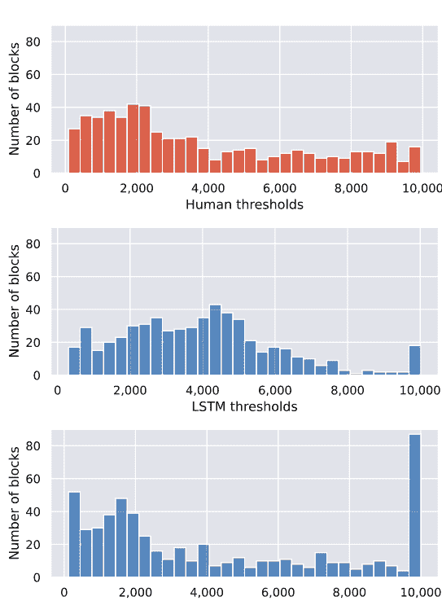

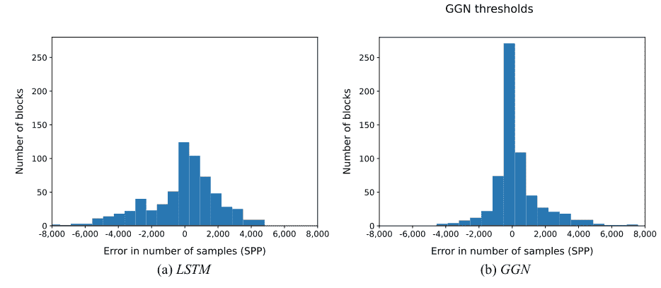

说明GGN模型在所需任务中表现良好。此外，回归线表明GGN的相关系数为0.902，而LSTM为0.718。


## 5 视觉实验

为了评估模型的性能，进行了视觉实验验证模型的预测。每个模型在一个200 × 200像素的块中预测一定数量的样本，人类在此之后不应再感知到噪声。验证实验的目标是验证在从模型的预测中重建图像后，人类是否仍然感知到噪声。通过使用模型获得的阈值，以与图3中提出的方式获得最终重建图像。通过这种方式，可以确保模型的正确行为与否。

为此，我们开发了一个应用程序，允许比较两个图像，第一个图像是从模型的预测阈值重建的图像，另一个图像是从图像数据库中的平均人类主观阈值重建的图像（与图3中提出的相同）。参与者被问到的问题是：你认为这些图像看起来一样吗？向参与者提出这个问题的目的是了解模型提供的图像与基于人类阈值得出的图像相比，噪声是否仍然在感知上存在。

## 5.1 实验设置和配置

对于一些可用的40个图像块，参考图像上可能仍然存在噪声，并且每个像素使用了10,000个样本进行计算。对于模型来说，了解这些数据并不会造成干扰，因为它与之前的数据是相同的。


在模型输入中始终存在噪声的数据。然而，为了对结果进行视觉验证，需要人类参考（从人类阈值重建）包含对人类来说不可察觉的噪声水平。因此，仅保留了具有主观阈值低于10,000个样本的16个块的图像，即总共28个图像，其中40个图像中有28个图像可用[5]。

对于这28个图像中的每一个，将其与重建的人类图像进行比较：

- 从GGN模型预测重建的图像；
- 从具有与GGN模型相同训练集的LSTM模型预测重建的图像，使用SVD-Entropy；
- 从每个块的人类阈值低八倍的样本重建的图像，以便获得噪声可见的图像。

第三个嘈杂的图像的目的是让噪声显现出来，并避免误报。实际上，对于所提出的问题，如果参与者从两个模型的重建图像中从未注意到噪声，那么他/她有可能对其中一个模型的噪声存在回答肯定，这可能导致生成错误的结果（误报）。


图16验证应用的表示：从感知模型的预测中重建的图像显示在人类阈值重建的图像旁边，以便观察者可以进行比较

对于每个模型，我们还详细介绍了测试集中的图像，可以注意到GGN模型的性能低于LSTM模型，分别为SVD-Entropy，70.05%和92.15%。这主要是因为生成模型往往过拟合[24]。

通过分析包含在28个选定图像中的测试集中的3个图像，GGN模型重建的图像块确实仍然包含轻微的噪声。然而，图像Sanmiguelview 2的情况是特殊的，只有一个块的预测阈值低于人类参考。


表3：

|             | 噪杂的 | LSTM | GGN |
|-------------|--------|------|----|
| 图像        | 80/476 | 403/476 | 419/476 |
| 百分比      | 17%    | 85%  | 88% |

表4：

|           | Human  | LSTM   | GGN    | Overview |
|-----------|--------|--------|--------|----------|
| Landscape | 3220   | 2940   | 500     |          |
|           | 4486   | 5140   | 640     |          |
|           | 5086   | 6220   | 800     |          |
|           | 6913   | 6340   | 2360     |          |
|           |        |        |        |          |
|           | 1953   | 1820   | 580     |          |
|           | 2820   | 2540   | 280     |          |
|           | 3893   | 4020   | 860     |          |
|           | 4220   | 4620   | 3780     |          |
|           |        |        |        |          |
|           | 2793   | 2820   | 1400    |          |
|           | 3620   | 3820   | 1740    |          |
|           | 2553   | 4260   | 6600    |          |
|           | 2620   | 4300   | 8620     |          |
|           |        |        |        |          |
|           | 1080   | 2060   | 10000   |          |
|           | 2153   | 1900   | 1700    |          |
|           | 1753   | 3300   | 6260    |          |
|           | 2020   | 3900   | 4460     |          |
|           |        |        |        |          |
|           | 5086   | 6100   | 10000   |          |
|           | 6353   | 4340   | 10000   |          |
|           | 8086   | 6900   | 8140    |          |
|           | 8620   | 6860   | 10000   |          |
|           |        |        |        |          |
|           | 8073   | 3820   | 4180    |          |
|           | 8480   | 5620   | 10000   |          |
|           | 5820   | 6260   | 10000   |          |
|           | 6486   | 5700   | 9840     |          |
|           |        |        |        |          |
|           | 2620   | 4740   | 3800    |          |
|           | 4886   | 4340   | 10000   |          |
|           | 5086   | 4340   | 7260    |          |
|           | 6286   | 6620   | 7120     |          |
|           |        |        |        |          |
|           | 3420   | 3980   | 4860    |          |
|           | 3220   | 3660   | 3240    |          |
|           | 2686   | 4780   | 10000   |          |
|           | 2353   | 4740   | 7080     |          |
|           |        |        |        |          |
|           | 293    | 420    | 120     |          |
|           | 560    | 1100   | 740     |          |
|           | 153    | 460    | 120     |          |
|           | 386    | 380    | 120     |          |
|           |        |        |        |          |
|           | 620    | 660    | 200     |          |
|           | 620    | 980    | 520     |          |
|           | 553    | 740    | 600     |          |
|           | 960    | 1020   | 140     |          |
|           |        |        |        |          |
|           | 433    | 1620   | 460     |          |
|           | 553    | 1100   | 300     |          |
|           | 953    | 1380   | 320     |          |
|           | 886    | 1540   | 440     |          |
|           |        |        |        |          |
|           | 426    | 1380   | 720     |          |
|           | 573    | 1380   | 2860    |          |
|           | 693    | 3100   | 360     |          |
|           | 960    | 2140   | 140     |          |

图17 LSTM和GGN模型在问题场景上的热图比较。对于每个场景，值的尺度可能不同，以便将模型预测的热图与人类参考（期望阈值）进行直观比较。

通过这种表示，建议的GGN阈值对于图像Staircase 1和Landscape在某些块中相对于人类参考来说较低，但也相对于LSTM来说较低。事实上，我们的训练集只包含了少数几个需要在几个块中使用较少样本的场景。似乎GGN模型似乎无法正确解释这种快速收敛在这种场景下的情况，并且停止得太早。相反，对于场景Sanmiguel 2，只有一个块的样本水平过低（块5有4180个样本），GGN模型建议在某些块中需要大量样本。似乎对于由预测阈值重建的图像来说，它仍然足够引起与人类参考的差异感知（在某些块上与人类参考图像相比更或更少精确）。相反，LSTM模型似乎在Sanmiguel 2场景的8个块上过早预测，但在实验中，与GGN模型相比，它具有更高的重建图像被认为是相同的比例（82%对于GGN的70%）。这可能是因为一个仍然可察觉的噪声单独存在于整个图像中，比分布在几个块中的噪声更容易被辨别（如由LSTM模型的预测阈值重建的图像）。

## 表4 每个图像相对于参与者数量的实验结果。 The

* 字符指定该场景已在测试集中使用

| 模型         | GGN         | | LSTM         | | 嘈杂的 |
|--------------|-------------|--------------|-------------|-------------|
| Arcsphere    | 16/17       | 94.12        | 16/17       | 94.12        | 7/17 | 41.18 |
| Bunny Fur    | 16/17       | 94.12        | 16/17       | 94.12        | 3/17 | 17.65 |
| Car 2        | 15/17       | 88.24        | 11/17       | 64.71        | 5/17 | 29.41 |
| Caustic      | 14/17       | 82.35        | 13/17       | 76.47        | 2/17 | 11.76 |
| 咖啡溅       | 15/17       | 88.24        | 13/17       | 76.47        | 0/17 | 0.00 |
| 皇冠         | 14/17       | 82.35        | 15/17       | 88.24        | 4/17 | 23.53 |
| 龙           | 16/17       | 94.12        | 15/17       | 88.24        | 1/17 | 5.88 |
| Ecosys       | 14/17       | 82.35        | 16/17       | 94.12        | 11/17 | 64.71 |
| Eponge分形1 | 15/17       | 88.24        | 16/17       | 94.12        | 8/17 | 47.06 |
| Eponge分形2 | 14/17       | 82.35        | 13/17       | 76.47        | 2/17 | 11.76 |
| Ganesha      | 17/17       | 100.00       | 15/17       | 88.24        | 7/17 | 41.18 |
| 玻璃杯中的水 | 17/17       | 100.00       | 15/17       | 88.24        | 2/17 | 11.76 |
| 间接         | 13/17       | 76.47        | 16/17       | 94.12        | 2/17 | 11.76 |
| 风景*        | 12/17       | 70.59        | 16/17       | 94.12        | 7/17 | 41.18 |
| 客厅2        | 14/17       | 82.35        | 14/17       | 82.35        | 0/17 | 0.00 |
| 客厅4        | 16/17       | 94.12        | 16/17       | 94.12        | 0/17 | 0.00 |
| 低桌         | 13/17       | 76.47        | 15/17       | 88.24        | 1/17 | 5.88 |
| 展馆日1      | 15/17       | 88.24        | 12/17       | 70.59        | 2/17 | 11.76 |
| 展馆日2      | 14/17       | 82.35        | 12/17       | 70.59        | 1/17 | 5.88 |
| 展馆日3      | 15/17       | 88.24        | 15/17       | 88.24        | 3/17 | 17.65 |
| 展馆夜晚2    | 16/17       | 94.12        | 12/17       | 70.59        | 0/17 | 0.00 |
| Sanmiguel 1  | 14/17       | 82.35        | 15/17       | 88.24        | 3/17 | 17.65 |
| Sanmiguel 2* | 12/17       | 70.59        | 15/17       | 88.24        | 1/17 | 5.88 |
| 楼梯1*       | 12/17       | 70.59        | 16/17       | 94.12        | 1/17 | 5.88 |
| 楼梯2        | 15/17       | 88.24        | 15/17       | 88.24        | 2/17 | 11.76 |
| Tt           | 16/17       | 94.12        | 15/17       | 88.24        | 0/17 | 0.00 |
| Vw 面包车    | 16/17       | 94.12        | 10/17       | 58.82        | 1/17 | 5.88 |
| 测试百分比   | 36/51       | 70.05        | 47/51       | 92.15        | -   | -   |

## 6 结论

在本文中，我们提出了一种引导生成网络（GGN）架构，用于生成准确的噪声检测数据，以指导二元分类任务。GGN架构由3个模型组成：一个自编码器模型，用于去噪参考数据的输入图像；一个生成模型，用于设计噪声掩码（无论它是否仍然由噪声组成或已经去噪）；以及一个鉴别器，用于区分先前计算的两个噪声掩码之间是否存在差异。该方法已应用于计算机图形学中噪声检测问题，其中使用蒙特卡洛方法计算图像。与以往侧重于寻找特定噪声特征以提高模型性能的检测方法不同，所提出的架构自动生成描述图像中噪声存在的特征，以指导检测模型。

GGN提供的结果与LSTM一样有意义，甚至更准确，在预测所需样本数量方面。事实上，它的决策阈值更加稳健和保守，这在计算机图形学中是一种可取的行为：提前停止计算仍会产生明显的噪声，而延迟停止则可以获得相同（或更好）的质量，即使计算时间更长。

然而，人们注意到GGN以及生成模型在训练基础上对于图像中表示不良的预测可能存在困难。验证模型在更多不同类型图像上的性能将是未来的研究方向之一。

因此，本文的工作集中在单一的蒙特卡洛积分器上，即路径追踪器，该积分器在光照模拟中被广泛使用。还有其他积分器可以处理复杂的光现象。然而，它们会产生不同类型的计算噪声，因此研究GGN对这些新类型噪声的稳健性将是有趣的，可以单独学习不同类型的噪声，或者同时学习不同类型的噪声。一个补充的方面是将该方法扩展到检测计算机生成图像序列中的噪声，因为每个单独图像中的噪声消失可能不足以确保在查看序列时不存在时间噪声。无论如何，这项未来的工作将涉及生成新的图像数据库，并将其提供给科学界。

最后，重要的是考虑避免这种生成模型在训练数据上过拟合的方法[22]。

## 参考文献

1. Banerjee, M., Pal, N.R.: 基于奇异值分解熵的特征选择：一些修改和扩展。Inf. Sci. 264, 118–134 (2014)

2. Bitterli, B.: 渲染资源 (2016). https://benedikt-bitterli.me/resources/

3. Bradley, A.P.: 在机器学习算法评估中使用ROC曲线下面积。Pattern Recogn. 30(7), 1145–159 (1997)

4. Buisine, J., Bigand, A., Synave, R., Delepoulle, S., Renaud, C.: 基于奇异值分解熵的计算机生成图像渲染过程中的停止准则。Entropy 23(1), 75 (2021)

5. Buisine, J., Delepoulle, S., Synave, R., Renaud, C.: 主观人类对计算机生成图像的阈值(2021)

6. Buja, A., Stuetzle, W., Shen, Y.: 二元类概率估计和分类的损失函数：结构和应用。工作草案 3 (2005)

7. Carnec, M., Le Callet, P., Barba, D.: 基于通用感知减少参考的彩色图像客观质量评估。信号处理：图像通信 23(4), 239–256 (2008)

8. Constantin, J., Bigand, A., Constantin, I., Hamad, D.: 基于FRVM的全局照明方法中的图像噪声检测。神经计算 164, 82–95 (2015)

9. Dragesco, J.: 高分辨率天体摄影，第7卷。剑桥大学出版社 (1995)

10. Goodfellow, I., Pouget-Abadie, J., Mirza, M., Xu, B., Warde-Farley, D., Ozair, S., Courville, A., Bengio, Y.: 生成对抗网络。进展的神经信息处理系统 27 (2014)

11. Haselmann, M., Gruber, D.P., Tabatabai, P.: 基于深度学习的异常检测和图像补全。在：2018年第17届IEEE国际机器学习和应用会议(ICMLA)，第1237–1242页 (2018)

12. Hochreiter, S., Schmidhuber, J.: 长短期记忆。神经计算 9(8), 1735–1780 (1997)

13. Jiang, G., Kainz, B.: 深度辐射缓存：在光线追踪中更深的卷积自编码器。计算机图形学 94, 22–31 (2021)

14. Kajiya, J.T.: 渲染方程。在: 第13届年度计算机图形学与交互技术会议论文集, pp. 143–150 (1986)

15. Kingma, D.P., Welling, M.: 自编码变分贝叶斯 (2013). arXiv预印本 arXiv:1312.6114

16. Pharr, M., Jakob, W., Humphreys, G.: 基于物理的渲染：从理论到实现. Morgan Kaufmann (2016)

17. Pravin, C., Ojha, V.: 基于传统神经网络的一种新型心电信号去噪滤波器选择算法。在：2020年第19届IEEE国际机器学习与应用会议(ICMLA)，第1094-1100页(2020)

18. Ronneberger, O., Fischer, P., Brox, T.: U-net: 用于生物医学图像分割的卷积网络。在：国际医学图像计算与计算机辅助干预会议，第234-241页。Springer (2015)

19. Shi, H., Le, W., 0003., Tang, W., Zheng, N., Hua, G.: 用于人物图像生成的损失函数。在：BMVC (2020)

20. Takouachet, N., Delepoulle, S., Renaud, C., Zoghlami, N., Tavares, J.M.R.: 噪声和全局照明的感知：基于SVM的自动停止准则。计算机图形学。69, 49-58 (2017)

21. Wang, Z., Bovik, A.C., Sheikh, H.R., Simoncelli, E.P.: 图像质量评估：从误差可见性到结构相似性. IEEE图像处理 13(4), 600–612 (2004)

22. Webster, R., Rabin, J., Simon, L., Jurie, F.: 通过潜在恢复检测深度生成网络的过拟合。在: IEEE/CVF计算机视觉和模式识别会议论文集, pp. 11273–11282 (2019)

23. Wani, M.A., Palade, V. (编辑): 深度学习应用，第4卷，智能系统与计算进展。https://doi.org/10.1007/978-981-19-6153-3_13

## 使用卷积递归神经网络在光纤通道中高效学习Kerr非线性

Abtin Shahkarami⑭ Mansoor Isvand Yousefi和Yves Jaouen

光纤中Kerr非线性引起的损伤是光纤传输系统中的一个主要障碍。为了在接收端补偿这些损伤，必须降低数字信号处理算法的复杂性。基于深度学习的均衡器在这个领域显示出了很大的潜力。

然而，它们在实际系统中的高效实现仍然是一个未解决的问题。在本文中，我们提出了一种低复杂度的卷积递归神经网络（CNN+RNN），用于学习非线性性Schrödinger方程控制下的长距离光纤通道中的Kerr非线性效应。这种方法通过使用多通道跨步卷积层捕捉短程时间特征和使用单向香草递归层捕捉长程时间特征来平衡计算复杂性。我们证明，在标准单模光纤1120公里、14个跨度的16-QAM 64 GBd光传输系统中，所提出的模型接近数字反向传播的性能，并且在文献中提出的MLP、CNN+MLP、双向RNN、双向GRU、双向LSTM和CNN+双向LSTM均衡器相比，具有更少的浮点运算（FLOPs）时，实现了更好或相当的性能。

## 1 引言

长距离光纤中的信号传播受到色散（CD）、Kerr非线性和放大自发辐射（ASE）噪声的影响[1-3]。这导致

A. Shahkarami (✉) · M. I. Yousefi · Y. Jaouen  
LTCI, Institut Polytechnique de Paris, Telecom Paris, Place Marguerite Perey, 91120 Palaiseau,  
France  
电子邮件：abtin.shahkarami@telecom-paris.fr  
M. I. Yousefi  
电子邮件：yousefi@telecom-paris.fr  
Y. Jaouen  
电子邮件：yves.jaouen@telecom-paris.fr

© 作者，独家许可给 Springer Nature Singapore Pte Ltd. 2023M. A. Wani 和 V. Palade (编者)，深度学习应用，第4卷，智能系统与计算进展 1434，https://doi.org/10.1007/978-981-19-6153-3_13

信号在信道中传播时会发生失真。因此，接收器（RX）上进行数字信号处理以均衡信道[4-7]。光纤通信中一种常见的均衡方法是数字反向传播（DBP）[8]。DBP通过使用非线性薛定谔（NLS）方程的分步傅里叶方法（SSFM）在光纤中向后传播信号，以逆转信道的确定性效应[9]。

然而，DBP受到与大量空间段和处理带宽相关的高计算复杂性的影响[10]。其他解决方案，如Volterra级数传输函数[11, 12]，最大似然序列（MLS）检测[13, 14]和Turbo均衡（TEQ）[15, 16]也很复杂，阻碍了它们在实践中的实时实现[17]。

近年来，基于神经网络的数据驱动方法显示出了很大的潜力。这些方法可以以更低的成本达到传统均衡器的误比特率[18-24]。基于神经网络的均衡器可以分为两类：通过深度展开[25]光纤通道模型获得的模型驱动方法，以及基于通用神经网络[26]的模型无关方法。

在模型驱动方法中，神经网络的构建方式类似于通道模型的计算图。然后使用随机梯度下降（SGD）的变体来调整模型参数。一个例子是Höger等人提出的学习型动态反射补偿（LDBP）[27-29]，它使用由SSFM生成的计算图作为神经网络设计的蓝图，从而得到一个具有可训练激活函数的卷积神经网络（CNN）。研究表明，与DBP相比，LDBP在相似的Q因子性能下可以减少50%的复杂度[27]。Sideonikov等人采用了类似的方法来进行波长分割多路复用（WDM）系统的均衡[30]。Jiang等人提出的相关方法[31]也表明，所谓的物理信息多层感知器（MLP）可以以比SSFM更低的复杂度解决光纤通信中的非线性薛定谔方程。尽管模型驱动方法减少了传统均衡器的复杂度，但它们仍然具有计算复杂性。例如，尽管研究表明LDBP在相似的Q因子性能下可以减少50%的复杂度，但LDBP的计算图在每个跨度为¹且每个跨度步骤为²（StPS）的情况下是一个具有α = 3 × Nsp × Nstps连续线性和非线性层的CNN[27，第4节]。

另一方面，模型无关的神经网络均衡器试图使用相对低复杂度的浅层神经网络学习失真模式，该神经网络架构不包含信道模型。在这里，使用接收端（RX）采样波形的成对进行深度学习（通常情况下

¹光链路通常由多个段组成，由于光纤损耗。在每个段的末尾，放大过程补偿衰减。

²每个段的步长是指在此算法中考虑的分辨率，以模拟光纤段。

## 光纤传输系统模型

光纤通信或光纤通信是指通过光纤传输光脉冲将数据从一点传输到另一点。任何光纤通信系统都有四个主要组成部分：发射器、光纤电缆（信道）、光放大器和接收器。

简而言之，发射机将数据调制到一个多样化的场中，将其转换为光学领域，并通过光纤传输。光纤由一个核心和一个称为包层的较低折射率层组成，将光脉冲引导到接收器。接收器将光脉冲转换为相应的电场，并对其进行数字信号处理算法，以补偿信道的确定性影响，这个过程称为均衡。

此外，由于光纤损耗，光纤链路上会发生信号衰减。因此，在线路上安装放大器来补偿衰减。然而，作为缺点，它们也会引入噪声到信号中。然而，系统组件可能因应用而有所不同。用于低容量线路的系统，特别是局域网，使用的技术和组件与网络提供商使用的略有不同。

> 这种技术导致了全内反射现象，将光束限制在核心中并让脉冲传播。

> 两个放大器之间的光纤段被称为光纤的一个跨度。

## 高效学习Kerr非线性...

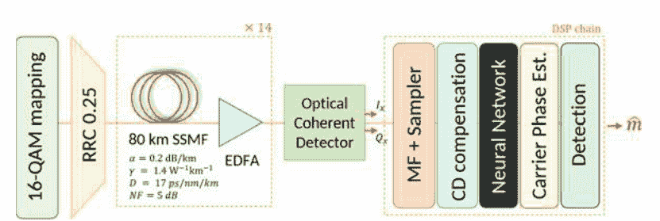

在长距离上提供异常高的数据传输速率。然而，无论系统如何，核心概念都保持不变。本节讨论了本研究考虑的光纤通信系统的数学建模（包括发射机、光纤通道、接收机和放大器），这是长距离高数据传输速率单偏振光纤通信系统标准模型。所考虑系统的块图如图1所示。

## 2.1 发射机模型

在发射机端，输入的比特流 $m = (m_1, m_2, ..., m_n) \in \{0, 1\}$，被映射到一个符号序列 $S = (s_1, s_2, ..., s_n)$，其中 $s_i$ 是从16-QAM星座图中选择的。下一个符号序列被调制成波形 $q(t, 0) = \sum_{i=-\infty}^\infty s_i p(t - i/R_s)$，其中 $p(t)$ 是脉冲形状（根升余弦）而 $R_s$ 是波特率。$q(t, 0)$ 然后通过光纤传输。

## 2.2 信道模型

长距离光纤传输通过单模光纤进行。在单模光纤中，一个偏振方向上的信号传播由NLS方程控制：

$$
\frac{\partial q(t,z)}{\partial z} = -\frac{\delta}{2} q(z,t) - j\beta_2\frac{\partial^2 q}{\partial t^2} + j\gamma|q(t,z)|^2 q(t,z), \quad 0 \leq z \leq L
$$

其中 $q(t, z)$ 是光纤中传播的信号的复包络，是时间 $t$ 和距离 $z$ 的函数。在这里， $j = \sqrt{-1}$，$L$ 是光纤长度， $\delta$ 和 $\beta_2$ 分别是衰减和色散系数， $\gamma$ 是非线性参数。

由于光纤中的信号衰减，光纤链路通常被分成几个段。使用掺铒光纤放大器进行放大。

在每个段之后使用(EDFA)来补偿段损耗，这也涉及对信号施加放大自发辐射(ASE)噪声。NLS方程使用SSFM进行数值求解。在SSFM中，空间和时间均匀离散成集合 $\{z_0, z_1, ..., z_K\}$ 和 $\{t_0, t_1, ..., t_L\}$，分别表示为 $z_k = z_0 + \Theta_{zk}$ 和 $t_u = t_0 + \Theta_{tu}$，其中 $K = N_{st} \times \text{ps}_0$。信号 $q(z)$ 从位置 $z_0$ 到位置 $z_K$ 的演化如下计算：

$$
q(z_{k+1}) = F^\dagger D_L F D_N q(z_k),
$$

其中 $q(z_k)$ 是样本值的 $L \times 1$ 长度向量 $q(t_u, z_k)$，$u = 0, 1, ..., L - 1$ 处的位置 $z_k$，$F$ 和 $F^\dagger$ 分别是离散傅里叶变换(DFT) 和逆傅里叶变换(IDFT)矩阵，$D_N$ 是一个对角矩阵算子，其元素为

$$
\text{exp}(j\gamma |q(t_u, z_k)|^2 \Theta_z), \quad u = L/2, ..., L - 1,
$$

而 $D_L$ 是一个对角矩阵，其元素为：

$$
\text{exp}\left(- \left(\frac{\delta}{2} + j\frac{\beta_2}{2} \frac{(L - u)^2}{(L\Theta_t)^2} \right)\Theta_z \right), \quad u = 0, 1, ..., L/2 - 1,
$$

$$
\text{exp}\left(- \left(\frac{\delta}{2} + j\frac{\beta_2}{2} \frac{u^2}{(L\Theta_t)^2} \right)\Theta_z \right), \quad u = L/2, ..., L - 1.
$$

每个长度为 $L_{sp}$ 的光纤段后的EDFA通过应用乘法模拟因子 $G = e^{\frac{\delta}{2} L_{sp}}$ 到信号上，然后加上均值为零的复数高斯白噪声功率谱密度 $\sigma^2 = (G - 1) h \nu (\text{NF}/2)$，其中NF是EDFA噪声系数，h是普朗克常数，ν是载波频率。

## 2.3 接收机模型

在接收机端，初始时，光相干检测将信号包络从光场转换为电场。随后，应用匹配滤波来通过将接收到的波形与线性匹配滤波器相关来最大化信噪比（SNR），例如 $y[n] = \sum_{k=-\infty}^\infty u[n-k]x[k]$，其中 $x[k]$ 和 $y[n]$ 分别表示输入作为独立变量 $k$ 和滤波输出。在匹配滤波和下采样之后，CD补偿试图在一次过程中反转整个光纤中的色散效应 $\text{exp}\left(j \frac{1}{2} \beta_2 \omega^2 \delta \right) \hat{q}(\omega, L)$，其中 $\hat{q}(\omega, L)$ 是 $q(t, L)$ 的傅里叶变换。

CD补偿的输出随后传递给神经网络进行非线性抑制。神经网络对于每个符号 $s_i$，接收到时间步骤 $i$ 的时域向量以及 $2M \times \text{SpS}$ 个邻近样本（M左，M右），其中 $M$ 是有效信道记忆，并输出实部和虚部的均衡符号在时间步骤 $i$ 时输出（2个输出）。图2展示了神经网络的输入-输出模型的示意图。然后，神经网络后面跟着一个载波相位估计（CPE）模块，以补偿激光相位噪声，因为神经网络无法补偿由于噪声动态随机性引起的相位噪声。

接收器的目标是在性能-复杂度权衡中以最小的复杂性实现最大的性能，以捕捉平衡点。计算复杂度可以通过FLOP的数量来衡量，性能则通过通信系统中的BER和Q因子指标来评估。BER的定义为：

$$
\text{BER} = \frac{1}{N_b} \sum_{i} \mathbb{1} \{m_i = \hat{m}_i\},
$$

其中 $m_i$ 是时刻 $i$ 的传输比特，$\hat{m}_i$ 是相应的接收比特，在RX处，$\mathbb{1}$ 是指示函数，如果满足括号条件则等于1，否则等于0。$N_b$ 是比特数（比特流大小）。Q因子连续定义为：

$$
\text{Q因子} = 20 \log_{10}[\sqrt{2} \text{erfc}^{-1}(2 \text{BER})].
$$

其中erfc是互补误差函数。

## 3 神经网络学习

最近，人们对在接收端使用神经网络进行均衡引起了兴趣，如第1节所示。然而，网络的模型和架构在确定采用的神经网络在均衡任务中的效率程度方面起着关键作用，包括性能和复杂性。本节旨在

为了提供神经网络不同模型的简明概述，它们的基本原理以及复杂度测量，这将在第5节中用于分析和比较各种实现的神经网络均衡器的复杂度。

神经网络是深度学习的实现者，因为它们能够捕捉所呈现数据中的复杂输入-输出相关性和数学结构。这些结构是有向计算图，由一组基本处理单元或神经元组成，应用于输入的连接线性和非线性运算符。

根据信息从输入层到输出层传播的方案，神经网络可以分为两类：前馈神经网络和循环神经网络。在前馈神经网络中，每个神经元只与下一层的神经元相连。因此，信息只能从输入层传播到输出层，没有任何反馈循环。在循环神经网络中，允许存在反馈循环，并且信息也可以通过反馈链接传递到网络的前一层。

尽管这两个类别在架构上有所不同，但反向传播算法在训练过程中都被用来找到最佳权重集。在反向传播算法中，误差在每次迭代时被计算，并且然后被向前传播到前面的层以调整它们的权重。

$$
w^{(t+1)}_{\alpha} = w^{(t)}_{\alpha} - \delta \nabla \hat{L}(w^{(t)}_{\alpha}),
$$

其中 $w^{(t)}_{\alpha}$ 是第$\alpha$层在第$t$次迭代时的权重矩阵，$\hat{L}$ 是当前权重导致的损失，$\nabla \hat{L}$ 是 $\hat{L}$ 的梯度，$\delta > 0$ 是学习率。

MLPs和CNNs是前馈神经网络类别中的两种主要结构。这两种结构在[46, Chaps. 6, 9]中有广泛的讨论和解释。由于其他研究中对这些结构的广泛评论，这些类型的神经网络的细节在这里不讨论。然而，值得注意的是，在MLPs的全连接层中，FLOPs的数量是通过计算得到的。

$$
\text{FLOPs}^{\{\text{全连接}\}} = n_i n_h + \eta n_h + n_h,
$$

其中 $n_i$ 是输入特征的数量，$n_h$ 是隐藏单元的数量，而 $\eta$ 是非线性激活函数所需的FLOPs数量。对于卷积层，FLOPs的数量也可以使用以下公式计算：

$$
\text{FLOPs}^{\{\text{卷积}\}} = n_{\text{ker}} \times (2 \times e_{\text{ker}} - 1) \times L_{\text{out}} + \eta e_{\text{out}},
$$

其中 $n_{\text{ker}}$ 是卷积核的数量，$e_{\text{ker}}$ 是卷积核的形状，而 $e_{\text{out}}$ 是输出特征图的形状。输出特征图的长度 $L_{\text{out}}$ 可以通过以下方式获得：

$$
L_{\text{out}} = \left\lfloor \frac{L_{\text{in}} + 2 \times \text{pad} - (dil \times L_{\text{ker}} - 1) - 1}{\text{strd}} \right\rfloor + 1,
$$

其中 pad, dil和 strd分别表示填充、扩张和步长。$L_{\text{ker}}$ 是内核长度。

## 3.1 循环神经网络

正如前面所指出的，由于循环神经网络在跨越大内存时保持有效信息并捕捉长程依赖性的高效性，因此它们在基于神经网络的均衡化中引起了关注。这些结构中的部件遵循精细的机制，允许进行卓越的性能和相关复杂度测量，这将在第5节中用于实现的循环神经网络模型的复杂度分析。

循环神经网络是为处理具有相关样本的时间序列数据而开发的。循环神经网络中节点之间的连接可以建立一个循环，不仅仅是向前传播信息的条件。循环神经网络由由循环单元组成的循环层构成。循环单元状态受当前输入以及过去和可能的后续状态的影响。循环单元（基本循环神经网络）的一般数学表达式如下：

$$
\begin{align*}
h^{(t)} &= \sigma_1(w_h h^{(t-1)} + w_x x^{(t)} + b_h) \\
y^{(t)} &= \sigma_2(w_y h^{(t)} + b_y)
\end{align*}
$$

其中，$x^{(t)} \in \mathbb{R}^{n_i}$ 和 $h^{(t)} \in \mathbb{R}^{n_h}$ 分别是时间步骤 $t$ 的输入和隐藏状态；$w_h \in \mathbb{R}^{n_h \times n_h}$，$w_x \in \mathbb{R}^{n_h \times n_i}$，$w_y \in \mathbb{R}^{n_y \times n_h}$ 是权重矩阵，$b_h \in \mathbb{R}^{n_h}$ 和 $b_y \in \mathbb{R}^{n_y}$ 是偏置向量，$\sigma(\cdot)$ 和 $\sigma'(\cdot)$ 是激活函数。

根据（11），在一个时间步骤中，香草RNN单元执行的FLOPs数量为

$$
\text{FLOPs}^{\text{RNN}} = n_i n_h + n_h^2 + 2n_h + \eta n_h,
$$

由于隐藏状态属性的存在，RNN在捕捉时间序列中的长程特征方面具有很高的性能。然而，RNN面临的一个重要障碍是反向传播中梯度消失的问题，这使得RNN在大量时间步长上的性能受到限制。在基于RNN的均衡中，当每个时间步长符号都有一个RNN单元时，就会出现这个问题，就像[32,39,41]中所示。已经开发了许多RNN变体来解决这个问题，以允许处理更长的序列。

LSTM和GRU网络是这些变体中的主要结构[47]。这些网络中的RNN单元包含一些被称为门的运算符和过程，它们控制信息的流动。一般来说，这些门确定哪些来自时间步输入或RNN内存的信息需要保留，哪些信息必须丢弃，从而使有价值的信息在长序列的RNN单元中得以保留。下面的小节将更深入地讨论这两种类型的网络，并研究它们的复杂性。

## 3.2 长短期记忆网络

为了处理长序列，LSTM网络除了有一个细胞状态之外，还有三个辅助门：更新门 $\theta_u$，遗忘门 $\theta_f$ 和输出门 $\theta_o$。细胞状态作为额外的支持记忆，通过整个过程流程跟踪重要信息。

遗忘门控制着前一个细胞状态中应该被忽略的信息和必须保留的信息。它分析先前的隐藏状态以及当前的输入，然后将结果特征通过sigmoid函数发送，产生在区间(0,1)的值。这个值越接近零，特征被忽略的越多，反之亦然。同样，更新门学习哪些细胞状态中的信息应该被更新。最后，输出门也学习并决定哪些细胞状态中的信息应该被认可和输出。基于这个逻辑，LSTM细胞的公式如下所示：

$$
\begin{align*}
\tilde{\mathbf{c}}^{(t)} &= \sigma_{\tanh} \left( \mathbf{w}_{ch}\mathbf{h}^{(t-1)} + \mathbf{w}_{cx}\mathbf{x}^{(t)} + \mathbf{b}_c \right) \\
\Gamma_u &= \sigma_{\text{sig}} \left( \mathbf{w}_{uh}\mathbf{h}^{(t-1)} + \mathbf{w}_{ux}\mathbf{x}^{(t)} + \mathbf{b}_u \right) \\
\Gamma_f &= \sigma_{\text{sig}} \left( \mathbf{w}_{fh}\mathbf{h}^{(t-1)} + \mathbf{w}_{fx}\mathbf{x}^{(t)} + \mathbf{b}_f \right) \\
\Gamma_o &= \sigma_{\text{sig}} \left( \mathbf{w}_{oh}\mathbf{h}^{(t-1)} + \mathbf{w}_{ox}\mathbf{x}^{(t)} + \mathbf{b}_o \right) \\
\mathbf{c}^{(t)} &= \Gamma_u \odot \tilde{\mathbf{c}}^{(t)} + \Gamma_f \odot \mathbf{c}^{(t-1)} \\
\mathbf{h}^{(t)} &= \Gamma_o \odot \sigma_{\tanh}(\mathbf{c}^{(t)})
\end{align*}
$$

其中 $\mathbf{x}^{(t)} \in \mathbb{R}^{n_i}$ 是输入，$\mathbf{c}^{(t)} \in \mathbb{R}^{n_c}$ 是细胞状态，$\mathbf{h}^{(t)} \in \mathbb{R}^{n_h}$ 是隐藏状态，$\mathbf{w}_{ch}, \mathbf{w}_{uh}, \mathbf{w}_{fh}, \mathbf{w}_{oh} \in \mathbb{R}^{n_h \times n_h}$ 和 $\mathbf{w}_{cx}, \mathbf{w}_{ux}, \mathbf{w}_{fx}, \mathbf{w}_{ox} \in \mathbb{R}^{n_h \times n_i}$ 是权重矩阵，$\mathbf{b}_c, \mathbf{b}_u, \mathbf{b}_f, \mathbf{b}_o \in \mathbb{R}^{n_h}$ 是偏置项，而 $\sigma_{\text{sig}}$ 和 $\sigma_{\tanh}$ 分别是 sigmoid 和 tanh 激活函数。 $\odot$ 是Hadamard乘积。从(13)可以推导出LSTM单元产生的FLOPs数量如下：

$$
\text{FLOPs}^{\text{LSTM}} = 4 \times [n_i n_h + n_h^2 + 3n_h] + 5\eta n_h,\quad(14)
$$

在这个计算中，通过近似，假设tanh和sigmoid激活函数都施加相同数量的FLOPs。

## 3.3 门控循环单元网络

GRU网络与LSTM网络具有类似的基本逻辑。在GRU单元中，细胞状态等于隐藏状态。与LSTM中的三个门相比，它们还包括两个门，称为相关性 $\theta_r$ 和更新 $\theta_u$ 门，其作用方式类似于LSTM中的遗忘和更新门。以下是GRU单元的数学公式：

$$
\begin{align*}
\tilde{\mathbf{h}}^{(t)} &= \sigma_{\tanh} \left( \mathbf{w}_{rh}\mathbf{h}^{(t-1)} + \mathbf{w}_{rx}\mathbf{x}^{(t)} + \mathbf{b}_r \right) \\
\Gamma_u &= \sigma_{\text{sig}} \left( \mathbf{w}_{uh}\mathbf{h}^{(t-1)} + \mathbf{w}_{ux}\mathbf{x}^{(t)} + \mathbf{b}_u \right) \\
\mathbf{h}^{(t)} &= \Gamma_u \odot \tilde{\mathbf{h}}^{(t)} + (1 - \Gamma_u) \odot \mathbf{h}^{(t-1)}
\end{align*}
$$

其中 $\mathbf{x}^{(t)} \in \mathbb{R}^{n_i}$ 是输入，$\mathbf{h}^{(t)} \in \mathbb{R}^{n_h}$ 是隐藏状态，$\mathbf{w}_{rh}, \mathbf{w}_{uh} \in \mathbb{R}^{n_h \times n_h}$ 和 $\mathbf{w}_{rx}, \mathbf{w}_{ux} \in \mathbb{R}^{n_h \times n_i}$ 是权重矩阵，$\mathbf{b}_r, \mathbf{b}_u \in \mathbb{R}^{n_h}$ 是偏置项，而 $\sigma_{\text{sig}}$ 和 $\sigma_{\tanh}$ 分别是 sigmoid 和 tanh 激活函数。 $\odot$ 是Hadamard乘积。从(15)可以推导出GRU单元产生的FLOPs数量如下：

$$
\text{FLOPs}^{\text{GRU}} = 2 \times [n_i n_h + n_h^2 + 2n_h] + 3\eta n_h.
$$

## 4 提出的混合CNN+RNN架构

接收到的波形中存在短程和长程非线性失真模式。我们的方法的第一个动机是最小化在捕捉这两种依赖关系时的重叠，以提高效率。

我们的目标是仅使用递归结构来捕捉长程依赖关系，以便每个递归单元使用更少的单元。

关于这一点，我们的目标是使用CNN来捕捉短时依赖关系，这是实现这一目的的工具，并且仅使用循环结构来捕捉长程依赖关系，以便在每个循环单元中使用更少的单元数。

考虑到双向基于RNN的方法通常具有相对较高的复杂性，我们的方法的第二个动机是在循环层中使用单向结构。这需要大幅减少输入时间步数，以便RNN的内存可以在整个流水线中保持。这要求捕捉到依赖关系的邻居样本被划分为单独的块作为循环层的时间步。

根据（12），（14），（16），随着信号维度的增加，循环层上的计算负担增加。我们方法的第三个刺激是通过降维过程将信号的维度减少到1 SpS，然后再进入循环层。这也有助于减少循环单元中的单元数要求。

## 5 数值结果

我们方法的最终目标是在循环层中使用普通的RNN，而不是LSTM或GRU单元，因为如讨论的那样，门控循环结构中的额外门的开销在推理模式下仍然存在，增加了模型的复杂性。在循环单元中有限的时间步长和隐藏单元数量可以促进这个想法。

为了实现这些目标，在本研究中，我们利用了一个由多通道步进卷积层组成的CNN编码器，位于循环层之前。多通道化使得可以在信号上应用大量的滤波器来提取短期依赖关系。此外，结合步进，它为我们提供了一个工具，通过在每一层上应用不成比例的滤波器数量来实现高效的维度缩减，与该层设置的步幅相比。这个维度缩减过程不仅显著减轻了循环层上的计算负载，还减少了最终卷积层上的负载，其中一个小尺寸的滤波器可以跨越一个大区域。此外，在CNN块的输出处，已经捕获到依赖关系的相邻符号会自动地在输出的2D特征图的深度轴上作为单独的向量进行分组。

基于这个逻辑，图3展示了所提出的CNN+RNN模型的流程图。如第2节所讨论的，这个神经网络的输入是一个 [(2M + 1) × SpS] × 2 矩阵，其中包含了实部和虚部的 $q^{\text{CD}}(t = i - M × \text{SpS}, ..., t = i + M × \text{SpS})$ 堆叠在一起，其中 $M$ 是假设的信道记忆， $i$ 是要均衡的符号的索引。

| 层类型   | 详细说明 |
|----------|----------|
| CNN 编码器 | 多通道步进卷积层 |
| 循环层   | 单向RNN结构 |
| 输出     | 实部和虚部的均衡符号 |

## 图4所提出的CNN+RNN模型的块图

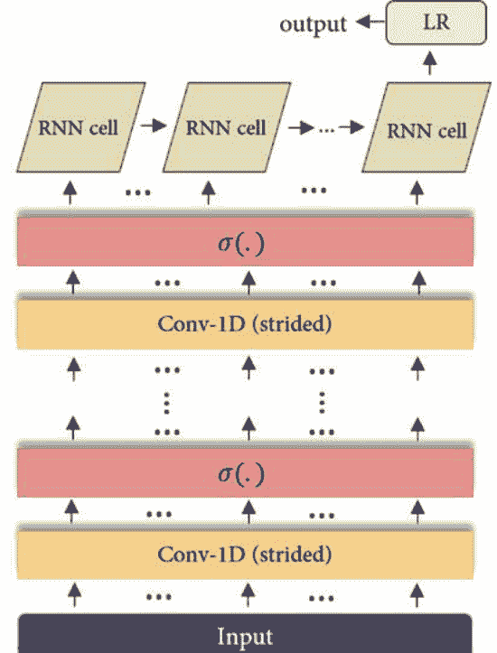

在每一层中，激活函数（ReLU）为输出引入了非线性。CNN输出的特征图然后传递到循环层，其中深度轴中的向量被视为时间步。通过CNN块中的步进，特征图的宽度显著减小，RNN的时间步数急剧减少。此外，由于已经捕获了每个时间步向量内的依赖关系，循环单元中所需的隐藏单元数量明显减少。由于时间步数非常有限且隐藏状态较小，因此可以通过使用单向多对一的基本RNN层，在每个时间步更新状态的同时保持状态。因此，RNN的输出是最后一个循环单元的隐藏状态输出。然后，该输出通过线性全连接层连接到两个处理单元，为两个单元形成线性回归模型。这两个单元应该输出s_t的实部和虚部。图4显示了所提出模型的块图。

## 5 数值结果

假设在图1的块图中，使用单极化16-QAM 64 Gb/s光纤传输系统，传输距离为 14 × 80 km SMF。系统采用以下设置：色散 D =17 ps / nm / km，非线性参数 γ = 1.4 W⁻¹km⁻¹，光纤损耗 αdB = 0.2dB / km，EDFA噪声系数NF = 4.5 dB，激光线宽100 KHz。脉冲整形采用升余弦（RRC）滤波器，滚降系数为0.25。在载波波长为 λ₀ = 1.55 μm的情况下，使用8 SpS和80步/跨度的SSFM进行正向传播模拟（增加任一值都不会影响结果）。RX的采样率设置为2 SpS。该系统还作为开源项目开发，可在[48]处获取，遵循GNU通用公共许可证v3.0。

所提及的设置是基于社区中对建模参数的共识[27, 29, 33, 39, 40]，根据当前可用的光纤技术[49]。所考虑的光纤链路长度也确保了长距离传输，并进一步类似于Rostock, Germany和Helsinki, Finland之间的C-LION1潜水电缆[50]。

## 5.1 训练方法

MLP、CNN+MLP、bi-RNN、bi-GRU、bi-LSTM和CNN+bi-LSTM神经结构，分别与[32, 33, 37, 39-41]具有类似的架构，以及线性均衡、DBP和提出的CNN+RNN模型被考虑用于均衡。神经网络的详细信息在Table1中提到。超参数，特别是循环层中隐藏单元的数量，通过K折交叉验证进行调整，以获得最佳性能，考虑性能和复杂性之间的权衡。图5展示了基于循环结构中循环单元数量的Q因子增益与线性均衡之间的关系。

对于所有的模型，损失函数被设置为均方误差（MSE），并且使用Adam算法进行优化，学习率为5 × 10⁻⁴，衰减率 β₁ = 8.5 × 10⁻¹ β₂ = 9.99 × 10⁻¹（注意，这里的 β₁与公式（1）中的类似参数不同）。所有的模型都是在Python的Tensorflow 2.6中使用2 20个归一化样本进行训练的。

## 5.2 评估

在模型评估中使用了2²²个在线生成的（未见过的）样本。所实施方法的Q因子和BER性能曲线如图6和图7所示。为了直观地说明相互之间的关系，图8还显示了线性均衡、DBP-3StPS、DBP-50StPS和提出的方法在DSP链中经过均衡和CPE块后获得的星座图。

## 表1 所实施神经网络的隐藏层的详细信息

所有模型的输出层都是一个具有2个单元的线性全连接层。

| 模型 | 层 | 类型 | 细节 |
| --- | --- | --- | --- |
| MLP [33] | 第一层 | Dropout | Dropout率：0.4 |
|  | 第一层 | FC | 单元数：400，激活函数：tanh |
|  | 第二层 | FC | 单元数：400，激活函数：tanh |
| CNN+MLP [37] | 第一层 | Conv-1D | 卷积核：5，步长：5，通道数：8，激活函数：R<sub>LU</sub> |
|  | 第二层 | Conv-1D | 卷积核：5，步长：5，通道数：36，激活函数：R<sub>LU</sub> |
|  | 第三层 | Conv-1D | 卷积核：3，步长：3，通道数：110，激活函数：R<sub>LU</sub> |
|  | 第四层 | FC | 单元数：200，激活函数：tanh |
|  | 第五层 | FC | 单元数：200；激活函数：tanh |
| 双向LSTM [41] | 第一层 | 双向LSTM | 单元数：40；激活函数：tanh，sigmoid |
|  | 第二层 | 扁平化 | 数据格式：通道在最后 |
| 双向GRU [40] | 第一层 | 双向GRU | 单元数：40；激活函数：tanh，sigmoid |
|  | 第二层 | 扁平化 | 数据格式：通道在最后 |
| bi-RNN [39] | 第一层 | bi-RNN | #单元：72；激活函数：tanh |
|  | 第二层 | 扁平化 | 数据格式：通道在最后 |
| CNN+bi-LSTM [32] | 第一层 | Conv-1D | L<sub>ker</sub>：21，步长：1，通道数：2，激活函数：LeakyReLU |
|  | 第二层 | 双向LSTM | #单元：36，激活函数：tanh，sigmoid |
|  | 第三层 | 扁平化 | 数据格式：通道在最后 |
| 提出的CNN+RNN | 第一层 | Conv-1D | L<sub>ker</sub>：9，步长：9，通道数：14，激活函数：ReLU |
|  | 第二层 | Conv-1D | L<sub>ker</sub>：7，步长：7，通道数：75，激活函数：ReLU |
|  | 第四层 | uni-RNN | #单元：90，激活函数：tanh |


符号干扰（ISI）抑制方法的性能。图8还显示了线性均衡、DBP-3StPS、DBP-50StPS和提出的方法在DSP链中经过均衡和CPE块后获得的星座图。

## 图6 实施的均衡方法的误码率性能作为发射功率的函数

CNN+RNN方法（其他基于神经网络的方法的星座图与CNN+RNN相似）。根据结果，循环基均衡器显示出优越的性能，分别比基于MLP和CNN+MLP的方法提高了0.48 − 0.8 dB和0.15 − 0.47 dB。在循环基均衡器中，CNN+RNN模型的性能稍微更高，具有0.05 − 0.32dB的优越Q因子，这归功于使用建立的工具提取每种依赖关系。然而，神经网络基均衡器总体上实现了相对接近的性能，Q因子差异小于1 dB。分析表明，这是因为模型中的参数和神经元数量相对较小，这是由于输入的尺寸有限。这导致通过有效的训练策略减轻了过拟合风险，并通过适当的网络复杂性提高了收敛到相同低偏差水平的可能性，相反，对于不同的模型，这被证明是完全不同的。表2显示了实施的神经网络模型的复杂性，即它们在推理模式下每个输出符号产生的FLOPs数量。这些值是根据第3节讨论的公式获得的，并通过Linux内核性能监控工具perf库在Linux Fedora 35系统上获得的训练模式下的CPU周期数量进行了检查。

## 图7 实施的均衡方法的Q因子性能作为发射功率的函数

## 图8 均衡和CPE块后通过DSP链获得的星座图 顶部行展示了经过指定技术均衡后的星座图，底部行展示了CPE块后的对应星座图

## 表2 实施的神经网络每个符号产生的FLOPs数量

| 模型 | #每个符号的FLOPs |
|---|---|
| MLP [33] | ~ 243.0 K |
| MLP+CNN [37] | ~ 216.2 K |
| bi-RNN [39] | ~ 407.8 K |
| 双向GRU [40] | ~ 495.3 K |
| 双向LSTM [41] | ~ 656.6 K |
| CNN+bi-LSTM [32] | ~ 640.5 K |
| 提出的CNN+RNN | ~ 175.1 K |

使用96个CPU的AMD EPYC 7F72 24核处理器，每个核心2个线程，以及259GB RAM，在法国巴黎高等电信学院的Institut Polytechnique de Paris, Palaiseau站托管。每个神经网络记录的CPU性能计数器和跟踪点的完整报告可在[48]处获得。 在30个2^16迭代的训练过程中，神经网络的学习曲线以小批量大小为2^4的样本进行演示，如图9所示。然而，请注意，训练是一个离线过程，因此其复杂性分析意义不大。

正如表2、图6和图7所示，模型的复杂性和性能与其他模型相比，并没有相反的关系，而且显示出在捕捉依赖关系方面的计算效率甚至可能导致更高的性能；例如MLP与CNN+MLP相比，CNN+MLP在较低的复杂性下实现了0.33 dB更高的Q因子。 同样地，CNN+RNN模型在具有优越或可比性能的同时，承担着较低的计算复杂性。 根据表2、图6和图7，所提出的CNN+RNN方法在性能上优于基于MLP和CNN+MLP的方法，分别减少了约28%和约19%。


FLOPs，它达到了与最先进的双向循环模型相当的性能，但FLOPs数量比其少50%以上；这是因为模型在最小化短程和长程依赖提取之间的重叠方面的效率，利用单向循环层而不是双向循环层，使用普通RNN代替门控循环单元，并在循环层之前进行维度降低。

## 6 结论

提出了一种卷积循环神经网络，包括CNN编码器和单向普通RNN，用于高效学习单极化光纤通信中的非线性失真，考虑性能和复杂性之间的权衡。通过最小化捕获短程和长程依赖之间的重叠，并通过相应的结构处理每种类型，即卷积核用于短程特征，单向普通循环层用于长程依赖，提高了性能和复杂性。还明确指出，不成比例的多通道和CNN块中的跨步也应该被采用，不仅可以减轻循环层的计算负担，还可以促进单向普通RNN的成功实现。实验证明，在由14个80km跨度组成的1120km SMF上进行16-QAM光传输时，所提出的方法达到了与最先进的双向循环均衡方法相当的性能，但FLOPs数量比其少50%以上；而且在复杂性方面，它优于MLP和基于CNN的模型。

为了方便感兴趣的工作人员重新实施和继续这项研究，还提出了使用Python开发的仿真软件，包括光纤通道建模和TX和RX处的完整DSP链。

将当前方法扩展到双极化和波长分割多路复用（WDM）系统是未来研究的一个潜在主要研究课题之一。将当前模型应用于基于非线性傅里叶变换（NFT）的光传输系统中RX处的非线性频谱的后处理[7, 51]，是未来研究的另一个有趣的课题之一。

此外，将所提出的模型与光学传输系统的最佳发射机和接收机进行联合深度学习，以端到端的方式[52]，是另一个可以作为这项研究的延伸的有吸引力的研究方向。

## 参考文献

1. Kikuchi, K.: 相干光纤通信基础. IEEE J. Lightw. Technol. 34, 157–179 (2015)  
2. Essiambre, R.-J., Kramer, G., Winzer, P.J., Foschini, G.J., Goebel, B.: 光纤网络的容量限制. IEEE J. Lightw. Technol. 28, 662–701 (2010)  
3. Agrawal, G.P.: 光纤通信系统, vol. 2  
Wiley (2012)  
4. Cartledge, J.C., Guiomar, F.P., Kschischang, F.R., Liga, G., Yankov, M.P.: 光纤非线性数字信号处理. Opt. Express 25, 1916–1936 (2017)  
5. Winzer, P.J., Neilson, D.T., Chraplyvy, A.R.: 光纤传输和网络: 过去20年和未来20年. Opt. Express 26, 24190–24239 (2018)  
6. Savory, S.J.: 数字相干光接收机: 算法和子系统. IEEE J. Sel. Top. Quantum Electron. 16, 1164–1179 (2010)  
7. Yousefi, M.I., Kschischang, F.R.: 使用非线性傅里叶变换进行信息传输, 第一部分, 第二部分, 第三部分. IEEE Trans. Inf. Theory 60, 4312–4369 (2014)  
8. Ip, E., Kahn, J.M.: 使用数字反向传播补偿色散和非线性失真. IEEE J. Lightw. Technol. 26 (20), 3416–3425 (2008)  
9. Kramer, G., Yousefi, M.I., Kschischang, F.R.: 级联非线性和噪声信道容量的上界. In: IEEE 信息理论研讨会 (ITW), pp. 1–4 (2015)  
10. Secondini, M., Marsella, D., Forestieri, E.: 增强的分裂步傅里叶方法用于数字反向传播. In: 欧洲光通信会议 (ECOC), pp. 1–3 (2014)  
11. Guiomar, F.P., Reis, J.D., Teixeira, A.L., Pinto, A.N.: 使用频域Volterra级数均衡器减轻信道内非线性. Opt. Express 20, 1360–1369 (2012)  
12. Wang, Y., Tao, L., Huang, X., Shi, J., Chi, N.: 基于Volterra级数的非线性均衡器的高速WDMCAP64 VLC系统的增强性能. IEEE 光子学杂志7, 1–7 (2015)  
13. Agazzi, O.E., Hueda, M.R., Carrer, H.S., Crivelli, D.E.: 在色散光通道中的最大似然序列估计. IEEE J. Lightw. Technol. 23(2), 749–763 (2005)  
14. Ali‘c, N., Papen, G.C., Saperstein, R.E., Milstein, L.B., Fainman, Y.: 信号统计和最大似然序列估计在含有单个光前放大器的强度调制光纤链路中. Opt. Express 13(12), 4568–4579 (2005)  
15. Jger, M., Rankl, T., Speidel, J., Blow, H., Buchali, F.: 光PMD通道的Turbo均衡器性能. IEEE J. Lightw. Technol. 24(3), 1226 (2006)  
16. Tchler, M., Singer, A.C.: Turbo equalization: an overview. IEEE Trans. Inf. Theory 57(2), 920–952 (2011)  
17. Napoli, A., Maalej, Z., Sleiffer, V.A., Kuschnerov, M., Rafique, D., Timmers, E., Spinnler, B., Rahman, T., Coelho, L.D., Hanik, N.: Reduced complexity digital back-propagation methods for optical communication systems. IEEE J. Lightw. Technol. 32(7), 1351–1362 (2014)  
18. Musumeci, F., Rottondi, C., Nag, A., Macaluso, I., Zibar, D., Ruffini, M., Tornatore, M.: An overview on application of machine learning techniques in optical networks. IEEE Commun. Surv. Tutor. 21, 1383–1408 (2019)  
19. Shahkarami, A., Yousefi, M.I., Jaouen, Y.: 使用卷积循环神经网络高效学习非线性光纤通信. 在: IEEE国际机器学习与应用会议 (ICMLA), 第668-673页 (2021年)  
20. Shahkarami, A., Yousefi, M.I., Jaouen, Y.: 基于注意力的神经网络均衡在光纤通信中. 在: 亚洲通信光子学会议 (ACP), 第M5H-3页 (2021年)  
21. Freire, P.J., Osadchuk, Y., Spinnler, B., Schairer, W., Napoli, A., Costa, N., Prilepsky, J.E., Turitsyn, S.K.: 实验研究深度神经网络均衡器在光学链路中的性能. 在: 光纤通信会议和展览 (OFC), 第M3H-2页 (2021年)  
22. Catanese, C., Triki, A., Pincemin, E., Jaou n, Y.: 神经网络在光纤非线性抑制中的应用调查. 在: 国际透明光网络会议 (ICTON), 第1-4页 (2019年)  

## 高效学习Kerr非线性...

23. Eriksson, T.A., Blow, H., Leven, A.: 在光通信系统中应用神经网络的可能陷阱. IEEE 光子技术快报 29, 2091–2094 (2017)  
24. Koike-Akino, T., Wang, Y., Millar, D.S., Kojima, K., Parsons, K.: 神经网络增强的光纤非线性补偿. IEEE 光纤技术杂志 38, 3059–3066 (2020)  

25. Balatsoukas-Stimming, A., Studer, C.: 通信系统的深度展开: 一项调查和一些新方向. 在: IEEE国际信号处理系统研讨会 (SiPS), pp. 266–271 (2019)  

26. Catanese, C., Triki, A., Pincemin, E., Jaou n, Y.: 光纤非线性补偿中神经网络应用的调查. 在: 国际透明光学网络会议 (ICTON) 论文集, pp. 1–4, IEEE (2019)  

27. H ger, C., Pfister, H.D.: 通过深度神经网络进行非线性干扰抑制. 在: 光纤通信会议和展览 (OFC), 第1-3页 (2018年)  

28. H ger, C., Pfister, H.D.: 在光纤通信中深度学习非线性薛定谔方程. 在: IEEE国际信息理论研讨会 (ISIT), 第1590-1594页 (2018年)  

29. Butler, R.M., Hager, C., Pfister, H.D., Liga, G., Alvarado, A.: 基于模型的机器学习用于联合数字反向传播和PMD补偿. IEEE J. Lightw. Technol. 1 (2020)  
30. Sidelnikov, O., Redyuk, A., Sygletos, S., Fedoruk, M., Turitsyn, S.: 高级卷积神经网络用于长距离WDM传输系统中的非线性补偿. IEEE J.Lightw. Technol. 39, 2397-2406 (2021)  

31. 江, X., 王, D., 范, Q., 张, M., 卢, C., 刘, A.P.T.: 使用物理信息的神经网络解决光纤中的非线性薛定谔方程. 在: 光纤通信会议和展览 (OFC), 第1-3页 (2021年)  

32. Freire, P.J., Osadchuk, Y., Spinnler, B., Napoli, A., Schairer, W., Costa, N., Prilepsky, J.E., Turitsyn, S.K.: 相干光学系统中神经网络均衡器的性能与复杂性研究. IEEE J. Lightw. Technol. 39 (19)，6085-6096 (2021年)  

33. Catanese, C., Ayassi, R., Pincemin, E., Jaou n, Y.: 一种用于减轻200G DP-16-QAM传输系统中光纤非线性效应的全连接神经网络方法. 在: 国际透明光学网络会议 (ICTON), 第1-4页 (2020年)  

34. 张, H., 于, Z., 舒, L., 万, Z., 赵, Y., 徐, K.: 基于MLP-ANN的相干光OFDM纤维非线性均衡器. 在: 光通信和网络国际会议(ICO-CN), 第1-3页(2019)  

35. Sidelnikov, O., Redyuk, A., Sygletos, S.: 长距离传输系统中动态深度神经网络的均衡性能和复杂性分析. Opt. Express 26, 32765–32776 (2018)  

36. 李, P., 易, L., 薛, L., 胡, W.: 使用机器学习实现通过25km SSMF的100Gbps IM/DD传输，使用20G级DML和PIN. 在: 光纤通信会议与展览 (OFC), 第1-3页 (2018)  

37. 庄, C., 刘, L., 魏, C., 刘, J., Henrickson, L., 黄, W., 王, C., 陈, Y., 陈, J.: 基于卷积神经网络的112-Gbps高速光链路非线性分类器. 在: 光纤通信会议与展览 (OFC), 第1-3页 (2018)  

38. 李, P., 易, L., 薛, L., 胡, W.: 使用机器学习实现通过25km SSMF的100Gbps IM/DD传输，使用20G级DML和PIN. 在: 光纤通信会议与展览 (OFC), 第1-3页 (2018)  

39. Deligiannidis, S., Mesaritakis, C., Bogris, A.: 数字相干系统中双向递归神经网络模型与Volterra非线性均衡器的性能和复杂性分析. IEEE J. Lightw. Technol. 39，5791-5798 (2021)  

40. 刘, X., 王, Y., 王, X., 徐, H., 李, C., 辛, X.: 基于双向门控循环单元神经网络的相干光通信系统非线性均衡器. Opt. Express 29, 5923-5933 (2021)  

41. Deligiannidis, S., Bogris, A., Mesaritakis, C., Kopsinis, Y.: 利用长短期记忆神经网络在数字相干系统中补偿光纤非线性. IEEE J.Lightw. Technol. 38, 5991–5999 (2020)

## 多层小波变换用于图像超分辨率：应用于基于体素的深度学习和碳纳米管薄片的面积密度图

刘颖南和兰迪・克林顿・帕芬罗斯

摘要 Miralon薄片是一种先进的碳基产品，可以为一些最困难的工业问题提供环境抵抗解决方案。质量控制的一个挑战是确保密度分布的均匀性。

然而，目前从β传输设备获得的面积密度图无法在所需的水平上识别变化和缺陷。由于面积密度图可以被解释为图像，图像超分辨率卷积神经网络（CNN）承诺用细节纹理重建高分辨率的面积密度图。然而，要实现这个承诺，需要克服两个挑战。首先，生成面积密度图是昂贵的，只有有限的训练数据可用。其次，当前的2D CNN无法提供足够的深度准确性。因此，我们提出了一个3层体素表示，以适应Miralon薄片的特定应用。此外，我们还研究了变换域，以提供更可区分的密度分布特征。我们的结果表明，适当的数据增强对于实现准确结果至关重要，并且变换域可以根据图像内容提供特殊信息。通过利用2D图像超分辨率CNN，可以获得富含3D信息的高分辨率面积密度图。

## 1 引言

Miralon片由非织造碳纳米管材料制成。这种片材具有令人印象深刻的物理性质，并为航空航天、能源和电子领域中一些最棘手的行业挑战提供可持续和有效的解决方案。如图1所示，这种无缝圆柱形空心管具有

Y. Liu (✉) · R. C. Paffenroth  
美国马萨诸塞州伍斯特理工学院，邮编01609，电子邮件：yliu18@wpi.edu  
R. C. Paffenroth，电子邮件：rcpaffenroth@wpi.edu  

© 作者，独家许可给Springer Nature Singapore Pte Ltd. 2023 M. A. Wani和V. Pala  
de（编者），深度学习应用，第4卷，智能系统与计算进展1434，https://  
/doi.org/10.1007/978-981-19-6153-3_14

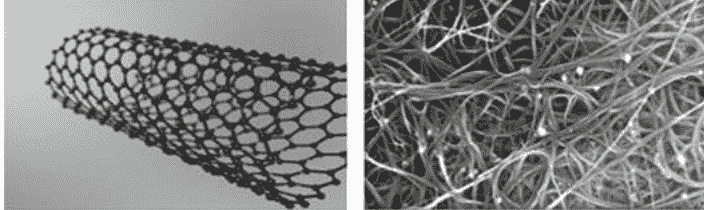

这种周期性的六边形图案导致了相邻原子之间的共价键[1]。这些强化学键在碳纳米管材料的卓越机械性能中起着关键作用[2]，而长碳纳米管由于其长度和直径之间的异常高纵横比而被认为是最先进的碳纤维材料[3]。构建长碳纳米管是一个关键的材料科学挑战，因为由于其长度，每个管中的电子可以同步运动，使得长纤维可以自然粘合在一起，形成纠缠的网络。图1给出了电子显微镜下的网络图片[4]。直接由纠缠网络制成的碳纳米管薄片不仅具有环境抗性和轻质性，还具有强度、热导性、电导性、高温抗性、电磁干扰和静电耗散等令人印象深刻的性能。

然而，纠缠的碳纳米管网络可能很难操纵[5]，特别是Miralon薄片，期望其均匀性以获得最佳性能应用。因此，对于密度变化最小的薄片进行质量控制至关重要。质量控制过程中的一个任务是生成特定薄片密度变化的清晰图像。如图2所示，Mahlo QMS-12 Qualiscan Beta传输系统[4]旨在展示Miralon薄片的一般纹理。该系统作为薄片的X射线相机工作。当传感器在表面上移动时，发射器在每个图像帧中的20mm直径区域释放β粒子。在每个20ms窗口中到达薄片下方接收器的粒子总数被转换为薄片密度的测量值。然而，原始的β传输面密度图不足以满足许多应用所需的变化和缺陷的识别。如图3所示，原始面密度图难以测量分布模式（即谷和山的宽度和厚度）以及缺陷的形状和面积。在本研究中，我们提出使用单图像超分辨率神经网络重建高分辨率面密度图。

单幅图像超分辨率神经网络源于大量训练数据的可用性和深度神经网络的兴起。在过去的十年中，与图像相关的神经网络，如图像分类网络[6, 7]、图像去噪网络[8-10]和图像重建网络[11, 12]，已经得到了广泛应用。

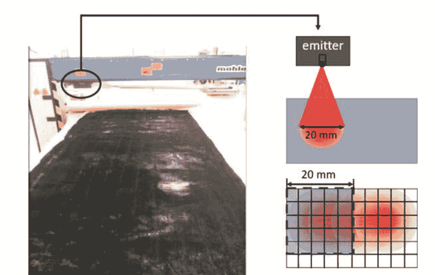

图2 用于测量碳纳米管薄片的β射线传输装置。当传感器头在表面上移动时，发射器释放β粒子。每个20ms窗口中到达接收器的粒子数量被转换为薄片密度的测量值。

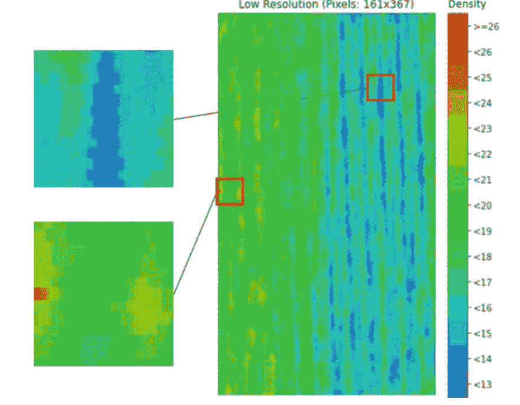

图3 Miralon薄片的β射线传输面密度图。传输传感器以低采样率测量材料密度。原始图像不足以识别所需级别的变化和缺陷。

## 1.1 贡献

与大多数图像重建问题的普通图像不同，贝塔透射面密度图是Miralon薄片的二维投影，其密度是深度相关的。图4展示了测量设备的设置。Mahlo Beta透射系统上的粒子发射器在每个图像帧上以未知分布扩散贝塔粒子。当它沿着表面移动时，会有不同的速度。

¹感谢Nanocomp Technologies, Inc.团队的数据生成工作。

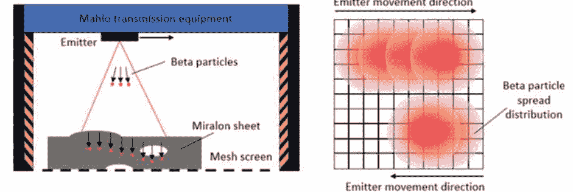

在特定设置下，具有不同速度和方向的粒子穿透薄片的总数被转换为相机测量值。贝塔粒子的行为因薄片密度的不同而变化。此外，标准图像超分辨率CNN需要已知真实密度的训练数据。正如我们将在第3.2节详细介绍的那样，我们使用小块的Miralon薄片，其中切割了几何图形。然而，这样的小训练集无法满足大多数图像超分辨率CNN的数据要求。

## 因此，这项研究克服了三个主要挑战：

- 首先，贝塔粒子扩散的分布是未知的。每个单独的图片帧中的粒子扩散不一定是均匀或高斯分布。设备观测结果来自重叠的图片帧。结合不同的发射器设置（即传感器速度和可见范围），相机测量模型复杂且未知。
- 其次，贝塔粒子的穿透能力与材料的不同厚度相关，粒子在表面撞击后的路径不一定是线性的。因此，探测器头接收到的粒子数量和材料的厚度不一定呈线性关系。因此，将3D密度投影到2D图像是复杂的。
- 由于测量成本高昂，只有少量的训练数据可用。

为了解决这些挑战，我们首先提出了一个使用旋转图像块进行数据增强的3层体素架构。然后，利用稀疏变换域来增强密度分布模式。我们充分利用有限的数据来表示特定应用研究中的特征。3D体素由2D像素制成，以模拟垂直厚度分布。体素块以小角度旋转，以丰富训练数据集，并避免过拟合。通过这样的实际测量，我们能够从严重下采样的贝塔透射面密度中重建细节纹理。

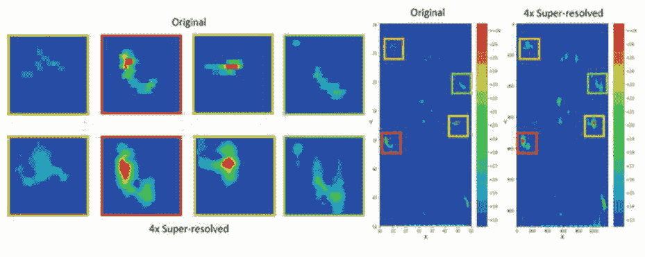

Miralon片的地图。图5展示了4×上采样因子下的超分辨率缺陷点的示例。此外，小波稀疏域根据特定图像内容提供了更多感兴趣的细节。通过分离不同频率，小波变换敏感地探索不同体素层，提供了更多关于Miralon铺放模式的证据。

## 2 相关工作

CNN在图像处理问题领域已经成为非常流行的技术。它们最初被应用于图像分类问题[19]，并在人脸识别[20]和物体检测[21]等许多领域取得了成功。

随后，残差学习和自编码器被应用于图像去噪研究[9, 10]。基于之前的工作，Chao等人提出了SRCNN，它作为一个优化的流水线，包括三个操作：补丁提取和表示；高维空间中的非线性映射；以及高维表示的重建。在基于SRCNN的突破之后，各种作者致力于改进图像超分辨率CNN的准确性。

SRResNet [14]采用了一种称为ResNet的图像识别网络，该网络来自He等人的[22]，并具有跳跃连接。这种修改有助于解决深度残差框架的内存问题。SRResNet是第一个能够实现4×上采样因子的模型，在基准数据集上取得了最先进的成果。随后，EDSR [15]优化了深度残差超分辨率网络。通过去除ResNet中设计用于图像识别问题的不必要模块，修改后的模型在计算成本更低的情况下产生更好的结果。EDSR对先前的尺度特定模型进行了改进。它在不同尺度之间共享参数，与多个单一尺度相比，显著减少了参数。


比例模型。到目前为止，在深度残差神经网络中，通道被平等对待。然而，一些包含丰富低频信息的通道可能会妨碍网络关注其他通道。张等人[23]开发了残差通道注意力网络（RCAN）来解决这个问题。一般来说，他们使用深度残差块和跳跃连接来保留低频和高频信息。

尽管SRResNet、EDSR和RCAN在基准数据集上表现出色，但实际世界的图像超分辨率问题非常复杂。为了适应各种应用领域，并克服小训练数据集的限制，EWnet [24] 在傅里叶和小波等变换域中开发了超分辨率技术。由于变换域中的空间冗余被减少，小波稀疏变换是图像处理问题的竞争选择 [16]。为了获得良好的性能，需要为特定应用选择合适的小波变换 [25]，而EWnet使用不同小波域的集合来根据具体图像内容提供最佳选择。通过这种方式，它还避免了使用像素损失函数MSE时的高频细节损失。

## 3 方法论

## 3.1 2D超分辨率方法

在这项研究中，我们将2D超分辨率CNN应用于面积密度图，将贝塔透射测量视为图像压缩测量。通过特别设计的实验，使用SRResNet、EDSR和EWnet来研究3D体素设计和图像块增强的性能。然后，使用SRResNet、EDSR和RCAN来重建Miralon片面密度图，从稀疏变换域中。

## 3.2 体素构建

从β射线传输设备获得的2D面密度图是一个投影，缺少垂直轴上的信息。由于材料厚度不同、缺陷点分布不同和密度变化等因素，β粒子的穿透行为是复杂的。例如，如图4所示，β粒子的运动不一定是线性的，在穿透不同密度区域时可能不同。在片中存在气泡的区域和表面上有孔洞的区域可能具有相同的总厚度，但在原始面密度图上显示不同。总体上，β粒子的行为在表面上更一致，在深度上变化。因此，片中缺乏垂直细节可能导致误解。

[PAGE 356]

在纸张质量方面的理解。因此，我们希望从厚度中恢复更多细节，并生成一个半三维面密度图。

由于没有高分辨率面密度图的真实数据，第一个挑战是为超分辨率CNN生成训练数据。只有少量Miralon纸张可用于提供具有最小密度变化的较小区域，可以假设其具有均匀密度分布。我们使用模板来切割这些小样本，以创建已知密度变化，以研究β粒子测量的行为。设计了三个具有几何图形截止的模板，如图6的第一步所示。然后将三个样本激光切割成每个模板的形状，然后堆叠成一个样本，以获得具有1/3、2/3和1个厚度的孔洞。图7显示了样本的横截面。这些孔洞分布在不同的垂直位置。然后将样本多次送入β透射设备，以获得2D低分辨率密度图，如图6的第二步所示。降采样率非常低，使得低分辨率图像中的几何图形难以识别。此外，没有一个单独扫描三个层次以生成用于普通2D基于像素的实验的数据，以与我们提出的方法进行比较。图8解释了算法。基于像素的1层和3层设计都将密度图块视为普通的2D图像。1层设计使用来自单层扫描的数据，而基于像素的3层设计使用与体素设计相同的数据。在基于体素的3层设计中，单图超分辨率CNN将n × n低分辨率密度块处理为常规的单通道图像，并输出一个高分辨率的n × n × 3体素密度图块作为多通道图像。体素块中的每个通道保留相应层次的特征。通过压缩体素块的垂直轴获得高分辨率块。

## 3.3 体素块的旋转

样本中的截断孔比真实的Miralon薄片缺陷更均匀。因此，它们不能很好地代表真实密度变异的整个群体，并导致分布中的偏移或偏斜。此外，由于收集真实数据的过程非常昂贵，我们无法测量各种不同类型的缺陷。改善图像处理问题准确性的有效技术之一是数据增强[26, 27]。在这项研究中，我们不仅增加数据以生成更多的训练数据以避免过拟合，还丰富了算法的特征。为了帮助表示复杂的现实世界缺陷，我们将训练数据中的体素块旋转以模拟不同形状的缺陷。通过这种方式，我们使用一小组真实世界的训练数据，并将其增强以辅助我们的超分辨率CNN的训练。图9展示了我们的数据增强技术的示例。请注意，这种旋转在其他领域已经被知晓 [28–30]，但在这里我们展示了它们在低数据限制下对3D体素问题的重要性。生成训练数据的流程图如图6所示，附有额外的细节。

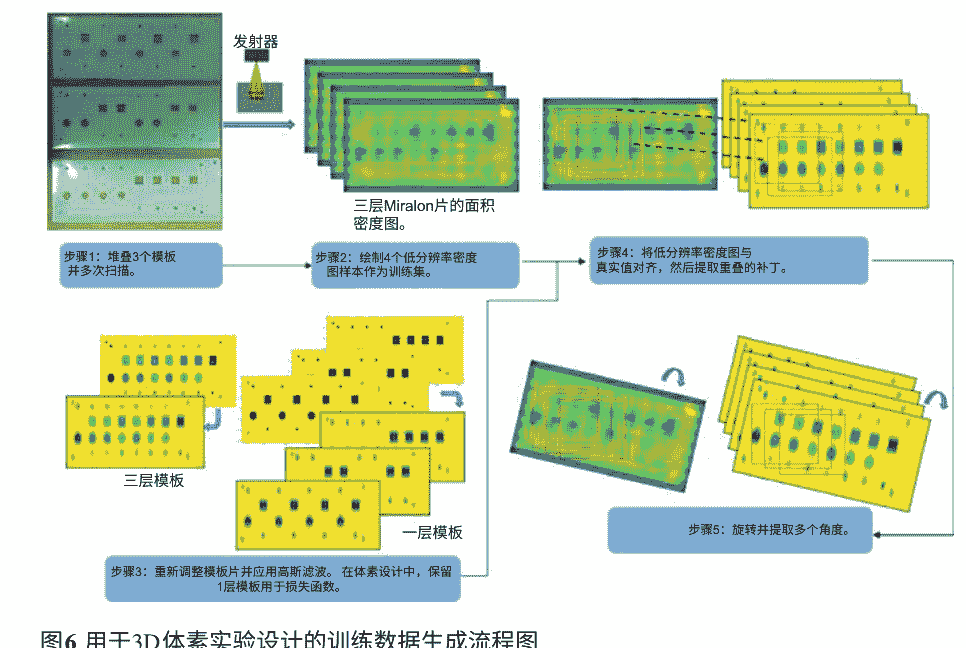

图6 用于3D体素实验设计的训练数据生成流程图

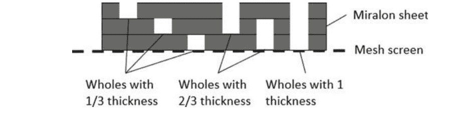

图7 三层样本的横截面。不同垂直位置上分布有1/3、2/3和1厚度的孔洞

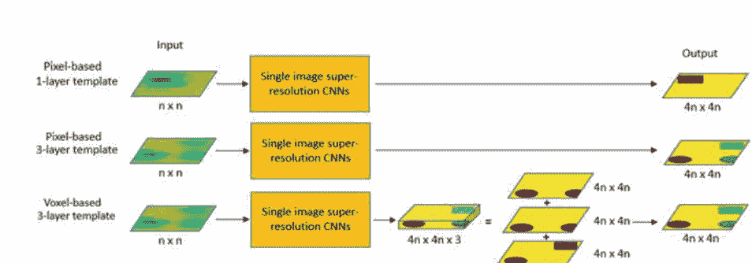

图8 不同的实验设置。输入和输出都是基于像素的2D补丁设置。在基于体素的设置中，2D补丁通过单一图像超分辨率CNNs处理成放大的3D体素补丁。然后通过压缩体素补丁的垂直轴获得高分辨率补丁。


图9 将表面以多个角度旋转，然后裁剪成体素块，以生成更多代表性的训练数据，避免过拟合

## 3.4 稀疏变换域

我们假设在特定变换域中的稀疏信号在可用数据集较小且对图像内容中的特定特征感兴趣时，比原始空间域更具代表性。对于小数据集，稀疏表示可以比原始空间域更有效地捕捉特征。特别是小波变换域是竞争选择，因为它们适用于特定的图像内容。将频率分离到不同的细节子矩阵中，为图像超分辨率CNN提供更多的源材料。如图10所示，我们在本研究中使用多通道小波表示。我们不直接使用细节矩阵，而是将从2级小波变换中获得的四个细节子矩阵折叠成一个4通道的代表，避免卷积核在不同子矩阵之间提取特征。

然而，小波的选择至关重要，因为性能取决于它对特定应用的适应程度[25]。尽管有一般的指导方针和建议


图10 小波重构代表。2级小波变换产生四个细节子矩阵。通过折叠细节子矩阵获得多通道代表

## 多层小波变换...


图11 小波域3层体素设计的架构。在进入各个CNN之前，将丢弃10%的信息。每个并行的CNN从小波稀疏代表中研究传输设备的测量，并在原始空间域中生成高分辨率图像。然后，将三个高分辨率输出压缩成3层体素输出。

虽然有关选择特定领域小波族的一般指南和建议可从文献[31−34]中获得，但我们没有足够的数据来了解Miralon区域密度图的分布，因为样本可能不能很好地代表整个人口。或者，我们采用了dropout卷积层来避免过拟合，并选择了Daubechies小波族中的db6，因为我们观察到它在从实验中揭示Miralon放置模式方面具有出色的性能。图11显示了小波域3层体素设计的架构。体素层在并行中独立训练。在进入三个层的各个CNN之前，将丢弃10%的信息。每个CNN从小波稀疏代表中研究传输设备的测量，并在原始空间域中生成高分辨率图像。请注意，各个CNN的损失函数是根据相应的1层真实值计算的。最后，将三个高分辨率输出压缩成3层体素输出。

## 4 实验结果

我们进行了几个实验，以演示我们提出的技术的有效性。首先，我们使用多个单图像超分辨率模型来比较常规基于像素的实验和我们基于体素的实验。通过重建质量和保留原始密度分布信息的质量来比较方法的性能。其次，我们将小波变换应用于3层设计，以观察Miralon板密度分布图案中的增强细节。在接下来的章节中，我们首先描述训练细节，然后讨论实验结果。

## 4.1 实施的模型

我们选择了几个文献中的模型来测试我们的架构和模型训练范例。首先，研究了体素设计和路径旋转的性能。我们利用高性能的深度残差神经网络SRResNet [14]、EDSR [15]和集成变换域神经网络EWnet [24]。对于EWnet中的多小波域，我们选择了Daubechies [35]、双正交和反双正交变换 [32, 36, 37]。除了文献中的三个算法外，我们将单一Daubechies小波变换的多域模型EWnet作为第四个模型进行了改进。我们将这个模型称为EWnet-db6，在第4.4节的结果中进行观察。然后，在观察到EWnet的过拟合问题后，我们改变了小波域的策略。SRResNet、EDSR和RCAN [23]直接在db6变换域上进行，以研究增强Miralon密度分布图案。这些算法在一台3.20 GHz Intel Core i7-8700 CPU和64 GB内存上实现。我们使用Adam优化器，学习率为10⁻³，小批量大小设置为64。

## 4.2 训练细节

我们的目标是获得一个能够表示未知贝塔传输测量的模型。给定一个低分辨率的面积密度图，经过良好训练的神经网络应该能够重建一个高分辨率的面积密度图，而不改变整体密度分布。从超分辨率结果中观察到的统计量（位置、离散度、偏度等）应与原始结果一致。用于训练模型的标签是具有几何图形孔洞的高分辨率密度图的真值。我们使用均方误差（MSE）作为目标函数。目标是

```
min \frac{1}{2N} \sum_{i=1}^{N} \in f(x_i) - x_i \in^2
```

其中 f 是神经网络的操作，x_i 表示输入。为了评估性能，使用峰值信噪比（PSNR）统计量来衡量绝对误差，使用结构相似性指数（SSIM）统计量来衡量结构相似性。以分贝（dB）为单位定义的PSNR如下：

## 4.3 实施实验

首先研究了体素设计相对于普通像素设计的优势。然后，进一步分析了小波变换在深度残差CNN上的性能。

通过与其他几种实验设置进行比较，测试了所提出的体素方法的有效性。这些差异在图8中解释。从基线开始，我们使用来自1层模板制作的样本的2D像素训练模型。不是压缩三层，而是选择一层作为训练数据的整个群体。然后将层设计添加到下一个设置中。在第二个设置中，模型将3层数据视为常规2D图像。

在最后一步中，没有必要压缩体素；模型直接输出单通道高分辨率图像。接下来，涉及到体素设计。第三个设置将未旋转的3层数据作为输入，输出三个2D补丁，然后将补丁压缩成一个2D补丁。模型只观察原始密度图中的1776个补丁。最后但并非最不重要的是，体素设计在旋转数据上进行了测试。

在之前的实验中观察到了EWnets中的过拟合问题，我们在小波变换域上调整了策略。3层设计是连续的，在不同领域上进行了比较。三个深度残差CNN分别使用原始空间图像代表、db6小波代表和带有10%丢弃信息的小波代表进行处理。在这三种情况下，都测试了基于像素的3层设计和基于体素的3层设计。

## 4.4 测试图像的重建质量

数值测试结果是在两个激光切割的低分辨率密度图样本上进行的。它们与训练样本的形状相似，但厚度不同。我们使用绝对像素准确度PSNR和结构相似性SSIM来评估每个实验设置在不同模型方面的性能。Table1反映了3层设计相对于1层设计、基于像素的设计相对于基于体素的设计以及补丁旋转的使用的优势。在所有情况下，3层实验的PSNR和SSIM值均高于1层实验。对于基于像素和基于体素的3层设计的比较，基于体素的设置在所有8个案例中的PSNR值和5个案例中的SSIM值上表现优异。所有实施的模型都生成了改进的统计数据。

Table 1 针对4倍放大因子，使用不同设置的训练和测试PSNR（以dB为单位）和SSIM。所有模型中，提出的设计生成了最高的PSNR值，而基于像素的3层模板设计在8个案例中的3个案例中提供了最佳的SSIM。

| 模型 | 实验设置 | 训练 PSNR | 训练 SSIM | 测试1 PSNR | 测试1 SSIM | 测试2 PSNR | 测试2 SSIM |
| --- | --- | --- | --- | --- | --- | --- | --- |
| SRResNet基于像素的1层模板 |  | 20.741 | 0.664 | 21.744 | 0.729 | 19.703 | 0.712 |
|  | 基于像素的3层模板 | 24.886 | 0.823 | 20.082 | 0.771 | 22.009 | 0.763 |
|  | 基于体素的3层模板（未旋转） | 22.336 | 0.550 | 17.912 | 0.410 | 17.779 | 0.406 |
|  | 基于体素的3层模板 | 18.383 | 0.534 | 25.509 | 0.655 | 25.165 | 0.645 |
| EDSR | 基于像素的1层模板 | 13.791 | 0.685 | 18.427 | 0.691 | 18.210 | 0.685 |
|  | 基于像素的3层模板 | 23.766 | 0.727 | 18.297 | 0.702 | 20.007 | 0.691 |
|  | 基于体素的3层模板（未旋转） | 22.274 | 0.751 | 20.275 | 0.674 | 21.157 | 0.679 |
|  | 基于体素的3层模板 | 21.726 | 0.723 | 25.759 | 0.700 | 26.781 | 0.730 |
| EWnet | 基于像素的1层模板 | 19.374 | 0.473 | 22.016 | 0.671 | 22.206 | 0.673 |
|  | 基于像素的3层模板 | 21.358 | 0.679 | 21.609 | 0.680 | 22.971 | 0.683 |
|  | 基于体素的3层模板（未旋转） | 24.154 | 0.801 | 9.696 | 0.591 | 9.696 | 0.591 |
|  | 基于体素的3层模板 | 26.048 | 0.978 | 22.481 | 0.701 | 23.074 | 0.725 |
| EWnet-db6 | 基于像素的1层模板 | 20.479 | 0.544 | 19.915 | 0.578 | 20.117 | 0.575 |
|  | 基于像素的3层模板 | 21.556 | 0.672 | 19.685 | 0.695 | 21.966 | 0.669 |
|  | 基于体素的3层模板（未旋转） | 22.937 | 0.781 | 21.641 | 0.618 | 21.476 | 0.616 |
|  | 基于体素的3层模板 | 17.168 | 0.511 | 22.422 | 0.698 | 22.663 | 0.693 |

来自补丁旋转的数值。数值结果表明Miralon片应用的超分辨率测量效果良好。总体而言，基于体素的3层模板设计是最具竞争力的方法。

根据表1的实验结果，调整了适应小波变换域的策略。Table2给出了在原始空间域和db6小波变换域上执行的深度残差图像超分辨率CNN的比较。参考前面实验的结论，只考虑了3层设计和补丁旋转的两种设置。小波域在PSNR值方面显示出一些优势。所有六个最高的PSNR值和一半最高的SSIM值都是从小波域生成的。

辍学层有助于SRResNet和RCAN的性能，具有变换代表性。

## 4.5 Miralon面密度图的应用

所提出方法的有效性已经通过数值进行了测试。然而，测试样本是从模板中截取的碎片，因此不能很好地代表Miralon片产品中的缺陷和分布模式。我们建议将Table1和Table2用作数值参考，并强调-

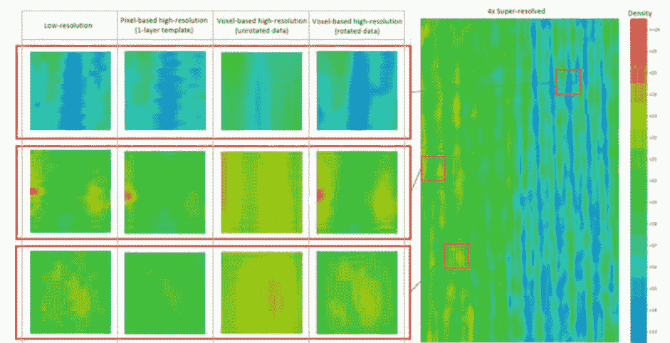

图12 从原始低分辨率密度图和高分辨率密度图中的像素为基础的设置、不进行数据旋转的基于体素的设置以及进行数据旋转的基于体素的设置的直方图。只有进行数据旋转的基于体素的设置能够很好地保留原始密度分布的信息。

在下一节中，对真实的Miralon片材产品进行视觉准确性的大小进行了说明。面积密度图的直方图证实了所提出方法的可靠性。2D高分辨率密度图和3D增强密度图分别提供了有关缺陷点和分布模式的更直观结果。

理想情况下，超分辨率面积密度图不会对密度直方图进行更改。原始低分辨率密度分布和重建的高分辨率密度分布应具有类似的高斯估计。

图12说明了超分辨率模型能够很好地保留原始密度分布的信息。当模型仅从1个模板设计中学习时，结果对于薄点和厚块过于保守。密度分布在中间范围内被平滑处理，高斯估计与原始直方图相比具有较短的尾部。相反，当模型在没有补丁旋转的3个模板体素数据上学习时，它过度拟合高密度区域。模型关注于厚缺陷，将直方图向右移动。高斯估计具有较厚的尾部，表明片材中有更多的块状物，并给结果带来了不确定性。尽管未旋转的体素数据表现不佳，但旋转的数据纠正了基于体素的3层设计的性能。在补丁旋转的帮助下，模型提供了与原始数据最接近的直方图。每个范围内的百分比与低分辨率直方图保持接近。高斯估计具有类似的均值和方差。因此，我们可以得出结论，所提出的设计在不过度拟合的情况下超分辨率地解决了面积密度图。

类似的结论可以从2D高分辨率密度图中得出一个Miralon薄片。图13显示了最近生产的Miralon薄片的局部放大图。

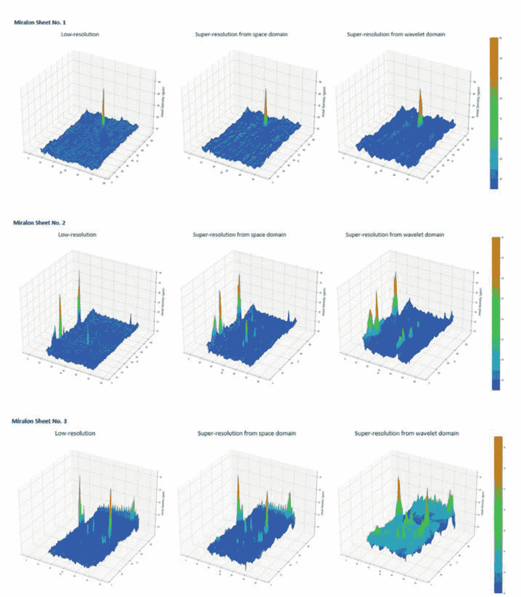

图14 三个Miralon薄片的3D高分辨率密度图。小波变换域有助于增强密度分布模式（即低密度谷和高密度山的宽度、厚度和方向），提供更直观的可视化。

## 5 结论

在这项研究中，生成了超分辨率Miralon面积密度图。借助3层体素实验设计、体素块旋转和小波变换，使用2D单图像超分辨率CNN揭示了3D细节。小训练数据集和未知因素的限制从传输设备中获得的关于贝塔粒子测量的知识已经突破。我们成功地恢复了材料中的细节纹理，这将进一步促进质量控制进程。

## 致谢

本研究由Nanocomp Technologies Inc.赞助。我们要感谢Nanocomp Technologies, Inc.团队对本研究的支持和数据生成。我们还要特别感谢Bob Casoni（质量保证经理），Rachel Stephenson博士（研究科学家）和Nick Dixon（质量工程师），他们对本研究提供了很大的帮助。

## 参考文献

1. Banerjee, S., Hemraj-Benny, T., Wong, S.S.: 单壁碳纳米管的共价表面化学. Adv. Mater. 17 (1), 17–29 (2005)
2. Ruoff, R.S., Qian, D., Liu, W.K.: 碳纳米管的力学性质：理论预测，实验测量。 C R Phys. 4(9), 993–1008 (2003)
3. Chen, J., Rao, A.M., Lyuksyutov, S., Itkis, M.E., Hamon, M.A., Hu, H., Cohn, R.W., Eklund, P.C., Colbert, D.T., Smalley, R.E., Haddon, R.C.: 全长单壁碳纳米管的溶解。 J. Phys. Chem. B 105(13), 2525–2528 (2001)
4. Miralon：美国德兰市伍德兰的Huntsman Corporation，https://www.huntsman.com/products/detail/344/miralon。引用日期：2020年8月16日
5. Shelimov, K.B., Esenaliev, R.O., Rinzler, A.G., Huffman, C.B., Smalley, R.E.: 通过超声辅助过滤纯化单壁碳纳米管。化学物理快报 285(5–6), 429–434 (1998)
6. Szegedy, C., Toshev, A., Erhan, D.: 深度神经网络用于目标检测。先进的神经信息处理系统。2553–2561 (2013)
7. Toshev, A., Szegedy, C.: Deeppose: 通过深度神经网络进行人体姿势估计。先进的计算机视觉模式识别。1653–1660 (2014)
8. Burger, H.C., Schuler, C.J.: 图像去噪：普通神经网络能与BM3D竞争吗？IEEE计算机视觉与模式识别会议。2392–2399 (2012)
9. 毛, X., 沈, C., 杨, Y.B.: 使用具有对称跳跃连接的非常深的卷积编码器-解码器网络进行图像恢复。高级神经信息处理系统。2802–2810 (2016)
10. 张, K., 左, W., 陈, Y., 孟, D.: 超越高斯降噪器: 深度卷积神经网络的残差学习用于图像降噪. IEEE图像处理. 26 (7), 3142–3155 (2017)
11. 董, C., 罗伊, C.C., 何, K., 唐, X.: 学习用于图像超分辨率的深度卷积网络. 欧洲计算机视觉会议. 184–199 (2014)
12. 崔, Z., 常, H., 单, S., 钟, B., 陈, X.: 用于图像超分辨率的深度网络级联. 欧洲计算机视觉会议. 49–64 (2014)
13. 董, C., 洛伊, C.C., 何, K., 唐, X.: 使用深度卷积网络进行图像超分辨率. IEEE模式分析与机器智能 38(2), 295-307 (2016)
14. Ledig, C., Theis, L., Husz r, F., Caballero, J., Cunningham, A., Acosta, A., Aitken, A., Tejani, A., Totz, J., Wang, Z., Shi, W.: 使用生成对抗网络的照片逼真的单一图像超分辨率. IEEE计算机学会计算机视觉模式识别会议. 4681-4690 (2017)
15. 林, B., 儿子, S., 金, H., 那, S., 李, K.: 增强的深度残差网络用于单一图像超分辨率. 在: IEEE计算机视觉模式识别工作-坊, 第136-144页 (2017)## 多层小波变换...

38. Huynh-Thu, Q., Ghanbari, M.: PSNR在预测不同视频场景、帧率下视频质量方面的准确性. 电信系统 49, 35–48 (2012)

39. Wang, Z., Bovik, A.C., Sheikh, H.R., Simoncelli, E.P.: 图像质量评估: 从误差可见性到结构相似性. IEEE图像处理 13(4), 600–612 (2004)

## 359

## 深度半监督学习用于时间序列分类

## 简·戈申霍弗

摘要 尽管深度半监督学习在计算机视觉领域引起了广泛关注，但在时间序列领域的适用性研究有限。 在本研究中，我们研究了将最先进的深度半监督模型从图像转移到时间序列分类的可行性。 我们讨论了必要的模型适应，特别是适当的模型骨干架构和定制的数据增强策略的使用。 基于这些适应性，我们通过在具有不同数量标记样本的大型公共时间序列分类问题上评估我们的方法，探索了深度半监督学习在时间序列分类背景下的潜力。 我们在一个明确现实且适当的评估方案下进行了广泛比较，统一重新实现了所有考虑的算法，这在该领域中尚缺乏。 此外，我们通过一系列实验，探讨了不同数据增强策略和模型架构在这个背景下的影响。 我们发现，这些转移的半监督模型在很少标记样本的情况下，相对于强监督、半监督和自监督的替代方法，表现出显著的性能提升。

## 1 引言

时间序列分类（TSC）涵盖了許多现实世界的应用领域，从医疗保健[34]到网络安全[38]再到制造业（Dau等人[12]）。 多年来已经提出了几种用于TSC的算法（Bagnall等人[2]；Fawaz等人[13]）。

在许多现实世界的场景中，时间序列数据可以很容易地收集，但是为这些数据获取标签是昂贵的。 例如，在疾病监测中，传感器数据可以轻松收集，但是对这些数据进行标记需要医学专家耗费大量时间（Goschenhofer等人[16]）。 半监督学习（SSL）

J. Goschenhofer (✉)
科伦坡大学计算机学院，科伦坡，斯里兰卡
e-mail: jann.goschenhofer@stat.uni-muenchen.de

© 作者，独家许可给 Springer Nature Singapore Pte Ltd. 2023
M. A. Wani 和 V. Palade（编辑），深度学习应用，卷4，
智能系统与计算进展1434，
https://doi.org/10.1007/978-981-19-6153-3_15

通过利用大量未标记的数据与少量标记的数据进行机器学习（ML）模型训练，解决了这个问题。

特别是在计算机视觉领域，深度神经网络的进步和SSL的标签效率承诺，引入了几种创新的图像数据方法（Van Engelen和Hoos [42]）。虽然关于传统半监督模型在TSC上的研究很多，但是对于基于神经网络的SSL算法在TSC上的研究仍然有限。

这激发了我们在这项工作中全面探讨的主要研究问题：我们能否将在图像领域中得到确认的深度半监督模型转移到时间序列领域？更具体地说，我们通过为FixMatch（Sohn等人[37]），MixMatch（Berthelot等人[6]）和Virtual Adversarial Training提出适应性的方法来回答这个问题。

(Miyato等人[29])，Mean Teacher (Tarvainen和Valpola [40])和Ladder Net (Rasmus等人[35])。这些包括适当骨干结构的修改以及适应适当数据增强策略的调整以解决这些模型的领域转移问题。为了证明我们提出的框架的有效性，我们遵循半监督模型的实际评估最佳实践并提供了一个公正可靠的模型比较，具有很高的实用性 (Oliver等人[31])。

## 1.1 相关工作

## 1.1.1 时间序列分类

在过去的几年中，已经开发了各种方法用于TSC。关于专门为TSC开发的经典ML方法的详细概述(Grabocka等人[17]；Bagnall等人[3]；Kate [21])可以在[2]中找到。TSC的另一种替代方法是从原始时间序列中提取统计特征作为训练任何强大的表格数据分类器的基础(Christ等人[10])。在深度学习中，也开发了特定的时间序列分类方法(Wang [4, 14, 46])。关于这些最新进展的综述可以在[13]中找到。

## 1.1.2 半监督学习

存在着大量从未标记数据中提取额外信息的不同概念，通过半监督方法。这些方法包括扩展监督机器学习方法，如半监督支持向量机（Vapnik [43]）或半监督增强（Mallapragada等人[27]），以及固有的半监督方法，如标签传播（Zhu和Ghahramani [53]），流形正则化（Belkin等人[5]）或协同训练（Blum和Mitchell [7]）。[8]对这些半监督方法进行了详细的概述。还有越来越多的

## 1.1.3 半监督时间序列分类

针对TSC，已经开发了不同的经典半监督模型。在他们的基础工作中，[47]提出了一种将伪标签与最近邻模型相结合的方法，用于不平衡的二分类TSC任务。 这种基于聚类然后标记的方法(Van Engelen和Hoos [42])，通过自定义距离度量也被应用于DTW-D (Chen等人 [9])，SUCCESS (Chen等人 [28])或LC LC (Nguyen等人 [30])等方法中。 图形化的标签传播方法(Zhu和Ghahramani [53])与时间序列特定的距离度量相结合，由(Xu和Funaya [49])和(Wang等人 [45])引入了基于形状特征的SSSL。此外，对于TSC，基于神经网络的方法也有大量的研究。[50]在三个多变量人体活动识别(HAR)数据集上应用了基于FCN架构(Rasmus等人 [46])的定制版本的LadderNet (Rasmus等人 [35])。 他们报告了半监督模型相对于有限标记样本的监督基准的相对增益。 在这个背景下，[50]是第一个评估大规模多变量TSC数据集上的SSL方法。 一种自监督方法，模型在仅有标记数据的初始监督分类任务之外，还在整个数据集上进行辅助预测任务的联合训练，由[20]引入。 他们在UCR仓库(Dau等人 [12])的一部分较小的单变量TSC数据集上构建了[45]的基准，并报告了与大多数上述方法以及基于时间序列问题的定制版 Π−Model (Laine和Aila [24])相比的最新性能。 与[50]一致，他们报告了在仅有少量标记样本的情况下，深度监督基准FCN (Wang等人 [46])的特别强大的模型性能，超过了所有上述经典半监督模型。

这个深度学习基准模型在所有经典的半监督模型中表现出色并且几乎总是击败了Π−模型。我们在实验中将这种方法作为自监督基准线。

## 1.1.4 限制

尽管[50]的工作，但目前所有半监督TSC模型比较都局限于最大1000个训练样本的单变量时间序列数据集。与计算机视觉领域关于SSL的研究（Van Engelen和Hoos [42]）相比，这些模型比较在绝大多数实验中都是针对固定的标记样本相对数量进行的，这使得很难推断出不同数据情况下的一般信息。它们也不符合[31]关于图像数据上SSL的指导方针，并且没有包括重复的模型运行来考虑标记样本选择的随机性。另一个问题是缺乏公开可访问的经典方法的半监督TSC实现，这使得无法对这些方法进行验证。

这反过来导致了一个问题，即与现有方法进行模型比较仅仅依赖于以前工作中报告的数值，而这些数值是基于部分不透明的数据集划分和未标记的过程。

## 1.1.5 贡献

我们的主要贡献可以总结如下：（1）我们提出了五种新的用于时间序列分类的深度半监督学习算法，并描述了调参参数和有意义的数据增强策略。此外，我们（2）研究了深度半监督学习在时间序列分类领域的适用性，并提供了关于所提方法在哪些设置下表现良好以及与现有方法的比较的见解。通过这些实验，我们（3）能够确定出我们提出的五种方法中有三种明显优于现有方法，并在一系列额外实验中，我们（4）提供了关于不同数据增强策略和架构骨干在这个背景下的作用的见解。

## 从图像到时间序列

## 2.1 问题表述

我们将等距时间序列定义为 x^{(i)} = \{\{x_{1,1}^{(i)}, \dots, x_{1,t}^{(i)}\}, \dots, \{x_{c,1}^{(i)}, \dots, x_{c,t}^{(i)}\}\}，其中 t 描述长度，描述协变量的数量，x^{(i)} \in \mathcal{X} \subseteq \mathbb{R}^{c \times t}。对于 c = 1 的时间序列称为单变量，对于 c > 1 的时间序列称为多变量。在输入空间\mathcal{X}旁边，我们使用 y^{(i)} \in \mathcal{Y} 来表示目标空间 \mathcal{Y} 中的分类变量。

## 2.2 主干架构

在深度学习中，图像的基本构建块是一个三维张量，而时间序列可以表示为具有通道数对应协变量数量的二维张量。 将强大的图像分类架构的构建块扩展到时间序列分类是直接的，但选择正确的主干架构至关重要。我们建议使用全卷积网络（FCN）（Wang等人[46]）作为主干架构，因为它在44个不同的时间序列分类问题上表现优于各种模型，并且在半监督时间序列分类相关工作中被使用（Jawed等人[20]）。 在第2.4节讨论的所有基于正则化的半监督方法中，除了Ladder Net（Rasmus等人[35]）外，网络架构可以与模型训练策略分离。这使得我们可以用FCN替换许多已建立的图像分类SSL方法的主干架构。在Ladder Net的情况下，我们将解码器设计为FCN编码器的镜像版本（见第2.4节）。在一个更大的用于不同手写识别任务的基准测试中[32]，提出了CNN-LSTM：一个由类似于FCN的CNN层组成的多变量时间序列分类架构，后面跟着一个LSTM头来捕捉CNN特征中的时间结构。 通过广泛的基准测试，CNN-LSTM始终表现出强大的模型性能。 除了CNN-LSTM [14]成功地将图像到时间序列分类引入了Inception模块（Szegedy等人[39]），这已成为另一个在时间上表现出色的TSC架构。

虽然我们在第1节的主要实验中依赖FCN作为骨干，但我们在第5节中提供了使用CNN-LSTM和InceptionTime的额外实验结果。在其中，我们对CNN-LSTM使用与[32]相同的超参数，并设置n_f=64和depth=12用于InceptionTime。

## 2.3 数据增强

基于正则化的半监督方法的一个关键组成部分是向模型中注入随机噪声。 应该设计数据增强策略g(x^(i))，g:X→X，以扰动样本的输入x^(i)，同时

## 2.4 方法

均值教师（Tarvainen和Valpola [40]）是一系列基于一致性正则化的模型（如Temporal Ensembling或II-Model（Laine和Aila [24]））的继承者，经验证实际上优于其前身（Oliver等人[31]）。因此，教师模型，即连续学生模型的平均值，用于在模型训练过程中强制执行模型预测的一致性。

虚拟对抗训练（VAT）也侧重于一致性正则化（Miyato等人[29]）。与对抗性示例（Goodfellow等人[15]）类似，一个

## 3.2 数据集

我们在六个公开可用的数据集上评估上述半监督模型的性能。与以前的工作（Jawed等人[20, 45, 49]）相比，我们明确关注至少有1000个观测值的大型数据集。它们的主要特征在表1中描述。

通过Crop、ElectricDevices和FordB，我们包含了UCR时间序列分类库（Dau等人[12]）中最大的三个数据集。此外，我们还使用了两个多变量HAR数据集Pamap2（Reiss和Stricker[36]）和WISDM（Kwapisz等人[23]）。我们还在Satellite Image Time Series（SITS）数据集（Petitjean等人[33]）的平衡类别版本上评估了模型。

表1 所使用数据集的特征，其中 c 表示协变量的数量，Size 表示整个训练数据集的大小，Length 表示时间序列的长度。

| 姓名        | 类别 | 大小    | 长度 | c | 平衡 |
|-------------|------|---------|------|---|------|
| Crop        | 24   | 7,200   | 46   | 1 | √    |
| ElectricDevices | 7  | 8,926   | 96   | 1 | X    |
| FordB       | 2    | 3,636   | 500  | 1 | √    |
| Pamap2      | 13   | 11,313  | 100  | 6 | X    |
| WISDM       | 6    | 10,727  | 80   | 3 | X    |
| 平衡SITS    | 6    | 35,064  | 46   | 1 | √    |

## 3.3 评估、调优和实现

由于特殊因素，例如标记数据点的选择，对半监督模型的性能进行公正和公平的比较对于获得现实的视角尤为重要（Van Engelen和Hoos[42]）。我们遵循[31]关于半监督模型实际评估的准则，以确保可靠和公正的实验结果。对于SSL模型的性能评估，标准程序是将完全标记的数据集 $D$ 分割为带标签和不带标签的数据集 $D^l$ 和 $D^u$，通过对随机抽取的样本进行人工去标记（Van Engelen和Hoos[42]）。这样，可以模拟不同数量标记样本 $l$ 的半监督数据设置。我们以分层方式进行去标记，以保留数据集的标签分布。对于以下实验，我们将一个模型 $f$ 在一个数据集 $D$ 上的评估分为两个不同的阶段。

## 3.3.1 调整阶段

在调整阶段，我们使用固定数量的标记样本对模型进行调整 $f$，以获得最佳的超参数集合 $\theta^* $。因此，$f$ 是在一个训练数据集 $D_{train} = (D^l_{train}, D^u_{train})$ 上进行训练的，其中我们固定 $|D^l_{train}| = 500$，并在一个带标签的验证集 $D_{val}$ 上进行验证。选择 $D_{val}$ 的大小是根据最近的讨论确定的（Rasmus等人[35]；Oliver等人[31]；Zhai等人[51]）。大的 $D_{val}$ 预计会为模型调整提供稳定的结果，这对于许多对超参数敏感的半监督模型来说非常重要，但与这些模型在少量标记数据的情况下的实用性承诺相矛盾。[31,51] 给出了关于这种权衡的初步见解，它们在较小的实验中经验性地表明，当 $|D_{val}| = 1000$ 时，性能估计的方差仍然足够低，可以进行合理的模型选择。因此，我们将标记验证集的大小设置为 $|D_{val}| = 1000$，与最近的文献相比，这是相当小的 $|D_{val}| \geq 4000$（Miyato等人[29]；Laine和Aila[24]；Tarvainen和Valpola[40]）。一个单独的标记测试集 $D_{test}$，其大小为 $|D_{test}| = 2000$，被保留用于评估阶段。调整使用了Hyperband（Li等人[25]）和Optuna框架（Akiba等人[1]）中实现的随机抽样，每个深度学习模型和数据集的固定预算为100个GPU小时。我们使用加权曲线下面积（wAUC）来衡量模型的性能，以考虑模型的校准和类别不平衡。

## 3.3.2 评估阶段

在评估阶段，我们使用不同数量的标签 $n_l \in \{50, 100, 250, 500, 1000\}$ 对 $D_{train}$ 进行训练，最多进行25000次模型更新步骤，假设 $\theta^*$ 也是适合于标签数量 $n_l = 500$ 的超参数集。这些标签数量 $n_l$ 是模型没有专门调整的情况下的数量。这种评估方案与之前的工作一致。

关于图像数据的SSL的研究（Berthelot等人[6]；Oliver等人[31]）模型性能在 $D_{val}$ 上进行跟踪，并使用在验证性能最好的模型检查点进行保留 $D_{test}$ 上的推断。特别是对于小规模的标签数量 $n_l$，特别是选择（非）信息性的标记样本对模型性能有重大影响。为了考虑到在 $D_{train} = (D^l_{train}, D^u_{train})$ 的unlabelling gsp'it中可能出现的（非）幸运选择，我们重复这个unlabelling步骤5次。对于ML基准模型，我们使用随机搜索进行调整阶段，预算为100个模型评估，并在评估阶段使用相同的一组值对其进行评估，其中包括$n_j$。请参阅附录中的表6以获取具体范围。所有深度学习模型都是在一个统一的代码库¹中实现的，并使用Adam优化器（Kingma和Ba[22]）进行训练，除了学习率和权重衰减之外，所有参数都设置为默认值。我们在一个统一的框架中从头开始实现了所有深度学习模型，并根据在图像分类任务上报告的性能指标验证了我们的实现。

## 4 实验结果

实验结果可在附录的图1和表4中进行可视化。在六个数据集上，不同模型的排名，平均值显示在附录的图2和表5中。

## 4.1 主要结果

## 4.1.1 半监督模型优于有监督基准模型

总体而言，我们的结果表明，半监督模型在有限标记数据的情况下优于基准模型。半监督模型相对于有监督模型的性能增益随着标记数据的增加而减小，我们发现在大多数情况下，所有模型都受益于更多的标记样本，这一发现也与SSL文献[42]一致。

## 4.1.2 深度半监督学习在时间序列分类中表现良好

根据我们在图1中的实验结果，我们推断将已建立的半监督模型从图像领域转移到时间序列领域是可行的。我们发现深度半监督模型，特别是转移的MixMatch、FixMatch和VAT，在所有六个数据集上相对于深度有监督基准模型都有显著的性能提升，甚至在 $n_l = 500$ 时也能达到。

## 4.1.3 强基线至关重要

使用强基线对于获得半监督学习方法的实际性能有着重要意义（Ojiver等人[31]），我们的实验结果进一步支持这种对强基线的需求。例如，Mean Teacher在大多数数据集上表现较差，甚至比监督基线还差。这些实验结果与[20]的结果一致，他们在模型比较中还包括了μ-Mode<sub>l</sub>，与Mean-Teacher的设计非常相似，深度监督基线。另一方面，对于小的n<sub>i</sub>，随机森林的强大性能也强调了对现实强大的监督基线的需求。

## 4.1.4 提出的方法优于现有的半监督方法

与[50]一致，我们还发现梯度网络优于其他有监督方法。尽管相对于有监督基线模型有性能提升，但我们观察到梯度网络在与FixMatch、MixMatch和VAT等其他半监督算法相比时表现明显较差。这种不同的性能可能源于梯度网络的大量超参数以及对这些超参数不同设置的敏感性。我们进一步将这种有些预期的结果解释为从纯重建方法转向包含复杂先验任务的更复杂自监督方法的一种表达。

## 4.1.5 提出的方法优于自监督建模

与[20]类似，我们发现他们的自监督方法在性能上要么更好，要么至少与深度有监督基线模型相当。此外，我们能够证明我们对他们方法的天真扩展在两个多变量时间序列数据集WISDM和Pamap2上也表现良好。尽管相对于有监督基线模型有性能提升，但是在所有六个数据集上，MixMatch、FixMatch和VAT等提出的方法在不同标签数量下始终优于这种自监督方法。我们假设这进一步证明了一致性正则化的能力。尽管如此，我们还想强调FixMatch中使用的一致性正则化方法。

## 4.2 附加实验

除了第4节中的主要结果外，我们还希望提供关于使用(a) 不同的数据增强程序和 (b) 比 [46] 中的 FCN 更复杂的模型架构的更多见解。对于这些附加实验，我们使用了Electric Devices、Pamap2 和 SITS 数据集。我们明确选择了这三个数据集，因为它们提供了相对较大的训练数据集，不包含太多类别，并跨不同领域的遥感、生产和人类活动识别的单变量和多变量时间序列。此外，我们将标记样本的数量固定为 $n_l = 500$。

## 4.2.1 数据增强

如第2节所述，我们使用 RandAugment 作为针对 TSC 的各种数据增强策略的包器。对于 TSC 来说，最合适的数据增强程序的选择仍然是一个开放的研究问题，最近的基准提供了不明确的建议，因为这取决于各自 TSC 任务的领域 (Iwana 和 Uchida [19]) (Wen 等人 [48])。

然而，我们希望揭示不同领域数据集中单一数据增强过程的规模和复杂性。因此，我们创建了一个小型、一个中型和一个大型的过程池，其复杂性逐渐增加，如表2所总结，详细描述了单一过程的内容请参考[19]。我们将RandAugment超参数固定为N=2，magnitude=3，因为在广泛的调整阶段中，这些值被证明是合理的默认值，并且按照第3.3节中描述的过程在测试集上评估了所有模型。FCN架构在这三个模型中都被用作骨干。

在图3中，我们展示了两个半监督模型FixMatch和VAT以及一个有监督模型在Electric Devices、Pamap2和SITS数据集上对不同的RandAugment过程池大小的性能，标签数量固定为500。特别是在电子设备和Pamap2数据集上，我们发现Fixmatch从增加池大小和数据增强复杂性中受益最多。我们假设这是由于FixMatch中大量使用一致性正则化，该正则化依赖于对图像数据进行大量数据增强的结果[37]。此外，Pamap2和ElectricDevices包含相对较长的、甚至是多变量的时间序列，而不是SITS。因此，这两个数据集可能更多地受益于更强的数据增强，因为它们本质上更复杂。值得注意的是，在时间序列分类中，数据增强方法的有效性高度依赖于领域特定性(Iwana和Uchida [19])。此外，我们观察到将池大小从中等增加到大型对监督模型略有不利，而对VAT来说，更复杂的程序集并不受益，也不会对其性能产生不利影响。在这三个数据集中，我们观察到中等池大小相对于小型池大小能够提供更强的模型性能。从实践者的角度来看，这一系列较小的实验表明，人们应该

## 4.2.2 主干架构

我们在第4节的主要结果中使用FCN [45] 作为主干架构，因为它在不同基准测试中具有强大的基准性能，并且设计简单，是TSC [13] 的合理默认主干。除了FCN之外，我们还研究了更复杂的主干架构对监督和半监督学习的适用性，即MixMatch和VAT。因此，我们使用CNN-LSTM [32] 作为FCN的更高级版本，使用InceptionTime主干 [14]，该主干引入了计算机视觉基于架构 [39] 的Inception模块到TSC中。所有模型都在相同的时间预算下进行了调整，按照第3.3节中概述的评估策略，在 $n_l = 500$ 的情况下呈现了三个数据集的结果。

从Table3中，我们首先观察到，虽然骨干架构的选择对于各个模型的性能有影响，但这种影响并不显著。例如，我们在Electric Devices数据集上发现，有监督模型的最大绝对性能差距为0.016wAUC。我们进一步确认了FCN架构作为强大基准的作用，这与[46]的观点一致，并支持我们选择它作为主要实验的骨干架构。在所有三个模型中，使用精心设计的骨干架构仍然可以带来显著的性能提升。例如，在Pamap2数据集上观察到MixMatch使用InceptionTime骨干架构相比CNN-LSTM骨干架构可以使性能绝对增加0.011wAUC。从从业者角度来看，这些结果表明，虽然最佳的骨干架构可以在一定程度上提升性能，但FCN骨干架构是一种合理的选择，无论是有监督还是半监督的时间序列分类。

## 表3 骨干架构FCN（Wang等人[46]）、CNN-LSTM（Ott等人[32]）和InceptionTime（Fawaz等人[14]）对监督模型、VAT和MixMatch在三个数据集上的性能的影响，对于固定的n=500

|              | 电子设备         | 监督 | VAT   | MixMatch |
|---------------|------------------|------|-------|----------|
| FCN           | 0.904 (0.019)    | 0.907 (0.022) | **0.917 (0.013)** |
| CNN-LSTM      | **0.920 (0.004)** | **0.918 (0.004)** | **0.905 (0.004)** |
| InceptionTime | **0.920 (0.009)** | **0.913 (0.012)** | **0.916 (0.003)** |
|              | Pamap2            | 监督 | VAT   | MixMatch |
|              | 0.943 (0.004)     | **0.952 (0.012)** | **0.934 (0.007)** |
| FCN           | 0.943 (0.004)     | **0.952 (0.012)** | **0.934 (0.007)** |
| CNN-LSTM      | **0.959 (0.002)** | **0.929 (0.005)** | **0.915 (0.005)** |
| InceptionTime | 0.958 (0.004)     | **0.955 (0.005)** | **0.946 (0.001)** |
|              | SITS              | 监督 | VAT   | MixMatch |
|              | 0.955 (0.001)     | **0.961 (0.001)** | **0.956 (0.006)** |
| FCN           | 0.955 (0.001)     | **0.961 (0.001)** | **0.956 (0.006)** |
| CNN-LSTM      | **0.964 (0.001)** | 0.960 (0.003)  | **0.959 (0.001)** |
| InceptionTime | 0.962 (0.001)     | 0.959 (0.001)  | **0.956 (0.001)** |

## 5 结论

在这项工作中，我们研究了现代半监督学习方法从计算机视觉的初始领域向时间序列数据的分类转移的可行性。我们在六个具有挑战性的基准数据集上进行了一系列实验，并描述了实现这种转移所需的必要变化。因此，我们进一步阐明了数据增强策略和骨干模型架构在这个背景下的作用。我们的结果表明，现代深度半监督模型方法所承诺的标签效率在时间序列分类问题上得到了很好的体现。此外，这些发现表明使用来自图像领域的强半监督模型，因为这些转移模型的性能比目前针对时间序列分类的半监督和自监督方法更强。我们相信，这项工作，也得益于对公平可靠模型比较的重视，可以为未来半监督学习在时间序列分类中的研究进展奠定基础。

## 附录

## 5.1 模型性能

见表4.## 表4 不同标签数量的数据集上模型的结果。每个n-数据集的最佳结果以粗体显示，并在括号中给出五次重复实验的标准差。

性能以加权AUC衡量。

| 模型     | 标签数量 | 数据集 | Crop | 电子设备 | FordB | Pamap2 | SITS | WISDM | 电子设备 | Crop | FordB | Pamap2 | SITS | WISDM |
|----------|---------|--------|-----|---------|------|--------|-----|------|---------|-----|------|--------|-----|------|
| 梯子     | 50      | 0.797  | 0.815 | 0.816   | 0.897 | 0.821  | 0.784 | 0.869 | 0.908   | 0.908 | 0.908 | 0.908  | 0.908 | 0.908 |
| 逻辑回归 | 100     | 0.846  | 0.771 | 0.496   | 0.840 | 0.829  | 0.817 | 0.848 | 0.876   | 0.869 | 0.869 | 0.869  | 0.869 | 0.869 |
| 均值教师 |         | 0.853  | 0.692 | 0.745   | 0.862 | 0.838  | 0.799 | 0.797 | 0.795   | 0.915 | 0.871 | 0.871  | 0.871 | 0.871 |
| 教师     |         | 0.881  | 0.881 | 0.881   | 0.902 | 0.932  | 0.932 | 0.891 | 0.918   | 0.912 | 0.95  | 0.95   | 0.95  | 0.95  |
| MixMatch |         | 0.910  | 0.862 | 0.862   | 0.922 | 0.948  | 0.948 | 0.884 | 0.884   | 0.884 | 0.884 | 0.884  | 0.884 | 0.884 |
| 随机森林 |         | 0.881  | 0.862 | 0.862   | 0.883 | 0.883  | 0.883 | 0.883 | 0.883   | 0.883 | 0.883 | 0.883  | 0.883 | 0.883 |
| 自监督   |         | 0.868  | 0.832 | 0.772   | 0.895 | 0.904  | 0.904 | 0.882 | 0.79    | 0.916 | 0.959 | 0.959  | 0.959 | 0.959 |
| 监督     |         | 0.811  | 0.779 | 0.745   | 0.719 | 0.841  | 0.841 | 0.788 | 0.85    | 0.921 | 0.957 | 0.957  | 0.957 | 0.957 |
| VAT      |         | 0.880  | 0.832 | 0.832   | 0.921 | 0.941  | 0.941 | 0.871 | 0.789   | 0.865 | 0.965 | 0.965  | 0.965 | 0.965 |
| FixMatch |         | 0.886  | 0.748 | 0.792   | 0.776 | 0.923  | 0.946 | 0.823 | 0.881   | 0.947 | 0.969 | 0.969  | 0.969 | 0.969 |

## 模型排名

见表5。

表5基于六个不同数据集上wAUC的所有模型的平均排名n_l。较低的排名表示更强的模型性能。由于对数据集进行平均，排名显示为小数

| 数据集 | 标签数量 | 50 | 100 | 250 | 500 | 1000 |
|--------|---------|---|----|-----|-----|------|
| MixMatch | 1.8 | 2.0 | 2.0 | 2.2 | 2.2 |
| FixMatch | 3.8 | 2.8 | 2.5 | 3.3 | 2.2 |
| VAT     | 3.2 | 3.7 | 2.8 | 3.0 | 3.2 |
| MeanTeacher | 7.5 | 7.2 | 6.2 | 6.3 | 5.8 |
| 自监督  | 4.7 | 4.7 | 4.5 | 4.7 | 4.8 |
| 梯子    | 4.7 | 6.2 | 6.5 | 7.2 | 7.5 |
| 监督    | 7.2 | 5.3 | 5.8 | 3.3 | 3.5 |
| 随机森林 | 3.8 | 4.5 | 5.5 | 6.0 | 6.3 |
| 逻辑回归 | 7.8 | 8.5 | 8.0 | 8.2 | 8.0 |

## 超参数

见表6。

表6 用于调整不同模型的超参数范围。深度学习模型通过Hyperband进行调优，如第3节所述，而随机森林和逻辑回归则通过随机搜索进行调优，每个模型评估的预算为100个

| 参数         | 范围                     | 尺度 |
|--------------|--------------------------|------|
| **共享**     |                          |      |
| 权重衰减     | [1e-6; 1e-2]              | log  |
| 学习率       | [1e-5; 1e-2]              | log  |
| 斜坡长度     | [5000; 25000]              | 线性 |
| 幅度（RandAug） | [1; 10]                 | 线性 |
| N (RandAug)  | [1; 6]                   | 线性 |
| **VAT**      |                          |      |
| ε            | [0.1; 10.0]               | 线性 |
| α            | [0.1; 5.0]                | 线性 |
| **MixMatch** |                          |      |
| α            | [0.5; 1.0]                | 线性 |
| λ_u          | [0.0; 150.0]               | 线性 |
| **FixMatch** |                          |      |
| τ            | [0.75; 0.99]               | 线性 |
| λ_u          | [0.0; 10.0]                | 线性 |
| **自监督学习** |                      |      |
| λ            | [0.1; 10]                 | log  |
| 水平 h       | [0.1, 0.2, 0.3]            | 离散 |
| 步幅 s       | [0.05, 0.1, 0.2, 0.3]        | 离散 |
| **梯度网络** |                          |      |
| 噪声比       | [0.1, 0.3, 0.45, 0.6]        | 离散 |
| 损失权重     | [0.1; 10.0]                | log  |
| **均值教师** |                          |      |
| α_ema        | [0.9; 1.0]                 | log  |
| w_max        | [0; 10]                   | 线性 |
| **随机森林** |                          |      |
| 树的数量     | [100; 1000]                | 线性 |
| 最大树深度   | [3; 25]                   | 线性 |
| **逻辑回归** |                          |      |
| 正则化项     | [无, L₁, L₂]               | 离散 |

参考文献

1. Akiba, T.等：Optuna：下一代超参数优化框架。在：第25届ACMSIGKDD国际知识发现与数据挖掘会议论文集，第2623-2631页（2019年）
2. Bagnall, A., Lines, J., Bostrom, A., 等：时间序列分类大比拼：最近算法进展的回顾和实验评估。数据挖掘与知识发现，31(3)，606-660 (2017)
3. Bagnall, A., Lines, J., Hills, J., 等：基于转换集成的时间序列分类。IEEE知识与数据工程，27(9)，2522-2535 (2015)
4. Bai, S., Kolter, J.Z., Koltun, V.：通用卷积和循环网络在序列建模中的实证评估。CoRR (2018)
5. Belkin, M., Niyogi, P., Sindhwani, V.：流形正则化：从有标签和无标签示例中学习的几何框架。机器学习研究，7，2399-2434 (2006)
6. Berthelot, D., 等：MixMatch：半监督学习的整体方法。神经信息处理系统进展，32，5049-5059 (2019)
7. Blum, A., Mitchell, T.：使用协同训练结合标记和未标记数据。在：计算学习理论第十一届年会论文集，第92-100页（1998）
8. Chapelle, O., Scholkopf, B., Zien, A.：半监督学习。麻省理工学院出版社，第508页（2006）
9. 陈, Y.等：DTW-D：基于单个示例的时间序列半监督学习。在：第19届ACM SIGKDD国际知识发现和数据挖掘会议论文集，第383-391页（2013）
10. Christ, M.等：基于可扩展假设检验的时间序列特征提取（tsfresh-A Python包）。在：神经计算，第72-77页（2018）
11. Cubuk, E.D.等：Randaugment：具有减少搜索空间的实用自动数据增强。在：IEEE/CVF计算机视觉和模式识别会议研讨会论文集，第702-703页（2020）
12. Dau, H.A.等：UCR时间序列存档（2019年）。arXiv:1810.07758 [cs.LG]
13. Fawaz, H.I., Forestier, G.等：时间序列分类的深度学习综述。数据挖掘与知识发现 33(4)，917–963 (2019)
14. Fawaz, H.I., Lucas, B.等：Inceptiontime：寻找时间序列分类的AlexNet。数据挖掘与知识发现 34，1936–1962 (2020)
15. Goodfellow, I.等：生成对抗网络。神经信息处理系统进展 27，2672–2680 (2014)
16. Goschenhofer, J.等：基于可穿戴设备的帕金森病严重程度监测，使用深度学习。在：机器学习和知识发现的欧洲联合会议数据库，第400–415页。Springer (2019)
17. Grabocka, J.等：学习时间序列形状特征。在：第20届ACM SIGKDD国际会议上的知识发现与数据挖掘，第392-401页（2014年）
18. Iscen, A.等：用于深度半监督学习的标签传播。在：IEEE计算机视觉和模式识别会议论文集，第5070-5079页（2019年）
19. Iwana, B.K., Uchida, S.：关于神经网络中数据增强的实证调查，用于时间序列分类。Plos one 16(7)，e0254841（2021年）
20. Jawed, S., Grabocka, J., Schmidt-Thieme, L.：用于半监督时间序列分类的自监督学习 。在：第24届Pacific-Asia知识发现与数据挖掘会议，PAKDD 2020，第499-511页（2020年）
21. Kate, R.J.：使用动态时间扭曲距离作为改进时间序列分类的特征。数据挖掘知识发现 。30(2)，283-312（2016年）
22. Kingma, D.P., Ba, J.：Adam：一种随机优化方法。在：第三届国际学习表示会议，ICLR 2015（2015年）
23. Kwapisz, J.R., Weiss, G.M., Moore, S.A.：使用手机加速度计进行活动识别。ACM SigKDD Explorat. Newsl. 12(2)，74-82（2011年）
24. Laine, S., Aila, T.：半监督学习的时间集成。在：第五届国际学习表示会议，ICLR 2017（2017年）

## 用于时间序列分类的深度半监督学习

25. Li, L., 等：Hyperband：一种基于赌博机的超参数优化方法。J. Mach. Learn. Res. 18(1), 6765-6816（2017年）

26. 罗, Y. 等：用于半监督学习的教师图上的平滑邻居。在：IEEE计算机视觉和模式识别会议论文集，第8896-8905页（2018）

27. Mallapragada, P.K. 等：Semiboost：用于半监督学习的增强。IEEE Trans. Pattern Anal. Mach. Intell. 31(11), 2000-2014（2008）

28. Marussy, K., Buza, K.：SUCCESS：一种新的半监督时间序列分类方法。在：国际人工智能与软计算会议论文集，第437-447页（2013）

29. Miyato, T. 等：虚拟对抗训练：一种用于监督和半监督学习的正则化方法。IEEE Trans. Pattern Anal. Mach. Intell. 41(8), 1979-1993（2019）

30. Nguyen, M.N., Li, X.-L., Ng, S.-K.：用于时间序列分类的正样本未标记学习。在：第二十二届国际人工智能联合会议论文集，IJCAI-11（2011年）

31. Oliver, A., 等：深度半监督学习算法的实际评估。Adv. Neural Inf. Process. Syst. 31, 3235-3246（2018年）

32. Ott, F. 等：基于IMU增强笔的在线序列到序列和基于字符的手写识别基准测试。arXiv预印本 arXiv:2202.07036

33. Petitjean, F., Inglada, J., Gancarski, P.：时间扭曲下的卫星图像时间序列分析。IEEE Trans. Geosci. Remote Sens. 50(8), 3081-3095（2012年）

34. Rajkomar, A. 等：基于电子健康记录的可扩展准确的深度学习。NPJ Digital Med. 1(1), 18（2018年）

35. Rasmus, A. 等：具有阶梯网络的半监督学习。神经信息处理进展。系统。28, 3546-3554（2015）

36. Reiss, A., Stricker, D.：引入一种新的用于活动监测的基准数据集。在：2012年第16届国际可穿戴计算机研讨会，第108-109页（2012）

37. Sohn, K. 等：FixMatch：通过一致性和自信度简化半监督学习。在：CoRR（2020）。arXiv:2001.07685

38. Susto, G.A., Cenedese, A., Terzi, M.：时间序列分类方法：回顾和应用于电力系统数据。在：大数据应用于电力系统，第179-220页。爱思唯尔（2018）

39. Szegedy, C. 等：重新思考计算机视觉中的初始架构。在：IEEE计算机视觉和模式识别会议论文集，第2818-2826页（2016）

40. Tarvainen, A., Valpola, H.：平均教师是更好的榜样：加权一致性目标改善半监督深度学习结果。Adv. Neural Inf. Process. Syst. 30, 1195-1204（2017）

41. Um, T.T. 等：使用卷积神经网络对可穿戴传感器数据进行帕金森病监测的数据增强。在：第19届ACM国际多模态交互会议论文集，第216-220页（2017）

42. Van Engelen, J.E., Hoos, H.H.：半监督学习综述。Mach. Learn. 109(2), 373-440（2020）

43. Vapnik, V.：统计学习理论。Wiley, 纽约 (1998)

44. Vincent, P., et al.：堆叠去噪自编码器：在具有局部去噪准则的深度网络中学习有用的表示。机器学习研究。11(12), 3371-3408 (2010)

45. Wang, H., et al.：带标记和未标记数据的时间序列特征学习。模式识别。89, 55-66 (2019)

46. Wang, Z., Yan, W., Oates, T.：从头开始的时间序列分类与深度神经网络：一个强基准。在：2017年国际联合神经网络会议(IJCNN), pp. 1578-1585 (2017)

47. Wei, L., Keogh, E.：半监督时间序列分类。在：第12届ACM SIGKDD国际知识发现与数据挖掘会议论文集, pp. 748-753 (2006)

48. 温, Q. 等：深度学习的时间序列数据增强综述（2020年）。arXiv预印本 arXiv:2002.12478

49. 徐, Z., 船谷, K.：基于图的半监督学习的时间序列分析。在：2015年IEEE国际数据科学与高级分析会议（DSAA），第1-6页（2015年）

50. 曾, M. 等：用于人体活动识别的半监督卷积神经网络。在：2017年IEEE国际大数据会议（Big Data），第522-529页（2017年）

51. 翟, X. 等：S4L：自监督半监督学习。在：2019年IEEE/CVF国际计算机视觉会议（ICCV），第1476-1485页（2019年）

52. 张, H. 等：混合：超越经验风险最小化。在：第6届国际学习表示会议，ICLR 2018（2018年）

53. 朱, X., Ghahramani, Z.：通过标记传播学习有标记和无标记的数据。技术报告 (2002)