# 深度学习应用手册


智能创新、系统和技术 136

Valentina Emilia Balas, Sanjiban Sekhar Roy, Dharmendra Sharma, Pijush Samui 编辑

智能创新、系统和技术

第136卷

系列编辑

Robert James Howlett，伯恩茅斯大学和KES国际，
Shoreham-by-sea，英国
电子邮件：rjhowlett@kesinternational.org

Lakhmi C. Jain，人工智能中心，工程和
信息技术学院，悉尼科技大学，Broadway，NSW，
澳大利亚；
堪培拉大学科学、技术和数学学院，
堪培拉，ACT，澳大利亚；KES国际，英国
电子邮件：jainlakhmi@gmail.com; jainlc2002@yahoo.co.uk

智能创新、系统和技术图书系列涵盖了知识、智能、创新和可持续性的主题。该系列的目标是提供一个平台，出版关于这些主题的单一和多学科研究的书籍，以便以更于获取的形式提供最新的研究结果。特别希望有关跨学科研究的卷结合了这些领域中的两个或更多领域。

该系列涵盖了在广义上利用知识和智能的系统和范例。它的范围是具有嵌入式知识和智能的系统，可以应用于工业、环境和社区的世界问题的解决方案。它还专注于用于有效实现这一目标的知识传递方法和创新策略。智能系统工具与广泛应用领域的结合需要科学、技术、商业和人文学科的协同作用。该系列将包括会议论文集、编辑集、专著、手册、参考书和其他与科学技术领域相关的书籍，智能系统和技术可以提供创新解决方案的领域。

高质量的内容是该系列接受的所有书籍提案的重要特点。预计所有被接受的卷的编辑将确保投稿经过适当的审查过程，并遵守KES的质量原则。

有关该系列的更多信息，请访问http://www.springer.com/series/8767

瓦伦蒂娜·埃米利亚·巴拉斯、桑吉班·塞卡尔·罗伊、达梅恩德拉·夏尔马、皮朱什·萨穆伊
编辑

深度学习
应用手册

## 编辑

瓦伦蒂娜·埃米利亚·巴拉斯
阿雷尔·弗莱库大学
阿拉德，罗马尼亚

达梅恩德拉·夏尔马
堪培拉大学
布鲁斯，澳大利亚首都地区

桑吉班·塞卡尔·罗伊
计算机科学学院维洛尔理工学院泰米尔纳德邦，印度

皮朱什·萨穆伊
土木工程系
国立理工学院帕特纳分校
帕特纳，比哈尔邦，印度

ISSN 2190-3018        ISSN 2190-3026（电子版）

智能创新、系统与技术

ISBN 978-3-030-11478-7        ISBN 978-3-030-11479-4（电子书）

https://doi.org/10.1007/978-3-030-11479-4

国会图书馆控制号：2019867433

© Springer Nature Switzerland AG 2019

本作品受版权保护。出版商保留所有权利，无论是全部还是部分材料，特别是翻译、再版、插图重用、朗读、广播、微缩胶片复制或以任何其他实体方式复制，以及传输或信息存储和检索、电子适应、计算机软件，或通过类似或不同的已知或今后开发的方法。

在本出版物中使用一般描述性名称、注册名称、商标、服务标志等，并不意味着即使在没有明确声明的情况下，这些名称不受相关保护法律和法规的约束，因此可以自由使用。

出版商、作者和编辑可以安全地假设本书中的建议和信息在出版日期时被认为是真实和准确的。出版商、作者或编辑对本文所包含的材料不提供任何明示或暗示的保证，也不对可能存在的任何错误或遗漏承担责任。出版商在已发表的地图和机构关系中保持中立。

这本Springer印记由注册公司Springer Nature Switzerland AG出版，注册公司地址为：瑞士Ch am市Gewerbestrasse 11号。

## 目录

从头开始设计用于大数据的神经网络 由多节点 GPU提供动力
Alcides Fonseca和Bruno Cabral
1

场景理解的深度学习
Uzair Nadeem, Syed Afaq Ali Shah, Ferdous Sohel, Roberto Togneri和Mohammed Bennamoun
21

深度学习在字符识别中的应用: 概述
Sana Saeed, Saeeda Naz和Muhammad Imran Razzak
53

无人驾驶车辆的深度学习
Cameron Hodges, Senjian An, Hossein Rahmani和Mohammed Bennamoun
83

文档表示的深度学习
Mehran Kamkarhaghighi, Eren Gultepe和Masoud Makrehchi
101

深度学习在医学影像中的应用
Sanjit Maitra, Ratul Ghosh和Kuntal Ghosh
111

海洋物种识别的深度学习
Lian Xu, Mohammed Bennamoun, Senjian An, Ferdous Sohel和Farid Boussaid
129

化学信息学中的深度分子表示
Peng Jiang, Serkan Saydam, Hamed Lamei Ramandi, Alan Crosky和Moctaba Maghrebi
147

语义图像的简要调查和应用 自动驾驶的分割
Çağrı Kaymak和Ayşegül Uçar
161

使用深度视觉的时间连接主义在腹腔镜手术中进行相位识别和工作流建模
残差抽象
201
Kaustuv Mishra，Rachana Sathish和Debdoot Sheet

深度学习在细胞病理学中的应用：疟疾检测和白血病分类的研究
细胞系
219
G. Gopakumar和Gorthi R. K. Sai Subrahmanyam

深度神经网络在疾病诊断中的应用
通过医疗数据集
259
Alper Baştürk，Hasan Badem，Abdullah Caliskan 和Mehmet Emin Yüksel

为什么逐层预训练可以改善深度神经网络
网络学习的原因?
293
Seyyede Zohreh Seyyedsalehi和Seyyed Ali Seyyedsalehi

Springer：电子健康中的深度学习
Peter Wlodarczak

脑机接口的深度学习
333
Ankita Bose，Sanjiban Sekhar Roy，Valentina Emilia Balas 和Pijush Samui

将分层深度学习网络减少为游戏
使用遗憾匹配进行艺术品游戏
345
Arindam Chaudhuri和Soumya K. Ghosh

基因表达建模中的深度学习
363
Dinesh Kumar和Dharmendra Sharma

为基于多节点GPU的大数据
设计一个神经网络from Scratch

Alcides Fonseca和Bruno Cabral

### 1 引言

最近，机器学习在不同的垂直领域中扮演了关键角色。对于高维复杂问题，深度学习已成为监督学习背景下的高效解决方案。深度学习[1]是使用人工神经网络（ANN或NN）的方法，其中包含多个隐藏层，通常每层都有大量的节点。

ANN最初于1943年提出[2]，但近年来由于存储成本的降低和计算能力（包括CPU和GPU）的增加，ANN才开始流行起来。如今，ANN被用于多种任务，例如图像分类[3]、扫描文档中的字符识别[4]、破产预测[5]或健康并发症预测[6]。最近，ANN成为自动驾驶车辆软件的基础[7]。

在复杂问题中，无论是实例的多样性还是特征/类别的数量，网络的结构和训练过程都更加复杂和昂贵。建议使用的实例数量应比特征数量高三个数量级[8]。训练ANN的过程是将NN应用于多个批次的实例，直到获得良好的权重分布。因此，训练复杂的ANN在处理、内存和磁盘使用方面是计算密集型的操作。当可用于训练的数据量超过1TB时，就会成为大数据问题[9]。

A. Fonseca (✉)
LASIGE, 里斯本大学理学院, 里斯本, 葡萄牙
e-mail: amfonseca@ciencias.ulisboa.pt

B. Cabral
CISUC, 科英布拉大学理学与技术学院计算机工程系, 科英布拉, 葡萄牙e-mail: bcabral@dei.uc.pt

© Springer Nature Switzerland AG 2019
V. E. Balas等 (编), 深度学习应用手册, 智能创新、系统与
技术136, https://doi.org/10.1007/978-3-030-11479-4_1

在有限的时间内执行此计算的两种最常见和高效的方法是将工作分布在不同的机器上，并使用GPU来执行ANN训练。 GPU用于ANN训练，因为它们在矩阵运算方面比CPU更高效（这是它们在图形计算领域设计的目的），并且ANN应用和训练可以用这些运算来描述。

分布式计算也用于训练更多的实例，这些实例适合单台机器（通常是内存方面，因为CPU和GPU的易失性内存有限）。 这种方法是可能的，因为训练可以被分解为尴尬并行的子问题，在后期可以合并起来。

本章将介绍设计和实现一个分布式CPU和GPU支持的深度人工神经网络，用于分类问题。 本章旨在帮助寻求实现替代ANN配置或模型的研究人员和实践者，创建高效的GPU启用代码。

这种方法是现有教程的替代方案，这些教程侧重于使用现成的ANN工具包，如Tensorflow [10]、Theano [11]或Torch [12]等等。 虽然这些工具使创建ANN变得简单，但可能的ANN结果空间受到框架的限制。 本章的目标是为实践者提供开发ANN的新方法和不同方法的工具，以便他们可以探索ANN架构或训练系统的不同研究方向。

本章将简要介绍人工神经网络（ANNs）和反向传播训练过程（第2节简要介绍ANNs和反向传播训练过程），以及ANNs的数学背景（第3节）。 然后，我们将介绍作为开发自定义人工神经网络示例的问题。然后，我们将介绍ANN实现的三个不同阶段：单CPU版本（第5节），并行分布式版本（第6节）和GPU版本（第7节）。 最后，我们将讨论实现设计的优点（第8节），并以最后的评论和未来工作总结本章（第9节）。

本章的可运行源代码也可在https://github.com/alcides/bigdatagpunn上在线获取。

### 2 神经网络入门

神经网络被用于分类（以及回归）问题，更频繁地用于监督问题。 在这些情况下，存在一个带有分类标签（类别）的现有数据集中的每个实例。 从这个数据集中，学习算法应该推断如何根据其特征对新的未标记实例进行分类。

特征是一组实例属性（当对水果类型进行分类时，水果的颜色和长度是候选特征。橙子、苹果和香蕉是一些可能的类别。

当将特征作为学习算法的输入时，每个类别可以有一个输出。当通过人工神经网络传递未标记的新水果的特征时，得分最高的类别输出节点应该是正确的（假设正确预测，但不幸的是并不总是这样）。

人工神经网络具有方向性架构，处理过程从输入层流向输出层，经过多个隐藏层。输入层对应每个考虑的特征有一个神经元。隐藏层可以有任意数量的神经元，其输入为前一层的输出。最后，输出层根据问题需要有相应数量的神经元，并接收前一层的输出作为输入。图1展示了一个非常简单的神经网络示例，包括四个输入神经元，隐藏层中的四个神经元和两个输出神经元。

这是一个单隐藏层网络的示例，但深度神经网络具有大量的隐藏层，代表了网络的抽象能力。网络的布局由层数和每层的神经元数量决定。

当特征数量增加（高维度）时，隐藏层中的神经元数量也会增加，以弥补输入神经元之间可能的相互作用[14]。然而，一个经验法则是只使用一个隐藏层[8]，其中隐藏神经元的数量与输入神经元数量相同。

然而，人们可能更喜欢探索更近期的方法来解决这个问题[15, 16]，因为现在的计算机比1995年首次发布这个规则时更强大。

在定义网络的布局之后，现在需要定义每个连接的权重。 对于每个非输入神经元，它的值是从前一层的所有输出值的平均和中获得的。 因此，两个神经元之间的每个连接（相邻层之间）都有一个权重。 权重是神经网络中的智能所在。 通常，权重是随机初始化的，这不会导致良好的分类性能。 因此，有必要调整权重以提高网络的性能。

使用反向传播的监督训练来获得更好的权重。
标记的实例被馈送到随机初始化的网络中以获得预测结果。 将预测结果与期望标签进行比较，测量误差，并稍微改变权重以减少误差。 使用不同的实例多次重复此过程，以收敛于问题的最佳权重配置。 最近，已经提出了其他替代随机权重初始化的方法[17-19]，这取决于上下文可能更有效。

### 3 神经网络的数学形式化

人工神经网络的目标是近似某个函数 $f*$ [20]。
在我们的情况下，一个分类问题， $y = f * (x)$ 将 $x$ 映射到一个类别 $y$。 神经元之间的连接带有权重，使得神经网络产生良好的结果。 因此，我们将使用 $f$ 来近似 $f*$，用权重 $\theta$ 来表示 $f$ 定义为 $y = f(x; \theta)$。 这是前馈神经网络的定义，但还有其他类型的神经网络，如使用反馈连接的循环神经网络。

神经网络可以有多个层，每一层表示为 $f^{(1)}, f^{(2)}, \dots ,f^{(n)}$ ，其中 n 是层数，也就是网络的深度。 深度神经网络是具有较高深度的神经网络。 在本文中，我们只考虑一个隐藏层，但添加更多层是很简单的。 层可以链接在一起，形成 $f(x) =f^{(3)} (f^{(2)} (f^{(1)} (x)))$，其中 $x$ 是输入层， $f^{(3)}$ 是最后一层。 层是基于生物神经元概念的向量， $f^{(i)} (x)$ 是将 $x$ 乘以该层的权重 $\theta^{(i)}$ 的结果。

这种方法适用于线性模型，但为了支持非线性模型，我们可以引入 $\phi (x)$，一个非线性变换。 我们的模型现在是 $y = \psi (x; \theta)$。
有几个函数族可以用作 $\psi$。 在这项工作中，我们将使用其中最简单且非常常见的函数： sigmoid函数。 大多数复杂的方法使用修正线性单元（ReLU）[21]，它可以防止过拟合。

因为在训练过程中，只能访问输入和期望输出，没有指示如何在不同层之间分配权重。
首先，我们要确定我们的 $f (x)$ 与真实 $f * (x)$ 相差多少。 我们将考虑一个简单的差异， $J (\theta) = |f * (x) - f(x, \theta)|$，但其他指标，如均方误差损失函数，经常被使用。

通过错误，可以推导出需要应用于网络权重的梯度，从而使下一个预测更接近期望值。因为训练是在多个迭代（周期）中进行的，所以没有必要在一步中获得理想的权重。这个过程可以由学习算法（如随机梯度下降）来控制。

反向传播是从错误中纠正人工神经网络的不同层的过程[22]。错误乘以最后一层的导数 $f^{(n)}$, obtaining the gradient $\nabla_x f^{(n)}(x^{(n)}, \theta^{(n)}) = J(\theta^{(n)}) \cdot \frac{\partial \psi(\theta^{(n)})}{\partial x^{(n)}}$，即 $\epsilon$ 最终的错误。然后将该梯度添加到当前权重中，以获得新的、更新后的权重。在前面的层中，反向传播通过链式法则递归地工作。链式法则不仅考虑了当前层的导数，还考虑了从输出到当前层的所有层的导数。在这种情况下，层 $n - i$ 的梯度被递归地定义为 $\nabla_x f^{(n-i)}(x^{(n-i)}, \theta^{(n-i)}) = \nabla_x f^{(n-i+1)}(x^{(n-i+1)}, \theta^{(n-i+1)}) \cdot \frac{\partial \psi(\theta^{(n-i)})}{\partial x^{(n-i)}}$ 在我们的例子中，我们只考虑最后一层和一个隐藏层。

### 4 问题和数据集

一个人工神经网络本身没有目的或用途，它是通过正确执行这个任务的例子来训练的。在本章中，我们将使用一个具体的动机性例子来驱动我们的实现（这个方法对其他问题也适用）。由于训练大型数据集的过程很长，因此在开发中使用较小的子集。

在这个例子中，我们将使用葡萄酒数据集[23]，这是一个用于分类葡萄酒类型的数据集。这个数据集用于在高维度环境下评估分类器。该数据集包含178个实例，对于我们的目的来说足够了，每个实例包含13个特征（实数和整数）和三个输出值（每个类别一个）。

为了评估我们的人工神经网络的性能，我们将使用20个实例来训练网络，并将剩余的实例用于评估网络的性能，就好像它们是未见过的葡萄酒实例一样。在更现实的情况下，数据集的较大部分（例如70%或80%）将用于训练。

根据问题的特性，人工神经网络将有13个输入神经元（每个特征一个）和三个输出神经元（每个类别一个）。将使用一个隐藏层，也有13个神经元，以便抽象出一些复杂性。

对于这个问题或其他问题，还可以应用许多其他的网络布局。事实上，有一些自动算法可以设计网络布局，其中HyperNEAT是一个最近的例子[24]。

### 5 Python中的神经网络

本节介绍了一个非常简单的Python实现，用于反向传播训练我们的示例神经网络。这个示例仅依赖于两个现有的库：Numpy和Pandas [25]。这些库用于以比Python列表更高效的数据结构（类似于C数组）存储矩阵。导入数据集和定义全局问题常量的代码在清单1.1中。

列表 1.1 导入数据集并定义全局常量
```
1 import numpy as np
2 import pandas as pd
3 
4 df = pd.read_csv("datasets/wine.txt", sep="\t", header=None)
5 
6 instances = df.shape[0]
7 train_instances = 20
8 ndims = 13
9 nclasses = 3
```

我们问题的人工神经网络布局是静态的（13个输入神经元，一个隐藏层中的13个神经元和3个输出神经元）。神经元之间的连接权重是网络的动态部分，将被训练。列表1.2定义了一个函数，用于生成输入层和隐藏层之间的连接权重（weights0）和隐藏层和输出层之间的连接权重（weights1）。权重在[-1, 1]区间内均匀分布，建议与sigmoid激活函数一起使用。

列表 1.2 生成随机配置
```
1 def generate_random_config():
2     weights0 = 2 * np.random.random((ndims, ndims)) - 1
3     weights1 = 2 * np.random.random((ndims, nclasses)) - 1
4     return (weights0, weights1)
```

列表1.3定义了基于“11行代码的神经网络”[26]的训练函数。该函数接收每个实例的特征矩阵 x(在我们的示例中为13乘20)，每个实例的已知类别数组 y(每20个实例中的3个类别之一)，初始配置 conf(从列表1.2的函数中获得) 以及迭代次数 iterations。

## 列表1.3 训练人工神经网络

```python
def train(X, y, conf, iterations=6000):
    weights0, weights1 = conf
    for j in xrange(iterations):
        # 前向传播
        l0 = X
        l1 = sigmoid(np.dot(l0, weights0))
        l2 = sigmoid(np.dot(l1, weights1))
        # 反向传播
        l2_error = y - l2
        l2_delta = l2_error * sigmoid_d(l2)
        l1_error = l2_delta.dot(weights1.T)
        l1_error = l1_error * sigmoid_d(l1)
        weights1 += l1.T.dot(l2_delta)
        weights0 += l0.T.dot(l1_error)
    return (weights0, weights1)
```

训练过程在迭代次数 epochs 中重复进行，每一步都改善网络的性能。在每个 epoch 中，训练过程分为三个部分。首先，使用当前权重对网络进行前向传播，然后使用测量的误差来理解每一层的权重如何改变（反向传播），最后将这种改变应用于当前权重，以获得矩阵的新权重。

前馈通过输入数据 x 和隐藏层 l1 的权重 weights0 进行矩阵乘法来完成。每个神经元使用 Sigmoid 函数作为其激活函数（还有其他可选函数，但 Sigmoid 函数的导数易于计算（见列表1.4）。在第7行，相同的过程在输出层 l2 中发生，使用不同的权重 weights1。作为输出层，每个神经元包含一个对应于该实例是否属于该类的值。

## 列表1.4 Sigmoid函数及其导数

```python
def sigmoid(x):
    return 1 / (1 + np.exp(-x))

def sigmoid_d(x):
    return x * (1 - x)
```

在计算分类错误（第9行）后，进行反向传播，并计算每个权重矩阵的 delta 值。delta 值将权重移向更好的分类，因此迭代地使用输出层的值的导数到输入层。将 delta 应用于权重矩阵，并重复该过程给定的迭代次数。

训练过程的结果是训练好的权重，现在可以应用于前馈过程，对未知实例进行新的分类。

在 Wine 数据集中，驱动训练过程的示例显示在列表1.5中，定义了输入矩阵 X 和期望结果 y。

```python
conf = generate_random_config()
X = df.iloc[0:train_instances, 0:ndims].as_matrix()
y = df.iloc[0:train_instances, ndims:].as_matrix()
output_conf = train_fun(X, y, conf, iterations)
```

### 6 使用消息队列进行通信的分布式神经网络

前一节介绍的用于使用给定数据集训练 ANN 的函数简洁易懂。尽管依赖于 numpy 数组以提高性能，但它受到机器可用 RAM 数量的限制。为了训练大于最大 RAM 量的数据集，必须使用批处理或数据集的子集，这些子集在训练过程中被迭代使用，或者在不同的机器上分布式训练。分布式训练与批处理执行相同的训练过程，但是并行执行，从而大大缩短了训练时间。

大数据问题的最常见编程范式是 Map-Reduce，由 Hadoop 和 Spark 等框架推广[27]。Map-Reduce 受到同名高阶函数的启发，这些函数使用给定函数转换元素，并将值两两组合在一起。使用这种方法，问题分为四个阶段解决。首先，将问题细分为多个较小的问题，每个问题最多由一台机器解决。其次，每台机器解决一个或多个这些较小的问题。然后，这些结果在中央机器上进行聚合，聚合部分结果。最后，将这些部分结果组合在一起产生最终结果。

ANN 的并行化发生在训练数据集的子集上[28]。子集分布在不同的机器上，每个子集作为训练过程中的输入。从这些并行训练过程中，生成了不同的权重矩阵。这些矩阵可以在中央主节点上通过对所有矩阵中相同位置的值进行平均来合并。

图2显示了一个控制训练过程的主节点和两个负责执行训练过程的工作节点。主节点负责将数据集子集的请求发送给每个工作节点，并等待响应并将结果与当前主权重矩阵合并。该过程中计算量最大的部分是在工作节点中并行进行的训练。

为了支持网络上请求和响应的异步发送，我们提议使用消息队列来处理网络通信。我们的实现将依赖于 Redis [29]，这是一个同时充当内存数据库和消息队列的工具。Redis 具有非常简单的 API，但在第8节中还讨论了更强大和复杂的替代方案。主节点可以向同一节点发送不同的请求，允许使用比所有节点内存之和更多的数据进行训练，或者执行负载均衡。

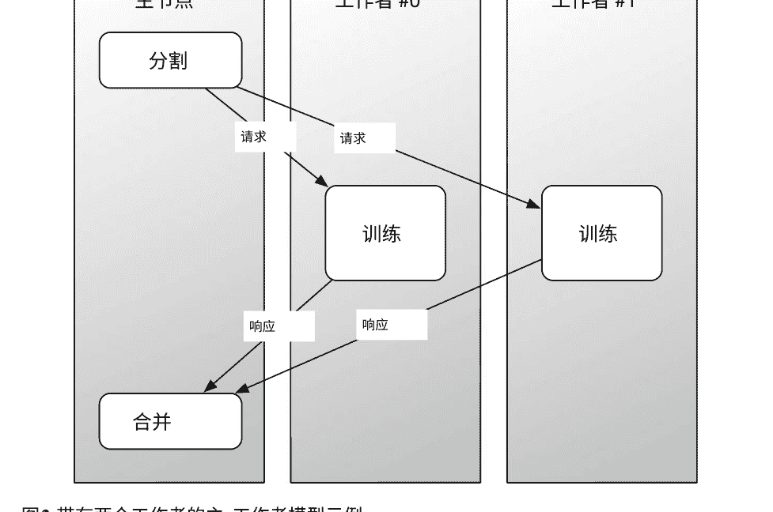

## 图2 带有两个工作者的主-工作者模型示例

在分布式异构网络中进行负载均衡主节点的源代码如清单1.6所示。主节点将输入数据集的范围划分为与工作者数量相等的切片。每个切片的边界都发送到每个工作者的队列（对于第一个工作者是“worker_0”），同时还发送配置矩阵和元数据到辅助队列。

```python
## 清单1.6 主节点分割
master_conf = generate_random_config()
blocks_per_worker = instances / (workers + 2)
for k in range(10):
    for i in range(workers):
        a = blocks_per_worker * i
        b = blocks_per_worker * (i + 1)
        print "调度到工作者", i, "数据从", a, "到", b
        metadata, data, data2 = encode_req(a, b, 60000, master_conf)
        r.rpush("worker_%d" % i, metadata)
        r.rpush("worker_data_%d" % i, data)
        r.rpush("worker_data2_%d" % i, data2)
```

因为请求和响应包含相同类型的信息（矩阵），所以两者都使用相同的格式，即迭代次数、用于训练的数据子集的边界以及配置矩阵。

请求中发送的矩阵是主节点上当前最新的配置，响应中接收到的矩阵是在工作节点上应用增量后的结果。

在工作节点上进行本地编码。矩阵被编码为字符串，通过中间的扁平表示与维度和数据类型作为元数据连接在一起。编码和解码的示例见清单1.7。

```python
import redis
r = redis.StrictRedis(host='localhost', port=6379, db=0)

def encode_req(a, b, it, conf):
    weights0, weights1 = conf
    metadata = "|".join(map(str, [a, b, it, weights0.shape[0], weights0.shape[1], weights0.dtype, weights1.shape[0], weights1.shape[1], weights1.dtype]))
    data = conf[0].ravel().tostring()
    data2 = conf[1].ravel().tostring()
    return metadata, data, data2

def decode_req(metadata, data, data2):
    a, b, iterations, l, w, array_dtype, l2, w2, array_dtype2 = metadata.split('|')
    weights0 = np.fromstring(data, dtype=array_dtype).reshape(int(l), int(w))
    weights1 = np.fromstring(data2, dtype=array_dtype2).reshape(int(l2), int(w2))
    return int(a), int(b), int(iterations), (weights0, weights1)
```

清单1.8显示了每个工作人员的源代码。工作人员可以选择循环执行此代码以持续处理新请求，如果切片多于工作人员的情况下。每个工作人员解码请求信息并执行给定数量的迭代训练。通过对称队列将生成的配置矩阵发送回主节点，处理工作人员与主节点之间的通信（例如，“master_0”）。

```python
metadata = r.blpop('worker_%d' % wid)[1]
data = r.blpop('worker_data_%d' % wid)[1]
data2 = r.blpop('worker_data2_%d' % wid)[1]
a, b, iterations, conf = decode_req(metadata, data, data2)

X = df.iloc[a:b, 0:ndims].as_matrix()
y = df.iloc[a:b, ndims:].as_matrix()
output_conf = train(X, y, conf, iterations)

metadata, data, data2 = encode_req(a, b, iterations, output_conf)
r.rpush("master_%d" % wid, metadata)
r.rpush("master_data_%d" % wid, data)
r.rpush("master_data2_%d" % wid, data2)
```

主节点以类似的方式处理所有响应（清单1.9），通过对接收到的矩阵进行平均，不需要知道哪个工作节点产生的响应。

## 清单1.9 主节点代码接收来自工作节点的数据

```python
(...)
new_conf = copy.deepcopy(master_conf)
for i in range(workers):
    metadata = r.blpop('master_%d' % i)[1]
    data = r.blpop('master_data_%d' % i)[1]
    data2 = r.blpop('master_data2_%d' % i)[1]
    a, b, iterations, conf = decode_req(metadata, data, data2)
    diff = operate_on_config(master_conf, conf, lambda a, b: a - b)
    new_conf = operate_on_config(new_conf, diff, lambda a, b: a + b)

    print "来自工作者", i, "的数据出现错误: ", configuration_error(df, conf)
    print "来自工作者的数据 ", i, " 合并时发生错误: ", configuration_error(df, new_conf)

master_conf = copy.deepcopy(new_conf)
```

虽然这种映射-减少方法是在分布式机器的背景下提出的，但它也可以用于在同一台机器的不同核心和处理器之间分发工作。在一个十核机器上，可以同时执行10个工作，并且训练将并行进行。多核并行的限制是系统内存在所有进程之间共享。

### 7 GPU加速的神经网络

最初，GPU被引入用于加速2D和3D图形设计、视频和游戏应用的生成。这种硬件的设计是为了尽可能快地执行矩阵运算。然而，这些功能已经通过类似 Cuda 或 OpenCL 的 C 语言 API 暴露给非图形应用。利用GPU进行非图形相关计算的想法被称为通用 GPU 计算 (GPGPU)。最近的努力使高级编程语言能够编译到GPU，例如 Matlab [30]，Haskell [31]，Java [32] 或 Python [33]。

由于人工神经网络的训练主要涉及矩阵乘法和标量乘法、加法和减法，因此使用 GPU 作为加速器可以加快训练速度，与仅使用 CPU 相比。GPU 也因其较低的功耗而被使用。

在我们的示例中，我们将使用 Numba [34] 框架，该框架支持 Python 函数的即时编译和提前编译。编译的一个后端是适用于 NVIDIA GPU 的 Cuda API，只需要安装 Numba Python 模块和 CUDA SDK。还支持 HSA AMD GPU，其 API 与此处展示的 Cuda API 非常相似。编程 GPU 遵循与 CPU 编程不同的编程模型。因此，之前定义的训练函数无法在 GPU 上运行。清单1.10显示了训练函数的 GPU 版本。一个主要的区别是 GPU 有自己的内存，无法访问主机 RAM 内存。

为了使 GPU 能够对权重和神经矩阵进行操作，需要明确地进行主机和 GPU 之间的内存复制。`to_device` 和 `to_host` 方法负责内存复制。

GPGPU 的另一个重要方面是定义计算的形状，即定义多少个线程（工作项）和多少个线程组（工作组）将执行此计算。在 NVIDIA 硬件上，一个通常很好的工作组大小是 warp 大小。warp 是共享相同程序计数器的硬件线程数量，理想情况下，它们应该都执行相同的代码。

在这种情况下，warp 大小为 32，导致一个 32 乘 32 的工作项矩阵，总共 1024 个线程。并非所有这些线程都是必需的，但与物理布局匹配通常比使用较少的线程效果更好。

在 GPU 上发生的所有计算都在一个特殊的函数中定义，称为内核。使用工作组数量和工作项数量作为特殊参数，在第11行调用此函数。这对于 GPU 调度程序启动相应数量的线程是必要的，每个线程都执行相同的内核函数。

```python
## 清单 1.10 用于驱动GPU训练ANN的主机代码
def train_cuda(X, y, conf, iterations=6000):
    gpu = cuda.get_current_device()
    weights0, weights1 = conf
    weights0g = cuda.to_device(weights0)
    weights1g = cuda.to_device(weights1)
    Xg = cuda.to_device(X)
    yg = cuda.to_device(y)
    rows = X.shape[0]
    thread_ct = (gpu.WARP_SIZE, gpu.WARP_SIZE)
    block_ct = [int(math.ceil(1.0 * rows / gpu.WARP_SIZE)), int(
        math.ceil(1.0 * ndims / gpu.WARP_SIZE))]
    train_kernel[block_ct, thread_ct](Xg, yg, weights0g, weights1g,
        iterations)
    weights0g.to_host()
    weights1g.to_host()
    return (weights0, weights1)
```

必须在 GPU 上执行的附加辅助函数（清单1.11）必须使用特殊装饰器进行定义，该装饰器允许 Numba 库将它们编译为 Cuda 中间语言（PTX）。在这种情况下，函数内联可以减少在 GPU 上函数调用的开销。

```python
## 清单1.11 GPU上的Sigmoid函数及其导数
@cuda.jit(device=True, inline=True)
def sigmoidg(x):
    return 1 / (1 + math.exp(-x))

@cuda.jit(device=True, inline=True)
def sigmoidg_d(x):
    return x * (1 - x)
```

这些函数在主内核函数（清单1.12）中使用，用于并行训练。由于 GPU 架构的限制，不允许在 GPU 函数中使用 Python 语言的全部功能。NoPython 是 Cuda 函数中允许的子集，不支持异常处理或 with 块。在内核函数的特定情况下，结果类型应为 void。

在 Cuda 函数内部，可以使用 GPU 特定的功能，例如访问当前线程在 GPU 内的索引（通过 `cuda.grid(2)` 在第6行中）。返回工作组网格中读取的 2D 坐标，以便当前线程可以使用不同的输入。在这种情况下，只有 i 在 0 到 24 之间，j 在 0 到 16 之间的线程是有趣的。

```python
## 清单1.12 用于GPU训练ANN的内核函数
@cuda.jit()
def train_kernel(x, y, weights0, weights1, iterations):
    l1 = cuda.shared.array(shape=(instances, ndims), dtype=numba.float32)
    l2_delta = cuda.shared.array(shape=(instances, 3), dtype=numba.float32)
    l1_delta = cuda.shared.array(shape=(instances, ndims), dtype=numba.float32)

    i, j = cuda.grid(2)
    if i < instances and j < ndims:
        for it in range(iterations):
            acc = 0
            for k in range(ndims):
                acc += x[i, k] * weights0[k, j]
            l1[i, j] = sigmoidg(acc)
            cuda.syncthreads()
            if j < 3:
                acc = 0
                for k in range(ndims):
                    acc += l1[i, k] * weights1[k, j]
                l2 = sigmoidg(acc)
                l2_error = y[i, j] - l2
                l2_delta[i, j] = l2_error * sigmoidg_d(l2)
            cuda.syncthreads()
            acc = 0
            for k in range(3):
                acc += l2_delta[i, k] * weights1[j, k]
            l1_error = acc
            l1_delta[i, j] = l1_error * sigmoidg_d(l1[i, j])
            cuda.syncthreads()
            if j < 3:
                acc = 0
                for k in range(instances):
                    acc += l1[k, i] * l2_delta[k, j]
                weights1[i, j] += acc
            acc = 0
            for k in range(instances):
                acc += x[k, i] * l1_delta[k, j]
            weights0[i, j] += acc
            cuda.syncthreads()
```

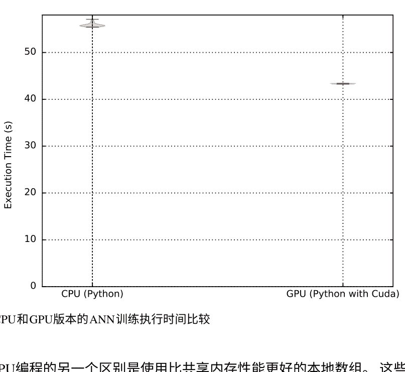

GPU编程的另一个区别是使用比共享内存性能更好的本地数组。这些本地数组用于不需要与主机读写的中间矩阵的第3-5行。

由于神经网络训练执行不同的矩阵乘法，不是所有线程都会在所有步骤中使用。为了同步操作，使用cuda.syncthreads()函数作为屏障。屏障之间的代码在同一个warp内以相同的速度执行，但不一定在不同的warp之间。

在每次矩阵乘法中，需要选择仅位于输出矩阵相同位置的线程（第7、14和28行）。为了了解每个阶段使用了哪些线程，图4展示了每个步骤中使用的线程的可视化表示。

执行上述代码将导致内核和辅助函数被编译到GPU上，而训练函数将管理内存复制和所需线程的调度，所有线程都运行相同的内核函数。

为了了解可能的加速效果，在没有任何激进优化的情况下，将GPU版本与先前的CPU版本进行了比较（两者都使用CPython 2.7.6，在一台配有Intel i7-3520M处理器和NVIDIA GeForce GT 640 LE GPU的机器上）。

图3显示了两个版本执行时间的分布和四分位数的小提琴图。GPU版本比CPU版本执行更快，显示出这种类型的程序如何可以轻松在GPU上并行化并实现加速（图4）。

图4 线程在屏障之间执行神经网络训练的可视化表示

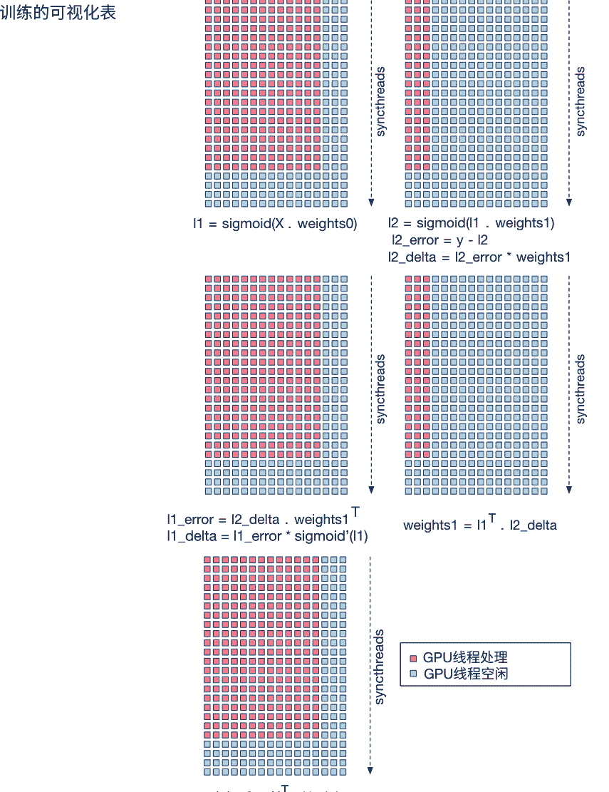

### 8 讨论和作业

所提供的源代码是作为教育资源设计的，具有其固有的不足和进一步优化的空间。本节讨论了不同的设计决策，以及读者可以选择追求的替代方案。

Python经常用于原型设计，但不用于实现高性能计算应用。其他语言如C、C++或Fortran更经常被优先选择。Python在代码解释方面引入了开销，并且具有动态计算昂贵的数据结构，如列表。此外，由于全局解释器锁（GIL）的存在，并行化必须在进程级别而不是线程级别上进行。在所提供的解决方案中，这些缺点都不存在：矩阵存储在由Numba（用C编程）提供的高效数据结构中，大部分训练过程发生在GPU端，Python代码被编译为高效的PTX中间代码。即使是CPU版本的训练也在Numpy库中执行矩阵运算，该库也是用C编程以提高效率。为了编写更高效的Python代码，可以使用Cython工具包使用C类型注释Python函数以获得类似C的性能。

此外，Numba JIT编译器还可以用于生成CPU版本的函数。最后，我们的方法使用多核并行处理，使用不同的进程，因此不受GIL的限制。

Redis不是像ActiveMQ [35]那样功能最完整的消息队列，但由于其低开销，经常在分布式系统中使用。0MQ是另一种低开销的Redis替代品，具有类似的功能集。这些方法都不能直接发送矩阵到网络上，都需要使用自定义编码和解码为原始字节，使用之前介绍的元数据方法。

这项工作的局限性是假设所有节点都可以访问原始数据集。如果数据集大于此节点的本地存储，这不是一个最佳解决方案。在这种情况下，应该使用分布式文件系统（NFS）等替代方案。工作节点在执行训练函数之前会下载相关的数据集切片。在开发的示例中，如果每个切片都有不同的文件，那么这是一个简单的适应。

关于神经网络的布局，我们的方法采用了一个依赖于数据集的静态布局。通过增加隐藏层的数量可以实现深度学习，但这会增加训练和内存复制的开销，因此只有在问题非常复杂时才有用。增加更多的层和神经元留给读者作为练习。对于动态选择布局，有几种选择，包括修剪无用神经元[36]，使用遗传算法进化人工神经网络[37]，以及蒙特卡洛方法[38]。在[39]中，读者将找到关于人工神经网络处理的最新调查。这些方法需要对这些主题进行更深入的研究。

改进的另一个领域是对所得解决方案的评估。在我们的情况下，我们使用20个实例进行训练，其余的用于测试。这在训练-测试数据集的划分中存在偏差。交叉验证方法更可取，因为实例在不同迭代中既用作训练又用作测试。这种方法的优点是对于相同的数据集需要更多的计算能力。

为了简单起见，提供了一个简单的 GPU 版本。这段代码可以以不同的方式进一步优化。首先是管理被复制到 GPU 的内存。鉴于 GPU 内存有限，限制内存复制非常重要。就像 Map-Reduce 用于将较大的数据集分割成较小的任务一样，可以使用相同的方法将任务分配给 GPU。当 GPU 处理一个块时，CPU 可以同时发送下一个块到 GPU。

在GPU操作中，重叠数据传输和执行是有优势的，以减少延迟。可以改进工作组和工作项中的线程组织，因为我们的解决方案没有利用所有计划的线程，以最大化缓存局部性的使用。一种方法是改变ANN的布局以匹配GPU。这样可以使用相同的计算能力来实现更复杂的ANN（不包括内存传输，假设它们可以与处理重叠）。

在同一台机器上使用多个GPU的情况下，可以进行最终的GPU优化，它们直接相互连接（例如使用SLI）。在这些情况下，需要在GPU之间同步矩阵平均值，而不需要计算与GPU同步。这将减少通信开销，因为CPU只需要在训练完成时传递最终权重给主节点。

### 9 结论

在本章中，我们介绍了从头开始创建分布式GPU支持的神经网络实现。使用反向传播算法开发了在CPU上执行的训练。介绍和讨论了在同一台机器上以及跨任意数量的机器上进行并行训练的分布式协议。最后，还讨论了GPU实现，突出了编程模型的主要差异。对于这些任务，我们依赖于一组有限的现有软件：Python（带有Numpy、Pandas和Numba库）和Redis用于消息通信。所有这些工具都是开源的，使从业者甚至可以修改底层实现，以防止其限制他们探索更激进的新想法。

此外，我们还讨论了这种方法的缺点和优点，主要是语言选择、并行化方法和ANN训练和布局方法，这些都可以进一步探索。

致谢第一作者得到了LASIGE研究单元（UID/CEC/00408/2013）的支持。

## 参考文献

1. J. Schmidhuber, 神经网络中的深度学习概述. Neural Netw. 61, 85–117 (2015)
2. W.S. McCulloch, W. Pitts, 神经活动中内在思想的逻辑演算. Bull. Math. Biophys. 5(4), 115–133 (1943)
3. A. Krizhevsky, I. Sutskever, G.E. Hinton, 使用深度卷积神经网络进行Imagenet分类, in Advances in Neural Information Processing Systems(2012), pp. 1097–1105
4. G.L. Martin, J.A. Pittman, 使用反向传播学习识别手写字母和数字。神经计算。 3(2), 258–267 (1991)
5. G. Zhang, M.Y. Hu, B.E. Patuwo, D.C. Indro, 破产预测中的人工神经网络：一般框架和交叉验证分析。欧洲运营研究。 116(1), 16–32(1999)
6. M.H. Ebell, 预测住院心肺复苏后无法生存的人工神经网络。家庭医学杂志。 36(3), 297–304 (1993)
7. D.A. Pomerleau, 用于自主导航的人工神经网络的高效训练。神经计算。 3(1), 88–97 (1991)
8. W.S. Sarle,计算隐藏层神经元数量 (1995)
9. A. Jacobs, 大数据的病态. Commun. ACM 52(8), 36–44 (2009)
10. M. Abadi, P. Barham, J. Chen, Z. Chen, A. Davis, J. Dean, M. Devin, S. Ghemawat, G. Irving, M. Isard, M. Kudlur, J. Levenberg, R. Monga, S. Moore, D.G. Murray, B. Steiner, P. Tucker, V. Vasudevan, P. Warden, M. Wicke, Y. Yu, X. Zheng, Tensorflow: 一个用于大规模机器学习的系统, in Proceedings of the 12th USENIX Conference on Operating Systems Design and Implementation. OSDI'16, Berkeley, CA, USA, USENIX Association (2016), pp. 265–283
11. J. Bergstra, O. Breuleux, P. Lamblin, R. Pascanu, O. Delalleau, G. Desjardins, I. Goodfellow, A. Bergeron, Y. Bengio, P. Kaelbling, Theano: 使用Python进行GPU深度学习 (2010)
12. R. Collobert, S. Bengio, J. Marithoz, Torch: 一个模块化的机器学习软件库 (2002)
13. B.J. Erickson, P. Korfiatis, Z. Akkus, T. Kline, K. Philbrick, 用于深度学习的工具包和库。 J. Digit. Imaging 30(4), 400–405 (2017)
14. S. Lawrence, C.L. Giles, A.C. Tsoi, 哪种大小的神经网络能够实现最佳泛化? 反向传播的收敛性质 (1998)
15. F. Cao, T. Xie, 用固定权重构建和逼近前馈神经网络，在国际机器学习与控制论大会(IC MLC)2010, 中国青岛，2010年7月11日至14日，论文集 (2010), pp. 3164–3168
16. N. Guliyev, V. Ismailov, 用固定权重的单隐藏层前馈神经网络的逼近 (2017)
17. S. Koturwar, S. Merchant, 使用数据统计初始化深度神经网络 (DNNs) 的权重。arXiv:1710.10570 (2017年)
18. S.K. Kumar, 关于深度神经网络中的权重初始化。arXiv:1704.08863 (2017年)
19. D. Mishkin, J. Matas, 你所需要的只是一个良好的初始化。arXiv:1511.06422 (2015年)
20. I. Goodfellow, Y. Bengio, A. Courville, Y. Bengio,深度学习, 第1卷 (MIT出版社, 剑桥, 2016年)
21. V. Nair, G.E. Hinton, 矫正线性单元改进了受限玻尔兹曼机，在第27届国际机器学习大会 (ICML-10) (2010年) 中，第807-814页
22. D.E. Rumelhart, G.E. Hinton, R.J. Williams, 通过反向传播学习表示. 自然 323(6088), 533 (1986)
23. M. Lichman,UCI机器学习库 (2013)
24. K.O. Stanley, D.B. D’Ambrosio, J. Gauci, 一种基于超立方体编码的大规模神经网络进化方法. 人工生命 15(2), 185–212 (2009)
25. W. McKinney等, 用于Python统计计算的数据结构，在第9届Python科学会议中，卷445 (2010), 页51–56
26. A. Trask,11行Python代码实现的神经网络 (2013)
27. L. Gu, H. Li, 内存还是时间: Hadoop和Spark上迭代操作的性能评估，在2013年IEEE第10届高性能计算与通信国际会议和2013年IEEE嵌入式与普适计算国际会议(HPCC_EUC)(IEEE, 2013), 页721–727
28. G. Dahl, A. McAvinee, T. Newhall等人, 用于集群系统的并行化神经网络训练，在《并行与分布式计算与网络》国际会议论文集 (ACTA Press, 2008), 第220-225页
29. S. Sanfilippo, P. Noordhuis, Redis (2009)
30. J. Reese, S. Zaranek, 在MATLAB中进行GPU编程，在《MathWorks新闻与笔记》（Math Works Inc., Natick, MA, 2012），第22-25页
31. M.M. Chakravarty, G. Keller, S. Lee, T.L. McDonell, V. Grover, 用多核GPU加速Haskell数组代码，在《多核编程的声明性方面的第六次研讨会》（ACM, 2011），第3-14页
32. A. Fonseca, B. Cabral, Aeminiumgpu: 一种智能的GPU编程框架，在面对多核挑战III(Springer, 2013)，第96-107页
33. B. Catanzaro, M. Garland, K. Keutzer, Copperhead: 编译一种嵌入式数据并行语言。ACM SIGPLAN Not. 46(8)，第47-56页(2011)
34. S.K. Lam, A. Pitrou, S. Seibert, Numba: 一种基于LLVM的Python JIT编译器，在第二届L LVM编译器基础设施在HPC中的研讨会(ACM, 2015)，第7页
35. B. Snyder, D. Bosnac, R. Davies, ActiveMQ实战，第47卷(Manning, 2011)
36. E.D. Karnin, 一种简单的修剪反向传播训练的神经网络的过程。IEEETrans. Neural Netw. 1(2)，第239-242页(1990)
37. D.B. Fogel, L.J. Fogel, V. Porto, 进化神经网络. 生物控制论 63(6), 487–493 (1990)
38. J.F. de Freitas, M. Niranjan, A.H. Gee, A. Doucet, 顺序蒙特卡洛方法训练神经网络模型. 神经计算 12(4), 955–993 (2000)
39. V. Sze, Y. Chen, T. Yang, J.S. Emer, 高效处理深度神经网络: 教程和调查. arXiv:1703.09039 (2017)

## 场景理解的深度学习

Uzair Nadeem, Syed Afaq Ali Shah, Ferdous Sohel, Roberto Tognery和Mohammed Bennamoun

摘要 随着计算机视觉领域的进展，我们越来越接近机器实现人类视觉的最终目标。场景理解是这项研究的一个重要组成部分。它的目标是使计算机能够像人类一样理解和解读任何图像。由于传统算法的局限性，场景理解的不同组成部分的进展停滞不前，现在通过引入神经网络来进行计算机视觉任务已经打破了这种局面。并行计算硬件的进步使得训练非常深和复杂的神经网络架构成为可能。这极大地提高了场景理解的各个组成部分的算法性能。本章分析了深度学习的这些贡献，并介绍了高级场景理解任务的进展，例如图像的标题生成。它还揭示了将这些单独的组件结合成一个综合系统的需求。

U. Nadeem · S. A. A. Shah · M. Bennamoun (✉) 计算机科学与软件工程系, 西澳大利亚大学, 克劳利, 澳大利亚 e-mail: mohammed.bennamoun@uwa.edu.au

U. Nadeem 电子邮件: uzair.nadeem@research.uwa.edu.au

S. A. A. Shah e-mail: afaq.shah@uwa.edu.au

F. Sohel 信息技术、数学与统计学科, 捷克大学, 珀斯, 澳大利亚 电子邮件: f.sohel@murdoch.edu.au

R. Tognery 电气、电子与计算机工程系, 西澳大利亚大学, 克劳利, 澳大利亚 e-mail: roberto.tognery@uwa.edu.au

关键词场景理解·深度学习·物体识别·人脸检测和识别·文本检测·深度图估计·场景分类·字幕生成·视觉问答（VQA）

### 1 引言

场景理解是计算机视觉研究的一个重要领域。场景理解的主要目标是使计算机和机器具备类似人类视觉的能力，即计算机能够从图像中提取与人类相同的信息和理解。当人们看一张图像时，他们可以判断室内还是室外，可以推断场景的位置（例如卧室或餐厅），图像中是否有文本以及它与场景中的物体的关系。人类能够感知物体的精确位置和深度（与视点的距离）。我们能够理解和识别物体，并将其从背景中分割或视觉上分离出来。

深度学习是机器学习中的最新趋势。随着大量计算资源和大型数据集的可用性，现在可以训练非常深的网络，这在十年前是不可想象的。尽管仍有很大的改进空间，但深度学习已经显著提高了场景理解的各个组成部分的性能，例如对象识别、自然场景中的文本检测、深度图估计以及人脸检测和识别（图1）。这些组成部分对于人类般的场景理解是必需的，也有助于实现更高级的任务，例如场景分类、生成描述和视觉问答。这些子任务是相互连接的，并构成了完整理解场景的框架的基本要素（图2）。尽管在各个组成部分取得了进展，但应用深度学习开发完整的场景理解系统的重要工作还很少。在接下来的章节中，我们将分析深度学习对场景理解的各个组成部分所产生的影响。

### 2 目标识别

识别物体的能力在场景理解中起着至关重要的作用。当观察场景图像时，人类可以轻松识别给定场景中的所有物体（例如椅子、桌子），并将这些物体解释为一个连贯的几何和语义有意义的结构（例如办公室）。这是通过完成两个任务来实现的。首先，构建了3D物体的表示，使我们能够在图像中无论物体的位置或视角如何都能识别物体。这需要观察者学习到对视角变化具有鲁棒性的模型，以帮助识别观察者以前未见过的物体实例/类别。其次，我们需要推断物体的几何特征物体的姿态、尺度和形状等属性。这些几何特征可以为场景中物体之间的相互作用的解释、物体功能的估计以及最终推断场景的三维布局提供稳健的线索。

本节概述了目标识别中涉及的不同步骤，并回顾了在各种条件下常用的识别对象的技术。

#### 2.1 目标识别流程

典型目标识别流程的主要步骤如图3所示。

##### 2.1.1 图像获取

使用2D（例如高分辨率相机）或3D扫描仪（例如Kinect或Minolta）获取对象的图像。2D相机捕捉对象的强度信息，例如颜色，而3D扫描仪提供点云、3D网格或深度图像。深度图像中的每个像素表示对象的一个3D点与相机/扫描仪之间的距离（与2D相机的强度信息相反）。

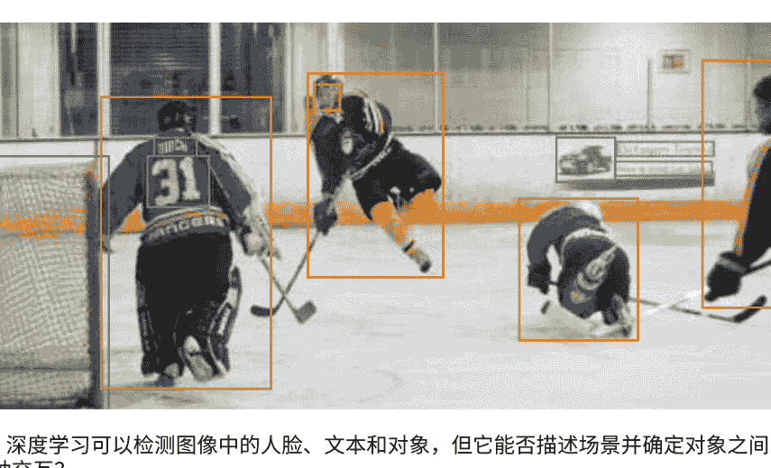

##### 2.1.2 物体扫描预处理

3D图像通常包含显著的表面噪声（例如，在低分辨率Kinect的情况下，存在孔洞，即由于自遮挡和尖峰导致的数据缺失）。预处理步骤用于去除这种噪声。然后使用表面插值来填补小孔。这些孔可能最初存在于扫描中，也可能是由于数据尖峰的移除而形成的。预处理的最后阶段通常是表面平滑处理（例如，使用高斯平滑处理表面）。

##### 2.1.3 关键点检测和特征提取

首先检测到一组高度可重复的关键点，然后提取围绕这些关键点的特征。在2D图像中，特征通常表示颜色、纹理和外观。在3D中，特征描述对象关键点的几何形状。特征通常被选择为在描述特征所需的区分度和特征的不变性属性之间进行权衡（例如，对旋转或平移的不变性）。‘特征’的例子包括2D情况下的强度值，3D数据的原始深度值，表面法线，曲率，旋转图像[1]和尺度不变特征变换（SIFT）描述符[2]等。

##### 2.1.4 特征匹配/分类

目标识别的最后一步是特征匹配/分类阶段，在这个阶段使用机器学习分类器来识别图像中的目标。一些流行的例子包括支持向量机（SVM）、神经网络和k最近邻（k-NN）。K-NN也可以与不同的子空间（例如LDA或PCA）一起使用。

#### 2.2 目标识别的手工特征

手工特征是根据专家知识基于某种手动预定义算法从图像中提取的特征。局部二进制模式（LBP）[3]和尺度不变特征变换（SIFT）[2]是手工特征的流行例子。

在这里，我们将简要讨论一些流行的手工特征。

要创建LBP特征向量[3]，将滑动窗口分成单元格。将8个相邻像素与中心像素进行比较。如果邻域中的像素值小于中心像素，则将其设置为'0',否则将其设置为'1'。然后，按照图4所示的顺时针方向构造一个二进制数。然后，将中心像素替换为二进制数的十进制值（图4）。

LBP不具有旋转不变性，二进制数对起始点非常敏感。此外，光照的微小变化可以改变十进制值，这使得LBP对光照变化的鲁棒性较差。

Lowe的尺度不变特征变换（SIFT）[2]提供了一组对旋转和尺度具有鲁棒性的对象特征。SIFT计算的第一步是“关键点检测”。为此，首先使用高斯差分（DoG）对不同尺度的图像进行平滑处理。然后，在尺度和空间上搜索这些图像的局部极值。接下来，在所选尺度上创建局部梯度方向的直方图。然后，将平滑直方图的峰值处分配为规范方向。在关键点周围的区域内，使用方向的梯度来创建方向直方图，其中包含36个柱，每个柱代表10°。样本按其幅度和“高斯加权圆形窗口”加权，然后添加到柱中。然后，根据尺度选择一个关键点周围的区域。然后，将梯度信息与关键点方向对齐。在4×4的柱状阵列中计算8个方向柱，形成一个8×4×4＝128维的SIFT特征。

除了2D特征外，文献中还提出了几种3D特征。Tombari等人[4]提出了一种名为直方图方向签名（SHOT）的描述符。首先为给定的关键点p构建一个局部参考框架，并将邻域空间分为3D球形体积。然后，通过累积关键点处法线与邻近点处法线之间的角度，为每个体积生成一个局部直方图。然后将所有局部直方图连接起来形成一个总体SHOT描述符。SHOT描述符具有很高的描述性，计算效率高且对噪声具有鲁棒性[5]。Guo等人[6]提出了一种名为旋转投影统计（RoPS）的3D局部特征描述符。使用位于局部表面上的点形成协方差矩阵。协方差矩阵的特征值分解用于定义旋转不变的参考框架。将3D点在邻近的2D平面上进行旋转投影，形成特征描述符。

深度核描述符（包括最多五个不同的线索，包括大小、3D形状和深度边缘，这些线索从深度图和RGB图像中提取）被提出来将任何像素属性转化为补丁级特征的一种方法。深度核描述符在低分辨率Kinect数据集上进行了测试，并在当时的最先进技术上实现了超过10%的准确率提升[7]。Guo等人[8]对基于特征的3D物体识别方法进行了全面调查。

#### 2.3 目标识别的深度学习技术

深度学习在几个目标识别任务中被发现非常有效，并且被广泛应用[9]。Hayat等人提出了基于自编码器的深度重建模型（DRM）[10]用于图像分类。这个深度学习框架包括编码器和解码器层，用于对输入图像进行重建。

ADNT在ETH-80物体数据集上展现出了卓越的目标识别性能。Shah等人提出了迭代深度学习模型（IDLM）并将其用于目标识别任务[11]。IDLM包括池化层。卷积层后跟着ANNs以分层方式迭代应用于学习输入图像的非线性特征表示。IDLM的输入包括原始图像，并在ETH-80对象数据集上实现了98.64%的准确率。

AlexNet [12]在2012年的ImageNet LSVRC竞赛中取得了深度学习的重大进展。训练集包括120万高分辨率图像和1000个不同的对象类别。在由15万张图像组成的测试集上，AlexNet的错误率明显低于之前的最先进方法。AlexNet是一个非常深的网络，由6000万个权重和65万个神经元以及五个卷积层和最大池化层组成[12]。

在非常深的网络中，GoogleNet [13]是第一个使用相当复杂架构和多个网络分支的流行模型。该模型在ILSVRC'14竞赛中以最佳的前5错误率6.7%获胜。GoogleNet现在有几个改进的变体。微软的He等人[14]提出了残差网络，通过将前5错误率降低到3.6%，赢得了ILSVRC 2015挑战，而GoogleNet的错误率为6.7%。残差架构的显著特点是在残差块中使用身份跳过连接，使其能够轻松训练非常深的CNN架构。

齐等人[15]最近提出了用于3D物体识别的PointNet。与其他架构不同，这种新的深度学习架构直接将点云作为输入，并输出整个输入的类标签或每个输入点的点段标签。PointNet架构很好地尊重了输入3D点的置换不变性，并且已经证明在3D物体识别性能方面与最先进达到了可比较的性能。

### 3 人脸检测和识别

识别一个人是对场景进行全面理解的重要要求，显然识别一个人的最自然的方式是识别他/她的脸。近几年来，人脸检测和识别在计算机视觉界引起了越来越多的关注。这个领域在生物识别、监控和安全、人群分析和智能用户界面等方面也有重要的应用。人脸检测和识别领域的主要挑战包括光照和姿态变化、低分辨率、部分遮挡、类间相似性、噪声、背景相似性以及足够的训练数据的可用性。值得注意的是，人脸识别可以被看作是一个非常细粒度的对象识别问题，因为即使是人类也经常混淆不同人的面孔。

#### 3.1 用于人脸检测和识别的非深度学习技术

讨论人脸检测技术时，不得不讨论维奥拉和琼斯人脸检测算法[16]。维奥拉和琼斯人脸检测器由三个主要组件组成：积分图像、使用AdaBoost进行训练的分类器和级联分类器。首先，图像被转换为积分图像。在积分图像中，每个像素是原始图像中其上方和右方所有像素的强度值之和。积分图像用于高效计算Haar矩形特征。这些特征是相邻两个到四个矩形的强度之和的加权差异。然后，使用AdaBoost的变体（自适应增强）与选定的矩形特征一起使用。在AdaBoost中，许多弱分类器以加权方式组合，以提高最终分类准确性并形成强分类器。

决策树桩（单节点分类树）被用作弱分类器，每个节点尝试找到一个特征的最佳阈值。然后，逐渐增加复杂度的多个强分类器级联在一起形成一个退化的决策树。只有被检测为正面（人脸）的实例才会传递给级联中的下一个强分类器。这样，每个后续的分类器在级联中需要做出的决策比其之前的分类器少。这确保了处理时间快，并实现了每秒15帧的速率。这种技术在当时实现了与当时最先进的方法相当的准确性，同时实现了显著更快的计算时间。

人脸识别也遵循“特征提取”和“分类”的一般流程。本文介绍了用于人脸识别的最先进表面特征的全面研究。现代人脸识别系统包括四个主要步骤，即检测、对齐、表示和分类。解决人脸识别问题的一种方法是使用图像集，即训练和测试数据都包含一组图像。这是因为移动设备和CCTV摄像头的广泛可用性，通常会有多张查询人员的图像可用，并且额外的信息可以用于更好的决策。Ortiz等人[19]使用平均序列稀疏表示来进行端到端的基于视频的人脸识别系统。在输入视频剪辑中检测和跟踪人脸。然后提取三种类型的特征，LBP、Gabor和HOG。最后，提取的特征被用于基于稀疏表示的字典分类的修改版本。Shah等人[20]将测试图像表示为每个类别的图库图像的线性表示。最准确的表示被确定为测试图像集的类别。

#### 3.2 人脸检测和识别的深度学习

有许多基于深度学习的人脸检测方法。然而，大多数方法需要高计算资源和时间。CNN的级联架构在准确性和效率两个目标之间提供了一个很好的折衷方案[21]。Li等人[21]提出了一个由六个CNN组成的人脸检测级联CNN。其中三个CNN是二进制人脸/非人脸检测器，另外三个用于校准。该系统在多个分辨率下运行，并且类似于Viola和Jones算法，通过逐步增加难度的多个阶段验证不同的检测结果。在每个阶段之后使用基于CNN的校准阶段来减少后续阶段中潜在的人脸区域数量并改善定位。这种技术实现了每秒14帧的分类率，并在人脸检测基准测试中取得了最先进的结果。

深度学习可以有效地用于学习图像集到共享特征空间的非线性变换，同时最大化不同类别之间的距离[22]。Hayat等人[10]使用深度学习为基于图像集的人脸识别训练单独的自编码器。然后从每个自编码器中重建测试图像。最小重建误差被用作分类的度量。图像集中的图像的非线性可以通过流形和深度学习进行建模。人脸的深度图也可以在可用的情况下用于人脸识别，这表明使用深度信息和RGB人脸图像可以显著提高人脸识别性能。

Taigman等人[18]使用三维人脸建模的分段仿射变换。使用由九层组成的深度网络来提取人脸特征。与传统的卷积神经网络不同，深度网络使用局部连接层而不共享权重。该网络涉及1.2亿个参数，通过数据驱动的方法进行学习。使用深度特征的简单内积来识别一个人。这种方法在无约束环境下的人脸识别数据集上产生了很大的准确性提升。

Schroff等人[23]使用名为FaceNet的深度神经网络，将人脸图像转换为紧凑的欧几里德空间。训练CNN时使用三元损失。其动机是同一类别图像在转换后的欧几里德空间中的距离应小于不同类别图像之间的距离。在转换后的领域中，使用128维向量来表示每个图像。转换后的领域中的距离被视为相似度的度量。FaceNet生成的特征可以用于人脸聚类、识别或验证等任务。基于之前的工作，建议使用两种不同的CNN架构。与其他技术相比，该系统的性能显著提高。

## 自然场景中的文本检测

在过去的十年里，计算机视觉界一直对图像中的文本检测和识别问题非常关注。文本检测问题可以分为三种类型：文档文本（OCR）、图形文本（如电子邮件、海报、广告中的文本）和场景文本（图5）。尽管文档的光学字符识别（OCR）大多被认为是一个解决了的问题，但在自然场景中的文本检测和识别性能仍然不理想[24]。自然场景中的文本检测面临着目标检测的所有问题，以及与文本检测固有的问题。自然场景中的文本检测面临着尺寸、长宽比、字符形状、字体、不均匀照明和类间变化等高度变异的挑战。

自然场景中的文本检测对于个人助理设备、数据检索、自动驾驶、驾驶辅助和场景理解非常重要。文本识别可以帮助盲人阅读导航标志、广告牌甚至书籍。它还可以帮助从大型数据库中检索图像和文本。文本的重要性使得其检测成为计算机视觉中的一个重要主题。图像中的文本检测包括两个主要步骤：文本检测（或文本定位）和文本识别。同时完成这两个任务的系统被称为“端到端文本检测系统”。

场景文本可以分为“拍摄和拍摄”和“偶发文本”[25]（图5）。在拍摄和拍摄中，图像、图片或视频是为了专注于文本而捕捉的。偶发文本是指可以出现在任意随机拍摄的图片或视频中，以及文本通常不突出的图像中的文本。

逐步方法有四个主要的、不同的步骤：定位、验证、分割和识别[25]。在定位中，组件被粗略地分类为文本区域，然后通过验证步骤进行改进。使用分割方法将字符分开，并将其馈送到识别模块中。在集成方法的情况下，不可能将方法细分为不同的步骤，因为这些步骤相互加强，结果是中间的和不完整的，直到最终输出[26]。

这两种方法都可以使用机器学习分类器、连通分量分析或两者的组合。对于机器学习方法，使用监督学习来训练一个分类器来区分文本和非文本。训练好的分类器使用滑动窗口在文本图像上进行应用，以识别图像中的文本区域。另一个分类器被训练用于区分不同的字符和大小写（大写或小写）。字符识别器的输出与预定义的词典或通用英语词典结合使用，形成单词。王等人的工作[27]是这种方法的典型例子。对于连通组件分析，使用手工制作的特征来区分文本和非文本。特征处理应用于整个图像，并使用连通组件分析来识别文本区域。特征还用于区分字符，这些字符与词汇表结合形成单词。笔画宽度变换[28]被认为是文本检测中最重要的特征之一。通常用于文本检测和识别的其他特征包括边缘、颜色、对比度、拐点和最大稳定极值区域（MSER）。

#### 4.1 文本检测的经典方法

与场景理解的其他领域类似，场景文本检测的经典方法从图像中提取各种类型的特征，然后基于这些特征训练分类器。Ephstein等人[29]利用大部分文本具有几乎恒定笔画宽度的特性开发了笔画宽度变换。许多后续的工作使用了笔画宽度变换的原始或修改形式，它仍然是自然场景文本检测的主要特征检测技术之一。另一种突出的方法是检测最大稳定极值区域（MSER）来识别潜在的文本区域。然后使用几何和笔画宽度信息对检测到的区域进行过滤，排除误报[30]。字母配对以识别文本行，然后将其分成单词。Neumann和Matas [31]检测到极值区域，并使用形态学特征来过滤非文本区域。然后使用穷举搜索系统进行最终输出。Matas和Neumann [32]通过检测特定方向上的笔画以及特定距离上的笔画开发了端到端的文本检测流水线。他们使用条形滤波器在图像梯度场中检测笔画。最后使用最近邻分类器来实现文本检测的最终结果。

使用文本进行场景理解是一个相对未被探索的主题。Zhu等人[33]利用自然场景中的文本区域信息来提高对象和场景分类的准确性。他们的系统将从整个图像中提取的视觉特征与仅从检测到的文本区域中提取的特征相结合。Karaoglu等人[34]通过文本检测改进了对象类别识别的准确性。

#### 4.2 文本检测的深度网络

卷积神经网络在文本检测任务中的最初应用之一是由Wang等人[27]完成的工作。他们从流行的文本检测数据集中提取字符和背景补丁来训练CNN架构。输入图像被调整为32×32。这些数据通过合成生成的字符进行了增强。网络架构包括两个卷积层和一个完全连接层，其中间有平均池化层。他们使用无监督学习初始化了第一层，并在训练过程中固定了该层。该网络通过反向传播L2-SVM分类错误进行训练。他们使用了两个类似但独立的卷积神经网络进行文本检测和文本识别。文本检测的卷积神经网络用于进行双向分类（文本和非文本），而文本识别则开发了一个62路分类器。检测卷积神经网络采用滑动窗口方法对测试图像进行应用。然后使用非最大抑制方法获取一组候选线段，以及字符和单词之间的位置。然后使用字符卷积神经网络来识别字符。使用波束搜索将这些信息组合起来，得到端到端的结果。

Jaderberg等人[26]开发了一个端到端的文本检测系统和基于文本的图像检索系统。它涉及到一个用于检测的区域提议机制和一个用于识别的深度卷积神经网络。该系统使用边缘框和聚合通道特征检测器快速生成区域提议，同时在保证召回率的同时最大化准确率。这避免了对卷积神经网络应用滑动窗口的计算量非常大的步骤。边缘框的灵感来自于物体具有清晰的边界（边缘），因此完全包含在框内的边界的数量可以表示该边界框的客观性。聚合通道特征检测器使用了八个通道：归一化梯度幅值、原始灰度图像和六个方向梯度直方图（HOG）特征通道。这些通道被平滑并分成块。然后将每个块中的像素相加并再次平滑。使用一组决策树作为弱分类器，并使用adaboost进行训练。由于通道不具有尺度不变性，因此在不同尺度上应用分类器，并在两个计算尺度之间进行通道的近似计算。然而，这个过程会产生成千上万个误报。因此，使用一个基于HOG特征的随机森林和决策树桩来过滤生成的区域提议。将置信水平低于一定阈值的区域拒绝，以减少边界框的数量。使用卷积神经网络对边界框进行回归，以改善与真实边界框的重叠，从而完成文本检测部分。对于文本识别，使用在合成数据上训练的卷积神经网络。从一个包含九万个常用英文单词的字典中生成了九百万个合成数据实例。数据使用1400种不同的字体生成，并涉及边框和阴影渲染、基础着色、投影畸变和自然数据混合等步骤。还引入了噪声来考虑自然场景中的扭曲和模糊。用于文本识别的卷积神经网络具有五个卷积层和三个全连接层。CNN是使用合成数据进行完整单词分类训练的。神经网络的最后一层执行90,000路分类，即字典中每个单词都有一个输出神经元。这是与早期文本识别方法的重大变革，早期方法是识别字符而不是单词，然后使用后处理将这些字符组合成单词。Jaderberg的这项工作在准确性方面取得了重大突破。该技术在各种数据集上进行了评估，并提供了10-20%的F-score增加，具体取决于数据集。

Zhang等人应用了完全卷积网络来进行多方向文本检测的任务。他们的系统使用局部和全局线索来以粗到细的方式定位文本行。系统中使用了两个完全卷积网络（FCN）。第一个FCN称为文本块FCN，用于生成文本区域的整体显著性图。它使用了VGG-16网络的前5层。这些层具有不同的滤波器尺寸，因此每个层在几乎不同的尺度上捕捉上下文信息。每个卷积阶段的输出还连接到一个1 × 1卷积层和一个上采样层。这样创建了相同大小的特征图，然后将它们连接起来。特征连接后跟一个1 × 1卷积层和一个sigmoid层，生成像素级预测。然后将显著性图与字符组件结合起来估计潜在的文本行。在第一个FCN检测到的文本区域中提取尺度不变的极值稳定区域（MSER）。使用检测到的MSER区域的面积和长宽比来过滤掉误报。然后，使用组件投影来估计文本块内文本行的方向。该方法假设文本以直线或几乎直线的形式出现。跨越直线的字符组件被计数。直线的各种可能方向分别计数。然后，选择具有最多字符组件的直线方向作为直线的方向。将字符组件合并成组，并使用组的高度和方向将它们组合成文本行候选。第二个FCN消除误报并预测每个字符的质心。这个第二个FCN的结构与文本块FCN类似，但是使用了VGG-16网络的前三个卷积层。它还使用交叉熵损失函数进行训练。最后，使用置信度水平、文本行中的字符数和几何标准来阈值误报。该框架被称为适用于多种语言、字体和方向的文本检测。它在MSRA-TD500、ICDAR 2015意外场景文本和ICDAR 2013数据集上取得了最先进的F-score。

### 5 深度图估计

从视点感知物体的距离（深度）对于人类来说是一种重要的感觉。它使他们能够分析和识别物体的位置和周围的布局。从RGB相机中恢复深度有很多应用，包括监控、机器人导航、自动驾驶和场景理解。

## 图6 深度图估计的方法类型

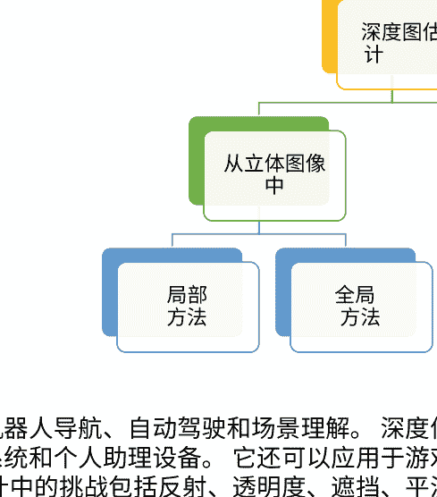

应用包括监控、机器人导航、自动驾驶和场景理解。深度信息可以帮助开发可靠的自动驾驶系统和个人助理设备。它还可以应用于游戏、监控和机器人导航。深度图估计中的挑战包括反射、透明度、遮挡、平淡区域、光照条件、重复纹理和无差别背景。

从RGB图像恢复深度有两种主要方法：
- 从立体（两个或更多）图像（或视频）估计深度。
- 从单个（单目）图像计算深度（图6）。

立体视觉系统主要由两个水平放置的相机组成。相机同时捕捉图像，然后对其进行处理并进行比较。立体匹配是一个数学上不明确的问题。对于高纹理或平淡的场景来说，这是一个特别具有挑战性的问题。计算机视觉和模式匹配技术被用来确定视差和深度图。

从单张图像中恢复深度是一个固有的模糊任务[36]。它需要使用诸如物体大小、图像位置、光照角度、阴影、物体的相对大小以及全局视图信息等线索。这是一个不适定问题，因为无限多个真实世界场景可以产生相同的RGB图像。人类即使只有一只眼睛也能感知深度，因为人类擅长排除不可行的解决方案。但计算机需要一种策略来做到这一点。

#### 5.1 深度图估计的方法论

立体视觉的深度依赖于相机的内部和外部参数。计算机视觉技术被用来从立体图像中估计视差图。视差是以像素为单位衡量的，表示物体（或准确地说，物体的每个像素）在左图像中相对于其在右图像中的位置发生了位移。可以使用以下公式将视差值转换为深度：


图7 从立体图像估计深度图的流程

$$深度 = \frac{焦距}{视差} \times \frac{基线}{像素值}$$

最先进的技术试图在亚像素级别上计算视差。对于立体匹配，通过识别对极线来减少匹配成本计算的搜索空间。然后使用模式匹配技术进行视差计算。立体匹配算法有四个主要步骤[37]。这些步骤包括：匹配成本计算、成本聚合、视差计算/优化和视差细化。然而，根据使用的算法，这个通用流程可能会有一些修改。

几乎所有的算法都将RGB图像转换为灰度图像。匹配成本是在给定视差下强度值之间的差异度量，例如绝对差异之和或平方差之和。成本聚合是通过在具有恒定视差的窗口上累积匹配成本来完成的。视差的计算是通过选择每个像素处成本的最小值来完成的。然后使用多种后处理技术对视差图进行细化（图7）。

有两种主要的算法：局部和全局（图6）。在局部方法中，点或像素的视差计算仅基于预定义的局部区域或局部窗口中的强度值。它们具有较短的处理时间和复杂度。Mattoccia等人的工作[38]是局部方法的典型例子。

另一方面，全局方法形成一个全局能量函数，并尝试对所有视差值进行最小化。这种类型的方法在其目标函数中有两个项。一个是通常的项，惩罚与真实数据不一致的输出。另一个是平滑实际像素的局部邻域，以减少生成的深度图中的不规则性。全局方法比局部方法产生更好的结果，但计算上较为昂贵[39]。因此，它们不适用于实时系统。这些方法通常跳过成本聚合步骤。大多数全局方法使用马尔可夫随机场。

#### 5.2 使用模式匹配进行深度图估计

在广泛使用深度学习之前，深度图估计技术使用繁琐的特征提取和模式匹配技术，需要大量参数调整。从立体图像中估计深度图是早期恢复深度图的方法之一。最初，立体深度算法没有使用真实数据进行训练。但是适当的数据集的引入打开了监督学习的可能性。已经使用了各种方法来计算左视图和右视图的匹配代价，例如平方距离之和、绝对距离之和和归一化互相关。条件随机场也广泛用于立体匹配。Li和Huttenlocher [40]使用非参数化的代价函数来建立条件随机场模型，并将其与支持向量机结合起来学习模型的参数。Spyropoulos等人[41]训练了一个随机森林分类器来预测匹配代价的置信度，并在马尔可夫随机场中使用这些预测结果来减小立体方法的误差。

从单张图像中估计深度是一个更具挑战性的问题。与立体对应不同，没有可靠的线索。有几种方法可以从单张图像中估计深度。Saxena等人[42]使用超像素和马尔可夫随机场（MRF）开发了一个用于3D模型生成的系统。他们的系统依赖于环境由许多小平面组成的假设。其他信息源，例如重复结构、语义标签或用户注释，可以帮助完成这个任务，但这些信息通常不可用。几何假设可以有效地使用，例如盒子模型用于估计房间布局，但这些是非常简单的模型，对于稍微复杂的物体就会失败，并且不适用于详细的3D重建。一些非参数系统[43]在一组已知深度图像中搜索与输入图像相似的图像块，并将此信息与平滑约束相结合来估计深度图。这种方法的问题在于平滑约束依赖于梯度，在真实的3D场景重建中表现不佳。Ladicky等人[44]使用手工制作的特征和超像素将语义对象标签与单目深度特征相结合，以提高性能。

#### 5.3 深度学习网络用于深度图估计

Zbontar和LeCun [45]应用深度学习来估计从矫正图像对中得到的深度图。他们的工作主要集中在立体匹配算法的第一步，即匹配代价计算。使用真实的训练数据来训练卷积神经网络，通过构建一个二分类数据集。在已知真实视差的位置提取一个负样本和一个正样本，以创建一个平衡的数据集。然后CNN在这个小图像块的数据集上学习相似度度量。这项工作提出了两种网络架构，一种用于快速性能，另一种用于更精确的结果。网络架构由两个共享权重的子网络组成，称为Siamese网络。每个子网络由一对卷积层和一层修正线性单元组成。每个子网络的最后一个卷积层后面没有跟随修正线性单元层，并输出描述输入图像块属性的向量。在快速架构中，使用点积比较两个输出向量以产生网络的最终输出。然而，在准确的架构中，将两个输出向量连接起来，并通过许多全连接层传递。每个全连接层后面跟随一个修正线性单元层，除了最后一层后面跟随一个sigmoid层。sigmoid层产生一个标量，用作两个块之间的相似度度量。在测试时，视差图由卷积神经网络的输出初始化。这个初始输出后来通过基于交叉的代价聚合，半全局匹配，左右一致性检查，亚像素增强，中值滤波器和双边滤波器进行了改进，以实现最终的输出。准确的架构在几个基准数据集上实现了最小的错误率，而快速的架构在合理的性能下实现了最短的执行时间。

从单张图像中估计深度需要来自全局和局部线索的信息。Eigen等人[36]使用了两个深度网络堆栈。第一个网络使用整个图像进行粗略的全局预测。它由五个卷积层和两个全连接层组成。另一个网络用于对预测的视差图进行局部细化，由三个卷积层组成。原始数据集被用来提供数据丰富的深度网络。该方法在2014年的NYU Depth和KITTI数据集上取得了最先进的结果，并产生了详细的深度边界。

深度图估计还可以帮助表面法线估计和语义标注任务，三个任务可以相互补充。Eigen和Fergus[46]使用单一的多尺度卷积网络架构同时处理深度预测、表面法线估计和语义标注三个任务。

在第一步中，深度网络使用完整的图像生成粗略的全局输出。然后，局部网络对初始输出进行细化。该网络涉及多个卷积层和全连接层，并在三个不同的尺度上工作。该系统在三个任务的许多基准测试中表现出更好的性能。这表明结合场景理解的互补任务可以提高性能。

### 6 场景分类

场景分类与典型的物体分类非常不同。在场景分类中，图像包含了许多不同类型和不同空间布局的对象。尺寸的变化和不同的视角是其中的一些变量。

## 图8 场景分类的方法类型

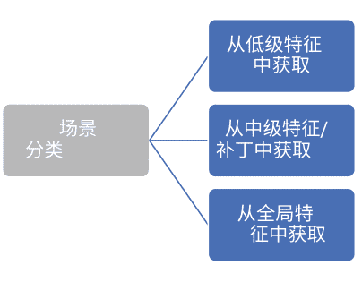

场景分类这一复杂任务中还存在其他挑战。场景分类是一个活跃的研究领域。近年来，已经提出了几种不同的方法。一些技术使用局部显著特征，而其他技术则在全局层面上工作。然而，这两种类型的线索都是实现场景分类所必需的。除此之外，中级表示已经成为场景分类的潜在候选者之一（图8）。

这个想法是发现有区别的中层图像补丁。然后，特征描述符对这些补丁进行编码。由于全局布局变形是场景分类的一个特点挑战，一个重要的问题是设计具有布局不变性的特征描述符。一种方法是使用局部不变特征，如SIFT，然后使用视觉词袋模型。然而，深度学习学习到的特征最近超过了这些局部特征表示。

#### 6.1 使用手工特征进行场景分类

Parizi等人[47]使用潜变量模型进行场景识别。这个想法是用其组成部分来表示场景，例如，一个户外场景可能包含草地、树木和云。这些组成部分可以以任意数量和任意空间位置出现在图像中，但它们本质上构成了相同类型的场景。图像被分割成预定义的一组区域，并使用潜变量来指定图像区域的区域模型。图像区域的外观使用词袋方法来描述。建议使用两种训练方法：生成方法和判别方法。在生成方法的情况下，使用期望最大化（EM）算法在监督设置中计算模型参数。判别设置使用潜在结构支持向量机（LSSVM）。虽然判别方法产生了更好的结果，但LSSVM对于不良初始化不具有鲁棒性。生成方法可以为LSSVM提供参数初始化，以克服这个困难。

Lin等人[48]引入了重要空间汇聚区域(ISPRs)的概念。使用统一的优化框架来学习独特的区域外观和ISPRs。该方法抑制了生成特征中的误响应。使用训练数据的统计信息生成地图。一旦抑制了错误的响应，可以使用简单的技术（如最大池化）来合并特征图。将这种中层表示与全局图像特征相结合，以提高识别准确性。

#### 6.2 使用深度特征进行场景分类

以前，由于没有足够的数据来训练深度网络，因此很难使用深度学习进行场景分类。最初的深度学习尝试利用了神经网络的迁移学习特性，通过使用针对对象识别任务训练的CNN来进行场景分类任务。然而，由于任务的性质非常不同，深度学习的成功并不如预期那样大[49]。Places数据库的引入[49]使得可以训练用于场景分类任务的CNN。它包含超过700万个标记的各种类别的场景图像。该数据集与其他数据集一样密集，并且包含更多的多样性。在Places数据库上训练的CNN实现了50%的分类准确率，并且从训练的CNN中提取的深度特征在许多场景分类数据集上（使用SVM作为分类器）产生了最先进的结果。

Hayat等人[50]使用深度学习来提取空间布局和尺度不变特征。他们不使用局部或全局特征，而是从图像中提取中间层次的补丁信息。然后通过使用金字塔图像表示来实现尺度不变性。这为室内场景提供了多层次的独特特征。密集而均匀的补丁提取确保大部分信息被用于做出最终决策。为了克服空间布局变形的挑战，卷积神经网络涉及一个新的“空间非结构化层”。CNN由五个卷积层和四个全连接层组成。通过在三个不同尺度上提取中间层次的补丁来创建金字塔图像表示。使用两个CNN进行特征提取。一个CNN包含一个空间非结构化层，而另一个CNN不包含该层。两个CNN的输出向量被连接起来形成最终的特征向量。深度特征用于训练作为最终分类器的SVM。使用深度学习特征的SVM在许多室内场景分类数据集上取得了最先进的性能。

深度卷积特征具有保留全局空间结构的本地能力。然而，由于物体的空间布局变化非常大，深度网络的结构保持特性成为有效训练网络的障碍[51]。克服这个问题的一种方法是将卷积特征转换为更适合场景分类任务的其他特征空间。转换后的特征空间应将特征编码为场景中存在的一般对象类别。它还应表示数据的独特方面。Khan等人[51]使用中级卷积特征以及“深度非结构化卷积激活（DUCA）”来克服空间布局可变性的挑战。首先，数据集通过翻转、裁剪和旋转原始训练图像的不同空间分辨率版本进行增强，然后使用滑动窗口提取密集的中层补丁。使用一个具有五个卷积层和三个全连接层的CNN从图像中提取深层特征。由于CNN中的系统操作，得到的特征向量具有高度结构化。为了克服这个挑战，特征向量被表示为场景表示补丁（SRPs）的多个码本。这增加了深度特征的有效性。有监督和无监督学习都用于形成码书。无监督的SRPs提供了关于各种场景的独特方面的信息，而有监督的SRPs则适用于提供语义信息。最后，使用一对一的SVM进行分类。该方法在多个室内场景数据集上实现了最佳分类准确率。

从整体的角度来看，场景分类需要关于对象和场景的信息。场景的类别（特别是室内场景）主要由出现在这些场景中的对象决定。因此，一个重要的挑战是设计一种方法来结合关于对象和场景的知识，以改进决策过程。

由于CNN没有任何固有的能力来应对显著的尺度变化，去除尺度偏差是另一个重要的步骤。实验证明，通过结合来自Places-CNN和ImageNet-CNN的深度特征，场景分类的整体准确性增加了[52]。然而，只有在多个尺度上提取特征并系统地组合时，才能实现准确性的提升，同时要考虑到这两个CNN在Places数据集和ImageNet数据集上训练时的不同原始尺度[52]。

### 7 字幕生成

最近出现的一个应用是使用深度网络来生成图像的字幕。它也被称为自动生成字幕。这个具有挑战性的问题是场景理解的一个重要步骤，因为它不是一个典型的分类任务，它融合了计算机视觉和自然语言处理的领域。这更接近人类对周围环境的理解。它需要分析图像的视觉和语义内容，以生成关于图像中最显著信息的文本描述。一个好的描述应该准确、简洁、全面，并且语法正确。图像字幕生成的技术可以分为三种主要类型[53]：
- 根据查询图像的内容。
- 通过检索与查询图像相似的图像的信息。
- 从视频中获取信息（图9）。

直接从查询图像生成字幕的方法首先检测图像的内容，然后生成描述。这可能涉及对象检测、场景分类、属性生成、动作识别和语义分割。这些信息被用于自然语言处理系统中创建图像的描述。这种方法依赖于使用的检测器的准确性。然而，检测结果并不总是正确的。

## 图9 字幕生成的方法类型

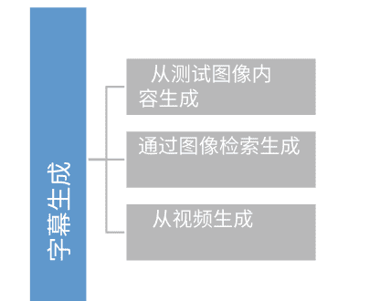

第二种方法基于相似图像检索。这些方法在大型训练数据库中搜索与查询图像相似的图像，并检索这些图像及其相应的描述（字幕）。然后，它们根据检索到的相似图像的描述为查询图像创建一个字幕。与直接从图像生成字幕相比，这种方法需要更多的训练数据来生成良好的描述。

从视频中生成字幕是一项更加困难的任务，因为它还需要分析时间信息，并识别视频中的动作、事件和互动。

#### 7.1 用于字幕生成的深度网络

基于深度学习的字幕生成系统的主要思想是使用卷积神经网络从图像中提取视觉特征，然后使用循环神经网络（RNN）将这些特征从视觉领域“翻译”到文本语言。长短期记忆（LSTM）模型是用于字幕生成任务的最常用的RNN。Vinyals等人开发的生成模型是这种方法的代表作。通过训练深度递归架构来从训练图像生成目标描述句子。通过训练深度卷积神经网络来进行图像分类任务。然后，移除最后的分类层，并将RNN连接到输出以生成文本描述。使用随机梯度下降和反向传播的端到端方式训练得到的网络。该模型在2015年的许多字幕生成数据集上取得了最先进的性能。

使用LSTM进行词语生成主要取决于LSTM的当前状态和上一个状态。尽管LSTM具有长期记忆，但如果在句子生成的开始处输入图像信息，其影响会随着句子长度的增加而减弱。全局语义信息已被证明对缓解这种影响很有用。Jia等人[55]使用了一种称为gLSTM的LSTM扩展。这个扩展在LSTM模型的每个块中增加了一个语义特征的额外输入。通过这种方式，LSTM生成的句子与测试图像更相关。长度归一化用于补偿对短句子的偏见。

字幕生成的逆问题，即从文本描述生成视觉特征，也是场景理解中的一个重要问题。这个问题的思想是，计算机应该能够根据文本描述绘制或可视化一个场景。Chen和Zitnick [56]探索了文本描述和图像视觉特征之间的双向转换。在阅读或生成字幕时，使用递归神经网络（RNN）创建图像的视觉表示。具有潜在变量的改进型RNN能够保留长期的视觉概念。静态视觉特征与语言模型一起输入RNN，用于字幕生成任务。对于图像检索任务，改进型RNN包含一个特殊层，从输入描述中生成视觉特征。该系统可用于字幕生成和基于文本描述的图像检索。

大多数涉及深度学习的字幕生成工作主要依赖于字幕生成数据库的可用性，并且不能描述不在字幕生成数据库中的对象。这限制了字幕生成的类型和性质，只能使用数据库中存在的风格和信息。可以有效地利用来自其他来源（例如网络和维基百科）的附加信息来提高字幕生成系统的性能[57]。

Hendricks等人从大型物体识别数据集和大量文本信息来源中收集信息，用于基于深度学习的名为Deep Compositional Captioner（DCC）的系统。它由三个主要组件组成：一个词汇分类器，一个语言模型和一个字幕模型。在词汇分类器中，使用CNN来查找图像中对象的关系和结构。最常见的形容词、动词和名词是从字幕生成数据库中提取的。在大型物体识别数据集上预训练的CNN被微调并用作词汇分类器。除了字幕生成数据库之外，还使用来自物体识别数据集的数据进行微调。CNN的输出特征对应于场景中存在特定概念或对象的概率。语言模型经过训练，可以预测句子中下一个单词，给定句子中的前一个单词。使用来自各种数据集和来源（如维基百科和英国国家语料库）的文本数据来训练模型。它包括一个独热向量嵌入层、LSTM和一个单词预测层。字幕模型使用线性仿射层将词汇分类器和语言模型的特征结合起来。简单的多模态组合层有助于理解视觉和语言特征之间的关系。通过这种方式，系统能够为训练集中不存在的对象生成描述。该系统还用于生成视频剪辑的描述。

### 8 视觉问答（VQA）

图像字幕生成的进一步扩展是视觉问答任务。VQA还涉及计算机视觉和自然语言处理的整合。在VQA中，系统需要回答关于图像的任意问题。答案应该直接从图像的内容中推断出来，尽管更高级的系统也在尝试需要外部信息才能回答的问题。问题的范围包括但不限于图像的内容，如对象的数量和类型，属性（例如颜色）的识别，场景分类以及对象之间的空间关系或交互。问题的类型包括开放式问题和多项选择题。近年来，为VQA开发各种系统的努力有所增加，尤其是由于深度学习改善了各种单独任务的性能，这些任务现在可以用来构建一个集成系统。一般来说，VQA系统由三个主要组件组成：从图像中提取特征的方法，理解问题的方法以及分析特征以得出正确答案的方法[58]。大多数方法使用在大规模对象识别数据集上预训练的CNN从图像中提取特征。对于问题的分析有各种方法，包括词袋模型（BOW），循环神经网络和长短期记忆（LSTM）模型。对于答案生成，大多数系统将VQA视为分类任务。从图像和问题中提取的特征被用作分类器的输入特征，该分类器经过训练以输出预定义的答案之一。然而，这种方法限制了答案只能是训练期间固定的那些。另一种选择是使用循环神经网络生成多个单词答案。

#### 8.1 VQA的深度学习方法

为了对视觉问题产生良好的答案，系统应该能够聚焦于与问题相关的图像区域，而不是整个图像。因此，与生成标题相比，VQA需要对图像有更深入的理解。Antol等人[59]开发了一个大规模的VQA数据库，并使用多层感知器和LSTM模型提供了各种基准结果。

Gao等人[60]开发了一个用于英文和中文的视觉问答系统。他们的系统的答案长度从一个单词到一个完整的句子不等。它由四个主要组件组成：一个CNN，两个LSTM模型和一个融合组件。CNN用于从图像中提取视觉特征。一个LSTM模型用于提取问题的特征。另一个LSTM模型与第一个LSTM共享权重矩阵，用于生成答案。最后，来自前三个组件的信息被融合组件整合以产生最终答案。

组件被组合在融合组件中以生成答案。使用独热编码向量[61]来表示问题和答案中的单词。
在编码字典中添加了一个答案开始<BOA>标记和一个答案结束<EOA>标记作为两个单词。这些标记在训练期间添加到每个答案中。在测试期间，系统接收一个输入图像和一个问题，<BOA>被传递给LSTM进行答案生成。然后模型计算下一个单词的概率分布。这个过程重复进行，直到系统输出一个<EOA>标记。人工评估者将系统的64%的答案评为与任何人类产生的答案水平相当。

在测试期间，使用CNN和LSTM的系统受到生成答案的性质的限制，这些答案仅限于训练数据中可用的单词。大多数这些系统在组合图像和问题的特征方面都有非常简单的机制，并且不使用高级语义概念。吴等人[62]将外部知识纳入到字幕生成和VQA系统中以提高性能。他们的系统还将基于属性的高级概念表示融合到传统的CNN和RNN方法中。通过使用训练数据字幕中最常见的单词构建了一个语义属性字典。学习到的属性可以是任何词性（名词、动词、形容词等）。然后，为了从图像中预测属性，使用在大型物体识别数据集上预训练的CNN对多标签数据集进行微调。在测试时，将图像和测试图像的若干子区域输入CNN，并将结果聚合以生成多标签预测。这个多标签预测和一个LSTM用于字幕生成。对于VQA，还使用CNN预测的前五个属性从外部知识数据库（如DBpedia）中提取信息。多标签CNN的特征、外部知识和生成的字幕被馈入LSTM模型。

LSTM模型还将问题作为输入，并使用所有这些输入生成问题的答案。这种方法在字幕生成和VQA的最新技术表现方面取得了显著的改进。

### 9 场景理解组件的整合

如前几节所讨论的，对场景理解的不同个体组件进行了大量的研究工作。CNN的成功导致了在专门任务上能够达到非常高性能的网络。尽管有这些进展，但在整体场景理解方面，使用深度学习的尝试非常少。不同的组件可以集成到一个统一的框架中，以提高整体性能。

深度估计有助于对象识别、人脸识别、场景分类和场景分割。Silberman等人从RGB-D图像中提取了关于主要表面、对象和支撑关系的信息。他们除了使用RGB还使用深度信息将室内场景解析为墙壁、地板、物体、区域和恢复的支持关系。同样，Hayat等人[10]使用深度信息来改善人脸识别和物体识别的结果。

场景文本检测可以提高物体识别的准确性。 Karaoglu等人[34]使用文本识别来帮助物体类别识别的任务。 他们首先进行场景文本识别，然后基于显著性的物体识别，最后借助识别的文本进行物体识别。 与仅使用基于显著性特征时相比，使用文本信息时物体识别的性能明显提高。

用于物体识别的网络还可以帮助文本检测、场景分类、标题生成和视觉问答（VQA）等任务。 事实上，通常会使用在ImageNet数据集上训练的大型网络作为场景理解的各种其他任务的特征提取器[62, 64]。 同样，场景分类对于标题生成和VQA是必需的。甚至标题生成可以帮助改进VQA算法的答案[62]。

#### 9.1 非深度学习方法用于整体场景理解

最近的一些研究将场景理解的不同组成部分结合起来，包括以下内容：

- Heitz等人[65]开发了级联分类模型（CCM）框架，其中他们结合了3D重建、场景分类、多类别图像分割和目标检测的任务。 级联框架学习了一组相关模型，除了执行各自的任务外，还相互帮助改善输出结果。
- Li等人[66]将[65]的工作扩展为反馈启用的级联分类模型（FE-CCM），通过最大化子任务的联合似然性。 他们引入了反馈步骤，使得早期的分类器可以从后期的分类器那里获得关于错误模式类型的反馈。这个反馈步骤改善了深度估计、场景分类、事件分类、显著性检测、几何标记和目标检测的性能。
- 姚等人[67]设计了一个用于整体场景理解的系统。 该系统提供有关区域、位置、对象的类别和空间范围、图像中类别的存在以及场景类型的信息，以集成的方式呈现。 在分解高阶潜力为成对潜力的过程中，使用了分段级别学习和辅助变量。 状态的最大数量等于类别的数量。 使用收敛的消息传递算法[67]来完成对象检测、场景分类和语义分割的任务。 先验知识可以被纳入算法中。既没有子模性限制，也不需要特定的潜在移动。这个整体模型改善了目标检测、场景分类和语义分割的所有任务的性能。

#### 9.2 基于深度学习的整体场景理解工作

与非深度学习技术相比，使用深度学习集成场景理解组件的努力是罕见且适度的。其中一些作品包括：

- Eigen等人[36]使用两个深度网络堆栈进行深度估计，一个用于基于整个图像的粗略全局预测，另一个用于在局部细化预测。Eigen和Fergus [46]将[36]扩展到使用单个多尺度卷积网络架构同时处理深度预测、表面法线估计和语义标注的三个任务。
- 与物理环境进行交互的机器和机器人不仅需要检测和识别场景中的对象，还需要了解如何使用和处理不同的对象。Ye等人[64]使用基于深度学习的两阶段流水线来定位和识别室内场景中各种对象的功能区域。使用基于注意力的选择性搜索算法来检测图像中可能包含功能区域的显著区域。然后，使用在大型物体识别数据集上预训练的卷积神经网络，通过移除最后一层并添加一个新的分类层来修改，以决定可以在检测到的区域上执行哪些功能。然后，以监督方式对网络进行微调，以生成最终系统。
- Khan等人[68]使用多个卷积网络自动学习超像素级别的特征和主要边界，用于自然场景中的阴影检测和去除。然后使用条件随机场（CRF）模型生成阴影的掩码，随后使用贝叶斯公式去除阴影。
- Asif等人[69]提出了一种系统，该系统使用深度信息和RGB通道同时实现对象识别和视频中稠密场景重建的任务。首先，识别出在视频的多个帧之间保持时空一致性的对象提议。使用CNN进行全局特征提取，同时使用词袋（BOW）方法提取中层特征。这些特征用于稠密场景重建。同时，高效地确定对象的类别概率，并将此信息集成到基于体素的预测假设中。
- 目标识别和抓取检测对于机器人的视觉感知非常重要，机器人与周围环境进行交互。Asif等人[70]提出了一个基于深度的CNN和级联森林的框架，将机器人抓取和目标识别的任务整合在一起。预训练的CNN用于从RGBD对象数据中提取特征。 在图像层次结构的不同层级上计算每个对象类别的概率。 然后使用级联的层次森林框架来确定对象的类别并根据其形状抓取它。

大多数使用深度学习进行整合的工作都基于深度信息和语义分割的组合。使用深度学习来结合文本检测、目标识别、场景分类和标题生成的任务仍然是一个开放的研究领域。 需要将这些组件集成到一个综合框架中，以帮助开发低成本和稳健的场景理解系统。

### 10 结论

深度学习已经在场景理解的所有组成部分中留下了自己的印记。本章简要介绍了深度学习技术在场景理解的各个组成部分中的应用。本章还讨论了深度学习框架在场景理解的高级任务（如文本描述生成和VQA）中的演变。这些技术在几乎所有计算机视觉的子领域中都代表了最先进的水平。由于深度网络可以达到人类级别的准确性，一些领域（如文档中的光学字符识别）现在被认为是已解决的问题。这种系统的商业应用包括银行支票的自动阅读[71]和邮政编码的自动阅读[72]。对于许多其他领域，深度学习大大提高了各种任务的性能，如目标检测和识别以及人脸检测和识别。这些进展也对自动驾驶领域做出了贡献，虽然完全自主尚未实现，但已经有几家公司推出了人类监督驾驶车辆。尽管取得了所有这些进展，但仍有很大的改进空间。正如前面的章节所讨论的，大多数深度学习工作的最新成果都集中在单个子任务上，而不是完整的场景理解任务上。大多数关于场景理解各个组成部分（如分割和物体识别）的现有工作都忽略了物体之间的物理交互。一个能够整合各个组成部分的联合神经网络架构将极大地帮助创建一个类似人类视觉系统的系统。深度学习技术在高级场景理解任务（如生成标题、视觉问答甚至复杂场景分类场景）上的性能仍远远低于人类的表现。

随着对场景理解的深度学习系统的发展更加关注，许多当前的挑战和问题可以得到解决，许多新技术将在不久的将来可用，例如，通过集成长距离深度图估计技术，自动驾驶汽车可以实现更好的性能。这样的系统还需要读取道路上的标志和信息，以达到类似人类的性能。“Seeing AI”微软太阳镜（正在开发中）对于盲人和视力受损者来说，这将是场景理解方面的奇迹之一。这些眼镜将能够检测人脸和面部表情，识别性别和估计年龄，并描述周围环境。它还可以阅读文本，回答各种类型的问题，并描述场景中正在进行的动作。场景理解系统还将在机器人领域帮助开发更多“类人”机器人。因此，使用最先进的深度网络进行场景理解的综合框架将有助于开发低成本和稳健的场景理解技术，并将彻底改变我们日常生活的许多方面。

致谢这项工作得到了西澳大学（UWA）的SIRF奖学金和澳大利亚研究委员会（ARC）的DP150100294资助。

## 参考文献

- 1. A.E. Johnson, M. Hebert, 使用自旋图像在杂乱的3D场景中进行高效的物体识别。IEEE Trans. Pattern Anal. Mach. Intell. **21**(5), 433–449 (1999)
- 2. D.G. Lowe, 使用局部尺度不变特征进行物体识别，在IEEE国际计算机视觉会议 (1999)
- 3. L. Wang, D.-C. He, 使用纹理谱进行纹理分类。Pattern Recognit. **23**(8), 905–910 (1990)
- 4. F. Tombari, S. Salti, L. Di Stefano, 用于局部表面描述的直方图的唯一签名，在欧洲计算机视觉会议 (柏林, 海德堡, 2010)
- 5. S.A.A. Shah, M. Bennamoun, F. Boussaid, 3D局部表面描述符在低分辨率和高分辨率范围图像配准中的性能评估，国际数字图像计算会议：技术和应用 (2014年)
- 6. Y. Guo, F.A. Sohel, M. Bennamoun, J. Wan, M. Lu, RoPS: 基于旋转投影统计的3D刚体物体的局部特征描述符，国际通信、信号处理及其应用会议 (2013年)
- 7. L. Bo, X. Ren, D. Fox, 深度核描述符用于物体识别，IEEE/RSJ国际智能机器人与系统会议 (2011年)
- 8. Y. Guo, M. Bennamoun, F. Sohel, M. Lu, J. Wan, 在杂乱场景中使用局部表面特征进行3D物体识别：一项调查。IEEE模式分析与机器智能交易。**36** (11), 2270-2287 (2014年)
- 9. L. Deng, 深度学习的架构、算法和应用的教程调查. APSIPA Trans. 信号信息处理. **3**, e2 (2014)
- 10. M. Hayat, M. Bennamoun, S. An, 图像集分类的深度重建模型. IEEE Trans. 模式分析与机器智能. **37**(4), 713–727 (2015)
- 11. S.A.A. Shah, M. Bennamoun, F. Boussaid, 基于图像集的人脸和物体识别的迭代深度学习. Neurocomputing **174**, 866–874 (2016)
- 12. A. Krizhevsky, I. Sutskever, G.E. Hinton, 使用深度卷积神经网络进行ImageNet分类，在神经信息处理系统进展 (2012)
- 13. C. Szegedy, W. Liu, Y. Jia, P. Sermanet, S. Reed, D. Anguelov等, 使用卷积神经网络进行更深层次的卷积，在IEEE计算机视觉和模式识别会议论文集(2015)
- 14. K. He, X. Zhang, S. Ren, J. Sun, 深度残差学习用于图像识别，在IEEE计算机视觉和模式识别会议 (2016)
- 15. C.R. Qi, H. Su, K. Mo, L.J. Guibas, PointNet: 用于3D分类和分割的点集深度学习arXiv:1612.00593 (2016)
- 16. P. Viola, M.J. Jones, 鲁棒的实时人脸检测. 计算机视觉国际期刊 **57**(2), 137–154 (2004)
- 17. F.R.M. Al-Osaimi, M. Bennamoun, 基于面部表面特征的3D人脸表面分析和识别，3D人脸建模、分析和识别(Wiley, 2013), 第39–76页
- 18. Y. Taigman, M. Yang, M. Ranzato, L. Wolf, Deepface: 在人脸验证中缩小与人类水平性能的差距, IEEE计算机视觉和模式识别会议 (2014)
- 19. E.G. Ortiz, A. Wright, M. Shah, 通过平均序列稀疏表示的分类, 在IEEE计算机视觉和模式识别会议 (2013)中进行的电影预告片人脸识别
- 20. S.A.A. Shah, U. Nadeem, M. Bennamoun, F. Sohel, R. Togneri, 使用基于线性回归的图像重建进行高效图像集分类, 在IEEE计算机视觉和模式识别会议工作坊 (2017)中
- 21. H. Li, Z. Lin, X. Shen, J. Brandt, G. Hua, 用于人脸检测的卷积神经网络级联, 在IEEE计算机视觉和模式识别会议(2015)中
- 22. J. Lu, G. Wang, W. Deng, P. Moulin, J. Zhou, 用于图像集分类的多流形深度度量学习, 在IEEE计算机视觉和模式识别会议 (2015)中
- 23. F. Schroff, D. Kalenichenko, J. Philbin, FaceNet: 用于人脸识别和聚类的统一嵌入, 在IEEE计算机视觉和模式识别会议 (2015)的论文中
- 24. D. Karatzas, L. Gomez-Bigorda, A. Nicolaou, S. Ghosh, A. Bagdanov, M. Iwamura等, ICDAR 2015鲁棒阅读竞赛, 在第13届国际文档分析和识别会议 (2015)中
- 25. Q. Ye, D. Doermann, 图像中的文本检测和识别: 一项调查. IEEE模式分析和机器智能交易. **37**(7), 1480–1500 (2015)
- 26. M. Jaderberg, K. Simonyan, A. Vedaldi, A. Zisserman, 用卷积神经网络在野外阅读文本. 国际计算机视觉. **116**(1), 1–20 (2016)
- 27. T. Wang, D.J. Wu, A. Coates, A.Y. Ng, 使用卷积神经网络进行端到端文本识别, 在第21届国际模式识别大会上 (2012)
- 28. B. Epshtein, E. Ofek, Y. Wexler, 使用笔画宽度变换在自然场景中检测文本, 在IEEE计算机视觉和模式识别大会上 (2010)
- 29. B. Epshtein, E. Ofek, Y. Wexler, 使用笔画宽度变换在自然场景中检测文本, 在IEEE计算机视觉和模式识别大会上 (2010)
- 30. H. Chen, S.S. Tsai, G. Schroth, D.M. Chen, R. Grzeszczuk, B. Girod, 在自然图像中使用边缘增强的极值稳定区域进行鲁棒文本检测, 在第18届IEEE国际图像处理大会上 (2011)
- 31. L. Neumann, J. Matas, 实时场景文本定位和识别, 在IEEE计算机视觉和模式识别会议 (2012)的论文集中
- 32. L. Neumann, J. Matas, 带有定向笔画检测的场景文本定位和识别,在IEEE国际计算机视觉会议 (2013)的论文集中
- 33. Q. Zhu, M.-C. Yeh, K.-T. Cheng, 使用学习的文本概念进行图像分类的多模态融合, 在第14届ACM国际多媒体会议 (2006)的论文集中
- 34. S. Karaoglu, J.C. Van Gemert, T. Gevers, 对象阅读: 用于对象识别的文本识别,在欧洲计算机视觉会议(ECCV) (2012)的论文集中
- 35. Z. Zhang, C. Zhang, W. Shen, C. Yao, W. Liu, X. Bai, 基于全卷积网络的多方向文本检测, 在IEEE计算机视觉和模式识别会议 (2016)的论文集中
- 36. D. Eigen, C. Puhrsch, R. Fergus, 使用多尺度深度网络从单张图像预测深度图, 在《神经信息处理系统进展》(2014)中
- 37. D. Scharstein, R. Szeliski, 密集双帧立体对应算法的分类和评估。计算机视觉国际期刊. **47** (1–3), 7–42 (2002)
- 38. S. Mattoccia, S. Giardino, A. Gambini, 基于近似联合双边滤波的立体对应精确高效的代价聚合策略, 在《亚洲计算机视觉会议》(2010)中
- 39. R.A. Hamzah, H. Ibrahim, 关于立体视觉视差图算法的文献综述。感知杂志。 (2015)
- 40. Y. Li, D.P. Huttenlocher, 使用结构化支持向量机进行立体视觉学习, 在《计算机视觉和模式识别IEEE会议论文集》(2008)中
- 41. A. Spyropoulos, N. Komodakis, P. Mordohai, 学习检测地面控制点以提高立体匹配的准确性, 在《计算机视觉和模式识别IEEE会议论文集》(2014)中
- 42. A. Saxena, M. Sun, A.Y. Ng, Make3D: 从单张静态图像学习3D场景结构。 IEEE Trans. Pattern Anal. Mach. Intell. 31(5), 824–840 (2009)
- 43. K. Karsch, C. Liu, S.B. Kang, 使用非参数采样从视频中提取深度, 在欧洲计算机视觉会议 (2012)
- 44. L. Ladicky, J. Shi, M. Pollefeys, 从透视中拉出物体, 在IEEE计算机视觉和模式识别会议 (2014)
- 45. J. Zbontar, Y. LeCun, 通过训练卷积神经网络来比较图像块进行立体匹配。 J. Mach. Learn. Res. 17(2), 1–32 (2016)
- 46. D. Eigen, R. Fergus, 使用通用的多尺度卷积架构预测深度、表面法线和语义标签, 在IEEE国际计算机视觉会议 (2015)
- 47. S.N. Parizi, J.G. Oberlin, P.F. Felzenszwalb, 用于场景识别的可重构模型, 在IEEE计算机视觉和模式识别会议论文集中 (2012)
- 48. D. Lin, C. Lu, R. Liao, J. Jia, 学习场景分类的重要空间汇聚区域, 在IEEE计算机视觉和模式识别会议论文集中 (2014)
- 49. B. Zhou, A. Lapedriza, J. Xiao, A. Torralba, A. Oliva, 使用场所数据库学习场景识别的深度特征, 在神经信息处理系统进展中 (2014)
- 50. M. Hayat, S.H. Khan, M. Bennamoun, S. An, 用于室内场景分类的空间布局和尺度不变特征表示。 IEEE图像处理交易。 25(10), 4829–4841(2016)
- 51. S.H. Khan, M. Hayat, M. Bennamoun, R. Togneri, F.A. Sohel, 用于室内场景识别的卷积特征的判别表示。 IEEE图像处理交易。 25(7),3372–3383 (2016)
- 52. L. Herranz, S. Jiang, X. Li, 使用CNN进行场景识别: 对象、尺度和数据集偏差, 在IEEE计算机视觉和模式识别会议 (2016)
- 53. R. Bernardi, R. Cakici, D. Elliott, A. Erdem, E.I.-C.N. Erdem, F. Keller, A. Muscat, B. Plank, 从图像生成自动描述: 模型、数据集和评估措施。人工智能研究杂志。 55, 409–442 (2016)
- 54. O. Vinyals, A. Toshev, S. Bengio, D. Erhan, 展示和告诉: 神经图像字幕生成器, 在IEEE计算机视觉和模式识别会议 (2015)
- 55. X. Jia, E. Gavves, B. Fernando, T. Tuytelaars, 引导长短期记忆模型进行图像字幕生成, 在IEEE国际计算机会议上 (2015)
- 56. X. Chen, C. Lawrence Zitnick, Mind’s eye: a recurrent visual representation for image caption generation, in Proceedings of the IEEE Conference on Computer Vision and Pattern Recognition (2015)
- 57. L. Anne Hendricks, S. Venugopalan, M. Rohrbach, R. Mooney, K. Saenko, T. Darrell, Deep compositional captioning: describing novel object categories without paired training data, in Proceedings of the IEEE Conference on Computer Vision and Pattern Recognition (2016)
- 58. K. Kafle, C. Kanan, Visual question answering: datasets, algorithms, and future challenges. arXiv:1610.01465 (2016)
- 59. S. Antol, A. Agrawal, J. Lu, M. Mitchell, D. Batra, C. Lawrence Zitnick, D. Parikh, VQA: visual question answering, in Proceedings of the IEEE International Conference on Computer Vision (2015)

## 深度学习在字符识别中的应用：概述

Sana Saeed， Saeeda Naz和Muhammad Imran Razzak

摘要 对于自动化文档分析，光学字符识别 (OCR) 是一个基本构建模块。强大的自动文档分析系统可以对生活的更广泛领域产生影响。许多研究人员一直在努力构建具有显著准确度、字符识别率和最小错误率的各种语言的OCR系统。深度学习是一种与其他技术相比具有高效准确结果的先进技术的起点。

每种语言，甚至每种脚本都有自己的挑战，例如，字符之间有明显间隔的脚本相对较容易，而字符相互连接的草书脚本则更具挑战性。在本章中，我们将详细介绍阿拉伯语、拉丁语和符号脚本的最新深度学习技术。

### 1 引言

技术为文件处理引入了新的维度，催生了自动化和无纸化办公的时代。自动化系统节省时间，减少人力投入，降低人为错误的风险，并为组织增加财务储蓄。处理文本文档相对较容易，而处理数字照片图像则更加复杂。通过使用文档图像分析 (DIA) 技术，纸质文档可以以数字可处理的格式表示。纸质文档被扫描并以数字文档图像的形式存储。文档图像随后被转换为文本，在对文档内容进行任何操作之前，请先进行等效处理。随着无纸办公的趋势不断增长，迫切需要一个强大的DIA系统。DIA可以分为两类；第一类是图形处理系统或布局处理，旨在识别包括符号、线条、图表、图表、文本段落和所有非文本材料在内的图形组件。另一类是文本处理，包括定位文档中的文本内容并将其转换为文本格式，这个阶段也被称为OCR（光学字符识别）。我们的研究重点是“文本处理”。DIA应用也被称为智能字符识别、动态字符识别、在线字符识别、实时字符识别。Gustav Tauschek在20世纪30年代初首次研究了OCR。OCR是机器学习、智能系统、信号处理和模式识别系统的子领域[1]。OCR是将文本形式自动提取和转换为数字图像。图像可能包含印刷文本、手写文本、场景文本（图片或招牌上的文字等）。数字相机或扫描仪通常在经过一定的处理后获取数字图像，并将其转换为所需的格式，即文本形式。OCR应用的输入是包含文本的图像，而输出是纯文本。OCR的其他名称包括智能字符识别、动态字符识别、在线字符识别或实时字符识别。

广义上，OCR被分为离线字符识别和在线字符识别两类[2]。第一种处理静态存储的数字图像，通常是通过扫描或相机捕捉的。而后者则是将手写记录为时间序列，即在数字表面上直接书写时使用输入设备（如触笔或光笔）记录手写[2]。通常，OCR技术仅指离线字符识别，因此在本章中我们将仅使用OCR术语来指代离线字符识别。根据文本的性质，离线OCR可以分为三类：（1）印刷文本（2）手写文本（3）场景文本。

OCR是一种用于数字化印刷文本的强大方法，通过使用OCR，数字信息可以以更高效的方式进行处理、管理、处理和存储[3, 4]。此外，通过将人工智能和机器学习技术应用于这些文本，可以分析和处理文本中包含的信息，例如可以用于情感分析等。几乎每种语言都有大量的数据需要构建OCR应用程序，因此创建需要大量数据来训练模型并获得最高准确性的OCR应用程序是可行的。在过去的几十年里，已经做了大量的工作，但OCR仍然是大多数脚本中最热门和具有挑战性的研究课题之一。

本章的动机是考虑基于深度学习算法的文档分析。该研究旨在列举深度学习算法发展中的障碍，并在现有工作的基础上指出可能的未来方向。本章详细介绍了应用于文档处理和分析的基本知识和最新的深度学习方法。

### 2 文档分析的目标

强大的自动文档分析系统可以彻底改变许多生活领域。这些系统不仅可以帮助从图像中提取文本，还可以帮助理解文档内部的文本格式。应用文档分析过程的几个目标如下。

#### 2.1 提取属性（元数据）用于索引和搜索的过滤条件

数字图像包含文本，但除非以计算机可读的格式正确表示，否则对计算机系统而言这些文本是无用的。在从图像中提取文本后，可以使用索引和排名软件对数字图像进行索引。此外，这段文字还可以用于搜索引擎的基于关键词的搜索。

#### 2.2 根据特定类别对文档进行分类

在一个组织中，可能存在多种类型的文档，例如在银行中，同一时间可能会处理存款单、支票和水电费单。在这种情况下，如果将所有文档的扫描图像提供给自动文档分析系统，它将自动将所有文档分类到各自的类别中，从图像中提取客户凭证并执行所需的操作。此外，在邮局中，可以将基于OCR的技术与自动分拣和按照信封上指定的地址进行分类的技术集成在一起。

#### 2.3 公司特定词典的自动创建

一个词在不同情况下、不同地方可以传达不同的含义，例如，单词“balance”通常表示保持平衡的状态，但在银行中，“balance”一词表示“客户账户中剩余的金额”。因此，在处理这种情况时，可以通过分析从文档中提取的文本来建立一个公司特定的词典，以方便使用并避免误解。

#### 2.4 文档内容各种属性的统计

可以应用不同的统计操作来处理文本中提供的信息，以更有效地利用它。

#### 2.5 自动翻译

数字文档可能存在不同的语言；而且随着互联网技术的发展，数字文档的可访问性并不受限制。无论文档最初是用哪种语言创建的，都可以通过自动翻译软件（如谷歌翻译）进行自动翻译，而无需雇佣任何专家的服务。成功使用OCR技术从图像中转换文本后，可以将该文本传递给自动翻译软件，以使其在更广泛的范围内可访问。在[5]中设计了这样一个系统，用于阿拉伯语到英语的翻译，但翻译过程表现不佳，因为识别错误传播到了翻译阶段。

### 3 自动文档分析的应用

自动文档分析系统的一些常见应用如下所述。

#### 3.1 历史文档分析

历史文档分析是OCR的一个具有挑战性的领域，因为它们通常有数百年的历史，并经历了许多影响内容清晰度的退化，因此需要更强大和专门设计的系统来处理这些系统。历史文档中最常见的退化效应之一是透印效应[6]。这实际上是由于墨水从纸张的背面渗出或者纸张质量太差而引起的情况。因此，纸张背面的文字印痕会出现在正面。这种类型的退化会使得历史文档分析的OCR更具挑战性[6, 7]。

#### 3.2 文档布局分析

文档布局分析是OCR的另一个应用，用于识别图像中包含不同信息的不同区域。如果所有文档都是相同格式的，例如组织规定的官方文档，则文档布局分析不是一个大问题。然而，如果文档布局存在不规则性和不一致性，例如处理历史文档和文学书籍的情况下，书写风格、字体和装饰性元素的形状会有明显的变化。以前使用了两种文档布局分析方法（1）自下而上方法。（2）自上而下方法[7]。自下而上的文档分析从像素等小而基本的实体开始，然后逐渐将它们组合成较大的感兴趣区域。而自上而下的分析则从整个文档图像开始，将其分割成较小的感兴趣区域。在这里，可以使用监督学习和无监督学习方法来训练深度学习模型。

#### 3.3 从扫描文档中提取文本并数字化信息

扫描文档以数字图像的形式存储在计算机系统中。数字图像需要更多的存储空间，而且这些文档是非文本格式的，因此无法进行编辑和修改。然而，经常需要编辑和修改这些扫描文档。如果没有强大的OCR系统，编辑图像文档将是一项繁琐和奇怪的工作，因为要么使用图像编辑器覆盖文档，要么手动将其重新生成为文本格式。在这两种方法中，前者是奇怪的，后者是繁琐和耗时的。强大的OCR系统肯定可以在自动转换后将数字文档图像处理为文本文档，而无需进行大量人力努力。

#### 3.4 自动交通监控、监视和安全系统

OCR系统可用于从交通图像中提取文本和车牌识别以进行车辆识别。这将有助于改进现有的交通监控和监视系统，如收费和交通规则执行。OCR技术还将有助于通过分析闭路电视录像和基于车牌号码的自动车辆识别来控制犯罪，包括绑架、交通违规等。

#### 3.5 自动邮件分拣

邮件分拣是在信封投递之前对邮件进行预分拣，基于信封上的地址。邮局中的自动分拣可以大大减少人力，从而减少整体投递时间，并通过减少费用和提高系统效率来增加组织的利润。OCR系统特别处理地址识别[8]、地址块定位、地址行定位[9]和数字识别[10]，这些都是根据信封上指定的脚本来开发的，旨在实现邮局中高效的邮件分拣。

### 4 深度学习相对于机器学习的重要性

深度学习是一种表示学习技术，它是机器学习技术的一种，通过使用大量数据来学习数据内部的模式，并能够根据新数据进行预测[11]。深度学习的概念相对较新，与其他同行技术相比，传统技术的处理能力有限，而深度学习技术可以更强大地处理相同的数据，并在准确性方面超越传统技术。2013年，深度学习被列为前十大突破性技术之一。

从图像中准确提取文本取决于图像的质量和要检测的模式的性质以及所使用算法的鲁棒性。然而，通过更好的扫描和成像技术和设备可以提高图像的质量。但是，图像中的对象质量是一个动态且无法控制的因素，手写风格因人而异，古书的排版风格通常很奇特，而且书籍可能不在良好的状态，这显然会导致图像的质量较低。此外，算法在处理分隔明显的语言时会返回更好的结果，而对于连笔的语言来说，处理变得更加复杂，因此算法的效率会降低。尽管已经开发出更复杂的算法来实现高精度，但稳健的商业OCR仍在路上。

开发更复杂的人工神经网络，增加更多的层次，并允许更高级别的输入图像分析，以实现更高的准确性。开发在不同层次使用的新数学函数改进了自我修复性质，就像大数据分析领域的复兴一样。因此，深度学习在多个领域广泛应用。如模式识别、天气预报应用、文本分析和处理、语音识别、物体检测、图像分析。

#### 4.1 深度学习技术和架构

人工神经网络是受生物启发的网络，因为人脑中的学习过程是基于从环境刺激中获得的经验。 在人类的大脑和神经系统内部，有着相互连接的微小细胞体，即神经元。 神经元之间的连接强度表示事件之间的关系，这种强度用突触权重这个术语来表示：权重越高，连接越强，反之亦然。 类似于人脑的抽象架构，人工神经网络由神经元和神经元之间的加权连接组成，它们的权重被称为“突触权重”。 这些权重类似于人类神经系统中神经元之间的连接强度。通过调整这些突触权重，使用前一层的值和应用数学激活函数来实现学习。

最简单和最早的人工神经网络之一是基于神经元的数学模型的感知器，被称为McCulloch和Pitts神经元。 McCulloch和Pitts神经元接受加权输入并通过加法器传递它们以获得输出值，而感知器只是McCulloch和Pitts神经元的组合，每个神经元的输出都经过激活函数处理。 感知器是最早的人工神经网络之一，只包含两层，即直接连接到输出层的输入层。 这是一个简单的模型，但不幸的是，这个简单的模型只能处理简单和线性的问题。 为了处理复杂和非线性的问题，引入了更多的层，称为“隐藏层”。 这些层位于输入层和输出层之间。这种人工神经网络被称为深度神经网络。 隐藏层引入了一个黑盒效应，因为我们不知道通过应用指定的参数，这些层如何进行预测。在深度神经网络中，每个前任层的输出作为输入传递给后继层。随着隐藏层数量的增加，模型的抽象程度和复杂性也增加。 但是该模型可以处理更复杂的问题，并以更高的准确度诊断非线性关系。 尽管由于大规模并行和复杂的处理，学习过程（调整突触权重）相当缓慢，但能够更有效地处理数据并获得更高的准确度（图1）。

在处理OCR不同语言的挑战时，深度神经网络（DNN）表现出色，尤其是在处理字符未分隔和连笔文本的问题上。 深度学习自从划时代的论文[12]发布以来，一直是热门话题之一。 最近的进展和新模型，如卷积神经网络（CNN）和循环神经网络（RNN），以及其变种LSTRM（长短期记忆网络）和BLSTM网络（双向长短期记忆网络），打破了阿拉伯文字OCR应用中的障碍，提高了效率。

图1深度神经网络架构

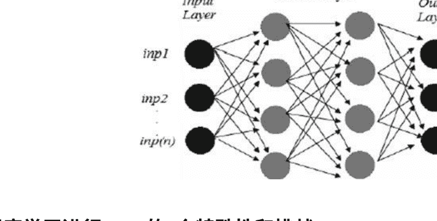

## 使用深度学习进行OCR的5个特殊性和挑战

使用机器学习和深度学习技术进行光学字符识别的开发存在许多特殊性和问题。接下来，我们将详细介绍每个挑战。

#### 5.1 数据集

数据集的可用性对于任何机器学习应用程序来说都是至关重要的，尤其是对于深度学习应用程序，因为这种应用程序需要大量的数据集。模型产生的结果准确性主要取决于可用数据的数量；更多的数据可以帮助模型以更通用的方式设置其参数，从而更好地学习模型。除了数量，数据集的质量也是一个主要因素，它在很大程度上影响学习过程。

由于许多语言没有标准数据集可用。因此，缺乏适合特定语言的数据集是深度学习在OCR领域取得成功的最大障碍。此外，每种语言和每种文字都有自己的特点，特别是连笔字的语言，字符之间没有明显的分隔，它们有自己的挑战，而拉丁文字的语言可能会面临类似字符的挑战等等。[13]它们有自己的特性和挑战。因此，文档分析成为每种语言和文字的独立领域。简单来说，用于英文文档分析的数据集既不能用于乌尔都语，也不能用于中文，反之亦然。它应该用于英文文档分析。因此，开发多语言系统变得相当繁琐。

#### 5.2 数据互操作性和数据标准

数据互操作性和数据标准是主要障碍之一。目前，数据的性质因语言而异，因此图像存在很大的变化，这是由于获取数据的设备和获取数据的格式不同造成的。

此外，一个语言可能使用多种不同的书写体系，例如乌尔都语可以用纳斯克和纳特利克书写体系。因此，在这种情况下，应对多样性意味着能够以任何可用格式、任何可用的书写体系处理数据。此外，为了使系统适用于纯手写文档，应使用手写文档分析的数据集；对于计算机打印文档，应使用类似的数据集以获取图像中的文本。

#### 5.3 构建和集成大型图像数据集

为了训练深度学习模型，需要大规模的数据集，但不幸的是，许多语言甚至没有任何标准数据集。因此，在使用较少的数据进行模型训练时，整个系统的效率会受到影响。尽管为特定情况下的特定书写体系构建标准数据集通常不是一个大问题，但对于许多语言来说，这种情况可能没有得到研究人员的充分关注和努力，主要是因为这是一项繁琐且耗时的工作，而且可能因为某种原因而变得昂贵。在某些情况下，这可能成为隐私的重大问题，例如，如果自动化的DAS专门设计用于分析银行支票，这种应用的数据首先不会公开可用。然而，适量的数据是可用的。它不能被其他人公开用于构建任何其他应用。因此，在这种情况下，数据的共享几乎是不可能的，但可以采取适当的措施来克服这些问题。

#### 5.4 语言和脚本的特殊性

每种语言和脚本都有自己的字符集、格式和风格，更一般地说，是用于书写的脚本。每种脚本都有自己的挑战和特殊性，例如拉丁脚本中字符之间有明显的间隔，容易分割，而连写脚本中字符之间没有明显的间隔，还伴随着其他问题，如倾斜、双向性和字符重叠。因此，在目前的情况下，构建一个能够完全处理所有类型语言的强大系统是最困难的任务，因此构建一个单一的OCR系统来处理单一的语言或单一的脚本。

#### 5.5 黑盒和深度学习

毫无疑问，深度学习在许多领域引起了革命；自动文档分析应用程序的引用也从这一令人惊叹的技术中受益。深度学习算法为提高自动文档分析应用程序的效率开辟了新的途径。然而，深度学习技术本身是神秘的。然而，用于深度学习的所有数学和规则都是相当清晰和明确定义的，但是这些明确定义的规则和法则如何使系统足够智能，能够通过学习模式执行文档分析等人工智能任务，这是一个未知的现象。这个问题被称为黑盒问题。这个问题是由于学习过程中涉及的复杂性和给定输入数据的复杂输出引起的。由于深度学习的黑盒特性，研究人员在不知道实际上是如何实现所需结果的情况下使用它。

#### 5.6 处理硬件功率

由于深度学习系统需要并行处理大量数据，这种处理不仅需要巨大的处理能力，而且还受到系统浮点精度的影响。相对较新的硬件技术催生了更快的GPU和协处理器。在[14]中，作者指出GPU在深度学习过程中处理大量数据时比微处理器快40倍。作者应用内联反向传播算法来处理MNIST数据集上的数据。在这种情况下，仅仅改进具有单精度浮点精度的GPU硬件就能够在比较复杂和复杂的架构模型上取得更好的结果。如果硬件更先进且经过优化以执行数学计算，并且能够提供更高的浮点精度，那么深度学习应用即使在相对较小的数据集上也能够更好地工作，并且不再需要应用增加数据集大小的技术，因此编程开销减少。因此，先进的硬件对于深度学习的影响在任何阶段、任何应用中都不可忽视，无论是手写识别、模式识别的其他领域、数据挖掘、计算机视觉等等。

#### 5.7 实现（可用库）可能与硬件相关

GPU和协处理器的出现对机器学习和深度学习技术产生了巨大影响，新的强大硬件具有更高的浮点精度，机器学习和深度学习领域得到了迅猛发展。但是

60. 高华，毛杰，周杰，黄志，王亮，徐伟，你在和机器说话吗？ 数据集和多语言图像问题的方法，在神经信息处理进展系统 (2015)
61. D. 哈里斯，S. 哈里斯，数字设计和计算机体系结构(Morgan Kaufmann, 2010)，第129页
62. 吴琦，沈超，王鹏，迪克，范登亨格尔，基于属性和外部知识的图像字幕和视觉问答，在IEEE模式分析与机器智能交易 (2017)
63. N. 西尔伯曼，D. 霍伊姆，P. 科利，R. 费格斯，室内分割和支持推理 RGBD图像，在欧洲计算机视觉大会(ECCV) (2012)
64. C. 叶，Y. 杨，C. 费尔穆勒，Y. 阿洛伊莫诺斯，我在这附近能做什么？ 深度功能场景理解认知机器人。 arXiv:1602.00032 (2016)
65. G. Heitz, S. Gould, A. Saxena, D. Koller, 级联分类模型：综合场景理解的模型组合，在《神经信息处理系统进展》(2009)中
66. C. Li, A. Kowdle, A. Saxena, T. Chen, 迈向整体场景理解：反馈启用的级联分类模型，在《神经信息处理系统进展》(2010)中
67. J. Yao, S. Fidler, R. Urtasun, 将场景作为整体描述：联合目标检测、场景分类和语义分割，在《IEEE计算机视觉和模式识别会议论文集》(2012)中
68. S. H. Khan, B Mohammed, F. Sohel, R. Togners, 单幅图像的自动阴影检测和去除。 IEEE模式分析与机器智能交互。 38(3), 431–446 (2016)
69. U. Asif, M. Bennamoun, F. Sohel, 同时进行密集场景重建和对象标记，在《IEEE国际机器人与自动化会议》(2016)中
70. U. Asif, M. Bennamoun, F.A. Sohel, 使用分层级联森林的RGB-D对象识别和抓取检测。 IEEE机器人学交互。 (2017)
71. R. Jayadevan, S.R. Kolhe, P.M. Patil, U. Pal, 自动处理手写支票图像的调查. 国际文档分析与识别杂志 (IJDA R) 15(4), 267–296 (2012)
72. G. Dreyfus,神经网络: 方法与应用(Springer Science & BusinessMedia, 2005)

问题是GPU和协处理器通常无法执行现有的库，因为它们专门设计了自己的指令集，尤其是GPU首先将一组数学运算和算法转化为图形操作，因此，为了在GPU上执行深度学习算法，需要创建与GPU处理兼容的特殊版本的库，例如Tensorflow是一个Python库，有两个版本，一个是支持CPU的Tensorflow，另一个是支持GPU的Tensorflow。 GPU应用程序的代码是用一种类似于C的编程语言编写的，称为计算统一设备架构（CUDA）。

### 6 机器学习，深度学习和光学字符识别

在下面的小节中，使用机器学习和深度学习介绍了针对阿拉伯文、符号文本和拉丁文本的OCR的不同研究。

#### 6.1 针对阿拉伯文的OCR

乌尔都语、阿拉伯语、波斯语和普什图语是亚洲最大的大陆包括中东和南亚地区的许多地区所使用的语言。尽管这些语言并不相同，但它们都有共同的阿拉伯文脚本[15]。 乌尔都语是超过7000万人口的语言，此外，它是巴基斯坦的国家语言，也是印度的5个邦的官方语言。上述所有语言都富有文学，而且穆斯林的宗教圣书和其他相关材料如阿拉伯语[16]。

这些语言的流行性促使了文学的数字化，以便与当前技术世界的进步保持同步。 数字化的文学将为新书和旧书提供更长时间的保存，并通过后续的算法使搜索变得更加容易。 在这种情况下，文档图像分析出现了，通过对文档的扫描图像进行模式分析。这些模式可能包括文本、简单图形、图片等。这种多功能组合使得分析变得更加复杂。 因此，为了解释图像中的对象，使用了许多技术。 为了获取文本，使用了一种众所周知的技术OCR（光学字符识别技术），该技术用于读取文档图像并将其转换为纯文本。 因此，可以说OCR系统可以识别所有主要和次要的写作块，包括字符、单词和句子。 OCR已经是一个活跃的研究领域几十年了。 基于拉丁文脚本的不同语言（字符间有明显分隔）已经成功开发了具有高准确性的商业OCR系统，这要归功于图像处理和计算智能领域的巨大进展和更好方法的评估。 使用阿拉伯文脚本的语言由于其草书性质，草书性质的复杂性导致其落后。阿拉伯文字的主要挑战和特点可以列举为双向性、对角线性、图形乘法/上下文敏感性、草书风格、字符重叠、大小写、点的数量和位置、点的复杂放置、拉伸、定位、间距、填充循环、虚假循环、模糊的分割提示点、分割方向、文本行分割和行间距[17]。许多复杂性问题出现在两个单词（连字）的连接点上。各种技术已经被用于模式识别，但深度学习方法在性能和准确性方面超过了所有其他方法。用于模式识别的流行深度学习模型包括卷积神经网络（CNN）、极限学习模型（ELM）、循环神经网络（RNN）以及RNN的变体，如BLSTM和MDLSTM。在这些模型中，许多模型都存在一些问题，包括单实例学习、缺乏记忆和隐藏节点的非循环连接，例如ELM、传统神经网络和CNN缺乏记忆，因此没有存储序列的能力。因此，HMM和LSTM是唯一能够处理序列学习问题的模型。不同的研究，包括[18-22]，表明LSTM的性能优于其他技术。

在[23]中，线条和连字分割技术的组合被用来提取连接的组件。该算法依赖于基线检测进行行分割，并显示出在定位点和变音符上的显著提升，准确率达到99.17%。

##### 6.1.1 前馈神经网络

前馈神经网络（FFNN）是最简单的人工神经网络形式。FFNN只是多层感知器（MLP）的一种，除了FFNN还有额外的隐藏层，而MLP则没有。[24]中的研究详细阐述了字符的复杂性和由此产生的挑战，得出的结论是大多数错误发生在末尾字符上，因为阿拉伯语脚本中没有正确的大写和小写字符的概念，除了末尾字符。为了解决这个问题，将基于像素强度进行分割的100个字符样本输入到一个具有2000个神经元的单隐藏层的简单前馈神经网络中，结果平均准确率为70%。

在另一项研究中，Seuret等人[25]采用了主成分分析（PCA）初始化的深度神经网络方法，对DIVA-HisDB和手稿SG8573、SG5624和GW105进行了注释。实验结果显示，与Xavier初始化的网络相比，准确性有所提高。

##### 6.1.2 卷积神经网络

卷积神经网络是一种特殊的深度前馈神经网络，其隐藏层由卷积层、池化层和全连接层组成。CNN主要关注实例学习，因此在孤立字符识别方面CNN效果更好。在[26]中，卷积神经网络用于对名为EAST（英语-阿拉伯语场景文本）数据集进行特征提取和分类。数据集中的图像复杂且在各种光照条件下捕获，因此需要对图像进行鲁棒的分割以进行正确的分类。经验方法无法处理这种复杂情况，因此图像需要手动根据文本行或单词进行分割。使用所提出的方法得到的最佳结果，错误率最低为0.15%。

卷积神经网络委员会在手写MIST分类中使用[27]，其中7个CNN委员会中的每个委员会成员都是一个CNN，所有网络都提供相同的图像，但以某种形式扭曲。委员会对所有CNN的结果进行平均。在MINST上实验报告的最低错误率为0.35%。

##### 6.1.3 自编码器

自编码器是一个简单的多层感知器（MLP），其限制是它的输入和输出数量与网络的形式相同。隐藏层的神经元数量可以与输入和输出层的神经元数量不同，如果神经元数量少于前一层，则网络在这里也会产生一种卷积效果，因为在这种情况下，下一层将接收到压缩的输入。自编码器实际上是一个由前馈和非递归神经网络组成的混合网络。在[28]中，自编码器用于乌尔都语字符识别。网络首先通过前馈传递进行训练，然后使用误差传播来调整权重，其中输入值a1和a1之间的差值用于衡量误差，因为输入值和输出值之间存在一一对应关系。为了使系统更加稳健，模型会接收部分损坏的输入。为了去噪输入，输入会经过反向传播后传递给MLP进行进一步的优化。实验结果与带有RBF核的SVM进行比较。

三层ULR-SD在80 * 80输入维度上实现了96%的连字识别准确率，而SVM在相同维度上的准确率为95%。进一步的三层架构比两层架构显示出更高的准确性。

##### 6.1.4 隐马尔可夫模型

草书文本的分割是一个非常具有挑战性的任务，发现分割过程中的错误会降低系统的整体准确性。为了避免分割错误，采用了整体方法。整体方法是无分割方法。在[4, 16, 29]中，作者采用了整体方法和连字，即部分单词作为识别单位，而不是字符。作者应用HMM提取连字的统计特征。该系统的连字识别率达到92%。

##### 6.1.5 循环神经网络

在[30]中，双向长短期记忆（BLSTM）在乌尔都-纳斯塔利克手写数据集（UNHD）上进行训练，该数据集收集自500个个体。该系统报告的错误率为6.04-7.93%。在另一项研究[5]中，BLSTM在阿拉伯手写NIST数据集的11%上进行训练，并实现了52%的识别率。BLSTM-RNN的结果与HMM进行了比较，前者的准确率为0.5%，超过了后者的准确率为0.3%。两种深度学习算法，包括BLSTM和MDLSTM，应用于普什图语数据集“Katib's Pashto Text Imagebase”，该数据集包含17,015张文本图像[31]。实验结果表明，对于普什图语脚本，MDLSTM优于BLSTM。

在[32]中，使用分区特征与称为2-Dimensional Long Short Term Memory (2D LSTM)学习分类器的RNN变体。分区特征是统计特征，提供了低复杂度和高速度的重要信息。通过应用大小为'n'的滑动窗口在垂直条上利用LSTM网络的序列学习属性来提取分区特征。在乌尔都语Nasta'liq UPTI数据集上报告了93.38%的字符识别率。

在[33]中，多维递归神经网络与LSTM连接到CTC的输出层。该模型利用了15组统计特征，通过从右向左移动的滑动窗口（MDRNN和LSTM和CTC输出层）和统计特征。通过使用UPTI数据集，模型在各种特征集上进行训练，并且在测试集上报告的最高识别率为94.97%，训练误差在3.72%和5.03%之间。在另一项类似的研究[34]中，使用多维递归神经网络（MD-RNN）以及LSTM来提取12个统计特征，通过使用滑动窗口最终馈送到CTC输出层。该模型通过标准的UPTI数据库进行训练，并报告了最高的96.4%的识别率。Naz等人使用多维深度学习方法（MDLSTM）对乌尔都语Nasta'liq文本行进行自动提取原始像素[3, 35, 36]。该方法通过减少UPIT数据集上的错误率高达50%，优于手动提取的统计特征。在[37]中，使用门控LSTM对退化的UPTI进行像素值识别，实现了96.71%的识别准确率。

与其他系统（包括基于HMM的OCR、OCRopus和Tesseract）相比，[34]中的系统效果更好（图2和图3）。

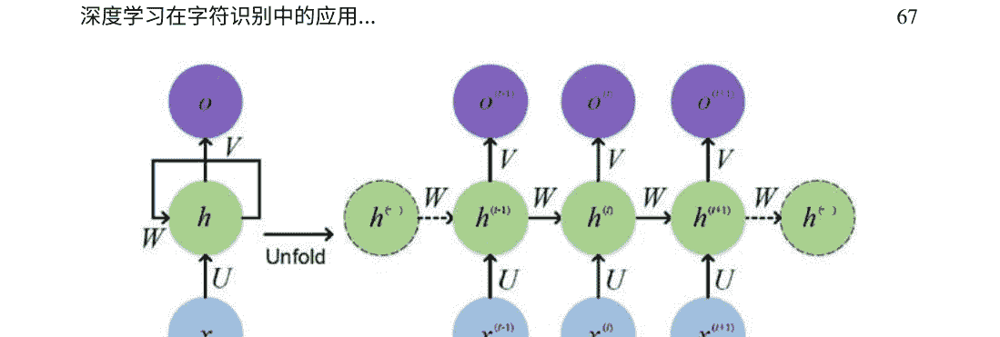

图2循环神经网络架构[37]

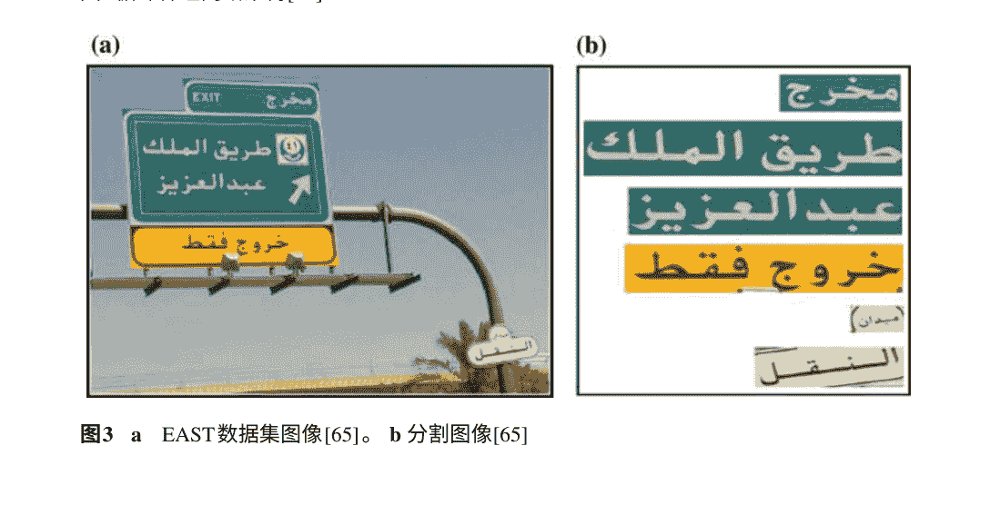

图3  a  EAST数据集图像[65]。 b 分割图像[65]

##### 6.1.6 混合方法

为了利用多个深度学习模型的特性，可以提高系统的准确性。[19]中使用了一种混合方法，其中包括多维LSTM与连接主义时间分类（CTC）和分层层次结构的组合。 该模型以原始像素数据作为输入。 该模型设计得非常灵活，可以处理不同的语言，并经过英语和阿拉伯语数据集的测试。 该系统在IFN/ENIT手写阿拉伯单词数据库上显示了91.4%的准确率。 在另一项研究中[12]，DBN（动态贝叶斯网络）与来自HMM的输入相结合。混合模型利用了基于像素分布的统计特征和局部像素配置以及基于循环、变音点、上升部分和下降部分的结构特征。 该模型在阿拉伯数据集IFN/ENIT数据库上实现了90.42%的准确率。

低分辨率图像对系统的准确性产生了不利影响。在[15]的研究中，采用了一种复杂的方法来识别低分辨率的阿拉伯手写词语。特征提取和分类的模型分别利用了MDRNN与LSTM和CTC。该模型使用阿拉伯印刷文本图像数据库（APTI）的数据进行训练。APTI数据库的设计更加多样化，包含了不同类型的数据，包括单一字体/单一大大小、单一字体/多种大小和多种字体/多种大小[38]。实验结果显示，使用多种字体/多种大小的数据可以获得最佳结果，因为系统可以更好地推广其参数。该模型的平均单词识别率为98.32%，平均字符识别率为99.69%。

与传统的统计和整体特征以及像素不同，在[39]中使用CNN来提取低级平移不变特征，然后将其提供给MDLSTM分类器来提取高阶特征。该模型使用印刷文本线图像（UPTI）数据集进行训练。CNN和MDLSTM的这种层次组合在数据集中定义的44个类别中实现了98.12%的识别率。

阿拉伯式字符识别系统的系统性回顾见表1。

#### 6.2 符号脚本的OCR

考虑到中文和日文等语言有数千个字符类别。因此，为这种脚本构建准确且快速的OCR非常具有挑战性。为了解决这个问题，降维技术无法高效工作，因此Odate等人[46]为最近邻和改进的基于树的聚类设计了候选减少技术。降维后的候选区域具有高维特征向量，通过多类线性判别分析（LDA）进行降维。

在电子商务平台上研究了中文字符识别[47]。在电子商务平台上，更多的信息以图像形式呈现。为了提取信息，使用Canny算子、遗传算法和归一化处理对图像进行处理，然后将笔画特征传递给附加到Office 2003的MODI OCR字体库进行识别。

系统在一个自动生成的包含25个样本的数据库上的整体准确率为74.9%。

##### 6.2.1 卷积神经网络

在280种字体和120种选定字体中，使用具有灵活步长和卷积核大小的多池化层的CNN用于3755类汉字的识别[48]。这种改进的架构在280种字体和120种选定字体上的识别率分别为94.38%和99.74%。在[49, 50]中，应用了基于CNN的迁移学习模型。

历史上的汉字识别，其中一个CNN的输出被提供给另一个CNN [50]。半监督学习方法在中国印刷数据集上进行了测试。MCDNN在ICDAR 2013年的离线手写汉字识别竞赛中，系统以低错误率4.2%的鲁棒性分类了3755个汉字类别。

在降级的文档图像中，数学公式识别是一项具有挑战性的任务。为了实现卷积神经网络（CNN）的更高准确性，刘等人[52]将公式元素迭代地过分割成可识别的单元，以分析数学形式结构。该模型在MFR100 [53]上显示了82.46的精确度，87.85的召回率和85.37的F-度量。

基于多空间上下文完全卷积循环网络（MC-FCRN）的隐式模型在[54]中用于基于笔画的在线手写中文字符识别，基于笔画的分析和统计特性。该模型在CASIA和ICDAR数据集上进行了测试，修正率分别为97.10%和97.15%。在[55]中，使用了放松CNN模型，它与传统的CNN模型不同之处在于，在传统模型中，对于卷积层上的单个特征图，只会有一个卷积核，而在RCNN的情况下，为了生成卷积层的单个特征图，卷积核会从一个步长变化到另一个步长。放松的过程提高了模型的整体学习能力，因为这种方法可以处理由书写过程中引起的变形，例如手部肌肉的不受控制和轻微的不规则运动。

在这种方法中，使用了ATR-CNN的特殊变体或交替训练CNN对于每个权重矩阵，选择一个任意的学习i率，并且在训练期间学习率从i变化到0，一旦学习完成，即在反向传播阶段之后，学习率会被调整回i。交替训练有助于处理由于松弛过程导致参数数量的突然增加，此外还改善了系统的准确性和更好的参数调整。该模型已经被设计、实施和评估用于手写数字和汉字。 对于手写数字，使用MNIST数据集，模型的架构使用的是[55] In-32Conv5-32MaxP2-64Conv3-64MaxP2-64RX3-64RX3-Out。 错误率是0.24%。用于汉字的模型架构是In-64Conv5-64MaxP2-128Conv3-128MaxP2-128RX3-128MaxP2-256RX3-256Full1-Out。CASIAHWDB和ICDAR'13竞赛数据集用于训练测试和验证模型。 最低错误率为3.94%。错误率几乎与人类自然感知的3.87%相近，非常接近模型的错误率。

##### 6.2.2 循环神经网络

多维长短期记忆循环神经网络（MDLSTM-RNN）用于中文字符的手写文本识别系统[56]。 由于中文字符已经处于分割形式，因此分割将是一个无用的开销，并且使剩余的过程更容易出错。 该模型使用CASIA离线中文手写数据库进行训练和评估。该数据集包含孤立字符和文本行的图像。 实验结果显示字符错误率为16.5%，但在文本数据上应用字符n-gram语言模型（LM）后，使用该字符级语言模型将错误率降低到10.6%。 然而，该方法不能比以前的方法表现更好，但它是更先进的技术起点。 此外，错误主要是由于字符的孤立，如果能够避免一些孤立字符，整体性能肯定会提升。

没有明确分割字符的手写中文文本是用多维长短期记忆循环神经网络[57]完成的。 该模型从4个来源获取数据，包括CASIA数据库，PH语料库[58]中的新闻文本，多语言UN语料库[59]中的中文部分以及兰卡斯特汉语语料库[60]。 总共有50,000个字符， 因此对于这样的脚本进行字符识别是非常具有挑战性的。 然而，这些字符通常具有相似的外观，并且在字符内部共享共同的图形组件。 字符的图形组件被称为部首。在[61]中，基于CNN的部首提取网络使用CASIA的数据进行训练，该数据集上报告的最佳结果为93.5%。

在[63]中，作者使用自组织映射（SOM）和多时间尺度递归神经网络（MTRNN）进行在线日语手写字符识别。 SOM用于特征提取，而MTRNN用于动态学习。 输入数据通过Intuos4 ptk-640（WACOM）的数位板获取，并且每个字符写入10次。 实验显示了该模型预测手写序列的能力，结果是肯定的。基于符号脚本的OCR在表2中进行了评审。

表2 基于符号脚本的OCR综述
| 研究 | 方法 | 文本类型 | 模型 | 数据集 | 结果 |
| :--- | :--- | :--- | :--- | :--- | :--- |
| Messina等。[56] | 特征 | 中文手写 | RNN-LSTM | CASIA | 错误率为10.6% |
| Nishide [63] | 特征 | 日文手写文本 | 多时间尺度递归神经网络(MTRNN) | 在线识别 | - |
| Wu等。[55] | 特征 | 手写中文字符 | CNN | CASIAHWDB 和 ICDAR'13 竞赛数据集 | 错误率3.94% |

#### 6.3 拉丁文脚本的OCR

手写数字分类在MINST数字数据集上仅有0.35%的错误率。为了增加深度学习变形技术的可用数据量，只应用了仿射和弹性扭曲。

作者在单精度浮点GPU上执行算法，以获得更好的准确性，相比之前发表的技术提高了约0.4-0.5%。因此，观察到在实施深度学习模型时，更先进的硬件在结果的准确性方面起到了重要作用。

##### 6.3.1 卷积神经网络

CNN的变种可以应对潜在脚本和Cusie以及符号脚本的挑战。模糊卷积神经网络（FCNN）是CNN的一种变种，用于捷克语[64]。将FCNN的结果与其他多种方法（包括KNN、多元逻辑回归（MLP）和ANN）进行了比较。每种方法的测试集错误率在表3中给出。结果表明，FHCNN的错误率最低，为0.60%。

为了评估基于新颖投票方法的CNN系统的性能，陈等人[65]从互联网上收集了5种不同语言的文章，并使用Google翻译将它们翻译成不同的语言，然后打印并扫描以获取文档图像。CNN结合新颖的投票机制，以高达99%的准确率进行语言和方向分析。

表1 基于阿拉伯式脚本的OCR综述
| 研究 | 方法 | 文本类型 | 模型 | 数据集 | 结果 |
| --- | --- | --- | --- | --- | --- |
| Ul-Hassan等人[40] | 像素 | 印刷乌尔都语 | BLSTM | UPTI (10,000 乌尔都语 Nastaliq 文本行) | 86.4% (形状) 94.8% (非形状) |
| Graves等人[19, 41] | 像素 | 手写阿拉伯语 | MDLSTM | IFN/ENIT (32,492个城市名称 = 30,000个训练集和2492个验证集) | 93.37% |
| Rashid等人[15] | 像素 | 印刷阿拉伯语 | MDLSTM | APTI | 99% |
| Pam等人[42] | 像素 | 手写阿拉伯语 | MDLSTM | OpenHaRT | 90.1% |
| Morillot等人[5] | 特征 | 手写阿拉伯语 | BLSTM | NIST (训练集 = 16,000个和测试集 = 12,644个) | 52% (词) |
| Chherawala等人[43] | 特征 | 手写阿拉伯语 | MDLSTM | IFN/ENIT (32,492个城市名称) | 89% |
| Rez等人[44] | 特征 | 手写阿拉伯语 | BLSTM | IFN/ENIT (32,492个城市名称) | 87.4% |
| Ahmed等人[30] | 特征 | 手写乌尔都语 | BLSTM | UNDH | 错误率为6.04–7.93% |
| Naz等人[19] | 统计特征 | 印刷乌尔都语 | MD RNN with LSTM | UPTI | 识别率为96.4% |
| Naz等人[32] | 分区特征 | 印刷乌尔都语 | 2D LSTM | UPTI | 字符识别率为93.38% |
| Naz等人[45] | 低级别转换不变特征 | 印刷乌尔都语 | CNN和MDSTM | UPTI | 识别率为98.12% |
| Kh等人[12] | 统计和结构化特征 | 手写阿拉伯语 | DBN与HMM | IFN/ENIT数据库 | 准确率为90.42% |
| Rasid等人[15] | 未指定 | 低分辨率阿拉伯手写 | MDRNN与LSTM和CTC | APTI | 平均词识别率为98.32%，平均字符识别率为99.69% |

## 表3 不同方法的错误率

| 方法 | 错误率（测试集）（%） |
|------|----------------------|
| KNN | 34.65 |
| MLP | 31.06 |
| SVM | 27.86 |
| ANN（一层隐藏层） | 27.39 |
| ANN（两层隐藏层） | 14 |
| FCNN | 1.50 |
| HFCNN | 0.60 |

在[66]中使用的详细架构是2x48x48-100C5-MP2-100C5-MP2-100C4-MP2-300N-100N-6N。其中MCDNN提供了两个48×48大小的输入图像，而100C5和100C4表示具有100个映射和5×5和4×4滤波器的卷积层。MP2指的是非重叠区域为2×2的最大池化层。不同层使用的激活函数是：全连接层和卷积层使用双曲正切激活函数，最大池化层使用线性激活函数，最后输出层使用Softmax激活函数。该架构在不同数据集上进行了评估。数据集及其整个学习过程中的相对改进分别为：MNIST数字41%，NIST SD 19（30-80%），NORB（46%），GTSRB交通标志数据集（72%），CIFAR10自然彩色图像数据集（39%）。

Kang等人[67]使用了卷积模型，在卷积和全连接层都使用了ReLU激活函数。相比于Sigmoid和Tanh激活函数，ReLU激活函数提高了效率并减少了整体训练所需的时间。其中ReLU函数可以简单地表示为f(x)=max(0, x)，其中x=输入值。该模型用于从归一化图像中学习手工特征。作者在两个数据集上评估了所提出的架构，包括烟草诉讼和NIST税表数据集。图4显示了一些图像，数据集包括10个类别，包括表格、报告、简历、备忘录、科学、新闻、广告、电子邮件信件和各种类型的笔记。表4包含了烟草数据集上的流派分类的混淆矩阵，整体性能在烟草数据集上的准确率为65.35%。

文档图像通常包含图形和文本信息。图像内容分析可以识别和区分文档图像中的区域。在[68]中，使用了视觉和文本特征的组合来对两个数据集（包括意大利贷款比较网站公司提供的贷款数据集和烟草数据集）进行文档图像内容分析。数据集使用了CNN进行测试，并在贷款数据集上实现了70%的准确率。作者在[69]中使用了“AlexNet”来解决关于文档图像分析的两个问题：

- (1) 拍摄的文档图像属于哪本书？
- (2) 文档图像属于哪种类型的书？

该模型成功地回答了第一个问题，准确率为95.54%，并回答了第二个问题，准确率为95.42%。作者收集了包括绘本、音乐书、中文书、英文书、数学书和报纸在内的6个类别的图像数据集。

作者在[70]中使用了两个卷积层和两个池化层交替连接的CNN。池化和分类器提供了卷积层。该模型使用ICDAR 2003数据集和Street View Text (SVT)数据集进行评估。使用了一些变形技术，包括仿射变形和弹性变形。该方法的精确度为0.54，召回率为0.30，F分数为0.38，总体准确率为83.9%。

##### 6.3.2 循环神经网络

在[21]中使用的多维RNN的变体，具有多维隐藏层，使网络能够处理多维上下文信息。MDRNN的性能与卷积神经网络在MNIST数据集上进行了比较，实验结果表明，MDRNN的错误率为6.8%，超过了卷积方法的错误率11.3%。在另一项研究中，在RNN中谨慎地使用了Dropout层[42]，以确保不影响层中的循环连接，但有效地防止了过拟合。该模型在Rimes和OpenHaRT数据库上进行了评估。在RNN的最顶层添加Dropout层可以降低错误率约10-20%，在多个LSTM层上使用Dropout层可以降低错误率达到30-40%。表5总结了基于拉丁字母的OCR。

#### 6.4 针对纳加里文字的OCR

在[73]中，深度双向LSTM被应用于奥里亚文字。作者采用了一种与脚本无关且无需分割的方法来进行连接主义时间分类（CTC）的学习，用于学习未分割的序列。使用这个模型，在训练150个周期后，报告的最低错误率为0.1%。表6总结了基于纳加里文字的OCR。

#### 6.5 针对多种脚本的OCR

正在努力构建一个能够从图像中识别出每种脚本的文本的强大系统，为此不同的研究人员应用了不同的技术。尽管目前还没有能够识别所有类型文本的通用系统，但一个能够处理两种或更多语言并具有合理准确性的单一系统已经存在。

Sudholt等人使用深度CNN并将其命名为PHOCNet（字符的金字塔直方图）来从文档图像中提取单词。所提出模型的架构如图5所示。该模型在不同的数据集上进行了评估，包括IFN/ENIT数据库、Esposalles数据库、IAM手写数据库、George Washington数据集。所述技术在拉丁文和阿拉伯文脚本上表现出优于传统技术的性能，并显示出其鲁棒性。

作者在[74]中采用了HMM与DBN的串联方法。该模型在三种不同的数据集上进行了训练和评估，分别是拉丁脚本的RIMES数据集，阿拉伯脚本的IFN/ENIT数据集以及印度梵文脚本的数据集。该模型在RIMES上显示出最高的识别率为76.98%，在IFN/ENIT上为89.41%，在梵文脚本上为66.48%。

BLSTM网络与CTC（连接主义时间分类）输出层在非连续拉丁脚本（英文脚本）和连续乌尔都脚本上进行评估[45]。拉丁脚本模型在UNLV-ISRI数据库上的字符识别准确率为99.17%。对于乌尔都连续脚本，由于复杂性，字符识别准确率在相同模型上相对较低，即没有位置信息的情况下为88.94%，有位置信息的情况下为88.79%。

### 7 开放挑战和未来方向

OCR对大多数语言来说仍然是一个开放的研究领域，在这里我们将列出其中的一些：

- 某些语言，包括阿拉伯语脚本语言，是一个开放的研究领域，因为没有完美的方法存在。建立一个稳健的方法，即使是简单的文本提取，也是一项伟大的工作[34, 76]。
- 与相机捕捉图像相关的挑战，例如检测连续文本行，在图片中处理涂鸦文本[13]。
- 在户外光照条件下从图像中提取文本。
- 除了印刷文本图像，手写文本识别是一个开放的挑战。手写识别中的书写者变异使其更具挑战性，并且需要处理类间变异。
- 为了提高识别和准确性，可以应用后处理技术，包括字典验证和语法验证[34]。
- 可以使用来自其他脚本或语言的数据集来测试应用于一种语言或脚本的方法。此外，可以通过提取不同的特征集和数量来评估具有相同数据集和模型的相同问题。
- 应用不同的语言建模技术进行书写者识别和处理其他高级问题。

### 8 结论

本章全面介绍了深度学习在自动文档分析中的应用。构建一个强大和完美的OCR系统仍在进行中。深度学习算法为提高字符识别率、准确性和OCR系统的效率开辟了新的途径。自动化OCR将在包括商业智能、高效监控系统、保护文献和数字化信息等各个领域取得巨大进展和高效管理。包括CNN、LSTM网络、门控RNN以及CTC和PCA等技术在内的多种深度学习算法已经展示出更高水平的准确性和字符识别能力，但是对于乌尔都语、波斯语和阿拉伯语等某些语言的完美OCR仍然遥不可及。深度学习算法在结果上取得了巨大的改进，但仍然存在一些问题，其中一个基本和主要的问题是深度学习应用需要大量的数据集，这个问题可能无法消除，但可以通过应用某些技术来增加可用实例的数量来克服。由于当前计算复杂性不再是问题，越来越多计算密集型的深度学习技术可能会导致完美的OCR应用。

## 参考文献

1. S. Naz, A.I. Umar, S.H. Shirazi, S.B. Ahmed, M.I. Razzak, I. Siddiqi, 分割技术用于阿拉伯语类似脚本的识别：综合调查。教育信息技术。 21(5), 1225–1241 (2016)
2. M.I. Razzak, S.A. Husain, A.A. Mirza, A. Belaid, 基于模糊的预处理，使用在线和离线特征融合用于基于乌尔都语脚本的在线字符识别。创新计算机信息控制国际期刊。 8(5), 21 (2012)
3. S. Naz, S.B. Ahmed, R. Ahmad, M.I. Razzak, 基于阿拉伯语脚本的数字识别系统，在国际计算机系统近期进展会议 (RACS) (2016), 页码：67–73
4. M.I. Razzak, M. Sher, S.A. Hussain, 本地基线检测用于基于阿拉伯语脚本的在线字符识别。物理科学国际期刊。 5(7), 955–959 (2010)
5. O. Morillot等, UOB-Telecom ParisTech阿拉伯手写识别和翻译系统用于OpenHart 2013竞赛引用此版本 (2014)
6. N. Stamatopoulos, G. Sfikas, 历史文档处理, 卷2014 (2016)
7. S. Naz, A.I. Umar, M.I. Razzak, 基于乌尔都语/阿拉伯语字符的词典缩减的多语言OCR。 Mehran Univ. Res. J. Eng. Technol. 35 (2) , 209 (2016)
8. S. Chen, 使用多序列对齐和统计语言模型来集成多个中文地址识别输出（2015），页151-155
9. M.I. Razzak, S.A. Hussain, M. Sher, Z.S. Khan, 离线和在线预处理的组合用于在线乌尔都字符识别，在国际工程师和计算机科学家大会论文集，卷1（2009），页18-20
10. M.I. Razzak, S.A. Hussain, A. Belaid, M. Sher, 基于乌尔都语脚本的多字体数字识别。Int. J. Recent Trends Eng. (IJRTE) (2009)
11. S.B. Ahmed, S. Naz, S. Swati, M.I. Razzak, A.I. Umar, A.A. Khan, UCOM 离线数据集-乌尔都语手写数据集生成。Int. Arab J. Inf. Technol. 14(2), 239–245 (2017)
12. A. Kh, A. Kacem, A. Belaid, M. Elloumi, A. Kh, 基于HMMs和DBNs的阿拉伯手写词离线识别，基于HMMs的阿拉伯手写词离线识别, in第13届国际文件分析和识别会议 (2015), pp. 51–55
13. S. Naz, M.I. Razzak, K. Hayat, M.W. Anwar, S.Z. Khan, 基于阿拉伯文字的基线检测挑战, in智能科学与信息系统 (Springer, Cham, 2014), pp. 181–196
14. D.C. Cires, 深度、大规模、简单的手写神经网络, vol. 3220 (2010), pp. 3207–3220
15. S.F. Rashid, M.-P. Schambach, J. Rottland, S.V.D. Nüll, 多维递归神经网络的低分辨率阿拉伯语识别, pp. 1–5
16. S. Naz, K. Hayat, M.I. Razzak, M.W. Anwar, H. Akbar, 基于阿拉伯文字的语言字符识别: Nasta’liq vs Naskh 分析, in2013年世界计算机与信息技术大会 (WCCIT)(IEEE, 2013), pp. 1–7
17. S. Naz, K. Hayat, M.I. Razzak, M.W. Anwar, S.A. Madani, S.U. Khan, 乌尔都语类似草书的光学字符识别博士后研究项目。模式识别。1-20 (2014年)
18. M. Liwicki, 一种基于双向长短期记忆网络的在线手写识别新方法
19. A. Graves, 多维递归神经网络的离线手写识别, pp. 1-8
20. A. Graves, 多维递归神经网络的离线阿拉伯手写识别
21. A. Graves, S. Fern, 多维递归神经网络（2013年）, pp. 1-10
22. A. Graves, S. Fern, M. Liwicki, H. Bunke, 无约束在线手写识别与递归神经网络, pp. 1-8
23. I. Ahmad, X. Wang, R. Li, M. Ahmed, R. Ullah, 乌尔都语Nastaleeq文本的线条和连字分割, 第5卷 (2017年)
24. Z. Ahmad, J. Khan, I. Shamsher, 使用前馈神经网络进行乌尔都语复合字符识别（2009年）
25. M. Seuret, M. Alberti, R. Ingold, M. Liwicki, 应用PCA初始化的深度神经网络进行文档图像分析
26. S.B. Ahmed, S. Naz, M.I. Razzak, R. Yousaf, 基于深度学习的孤立阿拉伯场景字符识别, 在2017年第一届国际阿拉伯文字分析与识别研讨会（ASAR）（2017年）, 第46-51页
27. D.C. Cires, U. Meier, L.M. Gambardella, 用于手写字符分类的卷积神经网络委员会, 第10卷 (2011年), 第1135-1139页
28. I. Ahmad, X. Wang, R. Li, S. Rasheed, 基于堆叠去噪自编码器的离线乌尔都语Nastaleeq光学字符识别（2016）, 第146-157页
29. M.I. Razzak, F. Anwar, S.A. Husain, A. Belaid, M. Sher, HMM和模糊逻辑：一种用于在线乌尔都语脚本字符识别的混合方法。知识-基于系统23（8）, 914-923 (2010)
30. S.B. Ahmed, S. Naz, S. Swati, M.I. Razzak, 使用一维BLSTM分类器的手写乌尔都语字符识别。神经计算与应用, 第1-9页 (2017)
31. R. Ahmad, M.Z. Afzal, S.F. Rashid, M. Liwicki, T. Breuel, A. Dengel, KPTI: Katib的普什图文图像库和深度学习基准（2016）

表4 烟草数据集[67]的类别混淆矩阵

|        | 广告 | 电子邮件 | 表格 | 信件 | 备忘录 | 新闻 | 笔记 | 报告 | 简历 | 科学 |
| :--- | :---: | :---: | :---: | :---: | :---: | :---: | :---: | :---: | :---: | :---: |
| 广告 | 104 | 0 | 1 | 1 | 0 | 9 | 2 | 2 | 0 | 3 |
| 电子邮件 | 1 | 435 | 7 | 3 | 13 | 0 | 4 | 3 | 1 | 0 |
| 表格 | 2 | 0 | 145 | 5 | 37 | 7 | 8 | 7 | 0 | 14 |
| 信件 | 0 | 8 | 6 | 297 | 43 | 0 | 1 | 14 | 0 | 10 |
| 备忘录 | 1 | 7 | 33 | 51 | 294 | 6 | 3 | 9 | 0 | 18 |
| 新闻 | 19 | 1 | 21 | 13 | 6 | 45 | 8 | 2 | 0 | 16 |
| 笔记 | 2 | 10 | 24 | 8 | 31 | 5 | 63 | 0 | 0 | 11 |
| 报告 | 1 | 15 | 34 | 65 | 32 | 11 | 5 | 103 | 5 | 38 |
| 简历 | 0 | 7 | 24 | 13 | 12 | 1 | 1 | 13 | 13 | 6 |
| 科学 | 0 | 16 | 36 | 11 | 52 | 4 | 6 | 12 | 1 | 45 |
| 准确率 (%) | 80.0 | 87.2 | 43.8 | 63.6 | 56.6 | 51.1 | 62.4 | 62.4 | 65.0 | 28.0 |

表5 基于拉丁字母的OCR综述

| 研究 | 方法 | 文本类型 | 模型 | 数据集 | 结果 |
|------|------|----------|------|--------|------|
| Morillot等人 [71] | 特征 | 手写 法语 | BLSTM | RIMES (12,107个文本行，训练集10,329个，验证集=1000个和测试集=778个) | 43.2% (单词) |
| Lickwi等人 [18] | 特征 | 在线英语 | BLSTM | IAM-OnDB | 74% |
| Graves等人 [22] | 像素特征 | 在线英语 | BLSTM | IAM-OnDB | 69.9% (单词) |
| | | | BLSTM+LM | | 77.2% (字符) |
| | | | BLSTM | | 74% (单词) |
| | | | BLSTM+LM | | 79.6% (字符) |
| Graves等人 [72] | 特征 | 在线英语 | BLSTM | 在线 IAM-OnDB (13,040个文本行) | 86.1 (字符) |
| | | | | | 79.7% (单词) |
| | 特征 | 离线 手写 英语 | | 离线 手写 IAM-DB | 81.8% (字符) |
| | | | | | 74.1% (单词) |
| Pam等人[42] | 像素 | 手写 法语 | MDLSTM | RIMES | 91.1% |
| | | 手写 英语 | | IAM | 85.6% |
| Chaudhuri和 Ghosh [64] | 特征 | Check 手写 text | FHCNN | – | 错误率为 0.60% |
| Cen等人 [65] | | 5种语言 | CNN | – | 99%的准确率 |
| Cires和 Meier [66] | 特征 | 英语 | MDCNN | MNIST数字 | 41% |
| | | | | NIST SD 19 | 30–80% |
| | | | | NORB | 46% |
| | | | | GTSRB交通标志数据集 | 72% |
| | | | | CIFAR10 自然彩色图像数据集 | 39% |

表6 基于Nagari脚本的OCR综述

| 研究 | 方法 | 文本类型 | 模型 | 数据集 | 结果 |
|------|------|----------|------|--------|------|
| Anupama等人 [73] | 像素 | 印刷的Oriya | BLSTM | – | 95.85% |
| Roy等人 [74] | 特征 | 印度语言 | 具有DBN的HMM | – | 66.48% (识别率) |## 参考文献

32. S. Naz, S. Bin, R. Ahmad, M. Imran, 划分特征和2DLSTM用于乌尔都文本行识别。 Procedia—Procedia Comput. Sci. 96(九月), 16–22 (2016)

33. S. Naz, A.I. Umar, R. Ahmad, S.B. Ahmed, S.H. Shirazi, M.I. Razzak, 基于多维递归神经网络和统计特征的乌尔都纳斯塔利克文本识别系统。神经计算应用。2015

34. S. Naz等, 离线草书乌尔都纳斯塔利克脚本识别使用多维递归神经网络作者接受的手稿。神经计算。(2016)

35. S. Naz, A.I. Umar, R. Ahmed, M.I. Razzak, S.F. Rashid, 基于多维长短期记忆神经网络的乌尔都纳斯塔利克文本识别使用隐式分割。SpringerPlus (2016年)

36. S.B. Ahmed, S. Naz, S. Swati, M.I. Razzak, 使用一维BLSTM分类器的手写乌尔都字符识别。神经计算应用。1-9 (2017年)

37. I. Ahmed, X. Wang, M. Guang, H. Ahmad, R. Ullah, 基于连字的乌尔都纳斯塔利克句子识别使用门控双向长短期记忆。集群计算。(2017年)

38. F. Slimane, R. Ingold, S. Kanoun, A.M. Alimi, J. Hennebert, 一种新的阿拉伯印刷文本图像数据库和评估协议 (2009年), 第0-4页

39. S. Naz, A.I. Umar, R. Ahmed, I. Siddiqui, 使用卷积递归深度学习的乌尔都纳斯塔利克识别。神经计算 (2017年)

40. S.B. Ahmed, S. Naz, M.I. Razzak, R. Yusof, T.M. Breuel, 使用双向LSTM分类器的巴厘岛字符识别，在机器学习和信号处理方面的进展 (Springer, Cham, 2016年), 第201-211页

41. H. El, A. Volker, ICDAR 2009-阿拉伯手写识别竞赛 (2011年), 第3-13页

42. V. Pham, Dropout改进了用于手写识别的递归神经网络

43. Y. Chherawala, P.P. Roy, M. Cheriet, 离线阿拉伯手写识别的特征设计：手工制作与自动化的比较? (2013年)

44. T.I. Society, O. Engineering, 一维和二维LSTM架构在手写阿拉伯语识别中的比较 (2015年)

45. S.B. Ahmed, S. Naz, M.I. Razzak, S.F. Rashid, M.Z. Afzal, T.M. Breuel, 使用递归神经网络评估连续和非连续脚本。神经计算应用。27 (3), 603-613 (2016年)

46. R. Odate, H. Goto, 使用多类别LDA进行快速准确的候选减少，用于日本/中文字符识别，在2015年IEEE国际图像处理会议 (ICIP) (IEEE, 2015年), 第951-955页

47. Y. Lu, J. Li, H. Zhang, S. Lin, 电子商务平台图片的中文字符识别 (2017年), 第28-31页

48. Z. Zhong, L. Jin, Z. Feng, I. Engineering, 使用多池化卷积神经网络进行多字体印刷中文字符识别 (2015年), 第96-100页

49. Y. Tang, L. Peng, Q. Xu, Y. Wang, A. Furuhata, 基于CNN的迁移学习用于历史中文字符识别

50. X. Yu, W. Fan, J. Sun, S. Naoi, 用于历史中文字符识别的半监督学习特征表示 (2017年), 第73-77页

51. D. Ciresan, T.R.N. Idsia, D. Ciresan, 多列深度神经网络用于离线手写中文字符分类 (2013)

52. N. Liu等, 降级中文文档图像中的鲁棒数学公式识别 (2017)

53. D.K. Ning Liu, D. Zhang, X. Xu, L. Guo, L. Chen, W. Liu, MFR100数据集

54. Z. Xie, Z. Sun, L. Jin, H. Ni, T. Lyons, 用于在线手写中文文本识别的全卷积循环网络学习空间-语义上下文

55. C. Wu, W. Fan, Y. He, J. Sun, S. Naoi, 通过交替训练的放松卷积神经网络进行手写字符识别 (2014)

56. R. Messina, 无分割的手写中文文本识别与LSTM-RNN

57. R. Messina, J. Louradour, 使用LSTM-RNN进行无分割手写中文文本识别 (2015年), 第171-175页

58. G. Jin, PH语料库

59. A. Eisele, Y. Chen, 多语种联合国文件语料库，第七届语言资源和评估国际会议（LREC'10）论文集，N.C.C. Chair, K. Choukri, B. Maegaard, J. Mariani, J. Odijk, S. Piperidis, M. Rosner, D. Tapias 编（European Language Resource, Valletta, Malta）

60. L.A. McEnery, Z. Xiao, 兰卡斯特汉语语料库：用于单语和对比语言研究的语料库。欧洲语言资源协会（2004年）

61. Z. Yan, C. Yan, C. Zhang, 基于部首提取网络的罕见汉字识别（2017年），第924-929页

62. C.-L. Liu, F. Yin, D.-H. Wang, Q.-F. Wang, Casia在线和离线中文手写数据库，在2011年国际文件分析与识别会议(ICDAR)上(IEEE, 2011)，第37-41页

63. S. Nishide, H.G. Okuno, T. Ogata, J. Tani, 基于循环神经网络的手写预测字符识别(2011)，第2549-2554页

64. A. Chaudhuri, S.K. Ghosh, 使用分层深度学习网络的捷克语光学字符识别系统，第1卷

65. L. Chen, S. Wang, W. Fan, J. Sun, N. Satoshi, 基于深度学习的文档分析中的语言和方向识别(2015)，第436-440页

66. D. Ciresan, U. Meier, 用于图像分类的多列深度神经网络(2011)

67. L. Kang, J. Kumar, P. Ye, Y. Li, D. Doermann, 用于文档图像分类的卷积神经网络 (2014), pp. 3168–3172

68. L. Noce, I. Gallo, A. Zamberletti, A. Calefati, 使用卷积神经网络进行文档图像分类的嵌入式文本内容 (2016)

69. G. Zhong, H. Yao, Y. Liu, C. Hong, T. Pham, 基于深度学习特征的拍摄文档图像分类, 在ICGIP 2016, vol. 10225 (2017), pp. 1–6
70. T. Wang, D.J. Wu, A.Y. Ng, 使用卷积神经网络进行端到端文本识别，在ICPR(2012), pp. 3304–3308

71. O. Morillot, L. Likforman-sulem, 新的基线校正算法用于双向递归神经网络神经网络的文本行识别

72. A. Graves, M. Liwicki, S. Ferna, R. Bertolami, H. Bunke, 一种新颖的连接主义系统用于无约束手写识别。IEEE Trans. Pattern Anal. Mach. Intell. 31(5), 855–868(2009)

73. A. Ray, 使用深度BLSTM网络进行文本识别

74. P.P. Roy, G. Zhong, M. Cheriet, 使用深度信念网络的串联隐马尔可夫模型用于离线手写识别。Front. Inf. Technol. Electron. Eng. 18(6), 978–988(2017)

75. S. Sudholt, G.A. Fink, A.W. Spotting, PHOCNet: 用于手写文件中的单词检测的深度卷积神经网络 (2016), pp. 277–282

76. A. Rehman, S. Naz, M.I. Razzak, 使用机器学习方法进行作者识别: 一份综述, 在Springer多媒体工具和应用 (2018)

77. W. Feng, N. Guan, Y. Li, X. Zhang, Z. Luo, 多模态循环神经网络的音频视觉语音识别 (2017), 页码 681–688

## 无人驾驶车辆的深度学习

Cameron Hodges, Senjian An, Hossein Rahmani和Mohammed Bennamoun

摘要 自动化正在成为21世纪许多行业的重要组成部分，涵盖制造、通信和交通等领域。自动化提供了改善安全性、提高生产力和降低成本的承诺。许多行业领导者正在专门研究自动驾驶技术在交通领域的应用，以生产“无人驾驶”或完全自动驾驶车辆。一个有潜力推动未来发展的关键技术是深度学习。深度学习在机器学习领域一直是一个感兴趣的领域，但直到最近几年才广泛应用。虽然传统的分析控制系统和计算机视觉技术过去对于自动驾驶车辆的基本概念验证是足够的，但是对当前和新兴技术的回顾表明了这些不足之处，并提供了克服这些不足之处的深度学习的路线图。

- 深度学习
- 自主
- 无人驾驶
- 卷积
- 神经网络
- 机器学习
- 机器视觉

### 1 引言

自动化正在成为21世纪许多行业的重要组成部分，涵盖制造业、通信和交通等领域。自动化提供了改善安全性、提高生产力和降低成本的承诺回报。许多行业领导者专门致力于在交通领域应用自主技术，以生产“无人驾驶”或完全自主的车辆。引入自动化的动机在不同行业和应用之间存在广泛差异，尽管无人驾驶车辆的直接动机可以在安全性和生产力的改善中看到。本章的目的是概述这项技术的实际需求，并总结一些克服当前技术挑战的最新方法。

世界对道路运输（包括货运和个人车辆）的当前痴迷，每天造成大约3300人死亡（2013年数据）[1]。世界卫生组织（WHO）的一份报告列出了导致道路死亡的主要风险因素，包括驾驶员疲劳、对道路交通法规的不良遵守以及药物和酒精的使用[2]，这些都是自动化技术可以解决的因素。在更广泛的社会中，大幅减少这一数字的潜力是无人驾驶车辆发展最重要的驱动力之一。基于安全性的动机也与采矿行业共享，用于发展无人驾驶车辆。

尽管20世纪地下和地表采矿的安全标准有了显著提高，但仍被认为比其他一般工业领域更危险。美国的数据显示，2015年约有3,500起与采矿有关的伤害事故和17起死亡事故[3]。因此，采矿业已成为早期采用全自动驾驶技术（4级自主性）的行业之一，以提高安全性。像必和必拓、力拓和福特斯克金属集团这样的主要采矿公司都在其铁矿石业务中使用自动化采矿解决方案。

除了显著提高安全性外，自动化的使用还带来了一些显著的生产力改进。最近，福特斯克金属集团证明了其在西澳大利亚所罗门中心的54辆自动驾驶运输卡车队的生产力提高了20%。与由人类操作员操作这些卡车时相比。在采矿业推动自动化的努力不仅仅局限于澳大利亚或铁矿石行业，最近Suncor Energy Inc也承诺在加拿大的油砂作业中引入无人驾驶卡车。预计无人驾驶车辆的生产力改进也将对更广泛的交通运输行业产生重大影响。据报道，自动化促进卡车紧随其后以及其他技术改进有望将能源消耗降低20%[6]。

### 2 本书章节结构

无论是哪个行业或环境，无人驾驶车辆的系统架构必须解决三个主要的操作支柱。这些可以总结为定位、路径规划和控制以及障碍物检测。在最近接受深度学习解决方案之前，这三个要素一直采用传统的硬编码方法来解决。在本章的第2节中，我们将总结目前在工业界和学术界使用的解决方案以及实践中面临的挑战。在第3节中，我们将概述基于深度学习的当前研究状态，这些研究可能解决当前技术面临的许多挑战。

#### 2.1 当前技术摘要

##### 2.2 定位

在设计无人驾驶车辆系统时面临的所有挑战中，定位可能是最基本的挑战。虽然对于人脑来说，相对于周围环境感知自己的位置似乎是天经地义的事情，但对于自主系统来说，以高度准确度进行定位是一项非常复杂的任务。目前的解决方案可以总结为三类：全球导航卫星系统（GNSS）基于定位、惯性导航和感知定位。

随着美国提供的GPS系统从2000年5月起取消选择性可用性，水平定位精度小于9米成为可能[7]。尽管不能依赖于无人驾驶车辆导航，但单独使用它可以为许多当今应用提供足够的准确性。

由于这一点，通过使用本地生成的修正[8, 9]，即差分GPS（DGPS），已经开发出具有改进精度的GNSS系统。这种方法已经为封闭环境中自主驾驶系统的初步开发提供了可能。尽管在GNSS卫星能见度有限或GNSS信号偏转引起多路径效应的环境中容易出现不准确性。

为了进一步提高基于GNSS的导航的稳健性，已经有许多使用惯性导航的例子。来自加拿大Applanix等供应商的系统已经商业化推出[8]。他们通过惯性测量单元和距离测量单元（基于轮胎旋转）的组合，来增强先前提到的DGPS导航，以在GNSS导航丢失时提供高精度导航和航位推算，操作时精度为0.035米，在GNSS挑战条件下为0.69米[8]。这种用于初始辅助GNSS的技术也是学术团体研究的主题。Jo等人[10]展示了一个提出的模型。

##### 2.3 路径规划和控制系统

其中，GNSS信息与惯性传感器相结合，提供高精度的本地化。本研究的主要贡献在于展示了在不同速度下使用动态和运动模型创建本地化的方法。

确定准确的位置后，下一步是进行路径规划和运动控制。随着自主车辆系统的初步发展，传统机器人学中开发的路径规划方法被改编为自主车辆系统的路径规划方法。算法如[11]以及A*和D*路径规划模型的变体[12]为自主车辆的控制系统提供了重要的起点，但存在一些关键限制。A* [13]和D*等方法具有围绕障碍物或不可驾驶区域进行规划的内在能力，尽管一般情况下不考虑汽车转向的曲率限制。相比之下，Reeds-Shepp曲线[11]考虑了曲率限制，但假设可驾驶环境是一个没有障碍物的连续平面。

广泛的规划技术可以分为两种不同的方法。本地坐标系统是相对于通过感知系统[14]检测到的本地特征确定路径的，或者与全局坐标系统相反，可以从诸如GPS或惯性辅助GPS [12]的定位系统导入传感器。[14]的工作证明了基于本地路径规划方法的优势，因为它允许在检测到障碍物周围动态规划路径。所提出的算法在最初提出基本框架路径之前，通过多个与该基本框架偏移的备选路径进行工作阶段。与Reeds-Shepp曲线[11]相比，区分这种方法的关键步骤是使用能够确定与检测到的障碍物碰撞概率的成本函数评估每个备选路径。除了在车辆移动时动态规划的改进功能外，当在大环境中使用全局规划算法时，它还限制了内存消耗，这是一个重要的挑战。

这些概念的一个实际应用可以在[15]中看到，他展示了一种称为混合A*的方法，该方法基于多阶段搜索算法。基本的初始步骤是基于传统的A* [13]，但限制了算法在车辆转弯曲率限制内开发可行驶路径。在此之后，有一个交替的步骤，应用Reed-Shepp曲线来确定在接近目标时，是否存在一个无障碍路径，该路径符合所需的最终车辆方向。然后，作者应用基于梯度下降的优化步骤来“平滑”最终路径，以限制车辆的过度转向。这个优化步骤产生了一个更连续和平滑的结果，引入了一些额外的复杂性。由于“平滑”过程的性质，原始路径中的一些精度可能会丢失，这可能会增加最优路径靠近障碍物的区域与障碍物碰撞的概率。

##### 2.4 障碍物检测

自动驾驶车辆系统的第三支柱是障碍物检测系统。这是至关重要的，因为无人驾驶车辆在复杂环境中运行，它们需要一个能够与多种危险因素（包括其他车辆、行人和物理环境要素）进行交互和响应的系统。已经提出了不同形式的目标检测系统，利用了一系列计算机视觉系统，包括激光扫描仪、可见光/红外相机和雷达。激光扫描仪（也称为激光雷达）的使用已经成为无人驾驶车辆技术的代名词，因为它们在Waymo（前Google Car项目）上的使用以及当前自动化采矿卡车的开发中被广泛采用。已经有大量文献证明了传统基于计算机视觉的障碍物检测系统的使用，追溯到2000年，由CSIRO [16]完成的工作。在这些早期的例子中，激光雷达点云被分析以评估表面的可行驶性和检测基本障碍物的几何形状和梯度。这种方法在之后的几年中得到了广泛的研究 [17, 18]。这篇文献综述是基于其输入数据来源的。

###### 2.4.1 激光雷达

点云聚类—[19]展示了一种检测路边障碍物的尝试。在这个例子中，住房砖块是目标对象，通过对激光雷达点云进行聚类分析。原始激光雷达数据经过多个滤波器处理，以使其在道路表面的高程上归一化，然后应用一些启发式方法将点云聚类与作者所称的“孔洞”或被激光雷达遮蔽的区域配对。随后，从聚类/孔洞对中提取了16个手工特征，用于由随机森林树机器学习算法进行分类。虽然在测试条件下取得了成功，但依赖于手工特征编码可能非常繁琐，并且不能保证在各种模糊条件下有效。

线段提取—[18]与[19]的先前工作一样，他们的目标检测算法也是基于激光雷达数据。与[19]不同的是，[18]试图从激光雷达数据中提取线段特征，而不是围绕点云聚类进行工作。观察到的激光雷达数据根据硬编码的阈值进行线段提取分析。然后将这些线段分类为障碍物或可行驶道路段。与其他障碍物检测策略相比，这个功能非常重要，有两个关键原因:

1. 通过能够积极识别可行驶的道路段，而不仅仅是看到它们，作为没有障碍物的存在，该系统能够定位自己在道路上并提供左右车辆导航。
2. 利用激光雷达数据依赖于道路几何形状，因此在没有划线和标记的表面上也可以使用。

这种方法的主要缺点是依赖于硬编码的阈值。例如，该系统需要12个特定的阈值才能将线段分类为仅2类（障碍物或道路）。

###### 2.4.2 单目和立体RGB相机

选择性搜索—[20] 记录了一种称为选择性搜索的对象分类过程。该方法利用了图像的层次结构特性，并提出了一种基于几种分组策略的图像逐渐分割的方法。最初，图像区域是根据像素颜色的相似性进行分组的。虽然这可以实现对均质对象的分割，但在更复杂的分类中可能会遇到困难。作者给出的例子是一辆车，车轮的颜色与车身截然不同，但在分类的目的上属于同一对象。为了改进这些缺点，使用了一种称为词袋的策略进行分组的后续步骤。这是通过根据预定义的图像块“词汇表”的出现率对对象进行分类来实现的，这些图像块与已知的对象类匹配。

主动轮廓建模—[21]的工作展示了主动轮廓建模在目标检测和分类中的应用。通过从立体相机中提取的深度图，作者利用主动轮廓模型从每个物体中检测到一系列边缘。这样可以根据观察者手动指定的特征（如高度和纵横比）将物体分类为不同类别（车辆、行人或其他）。该研究在测试案例中实现了92.2%的真阳性率和2.7%的假阳性率。这种类型的检测和分类可以很有效。然而，随着手动编码特征数量的增加，将其扩展到更多类别可能变得困难。

虽然这些类型的检测策略在学术界和实际示例（如DARPA城市挑战[22]）中已被证明是有效的，但仍然依赖于硬编码的阈值来分析数据。因此，在复杂环境中，它可能受到限制，并且产生二进制结果，即只能确定障碍物是否为障碍物。提供的上下文非常少，无法让自主系统以任何细微之处做出反应。因此，需要提出一种更加数据驱动的方法，类似于当前的机器学习技术，以解决这些缺点。

#### 3 深度学习用于无人驾驶车辆

一种有潜力克服先前讨论的挑战的关键技术是深度学习。深度学习在机器学习领域一直是一个感兴趣的领域 [23, 24]，但直到最近才广泛应用。一种监督式深度学习方法被称为卷积神经网络 (CNN)，它允许基于训练数据识别复杂模式，已成为许多驾驶车辆技术的最先进方法。

基于深度学习的方法已成为无人驾驶车辆中许多问题的首选解决方案 [25]。深度学习在无人驾驶车辆中的基本应用可以分为两种不同的方式，一种是分隔式架构，一种是端到端架构。分隔式架构可以被描述为一种方法，其中驾驶系统的主要功能 (障碍物检测、定位和路径规划) 被设计为离散的过程。虽然每个过程可能由一个或多个神经网络组成，但每个主要系统之间的交互在传统意义上是硬编码的。相反，端到端架构允许一个单一的神经网络处理所有三个主要功能 [26]。接下来，我们将详细描述分隔式方法的当前研究状态，然后讨论端到端架构。

##### 3.1 基于深度学习的定位方法

随着无人驾驶技术在越来越广泛的环境中部署，对稳健定位的需求变得越来越重要。如前所述，大多数定位需求都使用GNSS解决方案来解决。虽然这些方法通常会辅以惯性辅助，但在许多环境中仍然面临挑战。尽管深度学习在无人驾驶车辆应用中的重点是控制和视觉领域，但定位仍然是一个非常感兴趣的领域。

[27]的研究表明，神经网络可以根据室内空间中的WIFI信号来定义位置模型。作者关注一个两阶段的过程，首先在训练阶段，对空间中已知位置的wifi信号进行数据采样，包括环境引起的噪声。基于此，在测试阶段，根据已知信号特征通过空间中的概率确定接收器的位置。张等人[28]还应用了深度网络模型，并展示了与传统的基于测量和机器学习方法相比的一些关键改进。所提出的方法允许基于非常大的数据集训练定位模型，接收器可以通过前馈过程进行评估，而资源非常有限。相比之下，k最近邻等机器学习过程要求接收设备存储和评估每个定位尝试的整个训练数据集。

与传统的飞行时间或方向方法相比，这些基于深度学习的方法在消费者智能设备的定位等应用中表现出积极的结果。虽然这些方法可能在车辆定位的挑战中具有一定的适用性，但没有大量的工作证明它的有效性。相比之下，基于视觉的定位，有时被称为感知定位，显示出更大的潜力。[29]的工作展示了一种方法论，其中单个单眼图像被用作深度神经网络的输入，以估计相机的姿态。这种方法基于大量的训练图像构建了一个姿态模型，在其中确定了一个三维点模型。这个三维点模型，在一些后续的压缩以提高效率后，可以在室内、室外和高速公路驾驶环境中提供高精度的定位。在作者的实验评估中，显示出在后续试验中达到了37.2厘米的精度。该工作还展示了基于汽车仪表盘摄像头图像的方法，这是我们对无人驾驶车辆应用的期望，尽管在这种使用中没有具体的准确性数据。

##### 3.2 基于深度学习的障碍物检测方法

评估和对复杂环境做出反应的要求在控制功能中很难进行硬编码。因此，障碍物检测是无人驾驶车辆中非常适合深度学习解决方案的一个要素。

提取基于像素的特征的基本过程由[23]证明。它仍然是无人驾驶车辆的物体检测系统的核心，现代改进显著提高了性能。

在当前广泛采用卷积神经网络之前，曾经有一些尝试将其应用于无人驾驶车辆系统，尽管这些尝试被认为是手工特征提取的更标准做法的例外。[30]的工作展示了在YUV编码图像中使用CNN检测障碍物的方法。在这个例子中，提出的应用是在包括草地和树木区域的越野地形中的无人驾驶车辆。输入的是3通道图像，通过一系列卷积层输出20个特征图，然后进行最大池化，输入到另一个卷积层输出100个特征图。

最近卷积神经网络技术的复兴可以追溯到[31]的一篇论文。在这项工作中，作者提出了一个由5个卷积层和3个全连接层组成的8层深度网络。通过这个架构，作者基于120万个样本进行学习。来自Imagenet数据库的图像。这些训练样本允许使用基于手动选择的学习率的梯度下降类型优化来优化模型的权重。这些文献在深度学习技术的发展中起到了关键作用，因为它展示了CNN架构在基于非常大的学习数据集的图像识别中的价值。像ImageNet [32] 这样的新图像数据库使得训练大型深度网络成为可能，而以前由于缺乏合适的数据和计算能力而不可能。

通过[31]的工作后，[33]在网络架构上进行了小的改进，包括增加前两层的步幅，去除重叠的池化层和不包括对比度归一化。作者首次展示了一个非常重要的方面，即使用滑动窗口的概念将CNN应用于整个图像。这与[31]的方法形成了对比，后者将CNN同时应用于整个图像。这显著提高了场景分类的效率，因为卷积可以应用于多个重叠的边界框。这些网络的性能在ILSVRC挑战中进行了测试（图1）。

由[34]的工作是深度学习技术在障碍物检测领域中的一个重要里程碑，因为作者能够证明[31]展示的架构，以及后来由[33]发展的架构，可以应用于场景中的物体检测，而不仅仅是像在早期工作中展示的图像分类。这一点尤为重要，因为它允许在场景中识别单个物体，而早期的工作仅限于对整个图像进行标记（尽管在图像中有一些定位元素）。虽然CNN的架构主要来自[33]的工作，但它以稍微不同的方式应用。为了在场景中识别物体，输入图像使用选择性搜索方法被分成大约2000个候选区域。从中，CNN通过支持向量机（SVM）提取特征进行分类。该方法的性能在PASCAL VOC物体识别挑战中得到了证明，平均精度为53.7%。作者创造了R-CNN这个新技术的术语。虽然这是CNN架构发展中的一个重要步骤，但它确实有一些关键的限制因素。选择性搜索可以被描述为传统的计算机视觉方法生成提议区域较慢。此外，逐个处理每个提议区域进行特征提取是非常计算密集的过程。

虽然在这个领域的大多数研究都集中在最多十层的网络架构上[31, 33]，但[35]的工作证明了非常深的网络（多达19层）在图像识别中的价值。基于现在被称为VGG16架构，作者概述了一个基于固定3 ×3像素的卷积-池化-ReLU层的多层网络，并且步长为1像素。这种结构比以前的作品更深，并且使用的卷积核和步长比通常看到的要小得多。在使用ILSVRC 2012数据集评估网络时，作者得出了两个重要的结论。

+ 1. 在比较从11层到19层的多个网络架构时，发现基于这个数据集，深度网络的性能一直更好。
+ 2. 3 ×3的卷积核大小很重要，因为它提供了上下左右的空间上下文，与3层的1 ×1卷积核相比，3 ×3的卷积核表现更好。

关于第一个结论，作者明确指出在训练数据集上，网络在19层时达到饱和状态。可以假设，对于更大的训练集，额外的层数可能是有价值的。

尽管已经进行的工作主要集中在一般图像和场景理解上，但[36]的工作是深度学习在无人驾驶车辆中应用的一个很好的例子，有两个关键原因；

+ - 与[34]的工作相比，该工作确定了关键的速度改进。
+ - 有明确的确认，允许场景理解和标记的物体识别和分割的基本概念可以为无人驾驶车辆提供感知情境意识（图2）。

在处理速度方面[36]概述了[34]的工作的缺点。在之前的工作中，CNN被用于对每个感兴趣区域进行特征提取，而没有尝试重用卷积层来处理重叠的感兴趣区域。通过改进这一点，[36]能够在10 Hz的速度下展示出适用于高速公路驾驶环境的功能性系统。此外，这种滑动框架方法可以对场景中的同一对象进行多次分类。此外，该工作还展示了实际驾驶环境数据的使用，而不是图像数据库。该系统能够识别和定位多辆其他车辆以及道路标记。

受[34]的工作启发，[37]的工作在汽车应用中应用了一种变体的R-CNN方法来进行交通标志检测。所展示的方法再次是一种区域建议类型的技术，首先提出了感兴趣区域（ROI），在这种情况下使用了RGB空间阈值技术，然后进行边缘检测和连通分量分析，以便隔离交通标志进行分类，如图3所示。作者承认，与[34]使用的选择性搜索相比，这种方法更高效，尽管在应用中仅适用于可预测和一致的交通标志设计，但对于更多样化的物体识别是否合适尚不清楚。然后，使用[38]早期工作中的CNN框架对这些区域建议进行分类，该架构如图4所示：3层CNN架构。

网络的训练有两个明显的阶段。首先，网络的初始化基于随机生成的权重，然后根据一个由3个公开可用的图像数据库构建的包含283,304个图像和96个类别的数据集进行训练。随后，根据一个特定的中国交通标志图像数据集进行微调，该数据集包含了96个类别和100,000个样本，其中80%用于训练，20%用于测试。最终的检测和分类准确率分别为97.6%和98.6%。

根据之前的工作[39]，提出了一种改进的方法来解决R-CNN算法速度慢的问题，这被称为Fast R-CNN。它不是一个完整的架构，而是VGG16架构的一个附加层。

最近的研究工作展示了CNN架构的扩展能力。Zhu等人[40]使用RGB相机数据来识别多类交通标志（总共45个不同的类别）。测试数据集包括在真实世界街道环境中拍摄的10,000张图像。这10,000张图像中包含了30,000个交通标志。这个训练数据集还进一步扩展了通过数据增强（引入倾斜、旋转和缩放的随机元素）进行合成。利用这个数据集，作者提出了一个8层全卷积网络的架构，该架构不包括任何全连接层，用于检测和分类街道标志，并比较了两种分类方法，Fast CNN-R和他们的新方法。新方法在所有准确性水平上都显示出更高的召回率。

在[40]中的工作证明了CNN架构能够对许多不同类别的对象进行分类，这是与之前的工作（如[36, 41]）相比的关键一步，后者只关注了大约4个或更少的类别。在[42]中，作者提出了一种基于VGG16深度网络的并行算法。其中一个2阶段CNN架构允许基于共同的卷积网络进行障碍物检测、分类和分割。这项工作尤为重要，因为它说明了使用单个卷积网络可以以实际工作应用所需的速率完成驾驶无人车所需的多个感知任务（10 Hz）。该网络的所有训练和测试都是使用KITTI数据集[43]完成的。可以在[44]中看到与此相比的比较工作。作者记录了一种适用于驾驶辅助或无人驾驶应用的后车制动灯检测的多阶段方法。这种多阶段方法遵循了早期物体识别示例（如[34]）中看到的类似框架，其中采用了传统的计算机视觉方法。在这种情况下，高斯模型从车辆前方的道路表面立即获取一个初始样本，假设该样本是可行驶的。然后利用这个的特征将周围区域分割为道路或非道路部分，这个初始分割主要是为了提高误报率。一旦完成了这个完成这一步后，作者提出了一种消失点检测方法，以提出感兴趣区域进行分类，而[34]则使用选择性搜索进行此过程。通过使用假设的车辆尺寸和长宽比，该方法能够提出只有高概率包含车辆的感兴趣区域。这反过来减少了后续CNN分类器的计算负荷。检测过程的最后阶段是应用一个8层Alexnet CNN框架来将所选的ROI分类为刹车灯开或刹车灯关，这项工作展示了两个重要特点；

+ 1. 成功展示了89%的检测准确率。
+ 2. 以26-33 FPS的速率运行，足以应对实际驾驶环境。

除了许多学术示例外，工业界也开始出现深度学习用于目标检测的示例。Nvidia公司[45]在2016年CES主题演讲中展示了他们的Drivenet架构。这个深度网络是通过两个阶段的训练过程来训练的，首先使用改进版的Imagenet数据集训练基本特征提取器。随后，它针对驾驶环境使用KITTI数据集进行了专门训练。这个演示对于自动驾驶车辆中深度学习的发展尤为重要，因为它包含了一个具有挑战性的真实世界数据示例。虽然大多数学术示例和Nvidia早期的工作都包括用于测试的真实世界街道环境，但它们通常在晴朗天气下，几乎没有环境影响。相比之下，Nvidia的主题演讲演示了一个具有浓雾、雪和路面喷溅的高速公路环境的示例，这使得检测任务非常困难。在这种环境下，深度网络能够检测到距离甚至对人眼来说都具有挑战性的车辆。

##### 3.3 控制系统/端到端深度学习架构

尽管迄今为止对深度学习在自动驾驶车辆中应用的大部分研究都是针对分段系统（即目标检测），但现在有一个新的研究领域，即利用深度网络进行完整车辆控制，这被称为端到端架构。这种方法的不同之处在于不单独考虑自主系统的具体功能，而是将深度网络的输入包括摄像头等传感器，并根据驾驶车辆的训练信号输入来训练权重参数[46]。一些早期的例子包括[24]通过深度学习演示车辆转向控制和DARPA-IPTO项目。在后一个例子中，使用一个5层CNN网络（如图5所示）对一个小型遥控车进行训练，以在受控的真实环境中绕过障碍物[47]。由于当时可用的计算机硬件类型的限制，这项工作受到了限制。这个概念的更现代的演示可以在[48]中看到，他们在Nvidia公司的一个项目上工作。这个项目展示了两个关键方面；

+ 1. CNN架构可以通过有限的训练数据来训练，以控制车辆的转向。
+ 2. 在没有特定编程的情况下，该算法可以仅通过转向输入信号在场景中检测到重要特征（如道路边缘）。

这项工作使用了基于7个卷积层和4个全连接层的架构，以将转向角度训练信号映射到来自前置RGB摄像头的原始像素输入。

Nvidia的演示系统在高速公路条件下进行了试验，能够自主控制车辆的时间达到98%。加利福尼亚公司Drive AI也正在进行类似的工作，试验车辆已在硅谷附近的道路上运行。尽管深度学习的这种应用仍处于初级阶段，公开可用的文献非常有限。

El Sallab等人[49]提供了一种更详细的端到端强化学习解决方案，用于车辆控制。作者能够提供两种将转向角的训练信号映射到原始像素输入的替代算法。所提出的两种算法分别称为深度Q网络算法（DQN）和深度确定性演员评论家算法（DDAC），分别基于一系列离散输入和连续输入。基于在模拟环境中控制汽车转向输入的工作场景，DQN算法演示了基于原始像素输入创建转向模型的基本功能，该功能在直线路段上有效。相比之下，由于该模型必须处理离散输入，其中真实连续输入必须近似为可用训练示例的最佳拟合，因此其在转弯处的性能下降，无法响应连续曲线。与此相反，DDAC算法允许对原始像素输入数据进行连续解释，从而实现更连续的响应。

尽管端到端架构取得了快速进展，但这种方法仍然存在一些挑战。在一篇关于硅谷进展的文章[25]中初创公司Drive AI正在开发基于深度网络的无人驾驶技术，他们承认深度学习架构的黑盒特性带来了一些挑战。由于这些网络的功能是基于大量训练数据的累积，很难理解和挑战其决策过程。因此，Drive AI系统并没有实现完全的端到端架构，而是在测试输入数据时将核心车辆功能在一定程度上分隔开来，以便能够独立地进行询问。

### 4 结论

无人驾驶技术的发展已成为改进和创新深度学习技术的关键动力。虽然传统的分析控制系统和计算机视觉技术过去对于自动驾驶车辆的基本概念验证是足够的，但随着系统试图捕捉周围环境的每一个细微差别，其复杂性呈指数增长，已接近其基本限制。在当前研究状态下，深度学习技术正在全面成为自动驾驶的最先进技术的一部分。尽管深度学习的发展仍然需要解决一些挑战，包括构建大型应用特定的训练数据集以及更强大和透明的验证系统架构和功能的技术。

## 参考文献

+ 1. 世界卫生组织，道路交通死亡-2013年。http://apps.who.int/gho/data/node.main.A997.2017年3月26日访问
+ 2. 世界卫生组织，世界道路交通伤害预防报告（世界卫生组织，瑞士日内瓦，2004年）
+ 3. 矿业安全与健康管理局，矿业行业事故、伤害、就业和生产统计和报告，2017年3月3日。https://arlweb.msha.gov/Stats/Part50/WQ/MasterFiles/MIWQ-Master-2015-final.pdf
+ 4. Fortescue Metals Group Limited，2016年投资者简报，2016年10月25日。http://fmgl.com.au/media/2899/161025_investor_briefing.pdf。2016年11月15日访问
+ 5. A. Topf，加拿大油砂巨头正在测试自动驾驶运输卡车（2016年）。http://www.mining.com/canadian-oil-sands-giant-testing-autonomous-haul-trucks/.2017年5月5日访问
+ 6. Business Wire，Peloton宣布美国能源部资助的团队通过智能动力系统和编队技术将重型卡车燃料消耗降低20%，2016年11月14日。http://www.businesswire.com/news/home/20161114006693/en/Peloton-Announces-U.S.-Department-Energy-funded-Team-Cut
+ 7. 美国空军，全球定位系统标准定位服务性能标准 (2008). http://www.gps.gov/technical/ps/2008-SPS-performance-standard.pdf. 访问日期：2017年5月20日
+ 8. Applanix，用于陆地车辆的位置和方向系统—数据表，2017年3月26日。https://www.applanix.com/downloads/products/specs/POSLV_DS_feb_2017_yw.pdf
+ 9. S. Ericson，基于视觉的自主农业机器人定位感知 (2017)
+ 10. K. Jo, K. Chu, K. Lee, M. Sunwoo，多车辆模型与IMM滤波器的集成用于车辆定位，圣地亚哥 (2010)
+ 11. J.A. Reeds, L.A. Shepp，一辆前后行驶的汽车的最优路径。Pac. J. Math 145(2), 367–393 (1990)
+ 12. D. Ferguson, A. Stentz，改进的D*算法在均匀和非均匀成本环境中的路径规划和重新规划 (2005年)
+ 13. P.E. Hart, N.J. Nilsson, B. Raphael，启发式确定最小成本路径的形式基础。IEEE Trans. Syst. Sci. Cybern. 4(2), 100–107 (1968)
+ 14. K. Chu, M. Lee, M. Sunwoo，避免静态障碍物的越野自动驾驶局部路径规划。Intel. Trans. Syst. 13(4), 1599–1616 (2012)
+ 15. D. Dmitri, S. Thrun, M. Montemerlo, J. Diebel，未知半结构化环境中的自主车辆路径规划。Int. J. Robot. Res. 29(5), 485–501 (2010)
+ 16. J. Roberts, P. Corke，使用2D激光器进行采矿车辆障碍物检测，在澳大利亚机器人会议论文集中 (2000)
+ 17. A. Stentz, A. Kelly, P. Rander, H. Herman, O. Amidi，无人地面车辆的实时多视角感知 (2003)
+ 18. J. Han, D. Kim, M. Lee, M. Sunwoo，使用向下看的LIDAR传感器增强道路边界和障碍物检测。交通技术传输。61(3), 971–985 (2012)
+ 19. J. Tang, A. Zakhor，使用激光扫描仪从路边数据进行三维物体检测，Three-Dimensional Imaging, Interaction, and Measurement (2011)
+ 20. J.R.R. Uijings, K.A. van de Sande, T. Gevers, A.W.M. Smeulders，用于物体识别的选择性搜索。计算机视觉国际期刊。104(2), 154–171 (2013)
+ 21. Y. Huang, S. Liu，使用立体视觉和改进的主动轮廓模型进行多类障碍物检测和分类。工程技术学院。10(3), 197–205 (2016)
+ 22. U. Ozguner, C. Stiller, K. Redmill，车辆安全和自主行为系统：DARPA大挑战的经验。IEEE会议记录。95(2), 397–412 (2007)
+ 23. L.D. Jackel, D. Sharman, C.E. Stenard, I.B. Strom, D. Zuckert，自助银行的光学字符识别 (1995年)
+ 24. D. Pomerleau, T. Jochem，快速适应机器视觉用于自动驾驶车辆转向。IEEE Expert 19–27 (1996年)
+ 25. E. Ackerman，Drive.ai如何通过深度学习掌握自动驾驶，2017年3月10日。http://spectrum.ieee.org/cars-that-think/transportation/self-driving/how-driveai-is-mastering-autonomous-driving-with-deep-learning. 访问日期：2017年4月26日
+ 26. Mobileye，自动驾驶的三大支柱，2016年6月20日。https://www.youtube.com/watch?v=GZa9SIMHhQc. 访问日期：2017年4月20日
+ 27. X. Wang, L. Gao, S. Mao, S. Pandey，CSI基于深度学习的室内定位: 一种深度学习方法. IEEE Trans. Veh. Technol. 66(1) (2016)
+ 28. W. Zhang, K. Liu, W. Zhang, Y. Zhang, J. Gu，深度神经网络在室内和室外环境中的无线定位. Neurocomputing 194, 279–287 (2016)
+ 29. K.-W. Chen, C.-H. Wang, X. Wei, Q. Liang, C.-S. Chen，基于视觉的车联网定位。IEEE Trans. Intell. Transp. Syst. 18(2), 364–376 (2017)
+ 30. R. Hadsell, A. Erkan, P. Sermanet, M. Scoffier, U. Muller, Y. LeCun，深度置信网络在自主越野驾驶的长距离视觉系统中的学习, in国际智能机器人系统会议(2008), pp. 628–633
+ 31. A. Krizhevsky, I. Sutskever, G. Hinton，使用深度卷积神经网络进行ImageNet分类。Adv. Neural. Inf. Process. Syst. 2, 1097–1105 (2012)
+ 32. 斯坦福视觉实验室，ImageNet (2017)
+ 33. P. Sermanet, D. Eigen, X. Zhang, M. Mathieu, R. Fergus, Y. LeCun，OverFeat: 使用卷积网络进行集成识别、定位和检测 (2013)

## 文档表示的深度学习

Mehran Kamkarhaghighi, Eren Gultepe和Masoud Makrehchi

摘要 虽然机器可以发现自然语言中的语义关系，但它们依赖于人类干预提供必要的参数。 精确而令人满意的文档表示是支持计算机模型访问书面语言中潜在含义的关键。 自动文本分类是一个经典问题，其目标是为文档分配一组类别。 文本分类的研究范围很广，从研究文档表示的复杂方法到开发最佳分类器。 文本分类中常见的表示方法是词袋模型，其中文档由出现在每个文档中的单词向量表示。 尽管词袋模型很容易生成，但这种表示方法的主要挑战是生成的向量非常大且稀疏。 这种稀疏性和确保对文本文档的语义理解是文本分类的主要挑战。 基于深度学习的方法提供了在连续空间中表示单词和文档的固定长度向量。 本章回顾了可用的文档表示方法，包括五种基于深度学习的方法：Word2Vec、Doc2Vec、GloVe、LSTM和CNN。

- 深度学习
- 文档表示
- Word2Vec
- Doc2Vec
- GloVe
- LSTM
- CNN

### 1 引言

文本挖掘目前广泛应用于社交媒体、信息检索、法律文件处理和营销领域。 文档表示确定了诸如基于机器的翻译、内容分析、聚类和分类等任务的计算成本和性能[1]。 在自然语言处理中，众所周知的词袋模型方法中，每个文档被表示为词袋，被誉为主要的文档表示模型[2]。 尽管提供了速度和低成本，但这种方法无法专注于语法或词序。 因此，它被认为具有“维度灾难”，即使是短句也需要一个高维稀疏特征向量来表示。 在这种情况下，机器学习算法可能会因为维度灾难而失去其区分能力。 与词袋模型相反的方法是词嵌入，其中单词被映射到连续空间中的固定长度的向量。

两种流行的基于深度学习的词嵌入模型是Word2Vec [3]和Global Vector (GloVe) [4]，它们为训练数据中的每个单词提供了一个固定长度的向量。 为了正常工作，这些模型需要使用大型语料库进行训练。 此外，Word2Vec和GloVe模型都没有忽略非共现术语之间的关系。

计算文档词向量的总和或平均值是基于词向量表示文档的常见方法。 然而，这些方法无法反映文档的上下文。 例如，作为一个公司，“黑莓”作为一个水果的词向量与其作为一个公司的词向量是等价的。 对于每个文档或段落，Doc2Vec模型[5]提供了一个根据本地数据训练的向量。 它可以包含文档的上下文，而不需要使用背景知识。 然而，每次生成模型的高计算成本是这种方法的一个主要弱点。 相比之下，Word2Vec和GloVe有能力基于训练语料库创建一次性模型。

### 2 传统文档表示方法

词袋模型是最著名的自然语言处理中的文档表示模型，其中每个文档被表示为一个词袋。 n-gram文档表示模型使用连续的词序列，这些词序列被用作表示文档的特征。

文档表示向量的每个元素都是文档存储库中两个或更多相邻单词的集合。 另一种类似的方法称为n-gram，它涉及使用固定的字母序列，其中唯一的序列表示每个文档的特征向量元素。 这种方法在拼写错误检测和语言识别方面有应用。 词袋模型方法在计算成本低、快速和简单方面具有优势，尽管它不考虑词序和语法。 词袋模型方法还受到“维度灾难”的影响，导致分类器失去了其区分能力。 这种背景凸显了特征转换和选择工具的重要性，例如潜在狄利克雷分配（LDA）[6]、主成分分析[7]、潜在语义索引[8]、独立成分分析[9]和文档频率[10]。 对于带有引用的文档，例如带有超链接的互联网网页和学术文档，可以使用另一种方法来表示文档。

因为参考文献与文档内容相关。参考文献的权重可以根据使用频率和在文档中的位置进行更新。在这种方法中，每个参考文献是特征向量的一个维度，与词袋和n-gram方法相比，维度要低得多[11]。

显式语义分析（ESA）是一种基于参考文献和文档内容的混合方法。在ESA中，根据它们的参考文献集合计算文档的相似性。在特征向量中，每个元素与参考文献集合中的特定文档相关联，并赋予权重[12]。基于压缩[13]的相似度测量技术是计算文档表示的另一种方法。该方法基于以下假设：通过比较两个文件的压缩后的连接版本的大小和每个文件的压缩大小的总和，可以估计两个文件的相似度。表示向量的元素包括存储库中文档之间的相似度。

为了捕捉词语的情感含义和语义，Maas等人使用了一个词表示模型[14]，其中向量是通过一种基于概率的无监督方法形成的。大多数文档中都可以找到类似的词语聚集表示。后续阶段使用了一种监督学习方法。在这里，词语的情感被包含在内，并对模型进行训练。

### 3. 基于深度学习的文档表示模型

一种替代词袋模型的方法是词嵌入，其中短语和词语被映射到连续空间中的固定长度向量。最成功的两种基于深度学习的词嵌入模型是Word2Vec和GloVe。这些模型通过在大规模语料库上进行训练，为训练数据中的每个词语提供连续向量。为了根据词向量表示文档，常用的两种方法是计算词向量的总和或平均值。然而，这些方法都没有考虑词语顺序和文档的上下文。作为后一问题的例证，作为鱼的“bass”词向量与作为乐器的词向量是等价的。

在本章中，介绍并比较了基于深度学习的五种文档表示模型，分别是Word2Vec、Doc2Vec、GloVe、CNN和LSTM。

##### 3.1 Word2Vec模型

Word2Vec是一种基于两层神经网络的方法，用于学习单词的嵌入。在输出层的softmax步骤中使用了负采样。目标函数最大化了给定上下文单词（w_O）的对数概率，给定其输入单词（w_I）。通过使用负采样，目标函数是最大化w_I和随机选择的负单词的点积，同时最小化w_I和w_O的点积。输出是原始文档中的单词词汇和一个n维固定大小的向量表示。训练语料库中共现的单词在向量空间中相邻。从图1中可以观察到，Word2Vec通过使用两种架构来创建单词向量表示：连续词袋（CBOW）和Skip-gram。根据周围的上下文单词，CBOW架构模型可以预测一个单词，并且比Skip-gram更快，后者通过一个固定长度的窗口预测周围的单词。对于不常见的单词，Skip-gram架构效果更好。

Word2Vec仅为单词生成向量表示，而对于文档表示，需要整个文档的表示。对给定文档的所有单词向量进行平均或求和可能是一种朴素的创建文档表示的解决方案。

##### 3.2 Doc2Vec模型

Le和Mikolov [5]提出了Doc2Vec，也被称为Paragraph2Vec。Doc2Vec模型是Word2Vec的扩展，它通过固定长度的向量表示文档、句子和段落。作者描述了两种方法，都是从单词的向量表示发展而来。第一种方法通常称为具有分布式记忆的段落向量（PV-DM），第二种方法称为分布式词袋（PV-DBOW）。

PV-DBOW的工作方式与Skip-gram相同，不同之处在于输入是表示文档的唯一向量，并且忽略了单词的顺序。PV-DM的工作方式与CBOW相同。PV-DM使用的附加向量是文档向量和几个目标词的串联。目标是使用串联的文档和词向量来预测上下文词。

Doc2Vec或Paragraph2Vec将Word2Vec修改为一种无监督学习方法，用于创建整个文档的连续表示。与平均Word2Vec向量不同，Doc2Vec方法可以保留单词的顺序并获得更准确的结果[5]。

通过将从该方法生成的两个向量进行串联，并将它们作为特征使用，预计可以获得最有效的结果。洪[16]的后续研究的目标是通过使用两种方法来改进Paragraph2Vec的性能：向段落向量添加隐藏层和张量层，使其能够与词向量进行复杂和非线性的交互。

Doc2Vec模型可以理解文档的上下文，但不能从背景知识中受益。然而，每次创建模型的高计算成本是该模型的一个明显弱点。相比之下，Word2Vec和GloVe允许多次使用预训练模型，通过微调输入特征向量来适应特定任务。

##### 3.3 Glove模型

Pennington等人[4]引入了一种无监督的词嵌入模型，称为GloVe，用于词表示。GloVe捕捉全局语料库统计信息（大型文本语料库中特定窗口内词共现的频率），以生成线性的意义维度，并使用局部上下文窗口方法和全局矩阵分解。该模型提供了一个局部成本函数，包括用于平衡罕见共现的加权函数。优化方法用于最小化成本函数。

基于相似词具有相似分布的假设，预计可以使用通用词向量来衡量语义相似性。与Word2Vec类似，对文档中的单词向量进行平均是生成固定长度文档表示的一种选择。

##### 3.4 长期记忆

然而，从句法和语义意义上看，单词之间的依赖关系并不那么清晰。一个句子中可能存在长期和短期的依赖关系。因此，神经网络方法中的常见方法是将句子视为标记序列，然后使用递归神经网络对其进行处理。(RNN). 这些标记按顺序进行处理，RNN将学习单词序列的紧凑特征嵌入。 长短期记忆 (LSTM) [17]网络是一种常见的RNN类型，常用于情感分析[18, 19]。 LSTM能够对NLP中的长距离依赖进行建模[20, 21]。 然而，LSTM训练起来很困难，因为它们对批量大小和隐藏维度等超参数非常敏感[22]。 此外，它们并不专门用于语言处理；它们只是通用的序列学习机器，缺乏任务特异性[23]。

##### 3.5 卷积神经网络

然而，在深度学习方法中，如卷积神经网络（CNN）[24]，可以获得深层次的表示。 CNN的主要思想是将特征提取和分类作为一个任务来执行。 通常，会有许多连续的滤波卷积层和特征池化层。 卷积滤波器是从数据中学习的，目的是消除手工特征。

然后，这些学习到的滤波器被用于执行卷积。 在NLP中应用CNN时，语义相关的术语在词嵌入空间中是相近的，这通过保持术语之间的深层关系知识来增强分类性能。 Johnson和Zhang的一项研究[25]直接使用一维CNN，其中句子表示为独热向量作为输入。 这会导致处理数据固有的稀疏特征的开销。 通常，这对于卷积网络来说并不适用，因为它更喜欢密集数据。 为了缓解这个问题，其他人使用Word2Vec向量作为他们的CNN的可调输入[26]，但如果Word2Vec向量不是领域特定的，这可能会导致分类性能下降。 在其他研究中[23, 27]，通过基于字母数字字符本地学习嵌入，实现了非常深的CNN（高达29个配对的卷积和池化层）在情感分类中的应用。 这种类型的深度CNN非常适合文本，因为字符组合成n-gram、词干、单词、短语和句子。 图2展示了一个文本的部分作为模型的输入，其中词汇量为5。 嵌入层具有3个嵌入维度，其中进行了dropout。 这个嵌入层可以使用随机向量或预训练的向量（如Word2Vec或GloVe向量）进行训练。 一维卷积层也有三个滤波器，激活之前应用L2正则化和dropout，完全连接的维度为4。 1-max池化层只选择每个特征图中的最佳特征。在最后一层，文本通过1到5的分数进行分类。

因此，在使用CNN或LSTM网络进行NLP时，必须意识到与任务相关的优缺点。 竞争方法可能会得到类似的分类结果，但特征表示可能较弱。 例如，人们普遍认为完全连接的一层隐藏层可以学习任何实值函数。然而，多层次的分层表示将提供更多关于特征之间相互作用的信息，这由连续的层次表示[23]。

##### 3.6 实验结果

所描述的方法在“IMDB电影评论”数据集[28]上实施和应用于情感分析任务。训练数据包括25,000条电影评论，另外25,000条评论用作测试数据。表1中显示的结果。

在这些实验中，方法仅应用于一个数据集，并使用默认参数和架构，更多相关结果可参考[25, 26, 5]。

表1 引入方法应用于IMDB电影评论数据集的结果

| 方法 | 准确率 | F分数 |
| :--- | :---: | :---: |
| 词袋模型—支持向量机 | 0.8406 | 0.8378 |
| 二元词袋模型—支持向量机 | 0.8746 | 0.8733 |
| Word2Vec（平均）—支持向量机 | 0.8357 | 0.8354 |
| Doc2Vec | 0.8540 | 0.8291 |
| GloVe（平均）—支持向量机 | 0.8304 | 0.8291 |
| LSTM（100个训练周期） | 0.8378 | 0.8413 |
| CNN（100个训练周期） | 0.8686 | 0.8638 |

## 4 个综合研究

在文档表示领域，Kim等人的一项相对较新的研究[29]引入了三种方法，开发了内容词的Word2Vec向量。平均池化、类别特定的高斯混合分布和语义空间分配是三种考虑的方法。平均池化取得了最成功的结果。在一个中文文章分类任务中，这种方法优于LDA方法。

Bernotas等人的一项研究[30]中使用了基于标签的文档表示方法，其结果通过使用本体论改进了聚类。这项研究确定了基于标签的表示对于短文档的负面影响，但与基于单词的文档表示相比，在大规模文档上取得了更好的结果。

Hong [16] 随后采用了两种方法来进一步发展Paragraph2Vec的能力：增加了一个张量层以实现段落向量和词向量之间的交互，以及增加了一个隐藏层。在另一项研究中，Hong和Zhao [31]采用了LDA和基于深度学习的方法来进行法律文本的异常检测任务。首先，这涉及使用LDA从EULA语料库中提取主题，然后删除主题中的单词。下一步是计算所有剩余单词的Word2Vec向量，从而为每个句子创建一个Word2Vec向量。该过程通过应用聚类算法（与K均值聚类方法相比更成功）和LOF（局部异常因子）来检测EULA文本中的异常句子。

Lao和Jagadeesh [32]的一项研究提出了一个分类任务，将问题分配到16个法律领域。使用词袋模型、二元词袋模型、TF-IDF技术和问题的平均Word2Vec向量作为特征，并将其与五种不同的分类器进行比较：线性支持向量机（SVM）、逻辑回归、多项式朴素贝叶斯、带有随机梯度下降的SVM和单层神经网络。第一个分类器SVM取得了最好的结果。

2017年，Lin等人[33]采用了一种称为自注意力句子嵌入的方法，该方法基于长短期记忆网络，使用一组由自注意机制提供的求和权重向量和一个二维矩阵来表示嵌入。同样在2017年，Kamkarhaghighi和Makrehchi [15]引入了内容树词嵌入，这是一个通过Word2Vec和GloVe来改进文档表示的框架。在这个框架中，每个单词的向量根据给定上下文中的周围单词进行更新。

## 参考文献

1. C. Wei, S. Luo, X. Ma, H. Ren, J. Zhang, L. Pan, 本地嵌入自编码器：一种半监督流形学习方法的文档表示。PLoS ONE 11 (2016)
2. Z.S. Harris, 分布结构词 10, 146–162 (1954)
3. T. Mikolov, K. Chen, G. Corrado, J. Dean, 在向量空间中高效估计词表示。arXiv:1301378 1 (2013)
4. J. Pennington, R. Socher, C.D. Manning, 用于词表示的全局向量, EMNLP(2014), pp. 153 2–1543
5. Q.V. Le, T. Mikolov, 句子和文档的分布式表示。arXiv:14054053 (2014)
6. D.M. Blei, A.Y. Ng, M.I. Jordan, 潜在狄利克雷分配。J. Mach. Learn. Res. 3, 993–1022 (2003)
7. K. Pearson, LIII. 关于空间中最接近系统点的直线和平面。伦敦爱丁堡都柏林哲学杂志科学部 2, 559–572 (1901)
8. S. Deerwester, 用潜在语义索引改进信息检索 (1988)
9. A. Jung, 一种新的数据分析工具介绍：独立分量分析，在Regensburg举行的GK“非线性”研讨会论文集中 (2001)
10. E.E. Milios, M.M. Shafiei, S. Wang, R. Zhang, B. Tang, J. Tougas, 关于文档表示和文本聚类维度约简的系统研究。技术报告(达尔豪斯大学计算机科学系, 2006)
11. J. Szymański, 使用分类进行文本表示方法的比较分析。Cybern. Syst. 45, 180–199 (2014)
12. E. Gabrilovich, S. Markovitch, 使用基于维基百科的显式语义分析计算语义相关性，在IJ cAI(2007)，第1606–1611页
13. M. Li, P. Vitányi, Kolmogorov复杂性及其应用简介 (Springer Science & Business Media, 2009)
14. A.L. Maas, R.E. Daly, P.T. Pham, D. Huang, A.Y. Ng, C. Potts, 学习词向量进行情感分析, in第49届计算语言学年会: 人类语言技术, vol. 1 (计算语言学协会, 2011), pp. 142–150
15. M. Kamkarhaghighi, M. Makrehchi, 内容树词嵌入用于文档表示。专家系统应用 90, 241–249 (2017)
16. S. Hong, 改进Paragraph2Vec (2016)
17. S. Hochreiter, J. Schmidhuber, 长短期记忆。神经计算 9, 1735–1780 (1997)
18. A. Graves, J. Schmidhuber, 使用双向LSTM和其他神经网络架构进行逐帧音素分类。神经网络。18, 602-610 (2005)
19. K. Greff, R.K. Srivastava, J. Koutník, B.R. Steunebrink, J. Schmidhuber, LSTM：一个搜索空间奥德赛。IEEE Trans. Neural Netw. Learn. Syst. (2016)
20. M. Sundermeyer, R. Schlüter, H. Ney, 用于语言建模的LSTM神经网络，在国际语音通信协会第十三届年会 (2012)
21. I. Sutskever, O. Vinyals, Q.V. Le, 序列到序列学习与神经网络，在神经信息处理系统进展(2014), pp. 3104-3112
22. R. Pascanu, T. Mikolov, Y. Bengio, 关于训练循环神经网络的困难，在机器学习国际会议(2013), pp. 1310-1318
23. A. Conneau, H. Schwenk, L. Barrault, Y. Lecun, 用于自然语言处理的非常深的卷积神经网络。arXiv:160601781 (2016)
24. Y. LeCun, L. Bottou, Y. Bengio, P. Haffner, 基于梯度的学习应用于文档识别。Proc. IEEE 86, 2278–2324 (1998)
25. R. Johnson, T. Zhang, 使用卷积神经网络对文本分类中的词序进行有效利用。arXiv:1412 1058 (2014)
26. Y. Kim, 用于句子分类的卷积神经网络。arXiv:14085882 (2014)
27. X. Zhang, J. Zhao, Y. LeCun, 用于文本分类的字符级卷积神经网络，在神经信息处理系统的进展中(2015), pp. 649–657
28. A.L. Maas, R.E. Daly, P.T. Pham, D. Huang, A.Y. Ng, C. Potts, 学习词向量进行情感分析, in第49届计算语言学年会: 人类语言技术, vol. 1 (计算语言学协会, 2011), pp. 142–150
29. Y. Kim, 用于句子分类的卷积神经网络。arXiv:14085882 (2014)
30. A. Bernotas, K. Kovalenchuk, M. Smith, 基于标签的文档表示用于聚类，在国际人工智能应用和技术会议论文集 (2015)
31. S. Hong, Y. Zhao, 使用LDA和深度学习进行法律文本异常检测，在国际计算科学和工程会议论文集 (2016)
32. B. Lao, V. Jagadeesh, 法律问题分类，在自然语言处理经验方法会议论文集 (2016)
33. Z. Lin, M. Feng, C.N. dos Santos, M. Yu, B. Xiang, B. Zhou, Y. Bengio, 用于句子嵌入的结构化自注意力模型。arXiv:1703.03130 (2017)
34. R. Girshick, J. Donahue, T. Darrell, J. Malik, 用于准确目标检测和语义分割的丰富特征层次结构，在计算机视觉和模式识别 (2014)
35. K. Simonyan, A. Zisserman, 用于大规模图像识别的非常深的卷积网络，在国际学习表示会议 (2015)
36. B. Huval, T. Wang, S. Tandon, J. Kiske, W. Song, J. Pazhayampallil, M. Andriluka, P. Rajpurkar, T. Migimatsu, R. Cheng-Yue, F. Mujica, A. Coates, A. Ng, 深度学习在高速公路驾驶中的实证评估 (2015)
37. R. Qian, B. Zhang, Y. Yue, Z. Wang, F. Coenen, 基于深度卷积神经网络的鲁棒性中国交通标志检测和识别,在自然计算国际会议(2015), pp. 791–796
38. D. Ciresan, U. Meier, J. Masci, J. Schmidhuber, 用于交通标志分类的神经网络委员会, 在国际联合神经网络会议论文集 (2011),pp. 1918–1921
39. R. Girshick, Fast R-CNN, 在国际计算机视觉会议 (2015)
40. Z. Zhu, D. Liang, S. Zhang, X. Huang, B. Li, S. Hu, 野外交通标志检测和分类在计算机视觉和模式识别 (2016)
41. D.V. Prokhorov, 使用注意窗口进行道路障碍物分类, 在智能车辆研讨会,2010年6月
42. M. Teichmann, M. Weber, M. Zollner, R. Cipolla, R. Urtasun, 实时联合语义推理-用于自动驾驶 (2016)
43. A. Geiger, P. Lenz, R. Urtasun, 我们准备好自动驾驶了吗? KITTI视觉基准套件, 在 IEEE CVPR (2012)
44. J.-G. Wang, L. Zhou, Y. Pan, S. Lee, Z. Song, B.S. Han, V.B. Saputra, 使用深度学习和车辆检测的外观基于制动灯的识别, 在IEEE智能车辆研讨会 (IV), 2016年6月19日至22日
45. Nvidia公司, CES 2016: NVIDIA DRIVENet演示—展示自动驾驶的未来 (第5部分),2016年1月1日. https://www.youtube.com/watch?v=HJ58bd5g8g. 于2017年4月9日访问
46. Mobileye, 自动驾驶汽车—自动驾驶感知技术的要素? (2016). https://www.youtube.com/watch?v=GCMXXXmxG-I. 于2017年4月28日访问
47. Net-Scale Technologies Inc,使用端到端学习的自主越野车辆控制(DARPA/CMO, 弗吉尼亚州阿灵顿, 2004年)
48. M. Bojarski, D. Del Testa, D. Dworakowski, B. Firner, 自动驾驶的端到端学习 (2016)
49. A. El Sallab, M. Abdou, E. Perot, S. Yogamani, 端到端深度强化学习用于车道保持辅助, 发表于智能交通系统机器学习研讨会 (2016)

28. Kaggle, 词袋遇上爆米花，卷积，2016年（2015年）
29. H.K. Kim, H. Kim, S. Cho, 具有明确解释特征的文档分布式表示（2014年）
30. M. Bernotas, K. Karkliūs, R. Laurutis, A. Slotkienė, 使用本体和基于标签的聚类技术的文本文档表示的特殊性。Inf. Technol. Control 36（2015年）
31. Y. Hong, T. Zhao, 自动突出显示冗长法律文件（2015年）
32. B. Lao, K. Jagadeesh, 使用机器学习将法律问题分类到主题领域（2014年）
33. Z. Lin, M. Feng, C. N. d. Santos, M. Yu, B. Xiang, B. Zhou, Y. Bengio, 一种结构化的自我注意句子嵌入。arXiv:170303130（2017年）

## 深度学习在医学影像中的应用

Sanjit Maitra， Ratul Ghosh 和 Kuntal Ghosh

摘要 深度学习技术最近在医学影像分析中被广泛应用，尤其对于大型数据集，取得了令人鼓励的结果。特别是，卷积神经网络在分割和/或分类超声和CT扫描图像等医学图像方面显示出更好的能力，相比之下，传统的机器学习技术则不如。本章介绍了深度学习技术在医学影像分析领域中两种不同图像模态的应用。使用超声图像对臂丛这一神经集合进行分割展示了卷积神经网络在医学图像中的应用。深度学习技术还应用于使用彩色眼底照相术对糖尿病视网膜病变的不同阶段进行分类。

- 深度学习
- 医学影像分析
- 卷积神经网络
- 臂丛分割
- 糖尿病视网膜病变检测

### 1 引言

卷积神经网络在模式识别中的应用已有大约三十年的历史，最早用于美国邮政服务的手写邮政编码识别[1]。随着系统计算能力的增加，网络规模增长，可以处理多层次，从而处理复杂的机器学习任务。卷积神经网络（CNN）在1995年用于医学图像分析，用于检测胸部X光片中的肺结节和数字乳房X光片中的微钙化[2]。最初使用的是具有有限隐藏层的小数据集进行的。2012年，CNN被应用于大约120万张图像的1000类分类问题[3]。这是第一次展示了五个卷积层，65万个神经元如何相对于其他传统机器学习分类算法实现了相当高的分类准确性。这为图像分类和分割中的深度CNN打开了大门，适用于各个领域。

卷积神经网络在医学影像领域的应用是一个最近发展起来的研究领域，可以广泛分为两个类别，即分类和分割问题。在分类问题中，通过给定一组标记的图像，模型进行训练，建立输入图像特征与其对应类别之间的功能关系。例如，Anthimopoulos等人使用卷积神经网络对CT扫描肺部图像进行分类，将图像块分为7个类别[4]。这包括健康组织和六种不同的间质性肺疾病模式。卷积神经网络还应用于其他模态图像的分类，例如超声成像用于识别甲状腺结节的恶性或良性[5]，胸部X射线用于分类视角[6]等等。医学图像的分割也是一个非常重要的任务，用于识别器官、病变或器官的亚结构进行分析。卷积神经网络在医学图像分析中的例子包括从MRI图像中分割脑肿瘤[7]，使用CT扫描图像进行胰腺分割[8]，使用电子显微镜图像进行神经膜分割[9]。卷积神经网络在不同模态图像的医学图像分析领域中被广泛应用。

### 2 卷积神经网络

卷积神经网络（CNN）由多层架构组成，执行多级特征提取[2]。然后将抽象特征的附加层映射到所需的输出。在使用CNN之前，研究人员通常将第一个隐藏层中的每个神经元与输入的每个节点连接起来进行计算[3]。这增加了在训练过程中需要优化的参数数量。在CNN的情况下，输入图像与一组卷积核进行卷积。卷积操作使得第一层的隐藏神经元与输入节点的连接数量较少。CNN不同于通常的全连接架构，因为卷积函数的核大小远小于输入图像的大小，所以可以被视为局部连接网络。图1展示了基本的卷积操作。一个简单的2 × 2卷积核与一个3 × 3图像进行卷积，结果如图所示。对于特定的示例，在图像上显示的红色方框（图1b）处的滤波器位置时，图像的像素值与相应位置上的卷积核值相乘。为了得到输出的第一个值，计算是 (1×1)+(2×1)+(4×1)+(5×1)，结果为12。然后，核移动到下一个像素以获取输出的下一个值，并且这个过程一直重复，直到在整个图像上计算出加权和。这些通过卷积获得的局部连接网络实际上模仿了人类大脑的视觉皮层神经元，具有局部感受野[10]。卷积层的输入是一个 m × n × r 维的输入图像。对于普通彩色图像，r的值为3。卷积层将具有 k 个大小为 t × t × s 的卷积核/滤波器，其中 s 是卷积核的波段数，应小于等于原始图像的 r 的值。这些 k 个滤波器通过提取局部连接的特征产生 k 个特征图。

每个卷积操作后都会跟随一个激活函数，其中对提取的特征图中的每个组件应用逐点非线性变换。例如，让我们考虑一个从输入图像中提取水平边缘的卷积核（例如Sobel算子）[11]。这个变换仅在大于阈值的水平边缘上激活。卷积操作在不同的层上重复进行，以提取额外的抽象特征。

卷积层的输出可以用数学方式表示为

$$ y_k = \sigma (w_{k-1} * x_{k-1} + b_{k-1}) \tag{1} $$

其中，y_k 是第k个卷积层的输出，σ 是激活函数，w_{k-1} 是用于卷积的卷积核，x_{k-1} 是来自前一层（第k-1层）的特征图，b_{k-1} 是在生成特征图后添加的偏置项。

每个卷积操作都会跟随一个非线性变换，然后进行池化操作[3]。卷积特征图被分成不相交的块，并在每个块中进行池化操作。平均值和最大值操作是最常用的池化函数。图2展示了池化操作的计算过程。卷积输出（图2a）被分成2×2的块，如蓝色虚线方框所示。最大池化（图2b）从2×2的块中取得最大特征值，然后将其作为输入传递给更高层。同样，平均池化计算不相交块中特征值的平均值。池化层的输出通过对输入特征图进行下采样来引发平移不变性[12]。卷积、非线性变换和池化的组合层次结构被重复使用以在不同层次或尺度上提取特征，然后通常跟随全连接的传统神经网络层用于分类任务[3]。标准CNN的块图用于分类如图3所示。

CNN的训练通常使用梯度下降算法进行，该算法在训练多层前馈网络方面已经广泛使用了几十年[13]。随机梯度下降[14]目前因其更快的收敛速度和较少陷入局部最小值的机会而受到特别关注，尤其是用于训练CNN。在梯度下降算法中，对整个训练集计算成本或误差函数，并通过梯度下降更新权重。随机梯度下降将训练样本视为逐个到达。因此，成本函数在每个训练数据样本到达时计算，并使用梯度下降更新权重[13, 14]。与逐个到达训练样本不同，训练数据集也被划分为批次，这样可以批量计算成本函数，并通过梯度下降更新权重。这被称为小批量梯度下降算法[15]。根据批次大小的优化选择，小批量梯度下降可以比梯度下降和随机梯度下降更快地收敛[13-15]。

反向传播方法通常用于计算梯度下降中成本/误差函数关于权重的梯度[16]。隐藏单元的权重是随机初始化的，并且来自训练样本的输入向前传递到网络的隐藏层，最终给出预期的输出值。这与相应输入的实际输出类进行比较得到误差函数。在反向传播的情况下，误差信息向后流动通过网络，以找到关于层中节点的权重的误差的梯度[16]。在反向传播的情况下，一层中的梯度是前一层的梯度和激活函数的导数的乘积[13]。

本节讨论了在医学影像的两种不同模式中应用CNN，包括超声图像分割以识别一组称为臂丛的神经和基于视网膜彩色底片图像的糖尿病视网膜病变严重程度分级问题的分类问题。

### 3 超声图像中臂丛的分割

臂丛（BP）是一组从脊髓通过颈部到肋骨和腋窝的神经的集合[17]（图4）。它们负责手臂的感觉效果，并控制手、腕、肩膀和肘部的肌肉[18]。BP部分的任何损伤都可能导致手臂和手部区域的感觉丧失。严重的损伤可能永久性地使手臂、手部、肩膀和肘部失去功能。治疗过程包括需要恢复时间的手术方法[17]。轻微的损伤可以通过保持关节灵活来治愈。通常检查治疗过程进展的方法是检查手、肩膀、肘部区域的感觉存在与否以及肌肉的力量。通过MRI或超声扫描等检查来检查损伤程度并找到神经阻滞[19]。

图4 臂神经丛。来自[17]的图像

近年来，超声成像BP部分已成为分析损伤程度、病变位置和异常组织生长（肿瘤）的重要工具[19]。在BP中使用超声成像既有优势又具有挑战性，因为由于锁骨的存在，很难识别部分的位置和结构复杂性导致的阻塞。已经证明，使用超声成像可以通过特定位置识别和跟踪BP部分的颈间和锁骨上区块[20]。在超声分析过程中，专家通常使用一些典型的解剖标志来识别难以检测的BP部分区域[19]。本文讨论了使用CNN对超声图像进行分割以识别BP部分的任务，其中提取了多个层次的抽象特征来定位BP部分。

#### 3.1 数据集

用于超声图像神经分割的CNN演示的数据集来自“Kaggle超声波神经分割”竞赛[21]。训练图像由超声医生手动注释，标记超声图像中BP部分的位置。图5显示了带有手动注释的图像样本（以红色显示）。可以看出，通过整个图像识别区域是困难的，因为结构不同。训练数据集包含每个47个患者的120个图像，以捕捉不同方向和角度的BP部分，并由专家提供的掩膜图像指定BP部分的位置。这些掩膜图像来自用于训练网络的手动注释。图6显示了掩膜图像的样本。这些掩膜实际上是二值图像，其中BP部分表示为白色像素，其他地方为黑色。每个图像的尺寸为420 × 580，共有5635个带有相应掩膜图像的训练图像和5508个没有注释的测试图像。由于这些图像来自不同的位置和方向，训练图像中约有47%（2649个图像）不包含BP部分，它们对应的掩膜图像完全为黑色。这里的任务是通过使用提供的训练图像和标记的注释来分割超声图像，以识别BP部分的位置。在这种情况下，输出应包括对超声图像像素的分类，以识别图像中的神经集合。基本上，这是一个两类问题，应将识别的BP区域标记为白色，其余部分应为黑色（类似于提供的掩膜图像用于训练）。

图5 超声图像样本，手动标注的位置（红色）指定了BP部分的位置

图6 代表BP部分位置注释的掩膜图像样本

#### 3.2 网络架构

U-Net架构[22]是用于医学图像分割的CNN中最受欢迎的技术之一，它在2015年ISBI细胞跟踪挑战赛[23]中以显著的优势获胜。U-Net的基本架构如图7所示。这是一种使用深度CNN方法的架构，它接收输入图像并将分割图作为输出，这是医学图像分析中的关键任务之一。与其他标准卷积网络相比，在有限数量的标记训练数据集上表现更好。该架构与其他深度网络类似，CNN由一系列操作组成，这些操作以箭头形式表示在图7中。输入图像的数据沿着给定的路径进行前向传播，并最终提供输出分割地图，其中每个像素属于BP和非BP中的一个可能类别。

蓝色矩形是在图7中显示的多通道特征图。每个蓝色框的顶部提供了特征通道的数量，底部提供了特征图的大小。对于给定的示例，输入图像的尺寸为 572 × 572，通道数为1。卷积操作后跟非线性激活函数。最广泛使用的激活函数[24]是修正线性单元（ReLU）。

$$ \sigma_{ReLU}(x) = max(0, x) \tag{2} $$

其中，x是输入，σReLU是激活函数，在公式1中被称为广义激活函数。ReLU函数的图像（也称为斜坡函数）如图8所示。这表明使用ReLU意味着激活单元仅在输入为正数时处于活动状态，激活的强度是输入的大小。该函数对于负数输入值被停用。

卷积和ReLU之后的下一个操作是最大池化操作，使用2 × 2的窗口和步长为2。它从2 × 2的窗口中提取最大激活值，并传递到下一层特征图。这减小了特征图的维度。卷积和最大池化操作的顺序提取了从低层到高层提取特征。这在传统的CNN模型中使用。U-Net还包括一个额外的扩展路径，用于创建最终的分割地图，而不是使用全连接层，如图3所示。该路径包括上卷积操作（绿色向上箭头）和与相应高分辨率特征的连接（灰色水平箭头）。

通过2×2的上卷积核，将每个特征向量映射到一个2×2的输出特征图，然后使用ReLU激活函数。由于未填充的卷积操作，输出分割地图的尺寸实际上比输入图像要小。通过镜像输入图像进行外推，以预测边界区域的像素值[22]。

U-net的基本思想来自于使用VGG网络架构训练更大和更深的网络[25]。网络的最重要特征是通过一系列3×3的卷积层传递输入图像，这模仿了人脑的视觉皮层神经元具有局部感受野。由于网络的深度更大，VGG网络显示出更高的分类准确性。

U-net架构用于使用3×3卷积进行激活的超声图像分割。使用2×2窗口的最大池化和2×2上卷积。

除了基本的U-net架构外，还应用了一种修改过的网络版本，该版本使用了2015年引入的inception架构[26,27]。inception模型的主要思想是，在网络中不再执行固定的3×3卷积，而是在同一模块中执行1×1、3×3、5×5（共三个）卷积。输出被连接并传递到下一层。不再使用单一的卷积，而是使用1×1卷积的组合，1×1后跟3×3，1×1后跟5×5，以及3×3最大池化后跟1×1卷积。该模块的基本块图示如下图9。在这种情况下，多级特征同时在同一模块中提取，并使用连接合并结果。这种信息的合并将所有信息（如大小、纹理、颜色、位置）在不同尺度上的同一级别上相加。已经证明，与其他深度学习网络架构相比，Inception模型可以带来相对较低的计算成本[27]。

图9 Inception模块。图片来源：[29]

使用Inception模块替换VGG网络架构的传统3 × 3卷积，应用了修改后的U-net架构。

#### 3.3 数据增强

为了提高深度网络的性能并具备所需的不变性特性，需要增加训练样本的数量[22]。深度网络需要大量的数据集进行训练，以培养识别图像中复杂结构的能力。对超声图像数据集应用了标准的数据增强技术[22, 25, 27]，如翻转图像的x和y轴、随机缩放、弹性变换（根据扭曲移动像素）。对训练数据集图像的掩膜（表示BP区域的注释）应用了相同的增强技术。

##### 3.4 结果

网络使用随机梯度下降算法[15]进行训练，在第2节中讨论过。从5635个训练图像中，保留了500个图像用于训练的验证，而5135个图像用于训练网络。所示的图像在图10中，是经过训练后的验证图像的样本，实际和预测的注释分别用红色和绿色表示。图11中给出了一个样本验证图像的实际和预测掩码。有许多用于验证医学图像分割结果的度量标准[28]。Dice系数是医学图像分割中常用的度量标准之一，直接比较分割注释的重叠。

可以使用以下关系计算实际和预测注释之间的Dice系数

$$ Dice(a, b) = \frac{2 \times |a \cap b|}{|a| + |b|} \tag{3} $$

其中，a和b是实际和预测的注释，a ∩ b是a和b中值为1的像素数的交集，|a|和|b|分别是a和b中值为1的像素总数。在超声图像中，注释是二进制图像，BP部分用白色像素（像素值为1）表示，其他地方为黑色（像素值为0）。Dice系数的值范围从0到1。对于不重叠的掩码，得分为零，对于完全匹配的分割，得分为1。

训练数据集中大约有2649个图像不包含BP部分，它们对应的掩码图像是黑色的。对于这些图像，如果掩码图像是黑色的，即实际和预测的掩码都所有像素值为零，Dice系数被认为是1。

使用原始的U-net架构，平均Dice系数为0.53，而使用修改后的架构，采用Inception模块代替VGG网络，验证数据集的平均Dice系数为0.702。对于给定的问题，计算Dice系数是比较分割结果与实际注释的好方法。

可以清楚地看到，在网络的各个层中，使用Inception模块代替标准的3 × 3卷积操作，显著提高了分割性能。从图11中的样本和预测掩模可以比较实际和预测的注释，并得出这个深度学习网络在识别超声图像中的神经集合方面的表现如何。

### 4 从彩色眼底视网膜图像中分类糖尿病视网膜病变阶段

糖尿病视网膜病变（DR）是一种影响患者视网膜的眼病，是糖尿病的长期影响之一[29]。目前的数据显示，全球约有3.5亿人受到DR的影响。美国、中国和印度等国报告了最高数量的糖尿病病例，这可能导致DR患者数量增加[30]。通常通过彩色眼底视网膜照片检测具有血管异常的病变来识别DR[29]。需要经过训练的分析师来识别眼底图像中的病变，并推断患者的糖尿病视网膜病变的严重程度。印度的农村地区通常有大量患有糖尿病的患者，这可能对视网膜产生长期影响[30]。早期检测对于减少视网膜损伤的扩散是必要的，否则可能导致严重的视力障碍。

彩色眼底图像通常用于使用眼底相机捕捉眼内表面的情况，尤其是视网膜的情况。基于损伤严重程度的彩色眼底视网膜图像自动分类方法是必要的。在缺乏经过训练的技术人员手动检测病变的地区，这项任务更加重要。使用卷积神经网络讨论了基于糖尿病视网膜病变严重程度的彩色眼底图像分类任务。

#### 4.1 数据集

用于演示使用CNN进行分类的数据集来自“Kaggle糖尿病视网膜病变检测”竞赛[31]。数据集的彩色眼底图像根据DR的严重程度被标记为四个类别之一。DR的四个阶段如图12所示，同时还有正常的DR阴性。有大约35,000张图像被标记为这五个类别之一，用于训练深度网络。约73%的图像来自No-DR类（DR阴性）。增殖性DR是最严重的阶段，可能导致永久性失明。只有708张图像被标记为增殖性DR类。

#### 4.2 网络架构

应用于该数据集的CNN是传统的深度网络，如图3所示。卷积、非线性变换和池化层的组合被重复使用以提取更多层次的抽象特征。卷积核大小为3×3，遵循标准的VGG网络架构[25]。每个卷积之后都跟随一个非线性激活层，该层将非线性引入模型中。激活函数使用了Leaky ReLU函数，这是之前描述的ReLU函数的修改版本。与输入为负时输出为零不同，Leaky ReLU函数在输入为负时输出为输入的0.01倍，这意味着函数在负值输入时有泄漏。与标准的Sigmoid函数相比，这种修改后的ReLU函数在某些应用中显示出更高的效率[32]。激活层之后是2×2的最大池化。

Dropout被用作一种正则化方法来解决过拟合问题[33]。在网络训练过程中，每个单元以概率p保留。在测试过程中，单元的权重乘以一个因子p，从而强制网络在每个阶段从活跃的神经元中提取更多信息。概率p取0.5，表现出更好的预测性能和更高的泛化能力[34]。卷积、非线性变换和池化层的组合在七个层中重复出现，然后是全连接层和使用softmax函数的分类输出层[35]。该函数将n维任意值向量压缩为n维实值向量，其值介于0和1之间，使得向量的元素之和为1[35]。这是在网络的输出层预测输入图像的类别所必需的。

为了解决类别不平衡的问题，通过对图像进行旋转来进行数据增强，这些图像来自于图像数量较少的类别。使用随机梯度下降算法[15]来训练网络。

#### 4.3 结果

大约有10%的图像被随机选择为验证数据集。混淆矩阵是可视化任何分类算法性能的好方法。验证数据集的混淆矩阵如表1所示。数据不平衡也反映在验证数据集中，其中约70%的图像来自无DR（类别0）。该算法在预测无DR类别的图像方面表现良好，准确率达到95%。最大的混淆发生在无DR（类别0）、轻度DR（类别1）和中度DR（类别2）之间。在这个五类别分类案例中，总共达到了85%的准确率。这可能不反映模型对图像进行分类的实际能力，因为数据集中类别0图像的不平衡性很高。我们重组了我们的数据集，每个类别包含100张图像。相应的混淆矩阵如表2所示。这大大降低了模型的准确率，仅为65%，主要是因为将类别1的图像预测为类别0。可以进行一个二分类分类来将其分为非严重和严重类别。对于给定的数据集，两类问题的准确率达到了97%。计算了二次加权kappa，用于衡量模型对图像的实际类别和预测类别之间的一致性。5类分类问题的最终模型的kappa得分为0.74。

表1 验证数据集的混淆矩阵

| 实际类别 | 0 | 1 | 2 | 3 | 4 |
|---|---|---|---|---|---|
| 0 | 2186 | 47 | 29 | 31 | 7 |
| 1 | 84 | 79 | 34 | 3 | 0 |
| 2 | 197 | 68 | 210 | 18 | 7 |
| 3 | 5 | 2 | 17 | 51 | 15 |
| 4 | 6 | 0 | 8 | 37 | 49 |

表2 每类100张图像的混淆矩阵

| 预测类别 | 0 | 1 | 2 | 3 | 4 |
| :--- | :--- | :--- | :--- | :--- | :--- |
| **实际类别** | | | | | |
| **0** | **96** | 3 | 1 | 0 | 0 |
| **1** | 48 | **46** | 4 | 2 | 0 |
| **2** | 23 | 3 | **51** | 17 | 6 |
| **3** | 3 | 0 | 7 | **63** | 27 |
| **4** | 2 | 0 | 3 | 24 | **71** |

### 5 结论

本章介绍了卷积神经网络的基本概念，该网络在医学图像分析中越来越受欢迎。讨论了卷积、池化和非线性操作的初步概念，这些是构成CNN的基本组成部分。解释了传统CNN的基本架构。演示了机器学习的两个主要应用，即图像分割和分类，这在医学图像分析中目前非常重要。使用完全不同的成像模式来演示深度学习的应用。图像分割需要修改过的U-Net架构来从超声图像中分割神经集合。解释了更常见的CNN架构，该架构用于根据糖尿病视网膜病变的严重程度对彩色眼底图像进行分类。深度学习已经对医学成像领域产生了巨大影响。深度学习在医学成像中的重要性在未来肯定会增加。

致谢作者要感谢Kaggle公开提供超声神经分割和糖尿病视网膜病变检测数据集。感谢加州医疗保健基金会赞助糖尿病视网膜病变检测竞赛和EyePacs提供视网膜图像。

## 参考文献

- 1. Y. LeCun, B. Boser, J.S. Denker, D. Henderson, R.E. Howard, W. Hubbard, L.D. Jackel, 反向传播应用于手写邮政编码识别。 神经计算。 **1**(4), 541–551 (1989)
- 2. S.C.B. Lo, H.P. Chan, J.S. Lin, H. Li, M.T. Freedman, S.K. Mun, 人工卷积神经网络用于医学图像模式识别。神经网络。 8(7), 1201–1214 (1995)
- 3. A.I. Krizhevsky, S.G. Hinton, 使用深度卷积神经网络进行Imagenet分类。 Adv. Neural. Inf. Process. Syst. 25, 1106–1114 (2012)
- 4. M. Anthimopoulos, S. Christodoulidis, L. Ebner, A. Christe, S. Mougiakakou, 使用深度卷积神经网络进行间质性肺疾病的肺部模式分类。 IEEETrans. Med. Imaging 35(5), 1207–1216 (2016)
- 5. T. Liu, S. Xie, J. Yu, L. Niu, W. Sun, 使用基于深度模型的迁移学习和混合特征对超声图像中的甲状腺结节进行分类，在IEEE International Conferenceon Acoustics, Speech and Signal Processing (ICASSP), 美国新奥尔良, 2017 (2017),pp. 919–923
- 6. A. Rajkomar, S. Lingam, A.G. Taylor, 使用深度卷积神经网络对放射照片进行高通量分类。 J. Digit. Imaging 30(1), 95–101 (2017)
- 7. S. Pereira, A. Pinto, V. Alves, C.A. Silva, 使用卷积神经网络在MRI图像中进行脑肿瘤分割。 IEEE Trans. Med. Imaging 35(5), 1240–1251 (2016)
- 8. H.R. Roth, A. Farag, L. Lu, E.B. Turkbey, R.M. Summers, 使用深度卷积网络在CT成像中进行胰腺分割。 Proc. SPIE Medical Imaging pp. 94–131 (2015)
- 9. D. Ciresan, A. Giusti, L.M. Gambardella, J. Schmidhuber, 使用深度神经网络在电子显微镜图像中分割神经元膜，在Advances in Neural Information Pro-cessing Systems, vol. 25 (Red Hook, NY, 2012), pp. 2843–2851
- 10. D.A. Pollen, S.F. Ronner, 视觉皮层神经元作为空间频率滤波器。 IEEE Trans. Syst. Man Cybern. 13(5), 907–916 (1983)
- 11. I. Pitas, A.N. Venetsanopoulos, 基于非线性滤波器的边缘检测器。 IEEE Trans. Pattern Anal. Mach. Intell. 4, 538–550 (1986)
- 12. D. Scherer, A. Müller, S. Behnke, 在物体识别中卷积架构中池化操作的评估，在Artificial Neural Networks—ICANN 2010中。 计算机科学讲义，由K. Diamantaras, W. Duch, L.S. Iliadis编辑，卷6354 (Springer, Berlin,Heidelberg, 2010)
- 13. H. Guo, S.B. Gelfand, 多层前馈神经网络的梯度下降学习算法分析。 IEEE Trans. Circuits Syst. 38(8), 883–894 (1991)
- 14. Y. Jia, E. Shelhamer, J. Donahue, S. Karayev, J. Long, R. Girshick, S. Guadarrama, T. Darrell, Caffe：用于快速特征嵌入的卷积架构。 arXiv:1408.5093 (2014)
- 15. M. Li, T. Zhang, Y. Chen, A. Smola, 随机优化的高效小批量训练，在ACM SIGKDD知识发现和数据挖掘会议上 (2014)
- 16. A. Von Lehmen, E.G. Paek, P.F. Liao, A. Marrakchi, J.S. Patel, 影响反向传播学习的因素，在IEEE国际神经网络会议上， 圣地亚哥，加利福尼亚州，美国，卷1 (1988)， 页335-341
- 17. http://www.asssh.org/handcare/hand-arm-injuries/Brachial-Plexus-Injury#prettyPhoto
- 18. K. Saladin, 解剖学与生理学，第7版 (麦格劳希尔，纽约，2015年)，页489-491
- 19. F. Lapegue, M. Faruch-Bilfeld, X. Demondion, C. Apredoaei, M.A. Bayol, H. Artico, H.Chiavassa-Gandois, J.J. Railhac, N. Sans, 肩胛神经超声检查，正常外观和实际应用。诊断和介入成像 95(3)，259-275 (2014)
- 20. A. Perlas, V.W.S. Chan, M. Simons, 肩胛神经检查和定位使用超声和电刺激：一项志愿者研究。麻醉 99(2)，429-435 (2003)
- 21. 超声神经分割挑战，https://www.kaggle.com/c/ultrasound-nerve-segmentation/data (2016)
- 22. O. Ronneberger, P. Fischer, T. Brox, U-Net：用于生物医学图像分割的卷积网络。 arXiv:1505.04597 [cs] (2015)
- 23. 细胞追踪挑战, http://www.codesolorzano.com/Challenges/CTC/Welcome.html (2017)
- 24. H. Ide, T. Kurita, 通过稀疏正则化改进具有ReLU激活的CNN的学习，在国际神经网络联合会议, 美国阿拉斯加州安克雷奇 (2017),pp. 2684–2691
- 25. K. Simonyan, A. Zisserman, 用于大规模图像识别的非常深的卷积网络. arXiv:1409.1556 (2014)
- 26. C. Szegedy, W. Liu, Y. Jia, P. Sermanet, S. Reed, D. Anguelov, D. Erhan, V. Vanhoucke, A. Rabinovich, 通过卷积进一步深入, 在IEEE计算机视觉与模式识别会议(2015), pp. 1–9
- 27. C. Szegedy, V. Vanhoucke, S. Ioffe, J. Shlens, Z. Wojna, 重新思考计算机视觉中的Inception架构, IEEE计算机视觉与模式识别会议 (CVPR), 拉斯维加斯 (2016), 第2818-2826页
- 28. A.A. Taha, A. Hanbury, 用于评估3D医学图像分割的度量标准：分析选择和工具. BMC医学成像15（1）, 15-29（2015年）
- 29. R. Williams, M. Airey, H. Baxter, J. Forrester, T. Kennedy-Martin, A. Girach, 糖尿病视网膜病变和黄斑水肿的流行病学：一项系统综述. 眼 18（10）, 963-983（2004年）
- 30. J. Cornwall, S.A. Kaveeshwar, 印度糖尿病的当前状况. 澳大利亚医学杂志. 45-48（2014年）
- 31. 糖尿病视网膜病变检测挑战, https://www.kaggle.com/c/diabetic-retinopathy-detection (2015)
- 32. K. He, X. Zhang, S. Ren, J. Sun, 深入研究整流器: 超越人类水平的ImageNet分类性能. arXiv:1502.01852 (2015)
- 33. N. Srivastava, G.E. Hinton, A. Krizhevsky, I. Sutskever, R. Salakhutdinov, Dropout: 一种简单的防止神经网络过拟合的方法. J. Mach. Learn. Res. 15(1), 1929–1958 (2014)
- 34. P. Baldi, P.J. Sadowski, 理解dropout, in Advances in Neural Information Processing Systems, ed. by C.J.C. Burges, L. Bottou, M. Welling, Z. Ghahramani, K.Q. Weinberger, vol. 26 (2013), pp. 2814–2822
- 35. C. Bishop, 模式识别与机器学习 (信息科学与统计学) (Springer, 纽约, 2006)

## 深度学习用于海洋物种识别

Lian Xu, Mohammed Bennamoun, Senjian An, Ferdous Sohel和Farid Boussaid

摘要 海洋物种识别研究是保护海洋环境行动的重要组成部分。这也是计算机视觉社区中未充分开发的应用领域。然而，随着深度学习的发展，对这个主题的兴趣越来越大。在本章中，我们从分类和检测的角度全面回顾了海洋物种识别的计算机视觉技术。特别是，我们重点关注了该领域各种深度学习技术的演变。我们进一步比较了当代深度学习技术与传统机器学习技术，并讨论了这两种方法之间的互补问题。本章考察了几个流行的海洋物种数据集（涉及珊瑚、海藻、浮游生物和鱼类）在识别任务中的属性和挑战。最后，我们突出了深度学习在海洋图像分析中的一些潜在未来应用领域，如图像分割和图像质量增强。

关键词

- 海洋物种
- 深度学习
- 卷积神经网络 (CNNs)
- 图像识别
- 目标检测

- L. Xu · M. Bennamoun (✉) · F. Boussaid
  西澳大学，珀斯，澳大利亚
  e-mail: mohammed.bennamoun@uwa.edu.au
- L. Xu
  电子邮件： lian.xu@research.uwa.edu.au
- F. Boussaid
  电子邮件： farid.boussaid@uwa.edu.au
- S. An
  柯廷大学，珀斯，澳大利亚
  e-mail: s.an@curtin.edu.au
- F. Sohel
  默多克大学，珀斯，澳大利亚
  e-mail: F.Sohel@murdoch.edu.au

### 1 引言

海洋是地球上最大的生态系统。它们产生了大约50%的我们呼吸的O₂和超过97%的水。此外，它们为我们提供了1/6的动物蛋白质。它们还是无数化合物的家园，这些化合物可能构成治愈癌症和其他疾病的有希望的药物。此外，海洋通过吸收大气中的CO₂来缓解气候变化的影响。因此，世界的海洋在维持地球上的生命中起着至关重要的作用。自然和人为因素（例如全球变暖、气候变化、过度捕捞和污染）对海洋栖息地和生物多样性造成了严重威胁（例如珊瑚白化、海洋温度上升和物种分布变化），因此了解生态过程变化的根本原因变得至关重要，例如帮助制定环境政府政策。

在2001年至2015年之间进行的调查显示，由于几十年来的海洋变暖，澳大利亚温带珊瑚礁群落失去了其定义性的海带森林，而变成了以持久的海藻草皮和其他特征性物种为主的亚热带和热带水域。如果不加以控制，这些物种将对价值数十亿美元的利润丰厚的渔业和旅游业造成毁灭性的影响。它们还将对澳大利亚南部大堡礁支持的数千种特有物种产生灾难性后果[1]。在2010年至2013年的四年期间进行的一项调查显示，霍特曼阿布罗霍斯群岛（位于澳大利亚西部的高纬度珊瑚礁系统）的珊瑚覆盖率从73%下降到59%，而大型藻类覆盖率从11%增加到24%。这样显著的变化可能导致生态、社会和经济方面的重大转变[2]。因此，海洋环境保护引起了社会各界的高度关注，并且也促使了大量的合作和跨学科项目。几十年前，海洋原始调查数据是使用卫星、航空和船载传感器或潜水员手持相机和拖曳式视频滑板收集的。由于难以精确控制采集系统的位置和高度，所以得到的图像质量较低。

近年来，水下图像采集技术的发展使得与遥控操作车（ROV）和自主水下车（AUV）相连的高清摄像机的开发成为可能，这些摄像机可以在精确深度和空间尺度上连续运行。这种采集系统可以每秒捕捉传感器数据和立体图像多次。此外，科学家可以使用获取的数据生成被调查站点的3D可视化地图[3, 4]。然而，随着收集到的海洋图像数量呈指数增长，对原始数据的手动注释对专家分析员来说变得非常繁重的任务。因此，只有收集到的一小部分数据可以被注释，这显然会影响所进行研究的可靠性和准确性[5]。开发一种用于海洋数据识别分析的自动注释系统将解决这个限制。

## 用于海洋物种分类的深度学习

当涉及到物体识别时，ImageNet大规模视觉识别挑战（ILSVRC）是全球最重要的年度竞赛，在该竞赛中，研究团队展示了他们在从ImageNet中分类和检测对象和场景方面的成就。ImageNet目前是世界上最大的图像识别数据集。它总共包含超过1500万个高清标记图像，共22000个类别。ILSVRC竞赛的数据集只是ImageNet的一个子集，包含1000个类别，每个类别约有1000个样本。自2012年以来，随着深度学习的日益流行，我们目睹了其性能的显著提升，这伴随着卷积神经网络（CNN）的不断加深。具体而言，在2012年，Krizhevsky等人[6]训练了一个8层的卷积神经网络，并分别达到了37.5%和16.4%的top-1和top-5错误率。2014年，亚军Simonyan和Zisserman[7]通过使用19层的网络（通常称为“VGG-19”）实现了7.3%的top-5错误率，而谷歌的Inception Net则以22层的网络在top-5错误率上获得了第一名，为6.7%。然而，当网络深度增加时，性能会下降。2015年，He等人[8]通过提出残差网络解决了这个问题，该网络由多达152层组成，在ImageNet数据集上实现了3.57%的错误率。传统神经网络（例如多层感知器）实现了“浅层学习”，迄今为止无法与深度学习技术在遵循ILSVRC协议时的性能相匹配。

由于在多个重要的视觉识别任务中表现出色，例如图像分类和目标检测，深度学习已经广泛应用于许多应用领域。在本章中，我们将讨论深度学习技术如何帮助自动化海洋物种识别过程。回想一下，物体识别包括：(i)物体分类，重点是为一个补丁或物体的图像分配一个标签。(ii)物体检测涉及在图像和视频中检测可能物体的位置和类别。在接下来的两节中，我们将回顾和讨论与海洋物种分类和检测相关的先前工作。第4节将描述未来的前景，然后总结本章。

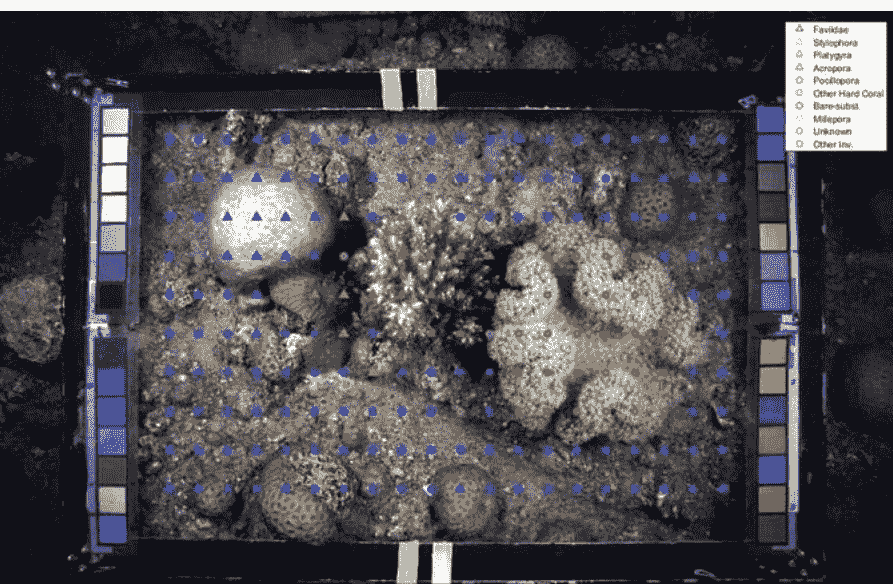

图1 点标注。海洋物种的边界常常不明确。常见的标注技术，如图像标签和边界框，对于海洋物种图像是不合适的。相反，海洋生态学家使用点标注来标记图像中的一些选定位置。来自EFC数据集的图像[37]

#### 基于深度卷积神经网络（CNN）特征的海洋物种分类

当有大量标记的训练数据可用时，深度卷积神经网络的性能非常好。然而，许多视觉识别挑战的任务都缺乏足够的训练样本。没有足够的训练数据，深度架构（如AlexNet和VGGNet）很可能会过度拟合训练数据，因为这些架构需要学习大量参数。

幸运的是，已经发现深度卷积神经网络特征是各种应用的通用表示。Donahue等人[9]证明，通过利用在大型标记数据集上训练的深度卷积架构，可以通过使用简单的线性分类器学习到足够强大和通用的特征，适用于一系列视觉识别任务。已经证明，这可以可靠地胜过基于复杂多核学习技术和传统手工特征的方法。他们的特征可视化实验结果与常见的深度学习知识一致，即初始层学习低级特征，后面的层学习语义或高级特征。Razavian等人的工作[10]证实并扩展了[9]中的结果，并强烈暗示从卷积网络中获得的深度学习特征可以成为大多数视觉识别任务的主要候选。在海洋物种分类中，使用深度卷积神经网络特征的例子包括：

- Jaeger等人[11]提出了一个基准数据集，名为克罗地亚鱼类数据集，其中包含794张12种鱼类的图像，用于非受限自然环境中的细粒度视觉分类（FGVC）。他们使用在ImageNet上预训练的AlexNet的第7个隐藏层的激活作为特征，并使用线性SVM进行分类。他们在自己的数据集上实现了66.78%的准确率。
- Mahmood等人[12]使用预训练的VGGNet的第一个全连接层的参数作为特征，并使用多层感知器（MLP）网络进行“珊瑚与非珊瑚”分类问题的分类。他们在澳大利亚海底数据集（Benthoz15）[13]的西澳大利亚（WA）子集上评估了他们提出的方法，该数据集包含近40个类别的407,968个标签。该WA子集包含从2011年到2013年收集的237,500个注释点。他们的结果表明，当训练和测试数据来自同一年时，准确率最高达到97%。这个结果揭示了识别性能在不同年份之间的环境变化引起的测试数据和训练数据之间的差异的影响。此外，他们指出，大部分错误分类是由于模糊的类别边界造成的。
- 在另一项研究中，Mahmood等人提出了“ResFeats”，即从预训练的深度残差网络中提取的特征。通过使用152层ResNet第5个卷积层的最后一个残差单元的输出作为特征，并结合PCA-SVM分类器，他们在MLC数据集上实现了80.8%的最新准确率，相比于[15]的基准性能提高了6.8%，相比于[16]的提高了2.9%。

从上面的例子中，我们可以观察到深度特征在海洋图像的情况下具有很好的泛化能力。在处理简单的二分类问题时，这是正确的。事实上，当类别的数量和复杂性增加时，性能会下降（正如预期的那样）。这是因为典型的深度模型，如AlexNet、VGGNet和ResNet（从中学习深度特征），是在ImageNet数据集上训练的，而该数据集中大多数海洋物种都是罕见或未见过的。那些深度特征很难捕捉到海洋物种之间微妙的类间差异。

#### 2.2 基于混合特征的海洋物种分类

在本节中，我们将介绍混合特征，这些特征是通过结合传统手工特征和深度卷积神经网络特征构建的。我们分析了每种特征的优势和劣势，并进一步讨论了这些混合特征对识别性能的影响。

#### 2.2.1基于手工特征的传统方法

在特征学习技术盛行之前，特征工程被广泛应用于各种视觉识别任务中。特征工程的过程复杂、耗时，并且需要专业知识。然而，手工特征可以明确描述对象的纹理、颜色或形状。一些描述符，如HOG [17]和SIFT [18]，在十年前取得了显著的性能提升。这些特征的质量和数量对预测模型有重要影响。通常，组合使用手工特征可以获得比单一特征更好的结果。根据数据类型和识别任务的不同，通常会选择不同的特征组合。下面讨论了基于一些流行的手工特征的先前海洋物种研究工作：

- Marcos等人[19]使用平均值的直方图结合局部二值模式（LBP）纹理描述符，从归一化色度坐标（NCC）空间编码颜色信息。他们使用线性判别分析（LDA）进行分类。在使用包含大约40个标签的138张图像数据集进行训练和测试时，其提出的方法在1-3米深度下的二分类准确率在60%至77%之间。由于深度增加导致的颜色退化和图像质量较差，性能会下降。此外，他们的结果表明，所提出的特征无法为珊瑚礁栖息地分类提供足够的区分信息。
- 在Pizarro等人的工作[20]中，采用了SIFT特征包的方法来编码灰度信息。此外，还使用了NCC的直方图和Gabor小波响应来表示颜色和纹理特征。所提出的算法在一个包含453张8类图像的数据集上进行了评估，其中每类图像有35张用于训练，其余的用于测试。报告的结果表明，当包含颜色和纹理信息时，有明显的改进。然而，由于需要将整个图像分类为一类，因此无法对图像内的异质性进行分类或量化。
- Stokes和Deane [21]引入了他们的判别度量，其中包括使用RGB直方图对颜色信息进行编码，使用离散余弦变换（DCT）对纹理特征进行编码。对于他们的分类方案，计算样本补丁与所有补丁之间的概率密度加权平均距离（PDWMD），该补丁是通过手动从18个类别的3,000多张图像中选择生成的。该方法在16个象限图像上进行了测试。报告显示他们的自动化程序更加高效，并且在性能上与手动分类相当。然而，在组合它们时，确定颜色和纹理特征的权重并不是一件简单的事情。手动尝试不同的选项通常会导致次优的结果。此外，性能在很大程度上受到库的大小的限制。
- Beijbom等人[15]首次引入了一个名为Moorea Labeled Corals (MLC)的基准海洋数据集，其中包含9个类别的400,000个标签。 在他们的工作中，提出了一种强大的基于字典的纹理描述符（texton），它使用最大响应（MR）作为特征表示，在LAB空间的每个通道中编码信息。 他们的结果显示准确率在67%到83%之间。 这个提出的算法被认为是MLC数据集上的一个强大的基准。
- Bewley等人[22]提出了一个关于海带的二分类问题的解决方案，即海带与“其他”。 所提出的方法使用一个单一的SVM分类器，应用径向基函数（RBF）核函数到一个具有62,900个标签的大型AUV数据集上。 比较了来自不同尺度的补丁的不同描述符（例如原始像素、PCA、GLCM、LBP和HOG）的性能。 此外，他们通过将一些描述符（原始、PCA和GLCM）扩展到RGB空间中来评估颜色信息是否有用于识别。 他们的结果显示，任何尺度上的颜色扩展都可以提供比其灰度对应物更好的结果。
- 在[23]中，[22]的作者使用在IMOS计划[24]下收集的相同数据集，将分类问题扩展到了19个类别，并按照分类层次结构进行了分类。 他们研究了PCA、LBP和特征学习（FL）与逻辑回归（LR）分类器的性能。 他们报告的结果显示，简单的LBP表示方法取得了最佳性能，在根节点处的F1分数为80.2%，在分类层次的最高级别处约为85%。

总之，基于纹理的特征，包括强度直方图统计、灰度共生矩阵（GLCM）[25-27]统计、Gabor小波响应统计[28]和局部二值模式（LBP）[29]，是海洋底栖物种分类中最常用的手工特征。 对于水下底栖图像，由于水介质的物理特性和底栖物种的模糊边界引起的颜色退化降低了个体颜色或形状特征的可靠性。 然而，高级的基于颜色的特征，如对手角度和色调颜色直方图[30]，仍然可以作为海洋物种分类的补充信息使用。

##### 2.2.2 基于混合特征的最新方法

深度卷积神经网络特征在许多数据集上展示了它们强大的区分能力和可迁移性。 一些研究表明，深度学习架构可以捕捉到图像特征中隐含的语义知识。 然而，精心选择的手工特征可以提供某些对象的明确物理描述。 因此，在处理罕见海洋物种等具有挑战性的数据集时，需要基于混合特征开发更复杂的方法。 一些研究小组已经考虑了这样的方法来进行海洋物种识别任务，并取得了改进的性能：

Mahmood等人[16]结合了基于颜色和纹理的特征，来自[15]的texton特征以及从预训练的VGGNet提取的CNN特征来训练一个2层MLP分类器。在相同的实验设置下，所提出的模型的准确率分别为77.9%，70.1%，84.5%，优于[15]中的方法（相应的准确率为74.3%，67.3%，83.1%）。值得一提的是，通过在多个尺度上提取特征，部分缓解了珊瑚类别边界模糊的问题。此外，通过对训练数据进行下采样并为成本函数分配与下采样率成反比的权重，考虑了MLC数据集的类别不平衡问题。

然而，它们的准确性仍有待提高的空间。郑等人[31]研究了将从预训练的AlexNet的倒数第二层提取的CNN特征与十种不同类型的手工特征相结合的合适方法。最小冗余最大相关性（mRMR）[32]被用来从所有特征候选项中选择合适的特征组合。鉴于不同的特征可能适用于不同的核函数，使用多核学习（MKL）[33]在使用一对多支持向量机分类器之前进行了应用。所提出的方法在与[34]相同的数据集上进行了评估，即台湾海洋鱼类数据集，该数据集来自Fish4Knowledge项目，包含了27, 370张来自23个类别的鱼类图像。他们报告的结果显示，CNN特征优于手工特征，但不及混合特征，混合特征的最高准确率约为97.91%。然而，该方法非常耗时，因为它使用了具有较大计算复杂度的MKL。此外，高假阴性表明数据不平衡的不利影响。这凸显了解决未来研究中的类别不平衡问题的重要性。

Blanchet等人[35]使用了三种最先进的特征表示方法：完成的局部模式二进制（CLBP）与色调和对手角直方图[36]，textons[15]和DeCAF[7]。他们不是简单地将这些特征组合起来，而是针对每种特征表示方法训练了一个一对一的SVM，使用RBF核函数。然后，使用融合函数来聚合三个分类器的归一化输出。最终的预测对应于融合得分最高的那个。实验在一个包含75,195个标记的4类图像块的数据集上进行。最佳准确率达到了78.7%。此外，通过引入拒绝阈值对融合得分进行筛选，进一步提高了预测准确性，以消除模糊点。请注意，在这项工作中，出现数量较少的物种被过滤掉了。然而，这不是处理类别不平衡问题的可取方法，因为它在某种程度上丢弃了潜在有用的信息。

深度卷积神经网络特征和手工特征已被证明可以描述自然图像的不同方面。作为一般规则，某个特征的判别能力在不同数据集上可能表现不同。这两种特征在某些方面可能互补。此外，由于多个特征的组合导致特征维度增加，可能会增加计算负载。通常情况下，对于给定的数据集，深度卷积神经网络特征可以作为识别任务的首选，而混合特征可以用于提高性能。

#### 2.3 深度卷积神经网络用于海洋物种分类的端到端训练

传统的机器学习方法将分类任务分为两个独立的步骤：特征提取和分类。性能在很大程度上取决于特征的质量。几十年前，机器学习科学家花费了很多时间设计“好”的特征。因此，以前的机器学习方法更适合称为“特征工程”。近年来，研究人员开发了机器学习技术，使系统能够自动从原始数据中捕捉“最佳”特征。这被称为“特征学习”。作为一种典型的有监督特征学习方法，神经网络可以通过不同隐藏层的输出学习输入的多层次特征。随着层数的增加，深度神经网络实现了更好的识别率，从而出现了“深度学习”。

端到端模式是指神经网络从一端接收输入，从另一端产生输出，以解决多阶段问题，只需进行一次训练。学习过程通过直接考虑输入和输出出来优化网络权重，即网络的所有权重都可以训练以将输入映射到相应的输出。然而，对于视觉任务来说，实现端到端训练是具有挑战性的，因为它需要适当的网络设计、足够的训练数据和高性能的GPU。对于海洋物种分类，以前报道的端到端训练的例子很少：

- 在[37]中首次使用CNN对水下图像进行自动注释。该工作的另一个贡献是提出了一个新的数据集，即Eliat Fluorescence Coral (EFC)数据集，包含212对反射和荧光图像，每个图像有200个点的注释。他们研究了在该数据上使用相同的LeNet [38]网络结构训练CNN的两种方法。第一种方法是对注册图像进行端到端训练，使用五个颜色通道，其中三个来自反射图像，两个来自荧光图像。第二种方法首先在每种图像类型上分别训练两个独立的CNN，然后使用SVM分类器来合并两个CNN的输出。结果表明，后者的准确率达到了90.5%。从理论上讲，五通道网络应该比第二种方法更有效，因为它使用了所有的图像信息。不充分的训练数据和不完美的注册质量可能解释了这些结果。此外，额外的实验结果还表明，添加荧光信息可以提高自动注释的准确性。
- Li和Cui [39]解决了一个包含121个类别的30,336个灰度图像的浮游生物分类问题。通过基于深度残差网络（ResNet）结构的端到端网络进行训练，达到了95.8%的前5准确率。具体来说，通过比较训练ResNet和VGG-19网络的性能，ResNet在训练时间和性能方面优于VGG网络。测试准确率。他们报告的结果证实了卷积神经网络的深度的重要性，并且在浮游生物分类的情况下，深度残差网络可以很好地泛化。
- Khan等人[40]提出了一种成本敏感的深度神经网络，可以自动学习大多数和少数类别的稳健特征表示。在输出层之前添加了两个额外的全连接层，并使用了VGG网络（配置D）的预训练模型。最后两个全连接层的权重是随机初始化的。他们使用了提出的成本函数对整个网络进行训练。他们的方法在MLC数据集上进行了评估，并与[15]的基准方法相比，取得了0.9%和1.3%的改进（基准方法分别达到74.3%和67.3%）。

端到端训练减少了预处理和后处理的需求，并且结果在很大程度上依赖于基于数据的自学习模型。因此，输出结果可以更好地适应任务。现有的水下数据集大多太小，无法训练端到端的深度网络。因此，创建大规模标记的海洋数据集以实现深度学习的更高性能可能是未来的选择。

## 3. 用于海洋物种检测的深度学习

目标检测旨在在图像或视频中检测特定类别的对象实例。目标检测的常见应用包括对象跟踪、视频监控、人数统计和异常检测。在海洋环境中，水下视频监控在近年来广泛用于海洋视频监控。这种方法无创且提供了足够的研究材料。然而，由于需要手动分析大量视频数据，这种方法劳动密集且容易出错。因此，开发一种自动化的基于视频的海洋物种检测系统非常重要，该系统可以应用于估计特定鱼类的数量和研究海洋动物的行为和相互作用等多个领域。

一个目标检测系统需要实现：定位和分类。目标检测器首先寻找对象，然后使用分类器来测试特定类别对象的存在。传统的目标检测过程包括三个主要步骤：(i) 区域选择，通常通过滑动窗口等穷举方法实现；(ii) 特征提取，常用的特征提取器是SIFT和HOG [17]；(iii) 分类，主要使用SVM和Adaboost [41]作为分类器。然而，传统目标检测存在两个主要问题。首先，基于滑动窗口的区域搜索计算量大且提供大量冗余窗口。其次，手工设计的特征对对象外观的各种变化鲁棒性较差。本节将介绍当前在PASCAL和ImageNet数据集上表现最好的目标检测器，以及它们在海洋物种检测中的应用。

更复杂的分类器通常会导致改进的检测性能，这会大大增加计算时间。直到最近，计算可行性和高检测质量之间的这种权衡通过使用“检测提议”来克服。在LifeCLEF 2015鱼类任务评估中，[42]的方法在基于视频的鱼类识别任务中取得了最佳性能，采用了一系列简单但有效的技术。该方法包括四个步骤：预处理、检测、识别和后处理。在预处理阶段，使用中值值方法从背景中分割出前景图像然后使用双边滤波器进行平滑处理。随后，使用选择性搜索从前景图像中提取候选鱼类对象窗口。在识别阶段，使用在ImageNet上预训练的GoogLeNet并使用鱼类训练数据进行微调。最后，通过考虑时间上连接的视频片段来改进识别模块的输出。尽管预处理和后处理步骤明显有助于改善最终性能，但如果使用更先进和复杂的技术，这种方法更有可能实现更好的性能。

Girshick等人[43]提出了“R-CNN”作为目标检测问题的解决方案。这种方法涉及使用检测建议和基于深度学习的分类器。区域建议是图像中对象可能出现的位置，使用基于纹理、边缘和颜色信息的方法提取，例如选择性搜索[44]、边缘框[45]或二值化归一化梯度（BING）[46]。这些方法大大减少了区域窗口的数量，并保持了较高的召回率。AlexNet用于提取每个区域建议的特征。然后，将提取的特征输入SVM进行分类。最后一步是使用边界框回归来细化区域建议的位置，使得生成的窗口更接近真实值。

SPP-Net [47]提出了增加R-CNN运行速度的方法。SPP-Net不是单独提取每个区域建议的CNN特征，而是将整个图像作为CNN的输入，并生成一个特征图，在该特征图中，区域建议从原始图像中投影出来。在完全连接的层之前添加了一个空间金字塔池化层，将任意大小的特征图转换为固定长度的特征向量。对于目标检测，SPP-Net运行速度比R-CNN快得多。

结合了R-CNN和SPP-Net的优点，Girshick等人[48]提出了一种改进的算法：快速R-CNN。与R-CNN的框架相比，在最后一个卷积层之后添加了一个感兴趣区域（RoI）层。这一层取代了最大池化层，并采用了多任务损失函数在快速R-CNN中。这是通过用两个兄弟层替换最后一个全连接层来实现的，其中一个是用于分类的softmax层（而不是R-CNN中使用的SVM分类器），而另一个则将边界框回归集成到CNN训练中。Li等人[49]将快速R-CNN框架应用于处理一个比ImageNet和VOC数据集质量较差的鱼类数据集。他们的实验结果表明，与基于HOG的可变形部件模型（DPM）和R-CNN的两种流行方法相比，他们在检测精度和速度上取得了更好的性能。

### 4 未来展望

尽管深度学习在信息处理的许多方面取得了惊人的性能，但仍然存在一些挑战。首先，深度神经网络的训练计算成本很高。训练深度网络并不容易，这需要大量的数据集和巨大的计算能力。此外，它在参数调整方面严重依赖用户的专业知识，并且通常收敛速度较慢，需要耗费大量时间来达到最优解。其次，未来的深度架构应该考虑感知数据的转换，如各种几何和光度变换，以进一步提高识别准确性。第三，需要开发无监督特征学习的方法。

方法。由于获取的数据集越来越大，标记大部分数据是不合理和不现实的。基于深度学习的最新进展，我们将介绍两种技术，可以应用于海洋图像识别系统，以提高其整体性能。

#### 4.1 深度学习改善图像质量

水下图像识别的平均准确率远远落后于地面图像识别的准确率。这主要是由于水下图像的质量较差，经常遭受低对比度、模糊和色彩退化的问题。这些退化因素是由水介质的物理特性引起的，在地面拍摄的图像中不存在。一些研究表明，使用简单的图像增强技术改善图像对比度[15, 16]可以取得良好的效果和提高准确性。这是一个良好的指示，改进的增强技术将实现更好的性能。

最近，一些研究[54-56]使用深度学习方法改善地面图像的质量。例如，在[54]中，低分辨率图像和高分辨率图像之间实现了端到端的映射。他们的深度卷积网络提出了一种轻量级结构，展示了最先进的恢复质量以及实际在线使用的快速速度。

孙等人[55]提出了一种深度学习方法来解决复杂的非均匀运动模糊问题，这通常是由相机旋转或物体运动引起的。此外，Schuler等人[56]设计了一个端到端可训练的模型，用于盲目图像去卷积，可以适应具有强噪声的模糊图像，并在图像质量和运行时间方面具有竞争力的性能。

总的来说，与最先进的手工制作方法相比，基于深度学习的方法在解决正常图像的图像质量问题方面取得了更好的性能。对于海洋图像，未来的研究还需要开发这样的技术。

#### 4.2 分割中的深度学习

传统的卷积神经网络结构，如AlexNet，适用于图像级别的分类和回归任务，其中输入图像的最终预测是一个数值描述。例如，AlexNet对于ImageNet数据集的输出是一个1000维向量。这个输出向量表示输入图像所属类别的概率。在某些应用场景中，对图像像素级别的分类有很高的需求。这包括语义图像分割，它需要与输入图像的每个像素位置相对应的分类结果，以及边缘检测，它相当于对每个像素进行二进制分类（边缘或非边缘）。

对于语义分割和边缘检测问题，经典的方法是在每个像素周围切割一个补丁，然后使用从补丁中提取的特征训练分类器。在测试阶段，学习到的模型用于对每个像素周围的补丁进行分类，并为该像素分配一个标签。这是用于图像轮廓检测的DeepContour [57]的思想。然而，这个过程需要逐个像素进行分类，非常耗时。此外，分类结果受到补丁的限制，使得建模上下文信息变得困难，从而影响算法性能。Long等人[58]提出了用于像素级分类的全连接网络（FCNs），有效解决了语义分割问题。与传统的CNN不同，FCN在卷积层之后不是跟随全连接层，而是接受任意大小的输入图像。此外，反卷积层用于上采样最后一个卷积层的特征图，输出一个与每个像素相关的输入大小的预测矩阵，同时保留原始输入图像的空间信息。

分割技术通常在海洋视频监控中用于将移动物体（如鱼）与静态背景分离。然而，这些技术很少用于海洋图像分类。具体而言，底栖数据通过随机点注释进行注释，因为底栖物种的边界通常不明确。因此，采用地面数据集的常见注释方法，如图像标签和边界框，无法提供所需的详细级别。对于类似于像素级分类的自动点注释，目标是为图像中的固定数量的随机选择的点分配标签。与上述方法类似，训练时每个点的特征是从以该点为中心的补丁中提取的。因此，补丁大小选择固有一些问题。虽然依靠从任何单个补丁中提取的特征来识别一个点是不合适的，但多尺度方法也不足够，因为它会导致补丁中特征的冗余计算[15]。在未来的研究中，应该使用FCN来解决这个问题，这应该会提高准确性和效率的自动注释。

### 5 结论

本章对深度学习技术在海洋物种识别方面进行了广泛的文献综述。本章主要关注海洋物种的图像分类，因为它是其他视觉任务的基础，也是创建海洋物种分布图的关键工具。作为图像分类的核心，本章详细介绍了专门针对海洋物种的特征提取和特征组合方法。本章讨论了深度特征和手工特征在海洋物种中的优缺点。此外，本章还探讨了在视频中进行海洋物种检测的结果。海洋数据具有独特的特点，如颜色退化和形态变化较大，并且不断增加。

数量，为计算机视觉领域提供了巨大的机遇，但也面临着巨大的挑战。我们还认为，未来海洋数据方面的挑战（例如，图像质量差和边界模糊）可以通过基于深度学习的图像质量增强和语义分割技术来解决。

致谢本研究部分得到了中国国家留学基金委员会资助（CSC，201607565016）和澳大利亚研究理事会资助（DP150104251和DE120102960）。

## 参考文献

- 1. T. Wernberg, S. Bennett, R.C. Babcock等, 气候驱动的温带海洋生态系统的转变。科学 3 53 (6295), 169-172 (2016)
- 2. T.C. Bridge, R. Ferrari, M. Bryson等, 高纬度珊瑚礁对异常温暖海水温度的不同响应。PLoS ONE 9 (11), e113079 (2014)
- 3. H. Singh, R. Armstrong, G. Gilbes等, 用SeaBED AUV对珊瑚进行成像：成像珊瑚栖息地。Subsurf. Sens. Technol. Appl. 5 (1), 25-42 (2004)
- 4. J.W. Nicholson, A.J. Healey, 自主水下机器人（AUV）应用和技术的现状。海洋技术学会杂志 42(1), 44-51 (2008)
- 5. O. Beijbom, P.J. Edmunds, C. Roelfsema等, 面向海底调查图像的自动注释: 人类专家的可变性和自动化的操作模式。PLoS ONE 10(7), e0130312 (2015)
- 6. A. Krizhevsky, I. Sutskever, G.E. Hinton, 使用深度卷积神经网络进行ImageNet分类，在神经信息处理系统进展(2012), 第1097-1105页
- 7. K. Simonyan, A. Zisserman, 用于大规模图像识别的非常深的卷积网络。arXiv:1409.1556 (2014)
- 8. K. He, X. Zhang, S. Ren等, 深度残差学习用于图像识别，在IEEE计算机视觉和模式识别会议(2016), 第770-778页
- 9. J. Donahue, Y. Jia, O. Vinyals等, DeCAF: 用于通用视觉识别的深度卷积激活特征，在第31届国际机器学习大会(ICML), 中国北京, 第32卷, 2014年6月, 第647-655页
- 10. S. Razavian, H. Azizpour, J. Sullivan等, CNN特征即插即用: 用于识别的惊人基线, 在IEEE计算机视觉和模式识别会议工作坊(2014), 第806-813页
- 11. J. Jaeger, M. Simon, J. Denzler等, 克罗地亚鱼类数据集: 在其自然栖息地中对鱼类进行细粒度分类(2015), 第1-7页。http://dx.doi.org/10.5244/C.29.MVAB.61
- 12. A. Mahmood, M. Bennamoun, S. An等, 使用深度学习自动注释珊瑚礁, 在OCEANS 16会议中, 美国加利福尼亚州蒙特雷, 2016年9月, 第17-23页
- 13. M. Bewley, A. Friedman, R. Ferrari等, 澳大利亚海底调查数据, 包括图像和专家注释。科学数据 2 (2015)
- 14. A. Mahmood, M. Bennamoun, S. An等, ResFeats:基于残差网络的图像分类特征, arXiv:1611.06656 (2016)
- 15. O. Beijbom, P.J. Edmunds, D.I. Kline等, 珊瑚礁调查图像的自动标注, IEEE计算机视觉和模式识别会议(CVPR)论文集, 罗得岛普罗维登斯, 2012年6月, 第16-21页
- 16. A. Mahmood, M. Bennamoun, S. An等, 混合特征表示的珊瑚分类, IEEE国际图像处理会议(ICIP)论文集, 美国亚利桑那州凤凰城, 2016年9月, 第25-28页
- 17. N. Dalal, B. Triggs. 用于人体检测的梯度方向直方图, IEEE计算机视觉和模式识别会议(CVPR)论文集, 卷1(IEEE, 2005), 第886-893页
- 18. D.G. Lowe, 基于局部尺度不变特征的目标识别，在《第七届IEEE国际计算机视觉会议论文集》（1999年，IEEE出版），第2卷，第1150-1157页
- 19. M. Marcos, S. Angeli, L. David等人, 通过水下视频在帕劳的Ngedarrak礁石中自动计数有生命和无生命组分. 环境监测与评估 125(1), 177-184 (2008)
- 20. A. Pizarro, P. Rigby, M. Johnson-Roberson等人, 面向基于图像的海洋栖息地分类, 在OCEANS 08会议记录中, 魁北克市, 加拿大, 2008年9月, 第15-18页
- 21. M.D. Stokes, G.B. Deane, 珊瑚礁底栖图像的自动处理. Limnol.Oceanogr.: Methods 7(2), 157-168 (2009)
- 22. M. Bewley, B. Douillard, N. Nourani-Vatani等人, 自动物种检测: 一种实验性方法用于从海底AUV图像中检测海带, 收录于《澳大利亚机器人与自动化会议论文集》(2012)
- 23. M. Bewley, N. Nourani-Vatani, D. Rao等人, AUV图像中的分层分类, 收录于《高级机器人学研究文集》, 第105卷, 2015年1月, 第3-16页
- 24. IMOS: 综合海洋观测系统.2013年9月. http://www.imos.org.au
- 25. R.M. Haralick, K. Shanmugam, I. Dinstein, 图像分类的纹理特征. IEEET rans. Syst. Man Cybern. SMC-3(6), 610–621 (1973)
- 26. L. Soh, C. Tsatsoulis, 使用灰度共生矩阵对SAR海冰图像进行纹理分析. IEEE Trans. Geo sci. Remote Sens. 37(2), 780–795 (1999)
- 27. D.A. Clausi, 作为灰度级量化函数的共生纹理统计分析. Can. J. Remote Sens. 28(1), 45–62 (2002)
- 28. G.M. Haley, B.S. Manjunath, 使用完整的空间频率模型进行旋转不变纹理分类. IEEE Trans. Image Process. 8(2), 255–269 (1999)
- 29. Z. Guo, L. Zhang, 用于纹理分类的局部二值模式算子的完整建模. IEEE Trans. Image Process. 19(6), 1657–1663 (2010)
- 30. J. Van de Weijer, C. Schmid, 颜色局部特征提取,在第9届欧洲计算机视觉大会(ECCV 06)上, 奥地利格拉茨,2006年5月, 第334-438页
- 31. Z. Chao, J.C. Principe, B. Ouyang, 使用组合的CNN和手工设计的图像特征进行海洋动物分类,在OCEANS'15 MTS/IEEE上, 华盛顿(IEEE, 2015), 第1-6页
- 32. H. Peng, F. Long, C. Ding, 基于最大依赖性、最大相关性和最小冗余性的互信息准则的特征选择,IEEE模式分析与机器智能期刊, 27(8), 1226-1238 (2005)
- 33. C. Zheng, Jose C. Principe, B. Ouyang, 多核学习中的图像分类组特征选择,在2015年国际神经网络联合会议(IJCNN)上(IEEE, 2015), 第1-5页
- 34. H. Qin, X. Li, J. Liang等人, DeepFish: 具有深度架构的准确水下活鱼识别. Neurocomputing 187, 49-58 (2016年)
- 35. J.N. Blanchet等人, 使用多个纹理表示在自然场景图像中自动注释珊瑚. PeerJ Preprints 4, e2026v2 (2016年)
- 36. A.S.M. Shihavuddin, N. Gracias, R. Garcia等人, 基于图像的珊瑚礁分类和主题映射. Remote Sens. 5 (4) , 1809-1841 (2013年)
- 37. O. Beijbom, T. Treibitz, D.I. Kline等人, 利用宽带荧光改进浅海调查图像的自动注释. Sci. Rep. 6 (2016年)
- 38. Y. LeCun, Y. Bengio, 图像、语音和时间序列的卷积网络, in The Handbook of Brain Theory and Neural Networks, vol. 3361, no. 10 (1995)
- 39. X. Li, Z. Cui, 用于浮游生物分类的深度残差网络, in OCEANS 2016 MTS/IEEE, Monterey, Sept 2016, pp. 1–4
- 40. S.H. Khan, M. Hayat, M. Bennamoun et al., 从不平衡数据中学习深度特征表示的代价敏感学习. IEEE Trans. Neural Netw. Learn. Syst. (2017) (in press)
- 41. P. Viola, M. Jones, 使用增强级联简单特征的快速目标检测, in Pro-ceedings of the IEEE Computer Society Conference on Computer Vision and Pattern Recogni-tion (CVPR), vol. 1 (2001), pp. I-I
- 42. S. Choi, 使用深度卷积神经网络在水下视频中进行鱼类识别：SNUMedinfo参与LifeCLEF鱼类任务2015，在CLEF（工作笔记）（2015年）
- 43. R. Girshick, J. Donahue, T. Darrell等人, 用于准确目标检测和语义分割的丰富特征层次结构, 在IEEE计算机视觉和模式识别会议论文集中, 第580-587页, 2014年
- 44. J.R. Uijlings, K.E. Van De Sande, T. Gevers等人, 用于目标识别的选择性搜索. Int. J. Comput. Vis. 104(2), 154-171 (2013年)
- 45. C. Zitnick, P. Dollr, 边缘框：从边缘定位对象提议, 在欧洲计算机视觉会议上（Springer International Publishing, 2014年）, 第391-405页
- 46. M. Cheng, Z. Zhang, W. Lin等人, BING: 用于300 fps的二值化归一化梯度进行目标性估计, 在IEEE计算机视觉和模式识别会议论文集中, 第3286-3293页, 2014年
- 47. K. He, X. Zhang, S. Ren等, 深度卷积网络中的空间金字塔池化用于视觉识别, 在欧洲计算机视觉会议上（Springer International Publishing, 2014年）, 第346-361页
- 48. R. Girshick, 快速R-CNN, 在IEEE国际计算机视觉会议上（2015年）, 第1440-1448页
- 49. X. Li, M. Shang, H. Qin等, 快速准确的水下图像鱼类检测和识别, OCEANS'15 MTS/IEEE, 华盛顿, 2015年10月, 第1-5页
- 50. S. Ren, K. He, R. Girshick等, 更快的R-CNN: 基于区域建议网络的实时目标检测, 神经信息处理系统进展（2015年）, 第91-99页
- 51. X. Li, M. Shang, J. Hao等, 通过共享CNN进行鱼类检测和识别加速, OCEANS 2016-上海, 2016年4月10日（IEEE, 2016年）, 第1-5页
- 52. J. Redmon, S. Divvala, R. Girshick等, 你只需要看一次：统一的实时目标检测, 在IEEE计算机视觉和模式识别会议论文集（2016年）, 第779-788页
- 53. W. Liu, D. Anguelov, D. Erhan等, SSD: 单次多框检测器, 在计算机视觉欧洲会议(Springer, Cham, 2016), 第21-37页
- 54. C. Dong, C.L. Chen, K. He等, 使用深度卷积网络的图像超分辨率。IEEE Trans. Pattern Anal. Mach. Intell. 38(2), 295-307 (2016)
- 55. J. Sun, W. Cao, Z. Xu等, 学习卷积神经网络进行非均匀运动模糊去除, 在IEEE计算机视觉和模式识别会议论文集(2015), 第769-777页
- 56. C.J. Schuler, M. Hirsch, S. Harmeling等, 学习去模糊。IEEE Trans. Pattern Anal. Mach. Intell. 38(7), 1439-1451 (2016)
- 57. W. Shen, X. Wang, Y. Wang等人, Deepcontour: 通过正共享损失学习的深度卷积特征用于轮廓检测, 在IEEE计算机视觉和模式识别会议(2015), pp. 3982-3991
- 58. J. Long, E. Shelhamer, T. Darrell, 全卷积网络用于语义分割, 在IEEE计算机视觉和模式识别会议(2015), pp. 3431-3440

## 深度学习用于海洋物种识别

## 化学信息学中的深度分子表示

**Peng Jiang, Serkan Saydam, Hamed Lamei Ramandi, Alan Crosky 和Mojtaba Maghrebi**

摘要 量子化学描述符是发现和设计具有所需性质的新材料的强大预测器。基于波函数的方法通常用于计算量子化学描述符，但这需要很长时间。最近，由于其计算优势，机器学习模型被用于预测量子化学描述符。然而，生成适当的分子表示以进行训练是困难的。本文回顾了最近的分子表示技术，然后使用变分自动编码器对化学键的分子表示进行编码。通过深度神经网络结构，编码表示减少了特征的维度并提取了关键信息。在基准数据集上的结果表明，深度编码的分子表示在预测电子量子化学描述符方面优于化学键表示。

P. Jiang · A. Crosky
澳大利亚新南威尔士大学材料科学与工程学院，悉尼，新南威尔士州，澳大利亚
e-mail: peng.jiang@student.unsw.edu.au

A. Crosky
电子邮件：a.crosky@unsw.edu.au

S. Saydam · H. L. Ramandi
澳大利亚新南威尔士大学采矿工程学院，悉尼，新南威尔士州，澳大利亚
e-mail: s.saydam@unsw.edu.au

H. L. Ramandi
电子邮件：h.lameiramandi@unsw.edu.au

M. Maghrebi (✉)
澳大利亚新南威尔士大学土木与环境工程学院，悉尼，新南威尔士州，澳大利亚
e-mail: maghrebi@unsw.edu.au

M. Maghrebi
伊朗马什哈德费尔多斯大学土木工程系，马什哈德，拉扎维霍拉桑省，伊朗

© Springer Nature Switzerland AG 2019
V. E. Balas等人（编），深度学习应用手册，
智能创新，系统与技术136，
https://doi.org/10.1007/978-3-030-11479-4_8

### 1 引言

几个世纪以来，化学家们设计并进行耗时的实验来合成具有所需性质的新材料。 随着计算机的发展，化学信息学这门新学科得以建立和发展。 化学信息学应用最先进的信息和计算机技术来解决材料和化学领域中的各种问题，如存储、索引和搜索。 此外，化学信息学已经吸收了基于机器学习和数据挖掘的技术，以学习分子中的潜在知识。 化学家和材料工程师可以利用这些知识来指导新材料的开发。

定量构效关系（QSAR）是化学信息学在预测材料性质方面的典型应用。例如，QSAR模型已经广泛应用于药物发现[1-3]和生物医学研究[4, 5]，因为它们具有适度的计算成本和加速开发和测试的优势。 最近，研究人员开始使用QSAR模型解决不同领域的问题。 Gómez-Bombarelli等人[6]开发了一个数据驱动的QSAR模型，并证明了它在设计有机发光二极管方面的有效性。 Camacho-Mendoza等人[7]展示了QSAR模型在预测有机缓蚀剂的抑制性能方面的可靠性。 Li等人[8]通过模拟和实验证明了QSAR模型在预测缓蚀剂性能方面的有效性，并且他们还展示了基于QSAR的相似性分析可用于开发新型缓蚀剂。

为了进行QSAR分析，通常需要一组代表材料的特征。 理想的分子特征传达了预测其性质所需的所有基本信息，以便通过将这些特征映射到相应材料的性质来很好地近似这种关系。大多数使用QSAR模型预测材料性质或发现新化合物的研究都使用量子化学描述符作为特征[9, 10]。 量子化学描述符，也称为量子力学性质，提供了可以洞察分子的电子和热化学结构的简单分子信息。 在QSAR研究中广泛使用的量子化学描述符包括原子电荷、分子轨道能量、前线轨道密度、偶极矩和极性指数。 Karelson等人[9]对量子化学描述符和应用进行了详细描述。 已经建立和证明了量子化学描述符与生物活性[11]、有机化合物的反应性[12]和辛醇/水分配系数[13]等不同性质之间的相关性。

一般来说，大多数量子化学描述符是通过计算化学方法获得的，这些方法基于经典分子力场和量子化学方法。 基于简化和近似的分子轨道理论（SCF MO）的半经验量子化学方法也被广泛使用。 最近，密度泛函理论（DFT）已成为计算量子化学中最流行的方法之一。 DFT是一种纯粹基于量子力学的从头计算量子化学方法。与实验相比，计算化学方法易于执行且成本较低。此外，计算可以在任何分子上执行，即使这些分子不存在。这为探索巨大的未知化合物空间（CCS）提供了宝贵的机会。然而，计算所需的时间可能非常昂贵。对于一个分子的计算，DFT可能需要几天的时间，这在CCS中的数十亿个分子中并不经济。

为了加速量子化学描述符的计算，一些研究人员尝试使用机器学习方法[14, 15]。虽然在物理化学中较少见，但他们证明了基于量子力学和统计力学中的对应原理可以估计分子的量子化学描述符。Ramakrishnan和von Lilienfeld [16]指出，机器学习方法在生成量子化学描述符方面的成功取决于是否满足四个条件：

- (i) 系统与量子性质之间存在严格的关系；
- (ii) 表示具有足够的信息来重构系统的哈密顿量；
- (iii) 训练集和测试集需要来自相同的分布；
- (iv) 训练集足够大。

由于机器学习在计算上的优势和良好的可迁移性，更多基于机器学习的量子化学研究已经发表[16, 17]。然而，决定机器学习成功的四个条件仍然是主要挑战。据我们所知，其中最困难的条件是分子的表示。这些表示通常需要是固定大小的向量，用作机器学习模型的输入特征。

CCS中分子的元素、长度和键的变化非常大，这给机器学习模型的合适表示带来了困难。

本文结构如下：第2节回顾了发展分子表示的最新研究成果；第3节介绍了用于生成深度分子表示的深度学习技术，接下来是第4节和第5节，讨论了数据库和模型结构。第6节给出了模拟结果和讨论；从本研究中可以得出的结论在第7节中进行了总结。

### 2 分子表示

如前所述，分子的合适表示对于机器学习模型至关重要，通常需要使用特征工程技术来提高计算性能。在本节中，将回顾几种常用的分子表示方法。

#### 2.1 分子指纹

分子指纹是一种生成二进制数列（0、1）的方法，用于显示特定功能团的存在[18]。指纹的一个简单解释是一系列二进制数。对于给定长度的向量，向量的某个位置上的“1”表示该化合物中存在预定义的功能团，“0”表示该功能团不存在。这种表示方法的一个优点是这些二进制向量可以被计算机有效处理。此外，研究人员可以根据不同的情景自定义预定义向量。与许多其他表示方法相比，指纹需要对原始信息进行较少的重构。这有助于提高计算效率，更重要的是，可以轻松地使用指纹描述符进行分子之间的相似性测试。然而，对于一些大型和复杂的聚合物，分子指纹的搜索和设计可能会很困难和耗时。

Merck [19] 在2012年赞助了一个关于预测不同分子活动的竞赛。这个挑战涉及15个不同大小（2000-50000个分子）的数据集，具有成千上万个描述符作为特征（指纹）。第一名由一支研究团队获得，他们使用了多种机器学习方法的集成，包括最先进的深度学习、梯度提升机和高斯过程。他们的模型在15个数据集上实现了0.49的平均$R^2$值，与Merck内部基准（0.42）相比，这是一个显著的改进。受到他们的工作的启发，Unterthiner等人[21]在ChEMBL数据库的数据集中应用了深度学习。他们将深度学习的性能与七个目标预测模型进行了比较，结果表明深度学习在接收器操作特性（ROC）曲线下的面积方面优于其他方法，即评估分类性能的有用标准之一。

#### 2.2 库仑矩阵

在所有可用的分子表示方法中，指纹是最受欢迎的方法之一，因为它简单且计算成本低。然而，要生成完整的指纹，需要一个大型特征数据库。此外，指纹的长度可能太长。库仑矩阵[14, 15]只考虑分子的结构信息，被提出用于生成相对较短和简单的表示。设 $Z$ 为每个原子的核电荷，$R$ 为分子中每个原子在三维空间中的原子位置。通过将 $Z$ 和 $R$ 作为输入，可以通过基于第一原理的DFT方法估计量子化学描述符。使用相同的输入特征信息，基于机器学习的模型在有足够样本的情况下可以替代耗时的DFT计算。库仑矩阵作为一种特征工程手段，结合了 $Z$ 和 $R$。具体而言，对于一个由 $N$ 个原子组成的分子，库仑矩阵是一个 $N \times N$ 的对称矩阵。库仑矩阵中的每个元素 $M$ 定义为：

$$ M_{ij} = \begin{cases} 0.5 Z_i^{2.4}, & \text{if } i = j \\ \frac{Z_i Z_j}{|R_i - R_j|}, & \text{if } i = j \end{cases} \quad (1) $$

在库仑矩阵中，对角元素对应于自由原子的势能估计，而非对角元素编码了两个原子之间的库仑相互作用。由于库仑矩阵对原子位置和核电荷的可微性，它是机器学习所使用的输入特征的合适候选者。

尽管库仑矩阵充分概括了DFT计算所需的基本信息，但它无法表示分子的唯一排序。换句话说，一个分子可以通过在行和列中引入排列来表示为多个库仑矩阵。已经提出了几种解决这个问题的方法[22]。一种解决方法是使用基于每行范数排序的库仑矩阵，但这种方法会移除库仑矩阵的可微性。另一种解决方法是使用随机排序的库仑矩阵，并让机器学习算法从排列后的矩阵中学习不变性。结果[22]表明后一种解决方案在原子化能的预测准确性上优于前一种解决方案。

#### 2.3 键袋

为了折衷库仑矩阵的不变性，提出了键袋（BOB）[23]。BOB受到词袋（BOW）的启发，词袋是自然语言处理（NLP）技术之一。与化学信息学类似，NLP领域面临的最大挑战之一是用固定大小的向量表示文本，以便算法可以提取和处理真实信息。词袋通过标记化、计数和归一化来解决这个问题。标记化是将文本分解为可能的标记的过程。这些标记可以是单词、短语或任何预定义元素。然后计算每个文本中标记的出现次数。最后，进行归一化以为标记分配权重，以获得数值特征向量。BOB采用了词袋的三个关键过程，并为分子生成固定大小的特征向量。具体而言，库仑矩阵中的元素被视为标记。这些元素按照核电荷的组合进行排序，并填入一个袋子中。因此，一个袋子中的每个标记都携带着空间信息和核电荷。

尽管库仑矩阵和BOB相比分子指纹大大减少了特征长度，但它们通过简单填充生成了固定大小的特征。如果数据库中涉及复杂分子，则某些分子的特征非常稀疏。除了三种分子表示方法外，还有几种有趣的方法，包括散射变换[24]、原子距离[25]和图模型[26, 27]。选择适当的表示方法是计算效率、信息复杂性和可访问性之间的权衡。分子表示方法的比较已在[28]中进行了回顾。

### 3 理论背景

#### 3.1 深度神经网络

深度神经网络（DNN）是传统人工神经网络（ANN）的高级版本。ANN是一个多层网络，由神经元组成，使用激活函数 $f(z)$ 处理原始输入信息。一个神经元与前一层的神经元 $w$ 相关联，并带有默认的偏置项 $b$。 输入特征通过ANN的每一层，然后神经元以以下形式处理信息：

$$ f(z) = f\left(\sum_{i=1}^{N} w_i x_i + b\right) \quad (2) $$

典型的ANN包含三种不同任务的层：
- (i) 输入层，位于底部，用于接收原始输入信息；
- (ii) 输出层，位于顶部，用于生成预测；
- (iii) 中间构建的隐藏层，用于重构原始信息。

通常，DNN包含两个或更多的隐藏层。此外，还设计了几种特殊的架构用于DNN处理原始输入中的复杂关系，如空间和时间信息[29]。DNN在图像处理[30]、语音识别[31]和自然语言处理[32]方面取得了许多显著的成功。

#### 3.2 方差自编码器

由Kingma和Welling [33]提出，VAE是一种深度学习生成架构，旨在构建潜变量的概率分布。自编码器是一种通过编码和解码来复制原始数据的算法。 一个简单的自编码器由编码器和解码器组成。设 $x$ 为原始数据。编码器通过函数 $f$ 将原始数据转换为隐藏表示 $z$：$z = f(x)$，而解码器通过函数 $g$ 将隐藏表示从编码器投影到 $t$：$t = g(f(x))$，其中 $t$ 应该足够接近 $x$，以便在编码-解码过程中保留原始信息。 图1显示了VAE的典型结构。 由于解码器的最终输出只是输入的近似值，因此通过编码的特征转换被认为是重要的。这种特征转换是从原始数据中提取的基本且有效的信息[33]。VAE的另一个显著能力是通过从潜空间中的分布进行采样来生成新的数据点，从而能够获得与输入类似的未知样本。这种能力使VAE成为一种生成模型。生成模型被认为是健康诊断的强大工具，原因如下。第一个原因是标记观测数据的成本高且耗时。通过生成模型消除这是通过提供一些标记样本来观察相似数据点来完成的。第二个原因是对于生成模型，模型的架构、潜在分布和调整超参数都是模块化的。这意味着先前的知识或经验可以很容易地集成到这个模型中。

VAE通过编码学习生成原始数据的概率分布，实际上是对真实后验密度 $p_{\theta}(z | x) = p_{\theta}(x | z) p_{\theta}(z) / p_{\theta}(x)$ 的近似。VAE试图推断出对不可计算的真实后验的变分近似 $q_{\phi}(z | x)$。然后引入了一个度量指标，Kullback-Leibler (KL) 散度 ($D_{KL}$)，用于衡量 $q_{\phi}(z | x)$ 和 $p_{\theta}(z | x)$ 之间的相似程度。 为了获得最优模型，即编码器和解码器网络的最优权重，以及最低的泛化误差，需要最大化边际似然。这通过对数据点的对数似然求和来实现：

$$ \log p_{\theta}(x) = \mathcal{L}(\theta, \phi; x) + D_{KL}(q_{\phi}(z | x) \parallel p_{\theta}(z | x)) \qquad (3) $$

其中 $\mathcal{L}(\theta, \phi; x)$ 是变分下界。由于 $D_{KL}$ 是非负的，变分下界可以重写为：

$$ \mathcal{L}(\theta, \phi; x) = \mathbb{E}_{q_{\phi}(z|x)}[\log p_{\theta}(x | z)] - D_{KL}(q_{\phi}(z | x) \parallel p_{\theta}(z | x)) \qquad (4) $$

第一个右手边（RHS）项是用来强制解码器重构数据的预期重构误差。第二个RHS项，KL散度，衡量了生成的近似值与真实后验之间的接近程度，可以看作是一个正则化项。 对于每个输入样本 $x$，通过从 $q_{\phi}(z | x)$中采样生成一组隐藏表示$z$。VAE利用重参数化技巧对 $z$进行采样：

$$ z = \mu + \sigma \odot \epsilon \quad (5) $$

其中 $\mu$和 $\sigma$是近似后验 $q_{\phi}(z | x)$的均值和标准差。$\odot$表示逐元素乘积。$\epsilon$是一个高斯噪声 $\epsilon \sim \mathcal{N}(0, I)$。这个过程将 $z$从随机抽取的值转化为带有噪声的确定性值。由于均值和标准差是从编码器的推理过程中获得的，所以可以通过变分下界函数对 $\theta$进行反向传播。除了生成新样本和降维，VAE还可以通过将高维数据投影到低维潜在空间来可视化高维数据。我们利用这个特性来发现数据的结构相似性，在下面的案例研究中。

### 4 数据库

在这项研究中，QM9数据集[34]被用作基准数据集。QM9数据集是GDB-13数据集的一个子集。GDB-13由Reymond等人[35]发布，包含了166亿个由CHONF组成的有机小分子。QM9数据集中大多数分子有18个原子。几何和量子化学性质是通过DFT量子化学计算在B3LYP/6-31G(2df,p)水平上获得的，针对GDB-9中最小的133885个（约134k）分子。在这项工作中，选择了电子量子化学描述符作为目标，这些描述符在表1中提供。能隙能量、$E_{HOMO}$和$E_{LUMO}$等性质已被证明是预测有机腐蚀抑制剂[7]和半导体[36]性能的强大特征。

表1 QM9数据集中计算属性的描述

| 编号 | 属性 | 单位 | 描述 |
|------|------|------|------|
| 1 | μ | 德拜 | 偶极矩 |
| 2 | α | a₀³ | 各向同性极化率 |
| 3 | $E_{HOMO}$ | 哈特里 | 最高占据分子轨道能量 (HOMO) |
| 4 | $E_{LUMO}$ | 哈特里 | 最低占据分子轨道能量 (LUMO) |
| 5 | $E_{gap}$ | 哈特里 | 能隙，LUMO和HOMO之间的差异 |

### 5 模型

在本研究中，BOB被用作QM9数据集的分子表示方法。如第2节所述，BOB从库仑矩阵中提取元素，并根据它们的大小进行排序。因此，BOB中的元素基本上携带有关原子位置和核电荷的信息。然而，Hansen等人发现，库仑矩阵的对角元素对基于机器学习的预测的改进贡献很小。因此，只使用携带原子间相互作用的非对角元素来表示BOB的分子。由于BOB只是通过填充来产生固定大小的表示，如果数据库中涉及复杂分子，则某些分子的特征会变得非常稀疏。此外，这可能引入冗余并导致预测性能不佳。受Rafael的工作[6]的启发，本研究使用VAE来重构BOB的分子表示，以解决这个问题，然后使用一个三层传统的ANN来预测几个量子化学描述符。所有模型都是使用Keras [37]和Tensorflow [38]构建的。所使用的VAE包括一个编码器和一个解码器。编码器有两个1D卷积层和一个维度为200的全连接层。解码器有一个维度为200的全连接层，用于连接编码器的最后一个全连接层，然后是两个维度为666的循环单元网络。使用编码表示作为输入，构建了一个传统的基准ANN模型来拟合属性。这个ANN只包含一个维度为200的隐藏层和一个维度为1的输出层。原始数据集被分为训练集（80%）和测试集（20%）。训练集用于训练VAE-ANN和ANN，测试集用于评估其样外性能。

### 6 模拟结果和讨论

在用于生成基于VAE的分子表示的训练过程中，使用20%的训练数据（原始BOB特征）进行验证，并采用平均绝对误差（MAE）作为误差度量。训练和验证的MAE损失可以在图3中看到。经过近80次迭代，训练损失和验证损失收敛，尽管验证集存在明显的波动。两条曲线相近，说明训练集和验证集来自同一分布。 图2显示了VAE-ANN和基准ANN模型预测的量子化学描述符的MAE和相应的标准偏差（预测误差）。结果表明，VAE-ANN在所有电子量子化学描述符的MAE方面优于基准模型。这是因为VAE具有深度提取能力，可以去除冗余信息，同时保留原始数据中的关键信息。 通过调整VAE编码器中潜在空间的维度从200到2，可将编码表示可视化，如图4所示。可以清楚地观察到2D分子表示根据 $E_{LUMO}$ 值进行了聚类。 这样可以通过从具有相似性质的聚类中进行采样来发现具有所需性质的新分子。然后，VAE可以使用解码器重构新分子的BOB分子表示。

图3显示了在生成基于VAE的分子表示过程中训练集和验证集的MAE损失曲线。

表2显示了使用VAE编码的分子表示进行ANN的测试集电子量子化学描述符的MAE。

| 编号 | 属性 | VAE-ANN | ANN |
| :--- | :--- | :--- | :--- |
| 1 | $\mu$ (Debye) | 0.6443 (0.9200) | 0.9312 (1.2864) |
| 2 | $\alpha$ ($a_0^3$) | 0.9870 (1.5538) | 2.8997 (4.0793) |
| 3 | $E_{HOMO}$ (Hartree) | 0.0084 (0.0114) | 0.0141 (0.0193) |
| 4 | $E_{LUMO}$ (Hartree) | 0.0131 (0.0176) | 0.0268 (0.0338) |
| 5 | $E_{gap}$ (Hartree) | 0.0154 (0.0202) | 0.0278 (0.0352) |

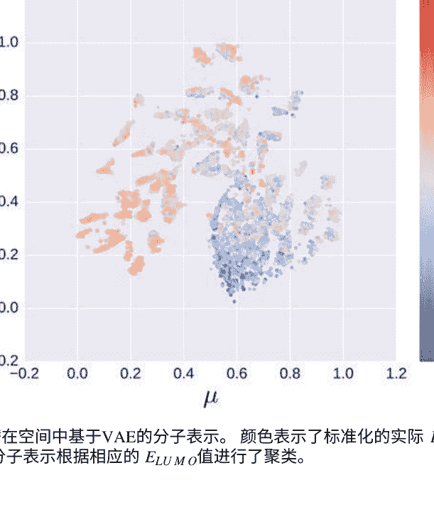

图4显示了2D潜在空间中基于VAE的分子表示。颜色表示了标准化的实际$E_{LUMO}$值。可以清楚地看到分子表示根据相应的$E_{LUMO}$值进行了聚类。

### 7 结论

在这项工作中，介绍了机器学习在化学信息学中的应用，以及在发现和设计具有所需性质的新材料中使用的量子化学描述符的背景。目前，在生成量子化学描述符中使用的DFT方法在计算时间上是昂贵的，因为CCS中有数十亿个分子。由于计算优势，机器学习方法在生成量子化学描述符方面越来越受欢迎。然而，可靠的固定大小的分子表示作为输入特征对于确定预测性能至关重要。在工业和学术界中，分子指纹、库仑矩阵和BOB等表示方法是常用的分子表示方法。然而，由于长度可变，在CCS中的分子中，许多这些表示只能通过简单的填充来生成固定大小的表示。这使得分子表示非常稀疏；值得注意的是，这可能引入冗余。为了产生更可靠的分子表示，这项工作使用VAE对BOB特征进行编码，并将维度从666降低到200。对QM9数据集的测试表明，使用编码的分子表示在几个电子量子化学描述符上的预测性能比使用原始BOB描述符的基准ANN模型有所改善。此外，VAE使得通过从潜在空间中简单采样来生成新的BOB成为可能，从而可以在具有相似性质的分子簇中找到具有所需性质的新分子。在未来的工作中，建议进行更详细的研究，以进一步研究将计算的BOB特征转换回像SMILE字符串这样的格式的方法，以验证新分子。

## 参考文献

- 1. M.A. Lill, 多维QSAR在药物发现中的应用。Drug Discov. Today **12**(23)， 1013–1017 (2007)
- 2. Hugo Kubinyi，药物设计中的QSAR和3D QSAR第1部分：方法论。Drug Discov. Today **2**(11), 457–467 (1997)
- 3. D. Qi-Shi， R.-B. Huang， K.-C. Chou， QSAR的最新进展及其在预测化学分子、肽和蛋白质的药物设计中的应用。Curr.Protein Pept. Sci. **9**(3)， 248–259 (2008)
- 4. C. Hansch, D. Hoekman, A. Leo, D. Weininger, C.D. Selassie等，化学生物信息学：化学和生物学之间的比较QSAR。Chem. Rev. **102**(3)， 783–812 (2002)
- 5. C. Hansch, A. Leo, D. Hoekman, Albert Leo,探索QSAR, vol. 631 (美国化学学会, 华盛顿特区, 1995)
- 6. R. Gómez-Bombarelli, D. Duvenaud, J. Hernández-Lobato, J. Aguilera-Iparraguirre, T.D.Hirzel, R.P. Adams, A. Aspuru-Guzik, 使用基于数据驱动的分子连续表示的自动化化学设计. arXiv:1610.02415 (2016)
- 7. R.L. Camacho-Mendoza, E. Gutierrez-Moreno, E. Guzman-Percastegui, E. Aquino-Torres, J. Cruz-Borbolla, J.A. Rodriguez-Avila 等, 密度泛函理论和电化学研究: 腐蚀抑制的结构-效率关系. J. Chem. Inf. Model. **55**(11),2391–2402 (2015)
- 8. L. Li, X. Zhang, S. Gong, 赵红霞, 白阳, 李倩舒, 季琳, 关于苯并咪唑衍生物作为缓蚀剂的QSAR模型和分子动力学模拟的描述符讨论。腐蚀科学。 **99**, 76–88 (2015)
- 9. M. Karelson, V.S. Lobanov, A.R. Katritzky, QSAR/QSPR研究中的量子化学描述符。化学评论。 **96**(3), 1027–1044 (1996)
- 10. Z. Zhang, N. Tian, L. Wu, L. Zhang, 甲硫氨酸及其衍生物对HCL溶液中碳钢腐蚀的抑制作用。腐蚀科学。 **98**, 438–449 (2015)
- 11. C. Gnerre, M. Catto, F. Leonetti, P. Weber, P.-A. Carrupt, C. Altomare等, 功能化香豆素衍生物对单胺氧化酶的抑制作用：生物活性，QSAR和3D-QSAR。医药化学。 **43**(25), 4747–4758 (2000)
- 12. G. Schümann, 使用理论推导的分子描述符对有机磷酰胺类化合物的急性鱼毒性进行QSAR分析。环境毒理学与化学 **9**(4), 417-428 (1990)
- 13. Ramon Carbó-Dorca, 量子相似性矩阵的随机转换及其在量子QSAR (QQSAR) 模型中的应用。量子化学国际期刊 **79**(3), 163-177 (2000)
- 14. M. Rupp, A. Tkatchenko, K.-R. Müller, O.A. Von Lilienfeld, 使用机器学习快速准确地建模分子原子化能。物理评论快报 108(5), 058301 (2012)
- 15. K. Hansen, G. Montavon, F. Biegler, S. Fazli, M. Rupp, M. Scheffler等, 评估和验证用于预测分子原子化能的机器学习方法。化学理论计算杂志 9(8), 3404-3419 (2013)
- 16. R. Ramakrishnan, O.A. von Lilienfeld, 机器学习, 量子力学和化学化合物空间。 arXiv:1510.07512 (2015)
- 17. E. Gutiérrez, 发展一种预测模型, 用于碳钢的咪唑和苯并咪唑衍生物的缓蚀。 腐蚀科学。 108, 23-35 (2016)
- 18. P.D Lyne, 基于结构的虚拟筛选: 概述。 药物发现。 今天 7(20), 1047-1055 (2002)
- 19. G.E. Dahl, N. Jaitly, R. Salakhutdinov, 多任务神经网络用于QSAR预测。 arXiv:1406.1231 (2014)
- 20. J. Ma, R.P. Sheridan, A. Liaw, G.E. Dahl, V. Svetnik, 深度神经网络作为定量结构活性关系的一种方法。 化学信息模型。 55(2), 263-274 (2015)
- 21. T. Unterthiner, A. Mayr, M. Steijaert, J.K. Wegner, H. Ceulemans, S. Hochreiter, 深度学习作为虚拟筛选的机会
- 22. G. Montavon, K. Hansen, S. Fazli, M. Rupp, F. Biegler, A. Ziehe等人, 学习分子的不变表示以预测原子化能量, 在Advances in Neural Information Processing Systems(2012), 第440-448页
- 23. K. Hansen, F. Biegler, R. Ramakrishnan, W. Pronobis, O.A Von Lilienfeld, K.-R. Müller等人, 机器学习预测分子性质: 精确的多体势和化学空间中的非局部性。 J. Phys. Chem. Lett. 6(12), 2326 (2015)
- 24. M. Hirn, N. Poilvert, S. Mallat, 使用散射变换进行量子能量回归。 arXiv:1502.02077 (2015)
- 25. K.T. Schütt, F. Arbabzadah, S. Chmiela, K.R. Müller, A. Tkatchenko。 深度张量神经网络的量子化学洞察。 Nat. Commun. 8 (2017)
- 26. A. Lusci, G. Pollastri, P. Baldi, 深度体系结构和深度学习在化学信息学中的应用: 对药物样分子的溶解度预测。 J. Chem. Inf. Model. 53(7), 1563 (2013)
- 27. 不计算描述符的活性预测: 用于QSAR的图机器
- 28. C.R. Collins, G.J. Gordon, O. A. von Lilienfeld, D.J. Yaron, 用于机器学习的恒定大小分子描述符。 arXiv:1701.0664 (2017)
- 29. Y. LeCun, Y. Bengio, Geoffrey Hinton, 深度学习。 Nature 521(7553), 436–444 (2015)
- 30. D. Ciregan, U. Meier, J. Schmidhuber, 用于图像分类的多列深度神经网络, 在2012年IEEE计算机视觉和模式识别会议 (CVPR) (IEEE,2012), pp. 3642–3649
- 31. L. Deng, J. Li, J.-T. Huang, K. Yao, D. Yu, F. Seide等, 微软语音研究中深度学习的最新进展, 在2013年IEEE国际声学、语音和信号处理会议上(IEEE, 2013), 第8604-8608页
- 32. R. Collobert和J. Weston, 自然语言处理的统一架构: 深度神经网络与多任务学习, 在第25届国际机器学习大会上(ACM, 2008), 第160-167页
- 33. D.P. Kingma, M. Welling, 自动编码变分贝叶斯。 arXiv:1312.6114 (2013)
- 34. R. Ramakrishnan, P.O. Dral, M. Rupp, O.A. Von Lilienfeld, 134千分子的量子化学结构和性质。 Sci. Data 1 (2014)
- 35. L. Ruddigkeit, R. Van Deursen, L.C. Blum, J.-L. Reymond, 在化学宇宙数据库GDB-17中枚举了1660亿有机小分子。 J. Chem. Inf. Model. 52(11), 2864–2875 (2012)
- 36. O.G. Mekenyan, G.T. Ankley, G.D. Veith, D.J. Call, 芳香化合物的光诱导毒性的QSAR。 SAR QSAR Environ. Res. 4(2–3), 139–145 (1995)
- 37. F. Chollet, Keras. https://github.com/fchollet/keras (2015)
- 38. M. Abadi, A. Agarwal, P. Barham, E. Brevdo, Z. Chen, C. Citro等, TensorFlow: 在异构系统上进行大规模机器学习。 软件可从www.tensorflow.org获得 (2015)

## 语义图像分割的简要调查和应用用于自动驾驶

a~grı Kaymak和Ay,seg l U ar

摘要 深度学习是一种快速增长的机器学习方法，用于感知和理解大量的数据。本文介绍了深度学习方法的一般信息，该方法在机器学习领域近年来引起了很大关注，并进行了关于语义图像分割的应用，以帮助自动驾驶的自动驾驶车辆。

该应用程序是使用完全卷积网络（FCN）架构实现的，该架构是通过修改基于深度学习的卷积神经网络（CNN）架构获得的。该应用程序利用了4种不同的FCN架构进行实验研究，分别命名为FCN-AlexNet、FCN-8s、FCN-16s和FCN-32s。对于实验研究，首先单独训练FCN，然后比较这些训练好的网络模型在使用的数据集上的验证准确性。此外，还可视化图像分割推断，以了解FCN架构能够如何准确地分割对象。

- 深度学习 · 卷积神经网络 · 全卷积网络 · 语义图像分割

### 1 引言

借助先进的技术，现代相机系统可以放置在许多地方，从手机到监控系统和自动驾驶车辆，以低成本获得高质量的图像[1]。这增加了对能够解释和理解这些图像的系统的需求。多年来，图像的解释已经以各种方式进行。然而，涉及审查图像以识别对象并评估其的过程的重要性是相同的 [2]。 从视觉信息中学习问题通常分为三类，即图像分类 [3] 、目标定位和检测 [4]、以及语义分割 [5]。

语义图像分割是将自然世界进行映射和分类的过程，对于自动驾驶、机器人导航、定位和场景理解等许多关键应用非常重要。 语义分割是图像分类的像素级标注，是场景理解的重要技术。 因为每个像素都被标记为属于给定的语义类别。 典型的城市场景包括街灯、交通灯、汽车、行人、栏杆和人行道等类别。

自动驾驶将成为近期对生活在工业发达国家的人们生活影响最大的革命性技术之一 [6]。 许多研究社区通过快速提升的基于视觉的算法（如目标检测、道路分割和交通信号识别）为自动驾驶系统的发展做出了贡献。 自动驾驶车辆必须感知周围环境并安全行驶以达到特定目标。 使用多种类型的分类器来实现这种功能。

大约到2010年底，对视觉现象的识别被构建为一个两阶段的问题。 其中第一阶段是从图像中提取特征。 已经做出了大量努力，将特征提取为视觉描述符，因此通过诸如尺度不变特征变换（SIFT）[7]、局部二值模式（LBP）[8]和方向梯度直方图（HOG）[9]等算法获得的描述符已被广泛接受。 第二阶段包括使用或设计分类器。 人工神经网络（ANNs）是最重要的分类器之一。 ANNs并不是一种新的方法，其历史可以追溯到大约60年前。 直到20世纪90年代，应用于各个领域的ANNs在非线性系统上并没有取得令人满意的成果。 因此，在一段时间内关于ANNs的研究并不多。 2006年，Hinton等人在语音识别问题中使用了ANNs并取得了成功的结果。 因此，ANNs再次在科学界引起了关注。 此后，研究人员认为ANNs将成为大多数领域问题的解决方案，但很快他们意识到这是一个错误的想法，原因有很多，比如在多层ANNs的训练中失败。 然后，研究人员转向了新的方法，通过在特征空间和输入空间中找到最准确的类边界，如支持向量机（SVM）[11]、AdaBoost[12]和球形和椭圆形分类器[13]，使用从第一阶段获得的特征。 除了过于详细的类模型以便于寻找完全准确的边界之外，还开发了一些特征空间转换的方法，如主成分分析（PCA）和核映射。

后来，在图像识别比赛中，如ImageNet大规模视觉识别竞赛（ILSVRC）中，基于人工神经网络的系统取得了领先地位，并且通过与其他系统的巨大差异，每年都获得第一名。 随着时间的推移，特别是通过互联网，产生和存储在数字环境中的数据量非常庞大。 在处理这个巨大的数据量方面，计算机上的中央处理单元（CPU）速度较慢。随着GPU技术的发展，可以通过使用图形处理器的并行计算架构更快地执行计算操作。随着处理能力的增加，更深层次的神经网络在实践中变得广泛应用。通过这种方式，“深度学习”这个术语在机器学习中出现了。

深度学习是由具有增加的隐藏层数量的人工神经网络（ANNs）组成的方法的总称。在这个深层架构的每一层中，学习到与问题相关的特征，并且这些学到的特征创建了上一层的输入。这样就形成了从底层到顶层的结构，其中特征从最简单到最复杂逐渐学习。

分析人脑中的视觉系统以理解这个结构将会很有用。通过神经传递到眼睛的信号在一个多层次的分层结构中进行评估。在信号从眼睛传递后的第一层，确定图像的局部和基本特征，如边缘和角点。通过组合这些特征，在下一层可以确定嘴巴、鼻子等细节，而在后续层次中，可以确定与整个图像相关的特征，如面部、人物和物体的位置。卷积神经网络（CNN）方法在计算机视觉应用中结合了特征提取和分类能力。深度学习将近年来发展起来的人工智能应用的成功推向了非常高的水平。深度学习在计算机视觉、语音识别、自然语言处理和嵌入式系统等许多领域中被使用。在最近几年使用大规模数据集进行的ILSVRC中，竞争者们被引导使用CNN方法，并取得了巨大的成功[14]。谷歌[15]、Facebook[16]、微软[17]和百度[18]等公司已经意识到了深度学习的进展，并进行了大量的研究投资。

图1显示了过去5年中“深度学习”在Google搜索引擎上的搜索兴趣的图形表示。CNN的进展基于大量标记数据。一般来说，CNN通过从原始图像数据中学习数百万个参数来进行端到端的学习，通过预测类别标签来比基于视觉描述符的方法更成功。

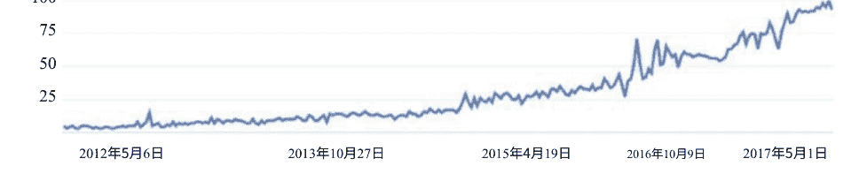

图1显示了过去5年中“深度学习”在Google搜索引擎上的搜索兴趣[19]。

在语义图像分割方面，最近进行了大量研究[20–32]，以克服使用像素级注释的图像训练CNN的有监督语义分割的问题。一些语义分割研究尝试直接采用为图像分类设计的CNN架构。然而，结果并不是很令人满意。因为标准的CNN架构不适合语义分割，导致空间位置的丢失。一方面，重复的卷积和池化层降低了特征图的空间分辨率，另一方面，全连接层通过完全丢弃空间信息来产生类别概率值。

近年来，出现了许多能够将语义信息带到像素位置的网络架构[20, 21]。首先，Long等人[20]将预训练的VGG-16 [33] CNN架构转换为全卷积网络（FCNs）。为此，他们用卷积层替换了CNN架构的所有全连接层，并添加了反卷积层，通过跳跃连接恢复了原始空间分辨率。因此，得到了三个不同版本的FCN，分别为FCN-8s，FCN-16s和FCN-32s，并将输出的空间分辨率带到输入图像的空间分辨率，以生成每个像素的类别概率值。

缺乏在大型数据集上训练的深度反卷积网络使得完全重建非线性结构的对象边界变得困难。陈等人[21]通过将条件随机场（CRF）方法应用于FCN的输出来解决了这个问题。

Noh等人[22]通过使用从VGG-16网络架构中采用的卷积层和提出的解卷积网络架构构建了名为DeconvNet的FCN架构。DeconvNet在PASCAL VOC 2012 [21]数据集上表现良好。

Badrinarayanan等人[27]提出了一种新的实用FCN架构，称为SegNet，用于语义分割。该架构包括可训练的分割单元编码器，后跟相应的解码器和分类器层。在编码器网络架构中，同样使用了VGG-16网络架构中的13个卷积层。他们在SUN RGB-D [34]和CamVid [35]道路场景数据集上将SegNet架构与原始FCNs [20]和DeconvNet [22]架构进行了比较。他们提供了SegNet架构比其他FCN架构具有更少的可训练参数，因此在内存和计算时间方面都更高效。在[28]中，他们在相同的数据集上实现了贝叶斯SegNet架构，这是SegNet的扩展。该架构改善了边界线，提高了预测准确性，并减少了参数数量。

Fourure等人[29]提出了一种通过多个数据集来提高用于自动驾驶的KITTI [36]数据集的语义分割准确性的方法。为了利用来自不同任务的多个数据集的训练数据，包括不同的标签集，他们提出了一种新的选择性损失函数，可以集成到深度网络中。

### 2 深度学习

深度学习是人工智能领域中一种快速增长的流行机器学习方法，用于创建感知和理解大量数据（如图像和声音）的模型。基本上，这种方法是基于深度架构的，深度架构是人工神经网络（ANN）中结构更复杂的部分。这个深度架构术语指的是隐藏层数量增加的ANN。

深度学习算法与现有的机器学习算法有所区别；它需要大量的数据和具有非常高计算能力的硬件来处理这种高数据速率。近年来，在计算机视觉领域，标记图像的数量大幅增加。深度学习方法在GPU并行计算能力领域取得了巨大的进展，因此引起了广泛关注。与CPU相比，具有数千个计算核心的GPU在处理这些数据时提供了10-100倍的应用性能。如今，深度学习在许多应用领域都有广泛的应用，主要包括自动语音识别、图像识别和自然语言处理。

有许多不同类型的深度学习架构。基本上，深度学习架构可以如图2 [43]所示命名。

为了更好地理解深度学习术语，有必要以良好的方式采用ANN结构。因此，首先将提供这些信息。

## 深度学习的主要架构

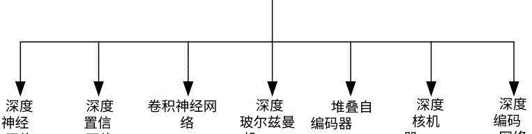

此外，我们将重点关注前馈ANN，因为FCN是构成深度学习架构的多层前馈神经网络类型，是我们论文的基础。

#### 2.1 人工神经网络

ANN是根据人脑学习过程发展起来的。正如生物神经系统中的神经元相互连接一样，ANN系统中被定义为人工神经元的结构被建模为彼此相关。ANN可以在系统识别、图像和语音识别、预测和估计、故障分析、医学、通信、交通、生产管理等许多领域中使用。

##### 2.1.1 神经元

人工神经网络也具有人工神经元，因为生物神经网络是由神经元组成的。神经元可以被称为人工神经网络中的基本计算单元。神经元也可以被称为节点或单元。人工神经元的结构如图3所示。

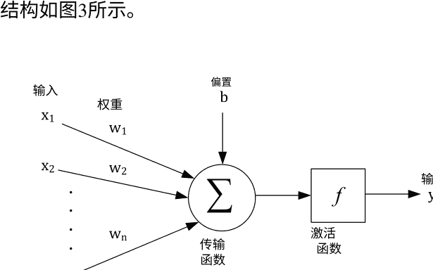

输入是从外部世界传入神经元的信息。这些信息是通过希望网络学习的样本来确定的。权重显示了传入神经元的信息的重要性以及对神经元的影响。

每个输入都有单独的权重。例如，图3中的 W₁ 权重显示了 x₁ 输入对神经元的影响。权重的大小并不意味着它们的重要性或无关紧要性。传输函数计算传入神经元的净输入。尽管有很多传输函数可供选择，但最常用的是加权和。每个传入的信息都会乘以自己的权重进行求和。激活函数通过处理传入神经元的净输入来确定神经元将生成的输出。生成的输出被发送到外部世界或另一个神经元。此外，如果需要，神经元还可以将自己的输出作为输入发送给自己。

激活函数通常选择非线性函数。激活函数的目的是将非线性传递到神经元的输出中，如(1)所示。人工神经网络的一个特点是非线性，这是由于激活函数的非线性特性。

$$y = f\left(\sum_{i=1}^{n} W_i x_i + b\right) \quad (1)$$

选择激活函数时需要注意的重要事项是函数的导数易于计算。这确保了计算的快速进行。

在文献中，有许多激活函数，如线性函数、阶跃函数、Sigmoid函数、双曲正切函数（tanh）、修正线性单元（ReLU）和阈值函数。

然而，在人工神经网络应用中，通常使用Sigmoid函数、tanh函数和ReLU函数。

Sigmoid激活函数，由(2)表示，是一个连续且可导的函数。它是人工神经网络中最常用的激活函数之一。该函数为每个输入值生成一个介于0和1之间的值。

$$\sigma(x) = \frac{e^x}{1 + e^x} \quad (2)$$

双曲正切激活函数，由(3)表示，类似于Sigmoid激活函数。然而，输出值的范围是从-1到1。

$$\tanh(x) = 2\sigma(2x) - 1 \quad (3)$$

ReLU激活函数，由(4)表示，对于每个输入值生成一个阈值为0的输出。

它具有如图4所示的特点。最近，在人工神经网络中的使用变得非常流行。

图4 ReLU激活函数的特点

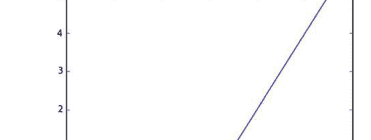

$$f(x) = \max(0, x) \quad (4)$$

##### 2.1.2 前馈神经网络

在前馈神经网络中，信息的流动只向前方向。网络中的神经元以层的形式排列，一层中的神经元的输出通过权重输入到下一层。前馈神经网络基本上由3种类型的层组成。这些层包括输入层、隐藏层和输出层。输入层将来自外部世界的信息传递给隐藏层的神经元，不做任何改变。

然后，这些信息在隐藏层中被顺序处理，这些层与外部世界无关，输出层将信息从网络传输到外部世界，以确定网络对所需输入的响应。

前馈神经网络可以有一个或多个隐藏层，也可以没有隐藏层。如果网络不包含任何隐藏层，则称为单层感知器；如果包含一个或多个隐藏层，则称为多层感知器。图5显示了一个3层前馈人工神经网络模型的示例。在多层前馈神经网络中，每个神经元只与下一个神经元相关联。换句话说，同一层中的神经元之间没有连接。

多层前馈神经网络中的深度术语与隐藏层数量有关。随着网络隐藏层数的增加，深度也增加。简而言之，具有多个隐藏层的网络可以表示为深度神经网络。图6显示了一个深度前馈人工神经网络模型的示例。

从信息源中学习的能力是人工神经网络中最重要的特征之一。在多层神经网络中，学习过程发生在每一步中改变权重。因此，权重的确定是很重要的。由于信息存储在整个网络中，一个神经元的权重值本身没有意义。整个网络上的权重应该获得最合适的值。实现这些权重的过程是对网络进行训练。简而言之，网络的学习是通过找到权重的最合适值来实现的。此外，在设计多层神经网络时需要考虑一些因素，例如网络中隐藏层的数量，每个隐藏层中要找到的神经元数量，最合理时间的最佳解决方案以及网络准确性的测试[44]。

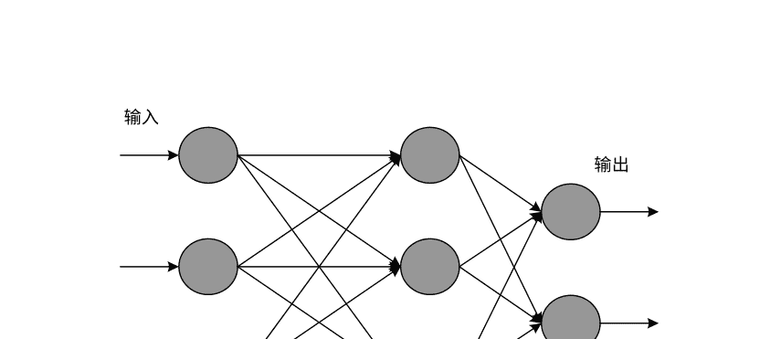

## 图5 3层前馈ANN模型

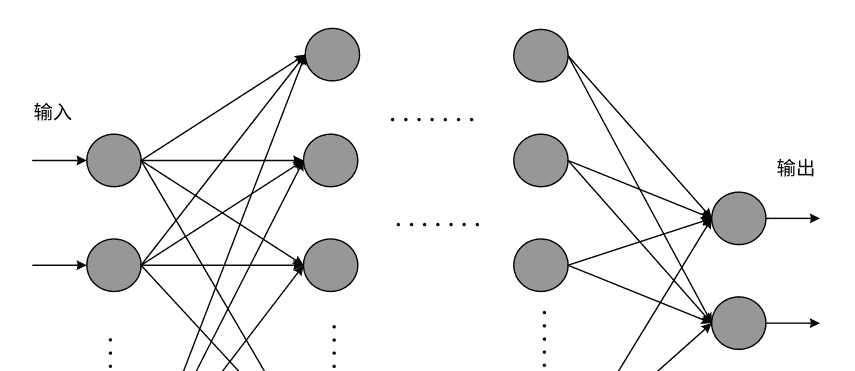

## 图6 深度前馈ANN模型

#### 2.2 深度学习软件框架和库

深度学习的工作流程是一个多阶段的迭代过程。在这个过程中，如果需要，首先必须收集和预处理数据。为了进行成功的深度学习，可能需要大规模的数据集。如今，由于互联网和大数据源的存在，数据集正在迅速增长。使用这些数据集对网络进行训练。可以使用现有网络来训练网络，也可以开发新的网络。在训练阶段之后创建的网络模型必须经过测试以确认其按预期工作。通常，在这一点上，需要重复某些操作以改善结果。这些操作包括重新处理数据，调整网络，更改网络或求解器的参数，并进行重新测试，直到获得所需的结果。这些计算机的CPU对于这些密集的计算过程来说是不够的，无法在深度学习过程中执行。由于具有一定处理能力和架构的CPU无法同时执行多个操作，模型的训练和测试阶段需要很长时间。因此，CPU已经被允许并行处理数据的GPU所取代。通过这种方式，深度学习已经开始在实际应用中快速使用。

在深度学习应用中，NVIDIA提供了一个CUDA扩展，允许GPU进行并行计算[45]。CUDA是一种并行计算架构，利用NVIDIA的GPU强大的计算性能来加速计算性能。CUDA使得可以使用图形处理器核心进行通用目的的加速计算。

有许多流行的软件框架和库，特别包括Caffe、Torch、Theano、TensorFlow、Keras和DIGITS，用于实现深度学习算法。它们中的大多数也可以在GPU上运行。

##### 2.2.1 Caffe

Caffe深度学习框架由Yangqing Jia创建，由伯克利人工智能研究（BAIR）和社区贡献者开发。Caffe的设计目标是像人脑一样快速和模块化[46]。

Caffe在工业和学术研究应用中经常被优先选择。这样做的最重要原因是能够快速处理数据。Caffe可以使用单个NVIDIA K40 GPU每天处理超过6000万张图像。Caffe被认为是最快的可访问的CNN实现之一[46]。

##### 2.2.2 Torch

Torch是用LuaJIT语言编写的科学计算框架，为机器学习算法提供了广泛的支持。它是一个易于使用和高效的库，因为它是用LuaJIT编写的，并使用C/CUDA应用基础[47]。

这个库可以使用数值优化方法，包含各种神经网络和基于能量的模型。它也是开源的，并提供快速和高效的GPU支持。

Torch正在不断发展，并被Facebook、Google和Twitter等各个公司使用。

##### 2.2.3 Theano

Theano是一个Python库，有效地识别、评估和优化包含张量的数学表达式[48]。由于这个库与NumPy库集成，它可以轻松执行密集的数学运算。它还提供了创建动态C代码的选项，允许用户更快地评估表达式。

##### 2.2.4 TensorFlow

TensorFlow是一个开源的深度学习库，使用数据流图进行数值计算。这个库主要由Google开发，用于机器学习和深度神经网络的研究[49]。由于其灵活的架构，TensorFlow允许您将计算部署到一个或多个服务器、移动设备或桌面设备上，只需一个应用程序编程接口（API）。

Snapchat、Twitter、Google和eBay等现在流行的应用也从TensorFlow中受益。

##### 2.2.5 Keras

Keras是一个基于TensorFlow和Theano深度学习库的模块化Python库[50]。这两个基本库提供了在GPU或CPU上运行的能力。通过在Keras的配置文件中进行微小的更改，可以在后台使用TensorFlow或Theano。

Keras非常有用，因为它简化了TensorFlow和Theano库的接口，开发比这两个库更容易的应用程序。Keras在图像处理应用中非常常见的使用方式。

##### 2.2.6 DIGITS

2015年，NVIDIA推出了CUDA深度神经网络库（cuDNN）[51]，这是由于深度神经网络在工业界和学术界的日益重要性以及GPU的重要作用。2016年，NVIDIA首席执行官Jen-Hsun Huang将深度学习GPU训练系统（DIGITS）引入GPU技术大会中。

DIGITS是一个深度学习GPU训练系统，可以帮助用户开发和测试卷积神经网络。该系统支持使用cuDNN进行GPU加速，大大减少了训练时间，同时通过提供Web界面支持，可以可视化Caffe、Torch和TensorFlow。

DIGITS支持许多教育目标，包括图像分类、语义分割和目标检测。图7显示了主控制台窗口，可以从图像中生成数据集，并为训练做准备。在DIGITS中，一旦有了数据集，就可以配置网络模型并开始训练。DIGITS还提供了网络优化所需的工具。可以按照网络配置的设置进行，并通过更改参数（如偏置、激活函数和层）来最大化准确性。

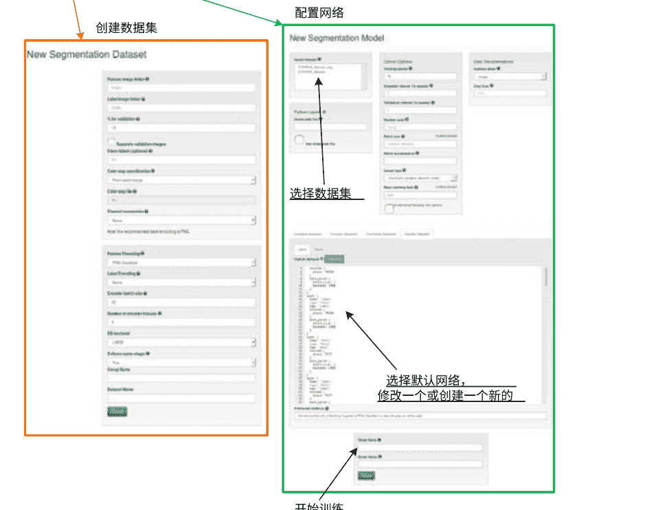

图7 DIGITS主控台

### 3 卷积神经网络

卷积神经网络（CNNs）是由LeCun于1989年引入计算机视觉应用的一种多层前馈神经网络[52]。如今，CNNs在深度学习方法中越来越受欢迎，因为它们可以成功地为许多计算机和视觉应用（如目标检测、目标识别和语义图像分割）学习模型。

CNNs可以被看作是从原始数据中提取层次化特征的分类器。在CNN中，图像作为输入传递给网络，并且学习过程自动进行，而不使用任何特征提取方法创建特征层次结构。

#### 3.1 架构

前馈神经网络中一层中的所有神经元都与下一层的所有神经元相连。这些连接的层被称为全连接层，并且除了CNN中的全连接层之外，卷积还应用于输入图像以生成输出。这是由于输入层中的所有区域都与下一层的神经元绑定。因此，输入图像与该层中使用的每个学习滤波器进行卷积，以生成不同的特征图。通过向更高层提供更多和更复杂的泛化，特征图对旋转和畸变更不敏感。此外，卷积层中获得的特征图经过池化层，以进行空间维度的降低和重要特征的保留。分类器始终是生成类概率值作为输出的最后一层。

卷积和池化层的最终输出被传输到一个或多个全连接层。然后，通过传输到分类器层来获得输出预测，其中使用了激活函数如Softmax。

一个简单的CNN架构是卷积、池化和全连接层的组合，如图8所示。

##### 3.1.1 卷积层

卷积层是CNN中最基本的层，其目的是将输入图像与可学习的滤波器进行卷积，并提取其特征。每个滤波器生成一个特征图。CNNs引起注意的是，当应用于RGB图像（本文中使用的图像），图像是一个3D矩阵，每个层都以类似的方式排列。如图9所示。CNN的每一层由一组大小为 d × h × w 的空间滤波器组成，其中h和w是空间维度，d是核（或滤波器）特征通道的数量。这些滤波器中的每一个都与相应的卷积进行卷积。

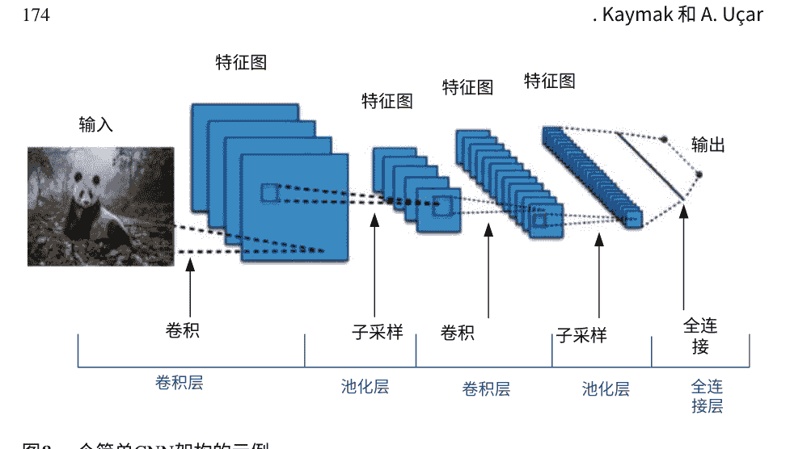

## 图8 一个简单CNN架构的示例

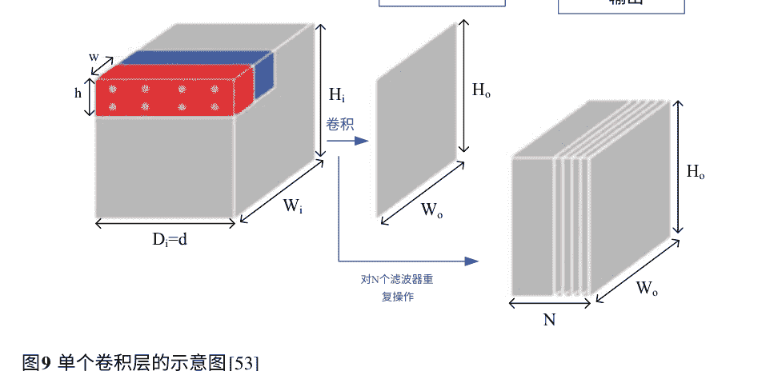

## 图9 单个卷积层的示意图[53]

输入图像的体积，通过整个图像滑动（大小为 D_i × H_i × W_i，其中 H_i，W_i 是空间维度，D_i 是通道数）在其空间维度 H_i，W_i 上。卷积是指每个滤波器中的神经元与输入中相应值的逐元素乘积的总和。

因此，可以假设CNN中的第一层是输入图像。基于此，在每个层中使用单个滤波器进行卷积，得到具有步幅和填充等参数的二维输出。这被表示为输入中一个滤波器的特征图或激活图。在CNN的每个卷积层中，使用N个滤波器，每个滤波器都会产生一个特征图。这些特征图被堆叠在一起，形成卷积层的输出。

某一层的一个滤波器中的单个神经元可以映射到所有前一层中的连接神经元，遵循这样的卷积。这被称为神经元的有效感受野。很容易看出，卷积会导致与较低层（接近输入）中的神经元之间的非常局部的连接，并且这些神经元的感受野比较小。虽然较低层学习表示输入的小区域，但较高层学习更具体的含义，因为它们对输入图像的更大细分作出响应。因此，从局部到全局生成了一个特征层次结构。

图9中的红色和蓝色区域表示相同大小为 d×h×w 的滤波器的两个位置，它们通过滑动输入体积进行卷积。给定滤波器大小为 2×2，可以看出步长参数 s 为 2。对于RGB输入图像， D_i = d = 3。

滤波器的步幅 s 定义为滤波器在每个空间维度上移动的间隔。 p 填充对应于在输入的外部边缘添加的像素数。因此，步幅可以被视为子采样的一种输入方式[54]。通常，使用形式为 h=w=f 的方形滤波器。这样一层的输出体积使用公式(5)，(6)和(7)计算。

$$D_o = N$$

$$H_o = \frac{H_i - f + 2p}{s} + 1$$

$$W_o = \frac{W_i - f + 2p}{s} + 1$$

图10展示了一个 3×3 的滤波器滑过一个代表二进制图像的 5×5 图像矩阵。滤波器从左到右滑动，并持续到矩阵的末尾。在本文中，步幅取为1。通过按顺序滑动滤波器，完成该过程并获得特征图的最终状态，如图10所示。

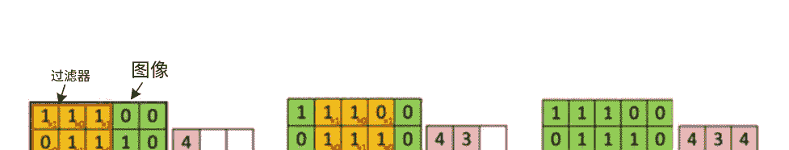

##### 3.1.2 池化层

在卷积层之间经常散布着池化层，它们有助于对输入特征进行空间下采样。池化层对输入图像进行下采样处理。这是通过在输入图像上滑动一个滤波器来实现的。

输入图像（通常是非重叠的）被划分为子区域，每个子区域都由非线性池化函数进行采样。其中最著名的函数是最大池化函数和平均池化函数。在本文中，我们使用最大池化函数，它从每个子区域中返回最大值。平均池化函数返回子区域的平均值。池化操作通过减少图像中的平移变化来提供网络的稳健性[3]。此外，还会丢弃不必要和冗余的特征，从而降低网络的计算成本，使其更加高效。

池化层还有一个步幅参数，可以控制输出大小。卷积层输出大小所使用的相同方程也可以用于这一层。从图11可以看出，输入体积为 64 × 224 × 224，经过 2 × 2 的滤波器和步幅2的子采样，变为 64 × 112 × 112 的体积。池化操作针对每个特征图单独进行，并且特征图的大小会减小，如图所示。

图12展示了使用最大池化函数通过滑动 2 × 2 的滤波器和步幅2进行的池化操作。

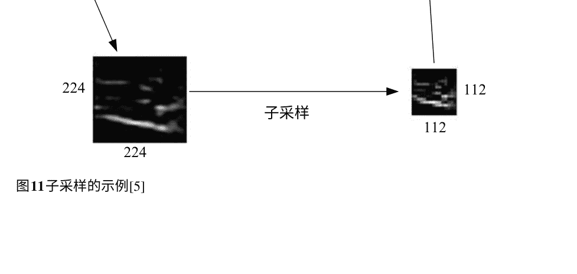

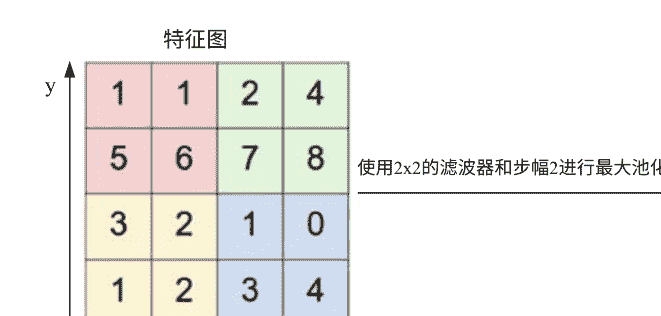

图12 使用2×2的滤波器和步幅2进行的池化操作[5]

##### 3.1.3 线性整流单元层

通常，卷积层的输出被馈入激活函数中。为此目的提出的非线性层可以由诸如sigmoid、tanh和ReLU等函数组成。研究发现，在CNN中，ReLU更有效，并且通常更受青睐[56]。

ReLU层将负输入阈值设为0，并激活正输入，如(8)所描述，通过保持它们不变。

$$f(x) = \begin{cases} x, & x \geq 0 \\ 0, & \text{otherwise} \end{cases}$$

其中，x是ReLU的输入，f(x)是修正后的输出。

在ReLU层中，针对每个像素值分别执行操作。例如，如果将输入特征图中的黑色区域表示为负像素，白色区域表示为正像素，则ReLU的输出如图13所示。

##### 3.1.4 全连接层

在使用卷积、池化和ReLU层提取高级特征之后，通常将全连接层放置在网络的末尾。这一层中的神经元完全依赖于前一层中的所有激活。全连接层最重要的特点是它允许这一层中的神经元确定哪些特征对应于哪些分类。简而言之，全连接层可以被看作是向分类器提供输入的层。

由于全连接层中的神经元接收来自所有输入神经元的激活，空间信息会丢失。在这篇语义图像分割论文中，空间信息非常重要，因此这种情况是不可取的。克服这种情况的一种方法是将全连接层视为相应的卷积层。这也是基于接下来将提到的FCN的基础。

##### 3.1.5 分类器

通过考虑手头的问题和使用的数据来选择分类器。在本文中，使用了Softmax函数，它允许预测除了互斥类之外的类。对于二元分类问题，Softmax函数被简化为逻辑回归。Softmax函数给出了输入属于某个类别c的概率值(9)。

$$p_c = \frac{e^{(s_c)}}{\sum_{i=1}^{c} e^{(s_i)}} \quad (9)$$

其中，s是从卷积神经网络的前一层获得的网络输出，用于表示特定类别。对于单个输入，类别之间所有概率的总和始终等于1。损失度量被定义为Softmax函数的负对数概率。这是一个交叉熵损失。

##### 3.1.6 正则化

过度拟合训练数据是一个大问题。特别是在处理深度神经网络时，网络足够强大以适应仅仅训练集的情况下是一个大问题。必须避免过度拟合。为此开发的方法被称为正则化方法。

Dropout是一种简单而有效的正则化策略，集成到训练阶段中。Dropout是在[58]中首次引入的，它被实现为具有概率值的dropout层。Dropout可以被接受为0.5的合理默认值，已被证明足够有效[58]。

#### 3.2 训练

CNN中的学习过程可以分为4个基本步骤：

- 1. 前向计算，
- 2. 错误/损失优化，
- 3. 反向传播，
- 4. 参数更新。

前向计算通常是由卷积或池化层组成的子层后跟更高的全连接层。网络返回类别输出，该输出编码了输入属于特定类别的概率。网络的输出可以是未缩放的，就像SVM分类器一样，也可以是负对数概率，就像Softmax分类器一样。对于语义分割，图像中的每个像素都提供了一个类别输出。

网络提供的类别输出集合应通过调整学习参数的值（如权重滤波器和偏差）进行优化处理。确定哪组参数是理想的不确定性通过损失函数来量化，该函数可以被形式化为一个优化问题。对于每个类别输出向量s，交叉熵损失按照公式（10）计算，用于Softmax分类器。

$$L_i = -\log\left(\frac{e^{(s_c)}}{\sum_{i=1}^{c} e^{(s_i)}}\right) \tag{10}$$

交叉熵的评估函数通过公式（11）计算。

$$H(p, q) = -\sum_{x} p(x)\log q(x) \tag{11}$$

其中，q是在公式（9）中定义的Softmax函数，p是概率分布。总损失通过公式（12）计算。

$$L = \sum_{i=1}^{N} L_i + \lambda R(W) \quad\quad\quad (12)$$

其中，N是训练样本的数量，λ是正则化强度，L是总损失，R(W)是正则化项。为了最小化L，问题被制定为一个优化步骤，并且损失函数被最小化。因此，概率被最大化。

反向传播是神经网络学习中的一个基本概念。反向传播的目的是周期性地更新初始权重参数。问题的反向传播有助于优化成本函数。优化算法通常用于理解梯度下降及其各种类型。梯度下降的简单应用在深度网络中可能效果不佳，因为它在局部最优点周围来回徘徊。这种情况通过动量参数来修复，动量参数有助于更新梯度下降，从而达到最优点。

开发神经网络架构的关键部分之一是选择超参数。超参数是在训练过程之前设置为特定值的变量。在[59]中，提出了许多研究人员为模型性能采用的最有效的超参数列表。该列表包括初始学习率、小批量大小、训练迭代次数、动量、隐藏单元数量、权重初始化、权重衰减、正则化强度等超参数。

#### 3.3 一些已知的CNN架构

LeNet [12]、AlexNet [16]、VGGNet [33]、GoogleNet [60]和ResNet [4]是最著名的CNN架构之一。AlexNet和VGG16是FCN架构的基础，VGG-Net是16层（卷积+全连接层）版本。下一节将介绍FCN架构。

AlexNet是由Alex Krizhevsky、Ilya Sutskever和Geoff Hinton开发的，是第一项在计算机视觉中普及CNN的研究[16]。AlexNet在2012年的ILSVRC比赛中首次亮相，并且在比赛中的表现明显优于第二和第三个架构。尽管AlexNet的架构与LeNet相似，但是卷积层更深且更具特异性。AlexNet已经在包含1000个不同类别的100多万个高分辨率图像上进行了训练。

VGGNet由Simonyan和Zisserman开发，有两个版本，分别称为VGG-16和VGG-19。VGG-16架构是2014年ILSVRC中的第二名，而GoogleNet是第一名。最近，ResNet似乎是一个非常先进的CNN模型，但由于其简单的架构，VGG-16更受青睐。VGG-16还在超过100万张包含1000个不同类别的高分辨率图像上进行了训练，就像AlexNet一样。

### 4 语义图像分割和完全卷积网络

除了图像中的位置外，还有许多需要学习的情况。例如，你应该知道自动驾驶车辆周围物体的位置，以便能够避免碰撞。确定图像中物体的位置的过程可以通过检测（进入边界框）或分割来实现。如前所述，本文将实现自动驾驶车辆的语义图像分割应用。

图像分割是将图像分成具有相似性的特定组，并将图像中的每个像素标记为属于给定语义类别的操作。为了使图像分割过程被认为是成功的，期望对象与图像中的其他组件相互独立，并创建具有相同纹理和颜色特征的区域。如图14所示，每个组中的每个像素都对应于整个对象类别。这些类别可能代表对自动驾驶车辆很重要的城市场景；交通标志、汽车、行人、路灯或人行道。

如前所述，AlexNet和类似的标准CNN执行非空间预测。例如，在图像分类中，网络输出是一个类别概率的单一分布。为了实现密度预测，如语义图像分割，必须将CNN转换为FCN。因为，如[20]所述，CNN的全连接层提供了关于位置的信息。因此，为了能够进行语义图像分割，必须对CNN的全连接层进行卷积。在转换为FCN时，CNN的卷积部分可以完全重用。现有CNN的完全卷积版本可以对任意大小的输入进行高效的推理和学习，预测密集输出。学习和推理通过前向计算和反向传播在单次遍历中呈现整个视觉，如图15所示。网络中的上采样层允许通过像素级预测和下采样进行网络学习。

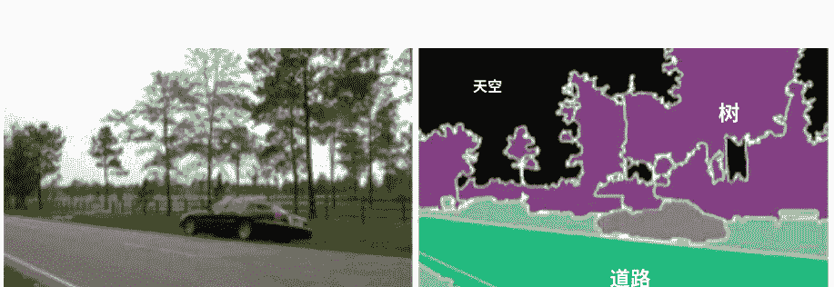

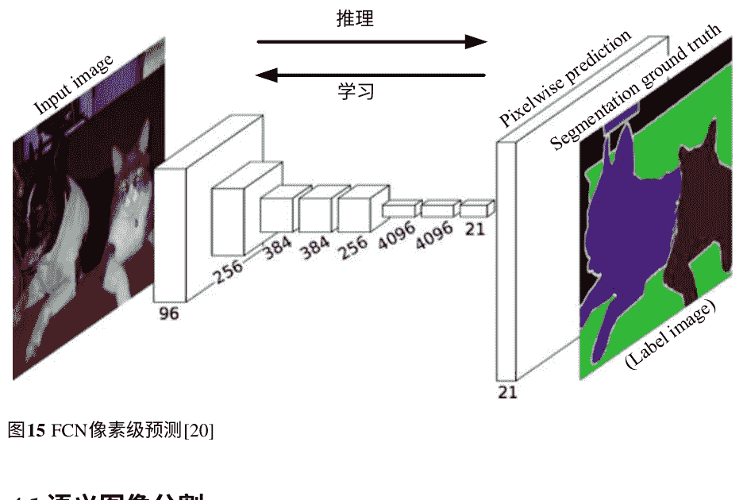

#### 4.1 语义图像分割

对于自动驾驶车辆的语义图像分割应用，可能会认为这可以克服其与AlexNet、GoogleNet和VGG-16等图像分类网络架构的问题。然而，图像分类架构创建的模型给出的输出是图像中主要对象类别是哪个类别。也就是说，输出是一个离散的概率分布。如果图像中包含多个对象，则无法得到期望的结果。考虑到AlexNet等分类模型是使用仅包含一个对象的一百多万个图像的数据集进行训练的，这是可以理解的。此外，无法通过分类网络获取图像中对象的位置信息。当考虑到它们从未被训练过这个目的时，这种情况是可以理解的。语义图像分割消除了其中的一些缺陷。与为整个图像估计单个概率分布不同，图像被分成几个块，并为每个块分配自己的概率分布。通常，图像被分成像素级，并对每个像素进行分类。对于图像中的每个像素，网络被训练来预测像素属于哪个类别。这不仅允许网络识别图像中的多个对象类别，还可以确定对象的位置。

用于语义图像分割的数据集是要分割的图像，通常由与这些图像相同大小的标签图像组成。标签图像显示图像的真实限制。标签图像中的形状用颜色编码表示每个对象的类别。在某些数据集中，特别是本文中使用的SYNTHIA-Rand-CVPR16数据集中，标签图像由24位3通道RGB图像组成。在这种情况下，必须通过创建具有RGB通道转换的颜色映射来索引像素。

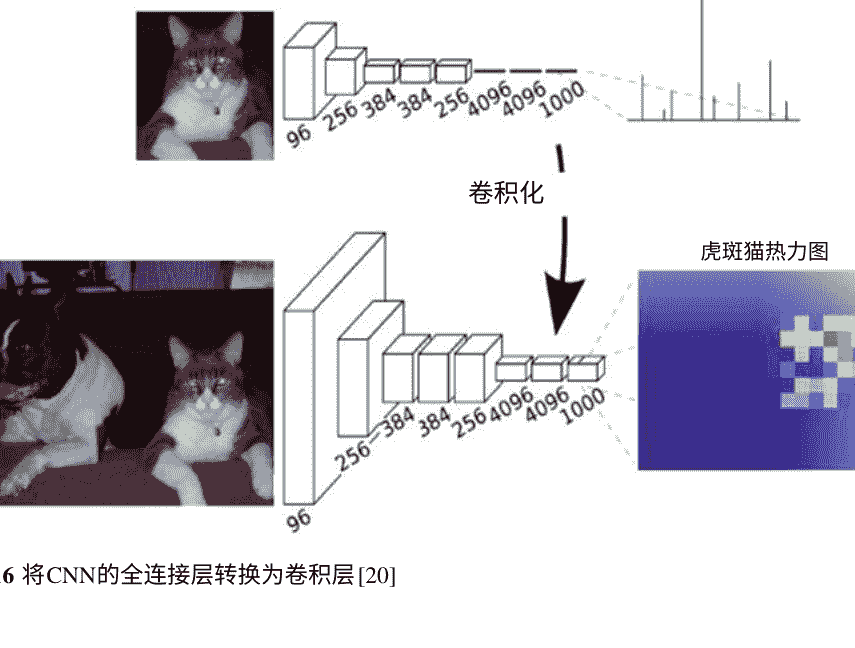

图16 将CNN的全连接层转换为卷积层[20]

#### 4.2 从CNN到FCN的转换

语义图像分割只是向图像分类问题添加了一个空间维度。因此，只需进行几个小的调整即可将分类神经网络转换为语义分割神经网络。它是在AlexNet和VGG-16架构上实现的，使用转换为FCN架构的技术[20]，这对于传统图像分割是必要的。将CNN的全连接层转换为卷积层实现了转换为FCN。这种转换通常在图16中显示。

在完全连接的层中，每个输出神经元计算输入值的加权和，而在卷积层中，每个滤波器计算接受域中值的加权和。尽管这些操作看起来完全一样，但只有当层输入与接受域的大小相同时，它们才是相同的。如果输入大于接受域，则卷积层会滑动输入窗口并计算另一个加权和。这个过程会重复，直到从左到右、从上到下扫描完整个输入图像。必须用相应的卷积层替换完全连接的层，滤波器的大小必须设置为层的输入大小，并且必须使用与完全连接层中的神经元数量相同的滤波器。

AlexNet架构中的所有连接层都可以转换为相应的卷积层，以获得FCN架构。这个FCN与基本CNN具有相同数量的学习参数和相同的计算复杂度。

将基本CNN进行卷积化，使得转换为FCN具有相当大的灵活性。FCN模型不再局限于与AlexNet中的固定输入尺寸224 ×224一起工作。FCN可以通过全面扫描大图像来处理，例如滑动窗口，模型为每个224 ×224窗口生成一个而不是为整个输入生成单个概率分布。因此，网络的输出变成了一个N × H × W形式的张量。

其中，N是类别数，H是沿垂直轴的滑动窗口（滤波器）数，W是沿水平轴的滑动窗口数。

总之，FCN设计的第一个重要步骤是在分类网络的输出中添加两个空间维度。

窗口编号取决于输入图像的大小、窗口的大小以及扫描输入图像时窗口之间使用的步幅参数，这在设计生成每个窗口的类别概率分布的FCN时会得到理解。理想情况下，语义图像分割模型应该为图像中的每个像素生成一个概率分布。当输入图像通过卷积化的AlexNet的顺序层时，提取出粗糙特征。语义图像分割的目的是对这些粗糙特征进行插值，以重建输入中每个像素的精细调整分类。这可以通过反卷积层轻松实现。反卷积层执行与其卷积对应层的逆操作。考虑到卷积层的输出，反卷积层找到生成输出的输入。正如大家所记得的，卷积或池化层中的步幅参数是在处理输入时窗口要滑动多少以及相应地对输出进行子采样的度量。相反，反卷积层中的步幅参数是输出如何上采样的度量。

反卷积层的输出体积，$D_o \times H_o \times W_o$，使用方程式（13），（14）和（15）计算。

$$D_o = N \quad (13)$$
$$H_o = s(H_i - 1) + f - 2p \quad (14)$$
$$W_o = s(W_i - 1) + f - 2p \quad (15)$$

其中，s为步长，p为填充，f为滤波器大小，$H_i$和$W_i$为输入尺寸，N为通道数。重要的是要知道在FCN架构中，最后一个卷积层的激活有多少必须进行上采样，以获得与输入图像相同大小的输出。添加到FCN-AlexNet中的上采样层被证明可以将前一个卷积层的输出增加32倍。这意味着在实践中，网络对每个32 ×32像素块进行了一次预测。这导致图像中的对象轮廓被分割得很粗糙。图17显示了FCN-AlexNet架构。

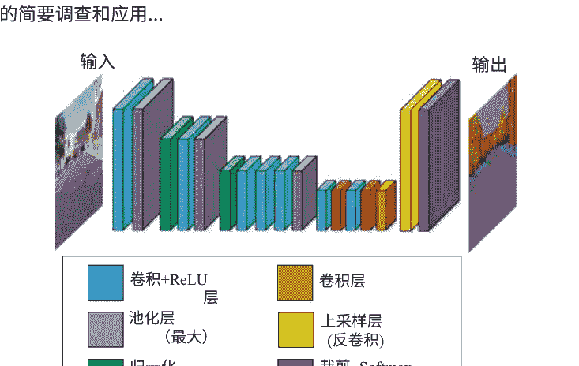

图17 FCN-AlexNet架构

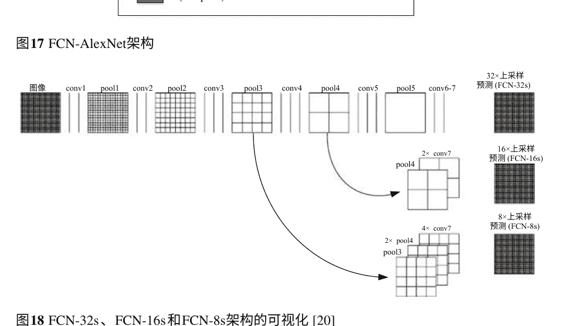

图18 FCN-32s、FCN-16s和FCN-8s架构的可视化 [20]

文章[20]提出了跳跃架构的概念来解决这个限制。该架构中的跳跃连接被添加到从VGG-16派生的FCN架构的池化层pool3和pool4的输出上，直接将其重定向到网络中，如图18所示。这些池化层作用于低级特征，并能捕捉更多的细节。

根据跳跃连接的应用，[20]提出的FCN架构被称为FCN-8s、FCN-16s和FCN-32。

这些架构在VGG-16中将卷积层转换为全连接层。图18显示了这些架构的可视化。在图18中，池化层以表达空间密度的网格形式显示，而卷积层以垂直线表示。如图所示，在FCN-32s中，预测结果以步长32上采样到像素级别，而没有跳跃连接。在FCN-16s中，预测结果在步长16处从conv7和pool4层进行组合，从而在检测高级语义信息时能够预测更精细的细节。FCN-8s通过添加pool3层在步长8处提供更清晰的预测。因此，FCN-8s架构可以对8×8像素块进行精细调整的预测。

### 5 实验研究

在本文中，进行了语义图像分割应用，该应用对自动驾驶车辆非常有用，以观察FCN在语义图像分割中的性能。分别使用了四种不同的流行FCN架构进行应用：FCN-AlexNet，FCN-8s，FCN-16s和FCN-32s。在DIGITS平台上使用Caffe框架在SYNTHIA-Rand-CVPR16数据集上实现了这些应用，并比较了所使用的FCN架构在实验研究中的分割性能。这些研究是在一台配备第四代Intel® Core i5 3.4 GHz处理器、8 GB RAM和NVIDIA GTX Titan X Pascal 12 GB GDDR5X显卡的台式电脑上进行的。由于显卡支持CUDA，因此在应用所需的计算中利用了基于GPU的并行计算能力。

#### 5.1 SYNTHIA-Rand-CVPR16数据集

SYNTHIA-Rand-CVPR16数据集[40]是为了支持自动驾驶应用中的语义图像分割而生成的。该数据集中的图像是通过使用Unity开发平台[62]来描绘虚拟城市而创建的。虚拟环境使他们能够自由地在场景图像中放置所需的组件并生成其语义注释，而无需额外的努力。

SYNTHIA-Rand-CVPR16数据集包括13,407个分辨率为960 ×720的RGB图像，这些图像是从一个随机移动的虚拟摄像机阵列中拍摄的，该摄像机阵列限制在离地面[1.5米，2米]的范围内。它还包括与这些RGB图像相同大小的地面真实图像。该数据集的图像在不同的条件下拍摄，如夜晚和白天，包括：

- 天空
- 建筑
- 道路
- 人行道
- 栅栏
- 植被
- 杆子
- 汽车
- 标志
- 行人
- 骑车者
- 空洞

SYNTHIA-Rand-CVPR16数据集中的示例图像显示在图19中。对于这篇论文，总共使用了13,407张数据集中的图像来训练网络。

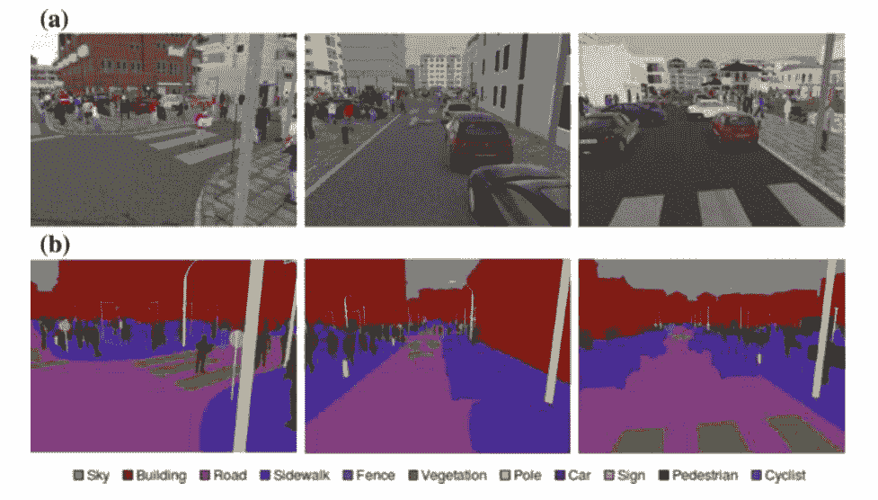

模型中使用了剩余的2681张图像（约占数据集的20%）来验证模型。

#### 5.2 模型的训练和验证

应用程序确定的网络参数的值在表1中给出。这些参数通常设置为应用程序中使用的所有FCN模型的通用参数。

选择随机梯度下降（SGD）作为求解器类型和GPU作为求解器模式。将Epoch设置为30。一个Epoch是对整个训练集的一次完整遍历。因此，对于10,726个训练图像，1个Epoch需要进行10,726次迭代，每次迭代1次。

表1 网络参数的值

| 参数 | 值 |
| :--- | :--- |
| 基础学习率 | 0.0001 |
| 动量 | 0.9 |
| 权重衰减 | 10^{-6} |
| 批量大小 | 1 |
| Gamma | 0.1 |
| 最大迭代次数 | 321,780 |

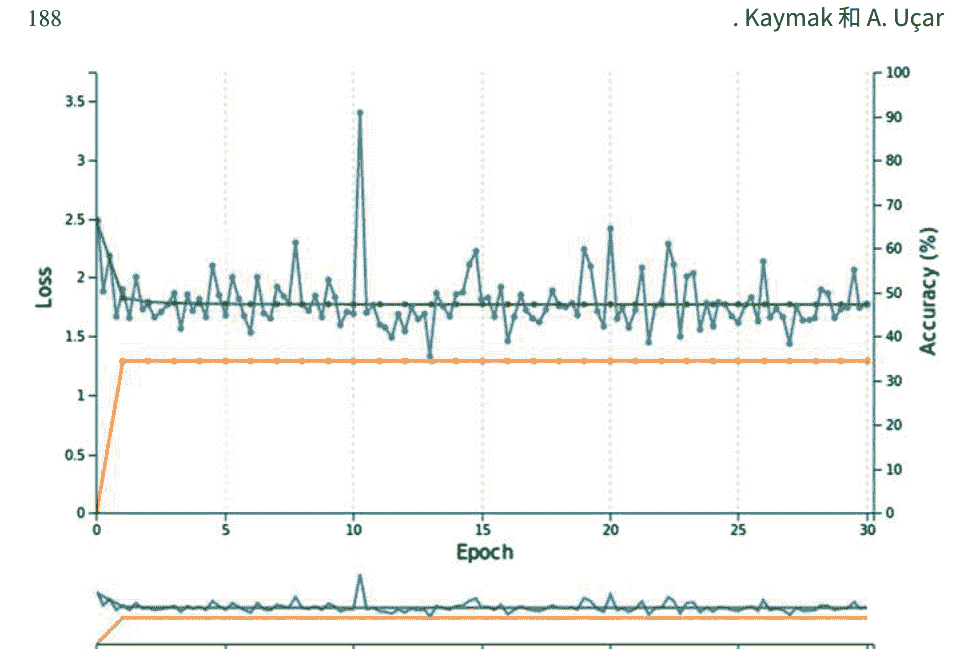

图20 使用随机权重初始化训练FCN-AlexNet时的训练/验证损失和验证准确率

批量大小，从表1中可以看出，30个epochs的最大迭代次数为321,780。

最初，FCN-AlexNet模型在DIGITS中使用随机权重初始化进行训练，并得到图20中的结果。

如图20所示，性能还不够令人满意。验证准确率已经达到了约35%的稳定点。这意味着验证集中只有约35%的像素被正确标记。训练损失与验证损失平行，表明网络不适合训练集。当在验证集中对训练好的模型进行样本图像测试并在DIGITS中进行可视化时，可以从图21中看到网络将所有东西都不加区分地分类为建筑物。

通过图21，我们可以了解到建筑是SYNTHIA-Rand-CVPR16数据集中最具代表性的对象类，并且网络通过将所有物体标记为建筑物来实现了约35%的准确率。

有几种常用的方法可以改进不适合训练集的网络[63]：

- 增加学习率，减小批量大小，
- 增加网络模型的大小，
- 迁移学习。

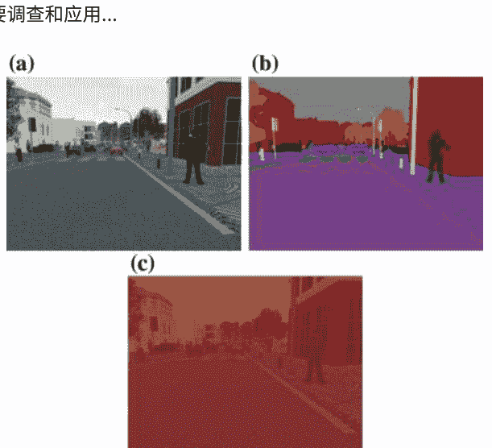

深度网络学到的信息可以用来改进另一个网络的性能，这个过程在计算机视觉应用中非常成功[64]。因此，在学习应用所需的模型时，使用了迁移学习。

机器学习和计算机视觉的最新发展首先是通过使用共同的标准实现的。它不需要从随机初始化的权重开始训练模型。迁移学习是利用网络在另一个数据集中学到的信息来提高另一个网络性能的一种重复使用方法[65]。网络在任何数据上进行训练，并从这些数据中获取知识，编译为网络的权重。这些权重可以转移到任何网络上。换句话说，可以将学到的特征转移到网络上，而不是从头开始训练网络。

在计算机视觉领域，迁移学习通常被优先选择，因为许多低级特征，如线条、角点、形状和纹理，可以立即通过CNN应用于任何数据集。

在高方差标准数据集上训练和测试的模型通常归功于强大的特征[65]。迁移学习允许使用在大型数据集（如ImageNet）上训练的相对通用的权重模型，并允许微调以适应网络要使用的情况。

从像素级别的图像分类数据集（如ImageNet）进行迁移学习是非常合乎逻辑的，因为图像分割具有像素级别的分类。使用Caffe可以很容易地完成这个过程。然而，Caffe不能自动将AlexNet的权重传递给FCN-AlexNet，因为AlexNet和FCN-AlexNet具有不同的权重格式。可以使用Python命令行来移动这些权重。

在Github的DIGITS存储库中的“net_surgery.py”。 net_surgery.py的功能是将权重从全连接层传输到卷积等效层[63]。

此外，另一个可能的问题是如何启动添加到FCN-AlexNet的上采样层，因为上采样层不是原始AlexNet模型的一部分。 在[20]中，建议首先随机初始化相应的权重，然后让网络学习它们。 然而，后来作者们意识到可以通过双线性插值来初始化这些权重，这样该层就像一个放大镜一样[63]。

如前所述，FCN-AlexNet模型的训练是使用在ImageNet数据集上训练的AlexNet模型进行调整得到的预训练模型，并且图22中的结果是通过这种方式获得的。

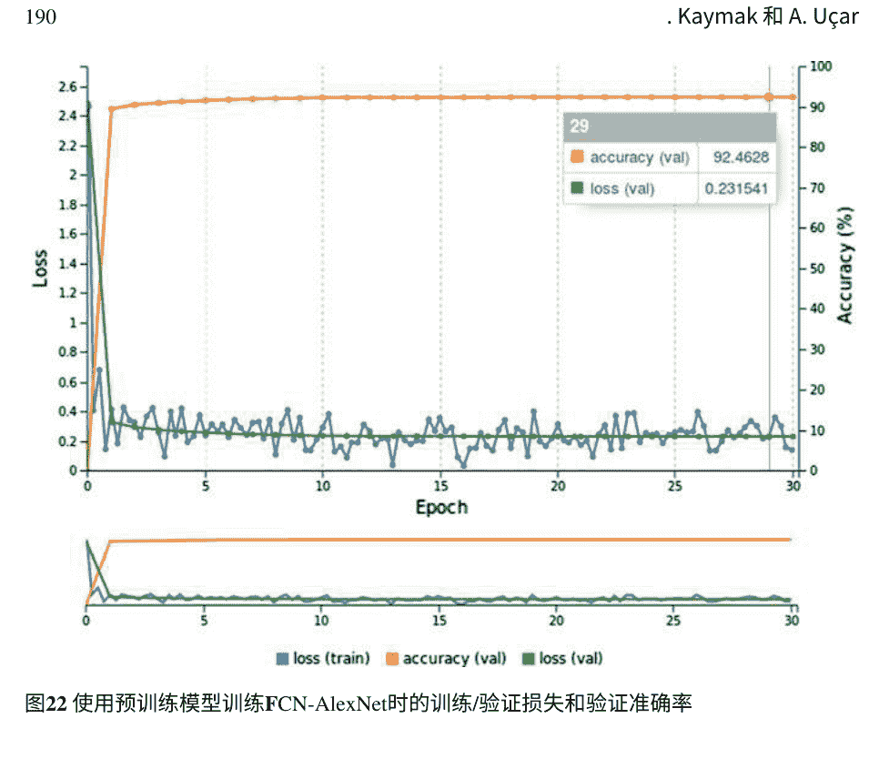

图22 使用预训练模型训练FCN-AlexNet时的训练/验证损失和验证准确率

图22显示，使用预训练的FCN-AlexNet模型，验证准确率迅速超过90%，并且在第29个时期达到了最高准确率92.4628%。 这意味着在第29个时期获得的模型在验证集中92.4628%的像素被正确标记。 与随机初始化权重的FCN-AlexNet相比，已经证明具有相当高的准确性。

在使用第29个时期获得的模型对样本图像进行测试时，通过检测不同的对象类别，图23和图24展示了更加令人满意的语义图像分割。然而，可以清楚地看到对象的轮廓非常粗糙。

图25 使用预训练模型训练FCN-8s的训练/验证损失和验证准确率

FCN-8s网络用于进一步提高分割模型的精度和准确性。使用在PASCAL VOC数据集中的预训练模型，FCN-8s的验证准确率迅速超过94%，如图25所示。该模型在第30个时期达到了96%的最高准确率。

更重要的是，在使用第30个时期获得的模型对样本图像进行测试时，显示出了更清晰的物体轮廓，如图26和图27所示。
FCN-8s架构已经显示出比FCN-AlexNet更清晰的物体分割轮廓，后者在32 × 32像素块中进行预测，而FCN-8s可以在8 × 8像素块的精调下进行预测。同样，FCN-16s和FCN-32s架构也进行了模型训练，如图28和29所示，验证准确率迅速超过94%，与FCN-8s类似。最高的验证准确率在第30个时期达到，分别为95.4111%和94.2595%。此外，图30显示了使用FCN-AlexNet、FCN-8s、FCN-16s和FCN-32s架构选择的相同图像的分割推理比较。

图26 DIGITS中使用FCN-8s训练的语义图像分割的示例可视化，使用预训练模型-1：a样本图像，b真实图像，c推理

图27 DIGITS中使用FCN-8s训练的语义图像分割的示例可视化，使用预训练模型-2：a样本图像，b真实图像，c推理

当在图30中考虑样本和真实图像进行分割过程分析时，可以看到使用FCN-AlexNet模型进行的分割过程中对象轮廓大致被分割出来。此外，无法识别和分割细节如杆子等的事实显示了该模型在应用中的另一个限制。与FCN-AlexNet相反，使用FCN-8s模型，对象轮廓被清晰地分割出来，分割推理与真实图像更相似。此外，可以完全检测到对象类别表明FCN-8s是有用的。虽然FCN-16s模型不如FCN-8s锐利，但可以看到对象轮廓可以成功分割。最后，当分析FCN-32s模型的分割推理时，可以说与FCN-AlexNet非常接近的分割已经实现，但可能是一个具有微小差异的更有用的模型。

本文中用于语义图像分割的训练模型的训练时间见图31。

可以看到，FCN-AlexNet的训练时间明显低于其他FCN模型，而训练时间非常接近。

### 6 结论

对于应用程序，首先，FCN分别进行训练，并在SYNTHIA-Rand-CVPR16数据集上比较这些训练网络模型的验证准确率。数据集中约80%的图像用于训练阶段，其余的用于验证阶段以验证模型的有效性。此外，本文中的图像分割推理被可视化，以观察所使用的FCN架构对对象的分割效果。

使用预训练模型中的权重训练的FCN-AlexNet、FCN-8s、FCN-16s和FCN-32s模型分别达到了92.4628%、96.015%、95.4111%和94.2595%的最大验证准确率。尽管这些模型在准确率超过90%时乍一看似乎很成功，但使用FCN-AlexNet模型进行分割过程时，对象的轮廓被粗略地分割出来。无法对一些像素面积较小的对象类进行分割是FCN-AlexNet模型的另一个限制。

FCN-32s模型的分割推理结果也非常接近FCN-AlexNet，但是通过这个模型可以得到一些更好的结果。然而，使用FCN-8s模型，物体轮廓被清晰地分割出来，分割推理结果更接近于真实图像。虽然FCN-16s模型不如FCN-8s模型那样锐利，但是可以看到物体轮廓根据其他模型成功地分割出来。

图30 根据使用的FCN架构对样本图像的分割推理进行比较

## 图31 模型的训练时间

虽然不如FCN-8s那样锐利，但是可以看到物体轮廓根据其他模型成功地分割出来。

当比较FCN模型的训练时间时，可以看到FCN-AlexNet的训练时间约为其他FCN模型的四分之一，训练时间非常接近。然而，考虑到模型的训练只需进行一次，可以说在选择合适的模型时并不是非常重要。因此，可以很容易地说，对于该应用程序最合适的模型是FCN-8s。

实验结果表明，来自深度学习方法的FCN适用于语义图像分割应用。此外，已经认识到FCN是模型中解决许多像素级应用，特别是语义图像分割的网络结构。

致谢我们衷心感谢NVIDIA公司的支持，他们在NVIDIA GPU Grant计划下捐赠了用于本研究的NVIDIA GTX Titan X Pascal GPU。

## 参考文献

- 1. R.C. Weisbin等，火星样本返回的自主漫游技术，收录于Artificial Intelligence, Robotics and Automation in Space, vol. 440 (1999), p. 1
- 2. R.N. Colwell，摄影解译的历史和地位，收录于Manual of Photographic Interpretation, vol. 2 (1997), pp. 33–48
- 3. I. Goodfellow, Y. Bengio, A. Courville.深度学习（麻省理工学院出版社，2016年）
- 4. K. He, X. Zhang, S. Ren, J. Sun, 深度残差学习用于图像识别，在计算机视觉和模式识别（CVPR）IEEE会议论文集, 西雅图, 华盛顿州, 美国（2016年），第770-778页
- 5. A. Karpathy, 卷积神经网络用于视觉识别。课程笔记。http://cs231n.github.io/convolutional-networks/. 访问日期：2017年4月5日
- 6. L. Van Woensel, G. Archer, L. Panades-Estruch, D. Vrscaj, 可能改变我们生活的十项技术。技术报告（欧洲议会研究服务（EPRC），布鲁塞尔，比利时，2015年）
- 7. D.G. Lowe, 尺度不变关键点的独特图像特征。国际计算机视觉期刊（IJCV）60(2), 91-110 (2004年)
- 8. T. Ojala, M. Pietikainen, T. Maenpaa, 多分辨率灰度和旋转不变纹理分类与局部二值模式. IEEE Trans. Pattern Anal. Mach. Intell. 24(7), 971–987(2002)
- 9. N. Dalal, B. Triggs, 用于人体检测的梯度方向直方图，在Proceedings of the IEEE Conference on Computer Vision and Pattern Recognition (CVPR), vol. 1, 圣地亚哥, CA, 美国 (2005), pp. 886–893
- 10. G.E. Hinton, S. Osindero, Y.W. Teh, 一种用于深度置信网络的快速学习算法. Neural Comput. 18(7), 1527–1554 (2006)
- 11. C. Cortes, V.N. Vapnik, 支持向量网络. Mach. Learn. 20(3), 273–297 (1995)
- 12. Y. Freund, R.E. Schapire, 一种决策理论的在线学习推广及其应用于增强. J. Comput. Syst. Sci. 55, 119–139 (1997)
- 13. A. Uçar, Y. Demir, C. Güzeliş, 一种用于设计具有输入空间最优分离面的高效鲁棒分类器的罚函数方法. Turk. J. Electr. Eng. Comput. Sci. 22(6),1664–1685 (2014)
- 14. O. Russakovsky et al., ImageNet大规模视觉识别挑战. Int. J. Comput. Vis. 115(3), 211–252 (2015)
- 15. Q.V. Le, 使用大规模无监督学习构建高级特征, in Proceedings of the IEEE International Conference on Acoustics, Speech and Signal Processing (ICASSP), 温哥华, BC, 加拿大 (2013), pp. 8595–8598
- 16. Y. Taigman, M. Yang, M.A. Ranzato, L. Wolf, Deepface: 接近人类水平的面部验证性能，在IEEE计算机视觉和模式识别（CVPR）会议上，哥伦布，俄亥俄州，美国（2014年），第1701-1708页
- 17. L. Deng, D. Yu, 深度学习：方法与应用，在信号处理的基础和趋势®，第7卷（2014年），第197-387页
- 18. D. Amodei等, Deep speech 2: 英语和普通话的端到端语音识别，在国际机器学习会议（ICML）上，纽约，美国（2016年），第173-182页
- 19. 在Google中搜索“深度学习”的趋势，https://trends.google.com/trend/explore?q=deep%20learning。于2017年4月12日访问
- 20. J. Long, E. Shelhamer,T. Darrell, 全卷积网络用于语义分割，IEEE计算机视觉与模式识别会议论文集（CVPR），马萨诸塞州波士顿，美国（2015）, pp. 3431–3440
- 21. L.C. Chen et al., 深度卷积网络和全连接条件随机场用于语义图像分割，国际学习表示会议论文集（ICLR），美国加利福尼亚州圣地亚哥（2015）, pp. 1–14
- 22. H. Noh, S. Hong, B. Han, 学习反卷积网络用于语义分割，IEEE国际计算机视觉会议论文集（ICCV）, 加利福尼亚州洛杉矶，美国（2015）, pp. 1520–1528
- 23. S. Zheng et al., 条件随机场作为循环神经网络，IEEE国际计算机视觉会议论文集（ICCV）, 加利福尼亚州洛杉矶，美国（2015）, pp. 1529–1537
- 24. G. Papandreou, L.C. Chen, K. Murphy, A.L. Yuille, 弱监督和半监督学习的DCNN用于语义图像分割，在IEEE国际计算机视觉会议（ICCV）上，洛杉矶，加利福尼亚州，美国（2015），第1742-1750页
- 25. F. Yu, V. Koltun, 通过扩张卷积进行多尺度上下文聚合，在国际学习表示会议（ICLR）上，圣胡安，波多黎各（2016），第1-13页
- 26. C. Farabet, C. Couprie, L. Najman, Y. LeCun, 学习场景标记的分层特征。IEEE模式分析与机器智能交互 35(8), 1915-1929 (2013)
- 27. V. Badrinarayanan, A. Kendall, R. Cipolla, SegNet: 一种用于图像分割的深度卷积编码器-解码器架构。 arXiv:1511.00561 (2015)
- 28. A. Kendall, V. Badrinarayanan, R. Cipolla, Bayesian SegNet: 深度卷积编码器-解码器架构中的模型不确定性用于场景理解。 arXiv:1511.02680 (2015)
- 29. D. Fourure等，通过多任务、多领域学习进行语义分割，在Joint IAPRInternational Workshop on Statistical Techniques in Pattern Recognition (SPR) and Structuraland Syntactic Pattern Recognition (SSPR), Mérida, Mexico (2016), pp. 333–343
- 30. M. Treml等，加速自动驾驶语义分割，在Proceedingsofthe Conference on Neural Information Processing Systems (NIPS), Barcelona, Spain (2016),pp. 1–7
- 31. J. Hoffman, D. Wang, F. Yu, T. Darrell, FCNs in the wild: 像素级对抗和约束自适应。 arXiv :1612.02649 (2016)
- 32. D. Marmanis等人，使用CNSS集合的航空图像语义分割。 ISPRS Ann. Photogramm. Remote Sens. Spat. Inf. Sci. 3, 473–480 (2016)
- 33. K. Simonyan, A. Zisserman, 用于大规模图像识别的非常深的卷积网络，在Proceedings of the International Conference on Learning Representations (ICLR), San Diego, CA, USA (2015) , pp. 1–14
- 34. S. Song, S.P. Lichtenberg, J. Xiao, Sun RGB-D: 一个RGB-D场景理解基准套件，在Proceedings of the IEEE Conference on Computer Vision and Pattern Recognition (CVPR), Boston, Massachusetts, USA (2015), pp. 567–576
- 35. G.J. Brostow, J. Fauqueur, R. Cipolla, 视频中的语义对象类别： 一个高清地面真实数据库。 Pattern Recognit. Lett. 30(2), 88–97 (2009)
- 36. A. Geiger, P. Lenz, C. Stiller, R. Urtasun, 视觉与机器人技术相遇： KITTI数据集。 Int. J. Robot. Res. 32(11), 1231–1237 (2013)
- 37. F.N. Iandola等，SqueezeNet： 具有50×更少参数和 <0.5 MB模型大小的AlexNet级别准确性。 arXiv:1602.07360 (2016)
- 38. P.O. Pinheiro, T.Y. Lin, R. Collobert, P. Dollár, 学习细化物体分割，在欧洲计算机视觉会议(ECCV), 荷兰阿姆斯特丹(2016), pp. 75–91
- 39. S.R. Richter, V. Vineet, S. Roth, V. Koltun, 从电脑游戏中获取真实数据： 基准数据，在欧洲计算机视觉会议(ECCV), 荷兰阿姆斯特丹.(2016), pp. 102–118
- 40. G. Ros等人，SYNTHIA数据集： 用于城市场景语义分割的大型合成图像集合，在IEEE计算机视觉和模式识别（CVPR）会议论文集中，西雅图，华盛顿州，美国（2016年），第3234-3243页
- 41. M. Cordts等人，城市景观数据集用于语义城市场景理解，在IEEE计算机视觉和模式识别（CVPR）会议论文集中，西雅图，华盛顿州，美国（2016年），第3213-3223页
- 42. 机器学习，http://www.nvidia.com/object/machine-learning.html。 访问日期： 2017年4月25日
- 43. 深度学习架构, https://qph.ec.quoracdn.net/main-qimg-4fbecaea0b4043d5450a1ca0ebe30623。访问日期： 2017年5月1日
- 44. S.S. Haykin,神经网络： 一个全面的基础(清华大学出版社，2001)
- 45. CUDA, http://www.nvidia.com/object/cuda_home_new.html。于2017年5月5日访问
- 46. BVLC Caffe, http://caffe.berkeleyvision.org/。于2017年5月7日访问
- 47. 什么是Torch? , http://torch.ch/。于2017年5月7日访问
- 48. Python深度学习库Theano简介, http://machinelearningmastery.com/introduction-python-deep-learning-library-theano/。于2017年5月8日访问
- 49. 关于TensorFlow, https://www.tensorflow.org/。于2017年5月9日访问
- 50. Keras： Theano和TensorFlow的深度学习库, https://keras.io/。于2017年5月2017年访问
- 51. NVIDIA CuDNN, https://developer.nvidia.com/cudnn。于2017年5月10日访问

52. Y. LeCun，反向传播应用于手写邮政编码识别。神经计算，1(4), 541-551 (1989年)

53. M. Shivaprakash，使用深度学习进行卫星图像的语义分割。硕士论文（捷克理工大学和吕勒奥理工大学，科学研究所，捷克共和国布拉格，2016年）

54. V. Dumoulin, F. Visin，深度学习卷积算术指南。 arXiv:1603.07285 (2016年)

55. 卷积， [https://leonardoaraujosantos.gitbooks.io/artificial-intelligence/content/convolution.html](https://leonardoaraujosantos.gitbooks.io/artificial-intelligence/content/convolution.html)。于2017年5月15日访问

56. A. Krizhevsky, I. Sutskever, G.E. Hinton，使用深度卷积神经网络进行ImageNet分类，在*Advances in Neural Information Processing Systems* (2012年)，第1097-1105页。

57. 卷积神经网络的直观解释，[https://ujjwalkarn.me/2016/08/11/intuitive-explanation-convnets/](https://ujjwalkarn.me/2016/08/11/intuitive-explanation-convnets/)。于2017年5月16日访问

58. N. Srivastava等人，Dropout: 一种防止神经网络过拟合的简单方法。 J. Mach. Learn. Res. 15(1), 1929-1958 (2014)

59. Y. Bengio，深度架构基于梯度的训练的实用建议，in 神经网络：技巧(Springer Berlin, Heidelberg, 2012), pp. 437-478

60. C. Szegedy等人，使用卷积进行更深层次的学习，in *Proceedings of the IEEE Conference on Computer Vision and Pattern Recognition (CVPR)*, Boston, Massachusetts, USA (2015), pp. 1-9

61. 全天CVPR 2013教程，[http://mpawankumar.info/tutorials/cvpr2013/](http://mpawankumar.info/tutorials/cvpr2013/)。访问日期：2017年5月22日

62. Unity开发平台，[https://unity3d.com/](https://unity3d.com/)

63. 使用DIGITS 5进行图像分割，[https://devblogs.nvidia.com/parallelforall/image-segmentation-using-digits-5/](https://devblogs.nvidia.com/parallelforall/image-segmentation-using-digits-5/)。访问日期：2017年5月25日

64. A. Uyar, Y. Demir, C. Gözel，使用深度学习进行自动驾驶应用的物体识别和检测。 模拟 93(9), 759-769 (2017)

65. J. Yosinski等人，深度神经网络中的特征可转移性如何？

## 使用深度视觉残差抽象的时间连接主义在腹腔镜手术中进行阶段识别和工作流建模

Kaustuv Mishra, Rachana Sathish和Debdoot Sheet

摘要阶段识别任务已在不同类型的手术中进行，从白内障到神经外科到腹腔镜干预。腹腔镜干预中的手术视频的视觉特征可用于识别手术阶段。由于卷积神经网络（CNN）在图像分类、动作识别等各种具有挑战性的任务上表现出的显著改进，它们被广泛用作特征提取器。在提出的框架中，由CNN提取的特征用于阶段识别。手术视频中的阶段识别任务变得具有挑战性，因为录制设备的移动性和手术过程中观察到的场景变化引起了运动模糊的存在。此外，腹腔镜摄像机镜头上的血迹以及手术场景的完全或部分遮挡也带来了额外的挑战。通过使用时间特征和空间视觉特征，可以克服这些挑战。使用长短期记忆（LSTM）网络来学习视频的时间信息。使用包含胆囊切除术视频的m2cai16-workflow数据集对性能进行实验验证。手术工作流程是指在手术室中进行手术期间发生的活动的统计建模。

### 1 引言

腹腔镜手术越来越普及，原因包括减少患者的不适感和减少术后恢复时间。

然而，这些手术是辛苦的，因为外科医生只能间接观察到被操作的区域。外科手术部位通过内窥镜可视化，手术工具通过小切口插入体内。因此，工具的移动自由受到限制。这要求外科医生进行细致的培训，以获得所需的灵巧性。传统上，外科培训是由经验丰富的外科医生亲自评估，或者使用预先录制的实习外科医生执行该过程的视频，在稍后的时间内进行工作流程标准的符合性评估。这两种方法都耗时且繁琐。

在手术过程中跟踪工作流程还可以帮助建模手术医生之间的程序共性，从而用于优化工作流程。自动化技术用于手术技能评估和工作流程建模可以节省传统方法中浪费的大量时间和精力，还可以帮助进行术后质量监控。通过使用在执行手术过程中获取的视频，可以将手术工作流程建模为手术阶段的形式来实现这一目标。

对腹腔镜手术中涉及的手术程序进行建模可以帮助开发图形用户界面（GUI），以可视化正在进行的手术的进展。通常，腹腔镜手术中涉及的各种程序被分为特定的阶段，这使得可以将它们建模为这些阶段的形式。这样的模型有助于无忧的术前手术计划，有助于减少由于缺乏适当准备而产生的大部分额外开销。

此外，它还作为一种指南，用于直观地可视化手术过程中的进展。这使得手术人员了解手术的进展情况，并帮助他们为即将到来的阶段做好准备。手术工作流模型还有助于自动评估手术技能和开发智能上下文感知系统，这些系统需要有关手术进行阶段的信息。

手术模型及其使用从手术室获得的信号进行分析具有多种用途。在这些领域的研究通常利用自动获取的信号，这些信号可以是视频、图像、工具使用信息，或者来自手术仪器中安装的附加传感器的信号。

### 2 先前技术

已经对多种手术过程进行了手术阶段识别的任务，包括白内障手术、神经外科手术和腹腔镜手术，目的是进行工作流建模和监测。已经尝试了多种特征，如视觉信号、手术动作三元组和有关工具使用的信号，以实现这一目的。一种基于隐马尔可夫模型（HMM）的方法，结合了视觉信号。Padoy等人提出了一种从腹腔镜视频帧和工具使用信号中提取特征的方法[1]。在这种方法中，使用工具使用信号来识别手术阶段。这里的主要挑战是这些信号的中断和延迟可用性。另一方面，Blum等人使用工具使用信号对视觉特征进行典型相关分析（CCA）进行降维[2]。然而，这种方法需要手工制作的视觉特征。Lalys等人提出了一个框架，仅使用形状、颜色和纹理等视觉特征来识别白内障手术中的手术阶段[3]。对于胆囊切除手术来说，使用这种手工制作的特征是不足够的，因为这种手术的持续时间比白内障手术长。此外，腹腔镜手术中还存在额外的视觉挑战，如相机运动和存在更多关节的多个工具。Lea等人使用跳跃链条件随机场（CRF）结合运动学和图像特征来确定手术活动，但缺点是它在较短时间的数据集上进行了测试（大约几分钟）。此外，该方法中使用的视觉特征是手工制作的。Klank等人提出了一种从视频中自动学习视觉特征以确定手术阶段的方法。该方法使用遗传编程，但受到预定义运算符的限制，导致性能较差，与手工制作的方法相比。

Twinanda等人[6]提出使用CNN进行手术阶段识别。

### 3 数学公式

腹腔镜检查中涉及的各种活动可以分为几个阶段。在典型情况下，腹腔镜检查中的阶段包括穿刺针放置、准备、calot三角解剖、夹取和切割、胆囊解剖、胆囊包装、清洁和凝固以及胆囊牵引。图1显示了展示这些阶段的样本视频帧。因此，视频中的帧可以被分类为手术的特定阶段$p_i$。手术视频中的阶段识别问题，包括阶段$\mathcal{P}=\{p_1, p_2, . . . , p_n\}$，可以被视为一个多类分类任务，其中每个帧$f$需要被分类为阶段集合$\mathcal{P}$中的一个阶段$p_i$。

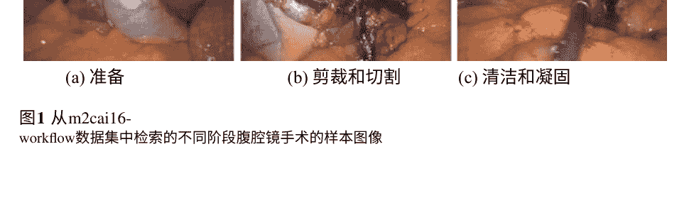

如果视频的每一帧都用相应的阶段进行注释，可以通过确定转换概率 $P(p_i|p_j)$ 来开发统计模型，该模型指示了正在进行的阶段为 $p_j$ 时下一个阶段为 $p_i$ 的概率。 尽管特定类型的手术涉及的步骤是预先定义的，但执行它们的顺序可能会因患者的解剖结构和外科医生的技能而有所不同。 因此，一旦使用包含工作流程中显著变化的数据集对手术的工作流程进行建模，就可以根据当前手术阶段的知识确定新的未见过的手术的工作流程的进展。

#### 4 方法论

##### 4.1 手术视频中的阶段识别

手术阶段的出现特征在于所使用的各种工具和所执行的动作，这些特征在视觉上得到了很好的表现。 这些视觉特征可以用于阶段的识别。 在提出的框架中，使用了一个卷积神经网络（CNN）[7]来学习从手术视频帧中提取视觉特征。这些特征仅包含空间信息，无法融入时间信息。 由于各种手术程序大多按照一定的方法执行，时间信息可以帮助改进自动阶段识别框架的性能。 因此，使用一个长短期记忆网络（LSTM）[8]对从CNN中提取的视觉特征进行训练，以学习时间信息，从而提高预测框架的性能。 手术阶段识别问题可以建模为一个单标签多类分类任务。 通常，胆囊切除术过程中有8个阶段，这些阶段记录在m2cai16-workflow数据集中。 因此，每个帧可以被分类为8个阶段之一。

由于CNN在单标签分类任务中的成功，采用了类似的方法。 CNN本质上具有大量的参数，因此需要大量标记的训练实例，在医学图像领域很少见。 然而，通过迁移学习的方法[9]，可以通过微调[10]在标记数据较少的目标领域上取得良好的性能。 使用的预训练网络是AlexNet [11]，GoogLeNet [12]和ResNet-50 [13]。 这些网络是在Imagenet数据库上进行预训练的。 然后，将最后一层替换为一个8路对数sigmoid层，并在m2cai-workflow dataset上进行微调。 在腹腔镜视频中，使用ResNet-50架构的提出的框架用于手术阶段识别，如图2所示。

卷积神经网络学习到的空间视觉特征不编码任何时间信息。 然而，在正确识别手术视频中的阶段时，时间信息至关重要。 长短期记忆（LSTM）[8]网络是递归神经网络[14]能够在其内部状态中编码时间信息。此外，它们还配备了三个门来调节信息流和内部状态。LSTM模块的结构以及各种门的示意图如图3所示。

LSTM的不同门在不同操作时的功能如下。

$$
\mathbf{a}^{t} = \tanh(\mathbf{W}_{c}\mathbf{x}^{t} + \mathbf{U}_{c}\mathbf{h}^{t-1}) \quad (1)
$$
$$
\mathbf{i}^{t} = \sigma(\mathbf{W}_{i}\mathbf{x}^{t} + \mathbf{U}_{i}\mathbf{h}^{t-1}) \quad (2)
$$
$$
\mathbf{f}^{t} = \sigma(\mathbf{W}_{f}\mathbf{x}^{t} + \mathbf{U}_{f}\mathbf{h}^{t-1}) \quad (3)
$$
$$
\mathbf{o}^{t} = \sigma(\mathbf{W}_{o}\mathbf{x}^{t} + \mathbf{U}_{o}\mathbf{h}^{t-1}) \quad (4)
$$

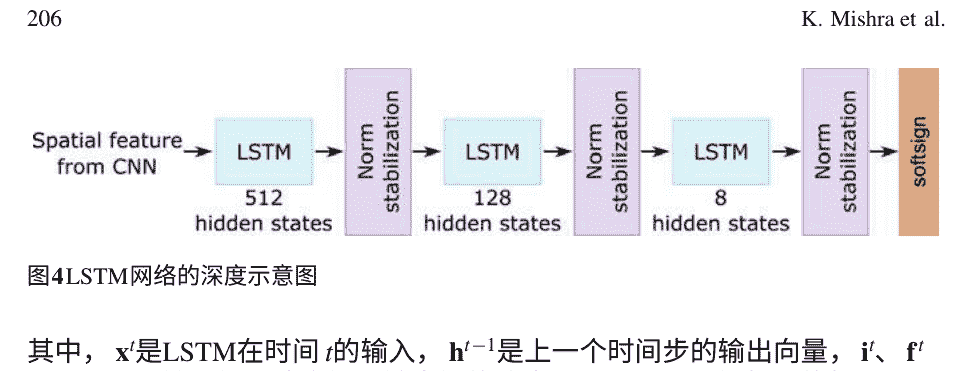

其中， $\mathbf{x}^t$是LSTM在时间 $t$的输入， $\mathbf{h}^{t-1}$是上一个时间步的输出向量， $\mathbf{i}^t$、 $\mathbf{f}^t$ 、 $\mathbf{o}^t$分别是输入门、遗忘门和输出门的响应， $\mathbf{W}$、 $\mathbf{U}$是与门相关的权重， $\sigma( .)$表示sigmoid非线性函数。

从微调的AlexNet、GoogLeNet和ResNet-50中获得的特征用于训练LSTM。可以通过将一个LSTM模块叠加在另一个上来增加LSTM网络的深度。这里使用了2、3和4个LSTM模块来学习时间信息。使用的序列长度为3、5、10和50，表示LSTM保留时间信息的持续时间。LSTM网络的架构如图4所示。最后一层使用了softsign激活函数。

$$
f(x) = \frac{x}{(1 + |x|)}
$$

通过LSTM模块之间的范数稳定化来规范化隐藏状态。通过最小化每个时间步长的L2范数之间的差异来进行正则化。相关的成本函数如下：

$$
损失 = \beta \times \frac{1}{T} \sum_{t=1}^{T} (\| \mathbf{h}^{t} \| - \| \mathbf{h}^{t-1} \|)^2
$$

其中 $T$是总时间步数， $\beta$是一个常数， $\mathbf{h}$表示隐藏状态。

##### 4.2 工作流程的统计建模

使用一组在手术期间录制的视频以及每帧的阶段注释，对胆囊切除术的手术工作流程进行直观可视化。使用包含27个胆囊切除术视频的m2cai16-workflow数据集，其中包含最多八个不同阶段，来验证所提出的建模和可视化方案。使用数据集中20个视频之间的阶段转换总数来对工作流程进行建模。观察到手术的前五个阶段几乎在所有视频中按顺序执行，后续阶段的顺序有所变化。表1显示了不同阶段的转换概率。

从数据集中建模的工作流程方案如图5所示。数据集中观察到的不同工作流程方案在图6中以图形方式说明。

表1 在m2cai-workflow数据集上获得的各阶段转换概率

| 当前阶段 | 下一阶段 P1 | P2 | P3 | P4 | P5 | P6 | P7 | P8 |
|---|---|---|---|---|---|---|---|---|
| P1 | 0 | 1 | 0 | 0 | 0 | 0 | 0 | 0 |
| P2 | 0 | 0 | 1 | 0 | 0 | 0 | 0 | 0 |
| P3 | 0 | 0 | 0 | 1 | 0 | 0 | 0 | 0 |
| P4 | 0 | 0 | 0 | 0 | 1 | 0 | 0 | 0 |
| P5 | 0 | 0 | 0 | 0 | 0 | 0.71 | 0.29 | 0 |
| P6 | 0 | 0 | 0 | 0 | 0 | 0 | 0.67 | 0.33 |
| P7 | 0 | 0 | 0 | 0 | 0 | 0.32 | 0 | 0.68 |
| P8 | 0 | 0 | 0 | 0 | 0 | 0 | 1 | 0 |

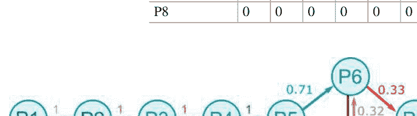

图5 工作流模型，显示不同颜色的转换概率

第4.1节介绍的框架可用于确定手术的当前阶段。它利用手术期间记录的视频流。通过转换概率和工作流模型，可以利用手术的当前阶段来确定下一阶段。

### 5 实验和结果

解决问题的方法基于CNN和LSTM，它学习视频中的时间和空间特征。CNN在目标识别和图像分类任务中已被证明非常成功，其中CNN的特征用于使LSTM学习序列信息。因此，利用时空信息来识别腹腔镜手术阶段。

#### 5.1 数据集描述

m2cai16-workflow 数据集用于性能评估。该数据集由27个腹腔镜手术视频组成，其阶段已经注释。每秒25帧。用于训练的有17个视频，用于验证的有4个视频，用于测试的有6个视频。腹腔镜手术的不同阶段包括插管放置、准备、卡洛特三角形切割、夹取和切割、胆囊切割、胆囊包装、清洁和凝固以及胆囊牵引，如图7所示。


(a) 工作流模型在视频2上的工作


(b) 工作流模型在视频4上的工作


(c) 工作流模型在视频20上的工作


(d) 工作流模型在视频23上的工作


(e) 工作流模型在视频27上的工作

图6 m2cai-workflow 数据集中一组选定视频的工作流模型

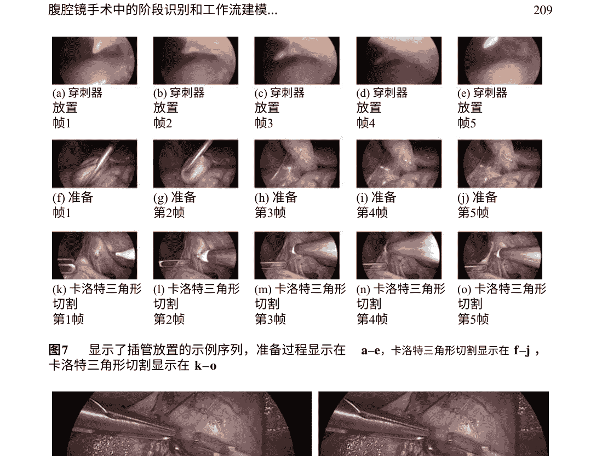

图7 显示了插管放置的示例序列，准备过程显示在 a-e，卡洛特三角形切割显示在 f-j，卡洛特三角形切割显示在 k–o

在视频中观察到，手术活动发生的感兴趣区域（ROI）通常与整个图像相比，限制在一个较小的圆形区域内，如图8a所示。在通过CNN前，帧被裁剪以提取感兴趣区域，并重塑为224 × 224，如图8b所示。

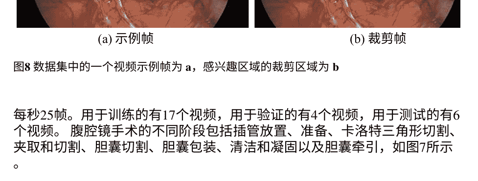

图8 数据集中的一个视频示例帧为 a，感兴趣区域的裁剪区域为 b

#### 5.2 在训练数据集中补偿类别不平衡

整个手术过程可以分为八个阶段。这些阶段可以根据手术过程中使用的不同工具或工具组合进行区分。这些阶段的不同持续时间导致数据集中存在严重的类别不平衡。有些阶段持续时间较长，而有些阶段持续时间很短。穿刺放置、准备、胆囊三角解剖、夹取和切割、胆囊解剖、胆囊包装、清洁和凝固以及胆囊牵引被标记为P1、P2、P3、P4、P5、P6、P7和P8。数据集中类别分布的不平衡在图9a中以图形方式表示。每个扇区对应一个阶段，其大小与标记为该阶段的帧数成比例。

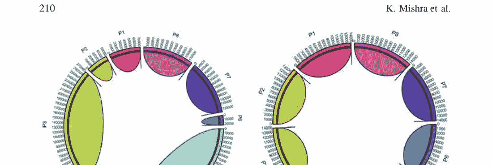

图9 显示了原始和平衡训练数据中与每个手术阶段相对应的帧比例的图形说明。每种颜色代表一个手术阶段。虽然原始视频存在类别不平衡，但训练数据已经平衡。

表2 训练数据中每个阶段对应的帧数，在类别平衡之前和之后

| 阶段 | 原始数据 | 平衡数据 |
| --- | --- | --- |
| 穿刺点位置（P1） | 2,907 | 14,008 |
| 准备（P2） | 2,029 | 13,982 |
| Calot三角解剖（P3） | 10,805 | 14,008 |
| 夹取和切割（P4） | 5,108 | 14,008 |
| 胆囊解剖（P5） | 11,494 | 14,008 |
| 胆囊包装（P6） | 891 | 13,532 |
| 清洁和凝固（P7） | 5,064 | 14,008 |
| 胆囊牵引（P8） | 4,693 | 14,008 |

#### 5.3 基准线

使用以下基准线（BL）对所提出方法进行评估并比较其性能。

- **BL1：** 使用AlexNet [11]进行多类别分类。保留了AlexNet的五个卷积层和前两个全连接层，这些层在ImageNet数据集上进行了预训练。将最后的分类层替换为一个长度为八的全连接层，其前面是一个log-sigmoid层。然后，在平衡的m2cai16-workflow数据集上进行了微调。
- **BL2：** 使用在m2cai-workflow数据集上微调的AlexNet提取的特征进行多类别分类的深度堆叠LSTM网络。使用BL1中训练的网络的长度为4096的全连接层的特征来训练详细介绍在第4.1节中的LSTM网络。
- **BL3：** 使用GoogLeNet [12]进行多类别分类。与BL1类似，将第五个inception模块后的全连接线性层替换为一个长度为八的线性层，后面是一个log-sigmoid层，详细介绍在第4.1节中。使用在ImageNet数据集上预训练的具有inception模块的修改后的GoogLeNet进行了微调，以检测腹腔镜手术视频中的手术阶段。
- **BL4：** 使用由GoogLeNet在m2cai-workflow数据集上微调提取的特征的深度堆叠LSTM网络进行多类分类。从网络中最后一个长度为1,024的inception模块提取的特征用于训练在第4.1节中详细介绍的LSTM网络。
- **BL5：** 使用ResNet-50进行多类分类。在第4.1节中介绍的框架在m2cai16-workflow数据集上进行训练。
提出的方法：使用在第4.1节中介绍的由ResNet-50微调提取的特征的深度堆叠LSTM网络进行多类分类。

这些基准结果总结在表3中。

表3 不同基准的训练和测试时间

| 基准线 | 描述 | 每个周期的训练时间（分钟） | 每帧的测试时间（毫秒） |
| :--- | :--- | :--- | :--- |
| BL1 | 改进的（多类别）AlexNet [11] | 19.50 | 0.60 |
| BL2 | 改进的（多类别）AlexNet [11] (BL1) + LSTM | 20.25 | 2.34 |
| BL3 | 改进的（多类别）GoogLeNet [12] | 27.00 | 1.54 |
| BL4 | 改进的（多类别）GoogLeNet [12] (BL3) + LSTM | 28.17 | 3.20 |
| BL5 | 改进的（多类别）ResNet-50 [13] | 39.00 | 2.35 |
| 提出的方法 | 改进的（多类别）ResNet-50 [13] (BL5) + LSTM | 40.30 | 3.22 |

#### 5.4 性能比较

在基准线BL2、BL4和提出的框架中，对LSTM模块的数量和输入序列的长度进行实验。对基准线的性能评估是使用1、2和3个堆叠的LSTM网络和序列长度为3、5、10和50进行的。图10a显示了不同配置下BL2的性能。图10b显示了BL4的性能。提出的框架的性能显示在图10c中。图11显示了BL2和BL4的最佳性能配置以及提出的方法与BL1、BL3和BL5的性能比较。图12展示了测试数据集中一个视频的每帧预测误差。

#### 5.5 手术工作流程的可视化

图形化可视化以手术视频为基础，通过增强手术工作流程模型来展示正在进行的手术进展。图中显示了数据集中样本视频中各个阶段的过渡。该视频对应于图6a中的模型。手术工作流程模型中当前阶段以红色突出显示。已执行的阶段以绿色表示，即将进行的阶段以白色显示，并附带概率。

图10 表示不同深度和序列长度下BL2、BL4和提出方法的性能。在每种情况下，最佳性能配置用红框标记。

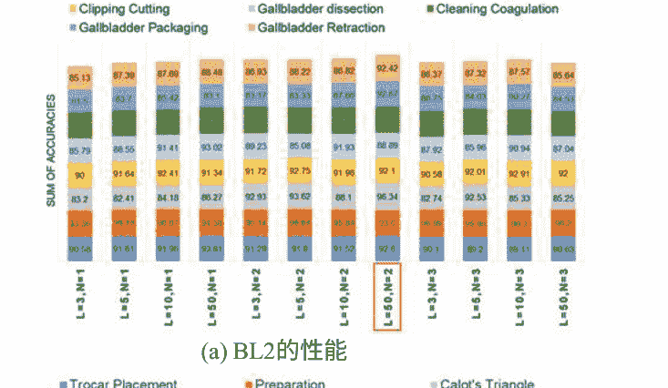

(a) BL2的性能

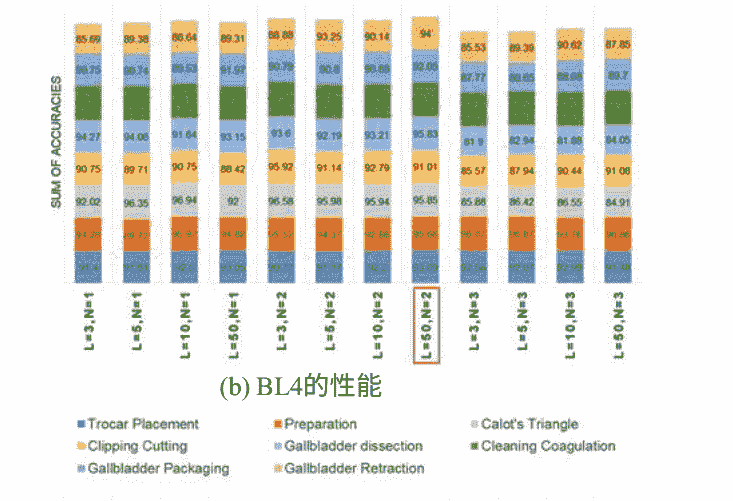

(b) BL4的性能

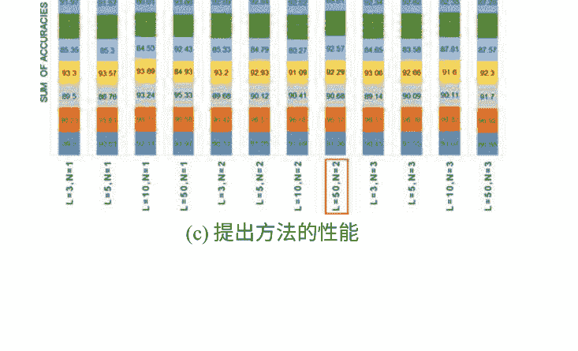

(c) 提出方法的性能

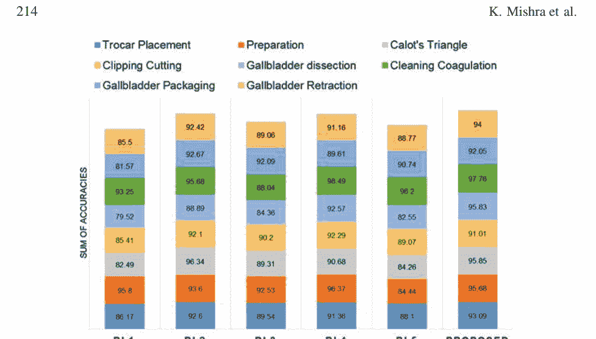

图11 BL1、BL2、BL3、BL4、BL5和提出方法的性能

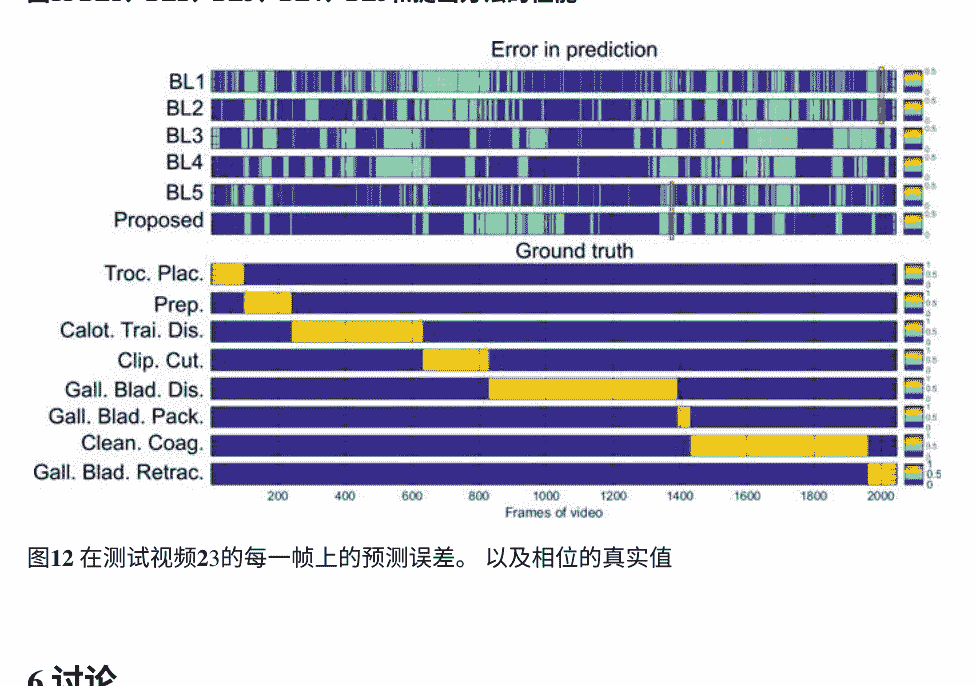

图12 在测试视频23的每一帧上的预测误差以及相位的真实值

### 6 讨论

图9a显示腹腔镜手术中手术阶段的出现是严重不平衡的。在八个阶段中，P3和P5阶段出现的次数最多，而P2和P6的出现次数很少。使用这种不平衡的数据训练网络会使网络对出现次数较多的阶段产生偏见。

因此，在第5.2节中讨论了类平衡，并在图9b中以图形方式显示。如第5.4节所示，网络学习识别手术阶段具有更高的准确性。性能的改进也可以归因于预测框架中引入了时间信息。在图12中，BL1和BL5中的红色框突出显示了帧1959（图14c）和帧1388（图14h）。在这些帧中，要么存在相位变化，要么视频中有一些无法明确归属于特定相位的帧。

这些过渡导致检测错误。观察到引入时间学习后，错误显著减少。图14显示了红色框突出显示的区域前后的帧序列。该方法包括两个阶段。第一阶段是训练一个CNN来检测手术视频中正在进行的相位。在下一个阶段，使用CNN提取的特征训练包含LSTM的时间模型，用于识别手术相位。观察到第二阶段（BL2、BL4和提出的方法）的检测准确性比仅使用第一阶段（BL1、BL3和BL5）的准确性更好。这可能是因为在第一阶段中，相位检测是使用视频的单个帧进行的，而不考虑前一帧传递的信息，导致了不正确的上下文检测。而第二阶段的时间学习则考虑了视频中一帧的序列来检测手术阶段。

### 7 结论

本节介绍了一种使用CNN作为特征提取器，然后使用深度LSTM网络进行时间学习的框架。为了训练该框架以检测腹腔镜视频中的手术阶段，首先使用在ILSVRC [15]上训练的CNN对公开可用的腹腔镜视频数据集进行微调。所提出的框架的性能已通过一组基准进行了实验验证。观察到所提出的框架，其中使用深度残差网络提取的图像视觉特征，然后使用LSTM进行时间学习，在检测手术阶段的准确性方面优于不同的基准，准确率高达{93.09, 95.68, 95.85, 91.01, 95.83, 97.76, 92.05和94.00%}，对于手术阶段{穿刺点放置，准备，Calot三角解剖，夹和切割，胆囊解剖，胆囊包装，清洁和凝固，胆囊牵引}的平均阶段检测准确率为94.41%。工作流建模使用包含手术视频及每帧注释的数据集完成。使用数据集中各个视频的阶段转换来建模手术的整体工作流模型。通过首先使用经过训练的深度神经网络框架识别当前手术阶段来可视化手术进展。然后可以使用手术的工作流模型确定可能的下一个阶段。

## 参考文献

- 1. N. Padoy, T. Blum, H. Feussner, M.O. Berger, N. Navab, 在手术室中用于监测的手术活动的在线识别, 在人工智能促进协会, 第1718-1724页 (2008)
- 2. T. Blum, H. Feuner, N. Navab, 从腹腔镜视频中建模和分割手术工作流程, 在医学图像计算与计算机辅助干预国际会议, 第400-407页 (2010)
- 3. F. Lalys, L. Riffaud, D. Bouget, P. Jannin, 用于白内障手术视频图像中高级手术任务识别的框架. IEEE Trans. Biomed. Eng. 59(4), 第966-976页 (2012)
- 4. C. Lea, G.D. Hager, R. Vidal, 用于细粒度活动分割和识别的改进模型, 应用于外科培训任务, 在IEEE冬季计算机视觉应用会议(WACV), 第1123-1129页 (2015)
- 5. U. Klank, N. Padoy, H. Feussner, N. Navab, 在内窥镜图像中的自动特征生成. Int. J. Comput. Assist. Radiol. Surg. 3(3–4), 331–339 (2008)
- 6. A.P. Twinanda, S. Shehata, D. Mutter, J. Marescaux, M. de Mathelin, N. Padoy, Endonet: 用于腹腔镜视频识别任务的深度架构. IEEE Trans. Med. Imag. 36(1),86–97 (2017)
- 7. Y. LeCun, Y. Bengio, 用于图像、语音和时间序列的卷积网络, The Handbook of Brain Theory and Neural Networks, vol. 3361, no. 10 (1995)
- 8. S. Hochreiter, J. Schmidhuber, 长短期记忆. 神经计算. 9(8), 1735–1780 (1997)
- 9. S.J. Pan, Q. Yang, 转移学习调查. IEEE Trans. Knowl. Data Eng. 22(10), 1345–1359 (2010)
- 10. N. Tajbakhsh, J.Y. Shin, S.R. Gurudu, R.T. Hurst, C.B. Kendall, M.B. Gotway, J. Liang, 用于医学图像分析的卷积神经网络: 完全训练还是微调? IEEE Trans.Med. Imag. 35(5), 1299–312 (2016)
- 11. A. Krizhevsky, I. Sutskever, G.E. Hinton, 使用深度卷积神经网络进行Imagenet分类. Adv. Neural Inf. Process. Syst. 1097–1105 (2012)
- 12. C. Szegedy, W. Liu, Y. Jia, P. Sermanet, S. Reed, D. Anguelov, D. Erhan V. Vanhoucke, A. Rabinovich, 通过卷积深入研究, in Proceedings of the IEEE Conference on Computer Vision and Pattern Recognition, pp. 1–9 (2015)
- 13. K. He, X. Zhang, S. Ren, J. Sun, 深度残差学习用于图像识别，在计算机视觉和模式识别IEEE会议论文集, 第770-778页 (2016)
- 14. D.E. Rumelhart, G.E. Hinton, R.J. Williams, 通过反向传播学习表示. 认知模型. 5(3), 1 (1988)
- 15. J. Deng, W. Dong, R. Socher, L.J. Li, K. Li, L. Fei-Fei, Imagenet: 一个大规模的分层图像数据库, 在计算机视觉和模式识别IEEE会议论文集, 第248-255页 (2009)

## 深度学习应用于细胞病理学：关于疟疾检测和白血病细胞系分类的研究

G. Gopakumar 和 Gorthi R. K. Sai Subrahmanyam

摘要 本章讨论了深度学习网络在细胞病理学中的几个应用。具体而言，讨论了从血涂片图像中检测疟疾和白血病细胞系的分类。本章首先介绍了传统（深度）多层神经网络和反向传播的相关理论，然后介绍了卷积神经网络（CNN）的动机、理论和训练，这是一种流行的基于深度学习的分类器。讨论了使用CNN从血涂片图像中检测疟疾，并讨论了以K562、MOLT和HL60为例的白血病细胞系的迁移学习能力。当训练样本非常有限时，CNN的迁移学习能力尤其引人关注，可以构建一个独立的深度CNN分类器。

### 1 引言

细胞病理学是疾病诊断的细胞水平研究。在细胞病理学中[1]，通常分析的是游离细胞，而不是组织整体。每个研究对象细胞都有一个由细胞形态和行为特征构成的特征。细胞学家通过寻找与标准细胞特征不符的偏差来报告受检者的病理状态。用于分析的细胞可以是涂片玻璃片上的涂片，也可以是一种流体悬浮液。

G. Gopakumar (✉)
计算机科学与工程系，Amrita Vishwa Vidyapeetham，Amritapuri，印度
e-mail: gopakumarg@am.amrita.edu

G. R. K. Sai Subrahmanyam
电气工程系，IIT Tirupati，Tirupati，印度
e-mail: rkg@iittp.ac.in

有时候，细胞离心法被用来浓缩研究中的细胞，而不改变细胞的形态。

显微镜检查即使在今天仍然是细胞分析的黄金标准，因为它成本低廉且被广泛接受。然而，手动显微镜检查是一项费时费力的任务，涉及到载玻片的制备（固定和染色）和分析。这是一项耗时、重复且乏味的工作。最重要的是，对于同一样本，不同临床医生的结果可能会有所不同，这取决于他们的专业水平。为了克服这些缺点，近年来已经进行了多项努力来自动化细胞病理学的过程。在这个方向上的研究工作主要受到两种方法的限制：仪器和数据分析。

在仪器设备方面，过去几十年已经出现了自动化显微系统[2]、流式细胞仪[3]和成像流式细胞仪[4]的发展。自动化显微系统（如PathScope）与手动显微镜相比，大大提高了吞吐量，但仍远远落后于流式细胞仪。流式细胞仪可以分析和识别每秒数千个细胞，已成为临床医生的必备工具。它使用流式细胞仪的流动池结构，在细胞在流动时使用激光进行检测。典型的流式细胞仪系统可以测量激光的前向散射和侧向散射特征。前向散射是细胞大小的度量，侧向散射是细胞复杂性的度量，这些信息被用于识别和计数不同类型的细胞。尽管流式细胞仪的采集速度非常高，但它提供的每个细胞信息通常很少。原因是流式细胞仪除了散射量之外，不会捕捉特定的形态特征。

另一方面，传统的显微检查提供了关于细胞水平下组分的详细信息，但在计数和速度方面存在缺点。成像流式细胞术（IFC）[4, 5]是一种相对较新的技术，它结合了流式细胞术的速度和数字显微镜的功能，能够分析形态特征。然而，目前市面上的成像流式细胞术系统体积庞大且昂贵[6]，因为它们采用了大量的流体处理机制进行样本图像获取，并采用昂贵而复杂的图像获取方法。即使是自动显微镜系统也使用了大量的机器人处理的自动载玻片装置，使得这些系统体积庞大且昂贵[2, 7, 8]。因此，在资源有限的环境中，这些自动化设备并不那么经济实惠。新的趋势是在显微镜成像模式下结合微流体样品处理，以实现细胞的高通量成像。我们称之为微流体显微镜（Mf-Ms）的这些系统结合了流式细胞术（高通量）和数字显微镜（提供空间和定量形态学）的功能。

在发展自动化的点对点诊断系统方向上，已经完成了相当数量的工作，包括开发处理图像和做出诊断决策所需的算法。然而，传统的分类系统通常被建模为包含细胞分割、特征提取等步骤，然后使用SVM [9]等分类器进行决策。

一直以来，建立一个与专家临床医生一样好的决策系统一直是一个渴望。已经确立的事实是，人脑的力量来自于大量相互连接的神经元，能够进行并行计算 [10]。关于在细胞病理学中使用人工神经网络的综述可以在[11, 12]中找到。全连接的普通人工神经网络也无法从大数据集中学习这样复杂的决策问题。这种问题通常需要大量的层和神经元，因此需要学习大量的参数，使得学习过程变慢。此外，在基于反向传播的训练过程中，ANN的较低层面存在梯度消失的问题 [13]，这使得学习问题更加困难，如果不是不可能的话。在监督模式下，ANN和SVM的另一个困难是训练数据需要有标签，并且系统的泛化能力在很大程度上取决于用于训练的标记数据的数量。最近，基于卷积神经网络的深度学习系统在医学领域的图像分析中成为可靠和默认的模型。Greenspan等人 [14]回顾了最近与深度学习相关的医学研究。

在本章中，讨论了卷积神经网络在疟疾诊断[15]和白血病细胞系分类中的应用。本研究使用的数据集分别由成本效益高的国产自动显微镜系统[16]和微流控显微镜系统[17]生成。第2节介绍了前馈神经网络的基本架构和反向传播训练算法，这对于训练卷积神经网络非常重要。第3节讨论了卷积神经网络的基本构建模块和相关训练算法的数学细节。第6节讨论了专为疟疾诊断的血涂片焦点堆叠图像设计的自定义卷积神经网络，然后介绍了卷积神经网络在白血病细胞系分类中的迁移学习能力。

### 2 多层神经网络与反向传播

多层前馈神经网络和反向传播[18]训练算法是开发单一分类器的里程碑，它可以像我们的大脑一样从示例中自动学习。它使得在保持系统架构和算法完全相同的情况下，我们可以学习解决完全不同的分类任务的分类器。Cybe"ko [19]和Hor"ick [20]已经证明，任何在紧致子集上的连续函数可以用具有包含有限数量的神经元的单隐藏层的前馈神经网络 (FFN) 很好地逼近。因此，具有单隐藏层的FFN可以找到 \(R^n\) 上的任何复杂分类边界。尽管这个通用逼近定理非常令人兴奋，但没有保证能够自动学习非常多的参数以在合理的时间内解决复杂的分类任务，同时使用有限的训练集和只有单隐藏层的架构。

这个约束促使工程师设计了多层神经网络。此外，人类神经系统（比如，视觉系统[21]）在进行推理时通常以多个层次进行工作。

反向传播是训练人工前馈神经网络中广泛使用的方法。训练人工神经网络有两个步骤：误差反向传播和权重更新。当一个输入向量被输入到网络中时，它会逐层向前传播，直到达到输出层。然后，将与该输入向量对应的期望输出与生成的输出进行比较，并计算每个输出层神经元的误差值（使用适当的损失函数）。然后，这个误差向后传播（因此称为反向传播），从输出开始，直到每个神经元都有一个关联的误差值，该值是其对输出层误差的贡献的度量。确定每个神经元的误差后，使用梯度下降等优化方法更新权重，以最小化损失函数。深层的权重更新通常与最终误差相关，通过使用链式法则逐层进行。为此，可以方便地使用矩阵表示法进行误差反向传播，通过观察误差反向传播和梯度下降对应的权重更新之间的解耦。正如在这里讨论的那样，这是可行的，因为梯度下降中的权重更新项可以根据反向传播的误差在连接的后端（携带权重）和连接的输入来轻松计算。我们在这里讨论的这个过程为解释和推导深度网络中的权重更新提供了一个通用的步骤。此外，这种理解为在深度卷积网络中轻松跟踪反向传播提供了一个良好的基础。

图1显示了一个任意的4层前馈神经网络。输入层有 D 个神经元，第二层有 M 个神经元，第三层有 N 个神经元，输出层有 Z 个神经元。每个层中的每个神经元与其后紧随的层中的每个其他神经元之间都有加权连接。除了输入层外，每个层中的每个神经元都有一个偏置。在训练过程中，这些参数（权重和偏置）需要更新以最小化损失。

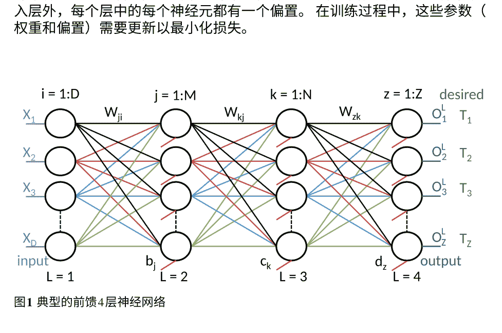

函数。一个典型的损失函数可以是平方差的一半之和，定义为

$$E = \sum_z \frac{1}{2} (T_z - O_z)^2$$ (1)

这里，Tz和Oz分别是节点z处于输出层对于任意特定输入X={Xi}i=1时产生的期望输出和实际输出。需要注意的是，正常的前馈神经网络的输入是一个D x1的列向量。如果输入是一张图片，则需要将其向量化以形成输入向量。

除了输入层之外的所有节点都计算来自上一层的输入的加权和，以产生中间输出Net。激活函数应用于每个Net，以产生任意层L中每个神经元的最终输出。我们将考虑由以下Sigmoid激活函数定义的流行激活函数。

$$O_z^L = f(Net_z^L) = \frac{1}{1 + \exp^{-Net_z^L}}$$ (2)

其中NetzL是由第L层中的节点z产生的中间输出，并且由以下方式定义

$$Net_z^L = \sum_k W_{zk} O_k^{L-1} + d_z$$ (3)

这里 OkL-1 是第L-1层中节点k的输出，Wzk是从第L-1层中的节点k到第L层中的节点z的连接权重。

梯度下降法用于更新参数。每个参数都是根据损失函数（公式1）相对于要更新的参数计算出的梯度的负方向进行更新。为了概括这个过程，我们首先展示了这个权重更新可以分解为两个步骤：将计算出的错误反向传播到较低的层，并根据反向传播的错误和输入来更新特定连接的权重。

第2.1节讨论了误差反向传播过程，而第2.2节讨论了参数更新过程。在所有这些讨论中，L是任意一层，L-1是层次结构中较低的一层，然后L-2等等。所提出的公式的主题是，无论是基于误差反向传播还是基于它的权重更新，都可以扩展到任意数量的层（在类似的步骤中）。

基于梯度下降的简单更新规则，用于更新连接L-1层中第k个神经元与L层中第z个神经元之间的权重WzkL为

$$W_{\text{新}} = W_{\text{旧}}^{zk} - \eta \frac{\partial E^{L+1}}{\partial W_{zk}^L}$$ (4)

这里η是学习参数，EL+1成为更新最后一层和倒数第二层之间的权重时的错误。∂EL+1 / ∂WzkL 可以使用链式法则计算

$$\frac{\partial E^{L+1}}{\partial W_{zk}^L} = \left[ \frac{\partial E^{L+1}}{\partial O_z^L} \frac{\partial O_z^L}{\partial Net_z^L} \right] \frac{\partial Net_z^L}{\partial W_{zk}^L} = \Delta_z^L * O_k^{L-1}$$ (5)

在方程5中，$\frac{\partial Net_z^L}{\partial W_{zk}^L}$ 结果是输入 $O_k^{L-1}$ 对于权重更新而言是寻找的连接，并且是由方程3中 $Net_z^L$ 的定义引起的。括号中的项 $\Delta_z^L$ 是在连接的后端进行误差反向传播。项 $\frac{\partial O_z^L}{\partial Net_z^L}$ 可以表示为 $f'(Net_z^L)$ 根据定义（方程2），这变成了 $O_z^L * (1 - O_z^L)$ 对于Sigmoid函数。简而言之，连接第k个神经元在第L-1层到第z个神经元在第L层的权重更新结果为$\Delta L * O_k L^{-1}$，这是连接的后端传播的误差$\Delta L$和来自较低层神经元的连接输入$O_k L^{-1}$的乘积。这一点将在第2.1节和第2.2节中通过数学方式清楚地阐明。

#### 2.1 通过层传播误差

在本节中，计算输出层每个节点的误差，然后将其向下传播到层次结构较低的层，以确定网络中每个节点对该误差的贡献。

##### 2.1.1 计算输出层L的误差

输出层中的每个节点都对总误差 $E$ 有贡献。节点 $z$ 在第 $L$ 层的误差贡献是由其输出 $O_z^L$ 引起的。记 $\Delta E_z^L$ 为这个量，可以通过计算 $\frac{\partial E}{\partial O_z^L}$ 来测量。根据误差函数的定义（方程1），可以得到

$$\Delta E_z^L = \frac{\partial E}{\partial O_z^L} = O_z^L - T_z$$ (6)

##### 2.1.2 从第L层传播误差到第L-1层

首先，提供了反向传播误差的直观思想，并推导出了明确的表达式。为了找到第 $L$ 层中节点 $k$ 的输出对第 $L-1$ 层的最终误差 $E$ 的贡献，必须将在第 $L$ 层的每个节点上找到的误差进行反向传播。一旦计算出任意层 $L$ 中所有节点 $z$ 的误差 $\Delta E_z^L$，在误差反向传播过程中，它必须通过这些神经元来计算较低层 $L-1$ 中所有节点的误差。这是通过将 $\Delta E_z^L$ 与Sigmoid函数 $f'(Net_z^L)$ 的相应导数加权来实现的。

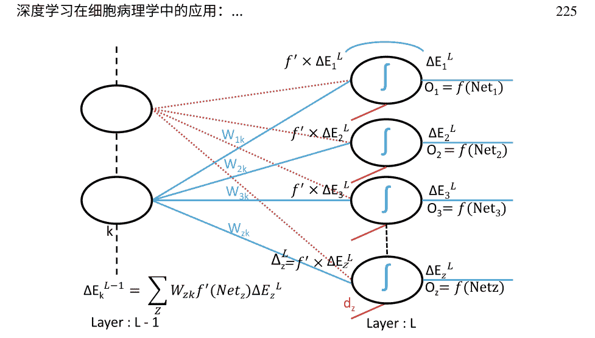

然后通过每个第L层的节点k上的加权连接累积份额（ΔL） 通过参考图2可以更好地解释该过程。 它显示了从第L-1层的节点k到每个 ΔE_z^L 的关系。 可以看出，第L-1层的节点k通过相应的权重连接影响了第L层中所有节点的输出。因此，在第L层的每个神经元中计算的误差通过相应的权重连接对第L-1层的每个节点k产生影响，并且它必须穿过第L层的每个神经元 z。因此，第L-1层的节点k处的误差可以计算为

$$\Delta_k^{L-1} = f'\left(Net_k^{L-1}\right) \cdot \Delta E_k^{L-1} \quad (7)$$

其中 $f'\left(Net_k^{L-1}\right)$ 是 $O_k^{L-1}\left(1 - O_k^{L-1}\right)$ 对于Sigmoid和 $\Delta E_k^{L-1}$ 由递归关系定义

$$\Delta E_k^{L-1} = \frac{\partial E}{\partial O_k^{L-1}} = \sum_{z} \frac{\partial E_z^L}{\partial O_z^L} \cdot f'\left(Net_z^L\right) \cdot W_{zk} \quad (8)$$

以矩阵形式，可以写成

$$\Delta E^{L-1} = \mathbf{W}^T \cdot \left[\Delta E^L .* f'\left(Net\right)\right] \quad (9)$$

其中'.*'表示逐元素相乘，'·'表示矩阵乘法，T表示矩阵转置。 方程9在通过任意层数的反向传播中保持不变。 权重矩阵 W在每一层都会改变。 对应激活函数的 f'（具有相关输出）和当前层的误差被用于将误差反向传播到其前一层。

方程式8中的表达式也可以使用正常的链式梯度计算来明确计算，如下所示。

$$\frac{\partial E^L}{\partial O^{L-1}_k} = \sum_z \frac{\partial E^{L}}{\partial O^L_z} \frac{\partial O^L_z}{\partial Net^L_z} \frac{\partial Net^L_z}{\partial O^{L-1}_k} \quad (10)$$

其中 $\frac{\partial Net^L_z}{\partial O^{L-1}_k}$ 可以计算为

$$\frac{\partial Net^L_z}{\partial O^{L-1}_k} = \frac{\partial}{\partial O^{L-1}_k} \sum_k W_{zk} O^{L-1}_k = W_{zk} \quad (11)$$

当将方程式11代入方程式10时，结果是

$$\frac{\partial E^L}{\partial O^{L-1}_k} = \sum_z \frac{\partial E^{L}}{\partial O^L_z} \frac{\partial O^L_z}{\partial Net^L_z} W_{zk} \quad (12)$$

将 $O^L_z = f(Net^L_z)$, $\frac{\partial O^L_z}{\partial Net^L_z}$ 写成 $f'(Net^L_z)$ 以简化符号表示。因此，方程式12与方程式8中提供的方程式完全相同。方程式9的结果是，误差反向传播可以独立于梯度更新进行，可以通过简单的矩阵乘法逐层向下传播到层次结构中的每一层。

#### 2.2 更新参数

如前所述，用于最小化方程式1中定义的损失函数的优化方法可以是梯度下降。参数的更新是根据与要更新的参数相关的误差函数的梯度的负方向进行的。

##### 2.2.1 更新权重

基于梯度下降的简单更新规则是

$$W^{\text{新}}_{zk} = W^{\text{旧}}_{zk} - \eta \frac{\partial E}{\partial W_{zk}} \quad (13)$$

这里 $\eta$ 是学习参数， $\frac{\partial E}{\partial W_{zk}}$ 是损失函数 $E$ 相对于参数 $W_{zk}$ 的梯度。 $\frac{\partial E}{\partial W_{zk}}$ 可以使用链式法则计算

$$\frac{\partial E}{\partial W_{zk}} = \left[ \frac{\partial E}{\partial O_z} \frac{\partial O_z}{\partial Net_z} \right] \frac{\partial Net_z}{\partial W_{zk}} \quad (14)$$

这里，括号中的项已经通过上一节中的误差反向传播计算出来，对于所有层中的所有神经元。第二项结果为

$$\frac{\partial Net_z}{\partial W_{zk}} = \frac{\partial}{\partial W_{zk}} \sum_k W_{zk} O_k^{L-1} = O_k^{L-1} \quad (15)$$

$W_{zk}$是连接层 $L-1$ 中的节点 $k$ 与层 $L$ 中的节点 $z$ 的权重， $\frac{\partial Net_z}{\partial W_{zk}}$ 结果是层 $L-1$ 中节点 $k$ 的输出。因此， $\frac{\partial O_z^L}{\partial W_{zk}}$ 原来是神经元 $k$ 在第 $L-1$ 层的输出，乘以对于节点 $z$ 在第 $L$ 层的 $Net_z^L$ 的 sigmoid 导数的加权。

##### 2.2.2 更新图1中网络的权重

令 $W_{H_1}$, $W_{H_2}$ 和 $W_{H_3}$ 分别是网络中层1和2、2和3、3和4之间的权重矩阵。

$$W_{H_1} = \begin{bmatrix}
W_{11} & W_{12} & W_{13} & \ldots & W_{1D} \\
\cdot & \cdot & \cdot & \ldots & \cdot \\
\cdot & \cdot & W_{ji} & \ldots & \cdot \\
\cdot & \cdot & \cdot & \ldots & \cdot \\
W_{M1} & W_{M2} & W_{M3} & \ldots & W_{MD}
\end{bmatrix}$$

$$W_{H_2} = \begin{bmatrix}
W_{11} & W_{12} & W_{13} & \ldots & W_{1M} \\
\cdot & \cdot & \cdot & \ldots & \cdot \\
\cdot & \cdot & W_{kj} & \ldots & \cdot \\
\cdot & \cdot & \cdot & \ldots & \cdot \\
W_{N1} & W_{N2} & W_{N3} & \ldots & W_{NM}
\end{bmatrix}$$

$$W_{H_3} = \begin{bmatrix}
W_{11} & W_{12} & W_{13} & \ldots & W_{1N} \\
\cdot & \cdot & \cdot & \ldots & \cdot \\
\cdot & \cdot & W_{zk} & \ldots & \cdot \\
\cdot & \cdot & \cdot & \ldots & \cdot \\
W_{Z1} & W_{Z2} & W_{Z3} & \ldots & W_{ZN}
\end{bmatrix}$$

当输入 $X= \{X_i\}_{i=1}^{D}$ 被输入到网络时，在第4层、第3层和第2层的每个节点产生的输出分别为 $O^4= \{O_z\}_{z=1}^{Z}$, $O^3= \{O_k\}_{k=1}^{N}$ 和 $O^2= \{O_j\}_{j=1}^{M}$。第1层的输出与输入相同，因此 $O^1= \{O_i\}_{i=1}^{D} = \{X_i\}_{i=1}^{D}$。同时， $T= \{T_z\}_{z=1}^{Z}$ 是输出层每个节点的目标或期望输出。现在可以通过误差反向传播计算出第 $L$ 层的误差向量 $\Delta L$。

$$\Delta^{4} = O^{4}_{[z \times 1]} .* [1 - O^{4}]_{[z \times 1]} .* [O^{4} - T]_{[z \times 1]} \quad (16)$$
$$\Delta^{3} = [\mathbf{W}_{H_3}^{T}]_{N \times Z} * [\Delta^{4}]_{Z \times 1} .* O^{3}_{N \times 1} .* (1 - O^{3})_{N \times 1} \quad (17)$$
$$\Delta^{2} = [\mathbf{W}_{H_2}^{T}]_{M \times N} * [\Delta^{3}]_{N \times 1} .* O^{2}_{M \times 1} .* (1 - O^{2})_{M \times 1} \quad (18)$$

注意，方程式17和18是由方程式7和9推导出来的。现在可以找到每个神经元相对于要更新的参数的梯度，并且最终的更新规则以矩阵形式表示为

$$\mathbf{W}_{H_3}^{\text{新}} = \mathbf{W}_{H_3}^{old} - \eta [\Delta^{4}]_{Z \times 1} * [O^{3}]_{1 \times N}^{T} \quad (19)$$
$$\mathbf{W}_{H_2}^{\text{新}} = \mathbf{W}_{H_2}^{old} - \eta [\Delta^{3}]_{N \times 1} * [O^{2}]_{1 \times M}^{T} \quad (20)$$
$$\mathbf{W}_{H_1}^{\text{新}} = \mathbf{W}_{H_1}^{old} - \eta [\Delta^{2}]_{M \times 1} * [O^{1}]_{1 \times D}^{T} \quad (21)$$

因此，要更新层 $L - 2$ 中神经元 $j$ 和层 $L - 1$ 中神经元 $k$ 之间的权重 $W_{kj}$，需要计算错误函数在最终层对 $W_{kj}$ 的梯度。从上述一组方程可以看出，这个梯度可以解释为两个项的乘积。第一个项是在层 $L - 1$ 中计算的节点 $k$ 的错误乘以对节点 $k$ 的sigmoid激活函数输出的导数。这可以看作是连接持有权重 $W_{kj}$ 的后端的错误。第二个项是在层 $L - 2$ 中节点 $j$ 的输出，可以看作是连接持有权重 $W_{kj}$ 的前端的输入。因此，更新任意两层之间连接的权重的变化可以通过计算连接后端的错误和连接前端的输入的乘积来简单获得。然后，这个乘积会乘以学习参数 $\eta$，并且通过梯度下降更新连接的权重。

### 3 卷积神经网络 (CNN)

在传统的多层前馈神经网络中，基于图像的分类引入了一些严重的困难。通常需要预先进行特征提取，并将其作为神经网络的输入。这些特征是应用程序相关的，手工设计它们是一项重要但困难的工作。另一种选择是将输入图像向量化并馈送到网络中。然而，输入图像通常较大，这导致了一个大的权重矩阵，因此需要学习的参数数量巨大。卷积神经网络 (CNN) 通过在层的神经元之间共享权重 [22] 来解决这些限制，并由Lecun通过他的五层CNN (LeNet-5 [23]) 在数字识别方面得到推广。

CNN是一种受生物启发的神经网络，旨在模仿我们的视觉皮层系统的连接模式。基本上，有一系列的特征提取层，其中一个层在其较低层的提取特征上工作，以产生某种推理（例如区分类间样本）在最终层。子采样在连续的特征提取层之间进行特征图的处理，以减轻由于位移、缩放和噪声引起的小差异，这些差异通常存在于来自同一类别的样本中（类内差异）。Lecun设计了LeNet-5 [23]，如图3所示，它有五层。首先进行特征提取，然后是子采样，再次进行特征提取，然后是子采样，最后是全连接层。与上一节讨论的反向传播算法相同，构成了卷积神经网络的训练基础，并且在数字分类问题和其他几个分类任务中取得了很高的准确性。

该架构受到机器学习界的好评，并通过引入更多的特征提取和子采样层应用于不同的问题。然而，通过引入更多的层来扩展架构存在一个非常严重的缺点，即在反向传播过程中特别是在较低层次上不会发生学习。瓶颈在于LeNet-5中使用的激活函数，该函数与公式2中提供的Sigmoid激活函数相同。请注意，在反向传播过程中，在计算任何层的误差贡献Ej时，需要将计算得到的ΔEj加权乘以f'（Netj）。由于f（Netj）的最大值为1，f'（Netj）=Oj（1 - Oj）的最大可能值为0.25。由于反向传播的链式法则，在较低层L中，这意味着EL将是一个非常小的量（由于在顶层被许多f'（Netj）加权），权重更新将不会发生。为了解决梯度消失的问题，引入了另一个激活函数，即修正线性单元（ReLU）。因此，现代CNN架构具有三个基本构建模块：特征提取层、子采样层和ReLU激活。

#### 3.1 特征提取层

在CNN中，特征提取层被设计为卷积层，因为在输入图像上使用适当的卷积核进行卷积操作总是会产生不同的输出特征图：就像Sobel核检测边缘和Laplacian核检测输入图像中的斑点。给定一个 \(D\)维图像，卷积块计算 \(Y\)，可以将其视为 \(K\)个不同特征映射的实例。该操作是一种卷积形式，是在 \(D\)维图像和 \(K\)组学习到的卷积核\(f\)之间进行的。方程式22描述了这个操作，其中 \(f^T\)表示翻转的卷积核。

```
$$X \in \mathbb{R}^{H \times W \times D}, f \in \mathbb{R}^{H' \times W' \times D \times K}, Y \in \mathbb{R}^{H'' \times W'' \times K} \tag{22}$$

$$y_{i''j''k} = b_k + \sum_{i'=1}^{H'} \sum_{j'=1}^{W'} \sum_{d'=1}^{D} f_{i'j'd'k}^T \times x_{i''+i'-1, j''+j'-1, d'}$$
```

其中 \(b_k \in \mathbb{R}\)是该层节点的偏置项。

请注意，在CNN的卷积块中学习到的权重形成了卷积核和偏置项。直观地说，在卷积层学习到的卷积核有助于提取非常局部的特征，例如（虽然不完全相同）低通和高通滤波器、边缘特征和角点。因此，在训练CNN时，我们实际上是在学习这些特征检测器（而不是特征），如边缘、线条、角点检测器和对比度量化器，这些特征检测器可以在测试图像上操作时用来提取相关特征。

LeCun设计了一个五层网络（LeNet-5）[23]，其中包括两个卷积层，两个子采样（池化）层和一个全连接层，如图3所示。请注意，该架构的设计使得输入图像的尺寸为28 × 28，并且输出层包含10个节点，因为它解决的是数字分类问题。第一个卷积层有6个尺寸为5 × 5的卷积核，第二个卷积层有12个尺寸为5 × 5 × 6的卷积核。因此，第一个卷积层需要学习的参数数量仅为156个：6个卷积核每个有25个权重和6个偏置。在传统的全连接前馈神经网络中，一个等效的层将有764个（28 × 28）输入神经元和3456个（24 × 24 × 6）输出神经元，这导致了2,640,384个权重和3456个偏置。将我们在第一个卷积层中要学习的156个参数与这样一个全连接层中的2,643,840个参数进行比较。

然而，请注意，卷积层中存在的连接数量几乎与其等效的全连接层相同。通过共享卷积操作定义的相同参数来实现参数数量的减少。

## 3.2 激活函数ReLU：

给定输入 \(y_{ijk}\)，修正线性单元（ReLU）会抑制负输入，否则保持相同的值。因此，它是一个非线性激活函数，通常跟随卷积操作。没有ReLU这个非线性激活函数，整个网络将简化为简单的线性变换。

```
math
y^l_{ijk} = \max(0, y_{ijk})
```

## 3.3 子采样:

子采样通常在特征提取层之后进行，它引入了对特征的小的平移不变性和尺度不变性，因为随后的特征提取将在缩小的版本上操作。在LeNet-5架构中，子采样由2×2的平均池化定义。另一种流行的子采样操作是通过最大池化定义的

```
math
y^2_{ijk} = \max_{\substack{1 \leqslant i' \leqslant H', \ 1 \leqslant j' \leqslant W'}} \left( y^1_{i+i'-1, j+j'-1, k} \right)
```

### 4 使用反向传播训练CNN

与第2节讨论的反向传播算法一样，它也是训练卷积神经网络的基础。本节将以图3所示的架构为例，详细讨论训练过程。正如前面提到的，它有两个卷积层（C1，C2），两个平均池化层（P1，P2）和一个全连接层（FC1）。每个卷积层C1有6个大小为5×5的卷积核，每个卷积层C2有12个大小为5×5×6的卷积核。平均池化使用2×2的池化（因此核权重固定为0.25）。该架构最初设计用于28×28的输入图像的数字识别。每个层生成的相应输出图的维度显示在各个块的上方。请注意，输出维度为10×1，因为每个输入必须映射到10个数字之一。请注意，该CNN中要学习的参数有（1）卷积层（C1中的5×5×6+6=156个卷积核的权重和偏置，C2中的5×5×6×12+12=1812个卷积核的权重和偏置）和（2）全连接层的权重和偏置（4×4×12×10+10=1930）。

#### 4.1 参数初始化

每个层的参数都基于该层的输入和输出连接数量进行初始化。具体来说，这些参数是从均匀分布U[-ζ，ζ]中随机选择的，其中上界ζ由确定。

表1 卷积神经网络在图3中的权重初始化参数

|   | $C_1$ | $C_2$ | $FC_1$ |
|---|---|---|---|
| 输入扇入 | $1 \times (5 \times 5) = 25$ | $6 \times (5 \times 5) = 150$ | $12 \times (4 \times 4) = 192$ |
| 输出扇出 | $6 \times (5 \times 5) = 150$ | $12 \times (5 \times 5) = 300$ | 10 |
| $\zeta$ | 0.0756 | 0.0471 | 0.0704 |

由该层的扇入和扇出决定。

```
$\zeta = \sqrt{\frac{1}{\text{扇入} + \text{扇出}}} \quad (25)$
```

对于卷积层，扇入定义为输入特征图数量和卷积核大小的乘积，扇出定义为输出特征图数量和卷积核大小。
对于全连接层，扇入是输入特征图数量和输入特征图大小的乘积，扇出是输出节点数量。表1显示了图3中卷积神经网络架构的权重初始化参数。

#### 4.2 前向传播

在每一层上对输入图进行相应的操作。在卷积层中，每个卷积核都用于与输入图进行卷积，然后使用卷积核偏置来偏移结果，然后应用sigmoid激活函数来生成输出图。请注意，只使用卷积结果的有效部分来生成输出图。如果输出图必须保持与输入相同的维度，则需要在输入之前适当填充。

```
$O[i] = \frac{1}{1 + \exp^{-\left(\sum_{d=1}^{D} [I(:, :, d) * K_i(:, :, d) + B(i)]\right)}} \quad (26)$
```

在公式26中，*表示卷积操作（公式22），$B( i)$表示第$i$个卷积核的偏置。$O[i]$是应用于第$d$个输入图时生成的第$i$个卷积核的输出图。对于卷积层1，$D=1$，$i$的取值范围为1到6。对于卷积层2，$D=6$，$i$的取值范围为1到12。在池化层中，每个$2\times2$的块被平均化以形成一个单独的像素，从而将输出图的大小在每个维度上减小2。在全连接层中，输出的计算方式与普通的前馈神经网络相同，如第2节所讨论的（图4）。

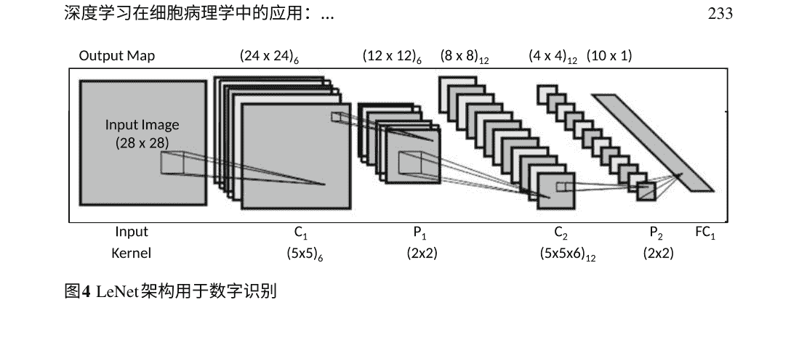

## 图4 LeNet架构用于数字识别

#### 4.3 反向误差传播

在第2节中定义的相同损失函数用于计算误差。对于任何输入图像，我们计算输出层的结果，这将是一个10×1的向量，现在我们可以计算 ∂E/∂O_k。现在这个误差必须在不同的层之间进行反向传播。

##### 在完全连接的层 FC₁上的误差反向传播：

损失函数对最终层中任何节点 k 的输出的导数 ∂E/∂O_k。因此，完全连接的层 FC₁中的误差是一个10×1的向量，保存 (O_k - T_k)_{k=1}^{10}。

```
ΔE_{FC_1} = O - T
```

在 FC₁中的节点上的错误必须向后传播到池化层2 (P₂)，这将导致 ΔE_{P₂}

```
ΔE_{P_2} = W.* O.* (1 - O).* ΔE_{FC_1}
```

在方程28中，‘.*’表示逐元素相乘。这里 W 是连接 P₂的192×1输出图到10×1输出向量的权重矩阵。在 P₂的192×1输出图实际上是12个大小为4×4的映射的向量化表示。因此 ΔE_{P₂} 的维度为 ([192, 10] × [10, 1] → [192, 1])。这被重新调整为 (4×4)_{12} 以方便在后续层中传播错误。

##### 错误的反向传播跨池化层 $P_2$:

由于池化操作在2 ×2的邻域内进行平均池化，因此在该层的错误反向传播只是下采样的逆操作，即2倍上采样。

```
$$
\Delta E_{C_2} = U S_2(\Delta E_{P_2})
$$
```

其中$U S_2$表示上采样操作，这导致$\Delta E_C$的大小为$(8 × 8)_{12}$。

##### 卷积层的错误反向传播 $C_2$:

卷积层的错误反向传播也受到FFN中使用的相同错误传播方程的控制。但是由于卷积操作的特殊构造，在传播错误时权重有一种特殊的关系。事实证明，反向传播的错误与核心的相关性成正比，之后再乘以激活函数的导数。首先，通过一个示例展示了相关操作和加权错误传播之间的对应关系，然后给出了$C_2$的错误反向传播的显式方程。考虑以下卷积操作（仅考虑卷积的有效部分）在方程30中以及相关操作在方程31中的情况（注意通过零填充来重建输入的维度）。在卷积的前向传播中，

```
$$
\begin{bmatrix}
x_1 & x_2 & x_3 & x_4 \\
x_5 & x_6 & x_7 & x_8 \\
x_9 & x_{10} & x_{11} & x_{12} \\
x_{13} & x_{14} & x_{15} & x_{16}
\end{bmatrix}
*
\begin{bmatrix}
w_1 & w_2 & w_3 \\
w_4 & w_5 & w_6 \\
w_7 & w_8 & w_9
\end{bmatrix}
=
\begin{bmatrix}
y_1 & y_2 \\
y_3 & y_4
\end{bmatrix}
$$
```

这里

```
y_1 = w_9x_1 + w_8x_2 + w_7x_3 + w_6x_5 + w_5x_6 + w_4x_7 + w_3x_9 + w_2x_{10} + w_1x_{11} \\
y_2 = w_9x_2 + w_8x_3 + w_7x_4 + w_6x_6 + w_5x_7 + w_4x_8 + w_3x_{10} + w_2x_{11} + w_1x_{12} \\
y_3 = w_9x_5 + w_8x_6 + w_7x_7 + w_6x_9 + w_5x_{10} + w_4x_{11} + w_3x_{13} + w_2x_{14} + w_1x_{15} \\
y_4 = w_9x_6 + w_8x_7 + w_7x_8 + w_6x_{10} + w_5x_{11} + w_4x_{12} + w_3x_{14} + w_2x_{15} + w_1x_{16}
```

从上述一组方程/关系中可以看出，注意到$x_1$只通过权重$w$对$y_1$有贡献，而$x_2$通过权重$w_9$对$y_2$有贡献，并通过$w_8$对$y_1$有贡献。即，$x_2$通过$w_9$与$y_2$相连，并通过$w_8$与$y_1$相连。因此，$x_2$的误差由$y_2$的反向传播误差的加权和决定，加权因子为$w_9$，以及$y_1$的误差加权和，加权因子为$w_8$。即，$\Delta x_2 = w_9\Delta y_2 + w_8\Delta y_1$。通过类似的合理关系，可以得到以下一组方程。

```
$\Delta x_1 = w_9\Delta y_1; \quad \Delta x_2 = w_9\Delta y_2 + w_8\Delta y_1; \quad \Delta x_3 = w_8\Delta y_2 + w_7\Delta y_1; \\
\Delta x_4 = w_7\Delta y_2; \quad \Delta x_5 = w_9\Delta y_3 + w_6\Delta y_1; \quad \Delta x_8 = w_7\Delta y_4 + w_4\Delta y_2;$
```

```
$$
\Delta x_{13} = w_3 \Delta y_3; \quad \Delta x_9 = w_6 \Delta y_3 + w_3 \Delta y_1; \quad \Delta x_{12} = w_4 \Delta y_4 + w_1 \Delta y_2; \\
\Delta x_{16} = w_1 \Delta y_4; \quad \Delta x_{14} = w_3 \Delta y_4 + w_2 \Delta y_3; \quad \Delta x_{15} = w_2 \Delta y_4 + w_1 \Delta y_3; \\
\Delta x_6 = w_9 \Delta y_4 + w_8 \Delta y_3 + w_6 \Delta y_2 + w_5 \Delta y_1; \quad \Delta x_7 = w_8 \Delta y_4 + w_7 \Delta y_3 + w_5 \Delta y_2 + w_4 \Delta y_1; \\
\Delta x_{10} = w_6 \Delta y_4 + w_3 \Delta y_2 + w_5 \Delta y_3 + w_2 \Delta y_1; \quad \Delta x_{11} = w_5 \Delta y_4 + w_2 \Delta y_2 + w_4 \Delta y_3 + w_1 \Delta y_1;
$$
```

非常有趣的是，反向传播可以简洁地表示为以下的错误和权重矩阵相关性。

```
$$
\begin{bmatrix}
0 & 0 & 0 & 0 & 0 & 0 \\
0 & 0 & 0 & 0 & 0 & 0 \\
0 & 0 & \Delta y_1 & \Delta y_2 & 0 & 0 \\
0 & 0 & \Delta y_3 & \Delta y_4 & 0 & 0 \\
0 & 0 & 0 & 0 & 0 & 0 \\
0 & 0 & 0 & 0 & 0 & 0
\end{bmatrix}
\odot
\begin{bmatrix}
w_1 & w_2 & w_3 \\
w_4 & w_5 & w_6 \\
w_7 & w_8 & w_9
\end{bmatrix}
=
\begin{bmatrix}
\Delta x_1 & \Delta x_2 & \Delta x_3 & \Delta x_4 \\
\Delta x_5 & \Delta x_6 & \Delta x_7 & \Delta x_8 \\
\Delta x_9 & \Delta x_{10} & \Delta x_{11} & \Delta x_{12} \\
\Delta x_{13} & \Delta x_{14} & \Delta x_{15} & \Delta x_{16}
\end{bmatrix}
\quad (31)
$$
```

因此可以看出，在卷积过程中，权重和输出之间的关系在相关性中得到了复制，因此可以在反向传播误差中使用。例如，在卷积操作期间，第L层的输入 x6 影响了第L+1层的所有输出神经元(y1, y2, y3, y4)通过权重w5, w6, w8和 w9。 因此，在反向传播第L+1层计算得到的误差 Δy时，与 x6对应的节点的误差贡献应该是 Δy1, Δy2, Δy3和的总和。

Δy4通过相同的权重 w5, w6, w8 和 w9进行加权。 通过分析表达式 Δ在相关操作之后得到的x6可以看出这种关系是保持不变的。 因此，通过卷积层进行误差反向传播等效于对加权误差进行相关操作，该加权误差是在加权后计算的激活函数的导数。 因此 ΔEP1 可以计算为

```
$$
\Delta EF_{C_2} = \Delta E_{C_2} .* O_{C_2} .* (1 - O_{C_2}) \quad (32)
$$
$$
\Delta E_{P_1}(:,:, i) = \sum_{l=1}^{L} [\Delta E_{F_{C_2}}(:,:, l) \odot K_l(:,:, i)] \quad (33)
$$
```

其中 ⊙表示相关操作， i的取值范围从1到6， L=12。 这将导致反向传播的误差维度为 (12 × 12)。

##### 错误的反向传播跨越池化层 P1:

正如之前讨论的，反向传播的错误只是一个上采样的版本。

```
$$
\Delta E_{C_1} = U S_2(\Delta E_{P_1}) \quad (34)
$$
```

#### 4.4 通过梯度下降学习参数

一旦错误被传播到所有的神经元，就会计算相对于要更新的参数的梯度，然后以梯度的负方向更新参数以最小化损失函数。正如之前讨论的，任何连接的权重更新都是基于连接末端神经元的反向传播错误和连接的输入的乘积。

##### 完全连接层权重的梯度导数

```
math
( \Delta W)_{FC_1} = \Delta E_{FC_1} * O. * (1 - O). * I_{FC_1} 

```

在公式35中，$I_{FG}$ 表示池化层2 ($P_2$) 的向量化输出映射。因此，梯度的维度为 $[10, 1] \times [1, 192] \to [10, 192]$。卷积层的核权重的导数如下:

```
math
\Delta E F_{C_l} = \Delta E_{C_l} * O_{C_l} * (1 - O_{C_l}) 
(\Delta K)_l = \Delta E F_{C_l} * I 

```

在方程37中，“*”表示卷积操作。请注意，这里的权重更新也是基于在连接末端放置的神经元上反向传播的误差进行的，我们正在更新连接的权重和连接的输入。对于卷积层1，$l =1$，对于卷积层2，$l =2$。$I$是该层的相应输入映射。由于只采用了卷积的有效部分，对于 $C_1$，梯度的维度将为 $[5, 5]_6 ([24, 24]_6* [28, 28] \to [5, 5]_6)$。类似地，对于卷积层2，梯度的维度将为 $[5, 5, 6]_{12} ([8, 8]_{12}* [12, 12]_6\to [5, 5, 6]_{12})$。更新参数:

一旦梯度相对于核 $K$确定，就可以使用梯度下降法进行更新。

```
math
K^{\text{新}} = K^{\text{旧}} - \eta \Delta K

```

对于输出层中任何节点的偏置项，梯度实际上是计算该神经元所有连接的累积权重变化。同样地，卷积核的偏置的梯度实际上是计算相应卷积核中权重的累积变化。

## 细胞病理学应用中的5个卷积神经网络

在上一节中，我们已经讨论了卷积神经网络相对于传统的多层前馈神经网络的优势。卷积神经网络在医疗保健领域有着广泛的应用，主要用于疾病筛查/诊断应用[24]。

有两种模式：独立分类器模式和迁移学习模式。在独立分类器模式下，CNN是根据预定的应用程序进行设计和学习的，而在基于迁移学习的设置中[25-27]，在一个完全不同的环境中利用了为分类任务所获得的知识（学习到的卷积核）。作为独立分类器，CNN已经被用于体积CT数据中的肺结节检测[28]，结直肠癌检测[29]，超声波中胎儿腹部标准平面的定位[30]，宫颈细胞分析[31]，前列腺癌检测[32]。

在基于迁移学习的设置中，可以将预训练的CNN仅用作特征提取器，并使用需要较少训练数据来学习分类问题的不同分类器，如SVM，用于预期的任务。有时，通过重新调整使用可用训练数据学习的权重来微调预训练模型的核权重。因此，当训练数据的可用性不足以提供独立的分类器时，基于迁移学习的设置尤其有用。如今，基于迁移学习的设置已在医学图像分析的各个领域中找到了应用，例如检测结直肠癌[33]、间质性肺疾病[34]、定位超声中的胎儿腹部标准平面[35]、乳腺癌中的有丝分裂检测[36]。

在接下来的章节中，我们将讨论CNN的两个具体应用：疟疾检测和白血病细胞系分类。在第6节中，我们讨论使用独立的CNN分类器进行疟疾诊断，而在第7节中，我们讨论使用CNN迁移学习来解决白血病细胞系分类问题。

### 6 自定义设计的卷积神经网络用于疟疾检测

在本节中，讨论了一项最近的研究[16]，该研究评估了不同焦平面的幻灯片图像堆叠在检测疟原虫感染的疟疾样本方面的能力。为此，使用自制的焦点堆叠收集显微镜[16]收集了染色的血液样本的幻灯片图像。使用Leishman染色是基于研究[37]的决定，该研究分析了使用Giemsa和Leishman进行疟疾诊断的相对优点和缺点，并提出Leishman染色也是一种特别适合分析薄涂片的良好选择。主要原因是Leishman染色使细胞核中的染色质结构呈深蓝色，从而使我们能够快速将有核的白细胞与无核的红细胞（RBC）区分开来，当分析完整的血液样本时。

在开发自动化疟疾诊断系统的方向上，已经进行了大量的研究工作，包括厚滴片图像[38–40]和薄滴片图像[41–44]。这些工作使用了不同类型、大小的数据样本，并广泛应用了计算机视觉技术[45]。这些技术中的大部分会在疑似寄生虫位置提取特征，并使用在这些特征上学习的分类器进行最终决策。例如，[40]使用遗传算法编程根据包括均值、方差、峰度在内的统计特征来做出决策，以怀疑的寄生虫位置为基础，而[39, 46, 47]则使用支持向量机（SVM [48]）。由于这些方法适用于各种数据集，所报告的性能指标差异很大。例如，报告的敏感性在81.7%至95%之间变化，而特异性在92.59%至100%之间变化。最近，CNN的迁移学习能力和独立分类器能力在检测血涂片图像中的样本涂片是否感染上进行了分析[49]。该研究通过分析包含27578个红细胞的Giemsa染色玻片图像数据集进行，报告了独立CNN分类器的平均准确率明显优于基于迁移学习的策略（97.37%对91.99%）。然而，到目前为止，所有考虑的方法都是使用单个图像来解决寄生虫检测问题。其中一个困难是，寄生虫在幻灯片上的外观因其生命周期的不同阶段而有所不同。在单个图像中很难获得所有被感染的寄生虫。此外，如果寄生虫感染处于早期阶段，它可能会呈现为灰色斑点，并且可能会与相机镜头/传感器上的灰色斑点的外观相混淆。因此，如果我们使用单个焦点图像，有可能会错过一些真正的阳性结果，如果我们想避免由灰尘产生的黑点，或者会有很多错误的阳性结果。在这些情况下，最好使用焦点堆叠图像，因为灰尘的焦点曲线与寄生虫感染的焦点曲线不同。以下各小节详细介绍了使用焦点堆叠图像检测血涂片图像中疟原虫的有效性的实验。由于CNN具有处理多通道图像的固有能力，所以在实验中使用了自定义设计的CNN。

#### 6.1 数据集收集

该数据集包含不同视野的图像堆栈，对于每个堆栈，它包含通过在焦点深度上扫描相同视野而捕获的不同焦点的图像。幻灯片图像经过处理，具有薄的涂片，使用的染色剂是Leishman。为了模拟使用完整血液样本的真实实验，培养的P. falciparum疟原虫样本（O+红细胞）中掺入了白细胞。培养物的血细胞比容维持在5%。然后，使用自制的亮场透射显微镜对制备的薄血涂片进行成像。有关显微镜和数据集准备的详细信息，请参见[16]。

与文献中的方法不同，我们使用焦点图像堆栈进行分析（参见图7）。这为我们提供了一些额外的信息，在检查寄生虫的非常细节时可能会有用，如果我们只使用焦点图像堆栈中的最佳焦点图像，这些细节可能无法直接观察到。这反过来有助于我们区分寄生虫（尤其是在感染的早期阶段）与产生类似特征的图像伪影（由于相机镜头/传感器上的灰尘）之间的区别。总共，该数据集包含765个视野，共62,015个细胞。感染的红细胞数量为1191个，由领域专家在手动检查每个视野的图像堆栈后决定。图5显示了一张带有标记感染细胞的幻灯片图像。为了自动识别这些感染细胞，我们使用基于分类器的系统。然而，与其通过分类器详尽地检查幻灯片图像上的每个位置，我们首先快速识别所有可疑的寄生虫位置，然后使用经过训练的分类器仔细检查这些位置。下面的小节将解释用于识别可疑寄生虫位置的方法以及用于进一步分析这些位置的特征/补丁的分类器。

#### 6.2 确定可疑寄生虫位置

我们分析每个堆栈中的最佳聚焦图像，以确定寄生虫的候选位置。每个聚焦堆栈中方差最大的图像被确定为最佳聚焦图像。然后，在足以覆盖典型红细胞半径的小邻域中分析该图像，并确定每个邻域中的局部极小点作为寄生虫的候选位置。这是因为在Leishman染色图像中，寄生虫在其生命周期的早期阶段尤其显得更暗。然后，通过排除背景区域中的候选位置来进一步细化确定的候选位置。由于背景和细胞区域之间存在高对比度，很容易获得通过应用阈值（如Otsu [50]）对背景中的候选位置进行图像遮罩处理。通过该方法识别出的可疑寄生虫位置如图5所示的幻灯片图像在图6中显示。请注意，噪声（如相机传感器上的灰尘）可能会产生候选寄生虫位置。然而，由于基于围绕可疑位置收集的焦点堆栈以及灰尘的焦点堆栈与寄生虫的焦点堆栈的焦点堆栈配置文件不同，所以后续的分类器处理将其识别为人工制品。

从765个幻灯片图像中识别出的328,334个局部区域极小值位置中，有1400个位置被专家识别为寄生虫位置（阳性类），326,934个位置被识别为健康位置（阴性类）。然而，感染细胞的数量可能较少，因为一个细胞可能有多个感染的寄生虫位置，在我们的案例中有1191个感染细胞。由于数据集不平衡（负类样本多于正类样本），我们将正样本补充到5600个，分别旋转90度、180度和270度。

#### 6.3 疑似寄生虫位置的特征化

从同一组块中提取的手工特征上训练的SVM分类器进行比较。我们还评估了一个在以最佳聚焦图像块为中心的图像块堆栈上工作的CNN分类器的性能。堆栈的块是通过将最佳聚焦图像的块放在中心，并在焦点范围的两端放置一个块来设置的。结果表明，使用焦点堆栈上的CNN产生了最佳结果，如第6.4节所讨论的。

##### 用于SVM分类器的统计和纹理特征

对于SVM分类器，我们选择了十四个特征。除了使用常规的统计特征[39,46,47]之外，我们在实验中还使用了纹理特征。由于我们知道寄生虫位置及其周围存在梯度变化和特定的纹理模式，我们使用了从区域的灰度共生矩阵（GLCM）[51]计算得出的纹理特征，如“对比度”、“相关性”、“能量”和“均匀性”。表2显示了感染和健康斑块的这些特征的均值和标准差（Std）。为了描述寄生虫位置的统计特征，我们采用了斑块的强度的最小值、最大值、均值和方差，以及区域中观察到的梯度幅度的最小值和最大值。

这些特征列在表3中。这些特征反映了整个补丁的统计特征。为了获得局部特征，考虑3 ×3个非重叠区域，并测量所有子区域中观察到的平均强度的最小值和最大值，以及标准差。这些特征列在表4中。因此，总共有14个特征，用于训练SVM模型。

表2 32 ×32补丁的GLCM特征的均值（标准差）

|      | 对比度 | 相关性 | 能量 | 均匀性 |
|------|--------|--------|------|--------|
| 健康 | 0.5698 (0.2335) | 0.9825 (0.0094) | 0.1020 (0.0445) | 0.8189 (0.0455) |
| 感染 | 0.8850 (0.3439) | 0.9754 (0.0119) | 0.0584 (0.0357) | 0.7577 (0.0498) |

表3 32 ×32补丁的全局统计特征的均值（标准差）

|      | 最小强度 | 最大强度 | 平均强度 | 方差强度 | 最小GMag | 最大GMag |
|------|----------|----------|----------|----------|----------|----------|
| 健康 | 0.5023 (0.0615) | 0.8891 (0.0345) | 0.6797 (0.0534) | 0.0168 (0.0069) | 0.0007 (0.0019) | 0.6426 (0.1303) |
| 感染 | 0.2720 (0.1057) | 0.8748 (0.0453) | 0.6109 (0.0641) | 0.0195 (0.0090) | 0.0028 (0.0034) | 0.8545 (0.2147) |

表4 局部（3 ×3）均值和方差的均值（标准差）

|      | 最小均值 | 最大均值 | 最小方差 | 最大方差 |
|------|----------|----------|----------|----------|
| 健康 | 0.5095 (0.0620) | 0.8817 (0.0337) | 3.4520e-6 (2.7481e-6) | 0.0061 (0.0160) |
| 感染 | 0.2903 (0.1049) | 0.8669 (0.0444) | 7.2392e-6 (1.2817e-5) | 0.0092 (0.0137) |

##### 用于CNN训练的RGB补丁

对于CNN训练，我们使用两个数据集：仅来自最佳聚焦图像的RGB补丁，以及焦点堆叠的补丁。焦点堆叠数据集是基于以下思想创建的：图像伪影的焦点轮廓与寄生虫的轮廓不同。例如，考虑图7中提供的四个焦点堆叠。

除了第一行显示的细胞外，其他细胞都被感染了。如果我们仔细观察，在寄生虫感染的情况下，寄生虫会进入焦点，然后消失。而对于由于相机传感器上的灰尘而产生的伪影的细胞（图7，第一行），伪影在焦点轮廓上呈恒定强度。为了捕捉焦点轮廓的这种差异，我们选择了堆叠中与中心最佳聚焦补丁距离较远的两个补丁，一个在两侧。因此，用于在焦点堆叠上运行的CNN的数据集大小为（32 × 32 × 9）（图8），而用于最佳聚焦补丁上运行的CNN的数据集包含尺寸为32 × 32 × 3的RGB补丁。

图9展示了本研究中使用的CNN的基本设计。输入是一个大小为32 × 32的D通道图像块。C、R和P分别代表卷积、ReLu和池化层。卷积层使用的卷积核大小直接显示在每个块下方。每个块上方提供了每个块的输出映射大小。通过最大池化以2 × 2的比例进行子采样。根据以下观察选择了这个模型架构。输入图像大小固定为32 × 32，因为根据我们的成像设置，RBC细胞的大小为41 × 41。

在寄生虫位置使用平均池化会导致细节平均化，因此选择了标准大小为5 × 5的卷积核来避免这种情况，并且这个大小足够适用于32 × 32的小图像。由于我们处理的是二分类问题，输出神经元的数量确定为2。请注意，一旦输入维度和输出维度确定，对于这个问题，一个相对深的CNN应该能够工作，我们选择了一个既不浅也不深的架构进行分类。

如前所述，对于每个输入块，CNN被设计为在输出处产生一个二进制向量（图9中的C4）。为了实现这个目标，CNN使用反向传播算法进行训练，考虑对数损失（方程39）作为误差函数。对于第i个输入块，对数损失J_i被定义为

$$ J_i = - \sum_{k=1}^{C} L_{ik} \log P_{ik} \quad \quad (39) $$

在方程39中，C是输出类别的数量（输出神经元的数量），在这种情况下为2，L_i是布尔向量，只在输入块的真实类别位置上取值为1；即，对于感染块，输出标签向量为[1, 0]，对于健康块，输出标签向量为[0, 1]。P_{ik}是将标签k分配给第i个输入实例的模型概率。一个完美的分类器的对数损失应该完全为零。

方程39也可以写成

$$ J_i = - \log P_{iT} \quad \quad (40) $$

其中P_{iT}是将标签 T（真实类别标签）分配给第i个输入实例的模型概率。这里 T对于感染的斑块为1，对于健康的斑块为2。可以使用softmax函数计算模型概率 P_{iT}，并且要最小化的最终损失函数是softmax对数损失（方程41）。

$$ J_i = -\log \left( \frac{\exp^{Z_{iT}}}{\sum_{t=1}^{C} \exp^{Z_{it}}} \right) = -Z_{iT} + \log \sum_{t=1}^{C} \exp^{Z_{it}} \quad (41) $$

请注意，对于每个类别，在输出层中有一个神经元，并且方程41中的 $Z_{iT}$ 是在输入层中对应于真实类别 $T$ 的特定输入（第$i$个斑块）产生的最终层神经元的响应。目标是尽可能地最小化这个函数。然而，对于任何输入，计算这个表达式存在不稳定性。这是由于计算第二项，即指数的对数和的困难所导致的。如果任何一个 $Z_{it}$ 的值变得足够大，它的指数就会变得非常大，而和可能会溢出为正无穷大。类似的情况是，如果任何一个 $Z_{it}$ 的值变得足够小，指数的对数和可能会下溢。然而，通过进行一些代数操作，我们可以解决这个问题，即取 $\psi = \max (Z_{it})^C_{t=1}$。

$$ \log \sum_{t=1}^{C} \exp^{Z_{it}} = \log \left( \sum_{t=1}^{C} \frac{\exp^{\psi}}{\exp^{\psi}} \exp^{Z_{it}} \right) = \log \left( \exp^{\psi} \sum_{t=1}^{C} \exp^{Z_{it}-\psi} \right) = \psi + \log \sum_{t=1}^{C} \exp^{Z_{it}-\psi} \quad (42) $$

因此，方程式41和42共同定义了软最大对数损失（SML）函数

$$ J_i = -Z_{iT} + \psi + \log \sum_{t=1}^{C} \exp^{Z_{it}-\psi} \quad (43) $$

方程式43确保传递给指数函数的最大值为0。如果在减去 $\psi$ 后存在非常小的值，则强制将其设为0并且将其丢弃（以处理有限精度算术）。这个软最大对数损失具有简单的导数。根据方程式41

$$ \frac{dJ_i}{dZ_{it}} = - \left( \delta_{t=T} - \frac{\exp^{Z_{iT}}}{\sum_{t=1}^{C} \exp^{Z_{it}}} \right) \quad (44) $$

这里 $\delta_{t=T}$ 是一个向量，只在真实类别位置 $Z_{iT}$ 上取值为1，其他地方为0。正如所指出的，CNN是通过反向传播算法进行学习的，在该算法中，针对每个输入图像计算其目标类别的最终层错误。然后，这个错误向下传播到各个层。每当它穿过一个层时，例如ReLU层，ReLU的导数（即对于正值为1，否则为0）被乘以，每当它穿过池化层时，错误矩阵被上采样，并且在卷积层之间，它按比例乘以与内核的权重贡献（错误与内核的相关性）。然后，要学习的参数（内核权重和偏差）通过梯度下降进行更新，梯度是通过将层末端的错误与要计算参数的连接的输入相乘来计算的。权重更新的显式方程和推导可以在[52]中找到。

在测试过程中，我们排除了SML层，并为每个测试样本分配了在测试过程中获得最高响应的类别的标签。

#### 6.4 结果与讨论

本节提供了我们用于识别感染细胞的三个分类器的性能。数据集的真实情况是由专家标记的感染位置以及感染细胞的数量。通过评估假阳性和假阴性的数量来进行寄生虫检测的定量分析。

通过在FFN、SVM和CNN上进行10折交叉验证实验，评估了CNN在焦点堆栈补丁上的有效性。由于我们使用了14个手工特征，隐藏层的数量为1，隐藏神经元的数量设置为8。在交叉验证实验中，使用了所有正样本（5600个）和随机选择的5600个负样本。

然后，通过考虑真正阳性（TP）、真正阴性（TN）、假阳性（FP）和假阴性（FN）的数量来测量交叉验证准确性。所使用的具体指标是敏感性（TP / (TP + FN)）和特异性（TN / (TN + FP)）以及MCC。敏感性衡量了系统正确识别感染细胞的能力，特异性衡量了正确分类健康细胞的能力。此外，我们还测量了一个组合指标，即马修斯相关系数（MCC），定义如下：

> $$MCC = \frac{TP \times TN - FP \times FN}{\sqrt{(FP + TP)(TP + FN)(FN + TN)(TN + FP)}}$$ (45)

表5显示了10折交叉验证实验的结果，报告了平均敏感性、特异性和MCC，以及标准差，并揭示了在焦点堆栈上运行的CNN减少了假阳性和假阴性。

请注意，这在MCC指标中得到了体现，对于一个完美的分类器，它给出了1的度量，对于最差的分类和随机猜测，它给出了-1的度量。第一折绘制的接收器操作特性（ROC）曲线显示，对于在焦点堆栈上工作的CNN，曲线下面积非常接近最大可能值，为0.9992。对于在最佳焦点补丁上运行的模型，AUC分别为0.9987，SVM为0.9910，FFN特征为0.9813。在随后的结果中，我们## 表5 10折交叉验证结果：平均敏感性、特异性、MCC及其标准差，用于（O）FFN特征上的10折交叉验证实验，（A）SVM特征上的10折交叉验证实验和（B）补丁（C）焦点堆叠上的CNN

| 度量 | 方法—O | 方法—A | 方法—B | 方法—C |
|------|--------|--------|--------|--------|
| 敏感性 (%) | 92.44 (0.84) | 96.38 (0.88) | 98.91 (0.36) | 99.14 (0.37) |
| 特异性 (%) | 97.36 (0.73) | 95.43 (0.85) | 99.39 (0.31) | 99.62 (0.18) |
| MCC | 0.8991 (0.0140) | 0.9181 (0.0150) | 0.9831 (0.0039) | 0.9877 (0.0032) |

## 图10 CNN在焦点堆叠和最佳焦点图像上的ROC曲线，以及SVM在特征上的ROC曲线

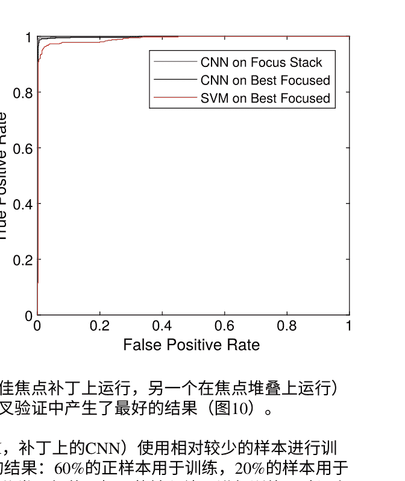

比较CNN的结果（一个在最佳焦点补丁上运行，另一个在焦点堆叠上运行），因为CNN的结果在10折交叉验证中产生了最好的结果（图10）。

当分类器（特征上的SVM，补丁上的CNN）使用相对较少的样本进行训练时，表7提供了分类实验的结果：60%的正样本用于训练，20%的样本用于验证。为了公平比较，所有分类器都使用相同的输入补丁进行训练、验证和测试。训练、验证和测试使用的样本数量可以在表6中找到。图11提供了CNN在最佳焦点补丁和焦点堆叠补丁上的学习行为。蓝色曲线显示了网络在验证集上的行为，选择产生最小误差的网络进行测试。

## 表6 用于训练、验证和测试的样本数量

| 补丁 | # 未旋转 | # 旋转 | # 训练 | # 验证 | # 测试 |
|------|----------|--------|--------|--------|--------|
| +ve | 1400 | 1400 × 4 (5600) | 5600的60% (3360) | 5600的20% (1120) | 1400 |
| -ve | 326,934 | - | 3360 | 1120 | 326,934 |

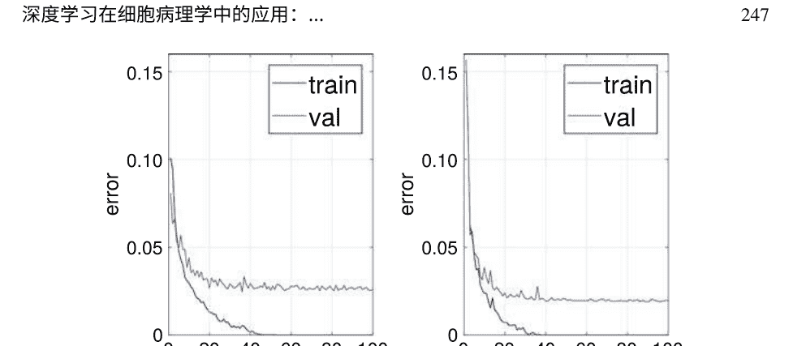

图11 a卷积神经网络在最佳聚焦图像上的训练和验证误差跨时期变化和 b 聚焦补丁堆栈上的卷积神经网络

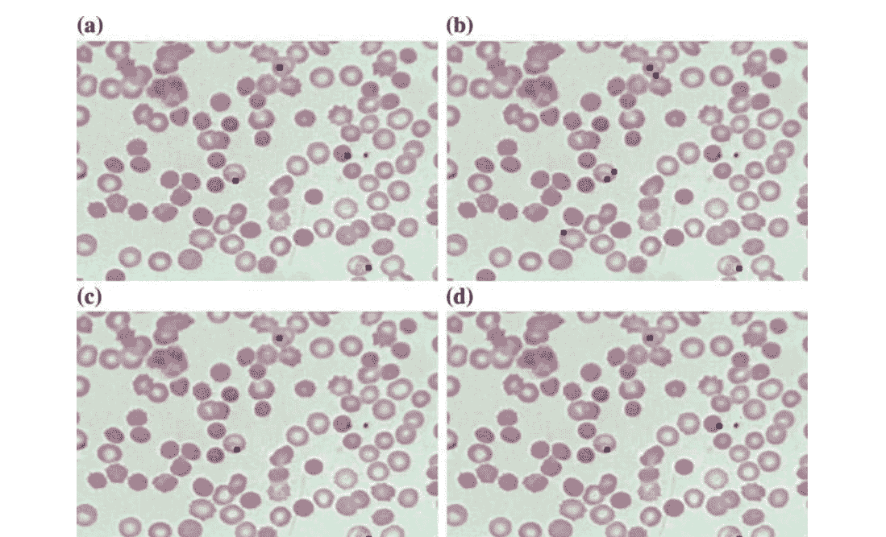

图12 a在图5中显示的幻灯片图像中的真实寄生虫位置。 通过 b在特征上训练的SVM识别的寄生虫位置 c在最佳聚焦图像上训练的卷积神经网络识别的寄生虫位置和 d在聚焦补丁堆栈上训练的卷积神经网络识别的寄生虫位置

对于每个测试图像，首先识别出疑似位置，然后提取补丁，并将特征/补丁/聚焦堆栈直接输入训练好的分类器。 分类器判断这是真正的寄生虫位置还是健康位置。 图5中显示的测试图像的结果在图12中提供。

表7 不同分类器的混淆矩阵（A）手工提取特征的SVM，（B）最佳聚焦图像上的CNN，以及（C）聚焦图像块堆叠上的CNN

| | A | | B | | C | |
|---|---|---|---|---|---|---|
| | 感染 | 健康 | 感染 | 健康 | 感染 | 健康 |
| 感染 | 1107 | 84 | 1151 | 40 | 1156 | 35 |
| 健康 | 3756 | 57068 | 1053 | 59771 | 912 | 59912 |

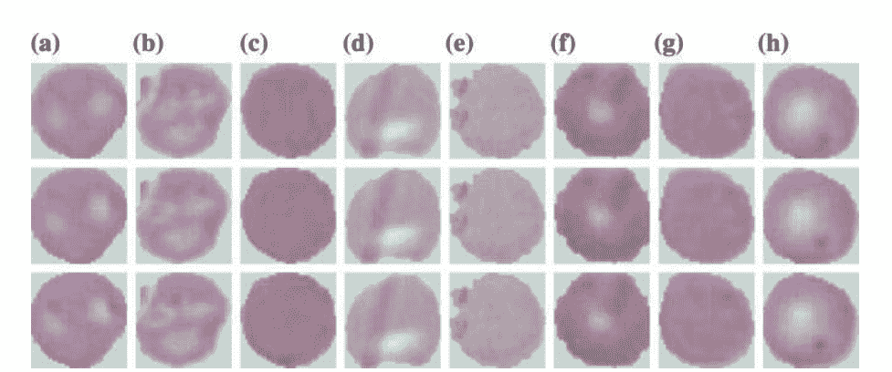

图13 a–c是CNN在聚焦图像块堆叠上仅识别出的三个真正阳性（聚焦堆叠）， d–f是CNN在聚焦图像块堆叠上仅识别出的三个真正阴性， g–h是所有分类器都未能识别出的两个感染细胞

表8 从表7中计算得出的敏感性、特异性和MCC

| 度量 | 方法—A | 方法—B | 方法—C |
|---|---|---|---|
| 敏感性（%） | 92.95 | 96.64 | 97.06 |
| 特异性（%） | 93.82 | 98.27 | 98.50 |
| MCC | 0.4430 | 0.7036 | 0.7305 |

通过观察真实情况（图12a），可以看出在聚焦图像块堆叠上运行的CNN产生了最佳结果（图12d），没有产生假阳性和假阴性。表7中显示的混淆矩阵也揭示了在聚焦图像块堆叠上训练的CNN的相同结果。图13展示了一些分类器失败的案例。前三个堆叠仅被在聚焦图像块堆叠上工作的CNN识别为感染细胞，健康细胞的情况如图13d-f所示。然而，所有三个分类器都未能识别出最后两个感染细胞。从显示的图像可以清楚地看出，聚焦图像块堆叠有助于产生积极的决策。这也可以从表8中显示的相对较高的MCC度量中看出。通过在聚焦图像块堆叠上运行CNN，我们能够正确识别出1191个感染细胞中的1156个，敏感性为97.06%，特异性为98.50%。我们还将CNN在聚焦图像块堆叠上的能力与[53]中报道的一种最先进的方法进行了比较。尽管实际方法是在实验中进行的

对于Giemsa染色的数据集，我们运行了[54]提供的代码来提取LBP/VAR[55]和SIFT特征[56]，然后将其用于分类。 结果在表CmpDetAccWithI中提供，该表还显示了在焦点堆栈上工作的CNN产生了最佳结果。

| | 感染 | 健康 | 方法--[53] |
| --- | --- | --- | --- |
| 感染 | 984 | 208 | 敏感性 82.55 |
| 健康 | 4091 | 56628 | 特异性 93.26 |

## 7. 预训练的CNN用于白血病细胞分类

在本节中，我们将讨论CNN的迁移学习能力，通过解决三个重要的白血病细胞系K562、MOLT和HL60的分类问题。如第5节所讨论的，当没有足够的训练样本来建立一个独立的分类器时，迁移学习设置特别有用。 我们将展示，仅仅使用预训练的已建立模型的特征检测器，就可以提取出判别特征，从而产生与使用传统特征和SVM等传统分类器获得的分类准确性相当或更好的结果（表9）。

#### 7.1 数据集收集

癌症是一种致命的疾病，全球每年造成约700-800万人死亡[57]。癌症的治疗在很大程度上取决于其被检测到的阶段。 任何癌症检测/治疗中的一个重要步骤是细胞病理学研究，其中从疑似肿瘤部位提取样本，并通过细针穿刺进行分析。然后使用这些样本制作涂片，并在显微镜下检查。 因此，细胞病理学测试非常关键，但需要技能，耗时，并且容易出错。

为了制作自动化系统，微流控成像流式细胞仪[17, 51]以及必要的图像分析成为当务之急。 对于本次讨论，我们使用了使用这样一个系统捕获的白血病细胞系数据集。 这些是由美国类型培养物收藏中心（ATCC）提供的白血病细胞系，包括K562、MOLT和HL60类型，为本次研究提供了基准数据。 请注意，这些是白细胞系，实际情况下可能还会有红细胞。 但是，在微流控系统中将红细胞与白细胞分离并不那么困难，如图14所示。

数据集中总共有 618 个细胞：124 个 K562，106 个 MOLT 和 388 个 HL60。虽然乍一看似乎是一个小数据集，但考虑到健康人体内每微升血液中只有 4 – 11 × 10³个白细胞，与 4 – 5 × 10⁶个红细胞相比，它的规模是相当大的。因此，对于白血病的筛查工具，我们应该在分类异常白细胞方面付出更多努力。

然后，使用[17]中描述的微流体显微镜设置分别对白血病细胞系进行成像。为了增强背景中细胞的对比度，进行了简单的背景减法。然后，使用边界框定位细胞以形成数据集。详细的过程可以在[51]中找到。

#### 7.2 迁移学习模式下的卷积神经网络

在本节中，卷积神经网络的迁移学习能力被用于对白血病细胞系 K562、MOLT 和 HL60 进行分类。在迁移学习设置中，CNN 已经通过使用大规模数据集学习了相对复杂的分类任务的知识，这些知识有效地转移到了完全不同的环境中。在这种设置下，CNN 被用作特征提取器而不是分类器。然后，这些特征被用来训练像 SVM 这样只需要中等规模训练数据的分类器。

CNN 的迁移学习能力在[58]中进行了研究，并在[59]中用于注释小鼠脑中的基因表达模式。如第 3 节所述，CNN 的主要构建模块是(i) 卷积 (ii) ReLU 和 (iii) 子采样。请注意，对于每个卷积层，在训练过程中会学习到多个卷积核。

正常的卷积是在学习的卷积核和输入实例之间进行的，但只选择卷积的有效部分。我们知道卷积核可以通过卷积提取特征。

例如，Sobel卷积核可以找到边缘，Laplacian卷积核可以检测斑点。每个卷积核只在局部应用，并提取特征。因此，根据卷积核的不同，卷积可以提取边缘、斑点、角点等特征，并且对于任何图像都是有效的特征。在CNN中，唯一学习的参数是卷积核的权重和偏置，因此我们学习的是非常局部的特征检测器，而不是实际的特征。假设CNN需要解决一个相对复杂的分类任务，并且有足够多的图像来训练网络。如果使用这个大数据集充分训练CNN，可以合理地认为学习的卷积核具有提取详尽的特征集的能力，甚至可以捕捉原始分类问题中的小的类间变异性。由于学习的卷积核作用非常局部，这些详尽的特征检测器很可能对任何图像都是有效的，无论分类问题如何。这个事实是CNN的迁移学习能力的基石。简而言之，使用大型图像数据集对复杂的分类任务进行充分训练的CNN必须学习到一个详尽的特征检测器集合，可以捕捉任何图像的局部特征，并且由于涉及中间的ReLU和子采样层，具有引入检测到的特征的非线性能力。这使得我们可以将这样的CNN用作本实验中用于白血病细胞系分类数据集的特征提取器，然后使用这些特征来构建适合训练的小数据集的合适的分类器。

经过训练的卷积神经网络在许多视觉识别任务中可以超越人类 [60]。然而，使用卷积神经网络作为分类器的一个瓶颈是需要大量标记的训练样本。在当前的讨论中，我们展示了在这种情况下可以将卷积神经网络用于迁移学习模式。我们利用在ImageNet [62]数据库上训练的深度卷积神经网络模型 [52, 61] 来对白血病细胞系进行分类。需要注意的是，该模型没有在任何这些图像上进行训练，而是在包含1000个类别（如动物、鸟类等）的非常复杂的分类任务上进行了广泛的训练。我们使用的模型架构如图15所示，共有37层。在图15中，C代表卷积层，R代表ReLU激活函数，MP代表基于最大池化的子采样操作。我们将所有图像应用于我们的数据集并生成了深度特征。

由于我们只是想展示这些特征足够好以产生公平的分类，我们从第36层提取了这些特征，结果是4096维的向量。这些特征向量的维度通过PCA [63]降低到20（经过实验设置），然后用于训练多个分类器，包括FFN、SVM、朴素贝叶斯和K最近邻分类器。正如前面提到的，使用这些特征进行分类任务是合理的，因为它们是由一个经过充分训练的深度卷积神经网络生成的，该网络用于处理来自1000个物体类别的图像的复杂分类任务。因此，学习到的卷积核必须是良好的特征检测器，寻找与任何图像分类任务相关的大量局部特征，如边缘、斑点、角点等，而与领域无关。

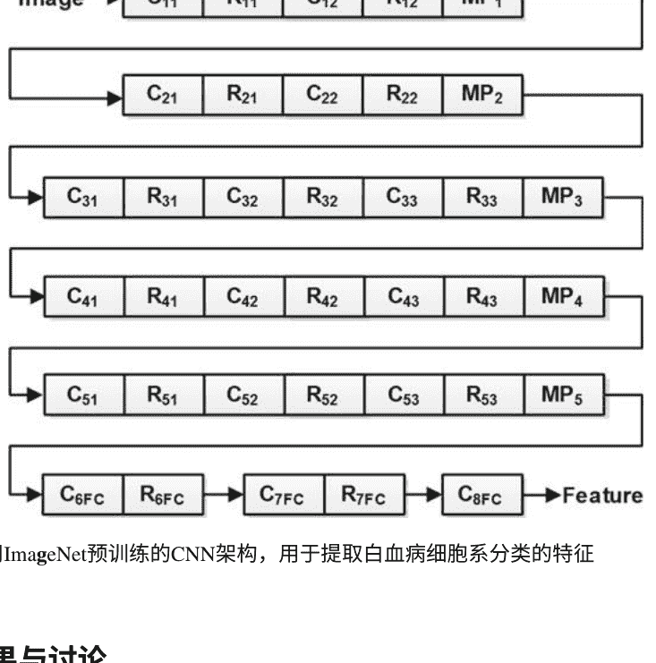

#### 7.3 结果与讨论

我们通过使用预训练的CNN模型生成的特征，采用不同的分类器来比较分类结果。 将结果与使用手工设计的特征[51]（反映细胞图像的大小、形状和纹理特征）在相同数据集上使用SVM模型产生的结果进行比较。 当使用预训练模型的深度特征时，我们解决的三类白血病分类问题的结果如表10所示。 我们通过观察不同交叉验证实验得到的准确率的平均值和标准差来评估准确性。 结果显示，不同分类器之间的准确性更好且方差较小。 从表11中可以看出，与[51]中报告的分类准确率相比，这些特征产生的准确性较高。

表10 使用预训练CNN特征的分类器在不同交叉验证设置下的平均准确率（%）（标准差）

| K折交叉验证 | 10 | 5 | 4 | 3 | 2 |
| :--- | :--- | :--- | :--- | :--- | :--- |
| SVM | 97.80 (1.82) | 97.69 (1.38) | 97.62 (1.20) | 97.47 (1.02) | 97.19 (0.87) |
| FFN | 98.26 (1.57) | 98.18 (1.16) | 98.16 (1.02) | 98.05 (0.93) | 97.96 (0.72) |
| NBS | 98.40 (1.51) | 98.37 (1.08) | 98.36 (0.90) | 98.40 (0.78) | 98.38 (0.53) |
| KNN | 98.42 (1.49) | 98.40 (1.04) | 98.37 (0.94) | 98.35 (0.81) | 98.36 (0.59) |

表11 使用手工形态学特征[51]的SVM分类器在不同交叉验证设置下的平均准确率（%）（标准差）

| K折交叉验证 | 10 | 5 | 4 | 3 | 2 |
| :--- | :--- | :--- | :--- | :--- | :--- |
| SVM | 95.22 (2.83) | 94.47 (1.85) | 94.63 (1.52) | 94.20 (1.40) | 93.57 (1.16) |
| FFN | 92.92 (3.48) | 92.74 (2.63) | 92.57 (2.35) | 92.47 (2.23) | 91.76 (3.00) |
| NBS | 90.89 (3.60) | 90.77 (2.34) | 90.70 (2.18) | 90.67 (1.74) | 90.35 (1.44) |
| KNN | 80.40 (4.81) | 79.93 (3.13) | 79.48 (2.90) | 78.94 (2.63) | 77.75 (0.59) |

#### 7.4 与[51]中的形态测量分类比较

表12报告了10折交叉验证实验中细胞系的类别特定准确率。可以看出，分类不偏向于任何特定的细胞系。表12 A包含了基于形态学特征[51]的SVM分类器的混淆矩阵，表12 B包含了基于CNN特征的SVM分类器的混淆矩阵。相应的精确度和召回率指标在表13中提供。我们在报告这些指标时使用了一对多的策略，因为它们主要用于二分类。因此，情况-I将HL60视为阳性类别，情况-II将K562视为阳性类别，而情况-III将MOLT视为阳性类别。在每种情况下，未用作阳性类别的细胞系共同构成了阴性类别。与[51]中报告的特征相比，这些指标在两个方面都有显著改善，如表13所示。简而言之，我们可以说

表格12 类别特定准确率比较

| | A. 形态学特征 [51] | | | B. 卷积神经网络特征 | | |
| :--- | :--- | :--- | :--- | :--- | :--- | :--- |
| | HL60 | K562 | MOLT | HL60 | K562 | MOLT |
| HL60 | 373 | 8 | 7 | 385 | 1 | 2 |
| K562 | 4 | 116 | 4 | 1 | 119 | 4 |
| MOLT | 2 | 5 | 99 | 1 | 5 | 100 |

表格13 精确度和召回率比较（一对多）

| | 案例—1 | | 案例—2 | | 案例—3 | |
| :--- | :--- | :--- | :--- | :--- | :--- | :--- |
| | 精确度 | 召回率 | 精确度 | 召回率 | 精确度 | 召回率 |
| 基于形态学特征的支持向量机[5] | 98.42 | 96.13 | 89.92 | 93.55 | 90.00 | 93.40 |
| 基于卷积神经网络特征的支持向量 | 99.48 | 99.23 | 95.20 | 95.97 | 94.34 | 94.34 |

与精心选择的手工特征 [51] 相比，预训练的卷积神经网络模型提供的特征在我们考虑的白血病细胞系数据集上表现得非常好。 这支持了卷积神经网络的迁移学习能力，这是一个非常成熟的领域。

## 8. 总结

在本章中，我们讨论了卷积神经网络在细胞病理学中的应用。 我们以流行的LeNet架构为例，提供了对CNN训练的基本理解。 我们具体讨论了CNN的独立能力和迁移学习能力，以血涂片图像焦点堆栈的疟疾检测和白血病细胞系分类为例。 结果表明，与传统分类器如SVM相比，CNN在类似问题上产生了更高的准确度。 使用血涂片图像的焦点堆栈进行自动化疟疾检测是首次尝试，讨论的方法是为资源有限的诊所开发的自定义低成本显微镜和微流控显微镜设备的处理框架的一部分。

## 参考文献

+   1. R. Nayar,肿瘤细胞病理学 (Springer, 2014), http://www.springer.com/medicine/oncology/book/978-3-642-38849-1
2. PathScope, Pathscope™幻灯片扫描仪; digipath inc. 病理数字化交付。 http://www.digipath.biz/pr/PathScope.pdf。 2016年12月7日访问
3. M. Rieseberg, C. Kasper, K.F. Reardon, T. Scheper, 生物技术中的流式细胞术。 Appl. Microbiol. Biotechnol. 56(3–4), 350–360 (2001)
4. D.A. Basiji, W.E. Ortyn, L. Liang, V. Venkatachalam, P. Morrissey, 细胞图像分析和流式细胞术成像。 Clin. Lab. Med. 27(3), 653–670 (2007), https://doi.org/10.1016/j.cll.2007.05.008
5. E. Schonbrun, S.S. Gorthi, D. Schaak, 微加工的多视野成像流式细胞术。 实验室芯片 12, 268–273 (2012)。 https://doi.org/10.1039/C1LC20843H6. Amnis Corporation® ISX - MKII手册 (2016), https://www.amnis.com/documents/brochures/ISX-MKII20Brochure_Final_Web.pdf。 2016年7月28日访问
7. L. Pantanowitz, P. Valenstein, A. Evans, K. Kaplan, J. Pfeifer, D. Wilbur, L. Collins, T. Colgan, 病理学中全幻灯片成像的当前状态综述。 J. Pathol. Inform. 2(1), 36–45(2011)。 https://doi.org/10.4103/2153-3539.83746
8. M. Rojo, G. Garcia, C. Mateos, J. Garcia, M. Vicente, 在病理学中对31种商业可用数字切片系统的重要比较。 Int. J. Surg. Pathol. 14(4), 285–305 (2006). https://doi.org/10.1177/1066896906292274
9. H. Irshad, A. Veillard, L. Roux, D. Racoceanu, 数字组织病理学中细胞核检测、分割和分类的方法：一项综述-2014年；现状和未来潜力。 IEEE Rev. Biomed. Eng. 7, 97–114 (2014). https://doi.org/10.1109/RBME.2013.229580410. G. Deco, V.K. Jirsa, P.A. Robinson, M. Breakspear, K.J. Friston, 动态大脑：从尖峰神经元到神经群和皮层场。 PLoS Comput. Biol. 4(8) (2008)11. A. Pouliakis, E. Karakitsou, N. Margari, P. Bountris, M. Haritou, J. Panayiotides, D. Koutsouris, P. Karakitsos, 人工神经网络作为细胞病理学决策支持工具的过去、现在和未来。生物医学工程计算生物学 7，1-18 (2016)。 https://doi.org/10.4137/BECB.S31601

12. Z. Shi, L. He, 目前医学图像处理中神经网络的现状和未来潜力。多媒体学报 6(3) (2011)

13. K. Rohan, 渐变消失问题 (2016), https://ayearofai.com/rohan-4-the-vanishing-gradient-problem-ec68f76ffb9b。 访问日期： 2017-04-10

14. H. Greenspan, B. van Ginneken, R.M. Summers, 客座编辑深度学习在医学成像中的应用: 概述和未来前景的一个令人兴奋的新技术。IEEE Trans. Med. Imaging 35(5), 1153–1159 (2016). https://doi.org/10.1109/TMI.2016.2553401

15. 世界卫生组织, 基本疟疾显微镜检查—第一部分: 学习指南. World Health Organization (2010)

16. G. Gopakumar, M. Swetha, G.S. Siva, G.R.K.S. Subrahmanyam, 基于卷积神经网络的疟疾诊断, 使用自制幻灯片扫描仪获取的血涂片图像的焦点堆栈。 J. Biophoton. (2017). https://doi.org/10.1002/jbio.20170000317

17. V.K. Jagannadh, G. Gopakumar, G.R.K.S. Subrahmanyam, S.S. Gorthi, 微流控显微镜辅助无标记癌症筛查方法: 用于癌症筛查的自动化微流控细胞学。 Med. Biol. Eng. Comput. 1–8 (2016). https://doi.org/10.1007/s11517-016-1549-y

18. D.E. Rumelhart, G.E. Hinton, R.J. Williams, 通过反向传播学习表示，神经计算: 研究基础 .MIT出版社，剑桥，马萨诸塞州，美国，pp.696–699， http://dl.acm.org/citation.cfm?id=65669.104451

19. G. Cybenko, 通过叠加一个S型函数进行逼近。 数学控制系统 2(4), 303–314 (1989). https://doi.org/10.1007/BF02551274

20. K. Hornik, 多层前馈网络的逼近能力。 神经网络 4(2), 251–257 (1991). https://doi.org/10.1016/0893-6080(91)90009-T

21. E.A. Buffalo, P. Fries, R. Landman, H. Liang, R. Desimone, 背向注意力效应在腹侧通路中的后退进程。 国家科学院报告 107(1), 361–365 (2010). https://doi.org/10.1073/pnas.0907658106

22. 张伟, 伊藤健, 谷田淳, 一冈阳, 具有局部空间不变相互连接的并行分布处理模型及其光学架构。 应用光学 29(32)，4790-4797 (1990年)。 https://doi.org/10.1364/AO.29.004790

23. Y. LeCun, L. Bottou, Y. Bengio, P. Haffner, 基于梯度的学习应用于文档识别。 IEEE会议录 86，2278-2324（1998年）

24. L. Lu, Y. Zheng, G. Carneiro, L. Yang (编)，深度学习和卷积神经网络用于医学图像计算（Springer International Publishing，2017年）

25. P. Nguyen, T. Tran, N. Wickramasinghe, S. Venkatesh, mahiiDeepr: 一种用于医疗记录的卷积网络。 IEEE J. Biomed. Health Inform. 21（1），22-30（2017年）。 https://doi.org/10.1109/JBHI.2016.2633963

26. H.C. Shin, H.R. Roth, M. Gao, L. Lu, Z. Xu, I. Nogues, J. Yao, D. Mollura, R.M. Summers, 深度卷积神经网络用于计算机辅助检测：CNN架构，数据集特征和迁移学习。 IEEE Trans. Med. Imaging 35(5), 1285–1298（2016年）。 https://doi.org/10.1109/TMI.2016.2528162

27. N. Tajbakhsh, J.Y. Shin, S.R. Gurudu, R.T. Hurst, C.B. Kendall, M.B. Gotway, J. Liang, 医学图像分析的卷积神经网络：全面训练还是微调？ IEEE Trans. Med. Imaging 35(5), 1299–1312（2016年）。 https://doi.org/10.1109/TMI.2016.253530228

28. Q. Dou, H. Chen, L. Yu, J. Qin, P.A. Heng, 肺结节检测中的多级上下文3D CNNs用于假阳性减少。 IEEE Trans. Biomed. Eng. 64(7), 1558–1567（2017年）。 https://doi.org/10.1109/TBME.2016.2613502

29. L. Yu, H. Chen, Q. Dou, J. Qin, P.A. Heng, 在结肠镜视频中集成在线和离线三维深度学习进行自动息肉检测。 IEEE J. Biomed. Health Inform. 21(1), 65–75 (2017). https://doi.org/10.1109/JBHI.2016.263700430

31. L. Zhang, L. Lu, I. Nogues, R.M. Summers, S. Liu, J. Yao, Deeppap: 深度卷积网络用于宫颈细胞分类。 IEEE J. Biomed. Health Inform. **21**(6), 1633–1643 (2017a). https://doi.org/10.1109/JBHI.2017.2705583

32. J.T. Kwak, S.M. Hewitt, 通过卷积神经网络对前列腺癌进行核结构分析。 IEEE Access **5**, 18,526–18,533 (2017). https://doi.org/10.1109/ACCESS.2017.2747838

33. R. Zhang, Y. Zheng, T.W.C. Mak, R. Yu, S.H. Wong, J.Y.W. Lau, C.C.Y. Poon, 通过从非医学领域转移低级CNN特征进行结直肠息肉的自动检测和分类。 IEEE J. Biomed. Health Inform. **21**(1), 41–47 (2017b). https://doi.org/10.1109/JBHI.2016.2635662

34. S. Christodoulidis, M. Anthimopoulos, L. Ebner, A. Christe, S. Mougiakakou, 多源转移学习与卷积神经网络在肺部模式分析中的应用. IEEE J. Biomed. Health Inform. **21**(1), 76–84 (2017)

35. H. Chen, D. Ni, J. Qin, S. Li, X. Yang, T. Wang, P.A. Heng, 基于领域转移的深度神经网络在胎儿超声中的标准平面定位. IEEE J. Biomed. Health Inform. **19**(5), 1627–1636 (2015). https://doi.org/10.1109/JBHI.2015.2425041

36. S. Albarqouni, C. Baur, F. Achilles, V. Belagiannis, S. Demirci, N. Navab, Aggnet: 基于众包的深度学习在乳腺癌组织图像中的有丝分裂检测. IEEE Trans. Med. Imaging **35**(5), 1313–1321 (2016). https://doi.org/10.1109/TMI.2016.252812037

37. S. Sathpathi, A.K. Mohanty, P. Satpathi, S.K. Mishra, P.K. Behera, G. Patel, A.M. Dondorp, 比较Leishman和Giemsa染色在印度疟疾流行区外周血涂片制备评估中的应用. Malar. J. **13**(1), 1–5 (2014). https://doi.org/10.1186/1475-2875-13-512

38. M. Elter, E. Haßlmeyer, T. Zerfaß, 在2011年IEEE工程医学与生物学学会年度国际会议上，检测厚血液薄片中的疟原虫，第5140-5144页（2011年）。 https://doi.org/10.1109/EMBS.2011.6091273

39. A. Pinkaew, T. Limpiti, A. Trirat, 在2015年第8届生物医学工程国际会议上，使用支持向量机对厚血液薄片中的疟原虫物种进行自动分类，第1-5页（2015年）。 https://doi.org/10.1109/BMEiCON.2015.7399524

40. I.K.E. Purnama, F.Z. Rahmanti, M.H. Purnomo, 在2013年第3届仪器、通信、信息技术和生物医学工程国际会议上，使用遗传编程对厚血液薄片中的疟原虫进行鉴定，第194-198页（2013年）。 https://doi.org/10.1109/ICICI-BME.2013.6698491

41. V.V. Makkapati, R.M. Rao, 在外周血涂片图像中分割疟原虫,2009年IEEE国际声学、语音和信号处理会议, 第1361-1364页 (2009). https://doi.org/10.1109/ICASSP.2009.4959845

42. A. Mehrjou, T. Abbasian, M. Izadi, 自动疟疾诊断系统, 在2013年第一届RSI/ISM国际机器人与机电一体化会议 (ICRoM), 第205-211页 (2013). https://doi.org/10.1109/ICRoM.2013.6510106

43. Y. Purwar, S.L. Shah, G. Clarke, A. Almugairi, A. Muehlenbachs, 显微图像中疟原虫的自动和无监督检测。疟疾杂志 **10**(1), 第364页 (2011). https://doi.org/10.1186/1475-2875-10-364

44. A. Ravendran, K.W.T.R.T. de Silva, R. Senanayake, 用于自动识别关键疟原虫的矩不变特征，在2015年IEEE第10届国际工业与信息系统会议上，第474-479页（2015年）。 https://doi.org/10.1109/ICIIFS.2015.7399058

45. F.B. Tek, A.G. Dempster, I. Kale, 用于疟疾显微镜诊断的计算机视觉。疟疾杂志 **8**（1），153页（2009年）。 https://doi.org/10.1186/1475-2875-8-153

46. W. Preeedanan, M. Phothisonothai, W. Senavongse, S. Tantisatirapong, 用于从Giemsa染色薄血片中自动检测恶性疟原虫的方法，在2016年第8届国际知识与智能技术会议上，第215-218页（2016年）。 https://doi.org/10.1109/KST.2016.7440501

48. B.E. Boser, I.M. Guyon, V.N. Vapnik, 一种用于最优边界分类器的训练算法, 在第五届计算学习理论年度研讨会上, ACM, 美国纽约, *COLT '92*, 第144-152页(1992), https://doi.org/10.1145/130385.130401

49. Z. Liang, A. Powell, I. Ersoy, M. Poostchi, K. Silamut, K. Palaniappan, P. Guo, M.A. Hossain, A. Sameer, R.J. Maude, J.X. Huang, S. Jaeger, G. Thoma, 基于CNN的疟疾诊断图像分析, 在2016年IEEE生物信息学和生物医学国际会议(BIBM)上, 第493-496页. https://doi.org/10.1109/BIBM.2016.7822567

50. N. Otsu, 一种基于灰度直方图的阈值选择方法. IEEE Trans. Syst. Man Cybern. **9**(1), 62-66 (1979年)

51. G. Gopakumar, V.K. Jagannadh, S.S. Gorthi, G.R.K.S. Subrahmanyam, 一种用于成像流式细胞术中细胞形态分类的框架. J. Microsc. **261**(3), 307-319 (2016年) https://doi.org/10.1111/jmi.12335

52. A. Vedaldi, K. Lenc, Matconvnet-用于MATLAB的卷积神经网络. CoRR abs/1412.4564. http://arxiv.org/abs/1412.4564

53. N. Linder, R. Turkki, M. Walliander, A. Mårtensson, V. Diwan, E. Rahtu, M. Pietikäinen, M. Lundin, 一种基于计算机视觉筛选和可视化的疟原虫候选区域的疟疾诊断工具. PLoS ONE **9**(8), e104,855(2014年)

54. LBP/VAR实现; 机器视觉和信号分析中心. 奥卢大学 (2016年) , http://www.cse.oulu.fi/CMV/Downloads/LBPMatlab. 于2016年10月15日访问

55. T. Ojala, M. Pietikainen, T. Maenpaa, 多分辨率灰度和旋转不变纹理分类与局部二进制模式. IEEE Trans. Pattern Anal. Mach. Intell. **24** (7) , 971-987 (2002年) 。 https://doi.org/10.1109/TPAMI.2002.1017623

56. D.G. Lowe, 尺度不变关键点的独特图像特征. Int. J. Comput. Vis. **60** (2) , 91-110 (2004年) 。 https://doi.org/10.1023/B:VISI.0000029664.99615.94

57. B.W. Stewart, C. Wild, 2014年世界癌症报告 (世界卫生组织, 2014年)

58. W. Zhang, R. Li, T. Zeng, Q. Sun, S. Kumar, J. Ye, S. Ji, 基于深度模型的转移和多任务学习用于生物图像分析, 在第21届ACM SIGKDD国际知识发现与数据挖掘会议论文集中, ACM, 纽约, 纽约州, 美国, KDD '15, pp. 1475-1484 (2015年) 。 https://doi.org/10.1145/2783258.2783304

59. T. Zeng, R. Li, R. Mukkamala, J. Ye, S. Ji, 用于注释的深度卷积神经网络小鼠脑中的基因表达模式. BMC Bioinform. **16** (1) , 1-10 (2015年) 。 https://doi.org/10.1186/s12859-015-0553-9

60. K. He, X. Zhang, S. Ren, J. Sun, 深入研究整流器: 在ImageNet分类上超越人类水平的性能。 ArXiv电子打印 **1502**, 01852 (2015)

61. K. Chatfield, K. Simonyan, A. Vedaldi, A. Zisserman, 魔鬼细节的回归: 深入研究卷积神经网络, 在英国机器视觉会议上 (2014)

62. J. Deng, W. Dong, R. Socher, L.J. Li, K. Li, L. Fei-Fei, ImageNet: 一个大规模的分层图像数据库. 在: *CVPR09* (2009)

63. I. Jolliffe, 主成分分析. Springer统计学系列 (Springer, 2002)

64. Y. Bar, I. Diamant, L. Wolf, S. Lieberman, E. Konen, H. Greenspan, 使用非医学训练的深度学习进行胸部病理检测, 在2015年IEEE第12届国际生物医学成像研讨会(ISBI)上, pp.294-297, https://doi.org/10.1109/ISBI.2015.7163871

65. E.J. Breen, R. Jones, 属性开放、细化和颗粒度. 计算机视觉与图像理解. **64**(3), 377-389 (1996). https://doi.org/10.1006/cviu.1996.0066

## 通过医学数据集进行疾病诊断的深度神经网络应用

Alper Baş Türk, Hasan Badem, Abdullah Calıskan 和 Mehmet Emin Yüksel

摘要 本章提出了一种用于医学疾病诊断的新型分类方法。所提出的分类算子由级联的堆叠自编码器网络和softmax层组成。通过应用特殊的训练方法来训练分类器，其中所提出的分类器的每一层都是独立且顺序训练的。将所提出的分类器的性能与文献中的一些代表性分类方法进行了比较。医学数据集上的实验结果表明，所提出的分类器的性能优于或至少与本章中使用的分类器竞争力相当。还可以看到，只要使用适当的数据集和足够数量的患者获取的足够数量的医学特征对其进行训练，所提出的分类器可以有效地用于医学疾病的诊断。

### 1 引言

绝大多数人类死亡是由于一些主要疾病，如心血管疾病和各种癌症。对于这些疾病的早期诊断对于治疗的成功以及成本和患者的生存至关重要。因此，开发和采用能够尽早准确诊断疾病的方法非常重要。

- A. Baş Türk
  计算机工程系，埃尔齐耶斯大学，38039 Kayseri，土耳其
- H. Badem
  土耳其卡拉曼马拉什苏特丘伊玛目大学计算机工程系，46100卡拉曼马拉什，土耳其
- A. Calıskan
  土耳其伊斯肯德伦工科大学生物医学工程系，31200哈塔伊，土耳其
- M. E. Yüksel（📧）
  土耳其埃尔齐耶斯大学生物医学工程系，38039凯塞里，土耳其
  e-mail: yuksel@erciyes.edu.tr

诊断特定疾病的最直接方法是将患者送往医院，并进行适当的医学测试和程序，以获取使医生能够对患者是否患有该特定疾病做出决策的信息。这种疾病诊断方法非常准确，通常得到的结果非常可靠，这使得这种方法非常理想。

另一方面，上述提到的一些医学测试和程序通常非常复杂，在大多数情况下，只能在成熟的医院和卫生机构进行。有时，这些程序涉及侵入性手术，只能由经过高度训练的医学专家进行。

此外，这些程序通常非常昂贵，并且在某些情况下，对患者的健康非常有风险。最后，只有极少数生活在发达国家和地区的患者可以获得这种设施。因此，开发新颖、经济高效且易于获取的疾病诊断方法非常有必要。

在过去几年中，深度神经网络（DNN）在分类问题中的应用在科学和技术的各个领域中变得非常流行[1-7]。这种应用的一个很好的例子是通过DNN基于智能分类器从医学数据集中获取和处理诊断信息来进行疾病诊断[8]。实际上，文献中提供了大量不同且成熟的医学数据集，可以很容易地利用基于DNN的分类器对这些数据集进行操作，生成关于某种与数据库相关的疾病存在的诊断决策。只要采用合适的网络结构和学习策略，这种方法可以极大地消除上述复杂的医学诊断程序的需求，并用更简单、更便宜、非侵入性和无风险的方法取而代之。

在文献中有许多不同的算法可用于解决分类问题。其中包括：k最近邻分类器（KNN）[9, 10]、决策树（DT）[9, 11, 12]、朴素贝叶斯分类器（NB）[10-12]、神经和模糊网络[9, 13]以及支持向量机（SVM）[10, 14, 15]等等，这些是最常用的算法。这些方法实际上代表了一组具有一定优缺点的相似分类方法。

KNN是最基本和最为人所知的非参数分类算法[16]。该算法利用训练集中的信息，该训练集由一定数量的特征向量组成，这些特征向量在特征空间中具有已知的类标签。对于不属于训练集的新特征向量，其类标签将与训练集中k个最近邻特征向量的大多数类标签相等。这种方法的主要优势在于其计算效率，因为不需要专门训练分类器。尽管KNN算法很简单，但对于不太复杂的分类问题，它可以得到令人满意的结果。然而，由于对噪声敏感，它通常具有相对较低的准确率[16]。

DT是另一类简单分类器，它们被表示为特征空间的递归划分[17]。文献中有许多不同种类的成功案例和决策树的例子，它们生成分类器，如ID3 [18]，C4.5 [19]和CART [20]。DTs还成功地用于医学数据集的分类 [9, 11, 12]。它们能够处理可能存在错误和缺失值的数据集。然而，这种方法存在复制问题，并对训练集过于敏感。此外，数据集中的无关属性和噪声会降低其性能 [19, 21]。

贝叶斯分类器是一种统计分类器，可以预测类别成员的概率。NB是贝叶斯统计分类器家族中广泛研究的一种，被广泛应用于机器学习和不同领域的数据集分类。它们还被应用于医学数据集的分类 [10-12]。NB机制的结构实现简单，但表现良好。然而，NB分类器假设类别是条件独立的，这会导致准确性损失。此外，NB分类器无法建模变量之间的依赖关系 [22]。

支持向量机（SVM）是一种监督学习模型，用作二元分类器。给定一组训练特征向量，其中每个向量事先标记为属于两个可用类别之一，SVM分类器被优化为成为一个模型，以在特征空间中将训练向量映射为点，使得两个类别的训练向量之间存在一个尽可能宽的明显间隔。

SVM在高维空间中构建一个超平面或一组超平面，它在特征空间中充当决策边界。通过确定输入特征向量属于决策边界的适当一侧来执行分类过程[23]。SVM在训练过程中通常不会陷入局部最小值[24]，并且在大多数分类问题中通常具有高准确率，包括医学数据集的分类，前提是选择了合适的核函数 [10, 14, 15]。然而，SVM存在一些缺点，包括在给定数据集中选择最合适的核函数的困难，高计算复杂性以及在大规模分类问题中对内存的需求[25, 26]。

除了上面讨论的KNN、DT、NB和SVM方法之外，还提出了一些基于软计算方法的分类方法[9, 13]。这些方法通常提供相对更好的分类结果，准确率比KNN、DT、NB和SVM方法更高。然而，这些分类器的结构更加复杂，它们的实现和训练也更加困难。

绝大多数分类方法都有一些缺点，如上所述。此外，它们的性能还取决于一个或多个用户提供的外部参数，例如核函数的选择、诱导器和结构的选择；一些调整参数的值等。这些选择是启发式的，由用户为每个单独的数据集外部提供，并通过实验证实。因为没有一种分析方法可以为有效的分类选择这些参数的最佳值。

最近，对于深度学习基于工具的研究非常广泛，例如包括堆叠自编码器（sAE）和Softmax分类器的DNNs应用于分类问题[1-4, 27, 28]。事实上，DNNs提供了sAE学习特征层次结构的能力，以及softmax分类器预测正确类别标签的能力，用于高效的疾病诊断。因此，DNNs可以用于分类医学数据集并诊断疾病。

在本章中，我们介绍了一种高效的通用分类工具，并评估其在医学数据集上的性能。所提出的工具基于一个由两个级联自编码器（AE）层和一个softmax分类器层适当组合而成的DNN。所提出的DNN分类器的性能在各种医学数据集上进行了测试。此外，将DNN分类器与文献中的代表性传统和最新分类方法进行了比较。分类实验的结果表明，所提出的DNN分类器在实验中优于其他分类器，并能够高效地对7个不同的医学数据集进行分类。

本章的其余部分组织如下。第2节定义了所提出的DNN及其训练过程。第3节报告了分类实验的结果及其讨论。第4节提出了结论。

#### 2 方法

本节介绍基于具有sAE网络和softmax分类器的DNN运算符的医疗数据集分类的提出方法。

##### 2.1 自编码器

自编码器是一个包含输入层、隐藏层和输出层的神经网络。尽管自编码器在结构上与前馈神经网络相似，但其使用目的非常不同。自编码器被训练成将其自己的输入形成输出。因此，输出层的神经元数量始终与输入向量的大小相同。自编码器的主要目标是在隐藏层中生成输入的不同表示。隐藏层中生成的新特征向量被称为编码[29]。隐藏层中的神经元数量决定了编码的维度，通常比输入的维度少。自编码器将输入空间映射到编码空间，以更清晰地定义输入[30-32]。

图1展示了一个具有三层的自编码器。自编码器基本上由两个部分组成：编码器和解码器。编码器生成代码空间，以不同的方式表示输入空间。解码器从代码空间中复原输入。输入空间和代码空间的维度分别为M和N。

编码器由以下公式给出：

$$ c = f(b + W^T x) \quad (1) $$

其中

$$ \mathbf{c} = [c_1, c_2, \ldots, c_N]^T $$
$$ \mathbf{x} = [x_1, x_2, \ldots, x_M]^T $$
$$ \mathbf{b} = [b_1, b_2, \ldots, b_N]^T $$
$$ \mathbf{W} = [\mathbf{w}_1, \mathbf{w}_2, \ldots, \mathbf{w}_N] $$

其中f是一个sigmoid激活函数。

这里的b向量和W矩阵包含编码器的偏置和权重。W的列可以定义如下：

$$ \mathbf{w}_i = [w_{i1}, w_{i2}, \ldots, w_{iM}]^T \quad (2) $$
with i = 1, 2...N.

编码器部分可以简要地表示为

$$ \mathbf{c} = g_E(\mathbf{W}, \mathbf{b}; \mathbf{x}) \quad (3) $$
其中 g_E是编码函数。

解码器部分与编码器非常相似，可以定义如下

$$ \hat{\mathbf{x}} = \hat{f}(\hat{\mathbf{b}} + \mathbf{W}^T \mathbf{c}) \quad (4) $$
其中

$$ \hat{\mathbf{x}} = [\hat{x}_1, \hat{x}_2, \ldots, \hat{x}_M]^T $$
$$ \hat{\mathbf{b}} = [\hat{b}_1, \hat{b}_2, \ldots, \hat{b}_M]^T $$
$$ \hat{\mathbf{W}} = [\hat{\mathbf{w}}_1, \hat{\mathbf{w}}_2, \ldots, \hat{\mathbf{w}}_N] $$

和$\hat{f}$类似于 $f$。$\hat{\mathbf{W}}$ 由权重组成，可以定义如下：

$$ \hat{\mathbf{w}}_i = [\hat{w}_{i1} \hat{w}_{i2} \ldots \hat{w}_{iN}]^{\text{T}} \quad (5) $$

其中 $i = 1, 2. \ldots M$。

解码器部分可以简要地表示为

$$ \hat{\mathbf{x}} = g_D(\hat{\mathbf{W}}, \hat{\mathbf{b}}; \mathbf{c}) \quad (6) $$
其中 $g_D$是解码函数。

完整的自编码器包括编码器和解码器部分，如图2所示。

##### 2.2 自编码器的训练过程

假设 $\{\mathbf{x}^{(1)}, \mathbf{x}^{(2)} \ldots \mathbf{x}^{(m)}\}$表示用于训练上述子节中提到的自编码器的 $m$个输入向量。自编码器训练过程的目标函数可以分为两部分。第一部分是网络的目标函数，对应于误差项，可以定义如下[32]：

$$ E_N = \frac{1}{m} \sum_{k=1}^{m} e_k^2 + \frac{\lambda}{2} \left( \sum_{i=1}^{N} \|\mathbf{w}_i\| + \sum_{i=1}^{M} \|\hat{\mathbf{w}}_i\| \right) \quad (7) $$

在这里，误差向量 $e_k$是实际输出 $\hat{\mathbf{x}}$和期望输出 $\mathbf{x}$之间的差异。$e_k$被定义如下：

$$ e_k = \|\mathbf{x}^{(k)} - \hat{\mathbf{x}}^{(k)}\|, \quad k = 1, 2, \ldots, m. \quad (8) $$

$\lambda$是一个正则化项（也称为权重衰减项），用于防止过拟合[32]。

需要注意的是 $E_N$是AE权重的函数。

$$ E_N = g_{AE}(\mathbf{W}, \mathbf{b}, \hat{\mathbf{W}}, \hat{\mathbf{b}}) \quad (9) $$

稀疏自编码器的目标函数在 $E_N$中添加了一个稀疏惩罚项 $E_S$，其形式如下：

$$ E_S = \beta \sum_{j=1}^{N} KL(\rho \parallel \hat{\rho}_j) \quad (10) $$

其中 $\beta$是稀疏惩罚项的权重。在这个表达式中，$KL$是Kullback–Leibler散度[30, 32]，表示为

$$ KL(\rho \parallel \hat{\rho}_j) = \rho \log \frac{\rho}{\hat{\rho}_j} + (1 - \rho) \log \frac{1 - \rho}{1 - \hat{\rho}_j} \quad (11) $$

其中 $\rho$是一个名为稀疏参数的常数，$\hat{\rho}_j$是所有训练集的第 $j$个神经元的平均激活值，可以定义如下

$$ \hat{\rho}_j = \frac{1}{m} \sum_{i=1}^{m} f_j(\mathbf{x}^{(i)}) \quad (12) $$

最后，自编码器的总成本函数如下所示：

$$ E = \frac{1}{m} \sum_{k=1}^{m} e_k^2 + \frac{\lambda}{2} \left( \sum_{i=1}^{N} \|\mathbf{w}_i\| + \sum_{i=1}^{M} \|\hat{\mathbf{w}}_i\| \right) + \beta \sum_{j=1}^{N} KL(\rho \parallel \hat{\rho}_j) \quad (13) $$

##### 2.3 堆叠自编码器

一个堆叠自编码网络，顾名思义，是一系列堆叠的自编码器层。所有层实际上都是之前训练过的自编码器的编码器部分。堆叠的编码器层数取决于特定的应用。

具有 $L$层的堆叠自编码器的输入输出映射方程可以概念上定义如下方程，并且可以如图3所示进行演示。

$$ g_{SAE} = g_E^1 \circ g_E^2 \circ \cdots \circ g_E^L \quad (14) $$

需要注意的是，在构建自编码器堆叠时，训练过的自编码器的解码器部分不包括在结构中，因为它们只在训练过程中需要。

##### 2.4 软最大分类器

软最大分类器基于软最大函数，其定义如下：

$$ v_j = \frac{\exp(u_j)}{\sum_{k=1}^K \exp(u_k)} \quad (j=1,2, \dots K) \quad (15) $$

从上述方程中很容易观察到，softmax函数将一个任意实数值的$K$维向量($u_j$)映射到另一个实数值的$K$维向量($v_j$)，这些值都在区间[0, 1]内，并且加起来等于1。

受softmax函数的启发，softmax分类器是一种用于一般多类别分类问题的分类算子[33]。它由一个神经层和一个归一化层级联构成，如图4a所示。

神经层是softmax分类器的输入层，结构上与AE的编码部分非常相似。唯一的区别在于这里的神经元激活函数是指数函数。

将输入代码向量从一个$N$维空间映射到$K$个类别的softmax分类器的神经层的输入-输出关系如下：

$$ \mathbf{e} = \exp(\mathbf{d} + \mathbf{S}^\mathrm{T}\mathbf{c}) \quad (16) $$

其中

$$ \mathbf{e} = [e_1, e_2, \ldots, e_K]^T $$
$$ \mathbf{d} = [d_1, d_2, \ldots, d_K]^T $$
$$ \mathbf{S} = [\mathbf{s}_1, \mathbf{s}_2, \ldots, \mathbf{s}_K] $$
$$ \mathbf{c} = [c_1, c_2, \ldots, c_N]^T $$

这里，d向量的元素是神经元的偏置，S矩阵的列是连接输入节点和第k个神经元的权重：

$$ \mathbf{s}_k = [s_{k1}, s_{k2}, \ldots, s_{kN}]^T \quad (17) $$
其中 k = 1, 2...K。

归一化层是输出层，仅用于对softmax分类器的神经层的输出值进行归一化：

$$ y_j = \frac{e_j}{\sum_{k=1}^K e_k} \quad (j=1,2...K) \quad (18) $$

也可以用输入向量 $\mathbf{c}$ 表示

$$ y_j = \frac{\exp(\mathbf{s}_j^T \mathbf{c})}{\sum_{k=1}^K \exp(\mathbf{s}_k^T \mathbf{c})} \quad (j=1,2...K) \quad (19) $$

这个归一化过程确保了softmax分类器输出的$y_j$的值始终在区间[0, 1]内，并且它们的总和始终等于1。因此，对于给定的输入向量，softmax分类器的各个输出值可以被视为输入向量属于与softmax分类器各个输出相关联的类的概率。

基于这种解释，给定的输入向量通过将其放置在产生最高概率的个别softmax分类器输出所代表的类中进行分类。

softmax分类器的输入输出关系可以简写为

$$ \mathbf{y} = g_S(\mathbf{d}, \mathbf{S}; \mathbf{c}) \quad (20) $$
其中

$$ \mathbf{y} = [y_1, y_2, \ldots, y_K]^T \quad (21) $$

并且可以简要地表示为图4b。

通过使用以下目标函数对softmax分类器进行训练与训练集 $\{\mathbf{c}^{(i)}, \mathbf{y}^{(i)}\}_{i=1}^{m}$ 相关。

$$ J = -\frac{1}{m} \sum_{i=1}^{m} \sum_{j=1}^{K} \mathbf{1}\{y^{(i)} = j\} \log \frac{\exp(\mathbf{s}_j^{\mathbf{T}} \mathbf{c}^{(i)})}{\sum_{l=1}^{K} \exp(\mathbf{s}_l^{\mathbf{T}} \mathbf{c}^{(i)})} + \frac{\lambda}{2} \sum_{i=1}^{K} \sum_{j=1}^{N} s_{ij}^2 \quad (22) $$

在上述方程中，$\mathbf{1}\{\cdot\}$被称为指示函数，因此 $\mathbf{1}\{a\ true\ statement\} =1$, $\mathbf{1}\{a\ false\ statement\} =0$。

##### 2.5 深度神经网络分类器

用于处理医疗数据集的提出的分类运算符是由级联的sAE网络和softmax分类器层构建的DNN。sAE网络包含两个AE层。DNN的结构图如图5所示。

##### 2.6 DNN分类器的训练

通过使用适当的数据集（即医疗数据集）来实现DNN的训练，该数据集包含m个输入向量和标签$\{\mathbf{x}^{(1)}, \mathbf{x}^{(2)}, ..., \mathbf{x}^{(m)}\}$和$\{y^{(1)}, y^{(2)}, ..., y^{(m)}\}$。每个标签的值要么为0，要么为1，其中0表示阴性决策，1表示阳性决策，即疾病诊断。训练的主要目的是根据训练数据集来调整DNN的内部参数。

L-BFGS训练算法[34]用于拟合所提出分类器的内部参数到其最优值。该算法是一种强大的训练算法，特别适用于存在大量模型参数的优化问题。该算法因其速度快且相对较低的内存需求而特别受欢迎。

这里采用了一种特殊的训练过程来获得最佳性能。为此，所提出分类器的每一层都是独立且顺序训练的。训练过程包括以下步骤：

1. 首先，使用原始输入向量 $\mathbf{x}^{(i)}$ ($i = 1, 2, \ldots, m$) 进行第一个自编码器的训练，如图6a所示。
2. 然后，使用由第一个自编码器生成的编码向量 $\mathbf{c}^{1,(i)}$ ($i = 1, 2, \ldots, m$)，进行第二个自编码器的训练，如图6b所示。
3. 在此之后，通过第一个自编码器生成的编码向量 $\mathbf{c}^{(2)(i)}$ ($i=1,2,\ldots,m$) 和目标 $y^{(i)}$ ($i=1,2,\ldots,m$) 进行softmax层的训练，如图6c所示。

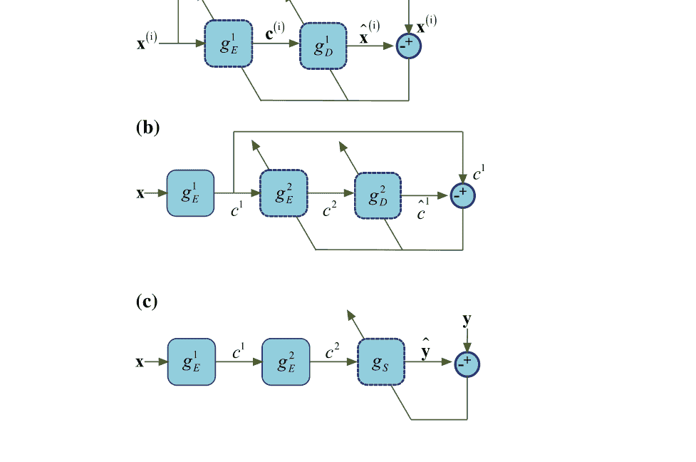

图6深度神经网络基于分类运算符的逐层训练。a 第一个自编码器层的训练。b 第二个自编码器层的训练。c softmax层的训练。d 整个网络的微调

4. 最后，对DNN训练任务应用额外的微调过程，以提高分类能力。如图6d所示。

#### 3 实验结果和讨论

在本章中，DNN分类器在7个医疗数据集上进行了测试，这些数据集来自UCI仓库[35, 36]，涵盖了各种领域、二元类别、属性和实例。有关使用的数据集的详细信息将在下一节中给出。为了公平比较，数据集采用了10折交叉验证。

将DNN分类器与SVM、NB、KNN、DT和一些基于软计算的分类器进行了比较，对每个数据集进行了评估。DNN是在一台配备Intel i7 2600 3.4 GHz CPU和12 GB DDR3 RAM的系统上实现的。

##### 3.1 设计的DNN的实验设置

为了证明所提出的分类器的有效性，针对每个数据集设计了七个实验设置。DNN分类器采用两个自编码器和一个softmax层进行医疗数据集的分类。DNN的参数设置在表1、表2和表3中给出，设计的DNN的实验设置如图7所示。

##### 3.2 主成分分析

降维是高维数据存储、分类、通信和可视化中的重要过程。一种简单常用的方法是主成分分析（PCA），它检测数据集中方差最大的方式，并通过其在每个方向上的坐标来描述每个数据点[29]。

为了可视化，将第一和第二主成分相互绘制，以获取包含相关信息的数据的二维图[37]。第三个主成分与第一和第二个主成分一起用于三维表示。

因此，通过数据集的可视化，可以轻松分析和解释数据集的结构。

##### 3.3 数据集

选择了七个数据集来展示DNN分类器的有效性。本章中使用的医学数据集是二元分类，具有不同数量的特征和实例。关于这些数据集的详细信息如下。

###### 3.3.1 心脏病数据集

心脏疾病或心血管疾病与心脏血管中的一系列并发症有关。尤其是冠状动脉疾病（CAD）是当代社会中疾病和死亡的主要原因之一。当类似蜡质物质的斑块在冠状动脉内积聚时，就会出现一种严重的疾病，称为CAD。这些动脉将富含氧的血液输送到心肌[9, 38]。当心脏血管中至少一条血管的狭窄程度超过50%时，就会出现CAD，通常可以通过冠状动脉造影或心脏导管插管来检测。这种方法得到了广泛接受。然而，这两种方法都是侵入性的、昂贵的，并且不适用于大规模人群。

## 深度神经网络在疾病中的应用...

表1 设置心脏疾病数据集的DNN参数

| 数据集 | 第一自编码器 | 第二自编码器 | Softmax层 | 微调 |
| ---- | ---- | ---- | ---- | ---- |
| 克利夫兰 | 神经元数：4 | 神经元数：4 | Lambda (λ)：0.003 | Lambda (λ)：0.003 |
| | 稀疏度 (ρ)：0.4 | 稀疏度 (ρ)：0.1 | 训练算法：L-BFGS | 训练算法：L-BFGS |
| | Lambda (λ)：0.003 | Lambda (λ)：0.003 | 迭代：400 | 迭代：400 |
| | Beta (β)：4 | Beta (β)：1 | 输入是否归一化？：是 | |
| | 训练算法：L-BFGS | 训练算法：L-BFGS | | |
| | 迭代：400 | 迭代：400 | | |
| | 输入是否归一化？：是 | 输入是否归一化？：是 | | |
| 匈牙利 | 神经元数量：4 | 神经元数：4 | Lambda (λ)：0.003 | Lambda (λ)：0.003 |
| | 稀疏度 (ρ)：0.5 | 稀疏度 (ρ)：0.1 | 训练算法：L-BFGS | 训练算法：L-BFGS |
| | Lambda (λ)：0.003 | Lambda (λ)：0.003 | 迭代：400 | 迭代：400 |
| | Beta (β)：2 | Beta (β)：4 | 输入是否归一化？：是 | |
| | 训练算法：L-BFGS | 训练算法：L-BFGS | | |
| | 迭代：400 | 迭代：400 | | |
| | 输入是否归一化？：是 | 输入是否归一化？：是 | | |
| 瑞士 | 神经元数量：4 | 神经元数：4 | Lambda (λ)：0.003 | Lambda (λ)：0.003 |
| | 稀疏度 (ρ)：0.4 | 稀疏度 (ρ)：0.4 | 训练算法：L-BFGS | 训练算法：L-BFGS |
| | Lambda (λ)：0.003 | Lambda (λ)：0.003 | 迭代：400 | 迭代：400 |
| | Beta (β)：2 | Beta (β)：1 | 输入是否归一化？：是 | |
| | 训练算法：L-BFGS | 训练算法：L-BFGS | | |
| | 迭代：400 | 迭代：400 | | |
| | 输入是否归一化？：是 | 输入是否归一化？：是 | | |
| VA Long Beach | 神经元数：4 | 神经元数：4 | Lambda (λ)：0.003 | Lambda (λ)：0.003 |
| | 稀疏度 (ρ)：0.2 | 稀疏度 (ρ)：0.2 | 训练算法：L-BFGS | 训练算法：L-BFGS |
| | Lambda (λ)：0.003 | Lambda (λ)：0.003 | 迭代：400 | 迭代：400 |
| | Beta (β)：3 | Beta (β)：3 | 输入是否归一化？：是 | |
| | 训练算法：L-BFGS | 训练算法：L-BFGS | | |
| | 迭代：400 | 迭代：400 | | |
| | 输入是否归一化？：是 | 输入是否归一化？：是 | | |

表2 设置乳腺癌数据集的DNN参数

| 数据集 | 第一自编码器 | 第二自编码器 | Softmax层 | 微调 |
|--------|--------------|--------------|-----------|------|
| 乳腺癌 | 神经元数量: 4 | 神经元数量: 4 | Lambda(λ): 0.003 | Lambda(λ): 0.003 |
|        | 稀疏度(ρ): 0.3 | 稀疏度(ρ): 0.2 | 训练算法: L-BFGS | 训练算法: L-BFGS |
|        | Lambda(λ): 0.003 | Lambda(λ): 0.003 | 迭代: 400 | 迭代: 400 |
|        | Beta(β): 4 | Beta(β): 2 | 输入是否归一化?: 是 | |
|        | 训练算法: L-BFGS | 训练算法: L-BFGS | | |
|        | 迭代: 400 | 迭代: 400 | | |
|        | 输入是否归一化?: 是 | 输入是否归一化?: 是 | | |
| 威斯康星州乳腺癌 | 神经元数量: 8 | 神经元数量: 4 | Lambda(λ): 0.003 | Lambda(λ): 0.003 |
|                  | 稀疏度(ρ): 0.5 | 稀疏度(ρ): 0.2 | 训练算法: L-BFGS | 训练算法: L-BFGS |
|                  | Lambda(λ): 0.003 | Lambda(λ): 0.003 | 迭代: 400 | 迭代: 400 |
|                  | Beta(β): 2 | Beta(β): 5 | 输入是否归一化?: 是 | |
|                  | 训练算法: L-BFGS | 训练算法: L-BFGS | | |
|                  | 迭代: 400 | 迭代: 400 | | |
|                  | 输入是否归一化?: 是 | 输入是否归一化?: 是 | | |

包括心电图、图像和心音分析等方法[9]被应用于以更便宜和非侵入性的方式诊断冠心病[9]。

主要目标是通过使用来自加州大学欧文分校（UCI）数据挖掘库收到的四个不同冠心病数据集（即克利夫兰、匈牙利、长滩、瑞士）中的一些人口统计、检测和测量的患者特征，来预测冠心病的存在[35]。

表3 设置Pima Indian糖尿病数据集的DNN参数

| 数据集 | 第一自编码器 | 第二自编码器 | Softmax层 | 微调 |
| :--- | :--- | :--- | :--- | :--- |
| 糖尿病 | 神经元数量 4 | 神经元数量 2 | Lambda (λ) 0.001 | Lambda (λ) 0.001 |
| | 稀疏度 (ρ) 0.15 | 稀疏度 (ρ) 0.15 | 训练算法 L-BFGS | 训练算法 L-BFGS |
| | Lambda (λ) 0.003 | Lambda (λ) 0.003 | 迭代 1000 | 迭代 1000 |
| | Beta (β) 2 | Beta (β) 2 | 输入是否归一化? 是 | |
| | 训练算法 L-BFGS | 训练算法 L-BFGS | | |
| | 迭代 1000 | 迭代 1000 | | |
| | 输入是否归一化? 是 | 输入是否归一化? 是 | | |

第一个数据集是克利夫兰心脏病数据集，包含14个属性和303个实例[39-42]。其中有6个实例因缺失值而被移除。

第二个关于CAD的数据集是匈牙利心脏病数据集。由于缺失值的百分比较大，其中三个属性已被移除。然而，数据的形式与第一个数据集完全相同。由于缺失值，数据库中的34个实例被移除，剩下261个样本[43]。

第三个数据集是VA Long Beach心脏病数据集，包含14个属性和200个实例。由于VA Long Beach数据集中缺失值的百分比较大，其中四个属性和67个实例已被移除。

最后一个关于CAD的数据集是瑞士心脏病数据集，包含14个属性和123个实例。由于瑞士数据集中缺失值的百分比较大，其中四个属性和18个实例已被移除。

###### 3.3.2 乳腺癌数据集

乳腺癌是乳房细胞异常增长的结果，这些细胞可以是良性的（非癌性）或恶性的（癌性）。早期检测对于乳腺癌患者非常重要[44]。手术活检是检测乳腺癌最可靠的方法。然而，活检是一种昂贵且耗时的过程。然而，细针穿刺活检（FNA）是最被接受的乳腺癌诊断方法之一。

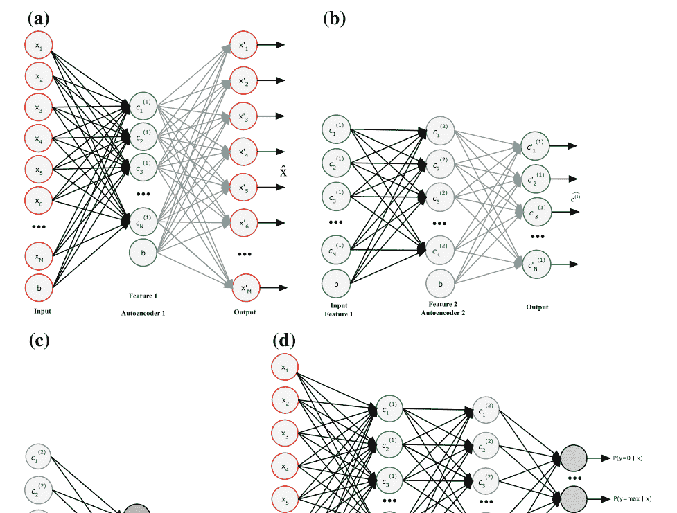

乳腺癌的诊断过程中，细针穿刺活检是一种无需手术活检的方法，没有不良影响[45]。乳腺细针穿刺活检是一种快速简便的方法，使用细针和注射器从乳房病变或囊肿中取样液体或细胞[45, 46]。样本在显微镜下进行检查，提取肿瘤的特征。这些特征可以利用软计算方法来检测乳腺癌[47]。

另一方面，目前大约40%的乳腺癌患者面临复发，并且几乎所有患者都因此而死亡。因此，与癌症相关的女性损失最常见的原因是乳腺癌。复发的风险在前2或3年内最高，然后逐渐下降，但这种风险永远不会消失[48]。使用机器学习技术也可以预测复发，例如肿瘤是良性还是恶性。

威斯康星乳腺癌数据集和乳腺癌数据集被用于应用提出的技术。乳腺癌数据集被用于预测患者特征是否存在复发。另一个数据集用于确定乳腺癌肿瘤是良性还是恶性。该数据集来自加州大学欧文分校（UCI）的数据挖掘存储库[35]。

第一个数据集是乳腺癌数据集，包含手术后5年已知诊断情况的患者[49, 50]。包含286个实例和9个属性的数据集研究乳腺癌的复发与非复发。
由于缺少属性，九个实例未被使用。

另一个数据集是威斯康星乳腺癌数据集，包含699个实例和9个属性。每个实例由九个良性或恶性乳腺细针穿刺细胞学属性组成[51, 52]。由于缺少某些特征，有16个实例未被用于分析。

###### 3.3.3 糖尿病数据集

糖尿病是一种非常危险的疾病，特别是对所有血管，尤其是毛细血管的影响[53]。糖尿病有两种主要不同类型。I型糖尿病通常在年轻成年人和儿童中被诊断出来[54]，他们的胰腺由于胰岛β细胞的丧失而无法产生胰岛素。因此，这些患者需要外源性胰岛素的给药。另一方面，II型糖尿病中胰岛素的分泌非常有限，不足以降低血糖水平，与健康人相比[55]。大多数II型糖尿病患者还存在胰岛素抵抗现象。

皮马印第安人糖尿病（PID）数据集的目的是根据几个人口统计学、检测和测量的患者特征来预测患者是否患有糖尿病。该数据集中的所有患者来自美国亚利桑那州凤凰城。该数据集来自加利福尼亚大学尔湾分校（UCI）的数据挖掘存储库[35, 36]。该数据集包含768个实例和8个属性[35]。

##### 3.4 结果

在本章中，通过7个医疗数据集来衡量DNN分类器的性能。将每个数据集的准确率与最先进的分类器进行比较，得到相关的结果。同时，利用主成分分析（PCA）来观察自动编码器（AE）的降维能力。

将DNN分类器与最先进的分类器进行比较的结果分别在第3.4.1节报告与心脏疾病相关的数据集，第3.4.2节报告与乳腺癌相关的数据集，以及第3.4.3节报告与糖尿病相关的数据集。

表4 设计的DNN与Cleveland心脏病数据集的最先进方法的比较

| 方法 | 准确率 (%) |
|------|------------|
| 设计的DNN | 85.2<sup>a</sup> |
| Navia贝叶斯[56] | 83.8<sup>a</sup> |
| SMO [56] | 84.4<sup>a</sup> |
| IBK [56] | 76.9<sup>a</sup> |
| AdaBoostM1 [56] | 83.5<sup>a</sup> |
| J48 [56] | 76.5<sup>a</sup> |
| PART [56] | 81.5<sup>a</sup> |
| NPC [57] | 84.0<sup>a</sup> |
| HNPC (最小值) [58] | 84.4<sup>a</sup> |
| HNPC (乘积) [58] | 85.0<sup>a</sup> |
| 修改的HNPC (最小值) [59] | 77.4<sup>a</sup> |
| 修改的HNPC (乘积) [59] | 86.7<sup>a</sup> |
| AdaBoostM1 [11] | 82.2<sup>a</sup> |
| Bagging [11] | 83.7<sup>a</sup> |
| BayesNet [11] | 82.2<sup>a</sup> |
| Dagging [11] | 82.2<sup>a</sup> |
| DecisionTable [11] | 83.3<sup>a</sup> |
| DTNB [11] | 82.5<sup>a</sup> |
| FT [11] | 82.2<sup>a</sup> |
| LMT [11] | 82.2<sup>a</sup> |
| Logistic [11] | 83.7<sup>a</sup> |
| MultiClassClassifier [11] | 83.7<sup>a</sup> |
| NaiveBayes [11] | 83.3<sup>a</sup> |
| NaiveBayesSimple [11] | 82.9<sup>a</sup> |
| NveBayesUpdateable [11] | 83.3<sup>a</sup> |
| RandomCommittee [11] | 82.2<sup>a</sup> |
| RandomForest [11] | 83.7<sup>a</sup> |
| RandomSubSpace [11] | 82.2<sup>a</sup> |
| RBFNetwork [11] | 84.0<sup>a</sup> |
| RotationForest [11] | 82.5<sup>a</sup> |
| SimpleLogistic [11] | 82.2<sup>a</sup> |
| SMO [11] | 83.3<sup>a</sup> |
| DAM [11] | 83.7<sup>a</sup> |
| Original SAM [60] | 75.7<sup>b</sup> |
| GSAM [60] | 78.0<sup>b</sup> |
| IT2FLS-KMIP [61] | 80.7<sup>b</sup> |
| IT2FLS-GCCD [61] | 81.0<sup>b</sup> |

a10折交叉验证
b5折交叉验证

表5 设计的DNN与匈牙利心脏病数据集上最先进方法的比较

| 方法 | 准确率 (%) |
| --- | --- |
| 设计的DNN | **83.5**<sup>a</sup> |
| J48 [12] | 78.2<sup>a</sup> |
| 随机森林 [12] | 80.7<sup>a</sup> |
| ABM1 [12] | 76.8<sup>a</sup> |
| SMO [12] | 82.0<sup>a</sup> |
| Bagging [12] | 81.9<sup>a</sup> |
| 朴素贝叶斯 [12] | 82.8<sup>a</sup> |
| FBCDSS [62] | 50.5<sup>a</sup> |
| NNBDSS [62] | 46.4<sup>a</sup> |
| Genfis2 [13] | 39.5<sup>a</sup> |
| Rough-Fuzzy分类器 [13] | 42.4<sup>a</sup> |
| 加权模糊规则和决策树规则 [63] | 49.9<sup>a</sup> |
| $L_{1/2}$ [14] | **86.8**<sup>b</sup> |
| Lasso [14] | **85.9**<sup>b</sup> |
| SCAD [14] | **86.1**<sup>b</sup> |
| MCP [14] | **85.6**<sup>b</sup> |
| 弹性网络 [14] | **86.4**<sup>b</sup> |

a10折交叉验证

b50次运行的平均值（训练60%，测试40%）

表6 设计的DNN与最先进的长滩心脏病数据集方法的比较

| 方法 | 准确率 (%) |
| --- | --- |
| 设计的DNN | **84.0**<sup>a</sup> |
| $L_{1/2}$ [14] | 81.6<sup>b</sup> |
| SCAD [14] | 81.2<sup>b</sup> |
| Lasso [14] | 80.4<sup>b</sup> |
| MCP [14] | 81.8<sup>b</sup> |
| 弹性网络Hungrain_zhang2014 | 80.1<sup>b</sup> |
| FDSS [9] | 75.0<sup>c</sup> |
| MLP-ANN [9] | 76.0<sup>c</sup> |
| k-NN [9] | 85.0<sup>c</sup> |
| C4.5 [9] | 53.0<sup>c</sup> |
| RIPPER [9] | 41.0<sup>c</sup> |
| DT [64] | 68.4<sup>a</sup> |
| KNN [64] | 81.1<sup>a</sup> |
| SVM [64] | 83.4<sup>a</sup> |

a10折交叉验证

b50次运行的平均值（训练60%测试40%）

c未知## 3.4.1 心脏病数据集的结果

对于每个心脏病数据集，DNN和最先进的方法的10折交叉验证结果分别在表4、5、6和7中呈现。每个自动编码器生成的新特征分别在图8、9、10和11中进行可视化。

如表5、6和7所示，与最先进的方法相比，设计的DNN是匈牙利心脏病数据集、长滩心脏病数据集和瑞士心脏病数据集的最佳分类器，准确率分别为83.5%、92.6%和92.6%。另一方面，根据表4，设计的DNN准确率为85.2%，在克利夫兰CAD数据集中是第二好的分类器。修改后的HNPC (乘积) 准确率为86.7%，是最好的分类器。然而，对于匈牙利心脏病数据集，设计的DNN的准确率低于L1/2、Lasso、SCAD和MCP方法。然而，报告了50次运行的平均准确率，而没有使用10折交叉验证技术。

为了理解自动编码器 (AE) 的降维机制，使用PCA可视化AE的隐藏层输出，包括Cleveland心脏病数据集、匈牙利心脏病数据集、Long Beach心脏病数据集和瑞士心脏病数据集。DNN包含两个隐藏层，每个隐藏层有四个神经元。

**表7 设计的DNN与瑞士心脏病数据集的最先进方法的比较**
| 方法 | 准确率 (%) |
|------|------------|
| 设计的DNN | 92.6% |
| Genfis2 [13] | 62.3% |
| Rough-Fuzzy分类器 [13] | 79.8%<sup>a</sup> |
| 加权模糊规则和决策树规则[63] | 52.2% |
| FDSS [9] | 70.0% |
| MLP-ANN [9] | 81.0% |
| k-NN [9] | 62.0% |
| C4.5 [9] | 53.0% |
| RIPPER [9] | 41.0% |
| DT [64] | 86.5% |
| KNN [64] | 88.5% |
| SVM [64] | 92.2%<sup>b</sup> |

<sup>a</sup> 10折交叉验证
<sup>b</sup> 未知

图9 维度降低：$\mathbb{R}^{11} \rightarrow \mathbb{R}^{4}$：a 原始特征匈牙利心脏病数据集的3D可视化，b 第一个自编码器生成的新特征的3D可视化，c 第二个自编码器生成的新特征的3D可视化，d 第二个自编码器生成的新特征在X-Y平面上的2D可视化，e 第二个自编码器生成的新特征在X-Z平面上的2D可视化，f 第二个自编码器生成的新特征在Y-Z平面上的2D可视化。

图10 降维： $\mathbb{R}^{10} \to \mathbb{R}^{4}$： a原始特征的三维可视化（长滩心脏病数据集）， b第一个自编码器生成的新特征的三维可视化， c第二个自编码器生成的新特征的三维可视化， d第二个自编码器生成的新特征在X-Y平面上的二维可视化， e第二个自编码器生成的新特征在X-Z平面上的二维可视化， f第二个自编码器生成的新特征在Y-Z平面上的二维可视化

图11 降维：$\mathbb{R}^{10} \to \mathbb{R}^{4}$：a原始特征的三维可视化（瑞士心脏病数据集），b第一个自编码器生成的新特征的三维可视化，c第二个自编码器生成的新特征的三维可视化，d第二个自编码器生成的新特征在X-Y平面上的二维可视化，e第二个自编码器生成的新特征在X-Z平面上的二维可视化，f第二个自编码器生成的新特征在Y-Z平面上的二维可视化

- 类别0: +
- 类别1: ○

###### 3.4.2 乳腺癌数据集的结果

对于每个乳腺癌数据集，DNN和最先进的方法的10折交叉验证测试准确率分别在表8和表9中报告。AE对特征降维的影响在图12和图13中分别对每个数据集进行了可视化。

**表8 设计的DNN与乳腺癌数据集的最先进方法的比较**
| 方法 | 准确率 (%) |
| --- | --- |
| 设计的DNN | **75.8%**<sup>a</sup> |
| MLP [10] | **76.1%**<sup>a</sup> |
| RBF [10] | 72.3%<sup>a</sup> |
| PNN [10] | 24.6%<sup>a</sup> |
| SOM [10] | 29.8%<sup>a</sup> |
| SVM [10] | 71.3%<sup>a</sup> |
| kNN [10] | 72.1%<sup>a</sup> |
| nB [10] | 68.8%<sup>a</sup> |
| MLP/GA [10] | **80.4%**<sup>a</sup> |
| PCNN [10] | **77.6%**<sup>a</sup> |

<sup>a</sup> 10折交叉验证

根据表8，设计的DNN是乳腺癌数据集准确率（75.8）第四高的分类器，仅次于准确率（80.4）的MLP/GA，准确率（77.6）的PCNN和准确率（76.1）的MLP。另一方面，对于威斯康星乳腺癌数据集的分类，它是准确率（97.2）第五高的算法，仅次于准确率（98.5）的GA-KDE，PSO-KDE，DAM和DTNB（分别为98.5，98.5，97.8和97.5）。所有这些算法都使用10折交叉验证技术运行。

DNN设计为两个隐藏层，每个隐藏层有四个神经元。AEs用于将乳腺癌数据集的维度从$\mathbb{R}^9$降低到$\mathbb{R}^4$。从这些图表中可以观察到AE的效果。AE将原始特征映射到一个新的空间，其中特征的定义比以前更清晰，以便适当地对数据集进行分类。

图12 降维：$\mathbb{R}^9 \to \mathbb{R}^4$：a原始特征乳腺癌数据的3D可视化集，b第一个自编码器生成的新特征的3D可视化，c第二个自编码器生成的新特征的3D可视化，d第二个自编码器生成的新特征的2D可视化基于X-Y，e第二个自编码器生成的新特征的2D可视化基于X-Z，f第二个自编码器生成的新特征的2D可视化基于Y-Z

图13降维：$\mathbb{R}^9 \to \mathbb{R}^4$：a通过威斯康星乳腺癌数据集的原始特征进行的3D可视化，b通过第一个自编码器生成的新特征进行的3D可视化，c通过第二个自编码器生成的新特征进行的3D可视化，d通过第二个自编码器生成的新特征在X-Y平面上投影进行的2D可视化，e通过第二个自编码器生成的新特征在X-Z平面上投影进行的2D可视化，f通过第二个自编码器生成的新特征在Y-Z平面上投影进行的2D可视化

- 类别0
- 类别1: ○

**表9 与威斯康星州乳腺癌数据集的最先进方法进行比较**
| 方法 | 准确率 (%) |
| --- | --- |
| 设计的DNN | 97.2%<sup>a</sup> |
| MLP [10] | 95.8%<sup>a</sup> |
| RBF [10] | 95.2%<sup>a</sup> |
| PNN [10] | 82.5%<sup>a</sup> |
| SOM [10] | 90.1%<sup>a</sup> |
| SVM [10] | 96.9%<sup>a</sup> |
| kNN [10] | 94.1%<sup>a</sup> |
| nB [10] | 96.3%<sup>a</sup> |
| MLP/GA [10] | 91.4%<sup>a</sup> |
| PCNN [10] | 94.2%<sup>a</sup> |
| AdaBoostM1 [11] | 95.6%<sup>a</sup> |
| Bagging [11] | 96.1%<sup>a</sup> |
| BayesNet [11] | 97.2%<sup>a</sup> |
| Dagging [11] | 96.7%<sup>a</sup> |
| DecisionTable [11] | 95.7%<sup>a</sup> |
| DTNB [11] | 97.5%<sup>a</sup> |
| FT [11] | 96.9%<sup>a</sup> |
| LMT [11] | 96.4%<sup>a</sup> |
| Logistic [11] | 96.6%<sup>a</sup> |
| MultiClassClassifier [11] | 96.6%<sup>a</sup> |
| NaiveBayes [11] | 96.1%<sup>a</sup> |
| NaiveBayesSimple [11] | 96.3%<sup>a</sup> |
| NveBayesUpdateable [11] | 96.1%<sup>a</sup> |
| RandomCommittee [11] | 96.4%<sup>a</sup> |
| RandomForest [11] | 97.0%<sup>a</sup> |
| RandomSubSpace [11] | 95.5%<sup>a</sup> |
| RBFNetwork [11] | 95.9%<sup>a</sup> |
| RotationForest [11] | 97.2%<sup>a</sup> |
| SimpleLogistic [11] | 96.6%<sup>a</sup> |
| SMO [11] | 96.9%<sup>a</sup> |
| DAM [11] | 97.8%<sup>a</sup> |
| PSO-KDE [47] | 98.5%<sup>a</sup> |
| GA-KDE [47] | 98.5%<sup>a</sup> |
| 自学习 [65] | 85.8%<sup>a</sup> |
| 随机共同训练 [65] | 90.5%<sup>a</sup> |
| 粗糙共同训练 [65] | 92.3%<sup>a</sup> |
| AR1+NN [66] | 97.4%<sup>b</sup> |
| AR2+NN [66] | 95.6%<sup>b</sup> |
| AR1+AR2+NN [66] | 98.4%<sup>b</sup> |
| GA-MOO-ANN [67] | 98.1%<sup>c</sup> |
| WN贝叶斯 [68] | 98.5%<sup>d</sup> |

- <sup>a</sup> 10折交叉验证
- <sup>b</sup> 3折交叉验证
- <sup>c</sup> 10次运行的平均值（训练50%，验证25%，测试25%）
- <sup>d</sup> 5折交叉验证

###### 3.4.3 糖尿病数据集的结果

对于PID，DNN和最先进的分类器的10折交叉验证准确率列在表10中。每个AE对降低维度的效果在图14中进行了可视化，以实现有效的分类。根据表10，设计的DNN是准确率最高的算法（78.1%）。

为了观察隐藏层对PID上AE性能的影响，DNN设计为两个隐藏层，分别有八个和四个神经元。AE用于将PID数据集的维度降低$\mathbb{R}^8 \to \mathbb{R}^4$。当新的表示维度为$\mathbb{R}^4$时，AE的性能变化如图14所示。

从图14中可以观察到AE的效果。AE将原始特征映射到一个新的空间，其中特征的定义比以前更清晰，以便适当地对数据集进行分类。

**表10 设计的DNN与最先进的PID数据集方法的比较**
| 方法 | 准确率 (%) |
|------|------------|
| 设计的DNN | 78.1% |
| AdaBoostM1 [11] | 74.3%<sup>a</sup> |
| Bagging [11] | 74.6%<sup>a</sup> |
| BayesNet [11] | 74.3%<sup>a</sup> |
| Dagging [11] | 74.0%<sup>a</sup> |
| DecisionTable [11] | 71.2% |
| DTNB [11] | 73.8%<sup>a</sup> |
| FT [11] | 77.3%<sup>a</sup> |
| LMT [11] | 77.4%<sup>a</sup> |
| Logistic [11] | 77.2%<sup>a</sup> |
| MultiClassClassifier [11] | 77.2%<sup>a</sup> |
| NaiveBayes [11] | 76.3% |
| NaiveBayesSimple [11] | 76.3% |
| NveBayesUpdateable [11] | 76.3% |
| RandomCommittee [11] | 75.2% |
| RandomForest [11] | 72.3%<sup>a</sup> |
| RandomSubSpace [11] | 75.2% |
| RBFNetwork [11] | 75.3% |
| RotationForest [11] | 76.8%<sup>a</sup> |
| SimpleLogistic [11] | 77.4%<sup>a</sup> |
| SMO [11] | 77.3%<sup>a</sup> |
| DAM [11] | 70.3% |
| CoABCMiner [69] | 75.5% |
| 核心 [69] | 74.3%<sup>a</sup> |
| PGIRLA [69] | 73.1%<sup>a</sup> |
| C4.5规则 [69] | 71.7%<sup>a</sup> |
| SIA [69] | 71.4%<sup>a</sup> |
| HIDER [69] | 70.9%<sup>a</sup> |
| LDWPSO [69] | 69.6%<sup>a</sup> |
| ABCMiner [69] | 65.9%<sup>a</sup> |
| LUkEYK [15] | 76.0%<sup>b</sup> |
| LUkEYK+SVM [15] | 76.0%<sup>b</sup> |
| SVM [15] | 73.0%<sup>b</sup> |
| LDA [15] | 72.0%<sup>b</sup> |
| Bayes [15] | 71.0%<sup>b</sup> |
| kEYK [15] | 64.0%<sup>b</sup> |

- <sup>a</sup> 10折交叉验证
- <sup>b</sup> 未知

图14降维：$\mathbb{R}^8 \to \mathbb{R}^4$；a原始特征PID数据集的三维可视化，b第一个自编码器生成的新特征的三维可视化，c第二个自编码器生成的新特征的三维可视化，d第二个自编码器生成的新特征在X-Y平面上的二维可视化，e第二个自编码器生成的新特征在X-Z平面上的二维可视化，f第二个自编码器生成的新特征在Y-Z平面上的二维可视化

### 4 结论

在本章中，我们提出了一种基于DNN的分类器，对医疗数据集（包括心脏病、乳腺癌和糖尿病）的分类具有非常高的准确性。我们通过报告我们采用的严格实验测试程序的结果来证明这一事实，该程序用于比较所提出的DNN分类器与文献中代表性的传统和最新分类方法的性能。

具体而言，我们评估了每种疾病的不同数据集上的性能，并对每种疾病/数据集组合进行了10折交叉验证。我们评估了三种不同疾病的性能，对每种疾病的不同数据集进行了评估，并对每种疾病/数据集组合进行了10折交叉验证。

我们还展示了使用自动编码器（AEs）降低输入数据维度的有效性。我们通过使用主成分分析（PCA）技术进行可视化，并展示了使用自动编码器可能是降低输入数据维度的一种非常高效的策略。这样可以设计一个复杂度较低的分类器，从而使训练更加容易。

在几乎所有的分类实验中，所提出的DNN分类器提供了最高的准确率，只有少数情况例外。因此，基于DNN的疾病诊断方法可能成为目前可用方法的一个强有力的替代方案。正如我们之前提到的，这种方法越来越受欢迎，因为它更容易、更便宜、更快速和非侵入性。因此，我们得出结论，所提出的基于DNN的分类器可以作为一种不同的疾病诊断方法的替代选择。

## 参考文献

1.  Y. LeCun, Y. Bengio, G. Hinton, 深度学习. *Nature* **521**(7), 436–444 (2015)
2.  W.-B. Huang, F.-C. Sun等, 用稀疏去噪堆叠自编码器构建极限学习机的特征空间. *Neurocomputing* **174**, 60–71 (2016)
3.  J. Xu, X. Luo, G. Wang, H. Gilmore, A. Madabhushi, 用于分割和分类组织病理图像中上皮和基质区域的深度卷积神经网络. *神经计算*
4.  J. Xu, L. Xiang, Q. Liu, H. Gilmore, J. Wu, J. Tang, A. Madabhushi, 用于乳腺癌组织病理图像中核的检测的堆叠稀疏自编码器(SSAE)。
5.  H. Badem, A. Caliskan, A. Basturk, M.E. Yuksel, 通过堆叠自编码器对帕金森病进行分类和诊断, 在第9届全国电气与电子工程会议(ELECO 2016)上, 2016年, pp. 499–502。
6.  H. Badem, A. Caliskan, A. Basturk, M.E. Yuksel, 通过堆叠自编码器对人类活动进行分类, 在医疗技术国家会议(TIPTEKNO 2016)上, 2016年, pp. 370–373。
7.  A. Caliskan, M.E. Yuksel, H. Badem, A. Basturk, 基于脑磁图的深度神经网络分类器解码人脑活动. *Elektron. ir Elektrotech.* **23**(2), 63–67(2017)
8.  A. Caliskan, H. Badem, A. Basturk, M.E. Yuksel, 使用深度神经网络分类器诊断帕金森病. *Istanb. Univ. J. Electr. Electron. Eng.* **17**, 3311–3318 (2017)
9.  N.A. Setiawan, P. Venkatachalam, A.F.M. Hani, 使用基于人工智能的决策支持系统诊断冠状动脉疾病, *in Proceedings of the International Conference on Man-machine Systems (ICoMMS)*, Batu Ferringhi, Penang (2009)
10. F. Gorunescu, S. Belciug, 发展基于学习的决策系统的进化策略. 应用于乳腺癌和肝纤维化分期. *生物医学信息学杂志* **49**, 112–118 (2014年)
11. M. Aldape-Perez, C. Yanez-Maquez, O. Camacho-Nieto, I. Lopez-Yanez, A.-J. Arguelles-Cruz, 基于联想模型的协作学习: 在医学数据集中的模式分类应用. *计算机人类行为. B部分* **51**, 771–779 (2015年)

12. K. Singh, J. Rong, L. Batten, 共享敏感医学数据集用于研究目的-以案例研究为例, 国际数据科学与高级分析会议 (DSAA), 2014年, pp. 555–562 (2014年)

13. K. Srinivas, G.R. Rao, A. Govardhan, 粗糙模糊分类器: 通过融合两种不同的集合理论来预测心脏病。 阿拉伯科学与工程杂志 39 (4), 2857–2868 (2014年)

14. B. Zhang, H. Chai, Z. Yang, Y. Liang, G. Chu, X. Liu, L1/2正则化逻辑方法在心脏病诊断中的应用。 生物医学材料工程 24 (6), 3447–3454 (2014年)

15. H.S. Bilge, Y. Kerimbekov, 用洛伦兹距离度量进行分类, 在第23届信号处理和通信应用会议 (SIU), 2015年, pp. 2106–2109

16. J.M. Keller, M.R. Gray, J.A. Givens, 一种模糊k最近邻算法。 IEEE Trans. Syst. Man Cybern. SMC 15 (4), 580–585 (1985年)

17. L. Rokach, O. Maimon, 自顶向下归纳决策树分类器-一项调查。 IEEE Trans. Syst. Man Cybern. Part C Appl. Rev. 35(4), 476–487 (2005)

18. J.R. Quinlan, 决策树归纳。 机器学习。 1(1), 81–106 (1986)

19. J.R. Quinlan, C4.5: 机器学习程序(Elsevier, 2014)

20. S. Grumbach, T. Milo, 面向可处理的包代数, 见 Proceedings of the Twelfth ACM SIGACT-SIGMOD-SIGART Symposium on Principles of Database Systems, ACM, 1993, pp. 49–58

21. G. Bagallo, D. Haussler, 布尔特征发现在经验学习中。 机器学习。 5(1), 71–99 (1990)

22. Q. Lu, L. Getoor, 基于链接的分类, in ICML会议论文集, vol. 3, 2003, pp. 496–503

23. C.S. Leslie, E. Eskin, W.S. Noble, 光谱核函数: 一种用于SVM蛋白质分类的字符串核函数, in Pacific生物计算研讨会, vol. 7, 2002, pp. 566–575

24. J. Shawe-Taylor, N. Cristianini, 模式分析的核方法(剑桥大学, 2004)

25. C.J. Burges, 支持向量机模式识别教程。 数据挖掘与知识发现 2(2), 121–167 (1998)

26. H. Guan, J. Zhou, M. Guo, 一种基于类特征质心的文本分类器, in 第18届国际万维网会议论文集, ACM, 2009, pp. 201–210

27. H. Badem, A. Basturk, A. Caliskan, M.E. Yuksel, 一种通过人工蜂群和有限内存BFGS优化算法混合的深度神经网络高效训练策略。 Neurocomputing 266(2017), 506–526 (2017)

28. A. Caliskan, M.E. Yuksel, H. Badem, A. Basturk, 通过简单的训练策略提高深度神经网络分类器的性能。 Eng. Appl. Artif. Intell. 67, 14–23 (2018)

29. G.E. Hinton, R.R. Salakhutdinov, 用神经网络降低数据的维度。 科学 313(5786), 504–507 (2006)

30. J. Ngiam, A. Coates, A. Lahiri, B. Prochnow, Q.V. Le, A.Y. Ng, 关于深度学习的优化方法, 在第28届国际机器学习大会(ICML-11), 2011, pp. 265–272

31. Y. Bengio, 深度架构基于梯度的训练的实际建议, 神经网络: 行业的技巧(Springer, 2012), pp. 437–478

32. N. Andrew, 稀疏自编码器 (2011)

33. Y. Zhang, E. Zhang, W. Chen, 基于稀疏自编码器的半色调图像分类的深度神经网络。 Eng. Appl. Artif. Intell. 50, 245–255 (2016)

34. R.H. Byrd, P. Lu, J. Nocedal, C. Zhu, 用于有界约束优化的有限内存算法。 SIAM J. Sci. Comput. 16(5), 1190–1208 (1995)

35. C. Blake, C.J. Merz, 机器学习数据库的UCI存储库, 信息与计算机科学系, 加利福尼亚大学欧文分校, 加利福尼亚大学, 55。 http://www.ics.uci.edu/~mlearn/mlrepository.html

36. J.W. Smith, J. Everhart, W. Dickson, W. Knowler, R. Johannes, 使用ADAP学习算法预测糖尿病发作, 在 Proceedings of the Annual Symposium on Computer Application in Medical Care, American Medical Informatics Association, 1988, p. 261

37. S. Matthias, 分析和解释生物特征数据的方法, 波茨坦大学

38. P. Anooj, 临床决策支持系统： 使用决策树模糊规则预测心脏病的风险水平。 Int. J. Res. Rev. Comput. Sci. 3(3), 1659–1667 (2012年)

39. E. Ephzibah, 使用遗传算法和LS-SVM分类器进行特征选择的成本效益方法。 IJCA Spec. Issue Evol. Comput. Optim. Tech. ECOT

40. R. Detrano, A. Janosi, W. Steinbrunn, M. Pfisterer, J.-J. Schmid, S. Sandhu, K.H. Guppy, S. Lee, V. Froelicher, 一种用于冠状动脉疾病诊断的新概率算法的国际应用。 Am. J. Cardiol. 64(5), 304–310 (1989年)

41. D. Aha, D. Kibler, 使用克利夫兰数据库进行基于实例的心脏病预测， 加利福尼亚大学

42. J.H. Gennari, P. Langley, D. Fisher, 增量概念形成模型。 人工智能。 40(1–3), 11–61 (1989)

43. A.P. Bradley, 使用ROC曲线下面积评估机器学习算法。 模式识别。 30(7), 1145–1159 (1997)

44. F. Paulin, A. Santhakumaran, 通过比较反向传播训练算法对乳腺癌进行分类。 国际计算机科学与工程杂志。 3(1), 327–332 (2011)

45. E.A. Rakha, I.O. Ellis, 乳腺癌针刺活检标本预后和预测因素评估概述。 临床病理学杂志。 60(12), 1300–1306 (2007)

46. G.R. Sizilio, C.R. Leite, A.M. Guerreiro, A.D. Neto, 模糊方法用于细针穿刺分析预诊断乳腺癌。 生物医学工程在线杂志。 11(1), 83 (2012)

47. R. Sheikhpour, M.A. Sarram, R. Sheikhpour, 粒子群优化用于基于核密度估计的分类器带宽确定和特征选择在乳腺癌诊断中的应用。 应用软计算。 40, 113–131 (2016)

48. C.L. Rock, W. Demark-Wahnefried, 乳腺癌诊断后的营养与生存： 证据综述。 J. Clin. Oncol. 20(15), 3302–3316 (2002)

49. R.S. Michalski, I. Mozetic, J. Hong, N. Lavrac, 多功能增量学习系统AQ15及其在三个医学领域的测试应用。 Proc. AAAI 1986, 1–041 (1986)

50. M. Tan, L. Eshelman, 使用加权网络表示嘈杂领域中的分类知识， 在第五届国际机器学习大会上， 1988年， pp. 121–134

51. W.H. Wolberg, O.L. Mangasarian, 用于医学诊断的多表面模式分离方法应用于乳腺细胞学。 Proc. Natl. Acad. Sci. 87(23), 9193–9196 (1990)

52. J. Zhang, 在基于实例的学习中选择典型实例， 在第九届国际机器学习大会上， 1992年， pp. 470–479

53. A. Gul, M.A. Rahman, A. Jaleel, 糖尿病2型患者糖基化蛋白的变化 并发症与无并发症的比较。 J. Ayub Med. Coll. Abbottabad 17(3), 33–37 (2005)

54. S.F.B. Jaafar, D.M. Ali, 利用人工神经网络(ANN)预测糖尿病。 2005年亚洲传感器会议和新技术国际会议 药物和生物医学研究, IEEE, 2005, pp. 135–139

55. H.M. Fonseca, V.H. Ortiz, A.I. Cabrera, 应用随机神经网络对糖尿病患者的动态葡萄糖模型进行建模, in 第一届电气与电子工程国际会议, 2004, (ICEEE), IEEE, 2004, pp. 522–525

56. J. Nahar, T. Imam, K.S. Tickle, Y.-P.P. Chen, 用于心脏病诊断的计算智能: 基于医学知识的方法。 Exp. Syst. Appl. 40(1), 96–104 (2013)

57. M. Bounhas, K. Mellouli, H. Prade, M. Serrurier, 数值数据的可能性分类器。 软计算 17(5), 733–751 (2012)

58. K. Baati, T.M. Hamdani, A.M. Alimi, 用于心脏病检测的混合朴素可能性分类器， 来自异构医疗数据的， 于2013年第13届混合智能系统国际会议(HIS)上， 2013年， 第234-239页

59. K. Baati, T.M. Hamdani, A.M. Alimi, 用于心脏病检测的改进的混合朴素可能性分类器， 来自异构医疗数据的， 于2014年第6届软计算与模式识别国际会议(SoCPaR)上， 2014年， 第353-358页

60. T. Nguyen, A. Khosravi, D. Creighton, S. Nahavandi, 使用遗传模糊逻辑系统和小波对医疗数据进行分类。 实验性系统应用 42(4), 2184–2197 (2015)

61. T. Nguyen, A. Khosravi, D. Creighton, S. Nahavandi, 使用区间型-2模糊逻辑系统和小波的医疗数据分类。应用软计算。 30, 812-822 (2015)

62. P.K. Anooj, 在与基于模糊和神经网络的系统进行比较后，在临床决策支持系统中实现决策树模糊规则，2013年国际会议IT Convergence and Security (ICITCS), 2013, pp. 1-6

63. P. Anooj, 临床决策支持系统：使用加权模糊规则和决策树规则预测心脏病的风险水平。开放计算科学。 1 (4), 482-498 (2011)

64. A. Caliskan, M.E. Yuksel, 使用深度神经网络对冠状动脉疾病数据集进行分类。EuroBiotech J

65. D. Miao, C. Gao, N. Zhang, Z. Zhang, 基于多样化的约简子空间的协同训练用于部分标记数据。 Int. J. Approx. Reason. 52(8), 1103–1117 (2011). https://doi.org/10.1016/j.ijar.2011.05.006, http://www.sciencedirect.com/science/article/pii/S0888613X11000880

66. S. Palaniappan, T. Pushparaj, 基于关联规则和神经网络的乳腺癌新型预测。 Int. J. Comput. Sci. Mob. Comput. IJCSMC 4, 269–77 (2013)

67. F. Ahmad, N.A. Mat Isa, Z. Hussain, S.N. Sulaiman, 基于遗传算法的多目标优化的人工神经网络分类器用于乳腺癌诊断。 Neural Comput. Appl. 23(5), 1427–1435 (2012)

68. M. Karabatak, 基于朴素贝叶斯的乳腺癌检测新分类器。测量 72, 32–36 (2015)

69. M. Celik, F. Koylu, D. Karaboga, Coabminer: 一种基于人工蜜蜂群的合作规则分类系统的算法。国际人工智能工具 25(01), 1550028 (2016)

## 为什么逐层预训练能提高深度神经网络的学习能力？

Seyyede Zohreh Seyyedsalehi和Seyyed Ali Seyyedsalehi

摘要 深度感知神经网络能够实现一系列连续的非线性转换。 但是，通过传统的误差反向传播等传统学习方法来训练这些神经网络面临着严重的障碍。最近提出了逐层预训练方法来训练这些神经网络，并且已经显示出了相当的性能。 在预训练方法中，将训练深度神经网络的复杂问题分解为一些简单的子问题，其中一些相应的单隐藏层神经网络通过误差反向传播算法进行训练。 在本章中，讨论了这种方法如何有效地改善深度神经网络的训练，并且提出了最大判别理论作为这些神经网络训练收敛性分析的适当框架。 随后，比较了两个类似的深度神经网络不同层的输入判别，其中一个直接通过传统的误差反向传播算法进行训练，另一个通过逐层预训练方法进行训练，结果证实了提出的框架的有效性。

- 深度学习
- 神经网络
- 逐层预训练
- 最大判别
- 反向传播算法
- 超平面

### 1 引言

使用神经网络（NNs）提取嵌入在数据中的非线性内在流形及其相应的非线性分量是分析非线性数据的有效方法。这通常需要深度和复杂的NNs结构[1]。

这些深度神经网络（DNN）可以通过使用许多层的神经元来学习多阶段和复杂的非线性变换[2, 3]。近年来，这些结构在许多应用中表现出理想的性能，尤其是在视觉和人类语言理解方面[4]。DNN已经被用于语音识别和语音转换[5-9]，生物信息学[10, 11]，人脸识别[12-18]和降维[19, 20]。在这些结构中，提供了分层提取组件的可能性[21, 22]，以这样的方式构建高级组件，即将低级组件的组合构建为多个层次的组件[23]。

对机器学习中一些结果的回顾表明，与浅层结构相比，训练这些深层结构面临一些严重问题。当尝试通过输出成本函数训练DNN的所有层时，结果甚至比浅层结构更低[24]。这是因为随着层数的增加，除了训练DNN耗时之外，局部最小值的问题是一个严重的障碍，以至于在大多数情况下，训练无法收敛。研究表明，在这些结构中，局部最小值的数量取决于DNN的架构和初始值，是很高的[25]。

这个问题的一个重要原因是，在训练过程中不同层之间的深度神经网络（DNN）参数之间的高度交互。在整个DNN的训练过程中，权重被优化，以使两个条件同时满足；首先，通过调整较低层的方式来提供适当的输入，以进行更深层次的最终调整（训练结束）；其次，通过调整更深层次的方式，使其在训练结束时充分利用较低层提取的组件。其次，通过调整更深层次的方式，使其在训练结束时充分利用较低层提取的组件。

如果确定了较低层的权重，那么可以轻松地调整更深层的权重。但问题的复杂性在于同时调整深层和较低层的权重，这使得目标函数的斜率受到当前网络参数调整提供的局部值的限制。研究表明，传统的训练方法会在一个区域内调整参数，导致DNN的泛化能力较低[26]。

因此，除了直接和常见的多层神经网络的训练，利用误差反向传播方法，还有一些新的方法被发现有助于增加结构和数据的复杂性[27, 28]。预训练方法是这个领域的主要解决方案[29-33]。这些方法试图找到适当的初始权重值，从而将训练与大部分局部最小值分离开来。提供适当初始权重的预训练方法通过初始化权重来获取所需对象的知识，为训练和微调权重的深度神经网络做准备。

最近，逐层预训练被提出作为解决深度自动编码器（DAE）训练问题的一种强大而高效的方法，该方法利用将训练DAE的复杂问题分解为训练单隐藏层自动编码器的多个子问题的思想[1, 31]。与之前的预训练方法相比，这种方法的性能与逐步方法[32]和分解为玻尔兹曼机方法[33]进行了研究，结果表明它更快更强大。此外，这种方法增强了DAE提取具有更好泛化能力的组件以进行重建和识别测试图像的能力[1]。

在本章中，讨论了逐层预训练方法在DAEs收敛中的分析基础和原因。

首先，研究了前馈神经网络在高维空间中的性能。在这方面，讨论了具有线性、阶跃非线性和最后软（Sigmoid）非线性函数的神经网络的性能。

接下来，研究了一些不同输入样本对DAEs的训练过程，并确定了具有Sigmoid函数的神经元最大区分度的要求条件。基于此，将演示为什么随机初始化的DAE训练不会收敛，并且通过逐步设置权重的逐层预训练方法会导致理想的训练收敛。最后，为了评估逐层预训练方法的影响，进行了一些比较实验，并报告了它们的结果。

### 2 线性和非线性前馈神经网络在高维空间中的功能分析

DAEs经常用于非线性组件提取和数据压缩，目标是将输入数据分解为非线性组件，然后在输出中以最小误差进行重构[1]。只有在数据分析过程中没有信息浪费的情况下，DAEs才能以所需的准确度在输出中重构输入的不同样本。因此，明确定义不同层中的不同输入以及在输出中重构它们是至关重要的。如果在DAE的某一层中，两个不同的输入样本被表示为单一且不明显的描述，那么输入到该层的非线性映射就无法成功地区分这两个样本。因此，输入样本的一部分区分信息会丢失。为了澄清问题，首先分析了前馈神经网络在将输入空间映射到输出时的过程。通过逐步分析DAE神经元的功能，讨论了训练不收敛的原因，并提出了一个适当的解决方案来修复它。

#### 2.1 线性神经网络（线性映射）

首先，考虑一个没有偏置的线性神经元的前馈单层神经网络，即 Y = XW。输入空间（X）的组成部分被假设为正交的。如图1所示，X和Y是行向量，W是它们的权重矩阵。

```
X = [X_1, X_2, ..., X_m]
Y = [Y_1, Y_2, ..., Y_n] (1)
```

在这里，假设神经元的权重向量根据公式2可得，并且目标是对这些神经元在m维正交输入空间 X中进行功能分析。

```
W = \begin{bmatrix} W_{11} & \cdots & W_{1n} \\ \vdots & \ddots & \vdots \\ W_{m1} & \cdots & W_{mn} \end{bmatrix} = [W_1, W_2, ..., W_n] (2)
```

其中 W_i是第i个神经元的权重向量。图2展示了向量 W_i在输入空间中的表示。每个输出分量 Y_i的大小等于输入向量 X和第i个线性神经元的权重向量的点积，其方向与输入空间中的 W_i相同。

```
Y_i = (X · W_i)\vec{a}_{W_i} (3)
```

其中 \vec{a}_{W_i} 是沿着 W_i的单位向量。换句话说，每个分量 Y_i等于在 X上投影到W_i上的 || W_i||的乘积。

```
Y_i = (X · \vec{a}_{W_i})\vec{a}_{W_i} × || W_i||
   = (X · \vec{a}_{W_i}) × || W_i||\vec{a}_{W_i} (4)
```

图2 线性神经元在输入空间中的向量图。在线性单层前馈神经网络中，从原点出发的垂直于向量W_i的超平面是 X的轨迹X · W_i = 0。

其中 ||W_i||是 W_i的大小或欧几里得范数。因此，经过线性变换 W的输入向量 X被转换为具有以下分量的向量 Y：

Y = [Y1, Y2, ..., Yn]

其中 Y_{i|i=1,2,...,n}是输出空间 Y的分量。显然，具有正交向量 W_i (N个线性神经元的权重向量)：

W_i · W_r = 0  ∀  i ≠ r,  i,r = 1,2, ..., n

导致正交空间 Y。如果组件 Y的正交条件没有建立，组件Y_i将与彼此相关，并且它们的内积将不为零。对于线性神经元的每个向量 W_i，其与 W_i的内积为零 (Y_i = 0)的输入向量X的轨迹是一个垂直于向量 W_i的通过原点的m-1维超平面在m维输入空间中[34]。

#### 2.2 带有阶跃非线性激活函数和偏置的单层前馈神经网络的功能分析

考虑如图3所示的单层神经网络，其中神经元具有阶跃非线性函数 (f) 和偏置 B，如下所示的方程：

```
Y_i = f(X · W_i - B_i), f(z) = \begin{cases} 1 & z > 0 \\ 0 & z < 0 \end{cases}
```

对于具有权重向量 W_i 和偏置 B_i 的神经元，输入空间的轨迹 X 满足方程8为零，即：

```
(X · W_i - B_i) = 0
```

是与神经元的权重向量(W_i)垂直且经过输入空间中点 X_a (Eq. 9)的超平面，如图4所示。

```
X_a = (X · \hat{a}_{W_i}) \hat{a}_{W_i}
```

根据方程8， ||X_a|| 从方程10计算得出。

$$ (X \cdot W_i - B_i) = 0 \to X \cdot W_i = B_i \to \|X_a\| = X \cdot \bar{a}_{W_i} = \frac{B_i}{\|W_i\|} \quad (10) $$

超平面是输入空间 X中神经元的决策边界。因此，神经元对于输入空间 X中超平面的一侧的输出为1，对于另一侧的输出为0。

$$ Y_i = 1 \quad \forall (X \cdot W_i - B_i) > 0 \quad (11) $$

$$ Y_i = 0 \quad \forall (X \cdot W_i - B_i) < 0 \quad (12) $$

因此，对于每个具有权重向量 W_i和偏置B_i的神经元，可以精确地定义输入空间中超平面的位置（即神经元的决策边界）。此外，超平面与输入空间X的轴 ([X1, X2, ..., Xm]) 的交点可以计算如下，如公式8所示：

$$ X_1 W_{1i} + X_2 W_{2i} + \cdots + X_m W_{mi} - B_i = 0 \quad (13) $$

假设输入空间 X正交，超平面与输入空间第k个分量的交点如图5所示：

$$ \begin{aligned} X_r &= 0 \quad \forall r \neq k \\ X_k W_{ki} &= B_i \\ X_k &= \frac{B_i}{W_{ki}} \quad (14) \end{aligned} $$

因此，对于给定的输入向量 X的单层神经网络，每个神经元的输出将取决于输入X相对于神经元超平面的位置，要么为零，要么为一。例如，在图6中，对于输入 X，神经网络的输出为：

```
Y = [ 0 0 1 0 ]  (15)
```

这意味着任何给定的输入样本X在层 Y中被映射为一个由零和一组成的向量，该向量指示X在输入空间中位于神经元超平面之间的位置。对于神经网络的每个神经元，决策边界超平面在输入空间中的位置由 W_i和 B_i给出。值得注意的是，对于在层 Y中对应于不同代码的由超平面分隔的子空间的更高分辨率，需要更多的神经元（超平面）。

此外，所有位于由超平面分隔的单独子空间中的输入样本 X_p在层 Y中具有相同的表示，并且是不可分的（降维）。例如，在图7中，对于输入 X_1和 X_2，输出如下：

## 图6 通过与具有阶跃激活函数的神经元相对应的超平面对输入空间进行量化（该图是为二维输入空间（m = 2）绘制的，因此这里的m-1维超平面是一条直线。）

## 图7 两个在超平面限制下的输入样本在层Y中具有相同的表示

$$ Y_1 = Y_2 = [ 0 0 1 1 ] (16) $$

#### 2.3 单层前馈神经网络的功能分析使用软非线性激活函数（Sigmoid）和偏置

在本节中，分析了一个单层神经网络，其中神经元的阶跃函数被替换为软非线性函数（Sigmoid）（如公式17所示）。Sigmoid函数及其导数函数如图8所示。

$$ Y_i = f(X · W_i - B_i), \\ f(z) = 1 / (1 + e^{-z}) (17) $$

同样，假设输入空间的分量是正交的。由于阶跃函数和软（Sigmoid）函数的差异，将阶跃函数替换为软（Sigmoid）函数会将硬决策边界变为软化（模糊）决策边界。然而，与它们对应的超平面的位置取决于 W_i 和 B_i，不会改变。换句话说，具有Sigmoid函数和模糊边界的每个神经元都有一个与阶跃函数对应的超平面，其位置取决于 W_i 和 B_i，使得 X · W_i - B_i = 0。在决策边界附近，Sigmoid非线性函数具有最高的判别能力，几乎与阶跃函数相同。这是因为，在这一点上，Sigmoid函数的斜率达到最大值，即拐点，如图8所示。然而，通过改变偏置（B_i）和权重（W_i），可以调整这个拐点，如图8所示。

因此，具有Sigmoid函数的单层神经网络对于输入X的输出将在区间（0,1）内，取决于X相对于神经元对应的超平面的位置。输出值取决于输入X与神经元超平面的距离（X到神经元的两个决策边界的隶属度），通过将X与每个神经元的超平面距离远离，神经元的输出趋近于一或零（取决于W_i和B_i）。例如，对于图6中的输入X，如果神经元的函数是Sigmoid函数，Y将是：

$$ Y = \begin{bmatrix} 0.1 & 0.3 & 0.9 & 0.4 \end{bmatrix} \quad (18) $$

在这种情况下，层Y上的输入表示包含更多信息，而不是神经元函数为阶跃函数的情况。在这里，通过改变被超平面所包围的区域内的X，无法获得单个值在层Y中，但是这些值将接近彼此。通过模糊边界，至少有一个Y的分量将迅速改变（越过Sigmoid函数的最陡斜率）。因此，被超平面所包围的区域被区分开来。对NN的样本（输入和期望输出）进行训练意味着调整与神经元对应的超平面的NN权重（W_i）和偏差（B_i），以优化输出全局误差函数。换句话说，神经元的输出尽可能地接近期望输出。

## 对一些具有非线性激活函数的DAE进行训练的分析

对于训练具有P个特定样本的DAE（图9）（图10和方程19），有必要最小化输出全局误差函数。

$$ \{\mathbf{X}_p | p = 1, 2, \dots, P\} \quad (19) $$

$$ \text{E} = \frac{1}{2} \sum_{p=1}^{P} \| \mathbf{Z}_p - \mathbf{X}_p \|^2 \quad (20) $$

其中\mathbf{X}_p是DAE的输入向量，也是其期望的输出，\mathbf{Z}_p是输入向量\mathbf{X}_p的DAE输出。将样本在所有隐藏层和输出层中保持区分（无降维）是最小化输出全局误差函数（方程20）接近零的必要条件。因为，如果两个不同的输入模式\mathbf{X}_i和\mathbf{X}_j在DAE的隐藏层中由相同的描述表示，那么它们的DAE输出将是相同的。然而，它们的期望输出与输入不同。因此，误差函数的最小值E_{min}（方程21）将不为零，因为\mathbf{X}_i = \mathbf{X}_j而\mathbf{Z}_i = \mathbf{Z}_j。

## 图9 一个深度瓶颈神经网络（DAE）

## 图10 P samples 通过超平面区分

$$ E_{\min} = \frac{1}{2} \left[ \| \mathbf{X}_i - \mathbf{Z}_i \|^2 + \| \mathbf{X}_j - \mathbf{Z}_j \|^2 \right] \quad (21) $$

#### 3.1 对一些不同样本对DAE的训练分析使用阶跃激活函数

首先，假设所有隐藏神经元的激活函数是阶跃函数，输出层神经元的激活函数是线性函数。因此，第j层第i个神经元的输出 Y_{ji} 由公式22给出，其中 W_{ji} 和 B_{ji} 是其权重向量和偏置。

$$ Y_{ji} = f(\mathbf{X} \cdot \mathbf{W}_{ji} - B_{ji}) = \begin{cases} 1 & \mathbf{X} \cdot \mathbf{W}_{ji} - B_{ji} > 0 \\ 0 & \mathbf{X} \cdot \mathbf{W}_{ji} - B_{ji} < 0 \end{cases} \quad (22) $$

通过在训练过程中修改权重，如果所有不同的输入样本 \mathbf{X}_p 可以在所有的 DAE 层中被明确地表示，那么输出的全局误差函数（方程20）可以被最小化。位于超平面之间的样本将在后续层中被视为相同，并且它们的判别信息将被过滤（降维）。因此，对于这些样本，DAE 的输出描述是不可区分的。可以证明，在基于最小化平方误差函数的训练中，一个区域中的所有样本将在下一层和输出层中通过单一表示来表达。例如，它们在输出层中的单一表示将是 \mathbf{Z}_m，即它们的均值，如图11所示。

因此，DAE训练的收敛和输出误差接近零的必要条件是在所有层中保持样本描述之间的区分。为了区分样本，在所有层中每两个样本描述之间至少需要一个超平面，如图12所示。

在这里，每个层中区分两个独立样本描述（非重复超平面）的超平面被视为非线性二进制组件。

#### 3.2 对一些不同样本对具有连续 (Sigmoid) 激活函数的DAE进行训练的分析

通过用Sigmoid函数替换阶跃函数，方程22被修改为方程23。

$$Y_{ji} = f(\mathbf{X} \cdot \mathbf{W}_{ji} - B_{ji}) = \frac{1}{1 + \mathrm{e}^{-(\mathbf{X} \cdot \mathbf{W}_{ji} - B_{ji})}} \qquad (23)$$

在这里，通过反向传播算法最小化全局误差函数也取决于在所有层中维持样本表示的区分性。然而，由于使用了Sigmoid非线性函数而不是阶跃函数，在具有阶跃函数的神经网络层中维持两个样本之间的区分性被转化为通过每一层的神经元最大化输入样本表示的区分性。通过神经元输出最大化两个样本之间的区分性的必要条件如下确定。

##### 3.2.1 通过具有Sigmoid连续函数的神经元最大化两个不同输入样本的区分性的必要条件

在本节中，我们通过距离 $\Delta \mathbf{X}$在输入空间中最大化第i个神经元输出中两个样本$\mathbf{X}_1$和$\mathbf{X}_2$之间的表示之间的距离（如图13所示）。

$$\Delta \mathbf{X} = \mathbf{X}_2 - \mathbf{X}_1 \qquad (24)$$

定理：通过具有权重向量$\mathbf{W}_{i}$、偏置$B_{i}$和Sigmoid连续非线性函数的神经元，在输入空间中最大化两个不同输入样本$\mathbf{X}_1$和$\mathbf{X}_2$的区分性的必要条件是：如果与两个样本的表示的区分度在神经元输出中最大化，则对应于它的超平面与 ΔX在点 X_m处垂直。

$$X_m · W_i - B_i = 0 \quad (25)$$

其中 X_m是 X_1和 X_2的均值

$$X_m = \frac{X_1 + X_2}{2} \quad (26)$$

并且 (ΔX · W_i)最大化 (权重向量 W_i必须与 ΔX的方向相同)。

证明：X_1和 X_2，两个不同的输入样本，如图14所示。对于具有权重向量 W_i和偏置B_i的第i个神经元，可以写成：

$$Y_{i_1} = f(X_1 · W_i - B_i) \quad (27)$$

$$Y_{i_2} = f(X_2 · W_i - B_i) \quad (28)$$

$$\Delta Y_i = Y_{i_2} - Y_{i_1} \quad (29)$$

其中 $Y_{i1}$ 和 $Y_{i2}$, 是第i个神经元对输入 $X_1$ 和 $X_2$ 的输出。对于具有权重向量 $W_i$ 和偏置 $B_i$ 的神经元，在n维输入空间中，通常，方程8表示与 $W_i$ 垂直且通过点 $X_a = -\frac{B_i}{||W_i||}$ 的超平面。如果将神经元的Sigmoid非线性函数替换为阶跃函数，则超平面将成为神经元的边界决策轨迹。因此，对于具有Sigmoid函数的神经元，该超平面被称为与该神经元对应的超平面。

为了在第i个神经元输出中实现 $X_1$ 和 $X_2$ 之间的最大区分度，$\Delta Y_i$应该被最大化。为了达到这个目的，使用泰勒级数展开，方程(27)和(28)可以写成:

$$Y_{i1} = f(X_1 \cdot W_i - B_i) = f(X_m \cdot W_i - B_i) - \frac{1}{2} f'(X_m \cdot W_i - B_i)(\Delta X \cdot W_i) + \cdots \quad (30)$$

$$Y_{i2} = f(X_2 \cdot W_i - B_i) = f(X_m \cdot W_i - B_i) + \frac{1}{2} f'(X_m \cdot W_i - B_i)(\Delta X \cdot W_i) + \cdots \quad (31)$$

假设在训练开始时，权重 $W_i$ 和偏差 $B_i$ 都很小，可以忽略方程30和31中的二阶及更高阶项（在这个范围内，$f$的斜率变化可以忽略不计）。

$$\Delta Y_i = Y_{i2} - Y_{i1} \cong (\Delta X \cdot W_i) f'(X_m \cdot W_i - B_i) \quad (32)$$

因此，基于 $W_i$ 和 $B_i$，如果最大化 $f'(X_m \cdot W_i - B_i)$ 和 $(\Delta X \cdot W_i)$，则 $\Delta Y_i$ (神经元输出中两个样本表示之间的距离) 将被最大化:

$$\text{最大化} \quad (\Delta X \cdot W_i) \quad (33)$$

$$\text{最大化} \quad \left( f'(X_m \cdot W_i - B_i) \right) \quad (34)$$

为了这些目的，这些是必要的:

- 1. 权重向量 $W_i$ 必须与 $\Delta X$ 的方向相同。
- 2. $(X_m \cdot W_i - B_i) =0$，此时sigmoid函数的导数达到最大值。

因此，神经元对应的超平面必须经过 $X_m$ 并且垂直于 $\Delta X$ (如图14所示)。因此， $X_m$ 必须是sigmoid函数 $f$ 的拐点 (sigmoid导数函数的最大值)。

确定了最大化神经元在两个输入样本之间的区分度的条件后，接下来将解释如何将一些不同的样本训练成具有软（sigmoid）函数的DAE。

##### 3.2.2 逐步分析将一些不同的样本训练成DAE

在DAE训练开始时，从小的随机权重开始，由于 $W_i$ 和 $B_i$ 的小而随机的值，以及每个神经元的输入和权重向量不相关，所有层的神经元的输出值将近似等于0.5（方程35）。

$$ Y_{ji} = f(Y_{j-1} \cdot W_{ji} - B_{ji}) \cong 0.5 \quad j = 1, 2, \ldots, 2n \quad (35) $$

（括号中的短语值几乎等于零。）其中 $Y_{j-1}$ 是前一层神经元的输出向量，$Y_0$ 是输入向量 $X$。因此，不同的输入 $X$ 将用几乎相同的值表示，并且在下一层中无法区分。随着训练的开始，权重被修改以最小化方程22中的误差函数E。然而，最后一层的权重 $W_{2n}$ 的修改速度比前面的层快得多。比较在反向传播算法中计算的输出和前一层的delta误差信号（方程36和37）可以发现，通过反向传播并将delta误差信号向量与具有小而随机值（与 $\delta$ 不相关）的权重向量相乘，它们的区分信息被极大地削弱和过滤。具体来说，对于较早的层来说更为严重。

$$ \delta_Z = \delta_{Y_{2n}} = f'(Y_{2n-1} \cdot W_{2n} - B_{2n})(X - Z) \quad (36) $$

$$ \delta_{Y_{2n-1}} = f'(Y_{2n-2} \cdot W_{2n-1} - B_{2n-1})(\delta_Z \cdot W_{2n}^T) \quad (37) $$

其中 $X$ 是DAE的期望输出（与输入相同）， $Z$ 是DAE的输出。$\delta_Z$ 是输出层的误差信号向量。因此，为了快速最小化E，最后一层神经元的权重向量 $W_{2n}$ 被修改，以便将 $2n - 1$ 层中表示的所有不同输入映射到单个输出 $Z$，并且在训练开始时最小化E。由于误差函数（方程21）对于不同样本的相同输出在其均值 $Z_m$ 处取得最小值，单个输出 $Z$ 将首先收敛到 $Z_m$。例如，如图15所示，DAE对于输入样本 $X_1, \ldots, X_4$ 的输出将首先收敛到 $Z_m$。

然后，通过向更深层传播错误，DAE试图通过修改更深层的权重来创建样本之间的第一个区分输入。这是通过向前层反向传播 \(\delta_{\mathbf{z}}\) 来执行的。输出区分的形成取决于形成输入表示的区分信息（作为数据的区分非线性分量），主要在第一个隐藏层 \(\mathbf{Y}_1\) 中，然后在更高层到输出。第一个区分在训练过程中主要与数据的第一个线性主成分（最大方差）对齐，如图16所示。由于某些不同样本的第一个线性主成分在训练过程中作为两个不同样本的 \(\Delta \mathbf{X}\) 进行作用于DAE。

为了在第一个隐藏层中创建区分，该层中的\(\delta\)错误信号向量 \(\delta_{\mathbf{y}_1}\) 应该有大量的即 \(\|\delta_{\mathbf{y}_1}\| \neq 0\) 从DAE输出逐层反向传播到 \(\mathbf{Y}_1\)的\(\delta_{\mathbf{z}_1}\)。然而，在层间反向传播误差信号\(\delta\)时，由于权重较小且随机，导致 \(\delta_{\mathbf{z}}\) 的判别信息被过滤，在较低层中被极大削弱。然而，在单隐藏层的神经网络中， \(\delta_{\mathbf{z}}\) 的判别信息立即影响第一隐藏层的权重 \(\mathbf{W}_1\)，并通过修改它们为不同的输入样本提供不同的表示。因此，单隐藏层的神经网络可以用于快速初始化DAE的权重。

基于这个分析，通过逐层预训练来训练DAE，将DAE的深层结构训练的复杂问题分解为一些更简单的子问题；训练单隐藏层的神经网络。然后，它们的权重被用作DAE权重的初始值[1]。在下一节中，给出了该方法的摘要。

### 4 逐层预训练

在逐层预训练方法中，DAE（深度自编码器）包括2n层，被分解为n个单隐藏层AE（自编码器）。然后，每个AE都被训练以最小化其输入判别信息的损失，因此输出被明显地重构。

图17展示了DAE如何被分解为多个单隐藏层AE。第一个AE的映射和解映射部分的权重分别为W1和W2n，在DAE的第一层和最后一层。第一个AE通过反向传播算法以自编码方式使用训练数据进行训练；这产生了第一个（W1）和最后一个（W2n）层的初始权重。之后，在瓶颈（隐藏）层空间中计算输入的非线性投影，并将其应用作为第二个自动编码器的输入，以确定W2和W2n-1的初始值。这个过程以此类推[1]。

在预训练阶段之后，获得的权重被视为集成DAE中的初始权重，然后使用误差反向传播算法进行微调。

### 5 实验结果和讨论

在本节中，我们研究了预训练方法在保持数据的区分信息方面的性能。通过这种方式，评估了该方法在Bosphorus和ORL数据库中训练DAE提取非线性主成分的能力。接下来介绍这些数据库。

图18 来自人脸数据库的随机样本，从上到下依次为：Bosphorus.E、Bosphorus.P和ORL

#### 5.1 数据库

##### 5.1.1 Bosphorus数据库

Bosphorus数据包括多表情（Bosphorus.E）和多姿势（Bosphorus.P）的3D和2D人脸图像，本研究随机选择了该收藏中的95个主题的2D图像[35]。这些图像以256级灰度格式使用。此外，为了减少计算负载，这些图像的分辨率降低到92 * 114。

对于数据库的每个部分，每个人使用两个图像进行测试，两个图像进行验证，其余图像用于训练。最后，Bosphorus.E数据集的训练、验证和测试集分别包含2358、190和190张图像，Bosphorus.P数据集的训练、验证和测试集分别包含949、190和190张图像。

##### 5.1.2 ORL数据库

ORL数据库包含40个个体的图像，每个人有10个不同的图像。每个图像的大小为92 * 112像素，每个像素有256个灰度级[36]。对于每个个体，使用2个图像进行测试，2个图像进行验证，其余图像用于训练。最后，训练集、验证集和测试集分别包含240、80和80个图像。图18展示了所使用数据库的图像示例。

表1 DAE参数
| 隐藏层的数量 | 7 |
|---|---|
| 隐藏层神经元的数量 | 1000-400-200-100-200-400-1000 |
| 隐藏神经元的激活函数 | Sigmoid |
| 学习率 | 0.001-0.0001 |
| 动量率 | 0.7 |

#### 5.2 DAE训练

本研究中研究的DAE结构介绍在表1中。对于任何数据集，在训练之前，DAE的初始权重通过以下两种方法进行分配：（1）随机值，（2）从逐层预训练方法中获得的值。在逐层预训练方法中，将七个隐藏层的DAE分解为四个单隐藏层的BNN。第一个BNN使用输入样本进行预训练，并使用其隐藏层提取的1000维表示来预训练具有1000-400-1000结构的第二个BNN；然后继续相同的过程。通过这种方式获得了DAE的初始权重。然后，将得到的权重替换到DAE中，并进行微调。

#### 5.3 层与层预训练方法对DAEs训练收敛改善的影响

在DAEs训练过程中，追踪了验证数据集的重构误差，并将其不改善作为停止训练的标准（模型泛化）。

表2比较了两种方法（随机初始化和预训练DAEs）在训练集和验证集上的全局重构误差（E<sub>MSRE</sub>[1]）以及达到这些误差所需的迭代次数；如表2所示，预训练DAEs的训练速度更快，训练和验证误差更低。训练阶段的权重在两个后续实验中使用。

#### 5.4 评估DAE隐藏层神经元对应的超平面位置

如前所述，为了保持样本的完全区分性，每一层中都至少需要一个超平面将两个样本的表示分开。在本节中，为了评估这种情况，我们计算了形成不同子空间的数量。

表2 E_MSRE对三个数据库上的DAE进行评估

| 数据集 | 方法 | 迭代次数 | 训练 (E_MSRE) | 验证集 (E_MSRE) |
|--------|------|----------|---------------|-----------------|
| Bosphorus.E | 随机初始化 DBNN | 1043 | 0.048 | 0.048 |
|        | 预训练的DBNN | 91 | 0.021 | 0.026 |
| Bosphorus.P | 随机初始化 DBNN | 2175 | 0.075 | 0.085 |
|        | 预训练的DBNN | 37 | 0.027 | 0.053 |
| ORL | 随机初始化 DBNN | 1106 | 0.131 | 0.135 |
|      | 预训练的DBNN | 3 | 0.037 | 0.09 |

通过与每层神经元对应的超平面分割只包含一个样本的表示进行比较，随机初始化和预训练的DAEs的区分度参数由方程38定义进行评估。

$$D(j) = \frac{h(j)}{N} * 100 \quad (38)$$

其中D(j)是第j层的区分百分比，N是样本总数，h(j)是第j层超平面所包围的子空间中只存在一个示例的数量。因此，较大的D(j)表示该层样本之间的区别更好保护。

在图19中，显示了Bosphorus.E数据库（第一行），Bosphorus.P数据库（第二行）和ORL数据库（第三行）的训练数据（第一列），验证数据（第二列）和测试数据（第三列）的随机初始化和预训练DAEs的不同层的D(j)。从每个数据集可以看出，预训练DAE的所有层的判别参数D(j)都为100%。这意味着在每一层的每两个样本之间都有至少一个超平面。换句话说，所有样本在所有层中都有明显的区别。然而，随机初始化DAE在不同层中的判别百分比降低，而倒数第三个隐藏层的损失更为显著。随着层数的增加，由于随机初始化DAE的不适当训练，一些样本之间的区分信息被权重乘法过滤掉了。

比较图19a-c可以看出深层的D(j)下降更多。这是由于训练数据集中样本密度较高，导致只有一个样本的子空间数量较少。因此，训练数据集的不同层的区分率低于验证和测试数据集。

这里可能会产生混淆，为什么训练数据集的区分率较低。一些随机初始化的DAE层比之前的层多。如果使用了阶跃函数的神经元，那么所有位于由超平面围的子空间中的样本将具有单一的表示。因此，它们在这一层和后续层中具有相同的表示。然而，在我们的实验中，DAE的神经元函数是连续的sigmoid函数。因此，位于与神经元对应的超平面围的子空间中的样本不一定具有完全相同的表示，但它们彼此之间非常接近。因此，它们的表达差异可能在下一层中被加强或减弱。因此，由于它们轻微差异的加强，一些后续层中显示了增加的区分度百分比。

图19的第2行和第3行显示了Bosphorus.P和ORL数据库的评估结果。这些数据库的结果与Bosphorus.E类似，并且不同层的区分率在预处理层中有所不同。

表3 博斯普鲁斯.E的身份识别图像的准确率

| 隐藏层 | 方法 | | | |
| :--- | :--- | :--- | :--- | :--- |
| | 随机初始化的DAE | | 预训练的DAE | |
| | 验证 | 测试 | 验证 | 测试 |
| 第1层 | 93.7 | 91.6 | 98.9 | 97.9 |
| 第2层 | 85.3 | 79.5 | 99.5 | 97.9 |
| 第3层 | 78.4 | 73.7 | 98.9 | 97.9 |
| 第4层 | 76.8 | 71.6 | 99.5 | 98.4 |
| 第5层 | 77.4 | 68.9 | 99.5 | 97.9 |
| 第6层 | 75.3 | 67.4 | 99.5 | 97.9 |
| 第7层 | 75.8 | 66.8 | 98.4 | 97.9 |

训练好的DAE在每个数据库的三个部分的准确率为100%。然而，随机初始化的DAE的判别率D(j)在所有数据集上都非常低。
总的来说，这些实验表明在预训练的DAE中，样本在所有层中都位于更具判别性的子空间中。换句话说，通过逐层设置超平面并对其进行精确调整，提供了所有样本在所有层中更具判别性的表示。

## E. 评估DAE不同层中表示的身份可辨识性

在本节中，我们评估DAE不同层中样本表示的可辨识性。为此，我们使用DAE层提取的表示来识别人脸图像的身份。K最近邻（KNN）分类器用于识别其训练数据集中的训练图像的表示，并且其测试数据集中的表示是验证或测试图像的表示。因此，在每个隐藏层中，对于输入图像，计算神经元的输出向量并用于识别。

表3、4和5显示了在不同层次的随机初始化和预训练DAEs中映射的图像的识别率，分别针对Bosphorus.E、Bosphorus.P和ORL数据库。如图所示，通过转到随机初始化的DAEs的输出，验证和测试数据集的身份区分信息被削弱。而预训练的DAEs保持了这些信息，因此DAEs的不同层次上的身份识别率几乎保持不变且显著更高。Bosphorus.P在表4中的低结果是由于数据集的原因。该数据库包含了在0-90°旋转下的人脸图像，这使得识别变得困难。然而，研究表明预训练的DAEs的识别率显著更高。

表4 Bosphorus.P图像的身份识别率

| 隐藏层 | 随机初始化的DAE 验证 | 随机初始化的DAE 测试 | 预训练的DAE 验证 | 预训练的DAE 测试 |
| --- | --- | --- | --- | --- |
| 第1层 | 20 | 16.3 | 34.2 | 34.7 |
| 第2层 | 11.0 | 7.9 | 35.3 | 36.3 |
| 第3层 | 7.4 | 5.8 | 37.9 | 38.4 |
| 第4层 | 7.4 | 5.8 | 35.8 | 36.8 |
| 第5层 | 7.4 | 3.7 | 36.8 | 35.8 |
| 第6层 | 7.4 | 4.7 | 37.4 | 36.3 |
| 第7层 | 5.8 | 4.2 | 32.6 | 35.8 |

表5 ORL图像的身份识别率

| 隐藏层 | 随机初始化的DAE 验证 | 随机初始化的DAE 测试 | 预训练的DAE 验证 | 预训练的DAE 测试 |
| --- | --- | --- | --- | --- |
| 第1层 | 67.5 | 61.2 | 96.2 | 93.7 |
| 第2层 | 40 | 26.2 | 95 | 95 |
| 第3层 | 25 | 15 | 95 | 95 |
| 第4层 | 22.5 | 13.7 | 97.5 | 95 |
| 第5层 | 23.7 | 12.5 | 97.5 | 95 |
| 第6层 | 23.7 | 12.5 | 95 | 95 |
| 第7层 | 23.7 | 10 | 95 | 93.7 |

### 6 结论

本章介绍了逐层预训练方法的理论框架，用于DAE训练的收敛性。在这方面，研究和分析了具有线性、阶跃非线性和软非线性（sigmoid）激活函数的高维空间中的NNs。

随后，分析了将一些样本自动关联训练到DAE中，并确定了DAE每个神经元具有sigmoid函数的最大区分度的要求。因此，说明了为什么随机初始化的DAE训练不收敛，而逐层预训练通过逐层调整权重实现了训练的收敛。

我们的实验表明，不同样本的表示位于所有层预训练DAE中对应神经元的判别子空间中。同时，还表明在预训练DAE的不同层中，样本的区分性得到了极大的保留。而在随机初始化的DAE中，通过输出对验证和测试数据集的区分信息被削弱了。

## 参考文献

1.  S.Z. Seyyedsalehi, S.A. Seyyedsalehi, 一种基于逐层最大判别的深度神经网络快速高效的预训练方法。神经计算 **168**, 669-680 (2015年)
2.  S.Z. Seyyedsalehi, S.A. Seyyedsalehi, 一种用于深度神经网络训练的新的快速预训练方法。国际信号数据处理杂志 **10** (1), 13-26 (2013年)。(波斯语)
3.  L. Szymanski, B. McCane, 深度网络是周期性的有效编码器。IEEE Trans. 神经网络 **25** (10), 1816-1827 (2014年)
4.  M. Bianchini, F. Scarselli, 神经网络分类器的复杂性：浅层和深层架构的比较。IEEE Trans. Neural Netw. **25** (8), 1553-1565 (2014年)
5.  P.Z. Eskikand, S.A. Seyyedsalehi, 通过提取不变特征实现鲁棒语音识别。Procedia Soc. Behav. Sci. **32**, 230-237 (2012)
6.  Z. Ansari, S.A. Seyyedsalehi, 为连续语音识别构建模块化深度神经网络. Neural Comput. Appl. 1-20 (2017)
7.  H. Behbood, S.A. Seyyedsalehi, H.R. Tohidypour, M. Najafi, S. Gharibzadeh, 一种新的基于神经网络的声学-发音反演映射模型. Neural Comput. Appl. **21**(5),935-943 (2012)
8.  Z. Ansari, S.A. Seyyedsalehi, 提出了两种基于深度神经网络的语音识别系统的说话人自适应方法，在第七届国际电信研讨会 (IST), pp. 452-457. IEEE (2014)
9.  T. Nakashika, T. Takiguchi, Y. Ariki, 使用经过递归 temporal restricted Boltzmann machines预训练的RNN进行语音转换。IEEE Trans. Audio Speech Lang. Process **23**(3), 580-587 (2015)
10. S. Babaei, A. Geranmayeh, S.A. Seyyedsalehi, 设计模块化循环神经网络学习蛋白质二级结构。Exp. Syst. Appl. **39**(6), 6263-6274 (2012)
11. M. Spencer, J. Eickholt, J. Cheng, 一种深度学习网络方法用于从头预测蛋白质二级结构。IEEE Trans. TCBB **12**(1), 103-112 (2015)
12. S.Z. Seyyedsalehi, S.A. Seyyedsalehi, 基于瓶颈神经网络的非线性流形同时学习。Neural Process. Lett. **40**(2), 191-209 (2014)
13. S.Z. Seyyedsalehi, S.A. Seyyedsalehi, 深度神经网络学习的双向预训练方法。Comput. Intell. Electr. Eng. **6**(2), 1-10 (2015). (In persian)
14. S. Gao, Y. Zhang, K. Jia, J. Lu, Y. Zhang, 通过学习深度监督自编码器进行单样本人脸识别。IEEE Trans. Inf. Forensics Secur **10**(10), 2108-2118 (2015)
15. S.Z. Seyyedsalehi, S.A. Seyyedsalehi, 通过每个人的单张图像改进非线性流形分离器模型进行人脸识别。Int. J. Signal Data Process. **12**(1), 3-16(2015). (In persian)
16. S.Z. Seyyedsalehi, S.A. Seyyedsalehi, 在关联神经网络中的吸引子分析及其在面部图像分析中的应用。计算智能与电气工程。(2018)。(波斯语)
17. M. Hayat, M. Bennamoun, S. An, 用于图像集分类的深度重建模型。IEEE Trans. 模式分析与机器智能. **37**(4), 713-727 (2015)
18. S.M. Moghadam, S.A. Seyyedsalehi, 使用深度动态瓶颈神经网络对视频图像进行非线性分析和合成，用于人脸识别。神经网络. **105**, 304-315 (2018年)
19. S.H. Lee, C.S. Chan, S.J. Mayo, P. Remagnino, 深度学习如何提取和学习植物分类的叶片特征。模式识别. **71**, 1-13 (2017年)
20. P. Eulenberg, N. Köhler, T. Blasi, A. Filby, A.E. Carpenter, P. Rees, F.J. Theis, F.A. Wolf, 使用深度学习重建细胞周期和疾病进展。自然通讯. **8** (1) (2017年)
21. H. Goh, N. Thome, M. Cord, J.-H. Lim, 学习深层次视觉特征编码. IEEE Trans. Neural Netw. **25**(12), 2212-2225 (2014)
22. R. Salakhutdinov, J. Tenenbaum, A. Torralba, 学习具有层次结构的深度模型. IEEE Trans. Pattern Anal. Mach. Intell. **35**(8), 1985-1971 (2013)

> 23. Y. Bengio, 学习用于人工智能的深度架构. Found. Trends Mach. Learn. 2, 1–127 (2009)

> 24. G. Ian, Y. Bengio, A. Courville, 深度学习 (MIT出版社, 2016)

> 25. N. Plath, 通过深度网络架构提取低维特征, 博士学位论文, Technische Universität Berlin, 2008年4月

> 26. Y. Bengio, 进化文化与局部极小值, in Growing Adaptive Machines (Springer, Berlin, Heidelberg, 2014), pp. 109–138

> 27. A.S. Shamsabadi, M. Babaie-Zadeh, S.Z. Seyyedsalehi, H.R. Rabiee, 一种新的稀疏自编码器训练算法, in 2017 25th European Signal Processing Conference (EUSIPCO). IEEE, pp. 2141–2145 (2017)

> 28. G.E. Hinton, S. Osindero, Y.-W. Teh, 一种用于深度置信网络的快速学习算法. Neural Comput. 18(7), 1527–1554 (2006)

> 29. N. Jaitly, P. Nguyen, A. W. Senior, V. Vanhoucke, 预训练的深度神经网络在大词汇语音识别中的应用, in Proceedings of Interspeech (2012)

> 30. G.E. Dahl, D. Yu, L. Deng, A. Acero, 上下文相关的预训练深度神经网络用于大词汇语音识别. IEEE Trans. Audio, Speech Lang. Process. 20(1), 30–42 (2012)

> 31. S.Z. Seyyedsalehi, S.A. Seyyedsalehi, 深度神经网络学习的新快速预训练方法, in 第19届ICBME会议论文集 (2012). (In Persian)

> 32. I. Nejadgholi, S.A. Seyyedsalehi, S. Chartier, 一种基于混沌特征提取双向联想记忆的面部表情生成的脑启发方法. Neuroprocess. Lett. 46(3), 943–960 (2017)

> 33. G.E. Hinton, R.R. Salakhutdinov, 用神经网络降低数据的维度. Science 313(5786), 504–507 (2006)

> 34. S.A. Seyyedsalehi, S.A. Motamedi, M.R. Hashemigolpayegany, M.H. Ghasemian, 通过在高维空间中使用非线性映射来描述人脑和神经网络的功能. Danishvar Magazine 11&12, 1–10 (1996). (In Persian)

> 35. A. Savran, N. Alyüz, H. Dibeklioglu, O. Çeliktutan, B. Gökberk, B. Sankur, L. Akarun, Bosphorus数据库用于3D人脸分析. Biometric Recognition 5372, 47-56 (2008)

> 36. F.S. Samaria, A.C. Harter, 用于人脸识别的随机模型参数化. in 第二届IEEE计算机视觉应用研讨会, 第138-142页 (1994年)

## Springer: eHealth中的深度学习

Peter Wlodarczak

摘要 近年来，使用机器学习技术，特别是使用深度学习器，在数据分析方面取得了很多进展。深度学习器在多媒体挖掘任务（如对象或人脸识别）和自然语言处理任务（如语音识别和语音命令）方面表现出色。这为医疗应用开辟了许多新的可能性。深度学习器可用于医学成像、行为健康分析、普适感知、转化生物信息学或预测诊断。本章介绍了健康信息学中的深度学习，并介绍了一些在eHealth中的应用。

- 深度学习
- 预测分析
- 卷积神经网络
- eHealth
- 生物医学
- 相关性分析

### 1 引言

在所有西方社会中，医疗保健系统面临许多挑战。不断增加的医疗保健成本、人口老龄化、慢性疾病的不断增加（阿尔茨海默病、癌症、帕金森病、高血压等）以及专家短缺只是寻求解决方案的一些问题。对服务的需求不断增加，资金不足和人员不足，以及国家和联邦政府的健康法规带来的压力，迫使医院服务在提供服务的方式上变得更加高效[1]。医学诊断、患者监测和个性化治疗的新方法承诺可以缓解目前尚未解决的一些问题。

电子健康（eHealth）自从承诺可以缓解医疗保健系统面临的一些问题以来，已成为一个活跃的研究领域。在文献中，对eHealth没有一致的定义。eHealth表示在医疗保健领域使用电子通信和信息技术[2]。有时也包括临床数据的传输和存储。电子健康使得实时监测患者、提供个性化治疗、优化资源管理、提前或在发生之前检测紧急情况、预测治疗结果或改善治疗成为可能。电子健康解决方案的关键推动因素是大数据、无线通信、物联网（IoT）和人工智能（AI）。

#### 1.1 物联网

物联网的基本理念是将世界上的所有物理物体（包括机器和人类）连接到互联网上[3]。物体可以是物理的，如智能设备，也可以是虚拟的，如服务。在医疗领域，物联网可以将医疗设备互联，以提供关于患者健康状态的实时信息。物联网产生大量被称为“大数据”的数据。大数据需要有效的处理和分析工具，并且需要大量的存储和处理能力。

#### 1.2 大数据

大数据指的是以文本、图像、视频或音频等多种格式以高速产生的大量数据。大数据是社会发现可行知识的能力，以新颖的方式产生有用的见解、商品和服务以及具有重要价值的新商业模式[4]。在健康领域，通过分析大数据，可以将临床数据置于背景环境中，以获得更好的医疗问题图景并找到最佳解决方案。

#### 1.3 人工智能

早期人工智能（AI）的大部分研究旨在通过赋予机器推理和推断事实的能力来模仿人类智能。这有时被称为符号处理，因为计算机操纵反映环境的符号[5]。人工智能的其他能力包括学习和自我纠正的能力。由于数据量不断增加和计算机性能的提升，人工智能算法可以自动学习过于复杂或过于繁多的规则，而这些规则对开发人员来说难以编程。自动学习，或机器学习（ML），已经应用于许多过去无法解决的数据分析问题。

使用机器学习，计算机可以修改或适应它们的行为（无论这些行为是进行预测还是控制机器人），以使这些行为更加准确。准确性是通过选择的行为与正确行为之间的接近程度来衡量的[5]。在人工智能领域，机器学习已成为开发实际解决方案的首选方法。计算机视觉、机器人控制、语音识别、自然语言处理和其他应用领域都已应用了机器学习[6]。机器学习还被应用于为医学问题生成更准确的解决方案。

近年来，所谓的深度学习方法对语音识别和计算机视觉产生了重大影响[7]。虽然使用浅层学习器进行医学应用的研究已经进行了一段时间，但使用深度学习在临床研究中是一个新现象。深度学习器（DL）是一种具有多个数据处理层的人工神经网络（ANN），它通过从每一层到下一层逐渐提高抽象级别来学习表示[8]。

每一层都由许多神经元或感知器组成。虽然在每一层使用许多神经元可以对手头的原始数据进行广泛覆盖，但逐层处理的流程以非线性方式结合它们的输出，并生成输入空间的较低维度投影[9]。深度学习利用了自然界中的分层结构。例如，边缘形成形状，形状形成部分，部分形成对象。如果将图像输入深度学习进行对象识别，它会通过在每一层增加抽象级别来“分解”图像。深度学习对原始输入数据进行高级抽象，表示自动特征集。自动创建特征集的能力是深度学习相对于浅层学习者的一个重要优势，浅层学习者需要手工创建特征集。特征提取是一项费时的任务，深度学习可以自动创建比手动特征工程更复杂的特征集。

深度学习已经在许多医疗应用中使用。它们已经被用于：

- 自动检测医学影像中的器官或变形
- 对肿瘤的放射照片或CAT扫描进行分类
- 减少X射线的辐射剂量
- 预测癌症治疗的结果
- 改进生物标志物的设计
- 个性化治疗慢性疾病患者，如癌症或HIV
- 预测新药的效果

等等

DL的最大缺点是对训练数据的巨大需求，在医疗背景下往往难以获取。DL还需要大量的处理能力，最近在图形处理单元（GPU）的高效使用和并行化算法的进展促进了DL在医疗应用中的传播。DL架构可以通过将代数计算转移到GPU上进行高度并行化。

本章介绍了一些在电子健康中广泛应用的流行DL和它们的应用。

### 2 深度学习者

深度学习（DL）是一种无监督的特征学习方法，可以从低级数据中提取高级特征，从而避免了昂贵且耗时的特征工程任务来识别相关特征[10]。

无监督学习不需要标记数据进行学习，例如带有或不带有纤维化或癌症等医学状况的X射线图像。然而，深度学习也可以使用标记数据进行训练，这被称为监督学习。

有许多不同类型的深度学习。它们在文献中有详细记录：[7–9, 11]，对它们的描述超出了本章的范围。本节概述了深度学习的基本功能。

深度学习本质上是具有多个隐藏层的人工神经网络（ANN）。关于何时将学习者视为浅层学习者或深度学习者没有达成一致的定义。一些作者认为具有两个以上层的ANN是深度学习[9]。

一个典型的ANN由感知器组成，即神经元，按层次组织。这些层次包括一个输入层和一个输出层，中间有一个或多个隐藏层。需要注意的是，增加更多的层次并不一定会改善深度学习的结果。添加过多的层次和感知器可能导致过拟合的学习者。过拟合的学习者捕捉到的是噪声而不是感兴趣的特征，可能导致精度不佳。图1显示了一个典型的ANN。

一些深度学习模型，如卷积神经网络（CNN），接受固定大小的输入向量，例如组织病理图像的像素数组，并将其映射到输出，例如肿瘤的类型。在训练过程中，深度学习模型会呈现不同的带有肿瘤的图像。学习过程是通过分配和调整感知器之间的连接权重来实现的。在每个学习周期之后，使用损失函数计算误差。然后进行误差反向传播并调整权重，直到损失函数收敛。这种类型的人工神经网络被称为前馈网络，因为信号从输入层向输出层单向传递。其他类型的人工神经网络具有前向和后向连接。它们被称为循环神经网络（RNN）。为了减小损失函数，通常使用一种称为梯度下降的机制。

#### 2.1 深度学习模型的类型

存在许多不同的深度学习模型结构，往往很难从一开始就确定哪种结构最适合特定问题。图2展示了在健康信息学领域应用的一些学习模型结构。

##### 2.1.1 卷积神经网络

卷积神经网络（CNN）受到人类视觉皮层的启发，可能是最受欢迎的深度学习应用。它们是一种前馈网络类型，由许多层组成。其架构可以定义为一个交错的前馈层集合，其中包含卷积滤波器，然后是整流、降维或池化层[9]。当信号通过网络传递时，每一层从前一层中提取出更高级别的输入抽象。逐层处理的流水线生成了一个较低维度（降维）的输入空间表示。输出提供了一个高级抽象或自动特征集，否则需要手工制作的特征较不复杂。这对于医学成像非常有优势，可以利用组织形态的异常来分类肿瘤，或者在转化生物信息学中，可以利用特定核苷酸序列复制特定蛋白质。它们能够检测到人类专家难以发现的模式，例如组织样本中的疾病早期阶段。

##### 2.1.2 深度循环网络

递归神经网络（RNN）可以分析流数据。卷积神经网络（CNN）使用固定大小的输入向量。相反，RNN可以用于诸如文本、语音或DNA序列等数据，其中输出取决于先前的输入。RNN使用循环层来维护内部状态，其中感知器与自身有额外的连接，充当可以用于连续输入的记忆。例如，文本中的一个词可能只在短语或整个句子的上下文中有意义。图3显示了一个具有一个循环隐藏层的RNN。

在电子健康中，RNN可以用于分析诸如病史等医学文本。例如，患有相同疾病的不同患者可能有不同的症状。RNN可以扫描数千个文本文档，并找到相似之处，以支持医生诊断疾病。

| Architecture | Description | Key Points |
| :--- | :--- | :--- |
| **Deep Neural Network** | * General deep framework usually used for classification or regression<br>* Made of many hidden layers (more than 2)<br>* Allows complex (non-linear) hypotheses to be expressed | **Pros:**<br>* Widely used with successes in many areas<br><br>**Cons:**<br>* Training is not trivial because once the errors are back-propagated to the first few layers they become minuscule<br>* The learning process can be very slow |
| **Deep Autoencoder** | * Proposed in [5] and is mainly designed for feature extraction or dimensionality reduction<br>* Has the same number of input and output nodes<br>* Aims to recreate the input vector<br>* Unsupervised learning method | **Pros:**<br>* Does not require labelled data for training<br>* Many variations have been proposed to make the representation more robust: Sparse AutEnc. [6], Denoising AutEnc. [7], Contractive AutEnc. [8], Convolutional AutEnc. [9]<br><br>**Cons:**<br>* Requires a pre-training stage<br>* Training can also suffer from vanishing of the errors |
| **Deep Belief Network** | * Proposed in [10] is a composition of RBM where each sub-network’s hidden layer serves as the visible layer for the next<br>* Has undirected connections just at the top two layers<br>* Allows unsupervised and supervised training of the network | **Pros:**<br>* Proposes a layer-by-layer greedy learning strategy to initialize the network<br>* Inferences tractable maximizing the likelihood directly<br><br>**Cons:**<br>* Training procedure is computationally expensive due to the initialization process and sampling |
| **Deep Boltzmann Machine** | * Proposed in [11] is another approach based on the Boltzmann family<br>* Possesses undirected connections (conditionally independent) between all layers of the network<br>* Uses a stochastic maximum likelihood [12] algorithm to maximize the lower bound of the likelihood | **Pros:**<br>* Incorporates top-down feedback for a more robust inferences with ambiguous inputs<br><br>**Cons:**<br>* Time complexity for the inference is higher than DBN<br>* Optimization of the parameters is not practical for large datasets |
| **Recurrent Neural Network** | * Proposed in [13] is a NN capable of analyzing stream of data<br>* Useful in applications where the output depends on the previous computations<br>* Shares the same weights across all steps | **Pros:**<br>* Can memorize sequential events<br>* Can model time dependencies<br>* Has shown great success in many Natural Language Processing applications<br><br>**Cons:**<br>* Learning issues are frequent due to the vanishing gradient and exploding gradient problems |
| **Convolutional Neural Network** | * Proposed in [14], it is well suited for 2D data such as images<br>* Every hidden convolutional filter transforms its input to a 3D output volume of neuron activations<br>* Inspired by the neurobiological model of the visual cortex [15] | **Pros:**<br>* Few neuron connections required with respect to a typical NN<br>* Many variants have been proposed: AlexNet [16], Clarifai [17], and GoogLeNet [18]<br><br>**Cons:**<br>* It may require many layers to find an entire hierarchy of visual features<br>* It usually requires a large dataset of labelled images |

图2 流行的深度学习架构[9]

## 深度学习在医学应用中的3个案例

虽然机器学习技术已成功应用于许多生物医学应用中，但深度学习是一个近期的研究领域，其在医学领域的应用进展缓慢且面临许多挑战。然而，在某些领域已经取得了快速进展，并且深度学习已被证明具有良好的结果。深度学习在医学应用中可以大致分为三个领域：

- 生物过程预测，例如预测治疗效果或设计新药物[12, 13]
- 医疗决策支持，例如早期疾病检测或DNA分析[14–16]
- 个性化治疗，例如为特定患者量身定制的化疗[9, 17]

深度学习在公共卫生或辅助设备支持等领域还有其他应用[18, 19]。生物医学领域的一些深度学习研究仍处于初级阶段，最多只能支持医疗决策，但仍需要专家意见。自动诊断和治疗仍然是未来的事情，但在个性化治疗、治疗效果预测以及药物设计方面，我们可能会看到很大的进展。

#### 3.1 预测性医疗保健

预测性医疗保健有许多应用。预测性医疗保健的目标是在疾病爆发之前或早期检测疾病，并在更严重的情况发生之前开始治疗。其他领域包括预测新药物或治疗的有效性，并确定疾病过程和患者预后。

一些疾病，如阿尔茨海默病（AD），在早期病理过程中很难检测，并且由于其轻微症状，准确和客观的诊断存在问题[15]。在这种情况下，DL可以用于检测异常，即使对于人眼来说很难看到，例如在放射照片或

#### 3.2 医疗决策支持

医疗决策支持很可能成为近期内深度学习在医学领域的主要应用领域之一。深度学习在医疗专家在医疗案例的各个阶段提供支持。这可以涵盖整个疾病生命周期，从诊断医疗状况，提出治疗方案，确定康复进展，到提出疾病后治疗或生活方式改变建议。

深度学习在图像分析和疾病预测方面通常优于人类[15]。深度学习还被应用于生物医学文本分析[20]。由于深度学习方案是领域无关的，它们可以分析和关联任何类型的数据。

相关分析可以使用不同的数据源，例如过去的病史、基因组和其他患者的症状，以提供更准确的诊断。深度学习在单一数据源中查找相关性也非常有效，例如磁共振成像（MRI）。它们已被用于相关不同的脑区[15]，或用于组织学图像分割。从背景组织中分离出腺体对于分析和诊断组织学图像很重要[21]。通常使用卷积神经网络（CNN）架构进行相关分析。即使数据源是异构的，它们也可以创建输入信号的抽象，更容易与异常进行关联，例如癌症诊断。医学专家无法高效地浏览深度学习可以处理的大量数据，这使得医疗决策支持成为早期采用的可能候选。然而，由于很难重现深度学习是如何得出结论的，医生很可能会依靠自己的直觉和经验，而不会把最终决策交给机器。

#### 3.3 个性化治疗

与医疗决策支持密切相关的是个性化治疗。深度学习可以根据预测和精确的护理适应个体患者的需求，提供决策支持，并提供个性化治疗或分层医学。深度学习通过在医院、云服务提供商和研究机构存储的大规模、多模态的非结构化数据中提供前所未有的效率和能力，为个性化治疗铺平了道路。个性化治疗可以基于各种信息。它可以使用行为健康分析[19]或DNA分析和基因组挖掘[22]来确定生物标志物。生物标志物是生物状态（如疾病）的可测量指标。通过确定患者发展疾病的概率，生物标志物使临床医生和行业专业人员能够提供更准确的诊断和预测。深度神经网络在使用基因表达数据进行癌症分类、从稀疏转录组学数据（包括mRNA和miRNA数据）中提取特征以及预测剪接代码模式方面展示了最先进的性能。

由于CNN的多功能性，它们已经在许多个性化治疗应用中使用。CNN不仅在经典的深度学习应用中（如图像识别（基因表达注释和微阵列分割）），而且在序列多态性数据的注释中（如DeepBind，DeepSEA和Basset [17]）中超过了基准方法。

通常，许多因素影响疾病的爆发和发展。遗传因素，接触细菌和寄生虫，以及环境因素都会导致癌症等疾病的发生。基因组学旨在识别影响疾病发展的基因等位基因。药物基因组学评估个体对治疗的药物反应差异引起的基因差异[9]。它用于减少副作用或减少剂量水平。结合所有可用的信息是一项繁重的任务，深度学习可以有效地分析不同的数据来源并提供个性化的医疗治疗。

### 4 个挑战

在医学领域，深度学习和人工智能的应用面临许多挑战。一方面，这是由于医疗应用的特性，对安全性、可用性、可靠性、隐私和效率有很高的要求。例如，家庭护理应用需要无间断地工作，以便在紧急情况下向医疗中心发出警报。另一方面，电子健康领域的深度学习研究仍面临许多需要克服的技术问题。深度学习可以分析大量的数据并检测出人类无法有效解释的有用模式。现代生物数据的规模非常庞大且复杂，无法通过人工分析来处理[17]。由于存储和处理器技术的进步，深度学习可以扫描大量的数据并自动开发规则。

这些对于开发人员来说太复杂了。但由于规则是自动生成的，DL也意味着失去了控制。此外，ML和DL方案容易过拟合。过拟合发生在学习器变得过于复杂并开始捕捉噪声时。这可能导致误报，例如错误诊断的疾病。

深度学习需要大量的数据进行训练和测试。由于医疗数据存在高度隐私要求，所需数据量往往难以获取。此外，一些疾病很罕见，只有少量的医疗数据集可用。对于稀缺数据集，可以采用一些学习技术，也可以通过合成数据来增强数据集。迁移学习是一种将源领域的知识应用到目标领域的技术，且所需数据点较少。如果图像数据集稀疏，可以使用预训练的深度学习模型，并进行微调，例如MRI扫描。但是，适用的数据集的可用性仍然是医学领域采用深度学习的最大挑战之一。

对于健康研究社区中的人工智能而言，将研究成果从实验室转化为医院和医疗实践中的日常使用仍然是最大的挑战之一[1]。在医学中，经常发生需要立即采取行动的紧急情况，几乎没有试验的空间。此外，错误的治疗可能导致永久性损害或死亡。在某些情况下，模拟器可以解决这个问题，但目前在医学领域中适用于深度学习的模拟器很少。

### 5 未来研究

现代生物学已经进入了大数据时代。对于生物学中的经典计算方法来说，数据集太大、维度太高、复杂度太高[12]。由于机器学习和最近深度学习方案在分析这些大数据集方面取得了巨大进展，特别是多媒体的卷积神经网络和语音和文本分析的循环神经网络，生物医学和电子健康领域进行了大量的深度学习研究。关于人工智能是否会取代许多传统的脑力工作并减少就业岗位，有很多讨论。在人工智能和深度学习领域，我们可能仍然会看到很多进展。但是很快深度学习的局限性将变得明显。人工神经网络试图模仿人类学习。但是人工神经网络最多只是受到自然的启发。在大脑中没有关于反向传播或梯度下降等机制的证据。人脑的内部运作仍然大部分是未知的。我们不知道我们如何回忆起过去的事件。

人类也有很多潜意识的行为。我们不需要专注才能做一些事情，比如走路或者挥动手臂。我们所有这些事情都是下意识地做的。然而，人类大脑的重大成就并不是我们的推理能力。根据莫拉维克的悖论，与传统假设相反，高级推理（下棋和跳棋、抽象思维、进行智力测试、使用数学、工程等）所需的计算能力较低，而低级感觉运动技能则需要巨大的计算资源[23]。如何实现这一点在今天还大部分是未知的。能够在计算机上模拟人脑功能的能力

在神经科学领域仍然需要大量的研究。 试图在计算机上模仿人类思维可以帮助我们理解自然界已经解决的问题。 更多旨在复制大脑功能的研究也可以提高我们对大脑工作原理的理解，但迄今为止，大脑仍然是一个“黑匣子”。

尽管大脑的内部大部分是未知的，深度学习的内部工作方式也很难解释，对于研究人员来说，深度学习本身就是一个“黑盒子”[24]。 这是深度学习需要优化的一个问题，因为不清楚深度学习的哪些部分对结果有多大的贡献。

自动特征提取是使深度学习成为自然语言处理和物体识别等领域中首选技术的主要特征之一。 然而，存在许多不同的深度学习架构，往往很难决定哪种架构最好。 通常会训练和比较几种不同的深度学习方案，然后选择表现最好的架构进行生产。 这需要时间和资源。 自动选择浅层学习方案已经存在，但深度学习更加复杂，需要更多的研究来找到最佳的深度学习架构。 在医学领域，获取足够的训练数据通常是一个问题。 稀疏和嘈杂的数据集会导致性能大幅下降，表明还有许多挑战需要解决[9]。 此外，测试经过训练的深度学习模型通常是一个问题，因为人类不适合用于实验。 开发有效的模拟器并生成合成数据可以缓解使用稀疏数据集进行训练和测试的问题。但到目前为止，还没有可以提供令人满意结果的工具。

目前，DL被训练用于特定目的，例如检测MRI图像或血液样本中的异常。未来的研究应该专注于创建能够检测许多不同类型症状的学习者。最终，我们希望拥有能够检测任何类型疾病并提出治疗方案的DL。 这导致了不具有特定目的的通用学习者。 这个领域有时被称为人工通用智能（AGI）[25]，在这个领域的一些研究已经进行，但是在我们看到接近人类智能的计算机之前，我们需要更好地理解智能是如何工作的。

## 参考文献

- 1. S. Khanna, A. Sattar, D. Hansen, 健康中的人工智能三大挑战。 Aust. Med. J. 6(5), 315–7 (2013)
- 2. T. Pteri, N. Varga, L. Bokor, 在移动医疗场景中多媒体体验质量评估方法的调查，ineHealth 360: International Summit on eHealth,Budapest, Hungary, 14–16 June 2016, Revised Selected Papers, ed. by K. Giokas et al. (SpringerInternational Publishing, Cham, 2017), pp. 484–491
- 3. T. Chun-Wei, L. Chin-Feng, C. Ming-Chao, L.T. Yang, 物联网数据挖掘：一项调查. IEEE通信. 调查. 教程. 16(1), 77–97 (2014)
- 4. V. Mayer-Schonberger, K. Cukier,大数据: 一场将改变我们生活、工作和思考的革命(Houghton Mifflin Harcourt Publishing Company, 美国纽约, 2013)
- 5. S. Marsland,机器学习: 一种算法视角, 第二版 (Chapman & Hall/CRC, 2014)
- 6. M.I. Jordan, T.M. Mitchell, 机器学习: 趋势、观点和前景. 科学349(6245), 255–60 (2015)
- 7. I.H. Witten, E. Frank, M.A. Hall, C.J. Pal,数据挖掘: 实用机器学习工具和技术, 第四版 (Morgan Kaufmann Publishers Inc., 2016)
- 8. P. Wlodarczak, J. Soar, M. Ally, 使用深度学习进行多媒体数据挖掘, in第五届国际会议: 数字信息处理和通信(ICDIPC), IEEE Xplore, 锡耶尔(2015), pp. 190–196
- 9. D. Rav, C. Wong, F. Deligianni, M. Berthelot, J. Andreu-Perez, B. Lo, G.Z. Yang, 用于健康信息学的深度学习. IEEE J. Biomed. Health Inf. 21(1), 4–21 (2017)
- 10. E. Portmann, U. Reimer, G. Wilke, 从数据驱动向知识驱动的社会转变: 理解数据, in模糊逻辑在管理决策中的应用过程: 最新研究和案例研究(2017), p. 93
- 11. I. Goodfellow, Y. Bengio, A. Courville, 深度学习 (The MIT Press, 2016)
- 12. A. Aliper, S. Plis, A. Artemov, A. Ullao, P. Mamoshina, A. Zhavoronkov, 使用转录组数据进行药物药理性质预测和药物再利用的深度学习应用. 分子药学. 13(7), 2524–30 (2016)
- 13. H. Zhong, J. Xiao, 在大数据和修订的融合节点范式上利用深度学习增强健康风险预测, 在科学编程, vol. 2017 (2017), p. 1814.
- 14. J. Budaher, M. Almasri, L. Goeuriot, 比较几种用于医学信息检索的词嵌入源, 在CLEF (Working Notes): Proceedings oftheCLEF (WorkingNotes)(2016), pp. 43–46
- 15. C. Hu, R. Ju, Y. Shen, P. Zhou, Q. Li, 基于深度学习和脑网络的阿尔茨海默病临床决策支持, 在2016 IEEE International Conference on Communications(ICC): Proceedings of the 2016 IEEE International Conference on Communications (ICC) (2016), 第1-6页
- 16. Y. Xu, Y. Li, Y. Wang, M. Liu, Y. Fan, M. Lai, E. Chang, 使用深度多通道神经网络进行腺体实例分割. IEEE Trans. Biomed. Eng. (2017)
- 17. P. Mamoshina, A. Vieira, E. Putin, A. Zhavoronkov, 深度学习在生物医学中的应用. Mol. Pharm. 13(5), 1445-54 (2016)
- 18. M. Poggi, S. Mattoccia, 基于嵌入式3D视觉和深度学习的可穿戴式视觉辅助设备, 2016年IEEE计算机与通信学术会议(ISCC): 2016年IEEE计算机与通信学术会议论文集 (2016), 第208-213页
- 19. T. Zebin, P.J. Scully, K.B. Ozanyan, 基于惯性传感器的人体活动类别建模: 特征提取和多传感器数据融合, 使用机器学习算法, eHealth 360: 国际电子健康峰会, 匈牙利布达佩斯, 2016年6月14-16日, 修订选定论文集, 编者: K. Giokas等 (Springer International Publishing, Cham, 2017), 第306-314页
- 20. F. Li, M. Zhang, B. Tian, B. Chen, G. Fu, D. Ji, 通过深度神经网络识别生物医学文本中的不规则实体, Pattern Recogn. Lett. (2017)
- 21. Y. Xu, Z. Jia, Y. Ai, F. Zhang, M. Lai, E.I.C. Chang, 深度卷积激活特征用于大规模脑肿瘤组织学图像分类和分割, 在2015年IEEE国际声学、语音和信号处理会议 (ICASSP) : 2015年IEEE国际声学、语音和信号处理会议论文集, 第947-951页
- 22. P. Wlodarczak, J. Soar, M. Ally, 利用机器学习技术进行基因组挖掘, 在包容性智慧城市和电子健康中, 第9102卷, 由A. Geissbuhler等人编辑 (Springer International Publishing, 2015年), 第39章, 第379-384页
- 23. V.S. Rotenberg, Moravec的悖论：在两个大脑半球功能背景下的考虑。 Act. Nerv. Super. 5 5(3), 108 (2013)
- 24. Y. Nohara, Y. Wakata, N. Nakashima, 使用机器学习和个体条件期望解释医疗信息，在MedInfo: Proceedings of the MedInfo(2015), p. 1073
- 25. Y. Li, 深度强化学习: 概述 (2017), arXiv:1701.07274

## 脑机接口的深度学习应用

Ankita Bose, Sanjiban Sekhar Roy, Valentina Emilia Balas和Pijush Samui

摘要 从仅凭思维玩游戏到捕捉和重构梦境，脑机接口（BCIs）已经将虚构变成现实。 它在假肢领域树立了新的标准，无论是助听器还是假肢手臂、腿或视力，都帮助了瘫痪或完全无法动弹的用户。 不仅可以获得自己大脑活动的视觉印记，而且BCI的未来将使共享他人的体验成为可能。 BCI的整个功能可以分为信号获取、信号处理、信号转换、输出设备和操作协议。 翻译算法可以是经典的统计分析，也可以是神经网络等非线性方法。 深度学习可能是将大脑的原始信号转换为输出设备遵循的命令的翻译算法之一。 本章旨在深入了解今天在BCI中使用的各种深度学习算法，并帮助提高它们的性能。

关键词 大脑 · 脑机接口 · 脑电图信号 · 深度学习 · 卷积神经网络

A. Bose · S. S. Roy (✉) 维洛尔理工学院计算机科学与工程学院，印度维洛尔 e-mail: sanjibanroy09@gmail.com A. Bose e-mail: ankita.bose2015@vit.ac.in V. E. Balas 阿拉德奥雷尔弗拉伊库大学自动化与应用信息学，罗马尼亚阿拉德 e-mail: balas@drbalas.ro P. Samui NIT Patna土木工程系，印度巴特那 e-mail: pijushsamui@gmail.com

### 1 引言

人类大脑以其极强的适应能力经受住了时间的考验，在极端和中等条件下都能生存和出类拔萃，自存在的开始以来。谈到适应能力，没有什么比神经网络更好的了（稍后详述）。理解大脑是一项相当大的挑战，但随着最近的技术，似乎没有什么是不可能的。众所周知，大脑完全由神经元组成，这些神经元在整个大脑内传递电荷，还与感受到大脑之间的受体之间传递电荷。现代设备，如头皮电极用于脑电图（EEG），穿透皮层的电极植入物，精确放置在皮层层上的电极——电皮层图（ECoG）[1]，有助于以脑波的形式捕捉大脑活动，并将其转换为信号。这些信号通过相关的转换算法传递给输出设备的指令。大脑的不同部分处理来自身体不同感受器的信号，如图1所示。

BCI的当前应用范围从在屏幕上移动光标而无需触摸[2]，仅凭思维玩游戏[3]，访问注意力水平[4]，测量兴奋、专注或平静的程度，仅凭思考就能移动机器人手臂或腿部[5]，仅凭思考按下键盘上的键就能在屏幕上输入[6]，用思维控制家电。正在研究使用BCI的助听器和视觉辅助设备，人与人之间共享经验的可能性，无需说话进行交流，捕捉梦想似乎只是近期的事情。任何BCI都可以通过组合这些部分来构建-信号获取、信号处理、信号转换、输出设备和操作协议[1]。BCI必须满足速度、训练量、准确性、注意力需求等需求，因此基于不同的要求。

图1 前额叶负责逻辑和高级思维，口才流利；顶叶负责处理压力、触觉和疼痛；颞叶解释听到的声音和语言，主要负责记忆保持；枕叶负责视觉刺激# BCI的不同部分

BCI的基本功能是捕获大脑活动，将其转化为信号，处理这些信号，识别动作并相应地指导输出设备。

大脑的功能在很大程度上可以追溯到它产生的波动，这是由内部神经元的激活引起的。这些波动模式可以归类为五种类型：δ波、θ波、α波、β波和γ波。人类行为可以解释为这些波动在任何给定点上的混合，其中只有一种波动是主导的，而其他波动虽然存在，但没有那么明显。

- δ波：作为最慢的脑波，它们位于0-4 Hz的频率范围内。它们与最深层次的放松、治疗性休息以及婴儿和儿童中经常发现的恢复性休息有关。即使在深度睡眠期间，年龄增长也会减少δ波的产生。它们还与无意识的身体动作（如消化食物和心跳）有关。过多的δ波可能导致学习和思考能力下降，并可能是脑部损伤的结果，而δ波过少则可能是由于缺乏良好睡眠而导致的恢复和愈合问题。充足产生δ波会在从良好睡眠中醒来后给人一种完全恢复的感觉。
- θ波：频率在4-8 Hz之间，这些波主要在潜意识、睡眠和遇到深刻和粗糙的感受时产生。它们对于激发创新和直觉至关重要。尽管θ波范围是有帮助的状态，但过度产生可能导致人们感到沮丧、极度亢奋或冲动，而缺乏θ波可能导致压力和焦虑的增加。
- α波：这些波的频率范围为8-12 Hz，跨越我们的有意识思维和直觉思维之间的任何障碍。在必要时，它有助于达到平静的状态。过多的压力可能导致β波抑制α波的主导地位。
- β波：这些波的频率很高，为12-40 Hz，在高度集中和有意识的状态下很常见。它们与有意识的思想、合理的推理有关，并且倾向于具有兴奋作用。过多的β波会导致无法保持冷静，并引起巨大的压力和焦虑，而过少的β波会导致思维能力差、抑郁和意识或注意力不足。因此，β波在白天主导，涉及到学习、演示等认知任务。
- γ波：属于40-100 Hz的最高频率范围，与高级认知功能、清晰的感知和智力能力相关。智力残疾的人通常缺乏γ波的优势。过多的γ波可能导致兴奋和压力增加，而过少可能导致学习困难。通常在冥想的人中观察到这种波的高发生率。

从大脑中获取准确的数据用于特定动作的过程称为正向建模，从给定的数据中确定动作的过程称为逆向建模[9]。整个脑机接口系统如图2所示。

数据采集是从大脑中获取信号并将其数字化。数字化的数据直接传递给信号处理单元。可以通过以下方式获取来自大脑的数据：

- 皮层中的电极植入物：它们提供最清晰和最好的信号，但这些植入物可能非常危险。
- 脑电图（EEG）：在头皮上放置电极，产生不明确的数据，可能无法给出准确的结果，但完全没有风险。
- 脑电层图（ECoG）：电极精确地放置在皮层的层上，这种方法不太有害，同时在风险和清晰度之间保持平衡。

信号处理模块将脑信号转换为输出设备的命令[1, 10]。这个任务由特征提取来完成，目标是降低噪声与信号的比例，并将提取的特征进行转换。

神经元的发放率或波的振幅可能作为重要的特征。每个翻译算法都具有传递函数、自适应能力和输出的特征。这些算法可以基于提取的特征和所需的输出类型是线性的还是非线性的。线性传递函数可以是统计方法或简单的线性方程，而非线性传递函数可以是深度神经网络。在许多系统中，使用线性和非线性传递函数的组合。

用户应用模块从信号处理模块接收最终命令，并执行诸如移动光标、玩游戏、移动假肢、打字等操作，而无需实际触摸键盘。脑机接口的应用可以分为内源性和外源性。在内源性系统中，经过训练的用户直接控制环境，并根据自己的意图生成响应，因此比外源性系统更好。外源性系统虽然不需要大量训练，但受制于结构化环境，并且用户受到外部刺激的影响。

操作员模块通过定义系统参数、提供图形界面以及标记任何操作的开始和结束，使实验者能够轻松控制系统。它还显示来自BCI的任何其他模块的信息，包括实时分析结果，从而更好地可视化活动。

## 脑机接口的深度神经网络

具有输入层、多个隐藏层和输出层的任何网络被称为DNN[11]。深度学习算法是先进的机器学习算法，在线性分类器不足以满足的问题中帮助实现更好的分类或回归准确性[12]。深度置信网络已经在灾害图像分类领域中使用[13]，DNN已经在安全领域中使用[14]，并且在文本分类领域中具有更广泛的应用，例如垃圾邮件[15]等。DNN在信号处理模块中充当非线性分类或回归传递函数。BCI与运动想象[16]一起工作，用户在脑中进行特定任务的心理排练而不实际实施。在运动想象中，主体的行动和计算机对输入信号的解释都很重要。使用CNN架构的分类算法，如图3所示，已经应用于运动想象数据的新表示。由于EEG数据的高维度、通道相关性和噪声的存在，设计最优的深度学习算法具有挑战性。

多年来，当处理图像时，CNNs已经成为最好的分类算法[17]。

要将CNNs应用于数据，首先必须设计正确的EEG表示。在最近关于使用CNNs学习脑机接口的时间信息的研究中[17]，Filter-Bank Common Spatial Patterns (FBCSP)与提取时间特征相结合，已经发现能够产生相当好的结果。然后，这些特征被输入到自定义的CNN层[18]中，以优化性能，如描述所示。在特定情况下，假设所选特征共享相同的形态，即使它们在本质上有所变化，因此使用共同的卷积核来通过区分类别来学习，但保留通道并减少时间维度，因此称为通道级CNN (CW-CNN)。

在另一种情况下，当FBCSP输入是原始EEG信号的预先混合时，卷积核大小等于通道数会导致冗余的通道混合，因此最好使用CW-CNN。

在第三种情况下，特征通道首先进行卷积，然后混合，从而产生一个单通道特征。这个最终信号由所有个别卷积通道的总和组成，类似于2D卷积神经网络的架构。

与所有其他算法一样，这种技术也需要通过调整超参数来进行优化，例如不同的池化层、卷积层、核大小、dropout和隐藏节点的数量。

在另一项研究中，傅里叶变换已嵌入到CNN中，用于Steady State Visual Evoked Potential (SSVEP)的EEG信号分类[19]。这项工作分为三个阶段完成——创建不同的通道，将信号转换为相关的频域，最后进行分类。CNN允许对数据进行分类，而无需事先了解数据，但在隐藏层之间添加信号处理模块会引入一些先验领域知识。在这种方法中，使用了2个中间层。在两个中间层之间的层是对第一个隐藏层进行傅里叶变换的结果。这一步有助于从时域过渡到频域。反向传播连同梯度下降被用作学习的模式。在测试数据上的分类准确率在95%到97%之间。

在许多BCI信号处理单元中，空间信息被忽略，相反，在[20]中，提出了一种新颖的方法，将脑电图信号转换为保持拓扑结构的多光谱图像。选择了深度循环卷积网络来学习脑电图表示，有助于找到更能抵抗空间、频谱和时间变化的特征。

这解决了现代BCI面临的挑战，即在不同受试者或同一受试者的不同情况下找到不变的表示。评估了两种主要方法——单帧方法，其中从整个试验中构建了一幅图像，并输入到CNN中，以及多帧方法，其中整个试验被分成帧，并在每个帧上生成图像，并输入到CNN中。在这两种情况下，使用了多个CNN配置，包括不同数量的卷积和池化层。在多帧方法中，卷积网络架构之后添加了长短期记忆（LSTM）层，因为图像按顺序传递整个试验，它可以携带重要的模式信息。

一项由Guan和Sakhavi [21]进行的研究努力减少或消除每个受试者训练BCI设备所需的时间。如果BCI从一个用户那里获得的知识可以转移到另一个用户，将减少训练时间并促进迁移学习。在这里，FBCSP方法也用于从运动图像中进行特征提取。为了训练CNN模型，使用了许多受试者的数据来推广算法。CNN与多层感知器层（MLP）一起使用，并将两者的特征连接在一起。使用K L散度损失函数和adam优化器。误差进行反向传播，并同时更新CNN和MLP的权重。

在一项由[22]进行的研究中展示了多层感知器的使用，数据从四个受试者的C3、C4、P3、P4、O1和O2位置获取，使用了EEG帽，如图4所示，每个受试者进行了五个不同的心理任务。

在这项研究中，AR系数[23]被用作MLP的特征。由于有五个任务，所以有5个类别。使用了两个隐藏层和最小平方误差损失函数。不同受试者获得的准确率有所不同，其中一个受试者的最高准确率为70%。

对更好的算法的追求导致了学习算法的形成，当与标准CNN结合时，结果更好，如[24]的研究所示，该研究侧重于将与运动相关的信息映射到脑信号中，借助EEG的帮助。深度CNN的解码性能通过裁剪训练策略与批归一化以及指数线性单元的结合得到提升，以至于超过了FBCSP技术。

CNN的输入是宽度为时间步数的2D数组，高度为电极数。在这项研究中，探索了多种CNN架构——深度CNN、浅层CNN、混合CNN和残差CNN，用于原始数据EEG信号。深度CNN有4个最大池化块，密集层使用的是用于分类的softmax层。浅层CNN只有两个卷积层，卷积核尺寸较大，使用平方非线性激活函数，平均池化层和对数激活函数。混合CNN是通过合并深度CNN和浅层CNN设计的。残差CNN与其他不同之处在于它具有大量中间层，并且CNN层的输入连接到其自身的输出，因此卷积层输出一个改变了前面层输出的残差。此外，已经提出了许多训练算法，更多细节请参考[24]。

在大多数提出的算法中，使用交叉验证来提高准确性结果，因为它包括超参数调整和构建不同的假设。使用CNN的优势在于EEG仍然是主要的数据采集方法之一[25–30]。

## 脑机接口的四个应用

迄今为止，脑机接口的主要应用之一是控制外部设备，如家电、屏幕键盘、光标等。在假肢领域也取得了重大贡献，对信号采集的主要原则进行了关键性改变。从完全无法动弹的患者进行交流，到通过皮肤听到声音，脑机接口的应用可以达到令人难以置信的极限，甚至有一天“入侵思维”将成为可能。这可以解决语言成为有效沟通障碍的所有问题——聋哑人可以用思维交流，父母可以准确理解为什么他们的宝宝哭泣，缺乏词汇表达自己的问题不再降低有效理解。当在不久的将来实现对思维的黑客入侵成为可能时，犯罪侦测器将更容易检测到谎言。本节旨在更详细地阐述迄今为止一些成功的脑机接口实现。

- 使用脑电图信号进行屏幕光标移动：在这种情况下，信号主要来自感觉运动皮层。用户经过一定的训练后，可以在一维空间或二维空间中移动光标，并且其底层函数可能在线性或非线性方面有所不同，从而允许3种不同的组合，即：一维线性、二维线性和一维非线性。所有这些方法在10-20个特征下都能获得最佳结果，而后两种方法获得的结果最好。用户在尝试在屏幕上移动垂直对齐的3个方框时，学习控制mu和beta频带的振幅，并通过用户选择的正确和错误方框数量来评估性能。
- 游戏玩法：游戏有不同的类型——动作、体育、策略、角色扮演、益智、冒险或模拟。涉及的不同控制策略如下：
  - 运动想象：这涉及到检测和监测大脑中由于对不同部位运动的想象而产生的波动模式，从而导致不同的感觉运动振荡。
  - 神经反馈：在某些情况下，它监测被试者的心理休闲状态，而有时也监测参数如心率的波动等。这主要用于被动脑机接口结构，它主要通过检查θ、α、SMR和β波来工作。
  - 视觉诱发电位（VEP）：是一种测量视觉环境发生变化时电位变化的方法，由于多种因素，其中之一是频率不受眨眼的影响，因此适用。

在这些方法中，运动想象是最广泛使用的控制策略，其次是神经反馈和VEP。对于动作游戏，使用运动想象的任务是在屏幕上移动一个物体，没有任何尺寸限制。VEP也用于动作游戏中，被试者试图在屏幕上平衡一个角色。观察发现VEP的准确率约为90%。脑机接口战略游戏包括国际象棋或纸牌游戏，其中P300被用作控制方法。

虽然在角色扮演游戏中无法创建一个完全功能的脑机接口，因为它是探索、规划等许多方面的混合体，但被动脑机接口监测主体的激动和放松方面。模拟和拼图游戏都非常适合脑机接口，因为它们更专注于使用户更适应脑机接口环境。在这些类型的游戏中，分别使用运动想象和P300技术。
- 假肢：今天大部分现有的假肢设备都是通过从受伤部位的神经末梢获取感觉输入来工作的，比如大腿残端或肩膀。这个原则在完全瘫痪或者其他情况下神经末梢受损或甚至不存在的情况下会失败。在这种情况下，直接从大脑产生的脑电图信号中获取输入效果最佳。这些信号通过在主要参与不同身体部位运动的感觉运动皮层上放置电极来绘制，然后通过分类算法传递，帮助将信号转化为有效的输出命令，以供外部假肢设备遵循。已经成功实施了通过BCI辅助的假肢，如假臂和假腿。还在研究扩展到听觉和视觉辅助设备。

上述提到的是众多脑机接口应用之一[11]。将大脑图谱应用于不同的应用程序只是计算机学习识别大脑波的一种方式，当它们被发射时。计算机通过为每个波提供任务标签并在一段时间内对其进行训练来对信号进行分类。因此，下次生成类似的波时，它就知道需要完成什么样的任务。

### 5 结论和未来工作

日教育，监控和控制意识和潜意识状态的思维，通过大脑进行网络通信，分享知识和经验，“残疾”可能只是书中的一个词。

## 参考文献

1. G. Schalk, G. Schalk, D.J. McFarland等，BCI2000: 一个通用的脑-计算机接口（BCI）系统。IEEE Trans. Biomed. Eng. 51, 1034-1043 (2004)。https://doi.org/10.1109/tbme.2004.827072
2. J.R. Wolpaw, D.J. McFarland, G.E. Fabiani等，通过脑-计算机接口（BCI）将EEG活动转换为光标移动。IEEE Trans. Neural Syst. Rehabil. Eng. 12, 331-338 (2004)。https://doi.org/10.1109/tnsre.2004.834627
3. D. Marshall, D. Marshall, D. Coyle等，游戏、游戏过程和BCI：现状。IEEE Trans. Comput. Intell. AI Games 5, 82–99 (2013)。https://doi.org/10.1109/tciag.2013.2263555
4. K.R. Müller, M. Tangermann, G. Dornhege等，用于实时单次EEG分析的机器学习：从脑机接口到心理状态监测。J. Neurosci. Methods 167, 82–90 (2008)。https://doi.org/10.1016/j.neumeth.2007.09.022
5. C. Guger, G. Pfurtscheller, W. Harkam, C. Hertnaes，基于EEG的脑机接口（BCI）的假肢控制，在Proceedings of AAATE 5th European Conference for the Advancement of Assistive Technology, pp. 3–6 (1999)
6. F. Akram, S.M. Han, T.S. Kim，使用改进的T9界面和随机森林分类器的高效单词输入P300-BCI系统。计算机生物医学 56, 30-36 (2015)。https://doi.org/10.1016/j.compbiomed.2014.10.021
7. J.R. Wolpaw, N. Birbaumer, W.J. Heetderks等，脑机接口技术：第一次国际会议综述。IEEE Trans. Rehabil. Eng. 8, 164-173 (2000)。https://doi.org/10.1109/tre.2000.847807
8. F. Lotte, M. Congedo, A. Lécuyer等，基于EEG的脑机接口分类算法综述。J. Neural Eng. 4, R1-R13 (2007)。https://doi.org/10.1088/1741-2560/4/2/r01
9. V. Shenoy Handiru, V.S. Handiru, A.P. Vinod, C. Guan，EEG源空间分析监督因子分析方法用于多方向手臂运动的分类。J. Neural Eng. 14, 046008 (2017)。https://doi.org/10.1088/1741-2552/aa6baf
10. J.R. Wolpaw, G. Pfurtscheller, N. Birbaumer等，用于通信和控制的脑-计算机接口。https://doi.org/10.1016/s1388-2457(02)00057-3
11. I. Sutskever, A. Krizhevsky, G.E. Hinton，使用深度卷积神经网络进行ImageNet分类。https://doi.org/10.1145/3065386
12. S.S. Roy, R. Roy, V.E. Balas，使用多元自适应回归样条、极限学习机、MARS和ELM的混合模型估计建筑物的供暖负荷。
13. S.S. Roy, P. Kulshrestha, P. Samui，使用深度置信网络、kNN和随机森林学习技术对受旱地区的图像进行分类，深度学习创新及其与大数据的融合，第102-119页。IGI Global
14. S.S. Roy, A. Mallik, R. Gulati, M.S. Obaidat, P.V. Krishna，基于深度学习的人工神经网络入侵检测方法，国际数学与计算会议，新加坡，2017年
15. S.S. Roy, V.M. Viswanath，使用人工智能技术对垃圾邮件进行分类。Int. J. Eng. Res. Africa 22 (2016)
16. G. Pfurtscheller, C. Neuper，运动想象和直接脑机通信。Proc. IEEE 89, 1123–1134 (2001)。https://doi.org/10.1109/5.939829

17. A. Bandhu, S.S. Roy, 使用深度学习对多类别图像进行分类：一个卷积神经网络模型，在2017年第二届IEEE国际电子、信息与通信技术近期趋势会议（RTEICT）上，第915-919页，2017年5月。

18. S. Sakhavi, S. Sakhavi, C. Guan等，使用卷积神经网络学习脑机接口的时间信息。IEEE Trans. Neural Netw. Learn. Syst. 1-11. https://doi.org/10.1109/tnnls.2018.2789927

19. H. Cecotti, A. Graeser, 带有嵌入傅里叶变换的卷积神经网络用于EEG分类。IEEE, 第1-4页（2008年）

20. P. Bashivan, I. Rish, M. Yeasin, N. Codella, 使用深度递归卷积神经网络从EEG中学习表示（2015年）。arXiv:1511.06448

21. C. Guan, S. Sakhavi, 基于卷积神经网络的迁移学习和知识蒸馏，使用多主题数据在运动想象BCI中。IEEE, 第588-591页（2017年）

22. C.W. Anderson, Z. Sijercic, 四个主题的EEG信号分类，五个心理任务，第407-414页（1996年）

23. Z.A. Keirn, Z.A. Keirn, J.I. Aunon, J.I. Aunon, 人与周围环境之间的一种新的通信方式。IEEE Trans. Biomed. Eng. 37, 1209-1214页（1990年）。 https://doi.org/10.1109/10.64464

24. R.T. Schirrmeister, J.T. Springenberg, L.D.J. Fiederer等，卷积神经网络在EEG解码和可视化中的深度学习。Hum. Brain Mapp. 38, 5391-5420页（2017年）。 https://doi.org/10.1002/hbm.23730

25. H. Cecotti, H. Cecotti, A. Graser, A. Graser, 使用卷积神经网络进行P300检测并应用于脑机接口。IEEE Trans. Pattern Anal. Mach. Intell. 33, 433–445 (2011). https://doi.org/10.1109/tpami.2010.125

26. H. Cecotti, 一种时频卷积神经网络用于离线分类稳态视觉诱发电位响应。Pattern Recogn. Lett. 32, 1145–1153 (2011). https://doi.org/10.1016/j.patrec.2011.02.022

27. S. Stober, D.J. Cameron, J.A. Grahn, 使用卷积神经网络识别节奏从脑电图记录中，in神经信息处理系统（NIPS）, pp. 1–9 (2014)

28. M. Hajinoroozi, Z. Mao, Y. Huan, 通过深度学习从EEG信号中预测驾驶员的昏昏欲睡和警觉状态。IEEE, pp. 493-496 (2015年)

29. H. Yang, Y. Huijuan, S. Sakhavi等，关于使用卷积神经网络和增强的CSP特征进行多类脑电信号运动想象分类的研究。IEEE, pp. 2620-2623 (2015年)

30. A. Phadtare, A. Bahmani, A. Shah, R. Pietrobon, 科学写作：一项随机对照试验，比较标准和在线教学。BMC Med. Educ. 9, 27 (2009). https://doi.org/10.1186/1472-6920-9-27

## 使用遗憾匹配将分层深度学习网络减少为游戏玩法工件

Arindam Chaudhuri和Soumya K. Ghosh

摘要 在最近的研究中，通过分层深度学习网络来预测战略情景中的人类行为。在这里，我们提出了一个数学框架，以减少以游戏为中心的分层深度学习网络作为对象。考虑到简单的游戏，我们展示了训练问题的全局最小值和纳什均衡之间的等价关系。然后，我们将游戏扩展到分层深度学习网络，解决了纳什均衡和网络关键点之间的对应关系。关于这些连接，我们还研究了其他学习方法。实验是基于人工数据集进行的，这些数据集是从RPS游戏、CT实验、扑克变种游戏以及真实的MNIST数据集中开发出来的。实验评估显示了提出的框架的效率。结论是，后悔匹配比其他深度学习网络具有良好的训练性能。

- 博弈论
- 分层深度学习网络
- 减少
- 全局最小值
- 纳什均衡

### 1 引言

在本章中，我们通过[1]使用分层模糊深度学习网络（HFDLN）重新审视战略设置中的人类行为预测问题。设想了一种新的方法，即将HDFLN简化为游戏玩法工具。在考虑到文献中已知的缩减[2-4]的基础上，不考虑对偶性作为可能的候选者，尽管它允许灵活的视角。无悔过去已成功使用过的策略[5]。他们对学习算法有有效的训练方法[6]。在这个方向上，遗憾匹配[7]已经成为性能方面高效的随机优化方法。

使用遗憾最小化解决离线优化问题的一些重要研究工作可以在[8-11]中找到。值得一提的两种方法是自适应次梯度方法和传统的随机梯度下降。损失简化出现在批量梯度或增量梯度方法中。

在遗憾最小化中，通过选择来自任何特定函数族的最小化器来简化损失类可以在[12]中找到。任何游戏都可以用来解决最优着色问题[13]。遗憾最小化也在博弈论中使用[14]。围绕深度神经网络的其他研究工作可以在[15, 16]中找到。

这项研究的首要目的是突出HFDLN如何作为一个游戏提案来呈现，与相关的玩家行动和效用相结合。通过考虑学习问题的不同变化，无论是否考虑正则化，我们在战略设置中通过关键点和纳什均衡来进行握手。过去有人认为基于深度学习的游戏并不简单，因为在最坏情况下训练深度模型是困难的[17]。可以说，遗憾匹配在训练性能方面与提供稀疏结果的深度学习启发式方法相比表现良好。HDFLN的简化打破了这种并列关系。它解决了以前未曾探索过的训练任何基于层次的深度学习网络的新情况。

本章的结构如下。第2节介绍了HFDLN的简化。接下来，在第3节中对所提出的数学框架进行了实验评估。最后，在第4节中进行了总结。

### 2 HFDLN 减少计算框架

这里介绍了HFDLN作为游戏中心对象的数学命题。

#### 2.1 问题定义

这项研究工作重新审视了战略场景中人类行为的预测。在这里，将[1]中提出的HFDLN预测器概述为一个游戏实体，突出了几个有趣的见解。考虑到凸问题，建立了训练问题的全局最小值和游戏纳什均衡之间的等价关系。然后将游戏扩展到分层深度学习网络，建立了网络关键点和纳什均衡之间的对应关系。探索了其他学习方法，并且后悔匹配在HFDLN的训练性能方面取得了竞争力。进行了模拟实验。

在RPS游戏[18]、CT实验[19]、扑克变种游戏[20]和真实的MNIST数据集[21]上进行了实验。整个框架确保基于决策的竞争性。

#### 2.2 使用的数据集

实验在人工和真实数据集上进行。人工数据集来自三个不同的来源，即RPS游戏[18]，CT实验[19]和扑克变种游戏[20]。此外，还使用了真实的MNIST数据集[21]进行实验评估。

RPS被建模为两个玩家的零和对称游戏。它由60个一次性游戏线程准备而成。考虑了9秒的短延迟。对于非反应，默认采用手势。因此，我们有60 × 9秒＝9分钟的持续时间线程。游戏中有一个基于混合策略的均衡，具有相同的概率分布。这里考虑了700名计算机科学研究生。他们的平均年龄为21岁，男性占70%。该线程对测试人员进行了两次游戏。其他游戏是在两个线程之间进行的。每个获胜的玩家获得5美元，中立结果获得2美元。玩家位于不同的位置。对于手势，玩家使用正常的程序。收集到的信息包括玩家的上次和实际选择，对手玩家的终端选择，时间因素和获得的金钱。

CT实验数据集包含200个参与者的7096个单一人论点。回应者的积极决策会影响两个玩家的收益，而对于消极回应则保持不变。回应者的收益范围在20.70美元到-20.86美元之间。在700个案例中，回应者没有进行任何编辑。只有那些增加玩家收益的提案才会被接受，而不考虑对手的收益。

扑克变种游戏数据集是通过考虑反事实后悔最小化来计算扑克领域的均衡解。扑克变种专注于AAAI计算机扑克比赛中使用的限制德州扑克。这是一个零和两个玩家的游戏，有四轮发牌，四轮下注，共有2018个游戏状态。首先对游戏进行抽象化，并为抽象化的游戏生成均衡解。我们合并信息集并对卡牌序列进行分组。接近均衡解的结果质量取决于抽象化的粗细程度。使用较少的抽象化会导致更高质量的策略结果。因此，解决更大的游戏需要较少的抽象化要求。

#### 2.3 嵌入式学习的简单游戏

我们从考虑一个简单的单层学习游戏开始探索。这使我们能够突出基本的方面，然后将其扩展到分层深度学习网络。让我们考虑标准的监督学习问题，其中一个成对的数据集 $\{(a_i, b_i)\}_{i=1}^N$，使得 $(a_i, b_i) \in A \times B$。这里希望学习一个预测器 $p: A \rightarrow B$。为了简单起见，假设 $A = \mathbb{R}^m$ 和 $B = \mathbb{R}^n$。任何标准的广义线性模型都采用以下形式：

$$p(a) = \varphi(\theta a) \tag{1}$$

方程 (1) 对于某个输出转移函数 $\varphi: \mathbb{R}^n \rightarrow \mathbb{R}^n$ 总是成立，其中矩阵 $\theta \in \mathbb{R}^{n \times m}$ 表示模型的训练参数。尽管存在转移函数 $\varphi$，但目标函数在 $c = \theta a$ 中具有凸性，然后对模型进行训练。

##### 2.3.1 单层学习问题

考虑损失函数：

$$v: \mathbb{R}^n \times \mathbb{R}^n \rightarrow \mathbb{R} \tag{2}$$

方程 (2) 在第一个参数上是凸的。训练问题最小化 $V(\theta) = N^{-1} \sum_{i=1}^{N} V_i(\theta)$ 考虑参数 $\theta$。现在我们需要找出一种情况，其中纳什均衡对应于全局最小值。这种基本对应关系通过深度学习创造了围绕游戏玩法的桥梁。单层情况为突出使用深度学习网络的基本概念铺平了道路。另一个方面，即一次性同时行动，通过玩家集合、行动集合和效用函数集合来指定，这些集合指定了每个玩家相对于联合行动选择的价值。接下来，我们将定义单层学习游戏。

##### 2.3.2 单层学习游戏

将玩家视为主角 $prt$ 和对手 $ant$。主角使用参数矩阵 $\theta \in \mathbb{R}^{m \times n}$。对手使用 $N$ 向量集合和标量 $\{x_i, y_i\}_{i=1}^{N}$。对于每个训练示例，对手考虑局部损失的仿射下界。因此，两个玩家在没有任何关于对方选择的信息的情况下考虑自己的行动选择。

考虑联合行动选择 $(\theta, \{x_i, y_i\})$, 对手的效用定义为：

$$W^{ant} = N^{-1} \sum_{i=1}^{N} x_i^{\mathrm{T}} \theta a_i + y_i \tag{3}$$

主角的效用定义为：

$$ W^{prt} = -W^{ant} \tag{4}$$

这使我们陷入了连续行动的境地。

##### 2.3.3 纳什均衡

纳什均衡是通过联合行动情况来确定的。因此，如果 $\sigma^{prt} = \theta$ 代表主角的行动选择，而 $\sigma^{ant}= \{x_i, y_i\}$ 代表对手的行动选择，则联合行动 $\sigma = \left(\sigma^{prt}, \sigma^{ant}\right)$ 代表纳什均衡如果：

$$ W^{prt}\left(\tilde{\sigma}^{prt}, \sigma^{ant}\right) \leq W^{prt}\left(\sigma^{prt}, \sigma^{ant}\right) \forall \tilde{\sigma}^{prt} \wedge \tag{5}$$
$$ W^{ant}\left(\sigma^{prt}, \tilde{\sigma}^{ant}\right) \leq W^{ant}\left(\sigma^{prt}, \sigma^{ant}\right) \forall \tilde{\sigma}^{ant} \tag{6}$$

在这个背景下，我们确定了单层学习游戏的纳什均衡和单层学习问题的全局最小值之间的双射关系。如果 $(\theta^*, \{x_i, y_i\})$ 表示单层学习游戏的纳什均衡，那么 $\theta^*$ 应该是单层学习程序的全局最小值。换句话说，如果 $\theta^*$ 表示单层学习程序的全局最小值，那么存在一种对抗策略 $\{x_i, y_i\}$，使得 $(\theta^*, \{x_i, y_i\})$ 表示单层学习游戏的纳什均衡。模型的复杂性通常通过对 $\theta$ 进行正则化来控制，尽管使用约束 $\theta \in \Theta \exists \Theta$ 更方便。如果 $(\theta^*, \{x_i, y_i\})$ 表示单层学习游戏的纳什均衡，那么 $\theta^*$ 应该是单层学习程序的约束全局最小值。换句话说，如果 $\theta^*$ 表示单层学习程序的约束全局最小值，那么存在一种对抗策略 $\{x_i, y_i\}$，使得 $(\theta^*, \{x_i, y_i\})$ 表示单层学习游戏的纳什均衡。

有替代的训练方法来寻找纳什均衡，这是从之前提到的联系中产生的。在纳什均衡的在线算法方面取得了可观的进展[5, 22–24]。考虑到两人零和博弈的情况，游戏通过相互之间的遗憾最小化学习算法来解决。需要注意的是，两个玩家都应该有 $\epsilon/2$ 的遗憾率，以使他们的策略导致 $\epsilon$-纳什均衡[14]。这里，主角的行动是 $\theta \in \Theta$，反派的行动是 $\sigma_{ant}$。游戏进行多轮，联合行动为：

$$ \sigma^{(j)} = \left(\theta^{(j)}, \sigma_{ant}^{(j)}\right) \text{在第}j\text{轮} \tag{7}$$

每个玩家 $W^i$ 的效用函数，其中 $i \in \{prt, ant\}$，采用仿射形式，考虑对手玩家的选择。通过这种方式，每个玩家都发现自己在在线凸优化问题中[12]。考虑到玩家在 $J$轮后的效用函数，玩家的总遗憾定义为：

$$Reg^p\left(\sigma^{(1)} \ldots \sigma^{(J)}\right)=\max _{\theta \in \Theta} \sum_{j=1}^{J} W^p\left(\theta, \sigma_{\text {ant }}^{(j)}\right)-W^p\left(\theta^{(j)}, \sigma_{\text {ant }}^{(j)}\right) \tag{8}$$

可以认为在这里引入了自然的随机训练示例。这要求遗憾以期望的方式来定义。为了在这里引入正则化，施加了一些约束 $\Theta$。当发生以下情况时：

$$\Theta=\{\theta:\|\theta\|_{1} \leq \gamma\} \tag{9}$$

在这里， $L_{1}$球约束施加了 $L_{1}$正则化。 $L_{1}$球约束强制解的稀疏性。任何多面体约束都会导致约束的在线凸优化问题向专家建议学习的减少，考虑到有限数量的专家[12]。这种减少允许专家建议学习向 $L_{1}$约束的在线凸优化问题。在这个方向上，有两个值得一提的算法，即归一化指数权重算法[25, 26]和遗憾匹配算法[7]。这些算法通常通过梯度的随机采样来进行更新。指数权重算法具有更好的遗憾界限。遗憾匹配算法具有良好的遗憾界限[27, 28]。另一个值得注意的算法是投影随机梯度下降算法，它具有类似的遗憾界限[29, 30]。本节中对合成和真实数据集进行了实验评估，进一步突出了讨论的实用性。

#### 2.4 HFDLN作为深度学习游戏

关于我们在前几节中讨论的内容，我们现在可以开始解决HFDLN的训练问题，以便预测人类行为，并将其简化为游戏。这种简化进一步揭示了用于解决大规模游戏的复杂深度模型的训练方法。首先要提到的是，前馈神经网络的训练问题已经被[31]研究过。在过去几十年中，前馈神经网络是最常用的神经网络之一。它通过有向无环图来定义，其中顶点和边由对象连接。网络的训练是基于以下假设进行的：

- (a) 输入特征映射到顶点
- (b) 输出维度映射到输出顶点

通常最好使用附加输入的偏置，其输入特征为$(0, 1)$。这里考虑使用恒等激活函数。考虑一个训练输入数据点 $a_{t} \in \mathbb{R}^{m}$ 和网络 $N = (V, E, I, O, F)$ (其中 $V$ 是顶点集合，$E \subseteq V \times V$ 是边集合，$I \subset V$ 是输入顶点集合，$O \subset V$ 是输出顶点集合，$F$ 是激活函数集合，其中 $f_{w}: \mathbb{R} \rightarrow \mathbb{R}$ 和训练参数 $\theta: E \rightarrow \mathbb{R}$) 通过电路值函数 $cv_{i}$ 计算，考虑顶点的偏序关系如下所示：

$$cv_{i}(p_{k}, \theta) = f_{p_{k}}(a_{ik}) \text{对于 } p_{k} \in I \qquad \qquad \qquad \qquad (10)$$
$$cv_{i}(w, \theta) = f_{w} \left( \sum_{v: (v, w) \in E} cv_{i}(v, \theta)\theta(v, w) \right) \text{对于 } w \in V - I \qquad (11)$$

让输出的值向量表示为 $cv_{i}(o, \theta)$。因此，每个 $f_{w}$ 都是可微的，输出 $cv_{i}(o, \theta)$ 对于 $\theta$ 也是可微的。当约束被施加在 $\theta$ 上时，假设顶点具有被分解的约束。对于每个 $w \in V - I$，$\theta$ 被限制在 $P_{w}$ 中，并且被放置在 $\Theta_{w} \subseteq \mathbb{R}^{P_{w}}$ 和 $\Theta = \prod$ 中。

对于 $\Theta = \mathbb{R}^{P}$，网络是无约束的，并且如果 $\Theta$ 是有界的，则网络是有界的。

##### 2.4.1 HFDLN学习问题

考虑一个损失函数 $v(c, b)$，它在第一个参数上是凸的，使得 $0 \leq v(c, b) < \infty \forall c \in \mathbb{R}^{n}$。还定义 $v_{i}(c) = v(c, b_{i})$ 和 $V_{i}(\theta) = v_{i}(cv_{i}(o, \theta))$。在这里，问题是找出 $\theta \in \Theta$ 最小化 $V(\theta) = N^{-1} \sum_{i=1}^{N} V_{i}(\theta)$。

##### 2.4.2 HFDLN学习游戏

现在我们介绍具有无限动作集的一次性同时游戏情境。

- **玩家**: 这包括主角 $prt \ \forall w \in V - I$，对手 $ant$ 和扎尼斯 $z_{w}$ 集合 $\forall w \in V$。
- **行动**: 在这里，主角顶点 $w$ 选择一个参数函数 $\theta_{w} \in \Theta_{w}$。对手选择 $N$ 向量集和标量 $\{x_{i}, y_{i}\}_{i=1}^{N}, x_{i} \in \mathbb{R}^{n}, y_{i} \in \mathbb{R}^{n}$，使得 $x_{i}^{T} c + y_{i} \leq v_{i}(c) \forall c \in \mathbb{R}^{n}$。这样，对手为每个训练示例选择局部损失的仿射下界。因此，对于每个训练示例，扎尼选择与 $f_{w}$ 对应的仿射下界。值得注意的是，玩家在不知道另一个玩家的情况下选择他们的行动。

实用程序：考虑联合作用 $\sigma = (\theta, \{x_i, y_i\}, \{r_{wi}, h_{wi}\})$，可以通过考虑顶点的部分顺序来递归地指定zannis的效用。对于每个 $w \in I$，训练实例 $i$ 上的zanni $z_w$效用为：

$$W^z_{wi}(\sigma) = h_{wi} + r_{wi} a_{wi}$$

对于每个 $w \in V - I$，示例 $i$ 上的anni $z_w$效用为：

$$W^z_{wi}(\sigma) = h_{wi} + r_{wi} \sum_{v: (v,w) \in E} W^z_{iv}(\sigma) \theta(v, w)$$

每个zanni $z_w$的总效用为：

$$W^z_w(\sigma) = \sum_{i=1}^N \text{ 对于 } w \in V, \text{ } W\hat{w}_i(\sigma) \text{ 为：}$$

然后，对手 $ant$ 效用由以下给出：

$$W^{ant} = N^{-1} \sum_{i=1}^N W_i^{ant} \text{ with } W_i^{ant}(\sigma) = y_i + \sum_{k=1}^n x_{ki} W^z_{o_i}(\sigma)$$

同样，所有主角都保持相同的效用，如下所示：

$$W^{prt}(\sigma) = -W^{ant}(\sigma)$$

考虑到主角行动 $\theta$ 存在所有代理的唯一联合作用 $\sigma = (\theta, \{x_i, y_i\}, \{r_{wi}, h_{wi}\})$ 这样扎尼斯和对手都会积极参与。由于 $W^{prt}(\sigma) = -L(\theta)$ 和 $\nabla_{\theta} W^{prt}(\sigma) = -\nabla L(\theta)$. 现在，对于一些主角 $w \in V - I$ 所有其他代理的策略都保持不变 $W^{prt}(\sigma)$. 这里 $\sigma$ 是$_i$ 的联合作用扩展。对于每个参数，计算当前成本和偏导数，使得每个代理的仿射函数得以实现。随着我们进一步讨论，这将会被解释。KKT点满足KKT条件[32, 33]。这既不是梯度为零的临界点，也不是边界点 $\Theta$梯度点超出 $\Theta$垂直。

##### 2.4.3 HFDLN学习游戏纳什均衡

联合作用 $\sigma = (\theta, \{x_i, y_i\}, \{r_{wi}, h_{wi}\})$ 是HFDLN学习游戏的纳什均衡。通过这个我们可以得出结论，如果深度网络没有界限，联合作用 $\sigma = (\theta, \{x_i, y_i\}, \{r_{wi}, h_{wi}\})$ 是HFDLN学习游戏的纳什均衡，当它是 $\theta'$ 的联合作用扩展，其中 $\theta$ 是HFDLN学习问题的临界点。

有时需要添加连接不同节点上的边的约束。考虑任何具有边 $ed$ 和 $ed'$ 的深度神经网络，可能存在一个约束满足 $\theta_{ed} = \theta_{ed'}$。如果两个玩家同时行动，就会出现一个不可能的情况，其中一个玩家的行动取决于对手的行动。因此，随着参数受到限制，任何一方都可以控制局面。这对于平滑和非平滑激活函数都成立，通过某些可微分的近似方法。

将HFDLN表述为深度学习游戏为寻找平衡方法铺平了道路。考虑到早期向智能算法的简化，每个顶点 $v$ 都使用 $L_1$ 范数球约束 $||\theta_w||_1 \le \gamma$。对于HFDLN，通过训练主角与对手和zannis [34]采用的方法。需要注意的是，在这里应选择最佳响应情况。在这里，可以根据专家的建议从学习算法中构建新的学习策略。

考虑到主角的行动 $\theta_w$，放置了一个非凸优化问题。由于这个原因，不期望收敛为主角的联合全局最优策略。有一些通用方法可以利用游戏来生成学习算法。算法简要概述如下。

自然界在每一轮中选择一个随机的训练示例。每个主角 $w \in V$ 都确定性地选择他的行动 $\theta_w \in \Theta_w$。考虑到对 $\theta_w$ 和对方的最佳响应，对手和zannis选择他们的行动。然后计算主角效用 $W_{wprt}$。当考虑到zanni和对手的选择时，$W_{wprt}$ 在主角的行动上是仿射的。相应地，每个主角 $w \in V$ 根据他们的效用更新他们的策略。众所周知，纳什均衡对应于训练问题中的临界点。这通常被认为是一个局部最小值，而不是一个鞍点[35]。从采样的子梯度的反向传播计算出最佳响应行动，从而获得主角的仿射效用。通过在第3节的合成和真实数据集上进行实验评估进一步突出了这一讨论。

## 3个实验评估

在本节中，突出了在第2.3节和第2.4节中讨论的方法的实验评估。实验是在三个合成数据集[18-20]和真实的MNIST数据集[21]上进行的。

我们首先介绍了在第2.3节中讨论的方法的实验评估。需要注意的是，通过步长，投影随机梯度下降和指数加权算法的性能受到影响。通过简单和对数步长获得最优遗憾界限[30]。步长参数定期调整以获得最佳结果。实验在收敛速度达到最低全局值后执行。最初的实验考虑了三个合成数据集。考虑的数据维度为20，取1000个训练点。单变量预测产生了具有标记线性可分数据的随机超平面。所有结果都显示在图1中。

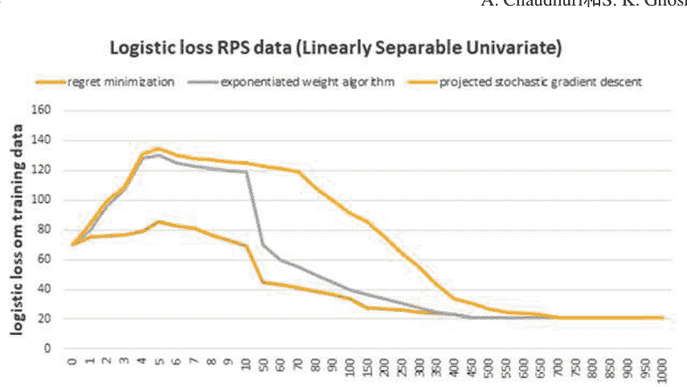

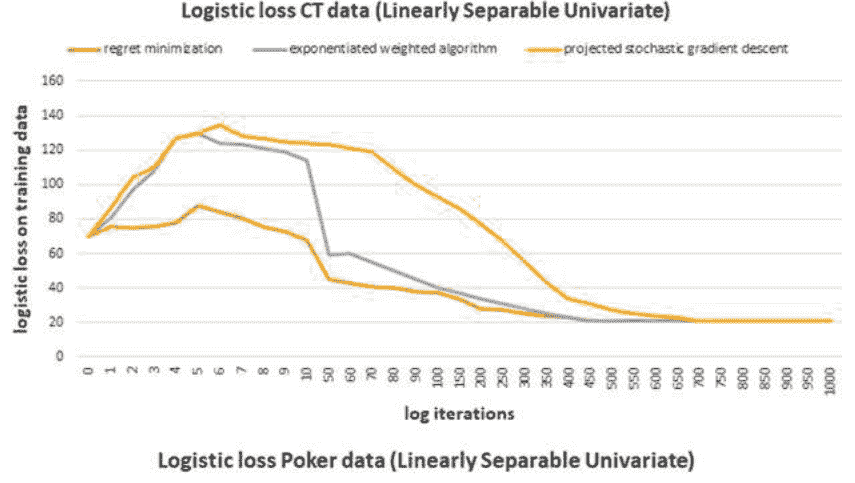

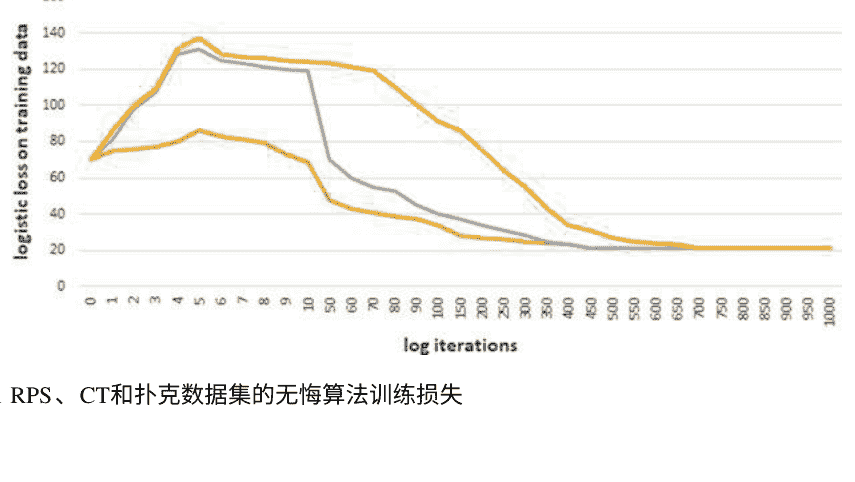

图1 RPS、CT和扑克数据集的无悔算法训练损失

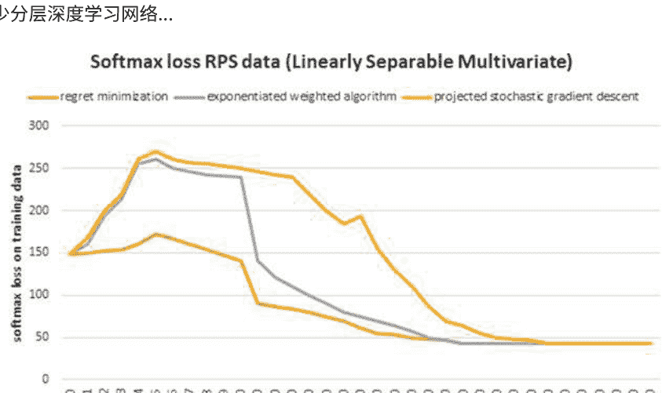

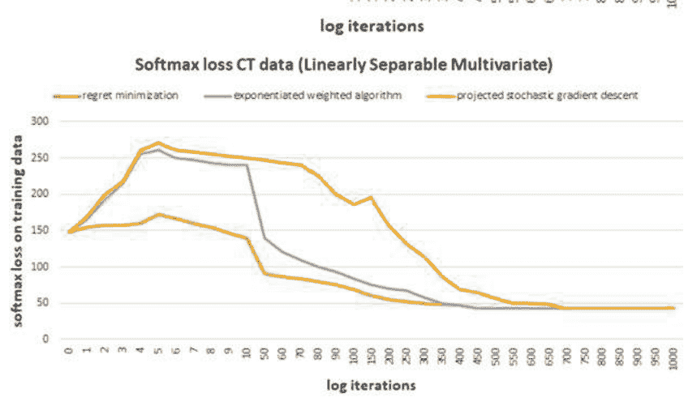

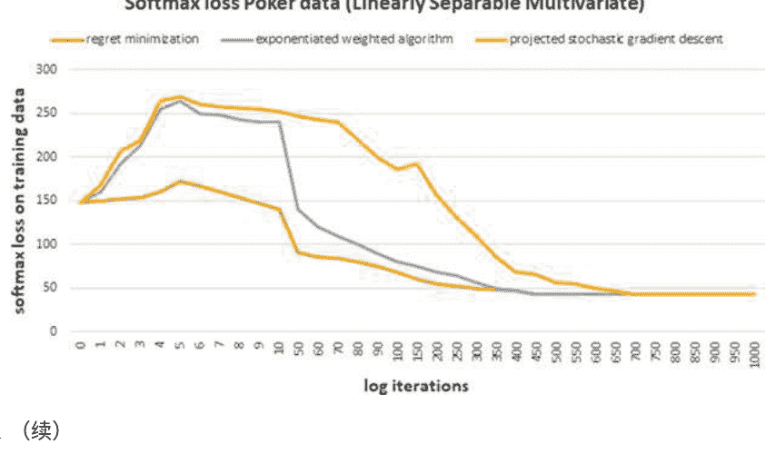

图1（续）

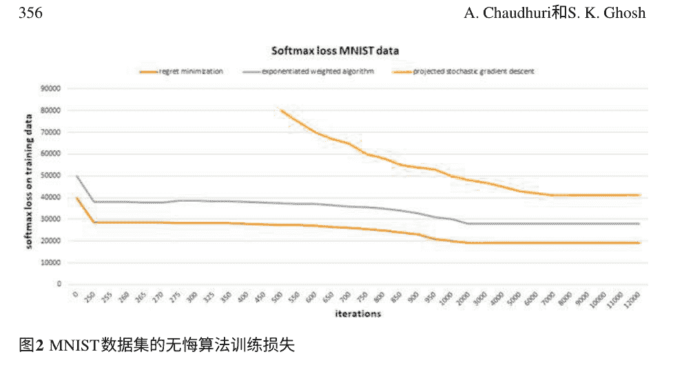

图2 MNIST数据集的无悔算法训练损失

对于多变量预测，所有结果都显示在下面的图中。MNIST数据集的结果（使用小批量大小＝200）显示在图2中。后悔最小化在这里被证明是最有效的。即使在参数调整后，投影随机梯度下降和指数权重算法的结果也不如后悔最小化好。

现在我们介绍在第2.4节讨论的方法的实验评估。实验是为了确定应用这些算法在HFDLN的每个顶点上的范围。为了使结果更具说明性，HFDLN通过[36-39]中提供的模型进行训练。这些方法在开发优化问题解决方案时不施加任何约束。然而，它们的特点是非正则化的，具有弱泛化能力。步长参数经常根据涉及每个问题的每个比较方法进行调整。

后悔最小化算法产生的结果比预期的随机梯度下降和指数权重算法更好。通过初始化累积后悔向量，后悔最小化方法效果良好。为了使结果更具说服力，首先在人工奇偶和折叠奇偶组合问题上进行实验[40]。通过线性阈值门的单隐藏层逼近奇偶[41]。折叠奇偶需要至少两个隐藏层[40]。奇偶训练是在完全连接的(m-8m-1); m=10架构上进行的。折叠奇偶训练是在L1约束被限制在20，初始化尺度设置为200。通过对标准ReLU门进行平滑逼近，使用非线性激活函数。图3中的结果显示，后悔最小化方法对奇偶和折叠奇偶都产生了更好的竞争结果，从上到下是稀疏模型。

接下来，使用MNIST数据集进行实验。初始实验考虑了一个完全连接的784-2048-2048-10架构，使用40次遗憾最小化执行，并使用初始化尺度为(60, 240,60)。

## Learning parity with logistic loss RPS data

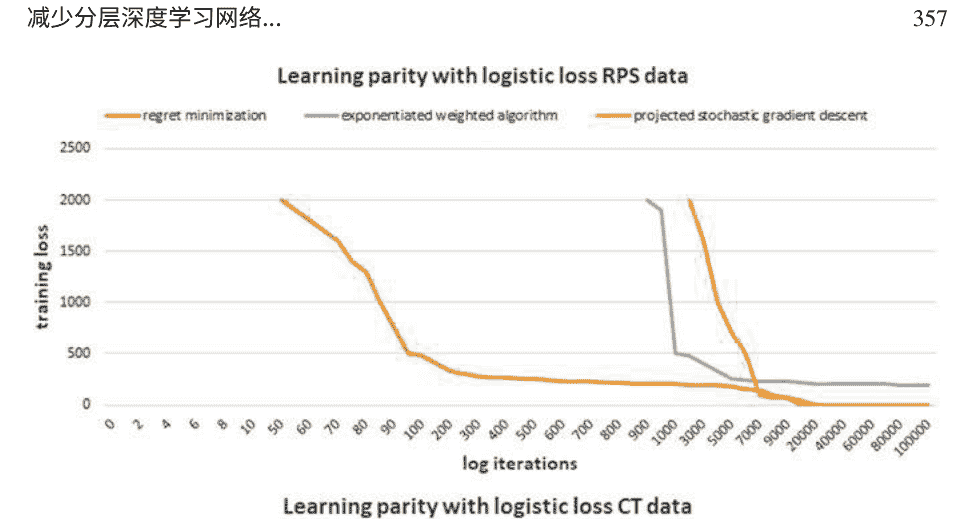

## Learning parity with logistic loss CT data

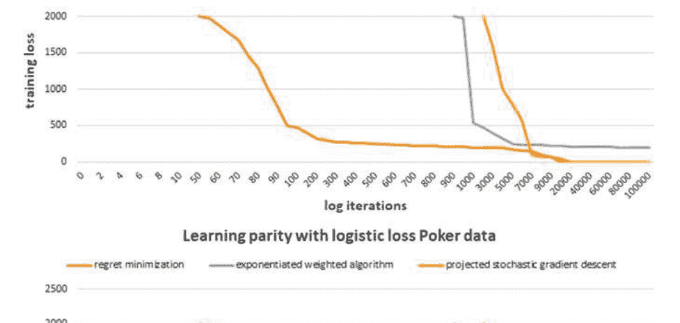

## Learning parity with logistic loss Poker data

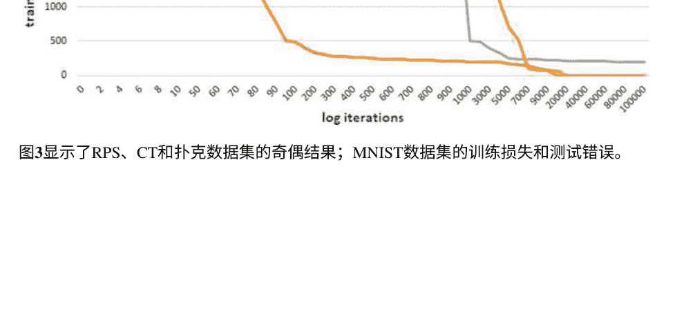

图3显示了RPS、CT和扑克数据集的奇偶结果；MNIST数据集的训练损失和测试错误。

## Full layers testing error MNIST data

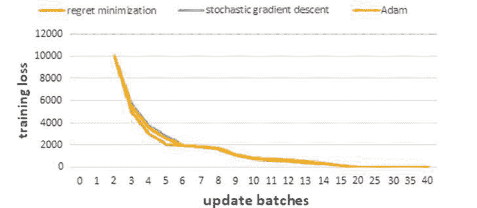

## Full layers testing error MNIST data

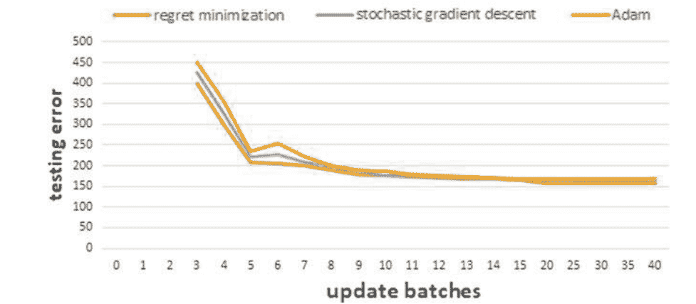

图3（续）

第二个实验采用了卷积架构32 \times 32 \ c(6 \times 6, 81) \ --c(6 \times 6, 81) \ c(6 \times 6, 81) \ c(6 \times 6, 81) \ -10 \ (卷积窗口6 \times 6和深度81) ，遗憾最小化运行受到(40, 40, 40,10)的限制，并且初始化尺度为600。考虑的小批量大小为200，结果在800个小批量更新后获得。图4显示了训练和测试损失。这些结果突出了训练损失和测试错误的演变。无论是完全连接的还是卷积的情况，遗憾最小化都超过了通过其他方法获得的结果。与其他方法相比，遗憾最小化的收敛速度具有竞争力。遗憾最小化的结果具有稀疏性质，并且与其他深度学习网络相比，实现了更低的测试错误分类。

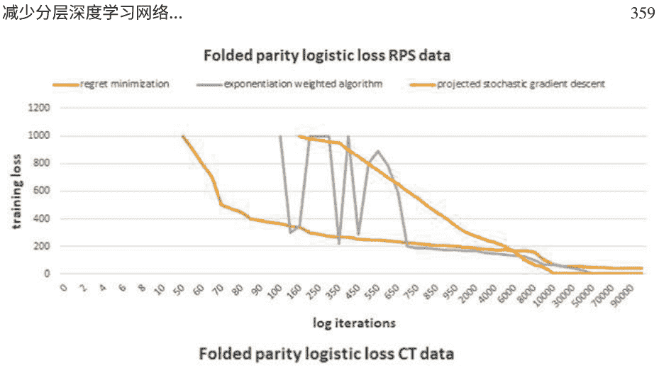

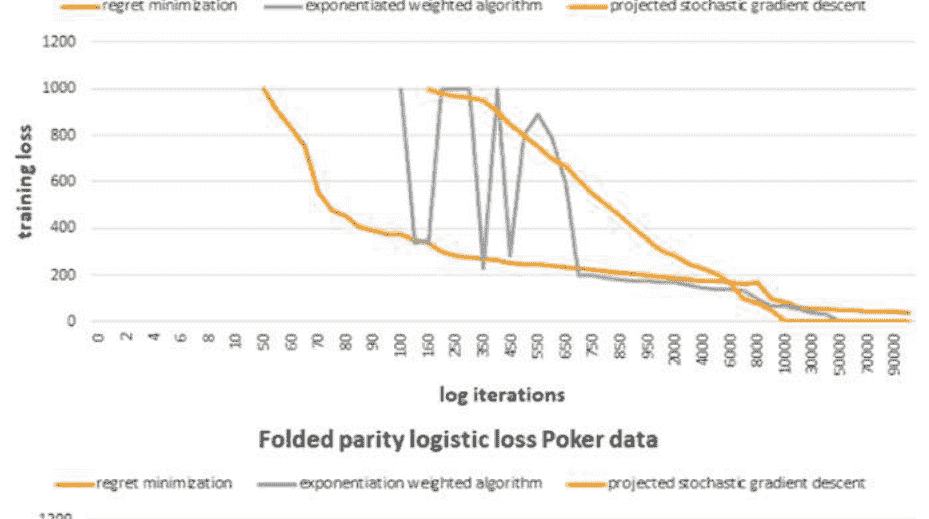

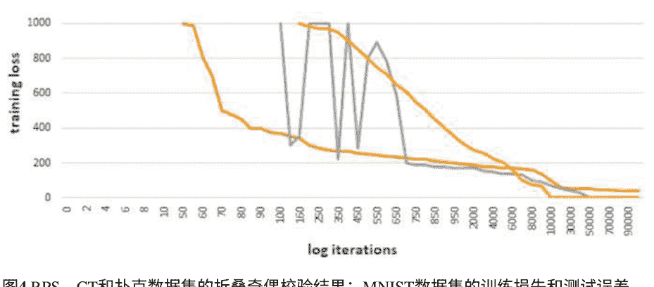

图4 RPS、CT和扑克数据集的折叠奇偶校验结果；MNIST数据集的训练损失和测试误差

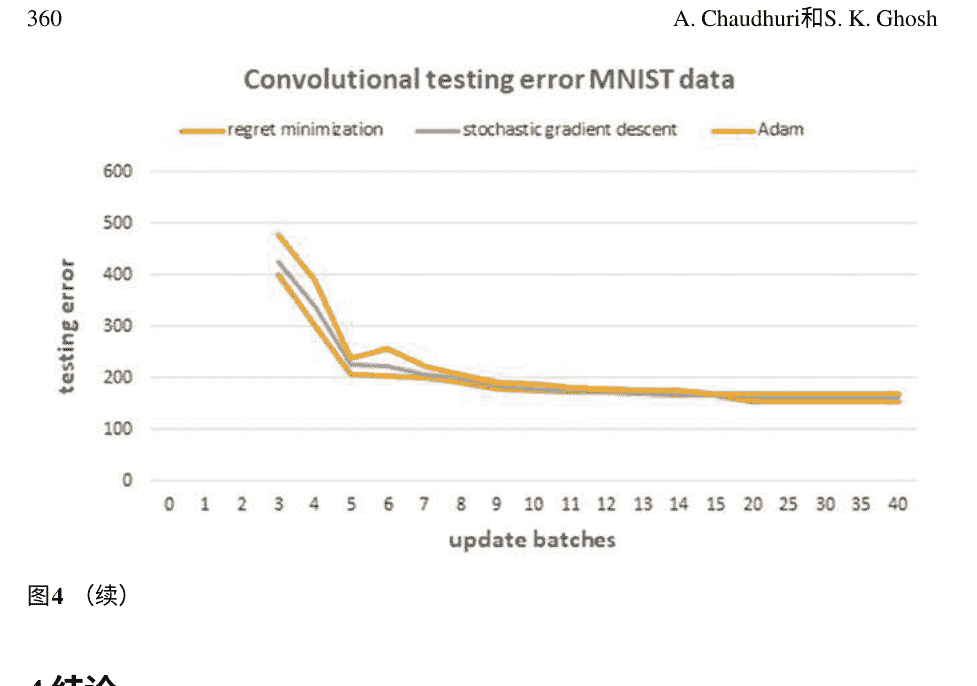

### 4 结论

我们在这里解决了预测战略设置中人类行为的HFDLN减少问题，作为一个以游戏为中心的对象。本章提出的减少是研究工作的结果，揭示了分层深度学习网络和博弈论之间的桥梁。这为关键点和纳什均衡之间的对应铺平了道路。遗憾匹配在实现稀疏性方面提供了更好的选择，同时兼顾速度或准确性。

这个数学框架实现了新的性能基准。这表明分层深度学习网络具有更高的性能。实验评估突出了所提出框架的优越性。对于深度学习游戏的替代框架的研究仍然是一个有趣的工作。然而，出现的问题是是否可以实现类似的成功。

## 参考文献

1.  A. Chaudhuri, S.K. Ghosh, Hierarchical fuzzy deep learning networks for predicting human behavior in strategic setups, in *Advances in Intelligent Systems and Computing*, ed. by R. Silhavy, et al., vol. 764 (Springer, Switzerland, 2019), pp. 111–121
2.  Y. Freund, R. Schapire, 使用乘法权重的自适应游戏玩法。 *Games Econ. Behav.* **29**(1–2), 79–103 (1999)
3.  S. Shalev-Shwartz, Y. Singer, 凸重复博弈和Fenchel对偶性，在*Advances in Neural Information Processing Systems*, vol. 19 (2006)
4.  S. Shalev-Shwartz, Y. Singer, 在线学习算法的原始-对偶视角。 *Mach. Learn.* **69**(2–3), 115–142 (2007)
5.  O. Tammelin, N. Burch, M. Johanson, M. Bowling, 解决头对头限制德州扑克，在*Proceedings of International Joint Conference on Artificial Intelligence*, vol. 645–652 (2015)
6.  T.M. Mitchell, 机器学习 (McGraw Hill, 2008)
7.  S. Hart, A. Mas-Colell, 一个简单的自适应程序导致相关均衡。 Econometrica 68(5), 1127–1150 (2000)
8.  N. Cesa-Bianchi, A. Conconi, C. Gentile, 关于在线学习算法的泛化能力。IEEE Trans. Inf. Theory 50(9), 2050–2057 (2004)
9.  N. Ratliff, D. Bagnell, M. Zinkevich, 结构化预测的次梯度方法, 在第11届国际人工智能和统计学会议, vol. 2, pp. 380–387 (2007)
10. N. Ratliff, J.A. Bagnell, M. Zinkevich, 最大边际规划, 在第22届机器学习国际会议, pp. 729–736 (2006)
11. S. Shalev-Shwartz, Y. Singer, N. Srebro, A. Cotter, Pegasos: 基于原始估计的次梯度求解器用于SVM. 数学规划. 127(1), 3–30 (2011)
12. M. Zinkevich, 在线凸规划和广义无穷小梯度上升, 在第20届国际机器学习大会, pp. 928–935 (2003)
13. M. Kearns, S. Suri, N. Montfort, 人类主体网络上着色问题的实验研究. 科学 313, 824–827 (2006)
14. M. Zinkevich, M. Bowling, M. Johanson, C. Piccione, 不完全信息下的遗憾最小化博弈, 在神经信息处理系统进展, vol. 20 (2007)
15. D. Balduzzi, 皮层预测市场, 在国际自主代理和多代理系统大会, pp. 1265–1272 (2014)
16. D. Balduzzi, 使用门控游戏进行深度在线凸优化 (2016). http://arxiv.org/abs/1604.01952
17. K. Hoeppgen, H. Simon, K. Van Horn, 单个神经元的稳健可训练性. J. Comput. Syst. Sci. 52(2), 114–125 (1995)
18. R. Tagiew, 关于具体案例中典型的人类战略行为的假设, in人工智能中的新兴视角. AI*IA, 编者 R. Serra, R. Cucchiara, LNCS, vol. 5883 (Springer, Heidelberg, 2009), pp. 476–485
19. Y. Gal, A. Pfeffer, 对人类双边谈判中的互惠行为建模, in第22届全国人工智能会议论文集, vol. 1, pp. 815–820 (2007)
20. M. Zinkevich, M. Littman, AAAi计算机扑克比赛. J. Int. Comput. GamesAssoc. 29 (2006)
21. Y. LeCun, L. Bottou, Y. Bengio, P. Haffner, 基于梯度的学习应用于文档识别。IEEE会议记录 86(11), 2278–2324 (1998)
22. N. Cesa-Bianchi, G. Lugosi,预测、学习和游戏(剑桥大学出版社, 2006)
23. A. Rakhlin, K. Sridharan, 具有可预测序列的优化、学习和游戏, 见神经信息处理系统进展, 第26卷 (2013)
24. V. Syrgkanis, A. Agarwal, H. Luo, R. Schapire, 游戏中正则化学习的快速收敛, 见神经信息处理系统进展, 第28卷 (2015)
25. N. Littlestone, M. Warmuth, 加权多数算法。信息与计算 108(2), 212–261 (1994)
26. N. Srinivasan, V. Ravichandran, K. Chan, J. Vidhya, S. Ramakrishnan, S. Krishnan, 多层前馈神经网络的指数化反向传播算法,在国际神经信息处理会议第1卷 (2002)
27. G. Gordon, 用于结构化预测问题的无悔算法。 CMU-CALD-05112技术报告, 卡内基梅隆大学 (2005)
28. G. Gordon, 用于在线凸规划的无悔算法,在神经信息处理系统进展第19卷 (2006)
29. J. Duchi, S. Shalev-Shwartz, Y. Singer, T. Chandra, 高维学习中的l1球上的高效投影,在国际机器学习会议论文集, pp. 272–279 (2008)
30. S. Shalev-Shwartz, 在线学习和在线凸优化. Found. Trends Mach. Learn. 4(2), 107–194 (2012)
31. D. Schuurmans, M. Zinkevich, 深度学习游戏, in 神经信息处理系统进展, vol. 29 (2016)
32. W. Karush, 具有不等式作为边界约束的多变量函数的最小值. 芝加哥大学硕士论文, 芝加哥, 伊利诺伊州 (1939)
33. H. Kuhn, A. Tucker, 非线性规划, in 第二届伯克利研讨会论文集, 加州大学出版社, pp. 481–492 (1951)
34. M. Johanson, N. Bard, N. Burch, M. Bowling, 在广泛形式游戏中找到最优抽象策略, in 人工智能AAAI会议论文集, pp. 1371–1379(2012)
35. J. Lee, M. Simchowitz, M. Jordan, B. Recht, 梯度下降只收敛到极小值点, 在第29届学习理论年会, 第49卷, 第1246-1257页 (2016)
36. L. Bottou, 随机梯度下降技巧, 神经网络：行业内幕, 第2版, 第421-436页 (2012)
37. J. Duchi, E. Hazan, Y. Singer, 自适应次梯度方法用于在线学习和随机优化. 机器学习研究 12, 2121-2159页 (2011)
38. D. Kingma, J.B. Adam, 一种随机优化方法 (2014). http://arxiv.org/abs/1412.6980
39. I. Sutskever, J. Martens, G. Dahl, G. Hinton, 关于初始化和动量在深度学习中的重要性, 在第29届国际机器学习大会, 第1139-1147页 (2013)
40. A. Razborov, On small depth threshold circuits, in *Proceedings of Scandinavian Workshop on Algorithm Theory*, pp. 42–52 (1992)
41. A. Hajnal, Threshold circuits of bounded depth. J. Comput. Syst. Sci. **46**(2), 129–154 (1993)## 基因表达建模中的深度学习

Dinesh Kumar和Dharmendra Sharma

摘要开发用于从数据中学习见解的计算智能算法一直是一个不断增长的知识挑战。通过数据挖掘已经取得了很大的进展，但是在深度学习方面的研究越来越多地关注于利用计算能力的巨大提升。本章介绍了深度学习研究的最新进展，并从基因表达建模应用领域的角度确定了一些仍然存在的挑战。它强调了深度学习（DL）作为机器学习（ML）的一个分支，各种模型和理论基础，以及在不断发展的大数据背景下为什么我们需要深度学习，特别是在基因表达水平分类的领域。我们对各种DL模型及其计算能力在基因表达建模中的优势和劣势进行了回顾。深度学习模型是高效的特征选择器，因此在高维数据集中效果最好。我们介绍了使用不同深度模型进行特征提取和选择的主要研究挑战。我们的案例研究来自基因表达数据集。因此，我们报告了用于深度学习的基因表达数据集的一些关键格式。作为正在进行的研究，我们将讨论深度学习在基因表达建模中的未来前景。

#### 1 引言和动机

世界正以前所未有的速度在生活、工业、教育、天气、健康和科学研究等领域经历着数据的巨大增长。从这些丰富的数据中提取模式和学习见解是一个不断发展的研究前沿。对数据中隐藏的模式和知识的前景产生了极大的兴趣，这激发了机器学习领域从业者的热情。

开发了多个机器学习算法，帮助他们提取相关知识和见解。机器学习经过数十年的研究已经成熟，并产生了高效的数据挖掘算法，如支持向量机、贝叶斯模型、决策树和人工神经网络；并且已经被用于解决各个领域的许多有趣的实际问题[1-3]。这些算法包括决策树、朴素贝叶斯（NB）、Apriori规则、模糊逻辑、支持向量机（SVM）和人工神经网络（ANNs）。上述算法被描述为传统的机器学习算法，它们在处理数据的原始形式上有一定的局限性[4]。在使用这些算法之前，需要进行严格的数据预处理。

数据必须经过筛选，然后转换为适合算法工作的格式。这还包括以特征向量的形式进行手动特征提取。学习算法只能使用这些数据来检测或分类模式。通常，这需要研究人员具备相当的领域知识。随着数据存储容量的扩大，数据收集方法的改进使得复杂的高维数据集（包括结构化和非结构化数据）得以增长。为了使现有的机器学习系统正常运行，数据需要被格式化为有效的输入。这样做的代价是丢失了可能嵌入在原始数据结构中的大量信息。因此，为了挖掘这些原始形式的大规模数据集，出现了被称为深度学习（DL）的新模型和算法。DL基于计算范式的人工神经网络，在其架构中实现了多个隐藏节点和层。它们也被称为深度结构学习或分层学习模型。

深度学习架构的需求受到几个因素的推动[5]，包括浅层网络（如SVM、NB、K-最近邻算法）在其架构中没有足够的深度来学习高维数据。大多数这些算法在标记数据和用户预定义特征上表现良好。当应用于高维数据集时，学习函数的参数数量以及计算时间可能会变得非常大，使得这些算法处理此类数据集效率低下。其次，人工智能旨在模仿大脑的推理能力。就像大脑通过示例学习一样，大多数机器学习算法是通过使用训练数据进行分类和聚类目的的。最接近大脑神经元功能的机器学习算法是人工神经网络（ANNs）。然而，大脑具有深层架构，有数百万个相互连接的神经元来处理输入信号（特征）。浅层人工神经网络（ANNs）不能近似大脑结构，因此需要深度学习架构。第三，人类视觉系统包含各种层次的细胞结构进行信息处理。信息从一个细胞层传递到下一个细胞层，通过这样做，它能够确定特征图中具有更高表征价值的重要区域。这表明从低层特征中提取出了高层特征。这简单地说明了大脑中的认知过程是深层的。思想和概念按层次组织，首先学习较简单的概念，然后将它们组合成更抽象的概念；例如，在图像上首先检测线条、圆圈、颜色和曲线，然后将它们组合起来学习更高级别的特征，如完整的面部。解决方案是问题被分解成多个层次的抽象和处理。由于其复杂的深度神经元结构，DL模型能够识别抽象层次或组合，因此被认为是从特征映射中提取出优秀特征的工具。它们被证明能够选择导致深度分类器性能提高的特征[1]。

本章总结了DL的最新进展，开发的关键模型以及它们在监督和无监督学习环境中的特征抽象性能。应用领域涵盖了基因表达建模的复杂领域。我们首先给出DL及其起源的正式定义。接下来，我们讨论各种关键的深度学习模型及其应用。我们将阐述支撑这些模型的相关理论基础，以及它们的优势和不足之处。此外，我们介绍基因表达建模问题（GEMP）- 表达数据集，研究人员从这些数据中寻找答案的问题类型，以及DL如何帮助找到这些问题的解决方案。在这里，我们将总结最近应用DL于基因表达数据的研究工作。最后，我们将提供深度学习的整体优势，并进行结论和探讨可能的未来研究。

### 2 深度学习

DL算法接受原始数据，并能自动发现其中的模式。它们通过创建特征图来实现这一点，从中发现模式或进行分类[4]。这使得深度学习方法能够检测以较低级特征为基础定义的更高级特征。DL利用了机器学习中人工神经网络的类似概念。由于传统机器学习中的大多数人工神经网络是“浅层”实现（一个或两个隐藏层），DL实现了“深层”神经架构（多个隐藏层），这似乎已被证明是解决图像和视频处理、文本分析和物体识别问题的合适架构。深度学习有时也被称为多层感知器（MLPs）或深度神经网络（DNN）。然而，这些深层架构的实现因问题和目标而异。深度学习的受欢迎程度已经大大增加，许多大公司如谷歌、英伟达和丰田对此表现出了极大的兴趣，并投资于深度学习人工智能的研究和开发[4]。图1是来自Google Trends (https://trends.google.com/trends/) 的图表，显示了近年来对DL作为研究领域的兴趣的增长。上升的趋势说明了这个术语在全球范围内以及各种语言中作为搜索短语输入的人们对其的普遍关注。

最近深度学习研究的突破已经为许多以前的机器学习技术无法解决或提供最优解的问题提供了解决方案[4]。许多在处理大型数据集以提取洞察力时面临的科学障碍，使用传统的浅层机器学习方法已经大大减少。驱动程序分析大型数据集以提取有意义的模式和推理能力一直是人工智能领域研究人员的目标。深度学习现在可以在图像和视频处理、情感分析的文本处理、物体识别、语音识别和时间序列分析等各个领域以更高的准确度实现这一目标。

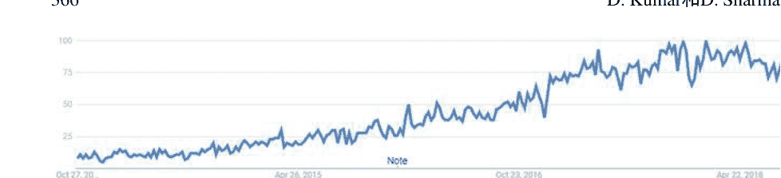

从实验数据中提取洞察力并通过预测分析建模和推导解决方案是一种丰富的范式。从实验数据中提取洞察力并通过预测分析建模和推导解决方案是一种丰富的范式。

自1998年LeCun等人发表了一篇关于深度学习的开创性论文[6]以来，对深度学习的研究兴趣迅速增加。自那时以来，已经报道了大量的研究成果，其中一些成果在[4, 7, 8]中有所报道。正如Benjio在[9]中所解释的那样，深度学习算法扫描输入分布，寻找并利用其中的未知结构，以发现良好的抽象表示。它们的目标是学习低层特征，然后以此为基础学习高层特征。

这使得DL可以用于无监督学习，其中数据没有标签。因此，DL的关键优势在于其能够自动学习良好的特征，而无需大量的重新设计或领域专家。图2摘自Yoshua Bengio关于DL的讲义[10]，展示了AI系统中不同部分在不同的AI学科中的关系。它展示了DL在多个层次上学习特征。在每个层次上，抽象特征是从前一层次的特征中发现的。随着特征的发现，它们在不同的层次上组合在一起产生输出。以下是吸引机器学习爱好者关注的三种关键DL架构；

- 前馈神经网络（FFNs），
- 卷积神经网络（CNNs），和
- 循环神经网络（RNNs）[11]。

在接下来的章节中，我们描述了这三种类型架构的特性、优点和缺点。

### 3 深度学习模型和应用

许多深度学习模型是为了解决应用问题而开发的。在本节中，我们总结了主要的模型，即前馈神经网络（FFNs）、卷积神经网络（CNNs）和循环神经网络（RNNs），以及它们在各种问题领域的应用。

图2 各种人工智能系统中的特征学习[10]

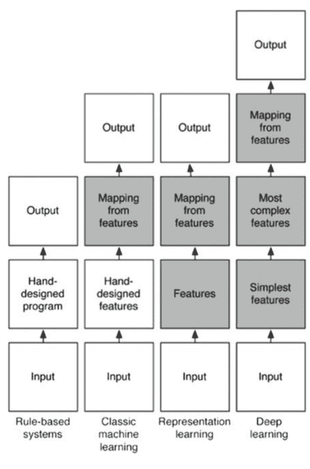

#### 3.1 前馈神经网络（FFNs）

前馈神经网络（FFN）与标准神经网络具有相同的架构，但具有多个隐藏层。它们通常被称为多层感知机（MLPs），并使用反向传播过程作为学习引擎。它们的操作与标准（ANN）模型相同。它们可以有多个隐藏层，每个隐藏层中有多个神经元。每个神经元与相邻层中的其他神经元相连[12]。这些神经元被分为3个不同的层，即输入层、隐藏层和输出层。根据定义，输入层和输出层中的所有层都被称为隐藏层，在深度网络中有多个隐藏层。每个输入层神经元与下一级的每个隐藏层相连。类似地，隐藏层神经元与下一级隐藏层中的每个神经元相连，依此类推，直到输出层神经元，通常限制为学习算法试图预测的输出变量的数量。输入神经元通过感知环境的传感器被激活。这些通常是从原始数据中发现的各个层次的特征特征图或数据集。这些特征通过权重激活从一个神经元到下一个神经元的传递。最后，网络通过在几个时期内根据反向传播规则调整权重来学习，直到网络展现出所需的行为，例如在分类任务中达到所需的最小训练误差。

图3展示了一个具有不同类型层的MLP模型的示例。在输入和输出之间有三个隐藏层。训练MLP涉及重复调用前向传播和反向传播过程。

如图3a所示，在网络中进行前向传播时，对每个神经元的输入和相关权重进行点积运算，加上偏置因子，并对每个神经元的所有连接进行求和。然后，输出通过激活函数。结果然后用作下一层神经元的输入。因此，给定节点的输出（激活）只是其输入的函数。每层的求和使用公式（1）描述。

$$S_j = \sum_{i} W_{ij} a_i + b_{ij}$$ (1)

激活函数在方程（2）中定义为：

$$a_j = f(S_j)$$ (2)

其中，$S_j$是上一层的权重和输出的点积之和$u$, $W_{ij}$表示连接层 $i$ 和层 $j$ 的权重，$a_i$ 表示上一层节点的激活值，$a_j$ 表示当前节点的激活值，$b_{ij}$是层 $i$ 和层 $j$ 之间的偏置值；而 $f$ 是非线性激活函数。激活函数的目的是引入非线性到函数中。简单来说，激活函数将函数的输出归一化到给定的范围内。存在多种激活函数。然而，在神经网络中常用的激活函数是$sigmoid$、$softmax$和$ReLU$ [4]。在许多神经网络架构中，可以找到ReLU激活函数用于隐藏层。使用ReLU激活处理的神经元的输出将返回相同的输出，或者如果输入值小于零，则返回零；即 $f(S) = \max(0, S)$。

在反向传播阶段中，如图3b所示，权重公式以相反的方向应用。在更新第$k+1$层的权重之前，先更新第$k$层的权重。这种方法允许第$k+1$层的神经元估计第$k$层神经元的误差[13]。成本函数（有时也称为损失函数）衡量误差的大小；其定义如下，由公式（3）给出：

| 变量 | 描述 |
| :--- | :--- |
| $E_p$ | 是训练模式的总误差， |
| 1/2 | 是一个用于简化函数导数的值， |
| $n$ | 是类别或输出标签的数量， |
| $t_{jn}$ | 是节点 $n$ 在输出层 $j$ 的真实值，并且 |
| $a_{jn}$ | 是节点 $n$ 在输出层 $j$ 的预测输出值。 |

$$E_p = \frac{1}{2} \sum_n (t_{jn} - a_{jn})^2$$ (3)

反向传播技术通常用于训练网络.因此，前向传播和反向传播在多个时期重复进行，直到网络达到最小阈值误差限制或达到时期数量.

FFN通常附加在表示模型的末端，例如卷积神经网络CNN。这使得MLP成为一个有向图结构，在层之间的所有神经元之间都有连接。前馈神经网络架构在DL的许多应用中被使用[4]。2006年，加拿大高级研究院重新引起了对深度前馈网络的兴趣[4]。他们在无监督学习中使用网络来创建特征检测器的层，而不需要标记的数据。这使他们能够使用网络来降低数据的维度，然后使用反向传播进行微调[14, 15]。

深度FFN在计算机视觉和语音识别领域的最显著应用是在[16]中由Zeiler等人在语音识别系统中用于声学建模。他们能够展示模型的改进泛化，并声称深度网络的训练速度更快，并使用ReLU。在语音识别的声学建模中使用DNN的成功受到Lopez-Moreno等人的激励[17]，他们在他们的工作中使用了DNN来进行语言识别任务。使用短期声学特征作为输入，他们能够识别语言信息。他们展示了网络从语音信号中识别出具有区分性的语言信息的巨大成功能力。

#### 3.2 卷积神经网络

CNN或ConvNets是一种使用卷积层自动提取输入数据特征的深度学习模型[18]。CNN的架构利用一组滤波器（称为卷积层）对数据进行预处理，识别数据中的关键特征。然后，这些高级特征被馈送到完全连接的深度网络进行训练和分类。这些卷积层的目的是降低数据的维度，从而在这些输入进入深度网络时允许更少且更快的计算。图4显示了CNN的架构。CNN在图像和视频数据方面表现良好。CNN的其他用途包括在句子处理领域中，用于识别用于情感分析的单词或字符序列（例如在网络挖掘中）和DNA序列。后者是本章使用深度学习进行基因表达建模的动机之一。

受到1988年Hubel和Wiesel的研究启发，哺乳动物的视觉皮层如何通过研究来检测特征，诸如卷积神经网络（CNN）等算法在图像分类、目标检测、视觉概念发现、语义分割和边界检测等各种计算机视觉任务中取得了巨大成功。他们能够描述出哺乳动物的视觉信息处理系统是如何使用分层的专门细胞组织成层次结构的，每一层都能够检测出来自视网膜图像的特定刺激。

他们发现动物视觉皮层中的细胞负责检测感受野中的光线；并证明在图像检测中，感受野能够在图像的局部区域中检测出线条和曲线等模式（低层特征），然后是形状和颜色（高层特征），最终检测出完整的图像。这表明从低层特征中提取出了高层特征。基于这些结果，LeCun等人[20]形式化了现代CNN的框架。他们将卷积技术应用于手写数字。

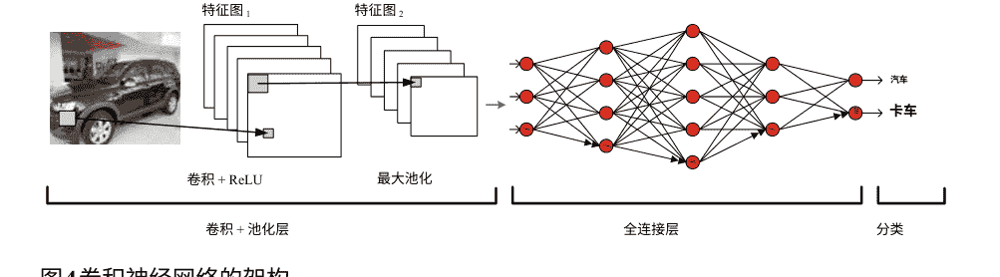

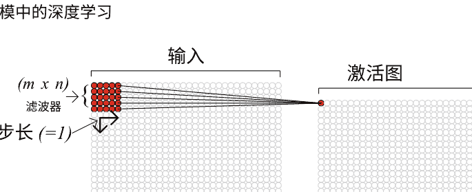

图5卷积过程。一个5 ×5的滤波器在32 ×32的输入空间上进行卷积，使用步长为1，产生一个27 ×27的激活图

邮政编码的识别。他们后来在[6]中改进了算法，并将其命名为LeNet-5。

CNN的基本结构可以分为两个不同的部分——卷积层和全连接层（如图4所示）。第一阶段由卷积层和下一阶段的池化层组成。

在卷积层中，通过与大小为m × n的滤波器进行卷积，形成一个特征图。这个滤波器只是一系列权重。滤波器被设计用来从输入空间中检测特定的特征。当滤波器在输入空间上进行步进操作时，对输入值和权重进行点乘运算。这个局部加权和的输出然后通过非线性函数（如ReLU）进行处理。这个激活函数的目的是引入非线性特征到模型中，以便检测非线性特征并避免过拟合。将结果添加到特征图中。从左到右、从上到下的连续步进使用单个滤波器形成一个完整的特征图。图5解释了这个过程。特征图有时也被称为激活图。可以在输入空间上应用多个滤波器来检测不同的特征（因为每个滤波器具有不同的权重），从而产生多个特征图或激活图。

卷积层中应用的滤波器数量（在一些文献中也称为卷积核）与生成的特征图数量相同。这导致参数数量很多，并增加了网络的计算时间。

因此，池化被用于对激活图进行下采样，并避免过拟合。它使表示变得更小、更易处理，并独立地应用于每个激活图。一种常见的池化方法是最大池化，它以激活图作为输入，并计算局部区域或单元的最大值（如图6所示）。在将最终的激活图通过完全连接层之前，可以多次迭代进行卷积和池化的过程。

CNN最适用于二维形式的数据；例如具有一个颜色通道（灰度）或三个颜色通道和音频频谱图像[4]。因此，CNN已经在图像分类问题中得到了广泛应用。

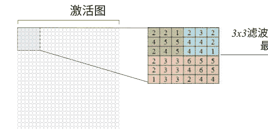

成功[21, 22]。由Krizhevsky等人开发的AlexNet [21]在2012年的ILSVRC挑战中取得了最佳表现[23]。随后，其他多年来开发的深度卷积神经网络包括ZF Net (2013) [24], GoogleNet (2014) [25], VGGNet (2014) [26]和由微软研究团队设计的ResNet (2015) [27]。

CNNs也被用于一维数据集，如信号和序列，例如文本检测[28, 29]和识别[30]领域。在三维数据光谱中，CNNs主要用于视频和体积图像，例如识别视频序列中的动作。由于CNNs设计用于高效处理二维数据，将该模型应用于此类数据一直是该领域的一个挑战。这主要是因为视频序列是时间相关的。解决这个问题的一个方法是将视频视为由连续帧组成的图像，并对其应用二维卷积技术，如[31]中所提出的。最后，Gu等人在[23]中对CNNs的最新进展及其应用领域进行了很好的综述。

#### 3.3 循环神经网络

循环神经网络（RNN）采用与前馈神经网络（FFN）类似的结构，但其表示优势来自隐藏神经元内的反馈循环。这使得RNN在处理时间序列数据时表现最佳，因为网络可以记住学习到的序列。因此，这些类型的网络非常适合预测问题，如需求预测和供应链规划。RNN的其他用途包括聚类、图像字幕生成、句子分类和嵌入、神经机器翻译和序列分类。然而，RNN的实现较为困难，并且容易出现梯度消失或梯度爆炸的问题。

RNN允许信息从上一个时间步传递到下一个时间步，因此在网络中形成了循环。图7显示了RNN的架构。它显示了在节点 s 下分组的隐藏神经元，其值为时间,和共享权重 W。

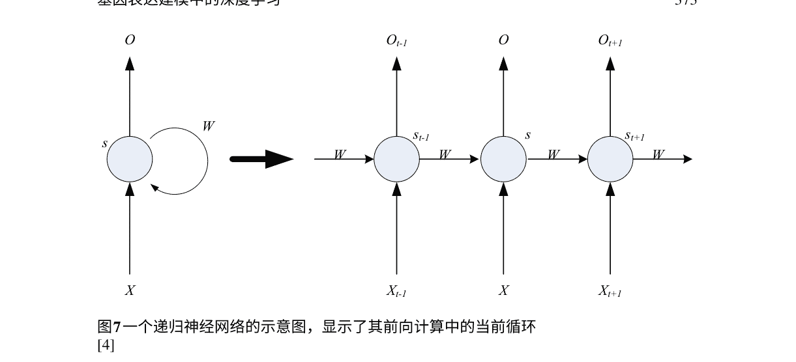

> 图7一个递归神经网络的示意图，显示了其前向计算中的当前循环[4]

自然语言处理是RNN在其中取得了相当大的成功的领域[32]。鉴于这一成功，它们现在被应用于其他领域，如生物医学文本分析[33]。

### 4 深度学习挑战

研究界普遍认为，如果问题满足一定的约束条件，深度学习效果最好。首先，深度学习需要大量的数据，包括特征的高维度。这样可以避免模型过拟合。然而，获取大量的数据通常是一个难以获取或策划的挑战。其次，用于训练深度网络的数据需要强大且干净。第三，当前时间的深度网络只对明确定义的数据结构（如图像、语音、自然语言处理和视频）有效。

在深度学习领域的研究试图创建模型，以自动从大规模、无标签的数据中学习特征。深度学习试图模拟生物神经系统（大脑）从示例（训练数据）中学习的类似学习机制。这导致了对深度学习的主要批评，即它并没有真正捕捉到大脑的生物机制。相反，深度学习依赖于计算等效性的概念，并且可能具有与生物大脑相当的能力，尽管使用不同的计算机制。此外，一个学习系统只能在观察到效果的同时推导出原因[34]，而无法预测效果从原因中产生。因此，深度学习也受到这个限制的影响。

目前在图像分类和生成领域的趋势显示出将CNN与FFN相结合以及使用CNN和RNN进行视频建模的潜力。然而，深度学习也面临一些问题，如学习速度慢和局部陷阱。深度网络的处理时间已经大大缩短，因为它们现在可以在高性能加速图形处理单元（GPU）卡上运行。

可以将深度网络卸载到高性能加速图形处理单元（GPU）卡上。为了避免局部陷阱，通过使用ReLU激活函数已经在很大程度上得到解决。总之，尽管模型的进步和鲁棒性，深度网络和其他机器学习模型一样，仍然存在数据模型不确定性和过拟合的问题。

### 5 基因表达建模问题

由于深度学习需要具有大规模数据集的要求，我们有动力在生物信息学的一个关键和复杂领域——基因表达分析[35]中展示这些技术和模型的结果，作为基因表达建模问题（GEMP）的一部分。微阵列技术的进步[36]为通过基因表达分析来识别疾病特征提供了机会。这导致了基因组学领域的兴起。

#### 5.1 什么是基因表达分析？

基因组学是统计数据挖掘的研究领域。这个领域有趣的地方在于有大量的基因表达数据可供挖掘，并且需要从这些数据中获取洞察和模式来解决问题，例如识别癌基因、药物的影响以及个体基因水平的治疗。一个生物体包含数百万个基因。每个基因可以被看作是包含各种器官和身体部分的功能和构成的指令代码。将基因中编码的信息转化为蛋白质会产生基因表达数据[37]。它提供了有关相应细胞内复杂活动的信息，通过转录过程中产生的信使核糖核酸(mRNA)来衡量[38]。我们使用术语基因表达来描述将基因的DNA序列转录成RNA的过程。

#### 5.2 基因表达数据的用途和限制

当基因的RNA用于产生蛋白质时，称为基因被表达[39]。研究人员一直致力于研究基因表达值的变化和模式，作为某些疾病（如各种癌症）的指标。正常细胞由于基因表达水平的突变而转化为癌细胞。因此，分析基因表达数据有助于识别不同的基因功能和诊断癌症等疾病。

最近一种产生基因表达数据的技术是通过微阵列或DNA芯片，可以记录基因表达情况。由于存在成千上万的基因，并行分析会产生大量的数据。通常，从微阵列图像分析中提取基因表达矩阵（GEM）。在该矩阵中，基因和样本（组织或实验）分别由行和列表示。

图8 将微阵列转化为2D基因表达矩阵[41]

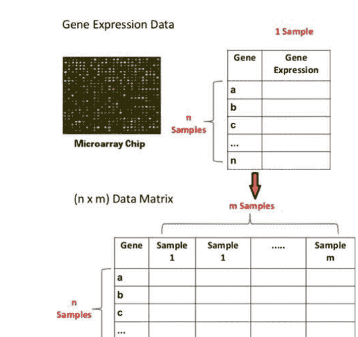

| Gene | Gene Expression |
| :--- | :--- |
| a | |
| b | |
| c | |
| ... | |
| n | |

| Gene | Sample 1 | Sample 1 | ...... | Sample m |
| :--- | :--- | :--- | :--- | :--- |
| a | | | | |
| b | | | | |
| c | | | | |
| ... | | | | |
| n | | | | |

GEM的每个单元格中的值表示该特定基因在特定样本中的表达水平[40]。图8解释了微阵列图像转化为n×m维基因表达数据。挑战在于开发分析技术来理解这些大量的生物数据[41]。由于其特性，这些数据集与用于分类算法的传统数据集有很大的不同。在这其中，基因表达数据确实具有一些特性，正如Lu和Han在[39]中指出的那样，这些特性限制了分类器的行为，即它们通常包含数万个基因的非常高的维度，但由于样本数量较少，数据规模非常小。

此外，大多数基因可能与任何特定疾病无关，这就引出了找到发生故障的正确基因的问题。

#### 5.3 基因表达的公开数据存储库

微阵列基因表达数据协会于1999年由微阵列用户和生产商Affymetrix、斯坦福大学和EBI创立，为数据质量建立了标准。

表1 官方基因表达数据存储库

| 基因表达存储库 | 网址 |
| :--- | :--- |
| • CGAP和SAGEmap | https://cgap.nci.nih.gov/ |
| • ExpressDB | http://arep.med.harvard.edu/ExpressDB/ |
| • NCBI的GEO | https://www.ncbi.nlm.nih.gov/geo/ |
| • EBI的ArrayExpress | https://www.ebi.ac.uk/arrayexpress/ |
| • CIBEX | http://cibex.nig.ac.jp/data/index.html |
| • Expression Atlas | https://www.ebi.ac.uk/gxa/home |
| • 癌症基因组图谱（TCGA） | https://cancergenome.nih.gov/ |
| • Ensembl | http://www.ensembl.org/index.html |
| • NIH Roadmap Epigenomics Mapping Consortium (REMC) | http://www.roadmapepigenomics.org/ |

在基因组学、转录组学和蛋白质组学水平上的存储、管理、注释和交换。表1显示了一些当前官方基因表达库的链接。

#### 5.4 基因表达的深度学习

已经开发了几种方法，用于分析癌症基因表达数据进行癌症诊断和分类，使用标准机器学习方法对癌细胞与正常细胞进行聚类，例如[39, 42–44]。Siang等人在[45]的综述中提供了一份详细的数据挖掘软件列表，用于基于标准机器学习方法对基因表达数据进行分析。最近，研究人员开始在相同领域应用DL技术。Min等人在[35]的研究中分析了DL在生物信息学的三个关键领域中的应用，即组学、生物医学成像和生物医学信号处理。然后，他们根据上述领域的文献确定了应用，并根据所使用的DL架构类型对其进行了分类。即他们将应用程序分为DNNs、CNNs、RNNs和新兴架构。表2显示了他们的分析结果。他们将DNNs不仅指深度多层感知器，还包括其他变体，如堆叠自编码器、深度置信网络、自编码器和受限玻尔兹曼机。为了本章的目的，我们将描述DL在基因表达数据和分析上的一些最新应用。其他几篇论文，如[46–48]，展示了DL技术在基因表达数据中的新兴应用。Angermueller等人在[49]中对计算生物学领域的DL进行了全面的综述。

表2 生物信息学中的深度学习应用研究[35]

|  | 组学 | 生物医学成像 | 生物医学信号处理 |
| :--- | :--- | :--- | :--- |
| 研究主题 |  |  |  |
| 深度神经网络 | 蛋白质结构 | 异常分类 | 脑解码 |
| 深度神经网络 | 基因表达调控 | 分割 | 异常分类 |
| 深度神经网络 | 蛋白质分类 | 识别 |  |
| 深度神经网络 | 异常分类 | 脑解码 |  |
| 卷积神经网络 | 基因表达调控 | 异常分类 | 脑解码 |
| 卷积神经网络 |  | 分割 | 异常分类 |
| 卷积神经网络 |  | 识别 |  |
| 循环神经网络 | 蛋白质结构 |  | 脑解码 |
| 循环神经网络 | 基因表达调控 |  | 异常分类 |
| 循环神经网络 | 蛋白质分类 |  |  |
| 新兴架构 | 蛋白质结构 |  | 脑解码 |

#### 5.5 深度神经网络

在基因表达分析方面，已经使用了几种深度神经网络的变体，例如深度置信网络、自编码器和受限玻尔兹曼机。有些已经被应用作为分类器来解决预测问题，而其他一些则被用作特征选择器和提取器在预处理步骤中。例如，为了对酵母的基因表达数据进行聚类，Gupta等人在他们的研究中使用了深度网络作为预处理步骤。特别是，他们使用了去噪自编码器的形式作为预处理步骤。他们的自编码器以无监督的方式学习输入的紧凑表示，从中提取特征供进一步的监督学习使用。他们的目标是识别基因表达向量的潜在分布特征，并将其用于解释例如两个基因之间的相互作用和相关性。类似地，已经有大量的研究使用深度架构作为特征选择器作为预处理步骤，并取得了有希望的结果[48, 50]。

在另一项名为D-GEX的研究中，设计了一个深度多任务多层前馈网络，用于利用基因地标的表达来推断目标基因的表达。在生物学中，基因地标是一组基因（大约1000个）可以代表CMap数据中约80%的信息 ([http://www.lincscloud.org/](http://www.lincscloud.org/))。这是由LINCS项目的研究人员 ([http://www.linsproject.org](http://www.linsproject.org)) 在使用主成分分析（PCA）分析CMapdata的基因表达谱时发现的。他们的实验是在GEO数据库中的GEO微阵列表达数据上进行的，该数据库包含129,158个基因表达谱。每个表达谱包含22,268个探针，对应978个基因地标和21,290个目标基因。使用GEO数据库中的微阵列和RNA-seq表达数据作为MLP模型的输入，LINCS研究人员能够推断出多达21,290个目标基因的表达。由于基因表达数据的高维度，Fakoor等人[38]在他们的研究中对基因表达微阵列数据应用了主成分分析（PCA）。然后使用得到的低维度数据集来训练稀疏自编码器分类器。随后，他们能够使用他们的模型对各种癌症进行分类，例如急性髓系白血病、乳腺癌、卵巢癌和结肠癌。一方面，基因表达数据具有高维度，但通常受到数据集中样本量的限制。然而，Fakoor等人能够证明来自相同平台具有相同基因的癌症数据可以用作无标签数据来训练分类器。这种方法允许他们将特征集推广到不同的癌症中。这意味着例如使用来自其他癌症（如前列腺癌、结肠癌、肺癌）的数据，他们能够解决乳腺癌的检测和分类问题。

#### 5.6 卷积神经网络

卷积神经网络在数据以图像或二维形式存在时表现最佳。因此，已经进行了相当多的研究，使用了图像，例如肿瘤标记的图像进行分类[51]。然而，很少有研究直接利用卷积神经网络对基因表达或微阵列数据进行分析。这主要是因为只有以生物序列格式提供的数据才能解决基因表达调控问题[52-54]。

例如，在Nguyen等人最近的一篇文章中[18]，作者使用CNN对DNA序列进行分类，将DNA序列视为文本数据。他们的大部分DNA测序数据来自Pokholok等人的研究[55]。他们使用滑动窗口技术（窗口大小=3，步幅=1）将DNA序列转化为单词序列。使用这些参数进行卷积后，形成了一个由64个单词组成的词典。然后，对每个单词进行编码，得到一个二维结构，作为他们的CNN模型的输入进行分类。

图9显示了它们的DNA序列转换为独热向量表示。已经有一些研究人员使用其他形式的生物数据来预测基因表达水平。Singh等人[56]提出了一个使用组蛋白修饰数据作为输入的CNN框架来分类基因表达水平的方法。他们强调组蛋白修饰信号数据包含了基因表达水平的重要信息。因此，能够使用深度学习来预测这些表达水平对于理解基因调控的效果将会很有用。

这种知识可以帮助开发针对癌症等疾病的“表观遗传药物”。在他们的研究中，他们首先从REMC数据库（http://www.roadmapepigenomics.org/）中提取了5个核心组蛋白修饰标记。对于每个组蛋白，他们选择了从每个基因的转录起始位点（TSS）两侧提取的100个碱基对（bp）的区域。结果是每个基因的一个5 × 100矩阵，其中行代表组蛋白修饰标记，列代表不同的区域。

因此，可以通过基因中5个组蛋白修饰的信号值以二进制形式来确定基因的表达水平，无论是高表达（+）还是低表达（-）。图10显示了单个基因中组蛋白修饰标记在区域中的2D结构，图11显示了基因表达水平预测的CNN模型。

#### 5.7 循环神经网络

基因表达数据也可以用时间序列表达的形式来表示[46]。Xu等人[57]在他们的研究中使用时间序列基因表达数据来推断基因调控网络的基因活动。

为了确定网络参数，他们使用粒子群优化（PSO）技术训练了他们的RNN模型。他们的混合RNN/PSO模型有助于理解基因之间的调控相互作用。在另一项工作中，Noman等人[58]提出了一种称为“解耦RNN”模型的RNN模型变体。他们的主要目标是使用解耦RNN成功地从表达谱中推断基因表达。其他一些文献报告了在基因相关数据上应用RNN（有些与其他模型混合）的使用，例如[59, 60]。

### 6 结论

通过学习算法的研究取得了很大进展。下一个的领域是研究和进一步发展深度学习，特别是随着系统计算能力的不断提升。本章总结了重要的深度学习模型的动机和理论基础。对其在困难的实际问题中的应用进行了回顾。介绍了基因表达建模复杂问题的一些有希望的结果。未来仍然存在许多挑战，并且被确定为未来研究的重点。它们包括研究用于增量学习的算法和深度学习结构，增强用于抽象本体论的智能算法，智能数据预处理以确保最小信息损失，从异常值中提取信息以及基于多智能体的模式提取的可能模型。

与湿实验技术一起，Danaee等人强调了计算机分析基因表达数据对于更好地理解人类基因组的重要性。然而，这需要我们转移注意力去寻找和识别那些数据中的微妙模式可能揭示了疾病诊断和药物发现的关键。尽管研究界已经开始将数据挖掘方法应用于基因表达数据，以寻找诸如癌症之类的疾病的原因，但仍然迫切需要确定导致细胞突变引发癌症的基因，并最终找到治愈这些疾病的方法。

## 参考文献

- 1. S. Agarwal, G. Pandey, M.D. Tiwari, 教育中的数据挖掘：数据分类和决策树方法。国际电子教育、电子商务、电子管理、电子学习杂志 2(12) (2012)
- 2. Y. Li, W. Ma, 人工神经网络在金融经济学中的应用：一项调查，国际计算智能与设计研讨会 (2010)
- 3. H. Xie, J. Shi, W. Lu, W. Cu, 动态贝叶斯网络在电子设备健康诊断中的应用，*IEEE*预测与系统健康管理会议(2016)
- 4. Y. LeCun, Y. Bengio, G. Hinton, 深度学习。 自然 **521**(7553), 436–444 (2015)
- 5. L. Weifeng, V. Benjamin, X. Liu, 新竹, 深度学习：概述—讲义，亚利桑那大学，亚利桑那州，2015年4月
- 6. Y. LeCun, L. Bottou, Y. Bengio, P. Haffner, 基于梯度的学习应用于文档识别。IEEE会议记录 **86**(11), 2278–2324 (1998)
- 7. T. Raiko, H. Valpola, Y. LeCun, 线性变换在感知机中使深度学习更容易，在第15届国际人工智能和统计学会议(AISTATS)论文集中，拉帕尔马，加那利群岛(2012)
- 8. Y. Bengio, 深度学习的扩展，在第20届ACM SIGKDD国际会议知识发现和数据挖掘，美国纽约 (2014年)
- 9. Y. Bengio, 无监督和迁移学习的深度学习表示，*JMLR*：研讨会和会议论文集，卷27，第17-37页 (2012年)
- 10. Y. Bengio, 深度学习的理论动机，2015年8月3日，http://videolectures.net/deeplearning2015_bengio_theoretical_motivations/. 访问日期：2017年6月26日
- 11. Y. Bengio, 人工智能的深度学习架构。Found. Trends Mach. Learn. **2**(1), 1–127页 (2009年)
- 12. J. Schmidhuber, 神经网络中的深度学习概述。神经网络。 **61**, 85–117页 (2015年)
- 13. P.-N. Tan, M. Steinbach, V. Kumar, 数据挖掘导论(Pearson Education Inc., 波士顿, 2006)
- 14. G. Hinton, R. Salakhutdinov, 用神经网络降低数据维度。 科学 **313**, 504–507 (2006)
- 15. M. Ranzato, C. Poultney, S. Chopra, Y. LeCun, 用基于能量的模型高效学习稀疏表示的方法。 Adv. Neural. Inf. Process. Syst. **13**, 1137–1144 (2006)
- 16. M.D. Zeiler, M. Ranzato, R. Monga, M. Mao, K. Yang, Q.V. Le, P. Nguyen, A. Senior, V. Vanhoucke, J. Dean, G.E. Hinton, 关于修正线性单元在语音处理中的应用，*IEEE*国际会议声学、语音和信号处理(*ICASSP*), pp. 3517–3521 (2013)
- 17. I. Lopez-Moreno, J. Gonzalez-Dominguez, D. Martinez, O. Plchot, J. Gonzalez-Rodriguez, P.J. Moreno, 关于使用深度前馈神经网络进行自动语言识别的研究。Comput. Speech Lang. **40**, 46–59 (2016)
- 18. N.G. Nguyen, V.A. Tran, D.L. Ngo, D. Phan, F.R. Lumbanraja, M.R. Faisal, B. Abapihi, M. Kubo, K. Satou, 通过卷积神经网络进行DNA序列分类。 J. Biomed. Sci. Eng. **9**, 280–286 (2016)
- 19. D.H. Hubel, T.N. Wiesel, 猴子条纹皮层的感受野和功能结构。 J. Physiol. (1968)
- 20. Y. LeCun, J.S. Denker, D. Henderson, R.E. Howard, W. Hubbard, L.D. Jackel, 使用反向传播算法的手写数字识别, 发表于NIPS会议(1990)
- 21. A. Krizhevsky, I. Sutskever, G.E .Hinton, 使用深度卷积神经网络的Imagenet分类, 发表于NIPS会议(2012)
- 22. D.C. Ciresan, U. Meier, J. Masci, L.M. Gambardella, J. Schmidhuber, 灵活、高性能的卷积神经网络用于图像分类, 发表于IJCAI会议(2011)
- 23. J. Gu, Z. Wang, J. Kuen, L. Ma, A. Shahrourdy, B. Shuai, T. Liu, X. Wang, G. Wang, 卷积神经网络的最新进展(2017). arXiv:1512.07108
- 24. M.D. Zeiler, R. Fergus, 可视化和理解卷积网络 (2013). arXiv:1311.2901
- 25. C. Szegedy, W. Liu, Y. Jia, P. Sermanet, S. Reed, D. Anguelov, D. Erhan, V. Vanhoucke, A. Rabinovich, 通过卷积深入研究,在IEEE计算机视觉和模式识别会议 (2015)中
- 26. K. Simonyan, A. Zisserman, 非常深的卷积网络用于大规模图像识别 (2014). arXiv:1409.1556
- 27. K. He, X. Zhang, S. Ren, J. Sun, 深度残差学习用于图像识别,在IEEE计算机视觉和模式识别会议 (2016)中
- 28. M. Delakis, C. Garcia, 使用卷积神经网络进行文本检测,在VISAPP会议 (2008)中
- 29. H. Xu, F. Su, 鲁棒的种子定位和基于深度卷积特征的场景文本检测,在ICMR会议论文集中(2015)
- 30. M. Jaderberg, K. Simonyan, A. Vedaldi, A. Zisserman, 用于无约束文本识别的深度结构化输出学习,在ICLR会议论文集中(2015)
- 31. A. Karpathy, G. Toderici, S. Shetty, T. Leung, R. Sukthankar, L. Fei-Fei, 用卷积进行大规模视频分类,在CVPR会议论文集中(2014)
- 32. W. Yin, K. Kann, M. Yu, H. Schutze, 比较CNN和RNN在自然语言处理中的研究(2017). arXiv:1702.01923 [cs.CL]
- 33. L. Li, L. Jin, D. Huang, 探索循环神经网络以从生物医学文本中检测命名实体,基于自然标注大数据的中文计算语言学和自然语言处理,编者: M. Sun, Z. Liu, M. Zhang, Y. Liu, 计算机科学讲义, 第9427卷 (Springer, Cham, 2015)
- 34. D. Lopez-Paz, K. Muandet, B. Sch lkopf, I. Tolstikhin, 迈向因果推断的学习理论,国际机器学习会议,第1452-1461页 (2015)
- 35. S. Min, B. Lee, S. Yoon, 生物信息学中的深度学习. 简明生物信息学. (2016)
- 36. V. Trevino, F. Falciani, H.A. Barrera-Salda a, DNA微阵列: 一种用于生物医学和临床研究的强大基因组工具. 分子医学. 13(9-10), 527-541 (2007)
- 37. D.R. Edla, P.K. Jana, S. Machavarapu, 基于KD树的基因表达数据聚类, 商业分析和优化百科全书, 第15页 (2014年)
- 38. R. Fakoor, F. Ladhak, A. Nazi, M. Huber, 使用深度学习提高癌症诊断和分类,在第30届国际机器学习大会论文集, 亚特兰大, 美国 (2013年)
- 39. Y. Lu, J. Han, 使用基因表达数据进行癌症分类。信息系统数据管理生物信息学, 第28卷 (4), 243-268页 (2003年)。爱思唯尔
- 40. A. Brazma, J. Vilo, 基因表达数据分析。FEBS Lett., 第480卷 (1), 17-24页 (2000年)
- 41. J. Clemente, 基因表达数据分析, LinkedIn, 2013年1月28日, http://www.slideshare.net/JhoireneClemente/gene-expression-data-analysis。访问日期: 2017年1月8日
- 42. 刘杰, 蔡伟, 邵晓, 基于微阵列基因表达数据的癌症分类方法, 使用主成分累积方法。中国科学化学 54(5), 802-811 (2011)
- 43. 张辉, 于春阳, 辛贝, 基于基因表达数据的细胞和肿瘤分类, 构建森林。PNAS 100(7), 4168-4172 (2003)
- 44. O. Dagliyan, F. Uney-Yuksektepe, I.H. Kavakli, M. Turkay, 基于优化的微阵列基因表达数据肿瘤分类。PLOS 6(2) (2011)
- 45. T.C. Sihang, W.T. Soon, S. Kasim, M.S. Mohamad, C.W. Howe, S. Deris, Z. Zakaria, Z.A. Shah, Z. Ibrahim, 基因表达数据的癌症分类软件综述。国际生物科学生物技术杂志 7(4), 89-108 (2015)46. A. Gupta, H. Wang, M. Ganapathiraju, 使用深度架构学习基因表达数据的结构, 应用于基因聚类, 在2015年IEEE生物医学可视化搜索和深度学习研讨会上, 华盛顿特区

47. Y. Chen, R. Narayan, A. Subramanian, X. Xie, 使用深度学习进行基因表达推断, 生物信息学, 2015年Bioinformatics (2015)

48. J. Tan, J.H. Hammond, D.A. Hogan, C.S. Greene, 基于ADAGE的公开可用的铜绿假单胞菌基因表达数据与去噪自动编码器的整合, 揭示了微生物与宿主的相互作用. mSystems 1(1) (2016)

49. C. Angermueller, T. Parnamaa, L. Parts, O. Stegle, 用于计算生物学的深度学习Mol. Syst. Biol. 12(878) (2016)

50. J. Tan, M. Ung, C. Cheng, C.S. Greene, 使用去噪自编码器从乳腺癌的全基因组测序中进行无监督特征构建和知识提取, 在2015年太平洋生物计算研讨会上

51. Q.V. Lee, J. Han, J.W. Gray, P.T. Spellman, A. Borowsky, B. Parvin, 学习肿瘤标志物的不变特征, 在ISBI会议论文集中, 第302-305页 (2012)

52. B. Alipanahi, A. Delong, M. Weirauch, B.J. Frey, DeepBind: 通过深度学习预测DNA和RNA结合蛋白的序列特异性. 自然生物技术杂志 (2015)

53. H. Zeng, M. Edwards, G. Liu, D.K. Gifford, 用于预测DNA-蛋白结合的卷积神经网络架构. 生物信息学杂志32(12) (2016)

54. D. Kelly, J. Snoek, J.B. Rinn, 使用深度卷积神经网络学习可访问基因组的调控代码. bioRxiv (2015)

55. D. Pokholok, C. Harbison, S. Levine, M. Cole, N. Hannet, T. Lee, G. Bell, K. Walker, P.Rolfe, E. Herbolsheimer, J. Zeitlinger, F. Lewitter, D. Gifford, R. Young, 全基因组核小体图. 细胞 122, 517–527 (2005)

56. R. Singh, J. Lanchantin, G. Robins, Y. Qi, DeepChrome: 使用深度学习预测基因表达的方法. 生物信息学 32, i639–i648 (2016)

57. R. Xu, D.C. Wunsch II, R.L. Frank, 使用粒子群优化推断具有循环神经网络模型的遗传调控网络. IEEE Trans. Comput. Biol. Bioin-form. (2006)

58. N. Noman, L. Palafox, H. Iba, 使用解耦的递归神经网络模型从基因表达数据中重建基因调控网络, 在信息与通信技术会议 (PICT 6) 中, 第93-103页 (2013年)

59. B. Lee, J. Baek, S. Park, S. Yoon, DeepTarget: 使用深度递归神经网络的端到端学习框架进行微小RNA靶点预测, 在BCB '16会议上, ACM出版 (2016年)

60. A. Khan, S. Mandal, R.K. Pal, G. Saha, 使用递归神经网络和群体智能构建基因调控网络. Scientifica (2016年)

61. P. Danaee, R. Ghaeini, D.A. Hendrix, 一种用于癌症检测和相关基因识别的深度学习方法, 在太平洋生物计算研讨会上, 第22卷, 第219-229页 (2016年)