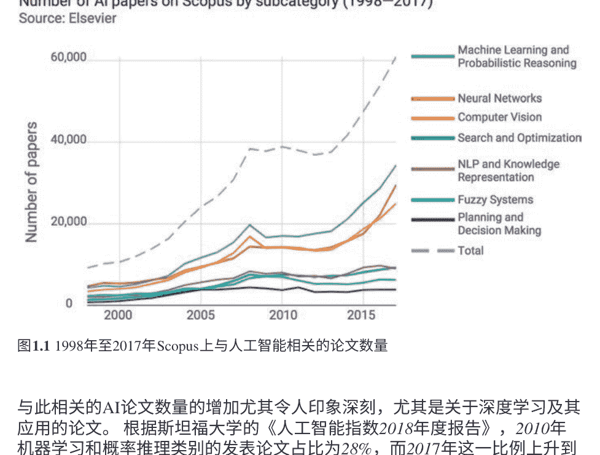
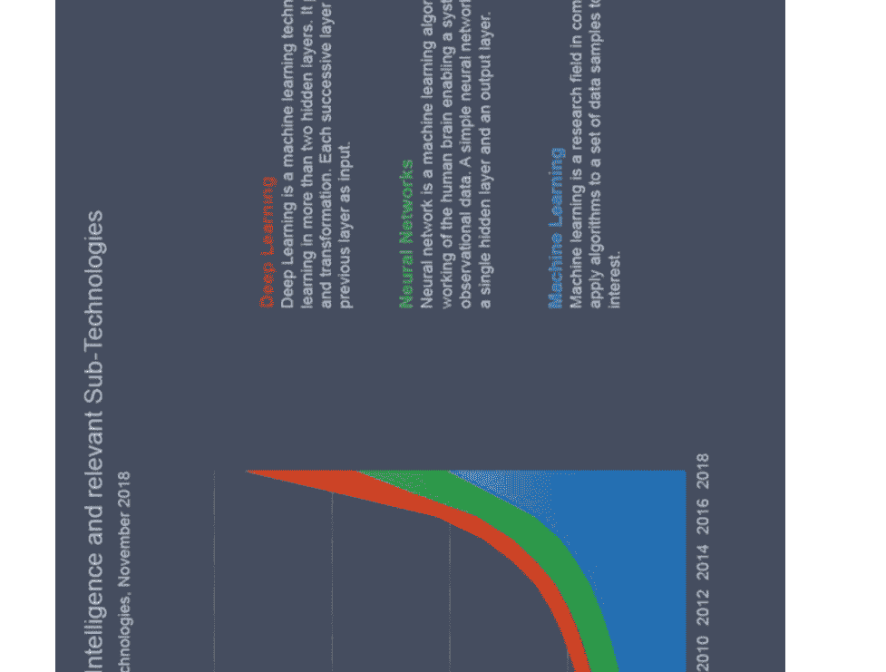
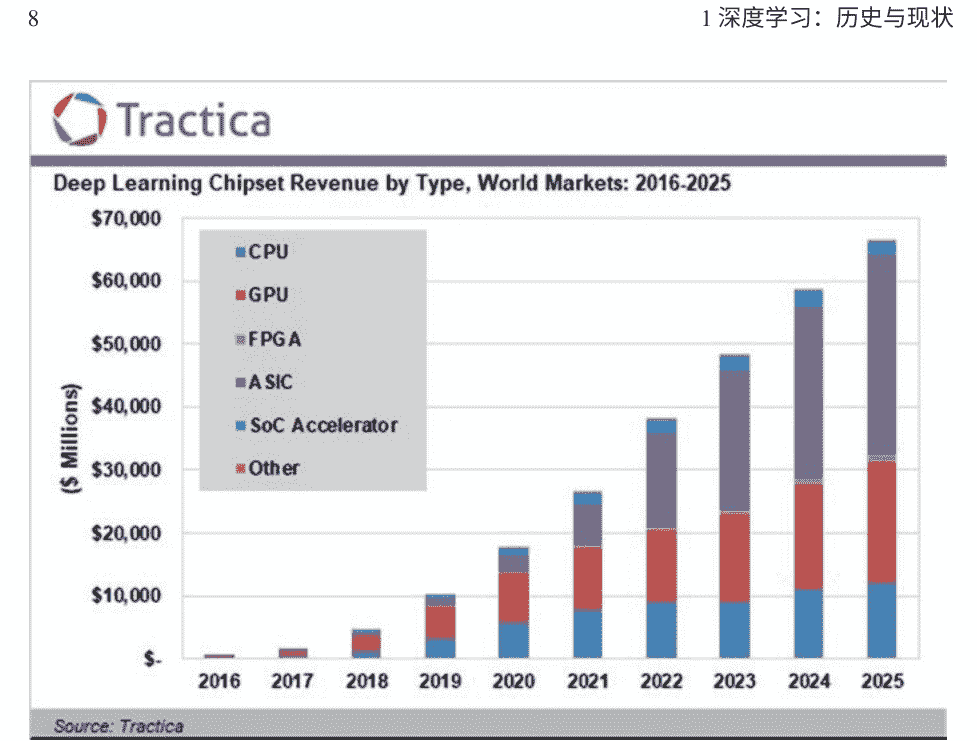
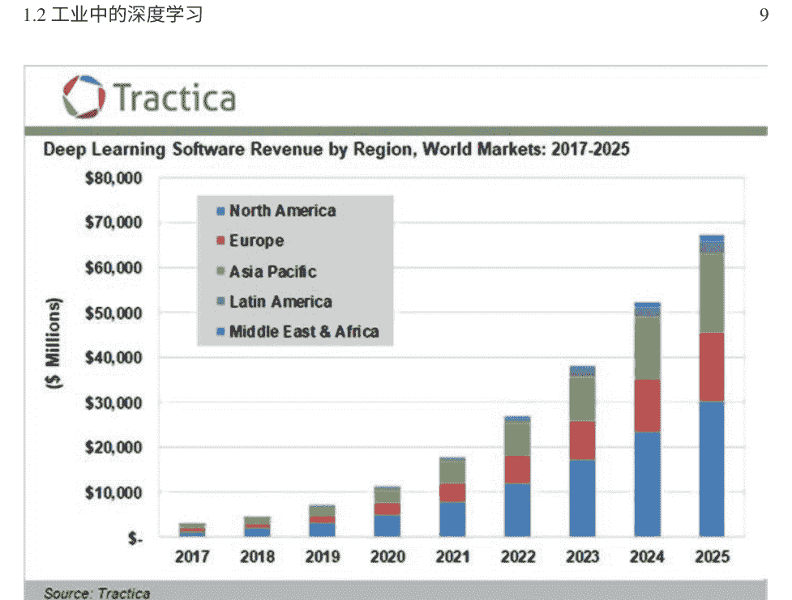
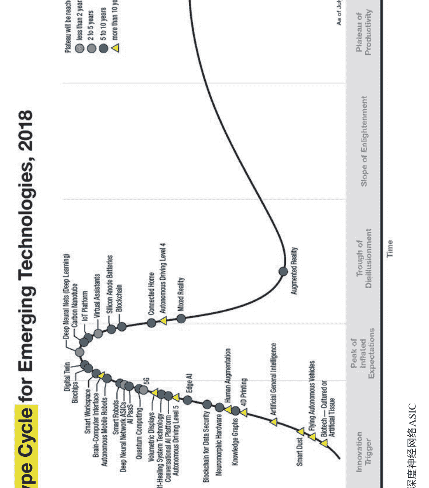
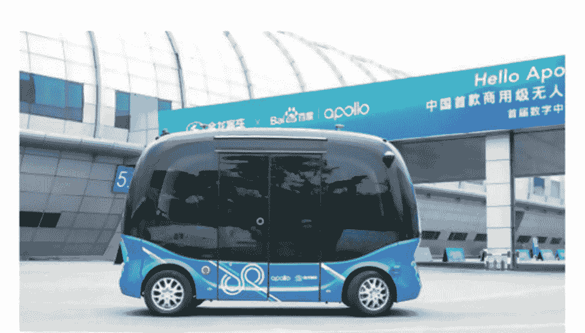

# 深度学习技术的发展

# 前言

## 中国电子信息工程技术发展研究丛书

在当今世界，以数字化、网络化和智能化为特征的信息技术浪潮正在蓬勃发展。信息技术每天都在快速变化，并得到广泛应用于生产和生活中，深刻改变了全球经济、政治和安全格局。在各种信息技术中，电子信息工程技术是最具创新性和广泛应用的技术之一，并在推动其他科技领域发展中发挥着最大的作用。它不仅是技术创新的激烈竞争领域，也是关键参与者推动经济增长和寻求竞争优势的重要战略方向。电子信息工程技术是一种典型的“使能技术”，几乎所有其他领域中推动技术进步。它与生物技术、新能源技术和新材料技术的结合预计将引发新一轮技术革命和产业转型，从而为人类社会的演变带来新机遇。电子信息是一种典型的“工程技术”，也是最直接、实用的工具之一。它实现了科学发现和技术创新与工业发展的直接紧密结合，大大加快了技术进步的速度。因此，它被视为改变世界的有力力量。电子信息工程技术是中国过去七十年来快速经济和社会发展的重要推动力量，特别是改革开放四十年来。展望未来，电子信息工程技术的进步和创新将继续成为推动人类进步的最重要引擎之一。

中国工程院是中国在工程和技术科学领域的主要学术和咨询机构。中国工程院以世界科技发展的总体趋势为指导，致力于从战略和长远的角度为创新驱动的科技进步提供科学、前瞻性和及时的建议。中国工程院的使命是成为国家高端智库。为了履行使命，信息与电子工程部在副院长陈作宁、主任卢锡城和常务委员会的指导下，动员了300多位院士和专家共同编写了本书的总部分和专题部分（以下简称“蓝皮书”）。编写的第一阶段由院士吴江兴和吴满清负责（从2015年底到2018年6月），第二阶段由院士于少华和卢军负责（自2018年9月起）。编写蓝皮书的目的是：通过分析技术进步，介绍国内外电子信息领域每年取得的重大突破和显著成就，为中国的科技人员准确把握该领域的发展趋势提供参考，并为中国的决策者制定相关发展战略提供支持。

## 《蓝皮书》根据以下原则编写：

-   1. 确保对年度增长的适当描述。电子信息工程技术领域涵盖范围广，发展速度快。因此，总体部分应确保对年度增长的适当描述，即关于最近的进展、新特点和新趋势。
-   2. 选择热点和亮点。中国的技术发展仍处于一个同时扮演追随者、竞争者和领导者角色的混合阶段。因此，专题应该描绘所关注行业的发展特点，并围绕发展过程中的“热点”和“亮点”展开。
-   3. 总体部分和专题的整合。该计划由总体部分和专题两个部分组成。前者从宏观角度讨论了电子信息工程技术的全球和中国发展以及展望；后者详细描述了13个子领域的热点和亮点。

信息与电子工程技术13个子领域的分类图

上述图表显示了5个类别和13个子类别，或者具有明显细粒度的特殊主题。然而，每个子领域在技术相关性方面都与其他子领域紧密联系，这使得它们更容易与相应的学科相匹配。

目前，“蓝皮书”的编制仍处于试验阶段，难免会有疏漏。因此，我们欢迎评论和更正。

## 中国电子信息工程技术研究中心的电子信息工程技术发展研究系列著作中的深度学习技术发展

人工智能（AI）是新一轮科技革命和产业变革的主要驱动力，以一种重大而前所未有的方式影响着世界经济、社会和政治。作为近十年来核心的AI突破，深度学习在技术和应用方面取得了巨大的进展，并引起了全球范围内的研究兴趣和关注。

由于深度学习的发展，包括语音、计算机视觉（CV）在内的AI技术、自然语言处理（NLP）等许多领域已经取得了快速的进展，甚至在某些任务上超过了人类智能。它们的应用已经广泛出现在互联网、交通、安全、智能家居、医疗保健和其他行业中。

深度学习是机器学习的一个子领域，与传统的机器学习方法不同，它通过使用多层非线性模块进行特征提取和转换，能够学习多个层次的表示和抽象。深度学习能够进行端到端的训练，无需手动设计特征。在大数据的帮助下，它明显优于传统方法。深度学习在语音、CV和NLP等领域的广泛应用和巨大成功，推动了AI的全面实现。作为最活跃的领域之一，深度学习与AI产业发展的许多方面相关。在中国，由于互联网、金融和人力资源的优势，市场规模、用户数量和海量数据，中国正在成为国际市场领导者。

深度学习的研究和工业应用蓬勃发展，并越来越受到公众的欢迎。反过来，它们为基础理论的研究、商业投资和人才的吸引做出了贡献。

这本蓝皮书关注的是深度学习技术的发展。
本书分为三章，介绍了全球趋势、中国的深度学习发展现状以及未来的讨论。

中国北京 中国工程院电子与信息研究中心

# 系列贡献者名单

《中国电子信息工程技术研究》系列的指导组和工作组如下所示：

## 指导组

组长：陈作宁，陆锡琛

成员（按字母顺序）：

-   费爱国, 段宝燕, 方斌星, 李博虎, 沈长祥, 吴成, 王成军, 陈春, 杨德森, 方殿元, 王恩东, 张广军, 倪光南, 金国锋, 李国杰, 戴浩, 吴和全, 江会林, 龚会兴, 吴江兴, 吴建平, 方家雄, 陈杰, 谭久斌, 陆军, 陈良辉, 吴满清, 赵勤平, 戴琼海, 刘尚河, 于少华, 李天楚, 王天然, 柴天友, 高文, 丁文华, 魏宇, 马元亮, 吕跃光, 李月明, 刘泽金, 陈志杰, 邓中翰, 高忠奇, 赵子深, 徐祖彦

## 工作组

组长：于少华，陆军

副组长：大安，党美美，徐守仁

成员（按字母顺序排列）：

-   史德年, 张定义, 戴芳芳, 戴飞, 邢飞, 周峰, 乔刚, 周兰, 李涛, 陈亮, 李伦, 刘墨, 孟楠, 王鹏, 傅强, 王庆国, 张锐, 李少辉, 何伟, 谢伟, 纪向阳, 胡晓峰, 张兴权, 邵秀梅, 陆艳, 吴颖, 陆越, 魏云峰, 舒宇翔, 郑铮, 尚志刚, 刘壮

# 关于作者

中国工程院（CAE）是中国最重要的工程和技术科学学术咨询机构，已被列入首批国家高端智库试点单位。作为国家机构，CAE的任务是研究经济和社会发展中的重大战略问题，以及工程技术进步，并将自身建设成为对国家战略问题决策具有重要影响力的科技智库。在当今世界，以数字化、网络化和智能化为特征的信息技术浪潮正在蓬勃发展。信息技术每天都在快速变化，并得到广泛应用于生产和生活中，深刻改变了全球经济、政治和安全格局。在各种多样的信息技术中，电子信息工程技术是最具创新性和广泛应用的技术之一，并在推动其他科技领域的发展中发挥着最大的作用。

为了更好地开展电子信息工程技术的战略研究，推动相关体制机制创新和优势资源整合，中国工程院与国家互联网信息办公室、工业和信息化部、中国电子科技集团公司于2015年11月共同成立了电子与信息研究中心（以下简称“中心”）。

中心追求高水平、开放式、前瞻性的发展，致力于开展电子信息工程技术领域的交叉、综合和战略性重大热点问题的理论和应用研究，并通过与中国工程院院士、国家部委和委员会、企事业单位、公共机构、高校和科研机构的专家学者进行头脑风暴，为决策提供咨询服务。中心的使命是建设一个顶尖的战略智库，为国家电子信息工程技术的决策提供科学、前瞻和及时的建议。

《深度学习技术的发展》的主要作者是王海峰和于少华。

博士 王海峰是ACL（计算语言学协会）历史上第一位中国主席，ACL是自然语言处理领域最有影响力的国际学术组织，也是唯一的来自中国大陆的ACL成员。2018年7月，他成为ACL亚太分会AACL的创始主席。他还在许多国际学术组织、国际会议和国际期刊担任各种职务。他是深度学习技术与应用国家工程实验室的主任和院长。同时，他还担任中国人工智能产业发展联盟、新一代人工智能产业技术创新战略联盟、脑类智能技术与应用国家工程实验室、中国电子学会、中国信息学会等机构的副主席，国家大数据系统软件国家工程实验室技术委员会副主任，以及新一代人工智能战略咨询委员会成员。

博士 于少华，中国工程院院士，信息与通信网络技术专家。他是中国信息通信技术集团有限公司的首席工程师，中国信息通信技术集团有限公司的首席工程师，国家光通信技术与网络重点实验室主任，中国通信学会副理事长，国家863计划网络与通信学科专家组成员，网络强国战略咨询组成员，国家集成电路产业发展咨询委员会委员。他长期从事光纤通信和网络技术的研究，主持完成了973和863等十余项国家级项目，全部取得了成果转化和大量应用。他是SDH（同步数字体系）和互联网（包括以太网）集成的先驱之一。

# 第1章 深度学习：历史和现状

近年来，深度学习在学术界和工业界都产生了巨大的影响。许多学术领域都目睹了深度学习引发的突破和与深度学习相关的论文的增加。深度学习已成为主要学术会议上的热词。与深度学习相关的专利占据了人工智能专利申请的相当大的份额。与此同时，由于深度学习的工业进步和新产品，我们的工作、学习和生活方式发生了巨大的变化。深度学习在各个重要领域被广泛应用，为信息检索、信息交流、购物、医疗保健、金融和工业制造等越来越多的应用赋予了力量，这无疑将在我们日常生活中变得越来越重要。

## 1.1 深度学习概述

### 1.1.1 深度学习的历史

尽管在近年来很受欢迎，深度学习并非一夜之间发展起来的。它有着悠久的历史。目前，主流的深度学习方法是基于神经网络的，这些神经网络已经研究了几十年，并取得了不同程度的成功。神经网络的概念起源于1943年。沃尔特·皮茨（Walter Pitts）是一位美国数学家和逻辑学家，沃伦·麦卡洛克（Warren McCulloch）是一位心理学家，他们发表了题为“神经活动中内在思想的逻辑演算”的论文，提出了神经活动的数学形式化和神经网络模型的概念。1958年，康奈尔大学的教授弗兰克·罗森布拉特构建了一个两层感知器，这是一个使用赫布学习规则或者最小二乘法。感知器激发了许多科学家对人工神经网络的兴趣。

1969年，Logo程序设计语言的共同发明人马文·明斯基和西摩·帕佩特提出了一系列数学证明，揭示了单层感知器的各种限制。例如，它无法解决“异或”（XOR）问题。然后，在20世纪70年代，人工神经网络变得不那么流行了。

直到1986年，David Rumelhart、Geoffrey Hinton和Ronald Williams重新提出了反向传播算法，并将其应用于多层神经网络，第二波神经网络研究浪潮才出现。

1989年，Robert Hecht-Nielsen证明了多层感知器（MLP）的通用逼近定理。同年，Yann LeCun提出了卷积神经网络（CNN），这是一种常用的深度学习模型，并成功应用于手写数字识别任务。

不幸的是，20世纪80年代的计算机速度非常慢，几乎不可能训练深度网络。此外，当使用反向传播进行训练时，扩展神经网络会导致梯度消失问题，这限制了神经网络研究和应用的进展。当浅层学习算法，如支持向量机（SVM），在20世纪90年代提出并在分类和回归问题上表现优于神经网络时，对神经网络研究的兴趣再次下降。

2006年被认为是深度学习的开始，当时Geoffrey Hinton和他的学生Ruslan Salakhutdinov首次提出了深度学习这个术语[1]。他们在《科学》杂志上发表的论文详细解决了梯度消失问题——逐层无监督学习，然后通过监督反向传播进行微调。这篇论文重新引起了对深度神经网络（DNN）的关注。

随后，计算机硬件的快速进步，特别是GPU的巨大进步和广泛应用，大大增强了计算能力，使得可以使用复杂的复合非线性函数来学习分布式和层次化的特征表示。此外，互联网带来了海量数据。大数据的机器学习得到了工业界越来越多的认可，这促进了它的进一步发展。

大约在2011年，Geoffrey Hinton和微软的研究人员将深度学习应用于语音识别，并取得了重要的里程碑。2012年，Geoffrey Hinton和他的团队凭借他们的深度学习模型AlexNet [2]赢得了ImageNet大规模视觉识别挑战赛（ILSVRC），将错误率从26%降低到15%。

深度学习在语音和图像任务方面的突破引起了学术界和工业界的极大关注，并打开了深度学习研究和应用的大门。在接下来的几年里，关于深度学习算法和模型研究、编程框架构建、训练加速和应用扩展方面进行了大量的工作。新的突破在更广泛的领域中蓬勃发展，并开始产生社会和经济效应。

值得一提的是，深度学习在基于计算机的围棋上的历史性表现非常有趣和令人惊讶，它使深度学习和人工智能的概念为公众所知，并使它们的研究和应用更受社会接受。

2016年，Google DeepMind基于深度学习开发的AlphaGo以4比1战胜了韩国职业九段围棋选手李世石，成为围棋世界冠军。随后，它继续战胜其他围棋大师，标志着基于深度学习的人工智能围棋选手战胜了人类。

在2017年，AlphaGo进化为AlphaGo Zero。它没有使用任何来自人类游戏的数据，从零开始独立成为了一名大师。在自我对弈3天后，它以100比0的成绩击败了AlphaGo。

AlphaGo和AlphaGo Zero使用了深度学习和强化学习的组合。前者擅长感知，而后者专注于决策。AlphaGo结合了深度学习和蒙特卡洛树搜索，并使用了两个网络来提高搜索效率——一个策略网络用于选择移动并减少搜索广度，一个价值网络用于评估棋盘位置并减少搜索深度。通过自我对弈强化学习训练策略网络，通过自我对弈和快速模拟生成的数据训练价值网络，AlphaGo能够以更高效准确的方式确定每一步中具有最高获胜概率的移动。在游戏中，策略和价值网络与蒙特卡洛树搜索相结合，以选择每个位置的最佳移动。

AlphaGo Zero，升级版，将策略网络和价值网络合并为一个，并通过端到端的自我对弈强化学习进行学习。战胜冠军的AlphaGo是通过大量的人类对局数据和人工设计的特征进行训练的，而AlphaGo Zero则完全通过自我对弈学习从一个随机初始化的网络中进行训练，在更短的时间内以及更少的资源下取得了更高的性能。AlphaGo Zero的成功主要得益于更好地利用深度神经网络。使用更深的残差网络使其能够在更复杂的游戏中以原始棋盘位置作为输入。将独立的策略网络和价值网络合并为一个统一的网络可以实现更高效的训练和更好的性能。总体而言，AlphaGo Zero的架构更简单、更统一，但功能强大。

AlphaGo和AlphaGo Zero征服围棋这个最复杂、变化无常的棋盘游戏，展示了深度学习和强化学习相结合的威力，并帮助普及了深度学习在大众中的应用。

### 1.1.2 学术研究

深度学习已成为学术研究的焦点。正如相关论文的激增所证明的那样，深度学习已成为国际学术会议的重要议题。在过去几年里，学术出版物的数量呈现出强劲增长的趋势。

## Number of AI papers on Scopus by subcategory (1998–2017)

Source: Elsevier

图1.1 1998年至2017年Scopus上与人工智能相关的论文数量

与此相关的AI论文数量的增加尤其令人印象深刻，尤其是关于深度学习及其应用的论文。根据斯坦福大学的《人工智能指数2018年度报告》，2010年机器学习和概率推理类别的发表论文占比为28%，而2017年这一比例上升到了56%。此外，神经网络类别的论文数量在2014年至2017年间以37%的复合年增长率增长，而2010年至2014年间的复合年增长率为3% [3]。图1.1显示了1998年至2017年Scopus数据库中与人工智能相关的论文数量按子类别划分的情况。

根据近年来提交和接受国际会议论文数量的增加，深度学习目前是最受欢迎的研究课题之一。深度学习已成为高度选择性和排名靠前的会议的核心主题，如国际机器学习大会(ICML)、神经信息处理系统大会(NeurIPS)、人工智能促进协会(AAAI)、国际人工智能联合会议(IJCAI)和计算语言学协会(ACL)会议。

专利文件也显示了与深度学习相关工作的急剧增加。最近，随着人工智能技术和产业的快速发展，申请人工智能专利的数量迅速增加，其中大部分专利涉及深度学习领域。

EconSight的一份报告指出，机器学习在人工智能专利领域占据主导地位，超过了其他类别，包括深度学习和神经网络。深度学习相关专利申请的增长尤为引人注目[4]，如图1.2所示。

## 1.1 深度学习概述

EconSight

Active patent families in AI and sub technologies, November 2018

Deep Learning: Deep learning is a machine learning technique that performs feature extraction and transformation. Each successive layer uses the output from the previous layer as input.

Neural Networks: Neural networks are inspired by the human brain and are able to learn from observational data. A simple neural network consists of an input layer, a hidden layer and an output layer.

Machine Learning: Machine Learning is a research field in computer science that applies algorithms to sets of data to discover patterns of interest.

此外，根据联合国世界知识产权组织（WIPO）发布的《2019年WIPO技术趋势：人工智能》报告，截至2016年底，全球共申请了近34万项与人工智能相关的专利，其中超过一半是在2013年之后申请的[5]。深度学习作为专利申请量最多的人工智能技术，在2013年至2016年间的年均增长率达到174.6%。

### 1.1.3 应用技术

深度学习和云计算的突破使得语音识别、计算机视觉和自然语言处理等人工智能技术取得了显著的改进。与人工智能相关的产品突然在全球范围内出现。

#### 1.1.3.1 语音识别

在深度学习的推动下，语音识别的准确性不断提高，接近甚至超过了人类能力（在理想的低噪声条件下）。近年来，传统的语音识别方法，如隐马尔可夫模型和高斯混合模型（HMM-GMM），正在被更现代的端到端系统所取代。2019年1月，中国公司百度宣布了流式多层截断注意力模型（SMLTA），这是在线语音识别服务中注意力模型大规模部署的重要里程碑。与之前的连接主义时间分类（CTC）系统相比，SMLTA将在线语音识别准确性提高了15%。此外，以下两个功能进一步提升了用户体验：（1）支持离线输入和（2）支持代码切换（即使用中英文混合的输入，通常在同一句子中）。

#### 1.1.3.2 图像识别

开源计算机视觉软件库OpenCV对图像识别的发展做出了重要贡献。OpenCV包含一个深度学习子库。深度学习在图像识别方面具有明显优势，尤其是相对于传统机器学习方法而言。例如，基于深度卷积神经网络的AlexNet是ILSVRC 2012的冠军，并且取得了15.3%的前五错误率。此后，深度卷积神经网络一直表现出色。各种基于深度学习的图像识别产品已经涌现并广泛应用于众多领域。

#### 1.1.3.3 自然语言处理

传统机器学习长期以来主导着自然语言处理领域，神经网络由于各种原因一直未受到重视。 基于深度学习的自然语言处理研究始于神经网络语言模型和词嵌入。 基于深度学习的词嵌入为一般语义表示和计算带来了新的方法，改进了包括问答和语义匹配在内的各种任务，并在自然语言处理中促进了多任务学习和迁移学习。 基于深度学习的神经机器翻译是自然语言处理领域最重要的突破之一，它通过更简单的系统超越了统计机器翻译。 神经机器翻译的实际应用得到了极大推广。 开发了便携式翻译机等产品。 此外，深度学习推动了机器阅读理解等新领域的进展。 然而，自然语言理解仍然是一个非常困难的问题。 在未来，深度学习在自然语言处理领域将发挥重要作用。

#### 1.1.3.4 数据智能

近年来，在深度学习的理论和实践方面取得了相当大的进展。 GPU硬件的最新进展使得利用大数据变得越来越可行。 中国的大型人工智能公司正在利用大数据建设智慧城市。 这项工作涉及金融、法律、通信、交通、安全防御等与国家福祉和人民生计息息相关的领域。 对于企业来说，深度学习极大地促进了基于大数据的应用，如搜索、广告和用户画像。

## 1.2 工业中的深度学习

### 1.2.1 全球市场的增长

深度学习市场增长的一个重要推动因素是人工智能芯片组的进展。 目前，图形处理单元（GPU）和中央处理单元（CPU）主导市场，但可编程门阵列（FPGA）、专用集成电路（ASIC）、片上系统（SoC）加速器和其他新兴芯片组变得越来越重要。 尽管深度学习芯片组市场相当新，但形势变化迅速。

在过去的一年里，超过60家大大小小的公司宣布了各种深度学习硬件设计和/或芯片组。 根据Tractica的数据，2019年和2020年将是关键的一年，当量大幅增加并且未来的市场领导者开始崭露头角。 到2025年，SoC加速器将主导市场。

图1.3 深度学习芯片收入按类型划分

就绝对数量而言，市场上以ASIC和GPU为主导。从收入角度来看，到2025年，ASIC将主导市场，其次是GPU和CPU，如图1.3所示。

如今，人工智能计算主要在云数据中心中进行。然而，根据Tractica最近的一份报告，随着人工智能应用的多样化，越来越多的人工智能计算将移至边缘设备。移动电话将成为边缘计算市场的主导力量，其次是一些其他重要的边缘设备，如智能音箱、个人电脑/平板电脑、头戴显示器、汽车、无人机、消费者和企业机器人以及安全摄像头。

迄今为止，深度学习在图像识别、文本分析、产品推荐、欺诈预防和内容管理等多个领域做出了重大贡献。未来，深度学习有可能促进更强大和突破性的应用程序的发展，例如自动驾驶汽车、个性化教育和预防性医疗保健。根据Tractica的预测[6]，到2025年，全球深度学习软件市场将增长到672亿美元，如图1.4所示。深度学习在各个行业和地理区域都有巨大的机会，特别是那些可以从大数据、机器感知等深度学习优势中受益的高度领域特定市场。

北美和亚太地区的深度学习市场目前正在快速增长。 根据Persistence Market Research的报告[7]，40%的

图1.4 按地区划分的深度学习软件收入

到2027年，深度学习市场的大部分将位于北美。预计亚太地区的深度学习市场将成为未来2年内产生可持续收入的关键区域市场之一。

### 1.2.2 工业应用

在过去几年中，深度学习已经迅速应用于许多领域。云端和终端设备中的深度学习芯片也被广泛应用，产生了许多信息服务、购物、安全、金融、交通、家庭应用、汽车等行业的产品。根据2018年的Gartner Hype Cycle（如图1.5所示），深度学习和深度神经网络ASIC芯片正迅速获得关注，并预计在未来2-5年内达到主流采用。

目前，Facebook在其照片标记和人脸检测中使用卷积神经网络（CNN）。在智能车领域，特斯拉的Model X使用卷积神经网络（CNN）进行自动驾驶功能。在医疗行业中，Quere.ai等公司正在使用CNN，并在医学影像的预后和诊断方面取得显著成功。此外，GPU加速的深度学习解决方案被用于开发复杂的医疗和保健应用的神经网络，例如实时病理评估、点对点干预和临床预测分析。

## Hype Cycle for Emerging Technologies, 2018

- Deep Neural Nets (Deep Learning)
- Digital Twin
- Blockchain
- Smart Workspace
- Brain-Computer Interface
- Autonomous Mobile Robots
- Smart Robots
- Deep Neural Network ASICs
- AI PaaS
- Quantum Computing
- Volumetric Displays
- Self-Healing System Technology
- Conversational AI Platform
- Autonomous Driving Level 5
- Blockchain for Data Security
- Neuromorphic Hardware
- Knowledge Graphs
- Human Augmentation
- 4D Printing
- Artificial General Intelligence
- Edge AI
- 5G
- Silicon Anode Batteries
- Virtual Assistants
- IoT Platform
- Carbon Nanotube
- Connected Home
- Autonomous Driving Level 4
- Mixed Reality
- Augmented Reality

## Expectations

## Time

- Innovation Trigger
- Peak of Inflated Expectations
- Trough of Disillusionment
- Slope of Enlightenment
- Plateau of Productivity

Plateau will be reached in:
- less than 2 years
- 2 to 5 years
- 5 to 10 years
- more than 10 years

图1.5 深度学习和深度神经网络ASIC

决策制定。 深度学习的创新正在在精准医学和人口健康管理方面取得令人难以置信的进展。

在金融投资领域，基于深度学习的虚拟助手已经开始承担人类顾问的工作。在美国，不仅Betterment和Wealth Front等高科技公司从事智能咨询，人工智能也正在影响传统金融机构。高盛收购了Honest Dollar，黑石收购了FutureAdvisor。苏格兰皇家银行宣布将部署一个人工智能虚拟助手来取代数百名人机顾问。一些中国初创公司正试图在保险行业中使用人工智能技术，基于保险数据库开发知识图谱，并为人工智能问答服务收集更多数据。

随着越来越多的组织采用人工智能助手，虚拟助手的数量可能在未来2-5年内接近人类水平。

深度学习正在降低成本，包括劳动力成本和机械成本。深度学习算法可以自我改进，无需额外数据，提高效率，降低成本。例如，当应用于工业机械时，深度学习算法可以帮助检测出原本很难检测到的产品缺陷。深度网络在解决实际问题方面表现出色，例如由于环境条件、产品反射和镜头畸变导致的噪声图像。更有效地解决这些实际问题可以使检测更加稳健和高效。

尽管基于深度学习的人工智能技术在某些领域显示出巨大潜力，甚至超过了人类的能力，但深度学习也有其局限性。特别是在感知任务上表现良好，但在需要知识和/或理解的认知任务上表现不佳。监督学习比无监督学习更有效。没有比更多的数据更好的数据。深度学习在有大量训练数据时更有效，尽管预训练模型使得在数据不充足的情况下基于大数据对模型进行微调成为可能。此外，神经网络需要手动设计架构，尽管有一些尝试自动化这个过程。自动化架构搜索主要用于微调本地网络；大多数情况仍需要专家设计。

尽管有限，深度学习仍被认为是未来行业发展的核心，随着算法、计算能力、工具和各种应用的不断改进，软件、硬件、深度学习框架和人工智能芯片的发展将不断推进。

## 第二章

## 中国的深度学习发展现状

## 2.1 概述

在深度学习驱动的新一波技术革命中，中国在应用技术领域处于“中国速度”的先导地位，但在基础理论和较低层次技术方面相对欠发达。

### 2.1.1 基础理论和较低层次技术

高端芯片在推动人工智能和深度学习算法方面起着核心作用。 根据世界半导体贸易统计（WSTS）的数据，2018年全球半导体市场产值达到4688亿美元。 中国的收入不到400亿美元，仅占全球市场的8%。 从需求方面来看，中国的半导体消费超过1500亿美元，占全球市场的34%。 显然存在着巨大的贸易不平衡；需求的26%依赖进口。 自2015年以来，中国涌现了大量与AI芯片相关的初创公司。其中首屈一指的是Cambricon Technologies，该公司设计用于边缘处理和云计算的AI芯片。 其神经处理单元（NPU）芯片系列1A/1H已集成到海思麒麟970/980芯片组中，为华为旗舰智能手机提供高性能。 与此同时，中国的大型技术公司如阿里巴巴和百度也涉足AI芯片业务。 他们正在进行研究和开发自己的AI芯片，并投资于初创公司。 阿里巴巴于2018年推出了一款名为Ali-NPU的神经网络芯片，用于AI推理。 百度在2018年和2019年相继发布了两款AI芯片，通用云AI芯片Kunlun和专用远场语音交互AI芯片Honghu。

深度学习框架是加速人工智能研究和应用的另一项基础技术。 2010年，世界上第一个深度学习框架

Theano由蒙特利尔大学引入并开源。随后，世界各地的许多技术公司宣布推出了他们的深度学习工具包，包括谷歌的TensorFlow，目前最常用的深度学习平台；Facebook的PyTorch和Caffe2，快速增长的深度学习工具；微软的认知工具包（CNTK）等等。2016年，百度发布了PaddlePaddle，中国第一个开源的深度学习平台，它集成了端到端的框架，用于并行分布式训练和高效推理。PaddlePaddle还提供预训练模型、便捷工具和灵活的定制部署和管理服务，对于广泛的业务场景非常有用。深度学习的概念和基础理论主要由美国和加拿大的研究人员提出；然而，差距正在缩小。中国在基础理论和低层技术方面最近取得了一些令人鼓舞的进展。

### 2.1.2 应用技术

“中国速度”一词描述了中国在应用技术方面的快速发展，尤其是在电子信息工程技术方面。“中国速度”背后有三个推动力：

- 1. 基础设施
- 2. 数据
- 3. 资金

首先，中国的基础设施是建立在互联网行业的基础上的，由百度、阿里巴巴和腾讯（BAT）等主要参与者领导。其次，数据是中国的巨大优势，考虑到中国市场的规模。中国有8.29亿互联网用户，每天产生数万亿条数据记录。这种数据优势将推动各种机器学习创新。第三，中国的资金机会良好且不断改善。根据CB Insights的报告，中国的人工智能初创公司在2017年筹集了全球48%的资金，首次超过了美国。

在中国，深度学习的创新在多个领域都有发生。目前，深度学习在语音识别和计算机视觉方面特别受欢迎。深度学习在自然语言处理中也非常重要，特别是在机器翻译的子领域。许多领域都有国际竞赛。

中国在这些比赛中取得了巨大的进步，尤其是在计算机视觉领域。特别是在2016年的ILSVRC比赛中，中国团队赢得了所有的赛道。这些团队分别属于商汤科技、海康威视、香港中文大学（CUHK）、香港城市大学（City U）和南京信息科技大学（NUIST）。

中国的其他团队在其他比赛中也表现出色。百度团队赢得了2018年WebVision挑战赛，这是一项大规模的视觉识别竞赛。根据美国国家标准与技术研究院（NIST）于2018年11月16日公布的消息，人脸识别供应商测试（FRVT）的前五名团队中包括两家中国人人工智能初创公司——依图和商汤科技，以及中国科学院深圳先进技术研究院（SIAT）。2019年1月，微芯科技提出了VIM-FD算法。

在WIDER Face and Person Challenge中，以0.967的分数打破了纪录。在计算机围棋领域，腾讯的AlphaGo版本Fine Art在2017年击败了日本的围棋AI DeepZenGo，并在2018年成为中国国家围棋队的官方训练机器人。

### 2.1.3 工业应用

目前，基于深度学习的人工智能技术已经广泛应用于中国的许多行业。BAT等高科技公司在其关键产品中使用深度学习。他们还在建设开放平台，使人工智能能力更加普及。初创公司正在开发垂直市场的深度学习应用，如智能金融、安全、教育、医疗等。

越来越多的商业产品正在使用越来越多的深度学习。这些产品包括配备语音输入和输出的智能音箱和配备人脸识别的安全摄像头。人脸识别已经广泛应用于机场、火车站和银行。正如上面提到的，深度学习对机器翻译做出了重要贡献，机器翻译产品越来越实用。我们现在开始看到一些支持同声传译的产品（即无需减慢对话等待翻译的语音到语音翻译）。计算机辅助医学诊断系统通过总结医学影像、检测结果和患者病史的信息，帮助医生做出更明智的诊断。

基于深度学习的人工智能技术正在改变世界。以人工智能驱动的应用程序正在变得无处不在。随着人工智能技术的不断演进，中国正在迎来工业智能的新时代。

## 2.2 核心技术

### 2.2.1 AI芯片

#### 2.2.1.1 AI芯片的当前发展

中国在集成电路行业中处于追赶状态，特别是在CPU等计算机核心芯片领域。美国和欧洲公司拥有大部分核心集成电路技术和知识产权。尽管进展取得了显著的提高，但由于物理原因，这项技术可能很快达到基本限制。这对于研究充分的CPU等芯片尤其如此。另一方面，深度学习芯片可能有更多机会，中国在这方面并不落后；因此，中国可能有一些机会去做在IC制造方面取得的收益。其中，深度学习框架和人工智能芯片将发挥重要作用。像人工智能芯片这样的硬件基础是人工智能所需的计算资源的核心，而深度学习框架则是人工智能时代的操作系统。迎头赶上的一个可行的方法是投资研发，重点关注人工智能芯片和深度学习框架的结合。

这些投资将创建一个完全集成的软件和硬件系统，支持从算法到训练，最终部署到工业应用中的整个过程。最终目标是构建一个完整的人工智能技术生态系统。

由于人工智能的繁荣，AI芯片市场呈现出强劲的增长。根据Tractica的预测，如图2.1所示，AI芯片收入将从2016年的5.13亿美元（约合34亿人民币）增长到2025年的122亿美元（约合813亿人民币），复合年增长率为42.2%。如图2.2所示，每年的AI芯片出货量将从2016年的86.3万增长到2025年的4120万。相比之下，更适合大规模并行计算的GPU和用于深度学习的ASIC显示出比传统CPU更快的增长和更高的比例。

#### 2.2.1.2 深度学习兼容的人工智能芯片技术

人工智能芯片和深度学习框架是不断发展的人工智能行业的相互依赖的核心要素。芯片和框架都弥合了网络和解决方案之间的差距。深度学习框架将深度神经网络转化为可执行指令在芯片上运行。人工智能芯片通过提供为人工智能应用优化的指令集，提升了框架的性能。

## 图2.2 按类型划分的深度学习芯片组出货量

广义上讲，人工智能芯片赋予了人工智能程序能力。具体来说，深度学习包括训练和推理两个阶段。这两个阶段对硬件的需求有很大的差异，因此，行业很可能会为不同的阶段开发不同的芯片。

训练过程使用了大量的资源（大数据）和大量的计算能力（矩阵乘法）。在训练过程中，通常使用矩阵乘法来使用梯度下降（或其变体）来拟合模型参数。相对于CPU，GPU在乘法运算这类矩阵时往往更好，因为GPU有更多的并行计算机会。GPU具有数千个计算核心和额外的高速内存。

有许多硬件设计可能对训练有帮助，包括GPU、FPGA、ASIC和集群。FPGA是可编程逻辑设备，可以根据深度学习算法的功能要求在制造后重新编程。谷歌的TPU是一种ASIC芯片。ASIC专门为特定应用配置，具有可配置的指令集、微结构、人工神经电路和内存系统，适用于深度学习算法。大多数人工智能企业目前使用大型GPU和/或TPU集群。

推理与训练非常不同。推理以训练好的模型作为输入，并根据实际数据进行预测。推理所需的计算量比训练少，但可能需要比边缘设备（如手机或智能音箱）提供的资源更多（即计算、内存和功耗）。因此，一些应用选择将数据上传到云端，在云端运行推理。

云端，并实时将结果返回到边缘。由于云端可能会同时支持多个用户，高性能云端AI芯片在支持推理方面有很大机会，特别是在基于云端的设计中。这些设计可以提供大量的并行计算，满足许多人工智能应用的需求，如机器翻译和身份验证。这些应用需要处理大量的照片、音频、视频、自然语言和其他输入。

边缘设计也存在硬件机会。边缘设计适用于具有超高速要求和/或低功耗要求的任务，以及需要在有或无互联网连接的情况下工作的任务。与云端芯片不同，边缘AI芯片嵌入在小型设备中，对尺寸、功耗和重量有严格限制，并提供轻量级软件环境。边缘解决方案不需要像云端解决方案那样强大，因为边缘解决方案不需要支持那么多同时用户和服务。边缘解决方案通常只支持一两个AI功能。目前，大多数手机和相机开始利用边缘AI芯片的优势。

目前，包括CPU、GPU、FPGA和ASIC在内的AI芯片在适应性、功耗和性能方面仍存在各种不足。与硬件相比，深度学习算法和框架的发展速度相对较快。芯片的设计和开发周期通常比软件设计和开发周期更长。因此，芯片解决方案适用于相对成熟的算法，但可能不适用于不太可能持续存在的算法。

## 总之，AI芯片正在演变为具有以下特点：

- 1. 与深度学习框架的协同作用。深度学习框架与AI芯片的结合是构建整个AI硬件和软件生态系统的关键之一。绝大多数人工智能应用都依靠深度学习驱动。这些应用大多基于与特定AI芯片紧密结合的深度学习框架。需要在芯片和指令集级别进行优化，以获得竞争力的效率和性能。
- 2. 灵活性。传统上，通用硬件设计往往比专用解决方案更具生存能力。这种趋势同样适用于AI芯片，因为深度学习算法不断改进。AI芯片需要足够灵活，以应对新的和改进的深度学习算法的多样性和快速演进。也就是说，AI芯片需要在训练或实施过程中具有架构可重构或自学习的能力，而不是遵循预先设计的算法。
- 3. 高计算能力和可编程能力。AI芯片应该具有可编程性，具有高效率和低功耗的计算能力，以跟上深度学习算法和各种应用的快速发展。
- 4. 高性能和小尺寸。AI芯片虽然体积小，但必须在低功耗要求下提供高性能。挑战在于在各种便携设备和各种场景（如消费电子、医疗保健、教育、物流和安全）中提供稳定可靠的服务。
- 5. 易于使用的人工智能芯片开发工具。人工智能芯片需要大规模并行处理，使得设计人工智能芯片变得困难。芯片设计过程可能非常耗时。定制人工智能芯片的需求超过供应，使得设定优先级变得困难。如果我们能够通过更快速地开发更多芯片来增加人工智能芯片的供应，那么调度有限资源将变得更容易。更好（即更易于使用）的工具将使更多人能够为未来的芯片设计做出贡献。现有的工具对芯片设计过程的要求过高，限制了潜在开发者的数量，从而限制了人工智能芯片的质量和数量。

#### 2.2.1.3 人工智能芯片的多样化应用

根据应用场景，人工智能芯片可以分为两种类型：（1）云和（2）边缘。这两种类型有非常不同的要求。无论是云还是边缘，功耗和成本都很重要，但是边缘的功耗和成本限制往往更严格。云和边缘都有许多潜在的人工智能芯片应用实例。几乎每个公共云服务提供商都部署了用于视频编码和解码、深度学习、科学计算等领域的高性能云计算服务器。这些功能中的许多也可以在边缘和物联网（IoT）设备上执行，包括智能手机、高级驾驶辅助系统（ADAS）、智能摄像头、语音交互设备、虚拟现实/增强现实设备和其他设备。

- 1. 云数据中心。云AI芯片具有强大的性能特点，可以同时支持大量的操作，并且可以灵活地支持图像、语音、视频处理和其他AI应用。全球范围内的大型公司都在这个巨大的市场上竞争。在中国，百度、阿里巴巴、腾讯和科大讯飞等大型高科技公司已经进入了云AI芯片领域；然而，迄今为止，这些投资大多没有产生很大的回报。2017年8月，百度发布了基于256核FPGA的云AI芯片XPU，2018年7月宣布了云到边缘的AI芯片昆仑。
- 2. 安全。安全是AI芯片最广泛应用的领域之一。超过80%的中国AI芯片初创公司参与了安全市场。随着安全行业潜力的明确，AI安全芯片市场正在迅速发展。最近，华为海思等产品的互处理通信（IPC）SoC芯片快速增长。威睿科技也发布了一款嵌入式神经网络处理器（NPU）芯片。这款基于深度学习的芯片用于人脸识别，其准确性优于人眼。2018年5月，寒武纪发布了云AI芯片MLU100，其功耗为80瓦，峰值功耗为110瓦。该芯片支持平衡和高性能模式。
- 3. 家庭/消费电子产品。在人工智能+物联网（AIoT）中，所有设备将相互连接，形成一个新的数据交互和共享的生态系统。在这个过程中，边缘设备必须支持具有有限计算能力的自主本地决策。智能家居行业中的许多产品支持语音交互。家庭中的设备预计能够识别和理解用户的命令，这对边缘计算来说是一个具有挑战性的要求。各种人工智能技术在消费电子行业中很常见。面部识别经常用于解锁智能手机和验证移动支付。美颜相机优化图像，使其看起来比现实更好。2018年9月，华为发布了搭载优化版Cambrian 1A的AI芯片麒麟980，采用双核结构。其图像识别速度大大提高，达到每分钟4500张图像。它还支持多人实时手势识别和实时视频背景替换。除了图像处理外，麒麟980还具有三级能效架构，具有多组核心，并使用灵活调度机制智能分配核心用于重负荷、中负荷和轻负荷场景。超级核心用于游戏，大核心用于社交通信，小核心用于音乐。
- 4. 自动驾驶。NVIDIA、英特尔和各种初创公司正在生产成为自动驾驶计算平台核心组件的AI芯片。从技术角度来看，自动驾驶芯片采用与深度学习相同的硬件技术，即GPU、FPGA和ASIC。根据SAE International发布的自动化级别，商用自动驾驶芯片目前作为ADAS的一部分，支持L1辅助驾驶和L2部分自动驾驶。用于L4高度自动化驾驶和L5全自动驾驶的AI芯片远未大规模商用。中国初创公司法布科技基于其自主设计的MPV架构开发了一款28纳米深度学习加速器，支持摄像头、激光雷达和毫米波雷达等多种传感器，并实现实时高精度的3D环境感知。它的工作频率超过1 GHz，提供超过4TOPs的计算能力。在功耗、成本和其他关键指标方面也取得了突破，使其能够完全支持L3/L4实时数据处理。

除了安全、家庭/消费电子、自动驾驶和云计算外，人工智能芯片在教育、医疗、制造等行业也将有新的增长机会。

## ### 2.2.2 深度学习框架

人工智能芯片和深度学习框架是深度学习领域中最基础的基础设施，对人工智能产业的发展起着至关重要的作用。深度学习框架已成为专注于人工智能研究和应用开发的研究人员和开发人员的重要工具。

## ### 2.2.2.1 深度学习框架的当前发展情况

深度学习框架越来越模块化。最早的一个框架之一，Theano，于2010年由蒙特利尔大学开源。随后，加州大学伯克利开源了专为计算机视觉应用设计的Caffe。此后，技术公司在深度学习框架的研发中处于领先地位。其中许多框架都是以开源形式发布的。例如，谷歌于2015年发布了TensorFlow，百度于2016年发布了PaddlePaddle，Facebook于2017年发布了Pytorch。Caffe最初是为基于计算机视觉的深度学习算法设计的，具有各种计算机视觉算法的全面原型制作；它在计算机视觉领域被广泛应用。TensorFlow支持基于计算图的大规模并行计算。Pytorch采用更本质的方法，在实用性和调试方面具有一些优势。

百度于2012年开始开发自己的深度学习框架PaddlePaddle。PaddlePaddle在百度内部使用，并且可以从GitHub和百度开放的AI平台免费下载。PaddlePaddle可能被认为是中国最完整、功能齐全且开源的深度学习框架。其他著名的中国互联网公司，如阿里巴巴和腾讯，也意识到深度学习框架的重要性。例如，腾讯和小米分别开源了适用于移动平台的神经网络推理计算框架NCNN和Mace。

## ### 2.2.2.2 深度学习框架的组成部分

网络和框架也都趋向于模块化。开发人员可以通过选择组件、构建结构和自定义参数来设计深度神经网络。深度学习框架解释开发人员设计的网络，并将网络定义转换为可以由芯片执行模型训练和推理的命令。理想的深度学习框架应该对开发人员友好，并提供丰富的组件和方便的网络构建机制。

然而，一个理想的深度学习框架还应该与人工智能芯片良好地接口，以实现高效的训练和推理。深度学习框架由训练和推理框架、系统API、辅助模块和组件组成。在获得大规模数据后，开发人员可以调用系统API构建网络，并在训练网络后调用推理API。然后，这些网络可以部署到各种感兴趣的场景中。最后，可以调用推理API来执行与感兴趣场景相关的预测。训练和推理框架实现了基本的训练和推理功能，并与大规模并行处理兼容。此外，它们与低级别的工作密切配合。为了在多个设备上实现最佳性能和部署而优化的芯片。框架包括以下内容：

- 1. 网络构建。深度学习框架首先应支持构建深度学习模型。主流的深度学习框架都支持使用Python构建网络。几个框架还支持其他编程语言，如Java、Go、C++等。为了支持更多样化的深度学习模型，深度学习框架提供了大量的编程API。
- 2. 运算库。一个库通常包括深度学习框架所需的标准功能，如卷积和激活。标准框架，如TensorFlow和PaddlePaddle，提供了数千个运算符。维护这么多运算符需要相当多的人力和时间。运算库通常以模块化的方式设计，以便于他人添加自己的贡献。
- 3. 基于图的中间表示。中间表示是介于用户编写的模型和框架执行器之间的数据结构。图常被用作深度学习框架中的中间表示。这些图表示在许多方面起着关键作用。框架通常使用图来提高性能。图还可以用于优化视频卡内存的使用，跟踪模型的变化等等。
- 4. 执行器。执行器从中间图表示开始。执行器没有深度学习相关的逻辑。它只能看到一个可执行和可调用的数据结构，并通过多个线程、GPU或分布式方式执行相关计算。
- 5. 数据加载和预处理。该模块旨在高效地读取训练或预测数据。各种模型可能需要复杂的预处理。尽管数据处理不是深度学习模型的主要计算逻辑，但它可能成为模型性能的瓶颈。深度学习框架通常为用户提供了配置高效数据加载和预处理的辅助工具。
- 6. 并行训练。深度学习框架通常支持各种并行训练的配置。数据并行是一种简单且广泛使用的并行训练方法。训练数据可以在多个硬件设备上分区进行并行训练。模型并行对于大型模型尤为重要，特别是那些无法适应单个GPU内存的模型。模型并行也可能对于大批量大小是必需的。更大的批次可以提高收敛速度和准确性。一些模型，如大规模稀疏模型，具有非常大的本地部分，因此需要在多个设备上进行分区和分布。此外，并行训练可以根据同步和异步训练进行分类。在同步训练中，只有在上一次训练迭代中完成全局同步后，并行设备才能进入下一次训练迭代。与同步训练不同，在异步训练中，不同的设备不需要在每次迭代中进行同步。一个设备可能处于当前迭代的状态，而另一个设备刚刚完成了自己的迭代，并即将开始另一次迭代。当采用分布式多节点进行训练时，参数通常放置在单独的参数服务器中。这些节点将向参数服务器发送计算结果以更新参数，并从服务器收集更新后的参数用于下一次迭代。参数服务器支持同步和异步训练两种方式。

由于数据量的增加，深度学习模型的训练可能需要迁移到云环境中；因此，另一个重要的研究领域是在云上实现异构硬件配置和加速，并提高资源使用效率。然而，随着移动设备的普及和云数据的增长，云计算的利用率、数据安全风险的规避以及隐私问题引起了额外的关注。数据安全风险可以归因于在云上的训练和数据共享。深度学习框架对分布式训练的支持已经从云服务器扩展到广泛使用的移动设备。这需要一个全面的设计，涉及架构、算法和应用。

训练后，需要一个推理框架来部署模型。除了提到的功能（1）到（5）之外，推理框架更注重前向计算逻辑、实际部署中的速度加速以及云环境中包含的额外硬件的支持。基于深度学习的应用通常部署在移动设备或其他边缘计算设备上。一方面，框架需要实现具有极简性的运算符，以便与移动硬件兼容，例如在ARM CPU/GPU和FPGA上运行的运算符。另一方面，模型压缩、量化、修剪和其他优化策略也是期望的。在保持准确性的同时，应该降低功耗和模型大小。因此，模型压缩、硬件环境配置和功耗也是重要的研究方向。

除了内核和系统API，深度学习框架还包括一系列辅助工具和组件，例如用于可视化模型架构和参数的可视化工具。这些工具和组件可以帮助开发人员识别问题并调试源代码。此外，模型压缩、模型格式转换工具和其他工具还可以帮助开发人员大大提高深度学习开发的效率。

#### 2.2.2.3 深度学习框架的主要研究兴趣

深度学习框架的设计必须考虑易用性、稳定性和系统性能等因素。首先，易用性是一个重要因素，因为深度学习框架预计将被研究人员和开发人员用于人工智能算法建模和应用开发。其次，框架的稳定性至关重要；它旨在企业级应用。最后，由于深度学习框架通常处理大规模多模态数据，训练和推理的性能将极大地影响实际应用。

深度学习框架位于硬件和应用程序级别之间，使其与芯片密切相关。大量的人工智能应用程序已经在这些框架之上开发，形成了完整的人工智能生态系统。

深度学习的发展伴随着用于加速的硬件芯片的发展。典型的例子包括多种类型的CPU、GPU、FPGA和TPU、NPU等人工智能芯片。计算架构包括CUDA、OpenCL和Metal等。许多运算符直接实现在汇编代码中。框架以硬件无关的方式实现这些运算符，并利用标准编译器进行优化。然后，硬件公司将优化后的代码转换为机器代码。因此，编译成为深度学习框架研究的一个重要兴趣。

在深度学习框架的设计中，动态图和静态图是两种经典的设计格式。符号模式框架使用静态图，通常通过API向用户公开。这种做法不简单，但能产生出色的性能。在命令式框架中没有静态图中间表示，图将在程序执行期间动态创建和销毁。未来研究的一个有希望的机会是设计既具有静态图性能优势又具有命令式框架易用性优势的框架。

许多深度学习框架已经开源，这大大降低了深度学习开发的门槛。然而，基于深度学习框架设计和开发新模型和算法仍然是一个挑战。架构搜索的研究越来越受到关注。深度学习模型可以通过机器学习进行学习，而不依赖领域专业知识和微调技巧。架构搜索可以帮助弥补缺乏深度学习专家的问题。典型产品包括Google AutoML和百度AutoDL。同时，还提出了许多易于使用的应用平台，不需要太多专业知识。

## ## 2.2.3 自动化深度学习

## ## 2.2.3.1 自动化深度学习的当前状况

神经网络架构设计是深度学习的关键组成部分之一。例如，在ImageNet大规模视觉识别挑战中，每年的获胜算法都伴随着创新的网络架构。深度学习的发展伴随着深度神经网络架构的演进。然而，设计深度神经网络的能力是在大型企业和顶级研究机构的研发中心中发展起来的。大多数开发者和中小型公司将面临多个挑战来获得这样的能力。例如，网络架构变得越来越复杂，从几十层的网络到1000层甚至更多，10,000层网络。神经架构的设计在很大程度上依赖于大规模数据集，需要深入的深度学习专业知识，因此具有陡峭的学习曲线。

为了降低建模成本，自动化深度学习已成为深度学习的关键组成部分。深度学习的一个潜在重要方向是通过提供大规模、自动化和定制化的模型设计来满足公司或个人的需求。在自动化深度学习中，模型和网络架构将像其他工业商品一样大规模生产，以满足各种应用场景、计算环境或数据模态的要求。例如，谷歌提出了民主化深度学习的概念，使每个人都能够开发深度学习模型。百度提出了“开放包容的人工智能”理念，认为设计深度神经网络的能力应该对所有开发者开放且易于获取。

全球范围内，谷歌在自动化深度学习方面处于领先地位。谷歌云AutoML基于渐进式神经架构搜索和迁移学习，具备图像分类、自然语言处理和机器翻译的能力。微软Azure ML提供定制解决方案，自动化训练计算机视觉模型。亚马逊充分利用其在数据规模和云平台用户工具方面的优势，提供亚马逊ML自动建模服务，主要基于预优化的经典模型。

在中国，百度推出了AutoDL，大大降低了进入深度学习的门槛，并实现了高效的定制深度模型设计。百度AutoDL支持深度学习架构设计、迁移学习和模型压缩。阿里巴巴云机器学习平台建立在阿里巴巴云MaxCompute之上，通过封装分布式机器学习算法，提供拖放界面。

表2.1总结了全球主要的自动化深度学习产品。

#### 2.2.3.2 自动化深度学习的关键技术

自动化深度学习的关键技术包括深度强化学习、迁移学习、数据增强和超参数优化。

- 1. 强化学习（RL）。基于RL的神经架构设计包括模型生成和模型评估模块。首先，模型生成

表2.1 主要自动化深度学习服务提供商

| 类别 | 公司 | 产品 |
|---|---|---|
| 自动模型选择 自动超参数调整 | 谷歌 | Cloud AutoML |
|  | 百度 | 百度 AutoDL |
|  | 微软 | Azure ML |
|  | 亚马逊 | 亚马逊 ML |
|  | IBM | Watson Studio |
| 自动超参数调整 | 阿里巴巴 | 阿里云 |模块根据随机初始化策略生成一系列子网络。然后，在基准数据集上训练这些子网络，将验证准确性作为生成模块的奖励。生成模块相应地进行更新，并采样另一批子网络。自动设计的操作空间包括卷积、池化、残差和分组卷积等操作。它可以在微观层面上设计卷积网络中的重复模式结构，也可以在宏观层面上设计整体网络结构。搜索空间包括各种不同的网络拓扑结构。除了在基准数据集上搜索高性能的神经架构外，自动化深度学习还可以用于优化多个目标，例如参数数量、FLOPs或计算强度，以找到目标平台上的帕累托最优网络。

## 2. 迁移学习
迁移学习是一种通过相关辅助任务来优化目标任务的技术。它通常用于具有有限标签数据的目标任务。常见的流程是使用丰富的训练数据训练源模型，然后使用迁移学习来帮助优化目标任务的性能或加速训练。迁移学习方法可以分为四类。
- 第一种方法基于网络结构。深度学习网络具有基于层次的特点。也就是说，模型输入附近的低层特征表示更通用的信息，如颜色和纹理，而模型输出附近的高层特征表示更语义化的信息，如物体。为了改善泛化误差，特别是在只有少量训练样本的情况下，迁移学习中常常冻结通用特征并优化高层特征。
- 第二种方法基于样本。基本思想是找到源任务中与目标任务中样本接近的样本，并增加这些样本的权重，从而减小源分布和目标分布之间的差距。
- 第三种方法是正则化。通过修改对权重分布的先验假设，可以设计更合适的正则化项。
- 第四种方法是引入适应模块。

由于深度网络中参数的数量很大，直接使用有限的标记数据进行训练往往会导致过拟合。由于迁移学习中的目标和源任务相关，可以固定大型原始模型，并引入少量参数的适应模块来修正原始网络以适应新任务。

## 3. 数据增强
深度学习需要大量标记的训练数据。数据增强是增加小型数据集能力的有效方法。数据增强通过数据转换和合成等操作生成与训练集相似的数据集。新生成的数据集可以用来补充训练数据集，以提高模型的泛化能力，或者引入噪声数据以提高模型的鲁棒性。最常见的数据增强技术包括经典和自动化。
- 经典的数据增强技术包括翻转、旋转、缩放、平移、随机裁剪和添加噪声等操作。
- 最近提出的数据增强技术包括Cutout、Mixup、样本配对和随机擦除。这些方法简单但在增强小型数据集方面非常有效。自动化数据增强基于强化学习，可以将一种在一个数据集上有效的增强技术转移到另一个相似的数据集上。

## 4. 超参数优化
在深度学习中，超参数起着重要的作用。研究表明，通过仔细调整超参数，长短期记忆网络（LSTM）可以实现类似的效果，甚至超过更复杂的模型。手动调整超参数需要机器学习经验和领域特定技术知识。机器学习专家调整超参数非常耗时。

手动调整会减慢进展并限制深度网络的采用。使用深度学习自动调整可以是手动调整超参数的有效替代方法。基本思想是建立验证损失与超参数之间的函数关系，对函数关系进行微分，并使用梯度下降方法优化超参数。不幸的是，计算与超参数相关的导数并不容易，因此将上述方法应用于实际的大规模深度模型可能具有挑战性。当前的研究重点是寻找有效的简化和近似方法，以使该方法适用于感兴趣的深度学习模型。

#### 2.2.3.3 自动化深度学习的应用
- 1. 定制化神经网络架构设计。自动化深度学习可以利用高效的搜索算法和大规模的计算资源，为各种感兴趣的任务找到有效的网络架构 [9]。目前，在一些视觉识别基准数据集上，如CIFAR-10，百度研究人员发现自动设计的深度网络已经超过了人工专家设计的经典的性能。自动化深度学习类似于深度模型的铸造厂。一旦搜索算法成功训练，它可以生成大量性能相似但结构不同的网络。使用这些多样化的模型进行集成学习可以进一步提高目标任务的性能。因此，自动化深度学习是在对数据高度敏感的深度学习模型应用中的一种有效方法。这些应用包括大规模图像分类任务、语音识别和机器翻译。
- 2. 小数据集建模 [10]。在实践中，当训练数据有限时，训练深度模型产生可接受结果可能会很困难。一种解决方案是将在大数据上预训练的模型与迁移学习相结合。通过这种方式，自动化深度学习提供了方便快捷的解决方案。百度EasyDL和微软Custom Vision是将自动化深度学习与迁移学习相结合的商业产品的例子。例如，EasyDL为用户提供了一个方便的平台来定制深度学习模型。用户只需上传自己的训练数据集；EasyDL将使用后端计算集群上的自动深度学习来设计和训练定制模型。对于一个典型的图像分类任务，只需等待10分钟即可获得训练好的模型。然后，他们可以选择下载模型进行本地预测，或者获取用于在线预测的API。
- 3. 边缘计算。随着物联网的发展和智能设备的普及，市场对边缘计算的需求越来越大。将计算资源分配到所有需要进行数据处理的地方是困难的。云端AI服务的一些关键限制包括高响应时间延迟和高数据传输成本。从技术角度来看，自动化深度学习为边缘计算提供了一种新的解决方案，例如权重共享或性能优化[11]。自动化深度学习可以在几乎没有损失的情况下压缩在GPU上运行的大型模型，并使其适应内存有限的边缘设备，如手机、平板电脑和汽车芯片。此外，自动化深度学习支持在各种设备上部署，如CPU、GPU和FPGA，以充分利用有限的资源。在未来几年，人工智能和边缘计算的结合将使许多使用5G网络的应用成为可能。

### 2.2.4 深度学习模型
多年来，人工智能在感知类竞赛中的表现，如图像分类和语音识别，已经迅速提升，并经常展示出超越人类的能力。人工智能在自然语言处理等认知技术方面的成就也令人印象深刻。例如，机器生成的古诗很难让用户区分真假。

此外，通过深度学习，在图像、语音和语言的多模态组合方面取得了相当大的进展，统一的语义空间使得多模态理解成为可能。这种多模态理解使得图像描述和视觉问答等新的研究领域得以发展。

本节概述了深度学习在这些领域中的成功，重点介绍了一些有影响力的基础模型和当前的研究趋势。由于主题的范围，本调查未对这些技术进行全面和详尽的介绍。

#### 2.2.4.1 视觉模型
- 1. 图像分类。图像分类旨在将图像分类到预定义的类别中。它是计算机视觉中最常用的技术。该领域的一些经典模型一直作为其他任务的基础。例如，图像检测和解析等技术。例如，数据集如ImageNet和相关的共享任务推动了大型模型的发展，特别是前馈神经网络，从AlexNet到VGG [1 2]，GoogleNet [13]，ResNet [14]和DenseNet [15]。这些大型模型往往越来越深，通常有超过1000层。然后，研究重点放在如何有效地传播梯度以加速收敛和提高稳定性上。一般来说，更大的模型可能具有挑战性，并且需要配备强大的带有GPU的服务器。对于在边缘设备（即手机）上的实际部署，至少在短期内，可能需要考虑模型大小和预测准确性之间的各种权衡。较小模型的两个例子是Google的MobileNets [16]和Megvii的ShuffleNets [17]。
- 2. 目标（物体）检测。与图像分类类似，目标（物体）检测也是一个广泛研究的主题。给定一张图像，目标检测的目的通常是定位目标，通常以类别标签和边界框的形式呈现，这更具挑战性。大多数模型使用基于锚点的矩形进行提出，其中存在两个不同的流派，取决于它们固有的阶段，即一阶段和两阶段方法。对于两阶段方法，首先生成潜在的目标提议，然后将每个提议分类到其自己的类别。经典的两阶段方法包括R-CNN [18]，fast R-CNN [19]，R-FCN [20]和faster R-CNN [21]，检测效率稳步提高。例如，faster R-CNN用联合训练的区域提议网络（RPN）替换了R-CNN中的选择性搜索，从而提高了检测精度和速度。尽管效率不断提高，但在实践中，两阶段方法还不足够快以用于实时应用。当实时响应很重要时，建议使用一阶段方法，例如需要通过特征共享实现更快反馈的场景。基于YOLO [22]和SSD [23]的方法是主流方法。中国的研究人员提出了许多改进。复旦大学的学者将DenseNet集成到SSD框架中，提出了深度监督目标检测器（DSOD）[24]，而清华大学的研究人员则在他们提出的具有物体性先验网络的反向连接中结合了两阶段和一阶段方法的优点（RON）[25]。最近，北航的研究人员将感受野块（RFB）的概念引入SSD，提出了一种新颖的RFBNet网络[26]，而由旷视开发的MegDet [27]在COCO基准测试中赢得了许多赛道。与基于锚点的方法并行，无锚点方法采用关键点来检测物体。CornerNet [28]及其变种CenterNet [29]是这一领域的首次尝试；后者是中国科学院和华为学者开发的。
- 3. 语义分割。与图像分类或目标检测中的图像级或物体级分类不同，语义分割试图为图像提供基于像素的注释，即对图像进行密集预测。无人驾驶车辆和增强现实等工业应用蓬勃发展。大多数方法源自全卷积网络（FCN）[30]。FCN是一个端到端模型，直接计算每个像素的概率。随后提出了U-Net和扩张卷积等改进方法。近年来，包括Google的DeepLab [31]和CUHK/SenseTime的PSPNet [32]在内的一系列FCN已经变得流行起来。这个领域的一个最新趋势是优化结果并加速预测。除了语义分割外，还有一种流行的实例分割方法，用于区分一个实例与另一个实例。Kaiming He创建的Mask R-CNN [33]是一种里程碑式的方法，它在更快的R-CNN中添加了一个分割分支。总的来说，语义分割适用于无定形区域（称为“stuff”）的分割，如天空，而实例分割解决可计数对象（称为“thing”）的分割。最近出现了一种同时解决“stuff”和“thing”的新任务，称为全景分割 [34]，在中国研究人员中引起了关注 [35, 36]。
- 4. 深度估计。单目深度估计通过一张图像预测每个像素的深度。由于其低成本和方便部署在无人驾驶车辆和机器人导航中，单目深度估计在学术界和工业界越来越受到关注。2014年，纽约大学的学者们将CNN应用于单目深度估计[37]，并成为深度学习的基准。然而，估计所需的大量标注数据导致成本过高。近年来的改进使用第二摄像头捕获的数据添加了隐式几何约束，以监督第一摄像头的深度预测。例如，2018年商汤公司在CVPR论文中提出了一种使用单视图立体匹配（SVS）的模型，在KITTI数据集[38]中使用少量标注数据的性能超过了最先进的单目方法和双目块匹配方法。

除了与图像相关的技术之外，视频分析由于短视频媒体和娱乐的兴起，以及对智能城市和智能零售的最近兴趣而变得越来越重要。重要的主题包括视频分类、动作检测、目标跟踪等。

- 1. 视频理解。视频分类对于视频领域的重要性就像图像分类对于图像领域的重要性一样。ActivityNet竞赛发布的最大数据集正在逐步推动视频分类的前沿。在方法方面，牛津大学提出的双流卷积网络[39]是最早使用RGB和运动特征的尝试之一，并且与传统方法表现相当。由于双流卷积网络方法无法充分利用时间信息，许多研究人员通过2D扩展或2D/3D融合提出了3D方法，例如I3D [40]，C3D [41]，P3D [42]等。另一个重要的任务是动作检测，通常包括两个步骤。首先，生成时间上的动作建议，类似于更快的R-CNN中的RPN的作用。其次，在建议上进行动作分类。进行了。在ActivityNet的相应任务中，2017年和2018年的获胜者分别由上海交通大学（SJTU）和百度开发。上海交通大学（SJTU）的边界敏感网络（BSN）[43]，百度的动作提议网络、注意力聚类[44]和紧凑广义非局部网络[45]是最有效的方法之一。
- 2. 目标跟踪。目标跟踪是追踪用户感兴趣的特定对象或多个对象。总的来说，“多目标跟踪”在对象之间的交互复杂性和时间一致性方面更具挑战性。跟踪方法分为生成式和判别式两类。前者通常采用生成模型来描述外观，并选择具有最小重构误差的候选目标。然而，后者使用分类器来区分目标和背景，也被称为“通过检测进行跟踪”。由于后一类方法的稳定性能，目前大多数方法属于判别式方法的范畴，而基于Siamese网络的方法是最具代表性的方法。值得注意的是，中国团队在2017年和2018年的MOT挑战赛中也多次获得冠军。
- 3. 图像/视频生成。与判别方法相比，生成方法通过直接将其特征输入网络来生成预期图像，从某种意义上说，试图构建图像的新分布。相关应用范围从图像/视频生成（采样）到信息补全。两种流行的深度生成模型是变分自动编码器（VAE）[46]和生成对抗网络（GAN）[47]。自从2014年引入以来，GAN引起了相当大的关注，尤其是在图像翻译方面的应用。CVPR 2017的Pix2Pix需要成对的图像样本[48]，而ICCV 2017的CycleGAN通过放弃成对监督来放宽了约束[49]；此外，CVPR 2018的Star GAN在多个领域之间进行了翻译[50]。分辨率从64×64增加到1024×2048，里程碑方法包括Nvidia的Pix2PixHD [51]和Google的BigGAN [52]。鉴于GAN在图像生成方面的成功，已经将其应用于视频领域。例如，NVIDIA在NeurIPS 2018发布了一个用于视频翻译的视频到视频模型[53]。DeepFake以其惊人逼真的照片效果在全球范围内引起轰动。DeepFake通过替换一个脸部为另一个脸部，产生出令人惊讶的可信视频，让人们说出他们从未说过的话。与此同时，中国的应用也在蓬勃发展。搜狗的AI主持人可以根据输入的文本脚本生成虚拟主持人。百度的BADA通过从其他视频中提取的姿势生成舞蹈视频。百度和新华社的HuanCai将黑白照片转换成彩色照片。

#### 2.2.4.2 语音模型
- 1. 自动语音识别（ASR）。在深度学习和大数据技术流行之前，ASR的标准模型是隐马尔可夫模型和高斯混合模型（HMM-GMM）的联合建模。基于HMM-GMM有许多流行的开源项目，例如CMU Sphinx³和Kaldi。⁴由于人工神经网络（ANN）的快速进展，它逐渐取代了GMM，因为它具有更强大的建模能力，从而形成了流行的HMM-ANN架构。在微软研究院和多伦多大学共同提出HMM-ANN并被业界广泛采用之间只过了3年。由于循环神经网络（RNN），特别是LSTM和门控循环单元（GRU），在建模序列方面的优越性，基于RNN的语音识别是学术界的热门研究课题。2007年，提出了连接主义时间分类（CTC）来解决音频和文本之间的对齐问题，这使得基于LSTM的ASR逐渐比HMM-ANN取得更好的性能。2012年之后，神经ASR的进展持续进行，特别是在图像识别等相关领域中神经方法越来越受欢迎。端到端ASR由于其简单性和出色的性能已成为主导力量。2014年，Google DeepMind提出了基于CTC和LSTM的端到端ASR [54]。该系统极大地提高了识别性能（据报道，性能提高了约49%），并在许多Google产品中广泛使用，如Google Voice。百度还提出了DeepSpeech系统[55]，该系统直接预测字符，而不是广泛使用的音素。Deep Speech在普通话和英语ASR方面取得了巨大成功。由于RNN的循环属性限制了训练和推理的速度，另一个热门课题是如何利用可并行化的网络结构（如CNN）进行语音识别。Facebook提出了基于CNN的端到端ASR，引领了一个开源项目Wave2letter++。⁵科大讯飞也开发了一个深度的全卷积神经网络（DFCNN）用于ASR，直接对音频信号进行建模，使用了许多卷积层。由于CTC的独立假设，它无法对输出序列的内部结构进行建模；因此，基于CTC的ASR依赖于外部语言模型，这限制了它在某些低资源设备（如移动设备）上的使用。最近，基于注意力的ASR变得越来越受欢迎，因为它们不仅具有更好的识别性能，还消除了对外部语言模型的需求。2018年，百度发布了Deep Peak2 [56]，将高频音素合并为统一的基本建模单元，并充分利用神经网络的巨大参数空间；这使得它在不同的上升过程中更加稳定，并且在解码过程中更快。2019年1月，百度宣布了一种新模型，即流式多层截断注意力（SMLTA），用于在线ASR系统。SMLTA使得ASR中的注意力能够大规模部署，并且它提高了识别性能15%。
- 2. 文本到语音（TTS）。DeepMind在2016年9月发布了WaveNet [57]，这是语音合成方面的重大突破。WaveNet是一个卷积神经网络，它可以根据语言特征直接生成原始波形。与传统的串联和统计参数TTS系统相比，合成语音的自然度得到了显著提高。然而，WaveNet是一种自回归生成模型，在合成方面非常慢，并且不能满足实时部署的要求。百度于2017年2月发布了Deep Voice项目，简化了WaveNet的架构，并引入了高性能推理内核。Deep Voice实现了实时合成，并提供了WaveNet的各种变体的实现细节；因此，它被学术界和工业界广泛使用。谷歌于2017年3月发布了基于注意力机制的文本到频谱模型Tacotron [58]。这是朝着端到端文本到语音的第一步，尽管它依赖于一个单独的声码器来合成波形。百度于2017年10月发布了Deep Voice 3 [59]，这是一个基于注意力机制的完全卷积文本到频谱模型。与基于RNN的Tacotron相比，Deep Voice 3的训练加速了10倍。它可以成功地在800小时的数据和2000多个说话者上进行训练，这在TTS研究中是前所未有的。DeepMind于2017年11月发布了并行WaveNet，这是一个前馈并行波形模型。该模型提高了WaveNet的合成速度，可以比实时快20倍。百度于2018年7月发布了ClariNet [60]，这是TTS研究的一个新里程碑。作为一种创新的并行波形模型，它大大简化了并行WaveNet的训练。值得注意的是，它是第一个完全端到端的TTS模型，可以直接将文本转换为频谱图。

#### 2.2.4.3 自然语言处理模型
语言是一种由语法规则控制的符号形式系统，用于人类之间的交流。尽管神经网络已经证明在处理感知信号（如图像或语音）方面非常成功，但组合性、多义性、指代和长距离依赖等复杂的语言特征给深度学习带来了额外的挑战。然而，近年来自然语言处理领域发生了重大变化。随着词嵌入的兴起，端到端神经网络模型和注意机制的广泛应用，语义计算、机器阅读理解、机器翻译等各种自然语言处理任务取得了重大突破。

- 1. 词嵌入和神经语言建模。深度学习对自然语言处理最显著的影响可以说是归功于词嵌入的出现，这是一种具有相对相似性与语义相似性相关的单词向量表示类型。相对相似性与语义相似性相关的单词向量表示类型。将单词表示为向量的技术在分布语义学中有其理论基础-出现在相同上下文中的单词往往具有相似的含义[61]。然而，传统的独热编码和词袋模型（使用离散变量来表示观测中单词的存在或不存在，例如一个句子）经常遇到稀疏特征的维度灾难，并且不能捕捉单词之间的相似性。自1990年代以来，已经开发了几种用于估计单词在较低维空间中的连续表示的机器学习模型，例如在信息检索领域中使用的潜在语义分析和潜在狄利克雷分配。Bengio等人引入了第一个神经语言模型，其中通过前馈神经网络同时学习了每个单词的分布式表示以及以这些表示为基础的单词序列的概率函数[62]。分布式单词表示是低维实值向量，被称为单词嵌入。2013年，Mikolov等人通过去除隐藏层并近似目标函数，使得这些单词嵌入的训练更加高效[63]。因此，神经网络模型的两个变体，连续词袋模型（CBOW）和跳字模型，由word2vec工具包提出并实现。后续研究表明，通过共现矩阵的因式分解可以定性地和同样地学习到词嵌入，相应的实现GloVe由Pennington等人于2014年发布[64]。从那时起，在大量无标签数据上预训练的词嵌入并用作神经网络模型的初始化已成为大多数自然语言处理任务的重要组成部分。

自2018年以来，出现了更多预训练语言模型嵌入，包括AI2 Embeddings from Language Models (ELMo)、OpenAI Generative Pre-trained Transformer (GPT)、Google Bidirectional Encoder Representations from Transformers (BERT)、Microsoft Multi-Task Deep Neural Network (MT-DNN)、Baidu Enhanced Representation through kNowledge IntEgration (ERNIE)等等。将第一层用预训练的词嵌入初始化的主要区别在于，语言模型的整个深度神经架构都是预训练的。语言模型可以作为特征提取器，为下游模型提供表示，如ELMo所做的那样；或者它的权重可以在具体标记数据的下游任务中进行微调，如BERT所做的那样。这些预训练语言模型在文本分类、问答、自然语言推理、序列标注等各种NLP任务中都提供了令人难以置信的性能提升。因此，将预训练神经语言模型的新范式命名为NLP的ImageNet。

尽管我们注意到语言建模只是真正语言理解的代理，只能捕捉到文本中存在的内容，大部分世界知识很难仅通过文本学习，需要结合外部信息。

## 2. 机器阅读理解 (MRC)

阅读理解是自然语言理解（NLU）的最终目标之一。传统的NLU包括各种技术，包括词语分割、词性标注（即将一个词标识为名词、动词或介词等）、命名实体识别（如人物、地点和组织等）以及句法分析和语义分析，通常在句子范围内以流水线方式执行。

词嵌入和神经语言建模为包括更大文本范围在内的多粒度语言单元提供了统一的语义表示。与此同时，在线信息的爆炸性增长导致机器在理解和总结文献以获取知识或回答问题方面的需求增加。因此，出现了一个新的任务，称为“机器阅读理解”，要求计算机阅读和理解文档，然后回答关于内容的问题。

为了衡量MRC的能力，已经做出了大规模数据集的重大努力，例如DeepMind的CNN/Daily Mail⁶和斯坦福问答数据集（SQuAD）⁷，这是一组文档-问题-答案三元组，其中每个问题的答案是从相应文档中提取的文本片段。这些数据集及其相应的共享任务竞赛成为推动MRC技术进展的动力。近年来，研究人员提出了一系列基于深度学习的模型，包括Match-LSTM [65]、BiDAF [66]、DCN和RNET [67]，这些模型建立在表示学习和注意机制的基础上。这些模型在填空式阅读理解任务上取得了令人印象深刻的结果，可与人类表现相媲美，即在给定段落中预测一段文本作为答案。

虽然智能代理人被期望通过阅读所有网络文档来回答开放领域的问题，通常会处理多个文档，并根据此进行总结或综合。为了模拟这种情景，设计了微软MAchine阅读理解数据集（MS MARCO）、纽约大学Search QA和百度DuReader。与以前的数据集相比，这些数据集中的每个问题都与由搜索引擎（如Google或百度）检索到的一组相关或不相关的文本片段相关。检索到的文档可能导致各种甚至相互冲突的答案，这对于MRC系统来说更加困难。针对这些挑战，提出了更复杂的MRC模型，如S-Net [68]和V-Net [69]，用于聚合来自多个段落的证据并生成最终答案。最近，发布几个新颖的MRC数据集，包括对话式问答（CoQA）¹¹，这是一个由问题-回答对话组成的数据集；具有常识推理的阅读理解数据集（ReCoRD）¹²，这是一个涉及常识推理的数据集；以及 HotpotQA¹³， 这也是一个涉及常识推理的数据集。这些新任务对于最先进的深度神经网络模型在解释性、引入外部知识和对话历史建模方面提出了额外的挑战。

## 3. 神经机器翻译 (NMT)

机器翻译（MT）是自然语言处理中最难以捉摸和长期存在的挑战之一。机器翻译的历史可以追溯到20世纪50年代，当时电子数字计算机被发明出来。几十年来，提出了各种各样的方法论，包括基于规则、示例和统计的方法。尽管取得了相当大的进展，但在深度学习革命之前，没有人类质量的机器翻译系统可用。

2014年，Sutskever等人提出了一种神经网络模型，以端到端的方式直接提取源语言和目标语言之间的对应关系[70]。该模型被称为神经机器翻译。它基于编码器-解码器架构，其中编码器神经网络读取和编码源序列为一个固定长度的向量，作为中间语义表示，然后由另一个神经网络解码器将其转换为目标语言的序列。典型的编码器和解码器是单向或双向的循环神经网络或其变体，如LSTM或GRU网络。从那时起，NMT取得了许多进展。例如，注意力机制是从计算机视觉中采用的，它允许模型学习在输入序列上放置注意力的位置。更具体地说，这种技术允许模型每次都集中注意力于输入序列的不同部分，以收集下一个输出词所需的语义信息。

注意机制极大地提高了长文本的翻译质量，并被大多数最先进的NMT系统采用。到目前为止，NMT在几乎所有方面都超过了传统的统计方法，并受到学术界和工业界的广泛关注。2015年5月，百度发布了第一个互联网NMT系统。随后，谷歌和微软在2016年9月相继发布了他们的NMT系统。

2017年，谷歌提出了一种新的NMT模型——Transformer，仅基于注意机制[71]。Transformer遵循编码器-解码器架构，同时使用堆叠的多头自注意力和逐点全连接层。这种新机制可以实现更多的并行化，并且可以比基于循环或卷积网络的架构更快地进行训练。Transformer为该任务建立了新的最先进技术，并成为机器翻译系统的支柱。

随着近年来NMT的快速进展，翻译质量的提高已经超过了过去几十年中的统计方法；基于注意力的DNN模型的泛化也显示出在其他自然语言理解任务中具有巨大潜力。深度学习技术已成为推动计算机视觉、语音处理和自然语言处理等领域走向最前沿能力的非常重要的创新。

尽管取得了显著进展，深度学习仍然存在许多限制，例如缺乏理论解释、难以将知识融入基于神经网络的模型以及在稀疏数据任务上表现不佳等。从长期来看，先进的人工智能系统不仅仅是一个深度学习模型，而是一个涉及认知计算、逻辑推理、大量知识等多种技术的复杂集合体。

## 2.3 工业应用

作为人工智能中增长最快的技术，深度学习已成为许多领域的最先进方法，包括视觉、语音识别和自然语言处理；它使许多更具挑战性且需要智能的任务成为可能。变分自编码器和生成对抗网络等生成模型已能够生成逼真的图像、音乐和视频。风格转移使得数字图像能够呈现另一幅图像的视觉风格，一个人能够以另一个人的声音说话。便携式翻译设备使国际旅行者能够进行即时多语言翻译。基于深度学习的人工智能正在重塑几乎每个行业。传统行业被促使采取“智能”举措，以提高效率和创新产品。人们越来越熟悉语音激活的家庭助手、数字医生、机器人金融顾问、求职顾问、客服聊天机器人，当然还有无人驾驶车辆。

### 2.3.1 自动驾驶

深度学习被认为是自动驾驶的一种推动技术之一。它为该领域提供了一系列关键技术，如传感器融合、决策制定和路径规划，帮助自动驾驶车辆理解交通标志、周围物体甚至为车辆提供端到端控制。百度的Apollo等自动驾驶计算平台借助深度学习，能够每天处理数百万公里的虚拟驾驶数据，并在几分钟内完成数据收集、学习和反馈的闭环处理。在点云障碍物检测中应用深度学习，可以从大量数据中学习有效特征，比传统方法具有更高的精度来检测和分割障碍物。自动生成高清地图数据，这是深度学习、模式识别、三维重建和点云信息处理等技术的使用，使得自动驾驶与之密切相关的领域得到了极大的改进。

百度的Apollo平台自2017年首次发布以来，已经向开发者和合作伙伴开放了一系列基于学习的解决方案，包括障碍物感知、决策/规划、云端模拟和高清地图等，以加速自动驾驶的部署。2018年4月，Apollo的合作伙伴TrunkTech开发的一辆自动驾驶电动卡车在天津港成功完成了一次测试运行，成功将集装箱从码头运输到堆场。同年7月，百度宣布与中国制造商金龙合作开发的全球首款量产自动驾驶小巴Apolong下线。Apolong小巴没有方向盘、油门和刹车，搭载了能够进行4级自动驾驶操作的Apollo自动驾驶系统。它们在中国多个城市的公园、商业园区和机场等地的地理围栏区域内已经安全运行了超过2万公里，没有发生任何事故。今年，它们将被出口到日本，并用作核电站和老年社区员工的穿梭巴士。

### 2.3.2 智能城市管理

智能城市管理是一种促进城市服务的效率和效果的尝试，以智能方式改善生活质量，在各个领域中深度学习发挥着重要作用（图2.3）。

图2.3 一辆搭载L4阿波龙自动驾驶系统的阿波龙小巴

在交通运输和物流领域，深度学习可以从大量实时交通数据中提取模式和模型，并推动智能交通系统等应用的发展。中国网约车公司滴滴出行推出的滴滴智能交通大脑就是这样一个系统。该系统已在中国的20多个城市中得到采用，通过分析来自滴滴汽车的视频摄像头、环境传感器和GPS信号的数据，改善交通基础设施，包括交通流量测量、智能交通信号和交通管理。例如，该系统通过安装300多个智能交通信号灯，帮助济南市的通勤者节省了超过30,000小时的旅行时间。

在环境领域，深度学习可以帮助水资源管理、洪水预测、降雨径流模拟、废水处理和环境评估。例如，阿里巴巴与北京通州的政府合作，推出了基于云的“城市大脑”用于当地的环境保护。城市大脑连接1437个摄像头和1100个大气传感器，能够每10分钟扫描整个区域，并实时监测潜在的空气污染。

深度学习还被用于土地利用管理。中国科学院遥感与数字地球研究所利用百度开发的深度学习平台PaddlePaddle上的更快的R-CNN模型，结合特征提取网络VGG16、区域建议网络和Deeplab v3网络，在遥感图像上进行目标检测和语义分割。这使得政府能够监测土地利用和土地覆盖的变化，帮助其更好地规划和管理土地利用，并保护可耕地不被吸收到城市土地利用中。Shaohua [72]提出了未来网络的新范式：Net-AI Agent和City-AI Agent，它们由深度学习赋能。城市-AI代理被定义为一种新型智能城市，它具有自学习、自进化、自调节能力和类人行为。它与“云网络+传感器网络+大数据+算法处理（包括深度学习）+人工智能”相互作用和协同工作，解决城市管理发展中的问题。网络重构和软件定义网络/网络功能虚拟化（SDN/NFV）是这一范式的第一步。本文详细介绍了网络重构、网络重构的必要性和紧迫性、网络重构的全部内容、“什么是Net-AI代理”和“什么是City-AI代理”等几个关键问题。

### 2.3.3 金融

鉴于其大量准确的历史记录和数量性质，很少有行业比金融更适合人工智能和深度学习应用。金融领域中深度学习的应用案例比以往任何时候都多，这一趋势得益于日益增长的计算能力和更易获取的深度学习工具。

### 2.3.4 医疗保健

深度学习在医疗保健领域的一个主要应用是识别和诊断那些通常难以检测和识别的疾病和病症。这可以包括从早期阶段很难检测到的癌症到其他复杂疾病。腾讯AIMIS是将人工智能和深度学习与医学影像相结合，可以帮助快速准确筛查肺结节、糖尿病视网膜病变、宫颈癌和乳腺癌等疾病的典型例子。腾讯目前已在中国的十多家医院建立了AIMIS实验室，并签署协议将AIMIS部署到近100家医院。百度也推出了其基于人工智能技术的临床决策支持系统（CDSS），该系统能够帮助医生进行更精确的医学诊断。特别是，百度基于深度学习算法开发了AI眼底相机，以帮助眼科医生；它能够在10秒内从患者眼睛的照片生成详细的筛查报告。

### 2.3.5 教育

随着人工智能和深度学习带来的技术革命，中国的教育行业正在快速发展。总部位于北京的VIPKid是一家在线英语语言学习服务提供商，通过互联网将中国学生与全球教师连接起来。VIPKid已将深度学习应用作为一个重要的战略支柱。它与微软合作，实施人工智能和深度学习技术，进一步提高学习体验。VIPKid记录了学生和教师之间的所有在线互动课程。通过使用深度学习，它能够分析超过1000万分钟的辅导课程，特别关注学生对所提供材料的面部反应。

由于互动性和参与度在在线教育项目中至关重要，并且每个学生都有自己独特的反馈方式，VIPKid已经训练了一个复杂的深度神经网络来检测和分析学生的眼动，以评估他们的参与程度。有了这个，公司可以进一步改进匹配算法，将学生与最适合他们的教师进行一对一的配对。此外，VIPKid还实施了Chatterbox，一个AI辅助教学助手，它会听学生的英语发音，自动评分，并进行相应的纠正，帮助学生在课外练习口语。

与VIPKid不同，总部位于上海的教育公司LAIX不为人类教师提供AI辅助；相反，它使用AI创建完全虚拟的教师。其旗舰应用“流利说”现在为175个国家的8380万注册用户教授英语。“流利说”是世界上最大的中国英语口语人群数据库、具有最高准确率的英语口语中文数据的语音识别引擎、为学习者提供评分和反馈的评估引擎，以及根据学习者水平从庞大数据库中选择相关学习材料并推荐给他们的自适应学习系统的结合体。这使得“流利说”能够采用基于深度学习的个性化和自适应方法，提供一些在传统课堂中难以复制的东西。

### 2.3.6 零售

零售商经常使用深度学习来以迅速和自动化的方式简化库存管理流程。它为零售商提供了使用实时、历史、在线和离线购买数据根据季节、星期几、其他地区商店的活动、特定地理区域的客户电子商务活动等实时预测库存需求的机会。

深度学习在分析客户数据和预测未来行为方面起到了积极的作用，帮助零售商更好地了解客户需求，并推荐可能感兴趣的商品。该技术还用于确定产品销售情况与商店其他部分的相对位置之间的关系。例如，可口可乐使用百度开发的易于使用的深度学习工具EasyDL，在中国超过10万家线下店铺中进行货架陈列和商品销售。这使得商品销售效果增加了四倍，效率提高了30%，成本降低了27%。

### 2.3.7 制造业

越来越多的企业正在努力采用基于深度学习的方法来改变制造业的各个方面。根据TrendForce的预测，“智能制造”将在3-5年内显著增长。

该技术主要用于降低劳动力成本和产品缺陷。许多依赖人眼进行产品质量控制的传统制造商现在正在使用深度学习工具。中国的汽车燃油喷射器制造商柳州远创就是其中之一。在燃油喷射器的装配线上，过去需要四到七名经验丰富的工人花费8个小时来检查4000-6000个放大40倍的喷射器。2018年，他们借助EasyDL，标记了几十张有缺陷的喷射器图片，并在短短1周内训练出了一个图像识别模型。该模型后来被集成到一个带有机械臂的设备中，每天能够识别出2000个喷射器上的缺陷和划痕，识别准确率超过95%。据估计，该制造商每年在手动产品检测成本上节省了约9万美元（图2.4和2.5）。

### 2.3.8 农业

农业可以在各个阶段受益于深度学习，包括田地条件管理、灾害监测、害虫控制、病害检测、杂草检测、产量预测和牲畜管理。近年来，这已经成为许多大型技术公司努力参与的领域，通过提供他们的技术平台。

例如，借助人工智能和深度学习的帮助，阿里巴巴的ET农业大脑正在帮助许多养猪企业以及水果和蔬菜种植者。语音识别、视觉识别和实时环境监测在该平台上用于跟踪作物和牲畜的生长、健康、日常活动和其他关键因素，为农民提供重要见解。深度学习算法正在帮助将收集到的数据转化为见解。

另一个用例来自百度的Paddle Paddle。北京林业大学利用该平台开发了智能害虫监测系统。该系统的识别准确率超过90%，能够在一个小时内完成以前需要一周才能完成的工作量。

图2.4 以前需要四到七名经验丰富的工人花费8小时使用×40倍放大镜检查4000-6000个喷射器

图2.5 一个工人正在EasyDL上标记一个有缺陷的燃油喷射器的图像

## 2.4 中国的AI教育

全球范围内存在着人工智能人才严重短缺的问题，尤其是缺乏深度学习专家。由于在美国、欧洲和其他地方培养人工智能和深度学习专家需要相对较长的时间，过去几年间这一差距反而在扩大。根据斯坦福大学发布的《人工智能指数2018年度报告》，根据全球每年所需的人工智能技能岗位数量和人工智能岗位增长率，机器学习是最大的需求技能，而深度学习是增长最快的技能。如图2.6所示，2015年至2017年间，需要深度学习技能的岗位数量增长了34倍。

尽管近年来人工智能在中国发展迅速，但在人才方面的前景并不乐观。根据领英的一份报告[73]，到2017年，中国已经拥有超过5万名人工智能从业者，约占美国人数的5.9%。事实上，中国的大学中很少有严肃的人工智能教师团队，更少的大学提供深度学习课程。中国有相当数量的人工智能从业者从电气工程或计算机科学等领域转变而来。这就是为什么“加快培养顶尖人工智能人才”被列为2017年7月国务院发布的《新一代人工智能发展规划》的主要任务之一。

在国务院的计划之后，中国教育部于2018年发布了《高校人工智能创新行动计划》。该计划确立了一系列具体目标，包括成立100个“AI+X”跨学科项目，编写50份本科和研究生一流教材，开发50门高质量的在线公开课程，并在2020年之前建立50个人工智能教师团队、研究机构或跨学科研究中心。

2019年3月，包括浙江大学、北京交通大学和北京航空航天大学在内的35所大学获得了中国机械工程学会的批准，设立了为期4年的本科人工智能专业。此外，根据不完全统计，中国科学院大学、上海交通大学和南京大学等31所大学已经建立了自己的人工智能研究机构，还有24所大学建立了人工智能研究中心。可以预见，人工智能及其相关课程将成为中国大学最受欢迎的课程之一。

除了大学之外，中国的一些重要人工智能产业成员还为人工智能从业者提供培训课程。例如，百度在2019年初推出了黄浦学院，并启动了深度学习架构师培训计划。培训学员都是来自不同企业的深度学习项目决策者。科目包括3D视觉和无人系统、AutoDL、对抗网络的设计和应用以及强化学习等专业课程。百度人工智能团队的科学家和高级工程师教授这些课程。希望这个项目能够加速中国深度学习和产业智能化的实践。

Note: While AI job openings are increasing across the board, they still represent a very low number of job openings for computer engineers.

图2.6 根据所需的人工智能技能的职位空缺增长

## # 第三章 未来与讨论

近年来，随着数据和计算能力的爆炸式增长，深度学习取得了许多突破。在不久的将来，深度学习的理论基础、应用技术和工业应用将取得更大的进展。将会出现几个值得注意的创新，永远改变许多人的生活方式。

## 3.1 人工智能理论的未来

深度学习机制正在从经典的监督学习转变为更复杂、更具挑战性的机器学习机制。这包括以下内容：

### 3.1.1 深度学习的理论框架

目前，对于深度神经网络的工作原理以及为什么能够具有出色的性能，缺乏良好的理论解释。深度学习的理论框架将为人工智能进入下一个阶段奠定基础。它还将有助于在更广泛的范围内推广人工智能应用，并为政府制定监管政策提供有价值的参考。最近，有一系列有影响力的作品对深度模型的优化和泛化能力进行了表征，它们即将取得突破。

### 3.1.2 深度强化学习

深度强化学习是一种将深度神经网络与强化学习相结合的技术，通过端到端训练实现感知、决策或感知和决策的整合。与经典的机器学习方法相比，深度强化学习更加通用，需要较少的先验知识和标记数据。深度强化学习可以显著提高机器智能在复杂环境中的效果和鲁棒性，对制造业、医疗保健、教育和汽车行业具有巨大潜力。

### 3.1.3 生成对抗网络（GAN）

生成对抗网络（GAN）是一种通过两个神经网络的对抗训练来生成图像、文本、语音或视频的无监督学习方法。GAN可以在一定程度上缓解数据稀疏性的问题。它在单图像超分辨率、交互式图像生成、图像编辑、对话生成和文本到图像翻译等方面具有广泛应用，并成为近年来的研究热点。随着GAN的发展，机器生成的图像、视频和文本的质量不断提高，复杂的功能如风格转换也成为可能。人机合作或机器生成的内容将显著降低内容检索的成本。

### 3.1.4 自动化机器学习

深度神经模型的设计，包括数据预处理、特征选择、模型设计、模型训练和超参数调整，需要大量的专业知识、时间、软件和硬件平台以及工程师。

自动化机器学习旨在自动化设计具有深度学习的深度学习模型。这将使研究人员能够更高效地构建深度模型，并有助于分散人工智能技术。它促进了云计算平台和深度学习框架的集成，并促进了人工智能在许多行业中的发展。随着自动化深度学习的不断进展，由算法自动设计的网络已经超过了人类专家设计的性能。这将进一步降低人工智能的门槛，加快产业部署。全球主要技术公司选择自动化机器学习作为其主要战略方向之一；扩大其应用将成为不久的将来的一个活跃领域。

### 3.1.5 元学习

在开放环境和各种学习任务中，元学习专注于构建更通用的模型，以使机器具备快速学习能力。元学习通常涉及到循环神经网络、度量学习和优化器学习等技术。随着深度强化学习的发展，元学习可能成为通向通用智能的关键步骤。

### 3.1.6 数字孪生

数字孪生是物理实体在数字形式中的历史和当前行为或流动的动态展示。数字孪生的概念起源于对工业部署资产的监测和分析。目前，使用基于代理的模型，数字孪生可以应用于对物理和非物理实体的分析、预测和控制。数字孪生将促进物联网的发展和普及，为企业提供并发数据传输和分析解决方案。将物联网和人工智能连接起来，数字孪生在行业的信息化和智能化方面将具有重要意义。

此外，还有更多关于神经网络和符号表示的组合，或者数学模型和认知心理方法的组合需要探索。与经典神经网络在非结构化数据上表现更好相反，图神经网络可以应用于知识图谱等图结构上，为深度学习推理和可解释性提供了一种新的思考方式。

## 3.2 应用技术的未来

多模态语义理解已经进入了深度发展阶段。在计算机视觉、语音识别和自然语言处理方面，深度学习取得了重大进展。可以预见，深度学习在这些任务的应用中将不断改进。对于经典的理解和识别任务，如图像分类，在5年内ImageNet的顶级错误率已经从43%降低到不到20%。同时，深度学习在理解像素为基础的内容，如图像和视频方面的性能得到了极大的提升，并且具有更广泛的应用。例如，不仅可以对图像进行分类，还可以用自然语言提供口头描述，这实现了对视觉材料的细粒度理解，并帮助实现图像和视频的快速检索。2018年7月，百度宣布推出百度大脑3.0，用于多模态信息（包括语音、图像和文本）的深度理解阶段。未来的深度学习将建立在对丰富的媒体数据的理解。

对于计算机来说，理解文本更具挑战性，因为单词是高度抽象的认知符号。计算机在理解感知级别的数据，如图像和语音方面具有优势。结合迁移学习和多模态融合技术，深度学习在自然语言处理中将有广泛的应用。

机器生成的内容（MGCs）将对人们的生活方式产生重大影响。借助生成模型，尤其是变分自编码器和生成对抗网络，深度学习可以生成逼真的图像和短视频。自2016年以来，这些技术取得了巨大的进展，生成图像的分辨率迅速增长。在自然语言处理中，深度学习可以用于生成文章、在线评论、体育评论员或聊天机器人。所有这些研究都处于早期阶段，未来有着可期待的改进。可以想象，在未来，机器将创造包括图像、视频、音乐和文章在内的有价值的内容，为人们获取信息提供更多机会。在特定条件下，机器还可以执行创新性的工作，为人类设计师提供提示或灵感。

机器生成的内容也可以对商业活动有所帮助，例如在视频流中自动放置广告。这些技术将进一步促进人与计算机之间的交互。

边缘计算将改变网络通信和计算能力分配之间的动态关系[74]。边缘计算将人工智能计算能力部署在靠近数据源的位置。数据处理和分析将在数据收集的地方进行，无需将数据传输到GPU服务器或云计算中心。尽管边缘计算不能完全取代云服务，但它解决了网络可访问性和等待时间的问题，并帮助形成一个大规模的独立计算单元网络。边缘计算允许设备放置在网络连接较弱或无网络连接的地区。

与云计算相比，边缘计算在响应时间上延迟较小，维护成本较低，并且可以实现简单的数据共享。自动驾驶是边缘计算最典型的应用之一。为了解决安全问题，自动驾驶汽车必须收集大量关于周围环境、行驶方向和天气条件的数据。如果需要，它们还需要与其他车辆进行通信，这对数据传输提出了更高的要求。

这些计算需要非常快速地完成。使用传统的云解决方案进行数据分析会引发安全问题，因为响应时间的微小延迟可能导致严重事故。随着边缘计算的发展，大规模数据可以在不同平台上收集和处理，从而显著降低成本并提高处理能力。

## 3.3 工业应用的未来

从工业应用的角度来看，深度学习已成为技术改革的推动力量，并开始应用于许多行业，以提高生产力，降低成本和刺激业务创新。

### 3.3.1 工业互联网

作为一个拥有十亿用户基础的蓬勃发展的行业，互联网行业凭借大数据和巨大的计算能力，成为部署深度学习技术的先行者。在深度学习的影响下，搜索引擎、信息流、视频流和电子商务发生了重大变化。例如，智能搜索引擎可以以多模态形式与用户进行交互，包括语音和图像；它们可以根据对用户意图的深入理解对数万亿个网页材料进行排序，实现对用户查询内容的快速准确检索。结合计算机视觉和大数据分析，新一代智能地图产品可以自动收集道路数据；它们还借助交通预测技术和交通工具的神经优化来提升用户体验。同时，基于语音交互和增强现实（AR）的导航为用户带来了极大的便利。

### 3.3.2 智能家居

随着深度学习技术的进步，其在语音识别、视觉识别和自然语言处理等方面取得了多项突破，人机交互（HCI）进入了多模态交互的时代。智能家居行业引起了广泛关注，百度、阿里巴巴和小米等主要技术公司在该领域进行了战略布局。他们宣布推出一系列以智能交互为核心的智能家居产品。在深度学习的推动下，智能交互将更广泛地应用于手机、汽车和其他产品，为更多人提供智能生活服务。

### 3.3.3 自动驾驶

2018年，L4级无人驾驶汽车在中国的一些有限地区进入了试商业阶段，这为积累运营此类服务的经验提供了宝贵机会。对于自动驾驶来说，深度学习主要涉及视觉识别、环境感知和路径规划。Apollo是一个面向汽车行业和所有自动驾驶合作伙伴的开源软件平台，帮助他们基于自己的车辆和硬件系统快速构建定制的自动驾驶系统。随着深度学习的发展，自动驾驶将在计算机视觉、感知和规划方面变得更加智能化、自动化程度更高，并在各种驾驶场景中变得更加稳健。

### 3.3.4 金融行业

近年来，深度学习已广泛应用于金融行业，包括人脸识别支付、智能客服、智能投资、股票预测、收入预测和反欺诈。随着生物识别技术的进一步发展，未来的支付方式将更加便捷和安全。同时，随着智能客服等技术的普及，金融客户服务的形式将发生变化。将深度学习和金融大数据与风险管理、大数据信用系统和股票预测等应用相结合，将深刻影响金融行业。

对于农业、制造业、医疗保健和教育等传统行业，尚未达成关于深度学习解决方案的共识。然而，在许多特定场景中，深度学习已经产生了影响。例如，深度学习应用于农场中的疾病和害虫诊断，自动控制化学物质水平；基于表面缺陷检测，可以自动从装配线上移除有缺陷的制造品；患者眼底图像的视觉分析可以帮助医生进行诊断。

## 3.4 对中国深度学习未来发展的思考

深度学习已经开始应用于许多行业，并与实体经济深度融合，提高生产力，降低成本，刺激商业创新。在不久的将来，深度学习将给产业结构带来革命性的变化，甚至重新组织社会生产力。

良好的公共政策环境是人工智能促进产业经济发展的基础。

首先，从法律和公共政策的角度，改善跨行业的信息保护和数据共享。数据是深度学习的燃料。如果数据能够在产品和业务之间进行共享和融合，将提供巨大的价值。目前，关于数据流通和共享的行业标准缺乏，许多数据处于孤立状态。如果政府能够从法律和公共政策的角度规范数据的流通和共享，从某种程度上解决了数据安全问题，改善了企业、组织和政府之间的数据交流，促进了人工智能的发展。

其次，在宏观层面上制定和发展监管政策，确保新兴企业有法可依，并且人工智能产业的发展是适当的。例如，无人驾驶已经进入了一些特定场景的试商业阶段。然而，要达到工业化水平，仅仅依靠自动驾驶的进步是不够的技术。它需要“车辆智能”和“道路智能”的结合，包括合作车辆交互系统（CVIS）和数字道路的建设。此外，处理涉及自动驾驶汽车的交通事故需要有充分动机和可执行的法律基础。所有这些都需要政府从法律、公共政策和城市设计的角度进行顶层设计和规划。

此外，建立可持续发展的深度学习技术生态系统。深度学习的进一步发展应该全面利用各种技术和产业解决方案中的系统创新。例如，智能客户服务是知识图谱、自然语言处理、语音识别和其他深度学习技术的广泛组合，还需要对业务逻辑和领域特定知识有深入的理解，以形成系统的产业解决方案。只有这样，生产力才能提高，劳动成本才能降低。这种情况需要仔细而高效地分工来构建一个可持续发展的深度学习生态系统。它需要开放上游和下游市场，降低深度学习应用的成本，并加快其产业化进程。深度学习生态系统由百度、阿里巴巴、腾讯等具有深厚技术积累的平台企业、专业从事特定业务和数据优势的垂直服务平台以及拥有丰富客户资源的传统服务提供商组成。

随着深度学习驱动的工业革命的到来，中国将成为许多创新技术的发源地。为了与其他国家、全球社区和组织合作，中国将遵循技术进步的规律，对产业布局进行谨慎调整，并加快制定监管法律和政策的过程，以确保技术前沿的顺利发展。

# 参考文献

1.  Hinton G, Salakhutdinov R. 用神经网络降低数据的维度。科学。2006年;313(5786):504–7。
2.  Krizhevsky A, Sutskever I, Hinton G. 使用深度卷积神经网络进行ImageNet分类。在: 神经信息处理系统的进展。2012年。
3.  Shoham Y, et al. 在2018年AI指数年度报告中。AI指数指导委员会，人类中心的AI倡议，斯坦福大学; 2018年12月。
4.  Gramke K. 人工智能作为关键技术和技术进步的驱动力;2019年1月。
5.  WIPO. 2019年技术趋势：人工智能;2019年1月。[在线]. https://www.wipo.int/edocs/pubdocs/en/wipo_pub_1055.pdf
6.  Tractica. 深度学习：深度学习软件、硬件和服务的企业、消费者和政府应用：对30个行业中125个用例的市场分析和预测。2018年。
7.  在2017年至2027年期间，深度学习的全球市场研究表明，亚太地区市场将实现高年增长率。2017年11月。
8.  Panetta K. 在加特纳的新兴技术炒作周期中出现了5个趋势 技术 2018；八月, 2018. [在线] https://www.gartner.com/smarterwithgartner/5-trends-emerge-in-gartner-hype-cycle-for-emerging-technologies-2018/
9.  Zoph B, Le QV. 用强化学习进行神经架构搜索。在法国图伦举行的国际学习表示会议上。2017年。
10. 潘松静，杨强。迁移学习综述。IEEE Trans Knowl Data Eng. 2010;22(10):1345–59.
11. 程宇，王舟，周平，张涛。深度神经网络的模型压缩和加速：原理、进展和挑战。IE EE Signal Process Mag. 2018;35(1):126–36.
12. Simonyan K, Zisserman A. 面向大规模图像识别的深度卷积网络。在：国际学习表示会议（ICLR）论文集；2015年。
13. Szegedy C, Liu W, Jia Y, Sermanet P, Reed S, Anguelov D, Erhan D, Vanhoucke V, Rabinovich A. 通过卷积进行更深入的研究。在：计算机视觉和模式识别（CVPR）IEEE会议论文集；2015年。
14. He K, Zhang X, Ren S, Sun J. 深度残差学习用于图像识别。在：计算机视觉和模式识别（CVPR）IEEE会议论文集；2016年。
15. Huang G, Liu Z, Maaten LVD, Weinberger KQ. 密集连接的卷积神经网络。在：计算机视觉和模式识别（CVPR）IEEE会议论文集；2017年。
16. Howard AG, Zhu M, Chen B。 等. Mobilenets: 用于移动视觉应用的高效卷积神经网络。 在：计算机视觉和模式识别会议论文集（CVPR）；2017年。
17. Zhang X, Zhou X, Lin M, Sun Jo. ShuffleNet: 一种极其高效的卷积神经网络，适用于移动设备。 在：计算机视觉和模式识别IEEE会议论文集（CVPR）；2018年。
18. Girshick R, Donahue J, Darrell T, Malik J. 用于准确目标检测和语义分割的丰富特征层次结构。 在：计算机视觉和模式识别IEEE会议论文集（CVPR）；2014年。
19. Girshick R。 快速R-CNN。 在：计算机视觉国际会议论文集（ICCV）；2015年。
20. Dai J, Li Y, He K, Sun J. R-FCN: 基于区域的全卷积网络的目标检测。 在：神经信息处理系统的进展；2016年。
21. Ren S, He K, Girshick R, 等. Faster R-CNN: 基于区域建议网络的实时目标检测. 在: 神经信息处理系统进展; 2015年.
22. Redmon J, Divvala S, Girshick R, Farhadi A. You only look once: 统一的实时目标检测. 在: 计算机视觉与模式识别国际会议论文集(CVPR); 2016年.
23. Liu W, Anguelov D, Erhan D, 等. SSD: 单次多框检测器. 在: 欧洲计算机视觉会议论文集( ECCV); 2016年.
24. Shen Z, Liu Z, Li J, 等. DSOD: 从零开始学习深度监督目标检测器. 在: 计算机视觉国际会议论文集(ICCV); 2017年.
25. Kong T, Sun F, Yao A, Liu H, Lu M, Chen Y. RON: 具有目标性先验的反向连接网络用于目标检测. 在: 计算机视觉与模式识别国际会议论文集(CVPR); 2017年.
26. 刘S, 黄D。 用于准确快速目标检测的感受野块网络。 在：欧洲计算机视觉会议论文集；2018年。
27. 彭C, 肖T, 李Z等。 MegDet: 一个大型小批量目标检测器。 在：计算机视觉和模式识别（CVPR）IEEE会议论文集；2018年。
28. Law H, Deng J。 Cornernet: 将对象检测为成对关键点。 在：欧洲计算机视觉会议（E CCV）论文集; 2018年.
29. 段K, 白S, 谢L等. CenterNet: 用于对象检测的关键点三元组。 在：计算机视觉（IC CV）IEEE会议论文集；2019年。
30. Long J, Shelhamer E, Darrell T., 用于语义分割的完全卷积网络。 在：计算机视觉和模式识别（CVPR）IEEE会议论文集；2015年。
31. Chen LC, Papandreou G, Kokkinos I, 等. DeepLab: 基于深度卷积网络、空洞卷积和全连接CRFs的语义图像分割. IEEE Trans Pattern Anal Mach Intell. 2017;40(4):834–48.
32. Zhao H, Shi J, Qi X, 等. 金字塔场景解析网络. 在: Proceedings of the IEEE conference on computer vision and pattern recognition (CVPR); 2017.
33. He K, Gkioxari G, Dollár P, 等. Mask R-CNN. 在: Proceedings of the IEEE international conference on computer vision (ICCV); 2017.
34. Kirillov A, He K, Girshick R, 等. 全景分割. 在: Proceedings of the IEEE conference on computer vision and pattern recognition (CVPR); 2019.
35. Y. Xiong, R. Liao, H. Zhao, 等. UPSNet: 一种统一的全景分割网络, Proceedings of the IEEE Conference on Computer Vision and. Pattern Recognition (CVPR), 2019.
36. 刘H, 彭C, 于C, 等. 全景分割的端到端网络。 在：计算机视觉和模式识别（CVPR）IEEE会议论文集；2019年。
37. Eigen D, Puhrsch C, Fergus R. 使用多尺度深度网络从单张图像预测深度图。 在：神经信息处理系统进展；2014年。
38. 罗Y, 任J, 林M, 等. 单视图立体匹配。 在：计算机视觉和模式识别（CVPR）IEEE会议论文集；2018年。
39. Simonyan K, Zisserman A. 用于视频动作识别的双流卷积网络. 在: 神经信息处理系统进展; 2014年.
40. Carreira J, Zisserman A, Vadis Quo. 动作识别? 一个新模型和动力学数据集. 在: 计算机视觉和模式识别 (CVPR) IEEE会议论文集; 2017年.
41. Tran D, Bourdev L, Fergus R, 等. 使用3D卷积神经网络学习时空特征. 在: IEEE国际计算机视觉会议(ICCV)论文集; 2015年.
42. Qiu Z, Yao T, Mei T. 使用伪3D残差网络学习时空表示. 在: IEEE国际计算机视觉会议(ICCV)论文集; 2017年.
43. Lin T, Zhao X, Su H, 等. BSN: 用于时序动作提名生成的边界敏感网络. 在: 欧洲计算机视觉会议(ECCV)论文集; 2018年.
44. Long X, Gan C, de Melo G, 等. 注意力聚类: 纯注意力的视频分类局部特征集成. 在: IEEE计算机视觉与模式识别会议(CVPR)论文集; 2018年.
45. 岳凯, 孙明, 袁勇, 等. 紧凑的广义非局部网络. 在: 神经信息处理系统进展; 2018年.
46. Kingma DP, Welling M. 自动编码变分贝叶斯. 在: 国际学习表示会议（ICLR）论文集; 2014年.
47. Goodfellow I, Pouget-Abadie J, Mirza M, 等. 生成对抗网络. 在: 神经信息处理系统进展; 2014年.
48. Isola P, Zhu JY, Zhou T, 等. 带条件对抗网络的图像到图像翻译. 在: 计算机视觉和模式识别 (CVPR) IEEE会议论文集; 2017年.
49. Zhu JY, Park T, Isola P, 等. 使用循环一致性的非配对图像到图像翻译的对抗网络. 在: 计算机视觉国际会议（ICCV）IEEE论文集; 2017年.
50. Choi Y, Choi M, Kim M, 等. StarGan: 统一生成对抗网络用于多领域图像翻译. 在: IEEE计算机视觉和模式识别会议论文集(CVPR); 2018年.
51. Wang TC, Liu MY, Zhu JY, 等. 高分辨率图像合成和语义操作基于条件GANs. 在: IEEE计算机视觉和模式识别会议论文集(CVPR); 2018年.
52. Brock A, Donahue J, Simonyan K. 大规模GAN训练用于高保真度自然图像合成. 在: 国际学习表示会议(ICLR); 2019年.
53. Wang TC, Liu MY, Zhu JY, 等. 视频到视频合成. 在: 神经信息处理系统进展; 2018年.
54. Graves A, Jaitly N. 朝着端到端语音识别的途径使用循环神经网络. 在:第31届国际机器学习会议论文集; 2014年.
55. Hannun A, Case, Casper J, 等. 深度语音: 扩展端到端语音识别. 在: 计算研究存储库, 2014. p. 1–12.
56. Amodei D, Ananthanarayan S, Anubhai R, 等. 深度语音2: 英语和普通话的端到端语音识别. 在: 第33届国际机器学习大会论文集; 2016.
57. van den Oord A, Dieleman S, Zen H, 等. WaveNet: 一种原始音频生成模型, 2016. [在线]. https://arxiv.org/abs/1609.03499
58. Wang Y, Skerry-Ryan R, Stanton D, 等. Tacotron: 迈向端到端语音合成. 在: interspeech会议论文集; 2017.
59. Ping W, Peng KN, Gibiansky A, 等. 深度声音3: 使用卷积序列学习扩展文本到语音. 在: 国际学习表示大会(ICLR)论文集; 2018.
60. Ping W, Peng KN, Chen JT. ClariNet: 端到端文本到语音的并行波生成. 在: 国际学习表示国际会议(ICLR)论文集; 2019年.

61. Harris Z. 分布结构。Word. 1954;10(23):146–62。

62. Bengio Y, Ducharme R, Vincent P, et al. 一种神经概率语言模型。J Mach Learn Res. 2003;3:1137–55。

63. Mikolov T, Corrado G, Chen K, et al. 在向量空间中高效估计词表示。在：国际学习表示国际会议(ICLR)论文集；2013年。

64. Pennington J, Socher R, Manning CD. Glove: 用于词表示的全局向量。在：2014年经验方法在自然语言处理中的会议论文集(EMNLP); 2014年。

65. 王SH，景J。使用Match-lstm和答案指针的机器理解。在：国际学习表示会议（ICLR）论文集；2017年。

66. MJ Seo， A Kembhavi， A Farhadi等。用于机器理解的双向注意力流。在：国际学习表示会议（ICLR）；2017年。

67. 王WH， 杨N， 魏FR等。用于阅读理解和问题回答的门控自匹配网络。在：第55届计算语言学协会年会（ACL）论文集；2017年。

68. 谭CQ，魏FR，杨N等。从答案提取到答案生成的S-Net机器阅读理解。在：人工智能AAAI会议；2018年。

69. 王YZ，刘K，刘J等。带有跨段答案验证的多段落机器阅读理解。在：第56届计算语言学协会年会（ACL）论文集；2018年。

70. Sutskever I, Vinyals O, Le VQ. 序列到序列学习与神经网络。In: 神经信息处理系统进展; 2014。

71. A. Vaswani, N. Shazeer, N. Parmar, et al. 注意力就是一切。In: 神经信息处理系统进展; 2017。

72. 于S. 未来网络的新范式: 网络AI代理和城市AI代理。In: 光通信研究, 2018.12 (总第210期), p. 1–10。

73. 领英. 全球AI人才报告. 2017. [在线]. https://business.linkedin.com/content/dam/me/business/zh-cn/talent-solutions/Event/july/lts-ai-report/ 领英《全球 AI领域人才报告》.pdf

74. 王H, 于S. 深度学习专题。中国电子信息工程技术发展研究。第1版。中国工程院电子与信息研究中心。科学出版社; 2019。