# 深度学习方法和应用


## 摘要

本专著概述了一般深度学习方法及其在各种信号与信息处理任务中的应用。 选择应用领域时考虑了以下三个标准：

- 1. 作者的专业知识或经验；
- 2. 已经通过成功使用深度学习技术而转变的应用领域，如语音识别和计算机视觉；
- 3. 有潜力受到深度学习的显著影响并且正在经历研究增长的应用领域，包括自然语言和文本处理、信息检索以及由多任务深度学习赋能的多模态信息处理。

# 1 引言

## 1.1 定义和背景

自2006年以来，深度结构化学习，或更常被称为深度学习或分层学习，已经成为机器学习研究的一个新领域[20, 163]。 在过去的几年中，从深度学习研究中发展出的技术已经开始影响传统和新的范围内的各种信号和信息处理工作，包括机器学习和人工智能的关键方面；参见[7, 20, 24, 77, 94, 161, 412]中的综述文章，以及[6, 237]中对这一进展的媒体报道。 近年来，一系列研讨会、教程和专题问题或会议专题已经专门致力于深度学习及其在各种信号和信息处理领域的应用。 其中包括：

- 2008年NIPS深度学习研讨会；
- 2009年NIPS语音识别和相关应用的深度学习研讨会；
- 2009年ICML学习特征层次结构研讨会；
- 2011年ICML学习架构、表示和语音和视觉信息处理的优化研讨会；
- 2012年ICASSP深度学习信号和信息处理教程；
- 2012年ICML表示学习研讨会；
- 2012年IEEE音频、语音和语言处理交易中关于语音和语言处理的深度学习专题；
- 2010年、2011年和2012年NIPS深度学习和无监督特征学习研讨会；
- 2013年NIPS深度学习和输出表示学习研讨会；
- 2013年IEEE模式分析和机器智能交易中关于学习深层架构的特刊(T-PAMI, 九月)。
- 2013年国际学习表示会议；
- 2013年ICML表示学习挑战研讨会；
- 2013年ICML音频、语音和语言处理深度学习研讨会；
- 2013年ICASSP语音识别和相关应用的新型深度神经网络学习特别会议。

作者们积极参与深度学习研究，并组织或提供了上述活动、教程和社论。特别是，他们在各地进行了教程和邀请演讲关于这个主题。本专著的一部分基于他们的教程和讲座材料。在描述深度学习的细节之前，让我们先提供必要的定义。深度学习有各种密切相关的定义或高层描述：

- 定义1： 一类利用多层非线性信息处理的机器学习技术进行监督或无监督特征提取和转换，以及模式分析和分类。
- 定义2：“机器学习的一个子领域，基于学习多层次的表示来建模数据之间的复杂关系的算法。”更高层次的特征和概念是通过低层次的特征来定义的，这样的特征层次结构被称为深度架构。这些模型大多基于无监督学习的表示学习。”（维基百科关于“深度学习”于2012年3月左右的描述。）
- 定义3：“机器学习的一个子领域，基于学习多层次的表示来定义特征、因素或概念的层次结构，其中更高层次的概念是由低层次的概念定义的，而同样的低层次概念可以帮助定义许多高层次概念。”深度学习是基于学习表示的机器学习方法家族的一部分。观测（例如图像）可以用多种方式表示（例如像素向量），但是某些表示方式可以更容易地从示例中学习感兴趣的任务（例如，这是一张人脸图像吗？），而这个领域的研究试图定义什么样的表示方式更好以及如何学习它们。”（维基百科关于“深度学习”于2013年2月左右的描述。）
- 定义4：“深度学习是一组机器学习算法，试图在多个层次上学习，对应于不同的抽象层次。通常使用人工神经网络。这些学习统计模型中的层次对应于不同层次的概念，其中高层概念是从低层概念定义的，而相同的低层概念可以帮助定义许多高层概念。”参见维基百科http://en.wikipedia.org/wiki/Deep_learning于2013年10月的最新更新。
- 定义5：“深度学习是机器学习研究的一个新领域，其目标是将机器学习更接近其最初的目标之一：人工智能。 深度学习是关于学习多个层次的表示和抽象，以帮助理解图像、声音和文本等数据。”参见https://github.com/lisa-lab/DeepLearningTutorials

请注意，我们在本专著中讨论的深度学习是指用于信号和信息处理的深层结构学习。 它并不涉及对信号或信息的深入理解，尽管在许多情况下它们可能相关。 它还应该与教育心理学中的过载术语“深度学习”区分开来，它描述了一种通过积极参与、内在动机和个人寻求意义的学习方法。

上述对深度学习的各种高级描述中共同的两个关键方面是：（1）由多个层次或阶段的非线性信息处理组成的模型；（2）在逐渐更高、更抽象的层次上进行有监督或无监督的特征表示学习的方法。 深度学习位于神经网络、人工智能、图形建模、优化、模式识别和信号处理等研究领域的交叉点上。 深度学习今天受欢迎的三个重要原因是：芯片处理能力大幅提升（例如通用图形处理单元或GPGPU）、用于训练的数据规模显著增加，以及机器学习和信号/信息处理研究的最新进展。这些进展使得深度学习方法能够有效地利用复杂的组合非线性函数，学习分布式和分层特征表示，并有效地利用有标签和无标签数据。

在这一领域的活跃研究人员包括多伦多大学、纽约大学、蒙特利尔大学、斯坦福大学、微软研究院（自2009年起）、谷歌（自2011年左右起）、IBM研究院（自2011年左右起）、百度（自2012年起）、Facebook（自2013年起）、加州大学伯克利分校、加州大学尔湾分校、IDIAP、IDSIA、伦敦大学学院、密歇根大学、麻省理工学院等。技术，华盛顿大学和其他许多地方；请参阅http://deeplearning.net/deep-learning-research-groups-and-labs/以获取更详细的列表。这些研究人员在计算机视觉、语音识别、语音搜索、对话语音识别、语音和图像特征编码、语义话语分类、自然语言理解、手写识别、音频处理、信息检索、机器人技术甚至分子分析等各种应用中展示了深度学习的实证成功，最近还有报道称这可能导致新药的发现[237]。

除了本专著末尾提供的参考文献列表外，这些参考文献可能在专著出版后不久就过时了，还有一些优秀且经常更新的阅读列表、教程、软件和视频讲座可以在网上找到：

- http://deeplearning.net/reading-list/
- http://ufldl.stanford.edu/wiki/index.php/UFLDL_Recommended_Readings
- http://www.cs.toronto.edu/~hinton/
- http://deeplearning.net/tutorial/
- http://ufldl.stanford.edu/wiki/index.php/UFLDL_Tutorial

## 1.2 本专著的组织结构

本专著的其余部分组织如下：

第2节中，我们从深度学习对语音识别技术产生巨大影响的角度，以及革命是如何开始并获得并保持巨大动力的角度，对深度学习进行了简要的历史回顾。

第3节中，我们开发了一种三分法对深度学习中的大部分工作进行分类。它们包括无监督、有监督和混合深度学习网络，在后一类中，利用无监督学习（或预训练）来辅助后续的有监督学习阶段，当最终任务涉及分类时。有监督和混合深度网络通常具有深度网络中的架构或结构可能相同，但是无监督深度网络往往具有不同的架构。

第4-6节分别专门讨论了三种流行的深度架构，分别来自三种三路分类方案中的类别。在第4节中，我们详细讨论了深度自编码器作为无监督深度学习网络的一个重要示例。学习过程中不使用类标签，尽管在处理输入信号时，可以巧妙地利用监督学习方法，如反向传播。

在第5节中，作为混合深度网络类别的一个主要示例，我们详细介绍了具有无监督和大部分生成式预训练的深度神经网络，以提高监督训练的效果。当训练数据有限且没有其他适当的正则化方法（如dropout）时，这种好处变得至关重要。本节描述的基于受限玻尔兹曼机的预训练方法以及相关的深度置信网络在深度学习早期应用于语音识别和其他信息处理任务中的重要性。除了这种回顾性的评论，还讨论了从更近期的视角出发的后续发展和不同路径。

在第6节中，详细讨论了基本的深度堆叠网络及其几个扩展，这些网络是三分类方案中具有判别性和监督性的深度学习网络的示例。这组深度网络的操作方式与深度神经网络有很多不同之处。最值得注意的是，它们在构建整个深度网络中的许多层或模块时使用目标标签。对网络的一部分（例如每个模块中的线性输出单元）做出的假设简化了学习算法，并使得可以构建和学习比第4和第5节讨论的网络更多样化的网络架构。

在第7至11节中，我们选择了一组典型和成功的深度学习在信号与信息处理领域的应用。在第7节中，我们回顾了深度学习在语音识别、语音合成和音频处理方面的应用。基于文献中关于语音识别主题的几个突出主题，我们创建了围绕主要主题的子节。

在第8节中，我们介绍了将深度学习应用于语言建模和自然语言处理的最新结果，其中我们重点介绍了将符号实体（如单词）嵌入到低维连续值向量中的关键最新发展。

第9节专门介绍了深度学习在信息检索（包括网络搜索）中的应用。

在第10节中，我们介绍了深度学习在计算机视觉中的图像目标识别的选定应用。本节分为两个主要类别的深度学习方法：

1. 无监督特征学习
2. 用于端到端和联合特征学习和分类的监督学习。

第11节回顾了深度学习在多模态处理和多任务学习中的选定应用，根据多模态数据作为深度学习系统输入的性质，将其分为三个类别。对于语音、文本或图像的单模态数据，文献中回顾了一些基于深度学习方法的最新多任务学习研究。

最后，在第12节中给出了结论，总结了专著并讨论了未来的挑战和方向。

这本简短的专著包含了作者在2011年10月的APSIPA和2012年3月的ICASSP上所做的两个教程的扩展材料。根据截至2014年1月的文献（包括2013年12月举行的NIPS-2013和IEEE-ASRU-2013上的报告材料），进行了大量更新，重点关注深度学习研究和技术在这些中间年份的快速发展中的实际应用方面。

### 深度学习的一些历史背景

直到最近，大多数机器学习和信号处理技术都利用了浅层结构的架构。这些架构通常最多包含一到两层的非线性特征转换。浅层架构的例子包括高斯混合模型（GMMs）、线性或非线性动态系统、条件随机场（CRFs）、最大熵（MaxEnt）模型、支持向量机（SVMs）、逻辑回归、核回归、包括极限学习机（ELMs）在内的单隐藏层的多层感知机（MLPs）。例如，当使用核技巧时，SVMs使用浅层线性模式分离模型，只有一层或零层特征转换层。（值得注意的例外是最近受到深度学习启发并与之整合的核方法；例如[9, 53, 102, 377]）。浅层架构已被证明在解决许多简单或受限问题方面是有效的，但是它们的建模和表示能力有限，当处理涉及人类语音、自然声音和语言以及自然图像和视觉场景等更复杂的现实世界应用时可能会遇到困难。

然而，人类信息处理机制（例如视觉和听觉）表明需要深层架构来从丰富的感官输入中提取复杂结构并构建内部表示。例如，人类语音产生和感知系统都配备了明确分层的层次结构，将信息从波形级别转化为语言级别[11, 12, 74, 75]。类似地，人类视觉系统也具有分层结构，主要在感知方面，但有趣的是也在“生成”方面[43, 126, 287]。如果能够开发出高效和有效的深度学习算法，自然而然地可以推进处理这些类型的自然信号的最新技术。

从历史上看，深度学习的概念起源于人工神经网络研究。前馈神经网络或多层感知机（MLPs）具有许多隐藏层，通常被称为深度神经网络（DNNs），是具有深层架构的良好示例。反向传播（BP）是20世纪80年代广为人知的用于学习这些网络参数的算法。不幸的是，单独使用BP在实践中无法很好地学习具有多个隐藏层的网络（参见[20, 129]中的回顾和分析）。深度网络的非凸目标函数中普遍存在的局部最优和其他优化挑战是学习中的主要困难来源。BP基于局部梯度信息，并通常从一些随机初始点开始。当使用批量模式甚至随机梯度下降BP算法时，它经常陷入较差的局部最优解。随着网络深度的增加，这种困难显著增加。这种困难部分导致了大多数机器学习和信号处理研究从神经网络转向具有凸损失函数的浅层模型（例如SVMs，CRFs和MaxEnt模型），尽管对神经网络的规模和影响有持续的研究工作（例如[42, 45, 87, 168, 212, 263, 304]。

当一个相对高效的无监督学习算法在两篇研讨会论文[163, 164]中被引入时，与深度模型相关的优化困难在经验上得到了缓解。

在这些论文中，引入了一类称为深度信念网络（DBN）的深度生成模型。DBN由一系列受限玻尔兹曼机（RBM）组成。DBN的核心组成部分是一种贪婪的逐层学习算法，该算法在网络的大小和深度的时间复杂度线性优化DBN权重。令人惊讶的是，将MLP的权重与相应配置的DBN进行初始化通常会产生比随机权重更好的结果。因此，通过无监督的DBN预训练后进行反向传播微调学习的具有许多隐藏层的MLP，或称为深度神经网络（DNN），有时在文献中也被称为DBNs [67, 260, 258]。最近，研究人员在区分DNN和DBN方面更加谨慎[68, 161]，当DBN用于初始化DNN的训练时，得到的网络有时被称为DBN-DNN [161]。

独立于RBM的发展，在2006年，另外两种非概率、非生成、无监督的深度模型被发表。其中一种是一种自编码器变体，采用贪婪逐层训练的方式，类似于DBN的训练方法[28]。另一种是一种基于能量的模型，通过无监督学习稀疏过完备表示[297]。它们都可以有效地用于预训练深度神经网络，类似于DBN的方法。

除了提供良好的初始化点之外，DBN还具有其他吸引人的特性。首先，学习算法能够有效地利用无标签数据。其次，它可以被解释为一种概率生成模型。第三，DBN等具有数百万参数的模型经常观察到过拟合问题，而深度网络经常出现欠拟合问题，这些问题可以通过生成式预训练步骤有效地缓解。关于DBN能够捕捉哪些语音信息的深入分析可参见[259]。

在DNN中使用具有许多神经元的隐藏层显著提高了DNN的建模能力，并创建了许多紧密的最佳配置。

最佳配置。即使参数学习陷入局部最优解，由此产生的DNN仍然可以表现出色，因为在网络中使用少量神经元时，出现糟糕的局部最优解的机会较低。然而，使用深度和宽度的神经网络在训练过程中对计算能力提出了很大的需求，这也是为什么直到最近几年研究人员才开始认真探索深度和宽度神经网络的原因之一。

更好的学习算法和不同的非线性函数也为DNN的成功做出了贡献。当训练集很大且冗余时，随机梯度下降（SGD）算法是最高效的算法，这是大多数应用的情况[39]。最近，SGD被证明对于通过异步模式在多台机器上并行化[69]或通过流水线反向传播在多个GPU上并行化[49]是有效的。

此外，随机梯度下降法通常可以使训练跳出局部最优解，因为它从单个或小批量样本中估计得到的梯度是有噪声的。其他学习算法，如无Hessian矩阵的方法[195, 238]或Krylov子空间方法[378]，也表现出类似的能力。

对于深度神经网络学习中的高度非凸优化问题，很明显更好的参数初始化技术将导致更好的模型，因为优化是从这些初始模型开始的。然而，直到最近才不明显的是如何高效和有效地初始化深度神经网络参数以及大量训练数据如何缓解学习问题[28, 20, 100, 64, 68, 163, 164, 161, 323, 376, 414]。吸引最多关注的深度神经网络参数初始化技术是[163, 164]中提出的无监督预训练技术，前面已经讨论过。

DBN预训练过程并不是唯一一个能够有效初始化DNN的方法。另一种同样有效的无监督方法是逐层预训练DNN，将每一对层视为一个去噪自编码器，并通过将输入节点的随机子集设置为零来进行正则化[20, 376]。另一种选择是使用收缩自编码器来达到相同的目的，通过偏好对输入变化更稳健的表示，即通过惩罚隐藏单元的激活相对于输入的梯度来实现[303]。此外，Ranzato等人[294]还开发了一种方法。

稀疏编码对称机器（SESM）与DBN的构建块RBM具有非常相似的结构。SESM也可以用于有效地初始化DNN训练。除了使用贪婪逐层过程进行无监督预训练[28, 164, 295]之外，有时也显示出有监督预训练或称为判别式预训练是有效的[28, 161, 324, 432]，并且在有大量标记训练数据的情况下，表现比无监督预训练技术更好。判别式预训练的思想是从使用BP算法训练的具有一个隐藏层的MLP开始。每当我们想要添加一个新的隐藏层时，我们将输出层替换为一个随机初始化的新隐藏层和输出层，并使用BP算法训练整个新的MLP（或DNN）。与无监督预训练技术不同，判别式预训练技术需要标签。

将深度学习应用于语音和视觉的研究人员分析了DNN在语音和图像中所捕捉到的内容。例如，[259]将降维方法应用于可视化DNN学习到的特征向量之间的关系。他们发现DNN的隐藏活动向量在多个尺度上保持了特征向量的相似性结构，尤其是对于滤波器组特征来说尤为明显。基于分类网络反向的自顶向下生成过程，Zeiler和Fergus [436]最近开发了一种更加详细的可视化方法，用于检查深度卷积网络从图像数据中捕捉到的特征。深度网络的优势在于其提取适当特征和进行判别的能力 [210]。

另一种简洁地介绍DNN的方式是通过回顾人工神经网络的历史，使用“炒作周期”来表示特定技术的成熟度、采用度和社会应用。Gartner编制的2012年炒作周期图显示在图2.1中。它旨在展示技术或应用随时间的演变（根据五个阶段：技术触发器、过度期、幻灭期、启示期和生产期），并提供洞察力来管理其部署。

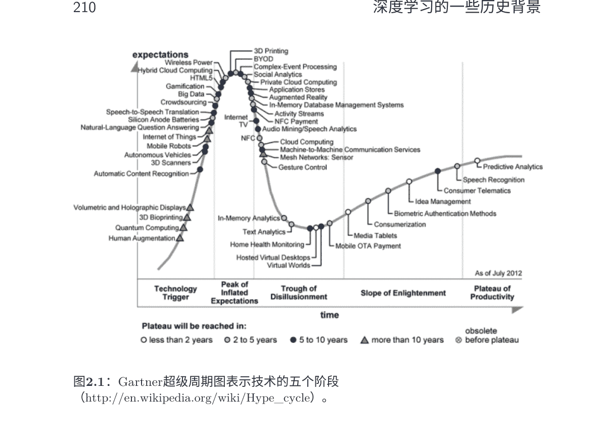

将Gartner超级周期应用于人工神经网络的发展，我们创建了图2.2，将神经网络的不同世代与超级周期中指定的各个阶段对齐。高峰活动（垂直轴上的“期望”或“媒体炒作”）发生在1980年代末和1990年代初，对应于通常被称为神经网络的“第二代”的高峰期。深度信念网络（DBN）及其快速训练算法于2006年发明[163, 164]。当DBN用于初始化DNN时，学习效果非常好，这激发了随后快速增长的研究（如图2.2所示的“启蒙”阶段）。DBN和DNN在工业规模的语音特征提取和语音识别中的应用始于2009年，当时领先的学术和工业研究人员在深度学习和语音方面的专业知识上进行了合作；参见[89, 161]中的综述。这种合作使得使用深度学习方法进行语音识别的工作迅速取得了越来越大的成功[94, 161, 323, 414]，

#### Neural Network History

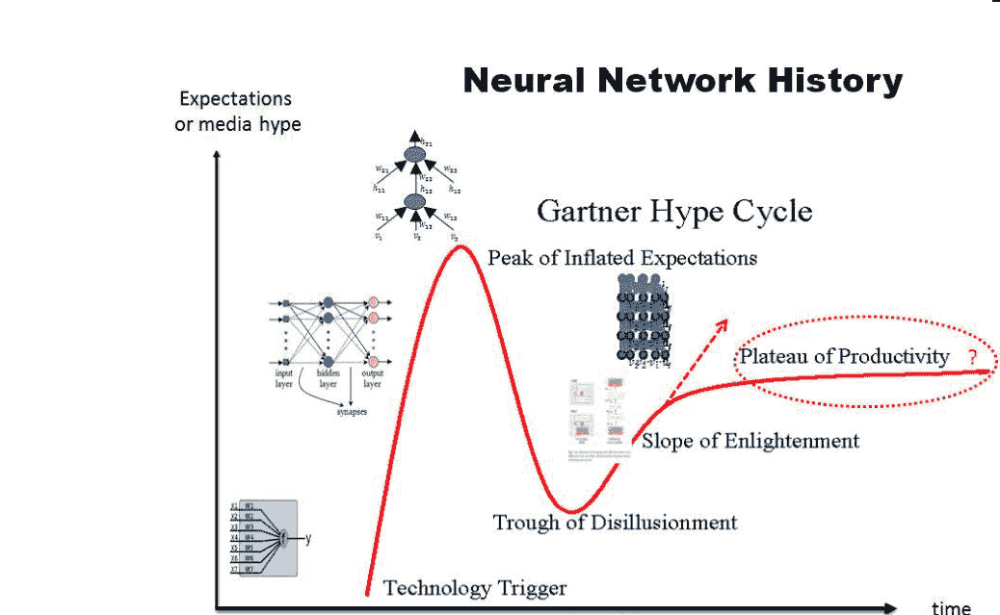

图2.2：应用Gartner超周期图来分析人工神经网络技术的历史（我们在2012年感谢我们的同事约翰·普拉特提供了这种“超周期”图，以简洁地分析神经网络的历史）。

其中许多将在本专著的剩余部分中介绍。“生产力高原”阶段的高度，根据我们的观点，预计将高于典型曲线中的高度（在图2.2中用问号圈出），并且由直线标记。

我们在图2.3中展示了由NIST编制的语音识别历史，通过绘制单词错误率（WER）作为时间函数，用于一些越来越困难的语音识别任务。请注意，所有WER结果均使用GMM-HMM技术获得。当从图2.3中提取出一个特别困难的任务（交换台）时，我们可以看到使用GMM-HMM技术的曲线在多年内保持平稳，但在使用DNN技术后，WER急剧下降（在图2.4中用红星标记）。

#### The History of Automatic Speech Recognition Evaluations at NIST

##### NIST STT Benchmark Test History – May. '09

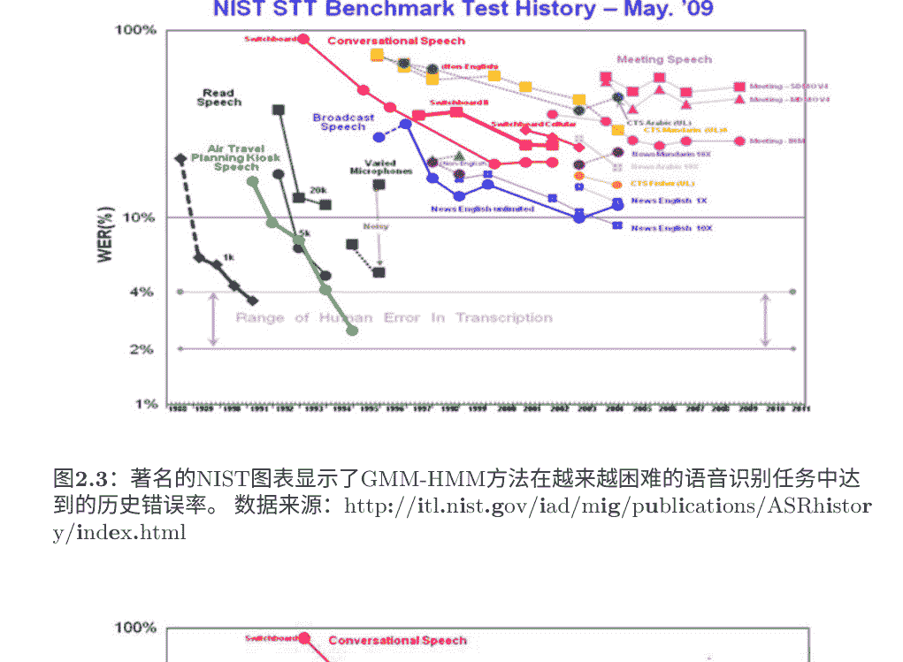

图2.3：著名的NIST图表显示了GMM-HMM方法在越来越困难的语音识别任务中达到的历史错误率。数据来源：http://itl.nist.gov/iad/mig/publications/ASRhistory/index.html

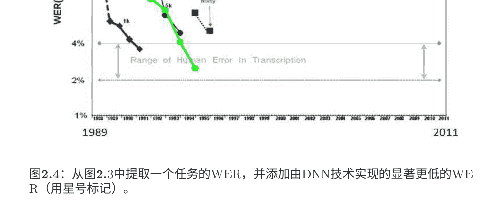

图2.4：从图2.3中提取一个任务的WER，并添加由DNN技术实现的显著更低的WER（用星号标记）。

在下一节中，将提供深度学习的各种架构的概述，然后更详细地介绍一些广泛研究的架构、方法以及在信号与信息处理中的选定应用，包括语音和音频、自然语言、信息检索、视觉和多模态处理。

## 三类深度学习网络

### 3.1 三种分类

如前所述，深度学习是指一类相当广泛的机器学习技术和架构，其特点是使用许多层次的非线性信息处理。根据架构和技术的用途，例如合成/生成或识别/分类，可以将这个领域的大部分工作广泛地分为三个主要类别：

-   1. 深度网络用于无监督或生成学习，旨在捕捉观测或可见数据的高阶相关性，以进行模式分析或合成，当没有目标类标签的信息可用时。文献中的无监督特征或表示学习指的是这类深度网络。当以生成模式使用时，也可能旨在表征可见数据及其相关类别的联合统计分布，如果可用并被视为可见数据的一部分。在后一种情况下，贝叶斯规则的使用可以将这种类型的生成网络转化为一种判别性学习。
-   2. 深度网络用于监督学习，旨在直接为模式分类提供判别能力，通常通过表征基于可见数据的类别的后验分布来实现。对于这种监督学习，目标标签数据始终以直接或间接形式可用。它们也被称为判别性深度网络。
-   3. 混合深度网络，其目标是通过生成式或无监督式深度网络的结果来辅助鉴别，通常以显著的方式进行。这可以通过更好的优化或/和正则化深度网络来实现在类别（2）中。当使用有监督学习的鉴别性准则来估计类别（1）中的任何深度生成式或无监督式深度网络的参数时，也可以实现这个目标。

请注意，（3）中“混合”一词与文献中有时所指的“混合系统”（将神经网络的输出概率输入到HMM中）是不同的。

按照通常采用的机器学习传统（例如，[264]中的第28章和参考文献[95]），将深度学习技术简单地分类为深度鉴别模型（例如，深度神经网络或DNN，循环神经网络或RNN，卷积神经网络或CNN等）和生成式/无监督模型（例如，受限玻尔兹曼机或RBM，深度置信网络或DBN，深度玻尔兹曼机（DBM），正则化自编码器等）。然而，这种二元分类方案忽视了深度学习研究中关于如何通过更好的正则化或优化来显著改善DNN和其他深度鉴别或有监督学习模型的训练的关键洞察。此外，用于无监督学习的深度网络不一定需要是概率性的，也不一定能够从模型中有意义地进行采样（例如，传统的自编码器，稀疏编码网络等）。我们在这里指出，最近的研究表明，研究已经推广了传统的去噪自编码器，使其能够高效采样，从而成为生成模型[5, 24, 30]。然而，传统的双向分类确实指出了无监督学习和监督学习之间的几个关键差异。与两者相比，深度监督学习模型（如DNNs）通常更容易训练和测试，更灵活构建，并且更适合于复杂系统的端到端学习（例如，无需近似推理和学习，如循环置信传播）。另一方面，深度无监督学习模型，特别是概率生成模型，更容易解释，更容易嵌入领域知识，更容易组合，并且更容易处理不确定性，但它们在复杂系统的推理和学习中通常是难以处理的。这些区别在提出的三向分类中也得到保留，因此在本专著中采用。

下面我们将回顾上述三个类别中的代表性工作，在表3.1中总结了几个基本定义。这些深度架构的应用，包括有监督、无监督或混合学习的各种方式，将在第7-11节中详细介绍。

### 3.2 用于无监督或生成学习的深度网络

无监督学习指的是在学习过程中不使用任务特定的监督信息（例如目标类别标签）。这一类别中的许多深度网络可以通过从网络中采样来有意义地生成样本，其中包括RBM、DBN、DBM和广义去噪自编码器[23]等示例，因此它们是生成模型。然而，这一类别中的一些网络不能轻易地进行采样，其中包括稀疏编码网络和深度自编码器的原始形式，因此它们不具备生成性质。

在各种生成式或无监督深度网络中，基于能量的深度模型是最常见的[28, 20, 213, 268]。深度自编码器的原始形式[28, 100, 164]，我们将在第4节中详细介绍，是一个典型的例子。

## 表3.1：基本深度学习术语

| 术语 | 定义 |
| :--- | :--- |
| 深度学习 | 一类机器学习技术，利用分层监督式架构中的多个信息处理阶段来进行无监督特征学习和模式分析/分类。深度学习的本质是计算观测数据的分层特征或表示，其中高层特征或因素是从低层特征定义的。深度学习方法的家族越来越丰富，包括神经网络、分层概率模型以及各种无监督和监督特征学习算法。 |
| 深度置信网络（DBN） | 由多层随机隐藏变量组成的概率生成模型顶部两层之间有无向对称连接。较低层从上方接收自上而下的有向连接。 |
| Boltzmann机器（BM） | 由对称连接的类似神经元的单元组成，对是否处于开启或关闭状态做出随机决策。 |
| 受限Boltzmann机器（RBM） | 一种特殊类型的BM，由可见单元层和隐藏单元层组成，没有可见-可见或隐藏-隐藏连接。 |
| 深度神经网络（DNN） | 具有许多隐藏层的多层感知器，其权重是完全连接的，并且通常（虽然不总是）使用无监督或有监督的预训练技术进行初始化。（在2012年之前的文献中，DBN经常被错误地用来表示DNN。） |
| 深度自编码器 | 一种“判别性”DNN，其输出目标是数据输入本身，而不是类别标签；因此是一种无监督学习模型。当使用去噪准则进行训练时，深度自编码器也是一种生成模型，并且可以进行采样。 |
| 分布式表示 | 一种将观测数据内部表示为许多隐藏因素相互作用解释的方式。从其他因素的配置中学习到的特定因素通常能够很好地推广到新的配置。分布式表示自然地出现在“连接主义”神经网络中，其中一个概念由许多单元之间的活动模式表示，并且同时一个单元通常对许多概念有贡献。这种多对多的对应关系的一个关键优势是它们在以优雅的退化和抗损坏的方式表示数据的内部结构方面提供了鲁棒性。另一个关键优势是它们促进了概念和关系的泛化，从而实现了推理能力。 |

这是无监督模型类别的一个例子。大多数其他形式的深度自动编码器也是无监督的，但具有不同的属性和实现方式。例如，转换自动编码器[160]，预测稀疏编码器及其堆叠版本，以及去噪自动编码器及其堆叠版本[376]。

具体来说，在去噪自编码器中，首先对输入向量进行损坏，例如随机选择一定比例的输入并将其设置为零，或者对其添加高斯噪声。然后调整隐藏编码节点的参数，使用诸如均方重构误差和原始输入与重构输入之间的KL散度等准则来重构原始的、未损坏的输入数据。从未损坏的数据中转换得到的编码表示被用作堆叠去噪自编码器的下一层的输入。

另一种具有生成能力的深度无监督模型是深度玻尔兹曼机或DBM [131, 315, 316, 348]。DBM包含许多层隐藏变量，并且同一层内的变量之间没有连接。这是一种特殊情况的波尔兹曼机（BM）的一般情况，BM是一个基于随机机制，对称连接的单元可以处于开启或关闭状态的网络。尽管具有简单的学习算法，一般的BM非常复杂且训练速度很慢。在DBM中，每一层捕捉到了下一层隐藏特征的活动之间的复杂高阶相关性。DBM有潜力学习到越来越复杂的内部表示，这对于解决目标和语音识别问题非常有价值。此外，高层表示可以从大量未标记的感知输入中构建，然后仅使用非常有限的标记数据对模型进行轻微微调，以适应特定的任务。

当DBM的隐藏层数减少到一层时，我们得到了受限玻尔兹曼机（RBM）。与DBM类似，RBM中没有隐藏到隐藏的连接，也没有可见到可见的连接。RBM的主要优点是通过组合多个RBM，可以高效地学习到多个隐藏层，其中一个RBM的特征激活作为下一个RBM的训练数据。这种组合导致了深度置信网络（DBN），我们将在第5节中更详细地描述DBN和RBM。

标准的DBN已经扩展到底层的分解高阶Boltzmann机器，取得了强大的结果在电话识别[64]和计算机视觉[296]方面。这个模型，称为均值协方差RBM或mcRBM，认识到了标准RBM在表示协方差结构的能力方面的局限性。然而，训练mcRBM并在深度架构的更高层次上使用它们是困难的。此外，已发表的强大结果不容易复现。在Dahl等人描述的架构中，完整DBN中的mcRBM参数没有使用判别信息进行微调，这些判别信息用于微调更高层的RBM，因为计算成本很高。随后的工作表明，当使用适应说话者的特征时，去除了更多特征的变异性，mcRBM没有帮助[259]。

另一个代表性的深度生成网络是可以用于无监督（以及监督）学习的和积网络或SPN [125, 289]。SPN是一个有向无环图，观测变量作为叶子节点，和求和和乘积操作作为深度网络中的内部节点。“求和”节点提供混合模型和“产品”节点构建了特征层次结构。“完备性”和“一致性”的属性以期望的方式约束了SPN。使用EM算法和反向传播一起进行SPN的学习。学习过程从一个密集的SPN开始。然后通过学习其权重来找到SPN的结构，其中零权重表示已删除的连接。学习SPN的主要困难在于学习信号（即梯度）在传播到深层时很快稀释。已经找到了经验性的解决方案来缓解这个困难，如[289]中所报道。在早期的论文中指出，尽管SPN具有许多理想的生成性质，但使用判别信息来微调参数是困难的，从而限制了其在分类任务中的有效性。然而，在[125]中报告的后续工作中，已经克服了这个困难，提出了一种高效的BP风格判别式训练算法用于SPN。重要的是，标准的梯度下降，基于条件似然的导数，遭受了在常规DNN中众所周知的梯度扩散问题。在学习SPN中缓解这个问题的技巧是用隐藏变量的最可能状态替换边际推断，并且只通过这种“硬”对齐传播梯度。Gens和Domingo [125]报告了在小规模图像识别任务上取得的优秀结果。

循环神经网络（RNN）可以被视为另一种用于无监督（以及监督）学习的深度网络类别，其中深度可以达到输入数据序列的长度。在无监督学习模式下，RNN用于使用先前的数据样本预测未来的数据序列，并且不使用额外的类别信息进行学习。RNN非常适用于建模序列数据（例如语音或文本），但直到最近，它们并没有被广泛使用，部分原因是它们很难训练以捕捉长期依赖关系，从而导致梯度消失或梯度爆炸问题，这些问题在1990年代早期就已经被发现[29, 167]。

现在这些问题可以更容易地解决[24, 48, 85, 280]。Hessian-free优化的最新进展[238]也部分地克服了这个困难，使用近似的二阶信息或随机曲率估计。在最近的工作[239]中，RNNs在字符级语言建模任务中，使用经过Hessian-free优化训练的生成式深度网络，引入门控连接，使当前输入字符能够预测到下一个潜在状态向量的转换。这种生成式RNN模型被证明能够很好地生成序列文本字符。最近，Bengio等人[22]和Sutskever [356]在训练生成式RNN时探索了随机梯度下降优化算法的变体，并表明这些算法可以胜过Hessian-free优化方法。

Mikolov等人[248]报道了使用RNN进行语言建模的出色结果。最近，Mesnil等人[242]和Yao等人[403]报道了RNN在口语理解中的成功。我们将在第8节回顾这一系列工作。

在语音识别研究中，利用人类语音产生机制构建概率生成模型的动态和深层结构已有很长的历史；有关详细综述，请参阅Deng [76]的专著。具体而言，[71, 72, 83, 84, 99, 274]中描述的早期工作通过对HMM参数施加多项式轨迹的动态约束，推广和扩展了传统的浅层和条件独立的HMM结构。这种方法的一个变体是最近使用不同的学习技术来处理时变HMM参数，并将应用范围扩展到语音识别的鲁棒性[431, 416]。类似的轨迹HMM也是参数化语音合成的基础[228, 326, 439, 438]。

随后的工作在动态模型中添加了一个新的隐藏层，以明确考虑人类语音生成中的目标导向、发音特性[45, 73, 74, 83, 96, 75, 90, 231, 232, 233, 251, 282]。在更近期的研究中，使用非递归或有限冲激响应（FIR）滤波器实现了具有隐藏动力学的深度架构的更高效实现[76, 107, 105]。上述语音的深度结构生成模型可以被视为更一般的动态网络模型甚至更一般的动态图模型的特例[35, 34]。图模型可以包含许多隐藏层，以描述语音生成中变量之间的复杂关系。凭借强大的图模型建模工具，语音的深度架构最近更成功地应用于解决单通道、多说话人语音识别的非常困难的问题，其中混合语音是可见变量，而未混合语音在深度生成架构的新隐藏层中表示[301, 391]。深度生成图模型确实是许多应用中的强大工具，因为它们能够嵌入领域知识。然而，它们经常在推理、学习、预测和拓扑设计中使用不恰当的近似，所有这些都源于这些任务在大多数实际应用中的困难。这个问题在最近的Stoyanov等人的工作中得到了解决[352]，为未来使深度生成图模型在实践中更有用提供了一个有趣的方向。最近Bengio等人提出了一种更激进的解决这个难题的方法[30]，即完全避免边缘化潜变量的需要。

用于大规模语音识别和理解的标准统计方法将（浅层）隐马尔可夫模型与表示不同自然语言层次的更高层结构相结合。这种组合的分层模型可以适当地被视为深度生成架构，其动机和一些技术细节可以在最近的专著[200]的第7节“分层HMM”或HHMM中找到。填补这个缺失的方面将有助于改进这些生成模型。

最后，基于神经网络架构的动态或时间递归生成模型可以在[361]中找到用于人体运动建模，在[344, 339]中找到用于自然语言和自然场景解析。这与其他深度架构（如DBN）形成对比。

## 3.3. 监督学习中的深度网络

只有参数被学习，而架构需要预先定义。具体来说，正如[344]中所报道的，自然场景图像和自然语言句子中常见的递归结构可以通过最大间隔结构预测架构来发现。研究表明，图像或句子中包含的单元被识别出来，以及这些单元如何相互作用形成整体也被识别出来。

## 3.3 用于监督学习的深度网络

在信号和信息处理中，许多用于监督学习的判别技术都是浅层架构，如HMMs[52, 127, 147, 186, 188, 290, 394, 418]和条件随机场(CRFs) [151, 155, 281, 400, 429, 446]。CRF本质上是一种浅层判别架构，其特点是输入特征与转移特征之间的线性关系。CRF的浅层性质最清楚地体现在CRF与判别性训练的高斯模型和HMM之间的等价性上[148]。最近，通过将CRF每个较低层的输出与原始输入数据堆叠到其较高层中[428]，发展出了深度结构化CRF。各种版本的深度结构化CRF已成功应用于电话识别[410]，语言识别[428]和自然语言处理[428]。然而，至少对于电话识别任务来说，纯粹的判别性（非生成性）深度结构化CRF的性能还无法与我们即将介绍的涉及DBN的混合方法相媲美。

Morgan [261]在语音识别中对其他主要现有的判别模型进行了出色的回顾，主要基于传统的神经网络或MLP架构，使用随机初始化的反向传播学习。它主张神经网络每一层的宽度增加和深度增加的重要性。特别是一类深度神经网络模型构成了流行的“串联”方法的基础[262]，其中判别性学习的神经网络的输出被视为观测变量的一部分。

关于这个领域的一些代表性最新工作，请参见[193, 283]。

在[106, 110, 218, 366, 377]的最新工作中，开发了一种新的深度学习架构，有时被称为深度堆叠网络（DSN），以及其张量变体[180, 181]和其核版本[102]，它们都专注于可扩展、可并行、以块为单位的判别学习，几乎没有生成组件。我们将在第6节详细描述这种类型的判别性深度架构。

如前一节所讨论的，循环神经网络（RNN）已被用作生成模型；还可以参考具有类似“生成”机制的神经预测模型[87]。RNN也可以用作判别模型，其中输出是与输入数据序列相关联的标签序列。请注意，这种判别性RNN或序列模型在很久以前就被应用于语音，但成功有限。在[17]中，使用了HMM与神经网络联合训练，并采用了判别性概率训练准则。在[304]中，使用了单独的HMM来在训练过程中对序列进行分割，并且HMM还用于将RNN分类结果转换为标签序列。然而，将HMM用于这些目的并没有充分利用RNN的全部潜力。最近在[133, 134, 135, 136]中提出了一组新的模型和方法，使得RNN本身能够在嵌入长短期记忆的同时执行序列分类，从而消除了对训练数据进行预分割和对输出进行后处理的需求。该方法的基本思想是将RNN输出解释为给定输入序列的所有可能标签序列的条件分布。然后，可以导出一个可微分的目标函数来优化这些条件分布对于正确标签序列的分布，其中数据的分割由算法自动执行。这种方法的有效性已在手写识别任务和一个小的语音任务[135, 136]中得到证明，将在本专著的第7节中详细讨论。

另一种判别式深度架构是卷积神经网络（CNN），其中每个模块由一个卷积层和一个池化层组成。这些模块经常堆叠在一起，或者在其上方堆叠一个DNN，以形成一个深度模型[212]。卷积层共享许多权重，池化层对卷积层的输出进行子采样，并降低下一层的数据速率。卷积层中的权重共享，以及适当选择的池化方案，赋予CNN一些“不变性”属性（例如，平移不变性）。有人认为，这种有限的“不变性”或等变性对于复杂的模式识别任务来说是不足的，可能需要更有原则的方法来处理更广泛的不变性[160]。尽管如此，CNN在计算机视觉和图像识别中被发现非常有效，并且常常被使用[54, 55, 56, 57, 69, 198, 209, 212, 434]。最近，通过从针对图像分析的CNN进行适当的改变，以考虑语音特定属性，发现CNN对于语音识别也非常有效[1, 2, 3, 81, 94, 312]。我们将在本专著的第7节中更详细地讨论这些应用。

有用的是指出，时间延迟神经网络（TDNN）[202, 382]是早期语音识别中开发的一种特殊情况和卷积神经网络（CNN）的前身，当权重共享仅限于两个维度之一，即时间维度，并且没有池化层。直到最近，研究人员才发现对于语音识别，时间-维度的不变性比频率维度的不变性更不重要[1, 3, 81]。在[81]中描述了对底层原因的仔细分析，以及一种新的策略用于设计CNN的池化层，证明在电话识别中比所有以前的CNN都更有效。

还有一个有用的是指出，分层时间记忆（HTM）模型[126, 143, 142]是CNN的另一种变体和扩展。扩展包括以下几个方面：
- 1. 引入时间或时间维度作为区分的“监督”信息（即使对于静态图像）；
- 2. 使用自下而上和自上而下的信息流，而不仅仅是自下而上的CNN；
- 3. 使用贝叶斯概率形式融合信息和决策。

最终，为自下而上、基于检测的语音识别开发的学习架构在[214]中提出，并自2004年以来进一步发展，特别是在[330, 332, 427]中使用DBN-DNN技术，也可以归类为判别式或监督学习深度架构类别。在这种架构中，没有意图和机制来描述数据和语音属性识别目标以及更高级别的音素和单词的联合概率。这种方法的最新实现基于DNN，即使用反向传播学习的多层神经网络。在这种基于检测的框架的实现中，一个中间神经网络层明确表示语音属性，这些属性是从[101, 355]的早期工作中发展出来的简化实体。简化在于去除语音属性或类似发音特征的时间重叠属性。将这些更真实的属性嵌入到未来的工作中有望进一步提高语音识别的准确性。

## 3.4 混合深度网络

对于这第三类的“混合”术语，它指的是深度架构，它既包含又利用了生成和判别模型组件。在已发表的文献中存在的混合架构中，生成组件主要被利用来帮助判别，这是混合架构的最终目标。

生成建模如何以及为什么可以帮助判别可以从两个视角进行考察[114]：
- 优化视角，即以无监督方式训练的生成模型可以为高度非线性参数估计问题提供优秀的初始化点（深度学习中常用的“预训练”术语就是为此引入的）；和/或
- 正则化视角，即无监督学习模型可以有效地为模型可表示的函数集合提供先验。

在[114]中报道的研究提供了对上述两个观点的深入分析和实验证据。

DBN是一种生成式深度网络，用于无监督学习，详见第3.2节，可以转换为具有相同网络结构的DNN的初始模型，并使用提供的目标标签进行进一步的判别式训练或微调。当以这种方式使用DBN时，我们将其称为混合深度模型，其中使用无监督数据训练的模型有助于使判别模型在监督学习中更加有效。在第5节中，我们将详细介绍判别式DNN在RBM/DBN生成式无监督预训练的背景下的监督学习细节。

另一个混合深度网络的例子是在[260]中开发的，其中DNN的权重也是从生成式DBN初始化的，但是通过序列级判别准则进行进一步的微调，该准则是给定输入特征序列的标签序列的条件概率，而不是常用的基于帧的交叉熵准则。这可以看作是将静态DNN与CRF的浅层判别式架构相结合。可以证明，这样的DNN-CRF等价于DNN和HMM的混合深度架构，其参数是使用整个标签序列和输入特征序列之间的全序列最大互信息（MMI）准则进行联合学习的。最近，针对更大的任务，还设计并实现了一种密切相关的全序列训练方法，分别用于浅层神经网络[194]和深层神经网络[195, 353, 374]，并取得了成功。我们注意到，联合训练序列模型（例如HMM）和神经网络的思想起源于[17, 25]的早期工作，其中使用少量训练数据并且没有生成式预训练来训练浅层神经网络。

在这里，有必要指出上述预训练/微调策略与混合深度网络相关联，并且与高度流行的最小电话错误（MPE）训练技术（参见[147, 290]进行概述）存在联系。为了使MPE训练有效，需要使用一种算法（例如，Baum-Welch算法）来初始化参数，该算法优化生成准则（例如，最大似然）。这种类型的方法使用最大似然训练的参数来辅助判别式HMM训练，可以看作是训练浅层HMM模型的一种“混合”方法。

沿着使用判别准则来训练生成模型参数的路线，就像上述HMM训练示例中一样，我们在这里讨论了将相同方法应用于学习其他混合深度网络。在[203]中，使用后验类标概率的判别准则来学习RBM的生成模型。在这种情况下，标签向量与输入数据向量连接在一起形成RBM中的组合可见层。通过这种方式，RBM可以作为解决分类问题的独立解决方案，作者们推导出了一种判别学习算法，用于RBM作为浅层生成模型。在Ranzato等人的最新工作[298]中，学习了具有门控马尔可夫随机场（MRF）的DBN的深度生成模型，用于特征提取，然后用于识别包括遮挡在内的困难图像类别。DBN的生成能力有助于发现在深度模型的每个表示层中捕获了哪些信息以及丢失了哪些信息，如[298]所示。关于使用经验风险的判别准则来训练深度图形模型的相关研究可以在[352]中找到。

混合深度网络的另一个例子是使用生成模型的DBNs来预训练深度卷积神经网络（深度CNNs）[215, 216, 217]。与完全连接的DNN相似，预训练也有助于改善深度CNN相对于随机初始化的性能。使用一组正则化的深度自编码器[24]（包括去噪自编码器、收缩自编码器和稀疏自编码器）对DNN或CNN进行预训练，也是混合深度网络类别的一个类似例子。

混合深度网络的最后一个例子基于[144, 267]的思想和工作，其中一个判别任务（例如语音识别）产生输出（文本），该输出作为第二个判别任务（例如机器翻译）的输入。整体系统是一个两阶段深度架构，提供语音翻译的功能-将一种语言的语音翻译成另一种语言的文本。

## 3.4. 混合深度网络

生成和判别元素。语音识别模型（例如，HMM）和机器翻译模型（例如，短语映射和非单调对齐）都具有生成性质，但它们的参数都是通过对语音数据进行判别学习来生成最终的翻译文本。在[144]中描述的框架使用最初在[147]中发表的统一学习框架，实现了整体深度架构的端到端性能优化。这种混合深度学习方法不仅可以应用于语音翻译，还可以应用于所有以语音为中心的信息处理任务，例如语音信息检索、语音理解、跨语言的语音/文本理解和检索等（例如，[88, 94, 145, 146, 366, 398]）。

在接下来的三章中，我们将详细介绍三种深度学习模型，分别来自本章所述的三个类别。选择这些模型是为了教程目的，因为它们在架构和数学描述上相对简单。下面三章中描述的三种架构不能被解释为每个类别中最具代表性和影响力的工作。

# 4 深度自编码器 — 无监督学习

本节和接下来的两节将分别选择三节中概述的每个类别中的一个突出的深度网络示例。
在这里，我们从主要设计用于无监督学习的深度模型类别开始。

## 4.1 引言

深度自编码器是一种特殊类型的DNN（没有类标签），其输出向量与输入向量具有相同的维度。它通常用于学习原始数据的表示或有效编码，以输入向量的形式存在于隐藏层中。

请注意，自编码器是一种非线性特征提取方法，不使用类标签。因此，提取的特征旨在保留和更好地表示信息，而不是执行分类任务，尽管有时这两个目标是相关的。

自编码器通常具有表示原始数据或输入特征向量的输入层（例如，图像中的像素或语音中的频谱），一个或多个表示转换特征的隐藏层，以及与输入层匹配的输出层。

重建。当隐藏层的数量大于一层时，自编码器被认为是深度的。隐藏层的维度可以比输入维度小（当目标是特征压缩时），也可以比输入维度大（当目标是将特征映射到高维空间时）。

自编码器通常使用众多反向传播变体之一进行训练，通常是随机梯度下降法。虽然通常有效，但是使用反向传播训练具有许多隐藏层的网络存在根本问题。一旦错误被反向传播到前几层，它们变得微不足道，训练变得相当无效。虽然更先进的反向传播方法在一定程度上解决了这个问题，但仍然导致学习速度缓慢和解决方案质量差，尤其是在有限的训练数据量下。如前几章所述，可以通过将每一层预训练为简单的自编码器来缓解这个问题。这种策略已被应用于构建深度自编码器，用于将图像映射为短二进制码以实现快速基于内容的图像检索，对文档进行编码（称为语义哈希），以及对类似于频谱图的语音特征进行编码，下面我们将进行回顾。

## 4.2 使用深度自编码器提取语音特征

在这里，我们回顾了一系列的工作，其中一些工作发表在[100]中，以无监督的方式从原始语音频谱数据中提取二进制语音编码（即没有语音类别标签）。通过这个模型提取的二进制编码的离散表示可以用于语音信息检索，或者作为语音识别的瓶颈特征。

图4.1展示了一个包含256个频率频道和1、3、9或13帧的声谱图块的深度生成模型。构建了一个名为高斯-伯努利RBM的无向图模型，其中有一个可见层的线性变量和高斯噪声，以及一个包含500到3000个二进制潜变量的隐藏层。在学习了高斯-伯努利RBM之后，激活其隐藏单元的概率被视为训练另一个伯努利-伯努利受限玻尔兹曼机的数据。然后，这两个受限玻尔兹曼机可以组合成一个深度置信网络（DBN），在其中从输入中的单个前向传递中很容易推断出二进制隐藏单元的第二层的状态。本文中使用的DBN如图4.1左侧所示，其中两个受限玻尔兹曼机分别显示在不同的框中。

（有关RBM和DBN的更详细讨论，请参见第5节）。

通过使用其权重矩阵“展开”DBN，形成具有三个隐藏层的深度自编码器。这个深度自编码器的较低层使用矩阵对输入进行编码，而较高层则使用相反顺序的矩阵对输入进行解码。

然后，使用误差反向传播对这个深度自编码器进行微调，以最小化重构误差，如图4.1右侧所示。学习完成后，可以对任意长度的频谱图进行编码并重构如下。首先，将256点对数功率谱的N个连续重叠帧在每个特征上进行零均值和单位方差归一化，以提供深度自编码器的输入。然后，第一个隐藏层使用逻辑函数计算实值激活。这些实值被传递给下一个编码层，以计算“编码”。编码层中隐藏单元的实值激活被量化为0或1，阈值为0.5。然后，使用网络权重的两个上层首先重构原始谱图，其中逐个固定帧补丁先进行重构。最后，使用信号处理中的标准重叠相加技术，通过将深度自编码器应用于N个连续帧的每个可能窗口产生的输出出来重构完整长度的语音谱图。下面我们展示一些说明性的编码和重构示例。

图4.2: 从上到下依次为序数谱图；使用输入窗口大小为N = 1，3，9和13的重构，并强制编码单元取值为零或一（即二进制编码）。[来自[100]，@Elsevier]。

图4.2顶部是原始的未编码语音，接下来是从二进制编码（零或一）重构的语音表达，编码窗口长度分别为N = 1，3，9和13。可以明显看到N = 9和N = 13的重构误差较低。

通过与更传统的向量量化（VQ）编码进行定性比较，对深度自编码器的编码误差进行了检验。图4.3展示了编码误差的各个方面。顶部是原始语音表达的谱图。接下来的两个谱图分别是来自312位VQ的模糊重构和来自312位深度自编码器的更加准确的重构。

编码错误来自两个编码器，作为时间函数绘制在下方。如下所示的谱图表明，自编码器（红色曲线）在整个话语的时间跨度内产生的错误要比VQ编码器（蓝色曲线）更低。最后两个谱图显示了时间和频率区间上的详细编码错误分布。

图4.3：从测试集中的原始谱图到312位VQ编码器的重构；从312位自编码器的重构；VQ编码器（蓝色）和自编码器（红色）的时间函数编码错误；VQ编码器残差的谱图；深度自编码器残差的谱图。[参考文献[100]，© Elsevier]

图4.4：原始语音谱图和重构的对应物 总共有312个二进制码，每个单帧一个

图4.4至4.10展示了使用深度自编码器对原始未编码语音频谱图进行重建的额外示例（未发表）。它们为频谱图样本中的单个或连续三帧提供了多样的二进制编码。

## 4.3 堆叠去噪自编码器

在自编码器研究的早期，编码层的维度比输入层小。然而，在某些应用中，希望编码层比输入层更宽，这时需要技术来防止神经网络学习平凡的恒等映射函数。使用的原因之一是隐藏层或编码层中的维度比输入层更高的好处是它允许自编码器捕捉丰富的输入分布。上述讨论的平凡映射问题可以通过使用稀疏约束或使用“dropout”技巧来避免，通过随机强制某些值为零，从而在输入数据[376, 375]或隐藏层[166]引入扭曲。对于# 4.4. 变换自编码器

输入样本不同，它大大增加了训练集的大小，从而可以缓解过拟合问题。

有趣的是，当编码和解码权重被强制为彼此的转置时，这种去噪自编码器与特定的高斯RBM严格等价，但不是通过对比散度（CD）或持续对比散度（persistent CD）的技术进行训练，而是通过得分匹配原则进行训练，其中得分被定义为相对于输入的对数密度的导数[375]。此外，Alain和Bengio [5]将这一结果推广到具有平方重构误差和高斯损坏噪声的编码器和解码器的任何参数化。他们表明，当噪声量趋近于零时，这样的模型可以估计底层数据生成分布的真实得分。最后，Bengio等人[30]表明，任何去噪自编码器都是某些分布族中底层数据生成分布的一致估计器。

这对于自动编码器的任何参数化都是正确的，对于任何不受噪声水平限制的信息破坏过程都是正确的，并且对于任何以条件对数似然表示的重构损失都是正确的。通过将去噪自动编码器与马尔可夫链相关联，可以实现估计模型的稳定分布，并且可以使用该马尔可夫链从去噪自动编码器中进行采样。

# 4.4 变换自编码器

上述深度自动编码器可以通过多层非线性处理提取出准确的特征向量编码。然而，以这种方式提取的编码是变换相关的。换句话说，当输入特征向量发生变换时，提取的编码会按照学习者选择的方式发生变化。有时，希望编码的变化能够可预测地反映出感知内容的底层不变性属性。这就是[162]中提出的用于图像识别的变换自动编码器的目标。

变换自编码器的基本构件是“胶囊”，它是一个独立的子网络，提取表示单个实体的单个参数化特征，无论是视觉还是音频。一个变换自编码器接收一个输入向量和一个目标输出向量，通过一个简单的全局变换机制将输入向量转换为目标输出向量；例如，图像的平移和语音的频率偏移（后者是由于声道长度的差异）。假设已知全局变换的显式表示。变换自编码器的编码层由多个胶囊的输出组成。

在训练阶段，不同的胶囊学习提取不同的实体，以最小化最终输出与目标之间的误差。

除了这里描述的深度自编码器架构之外，文献中还有许多其他类型的生成架构，其特点是仅使用数据（即不带分类标签）自动推导出更高级的特征。

# 5 预训练的深度神经网络 — 混合方法

在本节中，我们介绍了最常用的混合深度架构——预训练深度神经网络（DNN），并讨论了相关的技术和构建模块，包括RBM和DBN。我们在这里将DNN示例归类为混合深度网络，然后再介绍用于监督学习的深度网络示例（第6节）。这在一定程度上是由于从无监督学习模型到DNN作为混合模型的自然流动。

人工神经网络在监督学习中的判别性质已经广为人知，因此不需要理解使用无监督预训练来促进后续判别性微调的DNN的混合性质。

> > 本章的部分评论基于最近的出版物[68, 161, 412]。

## 5.1 限制玻尔兹曼机

RBM是一种特殊类型的马尔可夫随机场，它具有一层（通常是伯努利）随机隐藏单元和一层（通常是伯努利或高斯）随机可见或可观察单元。RBM可以表示为二分图，其中所有可见单元都与所有隐藏单元相连，没有可见-可见或隐藏-隐藏的连接。

在RBM中，给定模型参数 $\theta$，可见单元 $\mathbf{v}$ 和隐藏单元 $\mathbf{h}$ 的联合分布 $p(\mathbf{v}, \mathbf{h}; \theta)$ 通过能量函数 $E(\mathbf{v}, \mathbf{h}; \theta)$ 来定义，其中 $p(\mathbf{v}, \mathbf{h}; \theta) = \frac{\exp(-E(\mathbf{v}, \mathbf{h}; \theta))}{Z}$，其中 $Z = \sum_{\mathbf{v}} \sum_{\mathbf{h}} \exp(-E(\mathbf{v}, \mathbf{h}; \theta))$ 是一个归一化因子或配分函数，模型分配给可见向量 $\mathbf{v}$ 的边际概率是
```
$p(\mathbf{v}; \theta) = \frac{\sum_{\mathbf{h}} \exp(-E(\mathbf{v}, \mathbf{h}; \theta))}{Z}$
```
对于伯努利（可见）-伯努利（隐藏）RBM，能量函数定义为
```
$E(\mathbf{v}, \mathbf{h}; \theta) = -\sum_{i=1}^{I} \sum_{j=1}^{J} w_{ij} v_i h_j - \sum_{i=1}^{I} b_i v_i - \sum_{j=1}^{J} a_j h_j.$
```
其中 $w_{ij}$ 表示可见单元 $v_i$ 和隐藏单元 $h_j$ 之间的对称交互项，$b_i$ 和 $a_j$ 表示偏置项，$I$ 和 $J$ 分别表示可见单元和隐藏单元的数量。条件概率可以高效地计算得到
```
$p(h_j = 1|\mathbf{v}; \theta) = \sigma\left( \sum_{i=1}^{I} w_{ij} v_i + a_j \right),$
$p(v_i = 1|\mathbf{h}; \theta) = \sigma\left( \sum_{j=1}^{J} w_{ij} h_j + b_i \right),$
其中 $\sigma(x) = 1/(1 + \exp(-x))$。
```
同样，对于高斯（可见）-伯努利（隐藏）RBM，能量为
```
$E(\mathbf{v}, \mathbf{h}; \theta) = -\sum_{i=1}^{I} \sum_{j=1}^{J} w_{ij} v_i h_j - \frac{1}{2} \sum_{i=1}^{I} (v_i - b_i)^2 - \sum_{j=1}^{J} a_j h_j,$
```
相应的条件概率为
$p(h_j = 1 | \mathbf{v}; \theta) = \sigma \left( \sum_{i=1}^{I} w_{ij} v_i + a_j \right)$,
$p(v_i | \mathbf{h}; \theta) = \mathcal{N} \left( \sum_{j=1}^{J} w_{ij} h_j + b_i, 1 \right)$,
其中 $v_i$ 取实数值，并且遵循均值为 $\sum_{j=1}^{J} w_{ij} h_j + b_i$，方差为一的高斯分布。高斯-伯努利RBM可以将实值随机变量转换为二进制随机变量，然后可以使用伯努利-伯努利RBM进一步处理。

上述讨论中使用了RBM中可见数据的两种最常见的条件分布——高斯分布（用于连续值数据）和二项分布（用于二进制数据）。RBM中还可以使用更一般的分布类型。有关此目的的一般指数族分布的使用，请参见[386]。

通过对对数似然函数 $\log p(\mathbf{v}; \theta)$ 求梯度，我们可以推导出RBM权重的更新规则：
$\Delta w_{ij} = E_{\text{data}}(v_i h_j) - E_{\text{model}}(v_i h_j)$,
其中 $E_{\text{data}}(v_i h_j)$ 是在训练集中观察到的期望（根据模型对给定的 $v_i$ 进行采样得到 $h_j$），而 $E_{\text{model}}(v_i h_j)$ 是在模型定义的分布下的相同期望。不幸的是，计算 $E_{\text{model}}(v_i h_j)$ 是困难的。对梯度的对比散度（CD）近似是第一个有效的方法，用于近似计算这个期望值，其中 $E_{\text{model}}(v_i h_j)$ 被在数据点上运行的Gibbs采样器替代，运行一步或多步。近似计算 $E_{\text{model}}(v_i h_j)$ 的步骤总结如下：
- 在数据上初始化 $\mathbf{v}_0$
- 从概率分布 $p(\mathbf{h}|\mathbf{v}_0)$ 中采样得到 $\mathbf{h}_0$
- 从概率分布 $p(\mathbf{v}|\mathbf{h}_0)$ 中采样得到 $\mathbf{v}_1$
- 从概率分布 $p(\mathbf{h}|\mathbf{v}_1)$ 中采样得到 $\mathbf{h}_1$

# 图5.1：RBM学习过程中从RBM中采样的图示（由Geoff Hinton提供）

在这里，$(v_1, h_1)$是从模型中采样得到的样本，作为 $E_{model}(v_i h_j)$的一个非常粗略的估计。使用$(v_1, h_1)$来近似 $E_{model}(v_i h_j)$产生了CD-1算法。采样过程可以在图5.1中形象地描述。

注意，CD-k将这个过程推广到更多步的马尔可夫链。还有其他估计RBM对数似然梯度的技术，特别是随机最大似然或持续对比散度（PCD）[363, 406]。在将RBM用作生成模型时，这两种方法都比CD更有效。

仔细训练RBM对于成功应用RBM和相关深度学习技术解决实际问题至关重要。有关训练RBM的非常有用的实用指南，请参阅技术报告[159]。

上述RBM既是生成模型又是无监督模型，它使用隐藏变量来描述输入数据分布，并且没有涉及标签信息。然而，当标签信息可用时，可以将其与数据一起形成连接的“数据”集。然后，可以应用相同的CD学习来优化与数据似然相关的近似“生成”目标函数。此外，更有趣的是，可以根据条件标签的似然定义“判别”目标函数。这种判别性RBM可以用于对分类任务进行“微调”[203]。

Ranzato等人[297, 295]提出了一种无监督学习算法，称为稀疏编码对称机（SESM），它与RBM非常相似。它们都有一个对称编码器和解码器，并使用类似的对比散度训练程序。

## 5.2 无监督逐层预训练

在这里，我们将描述如何堆叠刚刚描述的RBM以形成作为DNN预训练基础的DBN。在深入细节之前，我们首先注意到这个过程是由Hinton和Salakhutdinov [163]提出的一种更通用的无监督逐层预训练技术。也就是说，不仅可以堆叠RBM来形成深度生成（或判别）网络，还可以使用其他类型的网络，例如由Bengio et al. [28]提出的自编码器变体。

从底部逐层学习的一系列RBM的堆叠形成了一个DBN，其中一个示例显示在图5.2中。堆叠过程如下所示。在学习高斯-伯努利RBM（用于具有连续特征的应用，如语音）或伯努利-伯努利RBM（用于具有名义或二进制特征的应用，如黑白图像或编码文本）之后，我们将隐藏单元的激活概率视为训练伯努利-伯努利RBM的数据输入。第二层伯努利-伯努利RBM的激活概率然后用作第三层伯努利-伯努利RBM的可见数据输入，以此类推。在[163]中给出了这种高效逐层贪婪学习策略的一些理论上的证明，其中显示了上述堆叠过程改进了训练数据在复合模型下的似然的变分下界。也就是说，这种贪婪的过程实现了近似的极大似然学习。请注意，这个学习过程是无监督的，不需要类别标签。

# 预训练的深度神经网络 — 混合方法

# 图5.2：DBN-DNN架构的示意图。

当应用于分类任务时，生成式预训练可以跟随或与其他典型的判别式学习过程相结合，共同微调所有权重以提高网络性能。这种判别式微调是通过添加一层最终变量来表示训练数据中提供的期望输出或标签来完成的。然后，可以使用反向传播算法来调整或微调网络权重，就像标准前馈神经网络一样。这个DNN的顶部标签层取决于应用。对于语音识别应用，图5.2中表示为“$l_1, l_2, \dots, l_j, \dots, l_L$”的顶层可以表示音节、音素、子音素、音素状态或其他HMM语音识别系统中使用的语音单元。

上述的生成式预训练在广泛的任务中产生了比随机初始化更好的电话和语音识别结果，这将在第7节中进行调查。进一步的研究还表明了其他预训练策略的有效性。作为一个例子，可以使用贪婪的逐层训练方法进行训练，每一层都在生成式成本函数中添加一个附加的判别项。

在每个层级上，可以通过在生成式成本函数中添加一个附加的判别项来进行贪婪的逐层训练。当初始权重的尺度被谨慎设置，并且随机梯度下降中使用的小批量大小在噪声梯度和收敛速度之间进行权衡时，纯粹的判别式训练从随机初始权重开始使用传统的随机梯度下降方法已被证明非常有效。此外，在创建小批量时，随机化顺序需要谨慎确定。重要的是，通过从一个只有一个隐藏层的浅层神经网络开始学习DNN是有效的。一旦这个网络被判别式地训练好（使用早停来避免过拟合），则在第一个隐藏层和标记的softmax输出单元之间插入第二个隐藏层，并再次判别式地训练扩展的更深的网络。这可以一直进行下去，直到达到所需的隐藏层数，然后应用完全反向传播的“微调”过程。

这种有区别的“预训练”过程在实践中被发现效果很好[324, 419]，尤其是在有相当数量的训练数据的情况下。当训练数据的数量进一步增加时，一些精心设计的随机初始化方法也可以很好地工作，而不需要使用上述的预训练方案。

无论如何，在大多数情况下，基于使用受限玻尔兹曼机（RBM）进行预训练以构建深度信念网络（DBN）已被发现效果很好，无论训练数据的数量是大还是小。值得指出的是，除了使用RBM和DBN进行预训练之外，还有其他方法可以进行预训练。例如，去噪自编码器现在已被证明是数据生成分布的一致估计器[30]。与RBM一样，它们也被证明是可以进行采样的生成模型。然而，与RBM不同的是，去噪自编码器可以获得训练目标函数梯度的无偏估计器，在训练的内循环中避免了需要MCMC或变分近似的需求。

因此，贪婪的逐层预训练可以通过堆叠去噪自编码器来有效地进行，就像堆叠RBM一样，每个RBM作为单层学习器。

此外，许多深度学习论文中都可以找到一种通用的逐层预训练框架，例如[21]的第2节。这包括了将RBM作为单层构建块的特殊情况，正如本节中所讨论的。更一般的框架可以涵盖RBM/DBN以及任何其他无监督特征提取器。它还可以涵盖仅对无监督预训练特征进行预训练的情况，然后在无监督预训练特征之上单独学习分类器的情况[215, 216, 217]。

## 5.3 深度神经网络与隐马尔可夫模型的接口

迄今为止，在本章中讨论的混合深度网络中，预训练的DNN是一个静态分类器，其输入向量具有固定的维度。然而，许多实际的模式识别和信息处理问题，包括语音识别、机器翻译、自然语言理解、视频处理和生物信息处理，都需要序列识别。在序列识别中，有时被称为具有结构化输入/输出的分类，输入和输出的维度都是可变的。

基于动态规划操作的HMM是一个方便的工具，可以将静态分类器的强大能力应用于处理动态或序列模式。因此，将前馈神经网络和HMM结合起来，以弥合静态和序列模式识别之间的差距是很自然的，就像在神经网络用于语音识别的早期工作中所做的那样[17, 25, 42]。一种常用的架构来实现这一目标是使用DNN，如图5.3所示。这种架构已经在语音识别实验中取得了成功，详见[67, 68]。

需要注意的是，正如[45, 73, 76, 83]所详细阐述的，语音的时间动态具有独特的弹性，因此需要在时间上进行处理。

# 5.3. DNN与HMM的接口

# 图5.3：DBN/DNN与HMM之间的接口形成DNN-HMM。这种架构是在微软开发的，已经在语音识别实验中取得了成功，详见[67, 68]。[引自[67, 68]，@IEEE]

相关模型比HMM在语音识别的最终成功中更强大。将具有真实共同发音特性的动态模型与DNN以及可能的其他深度学习模型相结合，形成一种连贯的动态深度架构，这是一个具有挑战性的新研究方向。

# 6 深度堆叠网络和变种—监督学习

## 6.1 简介

虽然刚刚回顾的DNN在执行识别和分类任务（包括语音识别和图像分类）方面表现出极强的能力，但训练DNN在计算上被证明是困难的。特别是，在微调阶段训练DNN的传统技术涉及使用随机梯度下降学习算法，这在机器之间难以并行化。这使得大规模学习变得非常困难。例如，使用一台非常强大的GPU机器，可以使用几十到几百或数千小时的语音训练数据来训练基于DNN的语音识别器，并取得显著的结果。然而，如何在更多的训练数据上扩展这种成功还不太清楚。有关这个方向的最新工作，请参阅[69]。

在这里，我们描述了一种新的深度学习架构，即深度堆叠网络（DSN），最初是为了解决学习可扩展性问题而设计的。本章部分内容基于最近的出版物[106, 110, 180, 181]，并进行了扩展讨论。

## 6.1. 引言

DSN设计的核心思想与堆叠的概念相关，如[28, 44, 392]中所提出和探索的那样，简单的函数模块或分类器首先被组合起来，然后它们被“堆叠”在一起，以学习复杂的函数或分类器。

过去已经开发出了各种实现堆叠操作的方法，通常利用简单模块中的监督信息。在堆叠架构的更高级别的堆叠分类器中，新的特征通常来自较低模块的分类器输出和原始输入特征的串联。在[60]中，用于堆叠的简单模块是条件随机场（CRF）。这种类型的深度架构进一步发展，成功应用于自然语言和语音识别等领域，其中分割信息在训练数据中是未知的。卷积神经网络，如[185]中所述，也可以被视为一种堆叠架构，但通常直到最后的堆叠模块才使用监督信息。

DSN架构最初在[106]中提出，并被称为深度凸优化网络或DCN，以强调用于学习网络的主要部分具有凸性的特点。DSN利用监督信息来堆叠每个基本模块，其简化形式为多层感知器。在基本模块中，输出单元是线性的，而隐藏单元是Sigmoid非线性的。输出单元的线性性质使得在给定隐藏单元活动的情况下，可以高效、可并行、闭式地估计（通过凸优化）输出网络权重。由于输入和输出权重之间的闭式约束，输入权重也可以以高效、可并行、批处理的方式进行优雅地估计，我们将在第6.3节中详细描述。

在[106]中使用的“凸性”一词强调了在每个基本模块中，通过凸优化学习隐藏单元活动的输出网络权重的作用。它还指出了由凸性导出的输入和输出权重之间的闭式约束的重要性。这些约束使得学习剩余的网络参数（即输入网络权重）比其他情况下更容易，从而实现了DSN的批处理学习。

可以分布在CPU集群上。在更近期的出版物中，当强调堆叠的关键操作时使用了DSN。

## 6.2 深度堆叠网络的基本架构

如图6.1所示，DSN包括可变数量的分层模块，其中每个模块是一个专门的神经网络，包括一个隐藏层和两组可训练的权重。在图6.1中，只绘制了四个这样的模块，每个模块都用不同的颜色表示。在实践中，已经有效地训练并在图像和语音分类实验中使用了数百个模块。

DSN中的最底层模块包括一个带有一组线性输入单元的线性层，一个带有一组非线性单元的隐藏非线性层，以及一个带有一组线性输出单元的第二个线性层。通常在隐藏层中使用S型非线性函数。然而，也可以使用其他非线性函数。如果DSN用于识别图像，则输入单元可以对应于图像中的像素数（或提取的特征），并且可以根据强度值、RGB值或类似的值分配值。如果DSN用于语音识别，则输入单元集合可以对应于语音波形的样本或从语音波形中提取的特征，例如功率谱或倒谱系数。线性输出层中的输出单元表示分类的目标。例如，如果DSN被配置为执行数字识别，则输出单元可以代表值0、1、2、3等，采用0-1编码方案。如果DSN被配置为执行语音识别，则输出单元可以代表音素、音素的HMM状态或音素的上下文相关HMM状态。

我们将其表示为 W的下层权重矩阵连接了线性输入层和隐藏的非线性层。我们将其表示为 U的上层权重矩阵连接了非线性隐藏层和线性输出层。当使用均方误差训练准则时，可以通过闭合形式的解来确定权重矩阵 U，给定权重矩阵 W。

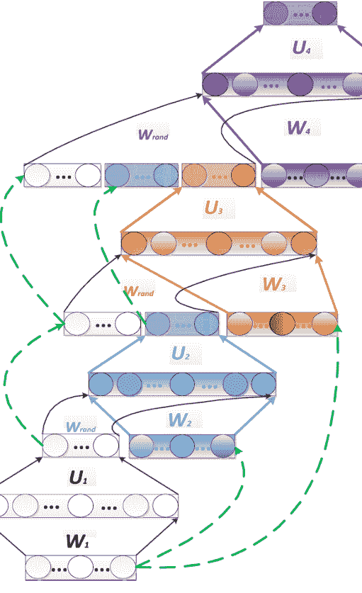

图6.1：使用输入-输出堆叠的DSN架构。图中展示了四个模块，每个模块具有不同的颜色。虚线表示复制层。[参考文献[366]，@IEEE]。

如上所示，DSN包括一组串联、重叠和分层的模块，其中每个模块具有相同的架构——线性输入层，后跟非线性隐藏层，连接到线性输出层。请注意，在DSN中，较低模块的输出单元是相邻较高模块的输入单元的子集。更具体地说，在DSN中直接位于最低模块上方的第二个模块中，输入单元可以包括最低模块的输出单元和可选的原始输入特征。

这种模式将输出单元包含在较低模块中作为相邻较高模块中输入单元的一部分，然后通过凸优化学习描述隐藏单元和线性输出单元之间连接权重的权重矩阵可以在许多模块中继续进行。然后，可以将学习到的DSN部署在与帧级语音电话或状态分类等自动分类任务相关的任务中。将DSN的输出连接到HMM或任何动态规划设备可以实现连续语音识别和其他形式的顺序模式识别。

## 6.3 学习DSN权重的方法

在这里，我们提供一些关于在DSN中使用线性输出单元如何促进DSN权重学习的技术细节。出于简单起见，使用单个模块来说明优势。首先，很明显，一旦已知隐藏层中所有训练样本的活动矩阵 $H$，可以有效地学习上层权重矩阵 $U$。让我们用 $X = [x_1, \dots, x_i, \dots, x_N]$ 表示训练向量，其中每个向量由 $x_i = [x_{1i}, \dots, x_{ji}, \dots, x_{Di}]^T$ 表示，其中 $D$ 是输入向量的维度，是一个块的函数，$N$ 是训练样本的总数。用 $L$ 表示隐藏单元的数量，用 $C$ 表示输出向量的维度。然后，DSN块的输出为 $y_i = U^T h_i$，其中 $h_i = \sigma(W^T x_i)$ 是样本 $i$ 的隐藏层向量，$U$ 是块上层的 $L \times C$ 权重矩阵，$W$ 是一个 $D \times L$ 是一个块的下层的权重矩阵，$\sigma(\cdot)$ 是一个sigmoid函数。如果 $x_i$ 和 $h_i$ 被增加了一个单位，那么偏置项在上述公式中被隐式表示。

给定总共 $N$ 个样本的完整训练集中的目标向量，$T = [t_1, \dots, t_i, \dots, t_N]$，其中每个向量是 $t_i = [t_{1i}, \dots, t_{ji}, \dots, t_{Ci}]^T$，参数 $U$ 和 $W$ 被学习以使下面的总平方误差的平均值最小化：

$$E = \frac{1}{2} \sum_{i} \| y_i - t_i \|^2 = \frac{1}{2} \mathrm{Tr}[(Y - T)(Y - T)^\mathrm{T}]$$

网络的输出为

$$y_i = U^T h_i = U^T \sigma(W^T x_i) = G_i(UW)$$

## 6.4 张量深度堆叠网络

这取决于权重矩阵，就像标准神经网络一样。假设 H = [h_1, ..., h_i, ..., h_N] 是已知的，或者等价地， W 是已知的。然后，将对 U 的误差导数设置为零，得到

```
U = (HH^T)^{-1} H T^T = F(W), \quad \text{其中} \quad h_i = \sigma(W^T x_i).
```

这提供了一个明确的约束条件，将 U 和 W 联系起来，在传统的反向传播算法中，它们被独立处理。

现在，给定等式约束 U = F(W)，让我们使用拉格朗日乘子法来解决学习 W 中的优化问题。优化拉格朗日函数：

```
E = \frac{1}{2} \sum_i \| G_i(U, W) - t_i \|^2 + \lambda \| U - F(W) \|
```

我们可以推导出批量梯度下降学习算法，其中梯度的形式如下[106, 413]:

```
\frac{\partial E}{\partial W} = 2X [H^T \circ (1 - H)^T \circ [H^\dagger (H T^T)(T H^\dagger) - T^T (T H^\dagger)]],
```

其中 H^\dagger = H^T (H H^T)^{-1} 是 H 的伪逆，符号 \circ 表示逐元素乘法。

与传统的反向传播相比，上述方法在梯度计算中具有更少的噪声，因为利用了明确的约束 U = F(W)。因此，通过实验证明，与反向传播不同，批量训练是有效的，有助于并行学习深度信号网络。

## 6.4 张量深度堆叠网络

上述DSN架构最近被推广到其张量化版本，我们称之为张量DSN（TDSN）[180, 181]。就学习的并行性而言，它具有与DSN相同的可扩展性，但它通过提供在DSN中缺失的高阶特征交互来推广DSN。

TDSN的架构与DSN的堆叠操作方式类似。也就是说，TDSN的模块与DSN的模块相似。TDSN以类似的方式堆叠起来形成深度架构。TDSN与DSN之间的区别主要在于每个模块的构建方式。在DSN中，我们有一组隐藏单元形成一个隐藏层，如图6.2左侧面板所示。相比之下，TDSN的每个模块包含两个独立的隐藏层，分别在图6.2中间和右侧面板中标记为“隐藏1”和“隐藏2”。由于这种差异，图6.2中的上层权重由DSN中的矩阵（二维数组）变为TDSN中的张量（三维数组），在中间面板中用“U”标记的立方体表示。

张量 U有一个三路连接，一个连接到预测层，其余连接到两个独立的隐藏层。这个TDSN模块的等效形式如图6.2的右侧面板所示，其中隐含的隐藏层通过将两个独立的隐藏层扩展为它们的外积来形成。得到的大向量包含了两组隐藏层向量的所有可能的成对乘积。这将张量 U再次转换为一个矩阵，其维度为(1)预测层的大小；以及(2)两个隐藏层大小的乘积。这种等价性使得可以将用于DSN的凸优化应用于学习张量 U。重要的是，通过大型隐含层的外积构造，TDSN中启用了高阶隐藏特征的相互作用。

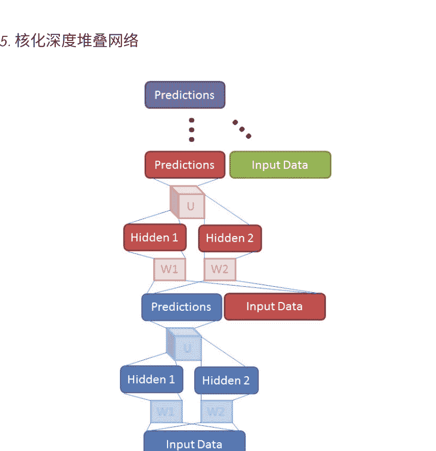

图6.3：通过将预测向量与输入向量连接起来堆叠TDSN模块。[引自[180]，@IEEE]。

通过将TDSN模块堆叠形成深度架构，类似于DSN通过连接各种向量。图6.3和6.4展示了两个示例。请注意，通过将隐藏层与输入向量连接起来进行堆叠（图6.4）对于DSN来说可能很困难，因为其隐藏层往往对于实际目的来说太大。

## 6.5 核化深度堆叠网络

DSN架构最近还推广到其核化版本，我们称之为核化DSN（K-DSN）[102, 171]。扩展的动机是增加每个DSN模块中隐藏单元的大小，同时不增加要学习的自由参数的大小。通过使用核技巧，可以轻松实现这个目标，从而得到我们下面描述的K-DSN。

在上述DSN架构中，优化权重矩阵 $U$是每个模块中隐藏层输出的一个凸优化问题。然而，优化权重矩阵 $W$以及整个网络的问题是非凸的。在最近的DSN扩展中，引入了张量结构，将 $W$的大部分非凸学习负担转移到了 $U$的凸优化中[180, 181]。在新的K-DSN扩展中，我们通过使用核技巧完全消除了 $W$的非凸学习。

为了推导出K-DSN架构和相关的学习算法，我们首先以DSN的底层模块为例，并将DSN模块中的S型隐藏层$H_i = \sigma( W^T x_i)$推广为一个通用的非线性映射函数 $G(X)$，该函数从原始输入特征 $X$到高维空间 $G(X)$（可能是无限维）的映射只通过一个隐含的核函数来隐式确定。其次，我们对约束优化问题进行了规范化

```
$$\text{最小化} \frac{1}{2} \text{Tr}[EE^T] + \frac{C}{2} U^T U \\ \text{受限于} T - U^T G(X) = E.$$
```

第三，我们利用上述约束优化问题的对偶表示得到 $U = G^T a$，其中向量 a 的形式如下：

```
$$a = (CI + K)^{-1} T$$
```

而 $K = G(X) G^T (X)$ 是一个具有元素的对称核矩阵 $K_{nm} = g^T(x_n) g(x_m)$。

最后，对于测试集或开发集中的每个新输入向量 $x$，我们得到 K-DSN (底层) 模块的预测结果为

```
$$y(x) = U^T g(x) = a^T G(X) g(x) = k^T(x) (CI + K)^{-1} T$$
```

其中核向量 $k(x)$ 的定义为其元素具有值 $k_n(x) = k(x_n, x)$ 其中 $x_n$ 是一个训练样本，$x$ 是当前的测试样本。

对于 K-DSN 中的第 l 个模块，其中 $l \geq 2$，核矩阵被修改为

```
$$K = G([X | Y^{(l-1)} | Y^{(l-2)} | \ldots Y^{(1)}]) G^T([X | Y^{(l-1)} | Y^{(l-2)} | \ldots Y^{(1)}])$$
```

K-DSN的主要优势可以分析如下。首先，与需要计算隐藏单元输出的 DSN 不同，K-DSN不需要显式计算隐藏单元的输出 $G(X)$ 或 $G([X | Y^{(l-1)} | Y^{(l-2)} | \ldots Y^{(1)}])$。当使用高斯核时，核技巧等效地给出了无限数量的隐藏单元，而无需显式计算它们。此外，我们不再需要像 DSN 中描述的那样学习下层的权重矩阵 $W$，而且核参数（例如，高斯核中的单一方差参数 $\sigma$）使得 K-DSN 比 DSN 更不容易过拟合。图6.5展示了使用高斯核和三个模块的 K-DSN 的基本架构。

具有高斯核的整个 K-DSN 由两组模块相关的超参数来描述：$\sigma^{(l)}$ 和 $C^{(l)}$ 内核平滑参数和正则化参数，分别。虽然这两个参数都很直观，通过线性搜索或留一法交叉验证来调整它们对于单个底层模块是直接的，但对于所有模块的整个网络来说，调整起来更加困难。例如，如果底层模块调整得太好，那么添加更多模块将不会带来太多好处。相反，当底层模块调整得不太好（即从直接方法得到的结果中放松），整个K-DSN通常表现更好。Deng等人[102]报告的实验结果是使用一组经验确定的调整计划来自底层到顶层模块自适应地正则化K-DSN获得的。

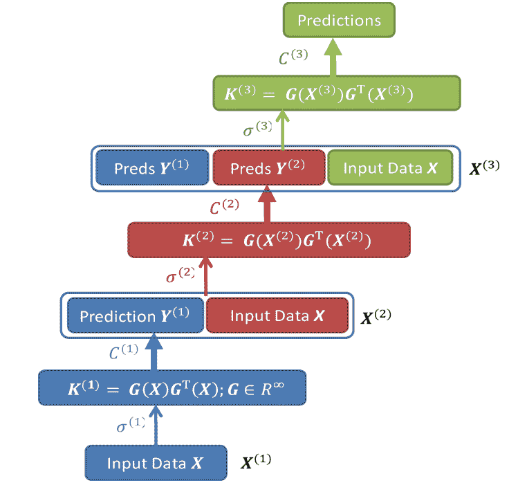

图6.5：K-DSN的一个示例架构，每个模块都使用具有不同内核参数的高斯核。[参考文献[102]，@IEEE]

这里描述的K-DSN具有一组非常理想的特性，从机器学习和模式识别的角度来看。它将深度学习和核学习的力量结合在一个原则性的方式中。与基本的DSN不同，训练K-DSN不再涉及非凸优化问题。计算步骤使得K-DSN在分布式服务器上进行并行计算比DSN和张量-DSN更容易扩展。与DSN、T-DSN和DNN相比，K-DSN中需要调整的参数要少得多，并且不需要预训练。研究[102]发现，正则化在K-DSN中的作用比基本的DSN和张量-DSN中更重要。此外，为了学习K-DSN的权重而开发的有效正则化调度可以通过对Rprop或弹性反向传播算法[302]等有用的优化技巧进行直观洞察来解释。

然而，与任何核方法一样，可扩展性也成为K-DSN在训练和测试样本变得非常大时的一个问题。黄等人在研究中提供了一种解决方案，基于随机傅里叶特征，这些特征具有近似高斯核的强大理论性质，同时在训练和评估具有大量训练样本的K-DSN时实现了高效计算。经验证明，就像传统的利用严格高斯核的K-DSN一样，使用随机傅里叶特征也能成功地堆叠核模块以形成深度架构。

## 7 语音和音频处理中的选定应用

### 7.1 语音识别的声学建模

正如第2节讨论的那样，语音识别是深度学习方法在工业规模上取得的第一个成功应用。这个成功是微软研究部门与相关研究人员密切合作的结果，他们敏锐地关注到了大规模部署的工业需求。这也是仔细利用深度学习和当时最先进的语音识别技术的优势的结果，特别是高效的解码技术。

语音识别长期以来一直由GMM-HMM方法主导，其底层是浅层或平坦的生成模型，包括上下文相关的GMM和HMM（例如，[92, 93, 187, 293]）。神经网络曾经是一种流行的方法，但在与GMM-HMM的竞争中并不具备竞争力[42, 87, 261, 382]。具有深层隐藏动态的生成模型同样也没有明显的竞争力（例如，[45, 73, 108, 282]）。

深度学习和DNN在2010年开始在语音识别中产生影响，这是在学术界和工业界研究人员之间密切合作之后实现的。工业研究人员和学术界之间的紧密合作可以在[89, 161]中找到相关评论。合作工作始于电话识别任务[89, 100, 135, 136, 257, 260, 258, 309, 311, 334]，展示了在第5节中讨论的混合DNN架构的强大能力，以及随后具有卷积和循环结构的新架构。该工作还表明了光谱图的原始语音特征的重要性，从长期流行的MFCC特征回到但尚未达到原始语音波形水平[183, 327]。合作继续进行到更具说服力的大词汇任务中，取得了非常积极的结果[67, 68, 94, 89, 161, 199, 195, 223, 323, 353, 399, 414]。大词汇语音识别的成功在很大程度上归功于使用与GMM-HMM语音单元（senones）相同结构的非常大的DNN输出层，这部分是受到语音研究人员的启发，他们希望利用在GMM-HMM框架中已被证明有效的上下文相关的音素建模技术，并尽量减少对已经高效的解码器软件基础设施的改变。与此同时，这一系列工作还证明了在有大量标记数据可用时，可以减少对DBN类似的预训练的需求，以有效学习DNN。三个因素的结合有助于将深度学习在语音识别中的成功迅速传播到整个语音行业和学术界：（1）与当时最先进的GMM-HMM系统相比，错误率显著降低；（2）由于使用senones作为DNN的输出，部署新的基于DNN的语音识别器所需的解码器变化最小；（3）DNN强大的建模能力降低了系统复杂性。到2013年的ICASSP时期，至少有15个主要的语音识别团队在非MFCC的原始语音谱特征和非常大的任务中实验证实了DNN的成功。最值得注意的团队包括全球主要的工业语音实验室：微软[49, 89, 94, 324, 399, 430]，IBM[195, 309, 311, 307, 317]，谷歌[69, 150, 184, 223]，讯飞和百度。他们的结果代表了语音识别的新的最先进技术，在这些公司的语音产品和服务中得到广泛应用，并在近年来得到了广泛的媒体报道。

在本章的其余部分中，我们根据几个主题标题，基于深度学习方法回顾了广泛的语音识别工作。

### 7.1.1 回到语音的原始频谱特征

深度学习，也被称为表示学习或（无监督的）特征学习，设定了一个重要目标，即从原始输入数据中自动发现强大的特征，与应用领域无关。对于语音特征学习和语音识别，这个目标被简化为使用原始频谱或可能的波形特征。在过去的30年左右的时间里，主要是通过“手工制作”的语音谱图转换，在基于GMM的HMM系统中取得了显著的准确性提高，尽管已知从原始语音数据中丢失了信息。最成功的转换是非自适应余弦变换，它引出了梅尔频率倒谱系数（MFCC）特征。余弦变换近似地去相关特征分量，这对于使用带有对角协方差矩阵的GMMs是重要的。然而，当GMMs被深度学习模型如DNNs、深度置信网络（DBNs）或深度自编码器所取代时，这种去相关性变得无关紧要，因为深度学习方法在建模数据相关性方面非常强大。正如在第4节中详细讨论的那样，[100]的早期工作证明了这种强大性，特别是在无监督方式下使用自编码器对声学瓶颈特征进行编码时，谱图相对于MFCCs的好处。

从语音波形（原始语音特征）到MFCC和它们的时间差异，经过了中间阶段的对数谱，然后是（Mel-warped）滤波器组，根据数据学习的参数。深度学习的一个重要特点是摆脱了特征表示和分类器的分离设计。这种同时学习分类器和特征变换的思想在早期的基于GMM-HMM的语音识别研究中已经得到了探索，例如[33, 50, 51, 299]。然而，只有最近才获得了更大的语音识别性能提升。在由深度学习方法赋能的识别器中。例如，Mohamed等人[259]，Li等人[221]和Deng等人[94]在从MFCC特征转换回更原始（Mel-scaled）滤波器组特征时，显示出显著降低的语音识别错误。这些结果表明，DNNs可以学习比原始固定余弦变换更好的变换，从Mel-scaled滤波器组特征中。

与MFCC相比，“原始”频谱特征不仅保留了更多信息，还能够使用卷积和池化操作来表示和处理一些典型的语音变异性，例如频率域中明确表达的说话者之间的声道长度差异、不同的说话风格导致的共振峰欠冲或过冲等。例如，卷积神经网络（CNN）只有在使用频谱特征而不是MFCC特征时，才能在语音识别[1, 2, 3, 94]中有意义且有效地应用。

最近，Sainath等人[307]通过学习定义功率谱上滤波器组的参数，进一步朝着原始特征迈进。也就是说，与[1, 3, 50, 221]中使用Mel变形滤波器组特征作为输入特征不同，与Mel尺度滤波器对应的权重仅用于初始化参数，随后与深度网络的其余部分一起学习作为分类器。联合学习的特征生成器和分类器的整体架构如图7.1所示。[307]中报告了显著的语音识别错误减少。

已经证明，不仅学习特征的频谱方面对语音识别有益，学习特征的时间方面也有帮助[332]。此外，余等人[426]仔细分析了DNN中不同层的特性，从较低的原始滤波器组特征开始逐层提取特征。他们发现，DNN能够提取出对语音信号中的许多变异源具有鲁棒性的判别性内部表示，从而实现了改进的语音识别准确性。他们还表明，这些表示对于小扰动变得越来越不敏感。

图7.1：滤波器参数和深度网络的其他部分的联合学习示意图[参考文献[307]，@IEEE]。

在更高层次的输入上，这有助于实现更好的语音识别准确性。

在极端情况下，深度学习将促使使用语音的最低级原始特征，即语音声波形，进行语音识别，并自动学习转换。 作为实现这一目标的初步尝试，Jaitly和Hinton的研究[183]利用语音声波作为原始输入特征，使用具有卷积结构的RBM作为分类器。 在隐藏层中使用修正线性单元[130]，可以在一定程度上自动归一化波形信号的振幅变化。尽管最终结果令人失望，但这项工作表明在这个方向上还需要做很多工作。 例如，正如Sainath等人[307]所示，使用原始频谱作为特征需要在归一化方面额外注意，而使用语音波形则需要更多的归一化注意[327]。 这对 于基于GMM和基于深度学习的方法都是正确的。

## 7.1.2 DNN-HMM架构与使用DNN派生特征的比较

在最近的研究中，将深度学习方法应用于语音识别的文献中，另一个主要主题是使用DNN的两种不同方式：(1)直接应用DNN-HMM架构来进行语音识别，如第5.3节所讨论的；(2)使用DNN提取或派生特征，然后将其输入到单独的序列分类器中。在语音识别文献中[42]，一个系统中，神经网络的输出直接用于估计HMM的发射概率，通常被称为ANN/HMM混合系统。这应该与本专著中第5节和整个专著中使用的“混合”概念区分开来，在这里，“混合”是指利用无监督预训练和监督微调的混合来学习DNN的参数。

### 7.1.2.1 DNN-HMM架构作为一个识别器

早期的DNN-HMM架构[257]在NIPS研讨会[109]上被提出，由多伦多大学和MSR语音研究人员开发、分析和协助。在这项工作中，一个五层的DNN（在论文中称为DBN）被用来替代GMM-HMM系统中的高斯混合模型，并且使用单音素状态作为建模单元。尽管单音素通常被认为是比三音素更弱的音素表示，但使用单音素的DNN-HMM方法在电话识别准确率上显示出比最先进的三音素GMM-HMM系统更高的准确率。此外，DNN的结果被发现略优于文献中基于生成隐藏轨迹模型（HTM）的最佳单系统[105, 108]，在许多语音研究人员使用的相同的TIMIT任务上进行评估[107, 108, 274, 313]。在MSR的雷德蒙德，这两个独立系统（DNN与HTM）产生的错误模式被仔细分析，并发现它们非常不同，反映了这两种方法的核心能力差异，并引发了对下文所描述的DNN-HMM方法的深入研究。

微软研究院和多伦多大学的研究人员[67, 68, 414]将DNN-HMM系统从单音素语音表示扩展到三音素或上下文相关的对应物，并从电话识别扩展到大词汇语音识别。 在微软研究院对24小时和48小时的Bing移动语音搜索数据集进行的实验表明，在真实使用场景下，上下文相关的DNN-HMM明显优于最先进的GMM-HMM系统。 除了使用DNN之外，还有三个因素对成功起到了贡献：使用绑定的三音素作为DNN建模单元，使用最佳的三音素GMM-HMM生成三音素状态对齐，以及有效利用长时间窗口的输入特征。 实验还表明，五层DNN-HMM的解码时间几乎与最先进的三音素GMM-HMM相同。这一成功迅速扩展到具有数百甚至数千小时训练集和数千个三音素状态的大词汇语音识别任务，包括Switchboard和Broadcast News数据库，以及Google的语音搜索和YouTube任务[94, 161, 184, 309, 311, 324]。 例如，在Switchboard基准测试中，上下文相关的DNN-HMM（CD-DNN-HMM）与最先进的GMM-HMM系统相比，错误率减少了三分之一[323]。总结

一下，在相对早期的文献中，我们在表7.1中展示了基于基本DNN-HMM架构的一些定量识别错误率，与基于生成模型的先前最先进系统相比。（更先进的架构产生了比这里展示的更好的结果）。从子表A到D可以看出，训练数据从一个任务到下一个增加了大约一个数量级。不仅计算量随着训练规模的增加而良好地（即几乎线性地）扩展，更重要的是，相对错误率的减少随着训练数据的增加而显著增加——从约10%到20%，然后到30%。这组结果突出了基于DNN的方法的强烈可取性，尽管整体DNN-HMM架构的概念简单且存在一些已知的弱点。

表7.1: DNN-HMM架构与生成模型（例如GMM-HMM）在音素或词语识别错误率方面的比较 从子表A到D，训练数据增加了大约三个数量级

| 特征 | 设置 | 错误率 |
| --- | --- | --- |
| A: TIMIT电话识别 (3小时训练) | | |
| GMM | 带有隐藏动态 | 24.8% |
| DNN | 5层 × 2048 | 23.0% |
| B: 语音搜索SER (24-48小时训练) | | |
| GMM | MPE (760 24-mix) | 36.2% |
| DNN | 5层 × 2048 | 30.1% |
| C: Switchboard WER (309小时训练) | | |
| GMM | BMMI (9K 40-mix) | 23.6% |
| DNN | 7层 × 2048 | 15.8% |
| D: Switchboard WER (2000小时训练) | | |
| GMM | BMMI (18K 72-mix) | 21.7% |
| DNN | 7层 × 2048 | 14.6% |

### 7.1.2.2 在单独的识别器中使用DNN派生特征

上述DNN-HMM架构在语音识别中存在一个明显的弱点，即在过去的20多年中，GMM-HMM系统中的许多高效技术，包括判别式训练（在特征空间和模型空间中），无监督说话人自适应，噪声鲁棒性以及用于大规模训练数据的可扩展批量训练工具等，可能无法直接应用于新系统，尽管类似的技术最近已经用于DNN-HMM。为了解决这个问题，原始由Hermansky等人开发的“串联”方法已经被采用，其中神经网络的输出以音素类别的后验概率的形式被使用，通常与声学特征一起形成新的增强输入特征，在一个单独的GMM-HMM系统中使用。

Vinyals和Ravuri [379]使用了这种串联方法，其中DNN的输出被提取出来作为不匹配噪声语音的特征。据报道，DNN在清洁条件下优于具有单个隐藏层的神经网络，但随着噪声水平的增加，优势逐渐减弱。此外，在低到中等噪声条件下，使用从DNN计算得到的MFCC与后验概率相结合的方法优于仅使用DNN特征的方法。Tüske等人[368]和Imseng等人[182]通过与直接DNN-HMM方法进行比较，对这种串联方法进行了评估。

提取DNN特征的另一种方法是使用比DNN中其他层更窄的“瓶颈”层来限制网络的容量。然后，将这些瓶颈特征与原始声学特征和一些降维技术一起馈送到GMM-HMM系统中。

从DNN中得出的瓶颈特征被认为能够捕捉到与传统声学特征互补的信息，这些传统声学特征是从输入的短时谱中得出的。基于上述瓶颈特征方法构建了一个语音识别器，由Yu和Seltzer [425]完成，整体架构如图7.2所示。已经探索了几种基于DNN的瓶颈特征方法的变体；详见[16, 137, 201, 285, 308, 368]。

从DNN中提取特征的另一种方法是将其顶层隐藏层作为独立语音的新特征

图7.2：从DNN中提取的瓶颈（BN）特征在GMM-HMM语音识别器中的应用示意图。[引自[425]，@IEEE]。

## 7.1.3 通过深度学习实现的噪声鲁棒性

在语音识别中，噪声鲁棒性的研究历史悠久，主要集中在深度学习兴起之前。导致语音识别技术易受损的一个主要因素是标准的GMM-HMM声学模型无法准确建模与训练数据不同的噪声扭曲语音测试数据，这些数据可能受到噪声的影响，也可能没有受到噪声的影响。过去30年来，开发了广泛的噪声鲁棒技术，可以使用五个不同的标准进行分析和分类：（1）特征域与模型域处理，（2）使用关于声学环境扭曲的先验知识，（3）使用显式的环境扭曲模型，（4）确定性与不确定性处理，以及（5）在测试阶段使用与特征增强或模型自适应过程中相同的声学模型进行联合训练。请参阅[220]中的综述以及[4, 82, 119, 140, 230, 370, 404, 431, 444]中的一些额外综述文献或原始工作。

许多为GMM-HMM模型开发的技术（例如，Li等人[220]和Gales [119]调查的模型域噪声鲁棒技术）不直接适用于语音识别中的新深度学习模型。然而，特征域技术可以直接应用于DNN系统。Seltzer等人[325]对在特征域中使用DNN进行噪声鲁棒语音识别进行了详细研究，他们在输入特征上应用了C-MMSE [415]特征增强算法。

在DNN中使用相同算法处理训练和测试数据，可以通过DNN-HMM识别器学习到增强算法引入的任何一致错误或伪影。该研究还成功地探索了噪声感知训练范式用于训练DNN的方法，其中每个观测值都用噪声的估计进行了增强。在Aurora4任务上取得了良好的结果。最近，Kashiwagi等人[191]将SPLICE特征增强技术[82]应用于DNN语音识别器。在该研究中，DNN的输出层是基于干净数据而不是基于噪声数据确定的，与Seltzer等人[325]的研究不同。

除了DNN之外，还提出了其他深度架构来进行特征增强和抗噪声语音识别。例如，Mass等人[235]应用深度递归自编码神经网络来去除输入特征中的噪声，以实现鲁棒的语音识别。该模型是在立体声（有噪声和清晰的）语音特征上进行训练的，以给出噪声输入时的清晰特征预测，类似于SPLICE设置，但使用深度模型而不是GMM。Vinyals和Ravuri[379]研究了用于抗噪声语音识别的串联方法，其中DNN直接训练带有噪声语音以生成后验特征。最后，Rennie等人[300]探索了一种称为因子隐藏RBM的RBM版本，用于抗噪声语音识别。

## 7.1.4 DNN中的输出表示

大多数用于语音识别和其他信息处理应用的深度学习方法都专注于从输入声学特征中学习表示，而不关注输出表示。最近的2013年NIPS学习输出表示研讨会（http://nips.cc/Conferences/2013/Program/event.php?ID=3714）致力于弥合这一差距。例如，[117]中描述的深度视觉-语义嵌入模型利用从文本嵌入中获得的连续值输出表示来辅助

用于图像分类的深度网络的分支。 对于语音识别，[79]中强调了设计有效的语言表示来输出深度网络的重要性。

大多数当前的DNN系统使用高维输出表示来匹配HMM中的上下文相关音素状态。因此，输出层的评估可能占据总计算时间的1/3。为了解码速度，通常会对输出层应用低秩近似等技术。

[310]和[397]中首先训练了具有高维输出层的DNN。然后，在大型输出层矩阵上执行基于奇异值分解（SVD）的降维技术。然后，进一步将得到的矩阵组合起来，结果是原始的大型权重矩阵被两个更小的矩阵的乘积所近似。本质上，这种技术将原始的大型输出层转换为两个层——一个瓶颈线性层和一个非线性输出层——两者都具有较小的权重矩阵。降维后的DNN进一步优化。实验结果表明，即使尺寸减少了一半，也没有观察到语音识别准确率的降低，同时运行时间计算大大减少。

语音识别的输出表示可以从[79]中呈现的符号或音韵单元的结构化设计中受益。多年来，人类语音中符号性质的丰富音韵结构已经广为人知。同样，长期以来人们已经很好地理解，即使在具有上下文依赖性的情况下，使用音素或其更精细的状态序列在工程语音识别系统中也无法表示这种丰富结构[86, 273, 355]，因此为改善语音识别系统的性能留下了一个有希望的方向。关于语音声音的内部结构及其与语音识别技术的相关性，以及对底层语音模型的可能输出表示的规范、设计和学习的基本理论，在[76]和最近的[79]中进行了调查。

在语音识别中，深度学习工作的研究日益增多，它们的重点是设计输出表示。

与语言结构相关。在[383, 384]中，基于上下文相关的音素单元的输出表示设计存在限制，如[67, 68]所提出的，被认识到并提供了解决方案。这个限制的根本原因是决策树创建的聚类中的所有上下文相关的音素状态共享相同的参数，这降低了其在解码阶段对细粒度状态的分辨能力。所提出的解决方案将上下文相关的DNN的输出表示形式建模为典型状态建模技术的一个实例，利用广义音素类别。首先，使用广义音素上下文将三音素聚类为多组较短的双音素。然后，训练DNN来区分每组中的双音素。使用逻辑回归将典型状态转换为详细的三音素状态输出概率。也就是说，上下文相关的DNN的输出表示的整体设计具有层次结构，同时解决了数据稀疏性和低分辨率问题。

有关设计语音识别输出语言表示的相关工作可以在[197]和[241]中找到。虽然这些设计是在GMM-HMM基于语音识别系统的背景下进行的，但它们都可以扩展到深度学习模型。

### 7.1.5 DNN基于语音识别的适应

DNN-HMM是20世纪90年代开发的一种先进的人工神经网络和HMM“混合”系统，针对该系统已经开发了几种适应技术。这些技术大多基于输入或输出层的网络权重的线性变换。关于DNN适应的一些探索性研究使用了相同或相关的线性变换方法[223, 401, 402]。然而，与早期更窄更浅的神经网络系统相比，DNN-HMM由于使用了更宽更深的隐藏层和更大的输出层来建模上下文相关的音素和状态，因此具有更多的参数。这种差异对于适应DNN-HMM，特别是在适应数据较少的情况下，提出了特殊的挑战。在这里我们讨论

代表性的最近研究克服了在不同方式中适应大型DNN权重方面的挑战。于等人[430]提出了一种正则化的适应技术，用于适应DNN。它通过强制从适应模型估计的分布接近于适应之前的分布来保守地调整DNN权重。这个约束通过将Kullback-Leibler散度（KLD）正则化添加到适应准则中来实现。这种类型的正则化被证明等价于传统反向传播算法中目标分布的修改，因此DNN的训练基本保持不变。新的目标分布被推导为适应之前模型估计的分布和适应数据的地面真实对齐的线性插值。这种插值防止了适应模型偏离与说话人无关的模型太远，从而防止过度训练。这种类型的适应与L2正则化不同，L2正则化约束的是模型参数本身而不是输出概率。

在[330]中，对DNN的调整不是应用于传统的网络权重，而是应用于隐藏激活函数。通过这种方式，当前基于可适应网络权重的调整技术在输入层或输出层中的主要限制得到了有效克服，因为新方法只需要调整更少数量的隐藏激活函数。

已经进行了多项关于无监督或半监督DNN声学模型适应的研究，使用了不同类型的输入特征，并取得了成功[223, 405]。

最近，Saon等人[317]探索了一种新的、高效的适应DNN的方法，用于语音识别。该方法将I-向量特征与fMLLR（特征域最大似然线性回归）特征结合作为DNN的输入。I-向量或（说话人）身份向量通常用于说话人验证和说话人识别应用，因为它们在低维特征向量中包含了与说话人身份相关的重要信息。fMLLR是为GMM-HMM系统开发的一种有效的调整技术。由于I-向量在频率上不服从局部性，因此必须与服从局部性的fMLLR特征进行谨慎组合。

局部性。多尺度CNN-DNN的架构被证明对于结合这两种不同类型的特征是有效的。在训练和解码过程中，将说话者特定的I-vector附加到基于帧的fMLLR特征上。

## 7.1.6 更好的架构和非线性单元

近年来，自从在语音识别中证明了（全连接）DNN-HMM混合系统的成功[67, 68, 109, 161, 257, 258, 308, 309, 324, 429]，许多新的架构和非线性单元已被提出和评估。在这里，我们提供了这一进展的概述，扩展了[89]中提供的概述。

张量版本的DNN由Yu等人报道[421, 422]，它通过用双投影层和张量层替换其一层或多层来扩展传统的DNN。在双投影层中，每个输入向量被投影到两个非线性子空间中。在张量层中，两个子空间投影相互作用，并共同预测整体深度架构中的下一层。

开发了一种方法，将张量层映射到传统的sigmoid层，以便可以以类似于后者的方式处理和训练前者。通过这种映射，DNN的张量版本可以被视为增加了双投影层的DNN，从而可以清晰地推导出反向传播学习算法，并相对容易地实现。

与上述方法类似的架构是DSN的张量版本，在第6节中描述，也可以应用于语音分类和识别[180, 181]。同样的方法适用于将张量层（即DSN上许多模块中的上层）映射到传统的sigmoid层。同样，这种映射简化了训练算法，使其与DSN的算法不相差太远。

正如在第3.2节中讨论的那样，时间卷积的概念最初是在TDNN（时延神经网络）中作为一种浅层神经网络[202, 382]在语音识别的早期阶段开发出来的。只有最近在使用深层架构（例如深度卷积神经网络或深度CNN）时，它才被应用

研究发现，在处理时间变化时，频率维度的权重共享比时间域的权重共享更有效，尤其是在高性能电话识别中使用HMM时，而在之前未使用HMM的TDNN中使用时间域的权重共享[1, 2, 3, 81]。这些研究还表明，在深度CNN中设计池化方案以在声道长度不变性和语音声音之间适当权衡，再加上“dropout”[166]的正则化技术，可以进一步提高电话识别性能。这组工作进一步指出，使用卷积和池化在混合时间和频率域中表达的整个动态语音模式，可以在轨迹判别和不变性之间进行权衡。此外，[306, 307, 312]中最新的研究表明，CNNs也对大词汇连续语音识别有益。他们进一步证明，当卷积层使用大量卷积核或特征图时，多个卷积层可以提供更多的改进。特别是Sainath等人[306]广泛探索了深度CNN的许多变体。结合几种新方法，深度CNN在一些大词汇语音识别任务中展现出了最先进的结果。

除了DNN、CNN和DSN以及它们的张量版本之外，在文献中还报道了其他深度模型用于语音识别。例如，深度结构化CRF将多层CRF堆叠在一起，已经成功应用于语言识别[429]、电话识别[410]、自然语言处理中的序列标注[428]以及语音识别中的置信度校准[423]等任务。最近，Demuynck和Triefenbach [70]开发了深度GMM架构，从中提取了导致强大性能的DNN方面，并应用于构建分层GMM。他们表明，通过“深入宽广”并将较低层GMM的窗口概率输入到较高层GMM中，深度GMM系统的性能可以与DNN相媲美。留在GMM空间的一个优点是，GMM自适应和判别性学习的几十年工作仍然适用。

在所有深度架构中，最值得注意的是循环神经网络（RNN）以及其堆叠或深层版本[135, 136, 153, 279, 377]。虽然RNN在语音识别中取得了早期的成功[304]，但由于训练的复杂性，很难复制，更不用说扩展到更大的语音识别任务了。

自那时以来，RNN的学习算法得到了显著改进，最近使用RNN[48, 134, 235]取得了更好的结果，特别是在使用双向LSTM（长短期记忆）时[135, 136]。双向RNN和LSTM单元的基本信息流如图7.3和7.4所示。

由于梯度消失或梯度爆炸的问题，学习RNN参数被认为是困难的[280]。陈和邓[48]以及邓和Chen [85]提出了一种原始-对偶训练方法，将RNN的学习形式化为一个正式的优化问题，其中交叉熵在满足RNN的无穷范数小于固定值的条件下被最大化，以保证RNN动态的稳定性。对电话识别的实验结果表明：(1)原始-对偶技术在学习RNN方面非常有效，性能优于早期启发式梯度截断方法；(2)使用DNN计算语音数据的高级特征并输入RNN中比不使用DNN时具有更高的准确性；(3)随着从DNN的更高层到更低层提取的特征，准确性逐渐下降。

RNN的一个特殊情况是储备模型或回声状态网络，其中输出层被固定为线性而不是非线性，而且循环矩阵经过精心设计而不是学习。输入矩阵也是固定的，不会被学习，部分原因是学习的困难。只有隐藏层和输出层之间的权重矩阵是可以学习的。由于输出层是线性的，学习非常高效，并且可以通过闭合解实现全局最优。但由于许多参数没有被学习，隐藏层需要非常大才能获得良好的结果。Triefenbach等人[365]将这种模型应用于电话识别，并获得了相当不错的准确性。

Palangi等人[276]提出了储备模型的改进版本，通过学习输入和循环矩阵来简化之前模型中固定的线性输出（或读出）单元的学习，而只学习输出矩阵。相反，设计了一种特殊技术，利用储备模型中输出单元的线性性质来学习输入和循环矩阵。与常用于学习一般RNN的BPTT算法相比，所提出的技术利用储备模型中输出单元的线性性质，在RNN中提供各种矩阵之间的约束，以解析形式而不是通过递归计算梯度作为学习信号。

除了上述对语音识别的深度学习模型的架构进行的最新创新外，还有一系列关于开发和实现更好的非线性单元的工作正在不断增加。尽管在深度神经网络中，Sigmoid和tanh函数是最常用的非线性类型，但它们的局限性是众所周知的。例如，当单元接近饱和状态时，学习整个网络的速度会变慢，因为梯度变弱。Jaitly和Hinton [183]似乎是第一个将修正线性单元（ReLU）应用于语音识别的深度神经网络，以克服Sigmoid单元的弱点。ReLU是指神经网络中使用激活函数$f(x)=\max(0,x)$的单元。Dahl等人 [65] Mass等人 [234]成功地将ReLU应用于大词汇语音识别，并在将ReLU与“Dropout”正则化技术相结合时获得了最佳准确性。

最近展示出更多应用于语音识别的一种新型DNN单元是“maxout”单元，它被用于构建深度maxout网络，如[244]中所述。深度maxout网络由多个层组成，通过对一组称为“group”的加权输入进行最大值或“maxout”运算来生成隐藏激活。这与之前讨论的用于语音识别和计算机视觉的CNN中使用的最大池化操作相同。每个组中的最大值被作为前一层的输出。最近，张等人[441]将上述“maxout”单元推广到了两种新类型。“soft-maxout”类型的单元将原始的最大值操作替换为软最大值函数。第二种类型的单元是使用了非线性函数 $y = \|x\|_p$ 的$p$-范数类型单元。实验证明，$p$-范数单元（其中 $p= 2$）的性能始终优于maxout、tanh和ReLU单元。在Gulcehre等人[138]中，提出并研究了自动学习 $p$-范数的技术。

最后，Srivastava等人[350]提出了另一种新型的非线性单元，称为胜者通吃单元。在这里，邻近神经元之间的局部竞争被纳入了原本的前馈结构中，然后通过反向传播进行训练，其梯度与正常梯度不同。胜者通吃是一种有趣的非线性形式，它形成了一组（通常是两个）神经元，其中除了具有最大值的神经元外，组内的所有神经元都被设为零值。实验证明，与具有标准S型非线性的网络相比，该网络不会忘记那么多。

这种新型非线性单元尚未在语音识别任务中进行评估。

## 7.1.7 更好的优化和正则化

近年来，在将深度学习应用于语音识别的声学模型方面，取得了重要进展，特别是在优化准则和方法以及相关领域。正则化技术有助于在深度网络训练过程中防止过拟合。

早期关于语音识别中深度神经网络（DNN）的研究之一是由微软研究院进行的，并在[260]中报道。该研究首次认识到传统DNN训练中所需的错误率与交叉熵训练准则之间的不匹配。解决方案是通过将基于帧的交叉熵训练准则替换为基于完整序列的最大互信息优化目标来提供的，类似于为与HMM接口的浅层神经网络定义训练目标的方式[194]。等价地，这相当于将条件随机场（CRF）模型放置在DNN的顶部，取代原始的softmax层，这自然地导致了交叉熵。（请注意，该论文中将DNN称为DBN）。这种新的序列判别式学习技术是为了联合优化DNN权重、CRF转移权重和双音素语言模型而开发的。重要的是，语音任务是在TIMIT数据集上定义的，并使用简单的双音素语言模型。双音素语言模型的简单性使得可以在不使用格子的情况下进行完整序列训练，从而大大降低了训练复杂性。

作为激励全序列训练方法[260]的另一种方式，我们注意到早期的DNN电话识别实验使用了静态模式分类中的标准基于帧的目标函数交叉熵来优化DNN权重。过渡参数和语言模型分数是从HMM中获得的，并且与DNN权重独立训练。然而，在HMM研究的漫长历史中已经知道，序列分类准则对于提高语音和电话识别准确性非常有帮助。这是因为序列分类准则与性能指标（例如整体单词或电话错误率）更直接相关，而帧级准则则不然。

更具体地说，使用帧级交叉熵来训练DNN进行电话序列识别并没有明确考虑到相邻帧之间在分配的电话类标签概率分布上具有较小的距离。为了克服这个不足，可以优化条件概率的给定整个可见特征话语或等效的由DNN提取的隐藏特征序列，可以对训练数据上的对数条件概率进行优化，梯度可以在激活参数、转移参数和较低层权重上进行计算，然后追求句子级别上定义的错误的反向传播。我们注意到，在一个更早的研究中[212]，将神经网络与类似CRF的结构相结合，数学形式似乎包括CRF作为一种特殊情况。此外，在[194, 291]中早期展示了使用完整序列分类准则的好处，但是这是在浅层神经网络上进行的。

在实现上述完整序列学习算法时，如[260]所述，DNN的权重使用帧级交叉熵作为目标进行初始化。转移参数从HMM转移矩阵和“双音素语言”模型得分的组合中进行初始化，然后在联合优化之前通过调整转移特征进一步优化。使用谨慎调度的联合优化来减少过拟合，结果表明相对于帧级交叉熵训练的DNN，完整序列训练的性能提高了约5%[260]。如果不努力减少过拟合，使用MMI训练的DNN比使用帧级交叉熵训练的DNN更容易过拟合。这是因为语音中帧之间的相关性在训练、开发和测试数据之间往往是不同的。重要的是，当使用基于帧的目标函数进行训练时，这些差异不会显示出来。

对于使用更复杂的语言模型的大词汇语音识别，DNN-HMM的全序列训练的优化方法要复杂得多。Kingsbury等人[195]使用了并行的、二阶的、无Hessian的优化技术，首次成功地进行了这种训练，这些技术在大词汇语音识别中得到了精心实施。Sainath等人[305]通过减少Krylov子空间求解器迭代的次数[378]（用于隐式估计Hessian）来改进和加速无Hessian的技术。他们还使用采样方法来减少训练数据的数量以加快训练速度。

尽管批处理模式的二阶无Hessian技术在大规模DNN-HMM系统的全序列训练中取得了成功，但最近也报道了一阶随机梯度下降方法的成功[353]。发现需要启发式方法来处理格子稀疏性的问题。也就是说，DNN必须通过额外的基于帧的交叉熵训练迭代来调整更新后的分子格子。此外，需要向分母格子中添加人工静音弧，或者将最大互信息目标函数与基于帧的交叉熵目标函数平滑。结论是，对于具有稀疏格子的大词汇语音识别任务，序列训练的实现需要比[260]中报告的小任务更高的工程技能，尽管目标函数和梯度推导本质上是相同的。当进行大词汇语音识别的DNN-HMM的全序列训练时，Vesely等人[374]得出了类似的结论。然而，与[353]中的不同启发式方法在训练中被证明是有效的。

Wiesler等人[390]研究了用于训练具有交叉熵目标的DNN的无Hessian优化方法，并对该方法的性质进行了实证分析。最后，Dognin和Goel [113]结合了随机平均梯度和无Hessian优化，用于深度神经网络的序列训练，取得了成功，训练过程收敛时间约为全Hessian-free序列训练的一半。

对于具有帧级或序列级优化目标的大型DNN-HMM系统，加速训练对于利用大量训练数据和大型模型尺寸至关重要。除了上述描述的方法外，Dean等人[69]报告了异步随机梯度下降（ASGD）方法，自适应梯度下降（Adagrad）方法和大规模有限内存BFGS（L-BFGS）方法在大词汇量语音识别中的应用。Sainath等人[312]对用于加速大规模语音识别任务中基于DNN的系统训练的各种优化方法进行了综述。

除了上述关注完全监督学习范式下的优化问题之外，其中所有训练数据都包含标签信息，半监督训练范式也被用于语音识别中的DNN-HMM系统的学习。Liao等人[223]报告了在DNN-HMM系统上使用半监督训练来解决非常具有挑战性的YouTube语音识别任务的探索。主要技术基于“置信岛”过滤启发式方法来选择有用的训练片段。此外，Vesely等人[374]还探索了DNN的半监督训练，其中自我训练策略被用作基于语句级和帧级置信度的数据选择的基础。基于来自网络中混淆的每帧置信度的帧选择被发现是有益的。Huang等人[176]报告了半监督训练技术的另一种变体，其中应用了多系统组合和置信度重新校准来选择训练数据。此外，Thomas等人[362]克服了在许多低资源场景中缺乏足够训练数据的问题。他们利用转录的多语言数据和半监督训练来构建所提出的特征前端，以进行后续的语音识别。

最近几年，随着基于“dropout”方法的引入，我们在深度学习的语音识别方面取得了重要进展[166]。在DNN训练中，过拟合非常常见，多个激活同时适应输入声学数据也很普遍。Dropout是一种限制共适应的技术。其操作如下。在每个训练实例上，每个隐藏单元都以固定概率（例如，$p=0.5$）随机被省略。然后，解码过程与正常情况下一样，只是DNN权重进行了简单的缩放（乘以$1-p$）。或者，可以在训练过程中对DNN权重进行缩放（乘以$1/(1-p)$），而不是在解码过程中进行。dropout正则化对于训练DNN的好处是使DNN中的隐藏单元能够独立地发挥作用，而不依赖于其他单元，并且可以对不同网络进行模型平均。当训练数据有限或DNN规模不成比例时，这些好处尤为明显。

关于训练数据规模的问题，Dahl等人[65]将dropout应用于ReLU单元，并且仅应用于完全连接的DNN的顶部几层。Seltzer和Yu[325]将其应用于噪声鲁棒的语音识别。而Deng等人[81]则将dropout应用于深度卷积神经网络的所有层，包括顶部完全连接的DNN层、底部局部连接的CNN层和池化层。研究发现，卷积层的dropout率需要明显较小。

随后的研究包括Miao和Metze[243]的研究，其中基于DNN的语音识别受到稀疏训练数据的限制。最近，Sainath等人[306]将dropout与本节描述的一些新技术相结合（包括使用深度CNN、无Hessian序列学习、使用ReLU单元以及使用联合fMLLR和滤波器组特征等），在几个大词汇量的语音识别任务中取得了最先进的结果。

总的来说，深度学习方法在语音分析和识别方面的初步成功始于2010年左右，并在过去的三年中取得了长足的进展。我们观察到这一领域的工作和出版物呈爆炸式增长，并在语音识别社区内引发了巨大的兴奋。我们预计，基于深度学习的语音识别研究将在至少近期内继续增长。可以说，深度学习在语音识别方面的持续大规模成功（截至ASRU-2013时间段）是对深度学习方法在其他领域的大规模探索和应用的重要刺激，我们将在第8-11节进行调查。

## 7.2 语音合成

除了语音识别，深度学习的影响最近还扩展到语音合成，旨在克服基于高斯HMM和基于决策树的模型聚类的传统方法的局限性。语音合成的目标是直接从文本生成语音声音。可能包含额外的信息。第一批论文出现在2013年5月的ICASSP会议上，报告了四种不同的深度学习方法，用于改进基于传统的基于HMM的统计参数语音合成系统，这些系统是基于“浅层”语音模型构建的，在提供适当的背景信息后，我们在此简要回顾一下。

统计参数语音合成在上世纪90年代中期出现，并且目前是语音合成领域的主流技术。参见[364]中的最新概述。在这种方法中，文本与其声学实现之间的关系是通过一组随机生成的声学模型进行建模的。以高斯分布作为HMM状态的输出的决策树聚类上下文相关HMM是最常用的生成声学模型。在这种基于HMM的语音合成系统中，同时在统一的上下文相关HMM框架内对语音的频谱、激励和片段持续时间等声学特征进行建模。

在合成过程中，文本分析模块从输入的文本中提取一系列上下文因素，包括语音、韵律、语言和语法描述。给定上下文因素的序列，构建与输入文本相对应的句子级上下文相关的HMM模型，其中模型参数通过遍历决策树确定。预测声学特征，以使它们在句子HMM中的输出概率最大化，同时满足静态和动态特征之间的约束。最后，将预测的声学特征发送到波形合成模块以重构语音波形。多年来，人们已经知道通过这种标准方法生成的语音声音通常与自然语音相比较暗。基于浅层结构HMM的声学建模的不足被认为是其中之一的原因。最近的几项研究采用了深度学习方法来克服这种不足。深度学习技术的一个重要优势是其强大的能力，能够表示高维随机向量单元之间的内在相关性或映射关系，可以使用生成式模型（例如，在第3.2节中讨论的RBM和DBN）或判别式模型（例如，在第3.3节中讨论的DNN）进行建模。因此，深度学习技术有望帮助克服传统浅层建模方法的局限性，从而改善语音合成中的声学建模方面。

最近进行了一系列研究，探索使用深度学习方法克服上述限制的方式，部分灵感来自人类语音产生中内在的分层过程，以及先前在语音识别中一些深度学习方法的成功应用。在Ling等人的研究中，RBM和DBN作为生成模型被用来替代传统的高斯模型，显著提高了合成语音的主观和客观质量。在[190]中提出的方法中，DBN作为生成模型被用来表示语言和声学特征的联合分布。决策树和高斯模型都被DBN所取代。该方法与DBN生成数字图像的方法非常相似，其中针对语音的时间序列建模问题（对于图像来说不是问题）通过使用相对较大的音节级单位在语音合成中被绕过。另一方面，与上述利用生成式深度模型（RBM和DBN）的研究相比，[435]中报告的研究利用判别式DNN模型来表示给定语言特征的声学特征的条件分布。最后，在[115]中，DNN的判别模型被用作从原始声学特征中提取高层结构的特征提取器。这些DNN特征然后作为完整语音合成系统中上下文特征中韵律轮廓目标预测的第二阶段的输入。

深度学习在语音合成方面的应用还处于初级阶段，预计在不久的将来会有更多的工作来自该领域。

## 7.3 音频和音乐处理

类似于语音识别，但程度较低，在音频和音乐处理领域，深度学习也成为了研究的热点。但是直到最近才开始。以语音识别为例，深度学习的首个重大事件发生在2009年，随后在ICASSP-2012上举办了一系列的专题讲座，并在同一年的IEEE Transactions on Audio, Speech, and Language Processing上发表了专题文章，该刊物是语音识别领域的主要出版物。深度学习在音频和音乐处理领域的首个重大事件似乎是ICASSP-2014上的专题讨论，题为《音乐的深度学习》[14]。

在音频和音乐处理的整个领域中，深度学习主要影响的领域包括音乐信号处理和音乐信息检索[15, 22, 141, 177, 178, 179, 319]。深度学习在这些领域中面临着独特的挑战。音乐音频信号是时间序列，事件按照音乐时间而非实际时间组织，其随着节奏和表达方式的变化而变化。测量的信号通常组合了多个声音，这些声音在时间上是同步的，在频率上是重叠的，同时混合了短期和长期的时间依赖关系。影响因素包括音乐传统、风格、作曲家和演奏解释。高复杂性和多样性导致了信号表示问题，这些问题非常适合深度学习所提供的感知和生物学启发式处理技术的高级抽象。

在李等人的早期音频信号研究中[215]，以及他们的后续工作中，在构建DBN时，卷积结构被施加在RBM上。通过在隐藏单元之间共享权重，卷积在时间上进行，以尝试检测相同的“不变”特征在不同的时间上。然后进行最大池化操作，获取隐藏单元小的时间邻域中的最大激活值，从而引入一些局部时间不变性。得到的卷积DBN被应用于音频和语音数据，用于包括音乐艺术家和流派分类、说话人识别、说话人性别分类和电话分类等多个任务，取得了有希望的结果。

最近，RNN也被应用于音乐处理应用[22, 40, 41]，其中探索了在RNN中使用ReLU隐藏单元而不是逻辑或双曲正切非线性。正如在文献中所述第7.2节，ReLU单元计算 y= max(x,0)，并导致RNN中的梯度更稀疏，梯度扩散更少，并且训练速度更快。RNN应用于音频音乐中和弦的自动识别任务，这是音乐信息检索领域的一个活跃研究领域。使用RNN架构的动力在于其对动态系统的建模能力。RNN包含一个内部记忆或隐藏状态，由一个自连接的隐藏层神经元表示。这个特性使它们非常适合模拟时间序列，例如幅度谱图中的帧或和弦进程中的和弦标签。经过良好训练，RNN能够根据先前的输出预测下一个时间步的输出。实验结果表明，基于RNN的自动和弦识别系统与现有的最先进方法竞争力强[275]。RNN能够学习基本的音乐属性，如时间连续性、和谐性和时间动力学。当音频信号模糊、噪音干扰或弱判别时，它还可以高效地搜索最具音乐性的和弦序列。

最近，Humphrey等人的一篇综述文章[179]对基于内容的音乐信息学进行了详细分析，特别是对该领域的进展为何放缓进行了分析。分析得出的结论是手工设计的特征是次优的和不可持续的，浅层架构的能力基本有限，短时分析无法编码具有音乐意义的结构。这些结论促使我们使用深度学习方法来进行自动特征学习。通过采用特征学习，可以优化音乐检索系统的内部特征表示，或直接发现特征，因为深度架构特别适合表征音乐的层次性质。

最后，我们回顾了van den Oord等人最近的工作[371]，该工作使用深度学习方法进行基于内容的音乐推荐。自动音乐推荐已经成为一种越来越重要和有用的实践技术。大多数推荐系统依赖于协同过滤，但在没有使用数据时会出现冷启动问题。因此，协同过滤对于推荐新歌和不受欢迎歌曲并不有效。深度学习方法为推荐中的潜在因素模型提供动力，当无法从使用数据中获得时，它可以从音乐音频中预测潜在因素。将传统方法使用音频信号的词袋表示与深度卷积神经网络进行了严格评估比较。结果显示，使用深度卷积神经网络预测的潜在因素产生了高度敏感的推荐。该研究证明，卷积神经网络和更丰富的音频特征的组合为基于内容的音乐推荐带来了如此有希望的结果。

与语音识别和语音合成一样，音乐和音频信号处理社区在不久的将来还有更多的工作要做。

## 7.3. 音频和音乐处理

## 8 语言建模和自然语言处理中的选定应用

语言、文档和文本处理的研究在信号处理社区中近年来越来越受欢迎，并被IEEE信号处理学会的语音和语言处理技术委员会确定为主要关注领域之一。深度学习在这个领域的应用始于语言建模（LM），其目标是为任意序列的单词或其他语言符号（例如字母、字符、音素等）提供概率。自然语言处理（NLP）或计算语言学也涉及到单词或其他语言符号的序列，但任务更加多样化（例如翻译、解析、文本分类等），不仅仅关注为语言符号提供概率。LM通常是NLP系统中一个重要且非常有用的组成部分。

自然语言处理（NLP）的应用目前是深度学习研究中最活跃的领域之一，深度学习也被NLP研究界视为一个有前途的方向。然而，深度学习和NLP研究者之间的交集远远不及语音或视觉应用领域那么大。

这部分是因为深度学习相对于当前最先进的NLP方法的优势的确凭据不足。与语音或视觉对象识别的应用领域相比，深度学习在NLP方法上的优势证据并不强大。

## 8.1 语言建模

语言模型（LMs）是许多成功应用的关键部分，如语音识别、文本信息检索、统计机器翻译和其他NLP任务。传统的LM参数估计技术基于N-gram计数。尽管N-gram存在已知的弱点，并且在许多领域的研究社区进行了大量努力，但直到神经网络和基于深度学习的方法被证明能显著降低LM的困惑度（一种常见但不是终极的LM质量度量），N-gram仍然是最先进的方法之一。

在讨论基于神经网络的语言模型之前，我们注意到在构建深层和递归结构的语言模型中使用了分层贝叶斯先验[174]。具体而言，皮特曼-约尔过程被用作贝叶斯先验，从中构建了一个深层（四层）概率生成模型。它通过将自然语言的幂律分布纳入语言模型平滑中，提供了一种有原则的方法。正如第3节讨论的那样，这种先验知识嵌入在生成概率建模设置中比在判别神经网络建模设置中更容易实现。与基于神经网络的语言模型相比，关于语言模型困惑度的降低的报道结果并不如此强大，接下来我们将讨论这一点。

在语言模型中，使用（浅层）前馈神经网络的历史悠久[19, 26, 27, 433]，称为NNLM。最近在[8]中以同样的方式使用DNNs进行语言模型。语言模型是一个捕捉自然语言中单词序列分布的显著统计特征的函数。它允许根据前面的单词进行概率预测下一个单词。

NNLM是利用神经网络学习分布式表示的能力来减少维度诅咒影响的一种方法。原始的NNLM采用前馈神经网络结构，工作原理如下：N-gram NNLM的输入是通过使用固定长度的历史记录中的$N-1$个单词来形成。之前的$N-1$个单词使用非常稀疏的$1-of-V$编码进行编码，其中$V$是词汇表的大小。然后，将这些单词的$1-of-V$正交表示线性投影到较低维空间，使用的投影矩阵在历史记录中的不同位置的单词之间共享。这种连续空间的分布式单词表示被称为“词嵌入”，与常见的符号或局部表示[26, 27]非常不同。在投影层之后，使用具有非线性激活函数的隐藏层，可以是双曲正切函数或逻辑$sigmoid$函数。然后是神经网络的输出层，输出单元的数量等于完整词汇表的大小。在网络训练完成后，输出层的激活表示“$N-gram$”语言模型的概率分布。

$NNLM$相对于传统的基于计数的$N-gram$语言模型的主要优势在于，历史不再被视为精确的$N-1$个单词序列，而是被投影到某个较低维空间中的整个历史。这导致模型中需要训练的参数总数减少，从而实现了类似历史的自动聚类。与基于类别的$N-gram$语言模型不同，$NNLM$将所有单词投影到相同的低维空间中，其中单词之间可以存在许多相似度。另一方面，$NNLM$的计算复杂度比$N-gram$语言模型要大得多。

让我们再次从分布式表示的角度来看$NNLM$的优势。符号的分布式表示是一组特征向量，用于描述符号的含义。向量中的每个元素都参与表示含义。在$NNLM$中，我们依赖学习算法来发现有意义的连续值特征。基本思想是学习将字典中的每个单词与连续值向量表示关联起来，文献中称之为词嵌入，其中每个单词对应于特征空间中的一个点。可以想象，该空间的每个维度对应于单词的语义或语法特征。希望的是在这个空间中，相似的词会更接近彼此，至少在某些方向上。因此，一个词序列可以转化为一系列学习到的特征向量的序列。神经网络学习将这个特征向量序列映射到序列中下一个词的概率分布。分布式表示方法对于语言模型具有优势，它可以很好地推广到不在训练词序列集合中的序列，但在特征上相似的序列，即它们的分布式表示。由于神经网络倾向于将相邻的输入映射到相邻的输出，具有相似特征的词序列的预测会映射到相似的预测。

上述NNLM的思想已经在各种研究中得到了实现，其中一些涉及深度架构。在[18, 262]中引入了将NNLM的输出层进行分层结构化以处理大词汇量的思想。在[252]中，时间分解的RBM被用于语言建模。与传统的N-gram模型不同，分解的RBM不仅对上下文词使用分布式表示，还对被预测的词使用分布式表示。

这种方法在[253]中被推广到更深的结构。关于具有“深度”结构的NNLM的后续工作可以在[205, 207, 208, 245, 247, 248]中找到。以Le等人的[207]为例，描述了具有结构化输出层（SOUL-NNLM）的NNLM，其中LM中的处理深度集中在神经网络的输出表示上。图8.1展示了SOUL-NNLM架构中输出层的分层结构，该结构与传统的NNLM在隐藏层之前相同。网络输出词汇的分层结构以聚类树的形式呈现，如图8.1右侧所示，每个单词属于一个类别，并以单个叶节点结束。由于分层结构的存在，SOUL-NNLM可以使用完整的、非常大的词汇表进行NNLM的训练。这给传统的NNLM带来了优势，它需要短-词列表才能进行高效的训练计算。作为另一个基于神经网络的LMs的例子，[247, 248]和[245]中描述的工作利用RNNs构建了大规模语言模型。

称为RNNLMs的模型。前馈和循环架构的LMs的主要区别在于表示单词历史的方式不同。对于前馈NNLM，历史仍然只是前几个单词。但对于RNNLM，有效的历史表示是在训练过程中从数据中学习的。RNN的隐藏层表示所有先前的历史，而不仅仅是 $N-1$ 个先前的单词，因此该模型在理论上可以表示长上下文模式。RNNLM相对于前馈计数器的另一个重要优势是可以表示更高级的单词序列模式。例如，依赖于历史中可能出现在不同位置的单词的模式可以使用循环架构更高效地编码。也就是说，RNNLM可以在隐藏层的状态中简单地记住某个特定的单词，而前馈NNLM则需要为历史中每个特定位置的单词使用参数。

RNNLM是使用反向传播算法进行训练的，详细信息请参见[245]，其中提供了图8.2，展示了RNN在训练过程中如何展开成为一个深度前馈网络（向过去三个时间步骤）。

通过限制训练RNN时梯度的增长，RNNLM的训练实现了稳定性和快速收敛。通过根据相关性对训练数据进行排序并在处理测试数据时训练模型，还开发了RNNLM的适应方案。与其他最先进的基于计数的N-gram语言模型进行实证比较，RNNLM在困惑度指标上表现更好，如[247, 248]和[245]所报道的。

关于将RNN应用于以字符而不是单词为单位的LM的独立工作可以在[153, 357]中找到。许多有趣的特性，如预测长期依赖关系（例如，在段落中添加开放和关闭引号），都得到了证明。然而，字符而不是单词作为单位在实际应用中的有用性尚不清楚，因为单词对于自然语言来说是如此强大的表示形式。将LM中的单词更改为字符可能会限制大多数实际应用场景，并使训练变得更加困难。目前，基于单词的模型仍然优于其他模型。

在最近的工作中，Mnih和Teh [255]以及Mnih和Kavukcuoglu [254]开发了一种快速简单的NNLM训练算法。尽管它们的性能优于标准的N-gram LM，但由于训练时间更长，NNLM的使用范围较窄。所报道的算法利用了一种称为噪声对比估计或NCE [139]的方法，以实现NN LM的更快训练，时间复杂度与词汇量无关；因此，在NNLM中使用了扁平而不是树状的输出层。NCE的思想是执行非线性逻辑回归，以区分观察数据和一些人工生成的噪声。也就是说，为了估计观察数据的密度模型中的参数，我们可以学习区分来自数据分布和已知噪声分布的样本。作为一个重要的特例，NCE对于非归一化分布（即分母中没有分区函数）特别有吸引力。为了有效地应用NCE来训练NNLM，Mnih和Teh [255]以及Mnih和Kavukcuoglu [254]首先将学习问题形式化为以得分函数为词分布的目标函数。然后，可以将NNLM视为使用得分函数量化单词历史和候选下一个单词之间的兼容性的方法。用于训练NNLM的目标函数因此成为得分函数的指数，归一化为所有可能单词的相同常数。去除昂贵的归一化因子后，NCE加速了NNLM训练超过一个数量级。

在最近的工作中，使用了与NCE类似的概念[250]，称为负采样。这适用于简化版本的NNLM用于构建词嵌入，而不是计算词序列的概率。词嵌入是NLP应用中的一个重要概念，我们将在下面讨论。

## 8.2 自然语言处理

机器学习多年来一直是NLP中的主要工具。然而，机器学习在NLP中的使用主要局限于对人工设计的表示和文本数据中的特征进行数值优化。深度学习或表示学习的目标是自动从原始文本材料中开发适用于各种NLP任务的特征或表示。

最近，基于神经网络的深度学习方法在语言建模、机器翻译、词性标注、命名实体识别、情感分析和释义检测等各种NLP任务上表现出色。深度学习方法最吸引人的一点是它们能够在没有外部手动设计的资源或耗时的特征工程的情况下执行这些任务。为此，深度学习开发并利用了一个重要概念，称为“嵌入”，它以连续值向量的形式表示自然语言文本中的符号信息，包括词级、短语级甚至句子级。

早期的工作强调了词嵌入的重要性，来自于[62]，[367]和[63]，尽管最初的形式来自于[26]作为语言建模的副产品。通过神经网络将原始的符号化词表示从稀疏向量转换为低维的实值向量，然后通过后续的神经网络层进行处理。使用连续空间表示单词（或短语）的关键优势在于其分布式特性，可以共享或分组具有相似含义的单词表示。在用于表示单词的原始符号空间中，通过具有非常高维度的1-of-V编码构建，无法实现这种共享。无监督学习在神经网络中，使用单词的“上下文”作为学习信号。

最近，Socher等人[338, 340]提供了出色的教程，解释了神经网络如何进行训练以执行词嵌入。最近的研究提出了新的学习词嵌入的方法，更好地捕捉单词的语义，通过结合局部和全局文档上下文，并通过学习每个单词的多个嵌入来更好地解决多义和多义问题。此外，有强有力的证据表明，使用循环神经网络（RNN）也可以在学习词嵌入方面提供良好的性能。虽然使用的目标是预测上下文中的未来单词的NNLM也会产生词嵌入作为其副产品，但也可以通过简单的方式实现嵌入，而无需进行单词预测。正如Collobert和Weston [62]所示，用于创建词嵌入的神经网络所需的输出单元要比通常用于NNLM的巨大大小得多。在关于词嵌入的同一早期论文中， Collobert和Weston [62]开发并使用卷积网络作为通用模型，同时解决了许多经典问题，包括词性标注、分块、命名实体标注、语义角色识别和相似词识别。在[61]中报道的最新工作进一步发展了一种基于深度递归卷积架构的快速纯判别式解析方法。 Collobert等人[63]对应用统一的神经网络架构和相关的深度学习算法解决NLP问题的方法进行了全面的回顾，这意味着不使用传统的NLP方法来提取特征。这一系列工作的主题是避免任务特定的“人工”特征工程，同时提供从深度学习中自动构建的多功能和统一的特征，适用于所有自然语言处理任务。在[63]中描述的系统在执行各种NLP任务的同时，通过大量的主要是无标签的训练数据自动学习内部表示或词嵌入。

Mikolov等人最近的工作[246]通过简化第8.1节中描述的NNLM推导出词嵌入。发现NNLM可以成功地分为两个步骤进行训练。首先，使用简单模型学习连续的词向量，从而消失了在上层神经网络中存在非线性，并且共享所有单词的投影层。其次，N-gram NNLM是在词向量之上进行训练的。因此，在NNLM中去除第二步之后，简单模型用于学习词嵌入，其简洁性允许使用大量的数据。这导致了一个称为连续词袋模型（CBOW）的词嵌入模型，如图8.3a所示。此外，由于目标不再是计算LM中的单词序列的概率，因此这里的词嵌入系统通过不仅基于上下文预测当前单词，还执行逆预测（称为“Skip-gram”模型，如图8.3b所示）来提高效果。在同一作者的后续工作[250]中，这个词嵌入系统包括Skip-gram模型，并通过一种更快的学习方法（称为负采样，类似于第8.1节中讨论的NCE）进行扩展。

在上层神经网络中存在非线性，并且共享所有单词的投影层。其次，N-gram NNLM是在词向量之上进行训练的。因此，在NNLM中去除第二步之后，简单模型用于学习词嵌入，其简洁性允许使用大量的数据。这导致了一个称为连续词袋模型（CBOW）的词嵌入模型，如图8.3a所示。此外，由于目标不再是计算LM中的单词序列的概率，因此这里的词嵌入系统通过不仅基于上下文预测当前单词，还执行逆预测（称为“Skip-gram”模型，如图8.3b所示）来提高效果。在同一作者的后续工作[250]中，这个词嵌入系统包括Skip-gram模型，并通过一种更快的学习方法（称为负采样，类似于第8.1节中讨论的NCE）进行扩展。

与上述发展并行的是，Mnih和Kavukcuoglu [254]证明了轻量级词嵌入的NCE训练模型是一种非常高效的学习高质量词表示的方法，就像稍早由Mnih和Teh [255]在第8.1节中描述的轻量级语言模型一样。因此，以前需要非常大的硬件和软件基础设施才能获得的结果，现在可以在一台台式电脑上通过最小的编程工作和更少的时间和数据来获得。这项最新的工作还表明，对于表示学习，NCE中只需要五个噪声样本就足以获得强大的词嵌入结果，比LMs所需的样本要少得多。作者还使用了“逆向语言模型”来计算词嵌入，类似于[250]中使用Skip-gram模型的方式。

Huang等人[169]认识到先前关于词嵌入的工作存在局限性，因为这些模型仅使用局部上下文和一个表示来构建。他们将局部上下文模型扩展为可以融入完整句子或整个文档的全局上下文。这个扩展模型通过学习每个单词的多个嵌入来解决了一词多义和一词多义的问题。图8.4展示了这个模型的示意图。在同一研究小组的先前工作[344]中，他们开发了一个具有局部上下文的递归神经网络来构建深度结构。尽管缺乏全局上下文，但该网络已经被证明能够成功地进行处理。

基于学习到的语义转换，将自然语言词汇进行合并 这种深度学习方法在自然语言解析方面表现出色 同样的方法也在解析自然场景图像方面取得了相当成功的结果 在相关研究中，类似的递归深度架构被用于近义词检测[346]和从文本中预测情感分布[345]

现在我们转向深度学习方法的一些应用，包括使用神经网络架构和词嵌入来解决实际的自然语言处理任务 机器翻译是其中之一，NLP研究人员多年来一直在追求这个任务，通常基于浅层统计模型 在[320]中描述的工作可能是最早对基于神经网络的语言模型进行大规模机器翻译任务的成功应用的全面报告 他们解决了高计算复杂性的问题，并提供了一个解决方案，可以在20小时内训练5亿个单词 该研究报告了强大的结果，使用基于神经网络的语言模型和词嵌入，与最好的回退语言模型相比，困惑度从71降低到60，BLEU分数提高了1.8个点 在[121, 123]中，将机器翻译系统中的短语翻译组件替换为具有语义词嵌入的神经网络模型 如图8.5所示，该方法的架构中，源短语（用 f表示）和目标短语（用 e表示）被投影到低维潜在语义空间中的连续值向量表示（用两个 y向量表示）。然后，通过计算在这个新空间中的两个向量之间的距离来计算它们的翻译得分 这个投影是由两个深度神经网络（此处未显示）执行的，它们的权重是在并行训练数据上学习得到的 学习的目标是直接优化端到端机器翻译结果的质量。在NLP社区使用的两个标准Europarl翻译任务（英法和德英）上进行了实验评估，结果表明新的基于语义的短语翻译模型显著## 8.2. 自然语言处理

改进了最先进的基于短语的统计机器翻译系统的性能，使得BLEU得分接近1.0。

Schwenk [320]开发了一种相关的机器翻译方法。使用神经网络来估计基于短语的机器翻译系统的翻译模型概率。使用神经网络引导的连续空间表示来学习短语对的翻译概率。简化的方法将短语或句子的翻译概率分解为n-gram概率的乘积，就像标准的n-gram语言模型一样。与Gao等人[122, 123]报告的方法不同，没有利用源语言中的短语和目标语言中的翻译版本的联合表示。

另一种深度学习方法在机器翻译中的应用出现在[249]中。与其他方法一样，将一个语言中的词汇语料库与翻译成另一种语言的相同词汇语料库进行比较，将在这种双语数据中具有相似统计特性的词汇和短语视为等效。提出了一种新技术自动生成将一种语言转换为另一种语言的词典和短语表。它不依赖于不同语言的同一文档的版本。相反，它使用数据挖掘技术来建模源语言的结构，然后将其与目标语言的结构进行比较。该技术通过学习基于大规模单语数据的语言结构和小规模双语数据之间的映射来翻译缺失的词汇和短语条目。它基于本章前面讨论的向量值词嵌入，并学习源语言和目标语言的向量空间之间的线性映射。

早期的研究在[111]中提供了应用深度学习技术与DBNs来攻击机器音译问题的方法，这是一个比机器翻译更容易的任务。这种类型的深度架构和学习可能推广到更困难的机器翻译问题，但目前还没有后续的研究报道。

作为另一个早期的自然语言处理应用，Sarikaya等人[318]应用DNNs（在论文中称为DBNs）来执行自然语言呼叫路由任务。DNNs使用无监督学习来发现多层特征，然后用于优化判别。无监督特征发现使得DBNs比使用随机权重初始化的神经网络更不容易过拟合。无监督学习还使得训练具有许多隐藏层的神经网络更容易。发现DBNs比其他几种广泛使用的学习技术（例如最大熵和基于提升的分类器）产生更好的分类结果。

最近深度学习方法解决的最有趣的自然语言处理任务之一是知识库（本体）完成，这对于问答和许多其他自然语言处理应用非常重要。在这个领域的早期工作来自于[37]，其中引入了一种自动学习结构化分布式嵌入知识库的过程。在连续值向量空间中提出的表示是紧凑的，并且可以从大规模实体和关系数据中高效学习。使用了一种专门的神经网络架构，即“连体”网络的推广。在关注多关系数据的后续工作[36]中，提出了语义匹配能量模型，用于学习实体和关系的向量表示。

最近的研究[340]采用了一种替代方法，基于神经张量网络，来解决关于大型联合知识图的关系分类问题。知识图被表示为两个实体之间的三元组，作者旨在开发适用于推理这种关系的神经网络模型。他们提出的模型是一个只有一层的神经张量网络。网络用于表示固定维度向量中的实体，这些向量是通过平均预训练的词嵌入向量分别创建的。然后，它学习具有新添加的关系元素的张量，该元素描述了每个关系中所有潜在组件之间的相互作用。神经张量网络可以在图8.6中可视化，其中每个虚线框表示张量的两个切片之一。实验证明，该张量模型可以有效地对WordNet和FreeBase中的未见关系进行分类。

作为成功应用于自然语言处理的深度学习的最后一个例子，我们在这里讨论基于递归深度的情感分析应用。

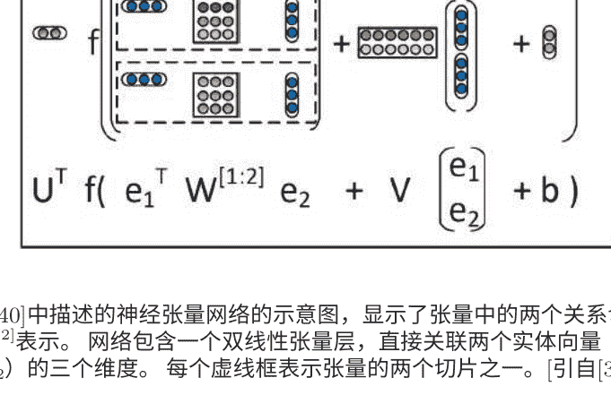

> 图8.6: [340]中描述的神经张量网络的示意图，显示了张量中的两个关系切片。该张量用 W^{[1:2]} 表示。网络包含一个双线性张量层，直接关联两个实体向量（分别表示为 e_1 和 e_2）的三个维度。每个虚线框表示张量的两个切片之一。[引自[340]，@NIPS]。

最近由Socher等人[347]发表的模型。情感分析是一项旨在通过输入文本信息的算法来估计积极或消极观点的任务。正如我们在本章前面讨论的那样，神经网络模型在语义空间中实现的词嵌入非常有用，但对于以原则方式表达更长短语的含义却很困难。对于通常包含许多单词和短语的情感分析输入数据，嵌入模型需要具有组合性质。为此，Socher等人[347]开发了递归神经张量网络，其中每个层的构造方式与[340]中描述的神经张量网络类似，如图8.6所示。完整网络的递归构造具有组合性质，类似于[344]中的常规非张量网络。当在精心构建的情感分析数据库上进行训练时，递归神经张量网络在多个指标上表现优于所有先前的方法。这个新模型将单个句子的积极/消极分类准确率从80%提高到85.4%。对于所有短语的细粒度情感标签预测准确率达到80.7%，比基于特征包的基线提高了9.7%。

## 9. 信息检索中的选定应用

### 9.1 信息检索简介

信息检索（IR）是用户将查询输入到包含许多文档集合的自动计算机系统中，目的是获取一组最相关的文档。

查询是信息需求的正式陈述，例如在网络搜索引擎中的搜索字符串。在IR中，查询不能唯一地标识集合中的单个文档。相反，多个文档可能与查询匹配，并具有不同程度的相关性。

文档有时被称为对象，作为一个更一般的术语，它不仅可以包括文本文档，还可以包括图像、音频（音乐或语音）或视频，它是包含信息并表示为数据库条目的实体。在本节中，我们将“对象”限制为仅文本文档。IR中的用户查询与存储在数据库中的文档表示进行匹配。文档本身通常不直接保留或存储在IR系统中。相反，它们通过元数据在系统中表示。典型的IR系统根据每个文档与查询的匹配程度计算一个数值分数，并根据此值对对象进行排名。然后将系统中排名靠前的文档显示给用户。

### 9.2 使用深度自编码器进行文档索引和检索的语义哈希

用户。如果用户希望改进查询，则可以迭代该过程。

基于[236]的部分内容，常见的IR方法包括几个类别：

- 布尔检索，其中文档要么与查询匹配，要么不匹配。
- 代数检索方法，其中使用模型将文档和查询表示为向量、矩阵或元组。查询向量和文档向量的相似性表示为标量值。该值可用于生成按查询排序的文档列表。常见的模型和方法包括向量空间模型、基于主题的向量空间模型、扩展布尔模型和潜在语义分析。
- 概率检索方法，其中IR过程被视为概率推断。相似性被计算为文档对于给定查询的相关概率，概率值然后用作排名文档的分数。常见的模型和方法包括二元独立模型、具有BM25相关函数的概率相关模型、不确定性推断方法、概率语言建模、不确定推断和潜在狄利克雷分配技术。
- 基于特征的检索方法，其中文档被视为特征函数值的向量。为了将这些特征组合成一个单一的相关性分数，提出了一种有原则的“学习排序”方法。特征函数是文档和查询的任意函数，因此基于特征的方法可以轻松地将几乎任何其他检索模型作为另一个特征进行整合。

深度学习在信息检索中的应用相对较新。迄今为止，文献中的方法主要属于基于特征的方法类别。深度网络的使用主要是为了提取语义上有意义的特征，以便进行后续的文档排序阶段。

在本节的剩余部分中，我们将回顾最近文献中的一些研究。

在这里，我们讨论了将深度自编码器应用于文档索引和检索的“语义哈希”方法，该方法发表在[159, 314]中。研究表明，DBN最后一层的隐藏变量不仅在使用基于前向传播的近似方法进行推断后易于获取，而且还基于词频特征提供了比广泛使用的潜在语义分析和传统的TF-IDF方法更好的文档表示。使用深度自编码器生成的紧凑代码，文档被映射到内存地址，以便将语义上相似的文本文档定位在附近的地址，以便快速检索文档。从词频向量到其紧凑代码的映射非常高效，仅需要在网络的编码器部分中进行矩阵乘法和后续的sigmoid函数评估。

在上述目的中，利用了DBN的深度生成模型，如[165]所讨论的。简而言之，DBN的最底层表示文档的词频向量，而最顶层表示该文档的学习二进制编码。DBN的顶部两层形成一个无向关联记忆，其余层形成一个具有有向、自顶向下连接的贝叶斯（也称为信念）网络。这个DBN由一组堆叠的RBM组成，如第5节所述，产生一个前馈的“编码器”网络，将词频向量转换为紧凑的编码。通过以相反的顺序组合RBM，构建了一个“解码器”网络，将紧凑的编码向量映射为重建的词频向量。通过结合编码器和解码器，可以得到一个深度自编码器（如第4节所讨论），用于文档编码和后续检索。

在深度模型训练完成后，检索过程从将每个查询映射为128位二进制码开始，通过进行前向传播来实现。

### 9.3 用于文档检索的深度结构化语义建模（DSSM）

在这里，我们讨论基于专门的深度架构（称为深度结构化语义模型或深度语义相似性模型（DSSM））的大规模文档检索（Web搜索）的更高级和最新方法，如[172]中所述，以及其卷积版本（C-DSSM），如[328]中所述。

现代搜索引擎主要通过将文档中的关键词与搜索查询中的关键词进行匹配来检索Web文档。然而，由于概念在文档和查询中通常使用不同的词汇和语言风格来表达，词汇匹配可能不准确。潜在语义模型能够在语义层面上将查询映射到相关文档，而词汇匹配通常会失败[236]。这些模型通过将在相似上下文中出现的不同术语分组到相同的语义聚类中，解决了Web文档和搜索查询之间的语言差异问题。因此，即使查询和文档在低维语义空间中表示为两个向量，即使它们没有共享任何术语，它们仍然可以具有很高的相似性。已经提出了概率主题模型，如概率潜在语义模型和潜在狄利克雷分配模型，用于部分克服这些困难的语义匹配。然而，由于两个主要因素，IR任务的改进并没有像最初预期的那样显著：（1）大多数最先进的潜在语义模型基于线性投影，因此无法有效捕捉文档的复杂语义属性；而且（2）这些模型通常是使用无监督的方式进行训练的，使用的目标函数与检索任务的评估指标只有松散的联系。为了改进信息检索中的语义匹配，已经进行了两方面的研究来扩展上述潜在语义模型。第一种是基于深度自编码器的语义哈希方法，在本节中回顾了第9.1节中的方法。虽然查询和文档中嵌入的层次化语义结构可以通过深度学习提取出来，但用于这些模型的深度学习方法仍然采用无监督学习的方式，模型参数是为了重构文档而进行优化，而不是为了区分给定查询的相关文档和不相关文档。因此，深度神经网络模型在基于词汇匹配的强基准信息检索模型方面并没有显著的优势。在第二方面的研究中，最近的研究利用点击数据来进行语义建模，点击数据包括查询列表和相应的点击文档，以弥合搜索查询和Web文档之间的语言差异。这些模型是使用适用于文档排序任务的目标函数在点击数据上进行训练的。然而，这些基于点击数据的模型仍然是线性的，存在表达能力的问题。因此，这些模型需要与关键词匹配模型（如BM25）结合使用，以获得明显更好的性能比基准模型。

DSSM方法在[172]中报告，旨在结合上述两个工作领域的优点，同时克服它们的弱点。它使用DNN架构来捕捉查询和文档的复杂语义属性，并为给定的查询对一组文档进行排名。简而言之，首先执行非线性投影，将查询和文档映射到一个共同的语义空间。然后，在该语义空间中，计算给定查询的每个文档的相关性，作为它们向量之间的余弦相似度。

DNN使用点击数据进行训练，以最大化给定查询的点击文档的条件概率似然。

与以前以无监督方式学习的潜在语义模型不同，DSSM直接针对Web文档排名进行优化，从而提供更优越的性能。此外，为了处理Web搜索应用中的大词汇量，开发了一种新的单词哈希方法，通过该方法将查询或文档的高维术语向量投影到低维基于字母的n-gram向量中，几乎不会丢失信息。

图9.1展示了DSSM架构中的DNN部分。DNN用于将高维稀疏文本特征映射到语义空间中的低维密集特征。第一个隐藏层具有30k个单元，完成单词哈希。然后，通过多层非线性投影将单词哈希特征投影。

在这个DNN中，最后一层的神经活动形成了语义空间中的特征。

为了展示图9.1中DNN的各个层的计算步骤，我们将输入术语向量表示为x，输出向量表示为y，中间隐藏层表示为l_i, i=1,...,N-1，第i个投影矩阵表示为W_i，第i个偏置向量表示为b_i，我们有：

```
l1 = W1x,
li = f(Wili-1 + bi), i > 1
y = f(WNlN-1 + bN),
```

在输出层和隐藏层中使用tanh函数li, i = 2, . . . , N - 1:

$f(x) = \frac{1 - e^{-2x}}{1 + e^{-2x}}$

查询 Q和文档 D之间的语义相关性得分可以通过余弦距离计算

$R(Q, D) = \text{余弦}( y_Q, y_D) = \frac{y_Q^T y_D}{\|y_Q\| \|y_D\|}$

其中 y_Q和 y_D分别是查询和文档的概念向量。在Web搜索中，给定查询，可以通过它们的语义相关性得分对文档进行排序。

图9.1中显示的DNN权重 W_i和 b_i的学习是[172]研究的一个重要贡献。与语音识别中使用的DNN相比，训练数据的目标或标签在DSSM中并不容易获得，因此DSSM中的DNN没有明确定义的标签信息。也就是说，与使用常见的交叉熵或均方误差作为训练目标函数不同，需要开发基于IR的损失函数来训练DSSM中的DNN权重，使用可用的数据，如点击日志。

点击日志包括查询和其点击的文档列表。与未点击的文档相比，查询通常与点击的文档更相关。这种弱监督信息可以用来训练DSSM。具体来说，DSSM中的权重矩阵 W_i被学习以最大化给定查询的点击文档的后验概率。

$P(D|Q) = \frac{\exp(\gamma R(Q, D))}{\sum_{D' \in D} \exp(\gamma R(Q, D'))}$

在查询 (Q) 和文档 (D) 之间的语义相关性得分 R(Q, D)上定义，其中 γ是根据一个保留数据集经验设置的平滑因子，D表示要排序的候选文档集。理想情况下，D应包含所有可能的文档，就像语音识别的最大互信息训练中考虑了所有可能的负面候选一样[147]。然而，在这个案例是Web规模的，因此在实践中是难以处理的。在DSSM学习的实现中，采用了一部分负候选样本，这是在语音识别的MCE（最小分类错误）训练中采用的常见做法。换句话说，对于每个查询和点击文档对（QD^+），其中Q是查询，D^+是点击的文档，D的集合通过包括D^+和仅选择四个随机未点击的文档D_j^-；j=1，...来近似表示。在[172]中报告的研究中，选择未点击的文档时使用不同的采样策略并没有发现显著差异。

通过上述简化，估计DSSM参数以最大化训练集中查询给定点击文档的近似似然度

$$L(\Lambda) = \text{对数} \prod_{(Q,D^+,D_j^-)} P(D^+|Q),$$

其中Λ表示DSSM中DNN权重集合{W_i}。在图9.2中，我们展示了包含多个DNN的整体DSSM架构。所有这些DNN共享相同的权重，但在训练DSSM参数时，它们采用不同的文档（一个正样本和多个负样本）作为输入。有关此近似损失函数相对于跨文档和查询的DNN权重的梯度计算的详细信息，请见[172]，这里不再详述。

最近，上述DSSM已扩展为其卷积版本，即C-DSSM [328]。在C-DSSM中，上下文中语义相似的单词通过卷积结构投影到在上下文特征空间中彼此接近的向量。发现句子的整体语义含义由句子中的少数关键词确定，因此C-DSSM使用额外的最大池化层提取最显著的局部特征，形成固定长度的全局特征向量。然后，将全局特征向量输入到剩余的非线性DNN层中，将其映射到共享语义空间中的一个点。

C-DSSM的卷积神经网络组件如图9.3所示，其中展示了窗口大小为三的卷积层。整体C-DSSM架构与图9.2中展示的DSSM架构类似，只是将全连接的DNN替换为具有局部连接权重和额外的最大池化层的卷积神经网络。

- （1）一个单词哈希层，将单词转换为字母三元组计数向量，与DSSM相同；
- （2）一个卷积层，提取每个上下文窗口的局部上下文特征；
- （3）一个最大池化层，提取和组合显著的局部上下文特征形成全局特征向量；
- （4）一个语义层，表示输入单词序列的高层语义信息。

在C-DSSM中使用卷积结构的主要动机是其能够将可变长度的单词序列映射到潜在语义空间中的低维向量。与大多数将查询或文档视为词袋的先前模型不同，C-DSSM中的查询或文档被视为具有上下文结构的单词序列。通过使用卷积结构，首先对单词的局部上下文信息进行建模，然后对n-gram级别的局部上下文信息进行建模。将单词序列中的显著局部特征组合成全局特征向量。最后，提取单词序列的高级语义信息以形成全局向量表示。与刚才描述的DSSM一样，C-DSSM也是通过最大化给定查询的点击文档的条件概率似然来训练的，使用反向传播算法。

### 9.4 使用深度堆叠网络进行信息检索

与上述IR研究并行的是最近对深度堆叠网络（DSN）在IR中的探索，该网络在第6节中进行了讨论，并取得了有见地的结果[88]。实验结果表明，使用DSN的“相关”与“非相关”的二进制决策进行分类错误率，这与DSN的训练目标密切相关，与最常见的IR质量度量NDCG（归一化折扣累积增益）也普遍相关。

IR质量度量。唯一的例外是在高IR质量区域发现。

如第6节所述，DSN的训练目标——均方误差（MSE）的简单性极大地促进了它在图像识别、语音识别和语音理解等领域的成功应用。这些语音或图像应用中已经证明MSE目标和分类错误率之间存在良好的相关性。

然而，对于信息检索（IR）应用而言，均方误差（MSE）目标与期望目标（例如NDCG）之间的不一致性要比上述分类重点应用要大得多。例如，作为理想的IR目标函数，NDCG是一个高度非光滑的函数，其参数学习与MSE和分类错误率之间的非线性关系有着非常不同的性质。因此，了解NDCG与分类率或MSE之间的合理相关程度是很有意义的，其中IR中的相关性水平被用作DSN预测目标。此外，DSN中学习简单性的优势是否可以应用于改进IR质量度量，如NDCG？我们在[88]中呈现的实验结果对上述两个问题都给出了积极的答案。此外，当从分类应用转向IR应用时，需要特别注意在实施DSN学习算法时需要采取的措施。

在[88]的实验中，IR任务是与广告放置相关的赞助搜索。除了有机网络搜索结果外，商业搜索引擎还提供补充的赞助结果，以响应用户的查询。赞助搜索结果是从广告商的数据库中选择的，他们竞标以在搜索结果页面上展示他们的广告。给定一个输入查询，搜索引擎将从数据库中检索相关的广告，对它们进行排序，并在网络搜索结果的适当位置显示它们，例如在页面的顶部或右侧。寻找与查询相关的广告与常见的网络搜索非常相似。例如，尽管文档来自受限制的数据库，但该任务类似于针对预测文档与输入查询的相关性的典型搜索排名。为这个任务进行的实验是基于DSN架构的深度学习技术在广告相关IR问题上的首次尝试。

实验的初步结果显示，DSN训练目标的MSE与IR质量度量NDCG之间存在着广泛的相关性。

## 目标识别和计算机视觉中的选定应用

在过去的两年左右，深度学习技术在计算机视觉领域，特别是目标识别方面取得了巨大的进展。深度学习在这个领域的成功现在已经被计算机视觉界广泛接受。这是深度学习技术应用成功的第二个领域，在第2和第7节中我们已经回顾和分析了语音识别领域的应用。

关于深度学习在计算机视觉领域最近进展的优秀综述可以在NIPS-2013教程（https://nips.cc/Conferences/2013/Program/event.php?ID=4170，视频记录在http://research.microsoft.com/apps/video/default.aspx?id=206976&l=i），幻灯片在http://cs.nyu.edu/~fergus/presentations/nips2013_final.pdf，以及CVPR-2012教程（http://cs.nyu.edu/~fergus/tutorials/deep_learning_cvpr12）中找到。本节中提供的综述部分基于这些教程，与本专著中早期的深度学习材料相关。本节还参考了关于计算机视觉深度学习的最新博士论文[434]。

### 10.1 无监督或生成式特征学习

多年来，计算机视觉中的目标识别一直依赖于手工设计的特征，例如尺度不变特征变换（SIFT）和方向梯度直方图（HOG），类似于语音识别依赖于手工设计的特征，例如梅尔频率倒谱系数（MFCC）和感知线性预测（PLP）。然而，像SIFT和HOG这样的特征只能捕捉低级边缘信息。设计能够有效捕捉中级信息（如边缘交叉点）或高级表示（如目标部分）的特征变得更加困难。深度学习旨在通过直接从数据中自动学习视觉特征的层次结构来克服这些挑战，既可以是无监督的方式，也可以是有监督的方式。下面的评论将计算机视觉中应用的许多深度学习方法分为两类：（1）无监督特征学习，其中深度学习仅用于提取特征，随后可以将其馈送给相对简单的机器学习算法进行分类或其他任务；（2）有监督学习方法，其中采用端到端学习来联合优化特征提取器和分类器组件，当有大量标记的训练数据可用时。

当标记数据相对稀缺时，无监督学习算法已被证明可以学习到有用的视觉特征层次结构。事实上，在2012年ImageNet竞赛中，具有监督学习的CNN架构取得了显著的成功之前，将深度学习方法应用于计算机视觉的大部分工作都是关于无监督特征学习的。最初的无监督深度自编码器是由Hinton和Salakhutdinov [164]开发和演示的，它利用了DBN预训练，在MNIST的图像识别和维度缩减（编码）任务中仅使用了6万个样本作为训练集；有关此任务的详细信息，请参阅http://yann.lecun.com/exdb/mnist/，以及[78]中的分析。

有趣的是，使用基于DBN的自编码器在图像数据上相对于传统的主成分分析方法的编码效率提升，正如[164]中所示，非常相似。

在本专著的第4节中，[100]中报告的增益在传统的向量量化技术上对语音数据的描述中被描述。此外，Nair和Hinton [265]开发了一个修改过的DBN，其中顶层模型使用了三阶Boltzmann机。这种类型的DBN应用于NORB数据库-一个三维物体识别任务。报告了接近该任务的最佳已发表结果的错误率。特别地，实验证明DBN明显优于SVM等浅层模型。在[358]中，开发了两种提高DBN鲁棒性的策略。首先，在DBN的第一层中使用稀疏连接作为正则化模型的一种方式。其次，开发了一种概率去噪算法。这两种技术都被证明在改善噪声图像识别任务中对遮挡和随机噪声的鲁棒性方面是有效的。DBN还成功应用于创建图像的紧凑但有意义的表示[360]，以用于检索目的。在这个大规模图像检索任务中，深度学习方法也取得了很好的结果。此外，[361]中报告了使用时间条件DBN进行视频序列和人体动作合成的结果。条件RBM和DBN使得与固定时间窗口相关的RBM和DBN权重与先前时间步的数据有关。这种类型的时间DBN和相关的循环网络提供了将DBN-HMMs与时间为中心的人类语音产生机制有效整合到基于DBN的语音产生模型中的机会。

深度学习方法有丰富的家族，包括分层概率和生成模型（神经网络或其他模型）。最近的一个例子是应用于面部表情数据集的随机前馈神经网络，可以高效地学习，并在输出空间中引入丰富的多模态分布，这是标准的确定性神经网络所无法实现的[359]。在图10.1中，我们展示了一个典型的随机前馈神经网络的架构，包括四个隐藏层，其中包含混合的确定性和随机神经元（左侧），用于建模右侧所示的多模态分布。这里的随机网络是一个深度的有向图模型，用于生成处理从输入x开始，一个神经面部，生成输出y，面部表情。在面部表情分类实验中，从这个随机网络生成的学习到的无监督隐藏特征被附加到图像像素上，并帮助获得比基于条件RBM/DBN [361]的基准分类器更高的准确性。

也许在无监督深度学习计算机视觉特征学习领域（在最近的CNN研究激增之前），最值得注意的工作是[209]的工作，它是一个具有池化和局部对比度归一化的九层局部连接稀疏自编码器。该模型有十亿个连接，使用从互联网下载的1000万张图像数据集进行训练。无监督特征学习方法使系统能够训练一个面部检测器，而无需将图像标记为包含面部或不包含面部。控制实验表明，该特征检测器不仅对平移具有鲁棒性，而且对缩放和平面外旋转也具有鲁棒性。

另一组关于无监督深度特征学习在计算机视觉中的研究基于深度稀疏编码模型[226]。在卷积神经网络（CNN）在90年代初期的时候，这种类型的深度模型在ImageNet目标识别任务中产生了最先进的准确性结果。在CNN架构出现之前，它们使用监督学习来进行联合特征学习和分类。

## 10.2 监督式特征学习和分类

深度学习应用于目标识别任务的起源可以追溯到90年代初的卷积神经网络（CNN）；详细概述请参见[212]。自2012年10月ImageNet竞赛结果发布后（http://www.image-net.org/challenges/LSVRC/2012/），基于CNN的卷积神经网络架构在监督学习模式下引起了计算机视觉领域的极大兴趣。这主要是因为当大量标记数据可用于高性能计算平台（如GPU）上高效训练大型CNN时，与竞争方法相比，它们能够获得巨大的识别准确性提升。就像基于DNN的深度学习方法在一系列基准任务中超越了先前的最先进方法一样，包括电话识别、大词汇量语音识别、噪声鲁棒语音识别和多语种语音识别，基于CNN的深度学习方法在一系列计算机视觉基准任务中也表现出相同的优势，包括类别级别的目标识别、目标检测和语义分割。

卷积神经网络（CNN）的基本架构如[212]所述，如图10.1所示。为了将典型图像像素的空间关系的相对不变性纳入考虑，CNN使用具有局部感受野和绑定滤波器权重的卷积层，类似于图像处理中的二维FIR滤波器。

FIR滤波器的输出然后通过非线性激活函数传递，以创建激活图，然后通过另一个非线性池化（在图10.2中标记为“子采样”）层，降低数据速率同时提供对稍微不同的输入图像的不变性。池化层的输出被馈送到几个全连接层，就像之前章节中讨论的DNN一样。

上述整个架构在文献中也被称为深度CNN。

具有卷积结构的深度模型，如CNN，在计算机视觉和图像识别中自90年代以来已被发现有效并得到使用[57, 185, 192, 198, 212]。最显著的进展是在2012年ImageNet LSVRC竞赛中取得的，其中任务是使用120万张高分辨率图像训练模型，将未见过的图像分类为1000个不同的图像类别之一。在包含150k张图像的测试集上，[198]中描述的深度CNN方法的错误率明显低于之前的最先进技术。使用非常大的深度CNN，包含6000万个权重和65万个神经元，以及五个卷积层和最大池化层。在CNN层之上还使用了两个额外的全连接层，与之前描述的DNN相同。

尽管所有上述结构在早期的工作中是分开开发的，但它们的最佳组合占据了成功的主要部分。在图10.3中可以看到深度CNN系统的整体架构。还有两个额外的因素对最终的成功起到了贡献。第一个是一种强大的正则化技术，称为“dropout”；详细信息请参见[166]，以及[10, 13, 240, 381, 385]中的一系列进一步的分析和改进。特别是，Warde-Farley等人[385]分析了dropout的解缠效应，并显示它之所以有帮助，是因为包中的不同成员共享参数。相同的“dropout”技术在一些语音识别任务中也取得了成功[65, 81]。第二个因素是使用非饱和神经元或修正线性单元（ReLU），计算 f(x) = max(x, 0)，这在整体训练过程中显著加快了速度，特别是在高效的GPU实现中。这个深度CNN系统使用来自ImageNet Fall 2011发布的额外训练数据，获得了15.3%的顶部5测试错误率，或者仅使用ImageNet-2012中提供的训练数据，获得了16.4%的错误率。

图10.3：深度卷积神经网络系统的架构，在2012年的ImageNet竞赛中以较大的优势击败了第二名系统和2012年的最新技术水平。[参考文献[198]，@NIPS]

明显低于第二名系统的26.2%，第二名系统通过使用一组手工制作的特征（如SIFT和Fisher向量）结合多个分类器的得分来实现。有关最佳竞争方法的详细信息，请参阅http://www.image-net.org/challenges/LSVRC/2012/oxford_vgg.pdf。然而，Fisher向量编码方法最近被Simonyan等人[329]通过在多个层中堆叠形成深度Fisher网络进行了扩展，这些网络以较小的计算学习成本与深度CNNs取得了竞争性的结果。

使用深度卷积神经网络方法在[198]中展示的最新技术水平在2013年进一步提高了显著的差距，使用类似的方法但采用更大的模型和更多的训练数据。图10.4显示了参加2013年ImageNet ILSVRC竞赛的11个顶尖团队的前5个测试错误率的总结，最佳结果显示在最右边作为基准的2012年竞赛结果。

在同一任务中，我们可以看到从2012年之前的最低错误率26.2%（非神经网络）到2012年的15.3%，再到2013年的11.2%，都是通过深度卷积神经网络技术实现的快速错误减少。有趣的是，2013年ImageNet ILSVRC竞赛的所有主要参赛作品都基于深度学习方法。

例如，Adobe系统（图10.4）基于[198]中报道的深度卷积神经网络，包括使用了dropout技术。该网络架构被修改以包含更多的滤波器和连接。在测试时，使用图像显著性来从原始图像中获取9个裁剪图像，并与标准的五个多视角裁剪图像结合。NUS系统使用非参数自适应方法来组合多个浅层和深层专家的输出，包括深度卷积神经网络、核方法和GMM方法。VGG系统在[329]中有描述，它使用了深度Fisher向量网络和深度卷积神经网络的组合。ZF系统基于一个大型卷积神经网络和一系列不同的架构的组合。架构的选择是通过使用反卷积网络对模型特征进行可视化来辅助的，这在Zeiler等人的论文[437]、Zeiler和Fergus的论文[435, 436]以及Zeiler的论文[434]中有描述。CognitiveVision系统使用基于DNN架构的图像分类方案。该方法受到认知心理物理学的启发，即人类视觉系统首先学习对基本级别的类别进行分类，然后学习对细粒度对象识别中的下级类别进行分类。最佳表现的系统Clarifai（图10.4）基于一个大型深度卷积神经网络，并使用了dropout正则化技术。

通过将图像下采样到256像素，增加了训练数据的数量。该系统总共包含65M个参数。多个这样的模型被平均在一起以进一步提高性能。主要的创新之处在于使用基于解卷积网络的可视化技术，如[434, 437]所述，以确定使深度模型表现良好的因素，基于此选择了一个强大的深度架构。更多关于这些系统的详细信息，请参见http://www.image-net.org/challenges/LSVRC/2013/results.php。

尽管深度卷积神经网络在目标识别任务上表现出色，但直到最近还没有清楚地理解为什么它们表现得如此出色。Zeiler和Fergus [435, 436]进行了研究来解决这个问题，然后利用所获得的理解进一步改进了CNN系统，如图10.4所示，标有“ZF”和“Clarifai”的标签，取得了出色的性能。开发了一种新颖的可视化技术，可以洞察深度卷积神经网络中间特征层的功能。该技术还揭示了整个网络作为分类器的运行方式。可视化技术基于解卷积网络，将原始卷积网络中间层的神经活动映射回输入像素空间。这使研究人员能够检查在特征图中给定激活引起的原始输入模式。图10.5（顶部部分）说明了如何将解卷积网络连接到每个层，从而为原始CNN提供一个闭环，将图像像素作为输入。这个闭环中的信息流如下。首先，将输入图像以前馈方式呈现给深度CNN，以计算所有层的特征。

为了检查给定的CNN激活，将该层中的所有其他激活设置为零，并将特征图作为输入传递给附加的解卷积网络的层。然后，进行与CNN中的前向计算相反的连续操作，包括反池化、修正和滤波。这样可以重建导致所选激活的下一层中的活动。这些操作重复进行，直到达到输入层。在反池化过程中，CNN中的最大池化操作不可逆。

图10.5: 顶部显示了解卷积网络的层（左侧）与相应CNN的层（右侧）的连接。解卷积网络从下一层重新构建了CNN特征的近似版本。底部部分是解卷积网络中反池化操作的示例，其中“开关”用于记录CNN中每个池化区域的局部最大值的位置。[引自[436], @arXiv].

通过近似逆解决，将每个池化区域内的最大值位置记录在一组“开关”变量中。这些开关用于将上一层的重建放置在适当的位置，保持刺激的结构。该过程显示在图10.5的底部部分。

除了上述描述的深度卷积神经网络架构外，DNN架构在许多计算机视觉任务中也被证明非常成功[54, 55, 56, 57]。我们在文献中没有找到关于CNN、DNN和其他相关架构在相同任务上的直接比较。

最近一项关于计算机视觉的监督学习研究表明，深度卷积神经网络架构不仅在本节前面讨论的对象/图像分类中取得了成功，而且在整个图像中的目标检测中也取得了成功[128]。检测任务比分类任务复杂得多。

作为本章的简要总结，深度学习在计算机视觉领域取得了巨大的进展，在语音识别方面的成功之后，很快就取得了成功，如第7节所讨论的。到目前为止，基于深度卷积神经网络架构和相关分类技术的监督学习范式正在产生最大的影响，这在2012年和2013年的ImageNet竞赛结果中得到了展示。这些方法不仅可以用于目标识别，还可以用于许多其他计算机视觉任务。关于这些基于CNN的深度学习方法的成功原因以及它们的局限性存在一些争议。

关于如何将这些方法定制为特定的计算机视觉应用以及如何扩展模型和训练数据，仍然存在许多问题。最后，我们在本章的前半部分讨论了一些关于深度学习在计算机视觉和图像建模问题中的无监督和生成方法的研究。

他们的性能在物体识别任务中与有充足训练数据的监督学习方法相比并不具备竞争力。为了在计算机视觉领域取得长期和最终的成功，很可能需要无监督学习。为此，需要解决无监督特征学习和深度学习中的许多开放性问题，并进行更多的研究。

## 11 多模态和多任务学习中的选定应用

多任务学习是一种机器学习方法，它同时学习解决几个相关问题，使用共享表示。它可以被看作是迁移学习或知识迁移学习的两个主要类别之一，侧重于跨分布、领域或任务的泛化。另一个主要的迁移学习类别是自适应学习，其中知识迁移通常是以顺序方式进行的，通常从源任务到目标任务[95]。多模态学习是与多任务学习密切相关的概念，其中学习领域或“任务”跨越了人机交互或其他应用中的几种模态，涵盖了文本、音频/语音、触觉和视觉等多种信息来源。

深度学习的本质是自动化发现任何机器学习任务的有效特征或表示的过程，包括自动将知识从一个任务传递到另一个任务。多任务学习通常应用于目标任务领域没有或非常少的训练数据的情况，因此有时被称为零样本或一次学习。很明显，困难的多任务学习自然地适应了深度学习或表示学习的范式，其中共享的表示和统计强度跨任务（例如涉及音频、图像、触觉和文本的不同模态）有望在低资源或零资源条件下极大地促进许多机器学习场景。

在采用深度学习方法之前，已经进行了许多多模态和多任务学习的努力。例如，开发并报道了一个名为MiPad的原型，用于涉及捕捉、学习、协调和呈现语音、触觉和视觉信息的多模态交互。在[175, 103]中，开发并报道了一个名为MiPad的原型，用于涉及捕捉、学习、协调和呈现语音、触觉和视觉信息的多模态交互。在[354, 443]中，利用来自多个传感器骨传导和空气传导路径的混合信息源对语音进行降噪。这些早期研究都使用了浅层模型和学习方法，并且取得了不如预期的性能。随着深度学习的出现，有希望能够成功解决困难的多模态学习问题，从而实现广泛的实际应用。在本章中，我们将根据不同的多模态或学习任务组合来回顾该领域的选定应用。这里回顾的大部分工作都是正在进行的研究，读者应该期待未来的后续出版物。

### 11.1 多模态：文本和图像

多模态学习涉及文本和图像的潜在有效性的基本机制是与文本和图像相关的共同语义。文本和图像之间的关系可以来自图像的文本注释（作为多模态学习系统的训练数据），例如。如果相关的文本和图像在共同的语义空间中具有相同的表示，系统可以推广到文本或图像不可用的未见情况。因此，它可以自然地用于图像或文本的零样本学习。换句话说，多模态学习可以使用文本信息来帮助图像/视觉识别，反之亦然。

利用文本信息进行图像/视觉识别构成了该领域中的大部分工作，我们在本节中进行了回顾。

## 11.1. 多模态：文本和图像

被称为DeViSE（深度视觉语义嵌入）的深度架构，由Frome等人开发[117]，是多模态学习的典型示例，其中使用文本信息来改进图像识别系统，特别是用于执行零样本学习。

图像识别系统在处理大量物体类别时通常存在限制，部分原因是随着图像类别数量的增加，获取具有文本标签的足够训练数据变得越来越困难。多模态DeViSE系统旨在利用文本数据来训练图像模型。联合模型通过使用带标签的图像数据和从未标注的文本中学到的语义信息来识别图像类别。图10.1中间部分显示了DeViSE架构的示意图。它使用在两个模型的较低层预训练的参数进行初始化：图中左侧部分是用于图像分类的深度卷积神经网络（deep-CNN），图中右侧部分是文本嵌入模型。图10.1中被标记为“核心视觉模型”的深度卷积神经网络的一部分进一步学习，使用标记为“转换”的投影层和相似度度量来预测目标词嵌入向量。训练中使用的损失函数采用了点积相似度和最大间隔合页损失的组合。前者是用于训练DSSM模型的余弦损失函数的非归一化版本，如第9.3节中所述。后者类似于早期的联合图像-文本模型WSABIE（由Weston等人开发的用于图像嵌入的Web规模注释），结果表明文本提供的信息改善了零样本图像预测，在数千个从未被图像模型见过的标签上实现了良好的命中率（接近15%）。

早期的WSABIE系统如[388, 389]所述，采用了浅层架构，并训练了一个同时嵌入图像和标签的模型。WSABIE不像DeViSE那样使用深层架构来得到高度非线性的图像（以及文本嵌入）特征向量，而是使用简单的图像特征和线性映射来得到共同嵌入空间。此外，它为每个可能的标签使用一个嵌入向量。因此，与DeViSE不同，WSABIE无法推广到新的类别。

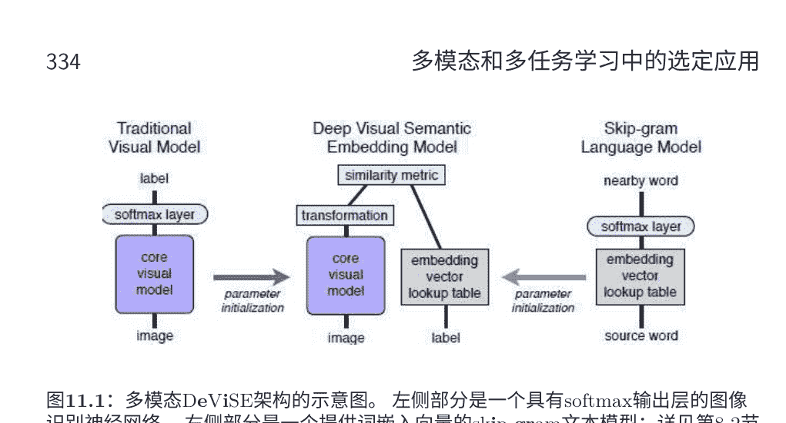

图11.1: 多模态DeViSE架构的示意图。左侧部分是一个具有softmax输出层的图像识别神经网络。右侧部分是一个提供词嵌入向量的skip-gram文本模型；详见第8.2节和图8.3。中间是DeViSE的联合深度图像-文本模型，两个连体分支由图像和单词嵌入模型初始化，在softmax层下方。标有“转换”的层负责将图像（左侧）和文本（右侧）分支的输出映射到相同的语义空间中。[参考[117], @NIPS]。

将图11.1中的DeViSE架构与第9节中的图9.2中的DSSM架构进行比较也是很有趣的。DSSM中的“查询”和“文档”分支类似于DeViSE中的“图像”和“文本标签”分支。

DeViSE的另一个关键区别是其对未见过的图像类别的泛化能力来自于计算许多无监督文本来源（即没有图像对应物）的文本嵌入向量，这些向量将覆盖与未见类别对应的文本标签。

然而，DSSM对于未见过的单词的泛化能力是通过一种特殊的编码方案来实现的，该方案是根据单词的组成字母来进行编码的。

DeViSE架构启发了一种更近期的方法，通过凸映射将图像映射到语义嵌入空间中。

### 11.1. 多模态：文本和图像

文本标签和图像类别的嵌入向量的组合 [270]。这里是主要的区别。DeViSE用线性变换层替换了CNN图像分类器的最后一个softmax层。然后，新的变换层与CNN的较低层一起进行训练。[270]中的方法要简单得多-保留CNN的softmax层，但不训练CNN。对于一个测试图像，CNN首先产生前N个最佳候选项。然后，在语义空间中计算相应的N个嵌入向量的凸组合。这将确定性地将softmax分类器的输出转换为嵌入空间。

这种简单的多模态学习方法在ImageNet零样本学习任务中表现出色。

与上述关于文本和图像的多模态学习相关但独立的研究线索集中在多模态嵌入的使用上，其中来自文本和图像的多个源的数据被投影到相同的向量空间中。例如，Socher和Fei-Fei [341] 使用核化的典型相关分析将单词和图像投影到相同的空间中。Socher等人 [342] 将图像映射到单词向量，从而构建多模态系统可以在不看到任何类别示例的情况下对图像进行分类，即类似于DeViSE的零样本学习能力。Socher等人 [343] 最新的工作将他们之前的单词嵌入扩展到短语和完整句子的嵌入。将句子而不是之前的单词映射到多模态嵌入空间的机制源自于Socher等人 [347] 描述的递归神经网络的强大功能，如第8.2节所总结的，并且其扩展包括依赖树。

除了将文本映射到图像（或反之亦然）的相同向量空间或创建联合图像/文本嵌入空间之外，文本和图像的多模态学习也可以被视为语言模型的框架。在[196]中，以图像为重点，制定了一种自然语言模型，该模型以其他模态条件为基础进行。这种类型的多模态语言模型用于（1）根据复杂描述查询检索图像，（2）根据图像查询检索短语描述，以及（3）在图像条件下生成文本。

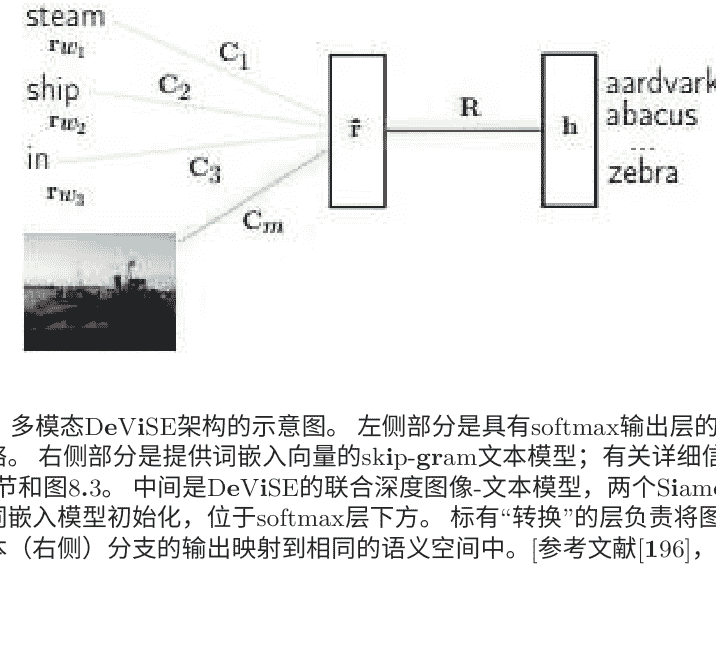

通过训练多模态语言模型和卷积网络，同时学习词表示和图像特征。多模态语言模型的示意图如图11.2所示。

## 11.2 多模态：语音和图像

Ngiam等人[268, 269]提出并评估了深度网络在音频/语音和图像/视频模态上学习特征的应用。他们展示了跨模态特征学习的能力，在特征学习时，当多个模态（例如语音和图像）同时存在时，可以学习到更好的某个模态（例如图像）的特征。

图11.3展示了用于独立音频/语音和视频/图像输入通道的双模态深度自编码器架构。该架构的核心是使用共享的中间层来表示两种类型的模态。这是从图4.1中展示的用于语音的单模态深度自编码器直接推广到双模态的对应物。作者进一步展示了如何学习共享的音频和视频表示，并在一个固定的任务上进行评估，其中分类器是使用仅音频数据进行训练但使用仅视频数据进行测试，反之亦然。该研究得出结论，深度学习架构通常能够有效地从无标签数据中学习多模态特征，并通过跨模态信息传递来改进单模态特征。唯一的例外是使用CUAVE数据集的跨模态设置。文献[269, 268]中呈现的结果表明，使用视频和音频一起学习视频特征优于仅使用视频数据进行学习。然而，同一篇论文还表明，在跨模态学习任务中，使用[278]中的模型（该模型使用了一种用于提取视觉特征的复杂信号处理技术，以及最初用于鲁棒语音识别的不确定性补偿方法）能够获得最佳的分类准确率，超过了为该任务设计的生成式深度架构所得到的特征。

虽然多模态学习中的深度生成架构在[268, 269]中被描述为基于非概率自编码神经网络，但基于深度玻尔兹曼机（DBM）的概率版本最近出现在相同的多模态应用中。在[348]中，使用DBM来提取统一的表示，将不同的模态集成在一起，对分类和信息检索任务都很有用。与使用深度自编码器中的“瓶颈”层来表示多模态输入不同，这里在多模态输入的联合空间上定义了概率密度，并使用适当定义的潜变量的状态来表示。这种概率形式的优势，在传统的深度自编码器中可能缺乏，即可以通过从其条件分布中进行采样来自然地填充缺失模态的信息。

更近期的关于自编码器的研究[22, 30]表明了广义去噪自编码器在采样方面的能力，因此它们可能克服了之前填充缺失模态信息的问题。对于由图像和文本组成的双模态数据，多模态DBM在分类和信息检索任务中略优于传统的深度多模态自编码器以及多模态DBN。关于广义版本的深度自编码器的比较结果尚未报告，但可能很快会出现。

本章迄今为止讨论的几种多模态处理和学习架构可以看作是更一般的多任务学习和迁移学习的特例[22, 47]。迁移学习，包括自适应学习和多任务学习，指的是学习架构和技术利用不同学习任务之间的共同隐藏解释因素的能力。这种利用允许共享不同类型输入数据集的方面，从而实现在看似不同的学习任务之间转移知识的可能性。正如[22]中所提到的，图11.4中展示的学习架构和相关学习算法对于这样的任务具有优势，因为它们学习捕捉底层因素的表示，其中的一个子集可能与每个特定任务相关。在本章的剩余部分，我们将讨论一些这样的多任务学习应用，它们仅限于语音、自然语言处理或图像领域的单一模态。

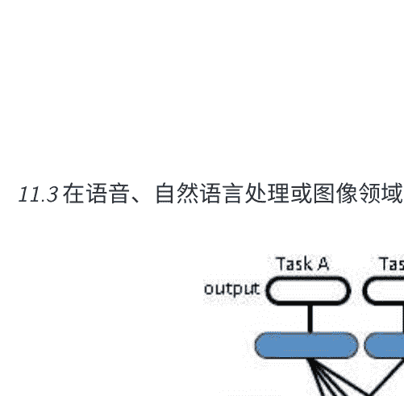

> 图11.4：用于多任务学习的深度神经网络架构，旨在发现任务A、B和C之间共享的隐藏解释因素。[引自[22]，@IEEE]

## 11.3 在语音、自然语言处理或图像领域中的多任务学习

在语音领域中，多语言或跨语言语音识别是最有趣的多任务学习应用之一，其中将不同语言的语音识别视为不同的任务。 针对语音识别中这个具有挑战性的声学建模问题，已经采取了各种方法，其中困难在于由于经济考虑，缺乏转录的语音数据，无法为世界上所有语言开发语音识别系统。 跨语言数据共享和数据加权是GMM-HMM系统中常见且有用的方法[225]。

GMM-HMM的另一种成功方法是通过基于知识或数据驱动的方法在语言之间映射发音单元[420]。 但它们远不及DNN-HMM方法，现在我们来总结一下。

在最近的[94, 170]和[150]的论文中，两个研究小组独立地开发了与多任务学习能力相近的DNN架构，用于多语言语音识别。 请参见图11.5，了解这种类型的架构。 这些架构背后的思想是，当学习时，DNN中的隐藏层可以学适当地，在不同语言的声学数据中共享隐藏的共同因素，作为越来越复杂的特征转换。 表示对数线性分类器的最终softmax层利用了在最顶层表示的最抽象的特征向量。 虽然对于不同的语言，对数线性分类器必须是分离的，但特征转换可以在语言之间共享。 报道了出色的多语言语音识别结果，远远超过了基于GMM-HMM方法的早期结果[225, 420]。 这一系列工作的影响是重大而深远的。 它指出，可以从现有的多语言DNN快速构建一个高性能的基于DNN的新语言系统。这个巨大的好处只需要少量来自目标语言的训练数据，尽管有更多的数据会进一步提高性能。 这种多任务学习方法可以减少对无监督预训练阶段的需求，并且可以用更少的迭代次数训练DNN。 扩展这一系列工作的目标是高效地构建一个语言通用的语音识别系统。 这样的系统不仅可以识别多种语言并提高每种语言的准确性，而且还可以通过在深度神经网络上堆叠softmax层来扩展支持的语言。

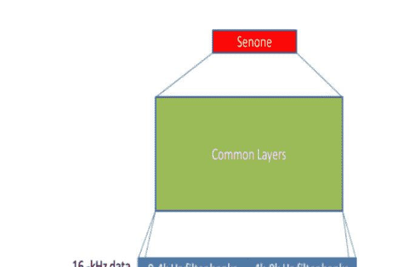

图11.6：用于语音识别的深度神经网络架构，使用16kHz和8kHz采样率的混合带宽声学数据进行训练；[参考文献[221]，@IEEE]。

与图11.6所示的密切相关的深度神经网络架构还具有多任务学习能力，最近也被应用于另一个声学建模问题——学习两组独立声学数据的联合表示[94, 221]。包含16kHz采样率的语音数据集是宽带和高质量的，通常是从越来越流行的智能手机中在语音搜索场景下收集的。另一个窄带数据集具有8kHz的较低采样率，通常是使用电话语音识别系统收集的。

作为语音领域中多任务学习的最后一个例子，让我们将电话识别和单词识别视为独立的“任务”。也就是说，电话识别的结果不用于生成文本输出，而是用于语言类型识别或口语文档检索。因此，几乎所有语音系统中使用的发音词典都可以被视为共享电话识别和单词识别任务的多任务学习。在语音识别中，更先进的框架进一步推动了这个方向通过倡导使用比电话更细的语音单位，通过语言结构的层次结构将语音的原始声学信息与语义内容相连接。这些原子语音单位包括“语音属性”，在基于检测和知识丰富的语音识别建模框架中，深度学习方法的使用最近显著提升了其准确性[332, 330, 427]。

在自然语言处理领域，最著名的多任务学习例子是[62, 63]中报道的综合研究，其中使用了共同的单词表示和统一的深度学习方法来攻击词性标注、分块、命名实体标注、语义角色识别和相似词识别等一系列独立的“任务”。这些研究的概述可以在第8.2节中找到。最后，在图像/视觉领域作为单一模态，深度学习在多任务学习中也被证明是有效的。Sri-vastava和Salakhutdinov [349]提出了一种基于层次贝叶斯先验的多任务学习方法，应用于各种图像分类数据集的DNN系统中。

这些先验与DNN相结合，通过鼓励任务之间的信息共享和发现相似类别来改善判别学习，从而实现知识的转移。更具体地说，开发了一种方法来共同学习图像和一系列类别的层次结构，使得“贫穷类别”（训练样本相对较少）可以从“富裕类别”（训练样本更多）中受益。除了学习DNN的输入表示，这项工作还可以被视为学习输出表示的一个优秀实例，这是几乎所有深度学习工作中的重点。

作为单模态图像领域内多任务学习的另一个例子，Ciresan等人[58]将深度卷积神经网络的架构应用于拉丁字符和中文字符的字符识别任务。在中文字符上训练的深度卷积神经网络能够轻松识别大写拉丁字母。此外，通过首先在所有类别的一个子集上对卷积神经网络进行预训练，然后继续在所有类别上进行训练，可以加快学习中文字符的速度。

## 12 结论

本专著首先简要介绍了深度学习的历史（重点是语音识别），并提出了一个分类方案，将文献中的现有深度网络分为无监督（其中许多是生成的）、有监督和混合类别进行分析。本专著详细讨论和分析了深度自编码器、DSN（以及其许多变体）和DBN-DNN或预训练DNN架构，这三个类别中的每一个都是基于作者个人研究经验的流行和有前景的方法。本文还回顾了深度学习在信息处理的五个广泛领域中的应用，包括语音和音频（第7节）、自然语言建模和处理（第8节）、信息检索（第9节）、物体识别和计算机视觉（第10节）以及多模态和多任务学习（第11节）。本专著未涵盖其他有趣但非主流的深度学习应用。对于感兴趣的读者，请参阅关于深度学习在最优控制中的应用的最新论文[219]，在强化学习中的应用的最新论文[256]，在恶意软件分类中的应用的最新论文[66]，在压缩感知中的应用的最新论文[277]，在识别置信度预测中的应用的最新论文[173]，在声学-发音反演映射中的应用的最新论文[369]，在视频情感识别中的应用的最新论文[189]。

从[207, 222]的语音情感识别，到[242, 366, 403]的口语理解，再到[351, 372]的说话人识别，[112]的语言类型识别，[94, 152]的口语对话系统的对话状态跟踪，[442]的自动语音活动检测，[396]的语音增强，[266]的语音转换，以及[132, 387]的单声道源分离。

关于深度学习的文献非常丰富，主要来自机器学习界。信号处理界在过去的四年左右（大约从2009年末开始）才开始接受深度学习，并且势头迅猛增长。本专著主要从信号与信息处理的角度进行撰写。除了对现有的深度学习工作进行调研外，还开发了一种基于体系结构和学习算法性质的分类方案，并提供了具体示例的分析和讨论。我们希望本专著中进行的调研能够让读者更好地了解所讨论的各种深度学习系统的能力，不同但相似的深度学习方法之间的联系，以及如何在不同情况下设计合适的深度学习算法。

在本综述中，重要的信息是建立和学习深层次特征是非常可取的。我们已经讨论了在一次优化中学习深层网络中所有层的参数的困难，需要更好地理解优化困难。我们在第5节中详细讨论了DBN-DNN混合架构中的无监督预训练方法，这似乎为优化中的糟糕局部最优和深层模型的正则化提供了一个有用的经验解决方案，尽管缺乏坚实的理论基础。预训练方法的有效性是在2009年通过学术界和工业界研究人员之间的合作激发了信号处理界对深度学习的兴趣的一个因素，当有限的监督训练数据时，这种方法最为突出。

深度学习是一项新兴技术。尽管迄今为止报告了经验上有希望的结果，但还需要进行更多的工作。重要的是，深度学习研究人员并没有经历过单一深度学习技术对所有分类任务都能成功的经验。例如，虽然流行的生成预训练后跟判别性微调的学习策略在许多任务上经验上表现良好，但在其他一些已经探索过的任务上却失败了（例如，语言识别或说话人识别；未发表）。对于这些任务，生成预训练阶段提取的特征似乎很好地描述了底层语音变化，但不包含足够的信息来区分不同的语言。期望能够提取具有判别性但也具有不变性的特征的学习策略将提供更好的解决方案。这个想法也被称为“解缠”，并在[24]中进一步发展。此外，提取判别性特征可能会大大减少当前许多深度学习系统所需的模型大小。领域知识，例如对于手头的特定任务（例如视觉、语音或自然语言）哪种不变性是有用的，以及在参数约束方面哪种正则化是应用深度学习方法成功的关键。此外，深度学习研究社区目前正在积极开发新型的DNN架构和学习方法（例如[24, 89]），有望提高深度学习模型在信号处理和人工智能领域中更具挑战性应用的性能。

最近发表的研究表明，目前用于学习深度架构的优化技术仍有很大的改进空间[69, 208, 238, 239, 311, 356, 393]。目前正在研究预训练对于学习深度架构中全部参数的重要性，特别是在有大量标记训练数据可用的情况下，可以减少甚至消除模型正则化的需求。本专著和[55, 161, 323, 429]中讨论了一些初步结果。

近年来，机器学习越来越依赖于大规模数据集。例如，本专著中讨论的许多深度学习的最新成功都依赖于对大规模数据集的访问。同时，还需要大规模的计算能力。如果没有对大规模真实世界数据集的访问以及相关的工程专业知识，探索新的算法空间将变得越来越困难。深度学习算法的表现将严重依赖于可用的数据量和计算能力。正如我们在语音识别示例中所展示的，一个在小数据集上表现一般的深度学习算法，在解决了这些限制后，可以显著提高性能，这也是神经网络研究最近复兴的主要原因之一。以DBN预训练为例，它引发了(深度)机器学习研究的新时代，但在使用足够的数据和计算能力时似乎是不必要的。

因此，对于使用大数据集进行深度模型训练的许多常见信息处理应用（如语音识别和机器翻译），高效且可扩展的并行算法至关重要。众所周知，流行的小批量随机梯度技术在计算机上很难并行化。目前的常见做法是使用GPGPU加速学习过程，尽管最近在开发异步随机梯度下降学习方面取得了进展，使用大规模CPU集群[69, 209]和GPU集群[59]显示出了潜力。在这种有趣的计算架构中，DNN的许多不同副本并行计算训练数据的不同子集的梯度。这些梯度被传输到一个中央参数服务器，更新共享权重。尽管每个副本通常使用不立即更新的参数值计算梯度，但随机梯度下降对于这种轻微误差是鲁棒的。为了使深度学习技术适用于非常大的训练数据，需要进一步开发理论上可靠的并行学习和优化算法以及新颖的架构[31, 39, 49, 69, 181, 322, 356]。为了将语音识别的进展推向更高水平，可能需要考虑针对语音识别问题的特定优化方法[46, 149, 393]。

DNNs和相关深度模型应用的一个主要障碍是目前需要相当的技能和经验。

来选择合理的超参数值，如学习率调度，正则化器的强度，层数和每层的单元数等。一个超参数的合理值可能取决于其他超参数的选择，而在DNNs中进行超参数调整尤其昂贵。最近已经开发了一些有趣的方法来解决这个问题，包括随机抽样[32]和贝叶斯优化过程[337]。这个重要领域需要进一步研究。

本专著主要涉及自然语言和多模态应用的第8和第11节，涉及了一些关于使用深度学习方法进行推理的最新工作，超越了更直接的模式识别，使用监督、无监督或混合学习方法，这是本专著的主要内容。原则上，由于深度网络自然地配备了分布式表示（参见表3.1），可以使用它们的逐层单元集合来编码关系和编码实体、概念、事件、主题等，它们可以潜在地在结构上进行强大的推理，正如各种历史出版物以及最近的论文所主张的[38, 156, 286, 288, 292, 336, 335]。虽然最近在文献中出现了关于深度网络这种能力的初步探索，如第8和第11节所述，但仍需要进行大量的研究。如果成功，这种新型的深度学习“机器”将在应用人工智能领域开辟许多新颖和令人兴奋的应用。我们预计未来在这个领域会有越来越多的深度学习工作，充满新的挑战。

此外，深度学习需要在许多方面建立坚实的理论基础。例如，深度学习在无监督学习中的成功并没有像在监督学习中那样得到证明；然而，深度学习的本质和主要动机正是在于无监督学习，以自动发现数据表示。这些问题涉及到学习有效特征表示的适当目标，以及用于分布式表示的正确深度学习架构/算法，以有效地解开数据中隐藏的解释性变化因素。

不幸的是，大多数成功的深度学习技术到目前为止，都处理了非结构化或“平面”分类问题。例如，虽然语音识别本质上是一个序列分类问题，但在最成功和大规模的系统中，单独使用HMM来处理序列结构，而DNN仅用于生成基于帧的非结构化后验分布。最近的提议呼吁并研究了在深度学习架构和输入输出表示中引入结构的方法。

最后，深度学习研究人员受到神经科学家的建议，要认真考虑更广泛的问题和学习架构，以便深入了解在大脑中可能有用于实际应用的生物学可行表示[272]。计算神经科学模型如何帮助改进工程深度学习架构的分层脑结构？大脑中的生物学可行学习方式[158, 395]如何帮助设计更有效和更稳健的深度学习算法？所有这些问题以及本节前面讨论的问题都需要进行深入研究，以进一步推动深度学习的前沿。

## 结论

# 参考文献

- [1] O. Abdel-Hamid, L. Deng, and D. Yu. 探索用于语音识别的卷积神经网络结构和优化。*Interspeech会议论文集*，2013年。
- [2] O. Abdel-Hamid, L. Deng, D. Yu, and H. Jiang. 用于语音识别的深层分段神经网络。*Interspeech会议论文集*，2013年。
- [3] O. Abdel-Hamid, A. Mohamed, H. Jiang, and G. Penn. 将卷积神经网络概念应用于混合NN-HMM模型进行语音识别。在国际声学、语音和信号处理会议（ICASSP）的论文集中。2012年。
- [4] A. Acero, L. Deng, T. Kristjansson, and J. Zhang. 使用向量泰勒级数进行噪声语音识别的HMM自适应。在 *Interspeech*会议的论文集中。2000年。
- [5] G. Alain and Y. Bengio. 正则化自编码器从数据生成分布中学到了什么。在国际学习表示会议（ICLR）的论文集中。2013年。
- [6] G. Anthes. 深度学习的时代已经到来。计算机协会通信（*ACM*）, 56(6):13–15, 2013年6月。
- [7] I. Arel, C. Rose, and T. Karnowski. 深度机器学习——人工智能的新前沿。*IEEE计算智能杂志*, 5:13–18, 2010年11月。
- [8] E. Arisoy, T. Sainath, B. Kingsbury, and B. Ramabhadran. 深度神经网络语言模型。在联合人类语言技术会议和北美计算语言学协会（HLT-NACL）研讨会中。2012年。
- [9] O. Aslan, H. Cheng, D. Schuurmans, and X. Zhang. 凸两层建模。在神经信息处理系统（NIPS）研讨会中。2013年。
- [10] J. Ba and B. Frey. 用于训练深度神经网络的自适应dropout。在神经信息处理系统（NIPS）的论文集中。2013年。
- [11] J. Baker, L. Deng, J. Glass, S. Khudanpur, C.-H. Lee, N. Morgan, and D. O’Shaughnessy. 语音识别和理解的研究进展和方向。IEEE信号处理杂志，26(3):75–80，2009年5月。
- [12] J. Baker, L. Deng, J. Glass, S. Khudanpur, C.-H. Lee, N. Morgan, and D. O’Shaughnessy. 语音识别和理解的最新MINS报告。IEEE信号处理杂志，26(4)，2009年7月。
- [13] P. Baldi 和 P. Sadowski. 理解dropout。在神经信息处理系统（NIPS）的论文集中。2013年。
- [14] E. Battenberg, E. Schmidt, and J. Bello. 深度学习在音乐中的应用，国际声学、语音和信号处理会议（ICASSP）的特别会议（http://www.icassp2014.org/special_sections.html#ss8），2014年。
- [15] E. Batternberg and D. Wessel. 使用条件深度置信网络分析鼓模式。在国际音乐信息检索研讨会（ISMIR）的论文集中。2012年。
- [16] P. Bell, P. Swietojanski, and S. Renals. 多级自适应网络在串联和混合ASR系统中的应用。在国际声学、语音和信号处理会议（ICASSP）的论文集中。2013年。
- [17] Y. Bengio. 人工神经网络及其在序列识别中的应用。蒙特利尔麦吉尔大学博士论文，加拿大，1991年。
- [18] Y. Bengio. 新的分布式概率语言模型。技术报告，蒙特利尔大学，2002年。
- [19] Y. Bengio. 神经网络语言模型。Scholarpedia，3，2008年。
- [20] Y. Bengio. 学习人工智能的深度架构。在Foundations and Trends in Machine Learning，2(1)：1–127，2009年。
- [21] Y. Bengio. 无监督和迁移学习的深度表示学习。机器学习研究工作坊和会议论文集, 27: 17–37, 2012年。
- [22] Y. Bengio. 表示学习的深度学习: 展望。 在 *Statistical Language and Speech Processing*, 页1-37。Springer, 2013年。
- [23] Y. Bengio, N. Boulanger和R. Pascanu. 优化递归网络的进展。 在*Proceedings of International Conference on Acoustics Speech and Signal Processing (ICASSP)*. 2013年。
- [24] Y. Bengio, A. Courville, 和 P. Vincent. 表示学习: 一个综述和新视角。 *IEEE模式分析和机器智能交易 (PAMI)*, 38:1798–1828, 2013.
- [25] Y. Bengio, R. De Mori, G. Flammia, 和 R. Kompe. 一个神经网络-隐马尔可夫模型混合的全局优化。 *IEEE神经网络交易*, 3:252–259, 1992.
- [26] Y. Bengio, R. Ducharme, P. Vincent, 和 C. Jauvin. 一个神经概率语言模型。 在神经信息处理系统会议 *(NIPS)*. 2000.
- [27] Y. Bengio, R. Ducharme, P. Vincent, 和 C. Jauvin. 一个神经概率语言模型。 *机器学习研究杂志*, 3:1137–1155, 2003.
- [28] Y. Bengio, P. Lamblin, D. Popovici, and H. Larochelle. 深度网络的逐层贪婪训练。 在神经信息处理系统 *(NIPS)*的论文集中。 2006年。
- [29] Y. Bengio, P. Simard, and P. Frasconi. 用梯度下降学习长期依赖性是困难的。 *IEEE Transactions on Neural Networks*, 5:157–166, 1994年。
- [30] Y. Bengio, E. Thibodeau-Laufer, and J. Yosinski. 可通过反向传播训练的深度生成随机网络。 arXiv 1306:1091, 2013年。也被接受发表在国际机器学习大会 *(ICML)* 的论文集中, *2014年*。
- [31] Y. Bengio, L. Yao, G. Alain, and P. Vincent. 广义去噪自编码器作为生成模型。 在神经信息处理系统 *(NIPS)*的论文集中。 2013年。
- [32] J. Bergstra 和 Y. Bengio. 用于超参数优化的随机搜索。 *机器学习研究杂志*, 3:281–305, 2012年。
- [33] A. Biem, S. Katagiri, E. McDermott 和 B. Juang. 将判别特征提取应用于基于滤波器组的语音识别。 IEEE语音和音频处理交易, 9:96-110, 2001年。
- [34] J. Bilmes. 动态图模型。 IEEE信号处理杂志, 33:29-42, 2010年。
- [35] J. Bilmes 和 C. Bartels. 语音识别的图模型架构。 IEEE信号处理杂志, 22:89-100, 2005年。
- [36] A. Bordes, X. Glorot, J. Weston 和 Y. Bengio. 用于多关系数据学习的语义匹配能量函数——应用于词义消歧。 机器学习, 2013年5月。
- [37] A. Bordes, J. Weston, R. Collobert, and Y. Bengio. 学习知识库的结构化嵌入. 在人工智能促进协会(AAAI)的会议论文集中. 2011年.
- [38] L. Bottou. 从机器学习到机器推理: 一篇论文. 机器学习研究杂志, 14:3207-3260, 2013年.
- [39] L. Bottou and Y. LeCun. 大规模在线学习. 在神经信息处理系统(NIPS)的会议论文集中. 2004年.
- [40] N. Boulanger-Lewandowski, Y. Bengio, and P. Vincent. 建模高维序列中的时间依赖性: 应用于多音乐生成和转录. 在国际机器学习大会(ICML)的会议论文集中. 2012年.
- [41] N. Boulanger-Lewandowski, Y. Bengio, and P. Vincent. 使用循环神经网络进行音频和弦识别。 在国际音乐信息检索研讨会(ISMIR)的论文集中。 2013年。
- [42] H. Bourlard and N. Morgan. 连接主义语音识别: 一种混合方法。 Kluwer, Norwell, MA, 1993.
- [43] J. Bouvrie. 分层学习: 在语音和视觉中的应用理论。 MIT博士论文, 2009年。
- [44] L. Breiman. 堆叠回归。 机器学习, 24:49-64, 1996年。
- [45] J. Bridle, L. Deng, J. Picone, H. Richards, J. Ma, T. Kamm, M. Schus-ter, S. Pike, and R. Reagan. 对语音协同自动语音识别的分段隐藏动态模型的研究。 1998年语言工程研讨会(CLSP)的最终报告，约翰霍普金斯大学。
- [46] P. Cardinal, P. Dumouchel, and G. Boulianne. 并行架构上的大词汇语音识别。 IEEE音频、语音和语言处理, 21(11):2290-2300, 2013年11月。
- [47] R. Caruana. 多任务学习。 机器学习, 28:41–75, 1997年。
- [48] J. Chen and L. Deng. 一种基于原始-对偶方法的回归神经网络训练方法，受回声状态特性约束。 在国际学习表示会议. 2014年4月。
- [49] X. Chen, A. Eversole, G. Li, D. Yu, and F. Seide. 用于上下文相关深度神经网络的流水线反向传播。 在Interspeech会议. 2012年。
- [50] R. Chengalvarayan and L. Deng. 基于HMM的语音识别，使用基于状态的、经鉴别得到的Mel变换的DFT特征。 IEEE音频和语音处理,页码243–256, 1997年。
- [51] R. Chengalvarayan和L. Deng。 使用广义动态特征参数进行语音识别。 IEEE Transactions on Speech andAudio Processing, 页码232-242， 1997a。
- [52] R. Chengalvarayan和L. Deng。 使用最小分类错误学习进行语音轨迹判别。 IEEE Transactions on Speechand Audio Processing, 6(6)： 505-515, 1998。
- [53] Y. Cho和L. Saul。 深度学习的核方法。 在神经信息处理系统(NIPS)会议论文集中， 页码342-350， 2009。
- [54] D. Ciresan， A. Giusti, L. Gambardella和J. Schmidhuber。 深度神经网络在电子显微镜图像中分割神经元膜。 在神经信息处理系统(NIPS)会议论文集中。 2012年。
- [55] D. Ciresan, U. Meier, L. Gambardella, and J. Schmidhuber. 用于手写数字识别的深度、大规模、简单的神经网络。 神经计算, 2010年12月。
- [56] D. Ciresan, U. Meier, J. Masci, and J. Schmidhuber. 用于交通标志分类的神经网络委员会。 在神经网络国际联合会议(IJCNN)论文集中。 2011年。
- [57] D. Ciresan, U. Meier, and J. Schmidhuber. 用于图像分类的多列深度神经网络。 在计算机视觉与模式识别(CVPR)会议论文集中。 2012年。
- [58] D. C. Ciresan, U. Meier, and J. Schmidhuber. 用于拉丁字符和汉字的深度神经网络迁移学习。 在神经网络国际联合会议(IJCNN)论文集中。 2012年。
- [59] A. Coates, B. Huval, T. Wang, D. Wu, A. Ng, and B. Catanzaro. 使用CO TS HPC进行深度学习。 在国际机器学习大会（ICML）的论文集中。 2013年。
- [60] W. Cohen和R. V. de Carvalho。堆叠的顺序学习。在国际人工智能联合会议 (IJCAI) 的论文集中，页码671-676。2005年。
- [61] R. Collobert。深度学习用于高效的判别式解析。在人工智能和统计学 (AISTATS) 的论文集中。2011年。
- [62] R. Collobert和J. Weston。用于自然语言处理的统一架构：深度神经网络与多任务学习。在国际机器学习大会 (ICML) 的论文集中。2008年。
- [63] R. Collobert, J. Weston, L. Bottou, M. Karlen, K. Kavukcuoglu, and P. Kuksa. 自然语言处理 (几乎) 从零开始。机器学习研究杂志, 12:2493-2537, 2011.
- [64] G. Dahl, M. Ranzato, A. Mohamed, and G. Hinton. 使用均值协方差受限玻尔兹曼机进行电话识别。在神经信息处理系统 (NIPS) 的论文集中, 第23卷, 第469-477页。2010年。
- [65] G. Dahl, T. Sainath, and G. Hinton. 使用修正线性单元和dropout改进深度神经网络进行LVCSR。在国际会议上的声学语音和信号处理 (ICASSP)。2013年。
- [66] G. Dahl, J. Stokes, L. Deng, and D. Yu. 使用随机投影和神经网络进行大规模恶意软件分类。在国际声学、语音和信号处理会议 (ICASSP) 的论文集中。2013年。
- [67] G. Dahl, D. Yu, L. Deng, and A. Acero. 大词汇连续语音识别中的上下文相关DBN-HMMs。在国际声学、语音和信号处理会议 (ICASSP) 的论文集中。2011年。
- [68] G. Dahl, D. Yu, L. Deng, and A. Acero. 用于大词汇语音识别的上下文相关、预训练的深度神经网络。IEEE音频、语音和语言处理交易, 20(1):30-42,2012年1月。
- [69] J. Dean, G. Corrado, R. Monga, K. Chen, M. Devin, Q. Le, M. Mao, M. Ranzato, A. Senior, P. Tucker, K. Yang, and A. Ng. 大规模分布式深度网络。在神经信息处理系统 (NIPS) 的论文集中。2012年。
- [70] K. Demuynck 和 F. Trienfenbach. 将DNN的概念移植回GMM中。在自动语音识别和理解研讨会 (ASRU) 的论文集中。2013年。

[71] L. Deng. 一种具有状态条件时间趋势函数的广义隐马尔可夫模型用于语音信号。信号处理，27(1):65-78, 1992年。

[72] L. Deng. 一种包含层次非平稳性的语音随机模型。IEEE Transactions on Speech and Audio Processing, 1(4):471-475, 1993年。

[73] L. Deng. 一种基于动态特征的语音模型和识别中音韵学和语音学接口的方法。语音通信，24(4):299-323, 1998年。

[74] L. Deng. 语音产生的计算模型。在语音模式处理的计算模型中，第199-213页。Springer Verlag, 1999年。

[75] L. Deng. 切换动态系统模型用于语音发音和声学。在语音和语言处理的数学基础, 第115-134页。Springer-Verlag, 纽约, 2003年。

[76] L. Deng. 动态语音模型-理论、算法和应用-。Morgan & Claypool, 2006年12月。

[77] L. Deng. 信息处理的深度结构化学习概述-。在亚太信号与信息处理年度峰会和会议(APSIPA-ASC)。2011年10月。

[78] L. Deng. 用于机器学习研究的手写数字图像MNIST数据库-。IEEE信号处理杂志, 第29卷第6期, 2012年11月。

[79] L. Deng. 语音识别输出表示的设计和学习-。在神经信息处理系统(NIPS)学习输出表示研讨会。2013年12月。

[80] L. Deng. 深度学习的架构、算法和应用的教程综述。在亚太信号与信息处理协会交易中的信号和信息处理。2013年。

[81] L. Deng, O. Abdel-Hamid和D. Yu。使用异构池化进行深度卷积神经网络以实现声学不变性和语音混淆。在国际会议论文集中的声学、语音和信号处理(ICASSP)。2013年。

[82] L. Deng, A. Acero, L. Jiang, J. Droppo和X. Huang。使用立体训练数据进行高性能鲁棒语音识别。在国际会议论文集中的声学、语音和信号处理(ICASSP)。2001年。

[83] L. Deng和M. Aksmanovic。使用状态条件混合趋势函数的隐马尔可夫模型进行说话人无关的音素分类。IEEE语音和音频处理交易, 5:319-324, 1997年。

[84] L. Deng, M. Aksmanovic, D. Sun, and J. Wu. 使用多项式回归函数作为非稳态状态的隐马尔可夫模型进行语音识别。IEEE语音和音频处理交易, 2(4): 507-520, 1994年。

[85] L. Deng和J. Chen。使用从深度神经网络中提取的高级特征进行序列分类。在国际声学、语音和信号处理会议 (ICASSP) 的论文集中。2014年。

[86] L. Deng和K. Erler。基于多值语音特征的隐马尔可夫模型的结构设计：与分段语音单元的比较。美国声学学会杂志, 92(6): 3058-3067, 1992年。

[87] L. Deng, K. Hassanein和M. Elmasry。分析具有应用于语音识别的神经预测模型的相关结构。神经网络, 7(2):331-339, 1994年。

[88] L. Deng, X. He, and J. Gao. 用于信息检索的深度堆叠网络. 在国际声学语音和信号处理会议(ICASSP). 2013c.

[89] L. Deng, G. Hinton, and B. Kingsbury. 语音识别和相关应用中的新型深度神经网络学习:一概述. 在国际声学语音和信号处理会议(ICASSP). 2013b.

[90] L. Deng and X. D. Huang. 采用语音识别的挑战.计算机协会通信 (ACM), 47(1):11-13, 2004年1月.

[91] L. Deng, B. Hutchinson, and D. Yu. 深度堆叠网络的并行训练. 在Interspeech会议. 2012b.

[92] L. Deng, M. Lennig, V. Gupta, F. Seitz, P. Mermelstein, and P. Kenny. 具有连续混合输出密度的音素隐马尔可夫模型用于大词汇识别。IEEE信号处理, 39(7):1677-1681, 1991年.

[93] L. Deng, M. Lennig, F. Seitz, and P. Mermelstein. 使用上下文相关的音素隐马尔可夫模型进行大词汇识别。计算机语音和语言, 4(4):345-357, 1990年.

[94] L. Deng, J. Li, K. Huang, Yao, D. Yu, F. Seide, M. Seltzer, G. Zweig, X. He, J. Williams, Y. Gong, and A. Acero. 微软在语音研究中深度学习的最新进展。在国际会议论文集上的声学、语音和信号处理（ICASSP）。2013a.

[95] L. Deng and X. Li. 语音识别中的机器学习范式: 一个概述。IEEE音频、语音和语言处理, 21:1060–1089, 2013年5月.

[96] L. Deng and J. Ma. 使用统计共同发音模型进行自发语音识别的声道共振动力学。美国声学学会杂志, 108:3036–3048, 2000年.

[97] L. Deng and D. O’Shaughnessy. 语音处理——一种动态和优化导向的方法. Marcel Dekker, 2003年.

[98] L. Deng, G. Ramsay and D. Sun. 作为自动语音识别结构基础的生成模型。语音通信, 33(2-3):93–111, 1997年8月.

[99] L. Deng 和 H. Sameti. 过渡性语音单元及其通过回归马尔可夫状态的表示：应用于语音识别。IEEE Transactions on speech and audio processing, 4(4): 301–306, 1996年7月。

[100] L. Deng, M. Seltzer, D. Yu, A. Acero, A. Mohamed 和 G. Hinton. 使用深度自编码器对语音谱图进行二进制编码。在Interspeech会议论文集中。2010年。

[101] L. Deng 和 D. Sun. 使用由重叠发音特征构建的原子语音单元的统计方法进行自动语音识别。Journal of the Acoustical Society of America, 85(5): 2702–2719, 1994年。

[102] L. Deng, G. Tur, X. He 和 D. Hakkani-Tur. 使用核深度凸网络和端到端学习进行口语理解。在IEEE口语语言技术研讨会中。2012年12月。

[103] L. Deng, K. Wang, A. Acero, H. W. Hon, J. Droppo, C. Boulis, Y. Wang, D. Jacoby, M. Mahajan, C. Chelba, and X. Huang. 在mipad的多模用户界面中的分布式语音处理。IEEE语音和音频处理交易, 10(8):605–619, 2002年。

[104] L. Deng, J. Wu, J. Droppo, and A. Acero. 使用特征增强不确定性从语音失真的参数模型计算的动态补偿HMM方差。IEEE语音和音频处理交易, 13(3):412–421, 2005年。

[105] L. Deng and D. Yu. 在隐藏轨迹建模中使用差分倒谱作为声学特征的语音识别。在国际会议上的声学、语音和信号处理(ICASSP)。2007年。

[106] L. Deng和D. Yu. 深度凸网络：一种可扩展的语音模式分类架构。在Interspeech会议记录中。2011年。

[107] L. Deng, D. Yu和A. Acero. 语音协同模型的双向目标滤波模型：用于语音识别的两阶段实现。IEEE音频与语音处理, 14(1):256-265, 2006年1月。

[108] L. Deng, D. Yu和A. Acero. 结构化语音建模。IEEE音频、语音和语言处理, 14(5):1492-1504, 2006年9月。

[109] L. Deng, D. Yu和G. Hinton. 用于语音识别和相关应用的深度学习。神经信息处理系统 (NIPS) 研讨会, 2009年。

[110] L. Deng, D. Yu, and J. Platt. 可扩展的堆叠和学习用于构建深度架构。在国际会议论文集中声学语音和信号处理 (ICASSP)。2012a。

[111] T. Deselaers, S. Hasan, O. Bender, and H. Ney. 一种深度学习机器音译方法。在第四届统计机器翻译研讨会上, 页码233-241。希腊雅典, 2009年3月。

[112] A. Diez. 使用深度神经网络进行自动语言识别。论文, 马德里自治大学, 西班牙, 2013年9月。

[113] P. Dognin and V. Goel. 结合随机平均梯度和无Hessian优化用于深度神经网络的序列训练。在自动语音识别和理解研讨会 (ASRU)。2013年。

[114] D. Erhan, Y. Bengio, A. Courvelle, P. Manzagol, P. Vincent, and S. Bengio. 为什么无监督预训练有助于深度学习? 机器学习研究杂志, 2010年, 201-208页。

[115] R. Fernandez, A. Rendel, B. Ramabhadran, and R. Hoory. 用深度信念网络-高斯过程混合模型预测F0轮廓。国际声学、语音和信号处理会议(ICASSP)论文集, 2013年, 6885-6889页。

[116] S. Fine, Y. Singer, and N. Tishby. 分层隐马尔可夫模型：分析与应用。机器学习, 1998年, 32:41-62页。

[117] A. Frome, G. Corrado, J. Shlens, S. Bengio, J. Dean, M. Ranzato, and T. Mikolov. Devise: 一个深度视觉-语义嵌入模型。在神经信息处理系统(NIPS)会议论文集中, 2013年。

[118] Q. Fu, X. He, 和 L. Deng. 电话区分最小分类错误 (p-mce) 训练用于语音识别。在Interspeech会议中。2007年。

[119] M. Gales. 基于模型的处理不确定性方法。在 Robust Speech Recognition of Uncertain or Missing Data: Theory and Application, 页码101-125. Springer, 2011年。

[120] J. Gao, X. He, 和 J.-Y. Nie. 基于点击的翻译模型用于网络搜索：从词模型到短语模型。在Conference on Information and Knowledge Management (CIKM)会议中。2010年。

[121] J. Gao, X. He, W. Yih, 和 L. Deng. 学习短语翻译模型的语义表示。在Proceedings of Neural Information Processing Systems (NIPS) Workshop on Deep Learning会议中。2013年12月。

[122] J. Gao, X. He, W. Yih, and L. Deng. 学习短语翻译模型的语义表示 MSR-TR-2013-88, 2013年9月。

[123] J. Gao, X. He, W. Yih, and L. Deng. 学习连续短语表示以进行翻译建模。在计算语言学协会（ACL）的会议中。2014年。

[124] J. Gao, K. Toutanova, and W.-T. Yih. 基于点击的潜在语义模型用于网络搜索。在信息检索专业兴趣小组（SIGIR）的会议中。2011年。

[125] R. Gens and P. Domingo. 判别式学习和求和-乘积网络。神经信息处理系统（NIPS），2012年。

[126] D. George. 大脑可能如何工作：一种用于学习和识别的分层和时间模型。斯坦福大学博士论文，2008年。

[127] M. Gibson和T. Hain. 误差近似和最小电话误差声学模型估计。IEEE音频、语音和语言处理, 18(6):1269-1279, 2010年8月。

[128] R. Girshick, J. Donahue, T. Darrell和J. Malik。用于准确目标检测和语义分割的丰富特征层次结构。arXiv:1311.2524v1, 2013年。

[129] X. Glorot和Y. Bengio。理解训练深度前馈神经网络的困难。在人工智能和统计学会议(AISTATS). 2010年。

[130] X. Glorot, A. Bordes和Y. Bengio. 深度稀疏整流器神经网络。在人工智能和统计学会议(AISTATS). 2011年4月。

[131] I. Goodfellow, M. Mirza, A. Courville, and Y. Bengio. 多预测深度玻尔兹曼机。在神经信息处理系统(NIPS)的论文集中。2013年。

[132] E. Grais, M. Sen, and H. Erdogan. 用于单声道源分离的深度神经网络。arXiv:1311.2746v1, 2013年。

[133] A. Graves. 用循环神经网络进行序列转导。在机器学习国际会议(ICML)的表征学习研讨会上，2012年。

[134] A. Graves, S. Fernandez, F. Gomez, and J. Schmidhuber. 连接主义时序分类：用循环神经网络对未分段的序列数据进行标记。在机器学习国际会议(ICML)的论文集中。2006年。

[135] A. Graves, N. Jaitly, and A. Mohamed. 混合双向LSTM的语音识别. 在自动语音识别和理解研讨会(ASRU). 2013年.

[136] A. Graves, A. Mohamed, and G. Hinton. 深度递归神经网络的语音识别. 在国际会议声学、语音和信号处理(ICASSP). 2013年.

[137] F. Grezl and P. Fousek. 优化瓶颈特征用于LVCSR. 在国际会议声学、语音和信号处理(ICASSP). 2008年.

[138] C. Gulcehre, K. Cho, R. Pascanu, and Y. Bengio. 范数池化. http://arxiv.org/abs/1311.1780, 2014年.

[139] M. Gutmann 和 A. Hyvarinen. 噪声对比估计非归一化统计模型，并应用于自然图像统计。机器学习研究杂志, 13:307-361, 2012年。

[140] T. Hain, L. Burget, J. Dines, P. Garner, F. Grezl, A. Hannani, M. Hui-jbr egts, M. Karafiat, M. Lincoln, 和 V. Wan. 使用AMIDA系统转录会议。IEEE音频、语音和语言处理交易, 20:486-498, 2012年。

[141] P. Hamel 和 D. Eck. 使用深度置信网络从音乐音频中学习特征。在国际音乐信息检索研讨会(ISMIR)论文集中。2010年。

[142] G. Hawkins, S. Ahmad, 和 D. Dubinsky. 包括HTM皮层学习算法的分层时间记忆。Numenta技术报告，2010年12月10日。

[143] J. Hawkins和S. Blakeslee. 智能：如何理解大脑将引导真正智能的机器的创造。时代图书，纽约，2004年。

[144] X. He和L. Deng. 语音识别，机器翻译和语音翻译-一个统一的判别框架。IEEE信号处理杂志，2011年11月。

[145] X. He和L. Deng. 语音中心的信息处理中的优化：标准和技术。在国际会议声学语音和信号处理（ICASSP）。2012年。

[146] X. He和L. Deng. 以语音为中心的信息处理：一个以优化为导向的方法。在IEEE会议。2013年。

[147] X. He, L. Deng和W. Zhou. 顺序模式识别中的判别学习-一个以优化为导向的语音识别的综述。IEEE信号处理杂志，25:14-36，2008年。

[148] G. Heigold, H. Ney, P. Lehnert, T. Gass, and R. Schluter. 生成模型和对数线性模型的等价性。IEEE音频、语音和语言处理交易, 19(5):1138-1148, 2011年2月.

[149] G. Heigold, H. Ney, and R. Schluter. 一种基于EM风格的优化算法用于HMM的判别式训练的研究。IEEE音频、语音和语言处理交易, 21(12):2616-2626,2013年12月.

[150] G. Heigold, V. Vanhoucke, A. Senior, P. Nguyen, M. Ranzato, M. Devin, and J. Dean. 使用分布式深度神经网络的多语言声学模型。在国际声学、语音和信号处理会议（ICASSP）的论文集中。2013年。

[151] I. Heintz, E. Fosler-Lussier, and C. Brew. 用于条件随机场电话识别的判别式输入流组合。IEEE音频、语音和语言处理, 17(8):1533-1546, 2009年11月。

[152] M. Henderson, B. Thomson, and S. Young. 对话状态跟踪挑战的深度神经网络方法。在特别兴趣小组披露和对话(SIGDIAL)会议记录中。2013年。

[153] M. Hermans and B. Schrauwen. 训练和分析深度递归神经网络。在神经信息处理系统(NIPS)会议记录中。2013年。

# 参考文献
- [154] H. Hermansky, D. Ellis, and S. Sharma. 用于传统HMM系统的串联连接主义特征提取。在国际声学、语音和信号处理会议 (ICASSP) 会议记录中，2000.
- [155] Y. Hifny 和 S. Renals. 使用增强条件随机场的语音识别。IEEE音频、语音和语言处理交易，17(2):354–365，2009年2月。
- [156] G. Hinton. 将部分-整体层次映射到连接主义网络。人工智能，46:47–75，1990年。
- [157] G. Hinton. 关于连接主义符号处理专题的前言。人工智能，46:1–4，1990年。
- [158] G. Hinton. Hebb突触的起伏。加拿大心理学，44:10–13，2003年。
- [159] G. Hinton. 有关训练受限玻尔兹曼机的实用指南。UTML技术报告2010-003，多伦多大学，2010年8月。
- [160] G. Hinton. 学习特征的更好方法。计算机协会通信 (ACM) 杂志，54(10)，2011年10月。
- [161] G. Hinton, L. Deng, D. Yu, G. Dahl, A. Mohamed, N. Jaitly, A. Senior, V. Vanhoucke, P. Nguyen, T. Sainath, 和 B. Kingsbury. 语音识别中的深度神经网络。IEEE信号处理杂志，29(6)：82–97，2012年11月。
- [162] G. Hinton, A. Krizhevsky, 和 S. Wang. 转换自编码器。在国际人工神经网络会议论文集中，2011年。
- [163] G. Hinton, S. Osindero, 和 Y. Teh. 深度置信网络的快速学习算法。神经计算，18：1527–1554，2006年。
- [164] G. Hinton 和 R. Salakhutdinov. 用神经网络降低数据的维度。科学，313(5786)：504-507，2006年7月。
- [165] G. Hinton 和 R. Salakhutdinov. 通过学习深度生成模型发现文档的二进制编码。《认知科学专题》第1-18页，2010年。
- [166] G. Hinton, N. Srivastava, A. Krizhevsky, I. Sutskever 和 R. Salakhutdinov. 通过防止特征检测器的共适应来改进神经网络。arXiv:1207.0580v1，2012年。
- [167] S. Hochreiter. 慕尼黑工业大学计算机科学研究所，1991年。
- [168] S. Hochreiter 和 J. Schmidhuber. 长短期记忆。神经计算, 9:1735–1780, 1997年。
- [169] E. Huang, R. Socher, C. Manning, 和 A. Ng. 通过全局上下文和多个词原型改进词表示。在计算语言学协会 (ACL) 会议中，2012年。
- [170] J. Huang, J. Li, L. Deng, 和 D. Yu. 使用共享隐藏层的多语言深度神经网络进行跨语言知识转移。在国际声学、语音和信号处理会议 (ICASSP) 论文集中，2013年。
- [171] P. Huang, L. Deng, M. Hasegawa-Johnson, 和 X. He. 用于核深度凸网络的随机特征。在国际声学、语音和信号处理会议 (ICASSP) 论文集中，2013年。
- [172] P. Huang, X. He, J. Gao, L. Deng, A. Acero, 和 L. Heck. 使用点击数据学习深度结构化语义模型进行网络搜索。计算机协会 (ACM) 国际信息与知识管理会议 (CIKM), 2013年。
- [173] P. Huang, K. Kumar, C. Liu, Y. Gong, 和 L. Deng. 使用单词标识和分数特征的深度学习预测语音识别置信度。在国际声学、语音和信号处理会议 (ICASSP) 中，2013年。
- [174] S. Huang 和 S. Renals. 用于对话式语音识别的分层贝叶斯语言模型。IEEE音频、语音和语言处理交易, 18(8):1941–1954, 2010年11月。
- [175] X. Huang, A. Acero, C. Chelba, L. Deng, J. Droppo, D. Duchene, J. Goodman, 和 H. Hon. Mipad: 一种多模态交互原型。在国际声学、语音和信号处理会议 (ICASSP) 中，2001年。
- [176] Y. Huang, D. Yu, Y. Gong, 和 C. Liu. 半监督 GMM 和 DNN声学模型训练与多系统组合和置信度重新校准。在Interspeech会议论文集中, 第2360-2364页，2013年。
- [177] E. Humphrey 和 J. Bello. 用卷积神经网络重新思考自动和弦识别。在国际机器学习和应用会议 (ICMLA) 中，2012年。
- [178] E. Humphrey, J. Bello, 和 Y. LeCun. 超越特征设计：音乐信息学中的深度架构和自动特征学习。在国际音乐信息检索研讨会 (ISMIR) 中，2012年。
- [179] E. Humphrey, J. Bello, 和 Y. LeCun. 特征学习和深度架构：音乐信息学的新方向。智能信息系统杂志，2013年。
- [180] B. Hutchinson, L. Deng, and D. Yu. 具有双线性隐藏表示建模的深度架构：在语音识别中的应用。在国际声学、语音和信号处理会议 (ICASSP)，2012年。
- [181] B. Hutchinson, L. Deng, and D. Yu. 张量深度堆叠网络。IEEE模式分析与机器智能, 35:1944-1957, 2013年。
- [182] D. Imseng, P. Motlicek, P. Garner, and H. Bourlard. 深度MLP架构对于资源不足的语音识别中不同建模技术的影响。在自动语音识别和理解研讨会 (ASRU)，2013年。
- [183] N. Jaitly and G. Hinton. 使用受限玻尔兹曼机学习更好的语音声波表示。在国际声学、语音和信号处理会议 (ICASSP)，2011年。
- [184] N. Jaitly, P. Nguyen, and V. Vanhoucke. 将预训练的深度神经网络应用于大词汇语音识别。在Interspeech会议论文集中，2012年。
- [185] K. Jarrett, K. Kavukcuoglu, and Y. LeCun. 什么是最好的多阶段目标识别架构？在国际计算机视觉会议论文集中，页码2146-2153，2009年。
- [186] H. Jiang and X. Li. 使用凸优化进行统计模型参数估计：一种用于语音和语言处理的先进的判别式训练方法。IEEE信号处理杂志，27(3):115-127，2010年。
- [187] B. Juang, S. Levinson, and M. Sondhi. 用于多变量混合马尔可夫链观测的最大似然估计。IEEE信息论，32:307-309，1986年。
- [188] B.-H. Juang, W. Chou, and C.-H. Lee. 语音识别中的最小分类错误率方法。IEEE语音和音频处理汇刊, 5:257-265, 1997.
- [189] S. Kahou等. 结合模态特定的深度神经网络进行视频情感识别。在国际多模态交互会议 (ICMI) 论文集中，2013年。
- [190] S. Kang, X. Qian, and H. Meng. 语音合成的多分布深度信念网络。在国际声学、语音和信号处理会议 (ICASSP) 论文集中，页码8012-8016，2013.
- [191] Y. Kashiwagi, D. Saito, N. Minematsu, and K. Hirose. 基于深度学习的鲁棒噪声自动语音识别的判别式分段线性变换。在自动语音识别和理解研讨会 (ASRU) 论文集中，2013年。
- [192] K. Kavukcuoglu, P. Sermanet, Y. Boureau, K. Gregor, M. Mathieu,和 Y. LeCun. 学习卷积特征层次用于视觉识别。在神经信息处理系统 (NIPS)，2010年。
- [193] H. Ketabdar 和 H. Bourlard. 提高语音识别系统的增强电话后验概率。IEEE音频、语音和语言处理汇刊, 18(6):1094-1106, 2010年8月。
- [194] B. Kingsbury. 基于格的优化序列分类准则用于神经网络声学建模。在国际声学、语音和信号处理会议 (ICASSP)，2009.
- [195] B. Kingsbury, T. Sainath, 和 H. Soltau. 使用分布式Hessian-Free优化的可扩展最小贝叶斯风险训练深度神经网络声学模型。在Interspeech会议上，2012年。
- [196] R. Kiros, R. Zemel, 和 R. Salakhutdinov. 多模态神经语言模型。在神经信息处理系统 (NIPS) 深度学习研讨会，2013年。
- [197] T. Ko 和 B. Mak. 用于上下文相关声学建模的特征音素。IEEE音频、语音和语言处理, 21(6):1285-1294, 2013年。
- [198] A. Krizhevsky, I. Sutskever, 和 G. Hinton. 使用深度卷积神经网络的Imagenet分类。在神经信息处理系统 (NIPS)，2012年。
- [199] Y. Kubo, T. Hori, 和 A. Nakamura. 将深度神经网络集成到基于加权有限状态转换器的结构分类方法中。在Interspeech会议，2012年。
- [200] R. Kurzweil. 如何创造一个思维。维京图书, 2012年12月。
- [201] P. Lal 和 S. King. 使用串联特征的跨语言自动语音识别。IEEE音频、语音和语言处理, 21(12):2506-2515, 2013年12月。
- [202] K. Lang, A. Waibel 和 G. Hinton. 用于孤立词识别的时延神经网络架构。神经网络, 3(1):23–43, 1990年。
- [203] H. Larochelle 和 Y. Bengio. 使用判别性限制玻尔兹曼机进行分类。在国际机器学习会议 (ICML)，2008年。
- [204] D. Le 和 P. Mower. 使用深度信念网络的隐马尔可夫模型进行情感识别。在自动语音识别和理解研讨会 (ASRU)，2013年。
- [205] H. Le, A. Allauzen, G. Wisniewski, 和 F. Yvon. 训练连续空间语言模型: 一些实际问题。在Empirical Methods in Natural Language Processing (EMNLP)会议论文集中, 第778-788页，2010.
- [206] H. Le, I. Oparin, A. Allauzen, J. Gauvain, 和 F. Yvon. 结构化输出层神经网络语言模型。在国际声学、语音和信号处理会议 (ICASSP)中，2011.
- [207] H. Le, I. Oparin, A. Allauzen, J.-L. Gauvain, 和 F. Yvon. 结构化输出层神经网络语言模型用于语音识别。IEEE音频、语音和语言处理汇刊,21(1):197–206, 2013年1月。
- [208] Q. Le, J. Ngiam, A. Coates, A. Lahiri, B. Prochnow, and A. Ng. 关于深度学习的优化方法。在国际机器学习大会 (ICML) 的论文集中，2011年。
- [209] Q. Le, M. Ranzato, R. Monga, M. Devin, G. Corrado, K. Chen, J. Dean, and A. Ng. 利用大规模无监督学习构建高级特征。在国际机器学习大会 (ICML) 的论文集中，2012年。
- [210] Y. LeCun. 学习不变特征层次结构。在欧洲计算机视觉大会 (ECCV) 的论文集中，2012年。
- [211] Y. LeCun and Y. Bengio. 用于图像、语音和时间序列的卷积网络。在M. Arbib编辑的《大脑理论和神经网络手册》中, 第255-258页。麻省剑桥, MIT出版社, 1995年。
- [212] Y. LeCun, L. Bottou, Y. Bengio, and P. Haffner. 基于梯度的学习应用于文档识别。IEEE会议论文, 86:2278–2324, 1998.
- [213] Y. LeCun, S. Chopra, M. Ranzato, and F. Huang. 基于能量的模型在文档识别和计算机视觉中的应用。在国际文档分析与识别会议 (ICDAR) 的论文集中，2007.
- [214] C.-H. Lee. 从无知到知识丰富的建模：下一代自动语音识别的新研究范式。在国际口语语言处理会议 (ICSLP), 第109-111页，2004年。
- [215] H. Lee, R. Grosse, R. Ranganath, and A. Ng. 用于可扩展无监督学习的卷积深度信念网络。在国际机器学习会议 (ICML)，2009年。
- [216] H. Lee, R. Grosse, R. Ranganath, and A. Ng. 用卷积深度置信网络进行无监督学习的分层表示。计算机协会通信 (ACM), 54(10):95–103, 2011年10月。
- [217] H. Lee, Y. Largman, P. Pham, and A. Ng. 使用卷积深度置信网络进行音频分类的无监督特征学习。在神经信息处理系统 (NIPS)的论文集中，2010年。
- [218] P. Lena, K. Nagata, and P. Baldi. 用于蛋白质结构预测的深度时空架构和学习。在神经信息处理系统 (NIPS)的论文集中，2012年。
- [219] S. Levine. 探索用于最优控制的深度和递归架构。arXiv:1311.1761v1.
- [220] J. Li, L. Deng, Y. Gong, and R. Haeb-Umbach. 噪声鲁棒自动语音识别概述。IEEE/计算机协会 (ACM) 音频、语音和语言处理汇刊, 2014年1-33页.
- [221] J. Li, D. Yu, J. Huang, and Y. Gong. 使用混合带宽训练数据在CD-DNN-HMM中改进宽带语音识别。在IEEE口语语言技术 (SLT)会议论文集，2012年.
- [222] L. Li, Y. Zhao, D. Jiang, and Y. Zhang等. 基于混合深度神经网络-隐马尔可夫模型 (DNN-HMM) 的语音情感识别。在情感计算和智能交互 (ACII) 会议论文集, 2013年9月312-317页.
- [223] H. Liao. 说话人依赖的深度神经网络的自适应。在国际声学、语音和信号处理会议论文集 (ICASSP)，2013年。
- [224] H. Liao, E. McDermott, and A. Senior. 大规模深度神经网络声学建模与半监督训练数据用于YouTube视频转录。在自动语音识别和理解研讨会 (ASRU)，2013年。
- [225] H. Lin, L. Deng, D. Yu, Y. Gong, A. Acero, and C.-H. Lee. 大词汇ASR的多语言声学建模研究。在国际声学、语音和信号处理会议论文集 (ICASSP)，2009年。
- [226] Y. Lin, F. Lv, S. Zhu, M. Yang, T. Cour, K. Yu, L. Cao, and T. Huang. 大规模图像分类：快速特征提取和SVM训练。在计算机视觉和模式识别研讨会 (CVPR)，2011年。
- [227] Z. Ling, L. Deng, and D. Yu. 使用受限玻尔兹曼机和深度置信网络对统计参数语音合成建模谱包络。IEEE语音和音频处理汇刊，21(10)：2129-2139，2013年。
- [228] Z. Ling, L. Deng, and D. Yu. 使用受限玻尔兹曼机对统计参数语音合成建模谱包络。在国际声学、语音和信号处理会议 (ICASSP)，页7825-7829，2013年。
- [229] Z. Ling, K. Richmond, and J. Yamagishi. 使用特征空间切换多重回归对基于HMM的参数语音合成进行关节控制。IEEE音频、语音和语言处理汇刊，21，2013年1月。
- [230] L. Lu, K. Chin, A. Ghoshal, 和 S. Renals. 噪声鲁棒子空间高斯混合模型的联合不确定解码。IEEE音频、语音和语言处理汇刊, 21(9):1791–1804, 2013.
- [231] J. Ma 和 L. Deng. 一种用于优化语音统计隐藏动态模型中动态制度的路径堆栈算法。计算机,语音和语言, 2000.
- [232] J. Ma 和 L. Deng. 使用约束非线性状态空间模型的对话语音识别的高效解码策略。IEEE语音和音频处理汇刊, 11(6):590–602, 2003.
- [233] J. Ma 和 L. Deng. 面向目标的混合动态模型用于自发语音识别。IEEE语音和音频处理汇刊, 12(1):47–58, 2004.

# 参考文献

[234] A. Maas, A. Hannun, and A. Ng. 矫正非线性改善神经网络声学模型。国际机器学习会议-音频、语音和语言处理的深度学习研讨会，2013年。

[235] A. Maas, Q. Le, T. O’Neil, O. Vinyals, P. Nguyen, and P. Ng. 用于噪声抑制的循环神经网络在鲁棒ASR中的应用。在Interspeech会议论文集。2012年。

[236] C. Manning, P. Raghavan, and H. Schütze.信息检索导论。剑桥大学出版社，2009年。

[237] J. Markoff. 科学家看到深度学习程序的潜力。纽约时报，2012年11月24日。

[238] J. Martens. 使用无Hessian优化的深度学习。在国际机器学习会议(ICML)论文集。2010年。

[239] J. Martens 和 I. Sutskever. 使用无Hessian优化学习循环神经网络。在国际机器学习大会（ICML）的论文集中。2011年。

[240] D. McAllester. 一个带有dropout界限的PAC-Bayesian教程。arXiv:1307.2118, 2013年7月。

[241] I. McGraw, I. Badr 和 J. R. Glass. 使用发音混合模型从语音中学习词典。IEEE音频、语音和语言处理交易，21(2):357,366，2013年2月。

[242] G. Mesnil, X. He, L. Deng 和 Y. Bengio. 研究用于口语理解的循环神经网络架构和学习方法。在Interspeech大会的论文集中。2013年。

[243] Y. Miao 和 F. Metze. 使用dropout和多语言DNN训练改进低资源CD-DNN-HMM。在Interspeech大会的论文集中。2013年。

[244] Y. Miao, S. Rawat, and F. Metze. 用于低资源语音识别的深度最大网络。在自动语音识别和理解研讨会（ASRU）的论文集中。2013年。

[245] T. Mikolov. 基于神经网络的统计语言模型。博士论文，布尔诺科技大学，2012年。

[246] T. Mikolov, K. Chen, G. Corrado, and J. Dean. 在向量空间中高效估计词表示。在国际学习表示会议（ICLR）的论文集中。2013年。

[247] T. Mikolov, A. Deoras, D. Povey, L. Burget, and J. Černocký. 大规模神经网络语言模型训练策略。 在IEEE自动语音识别和理解研讨会（ASRU）的论文集中。2011年。

[248] T. Mikolov, M. Karafiát, L. Burget, J. Černocký, 和 S. Khudanpur. 循环神经网络语言模型。 在国际声学、语音和信号处理会议（ICASSP），2010年，第1045-1048页。

[249] T. Mikolov, Q. Le, 和 I. Sutskever. 利用语言之间的相似性进行机器翻译。 arXiv:1309.4168v1，2013年。

[250] T. Mikolov, I. Sutskever, K. Chen, G. Corrado, 和 J. Dean. 单词和短语的分布式表示及其组合性。 在神经信息处理系统（NIPS）。2013年。

[251] Y. Minami, E. McDermott, A. Nakamura, 和 S. Katagiri. 使用直接关系合成的参数轨迹识别方法，静态和动态特征向量时间序列之间的直接关系。 在国际声学、语音和信号处理会议（ICASSP），2002年，第957-960页。

[252] A. Mnih 和 G. Hinton. 三个新的统计语言建模的图模型。 在国际机器学习大会（ICML）的论文集中，第641-648页。2007年。

[253] A. Mnih 和 G. Hinton. 一个可扩展的分层分布式语言模型。 在神经信息处理系统（NIPS）的论文集中，第1081-1088页。2008年。

[254] A. Mnih 和 K. Kavukcuoglu. 用噪声对比估计高效学习词嵌入。 在神经信息处理系统（NIPS）的论文集中。2013年。

[255] A. Mnih 和 W.-T. Teh. 一种快速简单的训练神经概率语言模型的算法。 在国际机器学习大会（ICML）的论文集中，第1751-1758页。2012年。

[256] V. Mnih, K. Kavukcuoglu, D. Silver, A. Graves, I. Antonoglou, D. Wierstra, 和 M. Riedmiller. 使用深度强化学习玩雅达利游戏。 神经信息处理系统（NIPS）深度学习研讨会，2013年。也可参考arXiv:1312.5602v1。

[257] A. Mohamed, G. Dahl, 和 G. Hinton. 用于语音识别的深度置信网络。 在神经信息处理系统（NIPS）研讨会深度学习与语音识别及相关应用。2009年。

[258] A. Mohamed, G. Dahl, 和 G. Hinton. 使用深度置信网络进行声学建模。IEEE音频、语音和语言处理交易，20(1)，2012年1月。

[259] A. Mohamed, G. Hinton, 和 G. Penn. 理解深度置信网络如何进行声学建模。在国际声学、语音和信号处理会议 (ICASSP)。2012年。

[260] A. Mohamed, D. Yu, and L. Deng. 对深度置信网络进行完整序列训练的研究，用于语音识别。在Interspeech会议论文集中。2010年。

[261] N. Morgan. 深而广：自动语音识别中的多层次结构。IEEE音频、语音和语言处理，20(1)，2012年1月。

[262] N. Morgan, Q. Zhu, A. Stolcke, K. Sonmez, S. Sivadas, T. Shinozaki, M. Ostendorf, P. Jain, H. Hermansky, D. Ellis, G. Doddington, B. Chen, O. Cretin, H. Bourlard, and M. Athineos. 推动界限——语音识别方面的突破。IEEE信号处理杂志，22(5): 81–88，2005年9月。

[263] F. Morin 和 Y. Bengio. 分层概率神经网络语言模型。在人工智能和统计学(AISTATS)的论文集中。2005年。

[264] K. Murphy. 机器学习-概率视角。麻省理工学院出版社，2012年。

[265] V. Nair 和 G. Hinton. 使用深度置信网络进行三维物体识别。在神经信息处理系统(NIPS)的论文集中。2009年。

[266] T. Nakashika, R. Takashima, T. Takiguchi 和 Y. Ariki. 使用深度置信网络在高阶特征空间中进行语音转换。在Interspeech的论文集中。2013年。

[267] H. Ney. 语音翻译：识别和翻译的耦合。在国际声学、语音和信号处理会议(ICASSP)论文集。1999年。

[268] J. Ngiam, Z. Chen, P. Koh, and A. Ng. 学习深度能量模型。在国际机器学习大会 (ICML) 的论文集中。2011年。

[269] J. Ngiam, A. Khosla, M. Kim, J. Nam, H. Lee, and A. Ng. 多模态深度学习。在国际机器学习大会 (ICML) 的论文集中。2011年。

[270] M. Norouzi, T. Mikolov, S. Bengio, J. Shlens, A. Frome, G. Corrado, and J. Dean. 通过语义嵌入的凸组合进行零样本学习。 arXiv:1312.5650v2, 2013年。

[271] N. Oliver, A. Garg, and E. Horvitz. 通过多个感知通道学习和推断办公室活动的分层表示。 计算机视觉和图像理解, 96:163–180, 2004年。

[272] B. Olshausen. '深度学习'能否提供关于视觉表征的深刻见解？神经信息处理系统 (NIPS) 深度学习和无监督特征学习研讨会, 2012年。

[273] M. Ostendorf. 超越串珠模型的语音研究。在自动语音识别和理解研讨会 (ASRU) 中。 1999年。

[274] M. Ostendorf, V. Digalakis 和 O. Kimball. 从HMM到分段模型：语音识别的统一视角。IEEE语音和音频处理交易, 4(5), 1996年9月。

[275] L. Oudre, C. Fevotte 和 Y. Grenier. 基于概率模板的和弦识别。 IEEE音频、语音和语言处理交易, 19(8):2249–2259, 2011年11月。

[276] H. Palangi, L. Deng, and R. Ward. 在回声状态网络中学习输入和循环权重矩阵。 神经信息处理系统(NIPS)深度学习研讨会, 2013年12月。

[277] H. Palangi, R. Ward, and L. Deng. 使用深度堆叠网络改进具有多个测量向量的结构化压缩感知。 在国际声学、语音和信号处理会议(ICASSP)中发表。 2013年。

[278] G. Papandreou, A. Katsamanis, V. Pitsikalis, and P. Maragos. 自适应多模态融合通过不确定性补偿，应用于视听语音识别。 IEEE音频、语音和语言处理交易, 17:423–435, 2009年。

[279] R. Pascanu, C. Gulcehre, K. Cho, and Y. Bengio. 如何构建深度递归神经网络。 在国际学习表示会议(ICLR)中发表。 2014年。

[280] R. Pascanu, T. Mikolov, and Y. Bengio. 关于训练循环神经网络的困难的研究。 在国际机器学习大会 (ICML) 的论文集中。 2013年。

[281] J. Peng, L. Bo, and J. Xu. 条件神经场。 在神经信息处理系统大会 (NIPS) 的论文集中。 2009年。

[282] P. Picone, S. Pike, R. Regan, T. Kamm, J. Bridle, L. Deng, Z. Ma, H. Richards, and M. Schuster. 对话语音中隐藏动态模型的初步评估。 在国际声学、语音和信号处理大会 (ICASSP) 的论文集中。1999年。

[283] J. Pinto, S. Garimella, M. Magimai-Doss, H. Hermansky, and H. Bourlard. 基于MLP的分层电话后验概率估计的分析。 IEEE音频、语音和语言处理交易，19(2)，2011年2月。

[284] C. Plahl, T. Sainath, B. Ramabhadran, and D. Nahamoo. 使用稀疏编码对深度置信网络进行改进的预训练方法。 在国际声学、语音和信号处理会议 (ICASSP) 的论文集中。2012年。

[285] C. Plahl, R. Schlüter, and H. Ney. 用于大词汇连续语音识别的分层瓶颈特征。 在Interspeech会议论文集中。2010年。

[286] T. Plate. 全息降维表示。 IEEE神经网络交易，6(3):623-641，1995年5月。

[287] T. Poggio. 大脑可能如何工作：信息和学习在理解和复制智能中的作用。在G. Jacovitt、A. Pettorossi、R. Consolo和V. Senni编辑的新世纪的信息：科学与技术，第45-61页。 Lateran University Press，2007年。

[288] J. Pollack. 递归分布式表示。人工智能，46:77-105，1990年。

[289] H. Poon 和 P. Domingos. Sum-product网络：一种新的深度架构。 在不确定性人工智能会议中。2011年。

[290] D. Povey 和 P. Woodland. 最小电话错误和I-smoothing以改进判别式训练。 在国际声学语音和信号处理会议 (ICASSP) 中。2002年。

[291] R. Prabhavalkar 和 E. Fosler-Lussier. 反向传播训练基于多层条件随机场的电话识别。 在国际声学语音和信号处理会议 (ICASSP) 中。2010年。

[292] A. Prince 和 P. Smolensky. 最优性：从神经网络到通用语法。科学，275: 1604-1610，1997年。

[293] L. Rabiner. 隐马尔可夫模型及其在语音识别中的应用教程。 在IEEE会议记录中，第257-286页。 1989年。

[294] M. Ranzato, Y. Boureau, 和 Y. LeCun. 用于深度置信网络的稀疏特征学习。在神经信息处理系统 (NIPS)。 2007年。

[295] M. Ranzato, S. Chopra, Y. LeCun, 和 F.-J. Huang. 基于能量的模型在文档识别和计算机视觉中的应用。在国际文档分析与识别会议(ICDAR)。 2007年。

[296] M. Ranzato 和 G. Hinton. 使用分解的三阶波尔兹曼机建模像素均值和协方差。在计算机视觉和模式识别会议 (CVPR)。 2010年。

[297] M. Ranzato, C. Poultney, S. Chopra, 和 Y. LeCun. 基于能量模型的稀疏表示的高效学习。 在神经信息处理系统 (NIPS)的论文集中。 2006年。

[298] M. Ranzato, J. Susskind, V. Mnih, 和 G. Hinton. 关于深度生成模型及其在识别中的应用。 在计算机视觉与模式识别 (CVPR)的论文集中。 2011年。

[299] C. Rathinavalu 和 L. Deng. 最大似然法构建状态相关动态参数: 语音识别中的应用。 信号处理, 55(2):149–165, 1997年。

[300] S. Rennie, K. Fousset, 和 P. Dognin. 用于噪声鲁棒语音识别的阶乘隐藏受限玻尔兹曼机。 在国际声学、语音和信号处理会议 (ICASSP)的论文集中。

[301] S. Rennie, H. Hershey, and P. Olsen. 单通道多说话人语音识别 — 图形建模方法。IEEE信号处理杂志, 33:66–80, 2010年。

[302] M. Riedmiller and H. Braun. 一种用于更快反向传播学习的直接自适应方法: RPROP算法。在 IEEE国际神经网络会议的论文集中。1993年。

[303] S. Rifai, P. Vincent, X. Muller, X. Glorot, and Y. Bengio. 收缩自编码器 : 特征提取过程中的显式不变性。在国际机器学习会议 (ICML) 的论文集中，页码为833–840。2011年。

[304] A. Robinson. 递归网络在电话概率估计中的应用。IEEE神经网络交易, 5:298–305, 1994年。

[305] T. Sainath, L. Horesh, B. Kingsbury, A. Aravkin, and B. Ramabhadran. 通过隐式预处理和采样加速深度神经网络的Hessian-Free优化。arXiv: 1309.1508v3, 2013年。

[306] T. Sainath, B. Kingsbury, A. Mohamed, G. Dahl, G. Saon, H. Soltau, T. Beran, A. Aravkin, and B. Ramabhadran. 改进深度卷积神经网络用于LVCSR。在自动语音识别和理解研讨会(ASRU)的论文集中。2013年。

[307] T. Sainath, B. Kingsbury, A. Mohamed, and B. Ramabhadran. 在深度神经网络框架中学习滤波器组。在自动语音识别和理解研讨会(ASRU)的论文集中。2013年。

[308] T. Sainath, B. Kingsbury, and B. Ramabhadran. 使用深度置信网络的自编码器瓶颈特征。在国际声学、语音和信号处理会议论文集(ICASSP)。2012年。

[309] T. Sainath, B. Kingsbury, B. Ramabhadran, P. Novak, and A. Mohamed. 使深度置信网络在大词汇连续语音识别中有效。在自动语音识别和理解研讨会(ASRU)。2011年。

[310] T. Sainath, B. Kingsbury, V. Sindhwani, E. Arisoy, and B. Ramabhadran. 用于高维输出目标的低秩矩阵分解的深度神经网络训练。在国际声学、语音和信号处理会议论文集(ICASSP)。2013年。

[311] T. Sainath, B. Kingsbury, H. Soltau, and B. Ramabhadran. 优化技术以提高深度神经网络在大规模语音任务中的训练速度。IEEE音频、语音和语言处理交易, 21(11):2267-2276, 2013年11月。

[312] T. Sainath, A. Mohamed, B. Kingsbury, and B. Ramabhadran. 用于LVCSR的卷积神经网络。在国际声学、语音和信号处理(ICASSP)会议。2013年。

[313] T. Sainath, B. Ramabhadran, M. Picheny, D. Nahamoo, and D. Kanevsky. 基于范例的稀疏表示特征: 从TIMIT到LVCSR。IEEE音频和语音处理交易, 2011年11月。

[314] R. Salakhutdinov 和 G. Hinton. 语义哈希。在信息检索专题兴趣小组(SIGIR)关于信息检索和图形模型应用的研讨会。2007年。

[315] R. Salakhutdinov 和 G. Hinton. 深度玻尔兹曼机。在人工智能和统计学(AISTATS)的会议中。2009年。

[316] R. Salakhutdinov 和 G. Hinton. 更好的预训练深度玻尔兹曼机的方法。在神经信息处理系统(NIPS)的会议中。2012年。

# 参考文献

[317] G. Saon, H. Soltau, D. Nahamoo 和 M. Picheny。使用i向量的神经网络声学模型的说话人自适应。在自动语音识别和理解研讨会（*ASRU*）中。2013年。

[318] R. Sarikaya, G. Hinton, and B. Ramabhadran。用于自然语言呼叫路由的深度信念网络。在国际声学、语音和信号处理会议（*ICASSP*）的论文集中，页码为5680-5683。2011年。

[319] E. Schmidt 和 Y. Kim。使用深度信念网络学习基于情感的声学特征。在IEEE信号处理与音频学会的论文集中。2011年。

[320] H. Schwenk。用于基于短语的统计机器翻译的连续空间翻译模型。在计算语言学会议的论文集中。2012年。

[321] H. Schwenk, A. Rousseau 和 A. Mohammed。用于统计机器翻译的大型、修剪或连续空间语言模型在GPU上的应用。在联合人类语言技术会议和北美计算语言学协会（*HLT-NAACL*）*2012*年未来语言建模研讨会的论文集中，页码为*11-19*。

[322] F. Seide, H. Fu, J. Droppo, G. Li, and D. Yu。关于语音DNN的随机梯度下降的并行性。在国际声学、语音和信号处理会议（*ICASSP*）的论文集中。2014年。

[323] F. Seide, G. Li, X. Chen, and D. Yu。上下文相关深度神经网络在会话式语音转录中的特征工程。在自动语音识别和理解研讨会（*ASRU*）的论文集中，第24-29页。2011年。

[324] F. Seide, G. Li, and D. Yu。使用上下文相关深度神经网络进行会话式语音转录。在国际语音交流会议（*Interspeech*）的论文集中，第437-440页。2011年。

[325] M. Seltzer, D. Yu, and E. Wang。对噪声鲁棒语音识别的深度神经网络的研究。在国际声学、语音和信号处理会议（*ICASSP*）的论文集中。2013年。

[326] M. Shannon, H. Zen, 和 W. Byrne。自回归模型用于统计参数语音合成。*IEEE*音频、语音、语言处理交易，*21(3)*:587–597，*2013*年。

[327] H. Sheikhzadeh 和 L. Deng。基于波形的语音识别使用隐藏滤波器模型：参数选择和对功率归一化的敏感性。IEEE音频和语音处理交易（ICASSP），2:80–91, 1994年。

[328] Y. Shen, X. He, J. Gao, L. Deng, 和 G. Mesnil。使用卷积神经网络学习语义表示进行网络搜索。在世界范围网会议。2014年。

[329] K. Simonyan, A. Vedaldi, 和 A. Zisserman。用于大规模图像分类的深度Fisher网络。在神经信息处理系统会议（NIPS）。2013年。

[330] M. Siniscalchi, J. Li, and C. Lee。Hermitian polynomial for speaker adaptation of connectionist speech recognition systems. IEEE Transactions on Audio, Speech, and Language Processing, 21(10):2152–2161, 2013a.

[331] M. Siniscalchi, T. Svendsen, and C.-H. Lee。A bottom-up modular search approach to large vocabulary continuous speech recognition. IEEE Transactions on Audio, Speech, Language Processing, 21, 2013.

[332] M. Siniscalchi, D. Yu, L. Deng, and C.-H. Lee。Exploiting deep neural networks for detection-based speech recognition. Neurocomputing, 106:148–157, 2013.

[333] M. Siniscalchi, D. Yu, L. Deng, and C.-H. Lee。Speech recognition using long-span temporal patterns in a deep network model. IEEE Signal Processing Letters, 20(3):201–204, March 2013.

[334] G. Sivaram 和 H. Hermansky。用于音素识别的稀疏多层感知器。IEEE音频、语音和语言处理，20(1), 2012年1月。

[335] P. Smolensky。张量积变量绑定和表示连接主义系统中的符号结构。人工智能，46:159–216, 1990年。

[336] P. Smolensky 和 G. Legendre。和谐思维——从神经计算到最优性理论语法。麻省理工学院出版社，剑桥，马萨诸塞州，2006年。

[337] J. Snoek, H. Larochelle 和 R. Adams。机器学习算法的实用贝叶斯优化。在神经信息处理系统（NIPS）的论文集中。2012年。

[338] R. Socher。深度学习的新方向：结构化模型、任务和数据集。神经信息处理系统（NIPS）深度学习和无监督特征学习研讨会，2012年。

[339] R. Socher, Y. Bengio, 和 C. Manning。深度学习在自然语言处理中的应用。2012年计算逻辑学协会（ACL）和2013年北美计算语言学协会（NAACL）的教程。http://www.socher.org/index.php/DeepLearning教程。

[340] R. Socher, D. Chen, C. Manning, 和 A. Ng。使用神经张量网络进行知识库补全的推理。在神经信息处理系统（NIPS）的论文集中。2013年。

[341] R. Socher 和 L. Fei-Fei。通过不对齐的文本语料库进行半监督图像分割和注释的多模态连接。在计算机视觉和模式识别（CVPR）的论文集中。2010年。

[342] R. Socher, M. Ganjoo, H. Sridhar, O. Bastani, C. Manning, 和 A. Ng。通过跨模态转移实现零样本学习。在神经信息处理系统（NIPS）的论文集中。2013b。

[343] R. Socher, Q. Le, C. Manning, and A. Ng。用句子找到和描述图像的基于组合的语义。神经信息处理系统（NIPS）深度学习研讨会，2013c。

[344] R. Socher, C. Lin, A. Ng, and C. Manning。用递归神经网络解析自然场景和自然语言。在国际机器学习大会（ICML）的论文集中。2011年。

[345] R. Socher, J. Pennington, E. Huang, A. Ng, and C. Manning。用于判别式检测的动态池化和展开递归自编码器。在神经信息处理系统大会（NIPS）的论文集中。2011年。

[346] R. Socher, J. Pennington, E. Huang, A. Ng, and C. Manning。用于预测情感分布的半监督递归自编码器。在经验方法自然语言处理大会（EMNLP）的论文集中。2011年。

[347] R. Socher, A. Perelygin, J. Wu, J. Chuang, C. Manning, A. Ng, and C. Potts。递归深度模型用于情感树库的语义组合性。在Empirical Methods in Natural Language Processing（EMNLP）的论文集中。2013年。

[348] N. Srivastava 和 R. Salakhutdinov。使用深度玻尔兹曼机进行多模态学习。在Neural Information Processing Systems（NIPS）的论文集中。2012年。

[349] N. Srivastava 和 R. Salakhutdinov。基于树状先验的判别式迁移学习。在Neural Information Processing Systems（NIPS）的论文集中。2013年。

[350] R. Srivastava, J. Masci, S. Kazerounian, F. Gomez, 和 J. Schmidhuber。竞争计算。在Neural Information Processing Systems（NIPS）的论文集中。2013年。

[351] T. Stafylakis, P. Kenny, M. Senoussaoui, and P. Dumouchel。针对说话人识别的Boltzmann机分类器的初步研究。在Odyssey会议的论文集中，第109-116页。2012年。

[352] V. Stoyanov, A. Ropson, and J. Eisner。在给定近似推理、解码和模型结构的情况下，对图模型参数进行经验风险最小化。在Artificial Intelligence and Statistics（AISTATS）会议中。2011年。

[353] H. Su, G. Li, D. Yu, and F. Seide。用于对话语音转录的上下文相关深度网络的序列训练的误差反向传播。在国际声学语音和信号处理会议（ICASSP）中。2013年。

[354] A. Subramanya, L. Deng, Z. Liu, and Z. Zhang。多感官语音处理：融合自动提取的隐藏动态信息。在IEEE国际多媒体与博览会（ICME）会议论文集中。阿姆斯特丹，2005年7月。

[355] J. Sun and L. Deng。基于重叠特征的音韵模型，融合语言约束：应用于语音识别。《美国声学学会杂志》，第111卷第2期：1086-1101页，2002年。

[356] I. Sutskever。循环神经网络的训练。多伦多大学博士学位论文，2013年。

[357] I. Sutskever, J. Martens, and G. Hinton。用循环神经网络生成文本。在国际机器学习大会（ICML）会议论文集中。2011年。

[358] Y. Tang 和 C. Eliasmith。深度网络用于鲁棒视觉识别。在国际机器学习大会（ICML）的论文集中。2010年。

[359] Y. Tang 和 R. Salakhutdinov。学习随机前馈神经网络。NIPS，2013年。

[360] A. Torralba, R. Fergus 和 Y. Weiss。用于识别的小代码和大图像数据库。在计算机视觉和模式识别（CVPR）的论文集中。2008年。

[361] G. Taylor, G. E. Hinton 和 S. Rowels。使用二进制潜变量建模人类运动。在神经信息处理系统（NIPS）的论文集中。2007年。

[362] S. Thomas, M. Seltzer, K. Church 和 H. Hermansky。用于低资源语音识别的深度神经网络特征和半监督训练。在Interspeech的论文集中。2013年。

[363] T. Tieleman。使用对似然梯度的近似方法训练受限玻尔兹曼机。在国际机器学习大会（ICML）的论文集中。2008年。

[364] K. Tokuda, Y. Nankaku, T. Toda, H. Zen, H. Yamagishi, and K. Oura。基于隐马尔可夫模型的语音合成。IEEE会议论文集，101(5):1234-1252，2013年。

[365] F. Triefenbach, A. Jalalvand, K. Demuynck, and J.-P. Martens。使用分层储备池进行声学建模。IEEE音频、语音和语言处理交易，21(11):2439-2450，2013年11月。

[366] G. Tur, L. Deng, D. Hakkani-Tür, and X. He。迈向深度理解：用于语义话语分类的深度凸网络。在国际声学、语音和信号处理会议（ICASSP）论文集。2012年。

[367] J. Turian, L. Ratinov, and Y. Bengio。单词表示：一种简单且通用的半监督学习方法。在计算语言学协会（ACL）会议论文集。2010年。

[368] Z. Tüske, M. Sundermeyer, R. Schlüter, and H. Ney。语境相关的多层感知器用于大词汇连续语音识别：串联、混合还是两者兼而有之？在国际语音学会（Inter-speech）会议论文集。2012年。

[369] B. Uria, S. Renals, and K. Richmond。用于声学-发音特征反演的深度神经网络。神经信息处理系统（NIPS）深度学习和无监督特征学习研讨会，2011年。

[370] R. van Dalen and M. Gales。增强的噪声鲁棒语音识别的声道跟踪估计。IEEE音频、语音和语言处理交易，19(4):733-743，2011年。

[371] A. van den Oord, S. Dieleman, and B. Schrauwen。基于深度内容的音乐推荐。在神经信息处理系统（NIPS）的论文集中。2013年。

[372] V. Vasilakakis, S. Cumani, and P. Laface。通过深度置信网络进行说话人识别。在法医学中的生物特征技术的论文集中。2013年。

[373] K. Vesely, A. Ghoshal, L. Burget, and D. Povey。序列判别式训练深度神经网络。在Interspeech的论文集中。2013年。

[374] K. Vesely, M. Hannemann, and L. Burget。半监督训练深度神经网络。在自动语音识别和理解研讨会（ASRU）的论文集中。2013年。

[375] P. Vincent。评分匹配与去噪自编码器之间的联系。神经计算，23(7): 1661-1674，2011年。

[376] P. Vincent, H. Larochelle, I. Lajoie, Y. Bengio, and P. Manzagol。堆叠去噪自编码器：在具有局部去噪准则的深度网络中学习有用的表示。机器学习研究杂志，11：3371-3408，2010年。

[377] O. Vinyals, Y. Jia, L. Deng, and T. Darrell。递归感知表示的学习。在神经信息处理系统会议（NIPS）的论文集中。2012年。

[378] O. Vinyals and D. Povey。用于深度学习的Krylov子空间下降。在人工智能和统计学（AISTATS）会议论文集中。2012年。

[379] O. Vinyals 和 S. Ravuri。比较多层感知器与深度信念网络串联特征在鲁棒性自动语音识别中的应用。在国际声学、语音和信号处理会议（ICASSP）。2011年。

[380] O. Vinyals, S. Ravuri 和 D. Povey。重温递归神经网络在鲁棒性自动语音识别中的应用。在国际声学、语音和信号处理会议（ICASSP）。2012年。

[381] S. Wager, S. Wang 和 P. Liang。Dropout训练作为自适应正则化方法。在神经信息处理系统会议（NIPS）。2013年。

[382] A. Waibel, T. Hanazawa, G. Hinton, K. Shikano 和 K. Lang。使用时延神经网络进行音素识别。IEEE声学、语音和信号处理交易，37:328-339, 1989年。

[383] G. Wang 和 K. Sim。使用逻辑回归对深度神经网络进行上下文相关建模。在自动语音识别和理解研讨会（ASRU）的论文集中。2013年。

[384] G. Wang 和 K. Sim。基于回归的上下文相关建模用于语音识别的深度神经网络。IEEE/Association for Computing Machinery（ACM）音频、语音和语言处理交易，2014年。

[385] D. Warde-Farley, I. Goodfellow, A. Courville 和 Y. Bengio。分段线性网络中辍学的经验分析。在国际学习表示会议（ICLR）的论文集中。2014年。

[386] M. Welling, M. Rosen-Zvi 和 G. Hinton。指数族谐振器及其在信息检索中的应用。在神经信息处理系统（NIPS）的论文集中。2005年。

[387] C. Weng, D. Yu, M. Seltzer, and J. Droppo。使用深度神经网络进行单通道混合语音识别。在国际会议上关于声学、语音和信号处理（ICASSP）。2014年。

[388] J. Weston, S. Bengio, and N. Usunier。大规模图像注释：学习使用联合词-图像嵌入进行排序。机器学习，81(1):21-35，2010年。

[389] J. Weston, S. Bengio, and N. Usunier。Wsabie：扩展到大词汇图像注释。在国际人工智能联合会议（IJCAI）。2011年。

[390] S. Wiesler, J. Li, and J. Xue。对基于交叉熵训练的深度神经网络进行Hessian-Free优化的研究。在Interspeech会议上。2013年。

[391] M. Wohlmayr, M. Stark, and F. Pernkopf。用于多音高跟踪的概率交互模型与因子隐马尔可夫模型。IEEE音频、语音和语言处理交易，19(4)，2011年5月。

[392] D. Wolpert。堆叠泛化。神经网络，5(2)：241-259，1992年。

[393] S. J. Wright, D. Kanevsky, L. Deng, X. He, G. Heigold, and H. Li。用于语音和语言处理的优化算法和应用。IEEE音频、语音和语言处理交易，21(11)：2231-2243，2013年11月。

[394] L. Xiao 和 L. Deng。高斯模型的大边界训练的几何视角。IEEE信号处理杂志，27(6)：118-123，2010年11月。

[395] X. Xie 和 S. Seung。反向传播和对比性海比学习在分层网络中的等价性。神经计算，15:441-454，2003年。

[396] Y. Xu, J. Du, L. Dai 和 C. Lee。基于深度神经网络的语音增强的实验研究。IEEE信号处理快报，21(1):65-68，2014年。

- [397] J. Xue, J. Li和Y. Gong. 用奇异值分解重构深度神经网络声学模型。 在*Interspeech*会议论文集中。2013年。

- [398] S. Yamin, L. Deng, Y. Wang和A. Acero. 一种综合和判别的口语句子分类技术。*IEEE*音频、语音和语言处理交易, 16:1207–1214, 2008年。

- [399] Z. Yan, Q. Huo, and J. Xu. 一种可扩展的方法，用于在基于GMM-HMM的声学建模中使用DNN派生的特征进行LVCSR。在*Interspeech*会议论文集中。2013年。

- [400] D. Yang and S. Furui. 将两步CRF模型和联合源通道模型相结合，用于机器音译。 在计算语言学协会（*ACL*）会议论文集中，页码275-280。2010年。

- [401] K. Yao, D. Yu, L. Deng, and Y. Gong. 一种快速的最大似然非线性特征转换方法，用于GMM-HMM说话人自适应。*Neurocomputing*期刊, 2013年。

- [402] K. Yao, D. Yu, F. Seide, H. Su, L. Deng, and Y. Gong. 自适应上下文相关深度神经网络用于自动语音识别。 在国际声学、语音和信号处理会议(*ICASSP*) 论文集中。2012年。

- [403] K. Yao, G. Zweig, M. Hwang, Y. Shi, 和 D. Yu. 用于语言理解的循环神经网络。 在 *Interspeech*会议论文集中。2013年。

- [404] T. Yoshioka 和 T. Nakatani. 噪声模型转移：对非平稳噪声的鲁棒性的新方法。 *IEEE*音频、语音和语言处理交易, 21(10):2182–2192, 2013年。

- [405] T. Yoshioka, A. Ragni, 和 M. Gales. 探索带有滤波器输入的DNN声学模型的无监督自适应。 在国际声学、语音和信号处理会议 (*ICASSP*)中。2013年。

- [406] L. Younes. 关于具有快速衰减遍历率的马尔可夫随机算法的收敛性。 *Stochastics and Stochastic Reports*,65(3):177–228, 1999年。

- [407] D. Yu, X. Chen, 和 L. Deng. 因子化深度神经网络用于自适应语音识别。国际统计机器学习语音处理研讨会, 2012年3月。

- [408] D. Yu, D. Deng, 和 S. Wang. 深度结构化条件随机场中的学习。神经信息处理系统（*NIPS*）2009年语音识别和相关应用的深度学习研讨会，2009年。

- [409] D. Yu 和 L. Deng. 使用样条解决非线性估计问题。*IEEE信号处理杂志*, 26(4):86–90, 2009年7月。

- [410] D. Yu 和 L. Deng. 用于语音识别的深度结构化隐藏条件随机场。在Interspeech会议中。2010年9月。

- [411] D. Yu 和 L. Deng. 加速可并行化的神经网络学习算法用于语音识别。在Interspeech会议中。2011年。

- [412] D. Yu和L. Deng。深度学习及其在信号和信息处理中的应用。*IEEE信号处理杂志*, 第145–154页, 2011年1月。

- [413] D. Yu和L. Deng。用于训练单隐层神经网络的高效算法。模式识别信件, 第33卷: 第554–558页, 2012年。

- [414] D. Yu, L. Deng和G. E. Dahl。预训练和微调在上下文相关DBN-HMM中的作用，用于实际语音识别。神经信息处理系统 (NIPS) 2010年深度学习和无监督特征学习研讨会, 2010年12月。

- [415] D. Yu, L. Deng, J. Droppo, J. Wu, Y. Gong和A. Acero。使用倒谱最小均方误差降噪器的鲁棒语音识别。*IEEE音频、语音和语言处理交易*, 第16卷 (5), 2008年7月。

- [416] D. Yu, L. Deng, Y. Gong, 和 A. Acero。变参数隐马尔可夫模型的一种新框架和训练算法。*IEEE Transactions on Audio, Speech and Language Processing*, 17(7):1348–1360,2009.

- [417] D. Yu, L. Deng, X. He, 和 A. Acero。大边界最小分类错误训练：一个理论风险最小化的视角。计算机语音和语言, 22(4):415–429, 2008年10月。

- [418] D. Yu, L. Deng, X. He, 和 X. Acero。大规模语音识别任务的大边界最小分类错误训练。在国际会议上的声学、语音和信号处理 (ICASSP). 2007年。

- [419] D. Yu, L. Deng, G. Li, 和 F. Seide。深度神经网络的判别性预训练。美国专利申请, 2011年11月。

- [420] D. Yu, L. Deng, P. Liu, J. Wu, Y. Gong, 和 A. Acero。在运行时资源约束下的跨语言语音识别。在国际会议上的声学、语音和信号处理 (ICASSP). 2009b。

# 参考文献

- [421] D. Yu, L. Deng, 和 F. Seide. 使用深度张量神经网络的大词汇语音识别。在Interspeech会议上. 2012c。

- [422] D. Yu, L. Deng, 和 F. Seide. 具有大词汇语音识别应用的深度张量神经网络。IEEE音频、语音和语言处理交易, 21(2):388-396, 2013。

- [423] D. Yu, J.-Y. Li, 和 L. Deng. 语音识别中置信度测量的校准。IEEE音频、语音和语言交易,19:2461-2473, 2010。

- [424] D. Yu, F. Seide, G. Li, 和 L. Deng. 利用深度神经网络中的稀疏性进行大词汇语音识别。 在国际会议上关于声学、语音和信号处理的论文集(ICASSP). 2012年。

- [425] D. Yu 和 M. Seltzer. 利用预训练的深度神经网络改进瓶颈特征。 在Interspeech会议上. 2011年。

- [426] D. Yu, M. Seltzer, J. Li, J.-T. Huang, 和 F. Seide. 深度神经网络中的特征学习——关于语音识别的研究。 在国际学习表示会议上 (ICLR). 2013年。

- [427] D. Yu, S. Siniscalchi, L. Deng, 和 C. Lee. 利用深度神经网络提高属性和电话估计的准确性，用于基于检测的语音识别。 在国际会议上关于声学、语音和信号处理的论文集 (ICASSP). 2012年。

- [428] D. Yu, S. Wang, 和 L. Deng. 使用深度结构化条件随机场的顺序标注。IEEE信号处理杂志, 4:965-973, 2010.

- [429] D. Yu, S. Wang, Z. Karam, 和 L. Deng. 使用深度结构化条件随机场的语言识别。 在国际声学、语音和信号处理会议(ICASSP)的论文集中，页码5030-5033。 2010.

- [430] D. Yu, K. Yao, H. Su, G. Li, 和 F. Seide. KL散度正则化的深度神经网络适应，以改善大词汇语音识别。 在国际声学、语音和信号处理会议(ICASSP)中。 2013.

- [431] K. Yu, M. Gales, 和 P. Woodland. 使用判别映射变换的无监督适应。IEEE音频、语音和语言处理交易, 17(4):714-723, 2009.

- [432] K. Yu, Y. Lin, 和 H. Lafferty. 通过分层稀疏编码从像素级别学习图像表示。 在计算机视觉和模式识别 (CVPR)会议上。 2011年。

- [433] F. Zamora-Martínez, M. Castro-Bleda, 和 S. España-Boquera. 连接主义语言模型的快速评估。 国际人工神经网络会议, 页码144-151, 2009年。

- [434] M. Zeiler. 计算机视觉中的分层卷积深度学习。博士学位论文, 纽约大学, 2014年1月。

- [435] M. Zeiler 和 R. Fergus. 随机池化用于深度卷积神经网络的正则化。 在国际学习表示会议 (ICLR)上的论文。 2013年。

- [436] M. Zeiler 和 R. Fergus. 可视化和理解卷积网络。 arXiv:1311.2901, 页码 1-11, 2013年。

- [437] M. Zeiler, G. Taylor, 和 R. Fergus. 自适应去卷积网络用于中高级特征学习。 在国际计算机视觉会议(ICCV)的论文集中。 2011年。

- [438] H. Zen, M. Gales, J. F. Nankaku, 和 Y. K. Tokuda. 统计参数语音合成的专家乘积模型。 IEEE音频、语音和语言处理交易, 20(3):794–805, 2012年3月。

- [439] H. Zen, Y. Nankaku, 和 K. Tokuda. 基于轨迹HMM的连续随机特征映射。 IEEE音频、语音和语言处理交易, 19(2):417–430, 2011年2月。

- [440] H. Zen, A. Senior, 和 M. Schuster. 使用深度神经网络的统计参数语音合成。 在国际声学、语音和信号处理会议(ICASSP)的论文集中, 页码为 7962–7966。 2013年。

- [441] X. Zhang, J. Trmal, D. Povey, and S. Khudanpur. 使用广义maxout网络改进深度神经网络声学模型。 在国际声学、语音和信号处理会议(ICASSP)的论文集。 2014年。

- [442] X. Zhang and J. Wu. 基于深度置信网络的语音活动检测。 IEEE音频、语音和语言处理交易, 21(4):697–710, 2013年。

- [443] Z. Zhang, Z. Liu, M. Sinclair, A. Acero, L. Deng, J. Droppo, X. Huang,and Y. Zheng. 用于稳健语音检测、增强和识别的多传感器麦克风。 在国际声学、语音和信号处理会议(ICASSP)的论文集中。 2004年。

- [444] Y. Zhao and B. Juang. 使用高斯-牛顿方法进行非线性补偿的噪声鲁棒语音识别。 IEEE音频、语音和语言处理交易, 20(8):2191–2206, 2012年。

# 参考文献

- [445] W. Zou, R. Socher, D. Cer, and C. Manning. 基于短语的机器翻译的双语词嵌入。在*Empirical Methods in Natural Language Processing (EMNLP)*的论文集中。2013年。

- [446] G. Zweig and P. Nguyen. 用于大词汇连续语音识别的分段CRF方法。在*Automatic Speech Recognition and Understanding Workshop (ASRU)*的论文集中。2009年。